# 太陽太陰日度

辛酉冬不傳之秘

公開奇門天鑑秘傳

### 奇門遁甲

詳述奇門不傳之秘。公開奇門天機絕學

# 珍藏本

# 目 錄

- 煙波釣叟歌句解上: 〇〇九
- 煙波釣叟歌句解下: 〇五三
- 景佑遁甲符應經纂: 〇九三
- 遁甲穿壬: 一一二
- 八門吉凶詩克應斷: 一六一
- 九星吉凶詩斷: 一六三
- 三奇六儀吉凶斷: 一六四
- 五陽時吉凶斷: 一七一
- 五陰時吉凶斷: 一七二
- 十干人君所利時: 一七三
- 六十甲子吉凶日: 一七四
- 四時通用八門捷法: 一七四
- 孤虛法: 一七六
- 五帝旺氣坐向方位: 一七六
- 月建屬九星出行詩訣: 一七七
- 金剛神直日百忌詩訣: 一七七
- 諸占: 一七八
- 奇門元覽釋義: 一一三
- 凡例: 一一五
- 口訣: 一一五
- 地盤圖: 一一九
- 天盤星圖: 一一〇
- 天盤門圖: 一一一

# 八詐門圖

# 閏奇超神接氣直指

# 諸格

# 八節三奇圖例

# 起神殺例

## 起月例

# 日家尋時家伏斷時

# 三奇取時克應

- 陽遁一局
- 陽遁二局
- 陽遁三局
- 陽遁四局
- 陽遁五局
- 陽遁六局
- 陽遁七局
- 陽遁八局
- 陽遁九局
- 陰遁九局
- 陰遁八局
- 陰遁七局
- 陰遁六局
- 陰遁五局
- 陰遁四局
- 陰遁三局
- 陰遁二局
- 陰遁一局

| 陽遁六局 | 陽遁七局 | 陽遁八局 | 陽遁九局 | 陰遁九局 | 陰遁八局 | 陰遁七局 | 陰遁六局 | 陰遁五局 | 陰遁四局 | 陰遁三局 | 陰遁二局 | 陰遁一局 |
| :--- | :--- | :--- | :--- | :--- | :--- | :--- | :--- | :--- | :--- | :--- | :--- | :--- |
| 102 | 112 | 122 | 132 | 142 | 152 | 162 | 172 | 182 | 192 | 202 | 212 | 222 |

# 日家奇門

- 年奇九星起例: 四六三
- 月奇九星起例: 四六四
- 陽遁八門九宮起例: 四六五
- 九星起例: 四六五
- 九宮排山掌起例: 四六五
- 推八門吉凶歌: 四六七
- 推九星吉凶歌: 四六九
- 九星吉凶所屬金木水火土總訣: 四七一
- 推六甲空亡日: 四七二
- 推十二神吉凶訣: 四七三
- 六十花甲子納音歌: 四七三

天干地支所屬陰陽

陽遁甲子至癸亥六十日取用吉門圖

推太冲天馬星落處

陰遁推八門九宮起例歌訣

推九星八門掌訣歌

推八門歌

推九星歌

推九星吉凶所屬金木水火土總訣

陰遁九星歌

推十二神吉凶訣

陰遁甲子至癸亥六十日取用吉門圖

# 藝術典第七百三卷

# 術數部彙考十七

# 奇門遁甲 漁波釣叟歌句解上

夫陰陽者太極靜而生陰動而生陽易曰無極之前陰含陽也有象之後陽含陰也所以孟子曰天時不如地利地利不如人和天時謂時日支干孤虛王相之屬也甲子旬成亥為孤辰巳為虛是以空亡為孤也對宮為虛也王相如東方木旺於卯之類春屬木甲乙木生丙丁火相金到這裏衰所以孤者無輔助之意今說四廢然水為母木為子子實則母虛水到此所以虛此兵家用時日有天德月德方位法也。唐李靖用兵精風角孤虛是也其用非一兵家八門遁甲遂時分休生傷杜景死驚開方向立太乙局逐日分主客勝負又出城布陣適時占斗柄所指之方乃向天罡而背鶴神也又如六壬遁甲以支加支范蠡占歲占兵皆其屬也如周武王犯歲星以伐商魏太祖以甲子日破慕容之類是也戰陣之法背孤擊虛則吉此奸謀而圖成則有周悉萬全之計天地終始一十二萬九千六百年為一元之數分為十二萬每宮有一萬八百年為一會之數天開於子地闢於丑人生於寅閉物於戌天數到戌則不復有人天數到亥則周十二會以為大數而天地混矣終則復始循環無窮天地再造故先有陰而後有陽也逆順者昌逆日冬至已後陽爻升進用陽道順行其生氣夏至已後陰爻起發用陰道逆行其殺氣元妙微深難窮其理也

二至迴圈一九宮二至者冬至夏至是也一者坎宮九者離宮也冬至一陽生於子故冬至節居一宮也夏至一陰生於午故夏至節居九宮也。天文志云天形南高北下日出高故見入下故不見大若張蓋四邊垂下在地上日月旁行繞之日近而見為晝遠而不見為夜

冬日行地中深故夜長而晝短夏日行地中淺故夜短而晝長六陰極盛一陽來復謂之冬至太陽剝盡一陰始生謂之夏至

> 邵子曰
> 冬至子之半 天心無改移 一陽初動處 萬物未生時
> 元酒味初淡 大音聲正希 此言如不信 更請問庖犧

# 陰陽動靜圖

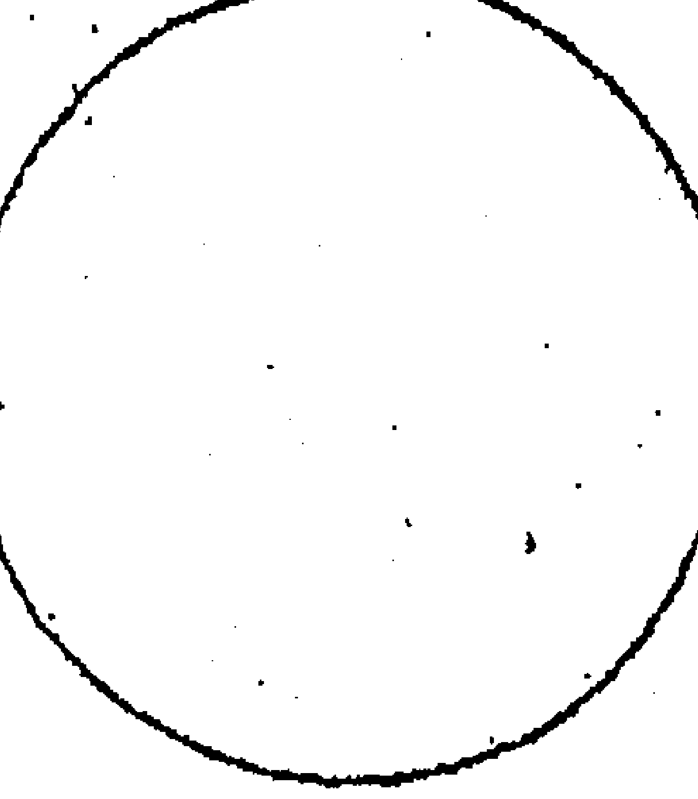

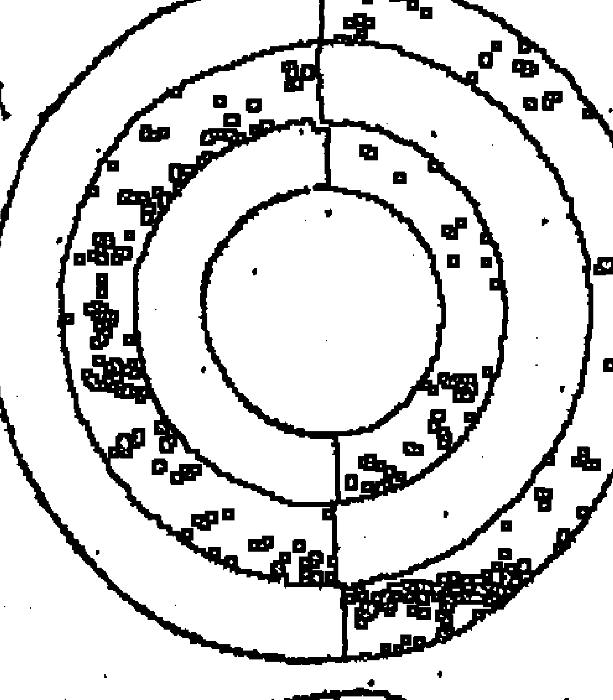

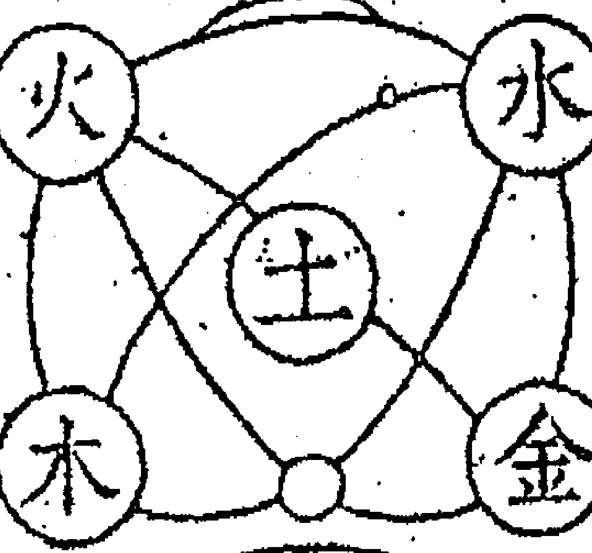

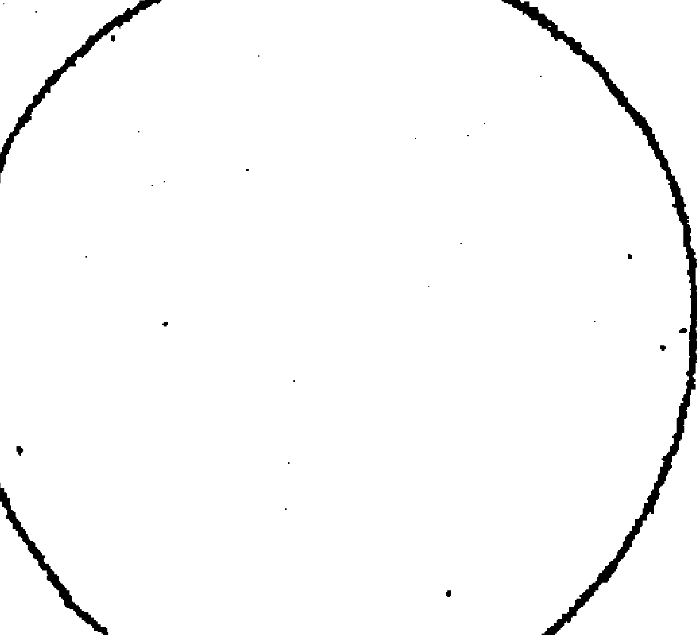

> 博物彙編藝術典第七百二十一卷術數部彙考十七之二

化生

萬物

# 二十四節氣圖

# 十二生旺圖

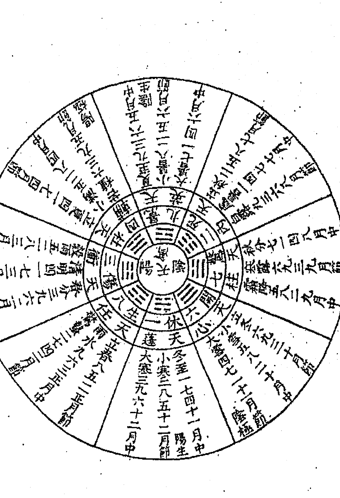

# 陽道歌

- 冬至驚蟄一七四
- 春分大寒三九六
- 穀雨小滿五二元
- 立夏清明四一七

# 陰道歌

- 小寒一八五同推
- 芒種六三九是真
- 立春八五二相隨
- 九六三從雨水期
- 小暑八五重逢
- 立秋二五八流通
- 大雪四七一相同
- 立冬寒露六九三

# 陽上候一局圖

# 陰上候九局圖

# 冬至

# 夏至

# 道中侯七局圖
# 式下侯四局圖

# 遁中侯三局圖
# 式下侯六局圖

若能下達陰陽理天地都來一掌中

理者朱文公曰未有天地之先先有此理能明遁法一理二氣三才四象五行六甲七曜八門九星皆在於掌握之中起也

軒轅黃帝戰蚩尤

黃帝姓公孫又曰姬姓諱軒轅有熊國君少典子也母見電光繞樞星感而生帝於軒轅之丘因名軒轅陰陽激曜曰電樞星北斗第一星也帝生而神靈弱而能言幼而徇齊長而敦敏成而聰明是時神農氏世衰諸侯相侵伐炎帝榆罔弗能征於是軒轅習用干戈以征不享諸侯咸來賓從炎帝榆罔侵陵諸侯益叛之軒轅修德治兵與炎帝榆罔戰於阪泉之野克之

涿鹿經今苦未休

涿鹿乃郡名屬北平今涿州也蚩尤姜姓炎帝之裔也好兵喜亂作刀戟大弩以暴虐天下嘯尤銅鐵額其頭堅如銅鐵也謂陰陽能起昏霧迷軍士霧乃陰陽蒙冒之氣軒轅作指南車上有樓四角刻木爲龍又刻仙人於上車雖回轉手常指南用子午盤針以定四方與蚩尤戰於涿鹿，遂擒蚩尤，戮於中冀。號曰「絕轡之野」。於是諸侯咸歸軒轅，遂推代神農氏，為天子。是為黃帝

偶夢天神授符訣，登壇致祭，謹虔修。黃帝夢大風吹天下之塵垢皆去，又夢人執千鈞之弩，驅羊萬羣。帝寤而嘆曰：「風為號令，力政者也。土去而后在也。天下豈有風姓、后名者哉？夫千鈞之弩，異力也。馬牛數萬，牧民為善者也。天下豈有姓力、名牧者哉？」龍甲云：黃帝致祭於天，有感。夜三更時分，忽見軒轅丘上神光繞遠，天鼓大震。召紀官同往視之，乃彩鳳自天降，銜玉匣一端。長九寸，按九宮；闊八寸，按八卦。黃帝啟匣視之，中有天篆文，冊龍甲神章一十八籍。命容神明正其字，乃知是除奸邪、滅叛安邦之書。帝遂喜，得天時，以立丘山，為土德。王命羲和占日，尚儀占月，車區占風。總探五行之情，占斗綱所建。於是始作甲子，容成造曆，隸首算數，蒼頡制字，伶倫制律呂，車區占星氣。容成兼而總之。

神龍負圖出洛水，彩鳳銜書碧雲裏。彩鳳銜書即上文龍甲神章也。龍負圖者，乃伏羲時龍馬負圖。龍馬者，天地之精，其為形也，馬身龍鱗，故謂之龍馬。高八尺五寸，長頸，骼上有翼，蹈水不沒。聖人在位有圖出於孟河也洛水者乃洛書出於神禹治水時神龜負文呈瑞而於背九數春秋緯乃云河以通乾出天苞洛以流坤吐地符河龍圖發洛龜書感河圖有九篇洛書有六篇輓之畔未有此事今云神龍負圖出洛水者總河圖洛書而言也洛雖未出書而風后演數與之暗合也解下文

黃帝龍圖

河圖之命也。遣風后演之而為遁甲造式三層以法三才上層象天而置九星中層象人以開八門下層象地以分八卦以鎮八方隨冬夏二至立陰陽二遁一順一逆以布三奇六儀風后因伏羲先天之卦乾起於南以序而生三子坤起於北以序而生三女縣辭曰天尊地卑乾坤定矣乾南坤北天地自然之定位故乾父居南陽氣以生以降而生物故乾一索而生長男震在東北再索而生中男坎居正西三索而生少男艮居西北陽老歸息於中宮也坤母居北陰氣以升而生物故坤一索而生長女巽在西南再索而生中女離居正東三索而生少女兌居東南陰老而歸息於中宮也天數以陽出陰入者自數多而出於數少也入者自數少而入於數多也蓋天開於子為天地之原形萬物從微至著始發於子上為一以生序行於西南巽上而為二行於正東離上而為三行至東南兌上而為四既而歸息於中宮而為五此陰數自少順行至多而爲入也夫陰極則陽生自而生自於中宮逆西北艮上而爲六逆行正西坎上而爲七逆行東北震上而爲八逆行正南乾上而爲九天數以九八七六爲順地數以一二三四爲逆今陽順則陰逆陽而成九宮正合後天洛書之數也

夫萬法莫不出於河圖河圖之數天一生水地六成之居北地二生火天七成之居南天三生木地八成之居東地四生金天九成之居西天五生土地十成之居中生數不可移成數可移天一之水天三之木天五之土皆陽動所生不待作爲故天一即居正北合洛書之坎一天三即居正東合洛書之震三天五即居中央合洛書之中五也地二之火地四之金乃陰靜之生也陰者女人之象不能自立必從夫而立屬地二必偶天一而成二火有形而無質其氣虛必加數補之三三而得九處於南方而合離九之數也故地四必偶天三而成七金有形有質矣不須重之副七數居西方而合洛書兌七之數爲生數不可移但可以配偶而各居於本方也成數可移天道左旋折河圖南方成數天七補東南隅之空加七七四十九數以除五九四十五止爲四數合洛書之巽四故居東南焉以河圖北方之成數地六補西北隅之空加六六三十六數合洛書之乾六故居西北焉以河圖東方之成數地八補東北維之空加上八八六十四數除六上不論止用四數加一倍再加四算乃一二四數得八合洛書艮八之數故艮居東北也以河圖西方之成數天九補西南維之空加算九九八十一數除八上不論止用一數加一倍算得一二數合洛書坤二之數故坤居西南也然而東西方之成數用加一倍算南北不用加倍者亦以東西之氣與南北之氣不同蓋南極北極為天地之樞紐天與七政晝夜行而不息此針之所以指南有以見東西之氣常動而實南北之氣少動而虛也蓋指南北之氣抵極旋軸不若東西氣之升降輪轉南北之數不用加倍者蓋南北之有極也

關子明曰河圖洛書相為表裏八卦九章相為經緯是也

又謂河圖合洛書先天合後天者此也

# 古今醫書算月

# 河圖

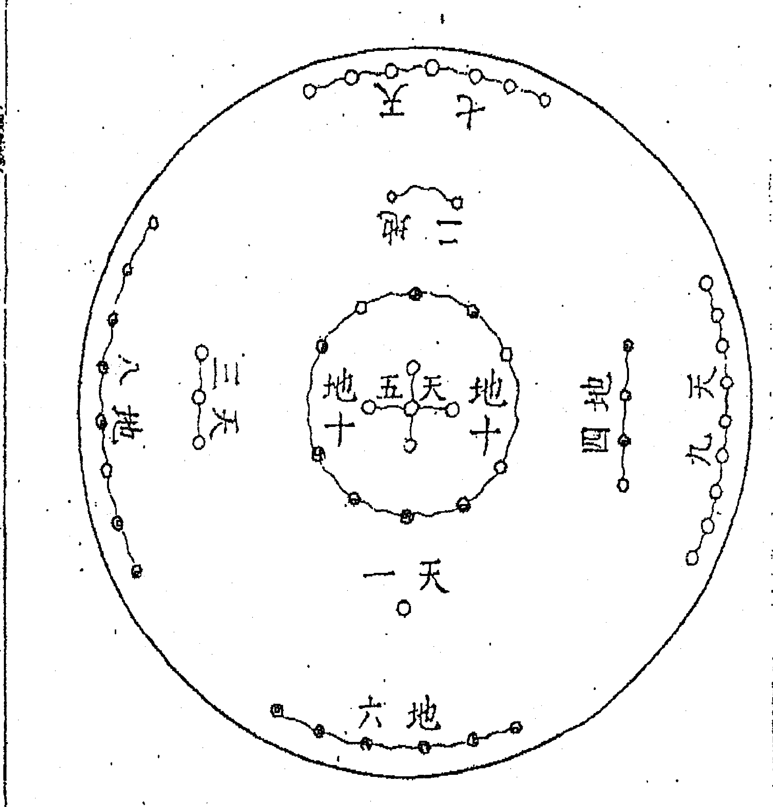

# 洛書

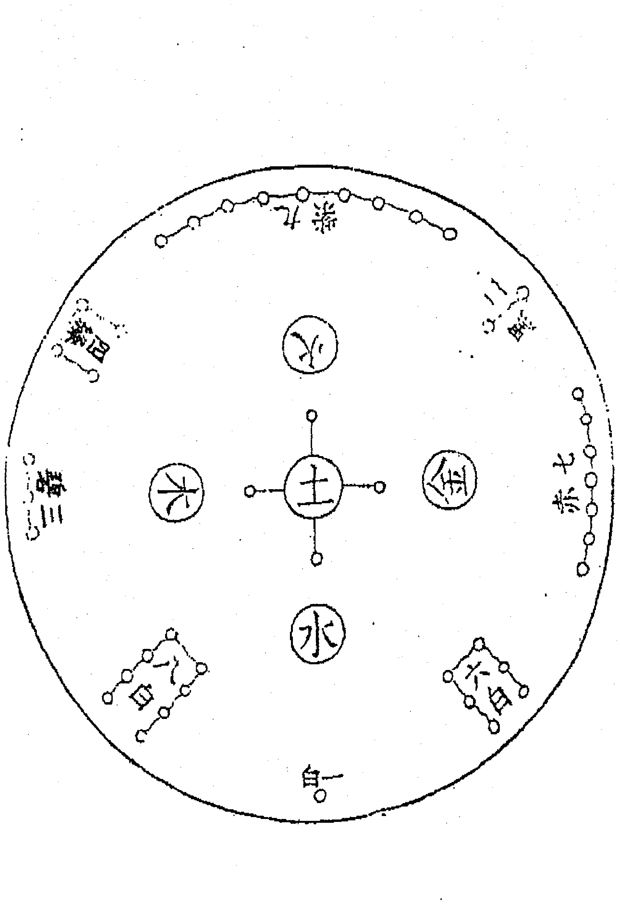

龍馬出於孟河高八尺五寸長頸骼上有翼旁有垂尾聖人在位天不變道地不變寶龍馬出焉堯沉壁於洛元龜負書出焉背上赤文朱字　天錫禹書神龜負文而出列於背有數皆九因命風后演成文遁甲奇門從此始

帝得風后於海隅登以爲相得力較於大禹進以爲將風后作兵法十三篇孤虛法十二卷始立遁甲一千八十局者儀也遞爲直符

謂六甲六儀也天乙之貴神也常隱於六戊之下蓋取用兵機微之理通於神明之德故以遁甲爲名也奇者乙丙丁爲三奇也門者休生傷杜景死驚開之八門詳見下文

一千八十當時制

劉朴菴太元作用三元六甲名台吉奇書云四千三百二十條神仙節元歸歸蓋節四千三百二十之籌而歸於一千八十之簡也

論古法黃帝始創奇門有四千三百二十條乃一節管三元上元中元下元各五日三元共十五日五日　每元管六十局乃一元五日足六十八局乃一節管三元共十五日一百八十時也　一歲二十四節計四千三百二十局時乃六十局奇也一歲二十四節一節管三元乃十五日一百八十時故有一百八十局也　一千八百時二十節乃三千六百時其四節又該七百二十時是二十四節共得四千三百二十時故有四千三百二十局也　風后于六司書卷之

博約齋續纂奇門第七百七十七卷術數部纂考十七之七

# 正合奇勝序

后又制奇門爲一千八十局乃一節三元四十五局風后約冗歸於簡也夫一節管三元一元十五局管一百八十時三元四十五局此一節四十五局二十節得九百局其四節又得一百八十局是共該一千八十局一千八十箇時也由是觀之是風后又總黃帝四局一局也四箇一千八十共是四千三百二十局也夫一歲三百六十日每日一十一時一百日該一千一百時三百日則該三千六百箇時其六十日又該七百二十箇時以七百二十總前三千六百箇時共得四千三百二十時此硬例也風后奇門以八卦管八節一節管三氣一氣管三候分天地人元一候五日七十二候共三百六十日乃損四候而共春六十時成一局七十二候共三百六十日共成一十八局共一千八十時故立一千八十局

太公刪成七十二

至周時有呂尚者東海上人窮困年老漁釣至周西伯將獵卜之曰非龍非彫非熊非羆非虎非貔所獲霸王之輔果遇呂尚於渭水之陽太公諳兵法善布奇門刪成一節三元乃是一個節氣分天地人三元三候也如冬至上元陽一局冬至中元陽七局冬至下元是陽四局餘倣此

此一節分三元一十四節分得七十二元故立七十二活局立太公爲軍師助周伐纣也

遂于漢代張子房一十八局爲精藝

張良字子房彼有黃石公知秦亡漢之將興故以書授子房于邳北扶高祖得天下封子房爲留侯子房刪捷冬至十二節爲陽九局夏至十二節爲陰九局一歲計之一十八局此活局之捷徑也共十八局七十二局皆不能越一千八十局矣作硬局則該一千八十局作活局則有七十二局然二十八局之圖雖簡而時則仍有一千八十也是爲風后之法則萬世不易也

先論風后一節管三元四十五局雖看解程子当之之四千三百二十者乃一節管三元六十時三元乃三百八十時此硬數也風后一千八十局一節三元四十五乃折算之一元六十三元該一百八十也此一元四之一該十五四節十五乃六十也三元该四十五也乃是算数之说天一元该六十时今止云十五时为局则是撤去四十五时为有此理其实乃是合取四节之元而看十八局之一局也如冬至下惊蛰上清明中立夏中此四候共看阳遁一局也

先须掌上排九宫

坎一坤二震三巽四中五乾六兑七艮八离九乃九宫也天有九星以镇九宫

# 博物彙編藝術典第七百三十三卷術數部纂考十七之八

地有九宮以應九州其式托以靈龜洛書之數戴九履一左三右七二四爲肩六八爲足五中宮者土火之子金之母所寄理於西南坤位也坎一白水居正北坤二黑土居西南震三碧木居正東巽四綠木居東南中五黃土居中宫乾六白金居西北兌七赤金居正西艮八白土居東北離九紫火居正南

起例詩曰

坎居一位是蓬休　丙死坤宮第一流　更有衝傷并輔杜　震三巽四總篇頭

禽星死五開心六　驚柱常從七兌遊　更有生任居艮八　九尋英景問離求

縱橫十五在其中

洛書之數東三南北九北一西七中五。東直三宮巽四震三艮八共得十五數。南横三宮巽四離九坤二共得十五數。東西中二宮震三中五兌七共得十五數。北横三宮艮八坎一乾六共得十五數。東北中西南三宮艮八中五坤二共得十五數。東南中西北三宮巽四中五乾六共得十五數。直過合十五縱過合十五橫過合十五對過合十五乃天地萬世不易之數

> 朱子曰
> 吾觀陰陽化　升降八紘中　前瞻既無始　後際那有終
> 至理諒斯存　萬世與今同　誰云混沌死　幻語驚盲聾

# 靈 龜 背 數 圖

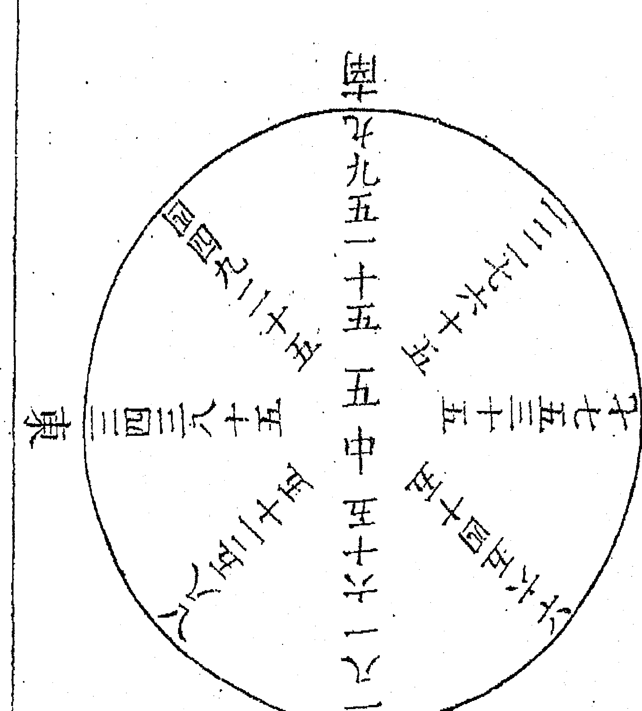

朱子龜背圖說

器常大無外旁礴下深廣陰陽無停機寒暑互來往皇羲古聖神妙契一俯仰不待窺馬圖人文已宣開渾然一理貫昭晰非象陶珍重無極翁爲我重指掌

# 八卦八節之圖

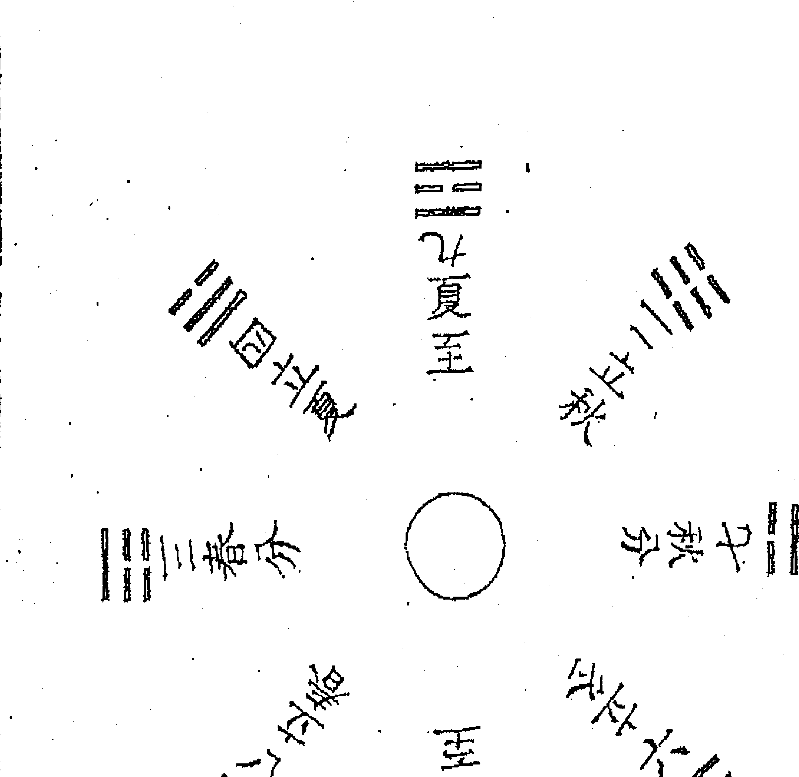

立春艮上青色
春分震位好詳推
立夏巽宮尋本位
夏至離火焰當時
立秋坤上從頭數
秋分兌位定無移
立冬但向乾宮取
冬至坎宮邊順飛

# 次將八卦論八節

天有八風以直八卦地有八方以應八節節有三氣氣有二候如是八節以因之成二十四氣更乘之七十二候備焉

- 冬至一宮坎卦
- 立春八宮艮卦
- 春分三宮震卦
- 立夏四宮巽卦
- 夏至九宮離卦
- 立秋二宮坤卦
- 秋分七宮兌卦
- 立冬六宮乾卦

十一月建子乃冬至氣陰極陽生也子為天正周以為歲首也配地雷復卦十二月建丑為地正商以為歲首也配地澤臨卦正月建寅為人正夏以為歲首也配地天泰卦乃三陽開泰也自漢武帝以來並用夏正建寅之月為歲首也八節立春驚蟄清明立夏芒種小暑立秋白露寒露立冬大雪小寒也

一氣統三為正合

氣者中氣雨水春分穀雨小滿夏至大暑處暑秋分霜降小雪冬至大寒也經云冬至小寒及大寒天地人元一二三立春雨水井驚蟄依辰順增八九一春分清明井穀雨但起震宮三四五立夏小滿芒種氣四五六分列成列夏至小暑及大暑八七分退數立秋處暑并白露從一卻行於一九秋分寒露及霜降七六五分依此向立冬小雪并大雪六五四分依此訣

統三者一節分三元即三候又曰三者三甲也上局仲甲謂甲己之日夜半子時乃甲子時丙辛之日日中甲午時是也此時關格刑德在門用兵先舉者敗不可出入利以逃亡主客并凶

中局孟甲謂戊癸之日平旦甲寅時乙庚之日晡時甲申是也此時陽氣在內陰氣在外利藏兵固守不可出師利主不利客

下局季甲謂丁壬之日食時甲辰甲己之日黃昏甲戌此時陽氣在外陰氣在內利出兵動眾百事吉利客不利主

又云六甲之日夜半子二甲皆合謂今日是甲直符與時皆是甲故名三甲合也

陰陽二遁分順逆一氣三元人莫測

冬至後用陽遁順飛於坎一宮起如冬至上元陽一局順遁甲子戊起一宮甲戌己二宮甲申庚三宮甲午辛四宮甲辰壬五宮甲寅癸六宮丁奇七宮丙奇八宮乙奇九宮乃儀順奇逆也夏至後用陰遁逆飛於離九宮起如夏至上元陰九局逆遁甲子戊起於九宮甲戌己八宮甲申庚七宮甲午辛六宮甲辰壬五宮甲寅癸四宮丁奇三宮丙奇二宮乙奇一宮乃儀逆奇順也

一局三奇六儀備矣甲戊己庚辛壬癸丁丙乙者即九星值符之使也凡占者以甲爲首以戊己庚辛壬癸爲六儀六儀者即六甲也甲子隱於戊甲戌隱於己甲申隱於庚甲午隱於辛甲辰隱於壬甲寅隱於癸故曰六儀也

三奇者乙丙丁也乙爲日奇丙爲月奇丁爲星奇甲爲十干之首故以甲爲首而用三奇者以甲畏庚故用乙妹妻庚以和解之又懼庚之剛烈故用丙丁火克其金此三奇之用也

又曰甲者東方青龍也乙者甲之子女也丙者甲之子孫也丁者甲之女也戊己庚辛壬癸者甲之臣佐也九星者甲之符使也八門者甲之開闔也八神者甲之護從也凡用遁者皆以甲爲主故曰直符直符者甲也直使者即九星之一也

一曰天乙貴神即直符也又曰天乙在天主十二將在地主十二辰在人主十二命在方主十二向凡占事以天乙爲主以太歲月建爲客以值符值使爲用神以三奇六儀八門九星八神爲吉凶之應也

## 超神接气

九星为直符，八门为直使。有顺阳使逆行，阴经术不願隐伏之事也。一节分三元，子午卯酉为上元，寅申巳亥为中元，辰戌丑未为下元。若不明三元用奇，不準，主有不测也。

## 起例诗曰

甲己庚辛壬癸顺，阳仪丁丙乙逆行。休门随君顺数去，甲子起时当仔细。阴转六仪当逆推，乙丙丁奇顺而随。门随始时同逆起，休门排位顺风吹。

五日都来换一元。甲子至戊辰五日为上元甲，己巳至癸酉五日为中元甲，戌至戊寅五日为下元。己卯至癸未五日为上元甲，申至戊子五日为中元己，丑至癸巳五日为下元甲，午至戊戌五日为上元己，亥至癸卯五日为中元甲，辰至戊申五日为下元己，酉至癸丑五日为上元甲，寅至戊午五日为中元己，未至癸亥五日为下元。

接气超神为谁的？超者越过也，神者进神也。甲子、己卯、甲午、己酉乃进神为符头迎接也。气者节气也。超神者，谓节气未到，而甲子、己卯之符头先到，为之超。接气者，谓甲子、己卯之符头未到，而节气先至，为之接。引证如淳祐六年前四月十三日壬申交立夏节，而本月初五日是甲子已到，即以立夏节用。立夏前九月矣，则合前初五日起超在先，借用立夏上局奇。自初十日己巳为立夏中局奇，自甲戌五日用立夏下局奇，乃先得奇后交节为速，谓之超神速者也。

又如淳祐七年丁未二月二十三日虽交清明节上局奇，然二十五日方是己酉，方用清明上局奇，此乃先交节而后得奇，为接，故谓接气迟。至二十四日戊申，仍用春分下局，此是己亥本节而奇星尚用前节也。

又如其年六月二十八日己酉交立秋节，正值节与日辰同到，其日即是立秋上局，谓之正授奇。凡换奇皆甲子时换也。须知闰奇之法，方能超接得真也。积日以成闰月，积时以成闰奇。超接正授闰有法，分金定刻。离明局以五日一换，过一节气，过换大局。凡一月节气，必三十日零五时一刻。以三十日分六局，以余五时一刻置闰。超神不过十日，过芒种、大雪起，过九日即置闰也。

假如丙戌年五月初一日己卯，至初九日丁亥已刻，过九日，于置闰，即用初一日己卯作芒种上超局，初六日甲申作芒种中局，十一日己丑作芒种下局。毕于此，重用一局作三奇闰法，以十六日甲午作芒种闰奇，此超神置闰之法也。二十四己交夏至，是谓置闰，借夏之局以补春夏之不足也。

博物彙编艺术典第七百二十二卷术数部彙考十七之二十一。

至七日，其五月小尽，至六月初一日己酉方作夏至上局，初七日甲寅作夏至中局，十一日己未作夏至下局，以为接气奇也。闰奇之法，每遇芒种、大雪一节内，如是超过九日，即合置闰，以归节气所余五时一刻也。盖奇以冬夏二至分顺逆，故于二至之前搅闰，以均其气，无不应也。但近世俗师不知超接正闰之法，止接成局以择奇门日时，盖缘上局反作下局，颠倒错乱，俱无应验。一曰以为不足信，则是起例不明，置闰无法，非局之不验，真择焉不精故也。

- 认取九宫为九星
  - 天蓬贪狼主坎一宫属水
  - 天芮巨门主坤二宫属土
  - 天冲禄存主震三宫属木
  - 天辅文曲主巽四宫属木
  - 天禽廉贞主五中宫属土
  - 天心武曲主乾六宫属金
  - 天柱破军主兑七宫属金
  - 天任左辅主艮八宫属土
  - 天英右弼主离九宫属火

八门又逐九宫行。

## 九宫配八门永定例

- 坎宫蓬星休门
- 艮宫任星生门
- 震宫冲星伤门
- 巽宫辅星杜门
- 中宫禽星死门
- 兑宫柱星惊门
- 离宫英星景门
- 乾宫心星开门
- 坤宫芮星死门

九宫遁甲为直符，八门直使自分明。如阳遁一局甲子时起坎一宫，即以坎宫天蓬为直符，休门为直使。甲戌时起坤二宫，即以天芮为直符，死门为直使。甲申时起震三宫，即以天冲为直符，伤门为直使。甲午时起巽四宫，即以天辅为直符，杜门为直使。甲辰时起中五宫，即以天禽为直符，配以死门为直使。甲寅时起乾六宫，即以天心为直符，开门为直使。余例仿此。

符上之门为直使，十时一位堪凭据。适取时旬甲头为直符，如阳遁一局甲子在坎宫，天蓬为甲子时直符，则休门即为直使，管至癸酉十时住。甲戌在坤宫，天芮为本时直符，则死门即为直使，管至癸未十时住。又换甲申符头在震，天冲为本时直符，则伤门为直使，管至癸巳十时住。又换甲午在巽，天辅为直符，则杜门为直使，管至癸卯十时住。又换甲辰在中，天禽为直符，则死门为直使，管至癸丑十时住。又换甲寅在乾宫，天心为直符，则开门为直使，管至癸亥十时住。阳一局六十时辰，而又仙局余局做此，阴遁同例，以遁推。

直符常遁加时干，九星逢任冲辅英芮柱心禽也，为直符常随时干。假如冬至上元阳遁一局，图内庚日丙子时，其地盘甲申泊三宫，天冲管事。乙庚日申时乃甲申时也，就是冲三直符，故此直符常遁加时干也。奇仪总要歌云：星符每逐时干转，直使常随天乙奔，同此意也。永定阳遁顺仪逆奇，阴遁逆仪顺奇，皆主论也。

直使逆顺遁宫去，八门休生伤杜景死惊开为直使也。原天盘上休在坎，生在艮，伤在震，乃三宫之定位也。假如冬至上元阳一局，图内庚日申时，就以伤门为直使，乃时干甲申居三宫也。阳遁顺飞，阴遁逆飞，故云直使逆顺遁宫去。

大甲元号六仪名，符应经云：六甲者天之贵神也，常隐于六仪之下。六仪者，戊己庚辛壬癸也。甲子同六戊，甲戌同六己，甲申同六庚，甲午同六辛，甲辰同六壬，甲寅同六癸。

三奇即是乙丙丁，三奇者，按经云：日乃木之华，阳之精所成，乙木为日奇也。本理按经云：正月日出于乙，故以乙为日奇。丁火南方离明之象，老人星凡形见于丁位，故以丁为星奇。月照交到丙而下明，故丙为月奇也。大乙属太阳，六丙属太阴，六丁属星曜，乃三光也。遁甲之法，以甲为太乙人君之象，为十干之首，常随六仪之下，故谓之遁甲。所畏者庚金，能克甲木，庚为七煞之仇也。乙乃甲之妹，甲以乙妹妻庚，乙庚合而能救甲，故乙为一奇。丙乃甲之子，丙火能克庚金而救甲，故丙为一奇。丁乃甲之女，丁火亦能克庚金而救甲，故丁为三奇。经云：天上三奇乙丙丁者，出于贵人之干德，游行十二支辰，以阳贵人顺行，先天坤卦起子，则乙德在丑，丙德在寅，丁德在卯，三干之德相联而无间断。以阴贵人逆行，后天坤卦起子，则乙德在未，丙德在午，丁德在巳，三干之德相联亦无间断。余六仪贵人所涉，或问天空，或问丽网，皆不相联。盖三奇能制凶煞者，以阳遁顺仪奇游布，阴遁逆仪奇顺行。

千行，假如冬至阳一局，图内坎上起甲子戊，坤上甲戌己，震上甲申庚，巽上甲午辛，五中宫甲辰壬，乾上甲寅癸，兑上丁奇，艮上丙奇，离上乙奇，乃仪顺去奇逆行也。夏至后十一节惟用阴遁，逆布六仪，顺布三奇，星符亦随时干行。假如夏至阴九局，图内离九宫起甲子戊，艮上甲戌己，兑上甲申庚，乾上甲午辛，五中宫甲辰壬，巽上甲寅癸，震上丁奇，坤上丙奇，坎上乙奇，乃仪逆奇顺行也。

吉门偶尔合三奇，值此虽云百事宜。开休生乃北方之三白，最吉，乃三吉门合乙丙丁三奇，其中合得一位共临之方，乃三奇之妙，此时宜出兵征讨，发号施令，修造埋葬，婚娶安社稷，化人民，百事大吉之兆。五总龟云：大抵要得开休生三门，则用事为吉，更有三奇开之可用，无疑。如得门不得奇，亦可用；得奇不得门，终非吉。奇门俱不得，即凶。当以其大小轻重等而用之。

更合从傍加检点，余宫不可有微疵。如得开休生三吉门，又合上下盘三奇，是此宫有奇门，虽吉，然须检点三盘上所加余七宫，囚星所在，未可以此即为全吉。如合天地人三遁，为跌穴、龙反首、知三天辅、玉女守门、三奇所及、游六仪、羲和制伏、惧怡等，故为吉也。如合火入金、金入火、虎猖狂、龙逃走、入江、蛇天矫、避五、击刑、制损明、入墓、反伏吟、飞宫、天乙、天网、门迫之类，则为凶也。

三奇得使诚堪使，葛洪曰：若得三奇得使，尤宜其良。谓在六甲之上，自得所使之奇。甲戊、甲午乙为使；甲子、甲申丙为使；甲辰、甲寅丁为使。

假如阳遁三局乙庚之日丁亥时，此乙奇下临九宫，甲午是为乙行得使。

假如阴遁三局丙辛日壬辰时，此乙奇加地盘甲午，为乙奇得使。

又如阳遁五局丙辛之日己亥时，此时丁奇下临四宫，合甲辰为丁奇得使也。三奇得使其法，以天上甲子起中间一宫而行，则乙奇到甲戌，丙奇到甲子，丁奇到甲寅。地下甲子起戊，地者妇人之道，不能自立，必假夫而立，故甲戌假对宫坤辰上起甲，则乙奇在甲午，丙奇在甲申，丁奇在甲戌，取对冲，故奇甲辰也。

## 三奇得使图

乙奇加甲戌、甲午，丙奇加甲子、甲申，丁奇加甲辰、甲寅，是谓三奇得使，最为吉也。

又例，甲为君位，三奇乃臣辅，避旺地，只居生库宫为自得所使也。自午起甲顺行，则乙奇到未，木库宫也；自戌起甲顺行，则乙奇到亥，长生宫也；自子起甲顺行，则丙奇到寅，火库也；丁奇亦属火，又属金，丙既居生库宫，则丁火金之临长生宫也。

六甲遇之非小补，经曰：时加六甲，一开一阖，上下交接。又曰：能知三甲，一开一阖；不知三甲，六盘阖。六甲者，甲子、甲戌、甲申、甲午、甲辰、甲寅也。阳星加时为开，阳星天蓬、天任、天冲、天辅、天禽；阴星加时为阖，阴星天英、天芮、天柱、天心。六甲之时，阖时百事凶，开时宜战斗往来，百事吉。又曰：甲为青龙，利以远行，将兵客胜，忧无，阖喜有，宜谒尊上，见贵人，有喜，移徙，嫁娶，百事吉。不可行谴怒及鞭杖事。

假如阳遁九局甲己之日黄昏，得天任阳星加时为开，百事吉。若无奇门合得此局，亦得次吉，乃小补云。

乙马逢犬，丙鼠猴，六丁玉女骑龙虎。乙奇加甲戌为马逢犬，丙奇加甲子为鼠，加甲申为猴；丁奇加甲辰为龙，加甲寅为虎，谓三奇得使，最为吉也。

经曰：时加六乙，往来恍惚，与神俱出。谓六乙为日奇，宜从天上六乙出，既随日奇恍惚，如神人无见者。将兵客胜，阖忧无，开喜有，行人将至，逢饮饯、移徙、入官、市贾、嫁娶吉，不可行远，怨鞭杖责事。

假如冬至上元阳一局，甲己之日，天蓬为直符，至乙丑时，丁在九宫，以直符加时于此时，天上六乙下临一宫，出北方吉。

时加六丙，莫往莫兵，此时候主厌伏兵灾。将兵闻忧无，闻喜有，入官得仙，市贾有利。丙为日奇，又为天威，丙火以销金，精兵不起。若攻伐者，从天上六丙出，既挟月奇，又乘天威丙火相随，故曰厌伏兵灾。

假如冬至下元阳四局，甲己之日平旦，平寅时，此时六丙下临六宫，宜出西北方吉。

丁为三奇之灵，凡出入用兵战斗皆吉。故曰：能知六丁，出幽入冥，至老不刑，刀虽临头，犹安不惊。六丁者，六甲之阴神。丁卯之神字文仲，丁丑之神字文公，丁亥之神字文通，丁未之神字文宇文卿，丁巳之神字巨卿。凡争斗、出入、行来，六丁之神常呼其名，所谓三奇之灵。六丁者，丁卯为甲子之阴故也。丁奇入宫会甲辰、甲寅，乃六丁骑龙虎也，天盘六丁加地盘甲寅、甲辰是也。

又曰：时加六丁，出幽入冥。又六丁为太阴，可以藏形，人皆不见，敌人不敢侵。将兵主胜，开忧喜各半，可以请谒，利嫁娶及阴私事，入官商贾吉。

假如立夏下元阳遁二局，甲己之日夜半甲子时，日出丁卯时，此时六丁在东北，直符天丙加时于即六甲下临二宫，出西南方吉。

又有三奇游六仪，号为玉女守门扉。三奇游六仪者，乃天上三奇乙丙丁，地下三奇甲戊庚，游于甲子戊、甲戌己、甲申庚、甲午辛、甲辰壬、甲寅癸此六仪也。三元经曰：三奇游六仪，利以宫廷宴会喜乐之事。玉女守门者，谓丁为玉女，而会天乙直使之门也。如阳遁一局顺仪逆奇，地盘丁在兑，而以天乙直使休门加甲子时，休门起坎，乙丑时休门到巽，戊辰时休门到中，己巳时休门到乾，庚午时休门到兑，地盘丁奇兑上，故甲子旬庚午时休门到兑，玉女守门也。

又接前数，辛未时休门到艮，壬申休门到离，癸酉休门到坎。直使十时一易，甲戊时以死门到坤为直使，乙亥时死门在震，丙子时死门在巽，丁丑时死门在中宫，戊寅时死门在乾，己卯时死门到兑，地盘丁奇兑上，故甲戌己卯时为玉女守门也。

甲申时以伤门直使震宫，乙酉时伤门到巽，丙戌时伤门到中，丁亥时伤门到乾，戊子时伤门到兑，地盘丁奇兑上，故甲申旬戊子时为玉女守门也。

又累数至甲午旬，以丁酉时为玉女守门时也。丙申时杜门到乾，丁酉时杜门直使到兑，地盘丁奇兑上。

又累累数到甲辰时，以死门直使到中宫，乙巳时死门直使到兑，地盘丁奇兑上，故甲辰旬丙午时为玉女守门时也。

又累累数去到甲寅时，开门直使到乾，乙卯时开门直使到兑宫，地盘丁奇兑上，故甲寅旬乙卯时为玉女守门时也。

博物彙编艺术典第七百二十二卷术数部彙考十七之十七。

## 奇门遁甲

- 甲子用庚午
- 甲戌用己卯
- 甲申用戊子
- 甲午用丁酉
- 甲辰用丙午
- 甲寅用乙卯

甲子用庚午者，甲子同六戊，用五子元遁，戊癸逢壬子起，壬子七数而见戊字，故甲子用七数庚午也。

甲戌用己卯者，甲戌同六己，用五子元遁，甲己还加甲起，甲子六数而见己字，故甲戌用六数己卯也。

甲申用戊子者，甲申同六庚，用五子元遁，乙庚丙作初起，丙子五数而见庚字，故甲申用五数戊子也。

甲午用丁酉者，甲午同六辛，用五子元遁，丙辛生戊子起，戊子四数而见辛字，故甲午用四数丁酉也。

甲辰用丙午者，甲辰同六壬，用五子元遁，丁壬庚子居起，庚子三数而见壬字，故甲辰用三数丙午也。

甲寅用乙卯者，甲寅同六癸，用五子元遁，戊癸逢壬子起，壬子二数而见癸字，故甲寅用二数乙卯也。

著阴私和合事，诸君但向此中推。四户以月建加本时，却随除危定开在何处，即是地四户。

若下按八门图。

## 与天三门同宫尤吉

| 天罡辰 | 传送申 | 神后子 |
| :--- | :--- | :--- |
| 太乙巳 | 从魁酉 | 大吉丑 |
| 胜光午 | 河魁戌 | 功曹寅 |
| 小吉未 | 登明亥 | 太冲卯 |

## 天三门之图

## 太阳过宫

- 正月亥 二月戌
- 三月酉 四月申
- 五月未 六月午
- 七月巳 八月辰
- 九月卯 十月寅
- 十一月丑 十二月子

看授时历。

入式歌云：天乙会合女阴私。所谓天乙会合和阴私之事，要在三奇临六仪，与三奇吉门合太阴、太冲、从魁、小吉加地四户，是谓福贪，远行出入皆吉。地四户者，除定危开也。

假如正月建寅，卯上除，午上定，酉上危，子上开，更得三奇临之，大吉。二月则从卯上起建也。凡阴谋事，用太阴、太冲、小吉、从魁加地四户而去，解见下文。

天三门兮地四户，问君此法如何处？太冲小吉与从魁，此是天门私出路；地户除危定与开，举事皆从此中去。天门有三，乃从魁、小吉、太冲三位也。起法以月将加本时，即寻从魁、小吉、太冲三位为天三门也。

起月将法，以授时历看，审订太阳过宫方可用。如去年十二月大寒节某日时刻，日躔元枵之次，太阳在子，以神后出将加用时。世俗但知登明为正月将，却不知登明是亥，犹待雨水节后某日时刻，日躔娵訾之次，太阳方过亥宫，以登明为天月将方可用。

## 地四户之图

出入通天之局。

加葬地四户，年月日时周。

六合太阴太常君，三辰元是地私门。更得奇门相照耀，出门百事总欣欣。阳时利击，阴时宜陜，阳先击，阴后陜。凡欲击者，为破而击之；陜者，密而去之。其败军宜向六合下走得出也。

假如以六合、太阴、太常为三辰，依图推之，看在何方。日支自亥至辰为阳，用阳贵人，阳贵人用上一字；自巳至戌为阴，用阴贵人，阴贵人用下一字。

假如丁亥日，亥为阳日，丙丁猪鸡位，则亥猪为阳日贵人，须用贵人加亥上顺数去，却看六合、太阴在何处，即是地私门。此只论日不论时，然须得奇门方可用。

一例审太阳过宫，以月将加用时，顺寻本日贵人起星，求地私门。

## 地私门阳贵人顺行之图

## 地私门阴贵人逆行之图

求本时日干禄在何宫，以加时寻天乙贵人所临之处，地私门也。起星要。

求本日日干贵人在何宫，以加时寻天乙贵人所临之处，地私门也。起星要。

求本时日干禄在何宫，以加时寻天乙贵人所临之处，地私门也。起星要。

求本日日干贵人在何宫，以加时寻天乙贵人所临之处，地私门也。起星要。

> 太冲天马最为要，然有其难逃避。但当乘取天马行，剑戟如山不足忧。天马即太冲也，审月将。遇官即以月将加用时顺宫看太冲在何方，即天马方也。言遇紧急危难仓卒之间，难得奇门，但乘取天马而去，则虽剑戟如林亦能避其祸也。

## 天月将即太阳

- 正月亥
- 二月戌
- 三月酉
- 四月申
- 五月未
- 六月午
- 七月巳
- 八月辰
- 九月卯
- 十月寅
- 十一月丑
- 十二月子

## 地月将即月建

- 正月寅
- 二月卯
- 三月辰
- 四月巳
- 五月午
- 六月未
- 七月申
- 八月酉
- 九月戌
- 十月亥
- 十一月子
- 十二月丑

天马方吉时定局于后。

| 订太阳过宫方选用太冲天马方 | 时辰 |
| :--- | :--- |
| 正月 将太冲天马方 辰巳午未申酉戌亥子丑寅卯 | 子丑寅卯辰巳午未申酉戌亥 |
| 二月 将太冲天马方 巳午未申酉戌亥子丑寅卯辰 | 子丑寅卯辰巳午未申酉戌亥 |
| 三月 将太冲天马方 午未申酉戌亥子丑寅卯辰巳 | 子丑寅卯辰巳午未申酉戌亥 |
| 四月 将太冲天马方 未申酉戌亥子丑寅卯辰巳午 | 子丑寅卯辰巳午未申酉戌亥 |
| 五月 将太冲天马方 申酉戌亥子丑寅卯辰巳午未 | 子丑寅卯辰巳午未申酉戌亥 |
| 六月 将太冲天马方 酉戌亥子丑寅卯辰巳午未申 | 子丑寅卯辰巳午未申酉戌亥 |
| 七月 将太冲天马方 戌亥子丑寅卯辰巳午未申酉 | 子丑寅卯辰巳午未申酉戌亥 |
| 八月 将太冲天马方 亥子丑寅卯辰巳午未申酉戌 | 子丑寅卯辰巳午未申酉戌亥 |
| 九月 将太冲天马方 子丑寅卯辰巳午未申酉戌亥 | 子丑寅卯辰巳午未申酉戌亥 |
| 十月 将太冲天马方 丑寅卯辰巳午未申酉戌亥子 | 子丑寅卯辰巳午未申酉戌亥 |

## 天乙神数全卷十

- 月将太冲天马方寅卯辰巳午未申酉戌亥子丑
- 土神将太冲天马方卯辰巳午未申酉戌亥子丑寅
- 月后神将太冲天马方辰巳午未申酉戌亥子丑寅卯

总论太阳过宫法、天三门、地四户、地私门、太冲天马同例。卷终。

## 艺术典第七百四卷

## 术数部汇考十八

## 奇门遁甲 烟波钓叟歌句解下

| 天气将 | 正月雨水壬 | 二月春分乾 | 三月谷雨辛 |
| :--- | :--- | :--- | :--- |
| | 四月小满庚 | 五月夏至坤 | 六月大暑丁 |
| | 七月处暑丙 | 八月秋分巽 | 九月霜降乙 |
| | 十月小雪甲 | 十一月冬至艮 | 十二月大寒癸 |

| 地气将 | 正月立春子 | 二月惊蛰亥 | 三月清明戌 |
| :--- | :--- | :--- | :--- |
| | 四月立夏酉 | 五月芒种申 | 六月小暑未 |
| | 七月立秋午 | 八月白露巳 | 九月寒露辰 |
| | 十月立冬卯 | 十一月大雪寅 | 十二月小寒丑 |

子丑寅卯辰巳午未申酉戌亥，坤兑乾坎艮震巽离，中央寄于坤，留戊就己，甲己遁符。

## 天符经

| 月份 | 节气 | 天干地支 |
| :--- | :--- | :--- |
| 正月 | 娵訾 | 亥 |
| 二月 | 降娄 | 戌 |
| 三月 | 大梁 | 酉 |
| 四月 | 实沉 | 申 |
| 五月 | 鹑首 | 未 |
| 六月 | 鹑火 | 午 |
| 七月 | 鹑尾 | 巳 |
| 八月 | 寿星 | 辰 |
| 九月 | 大火 | 卯 |
| 十月 | 析木 | 寅 |
| 十一月 | 星纪 | 丑 |
| 十二月 | 元枵 | 子 |

三为生气，五为死，胜在三，冬衰在五，能识避三避五时，造化真机须记取。

三元经曰：天道不远，三五反复。知三避五，恢然独处。三为生气，故避三也；五为害气，故避五也。三为感，五为武，盛于三，衰于五，匹马双轮，无有返期。

假如冬至一局甲己之日，上元阳遁一局，甲己之日生甲子至平旦丙寅时，得三，此时生气，宜举百事；至食时戊辰时，得五，此时害气凶，百事不宜，故避五也。阴遁做此。

一云：直使加震宫，三为生，宜向之；直使加中宫寄二宫，为死，宜避之。

又云：重阳有重吉，谓大将在三宫；重阴有重凶，谓大将在七宫也。三乃数吉也，七乃位凶也。

就中伏吟为最凶天蓬加着地天蓬
九星伏吟上盘天蓬加地盘天蓬
乃九星仍在本宫不动
谓之伏吟。孝服损人口直符伏吟
上盘甲子加地盘甲子大仪推此
汤谓云甲子来加甲子为伏
吟不宜用兵惟宜收敛货财
凡六甲之时门符皆是伏吟
一本云天盘天蓬加地盘天蓬为伏
吟最凶余不与
假令冬至上元阳遁一局
甲己之日夜半生甲子时
天蓬直符加临一宫时干
在宫此名门符皆伏吟也

天蓬若到天英上须知即是反吟宫
九星反吟者天盘一宫上蓬星加地盘九宫
英星上为反吟
余八宫同此直符反吟谓上盘甲子加下盘
甲午
上盘甲戊加下盘甲辰
遇奇门盖之不见凶害
不然灾祸立至
汤谓曰子来加午为反吟
此时不利举兵动众
惟宜散血仓库之事
凡星符对
冲皆反吟

假令冬至上元阳遁一局
甲己日乙丑时六乙在九宫
以天天蓬直符加临时干
在九宫即是直符反吟
八门反吟皆如此
生在生死在死
假令吉宿得奇门
万事皆凶
不堪使
生门在八宫
门不离宫
谓之伏吟若生门移在对宫
谓之反吟
门若遇此虽得奇不可用
假令冬至上元阳遁一局
甲己日乙丑时
六乙在八宫
以生门直符加临时干
在八宫即是直符反吟

《遁甲符应经》卷下
博物汇编艺术典第七百四卷奇门遁甲部汇考十八之二

己之日以日晡申时休门在九宫直死休门加之初是直门反复也
六仪击刑何大凶甲子直符愁向东戊刑在未申刑虎寅巳辰辰午刑午 六甲地支相刑与自刑
也如甲子见卯甲戌见未甲申见寅甲寅见巳为相刑甲辰见甲辰甲午见甲午为自刑 葛洪
王璋曰甲子直符加三宫甲戌直符加二宫甲申直符加八宫甲午直符加九宫甲辰直符加四宫甲寅直符加四宫皆为六仪击刑
郭璞论三合之刑金刚火强各刑本方水流趣东木落返本
为六仪击刑 假令冬至上元阳遁一局甲己之日夜半生甲子为直符至日出卯时是六仪击刑也至庚午时以甲子直符加六庚于三宫即六仪击刑时也其时极凶不可用事
奇入墓好思推甲日那堪见未宫丙奇属火火墓戌此时诸事不须为更兼天乙乙奇盘来临
二月奇隔大亦同论 此乃乙丙奇临六宫在成谓之入墓不但奇临之遇丙日见戊字亦是 王璋
曰三奇入墓者谓六乙日奇下临六宫六丙月奇下临六宫六丁星奇下临八宫乙奇下临二月

亦是是谓三奇入墓也
又云傍人入墓也
假如阴遁四局丙辛日平旦庚寅时六丙月奇下

临六宫是谓月奇入墓凡遇三奇入墓纵有奇门不可举兵百事皆凶
经云三奇入墓何时辰
丙奇乾上乙临坤或遇乙奇居戌上遁加丁向丑中在丁乃阴火死在寅墓在丑也
王璋曰丙

丁奇入一宫乃火入水地乙奇入六宫乃木入金乡三奇受制万事不可举也
本理按五行生旺论阳生阴死丙火生于寅丁火生于酉阳顺阴逆丁火生酉逆行沐浴甲冠带未临官午帝旺
已衰辰病卯死寅墓丑绝子胎亥养戊逢禄为临官丙禄巳乃丙火之临官丁禄在午午乃丁

火之临宫丁墓在丑艮八宫是墓丁奇临艮八宫是丁奇入墓戌非也此乃论阴阳之正理又如
甲木生于亥未为库乙木生于午沐浴巳冠带辰临官卯帝旺寅衰丑病子死亥墓戌阴库不在

又有时干入墓宫课中时下忌相逢戊戌壬辰兼丙戌癸未丁丑一同凶
葛洪曰三奇者谓丙戊
时为月奇入墓之时又曰凡遇庚日丁丑时为丁奇入墓黄暮是丙戊故为月奇入墓
三奇

朱子断曰
渊源云六丁本火之精化而成金在震最明生于丑没于辰前世名晓星者是也
又朱子断曰
博物理奥杨曾诸贤所传第十七宫奇术数部真考十八之三

# 其名曰阳宅金丹四要

殷明金星在西日出则东见都太白是也故丁丑时亦为星奇入墓

丙戊时丙属阳火火墓在戊 壬辰时壬属阳水水墓在辰

丁丑时丁属阴火火墓在丑 癸未时癸属阴水水墓在未

戊戌时戊属阳土土墓在戌 己丑时己属阴土土墓在丑

故戊巳中火土之土赖母而生所以戊同丙火生于寅巳同丁火生于酉巳上六时干辰入墓亦不可用

五不遇时龙不精号为日月损光明时干来尅日干上甲日须知时忌庚 万洪曰五不遇时者谓刚柔日相尅而损其明纵有奇门不可行百事凶

- 甲日庚午时
- 乙日辛巳时
- 丙日壬辰时
- 丁日癸卯时
- 戊日甲寅时
- 己日乙丑时
- 庚日丙子时
- 辛日丁丑时
- 壬日戊申时
- 癸日己未时

此时干尅日干名为本主不和极凶犹选择书内差裁时支尅日干所以不理校正历府通书悉皆改正刊行

# 截例诗曰

时干克日有灾危 甲日从年逆数之 若到戊亥便越过 百事不宜莫用之

# 又起例曰

甲日怕庚已怕乙 乙辛庚丙最为殃 丙壬丁怕癸时恶
辛丁壬愁戊不长 戊畏甲分君莫用 癸应嫌已莫相当

五不遇时者即时干克日干阳干克阳干阴干克阴干也
奇与门兮共太阴三般难得总加临若还得一亦为吉星行藏必遂心

阴阳遁直符后一宫为太阴谓奇门与太阴三者不能皆同若得一二者亦吉过之可伏兵也吉经
阳遁直符前一宫为太

云择门凡欲经求万事宜休开生不合乙丙丁即吉又取阴门相助谓之三诈凡太阴六合九地
宫助奇者全备用之有十分之利若三门合三奇无诈宫谓之有奇无阴得七分之利若三门无

奇谓之有阴无奇犯者不利若三门合三奇下临太阴宫名曰真诈若三门合三奇下临九地宫
名曰重诈若三门合三奇下临六合宫名曰休诈已上三门嫁娶远行商贾大吉利也 真诈

- 重诈
- 休诈
- 三诈
- 有奇无阴
- 奇门
- 六合
- 九地
- 太阴
- 五不遇时
- 甲日
- 年
- 逆数
- 戊亥
- 百事不宜
- 甲日怕庚
- 已怕乙
- 乙辛庚丙
- 丙壬丁怕癸
- 辛丁壬愁戊
- 戊畏甲分
- 癸应嫌已
- 时干克日干

# 正月建寅用月将

宜施恩便隐遁求仙 重诈宜进人口取财拜官授爵 休诈宜合药治疫祛邪所禳之事并吉 若杜门合丁己癸下临九地名曰地假宜潜伏此三时加杜门者可以藏形 下临太阴宫利遣人间谍事若杜门合丁己癸下临六合宫利逃亡若景门合乙丙丁临九天 名曰天假乙为威德丙为威武丁为太阴三奇之灵宜陈利便进谒干求 若伤门合丁己癸下 临九地名曰神假利葬埋 若惊门合六合下临九天宫名曰人假利捕逃亡若太白入癸戩己 在其下必获以上五假各取其宜随事用之 更得直符直使利兵家用事最为常从此地击其冲百战百胜君须认 王璋曰亭亭者天之贵 神背而击其冲为胜推之法常以月将加时神后下为亭亭所居也 假令五月用寅时将小吉 加寅即神后临未为亭亭之在未也曰奸者天之奸神合于亥已格于寅甲当合之时俱背之当 格与不合与不合者背亭亭向白奸 推之法以月将加用时寅午戌上见孟神即是白奸之 位常行寅甲巳亥四孟位也 假令正月将登明加午时则孟神临午即白奸之在午也 又如 四月用巳时以月将加巳则孟神临寅即白奸之在寅也他做此 昔者曹操行兵用此法百战

百胜 孟神者即寅申巳亥也

天乙之神所在宫大将宜居击对冲假令直符居离九天英坐取击天蓬 汤谓曰第一胜天乙宫

天上直符乘天乙宫上将居之用兵击其冲百胜也按万一诀云若在阳遁即用天上直符所居

宫若在阴遁即用地下直符所居宫上将居之而击其冲 第二胜九天宫阳遁天上直符后

一宫九天阴遁地下直符前一宫九天我军立九天之上而击其冲则敌人不敢当之锋 第

三胜生门宫谓生门合三奇之吉宫上将引兵从生门击死门百战百胜 又曰背亭亭向天门

一胜背月建二胜背生击死三胜大同小异也 假令大寒上元阳三局甲己日丁卯时天上直

符乘六丁临九宫正南为天乙宫为第一胜也九天四宫东南第二胜也生门与丁奇合七宫正

西第三胜也 假令阴八局甲己之日平旦时地下直符在九宫东北天乙宫为第一胜也九天

在三宫正东第二胜生门临六宫西北第三胜也 有五不可击 汤谓曰第一不击天乙宫二

不击九天宫三不击生门宫四不击九地宫五不击直使宫已上皆不可击 假令阳八局丙辛

日辛卯时天乙在坤二宫西南生门在三宫正东九地在四宫东南直使在八宫东北已上并不

可整我军居之必雄胜
假令阴七局甲己之日丙寅时天上直符归九宫正南九天在二宫西
南生门在一宫正北九地在七宫正西直使在五宫寄二宫西南已上不可击我军居之必雄胜
注云上将居之引兵而击其冲百战百胜按万一诀云若在阳遁则用天上直符所居之宫若
在阴遁即用地下直符所至之宫而击其冲则百战百胜也
甲乙丙丁戊阳时利天上要君知坐击须凭天上奇阴时地下亦如之
三元经曰五阳时利以
为客当为客之时利先举兵高旗鸣鼓耀武扬兵以决胜谓时下得甲乙丙丁戊五干善神治事
可以出军征伐远行求财立邦国化人民临武事入官移徙嫁娶起造百事皆吉此时逃亡者不
可得故经云直使之行一时一易行阳时利以为客故曰得阳者飞而不止阳五干在子午之东
都生气也故为利客先举
是五阳时利为客先举不拘阴阳一遁如此例也
假令甲己之日夜半生甲子时自甲子时至戊辰时得甲乙丙丁戊
盘上奇又云五阳时在天上即居天上直符之宫而击其冲
又云阳时神在天宜用天盘若在地宜用地
又经云天盘星尅地盘星在四时
旺相日时有本色云气在其方来助客胜地盘星尅天盘星在四时旺相日时有各方本色云气

在其方来助主胜

若见二奇在五阳偏宜为客自高强忽然逢着五阴位又宜为主好裁详己庚辛壬癸午阴时

汤谓曰五阴时利以为主之时利后举兵低旗衔枚待敌而后动以决胜谓下己庚辛壬癸五

千恶神治事不可拜官移徙婚姻出行兴造举百事逃亡可得宜黄策密谋集武备祷祀祈福经

云直使之行一时一易行阴利以为主故曰得阴者伏而不起阴五千阴在子午之西都杀气也

故利主后动 假令甲己之日半夜生甲子自巳至酉时得己庚辛壬癸是五阴时利以为主宜

后举不拘阴阳二遁皆如此例

直符前三大六位太阴之神在前二后一宫中为九天后二之神为九地

直符宫直符腾蛇太阴六合白虎元武九天 阳遁直符宫所到之宫加活局直符顺布星 阴遁直符所到之宫加活局直符逆布星

# 本理曰

九天九地秘通神
太阴六合定乾坤
能知此诀备于我
肯把三门别立根

博物汇编艺术典第七百四卷术数部汇考十八之六

出向奇门分造化 人于心上起经纶 七攻城须凭于此 道不虚行只在人

# 阳遁直符活局图
行顺

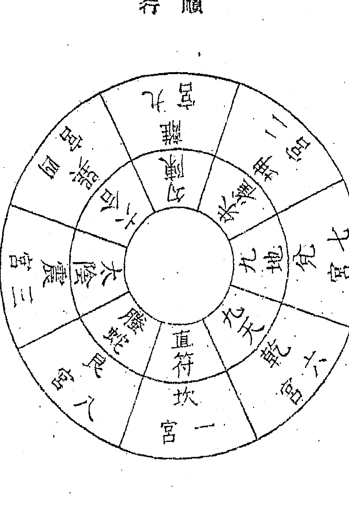

# 阴遁直符活局图
逆

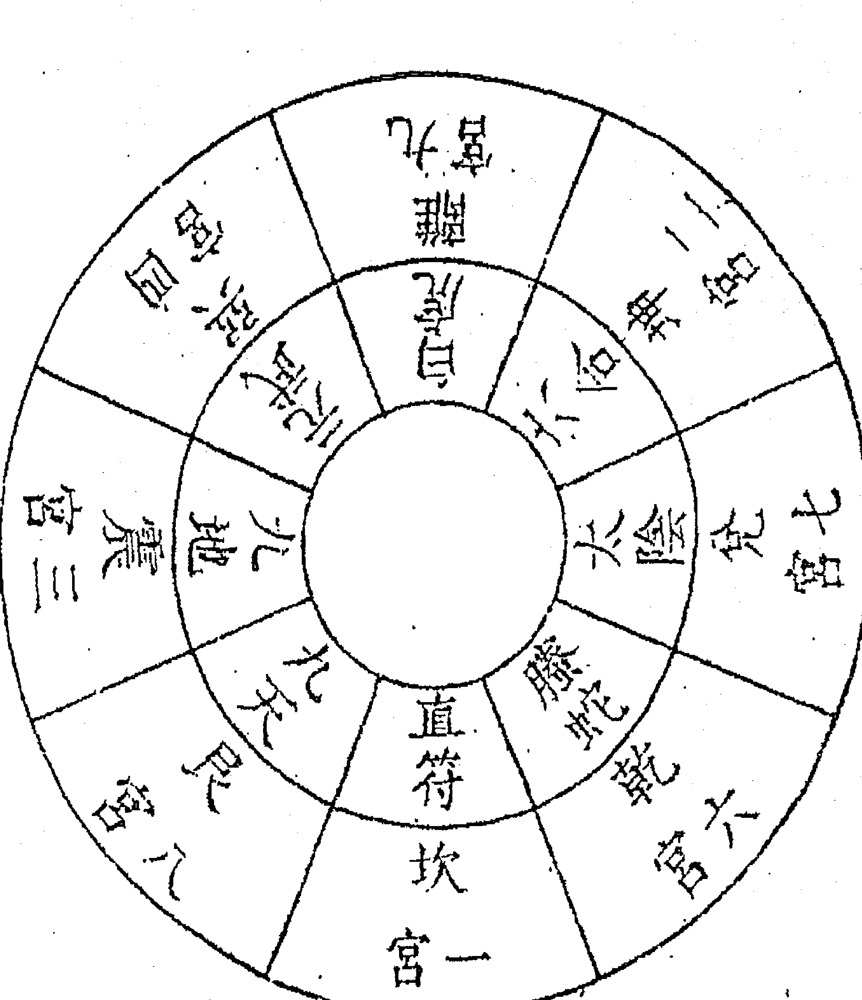

九天之上好扬兵九地潜藏可立营伏兵但向太阴位者避六合利逃形 本理按孙子本义云九

地者幽隐之至深也九天者刚健之至极也藏于九地营守之至深动于九天言攻之至极也九

天乃天之杀伐之气运在此方亦可藉此气扬兵威武九地乃地之蒙晦之气运在此方亦可以

藉此气藏形迹太阴之中可以逃亡冬至后阳遁顺天上直符所临之后一为九天后二为

九地前二太阴前二六合莫至后阴遁逆天上直符所临之后一为九天后二太阴后

三六合 假令阳遁上元一局甲己之日丙寅时天上直符临八宫后一九天临一宫后二九地

临六宫前二太阴临四宫前三六合临九宫 假令阴遁上元九局甲己之日丙寅时此天上

直符临二宫前一九天临七宫前二九地临六宫后二太阴四宫后三六合三宫 其法甲上

加直符以二三六七为吉一四八九五宫为凶

天地人分三遁名天遁月精华盖临地遁日精紫云蔽人遁当知是太阴

上盘六丙中盘生门下盘六丁 谓之月华之蔽

上盘六乙中盘开门下盘六己 谓之日精之蔽

下乙日局三遁法

上盘六丁中盘休门下盘太阴

谓之星精之蔽

生门六丙合六丁此为天遁自分明

经曰天遁者生门合六丙月奇下临六丁为天遁此时得月

华之所蔽故也

假令阳遁四局乙庚之日入为乙酉时天心为直符加时干六乙开门为直

使加时于七宫即生门与丙月奇合下临六丁于一宫是天遁也

假令阴遁六局戊癸之日晡

时天蓬为直符加时于六庚休门为道使加时于四宫即生门与丙月奇合临六丁于九宫为天

道

开门六乙合六己地道如斯而已矣

经曰地道者开门与六乙日奇合临地下六己为地道此时

得日精之蔽

假如阳遁一局丙辛之日日出时辛卯时天冲为直符加时于六辛伤门直使临

一宫日奇临六己于二宫是地道也

休门六丁共太阴欲求人遁无过此

经曰人遁者休门与六丁星奇合前一太阴为人遁此时得

星精之蔽

假令阳遁七局乙庚之日夜半丙子时天任直符加时于六丙生门加

一宫即休门

与六丁星奇合前一太阴六宫为人遁也

# 要知三遁何所宜藏形遁迹斯为美
已上三遁最宜隐遁人莫能窥盖三遁上盘既挟日月星精

之庇庇而天遁下盘合丁乃三奇之灵又为六甲之阴谓奇门相合有如华盖之覆体也
地遁下盘临六己为六合之私门又为地户谓奇相临有如紫云之盖体也
人遁下盘临太阴者阴暗之象孙子云虽知阴昼不能观万象谓奇门阴宫相合有如阴云之障蔽也
右三遁之时凡用事兴兵施为出入修营宫室万事吉利
云遁者天上六乙合地下六辛临开休生
风遁者天上六乙合开休生三门于巽宫为风遁也
龙遁者乙奇合休
三吉门为云遁也
虎遁者天上六乙合地下六辛临休门到艮宫为虎遁也
神遁者天上六丙合九天生门也
鬼遁者六乙合九地于杜门也
已上合天地人名九遁用奇者不可不知
庚为太白丙为惑庚丙相谁会得
庚金生于巳得禄临官于申旺于酉乃西方金星号太白星
丙火生于寅得禄已旺于午南方火德号为惑星谁字即指庚丙而昔谓或上盘之庚加会下
盘之丙或上盘之丙加会下盘之庚也

六庚加丙白入荧 天庚加地丙乃金入火乡而受克凶乃对敌宜防贼 赤松子曰太白入荧
五可破南北必有大祸 汤谓曰此时宜防贼来 假令清明上元用阳遁四局甲己之日日晡
时为壬申时此时六壬在八宫得天心直符为六庚加临六丙于二宫即太白入荧贼也
六丙加庚白入荧 天丙加地庚火入金乡此时间贼当退避 赤松子云荧入白太白上下相击
丙往外灭以避贼陷 汤谓曰此时贼退又曰二星相入凶气横任得奇门慎勿行此星若也移
方去金火之神是恶神上盘丙加下盘庚也 假令小满上元用阳遁五局丙辛之日黄昏时为
戊戌时此六戊在五宫得天冲直符为六丙下临六庚于七宫即荧贼入太白也奇门大全云丙
加下庚也此时战宜回避不宜冲击占贼来信必虚诈
白入荧合贼即来 汤谓曰庚为太白丙为荧贼若此时对敌宜防贼来上盘六庚加下盘六丙是
也 诗曰天土六庚加六丙太白入荧贼来天庚加地丙乃金入火乡而受克凶乃对敌宜防
贼来 赤松子曰太白入荧贼欲来天庚加地丙乃金入火乡而受克凶乃对敌宜防 汤谓曰此时防贼来
假令夏至中元
阴遁三局乙庚之日平旦戊寅时此时六庚在一宫以天丙直符加时干于三宫即六庚下临六

丙于二宫即太白入癸惑又天心天柱到离宫亦是金入火乡也
癸入白兮贼须灭 赤松子云癸入太白上下相击内往外灭以竞贼陷 汤谓曰此时贼退又曰
二星相入凶气横任得奇门慎勿行此星若也移方去金火之神是恶神此时战斗贼自恐必退
也天盘六丙加地盘庚是也 又曰六丙及来加庚上与贼逃避不为灾 假令阴遁六局甲己
之日丙寅时大丙在八宫以天心值符加时干即六丙下临六庚于四宫此为癸惑入太白占贼
不来天英景门到七六宫亦是火入金乡
丙为勃兮庚为格格则不通勃乱逆 天丙加地庚为勃天庚加地癸为格 汤谓曰六丙所加皆
名勃勃者乱也谓天上六丙临年月日时之干值符类大丙所加之义凡举百事用兵遇勃主
纲纪紊乱凶也经曰丙丁值为勃火星焚大屋移室且安然独自开愁哭又云庚加年月日时干
假尔为客不宜争统兵领众避此时唯用固守不宜行百事遇之凶莫测
丙加天乙为直符天乙加丙为飞勃 汤谓曰天上六丙加地下当年月日时干者勃勃者乱也天
上六丙临年月日时干直符类同六丙所加之义也凡举事用兵遇勃主纲纪紊乱也
假令冬

甲申日干格
格四时审而用之

庚加日干为伏干格 天乙伏干格三元经曰六庚为太白加日干即为伏干格此是主客关伤皆不
利又曰日干若遇六庚临此名伏干格相侵若是关战须不利大都为主必遭擒 假如小满上
元阳遁五局甲己之日壬申时六王在九宫即天柱为六庚下临九宫见今日甲午为天柱六庚
所加也此为天乙伏干格

日干加庚飞干格 日干及临庚飞干格偏明争战还不利为客最平平 经曰今日之干加六庚
飞干格此时战关主客两伤 假如小满上元阳遁五局甲己日庚午时此时甲子五宫寄二宫以
直符天禽加时干六庚于七宫即得六甲下临六庚于七宫此名飞干格也

加一宫皆主战不利 天乙格六庚加天乙凶战于野天乙格六庚加天乙者谓临天乙所居之宫也
同一宫皆主战不利

# 天乙太白格谓天乙与六庚同宫战于国凶天乙与六庚同行加时与太白格利野战若直符加六庚宜固守伏藏凡遇诸格之时用兵主客俱不利占人在否格则不来

庚加直符天乙伏 庚加直符宫伏干格为宗交锋多不利为客以成功 三元经曰六庚加直符名为天乙伏宫格此峙主客皆不利战斗交兵气自衰占见人不在占来人不来 奇门大全曰

上庚加下直符此峙主客皆不利大庚加天乙直符本宫为伏宫此峙不利用兵宜野迎敌 假

令立春下元阳二局甲己日壬申时此峙大壬在六宫以天上天芮为直符加时干大壬于六宫

即得天辅为六庚下临直符天芮于二宫此名天乙伏宫格也

直符加庚天乙飞 飞宫是何星直符加大庚两敌不堪争为主似迈赢 三元经曰直符加六庚

名天乙飞宫格此峙主客皆不利奇门大全云上盘直符加下庚此时间前遇天乙直符加六庚

之上此峙固守出则大将遭擒 假令春分中元阳遁九局甲己之日庚午时此峙六庚在

二宫天英为直符以天上直符加时庚于二宫即得天英为直符下临二宫见六庚此名天乙

博物策编艺术典第七百四卷术数部第十八之七十三

# 飞宫格

庚加癸为大格 太白庚加图谋未可通求人终不见端坐自还营 汤谓曰六庚加癸名曰

大格也谓天上六庚临地下大癸此时不可用百事凶逃亡亦不可得求人即不在反招其咎

假令秋分下元阴遁四局甲己日丙寅时此

大格不宜远行车破马死造作人财破散

庚在二宫以直符天辅加时干六丙于六宫即得天芮六庚下临六癸于八宫此名大格也

加己为刑最不宜 六庚加六己赤地须千里远行车马喧军兵半路止 汤谓曰六庚加六己为

刑格谓天上六庚加地下六己此时出军车破马伤中道而止士卒逃亡慎勿追之返招凶咎

奇门大全云六庚加六己求谋主失名破财疾病

假令大寒上元阳遁三局甲己日丙寅时此

时六庚在五宫寄二宫以直符天衡加时干六丙于一宫即得天禽六庚下临六己于四宫此

名刑格

加壬之时为上格又嫌岁月日时逢 六庚加六壬谓之上格一云伏格当此时并不宜行师

经云六庚当年太岁之干名曰岁格此时用事凶

奇门大全云六庚加令岁干如甲子作庚加

甲子也大凶六庚加年月日时干动有凶格关客先败占家年为父母月为兄弟日为己身为
妻男占遗失随其日月应兆获 假令辛丑年立春中元阳遁五局岁干在辛以甲己之日日入
癸酉时六庚在七宫以直符天禽加六癸于一宫即见天柱六庚下临大辛岁干在八宫此名为
岁格也 论月格三元经曰六庚加月朔格为凶时也 假令立春上元阳遁八局月朔干在甲
己甲己日丁卯时此时六庚在一宫以直天任加六丁于五宫即得天蓬为六辛下临月朔干
六己于九宫此名月朔格也 论日格经曰六庚加当日日干名日日格此时大凶 假令小
暑下元阴五局日干在甲己己日丙寅时以天禽为直符加时干六丙于七宫即六庚在三宫下
临日干己于四宫此名日干格 时格经曰六庚加本时干者为时格亦名伏吟格此时六庚在
四宫以直符天辅加时干六己于三宫此为时格也凡六庚为直符其十时皆为时干格也
假令小寒上元阳遁二局丙辛日己丑时六庚在
四宫以直符天辅加时干六己于三宫此为时格也
更有二般奇格者六庚加三奇此时若也行兵去走马双轮无返期
六庚加丙丁奇天英景
伤下克上先举者凶无返期六庚加乙奇冲辅伤杜上克下先举者胜走马双轮能敌万人
为下克上先举者凶无返期六庚加乙奇冲辅伤杜上克下先举者胜走马双轮能敌万人

乙 人 耳 三 钱 月，
六癸加丁，蛇天矫
六癸加六丁，天矫迷路，忧惶难进步，端坐不管。
六癸加六丁，天
盘六丁，在地盘，为蛇首反，为雀，谓癸属水，为北方元武，蛇丁属火，故癸加丁为腾蛇天矫。王
璋曰，天上六癸加地下六丁，名腾蛇天矫，此时
不利
假如冬至下元阳遁四局，丙辛之日
半夜生戊子时，此时六癸在九宫，以直符天心，加时于六戊，于四宫，即得天英，为六癸下临六丁
于一宫，是为腾蛇天矫也，虽有奇门临之，亦主虚惊不宁。

六丁加癸，雀入江
丁属火，为朱雀，癸属水，故丁加癸，为朱雀入江
奇门大全云，丁加癸，主文书
牵连或失脱文书，占家有惊恐，怪异，梦用，兵防奸
王璋曰，天上六丁加地下六癸，名朱雀投江
此时百事皆凶
六丁加六癸，朱雀入水，沉口舌，犹未罢官事，使人愁，又曰，或有讼讼，自陷刑狱
或闻火起，不必住救
假如夏至中元，阴遁三局，甲己日，壬申时，此时六丁在六宫，以直符天冲
加时于六壬，于八宫，即六丁下临六癸，于七宫，是为朱雀投江也

六乙加辛，龙逃走
金为太白，乃白虎，木为青龙，金克木，为龙虎相战，凶。青龙乙加辛，金木不相亲
神龙方也，遁乐云，不求，谋，盖乙属木，为青龙，故乙加辛，为青龙逃走
王璋曰，六乙加六辛，名青## 論九星吉凶所主

能逃走此時不宜舉兵主客反傷，百事凶。奇門大全云：六乙加辛，此時舉兵動眾，主失財遭亡破敗。又云：六乙加庚亦是。

假如立秋上元陰遁一局，丙辛之日己亥時，六乙在二宮，以值符天任加時干己於一宮，即六乙下臨六辛於八宮，此是青龍逃走。

六辛加乙虎猖狂。赤松子云：刀逢暗磨，疑如之何，彼欲見害，一陰可和，六辛加乙白虎也。悲哀若與幹錢財，自己須防災害，兼慮金禍，白虎故辛加乙為白虎猖狂。王璋曰：天上六辛加地下六乙，名曰白虎猖狂。此時不宜舉事，主客兩傷，婚姻修造大凶。奇門大全云：舉動出入戰鬬必有驚詐。

假令小暑中元陰遁一局，甲己之日壬申時，此天丙直符加天盤六辛下臨於三宮，原乙在三宮，是為白虎猖狂也。

請觀四者是凶神，百事逢之莫措手。夫天干陰陽和則吉，不和則凶。如陽干尅陰干為合，如甲尅己即甲與己合。陰干尅陽干為官星，如甲受辛尅即以辛為官。陽遇陽尅，陰受陰尅，皆為不和。乙辛丁癸四干皆屬陰，尅其禍不救，故不可用也。

丙加甲兮鳥跌穴。天盤丙加地盤甲子乃飛鳥跌穴，大吉。赤松子曰：進飛得地，雲龍聚會，君臣甲分因主靜得燕臺興動皆利。王璋曰：此時從生而擊死，百戰百勝定無疑。葛洪曰：六丙加六甲名飛鳥跌穴，穴陰陽二遁此時爲百事利，出兵行營與造葬埋大吉。

假令大寒陽遁九局，甲己之日辛未時，此時六丙在七宮，以直符天英加時干六辛於二宮，即六丙下臨六甲於九宮，此名飛鳥跌穴。解曰：丙加六甲在門上是也，利遠行出兵百事吉，大人君子利，小人凶。從生擊死一敵萬人。

甲加丙爲龍返首。天上甲子加地丙名青龍返首。葛洪曰：此局吉，宜舉百事，雖無吉門卦局亦可用事。陰陽二遁此可以出兵行營舉造利，爲百事皆吉，若合奇最爲夏也。

假令冬至上元陽一局，甲己之日丙寅時，六丙在八宮，以天上甲子天蓬直符加時干六丙於八宮，得天蓬爲六甲丙在八宮之上，此名青龍返首。辭曰：六甲加丙在門上也，是見大人求名舉兵利客，揚威萬里出入利，此時從生擊死一敵萬人。

只此二者是吉神，爲事如十八九。當前一局飛鳥跌穴青龍返首之大吉也。若得奇門行兵出戰大勝，求名遂意，求財利益，造葬嫁娶百事如意也。

六丁加六甲三奇吉。

六丁加六乙天運氣吉。

## 六甲加六乙二龍相争凶

## 六壬加六庚白虎入穴凶

八門若遇開休生，諸事逢之總稱情。傷宜捕獵終須獲，杜好邀遮及隱形。景門上書遣使突陣，名所向通達。休門宜進萬事治兵習業百事皆吉。生門宜見人營造求財獲寶。傷門宜漁獵討捕行逢盜賊。杜門宜邀遮隱伏誅伐凶逆，凡出去迷悶。破軍擒訟有聲名。若問死門何所主，只宜弔死與行刑。驚門宜掩捕闘訟攻擊驚恐。已上八門內有開休生三門吉，宜出其下，若更合三奇吉宿爲上吉。五凶門不可出其下，宜避之。

昔黃帝命風后作太乙雷公式九宮法，以靈龜洛書之數而錯一位，以一居乾，以八居坎，以三居艮，以四居震，以九居巽，以二居離，以七居坤，以六居兌。八風陰也，蓋以艮燥坤濕，乾坤寒暑，乾爲陽，兌陰，離火坎水而分陰陽也。

### 釋九星所主

天蓬、天任、天衝、天輔、天禽五星屬陽。天英、天內、天柱、天心四星屬陰。太乙書謂太乙在陽宮，遼東不用兵，正以坎艮震巽爲陽宮，遼東艮地也。太乙在陰宮，屬漢可全身，離坤兌乾爲陰宮，蜀與漢正中在西南及西方之地也。

輔衝心星爲上吉，衝任小吉未至亨。大凶蓬丙不堪使，小凶英柱不精明。大禽樞京天輔武曲紀星，孰歷剛星天禽廉貞綱星，總承符九天心文曲紐星。已上三位乃北斗武曲、廉貞、文曲三吉星，爲大吉也。疑難好化天衡破軍關星，英明集華天任星。已上一星乃北斗破軍英明星，爲次吉宿也。

陰陽大衍天蓬陰光右弼星，陽琮孚慶天內洞明左輔星，乃左輔右弼星，爲惡曜大凶之宿，若得奇門亦不可用。照衡勳今天英貪狼太星，通元須變天柱祿存真星，乃貪狼、祿存二宿，半凶之星，得奇門亦可用。宗廟洪範五行水城專言貪狼爲上吉，卻不知貪狼爲凶星也。地理大全論云：很狼虎也，所以掃去宗廟不準。

大凶無氣變爲吉，小凶無氣一同之。三元經云：時不得天輔、天禽、天心星爲大吉，時下得天任天衝爲次吉，得天蓬天內爲大凶，得天柱爲小凶，天英亦爲小凶。更以五行旺相言之，若大凶之星得旺相之氣則小凶，若小凶得旺相之氣則中正。吉宿更能逢旺相，萬舉萬全功必成。若遇休囚并廢没，勸君不必進前程。凡吉宿亦要遇旺相，若遇休囚廢没亦不可用。經曰：若上吉次吉星無旺相氣則中平，乘旺相氣則大吉，乘死休氣則爲凶，詳審用之。

假令冬至時得天任吉宿，又乘旺氣，則上吉也。要識九星配五行，各隨八卦考羲經。坎蓬星水離英火，中宮坤艮土爲金，乾兌爲金震巽木，旺相休囚看重輕。此以九星配五行又隨伏羲周易後天八卦而推之。金函寶鑑云：大哉乾元，交合體父母生成之道，陰陽品配定男女方位之居。銀河轉運，乾坤定上下交合，遂生六子。乾父交於坤母，一交而得長男震，一交而得長女巽，再交而得中女離，三交而得少女兌。以震兌爲主，坎離論用，乾坤艮巽寄於四維。故乾位西北，坤位西南，艮司東北，巽司東南，震東兌西，離南坎北。乾剛兌柔爲一金，震陽巽陰爲一木，坤溼艮燥爲一土，坎潤下離炎上，不可一也。夫金木形也，水火氣也。形有差別，氣無精粗，此或一或二之所以分也。凡在顯者則陽包陰，在晦者則陰包陽也。

## 上分匣書卷第六

天蓬宜安撫邊境修築城池，春夏左將大勝，秋冬凶亡其士卒，利主不利客，嫁娶凶，移徙失火，闘爭見血，入官逢盜賊，修營宮室，商賈皆凶。

天柱宜屯兵自固隱跡埋形，將兵車破馬傷士卒敗亡，不宜移徙入官市賈，宜嫁娶修造祭祀。

天心宜療病合藥，將兵秋冬勝得地千里，春夏不利，嫁娶入官築室祠祀，商賈秋冬吉春夏凶，利見君子不利小人。

天衝宜出報仇，春夏左將秋冬無功，不宜嫁娶移徙入官築室祠祀市賈。

天輔宜藏身守道設教脩理，將兵春夏左勝得地千里，嫁娶多子孫，移徙市賈入官吉。

天任宜請謁通財，將兵四時吉，萬神助之，敵人自降，嫁娶多子孫，入官吉，移徙築室凶。

天內宜葬尚世道交納朋儔受業師長吉，不可用兵，嫁娶爭訟，移徙築室秋冬吉春夏凶。

天禽宜祭祀求福斷滅群凶，將兵四時吉，百福助之，不戰用謀，敵人畏服，賞功封爵，移徙入官祠祀商賈嫁娶吉。

天英宜出入遠行飲宴作樂，利嫁娶，不宜出兵，移徙入官築室祠祀商賈。

假令冬至上元陽遁一局，甲己之日半夜生甲子起一宮，順行至丙寅時在三宮，時下得天衝宿值，宜出師報仇，春夏乘旺也。

假如夏至陰遁大暑中元陰遁一局，甲己之日壬申時，以甲子時起一宮順布三奇逆布六儀，則壬申時到乾得天心宿值，宜療病合藥，將兵乘金旺氣勝據地千里，春夏不利秋吉，宜見君子不利小人。

## 博物志卷第二百四卷術數部彙考十八之十六

（此处原文为标题，无具体段落内容）

## 天河轉運璇璣錯綜之圖

## 八卦方位圖

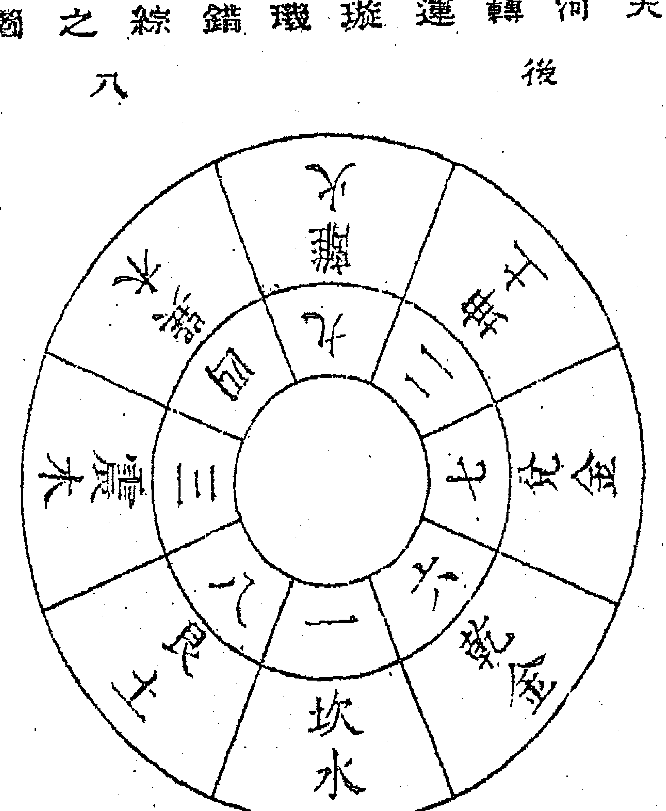

> 詩訣
十道單分四角，雙惟將五數在中央，任他戊己存乎內，五氣行房自發揚。五氣乃五行也。

與我同行則爲相，我生之月誠爲旺，廢於父母，休於財，囚於鬼，各真不忘。一三元經曰：九星休旺者。

## 九星所屬

| 九星 | 五行 |
|------|------|
| 天蓬 | 水宿 |
| 天芮 | 土宿 |
| 天衝 | 木宿 |
| 天輔 | 木宿 |
| 天禽 | 土宿 |
| 天心 | 金宿 |
| 天柱 | 金宿 |
| 天任 | 土宿 |
| 天英 | 火宿 |

假令水宿燒天蓬，相在初冬與仲冬，旺於正二休四五，其餘倣此，自研窮。

## 奇門遁甲法術

天柱天心金宿，相於申酉月同類也。金見金，旺於亥子月我生也，金生水。廢於辰戌丑未月生我也，土生金。休於寅卯月我尅也，金尅木。囚於巳午月尅我也，火尅金。

天芮天任天禽土宿，相於辰戌丑未月同類也。土見土，旺於申酉月我生也，土生金。月生我也，火生土。休於亥子月我尅也，土尅水。囚於寅卯月尅我也，木尅土。

亥子水，寅卯木，巳午火，申酉金，辰戌丑未土，此五行也。

急則從神緩從門。三五反覆天道亨。三元經曰：有事不暇，擇時并三奇吉門，當天乙所在宮及直符之神宮而去，謂之從神，自然獲吉。蓋直符甲子常從六戊，是爲天門。事急則從天上六戊下去，事緩則可待時三奇吉門而去。

假令冬至陽遁一局，甲己之日丙寅時，此時天乙加六丙於八宮，直符在九宮。若有急事，可向東北天乙下及正北直符六戊下去，皆吉也。又曰：神謂如甲子蓬星，日丙寅時甲子，儀頭以甲子天蓬星休加地盤六丙上，即從奇下出去。如事急，欲出路或在軍陣中，門又不通，只尋吉神下去。事緩可以就吉門奇而往也。二者三奇也。五星吉，英任衝輔心也。或門凶無奇又無吉星，反伏無處，吉事又急迫，須向北斗下默念三奇咒云，不得三吉奇門，但從二奇所歸方出百事吉，所謂吉則從神也。

陰陽一過有閉塞，八方皆無門可出，即依玉女法。凡甲子時、甲午時在內利主，甲申時在門兩損，甲辰、甲戌在外利客。符應經：若無奇門出緊即佐張良以籙加出天門地戶而出也，吉利。

十干加伏，若加錯入庫休囚，吉事危。時加六戊，乘龍萬里莫敢呵止。六戊爲天門，又稱天武，宜以遠行萬里百事吉。戊爲天門，凶惡不起，當從天上六戊挾入天門，故曰乘龍萬里，凶惡不敢害，雞不鳴犬不吠，將兵客勝，門臺無聞萬有利，以遠行市賣小人萬走亡命。

假令立春中元陽五局，甲己之日戊辰時，此時六戊在五宮坤二，以直符加時干即六戊臨二宮，出西南吉。

時加大己，如神所使。不知六己出被凶咎，已爲六合，此時宜爲陰謀密秘之事，當從天上六己出，不宜市買爲顯揚之事，隱匿如神所使。不知六己者，謂爲顯赫必逢休咎。又爲地戶，獨出獨入無有見者。將兵聞喜無聞憂，有利以出官嫁娶，小人利亡命驚走。若古人有逃亡陰私之事。

時加六庚，抱木而行。雖有出者，必見關爭，謂庚爲天獄，此時凶强，有出者必遇刑罪。故曰：能知六庚，不被五木。不知六庚使使入獄，或被淩辱。將兵主勝不利客，利屯營固守，聞憂有聞喜無，而遭死物傷。博物典編藝術典第七百四卷術數部彙考十八之十八。

無利入官嫁娶凶。六庚之時，惟宜固守。能知六庚之時，謂此時已下至六癸時不宜出動。

時加六辛，行遇死人。強有出者，罪罰纏身。此刑行來出入並凶，強有出入，斧鑽在前行爲在累。故曰：能知六辛所往行來，不知六辛多被杻械。又辛爲天庭，罪網自纏。將兵主勝不利客，可行刑決罪人，不宜嫁娶入官市買問疾。

時加大壬，爲吏所禁。强出入者，飛禍將臨。此時不可遠行出入百事凶，强出必有牢獄。玉爲天牢，怨仇所稽。將兵主勝利伏藏邀遮，不宜入官移徙嫁娶逃亡，病者進退不死。

時加大癸，衆人莫視。不知六癸出門見死。此刑凶不利出入，皆凶。宜隱遁求仙亡命絕跡，當從天上六癸下出入不見。故曰：衆人莫視。又癸爲天藏，利以伏匿逃亡。將兵主勝聞憂有聞喜無，不宜出官市賈嫁娶移徙入室囚，疾病者重遭亡不得。

三奇嫌入墓，門嫌泊墓，官三位有消停。門克下宮爲障隔，時干尅日干爲損明，六儀受刑天干日支神犯上。更忌支辰及伏吟出兵發令，恐緊急加錯三奇入墓休囚及犯十干伏吟等項，須吉返凶也。

十精爲使用爲實，起宮天乙用無道。葛洪曰：踰出於五土，歸於九一者爲十也，要精於九一之謂。陽道陽使起一終於九，陰道陰使起九終於一，夭乙直使起宮異，所謂值門相衝也。陰陽一遁各有二使。

假合冬至後陽使起休門，陰使起景門，故曰直門相衝。今知用遁自冬至後一百八十一日六十一分半，歷子午之東部陽氣用事，惟陽遁陽使。夏至後一百八十一日六十一分半，歷子午之西部陰氣用事，惟陰遁陰使。古經云：冬至後用陽使，夏至後用陰使，總不一息，或升或降而運之於無形，布之於無象，有所不見以俟後人。若能諳此理，用之爲實也。

天目僞客地爲主，大甲推兮無差理。觀君莫失此元機，洞徹九宮扶明主。刑爲天目，酉爲地耳，又有大甲旬中天目地耳推者出兵日也。寶日爲上吉，謂干生支也，如甲午日甲木生丙火是也。義日次吉，謂支生干也，如甲子日之類，甲木子水水生木也。和日爲次吉，謂干支比和也，如壬子日之類，壬水子水和同也。制日爲中平，謂干剋支也，如甲戌日之類，甲木戌土木剋土也。伐日爲極凶，謂支剋干也，如甲申日之類，甲木生金金剋木也。

經云：潛居抱道以待其時。若能通於遁法，君不聖明不能進扶，直言其國衰敗，事不能行其政。隱身閒居，躲避衰亂之亡，抱養道德以待興盛之時，扶佐主名香萬古。此乃時至而成功，不過明君隱跡埋名守分閒居，若是强行必受其累亦無功成也。

## 宮制其門不備迫

門制其宫是迫。

> 經曰：吉門被迫則吉事不成，凶門被迫則凶事尤甚。

宮制其門是凶迫，門制其宫是吉迫。門生宮爲和，宮生門爲義。

假令開門臨三宫，休門臨九宫，生門臨一宫，景門臨六宫，爲吉門被迫則事不成。

假令傷門杜門臨一宫、八宫，死門臨一宫，驚門臨三四宫，爲凶門被迫則爲凶尤甚。

## 天網四張無路走

一二網低有路踐，三四宫行人墓，八九高强任西東。

> 三元經曰：天網四張，萬物盛傷，此時不可舉兵，爲百事凶。

> 又曰：神有高下，必須知之，謂時得六癸之神必有高下也。

> 又曰：但將天乙居何地，尺寸低而匍匐之，謂得癸時神符高下。天乙在三四宫謂之尺高，遇之不可出，出必傷。若被客圍，卻從卯未酉三宫看合何門奇可破出，無妨。

假令天乙在一宫，其神去地一尺；在二宫去地二尺，皆天上六癸之下，即天乙所加之宫也。當此必須匍匐而以右手属两而前行過十步吉。若天網高三尺以上，可以消思避之，爲天網過人故准此。如天上六癸加一宫即爲一尺高也。五尺以上無碍矣。

> 萬一訣曰：天網四張時，謂時下得六癸也。癸酉、癸未、癸巳、癸卯、癸丑、癸亥是爲天網。有高低者，若有急事有此時不得不行，當以高行而出。

陰遁四局乙庚之日日出時爲己卯，此時天上大癸在八宮，以天內直符加於二宮，得天任爲六癸下臨八宮，即天網高八尺矣。陽遁此例。

作法一人獨出追兵至此，即自反傷。天網者天上大癸之下是也。其神有高下，在坎高一尺，在坤二尺，震三尺，巽四尺，踰此者本高不可出也。如天上六癸直符加地上一二三四宮爲尺寸低，人郎可揚聲而去。若臨六七八九宮爲尺寸高，天網四張不用也。時下得此百事凶。天網四此時萬事不宜，須合奇門吉宿亦不宜用。如破陣欲取道出，宜兩臂橫負刀，則呼天輔之名匍匐而出，則天網自敗無所傷矣。臨六七八九宮其尺寸過人猶不可用，將兵雖當隱伏，若敵人來攻當自潰敗。

天網四張不可當，此時用事有災殃。若是有人強出者，立便身軀見血光。蟲禽尚自避於網，事忙衝當出開門。假令丙辛日時用禹中男四張，禹中即癸巳時也。

節氣推移時候定，陰陽順逆要精通。三元積數成六紀，天地人元一二三，已載前一節統三爲正宗下紀。四氣七十二候。

三元例乃冬至小寒及大寒，天地人元一二三已載前一節統三爲正宗下紀。與今圖書集成博物彙編藝術典第七百四卷術數部彙考十八之二十。

乃天支一周十二数，六纪是地支六周得七十二数。以一卦统三节为三元，则共成二十四气。以一节十五日分三候为三元，则共成七十二候，故云三元积数成六纪。六纪乃七十二候之数也。凡一月节有三候，气有一候。如正月立春节十五日，则东风解冻、蛰虫始振、鱼陟负冰为三候也。雨水气十五日，则獭祭鱼、候属北、草木萌动为二候也。

奇门总要歌云：三元超遁游六甲，亦同此意。所以天地造化，乃一定之理数也。请观歌裏精微诀，非是圣人妄传与。

> 此歌中之语，句句如神，字字有妙，非是圣者不可妄传，恐有小辈得诀入说，小人为害不浅。遁甲之文，黄帝之师风后留传，太公子房，晋朝盗乱发子房塚于木枕中得此文，上有誓诫曰：不许传于不仁之人，若非其人必受其殃，得其人而不传亦受其殃。晋郭璞撰青囊经亦编入遁甲星奇一篇于内，此文乃济世之宝，藏之如珍也。

弘治乙卯解至丁巳春月重解，至正德戊辰年春方注解颖编成册，章贡後学池本理书，卷终。

## 術數部彙考十九

奇門遁甲景祐遁甲符應經纂

直符加時干之所在，直事天乙之遊宮是也。然後以直符加時干，謂所用之時干也。如甲子爲六戊，甲戌爲六己，甲申爲六庚，甲午爲六辛，甲辰爲六壬，甲寅爲六癸是也。以直事臨得宮，以所用之時幹頭看陰陽逆順數之。如庚子時至庚子住，辛丑時至辛丑住，即知八門所在，三奇所臨。更有天上之星加地下之宿，如此則伏刑格反擊墓相入之事，吉凶之方皆可見矣。

甲加丙爲青龍反首，萬事吉利。丙加甲爲飛鳥跌穴，萬事吉利。乙加辛爲青龍逃走，萬事大凶。辛加乙爲白虎猖狂，萬事皆凶。丁加癸爲朱雀投江，行兵潰散，萬事皆凶。癸加丁爲騰蛇天矯，萬事凶惡。丙加庚爲熒惑入太白，萬事大凶。庚加丙爲太白入熒惑，萬事大惡。戊加子爲伏吟，八門六甲不動也。子加午爲反吟，不可用，大凶。以直符加庚爲飛宮格，庚加日干爲飛幹格，以直符加刑爲擊刑。如甲子爲直符加卯上是。

直符加刑上爲刑格。例加擊刑。丁同。或又三奇入墓爲凶時，時干賊日亦凶。二奇加坤爲入墓。日加艮。

一甲月日書是史一。

博物彙編藝術典第七百五卷術數部彙考十九之二。

## 遁甲法

天乙直符所临为天网，时下得癸不宜举事。若临一二三四五宫为天网低，走者不获，逃者被获；若临六七八九宫为天网高，走者速，逃者不获。

加甲门合吉。甲加乙吉，加丙吉，加丁吉，加戊吉，加己吉，加庚吉，加辛吉，加壬吉。

加甲门合吉宜财。乙加甲凶，加丙吉，加丁半吉，加戊吉，加己半，加庚凶，加辛凶，加壬吉。

加乙门合吉。丙加甲吉，加乙吉，加丁吉，加己凶，加庚凶，加辛吉凶，加壬凶，加癸。

加丙门合争法不合刑色。丁加甲吉，加乙吉，加丙半，加己庚凶，加辛凶，加壬吉。

加丁门合宜支字不合凶。己加甲吉，加乙半，加丙丁半，加庚凶，加辛半，加壬凶，加癸凶。

加戊己門合宜遠望不合凶。庚加甲吉，加乙半，加丙凶，加丁己凶，加辛凶，加壬癸凶。

加庚門不合凶。辛加甲半，加乙凶，加丙吉，加丁凶，加己吉，加庚凶，加辛凶。

加辛門不合凶。壬加甲吉，加乙吉，加丙凶，加丁吉，加己凶，加庚辛凶，加癸半。

加壬門合才理不合夫理。癸加甲吉，加乙丙吉，加丁凶，加己半，加庚凶，加辛凶，加壬凶。

加癸門合文字制。

### 釋求天正冬至日辰

置距所求積年，自演紀上元甲子距今大宋景祐元年甲戌歲，積一千一十五萬四千九百五十算外。上改往古每歲減一算，下驗將來每年加一算，以歲置三百八十三萬五千六十八乘之，為天積分。滿日法一萬五百餘之，為積日，不滿為小餘。其積滿紀法六十去，不盡為大餘，命起甲子算外即。

与多同而参校之。博物纂緝藝文典第七百五卷術數部叢書考十九之二。

### 求天正冬至日辰

所求天正冬至日辰。若求諸氣大小餘者，置冬至大小餘，每氣加一十一日小餘二千一百九十四分半。小餘滿一萬五百從大餘，大餘滿紀去之，命甲子算外即諸氣日辰及小餘數終。

### 釋諸求發斂加時

置其氣小餘，加中星辰法四百三十七分半，乃以辰法八百七十五除之爲辰數，不滿以刻法一百五除之爲刻，又不滿爲分。其辰數命起子初算外，即得其氣發斂加時辰刻及分。

### 釋求天正十一經朔日辰

置天正冬至氣積分，滿朔實三十一萬七千一抄二十四去之，不盡減氣積分。滿日法一萬五百餘之，爲積日，不滿爲小餘。其積日滿紀法六十去之，不盡爲大餘，命起甲子算外，即天正十一經朔日辰及小餘。若求諸朔日者，以朔策二十九日小餘五千五百七十一抄二十四氣累加之，秒滿百從小餘，滿一萬五百餘日從日，分滿紀法去之，命甲子算外，其朔日辰及餘。其有進退者，但命日辰爲定也。

### 釋天乙直使起宮巽門

王璋曰：天乙直使起宮巽門者，謂門相衝也。陰陽二遁各有一使。假令冬至後陽使起一宮，陰使起景門。夏至後陰使起景門，陽使起休門，故曰起宮巽門相衝。冬至己後陽使初起休門，直事陰使起也。

普六十一分半曆子午之東部，陽氣用事，惟用陽使。夏至過後一百八十一者六十一分半曆子午之西部，陰氣用事，惟用陰使。古經云：冬至後用陰使，夏至後用陽使，則不顯鬼神隱伏之事故。

### 釋一順一逆時應節變

> 葛洪曰：冬至應陽使順行，陰使逆行。夏至應陰使順行，陽使逆行。時應節變者，全用算法各求二至加時應以明之。畢二十四氣各求加時，並用遁起超神接氣得精微之要，使吉凶有應用之無誤矣。

### 釋二遁直符合中宮

> 葛洪曰：合於中宮者，謂陽遁陽使冬至后上元甲己之日夜半生甲子，初辰起在一宮，歷五時至戊辰在中宫。陰使起九宫逆行五时亦至戊辰，亦在中宫。陰遁夏至上元甲己之日夜半生甲子，初起九宫，历五时戊辰在中宫。陽使起一宫历五时戊辰亦在中宫，故曰合也。

博物彙編藝術典第七百五十九卷術數部彙考十九之二。

## 下九宫历书第二

（此处原文为标题，无具体段落内容）

### 释二遁出于四六

葛洪曰：出于四六者，谓子时至已时陽使出于六，陰使出于四，故曰出于四六也。

### 释二遁逾于五七归于九一

葛洪曰：逾于五七归于九一者，谓陽遁陽使起于一终于九归于一，陰遁陰使起于九终于一归于九，故曰逾于五七归于九一也。

### 释陰陽二遁

汤谓曰：陰陽二遁者，谓冬至以后自一至五爲陽遁，自五至九爲陰遁；夏至以后自九至五爲陰遁，自五至一爲陽遁。故五宫爲陰陽其道。冬至後五宫半南爲陽道，半北爲陰道；夏至後五宫半北爲陽道，半南爲陰道。凡直使在五宫之时，利客不利主。

### 释八门所主

（此处原文结束，无后续内容）

开门宜远行征讨所向通达。休门宜集万事治兵习业。生门宜见贵人营造百事。伤门宜渔猎捕讨行遇盗贼。杜门宜邀遮隐伏诛伐凶逆。景门宜上书遣士突破围阵。死门宜行刑诛戮用死送葬。惊门宜掩捕鬥讼攻擎惊恐。以上八门，有开休生三门宜出其下，若更合三奇吉宿最为上吉。五凶门不可出其下，须避之可也。

## 释九星吉凶

三元经曰：时下得天辅、天禽、天心为上吉；天任、天冲次吉；天蓬、天芮为大凶；天柱、天英为次凶。更以五行旺相言之，若大凶之星得旺相，即小凶；若小凶之星得旺相及吉门吉星无气，则中平。以意审之。假令冬至后，时下得天任，吉宿乘相气为上吉也；忽乘死囚，又为中平。

## 释九星休旺

三元经曰：九星各旺於我生月，相於同类月，死於生我月，囚於官鬼月，休於财月。亥子水，寅卯木，巳午火，申酉金，辰戌丑未土。金水木火土相生，金木土水火相剋。我鬼我剋则生我者父母，我生者子孙。

假如天蓬星是水星，旺於寅卯月，相於亥子月，死於申酉月，囚於辰戌丑未月，休於已午月是也。

## 称九星所主

天蓬星名子禽，常主一坎水休门。主杀人，惟利客。又曰：春夏用之军大胜，秋冬用之有灾凶。

天芮星名子成，常主二坤土死门。受道交天芮星，行兵值此结其宗，半道相逢雷雨作，出军败将百无功。

天衝星名子翘（一云翅），常主三震木伤门。宜报讎攻击。又曰：天衝之星之英用，时逢此主昌荣。

天辅星名子卿，常主四巽木杜门。天辅之时宜设礼，行军千里振天声。更得三奇合此宿，折衝千里振天声。

天禽星名子公，常主五中央土。上将功臣封爵禄，朝师敌自亡。

天心星名子襄，常主六乾金开门。上将提兵功百胜，不宜春夏恐凶归。

天柱星名子辈（又子由），常主七兑金惊门。天柱藏形宜固守，擡兵挥武总无功。

天任星名子申（又子章），常主八艮土生门。天任之时宜庆贺，主将提兵功奏凯。

天英星名子然（又子咸），常主九离火景门。天英出入事虚强，战斗之时大吉昌。若欲远行出门者，皆从吉门向方呼其星之名而出，欲六十步左回太阴中大吉。五阳时宜出行，若吉事从吉门，凶门凶从事。若生门宜见贵人，惊门宜掩捕是也。

## 释三奇合

上局仲甲，谓甲巳之日夜半生甲子，丙辛之日日中甲午是也。此时阖格刑德俱在内，用兵若先举者败，不可以出入，利于逃亡，主客俱不利。

中局孟甲，谓戊癸之日平旦甲寅时，乙庚之晡时甲申是也。此时阳气在外，利藏兵固守，不可出，利主不利客。

下局季甲，谓丁壬之日入时甲辰，甲己之日黄昏甲戌是也。此时阳气在外，阴气在内，利出行动众，百事皆吉，利客不利主。

又六甲之夜半子时，三甲皆合，谓今日是直符并下是甲，故名之曰三甲合也。

## 释三奇得使

蒋洪曰：若得三奇之使尤益其良，谓在此六甲之上自得所使之奇。甲戊己为使，甲子甲丙为使，甲辰甲寅丁为使。与六甲同。

### 假令阳三局 丁亥时 大寒上 春分上 雨水下 芒种下

乙壬辛
乙奇丁庚丙
己戊癸

并用此局，乙庚之日人定为丁亥时也。此时六乙日奇临九宫甲子，是为乙奇得使。

### 假令阴三局 壬辰时 夏至中 白露中 寒露下 立冬下

己癸丁
乙奇辛丙庚
乙戊壬

并用此局，丙辛之日食时是壬辰，六乙日奇下临九宫甲午，是为乙奇得使。

### 假令阳五局 丙午时 小寒下 立春中 谷雨下 小满上

丁庚己
丙奇壬戊癸
乙丙辛

并用此局，丁壬之日日中为丙午，此时六丙月奇下临一宫甲子，是为丙奇得使。

### 假令阳五局 己亥时 小寒下 立春中 谷雨上 小满上

丁庚巳
丁奇壬戊癸
乙丙辛

并用此局，丙辛之日人定为己亥时，此时丁星奇下临四宫甲辰，是为丁奇得使。

### 假令阴六局 丁丑时 寒露上 白露下 冬至下 夏至下

壬乙戊
丙奇丁巳癸
庚辛丙

并用此局，乙庚之日鸡鸣为丁丑时，此六丙月奇下临一宫甲子，是为丙奇得使。

### 假令阴大局同

并用此局，乙庚日卯中为辛巳时，此时六丁星奇下临八宫甲寅，是为星奇得使。

## 释三奇之灵

葛洪曰：三奇之灵宜以出行。三奇者，六乙为日奇，六丙为月奇，六丁为星奇。与诸神并开休生三吉门合，则为奇之灵也。三奇共二吉门，其中合共临之，即是吉通清灵。此时此方可以陈兵行营，征伐操练，扬兵振武，发号施令俱吉。又曰：宜求福安社稷人民。

假令冬至下元阳四局，戊癸之日日中为戊午时，此时戊在四宫，以直符天英加时于戊戌，即休门合丁星奇下临六宫西北方吉。

丙庚辛
乙奇戊壬乙　巳未时
癸丁巳

王璋曰：九天之上六甲子，谓六甲为直符，当战斗之时，士众背直符所临之方而击对衝，无不胜。故经云：扬兵九天之上。所以甲为九天之上者，谓阳称乾，乾主甲，中乾为天道上升，则甲至壬为九，故六甲为九天。以六甲皆称甲子者，是六甲之始，支干之长，皆称甲子故也。

九地之下六癸酉，谓六癸为九地之下者。易称坤之六乙癸，又坤为地道下降，从乙逆数至癸亦九，故六癸为九地之下。六癸皆称癸酉，乃是甲子之中。故凡逃亡绝迹者，宜从六癸之方游，敌亦然。出入无人见者，以癸者阴干之中，故为九地而言六癸酉也。

三奇之灵六丁卯，谓六丁为三奇之灵。凡出入用兵战斗，皆从天上六丁所临之方而去者，百事皆吉。故经云：能知六丁，出幽入冥，至老不死，刀兵虽临，独安不惊。盖六丁者，六甲之阴神，皆有名字：丁卯之神字文伯，丁丑之神字文翁，丁亥之神字文公，丁酉之神字文卿，丁未之神字文通，丁巳之神字庭卿。凡有用事出入六丁之时，宜合呼其神之字，当得庇祐。故云三奇之灵，六丁皆然。特举丁卯者，亦举甲子一句以明前甲子也。

六合之中六己巳，谓六己之位皆为六合之中。凡为阴谋秘密之事宜从天上所临六己之方而出入。故经云：六合为私门，出入无有见者。故以己为六合之中者，谓从甲数至己，六甲与己合。

## 释九天九地太阴六合

张良曰：九天之上利以扬兵，九地之下利以伏藏，太阴六合之中可以逃亡。冬至阳遁，天上直符后一九天，后二九地，前一二太阴，前三六合。夏至阴遁，天上直符前一九天，前二九地，后一二太阴，后三六合。

假令阳遁上元一局，甲己之日平旦丙寅，天上直符临八宫，即后一九天临一宫，后二九地临二宫，前一二太阴临四宫，前二六合临九宫。

○○九天
九地
六合○○

假令阴遁上元九局，甲己之日平旦，直符临二宫，即前一九天临七宫，前二九地临六合临三宫。

丙寅
九天
六合
九地

○○

## 释伏吟

汤谓曰：子来加午为伏吟。此时不宜用兵，惟宜敛财货。凡六甲之时，直符直门皆是伏吟。

假令冬至上元阳一局，甲巳之日半夜生甲子，天蓬直符皆临一宫，时干在一宫，休门直事在一宫，此时门伏吟皆伏吟。

## 释反吟

汤谓曰：子来加午为反吟。此时不利举兵助众，惟利恤民散仓库之事。凡门符对衝皆是反吟。

假令冬至上元一局，甲巳之日癸时六乙丑时，此在九宫，以天蓬加时干即是直符反吟。

其日晡时壬申时，此九宫，以直事一宫休门加之即是直门反吟。

| 乙丑 | 甲子 | 壬申 |
|------|------|------|
| 己丁 | 乙壬 | 辛庚 |
| 癸   | 戊   | 丙   |

## 释遁甲利客与利主

### 助战大胜

经曰：天蓬星水也，加九宫火也，利于为客。若在秋冬之月或壬癸亥子日，临阵有黑云黑气从北来助战大胜。

天心金天柱金，加三宫木四宫木，利于为客吉。若在季夏秋月庚辛申酉日，临阵有白色云气从西南来助战大胜。

天任土天芮土，加一宫水利于为客吉。若在四季戊己辰戌丑未日，有黄色云气从东北或西南方来助战大胜。

### 释遁甲利主

经曰：天英星火临二宫水利于为主吉。若在秋冬之月壬癸亥子之日，有黑色云气从正北方来助战大吉大胜。

天任土天芮土临三宫木四宫木，利于为主吉。如在冬春之月甲乙寅卯日，有青色云气从东南来助战大胜。

天辅木天衝木星临六宫金七宫金，利于主吉。如在季夏及秋月及庚辛申酉日，有白色云气从西方来助战大胜。

天蓬水临八宫土加二宫土，利于主吉。如在季月辰戌丑未戊己日，有黄色云气从东北方或西南方来助战大胜。

天柱金天心金星加九宫火，利于主吉。如在春夏之月丙丁巳午日，有赤色云气从南方助战大吉大胜。

## 称门迫

经曰：宫制其门则不为迫，门制其宫则为迫。若吉门被迫则吉事不成，凶门被迫则灾尤甚。

假令开门金临三宫木四宫木，休门水临九宫火，生门土临一宫水，景门火临六宫金七宫金，此为吉门被迫，则吉事不成。

假令伤门木临八宫土二宫土，死门土临一宫水，惊门金临三宫木，此为凶门被迫，凶灾尤甚矣。

与其门迫也。博物彙编艺术典第七百五卷术数部彙考十九之九。

## 释天遁甲

天遁者，生门与六丙月奇合临于六丁之上为天遁，此时得月精之蔽。

假令阳遁四局，乙庚之日日入为乙酉时，天心直符加时于乙，开门直事加时七宫，即生门与六丙月奇临六丁于一宫，是为阳局之天遁也。

乙酉时癸己丁
丙辛庚丙
戊乙生壬

假令立夏下白露下寒露下立冬上，并用阴遁大局，戊癸之日晡时为庚申时，天蓬为直符加时干六庚，休门直事加四宫，即生门与六丙月奇合临六丁于九宫，是为阴局之天遁也。

庚申时丙己癸
丁乙戊
庚辛丙
生辛丙

## 地遁者开门与六乙日奇合临于六己之上为地遁，此时得日精之蔽

假令冬至上惊蛰上清明中立夏中，并用阳一局，丙辛之日日出时为辛卯时，天衝为直符加时干六辛，伤门直事加一宫，即开门与六乙日奇合临六己于一宫，是为阳局之地遁也。

假令夏至上白露上寒露中立冬中，并用阴遁九局，甲己之日平旦丙寅时，天英为直符加时干六丙，景门直事加七宫，即开门与六乙日奇合临六己于八宫，是为阴局之地遁也。

乙巳伤丁癸
辛卯时乙壬戊
辛庚丙
丙寅时戊壬乙
丙庚辛
癸丁乙巳开

## 释人遁甲

人遁者，休门与六丁星奇合前二太阴中为人遁，此时得星精之所蔽。

假令冬至中惊蛰中清明下立夏下，并用阳遁七局，为乙庚之日夜半丙子时，天任为直符加时干六己，景门直事加时四宫，即休门与六丁星奇合后二太阴中临六宫，是为阳局之人遁也。

丙庚丁辛休
己巳时戊乙
癸丁巳

## 凡得三遁之时出奇门百事大吉

## 释三奇入墓

万洪曰：三奇入墓者，谓乙未时为日奇入墓。乙为日奇，乙未墓在未，故为日奇入墓之时。丙戌时为月奇入墓，丙火墓在戌，故为月奇入墓之时也。丁奇亦丙火同。

凡遇丙辛之日日昳，是为乙未日奇入墓之时。遇乙庚之日黄昏丙戌，是月奇入墓之时。

王璋曰：经所谓三奇入墓者，谓六乙日奇临二宫，六丙月奇临六宫，六丁星奇临六宫，谓之三奇入墓也。

假令冬至，惊蛰，上清明中，立夏中，并用阳二局。丁壬之日，时乙巳，日奇临一宫，为日奇入墓也。

己丁癸
乙巳时乙壬戌
辛庚丙

假令夏至中，白露中，寒露下，立冬下，并用阴二局。乙庚之日，鸡鸣丑时，六乙日奇临一宫，为日奇入墓也。

己癸丁
丁丑时辛丙庚
乙戊壬

假令大暑下，处暑中，秋分下，大雪上，并用阴四局。丙辛之日，平旦庚寅，六丙月奇临六宫，是为月奇入墓也。

庚丁丙
庚寅时壬乙辛
戊己癸

假令冬至上元阳一局，丙辛之日日出辛卯时，六丁星奇下临于六宫，是为星奇入墓也。

己丁癸
辛卯时乙壬戊
辛亥丙

凡遇三奇入墓，纵得吉宿奇门，不可作事，百事皆凶。

## 释六仪击刑

万洪曰：六仪击刑者，谓甲子直符时加卯，子刑卯，卯刑子也。甲戌直符加未，戌刑未，未刑戌也。甲申直符加寅，寅刑巳，巳刑申也。甲午直符加午，午自刑也。甲辰直符加辰，辰自刑也。甲寅直符加巳，寅刑巳也。

王璋曰：甲子直符临三宫，甲戌直符临一宫，甲申直符临八宫，甲午直符临九宫，甲辰直符临四宫，甲寅直符临二宫，此时即为击刑。假令甲子直符加时干六辛于三宫，即是也。刑遭仿此。

## 释太白入荧惑

假令夏至中元阴三局，乙庚日平旦戊寅时，庚太白在一宫，以直符天芮加时干于二宫，即六庚下临六丙于二宫，此太白入荧惑也。

乙戌壬
辛丙庚
己癸丁

## 释荧惑入太白

汤谓曰：丙为荧惑，庚为太白。若荧惑入太白，关贼必两退还。

假令立冬上元阴六局，甲己之日平旦乙卯时，六丙在八宫，以直符天心加时干，即六丙下六庚临于四宫，此名荧惑入太白也。

壬乙戊
丁巳癸
壬庚丙

## 释青龙反首

葛洪曰：六甲加六丙，名青龙反首。凡阴阳二遁，此时可道百事吉。若更合奇门，利攻战出行最为良。

假令冬至上元阳一局，甲己之日平旦为丙寅时，此时六甲在二宫，以甲子天蓬直符加时干六丙八宫，此名青龙反首也。

己丁癸
乙壬戊
辛庚丙

## 释飞鸟跌穴

万洪曰：六丙加六甲，名飞鸟跌穴。阴阳二遁，此时利为事出行大吉，营造起动皆为良美。

假令中元阳九局，甲巳之日日昳为辛未时，六丙在七宫，以直符天英加时干六辛于二宫，即六丙临六甲于九宫，此名飞鸟跌穴也。

庚丙丁
戊癸巳
壬辛乙

## 释天乙伏宫格

三元经曰：六庚加直符，名天乙伏宫格。此时主客俱不利。

假令下元阳二局，甲巳之日日晡时为壬申时，此时六庚在四宫，以直符天芮加时干六壬于六宫，即六庚下临六戊直符二宫，此名天乙伏宫格。

庚癸壬
丙辛乙
庚巳丁

## 释天乙飞宫格

三元经曰：直符加六庚，名天乙飞宫格。当此之时，主客俱不利。

假令春分中元阳九局，甲己之日日中为庚午时，此时直符在九宫，以直符天英加时干，即直符下临六庚于二宫，此名天乙飞宫格。

英 庚丙丁
戊癸巳
壬辛乙

## 释天乙伏干格

三元经曰：六庚名太白，所加为格。若加日干，则为伏干格。凡遇此格，主客战斗俱各不利。

假令小满上元阳五局，甲己之日日晡时为壬申，此时六庚在七宫，以直符天禽加时干六壬于九宫，即六庚下临六甲日干于二宫也。

## 释天乙飞干格

三元经曰：今日之干加六庚，为飞干格。此时战斗主客两伤。

假令小满上阳五局，甲己日日中时为庚午，此日干加在五宫配坤二宫，以直符天禽加时干六庚七宫，即日干六甲下临六庚于七宫，此名飞干格。

## 释岁格

三元经曰：六庚加今太岁干，名岁格。此时大凶。

假令立春上元阳五局，岁干在辛，以甲己之日日直符使禽总局。入局癸酉时，此时六庚在七宫，以直符天禽加六癸一宫，即六庚下临六辛于八宫也。

辛乙丙 丁庚己
巳丁庚 壬戊癸
癸壬戊 乙丙辛

## 释月格

三元经曰：六庚加今月朔日，为凶时。假令某月某日卯时，此时以直符天任加六丁，即六庚在一宫下临月朔六己于九宫，此名月朔格。

巳丁庚
辛乙丙
癸壬戊

## 释日格

三元经曰：六庚加今日日干，名日格。此时大凶。

假令小暑下元阴五局，日干在己，为甲己之日日平旦为丙寅时，此时以天禽加时干六丙七宫，制六庚在三宫下临日干六己于四宫，此名为日格。

辛丙乙
癸戊壬
己庚丁

## 释时格

三元经曰：六庚加时干，名为时格，亦伏吟格。此时不可举事用兵，大凶也。

假令小寒上元阳二局，丙辛日鸡鸣为乙丑时，此时六己在三宫，以直符天辅加时干，即六庚下临六己于三宫，此为时格。

凡六庚为直符，即十时皆格也。

戊癸王
丙辛丁
庚巳丁

## 释大格

汤谓曰：六庚加六癸为大格，此事百事囚。谓天上六庚临地下六癸，此时不可举事，遭失不可求，不在。

假令以直符天辅加时干六丙在六宫，即六庚下临六癸于八宫，此名大格。

庚丁丙
壬乙辛
戊己癸

## 释刑格

汤谓曰：凡六庚加六己为刑格。谓天上六庚加地下六己，此时车破马伤，中道而止，士卒逃亡，凡所行皆囚。

假令大寒上元阳三局，甲己之日平旦为丙寅时，此时六庚寄五宫而理坤二宫，以直符天衝加时干六丙，即六宫庚下临六己于四宫，此名刑格。

乙壬辛
丁庚丙
己癸戊

## 释青龙逃走

王璋曰：六乙加六辛，名青龙逃走。此时不可造百事凶。

假令立秋二局，丙辛之日人定为己亥时，此时六乙在三宫，以直符天任加六己于一宫，即六乙下临六辛于八宫，名青龙逃走。

戊壬癸
庚丁己
丙乙辛

## 释白虎猖狂

王璋曰：六辛加六乙，名曰白虎猖狂。此时不可举动百事凶。

假令小暑中元阴二局，甲己日壬申时，此时六辛在八宫，以直符天芮加时六壬七宫，即六辛下临六乙于三宫也。

戊壬癸
庚丁己
丙乙辛

## 释朱雀投江

王璋曰：六丁加六癸，名朱雀入江。此时忌为百事。

假令夏至上元阳二局，甲己日日晡为壬申时，此时六丁在六宫，值符天衝加时干六壬入宫，即六丁临六癸于七宫，此名朱雀入江也。

己癸丁
辛丙庚
乙戊壬

## 释螣蛇天矫

王璋曰：六癸加六丁，名螣蛇天矫。此时所为不利。

假令冬至下元阳四局，丙辛之日夜半戊子时，此时六癸下临六丁于一宫，名螣蛇天矫。

丙辛庚
癸己丁
戊乙王

## 释时悖格

汤谓曰：六丙所加，此名时悖。悖者乱也，为天上六丙临年月日时干，直符类同六庚所加之义。凡举百事用兵遇悖，主纪纲紊乱，凶也。

假令冬至中元阳七局，丁壬之日日昳为丁未时，六丙在五宫寄坤二宫，以直符天芮加时干六丁下临六丁于四宫，此名时悖也。

凡遇六丙六庚之宫为直符加时干，即此时皆为悖凶时，宜审之也。

## 释遁甲五阳所利

三元经曰：五阳利以为客。当为之时，即先举兵，高旗鸣鼓，耀武扬兵，以决胜。谓时下得甲乙丙丁戊五干善神治事，可以出军征伐，远行求利，立国建邑，安邦立社稷，化人民，临武事，入官移徙，嫁娶举百事吉。逃亡者不可得。经曰：直使之行一时一易，阳利以为客。故曰得阳者飞而不起。五干在子午之东部，生气也，故利客先举。

假令甲己之日夜半时甲子，自子至辰时得甲乙丙丁戊，是五阳时，利为客宜先举。不拘阴阳一遁，皆如此例也。

## 释遁甲五阴所主

三元经曰：五阴时利以为主。即举兵低旗衔枚待敌，时至而后动，以决胜。谓时下己庚辛壬癸五干恶神治事，不可拜官移徙，婚姻远行，造举百事大凶。逃亡者可得，宜为密谋筹策，集会武略，祷祠宜福。经曰：直使之行一时一易，行阴利以为主。故曰得阴者伏而不起。五干在子午之西部，死气也，故利主后动也。

假令甲己之日半时甲子，自己至酉时得己庚辛壬癸，是五阴时，利为主后动。

## 释之三避五

三元经曰：天道不遂，三五返复。之三避五，魁独处。三为生气，故之三也；五为害气，故避五也。三为威，五为行。五行于三，衰于五。帝之马双轮，有反无顾。

假令冬至上元阳一局，甲己之日半时甲子时至平旦为丙寅时，得此之三时为生气，利百事，故曰之三。至食时为戊辰时，此五时为害气，故凶，百事不可举，故避之也。

## 释德威之时

葛洪曰：六丙为威，六甲为德。利以为客，宜发号施令，入其国，犬不吠，马不鸣，车轮折，衔轊万里，不敢有声。兵来向者，运自减刑，贼必亡矣。天兵来助，敌人自懇；天兵扶行，敌人自懇。将兵征伐，为客大胜。若此时不利为主，惟宜固守屯营，以符天时。

## 三奇游六仪即玉女守门时

三元经曰：三奇游六仪，利以宫庭燕会喜乐之事。六仪者，六甲也。三奇者，乙、丙、丁也。游六仪之上，甲子旬有庚午，甲戌旬有己卯，甲申旬有戊子，甲午旬有丁酉，甲辰旬有丙午，甲寅旬有乙卯。此时玉女守门之时也。

## 释天辅时

三元经曰：天辅之时，有罪无虞。斧锁在前，天犹赦之。谓甲己之日，时下得己；庚乙丙辛丁壬戊癸日，时下得甲，故也。

假令甲己之日，日中己巳；乙庚之日，晡时甲申；丙辛之日，日中甲午；丁壬之日，食时甲辰；戊癸之日，平旦甲寅，是天辅时。此时有罪自释。

## 释天网四张

三元经曰：天网四张，万物皆伤。此时不可举用，万物皆凶。又神有高低，必须知之。谓时下得癸之时，神有高低也。假令天一在一宫，其神去地一尺，在一宫高一尺，谓天上六癸之下，即天一所加宫也。当此之时，必须匍匐而去，左右屑刃而行，十步吉。若天高二尺以上，可以消息避之，为天网过。

## 释四时所利

三元经曰：春夏之节，杀气潜藏，俱下阳气在上也。若战斗对敌，利居内平野之地。冬秋杀气飞腾居上，阳气在下也。若对敌，利居外丘陵之地，盖乘其杀气也。

## 释亭亭白奸

王璋曰：亭亭者，天乙贵神也。背之而击其衝，大胜。其法以月将加时，神后下是。

假令正月登明为月将，加午则神后临未，为亭亭所在。又一法，子日在巳，丑日在午，顺行十二辰，背之吉。

白奸者，天之奸人也。合于巳亥，格于寅申。当合之时，俱背之；当格之时，背亭亭向白奸。其法以月将加时，寅午戌上见神是白奸之位。常以寅申巳亥为四孟。

假令正月登明为月将，加午即登明临。

子丑日间在此类推之又法寅午戌日在亥亥卯未日在辰申子辰日在巳巳酉丑日在申备之书

博物典彙編卷七百五卷術數部掌考十九之十九

卷終

## 藝術典第七百六卷

## 術數部彙考二十

### 奇門遁甲

### 遁甲穿壬

詳推六甲所由起創置乃自於軒轅得元女陰符之術戰蚩尤涿鹿之野考星宿分害方位律天象 分奠山川法沌混而立太極 上律天宿之星象下奠山川之方隅以九宮合成一局 分兩儀而遁陰陽，自冬至一陽生為陽九局夏至一陰生為陰九局 應四時而分四象進八卦而過八方總不外五行之理變發明動靜之常相摩相盪為禽為張佈十干而奇儀聰令於甲 奇儀乃甲之使是六甲符頭得三奇之使 列九星而吉凶受命於符 從符之五行論其生尅宮俱要生符大王在日干奇門在時干 鎮中宮而八門環向無往不利 巡奇乃隨局用也非尊用坤之死門不但宮要相生更要所用之宮與門奇符相生旺相 守一甲而三奇得使休咎先知 如甲午符下臨六乙則看本日本時乙上直某星以月將加時

乙上係何神將便知未來動靜此商甲午旬中當日之乙時也要知休咎必本中黃

是故用府之法變轉無窮大甲之際三方相離直符常加甲之上直使常加乙之宮 甲之上止於

時干中常巡奇八門乃隨局變使也乙終位也道不空其終也必有一門加其上也

遇奇而符門分過 奇儀星符俱陽順陰逆若八門則陰陽皆順布故曰分過

值戊而元首依同滿十時而發徧至六癸而數終星隨符而並制 直符周徧六儀而止古凶悔吝

故皆以符頭為主

門巽遁而同宮 八門飛遁亦遁當斷故伏吟則俱歸本位

畢五日而支干相結三元而首尾交通明拆拆而歸餘開 每一節十五日一時零五刻推拆拆

閏上局開於五日之后中局開於十日之后下局開於十五日之后

竊節中之所以詳干支之起截伏過之所從 即春開冬閉之義故萬物化生於甲孳息於子茂

盛於戊

至消滅而成一紀故甲戊常隨六己 戊為滅己為理有條貫而成紀則漸消滅

星甲於申而身形更實故甲申常隨六庚 庚主秋金萬物至秋而實凡事亦然

長大於午而更體益新 午為長大辛為更新

必慨姓而後振勁故甲辰常隨六壬律遂引而遂之而萌芽始於藏而發

乙為盤屈而萌丙為昭著而炳丁為長發而強東陽之極為日 乙居東為日奇以日之東升

離火之精為月 丙居南為月奇離日而明

積陰之著為星 丁為太陰星奇

分日月星而為三奇迎一局六甲為六儀列八卦而運八節列九星而分九宮是故五行之德以地

承天 天一生水地六承之地二生火天七承之天三生木地八承之地四生金天九承之天五生

土地十承之此河圖之數五行之始謂天行氣之象猶妻承夫之義也

鎮於五方 北方陰氣所積水居北南方陽氣盛動火居南東方陽氣所生木居東西方陰氣所禁

金居西中央吐納萬物故土居中

## 下二匣 上等

列篇五色 青居東象木赤居南象火白居西象金黑居北象水黃居中象土此五行正色也從金

生水而一白居坎水運於地而二黑居坤以水生木而三碧居東木壞金氣而綠居巽五為天地

之中故土致變從而生金則得金之正色而鄰於水從而受丁火則受火之赤色而歸兌納丙

火則受陰之凝結而藏艮水居北方與南德對離為陰火積陰之蒼映帶於水故其色為紫

| 為五聲 | 商土金角木徵火羽水 |
| --- | --- |
| 醸偽五性 | 即仁義禮智信 |
| 通篇五味 | 通於口者酸平苦辛鹹甘 |
| 助偽六情 | 悲怒哀樂愛惡 |
| 喜居己酉 | 西方之情喜行過火金生於已盛於酉故已酉得位而知樂 |
| 怒徵亥卯 | 東方之情怒行陰賊木生於亥旺於卯故亥卯見而徵其怒 |
| 哀占丑戌 | 下方之情主哀哀行公正戌為鶉火丑為鶉金金剛火強各刑其方窮而無歸則哀火性主無私金性方剛則公正丑戌見而知哀 |

終端辰末 上方之情主樂樂行奸邪陽氣所萌辰為窮水未為窮木木落返本水流趨源窮而傍
出奸邪生為故辰未見而知樂
甲子主好 北方之情主好好行貪狼水生於甲盛於子觸地而皆行觸物而皆潤貪而無厭故中
子見而微其好

寅午主惡 南方之情主惡惡行廉貞火生於寅盛於午火性炎猛無所容受故寅午見而知惡
杓指四方位助丙齊南任北伏 坎主震動故曰傷西主激齊故曰離南主孕育故曰景北主濟伏
故曰休以斗杓所指而定四方正位也

隔開四門闕闊相倚生死相承 天門在戊亥之間秋冬相交之際由闔而開地戶在辰巳之間春
夏之交由開而杜人門在申未之間秋冬之交既成而死鬼戶在丑寅之間春冬之交死而復生

## 此八門之定位

八門以立九星以定禽星居中相時而出上應星宿下占地靈叅為三才號曰天禽 從古英豪必
煉合禽星始能號召符門周遊八極若天禽無主符門不靈

世之歷書自唐一行
佐以八星逐隊而輸 趙五飛乾正使符遊八宮
逢坎而休 离土入水而休美
入坤而死 离見坤土而收藏
沖震而傷 离土入木而體動
順風而藏 离土入巽而閉塞
因天之心 离土順天而開物
立地之維 离土入兌生金堅剛而砥礪
孕育生機 离入艮土孕而生物
映發萬彙 离土入離相火而英
陽德則舒陰刑則慘 甲乙丙丁戊為陽德己庚辛壬癸為陰為刑
天衡為主變化八方運於六甲 星符隨六甲而轉
開於六戊 其法取程苴七節不拘長短或暗室之內或星光之下取氣吸星宿光芒每一莖種草

行六十六步放入怀中其六戊度閉法載真人煉星篇與六甲六丁篇內

遁於六己

有咒

凡金木水火土五遁之法手指地户瞑目運地户之氣收入闔尾隨符而遁也外有符

測於六壬 于白休咎最驗故奇門用遁皆推之

六庚為賊六辛為刑六癸為網直符所加以主制客若加符門以客刑主 凡占賊之有無視六庚

所臨之方剋符則有無剋則無旺則多而衰則寡六辛為刑獄六癸為天網四張值符頭屬主飛

符鵩客審其所加而避之

緩則擇其門户急則審符所值 緩審門之吉凶為出入急就直符之宮而用其生旺

加入卦而考其時干觀變爻而趨避吉卦則從門而加 如休門居離則為上坎下離

爻因奇儀而易 以奇儀所臨之宮照甲巳子午九歌丙數目逢六除之而測其變化

干為主之先兆 如甲子戊五爻變則就本卦變爻而定我克應

支為客之所及 如甲子六乙之位為丑數八除大則就二爻而定敵克應

博物彙編藝術典第七百六十九卷術數部彙考二十四

## 古今圖書集成

干支而或同爻視衰旺而知所歷 如戊辰五主客同爻則當以體用審其衰旺

如遊行之八卦窮九變而不一 靜卦為主一變加盤一變奇儀二變從支四變日干五變日支六

變去上下二爻七變時支八變時支九變則主客之體用推之

窺六爻之伏匿神將豈客恍惚或從方位而推 就所臨之方位而推之

或審時支而測 是指外三傳言也其法以支上壬干臨支為初傳壬遁之干為中傳甲辰之上臨

## 支篇三傳也

## 四課分主客攸分 干為主陰為客

三傳分內外並出 更審神煞加臨自然休咎有本準

千八十兮元女所傳七百廿局黃帝所立漢代子房直符隨時干數一局而為一 以課符加時

千只考驗於一局

一十八兮錯綜變審伏符分考驗於一 但能考驗伏吟之一星一門而八門不能合

分壬遁而二之 從天乙而加飛宮此受自黃石公者也

用直符而代天乙
用既錯亂則六壬黃帝不能合式以直符代之則出於九天而入自
莫能禦也
皆一時使用之法非門星之極則佐以洛書之數按八門而向北直符即天乙為據三奇而符門分
布合六壬而來意皆同常卦爻之所從考以主局之定格 乃煙波釣叟歌並黃石
公諸篇訣

## 公諸篇訣

佐以王課之吉凶 以王課諸書吉凶篇斷
每壹時而功當九列應四方八面以從容或是王申子日對星步斗慎勿失若是王辰居中位習煉
天禽從此得寅午戌日火星明偏八宮擊凶吉天地大開此八門名賢遁無蹤迹會得王遁合

- 五行相觸卦爻從 勘求變爻之應
勘考所加如乾父坤母之類

乾文七十二局神出沒八卦靜應圖中
靜者所加如乾父坤母之類

- 更就甲辰明感應 卽六王也

二十八宿逞威奇門妙訣無過此元女天機泄此中 共二十一卷外加奇門陰符元女諸書而
四九二七 一魔 博物氣編藝術典第七百六卷術數部彙考二十之五

## 遁甲之用始全矣

## 八卦静应章

乾位西北亥戌之間天之象也體屬金性剛健為元首君父為尊長為寒冰為龍馬為木果初爻在地之應如變巽乃木被金流斷而成器中爻主人物之應如變離乃金逢火煅上爻主在天之應如變兌乃破壞之金其時主秋冬之交其色金得水氣而白坎位北陰氣積水天一所生地六所

震位東北丑寅之問山之象也體屬土質凝峙嶸沈重為山徑為丘陵為狗鼠虎猿狐兔為瓜果草食為童男幼子初爻主在地之應變離為火成土石之器草蟲之屬中爻主人物之應變巽為鋤犁之具變坤為山田土石其時冬春之問其色土藏金氣而白

坎位正北子之問水之象也體屬水性柔順主中男為雨濕為江河溪澗為水族魚龍為鹿豕為蒺藜棘為桎梏悲號初爻主在地之應變兌乃酒器水器破壞之物中爻主在天雨濕變坤乃五穀之類土水之物三爻變巽乃舟楫之類其時主冬其色水居潤下易黑而白

艮位東北丑寅之問山之象也體屬土質凝峙嶸沈重為山徑為丘陵為狗鼠虎猿狐兔為瓜果草食為童男幼子初爻主在地之應變離為火成土石之器草蟲之屬中爻主人物之應變巽為鋤犁之具變坤為山田土石其時冬春之問其色土藏金氣而白

巽位東南辰巳之間風之象也體屬木性柔順主長女為雞為風為草木為蔬果初爻在地之應變乾為金成木器中爻主人物之應變坎為水濕之物其時主春夏之交其色青

離位正南午之問火之象也體屬火性炎燥主中女為日為電為三剛為戈兵為文書為甲胄為螺蚌貝龜為雉初爻在地之應變艮為土石之器中爻主人物之應變乾為金剛之物其時主夏其色赤

坤位西南未申之間地之象也體屬土性柔順主母為文為方為牛為布帛為金玉為百穀初爻在地之應變震為竹木之器中爻主人物之應變坎為水濕之物其時主夏秋之交其色黃

兑为刀斧有柄之物为英雄勇猛摑噬上爻为之应为雷电虹霓离为中虚而光其时主春
其色木伤金气弱青而碧 巽位东南辰巳之间属木为风为长女为云雾为鸡鹊为草蔬为
文明遁术为花卉桃李其性主顺以柔从刚初爻为之应在地之应疏圃园林变乾为金刀例过之木中
爻为之在人之应统尉工巧变艮为木桥土上之木器上爻为之应在天之应风云散布变坎为雨霖长
养之物其时春夏之交其色木受辛金而绿 离位南阳气盛动火之象也其性烈丽而明阴丽
于阳为中女为炉灶为鸡雉鱼蟹为赤色果实为花卉豔丽为丙柔而外坚初爻主在地之应变
为砚石瓦器中爻主人物之应变坎为水火煆炼上爻主在天之应变震为旌号长鎗其时主夏其
色火映水气而紫 坤位西南未申之间地之象也体属土性凝重顺以承天归藏万物为
纯阴为雾障为圆为牛马为五谷蔬果初爻在地之应变土器瓦石变震为锄犁陶冶之器中爻为
人物之应变坎为水土相併之物上爻为之应在天之应雾霭不明变艮为砖瓦之类其时夏秋之交其
色土伤水气黄而黑 兑位西阴气所焚体阙金刚中柔外为少女为口舌为缺损为太阴星
月为雨泽井泉为猿猴羊鹿为时令果实初爻为在地之应金石毁折变坎为酒器垂壶中爻为人

金受丁火易白而赤 物之應女妻妓巫覡為總器銅鐵上交為在天之應星月光燦變乾乃總新舊器其時主秋其色 門合八卦動應章 休主公事秀才僧道生主調請車馬衣飾傷主爭鬥血光綱代木繩索魚獵死亡失脫杜主牛馬 開打拳追出墨迷路景主五色文人道士虎狼盜賊風雷公事死主魚獵墓埋繩索爭鬥孝服哭泣 開在乾為鐵重之器出過金銀銅物玉器遇一馬見諸物首 在坎為海沈淪出見水晶珠玉或 零碎合成而露鵰 在艮為土中金石出見銅鐵走獸珠石 在巽為可禽之物刀斧有 柄之物出過木果鋤犁金矢鷹鷂 在震為有聲之物出過鐘鼓鴈鵝桃李杏梨 在坤為衣裳之類出過冠帶金玉重物穀豆 在兌為銅鐵損壞之物出見刀斧鏡環肺肝刺落有殼物 休在坎為隱伏物刀斧魚鹽酒雨露翠濕江湖舟賊水中物 在艮為土石潤澤出見珠玉豕角

酒瓶缸蠧之類　在震為水水相成酒器江樓出見盆桶香花木耳梅杏菱蓮　在巽為水
中物出過魚豕酒肉核果海中物水草之食　在離為水火变結鼎烹殺核菱梅鹽漿熬湯
在坤為水土相成出見土器盛水酒缸米麴　在兌為刀斧帶口水金物出見酒缸魚醬蔆杏
有殼水物　在乾為酒筵器其公庭訟訟出見酒器金鎗盛席
生在艮為田園墳墓死器磁缸剛硬土石虎狗上剛下柔物
樹根猪蹄牛足之類　在巽為草木風吹落地之物出見蛇蚓瓜果野味怪異　在離為土
石器中虚火形圆空物火土相成物熱食山味　在坤為玉石土中硬物出見蛇蚓芋筍
在兌為土石破缺物出見兔鹿雞鴨黔喙皮殼剝落之物
山障暗翳山果虎狗　在坎為上尖下大下臨水岸物出見蛇鼠水物馬飲牛浴
傷在震為鬼神中物竹木冲地毒蟲震驚不寜出見雷震日曝虚驚多動少靜過鼓食
巧有聲之具出見樂器龍蛇食桃李山蔬　在離為火文書花葉有經緯之下少而小出過
駁馬赤果　在坤為萌芽初動出見豆芽蛇蚓酸味　在兌為金水相成有聲物破缺出遇

## 下上易占象例一

樂器飲金鐘伐木 在乾為茂林修竹雷震電動出見鷹雕老馬奔途整頓 在坎為水中水器出見舟楫盆桶魚豕鱗甲 在艮為喬林木杵臼磬之物出見樂器整頓山疏 食魚蔬 在坤為土中生物出見布帛文禽雞雛 在離為飄揚麗色墳墓員壚出見僧尼秀士燈火 杜在巽為山林草木園圃出見布帛文禽雞雛 挻金石權衡工巧器具 在乾為鐘鼓刀劍金中水外物出見鵝鶴從西北淚風舞 在兌為書信文書琢削物出見網 為破缺不全物出見舟車弓矢飲食 在艮為山中竹木壁出見飛鳥筆墨器其石中聲音 在震為有聲竹木器山疏禽鶴 景在離為爐冶文書剛燥中虛物出見龜龍蛇牛師巫燈籠 在坤為文書碗碟磁器出見土器 在兌為弧矢墟冶窰竈出見乾燥煎炒 在乾為文書甲胄乾燥物晴天出見霹靂虹霓 在坎為水火激剝廢壞食味煮而烘矣五穀碎而復成 在艮為瓦器夜行之具出見中空物 山禽飛鳥 在震為甲胄戈矛出見稿木蟹蚌之類乾燥物 在巽為印信文書出見墟治 雞鵠燕雀彩旗

死在坤為布帛與金瓦器肥馬牛食土中物 在兌為飯粥與金出見磨牛雞之類 在乾為方

負重器出見磨牢拔苗 在震為文書田契出見為翻騰燃擲喧 在坎為布帛絲綿穢物 在艮為堅剛土石山獸田具牛馬

屬牢牛馬

在兌為刀斧銅鐵器客悅出見有角獸鱗介之物能鳴 在乾為雨澤星日辛辣出見狗馬羊鹿 成羣奔潰 在坎為魚龍水草出見廢井崩池羊鹿 在艮為陰私聚合出見野獸奔逃金

石廢器

在震為鋰戟長柄之金缺物出見硬殼物 在巽為棺本箭簇之類繩器出見飛

鳥奔潰

馬奔潰

在離為玲瓏物出見歌妓伶人金釵首飾 在坤為辛辣宿藏之物出主拾遺

## 奇儀主應章

甲數之始大儀之卒革故鼎新重謀別用

乙為太陽之精到乾有黃衣錢及麻衣人應或百日內或一年內主進財物 到坎有阜衣人鼓聲應或執金銀器後七日內主進人口財物或色衣人來主大發 到艮有雙禽北來或青衣

宅心壓星吉方

人水姓人送物應或提鐵器人或漁人或黑自禽後一年内進財物三年内大發
到震有漁

獵人産婦應或小兒三五成羣或武士持刀鎗或雷聲鼓聲三七日内進財帛其東方有産難事
主大發

到巽有白人飛馬火驚或樹自枯死或東方自縊主大發後一年内生
貴子進田産

到離有患目人及騎牛白禽犬猪或患足人來或小兒牽牛來黑自禽從東南
飛來三七日内進猪犬後一年内大發

到坤有孝衣人雞犬牛馬雷震或患雙目人或雷傷
西方牛馬大發三七日内進猪雞物六十日内進契書

物應或三五女人來或東方人家牛馬自損三七日内進商姓人田地或生氣之物

丙爲太陰之精利不明暗到乾有黑衣人見雙飛禽或南方人家女子産死百日内進女子財物

到坎有執杖人白禽東方來西方驚散或黄白飛禽從西北來東方人家火驚大發後六十日或
一百二十日内進田地契書

到艮有小兒及持鐵器人見牛馬或青衣人過或小兒啼哭

擊或漁人三七日内進金銀茜色物百日内進田契一年内進白馬

到震見武士持鐵人聞

雷聲鼓樂或漁獵人或小兒成羣來三九日内進生氣物一年内生貴子

到巽有色衣人賣

人聽聞鑼鼓曲聲或南方有鷲慌事或火起主大礙七日內貧人到家進色衣人財進契書

到離黑二席應田畔鑠兒七日內進橫財一年內進田契大發

衣人開東方胡噪鼓樂聲二七日內進女人財物一年進絕戶田地大發

抱小兒人鼓樂聲或艮坤二方老人死大礙七日內進財帛百日進人口一年內進田地

丁瑞玉女得之者生失之者死若合主遭用更應丁加騰蛇見馬走丁加白虎見孝服加太常見

術藝加太陰天后見女人走加天室見奴婢走加元武見賊走加朱雀見口舌爭鬥加勾陳見兵

戈動加青龍見馬奔騰加大合見子孫遠出加大庚六辛為凶動

日內進金銀錢物一百二十日或一年內進黑白色物大發

作成西北方上有人自縊暴卒大礙二七日內進青黃白色財物

持文書紙筆來或小兒抱鐵器三七日內進青黃白色財物一百二十日進人口契書

有人持牲酒來南方禽應或兩女人從南來又擔酒至七日主進黃白及牲畜物

兒乘牛遇風雨見人落水二日內進人口二七日內進橫財

到巽見赤衣人東方斫水或青

到坤見兔

到兌有執杖人或

到乾執斧人牽豬人應三七

到坎見抱小兒人西北黑風雨

到艮見小兒持青黃色器或人

到震

衣人至或青鳥或鵲來七日內有人送酒物入口進財 到坤有黑鷹飛女人擔水或青衣
人至三七日內進水中物此方水冲田破時發 到兌有人將紙筆或張網人應或黃鳥來七

日丙進豬雞二七日進契喜艮坤二方有人燥卒火驚時發
甲加六戊見小童牧牛 加六巳見枯木火灰
加大壬見魚鰲相驚 加大癸見花果文獸

## 支應章

- 子見坎為鼠蝠水中物魚鼈 見艮石灰器道術孕婦文人
- 見巽哭泣文史燕樂蔬圃繩索 見離交驪衣裳圖畫
- 見坤驚疑僧道邪私珠玉甕匭大
- 豆絲棉布帛 見兌瓶盎浴盆螺蚌 見離文驪衣裳圖畫
- 見乾首飾珠玉飾師巫僧尼
- 丑見坎珍珠繩臨 見艮牛犀象土石器車輪奏
- 見震枯物花柳桑木 見巽鶩席車輪
- 見坤飯食六畜 見兌酒器杓鉅
- 見乾馬驢珍寶
- 鞋履 見離紫色物皂色物
- 見坤飯食六畜 見兌酒器杓鉅
- 見乾馬驢珍寶
- 石首飾

午見坎厨櫃藍絲病馬 見艮磁器 見乾犬泥 見震果豆衣架飛鷹 見巽癱雀羅絲
与 身到 事得也 立
貝務磁器 見乾犬泥由蜥蜴蝦蛤餘席器物
見離火燈蠟炬管炉花燭
見坤鍋釜口齒病黍米豆
見巽管箭執屬蜂蝶
見兌錢鐵銀劍
邪蟲齒
見離火燈蠟炬管炉花燭
見坎蛇蚻蟾池物 見艮磯瓦玉石
見震絲器花果豆屈曲物
見巽管箭執屬蜂蝶
見兌錢鐵銀劍
兒乾布錦印留磨碌海水
見坤土石米麥
見兌破皮骨角碓石碾磨器
見巽花卉柳梘茴香
見兌破皮骨角碓石碾磨器
辰見坎布網蛟龍水族大盜
牛腥
見離磚瓦骨角茵香花蛇蛾蚓
見震花卉梘茴香
見巽花卉柳梘茴香
見兌破皮骨角碓石碾磨器
乾電雹雲霧
杆花木
見離笙簧椒煎馬鷹螺
見坤術人晚稻水果
見震竹林水果
見兌盤盂刀俎器械
見巽鼓笛管籥簫嫡
見
卯見坎抓水陸具木杓
火盃神象
見坤風檣僧苗
見兌寶刀劍器
見乾車火昆毛狗四角物
見離五色
見巽道人茄果稻麻
見巽文筐椅案覆木
見震文筐椅案覆木
見艮虎猫砧

## **衣服**

- 見離網緝煌火食
- 見坤虧果小赤豆鳥喫人
- 見兌桓蘭雞竅
- 見乾鹿馬

## **獅頭獸類**

- 未見坎蝗海味 見艮甘美香飢棗果
- 見震雁雁九鳥兒鰲西橘柚蕨
- 見巽燕雀金肩蟒
- 見離
- 見兌酒器盤盞雞形
- 見坤綱帶肉甘味

## **申見坎猿猴蚌蛤**

- 見坤鈞鋸麻器肉麵甘味
- 見艮磁石碓磨
- 見震斧刀杵臼獅子
- 見巽絲棉筵席鵝鴨
- 見乾印綬針肉金肩蟒
- 見離

## **酉見坎雞鴿酒醋糊玉**

- 見艮錢銅鉛石柱磚礎磨
- 見兌酒器盤盞筵席刀劍鎖鑰竹
- 見震雞犬雉猴沙寨
- 見巽綿繒古鐘
- 見乾金銀鎖筩金鐵酒罈

## **戍見坎葫蘆紅薯**

- 見艮官吏豺狼石炭碓
- 見震枷杻果
- 見巽鞋石靴馬窩
- 見兌五穀
- 見坤五穀

## **雞鴨**

- 見離鉞鎖肉雞
- 見坤刀杖果蓉

## **飾玉器石**

- 見兌金銀鎖筩金鐵酒罈

## **僧道**

- 見坤五穀
- 見乾胡服印綬銜官## 八門應

休門若面君謁利進將，利安家立業、婚娶、求財、出行、戰陣。出此門一里或百步見僧道冠，十里或五里見蛇風水物，三十里見人武將或陰人身著黃青碧之衣，四十里故人親識邀請酒食。應墓葬埋葬之時，西北有蛇，人死或小兒騎馬着，更有雷擊。百日内進橫財，或高加姓人田產物業。後子孫繁衍，皆生官。休門為遊嬉休。

生門凡出行從此出者，八十步或八里見人轎坐衣，十五里見公尊官人紅巾色天使武將，六里見貴人車馬。若壓柱埋葬之時，開欲歇笛聲，西北一騎馬人來。百日丙因女人寄物不取，或西南方一方财物常賣而全。後子孫繁衍，行出明經腰金衣紫之人。生門為仁德號成。

傷門若探掇答捕訟索債收財，出此門三十步或三里見損傷之物，二十里見闘打爭訟血光之人。或因人着皂衣，五里見盜賊枷鎖囚犯死自咎。若嫁娶生産死移徙見血光，入官遭刑，行商被盜，上官失職，登科揉巷，求財不遂，見宔回。若堅造斬草埋葬立紛，主兵器傷人損財失畜，官灾横禍口舌産難。主百日內應傷門，徧驚惶號状。

杜門若掩捕逃亡斷絶奸媒，設凶謀斜獄填坑截路，避邪躲災。出此門四百步或四里見修藥撓恐之事，二十里男女身着皂網褐之衣相从而行，四十里橘梁道路不通，六十里見照人。若堅杜埋葬立紛，斬草破土之時，生牙在路。必西南上有啾唧哭泣，墜五殺小兒損男婦，非横破財失職降罰。百日內應杜門傷。

景門若上獻策干求遊仕，招賢納貢承恩謝鴻。出此門九十五六里見祭賽鬼神事，九里見遊亡失物雨雪，三十八里見婚嫁事或紅衣人要路，三十里見赤人大蛇，七十里見水火失物事。若起造埋葬斬草開門嫁娶，主殺家長及小兒官事逃亡敗絶，商賈折本，遠行疾病求財爭闘，出師演武征戰俱不宜，主損兵折將。死門。

死門若採圍漁獵弔行刑決罪，起修基。出此門三里或七里見喪葬事，一里或二十里見哭泣。贵生官百日内主进贵人横财。开门为天启戏烽。

百胜得地千里，竖造埋葬新破土，主锣鼓旗枪或妇人搬手执信物招儿。後子孙兴旺富。

大星见酒食愉快，离马二十里，武人乘马着紫衣，六十里过亲友邀请酒肉。行兵百战。

閉門若講武面前將興師交戰，應赴官赶任、出行、嫁娶、求財、開門、放水、穿井。出此門六十步或雷电怒。百日内主刑伤非横失财損高廟。開門為武蛮蛇征。

财有诈徒徒有怪异，嫁娶离散，上官招讼，科举空回，竖造埋葬斩时有孝妇服夫枉风。

病嘱啾六畜低四十一人，开打则吉。如无自己应之，行师失律贼损兵违行多病求。

疾病鼓乐人或枢机西四夏车，行师失律交战折将违行不踊，上官失联经商折本，嫁娶失偶。

移徒衔人，竖造埋葬新草破土，有飞廉部唱歌击。主日内新妇少女家财死人散财空。死门为病顺蛇止。

## 奇門遁甲秘笈大全

凡天盤受地盤尅，利為主；如地盤受天盤尅，利為客。

### 天蓬星
水，宜安撫邊境、修築城池、興作土木、培塿防患、屯兵固守保障一方。秋冬亥子月日加九宮，利於客，可以摧巢破敵擒其不備。若埋葬立塋，斷過乙庚日時，六乙日奇加此星上，主雷電交橫大風一陣雙鹿來，後主子孫興旺官祿不絕。其餘須得奇門會合方為全吉。天蓬即貪狼星。

### 天芮星
土，宜屯兵固守保障封疆、訓練士卒、從師受道入山、興作土木利於悠久之事。四季申酉月日加一二宮，利為客；加三四五六宮，利為主。若埋葬斬草破土，過甲巳日時，六丙月奇加此星上，主二三人驅馬或鵬鵠雙來，後主子孫富貴世代官祿。其餘須得奇門會合方吉。天芮即巨門星。

### 天衝木
宜選將出師交戰，時宜鳴金擊鼓吶喊搖旗。春夏寅卯月日加一八宮，利為客；加六七宮，利為主，左將大勝。秋冬不得成功，宜止宜孰離捕捉。若嫁娶離散，上官到任文吏墜馬，移徙女人病死。豎造修方三年不吉，惟離三山無妨。埋葬主出少亡瘡疾勞瘵人。若會合奇門則吉，不合凶。天衡即祿存星。

### 天柱金
殿宜選將出師，宜登大職搖光破陣捕災。春夏寅卯四五月日加一二八宮，利為客；加六七宮，利為主，左右將俱大勝得地利。秋冬未得成功，嫁娶多子孫。修造埋葬合婚離震坎四山，不出百日得橫財。上官交遷武壓入宮訟訟有罪過赦，斧鉞在前天猶赦之。應舉高第，商賈出行得財。若得奇門會合尤吉。天輔卽文曲星。

### 天禽關士
最宜逃將交鋒大戰，騙金擊鼓吶喊搖旗，四時皆吉。不戰用謀，敵人自服。加一宮利為客，加五四宮利為主。又宜祭祀酬疾道崇賞功受爵拜將封侯，上官應舉遠行商賈移徙開門求親謁貴嫁娶祀神入宮豎造中宮並二十四向，埋葬立券交易。後主子孫世代登科大吉。天禽卽廉貞星。

### 天心關金
最宜逃將出師交鋒大戰，擒金擊鼓吶喊搖旗，四時皆吉。不戰用謀，敵人自服。加九宮利為主，左右皆大勝。又宜療病合藥祈晴禱雨逐邪驅祟，上官應舉受封遷爵，遠行商賈開門移徙嫁娶豎造埋葬斬草破土。後主子孫路行世登黃甲官祿累代不絕。若合奇門尤吉。天心卽武曲星。

### 天柱關金
宜屯兵固守訓練土卒堅壁築壘養銳，待為客之時方可動也。秋冬亥子月日加三四宮，利客；加九宮，利为主。須合奇門方吉，妄动主军破马伤左右皆失利。宜藏隐蓄粮，其余总得奇門亦平吉也。天性破軍星。

### 天任属土
在图邑安社稷、化人民、纪大义、选将出师交锋大战，四時皆吉得地千里。春置寅加巳午月日加二八宮，利為客；加六七宮，利為主。若嫁娶生贵子、上官速应举中式、面君谒贵求财，一应俱吉。竖造埋葬斩破土，若与奇门会合，主子孙蕃衍世世科甲官禄。天任即左辅星。

### 天英属火
宜面君谒贵、上策干求陞迁应举求财、上官嫁娶。若师用武，于四季巳午月日加六七宮，利為客；加一宮，利為主。惟竖造主火光，生产主死鬼神祭祀不享。诸凡合奇门者化凶为吉。若埋葬斩草破土合奇门者，主子孙超越常。天英即右弼星。

## 天干應

十甲以本日五子元遁推之。

- 六甲贵人为天福，阴日青衣妇人，阳日青衣男子，应二年内必得天禄。
- 六乙贵人为天蓬，阴日僧道九流星下贱目，阳日贵客高悬灯。
- 六丙为天威，阴日贵人着青衣骑赤马，阳日青衣白马男子應。
- 六丁為玉女，陰日色衣美婦，陽日紅衣美婦坐車乘馬，應二七日內主得古器。
- 戊為天武，陰日親友歡樂宴會，陽日鑼鼓旗槍，應半年內得武人財寶。
- 六己為明堂，陰日一男一女白衣，陽日黃衣人，應半年內得貴人財帛。
- 六庚為天庭，陰日病鵂鶹叫，陽日白衣人，應一年內得財寶。
- 六辛為天庭，陰日病鵂鶹叫，陽日白衣人，應一年內得財寶。
- 六壬為天牢，十里雷電雹，陰日皂衣人，陽日白衣女人抱瓶，應七十日內進人口。
- 六癸為天藏又橋天網，陰日孕婦，陽日漁父，應六十日內得銅鐵物。

## 地支應

- 子時見女人噢食或提携酒食銅鐵錫磁瓦器。
- 丑時見皂衣人騎馬或貴人乘馬或公吏人。
- 寅時見僧道吏人擔提棍杖。
- 卯時見九流星十或皂衣人四人手執杖。
- 辰時見女子著青衣，手中必有所寄。
- 巳時見漁人或亀鰲或赤身赤脚人擔提物。
- 午時見提酒擔食人或女人合伴同行。
- 未時見女人提携酒食果物。
- 申時見帶酒之人或來送物或問訪與人同行。
- 酉時見女人相依說話。
- 戌時見舊青衣人或凶惡男女。
- 亥時見青衣人公訟人或手持孝行。

子丑寅卯辰巳午未申酉戌亥。

博物學編纂術典第七百六卷術數部叢書考一十之十四。

## 己壬辰年自仲月服之人或事

## 十千出门一里應

- 丁見抱捧物人。
- 六戊見拋損財物人。
- 六己見叫喚口舌人。
- 六庚見女人簪孝。
- 六辛見小人買賣遲滯。
- 六壬見空虛物。
- 六癸見人持鐵器，出行求財吉。
- 六甲見孕婦手把青苗物。
- 六乙見君子僧道九流。
- 六丙見抱率生人擔物人。

## 門寄台廳

- 乙會生門，路逢兩鼠相鬬及孝衣人，白馬風雲微雨車馬來迎，破土埋葬主子孫繁衍科甲恩榮。
- 會休門，路逢牛馬成群或扛擔物具，埋葬堅立主子孫繁衍世代官祿。
- 會開門，路逢執杖老。
- 丙會生門，路逢患眼病脚人或相闘打，埋葬堅造主子孫富貴。
- 會休門，五十里聞鼓樂聲，埋葬堅造子孫富貴。
- 會開門，路逢擔杖老人悲啼困苦，埋葬堅造子孫富貴。造主子孫富貴，有烏鴉風雲自德應。

## 贊

- 丁會生門，路逢應犬田狐，埋葬主子孫繁盛官祿不絕。
- 會休門，路逢卑女人或女人二十里應，埋葬豎造主子孫富貴。
- 會開門，路逢小兒執杖戊亥時日與天英會，烏鵲白鶴雷鳴主富。

## 壬奇合應

- 甲辰子合，黃人出過僕人碎事珍珠，合螣蛇朱雀見人溺水，合六合見競爭，合勾陳見淫婦，合青龍見財，合太陰見妻妾重儼，合元武見人披髮，合太常見枷杻，合白虎見貓，合天空女子爭競。
- 甲寅戌合，螣蛇見犬訟，合朱雀見公吏，合大合見人獄，合勾陳見闘訟，合青龍見爭財，合太陰見婚嫁，合元武遭囚，合太常見印信，合白虎見火，天空見奴婢。
- 甲子申合，天乙見遺金，合朱雀見公吏口舌，合六合見媒妁術士，合勾陳見爭競失財，合青龍見闘訟客，合天后開生産僧道，合元武見盜賊，合太常見開窒，合白虎見牢井闘訟，合天空見孤寡哭泣。
- 甲戌午合，天乙見執圭，合螣蛇見妖鬼五色物，合朱雀見官災飛禽驢，合六合見媒妁，合勾陳見公。

## 卷上 屬身月

- 差合青龍見病人，合天后見歌唱吟詩，合太陰見披髮，合太常見筵會，合天空見執笏聽。
- 甲辰合騰蛇見魚龍，合朱雀見人持服，合六合見淫婦，合勾陳見爭訟，合青龍見財驚，合天后見啼哭，合太陰見女人梳頭，合元武見爭訟，合太常見財喜或爭鬥，合天空見哭泣。
- 甲午寅合騰蛇見角獸驚起，合朱雀見支禽官災，合六合見嬪婷術士，合勾陳見酒醉官訟，合青龍見病食，合天后見女梳頭兵卒，合太陰見陰人跣足，合元武見披頭，合太常見惡人相爭，合白虎見病人，合天空見哭泣訛言罵詈。

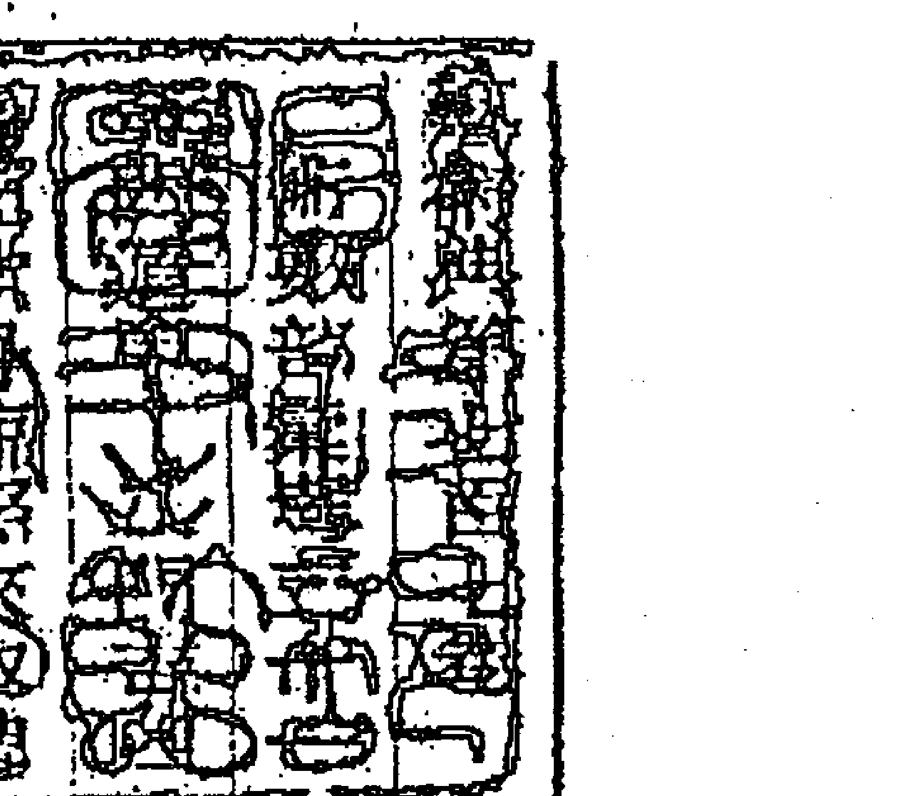

- 私人謀起，開門宜遠行所向通達。開門與乙奇臨已得月精所蔽，為地遁百事吉。
- 開門臨三四宮，金剋木也凶。
- 休門最好足錢財，牛馬豬羊自送來，外口婚姻南上應，選官職位坐京臺，定進羽音人產業，居家安禍永無災。休門宜修造進取並有所合，出五十里見蛇鼠水物吉。休門宜和集萬事。
- 門與丁奇臨太陰得星精所蔽，為人遁百事吉。休門臨九宮，水剋火也凶。
- 生門臨著土星辰，人旺孽牲每稱情。子丑年中三七日，黃衣撫笏到門庭。絲縠帛皆豐足，朱紫兒孫守帝廷。南上商音田地進，子孫祿位至公卿。生門出行六十里見貴人車馬吉。生門宜見貴人求事皆獲，又宜婚姻嫁娶上官吉。
- 生門臨一宮，土剋水也凶。生門宜見貴人造百事吉。生門與丙奇臨戊得日精所徹，為天遁百事吉。
- 傷門不可說，夫婦又遊迤，瘡疼行不得，折損血財身，天災人枉死，經年有病人，商音難得好，餘事不堪闖。傷門豎立埋葬上官出行俱不吉，只宜捕物索債博戲吉。傷門宜漁獵捕捉盜賊吉。
- 傷門臨二八宮，木剋土也大凶。
- 杜門元屬木，犯者災損頻，亥卯未年月，遊官入獄遊，生離並死別，六畜逐時瘟，落樹生膿血，禍來及子孫。杜門出行六十里見惡人，宜扼捕斷奸謀。如月奇臨主弩弩，星奇臨主而女，人身着青衫，此應三奇神也。杜門宜遊遊伏藏誅伐凶逆。
- 杜門臨二八宮，木剋土也大凶。
- 景門主血光，官符門庭非橫多應有，兒孫受苦殃，外亡並惡死，大畜也遊亡，生離並死別，用者要堤防。景門小利宜上書獻策選士，如出行三十里外見赤文大蛇，七十里有水火失物，如起造嫁娶殺宅長及小口。
- 景門臨七宮，火剋金也凶。吉門被剋，吉事不成。
- 死門之宿是凶星，修造逢之福必侵犯，舊年田地退，更防人口損財凶。死門宜行刑誅戮用死送葬，若射搬出此門吉。遠行起造嫁娶，主宅母死新媳亡，大凶。
- 道路不通四十里，見一人爭打則吉，如無主鰲恐凶。
- 驚門不可論，瘟疫死人丁，辰月酉月，非橫入門庭。驚門宜博戲捕捉捉闘訟吉，出行四十里損傷。
- 驚門臨三四宮，金尅水也大凶。

## 八門反吟

休門加地盤天英，生門加地盤天丙。

## 八門伏吟

上盤天蓬加地盤天英，上盤天芮加地盤天任。

## 九星吉凶詩斷

### 天蓬水星
字子禽，居一坎宮。訟庭爭競遇天蓬，勝捷威名萬事同。春夏用之皆大吉，秋冬用此半凶。嫁娶遠行應少利，葬埋修造亦嫌空。須得生門同丙乙，用之萬事得昌隆。天蓬時不宜嫁娶移徙遠行開爭入宅及修宮室。

### 天芮土星
字子成，居二坤宮。授道結交宜内星，行方值此最難明。出行用事當先退，修造安墳發福開。刑盜賊驚惶變小口，更宜囚事被官嗔。縱得奇門從此位，求其吉事也應名。天芮時宜授道結交，不可嫁娶訟移徙築室，秋冬吉春夏凶。

### 天衝木星
字子翹，居三震宮。嫁娶安葬産女兇，出行移徙過災迍，修造利埋葬般作事，且遲巡。天衝時不宜嫁娶移徙入官築室詞祀市賈。

### 天輔木星
字子卿，居四巽宮。時吉嫁娶多子孫，入官移徙築室吉。天輔之星遠行真，葬起造福綿長，上官移徙皆吉利，宜益人財萬事昌。天輔時宜請謁通財四。

### 天禽土星
字子公，居五中宮附二坤宮。天禽遠行偏宜利，坐賈行商俱利意，投謁貴人兩益懶，更利造葬皆增遂。天禽時宜遠行商買投。

### 天心金星
字子變，居六乾宮。求仙合藥見天心，商途旅福又迴新。更將遊遊皆宜利，萬事逢之福祿深。天心時宜療病合藥不。

### 天柱金星
字子申，居七兌宮。宜嫁娶入宮築室祠祀商賈，秋冬吉春夏凶，利見君子不利見小人。天柱時不宜入官市買。
天柱藏形諱守宜，不須遠出避禍為福，避難所謀皆不遂，遠行從此見凶危。惟宜修造嫁娶祭祀。

### 天任土星
字子章，居八艮宮。天任吉宿事皆通，祭祀求婚嫁娶同，斷滅孽凶移徙從事商賈造葬重重。天任時宜祭祀求福斷。

### 天英火星
字子成，居九離宮。滅孽凶，四時皆吉又移徙入宮祠祀商賈嫁娶吉。
天英之星嫁娶凶，遠行移徙不宜逢，上官文武皆宜去，商賈求財總是空。天英時宜竊身守道設。

教備禮將兵，春夏勝嫁娶無子孫，移徙上官修營皆吉，春夏用之有奮。

## 九星反吟

上盤天蓬加地盤天英，上盤天芮加地盤天任。
上盤同地盤，主孝服損人口。

## 三奇六儀吉凶總斷

乙丙丁三奇，與開休生三吉門，其中各一臨之方為三奇之蹤，此時此方百事皆吉。
三奇六儀，天地之機，陰陽逆順，至理元微。三奇者乙丙丁月星也，六儀者戊己庚辛壬癸也。受甲者為儀，不妥甲者為奇。
時加大甲一開一闔，上下交接。時下得甲申為伏吟也，加陽星為開時百事吉，加陰星為闔時百事凶。
時加大乙往來怱怱，與神俱出。時下得乙巳為日奇，凡攻擊行來者逃亡者，宜從天上六乙出為。

與日奇相隨，恍惚如神，人無見者，故曰與神俱出。六乙為蓬星又為天德，百事宜利，求利得聞喜，有移從入官市賈嫁娶吉。若將兵大勝，所向立功。人君宜施恩賞，不可譴怒行鞭朴之事。
時加大丙萬兵莫往，王侯之象。時下得丙為月奇也，又為威火之象，火能燥伏兵不起。凡政伐宜從天上六丙出，與月奇相遇，又挾威火比類王侯，又內為威火之象。此時用事逢害不遇凶害則吉。入宮得遷，商賈有利，將兵大勝。又丙為天威，宜上號令。
時加六丁出入幽冥，到老不刑。時下得丁為星奇，又為玉女，宜安葬藏匿之事。若隨星奇挾玉女，從天上六丁而與入太陰而藏，則敵人自不能見也。亦可請利娶婦入官商賈，百事皆吉無凶。若用兵主大勝。大丁為三奇之靈，行來出入宜從天上六丁所臨之方出，百事吉利。
時加六戊乘龍萬里，莫敢呵止。戊為天武，從天上六戊而挾天武入天門，百事皆吉。逃走亡命遠行萬里無所拘止，又宜發施號令誅罪伐惡闘遠謀大事也。
時加六己如神所使，出披凶咎。己為地戶又為六合，宜隱謀私密之事，不可表暴彊為之者必獲凶咎。入官嫁娶遠行造作大段用事皆凶，只宜市買將兵必敗。

## 六戊符使身月兵客死主勝

時加六庚抱木而行，強有出者必有闘争。庚為天獄，出被浸辱市買無利，入官嫁娶百事皆凶將。
時加六辛行逢死人，強有所作殃罰纏身。辛為天庭，不宜遠行訴訟快刑獄嫁娶市買入官不可。問疾諸事不利，將兵主勝客死。
時加六壬為吏所禁，強有出入非福相臨。壬為天牢，不可遠行入官疾病者進退移徙嫁娶逃亡百事皆凶。此肘用事必有仇怨為吏所呵，不可舉兵只宜嚴刑獄平訴訟。

## 三奇入墓

時加六癸衆人莫視，不知六癸出門即死。癸為天藏，宜求仙遠遁絶迹。從天上六癸而出，則衆人莫見，不宜市買入官還除嫁娶移徙入室，問疾病者重。又宜揚鞭朴之事。

## 大丙悖格

乙奇臨二宮太陽未也，丙丁臨六宮火歸戌也。乙奇未時及坤上木入墓，丙丁戌時及乾上火入墓。縱吉宿臨門，不可舉百事。

天上六丙加年月日時干並直符，皆名悖，不可用事，主紊亂。

## 六甲總斷

- 甲子甲午為仲甲，不可出入利逃亡。
- 甲辰甲戌為季甲，百事吉。
- 甲寅甲申為孟甲，宜守家不可出入凶。
- 今日是甲府符與時皆是甲，名為三甲合吉。
- 甲戌甲午乙奇臨之，甲子甲申丙奇臨之，甲辰甲寅丁奇臨之，亦名曰三奇得使。

## 直符總斷

甲加丙名為首逃，與百事皆吉。若得奇門則出行最良。
丙加甲名飛鳥跌穴，利為百事。
六癸亦為九地之下，逃亡絕迹。從天上六癸所臨之方出入，無人見者。
直符以甲子臨三宮，子刑卯也；甲戌臨一宮，戌刑未也；甲申臨八宮，申刑寅也；甲午臨九宮，午自刑也；甲辰臨三宮，辰自刑也；甲寅臨四宮，寅刑巳也。六儀擊刑皆凶。

## 天全遁甲身历

- 庚加丙名太白入火位。
- 丙加庚名荧惑入太白，百事凶。
- 乙加辛名青龙逃走。
- 辛加乙名白虎猖狂。
- 丁加癸名朱雀入江。
- 癸加丁名腾蛇天矫，此時忌為百事。
- 庚加太岁之干名岁格，加月建之干名月格，加本日之干名日格，加本时之干名时格，亦名伏吟百事不可用。
- 庚加直符名伏宫格。
- 直符加庚名飞宫格，百事凶。
- 庚加日干名伏干格。
- 日干加庚名飞干格，凶。
- 庚加癸名大格，不可举百事。
- 加已名刑格。
- 时下得癸名天纲四张，不可造百事。
- 直符伏吟。
- 直符反吟。
- 上盘甲子加下盘甲午，上盘甲戌加下盘甲辰。退奇门盖之不至凶害，不然灾祸立至。
- 上盘甲子加地盘甲子，六仪准此。

## 三遁

| 类型 | 上盘 | 中盘 | 下盘 |
|------|------|------|------|
| 天遁 | 六丙 | 生门 | 六丁宜求财 |
| 地遁 | 六乙 | 开门 | 六己宜求财 |
| 人遁 | 六丁 | 休门 | 六丙宜求财 |

## 天辅时

三元经曰：天辅之时有罪无疑，斧鑨在前天犹赦之。甲己之日己时，乙庚之日甲申时，丙辛之日甲午时，丁壬之日甲辰时，戊癸之日甲寅时，是天辅之时也。凡此之时有罪皆能释。

## 五不遇时

六甲地丁之时，阳星加之为开，阴星加之为关。此时移徙嫁娶不可行，謑怒鞭朴之事，行人不来，日中利远行。以甲日午时为庚午时，乙日为辛日，丙日壬辰，丁日癸卯，戊日甲寅，己日丑，庚日丙子，辛日丁亥，壬日戊申，癸日己未，皆时干尅日干，下尅时分损其明，名五不遇时。纵得奇门吉，不可作百事。

## 避三避五时

- 三篇生氣利百事，故曰避三。如甲己日用丙寅時之類。
- 五爲害氣百事皆凶，故曰避五。如甲己日用戊辰時之類。

## 時干入墓

乙未時乙奇入墓，乙為木木墓在未也。丙戌時月奇入墓，丙為火火墓在戌也。亦名三奇入墓，皆凶不可舉百事。

## 玉女守門時

庚午己卯戊子丁酉丙午乙卯，三奇遊六儀之上，名玉女守門時，利官庭宴樂之事。

## 五陽時吉凶斷

甲乙丙丁戊為五陽時，利為客官先舉兵揚旗鳴鼓耀武揚威以期決勝。五陽為舊神治事，可以出軍征伐遠行求利立國邑安社稷祀大祭臨武奪入官嫁娶造舉百事吉，逃亡者不可得。

## 五陰時吉凶斷

己庚辛壬癸篇五陰時，利偸主後舉兵伏旗旂待敵後動以期決勝。五陰為惡神治事，不可張揚。凡平宮移徙婚姻遠行選舉百事皆不可為，若禳災避禍祝求福逃亡者可得。

## 十干人君所利時

- 甲為天廚：此時人君宜施恩進有德賞行功。
- 乙為天廚：此時人君宜施恩德恤無告。
- 丙為明堂：此時人君宜施德行以彰天威。
- 丁為太陰：此時人君宜發倉庫施恩惠，不可行威怒悲泣商事。
- 戊為天武：此時人君宜施號令行誅戮。
- 己為明堂：此時人君宜明時務修封疆理城郭。
- 庚為天獄：此時人君宜決斷刑獄譏察奸邪。
- 辛為天庭：此時人君宜正刑法斷罪囚，不可為吉事。
- 壬為天牢：此時人君宜平訴訟決刑獄，不可為吉事。
- 癸爲天藏：此時人君宜揚威武行賞罰積藏收斂吉。

## 選擇曆書真本

六十甲子吉凶日：

- 丁丑丙戌甲午庚子壬寅癸卯乙巳丁未戊申己酉辛亥丙辰，皆干生支也，名寶日上吉。
- 甲子丙寅丁卯己巳辛未壬申癸酉乙亥庚辰辛丑庚戌戊午，皆支生干也，名義日次吉。
- 戊辰己丑戊戌丙午壬子甲寅乙卯丁巳己未庚申辛酉癸亥，皆干支同類也，名和日次吉。
- 乙丑甲戌壬午戊子庚寅辛卯癸巳乙未丙申丁酉己亥甲辰，皆干支也，名制日小凶。
- 庚午丙子戊寅己卯辛巳癸未甲申乙酉丁亥壬辰癸丑壬戌，皆支克干也，名伐日大凶。

## 四時通用八門捷法

凡每日出入用事，從開休生三門大吉。
甲子 乙丑 丙寅 辛卯 壬辰 癸巳 戊午 己未 庚申
休門在乾
休門在離上图图书集成博物汇编艺术典第七百七卷术数部汇考二十一之八

| 丁卯 | 庚午 | 癸酉 | 己卯 | 壬午 | 乙酉 |
| 戊辰 | 辛未 | 甲戌 | 庚辰 | 癸未 | 丙戌 |
| 己巳 | 壬申 | 乙亥 | 辛巳 | 甲申 | 丁亥 |
| 甲午 | 丁酉 | 庚子 | 丙午 | 乙酉 | 壬子 |
| 乙未 | 戊戌 | 辛丑 | 丁未 | 庚戌 | 癸丑 |
| 丙申 | 己亥 | 壬寅 | 戊申 | 辛亥 | 甲寅 |
| 辛酉 | 丙子 | 癸卯 |     |     |     |
| 壬戌 | 丁丑 | 甲辰 |     |     |     |
| 癸亥 | 戊寅 | 乙巳 |     |     |     |
| 休门在艮 | 休门在震 | 休门在兑 | 休门在坤 | 休门在坎 | 休门在巽 |

- 戊子
- 己丑
- 庚寅
- 辛卯
- 壬辰
- 癸巳

## 孤虚法

黄石公曰：背孤击虚，一女可敌十人。法用时孤百人，用日孤千人，用月孤万人，用年孤。惟有时孤最验，今立成于后。

| 旬 | 孤在 | 虚在 |
|---|---|---|
| 甲子旬 | 戌亥 | 辰巳 |
| 甲戌旬 | 申酉 | 寅卯 |
| 甲申旬 | 午未 | 子丑 |
| 甲午旬 | 辰巳 | 戌亥 |
| 甲辰旬 | 寅卯 | 申酉 |
| 甲寅旬 | 子丑 | 午未 |

## 五帝旺气坐向方位

旺气十倍，相气五倍，休气如数，囚气减少，死气减半也。

博物汇编艺术典第七百七七卷术数部汇考一十一之九

## 大金刚神直日百忌诗诀

- 消大有功
伍子胥曰：凡远行诸事，不得往天庭、天狱、天牢三神，大凶。常乘青龙历蓬星，凡出行百恶不敢起，大吉。

- 犯朱雀者，因死见血光，亡财于地。
犯白虎者，治明堂。
犯天牢者，治玉堂，即此厥彼处以炎。

- 犯青龙者，父母兄弟长妇死，入狱出逃亡，贼主凶恶事。
犯元武者，亡财走失利，忌奴婢遭劫，贼伤胎孕也。
犯天刑者，出军必伤，主头狂大畜死亡之事。

- 凡犯天刑者，出军必伤，主头狂大畜死亡之事。
犯天牢者，人伤贼害，亡财失利。
犯元武者，亡财走失利，忌奴婢遭劫，贼伤胎孕也。
犯青龙者，父母兄弟长妇死，入狱出逃亡，贼主凶恶事。
犯白虎者，治明堂。
犯天牢者，治玉堂，即此厥彼处以炎。
消大有功
伍子胥曰：凡远行诸事，不得往天庭、天狱、天牢三神，大凶。常乘青龙历蓬星，凡出行百恶不敢起，大吉。

建计阴满罗睺平定水贪执水破破木危阳成是土收紫开金闭月孛建为青龙用为头，除是明堂黄道游，满为天刑平朱雀，定为金匮吉神求，执为大德成黄道，破为白虎危玉堂，成为天牢坚固守，收为元武盗贼秘，开临司命为黄道，勾陈闭为主亡流，黄道出行为大吉，行军战黑龙变。

月正西方面东大胜。

正五九月正南方面北大胜，二六十月正东方面西大胜，三七十一月正北方面南大胜，四八十二月正西方面东大胜。

## 月建九星出行诗诀

# 卷五 图书其月

奎娄角亢鬼牛星，出军定是不还兵。若还远行逢贼盗，经求财利百无成。发船定是遭沉溺，买卖交关不称情。穿井用功难见水，拜职为官到任重。婚姻仍主刑损害，出丧冲藉损生霧。欲识星辰吉凶处，出在符天秘密经。

## 占贼方位

视元武所立神为来方，支临为去方。元武盗神乘天驿马，盗贼从克方蹦垣越屋而入；若无天驿马，必穿穴而入。元武盗神与畏绳元索绊者，其贼跳屋从天窗中缘绳索而下。元武盗立地方，从水窦中而入。

## 占何人为盗

元武属阳为男，属阴为女。有气为少，无气为老。次看何类为之：寅为吏人，卯为经经纪人，辰戌为凶恶军人，巳为手艺人、店舍煊治人，丑午为旅客，申为过犯人，未为熟识人，酉为匠及金银赌博酒客，亥子多水族。吉神并者豪纵，子囚神并囚外家儿。

## 占喃

天辅为风伯，天英为火神。天辅乘旺相落离九或克下落的宫或克日时二千，主风晴。天英乘旺相落三四宫或克日时二千，亦晴。天辅届时伤门乾巽上见大吉小吉，勾陈天后主晴。大抵白虎主风，元武主雨，再以顶盘八神参看，无不准确。其日期以落宫系何干定之。又阳星阳干合于阳门之上，及有干元带合克日时，阴星等克雨。

## 占雷占雹

太冲直时伤临乾巽上，见螣蛇从魁太冲有雷。雪则乾兑二宫主之，或天心乘壬癸到兑，或天任乘壬癸到乾，皆主雪。各以落宫所得之干以定其期。或天蓬直时直使到巽，见天罡胜光日破，主雪中有雷。见后阴元武亥子从魁，主大雪。朱雀风伯雨师，有小雪。天蓬六合伤门为直使同会震，主大雪久阴之象。

## 占幽邈

开门加生旺宫，再有三奇德合吉格，主幽邈。再遇太岁月建乘吉神来生，高擢甚速。或吉格不旺相，或旺相无吉格，或旺相格各吉，太岁月建不来相生，亦为不利。

子午卯酉占物占病占术典第七百七十七卷术数部汇考二十一之十

## 占验通身局

太岁为星恩，月建为钤部，日干为自己。太岁月建星同生日，日干乘星，日干落宫得吉格局，主有星恩庆应。反此不能。

## 占降罚

开到鬼废休囚之方，或上带击刑入墓迫制无格，当有降罚之应。

## 占上官

依方所向，须细端详。如上官向取利方，所得宫神各依向方宫神，以得吉格为主。得吉则必升选，无吉格仪旺相，除其职。若无吉格星又休囚废没，有罢黜之象也。凡凶格伏吟返吟飞勃伏干五不遇时入墓等格，均为不利，便不必论其方向矣。

## 占官员历任归结

本官年干本命地盘上乘吉星吉门吉格者，大利。若本方得吉格，余宫犯击刑飞勃伏格，及本干万有劫杀丧门刑害者，不利。如无吉格，若得奇得门得星者，荣归；不得者罢黜。乘凶格者，大不利。

# 卷五 占官员考绩

直符为天官，开门为官星。开门受直符宫克，又休囚废浸不得星得格者，凶。旺相者罢职。得吉星者，贵降。不受直符宫克及相生者，无事。

## 占新任地方远近内外安否

天禽落宫为帝畿，余为外地。各宫六仪上奇定其分野。过甲戊同宫，阳日用甲，阴日用戊。开门落宫上有天蓬，则主盗贼大虎向击兵乱为蛇内壬，若遇水激旱灾。不犯此者，自保安康。定州分野，各以本邦或远或近细察地方。

## 占新任官美恶并何处人

凡未有新官受治地方，欲预知为何处人及人品美恶，以官星为主，上乘吉星为好人，乘凶星为恶人。
灵禽经曰：天辅文雅天任慈，天心厚正天禽风，离但凭冲到庭，英星胥烈芮贫淫奸诡天柱蓬大恐，九星飞布是精明。
天干分野歇甲经：海外乙夷丙楚丁岱江淮离，戊己韩卫中河济，庚为秦地辛华期，王为燕赵井魏分，常山在癸不须疑。
开门为官星。

## 占科名

凡占科名，以日干属壬子，直符当天乙为分司，景门为文章。直符当克日干，天乙宫克日干宫，景门宫克日干宫，日干宫克景门宫，及景门宫名休咎废改，俱主失意。如直符天乙来生日干，景门宫旺相者，必得科名。再遇三奇吉门吉宿于本人年干之上者，大利。

## 占殿试甲第

以太岁为天子，月建为主司，日干为士子，景门为策论。景落旺相之宫，上得三奇并太岁月建来生日干者，为鼎甲。不生日干又无三奇者，为三甲。

## 占小试

凡士子小试，以天辅为试官，日干为士子，六丁为文章。六丁得旺方，更兼天辅乘生，又得三奇及开休生景四吉门者，为上吉。文星旺试官生，不得三奇吉门者，为大吉。文星虽旺而试官不生，或试官生而文星不旺，仅得中平。文星不旺试官又克，幸有三奇吉门者，为下。试官克害，文星不旺，日干又在休囚宫，又无三奇吉门，或得死门及诸凶格者，凶。

## 占考期

凡士子候考未知何期者，以天辅为试官。冬至自坎至巽为内，自离至乾为外；夏至自离至乾为内，自坎至巽为外。文星在内者，主上半年；在外者，主下半年。冬至后以十一月至四月为上半年，夏至后以五月至十月为下半年。更以所落宫分野以定日期，以十二支配八卦法决之。

## 占武试

占武试，以直符为试官，时干为士子。甲申庚为箭，甲午辛为红心，景门为策论。专以甲申庚落宫克甲午辛的宫或相冲，为箭中红心。再看景门得旺相，又与直符相生者利。再有二奇吉门吉宿加本人年干，大利。

## 占技武

天衡为武士，直符为师主。直符宫生天衡宫，生直符宫主利，彼此相克不利。天衡若作直符，大利。遇反伏吟不利。

## 占种贷

直符为物主，天乙为称贤之人，各以所落的宫分生克论之。直符生天乙，天乙生直符，不遂。直符克天乙，天乙生直符，不遂。

# 卷五 占合嫁

地盘生门为财主，天盘生门落宫为嫁计。地盘克天盘不成，天盘克地盘亦不利。天盘生地盘，和美利主；地盘生天盘，全美。

# 卷五 占求财

须看生门落宫，并看上下二盘格局。经云：生门之上好求财，上下两盘仔细猜。吉格吉星求必遂，一有不吉所求乖。一有不吉所求减半，休囚死废全无用，生旺相和事事谐。

# 占得财

地盘时干在内地上得三奇休生二门，天盘甲子戊亦在内地会开门，此财甚速。不会二门所得，主迟。又以本宫所得何支定期限。若时干与甲子戊俱在外，或一内一外，俱主迟。伏吟亦然，空亡终不得。

## 占婚姻

凡男家求婚、女家求婚，或方议结婚，或将为娶嫁，以乙为女，庚为夫。两处落宫相生合则成，相刑克则不成。又以天六合为媒人，如六合生乙，向女家；生庚，向男家。庚宫克乙宫，乙宫克庚宫，彼此互克者不成。乙宫带击刑，主女性凶恶；带德合，主性温良贞洁。庚带凶神，夫性暴烈；带德合，主浑厚。

## 占招赘

女招夫，须天盘大庚宫生地盘大乙宫，庚上得吉星，主夫性温良长久。反此不利。
男赘妇，须地盘生天盘。

## 占娶妇

乙为女，庚为婿。两宫相生比者，如期娶嫁；反此有迁延。如丙庚加年月日时于年月日时于加庚丙，不独迁延，更有他咎。

直符为买物之人，生门为所买之物，生门落宫为物。生门来生符宫，其物得价有利。开与本符落宫相生为物主相抚，其物难买；相克则已成交。直符当得旺生门宫，利卖者；生门宫生直符宫，利买者。

## 占贸易

春夏旺，天冲禽宿当权；秋与冬，余星到处皆无利。若遇天蓬，大有凶。

经云：欲占生门落宫旺相，再有吉星及三奇吉格，主买卖兴隆。如不合者平常，若遇凶格大不利。

## 占利息

凡占贸易得利多少，须凭生门所临之宫。旺则多利，相则利平，休囚利微，休囚有凶格主消折。生门居旺相，再看甲子戊上乘何干，以决其数。
直符为财生，天乙为取财之人，生门为财神，各以生克旺相论之。直符克天乙吉，天乙克直符凶，天乙生直符吉，直符生天乙凶。生门与天乙同克直符，其财无失；同生直符，子母俱全。生门与天乙有一生一克者，不全则迟。天乙财神得休囚气，虽生直符，终是无力，不全主迟。

## 占放债

伤门克天乙宫，去人负心任事；天乙宫克伤门，彼必争闹不服。伤门与天乙同生直符，子母全得；同来克直符者，不还。伤门生直符克天乙，还；生天乙克直符，不还。天乙旺相克伤门，虽有不还；休囚生伤门，虽有心还无力，克还亦不全。若天乙乘庚辛来克直符，有经官之事。直符克天乙乘六丁或开门加四宫，亦有经官之事。甲子戊会开门加丙地时于，其价速迟。

## 占索偿

凡财物争竞，符为争竞先动之人为客，天乙为后动之为主。争钱财，龙为主；争田产五谷衣物，刺主。直符落宫旺相，大甲落宫与生门落宫生直符，利客。天乙旺相，六甲生门生直符，后动者得理；先动者得财。若财神不生两家，却两家来生财神，俱不得。经云：来生两家各得半，旺相已生何可多。

## 占词讼

直符为讼者，天乙为对者，开门为问官，惊门为讼神。惊门一门俱克对者，则对者败；俱克讼者，则讼者败。一克动讼，一克对讼，则两败俱伤。开门生讼者，惊克讼者；或开克惊生者，俱为不利。对者亦然。又直符天乙旺相为胜，休囚为败。若直符生天乙，则讼者和；生直符，主对者求息。不必以二门定胜负矣，总以落宫决之。
经云：两败已安排，漫合奇星讼不乖。若是惊伤会凶宿，死门合一大凶该。

## 占官事占提缓急

时干为己身，直符为官长，六丁为公文，直使为差。直符落宫克天乙宫，六丁临干内地，其提缓。若直使临干内地，其提急。再有击刑，来意至急。三奇至善，若相生，公差与官长见喜；相克，见怒。又看六庚二为天狱，落休囚易结，旺相则主缠绵。
经云：断狱须知庚上求，庚干爻挂见才休。一逢旺相终难结，三奇至善可无忧。

## 占官事准连否

本人日干为有事之人，庚为天狱，辛为天庭，壬为天牢。本人日干以地盘为主，上三凶煞以天盘定之。犯一星与日干同宫，定有牵连。再有击刑，定有责罚。得天网值枷锁临身，再有凶格等煞，连累甚重。若得三奇吉门吉格，无碍。若不犯上庚辛壬癸，定不牵连。
经云：天牢天狱地藏神，犯此虽清系不清。

## 占文状牵连否

顶盘朱雀落宫克时干落宫者，主有牵连；反此无事。朱雀旺相克时干，运气甚重；休囚则轻。时干被克旺相者不妨，休囚则重。犯凶格重且凶甚。

## 占刑杖轻重

本人年命日干宫上星旺门吉，并有三奇吉格者，官员贵降，庶人罪轻。星不旺相有三奇吉门并吉格，或无三奇得吉门并诸吉格与星旺相，主罪轻法。若无吉门得星旺相，虽无三奇吉格者，罪稍轻。及己身本命有三奇吉格门不吉星不旺相，或星旺相得三奇及诸吉格而门不吉者，罪主减等。或得三奇吉格星不旺门不利者，罪重。如门奇星仪全不得，大凶。若本命日干犯击刑，必有刑罚之苦。

## 舆讼

丁为朱雀为讼神，雀落阳干之宫，又落宫与天狱相冲，或乘景门，其讼必兴。若落阴干之宫，或按江入墓不兴之象也。又归旺相之宫者，其讼大起；落休囚者，易结局也。

## 占状词

开为官长，景为文状。开到宫生景门宫吉；景到宫生开门宫不吉。景门宫克开门宫吉；开克景则不吉。又景落宫旺相则吉，休囚废没不吉。旺相生开门吉，休囚废没克开门不吉。

## 占罪人开释

地盘六辛为罪人，上乘吉星吉门吉格，再克开落之宫，或与落宫相生全者，释罪主速；不备者少迟。若开落之宫克六辛宫，再得休囚者，准绳难解。又天网低难释，天网高则主释罪。
歌曰：天网四张无路走，一二网低有路通。

## 罪人权重

开为问宫，六辛为罪人，大玉为天牢。若开克辛宫，辛上又乘大玉，防有牢狱之灾。缺一则不为害。

## 囚出狱

主为牢狱所加，地盘干为罪人。壬不独甲辰，然凡六甲旬中六壬时皆是。如甲子旬，即甲为天牢之类也。他做此，必地盘干上克大壬所得之支，再得开生二门，出自速；不得一门者，主出迟。以受克之日为出期。又必得六丁时或大丁落宫生囚人之方才看开休生二门也。

## 讼讼

六丙为本主，六庚为被治之人。大丙落宫克六庚落宫，丙又得其旺相，开为宫长落宫亦克六庚落宫。大庚再犯死门凶星死神死气休囚废没，其人必毙于死。

## 占行期

若出行或被牵絷不能摆脱，或被人节制不能自由，或犹豫不定，须以时干为起行之人，日干为牵絷节制之人，开门为起行之期。若日干克制时干，不能行；时干克日干，即行。日干宫上下皆来克者，得行。若犹豫者，看时干在外为去，在内为不去。但看开门落宫下得何干，以定其期。

## 走失

时干为失主，八门物类为逃亡之物。上乘旺相星宿又乘六合，不可得；得休囚废没星宿。九地太阴有人潜藏，九天远走；元武被盗贼，蛇有人盘诸羁，朱雀有信，勾陈有内人相勾引而去。又看六庚有小贼盗时当走之。

## 失财物

年格年获，月格月得，日时亦同。又天网低可获，高不可获。
八门落宫得元武，有人盗去；不见元武，自己迷失。元武克八门物类宫，物类宫生元武宫，主人盗去。又看六甲旬中空亡，如落空亡，失迷或被盗俱不能得。又在内四宫为宅中，外四宫失落甚远。地盘宫分论方向，地盘支干论日期。元武乘阳星为男人，阴为女子；有气为少，无气则老。以武宫天地盘看，以干决衣服颜色。

## 渔猎

伤门为捕者，甲午辛为应，甲戌己为犬，甲寅癸为网。生克论得旺相，休囚论多寡。天盘星克伤门宫得物，伤门宫克天盘星不得物。天盘生伤门宫，物主走脱；伤门宫生天盘，易得。上盘见甲戌用犬，见甲午用鹰，见甲寅用网。地盘再休囚，上盘生旺，必多获；反此少。捕鱼宁用甲寅落宫克伤门宫易得，无克寡得。

## 干谒

休门当分属所见之人，休门当属于休之时干宫。再有三奇，必主意相克；更无奇到，主不得见或不悦。但彼此旺相则见，休囚则不如意。所往之方得休门者见，开生二门未能即见，伤门不吉。

## 访友

凡访友寻人，以所往之地盘为主，天盘为客。要相生合得吉门去，必相遇。若门凶，上下二盘相克，则不过。庚通作月日时伤格者，主不过。

## 访人

如访者在坎北方，则落八宫所住。地盘土星生对宫乘星，反受对宫乘星克者，主相遇。如东北西两方中有吉格，所求皆遂；凶格不能，则相打则相见。

## 送人

直符属主，天乙为客。若落宫相生若无关生厄符者，主求有得；克天乙者，求生不遂；相比者，可求。又甲落阳干为求财事已，落阳干为所托事景，落阳干为文书事，与事同类表支。

## 占寿

人以九十岁为终，每宫十年。天衙落宫与死门落宫远近以定其数。天衙带旺相，一生无害；若休囚废没，常有坎坷。占者将已经岁数除讫，以所得余宫岁数论断。阳遁顺行九宫，阴遁逆行九宫。年至三旬，得四数除三十，有十年而已。余仿此。

## 占病

天芮为病神，生死二门为愈败。本人年干落宫，得生门不死，得死门难愈。若年命休囚废没，再有凶星凶格，大凶。余六门亦主缠绵。以天芮落之宫为愈期。占父计病，得年干入墓；同类病，得月干入墓；儿女病，得时干入墓，皆主大凶。又凶星凶门加病人年干，更无救神，不可救。若凶星加奇门上下干相救，可死中得生。若奇门星更天地相合，不药而愈。

## 眼疾

离为目，九宫上得吉门星格愈迟，则痊愈吉凶不分，主缠绵而不愈。

## 六畜病

看八卦卦神上得吉星门格者，主无损伤；反此不利。

## 胎孕

凡占胎孕男女及产育难易，若以坤卦为主卦，上所得门为胎，天盘为产室。克门子不存，坤克上门胎不安，门克坤宫孕妇常病。天盘克地盘，胎妇不安。得门阳为男，阴为女。胎如伏吟，为子恋母腹，胎主稳而产迟。见白虎为血神，其落甚速。门到坤宫，若为入墓，必是死胎。天盘星为门宫二者之墓不吉，为坤之墓不利；克门之墓不利子。若吉带三奇更妙。

## 分居

坎离二宫为阴阳分位之始。如自十一月以离坤兑乾为内，坎艮震巽为外。以年为父，月为兄弟，日为己身，时为子。凭按本局。
十月属阴，以离坤兑乾为内，坎艮震巽为外。以年为父，月为兄弟，日为己身，时为子。凭按本局中干支推之。如居两处为分居，一处为不分。以干分支干照岁月日时以定日期，以旺相休囚定吉凶。

## 迁移

子加丑上是也。博物汇编艺术典第七百七卷术数部汇考二十一之十八

凡迁移，方上得奇门三吉，再时天禽四季日皆吉。天辅春夏大利，天心秋冬大吉，其余星俱不利。

## 嘱托

天乙宫为求托之人，直符为所求之人，直使为转托之人。符克使不利，生直使利。使克符宫彼必不悦，生直符虽依其言不快，利直使生天乙克直符不成。直使生而符克天乙不利。符使俱生天乙或俱为天乙所克，其事难行。一不生亦不灭，符以落宫定之。

## 间谍

直使为作者，丙为自己，庚为仇人。以月将加本时，丙为直事所得及相术则动，不术不动。术动则看庚与直使飞星，庚旺使囚无益；庚飞星克使星亦无益；使飞星克庚乘星方得。

## 行诈

大丙为己，六庚为敌，朱雀为诈伪落旺地。六丙落宫克大庚落宫，或大庚落宫生六丙落宫，其术得行。若庚被丙克在旺相之乡，或生六丙不在休囚废没之地，主半疑半信。丙被庚克或生大庚不旺。

## 行人

以本人年命合当时局中干支为行人，以支为宅舍左右，为来人迟速。如占东方人得丙方即来，北方不来，南方在路。其日期以地方远近旺相决之。如行人在甲子生者，在南方若入坤兑乾将来过坎即至，入艮迟；与三方又向他方，前途我之半路有阻。再看吉凶神煞以定安危。又天蓬天芮俱主行人，千里外者看天蓬，千里内者看天芮。时下得蓬芮为来，即以时干为来期。伏吟不来，反吟来。三奇吉门全于行人年干之上，独便到；凶星干门主有妨碍不来。又非格年来，月格月来，日格日来。

## 请人来否

盘在本方宫不得开门，主不来。所请方不落空亡，得日干格者来。
与今同事异也。

凡人一事两人协之，或两人各为一看。两人年干原宫上得何干乘之，如乘阳干者去，乘阴干者不去；俱乘阳干或俱乘阴干，俱去俱不去。又乘旺相之星去速，休囚则缓。

# 卷五 在外人家安否

日干为主，十干生处为家。如甲木生在亥，亥为乾宫之类。看乾宫地盘中无凶星凶格者，家中平安。若有凶门星等格者，看克害何干，即依干之六亲决之。年知父母，月知兄弟，时则为妻子有咎也。
看外方上下二盘得三奇吉门及诸吉格者，无不安稳；反此定咎之轻重。

# 卷五 远信

六丁落宫为信，时干落宫内外为迟速。临外信迟，丙主速。丁奇受制休囚，轻则信迟，重则无信。朱雀掠江永无音信，螣蛇天矫迟滞难前。大丁带三奇德合而有吉信，击刑若见凶信。生门入墓何能望信。庚格见而准期。元枢经云：本人居地景门临北地南，占信息道。

## 在外投宿吉凶

时干落宫遇蓬芮英柱俱主恶人，余五星皆吉。落宫克时干，主有侵害。时干落宫遇三奇吉门吉格，虽有恶意而不敢害；无吉格但乘旺相，亦无碍。若时干犯凶星凶格及休囚废没者，当主侵害。

## 水路舟船善恶

震三宫为船户，离心为上吉；星任冲半吉；蓬芮英柱大凶。

## 道路吉凶

时干所落前一宫得天蓬为贼盗，如无不过。时干所加本宫得三奇吉门吉格及旺相者，道途安稳；即前一乘蓬亦无妨。

## 占约期

年为尊长，月为同类，时后辈日为己身。在直符前者先至，在直符后者后至。所落宫相生至相克不至。俱在前后者亦然。伏吟阳星不至，格勃亦然。

## 占来曾出门先定期

与久训 书售 售也 一 图博物集编艺术典第七百七卷术数部汇考十一之二十## 戊令飞章自月

阳局天蓬在丙四宫，前半年回，在外界四宫，后半年回。阴局同，以落宫十二支位定所得其支，自以某支论限。

## 占回乡

凡人久在他邦，欲回家乡，未知得回否及何日能回，本人年命占入局中，落内界主回，以地盘支干定其日期。如年命落在外界，虽有回家之心，终有牵缠。上得吉门吉星回家平安，上得凶星门回家有碍。

## 占路逢同伴善恶

凡出行在外，中途遇伴，不知善凶，看地盘时干为己身，上得何星以定同伴。如禽心衡辅任为吉人，蓬芮英柱为恶人。恶在得旺相，时干厉废没之地，主有侵害。如时干旺相，凶星厉没不敢害。俱旺俱废，亦不致害我也。如凶星害时干，得休生开井二奇吉格者，主被害中有生意。时干旺相，得刑格凶格者，虽有后无妨。

## 占领文迟速

六丁与直使宫相生则连，相克则遁。又大丁在何宫相生，即以本宫支于定其日期。

## 占给假

直符为尊长，天乙为卑小。直符落宫克天乙落宫，生直符落宫，俱不准假。落直符宫生天乙宫，天乙宫克直符宫，推假。两宫相比者不准。

## 应役

开为贵客，直使为己身。开门宫生直使宫，直使上又得三奇及旺相吉宿，大吉。与贵客宫相克，并凶星休囚，主凶。银粮开生二门主之，上不可见天蓬诸凶煞，及再克直使者，不利。解罪，天上六辛主之，须休囚不克直使，使宜旺相及克六辛宫，或辛生直使者，平安。若使生六辛，防其欺蔽。如不相克制者，可期无事。解罪人，六辛若带合元，须防逃走。不犯恶煞凶格，终始无迤。

## 奇门遁甲

本人年命上乘六辛落宫，得阳干再受开落宫之克制，其解无疑。反则未然。至于谋遁不备，倘在辗转耳。

## 和事

庚丙为两家相挠之人，甲子为和事之主。甲子落宫生两家或克两家，则和有准。一生一克者，不和之象也。若甲子在旺相宫中，庚丙在休囚之分，亦当主和。

## 退役

如阳局时干从乙丙丁三奇为退，若在六仪时干主不能退。丙时干该退，上见庚临为之火是主进，而退亦不能。如阴局时干得奇为进，得仪为退。或丙不归庚为入太白，凡事主退也。

## 公私归结

凡人事体经纬归结无期者，已到官为公事，未到官为私事。看时干落宫，时干在坎卦生于子，为阳气始生之地，万物方动，事体不能归结。星旺门顺，方可归结。时干在坤卦，气乃土与地相连，阴阳交接，行不能行，止不能止。时干到震卦生于卯，震属成刚，震振动也，事主大发。星旺门顺可成。时干到巽，大往小来，始植者生荣，已萌者不长，新事不止，旧事渐消。时干到五中央戊己之位，阳坤阴艮复始接通，万物得之而生，理之而长，事不能结。时干在乾卦生于亥，阴气极也，纯阳初生，私事则消，公事则发。时干到兑卦生于酉，肃杀之令，万物老死，又危者说也，为口舌，为官讼，阴谋善事体当泄，又为天地赏善罚恶之地，万物至此而决，归结无疑。时干到艮，主进退无常，又艮者止也，占人进退不离其居，占事目前虽完，后必又发。时干到离卦生于午，阳气分位，阴气生焉，刚处其外而能安居，阴柔在内而不能安分，主公事关结，私事将起，占人有不正之义也。

## 禾稼

天任落艮，庆主体，再得青龙六合功曹太冲，主四民乐业。若不落艮震，主年歉。再以青神月将分旱涝。如天任所在，有蛇雀巳午天空太乙，主旱僻送；天后主涝。又生门主麦，伤门主谷。看三奇太常功曹赞人在生门宫则收葵，在伤门宫则收谷。

## 罗

三奇吉门吉宿全于金木之宫为吉，须要下不克上宫及门为贞。若门吉星奇皆不至金水之宫，而更克上宫星及门为无灵。

## 捕盗

天蓬玄武宫为贼盗，伤门宫为捕人，时干宫为物主。伤门落宫克天蓬玄武宫易寻，时干宫再克天蓬玄武宫易捕。若伤门宫生天蓬玄武宫，不实捕捱。天蓬玄武来克时干伤门难获。伤门与天蓬玄武同宫，时干再克，捕无不获。天蓬玄武同宫无别，必聚一处。两处在四方，旺相难捕，休囚易获。乘大合为大盗，天纲低可获，高难捕。

## 捕亡

六合为逃人，伤门为捕人。六合宫生伤门宫自归，克伤门宫不可得。伤门宫克六合宫易得，生六合宫必有盗赂。伤门与六合同宫有欺蔽。值年月日时格则可获。天纲在一二三四宫可获，在五六七八九宫不可获。又人假合太白入纵同宫必获。又阴时可获，阳时不可获。

## 捕罪人

开门为官长，直使为公人。罪人旧年命直使落宫空亡，不得加临本人年命，其获速。一内一外，其获游，空亡者不获。如甲子旬中空戊亥，地盘得戊巳六合是也。

## 官长喜怒

开门为官长，时干为己身。开门宫克时干宫，被击刑诸凶格者责罚。有凶格不相克者无碍。若占得六甲时名为天辅时，或六丁时，虽有凶格及被克制亦无碍。见尊长亦然，惟以年干为尊长。

## 蝗蝻

死伤惊杜临日干主来，反此不来。

## 种植

冲为花神之主，克为树木之乡。得宜落宫得旺，旺则主生，休囚主死。生则为活，克则为死。吉格为生，凶格为死。旺相来生吉格盛茂之微，休囚来制有凶格草木枯焦。若吉凶相半者，先活后死或先枯而后生。要知必长，须求壬癸戊己四干头来生自活，不生者终死无昌。又得三为生，五归死气。又时干入墓，不过时庚丙格勃俱不利。值伏吟，阳星为吉，阴则凶。

## 人谋害

庚为仇人，甲为己身。庚落宫而克甲，谋害多也。逃甲落宫而克庚，不谋自信害则甲落宫而受击刑，不害。要逢旺相，虽击刑亦无遮。庚金上下之星皆火，及甲申庚作直符，俱不能害。

## 遇难避方

凡有危难逃避者，不知何处可去，当看杜门、大丁、大癸、六合宫、天上太衡及生门所临之方，又生本时干，此数者合一件则吉。再遇曜吉三奇大吉，反此不利。

## 逃避可否

避兵看大庚，避贼看天蓬，避宫讼者看大辛。时干为己身，大庚克时干，不如丙地不必避；加丙地不克时干，亦不必避；克时干不必避。如时干不克时干者，亦不必避。克时干临丙地加时干，俱为当避也。天蓬大辛同此。避仇人，先动者为客为阳，六丙主之；后动者为主为阴，六庚主之。客占以大庚落宫克六丙落宫又临丙地，当避；或克不临丙地，或临丙地不克，俱不必避。若六庚乘休囚之宿加丙，不必避；乘旺相之宿加丙，当避。主占看六丙同，惟丙下临六庚，凡事当退，亦不必避。

## 求师儒道

所往之方上得天芮，可遇明师。来生时干值避无疑，来克时干必不投合。时干或生或克天芮，亦无用。天芮方上有三奇吉门及诸吉格者，方为明师。

## 设教

辅德师长之星，直符为主者，天芮为弟子。直符宫生天辅宫，辅宫再得二奇吉门吉格者，必谐。其余皆不安也。又天芮在旺相之宫，子必多；在休囚少。往方得吉者，吉凶难亲。

## 炼丹

凡炼大丹及一切炉火之事，坎为真铅，休门主之；震为真汞，伤门主之；离为真砂，景门主之；兑为真金。其余乾金艮土巽木俱为杂气。又月将加本时，子为真铅，午为真砂，卯为真汞，酉为真金，其寅申巳亥俱为杂气。天蓬为真铅，天冲为真汞，天英为真砂，天柱为真金，其余芮辅禽心任俱为杂气。凡青龙俱为杂气。天蓬为真铅，天冲为真汞，天英为真砂，天柱为真金，其余芮辅禽心任俱为杂气。此俱会中五中地盘得丙丁二火，天盘壬癸二水，是可成。丙有杂气不成。

## 承仙

一法曰：阴阳奇偶论。地盘本身日干为主，上得心苟二星、生门并大仪三奇，俱生日干，占时又得大将者，有求者无。心苟二星是无明师。有心苟二星，不得生门并大仪三奇来生日干者，不能。

## 祈祷

凡祈祷雨泽、祭祀禳福、一切书符作法、造进表词之类，俱看天禽所在，下得神鬼风云龙五遁，方得效验。反此不验。

## 鹊鸣

凡遇鹊鸣，急视景门在直符前，一切迫来临前一二，口舌；前一二，婚姻；不然争讼关锁门庭前四，鬥战；财利相争。直符后，一事涉女人；后一二，欺淫欲奸萌；后三，亡失衣物牲更章。大两下值何神，河魁则贵有灾，大畜有伤；从魁在下，寡妇传音；上逢吉将，酒食迎；传送在下，人来觅物；小吉在下，妇女喜成；腾光在下，微召忻；太乙在下，大吏相寻；天罡在下，争讼死；太冲在下，酒食迎；功曹在下，庆讃祥葆；大吉在下，亲戚得朋；神后在下，事主奸淫；发明在下，吏索公文。又须审整过何方隅，吉门则吉，凶门则凶。

## 雀噪

看朱雀所临之下得何奇何门，以决其事。开门得奇，有亲朋至或行人远归或主酒食。休门盖奇，主有喜事喜信及婚姻之事。生门盖奇，主得田宅财物头畜之事。若不得三门及门迫奇幕，俱主无所系也。更看景门所归，吉格主有喜信，凶格则有忧信或小烦恼。

## 占怪异

怪异狗嚎釜鸣火灾水灾牝鸡晨鸣之类，以时干所加下得三奇吉门吉星吉格者平安；无奇门吉星犯凶格凶星者，难无事。若吉多凶少，福亦无妨；吉少凶多，岂能无碍。丙为前半年外生后半年，以八营定其日期。星犯凶格凶星者，难无事；若吉多凶少，福亦无妨；吉少凶多，岂能无碍。丙为前半年外生后半年，以关系也。雀地盘梦时干上门星俱凶，得三奇吉格或无三奇吉格星门俱吉者，皆非吉梦，然亦无凶。若得星门奇诸吉格，主大吉；反之皆得诸凶者，大凶，即吉梦亦当凶兆。若时值甲申空亡，即属幻景，无所。

## 占动四体吉凶

眼属肝为木为震，耳属肾为水为坎，骨属土坤，左臂属巽，右臂属坤，左足属艮，右足属乾，右臀属兑，左臀属震，背腹膈中以上本方。得奇门吉格者吉，不得着平平；凶格着凶。

## 占病

悬系一法少人知，问人年甲病先知。男从坎上顺数起，女向离宫逆点推。数到病人年甲上，看他因病预先知。子午卯酉定是死，寅申巳亥不开眉。辰戌丑未恐霍乱，此是神仙病枢机。震巽相逢手足麻，口中恶气眼生花。天保应来相助，若不相投气喘加。坤艮脾伤胃不开，心中结定滞凝怀。腹脐疼痛避腰腿，阴邪见怪有飞灾。乾兑多头痛，沈沈六脉微，冷积并冷气，其病在肾脾。坎多呕逆，久治难差，医人虚常盗汗，种食渐消除。

## 占阴宅

白虎年庚岁月，即从时干起。大神将福来信，皆从日干定。大脑内三爻前三十年之过去，外三爻后胜蛇为坟穴为水口，勾陈为山又为罗城，玄武为明堂又为水流来去，朱雀为对山左砂，青龙右砂。三十卦之吉凶。

## 占功名

奋门临本命，养就瑚琏之器。勃格加行年，暂滞坑堑之论。芮心任辅马四畔香逊职，莲英街住纳癸名。英得三奇位居南粤，蓬遁一白贵主北京。柱心为系阁，剑锋耀日；衡辅乃秀气，文光射天。禽合辅四星对节钺，芮冲辅弼列陪臣。勃格生局假名咸德，克兮虚位。任居鬼户僧道之辈，心号天门医卜之流。有奇有名登虎榜，不迫不战早步青云。左青龙右白虎，休兼文武景为文开为武，心武辅文星为求名之士。天盘为若官为文章，如主克客交合机名易成，客生主遇苗作文题考官得意名首列，客克主名难就，主生客文失意且虚费。若和合名易就，不得门名不遇，得门不得奇终必成名。遇凶格门迫衰冲刑囚名败亡。凡占以礼为主，占名要克体为官，占子孙要泄体。行人看前一宫，又占行人休息事后一宫，直符乃类神之副，直使即体之副，类刑在体上。反吟受克不来，伏吟受克来。又看遥门也。余照前法断看，主前一门天盘星克生门俱来，门克星与人。蜀书尾记一物集编艺术典第七百七卷术数部叄考二十一之二十六。

## 六壬神课金口诀

生星俱末来，行人自外飞入内，行出外外出外自下而上入内，自上而下。阳时飞而上止，阴时伏而不起。体门前一宫，主动生不动，剋动来剋凶。阳时天为头，阴时地为头，足剋则动，头剋则凶。阳时天上宫剋门来，阴时地下门剋宫来。生比不来，如临四隅速来。又庚加日干即至，日干加庚主迟有阻。凶格临墓永不来，又逢合奇门加一赦命留都。辅沖合王癸难兔风波桂过格勃，主任遙干合遇鬼祸。心得奇分遇贵人，九天九地动用和谐，天乙太乙谋求亨通。午作沖合景江湖风月归洞府，末年心临七身入囚困。酉年任勃二路逢劫贼，寅年辅格大逢遭拐骗。心利医名，辅利竹木行舟两利牛马，蓬佳利猪羊，蓬得奇水泽鱼盐酒酷两合门布帛谷粟，英利文书，任利山林，桂利五金，冲利木植。酉日英加六旬日方至，辰月心八立地来。

## 占雨

桂为雨师，英为电闪，辅为风伯，冲为雷公，蓬为水神云雾。临坎兑震乘壬癸二干，或桂冲同蓬此临宫分，又必英辅所落天上宫克地下宫，方主风雷雨。看落宫得何干以定日期，与直符近则雨速，远则雨迟。临坤主密云不雨，临三一七不乘水神亦无雨。英临日干时干主晴，英与辅冲克日时干主。

## 一门之旨

旨在于天门者，休生伤杜景死惊开也。九星者，天蓬天芮天冲天辅天禽寄坤天心天柱天任天英也。九星八宫在地盘原有定位，如休门天蓬属坎之类，此一定不易者。其在天盘则随直符直使所指与地盘参错相值，而吉凶生焉。乙为日奇，丙为月奇，丁为星奇。三奇若遇休开生三门，谓之奇与门合。休一在坎属水，开六在乾属金，生八在艮属土，即医家所谓三白也。又八诈门者，直符腾蛇太阴六合勾陈朱雀九地九天是也。此直符随九星直符所指，阳则顺旋，阴则逆转。其中九天九地六合太阴为吉。若得奇得门，而又直此四位，是为全吉。然又有反吟伏吟休囚旺相击刑迫制之类，不可不察。神而明之，变而通之，存乎其人耳。卷终。

## 艺术典第七百八卷

## 术数部汇考二十一

## 奇门遁甲 凡例

一、夏至后阴遁用逆局，只在九宫上逆数。若移入八卦数方位，不拘阴阳二局，皆当顺行。
一、九星在九宫者，其序天蓬天芮天冲天辅天禽天心天柱天任天英，以坎坤震中乾兑艮离为次。
一、九星在八卦数方位者，其序天蓬天芮天冲天辅天禽天心天柱天任天英，以坎坤震中乾兑艮离为次。当与天芮同处，以乾坎艮震离坤兑为定。
一、六仪三奇皆在九宫掌上照顺逆循次排布，符使既定，然后移入八卦顺数方位也。
一、六仪甲子同大戊之类，大甲与大千只同一位，顺则俱顺，逆则俱逆，犹时分开两次排布。今与奇子合而为一，极为省便。

## 口诀

先观二至以分顺逆，冬至后为阳遁，顺布大仪，逆布三奇。
次观节气以定三元，三元者上中下三局也。五日为一候，三候为一气，一月有二气，一年有二十四气。此法以甲己一将为符头，符头所临之支，如值子午卯酉则为上元，如值寅申巳亥则为中元，如值辰戌丑未则为下元。五日一换符头，故半月一气而三局周也。假如冬至节用事，按起例云冬至一七四是上元，七为中元，四为下元。本日符头是上元用一字，则从坎宫起；是中元用七字，则从兑宫起；是下元用四字，则从巽宫起。余倣此。
次观旬首以取符使。旬首者用事之时所管之六甲也。看本时旬首是何甲，即从应起之宫依阳顺阴逆数之。旬首所泊之宫星即为直符，门即为直使。如在坎宫则天蓬为直符，休门为直使。余直符随时干，看所用时干泊在地盘何宫，即以天盘直符移在此宫，却从八卦数之，则乙丙丁三奇所临之方见矣。
直使随时宫，看所用时辰泊在地盘何宫，即以天盘直使移在此宫，却从八卦数之，则休开生所临之门见矣。
小直符加大直符，以八诈门之直符加于九星直符所临之宫，阳顺阴逆，则六合太阴九天九地之方见矣。

## 九宫次序

乾六
兑七
艮八
离九
中五
巽四
震三
坤二
坎一

## 八卦方位

右九宫者八卦之用，所谓动则依次而行。

坤二
兑七
乾六
离九
中五
坎一
巽四
震三
艮八

右八卦者九宫之体，所谓静则随方位而定。

## 阳遁顺局

## 阴遁逆局

| 节气 | 数字 |
|------|------|
| 冬至 | 七四一 |
| 小寒 | 八五二 |
| 大寒 | 三九六 |
| 立春 | 八五二 |
| 雨水 | 九六三 |
| 惊蛰 | 一七四 |
| 春分 | 三九六 |
| 清明 | 四一七 |
| 谷雨 | 五二八 |
| 立夏 | 四一七 |
| 小满 | 五二八 |
| 芒种 | 六三九 |
| 夏至 | 九三六 |
| 小暑 | 八二五 |
| 大暑 | 七一四 |
| 立秋 | 二五八 |
| 处暑 | 一七四 |
| 白露 | 九三六 |
| 秋分 | 七一四 |
| 寒露 | 六九三 |
| 霜降 | 五八二 |
| 立冬 | 六九三 |
| 小雪 | 五八二 |
| 大雪 | 四七一 |

此为起宫要诀，旧载不明，令人茫然无下手处，今特为揭出。大抵以九宫分宫二十四节气决法，先认八节所属之卦，如立春艮春分震之类，既已明显。然后过冬至后则顺数节气而逆数用宫，用宫者即三合宫一七四之类也。但过八节当归本位，其余挨次数之，庶不差耳。此法简便指掌可见，不必苦记前诀也。

## 地盘图

地盘内列九星八门原定之位，静而不动。又增八刑制冲墓诸忌，天盘随之便知趋避。

## 天盘星图

此天盘九星随时干直符所指而转移。

## 天盘门图

此天盘八门随时宫直使所指而转移。此上天盘一图，即地盘所列之星门，以其动而无常，故曰天盘。

## 九诈门图

正面

背面

此二图乃八诈门也，一盘而正背书之。冬至后顺行用正面，夏至后逆行用背面。以此直符加九星直符旋转。右四图乃张子房所遗之十八局，至今用之。每局编一图，共十八图，既拘泥而不能相通，且推布烦琐。故殫心精研，为日既久，豁然有悟，乃新制此图，规木为圆，大小凡四。其下大者为地盘，内列九星八门原定之位，又以己意增入刑制迫墓等忌。其上差小为九星，又其上差小为八门，又为上最小为八诈门，皆推迁无定，故取天盘之义。而以大仪三奇制为奇子二副，用则按之气布之。其三奇与八门之休开生及八诈门之太合太阴九地九天，皆以朱书之，以别其为吉。奇子之大甲，一面书朱，一面书墨。遇直符则用朱面以别之。诚一按图而不假推算，不烦查历，了然在目。视旧所传，诚精简明而益矣。

## 新制奇子体式

天盘随应起之宫依顺逆布排。

甲戊 甲庚 甲辛 甲壬 甲癸 日奇乙 月奇丙 星奇丁

用象牙或嘉木制一机一副本，置一于地盘，摄一于天盘。

甲戊 甲庚 甲辛 甲壬 甲癸 日奇乙 月奇丙 星奇丁

甲戊 甲庚 甲辛 甲壬 甲癸 日奇乙 月奇丙 星奇丁

## 生全书身法

## 闰奇接气直指

奇门之法有正授，有超神，有闰奇，有接气。正授之后超神继之，超神之后闰奇继之，闰奇之后接气继之，接气之后复为正授。符头甲己正对节气，谓之正授。此后则符渐渐过节而为超神矣。超至九日及十余日，则当置闰，以其离后节气太远，故必有闰然后可配气候，与历象闰法同。然置闰必在芒种大雪之后，二至之前。其余节气虽遇超至九日之外，不可置也。此法乃用奇之关键，万一不悟，则差之毫厘，谬于千里矣。

假如万历己丑年正月初一庚戌日辛巳时用事，系冬至后阳遁顺局，符头系己酉管事。本月初六日交雨水节上局，乃超神也。从九宫起顺布六仪，戊在离，己在坎，庚在坤，辛在震，壬在巽，癸在中宫。逆布三奇，乙在艮，是为任；丙在兑，是为柱；丁在乾，是为心。地盘艮兑乾三宫有奇。辛巳时旬首系甲戌泊在次宫，以天蓬为直符，休门为直使。辛时干泊在震，以天盘天蓬直符加在地盘震宫，顺数任在巽，是天任星带艮之乙奇到离；辅在坤；英在兑；芮在乾；柱在坎，是天柱星带兑之丙奇到艮；心在艮，是天心星带乾之丁奇到艮。三奇在地盘者，今随天盘旋转而在巽坎艮三方矣。辛巳时当泊在艮，以直使休门加地盘之艮，顺数生在震，伤在巽，杜在中宫，景在坤，死在兑，惊在乾，开在坎，休在艮。此局得奇得门。震伤在巽，杜在离，景在坤，死在兑，惊在乾，开在坎。艮得丁奇而逢休门，谓之休与星合；坎得丙奇而逢开门，谓之开与月合，俱吉。独离得乙奇而逢伤门，来为全吉。再以八诈门直符随九星直符在震宫顺数，则腾蛇在巽，太阴在离，六合在坤，勾陈在兑，朱雀在乾，九地在坎，九天在艮。坎艮二宫既合奇门，而又逢九地九天，为全吉也。又天盘丙加地盘甲戊直符，为鸟跌穴，尤为合格。

假如万历己丑年十一月初大寒戊寅时用事，本日符头是己酉，当用上局。查十月二十九癸卯日巳交大雪节气，从十月二十日甲午为大雪超神上局，二十五日己亥大雪中局，三十日甲辰大雪下局，三局已完。今十一月初五己酉以后，似当作冬至上局，不知符曰超神九日，正当置闰。故自初五日己酉至初九日癸丑，不作冬至上局，而为大雪闰奇上局；初十日甲寅至十四日戊午，为大雪闰奇中局；十五日己未至十九日癸亥，为大雪闰奇下局。直到二十日甲子方作冬至上局。然十四日戊午已交冬至节，则符在节后五日矣。此所谓接气也。今以初六日戊寅时为例演之，系夏至后未交冬至，尚用阴遁逆局。从四宫巽起大仪，戊在巽，己在震，庚在坤，辛在坎，壬在离，癸在艮。乙奇在中宫寄坤，丙奇在乾，丁奇在兑。本时戊寅，其旬首甲戊泊在震宫，天冲禽直符，伤门为直使。时干戊泊在巽，以天盘直符加巽。辅在离，英在坤，芮在兑，是天芮星带中宫之乙奇到兑；柱在乾，是天柱星带兑之丁奇到坎；逢在艮，任在震。时宫戊寅泊在艮宫，以直使伤门加艮，杜在震，景在巽，死在离，惊在坤，开在兑，休在乾，生在坎。乙奇到兑逢开门，是谓开与日合；丁奇到乾逢休门，是谓休与星合；丙奇到坎逢生门，是谓生与月合，俱吉。然生门属土，临坎宫乃门制其宫，谓之迫，此未尽善也。又以八诈门之直符随九星直符在巽逆行，螣蛇在震，太阴在艮，大合在坎，勾陈在乾，朱雀在兑，九地在坤，九天在离。则坎宫有奇门，又逢大合，正北方大吉。余倣此。

用奇门法，惟超接气最难晓。今立假如一篇，前篇为超神之例，后篇为接气之例。即此推之，而正按不待言矣。

## 古格

## 诸格

龙题首，甲直符加地盘丙奇。

## 鸟跌穴 丙奇加地盘为直符

| 天遁 | 地遁 | 人遁 | 神遁 | 鬼遁 | 风遁 | 云遁 | 龙遁 | 虎遁 |
|------|------|------|------|------|------|------|------|------|
| 生门与本奇临戊 又开门与六丙合 | 开门与乙奇临己 | 休门与丁奇临太阴 | 生门与丙合九天 | 生丁合艮逢九地 | 休门生临巽合乙奇 | 休开生与乙奇合辛 | 休门与乙奇合坎甲 | 休门与乙奇合坎辛 |

## 三奇得使

- 乙奇加甲午戊
- 丙奇加甲子申
- 丁奇加甲辰寅

> 可多可少 博物觉阐 艺术典第七百八十三卷 术数部汇考二十二之七

## 玉女守门

天盘使门加地丁 号为玉女守门亨 若作阴私和合事 请君但向此方行

## 三门

本月将名起时支 十二月将顺数过 太冲小吉与从魁 三方避祸天门便

## 地四户

用时支上加月建 除满平定执破危 成收开闭顺数去 除定危门地户宜

## 地私门

大合太阴太常君 三辰名曰地私门 以日家阴阳贵人加于本贵之支阳顺轮十一支尊 三辰阴贵逆轮十二支等二辰总有十一辰捷法贵人腾蛇朱雀六合勾陈青龙天空太常玄武太阴天后也

## 贵人

甲戊庚牛羊 乙己鼠猴乡 丙丁猪鸡位 壬癸兔蛇藏 六辛逢马虎 此是贵人方

## 阳贵人

庚戊逢牛甲见羊 乙猴己鼠丙鸡方 丁猪癸蛇壬是兔 六辛逢虎惊阳阴贵反是

冬至后用阳贵人 夏至后用阴贵人

## 太冲天马

将爻加在用时支 顺行十一逢卯止 卯止之宫天马宫 出行避难宜从此

## 急则从神

直符及天乙所在宫宜从此出

## 八门旺相

立春生门旺 夏至景门旺 立秋死门旺 秋分惊门旺 春分伤门旺 立夏杜门旺 立冬开门旺 冬至休门旺

## 九星旺相

相于本月 旺于子月 死于父时月 休于财月 囚于鬼月 天辅时有邪能秽之

## 下乙上四九八后 一

| 甲己日己巳时 | 乙庚日甲申时 | 丙辛日戊午时 | 丁壬日甲午时 | 戊癸日甲寅时 |
| :--- | :--- | :--- | :--- | :--- |
| **凶格** | | | | |
| 龙逃走 乙奇遇辛 | 虎猖狂 辛遇乙奇 | 蛇天矫 癸见丁奇 | 雀投江 丁奇见癸 | 荧入白 丙奇加庚 |
| 白入荧 庚加丙奇 | | | | |
| 岁格 庚加岁干 | | | | |
| 月格 庚加月干 | | | | |
| 日格 庚加日干 伏干同 | | | | |
| 时格 庚加时干 | | | | |

- 大格 庚加六癸
- 上格 庚加六壬
- 刑格 庚加六己
- 奇格 六庚加三奇
- 飞干格 日干加庚
- 伏干格 庚临日干
- 符勃 丙加天乙
- 飞勃 天乙加丙
- 天乙伏宫 庚临直符
- 天乙飞宫 直符加庚
- 时墓当用时干墓有王
- 戊戌 壬辰 丙戌 癸未 丁丑

丁八位直符禽芮

## 奇墓

乙奇加二宫及六宫 丙奇加大宫

## 六仪击刑

- 甲子直符九
- 甲申直符八
- 甲辰直符四
- 甲戌直符二

## 五不遇

时干克日干

## 天网四张

六癸归时干

## 地网遮

六壬归时干

## 孤虚法

六壬归时干

空亡为孤对冲为虚如甲子旬孤戌亥虚巳辰六甲做此

## 宫迫与直符相冲

| 宫迫 | 开门临三宫 休门临九宫 生门临一宫 伤门临八宫 |
| --- | --- |
| 直符相冲 | 景门临六宫 死门临一宫 惊门临四宫 杜门临八宫 |
| 如天盘甲子加地盘甲午或天盘甲午加地盘甲子之类此为符冲又如直符在天盘坎加地盘离之类亦是即反吟也 | |
| 伏吟 | 星不动 门亦然 |
| 反吟 | 星反 对 门亦然 |

## 伏吟

## 星不动 门亦然

如天盘甲子加地盘甲午或天盘甲午加地盘甲子之类此为符冲又如直符在天盘坎加地盘离之类亦是即反吟也

## 反吟

## 星反对 门亦然

## 八节三奇图例

坤二 立秋 兑七 秋分 乾六 立冬

## 一、白星方位

离九 夏至
五 坎一 冬至
震三 春分
巽四 立夏
艮八 立春

> 诗曰冬至一至逆飞八节须尊甲子推当年岁下五虎遁便知方位有三奇辰戌丑未皆为杀

可否中间事可施 假如甲子年立春节后己丑奇出局丙寅奇在艮丁卯奇在离禄在寅马在

寅黄人在丑未出局夫煞辛未四旺丁卯午癸酉丙子出局金神庚午辛未壬申癸酉独火乙丑

## 出局

## 起神杀例

- 一太岁独火三衰门四勾陈五官符六死符七小耗八大耗九将军十皇帝十一用客十二病符

大耗七余同 假如子年独火在丑宫符在辰次第顺去八节用五虎元遁走九宫甲子年立春节

符飞在北方壬癸之位此节若作壬癸之位犯宫符余做此

## 起月例

假如己未年正月初八日甲子乙亥时用事立春节后艮宫起甲子至离宫是己未太岁住处就

于离上用五虎元遁起丙寅便是奇至离坎月建丙寅就离起庚寅顺飞至中宫乾兑是奇奇起

## 庚寅拆

| 子 | 丑 | 寅 | 卯 | 辰 | 巳 | 午 | 未 | 申 | 酉 | 戌 | 亥 |
| --- | --- | --- | --- | --- | --- | --- | --- | --- | --- | --- | --- |
| 太阳直日 | 太阴直日 | 金星直日 | 木星直日 | 水星直日 | 火星直日 | 土星直日 | | | | | |
| 虚见鬼 | 斗见牛 | 金见鬼 | 木见鬼 | 水见元 | 火见牛 | 土见鬼 | | | | | |
| | | | | | | | 水星直日 | 金星直日 | 太阳直日 | 火星直日 | 木星直日 |
| | | | | | | | 张见元 | 鬼见鬼 | 酉见逊 | 戌见牛 | 见元 |

太阳值日子酉时犯
木星值日辰亥时犯
金星值日甲卯时犯
火星值日丑卯戌时犯
土星值日巳时犯

太阴值日午卯时犯
火星值日丑卯戌时犯
水星值日未时犯

乾
日奇有著黄衣人来或有缠钱来应
月奇有人执刀斧来或有人牵牛及有角犬畜为应

四七日游金银原有生气之物
星奇有黑鹰成双牛著色衣人至百日进女人财南方有产

> 博物汇编艺术典第七百八卷术数部汇考二十一之十一

## 壬下局直符禽芮二

## 难时应

日奇有着色发人来敲击或有鼓乐声七日进横财色衣旖旎
星奇有人执杖来或有黄
白禽从西来六十日及百二十日进契若其边有惊恐时发

黑云雨七日内进黑色生气之物西北有哭泣病卒时发

## 艮

日奇有黑白飞禽成双来或着白衣人至又管河水利之类周年内进人口
月奇有人执

青草衣来或小儿持铁器至二七日进金帛周年进白马六畜
星奇有人将文字纸笔来或

## 震

日奇儿掌纲演戏人并小儿成声至二七日进金帛见东方有难时发

刃至春有雷声及鼓乐声二七日进有契物过年生子若见北方有盗伤时发
月奇有人持

成双来有黑雀在南方七日进黄牲酒又见东方有杀伤时气

## 巽

日奇有着白衣人骑赤马或有小儿来主三年内生贵子进外巽西方木白枯木火时惊发
星奇有小儿骑牛不然南方

月奇有着鼓乐声或南方火惊七日进色衣人财并贵人至吉
星奇有小儿骑牛不然南方

有黑云雨七日进横财见北方周年有落水产死时发

日奇有患脚病眼人至或骑马小儿骑牛东方黑白禽成双五七日进六畜见人家瘟疫时发

## 离

日奇有患脚病眼人至或骑马小儿骑牛东方黑白禽成双五七日进六畜见人家瘟疫时发

星奇有著青衣人至三七日进财见东方刀兵时发吉

## 坤

日奇有白衣人至西方留位时发七日进猪鸡六十日进麦字

月奇有青衣人自南方来或有喜鹊至七日后进南方财周年绝户田色衣人进财见东方有鼓声发

星奇有

妇人著青衣来或有黑狗飞水或有人将水伤应二七日进水族海味见北方有山崩水破田时

## 发

## 兑

日奇有三五鸦来报书三百日外进田地方牛死七时发

七日进横财周年内进人口田地坤艮方有老人丧亡时发

月奇小儿成双来或有鼓声

星奇有人将文字纸笔来西方

有黄禽及打网人为应七日后进猪鸡二七日进契字见艮方有卒死动火人

## 术数部汇考二十三

## 奇门遁甲 阳遁一局

甲子 遁一休 一 生与月合八 隐 休 符 任 使 英 日 社 星

乙丑 遁九休 二 己日不用宿囚干吉 休杜塞 杜坎和协 死惊害 天四 地三 险

丙寅 遁八休 三 宿干吉 休惊散 杜坤制墓 死乾议 天一 地六 合九 休

丁卯 蓬七休四 宿凶干吉 景乾制墓 闇震制合 生乙离制 天二 地九 阴一 合

戊辰 游二休五避三 宿凶干吉 景丙艮义 开乙离害 生丁兑义 天六 地七 阴三 合四 斗与日合三正东太白与天乙格能刑甲日伏干格生与星合九正南乙离制相佐凶时干

己巳 蓬二休六 巳至酉阴火辐宿干凶 开丁兑伏 伤丙艮制 景巽利 天九 地四 阴六 合一 开与月合七正西丙下有丁时干震己日飞干格

庚午 游二休七 甲日不用六户 坎合巽害 休丁兑和 伤坎和怀怡 天八 地一 阴

辛末 蓬四休八 宿吉干凶 杜乙离义 景乾伏墓 休丙艮害 天二 地八 阴二 合

壬申 蓬五休九 宿吉干凶 伤丁兇害 死丙艮伏 开巽制 天九 地四 阴六 合一

开与星合四东南门反吟时干震大格己日飞干

癸酉 逢大休一 宿吉干凶 休坎伏惧怕 杜巽伏 死合坤伏 天七 地二 阴八 合

三 休与月合一 正北蛇矫首鸟跌穴干格时干兑大白入癸惑符劫门伏

甲戌 丙直符二死直使二 戊至亥阳宿凶干吉 景英使离伏 生任月艮伏 惊柱星兑伏

天九 地四 阴六 合一 生与月合八东北关时客胜亥甲时阳外阴内利行兵时干坤伏

吟

乙亥 丙九死三 宿囚干吉己日不用 惊巽制 杜坎和 休合坤害惧怕 天四 地三

阴七 合六 休与星合二西南甲日劫天乙与太白格时干巽白入火蛇矫龙走

## 阳遁一局

乙丑冬至乙未 庚辰冬至庚戌 乙丑冬至乙未 庚辰冬至庚戌 乙酉清明乙卯 庚子清明庚午 乙酉清明乙卯 庚子清明庚午
内直符英使任月柱星 死直使英使任月柱星

丙子 丙八死四 子至寅阳庚日不用宿囚于吉伤 坎和 开坤和欢怡 景震和 天一
地大 阴四 合九 开与月合三西南龙反首符勃时于坤相佐良符反吟
丁丑 丙七死一避五 宿囚于吉 死坤伏欢怡 伤震伏 开乾伏墓 天二 地九 阴一
合八 开与星合六大西北火入太白格虎猖狂入江庚日勃时于乾相佐兑
戊寅 丙一死大 宿囚于吉 死乾墓 伤乙离义 开丙艮和 天七 地三 合四
开与星合八东北丁下有丙太白与天乙格刑格时于巽伏宫格于勃
己卯 丙二死七 卯至未阴守户宿于凶 杜乙离义 休丙艮害 死丁兑义 天九 地四
阴六合一 休与月合八东北时于坤伏吟仪刑
庚辰 丙三死八 宿吉于凶 死丙艮伏 伤丁兑害 开巽制 天八 地一 阴九 合二
开与星合四东南门反吟时于乾大格飞宫格
辛巳 丙四死九 宿吉于囚乙日不用 杜合震伏 休乾和墓 死乙离和 天三 地八
阴二合七 休与月合大西北时于艮乙日飞干格

## 博物汇编艺术典第七百九十九卷术数部第十一之三

壬午 丙五死一 宿吉干凶 生乙离和 惊丙艮和 杜丁兑害 天九 地四 阴六 合

一 生与日合九正南时干坤符伏吟

癸未 丙六死二 宿吉干凶 惊丁兑伏 杜合巽伏 休坎伏 天七 地二 阴八 合三

休与星合一正北门伏天网四张时干艮乙日伏干格

甲申 衡直符二 伤直使三 甲至亥阳天辅宿干吉 生任使艮伏 景英日离伏 惊杜星

兑伏 天八 地一 阴九 合二 生与月合八东北甲时阳丙阴外利藏兵固守事同三吉

开时干震合吟伏宫格

乙酉 衡九伤四 宿干凶 伤合巽伏 死兑惊 开坎惊 天四 地三 阴七 合六 开

与星合一正北时干乙日伏干格庚日吉

丙戌 衡八伤五 避五 宿干凶庚日不用 死坎制 休巽离幕 伤合坤制 天一 地六

阴四 合九 休与日合四东南得使龙走蛇矫时干坎相佐艮白入火俄刑扁跌穴

丁亥 衡七伤六 宿凶干吉辛日不用 休坤害 杜坎和 死震害懒怡 天二 地九 阴

三 合四 时干兑吉 休蛇矫

## 壬午遁甲演局

一合八 休与月合二西南符反时干震相佐兑

阳遁一局

丙寅
辛巳
丙辰
辛未

冬至
上元
清明
中元

丙寅
辛巳
丙辰
辛未

惊蛰上
丙寅
辛巳
丙辰
辛未

清明中
丙寅
辛巳
丙辰
辛未

立夏中
丙寅
辛巳
丙辰
辛未

伤符
使英
日柱星

戊子 衡二伤七 子阳守户宿千吉 杜南害蓉 撬合震和权怡 休乙离制 天六 地七

阴二 合四 休与星合九正南丁下有乙得人遁时干兑门反吟飞宫

己丑 衡二伤八 丑至巳阴宿吉干凶 死乙离和 休乾和 伤丙艮制 天九 地四 阴

六合
一休与日合六西北时干坎刑格

庚寅 衡三伤九 宿吉干凶 开丙艮和 伤乙离凝 景丁兑义 天八 地一 阴九 合

二
开与月合八东北仪刑时干震符伏吟伏宫格

辛卯 衡四伤一 地遁宿吉干凶 景震和权怡 开坤和墓 生乾义墓 天三 地八

| 丙申 | 辅八杜六 | 宿干吉 | 藕合震制 | 杜乾害墓 | 休乙离制 | 天一 | 地六 | 阴四 | 合九 |
| 乙未 | 辅九杜五 | 避五 | 杜坤制墓 | 休震议 | 死乾议墓 | 天四 | 地三 | 阴七 | 合 |
| 六 | 休与月合三正东得使太白与天乙格仪刑虎猖狂雀入江时干坤火入白辛日伏宫格 |
| 时干巽伏吟刑格仪刑 |
| 甲午 | 辅直符四杜直使四 | 午至戊阳天辅宿干吉 | 癸英使离伏 | 生任月艮伏 | 惊柱惊兑 |
| 伏天三地八阴一合七 | 生与日合八东北开时通甲刑德在门客主不利利以逃亡 |
| 癸巳 | 衡六伤三 | 宿干吉干凶 | 惊丁兑伏 | 生丙艮伏 | 杜巽伏 | 天七地二阴八合三 |
| 生与日合八东北乙下有丙伏三吉天网四张时干离天乙与太白格事同 |
| 壬辰 | 衡五伤二 | 丙日不用宿干凶 | 生乙离和 | 惊乾制 | 惊丙艮和 | 天九地四阴 |
| 六合一生与月合九正南丙下有乙时干坎刑格 |
| 干离丁日伏干格火白 |
| 阴一合七 | 开与日合三西南生与星合六西北丙日飞干格虎猖狂鸟跌穴雀入江时 |

## 丁人局奇门遁甲

休与星合九正南丁下有乙飞宫龙反首时干乾门反吟相佐艮

丁酉 辅七杜七 辛目不用守尸 景乾制 生乙离和 螣丙艮和 天二 地九 阴二

阳八 生与月合九正南丙下有乙时干艮刑格相佐凶

戊戌 辅一杜八 宿凶干吉 杜丙鼠制 休丁兑义 死巽害权怡 天六 地七 阴三

合四 休与月合七正西丙下有丁时干坤大格

己亥 辅一杜九 亥阴宿吉干凶 死丁兑义 伤巽伏权怡 开坎义 天九 地四 阴六

## 阳遁一局

合一 开与星合一正北鸟跌穴时干乾符勃辛日干勃

壬午冬至上丁酉 壬子 丁卯惊蛰上丁酉 壬子

丁亥清明中丁巳 壬申 丁亥立夏中丁巳 壬申

辅直符英使任月杜星 杜荫仪

庚子 辅三杜一 子至卯阴宿吉干凶 螣与害权怡 杜坎和 休合坤害 天八 地一

阴九 合一 休与星合二西南时干艮飞宫格白入癸

辛丑 辅四杜二 宿吉干凶 伤乙离设 开丙艮和 景丁兑制 天三 地八 阴二 合

七 开与月合八东北时干巽符伏吟

壬寅 辅五杜三 宿凶干吉 开丁兑伏 景合巽和 生坎制 天九 地四 阴六合一

开与日合七正西乙下有丁生与星合一时干乾符勃事同三吉

癸卯 辅六杜四 丁日不用宿吉干凶 休坎伏 死坤伏 伤震伏 天七 地二 阴八

合三 休与日合一正北时干巽符勃

甲辰 离直符五死直使五避五 辰至甲阳天辅宿干吉 蟾杜使兑伏 景英日离伏 生任 月艮伏 天九 地四 阴六合一 生与月合八东北甲时阳外阴内飞甲日刑开时于坤

乙巳 离九死六 宿凶干吉 杜合坤制 生与害 惊坎辕 天四 地三 阴七合

六 生与日合四东南白入火鸟跌穴时干巽龙走蛇惊

## 奇门遁甲统宗

丙午
禽八死七
宿于吉户
生震害
开坎义
景坤霰
天一
地六
阴四
合九

开与日合一正北生与星合三正东丁日飞干格符冲壬日劫时干坤相佐艮符反吟

丁未
禽七死八
宿凶于吉
杜乾害墓
生墓坤伏惊怡
辔震制
天二
地九
阴一

合八
生与日合一西南虎猖狂入江龙反首时干乾相佐兑火入太白

戊申
禽一死九
壬日不用宿凶于吉
伤丙艮制
休乾和
死乙离吐
天六
地七
阴

三合四
休与日合六西北壬日伏干格太白与天乙格时干巽伏干格刑格乙格

己酉
禽二死一
酉至亥阴宿吉于凶
杜丁兑害
生乙离和
辔丙艮和
天九
地四

阴六合一
生与日合九正南乙下有乙时干坤伏吟

庚戌
禽三死二
宿吉于凶
杜巽伏
生丙艮伏
辔丁兑伏
天八
地一
阴九
合二

辛亥
禽四死三
宿吉于凶
开乙离害
死合震害
伤墓乾害
天三
地八
阴二
合

七开与星合九正南丁下有乙乙与太白格事同三吉时干艮大格仪刑飞宫

| 乙卯 | 地甲网 | 生任月艮伏 天七 地二 阴八 合三 生与月合八东北合时孟甲时如上时干乾休吟 | 甲寅 | 合三 休与星合一正北天网四张时干艮戊日飞干格门伏 | 癸丑 | 禽六死五避五 潜吉干凶 休坎伏 惊丁兑伏 杜合巽伏 天七 地一 阴八 | 壬子 | 禽五死四 子至丑阴宿吉干凶 休丁兑和 惊乙离害 杜丙艮制 天九 地四 | 阴六合七正西时干坤符伏吟 | 禽直符桂使英日任月 | 死直使 | 戊辰 癸未冬至戊上 戊戌 癸丑 | 戊子 癸未惊蛰戊上 戊戌 癸丑 | 戊辰 戊子清明中 戊午 癸酉 | 戊子 戊午立夏中 戊寅 癸卯 | 阳遁一局

| 丙辰 | 心八开八 | 宿干吉 | 蟠坎义 | 景丁兑制 | 生合巽害 | 天一 | 地六 | 阴四 | 合九 |
| 丁巳 | 心七开九 | 宿凶干吉 | 休合坤害 | 蟠离制 | 杜坎和 | 天二 | 地九 | 阴一 | 合八 |
| 戊午 | 心一一一 | 宿吉干凶 | 蟠乾伏墓 | 景坤义墓 | 生震害 | 天六 | 地七 | 阴三 | 合四 |
| 己未 | 心二开二 | 未至亥阴宿吉干凶癸日不用 | 蟠乙离害 | 景合震和 | 生墓乾义 | 天九 | 地四 | 阴六 | 合一 |
| 庚申 | 心三开三 | 宿吉干凶 | 蟠丙艮和 | 景乾制惨怡 | 生乙离和 | 天八 | 地一 | 阴九 | 合八 |
| 辛酉 | 心四开四 | 宿吉干凶 | 蟠震制 | 景坎害 | 生坤伏 | 天三 | 地八 | 阴二 | 合七 |

与月合二西南仪刑时干乾符冲门反吟
壬戌 心五开五避五 宿吉干凶 蛇乙离合 景合震和 生慕乾义权怡 天九 地四

阴六合一 生与月合六西北时干飞宫格戊日伏干格
癸亥 心六开六 宿吉干凶 蛇兑伏 景离伏 生艮伏 天七 地二 阴八 合三 生

## 阳遁二局
与月合八东北时干乾符门伏

甲子 小寒上 甲午
己卯 立春下 己酉
甲申 惊雨中 己巳
己亥 小满中 甲寅

内符英使蓬日任星

甲子 小寒上 甲午
己卯 立春下 己酉
甲申 惊雨中 己巳
己亥 小满中 甲寅

甲子 丙二死二 子至辰阳宿吉于凶 景离伏 休坎伏 生艮伏 天九 地四 阴六

合一 休与日合一正北生与星合八东北刑德在门主客不利利以逃亡时干坤伏吟遁甲开合时

乙丑 丙一死三 巳日不用宿囚干吉 伤墓干害 艺合巽制 开丙离害 天六 地七
丙寅 丙九死四 宿吉干凶 死巽害 生乾羲 伤乙坎和 天四 地三 阴七 合六
丁卯 丙八死五 避五 宿干吉 休乙坎伏 景丙离伏 死坤伏惨怡 天一 地六 阴四
戊辰 丙二死六 箱囚干吉 伤丙离羲 擒乙坎羲 开丁艮和 天九 地四 阴六 合九
己巳 丙三死七 已至酉阴火辅宿干囚 休丁艮害 景墓坤羲惨怡 死兑羲 天八 地
庚午 丙四死八 甲日不用守户 艺震制 伤兑害 杜合干害墓 天三 地八 阴一
合七 无奇门飞宫格甲日飞干格己日干勃时干艮门反吟飞符己日勃博物彙編藝術典第七百九卷術數部彙考三十二之八

| 列1 | 列2 | 列3 | 列4 | 列5 | 列6 | 列7 | 列8 | 列9 |
|------|------|------|------|------|------|------|------|------|
| 辛未 丙五死九 宿吉干凶 死丙離合 生乙坎制 傷丁艮制 天九 地四 陰六 合三 | 壬申 丙六死一 宿吉干凶 地遁 杜兌害 開震制 休離赦 天七 地二 陰八 合三 | 開與日合三正東得使休與星合四西南甲日伏干格時干艮飛宮乙格伏干格 | 癸酉 丙七死二 宿干凶 死合坤伏慘怡 生丁艮伏 傷震伏 天二 地九 陰一 合 | 穴八 生與日合八東北乙下有丁己日飛干格劫甲干劫天網四張時干乾門伏金入火鳥跌 | 甲戌 衝直符三傷而使二 戊至亥陽三宿干凶 休蓬使坎伏 景英月離伏 生在星艮伏 天八 地一 陰九 合二 休與日合一正北生與星合八東北亥甲時如上 時干震伏吟 | 飛甲三吉開 | 乙亥 衝一傷四 己日不用宿干吉 死兌驚慘怡 生震害 休乾伏邀合 生艮伏 生 | 與月合三正庚天乙與太白格時干兌己日劫馬跌穴事同 |

## 陽遁二局

| 列1 | 列2 | 列3 | 列4 | 列5 | 列6 | 列7 | 列8 |
|-----|-----|-----|-----|-----|-----|-----|-----|
| 乙丑 小寒上 乙未 庚辰 庚午 乙酉 驚雨中 乙亥 立春下 庚寅 乙巳 庚子 乙卯 小滿中 | 庚辰 乙未 庚午 乙亥 立春下 乙巳 庚子 庚寅 乙丑 小寒上 | 乙未 庚午 乙亥 立春下 乙巳 庚子 庚寅 乙丑 小寒上 庚辰 | 庚午 乙亥 立春下 乙巳 庚子 庚寅 乙丑 小寒上 庚辰 乙未 | 乙亥 立春下 乙巳 庚子 庚寅 乙丑 小寒上 庚辰 乙未 庚午 | 乙巳 庚子 庚寅 乙丑 小寒上 庚辰 乙未 庚午 乙亥 立春下 | 庚子 庚寅 乙丑 小寒上 庚辰 乙未 庚午 乙亥 立春下 乙巳 | 庚寅 乙丑 小寒上 庚辰 乙未 庚午 乙亥 立春下 乙巳 庚子 |
| 衡直符 傷而使蓬使英月任星 | 丙子 衝九傷五避五 子至寅陽地遁宿干吉庚日不用 開震制驚怡 杜兌害 休巽藏 | 天四 地三 陰七 合六 休與星合四東南開與日合三正東時于兌相佐離飛宮格 | 丁丑 衝八傷六 宿干吉 傷乾害 驚巽制 杜乙坎和 天一 地六 陰四 合九 無 | 奇門火入伏干格庚午勃龍反首時于坎相佐艮刑格乙格 | 戊寅 衝二傷七 宿干吉 開合巽制 杜墓乾害 休丙離制 天九 地四 陰六合一 | 開與日合四東南休與星合九正南丁下有丙儀刑蛇矯虎猖狂時干坎乙日飛于格大格 | 己卯 衝一傷八 卯至未陰守尸宿吉干凶 生乙坎制 死丙離和 傷丁艮制 天八 地一 陰九 合二 生與日合一正北時于震符伏吟儀刑 |
| 乙丑 小寒上 庚辰 乙未 庚午 乙亥 立春下 乙巳 庚子 庚寅 | 乙亥 立春下 庚寅 乙巳 庚子 乙丑 小寒上 庚辰 乙未 庚午 | 乙巳 庚子 庚寅 乙丑 小寒上 庚辰 乙未 庚午 乙亥 立春下 | 庚子 庚寅 乙丑 小寒上 庚辰 乙未 庚午 乙亥 立春下 乙巳 | 乙丑 小寒上 庚辰 乙未 庚午 乙亥 立春下 乙巳 庚子 庚寅 | 庚辰 乙未 庚午 乙亥 立春下 乙巳 庚子 庚寅 乙丑 小寒上 | 乙未 庚午 乙亥 立春下 乙巳 庚子 庚寅 乙丑 小寒上 庚辰 | 庚午 乙亥 立春下 乙巳 庚子 庚寅 乙丑 小寒上 庚辰 乙未 |

庚辰 衝四傷九 宿吉干凶 開丁艮和 杜合坤制 休震驚怡 天三 地八 陰二

合七 開與日合八東北乙下有丁休與星合三正東時干離反吟飛符火入白

辛巳 衝五傷一 乙日不用宿吉干凶 死合巽害 生墓乾藏 離丙離害 天九 地四

陰六 合一 生與月合六西北墓時干坎大格乙日飛干格

壬午 衝六傷二 宿吉干凶 傷墓坤制 驚艮和 杜兌害 天七 地二 陰八 合三

無奇門雀入江 龍走時干離乙日伏干格

癸未 衝七傷三 宿干凶 景丙離伏 休乙坎伏 死坤伏 天二 地九 陰一 合八

休與月合正北丙下有乙乙干格天網四張時干震符衡門伏擊刑

甲申 輔直符四杜直使四 甲至亥陽天輔宿干吉 景英使離伏 休蓬日坎伏 生任星艮

伏天三地八 陰二 合七 休與日合一正北生與星合八東北天乙與太白格時干異

休陰地甲事同開

乙酉 輔一杜五避五 宿凶干吉 開丁艮和 杜墓坤制 景兌制 天六 地七 陰三

博物彙編藝術典第七百九十九卷術數部彙考二十三之九

合四 開與月合八東北丙下有丁龍走入江時干坤乙日伏干格 丙戌 輔九杜六 庚日不用天通宿囚干吉 生合坤伏 死丁艮伏 驚震制 天四 地三 丁亥 輔八杜七 宿干吉 開震制 杜兌害 景墓合乾制 天一 地六 陰四 合九 陽遁三局 辛未 寅上 丙申 辛亥 辛巳 小寒 上 辛亥 丙戌 殺雨 中 丙辰 辛丑 辛卯 立春 下 辛酉 丙子 小滿 中 丙辰 辛丑 輔直符 英使 逢曰任星 戊子 輔二杜八 子陽守尸宿干吉 休兌和 景震和 死異害懼怡 天九 地四 陰六 合二 休與月合七正西時干飛宮辛日伏干格 己丑 輔三杜九 丑至巳陰宿干凶 傷巽伏 驚乾伏 開乙坎離 天八 地一 陰九

## 合一 開與星合一正北丁下有乙龍反首時干辰刑格火入白

- 庚寅 輔四杜一 宿吉干凶 開丙離害 杜乙坎和 景丁艮制 天三 地八 陰二 合
- 辛卯 輔五杜二 宿吉干凶 景兌制 休震義 生巽害 天九 地四 陰六 合一 休
- 壬辰 輔大杜三 丙日不用宿吉干凶 生乙坎制 死丙離和 驚坤和 天七 地二 陰
- 癸巳 輔七杜 開乾伏墓 杜合巽伏怡 景丙離伏 天二 地九 陰一 合八 開與
- 甲午 禽直符五死值使四避五 午至戊陽天輔宿干凶 休逢使坎伏 景英月離伏 生任
- 坤伏吟遁甲自刑開

## 乙未

禽一死六
宿囚于吉
生合巽害
死乾墓
傷丙離義
天六地七陰二合

## 四

生舆日合四
東南虎猖狂
蛇矯時干野大格

## 丙申

離九死七
宿囚于吉
煞乾伏
傷巽伏
開乙坎義
天四地三陰七合六

## 開舆星合

一正北丁下
有乙火入白
丙日飛干格
龍道反首時干
巽相佐離刑格

## 丁酉

離八死八
半日不用
宿干吉
守户
休丙離制
景乙坎害
生坤伏怀怡
天一地二

## 六

陰四 合九

生舆星合
二西南休舆日
合九正南乙下
有丙時干坤
相佐艮符衙

## 戊戌

離二死九
宿囚于吉
生乙坎制
死丙離和
傷丁艮制
天九地四陰六合

## 一

生舆日合
一正北時干
伏吟

## 己亥

離三死一
亥陰宿吉干凶
傷蓦坤制驚怡
煞丁艮和
杜兌害
天八地一陰二

## 九

合三 无奇门
龍遁入江時干
乾

## 陽遁二局

丁卯
小寒上
丁酉
壬午
壬子

壬辰
立春下
丁未
壬戌

壬申 壬寅 丁亥 小滿中 壬寅 丁巳 死值符 使英月任星

丁亥 紫雨中 壬寅 丁亥 小滿中 壬寅 丁巳

庚子 離四死二 子至卯陰符吉干凶 游兌伏 傷震伏 開起合乾伏 天三 地八 陰

二 合七 開與星合六西北飛宮格丁伏干格時干艮反吟飛符門伏

辛丑 禽五死三 宿吉干凶 杜乙坎利 開丙離害 景丁艮戮 天九 地四 陰六 合

一 開與月合九正南時干坤符伏三吉

壬寅 禽六死四 宿吉干凶 景震和 休兌和 死巽害 天七 地二 陰八 合三 休

與月合七正西伏宮格天乙與太白格時干艮飛宮格丁日飛干格

## 丁巳 閏

无奇門時干艮金入火

乙巳 心一開七 宿囚干吉 杜震伏 傷丁艮制 驚合坤和 天六 地七 陰三 合四

丙午 心九開八 宿囚干吉守戶 景兌制 杜坤制 開丁鳳利 天四 地三 陰七

合六 開輿月合八東北丙下有丁時干艮佐離

丁未 心八開九 宿干吉 驚點制 死震害 生兌義 天一 地六 陰四 合九 生與

月合七正西丁日飛干格時干艮相佐飛宮

戊申 心二開一 士日不用宿囚干吉 驚孽合乾伏體怡 死兌義 生震害 天九 地四

陰六合一 生與月合三正東虎猖狂蛇嬌時干馳丁日伏干格大格

己酉 心三開一 酉至亥陰宿干吉 驚丙離害 死合異害 生壹乾義機怡 天八 地

一 陰九 合一 生與月合大西北時干坤壬日勃大格

庚戌 心四開三 宿吉干凶 傷坤制 生丙離合 死一赦制 天二 地八 陰一 合七

辛亥 心五開四 宿吉干凶 杜墓合乾害 傷兌害 驚震制 天九 地四 陰六 合一

無奇門天乙與太白格門反吟時干庚丁日伏干事同

## 陽遁二局

| 节气 | 天干地支 | 天干地支 |
| --- | --- | --- |
| 小寒上 | 戊辰 | 戊戌 |
| | 癸未 | 戊戌 |
| 驚雨中 | 癸酉 | 戊午 |
| | 癸卯 | 戊午 |
| 立春下 | 癸巳 | 戊申 |
| | 癸亥 | 戊午 |
| 小滿中 | 戊子 | 戊午 |

開直使 任使逢日英月

心直符

壬子 心六開五避五 子至丑宿吉干凶

杜丁艮制 傷乙坎和 驚丙離害 天七 地

二陰八合三 無奇門時干乾符伏

癸丑 心七開六 人遁 休乙坎伏 開乾伏懽怡 杜巽伏 天二 地九 陰一 合八

開與日合六西北休與星合一正北丁下有乙龍反首時干坤刑格天綱四張

甲寅 柱直符七絡直使七天輔 寅至午陽戊日不用宿囚干吉 生任使艮伏 休逢日坎伏

癸英月離伏 天二 地九 陰一 合八 休與日合一正北生與星合八東北時干兌伏吟

博物彙編藝術典第七百九卷術數部彙考二十三之十一

## 地甲圖

乙卯 柱一 驚八 宿囚于吉 地遁于户 休巽義 開震制 杜兌害懐怡 天六 地七 陰

丙辰 柱九 驚九 宿囚于吉 生乾義墓合 休兌和懐怡 景震和 天四 地三 陰七

三合四 休與星合四東南開與日合三正東符勃癸干勃時干震飛宮戊日伏干格

丁巳 柱八 驚一 宿囚于吉 傷門離義 生合巽害 死墓乾義 天一 地六 陰四 合九

合六 休與日合七正西 生與星合六西北時干震相佐離戊日飛干格

戊午 柱二 驚二 宿囚于吉 生乙坎制 休墓乾和 景巽和 天九 地四 陰六 合一

生與日合四東南虎猖狂蛇矯時干離相佐巽癸日伏干格

己未 柱三 驚三 來至亥陰癸日不用宿吉干凶 生坤伏 休丙離制 景乙坎害 天八

地一 陰九 合二 生與星合二西南休與日合九正南時干離刑格火入太白

庚申 柱四 驚四 宿吉干凶 生兌義 休墓坤害 景丁艮義 天二 地八 陰三 合七

生與星合二西南休與日合九正南時干兌符沖二吉門反吟

| 列1 | 列2 | 列3 | 列4 | 列5 | 列6 | 列7 | 列8 | 列9 | 列10 | 列11 | 列12 | 列13 |
| --- | --- | --- | --- | --- | --- | --- | --- | --- | --- | --- | --- | --- |
| 山 | 甲子 | 傷直符 | 甲子 | 己丑 | 陽遁三局 | 休與日合一正北 | 癸亥 | 休與日合八東北 | 壬戌 | 合一 | 辛酉 | 休與日合一西南 |
| 分 | 衝三傷三 | 傷直使丙日英星 | 大寒上甲午 | 雨水下己未 | | 生與星合八東北 | 柱七驚七 | 乙下有丁生與星合三正東 | 柱六驚六 | 生與星合一正北 | 柱五驚五 | 生與星合七正西 |
| 司 | 子至辰陽宿干吉 | | 己卯 | 甲辰 | | 時干兌符門伏 | 宿干凶 | 戊干格時干坎 | 宿吉干凶 | 丁下有乙 | 避五 | 儀刑龍走雀入江 |
| 事 | 休坎伏 | | 甲戌 | 甲申 | | 天網四張 | 生丁艮伏 | 金大火戊日勃 | 生震害 | 休與日合六西北 | 宿吉干凶 | 時干坎反吟 |
| 者 | 死墓坤伏 | | 己卯 | 芒種中己巳 | | | 休乙坎伏 | | 休丁艮害 | 時干離刑格 | 生乙坎制 | 飛符癸日 |
| 也 | 星離伏 | | 春分上甲午 | 甲寅 | | | 景丙離伏 | | 景坤讜 | 火入太白格 | 休幕乾和 | 飛干格 |
| | 天八 | | 己酉 | | | | 天二 | | 天七 | | 景巽和 | |
| | 地一 | | | | | | 地九 | | 地三 | | 天九 | |
| | 陰九 | | | | | | 陰一 | | 陰六 | | 地四 | |
| | | | | | | | 合八 | | 合三 | | 陰六 | |

丁丑（部分截断）

合二 休與月合一正北刑德在門客主不利開時干震伏吟遁甲三吉開

乙丑 衝二傷四 巳日不用宿囚千吉 傷巽伏 開丙坎蔽 驚墓乾伏 天九 地四 陰

六合 一 開與日合一正北乙下有丙乙日干格甲子飛干格白入火蛇嬌時干坎飛符坤飛

宮格

丙寅 衝一傷五避五 宿囚千吉 杜兌害 休巽蔽 開震制懐怡 天六 地七 陰三

合四 開與星合三正東休與日合四東南天乙與太白格刑格虎猖狂己日伏干格時干兌事同

丁卯 衝九傷六 宿囚千吉 死震害懐怡 傷乾害 生合兌義 天四 地三 陰七 合

六 生與星合七正西符竊龍走己日伏干格時干兌相佐離擊刑傷跌穴

戊辰 衝三傷七 人遁 景丙坎害 生墓乙坤伏 休丁離制 天八 地一 陰九 合二

休與星合九正南生與日合一西南墓時干震符伏門反儀刑

己巳 衝四傷八 己至酉陰天輔宿吉千凶 傷艮制 開兌伏 驚乙坤和 天三 地八

- 庚午 衡五傷九 甲日不用 守戶 生與害 驚丙坎義 死墓乾義 天九 地四 陰六
  合一 生與月合四東南白入火己干物甲日飛干格蛇矯時干坎反吟飛符

- 辛未 衡六傷一 宿吉干凶 開乙坤利 景震利權怡 杜艮制 天七 地二 陰八 合

- 壬申 衡七傷二 宿干凶天遁 生丁離和 驚艮和 死丙坎制 天一 地九 陰一 合

- 癸酉 衡八傷三 宿吉干凶 開墓合乾伏 景丁離伏 杜巽伏 天一 地六 陰四 合

- 甲戌 輔直符四杜直使四 戊至亥陽天輔宿干吉 死墓丙使坤伏 景英星離伏 天三

- 乙亥 輔二杜五避五 己日不用 死墓乾義 休震義 景合兌制 天九 地四 陰大

## 古今圖書集成

合一 休與月合三正東天乙與大白格龍走蛇矯鳥跌穴時干飛符事同

陽遁三局

乙丑 大寒上 庚辰
庚辰 春分上 庚戌
乙丑 大寒上 庚辰

庚寅 雨水下 乙巳
庚午 芒種中 庚子
乙酉 芒種中 乙卯

杜符使丙使逢月英星

丙子 輔一 杜六 子至寅陽庚日不用宿干吉 驚震制 生乙坤伏 死艮伏 天六 地七

陰三 合四 生與月合二西南得使火入自乙干勃門干勃時干坤相佐坎門反吟

丁丑 輔九 杜七 宿凶干吉 杜兇害 驚艮和 傷乙坤制 天四 地三 陰七 合六

無奇門時干坤相佐離

戊寅 輔三 杜八 宿干吉 驚丁離害 生義合乾義 死異害懼怡 天八 地一 陰九

合二 生與月合六西北時干艮

己卯 輔四 杜九 卯至未陰守尸宿吉干凶 景墓乙坤義 開丙坎義 杜丁離義 天三

地八陰二合七 開與月合一正北時干巽伏儀刑

庚辰 輔五杜一 宿吉干凶 傷乾害 死震時 生合兌藏 天九 地四 陰六合一

生與星合七正西龍走飛宮格時干乾反吟飛符

辛巳 輔六杜二 巳日不用宿吉干凶 開乙艮和 傷丁離蕤 諸丙坎蕤 天七 地二

陰八合三 開與日合八東北天乙與太白格時干巽符沖大格

壬午 輔七杜三 宿干凶 生芮坎制 景巽和權怡 休蓬乾利 天二 地九陰一合

八 休與星合六西北生與日合一正北乙下有丙符勃時干艮三吉金入火蛇矯

癸未 輔八杜四 宿吉干凶 杜巽伏權怡 諸兌伏 傷震伏 天一 地六合九

無奇門伏宮格虎猖狂龍反首儀刑時干乾門伏乙格擊刑

甲申 禽直符五死直使五避五 申至亥陰天軋宿干吉 休蓬使坎伏 死禽日坤伏 景英

星離伏 天九地四陰六合一 休與月合一正北伏宮格天乙與太白格時干坤伏吟地

甲事同

己土 陰符 乙庚

乙酉 禽一死六 宿囚干吉 薨丙坎藏 杜墓坤制 傷丁離藏 天九 地四 陰六
合一 無奇門乙日伏干格時干坤符伏

丙戌 禽一死七 庚日不用宿囚干吉 傷巽伏 開丙坎藏 薨墓乾伏 天六 地七 陰七
三合四 開與日合一正北乙下有丙時干巽白入火蛇矯

丁亥 禽九死八 宿囚干吉 杜墓乾藏 休丁離制 開巽制 天四 地三 陰七 合大
開與星合四東南休與日合九正南乙下有丁時干巽相佐離

## 陽遁三局

丙寅 大寒上丙申 辛巳春分上丙申 辛亥
辛卯 雨水下辛酉 丙戌芒種中丙辰

戊子 禽死使蓬使離日英星
戊子 禽二死九 子陽守月宿干吉 薨乙坤和 杜震伏 傷艮制 天八 地一 陰九
合一 無奇門雀入江白入火時干乾符勃丙日飛干格

物寶篇藝術典第七百九卷術數部彙考二十三之十六

甲午 心直符六開直使六 午至戌陽天輔 死丙使坤伏 休蓬月坎伏 景英星離伏 天

門伏天網四張

合九 生與日合八東北休與星合一正北符反吟大格丁下有丙天乙與太白格時干坤事同

癸巳 禽八死五避五 宿吉千凶 景丁離伏 生艮伏 休丙坎伏 天一 地六 陰四

八 休與日合七正西開與星合二西南時于乾

壬辰 禽七死四 丙日不用 杜艮制 休兌和 開乙坤伏憐怡 天二 地九 陰一 合

生與星合七正西龍走鳥跌穴蛇嬌時于艮辛日伏干格

辛卯 禽六死三 宿吉千凶 死震害 傷乾害 生合兌義 天七 地二 陰八 合三

一 休與月合一正北丙下有丙伏吟格天乙與太白格時干坤反吟變刑門伏

庚寅 禽五死二 宿吉千凶 休丙坎伏 死乙坤伏 景丁離伏 天九 地四 陰六合

合七 休與日合四東南開與星合三正東虎猖狂龍反首時于艮辛日飛干格刑格

己丑 禽四死一 丑至巳陰宿吉千凶 杜兌害 休巽義 開震制 天二 地八 陰三

丁六 金二 月合
七地二 阴八 合三
休与月合二正北刑德在四客主不利利以逃亡时干乾伏吟遁甲
自刑图

乙未 心二开七
宿凶干吉
景巽和
开兑伏
杜震伏
天九
地四
阴六
合一
开

丙申 心一开八
宿干吉
景兑制
开艮和
杜乙坤制
天六
地七
阴三
合四
开

丁酉 心九开九
辛日不用守户宿凶干吉
死震害
休乙坤害
景艮义
天四
地三

戊戌 心三开一
宿干吉
开丙坎义
伤巽伏
惊乾伏
天八
地一
阴九
合一

己亥 心四开二
亥阴宿吉干凶
杜艮制
惊丁离害
伤丙坎和
天三
地八
阴一

庚子 心五开三
宿干吉
开乾和
休坎伏
伤震义
天二
地九
阴八
合六

辛丑 心六开四
宿凶干吉
惊坤和
死兑伏
开巽制
天一
地二
阴七
合五

壬寅 心七开五
宿干吉
景离和
开坎伏
杜坤制
天九
地四
阴六
合一## 合七
無奇門天乙與太白格時干乾符沖大格事同

陽遁三局

+   丁卯大寒上丁酉
壬午
丁丑雨水下
壬戌
丁未
心有符
開前使蓬月英星

庚子 心五開三 子至卯陰宿吉干囚
休巽義 杜兌害 開震制
天九 地四 陰六

合一
開與星合三正東
休與日合四東南
飛干格虎猖狂
時干巽刑格
壬日勃三吉

辛丑 心大開四
宿吉干凶
生墓乙坤伏
景丙坎害
休丁離刑
天七 地二 陰八

合三
生與日合二西南
休與星合九正南
時干乾符伏
門反吟

壬寅 心七開五避五
宿干凶
禽丁離害
生墓合乾義憫怡
死巽害
天二 地九 陰

一 合八
生與月合大西北
符勃丁日伏干格
時干坤事同
日飛干格

癸卯 心八開六
宿吉干囚丁日不用
開乾伏憫怡
傷震伏
禽合兌伏
天一 地六

## 奇門遁甲書集卷之二
陰四 合九 開與日合六西北伏宮格龍走鳥跌穴蛇嬌時干巽天綱四張

甲辰 杜直符七驚直使七 辰至申陽天輔宿囚于吉 景英使離伏 死墓丙日坤伏 休蓬

月坎伏 天二 地九 陰一 合九 休與月合一正北陽丙陰外利行兵客勝時干兌伏吟

飛甲自刑岡

乙巳 杜二驚八 宿囚于吉 休與義 生丁離和 景墓合乾制 天九 地四 陰六 合

一 休與星合四東南生與日合九正南乙下有丁時干離宮格丁日伏干格

丙午 杜一驚九 宿囚于吉宇尸 休合兌和 生墓乾轅 景震和 天六 地七 陰二

合四 休與星合七正西生與日合六西北龍走時干震相佐坎鳥跌穴

丁未 杜九驚一 宿囚于吉 休震轅 生巽害 景兌制懼怡 天四 地三 陰七 合六

休與星合三正南與律使生與日合四東南虎猖狂刑格符勃時干震相佐離壬日勃

戊申 杜三驚二 宿干吉壬日不用 生丙坎和 傷艮制 死丁離和 天八 地一 陰九

合二 生與星合一正北下有丙大格時干兌符衝事同丁日勃

己酉
柱四驚二
酉空陰亥宿干凶
死門伏
驚震制
生乙坤伏
天一
地九
陰二

合六
生與月合二西南門反吟儀刑雀入江時干兌飛宮格三吉火入金

庚戌
柱五驚四
宿干凶
驚震制
開丁離害
傷驚合乾害
天九
地四
陰六
合一

開與日合九正南飛宮格時干離丁日伏干格壬日飛干格

辛亥
柱大驚五
宿干吉
驚坤和
開兌伏驚怡
傷艮制
天七
地二
陰八
合

三
陰與日合七正西太白與飛干格壬日伏干格

陽遁三局

戊辰大寒上戊戌
癸未春分上癸丑
戊寅雨水下癸亥
戊申

戊辰大寒上戊戌
癸未春分上癸丑
戊寅雨水下癸亥
戊申

柱直符
驚使丙日逢月

壬子
柱七驚六
子至丑陰宿干凶
杜丁離裁
景驚乙坤裁
開丙坎裁
天二
地九

陰一
合八
開與月合二正北時干兌符伏

## 癸丑 柱八驚七 宿吉干凶 開墓乾伏 休丙坎伏 杜巽伏 天一 地六 陰四 合九

開與星合六西北休與日合一正北白入火蛇矯時干離門伏戊日飛干格

## 甲寅 任直符八生直使八天輔 寅至午陽戊日不用宿干吉 景英使離害 死丙日坤伏

休遜月坎伏 天一 地六 陰四 合九 休與月合一正北時干艮伏吟地甲開

## 乙卯 任二生九 宿凶干吉 死丙坎制 掩艮和懐怡 生丁離和 天九 地四 陰六

合一 生與月合九正南丙下有丁反吟飛干格乙格癸日伏干格時干艮巽格

## 丙辰 任二生一 宿凶干吉 景巽和 死丁離和 休墓合乾和 天六 地七 陰三 合

四 休與月合六西北時干乾相佐坎龍反首

## 丁巳 任九生二 宿凶干吉 杜墓乾害 景丙坎制 開巽制 天四 地三 陰七 合六

開與月合四東南白入火儀刑蛇矯門反吟天乙與太白格戊日飛干格時干乾相佐離擊刑

## 戊午 任三生三 宿干吉 景乙坤義 死兌義 休艮害懐怡 天八 地一 陰九 合二

休與月合八東北癸干勃符勃時干巽三吉癸日勃

## 陽遁四局

| 己未 | 地八 | 庚申 | 一 | 沖 | 辛酉 | 與月合七 | 壬戌 | 休與月合二 | 癸亥 | 九 |
| --- | --- | --- | --- | --- | --- | --- | --- | --- | --- | --- |
| 任四生四 未至亥陰宿吉干凶癸日不用 景合兌制 死墓乾驚 休震驚 天三 | 陰二 合七 休與月合三正東龍走鳥跌穴蛇嬌儀刑時干坤戊日勃 | 任五生五避五 宿千凶 景丙坎害 死艮伏 休丁離制 天九 地四 陰六 合 | 休與月合九正南丙下有丁癸日伏干格天乙與太白格鳥跌穴時干艮反吟飛符事同符 |  | 任六生六 宿吉干凶 景震歡 死巽害 休兌和 天七 地一 陰八 合三 休 | 七正西時干坤刑格虎猖狂 | 任七生七 宿干凶 景艮義懷恬 死震害 休乙坤害 天一 地九 陰一 合八 | 與月合二西南雀入江時干巽火入金戊日伏干格 | 任八生八 宿吉干凶 景丁離伏 死乙坤伏 休丙坎伏 天一 地六 陰四 合 | 休與月合一正北時干艮符門伏天網四張 |

## 甲子列

| 甲子列 | 乙丑列 | 丙寅列 | 丁卯列 | 戊辰列 | 左列 |
|--------|--------|--------|--------|--------|------|
| 甲子 辅四杜四 子至辰阳宿千吉 死坤伏 伤震伏 休坎伏 天三 地八 阴二 合 | 乙丑 辅三杜五 避五 宿千吉 己日不用 伤离义 开艮和 死乾义 天八 地一 阴九 | 丙寅 辅二杜六 宿凶千吉 杜墓乾害 休离制 惊乙震制 天九 地四 阴六合 | 丁卯 辅一杜七 宿凶千吉 开乙震制 景合乾制 伤丙坤制 天六 地七 阴三合 | 戊辰 辅四杜八 宿凶千吉 开丙坤和 景乙震和 伤丁坎和 天五 地八 阴二合 | 七 休与星合一正北伏吟时干巽遁甲开 合一 开与日合八东北时干艮仪刑 合二 开与日合九正南乙与太白格门反吟时干乾相佐坤火入金 合 开与月合三正东丙下有乙仪刑时干坤相佐坎击刑大格 |

六 生與星合八東北門伏吟時干坤天網四張

癸酉 輔九杜四 驚合兌伏 杜巽伏憐怡 生合艮伏 天四 地三 陰七 合

九 開與星合七正西生與日合一正北甲干勃符勃禹跌穴時干乾三吉金入火刑格

壬申 輔八杜三 宿吉干凶 景巽和憐怡 生丁坎制 開兌伏 天一 地六 陰四 合

合八 生與星合四東南時干艮

辛未 輔七杜二 宿干凶 驚丁坎護 杜丙坤制 生巽害憐怡 天二 地九 陰一

沖飛符

八 合三 開與星合九正南生與日合七正丙太白天乙格龍走虎猖狂蛇嬌時干巽反吟符

庚午 輔六杜一 宿吉干凶守户甲日不用 景艮護 生兌護 開離害 天七 地二 陰

陰六 合一 生與星合三正東丁下有乙時干乾相佐坤火入金

己巳 輔五杜九 已至酉陰天輔宿吉干凶 驚墓乾伏 杜離 生乙震害 天九 地四

七 開與月合三西南時干異符伏

甲戊 禽直符五死直使五避五 戌至亥陰 宿吉干凶 傷衝使震伏 死禽月坤伏 休蓬

甲合
星坎伏 天九 地四 陰六 合一
休與星合一正北時干刑亥甲時如上法時干坤伏吟飛

乙亥 禽三死六 宿干吉己日不用 死合乾戰 休乙震竒 杜丙坤制懼怡 天八 地一

陰九 合三
休與月合三正東己日飛干格天乙太白格甲干勃時干乾大格蛇矯鳥跌穴

## 陽遁四局

+   - 乙亥冬至下 庚乙巳
- 庚寅驚蟄下 庚乙巳

+   - 乙丑清明上 庚戊
- 庚辰立夏上 庚戊

丙子 禽二死七 子至寅陽宿囚干吉虎日不用 生乙震害 景丙坤義 開丁坎竊 天九

地四 陰六 合一 開與星合一正北時干坤生與日合三正東儀刑

丁丑 禽一死八 宿囚干吉 生墓丙坤伏懼怡 景丁坎害 開巽制 天六 地七 陰三

合四 開與星合四東南生與日合一西南乙丁下有丙乙日伏干格時于巽相佐坎反吟

戊寅 离四死九 宿干凶 生丁坎制 景巽和 開兌伏 天三 地八 陰二 合七 開

己卯 禽五死一 卯至未陰守戶宿吉干凶 開乙震制 傷丙坤制 死丁坎制 天九 地

四 陰六 合一 開與日合三正東時于坤符伏吟

庚辰 禽六死二 禽囚干吉 景離伏 開乾伏 傷乙震伏 天七 地一 陰八 合三

開與月合六西北白入火飛宮格庚干勃龍反首時于艮門伏反吟飛符

辛巳 禽七死三 宿干凶乙日不用 藝巽制 生合兌義 景合艮義 天一 地九 陰一

合八 生與月合七正西時于乾三吉

壬午 禽八死四 宿吉干凶 休兌和 杜艮制 驚離害 天一 地六 陰四 合九 休

與日合七正西雀入江蛇矯龍走虎猖狂時于坤符衝飛宮格

癸未 禽九死五避五 宿干凶 生艮伏 景離伏 開乾伏 天四 地三 陰七 合六

博物彙編藝術典第七百九卷術數部掌考二十二之一十一

## 壬午 遁甲符應經

生與日合八東北時干巽門伏開與星合六西北天網四張

丙申 心直符大開直使大 申至亥陽天輔宿干吉 死丙使坤伏 傷衝日震伏 休蓬星坎

伏 天七 地二 陰八 合三 休與星合一正北天乙與太白格開時時干乾伏吟地甲事

# 同合

乙酉 心三開七 宿干凶 生丁坎制 蟠丙坤和 景巽和 天八 地一 陰九 合二 生與月合一正北時干坤乙日伏于格

丙戌 心二開八 宿凶干吉天遁庚日不用 生巽害 蟠丁坎發 景兌制 天九 地四 陰六 合五 生與月合四東南得使時干巽相佐坤金入火刑格

丁亥 心一開九 宿凶干吉 生合兌義 蟠鶉制 景合艮義 天六 地七 陰三 合四 生與月合七正西時干艮相佐坎白入火刑格

+   - 陽遁四局
- 丙子
- 丙午
- 辛卯冬至下
- 辛酉
- 辛卯驚蟄下
- 丙午
- 辛酉

| 辛巳清明上辛亥 丙寅 丙申 辛巳立夏上辛亥 丙寅 丙申 | 心直符丙使衝日蓬星 開直使丙使衝日蓬星 | 戊子 心四開一 子陽守戶宿平吉 休艮害 死兌戮 杜離戮 天三 地八 陰二 合 | 七 休與月合八東北蛇鵄龍走入江虎猖狂時干符刑飛宮格 | 己丑 心五開一 升至巳陰宿干凶 死逃害 傷坎和 休兌和 天九 地四 陰六 | 合 一 休與星合七正西丙日伏干格此干羅相佐坤金入火騰跌穴 | 庚寅 心六開二 宿吉干凶 傷丙坤制 開乙震制 死丁坎制 天七 地二 陰八 合 | 三 開與日合三正東依刑伏干格此干羅離宮刑符伏 | 辛卯 心七開四 宿干凶 休離制 死忌伏 杜乾害懼怕 天二 地九 陰一 合 | 休與月合九正南門反吟時干乾宮日伏干格 | 壬辰 心八開五避五 宿干凶丙日不用 生墓乾離 驚離害 景乙震和 天一 地六 | 陰四 合九 生與月合六西北丙日飛干格符勃時干巽火入金儀刑 |

## 奇門遁甲日家吉凶

癸巳 心九開六 宿干四 傷乙震伏 開合乾伏驚怡 死丙坤伏 天四 地三 陰七
合六 開與日合六西北 天乙與太白格 時干艮事同門伏 大格 天網四張
甲午 杜直符七驚直使七 午至戊陽天輔宿凶干吉 傷衝使震伏 死丙月坤伏 休蓬星
坎伏 天二 地九 陰一 合八 休與星合一正北 時干兌伏吟避甲自刑合
乙未 杜三驚八 宿干吉 杜兇害驚怡 驚風和 生離和 天八 地一 陰九 合二
生與星合九正南 蛇媾雀入江虎猖狂 時干兌符沖飛宮格
丙申 杜二驚九 宿凶干吉 杜兇制 驚離害 生墓乾發 天九 地四 陰六 合一
生與星合大西北 伏宮格 時干離相佐坤宮日伏干格
丁酉 杜一驚一人遁 宿凶干吉守户 守日不用 傷離義 死墓乾發 天六
地七 陰三 合四 休與星合三正東 丁下有乙火入白丙日飛干格 時干震相佐坎
戊戌 杜四驚一 宿干吉 休合乾和 杜乙震伏 驚丙坤和 天三 地八 陰二 合七
休與日合六西北 時干坎大格

己亥 杜五鵶二 玄陰宿干凶 死艮伏 休離制 杜墓乾害 天九 地四 陰六合

休與月合九正西門反吟伏宮格時干艮相佐坤辛日伏干格

## 陽遁四局

庚子 杜六驚四 子至卯陰宿吉干凶 驚制 生合兌驚懼怡 景合艮義 天七 地一

辛丑 杜七驚五避五 宿干凶 杜乙震伏 驚墓丙坤和 生丁坎制 天二 地九 陰一

合八 生與星合一时干兇符伏吟

壬寅 杜八驚六 宿吉干凶 景墓丙坤義 開丁坎義 傷巽伏 天一 地六 陰四 合

与...博物典藏艺术典第七百九十九卷数部第二十之二十二

## 癸卯 杜九驚七 宿干囚丁日不用 休丁坎伏 杜巽伏 驚兌伏懼怡 天四 地三 陰

七 合六 休與日合一正北乙下有丁儀刑壬日飛干格跌穴時干震門伏金入火刑格

甲辰 任值符八生直使八 辰至申陽天輔宿干吉 休蓬使坎伏 傷衝日震伏 死丙月坤

伏 天一 地六 陰四 合九 休與星合一正北儀刑時干艮伏吟飛甲自刑闘

乙巳 任三生九 宿干凶 驚合艮制懼怡 休巽義 杜合兌害 天八 地一 陰九 合

二 休與日合四巽南時干巽丁日伏干格

丙午 任二生二 宿囚干吉守尸 死離和 開兌伏 傷艮伏懼怡 天九 地四 陰六

合一 開與日合七正西符勃蛇矯雀入江龍走虎猖狂時干艮相佐坤符沖壬日勃

丁未 任一生一 宿囚干吉 杜乾害 死艮伏懼怡 休離制 天六 地七 陰二 合四

休與月合九正南門反吟時干乾相佐坎丁日飛干格

戊申 任四生三 宿干吉壬日不用 生乙震害 杜離義 驚墓乾伏 天二 地八 陰一

合七 生與星合三正東儀刑伏宮格火入金時干坤壬日伏干格

己酉
任五生四
酉至亥阴宿吉凶
伤離散
景兌制
开艮和懐怡
天九
地四
阴

六合
一
開與月合八東北蛇嬌雀入江虎猖狂龍走時干艮相佐坤符冲

庚戌
任六生五遊五
宿吉凶
伤兌害
景丁坎害
开巽制
天七
地二
阴九
合

辛亥
任七生六
宿干凶
开丙坤和
生合乾哉
景乙震和
天二
地九
阴一
贪

三
開與月合四東南飛宫格白入火時干坤反吟時飛符壬日飛于格

陽遁四局
戊寅冬至下
戊申
癸巳驚蛰下
癸亥
癸未清明上
戊丑
戊辰立夏上
戊戌
任直符
使蓬使衝日丙月

壬子
任八生七
子至丑陰宿吉凶
杜坎和
死乙震害
休丙坤害
天一
地六
阴

四
合九
休與月合二西南時干艮符反吟

与命圖書集成
博物彙編藝術典第七百九十九卷術數部彙考二十三之二十四

## 癸丑 任九生八 宿干凶 杜巽伏 死墓丙坤伏 休丁坎伏 天四 地三 阴七 合六

休与月合一正北门伏吟日于乾癸日飞干天纲四张

甲寅 英芮符九景直使九天辅 寅至午阳宿凶干吉戊日不用 休蓬使坎伏 伤冲日震伏

死丙月坤伏 天四 地三 阴七 合六 休与星合一正北合时地甲时干离伏吟地甲阖

乙卯 英三景一 宿干吉守户 伤兑害 毁丁坎害 开巽制 天八 地一 阴九 合二

开与月合四东南门反吟戊干格马跌穴时干坎戊日劫金入火刑格

丙辰 英二景二 宿凶干吉 休合艮害 伤巽伏 死合兑蔽 天九 地四 阴六 合一

休与星合八东北日时吉时干兑相佐坤

丁巳 英一景三 宿凶干吉 惊离害懔怡 休兑和 杜艮制 天六 地七 阴三 合四

休与日合七正西仪刑德入江蛇矫龙走虎猖狂戊日飞干伏干飞宫时干离相佐坎符冲击刑

戊午 英四景四 宿干凶 休墓乾和 伤艮制 死离伏懔怡 天三 地八 阴二 合七

休与星合六西北符勃干格时干震癸日勃

己未 英五景五避五 未至亥陰宿吉干凶 癸日不用 休合艮害 傷巽伏 死合兌害 天地四 陰六 合一 休與星合八東北時于兌相佐坤

庚申 英大景六 宿吉干凶 休巽制 傷墓丙坤制 死丁坎制 天七 地二 陰八 合 休與星合四東南天乙與太白格飛宮格癸日飛干格時于震飛符事同

辛酉 英七景七 宿干凶 休乙震義 傷離戩懽怡 死墓乾義 天一 地九 陰一 合 休與星合三正東丁下有乙龍反首時于坎相佐兌火入金

壬戌 英八景八 宿吉干凶 休丙坤害 傷合乾害 死乙震害 天一 地六 陰四 合 休與星合二西南丁下有丙癸日伏干格太白格時于兌大格太乙格伏宮格

癸亥 英九景九 猶吉干凶 休丁坎伏 傷乙震伏 死丙坤伏 天四 地三 陰七 合 休與星合一正北天網四張時于離符伏

# 藝術典第七百十卷

# 術數部彙考二十四

# 奇門遁甲 陽遁五局

甲戌小寒下甲辰 己丑己未 甲子立春中甲寅 己巳己亥 己卯驚雨上己酉 甲子午 甲午己酉 小滿上己酉 禽遁符 衔使輔日禽星 死遁使輔日禽星

+   - 甲子: 禽五死五避五 子至辰陽宿干吉 傷驚伏 杜巽伏 死坤伏 天九 地四 陰六
- 乙丑: 禽四死六 宿干吉己日不用 嫁坎離 開艮和 生乙巽害 天二 地八 陰一
- 丙寅: 禽三死七 宿干吉 幕乾伏 開坎驚 生丙震害 天八 地一 陰九 合二
- 合六: 無奇門開時刑德在門主客不利以逃亡時干坤伏吟遁甲闔
- 合七: 生與星合四東南時干艮開與日合八東北龍走
- 開與日合一正北生與星合三正東龍反首天乙與太白格天遁時干乾相佐震己日劫

# 戊子 原书合历

丁卯
禽二死八
宿干凶
鳖丙震制
开乙巽制
生丁坤伏惊怡
天九
地四
阴六

合一 开舆日合四东南生舆星合二西南乙下有乙丁下有丁时干坤相佐艮符击刑

戊辰
禽五死九
宿干吉
杜丙震伏
景乙巽和
鳖丁坤和惊怡
天九
地四
阴大

合一 无奇门时干艮相佐坤符伏

己巳
禽六死一
已至酉阴大辅宿干凶
生离和
傷墓丁坤制惊怡
景墓乾制
天七

地一 阴八 合三 生舆月合九正南大格虎猖狂时干艮

庚午
禽七死二
宿干凶干甲日不用
杜乙巽伏
景离伏
鳖允伏
天二
地九
阴

一 合八 无奇门甲日飞干格己日伏干格时干乾门伏刑格飞宫格

辛未
禽八死三
宿干凶
生兌发
傷乾害
景艮羲
天一
地六
阴四
合九
生舆

月合七正西得使飞宫格甲日飞干格时干坤火入金符冲三吉

壬申
禽九死四
宿干凶
杜合艮制
景丙震和
鳖合离害
天四
地三
阴七
合六

无奇门伏宫格甲日伏干格时干巽飞宫乙格己日飞干格

癸酉 离一 死五 避五 宿干凶 死丁坤伏 驚合兌伏 休坎伏 天六 地七 陰三

合四 休與星合一 正北符劫甲干劫雀入江時干巽門伏天網四張

甲戌 心直符 開直使大 戊至亥陽宿干吉 杜輞使巽伏 傷衝月震伏 死丙星坤伏

天七 地二 陰八 合三 無奇門合時亥甲如上法時干乾伏吟甲闕

乙亥 心四開七 宿凶干吉己日不用 休乾和懼怡 開兌伏 傷門制 天三 地八 陰

二合七 休與日合六西北開與月合七正西火入金時干乾金入火害同符沖

陽遁五局 庚寅 乙亥 小寒下 乙巳 庚申 庚辰 毅雨上 乙未 庚午 庚子 乙酉 立春中 庚辰 庚戌 乙丑 小滿上 乙未

丙子 心三開九 子至寅陽宿干吉庚日不用 景合兌制 杜丁坤制 驚坎義 天九 地

一陰九合二 無奇門時干坤相佐震乙日飛干格

丁丑
心二開九
宿凶干吉
景艮義
杜坎和
驚乙巽制
天九
地四
陰大
合一
開

無奇門時干巽相佐坤儀刑龍走

戊寅
心五開一
宿干吉
休艮害
開坎離
傷乙巽伏
天九
地四
陰大
合一
開

與月合一正北休與日合八東北時干巽相佐坤離刑龍走

己卯
心六開二
卯至未陰守戶宿吉干凶
死乙離害
景丙震和
開丁坤和
天七
地

二陰八
合三
開與星合二西南符勃時干乾符伏庚日伏干格

庚辰
心七開三
宿干凶
開丙離制
驚合艮和
生合離和
天二
地九
陰一
合八

開與日合三正東乙下有丙生與星合九正南時干坤三吉飛符飛宮格

辛巳
心八開四
宿吉干凶
乙日不用
生墓丁坤伏
休離制
杜墓乾害懷怡
天一
地

六
陰四
合九
生與日合二西南休與月合九正南時干巽大格反吟虎猖狂

壬午
心九開五
避五
宿干凶
傷坎和
生墓乾驚懷怡
景丙震和
天四
地三
陰七
合六

生與月合六西北符勃蛇嬌時干艮乙日伏干格# 古今圖書集成 博物彙編藝術典第七百十卷術數部彙考二十四之二十二

癸未 心一開六 宿千凶 景離伏 杜乙巽伏 懣兌伏 天大 地七 陰三 合四 無奇門乙日伏干格時干艮刑格乙格門伏天網四張
甲申 柱直符七驚直使七 申至亥陽天輔宿囚千吉 傷衝使震伏 杜輔日巽伏 死丙星坤伏 天二 地九 陰一 合八 無奇門天乙與太白格時干兌伏吟地甲事同開
乙酉 柱四驚八 宿千吉 景墓乾制 死坎制 開內震制 天三 地八 陰二 合七 開與星合三正東蛇矯龍反時干坎乙日伏干格
丙戌 柱三驚九 宿干吉庚日不用 休兌利戀怡 生乾竈 杜艮制 天八 地一 陰九 合二 生輿日合六西北得使休輿月合七正西庚干勃時干兌相佐震火入金符冲
丁亥 柱二驚一 宿囚千吉 開合艮利 休丙震竈 傷合離竈 天九 地四 陰六 合一 開輿月合八東北休輿日合三正東乙下有丙時干離相佐坤
陽遁五局
丙子 丙午 辛卯小寒下 辛未 丙辰 辛丑立春申 辛酉 辛巳小满上 丙寅

柱直符衝使軫日內星
丙寅
辛亥

戊子
柱五離二
子陽守戶宿囚干吉
傷合艮制
杜丙震伏
死合離和
天九
地四
陰六合
一無奇門辛干勃時干離相佐坤飛宮事同

己丑
柱六離三
丑至己陰宿干凶
開乙巽制
休離制
傷兇害懽怡
天七
地二
陰八合三
開與月合四東南丙下有乙休與日合九正南時干坎刑格三吉門反吟

庚寅
柱七離四
宿干囚
死丙震亥
驚合巽制
休丁坤害
天一
地九
陰合八
休與星合二西南伏干格飛干格時干兌反吟擊刑符伏

辛卯
柱八離五
宿吉干凶
驚丁坤和
開合兌伏懽怡
生坎制
天一
地六
陰四合九
開與日合七正西生與星合一正北時干離辛伏干格

壬辰
柱九離六
宿于囚丙日不用
開坎義
休艮害
傷乙巽伏
天四
地三
陰七合六
開與月合一正北時干震休與日合八東北

| 癸巳 | 甲午 | 乙未 | 丙申 | 丁酉 | 戊戌 | 休與星合八 |
|------|------|------|------|------|------|------|
| 杜一滕七 宿干凶 景离伏 死坤伏 开惊乾伏 天六 地七 阴三 合四 開與星合六丙北天乙與太白格虎猖狂時干震大格門伏天網四張 | 任四符八 生直使八 午至戊陽天柵宿干吉 杜輔使翼伏 傷衝月震伏 死丙星坤 | 任四生九 宿干吉 似遊丁坤伏 生離和 景乾制 天二 地六 阴二 合七 | 任三生一 宿干吉 死離利 景乙巽利 開兌伏 天八 地一 阴九 合一 | 任二生一 宿干凶 守尸辛日不用 杜乾害 傷兌害 死艮伏 天九 地四 阴六 合一 | 任五生三 宿干吉 杜乾伏 死兌讒 休艮害懣怡 天九 地四 阴六 合一 | 東北時干艮符沖金入火三吉 |

丑七 历書身历

己亥 任六生四 亥陰宿吉干凶 開民和懷怕 龍丙坎義 生乙興皆 天七 地二 陰八合三 生與星合四東南時于坤開與日合八東北龍走

# [陽遯五局]

丁未小寒下丁丑
王辰小寒下丁丑 壬戌 丁丑立春申丁巳 壬午 壬寅 壬子 丁卯殺雨上丁酉 壬午 壬子 壬申 丁卯小滿上丁酉
任直符 辛直使衝月丙星
生直使輔衝月丙星

庚子 任七生五避五 子至卯陰宿吉干凶 景坎害 杜驚乾害 龍丙震至 天三 地九

# [陰一]

合八 無奇門蛇矯時干飛符飛宮格

辛丑 任八生六 宿吉干凶 死一巽害 震丙震和 開坤和 天一 地太 陰四 合九

開與星合二西南丁下有丁時平艮符伏吟

壬寅 任九生七 宿吉干凶 生合兌義 休丁坤害 杜坎和 天四 地二 陰七 合六

休與月合三西南丙下有丁生日合七正西得使天乙伏宮格儀刑雀入江大白格時干乙

# 格丁日勃為跌穴

癸卯 任一生几 宿干囚丁日不用 伤丙震伏 生合艮和 景合离伏 天六 地七 阴三合四 生與月合八東北符勃為跌穴時干乾開門伏丁日伏干格刑飛宮格天網四張

甲辰 英直符九景使九 辰至申陽天剛宿囚干古 死内使坤伏 杜輔日巽伏 伤衝月

乙巳 英四景一 宿干吉 休合離制 芮内震制 死合艮伏 天二 地八 阴二 合七

丙午 英二景三 宿干吉守户 伤乙巽伏 休艮害 开坎義 天八 地一 阴九 合二

丁未 英二景三 宿囚干吉 休兑和 蓋離害權怡 死乙巽害 天九 地四 阴六 合

戊申 英五景四 宿干吉壬日不用 开兌伏 死離和權怡 景乙巽和 天九 地四 阴乙丑年開三月
六合 開與星合七正西時于兌相佐坤刑格丁日飛干格

己酉
英六避五景五 西至亥陰宿干凶 開坎義 死合兌義 景丁坤義 天七 地二 陰八合三 開與星合一正北雀入江時于震相佐乾丁日劫

庚戌
英七景六 宿吉干凶 景震乾制 傷離坤制 生離和 天二 地九 陰一 合六 生與月合九正南天乙與太白格虎狂時于坎大格飛符壬日飛干格

辛亥
英八景七 休丙震義 踏坎義 死幕乾義 天一 地八 陰四 合九 休與星合三正天乙與太白格龍走蛇時于兌干同
陽遁五局
戊寅 小寒下
癸巳 癸亥
癸未 癸丑
戊辰 霰雨上
英直符
壬子 英九景八 子至丑陰宿干凶 休丁坤害 格乙巽制 死丙震害 天四 地三 陰七合六 休與星合二西南時于離符伏

癸丑
英一景九
宿于吉地遮
生伏
開乾伏
驚兇伏
天六
地七
陰三
合四

甲寅
蓬直符一休直使一天沖
寅至午陽宿吉于吉戊日不開
死丙使坤伏
杜制日巽伏

乙卯
蓬四休二
宿凶于凶
杜坎和懂怡
生合兌義
休丁坤害
天三
地八
陰

丙辰
蓬三休三
宿吉于凶
死幕乾義
杜墓丁坤制
傷離義
天八
地一
陰九
合

丁巳
蓬二休四
宿凶于吉
開丙震刑
死坎制懂怡
景幕乾制
天九
地四
陰六

戊午
蓬五休五避五
宿干吉
死丙震害
杜坎和
傷幕乾害
天九
地四
陰六合

# 甲子二十四局用戊

# 一 無奇門蛇蟜時干震相佐坤

己未 蓬六休六 宿千囚未至亥陰癸日不用 死合離和 杜丙震伏 傷合艮制 天七 地二 陰八 合三 無奇門時千兌飛寄戊日伏千格

庚申 蓬七休七 宿千囚 死一巽害 杜艮制 傷坎和懷怡 天一 地九 陰二 合八 無奇門符勃天乙與太白格時千離飛符癸日飛千格

辛酉 蓬八休八 死兌羲 杜離籤 傷乙巽伏 天一 地六 陰四 合九 無奇門時千 震刑格戊日飛千格

# 陽遁六局

# 時干坎符伏天綱四張

癸亥 蓬一休一 死丁坤伏 杜乙巽伏 傷丙震伏 天六 地七 陰二 合四 無奇門 時千坎符伏天綱四張
壬戌 蓬九休九 死艮伏 杜乾害 傷兌害 天四 地三 陰七 合六 無奇門反吟符 沖時干坎金入火火入金

# 博物覺彙選術典第七百十卷術數部彙考三十四之七

| 1 | 2 | 3 | 4 | 5 | 6 | 7 | 8 | 9 | 10 | 11 |
|---|---|---|---|---|---|---|---|---|---|---|
| 甲辰大寒下己未 甲戌 甲辰春分下己未 | 己巳雨水甲己亥 甲申甲寅 己卯芒种上甲午己酉 | 甲子 心六開大 子至辰陽宿干吉 杜巽伏 死墓坤伏 傷震伏 天七 地二 陰八 | 乙丑 心五開七 宿干吉己日不用 傷艮制 景丙巽和 生合坎制 天九 地四 陰六 | 合二 無奇門刑德在門客主不利利以逃亡時干乾伏吟遁甲闔 | 丙寅 心四開八 宿干吉 死墓乾墓愁怡 開合艮和 景兌制 天三 地八 陰二 合 | 合一 生與星合一正北伏宮格火入白甲子伏宮格時干巽飛宮乙格 | 丁卯 心三開九 宿干吉 生兌歡 杜坎和 休坤害 天八 地一 陰九 合二 休與 | 開與日合八東北符反吟甲子劫鳥跌穴龍反首時干乾相佐巽大格 | 戊辰 心大開一 宿干吉 傷丙巽伏 景墓乙坤議 生丁震害 天七 地一 陰八 合 | 星合二西南丁下有乙生與月合七正西雀入江儀刑時干坤相佐震己日飛于格 |

己巳 心七開一 已至两陰天輔宿吉干凶 景丁震利 驚離害 杜艮制 天一 地九

庚午 心八開三 甲日不用守戶宿吉干凶 傷乙坤制 景乾制驚怡 生離和 天一 地

辛未 心九開四 宿干凶 景坎害 驚丁震制 杜墓乾害驚怡 天四 地三 陰七 合

壬申 心一開五避五 宿干凶 驚合離害 休兌和 死丙巽害 天六 地七 陰三 合

癸酉 心二開六 宿干凶 生艮伏 杜两巽伏 休合坎伏 天九 地四 陰六 合一

天二 地九 陰一 合八 無奇門亥甲時如上法時干兌伏吟飛甲圖

乙亥 柱五驚八 宿干吉日不用 生離和 開丁震制 驚艮和 天九 地四 陰六合一 開與月合三正東生與日合九正南天乙與太白格時干離事同龍走

# 陽遁大局

乙亥大寒下乙巳 庚寅春分下乙巳 庚寅大寒下乙巳 庚寅春分下乙巳

庚午雨水中乙卯 庚辰雨水上乙丑 庚辰芒種上乙未

丙子 柱四驚九 宿囚于吉子至寅陽度日不用 景丁震和 傷坎和 生墓乾驚 天三地八 陰一 合七 生與星合大西北伏宮格蛇嬌時干坎相佐巽刑格乙格

丁丑 柱三驚一 宿干吉 開合艮和 死墓乾驚 景兌制懼怡 天八 地一 陰九 合二 開與日合八東北乙日飛千格時干兌相佐震符沖大格

戊寅 柱六驚二 宿干吉地遁 開兌伏懼怡 死合離和 景丙巽和 天七 地二 陰八

# 遁甲演義卷三

| 列1 | 列2 | 列3 | 列4 | 列5 | 列6 | 列7 | 列8 |
| --- | --- | --- | --- | --- | --- | --- | --- |
| 合二 開與日合七正西得使虎猖狂時干坎 己卯 柱七驚二 卯至未陰守戶宿干凶 生墓坤伏 開丙異制 驚震制 天二 地九 | 陰一 合八 生與日合二西南時干兌符伏開與月合四東南三吉門反吟 | 庚辰 柱八驚四 宿干凶 杜坎和 生兌藏懷怡 休乙坤害 天一 地六 陰四 合九 | 生與月合七正西休與星合二西南丁下有乙得使時干離飛符為跌穴雀入江 | 辛巳 柱九驚五 宿干凶乙日不用 景丙異和 傷艮制 生合坎制 天四 地三 | 陰七 合六 生與星合一正北得使庚干勃時干震飛宮火入金庚日勃 | 壬午 柱一驚六 宿干凶 驚乾伏 景乙坤伏 杜離藏 天六 地七 陰三 合四 無 | 奇門時干震金入火乙日勃 癸未 柱二驚七 宿干凶 景離伏 傷丁震伏 生艮伏 天九 地四 陰六 合一 生 與星合八東北儀刑龍走時干離門伏雀入江天網四張 甲申 任直符八生直使八 申至亥陽天輔宿干吉 杜輔使巽伏 死丙日坤伏 傷衝星震伏天一 地六 險四 合九 無奇門庚日伏干格伏宫格天乙與太白格時干艮符門伏地甲事同開
乙酉 任五生九 宿干古 景墓乾制 符合艮和懐怡 杜兌害 天九 地四 陰六合 一 無奇門伏宫格時干艮符沖大格乙日伏干格
丙戊 任四生一 宿干吉庚日不用 驚乙坤和 休乾和 死離和 天二 地八 陰二 合七 休與月合六西北方勃時干坤相佐巽金入火乙日勃
丁亥 任三生二 宿干吉 休合離制 傷兌制 開丙巽制 天九 地二 陰六合 陽通六局 開與星合四東南丁下有丙休與月合九正南時干癸相佐震虎猖狂 任直符 輔使丙日衝星 生直使 輔使丙日衝星

己上四十五局

戊子 任六生三 宿干吉子陽守户 休艮害愓怡 傷丙巽伏 開合坎義 天七 地二 陰八 合三 開與星合一正北休與月合八東北得使符動時干坤飛宮三吉火入金

己丑 任七生四 丑至巳陰宿吉干凶 驚坎義 休丁震義 死墓乾義 天一 地九 陰一 合八 休與日合三正東蛇矯時干巽刑格辛日飛干格

庚寅 任八生五避五 宿吉干凶 開丙巽制 生墓乙乾伏 驚丁震制 天一 地六 陰四 合九 生與日合二西南開與月合四東南辛日伏干格飛宮格時干艮反吟符伏擊刑

辛卯 任九生六 宿干凶 休兌和 傷坎和 開乙坤和 天四 地三 陰七 合六 開與星合二西南休與月合七正西得使時干辛日伏干格雀入江

壬辰 任一生七 宿干凶丙日不用 死丁震害 開離害 景艮義 天六 地七 陰二 合四 開與日合九正南龍走時干乾

癸巳 任二生八 宿干凶 開墓乾伏 生合艮伏愓怡 驚兌伏 天九 地四 陰六 合一 生與日合八西北開與月合六西北龍反首馬跌穴天乙與太白格時干艮符沖門伏大格

# 天纲

甲午 英直符九景 困使九 午至戊阳天辅宿囚干吉 死墓丙使坤伏 杜辅月巽伏 伤冲 星履伏 天四 地三 阴七 合六 无奇门 仪刑 刑德在门 客主不利 以逃亡时干离符 门伏遁甲自刑囚

乙未 英五景一 宿干吉 伤兑害 休合离制 惊怡 开墓丙巽制 天九 地四 阴六 合一 开与星合四东南休与月合九正南虎猖狂时干离辛日勃跌穴

丙申 英四景一 宿干吉 杜离义 惊怡 生丁震害 休艮害 天二 地八 阴一 合七 休与星合八西北生与月合三正东时干震相佐巽龙走

丁酉 英三景三 辛日不用宿干吉 宫 死丙巽害 杜艮制 伤合坎和 天八 地一 阴九 合一 无奇门火入白时干坎相佐震丙日飞干格

戊戌 英六景四 宿干吉 生坎制 开兑伏 惊乙坤和 天七 地二 阴八 合三 生 与日合一正北开与月合七正西伏宫格雀入江时干震乙格丁日伏干格

5/5 周易图说【图】博物堂编纂艺术典第七百十数术部奇门遁甲十四之十

丁丑日，丙子年 一陰 一陽 ？

己亥 英七景五 避五 亥陰宿干凶 蔽乾伏 景乙坤義 杜離義 惟怡 天二 地九 陰一合八 無奇門時干坎金入火丙日伏干格

# 陽遁大局

丁丑大寒下丁未 壬辰 壬戌 丁丑春分下丁未 壬辰 壬戌

壬申 壬寅 壬午 壬子 丁亥雨水中丁巳 丁卯芒種上丁酉

英直符 丙使 辅月衝星 景直使

庚子 英八景六 子至卯陰宿干凶 開丁震制 死坎制 景嘉乾制 天一 地六 陰四 合九 開與日合三正東飛宮格天乙與太白格蛇嬌時干兌飛符刑格壬日劫

辛丑 英九景七 宿干凶 杜墓乙坤制 生丙巽害 休震義 天四 地三 陰七 合六 生與月合四正南休與星合三正東時干離符伏儀刑

壬寅 英一景八 宿干凶 景合艮義 傷墓乾害 生兌義 天八 地七 陰二 合四 生與星合七正西烏跌穴龍返首時干離符伏大格事同

癸卯 英二景九 宿干囚丁日不用 离兑伏 景合离伏惊怡 杜丙巽伏 天九 地四 阴六 合一 无奇门符勃壬日飞干格时干兑门伏丁日格干格虎猖狂

甲辰 蓬直符一休直使一 辰至甲阳天辅宿囚干吉 伤衡使震伏 死丙日坤伏 杜辅月巽伏 天六 地七 阴三 合四 无奇门干格时干坎伏吟飞甲自刑开

乙巳 蓬五休二 宿干吉 伤景乾害 死丁震害 杜坎和惊怡 天九 地四 阴六 合一 无奇门符勃丁干勃蛇矫时干震刑格壬日勃

丙午 蓬四休三 宿干吉守户 杜乙坤制 鳌坎离惊怡 景兑制 天三 地八 阴二 合七 无奇门时干兑相佐巽三吉雀入江

丁未 蓬二休四 宿干吉 生离和 景乾制 伤乙坤制 天八 地九 合二 生兴星合九正南时干离相佐震金入火

戊申 蓬大休五避五 宿干吉壬日不用 景艮制 开离害 死丁震害 天七 地二 阴八 合三 开与日合九正南丁干勃龙走伏宫格丁日飞干格时干兑乙格壬日伏干格

# 阳遁六局

+   - 己酉 蓬七休六 酉至亥阴宿干凶 生合坎制权怡 景丙巽和 伤艮制 天二 地九
- 阴一 合八 生与星合一正北时干离飞宫火入金

+   - 庚戌 蓬八休七 宿吉干凶 死丙巽制 休兑利 惊合离害 天一 地四 合九
- 休与日合七正西飞宫格虎猖狂丁日伏干格时干震飞符壬日飞干格

+   - 辛亥 蓬九休八 宿干凶 死兑伏 休合艮害 惊墓乾伏 天四 地三 阴七 合六
- 休与日合八东北天乙与太白格禽跌穴龙反首时干坎符冲大格

+   - 戊寅 大寒下 戊申 癸亥
- 癸巳 春分下 戊申 癸亥

+   - 壬子 蓬一休九 子至丑阴宿干凶 惊丁震制 生墓乙坤伏 伤丙巽制 天大 地七
- 休直符 冲使丙日辅月

+   - 阴三 合四 开与月合四东南时干坎生与日合一西南符伏

博物彙編藝術典第七百十卷術數部彙考二十四之十一

戊午 丙六死六 傷離義 死乾義 杜乙坤制 天七 地一 陰八 合二 無奇門時干月合一正北開與星合六西北蛇嫡時干乾相佐擊刑刑格

丁巳 丙三死五避五 開幕乾伏 傷丁震伏 休坎伏 天八 地一 陰九 合二 休與日伏干格儀刑時干具相佐巽火入金飛宮格

丙辰 丙四死四 傷合坤和 死丙巽害 杜呂制 天三 地八 陰一 合七 無奇門戊休與日合二西南三吉時干坤符伏

乙卯 丙五死三 守尸 死丁震宮 休與乙坤伏 蜇丙巽制 天九 地四 陰六 合一

# 甲幹圖

伏 杜輔月異伏 天九 地四 陰六 合一 無奇門陽内陰外宜固守時干坤符門伏地 甲寅 丙直符二死直使二天輔 宿囚吉寅至午陽戊日不用 傷術使震伏 死墓内日坤 癸丑 蓬一休一 開幕乾伏 傷丁震伏懼怕 休坎伏懼怕 天九 地四 陰六 合一

# 甲乙日勃戊日飞干格金入火

己未 丙七死七 宿干凶未至亥阴癸日不用 伤丙巽伏 死兑藏 杜合离藏 天一地九阴一合八 无奇门虎猖狂时干乾

庚申 丙八死八 伤兑害 死艮伏 杜乾害 天一地六阴四合九 无奇门大格伏宫格扁跌穴龙反首时于坤符门冲戊日勃癸日飞干格

辛酉 丙九死九 伤丁艮制 死离和 杜丁震伏 天四地三阴七合六 无奇门龙遁时干巽

壬戌 丙一死一 伤乙坤制 惧怕 死坎制 杜兑害 天六地七阴二合四 无奇门雀入江时干巽

癸亥 丙一死二 伤丁震伏 死一坤伏 杜丙巽伏 天九地四阴六合一 无奇门时于坤符门伏天纲四张阳遁七局

己巳 冬至中 己亥 甲申 甲寅
己巳 鸾警中 己亥 甲申 甲寅

己丑 清明下 甲辰 甲戌 己未
己丑 立夏下 甲辰 甲戌 己未

柱直符 丙使心日辅星
惊直使

甲子 柱七惊七 子至辰阳宿凶千吉 死坤伏 开乾伏 杜巽伏 天二 地九 阴一合八 开与月合六西北刑德在门客主不利利以逃亡时干兑伏吟遁甲阖

乙丑 柱大惊八 宿干吉己日不用 杜兑害惊怡 死坎制 生离和 天七 地二 阴八合三 生与星合九正南符勃甲干勃时干坎金入火蛇矫龙走

丙寅 柱五惊九 宿干吉 惊离害 休兑和惊怡 景震和 天九 地四 阴大合休与日合七正西雀入江虎猖狂天乙与太白格时干离相佐坤火入金事同龙返首

丁卯 柱四惊一 宿干凶 休震轰 伤合离轰 惊干轰 天三 地八 阴二 合七 休与月合三正东己日伏干格仪刑时干坎相佐巽刑格击刑

戊辰 柱七惊一 宿凶千吉 惊丙坤和 休乙乾和 景丁巽和 天一 地九 阴一 合甲戌 任直符八生直使八 戊至亥陽宿干吉 開心使乾伏 死丙月坤伏 杜輔星巽伏 癸酉 柱二驚七 宿吉干凶 生艮伏 杜丁巽伏 開乙乾伏 天八 地一 陰九 合一 壬申 合四 休與月合六西北甲日伏干格伏宮格天乙與太白格時干震飛宮乙格 辛未 陰七 合六 休與日合二西南甲日伏干格伏宮格天乙與太白格時干震飛符大格 庚午 陰四 合九 無奇門反吟時干離三吉己日飛干格 己巳 柱八驚二 已至酉陰天輔宿干凶 景合坎害 驚震制 傷兇害懼怡 天一 地六 八 休與日合六西北時干兌符伏

天一地六陰四合九開與日合六西北亥甲時如上法時干巽門伏吟飛甲開

乙亥任六生九宿干吉日不用 傷墓丙字缺二 休丁巽義 墓艮和懐怡 天七地二

## 陽遁七局

丙子任五生一子至寅陽宿干吉日不用人遁 景巽和 傷艮制懐怡 休墓乙乾和

丁丑任四生一宿干吉 死艮伏懐怡 杜墓乙乾害 生合坤伏 天三地八陰二

戊寅任七生三宿四干吉 杜合離義 生震害 開坎義 天二地九陰一合八# 遁甲符应经卷下

## 陽遁七局

| 壬申冬至中 壬寅 | 丁亥冬至中 丁巳 | 壬辰清明下 壬戌 | 丁丑立夏下 丁未 |
| :--- | :--- | :--- | --- |
| 壬申惊蛰中 壬寅 | 丁亥惊蛰中 丁巳 | 壬辰芒种下 壬戌 | 丁丑小满下 丁未 |

休直使 心使 丙月 辅星

庚子 蓬九休七 子至卯阴宿干凶 死丁巽害 杜艮制 生墓乙乾墓 天四 地二 阴八 合六 七合六 生与星合六 西北 丁下有乙 太白与天乙格 飞宫格 符卯飞符 仪刑 时干坎

辛丑 蓬一休八 宿干凶 蛇乙乾伏 景丙坤义 伤丁巽伏 天六 地七 阴三 合四 无奇门 时干坎 符伏

壬寅 蓬一休七 宿干凶 休合离制 蛇震制 景坎害 天九 地四 阴六 合一 休与日合九正南 乙与太白格 门反吟 时干震 相佐坤 刑格

癸卯 蓬三休一 宿吉干凶 丁日不用 生艮伏 开墓乙乾伏 死合丙坤伏 天八 地一 阴九 合二 开与月合六西北 生与日合八东北 时干离 飞门伏 天纲四辰

甲辰 丙直符一死使一 辰至申阳天辅宿凶干吉 杜辅使巽伏 开心日乾伏 死丙月坤伏 天九 地四 阴大 合一 开与日合六西北 时干坤 符门伏 飞甲自刑阖

乙巳 丙四死三 宿干吉 休合丙坤害 憧怕 伤乾乙乾害 天七 地二 阴八 合三 休与星合二西南 时干民下有丙 飞二吉

丙午 丙五死四 宿干吉户 死丁巽害 生乙乾蔑 开丙坤和 天九 地四 阴六 合一 生与日合六西北 时干坤 开与月合二西南 符伏

丁未 丙四死五避五 宿干吉 生艮伏 死墓丙坤伏 憧怕 杜丁巽伏 天三 地八 阴二合七 生与星合八东北 得使 门伏于 时干艮 相佐巽 大格

戊申 丙七死六 宿凶干吉日不用 伤离蔑 鹭坎蔑 景兑制 天二 地九 阴合八 无奇门 太白与天乙格 白入火 蛇蛟走 时干乾 丁日飞干格 壬日伏干格

己酉 丙八死七 酉至亥阴宿干凶 鹭墓乙乾伏 伤丁巽伏 休艮害 天一 地六 阴今冬月雪壬时也

四合九 休与月合八东北 时干坤 符冲 庚戌 丙九死八 宿干凶 龙震制 伤兑害 休离制 天四 地三 阴七 合六 休与月合九正南 门反吟 火入白 飞宫 雀入江 虎猖狂 时干巽 丁日伏干格 壬日飞干格

辛亥 丙一死九 宿干凶 开兑伏 杜震伏 生合坎制 天六 地七 阴二 合四 开与星合七正西 生与月合一正北 天乙与太白格 时干巽 事同

## 陽遁七局

癸酉 冬至中 戊午
戊子 惊蛰中 戊午
癸亥 清明下 戊申
戊寅 立夏下 戊申
丙直符
死直使
心日丙月

壬子 丙二死一 子丑阴宿干凶 休丁巽义 景乙乾制 伤丙坤制 天九 地四 阴

癸丑 丙二死二 宿吉干凶 休坎伏 景合离伏 伤震伏 天八 地一 阴九 合一

休与星合一正北 刑格 癸日伏干格 时干乾 癸日劫 门伏 天纲四张

甲寅 衙直符三伤直使三 天辅 寅至午阳宿干吉 戊日不用 杜辅使巽伏 开心日乾伏 死丙月坤伏 天八 地一 阴九 合二 开与日合大西北 时干震 符门伏 地甲三吉开

乙卯 衙大伤四 宿干吉守户 开坎敌 杜合离敌 生震害权怡 天七 地二 阴八 合三 开与星合一正北 生与月合三正东 癸干格 时干离 癸干劫 刑格

丙辰 衙五伤五避五 宿干吉 杜兑害 开震制权怡 死合坎制 天九 地四 阴六 合一 开与日合三正东 时干坎 相佐坤

丁巳 衙四伤六 宿干吉 开离害 杜坎和 生兑义 天三 地八 阴二 合七 开与星合九正南 得使 生与月合七正西 龙走鸟跌穴 癸干格 仪刑 时干离 相佐巽 戊日劫 击刑

戊午 衙七伤七 宿囚干吉 杜墓乙乾害 开丁巽制 死艮伏 天二 地九 阴一 合八 开与日合四东南 乙下有丁 时干震 符门反吟

己未 衙八伤八 未至亥阴宿吉干凶 癸日不用 杜震伏权怡 开兑伏 死离伏 天一

# 阴遁至理章第五

地大 阴四 合九 开与日合七正西 雀入江 虎猖狂 时干坎 火入金

庚申 衡九伤九 宿干凶 地遁 杜合丙坤制 开艮和 死墓乙乾灭 天四 地三 阴七 合六 开与日合八东北 天乙与太白格 癸日飞干格 戊日伏干格 时干兑 事同 飞符飞宫

辛酉 衡一伤一 杜艮制 开墓丙坤和 死丁巽害 天六 地七 阴三 合四 开与日合二西南 戊癸日伏干格 太白与天乙格 时干兑 大格 乙格

壬戌 衡二伤二 杜兑害 开震制惊怡 死合坎制 天九 地四 阴六 合一 开与日合三正东 时干坎 相佐坤

癸亥 衡三伤三 杜丁巽伏 开丁乾伏 死丙坤伏 灭入地一 阴九 合一 开与日合大西北 时干震 符开伏 三吉 天网

## 阳遁八局

甲申 己巳 小寒中 甲寅
甲子 立春上 己卯
甲戌 谷雨下 己未
甲辰 己丑 小满下 己酉
甲戌 己丑 小满下 己酉
甲辰

甲子 任八生八 子至辰阳宿干吉 开惊乾伏 惊兑伏 死坤伏 天一 地六 阴四

乙丑 任七生九 宿囚干吉 已日不用 生离和 惊兑伏 开合震制 天一 地九 阴一

丙寅 任六生一 犹干吉 离合丁和利 死离和 坤马利 天七 地八 合三

丁卯 任五生二 宿干吉 开巽制 坤马制 怡 天九 地四 合一

戊辰 任八生三 宿干吉 逃离伏 死乙兑义 开丁坤义 天一 地六 阴四 合

己巳 任九生四 已至酉阴天转宿吉干凶 休惊离 开巽和 怀怡 惊坎义 天四 地二

甲戌 英直符九景使九
戊至亥阳宿凶干吉
惊杜使兑伏
开墓心月乾伏
死丙星坤

时干坤 门伏吟 天纲

阴二 合七
开与星合六 西北
生与月合八 东北
得位 鸟跌穴
休与日合一 正北
蛇矫 甲干勃

癸酉 任四生八
宿干凶 天遁
生艮伏 惊怕
休合坎伏
开墓丙乾伏
天三 地八

壬申 任三生七
宿干凶 杜坎和
伤丙乾害
生乙兑惊
天八 地一
阴九 合一

生与星合七 正西
丁下有乙 仪刑 虎猖狂
甲日伏干格
时干巽 火入金 乙格 飞宫

无奇门 己日伏干格 刑格
干与相佐坤 符冲

辛未 任二生六
宿干凶 死马害
景离和
杜门制 惊怡
天九 地四
阴六 合一

符金入火

地七 阴三 合四
生与日合二 西南
休与星合九 正南
龙走 甲日飞干格
时干乾 门反吟 飞

庚午 任一生五 避五
宿干凶 甲日不用
于户 伤乙兑害
生墓丁坤伏
休离制 天六

阴七 合六
开与日合八 西北
时干乾 休与月合三
正东 大格

伏 天四 地三 阴七 合六 开与星合大西北 时干离 符伏门刑 甲凶

乙亥 英七景一 宿囚干吉 己日不用 景合坎害 死艮伏 杜墓丙乾害 天二 地九

# 陽遁八局

阴一 合八 无奇门 甲干勃 己日飞干格 天乙与太白格 时干坎 蛇蟠

丙子 英六景二 子至寅阳宿囚干吉 日不用 休艮害 生震害 开坎义 天七 地一

丁丑 英五景三 宿干吉 生丙乾义 伤坎和 休乙兑和 天九 地四 阴六 合一

戊寅 英八景四 宿干吉 景巽和 死离和 欢怡 杜合震伏 天一 地六 阴四 合九

# 奇門遁甲日課

己卯 英九景五避五
卯至未阴宿干凶守尸
死一兑义
惊墓丙乾伏
景丁坤惊
天四

地三 阴七 合六
无奇门 时干离 符伏 刑格 干格

庚辰 英一景六
宿干凶
开震制
休巽义
惊艮和
天六
地七
阴三
合四
开与

日合三正东 休与月合四正南 仪刑 火入白 虎猖狂 时干离 符飞伏 刑格 乙格

辛巳 英二景七
宿干凶 乙日不用
死丙乾义
惊坎义
景乙兑制
天九
地四
阴六

合一 无奇门 乙日伏干格 龙入江 时干兑 相佐坤 庚日劫 火入金

壬午 英三景八
宿吉干凶
开离害
惊怡
休合丁坤害
惊巽制
天八
地一
阴九

合一 开与日合九正南 休与月合二西南 时干坎 乙日伏干格 龙入江

癸未 英四景九
宿吉干凶
死墓丁坤伏
惊乙兑伏
景离伏
天三
地八
阴二合

七 无奇门 乙日伏干格 龙走 时干震 门伏 击刑 天网

甲申 逢直符一休使一
申至亥阳天辅宿干吉
开墓心使乾伏
惊柱日兑伏
死丙

星坤伏 天六 地七 阴三 合四 开与月合六西北 天乙与太白合伏宫格 时干坎 符门

伏 地甲 事同开

乙酉 蓬七休二 宿囚干吉 地遁 休合丁坤害 开离害 惊巽制 天二 地九 阴一 合八 开与日合九正南 休与月合二西南 时干离 乙日伏干格

丙戌 蓬六休三 宿干吉 庚日不用 景乙兑制 杜墓丁坤制 伤离轰 天七 地一 阴八 合三 无奇门 龙走 干勃 时干兑 相佐乾 金入火 三吉

丁亥 蓬五休四 宿干吉 生离和 休巽轰 开合震制 天九 地四 阴六 合一 生与月合九正南 休与日合四东南 开与星合三正东 时干震 相佐坤 得使

# 陽遁八局

+ 丙戌 小寒中 丙戌 辛未 辛丑 丙寅 立春上 丙申 辛亥 辛卯 辛丑 辛未 辛卯 辛丑 丙子 谷雨下 辛卯 辛酉 丙子 小满下 丙午

蓬直符 心使挂日内星 休直使

> 博物彙編藝術典第七百十卷術數部彙考二十四之二十一

# 奇門遁甲金鏡圖

戊子 遊八休五避五 子阳宿囚干吉 守户 杜坎和怀怡 伤丙乾害 生乙兑义 天一 地六 阴四 合九 生与星合七正西 丙日飞干格 雀入江 仪刑 时干震 火入金 飞宫 符敕

己丑 遊九休六 丑至巳阴宿干囚 景巽和 杜震伏 伤艮制 天四 地三 阴七 合六 无奇门 符神干坎 刑格

庚寅 遊一休七 宿干囚 生墓丙乾害 休乙兑和 开丁坤和 天六 地七 阴二 合四 开与星合二西南 休与日合七正西 生与月合六西北 时干坎 击刑 符伏

辛卯 遊二休八 宿干囚 杜离义 伤巽伏 生合震害 天九 地四 阴六 合一 生与星合三正东 时干震 相佐坤 辛日伏干格

壬辰 遊三休九 宿吉干囚 丙日不用 死震伏 景合坎制怀怡 杜墓丙乾害 天八 地一 阴九 合二 无奇门 蛇矫 时干离 门反吟

癸巳 遊四休一 宿吉干囚 伤震伏 生艮伏 休坎伏怀怡 天三 地八 阴二 合七 生与日合八东北 休与星合一正北 天乙与太白格 时干兑 门伏 大格 天网 辛日伏干格

甲午 内直符二死直使二 午至戊阳天辅宿囚干吉 惊柱使兑伏 开墓心月乾伏 死禽

乙未 内七死亡 宿干凶 伤肉乾害 杜坎和 生乙兑义 天二 地九 阴一 合八

丙申 内六死四 宿干吉 伤合坎和 杜艮制 生墓丙乾义 天七 地二 阴八 合三

丁酉 内五死五避五 宿干吉 辛日不用守户 惩乙兑伏 开墓丙乾伏 死坤伏怀怡 天

戊戌 内八死亡 宿干凶 休震义 生巽害 开艮和 天一 地六 阴四 合九 休与

己亥 内九死亡 亥阴宿干凶 景墓丁坤义怀怡 死乙兑义 杜离义 天四 地三 阴七合六 无奇门 仪刑 龙走 时干翼 金入火 丙日伏干格

五奇 无奇门 仪刑 龙走 时干翼 金入火 丙日伏干格 一 二 三## 甲 1月 壬寅 甲辰
## 阳遁九局
丁巳 小寒中 丁亥 壬申 立春上 丁酉 壬午 壬辰 小满下 壬戌 丁丑
丙寅符使 心月禽星
庚子 丙一死八 子至卯阴宿干凶 死艮伏 震制 景坎害 天六 地七 阴三合
四 无奇门反吟飞宫格时干巽大格壬日勃丁日飞干格
辛丑 丙二死九 宿干凶 开乙兑伏 休墓丙乾和 惊丁坤和 天九 地四 阴六合
一 休与月合六西北时干坤开与日合七正西符伏
壬寅 丙三死一 宿吉干凶 休巽义 生离和 开合震制 天八 地一 阴九合二
开与星合三正东休与日合四东南生与月合九正南事同时干乾乙格丁日伏干格
癸卯 丙四死二 宿吉干凶丁日不用 景离伏 死丁坤伏惊怡 杜巽伏 天三 地八
阴二 合七 无奇门符勃时干艮门伏天纲丁日勃壬日飞干格龙反首
甲辰 乙巳 丙午 丁未 戊申 己酉 阴七
| 衝庭符三傷直使三 辰至申陽天軸宿于吉 死丙使坤伏 驚柱日兌伏 開心月月乾 | 衝七傷四 宿凶于吉 休艮害 生震害憧怕 傷巽伏 天二 地九 陰一 合八 | 衝大傷五避五 宿于吉守戸 開合震刑憧怕 休巽戮 生離和 天七 地二 陰 | 衝五傷六 宿于吉 杜坎和 景艮戮 死震害憧怕 天九 地四 陰大 合一 | 衝八傷七 宿于吉王日不用 休離制 生墓丁坤伏 傷乙兌害 天一 地六 陰 | 衝九傷八 酉至亥陰宿吉于凶 休嘉丙乾和 生合坎制 傷艮制 天四 地三 | 合六 休與星合大西北丁下有丙生與日合一正北蛇嬌鳥跌穴時干兌壬日伏干格 |
## 乙格伏宫格
庚戌 衡一伤九 宿干凶 生巽害 伤离义 杜合坤制 天六 地七 阴三 合四 生
与星合四东南得使龙反首天乙与太白格雀入江时干兑飞符丁日勃壬日飞干格
## 阳遁八局
辛亥 衡二伤一 宿干吉 伤坎和 杜艮制 景震利 天九 地四 阴六 合一 无奇
门丁日飞干格壬日勃禽跌穴时干坎相佐坤大格事同
- 戊午 小寒 中 戊子
- 癸酉 癸卯
- 癸巳 戊寅 毅而下 癸亥
- 戊寅 戊申
- 戊午 立春 上 戊辰
- 癸未 癸丑
- 戊辰
- 癸巳 小满 下 戊申
- 癸亥
伤直使禽柱日心月
## 阴九 合二
壬子 衡三伤二 子至丑阴宿吉干凶 伤丁坤制 杜乙兑害 景离丙乾制 天八 地一
无奇门符伏时干震
## 癸丑 衡四伤二 宿吉干凶 惊乙兑伏 开丙乾伏 休坎伏 天三 地八 阴二 合七
## 天网
休与月合一正北开与日合六西北乙下有丙火入白虎猖狂仪刑时干离刑宫戊日伏干门伏
辅商符四杜直使四天辅 寅至午阳宿干吉戊日不用 死禽心坤伏 惊柱日兑伏
辅七杜五避五 宿凶干吉于户 惊坎离 开艮和 休震义 天二 地九 阴一
辅大杜五 宿干吉 死艮伏 震制 开巽制惧怡 天七 地二 阴八 合三
辅五杜七 宿干吉 景禽丙乾制 死合坎制 惊艮和 天九 地四 阴六 合一
九 开与月合一西南雀入江龙反首时干乾 辅八杜八 宿干吉 死异害权怡 惊离害 开合丁坤和 天一 地六 阴四 合
甲寅 甲申
己巳大寒中
甲寅 甲申
己亥 春分中
己巳
己亥
## 阳遁九局
合七 开与月合六西北仪刑时干巽符门伏夭网
癸亥 辑四杜五 宿吉干凶 死丁坤伏 蟾乙兑伏 开墓内乾伏 天三 地八 阴二
一一 开与月合七正西丙下有乙龙走时干艮戊日飞干格金入火
壬戌 辑三杜三 宿吉干凶 死离利 蟾丁坤伏 开乙兑伏 天八 地一 阴九 合
开与月合八东北蛇娇龙走时干乾相佐坤戊日劫
辛酉 辑二杜二 宿干凶 死丙乾义 蟾合坎义 开丙艮和 天九 地四 阴六 合一
庚申 辑一一杜一 宿干凶 死合震害 蟾巽制 开离合 天六 地七 阴三 合四 开
己未 辑九杜九 未至亥阴宿吉干凶癸日不用 死乙兑义 蟾丙乾伏 开坎义 天四 地三 阴七 合六 开与月合一正北虎猖狂时干坤飞宫火入金戊日伏干格
己卯 甲子 南水上 己酉 己丑 芒种下 己未 甲午 甲辰 甲戌 | 英直符 杜使任日心星 景直使 | 甲子 英九景九 子至辰阳宿凶千吉 离兑伏 生艮伏 开墓乾伏 天四 地三 阴七 | 乙丑 英八景一 宿千吉已日不用 开巽制 伤丙兑害 休离制憖怡 天一 地六 阴 | 丙寅 英七景二 宿凶千吉 开坎义 伤巽伏 休乙艮害 天二 地九 阴一 合八 | 丁卯 英六景三 宿千吉 杜乙艮制 鸣离害憖怡 景震和 天七 地二 阴八 合三 | 戊辰 英九景四 宿千凶 开丙兑伏 伤乙艮制 休丁乾和 天四 地三 阴七 合 |
己巳 英一景五避五 已至酉阴天辅宿干凶 生合震害 景墓合坤义 伤合巽伏 天六
地七 阴三 合四 生与月合三正东天乙与太白格时干离符冲害同
庚午 英二景六 宿干凶甲日不用守尸 景丁乾制 开震制 死坎制 天九 地四 阴
六合 开与日合三正东甲日飞干格飞宫格时干兑飞符金入火龙走
辛未 英二景七 宿吉干凶 伤离义惧怡 死丁乾义 杜坤制 天八 地一 阴九 合
二 无奇门窃入江时干坎甲干格符勃仪刑
壬申 英四景八 宿吉干凶 休坤害 杜坎和 生丙兑义 天三 地八 阴二 合七
生与星合七正西休与月合一西南甲日伏干格宫格虎猖狂时干震火入金飞宫乙格
癸酉 英五景九 宿吉干凶 开墓丁乾伏 伤震伏 休坎伏 天九 地四 阴六 合一
开与月合大西北丙下有丁休与星合一正北飞宫格甲日飞干格龙走时干兑飞符金入火天
甲戊 蓬直符一休直使一 戊至亥阳宿囚干吉 生任使艮伏 惊柱月兑伏 开墓心星乾
伏天六 地七 阴三 合四 开与星合六西北 生与日合八东北 时干坤符门伏飞甲阖
乙亥 蓬八休二 宿干吉己日不用 死惊害 伤墓丁乾害 杜坎和 天一 地六 阴四 合九 无奇门天乙与太白格事同干时震金火龙走
## 阳遁九局
乙卯大寒中乙酉 庚午大寒中庚子 乙卯春分中乙酉 庚午春分中庚子 庚辰雨水上庚戌 乙丑雨水上乙未 庚寅芒种下庚申 乙巳芒种下乙亥 蓬直符 休直使 任使柱月心星
丙子 蓬七休三 子至寅阳宿囚干吉庚日不用 死丁乾惊 伤离惊 杜坤制 天二地 九阴一 合八 无奇门雀入江时干离相佐兑三吉
丁丑 蓬六休四 死坎制惊怡 伤坤制 杜丙兑害 天七地二 阴八 合三 无奇门 庚干勃虎猖狂时干兑相佐乾火入金庚日勃
甲申 蓬直符一休直使一 戊至亥阳宿囚干吉 生任使艮伏 惊柱月兑伏 开墓心星乾
伏天六 地七 阴三 合四 开与星合六西北 生与日合八东北 时干坤符门伏飞甲阖
乙未 蓬八休二 宿干吉己日不用 死惊害 伤墓丁乾害 杜坎和 天一 地六 阴四 合九 无奇门天乙与太白格事同干时震金火龙走
休与日合二西两时于坎符冲乙日伏干格
戊寅 蓬九休五避五 休墓合坤害 死合震害 鸡合巽制 天四 地三 阴七 合六
己卯 蓬一休大 卯至未阴宿于凶守户 伤乙艮制 关丙兑伏 休墓丁乾和 天六 地
七 阴三 合四 休与星合大西北时于坎开与月合七正西符伏
庚辰 蓬二休七 休丙兑和 死巽害 鸡离害 天九 地四 阴六 合一 休与日合七
正西庚日飞干格时于震飞符飞宫格
辛巳 蓬三休八 乙日不用 伤巽伏 关坎义懒怡 休乙艮害 天八 地一 阴九 合
一 开与月合一正北休与星合入东北丁下有乙时干离符物蛇蛟龙反首
壬午 蓬四休九 休离制 死乙艮伏 鸡震制 天三 地八 阴二 合七 休与日合九
正南伏干格门反吟时干兑刑格乙日劫
癸未 蓬五休一 鸡丙兑伏 杜巽伏 景离伏 天九 地四 阴大 合一 无奇门庚日
飞干格天网时干震鸡刑飞符门伏
甲申 丙直符一死门使一 申至亥阳天轴宿囚干吉 螣柱使兑合 生任日艮伏 开墓心
星乾伏 天九 地四 阴六 合一 开与星合大西北生与日合八东北伏宫格度日伏干
格太白与天乙格时干坤符门伏地甲
乙酉 丙八死三 死合震害 休墓坤害懦怡 螣合巽制 天一 地六 阴四 合九
休与日合二西南仪刑三吉时干坤符冲乙日飞干格伏干勃
丙戌 丙七死四 庚日不用 生墓丁乾义 景震和 伤坎和 天二 地九 阴二 合八
生与月合大西北龙反首时干乾相佐兑金入火
丁亥 丙大死五避五 休坎伏 杜巽伏 生乙艮伏 天七 地二 阴八 合三 休与月
合一正北生与星合八东北丁下有乙天乙与太白格蛇矫龙反首时干艮相佐乾合同门伏
阳遁九局
丙辰大寒中丙戌
辛未春分中辛丑
辛巳大寒中辛丑
丙寅雨水上丙亥
辛卯春分中辛丑
丙午芒种下丙子
辛未春分中辛丑
丙寅雨水上丙亥
辛酉
丙子
山子金吾自序戈
博物汇编艺术典第七十术数部汇考二十四之二十七
## 内直符杜使任日心星
戊子 丙九死六 子阳宿凶干吉字户 杜坤制 惊 坎义 景丙兑制 天四 地三
己丑 丙一死七 丑至巳阴宿干凶 休乙艮害 杜离义 生震害 天六 地七 阴三 合四
庚寅 丙二死八 宿干凶 伤丙兇害 死乙艮伏 杜墓丁乾害 天九 地四 阴六 合
辛卯 丙三死九 宿吉干凶 景巽和 开丙兇伏 死离和 天八 地一 阴九 合二
壬辰 丙四死一 宿吉干凶丙日不用 生离和 景丁乾制 伤坤制 惊和 天三 地八
癸巳 丙五死二 宿吉干凶 籍丙兇伏 生乙艮伏 开墓丁乾伏 天九 地四 阴六
博物汇编艺术典第七百十卷术数部汇考二十四之二十八
合一 生与日合八东北开与星合六西北天乙与太白格飞宫格时干坤符门伏事同天网 | 甲午 衛四符三傷直使三
午至戊陽天輔宿干吉
生任使艮伏
驚柱月兇伏
開墓心星 | 乾伏 天八 地一 陰九 合二
開與星合大西北生與日合八東北儀刑三吉時干震符
門伏遁甲自刑關 | 乙未 衛八傷四
宿干吉地遁
開坎義 景坤義 死丙兌義
天一 地六 陰四 合九
開與日合一正北得使虎猖狂時干坎火入金丙日飛干格飛宮 | 丙申 衛七傷五避五
宿囚干吉
傷墓合坤制 開合震制 休合巽義
天二 地九 陰一 合八
開與月合二正東休與星合四東南辛日伏干格天乙與太白格特劫龍反首時干
震相佐兌符沖事同 | 丁酉 衛六傷六
宿干吉辛日不用守尸
生丙兌義 驚巽制 開離合
天七 地二 陰格 八 合三
生與日合七正西開與星合九正南伏宮格太白與天乙格時干離辛日伏干格乙 |
【奇门遁甲法】
戊戌 衡九伤七 宿干吉 开巽制 景坎害
死乙艮伏 天四 地三 阴七 合六 开
与日合四东南蛇螭龙反首时干兑
己亥 衡一伤八 亥阴宿吉干凶
休丁乾和 死离和 惊坤和
天六 地七 阴二 合四
休与日合六西北雀入江鸟跌穴时干兑
阳遁九局
丁巳 大寒中 丁亥 壬申 壬寅
丁巳 春分中 丁亥 壬申 壬寅
壬午 水上 壬子 壬辰 丁酉
丁未 芒种下 壬戌 丁丑
衡直符 伤直使 任使杜月心星
庚子 衡二伤九 子至卯阴宿吉干凶
伤离义 开乙艮和 休震惊怡怕
天九 地四
辛丑 衡三伤一 宿吉干凶
杜乙艮制 休丙兑和 生巽丁乾义
天八 地一 阴九
合一
休与月合七正西时干震生与星合六西北符伏
合二
休与星合三正东开与月合八东北丙下有乙时干坎飞符刑格飞宫格
壬寅
衡四伤二
宿干凶
开震制惧怡
景幕丁乾制
死坎制
天三
地八
阴六
合七
开与日合三正东天乙与太白格龙走丁干勃时干离丁日勃事同金入火
癸卯
衡五伤三
宿吉干凶丁日不用
景离伏
生乙艮伏
伤震伏
天九
地四
阴六
合一
生与月合八东北飞宫格天网时干坎三吉门伏飞符刑格
甲辰
辅庚符四杜直使四
辰至申阳天辅宿干吉
开心使乾伏
生任日艮伏
惊柱月
兑伏
天三地八
阴二
合七
开与星合六西北生与日合八东北时干巽符门伏飞甲
自刑阙
乙巳
辅八柱五避五
宿干吉
杜坤制
死丁乾义
伤离惊
天一
地六
阴四
合九
无奇门伏宫格天乙与太白格雀入江壬日伏干格时干乾丁日飞干格
丙午
辅七杜六
宿凶干吉
杜震制
休离制
死乙艮伏
天二
地九
阴二
合
八
休与日合九正南龙反首时干艮相在兑刑格门反吟
丁未
辅大杜七
宿干吉
休合巽义惧怡
伤幕合坤制
开合震制
天七
地二
阴八
合三 开与月合三正东休与星合四真南时干巽相佐幹符衡
戊申 辅九杜八 宿囚干吉壬日不用 伤坎制 景震和 生墓丁幹义 天四 地三 阴
七 合六 生与月合六 西北符使龙走时幹坤金入火丁干劫
己酉 辅一杜九 酉至亥阴宿吉干凶 杜离义 死丙兑义 伤巽伏龙怡 天六 地七
阴二 合四 无奇门时幹坤王日劫
庚戌 辅二杜一 宿干凶 景乙艮诚 惊巽制惨怡 杜坎和 天九 地四 阴六合二
辛亥 辅三杜二 宿吉干凶 景丙兑制 惊坎义 杜坤制 天八 地二 阴九 合二
阳遯九局 无奇门虎猖狂天乙与太白格火入金飞宫格时干艮
直心使杜月
辅符
壬子 辅四杜三 子至丑阴宿吉干凶 休惊丁乾和 伤乙艮制 开丙兑伏 天三 地八
阴二合七 开舆月合七正西休舆星合六大西北仪刑时干巽符伏三吉
癸丑 辅五杜四 宿吉干凶 生乙艮伏 杜巽伏惧怡 休坎伏 天九 地四 阴六合
一休舆月合一正北生舆星合八东北天乙舆太白格飞宫格蛇娇时干乾门伏飞符天网
甲寅 离直符五死直使五避五 宿吉寅至午阳戊日不用天辅 开惊心使乾伏 生任日 艮伏 惊柱月兑伏 天九 地四 阴六合 与太白格时干坤符门伏地甲事罔罔
乙卯 离八死六 宿干吉守户 生合罢害 杜惊坤制惧怡 休合震义 天一 地八 阴六合
丙辰 离七死七 宿凶干吉 开坎义 生震害 惊墓丁乾伏 天一 地九 阴二合
生舆日合三正东开舆星合一正北龙走时干乾相佐兑金入火戊日飞干格
丁巳 离六死八 宿干吉 死乙艮伏 开巽制 景坎害 天七 地二 阴八 合三 开
与日合四东南门反吟蛇蟜时干艮相佐乾击刑
戊午 离九死九 宿凶干吉 开丙兑伏 生坎制 鹫坤和懐怡 天四 地三 阴七 合
六 开与星合七正西下有丙生与日合一正北虎猖狂鸟跌穴符勃戊日伏干格时干巽火
入金癸日勃飞宫格
己未 离一一死一 未至亥阴宿吉干凶癸日不用 开震制 生离和 鹫乙艮和 天六 地
七 阴三 合四 开与星合三正东时干巽生与日合九正南刑格
庚申 离二死二 宿干凶 开墓丁乾伏 生乙艮伏 鹫丙兑伏 天九 地四 阴六 合
一 生与日合八东北开与星合六西北时干坤符门伏事同
辛酉 离二死三 宿吉干凶 开离害 生丙兑义 鹫巽制 天八 地一 阴九 合二
开与星合九正南生与日合七正西乙下有丙戊干勃时干乾三吉仪刑雀入江
壬戌 离四死四 宿吉干凶 开坤和懐怡 生丁乾义 鹫离害 天三 地八 阴一 合
七 生舆日合六西北开舆星合一西南仪刑雀入江时于艮戊日劫
癸亥 离五死五避五 宿囚千吉 开墓丁乾伏 生乙艮伏 惊丙兑伏 天九 地四 阴
六合一 生舆日合八艮北开舆星合六西北天乙与太白格天网飞干格时于坤符门伏癸
日伏干格
# 艺术典第七百十一卷
## 术数汇考二十五
### 奇门遁甲 阴遁九局
| 甲子 夏至上 甲午 | 己卯 白露上 己酉 | 英直符 丙使蓬日冲星 | 景直使 丙使蓬日冲星 |
|------------------|------------------|---------------------|---------------------|
| 甲申 寒露中 己亥 | 甲中 立冬中 己寅 | 己巳 露中己亥       | 己巳 立冬中己亥     |
| 合八 休与日合一正北刑德在门客主不利以逃亡时干离符门伏遁甲阖 | 乙丑 英一景八 宿囚于吉地遁 景兑 刑 开民和 生巽宫 天七 地六 阴四 合三 | 七 合二 生与星合七正西开与日合九正南时干离符乙日劫 | 丙寅 英二景七 宿囚于吉地遁 景兑 刑 开民和 生巽宫 天七 地六 阴四 合三 |
### 丁卯英三景大宿千吉
- 戊辰英九景五避五宿凶千吉
- 己巳英八景四日干四阴天辅人遁宿干凶
- 庚午英七景三宿干凶
- 辛未英六景二宿吉干凶
- 壬申英五景一宿吉干凶
癸酉 英四景九 宿凶干吉 景离伏权怡 开乾伏 生艮伏 天九 地二 阴八 合一
开与日合六西北 生与星合八东北 蛇矫龙走时干惊金 入火门伏 天网甲干劫
甲戌 任直符八 生直使八 戊至亥阳宿干吉 休蓬使坎伏 死丙月坤伏 伤冲星震伏
天三 地四 阴六 合七 休与日合一正北 亥甲时阳丙阴外利行兵客胜时干艮符门伏
### 飞甲图
乙亥 任一生七 宿凶干吉己日不用 伤乾害 开离害 景艮权权怡 天八 地三 阴
七合二 开与月合九正南 得使天乙与太白格蛇矫龙走时干乾金 入火害同
### 阴遁九局
乙丑夏至未 庚辰庚戌 乙丑白露上乙未 庚辰庚戌
乙酉寒露中乙卯 庚午庚子 乙酉立冬中乙卯 庚午庚子
任直符 蓬使丙月冲星
丙子 任二生六 子至寅阳宿干吉庚日不用 惊离害 杜艮制权怡 休兑和 天七 地
一开遁甲符金局七十二局 奇门洪宝 第七页 十 一 备明奇门宗等 十五 二一
## 九宫遁甲会月
六
阴四 合三
休与星合七正西仪符勃时于艮相佐坤符冲
丁丑
任三生五避五
宿于吉
死门伏怡
伤兑害
开巽制
天四
地九
阴一合
六
开与星合四东南门反吟虎猖狂庚子格时
戊寅
任九生四
宿凶于吉
生墓
懈乙坎离
杜合丙坤制
天二
地七
阴三合
八
生与日合四东南伏于格时于乾乙日勃刑格乙格
己卯
任八生三
卯至未阴宿凶于吉
开乙坎离
景丙坤离
生丁字缺一二
天三
地
四
阴六·合七
生与星合三正北开与日合一正北
庚辰
任七生二
宿于凶
生墓丙坤伏
懈丁震制
杜离乾害
天大
地一
阴九合
四
生与日合二西南时于巽大格飞符门反吟
辛巳
任六生一
宿吉于凶
乙日不用
开合兑伏
懈巽和
生乙坎制
天一
地八
阴
二
合九
开与日合七正西生与星合一正北丁下有乙时于坤乙日飞于格
宿吉于凶
乙日不用
开合兑伏
懈巽和
生乙坎制
天一
地八
阴
壬午
任五生九
宿吉于凶
生离害
懈艮和
懈怡
杜兑害
天七
地六
阴四
合
三 生舆日合六正南符冲时干艮相佐坤
癸未
任四生八
宿吉干凶
伤丁震伏
开惊合乾伏
毁离伏
天九
地二
阴八
合
一 开与月合六西北仪刑时干坤门伏癸刑乙日伏干格天网
甲申
杜符七游直使七
甲至亥阳天辅宿凶干吉
死丙使坤伏
休蓬日坎伏
伤冲星
二 生与日合三正东时干乙日伏干格
乙酉
杜一游六
宿凶干吉
惊惊合乾伏
生丁震害
杜离惊
天八
地三
阴七
合
四 合三 休与日合六西北蛇惊龙走时干离相佐坤金入火
丙戌
杜二游五
避五
宿凶干吉
死离和
休乾和
伤艮制
天七
地六
阴
丁亥
杜三游四
宿干凶
景艮惊
开离害
生兑义权怡
天四
地九
阴一
合六
### 阴遁九局
丙寅 夏至 上 丙申 辛巳 白露 上 丙申 辛亥
辛未 寒露 中 丙戌 辛丑
丙辰 立冬 中 丙戌 丙辰
柱直符 丙使蓬日冲星
煞直使
戊子 柱九燕三 子阳宿凶于古户 开巽制 伤合兑害 景乙坎害 天二 地七 阴
己丑 柱八燕二 丑至巳阴宿凶于古 生乙坎制 景巽和 燕合丙坤和 天三 地四
庚寅 柱七燕一 宿干凶 杜丙坤制 燕乙坎义 休丁震义 天大 地一 阴九 合四
辛卯 柱六燕九 宿吉干凶 休兑和懽怡 杜艮制 死巽害 天一 地八 阴二 合九
休与月合 正西符勃雀入江虎猖狂时干坎火入金丙日飞于格辛日伏于格## 阴遁九局

心直符
开直使
蓬使丙月衝星

壬辰 柱五惊八 宿吉平凶 丙日不用 生离和 景乾制 惊艮和 天七 地六 阴四
合一 生与月合九正南 蛇矫 时干离相佐坤 金入火 辛日飞干格 丙日伏干格

癸巳 柱四惊七 宿吉干凶 伤丁惊伏 死墓丙坤伏 开墓乾伏 天九 地二 阴八
合一 开与星合六西北 太白与天乙格 大格 时干坎事同门伏天网

甲午 心直符六 开直使六 壬至戊阳天辅宿干吉 休蓬使坎伏 死丙月坤伏 伤冲心惊
伏天一地八阴二 合九 休与日合一正北 仪刑 刑德在门客主不利以逃亡 时干
乾符门伏遁甲自刑凶

乙未 心一开五避五 宿凶干吉 杜艮制 休兑和 死巽害 天八 地三 阴七 合二
休与月合七正西 得使雀入江虎猖狂 时干艮火入金 丙日飞于格 龙反首伏宫格 辛日伏干格

丙申 心二开四 宿干吉 伤合兑害 开巽制 景乙坎害 天七 地六 阴四 合三
开与月合四东南 反吟 时干巽相佐坤飞宫格

丁酉 心二开三 宿干吉 辛日不用 休巽裁 死乙坎制 伤合丙坤制 天四 地九 阴三 伏乙乾制

戊戌 心九开一 宿囚干吉 开墓丙坤和 景丁震和 生墓乾义权怡 天一 地七 阴
一合六 休与日合四东南 时于坤三吉刑格
三合八 生与星合六西北 时于辰 开与日合二西南 大格仪刑

己亥 心八开一 亥阴宿囚干吉 生丁惊害 惊墓合乾伏 杜离缺 天三 地四 阴六
合七 生与日合三正东 乙下有丁 辛干勃 时干癸辛日勃

丁卯夏至上丁酉 壬午夏至壬子
丁卯白露上丁酉 壬午白露壬子

丁亥寒露中丁巳 壬申寒露中壬寅
丁亥立冬中丁巳 壬申立冬中壬寅

心直符
开直使
蓬使丙月衝星

庚子 心七开九 子至丑阴宿吉干凶
伤乾害权怡 开离害 景艮义 天六 地一 阴
九合四 开与月合九正南 飞宫格蛇矫龙走 时于坤飞符金入火 壬日伏干格

辛丑 心六开八 宿吉干凶
惊乙坎义 杜门坤制 休丁震义 天一 地八 阴二合
九 休与星合三正东 时干乾符伏

壬寅 心五开七 宿吉干凶 开合兑伏 景巽和 生乙坎制 天七 地六 阴四 合三 开与日合七正西 生与星合一正北 丁下有乙 时干巽相佐坤飞宫 天乙与太白格

癸卯 心四开六 宿吉干凶 丁日不用 景离伏 生艮伏 虫兑伏 天九 地二 阴八 合一 生与月合八东北 飞宫格天网 时干乾符冲门伏 丁日飞干格

甲辰 禽直符五死酉使五避五 辰至甲阳天刑宿干吉 伤冲使震伏 休逢日坎伏 死禽
月坤伏 天七 地六 阴四 合三 休与日合一正北 仪刑 阳丙阴外开 时干坤符门伏

乙巳 禽一死四 宿凶干吉 开合丙坤和 死巽害 伤乙坎和 天八 地三 阴七 合二 开与星合一西南 时干巽刑格
飞甲自刑开

丙午 禽二死三 宿凶干吉 宇户 死丁震害 杜乙坎和 休丙坤害 天七 地六 阴四 合三 休与月合一西南 时干坤符伏三吉 壬日劫

[物典編藝典第七百一十一卷術數部彙考二十五之五]

| 列1 | 列2 | 列3 | 列4 | 列5 | 列6 | 列7 | 列8 | 列9 | 列10 | 列11 | 列12 |
|-----|-----|-----|-----|-----|-----|-----|-----|-----|------|------|------|
| 丁未禽三死二 宿干吉 开惊乾伏 死墓丙坤伏懒怡 伤丁震伏 天四 地九 阴一 | 合六 开与星合六西北 于勃 时于乾相佐震门伏大格 | 戊申禽九死一 宿凶干吉 壬日不用天遁 惊艮和 景乾制 生离和 天一 地七 阴 | 三合八 生与月合九正南 属跌穴 时于巽金入火 乙格 壬日伏干格 | 己酉禽八死九 酉至亥阴宿吉干凶 开兑伏 死离和 伤艮制 天三 地四 阴六 | 合七 开与星合七正西 时于坤符冲 丁日飞伏干格 | 庚戌禽七死七 宿干凶 开巽制 死艮伏 伤兑害 天六 地一 阴九 合四 | 星合东南 火入白 雀入江 虎猖狂 龙反首 时于乾门反吟飞符 壬日飞干格 | 辛亥禽六死七 宿吉干凶 杜离窜 生丁震害 务合乾伏 天一 地八 阴二 合九 | 生与日合三正东 乙下有丁 火乙与太白格 时于民事同 | 阴遁九局 | 戊辰夏至 戊戌 癸未白露上 癸丑 |

癸酉寒露中癸卯
戊子
戊午
癸酉立冬中癸卯
戊子
戊午

禽直符
死直使
逢日禽月

壬子 离五死六 子至丑阴宿吉平凶
休丁震羲
惊乙坎羲
杜丙坤制
天七 地六

阴四 合三 休与星合三正东 时干坤
符伏符勃

癸丑 禽四死五避五 宿吉干凶
休乙坎伏
惊兑伏
杜巽伏
天九 地二
阴八 合

一 休与星合一正北 丁下有乙 癸干勃 仪刑 戊日伏干格 时干艮飞宫门伏天纲

甲寅 辅直符四杜直使四
寅至午阳宿干吉 戊日不用
伤冲使震伏
休逢日坎伏
死芮

月坤伏 天九 地二 阴八 合一 休与日合一正北 时干坤三吉大格 乙格 癸日伏干格

乙卯 辅一杜三 宿囚干吉 守户
休墓乾和
惊墓丙坤和
杜丁震伏
天八 地三
阴

七 合二 休与星合六西北 时干坤三吉大格 乙格 癸日伏干格

丙辰 辅二杜一 宿囚干吉
伤离羲
休丁震羲
死墓合乾羲
天七 地六
阴四 合

三 休与日合三正东 乙下有丁 龙反首 时干乾相佐坤 戊日飞干格

丁巳 辅三杜一 宿凶干吉 景艮义 伤乾害 开离害 天四 地九 阴一 合六 开

戊午 辅九杜九 宿凶干吉 伤巽伏 休艮害 死兑义 天二 地七 阴三 合八 休

己未 辅八杜八 未至亥阴宿干凶 癸日不用 伤乙坎和 休合兑和 死巽害惧怡 天三地四 阴六合七 休与日合七正西 癸日伏干格 鸟跌穴 时干乾 癸日劫飞宫 戊日伏

庚申 辅七杜七 宿干凶 伤合丙坤制 休巽义 死乙坎制 天六 地一 阴九 合四 休与日合四东南 天乙与太白格 时干艮刑格飞符 事同 癸日飞干格

辛酉 辅六杜六 宿吉干凶 伤兑害 休离制 死艮伏 天一 地八 阴二 合九 休与日合九正南 时干巽符门冲

壬戌 辅五杜五 宿吉干凶 伤离义 休丁震义 死墓合乾义 天七 地六 阴四

合三 休与日合三正东 乙下有丁 时干乾相佐坤 戊日飞干格

癸亥 辅四杜四 宿吉干凶 伤丁震义 休乙坎伏 死丙坤伏 天九 地二 阴八 合

一 休与日合一正北 仪刑 时干巽符伏天网

## 阴遁八局

甲子 甲午 己卯 己酉 己巳 己亥 甲申 甲寅 任直符 使蓬英日丙星

甲子 小暑上 己卯 立秋下 甲辰 甲申 甲寅 甲午 己未

甲子 任八生八 子至辰阳宿干吉 休坎伏 景离伏 死坤伏 天三 地四 阴六合

乙丑 任九生七 宿凶干吉 日不用 惊巽制 伤合乾害 杜丙坎和 天二 地七 阴

七 休与月合一正北 时干巽符伏遁甲阙

丙寅 任一生六 宿凶干吉 生乾义 死巽害 惊乙离害 天八 地三 阴七 合二

三合八 无奇门 时干乾大格蛇矫

丁卯 任二生五 宿吉干凶 伤乙震义 休丙坎伏 死丁离伏 天七 地八 阴四 合三

六 奇仪伏吟 休与日合五正西 时干巽符伏天网

戊辰 任三生六 宿吉干凶 伤丙震义 休丁坎伏 死乙离伏 天八 地三 阴七 合二

九 休与日合九正北 时干巽符伏天网

己巳 任四生七 宿凶干吉 惊丁巽制 伤丙震义 杜乙坎和 天二 地七 阴三 合六

二 休与日合二正东 时干巽符伏天网

庚午 任五生八 宿凶干吉 伤乙震义 休丙坎伏 死丁离伏 天七 地八 阴四 合三

八 休与日合八正东 时干巽符伏天网

辛未 任六生九 宿吉干凶 伤丁震义 休乙坎伏 死丙坤伏 天九 地二 阴八 合一

四 休与日合四正西 时干巽符伏天网

生与月合火西北 得使刑格 天乙与火太白格 巳日伏于格 虎猖狂 龙反首 时干乾相佐坎火入金

| 丁卯 任二生五避五 宿凶干吉 休乙离制 景丙坎害 死艮伏权怡 天七 地六 阴 | 四合三 休與月合九正南 丙下有乙 仪刑 时干艮相佐坤符门冲擊刑 | 戊辰 任八生四 宿干吉 惊丙坎义 伤乙离义 杜丁坤制 天三 地四 阴六 合七 无奇门 符伏 时干艮 | 己巳 任七生三 己至酉阴天辅宿凶干吉 景合丁坤义 休艮害权怡 生震害 天六 | 地一 阴九 合四 休与日合八东北 生与星合三正东 雀入江 时干巽三吉 | 庚午 任六生二 宿凶干吉 甲日不用守尸 伤兇害 惊震制 开合巽制 天一 地八 | 阴二 合九 开与星合四东南 得使飞宫格 己干劫 时干坤门反吟 己日劫飞符 | 辛未 任五生一 宿吉干凶 死乙离和 生丙坎制 伤艮制权怡 天七 地六 阴四 | 合二 生与日合一正北 乙下有丙 时干艮相佐坤符神 |

壬申 任四生九 宿吉干凶 开惊制 杜兑害 景墓乾制 天九 地二 阴八 合一

癸酉 任三生八 宿吉干凶 天遁 生艮伏懽怡 死墓丁坤伏 惊兑伏 天四 地九 阴

一合六 生与月合八乗北 里勃 仪刑 龙走 兽跌穴 时干巽门伏 金入火 己日飞干格 天网

甲戌 杜直符七惊直使七 戊至亥阳宿凶干吉 景英使离伏 休蓬月坎伏 死内星坤伏

天大 地一 阴九 合四 休与月合一正北 时干兑符门伏飞甲阖

乙亥 杜九惊六 宿吉干 己日不用 生丽害 死兑欷懽怡 伤合巽伏 天二 地七

阴三 合大 生与日合三正东 天乙与太白格 符勃 时干惊幹同 己日勃为跌穴

阴遁八局

乙丑 小暑上 庚戌 庚辰 乙未 乙亥 立秋下 庚申 庚午 乙巳 庚子 庚寅 庚午 庚子 庚子 乙酉 小雪中 乙卯 庚子

杜直符 英使蓬月囚星

惊直使

| 四 合三 生与月合大西北 得使刑 乙格 伏宫格 虎猖狂 龙反首 时干离相佐坤火入金庚日 | 和 天八 地三 阴七 合二 开与日合七正西 休与星合大西北 时干震相佐坎飞宫格 | 辛巳 柱五 鹪九 宿吉干凶 乙日不用 死巽害 生墓乾裁 鹪乙离害 天七 地六 阴 | 庚辰 柱六 鹪一 宿吉干凶 杜墓丁坤制 开艮和 景兑制权怡 天一 地八 阴二 | 己卯 柱七 鹪二 卯至未阴宿干凶 守尸 死乙离和 生丙坎制 鹪丁坤和 天六 地一 | 戊寅 柱八 鹪三 宿干吉 杜合乾害 开巽制 景丙坎害 天三 地四 阴六 合七 | 丁丑 柱二 鹪四 宿凶干吉 鹪骄制 伤墓乾害 开乙离害 天七 地六 阴四 合三 | 丙子 柱一 鹪五 避五 子至寅阳宿凶干吉 庚日不用地遁 开兑伏权怡 杜震伏 休墓乾 |

> 博物彙編藝術典第七百十一卷術數部彙考二十五之九

壬午 柱四惊八 宿吉干凶 惊艮和 伤合丁坤制 开震制 天九 地二 阴八 合一

癸未 柱三惊七 宿吉干凶 休丙坎伏 景乙离伏 生艮伏 天四 地九 阴一 合六

甲申 心直符六 开直使六 申至亥阳天辅宿干吉 休蓬使坎伏 景英日离伏 死丙星坤 伏天一地八阴二合九 休与月合一正北 天乙与太白格 时干乾符门伏击刑天网

乙酉 心九开五避五 宿凶干吉 开合丁坤和 杜艮侧 景震和 天二 地七 阴三

丙戌 心一开四 宿凶干吉 庚日不用 死艮伏 生墓乙坤伏 伤兑害 天八 地三 阴七 合二 生与日合一西南 得使龙走 时干艮相佐坎金入火

丁亥 心二开三 宿凶干吉 人遁 杜兇害 开震制 休合巽义 天七 地六 阴四 合

三 开与日合三正东 休与星合四东南 时干艮相佐坤三吉

阴遁八局

丙寅 小暑上丙中 辛巳 立秋下丙午 辛未 霜降中辛丑 丙戌 小雪中丙辰 辛丑 开直符蓬使英日丙星

戊子 心八开二 子阳宿干吉 宁户 景震和 休兇和 生墓乾和权怡 天三 地四 阴

己丑 心七开一 丑至已阴宿干凶 鸣乾伏权怡 伤巽伏 杜乙离义 天大

六合七 休与日合七正西 生与星合六西北 仪刑 时干巽辛日飞干格

阴九 合四 无奇门 虎猖狂 时干坤火入金 丙日飞干格 刑格

庚寅 心六开九 宿吉干凶 人遁 杜丙坎和 开乙离害 休丁坤害 天一 地八 阴二

合九 开与日合九正南 休与星合二西南 天乙与太白格 时干乾符伏击刑

辛卯 心五开八 宿吉干凶 景兑制 休震藏 生合异害 天七 地六 阴四 合三

壬辰 心四开七 宿吉干凶 丙日不用 死乙离和 生丙坎制 伤艮制 天九 地一 阴一

八 合一 生与日合一正北 乙下有丙 时干符冲

癸巳 心三开六 宿吉干凶 人遁 杜巽伏 开乾伏懽怡 休丙坎伏 天四 地九 阴一

合六 开与日合六西北 休与星合一正北 丁下有丙 蛇矫 天乙与太白格 时干坤事同门伏大格天纲

格天纲

甲午 离直符五死直使五避五 午至戌阳天辅宿干吉 景英使离伏 休蓬月坎伏 死禽

乙未 禽九死四 宿凶干吉 死异害 生墓乾义 惊乙离害 天二 地七 阴三 合八 生与月合一正北 仪刑 开 时干坤符门伏遁甲自刑格

丙申 离一死三 宿囚干吉 伤合乾害 惊巽制 杜丙坎和 天八 地三 阴七 合二 生与月合六西北 仪刑 虎猖狂 时干巽火入金 丙日飞干格 刑格

丁酉 离一死二 宿凶千吉 辛日不用守户 景乙离和 休丙坎伏 死丁坤伏 天七地

戊戌 离八死一 死丙坎制 生乙离和 惊艮和 天三 地四 阴六 合七 生与月合

己亥 离七死九 亥阴宿吉干凶 惊墓丁坤和惶怡 伤艮制 开兑伏 天大 地一 阴

丁卯 小暑上丁酉 壬子 壬午 壬辰 立秋下丁未

丁亥 小雪中丁巳 壬寅 壬申 壬寅 丁亥 霜降中丁巳

庚子 离六死九 子至卯阴宿吉干凶 惊兑和 惊震制 杜乾害 天一 地八 阴二

无奇门 蛇娇 时干异相佐坎火格三吉

六 阴四 合二 休与月合一正北 时干坤符门伏佐坤

九 合四 闭与星合七正西 龙走 时干乾金入火 丙日伏干格

死直符 英使蓬月禽心

合九　无奇门 时于艮门反吟飞符 丁日飞于格

辛丑　禽五死七　宿于吉　杜乙离幹　开丙坎幹　景丁坤　天七　地六　阴四　合三
开与月合一正北 时于坤符伏相佐坤

壬寅　禽四死六　宿吉于凶　休震议　景兑制　生合与审　天九　地二　阴八　合一
休与日合三正东 生与星合四东南 伏宫格 天乙与太白格 时于艮乙格 丁日伏于格

癸卯　禽三死五避五　宿吉于凶 丁日不用　生艮伏　死合丁坤伏懐怡　伤震伏　天四
地九　阴一　合六　生与日合八东北 宫于格 从入江 时于乾门伏 丁日勃 天网

甲辰　辅直符四杜直使四　辰至申阳天辅宿于吉　死丙使坤伏　景英日离伏　休蓬月坎

伏天九　地二　阴八　合一　休与月合一正北 仪刑 时于巽符门伏飞甲自刑开

乙巳　辅九杜三　宿凶于吉　开兑伏　惊丁坤和　伤艮制　天二　地七　阴三　合八
开与星合七正西 龙走 时于坤三吉 金入火

丙午　辅一杜二　宿凶于吉 守尸　休震议　开艮和　杜合丁坤制　天八　地三　阴七

## 阴遁八局

| 列1 | 列2 | 列3 | 列4 | 列5 | 列6 | 列7 |
| --- | --- | --- | --- | --- | --- | --- |
| 合二 休与星合三正东 开与日合八东北 惊入江 时干坤相佐坎丁日勃 | 丁未 辅二杜一 宿囚干吉 伤墓乾害 生兑辕 死震害 天七 地六 阴四 合三 | 戊申 辅八杜九 宿干吉 王日不用 伤合巽伏懽怡 生震害 死兑羲 天三 地四 阴 | 己酉 辅七杜八 西至亥阴宿吉干凶 伤丙坎和 生合乾羲 死巽害懽怡 天六 地一 | 庚戌 辅六杜七 宿吉干凶 简艮和 死丙坎制 生乙离和 天一 地八 阴二 合九 | 辛亥 辅五杜六 宿吉干凶 杜墓乾害 伤兑害 惊震制 天七 地八 阴四 合三 | 无奇门 门伏吟 天乙与太白格 时干坤相佐坤 事同丁日飞干格 |

| 戊辰小暑上戊戌 | 癸未立秋下戊申 | 癸巳立秋下戊亥 | 庚子霜降中癸酉 | 癸卯小雪中癸酉 | 戊子小雪中戊午 | 辅直符丙使癸日蓬月 | 壬子 辅四杜五避五 子癸丑阴宿吉干凶 杜丁坤侧 伤乙离 鞅丙坎轰 天九 地 | 二 阴八 合一 无奇门 仪刑 时干巽符伏 | 癸丑 辅三杜四 宿吉干凶 景乙离伏 杜巽伏懒怡 开墓乾伏 天四 地九 阴一 | 甲寅 衡直符三伤直使三天 辅 寅至午阳宿于吉 戊日不用 死丙使坤伏 景英日离伏 | 休逢月坎伏 天四 地九 阴一 合六 开与月合六西北 龙反首 虎猬狂 时干艮门伏 火入金 刑格天纲 | 乙卯 衡九伤一 宿凶干吉 守户 景墓乾制 杜兑害 开震制懒怡 天二 地七 阴三 合八 开与月合三正东 癸日干勃 时干兑飞宫格 癸日勃 戊日伏干格 | 丙辰 衡一伤一 宿凶干吉 死合巽害 景震和懒怡 休兑和 天八 地三 阴七 合

甲子 阴遁八局
休与月合七正西 时干兑相佐 戊日飞干格 龙反首

乙丑 衡二伤九 宿凶干吉 藤丙坎义 死合乾义 生巽害 天七 地六 阴四 合三

丙寅 生与月合四东南 癸日伏干格 仪刑 蛇矫 时干坎相佐坤击刑 乙格大格

丁卯 衡八伤八 宿干吉 死乙离和 景巽和 休墓乾和 天三 地四 阴六 合七

戊辰 休与月合西北 虎猖狂 火入白 时干坎刑格

己巳 衡七伤七 未至亥阴宿吉干凶 癸日不用 死艮伏 景丙坎害 休乙离制 天六 地一 阴九 合四

庚午 地一 阴九 合四 休与月合九正南 丙下有乙 时干震符冲门反吟

辛未 衡六伤六 宿吉干凶 死震害权怡 景艮义 休丁坤害 天一 地八 阴二 合

壬申 九 休与月合二西南 丙下有丁 飞宫格 雀入江 天乙与太白格 时干离飞符 事同 癸日飞干格

癸酉 衡五伤五避五 宿吉干凶 死丙坎制 景合乾制 休巽义 天七 地六 阴四 合三

甲戌 衡四伤四 宿吉干凶 死兑藏 景墓丁坤义 休艮害 天九 地二 阴八 合一

休与月合八东北 得使 仪刑 龙走 马跌穴 时干离金入火 戊日劫

癸亥 衡三伤三 宿吉干凶 死丁坤伏 景乙离伏 伏丙坎伏 天四 地九 阴一 合

# 大 休与月合一正北 时干震符门伏三吉天网

## 阴遁七局

甲子 大暑上 甲午 己丑 大暑下 己未 己酉 秋分上 己卯 秋分下 己酉

甲戌 处暑下 甲辰 己巳 大雪中 己亥 甲申 甲寅

柱直符 英使任日逢星

甲子 杜七惊七 子至辰阳 宿凶干吉 景离伏 生艮伏 休坎伏 天大 地一 阴九

合四 休与星合一正北 生与日合八东北 刑德在门客主不利利以逃亡 时干兑符门伏遁甲

# 阖

乙丑 杜八惊六 宿干吉日不用 惊乾伏 杜两难难 伤巽伏 天三 地四 仓六

合七 无奇门 蛇矫 时干离己日劫

丁卯 戊子 壬辰 癸丑 己酉 甲辰 辛酉 戊戌 壬寅 癸亥 庚子 丙申 辛卯 戊子 壬辰 癸丑 己酉 甲辰 辛酉 戊戌 壬寅 癸亥 庚子 丙申 辛卯

# 奇门遁甲法卷三

丙寅　杜九惊五避五　宿囚干吉　杜震伏　休乾和　开兑伏惧怡　天一　地七　阴三

合八　开与星合七正西 休与日合六西北 得使龙反首虎猖狂 天乙与太白格 时干震相佐离

事同己日飞于格

丁卯　杜一惊四　天遁宿囚干吉　生兑义惧怡　惊巽制　死合震害　天八　地四　阴七

合二　生与月合七正西 得使甲干仪刑龙走鸟跌穴 时干震相佐坎刑格 己日伏于格

戊辰　杜七惊三　宿囚干吉　休丙离制　死乙艮伏　景丁坎害　天六　地一　阴九　合

四　休与月合九正南 时干兑符伏三吉门反吟

己巳　杜六惊二　巳至酉阴天刑宿吉干凶　惊坤和　杜震伏　伤乙艮制　天一　地八

阴二　合九　无奇门 伏宫格 甲日伏干格 天乙与太白格 时干坎火入金 事同飞宫乙格

庚午　杜五惊一　宿吉干凶 甲日不用守户　生合巽害　惊丁坎惊　死墓乾义　天七　地

六　阴四　合三　生与月合四东南 飞宫格 甲日飞于格 时干离飞符金入火

辛未　杜四惊九　宿吉干凶　杜乙艮制　休兑和惧怡　开坤和　天九　地二　阴八　合

一 开与星合二 西南 休与日合七 正西 得时干坎雀入江

壬申 杜三惊八 宿吉干凶 死丁坎制 伤墓合坤制 生丙离和 天四 地九 阴一

合六 生与星合九 正南 丁下有丙 时干兑

癸酉 杜二惊七 宿干凶 杜合巽伏 休丁坎伏 开墓乾伏 天七 地九 阴四 合三

开与星合六 西北 休与日合一 正北 乙下有丁 飞宫格 甲日飞干格 时干离 飞符金入火门伏天

纲

甲戌 心直符六 开直使六 戊至亥阳宿干吉 生任使艮伏 景英月离伏 休蓬星坎伏

天一 地八 阴二 合六 休与星合一 正北 生与日合八 东北 时干乾 符门伏 飞甲关

乙亥 心八开五避五 宿干吉 己日不用 死巽害 休兑和 景合震和 天三 地四 阴

缺

合缺 休与月合七 正西 天乙与太白格 鸟跌穴 时干巽 事同刑格大格 己日伏干格

阴遁七局

乙丑 大暑上乙未 庚辰

庚辰秋分上乙未 庚戌

5 古今图书集成博物汇编艺术典第七百十一术数部汇考二十五之十四

## 阳遁甲子起符头法

戊寅 壹下庚申 乙亥 庚午大雪中乙卯
乙亥 处暑下庚申 乙巳 庚午大雪中乙卯
心直符 任使英日蓬月
开直使

丙子 心九开四 子至寅阳宿干吉庚日不用 伤兑害 死乙艮伏 生坤伏 天二 地七 阴三 合八 生与星合一西南乙干勃雀入江门反吟时干艮相佐离乙日勃龙返首

丁丑 心一开三 宿凶干吉 开震制 伤坤制 惊乙艮和 天八 地三 阴七 合二 开与日合三正东乙与太白格时干艮三吉火入金庚日勃飞宫格

戊寅 心七开二 宿凶干吉 伤丁坎利 死合巽害 生墓乾观恼怡 天六 地一 阴九 合四 生与星合六西北天乙与太白格时干坤金入火事同

己卯 心六开一 卯至未阴宿吉干凶守户 休乙艮害 杜丙离义 开丁坎义 天一 地八 阴二 合九 开与星合一正北休与日合八东北时干乾

庚辰 心五开九避五 宿吉干凶 伤乾害惟怡 死震害 生兑义 天七 地六 阴四 合二 生与星合七正西庚日刑于格虎猖狂时干兽飞符

辛巳 心四开八 宿吉干凶乙日不用 杜墓合坤制 惊丁坎义 休丙离义 天九 地二 阴八 合一 无奇门时干乾符冲乙日飞干格

壬午 心三开七 宿吉干凶 死丙离和 休墓乾和欢怡 景巽和 天四 地九 阴一 合六 休与月合六西北蛇娇符勃时干坤

癸未 心二开六 宿干凶地遁 开乾伏欢怡 伤震伏 惊凶伏 天七 地六 阴四 合三 开与日合六西北飞宫格仪刑虎猖狂时干巽门伏击刑飞符天网

甲申 禽直符五死直使五避五 申至亥阳天轴宿凶干吉 景英使离伏 生任日艮伏 休蓬星坎伏 天七 地六 阴四 合三 休与星合一正北生与日合八东北时干坤符门伏地甲事同关

乙酉 禽八死四 宿干吉 伤丁坎和 开墓合坤和欢怡 惊丙离害 天三 地四 阴六 合七 开与日合二西南仪刑时干坤符冲乙日飞干格

丙戌 禽九死三 宿凶干吉庚日不用 惊合巽制 杜丁坎和 伤墓乾害 天二 地七 禽合巽制 杜丁坎和 伤墓乾害 天二 地七

丁亥 禽一死一 宿凶千吉 开墓乾伏 景丙离伏 杜巽伏 天八 地二 阴七 合三 开与月合六西北天乙与太白格蛇矫时干巽相佐坎事同门伏

## 阴遁七局

丙寅大暑上丙申
辛巳秋分上辛亥
丙子处暑下丙午
辛卯辛酉
辛未大雪中辛丑
丙戌大雪中丙辰

戊子 禽七死一 子阳宿凶千吉户 伤坤制权怡 开震制 惊乙艮和 天一 地一 阴九 合四 开与日合三正东时干乾飞禽火入金丙日飞干格

己丑 禽大死九 丑至巳阴宿吉千凶 开兑伏 景巽和 杜合震伏 天一 地八 阴一 合九 开与月合七正西得使龙走鸟跌穴时干艮刑格辛日飞干格

庚寅 禽五死八 宿吉干凶 休两离制 死乙艮伏 景丁坎害 天七 地六 阴四 合三 休门月合九正南门反吟仪刑时干坤符伏兴刑

辛卯 禽四死七 宿吉干凶 生震害 绝乾伏 死兑惊 天九 地一 险八 合一 生

壬辰 离三死六 宿吉干凶 不用 开乙艮和 景兑制 杜坤制 惧怕 天四 地九

癸巳 禽二死五避五 宿干凶 景丙离伏 生乙艮伏 休丁坎伏 天七 地六 险四 合三 生与日合八东北休与星合一正北伏宫格天乙与太白格时干坤符门伏事同天网

甲午 辅直符四杜直使四 午至戌阳天辅犹于吉 生任使艮伏 景英月离伏 休蓬星坎伏 天九地二险八 合一 休与星合一正北生与日合八东北时干巽符门伏遁甲自刑图

乙未 辅八杜三 符于吉 休乾利 杜震伏 开兑伏 天三 地四 险六 合七 开与星合七正西休与日合六西北得使伏宫格虎猖狂时干乾三吉乙格辛日伏干格

丙申 辅九杜二 休震义 杜坤制 开丁艮利 天二 地七 阴三 合八 休与日合三正东开与星合八东北仪刑天乙与太白格飞宫格龙反首时干坤相佐离火入金窜同丙日飞

丁酉 辅一杜一 宿吉干凶辛日不用守户 生兑义 景乙艮义 休坤害 天八 地三

戊戌 辅七杜九 宿凶干吉 杜丙离义 楚燕乾伏 伤巽伏悔怡 天六 地一 阴九

己亥 辅八 亥阴宿吉干凶 开合坤和 伤丁坎和 惊丙离害 天一 地八 阴二 合九 开与日合二西南时干巽符冲 阴遁七局

丁卯 壬午 壬子 丁酉 丁卯 秋分上壬子 壬午
丁丑 王辰 王戌 丁未 丁丑 露下 丁未 壬申 壬寅 丁亥 大雪中 丁巳

| 庚子 | 辛丑 | 壬寅 | 癸卯 | 甲辰 |
| :--- | :--- | :--- | :--- | :--- |
| 辅五杜七 子王卯阴宿吉干凶 | 辅四杜六 宿吉干凶 死乙艮伏 | 辅二杜五避五 宿吉干凶 | 辅二杜四 宿干凶丁日不用 | 冲直符三伤直使三 辰至申阳天辅宿干吉 |
| 辅直符任使英月游星 | 休与月合九正南天乙与太白格时干巽火入金符伏门反吟 | 休丙离制 景丁坎害 天九 地一 阴八 合 | 杜巽伏慌怡 惊兑伏 伤合震伏 | 休蓬使坎伏 生任日艮伏 景英月离 |
| 休巽义慌怡 杜兑害 开合震制 天七 地六 | 景丁坎害 天九 地一 阴八 合 | 生合巽害慌怡 死墓乾义 天四 地九 | 天七 地六 阴 | 伏天四 地九 阴一 合六 休与星合一正北生与日合八东北仪刑时于震符门伏飞 |
| 开与星合三正东休与日合四东南得使龙走时干乾飞符刑格飞宫 | 一 休与月合九正南天乙与太白格时干巽火入金符伏门反吟 | 阴二 合六 生与月合四东南天乙与火白格时干震金入火事同 | 四合三无奇门飞宫格龙走鸟跌穴时于乾门伏飞符刑格天网 | 甲白刑三吉同 |

九宫八卦方位图

乙巳 冲八伤二 宿干吉 景墓乾制 死丁坎制 休合巽义 天三 地四 阴六 合七 休与月合四东南天乙与太白格时千坎事同金入火

丙午 冲九伤一 宿凶干吉守户 景合震和欢怡 死巽害 休兑和 天二 地七 阴二 合合八 休与月合七正西得使龙走时千兑相佐离刑格龙反首

丁未 冲一伤九 宿凶干吉 景兑制 死乾戮 休震龙欢怡 天八 地三 阴七 合一 休与月合三正东壬干勃虎猖狂龙反首时千兑相佐坎壬日勃鸟跌穴

戊申 冲七伤八 宿凶干吉壬日不用 死丙离和 惊墓合坤义 生乙坎制 天六 地一 阴九 合四 生与月合一正北丙下有丁时干震符冲丁日勃

己酉 冲六伤七 酉至亥阴宿吉干凶 生坤伏 伤兑害 死乙艮伏 天一 地八 阴二 合九 生与星合一正南伏宫格雀入江时干离乙格丁日飞千格壬日伏千格

庚戌 冲五伤六 宿吉干凶 踏巽制 开丙离害 伤墓乾害 天七 地六 阴四 合三 开与日合九正南乙下有丙飞宫格时千坎飞符丁日伏千格壬日飞千格

## 辛亥 冲四伤五游五 宿古子吉 惊乙艮和 开震制怀怡 伤坤制 天九 地二 阴八 合一 开与日合三正东仪刑天乙与大白格时干离飞禽火入金事同

## 阴遁七局

戊戌大暑上
戊辰
癸未秋分上
癸丑
戊戌秋分上
戊辰
癸未秋分上
癸丑
戊寅处暑下
癸亥
癸酉大雪中
癸卯
戊子大雪中
戊午

王子 冲三伤四 子至丑阴宿古于凶 开丁坎离 休乙艮害 杜丙离离 天四 地九 阴一 合六 休与日合八东北时干震开与月合一正北符伏

癸丑 冲二伤三 宿干凶 杜巽伏 景丙离伏 开乾伏 天七 地六 阴四 合三 开与月合大西北癸日飞干格时干坎飞符门伏三吉天网

甲寅 丙直符二死直使二天辅 寅至午阳宿囚干吉戊日不用 休蓬星坎伏 生任日艮伏 景英月离伏 天七 地六 阴四 合三 休与星合一正北生与日合八东北伏宫格癸日

奇门遁甲神机赋
博古全编艺术典第七百十一
奇术效部汇考二十五之十八

| 飞干格天乙与太白格时干坤符门伏地甲事同凶 | 乙卯 | 丙辰 | 丁巳 | 戊午 | 己未 | 格 阴六合七 |
| :--- | :--- | :--- | :--- | :--- | :--- | :--- |
| | 内八死一 | 内九死九 | 内一死八 | 内七死七 | 内六死六 | 休与星合三正西得使 |
| | 宿干吉户 | 宿凶干吉 | 宿凶干吉 | 宿凶干吉 | 未至亥阴宿干凶癸日不用 | 生与日合四东南 |
| | 生丙离和 | 休墓乾和 | 开巽制 | 休乙艮害 | 休合震义 | 龙走马跌穴时干 |
| | 伤墓合坤制 | 生丁坎制 | 休丙离制 | 生震害 | 生艮害 | 刑格戊干 |
| | 死丁坎制 | 景合巽和 | 杜墓干害 | 景坤义懂怡 | 景兑制 | |
| | 天三 地四 | 天二 地七 阴三 合 | 天八 地三 阴七 合二 | 天六 地一 阴九 合 | 天一 地八 | |

庚申 丙五死五避五 宿吉平凶 休丁坎伏 生乙艮伏 景丙离伏 天七 地六 阴四 合三 生与月合八 聚北休与星合一 正北天乙与太白格 时干坤符门伏事同癸日飞伏干格

辛酉 丙四死四 宿吉干凶 休兑和 生乾义 景震义 天九 地二 合一 休与星合七正西生与日合六西北时干艮仪刑虎猖狂龙反首

壬戌 丙三死三 宿吉干凶 休坤害怜怡 生兑义 景乙艮义 天四 地九 阴一 合六 生与日合七正西休与星合二西南时干乾三吉雀入江

癸亥 丙二死二 休丁坎伏 生乙艮伏 景丙离伏 天七 地六 阴四 合三 休与星合一正北生与日合 东北伏宫格天乙与太白格时干坤符门伏癸日飞伏干格天网

## 阴遁大局
甲戊夏至下己未
己丑寒露上己酉
甲午立冬上己卯
甲子
心直符 使杜日癸星
开直使 任使杜日癸星
博物汇编艺术典第七百一十卷术数部汇考二十五之十九

甲子 心六开六 子至辰阳宿干吉 生艮伏 娄凶伏 景离伏 天一 地八 阴二 合九 生与月合八东北时于乾符门伏适甲开

乙丑 心五开一 巳至酉阴天轴宿吉干凶 娄墓乾伏恼怕 杜丁离议 生震害 天七 一 阴九 合四 开与日合二西南得使时于坤

心七开五避五 宿凶于吉地遁已日不用 伤坎和 开墓坤和 死巽害 天六 地

丙寅 心八开四 宿千吉 开巽制 景坎害 伤乙兑害 天三 地四 阴六 合七 开与月合四环南得使门反吟已日伏于格龙反首刑格时于巽相佐艮火入金事同

丁卯 心九开三 宿凶干吉 杜乙兑害 休合巽义 惊丙艮和 天一 地七 阴三 合八 休与日合四东南时于艮相佐离刑大格三吉

庚午 心四开九 | 八 合一 | 勃 | 辛未 心三开八 | 合六 | 壬申 心二开七 | 二 | 癸酉 心一开六 | 甲戌 | 乙亥 离七死四
--- | --- | --- | --- | --- | --- | --- | --- | --- | ---
休与月合二西南虎猖狂蛇矫龙走甲日不用 休坤害 死震害 杜坎和 天九 地二 阴 | 休与月合二西南虎猖狂蛇矫龙走甲日不用 休坤害 死震害 杜坎和 天九 地二 阴 | 休与月合二西南虎猖狂蛇矫龙走甲日不用 休坤害 死震害 杜坎和 天九 地二 阴 | 休与月合二西南虎猖狂蛇矫龙走甲日不用 休坤害 死震害 杜坎和 天九 地二 阴 | 休与月合二西南虎猖狂蛇矫龙走甲日不用 休坤害 死震害 杜坎和 天九 地二 阴 | 休与月合二西南虎猖狂蛇矫龙走甲日不用 休坤害 死震害 杜坎和 天九 地二 阴 | 休与月合二西南虎猖狂蛇矫龙走甲日不用 休坤害 死震害 杜坎和 天九 地二 阴 | 休与月合二西南虎猖狂蛇矫龙走甲日不用 休坤害 死震害 杜坎和 天九 地二 阴 | 休与月合二西南虎猖狂蛇矫龙走甲日不用 休坤害 死震害 杜坎和 天九 地二 阴 | 休与月合二西南虎猖狂蛇矫龙走甲日不用 休坤害 死震害 杜坎和 天九 地二 阴

## 阴九 合四 生与日合六西北开与星合二西南时干乾事同

## 阴遁六局

丙子 禽八死三 子至寅阳宿干吉庚日不用 死震害 休坤害惧怡 杜坎和 天三 地

丁丑 禽九死二 宿凶干吉 死墓坤伏惧怡 休坎伏 杜巽伏 天二 地七 阴二 合

戊寅 禽六死一 宿干吉 死坎制 休巽义 杜乙兑害 天一 地八 阴二 合九 休

己卯 禽五死九 卯至未阴宿吉干凶守户 开乙兑伏 伤丙艮制 死丁离和 天七 地六 阴四 合三 开与日合七正西时干坤符伏

庚辰 禽四死八 休丁离制 杜墓乾害 惊震制 天九 地二 阴八 合一 休与日合

辛巳 禽三死七 宿吉干凶乙日不用 伤巽伏 死乙兑戮 休丙艮害 天四 地九 阴一 合六 休与星合八东北丁下有丙时干飞格大格

壬午 禽二死六 宿干吉 景乙兑制 开丙艮利 伤丁离戮 天七 地六 阴四 合三 开与月合八东北仪刑时干坤符伏

癸未 禽一死五避五 宿干凶 生丙艮伏 景丁离伏 开墓乾伏 天八 地三 阴七 合二 开与星合六西北生与日合八西北仪刑时干巽击刑门伏乙日伏干格天网

甲申 辅直符四杜直使四 甲至亥阳天辅宿干吉 生任使艮伏 惊柱日兑伏 景英星离伏天九 地二 阴八 合一 生与月合八东北天乙与太白格伏宫格时干事同符门伏地甲阙

| 乙酉 辅七杜三 宿凶千吉 死丁离害 伤丙艮制 休墓乾和 天六 地一 阴九 合 | 四 休舆星合六西北三吉 时干乙日伏干格 | 丙戌 辅八杜二 宿干吉庚日不用 生乾义 伤丁离义 休震制 天三 地四 阴六 合七 休舆星合三正东时干乾相佐艮金入火龙头首 | 丁亥 辅九杜一 宿凶千吉 死合震害 伤乾害 休合坤害 天一 地七 阴三 合八 休舆星合二西南仪刑时干坤相佐离 | 阴遁六局 辛卯夏至下 丙午 辛卯白露下 辛酉 丙子 辛巳寒露上 辛亥 丙申立冬上 辛巳 丙寅 | 戊子 辅六杜九 子阳宿千吉户 景坤义 生震害 开坎义 天一 地八 阴二 合 九 开舆星合一正北生舆日合三正东得使雀入江虎猖狂时干巽飞宫格符冲蛇矫龙走

己丑 辅五杜八 丑至已阴宿吉于凶 死巽害 伤坎和 休乙兑和 死七 地六 阴四 合三 休与星合七正西丁下有乙龙反首时于乾刑格乙格火入金两日飞于格

庚寅 辅四杜七 宿吉于凶 落丙艮和 杜乙兑害 生丁离和 天九 地一 阴八 合一生与星合九正南天乙与太白格时于乾飞宫符伏吟刑仪刑

辛卯 辅三柱六 宿吉于凶 景坎害 生墓均伏 开巽制惊怡 天四 地九 阴一 合

壬辰 辅一杜五避五 宿于凶两日不用 生巽害惊怡 落坎羲 景乙兑制 天七 地大

癸巳 辅一杜四 宿于凶 惊乙兑伏 杜合巽伏惊怡 生丙艮伏 天八 地三 阴七

甲午 衡直符二伤直使三 午至戊阳天辅宿于吉 落柱使兑伏 生任月艮伏 景英星离伏天四 地九 阴一 合六 生与月合九东北仪刑时于震符门伏三吉遁甲自刑图

博物堂编辑术典第七百十一卷 术数部类考七十五之二十二

丁丑夏至下
丁丑白露下

## 阴遁六局

乙未 衡七伤二 宿干吉 开震制惧怕 伤坤制 死坎制 天六 地一 阴九 合四

丙申 衡八伤一 宿干吉地遁 开喜坤利 伤坎和 死巽害 天三 地四 阴六 合七

丁酉 衡九伤九 宿干吉守户辛日不用 燕坎几 生巽害 景乙兑制 天二 地七 阴

戊戌 衡六伤八 宿囚干吉 景合巽和 开乙兑伏 伤丙艮制 天一 地八 阴二 合

己亥 衡五伤七 亥阴宿吉干凶 死丙艮伏 休丁离制 杜墓乾害 天七 地六 阴四 合三 休与月合九正南门反吟丙下有丁时干坎

壬午寒露上王子
丁酉立冬上王子

直符柱使任月英星

庚子 衡四伤六 子至卯阴宿吉干吉 伤乾害 死合震害惊怡 休合坤害 天九 地一 阴八 合一 休与星合二西南得使飞宫符勃时干离飞符丁日伏干格

辛丑 衡三伤五避五 宿吉干凶 杜乙兑害 螣丙艮和 生丁离和 天四 地九 阴一 合六 生与星合九正南符伏伏宫格时干震

壬寅 衡二伤四 宿干凶 休丙是害 杜丁离义 螣墓乾伏 天七 地六 阴四 合三 休与日合八东北下有丙丁干勃天乙与太白时干坎害同

癸卯 衡一伤三 宿干凶丁日不用 景丁离伏 开墓乾伏 伤惊伏 天八 地三 阴七 合一 开与月合六西北得使白入火为跌穴丙日伏干格时干兑门伏三吉壬日飞干格天网

甲辰 丙直符二死直使二 辰至申阳天辅宿凶干吉 景英使离伏 螣柱日见伏 生在月 天七 地六 阴四 合三 辰伏 天七 地六 阴四 合三 生与月合八东北伏干格时干坤符门伏飞甲自刑阖

## 乙巳

丙七死一 宿囚千吉 伤坤制惧怡 景乾制 开合震制 天六 地一 阴九 合四 开与月合三正东时干丁日伏干格

## 丙午

丙八死九 宿千吉守尸 生坎制 杜震伏 惊坤和惧怡 天三 地四 阴六 合七 生与星合正北虎猖狂龙走蛇娇雀入江时干坤相佐艮壬日劫飞宫符冲

## 丁未

丙九死八 宿囚千吉 开巽制 生墓坤惧怡 景坎害 天一 地七 阴三 合八 开与星合四东南生与日合二西南门反吟时干巽相佐离丁日飞干格

## 戊申

丙大死亡 宿于囚 壬日不用 死乙兑义 开坎义 伤巽伏 天一 地八 阴二 合九 开与日合一正北时干艮火入金刑格乙格壬日伏干格

## 己酉

丙五死亡 西至亥阴宿吉于凶 伤丁离义 景乙兑制 开丙艮和 天七 地六 阴四 合三 开与月合八东北蛇娇时干坤符伏

## 庚戌

丙四死五避五 宿吉于凶 伤震伏 景丁离伏 开墓乾伏 天九 地二 阴八 合二 开与月合六西北飞宫格壬日飞干格仪刑时干艮门伏飞符金入火

辛亥 丙二死四 宿吉干凶 杜丙艮制 死合巽害 休乙兑和 天四 地九 阴一 合六·休与月合七正西丙下有乙天乙与太白格时干乾大格

## 阴遁大局
戊寅夏至下 戊申
癸巳日露下 戊亥
癸未寒露上 戊癸丑
戊辰立冬上 戊癸亥 戊戌
内直符英使杜日任月
死直使

壬子 丙二死二 子至丑阴宿干凶 开丁离害 生乙兑和 景丙艮发 天七 地六 合四合二 生与日合七正西开与星合九正南时干坤符伏二吉

癸丑 丙一死二 宿干凶 开乾伏 生丙艮伏 景丁离伏 天八 地三 阴七 合二 开与星合六西北生与日合八东北乙下有丙时干巽门伏癸日飞干格天网

甲寅 蓬直符一休直使一天辅 寅至午阳宿凶干吉戊日不用 景英使离伏 惊柱日兑伏 生任月艮伏 天八 地三 阴七 合二 生与月合八东北时干坎符门伏地甲开与月合星时干

乙卯 蓬七休九 宿干吉 宁户 惊震制 休丁离制 杜墓乾害 天六 地一 阴九 合四 休与日合九正南乙下有丁门反吟戊子格 鸟跌穴时干离戊日劫金入火

丙辰 蓬八休八 宿干吉 景合坤 龙 鸟乾伏 生合震害 天三 地四 阴六 合七 生与月合三正东时干震相佐艮门反吟

丁巳 蓬九休七 宿囚干吉 伤坎和 懊怡 景震利 开坤和 天二 地七 阴三 合八 飞宫格开与日合二西南戊日飞干伏干格反吟仪刑虎猖狂龙逃走入江蛇矫目时干坎相佐离举刑

戊午 蓬六休六 宿干吉 惊巽和 鸟墓坤利 生坎制 懊怡 天一 地八 阴二 合九 生与月合一正北伏干格壬日劫时干癸日劫鸟跌穴

己未 蓬五休五避五 未至亥阴宿吉干凶癸日不用 景丙艮发 鸟合巽侧 生乙兑藏 天七 地六 阴四 合三 生与月合七正西时震大格癸日伏干格

| 辛酉 蓬三休三 宿吉干凶 景乙兑閤 惊坎害怡 生巽害 天四 地九 阴一 合 | 大 生与月合四东北龙反首时干离火入金刑格三吉 | 壬戌 蓬二休二 宿干凶 景丙艮发 惊台践刑 生乙兑战 天七 地六 阴四 合三 | 癸亥 蓬一休一 宿干凶 景丁离伏 惊乙兑伏 生丙艮伏 天八 地三 阴七 合二 |
| :--- | :--- | :--- | :--- | :--- | :--- | :--- |
| | | | 生与月合九正南仪刑飞宫格天乙与太白格时干兑飞符事同癸日飞干格 | | | 生与月合八西北伏干格时干坎符门伏火网 | | | 生与月合七正西丙下乙天乙与太白格时干震入格癸日伏干格 |

+   - 甲辰 己未 甲寅 己亥 - 甲午 己巳 - 甲子 己卯 甲午 己卯 甲子 己卯 - 甲子 己巳 甲午 己卯 甲子 己卯

### 阴遁五局

死禽 直符 使心日任星

+   - 甲戌 小暑下 甲辰 己未 立秋中 己亥 - 甲申 大暑上 己卯 - 甲午 己巳

丁卯丙子时干伏生墓乙奇仪 遁甲符使阴阳遁九局 次第生门值符加九宫 甲子戊禽五死五避五 甲午己休一开六合 甲辰壬伤三生八 甲寅癸杜四死二 丙时干开七惊九 乙时干生二休六 庚时干惊三伤七 辛时干景五死二 壬时干开六休三 癸时干杜八死五

甲子 禽五死五避五 子至辰阳宿干吉 惊兑伏 开乾伏 生艮伏 天七 地六 阴四 合三| 天干地支 | 数字组合 | 门、星、神等描述 | 地支相害等关系 | 奇仪格局等 | 宫位等 | 备注 |
| --- | --- | --- | --- | --- | --- | --- |
| 乙丑 | 合三 离六 死四 | 宿干吉 乙日不用 | 伤坎和 | 杜丁艮制 | 死巽害 | 天一 地八 阴二 |
| 丙寅 | 合九 离七 死三 | 宿凶 干吉 | 伤墓乙乾害 | 杜坎和 | 死震害 | 天三 地四 阴六 合四 |
| 丁卯 | 無奇门 天乙与太白格 龙反首 时干相佐 兑宫 | 二吉 刑格 | 伤墓伏 | 杜巽伏 | 死坤伏 惊怡 | 天三 地四 阴六 合七 |
| 戊辰 | 无奇门 仪刑 时干坤相佐 艮符神 火入金 坠刑 | 杜丙兑害 | 景乙乾制 | 惊丁艮和 | 天七 地六 阴四 合三 |
| 己巳 | 无奇门 符伏 时干坤 | 禽四 死九 | 已至酉阴 天刑宿 吉干凶 | 死离和 | 惊墓坤和 惊怡 | 休墓乙乾和 | 天九 |
| 庚午 | 地二 阴八 合一 | 休与星合六 西北 丁下有乙 龙走 时干艮 | 禽三 死八 | 宿吉干凶 甲日不用 守户 | 开巽制 | 休离制 | 伤丙兑害 | 天四 地九 |
| 辛未 | 禽二 死七 | 宿干凶 | 死丙兔 | 乙乾伏 | 休丁艮害 | 天七 地六 阴四 合三 |
| | | | | | | 阴一 合六 开与月合四东南 休与日合九正南 仪刑飞宫格 蛇矫 甲日飞于格 时于乾 门反吟 飞符 己日勃 |
| | | | | | | 休与星合八东北 时干坤 符伏 |
| 壬申 | 禽一 死六 | 宿干凶 | 开丁艮和 | 休合震 | 伤离蛇 | 天八 地三 阴七 合二 |
| | | | | | | 开与月合八东北 丙下有丁 休与日合三正北 雀入江 时干巽 飞宫格 乙格伏宫格 |
| 癸酉 | 禽九 死五 避五 | 宿干凶 | 死合坤伏 休怡 | 丙兑伏 | 休合坎伏 | 天一 地七 阴三 合八 |
| | | | | | | 休与星合一正北 符使勃 跌穴 时干巽 门伏 己日飞干格 天纲 |
| 甲戌 | 辅直符四 杜直使四 | 戊至亥阴 宿干吉 | 开心使乾伏 | 蟾柱月兑伏 | 生任星艮伏 | 天九 地二 阴八 合一 |
| | | | | | | 开与日合六西北 生与星合八东北 时干巽 符门伏 飞甲网 |
| 乙亥 | 辅六 杜三 | 宿干吉 己日不用 | 景巽和 休怡 | 杜震伏 | 蟾坤和 | 天一 地八 阴二 合九 |
| | | | | | | 无奇门 三吉 天乙与太白格 时干巽 符冲火入金 金入火 事同 |

## 奇門遁甲金鏡書卷之四
### 阴遁五局

乙亥小暑下庚申
乙巳庚午立秋中乙卯
庚辰霜降上庚戌
乙丑小寒上庚戌
乙未

直符
禽心
直使
杜任月星

- 丙子 辅七 杜二 子至寅阳 宿囚吉 庚日不用 休合震仪 开丁艮伏 伤离仪 天六
- 丁丑 辅八 杜一 宿干吉 休落坤害 开离害 伤落乙乾害 天三 地四 阴六合七
- 戊寅 辅五 杜九 宿干吉 休丁艮害 开坎仪 伤巽伏 怡 天七 地六 阴四 合三
- 己卯 辅四 杜八 卯至未阴 宿吉干凶 守户 生乙乾仪 休丙兑和 杜丁艮制 天九 地八 阴九 合一
- | | | | | | 开与月合正北 休与日合八庚北 乙下有丁 时干乾 大格 虎猖狂 |
- | | | | | | 开与月合九正南 休与日合二西南 得使 龙走 时干乾 相佐艮 |
- | | | | | | 地一 阴九合一 开与月合八乾北 丙下有丁 休与日合三正东 雀入江 龙反首 时干艮 相佐兑 飞宫格 乙日飞干格 |

庚辰 辅三 杜七 宿吉干凶 杜丙兑害 伤合坤制 死合坎制 天四 地九 阴一 合六
- 無奇门 飞宫格 天乙与太白格 鸟跌穴 时干艮 飞符

辛巳 辅二 杜六 宿干凶 乙日不用 死丁艮伏 景坎害 开巽制 惧怡 天七 地六 阴四 合三
- 开与星合四东南 仪刑 虎猖狂 时干乾 大格 门反吟

壬午 辅一 杜五 宿干凶 伤离义 生巽宫 惧怡 景丙兑制 天八 地二 阴七 合二
- 生与月合四东南 符勃 时干坤 乙日伏干格 鸟跌穴 蛇矫

癸未 辅九 杜四 宿干凶 休坎伏 开墓乙乾伏 伤惊伏 天二 地七 阴三 合八
- 开与月合大西北 休与日合一正北 伏宫格 时干坤 门伏 击刑 干格 乙格 天网

甲申 衝直符三 傷直使三 申至亥阳 天辅 宿干吉 惊柱使兑伏 开心日乾伏 生任星艮伏 天四 地九 阴一 合六
- 开与日合六西北 生与星合八东北 伏宫格 天乙与太白格 时干震 符门伏 三吉 地甲阙

己丑 衡四 傷七 丑至巳阴 宿吉干凶 杜墓乙乾害 景坎书 诸祭刑推台 兄亡 由二

## 陰遁五局

伤杜符 柱使心 日任星

辛卯小暑下 丙午 丙戌 立秋中 辛丑
辛巳霜降上 丙亥 丙寅 小雪上 辛亥

戊子 衡五 傷八 子阳 宿于吉白 伤丁艮制 杜合震伏 惨怡 死离和 天七 地六 阴四 合三
- 無奇门 时干坎 飞宫 辛日伏干格

丁亥 衡八 傷九 宿于吉 杜合坤制 景丙兑制 诸合坎羲 天三 地四 阴六 合七
- 無奇门 仪刑 鸟跌穴 时干坎 相佐艮

丙戌 衡七 傷一 宿囚千吉 庚日不用 景震和 惨怡 死巽害 开坤和 天太 地一 阴九 合四
- 开与星合一西南 乙干格 庚日勃 鸟跌穴 龙反首 时干震 相佐兑 符冲 金入火

乙酉 衡大 傷二 宿于吉 休异义 生离和 杜丙兑害 天一 地八 阴一 合九
- 生与日合九正南 休与月合四东南 蛇娇 时干离 乙日伏干格

己丑 衡四 傷七 丑至巳阴 宿吉干凶 杜墓乙乾害 景坎害 震制 权怡 天九 地二 阴一 合

庚寅 衡二 傷六 宿吉干凶 生丙兑戕 伤乙乾害 景丁艮戕 天四 地九 阴一 合六
- 生与月合七正西 时干震 符伏 击刑 钱刑

辛卯 衡一 傷五 避五 宿干凶 荐丁艮和 开合震制 权怡 生离和 天七 地六 阴四 合二
- 开与日合三正东 生与星合九正南 时干坎 飞宫 辛日伏干格

壬辰 衡一 傷四 宿干凶 丙日不用 杜离戕 景墓坤离 荐墓乙乾伏 天八 地三 阴七 合二
- 無奇门 龙走 时干兑

癸巳 衡九 傷三 宿干凶 休坎伏 生丁艮伏 杜巽伏 天二 地七 阴二 合八
- 与日合八东北 乙下有丁 休与月合一正北 虎猖 天乙与太白格 事同 时干兑 大格 门伏 三吉 天网

博物彙編藝術典第七百十一卷庶政部彙考二十五之二十八

甲午 内直符二 死直使二 午至戊阳 天辅 宿凶干吉 开心使乾伏 惊柱月兑伏 生任星

良人西座算身月
遁甲白刑关
良伏 天七 地六 阴四 合三
- 开与日合六西北 生舆星合八东北 仪刑 时于坤 符门伏

乙未 丙六 死一 宿干吉 惊丁艮和 死坎制 休巽袭 天一 地八 阴二 合九
- 休

丁酉 丙八 死八 宿干吉于户 地道子日不用 门巽制 惊震制 生坤伏 权怡 天三 地四 阴六 合七
- 生舆星合二西南 开舆日合四东南 神似 时于坤 火入金 金入火 丙日飞干

丙申 丙七 死九 宿凶干吉 生坎制 休墓乙乾利 杜震伏 天六 地一 阴九 合四

戊戌 丙五 死七 宿干吉 惊乙乾伏 死丙兑义 休丁艮害 天七 地六 阴四 合三
- 休舆星合八东北 时于坤 符伏

己亥 丙四 死六 玄阴 宿干凶 杜墓坤制 伤离义 死墓乙乾义 天九 地一 阴八

合一 無奇门 龙走 时辛艮

## 陰遯五局

| 丁丑小暑下丁未 | 壬辰立秋中壬寅 | 壬午霜降上壬子 | 丁卯小雪上丁酉 |
|---|---|---|---|
| 丁亥立秋中壬寅 | 壬申立秋中壬寅 | 丁卯霜降上壬子 | 壬午小雪上丁酉 |
| 丁巳 | 壬寅 | 壬子 | 丁酉 |

丙直符
死直使 心使 柱月 任星

- 庚子 丙三 死五 避五 子至卯阴 宿于凶 景离伏 杜巽伏 惊丙兑伏 天四 地九 阴一 合六
- 無奇门 时干乾 飞符 伏蛇骑 飞宫

- 辛丑 丙二 死四 宿于凶 生乙乾义 休丙兑和 杜丁艮制 天七 地六 阴四 合二

- 壬寅 丙一 死三 宿于凶 死合震害 景丁艮裁 开离害 天八 地三 阴七 合一
- 休与月合七正西 时干坤 生与日合六西北 符伏
- 开与星合九正南 伏宫格 天乙与太白格 雀入江 时干巽 与丙合吉 丁日劫 飞宫

- 癸卯 丙九 死二 宿于凶 丁日不用 惊丙兑伏 死合坤伏 惊怕 休合坎伏 天二 地七 合一
- 与令合制其符是度... 博物彙編藝術典第七百十一卷術數部彙考二十五之二十九

阴二 合六 甲辰 蓬直符一 休直使一 辰至甲阳 天辅 宿凶于吉 生任使艮伏 开心日乾伏 惊桂月兑伏 天八 地三 阴七 合二
- 生与星合八东北 开与日合六西北 仪刑 时于坎 符门伏 飞甲自刑 阙

乙巳 蓬六 休九 宿干吉 天适 景合坎害 欢怡 伤丙兇害 生合坤伏 天一 地八 阴九 二 合九
- 生与月合二西南 时于兇 丁日伏干格 门反吟

丙午 蓬七 休八 宿凶干吉 守尸 惊墓乙乾伏 景墓坤义 杜离义 天六 地一 阴九 合四
- 無奇门 龙走 伏宫 时于离 相佐兑 乙格 壬日伏干格

丁未 蓬八 休七 宿干吉 景震和 伤坎和 欢怡 生墓乙乾义 天三 地四 阴六合七
- 生与月合大西北 丙下有乙 龙反首 时于震 相佐艮 丁日飞干格 刑格

戊申 蓬五 休六 宿干吉 壬日不用 开丙兇伏 死离和 景巽和 天七 地六 阴四 合二
- 翻与星合七正西 蛇娇 丁下有丙 时于震

## 陰遁五局

子子 蓬一 休二 子至丑阴 宿干凶 景丁艮羲 伤乙乾害 生丙兑义 天八 地三 阴七 合一
- 生与月合七正西 时干坎 符伏

| 戊寅小暑下 戊申 | 癸巳 癸亥 | 戊子 立秋中 戊午 | 癸酉 癸卯 |
| :--- | :--- | :--- | :--- |
| 癸未霜降上 戊戌 | 癸丑 | 癸未小雪上 戊戌 | 癸丑 |
- 与月合四东南 天乙与太白格 时干震 事同 二吉 蛇矫

辛亥 蓬一 休二 宿干凶 景丙兑制 伤离义 生巽害 天七 地六 阴四 合三 生 六
- 休与星合四东南 符勃 壬干勃 虎猖狂 飞符 时干离 壬日勃 壬日飞干格 大格

庚戌 蓬三 休四 宿古干凶 休巽羲 惊丁艮和 死坎制 惺怡 天四 地九 阴一 合 阴八 合一
- 开与星合九正南 丁干格 符勃 入江 仪刑 时干兑 飞宫格

己酉 蓬四 休五 避五 酉至亥阴 宿干凶 开离害 死合震害 景丁艮义 天九 地二

博物彙編藝術典第七百十一藝術數部彙考二十五之二十

| 癸丑 | 甲寅 | 乙卯 | 丙辰 | 丁巳 | 戊午 |
| :--- | :--- | :--- | :--- | :--- | :--- |
| 蓬九休一 宿干凶 死坤伏 杜巽伏 伤震伏 天二 地七 阴三 合二 无奇 | 英直符九 景直使九 天辅 寅至牛阳 宿吉干凶 戊日不用 生任使艮伏 开心日乾伏 惊柱月兑伏 天二 地七 阴三 合八 开与日合六西北 生与星合八东南 | 英六景八 宿干吉 守户 开离害 死合震害 景丁艮义 天一 地八 阴一 合四 开与日合八东北 生与星合四东南 虎猖狂 大白与天乙格 时干坎相佐 兑太乙格 癸日伏干格 | 英七景七 宿凶干吉 生巽害 开丁艮和 惊坎义 天六 地一 阴九 合四 开与星合九正南 雀入江 时干震飞宫格 戊日伏干格 | 英八景大 宿干吉 杜丙兑害 生离和 休巽义 天三 地四 阴六 合七 休与月合四 东南 生与日合九正南 仪刑 时干兑相佐 艮击刑 戊日飞干格 | 英五景五 避五 宿干吉 生震害 开坎义 惊乙乾伏 天七 地六 阴四 合 |

+ 【二】开与日合一正北 生与星合三正东 时干兑 刑格 龙反首
己未 英四 景四 未至亥阴 宿吉干凶 癸日不用 生合坎制 开两兑伏 惊合坤和 天九 地二 阴八 合一
- 生与星合一正北 开与日合七正西 乙下有丙为跌穴 时干戊日劫惊 刑

+ 庚申 英二 景三 宿吉干凶 生墓乙乾义 开墓坤和 惊离害 权怡 天四 地九 阴一 合六
- 开与日合一西南 生与星合六西北 丁下有乙 龙走 癸干劫 天乙与太白格 时干坎 三吉 癸日劫 鸟跌穴

+ 辛酉 英二 景三 宿干凶 生震害 开坎义 惊墓乙乾伏 天七 地六 阴四 合三
- 生与星合三正东 时干兑 开与日合一正北 刑格

+ 壬戌 英一 景一 宿干凶 地遁 生坤伏 开巽制 惊震制 天八 地三 阴七 合二
- 生与星合一西南 开与日合四东南 时干离 符门冲 金火入金

+ 癸亥 英九 景九 宿干凶 生丁艮伏 开乙乾伏 惊丙兑伏 天二 地七 阴三 合五
- 开舆日合六西北 生与星合八东北 时干离 符门伏 天网

|  |  |  |  |  |  |  |  |  |  |  |
|---|---|---|---|---|---|---|---|---|---|---|
|  |  |  |  |  |  |  |  |  |  |  |
|  |  |  |  |  |  |  |  |  |  |  |
|  |  |  |  |  |  |  |  |  |  |  |
|  |  |  |  |  |  |  |  |  |  |  |
|  |  |  |  |  |  |  |  |  |  |  |
|  |  |  |  |  |  |  |  |  |  |  |
|  |  |  |  |  |  |  |  |  |  |  |
|  |  |  |  |  |  |  |  |  |  |  |
|  |  |  |  |  |  |  |  |  |  |  |
|  |  |  |  |  |  |  |  |  |  |  |

# 藝術典第七百二十一卷

# 術數部彙考二十六

# 奇門遁甲 陰遁四局

甲戌 大暑下 甲辰 甲申 处暑中 己亥 甲寅 乙丑 秋分下 甲辰 甲子 己酉

甲子 輔四 杜四 子至辰阳 宿干吉 开惊乾伏 死墓坤伏 惊兑伏 天九 地一 阴八

乙丑 輔五 杜三 宿干吉 己日不用 伤门制 休丙乾和 生坎制 天七 地六 阴四

丙寅 輔六 杜二 宿干吉 天道 生巽害 惧怕 开艮利 休震变 天一 地八 阴二 合一
- 开与月合六西北 时干巽 符门伏 遁甲阙
合二
- 休与日合大西北 生与星合正北 甲日飞干格 时干乾 金入飞符 二吉
- 北 与日合八东北 休与星合正东 生与月合四东南 甲干劫 死乙太白格 时干癸 相佐乾 符

神太格

丁卯 辅七 杜一 宿凶干吉 死震害 杜坎和 景艮义 天六 地一 随九 合四 无奇门 己日劫 己日飞干格 雀入江 仪刑 时于艮 相佐兇 击刑 事同

戊辰 辅四 杜九 宿干吉 鑑墓丙乾伏 景墓 合乙坤义 死丁兑义 天九 地一 随八 合一 無奇门 待伏 时干巽

己巳 辅二 杜八 巳至酉阴 天辅 宿吉干凶 休丁兑和 鑑离害 开乙坤和 天四 地九 阴一 合六
- 休与月合七正西 时于艮 开与星合一西南 仪刑

庚午 辅一 杜七 宿干凶 甲日不用 守户 鑑艮和 景丙乾制 死坎制 天七 地六 随四 合一
- 無奇门 甲日飞干格 飞宫格 时于乾 金入火 形符

辛未 辅杜大 宿干吉 休离制 鑑震制 开巽害 权怡 天八 地二 随七 合一

壬申 辅九 杜五 避五 宿干凶 鑑合坎离 景丁兑制 死墓丙乾义 天二 地七 随三
- 开与星合四东南 休与月合九正南 蛇矫 虎猖狂 时于坤 己日伏干格 刑格 门反吟

合八 無奇门 时干坤 事同 天乙与太白格

- 癸酉 辅八 杜四 宿吉干凶 死乙坤伏 杜巽伏 惊怡 景合离伏 天三 地四 阴六 合七
- 無奇门 甲日伏干格 伏寓格 时乾 火入金 飞宫 乙格 天网

- 甲戌 衝直符三 傷直使三 戊至亥阳 宿干吉 内使死墓坤伏 心月开墓乾伏 柱星惊兑伏 天四 地九 阴一 合六
- 开与月合六西北 时干震 符门伏 飞甲三吉 开

- 乙亥 衡五 傷二 宿干吉 己日不用 死坎制 开震制 惊怡 蛰艮和 天七 地大 阴四 合三
- 开与月合三正东 飞寓格 天乙与太白格 龙走入江 时干坎 己日劫 飞干格 飞符 事同

## 陰遁四局

- 乙亥 大暑下 乙巳 庚寅 秋分下 庚申 乙酉 处暑中 庚子 乙卯 庚辰 大暑上 乙未

十千推衍例

丁丑 八 阴二 合九 無奇门 伏宫格 虎猖狂 蛇矫 时干异 相佐乾 刑格 乙格 龙反首
戊寅 格 四 衡四 伤八 宿干吉 开丁兑伏 生合坎制 休墓丙乾和 天九 地二 阴八 合
己卯 一 开与日合七正西 乙下有丁 休与星合六西北 丁下有丙 时干离 生与月合一正北
庚辰 四 地九 阴一 合六 生与日合二西南 时干震 符伏 乙日飞干格 门反吟
辛巳 阴七 合一 休与日合四舆南 得使 生与星合九正南 天乙与太白格 时干兑 飞宫格 火入金

丁丑 衡七 伤九 宿干吉 天遁 开艮和 生巽害 休震义 欢怡 天六 地一 阴九 合
戊寅 格 四 衡四 伤八 宿干吉 开丁兑伏 生合坎制 休墓丙乾和 天九 地二 阴八 合

己卯 衡二 伤七 刑至未阴 宿吉干凶 守户 生墓合乙坤伏 杜墓丙乾害 伤丁兑害 天
庚辰 四 地九 阴一 合六 生与日合二西南 时干震 符伏 乙日飞干格 门反吟

辛巳 衡一 伤五 避五 宿干凶 乙日不用 休巽轰 伤乙坤制 生合离和 天八 地三

庚日物事同

壬午 衝九 傷四 宿干凶 惊丙乾伏 休且害 开坎惊 天二 地七 阴三 合八
- 开与星合一正北 时于兑 休与月合八东北 金入火
癸未 衡八 傷三 宿吉干凶 景离伏 惊丁兑伏 死乙坤伏 天三 地四 阴六 合七
- 無奇门 仪刑 畔坎 天网 门伏 击刑 三吉
甲申 丙直符二 死直使一 申至亥阳 天辅 宿凶吉 心使开墓乾伏 丙日死墓坤伏 星惊兑伏 天七 地六 阴四 合三
- 开与月合六西北 伏宫格 天乙与太白格 时干坤 符门伏 地甲阖 乙庚日伏干格
乙酉 丙五 死一 宿干凶 景墓内乾制 伤墓乙坤制 杜丁兑害 天七 地六 阴四 合三
- 無奇门 伏宫格 天乙与天白格 时干坤 符伏 乙日飞干格
丙戌 丙大 死九 宿干吉 庚日不用 伤艮制 休丙和 生坎制 天一 地八 阴二 合九
- 休与日合六西北 生与星合一正北 时干艮 相佐乾 金入火 龙反首

## 阴遁四局

丁亥 丙七 死八 宿凶干吉 景合坎害 伤兑害 杜墓丙乾害 天六 地一 阴九 合四
- 無奇门 时干乾 相佐兑 门反吟

辛未 戊申中 丙长 丙子 辛卯 丙子六暑下 丙午 辛卯秋分下 丙午 辛酉 大暑上 丙申

戊子 丙四 死七 子阳 宿吉干凶户 景乙坤义伏怡 伤巽伏 杜合离义 天九 地二

内直符 心使 丙日杜星

阴八 合一 無奇门 勃鸟跌穴 时干艮 火入金 丙日飞干格 飞宫格

己丑 丙三 死大 丑至巳阴 宿吉干凶 伤离义 休震义 生巽害 天四 地九 阴一 合六
- 生与星合四东南 休与日合三正东 得使 虎猖狂 时干乾 刑格 辛日飞干格 蛇矫

庚寅 丙一 死五 避五 宿干凶 开墓丙乾伏 死乙坤伏 惊丁兑伏 天七 地六 阴四 合三
- 开与月合六西北 天乙与太白格 仪刑 时干坤 击刑 事同 符门伏

九正南

辛卯 丙二 死四 宿干凶 景震和 伤坎和 杜艮制 天八 地三 阴七 合二 無奇门 龙走 雀入江 时干癸 辛日伏干格

壬辰 丙九 死三 宿干凶 丙日不用 生于兑 害 开离害 休乙坤害 惊怡 天二 地七 阴三 合八
- 休与星合二西南 丁下有乙 生与月合七正西 丙下有丁 时干癸 二吉 开与日合

癸巳 内八 死二 宿干凶 杜巽伏 生艮伏 伤震伏 天三 地四 阴六 合七
- 生与日合八东北 俄刑 天乙与太白格 马跌穴 龙反首 天纲 时干坤 符衙门伏 大格 事同

甲午 蓬直符一 休直使一 午至戊阳 天辅 宿囚于吉 内使死墓坤伏 心月开墓乾伏 柱

乙未 蓬土 休九 宿干吉 惊震制 休离制 开巽制 天七 地六 阴四 合三
- 开与

丙申 蓬六 休八 宿干吉 杜离义 死丁兑义 景乙坤义 天一 地八 阴二 合九

- 丁酉 蓬七 休七 宿凶干吉 辛日不用 守户 死巽害 开乙坤和 惊合离害 天六 地一 阴九 合四
- 开与月合二西南 丙下有乙 得使 丙日飞干格 时干离 相佐兑 飞宫格 火入金

- 戊戌 蓬四 休大 宿干吉 生坎制 权怡 杜震休 伤艮制 天九 地二 阴八 合一

- 己亥 蓬三 休五 避五 父阴 宿干吉凶 落丙劈害 杜坎和 权怡 景艮义 天四 地九 阴一 合六
- 無奇门 时干离 金火 丙日伏干格 事同

阴遁四局 丁丑大暑下丁未 壬辰秋分下丁未 壬申处暑中丁巳 丁亥大雪上丁酉 壬午立秋中丁巳 蓬直符 丙使心月柱星 休直使

- 庚子 蓬一 休四 子至卯阴 宿干凶 地人二遁 开震制 生离和 休巽义 天七 地六## 陰四局

合三
矯刑格玉日劫飛符
休與星合四東南開與日合三正東生與月合九正南得使壬干劫虎猖蛇

辛丑
蓬一休三
宿干凶
杜墓乙坤制
死墓丙乾敵
景丁兌制
天八
地三
合八
陰七

壬寅
蓬九休二
宿干凶
景門龔
鸞巽制
死震害
天一
地七
陰三
合八
無奇

門龍反首為跌穴時干坎大格符事同儀刑

癸卯
蓬八休一
宿吉干凶丁日不用
鸞丁兌伏
休合坎伏懼怕
開幕丙乾伏
天三
地四
陰六
合七
休與月合一正北開與星合六西北時干震丁日伏干格壬日飛干格門

地四
陰六
合七
休與月合一正北開與星合六西北時干震丁日伏干格壬日飛干格門

甲辰
英直符九景直使九
辰至申陽天輔宿囚干吉
驚柱使兌伏
死丙日坤伏
心月開

驚乾伏 天二
地七
陰三
合八
開與月合六西北
儀刑符門伏時干離形甲自刑閃

乙巳
英五景八
宿吉干凶
傷墓丙乾害
生丁兌義
杜合坎和
天七
地六
陰四

| 条目 | 干支 | 描述 | 宿吉凶 | 门神组合 | 数字组合 |
|------|------|------|--------|----------|----------|
| 1 | 合三 | 生與日合七正西乙下有丁時干兌飛符丁日伏干格壬日飛干格 |  |  |  |
| 2 | 丙午 | 英六景七 | 宿干吉户 | 開艮和 驚坎義 休震義 | 天一 地八 陰二 合九 |
| 3 | 丁未 | 英七景六 | 宿囚干吉 | 死坎制 景丙乾制 驚艮和 | 天六 地一 陰九 合四 |
| 4 | 戊申 | 英四景五避五 | 宿干吉王日不用 | 景乙坤義 杜離義驚怡 死丁兌義 | 天九 地 |
| 5 | 己酉 | 英二景四 | 四至亥陰宿干凶 | 死合離義驚怡 景巽和 驚乙坤和 | 天四 地九 |
| 6 | 庚戌 | 英一景三 | 宿干凶 | 生墓丙乾義 休丁兌義 傷合坎和 | 天七 地六 陰四 合 |
| 7 | 辛亥 | 休與日合七正西乙下有丁生與星合六西北丁下有丙三吉時干兌丁日伏干格壬日飛 |  |  | 千格刑 |

## 辛亥

英一景二宿于吉生震害休艮害伤巽伏火八地三阴七合一体與

月合八東北生與星合三正東龍走鳥跌穴時于離符沖事同

## 阴四局

戊申 癸亥 戊 寅 大暑下 秋分下 癸卯 戊午 癸未 大雪上 戊辰 癸丑 戊戌

## 壬子

英九環一
子至社陰宿于凶伤丁兑害 生慕乙坤伏 杜慕丙乾伏 天二 地七

## 癸丑

英八景九
宿吉于凶 杜巽伏 伤震伏 景離伏 天三 地四 阴六 合七 無

## 甲寅

心月開慕乾伏 天二 地四 阴六 合七 開與月合六西北時于艮符門伏地甲合

奇門符劫時干兌刑格蛇矯虎猖火網凶張

## 阴三合八

生與日合一西南時于離符門伏反吟

任直符八生直使八天輔 寅至午陽宿于吉戊日不用 柱使驚兌伏 丙日死慕坤伏

景直使柱使丙日心月

## 生门遁甲符应

## 时

乙卯 任五 生七 宿干吉 守尸 死震害 景艮戃慄 驚巽制 天七 地六 阴四 合

丙辰 任六 生大 宿干吉 驚合離害 死巽害 開乙坤和 天一 地八 阴二 合九

丁巳 任七 生五避五 宿凶干吉 開巽制 驚震制 休離制 天六 地一 阴九 合四

戊午 任四 生四 宿干吉 驚坎戃 死丙乾戃 開艮和慄怡 天九 地二 阴八 合一

己未 任三 生三 未至亥阴宿吉干凶癸日不用 驚乾丙乾伏 死丁兌戃 開合坎戃 天

庚申 任二 生二 宿干凶 驚震制 死艮伏慄怡 開巽制 天七 地六 阴四 合三

甲子 衡三伤二 子至辰阳宿吉死坤伏杜开乾乾天四地九阴
街前符使离使辅日心星
甲寅 己亥 甲申 己巳 甲寅 己亥 甲申 己巳 白露中 己亥 甲寅 己未
甲辰 己未 甲辰 己未 立冬下 甲辰 己未 甲辰 己未

## 阴遁三局

合七 开与月合六西北天纲时于艮符门伏

癸亥 任八生八 宿吉凶惊丁兑伏死惊乙坤伏开惊内乾伏天三地四阴六

开与月合三正东龙走时于乾雀入江

壬戌 任九生九 宿吉凶惊艮和惟怡死坎制开震制天二地七阴三合

辛酉 任一生一 宿吉凶惊乙坤和死门和开丁兑伏天八地七阴七合

开与月合四东南门反吟飞宫格龙反首乌跌穴癸日飞于格戊日劫时于艮大格符冲

## 丁未

開 與星合火西北遁甲時刑德在門不利利以逃亡時干震符門伏遁甲三吉

乙丑 衝四傷二 宿干吉不用 杜兌害 生離和 死坎制 天九 地二 陰八 合

一 生與日合九正南時干離龍走蛇嶠

丙寅 衝五傷一 宿干吉 傷坎和 休兌利 鬼震和懽怡 天七 地六 陰四 合三

休與日合七正西己日飛干格天乙與太白格龍反首時干坎相佐離火入金事同

丁卯 衝六傷九 宿干吉 休震義 落合坎義 傷離義 天一 地八 陰二 合九 休

與月合三正東金入火儀刑鳥跌穴己日伏干格時干離相佐乾鑿刑格

戊辰 衝三傷八 宿干吉 落丙坤和 景乙巽和 休墓丁乾利 天四 天九 陰一 合

六 休與星合火西北儀刑鳥跌穴甲日伏干格己日飛干格時干震符伏己日勃

己巳 衝二傷七 己至酉陰天輔宿吉干凶 景坎害 傷兌害 落震制懽怡 天七 地六

陰四 合三 無奇門己日伏干格龍反首時干坎相佐坤火入金

山下分判 唐 張良 等 撰 物常集部纂要 第七百十一一卷 街數部彙考二十六之八

## 阴遁三局

陰七 合二
休與星合二 西南丁下有丙飛宮格甲日飛干格時干兌飛符大格

辛未 衝九傷五避五 宿干凶 景墓丁乾制 傷墓丙坤制 籌合艮和 天二 地七 陰

三 合八 無奇門伏宮格甲日伏干格時干兌飛宮

壬申 衝八傷四 宿干凶 杜合離發 生震害驚怡 死兌義 天三 地四 陰六 合

七 生與日合三 正東時干坎催入江虎猖狂

癸酉 衝七傷三 宿干凶 生艮伏 開丁乾伏 杜乙巽伏 天六 地一 陰九 合四

開與日合六 西北生與月合八 東北時干震符沖門伏天網三吉

甲戌 丙直符一死直使二 戊至亥陽宿囚干吉 制使杜巽伏 丙月死坤伏 心星開墓乾

伏 天七 地六 陰四 合二 開與星合六 西北己日干勃時干坤符門伏大格飛甲闕

陰八 合一

乙亥 丙四死一 宿干吉己日不用 籌艮和 休乙巽義 傷丙坤制懼怡 天九 地二

| 戊午夏至中 庚子 | 乙酉白露中 乙卯 | 庚寅寒露下 乙巳 | 庚寅冬至下 乙巳 |
| --- | --- | --- | --- |
| 庚午夏至中 庚子 | 乙酉白露中 乙卯 | 庚寅寒露下 乙巳 | 庚寅冬至下 乙巳 |
| 内直符 辅使内月心星 | | | |
| 两子 丙五死九 子至寅阳宿干吉庚日不用 景乙巽和 惊丙坤和 休墓丁乾和 天七 | 地六 阴四 合三 休与星合六西北符勃时干坤相佐乾符伏龙反首 | 丁丑 丙六死九 宿凶干吉 生驚丙坤伏懽怡 杜墓丁乾符 死合艮伏 天一 地八 | 阴二 合九 生与日合二西南乙下有两时干艮相佐乾飞宫门反吟 |
| 戊寅 丙三死七 宿干吉天遁 开合坎義 生震害 杜離義 天四 地九 阴一 合六 | 己卯 丙二死六 卯至未阴宿干凶守户 生乙巽害 杜丙坤制 死墓丁乾義 天七 地 | 大 阴四 合二 生与日合四东南时干坤相佐坤符伏 | 庚辰 丙一死五避五 宿干凶 惊乾伏 休坎伏 伤震伏 天风 地三 阴七 合二 |

休與月合一正北得使飛宮格時干巽乙日飛干格門伏火入金庚日劫飛符

辛巳 丙九死四 宿千凶 乙日不用 景震和 婺合離害 休兌和 天三 地七 陰三

合八 休與星台七正西虎猖狂時干巽雀入江

壬午 丙八死三 宿吉干凶 傷丁乾害 景巽制 婺乙巽制 天二 地四 陰六 合七

無奇門符沖時干坤三吉

癸未 丙七死二 宿吉干凶 景離伏 婺兇伏 休坎伏 天六 地一 陰九 合四 休

與星台一正北天網時干乾門伏擊刑龍走蛇搖

甲申 蓬直符一休直使一 甲至亥陽天棚宿吉干凶 傷使死卦伏 輔日杜巽伏 心星開

伏地甲関

乙酉 蓬四休九 宿干吉 景坎害 權怡 傷兌害 婺震制 天九 地二 陰八 合一

無奇門反吟時干兌火入金庚日制乙日伏干格

丙戊 蓬五休八 宿干吉天适庚日不用 生震害 开合坎義 杜离義 天七 地六 阴

四合三 生月合三正东開與日合一正北金入火乙日飛干格龍反首時干震相佐坤刑

格

丁亥 蓬六休七 宿干吉 惊合离害 景麗和 休兑和 天一 地六 阴一 合九 休

## 阴遁三局

辛未 夏至中 辛丑 丙戌 丙辰

辛未 白露中 辛丑 丙戌 丙辰

丙子 寒露下 丙午 丙子 立冬下 丙午 辛酉

辛卯 寒露下 辛酉

蓬六符 傳禽使軸日心星

戊子 蓬三休六 子陽宿凶干吉守尸 休墓丁乾和 驚墓丙坤和 傷合艮制 天四 地

九陰一 合六 休與月合六西北時干離飛宮

己丑 蓬二休五避五 丑至巳陰宿干凶 震死害 杜合坎利權怡 開離害 天七 地大

陰四 合三 庚寅 蓬一休四 宿干凶 傷墓丙坤制 休乙巽義 景墓丁乾制 天八 地二 陰七

合三 休與日合四東南時干坎符伏擊刑辛日飛干格

辛卯 蓬九休三 宿干凶 開艮和 死丁乾義 生乙巽警 天一 地七 陰三 合八

生與星合四東南開與月合八東北時干坎符沖三吉辛日飛伏格

壬辰 蓬八休一 宿吉干凶 丙日不用 生兌藏 開離害 杜坎和懽恬 天三 地四 陰

六合七 生與月合七正西開與日合九正南天乙與太白格時干震龍走蟜儀刑

癸巳 蓬七休一 宿吉干凶 杜乙巽伏 生艮伏 死丙坤伏 天六 地一 陰九 合四

生與日合八東北天乙與太白格時干離門伏事同大格天網

甲午 英直符九景直使九 午至戊陽天輔宿凶干吉 輔使杜巽伏 丙月死坤伏 心星開

墓乾伏 天一 地七 陰三 合八 開與星合六西北儀刑時干離符門伏遁甲自刑開

乙未 英四景九 宿干吉 死震害 開合離害懽恬 生兌藏 天九 地二 陰八 合一

## 阴遁三局

| 列 | 干支与节气 | 条目内容 |
| --- | --- | --- |
| 1 (丙申) |  | 丙申 英五景七 宿干吉 傷離義虧怡 景兌制 驚坎義 天七 地四 合二 開與月合九正南生輿星合七正西辛干勃時于震辛日勃馬跌穴雀入江湖猖狂 |
| 2 (丁酉) |  | 丁酉 英六景六 宿干吉辛日不用守尸 杜兇害 死坎制 開震制 天一 地八 陰二 合九 無奇門時干兇相佐坤蛇矯龍反首 |
| 3 (戊戌) |  | 戊戌 英三景五避五 宿干吉 休艮害 傷乙飛伏 景丙坤義 天四 地九 陰一 合六 休輿日合八東北時于坎大格 開與星合三正東龍反首時于震相佐乾火入金丙日飛干格 |
| 4 (己亥) |  | 己亥 英二景四 亥陰宿干囚 死離和懶怡 開兇伏 生坎伏 天七 地六 陰四 合三 開與月合七正西生輿星合一正北時于兇相佐坤蛇矯龍走 |
| 5 (二) |  | 二 陰遁三局 |
| 左侧小列 (干支与节气) | 壬申 王寅 丁亥夏至中 丁巳 丁丑白露中 丁未 壬辰寒露下 王戌 壬辰立冬下 王未 王戌 |  |

+   庚子 英一景三 子至卯陰宿千凶 生丁乾裁 杜艮制 死乙巽害 天八 地三 陰七

+   合一 生與日合六西北乙下有丁飛宮格伏宮格時干離符沖飛伏

+   辛丑 英九景二 宿干凶 傷乙張伏 景丙坤裁 落墓丁乾伏 天二 地七 陰三 合

+   八 無寄門儀刑時干離

+   壬寅 英八景一 宿吉干凶 景合坎害 驚震制 休離制懐怡 天三 地四 陰六 合

+   七 休與星合九正南天乙與太白格時干兌事同金入火刑格門伏符反吟

+   癸卯 景七英九 宿千凶丁日不用 死墓丙坤伏 開墓丁乾伏 生合艮伏 天六 地一

+   陰九 合四 生與星合八東北開與月合六西時干劫飛宮門伏天網

+   甲辰 任直符八生直使八 辰至甲陽天輔宿千吉 心使開墓乾伏 輔日杜巽伏 內月死

+   乙巳 任四生七 宿千吉 景合艮義權怡 休墓丙坤害 傷墓丁乾害 天九 地二 陰

+   坤伏 天三 地四 陰六 合七 開與星合六西北儀刑時干艮符門伏飛甲自刑圖

八合一 休與日合一西南乙下有丙時于坤丁日劫飛宮

丙午 任五生六 宿干吉守尸 死乙巽害 生丁乾義 杜艮制懼怡 天七 地六 陰四

合三 生與日合六西北鳥跌穴龍反首時干艮相佐坤符沖壬日劫

丁未 任六生五避五 宿干吉 生丙坤伏 死艮伏懼怡 開乙巽制 天一 地八 陰二

合九 開與月合四東南丙下有乙時干坤生與星合二西南丁下有丙相佐乾大格

戊申 任三生四 宿干凶壬日不用 龍坎義 傷離義 景兌制 天四 地九 陰一 合

六 無奇門伏宮格龍反首蛇蹻時干巽乙格丁日飛干格壬日伏干格

己酉 任二生三 酉至亥陰宿吉干凶 傷乙巽伏 龍丁乾伏 休艮害懼怡 天七 地六

陰四 合三 休與月合八東北時干艮相佐坤符沖壬日劫三吉

庚戌 任一生二 宿干凶 傷兌害 龍震制 休合離制 天八 地三 陰七 合二 休

與星合九正南雀入江虎猖狂時干乾門反吟飛符丁日伏干格壬日飛干格

辛亥 任九生一 宿干凶 杜震伏 開兌伏 生坎制 天一 地七 陰三 合八 用與

## 日合七正西牛與月合一正北得使龍反首時干乾火入金

# 陰遁三局

癸酉 戊子 癸卯 戊子 夏至中 戊午 白露中 戊午

任直符 生直使 心使軸日丙月

壬子 任八生九 子至丑陰宿古干凶 罡乾制 休乙巽議 傷丙坤制 天三 地四

陰六 合七 休與日合四東南時干艮符伏

癸丑 任七生八 宿干凶 罡離伏 休合坎議 傷震伏 天大 地一 陰九 合四 休

甲寅 柱直符七驚直使七天輔 寅至午陽宿凶干吉戊日不用 心使開墓乾伏 軸日杜巽

伏 丙月死坤伏 天大 地一 陰九 合四 開與星合六西北時干兌符門伏地甲開

合一: 生與月合三正北開與日合一正北鳥跌穴時干坎戊日劫金入火刑格

丙辰: 杜五避五 宿千吉 開兌伏懽怡 杜震伏 死合離和 天七 地六 陰四

合三: 開與星合七正西時干離相佐坤雀入江虎猖狂

丁巳: 杜六避四 宿千吉 杜坎和 開離害 生兌義懽怡 天一 地八 陰二 合九

戊午: 杜二避三 宿千吉 開乙巽制 杜丁乾害 死艮伏 天四 地九 陰一 合六

己未: 杜一避二 卯未亥陰宿千凶癸日不用 開兌伏懽怡 杜丙震伏 死合離和 天七

庚申: 杜一避一 宿千凶 開合艮和 杜墓丙坤制 死墓丁乾義 天八 地三 陰七

辛酉: 杜九避九 宿千凶 開丙坤利 杜艮制 此乙巽害 天一 地七 陰三 合八

开与星合三西南丁下有丙伏格时干震大格乙格戊日飞干格癸日伏干格

壬戌 杜八惊八 宿吉干凶 开震制 杜兑害惊怡 死坎制 天二 地四 阴六 合七

开与星合三正东时干离火入金龙反首

癸亥 杜七惊七 宿干凶 开葬丁乾伏 杜乙巽伏 死丙坤伏 天六 地一 阴九 合

四 开与星合六西北时干兑符门伏火纲

## 阴遁二局

甲寅小暑中 甲申 己巳小暑中 己亥 甲子立秋上 甲午 己卯立秋上 己酉 甲戌霜降下 甲辰 己丑霜降下 己未 甲戌小雪下 甲辰

甲子 丙二死二 子至辰阳宿凶干吉 杜巽伏 伤震伏 死坤伏 天七 地六 阴四

乙丑 丙二死一 宿干吉己日不用 死坎制 景乾制 开乙震伏 天四 地九 阴一

物蒙编纂徴典第七百十一卷术数部彙考二十六之二十二

甲申 開與星合三正東丁下有乙時干乾己日勃儀刑

丙寅 丙四死九 宿干吉 傷合艮制 生坎制 景丙巽和 天九 地二 險八 合一

生與日合一正北得使天乙與太白格時干艮相佐巽事同蛇矯龍反首

丁卯 丙五死八 宿干吉 開丙巽制 驚乙震制 生坤伏 天七 地六 險四 合二

生與星合二西南丁下有丁開與月合四東南丙下有丙時干坤相佐坤擊刑符伏吟門反吟

戊辰 丙二死七 宿凶干吉 傷丙巽伏 生乙震害 景丁坤義 天七 地六 險四 合三

三 生與日合三正東乙下有乙時干坤相佐坤符伏吟

己巳 丙一死六 已至酉陰天輔宿干凶 景兌制 杜落丁坤制驚怡 驚坎義 天八 地

三 險七 合一 無奇門時干巽大格

庚午 丙九死五避五 宿干凶甲日不用守尸 傷乙震伏 生艮伏 景離伏 天一 地七

險二 合一 生與日合八東北得使甲日飛干格龍走時干巽門伏反吟飛符金入火

辛未 丙八死四 宿吉干凶 生落乾義 休兌和 杜艮制 天三 地四 險六 合七

休與日合七正西生與月合大西北時干坤符刑格已日飛干格伏干格

壬申 内七死三 宿干凶 開離密 營丙巽制 生合兌驚 天六 地一 陰九 合四

開與月合九正南生與星合七正西甲日伏干格時干乾火入金飛宮乙格三吉虎狂猖

癸酉 丙大死二 宿吉干凶 死丁坤伏懐怡 景合離伏 開墓乾伏 天一 地八 陰二

合九 開與星合大西北得使符勃甲干勃時干艮門伏鳥跌穴雀入江天網

甲戌 蓬直符一休直使一 戌至亥陽宿囚干吉 傷衝使震伏 杜輔月巽伏 死丙星坤伏

天八 地三 陰七 合二 無奇門時干坎符門伏飛甲關

乙亥 蓬三休九 己日不用天迺 休合離制 生丁坤伏 杜墓乾害 天四 地九 陰一

合六 休與日合九正南生與月合二西南丙下有乙

## 阴遁二局

+   - 乙卯小暑中乙酉 庚午小暑中庚子 庚寅小暑下庚申 乙亥小暑下乙巳
- 乙丑立秋上乙未 庚戌立秋上庚辰 庚寅立秋下庚申 乙亥小暑下乙巳

## 九星符使吉凶时格

丙子 蓬四休八 于至寅陽宿凶干吉庚日不用 景墓坤藏 死兌義 開坎義 地九 地

二 險八 合一 開與星合一正北時于兌相佐巽大格龍反首

丁丑 蓬五休七 宿干凶 生乾義 傷坎和憧怡 景乙震和 天七 地大 險四 合三

生與日合六西北符勃時于麗相佐坤為跌穴

戊寅 蓬二休六 宿囚干吉 休乾和 生坎制憧怡 杜乙震伏 天七 地六 險四 合三

三 生與月合一正北休與日合西北符勃儀刑時干震相佐坤為跌穴

己卯 蓬一休五避五 卯至未陰宿吉干凶守户 死乙震害 驚丙巽制 休丁坤害 天八

地二 險七 合二 休與星合二西南時于坎符伏吟

庚辰 蓬九休四 宿干凶 杜兌害 景墓幹制 驚艮和 天一 地七 險三 合八 無

奇門飛宮格干坎飛符沖符刑格乙格

辛巳 蓬八休三 宿吉干凶乙日不用 生丙離害 傷離義 景合兌制 天三 地四 險

| 乙酉 景八 宿干吉 景合艮羲 杜坎和 格丙巽制 天四 地九 阴一 合六 | 甲申 英直符九景直使九 甲至亥阴大辅宿干吉 杜辅使巽伏 伤冲日震伏 死丙星 | 癸未 蓬六休一 宿吉干凶 生艮伏 伤乙震伏 景离伏 天一 地八 阴三 合九 | 壬午 蓬七休一 宿干凶 杜坎和 景合艮羲 格丙巽制 天六 地一 阴九 合四 | 六合七 生与日合四东南乙下有丙庚干劫时干震火入金庚日劫飞宫三吉 | 丙戊 英四景七 宿干吉度日不用 休乙震羲 开艮和 伤离羲 天九 地二 阴八 | 合一 开与日合八东北得使休与月合三正东丙下有乙甲日伏干格龙反首时干震相佐巽 | 乙日劫金入火 |
| --- | --- | --- | --- | --- | --- | --- | --- |

## 丁亥

英五景六 宿干吉 生離歡怡 休丙巽義 杜合兌害 天七 地六 陰四 合三

生與月合九正南 休與日合四東南 丙日飛干格符勃虎猖狂時干兌相佐坤火入金庚日

## 劫飛宮格

# 陰遁二局

+   丙辰小暑中
丙戌辛未
丙寅立秋上
丙申辛巳

+   辛卯霜降下
辛酉丙午
辛卯小雪下
辛酉丙子

英直符輔使衝日丙星

戊子 英二景五 避五 子陽宿干吉守戶 杜離歡怡 傷丙巽伏 死合兌覆 天七

地六 陰四 合三 無奇門符勃虎猖狂時干兌相佐坤火入金丙日飛干格

己丑 英一景四 丑至巳陰宿干凶 休墓乾利 開兌伏 傷艮制 天八 地三 陰七

合一 開與日合七正西刑格符冲休與月合六西北時干離

庚寅 英九升三 宿干凶 死丙巽害 景乙震和 開丁坤利 天一 地七 陰三 合八

# 陰遁二局

丁巳 丁亥 壬申小暑甲壬寅 壬午立秋上壬子 壬辰霜降下壬戌 丁丑小雪下壬戌

## 辛卯
英八損一 宿吉干凶 開坎箴 蔽乾伏 生乙震害 天三 地四 隱六 合七
開與月合一正北生與星合三正東丁下有乙時干兌辛日伏干格儀刑

## 壬辰
英七景一 宿干凶天過丙日不用 生丁坤伏 休合離制 杜幕乾害 天六 地一
隱九 合四 休與月合二西南休與日合九正南得使時干坎門反吟雀入江

## 癸巳
英大景九 宿吉干凶 死墓丁坤伏 休坎伏 天一 地八 隱三 合九
休與星合一正北天乙與太白格時干震辛日飛干格事同門伏大格天網

## 甲午
任直符八生直使八 午至戌陽天輔宿干吉 傷術使震伏 杜輔月巽伏 死丙星坤
伏 天三 地四 隱六 合七 奇門時干良符門伏遁甲自刑局

## 乙未
任二生七 宿干吉 蔽丙巽制 開離害 生合兌義 天四 地九 隱一 合六
開與月合九正南生與星合七正西得使虎猖狂時干巽飛宮火入金丙日飛干格

## 丙申
任四生六 宿干吉 蔽合離害 開丁坤和 生幕乾義 天九 地一 隱八 合一
博學彙編術數典第七百十卷術數總部彙考十六之十六
開與月合二西南生與星合大西北時干坤相佐巽龍反首雀入江

## 丁酉
任五生五選五 宿吉干凶辛日不用守尸 傷兌害 杜墓乾害 死艮伏懷怡 天七
地六 陰四 合二 無奇門時干艮相佐坤符沖刑格門反吟

## 戊戌
任二生四 宿凶干吉 景兌制 死墓乾龍 開艮和懷怡 天七 地六 陰四 合
三 開與星合八東北時干艮相佐坤符沖刑格

## 己亥
任二生二 亥陰宿吉干凶 休艮害懷怡 生乙震害 杜離義 天八 地二 陰七
合二 生與月合三正東丙下有乙休與日合八東北得使龍走時干丙日伏干格金入火

## 庚子
任九生二 子至明陰宿吉干凶 生墓丁坤 傷兌害 景坎害 天二 地七 陰
任直符術使轉月內星
三合 生與日合二西南儀刑飛宮格時干乾門反吟飛符大格王日劫

## 辛丑
任八生一 宿吉干凶 杜乙震伏 景丙巽和 驚丁坤和 天三 地四 陰六 合
七 無奇門符伏時干艮

## 壬寅
任七生九 宿干凶 景乾制 死坎制 開乙震制 天六 地一 陰九 合四 開
與星合三正東天乙與太白格伏宮格時干巽事同乙格

## 癸卯
任六生八 宿吉干凶丁日不用 休墓坎伏 生合艮伏懷怡 杜丙巽伏 天一 地
八 險二合九 生與月合八東北休與日合一正北符勃天網時干坤門伏壬日飛于格鳥
跌穴蛇蟜 杜輔月

## 甲辰
杜直符七驚直使七 辰至申陽天輔宿凶干吉 死丙使坤伏 傷衝日震伏 杜輔月
巽伏 天六 地一 陰九 合四 無奇門儀刑時于兌符門飛甲自刑開

## 乙巳
杜三驚六 宿于吉 休艮害 死兌驚懷怡 驚墓乾伏 天四 地九 陰一 合六 休與星合八西北刑格時于兌符沖

## 丙午
杜四驚五避五 宿于吉守户 杜乙震伏 休乾和 生坎制 天九 地一 陰八
合一 生與月合一正北休與日合六西北時干坎相佐巽龍反首儀刑

## 丁未
杜五驚四 宿于吉 開離害 景艮藏 死乙震害 天七 地六 陰四 合三 開
與星合九正南龍走時干離相佐坤金入火丁日飛于格

## 戊申
杜二驚三 宿吉干凶壬日不用 休離制 死艮伏 驚乙震制 天七 地六 陰四
合三 休與星合九正南龍走時干離相佐坤金入火丁日飛干格三吉

## 己酉
杜一驚二 酉至亥陰宿于凶 休墓乾利 死合離和 驚丁坤和 天八 地三 陰
七 合二 休與星合六西北得使鳥跌穴時干歷于日伏于格乙格丁日劫蛇矯龍反首雀入
江

## 庚戌
杜九驚一 宿干凶 生丙巽害 驚坎藏 開合艮和 天一 地七 陰三 合八
生與星合四東南丁下有丙開與月合八東北時干震飛符壬日飛干格蛇矯龍反首

## 辛亥
杜八驚九 宿于吉 傷坎和 開墓丁坤和 休兌和懷怡 天三 地四 陰六 合
七 開與日合三西南休與月合七正西天乙與太白格時干離大格事同王日劫鳥跌穴

# 陰遁二局

戊午 小暑中 戊子 癸卯 立秋上 戊戌 癸酉 小暑中 戊辰 癸未 立秋上 戊辰 戊辰 癸未 立秋上 戊戌 癸丑 癸酉 小暑中 戊子 癸卯 戊寅 霜降下 癸亥 戊申 戊寅 小寒下 癸亥 戊申 柱直符内使衝日輔月

## 壬子
杜七藝八 子至丑陰宿干凶 傷丁坤制 開乙震制 休丙巽藏 天大 地一陰
九合四 開與日合三正東時干兌休與月合四東南符伏

## 癸丑
杜六藝七 宿吉干凶 格合兌伏懷怡 杜丙巽伏 景離伏 天一 地八 陰二
合九 無奇門虎猖狂時干坎門伏飛宮火入金戊日伏干格天網

## 甲寅
心直符大開直使大天輔 寅至午陽宿干吉不用 死丙使坤伏 傷衝日震伏
杜輔月巽伏 天一 地八 陰二 合九 無奇門時干乾符門伏地甲網

## 乙卯
心二開五避五 宿干吉守户 傷坎和 開景丁坤和 休兌和 天四 地九 陰二

| 辛酉 | 庚申 | 己未 | 戊午 | 丁巳 | 丙辰 | 合六 |
|------|------|------|------|------|------|------|
| 心八開八 宿吉干凶 死墓乾驚惶怡 傷合羲 杜丁坤制 天二 地四 陰大 | 心九開九 宿干吉 死乙震害 傷乾驚惶怡 杜坎和 天一 地七 陰三 合八 | 心一開一 未至亥陰宿吉干凶癸日不用 死合兇戱 傷丙巽伏 杜離羲 天八 | 心二開二 宿凶干吉 死丙巽害 傷坎和 杜合艮制 天七 地六 陰四 合三 | 心五開三 宿干吉 休丙巽轅 死坎制 驚合艮和 天七 地六 陰四 合三 | 心四開四 宿干吉 死艮伏 傷兇害 杜墓乾害懼怡 天九 地二 陰八 合六 | 合六 開與日合二西南休與月合七正西時干坤大格乙格癸日伏干格 無奇門符勃鳥跌穴龍反首時干乾相佐巽符沖刑格癸日勃 |
合七 無奇門時干巽戊日劫煞入江鳥跌穴

## 壬申
心七開七 宿干囚 死離和 傷艮制 杜乙驚伏 天六 地一 陰九 合四 無
奇門時干坤金入火戊日飛干格龍走

## 癸亥
心大開六 宿吉干凶 死丁坤伏 傷乙驚伏 杜丙巽伏 天一 地八 陰二 合
九 無奇門時干乾天網符門伏

# 陰遁一局

| 甲寅 甲申 | 己巳 大暑中 己亥 | 己卯 應署上 己酉 | 甲子 遁符 衡使丙日軫星 | 甲午 |
| --- | --- | --- | --- | --- |
| 甲寅 秋分中 甲申 | 己巳 秋分中 己亥 | 己丑 大暑下 己未 | 甲辰 遁符 衡使甲日軫星 | 甲戌 |

## 甲子
蓬一休一 子至辰陽宿凶干吉 傷震伏 死墓坤伏 杜巽制 天八 地三 陰七
合二 無奇門時干坎符門伏遁甲圖

## 乙丑
蓬一休九 宿凶干吉己日不用 杜墓乾害 驚丙震制 景坎害權怡 天七 地六

| 丙寅 蓬三休八 宿干吉 杜离乾 景乙坤 义 天四 地九 阴一 合六 无 | 奇门天乙与太白格合入江时干离相佐震己日劫事同龙反首 | 丁卯 蓬四休七 宿干吉 闘乙坤和 伤坎和 惺怡 休兑和 天九 地二 阴八 合一 | 开与月合二西南丙下有乙休与星合七正西丙仪刑时干兑相佐巽击刑己日伏干格 | 戊辰 蓬一休六 宿凶干吉 杜丙震伏 落乙坤和 景丁巽和 天八 地三 阴七 | 合二 无奇门符冲时干坎 | 己巳 蓬九休五避五 巳至酉阴天刑宿干凶 生合兑义 景合艮义 伤墓合乾害 天一 | 地七 阴三 合八 生与月合七正西时干坎符冲大格 | 庚午 蓬八休四 宿吉干凶甲日不用守户 休丁巽义 杜兑害 生离和 天三 地四 | 阴六 合七 生与星合九正南飞宫格时干震飞符金入火甲日飞干格休与月合四东南丙 | 下有丁 |

# 陰遁一局

- 辛未 蓬七休三 宿干凶 篱坎議權怡 生丁跌害 開艮利 死六 地一 陰九 合四
- 開與星合八東北生與日合四東南時干離三吉傷跌穴蛇婚
- 壬申 蓬六休一 宿吉干凶地遁 景艮義 開離害 死丙震害 天一 地八 陰二 合
- 九 開與日合九正南甲日伏干格時干兌火入金飛宮乙格虎猖狂
- 癸酉 蓬五休一 宿吉干凶 開墓乾伏 傷丙震伏 休坎伏憐怡 天七 地六 陰四
- 合三 開與月合六西北休與星合一正北時干震門伏巳日飛干格天網
- 甲戌 英直符九景直使九 戊至亥陽宿囚干吉 内使死墓坤伏 衡月傷震伏 軫星杜巽
- 伏天二地七 陰三 合八 無奇門時干離符門伏飛甲開
- 乙亥 英二景八 宿干吉己日不用 生兌義 篱丁巽制 開離害憐怡 天七 地六 陰
- 四合三 開與星合九正南生與日合七正西時干兌金入火事同龍走儀刑

乙卯大暑中乙酉 庚午大暑中庚子 庚戌秋分中庚子

甲午陰遁符使直局
乙丑 庚戌
乙未 庚寅
乙巳 大雪下 庚申
乙亥

## 丙子
英三景七 子至寅陽宿凶千吉庚日不用 生丁巽害 螫坎義 開艮和 天四地

## 丁丑
英四景六 宿千吉 生離利憐怡 螫艮和 開丙震制 天九 地二 陰八 合一

## 戊寅
英一景五 避五 宿凶千吉 休合艮害 死合兌戮 螫墓合乾伏 天八 地三 陰

## 己卯
英九景四 卯至未陰宿千凶守尸 螫墓乙坤和 杜丙震伏 景丁巽和 天二 地

## 庚辰
英八景三 宿吉千凶 景丙震和 生墓乾義 傷坎和 天三 地四 陰六 合七
七 合二 休與日合八東北時干離符沖大格乙日伏干格
七 陰三 合八 無奇門符伏時干離

## 辛巳
英七景二 宿干凶乙日不用 螫乾伏 杜离义懷怡 景乙坤义 天六 地一陰
九 合四 无奇门时干坎属跌穴雀入江龙反首

## 壬午
英六景一 宿吉干凶 景坎害 生乙坤伏 伤兑害 天一 地八 阴二 合九
生与月合二西南丙下有乙伏宫格时干震乙日勃刑格乙格门反吟

## 癸未
英五景九 宿吉干凶 螫兑伏 杜丁巽伏 景离伏懷怡 天七 地六 阴四 合
三 无奇门龙走时干兑门伏金入火击刑天网

## 甲申
任直符八生直使八 申至亥陽天辅宿干吉 伤冲使震伏 死丙日坤伏 杜辅星巽
伏 天三 地四 阴六 合七 无奇门时干艮符门伏地甲事同闱

## 乙酉
任二生七 宿囚干吉 生合兑义 景合艮义懷怡 伤墓合乾害 天七 地六 阴
四 合三 生与月合七正西符伏时干艮符冲乙日刑伏干格大格

## 丙戌
任三生六 宿干吉庚日不用 死丁巽害 休兑和 螫离害 天四 地九 阴一
合六 休与日合七正西得使时干巽相佐震金入火龙反首

# 丁亥 任四生五避五 宿干吉 休离制 杜乾害 生乙坤伏 天九 地二 阴八 合一

# 阴遁一局

丙辰 大暑中 丙戌 辛未 秋分中 辛丑 丙辰 秋分中 丙戌 辛未 大暑下 辛酉 丙子

生直符衡使丙日辅星

## 戊子
任一生四 子陽宿干古守户 开艮和權怡 伤离义 休丙震义 天八 地二 陰
七 合二 休與星合三正东下有丙开與月合八东北符勃虎猖狂时干乾飛宫火入金丙

## 己丑
任九生三 丑至巳陰宿吉干凶 景乙坤义 开坎义 死兑义 天一 地七 陰三
合八 開與日合一正北时干乾刑格辛日飛干格三吉

## 庚寅
任八生一 宿吉干凶 擊丙震制 生墓乙坤伏 开丁巽制 天三 地四 陰六
合七
開與星合四東南生與日合一西南時干艮符伏門反吟擊刑儀刑

## 辛卯
任七生一 宿干凶
休墓乾和 杜丙震伏 生坎制 天六 地一 陰九 合四
休與月合六西北生與星合一正北時干辛日伏于格

## 壬辰
任六生九
宿干凶 丙日不用
死坎制 休丁巽戲 驚艮和懷怡 天一 地八
陰二 合九 休與日合四東南蛇矯乙下有丁時干坤

## 癸巳
任七生八
宿干凶 懷合兌伏
生合艮伏懷怡 開墓合乾伏 天七 地六 陰
四 合三 開與星合六西北生與月合八東北辛日干勃時干艮害同符沖門伏大格天網

## 甲午
柱直符七
驚直使七
午至戌陽宿囚干吉天輔
丙使死墓乾伏 衝月傷震伏 輔星
杜巽伏 天六 地一 陰九 合四
無奇門儀刑時干兌符伏遁甲自刑闘

## 乙未
柱二驚六
宿囚干吉
杜離義 休艮害 生丙震害 天七 地六 陰四 合三
休與月合八東北生與星合三正東丁下有丙得使時干離火入金丙日飛干驚飛宮虎猖狂

## 丙申
柱三驚五
避五 宿干吉
傷合艮制 開合兌伏懷怡 休墓合乾伏 天四 地九
陽一 合六 生與日合四東南時干乾符伏門伏吟刑
五不遇時
歲物亨通
奇儀伏宮
天乙伏宮
以上格不論伏吟俱作伏宮論

陰一 合六 开與月合七正西休與星合大西北時干兌相佐震辛日勒符冲大格

## 丁酉
杜四驚四 宿干吉辛日不用守户 死丙震害 傷墓乾害 杜坎和 天九 地一
陰八 合一 無奇門伏宮格太白與天乙格時干坎相佐巽乙格辛日伏干格

## 戊戌
杜一驚三 宿凶千吉 杜乾害 休離制 生乙坤伏 天八 地三 陰七 合一
休與月合九正庚生與星合一西南得使時干震二吉雀入江門反吟

## 己亥
杜九驚二 亥陰宿千凶天遁 景丁巽制 生坎制 傷艮制 天一 地七 陰三
合八 生與月合一正北時干震蛇矯龍走儀刑

# 陰遁二局
任直符丙使衝月井星

丁巳 大暑中壬寅 丁亥
壬申秋分中壬寅
丁卯虛弱上壬子 壬午
丁酉 壬戌 大寒下 壬辰
丁未 壬丑
丁丑 壬子

## 庚子
杜八驚一 孟至卯陰宿千凶 蟠坎義 杜乙坤制 景兌制 懷怡 天三 地四 陰
六合七 無奇門時于離飛刑格飛宮格

## 辛丑
桂七驚九 宿吉于凶 開喜乙坤和 景丙震和 死丁巽害 天大 地一 險九
合四 開與日合二西南時于兌符伏

## 壬寅
桂六驚八 宿吉于凶 杜兌害懷怡 休丁羲羲 生離和 天一 地八 險二 合
九 生與星合九正南休與月合四東南天乙與火白格時于坎金入火畫同丁日勃虎猖狂

## 癸卯
桂五驚七 宿吉于囚丁日不用 畏離伏 生艮伏 傷丙震伏 天七 地六 險四
合三 生與月合八東北待使時于離火入金飛宮門伏虎猖天綱四張

## 甲辰
心直符六開直使六 辰至申陽天輔宿于吉 輔使杜伏 丙日死墓坤伏 衛月傷
震伏 天一 地八 險二 合九 無奇門儀刑時于乾符門伏飛甲自刑闔

## 乙巳
心一開五避五 宿囚于吉 杜艮制 死丁巽害 傷坎和 天七 地六 險四 合
二 無奇門伏宮格天乙與火白格時于巽乙格丁日飛于壬日飛于蛇

## 丙午
心二開四 宿于吉守尸 傷兌害 景坎害 生乙坤伏 天四 地九 險一 合六

博物彙編藝術典第七百十一卷術數部彙考一十六之二十二

# 太乙金鏡式經卷之四

| 干支 | 组合 | 位置/方向 | 时干/日 | 吉凶/格局 | 备注/解释 |
| :--- | :--- | :--- | :--- | :--- | :--- |
| 丁未 | 心四開三 | 西南丙下 | 有乙門反吟 | 時干坤相佐震刑格龍反首 | 景墓合乾制權怡 驚合艮和 杜合兌害 天九 地一 陰八 |
| 合一 | | | | 無奇門儀刑時干乾相佐巽沖大格三吉 | |
| 戊申 | 心一開二 | 正西時干 | 艮金入火丁日勃龍走 | 宿凶干吉壬日不用 驚離害 休兌和 死丁異害 天八 地三 陰七 |
| 合二 | | | | 休與日合七正西時干艮金入火丁日勃龍走 | |
| 己酉 | 心九開一 | 酉至亥 | 陰宿吉干凶 | 開坎驚 生丙震害 驚墓乾伏權怡 天二 地七 |
| 陰二 合八 | | | 生與日合三正東乙下 | 有丙開與星合一正北時干艮壬日勃鳥跌穴 | |
| 庚戌 | 心八開九 | 休乙坤害 | 傷乾害權怡 | 開離害 天三 地四 陰缺 |
| 七 開與月合九正南 | | | 休與星合一西南丁下 | 有乙得使飛宮格時干巽丁日伏于壬日飛于壬後入江 | |
| 辛亥 | 心七開 缺 | 宿十凶 | 休丙震驚 | 假離震 開艮和 天六 地一 陰九 合四 休 | 與星合三正東丁下有丙得使開與月合八東北天乙與太白格時干坤火入金飛宮事同 |
生與月合一西南丙下有乙門反吟時干坤相佐震刑格龍反首

丁未 心四開三 宿干吉 景墓合乾制權怡 驚合艮和 杜合兌害 天九 地一 陰八
合一 無奇門儀刑時干乾相佐巽沖大格三吉

戊申 心一開二 宿凶干吉壬日不用 驚離害 休兌和 死丁異害 天八 地三 陰七
合二 休與日合七正西時干艮金入火丁日勃龍走

己酉 心九開一 酉至亥陰宿吉干凶 開坎驚 生丙震害 驚墓乾伏權怡 天二 地七
陰二 合八 生與日合三正東乙下 有丙開與星合一正北時干艮壬日勃鳥跌穴

庚戌 心八開九 宿吉干凶 休乙坤害 傷乾害權怡 開離害 天三 地四 陰缺
七 開與月合九正南 休與星合一西南丁下 有乙得使飛宮格時干巽丁日伏于壬日飛于壬後入江

辛亥 心七開 缺 宿十凶 休丙震驚 假離震 開艮和 天六 地一 陰九 合四 休
與星合三正東丁下有丙得使開與月合八東北天乙與太白格時干坤火入金飛宮事同

# 陰遁一局

戊午 大暑中 戊子
癸酉 秋分中 癸卯
癸丑 小暑上 癸未
戊辰 霜降上 戊戌
必直符 使丙日衝月
開直使 丙日衝月

## 壬子
心六開七 子至丑陰宿吉干凶
景丁巽和 驚乙坤和 杜丙震伏 天一 地八

陰二 合九 無奇門符伏時干乾

## 癸丑
心五開五避五 宿吉干凶
生艮伏 杜丁巽伏 休坎伏 天七 地六 陰四 合三
三 休與月合一 正北生與星合八東北得使時干巽門伏戊日劫煞天網四張

## 甲寅
離直符五死直使五避五 寅至午陽宿于吉戊日不用天輔 輔使杜巽伏 內日死墓
坤伏 衝月傷震伏 天七 地六 陰四 合三 無奇門時干坤符門伏地甲闔

## 乙卯
离二死四 宿凶干吉守尸 死丁巽害 開驚乙坤和 景丙震和 天七 地六 陰
四 合三 開與日合一 西南時于坤符伏

| 丙辰 | 丁巳 | 戊午 | 己未 | 庚申 | 辛酉 | 合七 | 庚申 | 奇门 | 合七 | 奇门 | 辛酉 |
|---|---|---|---|---|---|---|---|---|---|---|---|
| 丙辰 禽三死三 宿干吉 杜坎和 死丙震 伤墓乾害 天四 地九 阴一 合六 无 | 丁巳 禽四死二 宿干凶 生具伏 杜丁巽伏 休坎伏 天九 地二 阴八 合二 休 | 戊午 禽一死一 宿凶干吉 杜禽害 死坎制 伤乙坤制 怀怡 天八 地三 阴七 合 | 己未 禽九死九 未至亥阴宿吉干凶癸日不用 杜丙震伏 死离和 伤艮制 天二 地 | 庚申 禽八死八 宿吉干凶 杜墓合乾害 死合艮伏 伤合兑害 天三 地四 阴六 | 辛酉 禽七死七 宿干凶 杜离制 死兑亥 伤丁艮伏 天七 地一 阴九 合四 无 | 合七 无奇门事同时干坤符门冲大格乙格癸日飞伏格 | 庚申 禽八死八 宿吉干凶 杜墓合乾害 死合艮伏 伤合兑害 天三 地四 阴六 | 奇门 时干乾 金入火 戊日飞 干格龙 走 | 合七 无奇门事同时干坤符门冲大格乙格癸日飞伏格 | 奇门 时干乾 金入火 戊日飞 干格龙 走 | 辛酉 禽七死七 宿干凶 杜离制 死兑亥 伤丁艮伏 天七 地一 阴九 合四 无 |壬戌
禽星死门大凶
宿吉干凶
杜门乾巽
死门乾宫
伤门离宫
天任星
地八门
丰门
合九

无奇门，时干艮，符入江

癸亥
禽五死五避五
宿吉干凶
杜门丁巽伏
死门乙坤伏
伤门丙震伏
天七
地六

四合三
无奇门，时干坤，符伏天網

# 个人信息采集表

审核

# 藝術典第七百十三卷

## 術數彙考二十七

## 日家奇門 附奇九星起例

上元甲子起坎宫，中元四绿，下元七赤，飞布挨次入中宫，九星顺数皆逆。注：九星即一白、二黑、三碧、四绿、五黄、六白、七赤、八白、九紫也。

上元甲子推自帝堯元載甲辰，一白入中宮。截至弘治十七年值上元甲子，一白入中宮，滿六十年甲子一白入中宮，滿四十四年中元甲子四綠入中宮。天启四元甲子七赤入中宮，以後挨次推之即得。

## 九星飛佈式

假如天啟四年甲子，以七赤入中宮，顺布九星，其三白方位出行用事，一切大吉。

+ 黑 碧
  绿 白

凡奇門必論方位，故九宮隨八卦定數，乃合河圖洛書而為之也。縱橫皆成十五之數，蓋以坎一、坤二、震三、巽四、乾六、兌七、艮八、離九而加中五，遂成九宮。

## 月将九星起例

係七赤入中宮，乙丑年即以六白入中宮，丙寅年五黃入中宮，丁卯年四綠入中宮，戊辰年三碧入中宮，是所謂九星順數是也。如甲子年。

白黃白法，以值年白星安入中宮以後，按宮順佈，即所謂九星順數是也。如甲子年。

孟年正月二黑，仲年正月八白，季年正月五黃，星順月皆逆。
注：寅申巳亥為孟，子午卯酉為仲，辰戌丑未為季。

## 九星飛佈式

假如天啟四年歲在甲子正月丙寅，以八白入中宮，順佈九星，其三白星方位出行用事，一切大吉。

黃白紫法，以值月白星安入中宮以後，按宮順佈，月逆者如此式：以正月八白入中宮，
碧白綠，二月即以七赤入中宮，四月以五黃入中宮，五月以四綠入中宮，六月以三碧入中宮，七月以二黑入中宮，
赤白黑，此

## 阳遁八门九宫起例

丙庚鼠行乾天上，己癸兔走在西畴，丙壬艮山位，乙己鸡飞落离周。其法一卦管三日，如甲子、乙丑、丙寅三日于坎宫起休门，丁卯、戊辰、己巳三日于坤宫起休门，依九宫次序，不用中五。待休门既定，然后从八卦定方位也。

## 九星起例

+   - 甲子山前起艮
    - 甲戊离上横行
    - 甲申坎宫顺数
    - 甲午坤宫震动
    - 甲辰震雷吐雾
    - 甲寅巽上生风

## 九宫排山掌起例

野马跳涧走，从寅数到狗，一日过一宫，不用亥子丑。
从寅上起坎一宫，卯上坤二宫，辰上震三宫，巳上巽四宫，午上中五宫，未上乾六宫，申上兑七宫，酉上艮八宫，戌上离九宫，亥上排山掌。

| 第一列 | 第二列 | 第三列 | 第四列 | 第五列 | 第六列 | 第七列 | 第八列 | 第九列 |
| :--- | :--- | :--- | :--- | :--- | :--- | :--- | :--- | :--- |
| 巽四 | 离九 | 坤二 | 招搖 | 天符 | 青龍 | 咸池 | 中五 | 乾六 |
| 震三 | 中五 | 兌七 | 軒轅 |  |  | 太陰 |  | 兌七 |
| 艮八 | 坎一 | 乾六 | 攝提 |  |  | 天乙 |  | 艮八 |
|  |  | 招搖 | 太乙 |  |  |  |  | 離九 |
|  |  | 軒轅 |  |  |  |  |  |  |
|  |  | 攝提 |  |  |  |  |  |  |
|  |  | 咸池 |  |  |  |  |  |  |
|  |  | 青龍 |  |  |  |  |  |  |
|  |  |  |  |  |  |  |  | 坎一 |
|  |  |  |  |  |  |  |  | 坤二 |

## 推八门总诀歌

休門出入貴人留，欲要遊身向杜遊。
求索酒食景門上，採樵坐理死門投。

捕盜驚門十得九，買賣經商生上酬。
遠行嫁娶開門吉，索債傷門十倍收。

## 推八門吉凶

休門貪狼水星

公求相謁遇休門，官宿遊人見貴人。
更得相生無相剋，自然出入笑欣欣。

凡出休門者，宜取利演法、演兵、習陣、求財，萬事吉。

生門左輔土星

但凡出入遇其生，吉曜臨門百事亨。
若有凶星來隔礙，求財處處必無爭。

凡出生門者，宜求財買賣，謀百事大吉。

傷門祿存木星

遠行傷門見血光，須防暗箭被人傷。
求財獲利多不利，只宜索債不須防。

## 杜門文曲木星

凡出杜門者，諸事閉塞，只宜隱伏逃避、躲難，大吉。

若出杜門路不通，只宜逃避走西東。陰邪去鬼皆不利，百事諸凡盡不中。

## 景門右弼火星

凡出景門者，遠行有阻，或遭逢盜賊。若謁故尋親，大吉。

若出景門賊盜逢，鬥打思量莫停身。恐遇惡人不用去，訪故尋親方可行。

## 死門巨門土星

凡出死門者，遠行必有重厄，道路閉塞，百事不通。只宜採捕魚、葬埋，大吉。

若出死門不須論，無災去外命難存。土居八門最為惡，只宜採獵送妖魂。

凡出驚門者，遠行有恐懼之災，官司連綿。只宜捕盜捉賊，大吉。

## 開門武曲金星

若遇開門事吉祥，轉求諸事宜醫官。
司理皆吉科，八門之中最為強。

## 推九星總歌

青龍乾位兌咸池，震就軒轅坤搖提。
坎居太乙離九乙，天符中宮艮太陰。

## 推九星吉凶歌

### 太乙星

門中見太乙，星照號貧狼。賭博錢財遂，婚姻大吉昌。

遠行無阻滯，茶酒見賢良。遠行三五里，若旱好降雨。

凡出太乙星者，行數里見著皂衣人來求進用，婚姻謁見賢良，大吉。

### 招摇星

門中見招提，百事必遲疑。相生猶自可，相剋有災危。

遠行多不利，耕地損牛犁。死門相並見，老婦哭悲啼。

凡出招提星者，不利耕地損牛犁，老婦悲啼，不吉。

### 轩辕星

門中見軒轅，做事必牢纏。相生能勉主，相剋主熬煎。

遠行途阻滯，賭博自輸錢。但行三五里，路逢一貴員。

凡出軒轅星者，遠行阻滯，求財不利，更防自己災危，不吉。

### 招摇星

招搖主木星，出門事不成。遠行三五里，險人口舌迎。

怪夢虎驚怕，門噹戶作聲。前行數十里，必見二親人。

凡出招搖星者，主見婦人口舌、怪夢驚恐，鄰家益鎖鳴，不吉。

### 天符星

五符號天符，當門婦人謀。相剋無好事，行人阻路途。

走失難尋覓，路逢一尼姑。前行七八里，可見一親故。

凡出天符星者，主婦人謀害，行人阻滯，官非口舌，不利。

### 青龍星

門中見青龍，求事重重。拙人逢酒肉，賭博見興隆。

更遇相生位，錢財得不空。前路五六里，醫人路上逢。

凡出青龍星者，主見酒食、賭博、上官、遷移、求財，百事大吉。

### 咸池星

星門號咸池，當門立不宜。遠行多不利，相剋有災危。

賭博全輸盡，求財空手歸。神仙真妙訣，愚人莫與知。

凡出咸池星者，主出行求財、賭博空手而回，損失財物，遭病患，隱防自己災厄。

### 太陰星

門中太陰星，百事並不侵。求財皆成就，知交自己籌。

前行七八里，牽牛小子臨。機審牢收取，此法直千金。

凡出太陰星者，行七八里逢小兒牽牛，求錢財成就，吉。

### 天乙星

門中見天乙，相生百事成。求財皆和順，茶酒自來迎。

行去數十裡，路逢戲事人。除服無不驗，災禍甚分明。

凡出天乙星者，行三三里，主見一婦人著五色衣服抱小兒，百事大吉。

## 九星吉凶所屬金水火土總訣

+   1. 一太乙水吉
    2. 二攝提土凶
    3. 三軒轅水平
    4. 四招搖水平
    5. 五天符土凶
    6. 六青龍金吉
    7. 七咸池金凶
    8. 八太陰土吉
    9. 九天乙火吉

## 推六甲空亡日

+   - 甲子旬中空戌亥
    - 甲戌旬中空申酉
    - 甲申旬中空午未
    - 甲午旬中空辰巳
    - 甲辰旬中空寅卯
    - 甲寅旬中空子丑

| 干支 | 纳音 | 干支 | 纳音 | 干支 | 纳音 |
| :--- | :--- | :--- | :--- | :--- | :--- |
| 甲子乙丑 | 海中金 | 丙寅丁卯 | 炉中火 | 戊辰己巳 | 大林木 |
| 庚午辛未 | 路旁土 | 壬申癸酉 | 剑锋金 | 甲戌乙亥 | 山头火 |
| 丙子丁丑 | 涧下水 | 戊寅己卯 | 城头土 | 庚辰辛巳 | 白蜡金 |
| 壬午癸未 | 杨柳木 | 甲申乙酉 | 泉中水 | 丙戌丁亥 | 屋上土 |
| 戊子己丑 | 霹雳火 | 庚寅辛卯 | 松柏木 | 壬辰癸巳 | 长流水 |
| 甲午乙未 | 沙中金 | 丙申丁酉 | 山下火 | 戊戌己亥 | 平地木 |
| 庚子辛丑 | 壁上土 | 壬寅癸卯 | 金箔金 | 甲辰乙巳 | 覆灯火 |
| 丙午丁未 | 天河水 | 戊申己酉 | 大驿土 | 庚戌辛亥 | 钗钏金 |
| 壬子癸丑 | 桑柘木 | 甲寅乙卯 | 大溪水 | 丙辰丁巳 | 沙中土 |
| 戊午己未 | 天上火 | 庚申辛酉 | 石榴木 | 壬戌癸亥 | 大海水 |

> 五符天曹地府星吉，风伯雨师雷公祷凶，风云雷雨师雷公祷凶，天闘地轴天贼神凶。

## 天干地支所属阴阳

| 天干 | 地支 |
| :--- | :--- |
| 甲丙戊庚壬 | 子寅辰午戌 |
| 五干属阳 | 六支属阳 |
| 乙丁己辛癸 | 丑卯巳未酉亥 |
| 五干属阴 | 六支属阴 |

## 甲子日天恩福月德生氣宜良方生門大吉

+   - 金匮 子
    - 天德 丑
    - 白虎 寅
    - 天牢 辰
    - 司命 午
    - 青龙 申
    - 戌天刑 安
    - 亥朱雀

## 丙寅日天盤死氣不宜急取休門吉

| 司命戊 | 甲天牢 | 午白虎 | 金匱 | 寅天刑 | 龍子 |
| :--- | :--- | :--- | :--- | :--- | :--- |
| 對 | 西元武 | 堂玉未 | 德巳 | 卯朱雀 | 堂明丑 |

## 丁卯日天喜火星不宜开开大利

戌天牢
亥玄武

申白虎
酉玉堂

午登明
未天德

辰天刑
巳朱雀

寅青龙
卯明堂

子司命
丑勾陈

## 戊辰日求歷宜休門大利

## 博物常相兼術典第七十二卷術數部象法一十七之九

中心：軒轅
上方：天芮、死門、癸、蓬、任、芮、輔、禽、心、柱、英、天心、死門、太常
左上：天蓬、休門、壬
左方：天任、生門、辛
左下：天輔、傷門、庚
下方：天禽、杜門、己
右下：天心、開門、戊
右方：天柱、驚門、丁
右上：天英、景門、丙
內環符號：符、天、地、人、神、鬼、聖、賢

子天牢 丑元武
寅司命 卯勾陳
辰青龍 巳明堂
午天刑 未朱雀
申金匱 酉天德
戌白虎 亥玉堂

## 己巳日天德月德生氣宜開門大吉

+   - 戌 金匮
    - 申 天刑
    - 午 青龙
    - 辰 勾陈
    - 寅 天牢
    - 子 白虎
    - 亥 天德 安
    - 酉 朱雀
    - 未 明堂
    - 巳 勾陈
    - 卯 元武
    - 丑 玉堂

## 庚午日休星死氣伐日不宜急取休門大吉

+   - 龍青
    - 命司
    - 辰天
    - 寅白
    - 置金
    - 戊天
    - 玄
    - 安
    - 堂明
    - 未勾
    - 巳元
    - 堂玉
    - 德天

## 辛未日吉星宜出生門大利

+   * 子 天刑
    * 丑 朱雀
    * 寅 金匱
    * 卯 天德
    * 辰 白虎
    * 巳 玉堂
    * 午 天牢
    * 未 元武
    * 申 司命
    * 酉 勾陳
    * 戌 青龍
    * 亥 明堂

## 壬申日天哭大败不宜忌取休门吉

+   * 子 青龙
    * 丑 明堂
    * 寅 天刑
    * 卯 朱雀
    * 辰 金匱
    * 巳 天德
    * 午 白虎
    * 未 玉堂
    * 申 天牢
    * 酉 元武
    * 戌 司命
    * 亥 勾陈

## 癸酉日天火血刀不宜急取休門吉
凡人開通青神月

+   - 司命 子
    - 青龙 寅
    - 天刑 辰
    - 金匮 午
    - 白虎 申
    - 天牢 戌
    - 勾陈 丑
    - 明堂 卯
    - 朱雀 巳
    - 天德 未
    - 玉堂 酉
    - 玄武 亥

## 甲戊日顯星月合宜出生門大利

+   - 子 天牢
    - 丑 玄武
    - 寅 司命
    - 卯 勾陈
    - 辰 青龙
    - 巳 明堂
    - 午 天刑
    - 未 朱雀
    - 申 金匮
    - 酉 天德
    - 戌 白虎
    - 亥 玉堂

## 乙亥日玉堂金星宜出生开大利

金匮 青龙 司命 黄天牢 白虎

甲天刑空 午 辰 寅 子

天德 朱雀 明堂 勾陈 玄武

戌 酉 未 巳 卯

## 丙子日 避死休日 不宜取土吉

戊天刑
亥朱雀

貴申
空明堂
酉

司命
午
未勾陳

辰白虎
巳

寅
丑明堂

金匱子
天德丑

## 丁丑日天上大将军取生门吉
戊辰年阳遁甲局

| 地支 | 神煞 |
| :--- | :--- |
| 子 | 天刑 |
| 丑 | 朱雀 |
| 寅 | 金匮 |
| 卯 | 天德 |
| 辰 | 白虎 |
| 巳 | 天牢 |
| 午 | 天军 |
| 未 | 元武 |
| 申 | 司命 |
| 酉 | 勾陈 |
| 戌 | 青龙 |
| 亥 | 明堂 |

九星玄枢秘要
丙午科本
壬辰科本
壬辰科本
壬辰科本
二十四图

戊寅日天上生伐日人定忌取生开吉

司命 戌
勾陈 亥
甲天牢 酉元武
午白虎
堂玉 已
金匮 寅天刑
卯朱雀
青龙 子
丑明堂

## 己卯日瑞明星伐日取休门吉

司命 寅
青龙 辰
天刑 午
金匮 申
白虎 戌
天牢 玄武在亥前
勾陈 丑
明堂 卯
朱雀 巳
天德 未
玉堂 酉
空亡

## 庚辰日大败不宜急取生门吉

与势国书卷第三百二十七
博物彙編藝術典第七百二十一卷術數部彙考一十七之十五

+   子天牢
    丑勾陈
    寅司命
    卯勾陈
    辰青龙
    巳明堂
    午天刑
    未朱雀
    申金匮
    酉天德
    戌白虎
    亥玉堂在后

## 辛巳日天牢大败伐日忌取休明吉

| 列1 | 列2 | 列3 | 列4 | 列5 | 列6 |
| :--- | :--- | :--- | :--- | :--- | :--- |
| 金匱 | 甲天刑空 | 青午明堂 | 司辰勾陳 | 寅天牢 | 子白虎 |
| 天德 | 酉朱雀 |  |  | 卯元武 | 丑玉堂 |

## 壬子日天恩德宜休明吉

金匮 子
天德 丑
白虎 寅
玉堂 卯
天牢 辰
司命 巳
青龙 午
明堂 未
天刑 申
朱雀 酉
天牢 戌
玄武 亥
勾陈 子
白虎 丑

## 癸未日天刑開不宜急取休門吉

青龍 司命 午天牢 辰白虎 金匱 子天開
明堂 酉勾陳 未元武 巳玉堂 卯天德 丑朱雀

## 甲申日天恩福星宜開門吉

| 司命 戊 | 天牢 申 | 白虎 子 | 金匱 辰 | 天刑 寅 | 青龍 子 |
| :--- | :--- | :--- | :--- | :--- | :--- |
| 勾陳 亥 | 玄武 酉 | 玉堂 未 | 天德 巳 | 朱雀 卯 | 明堂 丑 |

## 乙酉日陽盾玉堂休門利

司命 子
青龍 寅
辰
天福 午
金匱 申
戌 白虎

勾陳 丑
明堂 卯
巳
朱雀 未
天德 酉
玉堂 亥

戊戌三盤

明堂

金匱

天符

千大刑

太乙

天符

白虎

分寶

勾陳

子天寧

元武

## 丁亥大敗四離不宜急取休門利

+   - 子白虎
    - 丑玉堂
    - 寅天牢
    - 卯天刑
    - 辰司命
    - 巳勾陈
    - 午青龙
    - 未天空
    - 申天德
    - 酉朱雀
    - 戌金匮
    - 亥天德

## 戊子日天牢地牢不宜急取休门利

|  |  |  |  |  |  |  |
| :--- | :--- | :--- | :--- | :--- | :--- | :--- |
| 戊天刑 | 鬼青龙 | 司命午 | 辰天牢 | 寅白虎 | 登子 |
| 亥朱雀 | 明堂酉 | 空 | 未勾陈 | 巳元武 | 玉堂卯 | 天德丑 |

## 太乙金鏡玉衡經卷五

### 己丑日大敗不宜急取吉時開匣吉

- 子：天刑
- 丑：朱雀
- 寅：金匱
- 卯：天德
- 辰：白虎
- 巳：玉堂
- 午：天牢
- 未：玄武
- 申：司命
- 酉：（无标注）
- 戌：青龍
- 亥：明堂

### 庚寅日天福玉堂宜出開門大吉

- 青龍子：明堂丑
- 天刑：卯 朱雀
- 金匱辰：天德巳
- 午白虎：玉堂未
- 申天牢：玄武酉
- 司命戌：勾陳亥

### 辛卯日陽星六吉急取宜生門吉

庚子

| 地支 | 神煞 |
|---|---|
| 子 | 司命 |
| 丑 | 勾陳 |
| 寅 | 青龍 |
| 卯 | 明堂 |
| 辰 | 天刑 |
| 巳 | 朱雀 |
| 午 | 金匱 空 |
| 未 | 天德 |
| 申 | 白虎 |
| 酉 | 玉堂 |
| 戌 | 天牢 |
| 亥 | 玄武 |

### 壬辰日天上大空不宜忌取開門吉

子天牢、丑玄武、寅司命、卯勾陳、辰青龍、巳明堂、午天刑、未朱雀、申金匱、酉天德、戌白虎、亥玉堂

### 博物彙編藝術典第七百一十二卷術數部彙考一十七之二十一

### 癸巳日不宜忌取開門利

- 子白虎
- 丑玉堂
- 寅天牢
- 卯玄武
- 辰司命
- 巳勾陈
- 午青龙
- 未明堂
- 申天刑
- 酉朱雀
- 戌金匱
- 亥天德

甲午日天貴將軍開門吉時大利

金匮丑 天德

白虎 寅 天牢 辰

勾陈 未 朱雀 亥

戌天刑

青龍申 司午

明堂酉

### 用人事宜篇第廿

### 乙未日天喜福德宜休門吉

| 地支 | 神煞 |
|---|---|
| 子 | 天刑 |
| 丑 | 朱雀 |
| 寅 | 金匱 |
| 卯 | 天德 |
| 辰 | 白虎 |
| 巳 | 玉堂 |
| 午 | 天牢 |
| 未 | 玄武 |
| 申 | 司命 |
| 酉 | 勾陈 |
| 戌 | 青龙 |
| 亥 | 玄武 |

### 丙申日不宜德取生門吉

- 丑青龙子
- 寅天刑
- 卯朱雀
- 辰天罡
- 巳太乙
- 午白虎
- 未玉堂
- 申天牢
- 酉玄武
- 戌司命
- 亥勾陈

### 丁酉日不宜開生門大利

### 丙午日不宜開生門大利

- 司命 壬子
- 丑 勾陈
- 青龍 甲寅
- 明堂 卯
- 金匱 庚午
- 天德 未
- 天刑 辰 空
- 巳 朱雀
- 甲白虎
- 酉玉堂
- 戊天牢
- 亥玄武

### 戊戌日大敗不宜急取休門吉

御定奇門寶鑑第一卷
欽定四庫全書
御定奇門寶鑑卷第七百二十三
術數類奇門陰陽九局
戊上元
陽遁 一局
九宮八卦方位
二十四節氣

- 子天牢
- 丑玄武
- 寅司命
- 卯勾陳
- 辰青龍
- 巳明堂
- 午天刑
- 未朱雀
- 申金匱
- 戌白虎
- 亥玉堂
- 酉天德

金匱 戌
天德 亥
甲 天刑
酉 朱雀
青龍 午
明堂 未
司命 辰
空亡 巳
寅 天牢
卯 玄武
子 白虎
丑 天堂

天德 亥
酉 朱雀
明堂 未
空亡 巳
卯 玄武
丑 天堂

### 庚子日天德月合宜取吉時休門大利

- 金匱 天德丑
- 玉堂寅 白虎
- 天牢辰 玄武巳
- 司命午 勾陳未
- 青龍申 明堂酉
- 天刑戌 朱雀亥

### 择日吉凶图

### 辛丑日天庙吉宜吉时开门大利

- 青龙 费明堂
- 明堂 四勾陈
- 天牢 朱元武
- 金匮 德天刑

### 壬寅日不宜急取吉時生門吉

- 龍德
- 真天刑
- 金匱
- 午白虎
- 司命 會虎
- 明堂
- 卯朱雀
- 天德
- 玉堂
- 酉玄武
- 玄勾陳

### 癸卯日吉福六合宜吉时开门大利

### 丁卯日吉福开门大利

戊午年亥时
庚申白虎
辛酉玉堂
壬戌天牢
癸亥玄武

- 子天牢
- 丑玄武
- 寅司命
- 卯勾陈
- 辰腾蛇
- 巳明堂
- 午天刑
- 未朱雀
- 申金匮
- 酉天德
- 戌白虎
- 亥

### 乙巳日大敗不宜急取吉時開門大利

- 子白虎
- 丑玉堂
- 寅天牢
- 卯玄武
- 辰司命
- 巳勾陈
- 午青龙
- 未明堂
- 申天刑
- 酉朱雀
- 戌金匱
- 亥天德

### 丙午日不宜急取吉時開門吉

金匱子 天德丑 玉堂卯 明堂酉
寅白虎 辰天牢 巳玄武 午司命
青龍甲 戌天刑 亥朱雀 未勾陳

### 丁末日不宜起取吉时休门大利

- 子天刑
- 丑朱雀
- 寅金匮
- 卯天牢
- 辰白虎
- 巳玉堂
- 午天牢
- 未玄武
- 申金匮
- 酉勾陈
- 戌青龙
- 亥明堂

古今圖書集成博物彙編藝術典第七百一十一卷術數部彙考十七之二十九

### 戊申日不宜急取吉時生門吉

青龍 子
天刑 寅
白虎 午
金匱 辰
司命 戌
天乙 申
玉堂 未
天德 已
勾陳 亥
玄武 酉
朱雀 卯
明堂 丑

### 己酉日壬寅吉時開門吉

- 子天牢
- 丑玄武
- 寅白虎
- 卯六合
- 辰勾陈
- 巳明堂
- 午朱雀
- 未天空
- 申玄武
- 酉天牢
- 寅白虎
- 卯六合
- 辰勾陈
- 巳明堂
- 午朱雀
- 未天空
- 申玄武
- 酉天牢
- 置金甲
- 牛天刑
- 鬼贵辰
- 命司空
- 堂五玄
- 德天酉
- 来朱雀
- 堂明巳
- 空勾陈
- 丑玄武

子天牢 丑玄武 寅司命 卯勾陳 辰青龍 巳明堂 午天刑 未朱雀 申金匋 酉天德 戌白虎 亥玉堂

### 辛亥日天盤福蕊星宜休門吉時利

| 子 白虎 | 丑 玉堂 | 寅 天牢 | 卯 勾陈 | 辰 司命 | 巳 玄武 | 午 青龙 | 未 明堂 | 申 天刑 | 酉 朱雀 | 戌 金匮 | 亥 天德 |
|---|---|---|---|---|---|---|---|---|---|---|---|

### 壬子日天罡月令吉時休門利

| 金匱 | 丑 | 寅白虎 | 辰天牢 | 司命午 | 青龍甲 | 戊天刑 |
| :--- | :--- | :--- | :--- | :--- | :--- | :--- |
| | | 玄武 | 勾陳 | | 明堂 | 朱雀 |

### 癸丑日天恩將星宜吉時休門利

| 麗定 | 司命申 | 午天牢 | 辰白虎 | 金寅 | 子天刑 |
| 明玄堂 | 勾陳 | 朱武 | 玉堂巳 | 空天德 | 丑朱雀 |

### 甲寅日五福太白宜取吉時生門大利

| 司命 戌 | 甲 天牢 | 午 白虎 | 金匱 辰 | 寅 天刑 | 青龍 子 |
| 亥 勾陳 | 酉 玄武 | 未 玉堂 | 巳 天德 | 卯 朱雀 | 空亡 丑 |

### 乙如日不空起取吉時生門吉

- 司命子
- 空
- 丑勾陳
- 青龍寅
- 明堂卯
- 天刑辰
- 朱雀巳
- 金匱午
- 天德未
- 白虎申
- 玉堂酉
- 天牢戌
- 玄武亥

### 丙辰日不宜取休門吉

| 地支 | 神煞 | 地支 | 神煞 |
|---|---|---|---|
| 子 | 天牢 | 丑 | 玄武 |
| 寅 | 司命 | 卯 | 勾陈 |
| 辰 | 青龙 | 巳 | 明堂 |
| 午 | 天刑 | 未 | 朱雀 |
| 申 | 金匮 | 酉 | 天德 |
| 戌 | 白虎 | 亥 | 玉堂 |

### 丁巳日不宜出兵只宜行兵大勝生開門吉

- 金匱天德 甲天刑 司命辰 寅天牢 子白虎
- 天德亥 酉朱雀 明堂未 巳勾陳 卯玄武 玉堂丑

### 戊午日求官直取吉時生門吉

| 戊天刑 | 青龍申 | 司命午 | 辰天牢 | 寅白虎 | 金匱子 |
| 亥朱雀 | 明堂酉 | 未勾陳 | 巳玄武 | 玉堂卯 | 空亡丑 |

### 日月

### 八門

### 巳未日不宜急取吉時開門吉

- 子天罡
- 丑朱雀
- 寅金匱
- 卯天德
- 辰白虎
- 巳玉堂
- 午天牢
- 未玄武
- 申司命
- 酉勾陳
- 戌青龍
- 亥明堂

### 庚申日宜吉時開門大利

事物考卷第七百二十三卷術數典考二十七之二十五

| 右列 | 右二列 | 中列 | 左二列 | 左列 |
|---|---|---|---|---|
| 青龍子 | 寅天刑 | 午白虎 | 甲天牢 | 司命戊 |
| 空明堂丑 | 卯朱雀 | 未玉堂 | 酉玄武 | 勾陳亥 |

### 辛酉日不宜忌取吉時休開吉

- 司命 子
- 青龍 寅
- 天刑 辰
- 金匱 午
- 白虎 申
- 天牢 戌
- 空
- 勾陳 丑
- 明堂 卯
- 朱雀 巳
- 天德 未
- 玉堂 酉
- 玄武 亥

### 壬戌日不宜急取吉時開門吉

- 子天牢
- 空
- 丑玄武
- 司命
- 寅
- 卯勾陳
- 青龍
- 辰
- 巳明堂
- 酉金
- 申
- 午天刑
- 戌白虎
- 未朱雀
- 玉堂
- 亥
- 天德
- 酉

### 癸亥日天地咸池不宜恶取吉时休明利

金戍 申天刑 龍午 司辰 寅天牢 子白虎 空玉 堂丑 天德 亥 酉朱雀 明堂 未 巳勾陈 卯玄武

### 推太冲天馬星落處

每月以中氣起月將加時看

雨水正月中登明戊將加子時天馬在巳宮是也

- 子時天馬在巳宮
- 丑時天馬在午宮
- 寅時天馬在未宮
- 卯時天馬在申宮
- 辰時天馬在酉宮
- 巳時天馬在戌宮
- 午時天馬在亥宮
- 未時天馬在子宮
- 申時天馬在丑宮
- 酉時天馬在寅宮
- 戌時天馬在卯宮
- 亥時天馬在辰宮

春分二月中魁成將子時天馬在午宮是也

- 子時天馬在午宮
- 丑時天馬在未宮
- 寅時天馬在申宮
- 卯時天馬在酉宮
- 辰時天馬在戌宮
- 巳時天馬在亥宮
- 午時天馬在子宮
- 未時天馬在丑宮
- 申時天馬在寅宮
- 酉時天馬在卯宮
- 戌時天馬在辰宮
- 亥時天馬在巳宮

穀雨三月中從魁未將加時

- 子時天馬在未宮
- 丑時天馬在申宮
- 寅時天馬在酉宮
- 卯時天馬在戌宮
- 辰時天馬在亥宮
- 巳時天馬在子宮
- 午時天馬在丑宮
- 未時天馬在寅宮
- 申時天馬在卯宮
- 酉時天馬在辰宮
- 戌時天馬在巳宮
- 亥時天馬在午宮

### 小满四月中传送酉将加时

- 子時天馬在申宮
- 丑時天馬在酉宮
- 寅時天馬在戌宮
- 卯時天馬在亥宮
- 辰時天馬在子宮
- 巳時天馬在丑宮
- 午時天馬在寅宮
- 未時天馬在卯宮

### 夏至五月中传送酉将加时

- 子時天馬在酉宮
- 丑時天馬在戌宮
- 寅時天馬在亥宮
- 卯時天馬在子宮
- 辰時天馬在丑宮
- 巳時天馬在寅宮
- 午時天馬在卯宮
- 未時天馬在辰宮
- 申時天馬在巳宮
- 酉時天馬在午宮
- 戌時天馬在未宮
- 亥時天馬在申宮

- 申時天馬在巳宮
- 酉時天馬在午宮
- 戌時天馬在未宮
- 亥時天馬在申宮

### 大暑六月中传送酉将加时

- 子時天馬在戌宮
- 丑時天馬在亥宮
- 寅時天馬在子宮
- 卯時天馬在丑宮
- 辰時天馬在寅宮
- 巳時天馬在卯宮
- 午時天馬在辰宮
- 未時天馬在巳宮
- 申時天馬在午宮
- 酉時天馬在未宮
- 戌時天馬在申宮
- 亥時天馬在酉宮

### 處暑七月中太乙午將加時

- 辰時天馬在寅宮
- 巳時天馬在卯宮
- 午時天馬在辰宮
- 未時天馬在巳宮
- 申時天馬在午宮
- 酉時天馬在未宮
- 戌時天馬在申宮
- 亥時天馬在酉宮
- 子時天馬在亥宮
- 丑時天馬在子宮
- 寅時天馬在丑宮
- 卯時天馬在寅宮

### 秋分八月中地煞酉將加時

- 辰時天馬在卯宮
- 巳時天馬在辰宮
- 午時天馬在巳宮
- 未時天馬在午宮
- 申時天馬在未宮
- 酉時天馬在申宮
- 戌時天馬在酉宮
- 亥時天馬在戌宮
- 子時天馬在亥宮
- 丑時天馬在子宮
- 寅時天馬在丑宮
- 卯時天馬在寅宮

### 霜降九月中太沖寅將加時

- 辰時天馬在午宮
- 巳時天馬在未宮
- 午時天馬在申宮
- 未時天馬在酉宮
- 申時天馬在戌宮
- 酉時天馬在亥宮
- 戌時天馬在子宮
- 亥時天馬在丑宮
- 子時天馬在寅宮
- 丑時天馬在卯宮
- 寅時天馬在辰宮
- 卯時天馬在巳宮

- 辰時天馬正南方
- 巳時天馬東南方
- 午時天馬正南方
- 未時天馬在西方
- 申時天馬西南方
- 酉時天馬正西方
- 戌時天馬在北方
- 亥時天馬西北方

### 小雪十月中功曹辰將加時

- 子時天馬到西方
- 丑時天馬在戌宮
- 寅時天馬到亥宮
- 卯時天馬到子宫
- 辰時天馬到丑宮
- 巳時天馬到寅宮
- 午時天馬到卯宮
- 未時天馬在辰宮
- 申時天馬在巳宮
- 酉時天馬在午宮
- 戌時天馬在未宮
- 亥時天馬在申宮

### 冬至十一月大吉辰將加時

- 子時天馬在卯宮
- 丑時天馬在辰宮
- 寅時天馬在巳宮
- 卯時天馬在午宮
- 辰時天馬在未宮
- 巳時天馬在申宮
- 午時天馬在酉宮
- 未時天馬在戌宮
- 申時天馬在亥宮
- 酉時天馬在子宫
- 戌時天馬在丑宮
- 亥時天馬在寅宮

### 大寒十二月中神君卯將加時

- 子時天馬在寅方
- 丑時天馬到南方
- 寅時天馬在東南
- 卯時天馬在南方

### 大吉

- 辰時天馬在西南
- 巳時天馬在西南
- 午時天馬在西方
- 未時天馬在北方
- 申時天馬在北方
- 酉時天馬正北方
- 戌時天馬東南方
- 亥時天馬東北方

以上十二月位月將以太沖天將是天馬也不拘到那地方便分方位是也即以方位冲兵破陣

# 藝術典第七百二十四卷

# 術數部彙考二十八

日家奇門 陰遁推八門九宮起例歌訣

| 甲戊壬子九宮求 | 丙寅二子離位立 | 甲戊壬子居離 | 赤白鼠遊駭立 | 甲子起逐老母 | 龍行兌上尋兔 |
|---|---|---|---|---|---|
| 丁辛乙卯艮八收 | 癸黃二鬼震宮收 | 丁辛乙卯艮連 | 無黃龍走震遊 | 狗兒戲水臨波 | 虎向離位無聊 |
| 戊庚甲馬兌上坐 | 壬丙二馬坤宮站 | 戊庚甲馬兌 | 丙壬騎馬坤地 | 猿猴馬上笑呵呵 | 太乙九星並非他 |
| 癸丁辛雞向乾遊 | 青黃雞飛水上浮 | 丁癸辛雞乾面 | 乙己雞飛坎伴 | 甲馬艮宮獨樂 | 此法細推無訛 |

# 推九星八門宮訣歌

- 坤二兌七乾六
- 離九中五坎一

古今圖書集成
博物彙編藝術典第七百二十四卷術數部彙考二十八之一星四 震三 艮八
太陰甲子在乾宮，天乙、攝提、軒轅、咸池、天符、青龍、咸池順行九位，要飛宮一日一飛一位，便是八門。

定吉凶

推八門總訣
休門出入貴人留，欲離步向杜遊。求謀合門上，探物埋死門投。

推八門吉凶
休門驚狼水局，公求相議遊休門。行宿遊行見怪人，配得相生無相剋，自然出入笑欣欣。

生門左輔土星
但凡出入遇其生，吉曜開門百事亨。若有囚星來隔掇，求財成處必無事。

傷門祿存木星
凡出傷門者，宜求財見貴人，營謀百事大吉。

遠行傷門見血光
須防刀箭被人傷，求財戀恐多不利，則宜索償不須防。

杜門文曲水星
凡出杜門者，百事不如意，則宜索債大吉。

若出杜門路不通
只宜逃走西東，除邪去鬼皆不利，百事諸夢不中。凡出杜門者，諸事閉塞，只宜隱伏逃避，遠離大吉。

景門右弼火星
若出景門賊盜迍，勸君思想莫停身。恐遇惡人不用去，調故葬親方可行。凡出景門者，遠行有阻或遭盜賊，若認故葬親大吉。

死門巨門土星
若出死門不須論，無災去外命難存。土居八門最為惡，只宜探獵送妖魂。

圖說
博物彙編藝術典第七百二十四卷術數部彙考二十八之一。

直指遁甲法書
凡出死門者，遠行必有阻厄，道路閉塞，百事宜探捕、招搖、埋葬大吉。

驚門破軍金星
若出驚門病纏身，險謀口舌有災迍。遠行出外傷財貨，百怪災殃戲弄人。凡出驚門者，遠行有恐懼之災，官事連綿，只宜捕捉大吉。

開門武曲金星
若遇開門事吉祥，轉求諸事遇賢良。官司論理皆利吉，八門之中最為強。凡出開門者，遠行利見貴人接引大吉。

推九星總訣歌
青龍乾位兌咸池，震號軒轅坤招提。坎居太乙離天乙，天符中宮勾陳單。

推九星歌

太乙星
門中太乙星，星曜號貪狼。賭博錢財遂，婚姻大吉昌，遠行無阻滯。恭謁見賤員，遠行三五里。喪亀辦陰陽。

攝提星
凡出太乙星者，行數里見亀衣人來求請進用，姻姻謁見賤員大吉。
門中見攝提，百事遲疑。相生猶自可，相克有災危。遠行多不利，耕地損牛犁。死門若相見，老婦哭悲啼。凡出攝提星者不吉，一二里主逢耕地損牛犁，老婦哭悲啼，不吉。

軒轅星
門中見軒轅，做事必牽纏。相生能勉主，相克主愁煎。遠行途阻滯，賭博自輸錢。但行三五里，路逢一官員。凡出軒轅星者，遠行阻滯，求財不利，更防自己災厄，不吉。

招搖星
招搖火星當門，事不成。遠行三五里，損人口舌是非。

博物彙編藝術典第七十四卷術數部彙考二十九之一。

天符星
凡出招搖星者，主見婦人口舌，怪夢驚恐，家釜鳴，不吉。
五鬼號天符，當門婦人謀。相剋無好事，行人阻程途。走失難尋覓，路逢一老姑。前行七八里，可見一親故。凡出天符星者，主見婦人謀害，行人阻滯，官非口舌，不利。

青龍星
門中見青龍，求事喜重重。投人逢酒肉，賭博見興隆。更遇相生位，錢財得不吝。前路五六里，醫人路上逢。凡出青龍星者，主見酒食，賭博勝，上官遷移，求財百事大吉。

咸池星
星曜號咸池，當門病不宜。遠行多不利，相剋有災危。賭博全輸盡，求財空手歸。神仙真妙訣，愚人莫與知。凡出咸池星者，主出行求財，賭博空手而回，損失財物，遭病患，險防自己災厄。

太陰星
門中太陰星，百事並不成。求財皆成就，知交自己驚。前行七八里，牽牛小子臨。機齊牛收取，此法值千金。凡出太陰星者，行七八里逢小兒牽牛而來，求幹錢財，成就吉。

天乙星
門中見天乙，相生百事成。求財皆和順，茶酒自來迎。前行數十里，路逢帶草人。除佛無不念，災禍甚分明。凡出天乙星者，行二三里主見一婦人着五色衣抱小兒，百事大吉。

推九星吉凶所屬金木水火土總訣
- 太乙水吉
- 攝提土凶
- 軒轅木平
- 招搖木平
- 天符土凶

推算吉凶方向
大青龍金吉，七咸池金凶，八太陰土吉，九天乙火吉。

陰遁九星歌
甲子坤宮作首，甲戌乙坎橫行，甲申離上英雄，甲午艮宮不動，甲辰入兌連轉，甲寅乾面得生。

推十二神吉凶訣
- 五符、天曹、地府星吉
- 風伯、雨師、雷公、精凶
- 風雲、唐符、並國印吉
- 天關、地鎖、天賊神凶
- 正五九月虎頭當
- 二六十月被豬傷
- 三七十一蛇反躍
- 四八十二在龍江
- 有人來往犯此日
- 必遭羅網不歸鄉

甲子日，天福德生氣，宜出西南，生門吉。
博物彙編藝術典第七百十四卷術數部彙考二十八之五。

（此處圖示略）

戌天刑，旬空，亥朱雀。
龍青，申。
命司，午。
辰天牢。
寅白虎。
堂玉，卯。
德天，丑。
巳元武。
堂明，酉。
未勾陳。

乙丑日，天恩德成星，宜坤方，生門大利。

（此處圖示略，據文本轉為表格）

| 青虎 | 司命 | 午天牢 | 辰白虎 | 金匮 | 子天刑 |
| :--- | :--- | :--- | :--- | :--- | :--- |
| 空明堂 | 酉勾陈 | 未元武 | 巳玉堂 | 天德 | 丑朱雀 |

兵法叢書 增訂武備要略 第七百十四卷 術數總覽 下 十八之六。

丙寅日，天蟲死氣，不宜有起事，生、開利。

（此處圖示略）

龍骨子，寅天刑，金辰，午白虎，甲天牢，司命戊。
空，塋丑，卯朱雀，衛天，巳，玉堂未，酉元武，亥勾陳。

丁卯日，火星天害血光不宜，最坎方，開利。

（此處圖示略）

戊戌，寅，定。
壬辰，午，天刑。
庚子，丑，明堂。
壬子，卯，勾陈。
壬辰，午，天刑。
戊戌，寅，定。

戊辰日，天罡玉帳福星直，出良方，休門大利。

（此處圖示略）
- 子 天牢
- 丑 元武
- 寅 司命
- 卯 勾陈
- 辰 青龙
- 巳 明堂
- 午 天刑
- 未 朱雀
- 申 金匮
- 酉 天德
- 戌 白虎
- 亥 玉堂

（此處圖示略）

己丑日，月德合生氣，宜出坎方，開門大利。
廣金成，龍午，司命辰，寅天牢，午白虎。
甲天刑。
空天德亥，酉朱雀，明堂未，巳勾陳，卯元武，玉堂丑。

庚午日，天休死氣伐日刑星不宜，急事出，休門利。

（此處圖示略，據文本轉為表格）
| 神煞/吉凶 | 地支 |
| :--- | :--- |
| 金匱 | 子 |
| 天德 | 丑 |
| 玉堂 | 寅 |
| 白虎 | 卯 |
| 天牢 | 辰 |
| 元武 | 巳 |
| 勾陳 | 未 |
| 明堂 | 酉 |
| 朱雀 | 亥 |
| 天星 | 戌 |
| 青龍 | 申 |
| 司命 | 午 |

（此處圖示略）

甲子日休门起例图龙方生到图
一 八门九星到方
- 青龍 合司
- 寅 午天牢
- 辰白虎
- 酉金 子天刑
- 堂明 寅
- 酉勾陳
- 未元武
- 堂玉 巳
- 德天 姆
- 丑朱雀

六壬視斯卷之廿二
博物彙編藝術典第七百十四卷術數部彙考十八之九。

壬申日，大敗天休不宜，急出乾方，生門吉。

（此處圖示略）
- 司命 戌
- 午 白虎
- 金匱 辰
- 青龍 子
- 空
- 亥勾陳
- 玉堂 未
- 天德 巳
- 明堂 丑

癸酉日，天火血刃不宜，急取，休門吉。

（此處圖示略）
- 司命 子
- 青龍 寅
- 辰 天刑
- 金匮 午
- 甲 白虎
- 戌 天牢
- 丑 勾陳
- 卯 明堂
- 巳 朱雀
- 未 天德
- 酉 玉堂
- 亥 元武

甲戌日，屬星月合，宜坎方，生、開利。
博物典録編卷第七百十四卷術數部彙考一十八之十。

（此處圖示略，據文本轉為表格）
| 戊 白虎 | 金匱 中 | 午 天刑 | 青龍 辰 | 司命 寅 | 子 天牢 |
| :--- | :--- | :--- | :--- | :--- | :--- |
| 堂玉 亥 | 旬空 天德 酉 | 未 朱雀 | 堂明 巳 | 卯 勾陳 | 丑 元武 |

乙亥日，玉堂金星，宜出坎方，生門吉。

（此處圖示略）
- 子 白虎
- 丑 玉堂
- 寅 天牢
- 卯 元武
- 辰 司命
- 已 勾陈
- 午 青龙
- 未 明堂
- 申 天刑
- 酉 朱雀
- 戌 金匮
- 亥 天德

丙子日，受死伐日不宜，起取离方，生門吉。

（此處圖示略）
- 龍青
- 命司
- 辰天牢
- 寅白虎
- 酉金匮
- 戊天刑
- 空明堂
- 未勾陈
- 巳元武
- 玉堂
- 天德丑
- 亥朱雀

（此處圖示略）

丁丑日，天太空死氣不宜，急取，生門吉。
- 青龍 戊
- 司命 申
- 午 天牢
- 辰 白虎
- 金匱 寅
- 子 天刑
- 明堂 亥
- 空亡 酉 勾陳
- 未 元武
- 玉堂 巳
- 天德 卯
- 丑 朱雀

戊寅日，宜用寅時。
上卷 陽遁直符用死門也。

戊寅日，空亡伐日天瑞月合宜，出生門吉。

（此處圖示略）
- 司命 戊
- 申 天牢
- 午 白虎
- 金匱
- 寅 天刑
- 青龙 子
- 空
- 酉 玄武
- 未 玉堂
- 巳 天德
- 卯 朱雀
- 丑 明堂
- 亥勾陈

五音人用式并圖。

己卯日，天恩星代日，宜出，休門吉。

（此處圖示略，據文本轉為表格）
| 神煞 | 地支 |
| :--- | :--- |
| 司命 | 子 |
| 青龍 | 寅 |
| 天刑 | 辰 |
| 金匱 | 午 |
| 白虎 | 申 |
| 天牢 | 戌 |
| 玄武 | 亥 |
| 玉堂 | 酉 |
| 天德 | 未 |
| 朱雀 | 已 |
| 明堂 | 卯 |
| 勾陳 | 丑 |

博物彙編藝術典第七百二十四卷術數部彙考二十八之二十二。

庚辰日，大敗不宜，急取，生門吉。

（此處圖示略）

戊白虎，堂文。
酉金，空，德天，酉。
午未，天刑，朱雀。
辰巳，背青，堂明。
卯寅，司命，勾陳。
子丑，天牢，元武。

辛巳日，大敗天牢不宜，氣取，休門吉。

（此處圖示略，據文本轉為表格）
| 子白虎 | 丑玉堂 | 寅天牢 | 卯元武 | 辰司命 | 巳勾陳 |
| :--- | :--- | :--- | :--- | :--- | :--- |
| 午青龍 | 未明堂 | 申天刑 | 酉朱雀 | 戌金匱 | 亥天德 |

壬午日，天恩福徳月合宜，休門吉。

（此處圖示略）
- 戊天刑，亥朱雀。
- 龍合甲午，空，堂明酉。
- 司會，未勾陳。
- 辰天牢，巳元武。
- 寅白虎，堂玉卯。
- 金匱子，天徳丑。

癸未日，天狗伐日不宜，急取，生肉吉。
甲子科。

（此處圖示略）
下方文字
- 第一行（水平排列）：龍虎，命同，午天辰，辰白虎，午天辰，子天刑，丑朱雀。
- 第二行（水平排列）：堂明，案；室四勾陈，未元武，堂玉，巳，天卯。

甲申日，天恩福将星宜，開明吉。

（此處圖示略）
司命，戊。
甲，天牢。
午，白虎，寅。
金匱。
寅，天刑。
龍首。
亥，勾陈。
酉，玄武。
未，玉堂。
巳，天德。
卯，朱雀。
丑，明堂。

乙酉日，天恩伐日不宝取，休門吉。

（此處圖示略）
戌天牢，亥元武。
司子，丑勾陈，青龍，寅，天刑，辰，金午，空，朱雀，已，天德，未，玉堂，酉。

丙寅日，大陰下宮，急取，生、開、休。

（此處圖示略，據文本轉為表格）
| 子天牢 | 丑元武 | 寅司命 | 卯勾陳 | 辰青龍 | 巳明堂 |
| :--- | :--- | :--- | :--- | :--- | :--- |
| 午天刑 | 未朱雀 | 申金匱 | 酉天德 | 戌白虎 | 亥玉堂 |

丁亥日，大敗天賊不吉，靜取，休門吉。
人履虎尾。

（此處圖示略）
- 子 白虎
- 丑 玉堂
- 寅 天牢
- 卯 元武
- 辰 司命
- 巳 勾陈
- 午 青龙
- 未 明堂
- 申 天刑
- 酉 朱雀
- 戌 金匮
- 亥 天德

戊子日，地户天牢大，宜取，休門吉。

（此處圖示略，據文本轉為表格）
| 左列 | 右列 |
| :--- | :--- |
| 金匮 子 | 天德 丑 |
| 白虎 寅 | 玉堂 卯 |
| 司命 午 | 青龙 申 |
| 天空 未 | 勾陳 |
| 朱雀 亥 | 天刑 戌 |
| 明堂 酉 | 玄武 |

（此處圖示略）

己丑日，大敗不宜，取，開門吉。
- 子天刑
- 丑朱雀
- 寅金匱
- 卯天德
- 辰白虎
- 已玉堂
- 午天牢
- 未元武
- 申司命
- 酉勾陳
- 戌青龍
- 亥明堂

正位闕宮卦圖。

（此處圖示略）

庚寅日，天德玉堂三合開日吉。
博物彙編藝典第七百十四書術數部彙考四十八之十八。

（此處圖示略，據文本轉為表格）
| 地支 | 神煞 | 地支 | 神煞 |
| :--- | :--- | :--- | :--- |
| 子 | 青龍 | 丑 | 明堂 |
| 寅 | 天刑 | 卯 | 朱雀 |
| 辰 | 金匱 | 巳 | 天德 |
| 午 | 白虎 | 未 | 玉堂 |
| 申 | 天牢 | 酉 | 玄武 |
| 戌 | 司命 | 亥 | 勾陳 |

（此處圖示略）

辛卯日，天刑星大合，宜出門吉。
- 司命
- 青龍
- 天刑
- 天牢
- 朱雀
- 勾陳
- 天德
- 白虎
- 玄武
- 金匱
- 明堂
- 玉堂

上元大金九曜不宜，取用明吉。

（此處圖示略）
- 戍白虎
- 金甲
- 午天刑
- 龙辰
- 司命
- 子天牢
- 玉亥
- 天酉
- 空未
- 明巳
- 卯勾陈
- 丑元武

甲乙日，大吉时悲小宜无取，坎方，開門吉。

（此處圖示略）
金匱，天德。
申，天刑。
酉，朱雀。
青龙午，司命辰。
天牢寅，白虎子。
空。
明堂未，勾陈巳。
天玄，元武卯。
玉堂丑。

甲午日，天貴將解宜，生門吉。

御定奇門寶鑑卷第七百四十四卷術數類奇門遁甲之屬二十八。

（此處圖示略）
- 金匱 子 白虎 寅 天牢 巳
- 司命 午 青龍 申 天刑 戌
- 天德 丑 玉堂 卯 旬空 巳 玄武 未 勾陳 明堂 酉 六合 亥

地火明夷神煞圖。
乙未日，天遇德宜，休、開吉。

（此處圖示略）
- 青龍
- 司命
- 午
- 天車
- 辰
- 白虎
- 金匱
- 子
- 天刑
- 明堂
- 奄
- 酉
- 勾陳
- 未
- 元武
- 玉堂
- 已
- 天德
- 卯

丙申日，大敗不宜，急取，生門吉。

（此處圖示略）
- 青龍子
- 明堂丑
- 寅天刑
- 卯朱雀
- 金匱空
- 天德巳
- 玉堂未
- 白虎午
- 甲天牢
- 司命戌
- 玄武亥
- 勾陈辰
- 天刑寅
- 朱雀卯

御定奇門寶鑑卷第七百四十四卷術數部象卷十八之二十八。

丁酉日，天狗地火不宜，无取，開門吉。

（此處圖示略）
司命，子。
青龙，寅。
辰，天刑，空。
金匮，午。
甲，白虎。
戊，天牢。
丑，勾陈。
明堂，卯。
巳。
天德，未。
玉堂，酉。
玄武，亥。

戊戌日，大敗不宜，戰取，伏龍符。
戊月大將軍符在坎宮，乙庚之日卯時開休門，出神符咒七日卯時四相。

（此處圖示略）
- 子天牢
- 丑元武
- 寅司命
- 卯勾陳
- 辰青龍
- 巳明堂
- 午天刑
- 未朱雀
- 申金匱
- 酉天德
- 戌白虎
- 亥玉堂## 已亥日离太阳生乐宜开可吉

金匮 中天满 青龙 中 司命 丑 白虎 天德 西 龙德 未 空亡 己 勾陈 卯 元武 玉堂 丑

## 庚子日天福月合宜休门利

| 戌 天刑 | 龙青 申 | 司命 午 | 辰 天牢 | 寅 白虎 | 金匮 子 |
|---------|---------|---------|---------|---------|---------|
| 亥 朱雀 | 明堂 酉 | 未 勾陈 | 巳 玄武 | 五堂 卯 | 天德 丑 |

## 辛丑日天德合吉星吉方开门大利

龙青 戌
明堂 亥
天合 申
酉 勾陈
午 天牢
未 玄武
辰 白虎 空
巳 玉堂
天德 酉寅
子 天刑
丑 朱雀

## 壬寅日天道星不宜起休门吉

- 命度
- 申天牢
- 午白虎
- 寅天刑
- 癸勾陈
- 酉玄武
- 未玉堂
- 巳天德
- 卯朱雀
- 丑明堂

## 癸刑日合婚六合宜开门吉

| 司命 子 | 贵寅 龙青 | 辰天刑 金午 | 甲白虎 | 戌天牢 |
|---------|---------|---------|---------|---------|
| 丑勾陈 | 空巳朱雀 | 天德未 | 明堂卯 | 亥玄武 |

## 甲辰日大败鬼神下宜急取开门吉

戊金甲 午天刑 申命寅 子天半
戌白虎 未朱雀 卯勾陈 丑玄武
五堂亥 天德酉 巳明堂

## 乙巳日大败不宜急取休门吉

| 金匮 戌 | 天刑 申 | 青龙 午 | 司命 辰 | 天牢 寅 | 白虎 子 |
|---------|---------|---------|---------|---------|---------|
| 天德 亥 | 朱雀 酉 | 明堂 未 | 勾陈 巳 | 玄武 卯 | 玉堂 丑 |

## 丙午日地平天宫盈虚局图

上古三式谓太乙统八神其法出于黄帝风后演四千三百二十局为七百二十四局缩为一百八十局乃太乙局之始也后汉张良得之以佐高祖定天下唐李靖得之以定突厥今太乙局见于道藏者有金镜太乙局通玄经太乙金镜式经诸书然皆后人伪托非古法也太乙局分阴阳二局阳局起于乾终于震阴局起于巽终于兑各分九局共十八局局各有图图各有说今录其阳局第一局以示例余可类推太乙局之法以太乙居中顺布八神随岁之干支以定局之盈虚局有九宫一宫坎二宫坤三宫震四宫巽五宫中六宫乾七宫兑八宫艮九宫离各有所主如一宫主天二宫主地三宫主雷四宫主风五宫主土六宫主山七宫主泽八宫主石九宫主火之类太乙所临之宫为值符符所在之宫为值使使所在之门为值门以年月日时之干支入局推算以定吉凶其法甚繁不能尽述此其大略也。

- 龙青 申
- 司命 午
- 辰 天牢
- 寅 白虎 空
- 戌金 酉子
- 戌天刑
- 亥朱雀
- 明堂 酉
- 未勾陈
- 巳玄武
- 玉堂 卯
- 天德 丑

## 丁未日天上火空不宜嫁娶生涧吉

- 子天刑
- 丑朱雀
- 寅金匮
- 卯天德
- 辰白虎
- 巳玉堂
- 午天牢
- 未玄武
- 申青龙
- 酉明堂
- 戌天刑
- 亥朱雀

## 戊申日太乙四神宫取生门吉

| 神煞/方位 | 亥 | 子 | 丑 | 寅 | 卯 | 辰 | 巳 | 午 | 未 | 申 | 酉 | 戌 |
| :--- | :--- | :--- | :--- | :--- | :--- | :--- | :--- | :--- | :--- | :--- | :--- | :--- |
| **对应** | 勾陈 | 青龙 | 明堂 | 天刑 | 朱雀 | 金匮 | 天德 | 白虎 | 玉堂 | 天牢 | 玄武 | 司命 |

## 己酉日天乙贵神吉时开闭图

戊天牢 申白虎 酉金匮 辰天刑 寅青龙 子司命
癸玄武 酉玉堂 未天德 巳朱雀 丑空 丑勾陈

黄帝四天蓬大宁宫神符休开也

令 右 术 奇 女 天 蓬 大 宁 宫 神 符

符 术 奇 遁 法 术 典 第 七 百 二 十 四 卷 术 数 典 第 一 千 八 百 二 十 八 卷

金 门
午 天 刑
申 太 师
子 雨 休
坎 太 乙 师 青 龙 宫
卯 天 辅 巳 天 英 未 天 芮 酉 天 柱
亥 天 心 丑 天 任 寅 天 冲 辰 天 辅
午 天 英 申 天 芮 戌 天 柱 子 天 心
寅 天 任 辰 天 冲 巽 天 辅 离 天 英
坤 天 芮 兑 天 柱 乾 天 心 艮 天 任 震 天 冲

天 刑 天 刑 玉 堂 未 朱 雀 明 堂 卯 白 虎 天 玄 武

龙 虎 天 刑 朱 雀 明 堂 白 虎 玄 武

玉 堂 天 堂 朱 雀 明 堂 白 虎 玄 武

戊 血 忌

## 九天图五曜星官休门吉

丑白虎 丑玉堂 子天贵 子玉堂 亥天德 亥玉堂 戌天喜 戌玉堂 酉朱雀 酉玉堂 申天刑 申玉堂 未明堂 午司命 巳勾陈 辰青龙 卯玄武 寅金匮

## 重刊天原发微卷之三

成子
天乙
玉堂
己玄武

真武宫
朱勾陈
龙西

成天难
义东皇

## 紫微天宫图盘位休门吉

第一行：
- 己贵人
- 合寅
- 午天牢
- 丑白虎
- 辛金匮
- 子天刑

第二行：
- 明堂亥
- 酉勾陈
- 未玄武
- 玉堂巳
- 空亡卯
- 丑朱雀

## 甲寅日五禽大会吉凶图

龙子 副空
明堂

庚 天狱

丑 朱雀

卯 天牢

酉 玄武

午 白虎

天德

天乙

玉堂

青龙

## 乙卯日大明地理不宜取生向吉

方 内 用 喜 财 星 宜 之

- 丑 天牢
- 戌 白虎
- 辰 天刑
- 亥 玄武
- 酉 玉堂
- 未 天禽
- 巳 朱雀

- 子 寅 贪
- 卯 卯 贪
- 辰 辰 贪
- 午 午 贪
- 未 未 贪
- 申 申 贪
- 酉 酉 贪
- 戌 戌 贪
- 亥 亥 贪

## 丙辰日不宜急取休门吉

子 壬 好 套 丑 良 良
卯 勾陈，巳 明堂，未 朱雀，酉 勾陈
金 中，天 刑
龙 虎，天 四
司 禄，明 堂
丑 白 虎，亥 玉 堂

## 丁巳日不宜般生开吉

天刑
命辰
金匮
中未
巳勾陈
卯玄武
子白虎
酉朱雀
天德妻
未明堂
玉堂
空 玉
卯玄武

## 戊子日不宜取生门吉

丙子分野危室兼奎壁分野室壁兼奎分野奎壁兼胃分野胃昂毕分野昂毕兼参分野参井鬼分野井鬼兼柳分野柳星张分野张翼轸分野轸角亢分野角亢氐房分野氐房心尾分野心尾箕分野斗牛分野斗女虚分野女虚危分野危室兼奎分野室壁兼奎分野奎壁兼胃分野

七百十四卷卫教部全考
三十八之三十二

龙申
命午
辰天牢
寅白虎
金子

戊 天刑

明堂 酉
未 勾陈
巳 玄武
玉堂 卯
天德 丑

## 己未日不宜忌开门吉

- 午天牢
- 辰白虎
- 卯金匮
- 寅青龙
- 未玉堂
- 巳天刑
- 丑朱雀
- 子玄武
- 青龙
- 明堂
- 天刑
- 朱雀
- 白虎
- 天牢
- 玄武
- 玉堂

## 戊申日天德宜开印吉

凡用兵之法，全国为上，破国次之；全军为上，破军次之；全旅为上，破旅次之；全卒为上，破卒次之；全伍为上，破伍次之。是故百战百胜，非善之善者也；不战而屈人之兵，善之善者也。故上兵伐谋，其次伐交，其次伐兵，其下攻城。攻城之法为不得已。修橹轒轀，具器械，三月而后成；距閫，又三月而后已。将不胜其忿而蚁附之，杀士三分之一而城不拔者，此攻之灾也。故善用兵者，屈人之兵而非战也，拔人之城而非攻也，毁人之国而非久也，必以全争于天下，故兵不顿而利可全，此谋攻之法也。

司命
命鬼

申 未午

午 自鬼

金匮

寅 天刑

龙子

玄 刑

未 午

天 厌

丑 明 堂

亥 勾 陈

酉 玄 武

未 天 德

丑 地 户

## 辛酉日不宜取生开吉

| 戊天牢 | 甲白虎 | 搬金羊 | 辰天渊 | 解黄 | 寅命 |
|---------|---------|---------|---------|---------|---------|
| 亥玄武 | 酉玉堂 | 未朱雀 | 巳朱雀 | 卯明堂 | 丑勾陈 |

## 生度四天星禽图甲胄

- 金匮甲
- 青龙辰
- 司命寅
- 天牢子
- 戊白虎
- 午天狱
- 明堂巳
- 朱雀
- 天德酉
- 玉堂亥
- 丑玄武
- 安

## 癸亥曰天地贼没不宜急用休门吉

- 匿金庚
- 用天器
- 龙青午
- 司命辰
- 寅天牢
- 子白虎
- 天德
- 玄明
- 未
- 朱雀
- 已勾陈
- 刑玄武
- 空
- 玉堂武

徐等

## ·三式系列丛书

- △害法赋精註详解／秦瑞生　针对原著标点及重點性解，并附实例　精装／25开／640页／450元
- △大六壬预测学／秦瑞生　附·七百二十课式便览　平装／25开／616页／600元
- △大六壬心镜／徐道符著·程树勋手录　指解简要，注释确实，文义易晓　平装／25开／320页／250元
- △奇门遁甲天地全书／张燿文　避凶趋吉和泄露天机的中国秘典　平装／25开／320页／200元
- △奇门遁甲秘笈大全／刘伯温校　附武侯行兵遁甲图　平装／25开／248页／200元
- △奇门遁甲选时占验应用／李科儒　附奇门遁甲万年历阴阳遁一千八十局　平装／25开／456页／500元
- △奇门紫微六壬易卦／王豪　研究五术人士必备良书　平装／25开／192页／200元
- △御定奇门宝鉴（阳遁九局）／徐道符　珍藏版　精装／25开／1104页／800元
- △御定奇门宝鉴（阴遁九局）／徐道符　珍藏版　精装／25开／1104页／800元
- △鬼谷子奇门遁甲应时天机／张粮镇　旷世奇书奇门遁甲千年秘笈首次公开　精装／25开／800页／800元
- △奇门遁甲入门／梁湘润　天地人分三遁名天遁月精华盖临　平装／25开／104页／160元
- △八门遁甲阴阳发秘／犬山龙婴　迎神制杀之法·避祸移福之术　平装／25开／168页／200元