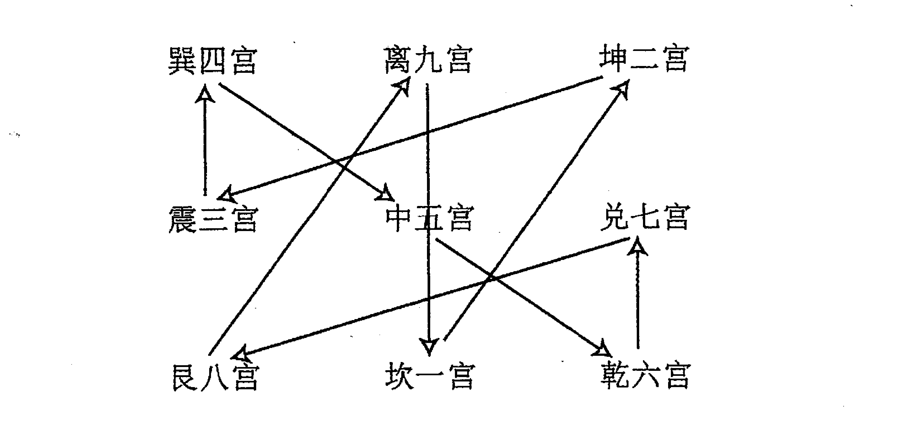
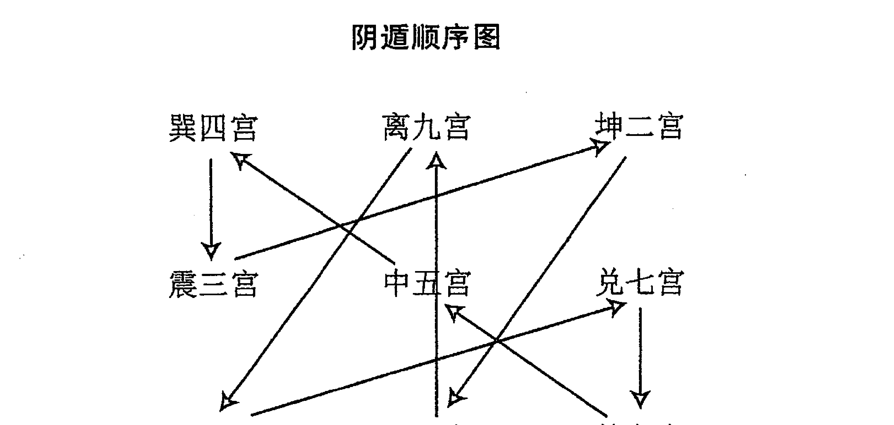
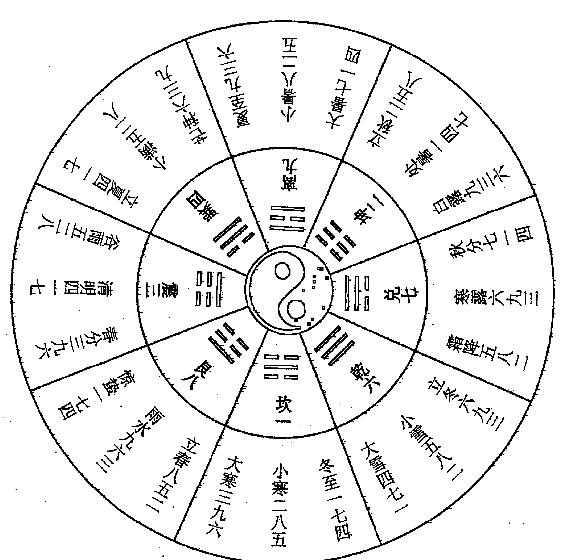

# 奇门透视
## 前言

奇门遁甲是中国古代术数的一种，素称“帝王之学”，是中华民族聪明智慧的结晶。在几千年的历史长河中，它经历种种坎坷与考验，或褒或贬，时兴时衰，却依然默默地为中国文化和世界文化作出重大贡献。在中国源远流长的传统术数中，奇门遁甲无疑是其中闪耀着灿烂光辉的奇葩之一。前中国周易研究会会长、现中国周易学会顾问、武汉大学哲学系教授唐明邦先生曾经说过：“数术门类甚多，同《周易》关系密切而堪登大雅之堂者，莫如奇门遁甲。”

奇门遁甲是一门博大精深的预测科学。它源自河图、洛书、周易，以阴阳五行学说为理论基础，综合了古人在天文、地理、气象、历法、数学、政治、军事、经济、民俗、占卜等方面的知识。在二千多年的流传过程中积累了大量精妙绝伦的预测实践经验。复经历代从而构筑起一座宏伟的预测科学的摩天大厦。其预测灵准程度之高、应用范围之广、判断速度之快，确为众多术数门类中之佼佼者，为其它预测方法所难企及。所以历代有许许多多预测学家推崇奇门预测为“方术之至奥至深者”，认为它是众多术数之顶峰。

八十年代，随着“传统文化热”特别是“《周易》热”的兴起，关心奇门遁甲术数学的人多了起来，几家出版社陆续出版了几部奇门遁甲书，引起了社会上不同反响，有人欢迎，有人反对，反对者主要担心“封建迷信回潮。”历史上奇门遁甲一直是掌握在朝廷宦官极少数人手里，绝大多数人根本不知道它究竟是怎么回事，越是少数人知道的东西越能引起绝大多数人的神秘感，越有神秘性的东西，越能引发人们的迷信。当多数人都知道奇门遁甲是怎么一回事的时候，人们对它的迷信就不存在了。

奇门遁甲是中国古人利用传统的阴阳五行、八卦、九宫、天干、地支，及天文历法等理论编制的一种选择时间和方位的术数方法。它以自己独特的推演方法及奇、仪、门、神等一整套术语元素，构成了区别于其它术数门类的术数体系。当人们面临危急时刻，缺乏可靠的信息，不了解基本情况，又必须作出某种决策时，奇门遁甲可以为人们提供一个模拟宇宙统一的信息场的立体动态象数理模型，它能随即提出某种可能，让人们进行反复比较，然后作出最优秀选择，做到趋吉避凶。奇门遁甲不仅可以用于择时、择方、趋吉避凶，而且经过我们的实践检验，确实可以用于预测，而且预测的范围很广，并且有相当高的准确率。

我在研究奇门遁甲的过程中，用奇门遁甲三吉门的理论，纵观中国历史上十一次大的统一，发现有一个奇特的现象，带有普遍的规律性，概括起来说就是：当最终形成两大政治势力争夺在中国的最高统治权的时候，几乎总是由占据了奇门遁甲术所说的开、休、生三吉门的一方获胜，从而实现了中国的统一。历史上统一中国的周、秦、汉、晋、隋、唐、宋、元、清等王朝及中华人民共和国都是如此。他们的方向都是从北往南，只有明王朝是个例外。明王朝是首先在南京建立了政权，然后北伐统一了中国。但是在朱元璋死后不久，他占据着北方的儿子朱棣又挥师南下，打败了朱元璋的孙子建文帝，坐上了皇帝的宝座。从奇门遁甲三吉门向其它方位进军，可以说是形成了统一中国的军事战争中的一个基本规律。从相反的一面来看也是如此。除明王朝外，建立在江南、四川的大小朝廷，都没有能力建立统一中国的政权。如三国的蜀与吴、东晋、南宋、太平天国，以及近代的国民革命政府和蒋介石的国民党政权都是如此。在统一中国的进程中，长江从来没有成为阻挡中国统一的天堑，中国历史上偏安于江南一隅的所有朝廷，最终都乖乖地交出了他们所占据的半壁江山。

三千年来中国历史上反复多次出现的统一中的一方，总是先占据吉门的位置，与奇门遁甲吉凶门分布的理论如此相符，难道不值得为此作一些科学的研究和探讨吗？除了政治、经济等因素之外，时间和方位的因素也起着重要作用。从中国历史上十一次大的统一这一基本规律来看，古人所说奇门遁甲是治国安邦之术是有道理的。奇门遁甲的演算推理用的是阴阳五行的生克制化，从近代的唐、宋、元、明、清五个朝代可以看出五行生克制化在自然中的应用。唐朝属土、宋朝属木、元朝属金、明朝属火、清朝属水。宋朝推翻唐朝是（木克土），元朝推翻宋朝是（金克木），明朝推翻元朝是（火克金），清朝推翻明朝是（水克火），从历史朝代的兴衰中可以看出世界的万事万物是严格地按照阴阳五行的生克制化规律进行运转的。

奇门遁甲术是古代天、地、人三才统一的理论。这种理论认为，人是天地作用的产物，人在天地中的运动，必须适应天地运行的自然规律，不能违背它，也不能改变它。人又为万物之灵，人可以认识和利用万物来发展人类自身。这是奇门遁甲术得以流传和发展的主要原因。奇门遁甲的主要内容是创造出了自己的一套认识世界的模型。而在流传的过程中，人们为了把它神秘化加进了许多糟粕，我们在学习研究奇门遁甲中应做到去糟粕，取精华。

2006年出版的《奇门遁甲解真》，受到了社会各界易学爱好者的热烈欢迎和高度评价，研习者日益增多。虽然拙著深入浅出，晓畅易懂，但鉴于读者易学基础参差不齐，自学起来仍有许多困难和疑惑之处。为了使广大易学者能学懂《奇门遁甲解真》，并掌握古代这一高层次的预测、决策技术。我又写了《奇门透视》一书，将奇门遁甲如何分析判断，提高预测和决策的准确率，全面细致地加以讲解，使爱好周易的朋友都能开悟增智、自学成才。

2004年9月9号，我有幸参加了由建设部中国建筑文化中心主办在人民大会堂新闻发布厅举行的《首届中国建筑风水文化与康居地产发展国际论坛》。这是《周易》首次走进人民大会堂。它向人们传达了一个重要信息，那就是过去一直受到褒贬不一的易学逐渐得到人们的重视，根植于中国的这一传统文化即将焕发青春。有感于此，现在我的研究视野已转到奇门风水方面，因为地理环境对人类的吉凶祸福起着不容忽视的作用。

2011年孟冬于石家庄

# 上编:奇门遁甲基础知识

奇门遁甲是建立在中国传统文化思想中的阴阳、五行、八卦、九宫、天干、地支、星相、历法、等基础理论上的。奇门遁甲在运用这些基础理论时建立了一套阴遁、阳遁、三奇、六仪、八门、九星、八神等术语，运用传统的历法，编制了自己特有的遁甲历，特别是规定了自己独特的布局方法，因而也构成了区别于其他术数门类的理论体系。

# 第一章 阴阳学说

阴阳是我国古代劳动人民通过对宇宙的观察，把宇宙的万物万象分为阴阳两大类，而建立起来的一种朴素的唯物论和辩证法的思想，阴阳学说认为，宇宙间一切事物的形成，变化和发展，全在于阴阳二气的运动，它总结出来的自然界阴阳变化的规律，是对立统一的哲学思想。阴阳学说，它们互相对立、互相依赖、互相转化，不仅应用到各个科学领域里，而且成为我国自然科学的唯物主义世界观的理论基础。

## 一、阴阳对立

阴阳对立是指自然界的万物万象，其内部同时存在着相反的两种属性，即存在着阴阳两个方面。

## 二、阴阳互根

阴阳互根，是事物或现象中对立着的两个方面，具有互相依存、互相为用的联系。阴与阳的每一个侧面都以另一个侧面作为自己存在的前提。即没有阴，阳不能存在，没有阳，阴不能存在。因此阴阳是互相依存，互相为用的。

## 三、阴阳消长

阴阳消长，是指事物和现象中对立的两个方面，是运动变化的，其运动是以彼此消长的形式进行的，由于阴阳两个对立的矛盾，始终处在彼此消长、此进彼退的动态平衡之中，才能保持事物的正常发展变化。如果这种变化出现了反常，也就是阴阳消长的异常反应。

## 四、阴阳交媾

阴阳交媾是指阴阳对立的双方，一方进入另一方内部，说的是对立面的吸引和联结，是产生新事物的前提条件。

## 五、阴阳转化

阴阳转化，就是阴阳变化，它是事物或现象的阴与阳两种不同的属性，在一定条件下向其对立转化。阴与阳是对立的，但又有互相依存的方面，只有阴阳统一起来，才能推动事物的变化和发展，这样阴阳才能长期共存。

奇门遁甲根据阴阳学说，规定一年以冬至与夏至分界，从冬至起至夏至为阳，用阳遁，在布局中，还规定了阳顺阴逆的排列原则。在预测判断时，以阴阳和合为吉，以阴阳或阳与阴相克为凶等。

# 第二章 五行学说

五行学说是我国人民独创的。采用取象比类的方法，对宇宙间事物进行分类，从而确定事物间的相互关系的理论，具有朴素的唯物论与辩证法思想。五行学说的实质认为世界是由木、火、土、金、水五种基本物质元素构成的，自然界各种事物的现象的发展，变化，都是这五种不同属性的物质不断运动和相互作用的结果，五行学说在科学领域是运用极为广泛的。

五行学说的主要内容有五行属性，五行相生，五行相克、五行亢乘、五行反侮、五行旺衰等。

## 一、五行特性

五行为木、火、土、金、水。“木”，具有生发，条达的特性；“火”具有炎热向上的特性；“土”具有生养、化育的特性，“金”具有清静、收杀的特性；“水”具有寒冷向下的特性。

## 二、五行生克

五行学说认为，事物与事物之间存着一定联系，而这种联系促进着事物的发展变化，五行之间存在着相生相克的规律，因此生克就是五行学说用以概括和说明事物联系和发展变化的基本观点。相生，含有互相滋生，促进助长的意思。相克，含有互相制约、克制、抑制的意思。

五行相生：木生火，火生土，土生金，金生水，水生木。
五行相克：木克土，土克水，水克火，火克金，金克木。

在相生的关系中，都有生我，我生两个方面的关系，在相克的关系中，都有克我、我克两个方面的关系，相生、相克象阴阳一样，是事物不可分割的两个方面，没有生就没有事物的发生和成长，没有克，就不能维持事物在发展和变化中的平衡与协调，彼此，没有相生就没有相克，没有相克就没有相生，这种生中有克、克中有生，相反相成，相互为用的关系，推动和维持事物正常生长，发展与变化。

## 三、五行亢乘

物盛极为亢太过，凡事物亢极则乘，强而欺弱，这叫做乘。事物亢极、太过，往往易折。

## 四、五行反侮

五行生克中，并只存在顺克，如旺克衰，强克弱，有时也会出现逆克，衰克旺，弱克强的现象，如土旺木衰，木受土克，木旺金衰，金受金克，水衰火旺，水受火克，土衰水旺，土受水克，金旺火衰，火受金克。这种逆克，叫做反侮。

> 关于五行的生克关系，宋末的徐大升作了一段精辟的论述：

- 金赖土生，土多金埋；土赖火生，火多土焦；火赖木生，木多火炽；木赖水生，水多木漂；水赖金生，金多水浊。
- 金能生水，水多金沉；水能生木，木盛水缩；木能生火，火多木焚；火能生土，火多土晦；土能生金，金多土变。
- 金能克木，木坚金缺；木能克土，土重木断；土能克水，水多土流；水能克火，火焱水热；火能克金，金多火熄。
- 金衰遇火，必见销熔；火弱逢水，必为熄灭；水弱逢土，必为淤塞；强火得土，方止其焰；强土得金，方制其害。

## 五、五行与时间

春季为木，夏季为火，秋季为金，冬季为水，四季中的最后一个月（即三、六、九、十二月，又称季月）均为土。

## 六、五行与方向

东方属木，南方属火，西方属金，北方属水，中央属土。

五行的强弱旺衰，主要看三个方面，一是数量多少，数量多者为强，少则弱。二是看是否得地，如西方属金，金在西方则为强，南方属火，火能克金，金在南方则为弱，其他仿此。三看得时不得时，五行旺衰特别重视五行与时间关系。五行在不同的季节，强弱旺衰并不相同，俗称旺衰休囚。

五行在四时中旺相休囚如下表：

| 季节 | 旺 | 相 | 休 | 囚 | 死 |
|---|---|---|---|---|---|
| 春 | 木 | 火 | 水 | 金 | 土 |
| 夏 | 火 | 土 | 木 | 水 | 金 |
| 秋 | 金 | 水 | 土 | 火 | 木 |
| 冬 | 水 | 木 | 金 | 土 | 火 |
| 四季 | 土 | 金 | 火 | 木 | 水 |

五行在四季中旺相为强、为旺；休囚死为弱为衰。

五行在奇门遁甲中的作用非常重要，是确定格局，推断吉凶祸福的主要依据。

# 第三章 天干学

## 一、天干十位

甲、乙、丙、丁、戊、己、庚、辛、壬、癸

## 二、十天干阴阳之分

甲、丙、戊、庚、壬为阳，乙、丁、己、辛、癸为阴。五行各一阴一阳，故有十位。

## 三、天干五行

甲乙同属木，甲为阳木，乙为阴木；丙丁同属火，丙为阳火，丁为阴火；戊己属同土，戊为阳土，己为阴土；庚辛同属金，庚为阳金，辛为阴金；壬癸同属水，壬为阳水，癸为阴水。

## 四、天干方位

甲乙东方木，丙丁南方火，戊己中央土，庚辛西方金，壬癸北方水。

## 五、十天干配五季

甲乙属春，丙丁属夏，戊己长夏，庚辛属秋，壬癸属冬。

## 六、十天干配外五行、内五行

- 十天干配身体：甲为头，乙为肩，丙为额，丁为齿舌，戊己鼻面，庚为筋，辛为胸，壬为胫，癸为足。
- 十天干配脏腑：甲为胆，乙为肝，丙为小肠，丁为心，戊为胃，己为脾，庚为大肠，辛为肺，壬为膀胱，癸为肾，单为腑，双为脏。

## 七、十天干化合

甲己合化土，乙庚合化金，丙辛合化水，丁壬合化木，戊癸合化火。

## 八、十天干相冲

甲与庚冲，乙与辛冲，丙与壬冲，丁与癸冲（戊与己同为土合而不冲）。

## 九、十天干生旺死绝表

十天干生旺死绝表，是以十天干的时令旺衰来说明事物由长生、兴旺到病死这样一个发展变化的全过程，这个过程是事物发展的必然规律。

表中“长生”尤如人刚出生于世，或降生阶段；“沐浴”为婴儿降生后洗浴阶段；“冠带”为小儿可以穿衣戴帽了；“临官”也称“进禄”，“帝旺”都为身旺，运气旺的阶段。事物旺者，必有“衰败”阶段，故从衰至绝都为败地，“胎”“养”在运用上讲，多称为“平运”，因为“胎”为怀胎，“养”又称为“休养”。从事物发展，壮大，到衰败、死亡。然后又有生，这样一个循环不已，生生不息的过程。

表中从长生至帝旺为有利，从衰到绝为不利，胎养多主一般，表中的地支至吉凶是知有利和不利的时间，又先知了方向，如甲帝旺在卯，这里的卯，是指卯年，卯月，卯时，都是时间。方位是东方，这里的东方，多指自己出生的东方。

甲木墓在未，（旺为库，休囚为墓）当然不吉，其未，是未年、未月、未日、未时、都是时间，方位是西南方。就以有利的事，要在有利的时间里到有利的方位去办。不利的事，在不利的时间里不办，不要去不利的方向，就可以免去意想不到的灾患。所以十天干生旺死绝表，是一个趋吉避凶的信息标志和时间表，

其表如下：

### 十天干生旺死绝表

| 状态\时令\五行 | 五阳干 | 五阴干 |
|---|---|---|
|  | 甲木 丙火 戊土 庚金 壬水 | 乙木 丁火 己土 辛金 癸水 |
| 长生 | 亥 寅 寅 巳 申 | 午 酉 酉 子 卯 |
| 沐浴 | 子 卯 卯 午 酉 | 巳 申 申 亥 寅 |
| 冠带 | 丑 辰 辰 未 戌 | 辰 未 未 戌 丑 |
| 临官 | 寅 巳 巳 申 亥 | 卯 午 午 酉 子 |
| 帝旺 | 卯 午 午 酉 子 | 寅 巳 巳 申 亥 |
| 衰 | 辰 未 未 戌 丑 | 丑 辰 辰 未 戌 |
| 病 | 巳 申 申 亥 寅 | 子 卯 卯 午 酉 |
| 死 | 午 酉 酉 子 卯 | 亥 寅 寅 巳 申 |
| 库 | 未 戌 戌 丑 辰 | 戌 丑 丑 辰 未 |
| 绝 | 申 亥 亥 寅 巳 | 酉 子 子 卯 午 |
| 胎 | 酉 子 子 卯 午 | 午 申 申 亥 寅 |
| 养 | 戌 丑 丑 辰 未 | 未 未 戌 丑 辰 |

## 十、论暗干

奇门遁甲分上中下三盘，也就是天盘、人盘、地盘。天盘星上有一个奇仪，上下相对，相加成格。地盘宫中也有一个奇仪，然人盘（门盘）内藏着玄机。名曰暗干暗奇，常人只看天地盘中的庚与奇，带庚为凶，带奇为吉。然而门中有没有暗干就不论了。这是不全面的看法。其实奇门中藏着暗干玄机，凶中藏吉，吉内有凶。假如：时干生日干但门中带暗庚则事情表面虽然完美无缺，内中却很困难。又如时干克日干占各种事情都为其凶，而时干中带有暗奇，则事情外表虽凶，但事内中有救。若隐若现，若有若无便是暗干。暗干的查找方法：八门地盘本位所藏的地盘三奇六仪，即为该宫位之门所带暗干。例如：阳遁二局巽四宫地盘落有庚，则杜门所带暗干为庚，离九宫地盘落有丙则景门所带暗干为丙。余仿此。

## 十一、论地耳、天目

从值符落宫起数到第五位为地耳，数到第七位为天目。阳遁顺数、阴遁逆数。例如阳遁三局值符落离宫从离宫数起巽四宫为地耳落宫。乾六宫为天目落宫。例如阴遁二局值符落三宫从震三宫数起艮八宫为地耳落宫，乾六宫为天目落宫，地耳、天目是帮助预测提高准确率。也就是说看地耳天目落宫的状态格局的吉凶。

## 十二、天三门(卯、未、酉)

月将加到时辰上数到卯、未、酉就是天三门。月将为正月登明亥、二月河魁戌、三月从魁酉、四月传送申、五月小吉未、六月胜光午、七月太乙巳、八月天罡辰、九月太冲卯、十月功曹寅、十一月大吉丑、十二月神后子。例如正月午时预测，正月为亥将，把亥加在午上数起，数到戌字就出现卯，卯就是天三门。天三门落乾宫。数到艮八宫寅字时就出现未字，未就是天三门，天三门落艮宫。数到巽四宫辰字就出现酉字，酉就是天三门。天三门落巽宫。

上编：奇门遁甲基础知识

# 第四章 地支学

十二地支名为月，故《尔雅·释天》中有：“岁阴者，子、丑、寅、卯、辰、巳、午、未、申、酉、戌、亥。”

## 一、十二支阴阳

- 子、寅、辰、午、申、戌为阳。
- 丑、卯、巳、未、酉、亥为阴。

## 二、十二支配五行

- 寅卯属木，寅为阳木，卯为阴木；
- 巳午属火，午为阳火，巳为阴火；
- 申酉属金，申为阳金，酉为阴金；
- 子亥属水，子为阳水，亥为阴水；
- 辰戌丑未属土，辰戌为阳土，丑未为阴土。

## 三、十二支配方位

寅卯东方木，巳午南方火，申酉西方金，亥子北方水，辰戌丑未四季土。辰戌丑未，在每个季度的最后一个月，故为四季土。

## 四、十二支配四季

寅卯辰为春，巳午未为夏，申酉戌为秋，亥子丑为冬。

## 五、十二支配五脏腑

寅为胆，卯为肝，巳为心，午为小肠，戌辰为胃，丑未为脾，申为大肠，酉为肺，亥为肾，子为膀胱。

## 六、十二支六合化合

子与丑合化土，寅与亥合化木，卯与戌合化火，辰与酉合化金，巳与申合化水，午与未合，午为太阳，未为太阴，合而为土。
相合为合好之意。相合，又有合中有克，有合中有生，合中有克者，是先好后坏，先热后冷，先合后分，如子与丑合，卯与戌合，巳与申合。子为水，丑为土，土克水。卯为木，戌为土，木克土。巳为火，申为金，火克金。此为合中有克。

合中有生者，不管是夫妻关系，还人与人之间的关系，是越合越好，越来越好，如：寅亥相合，辰与酉合，午与未合。寅为木，亥为水，水生木，辰为土，酉为金，土生金，午为火，未为土，火生土，故为合中有生。

## 七、十二支三合局

申子辰合化水局，亥卯未合化木局，寅午戌合化火局，巳酉丑合化金局，三合化局，有吉有凶，化生者为吉，化克者为凶。

## 八、十二支相冲

子午相冲，丑未相冲，寅申相冲，卯酉相冲，辰戌相冲，巳亥相冲，相冲实为对冲。如在八卦图上可以看出，卯为木在东，酉为金在西，午为火在南，子为水在北，其他支也如此，都是处在正对位上，故为对冲，相冲为相克之意。

相冲者有吉有凶，冲去吉神者为凶，冲去凶神者为吉。

## 九、十二支相害

子未相害，丑午相害，寅巳相害，卯辰相害，申亥相害，酉戌相害。
相害为受害，被害，也有相克之意。相害当然不吉但看有制无制，有制者无妨，无制者不利。

## 十、十二支相刑

子卯相刑，为无礼之刑；寅刑巳，巳刑申，申刑寅，为持势之刑；丑刑未，未刑戌，戌刑丑，为无恩之刑；辰午酉亥为自刑。
刑者，刑罚也。多主刑事犯法之事，也主伤病痛之疾。

## 十一、十二支相破

子酉相破，丑辰相破，寅亥相破，卯午相破，巳申相破，未戌相破。
子酉为破中带生，丑辰为破中带比，寅亥为破中带合，卯午为破中带生，巳申为破中带合，未戌为破中带刑。

## 十二、五行长生帝旺

木长生在亥，帝旺在卯，死在午，墓在未，绝在申。
火长生在寅，帝旺在午，死在酉，墓在戌，绝在亥。
金长生在巳，帝旺在酉，死在子，墓在丑，绝在寅。
水土长生在申，帝旺在子，死在卯，墓在辰，绝在巳。
运到长生帝旺之地，主人创新、愉快，有进财生子，升官之庆；运到死、库、绝之地，主人骨肉分离，身经祸患。

上编：奇门遁甲基础知识

## 十三、十二支配九宫

| 辰 巳 | 午 | 未 申 |
| :--- | :--- | :--- |
| 四 宫 | 九 宫 | 二 宫 |
| | | |
| 卯 | | 酉 |
| 三 宫 | 中五宫 | 七 宫 |
| | | |
| 寅 丑 | 子 | 亥 戌 |
| 八 宫 | 一 宫 | 六 宫 |

## 十四、十二支配月建

正月建寅，二月建卯，三月建辰，四月建巳，五月建午，六月建未，七月建申，八月建酉，九月建戌，十月建亥，十一月建子，十二月建丑。故一、二为木，四、五为火，七、八为金，十、十一月为水，三、六、九、十二为土，正月建寅，就是正月为寅月。

## 十五、十二支配十二时辰

| 时辰 | 子 | 丑 | 寅 | 卯 | 辰 | 巳 |
| :--- | :--- | :--- | :--- | :--- | :--- | :--- |
| 时间 | 23~1 | 1~3 | 3~5 | 5~7 | 7~9 | 9~11 |
| 时辰 | 午 | 未 | 申 | 酉 | 戌 | 亥 |
| 时间 | 11~13 | 13~15 | 15~17 | 17~19 | 19-21 | 21~23 |

## 十六、十二支配十二生肖及支数

| 子 | 丑 | 寅 | 卯 | 辰 | 巳 | 午 | 未 | 申 | 酉 | 戌 | 亥 |
|---|---|---|---|---|---|---|---|---|---|---|---|
| 鼠 | 牛 | 虎 | 兔 | 龙 | 蛇 | 马 | 羊 | 猴 | 鸡 | 狗 | 猪 |
| 1 | 2 | 3 | 4 | 5 | 6 | 7 | 8 | 9 | 10 | 11 | 12 |

# 第五章 六十甲子表及其他

## 一、六十甲子纳音表

在自然界人体科学中，对于人的各种信息的预测，不管是用四柱预测法、八卦预测法、六壬预测法还是奇门遁甲预测法等，都是以阴阳变化为原理，以五行生克制化为法则的。

阴阳五行之气，是极其精微的物质，一般人是看不见摸不着的，目前无法测量它。我们的祖先发明了天干地支，作为阴阳五行在自然界人体上的各种信息的具体标志。这样，人们就很容易看出，自然界人体阴阳五行之气的分布、结构、排列组合及五行生克的时间和对人的命运影响，因此，六十甲子表，既是人体阴阳五行之气，又是时间、空间、方位的信息标志。

六十甲子表，不仅是人体的信息标志，也是自然界万事万物兴衰的信息标志，对一个家庭和一个国家来说，也是如此，如有时是家庭和睦、父贤子孝，国家是风调雨顺，农业大丰收，各方面都好，有时家庭是夫妻分离、父子反目，国家不是天旱就是水灾，或者是地震等自然灾害和各种事故不断发生，造成天灾人祸，使国家人力财力遭受重大损失，造成这种原因与阴阳五行的生克制化有关，因此，六十甲子表是宇宙全信息的总标志。

### 六十甲子纳音表

| 年号 | 年命 | 年号 | 年命 | 年号 | 年命 | 年号 | 年命 | 年号 | 年命 |
|------|------|------|------|------|------|------|------|------|------|
| 甲子乙丑 | 海中金 | 丙子丁丑 | 涧下水 | 戊子己丑 | 霹雳火 | 庚子辛丑 | 壁上土 | 壬子癸丑 | 桑松木 |
| 丙寅丁卯 | 炉中火 | 戊寅己卯 | 城墙土 | 庚寅辛卯 | 松柏木 | 壬寅癸卯 | 金箔金 | 甲寅乙卯 | 大溪水 |
| 戊辰己巳 | 大林木 | 庚辰辛巳 | 白蜡金 | 壬辰癸巳 | 长流水 | 甲辰乙巳 | 佛灯火 | 丙辰丁巳 | 沙中土 |
| 庚午辛未 | 路旁土 | 壬午癸未 | 杨柳木 | 甲午乙未 | 沙中金 | 丙午丁未 | 天河水 | 戊午己未 | 天上火 |
| 壬申癸酉 | 剑锋金 | 甲申乙酉 | 泉中水 | 丙申丁酉 | 山下火 | 戊申己酉 | 大驿土 | 庚申辛酉 | 石榴木 |
| 甲戌乙亥 | 山头火 | 丙戌丁亥 | 屋上土 | 戊戌己亥 | 平地木 | 庚戌辛亥 | 钗钏金 | 壬戌癸亥 | 大海水 |

## 二、年上起月法

> 甲己之年丙做首，乙庚之岁戊为头。
> 丙辛必定寻庚起，丁壬壬位顺水流。
> 若问戊癸何处觅，甲寅之上好追求。

年上起月法，就是查每一年十二个月的每个月是什么名称，知道了每个月的名称，就能知道每一个月的月令。

这个歌诀的意思是：如果年的天干为甲或己，其年正月为丙寅，二月为丁卯，三月为戊辰，四月为己巳，五月为庚午，六月为辛未，七月为壬申，八月为癸酉，九月为甲戌，十月为乙亥，十一月为丙子，十二月为丁丑。

如果年的天干为乙或庚，其年正月为戊寅，二月为己卯，三月为庚辰，四月为辛巳，五月为壬午，六月为癸未，七月为甲申，八月为乙酉，九月为丙戌，十月为丁亥，十一月为戊子，十二月为己丑。

## 上编:奇门遁甲基础知识

如果年的天干为丙或辛，其年正月为庚寅，二月为辛卯，三月为壬辰，四月为癸巳，五月为甲午，六月为乙未，七月为丙申，八月为丁酉，九月为戊戌，十月为己亥，十一月为庚子，十二月为辛丑。

如果年的天干为丁或壬，其年正月为壬寅，二月为癸卯，三月为甲辰，四月为乙巳，五月为丙午，六月为丁未，七月为戊申，八月为己酉，九月为庚戌，十月为辛亥，十一月为壬子，十二月为癸丑。

如果年的天干为戊或癸，其年正月为甲寅，二月为乙卯，三月为丙辰，四月为丁巳，五月为戊午，六月为己未，七月为庚申，八月为辛酉，九月为壬戌，十月为癸亥，十一月为甲子，十二月为乙丑。

详见下表。

| 月 | 年 | 甲己 | 乙庚 | 丙辛 | 丁壬 | 戊癸 |
| :--- | :--- | :--- | :--- | :--- | :--- | :--- |
| 正月 | 丙寅 | 戊寅 | 庚寅 | 壬寅 | 甲寅 |
| 二月 | 丁卯 | 己卯 | 辛卯 | 癸卯 | 乙卯 |
| 三月 | 戊辰 | 庚辰 | 壬辰 | 甲辰 | 丙辰 |
| 四月 | 己巳 | 辛巳 | 癸巳 | 乙巳 | 丁巳 |
| 五月 | 庚午 | 壬午 | 甲午 | 丙午 | 戊午 |
| 六月 | 辛未 | 癸未 | 乙未 | 丁未 | 己未 |
| 七月 | 壬申 | 甲申 | 丙申 | 戊申 | 庚申 |
| 八月 | 癸酉 | 乙酉 | 丁酉 | 己酉 | 辛酉 |
| 九月 | 甲戌 | 丙戌 | 戊戌 | 庚戌 | 壬戌 |
| 十月 | 乙亥 | 丁亥 | 己亥 | 辛亥 | 癸亥 |
| 十一月 | 丙子 | 戊子 | 庚子 | 壬子 | 甲子 |
| 十二月 | 丁丑 | 己丑 | 辛丑 | 癸丑 | 乙丑 |

## 三、日上起时法

> 甲己还生甲，乙庚丙作初。
> 丙辛从戊起，丁壬庚子居。
> 戊癸何方发，壬子是真途。

“甲己还生甲”，是讲甲日或己日的子时，起“甲子”时，“甲子”，就是甲日或己日子时的名称。其法与年上起月法相同。

详见下表。

| 时\日 | 甲己 | 乙庚 | 丙辛 | 丁壬 | 戊癸 |
|-------|------|------|------|------|------|
| 子   | 甲子 | 丙子 | 戊子 | 庚子 | 壬子 |
| 丑   | 乙丑 | 丁丑 | 己丑 | 辛丑 | 癸丑 |
| 寅   | 丙寅 | 戊寅 | 庚寅 | 壬寅 | 甲寅 |
| 卯   | 丁卯 | 己卯 | 辛卯 | 癸卯 | 乙卯 |
| 辰   | 戊辰 | 庚辰 | 壬辰 | 甲辰 | 丙辰 |
| 巳   | 己巳 | 辛巳 | 癸巳 | 乙巳 | 丁巳 |
| 午   | 庚午 | 壬午 | 甲午 | 丙午 | 戊午 |
| 未   | 辛未 | 癸未 | 乙未 | 丁未 | 己未 |
| 申   | 壬申 | 甲申 | 丙申 | 戊申 | 庚申 |
| 酉   | 癸酉 | 乙酉 | 丁酉 | 己酉 | 辛酉 |
| 戌   | 甲戌 | 丙戌 | 戊戌 | 庚戌 | 壬戌 |
| 亥   | 乙亥 | 丁亥 | 己亥 | 辛亥 | 癸亥 |

## 四、六甲空亡

甲子旬中戌亥空，甲戌旬中申酉空，甲申旬中午未空，甲午旬中辰巳空，甲辰旬中寅卯空，甲寅旬中子丑空。

“六甲旬空亡”，就是六十甲子表中，由六旬组成，共分为六个旬，旬，为十天一句，也就是从甲子日起，到癸酉日这十天中，日支没有“戌亥”二字，就为空。空者，主时间不到，时间到了就不为空，该成事的成事，该出事的出事。故旬空也是有主吉，有主凶的。

## 五、驿马星

驿马星，为马也，主健跑，走动之象。故奇门遁甲遇驿马者，主好走动之象，工作调动之象。

申子辰马在寅，寅午戌马在申，
巳酉丑马在亥，亥卯未马在巳。

“申子辰马在寅，”奇门中指时支遇申时、子时、辰时，马星在艮宫（因为艮宫有寅）。“寅午戌马在申”，奇门中指时支遇寅时、午时、戌时，马星在坤宫（因为坤宫有申）。“巳酉丑马在亥”。奇门中指时支遇巳时、酉时、丑时、马星在乾宫（因为乾宫有亥）。“亥卯未马在巳，”奇门中指时支遇亥时、卯时、未时、马星在巽宫（因为巽宫有巳）。

## 六、天乙贵人

甲戊庚牛羊，乙己鼠猴乡，
丙丁猪鸡位，壬癸兔蛇藏，
六辛逢虎马，此是贵人方。

贵人查法：从时上查贵人。甲寅时天乙贵人在艮宫和坤宫。如乙巳时天乙贵人在坎宫和坤宫。余此相仿。

# 第六章 烟波钓叟歌

阴阳逆顺妙难穷，二至还向一九宫。
若能了达阴阳理，天地都来一掌中。
轩辕黄帝战蚩尤，逐鹿经年苦未休。
偶梦天神授符决，登坛致祭谨虔修。
神龙负图出洛水，彩凤衔书碧云里。
因命风后演成文，奇门遁甲从此始。
一千八十当时制，太公删成七十二。
逮于汉代张子房，二十八局为精艺。
先须掌上排九宫，纵横十五在其中。
次将八卦论八节，一气统三为正宗。
阴阳二遁分顺逆，一气三元人莫测。
五日都来换一元，接气超神为准的。
认取九宫分九星，八门九逐九星行。
九星逢甲为值符，八门值使自分明。
符上之门为值使，十时一位堪凭据。
值符常遣加时干，值使逆顺遁宫去。
六甲元号六仪名，三奇即是乙丙丁。
阳遁顺仪奇逆布，阴遁逆仪奇顺行。
吉门偶尔合三奇，值此须云百事宜。
更合从旁加检点，余宫不可有微疵。
三奇得使诚堪使，六甲遇之非小补。
乙逢犬马丙鼠猴，六丁玉女骑龙虎。
又有三奇游六仪，号为玉女守门扉。
若遇阴私和合事，诸君但向此中推。

### 奇门透视

天三门兮地四户，问君此法如何处。
太冲小吉与从魁，此是天门私出路。
地户除危定与开，举事皆从此中去。
六合太阴太常君，三辰元是地私门。
更得奇门相照耀，出行百事总欣欣。
太冲天马最为贵，卒然有难难逃避。
但当乘取天马行，剑戟如山不足畏，
三为生气五为死，胜在三兮衰在五。
能识游三避五时，造化真机须记取。
就中伏吟为最凶，天蓬加着地天蓬。
天蓬若到天英上，须知即是反吟宫。
八门反复皆如此，生在生门死在死。
纵有吉宿得奇门，万事皆凶不堪使。
六仪击刑何太凶，甲子值符愁向东。
戌刑在未申刑虎，寅巳辰辰午刑午。
三奇人墓好思推，甲日哪堪相见未。
丙奇属火火墓戌，此时诸事不须为。
更兼六乙来临二，月奇临六亦同论。
又有时干入墓宫，课中时下忌相逢。
戊戌壬辰兼丙戌，癸未丁丑亦同凶。
五不遇时龙不精，号为日月损光明。
时干来克日干上，甲子须知时忌庚。
奇与门兮共太阴，三般难得总加临。
若还得二亦为吉，举措行藏必遂心。
更得值符值便利，兵家用事最为贵，
常从此地击其冲，百战百胜君须记。
天乙之神所在宫，大将宜居击对冲。
假令值符居离九，天英坐取击天蓬。
甲乙丙丁戊阳时，神居天上要君知。
坐击须凭天上奇，阴时地下亦如之。

## 上编:奇门遁甲基础知识

若见三奇在五阳，偏宜为客自高强。
忽然逢着五阴位，又宜为主好裁详。
值符前三六合位，太阴之神在前二。
后一宫中为九天，后二之神为九地。
九天之上好扬兵，九地潜藏可立营。
伏兵但向太阴位，若逢六合利逃刑。
天地人分三遁名，天遁日精华盖临。
地遁月精紫云祥，人遁当知是太阴。
生门六丙合六丁，此为天遁自分明。
开门六乙合六己，地遁如斯而已矣。
休门六丁共太阴，欲求人遁无过此。
要知三遁何所宜，藏形遁迹斯为美。
庚为太白丙荧惑，庚丙相加谁会得。
六庚加丙白入荧，六丙加庚荧入白。
白入荧兮贼即来，荧入白兮贼须灭。
丙为勃兮庚为格，格则不通勃乱逆。
天丙加地庚为勃，天庚加地癸为格。
丙加天乙为勃符，天乙加丙为正格。
庚加日干为伏干，日干加庚飞干格。
加一宫兮战在野，同一宫兮战于国。
庚加值符天乙伏，值符加庚天乙飞。
庚加癸兮为大格，加己为形最不宜。
加壬之时为上格，又兼岁月日时移。
更有一般奇格者，六庚谨勿加三奇。
此时若也行兵去，匹马只轮无返期。
六癸加丁蛇天矫，六丁加癸雀入江。
六乙加辛龙逃走，六辛加乙虎猖狂。
请观四者是凶神，百事逢之莫措手。
丙加甲兮鸟跌穴，甲加丙兮龙回首。
只此二者是吉神，为事如意十八九。

### 奇门透视

八门若遇开休生，诸事逢之总称情。
伤宜捕猎终须获，杜好邀遮及隐形。
景上投出并破阵，惊能擒讼有声名。
若问死门何所主，只宜吊死与行刑。
蓬任冲辅禽阳星，英芮柱心阴宿名。
辅禽心星为上吉，冲任小吉未全亨。
大凶元气变为吉，小凶无气一同之。
吉宿更能逢旺相，万举万全必成功。
若遇休囚并废没，劝君不必进前程。
要识九星配五行，各随八卦考羲经。
坎蓬星水离英火，中宫坤土为艮营。
乾兑为金震巽木，旺相休囚看重轻。
与我同行即为相，我生之月诫为旺。
废于父母休于财，囚于鬼兮真不妥。
假令水宿号天蓬，相在初冬与仲冬。
旺于正二休四五，其余仿此自研究。
急则从神缓从门，三五反复天路亭。
十干加伏若加错，入库休囚吉事危。
十精为使用为贵，起宫天乙用无遗。
天自为客地为主，六甲推兮无差理。
劝君莫失此玄机，洞彻九宫扶明主。
宫制其门不为迫，门制其宫是迫雄。
天网四张无路走，一二网低有路踪。
三至四宫行人墓，八九高强任西东。
节气推移时候定，阴阳顺逆要精通。
三元积数成六纪，天地未成有一理。
请观歌里精微诀，非是贤人莫传与。

# 第七章 奇门总要诀

阴阳逆顺妙难穷，二至还乡一九宫。
若能了达阴阳理，天地都来一掌中。
三才变化作三遁，八卦分为人遁门。
星符每逐时干转，值使常随天乙奔。
六仪六甲本同名，三奇即是乙丙丁。
三奇倘合开休生，便是吉门利出行。
万事从之无不利，能知玄妙得其灵。
值符前三六合位，前二太阴君须记。
值符后一名九天，后二宫神名九地。
地为伏匿天扬兵，六合太阴可藏避。
急从神兮缓从门，三五反复天道利。
己上若得三奇妙，不如更得三奇使。
得使犹来未为精，五不遇时损其明。
损又须知时克日，吟格相加尤不吉。
掩捕逃亡须格时，占稽得人信宜失。
斗中三奇游六仪，天乙会合主阴私。
讨捕须明时下克，行人信息遇三奇。
三奇上见游六仪，六仪更见五阳时。
兼向八门寻吉位，万事开三万事宜。
五阳在前五阴后，主客须知有盛衰。
阴后五支还须记，六仪加着更无利。
六仪忽然加三宫，更为击刑先须忌。
六仪击刑三奇墓，此时举事百事误。
太白入荧贼即来，火入金乡贼即去。

### 奇门透视

丙为勃兮庚为格，格则不通勃乱逆。
庚加日干为伏干，日干加庚飞于格。
加己为刑道上格，加癸路中大格宜。
加壬之时为小格，更嫌岁月日时移。
当此之时皆不吉，遣将行师勿用之。
丙加甲兮鸟跌穴，甲加丙兮龙反首。
辛加乙兮虎猖狂，乙加辛兮龙逃走。
丁加癸兮雀入江，癸加丁兮蛇夭矫。
符加丙丁为相佐，使加六丁为守户。
生丙合戊为天遁，地遁乙合开加己。
休承丁合太阴人，天网四张时加癸。
蓬加英兮为反吟，伏吟之时蓬加蓬。
吉宿见之事更吉，凶宿逢之事愈凶。
天辅冲任禽心吉，天蓬天英芮柱凶。
阴属禽心柱英芮，阳宿冲辅及蓬任。
天网四张无走路，阴阳逆顺妙无穷。
节气推移时候应，二至还向一九宫。
三元超遁用六甲，八卦周流遍九宫。

# 第八章 阴阳二遁顺序图

所谓阳遁就是从一宫到九宫，按戊己庚辛壬癸丁丙乙的顺序顺排。

所谓阴遁，就是从九宫到一宫，按照顺序逆排。





# 第九章 九宫八卦方位图

| 巽卦四宫 属木 东南方离 | 卦九宫 属火 南方 | 坤卦二宫 属土 西南方 |
| 震卦三宫 属木 东方 | 中卦五宫 属土 (寄二宫) | 兑卦七宫 属金 西方 |
| 艮卦八宫 属土 东北方 | 坎卦一宫 属水 北方 | 乾卦六宫 属金 西北方 |

# 第十章 三奇六仪的顺序

奇门遁甲术是建立在阴阳、五行、八卦、九宫、天干、地支、历法等中国传统理论基础之上的一种术数方法。奇门遁甲有自己独特的理论体系，这是奇门遁甲区别于术数门类的基础特征。奇门遁甲独特的理论与方法包括：三奇、六义、九星、八门、八诈门、阳遁、阴遁、超神、接气及布局法和格局等。

三奇，指天干中的乙丙丁三位。

在奇门遁甲中，甲为天干之首，在五行属木，好比军队的主要帅。甲木最怕庚金克制，甲如受损，则群龙无首了。因此将甲隐藏起来，不让它受到庚金的伤害。乙奇为甲木的妹妹，乙庚相合，甲木把妹妹嫁给庚金，庚得到乙，则为贪合而忘了克甲。因此把乙作为一奇。丙、丁都属火，五行中火为木所生者，丙丁为甲木之子女，子女应该有卫护父母之责，丙火为甲木之儿子，庚为金，丙火能克制庚金，丁火为甲木之女儿，丁为玉女，丁火能克制庚金。乙丙丁为甲木最为近者，此以奇门遁甲中以此三者为奇。

六仪：仪为仗仪的意思。奇门遁甲中的六仪是指天干中戊、己、庚、辛、壬、癸六位，六甲为甲子、甲戌、甲申、甲午、甲辰、甲寅，六位分别置于戊、己、庚、辛、壬、癸六者之中。六甲与六仪的配合为：甲子戊、甲戌己、甲申庚、甲午辛、甲辰壬、甲寅癸。

三奇六仪在九宫中的排列顺序是戊、己、庚、辛、壬、癸、丁、丙、乙。阳遁按一至九宫顺排，阴遁按一至九宫逆排。

在六十个时辰中，三奇六仪所在的宫位是固定的，所以就形成了一种格局，奇门遁甲就叫一局。

这就是时家奇门最根本的规律，见《时辰六甲一局规律表》，这里所谓一句，不是指十天，而是指十个时辰。

## 时辰六旬遁甲一局规律表

| 六甲 | 三奇 | | | 六仪 | | | | | |
| :--- | :--- | :--- | :--- | :--- | :--- | :--- | :--- | :--- | :--- |
| 一、甲子 | 乙丑 | 丙寅 | 丁卯 | 戊辰 (甲子) | 己巳 (甲戌) | 庚午 (甲申) | 辛未 (甲午) | 壬申 (甲辰) | 癸酉 (甲寅) |
| 二、甲戌 | 乙亥 | 丙子 | 丁丑 | 戊寅 (甲子) | 己卯 (甲戌) | 庚辰 (甲申) | 辛巳 (甲午) | 壬午 (甲辰) | 癸未 (甲寅) |
| 三、甲申 | 乙酉 | 丙戌 | 丁亥 | 戊子 (甲子) | 己丑 (甲戌) | 庚寅 (甲申) | 辛卯 (甲午) | 壬辰 (甲辰) | 癸巳 (甲寅) |
| 四、甲午 | 乙未 | 丙申 | 丁酉 | 戊戌 (甲子) | 己亥 (甲戌) | 庚子 (甲申) | 辛丑 (甲午) | 壬寅 (甲辰) | 癸卯 (甲寅) |
| 五、甲辰 | 乙巳 | 丙午 | 丁未 | 戊申 (甲子) | 己酉 (甲戌) | 庚戌 (甲申) | 辛亥 (甲午) | 壬子 (甲辰) | 癸丑 (甲寅) |
| 六、甲寅 | 乙卯 | 丙辰 | 丁巳 | 戊午 (甲子) | 己未 (甲戌) | 庚申 (甲申) | 辛酉 (甲午) | 壬戌 (甲辰) | 癸亥 (甲寅) |
| 阳遁 | 逆布三奇 | | | 顺布六仪 | | | | | |
| 阴遁 | 顺布三奇 | | | 逆布六仪 | | | | | |

# 第十一章 一年二十四节气与阴阳二遁

## 一、一年二十四节气奇门遁甲用局表



奇门遁甲分阳遁和阴遁，“冬至一阳生，夏至一阴生，”阳遁从二十四节气中的冬至到夏至，阴遁则从夏至到冬至。该用局表都是有规律排列的，这个图表中冬至一七四，小寒二八五，大寒三九六，指的是从冬至节开始的十五天，分别用阳遁一局、七局、四局、小寒节的十五天中，分别用阳

## 二、日干支与上中下三元

前面已讲了一年二十四节气，每个节气所辖十五天中上中下三元所用阳遁或阴遁的局数。但是具体到每一天应该用阳遁几局或阴遁几局，这是有规律性的。我们把六十甲子作为日干支的符号与上中下三元对应起来，可以排出下列格局：

| 上元五天 | 中元五天 | 下元五天 |
| :---: | :---: | :---: |
| ①②③④⑤ | ①②③④⑤ | ①②③④⑤ |
| 甲乙丙丁戊 | 己庚辛壬癸 | 甲乙丙丁戊 |
| 子丑寅卯辰 | 巳午未申酉 | 戌亥子丑寅 |
| 上元五天 | 中元五天 | 下元五天 |
| ①②③④⑤ | ①②③④⑤ | ①②③④⑤ |
| 己庚辛壬癸 | 甲乙丙丁戊 | 己庚辛壬癸 |
| 卯辰巳午未 | 申酉戌亥子 | 丑寅卯辰巳 |
| 上元五天 | 中元五天 | 下元五天 |
| ①②③④⑤ | ①②③④⑤ | ①②③④⑤ |
| 甲乙丙丁戊 | 己庚辛壬癸 | 甲乙丙丁戊 |
| 午未申酉戌 | 亥子丑寅卯 | 辰巳午未申 |
| 上元五天 | 中元五天 | 下元五天 |
| ①②③④⑤ | ①②③④⑤ | ①②③④⑤ |
| 己庚辛壬癸 | 甲乙丙丁戊 | 己庚辛壬癸 |
| 酉戌亥子丑 | 寅卯辰巳午 | 未申酉戌亥 |

从以上的格局我们可以看出这样两条规律：

- 每一元的第一天的天干，不是甲就是己，把这个元头称为符头。即符头有两个，不是甲就是己。
- 凡上元第一天的地支总是子、午、卯、酉中的一个，中元第一天的地支总是寅、申、巳、亥中的一个，下元第一天的地支总是辰、戌、丑、未中的一个。

日天干凡是甲己者均为符头，即每元的第一天；凡日地支为子午卯酉者，均为上元的第一天；凡日地支为寅申巳亥者，均为中元的第一天；凡日地支为辰戌丑未者，均为下元的第一天。

换句话说：上元的符头即上元的日干支为甲子、甲午、己卯、己酉；中元符头即是中元头一天的日干支为甲寅、甲申、己巳、己亥；下元的符头即下元头一天的日干支为甲辰、甲戌、己丑、己未。

知道了这个规律，我们就可以根据每一天的干支来确定它属于上中下三元的那一元，再根据节气，就知道这一天该用奇门遁甲的几局了。

# 第十二章 八门顺序及特征

八门在《奇门遁甲》天地人格局中代表人事，所以在奇门预测中极其重要，特别是用神所临之门以及值使门所测人间事物关系很大。

八门为：开门、休门、生门、伤门、杜门、景门、死门、惊门。八门排列顺序不变，阳遁、阴遁均按顺时针排列。

一般来说，开、休、生为三吉门，死、惊、伤为三凶门，杜、景为中平门，但是运用时还必须看临何宫，以及旺相休囚。奇门大全歌曰：吉门被克吉不就，凶门被克凶不起；吉门相生大吉利，凶门得生祸难避。吉门克宫吉不就，凶门克宫事更凶。

### 八门特征

- 开门：开门居西北乾宫，五行属金。旺于秋季，特别是戌、亥月，相于四季末月，休于冬，囚于春，死于夏。开门居乾宫伏吟，居巽宫反吟，居艮宫入墓，居离宫受制，居坤宫大吉，居兑宫旺相，居坎宫次吉，居震宫为迫。

开门代表领导、父亲、上级、都市、法官、工作、商店、工厂、公司。利开业经商、婚娶、乔迁、考学、参军、进人口、治病求医、上官、赴任等。

- 休门：休门居北方坎宫，五行属水，旺于冬季，相于秋，休于春，囚于夏，死于四季末月。休门居坎宫为伏吟，居离宫反吟，居巽宫入墓，居坤、艮二宫受克，居乾兑二宫大吉，居震宫次吉。

休门代表公务员，机关科室人员。利于求见领导和贵人，求财、婚姻、休闲玩耍等。

- 生门：生门居东北艮宫，五行属土。旺于四季月，相于夏，休于秋，囚于冬，死于春。

生门居艮宫为伏吟，居坤宫为反吟，居巽宫入墓，居震宫受克，居离宫大吉，居乾兑二宫次吉，居坎宫被迫。

# 上编：奇门遁甲基础知识

4. 伤门：伤门居东方震宫，五行属木。旺于春，相于冬，休于夏，囚于四季月，死于秋。

伤门居震宫伏吟，居兑宫反吟，居坤宫入墓，居坎宫生旺大吉，居乾宫受制，居艮宫被迫大凶，居离宫泄气，居巽宫比和。

伤门代表车辆，竞争，利讨债、捕捉、赌博等。伤门为凶门，不利经商、出行、赴任、修造、嫁娶，经商易破财，出行易有灾。

5. 杜门：杜门居东南巽宫，五行属木。旺于春，相于冬，休于夏，囚于四季月，死于秋。杜门居巽宫伏吟，居乾宫反吟，居坤宫入墓，居兑宫受克，居艮宫被迫，居坎宫受生，居震宫比和，居离宫泄气。

杜门代表保密、躲藏方向、闭塞、军队、工商、税务、警察、捕盗、防洪、筑堤、利避难等。

6. 景门：景门居正南离宫，五行属火。旺于夏，相于春，休于四季月，囚于秋，死于冬。景门居离宫伏吟，居坎宫反吟，居乾宫入墓，居兑宫被迫，居震巽二宫生旺，居坤艮二宫次吉。

景门宜于献策筹谋，选士荐贤，拜职遣使，火攻杀戮，余者不利，谨防口舌及血光之灾。景门多主文书之事。

7. 死门：死门居西南坤宫，五行属土，旺于秋，特别是未申月，相于夏，囚于冬，死于春。居坤宫伏吟，居艮宫反吟，居巽宫入墓，居震宫受克，居离宫生旺大凶，居坎宫被迫大凶，居乾兑二宫相生。

死门代表地皮、死人、坟地、凶灾。利吊死送丧，刑戮争战、捕猎杀牲。

8. 惊门：惊门居正西兑宫，五行属金，旺于秋，相于四季，休于冬，囚于春，死于夏。惊门居兑宫伏吟，居震宫反吟，居艮宫入墓，居离宫受制，居巽宫为迫，居坎宫泄气，居坤宫受生，居乾宫比和。

惊门代表口舌官司、律师、惊恐、创伤。利斗讼官司，掩捕盗贼，蛊惑乱众。

古人把门克宫称为“迫”，叫“门被迫”歌曰：“吉门被迫吉不就，凶门被迫事更凶。”也就是说，吉门克宫吉事就不吉了，凶门克宫，事情更凶了，又把宫克门叫做“制”，也就是门受宫克。门生宫称做“和”，宫生门称做“义”。门宫相生，对于吉门来说自然为好，对于凶门来说，如果受生，更加旺相，那就凶上加凶了。

# 第十三章 九星顺序及特征

九星在奇门遁甲中代表天时，即天体运动对地球和人类的影响。古人从常见的行星中，根据它们运转歇宿的位置，选择其中有代表性的九颗星，分别与地上的九宫八卦相对应，九星分别为：天蓬星、天任星、天冲星、天辅星、天英星、天芮星、天禽星、天柱星、天心星，九星顺序不变，阳遁、阴遁均按顺序时针排列。

天心星、天任星、天禽星、天辅星为四吉星。天冲星是次吉星，天蓬星、天芮星、天柱星为三凶星，天英星中平。

1. 天蓬星：原名贪狼星，与北方一宫坎卦相对应，阳星，五行属水。旺于春，相于冬，休于夏，囚于四季月，废于秋。代表破财、大盗、杀人犯、贪财。也代表大智大慧。利安抚边境，屯兵固守。婚娶远行遇到它都不利，修造房屋、埋藏死者遇到它也很不利，只有再得到生门和丙奇、乙奇才会万事昌隆。

2. 天芮星：原名巨门星，与西南方二宫坤卦相对应，阴星。五行属土。旺于秋，相于四季月，休于冬，囚于春，废于夏，代表疾病、学生、佛龛。宜传道交友，屯兵固守，不宜用兵，嫁娶、争讼、迁徙、修造等。

3. 天冲星：原名禄存星，与东方三宫震卦相对应，阳星。五行属木，旺于夏，相于春，休于四季月，囚于秋，废于冬。代表武士、处事雷厉风行，利征伐交战，报仇解怨。施恩交友，嫁娶、修坟、生女孩都会受到惊扰，外出远行、迁移都会有灾难，修房建屋，埋藏死人都不吉祥。

4. 天辅星：原名文曲星，与东南四宫巽卦相对应，阳星，五行属木。旺于夏，相于春，休于四季月，囚于秋，废于冬。代表文化，老师，漂亮，利出行、经商、嫁娶、修造，特别利考学、考官，万事昌荣。

5. 天禽星：原名廉贞星，与中央五宫相对应，阳星。五行属土，旺于秋，相于四季月，休于冬，囚于春，废于夏。代表忠厚之人，百官元首，利外出远行，见上级、经商、嫁娶。天禽星临宫，百事皆宜，四时皆吉。

6. 天心星：原名武曲星，与西北六宫乾卦相对应，阴星：五行属金，旺于冬，相于秋，休于春，囚于夏，废于四季月。代表医生、圆形、有心计之人，利医疗、经商、婚嫁、迁徙都会吉利。无论做什么事情都处于有利地位。

7. 天柱星：原名破军星，与西方七宫兑卦相对应，阴星。五行属金。旺于冬，相于秋，休于春，囚于夏，废于四季月。代表凶灾、破败、口舌官司。宜修筑营垒、训练士兵，屯兵固守。不宜外出远行，征战交兵。商人无论干什么都不利。

8. 天任星：原名左辅星，与东北八宫艮卦相对应，阳星，五行属土。旺于秋，相于四季月，休于冬，囚于春，废于夏。代表吉利，厚道之人，利经商、婚嫁、修建房屋，进行迁移，百事皆吉，四时皆宜。

9. 天英星：原名右弼星，与南方九宫离卦相对应，阴星，五行属火。旺于四季月，相于夏，休于秋，囚于冬，废于春。代表性烈、光明、血光等，利上官见贵，饮宴作乐。谋划献策。不宜远行和迁移、外出经商求财、嫁娶。

# 第十四章 八神顺序及特征

八神是古人在天人感应中发现的与九宫八卦有对应性质的八种神秘力量。它们是值符、螣蛇、太阴、六合，白虎（下有勾陈）、玄武（下有朱雀）、九地、九天。八神为神盘，八神顺序不变、阳遁顺时针排列，阴遁逆时针排列。在预测中可以作为用神。

1. 值符：由于小值符与地盘值班六甲大将和天盘值班星球相对应，因此叫值符，它也是八神中值班的头。由于甲遁在其下，所以小值符按五行性质来分，应属于东方甲木的性质。在神煞中为最吉之神。也称天乙贵神，诸神之首领，所到之处百恶消散。即使太白庚金这最凶的恶煞临于值符之下，也便消形入墓，不能作恶了。

2. 螣蛇：具有南方火的性质，为虚诈之神。性格虚伪，性杀而口辣，专管惊恐怪异，虚诈不实之事。

3. 太阴：具有西方金性质，为阴护之神，性格阴匿暗昧。太阴所临之方，可以密谋策划。有时也可作为阴险毒辣、老谋深算的符号。

4. 六合：具有东方木的性质，为护卫之神。它性格开朗平和，专管婚姻、中介之事。六合所临之方，利于谈判、交易、婚姻嫁娶。

5. 白虎（下有勾陈）：具有西方金的性质，为凶神。它的性格凶猛好斗，专管行兵打仗、凶杀打斗、疾病死伤、交通事故等。白虎下隐勾陈，勾陈具有地户己土性质，己土长生于酉，故隐于白虎之下。

6. 玄武（下有朱雀）：具有北方水的性质，为奸谗小盗之神，性格爱偷（包括偷情）、喜盗，专管盗贼、逃亡、口舌之事。朱雀本来是南方火神，但北方玄武子水之位，还是丙火怀胎之地，所以朱雀隐于玄武之下，也管一些口舌是非之事。

7. 九地：具有坤土的性质，有厚载之德，为万物之母。古人称其为坚固牢实之神，性格柔顺安静，滋生万物。九地之方，利于屯兵固守、播种养殖。

8. 九天：具有乾金的性质，为天为父，古人称其为威悍之神，性格刚强好动。九天之上可以扬兵、布阵、行军、打仗、坐飞机旅游、出国。

# 第十五章 纸上快速起局法

第一步：把阳历的年月日时换算成干支历。

第二步：根据节气和上中下三元的规律，确定求测日所用遁甲局数，是阳遁几局，或是阴遁几局。

第三步：在纸上画一个井字形九宫格，将一至九宫分别按奇门遁甲格局填在格内。

第四步：在纸上一至九宫格内，按遁甲几局三奇六仪的排布规律，即戊、己、庚、辛、壬、癸、丁、丙、乙这个永定例、永远不变的顺序，将六仪三奇布在一至九宫格内。

第五步：找出预测时辰的旬首，比如乙亥时，甲戌为旬首；辛亥时，甲辰为旬首；戊戌时，甲午为旬首；即预测时辰是六甲中哪一甲大将在地盘值班。同时根据该甲所隐的六仪，即知道地盘上该甲在几宫值班了。

第六步：根据地盘上六甲值班一甲所在宫位，即可找出与它对应的天盘上值班的九星之一，这就是值符；人盘上值班的八门之一，这就是值使。这样把这个时辰内的值符和值使就找出来了，并一一写在纸上。

第七步：根据“值符随时干”的规律。看预测时辰的天干在地盘几宫，就将值符直接写在这个宫内，同时将它原在地盘宫内的六仪三奇也随之写在它如今转到的这个宫内。

第八步：值符落宫确定了，将其余八星连同它们原来地盘内所携带的六仪三奇也一一写在运转到的宫内，这样用事时辰天盘运行的格局就确定了。

第九步：根据“值使随时宫”的规律，将值使的八门之一按时间和宫位运行的顺序，确定它所落宫位，然后把它写在该宫格局内。同时，将其余七门按固定顺序，一一写在其他宫格之内，这样，八门运转到问事时辰的格局也就一目了然了。

第十步：根据阳遁顺时针运转，阴遁逆时针运转的规律和小值符永远追随大值符的规律，将神盘中的小值符首先写在大值符所落宫内，然后，将螣蛇、太阴、六合、白虎（勾陈）、玄武（朱雀）、九地、九天按顺序一一写在其他七个宫内，这样，八神盘在问事时辰运行的格局也就确定了。

至此，奇门遁甲起局或叫起卦的过程就全部完成了，每个宫内天、地、人、神及三奇六仪所形成的格局，就一目了然了。

下边举例具体加以说明。

### 例一、1996年12月25日上午8点30分

12月21日冬至，现在是12月25日已过21日应该是阳遁，按阳历12月25日为阴历十一月十五日。

年干支为丙子，月干支为庚子月，日干支为丙申日，时辰干支为壬辰时。

第一步：先找出日干支丙申的符头，由丙申往前数，甲午为符头，甲午（12月23日）日前两天是冬至，根据子午卯酉为上元的规律，可知甲午到丙申这三天为冬至上元。冬至一、七、四，即冬至上中下元分别用阳遁一局、七局、四局，冬至上元自然用阳遁一局了，这样，就可以确定12月25日丙申日该用阳遁一局了。

第二步：在纸上画一个井字形九宫格，分别填上一至九宫的号码，然后按阳遁一局六仪三奇排布的规律，将六仪三奇分别写在九宫格内（如下图）的最底层，以表示为地盘上格局。

丙子年，庚子月，丙申日，壬辰时

甲申旬，阳遁一局，天冲星为值符落五宫寄二宫，伤门值使落二宫

| 宫位 | 神 | 门 | 星（天盘/地盘） |
| :--- | :--- | :--- | :--- |
| 巽四 | 九地 | 休门 | 天蓬星（戊）/ 辛 |
| 离九 | 九天 | 生门 | 天任星（丙）/ 乙 |
| 坤二 | 值符 | 伤门 | 天冲星（庚）/ 己 |
| 震三 | 玄武 | 开门 | 天心星（癸）/ 庚 |
| 中五 | （寄坤二） | | 壬 |
| 兑七 | 螣蛇 | 杜门 | 天辅星（辛）/ 丁 |
| 艮八 | 白虎 | 惊门 | 天柱星（丁）/ 丙 |
| 坎一 | 六合 | 死门 | 天禽星（壬）/ 天芮星（己） / 戊 |
| 乾六 | 太阴 | 景门 | 天英星（乙）/ 癸 |

**阳遁一局图**

第三步：找出壬辰时的旬首，为甲申，说明壬辰时，是六甲大将甲申庚在地盘值班，看一下刚才所画的图，甲申隐在庚下边，所以得知甲申庚在地盘震三宫值班。由此与地盘震三宫对应的天盘九星之一天冲星为值符，人盘八门之一伤门为值使。这样把值符，值使就找出来了，一一写在纸上。

第四步：根据“值符随时干”的原则，壬辰时，时干壬在地盘五宫，根据中五宫寄坤二宫的原则，所以直接将值符天冲星写在坤二宫格内。并将它所携带的六仪庚（即甲申庚）也写在二宫内。（见上图）然后按九星的固定顺序将天辅星（辛）写在坤二宫前边（按顺时针方向转）的兑七宫内，天英星（乙）写在乾六宫，天芮星（己）天禽星（壬）一并写在坎一宫（因五宫寄二宫，随二宫天盘一起转动）天柱星（丁）写在艮八宫，天心星（癸）写在震三宫，天蓬星（戊）写在巽四宫，天任星（丙）写在离九宫。这样壬辰时天盘运转的格局就确定了，而且，每个宫内天盘地盘三奇六仪形成的格局也一目了然了。比如坤二宫形成庚加己，名为刑格、官司口舌因官讼被判刑的格局。兑七宫为辛加丁，乾六宫为乙加癸，坎一宫为己加戊和壬加戊，艮八宫为丁加丙，震三宫为癸加庚，巽四宫为戊加辛，离九宫为丙加乙。

第五步：根据“值使随时宫”的原则，阳遁顺行，如此，地盘甲申庚在震三宫，这表明辰时值使门在震三宫，酉时则到四宫，戌时到五宫，亥时到六宫，子时到七宫，丑时到八宫，寅时到九宫，卯时到一宫，辰时到二宫，这样就知道壬辰时值使门转到坤二宫了，于是，将伤门写到坤二宫格内，然后按八门排列的固定顺序依次在七宫写上杜门，六宫写上景门、一宫写上死门，八宫写上惊门，三宫写上开门，四宫写上休门，九宫写上生门。这样八门与九宫的格局也一目了然了，比如二宫，伤门落坤宫，伤门属木坤宫属土，木克土即门克宫的格局，又如兑宫上乘杜门、杜门属木兑七宫属金，金克木即宫克门的格局，又如乾六宫，上乘景门、景门属火，乾宫属金，火克金，即门克宫的格局（见上图）。

第六步：根据小值符永远追随大值符的规律，在纸上布上八神，大值符天冲星落五宫寄坤二宫，于是我们也把神盘中的小值符写在坤二宫格内。然后按阳遁八神顺时针运转的规律，依次将螣蛇写在兑七宫，太阴写在乾六宫，六合写在坎一宫，白虎写在艮八宫，玄武写在震三宫，九地写在巽四宫，九天写在离九宫，这样八神落宫形成的格局也一目了然了。（见上图）。

至此在纸上所起丙申日壬辰时阳遁一局的格局就完成了。下一步就是根据所问，所测何事进行判断了。

### 例二：1996年10月17日下午4点问测

按阳历10月17日为阴历九月初六日，年干支为丙子，月干支为戊戌，日干支为丁亥，时辰干支为戊申时。

第一步：先找出日干支丁亥的符头，为甲申，寅申巳亥为中元，丁亥日正当寒露节（阳历10月8日）之后，所以应为寒露中元，寒露六、九、三，所以中元应用阴遁九局。

第二步：在纸上画一个井字形九宫格，布上阴遁九局地盘的格局，因为是阴遁，六仪三奇，戊、己、庚、辛、壬、癸、丁、丙、乙是逆布。（见下图）

丙子年，戊戌月，丁亥日，戊申时

阴遁九局，甲辰旬，天禽星为值符落九宫，死门为值使落一宫

| 宫位 | 神 | 门 | 星（天盘/地盘） |
| :--- | :--- | :--- | :--- |
| 巽四 | 螣蛇 | 休门 | 天英星（戊）/ 癸 |
| 离九 | 值符 | 生门 | 天禽星（壬）/ 天芮星（丙） / 丙 |
| 坤二 | 九天 | 伤门 | 天柱星（庚）/ 丙 |
| 震三 | 太阴 | 开门 | 天辅星（癸）/ 丁 |
| 中五 | （寄坤二） | | 壬 |
| 兑七 | 九地 | 杜门 | 天心星（辛）/ 庚 |
| 艮八 | 六合 | 惊门 | 天冲星（丁）/ 己 |
| 坎一 | 白虎 | 死门 | 天任星（己）/ 乙 |
| 乾六 | 玄武 | 景门 | 天蓬星（乙）/ 辛 |

**阴遁九局图**

第三步：根据戊申时是甲辰旬，知道地盘上甲辰壬在五宫值班（寄坤二宫）由此得知在天盘上是天禽星为值符，人盘是死门为值使。

第四步：根据“值符随时干”的运转规律，一看时干戊在地盘九宫，就知道戊申时值符天禽星（连带天芮星）运转到了九宫。于是把天禽星（连它携带的壬）天芮星（连它携带的丙）一并写在离九宫内，然后按九宫的固定顺序，依次将它前边（按顺时针方向）的七宫的天柱星（庚）写在二宫内，六宫的天心星（辛）写在七宫内。坎宫的天蓬星（乙）写在六宫内，八宫的天任星（己）写在一宫内，三宫的天冲星（丁）写八宫内，四宫的天辅星（癸）写在三宫内，九宫的天英（戊）写在四宫内，这样天盘九星运转的格局就出来了。（见上图）。

第五步：根据“值使随时宫”的原则，值使死门辰时在五宫，阴遁逆行，巳时在四宫，午时在三宫，未时在二宫，申时在一宫，即得死门写在一宫格内。然后依照八门固定的顺序，依次将惊门写在八宫，开门写在三宫，休门写在四宫，生门写在九宫，伤门写在二宫，杜门写在七宫，景门写在六宫。这样戊申时，八门运转的格局也就确定了。（见上图）。

第六步：根据小值符追随大值符的原则，将小值符写在离九宫内，然后按阴遁逆时针方向，依次将螣蛇写在四宫内，太阴写在三宫内，六合写在八宫内，白虎写在一宫内，玄武写在六宫内，九地写在七宫内，九天写在二宫内。这样，八神在戊申时运转的格局也一目了然了。（见上图）。

这样每个宫内，天、地、人、神，以及三奇六仪所形成的格局就完全清楚了，就可以进入判断的过程了。

# 第十六章 三奇六仪的克应关系

## 一、时干克应

十干克应，就是十个天干在天盘和地盘相遇后的各种克应关系。即天盘三奇六仪与地盘三奇六仪相遇后发生的各种关系。奇门遁甲，顾名思义，甲常隐于六仪之下，六甲以六仪为代表来看其克应关系。

（一）甲加甲（因为是甲子戊，戊来代表甲）即戊加戊；名为伏吟，无论做什么事都不宜动，只要隐避静守就会吉利，动则凶。

- 戊加乙：即天盘戊加地盘乙，名为青龙合灵格，此时遇吉门则吉，遇凶门则凶。
- 戊加丙：即天盘戊加地盘丙，名为青龙返首，大吉大利。但若逢墓迫击刑，则会吉事变成凶事。
- 戊加丁：即天盘戊加地盘丁，名为青龙耀明。宜见贵人、求功名。但若逢墓迫，则会招惹是非。
- 戊加己：即天盘戊加地盘己，名为贵人入狱，公私皆不吉利。
- 戊加庚：即天盘戊加地盘庚，名为值符飞宫，吉事不吉，凶事更凶，飞宫格也主换地方。
- 戊加辛：即天盘戊加地盘辛，名为青龙折足，若逢吉门则有救，还可有所作为；若见凶门，主招灾失财和患疾病。
- 戊加壬：即天盘戊加地盘壬，名为青龙入天牢，无论什么事都不吉利。
- 戊加癸：即天盘戊加地盘癸，名为青龙华盖。逢吉门吉格者招福，逢凶门凶格者，诸事不利，为凶。

（二）乙加戊：即天盘乙加地盘戊，名为利阴害阳，门逢凶迫，财伤人。
- 乙加乙：即天盘乙加地盘乙，名为日奇伏吟，不宜谒见贵人，求功名，只可安分守己为好。
- 乙加丙：即天盘乙加地盘丙，名为奇仪顺遂，此时遇吉星可以升官进职，遇凶星则夫妻分离。
- 乙加丁：即天盘乙加地盘丁，名为奇仪相佐，最利文书，考试，百事可做。
- 乙加己：即天盘乙加地盘己，名为日奇入墓，前程不明，凶门事必凶，得二吉门为地遁。
- 乙加庚：即天盘乙加地盘庚，名为日奇被刑，打官司破财，夫妻各怀私心。
- 乙加辛：即天盘乙加地盘辛，名为青龙逃走，奴仆盗窃主家钱财，六畜皆伤。
- 乙加壬：即天盘乙加地盘壬，名为日奇入地，尊卑颠倒，要吃官司。
- 乙加癸：即天盘乙加地盘癸，名为华盖逢星，宜于隐居、修道、不露形迹、躲灾避难为吉。

（三）丙加戊：即天盘丙加地盘戊，名为飞鸟跌穴，无论干什么事都吉利。
- 丙加乙：即天盘丙加地盘乙，名为日月并明，无论做什么事都吉利。
- 丙加丙：即天盘丙加地盘丙，名为月奇悖师，主文书逼迫，财产破耗，主单据票证遗失不明。
- 丙加丁：即天盘丙加地盘丁，名为星奇朱雀，有贵人文书到来，吉利，若是常人则生活平静，得三奇门为天遁。
- 丙加己：即天盘丙加地盘己，名为大悖入刑，坐监牢，被杖责，文书公文不能传递，得吉门则吉，得凶门则转吉为凶。
- 丙加庚：即天盘丙加地盘庚，名为荧入太白，主家庭破败，盗贼偷窃，财产损失。
- 丙加辛：即天盘丙加地盘辛，名为谋事能成，为病人不凶。
- 丙加壬：即天盘丙加地盘壬，名为火入天罗，为客不利，是非颇多。
- 丙加癸：即天盘丙加地盘癸，名为华盖悖师，阴人害事，灾祸较多。

（四）丁加戊：即天盘丁加地盘戊，名为青龙转光，官人升迁，常人有威昌盛。
- 丁加乙：即天盘丁加地盘乙，名为人遁吉格，当官的加官晋爵，老百姓有婚姻，发财之喜。
- 丁加丙：即天盘丁加地盘丙，名为星随月转，当官的会越级高升，老百姓则乐中生悲。
- 丁加丁：即天盘丁加地盘丁，名为星奇入太阴，书信即至，喜事遂心，万事如意。
- 丁加己：即天盘丁加地盘己，名为火入勾陈，奸私仇冤，事端有女人引起。
- 丁加庚：即天盘丁加地盘庚，名为文书阻隔，行人必归。
- 丁加辛：即天盘丁加地盘辛，名为朱雀入狱，罪人被释放，官人失位。
- 丁加壬：即天盘丁加地盘壬，名为五神互合，贵人恩诏，讼狱公平，婚多为苟合。
- 丁加癸：即天盘丁加地盘癸，名为朱雀投江，文书口舌是非，动经官符，词讼不利，音信长期不通。

（五）己加戊：即天盘己加地盘戊，名为犬遇青龙，逢吉门则吉，若逢凶门，枉费心机。
- 己加乙：即天盘己加地盘乙，名为墓神不明，地户逢星，宜隐匿不出，逃走则有利。
- 己加丙：即天盘己加地盘丙，名为火悖地户，男人冤冤相害，女人必定淫乱不堪。
- 己加丁：即天盘己加地盘丁，名为朱雀入墓，先动者失利，受冤枉，后得平反昭雪。
- 己加己：即天盘己加地盘己，名为地户逢鬼，病者必死，暂不谋为，谋为则凶。
- 己加庚：即天盘己加地盘庚，名为刑格返名，词讼先动者不利，如临阴星有谋害之情。
- 己加辛：即天盘己加地盘辛，名为游魂入墓，易遇阴邪鬼怪作祟。

己加壬：即天盘己加地盘壬，名为地网高张，遇狡童淫女，有奸情杀伤凶。

己加癸：即天盘己加地盘癸，名为地刑玄武，男女疾病垂危，并有官司牢狱之灾。

（六）庚加戊：即天盘庚加地盘戊，名为天乙伏宫，百事不可谋，大凶。

庚加乙：即天盘庚加地盘乙，名为太白逢星，退吉进凶。

庚加丙：即天盘庚加地盘丙，名为太白入荧，贼必来，为客者有利，为主者破财。

庚加丁：即天盘庚加地盘丁，名为亭亭自奸，因男女私情惹起官司，逢吉门则有救。

庚加己：即天盘庚加地盘己，名为刑格，官司口舌，因官讼被判刑，住牢狱更凶。

庚加庚：即天盘庚加地盘庚，名为太白同宫，又为战格，官灾横祸，兄弟、朋友相冲克，不利为事。

庚加辛：即天盘庚加地盘辛，名为白虎干格，远行车折马伤，求财更是大凶。

庚加壬：即天盘庚加地盘壬，名为上格，远行迷路，男女音信难通。

庚加癸：即天盘庚加地盘癸，名为大格，多主车祸，官事不止，生育母子俱伤，大凶。

（七）辛加戊：即天盘辛加地盘戊，名为困龙被伤，主有官司、破财，安守本分。轻举妄动则有祸殃。

辛加乙：即天盘辛加地盘乙，名为白虎猖狂，主家败人亡，外出远行，必遭祸殃，测婚姻离散，主因男人。

辛加丙：即天盘辛加地盘丙，名为干合悖师，求雨无雨，求晴天旱，必因财产纠纷讼诉公堂。

辛加丁：即天盘辛加地盘丁，名为狱神得奇，经商获利倍增。囚人遇赦获释。

辛加己：即天盘辛加地盘己，名为入狱自刑，奴仆背主，有冤诉讼难伸。

辛加庚：即天盘辛加地盘庚，名为白虎出力，刀兵相接、主客相残，宜退让。强进则血溅衣衫。

辛加辛：即天盘辛加地盘辛，名为伏吟天庭，公事失败，私事成功，诉讼自招罪名。

辛加壬：即天盘辛加地盘壬，名为凶蛇入狱，两男争一女，诉讼不息，先动者失理获罪。

辛加癸：即天盘辛加地盘癸，名为天牢华盖，日月失明，误入天网，无论干什么事都不顺利。

（八）壬加戊：即天盘壬加地盘戊，名为小蛇化龙，男人飞黄腾达，女人产孩儿。

壬加乙：即天盘壬加地盘乙，名为小蛇得势，女子柔顺，男子通达，占孕生男孩，前程光明。

壬加丙：即天盘壬加地盘丙，名为水蛇入火，主官灾刑禁之事络绎不绝。

壬加丁：即天盘壬加地盘丁，名为干合蛇刑，贵人匆匆而过，文书牵连，男吉女凶。

壬加己：即天盘壬加地盘己，名为反吟蛇刑，大祸将至，官司败诉，守本分可吉，轻举妄动必凶。

壬加庚：即天盘壬加地盘庚，名为太白擒蛇，讼狱公平，立剖正邪。

壬加辛：即天盘壬加地盘辛，名为腾蛇相缠，纵得吉门亦不能安宁，若有谋望被人欺瞒、哄骗。

壬加壬：即天盘壬加地盘壬，名为蛇入地罗，外事缠绕，内事烦琐，若逢吉门吉星，也许可以免受损害。

壬加癸：即天盘壬加地盘癸，名为幼女奸淫，家有丑事外传，若逢吉门凶星反祸为福。

（九）癸加戊：即天盘癸加地盘戊，名为天乙合会，宜求财，婚姻喜美，有贵人帮助，若逢凶门迫制，反而有官司之祸。

癸加乙：即天盘癸加地盘乙，名为华盖逢星，贵人可以得到禄位，常人平安无事。

癸加丙：即天盘癸加地盘丙，名为华盖悖师，贵贱逢之皆不利，只是命运好的人有喜事临门。

癸加丁：即天盘癸加地盘丁，名为腾蛇天矫，文书官司火焚也逃不掉。

癸加己：即天盘癸加地盘己，名为华盖地户，无论男女占之音信皆阻，躲灾避难为上吉。

癸加庚：即天盘癸加地盘庚，名为太白入网，以暴力争讼，自罗罪责。

癸加辛：即天盘癸加地盘辛，名为网盖天牢，无论诉讼占病，结果都是死亡，罪责难逃。

癸加壬：即天盘癸加地盘壬，名为复见腾蛇，婚姻不利，都会丧偶再婚，出嫁太晚则无子，并且会早死。

癸加癸：即天盘癸加地盘癸，名为天网四张，外出远行伙伴走失，无讼患病或吃官司都会受到伤害。

## 二、八门静应关系

八门静应，八门静应即天盘的门加临地盘的门，和天盘的门加临三奇六仪，和门加宫所形成的格局及其吉凶。

### 1. 开门静应

开加开：主贵人宝物财喜。

开加休：主见贵人财喜及开张铺店，贸易大利。

开加生：主见贵人，谋望所求遂意。

开加伤：主变动、更改、移徙，事皆不吉。

开加杜：主失脱，刊印书契小凶。

开加景：主见贵人，因文书不利。

开加死：主官司惊忧，先忧后喜。

开加惊：主百事不利。

开加戊：财名俱得。

开加乙：小财可求。

开加丙：贵人印绶。

开加丁：远信必至。

开加己：事绪不定。

开加庚：道路词讼，谋为两歧。

开加辛：阴人道路。

开加壬：远行有失，注意破财。

开加癸：阴人失财小凶。

占身命：金水命者吉利，土命平稳，火木二命主官司、疾病破财不利。

### 2. 休门静应

休加休：求财、进人口、谒贵吉，上任、修造亦大利。

休加生：主得阴人财物，谒贵谋望，虽迟也吉。

休加伤：上官喜庆，求财不得，有亲戚分产。变动事不吉。

休加杜：主破财，失物难寻。

休加景：主求文书印信事不至，反招口舌小凶。

休加死：主文印官司事不吉，远行、僧道事不吉，占病凶。

休加惊：主损财，招非并疾病、惊恐事。

休加开：主开张店铺及见贵、求财等喜事，大吉。

休加戊：财务和合。

休加乙：求谋重不得，求轻可得。

休加丙：文书和合喜庆。

休加丁：百讼休歇。

休加己：暗昧不宁，后吉。

休加庚：文书词讼先结后解。

休加辛：疾病迟愈，失物不得。

休加壬、癸：阴人词讼牵连。

占身命：木命者大利，金命者脱耗，土命者灾疾，火命者大凶，丙丁戊三，巳午辰戌丑未年月日时者不利。

### 3. 生门静应

生加生：主远行、求财吉。

生加伤：主亲友变动，道路不吉。

生加杜：主阴谋，阴人破财，不利。

生加景：主阴人、小口不宁及文书事，后吉。

生加死：主田宅官司，病主难救。

生加惊：主尊长财产、词讼，病迟愈，吉。

生加开：主见贵人，求财大发。

生加休：主阴人处求谋财利，吉。

生加戊：嫁娶、求财、谒贵皆吉。

生加乙：主阴人生产，迟吉。

生加丙：主贵人印绶、婚姻、书信喜事。

生加丁：主词讼、婚姻、财利大吉。

生加己：主得贵人维持，吉。

生加庚：主财产争论破产，不利。

生加辛：主产妇疾病，后吉。

生加壬：主遗失财后得，贼盗易获。

生加癸：主婚姻不成，余事皆吉。

占身命：火土命者大利，水命者不利，多厄难，更忌甲乙寅卯年月日时者，不利，若壬癸主肿胀凶。

### 4. 伤门静应

伤加伤：主变动，运行折伤，凶。

伤加杜：主变动，失脱，官司，桎梏，百事凶。

伤加景：主文书印信，口舌，惹是生非。

伤加死：主官司印信凶，出行大忌，占病凶。

伤加惊：主亲人疾病忧惊，媒伐不利，凶。

伤加开：主见贵人，开张、走失、变动之事，不利。

伤加休：主男人变动或托人办事财名不利。

伤加生：主房产、种植事业，凶。

伤加戊：主失脱难获。

伤加乙：主求谋不得，反防盗失财。

伤加丙：主道路损失。

伤加丁：主音信不至。

伤加己：主财散人病。

伤加庚：主讼狱被刑杖，凶。

伤加辛：主夫妻怀私恣怨。

伤加壬：主因盗牵连。

伤加癸：主讼狱被冤，有理难伸。

占身命：水火木命者吉，金命者主病，土命者主凶，官司刑杖。

### 5. 杜门静应

杜加杜：主因父母疾病、田宅出脱事，凶。

杜加景：主文书印信阻隔，男人小口疾病，迟疑不利。

杜加死：主田宅文书失落，官司破财，小凶。

杜加惊：主门户内忧疑惊恐，并有词讼事。

杜加开：主见贵人官长，谋事主先破己财，后吉。

杜加休：主求财有益。

杜加生：主男人小口破财，田宅求财不利。

杜加伤：主弟相争，破财不利。

杜加戊：主谋事不成，秘处求财得。

杜加乙：宜暗求男人财物，后主不明致讼。

杜加丙：主文契遗失。

杜加丁：主男人讼狱。

杜加己：主私谋害人招非。

杜加庚：主因女人讼狱被刑。

杜加辛：主打伤人，词讼，男人小口凶。

杜加壬：主奸盗事，凶。

杜加癸：主百事皆阻，病者不食。

占身命：火命者发贵，水命者发富，木命者平稳，金命者疾病，土命者官司凶，若金年月日时或土年月日时者不利，如逢水火年月日时者吉。

### 6. 景门静应

景加景：主文状未动有先见之意，内有男人小口忧患。

景加死：主官讼，因田宅事相争，惹麻烦。

景加惊：主官讼，女人小口疾病，凶。

景加开：主官人升迁，吉；求文印更吉。

景加休：主文书遗失，争讼不休。

景加生：主阴人生产大喜，更主求财旺利，行人皆吉。

景加伤：主姻亲小口口舌。

景加杜：主失脱文书，败财后平。

景加戊：因财产词讼，远行吉。

景加乙：主讼事不成。

景加丙：主文书急迫，火速不利。

景加丁：主因文书印状招非。

景加己：主官司牵连。

景加庚：主讼人自讼。

景加辛：主阴人词讼。

景加壬：主因贼牵连。

景加癸：主因奴婢受刑。

占身命：主火灾，水命者大凶，金命者疾病，木命者中平，土命者富，若值金水年月日时者不利。

### 7. 死门静应

死加死：主官事稽留，印信无气，凶。

死加惊：主因官司不结，忧疑患病，凶。

死加开：主见贵人，求印信文书事大利。

死加休：主求财物事不吉，若问僧道求方吉。

死加生：主丧事，求财得，占病死而复生。

死加伤：主官司动而被刑杖，凶。

死加杜：主破财，妇人风疾，腹肿。

死加景：主因文契印信财产事见官，先怒后喜，不凶。

死加戊：主作伪财。

死加乙：主求事不成。

死加丙：主信息忧疑。

死加丁：主老阳人疾病。

死加己：主病讼牵连不已，凶。

死加庚：主女人生产，母子俱凶。

死加辛：主盗贼失脱难获。

死加壬：主讼人自讼自招。

死加癸：主妇女嫁娶事凶。

占身命：主有孝服，病死之凶，水木命并年月日时者大凶。余平。

### 8. 惊门静应

惊加惊：主疾病，忧虑，惊恐。

惊加开：主官司忧疑，能见贵人不凶。

惊加休：主求财事或口舌事，迟吉。

惊加生：主因妇人生产或求财事惊忧，皆吉。

惊加伤：主因商议同谋害人事泄惹讼，凶。

惊加杜：主因失脱破财惊恐，不凶。

惊加景：主词讼不息，小口疾病，凶。

惊加死：主因宅中怪异而是非，凶。

惊加戊：主损财，信阻。

惊加乙：主谋财不得。

惊加丙：主文书印信惊恐。

惊加丁：主词讼牵连。

惊加己：主恶犬伤人成讼。

惊加庚：主道路损折，遇贼盗，凶。

惊加辛：主女人成讼，凶。

惊加壬：主官司囚禁，病者大凶。

惊加癸：主被盗，失物难获。

占身命：主词讼，官灾口舌，血光之事，若丙丁巳午年月日时占者凶。甲乙寅卯年月日时占者亦不利。

## 三、奇门预测吉格补充

除十干克应，八门静应中的吉格之外，还有以下吉格：

### 1. 九遁

九遁是指：天遁、地遁、人遁、风遁、云遁、龙遁、虎遁、神遁、鬼遁。

天遁：门盘生门，天盘丙奇，地盘丁奇同落一个宫。为天遁，若下临地盘九地、太阴、也是天遁，百事生旺，利求官、经商、婚姻等。

地遁：门盘开门，地盘乙奇、地盘六己同落一个宫为地遁。若下临地盘九地、太阴也都是地遁，宜设伏兵，安营扎寨、建筑修造等、百事皆吉。

人遁：门盘休门，天盘丁奇、上乘太阴同落一个宫内。为人遁，和生门与乙奇下临地盘九地也是人遁，宜谈判、交易、结婚、伏藏等。

风遁：门盘中开、休、生之一，天盘乙奇落巽宫为风遁，如风从西北方来，宜顺风击敌。

云遁：门盘中开、休、生之一、天盘乙奇、地盘六辛同落一个宫内，称为云遁，宜偷营劫寨、求雨、求雪。

龙遁：门盘开、休、生之一，天盘乙奇落坎宫为龙遁，求雨有雨，水战大胜，捕捉敌人、修桥等。

虎遁：休门或生门，天盘乙奇，临地盘六辛，落艮八宫或天盘甲申庚合开门下临地盘兑宫，都称为虎遁。宜安营扎寨、设兵埋伏、修筑建造等。

神遁：门盘生门，天盘丙奇、神盘九天同落一个宫，为神遁，宜调兵遣将、修桥开路、训练士兵等。

鬼遁：门盘杜门，天盘丁奇、神盘九地或丁奇、开门合九地、都为鬼遁，宜探路侦贼、处实而施反间计、埋设伏兵、偷营劫寨。

### 2. 三奇得使

三奇得使就是天盘乙、丙、丁、加临地盘值使门，得使可以用事，若无吉门亦有小助。

### 3. 玉女守门

丁奇又名玉女。玉女守门，就是门盘值使门所落之宫，正遇地盘丁奇。其方向宜婚宴喜乐之事。

### 4. 三奇贵人升殿

乙奇临震宫，为日出扶桑，有禄之乡，是贵人升于乙卯正殿。

丙奇到离宫，为月照端门，是贵人升于丙午正殿。

丁奇到兑宫，名为天乙贵人。即贵人升于丁酉正殿，百事可为大吉大利。

### 5. 天显时格

甲、己日的甲子时、甲戌时，乙、庚日的甲申时，丙辛日的甲午时，丁、壬日的甲辰时，戊癸日的甲寅时，为天显时格。

此时宜行兵、上官、求财、远行皆吉。有罪也能赦免。

### 6. 三诈五假

三诈即：真诈、重诈、休诈。开、休、生三吉门合乙、丙、丁三奇又上乘太阴、六合、九地三阴神相助者为三诈。

- 真诈：三吉门合三奇临太阴。
- 重诈：三吉门合三奇临九地。
- 休诈：三吉门合三奇临六合。

遇三诈为吉格，经商、远行、嫁娶，百事皆吉。

五假即：天假、地假、人假、鬼假、神假、五假忌墓迫。

- 天假：景门合乙丙丁三奇，临九天。宜争战讼诉，见贵求官吉。
- 地假：杜门合丁乙己癸临九地，宜埋伏潜藏，逃亡躲灾。
- 人假：惊门合六壬临九天。宜捕捉逃亡，遇上“太白入荧”更能抓住逃亡者。
- 神假（物假）：伤门合丁、己、癸、临九地。宜讨债、交易、捕捉伏藏。
- 鬼假（又叫神假）：死门合丁、己、癸临九地。宜超度亡灵、破土修莹、抚重安民、伐邪、狩猎。

遇此格经商、远行、婚娶、百事皆吉。

### 7. 三奇之灵

三奇乙、丙、丁、四吉神太阴、六合、九地、九天，三吉门开、休、生，各有其一，共临其方位，为吉道清灵，用事俱吉。

### 8. 奇游禄位

乙奇到震（卯为乙木临官禄地），丙奇到巽（巳为丙火临官禄地），丁奇到离（午为丁火临禄地），为本禄之位，合三吉门，宜上官赴任，求财祈福等各种谋为均吉利。

### 9. 欢怡

三奇临六甲值符之宫为欢怡。凡事谋为皆有利，百事可为大吉。

### 10. 奇仪相合

乙庚、丙辛、丁壬为奇合，戊癸，甲己为仪合得吉门，凡事有和之象，主和解、平分。

### 11. 门宫和义

凡门生宫为“和”，遇吉门凡事都吉；宫生门为“义”，遇吉门凡事皆吉。

## 四、奇门预测凶格补充

除十千克应，八门静应中的凶格之外，还有以下凶格：

1.  岁格：天盘六庚，加地盘年干。
2.  月格：天盘六庚，加地盘月干。
3.  日格：天盘六庚，加地盘日干。
4.  飞干格：天盘日干，加地盘六庚。
5.  时格：天盘六庚，加地盘时干。

总之遇庚格用事大凶，谋事不吉，捕捉盗贼能够捉住，行人走失能够回来。

6.  六仪击刑：

    天盘甲子戊，加地盘震宫（子卯相刑）；

    天盘甲戊己，加地盘坤宫（未戌相刑）；

    天盘甲申庚，加地盘艮宫（寅申相刑）；

    天盘甲午辛，加地盘离宫（午午自刑）；

    天盘甲辰壬，加地盘巽宫（辰辰自刑）；

    天盘甲寅癸，加地盘巽宫（寅巳相刑）。

    六仪击刑极凶，即使六仪为值符也不可用。一动必有灾伤，若遇天网四张，必被捕捉，有牢狱之灾。

7.  三奇入墓：

    天盘乙奇，加地盘乾六宫（乾宫有戌，乙木墓在戌）。

    天盘丙奇，加地盘乾六宫（乾宫有戌，丙火墓在戌）。

    天盘丁奇，加地盘艮八宫（艮宫有丑，丁火墓在丑）。

    三奇入墓，时运极差，百事无成。吉事不吉，凶事不凶，无力之象。

8.  时干入墓：

    即用事时，时辰天干在天盘，落地盘所在之宫正是它的墓地，

    丙戌时，天盘丙落地盘乾六宫，（乾宫有戌，丙火墓在戌）；

    壬辰时，天盘壬落地盘巽四宫，（巽宫有辰，壬水墓在辰）；

    癸未时，天盘癸落地盘坤二宫，（坤宫有未，癸水墓在未）；

    戊戌时，天盘戊落地盘乾六宫，（乾宫有戌，戊土墓在戌）；

    己丑时，天盘己落地盘艮八宫，（艮宫有丑，己土墓在丑）；

    丁丑时，天盘丁落地盘艮七宫，（艮宫有丑，丁火墓在丑）。

9.  门迫：

    门迫即是八门与九宫之间的关系。其中门克宫为迫，宫克门为制，门生宫为和，宫生门为义。

    吉门被迫吉不就，凶门被迫事更凶。也就是说，吉门克宫，吉事也就不吉了，凶门克宫，事情更凶。

10. 伏吟：

    凡九星在本宫不动，叫星伏吟；八门在本宫不动，叫门伏吟；六甲值符在本宫不动，叫值符伏吟，八门九星值符不动，叫全盘伏吟。例如：甲申庚加甲申庚，甲寅癸加甲寅癸，叫九星伏吟；伤门加伤门，休门加休门，叫八门伏吟，天盘值符加地盘值符叫值符伏吟。

    天显时格，一般不为凶，反而为吉。

11. 反吟：

    凡九星、八门、值符落到与它相对冲的地盘宫内，叫反吟。故有星反吟、门反吟，值符反吟。

    如天蓬星落到离九宫，叫星反吟；所以有门反吟，星反吟，值符反吟。

    如惊门落到震三宫，叫门反吟，天冲星落到兑七宫叫星反吟，天盘甲申庚加地盘甲寅癸叫值符反吟（因为寅申相冲）。

    反吟为凶，心里麻烦不安宁，做事半途而废，出行半路而返，事情有反复，反吟利客不利主。反吟主近、主快、成败易分，如遇三奇、吉门，吉格，为有救，否则凶灾将至。测病，近病反吟易愈，久病反吟难愈，测婚姻反吟则不成。测考学，考不上，测调动，调不成，测提升，不能提升。

12. 悖格：

    天盘丙奇加地盘值符，或天盘值符加地盘丙奇，或丙加年、月、日、时干之上，均称悖格。

    悖格举事，多倒行逆施，难达到目的。易出乱臣贼子和叛逆之人。

    如得三吉门相会，则可用。不能一律按凶断。

13. 五不遇时：

    取法，从日干起数至第七位，当日此干所在之时，即为五不遇时，此格是指用事时辰的天干克当日的日干，而且必须是阴干克阴干，阳干克阳干，从日干本位起至第七位，中间正隔五位，故称五不遇时，具体而言：

    甲日庚午时，乙日辛巳时，丙日壬辰时，丁日癸卯时，戊日甲寅时，己日乙丑时，庚日丙子时，丙戌时，辛日丁酉时，壬日戊申时，癸日己未时。

    五不遇时主大凶，尤其是用事时辰，必须避开五不遇时，五不遇时纵然得三奇或吉门，也不可用。预测时还要看格局好坏及星、门的吉凶而定，测病五不遇时，大凶、人将逝。

14. 三奇受刑（又叫“三奇受制”）：

    三奇受制为木入金乡，火入水乡，即天盘三奇受地盘宫克制。天盘乙奇落地盘乾宫，兑宫，遇地盘庚、辛金，遇开门、惊门、为木入金乡，天盘丙奇落坎宫，遇壬、癸水，休门，为火入水乡，均为受克受制，这时不可行动。

15. 奇格：

    取法：天盘庚加地盘乙、丙、丁三奇。

    天盘六庚加丙奇，为白入荧格，主贼来，所以又称贼格。

    天盘六庚加乙奇，乙庚相合，又称合格。

    天盘六庚加丁奇，庚受丁制，又称破格。

    用事时辰遇奇格大凶，行人出行灾祸生。

# 第十七章 奇门预测的基本思路

奇门遁甲布局完成后，每个宫位都由天盘的神、星、奇仪、门与地盘的宫位、卦、星、奇仪、门诸要素叠加在一起，构成了一个固定的搭配形式，由于奇门遁甲构成的搭配形式较多，于是古人便把一些具有共同特点的搭配形式进行了适当的归纳。并为它们命了名，成为奇门遁甲中所说的格局。

奇门遁甲的格局分吉凶两大类，判断吉凶的主要原则是：

1.  三奇、三吉门、吉星、吉神搭配在一起为吉。
2.  非奇、凶门、凶星搭配在一起为凶。
3.  五行相生比和者为吉。
4.  五行相克、相冲、相刑、相害为凶。
5.  特别忌庚金。甲是奇门遁甲中的首领，庚金是克制甲木的凶神，遁甲术把甲隐藏起来，主要就是躲避庚金的伤害。因此，奇门遁甲中凡是甲遇庚，都为凶，这是一条基本原则。
6.  看一个宫内的天、地、人、神之间的生克关系。天盘与地盘的关系，九星与地盘宫五行的生克关系，八门与地盘宫的生克关系，如休门属水，落离宫为门克宫，为门迫；如休门落坤宫，为土克水，为宫克门，为门受制；如休门落乾宫，为金生水，为宫生门；如休门落震宫，为门生宫。
7.  用神落宫与所测之事落宫之间五行生克关系。也就是宫与宫之间的五行生克比较，断其吉凶。
8.  看事情的快慢，距离的远近：阳遁以一、八、三、四宫为内、为近、为快。以九、二、七、六宫为外、为远、为慢。阴遁以九、二、七、六宫为内、为近、为快，以一、八、三、四宫为外、为远、为慢。另外伏吟主慢、主近，反吟主快、主远。
9.  看用神落宫旺衰：是以生旺死绝表为依据来定用神落宫旺衰，兼看月令。八门九星旺衰则主要按月令，节气来断。同时考虑落宫状态。其中九星的旺衰与五行的旺衰不同。前面已经讲过不再赘述。

# 第十八章 定应期的几种方法

关于奇门遁甲预测如何定应期，清代锡孟樨所著《奇门法窍》一书有一段精辟的论述，可供我们参考。

> 奇门一盘，星门生克，奇仪吉凶，固然是确定的。但是，应验的年、月、日、时，事情的远近，或应年月或时日，从星门奇仪衰旺而断，须神而明之，不可执泥。先定地支，后配天干，得干支的方法，只在正时确定。假如，甲子值符加离九宫，为子午相冲，子与丑合，应验当在丑年、月、日、时；甲午值符加坎一宫，也是子午相冲，午与未合，必然应验在未日；甲寅值符加坤二宫，为寅申相冲，寅与亥合，应验在亥日；甲申值符加艮八宫，也为寅申相冲，巳与申合，应验在巳日；甲戌值符加巽四宫，为辰戌相冲，卯与戌合，应验在卯日；甲辰值符加乾六宫，也是辰戌相冲，辰与酉合，应验在酉日；这是值符相冲法。定地支也是如此。甲戌值符加坤二宫，为戌刑未，卯与戌合，应验在卯日；甲子值符加震三宫，为子刑卯，子与丑合，应验在丑日；甲寅值符加巽四宫，为寅刑巳，寅与亥合，应验在亥日。这是值符相刑法，定支也是如此。值符落在旬空，必以出旬论断，假如甲子旬中空戌亥，是加在乾六宫，必然应验在戌亥日，因为戌亥为重，阳与阳比，阴与阴比。这是旬空法，定支也是如此。如果既不冲，又不刑，又不空，论断时必须看天盘六仪所带的地支来定支，也照看冲合，逢冲以其合定支，逢合以其冲定支。天盘所落的地支又不冲，又不合，以星、门生克来确定。生逢生日。克逢克日。应验有先后的分别，符应主先，使应主后。

上面这段话向我们提示了奇门预测定应期的主要原则和方法。

（一）奇门预测定应期的原则，首先，是根据用神的旺衰、所临之宫是内盘还是外盘，格局是伏吟还是反吟来判断应期的快、慢、远、近。快、近断应在日或时；远慢断应在年或月。其次是先定地支，后配天干。定应期应以地支为主，天干次之。最后，是先以值符落宫定应期，后以值使门落宫定应期。

（二）首先是用六甲值符落宫定应期、刑、冲者以合为应期，空亡者以填实或冲实为应期。

（三）其次是以天盘六仪所落地支看其冲合、逢冲，以合定地支为应期，逢合以冲地支定应期。

（四）最后是天盘所带地支，又不冲，又不合，则以星门生克来定应期。生逢生日为应期，克逢克日为应期。

（五）以时干落宫数（以后天八卦数应验率较高）为应期。

（六）以值使门所落之宫数（以后天八卦数应验率较高）为应期，值使门所应之干为应期。

（七）冲动马星为应期，马星动冲用神为应期。

（八）日支、时支为用神，三合、六合为应期。日支、时支为用神，测凶事，应以刑冲克害为应期。

（九）用神入墓，地支冲墓为应期。

（十）用神空亡，填实或冲实为应期（冲实不如填实力量大）。

（十一）预测凶事，用神死、墓、绝为应期。

（十二）预测好事，用神旺相为应期。

（十三）以庚格定应期；庚临年、月、日、时，为庚格。阳日庚下之干为应期，阴日看庚上之干为应期；另外看时干临阳星，庚下之干为应期，时干临阴星，庚上之干为应期。庚格定应期多用于行人走失和破案。如果庚下临乙奇，不为庚格（因为乙庚相合，不为格。庚金入墓或临空亡，亦不为格）。

（十四）用神逢刑，冲应以地支相合为应期。

（十五）用神被合，应以地支相冲为应期。

# 下编:奇门遁甲实例应用

# 第一章 恋爱婚姻预测

## 一、取用神判断经验

预测恋爱婚姻，以两个人的年命断之。六合代表媒人，六合生男方年命媒人偏向男方，六合生女方年命媒人偏向女方。两人年命相生相合则能成。女方年命生男方年命女方追男方，男方年命生女方年命男方追女方。两个人年命落宫相冲克相刑则谈不成。男方年命冲克女方年命男方不同意，女方年命冲克男方年命女方不同意。九星代表人的内心活动，两个人的年命落宫九星相克也谈不成。年命落宫代表男女双方的性格、脾气、长相、女方年命带击刑女方性格凶恶、带三奇、吉门、吉星、主性格温良贞洁，男方年命带凶神性格暴烈，带三奇、吉门、吉星、主忠厚漂亮。九星代表人的长相。用神乘玄武螣蛇为媒人介绍。值事门休囚遇空亡事情谈不成。用神人墓或击刑事不成。死加乙为女方家长反对，死加庚为男方家长反对。日干可代表男，时干可代表女。六合临惊门为同居。六合生日干年命为早婚，六合逢空亡遇死门为晚婚。逢年格公婆厉害，逢月格姑嫂厉害。

已经结婚者，庚为丈夫，乙为妻子，六合代表婚姻。乙庚相生又生六合婚姻美满家庭幸福。乙庚相冲相克，说明夫妻关系不好，乙庚冲克六合，婚姻散之。庚冲六合丈夫提出离婚，乙冲六合妻子提出离婚。白虎入天三门家庭离散。六合临死门婚姻终止。用神在月令前边已离婚。日时同在内盘为离婚时间短，日时同在外盘为离婚时间长。丙加庚为荧入太白家庭破散。乙加丙逢凶星夫妻离婚之象。己加丙女人必淫乱不堪。乙加丁必为填房客。乙庚同宫地盘为丁（乙加丁庚加丁）为两次婚姻。测那年离婚内盘外盘分远近，九天九地分快慢。六合冲克太岁定离婚年。值事门克六合用神在月令前边已离婚。死门值使伤门值使不可论婚姻。伏吟反吟不可论婚姻。日干下临己、癸、辛有情人。戊加庚为换丈夫。庚落六合婚姻宫婚姻中途天折。六合逢死门命中二婚。乙下临庚女方结过婚，庚下临乙男方结过婚。六合逢开门婚姻离散之象。六合逢空亡，乙加辛青龙逃走辛加乙白虎猖狂必定离婚。丁加壬测婚姻为苟合。太岁生六合生年命为成婚之年。八门伏吟九星反吟先散后合。癸加壬复见腾蛇嫁娶重婚。丙代表第三者男人插足，丁代表第三者女人插足。庚下临丁丈夫必有情人，乙下临丙妻子必有情人。乙庚临天蓬玄武夫妻必有情人。另外，还可以用神相合之干代表配偶的符号。看两者落宫生、克、冲、合、刑、害状态，来判断婚姻的喜怒哀乐。其次还可以看男女双方的年命状况来判断他们的恋爱和婚姻的成败、好坏。同时也要兼看天目、地耳落宫状态。

## 二、实例解析（21例）

### 实例一：测运气

2011年6月12日，上午10点，我正在石家庄柏林大厦周易工作室工作，我的手机响了，电话里传来一个男人的声音：我是山东人，我姓张，1976年生人，妻子是1978年生人，求测运气。我立即按来电话的时间起了一个奇门局，分析后得出如下结论：1、现在你心里很麻烦，不知干什么好。2、婚姻出问题了，2007年妻子遇到了情人，2008年夫妻经常吵嘴导致2009年离婚。3、财运不好，从2008年开始连续三年做生意赔本。10点20分电话铃又响了，原来是山东张先生打来的，我把刚才的预测结果告诉了他。张先生当时就说预测的完全正确。我2009年已经离婚，没有什么可讳蔽的了，真是2007年妻子遇到了情人，家庭就出现了裂痕，夫妻经常打架吵嘴。导致2009年婚姻解体。自从妻子遇到情人后，干什么都不顺利，真是从2008年开始做生意都赔钱，离婚后有人给我介绍了几个对象都没谈成。现在有人给我介绍了一个1979年出生的女人，望老师给我看看能否谈成？什么时间财运好转能挣钱？我看着卦给张先生说：当前这个对象谈不成，你本人很愿意谈成，女方不同意，这个月就吹了。这几年挣钱很难，过了2014年，财运才能好转。6月22日张先生来电话说：对象没谈成，在6月20日我们谈崩了。

2011年6月12日10点

辛卯年甲午月戊戌日丁巳时

阳六局，甲寅旬，天芮星值符落三宫，死门值使落五宫寄二宫

| 蛇<br>杜己<br>柱丙 | 阴<br>景戊<br>心辛 | 合<br>死壬<br>蓬癸 |
|---|---|---|
| 符<br>乙伤癸<br>芮丁 | 丁 | 虎<br>惊庚<br>任己 |
| 天<br>生辛<br>英庚 | 地<br>休丙<br>辅壬 | 武<br>开丁<br>冲戊 |

分析：

- ①为什么断张先生现在心里很麻烦，不知道干什么好？
大卦八门伏吟，主心里麻烦痛苦，时干丁落乾宫上乘玄武，玄武主迷糊，在做事情犯迷糊不知道干什么好。

- ②为什么断2007年妻子遇到情人2008年家庭闹矛盾导致2009年离婚？
妻子为1978年生人，年命戊午，地盘戊落乾宫，上乘玄武，玄武主小偷，为偷情，主有情人，地盘戊上临丁奇2007年为丁亥年，故断2007年遇到情人。测婚姻先看乙庚落宫，庚为丈夫落兑宫，临惊门，上乘白虎，克乙奇妻子落震宫，夫妻相克必然闹矛盾。乙落震宫又克六合婚姻落宫，妻子对婚姻不满意。再看年命，丈夫年命丙辰，丙落坎宫为火人水乡，丙加壬为火人天罗，是非颇多，说明运气很悖。妻子1978年生人，年命戊午，戊落离宫为相冲，戊加辛为青龙折足，临景门凶门，主招灾失财，也说明妻子运气很悖。两人年命落宫又发生冲克，必然是夫妻吵嘴打架，家庭不和。2009年为己丑年，庚为丈夫入墓，天盘太岁已落巽宫，又克地盘庚落，天盘庚落兑宫，又克天盘太岁己落宫。庚入墓为丈夫犯迷糊，克太岁必有灾。六合为婚姻落坤宫，临死门，为阻隔，婚姻受阻不能走下去了，六合落坤宫又出现壬加癸，为幼女奸淫家有丑声，逢凶门凶星婚姻中途夭折之象。乙为妻子落震宫，为妻子回娘家，也是离婚之象。故此导致2009年婚姻解体。

- ③为什么断从2008年开始做生意赔钱？
生门为生意落艮八宫，克年命丙落宫，2009年为己丑年，地支丑在艮宫，克年命丙落宫，被太岁克主不顺，2010年为庚寅年，地支太岁寅在艮宫克年命丙落宫，地盘白虎落艮宫克年命丙落宫，故断连续三年不顺，做生意赔钱。

- ④为什么断这个对象谈不成？
谈对象看两个人年命落宫，张先生年命丙落坎宫，生助女方年命己落宫，说明张先生很想谈成这桩婚事，九星代表人的内心活动，张先生年命丙落坎宫，临天辅星，1979年生人年命己落巽宫，临天柱星，两宫相克天柱星克天辅星，说明女士从内心里看不上张先生。六合为婚姻，落坤宫，克张先生年命丙落宫，说明张先生现在的运气不能成婚。对象的年命己落巽宫，克六合婚姻宫，也说明这个女人，当前也没有成婚的机会。对象为己未年生人，阳历6月为甲午月，月令午与对象的年命未，形成午未相合，对象被合，人走不开，怎么能谈成呢？

- ⑤为什么断这几年挣钱艰难？过了2014年财运才能好转？
生门为生意、为买卖、为利润，2011年为辛卯年，流年太岁卯在震宫克生门落宫，2012年为壬辰年流年太岁辰在巽宫克生门落宫，壬辰年又是张先生的六仪击刑（辰辰自刑）年，2013年为癸巳年，流年太岁巳还在巽宫，照样克生门落宫，故挣钱艰难。2014年为甲午年，流年太岁午在离宫，生助生门落宫，离宫又有甲子戊，戊为资本，资本生助利润，只要投资就能挣钱。

### 实例二：中年男士测婚姻

2007年6月，我在抱犊寨周易研究会研究基地工作，刚吃过午饭正准备休闲，来了一位中年男士，见面就说打扰老师午休了，我是山西人，今天来抱犊寨旅游，看到河北省周易研究会基地就上楼了，请问那位是石老师？我就是，有事请坐下说话。来人说我姓王，是山西阳泉人，在家读过老师的《奇门遁甲解真》，感到此书写得很好，今天特地来找老师求测婚姻。我是1973年生人，我按问事时间起了奇门遁甲局，认真分析后对王先生讲：你结过婚，2005年已经离婚现在过独身生活，王先生插话说：老师预测的对。我接着说：你离婚的原因是你妻子有了外遇，而且你也有了情人，最后由你提出离婚，王先生讲老师预测的都对。我现在想跟老婆复婚。我说你妻子脾气很拧，脾气暴躁，她不同意复婚，这事情办不成。

2007年6月24日13点

丁亥年丙午月己丑日辛未时

阴六局，甲子旬，天心星值符落三宫，开门值使落八宫

| 天<br>生癸<br>蓬庚 | 地<br>伤丙<br>任丁 | 武<br>杜辛<br>冲壬 |
| 符<br>休戌<br>心辛 | 己 | 虎<br>景庚<br>辅乙 |
| 蛇<br>开乙<br>柱丙 | 阴<br>己惊壬<br>芮癸 | 合<br>死丁<br>英戌 |

分析：

- ①为什么断王先生结过婚？
测婚姻庚为丈夫，乙为妻子。丈夫庚落兑宫下临乙，必然结过婚。如果女人测婚姻，乙下临庚也说明女士结过婚。

- ②为什么断王先生已经离婚？
王先生为1973年生人，年命为癸丑，癸为甲寅癸，寅在月令午的前边，说明王先生已经离婚。其次，六合代表婚姻，落乾宫，遇死门又逢空，死门主终止，空亡主没有。也证明离婚了。庚为丈夫落兑宫，上乘白虎，天三门酉落兑宫，白虎人天三门家庭破散。

- ③为什么断妻子有情人，王先生也有情人？
乙为妻子落艮宫，下临丙，丙为第三者男人插足，艮宫又出现开门，开门主公开，妻子遇情人之事大家都知道，上乘腾蛇与情人分不开。妻子是1977年生人年命丁巳，丁落乾宫藏暗干壬，丁壬相合为淫荡之合，王先生为癸丑年，癸落巽宫临天蓬星，庚为丈夫，暗干庚落坤宫上乘玄武神必有情人，但是临杜门主保密，大家都不知道他有情人。

- ④为什么断2005年王先生提出离婚？
2005年为乙酉年，王先生年命癸落巽宫，地支太岁酉在兑宫克先生年命，王先生年命癸又克天盘太岁落艮宫，王先生克太岁或太岁克王先生，说明王先生运气悖，妻子年命丁巳，丁落乾宫，六合婚姻落乾宫，王先生年命癸落巽宫，与妻子年命、六合发生冲克，故由王先生提出离婚。

- ⑤为什么断妻子性格拧、脾气暴躁，不同意复婚？
妻子年命丁落乾宫，临死门，死门主个性强拧，又临天英星，英星属火，主脾气暴躁，丁落宫又冲克丈夫年命癸落宫，妻子不同意复婚。时干辛为所测之事，落坤宫，临杜门又临暗干庚，杜门主不同意，庚主阻隔，日干己为求测者王先生落坎宫，时干辛落坤宫克日干己落宫，时干克日干，此事办不成。

### 实例三：中年男士测内弟婚姻

2007年6月22日，我在抱犊寨周易研究会基地工作，下午三点，来了一个中年男士，见面就说，你是周易研究会的石老师吗？我回答是。你有什么事？坐下说。我是邢台人，姓赵，正在阅读你的大作《奇门遁甲实例精讲》，感到书写的很好，卦断的都很神奇。今天我来抱犊寨旅游看到河北省周易研究会基地就上楼来找石老师。今天我替我内弟来问问他的婚姻，他没来能预测吗？我回答能，可以预测。我内弟是1971年生人，妻子是1979年生人，我按问事时间起了奇门遁甲局，认真分析后对赵先生讲：你内弟2001年已经离婚了。老赵马上说石老师预测的很准，和你书上写的一样，真是太神了，过去我看书感到神奇，今天目睹了你的断卦，真是打开了眼界。我接着断：离婚是因为你内弟遇到一个情人。老赵插话说：连个人隐私都能测出来，奇门遁甲真是太神了。离婚后一直不结婚和情人鬼混。你看看内弟什么时候再结婚？我说到2009年才能成婚。到2009年八月老赵给我打电话问投资求财时，我顺便提起内弟的婚姻，老赵说石老师测得很对，在今年阴历6月内弟结婚了。

2007年6月22日16点
丁亥年丙午月丁亥日戊申时（置闰法）
阴三局，甲辰旬，天任星值符落三宫，生门值使落四宫

| 天<br>生成戊<br>冲乙 | 地<br>伤乙<br>辅辛 | 武<br>杜辛<br>英己 |
| 符<br>休壬<br>任戊 | 丙 | 虎<br>丙景己<br>芮癸 |
| 蛇<br>开庚<br>蓬壬 | 阴<br>惊丁<br>心庚 | 合<br>死癸<br>柱丁 |

分析：

- ① 为什么断2001年离婚？
六合主婚姻落乾宫，临死门死门终止也出现癸加丁的格局，癸加丁为朱雀投江，口舌官司火焚也跑不掉。2001年为辛巳年地支太岁巳在巽宫，六合落乾宫，冲克地支太岁，太岁威不可犯，谁冲太岁谁有灾，六合冲克太岁必定是离婚之年了。

- ② 为什么断内弟有情人？
内弟是1971年生人，年命辛亥，用神辛落坤宫，上乘玄武，测婚姻庚为丈夫，庚落艮宫临天蓬星，必有情人。

- ③ 为什么断2009年才能成婚？
2009年为己丑年，六合为婚姻落乾宫，地支太岁丑生助六合落宫，天盘太岁己落兑宫，与六合落乾宫比和，内弟为1971年生人，年命辛亥，丙辛相合，丙为其配偶，丙落兑宫，年命辛落坤宫，两个人年命相生。地支太岁丑在艮宫，又生助两人的年命，天盘太岁己落兑宫与配偶同宫比和，内弟年命辛落坤宫又与天盘太岁己相生。故断2009年成婚。

### 实例四：中年妇女测婚姻

2007年9月23日，我在抱犊寨周易研究基地工作，下午快下班了，来了一位中年妇女，见面就说我是邯郸市人，今天专程来周易研究会找石老师，请问石老师在吗？我说：我就是，你有什么事请坐下讲话。来人说我姓吴1967年出生。我读过石老师的《奇门遁甲解真》感觉书写的很好。今天见到石老师请帮我看看我的婚姻，因为快要下班了，我抓紧时间起了个奇门遁甲局，认真分析后对吴女士讲：你有大学文凭，在政府部门工作，你的婚姻很坎坷，你离过婚，现在的婚姻也保不住。吴女士插话说：石老师预测的都很对。我说当前又出现婚姻危机，原因是你和丈夫都遇到了情人。到今年阴历10月由你提出离婚。2007年12月6号收到吴女士电话，吴女士讲：我的婚姻在10月解体了。请石老师看看我能否再组成一个新的家庭？

2007年9月23日，17点
丁亥年己酉月庚申日乙酉时
阴六局，甲申旬，天辅星值符落七宫，杜门值使落三宫

| 合 | 阴 | 蛇 |
|---|---|---|
| 景癸<br>蓬庚 | 死丙<br>任丁 | 惊辛<br>冲壬 |
| 虎<br>杜戊心辛 | 己 | 符<br>开庚辅乙 |
| 武<br>伤乙柱丙 | 地<br>己生壬芮癸 | 天<br>休丁英戊 |

分析：

- 1. 为什么断吴女士有大学文凭，在政府部门工作？
日干为求测者，日干庚宫落兑宫，临天辅星，天辅星为文曲星，年命丁落乾宫，临休门，休门为公务员。
- 2. 为什么断吴女士离过婚？
日干庚为吴女士，庚为甲申庚，申在月令酉的前边，故断离过婚
- 3. 为什么断夫妻都有情人？
测婚姻庚为丈夫落兑宫与丁奇落乾宫比和，乙为妻子落艮宫下临丙，又上乘玄武。故断夫妻都有情人
- 4. 为什么断当前婚姻又出现危机？
六合主婚姻落巽宫，临天蓬星，又出现癸加庚，名为太白入网，以暴力争讼，自立罪责，癸在巽宫又为六仪击刑。时干乙落艮宫下临丙，又临天柱凶星，家庭必然离散。
杜门值使落震宫，格局为戊加辛，为青龙折足，震宫又临暗干庚，戊加宫为换丈夫。
再看天目宫天目落坎宫，坎宫出现壬加癸、生门、天芮星，壬加癸名为幼女奸淫，主有家丑外扬之事发生，门吉星凶易反福为祸。己加癸名为地刑玄武，男女疾病垂危，有词讼之灾。天目落宫格局大凶。从以上的信息可以断出当前婚姻处危机状态。

- ⑤为什么断今年阴历10月吴女士提出离婚？
2007年为丁亥年，天盘太岁丁落乾宫，地支太岁亥在乾宫，10月为太岁月，六合婚姻落巽宫冲克太岁，冲太岁必有灾。丁为吴女士年命也落乾宫，冲克六合落巽宫。故由吴女士提出离婚。

### 实例五：郝女士测婚姻

2008年10月6日，我在抱犊寨河北省周易研究会基地上班，下午4点来了一位中年妇女，见面就说老师好，我是石家庄人，我姓郝，1972年生人，今天特地来周易研究会基地找石老师，我读过您的《奇门遁甲实例精讲》，看到书上写有很多案例，分析的很透彻，确实精彩。今天请石老师帮我看看婚姻。我立即按问事时间起了个奇门遁甲局，认真分析后，对郝女士讲：你婚姻很不顺，离过婚，现在有情人。郝女士插话说：石老师预测的都对。连个人隐私都能测出来，真是太神了。离婚后一直没找对象，现在有人给我介绍了一个1973年出生的男士，你看看能否谈成？我看着卦象对郝女士讲：这桩婚事谈不成。原因是你不同意，到今年阴历10月以后散之。2008年底，郝女士给我来电话说：这桩婚事没谈成，在阴历10月谈崩了。

2008年10月6日16点
戊子年辛酉月己卯日壬申时
阴七局，甲子旬，天柱星值符落三宫，惊门值使落八宫## 分析：

**1. 为什么断郝女士婚姻不顺？**
大卦九星反吟主婚姻不顺，郝女士是1972年生人，年命壬子，年命壬在月令酉的前边，故断已离婚。

**2. 为什么断郝女士现在有情人？**
日干己为求测者郝女士落巽宫下临辛，辛为错误，丙为第三者男人，天盘丙落坎宫生助日干己落宫必有情人。

**3. 为什么这桩婚姻谈不成？**
谈对象看两个人的年命落宫相比较，郝女士年命壬落兑宫，对象年命癸落艮宫，生助郝女士年命壬落宫，男方追求女方。但是郝女士年命壬落兑宫临天冲星，对象年命癸落艮宫临天芮星。天冲星克天芮星，女方不同意。

**4. 为什么断阴历10月散之？**
六合主婚姻落乾宫逢空亡，10月后乾宫彻底填实。六合婚姻冲克日干己落巽宫，逢冲者散之。
时干为所测之事，时干壬落兑宫临杜门为堵塞不通。婚姻之事受阻又上乘白虎，白虎主伤亡夭折之象。时干壬落兑宫克日干己落宫，时干克日干婚姻之事办不成。
值使门也为所测之事，惊门值使落艮宫临天芮星，谈婚姻之事必定出问题，又上乘腾蛇必然婚姻之事谈不成。

## 实例六:替弟弟测婚姻

2007年6月5日，我正在石家庄柏林大厦周易工作室上班，下午4点，来了一位中年男士，见面就说老师好，今天我是慕名而来，求老师看看我弟弟的婚姻。弟弟是1970年生人，他现在谈了一个对象是1978年生人，请老师看看是否能谈成？我立即按问事时间起了一个奇门局，认真分析后说：你弟弟离过婚，他谈的对象也离过婚。中年男士马上说：老师预测的很对。我说：你弟弟谈的对象脾气性格很拧，人很有心计，而身上缺点错误很多，现在你心里就不同意这桩婚事，这次婚姻谈不成。中年男士又问：那你看看，我弟弟能找到对象？我说明年能找到对象，2009年能结婚。到2009年5月，中年男士又来求测工作时，我顺便提到弟弟的婚姻，中年男士说：你预测的真准确。2008年下半年找了一个1975年出生的女人，2009年五一结婚了。谢谢老师指点迷津。

2007年6月5日16点

丁巳年乙巳月庚午日甲申时

| 符 | 蛇 | 阴 |
|---|---|---|
| 杜庚<br>辅庚 | 景丙<br>英丙 | 辛死戊<br>芮戊 |
| 天<br>伤己<br>冲己 | 辛 | 合<br>惊癸<br>柱癸 |
| 地<br>生丁<br>任丁 | 武<br>休乙<br>蓬乙 | 虎<br>开壬<br>心壬 |

## 分析：

**1. 为什么断弟弟与所谈的对象都离过婚？**
预测婚姻八门九星值符全盘伏吟，主婚姻不顺。哥哥测弟弟的事情，以月干为其弟弟。月干乙，为卯，卯在月令巳的前面，故断弟弟离过婚。

对象为78年生人，年命戊午，戊为甲子戊，子在月令巳的前面，断也离过婚。

**2. 为什么断对象脾气拧，有心计，身上缺点多？**
对象戊午年生人，年命戊落坤宫，临死门，死门主脾气拧，上乘太阴，主有心计，又临天芮星，为毛病，为缺点错误。

**3. 为什么断哥哥不同意这桩婚事？**
日干为求测人，为哥哥。日干庚落巽宫，克对象年命戊落宫，哥哥对这个女人有看法，不同意。

**4. 为什么断这桩婚事谈不成？**
全盘伏吟，不成之象。谈对象看双方年命落宫状态。弟弟为1970年生人，年命庚戌，庚落巽宫，对象是1978年生人，年命戊午，戊落坤宫，弟弟年命落宫克对象年命落宫。六合婚姻落兑宫，出现癸加癸，天网四张的格局，又克弟弟年命庚落宫。

**5. 为什么断2008年找到对象2009年结婚？**
2008年为戊子年，地支太岁子在坎宫，生助弟弟年命庚落巽宫，六合主婚姻落兑宫，又生助地支太岁子，2009年为己丑年，天盘太岁己落震宫，冲六合落宫，已经结婚的六合怕冲太岁，冲则散。八门九星值符伏吟不动，六合不动，最喜欢太岁冲，冲为冲起，冲起六合，婚姻开始动了，地支太岁丑在艮宫，又生助六合落宫，故结婚之年。

## 实例七:梁女士测婚姻

2009年八月19日，我在石家庄柏林大厦周易工作室学习研究周易，下午4点，来了一位女士，见面就说老师好，我是石家庄人，姓梁，1973年生人，丈夫也是1973年生人，今天慕名而来，想求测婚姻。我放下手头的工作，立即起了个奇门遁甲局，认真分析后得出如下结论：1 你婚姻不顺，夫妻经常吵嘴，你对婚姻不满意，原因是你丈夫有情人。你的婚姻不能白头到老，中途夭折之象，1996年由你提出离婚，现在已经离婚。2、你有两个孩子，是一男一女。梁女士当场就说：老师预测的真准确，全部应验。离婚后我一直没找对象，生活中遇到的困难太多，太艰难，两个孩子也都同意再找一个伴侣，重新组织家庭，现在有人给我介绍了一个1968年出生的男士，请老师给看看能否谈成？我看着卦象说：你现在正是谈对象的好时机，你对 1968 年出生的男士很满意，愿意谈成这桩婚姻，这位男士也从心里愿意，这桩婚姻能谈成，恭喜你了。到 2009 年 11 月，梁女士来电话说：我们顺利结婚了。感谢老师给我指点迷津，谢谢老师了。

2009 年 8 月 19 日 16 点
己丑年壬申月丙申日丙申时
阴二局，甲午旬，天任星值符落四宫，生门值使落六宫

| 符 | 蛇 | 阴 |
|---|---|---|
| 死辛<br>任丙 | 惊乙<br>冲庚 | 开丙<br>辅戊 |
| 天 | 丁 | 武 |
| 景己<br>蓬乙 | | 休庚<br>英壬 |
| 合 | 虎 | 地 |
| 杜癸<br>心辛 | 伤壬<br>柱己 | 丁生<br>戊癸 |

## 分析：

**1. 为什么断婚姻不顺，夫妻吵嘴，丈夫有情人？**
天三门落乾宫上乘白虎，家庭离散之象。乙为妻子落离宫，庚为丈夫落兑宫，乙克庚落宫，故断夫妻吵嘴。六合为婚姻落坎宫，乙落离宫冲克六合落宫，乙又克庚落宫，庚为丈夫落兑宫上乘玄武，必有情人，玄武为小偷为偷情。

**2. 为什么断婚姻中途夭折？**
六合主婚姻落坎宫，临天柱星，天柱星为破军星，主口舌是非，吵嘴打架，伤门主伤亡，三奇六仪出现壬加己，为辰戌相冲，六合逢冲则离散。

**3. 为什么断 1996 年由你提出离婚？**
梁女士为癸丑年生人，癸为甲寅癸，寅在月令申的前面，故断已经离婚，六合婚姻在外盘，离婚时间很长了，1996 年为丙子年，天盘太岁丙落坤宫克六合落宫，乙为妻子落离宫又冲克六合和地支太岁子，故离之。

**4. 为什么断有两个孩子一男一女？**
时干丙为儿女，丙落坤宫，临开门、天辅星，开门属阴，天辅星属阳，故一男一女。

**5. 为什么断这个对象能谈成？**
梁女士年命癸落艮宫，为沐浴之地，为走桃花运，正是找对象的好时机。谈对象要看两个人的年命落宫状态，梁女士年命癸落艮宫，生助1968年男士年命戊落乾宫，说明梁女士同意，九星代表人的心理活动，男士年命戊落乾宫临天芮星，天芮星又与梁女士年命癸临天心星相生，说明男士从心里喜欢梁女士，故此能谈成。

## 实例八:青年女士测婚姻

2007年6月14日，下午我刚从抱犊寨周易研究基地下班回家，19点20分来了两个年轻女人，一见面就说我们是石家庄人，我姓赵是1973年生人，今天慕名来找石老师求测婚姻。我立即按问事时间起了个奇门遁甲局认真分析后说：小赵你婚姻不顺，2005年离婚了。小赵一听很惊呀地说石老师测的真准确。你看是为什么离婚，谁提出的离婚。我看来人有考试我之意，我就毫不客气地说是小赵你提出离婚。2005年离之，因为当时你有一个情人。小赵插话说石老师你连个人隐私都能看出来真是高人也。离婚后一直没有找对象，现在有人给我介绍了一个1972年出生的男士，请你看看这桩婚姻能否谈成？我直说这个对象脾气很拧，个子不高有1.72米左右，在单位是个小领导，而且是副职，这桩婚姻谈不成。原因是你现在有情人。到2007年10月，小赵给我打电话说：这次婚姻没有谈成，阴历9月谈崩了。

2007年6月24日19点

丁亥年丙午月己丑日甲戌时

阴六局，甲戌旬，天禽星值符落五宫寄二宫，死门值使落五宫寄二宫

| 阴 | 蛇 | 符 |
|---|---|---|
| 杜庚<br>辅庚 | 景丁<br>英丁 | 己死<br>壬禽芮 |
| 合 | 己 | 天 |
| 伤辛<br>冲辛 | | 惊乙<br>柱乙 |
| 虎 | 武 | 地 |
| 生丙<br>任丙 | 癸休<br>蓬癸 | 开戊<br>心戊 |

## 分析：

**1. 为什么断婚姻不顺利，2005年离婚？**
大卦八门、九星、值符全盘伏吟，伏吟主痛苦、麻烦，主不顺，死门值使婚姻大凶。测婚姻庚为丈夫落巽宫，为六仪击刑，庚加庚为太白同宫，官灾横祸，说明丈夫运气很悖。乙为妻子落兑宫，乙加乙为日奇伏吟，乙落兑宫为绝地，临惊门、天柱星说明口舌是非缠身，乙落兑宫克庚落巽宫说明夫妻经常吵嘴闹矛盾，六合为婚姻落震宫出现辛加辛的格局，为六仪击刑，又逢伤门，主伤亡，乙落兑宫又冲克六合落宫，说明妻子对婚姻不满意。2005年为乙酉年，天盘太岁乙落兑宫，地支太岁酉也在兑宫，冲克六合落宫，冲则散，太岁冲六合必是离婚之年。

**2. 为什么断赵女士现在有情人？**
赵女士为癸丑年生人，年命癸落坎宫，临天蓬星，又上乘玄武神，必定现在有情人。日干己也为赵女士，己落坤宫下临壬，也证明有情人。

**3. 为什么断对象缺点多、脾气拧、个不高、是副职？**
对象为1972年生人，年命壬子，壬落坤宫临死门说明对象脾气拧，坤宫属土，土主肥、主矮，个不高，故断1.72米。年命壬落坤宫，临死门值使，值使门为副职，壬临天芮星，天芮星为病星，为缺点错误多，壬加壬又为六仪击刑，缺点错误都是自己造成的。

**4. 为什么断这桩婚事谈不成？**
时干为所测之事，时干己落坤宫，己加壬为辰戌相冲，冲则散，己加己为地户逢鬼，暂不某为，某为则凶，时干己临死门，死门为阻隔，又遇空亡，主事不成。从两个人年命看，对象壬落坤宫，克赵女士年命癸落坎宫，六合婚姻落震宫，又克对象的年命壬落宫。

## 实例九:阳泉女士测婚姻

2007年6月23日，我在抱犊寨周易研究会基地给人预测，刚把顾客送走，五点又来了一位中年妇女，见面就说我是山西阳泉市人，我姓张，今天来抱犊寨旅游，看到河北省周易研究会基地，就上楼来，请问哪一位是石老师？ 我说：我就是，有什么事情？ 进屋坐下讲。我喜欢周易，读过你写的《奇门遁甲解真》，今天有缘见到石老师，请你帮我看看婚姻，我是1965年生人，我丈夫是1964年生人。我立即按问事时间起了奇门遁甲局，认真分析后，对张女士讲：你的婚姻很坎坷，你离过婚，时间为1995年，现在婚姻又出现危机，2008年又要离婚，原因是你丈夫遇到了情人。张女士插话说：老师预测的都很准确，我发现丈夫有情人后，跟丈夫谈了几次，丈夫与情人的关系就是断不了。我本人预感这次婚姻维持不下去了。2010年春节期间，张女士又来抱犊寨见到我说，真让你预测对了，2005年腊月我们婚姻解体了，现在我又来找你，你再给我看看我以后的婚姻如何？ 还能否再组成新家庭？

2007年6月23日17点
丁亥年丙午月戊子日辛酉时
阴三局，甲寅旬，天柱星值符落九宫，惊门值使落九宫

| 蛇 | 符 | 天 |
|---|---|---|
| 丙死<br>己芮乙 | 惊癸<br>柱辛 | 开丁<br>心己 |
| 阴 | 丙 | 地 |
| 景辛<br>英戊 | | 休庚<br>蓬癸 |
| 合 | 虎 | 武 |
| 杜乙<br>辅壬 | 伤戊<br>冲庚 | 生壬<br>任丁 |

## 分析：

**1. 为什么断张女士1995年离过婚？**
日干戊为求测者，戊为甲子戊，子在月令午的前面，故断离过婚。张女士为1965年生人，年命乙巳，乙为卯，卯在月令午的前面也证明已经离过婚。1995年为乙亥年，地支太岁亥在乾宫，冲克张女士年命地盘乙落巽宫。地盘乙落巽宫又克天盘太岁乙落艮宫，又克六合婚姻宫。又张女士为乙巳生人，地支巳与地支太岁亥冲克，冲克太岁必有灾，就是婚灾了。

**2. 为什么断张女士婚姻坎坷？**
六合为婚姻落艮临杜门，为婚姻受阻，婚姻走不下去了。时干辛为所测之事，辛落震宫，下临戊，名为困龙被伤，婚姻被伤。日干戊落坎宫下临庚，戊加庚为换丈夫，地盘六合落巽宫，临天芮星，为婚姻出问题，临死门，六合临死门为婚姻终止。天目落五寄二宫，坤宫格局是丁加己，名为火人勾陈，百姓乐极生悲，地耳落震宫，震宫带有暗干辛，辛加辛为六仪击刑，又遇辛加戊困龙被伤，主有破财，安守本分，轻举妄动则有祸。

**3. 为什么断丈夫遇有情人？**
庚为丈夫落兑宫临天蓬星，丈夫是64年生人，甲辰壬，壬落乾宫下临丁，又上乘玄武丈夫必有情人。

**4. 为什么断2008年张女士还要离婚？**
张女士年命乙与六合同落艮宫，艮宫出现乙加壬的格局，名为日奇入地，要吃官司，2008年为戊子年，天盘太岁戊与地支太岁子都在坎宫，张女士年命乙落艮宫与六合同宫，同克太岁，冲克太岁之年为离婚之年。

## 实例十:李女士测婚姻

2007年7月6日，我正在抱犊寨河北省周易研究会基地工作，上午十点来了一位中年妇女，见面就说：我是保定市人，我姓李，石老师今天在吗？我说：我就是，有什么事请坐下讲话。李女士说：我读过你写的《奇门遁甲解真》书写的真好，今天慕名而来，请石老师给我看看婚姻如何？我是1958年生人。我立即按问事时间起了一个奇门遁甲局，认真分析后讲：你的婚姻很不顺，你离过婚，现在你过独身生活，你是1995年离婚的。李女士插话说：老师测的很正确。你看是谁提出离婚的？我看李女士有考试我的意思，干脆毫不客气地说：是因为你丈夫有情人，你也有情人，被丈夫发现后，丈夫提出离婚的。李女士说奇门遁甲太神了，今天我真是大开了眼界。离婚后我一直没有找对象，现在年龄大了，有人给我介绍了一个老伴，他是1946年生人，你看看能否谈成？我说：此人是在部队工作，现在退休，他爱人是在意外车祸中死亡的。李女士说：预测的真准确。我说：你很想谈成这桩婚事，但是谈不成，因为他有一位情人缠着。到2007年10月李女士给我来电话说：这次对象没有谈成。

2007年7月6号10点

丁亥年丙午月辛丑日癸巳时

阴三局，甲申旬，天蓬星值符落七宫，休门值使落一宫

| 合 | 阴 | 蛇 |
|---|---|---|
| 丙杜<br>己芮乙 | 景癸<br>柱辛 | 死丁<br>心己 |
| 虎 | | 符 |
| 伤辛<br>英戊 | 丙 | 惊庚<br>蓬癸 |
| 武 | 地 | 天 |
| 生乙<br>辅壬 | 休戊<br>冲庚 | 开壬<br>任丁 |

## 分析：

**1. 为什么断婚姻不顺离过婚？**
大局八门伏吟，主婚姻不顺，天目在坎宫，坎宫格局是，戊加庚，为换丈夫。李女士是1958年生人，年命戊戊，戊为甲子戊，子在月令午前面，故断已经离婚。

**2. 为什么断丈夫和李女士都有情人，丈夫提出离婚？**
测婚姻庚为丈夫，庚落兑宫，临天蓬星，丈夫必有情人。乙为妻子，落艮宫，上乘玄武，李女士也有情人。六合为婚姻，落巽宫，临天芮星，说明婚姻出了问题，临杜门，杜门主堵塞不通，婚姻走不下去。庚落兑宫克六合落宫，故丈夫提出离婚。

**3. 为什么断李女士1995年离婚？**
1995年为乙亥年，地支太岁在乾宫，冲克六合婚姻宫，天盘太岁乙落艮宫，又被巽宫克之，婚姻冲克太岁必然离婚。

**4. 为什么断对象在部队工作妻子出车死亡？**
对象是1946年生人，年命丙戌，丙落巽宫临杜门，故为军人。丙辛相合，辛为其配偶，辛落震宫为绝地，辛加戊为困龙被伤，又子午相冲，上乘白虎，白虎主道路交通事故、血光之灾，伤门主车，必然是出车祸而亡。

**5. 为什么断李女士愿意谈成此婚，但谈不成？**
谈对象重点看两个人的年命落宫，相生相合，对象的年命丙落巽宫，李女士年命戊落坎宫，生助对象年命丙，故李女士愿意谈成。地盘丙也为对象的年命，落五宫寄坤宫，出现丁奇，丁为玉女，对象必有情人，地盘丙和丁奇都落坤宫，克李女士年命戊落宫，九星代表人的内心活动，地盘丙落坤宫临天心星，李女士年命戊落坎宫临天冲星，天心星克天冲星，故此谈不成。

### 实例十一：湖北男士测婚姻

2011年7月13日下午4点我正在柏林大厦周易工作室给学生讲课，突然电话铃响了。电话里传出一个男士的声音：我是湖北人，姓李，现在正在阅读你的大作《奇门遁甲解真》，感到书写的很好，故此来电话求测婚姻。我是1966年生人，妻子与我同年。我说：现在正在给学生上课，等晚上八点来电话我把预测结果告诉你。下课后我按李先生来电话的时间起了个奇门局，得出如下结论：1、夫妻不和。2、妻子有情人。3、去年已经离婚。晚上李先生来电话时，我把预测结果告诉了他。李先生说奇门遁甲真是神了，预测的完全正确。离婚后有人给我介绍了一个1971年出生的女士，你看看这桩婚事能否谈成？我看着卦象说：这个女士很喜欢你，愿意与你结婚，但是你从心里不喜欢她，原因是这个女士脾气太拧，个性太刚强，太厉害，你怕结婚后承受不了，这次婚姻谈不成。再说这个女士当前的运气是没有婚姻的，跟谁都谈不成。到2011年8月，我接到湖北李先生的电话，李先生说：石老师预测的真准确，这个对象没谈成8月谈崩了。

```
2011年7月13日16点
辛卯年乙未月己巳日壬申时
阴二局，甲子旬，天芮星值符落七宫，死门值使落三宫
```

| 阴 | 蛇 | |
|---|---|---|
| 合 | 阴 | 蛇 |
| 惊乙<br>冲丙 | 开丙<br>辅庚 | 休庚<br>英戊 |
| 虎 | | 符 |
| 死辛<br>任乙 | 丁 | 丁生<br>戊芮壬 |
| 武 | 地 | 天 |
| 景己<br>蓬辛 | 杜癸<br>心己 | 伤壬<br>柱癸 |

## 分析：

**1. 为什么断夫妻不和？**
地耳落震宫，格局是死门、白虎、辛加乙大凶，乙庚主夫妻，乙为妻子落巽宫，庚为丈夫，落坤宫，乙落宫克庚落宫，六合主婚姻落巽宫克庚落宫。

**2. 为什么断妻子有情人？**
乙为妻子落巽宫，下临丙，日干己为求测者，甲己相合，甲为其配偶，天芮星为值符代表甲，天芮星落兑宫，有暗于辛，辛为错误，天芮星落兑宫，临天盘丁，地盘壬，丁壬相合为淫荡之合，故断有情人。

**3. 为什么断2010年离婚？**
求测人年命丙落离宫，下临庚，丙加庚为荧入太白，主家庭破散。求测人为丙午年生人，现在是乙未月，午在月令的前面，断已经离婚。2010年为庚寅年，天盘太岁庚落坤宫，地支太岁寅在艮宫，六合主婚姻落巽宫，克天盘太岁庚又克地支太岁寅落宫，谁克太岁谁有灾，六合婚姻克太岁，必然是婚灾，六合冲克太岁必是离婚之年。

**4. 为什么断女士脾气拧性格强人很厉害？**
对象为1971年生人，年命辛亥，辛落震宫临死门，死门主脾气拧，上乘白虎主性格刚强，辛加乙为白虎猖狂，说明人很厉害。

**5. 为什么断这桩婚事谈不成？**
谈对象看两个人的年命落宫，问卦人为丙午年生人，年命丙落离宫，女士为辛亥年生人，辛落震宫，生助求测人年命丙落宫，说明女士喜欢你，同意这桩婚事，但是求测人年命丙落离宫，临天辅星，女士年命辛落震宫临天任星，九星代表人的心理活动，天辅星克天任星，说明求测人内心不同意这桩婚事。测当前事情以日干为主要用神，日干己代表求测人落艮宫，六合代表婚姻落巽宫，克日干落宫，说明求测人当前没有婚姻，女士是1971年生人，年命辛，地盘辛落艮宫，临天蓬星，上乘玄武，必有情人，情人知道后要出面干涉，怎么能谈成？再看六合落巽宫克地盘辛落宫，女士被六合所克，没有婚姻，当前跟谁都谈不成。

### 实例十二：测两个人刚结婚不到一年，是否会离婚

今年三八妇女节下午两点半左右，一个朋友过来，说她的两个同事刚结婚不到一年，就开始闹离婚，她觉得比较可惜，想劝劝两个人，因此想问问问我，劝劝两个人有没有价值。当时按问事时间起了一个奇门局。

2012年03月08日14时30分

壬辰年癸卯月戊辰日己未时

阳一局，甲寅旬，天心星值符落二宫，开门值使落二宫

| 天 | 符 | |
|---|---|---|
| 地 | 天 | 符 |
| 壬死<br>己禽芮辛 | 惊丁<br>柱乙 | 开癸<br>心己 |
| 武 | | 蛇 |
| 景乙<br>英庚 | 壬 | 休戊<br>蓬丁 |
| 虎 | 合 | 阴 |
| 杜辛<br>辅丙 | 伤庚<br>冲戊 | 生丙<br>任癸 |

## 分析：

**1. 断婚前谁追的谁？**
现在乙落在震三宫，庚落在坎一宫。庚落的坎宫为水，生乙落的震木宫，同时庚落的坎宫中有六合，六合代表媒人，当六合落到其中一方宫中时，代表此人主动，因此可以判断当时是男方主动追求的女方，因为生可以下代表付出。

## ②男方是否还喜欢女方?

求测时间为己未时，时空子丑，因此庚落空了，说明在求测的时间，男方处于一个空的状态，落空了就不再有生的力量了，说明男方不再喜欢女方了。

## ③男方是否有外遇?

朋友说女方反映男方有可能外遇。第三者女子用丁表示，丁落宫在离九宫，与庚落宫坎宫相冲，在奇门测事中，相冲代表压力，庚所落的坎宫克丁所落的离宫，说明男方并不喜欢这个女的，但这个女的给他带来很大的压力，看来不属于移情别恋，而是由于某种原因男方受到纠缠。因为丁落宫地盘为乙，因此这个第三者女方应该是认识，至少是见过的。这个第三者个子比较高（九天），丁火在离宫临官，会说话（惊门），但外柔内狠（天柱星）。

## ④他们两个以前有无谈过恋爱?

男方是女方的第一个实质上的男朋友，但女方并不是男方第一个实质上的女朋友。在测婚姻的时候，如果乙落宫地盘为庚，说明女方婚前没有谈过恋爱；如果庚落宫地盘为乙，说明男方婚前没有谈过恋爱。

目前男方落空，对女方丧失了兴趣，因此提出离婚，但是一旦填实，反而与第三者冲克，而发现还是老婆好。

### 实例十三：吴女士测婚姻

2009年10月9日13点30分，我在石家庄市柏林大厦周易工作室上班，来了一位中年妇女，来人自我介绍说：我是邢台市人，1971年出生，我姓吴，今天慕名而来，想求老师预测婚姻。我按问事时间起了一个奇门局，认真分析后对吴女士说：2001年你离婚了，原因是你本有一个情人，你丈夫过去也有情人，你看不惯丈夫的所作所为，造成夫妻经常吵嘴，最后导致离婚。吴女士插嘴说：老师预测的真准确。开始丈夫先有情人，后来我为了报复他，我也找了一个情人，谁知道找到这个情人后，俩人感情好的分不开，导致2001年离婚，离婚后一直和情人保持关系，我与情人有10年的关系，我看到他们一家很幸福、和睦不想破坏人家的家庭。现在有人给介绍了一个1970年出生的男士，请老师看看这桩婚事能否谈成？我说：这个男士离过婚，有阳刚之气，身高1.74米左右，很会说话，他也很喜欢你，就是他和你现在都没有婚姻，这桩婚事谈不成，到今年阴历10月就散了。结果：2009年12月，吴女士来电话说：老师真是让你测对了，今年阴历10月谈崩了。

2009年10月9日13点30分
己丑年甲戌月丁亥日丁未时
阴九局，甲辰旬，天禽星值符落三宫，死门值使落二宫

| 天 | 地 | 武 |
| :--- | :--- | :--- |
| 杜庚<br>柱癸 | 景辛<br>心戊 | 死乙<br>蓬丙 |
| 符 | | 虎 |
| 壬伤丙<br>禽芮丁 | 壬 | 惊己<br>任庚 |
| 蛇 | 阴 | 合 |
| 生戊<br>英己 | 休癸<br>辅乙 | 开丁<br>冲辛 |

## 分析：

-   ①预测婚姻八门伏吟主不顺，死门值使主大凶，乙庚为夫妻，乙为妻子落坤宫，庚为丈夫落巽宫，克乙奇落宫，主夫妻不和吵嘴，乙为妻子落坤宫临天蓬星上乘玄武，又乙下临丙，必有情人，乙加丙名为奇仪顺随，逢凶星夫妻离别，解体破散。临天蓬为大凶星，日干丁为吴女士，丁壬合，壬为丈夫，落震宫，壬下临丁，丈夫必有情人。

-   ②为什么断2001年离婚？
日干辛应为甲午辛，午在月令戌的前面，地盘六合落艮宫遇空亡，故断已经离婚。测婚姻六合最怕逢开门，六合落乾宫逢开门又临天冲星，冲则散。2001年为辛亥年，天盘太岁辛落离宫，克六合落乾宫，地支太岁巳，在巽宫，六合落乾宫，又冲克地支太岁巳，冲克太岁必有灾，六合婚姻冲克太岁之年那就是离婚之年了。

## ③为什么断这个男士离过婚，而且有阳刚之气，身高1.74米很会说话？

男士1970年生人，年命庚戌，庚为甲申庚，申在月令戌的前面，故断离过婚。庚落巽宫上乘九天属金主刚，故有阳刚之气，临天柱星主说，故此人很会说。

## ④为什么断这桩婚事谈不成？

预测谈对象看两人的年命落宫，男士年命庚生助吴女士辛，应该谈成，但是，六合主婚姻，六合落乾宫冲克男士年命庚，吴女士年命辛落离宫，又克六合落宫，2009年为己丑年，天盘太岁己落兑宫克男士年命庚落宫，吴女士年命辛落离宫又克天盘太岁己。用神与婚姻相冲克，又与太岁相克，说明运气很悖，当前没有婚姻，故此谈不成。

## ⑤为什么断今年阴历10月分手？

今年10月为乙亥月，男士年命庚落巽宫，克月干乙落坤宫，六合落乾宫，月令亥冲克年命庚，冲则散。

### 实例十四：山西女士测婚姻

2009年7月22日上午11点，我正在石家庄柏林大厦给学生讲课，我的电话响了，电话里传来了一个女士的声音：我是山西人，姓刘，看过你的大作《奇门遁甲解真》，读后感到奇门遁甲很神奇，我也想学习奇门遁甲。今天我有一事相求，请老师给我看看婚姻，我是1972年生人。我说：我现在正在给学生讲奇门遁甲，请你12点半来电话，我告诉你预测结果。下课后，我按来电话的时间起了一个奇门遁甲局，分析后得出如下结论：1、夫妻关系不好，经常发生矛盾。2、夫妻都有情人，婚姻已经解体，2002年你提出离婚。3、现在已经离婚，过着独身生活。4、你是个大学生，是搞技术工作的。到12点半，刘女士又来电话，我把预测结果告诉她，刘女士说：老师预测的真准确，奇门遁甲真是神了。我抽时间一定跟老师学习奇门遁甲。老师我还有一事相求，我2002年离婚后一直没有找对象，现在有人给我介绍了一个1963年出生的男士，你再看看这桩婚事能否谈成？我看着卦象对刘女士说：此人也离过婚，从前当过领导，现在不当了，这次婚姻谈不成，到阴历8月就散了。到2009年10月刘女士又来电话问孩子上学之事，我顺便提到上次谈对象之事，刘女士说：真让你给预测对了，到阴历8月就吹了，这桩婚事没谈成。

2009年7月22日11点
己丑年辛未月戊辰日戊午时
阴八局，甲寅旬，天冲星值符落八宫，伤门值使落八宫

| | | |
| :---: | :---: | :---: |
| 地<br>景乙<br>英壬 | 武<br>辛死丁<br>芮乙 | 虎<br>惊己<br>柱丁 |
| 天<br>杜壬<br>辅癸 | 辛 | 合<br>开庚<br>心己 |
| 符<br>伤癸<br>冲戌 | 蛇<br>生戊<br>任丙 | 阴<br>休丙<br>蓬庚 |

## 分析：

-   ① 为什么断夫妻关系不好？
天目落坤宫，出现惊门、天柱、白虎凶星聚会，婚姻大凶。天三门落坤宫上乘白虎，家庭离散之象。预测婚姻，死伤值使不可论婚姻，伤门值使主大凶。乙为妻子落巽宫，下临壬有情人，甲子戊为刘女士下临丙必有情人。庚为丈夫落兑宫，下临己必有情人，庚落宫克乙落宫，夫妻同床异梦，怎么能不吵嘴呢？

-   ② 为什么断婚姻解体？
六合为婚姻落兑宫逢开门，婚姻最怕逢开门，又临庚，庚为阻隔，庚加己为刑格，官司口舌，六合落兑宫又带暗干庚，庚加庚为太白同宫，官灾横祸，六合逢庚必是婚姻中途夭折之象。

-   ③ 为什么断刘女士2002年提出离婚？
2002年为壬午年，地支太岁午在离宫克六合婚姻落宫，天盘太岁壬落震宫，六合落兑宫冲克天盘太岁壬落宫，冲克太岁必有灾，那就是婚灾了。壬为刘女士年命，落震宫与六合发生冲克，必然是刘女士提出离婚。

# 下编：奇门遁甲实例应用

刘女士是壬子年生人，壬午太岁发生子午相冲，也是刘女士运气倒霉。

## ④为什么断刘女士过着独身？

刘女士是壬子年生人，壬为其年命，丁壬合，丁为其配偶，现在丁奇落离宫，临死门为阻隔，丁奇受阻，丁落离宫又克六合婚姻宫，故断没有成家。

## ⑤为什么断刘女士是个大学生搞技术工作？

年命壬落震宫临天辅星，又临杜门，天辅星为文曲星，杜门主技术。

## ⑥为什么断1963年出生的男士离过婚从前是领导？

1963年为癸卯年，年命癸落艮宫，癸为甲寅癸，寅在月令未的前面，故断离过婚。癸为用神落艮宫，上乘八神小值符，值符为领导，遇空亡，现在不是了。

## ⑦为什么断这次婚姻谈不成，阴历八月散之？

刘女士年命壬落震宫，1963年出生的男士地盘年命癸也落震宫，六合为婚姻落兑宫，八月为酉月，六合与两个人年命发生冲克，冲则散。

### 实例十五：测儿子婚姻

2011年6月17日，我在石家庄柏林大厦周易工作室上班，上午9点40分，我石家庄的朋友康某领着一个老太太来到办公室，进门就说：老石，今天找你有事相求，这个老太太是我的邻居，今天特意来找你，求测儿子的婚姻。我立即按问事时间起了一个奇门遁甲局，我问：你儿子、儿妻是哪年出生的？老太太回答：儿子是1969年出生，儿妻是1966年出生。我看着卦象认真分析后，对老太太讲：你儿子的婚姻不顺，夫妻经常吵嘴打架。老太太当场就说：预测的真准确，正是因为夫妻不和今天才来找你。请你看看是什么原因夫妻吵架打架？我说问题出在你儿妻身上，这句话我不愿意说，怕再伤了家庭的和睦。老太太坚持非让我说出来：我家的事情我都知道，但说无妨。那我就直说了：夫妻闹矛盾的原因是你儿妻有一个情人，看不惯你儿子，对婚姻不满意。老太太说：这种事你都能看出来，奇门遁甲真神奇。你再看看他们夫妻什么时间能和好？我看着卦象很为难地说：他们的夫妻不会再和好了，婚姻有中途夭折之象，恐怕难过2014年，请你以后多做他们的工作好了。

2011年6月17日9点40分
辛卯年甲午月癸卯日丁巳时
阳三局，甲寅旬，天任星值符落九宫，生门值使落五宫寄二宫

| 天 | 符 | 蛇 |
|---|---|---|
| 开丙<br>蓬己 | 休癸<br>任丁 | 生戊<br>冲乙 |
| 地 | | 阴 |
| 惊辛<br>心戊 | 庚 | 伤己<br>辅壬 |
| 武 | 虎 | 合 |
| 死壬<br>柱癸 | 庚景乙<br>芮丙 | 杜丁<br>英辛 |

## 分析：

-   ①为什么断儿子婚姻不顺？
大卦八门反吟，主麻烦、不顺利。六合主婚姻落乾宫，临杜门，为婚姻受阻，再走下去是很艰难的，六合宫又出现丁加辛的格局，为朱雀入狱，官人失位凶。时干为所测之事，时干丁落乾宫与六合同宫，无需再述。
-   ②为什么断儿妻有情人？
预测婚姻乙庚为夫妻，乙为妻子落坎宫，下临丙必有情人。再兼看年命（儿妻是1966年生人），丙落巽宫临天蓬，天蓬为大盗，为偷情，断必有情人。
-   ③为什么断对丈夫与婚姻不满意？
乙庚为夫妻，同落坎宫为比和，比和暗藏争斗。儿子的年命己酉，甲己相合，其配偶应该看甲的落宫，天任星为值符，天任星落离宫，克儿子年命己落宫。六合为婚姻落乾宫冲克儿妻年命丙落巽宫。
-   ④为什么断婚姻中途夭折？
值使门为所测之事。生门值使落坤宫，下临地盘庚，庚为最凶的符号。六合落宫又逢杜门，婚姻要解体了。
-   ⑤为什么断2013年要离婚？

# 下编：奇门遁甲实例应用

2013年为癸巳年，天盘太岁癸落离宫，克六合落宫，地支太岁巳在巽宫，六合落乾宫，又冲克地支太岁巳，太岁威不可犯，冲克太岁必有灾，六合为婚姻，婚姻冲克太岁，那不然就是婚灾了。

### 实例十六：林女士测婚姻

2011年5月26日上午8点30分我正在石家庄柏林大厦周易工作室学习研究周易，突然电话铃响了，我拿起电话传出了一个女人的声音，来电话之人自称姓林，是1970年生人，求测婚姻，丈夫是1968年生人。我放下手头的工作立即起了一个奇门遁甲局，认真分析后对林女士讲，1、当前夫妻正在闹矛盾，2、你有一个男孩正在上高中，儿子很聪明将来必定是个大学生，3、你怀疑丈夫有情人，而是你本人有情人，4、今年阴历9月丈夫提出离婚，婚姻散之。到2011年10月29日林女士来电话说：石老师今年阳历5月份给我预测的卦都应验了。在今年阴历9月我丈夫提出离婚在阴历9月23日办了离婚手续婚姻解体了。

2011年5月26日8点30分
辛卯年癸巳月辛巳日壬辰时
阳五局，甲申旬，天柱星值符落九宫，惊门值使落六宫

| | 符 | 蛇 |
|---|---|---|
| 天<br>戊伤丁<br>芮乙 | 杜庚<br>柱壬 | 景己<br>心丁 |
| 地<br>生壬<br>英丙 | 戊 | 阴<br>死癸<br>蓬庚 |
| 武<br>休乙<br>辅辛 | 虎<br>开丙<br>冲癸 | 合<br>惊辛<br>任己 |

## 分析：

-   ①为什么断当前夫妻闹矛盾？
六合婚姻落乾宫逢惊门，惊门主口舌是非。值使门主事体，惊门值使落乾六宫，出现辛加己的格局，辛加己名为入狱自刑奴仆背主有冤诉讼难申凶。六合落乾宫，乾宫出现暗干庚金，六合遇庚婚姻中途夭折之象。惊加辛主女人成讼凶。惊加庚主道路折损遇贼盗凶。根据以上信息断夫妻闹矛盾。

## ②为什么断有一个男孩聪明，正在上高中将来是大学生？

时干为儿女落震宫，震宫为长男故断为男孩。林女士说孩子是1995年生人，年命乙亥，乙落艮宫也应断为男孩。临天辅星上乘玄武，玄武主聪明伶俐，天辅星为文曲星。

## ③为什么断怀疑丈夫有情人而你本人有情人？

丁奇为第三者女人落巽宫，庚为丈夫落离宫，丁奇虽然生助庚，但是庚落离宫逢空亡，丈夫不受其生，应该断没有情人。只能说有女人追丈夫，还没有形成情人关系。乙奇为妻子落艮八宫上乘玄武，玄武为小偷主偷情，你本人有情人。

## ④为什么断阴历9月丈夫提出离婚，婚姻解体？

六合主婚姻落乾六宫带暗庚，婚姻中途夭折之象。9月为丙戌月，六合落乾宫与丈夫年命戊落巽宫发生冲克，丙戌月丙落坎宫生助丈夫年命戊落宫，丙落坎宫上乘白虎，白虎主刑伤破财为凶，虽为生助年命，但是凶事生助为凶，不能认为凡是相生都是吉利的，好事生助为吉，凶事生助为凶。庚为丈夫落离宫克六合婚姻落宫，丈夫年命戊又冲克六合，故丈夫提出离婚。按象、数、理断，好事慢坏事快，再结合9月信息故断9月离之。

### 实例十七：女大学生谈恋爱

吴丽平是1975年生人，从小在农村长大，人长得天姿聪明，漂亮大方，在学校读书成绩总是名列前茅，大学毕业分配到石家庄搞园林绿化工作，参加工作后好心人为她介绍过几个对象都没谈成，吴小姐认为缘分不到。随着时间的推移年龄逐渐大了起来，与小吴同龄人都成了家，父母对小吴的恋爱问题有点沉不住气了，多次催促小吴随便找一个对象算了，不能再挑肥拣瘦了。小吴已经是30岁的人了，思想上也有点着急。经人介绍2003年为谈恋爱之事找我预测过，都没能谈成，2004年4月12日10点吴小姐从石家庄打来电话，继续求测恋爱之事：“现在有人给我介绍了两位男士，一位是1970年生人，一位是1954年生人，两位各有所长，各有所短，我心里很乱，不知道该订下哪一个，请石老师看看将来与哪一位一起生活过得好一些。”我让吴小姐10分钟后来电话。我起了奇门遁甲局。待吴小姐再来电话时我告诉她预测结果：“我先说说这两个男人当前的情况，70年生人是个大学生，身高1.78米，肤色较白，气质很好，没有结过婚；1954年生人在单位是个领导，人聪明能干会说话，肤色也比较白，身高1.7米，妻子病故。”吴小姐听到这里惊讶地说：“预测得都非常正确。你看我选哪一个好呢？”我断：“你现在谈恋爱时机不成熟，两个都谈不成，到今年阳历5月底两个对象都散了。”

6月6日吴小姐来电话说：这次谈的两个对象都没谈成，5月29日彻底散伙了。

2004年4月12日10点
甲申年戊辰月辛酉日癸巳时
阳七局，甲申旬天英星值符落三宫，景门值使落九宫

| 蛇 | 阴 | 合 |
|---|---|---|
| 丙杜壬<br>芮丁 | 景戊<br>柱庚 | 死乙<br>心壬 |
| 符 | | 虎 |
| 伤庚<br>英癸 | 丙 | 惊辛<br>蓬戊 |
| 天 | 地 | 武 |
| 生丁<br>辅己 | 休癸<br>冲辛 | 开己<br>任乙 |

-   ①两位男士的状况是怎么断出来的？
1970年生人为庚戌年，庚落震宫临伤门，伤门属木，木主高，五行为三八数，断身高1.78米，临天英星属火，火为红色，在肤色应为比较白，上乘白虎说明气质好，乙奇为妻子落坤宫空亡之地，故未结过婚。庚落震宫与地盘天辅星比合，天盘天辅星落艮宫，被庚年命所克，故为大学生。
1954年生人为甲午年，甲午辛落兑宫为临官之地，故为领导，辛落兑宫临天蓬星，天蓬星主大智大慧，故人聪明，辛临惊门，惊门主说，故很会说话，兑宫主七数，故身高1.7米。丙辛相合，丙为妻子落巽宫，临天芮病星，说明妻子身体不好，逢杜门应为生病而亡。

## ②为什么说两个对象都谈不成？

卦遇八门伏吟、逢庚格，均为谈不成之象。吴小姐年命乙奇落坤宫，逢空亡之地，乙加壬为日奇入地，死加乙主求事不成，死加死主官事稽留，印信无气凶，乙落坤宫为胎养之地，为不得地利，临天心星为不得天时，遇死门为不得人和，说明吴小姐当前运气不佳。六合为婚姻落坤宫逢空亡之地，说明现在没有婚姻。1970年生人为庚戌年，庚落震宫克吴小姐年命乙奇落宫，男方不同意，谈不成；1954年生人为甲午年，辛落兑宫，表面看乙奇落坤宫生兑宫，但是坤宫遇空亡又临死门，实际是不生辛落宫；时干为所测之事，时干癸落坎宫，癸加辛为网盖天牢，主官司败诉，死罪难逃，上乘九地，为婚姻原地不动，逢天冲星有冲散之意，故谈不成对象；值使门也为所测之事，景门值使落离宫逢空亡，戊加庚为值符飞宫，吉事不吉凶事不凶，甲庚相冲，飞宫也主换地方，在这里应理解为换婚姻，换丈夫，故谈不成对象。

## ③为什么说阳历5月底结束？

值使门为应期落离宫，离宫有三九数，三月离宫休囚取三数，应为三个月，但是空亡减半，实际为1.5个月，也就是45天，从4月12日到5月底大概也就是45天左右。卦逢庚格，阴日庚上之干为应期，庚上之干为戊，查万年历5月29日为戊申日，也就到5月底了。故断阳历5月底散伙。

### 实例十八：北京女士测婚姻

2004年春节期间，抱犊寨风景区彩旗林立，迎风招展，山寨鼓乐齐鸣，全体职工身穿节日礼服披红挂彩忙碌地迎接游客，上午我正在金阙宫观看道士们表演节目，职工告诉我：有一位游客找你预测。我放弃看演出的机会回到周易研究会，见到有一位女同志已经在门口等候了，女士说：“河北省周易研究会基地坐落在这风景秀丽的奇寨上灵气很大吧。”我们边走边上楼，落座后她自我介绍：“我是北京人叫白瑞琴，1966年出生，求测婚姻。”我看时间是上午10点45分。
按问事时间起了一个奇门遁甲局，我认真分析后说：“你的婚姻很坎坷，2001年离婚了，而且是你提出离婚的。”女士说：“对。你看是因为什么离婚？”我看透了白女士的心思是想考试我一下，我心中暗想：我今天不客气了，非把你们的隐私说出来不可。我说：“你们夫妻两人都有外遇，在一起生活同床异梦，这样生活怎么能不离婚呢。”白女士说：“你真是把我们的隐私都测出来了，奇门遁甲真神。”白女士接着说：“离婚后我一直过着独身，日子过的也很寂寞，想重新组织一个家庭。现在朋友给我介绍一个1963年出生的男子，请石老师看看能否成婚？”我看了卦象对白女士说：“我先说说这个人的情况，看我说的对不对。此人身体不好，经常闹病，人长得很漂亮眼睛大，是个生意人，钱很多，经常往外跑。”白女士肯定地说：“预测的很对。请问石老师这桩婚事到底能不能成？”我接着说：“你很想谈成这桩婚事。但是，谈不成，到立夏以后男方提出与你分手。”此时白女士的表情有些失望，我劝道：“这只是预测，仅供参考，请你不要灰心，一有结果给我打个电话。”

今年5月15日，白女士来电话：“预测正确。5月14日由男方提出分手了（5月5日立夏）。”

2004年元月27日10点45分
癸未年乙丑月乙巳日辛巳时
阳六局，甲戌旬，天柱星值符落九宫，惊门值使落五宫寄二宫

| 天<br>乙景癸<br>芮丙 | 符<br>死己<br>柱辛 | 蛇<br>惊戊<br>心癸 |
|---|---|---|
| 地<br>杜辛<br>英丁 | 乙 | 阴<br>开壬<br>蓬己 |
| 武<br>伤丙<br>辅庚 | 虎<br>生丁<br>冲壬 | 合<br>休庚<br>任戊 |

## 奇门透视

## 分析：

- 为什么说白女士的婚姻是2001年解体的，是由白女士提出离婚？
测婚姻乙庚为夫妻，庚为丈夫，乙奇为妻子，六合主婚姻。六合落乾宫，逢马星，可理解为婚姻跑了，庚加戊为换婚姻。2001年为辛巳年，六合落宫冲克地支太岁巳之巽宫，同时六合又克天盘太岁辛落三宫，冲克太岁必有灾，婚姻冲克太岁必然有婚灾，故2001年离婚，乙奇为妻子落巽宫冲克六合宫，故妻子提出离婚。

- 为什么说他们夫妻两个都有情人？
白女士是丙午年生人，年命丙落艮宫上乘玄武星，玄武主小偷，为偷情；丙辛相合，辛为丈夫落三宫，下临丁奇，丁奇主第三者女人。故断夫妻双方都有情人。

- 为什么说白女士谈的男朋友身体差，长相漂亮，眼睛大，做生意常外出？
男朋友为癸卯年生人，癸落巽宫临天芮病星，断身体不好经常有病。癸临景门主漂亮、主眼睛大。生门为生意落坎宫，生年命癸落宫，故为生意人；甲子戊为工资落坤宫逢空亡，没有固定工作。生门为外财生年命落宫。从这个角度看也为生意人。

- 为什么说白女士很愿意谈成这桩婚事，结果谈不成，立夏后男方提出分手？
白女士年命丙落艮宫生六合落宫，男方癸卯生人落巽宫，克丙奇落宫，癸落巽宫又冲克六合落宫，说明男方对白女士不太满意，对这桩婚事也不同意。三月戊辰月冲克六合落宫，婚姻一次受伤，立夏后为巳月又冲克六合落宫，婚姻两次受伤，故立夏后散伙。值使门为测事应期，惊门值使落坤宫逢空亡减半散。查5月14日为癸巳日，正冲六合所落之宫，故散之。

### 实例十九：青年妇女测婚姻

2004年“五一”劳动节期间抱犊寨旅游风景区披上了节日的盛装，迎接着南来北往的旅游团体。5月6日14点30分，我正在河北省周易研究会抱犊寨研究基地与杜科长谈论周易，来了一位三十出头的青年妇女，自我介绍说：我是新乐市人，叫张瑞芳，1970年生人，丈夫是1969年生人，请老师预测一下我们的婚姻。我按问事局预测后对张女士说：你的婚姻中途夭折，原配丈夫不能与你白头到老，婚姻应该在2003年解体。主要原因是你丈夫在2002年遇到情人，你不能容忍，向法院提出起诉，请求离婚。说到此，张女士说：石老师你可能不认识我了。2001年我来让你预测过我近几年的运气，当时你就指出2003年要发生婚变。那时我们夫妻感情很好，对你的预测我半信半疑，现在证实了你的预测是准确的。今天我不是来旅游的，而是专程来找你给我再测一下婚姻，当前经朋友介绍我认识了一个1967年出生的男士，他妻子因病去世了，你看我俩能不能谈成婚姻？如果能谈成，结婚后日子能否过好？我看局后说：“给你介绍的那位男士在政府部门工作，人很会说话，大小是个领导，但是此人奸诈，不可相信，这桩婚事谈不成。今年阴历5月，由男方提出分手。”张女士说：“他是在政府工作，也是个领导。阴历5月散不散火有待验证。等有结果后我再给你打电话。”

8月4日，张女士来电话求测其他事情时，告诉我说：“上次预测的对象没谈成，真是在阴历5月告吹了。”

2004年5月6日14点30分
甲申年己巳月乙酉日癸未时
阳一局，甲戌旬，天芮星值符落六宫，死门值使落二宫

| 虎 | 武 | 地 |
| --- | --- | --- |
| 杜丙 | 景庚 | 死辛 |
| 任辛 | 冲乙 | 辅己 |
| 合 |  | 天 |
| 伤戊 |  | 惊乙 |
| 蓬庚 | 壬 | 英丁 |
| 阴 | 蛇 | 符 |
| 生癸 | 休丁 | 壬开己 |
| 心丙 | 柱戊 | 芮癸 |

分析：
- 为什么断婚姻中途夭折，2003年由妻子提出起诉离婚？
测婚姻乙庚主夫妻，乙为妻子落兑宫，庚为丈夫落离宫克乙奇落宫，说明夫妻感情不和。六合主婚姻落震宫，逢伤门主伤亡，戊加庚主换丈夫，故不能白头到老，乙奇为妻子落兑宫冲克六合落宫，故离婚是由妻子提出离婚的。2003年为癸未年，六合婚姻落震宫克天盘太岁癸落宫，同时又克地支太岁未，冲克太岁必有灾。六合婚姻冲克太岁必然是2003年有婚灾。

- 为什么断张女士的对象在政府机关工作，是个小领导，人品奸诈。
男朋友是1967年生人。年命丁未，丁落坎宫临休门，休门为公务员，年命丁奇落四正宫为小领导，上乘腾蛇主奸诈。

- 为什么断对象谈不成，5月分手？
张女士是庚戌年生人，庚落离宫，男朋友是丁未年生人，年命丁奇落坎宫。两个人的年命落宫相互冲克，婚姻谈不成，离为火，五月火旺，冲克坎宫之水，水火交战，双方发生矛盾，地盘丁奇落兑宫又冲克六合落宫，故断阴历5月由男方提出分手。

### 实例二十：替女儿测婚姻

1997年2月23日下午2点。鹿泉市一位妇女带着女儿找我，求测女儿的家庭状况，女儿是68年戊申生人，女婿是64年甲辰生人，我按问事时间起了一个奇门遁甲局认真分析后说：你女儿的丈夫在部队工作，中年妇女回答测的很准，我接着往下断卦，你女儿婚姻不顺夫妻关系不好经常闹矛盾，中年妇女回答是经常闹矛盾，我说你女儿的婚姻保不住，97年腊月婚变，98年正月女儿提出离婚，中年妇女插话说，能不能挽救这桩婚姻，我说这是命运，无法挽救。1998年6月14日晚，中年妇女找到我家里说，你1997年2月断的卦完全应验了。1997年我女儿的家庭经常吵架闹矛盾，腊月她们夫妻大打一场，把我女儿打得遍体鳞伤，女儿在娘家过完98年春节，正月在鹿泉市法院办理了离婚手续。

1997年2月23日14点
丁丑年壬寅月丙申日乙未时
阳九局，甲午旬，天冲值符落八宫，伤门值使落四宫

| 阴伤戊英壬 | 合癸杜庚芮戊 | 虎景丙柱庚 |
| 蛇生壬辅辛 | 癸 | 武死丁心丙 |
| 符休辛冲乙 | 天开乙任巳 | 地惊己蓬丁 |

## 分析：

- 为什么断丈夫在部队工作？
预测婚姻，乙庚为夫妻，庚为丈夫乙为妻子，今庚落离宫临杜门，杜门代表部队，必然是在部队工作。

- 为什么断夫妻关系不好？
庚为丈夫落离宫，乙为妻子落坎宫，形成子午相冲，水火相克必然夫妻关系不好。也可以兼看两个人的年命落宫。妻子是68年戊申年生人，丈夫是64年甲辰年生人，妻子年命戊落巽宫临伤门说明妻子性格强很厉害，丈夫年命甲辰生人为甲辰壬，壬落震宫上腾蛇说明丈夫奸诈。二人年命落宫比和，比和暗藏争斗，也是闹矛盾之象。

- 1997年婚姻不顺？
妻子年命戊落巽宫，戊加壬为青龙入天牢，凡阴阳事皆不利，伤加杜主变动失脱，官司桎梏，百事凶，同时又克丁丑年的地支太岁丑宫，天盘太岁丁又克妻子年命戊。必然不顺。丈夫年命壬落震宫，壬加辛为腾蛇相缠，纵得吉门亦不安宁，同时也克丁丑年地支太岁丑宫，天盘太岁丁落兑宫又冲克年命壬落宫与太岁发生冲克必然不顺。

- 为什么断这桩婚姻保不住97年腊月婚变？
六合为婚姻落离宫临天芮星，说明婚姻出了问题又临杜门，杜门为堵塞不通，也说明婚姻这条路被堵塞走不下去了，庚加戊为换，六合临庚加戊为换婚姻，换婚姻必然是离婚无疑了。六合主婚姻落离宫，克97年年干丁落宫，腊月为丑月，二人年命及六合三方同冲克太岁，腊月为太岁月所以断腊月必然发生打架事件，感情大伤，必然婚变。

- 为什么断98年正月妻子提出离婚？
六合主婚姻落离宫，庚加戊为伏宫格，百事不可谋，大凶之格，戊为妻子年命，庚加戊必然是换妻子，乙为妻子落坎宫冲克丈夫庚和六合宫，说明妻子对丈夫对婚姻不满意，必然是妻子提出离婚，98年为戊寅年，地支太岁寅在艮宫，二人年命同克地支太岁寅宫，正月为太岁月，太岁在旺地冲克太岁必然有灾，所以断98年正月离婚。

- 夫妻感情不合原因在什么地方？
从卦中很明显地看出：妻子年命戊落巽宫下临壬，必有情人，乙为妻子，乙落坎宫临地盘己也证明有情人，再看看丈夫年命壬落震宫，下临辛，也是情人出现，夫妻双方各有情人，同床异梦，夫妻感情怎么能不破裂呢？所以造成夫妻不合最后导致离婚。

### 实例二十一：女青年测婚姻

1998年6月4日21点，一位女青年找到我求测婚姻，女青年自我介绍，本人是1968年生人，我按问事时间起了一个奇门遁甲局认真分析后说，你结过婚，今年春节后由你提出与丈夫离婚了。女青年回答，老师预测的很准确，我今天特地来找你，是因为朋友给我介绍了两个对象，我对这两个都满意，现在拿不定主意，请你给我挑选一个与那个人能成婚一个是66年生人，一个是65年生人，我说两个人都谈不成，今年没有婚姻，到99年才能成婚，到99年6月女青年给我打来电话说，98年介绍的那两个对象都没有谈成，在99年春天结婚了。他是1970年生人你看这婚姻如何？我说这个人从前结过婚，也离婚了，女青年回答：老师说的很对，他也离婚了。我继续说：你们要搞好团结不然2002年还会离婚。女青年问为什么？我直说：你丈夫会出现婚外恋，最后还是您提出离婚，到2003年春天女青年又给我打电话说真是让老师测准了，99年结婚后，丈夫遇到了一个情人我无法忍受2002年又离婚了。

1998年6月4日21点
戊寅年丁巳月壬午日辛亥时
阳五局，甲辰旬，天英星值符落八宫，景门值使落七宫

| 阴<br>生庚<br>柱乙 | 合<br>伤己<br>心壬 | 虎<br>杜癸<br>蓬丁 |
| :--- | :--- | :--- |
| 蛇<br>戊休丁<br>芮丙 | 戊 | 武<br>景辛<br>任庚 |
| 符<br>开壬<br>英辛 | 天<br>惊乙<br>辅癸 | 地<br>死丙<br>冲己 |

## 分析：

- 为什么断本人结过婚，98年春节后由女方提出离婚了？
测婚姻，乙庚主夫妻，庚为丈夫乙为妻子，日干为男，时干为女，地盘乙落巽宫上临庚，时干辛落兑宫下临庚，说明此人有过丈夫。戊为女青年，年命戊落震宫，戊癸相合，癸为其丈夫，癸落坤宫，下临丁奇必是前夫遇到情人，坤宫临杜门情人之事很保密。但年命戊克癸丁说明妻子已经发现丈夫有情人。日干壬为求测者，丁壬相合，天盘丁也可以代表其丈夫，丁落震宫克日干壬落宫，都说明夫妻关系不合。六合主婚姻落离宫临己加壬，为辰戌相冲，冲则散，又逢伤门，伤门主伤亡。婚姻为中途夭折之象。日干壬为甲辰壬，辰在月令巳的前边，断已离婚，年命戊申，戊为用神，戊为甲子戊，子也在月令巳的前边也证明已离婚。98年为戊寅年，庚为丈夫落巽宫克地支太岁寅，乙为妻子落坎宫，地支太岁寅又克妻子落宫，年命戊落震宫也克地支太岁寅宫，年命戊申，申与地支太岁寅发生冲克，冲克太岁必有灾，正月为寅月为太岁月，太岁正处旺地。犯太岁必然有灾。乙为妻子落坎宫冲克离宫的六合，必然是98年春节后正月妻子提出离婚。

- 为什么断两个对象都谈不成，98年不能成婚？
本人年命戊落震宫，66年为丙午年，丙落乾宫克戊落宫。男方不同意。而且丙落乾宫为入墓，临死门九地，都是不动之象，六合为婚姻落离宫克丙落乾宫，所以谈不成。65年生人为乙巳年，年命乙落坎宫，乙下临癸65年生人有情人，与六合婚姻落宫相冲克，故而谈不成，本人年命戊落震宫为六仪击刑，上螣蛇主事务缠身，逢空亡，心里麻烦拿不定主意，又临天芮凶星，同时戊落宫克地支太岁（1998年戊寅年地支太岁寅在艮宫）故断1998年不能成婚。

- 为什么断1999年成婚？
1999年为己卯年，天盘太岁己与六合婚姻同宫，地支太岁卯在震宫，生六合婚姻宫，故99年成婚。

- 为什么断99年成婚后的丈夫从前也离过婚？
后夫为1970年生人，年命庚戌，庚落巽宫下临乙必然结过婚，乙为妻子冲克六合说明也是离婚了。

- 为什么断2002年还要离婚？
先看大卦，六合主婚姻，落离宫，离宫主2数逢伤门故婚姻两次受伤，现在的丈夫为庚戌年生人，地盘庚落兑宫上乘玄武，必然会遇到情人，2002年为壬午年，六合落太岁宫正处旺地，乙为妻子落坎宫。冲克地支太岁午和六合宫，天盘太岁壬落宫又克乙奇落宫必然是2002年离婚。

# 第二章 怀孕分娩预测

## 一、取用神判断经验

判断胎儿性别：其法以坤宫天芮星为母亲，以天盘星临坤宫为胎儿，阳星为男胎儿，阴星为女胎儿。惟天禽星临宫为双生，阳干是男，阴干是女。又以坤上所得之门为胎儿，阳门为男胎，阴门为女胎。以时干阴阳和所临星、门、宫来判断男女。古书中还有以值符为孕妇（产母），六合为胎儿或值使门为胎儿。

判断分娩是否顺利，以坤宫为产室，天芮星为产母，以天盘所临之星为胎儿，天芮克天盘之星者主产速。天盘星生地盘天芮星者，为子恋母腹，主产迟。天盘星克地盘星主母凶，地盘星克天盘星者主子亡，若得旺相之气及奇门吉格者方吉。如果天盘星落地盘库，为子死母腹内。天地二盘乘凶门凶格者，子母俱凶。

以坤宫为主，坤上所得之门为胎儿。坤宫克门，胎儿不安。门克坤宫，孕妇常病。产室克门，胎儿不存。见白虎为血光神，其产甚速。门到坤宫若入墓必是死胎，天盘星为门宫二者之墓不吉，为坤宫墓，不利母，为门之墓不利子。

判断产期：以坤宫对冲之宫天盘所临之干为产期，也可以阳日看庚下之干，阴日看庚上之干，时干临阳星看庚下之干，时干临阴星看庚上之干为产期。

## 二、实例解析（6例）

### 实例一：妻子平安分娩喜得龙子

2007年8月15日我在抱犊寨河北省周易研究会基地上班，下午5点来了一名青年男子，见面就说老师好，我是石家庄人我姓黄。读过石老师写的《奇门遁甲解真》，今天慕名来找石老师，我妻子是1981年生人，怀孕快要分娩了，请石老师帮忙给看看分娩时母子是否平安？是生男孩还是生女孩，具体时间是哪一天分娩，我好准备工作。我按黄先生问事的时间起了一个奇门遁甲局，认真分析后说，妻子分娩时母子都平安，恭喜你了，这次妻子给你生个大胖小子，分娩具体时间为8月22日。等分娩后一定给我来个电话，小黄满口答应一定给你回电话。8月23日小黄给我打电话说，石老师预测的真准确，昨天下午妻子平安生下一个健康胖小子，谢谢石老师了。

2007年8月15日17点
丁亥年戊申月辛巳日丁酉时
阴二局，甲午旬，天任星值符落五宫寄二宫，生门值使落五宫寄二宫

| 阴 开癸 心丙 | 蛇 休己 蓬庚 | 符 生辛 任戊 |
| :--- | :--- | :--- |
| 合 惊壬 柱乙 | 丁 | 天 伤乙 冲壬 |
| 虎 丁死戊 芮辛 | 武 景庚 英己 | 地 杜丙 辅癸 |

## 分析：

- 为什么断分娩时产母平安？
坤宫地盘天芮星为产母，坤宫临生门大吉之门，天任大吉之星上乘八神小值符，值符所到之处百恶消散，一切横祸化为尘，乙为妻子落兑宫，乙加壬不吉，暗干乙落兑宫，乙奇为医生，有医生跟随保护，上乘九天吉神，八神小值符落坤宫，生助天盘乙落兑宫，年干太岁丁奇落艮宫，生助乙奇落兑宫，天乙贵人落兑宫有贵人帮忙妻子平安。日干的相合之干也代表配偶，日干辛为问卦人小黄，丙辛相合，丙也代表妻子落乾宫，入墓心里没底搞不清楚，丙加癸名为华盖悖师不吉，但是临天辅大吉之星，上乘九地大吉之神。乙奇为医生落兑宫与乾宫比和，又有八神小值符落坤宫，生助丙奇落乾宫，年干太岁丁奇落艮宫，也生助丙奇落乾宫，故断妻子分娩时平安。也可以兼看妻子的年命，妻子是1981年生人年命辛酉，辛落坤宫为帝旺之地为得地利。生门临宫，门宫比和，天任大吉之星临宫为星宫比和，又上乘八神小值符。地盘辛也为妻子的年命落艮宫，临年干太岁丁奇，从年命断妻子也平安。

- 为什么断分娩时产婴平安？
坤宫所临的门，星为胎儿，生门天任星落坤宫为胎儿，辛加戊名为困龙被伤不吉，但是上乘八神小值符，值符所到之处百恶消散，一切横祸化为尘。时干丁奇为胎儿落艮宫与年干太岁同宫，暗干戊落艮宫，丁加戊名为青龙转光，官人升迁常人有威昌盛，吉。六合也代表胎儿落震宫，壬加乙名为小蛇得势，女子柔顺男子通达，占孕生男孩，前程光明，吉。乙奇为医生，地盘乙奇落震宫与六合同宫，有医生跟随，故断产婴平安。

- 为什么断分娩时生个男孩？
坤宫所临的门，星为胎儿，阳门、阳星为男胎，生门为阳门落坤宫，天任星为阳星落坤宫，必是男孩。时干丁也代表产婴，时干丁落艮宫，艮宫主少男，六合也代表产婴，六合落震宫，震宫主长男，综合而断必定生个男孩。

- 为什么断8月22日分娩？
坤宫的对冲宫所临之干为产期，坤宫的对冲之宫那就是艮宫，艮宫临天盘六仪为甲子戊，应为戊日分娩，查万年历8月22日为戊子日，所以断8月22日分娩。

### 实例二：喜得龙子母平安

2008年1月19日我在抱犊寨河北省周易研究会基地上班，上午10点来了一位中年男子，见面就说老师好，我是石家庄市人我姓张。在家读过石老师写的《奇门遁甲解真》，今天慕名来找石老师有事相求。年底领导班子要进行调整，看看这次能否提升，另一件事，我儿媳是1982年生人，快要分娩了给看看分娩时母子是否平安，是生男孩还是女孩，什么时间分娩？我按张先生问事的时间起了一个奇门遁甲局，认真分析后说这次提升无望，等以后有机会再说吧。另外恭喜儿媳给你生个大胖孙子。分娩时母子平安，具体分娩时间为1月27日，等有结果后给我回个电话。2008年1月28日张先生给我打电话高兴地说，石老师预测的真准确，昨天下午4点儿媳生下一个大胖孙子，分娩时母子都平安，谢谢石老师。

2008年1月19日10点
丁亥年癸丑月戊午日丁巳时
阳八局，甲寅旬，天辅星值符落五宫寄二宫，杜门值使落七宫

| 地 | 天 | 符 |
| --- | --- | --- |
| 休戊 | 生壬 | 伤癸 |
| 任癸 | 冲己 | 辅辛 |
| 武 |  | 蛇 |
| 开庚 |  | 杜己 |
| 蓬壬 | 丁 | 英乙 |
| 虎 | 合 | 阴 |
| 惊丙 | 死乙 | 丁景辛 |
| 心戊 | 柱庚 | 芮丙 |

## 分析：

- 为什么断张先生不能提升？
日干戊为问卦人张先生落巽宫临休门吉门，天任星吉星上乘九地吉神。说明张先生人品很好，群众口碑很好，办事稳重，但是暗干庚落巽宫，庚为坏人为阻隔，有人背后捣鬼，开门为工作为官星落震宫临庚，上乘玄武临天蓬星，说明在工作上有小人出现使坏。时干为所测之事，时干丁落乾宫临天芮星，说明在提升之事上出了纰漏。值符为领导落坤宫又不生助日干戊落宫，年干丁为上级领导落乾宫，冲克日干戊落巽宫，故断不能提升。

- 为什么断儿媳分娩时生个男孩？
坤宫所临的天盘门、星为胎儿，坤宫出现伤门、天辅星，阳门阳星为男胎。伤门为阳门、天辅星为阳星。时干也为胎儿，时干丁落乾宫，乾宫主老父为男人。六合也为胎儿，六合落坎宫，坎宫主中男，都是男人的消息符号，必定儿媳分娩时生个男孩。

- 为什么断分娩时母子平安？
坤宫地盘天芮星为产母，天心星为医生落艮宫与坤宫比和有医生跟随，坤宫上乘八神小值符，值符所到之处百恶消散，一切横祸化为尘。九天吉神落离宫生助坤宫大吉大利。儿媳是1982年生人，年命壬戌，壬落离宫为胎地为平运，生门大吉之门临宫，门宫相生得人和。天冲星落离宫为星生宫为占天时，天时人和全占，又上乘九天吉神护卫。暗干戊落离宫，壬加戊名为小蛇化龙，男人飞黄腾达女人产婴孩，年命落离宫格局大吉人平安。坤宫的天盘伤门、天辅星为胎儿，上乘八神小值符，胎儿平安。时干丁也为胎儿落乾宫为胎养之地，天心星为医生落艮宫，生助时干丁落乾宫，值符落坤宫生助时干丁落乾宫。年干太岁丁落乾宫与时干丁同宫，上乘太阴吉神保护，天乙贵人落乾宫有贵人相助帮忙。六合也为胎儿落坎宫，乙奇落坎宫有医生跟随，年干丁奇落乾宫生助六合落坎宫。值使门为所测之事，杜门值使落兑宫天心星为医生落艮宫，生助杜门值使落兑宫，八神小值符落坤宫生助杜门值使落兑宫，年干太岁丁奇落乾宫与杜门值使落兑宫比和。天乙贵人落兑宫，有贵人相助帮忙，综上所述故断分娩时母子平安。

- 为什么断1月27日分娩？
判断产期：坤宫对冲之宫所临之干为产期，那就是艮宫天盘六仪。艮宫天盘六仪为丙，应该是丙日分娩，查万年历1月27日为丙寅日，必定是27日分娩。

## 实例三:预得“千金”母女平安

2000年9月22日11点，我正在河北省周易研究会基地给客人预测，接到了范丽霞的电话，说自己怀孕已经快要临产了，不知道生育时母子是否平安，是生男孩还是生女孩，请老师帮忙预测一下。我让她15分钟以后再来电话。我立即按问事时间起了一个奇门局。范女士又来电话询问预测结果时，我对她讲：生育时母子平安，这次生的是个“千金”，可能在本月24日分娩。听完电话范女士高兴地说：无论生男生女，只要母子平安就好。

10月24日我收到了范女士的电话：9月24日我平安生下一个女孩，今天给孩子做满月，我给老师打电话致谢。我随口恭喜平安得千金。

2000年9月22日11点

庚辰年乙酉月癸未日戊午时

阴九局，甲寅旬，天辅星值符落九宫，杜门值使落九宫

|        蛇        |        符        |        天        |
| :--------------: | :--------------: | :--------------: |
|   伤丁 冲癸      |   杜癸 辅戊      |   景戊 英丙      |
| **阴**           |                  | **地**           |
|   生己 任丁      |        壬        |   壬死丙 芮庚    |
| **合**           |        **虎**    | **武**           |
|   休乙 蓬己      |   开辛 心乙      |   惊庚 柱辛      |

分析：

- ①为什么断母子平安？
  日干癸为范女士，落离宫，癸加戊名为天乙合会，宜求财婚姻喜美，有贵人帮助。戊癸相合，逢吉门为吉，可招福临门，逢凶门者多不利，临杜门为平门，不凶。临天辅吉星，上乘八神小值符，为百恶消散，一切灾祸化为尘。母亲平安。

时干戊为胎儿，落坤宫，戊加丙为青龙返首，为事所谋大吉大利。上乘九天吉神护卫，又得值符生助，主胎儿平安。

以坤宫为产室，天芮星为产母，天盘所临之星为胎儿。坤宫格局是戊加丙青龙返首，上乘九天吉神护卫，大吉大利。再加上值符落离宫生助坤宫，所以断母子平安。

- ②为什么断生一个女孩？
  以坤宫天芮星为母亲，以天盘临坤宫之星为胎儿，阳星为男胎，阴星为女胎。今坤宫有天英星临宫，天英星为阴星，应为女胎。又以坤宫所临之门为胎儿，阳门为男胎，阴门为女胎。今景门落坤宫，景门为阴门，应为女胎。以时干阴阳、所临星、门、宫来判断男女。时干戊落坤宫，时干戊所临之星为天英星，天英星为阴星，应为女孩。时干戊所临之门为景门，景门为阴门，应为女孩。时干戊所临之宫为坤宫，坤宫主女人，应为女孩。综上所述，断胎儿为女性，故生千金。

- ③为什么断9月24日分娩？
  判断产期，一般以坤宫对冲之宫天盘所临之干为应期。坤宫对冲之宫为艮宫，天盘六仪为乙奇，应为乙日分娩，今天是22日，癸未日，24日为乙酉日，故断24日分娩。

### 实例四：预测分娩生男生女

2001年6月24日14点，我正在休息，突然电话铃响了，原来是石家庄常锦娟女士打来的电话，常女士说自己怀孕已经九个月了，即将临产，请我给她预测一下分娩时是否平安，是生男孩还是生女孩，我说等15分钟以后再来电话。我立即按问事时间起了一个奇门遁甲局。常女士又来电话时，我告诉她预测结果：现在你心情有些紧张，放心吧，到分娩时你们母子平安，可能在7月4日生下一个千金。常女士非常高兴；我正想要一个女孩。只要母子平安就好。

8月3日上午，我收到常女士的电话：石老师预测得真准确。我在7月4日晚上生下一个女孩，母子都平安。全家都高兴，明天给孩子做满月，我给老师打个电话报个平安。我说恭喜你们全家幸福快乐。

2001年6月24日14点

辛巳年甲午月戊午日己未时

阴三局，甲寅旬，天柱星值符落二宫，惊门值使落二宫

| 阴 | 蛇 | 符 |
| :---: | :---: | :---: |
| 景辛 | 丙死己 | 惊癸 |
| 英乙 | 芮辛 | 柱己 |

## 分析：

- ①为什么断分娩时母子平安？
  日干戊为求测者，落艮宫，为长生之地，吉。遇空亡主心中没有底，所以说求测者紧张，害怕。戊加壬为青龙入天牢，不吉，值符落坤宫与日干戊落艮宫比和，有值符护卫，一切横祸化为尘，大吉。再看地盘日干戊，落震宫，上临乙奇，乙奇为医生，故常女士分娩时平安。

  时干己为胎儿，落离宫，为临宫禄地，吉。己加辛为游魂入墓，不吉，但是年干太岁辛落巽宫，生助时干落宫，乙奇为医生落震宫也生助时干落宫，故断胎儿平安。

  以坤宫为产室，天芮星为产母，天盘所临之星为胎儿。癸加己名为华盖悖师，不吉。临惊门心中有些惊慌。地盘天芮星生助天盘天柱星，母子相生。天盘惊门为胎儿，与地盘天芮星相生，又上乘八神小值符，断母子平安。

- ②为什么断生个“千金”？
  以坤宫天芮星为母亲，以天盘临坤宫之星为胎儿，阳星为男胎，阴星为女胎，坤宫天柱星临宫，天柱星为阴星，应为女胎。又以坤宫所临之门为胎儿，坤宫临惊门，惊门为阴门，应为女胎。以时干阴阳所临之星、门、宫来判断男女。时干己落离宫，己为阴干，应为女胎，时干己所临之星为天芮星，天芮星为阴星，应为女胎。时干己所临之门为死门，死门为阴门，应为女胎。时干己所落之宫为离宫，离宫为女人，也应为女胎。综合而

- ③为什么断7月4日分娩？
  判断产期，一般以坤宫对冲之宫天盘所临之干为应期。坤宫对冲之宫为艮宫，天盘六仪为戊，临产应该为戊日。查万年历7月4日为戊辰日，应在7月4日分娩。

### 实例五：预测怀孕分娩

抱犊寨风景区经理助理齐志恒，正在学习张志春老师著的《神奇之门》一书，遇到困难经常来周易研究基地求教。2004年6月5日下午，齐助理来到研究会基地办公室，见到我说：“我女儿已经怀孕7个多月了，昨天晚上10点我起了一个奇门遁甲局，想测测女儿怀的是男孩还是女孩？分娩时母子是否平安？”看了好长时间也没有搞清楚。请石老师按昨天晚上10点的格局分析一下，齐助理拿出昨天晚上起好的奇门局，我认真分析后对齐助理说：“你女儿怀的是个女孩，分娩时可能要开刀，是做剖腹产手术，不过请你放心，她们母子平安。”

2004年8月5日下午，齐助理又来到基地办公室一见面就说：“给你报喜，你预测我女儿怀孕分娩一事，全部应验了，今天上午11点多女儿在石家庄某医院剖腹产，生下了一个女孩，母子平安。”

2004年6月4日22点

甲申年己巳月甲寅日乙亥时

阳二局，甲戌旬，天冲星值符落一宫，伤门值使落四宫

| 合 | 虎 | 武 |
| :--- | :--- | :--- |
| 辛伤戊<br>芮庚 | 杜癸<br>柱丙 | 景壬<br>心戊 |
| **阴** | | **地** |
| 生丙<br>英己 | 辛 | 死乙<br>蓬癸 |
| **蛇** | **符** | **天** |
| 休庚<br>辅丁 | 开己<br>冲乙 | 惊丁<br>任壬 |

## 奇门透视

## 分析：

- ①判断胎儿性别，以坤宫天芮星为母亲，以天盘临坤宫之星为胎儿，阳星为男婴、阴星为女婴。天心星落坤宫，天心星为阴星，应为女婴。又以坤宫所临之门为胎儿，阳门为男胎儿，阴门为女胎儿，坤宫临景门为阴门，应为女胎儿。时干为子女，以时干阴阳和所临门，宫来判断男女，时干乙奇落兑宫，乙为阴木为女胎儿，临死门阴门也为女胎儿，兑宫主少女，也为女胎儿。六合为胎儿，值使门也为胎儿，同落巽宫，巽为长女，应为女胎儿。

- ②判断分娩时母子是否平安？
  以坤宫为产室，地盘天芮星为产母，白虎主开刀落离宫，生助坤宫，故可能要做剖腹产手术。庚也主开刀落艮宫与坤宫比和。也是剖腹产之象，景门为胎儿，地盘天芮星为母亲，火土相生主母子平安。天心星为胎儿与地盘天芮星为土金相生主母子平安。天心星为医生落坤宫，主医生保护母子的平安。庚为太岁落艮宫，与坤宫比合，有太岁保护也主母子平安，坤宫壬加戊为小蛇化龙，男人发达，女人产婴童吉，主母子平安。时干乙奇为胎儿落兑宫，得地盘天芮星生助，又得天心星生助，太岁庚落宫也生助时干乙奇，主母子平安。

## 实例六:预测怀孕分娩

2006年7月22日19点，我的朋友赵志新来电话说：儿媳是1983年生人，快分娩了，请你预测一下，分娩时母子是否平安，是生男孩还是生女孩，什么时间分娩，我按问事时间起了奇门局。分析后说：分娩时母子平安，这次儿媳给你生个大胖孙子，恭喜你了。分娩时间为7月27日，等有结果后请你给我回个电话，赵说一定给你回电话。到7月28日，我收到赵志新的电话：赵说你预测都对，在27日下午4点生下一个又白又胖的小子。我随口道声祝贺。

2006年7月22日19点

丙戌年乙未月壬子日庚戌时

阴七局，（直润法）甲辰旬，天冲星值符落五宫寄二宫，伤门值使落六宫

| 阴 惊丁 蓬辛 | 蛇 开乙 任丙 | 符 休壬 冲癸 |
| :-----------: | :-----------: | :-----------: |
| 合 死己 心壬 |      庚       | 天 生辛 辅戊 |
| 虎 景戊 柱乙 | 武 庚杜癸 芮丁 | 地 伤丙 英己 |

分析：

- ①为什么断分娩时母子平安？
  坤宫地盘天芮星为产母，坤宫所临门，星为胎儿，乙奇，天心星为医生。六月坤处旺地，地盘天芮星在坤宫，天盘乙落离宫生助坤宫，有医生跟随，人平安。又上乘八神小值符，值符所到之处，百恶消散一切横祸化为尘。人平安。儿媳妇是1983年生人年命癸亥，癸落坎宫，天盘太岁丙落乾宫，地支太岁戊也在乾宫，天盘太岁丙生助年命癸落宫。地支太岁戊也生助癸落宫，太岁生助年命人必然平安。坤宫所临之门，星为胎儿，和产母同宫格局一样不再重述。下面看，时干为胎儿，时干庚落坎宫，有天盘太岁丙和地支太岁戊生助胎儿，胎儿肯定平安。

- ②为什么断生个男孩？
  坤宫，所临门星为胎儿，阳门阳星为男胎，阴门阴星为女胎，现在坤宫所临之门，星，为阳门阳星必然是男孩。时干落宫为胎儿，时干庚落坎宫。坎为中男，必是男孩，值使门也为胎儿，伤门值使落乾宫，乾为父，也为男人，必定是男孩无疑了。

- ③为什么断7月27日分娩？
  判断分娩应期，坤宫对冲之宫所临之干为应期，阳日庚下之干为应期，阴日庚上之干为应期。时干临阳星，庚下之干为应期，时干临阴星庚上之干为应期，先看坤宫对冲之宫，那就是艮宫，现在艮宫逢空亡之地舍

去不用。再看日干阴阳，现在是壬子日为阳日。庚下之干为应期，庚下之干为丁，查万年历，7月27日是丁巳日必定是27日分娩，最后看时干落宫临九星的阴阳，时干庚落坎宫，庚下临天禽星，天禽星为阳星，时干临阳星，应是庚下之干为应期，庚下之干为丁和阳日信息同步，也应该是7月27日分娩。另外还可以以时干落宫和值使门落宫定应期，时干庚落坎宫取6数为6天，22日到27日正应6天，值使景门落乾宫，乾宫也6数，也是应在7月27日分娩，看来信息是同步的。

# 第三章 经营求财预测

## 一、取用神判断经验

经营求财预测，一般以日干为求测之人，以时干为财或货物；以甲子戊为资本，以生门为利息；以值符为货主，值使为购货之人；以六合为经纪人，月干为同行竞争者；以生门所临之星为财星；以值符和景门为行情；以时干和值使门落宫为经营项目；以开、休、生门落宫为得财方向；以生门落宫为得财数量；以开门为店铺、门面，以生门为房屋，以死门为地皮；以值符为物主或银行，以值使为借贷人；以值符为银行为放贷人，以天乙(值符下临地盘之星)为贷款人或借款人；以值符为债主，以天乙为欠债之人，以伤门为讨债人等等。

生门落旺宫、又得奇、得吉格、则得利大，相则平，休囚利微；如休囚又逢凶格，无利赔本；甲子戊与生门落空亡，反吟、墓绝，再有凶格凶神者，不仅不得财，反会招惹是非。甲子戊和生门上乘吉星事更吉，乘凶星则含有凶的成分。又可以地盘甲子戊上乘之于来判断得财数量。

得财时间：甲子戊与生门同落内盘为距离近、速度快，一内一外则迟，全在外则更迟、更远。如果甲子戊与开门同宫，则得财迅速。又以地盘时干宫的地支定应期，为得财之年、月、日、时。伏吟，则生门对冲之宫地支为应期。

### 1. 占贸易求财

以甲子戊为资本，生门为利息。生门所落之宫得奇门吉格来生甲子戊落宫，必获倍利，二宫比和者，亦得中利。生门来克甲子戊落宫，再乘凶神凶格者，必折本。甲子戊落宫生生门落宫，主加资本仍得利息。生门落墓绝之地，再有凶神凶格者，必耗尽资本尤凶。

### 2. 占合伙求财

以日干为自己，时干为合伙人。时干落宫得吉门吉格者来生日干，则合伙对我有利。日干落宫得吉门吉格者来生时干，则合伙对他有利。二宫比和主合伙公平，各无猜忌。若时干落宫为凶门凶格来克日干落宫，对我不利。以地盘生门为财主，天盘生门为合伙人，天盘生地盘，关系和睦，对我有利。地盘生天盘，关系和美，对他有利。天盘克地盘亦不利。地盘克天盘亦不成。

### 3. 占买货求财

以日干为买货人，时干为货物。时干落宫乘旺之气，再得奇门吉格者为好货，乘休囚之气，不得奇门吉格者为废货。时干落宫来生日干落宫者，其货不拘好坏皆有利。来克日干落宫或乘墓绝及空亡者，必然是无利赔本。

### 4. 占卖货求财

以日干为货主，时干为货物，以甲子戊为资本，生门为利润。日干落宫生时干落宫为人恋货，不肯卖。若时干落宫生日干落宫货恋人，卖不出去。日干落宫克时干落宫者，虽欲急卖，而成文甚晚。时干落宫克日干落宫卖得快。时干落宫生甲子戊与生门落宫，则有利润，反此无利润。若时干落宫乘凶神凶格来冲克日干宫者必赔本。又以值符为买货人，以天乙(值符下临地盘之星)为货主人，以六合为经纪牙人。若天乙落宫乘奇门吉格来生值符落宫，货可以卖。比和者卖亦无碍，反此必不可卖，卖则有损失。又看六合落宫生天乙落宫，主经纪人与货主同心，倘若六合入墓或落空亡之宫，必有奸诈欺骗之事，不可卖。

### 5. 占开店求财

以开门为店、为门市。开门乘旺相之气带吉门吉格来生日干落宫，则有利。相比和者也有利。若开门入墓或反吟及落空亡者，不利。开门落宫乘凶神凶格来克日干之宫者必赔本。

### 6. 占买房产

以值符为买主，生门为房屋，死门为地皮(宅基)。生死二门乘三奇吉格来生值符者，主买后发达。生死二门不得吉格来生值符落宫，中吉。比和者平安，生死二门休囚无气，再有凶神凶格来克值符者，主买后破败家业。

### 7. 占交易求财

日干落宫为我，为买主，时干落宫为他，为卖主，六合为经纪牙人。日干生时干对卖方有利，时干生日干对买方有利，日干克时干买主不要。时干克日干卖主不卖。六合生日干，经纪人向买主，生时干向卖主。二干落宫比和者，公平交易，主成。二干有一落空亡者交易不成。

### 8. 占讨债

以值符为放债人，天乙(值符下临地盘之星)为欠债人，伤门为讨债执行人。天乙落宫得旺相之气来生值符者必还。天乙落宫空亡来生值符而力不从心，想还钱而无能力还钱。天乙落宫来克值符落宫，欠债不还钱。伤门克天乙，讨债人实心实意去讨。天乙克伤门，彼此斗争不服。伤门与天乙落宫同生值符本息全还。同来克值符者不还。伤门生值符克天乙，还本金。伤门生天乙克值符，不还。天乙旺相克伤门，虽有能力，但是不还钱。天乙休囚生伤门，虽有心还，但无力量，还亦不全。若天乙临庚辛来克值符，有经官之事。值符克天乙乘六丁或景门亦有经官之事。甲子戊会开门加内地时干，其责速还。

### 9. 占借贷

以值符为物主或银行，值使门为借贷人。值符生值使门，值使门克值符，借贷人能借贷上钱。值符克值使门或值使门生值符，借贷不上。值符或值使门有一空亡主借贷不成。又以所往之方，天盘之星为借贷人，以天盘之星所落地盘之星为放贷人，地盘之星生天盘之星必借给。比和虽借给但主迟。二星相克者不代借给，反惹羞辱。如天盘所得之干入地盘墓

库者，彼实吝涩，不肯借。如去借贷之方遇空亡，不必去借，人不在或去了也借不上。

### 10. 占放贷

以六甲值符为放贷之人，天乙(值符下临地盘之星)为借贷人，若地盘之星乘旺相之气生天盘之星者，借债必还。乘凶格克天盘之星者必不还。落空亡者，主死亡、负债。乘墓绝之宫者，主混赖不还(此句言地盘之星所带之干仪也)。值符克天乙吉，天乙克值符凶。天乙生值符吉，值符生天乙凶。生门与天乙同克值符，其借贷之款不还。同生值符，主本息全还。生门与天乙有一生克者不全还或迟还。

### 11. 求财论吉凶

用神遇青龙返首，鸟跌穴，垂手可得，白虎猖狂，青龙逃走，必然赔本。伏宫飞宫，此地不比他地。伏干飞干，此人不比他人。大小格难以觅利。刑勃格就早抽身。荧入白宜买货，白入荧卖货称心。入墓罗网，纵见利而不能得手。反伏门迫，虽然有利而难于到手。

## 二、实例解析(21例)

## 实例一:合伙开工厂

2008年4月1日，我在抱犊寨周易研究会基地上班，13点20分，广东张先生打来电话，问与人合伙开一个服装加工厂。张先生是1965年生人，合伙人是1962年生人。我按张先生来电话的时间起了一个奇门局，分析后告诉张先生：合伙开服装厂能挣钱，现在可以马上干了。张先生很高兴地说：那我们就开始筹建工厂。到2009年夏天，张先生又来电话说：一年了工厂办得很好，想扩大经营，请石老师再看看是否能扩大经营。

2008年4月1日13点20分
戊子年乙卯月辛未日乙未时

阳九局，甲午旬，天冲星值符落八宫，伤门值使落四宫

| 阴 伤戊 英壬 | 合 癸杜庚 芮戊 | 虎 景丙 柱庚 |
| :-----------: | :-----------: | :-----------: |
| 蛇 生壬 辅辛 |      癸       | 武 死丁 心丙 |
| 符 休辛 冲乙 | 天 开乙 任己 | 地 惊己 蓬丁 |

分析：
为什么断合伙办服装厂能挣钱？

- ①张先生是1965年生人，年命乙巳，乙落坎宫，合伙人是1962年生人，年命壬寅，壬落震宫，张先生年命落宫生助合伙人年命落宫，和气生财。
- ②开门为工厂，落坎宫，与张先生年命同宫，又临天任大吉星，又上乘九天，工厂发展速度很快。合伙人年命壬落震宫，开门工厂又生助合伙人。开门工厂落坎宫，出现暗干丁奇，乙加丁名为奇仪相左，百事可做，工厂越办越好。
- ③甲子戊为资本，落巽宫，生门为利润，落震宫比和，生门落宫又出现暗干乙，壬加乙名为小蛇得势，生门得势为利润得势，大吉大利。
- ④天辅星为服装厂，落震宫，临暗干乙，形成壬加乙，小蛇得势，服装厂得势，说明销路很好。时干为所测之事，时干乙落坎宫，与张先生年命乙同宫，又生助合伙人年命壬和生门落宫。年干太岁戊落巽宫，与合伙人年命壬生门比和，张先生年命乙落坎宫，与地支太岁子比和，生助天盘太岁戊。地支太岁子生助合伙人年命壬和生门落宫。根据以上分析判断，开工厂必定挣钱。

## 实例二:郭女士测开美容院

2009年8月22日，我在石家庄柏林大厦周易工作室上班，上午9点，来了一位中年妇女，见面就说老师好，我是保定人，姓郭，1964年生人，今天慕名而来找石老师求测生意。我现在开着一个饭店，请你看看饭店的前景如何?我按郭女士问卦的时间起了一个奇门局，分析后对郭女士说：你的饭店很好啊，饭店能给你挣钱。郭女士插话说：石老师预测的很对，这几年开饭店挣了点钱，现在我想再开一个美容院，请石老师看看能否挣钱。我看着卦象对郭女士讲：开美容院能挣钱大胆干吧。2010年春节，郭女士给我打电话拜年时说：感谢石老师给我指点迷津，这半年了，美容院开的不错，还是挣钱的。我听后说声：祝贺你财运亨通，恭喜发财。

2009年8月22日9点

己丑年壬申月己亥日己巳时
阴五局，甲子旬，天禽星值符落四宫，死门值使落九宫

| 符<br>戊景辛<br>禽芮己 | 天<br>死丙<br>柱癸 | 地<br>惊乙<br>心辛 |
| :---------------------: | :-----------------: | :-----------------: |
| 蛇<br>杜癸<br>英庚 |         戊         | 武<br>开壬<br>蓬丙 |
| 阴<br>伤己<br>辅丁 | 合<br>生庚<br>冲壬 | 虎<br>休丁<br>任乙 |

## 分析：

- ①为什么断开饭店挣钱？
  郭女士是1964年生人，年命壬落兑宫，为长生之地，临天蓬星说明郭女士很聪明，大智大慧，流年太岁己丑，天盘己落艮宫，地盘丑也在艮宫，生助郭女士年命壬落宫，说明郭女士运气好。开门为饭店，落兑宫与郭女士年命同宫，生门为利润，落坎宫，甲子戊为资本落巽宫，开门饭店落兑宫生助生门落宫说明开饭店能产生利润，生门落坎宫又生助甲子戊落宫，利润生资本，必然挣钱。

- ②为什么断开美容院能挣钱？
  景门为美容院，落巽宫，为临官禄地，又门宫相生，上乘八神小值符，更是大吉大利。郭女士年命壬落兑宫克景门落宫，说明郭女士有能力，能领导好美容院。开门为店，也为美容院，临兑宫与郭女士年命壬同宫，更证明郭女士有能力办好美容院。时干为所测之事，时干己落艮宫，生助郭女士年命壬落宫，说明美容院能办成。开门为美容院，落兑宫生助生门落坎宫，生门又生助甲子戊落宫。景门为美容院落巽宫，生门落坎宫，生助景门落宫，开美容院一定能挣钱。

再看一下地乙，地乙落离宫，暗干辛也落离宫，形成丙加辛的好格局，又上乘九天，九天主大，主发展，说明美容院速度发展很快，能挣钱。

再看天乙，天乙落兑宫，临开门、天蓬星、上乘玄武，郭女士年命壬，也落天乙宫，说明郭女士能挣暗财，开门为美容院落兑宫，生助生门利润宫，必能挣大钱。

### 实例三:测投标

2008年元月3日，我在河北省周易研究会抱犊寨基地上班，11点，接到朋友李辰军的电话，李老板讲:元月5号有一个工程进行投标，请石老师帮忙预测一下，看看这次招标能否中标？我按李老板来电话的时间起了一个奇门遁甲局，分析后对李讲:这次投标不能中标。元月6号，李老板来电话说:昨天投标没有中标。

- 2008年元月3号11点
- 丁亥年壬子月壬寅日丙午时
- 阳七局，甲辰旬，天芮星值符落五宫寄二宫，死门值使落四宫

| 地 | 天 | 符 |
|----|----|----|
| 死丁 | 惊庚 | 丙开壬 |
| 辅丁 | 英庚 | 芮壬 |

### 奇门透视

### 分析：

### 为什么断李老板不能中标？

九星伏吟难中标之象。景门为标书，落震宫，逢空亡，说明标书作的不实事求是，上乘玄武标书作的漏洞百出，又出现癸加癸，天网四张的凶格。
投标死门值使主大凶。死门为标书落巽宫，为入墓，标入墓难中标之象。日干壬为求测者李老板，落坤宫，临天芮星，说明李老板运气差，壬加壬为六仪击刑，证明自身存在问题，标书没有作好。值使门为标落巽宫，克日干壬落宫，不能中标之象。
看一下天乙落艮宫，逢空亡，己加己为地户逢鬼，暂不可谋为则凶，又逢杜门，事情办不成，不能中标。

### 实例四：买挖掘机能否挣钱

2008年4月8日，我在抱犊寨河北省周易研究会基地上班，11点20分，接到了朋友刘金生的电话，刘说：我想与人合伙买一台挖掘机看看能否挣钱？我是1968年生人，合伙人是1969年生人。我按刘来电话的时间起了一个奇门遁甲局，对刘讲：买挖掘机应该挣钱，但是你不挣钱，因为你不适应与车打交道，而是你联系不上业务，工作中闹意见矛盾，空忙一场。老刘说：那我考察后再说吧。到2000年底，老刘给我来电话说：当时没有听你的话，买了一台挖掘机，真是联系不上业务，挖掘机经常闲着没活干，一个月干不了几天活，到年底干活挣的钱只够还贷款和正常消耗，工作中还闹了不少矛盾。请你再看看能否把挖掘机卖出去？

2008年4月8日11点20分
戊子年丙辰月戊寅日戊午时
阳七局，甲寅旬，天冲星值符落七宫，伤门值使落七宫

| 武<br>开乙<br>心丁 | 地<br>休辛<br>蓬庚 | 天<br>生己<br>任壬 |
| 虎<br>惊戊<br>柱癸 | 丙 | 符<br>伤癸<br>冲戊 |
| 合<br>丙死壬<br>芮己 | 阴<br>景庚<br>英辛 | 蛇<br>杜丁<br>辅乙 |

### 分析:

- ①为什么断老刘与车无缘？
日干戊为求测者老刘，落震宫，伤门为车落兑宫，伤门与车发生冲克，与车无缘，不适合与车打交道。

- ②买挖掘机不能挣钱。
大卦为九星、八门反吟，反吟主半途而废。时干为所测之事，时干戊落震宫，为六仪击刑，中途夭折之象。生门为利润，落坤宫出现己加壬为辰戌相冲，利润被冲散，没有利润。日干戊落震宫克生门落宫，挣钱艰难。

- ③为什么断工作中闹意见矛盾？
开门为工作落巽宫，上乘玄武，玄武凶神主口舌是非。日干、年命都是戊，落震宫，临惊门、天柱星，都是口舌符号。合伙人的年命己落坤宫，老刘年命戊落震宫，两个人年命落宫相克。合伙人年命己落坤宫克地支太岁子，主不顺。坎宫出现庚加辛的格局，生助老刘年命戊，故此2008年不顺，出现许多问题。

### 实例五:测做医药生意

2007年11月1日，我在抱犊寨河北省周易研究会基地工作，16点，来了一位青年妇女，见面就说:我姓梁，1981年生人，经朋友介绍，今天特地来找石老师求测做医药生意，看能否挣钱？我按问事时间起了一个奇门遁甲局，分析后告诉梁女士:做医药生意能挣钱，回去大胆干吧。梁女士听后高兴地说:那我先谢谢石老师了。到2008年10月16日，梁女士又领着朋友到周易研究会基地预测朋友的婚姻时，我顺便问起梁女士医药生意的事，梁女士说：感谢石老师指点迷津，医药生意做得很好，工作也比较顺利。

2007年11月1日16点
丁亥年庚戌月己亥日壬申时
阴八局，甲子旬，天任星值符落四宫，生门值使落九宫

| 符 | 天 | 地 |
| --- | --- | --- |
| 休戊<br>任壬 | 生癸<br>冲乙 | 伤壬<br>辅丁 |
| 蛇<br>开丙<br>蓬癸 | 辛 | 武<br>杜乙<br>英己 |
| 阴<br>惊庚<br>心戊 | 合<br>死己<br>柱丙 | 虎<br>辛景丁<br>芮庚 |

分析：

为什么断做医药生意能挣钱？

求测人为1981年生人，年命辛落乾宫为冠带之地，与天盘太岁同宫，与地支太岁相合，说明梁女士运气好。乙奇为中药，天心星为西药，乙落兑宫，与年命辛比和吉，天心星落艮宫生助年命辛落宫，说明梁女士选对了行业，适合做医药行业。

甲子戊为资本落巽宫，为临官禄地，临休门吉门、天任星吉星又上乘八神小值符，说明梁女士有钱有资本。生门为利润落离宫为宫生门，又上乘九天说明利润大、利润多。甲子戊落宫，又生利润落宫，投资能挣钱。

时干为所测之事，时干壬落坤宫，为长生之地，又生助年命辛落宫，医药生意之事能办成，能挣钱。

再看地乙，地乙落离宫，临生门上乘九天吉神，又出现癸加乙，名为华盖逢星，贵人可得到禄位，常人平安，暗干戊又出现在离宫，戊为钱财，地乙宫大吉大利。根据以上分析梁女士做医药生意能挣钱。

### 实例六:经销酒生意

2007年12月3日我在抱犊寨河北省周易研究会基地上班，下午来了一位中年男士，见面就说:今天我是慕名而来找石老师求测生意。我是石家庄人，姓张，是1961年生人，想在石家庄搞经销酒的生意，不知能否挣钱？我立即按问事时间起了一个奇门遁甲局，分析后对张先生说:开酒店生意今年腊月能挣钱，春节后挣钱就难了，到明年夏天酒店就关门不干了。老张听后说:那就先干一段时间，到夏天再说。到2008年7月，老张给我打来电话:石老师预测的真准，春节前2007年腊月酒买得很好，能挣钱，2008年春天买卖开始下降，到了夏天买卖萧条连房费都赔进去了。阴历五月彻底关门不干了。请石老师再看看干点什么行业能挣钱?

2007年12月3日15点
丁亥年辛亥月辛未日丙申时
阴八局，甲午旬，天禽星值符落一宫，死门值使落三宫

| 武<br>惊丙<br>蓬壬 | 虎<br>开戊<br>任乙 | 合<br>休癸<br>冲丁 |
| 地<br>死庚<br>心癸 | 辛 | 阴<br>生壬<br>辅己 |
| 天<br>景己<br>柱戊 | 符<br>辛杜丁<br>禽芮丙 | 蛇<br>伤乙<br>英庚 |

### 分析:

①为什么断开酒店生意腊月能挣钱？
景门为酒店，落艮宫，生门为利润落兑宫，景门生助生门落宫，腊月土旺，生门当令，生门落兑宫又生助日干辛落宫，故此能挣钱。

②为什么断春天挣钱艰难？
春天木旺，土休囚，生门为利润落兑宫与震宫卯月发生冲克，生门受克，利润必然下降。

③为什么断明年夏天酒店关门不干了？

时干为所测之事，时干丙落巽宫，虽然是临官禄地，但逢空，又出现天蓬星、玄武神，说明酒店经营管理不好，漏洞百出，消耗大。
值使门也为所测之事，死门值使落震宫临庚为开酒店中途天折。
开门为酒店，落离宫，逢暗干庚，酒店中途天折之象，戊午月离宫旺相，克生门落宫，没有利润，开门又临甲子戊，形成子午相冲，冲则有变动，戊加庚（暗干）为换行业。离宫为五月，必然是五月变动不干。

### 实例七:去山西开铁矿

2008年5月22日18点50分，我接到石家庄朋友郝明辰的电话。郝说:去山西与朋友合伙开一个铁矿看能否挣钱。合伙人是山西当地人，1969年出生，我是1965年出生的。我按郝明辰来电话的时间起了个奇门局认真分析后对郝明辰说去山西与朋友合伙开铁矿，可以挣钱。工作中合作很愉快。郝明辰听后高兴地说:那我就马上行动。

2008年5月22日18点50分
戊子年丁巳月壬戌日己酉时
阳八局，甲辰旬，天冲星值符落九宫，伤门值使落八宫

| 天 | 符 | 蛇 |
|---|---|---|
| 景戊<br>任癸 | 死壬<br>冲己 | 惊癸<br>辅辛 |
| 地 |  | 阴 |
| 杜庚<br>蓬壬 | 丁 | 开己<br>英乙 |
| 武 | 虎 | 合 |
| 伤丙<br>心戊 | 生乙<br>柱庚 | 丁休辛<br>芮丙 |

### 分析：

- ①为什么断去山西开铁矿挣钱？

开休生为求财的方向，开门落兑宫，兑为山西，山西正是石家庄的西边。郝明辰是1965年生人，年命乙落坎宫，合伙人是1969年生人，年命己酉，己落兑宫，生助郝明辰年命落宫，两个人年命相生，工作配合较好，不会出现矛盾，和气生财。

开门为铁矿，落兑宫，与合伙人年命己同宫，生助郝明辰年命乙落宫，生门为利润，落坎宫，与郝明辰年命乙同宫，开门又生助生门和郝明辰年命。甲子戊为资本，落巽宫，生门为利润落坎宫，生助甲子戊落宫，利润生资本，必然挣钱。

时干为所测之事，时干己落兑宫，为长生之地，日干壬为问卦人郝明辰落离宫，克时干己落宫，日干克时干，此事费劲能挣钱。值使门也为所测之事，伤门值使落艮宫，日干壬落离宫与值使门落宫相生。日干壬落离宫，临值符，说明领导支持，天盘太岁戊落巽宫，又生日干壬落宫也说明上级领导支持。

### 实例八:开画展能否挣钱

2011年1月1日，我在石家庄柏林大厦周易工作室上班，14点40分，我的朋友刘华辰来电话求测:开画展能否挣钱？刘是1972年生人。我按问事时间起了一个奇门遁甲局，认真分析后对刘振华讲:开画展能挣钱。刘振华采纳了我的意见。2011年8月刘振华又来电话说:现在我开的画展工作顺利，也赚钱。

我想再开一个饭店，请石老师再看看能否挣钱？

2011年1月1日14点40分
庚寅年戊子月丙辰日乙未时
阳七局，甲午旬，天蓬星值符落六宫，休门值使落二宫

### 奇门透视

| 武 | 地 | 符 |
|---|---|---|
| 丙开壬 芮庚 | 休戌 柱壬 | 伤辛 蓬乙 |
| 合 | 天 | 蛇 |
| 死丁 辅癸 | 生乙 心戌 | 杜己 任辛 |
| 阴 | 地 | 虎 |
| 景癸 冲己 | 休戌 柱壬 | 惊庚 英丁 |

### 分析:

### 为什么断开画展能挣钱?

日干丙为求测者张某，落离宫，年干太岁庚落巽宫，生助日干丙落宫，说明刘华辰运气好。景门为画，落艮宫，上乘太阴，必然是精心挑选的好画。开门为店落离宫，与日干丙同宫，生助景门落宫。生门为利润落兑宫，上乘九天，生门遇九天说明利润大、钱多。景门画展又生助生门落宫，甲子戊为资本落坤宫，生助生门落宫。

2011年为辛卯年，地支太岁在震宫，生助刘华辰年命壬落离宫，说明刘华辰2011年运气还很好。

天辅星主文化，落震宫，生助日干丙和年命壬落宫，值使门为所测之事，休门值使落坤宫，年命壬落离宫，与值使门相生，休门值使落坤宫与生门利润落宫相生。

再看地乙，落坎宫，生门落兑宫，生助地乙宫。天乙落震宫，临天辅星，生门落宫克天辅星，克就是能够拿下来，能挣钱。

### 实例九:开店卖地板砖

2010年12月18日19点，我接到石家庄朋友郝辰平的电话，郝说想与朋友合伙开一个商店买地板砖，问能否挣钱？郝是1967年生人，我按郝平辰打电话的时间起了一个奇门遁甲局，认真分析后告诉郝平辰:你们合伙开店资金没有到位，合作中会闹矛盾，合伙人很聪明能说会道，但是此人太贪财，开店不挣钱，最好不要开店。到2011年8月，郝辰平来电话说:没有听你的话，我与合伙人开的店挣钱特别艰难，工作中还经常闹矛盾，现在我们决定不干了。请你再看看我干什么行业挣钱？

2010年12月18日19点
庚寅年戊子月壬寅日庚戌时
阴七局，甲辰旬，天冲星值符落五宫寄二宫，伤门值使落六宫

| 阴 惊丁 蓬辛 | 蛇 开乙 任丙 | 符 休壬 冲癸 |
| 合 死己 心壬 | 庚 | 天 生辛 辅戊 |
| 虎 景戊 柱乙 | 武 庚杜癸 芮丁 | 地 伤丙 英己 |

### 分析：

①为什么断开店资金不到位？
甲子戊为资本落艮宫，逢空亡之地，地盘甲子戊落兑宫为绝地，之故。

②为什么断合伙人聪明贪财工作中闹矛盾？
合伙人为1967年生人，年命丁未，丁落巽宫，临天蓬星，天蓬星主大智大慧，又主贪财贪色，太阴主阴谋诡计，郝平辰为1972年生人，年命壬子，壬落坤宫，合伙人年命丁落巽宫克壬落宫，故此闹矛盾。

③为什么断开店不挣钱？
生门为利润，落兑宫，临辛加戊，困龙被伤主破财，轻举妄动则有灾殃。暗干乙又落兑宫，形成辛加乙白虎猖狂，主家败人亡，必然没有利润。
时干为所测之事，时干庚落坎宫，临杜门，堵塞不通，上乘玄武主口舌是非，又暗干辛临宫，形成庚加辛白虎干格，求测更是大凶。

### 实例十:测开蜂窝煤店

2010年9月10日我在石家庄柏林大厦周易工作室正在学习研究周易，17点我接到了朋友杨春来的电话，杨说我想开一个蜂窝煤店求测能否挣钱？我立即按来电话的时间起了一个奇门遁甲局，认真分析后告诉朋友杨春来，现在开店你资金不到位，今年你运气很悖，开店不会挣钱。春节期间杨春来给我打电话拜年时说，当时你预测后我还是在石家庄开了一个蜂窝煤店。开店后业务很少，工作起来又脏又累勉强挣够房费。现在春节刚过请你再给我看看干什么行业能挣点钱。

2010年9月10日17点
庚寅年乙酉月癸亥日辛酉时
阴六局，甲寅旬，天蓬星值符落三宫，休门值事落三宫

天 | 地 | 武
---|---|---
生丙 | 伤辛 | 杜庚
任庚 | 冲丁 | 辅壬

符 |
休癸 |
蓬辛 | 己

蛇 | 阴 | 合
开戊 | 惊乙 | 己死壬
心丙 | 柱癸 | 芮戊

### 分析：

①为什么断杨春来今年运气很悖？
日干为问卦人，日干癸落震宫，出现癸加辛的格局。癸加辛名为网盖天牢，无论做什么事结果都是死亡，凶。又临天蓬破财之星，暗干癸也落震宫，癸加癸名为天网四张大凶。日干癸落震宫克天盘太岁庚落宫，日干癸又克地支太岁寅落艮宫，用神克太岁必然不顺。

②为什么断当前资金不到位？
甲子为资本落艮宫，逢空亡之地，地盘甲子戊落乾宫为入墓，甲子戊入墓逢空为钱不到位。

③为什么断开店不挣钱？
开门为店落艮宫入墓逢空亡，生门为利润落巽宫为入墓，生门入墓利润被关起来了。甲子戊为资本落艮宫，生门落巽宫克甲子戊落宫，生门克甲子戊做生意赔钱。

时干为所测之事，时干辛落离宫为六仪击刑，又逢伤门，伤门主此事中途夭折，又出现天冲星，天冲星主冲散，开蜂窝煤之事必定是半途而废。

天乙落乾宫，乾宫是壬加戊本为大吉大利之格，而且有天芮星出现，又临死门，死门为终止。暗干壬也落乾宫形成壬加壬六仪击刑，己加壬为犬遇青龙逢死门凶门枉费心机。上乘六合本为吉神，乾宫凶信息太多，被六合合住，凶信息跑不掉。开蜂窝煤店必然是不顺赔钱。

### 下编:奇门遁甲实例应用

### 实例十一:张先生开酒店能否挣钱

2007年6月20日下午5点快下班了，我接到广西张辰林的电话，张说我是1966年生人，想投资开一个酒店，请石老师给我看看能否挣钱。我按问事时间，起了一个奇门遁甲局。认真分析后对张辰林讲，你投资金额为300万左右，但是你的资金不足没有到位，投资后经营困难太多，3年后你就不干了。张马上说石老师测的很对，我现在刚计划做酒店生意，还没有去银行贷款，你看一年内能否拿回投资。我说3年之内挣回投资就不错了，拿回投资后你就不干了。张某对我讲话有点不太相信，张说只要能挣回我就不怕了。以后挣多挣少都无所谓，要长期干下去。到2011年4月我接到张辰林的电话，张说石老师预测的真准确，我投资后辛苦经营3年后才勉强拿回投资，工作中遇到的困难太多，我感到自己不是当老板的料。这样长期经营下去身体非累垮不可，我现在把酒店转给了别人洗手不干了。

2007年6月20日17点
丁亥年丙午月乙酉日乙酉时
阳三局，甲申旬，天禽星值符落二宫，死门值使落六宫

### 奇门透视

| 地<br>生己<br>辅己 | 天<br>伤丁<br>英丁 | 符<br>庚杜乙<br>芮乙 |
| 武<br>休戊<br>冲戊 | 庚 | 蛇<br>景壬<br>柱壬 |
| 虎<br>开癸<br>任癸 | 合<br>惊丙<br>蓬丙 | 阴<br>死辛<br>心辛 |

分析：

- ①为什么断资金不到位？ 测投资求财甲子戊为资本。甲子戊落三宫为六仪击刑，说明资金不足不到位。
②为什么断投资300万元左右？ 甲子戊为资本落震三宫，震宫有三数，故断300万元左右。
③为什么断经营中遇到困难太多？ 九星值符伏吟，痛苦之象。开门为酒店落艮宫为入墓，又出现癸加癸天网四张的格局。景门也为酒店落兑宫出现壬加壬的格局，壬加壬为六仪击刑，又临天柱破军星，口舌是非频多，又上乘螣蛇主事物缠绕麻烦。生门为买卖也为酒店落巽宫为入墓，又出现己加己地户逢鬼的凶局。日干乙为求测人张辰林落坤宫临天芮病星，生门为利润落巽宫克日干乙落宫。张辰林是1966年生人，年命丙落坎宫为火入水乡，临惊门天蓬星口舌麻烦事太多。开门为酒店落艮宫克年命丙落宫。
④为什么断3年后就不干了？ 生门为利润落巽宫入墓挣钱艰难。甲子戊为资本落三宫上乘玄武管理跟不上消耗太大。景门为酒店与2011年地支太岁相冲克，冲则散。景门被2011年太岁卯冲克散之。

### 实例十二：测讨债

2007年6月20日我在抱犊寨周易研究基地下班后，19点接到朋友刘振江的电话，刘说给水泥厂送水渣已有一年了，厂家欠我的钱只给结算了一部分，还有一部分没有要回来。请你给我预测一下剩余的钱什么时间能要回来？我按刘振江来电话的时间起了一个奇门遁甲局分析后告诉刘，钱能要回来，但是很费劲，当前要不回来，到今年阴历10月中旬开始抓紧时间要账到阴历11月钱就能要回来。春节期间刘振江给我打电话拜年时讲，感谢石老师给我指点迷津，阴历11月欠款全部要回来了。谢谢石老师了。

2007年6月21日19点
丁亥年丙午月丙戌日戊戌时
阳三局，甲午旬，天心星值符落三宫，开门值使落一宫

| 蛇 | 阴 | 合 |
|---|---|---|
| 伤丙 | 杜癸 | 景戊 |
| 蓬己 | 任丁 | 冲乙 |
| 符 |  | 虎 |
| 生辛 |  | 死己 |
| 心戊 | 庚 | 辅壬 |
| 天 | 地 | 武 |
| 休壬 | 庚开乙 | 惊丁 |
| 柱癸 | 芮丙 | 英辛 |

分析：

- ①为什么断钱能要回来？
测讨债值符为放债人，天乙为欠债人。天心星为值符落震宫，天冲星为天乙落坤宫克天乙落宫，伤门为讨债执行人落巽宫也克天乙，放债人克欠债人费劲也能要回来。
②为什么断当前要不回来？
放债人落震宫，午月震宫休囚，坤宫旺相放债人克不住欠债人，伤门为讨债人落巽宫，午月巽宫处休之地又遇空亡克不住欠债人。放债人必须真正克住欠债人钱才能要回来。
③为什么断阴历10月开始抓紧要债，阴历11月钱能要回来？

## 奇门透视

伤门为讨债人落巽宫逢空亡，阴历9月、10月冲实巽宫，11月巽宫处旺相之地，克欠债人天乙落宫。天心星落震宫阴历11月震宫旺相，天乙落坤宫处休囚之地，天心星放债人旺相克天乙落坤宫费劲钱能要回来。阴历10月震巽二宫也处旺相之地克天乙，为什么阴历11月才能要回来。因为是坏事快好事慢。

### 实例十三：李先生测讨债

2010年2月9日我刚吃过中午饭接到了朋友李大江的电话，李说我做生意时赊出去的帐已经要了一年了都没有要回来，今天请石老师给我预测一下看赊的帐什么时间能要回来？我按李大江来电话的时间起了一个奇门局，认真分析后对李讲：赊的账现在要不回来，到今年阴历11月要抓紧时间要账，腊月可能给你一部分春节期间李大江给我打电话拜年时，我顺便提起讨债之事，李说石老师预测的真准确，你给我预测后我每月都去讨债，欠债人说没钱给不了，到阴历7月以后欠债人说话好听了还是给不了，我想到你说阴历11月抓紧时间要账，于是到了阴历11月我是每隔两天要一次，到腊月才勉强给了一部分还是没有给完。

2010年2月9日 12点30分

庚寅年戊寅月庚寅日壬午时

阳二局，甲戌旬，天冲星值符落六宫，伤门值使落二宫

| 虎 休癸 柱庚 | 武 生壬 心丙 | 地 伤乙 蓬戊 |
|---|---|---|
| 合 辛开戊 芮己 | 辛 | 天 杜丁 任癸 |
| 阴 惊丙 英丁 | 蛇 死庚 辅乙 | 符 景己 冲壬 |

### 分析：

#### ①为什么断欠账当前要不回来？

天冲星为值符为放债人落乾宫，天心星为天乙为欠债人落离宫。寅月离宫处旺相之地，乾宫处休囚之地。欠债人落离宫克放债人落宫，欠债人不想还钱。

甲子戊为钱落震宫临天芮星，说明钱出了问题，暗干壬又落震宫，戊加壬名为青龙入天牢，无论做什么事都不顺利。戊落震宫又为六仪击刑，欠债人没有钱，怎么能还债呢？

时干为所测之事，壬为时干落离宫，日干庚为李大江求测人，落坎宫临死门，死门阻隔出现庚加乙名为太白逢星退吉进凶。暗干戊也落坎宫形成庚加戊名为天乙伏宫，百事不可谋大凶。正月离宫为旺相之地，坎宫为休囚之地，时干壬落离宫与日干庚落坎宫发生冲克，此事办不成钱也要不回来。

#### ②为什么断阴历11月抓紧要，腊月能要回一部分？

阴历11月为水，坎宫旺相，离宫休囚。时干壬落离宫与欠债人天心星同宫，坎宫子月冲起午火。伤门讨债人落坤宫逢空亡，过阴历7月空亡填实，欠债人天心星被冲起后生助讨债人。腊月土旺伤门落坤宫处旺相之地，欠债人天心星又生助伤门讨债人，钱可要回一部分。

### 实例十四：投资办公司

2010年2月3日我在家正忙着准备过春节的年货，下午3点，我接到了朋友张伟江的电话，张说与朋友合伙开一个公司，看能否挣钱，张伟江是1968年生人，合伙人是1969年生人，我按张来电话的时间起了一个奇门遁甲局，认真分析后对张伟江讲：合伙办公司不能挣钱，而且与合伙人在工作会闹矛盾。公司办不下去，半途而废。2011年春节期间张伟江给我打电话拜年时，张说当时没有听你的话我们合伙办了一个公司，在一年工作中闹了很多矛盾，也没挣上钱，现在公司已散伙不干了，请石老师给看看春节后干什么行业能挣点钱？

2010年2月3日 15点

乙丑年丁丑月甲申日壬申时

## 奇门透视

阳九局，甲子旬，天英星值符落四宫，景门值使落八宫

| 符 | 蛇 | 阴 |
|---|---|---|
| 惊戊 | 癸开庚 | 休丙 |
| 英壬 | 芮戊 | 柱庚 |
| 天 |  | 合 |
| 死壬 | 癸 | 生丁 |
| 辛 |  | 心丙 |
| 地 | 武 | 虎 |
| 景辛 | 杜乙 | 伤己 |
| 冲乙 | 壬己 | 蓬丁 |

### 分析：

#### ①为什么断开公司工作中闹矛盾？
张伟江是1968年生人，年命戊落巽宫临惊门，惊门主口舌是非，又临戊加壬名为青龙入天牢，无论做什么事都不顺利。又有暗干戊临宫，戊加戊名为伏吟，无论做什么事都不宜动，只要隐蔽静守就会吉利，动则凶。合伙人年命己落乾宫，暗干己也落乾宫，己加己名为地户逢鬼，暂不谋为，谋为则凶。又临伤门天蓬星又上乘白虎，两个人年命落宫都是凶格，而两个人年命落宫又发生冲克，故此必然闹矛盾。

#### ②为什么断公司不挣钱？
开门为公司落离宫，临天芮星，公司必定出问题。生门为利润落兑宫，甲子戊为资本落巽宫，利润克资本赔钱无疑。时干为所测之事，时干壬落震宫与生门落兑宫发生冲克。

#### ③为什么断公司半途而废？
开门为公司落离宫临庚，中途夭折之象。庚加戊名为天乙伏宫，百事不可谋大凶。时干也代表公司，时干壬落震宫临死门，死门为阻隔终止。壬加辛名为螣蛇相缠，纵得吉门亦不得安宁，若有谋望被人欺瞒哄骗。值使门也可代表公司，景门值使落艮宫临辛加乙名为白虎猖狂，主家败人亡。暗干戊又落艮宫形成辛加戊名为囚龙被伤，主官司破财，轻举妄动财有祸殃。

### 实例十五：合伙房地产开发

2007年6月25日晚上8点，我接到朋友郭老板的电话，郭说与朋友合伙搞房地产开发。朋友是1971年生人，郭老板是1965年生人。我按郭老板来电话的时间起了个奇门遁甲局，分析后对郭讲：合伙搞开发房地产对朋友有利，对你不利，合作不会挣钱，工作中还有闹意见，最后是不欢而散，最晚明年阴历5月分手。2008年7月郭老板来电话说石老师去年你预测搞房地产开发之事真是让你说的十分正确，在一年的合作期间工作中闹了不少矛盾，钱也没挣上，今年阴历5月分手不干了。

2007年6月25日 20点

丁亥年丙午月庚寅日丙戌时

阴六局甲申旬天辅星值符落八宫，杜门值使落二宫

| 地 | 武 | 虎 |
|---|---|---|
| 已生壬 | 伤乙 | 杜戊 |
| 芮庚 | 柱丁 | 心壬 |
| 天 |  | 合 |
| 休丁 |  | 景癸 |
| 英辛 | 己 | 蓬乙 |
| 符 | 蛇 | 阴 |
| 开庚 | 惊辛 | 死丙 |
| 辅丙 | 冲癸 | 任戊 |

### 分析：

- ①为什么断合伙开发房地产对朋友有利？
朋友是1971年生人年命辛落坎宫，死门为地皮落乾宫，生助朋友年命辛。郭老板是1965年生人，年命乙落离宫逢空亡克死门地皮落宫，而且郭老板逢空克不住地皮。生门为房屋落巽宫为入墓，虽然生郭老板年命乙，但郭老板逢空亡不受其生，生门入墓也为假生。

- ②为什么断工作中闹矛盾？
郭老板年命乙落离宫临天柱星，上乘玄武主口舌是非，朋友合伙人的年命辛落坎宫临惊门，辛加癸名为天牢华盖日月失明误入天网，无论做什么事都不顺利。又上乘腾蛇主虚诈。两个人的年命落宫又发生冲克，必然是矛盾重重。

#### ③为什么断开发房地产不挣钱？
日干为求测者郭老板，日干庚落艮宫为入墓说明有能力发挥不出来，郭是1965年生人，年命乙巳，地支巳又和当年太岁亥发生冲克，更说明郭老板今年运气不好。朋友年命辛亥，又遇当年太岁亥，朋友为本命年也为伏吟年，伏吟主不顺痛苦麻烦，说明朋友今年运气也不好。两个人的运气都很悖，挣钱就很艰难了。生门代表利润，甲子戊代表资本，生门落巽宫为入墓，利润被关起来了，利润很少，又克甲子戊资本，利润克资本那就是赔本的生意。

#### ④为什么断明年阴历5月分手？
时干为所测之事，时干丙落乾宫为入墓，又临死门，死门为阻隔，工作中遇到困难太多。值使门也为所测之事，杜门值使落坤宫逢空亡，又临暗干庚，此事为中途夭折之象。地耳落巽宫出现天芮凶星，又有地盘庚，合作之事必然出问题。2008年为戊子年五月离宫正旺，郭老板年命乙落离宫与地支太岁子和朋友年命辛发生冲克，必然是阴历五月分手。

### 实例十六：美容院前景如何

2007年11月25日我在抱犊寨河北省周易研究会基地上班，14点40分来了一位青年妇女见面就说各位老师好，我是辛集人我姓王今天慕名来找石老师。我说坐下慢慢说，王女士说我是1972年生人，求测美容院生意前景如何？我立即按问事时间起了个奇门遁甲局认真分析后对王女士讲：美容院是你与别人合伙开的。王女士插话说石老师测的很对，合伙人是1975年生人。我接着断卦，美容院开的很不顺利，工作中出现矛盾，两个人没有搞好团结，经常发生口舌是非，开美容院不挣钱，现在你不想干了，想把美容院转让出去。王女士说：很对。请你再给看看美容院能否转让出去？我说到阴历11月美容院能够转让出去。春节期间王女士给我打电话拜年时告诉我，在阴历11月把美容院转让出去了。

2007年11月25日 14点40分
丁亥年辛亥月癸亥日己未时
阴二局，甲寅旬，天心星值符落一宫，开门值使落一宫

| 武<br>伤乙<br>冲丙 | 虎<br>杜丙<br>辅庚 | 合<br>景庚<br>英戊 |
|---|---|---|
| 地<br>生辛<br>任乙 | 丁 | 阴<br>丁死戊<br>芮壬 |
| 天<br>休己<br>蓬辛 | 符<br>开癸<br>心己 | 蛇<br>惊壬<br>柱癸 |

### 分析：

- 1. 为什么断美容院是与别人合作经营？
景门为美容院落坤宫上乘六合为合伙经营。生门为买卖也为美容院落震宫临月干辛，月干辛为朋友。日干癸为王女士落坎宫生助生门和月干辛落宫也为合伙经营。
- 2. 为什么断开美容院有口舌是非闹矛盾？
王女士是1972年生人，年命壬子，壬落乾宫临惊门天柱星，门星都是口舌是非的信息符号。合伙人是1975年生人年命乙卯，年命乙落巽宫上乘玄武，玄武也是口舌是非的信息符号。王女士年命壬落乾宫冲克合伙人年命乙落巽宫必然闹矛盾。
- 3. 为什么断开美容院不挣钱？
景门为美容院落坤宫临天盘庚又遇暗干庚，中途夭折之象。生门为买卖也为美容院落震宫，出现辛加乙的格局，辛加乙名为白虎猖狂，暗干辛又落生门宫，辛加辛为六仪击刑。是自身造成不想干了。时干为所测之事，时干己也代表美容院落艮宫入墓逢空，又临休门，休门代表不想干了。上乘九天主变动，开门为店落坎宫，出现癸加己名为华盖地户无论男女占之音信皆阻躲灾避难为上吉。暗干癸又落坎宫形成癸加癸天网四张的格局。日干癸为王女士落坎宫逢空亡不想干了。
- 4. 为什么断阴历11月美容院能转让出去？
月干为同行，月干辛落震宫，开门为工作单位，为美容院落坎宫逢空亡，阴历11月坎宫填实生助月干辛落宫，填实为应期，故阴历11月转让。

### 实例十七：预测开饭店能否挣钱

2007年9月10日我在抱犊寨周易研究会基地上班，下午4点来了一位中年妇女，见面就说老师好，我是石家庄市人今天慕名来找周易研究会石老师求测开饭店生意。我姓张是1968年生人与1971年生人（女）合伙开一个饭店，看前景如何，能否挣点钱？我按问事时间起了个奇门遁甲局，分析后对张女士讲：合伙开饭店不能挣钱，工作中还会出现口舌是非闹矛盾。明年春天饭店就关门不干了。张女士听后有些犹豫，当时就说那我不开饭店了。到2008年阴历3月我接到张女士的电话，张说回去后与合伙人商量，合伙人非要开饭店，我听从了合伙人的意见，没有听你的话，饭店还是开业了。工作中遇到困难太多，口舌是非每天都有，钱也挣不上，今年阴历2月就关门不干了。还赔了3万多元，真是后悔极了，看来不相信预测是要吃亏的。请石老师再给看看干点什么工作能挣点钱。

2007年9月10日 16点

丁亥年己酉月丁未日戊申时

阴六局，甲辰旬，天芮星值符落六宫，死门值使落七宫

| 虎 伤丙 任庚 | 合 杜辛 冲丁 | 阴 景庚 辅壬 |
|---|---|---|
| 武 生癸 蓬辛 | 己 | 蛇 死丁 英乙 |
| 地 休戊 心丙 | 天 开乙 柱癸 | 符 己惊壬 芮戊 |

### 分析：

#### ①为什么断开饭店赔钱？
甲子戊为资本落艮宫，生门为利润落震宫生门克甲子戊。生门为利润落震宫出现癸加辛名为网盖天牢，罪责难逃，无论做什么结果都是死亡，格局大凶。生门落震宫逢空亡，又受宫克利润很小，又出现天蓬玄武凶星凶神，主破财。

测求财死门值使主大凶，死门值使落兑宫，死加丁主老阳人疾病凶。死加乙主求事不成凶，又上乘腾蛇主事务缠绕，死门落兑宫为门生宫，凶门生宫事更凶。景门为餐饮业为饭店落坤宫，出现庚加壬名为上格，远行迷路男女音信难通凶，景门逢庚饭店中途夭折之象。开门也为饭店落坎宫出现乙加癸的格局，名为华盖逢星，宜于隐居躲灾避难为吉，又出现天柱破军星，天柱星主口舌是非上乘九天，九天本为吉神，在这里不能按吉神断，九天主大。天柱星临九天说明工作中口舌是非闹的很厉害，和气生财，工作中闹矛盾怎么能挣钱呢？

#### ②为什么断明年春天饭店就关门了？
景门为饭店落坤宫，2月木旺克景门落宫，生门为利润落震宫逢空亡，2月填实，利润克景门又克资本甲子戊落宫。饭店出现严重亏损，从大局看，景门饭店落坤宫克流年太岁子，克太岁必有灾，那就是饭店赔钱。从两个人的年命看开饭店也就中途夭折之象，合伙人年命为辛亥，辛落离宫冲克开门宫又冲克地支太岁子，张女士年命为戊申，戊落艮宫克开门落宫，又克地支太岁子。从地耳天目也可以看出，地耳落坤宫逢庚，庚为阻隔饭店开不下去。天目落离宫，逢杜门又出现暗干庚，开饭店之事堵塞不通中途关门之象。

#### ③张女士说赔了3万多元看奇门中储存信息。
甲子戊为资本落艮宫，艮宫有7、9、5、10数逢空亡应该减半，8月艮宫休囚应取7数，减半应为3.5数，正应3万多元。

### 实例十八：测开店求财

2006年2月5日，我在家待客，石家庄张女士，（张女士是78年生人）找到我说：去年冬天在石家庄市开了一个服装店，求测今年生意如何？我看看表是下午1点半，我按问事时间起了个奇门局，分析后说：“你去年冬天开的服装店不挣钱，还赔本，生意不好做。原因是你购进的服装过时了。感不上新形势，服装款式太陈旧，而且质量也不好。价钱低了你又不想卖，张女士插话说：是款式不新颖顾客给的价钱太低，所以我不想卖。我接着说，现在你拿不定注意，想换行业，又怕货处理不了。赔钱多了你又不愿意。张女士说：当前心里很空虚，真是拿不定注意，不知道干好还是关门好，请你给我指点迷津。我说：如果干下去还要赔钱，到今年阴历8月你就彻底不干了。张女士当场说那我现在就不干了。到2006年阴历九月张女士给我来电话说：当时回家后我反复考虑，如果不干了进的那么多货怎么处理，换一个行业也不容易还是凑合着干吧，到阴历8月赔钱赔的不能再干了，只好关门了。现在才把进的货处理完，赔了6万元。请你帮忙再预测一下，干什么行业好，能挣点钱。

2006年2月5日 13点30分

丙戌年庚寅月乙丑日癸未时

阳八局，甲戌旬，天英值符落四宫，景门值使落九宫

| 符 杜己 英癸 | 蛇 丁景辛 芮己 | 阴 死乙 柱辛 |
|---|---|---|
| 天 伤癸 辅壬 | 合 惊丙 丁 心乙 | 虎 开庚 蓬丙 |
| 地 生壬 冲戊 | 武 休戊 任庚 | 虎 开庚 蓬丙 |

### 分析：

- ①为什么断进的货，款式陈旧质量差？
天辅星为服装落震宫，临癸加壬为凶格，伤加癸主讼狱被冤有理难伸，伤加壬主因盗牵连，伤加伤主变动远行析伤凶，全局大凶说明货质量太差，上乘九天主货的款式太陈旧。临伤门，有货受伤之意，说明货进的不好。值使门也为货物落离宫，临天芮病星，必然是货有问题。丁加己名为火人勾陈凶。辛加己名为入狱自刑奴个背主，有冤诉讼难伸，景加丁主因文印状招非。景加辛主阴人词讼，格局极凶，说明货质量差，上乘螣蛇主虚假也说明货物质量太差。

- ②为什么断张女士不想把货卖出去？
时干癸为货物，天辅星为服装都落震宫，张女士是1978年生人，年命戊午，戊落坎宫生助时干癸和天辅星，年命生货物为自己不想卖。

- ③为什么断张女士拿不定注意？
日干乙为求测人张女士，落坤宫，乙加辛为青龙逃走不想干了。逢空亡之地，心里空虚拿不定注意，时干为所测之事，时干癸落震宫临伤门，伤门主变动，上乘九天，九天也主动，在开店上思想波动很大，不知道是干好还是不干好，年命戊落坎宫，戊加庚主换地方，想还行业。上乘玄武主迷糊，分辨不清是非。

- ④为什么断张女士的买卖赔钱？
大卦八门伏吟做生意赔钱，开门为商店落乾宫临天蓬星肯定赔钱。庚加丙名为太白入荧，贼必来，为客者有利，为主者破财，景门也为商店落离宫临天芮星，必然是店出毛病。生门为利润落艮宫逢天冲星，冲则散把利润冲散为凶。甲子戊为资本落坎宫，上乘玄武主破财，戊加庚主破财，生门为利润克甲子戊资本，必定是没有利润赔资本了。

- ⑤为什么断今年阴历8月就不干关门了？
时干落宫数定应期，时干癸落震宫，震主8数、为8个月。用神空亡填实为应期，日干乙为求测者落坤宫，逢空之地，阴历七月填实，填实后形成乙加辛青龙逃走的格局，过了七月，八月就该关门了。
甲子戊为资本落坎宫，坎宫主六数，正应张女士说的赔钱6万元。

### 实例十九：预测合伙办工厂

1997年12月5日14点，我的朋友张某陪同他的亲戚找我求测与朋友合伙办一个小型工厂是否能挣钱。求测人为丙申年（1956年）生人，合伙人为癸巳年（1953年）生人，经过预测我说：你投资15万元，求测人回答：是投资15万元。你的工厂投产后必有口舌是非，最后搞的两败俱伤，你以赔钱6万元告终。求测人说：“这是不可能的，我的合伙人是负责某大行业的领导，我们工厂的产品是这个行业的包装用品，只要能出产品，第一不怕没销路，第二不怕收不回款，怎么能赔钱呢？”“我说卦中显示你的工厂到处出问题，一出产品就有口舌是非，不信你可以试试看。”结果98年底求测人又找到我说：“当初没听你的话，工厂一年中发生的口舌是非甚多，正像你说的第一批产品就不合格，没销出去的产品全部成了废品，销出去的产品也收不回款，工厂没有办好，我赔了6万元，而且与合伙人从前关系密切，现在闹成了仇人，真是两败俱伤，我现在不干了，让你再给预测一下，剩余的钱是否能撤回来”。

1997年12月5日 14点
丁丑年辛亥月辛巳日乙未时
阴五局，甲午旬，天芮星值符落六宫，死门值使落一宫

| 虎 | 合 | 阴 |
|---|---|---|
| 休丁 | 生庚 | 伤己 |
| 任己 | 冲癸 | 辅辛 |
| 武 |  | 蛇 |
| 开壬 |  | 杜癸 |
| 蓬庚 | 戊 | 英丙 |
| 地 | 天 | 符 |
| 惊乙 | 死丙 | 戊景辛 |
| 心丁 | 柱壬 | 芮乙 |

### 分析：

- ①为什么断求测者投资15万元？
地盘甲子戊为资本，落中五宫断15万元。

- ②合伙办工厂必有口舌是非，最后两败俱伤。
时干乙主事体，也主工厂的产品、临惊门，说明一出产品就会有口舌之争，惊加丁主词讼牵连。日干为自己，月干为朋友，都是辛落乾宫，辛加乙为白虎猖狂，家破人亡，必然是两败俱伤。

值使门也主事体，死门值使主大凶。死门落坎宫为门克宫，凶门克宫事更凶。又临天柱凶星，天柱星主口舌是非，丙加壬为火入天罗是非颇多、上乘九天主大，说明口舌是非闹得很大很凶。1998年戊寅年，地支太岁寅落艮宫，克值使门和本人年命丙落宫，工厂办不成之象。

开门为工厂，落震宫，门克宫为迫为凶，吉门克宫吉不就。壬加庚为太白擒蛇，开加庚为道路词讼，谋为两歧。开加伤主变动，更改移徒事皆不吉。又上乘玄武主口舌是非，临天蓬破财之星，又临地盘庚，庚为阻隔，工厂受阻，必定是百事不利，漏洞百出，工厂办不成。

生门为生意，六合为合伙人，同落离宫，庚加癸为大格官事不止，生加景主阴人小口不宁（两个合伙人都是女人）对女人不利。生门、六合落宫与本人年命丙发生冲克，同时又克合伙人年命癸落宫，也是工厂办不成之象。

合伙人年命癸落兑宫，兑主口舌，又冲克开门工厂，本来就主口舌官司，癸加丙为华盖悖师，贵贱逢之皆不利，杜加惊主门户内忧疑惊恐，并有词讼事。逢杜门为堵塞不通上乘腾蛇主事务缠身，又主惊恐虚诈，工厂办不成之象。

根据以上五条分析，断定工厂必有口舌是非，最终是两败俱伤。

#### ③为什么断赔钱6万元？
天盘甲子戊为流动资金，甲子戊落乾宫，临天芮星流动资金必然要出问题，戊在乾宫为入墓，流动资金锁起来了不能动必然是赔钱。生门为利润落离宫克甲子戊落宫，利润克资本必定赔钱。年干丁奇太岁落巽宫，甲子戊又冲克太岁，冲克太岁必有灾，流动资金冲克太岁必然是资金受伤赔钱。天盘太岁丁又克地盘甲子戊，必定是赔钱无疑。开门为工厂临天蓬星上乘玄武必然是工厂管理跟不上去消耗浪费太大。甲子戊又克开门工厂怎能不赔钱。甲子戊落乾六宫，故断赔钱6万元。

### 实例二十：预测能否中标

2005年11月23日晚上9点多，我接到石家庄某公司李经理打来的电话，李说明天上午我公司参加一个工程投标，请石老师预测一下，看能否中标，我说请等15分钟再来电话，我立即按问事时间起了个奇门遁甲局，15分钟后李经理又来电话询问预测结果。我告诉李经理，明天上午投标你公司不会中标，被竞争对手抢走了。投标有结果后给我反馈信息，以验证奇门遁甲预测的正确与否。11月24日下午6点我收到李经理的电话，李经理第一句话就说奇门遁甲预测的真准确，我公司名落孙山，没有中标。

# 下编：奇门遁甲实例应用

# 有中标

2005年11月23日晚9点多
乙酉年丁亥月辛亥日己亥时
阴五局，甲午旬，天芮星值符落四宫，死门值使落六宫

| 符 | 天 | 地 |
| --- | --- | --- |
| 戊生辛<br>芮己 | 伤丙<br>柱癸 | 杜乙<br>心辛 |
| 蛇<br>休癸<br>英庚 | 戊 | 武<br>景壬<br>蓬丙 |
| 阴<br>开己<br>辅丁 | 合<br>惊庚<br>冲壬 | 虎<br>死丁<br>任乙 |

分析：

为什么断李经理不能中标？
日干辛为求测人（李经理）落巽宫为入墓又逢空亡之地大凶，天芮星临宫，更是凶上加凶，辛加己名为入狱自刑，奴仆背主，有苦诉讼难伸，生门加伤门主亲友变动道路不吉，上乘八神小值符但值符逢空亡，不起作用，日干辛落巽宫又克年干太岁乙落宫，说明李经理运气不好中标无望。
时干己为标落艮宫，日干落巽宫，克时干己，但是日干辛落巽宫，入墓逢空亡，克不住时干己，不能中标。值使门也为标落乾宫，克日干辛落宫也是不能中标之象。
景门为答辩书落兑宫，上乘玄武凶神，说明答辩书漏洞百出，没有作好，景门落兑宫又克日干辛落宫，也是不能中标之象。
月干为竞争对手，月干丁落乾宫，临天任星大吉，丁加乙名为人遁吉格，当官的会加官晋爵，老百姓有发财之喜，本身竞争对手格局很好，有又年干太岁乙落坤宫生助竞争对手丁宫，运气大增，锦上添花。时干己为标落艮宫，生助月干丁宫，必然是标被竞争对手抢走。

### 实例二十一：投标能中

2005年11月21日上午我的朋友杨小林经理接我到石家庄市东方宾馆预测一项修公路的工程，杨经理介绍说：这项公路工程是武安市通往山西省的一条省级公路，全长50公里，面向全国公开招标。公路分为四段。每段12.5公里，明天上午要进行12.5公里招标，标数为3210万。现在有十二家参加投标。这十二家投标后，去掉两家最低和最高数字，剩余10家投标数字相加再除10得出的数字再加3%，为最终标底，请石老师预测一下这次投标最终标底数是多少，我公司能否中标？我看了看手表北京时间为9点50分，我按问事时间起了一个奇门遁甲局，认真分析后对杨经理说，这次标底应该是2840万左右，你按这个数字投标就能中标。等明天上午投标有结果后一定给我来个电话，验证奇门遁甲预测的准确率。

11月22日上午10点我收到了杨经理的电话，杨经理高兴地说：石老师预测真准确，我公司中标了。标底是2845万，奇门遁甲真是神奇。

2005年11月21日9点50分
乙酉年丁亥月己酉日己巳时
阴六局，甲子旬，天心星值符落五宫寄二宫，开门值使落一宫

| 阴<br>己伤壬<br>芮庚 | 蛇<br>杜乙<br>柱丁 | 符<br>景戊<br>心壬 |
| :--- | :--- | :--- |
| 合<br>生丁<br>英辛 | 己 | 天<br>死癸<br>蓬乙 |
| 虎<br>休庚<br>辅丙 | 武<br>开辛<br>冲癸 | 地<br>惊丙<br>任戊 |

分析：

①为什么断杨经理能中标？

日干己为求测者杨经理，落巽宫为帝旺之地为得地利，伤门临宫为比和吉，上乘太阴吉神保护，太阴又可理解为杨经理投标之事经过密谋策划，虽临天芮病星不吉，但是天芮病星落巽宫受克，天芮凶星不起作用。亥月巽宫处旺相之地又与年干太岁乙落离宫相生，说明杨经理当前运气较好。

景门为答辩书落坤宫为门生宫吉，又临天心吉星，又上乘八神小值符，说明答辩书作的很好。年干太岁乙落离宫生助景门落宫，说明领导对答辩书满意支持。

时干己为标落巽宫与日干己同宫为比和应为中标之象。值使门也为标，开门值使落坎宫，生助日干己落宫，能中标之象。

天蓬星为竞争对手，天蓬星落兑宫，亥月兑宫休囚，又监死门大凶门，死门又生兑宫，为门生宫，凶门生宫事更凶，死门又为阻隔之神，癸加乙，为华盖逢星，贵人禄位，常人平安，门吉则吉，门凶则凶，死门大凶门临之大凶，死加癸主妇女嫁娶事凶，死加乙主求事不成，凶。死加惊主官司不结，忧疑患病凶。上乘九天主漂泊不定。天蓬星落宫克时干己落宫，天蓬星落兑宫休囚，时干己落巽宫为旺相，天蓬星克不主时干己，也就是说，对方想把标夺过来，但是又没有力量拿到手。值使门为标落坎宫，天蓬星落兑宫生助值使开门，也说明对方想把标夺过来，但天蓬星落兑宫无力夺过来。年干太岁乙落离宫克天蓬星落宫，说明对方运气不好。是不会中标的。

# ②为什么断标数为2840万左右？

时干己为标落巽宫，天芮星临宫主二数，伤门临宫伤门主三，八数，巽宫临亥月为宫旺，应取八数，巽主四数，所以为二、八、四数，应为2840万左右。

# 第四章 人体疾病预测

## 一、取用神判断经验

以天芮星所落之宫决之。然后以戴九履一之法论之。离九宫为头部，巽四宫代表左肩、左臂，坤二宫代表右肩、右臂，震三宫为左腰，兑七宫为右腰，艮八宫为左腿，乾六宫为右腿，坎一宫代表生殖器系统。离九宫在体表为头、面部、眼部；在体内代表心脏、血液、心脑血管等。坤二宫为腹，在体表为肌肤，右肩、右耳、在病为疮，在体内代表胃、消化系统，为蛊胀。兑宫为口、咽喉，为肺、为胸膈，在内为咳嗽、噎疾，喘急、音哑，在外为口齿、额角、右胁，在病为瘩。乾六宫亦为头，为右腿，在内为大肠，在病，内则膀胱、便秘，壅结，外则右腿、足、筋骨疼痛，又为疮。坎一宫代表生殖器，在外为肾病，为阴虚，疮痒，疝气，在内为小肠、肾气、丹田，病为寒疾、遗精、泄泻或淋病、便秘、腹痛。艮八宫在外为左腿、足、在病为麻木、风湿，又为疮，在内为脾，内病主虚胀。震三宫在外为左胁，内为肝胆外病为目盲、耳聋、皮肤、疯癫、疮痛，内病为血虚，痨症，吐血等。巽四宫在外为左耳，左肩，左胁又为筋，外病则手足浮热，肢无力。在内为胃口，膏盲，又为胆病，内则中风不语，肝肺损伤，三焦虚炎、伤感、风热、喘急。

以天芮星为主要代表符号，同时还可以兼看八门中的死门、伤门等。还要看天芮星落宫状况来判断病情的部位和性质，再根据五行的生克制化看病情的轻重。日干或年命为病人，以天芮星为病神，临生门不死，临死门难愈。天芮星落乾兑二宫病难治、落震巽二宫不药而愈。日干临休门墓绝，临凶星必死。时干加六辛，占病必死。癸加辛占病必死。已加己地户逢鬼，占病必死。卦遇五不遇时人将逝，天芮星遇废地、休、因为愈期。日干临死门加生门为起死回生。以天心星为西医、西药，乙奇为中医中药，克天芮星，病能治，否则病难治。

### 二、实例解析（21 例）

### 实例一：预测弟弟病

2008 年 2 月 28 日上午 10 点，我正在抱犊寨周易研究会基地帮人预测，突然电话铃响了，原来是广东一位姓黄的先生，电话中说：石老师我读过你的《奇门遁甲解真》，今天慕名给你打电话，请你给我弟弟预测病情，他是 1975 年生人，现在生病住进了医院。我说：我现在正忙着给顾客预测，等 30 分钟后再来电话。送走顾客我按问事时间起了一个奇门遁甲局，认真分析后得出如下结论：

- 弟弟的病难治，病情很严重，病在头部，为脑积水。
- 医生没有特效的治疗方案，病好后还要复发。
- 病情发展很快，有开刀动手术之象。
- 到立秋以后病情加重，阴历 9 月是个坎。

黄先生来电话时，我把结果告诉了他，黄先生马上说：老师预测的都对，医生准备给他做手术。到阴历十一月黄先生又来电话问生意之事，我顺便问到弟弟的病，黄先生说真让你预测对了，弟弟立秋后住进医院，阴历 9 月就去世了。

2008 年 2 月 28 日 10 点
戊子年甲寅月戊戌日丁巳时
阳九局，甲寅旬，天禽星值符落六宫，死门值使落八宫

| 虎开乙任壬 | 武休辛冲戊 | 地生壬辅庚 |
| :--- | :--- | :--- |
| 合惊己蓬辛 | 癸 | 天伤戊英丙 |
| 阴死丁心乙 | 蛇景丙柱己 | 符癸杜庚禽芮丁 |

分析：

①为什么断病情严重病难治？
测病死门值使主大凶。天芮星落乾宫病难治，天芮星上乘值符，值符本为吉神，在这里不能按吉神断，应该是值符为头，病情出头应为病情严重，临马星主病情发展很快。

②为什么断病在头部为脑积水？
天芮星落乾宫乾为头，上乘八神小值符，也为头，乾宫出现天盘癸水和暗干壬水，癸见亥为帝旺之地，壬落乾宫为临官禄地，正是发挥壬癸水的威力。

③为什么断医生没有特效治疗方案，病好后还要复发？
天心星为西医西药，逢空不克天芮星，乙奇虽克死门落宫，但是死门落宫又逢空亡，乙奇克不住死门，所以医生只能用常规方法进行治疗。八卦八门反吟主病情返回之象。

④为什么断要开刀做手术？
天芮星落乾宫临庚，庚主刀，伤门也为病，落兑宫，上乘九天，九天主刀，死门为病，时干丁也为病，都落艮宫，临天心星，天心星也为刀，地耳临坎宫，出现天柱星，天柱星也主刀；再看天目，天目落震宫临惊门，惊门属金主刀。从以上多方信息断要开刀。

⑤为什么断立秋后病情加重阴历9月是个大坎？
天芮星落乾宫病难治，立秋后金旺，天芮星正是发挥威力的好时机，天芮星越旺病情越重。人的生死重点要看年命，弟弟是1975年生人，年命乙卯，9月为戊月年命乙见成为墓，测病年命入墓大凶之兆、死亡之期。

### 实例二：周女士测身体

2011年1月2日中午，我正在吃午饭，电话铃响了，原来是石家庄的周女士，周说这段时间身体有些不舒服，请石老师给我预测一下身体。吃过午饭，我按周女士来电话的时间起了一个奇门遁甲局，认真分析后告诉周女士：你身体无大病，人平安，胃有点炎症，到东南方向或正东方向找医生治疗。另外你有妇科病，应该到西南方向找医生治疗，这些疾病都是因为你生活方面不注意造成的，你不要有思想负担，经过医生调理治疗病会好的。过春节周女士给我打电话拜年时我顺便问周女士的身体情况，周说经石老师给指点迷津，到医院经过医生调理治疗，现在病好了，身体也健康了，谢谢石老师。

- 2011年1月2日12点15分
- 庚寅年戊子月丁巳日丙午时
- 阳七局，甲辰旬，天芮星值符落五宫寄二宫，死门值使落四宫

| 地<br>死丁<br>辅丁 | 天<br>惊庚<br>英庚 | 符<br>丙开壬<br>芮壬 |
| :--- | :--- | :--- |
| 武<br>景癸<br>冲癸 | 丙 | 蛇<br>休戊<br>柱戊 |
| 虎<br>杜己<br>任己 | 合<br>伤辛<br>蓬辛 | 阴<br>生乙<br>心乙 |

分析：

1.  为什么断是胃炎妇科病？
    天芮星落坤宫临丙火，死门也为病，落巽宫临丁火，火为炎症，故断是胃炎。伤门也为病，落坎宫，坎宫主人的生殖系统，故断妇科病。
2.  为什么断病情无事？
    天芮星落坤宫，临丙奇又临暗干乙奇，又出现开门吉门。死门也为病，落巽宫，死门受克，临丁奇，又临暗干丙奇，再看地耳宫，地耳落乾宫，乾宫出现生门、乙奇又有天心吉星，又上乘太阴，地耳宫出现一片吉祥之气。天芮星落坤宫出现丙奇、开门吉门又上乘八神小值符。伤门也为病，落坎宫，临甲午辛，出现子午相冲，近病逢冲则愈，有上乘六合吉神，故断病情无事。

### ③为什么断病是生活中自己不注意造成的?

天芮星落坤宫，出现壬加壬的格局，为辰辰自刑，病遇自刑是自己造成。伤门为病，落坎宫，辛加辛午午自刑。

### ④为什么断到东南、正东或西南方向找医生治疗?

天芮星落坤宫，东南正东都属木，木克土，病星被克就能治好病。伤门为病落坎宫，为妇科病，西南方向属土能克水，故去西南方向治疗妇科病。

### ⑤为什么断人平安?

日干丁奇为求测人周女士落巽宫，为帝旺之地，丁加丁名为星奇入太阴，喜事从心，万事如意，日干又与年干庚落宫相生，又临天辅吉星，上乘九地吉神。周女士为甲寅年生人，年命为癸，癸落震宫为长生之地，又与年干太岁庚落宫相生，震宫景门为人盘，为宫生门大吉。故断人平安。

### 实例三：预测母亲疾病

2007年6月10日10点，我正在抱犊寨周易研究会研究基地帮人预测。突然电话铃响了，原来是我的朋友张海峰打来的。张说：我母亲今年88岁了，昨天住进了医院，求老师给看看，有没有生命危险。我说现在我正忙着给顾客预测，请你等30分钟再来电话，顾客走后，我按问事时间起了一个奇门遁甲局，认真分析后得出如下结论：1、母亲心脏病，现在病情有转移之象，可能危及到肾。医生对病情束手无策，只能常规治疗，现在没有生命危险，难过今年腊月。11点朋友又来电话，我将预测结果告诉了他。过了春节后，张海峰来电话咨询工作之事我顺便问起了他母亲的病情，张海峰说真让你给预测对了，去年腊月去世了。

2007年6月10日10点
丁亥年丙午月乙亥日辛巳时
阳九局，甲戌旬，天蓬星值符落三宫，休门值使落八宫

| 蛇 伤乙 任壬 | 阴 杜辛 冲戊 | 合 景壬 辅庚 |
| :--- | :--- | :--- |
| 符 生己 蓬辛 | 癸 | 虎 死戊 英丙 |
| 天 休丁 心乙 | 地 开丙 柱己 | 武 癸惊庚 芮丁 |

### 分析：

①为什么断心脏病又转移之象？
预测疾病，以天芮为疾病的主要符号，还可以兼看死门、伤门、时干。天芮星落乾宫，临地盘丁奇，丁为火，火主心脏。死门为病，落兑宫，临丙奇，丙为火，也主心脏病。天芮星落乾宫，上乘玄武，玄武主转移。

②为什么断转移到肺肾？
死门也为病，落兑宫，兑属金，金主肺。伤门也为病，落巽宫，下临壬，壬水主肾。

③为什么断医生病情束手无策病难治？
天心星为西医、西药，落艮宫，不克天芮星，乙奇为中医中药，落巽宫，也不克天芮星，天芮病星落乾兑二宫病难治。问病，遇五不遇时人将逝。乙亥日辛巳时，正是遇五不遇时。

④为什么断现在没有生命危险？
时干也为病，时干辛落离宫，下临甲子戊，形成子午相冲，冲则散，病情缓解，无生命危险。

⑤为什么断难过今年腊月？
大事看年命，测人生死，一定要看年命，母亲88岁，为1920年生人，年命庚申，腊月为丑月，庚见丑为入墓，年命入墓大凶之兆。测坏事死。

### 实例四：替婶婶测病

2011年6月11日，我正在石家庄柏林大厦周易工作室给学生讲课，下午4点，我接朋友康利宾的电话说：婶婶有病今天住进了医院，请石老师帮忙看看婶婶的病情如何？婶婶今年79岁了。下午下课后，我按来电话的时间起了一个奇门遁甲局，康来电话时我告诉他：你婶婶的病情很严重，现在人处在昏迷中，分析为心脏病，现在病情有转移，可能涉及到肝脏、肺部，康马上说：石老师测的很对。今天医生说病情转移，肝肺都有问题。我接着说：你婶婶的病医生没有很好的治疗方案，也就是说医生治不了她的病。现在是阴历五月，下一个月你婶婶就危险了，阴历6月是个大坎，恐怕过不去。到2011年8月1号，康利宾来电话又问儿子的事情，我顺便提到婶婶病情之事，康说：阴历6月婶婶去世了。

- 2011年6月11日16点
- 辛卯年甲午月丁酉日戊申时
- 阳六局，甲辰旬，天蓬星值符落六宫，休门值使落五宫寄二宫

| 武<br>乙开癸<br>芮辛 | 地<br>休己<br>柱癸 | 天<br>生戊<br>心己 |
| :--- | :--- | :--- |
| 虎<br>惊辛<br>英丙 | 乙 | 符<br>伤壬<br>蓬戊 |
| 合<br>死丙<br>辅丁 | 阴<br>景丁<br>冲庚 | 蛇<br>杜庚<br>任壬 |

### 分析：

①为什么断病情严重人处昏迷状态？
天芮星落离宫，出现癸加辛的格局，癸加辛名为网盖天牢，无论占诉讼、占病结果都是死亡。时干也为病，时干戊落兑宫戊加己名为贵人入狱，狱，公私皆不利，上乘九天，病临九天必然是大病。年干辛为长辈婶婶，落巽宫入墓，神志不清。婶婶79岁，应为1933年生人，年命癸酉，癸落离宫上乘玄武，玄武主昏迷。

②为什么断心脏病转移到肝肺？
天芮星落离宫，临丙火，火主心脏。天芮星上乘玄武病情有转移之象，天芮星临辛，辛主肺，又临乙奇，乙属木主肝。

③为什么断医生治不好婶婶的病？
天心星为西医西药落兑宫，不克天芮星、死门、伤门、时干落宫，乙奇为中医中药，落离宫，也不克天芮星、死门、伤门、时干落宫。

④为什么断婶婶阴历6月是个坎？
测长辈，以年干为用神，年干辛落巽宫，入墓大凶之兆，天三门未落巽宫，上乘白虎，家庭破散之象，意味着长辈要离开人世。婶婶是1933年生人，年命癸酉，癸落离宫，癸加辛占病必死的格局。6月为未月，癸见未为入墓，必死，年命癸，落离宫又临暗干癸，癸加癸为天网四张，测病大凶。地盘癸也代表婶婶，落坤宫，上乘九地，有入地之象。

### 实例五：测岳母病

2007年3月11日，我正在抱犊寨河北省周易研究会基地上班，中午休息刚起床，接到了朋友梁春强的来电，说：这几天岳母身体不好，请你给测一下身体情况，她是1943年生人。我说请等15分钟再来电话联系。我立即按问事时间起了一个奇门遁甲局，认真分析后得出如下结果：1、有妇科病，到西南方向找中医治疗。2、有肾病，断为肾结石。3、到医院做碎石手术治疗。4、人平安，没有生命危险。梁春强来电后，我把预测结果告诉了他。4月梁春强又给我带来电话，高兴地说：谢谢石老师给指明了方向，现在岳母已经做碎石手术出院了，找中医治疗妇科病也有了明显好转。我抽时间一定到抱犊寨去拜访石老师。

2007年3月11日14点50分
丁亥年癸卯月甲辰日辛未时
阳四局，甲子旬，天辅星值符落七宫，杜门值使落二宫

| 武 生丁 蓬戊 | 地 伤壬 任癸 | 天 杜乙 冲丙 |
| :---: | :---: | :---: |
| 虎 休庚 心乙 | 己 | 符 景戊 辅辛 |
| 合 开辛 柱壬 | 阴 己惊丙 芮丁 | 蛇 死癸 英庚 |

### 分析：

①为什么断是妇科病到西南方向找中医治疗？
天芮星落坎宫，坎宫代表人的生殖系统，断妇科病。乙奇为中医中药落坤宫，克坎宫的天芮星之故。

②为什么断有肾结石？
死门也为病，落乾宫，逢空亡，当下病情较轻，死门落乾宫临癸水，又下临庚，癸水为肾，庚为阻隔，断肾结石。伤门也为病落离宫，临壬癸断肾病。时干也为病，时干辛落艮八宫，下临壬又带暗干庚金，壬为水，庚为阻隔，也证明是肾结石。

③为什么断人平安没有生命危险？
中医治疗都应该是慢性病，按理断卦，慢性病不应该有生命危险，肾结石只要手术碎石后就痊愈，按理断这样的小病根本不会有生命危险。断卦必须要结合象数理，否则违背这三个字是预测不准确的。坤宫出现日奇乙，月奇丙，乙加丙名为奇仪顺遂，又上乘九天，三奇临宫又有九天保护，人平安。岳母是1943年生人年命癸未，癸落乾宫为帝旺或衰地，用神不入墓，人平安。

### 实例六：测朋友病

2010年2月21日，下午我在街上遇到一位熟人，闲谈之中了解到一位朋友晚上11点30分生病住院了。我回家后按发病时间起了一个奇门局，认真分析后得出如下结论：1、头上有病，可能是脑溢血，病情危险，人在昏迷中，现在医院的医生治不了朋友的病，必须转院治疗。2、病情需要开刀治疗，开刀后病人就没有生命危险了。3、出院后，可能留下后遗症。 2月22日，上午我到医院去看望朋友，到医院后了解果真是脑溢血。我建议马上转院，开刀做手术，第二天朋友就转院到石家庄省级医院，转院后开刀做了手术，在医院住了两个月，就出院了，朋友的生命保住了，由于在本地小医院治疗耽误了时间最后落了个后遗症，左边身体偏瘫，走路极为艰难，胳臂不能动。

2010年2月21日23点30分
庚寅年戊寅月壬寅日庚子时
阳六局，甲午旬，天英星值符落八宫，景门值使落六宫

| 阴<br>休己<br>柱丙 | 合<br>生戊<br>心辛 | 虎<br>伤壬<br>蓬癸 |
| :--- | :--- | :--- |
| 蛇<br>乙开癸<br>芮丁 | 乙 | 武<br>杜庚<br>任己 |
| 符<br>惊辛<br>英庚 | 天<br>死丙<br>辅壬 | 地<br>景丁<br>冲戊 |

### 分析：

1.  **①为什么断头上有病是脑溢血？**
    天芮星为病落震宫，临开门，开门为人盘代表人，暗干戊落乾宫，甲子戊为头，值使门也为病，落乾宫，故断头上有病。天芮星落震宫，临天盘癸、地盘丁，癸水丁火代表血液。值使门景门落乾临丁火，死门也为病落坎宫临丙加壬形成壬丙相冲又上乘九天，故断为脑溢血。
2.  **②为什么断病情危险人在昏迷中？**
    伤门也为病，落坤宫，临壬癸水，水能生木，伤门受生，又上乘白虎，主病情严重，又有天蓬星出现，故断人在昏迷中。
3.  **③为什么断现在的医院治不好病，要开刀做手术？**
    乙奇、天心星为医生，乙落震宫与天芮星同宫，不克天芮星。天心星落坤宫，克不住天芮星，故断本地医生治不了。天芮星临庚，庚主刀，景门值使也主刀，落乾宫，故断需要开刀。

# 下编：奇门遁甲实例应用

落离宫，也不克天芮星。天芮星落震宫临开门，开门主刀，按理断卦，小医院不能做开颅手术，必须到升级医院做开刀手术才能保住性命。

### ④为什么断会留下后遗症？

天芮星为病，落震宫上乘螣蛇，螣蛇主缠绕，癸加丁名为螣蛇天矫，火焚也逃不掉。时干庚也为病，落兑宫临杜门，主堵塞不通，故断要留后遗症。

### 实例七：测母亲病

2009年8月27日，我正在石家庄柏林大厦工作室上班，下午4点，来了一位中年男子，见面就说：老师好。今天我慕名而来，我是石家庄人，姓王，来为母亲求测，母亲是1937年生人，现在生病住进了医院，看看病情治疗如何？我按王先生问事的时间起了一个奇门遁甲局，分析后告诉王先生：你母亲的病为心脏病，现在病情有转移，可能转移到肾脏。王先生插话说：医生诊断是心脏病、肾脏病，正和石老师预测的一样。请老师再看看什么时间能治好？我看着卦象，对王先生说：你母亲的病时间太长了，算是久病了，医生对病情没有好的治疗方案，只能常规治疗，病情发展很快、病很严重，你要多陪陪老人家，尽点孝道，今年腊月是个大坎，恐怕过不了春节。春节期间，王先生打电话拜年时说：母亲在腊月23日去世了。

- 2009年8月27日16点
- 己丑年壬申月甲辰日壬申时
- 阴七局，甲子旬，天柱星值符落三宫，惊门值使落八宫

| 天 | 地 | 武 |
| --- | --- | --- |
| 休己 | 生丁 | 伤乙 |
| 心辛 | 蓬丙 | 任癸 |
| 符 | 虎 |  |
| 开戊 | 杜壬 |  |
| 柱壬 | 冲戊 |  |
| 蛇 | 阴 | 合 |
| 庚惊癸 | 死丙 | 景辛 |
| 芮乙 | 英丁 | 辅己 |

### 分析：

### ①为什么断心脏病？

死门为病，落坎宫，临丙丁天英星三个符号都属火，主心脏病。天芮星也为病，落艮宫，上乘螣蛇，主转移，临癸水，癸主肾。伤门也为病，落坤宫，临地盘癸上乘玄武，主转移到肾。

### ②为什么断是久病，病情发展很快？

天芮星为病，落艮宫，阴遁艮宫为外盘，主远，上乘螣蛇主时间长。艮宫临马星，病情发展很快。时干也为病落兑宫，上乘白虎，病情严重，壬加戊名为小蛇化龙，小病转化成大病。

### ③为什么断常规治疗？

乙奇、天心星为医生。乙落坤宫不克天芮星、伤门、时干落宫，乙奇虽克死门落宫，申月乙奇落坤宫休囚，死门落坎宫旺相，出现反克，乙奇不起作用。天心星为医生落巽宫，申月巽宫处休囚之地，克不住天芮星、伤门、时干落宫，医生只能常规治疗。

### ④为什么断今年腊月是个大坎难过春节？

母亲是1939年生人年命己卯，己落巽宫为帝旺之地，老人最怕落帝旺。己加辛名为幽魂入墓，易遇阴邪鬼怪作祟，临休门，休门本为吉门，在这里不能按吉断，母亲有长期休息之象，上乘九天，主有到西天报道之象。地盘己也代表母亲，落乾宫，逢空亡，辛加己名为入狱自刑，有冤诉讼难申，格局大凶，坤宫也代表母亲，有伤门出现，伤门主伤亡。值使门为所测之事，惊门值使落艮宫，上乘螣蛇，螣蛇为神佛的符号，此时有见佛祖之象。断人的生死必须看年命，年命己卯，腊月为丑月，己见丑为入墓，用神入墓，死亡之期。

### 实例八：测父亲病

2009年7月31日，晚上9点，我接到了广东张先生的电话，张说：父亲1928年生人，现在生病住进了医院，请石老师给看看父亲的病能否治好？有无生命危险？我按张先生来电话的时间起了一个奇门局，分析后对张先生讲：你父亲有多种疾病，得病时间很长了，病情有转移，现在肺部、心脏、肾脏都有病。医生对病情束手无策，只能常规治疗，当前病人没有生命危险，张先生插话说：石老师预测的真准，医生诊断为肺气肿，现在发展到心脏、肾脏、全身浮肿。我说你在医院好好照顾你父亲吧，今年阴历9月是个大坎，恐怕难过9月。到2009年11月，张先生又来电话问调动工作之事，我顺便问道父亲的病情，张先生说石老师预测的真准，在阴历9月父亲病故了。

2009年7月31日21点
己丑年辛未月丁丑日辛亥时
阴四局，甲辰旬，天英星值符落一宫，景门值使落二宫

| 武 伤丙 心戊 | 虎 杜辛 蓬壬 | 合 景癸 任庚 |
|---|---|---|
| 地 生丁 柱己 | 乙 | 阴 死己 冲丁 |
| 天 乙休庚 芮癸 | 符 开壬 英辛 | 蛇 惊戊 辅丙 |

分析:

- ①为什么断有多种疾病得病时间长？值使门为病，景门值使落坤宫，上乘六合为多种疾病。天芮星为病，落艮宫上乘九天，主时间长，天芮星、伤门落宫为外盘主时间长。
- ②为什么断肺病、心脏病、肾脏病？天芮星为病落艮宫，临庚，庚主金，金主肺。又临癸水、休门都主水，水主肾脏。死门也为病，落兑宫，兑主金，断有肺病。又出现丁火，火主心脏，上乘玄武病情有转移之象。丙加戊名为飞鸟跌穴，病好只是暂时的，过一段时间还会复发，伤门临马星，说明病情发展很快。
- ③为什么断医生对病情束手无策？九星反吟病难治。乙奇、天心星为医生。乙落艮宫与天芮星同宫，乙奇落宫不克时干、值使门、死门、伤门落宫，病难治。天心星为医生落巽宫虽克天芮星落宫，但是天芮星落宫逢空亡，天心星克不住天芮星，天心星落宫也不克时干、伤门、死门落宫。故医生没有特效药物，只能常规治疗。
- ④为什么断难过阴历9月？ 判断人的死亡必须看年命。张先生的父亲是1928年生人，年命戊辰，9月为戌月，戌见戌为入墓，测病年命入墓死亡之期。

### 实例九：测姑姑病

2011年3月31日，我正在石家庄柏林大厦周易工作室学习研究周易，17点，我接到朋友张先生的电话，张说：姑姑今年90岁了，生病住进了医院。求测姑姑病情如何？我按来电时间起了一个奇门局，认真分析后对张先生说：你姑姑的病很严重，是心脏病、肾病，得病时间长了，医生根本没有特效的治疗方案，只能常规治疗。张先生说：石老师测的很对，姑姑的病有两年多了。请老师看看姑姑的病有没有生命危险？我说：过了清明节以后病情加重，难过阴历3月。请注意观察她的病情，有事与我联系。4月18号，张先生来电话说：姑姑在4月15号去世了，现在刚处理完后事。

2011年3月31日17点 辛卯年辛卯月乙酉日乙酉时 阳九局，甲申旬，天芮星值符落八宫，死门值使落三宫

| 阴 | 合 | 虎 |
|----|----|----|
| 惊丁 | 开己 | 休乙 |
| 心壬 | 蓬戊 | 任庚 |
| 蛇 |  | 武 |
| 死丙 |  | 生辛 |
| 柱辛 | 癸 | 冲丙 |
| 符 | 天 | 地 |
| 癸景庚 | 杜戊 | 伤壬 |
| 芮乙 | 英己 | 辅丁 |

分析:
- ①为什么断病情严重？测病九星反吟大凶之兆，死门值使大凶之兆。天芮星落艮宫临庚加乙，乙庚相合，病不能好，病情最怕逢合，又上乘八神小值符，说明病情严重厉害。伤门也为病，落乾宫，乾宫出现壬加丁的格局，丁壬相合病情合住跑不掉，病不会好。死门也为病，落震宫，出现丙加辛的格局，丙辛相合又上乘螣蛇，主缠绕，病情被合住又被缠住，病是不会好的。
- ②为什么断医生没有特效治疗方案？乙奇为医生落坤宫，逢空亡不克天芮星、死门、伤门落宫。天心星为医生，落巽宫，也不克死门、伤门落宫，虽然克天芮星，但是天心星落巽宫受制，克不住天芮星。
- ③为什么断为心脏病肾病得病时间长了？死门为病落震宫临丙火，又上乘螣蛇，火主血液心脏。伤门也为病落乾宫，下临丁火又临壬水，水主肾。天芮星落艮宫，临景门属火主心脏，癸属水主肾。死门落震宫上乘螣蛇主时间长。伤门为病落乾宫，上乘九地，主时间长。
- ④为什么断难过阴历3月？久病逢冲则死，大卦反吟为六冲卦。坤宫代表姑姑，天三门西落坤宫，坤宫又出现白虎，白虎入天三门，家庭破散之象，坤宫逢空亡，去世之象。时干为所测之事，时干乙落坤宫，逢庚主大凶，又临暗干己，己为坟墓。值使门也为所测之事，死门值使落震宫，上乘螣蛇主神佛，有去见佛祖之象。断人的死亡应期，用神遇死墓绝为应期，姑姑今年90岁，应该是1922年生人，年命壬戌，3月为辰月，壬见辰为入墓，年命入墓就是死亡之期。

### 实例十：陈女士问母亲病

2010年11月15日我在柏林大厦忙着给顾客预测，突然电话铃响了，电话里传出一位女士的声音，石老师你好。我是山东人，姓陈，我读过你写的《奇门遁甲解真》读后感到书写的很好，我很仰慕你，今天特地给老师打电话麻烦老师，昨天我母亲生病住院了，请石老师预测一下她老人家的病情。母亲是庚午生人。我说正忙着给顾客预测，请你等30分钟再来电话联系。送走顾客后，我立即按陈女士打电话的时间起了一个奇门遁甲局，陈女士来电话时我告诉她：1、你母亲得病时间长了，胃、肝、肺都有病，病情严重。2、医生对病情束手无策，只能常规治疗。今年腊月是个大坎。请你好照顾你母亲吧，多尽点孝道。春节后我又接到陈女士的电话说：母亲在去年腊月去世了，现在请老师再给我预测一下生意如何？

2010年11月15日8点56分
庚寅年丁亥月己巳日戊辰时
阴九局，甲子旬，天英星值符落九宫，景门值使落五寄二宫

| 蛇<br>伤癸<br>辅癸 | 符<br>杜戊<br>英戊 | 天<br>壬景丙<br>芮丙 |
|---|---|---|
| 阴<br>生丁<br>冲丁 | 壬 | 地<br>死庚<br>柱庚 |
| 合<br>休己<br>任己 | 虎<br>开乙<br>蓬乙 | 武<br>惊辛<br>心辛 |

分析：
- 1. **为什么断母亲的病时间长了病情严重？** 预测病情，天芮星、死门、伤门、时干、值使门都为病情符号。死门落兑宫，上乘九地代表时间长。天芮星落坤宫，上乘九天代表时间长，九天主大说明是大病，病情严重。时干戊落离宫，上乘八神小值符，值符本是吉神，在这里不能按吉神断，值符为头，病出头，说明病情严重厉害。
- 2. **为什么断胃、肝、肺都有病？** 天芮星落坤宫，坤宫属土主胃，伤门为病落巽宫，巽宫属木，木主肝，又临天辅星，天辅星属木，死门也为病临兑宫，兑宫属金，临天盘庚，与地盘庚，又临天柱星，庚、天柱星都属金，应断肺也有病。
- 3. **为什么断医生对病情束手无策？** 天心星为西医西药，落乾宫，逢空亡，不克伤门，也不克天芮星、死门落宫。乙奇为中医中药，落坎宫，同样不克伤门、死门、天芮星落宫。故此医生只能常规治疗。
- 4. **为什么断今年腊月是个大坎？** 久病逢冲则死，近病逢冲则愈。陈的母亲得病时间很长，应为久病。时干为病，时干戊落离宫，戊为甲子戊，离宫有地盘午，形成子午相冲，人必死。相冲合为应期，子丑相合，腊月为丑月，应为腊月去世。坤宫也代表母亲，地耳、值使门都落坤宫，上乘九天，母亲有上西天之象。看天目落宫的信息如何，天目落震宫，上乘太阴，母亲有去阴曹地府之象，预测人的生死大事，一定要看年命，母亲是庚午年生日，年命庚落兑宫，庚加庚为太白同宫，官灾横祸。庚为白虎，天三门未落兑宫，白虎入天三门家庭破散之象。年命庚上乘九地，为入地，也是死亡之象，用神入墓为应期，腊月为丑月，年命庚金见丑为入墓，母亲死亡之期到来。

### 实例十一：预测舅舅病

2007年10月24日晚上，我接到朋友李志勇的电话，李说：舅舅今天生病住院了，舅舅今年80岁了。求测舅舅病情。我说：15分钟再来电话。我立即按问事时间起了一个奇门遁甲局，认真分析后告诉李：你舅舅头上有病，分析为脑溢血，病情非常严重，需要开刀做手术。老李说：你预测的很对，医生正在开刀做手术。我说本月有生命之危，医生对病情束手无策，26号是个大坎，难过26号，请你们给他准备后事吧。10月27号，李志勇来电话说舅舅26号去世了。

2007年10月24日20点
丁亥年庚戌月辛卯日戊戌时
阴二局，甲午旬，天任星值符落二宫，生门值使落四宫

| 阴<br>生癸<br>心丙 | 蛇<br>伤己<br>蓬庚 | 符<br>杜辛<br>任戊 |
| 合<br>休壬<br>柱乙 | 丁 | 天<br>景乙<br>冲壬 |
| 虎<br>丁开戊<br>芮辛 | 武<br>惊庚<br>英己 | 地<br>伤丙<br>辅癸 |

分析：
- ①为什么断头上有病为脑溢血？天芮星落艮宫，临甲子戊，戊为头，死门也为病，落乾宫，乾为头，暗干甲子戊也落乾宫，伤门也为病，落离宫，离也为头，天芮星落艮宫，艮宫出现丁奇，丁为火，火为血液，暗干癸落艮宫，癸水为血液，死门为病，落乾宫，临丙，丙火也为血液，乾宫又出现地盘癸水，伤门为病落离宫，离宫属火，火为血液，又临天蓬星，天蓬属水，水主血液。
- ②为什么断需要开刀做手术？天芮病星落艮宫，临开门，开门主刀，上乘白虎，白虎主血光。看地耳，地耳在兑宫，有景门主血光，有九天主刀。再看天目，天目落坤宫，出现辛加戊，困龙被伤大凶，又上乘八神小值符，值符为头，说明病情出头厉害，辛加戊为子午相冲大凶。时干也为病，时干戊落艮宫，临开门主开刀，上乘白虎主血光，故此必然开刀做手术。
- ③为什么断医生对病情束手无策？天心星为医生，落巽宫逢空亡，克不住天芮星，也不克死门、伤门。乙奇为医生落兑宫，不克天芮星、死门、伤门落宫，天芮星落艮宫，死门落乾宫，病情难治。
- ④为什么断本月有生命之危26号是个大坎？天三门未落艮宫，上乘白虎，白虎入天三门家庭破散之象。李志勇舅舅是80岁，为1928年生人，年命戊辰，测人的生死必须看年命，本月为戊月，戊见戊为入墓，用神入墓大凶之兆，本月26号为壬子日，年命用神戊见子为胎地，有投胎转世之象。

### 实例十二：预测叔叔病

2008年3月1日，我正在抱犊寨河北省周易研究会基地工作，下午4点，电话铃响了，是江西杨先生打来的，杨先生讲：我读过石老师的《奇门遁甲解真》，感觉书写的很好。今天特地给你打电话，麻烦石老师给我叔叔预测一下病情。我叔叔是辛卯年生人，现在生病住进了医院。我说：请你等15分钟再来电话。我立即按杨先生来电话的时间起了一个奇门局，认真分析后，告诉杨先生：你叔叔的病难治，得病时间长了，分析为胃病，可能是胃癌，医生治不好他的病，此病要开刀做手术。杨先生讲：石老师预测的很准确，医生检查后说是胃癌，正要准备开刀做手术。请石老师看看开刀做手术有无生命危险？我说：当前病情虽然严重，但做手术没有生命危险。到今年阴历3月，就有生命危险了，3月是个大坎，恐怕过不去，请你不要把消息告诉你叔叔，你知道就行了，杨先生答应是，一定保密。到2008年阴历4月杨先生来电话说叔叔在阴历3月去世。

2008年3月1日16点
戊子年甲寅月庚子日甲申时
阳六局，甲申旬，天任星值符落八宫，生门值使落八宫

| 阴<br>杜丙<br>辅丙 | 合<br>景辛<br>英辛 | 虎<br>乙死癸<br>芮癸 |
| 蛇<br>伤丁<br>冲丁 | 乙 | 武<br>惊己<br>柱己 |
| 符<br>生庚<br>任庚 | 天<br>休壬<br>蓬壬 | 地<br>开戊<br>心戊 |

分析：
- ①为什么断你叔叔的病难治，得病时间长了？测病、九星、八门、值符全部伏吟，病难治。天芮病星落坤宫，阳遁坤宫属外盘，主时间长。
- ②为什么断是胃癌？天芮星落坤宫临死门，死门为阻隔，癸加癸为天网四张，上乘白虎主病情严重厉害。时干也为病，时干庚落艮宫，庚加庚为太白同宫，宫灾横祸，庚为肿瘤，又上乘八神小值符，说明病情很严重。伤门也主病，落震宫，伏吟不动，地耳也在震宫，上乘螣蛇，主病情缠绕不能脱身。
- ③为什么断要开刀做手术？天芮星落坤宫上乘白虎，白虎主刀，主血光。死门为病与天芮星同宫，不再叙述。时干为病，时干庚落艮宫，下临地盘庚，庚为刀，看来非要动刀做手术了。
- ④医生治不好他的病。天心星为西医落乾宫，不克天芮星、死门、时干落宫。乙奇为中医中药落坤宫，与天芮星死门同宫，又被伤门落震宫所克，又与时干庚落艮宫比和，故此医生治不好。
- ⑤为什么断当前没有生命危险？年干戊代表叔叔，落乾宫为入墓，说明他运气不好点很悖。年命是管人一生大事的关键。其叔叔辛卯生人，年命辛落离宫为病地，又上乘六合吉神，年命辛又与乙奇落宫相生，故断无生命危险。
- ⑥为什么断今年阴历3月是个大坎？很简单，三月为辰月，年命辛见辰为入墓，测坏事死墓绝为应期，必定是应在阴历3月去世。

### 实例十三：替嫂嫂测病

2007年10月22日16点，我正在抱犊寨河北省周易研究会基地忙着给顾客预测，电话铃响了，电话里传出我的朋友张志祥的声音。张说：我嫂嫂有病住进了医院，求测嫂嫂病情。嫂嫂是1967年生人。我说：现在正忙着给顾客预测，请你等30分钟再来电话联系。送走顾客后，我立即按张来电话的时间起了一个奇门局，认真分析后得出如下结论：1、嫂嫂有多种疾病，得病时间长了，应为肺、肝、肾部位。病情有转移之象。2、病情很严重，医生对病情束手无策，只能常规治疗。3、三天之内嫂嫂有生命危险。张志祥来电话时，我把结果告诉了他。张志祥马上说：老师测得很对，现在医生正在对嫂嫂进行抢救，医生说让我们准备后事吧。

2007年10月22日16点

丁亥年庚戌月己丑日壬申时

阴三局，甲子旬，天冲星值符落八宫，伤门值使落四宫

| 地 伤辛 英乙 | 武 丙杜己 芮辛 | 虎 景癸 杜己 |
| 天 生乙 辅戊 | 丙 | 合 死丁 心癸 |
| 符 休戊 冲壬 | 蛇 开壬 任庚 | 阴 惊庚 蓬丁 |

分析：
- ①为什么断嫂嫂有多种疾病病在肺肝肾？预测疾病天芮星、死门、伤门都为疾病的符号。死门落兑宫上乘六合为多种疾病。天芮星落宫临辛，伤门落宫也临辛，辛主肺，死门为病落兑宫兑属金，金主肺，故断为肺病，天芮星落宫上乘玄武，玄武主转移，病情有转移之象。伤门为病落巽宫，巽宫属木，木主肝，天芮星落离宫，临杜门，杜门属木，故断肝上有病。死门也为病，落兑宫，临地盘癸，癸属水，兑宫属金，又有天心星出现金又生水。时干也为病，时干壬落坎宫故断肾也有病。
- ②为什么断病情很严重？天芮星落离宫，出现天盘丙，地盘辛，丙辛相合，病情最怕逢合，病情被合住，病难治，时干壬落坎宫，上乘腾蛇主缠绕，病情被缠住，病难治。值使门也为病，伤门值使落巽宫，出现辛加乙，白虎猖狂的格局，又上乘九地，说明得病时间长了。再看天目落宫，天目落坤宫出现癸加己，名为华盖地户，无论男女音信皆阻，躲在避难为上吉，大凶。暗干辛落坤宫，形成癸加辛的格局，癸加辛占病必死，又上乘白虎，白虎主疾病死亡。
- ③为什么断医生对病情束手无策？预测疾病，天心星为西医西药，乙奇为中医中药。天心星落兑宫，不克天芮星、死门落宫，乙奇落震宫也不克天芮星、死门落宫。医生没有特效的治疗方案。
- ④为什么断嫂嫂有生命危险？月干庚为嫂嫂，天盘庚落乾宫，逢空亡，上乘太阴，空主没有，太阴主阴曹地府。地盘庚也为嫂嫂，落坎宫，上乘腾蛇主神佛，又逢开门，去见神佛的大门已经打开。嫂嫂是1967年生人，年命丁未，地盘丁为嫂嫂，落乾宫，逢空亡，上乘太阴，有去阴曹地府之象。天三门卯落坤宫，上乘白虎，白虎入天三门家庭破散，也是嫂嫂离开人世之象。
- ⑤为什么断三天之内嫂嫂有死亡之兆？病落内盘主近主快，值使门落宫断应期，伤门值使落巽宫，巽宫主3、4、5、8，戌月巽宫休囚，应取3数，为3天，第3天为24号，辛卯日。月干庚为嫂嫂，遇卯为胎地，有投胎转世之象。

### 实例十四：妻子测丈夫病

2008年1月1日我在家与家人过元旦，上午11点我的电话铃响了，电话里传出一个女人的声音。我是鹿泉市人我姓赵，今天丈夫生病住进了鹿泉市医院，他是1969年生人，求石老师给看看丈夫得的什么病，到什么地方找医生看病好。病情有无生命危险？我按赵女士来电话的时间起了一个奇门遁甲局，认真分析后对赵女士讲，丈夫病在胃是胃炎，没有生命危险，应该到东方，也就是石家庄方向找医生看病。病好后要注意饮食，不然病情还要复发。1月5日我又接到赵女士的电话，赵说你预测后当天下午就住进石家庄医院，经过医生检查确诊为胃炎，住了三天院就出院了，谢谢石老师给指点迷津。

2008年1月1日11点
丁亥年壬子月庚子日壬午时
阳七局，甲戌旬，天任星值符落二宫，生门值使落七宫

| 地<br>惊乙<br>心丁 | 天<br>开辛<br>蓬庚 | 符<br>休己<br>任壬 |
| 武<br>死戊<br>桂癸 | 丙 | 蛇<br>生癸<br>冲戊 |
| 虎<br>丙景壬<br>丙己 | 合<br>杜庚<br>英辛 | 阴<br>伤丁<br>辅乙 |

## 分析:

- ①为什么断病是胃炎病情无视？
天芮星落艮宫临丙火景门，时干壬也为病落艮宫，同样临丙火景门，伤门为病落乾宫临丁火，艮宫属土火为炎症，故断胃炎。天芮星落艮宫，天心星，乙奇为医生落巽宫克天芮星，克时干壬落宫病能治。死门为病落震宫，死门受克，凶门受克，凶不起，伤门也为病落乾宫，宫克门为制，伤门受制不能发挥作用。子月乾宫休囚，伤门病虽然克天心星、乙奇落宫，乾宫休囚克不动，医生出现反克伤门。值使门也为病，生门值使落兑宫，子月兑宫休囚又遇空亡，克不住医生，子月巽宫旺相反克值使门。时干壬落艮宫下临地盘己，为辰戌相冲，近病逢冲则愈，故断病情无事。

- ②为什么断到石家庄治病？
石家庄市为鹿泉市的东方，天心星乙奇落巽宫属木，天芮星落艮宫属土，木能克土。子月东方木旺克天芮星、时干壬、值使门，病能治好。

- ③为什么断病情无生命危险、病好后还要复发？
庚为丈夫落坎宫上乘六合吉神，年干丁太岁落乾宫，生助庚落宫。测人的生死重点要看年命，丈夫是1969年生人年命己酉，天盘己落坤宫临天任吉星。休门吉门又上乘八神小值符，值符所到之处百恶消散，一切横祸化为尘。年支酉在兑宫逢生门大吉之门，九星返吟注意病好后还要复发。

### 实例十五: 黄先生测身体

2010年3月3日我在石家庄市柏林大厦周易工作室上班，下午3点来了一位中年男士。见面就说，我是本市人姓黄，读过老师写的《奇门遁甲解真》，感到书写的很好。今天慕名来找石老师，请求老师给我预测一下身体状况，我是1958年生人。我按黄先生问事的时间起了一个奇门遁甲局，分析后对黄先生讲：你身体有病，病在肺部病比较严重，判断为肺气肿，你得病已有两年时间了。黄先生插话说石老师预测的很对，得病已有两年了到医院查病定为肺气肿。我说西医治疗没有明显效果，你应该到你家的东边找中医调理治疗。如不抓紧治疗病情会发展到肾脏、心脏，当前人平安没有生命危险。2010年10月1日国庆节黄先生给我打电话说，经过石老师指点，半年来找中医调理病情稳定了，谢谢石老师。

2010年3月3日15点
庚寅年戊寅月壬子日戊申时
阳九局，甲辰旬，天辅星值符落九宫，杜门值使落八宫

| 天 | 符 | 蛇 |
|---|---|---|
| 死辛<br>冲壬 | 惊壬<br>辅戊 | 开戊<br>英庚 |
| 景乙<br>任辛 | 癸 | 癸休庚<br>芮丙 |
| 杜己<br>蓬乙 | 伤丁<br>心己 | 生丙<br>柱丁 |

分析：

①为什么断黄先生有肺气肿，得病时间已有两年了？
天芮星落兑宫临天盘癸地盘丙，兑宫主肺，癸水见丙火为气，断肺气肿。天芮星落兑宫，阴遁兑宫为外盘主远，时干戊也为病落坤宫，坤宫也为外盘主远。得病的时间长，死门也为病落巽宫上乘九天也主时间长了。天芮星落兑宫主二数，时干戊落坤宫也主二数，故断已有两年了。

②为什么断到东边找中医治疗？
天心为西医、西药，乙奇为中医、中药。天心星落坎宫不克天芮病星，乙奇落震宫，正月木旺震宫处旺地，兑宫出休囚之地，天芮星落兑宫冲克乙奇，乙奇落震宫，正月正是帝旺之地出现反克。乙奇又克时干戊落坤宫，震宫主东方，故此到东方找中医治疗调理才有效果。

③为什么断不抓紧治疗病要发展到肾脏、心脏？
天芮星落兑宫临癸水，丙火，水为肾脏，丙火为心脏，天芮星落兑宫病难治。时干戊也为病落坤宫上乘螣蛇主病情缠绕难治，死门落巽宫上乘九天，伤门落坎宫上乘白虎，主病情严重，杜门值使落艮宫临马星，主病情发展很快。

④为什么断当前没有生命危险？
日干壬为求测人黄先生落离宫，上乘八神小值符，人平安。测人的生死，要看年命落宫，黄先生是1958年生人年命戊戌，戊落坤宫有八神小值符落离宫生助，年干太岁庚落兑宫与年命戊相生。年支戌也代表黄先生，戌在乾宫临生门大吉之门，又出现丙加丁名为星奇朱雀的三奇门为天遁，又上乘六合吉神。天盘太岁庚落兑宫与年支戌落宫比和，故断没有生命危险。

### 实例十六: 周先生测身体

2010年7月28日我在石家庄市柏林大厦周易工作室上班，下午3点来了一位青年男子。见面就说石老师好，我是保定人我姓周，我读过老师写的《奇门遁甲解真》，感觉书写的很神奇，今天慕名而来请求老师给我预测一下身体状况，我是1978年生人。我按周先生问事的时间起了一个奇门遁甲局，认真分析后对周讲：你的身体肾脏有病，应该断为肾炎其他脏器无病，人身平安。应该到你家的东南方向找医生调理治疗，生活上要注意饮食，不能喝酒否则病情要复发，周先生插话说石老师预测的很对，到医院检查医生也定为肾炎。到2011年春节周先生给我打电话拜年时高兴地说，经过石老师给我指点到东南方向找医生调理治疗，现在病情好转了，谢谢石老师。

2010年7月28日15点
庚寅年癸未月己卯日壬申时
阴七局，甲子旬，天柱星值符落三宫，惊门值使落八宫

| 天<br>休己<br>心辛 | 地<br>生丁<br>蓬丙 | 武<br>伤乙<br>任癸 |
| 符<br>开戊<br>柱壬 | 庚 | 虎<br>杜壬<br>冲戊 |
| 蛇<br>庚惊癸<br>芮乙 | 阴<br>死丙<br>英丁 | 合<br>景辛<br>辅己 |

分析：

①为什么断是肾炎？
天芮星落艮宫临癸水，惊门、庚、又生助癸水，应断为肾脏有病。死门也为病落坎宫，暗干癸也落坎宫，坎宫又出现丙、丁、火为炎症，故断为肾炎。

②为什么断东南方向治疗病能治好？
天心星为医生落巽宫克天芮病星落宫，伤门也为病落坤宫，天心星落巽宫克伤门落宫。值使门也为病，惊门值使落艮宫，天心星落巽宫，克值使门落宫。医生克病，病能治好。天心星落巽宫，巽宫为东南方向。

③为什么断人平安，喝酒病还要复发？
日干己为求测人周先生落巽宫为帝旺之地，得地利，休门临宫为门生宫，为得人和，值符落震宫与日干己落宫比和，年命戊落震宫上乘八神小值符，百恶消散一切横祸化为尘。年支午在离宫临生门，离宫又出现丙加丁名为星奇朱雀，得三奇为天遁，暗干乙又落离宫形成丁加乙名为人遁吉格，当官的加官晋爵。老百姓有发财之喜。
天芮病星落艮宫临癸，癸水代表酒，饮酒加重病恶化，九星返吟，喝酒病好后还要复发。

### 实例十七: 预测易友弟弟病情

1999年9月21日11点，一位易友找我预测其弟病情，弟弟是1954年出生，我按问事时间起奇门局，分析后对易友说：“你弟弟的病很严重，是胃癌，癌细胞已经转移了，癌症到了晚期，中西医对病情都束手无策，只能用常规治疗。”易友问：“什么时间人就不行了？”我说：“腊月病情加重，过不了春节人就不行了。”易友叙述道：“弟弟原来在石家庄肿瘤医院住院，后来转到北京，在北京治疗期间病情不见好转。”阴历11月易友告诉我：医生根据病情分析判断连11月都过不去，怎么还能等到腊月呢？我告诉他：11月绝不会有事，进入腊月后就应该做后事准备了。
2000年春节过后易友告诉我：其弟是腊月27日（甲申日）去世，真是没有过去春节。

1999年9月21日11点
己卯年癸酉月丙子日甲午时
阴六局，甲午旬，天冲星值符落三宫，伤门值使落三宫

| 天 | 地 | 武 |
|---|---|---|
| 杜庚<br>辅庚 | 景丁<br>英丁 | 己死壬<br>芮壬 |
| 符 | | 虎 |
| 伤辛<br>冲辛 | 己 | 惊乙<br>柱乙 |
| 蛇 | 阴 | 合 |
| 生丙<br>任丙 | 休癸<br>蓬癸 | 开戊<br>心戊 |

分析：

- ①为什么断胃癌？
天芮为病神落坤宫，为相，月令为酉月，病星更旺，壬落坤宫为长生之地，己落坤宫为沐浴之地，病情向纵深发展。壬加壬为六仪击刑，己加己为地户逢鬼，病者发凶或必死。临死门多为癌症，坤土在内盘主脾胃，故断胃癌，上乘玄武主病情转移，可见已到晚期。逢日干空亡，空中暗藏死亡之玄机；时干为所测之事，时干辛落震宫，辛加辛为六仪击刑，逢伤门大凶，逢天冲星，久病逢冲则死，时干加六辛占病必死。虽然临值符，只能说当下无事。但是年命辛落震宫，克年干太岁己，今年必死无疑。

- ②为什么断医生对病情束手无策？
乙奇、天心星为医生，乙奇落兑宫，天心星落乾宫，均不克天芮星。
测兄弟病情，以月干癸为用神落坎宫，癸加癸为天网四张，主行人失伴，病讼皆伤。临休门虽为吉门，测病临休门主大凶，有长期休息——死亡之象，上乘太阴有人阴曹地府之象，逢天蓬大凶星，消耗身体能量。年干己落坤宫克癸落宫，今年必死。
其弟为甲午年生人，年命辛落震宫，辛加辛为六仪击刑，又克年干己落宫，克太岁有大灾，逃脱不了今年死亡。

- ③为什么断今年腊月去世？
九星八门伏吟主慢，年命辛，落震宫，月干癸落坎宫，阴遁为外盘、主远，主慢，按年月断。以日支六合为应期，日支为子，腊月为丑，子丑相合故为腊月去世。值使门为应期，伤门值使落震宫，震主三、四数，取四数为四个月，丑月属土，病星旺相，酉月预测，到丑月正好为四个月。年命辛逢丑月为胎地，有投胎转世之象，故定丑月病故。

## 实例十八: 预测父亲疾病

1998年8月16日10点，邢台刘建明给我打电话说；父亲现在有病，请石老师预测病情如何？我让他15分钟以后再来电话。我立即按问事时间起了奇门遁甲局。15分钟后刘建明又来电话时，我告诉他预测结果：你父亲不是一种病，是肺和胃部都有病，刘建明肯定说：对，到医院检查时医生也说是这两种病，我接着断：这两种病医生均无良药妙方。只能常规治疗。今年和明年人都平安，到2000年阴历3月大凶。2000年“五一”节过后，刘建明来周易研究会找我，说到父亲的病情时，刘建明说“五一”节那天父亲去世了，真是应验了你预测的2000年阴历3月大凶。

1998年8月16日10点
戊寅年庚申月乙未日辛巳时
阴二局，甲戌旬，天蓬星值符落八宫，休门值使落三宫

| 地<br>生乙<br>冲丙 | 武<br>伤丙<br>辅庚 | 虎<br>杜庚<br>英戊 |
| 天<br>休辛<br>任乙 | 丁 | 合<br>丁景戊<br>芮壬 |
| 符<br>开己<br>蓬辛 | 蛇<br>惊癸<br>心己 | 阴<br>死壬<br>柱癸 |

### 分析:

- ①为什么断其父是肺和胃两种疾病？
天芮星为病神落兑宫，上乘六合，为两种疾病。兑宫主肺。故断有肺病。天芮星临天盘戊，地盘甲子戊落坤宫，坤宫主脾胃，故有胃病。

- ②为什么断医生对病情束手无策？
乙奇、天心星为医生、药物。乙奇落巽宫不克天芮星，反而受天芮星所克；天心星落坎宫不克天芮星，天芮星反而生助天心星；天芮病星落乾兑二宫病难治。申月正是病星发挥威力之时，病星上乘六合，测病最怕逢合，逢合病难治；时干辛也为病落震宫，辛加乙为白虎猖狂，家败人亡，上乘九天，说明病情发展很快，临天任星吉星。临休门吉门，主现在平安。
年干戊为父亲落兑宫，为死地凶。戊加壬为青龙入天牢，凡阴阳事皆不利。景加戊主远行吉，说明父亲当前平安，没有生命危险；乾宫也代表父亲，壬落乾宫为临官禄地，说明父亲还有口粮。临死门主阻隔，上乘太阴凶。病星落兑宫逢空亡，凶事不凶，吉事不吉，可见人当时平安。

- ③为什么断2000年阴历3月大凶？
时干辛，值使门休门均落震宫，阴遁震宫为外盘主远主慢，按年、月断：
- 用神入墓为应期：乾宫为父亲，天盘壬落乾宫，遇辰年、辰月为入墓大凶。
- 时干入墓为应期：时干辛落震宫遇辰年辰月为入墓，大凶。
- 值使门入墓为应期：休门值使遇辰年辰月入墓大凶。
- 以值符定应期：天蓬星值符落艮宫，己加辛为游魂入墓，甲戊己加甲午辛，午戌半合，逢冲为应期，遇辰年辰月冲甲戊己，大凶。久病逢冲则死。

## 实例十九: 预测儿女运气

2004年6月29日15点30分，我正在河北省周易研究会研究基地看书学习，来了一位中年男子，见面主说：我是沧洲人姓李。人不来能预测吗？我回答：“可以预测。”“那你给我女儿预测一下前途命运如何？女儿是1989年生人。”我按问事时间起了一个奇门遁甲局，看着格局对李先生说：“你女儿现在身体有病，中西医都没有好的治疗方案，医生对病情束手无策，只能常规治疗。”李先生问：“你看我女儿得的什么病？”我回答：“不是肺上有病就是血液病。”“是血液病，请老师再看看是什么原因引起的疾病？”我说：“是因为住宅出了问题导致女儿生病。”李先生在纸上画了他家的住宅图，我看此图正是大凶之宅，此宅为五鬼闹宅，住此宅必然伤女儿，我问李先生是那一年进住此宅的，李先生说是1999年进住的。我看着住宅图说：“你女儿是2002年得的血液病。”李先生说：“对，是2002年得的血液病。请老师指点应该怎么办？我在纸上给李先生画了一个住宅图，告诉李先生按我的方案对此宅进行改造，配合医生治疗，会对女儿的治疗有帮助的。

2004年6月29日15点30分
甲申年庚午月己卯日壬申时
阴九局,甲子旬,天英星值符落五宫寄二宫,景门值使落一宫

| 阴<br>开丁<br>冲癸 | 蛇<br>休癸<br>辅戊 | 符<br>生戊<br>英丙 |
| 合<br>惊己<br>任丁 | 壬 | 天<br>壬伤丙<br>芮庚 |
| 虎<br>死乙<br>蓬己 | 武<br>景辛<br>心乙 | 地<br>杜庚<br>柱辛 |

分析：

①为什么断其女儿非肺病即血液病？
时干为女儿,时干壬落兑宫临天芮病星,逢伤门;地盘时干壬落五宫寄坤二宫,坤宫有地盘天芮病星。根据以上两条信息可以断女儿有病。
天芮病星落兑宫,兑宫五行属金,肺属金,断肺部有病。天芮病星临丙,壬、丙为火,火为红、壬为水,水主流动,红色流动的水,必然是血液。
再兼看值使门落宫,景门值使落坎宫,景门属火,火为红色,坎宫为水,也出现红色的水,必然是血液病。

②为什么断病难治？
天芮病星落兑宫，书中暗表，病星落乾兑二宫，病难治，壬加庚为太白擒蛇，丙加庚为荧入太白，门户破散，盗贼耗失。伤加惊主疾病忧惊凶。伤加丙主道路损失，伤加壬主盗贼连连，上乘九天主病情严重，向恶性方向发展，值使门也为病，景门值使落坎宫，辛加乙为白虎猖狂，家败人亡，远行多灾殃上乘玄武主病情转移，可能病情转移到肺部。
乙奇为中医，中药落艮宫，乙加己为日奇入墓，门凶事必凶。临死门阻隔之神，说明中医，中药没有好的治疗方案。乙奇落宫不克天芮星落宫。再看西医西药，天心星为西医西药落坎宫，上乘玄武，玄武主昏迷，说明西医也诊不清、治不明，没有好对策，天心星落宫也不克天芮星落宫。

③为什么断住宅有问题？
时干为宅落兑宫，临天芮病星，逢伤门，住宅必然有问题。日干为人，日干己落震宫，时干落宫克日干落宫，时干克日干为宅子克人，也是住宅有问题。

④为什么断此宅伤女儿，女儿是2002年生的病？
时干为宅落兑宫，天芮病星落兑宫兑为少女。又结合李先生画的住宅图而断的。2002年得病是从李先生画的住宅图上结合女儿的年命看出来的，这属于风水问题，再此不多叙。

## 实例二十: 预测晚辈疾病

苏柏逞是山东省临沂市人，与我是易友关系，2002年来过河北省周易研究基地共同研究风水、奇门遁甲等，经常来电话切磋周易。2004年4月13日上午10点，苏柏逞来电话问朋友的儿子病情，此人壬戌年生人。我立即按问事时间起局，看后给苏柏逞说：“病情严重，中西医对其病均束手无策，只能常规治疗，病情部位应为头部，分析为脑积水，病情继续向严重发展，本月有生命之忧，请你继续观察他的病情，有结果后告诉我。”苏柏逞讲：“朋友的儿子生病后我也给他进行了预测，跟石老师预测的差不多。”“五一”节期间，易友苏柏逞专程从山东来河北省周易研究会学习、深造时告诉我：朋友的儿子在4月18日（丁卯日）去世了。

> 2004年4月13日10点
甲申年戊辰月壬戌日乙巳时
阳七局，甲辰旬，天芮星值符落六宫，死门值使落三宫

| 虎<br>惊己<br>任丁 | 武<br>开癸<br>冲庚 | 地<br>休丁<br>辅壬 |
| 合<br>死辛<br>蓬癸 | 丙 | 天<br>生庚<br>英戊 |
| 阴<br>景乙<br>心己 | 蛇<br>杜戊<br>柱辛 | 符<br>丙伤壬<br>芮乙 |

### 分析：

①为什么说医生对疾病束手无策？
预测疾病以天芮星为疾病的主要代表符号，同时兼看八门中的死门、伤门等，还要看天芮星所临的三奇六仪以及八神状况。天芮病星落乾宫，病情难治，天芮星五行属土，病星生宫，现在又是辰月，病星旺相。乙奇、天心星为医生药物，落艮宫，不克天芮星落宫。死门也可以为病星落震宫，反而克乙奇，天心星落宫。故医生无法治疗疾病。

②为什么说病在头部，是脑积水？
天芮病星落乾宫，乾为头，但是也主右腿，为什么不断右腿有病，因为乾宫有值符，值符为头，故断病在头部。乾宫天盘六仪是壬水，壬落乾宫为临官禄地，又是宫生壬水故水旺。头部有水当然是脑积水了。但是乾宫也有丙奇，丙火为炎症，为什么不断脑炎？因为丙奇落乾宫为入墓，不能发挥作用，故不断脑炎。

③为什么说病情得不到控制？
天芮病星落乾宫，壬加乙为小蛇得势，病情得势即向纵深发展。上乘值符吉神，值符为头，应理解为疾病严重得出了头。伤加壬主因盗牵连，伤加丙主道路损失。应理解为人生道路上有伤人之损失。伤加乙主求谋不得反失财，应理解为想把病治好，结果病没治好反而失财。伤门也为病与天芮星同宫，都断大凶。

④为什么说本月有性命之忧？
时干乙奇也为病落艮宫，为帝旺之地，病在旺地，病情自然难治。乙加己为日奇入墓被土暗昧，逢空亡大凶。测病死门值使主大凶。值使门也为病，死门值使落震宫，上乘六合虽为吉神。但测病最怕逢合，疾病被合住，病不会好，辛加癸为天牢华盖，日月失明，误入天网，动止乖张，又临天蓬大凶星，死加癸主百事皆阻，病者不食。
从病人本身的运气也可以分析：给朋友的儿子预测，以时干为儿子，时干乙奇落艮宫，乙加己为日奇入墓，逢空亡大凶，上乘太阴为阴曹地府，死亡之象。壬戌年生人，壬落乾宫临伤门，主伤亡，门为人盘，门宫相克也是大凶，地盘壬落坤宫，临休门为长期休之象，上乘九地为入地之象。从多方位、多角度看大凶信息明显病情无治。
测病逢庚格大凶，此奇门局庚下临戊，三月为戊辰月，逢月格为月内大凶。庚格为应期，阳日看庚下之干，庚下之干为戊，现在正是戊辰月，所以本月有性命之危。分析到月我没细分析。“五一”期间苏柏逞来周易研究会参加学习时告诉我4月18日丁卯日去世。现在分析为什么应验丁卯日去世。
断应期远应年月，近应日时。
- 1. 用神所落宫数为应期，病人为壬戌年生人，壬为用神落乾宫，辰月乾宫旺相，乾主一六数，旺断六数，4月13日到4月18日正应六天。
- 2. 值使门为应期，今死门值使落震宫逢空亡之地，填实之日为应期，丁卯日填实，故为丁卯日去世。
- 3. 用神死墓绝为应期，壬为年命，用神壬遇卯日为死地，故卯日去世。
- 4. 逢冲时合为应期、年命壬落乾宫为辰戌相冲，卯日为卯戌相合，故应卯日。
- 5. 六甲值符定应期，刑冲者和为应期，天芮星为值符落乾宫，与月令辰形成辰戌相冲，卯戌相合故应卯日去世。
总结以上五条可以看出，奇门遁甲储存丁卯日死亡的信息。

## 实例二十一: 预测疾病

2006年11月30日14点50分，我的朋友王常海打来电话说：叔叔是1937年生人，生病住进了医院，求测，病情如何，人是否平安。我立即按问事时间起了奇门遁甲局，经过分析后对王说，你叔叔得的不是一种疾病## 奇门透视

而是多种疾病，应该是肺部和肝部最厉害，病情很严重，现在人处于昏迷状态，中西医都治不好。王说：对，是肝、肺两病最严重，人正处在昏迷中，所以才给你去电话问人是否平安。我说你叔叔今年运气不好，是大灾之年，12月2日这天大凶，可能去世。请你早做后事准备。到12月4日王常海来电话说：果真在12月2日这天叔叔去世了。

2006年11月30日14点50分

丙戌年己亥月癸亥日乙未时

阴二局，甲午旬，天任星值符落三宫，生门值使落七宫

| 天 | 地 | 武 |
|---|---|---|
| 惊乙 | 开丙 | 休庚 |
| 冲丙 | 辅庚 | 英戊 |
| 符 |  | 虎 |
| 死辛 |  | 丁生戊 |
| 任乙 | 丁 | 芮壬 |
| 蛇 | 阴 | 合 |
| 景己 | 杜癸 | 伤壬 |
| 蓬辛 | 心己 | 柱癸 |

## 分析：

- ①为什么断是多种疾病，肺部、肝部有病？
测疾病，以天芮星为病情的主要符号，还可以兼看死门、伤门。伤门落乾宫上乘六合，六合本为吉神，在这里不能按吉神断，应断为多种疾病。天芮星落兑宫，伤门落乾宫，乾兑二宫属金、金主肺，肺上有病。死门也为病，死门落震宫，震宫属木，木主肝，肝上有病。时干也为病，时干乙落巽宫，巽宫属木也可以看出是肝上有病。

- ②为什么断病情严重，人处昏迷状态？
天芮病星落兑宫，临生门，生门本为吉门，病临生门说明病情发展很快，病情严重。生门也就成了凶门。兑宫出现丁加壬名为五神互合，应为吉格，测病最怕逢合，所以丁加壬成为凶格了。上乘白虎也证明病很严重。死门也为病，落震宫上乘八神小值符，小值符本为吉神，测病最怕上乘值符，因为八神小值符头，病情出头说明病情严重厉害，小值符应按凶神断。震宫出现辛加乙的格局，辛加乙为白虎猖狂，测病临白虎猖狂，为病情得志，说明病情发展很快。伤门也主病，落乾宫上乘六合，病情被合说明病跑不了，那人该倒霉了。天柱为破军星，落乾宫，伤门临之，也说明病情严重。时干也为病，时干乙落巽宫，也断肝上有病。乙落巽宫为冠带之地，又上乘九天说明病情发展很快继续向严重方向猛进。王的叔叔是1937年生人，为丁丑年，天盘丁和地盘丁都代表其叔叔，地盘丁落五宫寄坤宫，上乘玄武，玄武主昏迷故此人处昏迷状态。

- ③为什么断中西医都治不了病？
乙奇为中医中药落巽宫，不克天芮星、伤门、死门，故中医治不了。天心星为西医西药，落坎宫，同样不克天芮星、伤门、死门，也说明西医对病情也是束手无策。时干乙也为病，中医和病比和，西医和病相生，医生也治不了。

- ④为什么断其叔叔今年是大灾之年12月2日去世？
叔叔为长辈应取年干丙为用神。天盘年干丙落离宫克地支太岁戌宫，地盘丙落巽宫，与地支太岁戌发生冲克，冲克太岁必有灾，说明其叔叔遇到灾年。近病逢冲则愈，久病逢冲则死。伤门为病落乾宫，乾宫出现壬（甲辰壬）为辰戌相冲（乾宫有戌）。王常海说叔叔得病已有两年了，为久病，故为大凶之兆有生命之危。测人的生死重点看年命，12月2日为乙丑日，用神年命丁入墓，人该死了。时干落宫数为应期，时干乙落巽宫，巽宫有三数断为三天，也是12月2日去世。因为病在内盘主近主快，快按日时断。

# 第五章 工作就业预测

## 一、取用神判断经验

以年干为上级领导，以值符为顶头上司，以值使门为副职，以月干为同事，以日干为求测之人，以时干为下级或群众，以开门为文职工作或单位，以杜门为部队或武职工作及单位。以开门落宫与年命、日干落宫决之。年命、日干落宫旺相得三奇、三吉门生助表示自身条件、运气好，再值得值符、年干落宫生助，必然能提升或能得到工作。如果年命、日干落宫旺相，得三奇，三吉门生助，克开门或值符、年干落宫，经过努力也能得到工作或官职。如果年命，日干落宫遇休囚死墓绝之地，得不到工作或不能提升。职称晋升也是如此，开门克用神，文官降调，杜门克用神，武官降调。反吟主调任，空亡必革职，入墓不但降罚，还招罪戾。太岁来克，上级领导不喜，值符来克，顶头上司不欢，月干来克，同事参劾，时干来克，群众告状。

开门为官星，九星为人品，天干为分野。如开门上乘吉星为好人，凶星为恶人。天辅星文雅，天任星慈祥，天心星正直，天任星忠厚，天冲星雷厉风行，天英星昏烈，天芮星贪，天柱星奸诈，天蓬星大恶。

预测部队干部转业或士兵退役，以杜门为首长，日干为转业或退役之人。杜门克日干，能转业或退役。杜门生日干，部队工作需要，不准转业或退役。日干乘青龙逃走或荧入太白，阳局时干得三奇能批准转业或退役。日干临太白入荧、白虎猖狂，则不能转业或退役。日干临腾蛇天矫，主惊恐口舌官司，欲退不能。若逢大格或朱雀投江必革职查办。

### 二、实例解析(20例)

### 实例一：预测升官

2008年11月15日我在抱犊寨周易研究基地上班，上午10点来了一位中年男子见面就说老师好，我是邢台人我姓王看过石老师著的《奇门遁甲解真》，今天来抱犊寨找石老师求测升官之事。我按王先生问卦的时间起了一个奇门遁甲局，分析后对王先生讲，你现在心里很麻烦，工作中有阻力，有小人出现。今年不能提升。王先生插话说石老师预测的当前情况都很准确。如果今年不能提升，请你再看看明年能否提升？我说你现在运气很悖，明年也不能提升。2010年春节王先生给我打电话拜年时，告诉我，2008年底没有提升，到2009年又没有提升，过春节后我想停薪留职，下海搞经营，请石老师给我看看财运如何？

2008年11月15日10点
戊子年癸亥月己未日己巳时
阴三局，甲子旬，天冲星值符落二宫，伤门值使落七宫

| 阴 开庚 逢乙 | 蛇 休壬 任辛 | 符 生戊 冲己 |
| :--- | :--- | :--- |
| 合 惊丁 心戊 | 丙 | 天 伤乙 辅癸 |
| 虎 死癸 柱壬 | 武 丙景己 芮庚 | 地 杜辛 英丁 |

分析：
①为什么断王先生心里麻烦工作中有小人？
大卦八门反吟主心里麻烦痛苦，开门为工作落巽宫临庚，庚为阻隔不顺，庚加乙名为太白逢星，退吉进凶，又有天蓬星出现。日干己为问卦人王先生落坎宫，己加庚名为刑格返名，如临阴星有谋害之情。天芮阴星临宫又上乘玄武神，玄武主小人，王先生背后有小人搞鬼工作怎么能够顺利呢？

②为什么断王先生今年不能提升？
日干己为求测者王先生落坎宫，开门为官职落巽宫临庚，官职受阻又临天蓬星在升官之事上有小人捣鬼，值符为领导落坤宫又克日干己落宫，领导不同意怎么能提升。

③为什么断明年也不能提升？
测明年运气要从年命为用神，王先生年命戊落坤宫，与领导同宫比和。开门为官星落巽宫克年命戊落宫，开门克年命没有官运不会提升。

### 实例二：徐州梁女士调动工作

2009年6月19日我在石家庄柏林大厦周易工作室上班，下午3点40分我接到了徐州梁文贤女士的电话，梁在电话中讲：经朋友介绍今天麻烦石老师给我预测一下调动工作之事。我是1972年生人，我按梁女士来电话的时间起了个奇门遁甲局，认真分析后对梁女士讲：你现在是公务员，工作不顺利，心里很麻烦痛苦，领导对你有意见。梁女士插话说石老师预测的都对。我正是公务员，领导一直看我不顺眼，整天刁难我，当前我的心里麻烦痛苦极了，我找了一个朋友他说能给我帮忙调动工作。他是1976年生人，请你给看看朋友能否帮忙。我说你这个朋友帮不上忙，他说的都是假话，今年工作不能调动。2010年春节梁女士来电话拜年时说，你给预测后我一直让朋友帮忙调动工作，费了很大劲儿，也花了不少钱，直到过春节工作也没有调成。请石老师再给我看看，春节后我想停薪留职下海做生意看能否挣钱？

2009年6月19日15点40分
乙丑年庚午月乙辛日甲申时
阳六局，甲申旬，天任星值符落八宫，生门值使落八宫

# 下编：奇门遁甲实例应用

| 阴<br>杜丙<br>辅丙 | 合<br>景辛<br>英辛 | 虎<br>乙死癸<br>芮癸 |
|---|---|---|
| 蛇<br>伤丁<br>冲丁 | 乙 | 武<br>惊己<br>柱己 |
| 符<br>生庚<br>任庚 | 天<br>休壬<br>蓬壬 | 地<br>开戊<br>心戊 |

分析：

①为什么断梁女士是公务员工作不顺？
梁女士是1972年生人，年命壬子，壬落坎宫临休门，休门代表公务员上乘九天，梁女士想调动。大卦九星八门，值符全盘伏吟，伏吟主不顺，麻烦痛苦。日干乙为求测者梁女士落坤宫临死门，死门为阻隔，乙加乙名为白奇伏吟，不宜谒见贵人，只可安分守己为好。乙加癸名为华盖逢星宜于隐居不露行迹，躲实避难为吉。乙落坤宫为胎养之地，不得地利，又逢空亡，用神不能发挥作用运气很悖。

②为什么断朋友帮不上忙，说的是假话？
月干为朋友，庚为月干为朋友落艮宫为入墓，不能发挥作用。梁女士是1972年生人，年命壬子，壬落坎宫，月干庚落艮宫克梁女士年命壬落宫。日干乙为求测者梁女士落坤宫，朋友是1967年生人，年命丁未，丁落震宫克日干乙落宫，朋友帮不上忙。丁奇为消息落震宫上乘滕蛇主诈骗为假话，又逢伤门天冲星，更证明朋友讲的是假话。景门也为消息落离宫逢空亡，空亡主不实，消息也是假话。

③为什么断领导找麻烦？
值符为领导落艮宫克梁女士年命壬落坎宫，日干乙落坤宫与领导落艮宫为比和，比和暗藏争斗。年命壬落坎宫临天蓬星，天蓬星为小人，说明梁女士背后有小人在领导面前说梁女士的坏话，造成梁女士与领导不团结。

④为什么断今年不能调动？
大卦九星八门伏吟不能调动，要调动必然是破财伤人。时干为所测之事，时干庚落艮宫为入墓，此事办不成。

## 奇门透视

### 实例三：甘肃男士问提升

2008年11月17日我在抱犊寨周易研究基地工作，下午4点我接到了甘肃省银州市刘志庭的电话，刘说我是1959年生人，我正在阅读石老师写的《奇门遁甲解真》一书，今天特地给老师打电话，麻烦老师给我预测一下官运。我放下手头的工作按刘来电话的时间，起了个奇门遁甲局，认真分析后对刘讲：你是个大学生现在做技术工作，是个小领导。刘马上说老师预测的很对，现在快到年底了，领导班要进行调整，看今年能否提升。我说现在你与领导相处关系搞的很好，但是今年没有官运，年底不能提升，到明年阴历八月就能提升。到2009年阴历九月刘志庭给我来电话说：石老师去年你给我预测的升官之事全部应验，2008年年底领导班子调整没有提升，到2009年阴历八月提升了，谢谢石老师。

2008年11月17日16点

戊子年癸亥月辛酉日丙申时

阴三局，甲午旬，天英星值符落五宫寄二宫，景门值使落七宫

| 阴<br>生戊<br>冲乙 | 蛇<br>伤乙<br>辅辛 | 符<br>杜辛<br>英己 |
|---|---|---|
| 合<br>休壬<br>任戊 | 丙 | 天<br>丙景己<br>芮癸 |
| 虎<br>开庚<br>蓬壬 | 武<br>惊丁<br>心庚 | 地<br>死癸<br>柱丁 |

分析：

- ①为什么断刘志庭是个大学生，是搞技术工作而且是个小领导？
日干辛为求测人刘志庭落坤宫，天辅星为文曲星落离宫生助日干辛落宫，故为大学生。杜门主技术落坤宫与日干辛同宫，辛落坤宫上乘八神小值符，故为领导。亥月坤宫处休囚之地，故为小领导。

- ②为什么断刘与领导关系处的很好，今年不能提升？
日干辛落坤宫临天英星大值符，又上乘八神小值符，值符为领导。与领导同宫为比和，故断与领导关系很好。
开门为官星落艮宫，虽能与日干辛落坤宫比和，但是开门落艮宫为入墓，官星被锁起来了不能起作用了。年干戊落巽宫又克日干辛落宫，地支太岁子在坎宫，日干辛落坤宫又克地支太岁子落宫，故此今年不能提升。

- ③为什么断明年阴历八月提升？
当前开门官星入墓不起作用，待到明年6月（未月）冲开丑墓，官星出墓才发挥作用。预测明年运气以年命为主，刘志庭是1959年生人，年命己亥，己落兑宫为长生之地吉。值符为领导落坤宫，生助年命己落宫，开门官星6月冲出墓后生助年命己落宫。2009年为己丑年，天盘太岁己与年命己同宫比和。地支太岁丑在艮宫又生助年命己落宫。值符开门太岁都生助年命用神己，阴历八月正是年命己长生之地，故此必然在阴历八月提升。

### 实例四：西安男士测升官

2007年7月31日我在抱犊寨周易研究会基地上班，上午10点来了一个中年男子，来人自我介绍说，我是从西安专程来抱犊寨找石老师求测。我姓朱是1962年生人，请石老师给我看看：官运如何？今年能不能升官。我按朱先生问卦的时间起了个奇门遁甲局，分析后对朱说：现在你心里很麻烦，工作不顺利。今年不能升官。2008年春节期间朱先生给我打电话拜年时，我顺便问道2007年提升之事。朱说真让你测对了，当时你预测后我到处活动找领导，到年底也没有提升。过春节后我想停薪留职下海做生意，请石老师给看看能否挣钱？

2007年7月31日10点
丁亥年丁未月丙寅日癸巳时
阴七局，甲申旬，天禽星值符落二宫，死门值使落五宫寄二宫

| 阴<br>杜辛<br>辅辛 | 蛇<br>景丙<br>英丙 | 符<br>庚死癸<br>芮癸 |
|---|---|---|
| 合<br>伤壬<br>冲壬 | 庚 | 天<br>惊戊<br>柱戊 |
| 虎<br>生乙<br>任乙 | 武<br>休丁<br>蓬丁 | 地<br>开己<br>心己 |

分析：

- ①为什么断心里麻烦工作不顺利？
大卦九星八门值符全盘伏吟，伏吟主痛苦，麻烦，不顺。开门为工作落乾宫伏吟不动，克朱先生年命壬落宫。年命壬落震宫，壬加壬为六仪击刑，不顺是自己造成的。

- ②为什么断今年不能升官？
全盘伏吟不动，动必是破财伤人。值符为领导落坤宫逢空亡，开门为官星落乾宫。日干丙为朱先生落离宫，生助值符落宫又克开门落宫，故不能提升。
时干癸为所测之事落坤宫为入墓，而且逢空亡又临死门，升官之事受到阻碍又临天芮星，在升官之事上出了问题。遇空亡为升官之事落空之象。日干丙落离宫也逢空亡，上乘螣蛇说明朱先生运气不好。
值使门也为所测之事，死门值使落坤宫临天芮星又逢空亡，必然是升官之事落空办不成。

### 实例五：张先生测调动工作

2009年12月17日我在石家庄市柏林大厦周易工作室上班，下午4点来了一位中年男士，见面就说石老师好，来人自我介绍：我姓张1976年生人，在石家庄市上班，慕名来找石老师，请石老师给我预测工作调动之事。我按张先生问卦的时间起了一个奇门遁甲局，认真分析后告诉张，今年工作不顺利。张插话说很对今年太不顺了，我说调动工作之事能办成，但现在调动不成，明年正月可办成，但是调动工作花钱破财。张先生听后高兴地说，只要能办成花点钱也是应该的。2010年2月张先生给我打电话高兴地说，调动工作之事在正月办成了，感谢石老师给我指点迷津。

2009年12月17日16点

乙丑年丙子月丙申日丙申时

阴四局，甲午旬，天蓬星值符落六宫，休门值使落八宫

| 虎 | 合 | 阴 |
|---|---|---|
| 伤壬 | 乙杜庚 | 景丁 |
| 英戊 | 芮壬 | 柱庚 |
| 武 |  | 蛇 |
| 生戊 | 乙 | 死丙 |
| 辅己 |  | 心丁 |
| 地 | 天 | 符 |
| 休己 | 开癸 | 惊辛 |
| 冲癸 | 任辛 | 蓬丙 |

分析：

①为什么断工作不顺利？
开门为工作落坎宫，出现癸加辛名为网盖天牢，无论诉讼占病结果都是死亡，罪责难逃，凶。暗干丙也坎宫形成癸加丙名为华盖悖师贵贱逢之都不利。开门上乘九天，九天主大，工作出现大不顺。年干太岁己落艮宫克开门工作，今年不必然不顺利。

②为什么断工作能调动？
开门为工作落坎宫上乘九天，九天主动。日干丙为求测人张先生落兑宫上乘螣蛇，螣蛇主动。景门为档案落坤宫生助日干丙落宫。值符为领导落乾宫与日干丙落兑宫比和。时干丙为调动之事落兑宫上乘螣蛇，又与日干丙同宫比和。值使门也为调动之事，休门值使落艮宫临马星生助日干丙落宫。故断此事能办成。

③为什么断明年正月调动办成？
测明年运气以年命为用神，张先生是1971年生人，年命辛亥，年命辛落乾宫与值符同宫，时干丙落兑宫与年命辛比和，休门值使落艮宫生助年命辛落宫，正月正是马星月，马星动，调动之事必成。时干落宫数是应期，时干丙落兑宫，兑宫主2、7、4、9数，11月兑宫休囚取2数为两个月。两个月后正是明年正月故此事办成。

## 奇门透视

### 实例六：杜女士调动工作

2010年3月3日晚上9点我接到广州杜女士的电话，杜说我是1974年生人，我想调动工作，请问是在原单位工作好还是到新单位工作好？新单位是银行工作，看能否调动成功，如能办成什么时间办成。我按杜女士来电话的时间起了一个奇门遁甲局，认真分析后对杜女士讲：在原单位工作施展不开，不能发挥你的作用，到新单位后能施展你的才华，工资高钱挣的多，还是到新单位银行工作好，但是现在调动不成，等到过阴历6月后工作能调动成功，阴历9月后挣钱能多起来。2011年元旦杜女士来电话说，阴历7月工作调动成功，工作一直很顺利，阴历10月我开始挣钱多了，感谢石老师给我指点迷津。

2010年3月3日晚9点
庚寅年戊寅月壬子日辛亥时
阳九局，甲辰旬，天辅星值符落三宫，杜门值使落二宫

| 蛇 生戊 英壬 | 阴 癸伤庚 芮戊 | 合 杜丙 柱庚 |
| 符 休壬 辅辛 |  | 虎 景丁 心丙 |
| 天 开辛 冲乙 | 地 惊乙 任己 | 武 死己 蓬丁 |

分析：

- ①为什么断调动工作好？
开门为工作落艮宫入墓，工作施展不开，值符为领导落震宫克开门，工作不顺利。调动工作后开门变动工作顺利。

- ②为什么断工作能调动？
开门落艮宫上乘九天又临天冲星逢空亡主变动，日干壬为求测者杜女士落震宫逢空亡主动，景门为档案落兑宫与日干壬和值符落宫相冲，冲则动，时干为所测之事，时干辛落艮宫上乘九天临天冲星空亡，主变动。

- 为什么断当前工作不能调动，过阴历6月后可办成。
开门为工作落艮宫入墓，工作不能动，6月为未月形成未丑相冲，开门从墓中冲出。工作调动成功。

- ③为什么断阴历9月后挣钱多起来？
甲子戊为工资，生门为外财都落巽宫，杜女士是1974年生人年命甲寅癸，癸落离宫，甲子戊生门都生助年命癸落宫，现在生门落癸宫入墓，只有甲子戊生助年命癸。待到阴历9月戊辰相冲，生门从墓中冲出，才真正生助年命癸，生门为外财，生门出墓后外财才能多起来。

### 实例七：临时工转正成职工

2006年4月16日我在抱犊寨河北省周易研究基地上班，上午11点来了一位中年男士，见面就说我是石家庄市人我姓赵，今天来找周易研究会找石老师有事相求。我说你有什么事请讲吧，赵先生说我儿子是1981年生人，在一个单位上班，已经干了三年了现在有几个转正指标，请石老师给看看这次儿子能否转成正式职工了？我立即按赵先生问卦的时间起了一个奇门遁甲局，认真分析后对老赵讲：你儿子没有大学文凭。老赵插话说，儿子在学校学习成绩差没有考上大学。我接着说这次转正花钱也办不成，等下次有机会再办吧。到2007年春节期间，赵先生又到周易研究基地求测投资生意时，我顺便问儿子去年转正之事，赵说真让你测准了。回去后我到处找人说情、送礼花了很多钱，结果儿子转正之事也没有办成。

2006年4月16日11点

丙戌年壬辰月乙亥日壬午时

阳七局，甲戌旬，天任星值符落二宫，生门值使落七宫

| 地<br>惊乙<br>心丁 | 天<br>开辛<br>蓬庚 | 符<br>休己<br>任壬 |
| 武<br>死戊<br>柱癸 | 丙 | 蛇<br>生癸<br>冲戊 |
| 虎<br>丙景壬<br>芮己 | 合<br>杜庚<br>英辛 | 阴<br>伤丁<br>辅乙 |

分析：

- 1. 为什么断儿子没有大学文凭？
景门主文化落艮宫临天芮星，又逢暗干庚。文化出问题逢庚中途天折之象。天辅星为文曲星落乾宫临伤门主伤亡，又出现暗干癸，丁加癸名为朱雀投江，大凶。2000年考大学，2000年为庚辰年，年干庚为学校落坎宫。儿子是1981年生人年命辛酉，辛落离宫，学校庚冲克年命辛落宫，学校不要此人，故断没有上大学。

- 2. 为什么断转正之事办不成？
时干壬为儿子落艮宫为衰病之地，又临天芮病星，说明儿子运气很悖。景门为档案落艮宫临天芮星，说明档案有问题不符合转正标准。开门为工作落离宫临地盘庚为工作受阻，辛加庚名为白虎出力，刀兵相接主客相残逊让退步稍可，强进血溅衣衫，又出现暗干乙，辛加乙名为白虎猖狂，主家败人亡必遭祸殃。逢天蓬星主破财，在转正之事上必然是费劲，破财。
时干为所测之事，时干壬落艮宫出现壬加己，名为反吟蛇刑，大祸将重，守本分可吉，轻举妄动必凶。壬加己又为辰戌相冲，冲则散。值使门也为所测之事，生门值使落兑宫，上乘腾蛇主虚假临天冲星，又逢空亡，主事落空办不成之象。
年命辛落离宫为六仪击刑（午午自刑）临天蓬星，背后有小人捣鬼，临地盘庚。年命辛落离宫，虽然生助值符落宫，但是值符逢空，领导不管此事，空忙一场。

### 实例八：刘先生问工作调动及升官

2006年6月28日我在抱犊寨河北省周易研究基地上班，下午4点来了一位中年男士。见面就说老师好，我是邯郸市人我姓刘，今天慕名而来找石老师求测工作之事。请石老师给我看看在本系统内调动工作能否办成？其次再看看今年能不能提升？我按刘先生问卦的时间起了一个奇门遁甲局，认真分析后对刘讲：在本系统调动工作此事能办成，今年阴历12月办成，提升之事办不成。2007年春节期间刘先生领着朋友到抱犊寨旅游，又到周易研究会基地预测财运时，告诉我去年调动工作之事办成了，升官之事没有办成。

2006年6月28日16点
丙戌年甲午月戊子日庚申时
阴三局，甲寅旬，天柱星值符落一宫，惊门值使落一宫

| 武 生壬 任乙 | 虎 伤戊 冲辛 | 合 杜乙 辅己 |
| 地 休庚 蓬戊 | 丙 | 阴 景辛 英癸 |
| 天 开丁 心壬 | 符 惊癸 柱庚 | 蛇 丙死己 芮丁 |

### 分析：

1.  为什么断本系统工作能调动？
    日干戊为问卦人刘先生落离宫，为子午相冲，冲则动又临伤门，天冲星。开门为工作落艮宫临马星，上乘九天又逢空亡，工作、求测人都能变动。时干庚为所测之事落震宫，生助日干戊落宫，调动之事能办成。（在本系统内调动不用看景门，因为档案不动还在本系统。）
2.  为什么断阴历12月办成？
    日干戊落离宫逢冲(子午相冲)逢冲合为应期，12月为丑，子丑相合。时干落宫数定应期，时干庚落震宫阴遁震宫为外盘主远主慢。远慢按年月断，震宫主3、4、8数，取8数为8个月。从测卦之日起到12月正是8个月。
3.  为什么断提升之事办不成？
    日干戊为刘先生落离宫，戊加辛名为青龙折足运气不好。开门为官星落艮宫为墓，官星被锁起来不能生助日干戊。值符为领导落坎宫冲克日干戊落宫，说明领导对刘先生有看法，印象不好。惊门值使落坎宫逢空亡之地，升官之事落空不能提升。

### 实例九：父亲替儿子测找工作

2010年3月9日我在石家庄市柏林大厦周易工作室上班，上午10点来了一位中年男子，见面就说石老师好，我是石家庄市人我姓康，我读过你写的《奇门遁甲解真》一书，今天是慕名而来，麻烦石老师给我儿子测一下工作。现在我给他正在联系单位，不知是否能够办成，儿子是1987年生人，我按康先生问卦的时间起了一个奇门遁甲局。分析后对康先生讲：你儿子是个大学生，性格开朗外向爱动，人很会说话。适合做教师工作。康说石老师预测的真准确，我儿子是河北师范大学毕业，我说为你儿子找工作之事能办成。现在你就开始找领导帮忙，到今年阴历5月可办成。到7月份康先生给我打电话说，我儿子找工作的事，在阴历5月办成了。谢谢石老师指点迷津。

2010年3月9日10点
庚寅年己卯月戊午日丁巳时
阳七局，甲寅旬，天冲星值符落四宫，伤门值使落六宫

| 符惊癸冲丁 | 蛇开丁辅庚 | 阴休庚英壬 |
| 天死己任癸 | 丙 | 合丙生壬芮戊 |
| 地景辛蓬己 | 武杜乙心辛 | 虎伤戊柱乙 |

### 分析：

1.  为什么断儿子是个大学生，性格开朗外向，会说话适合做老师？
    时干为儿子，时干丁落离宫，儿子是1987年生人年命丁卯，年命丁与天辅星。天辅星为文曲星必然是大学生，又临开门。开门主性格活泼开朗，上乘螣蛇主爱动。惊门落巽宫生助时干年命丁落宫，说明很会说话。天辅星为老师，年命丁与天辅星同宫适合做教师工作。
2.  为什么断工作之事能办成？
    时干、年命丁落离宫为临官之地，为得地利，天辅星与宫相生为得天时，说明儿子运气好，离宫又出现暗干乙奇，有贵人帮忙。丁加乙名为人遁吉格，当官的加官晋爵，老百姓有发财之喜。开门为工作落离宫，与时干、年命丁奇比和，值符为领导落巽宫，又生助开门时干和年命丁奇，故此事能办成。
    值使门也为所测之事，伤门值使落乾宫临马星动，年干庚为上层领导落坤宫，生助伤门值使落宫。
3.  为什么断阴历5月办成？
    测好事用神落宫旺相为应期，午月离处帝旺之地，用神得月令生助，必然是事情办成之时。

### 实例十：广州王女士问官运

2010年7月29日我在石家庄市柏林大厦周易工作室上班，上午11点我的手机响了，电话里传出一个女人的声音，我是广州人我姓王1976年出生。今天慕名给石老师打电话，麻烦老师给我预测一下官运，看今年能不能提升。我按王女士来电话的时间起了一个奇门遁甲局。认真分析后告诉王女士，你命中有官，生来就是个当领导的材料，你是个大学生，是个公务员，人品好。今年有官运能升官，要抓住机遇，今年阴历8月后就能升官。到2011年春节期间，王女士给我打电话拜年时高兴地说：石老师预测的真准确，在今年阴历9月我提升了，感谢石老师给我指引方向。

2010年7月29日11点
庚寅年癸未月庚辰日壬午时
阴七局，甲戌旬，天心星值符落三宫，开门值使落七宫

| 天 | 地 | 武 |
| :--- | :--- | :--- |
| 景丁<br>蓬辛 | 死乙<br>任丙 | 惊壬<br>冲癸 |
| 符<br>杜己<br>心壬 | 庚 | 虎<br>开辛<br>辅戊 |
| 蛇<br>伤戊<br>柱乙 | 阴<br>庚生癸<br>禽芮丁 | 合<br>休丙<br>英己 |

### 分析：

1.  为什么断王女士是个当领导的材料？
    王女士是1976年生人，年命丙辰，丙落乾宫，乾为领导为首长。值符为头为领导，地盘值符也在乾宫。日干庚为问卦人王女士落坎宫，地盘值符落乾宫生助日干庚落宫。日干庚下临天禽星，天禽星为百官元首。从以上信息看王女士就是当领导的材料。
2.  为什么断王女士是大学生，是个公务员，人品好？
    天辅星为文曲星落兑宫，生助日干庚落宫。天辅星落兑宫又与年命丙落乾宫比和，年命丙落乾宫临天英星，天英星暗藏景门。年命丙落乾宫上乘六合，六合代表人品好，人缘好。
3.  为什么断今年有官运阴历8月后能升官？
    值符为领导落震宫，开门为官星落兑宫。日干庚落坎宫，开门落兑宫，生助日干庚落宫。日干庚又生助值符落宫，地盘值符落乾宫生助日干庚，日干庚落坎宫与天盘太岁庚同宫比和，开门官星落兑逢空亡，到8月填实，开门官星填实后才真正生助日干庚落宫。根据好事慢，坏事快的原则，故断过阴历8月填实后才能升官。

### 实例十一：梁先生问工作及官运

2010年5月25日我在石家庄市柏林大厦周易工作室上班，上午10点来了一位中年男士，见面自我介绍说，我姓梁我是1964年出生邢台市人，今天专程来石家庄找石老师求测工作能否调动，今年能否调动提升。我按梁先生问事的时间起了一个奇门遁甲局，认真分析后对梁先生讲：今年工作能调动，只是平调，职务不会提升。2011年春节后梁先生又来电话求测生意时，我顺便问到去年工作调动和提升之事，梁说石老师你预测的真准确，去年工作调动之事办成了，职务没有变，只是平调没有提升。

2010年5月25日10点
庚寅年辛巳月乙亥日辛巳时
阳八局，甲戌旬，天英星值符落二宫，景门值使落七宫

| 地 | 天 | 符 |
| :--- | :--- | :--- |
| 生壬<br>冲癸 | 伤癸<br>辅己 | 杜己<br>英辛 |
| 武 |  | 蛇 |
| 休戊<br>任壬 | 丁 | 丁景辛<br>芮乙 |
| 虎 | 合 | 阴 |
| 开庚<br>蓬戊 | 惊丙<br>心庚 | 死乙<br>柱丙 |

### 分析：

1.  为什么断工作能调动？
    日干乙为求测人梁先生落乾宫临马星，日干能动，景门为档案落兑宫上乘螣蛇逢空亡，档案能动。开门为工作落艮宫临天盘庚，庚为甲申庚，庚落艮宫形成寅申相冲，开门受冲工作能动。值符为领导落坤宫生助日干乙奇落宫，领导同意调动。开门为工作落艮宫，受冲后生助日干乙奇落宫。时干为调动之事落兑宫上乘螣蛇，与日干乙奇落乾宫比和，故此能调动。
2.  为什么断不能提升？
    开门为官星落艮宫临天蓬星，与值符落坤宫比和，说明在提升之事上有小人在领导面前说坏话。日干乙落乾宫为入墓临天柱星，天蓬星落艮宫生助日干乙落宫，说明在提升之事上有小人捣鬼，发生不同意见。日干乙又遇死门，死门为阻隔，也就是有些领导不同意提升。值符为领导落坤宫逢空亡，生助日干乙落宫，只是领导表面上说支持你能提升，逢空亡只是虚假支持，领导落宫逢杜门，实际上不同意提升。值使门为提升之事临天芮星，在提升之事上出了问题，落空亡提升之事办不成。

### 实例十二：黄女士找工作

2007年11月13日我在抱犊寨河北省周易研究会基地上班，下午3点20分来了一位青年女士。见面就说石老师好，我是石家庄市人，我姓黄1983年生人，我看过老师著的《奇门遁甲解真》，今天慕名而来请石老师给我看看能否找到工作。我按黄女士来电话的时间起了一个奇门遁甲局，认真分析后对黄女士讲：你是一个大学生现在谈着男朋友，黄女士插话说石老师预测的很对，我去年大学毕业了，到现在也没有找上工作。别人给我介绍了一个对象，他是1984年生人，不知能否谈成？我接着断卦，我说恭喜你了今年能找上工作对象也能谈成，而且婚后很幸福。

2007年11月13日15点20分
丁亥年辛亥月辛亥日丙申时
阴六局，甲午旬，天冲星值符落八宫，伤门值使落一宫

| 地 死丁 英庚 | 武 己惊壬 芮丁 | 虎 开乙 杜壬 |
| 天 景庚 辅辛 | 己 | 合 休戊 心乙 |
| 符 杜辛 冲丙 | 蛇 伤丙 任癸 | 阴 生癸 蓬戊 |

### 分析：

1.  为什么断黄女士是大学生，现在谈着对象？
    景门为档案落震宫临天辅星，日干辛为黄女士，地盘辛落震宫临天辅星，景门日干临天辅星此必然是大学生。黄女士是1983年生人，年命癸亥，癸戊相合，戊为其配偶，年命癸落乾宫下临戊，丙也可以作为对象，地盘丙落艮宫生助年命癸落宫。天盘丙落坎宫，年命癸落乾宫与丙落坎宫相生。天盘戊落兑宫与六合婚姻同宫，与天盘癸落宫比和。
2.  为什么断对象能谈成、工作也能找上？
    年命癸落乾宫配偶戊落兑宫，六合为婚姻也落兑宫，与黄女士年命癸落乾宫比和。九星代表人的内心活动，黄女士年命癸落乾宫临天蓬星，配偶戊落兑宫临天心星，两星相生，天心星生天蓬星，故配偶从心里喜欢黄女士，结婚后必然幸福。
    开门为工作落坤宫，与日干辛落艮宫比和。值符为领导落艮宫与日干辛同宫。年命癸落乾宫，开门落坤宫生助年命癸，值符为领导落艮宫，生助年命癸落宫。景门为档案落震宫上乘九天主动，档案变动能找到工作之象。
    地盘辛落震宫，时干丙，值使伤门都落坎宫，生助地盘日干辛落宫，能找到工作。

### 实例十三：林先生问妻子工作调动

2009年7月26日我在石家庄市柏林大厦周易工作室上班，上午11点来了一位中年男士。见面就说石老师好，我是石家庄市人我姓林，我读过石老师写的《奇门遁甲解真》一书，今天慕名而来，求石老师给我妻子预测一下调动工作之事。她是1967年生人，我按林先生问卦的时间起了一个奇门遁甲局。认真分析后对林先生讲：你妻子有大学文凭，工作能力很强，在单位与同事之间关系处的很好。现在工作中有小人捣乱，领导听从小人的意见，工作出现不顺，她对领导有看法、有意见，想离开本单位。这次工作调动有上级领导支持，调动工作之事能办成。现在你开始找领导，到阴历8月可办成。到2009年10月下旬，林先生给我打电话高兴地说，妻子调动工作之事在阴历8月办成了，谢谢石老师指点迷津。

2009年7月26日11点
己丑年辛未月壬申日丙午时
阴一局，甲辰旬，天心星值符落三宫，开门值使落四宫

| 天 | 地 | 武 |
| :--- | :--- | :--- |
| 开戊<br>蓬丁 | 休庚<br>任己 | 生丙<br>冲乙 |
| 符 |  | 虎 |
| 惊壬<br>心丙 | 癸 | 伤丁<br>辅辛 |
| 蛇 | 阴 | 合 |
| 死辛<br>柱庚 | 癸景乙<br>芮戊 | 杜己<br>英壬 |

### 分析：

1.  为什么断妻子有大学文凭，工作能力强，与同事关系好？
    妻子是1967年生人，年命丁未，丁落兑宫临天辅星有大学文凭，临伤门上乘白虎工作能力强。月干辛为同事，年命丁落兑宫下临地盘辛。天盘辛落艮宫生助年命丁奇落宫，同事关系好。
2.  为什么断工作中背后出小人对领导有意见？
    开门为工作落巽宫，地盘丁奇也落巽宫临天蓬星，必定工作中有小人出现。值符为直接领导落震宫，与天蓬星落巽宫比和，领导听从小人的意见。年命丁奇落兑宫与值符落震宫发生冲克，故对领导有意见。丁奇落兑宫又克开门落宫，想离开本单位。
3.  为什么断调动工作能办成？
    年命丁落兑宫临伤门，开门为工作落巽宫上乘九天，年干太岁己为上级领导落乾宫，生助景门档案落宫。年命丁奇落兑宫与上级领导己落乾宫比和，乙奇为妻子落坎宫，有年干己生助，说明与上级领导关系好，有上级领导支持办理。太岁己落乾宫克值符落宫，调动工作能办成。
4.  为什么断阴历8月可办成？
    测好事用神旺相为应期，年命丁奇落兑宫，8月兑宫处帝旺之地，此事可成。时干落数为应期，时干丙落坤宫，取2数为两个月也是8月可成。

### 实例十四：孙女士测工作调动

2007年9月10日我在抱犊寨河北省周易研究会基地上班，上午10点来了一位青年妇女。见面就说老师好，我是邢台人我姓孙，在家读过石老师写的《奇门遁甲解真》一书，今年慕名而来请石老师给我预测工作调动之事，我是1976年生人。我按孙女士问事的时间起了一个奇门遁甲局，认真分析后说，你在公安部门工作，丈夫是个大学生搞经济工作，孙女士马上说，石老师说的都很对。我觉着一个女人在公安部门工作不适应，想调到政府部门工作，请石老师给我看看能否调成。我看着卦象继续说，你和直接领导、上级领导关系处的都很好，这次调动为有贵人帮忙能办成。当前办不成，到今年腊月可成。过春节孙女士给我打电话拜年时高兴地说，工作调动之事在腊月办成了，谢谢石老师指点方向。

2007年9月10日10点
丁亥年己酉月丁未日乙巳时
阴六局，甲辰旬，天芮星值符落七宫，死门值使落一宫

| 合 休辛 冲庚 | 阴 生庚 辅丁 | 蛇 伤丁 英壬 |
| 虎 开丙 任辛 | 己 | 符 己杜壬 芮乙 |
| 武 惊癸 蓬丙 | 地 死戊 心癸 | 天 惊乙 柱戊 |

### 分析：

1.  为什么断孙女士在公安部门工作？
    日干丁为孙女士落坤宫临伤门，天盘庚落离宫生助日干丁奇落宫。年命丙辰，丙落震宫临开门上乘白虎。伤门、庚、白虎都是公安的符号，故此断之。
2.  为什么断丈夫是个大学生搞经济工作？
    庚为丈夫落离宫临天辅星，日干为丁，丁壬相合，壬也可以为配偶，天盘壬落兑宫，与景门落乾宫比和。地盘壬落坤宫临天英星，天英星暗带景门。天辅星为文曲星，景门主文化故断是大学生，庚落离宫临生门，生门为经济。
3.  为什么断与领导关系好有贵人帮忙？
    日干丁落坤宫与年干太岁同宫，和上层领导关系处的好。值符为直接领导落兑宫，日干丁落宫与值符落兑宫相生，与直接领导关系处的也不错。天乙贵人落坤宫与日干丁同宫，有贵人帮忙。
4.  为什么断工作能调成？
    日干丁为孙女士落坤宫临伤门上乘腾蛇，开门为工作落震宫逢空亡，景门为档案落乾宫上乘九天，又有太岁贵人帮忙，此事可成。
5.  为什么断腊月可成？
    用神旺相为应期，日干丁落坤宫，腊月坤宫处帝旺之地，用神落宫数断应期，日干丁落坤宫，坤主2、5、8、10数，取5数为5个月正应腊月。

### 实例十五：内蒙古李先生测工作

2007年9月12日我在抱犊寨河北省周易研究会基地上班，下午5点我接到内蒙古李先生的电话。李说我读过老师的大作《奇门遁甲解真》，感到很神奇，今天特地给老师打电话，请求石老师帮忙给看看今年能否提升？我是1969年生人。我按李先生来电话的时间，起了一个奇门遁甲局，认真分析后对李先生讲，今年不能提升。李说今年不能提升，我想调动工作，请老师再看看能否调动？我看着卦象对李讲，你今年运气很悖，工作中出小人又没有贵人帮忙，调动工作也办不成。春节过后李先生给我打电话问投资生意时，我顺便问到去年测工作调动和升官之事，李回答：石老师你预测都对了，官也没升了，工作也没有调成，现在我想下海做生意，请石老师再给我看看财运如何？

2007年9月12日17点
丁亥年己酉月己酉日癸酉时
阴九局，甲子旬，天英星值符落四宫，景门值使落九宫

| 符 | 天 | 地 |
| :--- | :--- | :--- |
| 杜戊<br>英癸 | 壬景丙<br>芮戊 | 死庚<br>柱丙 |
| 蛇 | 武 | |
| 伤癸<br>辅丁 | 壬 | 惊辛<br>心庚 |
| 阴 | 合 | 虎 |
| 生丁<br>冲己 | 休己<br>任乙 | 开乙<br>蓬辛 |

### 分析：

1.  为什么断李先生今年运气悖？
    日干己为李先生落坎宫为绝地，不得地利，天任星落坎宫，星克宫不得天时，年干太岁丁落艮宫又克日干己落宫。值符落巽宫逢杜门，也不生助日干己落宫，值使景门落离宫与日干己落坎宫发生冲克，八门伏吟当前心里很麻烦痛苦。
2.  为什么断今年不能升官？
    开门为官星落乾宫伏吟不动逢空亡，乙加辛名为青龙逃走，又临马星，官星逃跑了，空亡就是没有官星了。值符落巽宫又不生助日干己落宫，年命丁为上级领导落艮宫，又克日干己落宫。景门为档案落离宫临天芮星，说明档案有问题，档案落离宫又冲克日干己落宫，故不能提升。
3.  为什么断工作中出小人？
    开门为工作落乾宫临天蓬星，生助日干己落宫，玄武也为小人落兑宫临惊门，生助日干己落宫。小人、惊门都生助日干己必定是小人捣鬼，口舌是非缠身。
4.  为什么断工作不能调动？
    八门伏吟，八门为人盘，人不动。景门为档案落离宫临天芮星，档案有问题，年干丁为上级领导落艮宫克日干己落宫，上级领导不同意，值符为领导落巽宫，又不生助日干己又没有贵人帮忙，故调不成。

### 实例十六：机遇来了却不能提升

2004年5月16日11点，石家庄李平君给我打电话：他的朋友张某单位要调整领导班子，张认真考虑后认为是个提升的机会，张某是1961年生人，请预测张某能否提升。我立即按问事时间起了一个奇门遁甲局。待李平君又来电话询问预测结果时，我告诉他：你的朋友不能提升，请你在事情有结果后，给我来电话反馈一下信息。李平君满口答应：一定回电话。

2004年7月1日我收到李平君的电话：你预测的真准确，张某在这次调整班子时名落孙山。

2004年5月16日11点
甲申年己巳月乙未日壬午时
阳四局，甲戊旬，天禽星值符落八宫，死门值使落四宫

| 阴 死庚 心戊 | 合 惊丁 蓬癸 | 虎 开壬 任丙 |
| 蛇 景辛 柱乙 | 己 | 武 休乙 冲辛 |
| 符 己杜丙 禽芮壬 | 天 伤癸 英丁 | 地 生戊 辅庚 |

### 分析：

1.  预测提升，值符为领导，年干为上级领导，开门为官职，替朋友求测，以月干为朋友。月干己落艮宫入墓。逢杜门为堵塞不通，临天芮病星，说明此人身上存在的缺点错误不少。己加壬为地网高涨，辰戌相冲，凶。杜加生主男人破财。杜加己主私谋害人招非。杜加壬主奸盗事凶。虽临值符，但天芮星凶星反吟多为凶，说明张某运气不好。
2.  张某是1961年生人，年命辛丑，辛落震宫为绝地，为不得地利。天柱星临宫，为不得天时。景门临宫为不得人和。上乘腾蛇主惊恐虚诈，说明张某心中惊慌害怕。
3.  月干己落艮宫，与值符同宫，说明直接领导对张某好。年干庚落巽宫，克月干落宫，说明上级领导对张某有意见。时干壬为群众，落坤宫，与月干己落宫相冲（反吟局，艮坤二宫按对冲断）。说明张某群众基础不好。
4.  年命辛落震宫，克值符落宫，又克开门落宫，故不能提升；地盘辛落兑宫，虽然有值符和开门生助，但是开门和地盘辛逢空亡之地，也是不能提升之象。
5.  时干壬为所测之事，落坤宫逢空亡之地，为事情落空之象。壬加丙为水蛇入火，壬丙相冲，冲则散，不能提升。

### 实例十七：预测能否被当选为村委会领导

2004年2月2日10点，我在周易研究会写论文，抱犊寨经理助理齐## 奇门透视

志恒来到办公室问：“当前农村领导班子换届，有一位朋友是1958年生人想进村委会，请你预测一下看能否当选？”我按齐助理问事时间起了一个奇门遁甲局，预测结果：此人不能被选入村委会当领导。

6月8日齐助理返回信息：此事没办成。

2004年2月2日10点
癸未年乙丑月辛亥日癸巳时
阳三局，甲申旬，天禽星值符落八宫，死门值使落五宫寄二宫

| 阴 | 合 | 虎 |
|---|---|---|
| 杜辛<br>心己 | 景丙<br>蓬丁 | 死癸<br>任乙 |
| 蛇 | 庚 | 武 |
| 伤壬<br>柱戊 | | 惊戊<br>冲壬 |
| 符 | 天 | 地 |
| 庚生乙<br>禽芮癸 | 休丁<br>英丙 | 开己<br>辅辛 |

分析：

- ①八门伏吟不动之象，门为人盘，人不动怎么能提升；九星反吟主事反复，办不成之象。
- ②时干为所测之事，时干癸落坤宫入墓逢空，癸加乙为华盖逢星，贵人禄位，常人平安，门吉则吉，门凶则凶，临死门大凶门，此事办不成。
- ③值使门为所测之事，死门值使主大凶，落坤宫逢空亡，死加癸主凶，死加乙主求事不成，死加死主官事稽留，印信无气凶，这么多凶信息是进不了领导班子的。
- ④此人是1958年生人为戊戌年，年命戊落兑宫为死地，不得地利，临天冲星，宫克星为不得天时，惊门临宫不得人合。戊加壬为青龙入天牢，凡阴阳事皆不利，惊加惊主要疾病忧虑惊恐，惊加戊主要损财信阻，惊加壬主官司囚禁，上乘玄武主背后有小人说坏话。根据以上信息断此人运气不好，不能进村委领导班子。还可以兼看地盘戊，地盘戊落震宫为六仪击刑。
- ⑤月干为朋友，月干乙奇落艮宫，乙加癸为华盖逢星，遁迹修道、隐匿藏形，躲灾避难为吉，临天芮病星，说明自身有缺点错误。值符为直接领导与乙奇同宫，说明和直接领导关系好，同意进班子。太岁癸为上级领导落坤宫，与乙奇落艮宫发生对冲（九星反吟，二八宫不论比和，而论对冲），可见上级领导不同意进班子。也可以兼看地盘乙奇，地盘乙奇落坤宫，逢死门阻隔之神，又逢空亡之地，此事办不成之象。
- ⑥开门为官运，己加辛为游魂入墓，易遭阴邪鬼魅作祟，开加己事绪不定，开门落乾宫为伏吟不动，上乘九地为不动，官运不动则不能进领导班子。

### 实例十八：免职后能否复职

2003年元月4日20点，我在家学习研究周易，突然电话铃响了，是战友王志平的声音。互相问好之后战友说：“今天有一事相求，一个星期前因为工作出了点小问题，领导把我的办公室主任免了，工资也停发了，现在还上着班，你预测一下，看能不能复职？”我让他十分钟后电话。我按问事时间起一个奇门遁甲局，战友来电话时我告诉他：“工作上你不按领导的指示办事，总和领导对着干，还与领导发生口舌之争，这样领导才一气之下把你的职务免了。”“说得太对了。前几天上级领导要来单位检查工作，经理让我安排职工打扫卫生，当时我对领导有点看法。没去安排工作，影响了检查”。“你找领导承认错误，再找副经理帮忙在领导面前说点好话，职务能恢复，工资也能补上，但是当前不能恢复，两个月后，也就是春节过后，到正月底可以复职。不过卦中有破财的信息”。战友问：“能破多大财？”我回答：“破点小财，八至九百元。”2003年3月2日战友打来电话很高兴地说：“你都测对了，预测后我买了九百元的物品走动了一下，昨天（农历正月二十九日）经理宣布恢复了我的职务，工资也答应给我补发。

2003年元月4日20点
壬午年壬子月丁丑日庚戌时

## 奇门透视

阳四局，甲辰旬，天任星值符落六宫，生门值使落五宫寄二宫

| 虎<br>己开丙<br>芮戊 | 武<br>休辛<br>柱癸 | 地<br>生庚<br>心丙 |
|---|---|---|
| 合<br>惊癸<br>英乙 | 己 | 天<br>伤丁<br>蓬辛 |
| 阴<br>死戊<br>辅壬 | 蛇<br>景乙<br>冲丁 | 符<br>杜壬<br>任庚 |

分析：

### ①为什么说王志平工作上与领导对着干，并发生口舌之争？

值符为领导落乾宫，开门为工作落巽宫，子月巽宫为旺相、冲克乾宫。值符落乾宫天盘六仪为壬，壬在乾宫为临官禄地，为得地利，天任星落乾宫为星生宫，为得天时，可理解为经理有上级领导的支持，本身又有权力，冲克领导不会有好结果。开门为工作，上乘白虎，白虎暗藏勾陈，勾陈主口舌是非，可见工作上与领导吵嘴，必然被免职。

### ②为什么说职务能恢复？

八门反吟，能复职之象。日干丁奇为求测者落兑宫为长生之地，时干庚为所测之事落坤宫为临官禄地，生助日干落宫也是能复职之象。值符为领导落乾宫，丁奇落兑宫，比和之象，可见大方向是一致的，没有根本的利害冲突。值使门为副职（副经理）落坤宫生日干丁奇落宫，说明副经理同意恢复职务，同时生助值符落宫，可见副经理找经理商量此事就能办成，从日干丁奇落兑宫临伤门，乘九天都为变动之象，动则变，变则能复职。

### ③为什么说两个月才能恢复职务？

值使门为应期，生门值使落坤宫，在外盘主慢按月断，临马星又主要快。坤宫有二数、五数、十数，故取二数，为两个月。时干、值使门均为所测之事同落坤宫，临马星。冲动马星为应期，现在是子月，寅月冲动马星，必然是正月恢复职务。

### ④为什么说破财八至九百元？

八门反吟主破财。日干丁奇落兑宫临天蓬星，主要破财，兑宫有九数，故断九百元。地盘甲子戊落巽宫遇天芮星，为财出毛病，巽宫属木，主三八数，故为八百元。天盘甲子戊落艮宫，戊加壬为青龙入天牢，临死门逢空亡也是破财之象，艮宫有寅木，也主三八数，故断八百元。

### ⑤为什么说工资能补发？

八门反吟，工资能补发。甲子戊为工资，天盘甲子戊落艮宫逢空亡，寅月填实，填实后生助日干丁奇落宫，故能补发工资。

### 实例十九：预测调动工作

2006年6月26日下午2点30分，我正在抱犊寨周易研究基地工作，我的朋友刘玉海走了进来，经过几句寒暄之后，刘说今天我特地来找你帮我预测一下调动工作之事。看是否能办成，我是1970年生人，我按问事时间起局，分析后对刘说调动工作之事能办成，但当前不行，三个月后办成，我说工作调动之后一定给我回个电话，以验证奇门预测准确率，刘玉海高兴地满口答应。一定给你回电话。到9月29日刘给我回电话说：“调动工作之事办成了，今天刚办完手续”。我随声说道，祝贺你事业有成。

2006年6月26日14点30分
丙戌年甲午月丙戌日乙未时
阴遁三局，甲午旬，天英值符落四宫，景门值使落八宫

| 符 | 天 | 地 |
|---|---|---|
| 惊辛<br>英乙 | 丙开己<br>芮辛 | 休癸<br>柱己 |
| 蛇 | | 武 |
| 死乙<br>辅戊 | 丙 | 生丁<br>心癸 |
| 阴 | 合 | 虎 |
| 景戊<br>冲壬 | 杜壬<br>任庚 | 伤庚<br>蓬丁 |

### 分析：

预测工作调动，主要是看用神临不临动的符号，伤门主动，螣蛇主动，天冲星主动，九天主动，马星主动，空亡主动，震宫主动，壬水主动等等。

- ①开门为工作落离宫，上乘九天主动，日干丙为求测人落离宫为帝旺之地，运气好。上乘九天，本人有动的信息。刘玉海是1970年生人，年命庚戌，庚落乾宫，临伤门，伤门主动，地盘庚也代表刘玉海，地盘庚落坎宫临壬水，水主流动，坎宫也为水，年命庚动的信息也很明显。
- ②景门为档案，落艮宫临天冲星，天冲星主动，景门又临壬水，壬水也主动，看来档案也能动。
- ③时干为调动之事，时干乙落震宫，震为雷，雷主动，又上乘螣蛇也主动。地盘时干也为调动之事，地盘时干乙落巽宫临马星，马星主动，又遇空亡，空亡也主动，看来调动工作之事非动不可了。
- ④值符为领导落巽宫生助日干丙落宫说明领导同意调动，年干丙为上级领导，与日干同宫也说明上级领导同意调动。能够批文下来。
- ⑤时干乙为调动工作之事落震宫，生助日干丙奇落宫说明此事能办成。
- ⑥时干为调动之事，落震宫，阴遁震宫为外盘，主远主慢，远慢按年月断，时干落宫数为应期，时干乙落震宫，震主三数，为三个月，值使门断应期，景门值使，景门主三数，也为三个月，故断三个月后办成。

### 实例二十：预测升职

2006年11月21日19：50分，我的熟人李某打电话说：快到年底了领导班子要进行调整，请你帮我预测一下看今年能不能提升，我按问事时间起局后说：今年你运气不好，提升无望，等下次再说吧，到2007年3月李某找到我求测投资生意之事，我顺便问起提升之事，李某说这次调整没有提升。

2006年11月21日19点50分
丙戌年己亥月甲寅日甲戌时
阴九局，甲戌旬，天任星值符落八宫，生门值使落八宫

| 地<br>杜癸<br>辅癸 | 武<br>景戊<br>英戊 | 虎<br>壬死丙<br>芮丙 |
|---|---|---|
| 天<br>伤丁<br>冲丁 | 壬 | 合<br>惊庚<br>柱庚 |
| 符<br>生己<br>任己 | 蛇<br>休乙<br>蓬乙 | 阴<br>开辛<br>心辛 |

测升官：值符为领导，开门为官星，日干落宫吉，值符开门生助日干宫能升官，值符克日干，或开门克日干都不能提升。日干落宫入墓逢空亡，也不能提升。伏吟，反吟不能提升。

- ①首先看大卦，九星，八门，值符，全盘伏吟不动，不能提升。动则破财伤人。
- ②分析李某运气：日干癸为求测者落巽宫为六仪击刑，癸加癸为天网四张凶，杜门加癸主百事皆阻，日干癸克年干太岁丙又与地支太岁戊发生冲克，说明李某运气不好。李某是1965年生人、年命乙巳，乙落坎宫，为病地，乙加乙名为日奇伏吟，不宜谒见贵人，不宜求功名，只可安分守己为好，休门加乙主求谋不得，临天蓬星，说明此人贪财、贪色，上乘腾蛇主奸诈，人品不好，天盘太岁丙落坤宫克年命乙奇落宫，从年命看李某运气也不好。
- ③日干癸落巽宫克值符宫，说明在一些事情上，领导还是采纳他的意见，开门为官星落乾宫，冲克日干癸落宫，官星克日干不能提升。也可以兼看年命，看命乙落坎宫，值符落艮宫克年命乙。太岁丙落坤宫也克年命乙奇，说明直接领导或上级领导都对你有意见，有看法，只要领导对你有看法就不能提升。
- ④时干为升官之事，时干己落艮宫为入墓，升官之事被锁起来了，己加己为地户逢鬼，暂不谋为，谋为则凶。日干癸与时干己相克，时干己又克年命乙，故此升官之事办不成。

# 第六章 求学考试预测

## 一、取用神判断经验

天辅星为招考办公室或考试院，值符为主考官，值使门为副主考官；年干为学校，景门为试卷，丁奇为文章。本人求测日干为考生，父母求测时干为考生，兄弟姐妹、朋友求测月干为考生。同时兼看考生的年命落宫状态。

考试之人落宫旺相，得三吉门、三奇生助，又得天辅星、年干、值符生助，能考入国家名牌大学。考试之人落宫旺相得三吉门、三奇生助，克天辅星、值符、年干，能考入重点大学。考试之人落宫休囚，不得三吉门或三奇生助，但有年干、天辅星，值符生助，能考入一般学校。如果考试之人落宫入墓逢空，遇死绝之地，又遇凶门凶格，又被年干、天辅星克者，必定是名落孙山，考不上大学。

丁奇、景门落宫旺相，又得三奇、吉门、吉格者，考试成绩必然很好。丁奇、景门落宫休囚，死墓绝或逢空亡，考卷答错太多，成绩必然是劣等。丁奇为考分，看其落宫状态来定考分高低，用神遇九星八门全盘伏吟，反吟考不上大学。

## 二、实例解析（11例）

### 实例一：父亲测儿子考大学

2007年6月1日我在抱犊寨河北省周易研究会基地上班，上午11点来了一位中年男子。见面就说老师好，我是石家庄市人我姓盖，我在家读过石老师的《奇门遁甲解真》，今天特地来抱犊寨找石老师有事相求。今年全国高考快要到了，儿子今年要参加全国高考，请石老师帮忙预测一下，看看儿子今年能否考上大学，儿子是1988年生人。我按盖先生问事的时间起了一个奇门遁甲局，分析后对盖讲，你儿子高考成绩考得不好，今年考不上大学，等考试有结果后给我回个电话，盖先生说一定给你回电话。7月份我收到了盖先生的电话，盖说儿子没有考上大学，我准备让他学点技术。

- 2007年6月1日11点
- 丁亥年乙巳月丙寅日甲午时
- 阳五局，甲午旬，天任星值符落八宫，生门值使落八宫

| 阴<br>杜乙<br>辅乙 | 合<br>景壬<br>英壬 | 虎<br>戊死丁<br>芮丁 |
|---|---|---|
| 蛇<br>伤丙<br>冲丙 | 戊 | 武<br>惊庚<br>柱庚 |
| 符<br>生辛<br>任辛 | 天<br>休癸<br>蓬癸 | 地<br>开己<br>心己 |

### 分析：

#### ①为什么断儿子高考成绩考得不好？

景门为试卷落离宫伏吟不动，壬加壬为六仪击刑上乘六合本为吉神，在这里不能按吉神断，六仪击刑凶信息被合住，试卷必然是答错的题太多。丁奇为文章落坤宫临死门，死门为阻隔文章受阻发挥不好，又临天芮星必然是文章做得不好，毛病太多。

#### ②为什么断考不上大学？

时干辛为儿子落艮宫为胎养之地不得地利，辛加辛为六仪击刑，自身存在问题都是自己造成的。天辅星为考试院（招生办公室）落巽宫又克时干辛落宫，考试院通不过。年干丁为学校落坤宫临死门，学校大门堵死不要此人。

考大学是人生的转折点，也可以年命作用神，儿子是1988年生人年命戊辰，戊落坤宫临死门凶门。天芮星凶星说明儿子运气很悖，有能力现场也发挥不出来。天辅星为考试院落巽宫克儿子年命戊落坤宫，考试院通不过。年干丁为学校落坤宫与年命戊同宫，坤宫出现死门，天芮星，学校大门逢死，戊辰生人不能进学校。

值使门为所测之事，生门值使落艮宫伏吟不动，不能上学之象。天辅星为考试院落巽宫克值使生门落艮宫，考大学之事考试院通不过。时干也为所测之事，时干辛也落艮宫，辛加辛为六仪击刑，考试之事被刑，大凶之象。天辅星落巽宫克时干辛落宫，考试也通不过。年干丁为学校落坤宫，虽然与时干辛生门值使落艮宫比和，但是年干学校丁奇落坤宫临死门，天芮星，学校出现问题学校大门堵死，事情办不成，考生上不了学。

丁奇为考分落坤宫，丁奇逢死门，死门为阻隔考分受到阻隔，坤宫有二数，应为200多分，考分上不了建档线，考试院通不过。

再看地盘丙落震宫，丙加丙名为月奇悖师主文书逼迫，财产破耗。临伤门凶门，伤门加丙主道路损失，又上乘腾蛇主虚假，又克年干学校丁奇落宫。

最后看大卦九星、八门、八神、值符全盘伏吟，伏吟主痛苦、麻烦、不动、动则破财伤人，全盘伏吟不动肯定考不上大学。

### 实例二：父亲测儿子考大学

2010年5月12日我在石家庄市柏林大厦周易研究工作室上班，上午10点来了一位中年男子。见面就说老师好，我是石家庄市人我姓郑，读过石老师写的《奇门遁甲解真》，今天慕名而来找老师。我儿子是1990年生人，现在读高中三年级准备今年考大学，请石老师帮忙给看看儿子今年能否考上大学。我按郑先生问事的时间起了一个奇门遁甲局，分析后对郑先生讲，你儿子在班里是学生领导，郑先生说对是个领导。今年你儿子能够考上大学，考分为550分左右，你准备钱供儿子上大学吧。等考试有结果后请给我回个电话，郑先生满口答应一定给你回电话。到阴历8月底郑先生给我打电话高兴地说，石老师测的真准确，今年儿子参加高考成绩为550分被西安一所大学录取了，谢谢石老师。

2010年5月12日10点
庚寅年辛巳月壬戌日乙巳时
阳七局，甲辰旬，天芮星值符落六宫，死门值使落三宫

| 虎 | 武 | 地 |
|---|---|---|
| 惊己<br>任丁 | 开癸<br>冲庚 | 伤丁<br>辅壬 |
| 合 | | 天 |
| 死辛<br>蓬癸 | 生庚<br>丙 | 英戊 |
| 阴 | 蛇 | 符 |
| 景乙<br>心己 | 杜戊<br>柱辛 | 丙伤壬<br>芮乙 |

### 分析：

- ①为什么断儿子是学生领导班干部？儿子是1990年生人年命庚午，庚落兑宫为帝旺之地得地利，生门临宫为门生宫得人和，人缘好，口碑好，人品好。年干为领导，年干庚与儿子年命庚同宫，值符也为领导，儿子年命庚落兑宫与天盘值符落乾宫比和，地盘值符在坤宫生助儿子年命庚落兑宫。时干乙也为儿子落艮宫为帝旺之地，临天心星大吉之星。景门临宫为门生宫得人和，也说明人品好，人缘好在学生中威信很高。暗干庚落艮宫，庚为年干为太岁为领导。乙落艮宫与天盘值符落乾宫相生，与地盘值符落坤宫比和，又与天盘庚落兑宫相生，故为班干部。
- ②为什么断儿子能考上大学？年命庚落兑宫为帝旺之地为得地利，临生门吉门，门宫相生，上乘九天吉神，说明儿子运气好。天辅星为考试院落坤宫生助年命庚落宫，值符为主考官落乾宫，与儿子年命庚落兑宫比和，地盘值符落坤宫又生助年命庚落兑宫。年干为学校，年干庚落兑宫，与儿子年命庚落兑宫同宫比和。时干乙也为儿子落艮宫，天辅星为考试院落坤宫与时干乙落艮宫比和，时干乙落艮宫与考官值符落乾宫相生，年干庚为学校落兑宫，时干乙落艮宫与年干庚落宫相生。暗干庚落艮宫又与时干乙落宫比和，故此断能考上大学。
- ③为什么断考分为550？丁奇为考分落坤宫为旺相之地，临休门吉门，天辅大吉星上乘九地吉神，丁落坤宫沐浴冠带之地，坤宫主2、5、8、10数，取五数应为550分。
- ④为什么断到西安上学？年干庚为学校，庚落兑宫，兑宫主西方，故去西安上学。

### 实例三：小赵测考大学

2010年5月14日我在石家庄市柏林大厦周易工作室上班，下午3点来了一个青年小伙子。见面就说老师好，我是石家庄市人我姓赵，在家读过石老师写的《奇门遁甲解真》，今天下午有时间慕名来找老师求测运气，我是1989年生人。我按小赵问事的时间起了一个奇门遁甲局，分析后说，你现在是个学生还正在上学，小赵插话说老师说的很对，我正在上高中三年级，今年该考大学了，请石老师帮忙给看看今年能否考上大学。我看着卦象对小赵讲，你在学校是学生干部，今年能考上大学，考分为550分左右，等考上大学后一定给我来个电话，小赵高兴地说一定给你回电话。到9月1日小赵给我打电话高兴地说，我考了550分被昆明一所大学录取，谢谢石老师。

2010年5月14日15点
庚寅年辛巳月甲子日壬申时
阳四局，甲子旬，天辅星值符落八宫，杜门值使落三宫

| 阴 | 合 | 虎 |
|---|---|---|
| 己景丙<br>芮戊 | 死辛<br>柱癸 | 惊庚<br>心丙 |
| 蛇 | | 武 |
| 杜癸<br>英乙 | 己 | 开丁<br>蓬辛 |
| 符 | 天 | 地 |
| 伤戊<br>辅壬 | 生乙<br>冲丁 | 休壬<br>任庚 |

### 分析：

- ①为什么断小赵是个学生还在上学？小赵是1989年生人年命己巳，己落巽宫为帝旺之地临景门，景门主文化临天芮星为学生，地盘己落五宫寄坤宫，年干庚为学校落坤宫与地盘己比和，故此断小赵正在上学。
- ②为什么断小赵是学生干部？日干戊为求测者代表小赵，戊落艮宫为长生之地为得地利，上乘八神小值符，值符为头为领导。年命己落巽宫与地盘值符同宫比和，地盘年命己落五宫寄二宫与年干太岁庚同宫，年干庚为领导。
- ③为什么断小赵能考上大学？日干戊为小赵落艮宫为长生之地，天辅星为考试院落艮宫，与日干戊同宫比和。值符为主考官落艮宫，与日干戊落艮宫比和，年干庚为学校落坤宫与日干戊落艮宫比和，年命己落巽宫为帝旺之地克年干庚落坤宫又克天辅星，值符落艮宫。地盘年命己落五宫寄坤宫，与年干太岁庚同宫比和，又与天辅星，值符落艮八宫比和，故断能考上大学。时干为所测之事，时干壬落乾宫为临官禄之地，临休门吉门，为宫生门天任大吉之星临宫，又上乘九地大吉神。天辅星为考试院落艮宫生助日干壬落乾宫，值符为主考官落艮宫，也生助时干壬落乾宫，年干庚为学校落坤宫，生助日干壬落乾宫，事情办成了也就是大学考上了。
- ④为什么断考分为550分？景门为考分落巽宫，巽宫主3、4、5、8数，取5数为550分。

## 实例四:父亲测女儿考大学

2007年5月31日我从抱犊寨河北省周易研究会基地下班回来，刚送走一班客人，晚上9点我接到朋友张辰华的电话，张说我女儿今年该考大学了，请老朋友给预测一下看今年女儿能否考上大学，女儿是1988年生人。我按老张来电话的时间起了一个奇门遁甲局，分析后说，今年女儿能够考上大学，在学校努力学习，准备迎接考试吧。等女儿考上大学后请给我回个电话，老张答应一定给你回电话。到8月下旬老张给我打电话高兴地说，女儿考了560分，被南方一所大学录取了，我随口说声祝贺学业有成。

2007年5月31日9点
丁亥年乙巳月乙丑日丁亥时
阳五局，甲申旬，天柱星值符落二宫，惊门值使落一宫

| 地 | 天 | 符 |
|---|---|---|
| 生壬<br>英乙 | 戊伤丁<br>芮壬 | 杜庚<br>柱丁 |
| 武<br>休乙<br>辅丙 | 戊 | 蛇<br>景己<br>心庚 |
| 虎<br>开丙<br>冲辛 | 合<br>惊辛<br>任癸 | 阴<br>死癸<br>蓬己 |

## 分析：

- 为什么断女儿能考上大学？
父亲测女儿考大学以时干为用神，时干丁落离宫为临官之地，为得地利，伤门临宫为门生宫得人和，生门大吉门之门落巽宫，生助时干丁奇落宫，乙奇落震宫又生助时干丁奇落宫。4月离宫旺相，丁奇落离宫为旺地，以上信息说明女儿运气很好。天辅星为考试院（招生办公室）落震宫，生助时干丁奇落离宫，值符为主考官落坤宫。丁奇考生落离宫，生助值符落坤宫，年干丁为学校与时干丁奇都落离宫，为同宫比和。
升大学是人生的转折点，必须看年命，女儿是1988年生人年命戊辰。年命戊落离宫为帝旺之地，得地利，4月离宫正处旺地，暗干丙奇落离宫，戊加丙名为青龙返首大吉大利，大吉之门生门落巽宫生助年命戊落离宫，乙奇休门落震宫生助年命戊落离宫。天辅星为考试院（招生办公室）落震宫，生助年命戊落离宫，值符为主考官落坤宫，年命戊落离宫又与值符落坤宫相生。年干丁为学校落离宫，年命戊落离宫与年干丁同宫比和。年干丁奇落离宫临伤门，伤门主动又上乘九天，九天也主变动，成为年命也临伤门，九天，人变动，学校变动，必然是考上大学。

- 为什么南方一所大学录取了？
年干丁奇为学校，丁奇落离宫，离主南方，故去南方上学。

### 实例五：朋友的儿子考大学

2007年6月5日下午，我从抱犊寨河北省周易研究会基地刚下班回来，7点钟朋友的儿子梁朝明来电话，小梁说今年我该考大学了，我是1989年生人，请伯伯给我看看今年能不能考上大学。我按梁朝明来电话的时间起了一个奇门遁甲局，分析后对梁朝明说，你在学校学习成绩很好，命中储存了上大学的信息，今年能考上大学。等考上大学后给我回个电话，梁朝明高兴地说一定给你回电话。9月1日梁朝明给我打电话高兴地说我被北京大学录取了，我随声说祝贺你学业有成。

2007年6月5日19点
丁亥年乙巳月庚午日丙戌时
阳二局，甲申旬，天辅星值符落九宫，杜门值使落六宫

| 开 | 符 | 蛇 |
| :--- | :--- | :--- |
| 开己<br>冲庚 | 休庚<br>辅丙 | 生丙<br>英戊 |
| 地<br>惊丁<br>任己 | 辛 | 阴<br>辛伤戊<br>芮癸 |
| 武<br>死乙<br>蓬丁 | 虎<br>景壬<br>心乙 | 合<br>杜癸<br>柱壬 |

## 分析：

- 为什么断命中储存了大学生的信息？
梁朝明是 1989 年生人年命己巳落巽宫，为帝旺之地，临开门吉门，上乘九天吉神，天辅星为文曲星，地盘天辅星落巽宫跟随年命己，年命己落巽宫又与地盘景门落离宫相生。景门主文化落坎宫生助年命己落巽宫，丁奇也主文化落震宫，与年命己落巽宫比和。

- 为什么断能考上大学？
日干为问卦人梁朝明，日干庚落离宫为沐浴之地，为得地利，天辅星生宫为占天时，日干庚临休门吉门，暗干乙奇落离宫相助。值符为主考官落离宫与日干庚同宫比和；天辅星为考试院(招生办公室)落离宫与日干庚同宫比和；年干丁奇为学校落震宫生助日干庚落离宫。年命己也代表梁朝明，己落巽宫为帝旺之地，临开门大吉之门又上乘九天吉神，与天辅星，值符落离宫相生。年干丁奇为学校落震宫与年命己落巽宫比和，地盘己落震宫与年干丁奇同宫，地盘己又生助天辅星，值符落离宫。天盘己落巽宫上乘九天临天冲星，九天，天冲星主动，人要变动临开门，学校大门已经打开。时干丙也代表梁朝明(因为是朋友的儿子为晚辈)，时干丙落坤宫临生门吉门，丙加戊名为飞鸟跌穴，无论干什么事都吉利。临暗干丁奇相助，丙加丁名为星奇来雀有贵人文书到来。生门临宫得三吉门为天遁，天辅星为考试院，值符为主考官都落离宫，生助时干丙落坤宫。年干丁奇为学校，地盘丁落艮宫与时干丙落坤宫比和，暗干丁奇落坤宫跟随时干丙奇，时干丙落坤宫临马星，上乘螣蛇逢空亡。马星、螣蛇、空亡都是变动的符号，梁朝明人要变动那就是能考上大学。日干庚落离宫，时干丙落坤宫，日干生时干，此事能办成，也证明能考上大学。

## 实例六:父亲测儿子考研究生

2007年6月3日我在抱犊寨河北省周易研究会基地上班，上午10点来了一位中年男子，见面就说老师好，我是邯郸人我姓史。在家读过石老师写的《奇门遁甲解真》，我感觉书写的很好很神奇，今天慕名而来找石老师有事相求，我想办一个公司，请石老师给看看能否挣钱；我儿子是1984年生人，今年要考研究生，问今年能否考上研究生。我按史先生问事的时间起了一个奇门遁甲局，认真分析后告诉史先生，开公司能挣钱，儿子考研究生能考上。等有结果后给我回个电话，史先生满口答应一定给你回电话。2008年5月1日过节期间，史先生带着儿子又来到抱犊寨周易研究会基地高兴地说，去年你给我预测的开公司真是挣钱了，儿子也考上了研究生，今天特地带儿子来感谢石老师。

2007年6月3日10点
丁亥年乙巳月戊辰日丁巳时
阳五局，甲寅旬，天蓬星值符落二宫，休门值使落四宫

| 地 | 天 | 符 |
|---|---|---|
| 休庚 柱乙 | 生己 心壬 | 伤癸 蓬丁 |
| 武 | | 蛇 |
| 戊开丁 芮丙 | 戊 | 杜辛 任庚 |
| 虎 | 合 | 阴 |
| 惊壬 英辛 | 死乙 辅癸 | 景丙 冲己 |

## 分析：

- 为什么断开公司能挣钱？
日干戊为问卦人史先生落震宫，为沐浴之地为得地利，临开门大吉之门，开加戊名为财名俱得，求财生门为利润落离宫上乘九天吉神，九天之大应为利润大，开门为公司落震宫与日干戊同宫比和，生助生门利润落离宫，戊为资本落震宫生助生门落离宫，太岁丁奇，开门公司，日干戊，资本戊都生助生门利润落宫必定挣钱。

- 为什么断儿子能考上研究生？
时干为儿子，时干丁落震宫。临开门吉门。临地盘丙奇，丁加丙名为星随月转临天芮星，天芮星为学生，说明儿子还在上大学。天辅星为考试院（招生办公室）落坎宫，生助时干丁奇落宫，值符为主考官落坤宫，时干丁奇落震宫克值符主考官。年干为学校，年干丁奇与时干丁奇落震宫同宫比和。考研究生是人生的转折点必须看年命，儿子是1984年生人年命甲子戊，戊落震宫为沐浴之地为得地利，临开门吉门，临地盘丙奇。天辅星为考试院(招生办公室)落坎宫，生助年命戊落震宫，年干丁奇为学校与年命戊都落震宫，为同宫比和。年命落震宫克值符主考官落坤宫，根据以上多条信息分析，史先生的儿子准能考上研究生。
值使门为所测之事，休门值使落巽宫与年命戊、时干丁奇、年干丁奇比和克主考官值符，证明也能考上研究生。

## 奇门透视

## 实例七:测女儿考大学

2008年5月27日我在抱犊寨河北省周易研究会基地上班，上午10点来了一位中年男子。见面就说老师好，我是石家庄人我姓田，在家读过老师写的《奇门遁甲解真》，感觉书写的很好很神奇，今天慕名而来找石老师帮忙。我现在打着一场官司，请石老师给看看能否打赢。另一个是我女儿是1989年生人，今年该考大学了，请石老师再给看看女儿能否考上大学。我按田先生问事的时间起了一个奇门遁甲局，分析后说这场官司原告胜诉，被告败诉。田先生听后高兴地说我就是原告。我说你女儿这次考大学考试成绩没有考好，考分在390分左右，今年上不了大学。女儿还想到高中补习，等明年再考，等这两件事有结果后请给我回个电话，田先生答应一定给你回电话。8月底田先生给我打电话说这场官司打赢了，女儿考大学考了380分没有录取，女儿计划再去高中补习一年，明年准备再参加高考。

2008年5月27日10点
戊子年丁巳月丁卯日乙巳时
阳五局，甲辰旬，天英星值符落四宫，景门值使落一宫

## 下编:奇门遁甲实例应用

| 符 | 蛇 | 阴 |
|---|---|---|
| 开壬<br>英乙 | 戊休丁<br>芮壬 | 生庚<br>柱丁 |
| 天<br>惊乙<br>辅丙 | 戊 | 合<br>伤己<br>心庚 |
| 地<br>死丙<br>冲辛 | 武<br>景辛<br>任癸 | 虎<br>杜癸<br>蓬己 |

## 分析：

- 为什么断这场官司原告胜诉？
值符为原告落巽宫，壬加乙为小蛇得势大吉大利。
开门为法官落巽宫与原告比和，原告落巽宫又上乘八神小值符，小值符为领导，有领导和法官支持，原告一定能胜诉。
天乙为被告（值符下临地盘之星为天乙）天辅星为天乙落震宫，暗干庚落震宫，庚为阻隔，震宫出现，惊加乙主谋财不得，惊加丙主文书印信惊恐，惊加伤主商议同谋害人事泄惹诉凶，被告落震宫一片凶象，被告落震宫与开门法官落巽宫比和，但是被告落震宫逢空亡，法官不向被告。惊门为律师落震宫逢空亡，律师不起作用，必定是原告胜诉被告败诉。

- 为什么断女儿考试成绩差，考分为390分左右？
景门为试卷落坎宫为火入水乡，上乘玄武主答错的题太多。辛加癸名为天牢华盖，日月失明误入天网，无论做什么事都不顺利。丁奇为文章落离宫临天芮星大凶星，上乘螣蛇主虚假，暗干癸落离宫，丁加癸名为朱雀投江，文书口舌是非，音信长期不通。文章写的不符合逻辑，下笔千言离题万里，丁奇为考分落离宫，离宫主2、7、3、9数，取3、9数，故为390分左右。

- 为什么断考不上大学还要复读？
时干为女儿，时干乙落震宫临暗干庚，庚为阻隔逢空亡，女儿运气不好，女儿是1989年生人年命己巳，己落兑宫下临庚，庚为阻隔，临伤门，伤门为人盘，出现宫克门，从年命落宫看女儿运气也是很悖。
年干戊为学校落离宫，克女儿年命己落兑宫，学校不要此人。天辅星为考试院(招生办公室)落震宫，与年命己落兑宫发生冲克，高考成绩考试院通不过，也就是入不了学籍。时干乙落震宫与天辅星落宫比和，逢空亡遇暗干庚，庚为阻隔，逢空亡不起作用。乙落震宫生年干戊落宫，但是乙落震宫逢空亡为假生，也就是想去上大学但是考不上大学，学校不录取此人。
八门反吟主半途而废考不上大学，反吟卦主返回学校复读。

## 实例八:测侄子考大学

2011年2月28日我在石家庄市柏林大厦周易研究工作室上班，11点我接到了朋友刘光明的电话，刘说有一个亲戚男的1972年生人与1973年生人谈对象，请你给看看能否谈成。另外我有一个侄子是1992年生人，今年要考大学，看看今年能否考上大学。我按刘先生来电话的时间起了一个奇门遁甲局，分析后说你的亲戚今年谈对象此事谈不成，因属牛的人从心里不同意，你侄子今年大学考不上。等有结果后给我回个电话，老刘说一定给你回电话。到8月刘光明打电话说，真让你测准了，两人谈对象之事女方属牛的，最后不同意了，结果没有谈成，侄子大学也没有考上。

2011年2月28日11点
辛卯年庚寅月甲寅日庚午时
阳六局，甲子旬，天心星值符落八宫，开门值使落三宫

| 阴 | 合 | 虎 |
| --- | --- | --- |
| 休庚<br>任丙 | 生丁<br>冲辛 | 伤丙<br>辅癸 |
| 蛇 | 乙 | 武 |
| 开壬<br>蓬丁 |  | 杜辛<br>英己 |
| 符 | 天 | 地 |
| 惊戊<br>心庚 | 死己<br>柱壬 | 乙景癸<br>芮戊 |

## 分析：

- 为什么断对象谈不成？
谈对象要重点看两个人的年命落宫状况，1972 年生人年命壬子，壬落震宫为死地，壬下临丁现在必有女人，临开门很多人都知道此事。1973 年生人年命癸丑，癸落乾宫虽然克男方年命壬落震宫，但是当前癸落乾宫逢空亡不克男方年命壬落宫，等过了阴历 4 月乾宫彻底冲实，年命癸才真正克男方壬落宫。癸落乾宫临天芮星，壬落震宫临天蓬星，九星代表人的内心活动，天芮星克天蓬星，女方从心里不同意。也可以兼看乙庚，乙落乾宫，庚落巽宫，虽然乙冲克庚落宫当前乙逢入墓逢空亡，视为假冲假克等过了阴历 3 月乙从戌库中冲出，过了 4 月乾宫彻底冲实，乙方才真正克庚落宫，女方不会同意。六合代表婚姻落离宫克女方年命癸和乙，也就是说女方现在没有婚姻，当前与谁谈对象都谈不成。

- 为什么断侄子考不上大学？
侄子是 1992 年生人年命壬申，壬落震宫为死地，上乘螣蛇主虚假不实。景门为试卷落乾宫为入墓逢空亡。临天芮病星，说明试卷错题太多。丁奇为文章落离宫下临辛，辛为错误也说明文章错题太多。值符为主考官落艮宫，天辅星为考试院(招生办公室)落坤宫，都不生助年命壬落宫，反而年命壬落震宫又克值符天辅星落宫。年干辛为学校落兑宫又冲克年命壬落震宫，学校不要此人。
时干也代表侄子，时干庚落巽宫，天辅星、值符落宫都不生助时干庚，反而时干庚落巽宫克天辅星、值符落宫。年干辛为学校落兑宫克时干庚落宫，故此断考不上大学。

## 实例九:常女士考研究生

2011 年 3 月 1 日我在石家庄市柏林大厦周易研究工作室上班，中午刚起床 14:55 分，我的电话铃响了，电话里传出一个女人的声音，我是山东人我姓常。读过石老师写的《奇门遁甲解真》今天慕名给老师打电话，现在有人给我介绍了一个对象，他是 1982 年生人，我是 1983 年生人，请老师给看看能否谈成；另一个我已经参加了研究生考试，有两门课程没有考过，今年我想还要补考，问今年考试能否通过。我按常女士来电话的时间起了一个奇门遁甲局，分析后对常女士讲，今年对象谈不成，今年补考能够通过，准备读研究生吧。

2011年3月1日14点55分
辛卯年庚寅月乙卯日癸未时
阳六局，甲戌旬，天柱星值符落二宫，惊门值使落七宫

| 列1 | 列2 | 列3 |
| :--- | :--- | :--- |
| 地<br>杜辛<br>英丙 | 天<br>乙景癸<br>芮辛 | 符<br>死己<br>柱癸 |
| 武<br>伤丙<br>辅丁 | 乙 | 蛇<br>惊戊<br>心己 |
| 虎<br>生丁<br>冲庚 | 合<br>休庚<br>任壬 | 阴<br>开壬<br>蓬戊 |

## 分析:

- 为什么断对象谈不成?
谈对象首先看两个人的年命落宫，常女士是1983年生人年命癸亥，癸落离宫；男方是1982年生人年命壬戌，壬落乾宫。常女士年命癸落离宫克男方年命壬落乾宫，还可以看相合之干，戊癸相合，戊为其配偶，戊落兑宫，癸落离宫克戊落兑宫。也可以看日干落宫，日干乙为问卦人常女士，乙庚相合，庚为其配偶。乙落离宫，庚落坎宫为子午相冲水火相克。六合为婚姻也落坎宫逢庚，六合逢庚婚姻中途夭折之象。日干乙落宫冲克六合落宫女方不同意。故此段对象谈不成。

- 为什么断考试能通过?
景门为试卷落离宫，寅月离宫旺相，天辅星为考试院落震宫生助景门落宫。日干乙为常女士落离宫为长生之地，天辅星为考试院(招生办公室)落震宫，生助日干乙落宫，年干辛为学校落巽宫生助日干乙落离宫。年命是人生的转折点年命癸落离宫，天辅星落震宫，年干辛落巽宫都生助年命癸落离宫，时干为所测之事，时干癸落离宫，天辅星、年干辛落宫都生助时干癸落能办成，考试能通过。

### 实例十：预测考大学

2007年6月20日晚上9点，我的朋友康志明给我打电话说:我儿子是1989年生人今年参加了高考，请你预测一下看今年能不能考上大学，我按问事时间起局，分析后告诉康，给你报喜了，今年你儿子能考上大学，考分在550分左右。有结果后，请你给我反馈信息，康满口答应一定给你回电话，到9月我接到康志明回电，康高兴地说儿子考分为560分，被上海一所大学录取了，我随声祝贺。

2007年6月20日晚9点
丁亥年丙午月乙酉日丁亥时
阳三局，甲申旬，天禽星值符落九宫，死门值使落八宫

| 天<br>开丁<br>英己 | 符<br>庚休乙<br>禽芮丁 | 蛇<br>生壬<br>柱乙 |
| --- | --- | --- |
| 地<br>惊己<br>辅戊 | 庚 | 阴<br>伤辛<br>心壬 |
| 武<br>死戊<br>冲癸 | 虎<br>景癸<br>任丙 | 合<br>杜丙<br>蓬辛 |

- 预测考大学，天辅星为考试院年干为学校，天辅星年干，生用神落宫能考上学。比和也能上大学。父亲测儿子应以时干为儿子，丁为时干为儿子落巽宫为帝旺之地与年干丁同宫，天辅星为考试院落震宫与时干丁奇落宫比和，年干丁奇为学校落巽宫临开门说明学校大门已经打开。就等着你去上学了。
- 地盘丁也为儿子落离宫，为临官之地说明儿子运气好，天辅星落震宫，生助地盘丁，说明考试能通过。年干学校丁落巽宫生助地盘丁，说明学校同意接收。年干学校丁临马星，马星主动，上乘九天也主变动，变动学校必然是上大学了，丁奇为档案，档案变动也说明能上学，天盘丁也为儿子同样临马星乘九天，本人变动说明上大学去了。地盘丁为儿子落离宫逢空亡，空亡主变动，充分说明儿子变动了，证明上大学了。
时干为所测之事，时干丁落巽宫，生助日干落宫，说明上学之事能办成。
- 考生是1989年生人年命己巳，兼看年命己落震宫与天辅星比和，丁奇学校落巽宫，也与年命己比和，断能考上大学。地盘年命己也视为考生。地盘己落巽宫与年干学校同宫，与天辅星落宫比和，也是能考上大学之象。
- 丁奇为考分，丁奇落巽宫，巽宫主五数，应断550分左右。

## 奇门透视

### 实例十一：预测升大学

2007年6月9日13:30分，我的朋友张振祥给我打电话说：女儿是1988年生人今年该考大学了，请你预测一下看今年能否上大学，我按问事时间起局分析后告诉张振祥，你女儿考大学，成绩考的不好。考分在300分左右，今年考不上大学。到7月3日张振祥来电话说：“女儿今年只考了280分，没有上建档线，我准备让她去私立学校学点技术好了。”

2007年6月19日13:30分
丁亥年丙午月甲戌日辛未时
阳九局，甲子旬，天英星值符落三宫，景门值使落七宫

| 蛇<br>癸生庚<br>芮壬 | 阴<br>伤丙<br>柱戊 | 合<br>杜丁<br>心庚 |
| --- | --- | --- |
| 符<br>休戊<br>英辛 | 癸 | 虎<br>景己<br>蓬丙 |
| 天<br>开壬<br>辅乙 | 地<br>惊辛<br>冲己 | 武<br>死乙<br>任丁 |

## 分析:

- 父亲测女儿考大学，以时干为用神，时干辛落坎宫，辛加己名为人狱自刑，奴仆背主，有冤诉讼难伸，为凶格，说明女儿运气不好，天辅星为考试院落艮宫，克时干辛落宫，说明考试院通不过，年干为学校，年干丁落坤宫。临杜门说明学校大门被堵塞进不了校门，年干丁又克时干辛落宫也说明学校不要此人，地盘辛也为女儿。兼看地盘辛落震宫，克天辅星，又克年干丁，五月震宫处休囚之地，艮坤二宫处旺地，地盘辛克不住天辅星和年干丁，也是考不上之象。
- 女儿是1988年生人，年命戊辰，戊也代表女儿天盘戊落震宫，为六仪出刑，戊加辛名为青龙折足、脚受伤怎么能走路，本身格局大凶，只能说明此人运气不好。年命戊落震宫克天辅星，和年干丁落宫，五月震宫休囚艮坤二宫旺相，年命戊克不住考试院和学校，考不上大学。地盘戊也代表女儿的年命，地盘戊落离宫，为子午相冲(离宫有午)又逢伤门，为受伤之意，格局不好，本身运气不行。地盘戊落离宫生助天辅星和年干丁，说女儿想上大学，只有天辅星，年干生助用神，才能考上大学，从以上多种信息中分析，今年女儿考不上大学。
- 丁奇为考分，天盘丁奇落坤宫，临杜门，考分被堵塞，下临庚，庚为阻隔考分受阻，不会考得太高，坤宫有二、五、八十数，也就是300分以下。地盘丁奇也为考分，地盘丁落乾宫，逢空亡，临死门，死门为阻隔考分不会太高，乾宫主一、六数，取六数但是空亡减半应该是300分左右。

# 第七章 钱物丢失预测

## 一、取用神判断经验

测钱物丢失，以日干落宫为失主，以时干落宫为失物。各以类推之，时干落宫乘旺相来生日干落宫者，能找回，卦遇反吟者也能找回，落空亡、死、墓、绝之宫找不回来。日干时干同宫，没有丢失。伏吟没有动地方，还在原来的地方，能找到。日干时干同在内盘，钱物丢失在近处或家中或单位。日干、时干同在外盘，丢失在外边。时干在内、日干在外、丢失在家中或单位。时干在外，日干在内，可能丢失在外边。

时干或值使门落宫临玄武则被人盗走或自己忘记。如果时干或值使门落宫被玄武、天蓬星所克，可能是有人偷走。乘阳星为男人盗，乘阴星为女人盗。旺相为青壮年人，休囚为老年人。

钱物丢失找到时间：时干或值使门逢空亡。冲空或填实之年、月、日、时找到。入墓冲开墓找到。如果逢庚格，按庚格而断，阳日看庚下之干，阴日看庚上之干，时干临阳星看庚下之干，时干临阴星看庚上之干。

## 二、实例解析（11例）

### 实例一：钱包丢失

2007年11月24日我在抱犊寨河北省周易研究会基地下班回来忙碌了一天准备休息，9点钟我接到了朋友胡志林的电话，胡先生说我的钱包丢失了，请石老师给看看能否找回来？我按胡先生问事的时间起了一个奇门遁甲局，分析后对胡志林讲，你的钱包不是丢失而在公交车上让小偷给偷走了。胡先生插话说，石老师说的很对，今天下午我坐公交车从石家庄回来，下车时有几个年轻人在车门口乱挤当时我也没有注意，晚上9点发现钱包不见了，不知丢到哪里去了，于是赶紧给你打电话，我说钱包找不回来破财免灾吧。

2007年11月24日9点30分
丁亥年辛亥月壬戌日辛亥时
阴二局，甲辰旬，天柱星值符落八宫，惊门值使落九宫

| 地 死己 蓬丙 | 武 惊辛 任庚 | 虎 开乙 冲戊 |
|--------------|--------------|--------------|
| 天 景癸 心乙 | 丁           | 合 休丙 辅壬 |
| 符 杜壬 柱辛 | 蛇 丁伤戊 芮己 | 阴 生庚 英癸 |

### 分析：

#### ① 为什么断在车上钱包被人偷走？
时干为钱包，时干辛落离宫上乘玄武，玄武为小偷，钱包被人偷走了。值使门也为钱包，惊门值使同样落离宫上乘玄武，钱包必定被人偷走了。天芮星为包落坎宫临伤门，伤门主车故断在车上被人偷走了。

#### ② 为什么断钱包找不回来？
时干辛、惊门值使都落离宫临地盘庚，庚为阻隔上乘玄武主转移，钱包找不回来。天芮星落坎宫临伤门，伤门主变动上乘腾蛇，腾蛇也主变动。甲子戊为钱也落坎宫，戊加己名为贵人入狱，公私皆不吉利，临伤门钱被伤必定破财。
日干壬为求测者胡先生，壬落艮宫下临辛，壬加辛名为腾蛇相缠，纵得吉门亦不得安宁。若有课望被人欺瞒哄骗，逢天柱破军星又遇空亡运气极差。虽然时干辛和惊门值使落离宫生助日干壬落宫，但是日干壬落艮宫逢空亡不受其生。

天芮星落坎宫被日干壬落艮宫所克，但是日干壬落艮宫逢空亡克不住天芮星，钱包找不回来。地盘甲子戊落坤宫临开门逢天冲星，钱被冲跑必定破财，钱包找不回来。

### 实例二：摩托车钥匙丢失

2006年2月7日我在抱犊寨河北省周易研究会基地上班，刚吃过中午饭准备休息，13点我接到石家庄朋友王志强的电话，王说摩托车钥匙找不见了。请石老师帮忙预测一下看钥匙是丢在什么地方，能否找到。如果能找到什么时间能找到？如果找不到我下午去配一把钥匙。我按王先生来电话的时间起了一个奇门遁甲局，分析后告诉王先生，钥匙没有丢失，就在你的家里，你忘记地方了。不要着急慢慢找，钥匙在抽屉里面或包里面，今天晚上11点就能找到。等找到钥匙后给我回个电话，王说一定给你回电话。2月8日上午王先生给我打电话高兴地说石老师预测真准确，昨天晚上11点从包里面找到了钥匙，谢谢石老师给我指点迷津。

2006年2月7日13点
丙戌年庚寅月丁卯日丁未时
阳八局，甲辰旬，天冲星值符落五宫寄二宫，伤门值使落七宫

| 地 | 天 | 符 |
|---|---|---|
| 惊庚 | 开戊 | 休壬 |
| 蓬癸 | 任己 | 冲辛 |
| 武 | | 蛇 |
| 死丙 | 丁 | 生癸 |
| 心壬 | | 辅乙 |
| 虎 | 合 | 阴 |
| 景乙 | 丁杜辛 | 伤己 |
| 柱戊 | 芮庚 | 英丙 |

### 分析：

#### ①为什么断钥匙没有丢失，忘记地方了？
丁奇为钥匙，辛也为钥匙都落坎宫，日干丁奇也落坎宫，阳遁坎宫为内盘，应在家中找。时干丁，日干丁都落坎宫为比和，卦遇比和物不丢失。
丁奇和辛落坎宫临杜门逢庚上乘六合，又出现天芮星，六合为合住，庚为阻隔，杜门属木主木制品抽屉，天芮星为包应往抽屉或包中找。地盘玄武落乾宫生助日干丁奇，玄武主迷糊可能是王先生放钥匙忘记地方了。
值使门为所测之事，伤门值使落乾宫上乘太阴，钥匙被遮盖起来了。伤门值使落乾宫生助日干丁落宫，钥匙能找到。

#### ②为什么断晚上11点能找到？
时干落宫数应定期，时干丁落坎宫，正月坎宫休囚取1数。
值使门落宫数应定期，伤门值使落乾宫，正月乾宫休囚取1数，故在1天之内能找到。甲午辛也为钥匙落坎宫，为子午相冲，到晚上11点进入子时，坎宫旺相，甲午辛真正与子相冲，辛被子时冲，钥匙必然出现。

### 实例三：自行车丢失

2006年2月12日我在抱犊寨河北省周易研究会基地上班，上午11点我的朋友杨志明给我打电话说，昨天下午天快黑了去小商店买东西，回家时把自行车忘记了丢在商店门口，今天上午才发现自行车不在了。我去小商店找，售货员说没有注意到门口有自行车，请石老师给我看看自行车还能否找到。我按杨志明问事的时间起了一个奇门遁甲局，分析后告诉杨，自行车能找到。应该是明天13号找到，你应该到派出所报案，13号上午杨志明给我打电话高兴地说，自行车找到了。13号上午我到派出所报案，值班民警说昨天晚上联防队员巡夜时在商店门口捡到了一辆自行车，我一看正是我丢失的自行车，谢谢石老师给我指点迷津。

2006年2月12日11点
丙戌年庚寅月壬申日丙午时
阳五局，甲辰旬，天英星值符落三宫，景门值使落二宫

### 奇门透视

| 蛇<br>戊伤丁<br>芮乙 | 阴<br>杜庚<br>柱壬 | 合<br>景己<br>心丁 |
| :--- | :--- | :--- |
| 符<br>生壬<br>英丙 | 戊 | 虎<br>死癸<br>蓬庚 |
| 天<br>休乙<br>辅辛 | 地<br>开丙<br>冲癸 | 武<br>惊辛<br>任己 |

### 分析：

#### ①为什么断自行车能找到？
伤门为车落巽宫，日干壬为失主杨志明落震宫，伤门与日干比和，卦遇比和物不丢失。开门也为车落坎宫生助日干壬落宫，时干为所测之事，时干丙落坎宫生助日干壬落宫，时干生日干失物能找回。

值使门为所测之事，景门值使落坤宫上乘六合，车被人捡走了。伤门为车落巽宫临丁加乙名为人遁吉格，当官的加官爵，老百姓有婚姻发财之喜，格局大吉。伤门落巽宫上乘螣蛇主变动，地盘八神九天也落巽宫，九天也主变动，可见是车被人捡走了。伤门落宫临丁奇、和乙奇、又有暗干丙奇临宫，不会丢失。庚为公安落离宫，伤门车落巽宫，车生助庚落宫，车与公安有关系，应该报案到派出所去找，卦逢庚格（庚加壬）车能找回之象。

#### ②为什么断13号能找到自行车？
日干壬落震宫逢空亡之地，伤门落巽宫与日干比和，开门车落坎宫生助日干壬，时干丙落坎宫也生助日干壬落宫，这些都是自行车能找回之象。但是日干逢空亡，时机不到，今天找不回来，13号为癸酉日，卯酉相冲，冲空则实，13号日干被冲实。时干丙、开门车生助日干壬才起作用，日干壬冲实后伤门车才能与日干壬真正比和，也可以值使门落宫数断应期，景门值使落坤宫，正月坤宫处休囚之地，应取二数为两天，也是13号找到。

### 实例四：汽车丢失

2006年4月13日我在抱犊寨河北省周易研究会基地上班，上午来了一位中年男人。见面就说老师好，我是邢台人我姓周，在家读过老师写的《奇门遁甲解真》感觉书写的很好很神奇。今天慕名而来求石老师帮忙，在今月3月24日凌晨1点多汽车被人偷走了，找了这么多天了也没有找见，我向公安局报了案，请石老师给看看能否破案，在什么时间能找到。我按汽车失盗的时间起了一个奇门遁甲局，分析后告诉周先生，偷车人为3个人，一个本地人两个外地人，偷车后逃往西北方向60华里的地方了，偷车案能破，阴历4月破案车能找回来，等破案后给我回个电话，周先生答应一定给你回电话。到阴历4月底周先生给我打电话高兴地说，昨天在西北方向60华里的地方抓住了罪犯，谢谢石老师了，抽时间一定到抱犊寨看望老师。

2006年3月24日凌晨1点多
丙戊年辛卯月壬子日辛丑时
阳三局，甲午旬，天心星值符落六宫，开门值使落四宫

| 虎<br>开己<br>辅己 | 武<br>休丁<br>英丁 | 地<br>庚生乙<br>芮乙 |
| --- | --- | --- |
| 合<br>惊戊<br>冲戊 | 庚 | 天<br>伤壬<br>柱壬 |
| 阴<br>死癸<br>任癸 | 蛇<br>景丙<br>蓬丙 | 符<br>杜辛<br>心辛 |

### 分析：

#### ①为什么断三个人作案，一个人本地两个外地人？
天目落震宫上乘六合为合伙作案，震宫主三数为三个人。玄武为小偷盗车人落离宫，离宫主二数，阳遁离宫为外盘为两个外地人。天蓬星也为盗贼落坎宫，坎宫主1数，阳遁坎宫为内盘为1个本地人。

#### ②为什么断能破案？
庚为公案落坤宫为临官禄地，为得地利，天蓬星为盗车贼落坎宫，二月坎宫处休囚之地，庚落坤宫克天蓬星落宫，案子一定能破。值使门、白虎都为公安落巽宫，甲午辛为犯罪之人落乾宫。两宫发生冲克，景门值使、白虎落巽宫逢空亡，卯月巽宫处帝旺之地，旺不为空。

#### ③为什么断盗车后逃到60华里的西北方向去了？
甲午辛为犯罪之人，辛落乾宫，杜门为逃藏的方向，杜门落乾宫，乾宫主西北，乾主六数，故为60华里的西北方向。

#### ④为什么断阴历4月破案？
甲午辛为罪犯落乾宫，伏吟不动亥为马星，4月为巳月，巳亥相冲，冲动马，罪犯必然伏出水面，三月四月巽宫填实，值使开门、白虎冲克罪犯。

#### ⑤为什么断车能找回来？
伤门为车落兑宫，日干壬也落兑宫，日干和伤门比和，时干辛落乾宫与日干落兑宫也为比和，卦遇比和车能找回来。

### 实例五：丢失小包

2006年4月29日我在抱犊寨河北省周易研究会基地上班，14点40分来了一位青年男子。见面就说石老师好，我是鹿泉市人我姓赵，在家读过石老师写的《奇门遁甲解真》。今天慕名而来有事相求。今天上午我骑摩托车上班，把小包挂在摩托车的车把上，到达单位后发现小包不见了，包内装有汽车驾驶证、摩托车驾驶证、身份证、手机等。请石老师给看看丢在什么地方了，小包能否找到。我按赵先生问事的时间起了一个奇门遁甲局，分析后告诉赵先生，小包能够找到，包内东西不会丢失，捡到小包的是3个年轻的上学女学生，应该到学校去找。明天就能见到小包，等找到小包后一定给我回个电话。4月30日下午小赵给我打电话高兴地说，今天找到了小包，真是三个女学生捡到小包，她们捡到小包后交给了老师，包内东西齐全什么也没丢，谢谢石老师给我指点迷津。

2006年4月29日14点40分
丙戌年壬辰月戊子日己未时

# 下编：奇门遁甲实例应用

阳二局，甲寅旬，天柱星值符落三宫，惊门值使落三宫

| 蛇 | 阴 | 合 |
| :--- | :--- | :--- |
| 开壬<br>心庚 | 休乙<br>蓬丙 | 生丁<br>任戊 |
| 符 |  | 虎 |
| 惊癸<br>柱己 | 辛 | 伤己<br>冲癸 |
| 天 | 地 | 武 |
| 辛死戊<br>芮丁 | 景丙<br>英乙 | 杜庚<br>辅壬 |

### 分析：

#### ①为什么断此包能找到，包内东西不会丢失？
大卦、八门、九星、值符全盘返吟，小包能够找到之象。丁奇代表手机和各种证件落坤宫，为沐浴冠带之地临生门大吉之门，天任大吉之星，上六合被人捡走了，六合也是吉神小包内东西平安不会丢失。

天芮星为包落艮宫逢空亡，小包确为丢失。日干戊落艮宫与天芮星同宫比和，小包能够找到。值使门为所测之事，惊门值使也为小包落震宫，上乘八神小值符，值符所到之处百恶消散一切横祸化为尘。说明小包平安也是能找回之象，时干也为所测之事，时干己落兑宫为长生之地，日干戊落艮宫与时干己落兑宫相生，小包不会丢失。

#### ②为什么断捡到小包的是3个年轻的女学生？
时干己为所测之事落兑宫，辰月兑宫处旺相之地，旺为年轻人，兑宫又主少女。天芮星为学生落艮宫生助时干己落宫，天辅星为老师落乾宫，与时干己落兑宫比和，年干丙为学校落坎宫，时干己落兑宫，天辅星老师落乾宫都生助年干丙学校。小包必定交给老师，老师又交给学校了。

#### ③为什么断明天4月30日能找到小包？
时干落宫数断应期，时干己落兑宫主二数应两天找到。天芮星为小包落艮宫逢空亡，日干戊也落艮宫逢空亡，4月30日为丁丑日，艮宫填实，小包就出现找回来。

### 实例六：书找不见了

2006年7月26日我在抱犊寨河北省周易研究会基地上班，中午1点我接到了朋友曹先生的电话。曹说我一本书找不见了，单位下个月要进行业务考试，我要用这本书复习功课，今天上午把家里的书都找遍了也不见这本书的影子，不知道是丢失了还是借给别人了，请老师给我看看这本书到什么地方去了，还能不能找到。我按曹先生问事的时间起了一个奇门遁甲局，分析后告诉曹先生，你的书是一本价值很高的中医书，书没有丢失能够找回来。应该到你单位去找，书被一个实习生借走了。这个实习生是个女的，人长得比较漂亮身体比较高，应该是1.69米左右，年龄22岁，明天就能找到，等找到书后给我回个电话，曹先生答应一定给你回电话。7月27日下午曹先生给我打电话高兴地说石老师预测的真准确，第二天上班我直接找年轻漂亮，个子高地那个女实习生，她说书已经借了半年了，下午上班把书还给了我。谢谢石老师指点迷津。

2006年7月26日13点
丙戌年乙未月丙辰日乙未时
阴一局，甲午旬，天柱星值符落二宫，惊门值使落六宫

| 阴<br>伤己<br>英丁 | 蛇<br>癸杜乙<br>芮己 | 符<br>景辛<br>柱乙 |
| --- | --- | --- |
| 合<br>生丁<br>辅丙 | 癸 | 天<br>死壬<br>心辛 |
| 虎<br>休丙<br>冲庚 | 武<br>开庚<br>任戌 | 地<br>惊戊<br>蓬壬 |

### 分析：

#### ①为什么断是一本价值很高的中医书？
景门为书落坤宫，六月坤宫处帝旺之地。景门落坤宫下临地盘乙奇，乙奇代表中医，上乘八神小值符，值符为头故为价值很高。

#### ②为什么断实习生把书借走？
月干乙落离宫生助景门落坤宫，月干为同事，乙落离宫临天芮星，天芮星为学员，杜门临宫，杜门主技术必定是为了学知识技术把书借走了。

#### ③为什么断借书人是个女的，人长得漂亮，身高1.69米左右年龄22岁？
时干乙为晚辈落离宫，离宫主女人，暗干丁奇落离宫，丁奇为玉女，地盘景门在离宫，天辅落震宫生助时干乙落宫，景门，天辅星主漂亮。时干乙落离宫临杜门，杜门主高上乘螣蛇主苗条。离有2、7、3、9数，取9数应为1.69米，时干乙为晚辈取应二数，应为22岁左右。

#### ④为什么断书能找回来？
景门为书落坤宫上乘八神小值符，书平安没有丢失，日干丙落艮宫与景门落坤宫比和，时干为所测之事，时干乙也为书落离宫，生助日干丙奇落艮宫，时干生日干书能找到。时干乙落离宫，景门落坤宫值使惊门落乾宫，阴遁，离宫，坤宫，乾宫都为内盘，必定书在本单位。

#### ⑤为什么断明天书能找到？
用神旺相应期，时干乙落离宫明天为丁巳日，离宫旺相书能找到。惊门值使落乾宫，巳日马星动，马星冲值使门。值使门为应期，惊门值使落乾宫，乾宫主1数，1天找到。

### 实例七：宠物狗丢失

2007年6月24日我在抱犊寨河北省周易研究会基地上班，下午3点我的朋友吴先生给我打电话说，5月份买了一个宠物小狗，昨天吃过晚饭牵着它到外边溜达，牵小狗的绳子开了小狗跑了，我到处寻找也没找见，昨天晚上小狗也没有回家，家里人都很着急。请石老师给我看看小狗跑到哪里了，什么时间能找回来。我按吴先生来电话的时间起了一个奇门遁甲局，分析后对老吴说，你的宠物小狗很聪明很贵重，价值5千元左右。老吴插话说小狗活泼可爱逗人喜欢，我花了5千元买了小黑贝，全家人都宠着它。昨天晚上走丢了家里人都很痛心。我说请不要着急，小黑贝能够找到不会丢失。你应该到东南方向去找，有人捡到养起来了，多问问同事朋友。到7月4日就能见到小黑贝。等找到小黑贝后给我回个电话，老吴满口答应一定给你回电话。7月4日下午老吴给我打电话高兴地说：在7月4日上午找见了小黑贝。人家给养了这么多天，我给了人家500元钱，谢谢石老师给我指点迷津。

2007年6月24日15点
丁亥年丙午月己丑日壬申时
阴六局，甲子旬，天心星值符落二宫，开门值使落七宫

| 阴<br>己景壬<br>芮庚 | 蛇<br>死乙<br>柱丁 | 符<br>惊戊<br>心壬 |
| :--- | :--- | :--- |
| 合<br>杜丁<br>英辛 | 己 | 天<br>开癸<br>蓬乙 |
| 虎<br>伤庚<br>辅丙 | 武<br>生辛<br>冲癸 | 地<br>休丙<br>任戊 |

### 分析：

#### ①为什么断宠物狗聪明很贵重价值5千元左右？
时干壬为宠物狗，地盘壬落坤宫为长生之地，临天心星主宠物狗很有心计，上乘八神小值符主昂贵，甲子戊为钱落坤宫，坤宫主五数，故为5千元。

#### ②为什么断宠物狗在东南方向被人养起来了？
时干壬落巽宫临庚，庚为阻隔宠物狗受阻隔回不来。
壬落巽宫为入墓被人关起来了，时干壬落巽宫临景门，景门主饮食被人关住养起来了。戊也为狗落乾宫临休门，休门代表家庭，临天任星地盘甲子戊，天任星暗藏生门，戊为钱宠物狗有吃有住，也证明是被人养起来了，乾宫逢空亡上乘九地，宠物狗平安当前回不来。

#### ③为什么断宠物狗能找到，7月4日找回，多问朋友同事？
日干己为求测人老吴，时干壬为宠物狗都落巽宫为比和，年干太岁丁落震宫与日干己、时干壬落巽宫比和，卦遇比和物不失，可以找回来。7月3号为戊戌日，7月4号为己亥日，乾宫空亡填实宠物狗出现，戊戌日冲辰墓，时干壬从辰墓中冲出来，宠物狗出现。日干的马星落乾宫，己亥日马星动，马星又冲动巽宫。月干丙为朋友同事落乾宫，乾宫有戊也就是宠物狗，朋友同事与乾宫宠物狗有关系，应打听朋友同事。

## 实例八：公文包丢失

1997年11月12日上午我的朋友汽车修理厂田厂长，很着急地来到我家，见面就说我的运气太悖了。上一个月也就是10月12日我把公文包丢失了，你给我预测公文包找到了我很感激。现在妻子生病住院了，我晚上在医院侍候妻子，今天早晨7点多我骑摩托车回家给妻子做饭，把公文包放在摩托车的后尾架子上，我骑上摩托车急忙回家做饭，回家后发现公文包不在了。我马上又返回到医院询问门卫人员，人家说没有见到公文包。我包内的东西太重要了，和上个月丢包时包内装的东西都一样。有大哥大、金穗卡、汽车驾驶证、摩托车驾驶证、还有修理汽车人家给打下的几万元的欠款收据，包内还有现金1千多元。我看田厂长很着急地样子，我说不要着急，我马上给你进行预测。我按田厂长骑摩托车从医院出发的时间起了一个奇门遁甲局，分析后告诉田厂长：1、公文包能找到；2、包内东西不会丢失，上次现金丢失了这次现金也不会丢失，两天之内就能见到公文包。你应该到西北方向一华里的地方去找，捡到包是四个人。田厂长有点不太相信地说，公文包能找到，我就很满意了。现金恐怕找不到。我说等找到公文包后再验证吧。11月14日上午田厂长又来到我家进门就喊，石老师你预测的真准确，今天上午公文包找到了，包内东西一样都不少，现金也没有丢失。捡到公文包的是个部队的领导，领导在路上捡到包后没有追上我，领导开车到北京去了，领导在北京给我家打来电话，让我14日上午到部队政治部去领取公文包。我刚从部队政治部领回公文包，部队正是在我家西北方向一华里处，谢谢石老师给我指点迷津。

1997年11月12日7点
丁丑年辛亥月戊午日丙辰时
阴九局，甲寅旬，天辅星值符落二宫，杜门值使落二宫## 第八章 行人走失预测

## 一、取用神判断经验

预测行人走失，按走失时间起局时，以日干为走失之人；按问事时间起局时，以六亲关系取用神，父母测子女、长辈测晚辈、领导测群众，以时干为走失之人，测兄弟姊妹、朋友，以月干为走失之人，儿女测父母，晚辈测长辈、群众测领导，以年干为走失之人。兼看走失之人的年命为用神。

预测行人走失方向；六合落宫为开始出走的方向，值符落宫、值使门落宫可以是其落脚点，最后找到的方向，可能是用神或年命落宫方向。如果是有意逃藏，杜门落宫可能是躲藏的方向。如果用神落空亡之宫和遇八门、九星反吟，对冲之宫为逃藏或走失方向，如果用神在内盘，行人没有走远，易找。如果用神在外盘，行人已走远，难寻。用神乘九地、太阴有人潜藏乘九天远走，乘玄武被人偷走或拐骗。乘螣蛇有人羁留。乘白虎有人勾引而去，而防止刑伤。乘值符、六合人平安，用神落宫为吉格，人平安，有人帮助，为凶格，则人有危险。用神临年干可能在长辈家中，用神临月干可能在朋友家中，用神临时干可能在晚辈家中，用神落乾宫到大都市去找，用神落坤宫到农村或田野里去找，用神落坎宫到河沟去找，用神落震、巽二宫到树林中去找，用神休囚又遇景、死、惊、伤四门者，则有消息，可以找到或自己能回来，用神旺相又遇开、休、生、杜四门者，不好找到。伏吟人难归，反吟能找到或人能回来。

找到或自己回来的时间：逢庚格能找到或人能自己回来，逢年格年内归，逢月格，月内归，逢日格当日归，逢时格本时辰内归，还必须结合实际情况而定。阳日看庚下之干，阴日看庚上之干，时干临阳星看庚下之干，时干临阴星看庚上之干。空亡者以填实或冲实为应期，逢刑冲遇合为应期，逢合以冲为应期，冲动马星或马星动者为应期。用神入墓冲墓为应期。

## 二、实例解析（11例）

### 实例一：妻子离家出走

2007年5月24日我在抱犊寨河北省周易研究会基地上班，下午5点来了一位中年男子，见面就说老师好，我是阳泉市人我姓刘，在家读过石老师著的《奇门遁甲解真》感到书写的很好，今天慕名而来找石老师有事相求。我是1964年生人，妻子是1966年生人，前天妻子离家出走了，找了两天也没有找到。请石老师帮忙预测一下，看妻子到什么地方去了，人在外边是否平安，什么时间人能回来。我按刘先生问事的时间起了一个奇门遁甲局，认真分析后对刘讲：你有一个情人，妻子发现后对你有意见，但是妻子又没有证据，夫妻吵架后妻子离家出走的。刘先生坦率地说：我确实有一个女人和我想好，妻子没有抓住证据，我不承认因此夫妻经常闹矛盾，这次不但吵架而且还打了起来，把妻子打跑了。我说妻子离家时身上带有钱坐车到河北省石家庄旅游去了，人在外平安过20天左右就能回来。到6月15日我接到刘先生的电话，刘高兴地说，妻子昨天回到家了。她说坐车到河北省石家庄旅游散心去了，谢谢石老师了。

- 2007年5月24日17点
- 丁亥年乙巳月戊午日辛酉时
- 阳二局，甲寅旬，天柱星值符落五宫寄二宫，惊门值使落五宫寄二宫

| 地<br>景丙<br>英庚 | 天<br>辛死戊<br>芮丙 | 符<br>惊癸<br>桂戊 |
| :--- | :--- | :--- |
| 武<br>杜庚<br>辅己 | 辛 | 蛇<br>开壬<br>心癸 |
| 虎<br>伤己<br>冲丁 | 合<br>生丁<br>任乙 | 阴<br>休乙<br>蓬壬 |

分析：

### ①为什么断刘先生有一个情人，夫妻吵架妻子没有证据？

刘先生是1964年生人年命甲辰，壬为年命落兑宫为沐浴之地，壬下临癸。预测妻子庚为丈夫为刘先生落震宫上乘玄武，天盘丁落坎宫又生助庚落宫，根据以上信息断必有情人。六合为证据落坎宫逢空亡，乙奇为妻子落乾宫生助六合落宫，妻子没有证据，乙落乾宫，庚落震宫，妻子克丈夫，是妻子找丈夫吵架。

### ②为什么断妻子离家出走，身上带有钱，坐车到石家庄旅游去了？

妻子是1966年生人年命丙午，天盘丙落巽宫临景门，景门主风景区，地盘丙落离宫上临甲子戊，戊为钱，又上乘九天，九天主车，坐车旅游去了。杜门为躲藏的方向，杜门落震宫，震主东方，石家庄是阳泉市的正东方向，必定是到石家庄旅游去了。阳遁震宫为内盘，妻子年命丙落巽宫，巽宫也为内盘，人不会走得太远，必定是坐车到附近城市石家庄旅游散心去了。

### ③为什么断人在外平安？

妻子年命丙落巽宫为临官禄地，有吃有喝，上乘九地吉神保护，地盘丙落离宫为帝旺之地，又有九天吉神护卫，乙为妻子落乾宫，上乘太阴吉神，与地支太岁亥同宫，地盘太岁丁落艮宫又生助乙奇落宫，地盘乙奇落坎宫又与天盘太岁丁同宫。八神小值符落坤宫，又生助天盘乙落宫。从各个角度来断妻子平安无事。

### ④为什么断妻子20天左右回来？

妻子年命丙落巽宫临景门，人能自己回来，上乘九地时间比较慢。时干辛落离宫，惊门值使落坤宫，阳遁离、坤二宫都为外盘，时间比较长。时干、值使门都为应期，离、坤二宫都有二数，故断20天左右回来。

### 实例二：出租车失踪

2008年3月6日我在抱犊寨河北省周易研究会基地上班，刚吃过中午饭准备休息，我接到了朋友康文武的电话。康说有一个亲戚昨天下午开车去上班拉客人，昨天晚上没有回家，直到今天中午人也没有回来，家里人都很着急，请你给看看人到哪里去了，人在外是否平安，他是1968年生人。我立即按康来电话的时间起了一个奇门遁甲局，认真分析后告诉康，车遇到麻烦，应到50华里左右的东北方向去找，他遇到了坏人，车被坏人抢走了，司机被坏人害死了。应该马上报案到东北方向去找，两天之内就能找到，等有结果后给我回个电话。康满口答应一定给你回电话，到下午4点康来电话说，车在东北方向50华里左右的地方，找到了尸体，司机被坏人捅了11刀，汽车被坏人抢走了。请你再给看看能否破案？我又拿出奇门遁甲局分析后说，罪犯为3个人，是本地人作案，阴历3月就能破案。到阴历3月29日康给我打电话说，在昨天抓住了罪犯，抢车杀人案告破，是3个灵寿县的年轻人作案。

2008年3月6日12点30分
戊子年乙卯月乙巳日壬午时
阳四局，甲戌旬，天禽星值符落八宫，死门值使落四宫

| 阴 死庚 心戊 | 合 惊丁 蓬癸 | 虎 开壬 任丙 |
| :---: | :---: | :---: |
| 蛇 景辛 柱乙 | 己 | 武 休乙 冲辛 |
| 符 己杜丙 禽芮壬 | 天 伤癸 英丁 | 地 生戊 辅庚 |

分析：

### ①为什么断车遇到了麻烦，应到50华里的东北方向去找？
伤门为车落坎宫出现癸加丁名为腾蛇天矫，主文书官司火焚也跑不掉。开门也主车落坤宫临暗干庚，庚为坏人上乘白虎，白虎主刑伤，说明车遇到了麻烦。开门落坤宫逢空亡，应看对冲方向，艮宫出现杜门，杜门为躲藏的方向，艮宫又出现天芮星，必定车在东北方向出了问题，艮宫主五数，应断50华里。

### ②为什么断合伙作案，罪犯为本地人？
天蓬星为杀人犯落离宫，上乘六合为合伙作案，离宫主3数为3个人。天蓬星落离宫临天盘丁，地盘丁为罪犯的原籍，地盘丁落坎宫、阳遁坎宫为内盘，为本地人。

### ③为什么断司机被害车被抢走了？
看人的生死以年命为主，司机是1968年生人，年命戊申，戊落乾宫下临庚，说明遇到了坏人。戊落乾宫为入墓上乘九地，九地为入地之象，戊加庚为换地方，人到阴间去了。年支申在坤宫，坤宫出现开门，白虎又有暗干庚，白虎主刑伤死亡，又逢空亡人已被害死了。开门主车临马星，说明车已跑了，伤门也主车落坎宫上乘九天，车已跑得很远了。

### ④为什么断能破案？
卦逢庚格，案能破，乾宫出现戊加庚为年格，伤门为刑警落坎宫冲克落离宫的天蓬星。

### ⑤为什么断两天之内能找到人，阴历3月破案？
时干落宫数定应期，时干壬落坤宫临天任星、马星、九星反吟主快，马星也主快，坤宫休囚取2数为两天之内能找到人。时干，值使门都为所测之事，时干壬遇辰月为入墓，死门值使遇辰月也为入墓，天蓬星为杀人犯遇辰月也为入墓，九星反吟主快，故为辰月破案。

### 实例三：儿子离家出走

2008年8月4日我在抱犊寨河北省周易研究会基地上班，上午10点我接到了河南省郑明亮的电话。郑说我正在阅读老师写的《奇门遁甲解真》一书，感觉书写的很好，今天慕名给老师打电话，请求老师帮忙。我儿子是1977年生人，今年正月初六离家出走至今未归，请石老师给看看人到什么地方去了，人在外是否平安，什么时间人能回来？我按郑先生来电话的时间起了一个奇门遁甲局，认真分析后对郑先生讲：你儿子离家出走是因为你批评了他，他一气之下到外地东南方向打工去了，他离家出走时身上带有钱。郑先生插话说，石老师测的很对，是我批评了他，儿子身上带有一千元，我说人在外地打工和朋友在一起平安。他在外地打工遇到了一个女人正在谈对象，女方很愿意，现在人不回来，到今年年底带着对象回来过春节。春节期间郑先生给我打电话拜年时高兴地说，儿子春节前带着对象回来了，他到上海找朋友打工去了，上海正是我们家的东南方向，谢谢石老师了。

2008年8月4日10点
戊子年己未月丙子日癸巳时
阴四局，甲申旬，天芮星值符落八宫，死门值使落二宫

| 地 | 武 | 虎 |
| :--- | :--- | :--- |
| 杜丙<br>心戊 | 景辛<br>蓬壬 | 死癸<br>任庚 |
| 天 | 合 |  |
| 伤丁<br>柱己 | 乙 | 惊己<br>冲丁 |
| 符 | 蛇 | 阴 |
| 乙生庚<br>芮癸 | 休壬<br>英辛 | 开戊<br>辅丙 |

分析：

### ①为什么断儿子离家出走是受到父亲的批评，儿子身上带有钱？
儿子是1977年生人，年命丁巳，丁落震宫，年干戊为父亲落乾宫克儿子年命丁奇，故为父亲批评儿子。甲子戊为钱，地盘戊落巽宫与儿子年命丁奇落震宫比和，儿子年支巳在巽宫与地盘甲子戊也是同宫比和，故断儿子身上带有钱，天盘甲子戊落乾宫故断为一千元。

### 实例四：表弟开出租车两天未归

2008年2月1日我在抱犊寨河北省周易研究会基地上班，上午10点30分我接到了朋友常振林的电话。常说1月30日下午6点，表弟开出租车送客人快两天了至今未归，家里人到处寻找，都打听不到消息也找不到人，家里的亲人都快急死了，请石老师给看看人到什么地方去了？人在外是否平安？什么时间人能回来？表弟是1982年生人。我按其表弟出家时间起了个奇门遁甲局，认真分析后告诉常先生，你表弟开车到正东方向转东南方向了，在车上遇到了坏人，表弟已被坏人害死了。请你赶快到公安局报案，罪犯为3个人：一个为本地人，两个外地人，明年阴历2月就能破案，破案后给我回个电话，常满口答应。到2008年阴历2月底，常给我打电话说石老师预测的真准确，阴历2月破案了。一个是本村人两个是外地人合作作案，把人杀死后抢车逃跑，把车给卖掉了，三个已经伏法。

2008年1月30日18点（出走时间）
丁亥年癸丑月己巳日癸酉时
阳九局，甲子旬，天英星值符落五宫寄二宫，景门值使落九宫

## 奇门透视

| 地 | 天 | 符 |
| --- | --- | --- |
| 杜辛<br>冲壬 | 景壬<br>辅戊 | 死戊<br>英庚 |
| 武<br>伤乙<br>任辛 | 癸 | 蛇<br>癸惊庚<br>芮丙 |
| 虎<br>生己<br>蓬乙 | 合<br>休丁<br>心己 | 阴<br>开丙<br>柱丁 |

### 分析：

- 为什么断开车到正东转东南方向？
  伤门为车落震宫,开门也为车落乾宫逢空亡,空亡看对冲之宫,那就是巽宫。巽宫有出现杜门,杜门为躲藏的方向。

- 为什么断表弟遇到了坏人？
  按出走时间起局,日干己为出走人落艮宫临天蓬星,时干癸为所测之事落兑宫,兑宫又出现庚,庚金为坏人,地盘庚落坤宫又生助时干癸落宫,时干己落艮宫又与地盘庚落坤宫比和,必定遇到了坏人。

- 为什么断人已被害？
  时干己落艮宫为入墓,大凶。上乘白虎主刑伤,己加乙名为墓神不明,地户逢鬼,宜隐匿不出,逃走则有利。看人的生死一定要看年命,表弟为1982年生人,年命壬戌,天盘壬落离宫临景门,景门主血光,上乘九天有去西天之象,地盘壬落巽宫为入墓,大凶。上乘九地有人地之象,日干己落艮宫克太岁丁奇落坎宫,克太岁必有灾。时干癸为所测之事落兑宫临天芮星,必定出问题了,又上乘腾蛇主神佛,有去见佛祖之象。景门值使也为所测之事落离宫,上乘九天有去西天之象。

- 为什么断罪犯为3个人,一个本地人,两个外地人？
  天蓬星为杀人犯落艮宫临天盘己,地盘己为原籍。地盘己落坎宫,阳遁、坎宫为内盘为内地人,坎宫主1数为1个人。庚也为杀人犯,天盘庚落兑宫,地盘庚落坤宫为原籍,阳遁、坤宫为外盘,为外地人,兑宫主2数,应为两个外地人。

- 为什么断明年阴历2月破案？
  伤门为刑警落震宫克天蓬星和庚落宫,二月木旺,艮、坤、兑宫处休囚之地,值使门落宫数为应期,景门值使落离宫,离宫主3数,为3个月也就是明年阴历2月破案。

### 实例五：女儿离家出走

2009年7月31日我在石家庄市柏林大厦周易工作室上班,中午2点我接到山西省梁先生的电话,梁说我读过石老师写的《奇门遁甲解真》感到书写的很好很神奇。今天慕名给石老师打电话有事相求,我女儿是1993年生人,今年2月离家出走至今未归,我们全家到处寻找都不见女儿的踪影,请石老师帮忙给看看女儿到什么地方去了?人在外边是否平安?什么时间人能回来? 我按梁先生打电话的时间起了个奇门遁甲局,认真分析后对梁先生讲,你女儿在学校学习成绩不好,不安心上学在学校谈了一个对象,你批评了她,她才离家出走的。梁先生插话说石老师预测的真准确。我说现在你得不到真消息,人到上海打工去了,人平安现在人不回来,到阴历10月人就回来了。等人回来后给我回个电话,梁先生满口答应一定给你回电话。到2009年阴历10月25日梁先生给我打电话高兴地说,女儿昨天回来了,她说到上海打工去了,谢谢石老师。

2009年7月31日14点
乙丑年辛未月丁丑日丁未时
阴四局，甲辰旬，天英星值符落七宫，景门值使落六宫

| 合 | 阴 | 蛇 |
| --- | --- | --- |
| 休癸<br>任戌 | 生己<br>冲壬 | 伤戌<br>辅庚 |
| 虎 | | 符 |
| 开辛<br>蓬己 | 乙 | 杜壬<br>英丁 |
| 武 | 地 | 天 |
| 惊丙<br>心癸 | 死丁<br>柱辛 | 乙景庚<br>芮丙 |

## 奇门透视

### 分析：

- 为什么断女儿学习成绩差,谈了一个对象？
  景门主文化落乾宫临天芮星,又入墓学习成绩差,丁奇也主文化落坎宫为火入水乡,又不临地盘辛临死门学习成绩肯定不好。天辅为文曲星落坤宫,星宫相克,临伤门、庚、伤门主伤亡,庚主阻隔,又上乘腾蛇学习只是表面而已。景门落乾宫又冲克年命癸落宫,年命癸落巽宫又克天辅星,6月天辅星落坤宫旺相。年命癸落巽宫休囚克不住天辅星,考大学肯定无望的。女儿年命癸、戊癸相合,戊为其配偶,癸落巽宫下临地盘戊上乘六合,说明女儿在学校谈对象。时干丁也为女儿落坎宫下临地盘辛,辛为错误,现在是读书的年龄,谈对象是错误的。

- 为什么断父亲批评了她,到上海打工去了？
  女儿年命癸落巽宫,乾宫为父亲,乾宫冲克巽宫,年命癸落巽宫,巽主东南,上海市是山西省的东南方向,年命癸落巽宫临马星,开门为车落震宫与年命癸落巽宫比和。阴遁巽宫为外盘,坐车到外地上海去了。癸落巽宫下临地盘戊,戊为钱,生门为财落离宫,年命癸落巽宫生助生门落宫去挣钱去了。

- 为什么断当前得不到正确的消息？
  景门为消息落乾宫入墓上乘九天,假消息。丁奇也为消息落坎宫为火入水乡临死门为阻隔,得不到真消息。

- 为什么断人平安,阴历10月回来？
  年命癸落巽宫下临戊,戊为钱,临天任大吉星,休门大吉门,上乘六合吉神又与天盘太岁已落离宫相生,时干丁也为女儿落坎宫上乘九地大吉之神,值符落兑宫生助时干丁奇落宫,故断人平安。
  年命癸落巽宫临马星,10月为亥月冲动马星,马星动人必归。

### 实例六：儿子离家出走

2010年5月23日我在石家庄市柏林大厦周易研工作室上班,我接到了朋友张先生的电话。张说昨天晚上11点30分儿子离家出走了,请石老师给看到什么地方去了？人在外是否平安？什么时间能回来？我按昨天晚上儿子出走时间起了个奇门遁甲局,认真分析后告诉张,儿子离家出走是因为在学校不好好读书，学校成绩极差，父亲批评了他儿子不服气，生气离家出走的。张插话说石老师测的很对，昨天考试儿子的成绩考得不及格，我批评了他，他还不服气，于是我就打了他，才离家出走的。我说儿子在外平安，他去20华里外同学家里去了，今天不回来了，明天人就能回来，等儿子回来后请给我回个电话，张先生满口答应一定给你回电话。5月24日下午老张给我打电话高兴地说，今天上午儿子回来了，他说到同学家玩了一天，谢谢石老师了。

- 2010年5月23日子时(出走时间)
- 庚寅年辛巳月癸酉日壬子时
- 阳二局，甲辰旬，天心星值符落六宫，开门值使落五宫寄二宫

| 虎<br>死庚<br>辅庚 | 武<br>惊丙<br>英丙 | 地<br>辛开戊<br>芮戊 |
| :--- | :--- | :--- |
| 合<br>景己<br>冲己 | 辛 | 天<br>休癸<br>柱癸 |
| 阴<br>杜丁<br>任丁 | 蛇<br>伤乙<br>蓬乙 | 符<br>生壬<br>心壬 |

### 分析：

- 为什么断学习不好父亲批评了儿子？
  景门主文化落震宫逢空，丁奇也主文化落艮宫入墓逢空亡。天辅星为文曲星落巽宫临死门逢庚，死门、庚都为阻隔，文曲星受阻学习肯定也不好，考试必然名落孙山。儿子是1994年生人年命甲戊己落震宫，乾宫为父亲克儿子年命己落宫，必然是父亲批评了他。儿子年命己落震宫又克坤宫母亲，儿子对父母都有意见感到家庭无温暖，必然离家出走。

- 为什么断人平安，到20华里外地同学家去了？
  杜门为躲藏的方向，杜门落艮宫逢空亡，空亡应看对冲之宫，那就是坤宫，坤宫出现月干辛，必然是在同学家里。坤宫出现甲子戊，戊为钱应该是有吃有喝，开门为人盘，宫生门，天芮为学生，同学在一起耍的很开 心，上乘九地人平安。

- 为什么断明天人回来？
  用神落宫定应期，年命己落震宫逢空亡，填实或冲实为应期，今天是癸酉日，卯酉相冲，今天震宫冲实，好事慢，过了今天明天回来。时干落宫数定应期，时干壬落乾宫，乾宫主1、6数，巳月乾宫休囚应取1数，应为1天也就是明天回来。

### 实例七：父亲离家出走

2010年8月15日我在石家庄市柏林大厦周易研究工作室上班，上午 11点来了一位中年男子，见面就说老师好，我是石家庄市人我姓郝，我读 过老师写的《奇门遁甲解真》，今天慕名而来有事相求。我父亲今年70 岁了，昨天从家里出来至今未回家，请老师给看看父亲到什么地方去了？人 在外是否平安？我按郝先生问事的时间起了一个奇门遁甲局，认真分 析后告诉郝先生。你父亲精神有点不正常，郝先生插话说，父亲年龄大了 头脑不清楚犯迷糊，经常出去溜达找不到家。我说人没有走远，就在本 市，父亲到西边你的长辈家里去了，有吃有住人平安。今天下午5点以后 人就能回来，等你父亲回来后给我回个电话，郝先生讲一定给你回电话。 下午7点我接到了郝先生的电话，郝先生高兴地说下午6点父亲回来了， 他到一个远方亲戚家去了，亲戚把父亲给送回来了，谢谢石老师了。

2010年8月15日11点
庚寅年甲申月丁酉日丙午时
阴二局，甲辰旬，天柱星值符落四宫，惊门值使落五宫寄二宫

| 符<br>惊壬<br>柱丙 | 天<br>死癸<br>心庚 | 地<br>惊己<br>蓬戊 |
| :--- | :--- | :--- |
| 蛇<br>丁杜戊<br>芮乙 | 丁 | 武<br>开辛<br>任壬 |
| 阴<br>伤庚<br>英辛 | 合<br>生丙<br>辅己 | 虎<br>休乙<br>冲癸 |

### 分析：

- 为什么断父亲精神不正常？
  父亲今年70岁了，应该是1941年生人，年命辛已，辛落兑宫上乘玄武，玄武主迷糊。年干庚也为父亲落艮宫入墓逢空，又上乘太阴也主脑子有问题，乾宫也代表父亲，乾出现乙奇，乙奇落乾宫为入墓，暗干己也落乾宫，乙加己为日奇入墓主父亲头脑不清楚。

- 为什么断人没有走远到西边去了？
  年命辛为父亲落兑宫，年干庚也为父亲落艮宫逢空，应看对冲之宫那就是坤宫，地盘庚落离宫。阴遁、兑宫、离宫、乾宫都为内盘，内盘主近，主本地，年命辛落兑宫应该到西边去找。

- 为什么断父亲有吃有住到长辈家去了？
  年命辛落兑宫，年干太岁庚落艮宫生助辛落宫，地盘辛落艮宫上临天盘庚。年干庚为长辈。辛落兑宫，地盘甲子戊落坤宫生助年命辛。生门落坎宫，年命辛落兑宫又与生门落宫相生，断有吃有住。年命辛落兑宫与地盘值符同宫人平安。

- 为什么断今天下午酉时回来？
  年命辛落兑宫为临官之地，酉时兑宫正处在帝旺之地，用神旺相为应期，必然是酉日酉时回来。以时干落宫数为应期，时干丙时坎宫，坎主1、6数，取1数应该是1天回来。

### 实例八：妻子离家出走

2006年5月4日我在抱犊寨河北省周易研究会基地上班，上午11点来了一位中年男子，见面就说老师好，我是正定县人我姓赵，在家读过老师写的《奇门遁甲实例解析》，感觉书写的很好很神奇，今天特地来抱犊寨河北省周易研究会基地找石老师。昨天妻子离家出走了，她是1967年生人，我是1966年生人，请石老师帮忙给看看妻子到什么地方去了？人在外是否平安？什么时间人能回来？我按赵先生问事的时间起了一个奇门遁甲局，认真分析后对赵先生讲，昨天你们夫妻吵嘴了，妻子怀疑你有情人但是又没有证据，夫妻才吵起来了。你现在真是有情人但是婚姻不会解体，赵先生插话说，石老师预测的很对。我确实在外边遇到了女人，妻子没有抓住证据，我死不承认，这样才吵打起来了。我说妻子到西南方向长辈家里去了，人在外平安，有吃有住。5月7号人就能回来，等人回来后给我回个电话，赵先生满口答应一定给你电话。5月8号赵先生给我打电话高兴地说，妻子去西南方向石家庄的一个老舅家住了几天，气消了昨天回来了，谢谢石老师了。

2006年5月4日11点
丙戌年壬辰月癸巳日戊午时
阳八局，甲寅旬，天辅星值符落八宫，杜门值使落八宫

| 阴<br>丁死辛<br>芮癸 | 合<br>惊乙<br>柱己 | 虎<br>开丙<br>心辛 |
| :--- | :--- | :--- |
| 蛇<br>景己<br>英壬 | 丁 | 武<br>休庚<br>蓬乙 |
| 符<br>杜癸<br>辅戊 | 天<br>伤壬<br>冲庚 | 地<br>生戊<br>任丙 |

### 分析：

- 为什么断丈夫有情人，夫妻吵嘴？
  庚为丈夫落兑宫临天蓬星，又上乘玄武必有情人，丈夫是1966年生人，年命丙落坤宫下临地盘丁奇必定有情人。
  乙为妻子落离宫临天柱星，惊门克丈夫庚落兑宫，必然是妻子找丈夫吵嘴。惊门、天柱星、玄武都是口舌是非的符号。

- 为什么断婚姻不会解体？
  六合为婚姻落离宫，乙为妻子也落离宫与六合同宫，妻子是 1967 年生人年命丁未，丁落巽宫生助六合落宫，妻子还想保全这个家庭，不会提出离婚。丈夫是 1966 年生人年命丙午，丙落坤宫六合落离宫生助年命丙落宫。六合临惊门，天柱星无非在婚姻中有口舌是非而已。

- 为什么断妻子到西南方向长辈家去了？
  杜门为躲藏的方向，杜门落艮宫逢空亡，应看艮宫的对冲方向，那就是坤宫。坤宫有天盘丙奇，丙为年干为长辈，天盘乙落离宫又生坤宫。逢开门坐车到长辈家去了，必然是有吃有住。

- 为什么断 5 月 7 号人能回来？
  丁为妻子的年命，地盘丁落五宫寄坤宫，坤宫临马星，5 月 7 号为丙申日，马星动必然是 5 月 7 号动身回家。以值使门断应期，杜门值使落艮宫，艮宫旺相应取 8 数，艮宫逢空亡减半应为 4 数。5 月 7 号应为 4 天。

### 实例九：丈夫离家出走

2006 年 10 月 6 日我在抱犊寨河北省周易研究会基地上班，上午 10 点来了一位青年妇女，见面就说老师好，我是石家庄市人我姓李，1975 年生人，丈夫是 1974 年生人，今天慕名来抱犊寨找石老师有事相求。昨天我丈夫生气离家出走了，请石老师帮忙给看看丈夫到什么地方去了？人在外是否平安？什么时间能回来？我按李女士问卦的时间，起了一个奇门遁甲局。认真分析后对李女士说，你丈夫离家出走是因为你们夫妻吵架而出走的，你们夫妻两个都有情人互不相让，丈夫和情人到西安大城市旅游去了，丈夫身上带有钱，人在外平安，10 月 14 号人就回来了。等丈夫回来后给我回个电话，李女士满口答应一定给你回电话。10 月 15 号李女士给我打电话说丈夫昨天回来了，他说到西安联系业务去了。谢谢石老师。

2006 年 10 月 6 日 10 点
丙戌年丁酉月戊辰日丁巳时
阴七局，甲寅旬，天芮星值符落一宫，死门值使落八宫

| 武<br>开丁<br>蓬辛 | 虎<br>休乙<br>任丙 | 合<br>生壬<br>冲癸 |
| :--- | :--- | :--- |
| 地<br>惊己<br>心壬 | 庚 | 阴<br>伤辛<br>辅戊 |
| 天<br>死戊<br>柱乙 | 符<br>庚景癸<br>芮丁 | 蛇<br>杜丙<br>英己 |

### 分析：

- 为什么断夫妻两个都有情人夫妻吵架？
  乙为妻子落离宫下临丙，乙又为妻子的年命临丙，妻子必定有情人。庚为丈夫落坎宫下临丁奇，丈夫是1974年生人年命甲寅，癸落坎宫下临丁，丈夫也有情人。惊门落震宫生助妻子乙落宫，天柱星落艮宫克丈夫庚年命癸。夫妻落宫又互相冲克，互不相让，必定是夫妻吵架。

- 为什么断丈夫身上带钱和情人到西安旅游去了？
  地盘庚落五宫寄二宫临生门，地盘甲子戊落兑宫生助天盘庚。身上带钱，庚和丈夫年命癸都落坎宫临景门，景门主风景区下临丁奇，杜门为躲藏的方向，杜门落乾宫，乾主西北为大城市，西安市石家庄的西北方向，必定是带着情人到西安大城市旅游了。

- 为什么断人在外平安？
  年命癸落坎宫为临官之地，又上乘八神小值符。值符所到之处百恶消散，一切横祸化为尘。天盘太岁丙落乾宫生助年命癸落宫，地支太岁戊也在乾宫，同样生助年命癸，酉月坎宫得旺相之地，人必定平安。

- 为什么断10月14日人就能回来？
  用神旺相为应期，年命癸、庚都落坎宫逢空，10月14日是丙子日，用神填实坎宫旺相，人必然回来。

### 实例十：预测行人走失

2006年6月26日上午我正在抱犊寨周易研究基地工作，来了两个人，其中有一个是熟人，熟人介绍说，他姓张，有事找你预测，我到外边客厅等候，我说你有什么事就直说吧。张某说：6月23日上午8点多妻子离家出走了，找了三天了也不见妻子的踪影，快把我急死了，妻子是1978年生人，请老师给预测一下看妻子到哪里去了，人在外边是否平安，什么时间人能回来了？我按出走时间起局后说：“妻子出走是因为你们夫妻吵架而出走的。张某说：6月22日晚上夫妻不但吵嘴而且还打了起来。我说你妻子性如烈火，脾气暴躁，张某说：她的脾气可厉害啦。你怀疑她有外遇对吗？张某说，我就是对她有怀疑，但又没有证据她死不承认这样才打起架来。我接着断卦，你现在得不到准确消息，得到的消息都是道听途说，你应该到西北方向离家10华里的大地去找，第六天可能找到，你妻子凶多吉少，我从卦中已经看出妻子死亡。没有敢对张某明言，最后我把熟人叫到一边告诉熟人，他妻子已被坏人害死在大地里了。而且公安局破不了案，请你不要把真相告诉他，等有结果后请你给我回个电话。熟人满口答应。6月29日，我接到熟人的电话，6月28日在距家10华里的西北方向的庄稼地里找到了尸体。

2006年6月23日上午8点
丙戌年甲午月癸未日丙辰时
阴九局，甲寅旬，天辅星值符落二宫，杜门值使落二宫

| 阴<br>生己<br>任癸 | 蛇<br>伤丁<br>冲戊 | 符<br>杜癸<br>辅丙 |
| :--- | :--- | :--- |
| 合<br>休乙<br>蓬丁 | 壬 | 天<br>景戊<br>英庚 |
| 虎<br>开辛<br>心己 | 武<br>惊庚<br>柱乙 | 地<br>壬死丙<br>芮辛 |

### 分析：

- 为什么断妻子脾气刚烈，夫妻吵嘴，怀疑妻子有外遇？
  妻子是 1978 年生人年命戊午，戊落兑宫临景门，天英星，门星都属火，为脾气暴躁，上乘九天，九天主刚，故为脾气刚烈。按出走时间起卦，日干为出走人，日干癸落坤宫下临丙，丙属火，上乘值符，也说明此人性如烈火爱占上风。
  乙为妻子落震宫，临天蓬星，天蓬星为盗星，妻子必有外遇，庚为丈夫落坎宫，生助乙奇落宫，说明丈夫对妻子产生怀疑。
  日干癸也为妻子落坤宫，下临丙必有外遇，临杜门主保密故此不承认。庚为丈夫落坎宫，临惊门，天柱星，又上乘玄武，三个符号都主口舌是非，同时三个符号都生乙落宫故而断夫妻吵嘴。

- 为什么断得不到准确消息？
  丁奇主消息落九宫临伤门，伤门主伤亡，没有消息，临天冲星，主冲散，又上乘滕蛇主虚假。景门也为消息落兑宫上乘九天，九天主满天飞消息不准确。

- 为什么断人已被坏人害死？
  年命戊落兑宫下临庚，庚为坏人，乙为妻子落震宫，临天蓬星天蓬也主坏人可见真是遇到坏人。
  日干癸为出走之人，落坤宫入墓，遇死地，杜门为人盘，落坤宫也入墓，用神入墓为人回不来。癸加丙名为华盖悖师贵贱逢之皆不利，杜加癸主百事皆阻，杜加死主官司破财凶，上乘值符本为吉神，在这里值符不能按吉神断，值符为头，用神宫凶信息太多，凶事出头必然是大凶了。地盘癸落巽宫为六仪击刑，上乘太阴有去阴曹地府之象。年命戊落兑宫为死地，测行人走失用神遇死、墓、绝，都不容易回来，戊加庚为值符飞宫格，吉事不吉，凶事更凶，飞宫格也主换地方，上乘九天到西天极乐世界报到去了。换到了阴间去了。
  地盘戊也代表妻子的年命，地盘戊落离宫，临伤门有伤人之意。上乘滕蛇，主神佛，有去西天见佛祖之象。
  时干丙为所测之事，时干丙落乾宫为入墓临天芮星，说明此人已经出了问题上乘九地有人地之象。临死门为阻隔丙辛相合人回不来。值使门也为所测之事，杜门值使落坤宫入墓大凶，也证明人回不来。

- 为什么断到西北方向 10 华里的大地去找？

## ⑤ 为什么断公安局破不了案？

天蓬星为杀人犯落震宫，白虎、伤门，庚值使门都不克天蓬星，甲午辛为犯罪之人，辛落艮宫，公安部门也不克犯罪之人，天蓬星落震宫，辛落艮宫阴遁震艮二宫为外盘，外盘主外地人作案，辛在艮宫临开门，马星，说明犯罪之人作案后乘车逃到外地去了。

## ⑥ 为什么断六天能找到？

时干落宫数为应期，时干丙落乾宫，乾主六数，故断六天找到。6月28日找到尸体，正应六天。

### 实例十一：预测女儿出走

2006年7月28日上午我正在抱犊寨周易研究基地学习周易，来了一对中年夫妇，见到我，中年男子开门见山地说：我们是夫妻，我姓杨，昨天中午吃饭后女儿出门了，晚上没有回来，于是我到处打电话寻找女儿，把亲戚朋友家都找了，也不见女儿的踪影，女儿是1990年生人，请老师给预测一下，看女儿到什么地方去了，人在外是否平安。什么时间能找到。我按中午女儿离家时间起了个奇门局，分析后对杨说：“你女儿在学校谈了一个男朋友，你们批评了她，女儿才离家出走的。”杨说：“对，女儿现在谈了一个男朋友，26日晚上我们批评了她，他很不服气，第二天生着气离家了。”我说：你们不要着急，女儿出走时身上带有钱，妻子插话说，对，她身上有400元钱，我说：女儿在外平安，没有走远，就在本市的同学家里，应该到西北方向去找，你们现在得不到准确消息，等到7月31日就能找到。找到女儿后请你给我回个电话。8月1日上午我收到杨某打来的电话，杨某高兴地说和老师预测的一样，7月31日在本市的西北方向，她的同学家里找到了女儿，感谢老师指点迷津。

2006年7月27日12点

丙戌年乙未月丁巳日丙午时

阴一局，甲辰旬，天心星值符落三宫，开门值使落四宫

## 奇门透视

| 天 | 地 | 武 |
|---|---|---|
| 开戊<br>蓬丁 | 休庚<br>任己 | 生丙<br>冲乙 |
| 符<br>惊壬<br>心丙 | 癸 | 虎<br>伤丁<br>辅辛 |
| 蛇<br>死辛<br>柱庚 | 阴<br>癸景乙<br>芮戊 | 合<br>杜己<br>英壬 |

### 分析：

- **①为什么断女儿谈了一个男朋友家长批评了她？**
  父亲测女儿以时干为用神，时干丙落坤宫上乘玄武，玄武为男朋友，日干丁为出走人落兑宫，丁下临辛，辛为错误也证明谈男朋友了，兼看地盘丁落巽宫，丁临天蓬星，天蓬星为盗星，在这里也为男朋友，女儿是1990年生人年命庚午也可以兼看年命落宫，庚落离宫下临己，己为地户，为男朋友，地盘庚落艮宫临辛。从各个方面分析证明女儿已经谈男朋友了，丁为日干为出走人为女儿，地盘丁落巽宫，乾宫代表父亲，坤宫代表母亲，乾宫冲克地盘丁宫。说明父亲批评她了。地盘丁落巽宫又克坤宫之母说明她对母亲有意见，年命庚落离宫克乾宫也说明她对父亲有意见。

- **②为什么断女儿出走时身上带有时钱？**
  时干丙为女儿落坤宫临生门，生门为财，地盘丁落巽宫临戊，戊为钱，因此女儿身上有钱，巽宫主四数为400元。

- **③为什么断女儿在外平安，人能回来？**
  八门反吟人能回来。
  时干丙为女儿落坤宫，丙加乙为日月并行，无论做什么事都吉利。地盘丙也为女儿落震宫，上乘八神小值符，用神临值符百恶消散，一切横祸化为尘。日干丁为女儿，地盘丁落巽宫，上乘九天吉神，戊加丁名为青龙耀明宜见贵人大吉利，年命庚也代表女儿落离宫，临天任吉星，休门，吉门，九地吉神，故人在外平安。

# 下编：奇门遁甲实例应用

### ④为什么断在本市西北方向同学家里？

杜门为躲藏的方向。杜门落乾宫，阴遁乾宫为内盘不会走远，乾宫为城市，乾为西北方向，故在本市西北方向。乙为月干，为同学，时干丙为女儿落坤宫下临乙说明跟同学在一起，天盘乙落坎宫，上乘太阴主阴满，同学不讲实话，乙加戊名为利阴害阳对女儿有利。

### ⑤为什么断得不到准确消息？

景门为消息落坎宫为火入水乡，临天芮星，说明消息是假的。丁奇也为消息落兑宫，临伤门，主伤亡，真消息被隐满下来，地盘丁落巽宫上乘九天，九天主大，大话为假话假消息。

### ⑥为什么断第五天7月31日找到女儿？

时干落宫数定应期，时干丙落坤宫，坤宫主五数，用神丙丁都在内盘，主近主快，八门反吟主快，五天回来。值使门落宫数定应期，开门值使落巽宫，巽宫主五数也是五天回来。

用神落宫旺相为应期，日干丁为出走人为用神，丁落兑宫为长生之地。酉日兑宫处帝旺之地，7月31日为辛酉日也正好为第五天，故此断7月31日找到女儿。

# 第九章 官司诉讼预测

## 一、取用神判断经验

预测诉讼，以值符为原告，天乙（值符落宫地盘之星）为被告，开门为法官，惊门为律师，景门为诉状，丁奇为传票，六合为证人、证据。开门落宫克值符、天乙落宫，法官公平断案。开门生助值符，法官偏向原告；开门生助天乙，法官偏向被告。如开门逢空，法官不予审理；开门入墓，糊涂官，审不清，理不明。遇伏吟，法官不审，遇反吟需要重审或换法官来审。开门临天蓬星必是贪官。

诉状能否被法院受理，以景门、玄武为诉状。如果景门、惊门、乘旺相、得三奇生助，主情词恳切，开门又生之，法官必受理；景、惊二门不得三奇吉格，再与开门发生冲克，法官不受理，如果受理反招罪责。如果景、惊二门入墓主情词不明。景惊二门落空亡者，主凭词捏造，不准受理；开门入墓及落空亡者，法官不动情、不受理。

开门克值符，原告被责。开门克天乙（值符下临地盘之星），被告被责。开门克六合，证人被责。值符旺相得三奇、三吉门，克天乙落宫，原告胜诉；如果天乙落宫旺相得三奇、三吉门，克值符落宫，被告胜诉。如果原告和被告落宫比和，可能合解。如果值符生天乙，原告向被告求和。天乙生值符，被告向原告求和。

能否判刑：以辛为罪人，壬为地牢，癸为天网。辛临壬癸者必被判刑。临三奇，特别是临丁奇，有可能无罪释放。甲午辛为罪人，辛为天狱，壬为地牢，癸为天网，看日干之宫下临甲午辛者主囚禁。甲午辛落宫下临地盘壬癸者，为误入天牢，待冲开之日必出。若天盘壬癸之干下临地盘甲午辛者，为网罗蒙头，主囚禁时间长。如天上星仪落地盘墓库及壬癸者，终不出狱，竟做狱底之鬼。落空亡宫者，为空，则不囚禁。

# 下编：奇门遁甲实例应用

## 二、实例解析（10例）

### 实例一：医药官司

2008年4月22日我在抱犊寨河北省周易研究会基地上班，上午11点来了一位中年男子，见面就说老师好，我是石家庄市人我姓张。在家读过石老师写的《奇门遁甲解真》，今天慕名来找石老师有事相求，我现在打着一场官司，请石老师给看看官司能否打赢。我按张先生问事的时间起了一个奇门遁甲局，分析后说你这场官司是医药官司，张先生插话说石老师说的很对。我家属身体不健康，医生给开了处方到药店买药，几副药后家属的身体不但没有恢复健康，而且病情越厉害了，现在家属不能自理了。我找到药店和他们平理，他们不但不讲理还出言不逊。我一气之下把药店告上了法庭，一审官司我败诉了，现在我正在打二审。我接着断卦，我说你写的诉状不好，没有抓住要害，而且你的证据不足，法官偏向被告，这场二审官司还是要败诉。到2008年12月张先生给我打电话说官司没打赢，最后法院给调解，对方少出了点钱了事。

2008年4月22日11点
戊子年丙辰月壬辰日丙午时
阳八局，甲辰旬，天冲星值符落六宫，伤门值使落五宫寄二宫

| 虎<br>休乙<br>柱癸 | 武<br>生丙<br>心己 | 地<br>伤庚<br>蓬辛 |
|---|---|---|
| 合<br>丁开辛<br>芮壬 | 丁 | 天<br>杜戊<br>任乙 |
| 阴<br>惊己<br>英戊 | 蛇<br>死癸<br>辅庚 | 符<br>景壬<br>冲丙 |

### 分析：

- 1.  **为什么断是医药官司？**
  时干为所测之事，时干丙落离宫临天心星，天心星代表医药，乙奇落巽宫生助时干丙落离宫，乙奇也代表医药。日干壬落乾宫临地盘天心星，地盘乙落兑宫与日干壬落乾宫比和，故断是因医药事引发。
- 2.  **为什么断诉状写的不好？**
  景门为诉状落乾宫为入墓，诉状不能发挥作用。壬加丙名为水蛇入火主官灾刑禁之事络绎不绝。暗干己落乾宫，壬加己名为返吟蛇刑，大祸将至，官司败诉，守本分可吉，轻举妄动必凶。上乘八神小值符，值符为头。乾宫信息很凶，应该是凶信息出头，更是凶上加凶。
- 3.  **为什么断证据不足？**
  六合为证人证据落震宫，辛加壬名为凶蛇入狱，诉讼不息，先动者失利。暗干丙落震宫，辛加丙名为干合悖师，求雨无雨求晴天旱，必因钱财纠纷诉讼公堂。开加伤主变动，更改事皆不吉，开加辛主阴人道路，开加壬运行有失注意破财，临天芮病星，证据要出问题逢空亡，证据不实也为不足。
- 4.  **为什么断官司打不赢？**
  值符为原告落乾宫，刚才分析了乾宫格局不再赘述，乾宫格局大凶说明原告张先生运气很悖。天乙为被告（值符下临地盘之星为天乙）天心为天乙为被告落离宫，临生门吉门为宫生门，丙加己名为大悖人刑得吉门则吉，得凶门则凶，生门为大吉之门。暗干戊落离宫，丙加戊名为飞鸟跌穴，无论干什么事都吉利。生加景主阴小口不宁及文书事后吉，生加丙主贵人印绶书信喜事，生加己主贵人维持吉。被告落宫格局吉，说明被告运气好。
  开门为法官落震宫，生助天乙被告落离宫，原告值符落乾宫，克开门法官落宫。但是开门落震宫逢空亡，原告克不住法官，法官不会采纳你的意见。时干为所测之事，时干丙落离宫为帝旺之地，时干和被告同落离宫为比和。时干丙落离宫克日干壬落乾宫，日干壬为问卦人张先生，时干丙克张先生，官司打不赢。

### 实例二：地皮官司

2009年3月16日我在抱犊寨河北省周易研究会基地上班，上午11点来了一位中年妇女，见面就说老师好，我是正定县人我姓梁，今天慕名来找石老师有事相求。我现在起诉着一场官司，请老师帮忙给看看这场官司能否打赢。我按梁女士问事的时间起了一个奇门遁甲局，认真分析后对梁女士说，你是因为地皮打官司，梁女士插话说石老师预测很对，我家盖房子因地皮与邻居发生纠纷，邻居硬说这30公分地皮属于他家的，不让我盖房子，经动村、乡两级政府都解决不了，于是我就起诉到了法院。我说你写的诉状不实，证人证据不足，律师虽然向着你，但是律师贪财，法官是个贪官，法官向着被告，这场官司你打不赢。到2009年9月梁女士给我打电话说一审官司败诉了，我想打二审请你帮忙给看看二审能否打赢。

2009年3月16日11点

己丑年丁卯月庚申日壬午时

阳四局，甲戌旬，天禽星值符落八宫，死门值使落四宫

| 阴<br>死庚<br>心戊 | 合<br>惊丁<br>蓬癸 | 虎<br>开壬<br>任丙 |
|---|---|---|
| 蛇<br>景辛<br>柱乙 | 己 | 武<br>休乙<br>冲辛 |
| 符<br>己杜丙<br>禽芮壬 | 天<br>伤癸<br>英丁 | 地<br>生戊<br>辅庚 |

### 分析：

- ① **为什么断因为地皮打官司？**
  时干为所测之事，时干壬落坤宫临天任星，坤宫属土，天任星也属土，地盘时干壬落艮宫，艮宫也属土，又临天盘己，己也属土。值使门也为所测之事，死门值使落巽宫，下临地盘戊，戊属土也为阳宅，故断因地皮打官司。
- ② **为什么断诉状写的不实？**
  景门为诉状落震宫，辛加乙名为白虎猖狂主家败人亡，外出远行必遭祸殃。暗干癸落震宫，辛加癸名为天牢华盖、日月失明、误入天网，无论干什么事都不顺利。景加辛主阴人词讼，景加乙主讼事不成，景加伤主因亲朋口舌。临天柱破景之星，上乘螣蛇，螣蛇主虚假不实。丁奇也可以代表诉状，丁奇落离宫，丁加癸名为朱雀投江，文书口舌是非，经动官符词讼不利，音信长期不通。惊加丁主词讼牵连，惊加景主词讼不息，小口疾病凶。地盘丁奇落坎宫，癸加丁名为螣蛇天矫，文书官司火焚也逃不掉，丁落坎宫为火入水乡，临伤门主伤亡上乘九天主不实。
- ③ **为什么断证人证据不足？**
  六合代表证人、证据落离宫，丁加癸名为朱雀投江，惊加景主词讼不息，惊加丁主词讼牵连，临天蓬大凶星。地盘六合落坎宫，癸加丁名为螣蛇天矫，文书官司火焚也逃不掉临伤门，伤门主伤亡，上乘九天，九天本为吉神在这里不能按吉神断，九天主大，主不实，说明证据不是实事求是。
- ④ **为什么断律师贪财向着原告？**
  惊门为律师落离宫，临天蓬星故断贪财。原告落艮宫，惊门落离宫生助原告落宫。惊门虽然也生助被告天乙，但天乙落坤宫逢空亡，不受其生。

### ⑤ **为什么断法官是个贪官向着被告，官司打不赢？**

开门为法官落坤宫，天蓬星落离宫生助开门落坤宫，法官必是贪官。天乙被告与开门法官同落坤宫比和，九星返吟坤艮二宫按对冲。值符原告落艮宫，开门法官冲克原告，开门落坤宫临暗干庚，上乘白虎，说明法官很厉害。壬加暗干庚名为太白擒蛇，讼狱公平，立剖正邪，开加死主官司惊扰，先忧后喜。说明法官按证人、证据断案，你诉状写的不实，证据不足，必然判决败诉。日干庚为求测人梁女士落巽宫，庚加戊名为天乙伏宫，百事不可谋，大凶。又临死门，死门为阻隔为终止，时干壬落坤宫为长生之地逢空亡。虽然是日干庚克时干壬落宫，但是时干壬逢空亡，日干克不住时干，此事办不成，那就是要败诉了。

### 实例三：合伙办工厂因经济纠纷诉讼公堂

2010年4月8日我在石家庄市柏林大厦周易工作室上班，上午10点来了一位中年男子，见面就说老师好，我是新乐市人我姓康，在家读过石老师写的《奇门遁甲解真》。今天慕名来找老师帮忙，我现在起诉了一场官司，请石老师给看看这场官司能否打赢。我按康先生问事的时间起了一个奇门遁甲局，认真分析后说，你是因为合伙办工厂闹矛盾引起经济纠纷而诉讼公堂。康先生插话说石老师预测的很对，我与朋友合伙办了一个小型工厂，一年来工作中闹了不少矛盾，我不想干了分家分不清楚，我一气之下把合伙人告上了法庭。我说你写的诉状不实事求是，证据又不充分，应该让法院调解为上策不然这场官司你要败诉。到2010年10月康先生给我打电话说这场官司我败诉了，我想打二审请石老师再帮忙看看二审能否打赢。

2010年4月8日10点
庚寅年庚辰月戊子日丁巳时
阳一局，甲寅旬，天心星值符落七宫，开门值使落九宫

| 武<br>惊乙<br>英辛 | 地<br>壬开己<br>芮乙 | 天<br>休丁<br>柱己 |
|---|---|---|
| 虎<br>死辛<br>辅庚 | 壬 | 符<br>生癸<br>心丁 |
| 合<br>景庚<br>冲丙 | 阴<br>杜丙<br>任戊 | 蛇<br>伤戊<br>蓬癸 |

### 分析：

- 1. ① **为什么断办工厂因经济纠纷打官司？**
  开门代表工厂落离宫，己加乙名为墓神不明地户蓬星宜隐匿不出，逃走则有利。暗干癸落离宫，己加癸名为地刑玄武，男女疾病垂危并有官司之灾。开加己主诸事不定，开加壬远行有失注意破财。开加暗干癸主阴人失财凶。天芮病星临宫，工厂必定出现问题，上乘九地主时间长也就是工厂出现问题，没有及时解决造成严重后果。
- 2. ② **为什么断诉状写的不实，证据不足？**
  景门为诉状落艮宫逢庚，庚为阻隔，庚加丙名为太白入荧贼必来。暗干乙落艮宫，庚加乙名为太白逢星退吉进凶，又逢空亡，空亡主不实。六合为证据落艮宫逢庚，庚为阻隔证据受阻，举证无力，又逢空亡，空亡也主证据不充分。
- 3. ③ **为什么断法院调节为上策？**
  值符为原告，天心星为值符落兑宫，癸加丁名为腾蛇天娇，文书官司火焚也逃不掉。暗干丙落兑宫，癸加丙名为华盖悖师贵贱逢之皆不利，兑宫格局凶说明原告运气差运气悖。天乙为被告（值符下临地盘之星为天乙）天乙（天柱星）落坤宫，丁加己名为火人勾陈，奸私仇冤事端有女人引起。暗干戊落坤宫，丁加戊名为青龙转光，官人升迁，常人有威昌盛临休门吉门九天吉神，被告落坤宫小吉，说明被告运气比你康先生运气好。天乙（天柱星）落坤宫生助原告值符落兑宫，说明被告想和你调解。日干为求测人康先生落乾宫，戊加癸名为青龙华盖逢吉门吉格招福，逢凶门凶格者诸事不利凶，临伤门小凶门，又逢天蓬破财之星，暗干庚落乾宫，戊加庚名为值符飞宫，吉事不吉凶事更凶，飞宫也主换地方。戊为钱，钱换地方意味着破财，时干为所测之事，时干丁落坤宫，生助日干戊落乾宫，应该调解为上策。

### ④ **为什么断官司要败诉？**

开门为法官落离宫，值符为原告落兑宫，天乙为被告落坤宫，开门落离宫生助被告天乙落坤宫，开门克原告落兑宫，法官主宰官司胜败大权，法官克原告那就是原告康先生败诉。

### 实例四：因经济被抓起来

2008年1月28日我在抱犊寨河北省周易研究会基地上班，下午2点30分来了一位中年妇女，自我介绍说我是平山县人我姓康，今天慕名来找石老师有事相求。我丈夫是1962年生人，在单位是个经理。前两天被检察院逮走了，小道消息传说交法院处理，我想让石老师给看看丈夫能否被判刑。我按康女士问卦的时间起了一个奇门遁甲局，分析后告诉康女士，你丈夫是因经济问题被检察院逮走的。康女士插话说石老师预测的很对，有人告状说我丈夫贪污公款，我说你不要着急。检察院写的诉状不实事求是，漏洞百出证据不足，法院不受理，只要你丈夫实事求是地把问题交代清楚就没事了。这次丈夫不会判刑，康女士听后高兴地说我回去给丈夫传话，让他一定要实事求是地把问题向领导说清楚，等有结果后我一定给老师去电话。到2008年3月1日我接到康女士的电话，康女士高兴地说石老师你预测的真准确，昨天案子结束了，我丈夫被放回来了，谢石老师指点迷津。

2008年1月28日14点30分
丁亥年癸丑月丁卯日丁未时
阳三局，甲辰旬，天柱星值符落九宫，惊门值使落一宫

## 奇门透视

| 天 | 符 | 蛇 |
|---|---|---|
| 庚生乙<br>芮己 | 伤壬<br>柱丁 | 杜辛<br>心乙 |

### 分析：

- ① **为什么断丈夫因经济问题被检察院逮走了？**
  时干为所测之事，时干丁落震宫下临戊，戊为钱为经济。值使门也为所测之事，惊门之事落坎宫，临天盘甲子戊。丈夫是1962年生人年命壬寅，壬落离宫。暗干戊离宫，壬落宫临暗干戊。生门也为钱落巽宫，与丁奇落震宫比和，又生助丈夫年命壬落离宫，故断是因经济问题。
- ② **为什么断检察院写的诉状不实证据不足？**
  景门为诉状落兑宫为门克宫，上乘太阴为虚假，临天蓬星主不实。丙加壬为火入天罗，为客不利，是非颇多。有暗干丁奇临宫，丙加丁名为星奇朱雀有贵人文书到来，吉。景门加惊门主官讼，景加丙主文书急迫火速不利。景加壬主因贼牵连，景门加暗干丁奇主文书印状招非。天乙贵人落兑宫，诉状有贵人帮忙。六合为证据落乾宫，癸加辛名为网盖天牢，凶。暗干乙落乾宫，凶中有吉为有救，癸加乙名为华盖逢星，贵人可以得到禄位，常人平安无事。临死门，死门阻隔说明证据不足，又有天乙贵人落乾宫，有贵人帮忙能逢凶化吉。
- ③ **为什么断法院不受理，丈夫不会判刑？**
  开门为法官落宫为入墓又逢空亡，丈夫年命壬落离宫生助开门落乾宫，法官落艮宫不冲克年命壬落宫，景门为诉状落兑宫不生助开门落宫。丈夫年命壬落离宫，壬加丁名为五神互合，贵人恩诏，讼狱公平，暗干戊落离宫，壬加戊名为小蛇化龙，男人飞黄腾达，吉。上乘八神小值符，值符为领导与领导同宫，有领导帮忙。年干丁奇为太岁，为上层领导落震宫，生助丈夫年命壬落离宫，有上层领导出面帮忙大吉大利。庚、伤门代表公、检、法，庚落巽宫生助年命壬落宫。伤门落离宫与年命壬同宫比和，公、检、法不冲克年命壬落宫，壬落离宫为大吉之格。壬为天牢，癸为地网，壬落离宫不临壬、癸，没有牢狱之实的信息符号。有值符和太岁丁奇帮助，问题澄清之后就会把人放回来。

### 实例五：因欠债诉讼公堂

2007年8月1日我在抱犊寨河北省周易研究会基地上班，下午3点来了一位中年男子，见面就说老师好，我是石家庄市人我姓王。在家读过石老师写的《奇门遁甲解真》，今天慕名来找石老师有事相求。我现在打着一场官司，请石老师给看看这场官司能否打赢。我按王先生问事的时间起了一个奇门遁甲局，认真分析后对王先生说，你是因为钱打官司，王先生插话说我在石家庄开着一个五金商店，对方经常到我店拿商品欠账，一共拿货13万元也不给结算，我找他要过多次就是不给钱，使我的商店经济无法周转，没有办法我才把对方起诉到法院。我说你写的诉状很好证据确凿，律师法官都偏向你，这场官司能打赢，但是当前不能结案，到阴历8月就能结案钱能追回来。等结案后给我回个电话，王先生听后高兴地说结案后一定给你回电话。到2007年阴历9月王先生给我打电话高兴地说，石老师预测的真准确，现在已经结案了，欠债也要回来了，谢谢石老师。

2007年8月1日15点
丁亥年丁未月丁卯日戊申时
阴七局，甲辰旬，天冲星值符落七宫，伤门值使落八宫## 分析：

- ①为什么断因钱打官司？
值符为原告，天冲星值符落兑宫临地盘甲子戊。天乙为被告，天柱星为天乙落震宫临天盘甲子戊。暗干戊落坤宫临惊门，惊门主口舌官司，甲子戊为钱必定是因为钱引起口舌，原告、被告都临甲子戊，那么肯定是因钱财引起官司。

- ②为什么断诉状写的好，证据确凿？
景门为诉状落巽宫，己加辛名为游魂入墓，易遇阴邪鬼怪作祟，小凶。景门落巽宫为宫生门，吉。临天心星，暗干丙奇落巽宫助景门一臂之力。上乘六合吉神，又生助日干丁落宫。六合为证据落巽宫临景门，为宫生门，临天心大吉之星。暗干丙奇落巽相助，说明证据确凿不容抵消，六合落巽宫又生助日干丁落离宫，说明诉状证据都对王先生有利。

- ③为什么断这场官司能打赢？
天冲星值符为原告落兑宫为旺相之地，壬加戊名为小蛇化龙，男人飞黄腾达大吉大利。临开门大吉之门又上乘八神小值符，说明原告在这场官司中运气较好。天柱星为天乙落震宫为休囚之地又逢空亡，戊加壬名为青龙入天牢，无论做什么事都不顺利。临杜门为堵塞不通，杜加戊主谋事不成，杜加壬主奸盗事，凶。杜加伤主朋友相争破财不利，天乙落震宫格局极凶，说明被告运气很惨。惊门为律师落坤宫，未月为旺地，临乙奇、天任大吉之星，律师生助原告值符落宫。开门为法官落兑宫与原告同宫，说明律师法官都向着原告，原告占了上峰。天乙贵人落坤宫和艮宫都生助原告落兑宫，在这场官司中原告有贵人帮忙。天乙为被告落震宫克律师落宫，但是天乙落震宫逢空亡克不住惊门律师落宫。只能说被告对律师有意见。开门为法官落兑宫，冲克被告天乙落宫，但是当前震宫逢空亡，等到阴历8月酉卯相冲，震宫冲实，开门才能真正冲克天乙落宫，官司才能结案。

日干丁为求测人王先生落离宫为临官之地，丁加丙名为星随月转，当官的会越级高升。时干为所测之事，时干戊落震宫为沐浴之地，生助日干丁落宫。现在时干丁落震宫逢空亡，等到阴历8月震宫冲实。时干戊才真正生助日干丁落宫，时干生日干此事能办成，事情办成了也就是官司打赢了。

## 下编:奇门遁甲实例应用

### 实例六:房产官司

2007年11月10日晚上8点，我的朋友张某来到我家。第一句话就说今天来给朋友添麻烦了，我让朋友坐下，经过寒暄几句之后，张某说：有人把我告上了法庭。正面临着一场官司，请老朋友给看看这次官司能否打赢。我按张某问事的时间起了一个奇门遁甲局，认真分析后对张某讲，你这场官司是因为房产引起诉讼。张某插话说你预测的真准确，2005年我夫妻关系不好，我怕万一夫妻离婚时房产要平分，我背着妻子以我表哥的名义买了一套单元房。11月初我表哥找我商量，表哥说儿子快要结婚了，没有房子住，让我把房子让给他，他把买房子的钱给我。我想现在房子涨价速度很快，你把钱还给我，我拿钱再去买房，根本买不到原来的平米房子。我坚决不同意，因为房产证是我表哥的名字，现在我表哥把我告上了法庭。我说你不要着急，你表哥写的诉状不实事求是，证据也不足，这场官司你表哥要败诉，你能胜诉。官司结束后一定给我回个电话，张某当时满口答应一定给你回电话。到2008年1月31日张某给我打电话高兴地说，昨天官司结案了，法院判决我胜诉了，谢谢石老师帮忙。

2007年11月10日20点
丁亥年辛亥月戊申日壬戌时
阴三局，甲寅旬，天柱星值符落八宫，惊门值使落八宫

### 奇门透视

| 虎<br>休庚<br>蓬乙 | 武<br>生壬<br>任辛 | 虎<br>伤戊<br>冲己 |
| --- | --- | --- |
| 天<br>开丁<br>心戊 | 丙 | 合<br>杜乙<br>辅癸 |
| 符<br>惊癸<br>柱壬 | 蛇<br>丙死己<br>芮庚 | 阴<br>景辛<br>英丁 |

### 分析：

- ①为什么断是因为房产打官司？
时干为所测之事，时干壬落离宫临生门、天任星，生门代表房屋。值使门也为所测之事，惊门之事落艮宫，地盘生门在艮宫，惊门值使临地盘生门。从原告、被告的角度也可以看出是因为房产纠纷。值符为原告，天柱星值符落艮宫，艮宫有地盘生门。天乙为被告（值符下临地盘之星为天乙），天任星为天乙落离宫临天盘生门。

- ②为什么断诉状写的不实证据不足？
景门为诉状落乾宫，景加辛主阴人词讼，景加丁主因文书印状招非。上乘太阴主搞阴谋诡计，景门落乾宫为入墓，说明诉状情词不明确，稀里糊涂。景门落乾宫临辛，辛为错误，更证明诉状内容是错误的。暗干辛落乾宫，辛加辛名为伏吟天庭，诉讼自招罪名。六合为证人证据落兑宫，临杜门为堵塞不通，证据受阻。杜加惊主门户内忧疑惊恐，并有词讼事。杜加乙主暗求男人财物后主不明致讼，杜加癸主百事皆阻。暗干乙落兑宫，乙加乙名为日奇伏吟不宜谒见贵人只可安分守己为好。亥月，六合落兑宫为休囚之地，开门为法官落震宫处旺相之地，六合落兑宫冲克开门落震宫，震宫旺相出现反克，法官不采纳他的证据。

- ③为什么断张某胜诉？
开门为法官落震宫为旺相之地，丁加戊名为青龙转光，官人升迁，常人有威昌盛。暗干丁奇落震宫，丁加丁名为星奇入太阴，书信即至，喜事遂心万事如意，临天心大吉之星上乘九天吉神，开门落震宫大吉说明法官公平断案。天乙为被告落离宫，开门落震宫生助天乙落宫，天柱星值符为原告落艮宫，癸加壬名为复见螣蛇凶。暗干癸落艮宫，癸加癸名为天网四张，外出远行伙伴走失，无病诉讼吃官司都会受到伤害。惊加壬主官司囚禁，凶。上乘八神小值符，在这里不能按吉神断，值符为头，艮宫凶信出头更是凶上加凶。开门法门落震宫克原告落宫，原告败诉，开门生助被告落宫，被告胜诉。从另一个角度也可以断出。时干壬为所测之事落离宫生助日干戊落坤宫，生门为房屋落离宫也生助日干戊落宫。天乙贵人落震、巽二宫，生助被告落离宫，年干太岁丁落震宫也生助被告落宫，说明有领导支持贵人帮忙，被告必定胜诉。天乙贵人和年干太岁丁落震巽二宫都克原告落艮宫，原告没有领导支持贵人帮忙，原告必定败诉。

### 实例七：预测诉讼

2006年11月25日，我正在家里盖房子，下午4点，石家庄张某找到我说：“我是1957年生人现在打着一场官司，不知能否胜诉，请你帮我预测一下”，我按问事时间起局后说：“你是因为生意打官司对吗？”张某说：“很对，我与别人合伙办工厂，工作中闹了很多矛盾，工厂办不下去了，分家分不清楚，于是我向法院提起了诉讼。”我说：“你的诉状写得不好，漏洞百出，理由不充分，诉状写的不是实事求是。更重要的是证据不足，这场官司你要败诉，最好是找法院调解为上策。”到2007年5月张某给我来电话说：“在法院法官给调解，我没有同意，最后判决我败诉了，法院让再出20万元给对方，我想打二审请你再帮我看看，二审是否能打赢。”

- 2006年11月25日 16点
- 丙戌年己亥月戊午日庚申时
- 阴八局，甲寅旬，天冲星值符落六宫，伤门值使落六宫

### 奇门透视

| 虎<br>惊己<br>柱壬 | 合<br>开庚<br>心乙 | 阴<br>休丙<br>蓬丁 |
| --- | --- | --- |
| 武<br>辛死丁<br>芮癸 | 辛 | 蛇<br>生戊<br>任己 |
| 地<br>景乙<br>英戊 | 天<br>杜壬<br>辅丙 | 符<br>伤癸<br>冲庚 |

分析：

测诉讼，开门为法官，惊门为律师，值符为原告，天乙为被告（值符下临地盘之星为天乙）景门为诉状，六合为证据，

- 1. 为什么断是因为做生意打官司？日干戊为求测者落兑宫，临生门，生门为生意买卖，故为生意起官司。
- 2. 为什么断诉状写的不实？景门为诉状落艮宫，乙加戊为利阴害阳，格局凶，关键是景门落艮宫逢空亡之地，空就是不实。说明诉状没有实事求是。逢马星，诉状跑了不起作用。
- 3. 为什么断证据不足？打官司凭证据，六合为证据落离宫，庚加乙为太白逢星，退去进凶。开加庚主道路词讼，开加景主见贵人因文书不利，六合逢庚，庚为阻隔之神，证据受阻，说明证据不足。
- 4. 为什么断官司败诉？值符为原告落乾宫，天心星为被告落离宫，开门为法官与被告同在离宫，说明法官偏向被告，法官落宫克原告落宫，原告必定败诉。再看律师，惊门为律师落巽宫生助被告，说明律师偏向被告，原告落乾宫冲克律师宫，说明你对律师有意见，法官、律师都不向你，官司怎么能打胜呢。
- 5. 从其他方面分析官司也败诉。

求测人是1957年生人，年命丁酉，丁落震宫，为病地，丁加癸为朱雀投江，文书口舌是非，经动官符，词讼不利，临死门凶门又临天芮凶星，又出现辛加癸名为天牢华盖，日月失明误入天网，无论干什么事都不顺利，死门加丁主老阳人疾病凶。死加杜主破财又上乘玄武也主破财，地盘丁落坤宫临天蓬星也主破财。运气极为不好，看起来是非败诉破财不可。

年命丁落震宫克天盘太岁丙落宫，地支太岁戊又克年命丁宫，被太岁克主不顺，克太岁必有灾。所以张某今年运气是打官司破财。

打官司的目的是为了胜诉，官司赢了，就是把事办成了。时干为所测之事，时干庚落离宫，克日干戊落宫，时干克日干，事情办不成。必然是官司败诉。

张某说，赔给对方20万元，甲子戊为钱落兑宫，兑宫主二、七、四、九数，亥月兑宫休囚取二数正应20万元。

### 实例八：预测官司讼诉

2006年2月6日春节期间，我正在抱犊寨周易研究基地工作下午2点30分，我的朋友王某带着一个中年妇女走进了办公室，朋友说她有事找你预测，你们谈吧，我到外面等候。中年妇女自我介绍说：我姓梁今天来为丈夫求测。丈夫是1952年生人，在单位是个领导去年腊月有人告状被检察院拘留了，春节也没回家过年，听小道消息说：过完春节检察院准备向法院提出公诉，看能不能判刑，我按问事时间起奇门局，分析后说：你丈夫因为贪污公款被检察院抓起来了。梁女士插话说有人告状说他贪污公款80万元，我说80万元落实不了。最后落实30万元。你丈夫这次要判刑。刑期为六年，我把这消息告诉了朋友王某，我说：等事情有结果后给我回个电话，到2006年6月我接到王某的电话，王说：6月份她丈夫的案子结案了，最后落实贪污公款30万元，判刑6年。

> 2006年2月6日14:30分
丙戊年庚寅月丙寅日乙未时
阳八局，甲午旬，天芮星值符落七宫，死门值使落三宫

### 奇门透视

| 武<br>惊壬<br>冲癸 | 地<br>开癸<br>辅己 | 天<br>休己<br>英辛 |
| :--- | :--- | :--- |
| 虎<br>死戊<br>任壬 | 丁 | 符<br>丁生辛<br>芮乙 |
| 合<br>景庚<br>蓬戊 | 阴<br>杜丙<br>心庚 | 蛇<br>伤乙<br>柱丙 |

分析：

- ①为什么断丈夫贪污公款30万元？
妻子测丈夫，以庚为丈夫落艮宫，庚下临戊，戊为钱，临天蓬星，天蓬星主贪，必是因为贪污钱被抓。甲子戊为财，落震宫，震宫主三、四、八，2月6日立春，木还不旺，过雨水节后震宫木才旺，现在震宫还处休囚之地，取小数为三，故为30万元。

- ②为什么断丈夫要被判刑？
- (1) 丈夫是1952年生人，年命壬辰，壬落巽宫为入墓逢空亡之地，大凶之兆，临惊门必有官司，上乘玄武必因口舌官司破财，年命壬下临癸，癸为天网，惊门加壬因官司囚禁，必然是判刑无疑了。
- (2) 庚为丈夫落艮宫为入墓，被关起来不能回来肯定是判刑了。庚加戊名为天乙伏宫，百事不可谋大凶。景门加庚主讼人自讼，景门加戊主因财产词讼，上乘六合，凶事被合住，凶上加凶，地盘庚也代表丈夫落坎宫，形成丙加庚的格局，丙加庚名为荧入太白，主家庭破散，财产损失，家庭破散也可为夫妻分离，丈夫要判刑了。
- (3) 日干丙为求测人丙辛相合，辛为丈夫落兑宫，兑宫出现辛加乙的格局，辛加乙名为白虎猖狂，家败人亡，天芮病星临宫必然要出问题。上乘值符，值符本为吉神，在这里按凶神断，值符为头，必然是问题很严重，家败人亡，夫妻分离也是判刑之象。
- (4) 时干为所测之事，为官司，时干乙落乾宫入墓大凶。乙加丙，名为奇仪顺遂，遇凶星，夫妻分离，天柱星是破军星，大凶星临宫必然夫妻分离，临伤门，上乘螣蛇凶门凶神跟随，夫妻分离也是判刑之象。
- (5) 再看年命壬落巽宫，冲克地支太岁戊宫，冲克太岁必有灾，那就是牢狱之灾了。
- (6) 白虎、伤门、值使门代表公检法，死门值使与白虎同落震宫克丈夫庚宫，伤门落乾宫，又冲克年命壬宫，公检法死抓住不放也说明此人要判刑。

- ③为什么断判刑六年？
时干落数定应期，时干乙落乾宫，主六数，故判刑六年。

### 实例九：丈夫被抓起来了。能否平安回来

1999年6月3日上午8点30分，鹿泉市孟女士到抱犊寨找我求测，说：“丈夫被抓起来了，问能否平安回来？”我按问事时间起局分析后说：“其一，你丈夫是单位领导。其二，是因为经济问题被抓的。其三，你丈夫没有牢狱之灾。其四，阴历五月就能放出来。”

孟女士说：“对，我丈夫是单位领导，是因为经济问题被抓的，只是不知道后两条断的对不对？”

1999年6月3日8点30分
己卯年己巳月丙辰日壬辰时
阳二局，甲申旬，天辅星值符落六宫，杜门值使落三宫

| 虎<br>景壬<br>心庚 | 武<br>死乙<br>蓬丙 | 地<br>惊丁<br>任戊 |
| :---: | :---: | :---: |
| 合<br>杜癸<br>柱己 | 辛 | 天<br>开己<br>冲癸 |
| 阴<br>辛伤戊<br>禽芮丁 | 蛇<br>生丙<br>英乙 | 符<br>休庚<br>辅壬 |

### 奇门透视

分析：

- ①为什么断丈夫是单位的领导？
乙庚为夫妻，庚为丈夫落乾宫，乾为头，临值符，值符为头，日干丙为孟女士，辛为丈夫，辛落艮宫临戊，甲子戊也为头，故断是某单位领导。

- ②为什么断是因经济问题被抓的？
甲子戊为财落艮宫，临天芮病星，必然因钱出问题。庚为丈夫落乾宫，甲子戊生乾宫必然与丈夫有关，日干丙为孟女士，丙辛相合，辛也为丈夫落艮宫与甲子戊同宫必定与丈夫有关系，故断是经济问题。白虎为公安落巽宫，丈夫庚落乾宫，二者相冲克；辛也为丈夫落艮宫，被白虎落艮宫所克，故断丈夫被公检法抓起来了。

- ③为什么断丈夫没有牢狱之灾？
- (1) 庚为丈夫落乾宫上乘值符吉神，临休门吉门又临天辅吉星格局大吉，开门为法官落兑宫与庚落乾宫比和，说明找公检法的人说清楚之后，丈夫可平安。
- (2) 日干丙为求测人，丙辛合，辛为丈夫落艮八宫，辛加丁狱神得奇，经商求财获利倍增，囚人逢天解（宽大）赦宥，也是赦免之象。
- (3) 时干为所问之事，时干壬落巽宫，壬加庚为太白擒蛇，刑狱公平，立剖邪正，说明此事能够澄清。又临天乙贵人（壬癸蛇兔藏），有人帮助，也是能回来之象。
- (4) 年干己为上级领导落兑宫与丈夫落乾宫比和与辛落宫相生也是能回来之象。

- ④为什么断阴历五月份回来？
大事看星，庚为丈夫落乾宫，临天辅星吉星，而且是九星反吟主快、日干时干都在内盘也主快，值使门落宫定应期，快则断日时，取3数应为30天左右回来。时干落宫定应期，时干壬落巽宫取3数应为30天左右回来。故断阴历五月可回来。
结果：阴历六月孟女士告诉我其丈夫阴历五月被公检院放回家。

### 实例十：丈夫有牢狱之灾

1996年12月17日上午10点，一位老乡带着一位妇女来找我，女士说：“我姓韩，想请你预测一下我丈夫的运气，他是1954年出生的。”我按问事时间起局认真分析后说：“你丈夫从前是个领导，现在不是了。今年他的运气很不好，有牢狱之灾，因为贪污四至五万元公款，阴历二月被公安局逮走了。”韩女士说：“是的，事情到现在半年多了，我丈夫已经把钱退了，你看什么时间结案？我丈夫什么时间能从公安局放出来？”我说：“你丈夫回不来了，这个月就结案，法院一定要判刑，刑期为三至五年。”阴历十二月，韩女士找到我说：“你都测对了，阴历十一月结了案，刑期原来是六年，法院说因为我丈夫在拘留期间抓住了一个想逃跑的犯人，所以给他减刑一年，定了五年。”

1996年12月17日10点
丙子年庚子月戊子日丁巳时
阴七局，甲寅旬，天芮星值符落一宫，死门值使落八宫

| 武<br>开丁<br>蓬辛 | 虎<br>休乙<br>任丙 | 合<br>生壬<br>冲癸 |
| :---: | :---: | :---: |
| 地<br>惊己<br>心壬 | 庚 | 阴<br>伤辛<br>辅戊 |
| 天<br>死戊<br>柱乙 | 符<br>庚景癸<br>禽芮丁 | 蛇<br>杜丙<br>英己 |

### 分析：

- ①丈夫原来是领导，现在不是了。
乙庚为夫妻，庚为丈夫，日干戊为求测者，戊癸合，癸为丈夫。天盘庚、癸同落坎一宫，上乘值符为领导，逢空亡，现在不当领导了。
- ②贪污公款四至五万元。
丈夫年命甲午辛落兑宫，临地盘戊，戊为钱必定与钱有关系，上乘太阴为阴私之事必然是贪污公款。天盘甲子戊落艮八宫遇空亡，艮主八数，逢空减半，故断四万元，艮宫属土，土主五、十数、取十数、遇空亡减半应为五数、故断四至五万元。

- ③为什么断丈夫阴历二月被公检法抓起来？
丈夫年命辛落兑宫，辛加戊为困龙被伤，官司破财，屈抑守分，妄动祸殃。伤加惊主亲人疾病忧惊，媒伐不利，凶。伤加戊主失脱难获。丈夫年命辛落兑宫已储存有口舌官司的信息。阴历二月为卯月，卯在震三宫，震宫格局是己加壬为地网高张，临惊门又主官司，震宫暗藏地盘伤门，伤门为公安，二月震三宫正处旺地，年命辛落兑宫处休囚之地，与震三宫地盘伤门发生冲克，必然是阴历二月被抓起来。地盘辛也代表丈夫落巽宫为入墓，也是被关起来之象。

- ④农历十一月结案，判刑三至五年。
丈夫年命甲午辛，1996年为丙子年，阴历十一月为庚子月，子午相冲，庚又为公检法。故十一月结案。
日干戊为求测者代表韩女士，戊癸相合，癸为丈夫，地盘癸落坤宫上临壬，壬为天牢必然要判刑。
癸为丈夫，庚也为丈夫，天盘癸和庚同落坎宫，阴历十一月为水，坎宫处旺地，应断为六数，但遇空亡减半，故为三数。坎水主一、五、七，断五数，故为判刑三至五年。
时干落宫定应期，时干丁落巽宫，巽宫主三数、五数、也是判刑三至五年之象。

# 第十章 出行预测

## 一、取用神判断经验

占出行，一般以日干落宫为出行之人，所往之方有吉门吉格来生日干之宫，则为顺利，如果所往之方不得吉门吉格，与日干落宫比和也为顺利。如果日干得吉门吉格克所往方向之宫，也可以出行。如果出行之方向得吉门吉格，但克日干落宫，出行不顺利。如果出行之方是凶门、凶格来冲克日干宫，大凶。如果所去方向临空亡或日干入墓，大凶。或日干年命刑、墓空亡之方位大凶。

凡出行乘车，以景门所落之宫为道路，以伤门为车，遇白入荧，易遭盗贼，逢荧入太白主火灾，遇玄武、天蓬主失盗或丢失东西破财。

凡出行乘船，以坎宫为水路或休门为水路，伤门为船只。行船忌青龙逃走。白虎猖狂凶格主有大风暴；蛇夭矫主凶灾，朱雀投江主沉船。伤加休上为浮为顺，休加伤上为舟行水底，主沉船。休加景主泥泞难行。若二门入墓、主途中阻隔行动艰辛。

如果是坐飞机出行，以九天所临之宫为航线，以开门为飞机，看出行之方向格局吉凶，来定是否顺利。

预测能否出行或出发时间，日干克时干不能出行，时干克日干能出行，时干在外盘为出行，时干在内盘为不去。如果时干日干都在内盘，近期不会出行，行期远；如果日干、时干一内一外也主行期远。以开门落宫地盘所临之干为出发时间。

未出门预测外出归期，以出门之日的日干落宫下临地盘之干为归期。

### 奇门透视

占行人在外吉凶，看用神落宫的格局好坏、旺衰来定。

占行人归期，一般以庚格来判断。阳日以庚下之干为归期，阴日以庚上之干为归期。逢年格，年内必归；逢月格，月内归来；逢日格，当日即回；逢时格，本时辰内即归。不逢格则不归。何谓不格？乙庚合，不为格；庚金入墓或空亡，不为格。又天蓬星、天芮星又主行人，千里之外以天蓬星为用神，千里之内以天芮星为用神，时干临天蓬或天芮，人能归来，即以时干为归期；伏吟不来，反吟来；如果用神临三奇和三吉门，三奇六仪又正是外出人的年命，人很快回来；如果是年命临凶门、凶星必然有事缠绕不能回来。

## 二、实例解析（10例）

#### 实例一:出行唐山办业务

2006年5月8日我在抱犊寨河北省周易研究会基地上班，下午17点05分我的手机响了，原来是我石家庄的朋友张辰明打来电话。张说我明天开车去唐山谈一笔业务，问路上是非平安，业务能否谈成？我按张辰明来电话的时间起了一个奇门遁甲局，认真分析后对张说，明天不要去唐山路上车，要出现问题，人自身平安，到唐山要注意破财，这次去唐山业务办不成。张说只要路上人平安，其他事我多加注意就是了。5月11日张辰明给我打电话说，没有听你的话去的路上顺利平安，在唐山把公文包丢失了，业务也没有谈成，回来的路上汽车也坏了，真是倒霉。

```
2006年5月8日17点05分
丙戌年癸巳月丁酉日己未时
阳四局，甲寅旬，天英星值符落五宫寄二宫，景门值使落五宫寄二宫
```

# 奇门遁甲实例分析

## 实例一：唐山之行

| 地<br>伤乙<br>冲戊 | 天<br>杜戊<br>辅癸 | 符<br>景癸<br>英丙 |
| :--- | :--- | :--- |
| 武<br>生壬<br>任乙 | 己 | 蛇<br>己死丙<br>芮辛 |
| 虎<br>休丁<br>蓬壬 | 合<br>开庚<br>心丁 | 阴<br>惊辛<br>柱庚 |

分析：

### ①为什么断唐山不能去？

唐山是石家庄的东北方向应该看艮宫格局，艮宫出现天蓬星，白虎、丁加壬、天蓬星为大凶星，白虎为凶神，丁壬相合本为吉格，但在这里不能按吉断。艮宫出现凶星，凶神，凶信息被合住凶信息跑不掉，艮宫必然大凶。

日干丁为出行人张辰明，丁落艮宫入墓逢空亡又逢凶星、凶神，书中暗表去的方向格局大凶不能去，用神入方向之墓去。艮宫格局大凶，日干丁又入墓逢空亡，必然要遇到不顺之事。

### ②为什么断路上车要出问题人身平安？

伤门为车落巽宫，景门为道路落坤宫，伤克景门落宫。开门也为车落坎宫，暗干庚也落坎宫，庚加庚名为太白同宫又为战格，官灾横祸，朋友相冲克不利为事，凶。景门道路落坤宫又克开门落宫，天芮星为病星落兑宫克伤门车落巽宫，天盘太岁丙落兑宫也克伤门车。地支太岁戊在乾宫冲克伤门车落宫，开门落坎宫，天芮星落兑宫又生助开门车落宫。车必然是要坏，凶星克车为凶，凶星生车也为凶。

日干丁为张辰明落艮宫，与年干太岁丙落兑宫相生，与地支太岁戊落乾宫也生助，又与值符落坤宫比和，故人平安。

### ③为什么断破财？

甲子戊为钱落离宫形成子午相冲，上乘九天主变动，戊加癸名为青龙华盖逢凶门凶格诸事不利。杜门为凶门临宫。玄武为破财之神落震宫，生助甲子戊落宫，必然要破财。

### ④为什么断业务谈不成？

时干己为业务之事落兑宫，己加辛名为朱雀入墓，先动者失利。临天芮星业务必然要出问题，临死门，死门为阻隔终止。日干丁落艮宫虽然生时干落宫，但是日干丁落艮宫入墓逢空亡，业务谈不成。

### 实例二：北京旅游

2006年6月29日我在抱犊寨河北省周易研究会基地上班，11点手机铃响了，原来是我的朋友陈明辉打来的，陈说7月1日我计划带家人去北京旅游，求测路上是否平安，在旅游景点是否遇到麻烦事。我按陈明辉来电话的时间起了一个奇门遁甲局，分析后对陈说，路上一定要注意安全，车要出问题，人身平安，在旅游景点注意上当受骗破财为400元，最好7月1日不要去旅游，等以后有时间再去。陈明辉说只要人身平安，其他事情多加注意就是了。7月4日陈明辉给我打电话说真是不该去北京旅游，你预测事情都应验了，在北京市与一辆出租车相撞，人都平安无事，在旅游景点被人诈骗400元钱。

```
2006年6月29日11点
丙戌年甲午月己丑日庚午时
阴六局，甲子旬，天心星值符落四宫，开门值使落九宫
```

| 符 | 天 | 地 |
| :--- | :--- | :--- |
| 惊戊<br>心庚 | 开癸<br>蓬丁 | 休丙<br>任壬 |
| 蛇 |  | 武 |
| 死乙<br>柱辛 | 己 | 生辛<br>冲乙 |
| 阴 | 合 | 虎 |
| 己景壬<br>芮丙 | 杜丁<br>英癸 | 伤庚<br>辅戊 |

分析：

### ①为什么断不能去北京旅游？

北京是石家庄的东北方向，应看艮宫格局，日干己为求测人陈明辉，己落艮宫为入墓临天芮病星，己加丙名为火悖地户，男人冤冤相害凶，暗干丁奇落艮宫，己加丁名为住朱雀入墓先动者失利。景门加壬主因贼牵连凶，用神入方向之墓不能去，去的方向格局大凶不能去，非要去必定有麻烦之事发生。

### ②为什么断车在路上不平安，人平安？

伤门为车落乾宫，庚加戊名为天乙伏宫，百事不可谋大凶，上乘白虎主刑伤。伤加庚主讼狱被刑仗凶，伤门临庚，庚为阻隔，逢空亡，空中暗藏玄机，也就是藏着车不安全的隐患。景门主道路，景门落艮宫遇天芮星，生助伤门车落乾宫，路上车必定要出问题。日干己落艮宫临地盘太岁丙，地支太岁戊在乾宫，日干己落艮宫地支太岁戊相生。故断人平安。

### ③为什么断在旅游景点被诈骗400元？

景门为旅游景点落艮宫临天芮星，上乘太阴必定在风景区遇到麻烦，被人哄骗欺瞒。腾蛇主诈骗落震宫克景门，日干己落艮宫，甲子戊为钱落巽宫，戊加庚名为值符飞宫，吉事不吉凶事更凶。飞宫格也主换地方，钱换地方必定是被人哄骗破财，巽宫主3、4、5、8，数午月巽宫休囚取4数为400元。

### 实例三：参观革命圣地西柏坡

2007年7月11日我在抱犊寨河北省周易研究会基地上班，下午4点我接到石家庄朋友董建辰的电话，董说明天单位领导让我带队，带领职工去平山县革命圣地西柏坡参观，请老朋友给我看看路上是非平安，在参观期间是否遇到麻烦事。我按董建辰来电话的时间起了一个奇门遁甲局，认真分析后对董讲，明天去革命圣地西柏坡告诉司机路上要注意安全，开车要做到礼让三先，不然要有车祸发生，在西柏坡参加期间要注意钱物丢失，还要注意口舌是非发生，我建议最好明天不去西柏坡参观，过了明天再选日子去参观。董听后说那给领导反映一下，等过明天再去参观。7月12日董建辰给我打电话说，我给领导把你预测的情况反映后，领导没有采纳还是按既定方针办，日子不变，结果是在西柏坡参观期间，一个职工的钱包被小偷偷走了，没有抓住小偷的证据人家不承认，我与嫌疑人发生了口舌，而还惊动了派出所，因没有证据最后把嫌疑人给放了。车回来的路上快到石家庄了，因会车司机撞了一个骑摩托车的，今天还在石家庄医院住着。这次出行真是不顺，你预测的事情都发生了，看来不相信周易预测是要吃亏的。

2007年7月11日16点
丁亥年丁未月丙午日丙申时
阴五局，甲午旬，天芮星值符落七宫，死门值使落九宫

| 合<br>景庚<br>冲己 | 阴<br>死己<br>辅癸 | 蛇<br>惊癸<br>英辛 |
| :--- | :--- | :--- |
| 虎<br>杜丁<br>任庚 | 戊 | 符<br>戊开辛<br>芮丙 |
| 武<br>伤壬<br>蓬丁 | 地<br>生乙<br>心壬 | 天<br>休丙<br>柱乙 |

分析：

1.  **为什么断钱物丢失没有抓住证据？**
甲子戊为钱落兑宫为死地不吉，临天芮星，必定在钱上出问题。辛加乙名为白虎猖狂主家败人亡，外出远行必遭祸殃，兑宫格局大凶。甲子戊上乘八神小值符，值符本为吉神，车这里不能按吉神断。值符为头，兑宫凶信息出头那就是更凶了。
玄武为小偷落艮宫生助甲子戊落兑宫，小偷主动照顾你，那你就要倒霉破财了，六合为证据落巽宫逢空亡没有证据。

2.  **为什么断有口舌是非发生？**
时干为所测之事，时干丙落乾宫为入墓不吉，临天柱星，天柱星主口舌是非，玄武落艮宫生助时干丙落乾宫，是小偷主动找你引起的口舌是非，上乘九天主大，口舌是非闹的很厉害很严重，玄武落艮宫临伤门还惊动了公安部门。

### ③为什么断路上有车祸发生？

西柏坡是石家庄的西北方向，应看乾宫格局，用神日干丙，时干丙都落乾宫为入墓，就不应该到西北方向，去必有车祸发生。伤门为车落艮宫临暗干庚，庚为阻隔，临天蓬大凶星。上乘玄武破财之神，看来因为车要破财了。景门为道路落巽宫，庚加己名为刑格，官司口舌都逃不掉。暗干癸落巽宫，庚加癸名为大格多主车祸官事不止，逢天冲星主冲撞，逢空亡，空中暗藏玄机，上乘六合本为吉神，在这里不能按吉断，巽宫凶信息太大被六合合住凶信息跑不掉，那六合就为凶了，路上出现了大凶信息，景门落巽宫又克伤门落宫，道路克车，车必出问题。

### 实例四：五台山旅游

2008年5月15日我在河北省周易研究会基地上班，下午4点我的手机响了，原来是我的朋友张春海打来的。张说明天我们几个朋友开车到山西五台山烧香拜佛、旅游，请老朋友给看看路上是否平安。我按张春海来电话的时间起了一个奇门遁甲局，认真分析后对张春海讲，明天不要去山西五台山旅游，路上不平安，真要去路上有车祸发生因车破财，张春海表示那我们明天不去了等以后有时间再去。5月17日张春海给我打电话说，经你预测后对几个朋友讲，明天不能去山西五台山，怕路上有车祸发生，几个朋友不听劝阻坚持要去五台山，只要路上开车注意小心谨慎就是了。我没有阻止住，结果我也随车去了山西五台山，在五台山旅游一切都很顺利，在回来的路上行驶到阜平县境内与一辆面包车相撞，两家的车都受到了伤害，我的头被撞在玻璃上，头部受到伤害，现在事故还没有处理，看来不相信预测总是要吃亏的。

2008年5月15日16点
戊子年丁巳月乙卯日甲申时
阳一局，甲申旬，天冲星值符落三宫，伤门值使落三宫

| 蛇<br>杜辛<br>辅辛 | 阴<br>景乙<br>英乙 | 合<br>壬死己<br>芮己 |
| :--- | :--- | :--- |
| 符<br>伤庚<br>冲庚 | 空<br>壬<br>空 | 虎<br>惊丁<br>柱丁 |
| 天<br>生丙<br>任丙 | 地<br>休戊<br>蓬戊 | 武<br>开癸<br>心癸 |

分析：

**为什么断不能去五台山旅游？**
全局、九星、八门、值符，全盘伏吟，伏吟不宜动，动破财伤人。山西五台山是石家庄的西北方向，应该看乾宫格局，乾宫出现癸加癸天网四张，外出远行伙伴走失，无论患病或吃官司都会受到伤害。开门为人盘落乾宫伏吟不动，伏吟主痛苦伤心又上乘玄武凶神，乾宫格局大凶。日干乙为求测人张春海，乙去西北方向为入墓，大凶。书中暗表去得方向格局大凶不能去。日干人方向之墓不能去，两条都符合，故此不能去五台山。

**为什么断路上要有车祸发生？**
伤门为车落震宫伏吟，车伏吟为车痛苦，暗示车要出事受伤。庚加庚名为太白同宫，又为战格，官灾横祸，兄弟朋友冲克不利为事。伤加伤主变动远行折伤凶，伤加庚主讼狱被刑杖凶，逢天冲星，天冲主冲撞，庚又为阻隔，伤门临庚车受阻隔不能行驶。上乘八神小值符，在这里值符不能按吉神断。值符为头伤门落震宫凶信息太多，凶事出头更是凶上加凶。白虎主道路落兑宫临惊门，天柱星。白虎主血光，刑伤，惊门，天柱星主口舌官司。冲克伤门车落宫必然路上有撞车之事，口舌之事发生。日干乙为张春海落离宫，乙加乙名为日奇伏吟。伏吟主痛苦麻烦，乙又冲克年干太岁戊落宫，冲克太岁必有灾，临景门、天英星这两个符号都是血光之灾的信息。逢空亡，空中暗藏玄机，储藏着灾祸的玄机，伤门为车落震宫生助日干乙落离宫，时干庚落震宫也生助日干乙落离宫，震宫格大凶。凶事主动找上门来，血光主灾是因为车引起的。开门也代表车落乾宫，景门为道路落离宫，景门也主血光克开门车落乾宫，道路与车出现相冲相克，必然是路上有车祸发生。

### ③为什么断因车破财？

甲子戊为钱落坎宫，戊加戊名为伏吟，无论做什么事都不宜动，只要隐蔽静守就会吉利，动则凶，临天蓬星，天蓬星主破财。开门为车落乾宫上乘玄武小盗之神，生助甲子戊落坎宫，玄武与开门车同宫生助甲子戊落坎宫，必定是因车破财。

### 实例五：家人去北京旅游

2008年5月30日我在抱犊寨河北省周易研究会基地上班，上午9点15分我的手机铃响了，原来是我的朋友陈义祥打来的。陈说明天准备带家人去北京旅游参观，6月1日返回石家庄，请老朋友帮忙预测一下路上是否平安，在旅游期间会不会遇到麻烦事。我按陈先生来电话的时间起了一个奇门遁甲局，认真分析后对陈先生说，明天不能去北京旅游，这次出行路上不安全，会有车祸发生，在旅游景点注意诈骗破财。6月5日陈义祥给我打电话说，你给预测后寻思着不去北京旅游了，家人都坚持要去，我也勉强同意了。结果是和你预测的一样，在景点被诈骗破财，6月1日回来的路上车祸发生了，真是后悔极了，没有听你的话造成了不必要的损失，看来不信周易预测是要吃亏的。

2008年5月30日9点15分
戊子年丁巳月庚午日辛巳时
阳二局，甲戌旬，天冲星值符落五宫寄二宫，伤门值使落一宫

| 地<br>死乙<br>蓬庚 | 天<br>惊丁<br>任丙 | 符<br>开己<br>冲戊 |
| :--- | :--- | :--- |
| 武<br>景壬<br>心己 | 辛 | 蛇<br>休庚<br>辅癸 |
| 虎<br>杜癸<br>柱丁 | 合<br>辛伤戊<br>芮乙 | 阴<br>生丙<br>英壬 |

分析：

### ①为什么断不能去北京旅游？

北京是石家庄的东北方向，应该看艮宫格局吉凶。艮宫是癸加丁名为腾蛇天矫，口舌官司火焚也跑不掉，大凶。暗干庚又落艮宫，庚为阻隔癸加庚名为太白入网，以暴力争讼自罗罪责凶。逢杜门为堵塞不通，又出现天柱破军星，天柱星主口舌官司凶。上乘白虎，白虎主刑伤血光之灾。杜加癸为百事皆阻，杜加丁主男人讼狱，杜加生主男人破财。巳月艮宫处旺相之地，更是凶上加凶。日干庚为问卦人陈义祥落兑宫，庚加癸名为大格，多主车祸，官事不止，大凶。暗干乙奇落兑宫，庚加乙名为太白逢星退吉进凶。休加庚主文书词讼，休加癸主阴人词讼牵连，休门加惊门主损财，招非并疾病惊恐事，上乘腾蛇主惊恐虚诈。八神地盘白虎临宫，虽有天辅大吉之星临宫，但是形成宫星相克，天辅星不起作用。艮宫格局大凶又生助日干庚落兑宫，更是凶上加凶。

### ②为什么断路上有车祸发生？

伤门代表车落坎宫，戊加乙名为青龙合灵，此时遇吉门则吉，遇凶门则凶。伤门为凶门，暗干己落坎宫，戊加己名为贵人入狱，公私皆不吉利，又出现辛加乙白虎猖狂主家败人亡，外出远行必遭祸殃。暗干己落坎宫，辛加己名为人狱自刑奴朴背主，有冤诉讼难申。临天芮星必定车要出问题，上乘六合本为吉神在这里不能按吉神断，坎宫凶信息太多被六合合住，凶信息跑不掉，车更是凶上加凶。白虎主道路落艮宫，刚才分析了艮宫格局大凶。伤门主车落坎宫，车落坎宫格局也是大凶，现在白虎落艮宫克伤门车落宫，道路和车发生相克而且是道路克车，那么车必定要出事。

### ③为什么断在旅游景点要被诈骗破财？

景门代表风景区落震宫，壬加己名为反吟蛇刑，大祸将至守本分可吉，轻举妄动必凶，暗干丙落震宫，壬加丙名为水蛇入火，主官司刑禁之事络绎不绝。景加壬主因贼牵连，景加己主官司牵连，景加伤主因小口口舌，上乘玄武破财之神。景门落宫极凶，日干庚落兑宫上乘腾蛇主诈骗，日干庚又与玄武落宫发生冲克。甲子戊为钱落坎宫临天芮星，钱必定出问题，临伤门钱受到伤害，那就是破财了。

### 实例六：出行平山谈业务

2009年11月16日我在石家庄市柏林大厦周易研究工作室上班，上午10点来了一位中年男子，见面就说老师好，我是本市人我姓刘。读过石老师写的《奇门遁甲解真》，今天慕名而来有事请老师好帮忙。明天我开车到平山县谈一笔生意，求测路上是否平安，业务能否谈成？ 我按刘先生问事的时间起了一个奇门遁甲局，认真分析后对刘说，明天不能去平山县，路上不平安有车祸发生，这次出行业务谈不成，注意破财。11月18日刘先生给我打电话说经你预测后准备不去了，改日再去，我与对方联系可对方坚持要17日谈判日子不能改。17号我还是去了平山县真是和你预测的一样，到平山县城开车撞了一个骑自行车的女孩，伤情不严重赔了人家一千元了事，业务也没有谈成，真是倒霉透了，看来不相信预测总是要吃亏的。

-   2009年11月16日10点
-   己丑年乙亥月乙丑日辛巳时
-   阴六局，甲戌旬，天禽星值符落三宫，死门值使落七宫

| 天<br>伤乙<br>柱庚 | 地<br>杜戊<br>心丁 | 武<br>景癸<br>蓬壬 |
| :--- | :--- | :--- |
| 符<br>己生壬<br>禽芮辛 | 己 | 虎<br>死丙<br>任乙 |
| 蛇<br>休丁<br>英丙 | 阴<br>开庚<br>辅癸 | 合<br>惊辛<br>冲戊 |

分析：

1.  **为什么断不能去平山县？**
平山县位于石家庄的西北方向，应该看乾宫的格局吉凶。乾宫出现辛加戊名为困龙被伤，主有官司破财，安守本分，轻举妄动则有祸殃。暗干乙落乾宫，辛加乙名为白虎猖狂，主家败人亡，外出远行必遭祸殃。惊加辛主女人成讼凶。惊加戊主损财信阻，惊门主口舌官司上乘六合本为吉神，在这里不能按吉神断，因乾宫格局大凶，因六合把乾宫凶信息合住，凶信息跑不掉更是大凶。日干乙为求测人刘先生，乙到西北方向为入墓，去得方向日干入墓不能去。

2.  **为什么断路上不平安有车祸发生？**
景门、白虎主道路，景门落坤宫，癸加壬名为复见腾蛇凶。暗干丁奇落坤宫，癸加丁名为腾蛇天矫文书官司，火焚也跑不掉。临天蓬凶星，上乘玄武凶神又逢空亡，空中暗藏着玄机，景加死主官讼惹麻烦，景加癸主因奴婢受刑，景加壬主因事牵连。再看白虎落兑宫，丙加乙名为日月并明本为吉格，但是暗干壬落兑宫，丙加壬名为火入天罗，为客不利是非颇多。死加丙主信息忧疑，死加乙主求事不成。死加惊主官司不结，忧疑患病凶，死门为阻隔逢空亡，上乘白虎主刑伤、血光、道路交通事故。空中暗藏着玄机，藏着路上有灾祸的信息。伤门为车落巽宫，乙加庚名为日奇被刑，打官司破财。暗干辛落巽宫乙加辛名为青龙逃走奴仆盗窃主家钱财，六畜皆伤。伤加乙主求谋不得，反防盗失财，伤加庚主讼狱被刑仗凶。伤加杜主变动失脱、官司、桎梏百事凶。临天柱星主口舌是非上乘九天，九天本为吉神在这里不能按吉神断，九天主大，巽宫信息极凶，说明巽宫凶信息非常大。
白虎主道路落兑宫，兑宫格局极凶克伤门车落巽宫，景门主道路落坤宫伤门车落巽宫又克景门落宫，必然是路上有车祸口舌是非发生。

3.  **为什么断破财？**
甲子戊为钱落离宫形成子午相冲，冲则散，暗干庚落离宫，戊加庚名为值符飞宫，吉事不吉，凶事更凶。飞宫也主换地方，钱换地方必定是破财无疑了。景门主道路落坤宫临天蓬、玄武破财之星、神，必定是因车在路上出事破财。

4.  **为什么断业务谈不成？**
时干为所测之事，时干辛落乾宫，辛加戊名为困龙被伤，主有官司破财，安守本分，轻举妄动则有祸殃。暗干乙落乾宫，辛加乙名为白虎猖狂，主家败人亡。日干乙落巽宫，刚才分析了巽宫格局不再阐述，时干辛落乾宫，冲克日干乙落宫。值使门也为所测之事，死门值使落兑宫克日干乙落宫，值使门又逢空亡，故此业务谈不成。

### 实例七：去北戴河旅游

2007年8月7日我在抱犊寨河北省周易研究会基地上班，11点我接到石家庄朋友范辰林的电话。范说明天我单位去北戴河旅游，请老朋友给预测一下路上是否平安，在旅游期间是否遇到麻烦事。我按老范来电话的时间起了一个奇门遁甲局，分析后对老范讲，最好明天你不要参加旅游，路上车和人都平安，在旅游期间有口舌是非发生，还有被诈骗破财3000元之事发生，范辰林说只要路上人车都平安，其他事情我多加注意就是了。8月9日我收到范辰林的电话，范说真让你预测对了，在路上人车都平安，在旅游景点买东西与人发生口舌，还差点打了起来，后来经动了派出所才把纠纷给解决了，后来我转到一个景点给我妻子买了一个金项链，感觉很便宜，今天我拿到石家庄珠宝店一检验，原来是个假的，这才知道上当受骗了。这次旅游真是不该去，口舌是非上当受骗都没有避免，真是后悔极了，看来不相信周易预测是要吃亏的。

2007年8月7日11点
丁亥年丁未月癸酉日戊午时
阴一局，甲寅旬，天禽星值符落一宫，死门值使落一宫

| 武<br>休戊<br>蓬丁 | 虎<br>生庚<br>任己 | 合<br>伤丙<br>冲乙 |
| :--- | :--- | :--- |
| 地<br>开壬<br>心丙 | 癸 | 阴<br>杜丁<br>辅辛 |
| 天<br>惊辛<br>柱庚 | 符<br>癸死乙<br>禽芮戊 | 蛇<br>景己<br>英壬 |

分析：

1.  **为什么断路上人车平安？**
伤门为车落坤宫，丙加乙名为日月并明，无论做什么事都吉利。上乘六合吉神，白虎主道路落离宫生助伤门落坤宫，景门也为道路落乾宫，伤门落坤宫生助景门落宫。道路和车不发生冲克，年干丁奇落兑宫，伤门落坤宫与年干丁奇相生，故车平安。
日干癸为求测人范辰林落坎宫，为临官禄地，上乘八神小值符又有年干太岁丁奇落兑宫生助日干癸。地支太岁亥在乾宫也生助日干癸落宫，癸加戊名为天乙合会，有人帮助，故人平安。

2.  **为什么有口舌是非发生？**
北戴河是石家庄的东北方向，应该看艮宫的格局吉凶。艮宫出现辛加庚名为白虎出力，刀兵相接，主客相残，逊让退步稍可，强进血溅衣衫，暗干辛落艮宫，辛加辛名为伏吟天庭，诉讼自找罪名，惊加辛主因女人成讼凶。惊加庚主道路损折遇贼盗凶，惊门天柱星临宫都主口舌是非，上乘九天、九天之大，说明口舌是非闹很凶很大，庚为公安落离宫生助艮宫，派出所出动才平息。

3.  **为什么断诈骗破财3000元？**
景门为风景区落乾宫入墓凶，己加壬名为地网高张，遇狡童淫女有奸邪之事。暗干庚落乾宫，己加庚名为利格反诉讼，因财产致讼。景加庚主因贼牵连，景加己主官司牵连，上乘白虎主破财。巽宫主3、4、5、8，数未月巽宫休囚取3数为3000元。

## 实例八:预测南方出差吉凶

2003年10月3日，正是国庆长假期间，河北省研究会基地也是人来人往，参观周易文化的人流陆续不断，上午11点，我的朋友齐志峰来找我，说过了国庆节准备到南方出一趟差，请我预测一下是否平安。我立即按问事时间起了一个奇门遁甲局，认真分析后对齐说：“这次南方出差期间坐飞机平安，但是在汽车上要防止小偷盗窃而使你破财。此去办事不顺利。”

2003年11月2日，齐志峰给我打电话说：此去出差到了广州、深圳，途中飞机上安全，在广州公共汽车上被小偷盗走了身上的零花钱。办事其间真的是困难甚多，事事难办。奇门遁甲预测真是太神奇了。

2003年10月3日11点

癸未年辛酉月己酉日庚午时

阴七局，甲子旬，天柱星值符落五宫寄二宫，惊门值使落一宫

| 阴 生丙 英辛 | 蛇 庚伤癸 芮丙 | 符 杜戊 柱癸 |
| :--- | :--- | :--- |
| 合 休辛 辅壬 | 庚 | 天 景己 心戊 |
| 虎 开壬 冲乙 | 武 惊乙 任丁 | 地 死丁 蓬己 |

## 奇门遁甲

## 分析：

### ①为什么断坐飞机平安？

九天为航线，开门为飞机，日干己为求测者落兑宫，上乘九天，临天心星大吉。开门落艮宫，壬加乙为小蛇得势，女人柔顺，男人通达，禄马光华。生助日干己落宫，断坐飞机平安。

### ②为什么断南方一行被盗破财？

出行之方为南方，应看离宫格局，癸加丙为华盖悖师，贵贱逢之皆不利。唯上人见喜。伤加癸主讼狱被冤，有理难伸，凶。伤加丙主道路损失。时干庚落离宫，庚加丙为太白入荧，主贼来，为客进利，为主破财。伤加庚主讼狱被刑杖，凶。伤加景文书印信，口舌，惹是生非。上乘腾蛇主惊恐虚诈，怪异。天芮病星临宫，必然要出问题。断被盗破财。

### ③为什么断办事不顺利？

时干庚为所测之事落离宫，临伤门、临天芮病星，上乘腾蛇，格局大凶，办事怎么能顺利呢？日干己落兑宫，己加戊为犬遇青龙，门吉为谋望遂意，上人见喜，若门凶枉费心机。时干庚克日干己，年干太岁癸落离宫，也克日干己，故办事不顺利。

### 实例九：预测出行

2006年8月30日上午10点，我接到石家庄朋友梁志强的电话（梁是1958年生人）梁说：明天我去平乡县给单位办事，求测路上是否平安，事情能否办成？我按问事时间起局，分析后告诉梁志强，明天不宜出行，不能去平乡县，去则可能路上发生车祸，破财，所办的事情办不成。梁说那我明天不去了，过了明天再去。9月10日，我接到梁志强的电话，梁说：你给我预测后，决定明天不去了，可是单位非要我去不可，第二天还是去了平乡县，真和你预测的一样，路上与一车桑塔纳车相撞，最后处理赔了对方七千多元。事情也没有办成。当时真不应该去平乡县，看来不信预测是要吃亏的。

2006年8月30日10点
丙戌年丙申月辛卯日癸巳时
阴七局，甲申旬，天禽星值符落二宫，死门值使落五宫寄二宫

# 下编：奇门遁甲实例应用

| 阴 | 蛇 | 符 |
| :--- | :--- | :--- |
| 杜辛<br>辅辛 | 景丙<br>英丙 | 庚死癸<br>禽芮癸 |
| 合<br>伤壬<br>冲壬 | 庚 | 天<br>惊戊<br>柱戊 |
| 虎<br>生乙<br>任乙 | 武<br>休丁<br>蓬丁 | 地<br>开己<br>心己 |

分析：
预测出行：日干人方向之墓不能去，去的方向格局大凶不能去，去的方向克日干不能去，伏吟局返吟局，不能出行。
- ①大卦为九星，八门，值符全盘伏吟不宜出行，动则破财伤人出事故。
- ②平乡县位于石家庄的东南方向，应该看巽宫格局，巽宫有杜门出现，说明东南方向堵塞不通不能去，辛加辛为六仪击刑，名为伏吟天庭，公事失败，诉讼自招罪名，杜加辛，主打伤人词讼男人凶，东南方向出现凶象。
- ③日干为求测人日干辛落巽宫，为入墓，辛加辛为六仪击刑大凶，甲午辛加甲午辛为午午自刑，是因为自己造成的损失。
- ④伤门主车落震宫伏吟，壬加壬为六仪击刑，逢天冲星，车受伤，信息已很明显，庚主道路，庚落坤宫，临死门，死门为阻隔，说明路上受阻，又出现天芮星，路上必然出事，庚加癸名为大格，多主车祸，庚加庚名为太白同宫，又为战格，官灾横祸，死加死主官事稽留，印信无气凶，上乘值符本为吉神，在这里不能按吉神断：值符为头，坤宫凶信息太多，凶信息出头更是大凶了。庚又逢空亡之地空中暗藏玄机，藏着道路出事故的玄机。伤门为车落震宫与道路庚发生相克，路上出事故是必然的。
- ⑤时干为出行之事，时干癸落坤宫为入墓逢空，坤宫格局前边已经分析过了不再重述，时干落宫格局大凶出行必然出事。
- ⑥梁志强是1958年生人年命戊戌，戊落兑宫，为死地说明运气不好，

戊加戊名为伏吟，无论做什么事都不宜动，只要隐闭静守就会吉利，动则凶，惊加戊主损财。年命戊临惊门天柱星主因口舌官司破财，天蓬星，玄武为破财之星落坎宫生助伤门宫看来是因为车要破财了。

- ⑦时干癸落坤宫入墓逢空亡之地，要办的事情全部落空必然什么事也办不成。

- ⑧ 梁说赔偿对方七仟多元，甲子戊为钱，落兑宫，兑宫主二、七、四、九数，申月兑宫处在旺地应取大数，必然是七仟多元。

## 实例十:预测出行

2006年7月5日14点，我接到石家庄朋友刘某的电话，刘说单位明天到山西五台山旅游求测路上是否平安，在旅游景点是否有麻烦事。我按问事时间起了个奇门局，分析后对刘某说：明天去山西五台山旅游路上平安，在旅游景点期间注意口舌是非发生，最主要是防止诈骗破财，破财为3000元。最好是这次不去旅游。刘某说；只要路上平安其他事情我多加小心就是了。到7月10日上午我接到刘某的电话：刘说你预测的真准确，去山西五台山来回的路上很顺利也都平安，在旅游景点一个庙里我抽了个竹签，烧了一柱香，算了一个卦，人家要我3000元，我不给。因为这事吵了起来，最后给了人家1000元了事。后来又转到另一个景点，我买了一个金首饰，卖方要价5000元，我感到首饰不错经过讨价还价最后以2000元成交。当时我感到很便宜，这个金首饰在珠宝店最少不下5000元。回到石家庄后拿到珠宝店一鉴定，金首饰是假的，这才感到上当了被别人诈骗了，这次旅游真是倒霉，口舌是非，诈骗破财还是没有避免。

2006年7月5日14点
丙戌年甲午月乙未日癸未时
阴九局，甲戌旬，天任星值符落四宫，生门值使落艮宫

| 符 杜己 任癸 | 天 景丁 冲戊 | 地 死癸 辅丙 |
| :--- | :--- | :--- |
| 蛇 伤乙 蓬丁 | 壬 | 武 惊戊 英庚 |
| 阴 生辛 心己 | 合 休庚 柱乙 | 虎 壬开丙 芮辛 |

分析：

### ①为什么断去五台山路上平安？

伤门为车落震宫，庚为道路落坎宫，景门为道路落离宫，白虎为道路落乾宫，庚落坎宫生助伤门宫，伤门宫又生助景门宫，白虎落乾宫克伤门宫，午月乾金处休囚之地，临丙加辛，丙辛相合，把白虎凶信息合住不能动不克伤门宫，故此断路上平安。

### ②为什么不能去五台山旅游？

预测出行，去的方向格局大凶不能去，去的方向克日干不能去，日干人方向之墓不能去。山西五台山是石家庄的西北方向，应该看乾宫格局吉凶。乾宫出现壬加辛的格局，壬加辛名为媵蛇相缠，纵得吉门亦不能安宁，若有谋望被人欺瞒、哄骗。开加壬为远行有失注意破财，天芮病星又出现在乾宫必然会出问题。上乘白虎为凶事出头，丙加辛为丙辛相合，凶信息被合住，跑不掉更是凶上加凶，日干乙为求测人落震宫，西北方向属金，形成金克木，方向克日干不能去。西北方向，又是日干乙的墓地，很明显不能去，若去必有凶事发生。

### ③为什么断有口舌是非发生？

日干为求测人，地盘日干乙落坎宫临天柱星，天柱星为破军星，主口舌是非，庚加乙名为太白逢星退吉进凶，休加庚主文书词讼先结后解，上乘六合，六合虽为吉神，在这里凶信息被合住跑不掉，六合也就成为凶神口舌之事必然发生。

### ④为什么断有诈骗之事发生？

日干乙落震宫，上乘螣蛇，螣蛇主诈骗，又逢伤门，伤门临宫主伤人伤心，伤加伤主远行折伤凶。天蓬星为破财之星临宫，必然是被诈骗破财。

甲子戊为财落兑宫，上乘玄武，玄武主破财，甲子戊落兑宫，为死地，戊加庚名为值符飞宫，吉事不吉，凶事更凶，飞宫格也主换地方，钱换地方，必然是破财，惊加戊主损财，惊加庚主道路损失遇盗贼凶。又逢空亡之地，空中暗藏玄机，破财隐患已经暗藏。

### ⑤为什么断这次出行会遇到麻烦？

时干为这次出行之事，时干癸落坤宫为入墓逢空又临死门，必然是凶上加凶，癸加丙，名为华盖悖师贵贱逢之皆不利，死加死主官事稽留，印信无气凶，上乘九地，九地为潜藏，凶事早已潜伏在其中，所以这次出行必然遇到麻烦。

### ⑥为什么断破财 3000 元？

甲子戊为钱落离宫，离宫主三数故为 3000 元。

# 第十一章 刑事案件预测

## 一、取用神判断经验

刑事犯罪包括偷盗财物、流氓、强奸、抢劫杀人以及贪污受贿等经济犯罪。轻微犯罪者，多以玄武为用神，大案、要案、杀人案多以天蓬星为用神，甲午辛为犯错误或犯罪之人，可以甲午辛为用神帮助判断。

六合为逃犯，杜门为逃藏方向。庚、白虎、伤门为捕盗之人。杜门落内盘主近，落外盘主远，以杜门落宫数定远近。

罪犯特征、象貌，以玄武、天蓬星落宫旺衰、结合三奇六仪、门、星、神来判断高度、长相、性格、职业等。玄武、天蓬临壬、癸多为在逃犯。临辛多为惯犯或释放犯或在押者。临庚多为重大案犯和老奸巨猾者。

作案手段：玄武、天蓬临庚辛多为用刀或金属器械。临景门、丙、丁、多为枪支火药。临伤门多为用车或船只。临螣蛇或落巽宫多为用强索将人致死或用手把人掐死。临杜门、乙可能用棍棒把人打伤或打死。八门九星伏吟或玄武、蓬星落内盘，可能是本地人或内部人所为。八门、九星反吟，玄武、蓬星落外盘，则可能是外地人或外单位人所为。

如果发现无名尸体，以死门为用神，死门临乙、庚、丁、壬落沐浴之宫者，可能是奸情所杀。死门临甲子戊多为钱财被杀。乘太阴、六合或落坎宫多为隐私暧昧所杀。

能否破案，六合为逃犯，伤门为捕盗之人落六合宫或六合生伤门落宫，能破案。以甲午辛为罪人，伤门、白虎、庚克甲午辛能破案，克玄蓬案也能破。反吟能破案，伏吟案难破，玄蓬落宫得旺相，又得三奇吉门，有年干太岁生助，案难破。卦逢庚格能破案。

具体破案时间：应以庚格而断。阳日庚下之干为应期，阴日庚上之干为应期。时干临阳星，庚下之干为应期，时干临阴星，庚上之干为应期。空亡，冲实或填实为应期。死加壬主讼人自讼，壬落坤宫，凶犯有自首的可能。

### 二、实例解析（11 例）

### 实例一：罕见的石家庄3.16爆炸案

2001年3月16日8点刚到抱犊寨就听到职工们议论纷纷，今天早上4点至5点多，石家庄棉纺三厂宿舍等四处发生爆炸，有的整座楼房被夷为平地。如此大规模的爆炸案在全国实属罕见。特大爆炸案是什么人所为？能否破案？何时能破案？直接关系到党的威信，人民群众的生命财产安全。早上4点至5点多发生爆炸案，究竟是按寅时起局，还是按卯时起局？两个局肯定不一样，我怕受两个卦象的干扰，所以按听到的爆炸案消息的时间起了一个奇门遁甲局。看后写出了断语：

- 一、此案能破，案犯是本地人。
- 二、案犯文化程度不高，为初中生。
- 三、案犯以前有工作，现在没工作。
- 四、案犯已经离婚，或因女人犯罪。
- 五、案犯有犯罪前科，高度1.75米左右。
- 六、案犯残忍狠毒，作案后逃到外地（南方）去了。
- 七、此案7—8天可以破案。
- 八、死伤人数为140—170人。

破案后从电视、报纸得知：案犯叫靳如超，男，41岁，1960年生人，原籍江苏宿迁，初中文化，原为石家庄国棉三厂工人，1988年因强奸罪被判刑10年，服刑期间妻子与他离婚，刑满释放后曾到海南，云南打工。2000年曾与一名云南马关县女子韦志花同居3个月。2001年2月17日靳如超前往云南省马关县找韦志花，由于韦志花不愿意和靳如超同居，3月9日靳如超将韦志花砍死后潜逃回石家庄。3月12日靳如超从鹿泉市，黄壁庄镇，北白砂村的王玉顺、郝风琴处非法购买大量炸药，以鸡饲料为名运回石家庄，3月16日早晨4点多实施爆炸行动，案发后公安部门经过调查，很快认定石家庄棉三宿舍16栋的靳如超为重大犯罪嫌疑人，公安部立即向全国发布A级通缉令，在全国范围内实行大搜捕。3月22日靳如超在广西北海市被公安发现，3月23日早晨8点20分被抓获，3月24日将其押回石家庄。靳如超对其犯罪事实供认不讳。为靳如超提供炸药、雷管、导火索的王玉顺、郝风琴、胡晓洪，分别受到法律的惩处。

2001年3月16日8点
辛巳年辛卯月戊寅日戊寅日丙辰时
阳四局，甲寅旬，天英星值符落二宫，景门值使落二宫

| 地 | 天 | 符 |
| :--- | :--- | :--- |
| 伤乙<br>冲戊 | 杜戊<br>辅癸 | 景癸<br>英丙 |
| 武 | | 蛇 |
| 生壬<br>任乙 | 己 | 己死丙<br>芮辛 |
| 虎 | 合 | 阴 |
| 休丁<br>蓬壬 | 开庚<br>心丁 | 惊辛<br>柱庚 |

分析：

### ①为什么断此案能破？

预测爆炸案，以天蓬星为用神，以白虎，庚、值使门、伤门为公安。白虎落艮宫与天蓬星同宫，庚落坎宫被开蓬星所克，值使门落坤宫与天蓬星比和，伤门落巽宫，克天蓬星落宫，伤门为刑警，抓逃犯以伤门为主，伤门落宫旺相、天蓬星落宫休囚，又被伤门所克，故能破案。
天蓬星落艮宫为休囚之地，丁奇落艮宫为入墓，应为中青年男人，临休门为有工作之人，逢空亡主现在无业，上乘白虎主刑伤或犯有前科，也说明此人很凶残，从前判过刑。天蓬星落艮宫，为内盘，为石家庄人，逢马星主作案后逃之夭夭。
天辅星为文曲星落离宫，逢杜门主文化被堵塞。景门、丁奇也主文化，景门落坤宫逢日干空亡之地，丁奇落艮宫入墓逢空，所以文化程度不高，可能是初中生。

天蓬星落艮宫逢空亡，罪犯身高 1.74 米，六合主婚姻落坎宫，逢空亡，临开门，罪犯可能已经离婚。天蓬星临丁奇，丁奇为第三者女人，逢空亡主过去，罪犯过去有情人，甲午辛为罪人，辛落乾宫为沐浴之地主桃花，临惊门主官司，可能因女人若起官司。

甲午辛为罪人落乾宫，辛加庚为白虎出力，刀刃相交，主客相残，逊让退步稍可，强进血溅衣衫。辛下临庚，说明罪犯穷凶极恶，临惊门主惊恐创伤，官非之事蛊惑乱众。天柱星临宫，天柱星为破军星，说明罪犯喜杀好战，擅长搞破坏，毁灭性行为。上乘太阴主罪犯阴险毒辣，实行爆炸性破坏是有计划有预测谋的。再兼看地盘辛，落兑宫，临丙奇，丙为天威，逢死门，说明罪犯性格很固执，脾气很拧，人很厉害，上乘腾蛇主惊恐虚诈，罪犯行事有欺诈行为，临天芮病星说明罪犯经常犯错误，本人毛病乱出或身体有病。己加辛为游魂入墓易遭阴邪鬼魅作祟，本人作事迷糊，神经不正常。天盘辛落乾宫为沐浴冠带之地，地盘辛落兑宫为临官之地，说明罪犯为青壮年，乾宫主一、六数，兑宫主二、七数，二月木旺，乾兑二宫休囚，取一、二数。故作案为 1~2 人。

时干丙主事体，丙落兑宫为死地，临天芮凶星，逢死门凶门，凶门生宫事更凶，说明爆炸案情重大。时干为群众，丙辛相合，群众很难逃脱灾难。上乘腾蛇主惊恐怪异，群众在睡梦中预想不到了灾难发生了。兑宫主二、七、四、九数，四处楼房被炸毁，可能有 140 人至 170 人伤亡。实际死 108 人伤 38 人。

六合为逃犯落坎宫，逢空亡应看对冲方向，坎宫的对冲方向为离宫，离宫为外盘，主外地，罪犯作案后逃到外地，也就是南方，杜门为躲藏方向，杜门落离宫也是躲藏到外地即南方去了。

值使门、时干落宫都为期限，景门值使落坤宫，坤主二、五、八、十数，取八数。时干丙落兑宫，兑宫主二、七、四、九数，取七数，应为七至八天破案。因为案情重大，罪犯逃往外地，破案难度很大，不可能在二至四天破案，这是按理取数。值使门、时干都落日干空亡之地，逢空亡则填实之日为应期，申日、酉日填实，申日为第七天，酉日为第八天，故断七天至八天破案。

### 实例二：电动车被盗

2008年3月4日我在抱犊寨河北省周易研究会基地上班，下午5点快下班了，抱犊寨职工王某找到我办公室说，石老师昨天我骑电动车到商店买东西，从商店出来电动车被人偷走了，我立即到派出所报了案。请石老师给我看看派出所能否破案，电动车能否找回来。我立即按王某问事的时间起了一个奇门遁甲局分析后说：丢车后你到处寻找到得到的消息都不准确，派出所一点线索都没有，公安人员破不了案，电动车找不回来了。到2011年我写这篇论文时给王某打电话落实电动车能否找到，王某回电说电动车丢失报案后，至今没有破案，电动车也没有找回来。

2008年3月4日17点
戊子年甲寅月癸卯日辛酉时
阳六局，甲寅旬，天芮星值符落九宫，死门值使落九宫

| 天<br>景辛<br>英丙 | 符<br>乙死癸<br>芮辛 | 蛇<br>惊己<br>柱癸 |
| :--- | :--- | :--- |
| 地<br>杜丙<br>辅丁 | 乙 | 阴<br>开戊<br>心己 |
| 武<br>伤丁<br>冲庚 | 虎<br>生庚<br>任壬 | 合<br>休壬<br>蓬戊 |

### 分析：

#### ①为什么断电动车被盗，王某得到的消息不准确？

伤门为车落艮宫上乘玄武，玄武主小偷，车临玄武确实为有人把车偷走了，逢空亡车不在了。开门也为车落兑宫，天蓬星落乾宫，开门落兑宫与天蓬落乾宫比和，也证明车被人盗走了。景门为消息落巽宫，辛加丙名为干合悖师，求雨无雨求晴天旱。暗干辛落巽宫，辛加辛名为伏吟天庭，诉讼自招罪名凶，上乘九天，九天主大，主漂泊不定消息都是假的。丁奇也为消息落艮宫，丁加庚名为文书阻隔，丁落艮宫为人墓又逢空亡，人墓为糊涂不清楚，空亡主不实，为假消息。

#### ②为什么断派出所破不了案？

玄武为小偷落艮宫逢空亡人已逃走，庚、白虎、值使门都为公安，庚、白虎落坎宫，玄武小偷落艮宫克公安落宫。死门值使落离宫，生助玄武落艮宫。甲午辛为犯罪之人，辛落巽宫上乘九天，人已跑远。辛落巽宫生助死门值使落离宫，白虎、庚落坎宫不克辛落宫反而生助辛落宫、一句话公安人员不克玄武小偷，也不克犯罪之人，又不临庚格，故断不能破案。

#### ③为什么断电动车找不回来？

伤门为车落艮宫逢空亡临庚，庚为阻隔车被阻隔，暗干丁落艮宫，丁加丁名为星奇伏吟，车伏吟不动。开门也代表车落兑宫，戊加己为贵人入狱，公私皆不利。暗干戊落兑宫，戊加戊名为伏吟车不动，上乘太阴有人把车藏起来了。

日干癸为求测人王某，癸加辛名为网盖天牢，无论诉讼患病结果都是死亡，罪责难逃。暗干癸落离宫，癸加癸名为天网四张，外出远行伙伴走失，无论患病或吃官司都会受到伤害，死加癸主妇女嫁娶事凶。死加辛主盗贼失脱难获，乙加辛名为青龙逃走，奴仆盗窃主家钱财，六畜皆伤。死加乙主求事不成，天芮病星临宫大凶。上乘八神小值符，值符为头离宫信息很凶，凶信息出头更是凶上加凶，说明王先生当前运气很悖。时干为所测之事，时干辛也代表电动车落巽宫为人墓，辛加丙为干合悖师凶。虽然时干辛落巽宫，生助日干癸落宫，但是辛落巽宫为人墓视为假生。甲子戊为钱，地盘甲子戊落乾宫临天蓬星主破财。天盘甲子戊落兑宫与天蓬星落乾宫比和，玄武小偷落艮宫，生助天盘甲子戊和地盘甲子戊落兑、乾二宫，看来王先生非要破财不可，电动车肯定找不回来。

### 实例三：诈骗案

2008年4月22日我在抱犊寨河北省周易研究会基地上班，11点来了一位中年妇女，见面就说老师好，我是石家庄市人我姓杨，我是1961年生人，经朋友介绍今天特地来找石老师有事相求。昨天我被人诈骗了，我已经报案，请求石老师给看看能否破案。我立即按杨女士问事的时间起了一个奇门遁甲局，分析后说，你被诈骗7万元，骗子是两个外地年轻女人。杨女士插话说石老师预测的很对，是两个外地年轻女人骗走我7万元。我说她们骗钱后坐车到外地西南方向去了，现在公安人员得不到任何准确消息，此案破不了。我安慰说破财免灾吧，当作一次教训吧，如果破案后给我回个电话，杨女士说一定给你回电话。等到我2011年写这篇文章时也没有收到杨女士的电话。

2008年4月22日11点
戊子年丙辰月壬辰日丙午时
阳七局，甲辰旬，天芮星值符落五宫寄二宫，死门值使落四宫

| 地 | 天 | 符 |
|---|---|---|
| 死丁<br>辅丁 | 惊庚<br>英庚 | 丙开壬<br>芮壬 |
| 武<br>景癸<br>冲癸 | 丙 | 蛇<br>休戊<br>柱戊 |
| 虎<br>杜己<br>任己 | 合<br>伤辛<br>蓬辛 | 阴<br>生乙<br>心乙 |

## 分析：

- ①为什么断两个外地年轻女人骗走7万元？
螣蛇主诈骗落兑宫，兑宫主少女，辰月兑宫为旺相之地，旺为年轻人。兑宫主二数为两个人，甲子戊为钱落兑宫，兑宫主2、7、4、9，宫旺取大数，取7数故为7万元。

- ②为什么断罪犯坐车逃到外地西南方向去了？
甲午辛为犯罪之人，辛落坎宫为长生之地，为得地利；临伤门为门宫相生得人和；天蓬星落坎宫为占天时。犯罪之人天时、地利、人和全占了说明犯罪之人当时运气很好容易得手。坎宫临伤门，伤门主车上车六合，伙伴作案后坐车逃跑了。杜门为躲藏的方向，杜门落艮宫逢空亡，空亡看对冲方向。艮宫的对冲方向为西南坤宫，坤宫出现开门、马星，开门也主车，马星主跑，坤宫代表西南，也就是坐车往西南方向逃跑了，阳遁坤宫为外盘也就是逃到外地去了。

- ③为什么断公安人员得不到准确消息？
景门主消息落震宫逢空亡，空亡主不实，癸加癸名为天网四张凶。暗干庚落震宫庚为阻隔，消息受阻。癸加庚名为太白入网凶。上乘玄武凶神，临天冲星主冲散。丁奇也为消息落巽宫临死门，死门为阻隔，上乘九地主潜藏，死加杜主破财，地盘景门在离宫，临庚加庚名为太白同宫又为战格，官灾横祸兄弟朋友相冲撞，不利为事，庚为阻隔消息受阻，惊加景主词讼不息小口疾病凶。惊加庚主道路损折遇盗贼，凶。景门落震宫，丁奇落巽宫都克日干壬落坤宫，故此得不到准确消息。

- ④为什么断公安破不了案？
白虎、伤门、值使门、庚都为公安的符号，螣蛇为诈骗犯落兑宫为旺相之地。白虎落艮宫逢空亡不克螣蛇落宫，伤门落坎宫也不克螣蛇落宫。虽然庚落离宫克螣蛇落宫，辰月离宫休囚，兑宫旺相，庚克不住螣蛇落宫。甲午辛为犯罪之人落坎宫，白虎落艮宫克甲午辛但是白虎逢空亡克不住辛落宫，庚落离宫又被辛落坎宫所克。死门值使落巽宫不克甲午辛落宫，螣蛇落兑宫反而克死门值使落宫，九星伏吟案难破。一句话公安人员无线索不能侦破此案。

- ⑤为什么断破财？
甲子戊为钱落兑宫，戊加戊名为伏吟，无论做什么事都不宜动。只要隐蔽静守就会吉利，动则凶。暗干辛落兑宫，戊加辛名为青龙折足，凶。休加惊主损财，杨女士是1961年生人年命辛丑，辛落坎宫临天蓬星主破财，日干壬为杨女士落坤宫，壬加壬为六仪击刑，是自己造成的损失。时干丙为所测之事，丙落坤宫，丙加壬名为火入天罗，为客不利是非颇多，值使门也为所测之事，死门值使落巽宫为入墓，死加杜主破财。

### 实例四：汽车被盗案

2009年3月13日我在抱犊寨河北省周易研究会基地上班，上午9点来了一位中年男子，见面就说老师好，我是平山县人我姓康。读过石老师写的《奇门遁甲解真》，今天慕名而来找石老师有事相求，昨天晚上我的汽车在家门口放着，今天早晨发现汽车被人偷走了，我已经向公安局报了案，请老师给看看能否破案。我按康先生问事的时间起了一个奇门遁甲局，认真分析后说，找邻居打听消息就能找到线索。盗车人是3个人合伙作案，案犯为本地人，盗车人犯有前科，罪犯身穿黑色和绿色衣服，两个高个子大概有1.78米，一个中等个子大概为1.71米。偷车贼为三个年轻男子。他们没有逃远就在你家的正北方向，大概有10华里左右，今年阴历3月就能破案，汽车能追回来。等破案后给我回个电话，康先生说一定给你回电话。到2009年阴历3月底我接到了康先生的电话，康先生高兴地说在阴历3月20日那天，在我家北边大约10华里的邻村抓住了3个盗车贼，他们都被劳教过。现在汽车已经追回来了，谢谢石老师指点迷津。

2009年3月13日9点15分
己丑年丁卯月丁巳日乙巳时
阳七局，甲辰旬，天芮星值符落六宫，死门值使落三宫

| 虎<br>惊己<br>任丁 | 武<br>开癸<br>冲庚 | 地<br>休丁<br>辅壬 |
|---|---|---|
| 合<br>死辛<br>蓬癸 | 丙 | 天<br>生庚<br>英戊 |
| 阴<br>景乙<br>心己 | 蛇<br>杜戊<br>柱辛 | 符<br>丙伤壬<br>芮乙 |

## 分析：

- ①为什么断找邻居打听消息能找到线索？
日干丁为问卦人康先生，丁落坤宫为沐浴冠带之地为得地利，临休门吉门，天辅星大吉之星，上乘九地吉神。丁加壬名为五神互合贵人恩诏，天乙贵人落坤宫有贵人帮忙。日干落坤宫格局大吉，说明康先生运气较好，月干丁奇代表邻居与日干丁奇同宫，丁奇也为消息，月干、日干、消息都落坤宫。景门也为消息落艮宫，与日干丁奇落坤宫比和，地盘景门在离宫生助月干、日干、丁奇落宫，必然是找邻居打听消息。

- ②为什么断盗车是3个人合伙作案？
玄武为小偷落离宫，开门为车落离宫，开门临玄武必定是有人把车盗走。甲午辛为犯罪之人，辛落震宫上乘六合为合伙作案，震宫、离宫都有3数，故为三个人合伙作案。

- ③为什么断盗车贼为本地人？
玄武为小偷落离宫临天盘癸，地盘癸为原籍落震宫，阳返震宫为内盘为本地人，天蓬星也为盗车人临天盘辛，地盘辛为原籍，地盘辛落坎宫，阳返坎宫为内盘为本地人。

- ④为什么断盗车贼犯有前科？
玄武落离宫临天盘癸，癸为天网，天蓬星落震宫临天盘辛，辛为天狱，临地盘癸。暗干壬落震宫，壬为地牢，辛为罪人落震宫临地盘癸、和暗干壬，壬、癸都是牢狱之实的信息符号，故断盗车贼犯有前科。

- ⑤为什么断盗车贼身穿黑色、绿色衣服，两个身高1.78米，一个身高1.71米？
九星代表衣服的颜色，玄武落离宫临天冲星，天冲星代表绿色，甲午辛落震宫临天蓬星，天蓬星代表黑色。天盘辛落震宫，震宫主3、4、8数，地盘辛落坎宫，坎宫主1、6数。男人身高以1.7米为基数，加上用神落宫数字就是身高。卯月震宫当令为旺，虽然震宫遇空亡，旺不为空。取数字宫旺取大数，宫休囚取小数，震宫当令应取8数，故断1.78米，卯月坎宫休囚取小数，应为1.71米高。

- ⑥为什么断三个年轻男子，逃在正北方向10华里处？
天蓬星、甲午辛落震宫，卯月震宫当令为旺，旺为年轻人，震宫代表男人，震宫有三数，故为三个年轻男人。杜门为躲藏的方向，杜门落坎宫，阳遁坎宫为内盘，内盘主近，坎宫主北方，坎宫主1、6数，取1数故为正北10华里。

- ⑦为什么断今年阴历3月破案汽车能追回来？
庚、伤门都为公安，天蓬星，甲午辛为盗车贼，庚落兑宫为帝旺之地为得地利，临生门吉门，为门生宫为得人和，又上乘九天吉神。冲克天蓬星、甲午辛落震宫。伤门落乾宫临壬加乙名为小蛇得势，男子通达前程光明。丙加乙名为日月并明，无论做什么事都顺利，上乘八神小值符，值符为领导有支持。临马星，马星主快，伤门落乾宫克天蓬星、甲午辛落震宫，此案能破。3月为辰月天蓬星、甲午辛遇辰月为入墓，盗车贼入墓之时就是罪犯被抓主之时。开门为车落离宫生助日干丁落坤宫，伤门也为车落乾宫，上乘八神小值符，车平安。日干丁奇落坤宫又生助伤门车落乾宫。时干为所测之事，时干乙落艮宫与日干丁奇落坤宫比和，甲子戊为钱，戊落坎宫不临天蓬、玄武破财之星，神，故车能返回来。

### 实例五：商店被盗案

2008年11月6日我在抱犊寨河北省周易研究会基地上班，上午10点来了一位中年男子，见面就说老师好，我是正定县人我姓徐，在家读过石老师写的《奇门遁甲解真》，今天慕名而来找石老师有事相求。我开着一个商店，昨天晚上商店被盗，我已经向派出所报了案，请石老师帮忙给看看是什么人盗窃商店，派出所能否破案。我按徐先生问事的时间起了一个奇门遁甲局，认真分析后说，你找邻居打听消息能得到线索，盗窃贼为1个男人，此人为本地人，小偷犯有前科，个子较高身高为1.79米，爱穿红色、和黑色衣服，躲藏在你家的西北方向1华里左右，此案能破。时间为今年腊月，破案后一定给我回个电话，徐先生高兴地说一定给你电话。春节期间徐先生给我打电话拜年时高兴地说，和你预测的完全一样，腊月抓住了盗窃贼，原来是在我家西北方向的一个二流子懒汉所偷，谢谢老师给我指点迷津。

2008年11月6日10点
戊子年壬戌月庚戌日辛巳时
阴五局，甲戌旬，天辅星值符落二宫，杜门值使落六宫

| 阴<br>开丁<br>任己 | 蛇<br>休庚<br>冲癸 | 符<br>生己<br>辅辛 |
| 合<br>惊壬<br>蓬庚 | 戊 | 天<br>伤癸<br>英丙 |
| 虎<br>死乙<br>心丁 | 武<br>景丙<br>柱壬 | 地<br>戊杜辛<br>芮乙 |

## 分析：

- ①为什么断找邻居调查能得到消息？
丁奇为消息落巽宫为帝旺之地为得地利，暗干乙奇落巽宫，有乙奇帮助。丁加乙名为人遁吉格大吉临开门，开门为公开。日干庚落离宫为沐浴之地为得地利，天乙贵人落离宫又贵人帮忙。丁奇为消息落巽宫生助日干庚落离宫，月干为邻居，月干壬落震宫生助日干庚落离宫，庚也代表公安，丁奇消息、月干壬也都生助公安，派出所能得到线索。

- ②为什么断盗窃贼为一个本地男人？
玄武为小偷落坎宫临景门，景门代表商店必然是盗窃商店。玄武落坎宫，坎宫为中男，坎宫主1、6数，戌月坎宫休囚取1数为1个男人作案。玄武落坎宫临天盘丙，地盘丙为盗贼的原籍，地盘丙落兑宫，阴遁对宫为内盘主近为本地人。

- ③为什么断盗窃贼犯有前科身高1.79米？
玄武为盗窃贼落坎宫临地盘壬，暗干癸也落坎宫，壬为地牢癸为天网。地盘丙落兑宫临天盘癸，壬、癸都是犯有前科的信息符号。地盘玄武落兑宫临伤门，伤门主高，兑宫主2、7、4、9数，戌月兑宫旺相应取大数，男人以1.7米为基本数字，加上用神落宫数就是身高，故断1.79米，甲午辛为犯罪之人，辛落乾宫，戌月朝宫旺相，乾宫主1、6、4、9数，应取大数，应为1.79米。

- ④为什么断盗窃贼爱穿红色、黑色衣服，逃藏在西北方向1华里处？
玄武为小偷落坎宫临景门丙奇，景门丙奇属火，火为红色临地盘天蓬星，天蓬星为黑色，杜门为躲藏的方向，杜门落乾宫上乘九地为潜藏，乾宫为西北方向，阴遁乾宫属内盘，内盘主近，乾宫有1数故为1华里处。

- ⑤为什么断腊月破案？
玄武为盗窃贼落坎宫临地盘壬，暗干癸落坎宫，壬为地牢，癸为天网。壬、癸都是牢狱之灾的信息符号，白虎为公安落艮宫，乙加丁名为奇仪相左，百事可做。临死门，死门为力度大，又有天乙贵人落艮宫帮助，克玄武落坎宫，腊月艮宫处当令之地为旺，坎宫处休囚之地，此案必破。

### 实例六：保险柜被撬

2007年12月13日我在抱犊寨河北省周易研究会基地上班，下午4点我接到朋友民营企业经理杨某的电话，杨说昨天晚上单位的保险柜被撬，我已经向派出所报了案，公安人员已勘察了现场没有表态。请石老师给看看是什么人盗窃，能否破案？我按杨经理来电话的时间起了一个奇门遁甲局，认真分析后说，保险柜被撬失盗为 3 万元，杨经理插话说你预测的很对，是失盗了 3 万元，盗窃贼为三个外地男人合伙作案，盗窃后坐车逃到南方去了。公安人员得不到准确消息和任何线索，盗窃案破不了。我安慰说作为一次教训破财免灾吧。到 2008 年 10 月杨经理给我打电话，预测扩大经营时，我顺便问道去年失盗之事。杨经理说失盗快一年了一点线索都没有，至今也没有破案。

2007 年 12 月 13 日 16 点
丁亥年辛亥月辛巳日丙申时
阴四局，甲午旬，天蓬星值符落六宫，休门值使落八宫

| 虎 | 合 | 阴 |
| --- | --- | --- |
| 伤壬 英戊 | 乙杜庚 芮壬 | 景丁 柱庚 |
| 武 | 乙 | 蛇 |
| 生戊 辅己 |  | 死丙 心丁 |
| 地 | 天 | 符 |
| 休己 冲癸 | 开癸 任辛 | 惊辛 蓬丙 |

## 分析：

- ①为什么断被盗了 3 万元？
甲子戊为钱落震宫为六仪击刑，戊加己名为贵人入狱，公私皆不利。戊加伤主变动，道路不吉。上乘玄武盗神钱必被偷。震宫主 3 数故断 3 万元。日干辛为问卦人杨经理落乾宫临天蓬星，杨经理必定要破财。

- ②为什么断 3 个外地男人合伙作案，坐车逃到南方去了？
玄武为小偷落震宫，震宫主长男主 3 数。玄武临天盘戊，地盘戊为小偷的原籍，地盘戊落巽宫，阴遁巽宫为外盘主外地人。甲午辛为犯罪之人落乾宫临天蓬星，地盘辛为犯罪人的原籍，地盘辛落坎宫，阴遁坎宫主外盘，为外地人作案。杜门躲藏的方向，杜门落离宫，离宫主南方。伤门为车落巽宫与玄武落震宫比和，开门也为车落坎宫，生助玄武小偷，上乘六合作案后合伙逃到南方去了。

- ③为什么断公安人员得不到线索？
丁奇、景门为消息落坤宫，遇日干空亡之地，临地盘庚，庚为阻隔亥月坤宫休囚。地盘景门在离宫临天盘庚，遇天芮星逢杜门，天芮星主消息不准确。庚、杜门都为阻隔得不到消息，地盘丁奇落兑宫临死门，暗干庚落兑宫，庚为阻隔，死门为终止，上乘螣蛇，螣蛇主虚假。景门、丁奇落坤宫都不生助公安人员，故断公安人员得不到真消息。

- ④为什么断破不了案？
玄武为小偷落震宫，暗干癸落震宫，天盘戊落震宫为沐浴之地为得地利。天盘戊加暗干癸名为青龙华盖逢生门，吉门，招福。甲午辛为犯罪之人落乾宫，为沐浴冠带之地为得地利。暗干丁奇落乾宫，辛加丁名为狱神得奇，经商获利倍增，吉。上乘八神小值符，值符为保护神，说明犯罪分子当前运气较好。白虎、伤门为公安落巽宫逢空亡，与玄武落震宫比和，不克玄武小偷。庚为公安落离宫，休门值使也为公安落艮宫，玄武震宫生助庚又克休门值使落艮宫，一句话公安人员都不克玄武小偷，此案破不了。

### 实例七：被盗的汽车找不回来

1998年9月1日9点55分，邯郸张春来给我打来电话：昨天晚上桑塔纳汽车放在家门口，早晨起床后发现汽车被盗了。请石老师预测汽车能否找回来。我让他等15分钟以后再来电话。我立即按问事时间起了一个奇门遁甲局。张春来又来电话询问预测结果时，我告诉他；小偷是外地人，可能是一人做案，盗车后往东边跑了，公安人员对此案一点线索都没有，此案不能破，汽车找不回来。

1999年10月张春来又打电话预测工作时，我问起被盗的汽车，张春来说至今未找到。

1998年9月1日9点55分
戊寅年庚申月辛亥日癸巳时
阴一局，甲申旬，天任星值符落五宫寄二宫，生门值使落八宫

| 阴 | 蛇 | 符 |
|---|---|---|
| 杜壬 | 景戊 | 死庚 |
| 心丁 | 蓬己 | 任乙 |
| 合 | | 天 |
| 伤辛 | | 惊丙 |
| 柱丙 | 癸 | 冲辛 |
| 虎 | 武 | 地 |
| 癸生乙 | 休己 | 开丁 |
| 芮庚 | 英戊 | 辅壬 |

## 分析：

- ①日干辛为求测者，为车主落震宫，为绝地。辛加丙为干合悖师，门凶则事凶，临伤门凶门，说明车主运气不好，临天柱破军星，主有破财之患。

- ②伤门为车落震宫，伤加伤主变动，为被盗。临天柱破军星，也为被盗之象。上乘六合，提示车被盗后被藏起来之意。阴遁震宫为外盘，说明车被盗后到外地去了。

- ③玄武为小偷落坎宫，申月坎宫旺相，小偷为青壮年人。临休门，门为人盘，休门为阳门，可能是一个男人作案。阴遁坎宫为外盘，为外地人作案。六合为逃跑的方向，六合落震宫，又临伤门，说明盗车后逃往外地东边方向去了。

- ④时干为所测之事，时干癸落艮宫为败地，临天芮病星，不吉。癸加庚为太白入网，凶。时干不生日干，被盗的车找不回。

- ⑤景门为消息，线索落离宫，逢空亡，上乘腾蛇主虚诈，说明公安人员找不到线索。伤门、白虎，庚为公安捕盗之人，伤门落震宫不克玄武落宫。白虎落艮宫虽克玄武落宫，但是，白虎在艮宫为入墓，不起作用。庚落坤宫克玄武落宫，但是，坤宫临死门为阻隔之神，又逢空亡之地，也不起作用。故断此案不能破。

- ⑥甲子戊为财落离宫，逢空亡，上乘腾蛇又临天蓬大盗之星，看来是非要破财了。兼看地盘甲子戊落坎宫，上乘玄武也主破财。故被盗的车辆找不回。

### 实例八：母亲测儿子能否被判刑

2003 年 11 月 1 日 15 点，我在河北省周易研究会基地看书学习，来了一位中年妇女，对我说：“我有事想求老师预测。”我问：“有什么事？请你告诉我。”中年妇女叙述道：“我是石家庄人，姓黄。我儿子是 1985 年生人，在学校与同学发生纠纷，把同学给打伤了，同学住进了医院，我儿子也被公安局抓起来了。请老师给预测一下，看儿子能否被判刑？”我立即按问事时间起了一个奇门遁甲局，认真分析后对黄女士说：“现在同学家长还没有向法院提出起诉，你赶紧找公安局和同学家长调解。只要你给同学负了医药费，向同学赔理道歉，再付出一些经济损失，破财三万元，你儿子不会被判刑，一定能放回来。”黄女士说：“你预测的很对，现在还没有起诉。只要儿子能放回来，不被判刑，要多少钱都可以。”我告诉她：“等事情处理后，请给我回个电话。”黄女士连忙点头答应。

2004 年元月 6 日，我接到黄女士的电话：真是一共赔偿了，同学三万元，才把儿子放回来。

2003 年 11 月 1 日 15 点
癸未年壬戌月戊寅日庚申时
阴二局，甲寅旬，天心星值符落九宫，开门值使落九宫。

| 蛇<br>惊壬<br>柱丙 | 符<br>开癸<br>心庚 | 天<br>休己<br>蓬戊 |
| 阴<br>丁死戊<br>芮乙 | 丁 | 地<br>生辛<br>任壬 |
| 合<br>景庚<br>英辛 | 虎<br>杜丙<br>辅己 | 武<br>伤乙<br>冲癸 |

## 分析：

- ①为什么断同学家长还没有向法院起诉？
景门为诉状落艮宫，逢空亡，诉状逢空，说明现在还没有向法院起诉。

- ②为什么断儿子不会被判刑？
时干庚为儿子落艮宫，入墓逢空亡，正是儿子被公安局关起来之象，庚加辛为白虎干格，不宜远行，远行车折马伤。临景门凶门，说明儿子运气不好，非出事不可。儿子是1985年生人，年命乙丑，乙落乾宫为入墓，正应被公安关起来之象。乙加癸为华盖逢星，遁迹修道，隐匿藏形，躲灾避难为吉。临伤门、天冲星，主动打架斗殴，上乘玄武主破财。值符为原告落离宫，天乙（天英星）为被告落艮宫，原告生助被告。说明原告有和被告调解之意。开门为法院落离宫，生助天乙被告，又生时干庚落宫。年干太岁癸落离宫，生助时干庚落宫又生助被告天乙落宫。故儿子不会被判刑。

- ③为什么断破财三万元？
甲子戊为财落震三宫，为六仪刑刑。临死门凶门，又临天芮凶星，甲子戊落宫又克日干时干庚落宫，必然破财。震宫主三、八数，正是三万元。

### 实例九：被拘留的儿子不能放回

2003年元月14日20点30分，石家庄刘某给我打电话：儿子（1983年生人）因与一个女孩子发生了两性关系，女方向公安局告发了，现在儿子被拘留，求测儿子能否平安放回来。我让刘等15分钟再来电话，我立即按问事时间起了一个奇门遁甲局，待刘某再来电话时我告诉他：被拘留的儿子不能放回，可能要被判刑，刑期2至3年。

2003年6月，刘又给我来电话求测与人合伙做生意时，告诉我：阴历五月儿子被判刑两年。

2003年元月14日20点30分
壬午年癸丑月丁亥日庚戌时
阳八局，甲辰旬，天冲星值符落一宫，伤门值使落九宫## 奇门透视

| 合 | 虎 | 武 |
|---|---|---|
| 丁生辛<br>芮癸 | 伤乙<br>柱己 | 杜丙<br>心辛 |
| 阴<br>休己<br>英壬 | 丁 | 地<br>景庚<br>蓬乙 |
| 蛇<br>开癸<br>辅戊 | 符<br>惊壬<br>冲庚 | 天<br>死戊<br>任丙 |

分析：

- 1. 父亲测儿子，以时干为用神。时干庚落兑宫，兑为少女，临地盘乙奇为女人，逢天蓬星，正是与女孩偷情之事。儿子是1983年生人，年命癸亥，癸落艮宫为沐浴之地，又是男女交欢之事。
年命癸落艮宫，为败地，逢空亡，上乘腾蛇主惊恐虚诈，临开门吉门，但开门入墓为大凶。艮宫克太岁壬落宫，冲克太岁必有灾；时干庚为儿子落兑宫，庚加乙为退吉进凶，谋为不利，临景门，门克宫为迫为凶，景加惊主官讼，景加庚主讼人自讼，景加乙主讼事，临天蓬大凶星，看来儿子要吃官司。
- 2. 地盘时干癸也为儿子落巽宫，为胎养之地。辛加癸为天牢华盖，日月失明，误入天网。丁加癸为朱雀投江，文书口舌是非，经动宫府，词讼不利。上乘六合主男女之事；地盘庚也为儿子落坎宫，临惊门主官司，惊加壬主官司囚禁。惊加庚主道路损折、凶。看来官司是不可能避免的。
- 3. 值使门为所测之事，伤门值使落离宫，临天柱星主官司。乙加己为日奇入墓，门凶事必凶，伤门为凶门，可见此事凶上加凶，伤加乙主求谋不得。伤加己主财散人病，此病可主被判刑。
- 4. 伤门，白虎为公安落离宫，六合为证据落巽宫，生助离宫，说明公安人员已经掌握了大量的证据。时干庚为儿子落兑宫、被伤门，白虎落宫所克，主大凶。开门为法官落艮宫，虽然生助时干落宫，但是开门落艮宫有入墓、逢空，不能相生，空欢喜一场。
- 5. 值使门和时干落宫为刑期。值使门落离宫主三数，时干庚落兑宫，兑宫主二、七、四、九数，取二数，故断刑期是2至3年。
时干庚遇午月为败地，年命癸遇午月为绝地，正应阴历五月被判刑。

### 实例十：预测盗车案

2006年5月10日，我在抱犊寨周易研究基地上班，下午2点30分来了一位中年男子，看上去心里很着急，我说有什么事，坐下来慢慢说，中年男子说，我的汽车昨天晚上放在家门口，早上起床后发现车不在了，我已向公安局报了案，请老师帮忙预测一下看能否破案。我按问事时间起局分析后说：你的车是一辆好车，价值30万左右，对方说28万多元买的，办下手续来30万还出头。车是被人盗走了。是二人合伙作案，今年10月就能破案，等破案后给我回个电话，中年男人说一定给你回电话，到12月16日，阴历10月10日，我接到了中年男人电话，他高兴地说在阴历10月初10，抓住了盗车贼是两个人合伙把车偷走了。谢谢老师帮忙。

2006年5月10日 14:30分
丙戌年癸巳月己亥日辛未时
阳一局，甲子旬，天蓬星值符落四宫，休门值使落八宫

| 符 | 蛇 | 阴 |
| :--- | :--- | :--- |
| 伤戊<br>蓬辛 | 杜丙<br>任乙 | 景庚<br>冲己 |
| 天<br>生癸<br>心庚 | 壬 | 合<br>死辛<br>辅丁 |
| 地<br>休丁<br>柱丙 | 武<br>壬开己<br>芮戊 | 虎<br>惊乙<br>英癸 |

### 分析：

- ①为什么断是辆好车价值30万左右？
伤门为车落巽宫上乘值符，值符为头车出头必定是好车，甲子戊为钱落巽宫，巽宫主三、四、五、八数，巳月巽宫休囚取小数，为30万左右。
- ②为什么断车被盗是两个人合伙作案？
伤门为车落巽宫临天蓬星必定是有人把车偷走了。甲午辛为犯罪之人，辛落兑宫上乘六合为合伙作案，兑宫主二、四、七、九数，巳月兑宫休囚取小数二，必定是二人作案。
- ③为什么断案能破？
卦遇庚格案能破。庚下临己，己为日干，为日干格案能破，庚，白虎，值使门，都为公安，天蓬星为盗车贼，庚落坤宫克不住盗车贼，休门值使落艮宫，也不克盗车贼，只有白虎落乾宫克盗车贼，但是白虎落乾宫逢空亡，当前破不了案。等乾宫填实之后白虎得力冲克天蓬星，案就破了。
- ④为什么阴历10月破案？
白虎公安落乾宫逢空亡之地，填实为应期，10月乾宫填实，冲克天蓬星罪犯被抓住。
冲动马星为应期，伤门和天蓬星落巽宫临马星10月冲动马星，马星动。车出现，天蓬星浮出水面被抓住。
时干落宫数定应期，时干为所测之事落兑宫阴遁兑宫为外盘，外盘主远，主慢，远、慢按年、月断，兑宫主七数为7个月，从阴历4月丢失车到10月正是7个月。
值使门落宫数为应期，休门值使落艮宫，艮宫先天卦主七数，也为七个月。庚格断应期，阳日庚下之干为应期，阴日庚上之干为应期，己为阴日庚上之干为癸，查万年历，阴历10月初10日为癸亥日，正是癸日抓住罪犯，看来信息是同步的。

### 实例十一：预测凶杀案

1999年6月8日晚，天气炎热，我正在抱犊寨风景区散步，22点20分我接到公安局一位易友的电话：今天早晨一位农民在水库边发现了一具男尸。请石老师预测一下是否能破案？我按发现尸体的时间起了一个奇门遁甲局，分析后得出如下结论：一、死者年龄为33岁左右，是一个私营企业的老板。二、死者头部受伤，是用火药枪打的。三、死者与案犯是熟人，因奸情杀人。四、水库边为第二作案现场。五、6月能破案，罪犯为本地人，是农民。六、一人做案后逃藏在东边13里左右的地方。罪犯年龄为28岁左右，身高1.72米左右。后来易友告知；案发后马上查明了死者身份：系个体建材厂厂长，年龄33岁，用火药枪击中头部致死。6月在东边13华里处抓住了罪犯，罪犯年龄30岁，身高1.7米，是一位农民，与死者是同乡，怀疑死者与其妻有染，杀人后将死者用拉车运往水库，抛尸灭迹。

1999年6月8日卯时
己卯年庚午月辛卯日辛卯时
阳九局，甲申旬，天芮星值符落三宫，死门值使落九宫

| 蛇 | 阴 | 合 |
|---|---|---|
| 景丙<br>柱壬 | 死丁<br>心戊 | 惊己<br>蓬庚 |
| 符<br>杜庚<br>芮辛 | 癸 | 虎<br>开乙<br>任丙 |
| 天<br>伤戊<br>英乙 | 地<br>生壬<br>辅己 | 武<br>休辛<br>冲丁 |

分析：

- ①为什么断死者年龄33岁左右，是个体老板？
发现死尸以死门为用神，死门落离宫，离宫主三、九、二、七数，午月离宫为旺，为青壮年，取三数，故为33岁左右。离宫为头。临地盘甲子戊，故为搞经济的领导。
- ②为什么断死者是火药枪击中头部致死？
死门临丁奇，丁奇主火药。景门也为火药落巽宫，生助死门落宫，离宫为头。
- ③为什么断死者与凶手认识，因奸情杀人？
天蓬星为杀人犯落坤宫，死门为死者落离宫，两宫相生；故为熟人。死者临丁奇、上乘太阴主有奸情。
- ④为什么断水库为第二做案现场？
死者在离宫，临地盘甲子戊，离宫发生子午相冲，冲则动。动则变，逢空亡也主动。可见尸体被搬动过。
- ⑤为什么断6月破案，罪犯是本地农民？
卦逢庚格，而且是日格、时格；庚为公安落震宫克天蓬星落宫；时干临阳星庚下之干为应期，6月为辛未月；时干落宫数为应期，时干辛落乾宫，乾宫主一、六数，取一数为一个月；天蓬星落坤宫临天盘己，地盘己为罪犯原籍落坎宫，阳遁坎宫为内盘，故为本地人。天盘己落坤宫，坤为土，地盘己落坎宫上乘九地，故为农民。
- ⑥为什么断一人作案，逃藏在13华里处？
天蓬星为杀人犯落坤宫，坤宫主二数，逢空亡减半，故为一人作案。杜门为逃藏的方向，杜门落震宫，震为东，震宫主三、八数，午月震宫为休，取三数，故为13华里。
- ⑦为什么断罪犯年龄为28岁左右，身高1.72米左右？
天蓬星为罪犯落坤宫，坤宫主二、五、八、十数，午月坤宫处相地，为青壮年，取二、八数，故为28岁左右。男人身高以1.7米为基数，坤宫主二数，故为1.72米。

# 第十二章 地理环境预测

## 一、取用神判断经验

预测地理环境，以日干为人，时干为住宅。时干临三奇，吉门、吉星、吉格、生助日干落宫，为最佳住宅。如果时干临凶门凶星克日干为大凶之宅。日干克时干为住宅平安。日干生时干此宅也平安。

值符为新宅，值使门为旧宅，戊为阳宅，生门房屋，死门为地皮（宅基）。甲为栋柱，乙为檩，丙火为香火堂，丁火为灶，戊为围墙，己为天井，庚为过道、辛为小道，壬为自来水管，癸为厕所，下水道。值符为朝向，九天为明堂，九地为暗室。值使门为门路。例如：休门值使为坎宅门路，生门值使为艮宅门路……

阳宅论吉凶：青龙返首、鸟跌穴，此宅雕梁画栋，藏风聚气。乙加辛龙逃走，房屋有损辛加乙白虎猖狂而虎首房强。癸加丁蛇天矫厕所不利。丁加癸朱雀投江家中口舌颇多。伏宫格招人妒害，飞宫格祸起萧墙。大格、小格冲射不利。刑格悖格家庭不宁。太白入荧须防贼盗。荧入太白须防火灾。五不遇时人口有损。六仪击刑凶灾伏藏。三奇入墓暗幽房。反伏门迫是非多。

测阴宅，以死门为用神，死门落宫地盘为死者，天盘为活人，天盘克地盘对死者不利，地盘克天盘对活人不利。死门落二、五、八宫吉，落六、七宫次吉，落一、三、四宫不吉。预测阴宅周围环境，甲为大树，乙为小树，甲乙逢伤门，杜门为树林，丙、丁为高岗、砖窑，戊土为大地田野，己土为菜园子，庚为大公路，辛为小路，壬为大水渠，癸为小水沟。己土为坟墓，辛为骨骸。

## 二、实例解析（8例）

### 实例一：预测阳宅地理环境

2002年9月1日9点30分，我在河北省周易研究会基地看书学习，来了一个中年男顾客，进门就说：我姓赵，是1953年生人，请老师给我测测运气，我立即按问事时间起了一个奇门遁甲局、认真分析后对赵先生说：你在单位是位领导，你人品好，脾气拧，身体有病，心脏不好，你的妻子身体也有病，是肺病，你运气好，尤其是财运好。赵先生插话：老师你预测的都对。1999年搬到新房后，2001年我到医院检查、确诊为冠心病，供血不足。妻子去年冬天感冒后因治疗不及时，转变为慢性肺病，经常咳嗽。我感到搬到新家后就不太顺利。请老师给看看是不是阳宅出了问题，我说你家的阳宅是南北朝向，大门开在南边，新盖得房屋很漂亮，房子高大，是两层楼房吧。赵先生说：测得都对。请老师继续往下讲：你家的炉灶按在北边。正西方向有一条大道。西南方向较近处有水沟。东南方向较远处有坟墓。东北方向过去有条小路现在不走了。正东方向较远处有水坑，从前有坟墓现在没有了。西北方向地势较高。正北方向有高大的烟囱。家中有花草树木。并且供奉有神位：赵先生听后连连点头说：预测得真准确。象这样的宅子是好还是不好？我说：此宅有些毛病，只要进行调理后，就会好起来。

- 2002年9月1日9点30分
- 壬午年戊申月壬申日乙巳时
- 阴四局，甲辰旬，天英星值符落五宫寄二宫，景门指使落八宫

| 阴 | 蛇 | 符 |
|---|---|---|
| 惊己<br>冲戊 | 开戊<br>辅壬 | 休壬<br>英庚 |
| 合 |  | 天 |
| 死癸<br>任己 | 乙 | 生庚<br>芮丁 |
| 虎 | 武 | 地 |
| 景辛<br>蓬癸 | 杜丙<br>心辛 | 伤丁<br>柱丙 |

##### 分析：

- ① 为什么断此人是领导、脾气拧、财运好、心脏有病？
日干壬为求测者，落坤宫，上乘八神值符、值符为头、故为领导、临天英星主脾气暴躁。
赵先生是1953年生人，年命癸巳，癸落震宫，临死门主脾气拧。临天任星，上乘六合主人品好。日干壬下临庚，庚也代表丈夫，查天盘庚落兑宫，临天芮病星，庚下临丁奇，丁火代表心脏，故断有心脏病。甲子戊为财落离宫，生助日干落宫生门也为财，落兑宫，被日干落宫所生。断财运好。
- ② 为什么断妻子有肺病？
乙奇代表妻子，落兑宫，临天芮病星，兑属金，金主肺，故断有肺病。
- ③ 怎样断阳宅周围地理环境？
值符为朝向，落坤宫，临壬，为南北朝向。开门为大门，落离宫，临天辅星主漂亮，上乘螣蛇主高大。生门为房屋落兑宫，上乘九天主高大，兑宫主二数，为两层楼。丙火为灶落坎宫，故灶在北边，庚为大道落兑宫，上乘九天为车，兑为西，故西边有大道。坤宫主西南方向，阴遁坤宫主内盘、主近，壬为水，所以西南方向附近处有水沟。己为坟墓，落巽宫阴遁巽宫主外盘，主远，巽为东南方向，故东南方向较远处有坟地，景门为道路落艮宫，临辛为小路，逢空亡之地，空亡主过去，说明小路已经无人行走了。震宫为正东方向。逢空亡、临癸水、空亡主大坑，临癸水为大水坑。己为坟墓，地盘己临震宫，逢空亡，主过去有坟墓，现在已经空了，没有坟墓了。丙为高岗，地盘丙落乾宫，乾主西北，故西北方向地势高。天盘丙落坎宫，丙为大烟筒，临杜门主高，故北方有高大的烟筒。戊为阳宅，落离宫，临天辅星主花草树木。时干乙奇为宅，落兑宫，临天芮星为神位。所以家中有花草树木，还供奉神位。

### 实例二：预测阳宅吉凶

2004年8月21日15点多，我在河北省周易研究会基地看书学习，来了一位中年男子，自我介绍说：我姓吴，是1951年出生的，请老师给预测。我告诉他：有什么事就直说吧。吴先生说请我预测阳宅吉凶，并告诉我：2002年刚盖的新房，我用问事时间起了一个奇门遁甲局，认真分析后对吴先生说：你家的宅子是南北朝向，边缘不整齐，东边缺一块，灶在西边，大门也开在西边，家里供奉着佛，只在初一，十五烧香。说到这，吴先生大惊，站起了说道：你没有到家里看，怎么测得都对？老师看我住这样的宅子好不好？我断：此宅大凶，不能长期居住。自从你搬到新宅后，家庭不安宁，犯口舌是非，破财，生病，晚上还会出现异常现象。吴先生插话说：老师预测得太对了。请老师给指点迷津，我告诉他：这是用奇门遁甲对宅子进行预测，真想把宅子调理好，必须到现场进行调理。

2004年8月21日15点
甲申年壬申月壬申日戊申时
阴五局，甲辰旬，天蓬星值符落五宫寄二宫，休门指使落六宫

| 阴 | 蛇 | 符 |
|---|---|---|
| 景丙<br>柱己 | 死乙<br>心癸 | 惊壬<br>蓬辛 |
| 合 |  | 天 |
| 杜辛<br>芮庚 | 戊 | 开丁<br>任丙 |
| 虎 | 武 | 地 |
| 伤癸<br>英丁 | 生己<br>辅壬 | 休庚<br>冲乙 |

##### 分析：

- ①怎样看出阳宅朝向和炉灶位置？
值符为朝向，落中五宫寄坤二宫，临天盘六仪壬，故为南北朝向。丁奇为灶，落兑宫，兑主西方。兑宫属金，丁火克宫，故为凶灶。
- ②怎么看出宅子东边缺，大门开在西边，家里供奉佛？
时干戊为宅，落震宫，逢空亡，震主东方，空亡主缺，故断东边缺一块。开门为此宅的大门，开门落兑宫，兑主西。上乘九天主门开得很大。天芮星为佛，落震宫。吴先生是1951年生人，年命辛卯，辛落震宫，临天芮星，必然家中供奉佛。天芮星临庚，逢空亡，庚为阻隔，不是经常烧香，只初一、十五才烧香。
- ③为什么断住此宅大凶？
时干戊为宅，落震宫为六仪击刑。凶。戊加庚为值符飞宫，吉事不吉，凶事更凶，求财没利益，测病也主凶，同时甲庚相冲，飞宫也主换地方。杜门主堵塞不通。杜加戊主谋事不成，杜加伤主兄弟相争破财不利。又逢空亡之地，凶。日干代表人，日干壬落坤宫又被时干戊落宫所克，必然是凶宅。
日干壬落坤宫，壬加辛为螣蛇相缠，纵得吉门亦不能安宁，若有谋望，被人欺瞒。惊加死，主宅中怪异而是非，凶。惊加壬主官司囚禁，病者大凶。临惊门，主口舌是非：必然家中不宁，临天蓬星，主破财。生门为房屋落坎宫，上乘玄武为破财之神，故家中必然破财。
值符为新宅，天蓬星为值符落坤宫，与日干壬同宫，临惊门必有口舌之争。螣蛇主惊恐怪异之事，落离宫，生助值符和日干落宫，家中必然有异常现象。
生门为房屋，落坎宫，己加壬为地网高涨，狡童佚女，奸情伤杀，凶。辰戌相冲，家中不得安宁。时干戊为宅，落震宫，临天芮星，病星在宅中，家人必然生病。

### 实例三：阴阳宅混建家庭不安

2004年8月5日15点30分，我在河北省周易研究会基地工作，来了一位中年男子，开门见山地说：我姓洪，是1962年生人，今天特地来周易研究会找老师给我测测运气。我起了奇门遁甲局，认真分析后对洪先生说：今年你运气不好，做生意赔钱，破财。洪先生说：对。自从去年搬到新家后就感到不顺，你从卦上看看是不是阳宅有问题。我断：自从搬到新家后，你妻子开始生病，要花钱，你挣不上钱还要破财，而且家庭不安宁，犯口舌是非。洪先生插话：很对。我断：你住的阳宅出了问题。原因是你的新宅下面有坟墓，有骨骸，建房时没有把它迁移干净，家中阴气太重，导致这一系列的问题。洪先生说：盖房前，这块地是一片墓地，开工前通知人家把坟墓迁移了，在建房时又挖出了骨骸，可能还有没挖干净的骨骸。

2004年8月5日15点30分
甲申年辛未月丙辰日丙申时
阴一局，甲午旬，天柱星值符落三宫，惊门值使落五宫寄二宫

| | | |
|---|---|---|
| 天<br>景壬<br>心丁 | 地<br>死戊<br>蓬己 | 武<br>惊庚<br>任乙 |
| 符<br>杜辛<br>柱丙 | 癸 | 虎<br>开丙<br>冲辛 |
| 蛇<br>伤乙<br>芮庚 | 阴<br>生己<br>英戊 | 合<br>休丁<br>辅壬 |

##### 分析：

- ①为什么断做生意赔钱破财？
日干丙为求测者，落兑宫，为死地，运气不好，洪先生是1962年生人，年命壬寅，壬落巽宫，入墓逢空，有能力不能发挥。生门为生意，落坎宫门克宫，不吉。甲子戊为资本，落离宫，为子午相冲，冲为散，必然破财，又临天蓬破财之星，又冲克生门落宫，破财无疑。
- ②为什么断妻子生病，家中有口舌之争？
乙奇代表妻子落艮宫，乙加庚为日奇被刑，为争讼财产，夫妻怀有私意，不吉。伤加乙主求谋不得，反防盗失财，小凶。临天芮病星，必然身体有病。上乘腾蛇主惊恐怪异，妻子有虚惊之状，腾蛇又主缠绕，病情难治。日干丙奇落兑宫，兑主口舌是非。惊门主口舌落坤宫，上乘玄武主小人，生助日干落宫，可见小人，口舌之事会主动找上门来。兼看地盘日干丙，地盘丙落震宫，临天柱破军星，也主口舌之争。口舌是非之事是不可避免了。
- ③为什么断阳宅底下有坟墓，有骨骸？
卦遇九星反吟，宅子必然有问题，为凶宅。
时干丙为阳宅落兑宫，为死地，不吉，丙下临辛，辛为骨骸。生门为房屋，落坎宫，临己、己为坟墓，上乘太阳为阴气太重。戊为阳宅，落离宫，为子午相冲，戊加己为贵人入狱，公私不利。戊下临己，死门为地皮临己，己为坟墓。值符为新宅，落震宫，临辛为骨骸。所以断阳宅下面有坟墓，有骨骸。

### 实例四：预测阴宅地理环境

2000年6月15日15点，我在河北省周易研究会基地看书学习，来了一位中年男子，进门就说：我有事请老师给看看。我问：有什么事你就直说吧。来人说：我姓刘，有人说我家祖坟出了问题，必须赶紧迁坟，不然会有人身伤亡。请老师给指点迷津。我起了奇门遁甲局，认真分析后对刘先生说：你家祖坟南边有条小水沟，远处有一个大公路，东南方向是一片开阔地，地势很好，庄稼长得不错。正东方向附近有一片坟地、坟墓很多，在往东还有一个果园。地形是西南方向和正西方向高，西南远方有一个砖窑，正西方向远处有两趟电线，一路是电话线，一路是高压线。说到此刘先生插话说：你没有到现场怎么说的这么详细？预测得都对，我继续断卦：坟地的东北方向附近有条小路，正北方向有一片小树林，长势良好。西北方向有个大坑或者是水沟。刘先生听后惊讶地说：奇门遁甲真是神奇级了，不用去现场就能把地形貌看得一清二楚。这样的坟地，好还是不好？我告诉他，这个坟地不错，家人都平安，还出机关干部，财运也很好，坟地没有问题，不要搬迁。刘先生说：我们这个坟地还真出了机关干部，每个家庭的生活过得都很好。

2000年6月15日15点
庚辰年壬午月甲辰日壬申时
阳九局，甲子旬，天英星值符落四宫，景门值使落八宫

| 符<br>惊戊<br>英壬 | 蛇<br>癸开庚<br>芮戊 | 阴<br>休丙<br>柱庚 |
| --- | --- | --- |
| 天<br>死壬<br>辅辛 | 癸 | 合<br>生丁<br>心丙 |
| 地<br>景辛<br>冲乙 | 武<br>杜乙<br>任己 | 虎<br>伤己<br>蓬丁 |

## 分析：

- 怎样断出坟地周围环境？
天芮星落离宫，临癸水，断南边有一条小水沟。庚主大路，落离宫。临开门主车，故断南边有一条大公路。戊土主大地，落巽宫，临地盘壬水，说明大地湿润，上乘值符必然是庄稼长势好。

死门为坟地，为死者，落震宫，上乘九天主大，主多，阳遁震宫为内盘主近，所以断东边附近有一片坟地。天辅星为果园，落震宫，故断东边有一个果园。

丙为高岗，落坤宫，主西南方向。地盘丙落兑宫，主西方，故断正西方、西南方地势高。丙为阳火，为砖窑，阳遁坤宫为外盘主远，断西南方向远处有砖窑，丁火为阴电落兑宫，地盘丙火为阳电落兑宫，上乘六合，兑宫主二数，故断西边有一路电话线和一路高压线。

景门主道路，落艮宫，艮为东北方向，临辛为小路，临马星能走马车，故为乡间小路。

乙木落坎宫，临杜门，故为树林，上乘玄武星，玄武属水，水能生木，断正北方向树林长势良好。

乾宫逢空亡，主大坑，临天蓬星主大水沟，乾为西北方向，所以断西北方向有大坑，或大水沟。

- 为什么断这个坟地出机关干部，家人平安，财运好？
死门为坟地，落震宫，与日干壬同宫，临天辅吉星，上乘九天吉神，又与值符落宫比和，值符为领导。午月震巽二宫泄气，必然不是高级干部。死门临天盘壬和地盘辛，天盘壬为生者，地盘辛为死者，地盘辛生助天盘壬,死者生助生者,对活人有利。

己为坟墓,落乾宫,天盘己为生者地盘丁为死者,地盘丁生助天盘己,死者生助生者,对活人有利,所以断家庭人口平安。

天盘甲子戊为财,落巽宫,与死门落宫比和。生门也为财落兑宫,与天盘己落乾宫比和,所以断这个家庭财运好。

## 实例五:预测阴宅

2003年10月6日,还是国庆节放假期间,抱犊寨风景区热闹非凡,来周易研究会基地参观周易文化的人络绎不绝。我正忙着给游客讲解民族文化,11点有一位中年男子说:哪位老师给预测:我忙答话:有什么事情到办公室来吧。分宾主落座之后,我问客人有什么事要预测,客人说:我叫唐伯忠,是1949年生人。我相信周易的科学性,请老师给我测测运气。我起了一个奇门遁甲局认真分析后对唐先生说:你的运气很不好,工作不顺利,破财,有口舌是非之事发生,家庭不安宁,夫妻关系不好,妻子患有虚病,时好时坏,医生对她的病情束手无策。唐先生说请老师看看是什么原因造成的?我告诉他:是你家的祖坟出了问题,只有把坟地调整好,家人才能平安。

2003年10月6日11点
癸未年辛酉月壬子日丙午时
阴七局,甲辰旬,天冲星值符落九宫,伤门值使落一宫

| 蛇 | 符 | 天 |
| 死乙 | 惊壬 | 开辛 |
| 任辛 | 冲丙 | 辅癸 |
| 阴 | | 地 |
| 景丁 | 庚 | 休丙 |
| 蓬壬 | | 英戊 |
| 合 | 虎 | 武 |
| 杜己 | 伤戊 | 庚生癸 |
| 心乙 | 柱丁 | 芮己 |

## 分析：

- 为什么说他运气不好,有口舌是非之事发生?
唐伯忠是1949年生人,年命己丑,己落艮宫为入墓,逢空,老牛追兔子,有劲使不上,有能力发挥不出来。日干壬求测者,落离宫,临惊门主口舌是非。壬加丙为水蛇入火,因壬丙相冲,故主官灾刑禁,络绎不绝,惊加景主词讼不息,小口疾病凶。惊加壬主官司囚禁,病者大凶。惊加丙主文书印信惊恐。日干壬克又年干太岁癸,必然运气不好。

- 为什么断工作不顺利,破财?
开门为工作,落坤宫,辛加癸为天牢华盖,日月失明,误入天网,动止乖张,凶。开加辛主阴人道路不吉。开加癸主阴人失财小凶。开加死主官司惊恐凶。工作必然不顺利。甲子戊为财,落坎宫,临伤门,财必然受伤,临天柱破军星,必然破财。上乘白虎凶神,财受损无疑。生门也代表财落乾宫,临天芮病星,财上必然出毛病。上乘玄武破财之星,是必定破财了。

- 为什么断夫妻关系不好,家庭不安宁?
乙庚为夫妻,乙奇代表妻子落巽宫,乙加辛为青龙逃走人亡财破,奴仆拐带,六畜皆伤。测婚为女逃男。庚为丈夫落乾宫,临天芮凶星,又冲克乙奇落宫,夫妻关系肯定不好。六合主婚姻落艮宫,临杜门为堵塞不通,逢空亡为名存实亡。年干太岁癸落乾宫又冲克乙奇落宫,家庭怎么会安宁呢?

- 为什么断妻子有病,医生束手无策?
死门为病症,落巽宫,与乙奇同宫,妻子必然有病。上乘腾蛇主惊恐怪异,又主缠绕,病为虚病,不好治。天心星为医生,落艮宫,不克死门,反而被死门所克,天芮星也为病症,落乾宫,天心星不克天芮病星,乙奇也为医生,天芮星反而冲克乙奇落宫。故医生治不好妻子的病。

- 为什么断祖坟出问题?
以死门为阴宅,落巽宫,为宫克门,凶。天盘六仪乙奇为活人,地盘六仪辛为死者,地盘辛克天盘乙,对活人不利,凶。上乘腾蛇主惊恐怪异,凶。

己为坟墓,落艮宫,为入墓,逢空,凶。可见祖坟出大问题了,己加乙为墓神不明,地户逢星,宜遁迹隐形为利。杜加己主私谋害人招非。杜加乙宜暗求男人财物。后主不明致讼,凶。天盘六仪己为活人,地盘六仪乙为死者,地盘乙生助天盘己,死者生助生者,对活人有利,但己加乙格局凶,所以祖坟有问题。

## 实例六:常海良测运气

1998年2月24日9点30分，鹿泉市常海良找到我求测近几年的运气，常海良是1954年生人，我立即起了一个奇门遁甲局，认真分析后对常海良说：你们夫妻两经常吵嘴，但离不了婚。常插话说：预测的真对，住此宅后夫妻经常吵嘴。我说：你们还与邻居发生矛盾，经常吵嘴。常说：是。经常与邻居发生矛盾，因为房基地还打过官司。我说：原因是你的宅子有毛病，属于口舌是非之宅，只有把宅子的风水调理好，才能避免夫妻、邻居之间的吵嘴现象。97年你一年的运气不好，挣钱很艰难，投资还要赔钱，常海良说：97年搞汽车运输，不但不挣钱还赔了本。我告诉常：98年运气好转，搞汽车运输能挣钱。

98年底，常给我打电话说：98年搞汽车运输真的挣了钱。请石老师再给我预测99年的运气。

1998年2月24日9点30分

戊寅年甲寅月壬寅日乙巳时

阳六局，甲辰旬，天蓬星值符落五宫寄二宫，休门值使落二宫

| 地 | 天 | 符 |
| 惊己<br>柱丙 | 开戊<br>心辛 | 休壬<br>蓬癸 |
| 武<br>乙死癸<br>芮丁 | 乙 | 蛇<br>生庚<br>任己 |
| 虎<br>景辛<br>英庚 | 合<br>杜丙<br>辅壬 | 阴<br>伤丁<br>冲戊 |

## 分析：

- 为什么断夫妻经常吵嘴,不会离婚？
乙庚主夫妻,乙奇为妻子落震宫,庚为丈夫落兑宫,庚克乙,故吵嘴。

六合主婚姻落坎宫,生助乙奇落宫,庚落兑宫,生助六合婚姻,故不会离婚。

- 为什么断与邻居经常闹矛盾？
日干壬为求测人落坤宫,月干癸为邻居落震宫,克日干壬落宫,常海良是1954年生人,年命甲午辛,辛落艮宫又被月干癸所克,所以与邻居不和。

- 为什么断口舌是非之宅？
时干乙为宅,日干壬为人,时干乙奇落震宫克日干壬落宫,说明此宅为凶宅。时干乙奇临天芮星逢空亡,也说明宅子有毛病。临死门凶门不吉。上乘玄武主口舌是非。癸加丁为螣蛇天矫,口舌官司火焚也跑不掉。生门也主房屋落兑宫,庚加己为官符刑格,主有官司口舌。上乘螣蛇主惊恐怪异,故断口舌是非之宅。

- 为什么断97年搞汽车运输不挣钱？
预测过去以地盘年命为主,地盘年命辛落离宫,为子午相冲。戊加辛为青龙折足,主招灾失财。虽然临开门吉门,但是开门落离宫为宫克门,吉门不能发挥吉的作用。97年为丁丑年,太岁丁落乾宫,地盘年命辛落宫克乾宫,克太岁必然不顺,失财。搞汽车运输,伤门为汽车落乾宫,生门为利润落兑宫被地盘辛所克,挣钱艰难。玄武为破财之星落震宫,生助地盘辛,故有赔钱之象。

- 为什么断98年搞汽车运输能挣钱？
预测当年运气以日干和天盘年命为用神。日干壬落坤宫,天盘年命辛落艮宫,98年为戊寅年,太岁戊落离宫,生助日干壬,又生助年命辛,故工作顺利。日干壬,年命辛落宫与伤门车、生门利润都处在相生之位,戊也为财,生助日干壬和年命辛,故98年搞汽车运输能挣钱。

## 实例七:预测阳宅

2006年7月15日我正在抱犊寨周易研究基地上班下午2点40分一位中年男子,来到了我的办公室,一见面就说:老师好,我是保定人我姓王今天来抱犊寨旅游看到河北省周易研究会基地就上楼来了。我是1966年出生的。我盖了一处新宅自从去年搬到新家后就感到各方面不顺利,请老师给预测一下看看是什么原因,我按问事时间起了个奇门局,分析后对王某说:“自从你住进新宅后,身体开始生病,人犯迷糊,背后出现小人,工作犯口舌是非,你有一个情人很多人都知道还经常与情人发生矛盾吵嘴,还有破财之事发生。王某说老师说的都很对,今年春节过后小偷窜到我家,偷了一些东西和现金,我向派出所报了案至今也没有破案,老师,发生这一复杂问题是什么原因造成的?我说你家宅子有问题,阴气太重,宅子下面有坟墓骨骸。王某说:从前这是块墓地,盖房前通知人家把坟墓迁走了。我说下面还有骨骸没迁移干净,老师,那应该怎样处理,我说必须到现场清理地气,进行调理,家里才能平安,后来我到王某家进行清理地气,调理了风水,2007年春节期间王某给我来电话说感谢老师给我调好了风水,现在各方面都平安顺利了。

2006年7月15日14点40分
丙戌年乙未月乙巳日癸未时
阴五局,甲戌旬,天辅星值符落九宫,杜门值使落四宫

| 蛇 | 符 | 天 |
| 杜庚 | 景己 | 死癸 |
| 冲己 | 辅癸 | 英辛 |
| 阴 | 地 | 戊 |
| 伤丁 | 惊辛 | 芮丙 |
| 任庚 | 芮丙 | 柱乙 |
| 合 | 虎 | 武 |
| 生壬 | 休乙 | 开丙 |
| 蓬丁 | 心壬 | 柱乙 |

## 分析：

- 为什么住此宅身体不好?
戊为阳宅落兑宫,为死地,地方不好。临天芮星,说明宅子有问题,天芮为病星,住进此宅必然身体有病。

- 为什么断人犯迷糊背后出小人,工作中有口舌是非?
王某是1966年生人,年命丙午,丙落乾宫为入墓上乘玄武人犯迷糊,开门为工作落乾宫临玄武,玄武主小人,临天柱星,天柱主口舌是非,故此出现以上问题。

- 为什么断王某有情人,大家都知道还和情人闹矛盾?
年命丙落乾宫乘玄武,玄武主情人,临开门,情人之事都公开了。临天柱星,天柱星为破军星主口舌是非,必然是与情人闹矛盾。

- 为什么断住此宅破财?
生门为房屋落艮宫临天蓬星,天蓬星为盗星必然发生失盗。生门也为财,临天蓬肯定是破财无疑了。

- 为什么断宅子有问题?
大卦八门伏吟不动,伏吟主痛苦,时干为宅,日干为人,时干癸落坤宫入墓逢空为凶宅,时干癸克日干乙落宫为宅子克人为凶不能住。

- 为什么断宅子下面有坟墓骨骸?
辛为白骨,己为坟墓,值符为新宅,戊为阳宅,生门为房屋,时干为宅,死门为地皮。

值符落离宫,临己,新宅下面有坟墓,时干癸落坤宫临辛逢空亡,说明过去有白骨把它迁移了,但是癸加辛名为网盖天牢,证明白骨没有迁移干净还残留在此地。死门为地皮与时干癸同落坤宫信息同步不需再述。戊为阳宅落兑宫临辛也说明阳宅下面有白骨存在。上乘九地,说明是老坟墓了。辛下临丙,为丙辛相合,证明白骨没有迁移干净。

## 实例八:预测风水

1998年8月2日,下午,我的朋友找我预测投资生意,测完后朋友问: 奇门遁甲能否测风水? 我回答可以测。朋友说:那你起个卦看看这家风水如何? 我看了看表是16点30分,我用奇门起局,认真分析后说:”此宅是北正房,东南方向开的门,在大门的南边有条小路直冲大门,朋友说:你预测的都对,你再看看宅子的吉凶,我断此宅为凶宅阴气太重,对长男有损伤。特别今年长男有车祸发生。朋友说:测准了,今年春天儿子因交通事故命丧黄泉。朋友又问:你还能看出什么事情,我说下边是个人的隐私就不要再说了。朋友好奇心非要我继续说下去。朋友说他们家的事情我都知道,看你测的准不准确。我看朋友有考试我之意,我一再强调这个事情一定要保密不要外传。朋友答应不外传。我说这家的宅子是公、媳共一床,公媳有男女关系,朋友一听大惊,随口说道,奇门遁甲真是神了,预测的非常准确。

1998年8月2日16点30分

戊寅年己未月辛巳日丙申时

阴七局,甲午旬,天辅星值符落离九宫,杜门值使落二宫

| 蛇 | 符 | 天 |
| 生壬 | 伤辛 | 杜丙 |
| 冲辛 | 辅丙 | 英癸 |
| 阴 | (空) | 地 |
| 休乙 | 庚 | 庚景癸 |
| 任壬 | (空) | 芮戊 |
| 合 | 虎 | 武 |
| 开丁 | 惊己 | 死戊 |
| 蓬乙 | 心丁 | 柱己 |

## 分析：

- 为什么断此宅是北正房,东南方向开门?
值符为朝向,天辅星值符落离宫,为南北朝向。值使门为门路,杜门为值使,杜门属巽宫之门,巽为东南。东南方向开门,而且是南北朝向,必然是巽门坎宅。

- 为什么断南边有小路直冲大门?
辛为小路落离宫,离为南边,地盘辛也为路克杜门落宫之故。

- 为什么断此宅为凶宅?
戊为阳宅落乾宫,下临己,己为坟墓,阳宅下面有坟墓。生门为房屋落巽宫,下临辛,辛为白骨,房子下面有白骨。死门为地皮,为院落,死门下边临己,院落下边也有坟墓。从以上可以看出此宅阴气太重为凶宅。

戊为阳宅落乾宫为人墓。戊加己为贵人人狱公私皆不吉利，又临天柱口舌之星，上乘玄武主破财，生门为房屋落巽宫也入墓，壬加辛为螣蛇相缠。纵得吉门变不能安宁，上乘螣蛇又主惊恐虚诈，此宅必是大凶之宅。

- 为什么断此宅对长男有损伤，今年有车祸发生？
戊为阳宅落乾宫克震宫，震为长男，对长男有损伤，98年为戊寅年，天盘太岁戊落乾宫克震宫长男。震宫长男又克地支太岁寅宫。克太岁必有灾。寅宫有开门，开门主车辆，白虎主道路落坎宫，开门车克白虎，伤门也主车辆白虎落宫又与伤门车辆发生冲克，必然有车祸发生。

- 为什么断公媳共一床？
乾宫为父亲，上乘玄武必有情人，地盘戊也为父亲落兑宫，兑宫为少妇，阴遁，乾兑二宫为内盘必然是家里人。时干丙为儿子，丙辛相合辛为儿媳。乾宫戊和地盘兑宫戊克地盘辛，必定是公公霸占儿媳。

# 第十三章 天时气象预测

## 一、取用神判断经验

奇门中以九星代表天时,所以测天气,应以九星为主,兼看天干、八门、八神及其落宫状况。

九星:天辅星为风伯。天英星为火神主晴。天芮星主雾气。天禽星主晴风。天柱星为雨师主雨。天心星为雪神主雪。天蓬星为水神,主雨。天任星为雾瘴风沙。天冲星为雷公主雷。

八门:景门主晴。死门主阴风寒冻冰霜。惊门主狂风霹雳雷雹。开门主雷。休门主雨。生门主狂风黄沙。伤门主雷电。杜门主虹霓闪电霹雳。

八神:值符为日月。螣蛇主雷电。太阴主阴云,六合主风和日丽。白虎主疾风。玄武主细雨。九地主阴晴苦寒。九天主晴天。

十天干:甲主旭谷风。乙主风和日丽。丙主晴天。丁主晴天。戊主霜雪瘴气,己主黄风岚气。庚、辛主严霜(秋冬)、暴雨(春夏)。壬主大雨。癸主小雨。

占晴天:值符、九天、白虎之神与生门、景门、杜门、天辅星、天禽星、天英星形成木火局,必主晴。

天辅星为风伯,天英星为火神。天辅乘旺相,落离九宫,或克下落的宫,或克日、时二干,主风晴。天英星乘旺相落三宫、四宫,或克日、时二干,亦晴。

占下雨:天柱星为雨师,天蓬星为水神,癸为水神。天蓬星落坎、兑、震、乘壬癸二干,或天柱星乘壬癸二干落坎、兑、震宫,必下雨。遇壬为大雨,癸为小雨与值符近则雨速,远则雨迟。天蓬星,天柱星落坤宫,主密云不雨。天蓬、天柱二星落震、坎、兑宫,壬、癸亦主下雨。天英星临日干时干主晴,天英与天冲合克日干,时干主雷电交作。值使在坤宫见白虎主雨中带冰雹。

占下雪:乾兑二宫主之。或天心星乘壬癸二干到兑宫,或以天柱或乘壬癸二干到乾宫皆主雨,天蓬星、六合、伤门为值使落震宫,主大雪、久阴。玄武、风伯、雨师落震宫主小雪。

占河水消涨:以天蓬星、休门决之。休门乘旺相之气而得三奇者,水虽涨,不至泛滥。休门乘旺相之气而遇庚格,主河水壅塞泛滥成灾。甲辰壬带蛇,主孽龙舞水为害。休门落于二、五、八宫,水被土克,立消或无水。休门不乘庚格与甲辰壬者,水虽旺发,亦不出岸。

### 二、实例解析(4例)

### 实例一：预测天气阴晴

2004年7月9日17点,我正在周易研究会基地看书学习,来了三位抱犊寨职工,见面就说:“单位领导带领职工分两批到河南省开封市旅游景点参观学习,以取兄弟单位的管理服务经验。我们是第一批,定于12日早晨5点从鹿泉市出发,请石老师预测一下出发时的天气是晴天还是下雨。”我按出发时间起了一个奇门遁甲局,分析后对三位职工说:“12日早晨5点有大雨,你们要带上防雨工具。”到12号早晨5点天上下着大雨,职工们冒着雨前往河南省开封市参观学习。

2004年7月12日5点
甲申年辛未月壬辰日癸卯时
阴五局，甲午旬，天芮星值符落九宫，死门值使落二宫

| 蛇<br>杜癸<br>英己 | 符<br>戊景辛<br>芮癸 | 天<br>死丙<br>柱辛 |
| --- | --- | --- |
| 阴<br>伤己<br>辅庚 | 戊 | 地<br>惊乙<br>心丙 |
| 合<br>生庚<br>冲丁 | 虎<br>休丁<br>任壬 | 武<br>开壬<br>蓬乙 |

## 分析：

预测天气以九星为主要用神，天蓬星为水神落乾宫，临开门上乘玄武必然有雨，壬水为大雨，壬加乙为小蛇得势，雨必然越下越大，甲辰壬落乾宫形成辰戌相冲，冲开壬水必然是大雨；兼看地盘天蓬星，地盘天蓬星在坎宫，临地盘壬，逢休门伏吟，必然有大雨，上乘白虎主雨中带风，雨越下越大。

壬辰日，癸卯时，壬为大水，辰为水库，癸卯时，癸为水，卯辰相害又相穿，水库被穿破，水必然大，故卯时有大雨。

天英星为火神落巽宫为废地。逢空亡不能发挥作用，临癸为雨水，逢杜门主电，上乘螣蛇主闪电，癸加己为华盖地户，躲灾避难为上吉，不会晴天。

天辅星为风伯落震宫为相地，临伤门主雷，上乘太阴主阴天，临地盘庚为阻隔之神，风雷被阻隔，则不会有大风大雷，风力最多不超过三级。

#### 实例二:闷热时求雨问奇门

2004年8月9日，早晨起来天气就特别热，万里无云。辰时温度继续升高，闷热得让人透不过气来，有的人光着身子，只穿大裤衩，有的人手拿扇子不停地扇风，有的人坐在电扇旁边一动不动，尽管人们想方设法还是汗流浃背，满头大汗。8月7日中午已经立秋了，为什么天气还这样炎热，北方有句谚语:立了秋热死牛。看来这种气候属于正常现象。人们都在盼望着老天能下雨降温，可是昨天晚上7点30分中央电视台的天气预报说,石家庄地区8月9日多云无雨,到上午9点天气闷热的实在难受,我把上衣脱掉,只穿了背心,突然想起用奇门遁甲预测一下,看今天究竟有雨无雨。于是,我按巳时起了一个奇门遁甲局,我一看格局便心喜:申时有雨,但不太大,酉时有雨,但是时间不会太长,戌时,亥时无雨,但阴天,到了下午3点,天上阴云密布,4点钟下起了小雨,5点刚过,下起了大雨,但是大雨只下了半个小时,5点半以后大雨渐渐停止了,天气稍微凉快了一些。

2004年8月9日9点
甲申年壬申月庚申日辛巳时
阴八局,甲戌旬,天柱星值符落五宫寄二宫,惊门值使落九宫

| 阴<br>死乙<br>英壬 | 蛇<br>辛惊丁<br>芮乙 | 符<br>开己<br>柱丁 |
| --- | --- | --- |
| 合<br>景壬<br>辅癸 | 辛 | 天<br>休庚<br>心己 |
| 虎<br>杜癸<br>冲戊 | 武<br>伤戊<br>任丙 | 地<br>生丙<br>蓬庚 |

## 分析：

预测天气以九星为主,天柱星为雨师主雨,天蓬星为水神主雨,天英星主晴,景门主晴,休门主雨,壬、癸主雨,丙、丁主晴,九天主晴,九地主阴,开门、伤门主雷。

天柱星为雨师落坤宫,逢空亡,空中暗藏玄机,申时空亡,玄机就藏在申时,临开门,天柱雨师的大门被打开,开门又主雷,申时必有雨,坤宫临己土,土能克水,申时雨不会太大,休门主雨落兑宫,逢空亡,照样藏玄机,兑宫属金,生助休门,临庚也属金,也生助休门,临天心星属金,又生助休门,休门得到多方面生助必然有雨,上乘九天为大雨,但是九天主晴,庚为阻隔,可见大雨下的时间不会太长。

### 实例三：明天是否下雪

2004年12月1日15点，我接到朋友康宏良的电话：计划明天到山西省阳泉市送货，今天阴天了，求测明天是否下雪，如不下雪，现在就去装货，明天早晨就开往阳泉市。我请他15分钟后再来电话。我立即按问事时间起了一个奇门遁甲局。康宏良又来电话询问预测结果时，我告诉他：明天不会下雪，但是有间断小雨，送货还是可以去的。康先生听后高兴地说：那我就放心了，现在就去装货了。

到了第二天，我注意观察天气变化，果然没有下雪，只是间断的下了小雨。

2004年12月1日15点
甲申年乙亥月甲寅日壬申时
阴八局，甲子旬，天壬星值符落四宫，生门值使落九宫

| 符 | 天 | 地 |
| --- | --- | --- |
| 休戊<br>任壬 | 生癸<br>冲乙 | 伤壬<br>辅丁 |
| 蛇 |  | 武 |
| 开丙<br>蓬癸 | 辛 | 杜乙<br>英己 |
| 阴 | 合 | 虎 |
| 惊庚<br>心戊 | 死己<br>柱丙 | 辛景丁<br>芮庚 |

分析：

1.  为什么断天不下雪？
预测天气，以九星为主要用神，冬季天柱星，天心星主雪，天柱星、天心星乘壬、癸，到乾兑二宫，必然下雪，今天天柱星落坎宫，天心星落艮宫，而且不乘壬、癸，肯定不会下雪。

2.  为什么断明天有小雨？
天壬星为值符落巽宫，天任星主阴天，临戊土主阴天，临地盘壬，又临休门，都主水。上乘八神小值符主日、月。休门、壬水落巽宫为人墓，又被戊土、天任星所克，又与小值符临宫，断阴天下小雨。天柱星为雨师。落坎宫，为旺地，临天盘己主阴天，地盘丙奇临宫，火克金，天柱星受克。上乘六合主风和日丽。坎宫临死门，死门主阴天，天柱星虽然落坎宫，但不临壬、癸，不会下大雨，只能是阴天下小雨。
天蓬星为水神，落震宫，为旺地，临地盘癸，肯定下雨。临丙火，震宫生丙火，火得势，与天蓬星、癸水发生大战，水被消弱不会下大雨。开门主雪，落震宫，为门克宫，丙火再克开门，开门生癸水，为泄气，开门力量大减，不会下雪，上乘螣蛇主火。综合而断，可能是间断下小雨。

### 实例四：预测明天是否晴天

2004年12月18日11点，我接到朋友康宏良的电话说：上次去阳泉市送货时，请你预测的天气情况很准确，我计划明天去河南省郑州市送货，今天阴天了，我怕下午装货后，明天下起大雪来，给送货造成损失，故求测明天是否晴天。我请他等15分钟再来电话，我立即按问事时间起了一个奇门遁甲局，康宏良又来电话时，我告诉他，明天不会下雪，早晨7-11点阴天，上午11点以后转晴，今天下午你放心装货吧。晚上19点30分，看了中央电视台的气象预报：明天是多云转晴。第二天，我注意观察天气变化，果然是11点以前阴天，11点以后晴天。

2004年12月18日11点

甲申年丙子月辛未日甲午时

阴七局，甲午旬，天辅星值符落四宫，杜门值使落四宫

# 下编：奇门遁甲实例应用

| 符 | 天 | 地 |
|---|---|---|
| 杜辛<br>辅辛 | 景丙<br>英丙 | 庚死癸<br>芮癸 |
| 蛇<br>伤壬<br>冲壬 | 庚 | 武<br>惊戊<br>柱戊 |
| 阴<br>生乙<br>任乙 | 合<br>休丁<br>蓬丁 | 虎<br>开己<br>心己 |

## 分析：

①预测天气，以九星为主要用神，冬天，天心星、天柱星主雪，天心星、天柱星乘壬、癸，到乾、兑二宫，必下雪，此卦是天心星落乾宫，伏吟，不临壬、癸，不会下雪。上乘白虎主风。临开门主雷，开门在乾宫伏吟不动，不会有雷。己土可能有阴天，天柱星落兑宫，不临壬、癸，不会下雪，临惊门主虹霓。上乘玄武主水。临戊土为阳土，有阴天之象。

②天蓬星为水神，主雨，天蓬星落坎宫，伏吟；不临壬、癸水，不会下雨，临休门主水，临丁奇主火，上乘六合主风和日丽。断有阴天之象。

③天英星为火神，主晴，落离宫，为伏吟，临景门主火，主晴，临丙奇主火，主晴。上乘九天主晴，一片旺火，离宫为午时，所以断11点以后晴天。

④时干辛为所测之事，辛主冰雪，落巽宫，为入墓逢空，不会有冰雪。天辅星主风，落巽宫，逢空亡之地，也不会有风。杜门主闪电，落巽宫，逢空亡，不会有闪电。上乘八神小值符，主日月，逢空亡，为看不到太阳，主阴。巽宫为辰、巳时，是上午7至11点。所以断早晨7至11点会阴天。

# 第十四章 体育竞赛预测

## 一、取用神判断经验

预测体育比赛，以值符为裁判，以时干为运动员；以景门为技术指导，以辛为金牌。比赛须分主、客队。以地盘时干为主队，以天盘时干为客队，看其落宫旺相休囚，以生克关系定输赢。动者为客，不动者为主。在国外比赛，离比赛地点近的为主队，远的为客队。

## 二、实例解析（3例）

实例一：巴西队与荷兰队足球赛谁是赢者。

1998年7月7日上午10点，鹿泉市的孙志友和我在一起谈论周易，孙志友突然提出：1998年6月10日开始在法国举行的第16届世界杯足球赛截止昨天（7月6日）已经决出最后四强：巴西、荷兰、法国和克罗地亚四支球队。明天（8日）凌晨2点40分开始，巴西队与荷兰队进行半决赛，你用奇门遁甲预测一下，看看哪个队胜，哪个队负。于是我按8日凌晨2点40分两个队比赛的时间起一个奇门遁甲局。认真分析后对孙志友讲：全场90分钟双方可能打成平局，最后两队决胜负。应该是巴西队以5:2或5:3胜荷兰队。孙志友说荷兰队势力很强，按当前形势分析，应该是荷兰队胜巴西队，实际分析和你的预测悬殊太大，恐怕预测有错误吧！我说请看两队比赛后的结果吧。孙志友说：明天凌晨我要观看这场比赛。验证你预测的准确率。下午我把比赛结果告诉你。

8日下午4点，孙志友来找我，一见面就说：石老师你预测得真准确，今天凌晨我看了巴西队与荷兰队比赛的实况。全场90分钟两队不分胜负，以1:1战平。我想这点你是预测对了，最后决胜负也不可能出现5:2或5:3的结果。于是，我继续观看加时赛，前半场15钟内双方门前互有险球。但仍是平局。后半场双方体力消耗很大，但仍踢得很精采，只可惜谁也没有进球，最后只好以残酷的点球决胜负。点球大战巴西门将塔法雷尔扑出两个点球，最后巴西队以5:3的比分战胜了荷兰队，取得决赛资格。

1998年7月8日2点40分
戊寅年己未月丙辰日己丑时
阴二局，甲申旬，天英星值符落一宫，景门值使落四宫

| 武 | 虎 | 合 |
| 景癸<br>心丙 | 死己<br>蓬庚 | 惊辛<br>任戊 |
| 地 |  | 阴 |
| 杜壬<br>柱乙 | 丁 | 开乙<br>冲壬 |
| 天 | 符 | 蛇 |
| 丁伤戊<br>芮辛 | 生庚<br>英己 | 休丙<br>辅癸 |

1.  首先要分清主客，在法国比赛，巴西在南美洲，距离法国较远，远者为客队，应以巴西队为客队，荷兰在欧洲，距离法国较近，近者为主队，应以荷兰为主队。
2.  以地盘时干己为主队，代表荷兰队，落坎宫，为绝地。己土落坎宫为水土大战，说明荷兰队运气不好。庚加己为官符刑格，凶。临天英凶星很厉害。天英星属火落坎宫受制，不能发挥作用。临生门虽为吉门，但生门落坎宫门克宫，吉门克宫吉不就，吉门也就不吉了。上乘值符吉神，值符又为裁判，说明裁判对荷兰队有利。足球赛以守门为主，生门属土，土主二、五、八、十数，取五数，荷兰队要输掉五个球。
3.  以天盘时干己为客队，代表巴西队，落离宫，为临宫禄地，吉。离宫属火，生助己土，说明巴西队运气很好，已加庚为刑格迫名，有取胜得名之意，吉。临天蓬凶星，很厉害，又临死门，主敢打敢拼。上乘白虎更加凶猛。看来巴西队是越战越有劲。景门为技术指导，落巽宫，为宫生门为旺，生助天盘时干己，说明巴西队技术指导有方。死门主二数，离宫主三数，故断巴西队要输掉二至三个球。
4.  从另一个方面看：地盘己落坎宫属水，比赛时间的年、月、日、时一片旺土，克坎宫之水，坎水受制，主队定输无疑。天盘时干己落离宫，离宫属火，一片旺土虽然泄离宫之气，但是有日干丙奇、年支寅木帮扶离宫，为生气，离宫处旺地又冲克坎宫之水，所以客队必胜。

### 实例二：预测2004年世界青年女足锦标赛决赛

2004年11月27日19点，我刚回到家，我儿子说，今天晚上8点中国女足与德国女足锦标赛在泰国曼谷进行决赛。你现在预测一下，看谁能争得冠军。我立即按问事时间起了一个奇门遁甲局，认真分析后对儿子讲：今晚的决赛中国女足要输给德国女足两个球。晚上我和家人都坐在电视机前观看两国女足的这场决赛，上半场德国女足进了一个球，中国女足没有进球，下半场开始中国女足拼命攻击，但是德国女足越打越猛，又进了一个球，直到结束，中国女足一个球都没进，德国女足以2:0取胜，争夺了冠军。

2004年11月27日19点10分
甲申年乙亥月庚戌日丙戌时
阴五局，甲申旬，天冲星值符落七宫，伤门值使落一宫

| 合死乙<br>心己 | 阴惊壬<br>蓬癸 | 蛇开丁<br>任辛 |
| 虎景丙<br>柱庚 | 戊 | 符休庚<br>冲丙 |
| 武戊<br>杜芮丁 | 地伤癸<br>英壬 | 天生己<br>辅乙 |

## 分析：

①首先要分清主客队，在泰国曼谷比赛，中国距泰国较近为主队，德国距泰国较远为客队。

②以地盘时干丙为主队，代表中国女子足球队，落兑宫，庚加丙为太白入荧，为客进利，为主破财不利。上乘值符吉神，值符为裁判，与主队同宫，说明裁判偏向中国女足。临天冲凶星，很厉害，但天冲星属木，受宫克，又受月令亥水泄之，所以为休囚之象，兑宫主二、七，数，取二数。断中国女足要输掉两个球。

③以天盘时干丙为客队，代表德国女子足球队，落震宫，震为足，不愧是一支足球劲旅。丙加庚为荧入太白，临天柱星为破军星，说明德国女足敢打敢拼，上乘白虎，象猛虎一般凶猛厉害。景门为技术指导临宫，说明德国队教练指导有方。月令亥水生助震宫，对客队有利，德国女足胜。

④辛为金牌，地盘辛落坤宫，丁加辛为朱雀入狱，罪人释囚，逢马星，金牌要跑掉了，又逢空亡之地，空即为没有，得不到。天盘辛落艮宫，辛加丁为狱神得奇，经商求财获利倍增，囚人逢天赦释免，客队丙落震宫，处旺相之地，克天盘辛，必然是德国女子足球队能拿到冠军金牌。

### 实例三：预测2004年世界VS中国乒乓球对抗赛

2004年世界VS中国乒乓球对抗赛，12月15日19点多在湖南省长沙市会展中心举行。我按比赛时间起了一个奇门局，预测后对全家人讲，今天晚上这场比赛竞争很激烈，两家打得难分难解，两个队技术不相上下，最后的比赛结果是中国明星队胜，世界明星队负，19点多全家人都坐在电视机前观看比赛。第一组是中国明星队的马琳对世界明星队的瓦尔德内尔，第一局马琳以11:8战胜瓦尔德内尔。第二局是马琳以11:5取胜，第三局马琳以11:9取胜。最终马琳以3:0战胜瓦尔德内尔，给中国明星队赢得了一局，第二组是中国明星队的孔令辉对世界明星队的萨姆索诺夫，第一局孔令辉以9:11负于萨姆索诺夫。第二局孔令辉以11:3胜萨姆索诺夫。第三局孔令辉以11:8胜萨姆索诺夫。第四局孔令辉负于萨姆索诺夫，第五局孔令辉又胜，最终孔令辉以3:2胜萨姆索诺夫。第三组是中国明星队的王皓对世界明星队的波尔，王皓年轻有为，波尔沉着老练，最后波尔以3:1胜王皓。第四组是中国明星队的陈玘对世界明星队的施拉格，第一组陈玘以11:12负于施拉格，第二局陈玘进攻激烈，敢打敢拼，以11:5胜施拉格，第三局陈玘又以11:8获胜，第四局、第五局施拉格均胜陈玘，最终施拉格以3:2胜陈玘。以上四组比赛中国明星队与世界明星队打了个平手：2:2平。关键是看最后一组谁胜谁负。比赛到此，场上中国球迷喊起了口号中国队加油。第五组是中国明星队的王励勤对世界明星队的柳承敏，第一局柳承敏以11:9获胜，中国球迷又喊起口号：王励勤加油。第二局王励勤以11:7获胜，第三局王励勤越打越坚强，以11:3获胜，第四局柳承敏以11:6胜王励勤。这时王励勤和柳承敏打了个平手：2:2平。第五局的比赛是关系到今天晚上中国明星队赢还是世界明星队赢的大事。中国球迷喊着口号给王励勤加油。王励勤主动出击，越战越猛，以11:4胜柳承敏。二人比赛的结局王励勤3:2胜柳承敏告终。今天晚上的比赛是中国明星队以3:2胜世界明星队。

2004年12月15日19点

甲申年丙子月戊辰日壬戌时

阴四局，甲寅旬，天任星值符落九宫，生门值使落九宫

| 蛇休辛<br>蓬戊 | 符生癸<br>任壬 | 天伤己<br>冲庚 |
| 阴开丙<br>心己 | 乙 | 地杜戊<br>辅丁 |
| 合惊丁<br>柱癸 | 虎乙死庚<br>芮辛 | 虎景壬<br>英丙 |

## 分析：

①在中国比赛，以地盘时干壬为中国明星队，落离宫，上乘值符，值符为裁判，与值符同宫，说明裁判对我方有利。癸加壬复见腾蛇不吉，临生门吉门，天任星吉星。生加癸不吉，生加景主阴人小口不宁及文书事后吉。说明中国队在比赛中有一定的失误，最后还是吉利，也就是说能赢。

②以天盘时干壬为世界明星队，落乾宫，壬加丙为水蛇入火，凶。临景门为门克宫，临天英星为星克宫，不吉。景门为技术指导，落乾宫与天盘壬同宫，说明世界明星队教练技术很好，上乘玄武说明世界明星队的运动员有点迷糊，沉不住气，心里发慌。

③辛为金牌，天盘辛落巽宫为入墓，辛加戊为困龙被伤，凶。逢天蓬星大凶，金牌难得。地盘辛落坎宫，逢空之，现在是子月，坎宫填实而不空，得金牌有望。

④从另一个角度看，地盘壬落离宫，克天盘壬落宫，主队赢，客队输。辛为金牌落巽宫，生助地盘壬落宫，与天盘壬发生冲克，故断中国明星队赢。世界明星队输。

# 第十五章 人生命运预测

## 一、取用神判断经验

奇门遁甲预测是由一个将天时、地利、人和，和自然力量凝结到一起的时空方位的象，数，它摸拟了世界的万事万物，它可以远取诸物，近取诸身。帮助人们认识自我，以便扬长避短，调整自我，把握自己的命运，做到趋吉避凶。

凡预测一个人一生的命运吉凶，可以按其出生时间装成奇门遁甲格局进行全面分析。预测家庭，以年干为父母，月干为兄弟姐妹，日干为自己，时干为儿女。

《金函奇门遁甲秘笈全书》将预测人生的经验归纳如下：

其法先明戴九履一，细寻接气超神。八门配合九宫，九宫要带三奇。年月日时要旺相，八门九宫须推移。离宫头面，乾艮两足；肩耳在于坤巽，震兑左右胸襟。坎为阴肾，中为心腹。

年干父母，月干兄弟，日干本身，时干子女。推及妻妾，但看乙丁之落宫；若问夫君面首，庚丙二干定不移。要详细其强弱，即能决其荣枯，旺相得奇，且富且贵；死囚墓绝，极贱极贪。

格局要分轻重，命运验其得失。未布局先看孤虚旺相，即开口必辨天地乘时。太白入乾坤，父母早年沦设；若临兄弟宫位，手足竟是仇敌。日奇被刑，庄生嗟叹，时干逢之，邓通无儿。

生门产业，要得三奇。成败分于内外，生克决其得失。生门太白逢冲陷，背祖离乡之客；被冲克，售尽祖父旧园。生在外而身在内，必迁居而发富；身在外而生在内，纵有祖业亦难留。生身二宫俱在内，安享仆马之福；身生俱在外官，远方创业之人。

日值孤时值虚，少年无依；时落孤，日落虚，老后鳏独。命被冲克，乞食道路；日临墓绝，难释愁眉。

财官生旺，盖因飞鸟跌穴；鳌头独立，必得青龙返首。天辅旺相得奇门，文明翰苑。天冲旺相得奇仪，威镇边疆。天禽位镇中宫，得奇门，百官元首。天英星右弼合吉格，鼎鼎元勋。天柱合式直言谏议。天心入垣医药最良。任为左辅，司农之职，天芮不可得地，逢奇门曹董之流。蓬星位镇北垣，得奇门叛君之贼。

开门有奇，应是文职，伤门得令，定系虎臣。生门得奇，石崇富足。景门合局，丹天文明。惊门入式，好辩之人。乾宫为开，白头出任。死门得奇，职在司刑。

分布八门，星神奇仪。合局者，豪富豪贵。失局者，下等平人。开门、心星皆是金，稍有气，医卜星相；若值死囚，手艺辛勤。休门、天蓬同是水，稍有气，兵弁役吏；值死囚，军卒贼人。生门、天任是土宿，得地者，田地富足；若失时，庸工耕耘。伤门、天冲皆为木，稍有气，兵役之首；值死休，马后相奔。杜门、天辅亦是木，稍有气，乃是寒儒，值墓绝，僧道山林。景门、天英为火宿，稍有气，行行威烈之表；全失局，冶炼劳碌之人。死门、天芮俱是土，稍有气，赵魏家长；值墓空，孤穷之人。

八门辨别旺相，再论九星。天蓬乘时，边疆之将；失地利，军卒贼人。天任得地，田土仆马之富；受克，农圃辛苦之人。天冲有气者武贵，背时者车船江湖之流。天辅为文昌，得气者文雅仕官；失地利，僧道画工。天英火司南离，乘权者必主文明；背时者，贪暴昏庸。天芮本是黑星，得天时，性恶霸道；失天时，牧隶庸工。七赤天柱位镇西垣，有气者，舌辩当世；被冲克，优伎乐工。天心原是六白，得地者，才华国柱；若空墓，九流相寻。

青龙返首，鳌头独占。飞鸟跌穴，富贵成名，青龙转光，邑长县令。戊加丁奇富贵荣耀。白虎猖狂，凶顽之辈。青龙逃走，懦弱之人，更主因妻成败，而且驼背驼身。朱雀投江，刀笔书吏。腾蛇天矫，毒心小人，失时者目盲耳聩，乘气者火焚伤身。太白入荧者，进主先贫后富；荧入白者，退主家业萧条。天乙加太白，太白加太乙。多成多败，此地不比他地。飞干伏干，此人不比他人。太白同宫，兄弟雷攻。太白逢星，妻室常病。星逢太白，惟薄丑声。大格者，萍迹四海。小格者，暂时清贫。年月日时四格，即六亲而推去，看是何宫测验，而为悖庚无礼相从，推及父母兄弟妻子贤否，可以详明。

辛为天狱，壬为地牢，主低下之品，更主抑郁难伸。癸为天网，须看高低，高者化为华盖，可推贵格；低者天网缠身，寂寂孤贫。且忌玉女守门，妻随人行。乙丁妻妾，看是谁亲谁疏。乙奇人墓，妻不生子。丁乙同宫，另续相亲。乙奇在上，妻妾和谐；丁在乙上，妾幸夫心。

诸格忌落空亡，吉者减昌而苦者更苦。若临墓绝之地，无告穷民。八门推来最怕反吟，伏吟亦是凶神。五行配合斯理，取用在乎一心。余不尽言，同志者识之。

我在预测实践中体会到，对古人的经验，只可参考，不能照搬。古籍中所载经验，片面性，绝对性很大，在实际预测中，必须灵活掌握，全盘分析，再加上很高的悟性，才能提高断卦的准确率。

## 二、实例解析（17例）

### 实例一：预测四兄弟运气

2003年9月22日我在河北省周易研究会基地忙着给顾客预测，午时刚过来了一位中年男子，声称是北京人叫康志红，看到河北省周易研究会坐落在奇寨上，就上楼来请老师预测。我起了奇门遁甲局后问：“有什么事想预测直说吧。”康志红说：“我弟兄四个大哥是1952年生人，二哥是1956年生人，三哥是1962年生人，我最小是1965年生人。我们四人关系相处得很好，你先看看四弟兄运气如何？”我看格局后说：“你们弟兄已经有伤亡了。二哥、三哥已经去世。”

这时康志红惊讶地站起来说：“老师预测得真准。”我接着说：“你大哥是干经济工作，你在政府部门工作。”“你明年过了春节能提升。”康志## 下编：奇门遁甲实例应用

红问：“今年领导有计划提我，你看能否办成？”我断：“今年提升无望，还是等到春节后再提升吧。”

2004年阴历2月16日，康志红打来电话：说今年正月由原来的科长提升为副局长。

2003年9月22日13点

癸未年辛酉月戊戌日己未时

阴九局，甲寅旬，天辅星值符落八宫，杜门值使落八宫

| 地 | 武 | 虎 |
| :--- | :--- | :--- |
| 壬死丙<br>芮癸 | 惊庚<br>柱戊 | 开辛<br>心丙 |
| 天 |  | 合 |
| 景戊<br>英丁 | 壬 | 休乙<br>蓬庚 |
| 符 | 蛇 | 阴 |
| 杜癸<br>辅己 | 伤丁<br>冲乙 | 生己<br>任辛 |

分析：

- ①为什么断兄弟中有伤亡，二哥三哥已经去世？
月干辛为兄弟落坤宫，上乘白虎，白虎主刑伤，疾病、死亡、交通事故。说明兄弟中有伤亡。二哥为丙申年生人，年命丙落巽宫，丙加癸为华盖悖师，阴人害事，灾祸频生，死加杜主破财，死门为人盘落巽宫受克，上乘九地有人地之象，临天芮病星应该是因病死亡；申在坤宫，再看坤宫格局，上乘白虎主伤亡；也可兼看坎宫，坎宫为弟兄中的老二，坎宫逢空亡之地为不存在了，遇伤门主伤亡，逢天冲星、上乘螣蛇为神佛符号，有上西天之象。三哥为壬寅年生人，年命壬落巽宫入墓，临死门、上乘九地，为人地之象，临马星有逃跑之象，又临天芮病星，是因病而死亡；寅在艮宫，可兼看艮宫格局，癸加己为华盖地户，男女测之音信皆阻，躲灾避难为吉，杜门临宫为门克宫，杜加生主男人小口破财，杜加癸主百事皆阻，病者不食，临杜门为堵塞不通，又逢空亡；在兄弟排行中艮主老三，与寅在艮宫格局相同，无需再述。大哥为壬辰年生人，不能再取天盘壬做用神，震为长男为大哥，应该看震宫格局吉凶，震宫有戊加丁为青龙耀明，宜见上级领导，贵人，求功名，为事吉利，景加戊因财产词讼，远行吉，景门为人盘，落震宫为宫生门、上乘九天吉神，为保护神，大哥自然平安。求测者老四为乙巳年生人，年命乙落兑宫，虽然不得地利，但是占天时，人和，又上乘六合吉神，也平安无事。

分析完四兄弟的吉凶祸福之后必须看问卦人报的信息是否真实。如果是假信息就可以按以上分析的情况定案了。日干戊为问卦人，戊落震宫上乘九天主说大话、假话。景门为消息落震宫，同样上乘九天，消息也是假的。丁奇也为消息落坎宫，为火人水乡，逢空亡，都是假信息，上乘腾蛇主虚诈，更证明是假信息。预测人的生死必须具备这两个方面的条件才能正确定论，敬请各位易友在实践中验证。

## 奇门透视

- ②为什么断大哥搞经济，老四在政府部门工作？
震宫为长男为老大，震宫有甲子戊，戊为财，故为干经济工作。老四年命乙奇落兑宫，临休门，休门为公门人、公务员，故在政府部门工作。

- ③为什么断老四今年提升无望，明年正月能提升？
老四年命乙奇落兑宫，开门为工作为官运落坤宫，坤宫生助年命落宫，值符为领导落艮宫也生助年命落宫，但是，逢空亡之地，领导无力相助，待到丑月填实之后，到明年正月领导才能真正生助乙奇落宫。

### 实例二：邯郸妇女测运气

阳春三月风和日丽，百花齐放，抱犊寨风景区一片生气勃勃的迷人景象，一群群少男少女不断地涌向奇寨，游山玩水，中年男女漫步在奇峰异地，品景观光，白头老翁花甲老太携手共挽，赏识着山寨的奇花异草。文人墨客提笔吟诗，挥毫作画，留下自己的美名千古流芳。宏伟的大排楼柱子上一付对联吸引着前来观光的游客：观莲花登抱犊真如人间天堂，游奇寨临福地胜过世外桃源。河北省周易研究会研究基地就坐落在人间仙境的奇峰异寨上。

2004年4月11日又是一个春光明媚的艳阳天，我顾不上游览山寨风景在周易研究会基地办公室伏案潜心学习研究奇门遁甲。上午11点刚过，来了一位中年妇女、自我介绍说：“本人在邯郸工作，1957 年出生，名叫谢玉梅，想测测运气如何？”我按问事时间起了一个奇门遁甲局，看着格局对谢女士说：“我先说你的状况看对不对，你现在心情不稳定，很麻烦，你有大学文凭，人品好，是搞技术工作的，你虽为女人但是阳刚之气太浓，具有男人的性格，很能干，在单位是个领导，你丈夫也有大学文凭，也是搞技术工作的。”谢女士插话说：“预测的都很准确，石老师你给我看看家庭如何？”我说：“你们夫妻都是文化人，虽然家庭不美满，但在外人眼里你们的家庭很幸福，你们夫妻感情基础较差，你在家经常与丈夫闹矛盾，暗自伤心流泪。”谢女士说：“是这样，你看我们的婚姻究竟如何？”我说：“不能到白头了，2002 年你们已经离婚。但此事到现在知道的人也不多。你们有个儿子跟你一起生活，你儿子也是个大学生。”说到这里谢女士连连点头：“说得太对了，你看我以后还会有婚姻吗？”我说：“婚姻还会有，但要到 2008 年。过去有个男人和你相处的很好，应该是你的情人，但不能结婚，因为他有妻室。”谢女士听到这里大吃一惊：“卦中还能测出这种事情？”我说：“卦象包罗了世界的万事万物，什么都能显示出来。”“那你再说说我晚年运气如何？受不受罪。”我说：“晚年生活很好，手中不缺钱，儿子很孝敬，老伴对你好，怎么能受罪呢？”

2004 年 4 月 11 日 11 点 15 分
甲申年戊辰月庚申日壬午时
阳七局，甲戌旬，天任星值符落二宫，生门值使落七宫

| 地 | 天 | 符 |
| :--- | :--- | :--- |
| 惊乙<br>心丁 | 开辛<br>蓬庚 | 休己<br>任壬 |
| 武<br>死戊<br>柱癸 | 丙 | 蛇<br>生癸<br>冲戊 |
| 虎<br>景壬<br>芮己 | 合<br>杜庚<br>英辛 | 阴<br>伤丁<br>辅乙 |

## 奇门透视

分析：

- ①为什么说谢女士心情不稳定,有大学文凭,人品好,从事技术工作?
九星反吟,说明心情不稳定,谢女士是丁酉年生人落乾宫,临天辅星, (天辅星是文曲星),日干庚也代表谢女士落坎宫,天辅星落宫生日干落宫,故断有大学文凭。日干庚上乘六合,为人品好,日干庚落坎宫,临杜门,杜门主技术。

- ②为什么说谢女士具有男人性格,很能干,在单位是个领导?
年命丁酉落乾宫,乾为阳为男人故有男人性格,逢伤门主工作能力强,故能干,乾为首,为首,为首长,故为领导。

- ③为什么说其丈夫也有大学文凭,也是搞技术工作的?
乙庚为夫妻,庚代表丈夫,天盘庚落坎宫,文曲天辅星落乾宫生庚落宫;地盘庚落离宫,地盘天辅星生地盘庚落宫。天盘庚落坎宫临杜门、杜门主技术。

- ④为什么说其他人看谢女士家庭和睦幸福,其实夫妻间闹矛盾?
测婚姻乙庚主夫妻,天盘庚落坎宫生天盘乙奇落巽宫,可见表面看夫妻关系好,仔细看地盘庚落离宫克地盘乙奇落乾宫,地盘主过去。故感情基础不好。

- ⑤为什么说婚姻是2002年解体,但离婚后保密性好,很少人知道?
六合主婚姻落坎宫逢庚主婚姻天折,2002年为壬午年,天盘太岁壬落艮宫克六合落宫,地支太岁午与六合发生冲克,婚姻冲克太岁必有灾情,冲则散。故离婚。

- ⑥为什么说有一个儿子,离婚后跟谢女士一起生活,儿子也是大学生?
日干为问卦人,时干为儿女,时干壬落艮宫主少男,主有一个儿子,时干落宫生丁奇落宫,故儿子跟母亲一起生活。景门主文化和时干壬同落艮宫,与天辅星相生。故为大学生。

- ⑦为什么说2008年会有婚姻,过去有情人,情人有妻室不能与谢结婚?
值使门为应期,生门值使落兑宫,兑宫五行属金,主九数,遇空亡减半,时间为四年半,可见是2008年。六合婚姻落坎宫逢杜门主婚姻受阻,堵塞不通,2008 为戊子年,六合临辛形成子午相冲,冲开杜门。根据两条应为 2008 年出现婚姻。

- ⑧为什么说谢女士晚年好运？
生门为财落兑宫与谢女士年命丁奇落宫比合,说明此人有钱。时干壬为儿子落艮宫生丁落宫,说明儿子孝敬母亲。丁壬相合,壬也可以理解成谢女士的老伴,壬落艮宫生助年命丁奇落宫,故晚年运气好。

## 实例三:中年男子测运气

2004 年 6 月 3 日 14 点 20 分,我在河北省周易研究基地伏案总结过去断卦的实例,来了一位中年男子求测。我放下手中的案例起了一个奇门遁甲局,刚想说话,客人讲:"请把门关上,别让其他人进来。"我将门关好。"你先看看子女如何? 大女儿是 1980 年生人,二女儿是 1983 年生人,老三是个儿子 1984 年生人。"我说:"三个孩子都是大学生,大女儿性格温柔随和,二女儿性格柔中带刚,将来能当领导,儿子性格特别刚强将来也能当领导。"客人讲:"都测对了,大女儿正在上研究生,二女儿和儿子都正在上大学,三个人的脾气性格说的也对。下面看看我的运气如何,我是 1954 年正月初一生人。"查万年历正月初二立春,应为癸巳年生人,我说:"从前你是机关工作人员而且是个领导,现在离岗了。"客人点头。"现在你心里很麻烦,因为感情问题缠绕着不能摆脱,婚姻不幸福,夫妻经常吵嘴,今年阴历七月离婚。"客人讲:"老师您算错了,我心情很平稳,没有感情缠绕,夫妻关系也很好怎么会离婚呢?"我看客人有意考试我,心里有点生气,干脆毫不客气地说:"你现在有情人缠着,此人对你很好,想和你结婚,她长得皮肤较白,大眼睛,身高 1.69 米人漂亮,很会说话,脾气性格特别刚强,你妻子早已发现了你俩的关系,并与情人发生了冲突。你拿不定主意是离婚还是不离婚,对不对?"客人说:"老师,您越说越离谱了,我有一个完美的家庭,已经是五十多岁的人了现在不可能离婚。有一个女人是七八年生人追求我,也算情人。"我说:"你要好好对待她,绝不能慢待她,不然会出大事。"说到此,突然有人急促敲门,大声叫着:"把门打开。"我急忙开门,门口站着一位漂亮的年轻女子,满脸怒气,咄咄逼人,我说:"你有事吗? 我正在给客人预测,请您在客厅稍候,一会儿给你预测。”这位女士不听劝阻硬闯进门来指着男士说：“你是一个地地道道的伪君子，老师给你预测的样样准确，为什么你只承认给三个孩子预测正确，不敢承认有情人。实话告诉你，你与老师的谈话自始至终我都在门口偷听了。我就是他的情人，当着老师的面验证刚才预测的准确性，我身高1.69米，皮肤白不白，眼睛大不大，人漂亮不漂亮，性格刚强不刚强。他在我面前夸下海口要跟老婆离婚娶我为妻，怎么今天在老师面前变卦了。我跟你没完……”女士越说越生气。我劝道：“请不要发火，有话好说。”客人忙插话：“老师预测得都很准确，我是跟老师开个玩笑。”这时又进来了一位中年男士自我介绍道：“我们都是保定人一起来抱犊寨旅游的。”话音未落，女子抢先道：“马大哥，刚才他背着我预测的内容我都偷听到了，他不想和我结婚了。”老马对男士说：“我早就说你有两次婚姻，今天老师用周易把事情都预测出来了，你该相信了吧。”客人连连点头承认。经过老马的一番劝解，一场口舌之战才烟消云散了。

2004年6月3日14点20分

甲申年己巳月癸丑日己未时

阳五局，甲寅旬，天蓬星值符落六宫，休门值使落六宫

| 虎 | 武 | 地 |
| :--- | :--- | :--- |
| 景壬<br>英乙 | 戊死丁<br>芮壬 | 惊庚<br>柱丁 |
| 合 | 天 | 开己<br>心庚 |
| 杜乙<br>辅丙 | 戊 |  |
| 阴 | 蛇 | 符 |
| 伤丙<br>冲辛 | 生辛<br>任癸 | 休癸<br>蓬己 |

## 奇门透视

分析：

- ①为什么说三个孩子都是大学生，大女儿温柔随合，二女儿柔中带刚有领导能力，儿子性格刚强将来也是个领导？
大女儿为庚申年生人，庚落坤宫为临官禄地，丁奇为文章主文化落离宫,生助年命庚落宫,景门也主文化,地盘景门在离宫生助年命庚落宫,故为大学生,庚在坤宫上乘九地主性格温柔随合;二女儿为癸亥年生人,癸落乾宫为帝旺之地,克天盘景门落宫,天辅星也主文化落震宫,被年命落宫所克,故为大学生。乾宫属金,年命临休门、天蓬星均属水,金为刚,水为柔,故柔中带刚。乾为首长,又上乘值符所以说将来是个领导。儿子为甲子年生人,戊落离宫为帝旺之地,景门、天辅星生助,故为大学生,戊落离宫临死门为性格刚强,脾气拧。离为头,故将来也能做领导。

- ②为什么说客人原为机关工作人员而且是领导,现在离岗了?
求测者为癸巳年生人,日干也是癸同落乾宫,临休门为公务员,乾宫为机关、为领导,开门为工作落兑宫与年命落宫比和,故为机关单位的领导,今乾宫为日干空亡之地,临休门也为休息,离职,可见现在离岗了。

- ③为什么客人心情不安夫妻不和?
测婚姻乙庚为夫妻,庚为丈夫落坤宫,乙为妻子落震宫,乙庚相克,故夫妻不合。癸为丈夫年命落乾宫,戊为妻子(戊癸相合)落离宫,克丈夫年命落宫,也说明夫妻不合。六合为婚姻落震宫,临杜门主婚姻堵塞不通,六合落宫克丈夫庚落坤宫,丈夫年命癸落宫又克六合婚姻落宫,说明婚姻不幸福,今年为甲申年,庚为太岁落坤宫,六合落震宫克天盘太岁与地支太岁落宫,克太岁必有灾,婚姻克太岁必有离婚之灾。七月为太岁月,太岁旺相,婚姻克之必然是七月有婚灾。癸丑日的己未时为五不遇时,主大凶,故心情烦躁不安。

- ④为什么说客人背后有情人,情人的特征是如何预测出来的?
丁奇为玉女,测婚姻丁为第三者女人,庚为丈夫临地盘丁奇,必然有情人。天盘丁奇落离宫,离为火为红,故肤色较白,离宫藏景门,景门主眼睛大,离宫有3、9、2、7数,四月火旺故取9数,故身高1.69米,景门也主漂亮,故人很漂亮。丁奇临死门主脾气拧,性格刚强。上乘玄武主能说会道。乙奇为妻子落震宫克地盘丁奇和天盘庚落宫,故妻子与情人及丈夫发生了冲突。

## 实例四:预测父母及本人运气

2004年6月20日10点30分,我在抱犊寨河北省周易研究会研究基地写论文，来了十几位游客，两个人进入办公室，其余游客在客厅观赏周易字画展览。进屋里的其中一位男士自我介绍说：“我是北京人，今天来抱犊寨旅游，刚才在金阙宫抽了一个签，道士说我父母能活百岁，我本人当前运气很好，财运亨通，工作顺利，今年官职有提升，总之全是好，我对抽竹签有点不理解，我认为周易预测的准确率很高，特意请老师预测父母身体状况以及我的运气。我父亲是1920年生人，母亲是1923年生人。”我以问事时间起了一个奇门遁甲局，看局后说：“你父亲是2001年去世的，母亲是2003年去世的。对不对？”求测者还没有回答，同伴忙说：“预测的很准确。你再看看他今年能不能提升？”我问求测者哪年出生。求测者回答：1965年生人。我马上告诉他：“你在单位是一般职工，连领导都不是还提升什么？”来人马上扭转话题说：“对。我是职工，没有当领导的命。今天主要想预测财运和婚姻。”我继续断：“你今年求财无望，投资就赔本。”来人肯定地说：“今年春天投资做了点生意，不但没挣钱，反而赔了本金。”“你的婚姻也不好，夫妻闹矛盾，明年还会出现危机，请你多注意。”

2004年6月20日10点30分
甲申年庚午月庚午日辛巳时
阳三局，甲戌旬，天辅星值符落六宫，杜门值使落二宫

| 虎 | 武 | 地 |
| :--- | :--- | :--- |
| 生辛<br>心己 | 伤丙<br>蓬丁 | 杜癸<br>任乙 |
| 合 |  | 天 |
| 休壬<br>柱戊 | 庚 | 景戊<br>冲壬 |
| 阴 | 蛇 | 符 |
| 开乙<br>芮癸 | 惊丁<br>英丙 | 死己<br>辅辛 |

分析：

- ①为什么断父母亲已经去世？
测高龄之人，九星反吟主大凶。父亲是 1920 年生人，为庚申年，年命庚落艮宫入墓大凶，庚加癸为大格主凶，上乘太阴主阴曹地府，临天芮病星主因病身亡；兼看地盘庚，地盘庚落五宫寄坤二宫，落空亡之地，空主没有，说明其父已经没有了，上乘九地也是入地之象；还可以兼看乾宫，乾为老父亲，乾宫有己加辛游魂入墓，逢死门，临马星、逢日干空亡之地，也是其父已经离开人世之象。母亲是 1923 年生人，为癸亥年，年命癸落坤宫，入墓逢空，上乘九地，证明母亲已经去世；兼看地盘癸，地盘癸落艮宫，临天芮病星，也是病故，坤宫为老母亲，应看坤宫格局，上面因母亲年命落坤宫，已经分析过坤宫的吉凶，信息相同不再重复。下面分析求测者，庚落艮宫上乘太阴，主搞阴谋诡计，不讲实话；问卦人年命乙奇落艮宫与日干同宫，信息一样反映说假话；丁奇为信息落坎宫为火入水乡，其信息不实，上乘螣蛇主虚诈，也是假信息。景门也为信息落兑宫，逢空亡之地，上乘九天，主说空话，大话，假话，信息也是假的。根据父母落宫格局的吉凶程度，加上问卦人说话的虚实可以断定父母已故。

- ②为什么断父亲是 2001 年去世的？
2001 年是辛巳年，天盘太岁辛落巽宫，地支太岁巳也在巽宫，同克其父年命庚落艮宫，乾宫也为其父，冲克天盘太岁和地支太岁落宫，冲克太岁必有灾。

- ③为什么断母亲是 2003 年去世的？
2003 年为癸未年，天盘太岁癸落坤宫，地支太岁未也在坤宫，母亲年命癸也落坤宫，为入墓逢空之地，上乘九地，故断 2003 年去世。

- ④为什么断求测者是职工，不能提升？
求测者是 1965 年生人，年命乙巳，乙奇落艮宫，乙加癸为华盖逢星，遁迹修道，隐匿藏形，躲灾避难为吉，开门为官运落艮宫，入墓无官。值符为头为领导，年命乙奇不临值符，乾宫也为领导，乙奇不临值使门，故连个副职也不是，可见是职工；预测当前运气以日干为用神，日干庚落艮宫入墓，开门的官职落艮宫也入墓，值符为领导临死门，领导不同意提升。测提升必须是用神旺相，得吉门吉格，又得值符及开门生助才能提升。根据以上分析，求测者不会提升。

- ⑤为什么断今年做生意赔钱？
生门为买卖落巽宫入墓大凶。生门为利润,甲子戊为资本,甲子戊落兑宫,克生门落宫,应该挣点小钱,但是生门入墓,甲子戊又逢空亡之地,克不住利润。资本戊加壬为青龙入天牢,凡阴阳事皆不利,资本逢空亡,空就是没有了,上乘九天主钱飞了;再看日干和利润的关系,日干庚落艮宫入墓,生门利润落巽宫克日干落宫,故不能挣钱。

- ⑥为什么断夫妻关系不好,明年可出现婚姻危机?
乙庚为夫妻,同落艮宫为比和,比和暗藏争斗,临天芮星,必然夫妻关系出毛病。六合为婚姻落震宫克乙庚落宫,婚姻必然坎坷。明年为乙酉年,地支太岁酉冲克六合婚姻落宫,六合落宫又克天盘太岁乙落艮宫,冲克太岁必有灾,六合克明年太岁,故明年必有婚灾。

## 实例五:预测过去之事

平山县韩水晶是我省周易研究会会员,擅长六爻八卦技术,为人断卦相当准确。1997年9月14日我会部分会员在石家庄市第九中学研究学习。吃过中午饭后,韩老师找到我说:请你用奇门遁甲局验证一件事情,看奇门遁甲与六爻八卦预测的结果是否相同。我刚要拿笔起局,韩老师又说:你按1996年5月9日未时起局。我问:为什么?韩老师叙述道:这个时间正定县一位30岁出头的男子找到平山县我的家里,要求测过去,也就是1984年的运气如何。我用六爻八卦按他问卦时间起了卦,断出了他1984年的吉凶祸福。现在你也按我当时给他断卦的时间起奇门遁甲局进行预测。于是我按韩老师指定的时间起了一个奇门遁甲局,认真分析后对韩老师说:

此人1984年运气非常差,有意外的车祸发生,还有官司。韩老师插话:预测的很对。我接着断卦:他的婚姻夭折了,其妻子也出了车祸,头部、胸部、肺部、右腿撞伤很严重,可能是死亡了。韩老师说:奇门遁甲预测很准确,而且还具体。交通事故发生后,受害者不服交警队的处理决定,又到法院打了一场官司。死去的那位女士是他的未婚妻,他们马上要结婚时出了重大交通事故,你断婚姻中途夭折也是对的。

1996年5月9日未时
丙子年癸巳月丙午日乙未时
阳七局，甲午旬，天蓬星值符落六宫，休门值使落二宫## 奇门遁甲实例分析

| 虎 | 武 | 地 |
|---|---|---|
| 惊庚 | 丙开壬 | 休戊 |
| 英丁 | 芮庚 | 柱壬 |
| 合 |  | 天 |
| 死丁 | 丙 | 生乙 |
| 辅癸 |  | 心戊 |
| 阴 | 蛇 | 符 |
| 景癸 | 杜己 | 伤辛 |
| 冲己 | 任辛 | 蓬乙 |

### 分析：

1.  **为什么断求测者有车祸及官司？**
日干丙为求测者落离宫，丙加庚为荧入太白，门户破败，盗贼耗失，事业亦凶。临天芮病星主出问题。开门主车，庚主道路，上乘玄武主破财，又主口舌是非，重者为官司。开加庚主道路词讼，谋为两岐。1984 年为甲子年，地支太岁子在坎宫，日干丙奇落离宫，子午相冲，冲克太岁必有灾，必然是路上有冲撞车辆之灾；也可兼看地盘丙，地盘丙落五宫寄坤宫，克地支太岁子落宫，克太岁必有灾。坤宫出现天柱破军星，大凶，好在地盘丙临天盘太岁戊（甲子戊），所以出车祸没有生命危险。天柱星主官司，故打官司是不可避免的。

从另一个角度也可以看出车祸和官司：庚为丈夫为本人落巽宫，临马星主道路。临天英星主血光。上乘白虎主刑伤，也主道路。惊加庚主道路折损，凶。惊加丁主词讼牵连。伤门为车落乾宫冲克庚落宫，被伤门冲克必然是车祸。而且用神庚又克 1984 年的天盘太岁戊落坤宫，冲克太岁必有灾。用神庚逢空亡之地，宫中暗藏车祸，官司之玄机。

2.  **为什么断妻子车祸身亡？**
日干丙为求测者，丙辛相合，辛代表妻子落乾宫，为败地。辛加乙为白虎猖狂；家败人亡，远行多灾殃。临伤门为车，遇天蓬大凶星，必然是车祸。乾宫属金，金主肺，必然是肺部受伤，而肺部受伤肯定是胸部骨折。乾为头，也为右腿，必然头部和右腿也受伤。上乘值符，在此不能以吉神论，值符为八神之领袖，为头儿，说明受伤程度最严重，即被伤害的出了头。重要部位严重受伤，肯定人要有生命危险；还可兼看地盘辛，地盘辛落坎宫，己加辛为游魂入墓，易遭阴邪鬼魅作祟。杜加己主私谋害人招非，凶。杜加辛主打伤人词讼，凶。上乘螣蛇主惊恐虚诈。地支太岁子与地盘辛发生子午相冲，冲克太岁必有大灾。天盘太岁戊（甲子戊）落坤宫，克地盘辛。伤门、天蓬星生助地盘辛落宫，必然是出车祸了。

从另一个角度看，乙奇为妻子落兑宫为绝地，大凶。乙加戊为阴害阳门，凶。上乘九天也为车，九天又有上西天之意，可见因车祸死亡；兼看地盘乙奇落宫，地盘乙奇落乾宫，为入墓，大凶。逢伤门主车，又主伤亡，大凶星天蓬临宫，凶上加凶。看来死亡是不可避免的了。

3.  **为什么断婚姻中途夭折？**
六合为婚姻落震宫，丁加癸为朱雀投江，大凶。临死门为阻隔之神，婚姻受阻。死加伤主官司，动而被刑杖，凶。癸加癸主妇女嫁娶事凶。六合落宫又克天盘太岁戊（甲子戊）落宫，婚姻克太岁必有婚灾。乙奇为妻子落兑宫，冲克婚姻落宫，说明妻子离婚姻而去。

4.  值使门为所测之事，休门值使落坤宫，戊加壬为青龙入天牢，凡阴阳事皆不利。临天柱星，为破军星主有官司或冲撞之事。休加壬主阴人词讼牵连。休门落坤宫为宫克门，门为人事，受坤宫所克，人事大凶。休门落宫克地支太岁，克太岁必有灾，有伤亡，官司之灾。

### 实例六：预测近三年运气

1997年2月26日10点，石家庄某公司的王经理找我求测近三年的运气，我按问事时间起了一个奇门遁甲局，认真分析后对王经理说：“1995年你身体不好，可能是心脏有病，到阴历11月你的职务就被免掉了。”王经理说：“对，1995年我的心脏病几次发作，经常住院，工作也没干好，到阴历11月就被免职了。”我接着说：“1996年你的运气还是不好，工作漂泊不定，投资就破财。”王经理肯定地说：“预测的很对。96年领导不安排我上班，我只好另求生路，合伙投资建了一个小项目，不但不挣钱，还赔本4万元。你看我今年运气能不能好转？”我说：“你今年上半年工作没有着落，投资还要赔本。下半年领导可能给你安排工作。”

1998年春节期间，我在石家庄见到了王经理，问起1997年的运气时，王经理说：“1997年上半年与朋友合伙办了一个小型的建材厂，真是投资就赔本，合伙人身体有病，建材厂办不下去，又赔本6万元。阴历7月领导安排我上班了。”

1997年2月26日10点
丁丑年壬寅月己亥日己巳时
阳六局，甲子旬，天心星值符落七宫，开门值使落二宫

| 武 | 地 | 天 |
|---|---|---|
| 死辛 | 乙惊癸 | 开己 |
| 英丙 | 芮辛 | 柱癸 |
| 虎 | | 符 |
| 景丙 | 乙 | 休戊 |
| 辅丁 | | 心己 |
| 合 | 阴 | 蛇 |
| 杜丁 | 伤庚 | 生壬 |
| 冲庚 | 任壬 | 蓬戊 |

### 分析：

1.  **为什么断1995年心脏有病，阴历11月被免职？**
王经理是1950年生人，年命庚落坎宫为死地，庚加壬为上格，凶。临伤门凶门，宫生门，凶门受生事更凶。1995年为乙亥年，天盘太岁乙落离宫，天芮星为病落离宫，临癸水断为95年患心脏病；年命庚落坎宫冲克太岁乙奇，阴历11月坎宫为旺地，冲克太岁更厉害，冲克太岁必有灾，开门为官职落坤宫，又克年命庚落宫。故11月被免职。

2.  **为什么断1996年破财？**
甲子戊为财落兑宫为死地，戊加己为贵人入狱，公私逢之皆不利，1996年为丙子年，天盘太岁丙落震宫，地盘太岁丙落巽宫，甲子戊冲克天盘太岁和地盘太岁，生门为利润落乾宫，临天蓬星主破财，逢空亡之地为无利润，上乘腾蛇，主生意上有被欺诈之事。甲子戊落兑宫，兑主二、七、四、九数，正应王经理说赔本4万元的现实；地盘年命庚落艮宫为入墓，逢杜门主堵塞不通，96年太岁丙落宫又克地盘年命落宫，故96年运气不好。

3.  **为什么断1997年做生意还要赔本，下半年工作能安排？**
97年为丁丑年，天盘太岁丁落艮宫，克年命庚落宫，97年还是不顺利，生门为生意落乾宫，逢空亡为搞不成，临天蓬星主破财，上乘腾蛇主诈骗，乾宫有6数，正应赔钱6万元的现实；开门为工作落坤宫，己加癸为地刑玄武凶。开加己主事绪不定。上乘九天主工作漂泊不定，开加死主官司惊忧，先忧后吉，又临天柱破军星，工作不能安定。日干、时干均为己，同落坤宫，临开门工作，太岁丁奇落艮宫冲动坤宫，日干、时干、工作均被冲动，故申月能安排工作。

### 实例七：小孙测家庭运气

1998年8月30日15点45分，我正在与朋友谈论周易，来了一位青年男子，自我介绍：我是河南人，在石家庄工作，今天特意来找老师求测家庭运气，我姓孙，老师称我小孙好了。我立即按问事时间起了一个奇门遁甲局，认真分析后对孙说：你们夫妻关系不好，96年出现婚姻危机，是你提出与妻子离婚的，原因是有第三者女人插足。2002年婚姻再度出现危机，到时间就要离婚了。小孙说：过去的事都测对了，2002年不知道是否会离婚，我说让时间验证吧。小孙又问：老师能否再看看我父母的情况？我断：你父母亲关系不好，经常吵嘴，你母亲与邻居也经常发生冲突，你妻子与父亲不和，经常发生口舌之争。小孙说：老师预测的真准确。我的家庭内外不和，真是一团糟。请问老师是什么原因造成的？我断：是你家的阳宅风水出了问题。不过风水问题要到现场才能调理。在这里谈风水只是纸上谈兵。小孙又问财运。我断：财运不好，做生意没有资本，不能挣钱。

2002年7月，小孙又来电话求测财运时告诉我：2002年夏天与妻子分道扬镳了。

1998年8月30日15点45分
戊寅年庚申月己酉日壬申时
阴一局，甲子旬，天蓬星值符落六宫，休门值使落二宫

| 虎 | 合 | 阴 |
| :--- | :--- | :--- |
| 惊己 | 癸开乙 | 休辛 |
| 英丁 | 芮己 | 柱乙 |
| 武 | | 蛇 |
| 死丁 | | 生壬 |
| 辅丙 | 癸 | 心辛 |
| 地 | 天 | 符 |
| 景丙 | 杜庚 | 伤戊 |
| 冲庚 | 任戌 | 蓬壬 |

### 分析：

1.  **为什么断夫妻关系不好，96年出现危机？**
乙庚主夫妻，乙奇为妻子落离宫，乙加己为日奇入墓，被土暗味凶。庚为丈夫落坎宫，冲克乙奇落宫，可见夫妻关系不好。96年为丙子年，地支太岁子冲克六合婚姻落离宫，婚姻出现危机。

2.  **为什么断孙某有第三者女人，96年提出与妻子离婚？**
日干己为求测者，落巽宫，临地盘丁奇，为第三者女人。庚为丈夫，为孙某落坎宫，临地支太岁子，冲克六合与乙奇妻落宫。

3.  **为什么断2002年离婚？**
2002为壬午年，太岁壬落兑宫，六合婚姻与乙奇妻子同落离宫，地支太岁午临宫，六合临开门又逢天芮病星，婚姻必然出问题。庚为丈夫落坎宫，冲克地支太岁午、六合、乙奇，六合乙奇又克天盘太岁壬，冲克太岁必有灾，婚姻克太岁必然是离婚了。

4.  **为什么断父母亲关系不好，经常吵嘴？**
年干戊为父亲落乾宫，戊癸相合，癸为母亲落离宫，克乾宫，必然父母不和。值符为母亲，与年干戊同落乾宫，同宫主争斗，临伤门主格斗，断父母关系不好，经常出现口舌是非。

5.  **为什么断母亲和邻居关系不好，妻子与父亲有矛盾？**
月干庚为邻居落坎宫，癸为母亲落离宫，临天芮病星，与庚发生冲克，必然与邻居关系不好；乙奇为妻子落离宫，克年干戊落宫，肯定妻子与父亲发生矛盾。

6.  **为什么断阳宅风水有问题？**
时干壬为宅。生门为房屋，同落兑宫，壬加辛为螣蛇相缠，纵得吉门亦不得安宁，若有谋望被人欺瞒。上乘螣蛇主惊恐虚诈。兑为口舌。日干己落巽宫，临惊门主口舌，临天英星、上乘白虎均为凶。时干克日干，为宅克人，为凶宅。故断阳宅风水有问题。

7.  **为什么断孙某财运不好，做生意无资本？**
日干己为孙某落巽宫，生门、甲子戊为财，生门落兑宫，甲子戊落乾宫，均冲克日干落宫。做生意：甲子戊为资本落乾宫，逢空亡之地，没有资金。生门为利润落兑宫，壬加辛为螣蛇相缠，纵得吉门亦不能安宁，上乘螣蛇凶神。生门利润又克日干落宫。故断财运不好，不能挣钱。

### 实例八：青年妇女测运气

1997年10月25日16点，一位青年妇女找到我，见面自我介绍：我在石家庄工作叫郑常霞，1968年出生，请石老师预测运气。我立即按问事时间起了一个奇门遁甲局，认真分析后，对郑女士说：你现在心里很麻烦，夫妻感情破裂，婚姻已经是名存实亡，明年正月要离婚。女士插话说：对。我们夫妻已经分居，丈夫是1964年生人，你看他的情况怎么样？我断：你丈夫在部队工作，而且是个领导，今明两年不会转业。2000年要离开部队。郑女士说：丈夫是个连长。请老师再看看其他方面。我断：你本人是做生意之人，财运很好。97年生意上挣了不少钱，连续三年(98、99、2000年)都能挣钱。在事业上能大展宏图。但是、婚姻上你失败了，原因是你性格刚强，爱出风头，请你今后要收敛脾气，改变性格，争取把事业家庭都搞好。

2001年郑女士告诉我：98年正月离了婚。原来的丈夫2000年转业回河南老家了。本人连续三年生意很好。

1997年10月25日16点
丁丑年庚戌月庚子日甲申时
阴八局，甲申旬，天心星值符落六宫，开门值使落六宫

| 虎<br>杜壬<br>辅壬 | 合<br>景乙<br>英乙 | 阴<br>辛死丁<br>芮丁 |
| 武<br>伤癸<br>冲癸 | 辛 | 蛇<br>惊己<br>柱己 |
| 地<br>生戊<br>任戊 | 天<br>休丙<br>蓬丙 | 符<br>开庚<br>心庚 |

### 分析：

1.  **为什么断郑女士心里麻烦？** 此局全盘伏吟，伏吟为痛苦之象，故断：心里麻烦。
2.  **为什么断夫妻感情破裂，婚姻名存实亡？** 测婚姻乙庚主夫妻，庚为丈夫落乾宫，乙为妻子落离宫，乙克庚；丈夫为1964年生人，年命甲辰壬，壬落巽宫，郑女士是1968年生人，年命戊申，戊落艮宫，丈夫克妻子，必然感情破裂。六合主婚姻落离宫，临乙奇，乙加乙为伏吟，只宜安分守己为吉。临景门、天英星伏吟。逢空亡之地，故断婚姻名存实亡。
3.  **为什么断1998年离婚？** 98年为戊寅年，天盘太岁戊落艮宫，地支太岁寅也在艮宫，丈夫年命壬落巽宫，克天盘太岁和地支太岁。正月为太岁月，太岁正处旺地，克太岁必有灾。郑女士为1968年生人，年命戊申，戊落艮宫与天盘、地支太岁同宫，同宫暗藏争斗，与太岁争斗自讨苦吃。郑女士年命戊申、申在坤宫，98年正月为马星动、太岁动，冲动申，形成寅申相冲克，冲克太岁必有灾。肯定是离婚了。
4.  **为什么断丈夫在部队工作，是个领导，2000年转业？** 丈夫年命甲辰壬落巽宫，临杜门主部队。庚为丈夫落乾宫，上乘值符为头，自然是个领导。2000年为庚辰年，天盘太岁庚落乾宫，冲克巽宫，年命壬和杜门，故转业。
5.  **为什么断郑女士是生意人，97年至2000年挣钱？**
郑女士年命为戊申，戊落艮宫临生门，生门为生意，必然是生意人。做生意甲子戊为资本，生门为利润，同落艮宫，必然挣钱。预测过去之事，看地盘年命戊，地盘戊落艮宫，与生门利润同宫，97年为丁丑年，太岁丁奇落坤宫，与地盘年命比和，必然挣钱。测当年运气，以日干为用神，日干庚落乾宫，被生门，甲子戊落宫生助。98年为戊寅年，太岁戊也落艮宫，生助日干庚，能挣钱。测未来运气，以天盘年命戊为用神，99年为己卯年，太岁己落兑宫，天盘年命戊和生门都生太岁，也能挣钱。2000年为庚辰年，天盘太岁庚落乾宫，年命戊、生门都和太岁相生。必然是连续三年挣钱。

### 实例九：中年男子测运气

2000年9月16日10点，我正在河北省周易研究会基地写论文，来了一位中年男子，自我介绍说：我叫崔连海，是1953年生人，请老师预测运气。我立即按问事时间起了一个奇门遁甲局，认真分析后对崔连海讲：你没有正式工作，也没有固定收入，是个做生意之人。崔连海马上答应：是。请老师先看看我的财运如何？我断：你的生意兴隆，能挣钱。但是今年阴历6月被诈骗，破财。崔连海插话：今年阴历6月，做生意被人诈骗，一万多元购进的是假货，卖货人也无影无踪了。请老师再看看我的婚姻家庭如何？我继续断：你的婚姻已经中途夭折了，妻子去世了，现在没有婚姻。崔连海听后大惊，连忙站起来问：这卦上还能显示出人的生死？我告诉他，奇门遁甲包罗万象，什么事情都能显示出来。崔连海说：周易真是神奇极了。请老师再费费心，看以后我还能不能组成一个新家庭？我说：今年冬天就能重组新家庭，崔连海高兴地说：等我组成新的家庭后，一定给老师报喜。

2001年春节过后，崔连海又来到河北省周易研究会基地，进门第一句话就是：老师预测得真准确，去年阴历11月我结婚了，日子过的很好。

2000年9月16日10点
庚辰年乙酉月丁丑日乙巳时
阴六局，甲辰旬，天芮星值符落七宫，死门值使落一宫

# 下编：奇门遁甲实例应用

| | | |
|---|---|---|
| 合<br>休辛<br>冲庚 | 阴<br>生庚<br>辅丁 | 蛇<br>伤丁<br>英壬 |
| 虎<br>开丙<br>任辛 | 己 | 符<br>己杜壬<br>芮乙 |
| 武<br>惊癸<br>蓬丙 | 地<br>死戊<br>心癸 | 天<br>景乙<br>柱戊 |

### 分析：

1.  **为什么说崔连海是生意人？**
开门为工作落震宫，门克宫不吉，逢空亡之地，又克日干丁奇落宫，主没有工作，生门为生意落离宫，生助日干丁奇。崔连海是1953年生人，年命癸巳，癸落艮宫又得生门落宫生助，故为生意之人。
2.  **为什么断崔先生生意兴隆，阴历6月破财？**
生门为买卖也为利润，与年干太岁庚同落离宫，生助日干丁奇，又生助年命癸落宫，肯定能挣钱，日干丁奇为求测者落坤宫，上乘腾蛇主诈骗，临伤门主伤亡，破财，年命癸落艮宫，临天蓬星，上乘玄武主破财。艮宫与坤宫比和，坤宫有未、申，申为日干空亡之地，未月不空，必然是未月破财，甲子戊为资本落坎宫，临死门凶，坎主一六数，正应破财一万多元。
3.  **为什么断婚姻夭折，妻子去世？**
六合主婚姻落巽宫，辛加庚为白虎出力，刀刃相交，主客相残，逊让退步稍可，强进血溅衣衫。临休门虽为吉门，但是婚姻家庭则为凶。休加杜主破财失物难寻。休加辛主疾病迟愈，失物不得，婚姻有失去之象，乙奇为妻子落乾宫为入墓，上乘九天有上西天之象，临马星有逃跑之象。乙奇落宫冲克六合落宫，冲则散，妻子离婚姻而去之象。日干丁奇为求测者，丁壬相合，壬也可以代表妻子，壬落兑宫临天芮病星，逢日干空亡之地，妻子得病离去之象。断妻子已经去世，没有婚姻了，崔先生还要问婚姻如何？应该注意崔先生的话是真是假。如果是假话，更证明妻子去世了。丁奇为信息落坤宫，逢日干空亡之地，临伤门，上乘腾蛇主虚诈不实。说明崔先生说的是假话。景门也主消息落乾宫，为入墓，上乘九天主说大话、假话、空话。根据乙奇妻子状况和崔先生问话情况综合判断：妻子已经去世了。
4.  **为什么断崔连海阴历11月重组新家庭？**
日干丁奇为求测者，丁壬相合，壬可以代表未来的妻子，丁奇落坤宫下临壬，天盘壬落兑宫，都逢日干空亡之地，说明现在对象还没有定下来。阴历10月临马星，冲动六合婚姻，动则变，婚姻起了变化。崔先生年命为癸，戊癸相合，戊也可以代表未来的妻子，戊落坎宫，下临癸，生助六合落宫，坎宫为阴历11月，所以，今年冬天就能结婚。

### 实例十：黄先生测运气

1998年12月24日14点，鹿泉市黄文东找到我求测运气如何？并介绍自己是1969年出生的。我按问事时间起了一个奇门遁甲局，认真分析后对黄说：现在你心里既痛苦又麻烦，一年了你的运气不好，破财并有口舌官司。被女人所害，还有牢狱之灾。黄先生插话：我有一个工厂，你看工厂的前景如何？我断：你的工厂不但不挣钱，还赔钱，现在已经停产，工厂是干不成了。黄先生自述：老师预测非常正确。我心里很麻烦，真不知道该怎么办了。工厂赔钱，不但没有资金恢复生产，而且负债累累。今年被一个女人告上了法庭，说我强奸她，被判了半年刑，真是倒霉透了。请老师看看我今后的运气如何？我继续断卦：你99年人身平安，运气回升，能挣点钱但不多。2000年以后运气好，挣钱也多。

2003年底，黄先生又找到我说：老师预测得太对了。99年挣了点钱，很少。2000年、2001年和2003年，我组织人搞安装工程，真挣了不少钱，把所有的债都还清了，现在日子过得很好。

1998年12月24日14点
戊寅年甲子月乙巳日癸未时
阳四局，甲戌旬，天禽星值符落九宫，死门值使落五宫二宫

| 天<br>杜癸<br>英戊 | 符<br>己景丙<br>禽芮癸 | 蛇<br>死辛<br>柱丙 |
| 地<br>伤戊<br>辅乙 | 己 | 阴<br>惊庚<br>心辛 |
| 武<br>生乙<br>冲壬 | 虎<br>休壬<br>任丁 | 合<br>开丁<br>蓬庚 |

### 分析：

1.  **为什么断黄先生内心痛苦，麻烦？** 八门伏吟主痛苦之象。日干乙奇为求测者落艮宫，上乘玄武主迷糊，临天冲凶星，又被年干太岁所克。
2.  **为什么断黄先生破财、有官司、有牢狱之灾？** 测当前运气以日干为主，测未来运气以年命为主。日干乙奇落艮宫，98年为戊寅年，天盘太岁戊落震宫，克日干落宫，故不顺利。乙奇上乘玄武，玄武主女人，又为小盗之神，可见黄先生与女人有偷情之事。丁奇为玉女落乾宫，临开门，开门为法官，临天蓬星说明此女人不是正经女人，偷情后要告上法庭。伤门主公安落震宫，克日干乙奇落宫、说明黄先生被公安抓起来了。乙加壬为日奇入地，尊卑悖乱，官讼是非、有人谋害之事。生门为财。临玄武，必然破财无疑。
3.  **为什么断工厂赔钱而且停产？** 开门为工厂，临地盘庚，工厂中途夭折。临天蓬星主破财赔钱。值使门也为工厂，死门值使落坤宫主大凶。死加死主管事稽留，印信无气，凶。辛加丙为干合悖师，门凶事则凶，临死门凶上加凶。上乘腾蛇主惊恐怪异。逢空亡之地，说明工厂已经停产了。
4.  **为什么断99年运气回升，能挣点钱？** 99年为己卯年，黄先生为1969年生人，年命己酉，己落离宫，与年干太岁同宫，上乘值符主人平安。地支太岁卯在震宫，生助年命己落宫，运气回升。甲子戊为财落震宫，生助年命己，主能挣钱。戊落震宫为六仪击刑，故挣的钱不多。

行，挣钱少。

## ⑤为什么断2000年以后运气好，挣钱多？

2000年为庚辰年，2001年为辛巳年，地支太岁都在巽宫，生助年命己落宫，运气比较好。天盘甲子戊落震宫生助年命己，地盘甲子戊落巽宫也生助年命己，断挣钱多。2002年为壬午年，年命己落离宫与地支太岁午同宫，与生门财相生，断能挣钱。年命己上乘值符，有保护神。天盘太岁壬落坎宫，冲起年命己，故断时来运转。2003年为癸未年，天盘太岁癸落巽宫，生助年命己落宫。年命己又与地支太岁未相生，地支太岁未冲起生门财，年命己又生助生门落宫，故挣钱多。

### 实例十一：高女士测运气

1998年8月25日16点30分，我正在鹿泉市顺城关某办公室看书，来了一位青年妇女。自我介绍说：我是从石家庄来的，姓高，是1968年出生的。今天特意来找老师求测运气。我起了一个奇门遁甲局，认真分析后对高女士说：当前你的运气差，工作上不顺利，和领导闹矛盾。财运也不好，今年阴历二月和五月破财。最重要的一方面是你的婚姻不幸福，一生要结三次婚，目前你就没有婚姻，过着独身生活，是今年二月离的婚。

高女士肯定地叙述道：对。我在单位特别不顺利，与领导经常发生矛盾，和领导顶嘴成了便饭。今年阴历二月与丈夫离婚时破了三万元的财。今年阴历五月发生失盗，被偷现金三千元。真是倒霉透了。请问老师是什么原因造成的？

我说：工作不顺利和婚姻破裂都是因为你的脾气太拧、性格太刚强，经常和你在一起工作、生活的人都受不了。这次离婚是因为你们夫妻双方生活不检点，各自都有情人造成的，破财是因为你今年运气不好，犯了太岁。明年运气就好转了。

1998年8月25日16点30分。
戊寅年庚申月甲辰日壬申时。
阴七局，甲子旬，天柱星值符落三宫，惊门值使落八宫。

| 列1 | 列2 | 列3 |
| :--- | :--- | :--- |
| 天 休己 心辛 | 地 生丁 蓬丙 | 武 伤乙 任癸 |
| 符 开戊 柱壬 | 庚 | 虎 杜壬 冲戌 |
| 蛇 庚惊癸 芮乙 | 阴 死丙 英丁 | 合 景辛 辅己 |

### 分析：

- 1. **为什么断工作不顺利，与领导闹矛盾？** 日干甲辰壬为求测人，壬落兑宫，临杜门为堵塞不通。开门为工作，落震宫为门克宫，不吉。值符为领导落震宫，与日干形成冲克，必然在工作上与领导发生矛盾，工作肯定不顺利。
- 2. **为什么断二月、五月破财？** 甲子戊为财落震宫，为六仪击刑，戊加壬为青龙入天牢，凡阴阳事皆不吉利，临天柱破军星，必然破财。震宫为卯月，主三数，正应二月破财三万元。生门也为财落离宫，临天蓬星，必然失盗破财。离宫为午月，主三数，正应五月失盗三千元。
- 3. **为什么断一生要结三次婚，现在过独身生活？** 六合主婚姻落乾宫，临景门主三数，为三次婚姻。落空亡之地，说明高女士现在已经没有婚姻了。
- 4. **为什么断今年二月离婚？** 测婚姻，乙庚主夫妻，乙为妻子落坤宫，庚为丈夫落艮宫，夫妻落宫对冲（九星反吟，二八宫按对冲断）。日干壬为高女士落兑宫，丁壬相合，丁为丈夫落离宫，丈夫克妻子。高女士是1968年生人，年命戊申，戊落震宫，戊癸相合，癸为丈夫落艮宫，妻子克丈夫。夫妻相冲克，日子过不好。日干壬落兑宫，冲克太岁戊，太岁又克丈夫庚、癸落宫。六合落乾宫克太岁戊，冲克太岁必有灾。太岁戊落震宫，震为卯，主二月，必然是二月离婚了。
- 5. **为什么断夫妻双方都有情人？** 日干壬为高女士落兑宫，为沐浴之地。戊也为高女士落震宫，也是沐浴之地。乙奇为妻子落坤宫，上乘玄武为小盗之神，必然与男人偷情。癸为丈夫落艮宫，下临乙奇，乙奇为女人。丁奇为丈夫落离宫，临天蓬盗星，必然是与女人偷情。

## ⑥为什么断高女士脾气性格太拧、太刚强？

日干壬为高女士落兑宫，上乘白虎，临天冲星，说明此人很厉害。年命戊落震宫，临天柱破军星又上乘值符，说明高女士厉害得出了头。乙奇落坤宫，临伤门主格斗，说明高女士刚强，经常与人发生矛盾。

## ⑦为什么断今年高女士犯太岁，运气不好？

天盘太岁戊落震宫。日干壬落宫冲克太岁。高女士是戊申年生人，与地支太岁发生寅申相冲，为犯太岁，故不顺利。

### 实例十二：为朋友测运气

1997年6月5日10点40分，我的朋友王海利找我求测运气。我按问事时间起了奇门遁甲局，认真分析后对他说：当前你官运不好，不能提升。财运也一般。本月内注意身体，你血压太高，高压为160，低压为120，当下无事，本月中间有危险，注意头上出毛病，防止脑溢血。

结果，朋友王海利在6月19日晚上突然发病，住进了医院，医生诊断为脑溢血。

1997年6月5日10点40分。
丁丑年丙午月戊寅日丁巳时。
阳三局，甲寅旬，天任星值符落九宫，生门值使落二宫。

| 天 | 符 | 蛇 |
| :--- | :--- | :--- |
| 开丙<br>蓬己 | 休癸<br>任丁 | 生戊<br>冲乙 |
| 地 |  | 阴 |
| 惊辛<br>心戊 | 庚 | 伤己<br>辅壬 |
| 武 | 虎 | 合 |
| 死壬<br>柱癸 | 庚景乙<br>芮丙 | 杜丁<br>英辛 |

### 分析：

①为什么断官运不好？ 日干戊为求测者落坤宫，为衰病之地，为不得地利。天冲星临宫为不得天时，上乘螣蛇主惊恐怪异凶。开门为官职落巽宫，克日干戊落宫，故不能提升。

②为什么断财运一般？ 看财运以生门为用神，生门与日干戊同落坤宫，财运应该好。但是，临天冲星，冲则散，故断财运一般。

③为什么断本月中旬头上要出问题？ 测病以天芮星为用神，天芮星落坎宫逢空之地，当前无事。上乘白虎主高压，断血压160。螣蛇为低压落坤宫，断低压120。王海利是1953年生人，年命癸巳，癸落离宫为绝地，运气不好。癸加丁为螣蛇天矫，凶。克太岁必有灾。阴历五月为午月，年命癸处旺地，克太岁更甚。天芮星落坎宫，遇午月冲实，天芮星与年命癸发生冲克。年命癸落离宫上乘值符，值符为头，离宫也为头，故头上要出问题。时干丁奇也为病，落乾宫，乾为首，为头，临杜门为堵塞不通。临天英星主血光。临马星主快。血压高，头上有病，应该是脑溢血了。

### 实例十三：中年妇女测运气

1999年元月11日10点10分，我正在鹿泉市顺城关某办公室看书学习。来了一位中年妇女，自我介绍说：我是鹿泉市人，叫杜梅霞，是1950年生人，丈夫是1949年生人。求测运气如何？

我用问事时间起了奇门遁甲局，认真分析后对杜女士讲：当前你们夫妻闹矛盾。婚姻已经是名存实亡了。原因是你丈夫在外边找了一个情人，2002年你们的婚姻要解体。

杜女士插话说：对，我们夫妻之间正在闹矛盾，丈夫身边有情人，就是因为第三者女人插足，丈夫整天不回家，与情人在一起同居，我们的婚姻才名存实亡。

杜女士又说：当前有一个急事请你预测，我的东风牌汽车被人偷走了，不知能否找回来。

我说：汽车能找到，偷车人和你认识，是你的晚辈。

说到这里杜女士又插话：对，事情是这样的，我和我爱人的外甥合伙投资买了一辆东风牌汽车跑运输，在工作中有了矛盾，前两天他把车偷走了。丢车后我估计是他偷了，到他家去找，车果然在他家，我跟他要车他不给，我想和他打官司，你看能打赢吗？车能要回来吗？

我对杜女士说，打官司凭证据，你证据不足，官司打不赢。

杜女士说：我考虑也是这样，因为行车的各种证件都是他的名字。

我告诉他：找熟人调解吧，不能打官司。

2003年初，杜女士又找到我预测财运时，顺便告诉我，2002年阴历5月离婚。汽车被偷走后没有要回来，找熟人调解后，他给了我点钱，反正我运气不好，吃了点亏，99年春天总算把问题解决了。

1999年元月11日10点10分。
戊寅年乙丑月癸亥日丁巳时。
阳五局，甲寅旬，天蓬星值符落二宫，休门值使落四宫。

| 地 | 天 | 符 |
| :--- | :--- | :--- |
| 休庚<br>柱乙 | 生己<br>心壬 | 伤癸<br>蓬丁 |
| 武<br>戊开丁<br>芮丙 | 戊 | 蛇<br>杜辛<br>任庚 |
| 虎<br>惊壬<br>英辛 | 合<br>死乙<br>辅癸 | 阴<br>景丙<br>冲己 |

### 分析：

①为什么断婚姻名存实亡？
测婚姻乙庚为夫妻，庚为丈夫落巽宫，乙奇为妻子落坎宫，妻子生助丈夫，但是，坎宫逢空亡之地，为假生。日干癸为求测人落坤宫，戊癸相合，戊为丈夫落震宫，克日干癸落宫。癸落坤宫又克六合婚姻落宫，说明杜女士对婚姻有意见。六合临死门为阻隔之神，婚姻行不通了。乙加癸为华盖逢星，遁迹修道，隐匿藏形，躲灾避难为吉。又逢空亡之地，故断婚姻名存实亡。

②为什么断丈夫有情人，2002年离婚？
日干癸为杜女士，戊癸相合，戊为丈夫落震宫，上乘玄武主小盗之神，必然有女人偷情。丈夫为1949年生人，年命己丑，己落离宫为临官之地，临生门上乘九天，丈夫钱多。丁奇为第三者女人落震宫，生助丈夫年命落宫，必然有女人。2002年为壬午年，天盘太岁壬落艮宫，克六合落宫，凶。地支太岁午在离宫与丈夫年命己同宫，六合冲克地支太岁和丈夫，冲克太岁必有灾。六合冲太岁肯定是婚灾。

## ③为什么断与偷车人认识，偷车人是晚辈，车能找到？

日干癸为求测人落坤宫，为入墓，说明杜女士运气不好。伤门主车落坤宫，与杜女士同宫，临天蓬星为盗星，车必然是被人偷走了。癸加丁为螣蛇天矫，口舌官司火焚也逃不掉，看来杜女士面临口舌官司。伤门与日干同宫，车能找到。玄武主小偷落震宫，临丁奇，地盘丁奇与杜女士同宫，说明偷车人与杜女士认识。丁奇为时干，时干为晚辈，故是晚辈之人偷走的车。

## ④为什么断证据不足官司打不赢？

打官司六合为证据落坎宫，临死门逢空之地，为证据不足。开门为法官落震宫，与时干丁奇同宫，克日干癸落宫。惊门为律师落艮宫，逢空亡之地，聘请的律师使不上劲。开门为法官落震宫，又克惊门落宫，官司打不赢。求测人为1950年生人，年命庚寅，庚落巽宫为长生之地，临天柱星，说明杜女士打官司的劲头很大。开门、丁奇落震宫与杜女士年命落宫比和，比和为调解之象，所以嘱咐杜女士找人调解。甲子戊为财，地盘甲子戊落中宫寄坤宫，与日干同宫临天蓬星，必然破财，所以杜女士吃了点亏把问题解决了。

### 实例十四：沧州妇女测运气

五月天气温和鲜花盛开，绿草树木郁郁葱葱。2004年5月30日又是一个风和日丽的艳阳天。抱犊寨风景区又呈现出节日气氛，鼓乐齐鸣热闹非凡，游客队伍潮水般涌向道家的金阙宫和佛家的五百罗汉堂观光旅游。河北省周易研究会基地就坐落在风景区内，上午10点30分我在学习研究周易，来了一位中年妇女，自我介绍说：我是沧州人，叫赵德芳，1964年生人，今天来旅游10点钟在金阙宫抽了一个竹签，道士给算了一卦，说我运气好，抽的是上签，家庭和睦幸福，人口平安，官运亨通。总之，全都是好听的。我心里犯嘀咕，想请你用周易给预测一下，看是否和道士说的一样。

我按问事时间起了奇门局，认真分析后我告诉赵女士，我预测的信息和道士大相反，我认为道士是在阿谀奉承，他算的不对。

赵女士说：那就请你先看看婚姻吧，我丈夫是63年生人。

我说：我按周易预测后，请你裁定准确度。你的婚姻很坎坷，目前你过着独身生活，1994年离的婚，是你提出离婚的，你有一个儿子离婚后随你走了。还有你的个人隐私不知当讲不当讲？

赵女士表示不忌讳。

你虽然没有婚姻，但是你有情人，你们关系很好，此人是位领导，有家室，最终你们不能结婚。

赵女士说：预测得太对了，从前听人说周易算卦很准确，今天我才大开眼界。请问今后我的婚姻如何？

我接着说：时间直到2007年你结不了婚。2008年才能结婚。请你再看看其他方面。我看根本不像道士说的官运亨通，而是没有官运，你是个生意人，从1999年到现在生意做的很好。

赵女士说：预测的很对，这几年生意不错是挣了钱。

2004年5月30日10点30分。
甲申年己巳月己酉日己巳时。
阳五局，甲子旬，天禽星值符落六宫，死门值使落一宫。

| 虎 | 武 | 地 |
| :--- | :--- | :--- |
| 休辛<br>任乙 | 生丙<br>冲壬 | 伤乙<br>辅丁 |
| 合 |  | 天 |
| 开癸<br>蓬丙 | 戊 | 杜壬<br>英庚 |
| 阴 | 蛇 | 符 |
| 惊己<br>心辛 | 死庚<br>柱癸 | 戊景丁<br>禽芮己 |

### 分析：

①为什么说赵女士婚姻坎坷？
死门值使主大凶。测婚姻六合代表婚姻落震宫，癸加丙为华盖悖师，贵贱逢之不利。虽然临开门，但是门克宫为迫为凶。开加癸阴人失财凶，开加伤主事不吉，逢天蓬盗星，婚姻被盗必然大凶。时干也为所测之事，为婚姻，时干己落艮宫入墓，己加辛为游魂入墓，上乘太阴，可谓给婚姻蒙上一层阴影，临惊门主口舌是非，惊加己主恶犬伤人成讼，惊加辛主女人成讼凶。乙庚为夫妻，庚为丈夫落坎宫，乙为妻子落坤宫。丈夫为癸卯年生人落震宫，赵女士为甲辰年生人落兑宫冲克丈夫落宫。日干己为求测者，代表赵女士，甲己合，甲为丈夫，奇门遁甲局中值符为甲，甲子戊代表丈夫落乾宫，己为妻子落艮宫，虽然赵女士落宫生丈夫落宫，但是戊落乾宫为入墓而且又逢空亡，不受其生，故夫妻之间口舌是非不断，婚姻坎坷不幸福。

### ②为什么断1994年离婚？

1994年为甲戌年，地支太岁戌克六合婚姻落宫。戌为丈夫入甲戌年太岁之墓大凶。妻子甲辰年生人冲地支太岁戌。甲戌己为天盘太岁落艮宫，六合婚姻落震宫又克太岁己，冲克太岁必有灾。婚姻冲克太岁，必然有婚灾。

### ③为什么说离婚是赵女士提出的？

乙奇为赵女士落坤宫，六合主婚姻落震宫克乙奇落宫。日干己为赵女士落艮宫，六合落宫克己落宫。赵女士为甲辰年生人，壬落兑宫克六合婚姻落宫，婚姻克赵女士，使赵女士无法生存，最后提出起诉离婚。

### ④为什么说赵女士有一个儿子，离婚后随母亲生活？

时干己为儿女落艮宫，艮主少男，故为一个男孩。丈夫为癸卯年生人落震宫克时干落宫，说明丈夫不要孩子。赵女士为甲辰年生人，壬落兑宫。时干己落宫生兑宫，故儿子随母亲生活。

### ⑤为什么说赵女士有情人而且是单位领导，两人不能结婚？

赵女士为甲辰年生人，看过去以地盘年命为主，看现在以日干为主。地盘年命壬落离宫，上乘丙奇，丙为第三者男人，为情人，上乘玄武小盗神，玄武主偷情。日干己落艮宫，玄武、丙奇落离宫生日干落宫，故断过去现在都有情人。离宫为头，为领导，丙奇落离宫故为单位领导。六合为婚姻落震宫，生助丙奇落宫，应理解为情人有婚姻家庭，故不能与赵结婚。

### ⑥为什么说赵女士2007年以前没有婚姻、2008年才能结婚？

六合为婚姻落震宫。2004年为甲申年，六合克地支太岁坤宫之申。庚也为太岁，地盘太岁庚落兑宫，冲克六合宫。2005年为乙酉年，六合落宫克天盘太岁乙奇落宫，地支太岁酉在兑宫，冲克六合之宫。2006年为丙戌年，地支太岁戌在乾宫，克六合落宫。2007年为丁亥年，地支太岁亥在乾宫，天盘太岁丁奇也落乾宫，同克六合落宫。故2007年以前没有婚姻。2008年为戊子年，地支太岁子在坎宫生助六合落宫，天盘太岁戊落乾宫，虽然克六合落宫，但戊落乾宫入墓，实际不克六合落宫，故2008年可成婚。

### ⑦为什么说赵女士是个生意人，而且1999年至2003年生意很好？

生门为生意，看过去以地盘年命为主，看现在以日干为主。地盘年命壬落离宫与天盘生门同宫，地盘生门又生助天盘年命壬落兑宫。日干己落艮宫临地盘生门，天盘生门落离宫又生助日干己落宫，故为生意人。测买卖生门为利润落离宫。1999年为己卯年、2000年为庚辰年、2001年为辛巳年，地支太岁都生助生门利润之宫。2002年为壬午年，地支太岁与生门同宫。2003年为癸未年，生门与地支太岁未相生。故1999年至2003年赵女士做生意挣钱。

### 实例十五：预测近十年运气

2006年2月5日，我在家待客下午1:30分，张女士来找我求测开店生意。刚送走张女士，我的朋友刘海朋领着一个中年男子就来了，刘介绍说，他姓张，今天来找你求测近几年的运气如何？我看了表是下午15点40分。

我按问事时间起了一个奇门局分析后对张说：这几年你运气不好，从2002年说起吧，2002年阴历5月你出过一次车祸。2003年破财，生病住进医院，应为脾胃有病，医生没有特效药物治疗，只能用常规治疗，病情比较难治，恢复很慢。2004年还在生病治疗，2005年好转后，你开始做生意，这年财运很好。2005年又遇到麻烦，2005年阴历8月出现官司，但是财运还是很好做生意挣钱。2006年、2007年财运还是不错但是工作不顺利，破点小财。2008年冬天注意出车祸破大财，2009年挣钱多，2010年财运还是很好，注意被人诈骗钱财。我先说这几年吧。首先我说的2002年至2005年的运气对不对？

张某说完全正确。到2007年6月我写这篇论文前给张某通电话询问2006年和2007年我测的运气对不对，张说2006年到2007年上半年真是财运很好，工作就是不顺利。

我说那你特别注意2008年车祸，时间阴历11月，方向你家正北。

2006年2月5日15点40分。
丙戌年庚寅月乙丑日甲申时。
阳八局，甲申旬，天蓬星值符落一宫，休门值使落一宫。

| 合<br>杜癸<br>辅癸 | 虎<br>景己<br>英己 | 武<br>丁死辛<br>丙辛 |
| 阴<br>伤壬<br>冲壬 | 丁 | 地<br>惊乙<br>柱乙 |
| 蛇<br>生戊<br>任戊 | 符<br>休庚<br>蓬庚 | 天<br>开丙<br>心丙 |

### 分析：

- ① 为什么断2002年阴历5月出车祸？
2002年是壬午年，应该以离宫为用神。分析离宫格局吉凶，离宫八门九星伏吟不动，伏吟主痛苦之象。景门、天英都主血光，上乘白虎主交通事故。己加己名为地户逢鬼，暂不谋为，谋为则凶。2002年阴历5月离宫正处在帝旺之地，必然是车祸应在5月。
- ② 为什么断2003年脾胃有病住进医院？
2003年为癸未年，地支未在坤宫，应看坤宫格局。坤宫出现天芮病星，必然身体生病。坤主脾胃，当然脾胃病了。辛加辛为六仪击刑，病情比较严重。辛加辛又为自刑，是因为吃饭不注意造成疾病。上乘玄武病情有转移之象。
- ③ 为什么断2004年还在生病、破财？
2004年为甲申年，地支太岁申在坤宫，天芮病星还在坤宫不动。阳遁坤宫为外盘主疾病时间长。乙奇、天心星为医生，乙落兑宫，天心星落乾宫都不克天芮星，医生拿不住病情，只能用常规疗法进行医治。时干也为病人，时干庚落坎宫，上乘值符说明病情严重。庚加庚名为战格，主官灾横祸，临天蓬星必定是因病破财。
- ④ 为什么断2005年做生意挣钱，阴历8月有官司？
2005年为乙酉年，日干乙落兑宫，生门为生意落艮宫，生助日干乙落宫，必定是做生意。甲子戊为资本，生门为利润同落艮宫比和，同生日干落宫肯定做生意挣钱。日干乙落兑宫，临惊门、天柱星，惊门、天柱星主官司。2005年阴历8月兑宫处旺地，必然官司出现。
- ⑤ 为什么断2006年2007年这两年财运好工作不顺利破小财？
2006年、2007年地支太岁，戌亥都在乾宫。开加开主贵人宝物喜财，开加丙主贵人印绶，也就是有贵人帮忙。生门、甲子戊生助乾宫，必然挣钱。开门为工作，落乾宫伏吟不动，伏吟为痛苦，为不顺。丙加丙名为月奇悖师，财产破耗，要破小财。
- ⑥ 为什么断2008年阴历11月正北方向有车祸发生？
2008年是戊子年，地支太岁子在坎宫，坎宫出现庚加庚的格局。庚加庚为太白同宫，主官灾横祸，兄弟、朋友冲撞。庚主道路，必然是路上出事。上乘值符，为事故大。逢天蓬星为破财。张某是己酉年生人，年命己落离宫冲克2008年地支太岁子宫，冲克太岁必有灾。坎宫在此时间上为阴历11月，方向主正北，必然是2008年阴历11月正北方向有车祸了。
- ⑦ 为什么断2009年财运好挣钱多，2010年财运虽好有诈骗？
2009年为己丑年，地支太岁丑落艮宫，艮宫生门、甲子戊同宫，生助日干乙落宫。天盘太岁己落离宫又生助生门、甲子戊落宫，故财运好挣钱多。2010年为庚寅年，地支太岁寅在艮宫，天盘太岁庚落坎宫，生门、甲子戊与地支太岁寅比和，克天盘太岁庚，必有破财之事发生。艮宫有马星，这年马星动，生门、甲子戊上乘螣蛇，螣蛇主诈骗，螣蛇动必然是被诈骗。甲子戊为资本，戊加戊名为伏吟，无论做什么事都不宜动，只要隐避静守就会吉利，动则凶。寅为马星，这年马星动财必受伤。

### 实例十六：测近几年运气

2006年4月13日，我在抱犊寨周易研究基地工作，上午10点来了一林某中年男子自我介绍说：“我姓林，请老师帮我预测一下命运，我按问事时间起了个奇门局，还没断卦。”林某说：“你先看看我哥的运气如何，他是1950年正月出生的，我是1951年腊月出生的。”我看来人有试探我之意，认真分析后说：“你哥哥2002年因病去世了。”林某惊讶地站起来说：“预测得真准确。下边你看看我的运气如何？”我说：“你从前是公务员，后来下海做生意了。”林某插话说：“很对。”我继续断卦：“你2000年做生意赔钱，2003年、2004年、2005年做生意都赔钱，今年生意还是赔钱。”林某说：“是，这几年运气很背。做生意总赔钱。”我说：“你婚姻不顺，妻子对你有意见，因为你身边有情人。”林某说：“预测得很准，就是因为情人我们夫妻经常吵嘴。请老师再看看以后的财运如何？”我说：“过了2007年财运才能好转。”

2006年4月13日上午10点
丙戌年壬辰月壬申日乙巳时
阳一局，甲辰旬，天禽星值符落九宫，死门值使落六宫

| 天<br>生乙<br>英辛 | 符<br>壬伤己<br>禽芮乙 | 蛇<br>杜丁<br>柱己 |
|-------------------|-----------------------|-------------------|
| 地<br>休辛<br>辅庚 | 壬 | 阴<br>景癸<br>心丁 |
| 武<br>开庚<br>冲丙 | 虎<br>惊丙<br>任戊 | 合<br>死戊<br>逢癸 |

### ①为什么断哥哥因病2002年去世？

预测哥弟以月干为用神，月干壬为哥哥落离宫，临天芮星必然是身体有病。乙奇为医生落巽宫不克天芮星，天心星为医生落兑宫也不克天芮星，医生对病情束手无策。壬加乙为小蛇得势，本为吉格，在这里是病情得势，按凶格断，临伤门主伤亡。上乘值符，值符为神佛，上西天见佛祖去了。哥哥是1950年生人，年命庚寅，庚落艮宫为入墓逢空亡，也说明哥哥已经去世。地盘庚也代表哥哥落震宫，临休门，休门为长期休息，为人死了，彻底休息了。空亡主没有，人没有了。上乘九地为人地之象，故断哥已去世。

### ②为什么断林某从前是公务员后来下海了？

林某是1951年生人，年命辛卯落震宫，临休门，休门为公务员，逢空亡现在不是公务员了。开门为工作落艮宫入墓，工作被锁起来了，逢空亡没有工作了。地盘辛也为林某落巽宫，临生门，生门为生意，故为做买卖去了。

### ③为什么断2000年做生意赔钱？

生门为生意落巽宫，2000年为庚辰年，生门入辰墓，生门为利润，利润被关起来了。天盘太岁庚落艮宫，生门又克天盘太岁庚，克太岁必有灾。乙加辛为青龙逃走，生门逃跑了，没有利润赔钱了。

### ④为什么断2003年至2006年做生意都赔钱？

2003年为癸未年，地支太岁未在坤宫，生门利润克地支太岁，年命辛也克地支太岁，天盘太岁癸落兑宫克生门利润宫，又冲克年命辛宫，克太岁必有灾故此赔钱。2004年为甲申年，地支太岁申在坤宫，生门、年命辛都克地支太岁，甲申年为甲申庚，庚为太岁落艮宫，生门、年命也都克太岁庚，必然是财上有灾。

2005年为乙酉年，地支太岁酉在兑宫，克生门宫，年命辛落宫又与地支太岁酉发生冲克，必然赔钱。

2006年为丙戌年，应看乾宫格局，戊加癸名为青龙华盖，逢吉门吉格者招福，逢凶门者诸事不利，凶。乾宫出现死门临宫，死门为凶门，必定对做生意不利。甲子戊为资本落乾宫入墓，必定是资金不足不能周转，逢天蓬星，必破财。

### ⑤为什么断过了2007年财运才能好转？

生门落巽宫为入墓，2006年地支太岁戌冲辰，生门才能出墓，才有利润。2007年运势还在乾宫，地支太岁亥还是冲克生门和年命辛，所以断过了2007年财运才能好转。

### ⑥为什么断林某有情人家庭不和？

六合为婚姻落乾宫逢天蓬星，天蓬星为盗贼，必然有人偷婚姻。庚为丈夫落艮宫，上乘玄武，必有情人。日干壬为求测者林某，地盘壬落五宫寄二宫，坤宫出现丁奇，丁为第三者女人插足，丁壬相合为淫荡之合。乙为妻子落巽宫克坤宫丁奇，说明妻子已经发现你有情人。庚为丈夫，乙为妻子落巽宫克庚落宫，妻子对丈夫不满意。六合又冲克乙宫，六合临死门，婚姻受阻，必然是家庭不和。

### 实例十七：预测近三年运气

1999年1月4日上午9点30分，鹿泉市陈志祥到河北省周易研究会抱犊寨研究基地找我求测运气。陈本人年命乙未(1955年)，妻子年命丙申(1956年)，儿子年命壬戌(1982年)，女儿年命甲戌(1994年)。预测之后我说：“你从1996年到1998年三年运气都不顺，干什么都赔钱，1998年还有婚灾，离婚是因为第三者插足，是你提出起诉，儿子跟你妻子走了，女儿跟你走了。”陈志祥说：“完全正确，1996年、1997年开了两年饭店赔了钱，1998年什么都干不成，这不，前几天才离了婚。”

1999年1月4日9点30分
戊寅年甲子月丙辰日癸巳时
阳七局，甲申旬，天英星值符落三宫，景门值使落九宫

| 蛇 | 阴 | 合 |
| :--- | :--- | :--- |
| 丙杜壬<br>禽芮丁 | 景戊<br>柱庚 | 死乙<br>心壬 |
| 符 |  | 虎 |
| 伤庚<br>英癸 | 丙 | 惊辛<br>蓬戊 |
| 天 | 地 | 武 |
| 生丁<br>辅己 | 休癸<br>冲辛 | 开己<br>任乙 |

分析：

### ①1996年至1998年干什么都赔钱。
大卦八门伏吟主不顺。年命乙落坤宫临死门逢空亡主不顺，地盘年命乙落乾宫入墓主不顺。1996年丙子年与年命乙未为子未相害，年命乙落坤宫克地支太岁子，地盘乙落乾宫又冲克96年天盘太岁丙，冲克太岁必然不顺或有灾。97年为丁丑年与年命乙未是丑未相冲，地盘年命乙落乾宫又冲克地盘太岁丁，冲克太岁必然不顺或有灾。98年为戊寅年与年命乙未是天克地克，年命乙落坤宫与地支太岁寅在艮宫比和，比和暗藏争斗，与太岁争斗必有灾。天盘太岁戊落离宫克年命地盘乙，太岁克年命必然不顺，故断三年不顺。做生意戊为资本，戊落离宫形成戊加庚的破财格局必然赔钱，地盘戊落兑宫上临辛形成辛加戊子午相冲的格局，冲则散把钱冲跑冲散，又临天蓬破财之星必然是破财赔钱。

### ②夫妻关系不好，经常发生口舌。
乙庚为夫妻，庚为男方落震宫，乙为女方落坤宫，乙庚相克。日干丙为本人，丙辛合，辛为妻子，丙落巽宫、辛落兑宫也相克。乙奇为本人年命落坤宫，丙奇为妻子年命落巽宫又相克。故断夫妻关系不好，经常发生口舌。

### ③离婚原因是第三者女人插足。
日干丙为求测者落巽宫下临地盘丁奇，丁为玉女，故有第三者女人插足。

### ④1998年离婚是由求测者提出的。
庚为丈夫落震宫克六合落宫，说明是丈夫对婚姻不满意，故提出离婚。六合为婚姻落坤宫入墓，逢空，临死门，说明已经没有婚姻了。丁奇、景门都为婚姻证书，丁奇落艮宫入墓，景门落离宫伏吟又逢空，说明婚姻证书已经没有了。测婚姻乙奇为妻子，乙落坤宫逢空，说明妻子已经离开了。1998年戊寅地支太岁在艮宫，冲六合婚姻，又冲乙奇(乙为妻子)，冲则散把婚姻和妻子冲跑冲散了，所以98年离婚。

### ⑤女儿跟求测者，儿子跟妻子。
儿子壬戌年生人，壬落巽宫与妻子年命丙同宫，而与求测者年命乙落坤宫相克，故儿子跟妻子走了。女儿甲戌年生人，甲戌己落乾宫被求测者乙未年命落坤宫生之，说明求测者想要女儿，而妻子年命丙落巽宫与女儿年命壬落乾宫相克，说明妻子不要女儿，当然是女儿跟求测者走了。

# 第十六章 军事事件预测

## 一、取用神判断经验

预测战争，以值符为主方，以庚为客方，值符落宫得三奇三吉门吉格者，克庚落宫，是主方胜。如果六庚落宫得三奇三吉门吉格者，克值符落宫，则客方胜。

凡排兵布阵打仗，以景惊二门进行占测，经曰：“景门宜破阵”，又，治理国家的方法要看惊门。当以值符所落之宫为主，以庚所落之宫为客。值符落宫克六庚落宫，则主胜，六庚落宫克值符落宫，则客胜。又以落宫旺相休囚论胜负，落宫旺相者为胜，休囚者为败。如果主方得景门和惊门临宫或此二门之宫与客方之宫相生，则客方胜利，如果主方落宫与客方落宫相生，双方到来之后必定讲和。如果主方和客方所落之宫皆乘旺相，又都得景门和惊门，又不相刑克，其战斗力相等，两家互相害怕，不战而退。如果六庚为值符，也就是主方与客方同宫，两家交锋不分胜败。又日干加六庚，主方胜利，六庚加日干客方胜利。

凡预测攻城，以六庚为攻者，以天禽星守者。六庚乘旺相，得开门加临中五官，此城必破。又看地盘天禽星所乘之宫，得旺相及吉门者，其守将是不可去擒拿的，否则必死无疑。

凡预测守城，天禽星为守者，天蓬星、六庚为攻者。天禽星落宫临开门、休门、生门、景门、又旺相，又临丙奇，其城攻不破。若不临旺相或吉门吉格，再犯天蓬、六庚和中宫，此城守不住。

测敌兵来不来，以六庚为用神，六庚落内盘为来，六庚落外盘为不来。六庚落宫克六庚，则敌人安营不稳，自惊而退。如果六庚克所落之宫，被克之宫又逢玄武、天蓬、白虎之神，必然是大战一场。庚临九天则大张声势，鸣鼓而进。庚临九地，则偃旗息鼓而来。如果敌人已入境，测何时离去，六庚落内盘为不离去。六庚落外盘为离去。至于敌人来去的时间，以庚下之干为敌人来去的时间。

测军事情报，以景门为用神。景门落外盘消息来的慢，景门落内盘消息来的快。景门临吉门吉格为情报可靠。景门临凶格为诈信，遇空亡属谣言。

预测作战部署正确与否。以值符为上级领导，开门为官长。开门落宫受值符落宫克制，又处于休囚入墓状态，而无吉星相助，说明作战计划部署有错误，必然遭到上级领导的批评或撤职查办。如果值符落宫生开门落宫，开门又克庚，说明作战部署正确，得到上级领导的表扬或嘉奖。

## 二、实例解析（2例）

### 实例一：美伊战争能否打响

超级大国美国雄心勃勃妄想逞霸世界，经常在世界各地挑起战争。美国企图垄断伊拉克，以检查销毁大规模杀伤性武器为由，强行进驻伊拉克，遭到伊拉克人民的坚决反对。美国扬言武力征服伊拉克，全世界人民极力反对美国对伊拉克动武。联合国秘书长安南多次调解，未达成协议，美伊形势日趋紧张。

2003年2月18日上午10点，鹿泉市张林海问：“你看美伊战争能否打响？”我按问事时间起了一个奇门遁甲局，分析后说：“美伊之战不可避免。阴历二月战争打响。”

结果，阴历二月十八日战争打响。

2003年2月18日10点
癸未年甲寅月壬戌日乙巳时
阳二局，甲辰旬，天心星值符落一宫，开门值使落七宫

| 合 | 虎 | 武 |
|---|---|---|
| 景己<br>冲庚 | 死庚<br>辅丙 | 惊丙<br>英戊 |
| 阴 |  | 地 |
| 杜丁<br>任己 | 辛 | 辛开戊<br>芮癸 |
| 蛇 | 符 | 天 |
| 伤乙<br>蓬丁 | 生壬<br>心乙 | 休癸<br>柱壬 |

分析：

### ①为什么断美伊战争能打响？
预测战争，庚为攻方代表美国，值符为守方代表伊拉克。庚落离宫为沐浴之地，为得地利，天辅星临宫为得天时，逢死门为不得人合。寅月庚落离宫为旺地，庚加丙为太白入荧贼格，临死门，上乘白虎，说明美国态度坚决，军事力量强大，一定要打伊拉克。

天心星为值符代表伊拉克，落坎宫，寅月坎宫为休囚之地。月干癸为朋友落乾宫，生助值符落宫，正符合俄罗斯支持伊拉克的现实。但是，寅月癸落乾宫为休囚之地，可见俄罗斯无力全力以赴支持伊拉克。庚落离宫，值符落坎宫，发生互相冲克，战争不可避免。

天禽星也为守方，代表伊拉克落兑宫，寅月兑宫休囚。辛加癸为天牢华盖，日月失明、误入天网，动止乖张。开加惊主百事不利。庚落离宫克天禽星落宫，战争非打不可。

时干乙为所测之事落艮宫，临伤门主格斗，伤加乙主求谋不得，反防盗失财。上乘螣蛇主阴险狡诈，临天蓬星主大凶，战争在所难免。

日干壬为伊拉克落坎宫，时干乙奇代表美国落艮宫，时干克日干，战争非打不可。

六合代表联合国落巽宫，不克庚落宫，不能制止美国对伊动武。天禽星为伊拉克落兑宫克六合落宫，说明伊拉克不听联合国的话，可见联合国。

### ②为什么断美伊战争在阴历2月打响？
目前震宫空亡，二月填实，真正生助庚落宫，美国真正得天时地利，开始进攻伊拉克；时干为应期，时干为乙，二月为乙卯月，正应二月战争打响；值符落宫为应期，天心星值符落坎宫，主一、六数，取一数为一个月，也是在二月开战。

### 实例二：美伊战争能打多久

2002年11月联合国恢复对伊拉克的武器核查以后，美国政府加紧向海湾地区调兵遣将，企图在联合国通过对伊拉克动武，遭到俄罗斯、中国、德国、法国等多国反对。到2003年3月美英联军逐步完成了对伊拉克军事部署的战略包围，在联合国达不成对伊拉克动武协议的情况下，美英政府悍然发动了对伊拉克的军事进攻。
2003年3月20日10点，我正在河北省周易研究会抱犊寨研究基地学习研究周易，来了两位顾客，自称是北京来抱犊寨观光旅游的，看到河北省周易研究会坐落在此处，就上楼来了。见面就说我俩很喜欢周易，今天巴格达当地时间5点35分美英联军向伊拉克发动进攻，请老师预测一下，看这场战争能打多久，谁胜谁负。我按问事时间起了一个奇门遁甲局断：“这场战争美国必胜，伊拉克必败，立夏前战争结束，具体时间为44天，请注意观察战争发展势态，等待验证奇门预测的准确与否。”5月14日受朋友之邀去邯郸武安市办事，5月15日下午无事在武安市蓝天宾馆看电视，从电视字幕中看到美国总统布什宣布美伊战争从3月20日打响，到5月2日结束，共计44天时间。

2003年3月20日10点
癸未年乙卯月壬辰日乙巳时
阳四局，甲辰旬，天任星值符落三宫，生门值使落九宫

| 蛇 | 阴 | 合 |
|---|---|---|
| 休乙<br>冲戊 | 生戊<br>辅癸 | 伤癸<br>英丙 |
| 符 |  | 虎 |
| 开壬<br>任乙 | 己 | 己杜丙<br>芮辛 |
| 天 | 地 | 武 |
| 惊丁<br>蓬壬 | 死庚<br>心丁 | 景辛<br>柱庚 |

分析：

### ①为什么说美国必胜，伊拉克必败？
预测战争，庚为主动进攻一方，甲即值符为防守一方。庚落坎宫为死地，说明美国在伊拉克打仗不占地利。临天心星，说明美国有计划地将战略决策部署完好，天心星代表天时，落坎宫为得天时，表明美国在军事上占绝对优势。庚临死门，为不得人和，遭到各国人的反对，另一方面也说明美国坚决攻打伊拉克的决心不变。上乘九地说明美国早已蓄谋已久，有部署地准备用较长的时间打击伊拉克。庚加丁为亭亭之格，因私匿起官司口舌，门吉有救，门凶事必凶，死门凶门临之，必然是美国大量消耗人力物力，破财很大。庚加丁代表主客关系，地盘丁为主，为伊拉克，天盘庚为美国，虽然是丁克庚，说明伊拉克敢于和美英联军交战，但是丁奇落坎宫为火入水乡，克不住美国，伊拉克必败，美国必胜。

### ②值符为守方代表伊拉克，天任星值符落震宫，临天盘壬，壬落震宫为死地，为不得地利。天任星落震宫为不得天时，说明伊拉克军事力量不强，与美国相比悬殊太大。临开门吉门，为门克宫，为不得人合，说明伊拉克本国人民不团结。壬加乙为小蛇化龙，说明开战后越打越厉害，越残酷，损失、伤亡越惨重。上乘值符，值符为八神领袖，为国家首领，逢空亡之地，说明这场战争直接威胁到国家领导人的安危，有政府灭亡之危险。

### ③时干为美伊战争，时干乙奇落巽宫为沐浴冠带之地，表明战争向纵深发展。天冲星临宫，说明美国来势凶猛，战争越打越大，波及伊拉克全国。休门为人盘落巽宫入墓，说明这次战争人员伤亡惨重。上乘螣蛇主缠绕，说明伊拉克死死咬住美国不放，美国被缠在伊拉克不会马上撤出来。休加杜主破财，说明这场战争打得得不偿失，损兵折将，双方破财伤人极其惨重。休加乙主求谋不得，说明美国妄想彻底统治伊拉克达不到目的，还是要由伊拉克人民自己治理国家。天盘乙为客代表美国，地盘戊为主代表伊拉克，客克主，美国必胜。

### ④值使门也为这次战争，生门值使落离宫，临戊加癸，天盘戊代表美国，地盘癸代表伊拉克，也是客克主，故美国必胜，伊拉克必败。

### ⑤为什么断立夏前战争结束，历时44天？
六合为联合国落坤宫，二月为卯月，联合国落宫休囚，庚为美国落坎宫，联合国克不住美国。三月为辰月，坤宫旺相，六合落宫克庚落宫，美国又受三月辰土之克，坎水入辰土之墓，遇辰月也为入墓，故为立夏前战争结束；时干落宫数为期限，时干乙落巽宫，巽宫主三、四、五、八数，奇门遁甲以后天八卦数为主，兼看其他数，取四数，故断战争持续44天。

# 第十七章 其他杂项预测

## 实例解析（18例）

### 实例一：一卦多断

2004年5月11日午时，我正在河北省周易研究会抱犊寨基地值班，来了一位中年男子自我介绍说：“本人是平山电厂职工姓张，今天专程来省周易研究会求测婚姻。”我问：“你是哪年出生？”回答：“1963年生人，妻子是1962年生人。”我立即按问事时间起局，看局之后说：“你的婚姻不能白头到老，有中途夭折之象，现在已经不存在了。”来人反驳：“不可能吧。”我说：“你们夫妻关系很好，不是离异，而是你妻子身体有病，死亡离你而去。”张某说：“你能看出这些事情？”我继续说：“你妻子的病是消化系统疾病，说具体点是胃病。2000年去世。”张某听后大惊，佩服地说：“奇门遁测事真准确，你测的完全准确。你从卦上还能看出什么事情？”我说：“你有三个孩子，将来都是大学生。”张某说：“说得对，是有三个男孩，没有女孩，现在大儿子正在上大学，其余两个儿子学习也名列前茅。妻子去世后好心人给我牵线搭桥介绍过好几个对象都没有成功。现在又有人给我介绍了一个65年出生的妇女，带有一个女孩，请你给看看能否谈成？”我看卦后说：“你本人很愿意谈成，但是这桩婚姻谈不成。因为女方的母亲不同意。”张说：“你测的很准，女方没意见，就是她母亲出面干涉这桩婚事。”我说：“今年你的婚事谈不成，明年可以谈成。”

### 实例二：测婚姻

2004年5月11日中午12点45分，一位36岁的女士来找我，说：“我是从平山来的，路过抱犊寨旅游，看到河北省周易研究会研究基地在此坐落，我就上楼了。先生请你给我预测一下我的婚姻。”我看了看表正是12点45分，午时未过，本局能用，我问道：“你是哪年出生？”女士回答：“1968年生人，我姓赵。”我说：“小赵，现在你们夫妻间闹矛盾，经常吵嘴。但是离不了婚，因为你们夫妻两个都不同意离婚。”小赵说：“是，经常吵嘴，我和丈夫都没有离婚计划。”小赵接着问：“问题出在哪方面？”我说：“关键问题在你身上，你本人个性太强，脾气太拧，得理不让人，更甚者无理也取闹。”赵某说：“测得很准。”我继续说：“还有一个很重要的情况不知能讲不能讲？”赵说：“可以讲。”我说：“你现在有一个情人，你丈夫有些发觉，但又没有证据。”赵某说：“我的个人隐私你都能看出来？”我问：“对不对？”赵如实回答：“现在是有一个男同志和我很好，已经有两年了。他有家庭不可能离婚，我丈夫确实有些疑神疑鬼的，但是他又没有证据，所以经常为这件事情吵嘴。”我说：“你的婚姻很坎坷，有情人出现更不会顺利，到2005年阴历八月有婚姻危机，请你注意吧。”

2004年5月11日午时
甲申年己巳月庚寅日壬午时
阳七局，甲戊旬天任星值符落二宫，生门值使落七宫

| 地<br>惊乙<br>心丁 | 天<br>开辛<br>蓬庚 | 符<br>休己<br>任壬 |
|-------------------|-------------------|-------------------|
| 武<br>死戊<br>柱癸 | 丙 | 蛇<br>生癸<br>冲戊 |
| 虎<br>丙景壬<br>芮己 | 合<br>杜庚<br>英辛 | 阴<br>伤丁<br>辅乙 |

分析：

### ①为什么断张某的婚姻中途夭折？
六合主婚姻落坎宫，庚加辛为白虎干格，不宜远行，远行车折马伤，应。

# 下编：奇门遁甲实例应用

理解为夫妻的漫长的人生道路上会有人伤亡。逢杜门表示此路堵塞不通，不能白头到老。杜加庚主因女人讼狱被刑。刑为痛苦之象，可以理解为在婚姻上因女人痛苦。杜加辛主打伤人词讼，男人小口凶，应理解为夫妻生活中有人伤亡。故断伤妻。六合主婚姻，逢庚为阻隔，奇门遁甲中庚是最凶的符号，婚姻逢庚必然中途夭折。辛为错误，六合下临地盘辛，说明这桩婚姻是错误的结合，有错误就纠正，纠正错误婚姻必然夭折。

### ②为什么断婚姻不是离异而是妻子病故？

测婚姻乙庚为夫妻，庚为丈夫落坎宫与六合婚姻同宫，为比和之象，说明丈夫对婚姻满意，庚又生乙奇妻子落宫，表明丈夫很关心妻子，夫妻关系很好，怎么会离婚呢？再看妻子是1962年生人，年命壬落艮宫为衰病之地，临天芮病星，说明妻子身体素质差，经常有病，壬加己为反吟蛇刑，主官讼败诉，大祸将至，顺守可吉，妄动必凶。应理解为妻子常年有病，不能劳累，不能操心生气，若犯此两条就会大祸临头。故断妻子病故。

### ③为什么断妻子是胃病，2000年去世？

测病天芮星为用神，今天芮星落艮宫，艮宫属土主脾胃，上乘白虎表明病情严重。2000年为庚辰年，太岁庚落坎宫，妻子年命壬落艮宫克太岁，地支太岁辰在巽宫克年命落宫，被太岁所克又克太岁必有灾。年命壬落艮宫，壬加己为辰戌相冲，久病逢冲则死，断2000年妻子因胃病去世。

### ④为什么断张某有三个孩子都是男孩都是大学生？

时干为子女，时干壬落艮宫，艮宫有寅木，木主三数，故有三个孩子。艮主少男，为三个男孩。测学历以天辅星为文曲星，景门为试卷，丁奇为学生，天芮星也为学生。今丁奇落乾宫临天辅星，景门落艮宫生丁奇学生，储存了高层次文化的信息。天芮星落艮宫与景门同宫，与天辅星相生。时干壬也为学生落艮宫和天芮星同论。故三个儿子都是大学生。

### ⑤为什么说求测者愿意谈成婚事，女方的母亲不同意。为什么今年谈不成明年可以成婚？

日干庚为求测者，对象为乙巳年生人，庚落坎宫生乙奇落巽宫之故。坤宫为母亲克六合与庚所落之宫，今年为甲申年，地支太岁在坤宫克六合婚姻之宫，甲申庚，庚也为太岁与六合同宫，庚为阻隔之神，为大凶神，故今年不能成婚。明年为乙酉年，酉为太岁生六合与日干庚落宫，乙也为太岁，六合落宫与乙奇落宫相生。故明年可成婚。

下面是唐山赵女士问婚姻。

-   1. 为什么说赵女士现在夫妻不和但是离不了婚？
    赵女士为戊申年生人，戊落震宫，戊癸相合，癸为丈夫落兑宫，相互冲克，故为闹矛盾。六合为婚姻落坎宫，癸落兑宫生坎宫，坎宫又生成戊落震宫，所以两人都没有离婚的想法。
-   2. 为什么断关键问题在赵女士身上，其性格特点由何断出？
    赵女士年命戊落震宫临死门，死门为性格刚强、脾气拧，临天柱星，上乘玄武，天柱星主口舌是非，玄武暗藏朱雀也主口舌是非，玄武又主迷糊，所以说赵女士不通情达理，得理不让人。
-   3. 为什么说赵女士有情人已被丈夫发现，又没有证据？
    赵女士年命戊落震宫，上乘玄武主小偷，在这里为偷情，所以断有情人。癸为丈夫落兑宫冲克玄武，故被丈夫发现。六合为证据逢杜门，杜门主保密又逢庚为阻隔，故丈夫拿不到证据。
-   4. 为什么断2005年阴历八月有婚姻危机？
    2005年为乙酉年，癸为丈夫落兑宫临太岁之地，赵女士年命戊和情人玄武同落震宫，与兑宫又冲又克，冲克太岁必有灾，故有婚姻危机。

### 实例二：测妻高寿时早已命归阴

2003年8月5日11点，我正在周易研究会办公室写论文，进来了两位中年男士和一位60多岁的男人。“这是河北省周易研究会基地吗？”老年男人带着怀疑的目光问：“什么事都能预测吗？”我回答：“只要与你有关的事，我都能预测。”“我是1939年生人，妻子与我同岁，请预测妻子能活多大岁数。”我立即起了奇门遁甲局，看局后说：“你妻子今年阴历五月已经因病去世了，还测什么寿命？你是来拿已故之人考试我吧。”其他两位男子说：测得很准确。他妻子去世后感到孤单寂寞，今天主要是想预测一下还能不能再找一个老伴欢度晚年。这一证实，我心中不悦，感到他拿一个死鬼来捉弄人，提到再婚，干脆毫不客气地说：“你没有婚姻了，找什么老伴。”我问：“你们是什么地方人士？”一个中年人告诉我，他们是邯郸武安人。“我给你们一个电话号码，如果找上老伴给我来个电话。”

结果：直到2004年下半年，我写这篇论文还未找到老伴。
2003年8月5日11点
癸未年己未月庚戌日壬午时
阴七局，甲戌旬，天心星值符落三宫，开门值使落七宫

| 天 | 地 | 武 |
| :---: | :---: | :---: |
| 景丁<br>蓬辛 | 死乙<br>任丙 | 惊壬<br>冲癸 |
| 符<br>杜己<br>心壬 | 庚 | 虎<br>开辛<br>辅 |
| 蛇<br>伤戊<br>柱乙 | 阴<br>庚生癸<br>芮丁 | 合<br>休丙<br>英己 |

### 分析：

#### ①为什么断妻子已经去世？

1.  乙奇为妻子落离宫为长生之地，测寿命老年人遇长生之地为凶兆，死加乙主求事不成，死加丙主信息忧疑，关键是逢死门，上乘九地为大凶，死门落离宫为凶门受生事更凶，上乘九地为入阴曹地府之象；再兼看地盘乙奇地盘乙奇落艮宫逢伤门主伤亡，伤加乙主求谋不得反防盗失财，伤加戊主失脱难获，伤加生主大凶，上乘螣蛇主惊恐虚诈。凶信息如此之多怎么能生存。
2.  时干为所测之事，时干壬也为妻子落坤宫为长生之地凶。壬加癸为幼女奸淫家有丑事外扬，惊加死主宅中怪异而生是非凶，惊加壬主官司囚禁病者大凶，惊加癸主凶，上乘玄武凶神，玄武为盗，可以理解为把妻子偷走了，逢马星主妻子跑了，逢空亡之地，主人没有了。
3.  值使门也为所测之事，开门值使落兑宫，辛加戊困龙被伤，屈抑守份尚可，妄动遭祸殃，开加惊主百事不顺，开加辛主阴人道路，上乘白虎主疾病死亡，交通事故之事，逢空亡之地，主没有妻子。
4.  妻子乙奇落离宫克六合婚姻落乾宫。六合临休门，休门虽为吉门，但在这里应为长期休息之婚姻，乾宫属金克六合。

根据以上四条信息基本上可以断定妻子已经去世。但是，不能百分之百确定预测准确性，必须再看问卦人讲的话是否属实，如果问卦人讲的是假话，才可断定妻子已经去世。

5.  问卦人为己卯年生人，己落震宫逢杜门主保密，不讲实话，可见其中有诈。景门和丁奇都为消息均落巽宫，上乘九天主说大话，假话、空话，信息不实。还可兼看地盘景门，地盘景门在离宫，上乘九地主潜藏，也是不讲实话。再看地盘丁奇，地盘丁奇落坎宫为火入水乡，临天芮病星，可见在信息上出了毛病和问题，上乘太阴主搞阴谋诡计。

根据前四条信息，结合求测者讲假话，可以拍板定案：妻子已经去世了。

#### ②为什么断妻子是因病在2003年5月去世？

乙奇落离宫，五月火正旺，2003年为癸未年，太岁癸落坎宫，乙奇与太岁发生冲克。乙奇虽落旺宫，但是太岁掌管一年的生杀大权，冲克太岁必有灾，妻子冲克太岁，当然其灾应在妻子身上。太岁冲克乙奇时，天芮病星也冲克乙奇，必然是因病而亡故。

#### ③为什么断求测者找不到老伴？

求测者年命己落震宫，己加壬为地网高张，狡童佚女奸情杀伤凶，又辰戌相冲，破财不利，杜加己主私谋害人招非，杜加壬主奸盗之事凶，可见本人运气不行。六合主婚姻落乾宫克年命己落宫，六合逢休门，婚姻长期休息之象。年命己落震宫，甲为其再找的老伴，奇门遁甲局中，甲隐藏在值符之下，天心星值符代表其对象，天心星与年命己同宫，逢杜门，为此事堵塞不通，六合落乾宫克天心星与己落震宫。所以找不到老伴。

### 实例三：预测投标能否中标

2004年5月29日，我正在抱犊寨河北省周易研究会基地办公室忙碌着准备今天的工作。上午8点30分突然传来了手机铃声，打开手机听到了对方的讲话——邯郸市郭小林经理。我与郭经理是在2002年河北省周易研究会基地认识的，当时郭经理为朋友求测运气，经验证预测结果准确无误，打那以后，郭经理经常来车接我去邯郸为他的公司和朋友的事情预测和调理风水，工作繁忙，事情紧急时，郭经理就来电话求测。今天来电话求测：有一个工程要进行公开投标，看本人能否中标。我按来电话的时间起了奇门遁甲局，十分钟后郭经理又来电话问预测结果，我说：“这次竞争投标你中不了标。”郭问：“为什么？”我解释道：奇门遁甲理论知识你不懂，电话里也无法解释清楚。我要求你将这次投标结果给我回个电话，以验证奇门遁甲的准确率。“郭经理答应了。下午6点30分接到郭经理回音：这次投标未中。

2004年5月29日8点30分
甲申年己巳月戊申日丙辰时
阳八局，甲寅旬，天辅星值符落六宫，杜门值使落六宫

| 虎 | 武 | 地 |
| :---: | :---: | :---: |
| 开丙<br>心癸 | 休庚<br>蓬己 | 生戊<br>任辛 |
| 合 | | 天 |
| 惊乙<br>柱壬 | 丁 | 伤壬<br>冲乙 |
| 阴 | 蛇 | 符 |
| 丁死辛<br>芮戊 | 景己<br>英庚 | 杜癸<br>辅丙 |

### 分析：

为什么这次投标郭经理不能中标？

-   ①奇门格局全盘反吟主大凶，反吟主半途而废，投标不能中标。
-   ②时干、值使门为标，日干为求测者，天蓬星为竞争对手，日干戊落坤宫为衰病之地，戊加辛为青龙折足，说明郭经理当前运气不好。
-   ③时干丙奇落巽宫克日干戊所落之宫，时干克日干不能中标。杜门值使落乾宫，日干戊落坤宫生值使门落宫，也是不能中标之象。
-   ④天蓬星为竞争对手落离宫，时干丙为标落巽宫生助天蓬星落宫，可见标落对手之囊；值使门为标落乾宫，天蓬星落宫克乾宫，也主被竞争对手夺走之象。
-   ⑤月干己也为竞争对手，天盘己落坎宫，被值使门落乾宫生助；地盘己落离宫，被时干丙奇落宫生助。这些信息表明，此标被竞争对手夺走。

## 实例四：被交警队扣留的车辆能否要回来

2002年6月25日14点30分，我陪朋友在抱犊寨风景区旅游，回到办公室时，有一位中年男士在研究会基地门口等待。见我回来他主动介绍说：“我是沧州人叫刘伟刚，前两天我开着侄子的桑塔纳汽车去廊坊市办事，因故被交警队扣了车，和交警队说了两天好话人家也不放车。今天上午我在石家庄又找了一个熟人请求帮助要回车辆，熟人答应帮忙了，可是我心里没底，下午就专程来河北省周易研究会请老师预测，看车能否要回来？什么时间要回来。我是1949年生人。我起好奇门局看了几分钟说：“你在石家庄找的这个朋友能帮上忙，车能要回来，但是要破点小财，大概是1300元左右，6月28日车就要回来了，刘伟刚听后高兴地说：如果6月28日要回车了，我一定来石家庄答谢朋友并来周易研究会看望你。”

7月5日刘伟刚又来到周易研究会，一见面兴奋地说：“老师预测的真准确，时间一天也不错，果真破财1300元左右，在6月28日要回了车。”

2002年6月25日14点30分
壬午年丙午月甲子日辛未时
阴九局，甲子旬，天英星值符落六宫，景门值使落二宫

| 虎<br>伤乙<br>蓬癸 | 合<br>杜己<br>任戊 | 阴<br>景丁<br>冲丙 |
| 武<br>生辛<br>心丁 | 壬 | 蛇<br>死癸<br>辅庚 |
| 地<br>休庚<br>柱己 | 天<br>壬开丙<br>芮乙 | 符<br>惊戊<br>英辛 |

### 分析：

#### ①为什么断石家庄的朋友能帮上忙？

日干为求测者，日干戊落乾宫上乘值符，值符是八神之领袖，可逢凶化吉遇难呈祥百恶消散，值符为贵人，为求测者的朋友，也为领导，乾宫为领导，那么值符落乾宫为大领导，高层领导，时干辛为下级落震宫，值符落宫克时干落宫。伤门为车落巽宫，值符在乾宫冲克伤门落宫。

#### ②为什么断车能要回来？

日干戊为问卦人落乾宫，克伤门车落宫，时干辛为所测之事落震宫，被日干落宫所克，值使门也为所测之事，景门值使落坤宫，生助日干戊落宫；刘伟刚是1949年生人，年命己落离宫，得天时，临杜门占人和，上乘六合，运气不错，伤门为车落巽宫，生助年命己落宫，时干辛为所测之事落震宫，也生助年命己落宫，故车能要回来。

#### ③为什么断破财一千三百元？

生门为财落震宫，与时干辛同宫，上乘玄武小盗之神，主破财，震宫主三数，故断一千三百元左右。

#### ④为什么断6月28日车能回来？

值使门落宫的宫数为应期，景门值使落坤宫，坤宫主二、八、五、十数，取五数，5天左右回来。

时干所落之宫数为应期，时干辛落震宫，震宫主三、四、八数，取四数，4天回来。

值使门所落之干为应期，值使门临丁奇、第四天为丁卯日，故6月28日可能要回车，根据以上三条信息，总结定为第四天，也就是6月28日丁卯日车回来。

### 实例五：投标未中

2004年8月11日15点多，我正在河北省周易研究会抱犊寨研究基地为游客进行预测，突然电话铃响了，接通电话传来了我的朋友康明辰的声音：有一个工程项目今天上午已经进行了投标，我单位也参加了投标，请你预测一下我单位能否中标？我说：现在正在忙着为顾客预测。请他30分后再来电话。顾客走后我立即按老康来电话的时间起了奇门遁甲局，待老康来电话时我告诉他预测结果：你和这家工程单位的领导关系很好。老康肯定说：“对，我们是老同学。”我接着说：“虽然是老同学，但是这次投标你们单位不能中标。”说到此老康有点不太相信我的预测，我说等投标结果出来后请他给我回个电话。老康连声说道：“一定给你去电话。”

8月12日下午，康明辰给我来了电话：“真是如你所测，这次投标没有中标。”

2004年8月11日15点
甲申年壬申月壬戌日戊申时
阴八局，甲辰旬，天辅星值符落八宫，杜门值使落九宫

| 地<br>辛伤丁<br>芮壬 | 武<br>杜己<br>柱乙 | 虎<br>景庚<br>心丁 |
| :---: | :---: | :---: |
| 天<br>生乙<br>英癸 | 辛 | 合<br>死丙<br>蓬己 |
| 符<br>休壬<br>辅戊 | 蛇<br>开癸<br>冲丙 | 阴<br>惊戊<br>任庚 |

### 分析：

-   ①日干壬为求测者落艮宫，为衰病之地，不得地利。临天辅星虽吉，但星克宫为不得天时。临休门吉门，但宫克门为不得人和。虽然上乘值符，说明和领导关系不错，但是，逢空亡，说明领导起不上作用。表明求测者目前运气很差。
-   ②时干戊为标落乾宫，为入墓，戊加庚为值符飞宫，吉事不吉，凶事更凶，求财没利。惊加戊主损财。惊加庚主道路损折，凶。说明中标也不能挣钱。上乘太阴，说明标底是经过密谋策划的，而且很保密。日干壬生助时干戊，不能中标。
-   ③值使门也为标，杜门值使落离宫，己加乙为墓神不明，地户逢星凶。杜加己主私谋害人招非。杜加乙为凶。上乘玄武主破财，说明中标与否均不能挣钱。杜门落宫生助日干壬落宫。但是，日干落宫逢空亡，不受其生，断不能中标。
-   ④景门为答辩书落坤宫，逢庚为阻隔，庚加丁为亭亭之格，凶。说明答辩书漏洞百出，不切合实际。上乘白虎主答辩书受伤，石沉大海。此局为五不遇时，也是不能中标之象。

### 实例六：平山投标一定能中

2001年2月11日下午2点，石家庄市的刘振良来电话问：“平山有个工程项目要公开招标，我单位要参加这次投标，你预测能否中标？”我让他等15分钟再来电话。我立即按问事时间起了一个奇门遁甲局。15分钟后刘经理再来电话时我告诉他预测结果：“这次投标你们单位一定能中标。等投标结果出来后，请你给我回个电话。”刘经理听到预测结果高兴地满口答应：“一有结果我马上给你去电话报喜。”

2月15日刘经理给我打来电话报喜：“我们单位中标了。奇门遁甲真神奇。”

2001年2月11日14点
辛巳年庚寅月乙巳日癸未时
阳二局，甲戌旬，天冲星值符落七宫，伤门值使落三宫

| 武 | 地 | 天 |
| :--- | :--- | :--- |
| 杜壬<br>心庚 | 景乙<br>蓬丙 | 死丁<br>任戊 |

### 分析：

-   ①日干乙奇为求测者，落离宫为长生之地。乙加丙为奇仪顺遂，吉。上乘九地吉神；地盘乙奇落坎宫，得坎水生助。丙加乙为日月并行，公私谋为皆吉。临休门吉门。说明刘经理这次投标运气不错。
-   ②癸为标落震宫，为长生之地。临伤门为动，生助日干落宫，能中标；地盘癸落兑宫，上乘值符又生助地盘日干落宫，也是能中标之象。
-   ③值使门为标，伤门值使落震宫，为旺地，生助日干乙奇落宫，能中标。
-   ④刘经理是1950年生人，为庚寅年，年命庚落乾宫，逢开门吉门，临天辅星吉星，乾宫克时干癸及值使门落宫，说明刘经理能够拿下这项工程，为能中标之象；地盘年命庚落巽宫，与时干癸，值使门伤门落宫比和，也是能中标之象。
-   ⑤景门为答辩书落离宫，遇寅月为旺相之地，乙加丙为吉格，上乘九地吉神，临天蓬星主大智大慧，说明答辩书做得切合实际。时干癸，值使门伤门落宫又生助景门落宫，断能中标。

### 实例七：预测商店能否转租出去

1997年7月3日21点，我的朋友孙志平来电话说：我从前与单位签订了停薪留职合同，在石家庄开了一个小商店。现在合同到期，要回单位上班，小商店无人经营，我想把商店转租出去，求测看商店能否转租出去？我让其15分钟后再来电话。我立即按问事时间起了一个奇门遁甲局。15分钟后孙志平来电话询问预测结果时，我告诉他：这个小商店今年转租不出去。你另想别的办法吧。1998年春节期间，我在石家庄见到孙志平，问起商店转租一事，孙说：正如你预测的，我找了几家人，商谈转租商店，都没有转租出去，只好找了一个亲戚给我代管商店，我到单位上班了。

1997年7月3日21点
丁丑年丙午月丙午日己亥时
阴六局，甲午旬，天冲星值符落五宫寄二宫，伤门值使落七宫

| 阴 | 蛇 | 符 |
| :--- | :--- | :--- |
| 开癸<br>蓬庚 | 休丙<br>任丁 | 生辛<br>冲壬 |
| 合<br>惊戊<br>心辛 | 己 | 天<br>伤庚<br>辅乙 |
| 虎<br>死乙<br>柱丙 | 武<br>己景壬<br>芮癸 | 地<br>杜丁<br>英戊 |

# 下编：奇门遁甲实例应用

### 分析：

-   ①时干己为商店落坎宫，为绝地，己加癸为地刑玄武，凶。临天芮病星，上乘玄武主有小人捣乱。景加己主官司牵连，凶。景加癸主因奴婢受刑，凶。景门落坎宫，为火入水乡。小商店转租不出去。
-   ②值使门为所测之事，伤门值使落兑宫，宫克门为制。庚加乙为太白逢星，退吉进凶，谋为不利。上乘九天主漂泊不定。临天盘庚为阻隔之神，商店转租不出去。
-   ③开门为商店落巽宫，逢空亡之地，癸加庚为太白入网凶。临地盘庚为阻隔。临天蓬凶星，说明要想转租出去，必须赔钱。故商店转租不出去。
-   ④日干丙为求测者落离宫，开门为商店落巽宫生助日干落宫。主商店不愿意离开求测者。故商店转租不出去。

### 实例八：预测投标

我的战友吴建宾是私营企业建筑公司总经理。2004年7月15日早晨5点多从石家庄开车来鹿泉市找我，吴总说：明天上午鹿泉市开发区有一项建筑工程要招标，请你预测一下，我公司在这次招标中能否中标。我看了手表正是六点整，起奇门遁甲局认真分析后，我对吴总说：这次投标你作的方案计划很完善，你的公司能够中标。吴总听后很高兴。我说招标有结果后请给我回个电话。吴总痛快地答应着：放心吧，一定给你回电话。7月16日中午1点钟，战友吴建宾电话里传来兴奋的声音：你的预测# 奇门透视

真准确，我公司中标了。我连连祝贺。
2004年7月15日6点
甲申年辛未月乙未日己卯时
阴八局，甲子旬，天柱星值符落七宫，惊门值使落二宫

|    |    |    |
| :--- | :--- | :--- |
| 合 景壬 辅壬 | 阴 死乙 英乙 | 蛇 辛惊丁 芮丁 |
| 虎 杜癸 冲癸 | 辛 | 符 开己 柱己 |
| 武 伤戊 任戊 | 地 生丙 蓬丙 | 天 休庚 心庚 |

# 分析：

- 1. 时干己为标落兑宫，为长生之地，临值符说明这个项目很好。逢开门，说明是无私无弊，公开招标。临天柱星表明领导招标力度大。太岁庚落乾宫，与时干己落宫比和，表明上级领导对这项招标工作坚决支持。
- 2. 日干乙奇为求测者，落离宫，为长生之地，为占地利。临天英星为占天时，逢死门说明求测者的决心非常大，坚决拿下这个项目，上乘太阴，表明求测者早已密谋策划，作好了投标方案，投标已经胸有成竹。日干落宫克时干落宫，肯定能中标。
- 3. 月干为竞争对手，月干辛落坤宫逢空亡之地，临天芮病星，说明对手投标方案不完善，漏洞百出。辛加辛为六仪击刑、午午自刑，上乘螣蛇主惊恐虚诈，说明竞争对手作的投标方案不切合实际，逢惊门、遇空亡，主说空话，华而不实，月干辛遇空亡，生助时干己，不能中标。

# 实例九：铁路运输业务办不成

2003年9月14日8点30分，石家庄吴伟林给我打电话说：从山西省往石家庄运输煤炭，煤炭的价格谈好了，而且签了合同。现在求测能否联系上车皮。我告诉他15分钟后来电话。我立即按问事时间起了一个奇门遁甲局。15分钟后吴先生又来电话询问预测结果，我说铁路运输业务联系不成。

2003年12月底,吴伟林又给我打电话求测明年运气如何?但他的第一句话却是:“石老师预测的真准,铁路运煤一事到现在也没有联系上车皮,看来此事是办不成了。”

2003年9月14日8点30分
癸未年辛酉月庚寅日庚辰时
阴六局，甲戌旬，天禽星值符落四宫，死门值使落八宫

| 符 | 天 | 地 |
| :--- | :--- | :--- |
| 己开壬 禽芮庚 | 休乙 柱丁 | 生戊 心壬 |
| 蛇 惊丁 英辛 | 己 | 武 伤癸 蓬乙 |
| 阴 死庚 辅丙 | 合 景辛 冲癸 | 虎 杜丙 任戊 |

# 分析：

- ①日干庚为求测者落艮宫,为人墓,不得地利。死门临宫主不得人和。天辅星临宫为不得天时。上乘太阴吉神也无济于事。庚加丙为太白入荧,凶。说明吴伟林当前运气不好,所测之事难成。
- ②伤门为车皮落兑宫,逢空亡之地,没有车皮。癸加乙为华盖逢星,门吉则吉,门凶则凶,今伤门临宫不吉,为凶。临天蓬星、上乘玄武主破财,不破大财搞不到车皮。
- ③开门也为车皮落巽宫,临天芮病星,说明车有问题。己加庚为刑格返名,先动者不利,如临阴星则有谋害之情,天芮星为阴星,天禽星为阳星,不吉。开门克宫不吉。壬加庚为太白擒蛇,不吉。开加壬主远行有失,注意破财。开加庚主道路词讼,谋为两岐。开加己主事绪不定。开加

# 实例十：山西一行劳民伤财

2003年8月14日9点15分，石市某公司的王经理打来电话说：山西省，太谷县有一家单位今天上午8点半给公司来电话说想要我公司的产品，要求我亲自到太谷县面谈，求测这笔业务能否谈成？我请王经理15分钟后再来电话。我立即按问事时间起了一个奇门遁甲局，15分钟以后王经理再来电话时我告诉他预测结果：太谷县给你来电话讲的不是实话，这次业务谈不成，若去山西则劳民伤财。王经理表示：既然这样，我们就不去了。8月20日王经理给我来电话说：你预测之后，我们重新研究了一下，在会上有些同志坚持亲自跑一趟。我便带了两个人去了一趟太谷县，结果是空手而归，业务没谈成还花了不少差旅费。

2003年8月14日9点15分
癸未年庚申月己未日己巳时
阴八局，甲子旬，天任星值符落七宫，生门值使落三宫

| 合 | 阴 | 蛇 |
| :--- | :--- | :--- |
| 伤己 柱壬 | 杜庚 心乙 | 景丙 蓬丁 |
| 虎 辛生丁 芮癸 | 辛 | 符 死戊 任己 |
| 武 休乙 英戊 | 地 开壬 辅丙 | 天 惊癸 冲庚 |

# 分析：

- # ①为什么说电话讲的信息不实？
丁奇为电话信息落震宫，为病地。丁加癸为朱雀投江，文书口舌是非，音信沉溺不到，凶。临天芮星说明信息不实，水分很大。景门也为信息落坤宫，上乘螣蛇主惊恐虚诈。临天蓬凶星。景加死主惹麻烦，凶。景加丙主文书急迫，火速不利。景加丁主因文书引状招非。证明信息虚假不实。
- # ②为什么断业务谈不成？
日干己为求测者落巽宫，己加壬为地网高张，狡童佚女，奸情伤杀，凶。临伤门主伤亡，临天柱凶星，又被年干太岁癸乾宫所冲克，说明王经理运气不好；时干为所测之事，时干也为己落巽宫，己加壬为辰戌相冲，冲则散。逢伤门主业务伤亡。天柱星为破军星临宫也主散。被太岁癸落乾宫冲克，业务必然谈不成；值使门也为所测之事，生门值使落震宫，宫克门不吉。丁加癸为朱雀投江，事情办不成。临天芮病星，谈判中遇到具体困难太多。辛加癸为天牢华盖，日月失明，误入天网，动止乖张，同时年干太岁癸又克值使门落宫，故业务不成。
- # ③从方向来看业务也谈不成。
山西省太谷县位于石家庄的正西方向，看兑宫格局，戊加己为贵人入狱，公私皆不利。死加戊主作伪财。死加己主病讼牵连不已，凶。死加惊主因官司不结，惊疑患病凶。逢死门主阻隔不通。兑宫冲克值使门落宫，又克日干，时干落宫。断去西方肯定不顺利。甲子戊为财，冲克值使门，又克日干，时干，必定是劳民伤财，白跑一趟。

# 实例十一：邯郸王先生测运气与业务

2004年3月11日上午10点25分，我正在抱犊寨周易研究基地为人预测，突然接到一个邯郸打来的电话，自我介绍说叫王小龙，1962年生人，在邯郸市机关工作，2000年到抱犊寨研究基地找我预测过，今天想求我再看看这几年的运气，当前想买一个煤矿，能不能办成？如果能办成，什么时间成？我回答：现在正忙着给客人预测，忙完后再给你测，中午12点你来电话将预测结果告诉你。中午12点王小龙来了电话，我告诉他：

# 奇门透视

从 2001 年到 2003 年运气都不好，2001 年工作不顺利，有小人告状，提升无望。2002 年夏天夫妻关系紧张，妻子提出离婚，2003 年婚姻再次出现危机。王小龙说：都对。我继续预测。2004 年运气好转，买旧煤矿之事现在办不成，立夏以后能办成。5 月 16 日王小龙电话反馈信息：购买旧煤矿一事已办成，昨天办的手续。5 月 5 日立夏，果真 5 月立夏后顺利办成，请你选一个开业日期：我帮小王选在 5 月 19 日开业典礼。

2004 年 3 月 11 日 10 点 25 分
甲申年丁卯月己丑日己巳时
阳四局，甲子旬，天辅星值符落五宫寄二宫，杜门值使落九宫

| 地 | 天 | 符 |
| :--- | :--- | :--- |
| 伤壬 任戊 | 杜乙 冲癸 | 景戊 辅丙 |
| 武 生丁 蓬乙 | 己 | 蛇 死癸 英辛 |
| 虎 休庚 心壬 | 合 开辛 柱丁 | 阴 己惊丙 芮庚 |

分析：

- ①为什么说 2001 年工作不顺利，有小人告状，提升无望？
预测过去的运气，以地盘年命为主，测当年运气以日干为主。2001 年为辛巳年，地盘年名壬落艮宫，庚加壬名为上格远行迷路，男女音信难通。艮宫土克壬水，凶。地支太岁已在巽宫又克地盘壬。太岁克年命必然工作不顺。玄武为小人落震宫克年命壬，必有小人捣乱。开门为工作落坎宫临天柱星必有口舌是非。日干己为求测者落乾宫，形成己加庚名为刑格返名，凶。值符为领导落坤宫生日干己所明领导很器重你。开门为官星落坎宫不生日干落宫故此不能提升。
- ②为什么说 2002 年夫妻关系紧张，妻子提出离婚？
2002 年为壬午年，地盘太岁壬落艮宫克六合婚姻宫，地支太岁午又

# 下编：奇门遁甲实例应用

冲克六合落宫，六合落坎宫又遇天柱口舌之星，开门虽为吉门但与六合婚姻同宫，可理解为婚姻门打开了，感情要跑了，乙庚为夫妻，乙奇为妻子落离宫冲克六合之宫，庚为丈夫落艮宫，可见妻子虽然提出离婚，但对丈夫还有留恋之意。

- # ③为什么说 2003 年婚姻再度危机？
2003 年为癸未年，地盘太岁癸落离宫，冲克六合婚姻之宫，地支太岁未在坤宫也克六合婚姻落宫。
- # ④购买煤矿之事为何当前不成，立夏之后可办成？
时干己为所测之事，己落乾宫逢空为当前办不成之象。日干也是己与时干同落乾宫为比合，太岁庚落艮宫，说明此事能办成。但是逢空而且日时都落外盘主慢，日干时干逢空临马星，冲动马星之时为应期，巳月冲动马星，故立夏之后可办成。
值符为应期落坤二宫，也是外盘主慢，坤宫主二数，应为两个月。立夏以后从时间上为两个月，从这个角度也是四月办成。
日干时干逢空，逢冲为应期，三月为辰月冲动乾宫，用神一次被冲，四月为巳月又冲动乾宫，用神两次被冲。故立夏后可成。
时干所落之宫为应期，时干己落乾宫，乾宫有 4 数，逢空减半为 2 数，故两个月办成。
用神旺相为应期，时干己遇巳月为帝旺之地，故巳月可成。

# 实例十二：天津女士测官运局中显示婚姻破裂

2004 年“五一”节刚过，抱犊寨风景区亦然象过节一样，好像经过“五一”节的洗礼，呈现出一片欣欣向荣的繁荣景象。我找出过去预测的卦例正在总结经验，上午 10 点 40 分，来了一位中年妇女，自我介绍说：“我是天津市人，叫李启明，1966 年生人，我随单位到抱犊寨旅游观光，看到河北省周易研究会在这里，我就上楼来了，请问能否给我预测？”我问你测何事？李女士问：“你看我今年能否提升？”
我按问事时间起了一个奇门遁甲局，看后对李女士说：“你在单位工作表现很好，直接领导和上级领导都和你相处的关系很好，但是，今年你没有官运，不能提升。”李女士听后马上回答说：“你测对了。原计划要提

# 奇门透视

升我。后来领导班子调整,改变了方案,领导刚找我谈过话,说等下次有机会再说吧。”李女士接着说:“今天我主要不是问官运,因初次跟你见面想试试你的预测水平高低,这个问题你测对了,我也相信你了,下面请你给我看看婚姻如何?丈夫是乙巳年生人。”听李女士一番话我心中有些不悦,但又想,人家不了解你,试验一下也是应该的。于是看局后我对李女士说:“你的婚姻真奇怪,跟其他人不一样。”李女士说:“请石老师按卦中显示的直说。”我说:“你们夫妻2000年已经离婚了,离婚后没有复婚手续,又在一起同居了。”说到这里,李女士大惊:“卦中能显示出这些信息?”我问:“预测的对不对?”李女士回答:“很正确,李女士又拉开了话闸子:“我们两口子在生活中经常吵嘴,1999年闹得很厉害,到2000年双方都感到无法在一起生活,就去法院办了离婚手续。两年多我们谁都没有结婚,后来朋友给我们说合,也没办理复婚手续,就又到一块同居了。请你继续看,我们的婚姻能不能白头到老?”我预测:“你们同居后过的还是不好,夫妻之间矛盾重重,今年阴历八月还会有婚姻危机,明年八月还是婚姻大坎,如不搞好团结,还会离散。”李女士说:“石老师,你说的符合当前的实际情况,同居后我们经常发生冲突。我本人觉得这个婚姻也难白头到老。”我劝解道:“请你们各自多作自我批评婚姻会好起来的。”

2004年5月13日上午10点40分
甲申午己巳月壬辰日乙巳时
阳七局，甲辰旬，天芮星值符落六宫，死门值使落三宫

| 虎 惊己 任丁 | 武 开癸 冲庚 | 地 休丁 辅壬 |
| :--- | :--- | :--- |
| 合 死辛 蓬癸 | 丙 | 天 生庚 英戊 |
| 阴 景乙 心己 | 蛇 杜戊 柱辛 | 符 丙伤壬 芮乙 |

# 分析：

- ①为什么断说单位领导和上级领导都与李女士很好,但是今年又不能提升？
测当前的运气以日干为主要用神,兼看年命。值符为领导,太岁庚为上级领导。日干壬落乾宫为冠带之地,为得地利,天芮星生宫为得天时,伤门克宫为不得人和,上乘八神值符为得神助,日干壬和年命丙同落乾宫,是一个当领导的材料,壬加乙为小蛇得势,女人柔顺,男人通达,孕育生子禄马光华,应当理解为储藏着提升的信息,只是当前时机不成熟。测官运看开门落宫,值符落宫与日干,年命落宫的生克关系。开门落离宫克日干壬和年命丙奇落宫,今年不会提升。
- ②为什么断李女士已经离婚,而且是2000年离婚？
测婚姻以六合为婚姻,今六合落震宫,逢空亡之地,又逢死门,六仪辛遇绝地,辛加癸为天牢华盖日月失明,误入天网,动止乖张,景门为证书逢空,故断已离婚。2000年为庚辰年,太岁庚落兑宫冲克六合落宫,年命丙奇落乾宫又冲克地支太岁辰宫,冲克太岁必有灾,故应婚灾。
- ③为什么断离婚后没有复婚手续又在一起同居？
景门为婚姻证书落艮宫逢空,说明没有婚姻证书。测婚姻乙庚为夫妻,乙奇为妻子落艮宫,生庚丈夫落兑宫,说明妻子愿意和丈夫同居和好;日干壬为求测之人,落乾宫,丁壬相合,丁为丈夫落坤宫生日干壬落宫,丈夫也同意与妻子和好,故断没有复婚手续在一起同居。
- ④为什么断同居后又发生矛盾,今年八月有婚姻危机,2005年八月还有婚姻大坎？
先看乙庚,地盘庚落离宫克地盘乙落乾宫,地盘丁落巽宫克地盘壬落坤宫,地盘主过去感情,也就是说感情基础不好。今年太岁庚落兑宫,八月冲克婚姻落宫,婚姻发生危机。2005年为乙酉年,八月为酉月为太岁月,冲克六合宫,六合落宫又克天盘太岁乙奇落艮宫,故断:2005年阴历八月为婚姻大坎。

# 实例十三：当场预测过去之事

2004年12月24日至29日,在河北省鹿泉市商业宾馆举办奇门遁甲学术研讨班。连续五天的学习研讨,学员都掌握了奇门遁甲的预测原理

# 奇门透视

和基本方法。29日是学术研讨班的最后一天,学员提出了各种疑难问题,我都一一进行了解答。上午10点15分,一位叫田丽霞的女学员说:“这几天的学习使我收获很大,请石老师给我预测一下命运如何?”我说:“就按现在的时间大家都起一个奇门遁甲局,让田丽霞当裁判,看预测的对不对。起好局后我开始断卦了:田女士人品好,心地善良,平时爱看书学习,工作能力强,虽然是个女人,阳刚之气很浓,脾气拧,个性强,是个当领导的好材料,但是命中无官,不能做官,是搞经济工作的,一生财运很好。田女士身高应该是1.63米至1.67米,平时说话不注意,容易得罪人,身体容易得病,但人身平安。“田女士插话说:“石老师预测的都对。请继续往下断。”我断:“你的婚姻太坎坷,有中途夭折之象。”田女士问:“你看我98年运气如何?”我断:“98年你离婚了。离婚是由你提出的。”田女士肯定:“对。”“98年离婚后到年底我又结婚了。”“你再看看2003年我的运气如何?”“2003年你的婚姻又出现大的坎坷。丈夫去世了。其他各方面也都不顺利,做生意要赔钱。”田女士说:“奇门遁甲预测的真准确。2003年我真的倒霉透了。石老师看我今年的运气如何?”我断:“你今年运气好转,做生意挣钱。现在有人给你介绍对象,但是谈不成。”田女士说:“今年做生意挣了钱。来学习前有人给我介绍对象,没来得及见面就来学习奇门遁甲了,媒人说让我回去后去相亲。石老师你看我91年运气如何?”我断:“91年有生病开刀之象。”田女士说:“预测的很对,是因为生病做了手术。你再看我93年运气如何?”我说:“93年又有血光之灾。”田女士说:“是的,93年又因病做了手术。你再看我96年运气如何?”96年你与公检法打交道了,出现口舌官司,而且破了财。““石老师预测得太对了。96年我做生意进了一批服装,有人告状,说我走私,公安局把门封了,说是大案,要没收服装,最后经过一番周折把问题解决了,也赔了好多钱。你再看我2000年的运气如何?”“2000年你又要开刀见血光了。”田女士说:“奇门遁甲能把每一年的事情都预测出来,真是神奇。你再看看我有几个孩子?”我分析着奇门格局说:“你有四个孩子”。“对。我是有四个孩子。老大是1988年生人,是个女儿,你看她如何?”我说:“你这个女儿很聪明,学习成绩好,人品好,个性很强,脾气拧,你不好管理,母女俩常发生矛盾。”田女士说:“对。大女儿脾气太拧了,真是不好管理。我第二个孩子是1991年生人,是个男孩,你看他的情况如何?”我说:“这个儿

子不爱看书，学习成绩不好。长相漂亮，脾气性格比较随和，听你的话。”田女士说：“没错，因为他不爱学习，我让他上武术学校了。

我第三个孩子是1993年生人，是个女儿，你看她的情况怎么样？”我说：“你这个女儿长得很漂亮，性格泼辣，很有心计，学习成绩也不太好。”田女士说：“预测正确。你再看我第四个孩子情况如何？他是2000年生人，是个儿子。”我说：“你这个儿子性格开朗，爱动，爱玩，虽然人还小，但是他能说会道，小孩子说大人话。”田女士说：“对，我这个小儿子真是能说会道，人人都喜欢他。你看这四个孩子将来生活怎么样？”我说：“这四个孩子长大后适合做经济工作，都很有钱，日子过得都很好。”后来又给田女士预测了未来三年的运气，因为不能马上应验，在此就不讲了。经过这一番预测，田女士说：“奇门遁甲预测真是神奇极了，一个卦象能预测出这么多事情，比其他预测方法高级多了。我回去后一定认真学习，把奇门遁甲发扬光大。

2004年12月29日10点15分
甲申年丙子月壬午日乙巳时
阳一局，甲辰旬，天禽星值符落九宫，死门值使落六宫

| 天 | 符 | 蛇 |
| :--- | :--- | :--- |
| 生乙 英辛 | 壬伤己 禽芮乙 | 杜丁 柱己 |
| 地 休辛 辅庚 | 壬 | 阴 景癸 心丁 |
| 武 开庚 冲丙 | 虎 惊丙 任戊 | 合 死戊 蓬癸 |

# 分析：

- # ①怎样断出田女士概况？
日干壬为求测者，落离宫，临天禽星，说明田女士人品好，心地善良，临天芮星为学员。临天盘景门主文化，断平时爱看书学习。临伤门说明工作能力强，伤门为阳门，故田女士有阳刚之气，脾气拧、个性强，上乘值

符为头，断是个当领导的材料。开门官职，落艮宫，入墓逢空，断命中无官，故不能做官，生门为生意、为买卖、为财，落巽宫，生助日干壬落宫，所以断是个干经济工作的，一个财运好。离宫主二、七、三、九数，取三、七数，所以断田女士身高1.63至1.67米。伤门为说话态度较冲，天芮星为病星，说明田女士平时不会说好听话，在语言上容易得罪人。天芮星为病星，说明身体不好，伤门主伤害，上乘值符主平安，故虽然身体容易得病，但是经过治疗，身体还是平安的。
- # ②为什么断婚姻坎坷，中途夭折？
六合为婚姻，落乾宫，临死门为阻隔之神，说明婚姻受阻，不能往前走了。临天蓬星主盗星，在这里应理解为换丈夫。戊加癸为青龙华盖，逢死门凶门事多不利。必然是婚姻中途夭折。临马星，说明婚姻经常变动。更换，必然婚姻坎坷。
- # ③为什么断98年由田女士提出离婚？
六合为婚姻落乾宫，被日干壬落离宫所克，说明田女士对婚姻不满意，98年为戊寅年，年干太岁戊落乾宫，日干壬落离宫克太岁戊又克六合婚姻。克太岁必有灾。乙庚为夫妻，庚为丈夫落艮宫，为入墓逢空，98年填实，艮宫不空。乙奇为妻子落巽宫克丈夫落宫，又与年干太岁戊、六合婚姻发生冲克。乙加辛为青龙逃走，妻子逃走了，所以断98年田女士提出离婚。
- # ④为什么断2003年丈夫去世，生意赔钱，各方面不顺利？
2003年为癸未年，地支太岁未在坤宫，天盘太岁癸落兑宫，日干壬落离宫克天盘太岁癸，克太岁必有灾。乙奇也为田女士落巽宫，被天盘太岁癸克之，必然不顺，庚为丈夫落艮宫。为入墓逢空，大凶，又冲克地支太岁未。第二个丈夫是1951年生人，年命辛卯，辛落震宫为绝地，逢空亡凶。辛加庚为白虎出力，刀刃相交，主客相残，逊让退步稍可，强进血溅衣衫，大凶。上乘九地，为入地之象。临休门为长期休息、长眠于地下之象，大凶。年命辛落宫克地支太岁未，大凶。又被天盘太岁癸所克，凶。丈夫被大凶信息团团包围，怎么能生还呢？
生门为买卖，为财，落巽宫，被天盘太岁癸所克，必然做生意赔钱。
- # ⑤为什么断2004年生意挣钱，有对象谈不成？
2004年为甲申年，天盘太岁庚落艮宫，入墓逢空，生门为买卖落巽## 下编：奇门遁甲实例应用

宫，不克天盘太岁庚。而且生助日干壬落宫，必然挣钱。六合为媒人落乾宫，临马星，说明媒人开始行动了，必然是给田女士介绍对象。六合也主婚姻，被日干壬落离宫克之，说明田女士不同意，对象谈不成。

- 为什么断91年，93年生病开刀，96年有官司，2000年有血光之灾？

91年为辛未年，未在坤，应以坤宫为用神。坤宫有天柱破军星，必然是血光。丁加己为火人勾陈，凶。逢杜门为堵塞不通。杜加丁主凶，杜加己也主凶。上乘腾蛇主惊恐，日干壬临天芮病是，与坤宫相生，必然是生病开刀见血光了。93年为癸酉年，应以兑宫为用神。兑宫出现癸加丁为腾蛇天矫，口舌官司，火焚也逃不掉，大凶。景门主血光。景加惊主女人疾病凶。景加癸主奴婢受刑，凶。必然是生病开刀见血光了。

96年为丙子年，应以坎宫为用神。坎宫临惊门，惊门主口舌官司，必然有官非之事发生，上乘白虎主公安，肯定是与公安局打交道了。惊加休主因求财事有口舌。惊加丙主文书印信惊恐，凶。惊加戊主损财。正应田女士说的，进服装求财，惹起官司、赔钱。

2000年为庚辰年，应以巽宫为用神，巽宫有天英星主血光，上乘九天主刀，可见又要开刀见血光了。

- 为什么断田女士有四个孩子？

日干为求测者，时干为儿女。时干乙奇落巽宫，巽宫主三、四、五、八数，取四数，故断四个孩子。

大女儿是1988年生人，年命戊辰，戊落乾宫临天蓬星，天蓬星主大智大慧，说明女儿聪明。景门主文化，落兑宫，与年命戊落乾宫比和。丁奇为文章落坤宫，生助年命戊，说明学习成绩好。上乘六合主人品好。临死门为个性强，脾气拧。日干壬落离宫克女儿年命戊落宫，说明母女常发生矛盾，女儿不服从管理。

第二个孩子是1991年生人，年命辛未，辛落震宫为绝地，逢空亡。景门主文化落兑宫，冲克年命辛，故断学习成绩不好。年命辛临天辅星，说明长相漂亮。临休门说明脾气性格比较随和。年命辛落震宫，生助日干壬，说明儿子听母亲的话。

第三个孩子是1993年生人，年命癸酉，癸落兑宫，临景门，说明人长相漂亮，景门属火，表明性格火辣，景门主文化，兑宫又有癸加丁凶格，说明成绩不好。临天心星，上乘太阴说明孩子很有心计。第四个孩子是2000年生人，年命庚辰，庚落艮宫临开门、天冲星，说明性格开朗、爱动、爱玩。上乘玄武星主孩子能说会道，小人说大人话。时干乙奇代表儿女落巽宫，临生门主生意，应该是搞经济工作的。开门为官运落艮宫，入墓逢空，无官运不能做官。大女儿年命戊落乾宫，第三个孩子年命癸落兑宫，生门为财落巽宫，乾宫兑宫均克巽宫，说明能抓住财，将来生活的不错，第二个孩子年命辛落震宫，地盘辛落巽宫，与生门比和，也能抓住钱。第四个孩子年命庚辰，庚落艮宫被生门所克，但是庚逢空亡，克不住，地支年命辰与生门落宫比和，说明是命中带财。因此第二、第四个孩子将来生活得也很好。

### 实例十四：预测过去四年运气

2004年12月29日在奇门遁甲学术研讨班上，我刚测完田女士的命运，学员费新忠说：我有几个问题，请石老师给预测一下。我看看表已经11点了，我说大家按午时起一个奇门遁甲局，费说：你看我1998年的运气如何？我看着午时的奇门遁甲局，张口就说：88年你被碰伤了。费新忠说：对。88年我还在上学，打球时摔倒被碰伤了。石老师你再看我91年的运气如何？我说：“91年你有血光、碰伤之灾。”费新忠说：“正确。91年因与人发生矛盾，冲突起来被人打伤。你看我2002运气如何？”我断：“2002你破财了。”费新忠说：“对。这一年遇到一个人找麻烦，把我的东西给砸坏了，我叫来几个朋友把他给打了。被打伤者住进了医院，赔了人家医药费还有其他方面的损失总共赔钱五千元。你看我2003年财运如何？”我断：“2003年财运不好，能够维持生活就不错了。”费新忠说：“预测的很正确。2003年上半年不挣钱，把房费都赔进去了。下半年挣了点小钱，全年下来基本上不挣钱。今天我看到石老师给田女士预测的命运很准，又把我提出的这几年遇到的事情都预测对了。奇门遁甲真的神奇极了。这次来河北学习奇门遁甲，收获很大，满载着收获与高兴而归。

2004年12月29日11点
甲申年丙子月壬午日丙午时
阳一局，甲辰旬，天禽星值符落八宫，死门值使落七宫

| 阴 伤癸 心辛 | 合 杜戊 蓬乙 | 虎 景丙 任己 |
| 蛇 生丁 柱庚 | 壬 | 武 死庚 冲丁 |
| 符 壬休己 禽芮丙 | 天 开乙 英戊 | 地 惊辛 辅癸 |

- 为什么断88年有伤灾？

1988年为戊辰年，地支辰在巽宫，应该看巽宫格局吉凶。癸落巽宫为六仪击刑，凶。癸加辛为网盖天牢，主官司败诉，死罪难逃，大凶。临伤门凶门，主伤残，伤灾信息已经出现。伤加癸主讼狱被冤，有理难伸，凶。伤加辛主夫妻怀私恣怨，凶。伤加杜主变动、失脱、官司、桎梏百事凶。上乘太阴暗藏伤灾的信息。有天心吉星临宫，不会有大的伤灾。戊辰年地支太岁又克日干壬落宫，必然有伤灾。

- 为什么断1991年又有伤灾？

1991年为辛未年，地支未在坤宫，应该看坤宫格局吉凶。丙加己为火悖人刑，囚人刑仗，凶。景门临宫主血光。上乘白虎主刑伤。地盘己落坤宫为六仪击刑，大凶。伤灾信息已经很明显。景加己主官司牵连凶。景加丙主文书急迫、火速不利。景加死主官讼惹麻烦，凶。好在有天任大吉星临宫，伤灾的程度要减轻。日干壬落艮宫又冲坤宫地支太岁未（九星反吟，二、八宫以对冲论）。冲克太岁必有灾。那就是伤灾了。

- 为什么断2002年破财？

2002年为壬午年，地支午在离宫，应该看离宫格局吉凶。甲子戊为财落离宫，为子午相冲，冲财必破财。天蓬星为盗星落离宫，必然破财。临杜门生宫，杜门为小凶门，凶门生宫事更凶。戊加乙为青龙和会，临杜门小凶门，事也凶。杜加景主文书印信阻隔，男人小口疾病，凶。杜加戊主谋事不成。杜加乙主不明致讼凶。上乘六合凶信信被合住，必然破财。时干落宫数为破财数量，时干丙落坤宫，坤宫有五数，正应费先生破财五千元。

- 为什么断2003年财运不好？

生门为利润落震宫，为宫克门，不吉。临地盘庚为阻隔之神，利润受阻。临天柱破军星，凶。上乘螣蛇主惊恐怪异，凶。生门生助甲子戊，为利润生资本，应该挣钱。因为生门逢空亡之地，生助甲子戊力量减小，故为利润不大。2003年为癸未年，应该看生门与坤宫的关系。生门落震宫克坤宫，挣钱难。日干壬落艮宫冲克地支太岁未，天盘太岁癸又克日干壬落宫，故运气不好，挣钱艰难。

### 实例十五：学会奇门遁，来人不用问

河北省交通律师张虎跃是我1998年通过预测认识的新朋友，1999年12月22日下午4点30分，张虎跃找到我说：“自从咱们去年认识后，你给我预测的几件事都很准确，但是都是我提出求测问题后进行预测，我常听人说，学会奇门遁来人不用问，今天你能不能测出我要问什么事情？” 我说：“应该能测出来，不过难度比较大”张说：“我提供你一点信息今天上午9点40分至10点这段时间发生了什么事？这件事与我本人有关。” 我立即按问事时间起局，局中显示手机被盗不过我知道张本人没有手机，但局中此信息很明显，据此我说：“今天上午你本人在汽车上被小偷偷了手机，手机不是新的而是旧的，价值四百元。”

张马上说：石老师预测的很准确，前几天我用四百元钱买了别人一个旧的本地通手机。今天上午9点40分坐中巴车，10点下车后，发现手提包拉链开了。包内手机不见了。回想下车时有几个年轻人在门口乱挤，可能是那几个年轻人偷走了。你看能否破案？ 我说此案破不了，并安慰张说：破财免灾吧。

张律师接着问：你在预测一下12月17日我遇到什么事情？

我又看了看格局说：12月17日，你出门办事很不顺利，在路上你的车坏了。路途受阻，什么事情也没办成。张说：石老师你又测对了。12月17日那天，我去辛集市处理交通事故，刚上高速公路不久车就出毛病了，高速公路清障车把它拖到一个附近小型汽修厂，厂里没有零件又派人骑摩托车到蒿城市购买零件，结果也没有买上，车也没修好。路途受阻一天，事故也没有处理到天黑又坐出租车返回石家庄。

1999年12月22日下午4点30分
己卯年丙子月戊申日庚申时
阳四局，甲寅旬，天英星值符落六宫，景门值使落六宫

| 虎 | 武 | 地 |
| --- | --- | --- |
| 休丁<br>蓬戊 | 生壬<br>任癸 | 伤乙<br>冲丙 |
| 合 |  | 天 |
| 开庚<br>心乙 | 己 | 杜戊<br>辅辛 |
| 阴 | 蛇 | 符 |
| 惊辛<br>柱壬 | 己死丙<br>芮丁 | 景癸<br>英庚 |

分析：
- 为什么断手机在车上被盗？
张提供事发时间：上午9点40分至10点，时间为巳时，断应取巽宫作用神（巽宫有巳）。
今巽宫遇天蓬星，甲子戊，天蓬星为盗星，甲子戊为钱，破财信息已明显，临丁奇，丁奇为阴火为弱电，为手机，故断手机被盗，上乘白虎主道路，开门主车辆落震宫，又和天蓬星，丁奇，甲子戊比和故断手机在乘车时被盗。
- 为什么断手机是旧的价值400元？
丁奇为手机落巽宫临休门，为休息，手机休息，应断是旧的，巽宫主4数故400元。
- 为什么断此案破不了？
测破案白虎、庚、伤门、值使门都为公安，今白虎与天蓬星同落巽宫，庚落震宫与天蓬星比和。伤门落坤宫被天蓬星所克，值使景门落乾宫入墓都不克天蓬星，故断此案破不了。
- 为什么断12月17日张律师去处理交通事故，车坏在路上？
查万年历1999年12月17日为癸卯日，应以天盘癸和地支卯宫作用神，天盘癸落乾宫临景门、庚、景门主道路庚也主道路也主阻隔，癸加庚为太白入网，故断道路受阻。地支卯在震宫，临庚同样主道路阻隔，临开门主车辆，逢六合车被合住不能动，必然是车在道路上受阻，天芮病星落坎宫生开门车必然出了毛病，车生病了就是车坏了。伤门也主车辆落坤宫入墓，逢九地不动，临地盘天芮星，说明车在出发前就有病了。必然在路上要发生故障。
- 为什么断什么事情也办不成？
时干，值使门为所测之事，景门值使落乾宫为入墓，事情办不成。时干庚落震宫，下临乙奇、乙庚相合事情被合住，又上乘六合也是事情被合住之象，故断此日什么事情也办不成。

### 实例十六：远行求神无效。近访周易有成

鹿泉市张某是个做生意之人。1999年阴历八月初由原来织毛衣又增添了一项加工蛋糕业务。开业两个多月以来，蛋糕一直做得很好，真是顾客盈门，热闹非常，买卖十分红火。

入冬以后，做蛋糕遇到了问题，做出的蛋糕中间鼓不起来，甚是难看，顾客像潮水一样退去，加工蛋糕这项业务做不成了。张某找到鹿泉市大毕村一个看香的巫婆请求指点。巫婆说：“因为你没有敬天、敬地、敬财神”。张某回家后给天、地、财神都烧了香上了供品，蛋糕还是做不成。张某二次找到大毕村向巫婆诉说了一番，巫婆又说：“你虽然敬了天、地、财神，但没有敬父母，父母在阴曹地府不保佑你们。”张某回家后又重新烧香上供品，敬父母，结果做的蛋糕还是鼓不起来，问题没有得到解决。

张某在求神无效的时候，找到了我，求测蛋糕做不成的原因何在？ 我说：“咱们是邻居，你做蛋糕遇到问题到处求神拜佛之事，我已有耳闻，在你第二次求神后，我起了一个奇门遁甲局，已经分析出为什么蛋糕做不好的原因，当时我想暂时不告诉你，等你认识到求神不灵的时候再告诉你。问题很简单：”你在做蛋糕和面时用的水太凉。阴历八、九月天气温和，你用凉水和面蛋糕能做好，入冬以后，气温逐渐下降，你再用凉水和面蛋糕就会出问题。你回去用温水和面，蛋糕准能做好。”张某回家后，按照我的指点，蛋糕做得很好，顾客又像蜜蜂一样朝张家飞来，买卖做得又红火热闹起来。

1999年11月23日11点
己卯年乙亥月己卯日庚午时
阴五局，甲子旬，天禽星值符落三宫，死门值使落八宫

| 天 | 地 | 武 |
| :--- | :--- | :--- |
| 开丙<br>柱己 | 休乙<br>心癸 | 生壬<br>蓬辛 |
| 符<br>戊惊辛<br>禽芮庚 | 戊 | 虎<br>伤丁<br>任丙 |
| 蛇<br>死癸<br>英丁 | 阴<br>景己<br>辅壬 | 合<br>杜庚<br>冲乙 |

- 时干为蛋糕，时干庚落乾宫为病地，说明蛋糕出了毛病，逢杜门为堵塞不通。逢空亡为蛋糕做不成，庚加乙为太白逢星，退吉进凶。只有暂停这项业务，不然要赔钱。
- 景门为饮食为蛋糕落坎宫，为火入水乡，己加壬为地网高张，蛋糕被网住，临地盘壬水，又在亥月坎宫为水旺，水多，水多又临亥月必然寒冷。故断做蛋糕和面时水太凉。
- 生门为蛋糕这项买卖，落坤宫，壬加辛为螣蛇相缠，纵得吉门亦不能安宁。临天蓬星和天盘壬水，又上乘玄武，生门在一片旺水之中，亥月水旺而寒，生门之土被囚，也断做蛋糕时用水太凉，蛋糕发不起来。

从以上三条可以看出断卦只要抓准用神，一切问题就迎刃而解了。

### 实例十七：入党与严重车祸

1997年12月18日晚7点，我从鹿泉市建设局质检站出来，遇到质检站职工张伟国，被张伟国拦回去，说：“我们单位发展两名党员，我已经填了入党志愿书，明天上午大会通过，请问这件事能办成吗？”

我预测后说：“这件事办不成，你以后再争取吧。另外我提醒你1999年阴历二月不要去石家庄，若去必有车祸。”
张伟国说：“我认为这两件事测得都不准。”
我说：“明天先验证你入党的事吧。”
第二天下午得知，张伟国的入党志愿书根本没有上党员大会，只通过了另一个人的入党志愿书。张伟国的入党之事没有办成。
1999年阴历二月二十七日，质检站队长安付书找到我说：“我们单位前几天死了一个人……”
话音未落，我说：“是张伟国，时间是阴历二月二十三日，在石家庄方向与车相撞。”
安付书问：“你是怎么知道的？”
我说：“我1997年给他预测出1999年阴历二月去石家庄必有车祸，他不相信，也不去避免。你说是前几天，那么阴历二月二十三日是辛卯日，为阴差阳错日，又是月忌日，为卯年卯月卯日，卯为太岁，张伟国为丁酉年（1957年）生人，一酉冲三卯，犯太岁必有灾，所以事故必然出在二十三日了。”安付书说：“阴历二月二十三日张伟国骑摩托车去石家庄办事，刚驶入石家庄郊区，与一辆装满砖的拖拉机相撞，被拖拉机车轮轧过，当场死亡。”

丁丑年壬子月甲午日甲戌时
阳一局，甲戌旬，天芮星值符落二宫，死门值使落二宫（值润法）

| 地 | 天 | 符 |
| :--- | :--- | :--- |
| 杜辛<br>辅辛 | 景乙<br>英乙 | 壬死己<br>禽芮己 |
| 武<br>伤庚<br>冲庚 | 壬 | 蛇<br>惊丁<br>柱丁 |
| 虎<br>生丙<br>任丙 | 合<br>休戊<br>蓬戊 | 阴<br>开癸<br>心癸 |

- 入党之事办不成。

日干辛为求测之人，日干落巽宫，辛加辛为伏吟天庭，公废私就，临杜门为堵塞不通，上乘九地为不动，全盘伏吟为不动，用神辛落巽宫为入墓，又遇日干空亡，故入党之事办不成。

时干也为所问之事，时干己落坤宫，己加己地户逢鬼，百事不遂，暂不谋为，临天芮病星，说明在入党问题上出了毛病。时干己落坤宫空亡之地，为此事落空之意，办不成。

值使门也为所问之事，死门值使为凶兆，落空亡，伏吟都是不成之象。

丁奇为入党志愿书落兑宫，临惊门、天柱星，有口舌，也就是有不同意见，上乘腾蛇主变动，丁奇也在空亡之地，落空之象。

根据以上四条，入党之事办不成。

- 1999年农历二月去石家庄必有车祸。

石家庄在鹿泉市东边，看震宫，庚加庚太白同宫为战格，官灾横祸，不利为事。伤加庚主讼狱被刑仗，凶。伤加伤主变动远行折伤，凶。天冲星为冲撞，故向东行有大凶。

张伟国为丁酉年生人，丁落兑宫临惊门为凶门，主惊恐、创伤，官非之事。临天柱凶星，不宜远行，强行则车破马伤、士卒败亡，破财折本、意外伤灾。上乘腾蛇主惊恐、怪异、虚诈，又逢空亡，空亡暗藏玄机，这玄机就是暗藏着远行伤灾的信息。

1999年为己卯年，地支太岁在震宫，二月为卯月，太岁处旺地，震宫有伤门，伤门主车辆，有庚主道路，又逢天冲星主撞击，张伟国年命丁落兑宫，卯年卯月兑宫休囚，如第二条所述，落兑宫储存有伤灾信息。二月为太岁月，往东去冒犯太岁，犯太岁必有大灾。故断1999年阴历二月去石家庄必有车祸。

### 实例十八：预测财运：“被税务局罚款！”

1997年3月3日，鹿泉市某药店老板找到我求测财运。预测之后我说：“目前你有破财之患，时间是农历二月，数额最少三万，最多三万八千元。破财原因，第一不是因为女人，第二不是因为失盗，而是因为你说错了话或做错了事，被税务局罚款。”

老板说：“我从来不相信算卦，今天开了眼，我和你说实话，1996年底税务局大检查，我和税务局人员话不投机吵了一顿，他们说我偷税漏税，当时非罚五万不可，后来经人说合这件事就扔下了。今天税务局通知我明天到局里处理此事，既然你都测出来了，就请指条明路吧。”

随后我讲了一些处理此事的正确方法。

丁丑年壬寅月甲辰日甲戌时
阳三局，甲戌旬，天辅星值符落四宫，杜门值使落四宫

| 符 | 蛇 | 阴 |
|---|---|---|
| 杜己<br>辅己 | 景丁<br>英丁 | 庚死乙<br>禽芮乙 |
| 天<br>伤戊<br>冲戊 | 庚 | 合<br>惊壬<br>柱壬 |
| 地<br>生癸<br>任癸 | 武<br>休丙<br>蓬丙 | 虎<br>开辛<br>心辛 |

- 门、星、值符全盘伏吟，说明此人当前很痛苦，有破财、伤心、为难之事。

此人为壬寅年所生，年命、日干壬落兑宫，壬加壬为蛇入地罗，外人缠绕，内事索索，说明事务缠身，不能解脱。

年命、日干壬落兑宫与甲子戊财落震宫形成对冲，故有破财之患。

甲子戊财落震宫为六仪击刑，子卯相刑为无礼之刑，说明因为自己不讲理惹出麻烦而破财。甲子戊落震宫临卯，卯月木旺，故破财数额很大，震为3数。寅卯为3、8数，故断少则三万元，多则三万八千元。

- 此款为税务罚款。

日干、年命不临丁奇（第三者女人），说明不是因为女人而破财。

日干、年命不临天蓬。玄武，说明不是为失盗而破财。

此人为生意人，临惊门，主官非，日干宫又受年干宫之克，破财数额之大，不是其他管理部门的权利所能达到的。

以上三条说明只有税务局罚款才能达到三万至三万八千元。

- 罚款时间为农历二月。

甲子戊为破财三宫，年命日干落七宫，形成对冲，二月为卯月与兑七宫相冲，故为二月破财。

结果：3月5日老板找到我说：“3月4日税务局罚款三万七千五百元。”全部应验。

## 参考书目

- 《周易与商战》杜新会著
- 《奇门遁甲易测学》杜新会著
- 《揭开奇门遁甲之迷》郭志成、李志高著
- 《奇门遁甲统宗大全》诸葛武候著，刘伯温点校
- 《奇门遁甲秘笈全书》诸葛武候著，刘伯温点校
- 《奇门遁甲元灵经》灵隐居士著
- 《金函玉镜奇门遁甲》诸葛武候著，刘伯温点校，陈管明注评
- 《白话奇门法窍》锡孟楫著，孙正治点校
- 《奇门遁甲天地全书》钱遁翁解说