# 奇门速断实例

奇门遁甲是一门博大精深的预测科学。它源自河图、洛书、周易，以阴阳五行学说为理论基础，综合了古人在天文、地理、气象、历法、数学、政治、宗教、民俗、军事、预言等等方面的知识，在三千多年的流传过程中积累了大量精妙绝伦的预测实践经验，复经历代预测学家总结、提高，从而构筑起一座宏伟的预测科学的摩天大厦。

## 内容提要

“奇门遁甲”博大精深，是中国众多门类术数的“顶峰”。但是这座宏伟瑰丽的预测科学的摩天大厦，过去被视为“军国秘术”，故民间传习者，若非父子秘授，便是师徒密传，广大民众无从窥其奥秘，只能望“门”兴叹。

本书通过数百真实例子，以简明浅显通俗的文字，教给大家奇门快速断卦的方法。在预测彩票方面更是以中奖彩票为证据，以证明奇门遁甲的神奇性和科学性，使大家学到奇门预测的绝招。

## 前言

奇门遁甲是一门博大精深的预测科学。它源自河图、洛书、周易，以阴阳五行学说为理论基础，综合了古人在天文、地理、气象、历法、数学、政治、宗教、民俗、军事、占卜、预言等等方面的知识；在二千多年的流传过程中积累起大量精妙绝伦的预测实践经验，复经历代预测学家总结、归纳、提高，从而构筑起一座宏伟的预测科学的摩天大厦。其预测灵准程度之高、应用范围之广、判断速度之快，确为众多术数门类中之佼佼者，为其他预测方法所难企及。

但是，正因奇门遁甲涉及和知识面极广，演算推理的过程又很复杂，一般人很难掌握。且莫说熟练掌握准确判断的推理方法，即使仅求“入门”，也都异常困难。例如：推算某一时辰预测所相应的宫卦，是奇门预测所必需的关键性步骤，稍有差池，判断必错。但要掌握这个步骤的演算法，普通资质的初学者在师傅指导下也必须经三年五年反复练习才能准确掌握。

因此，这门高级预测学就长期地只能在极少数人中间传承，成为“凡夫俗子莫敢问津”的秘法。

由于奇门遁甲在古代战争中曾发挥过巨大作用，故历史统治者对此都十分重视，有意将奇门预测人才网络并控制起来，使此法“为我所用”，因此，民间对奇门遁甲预测法之传承就更处于秘密状态，传承范围日益缩小。再加上一些江湖术士有意装腔作势，用宗教形式将奇门遁甲神秘化，在预测过程中将符录咒语等神异仪规掺杂进去，致使这种术数染上浓厚的神奇怪诞色彩，凡夫俗子就更加不敢问津了。

为了将祖先发明创造的优秀文化遗产重交广大民众之手，为今日社会所有，多年来一些有识有志之士在推动“易学热”方面做了许多很有意义的工作；但是，奇门遁甲预测学这门术数之“顶峰”至今却仍未能从极少数人的掌握之中解放出来。这是为什么？原因是多方面的，但最大的缘由是：“奇门奇门，难入其门。”正是奇门预测法繁复难学的宫卦推演方法限制了它本身的继续发展与普及。

本书作者通过奇门预测彩票而学会奇门遁甲之术，可谓称奇，又通过实例为大家讲解奇门预测的方法，使学易之人都能步入奇门。

## 奇门预测彩票太神奇

彩票因为可一夜暴富，自有彩票以来，世上就产生了各种预测彩票出号的方法，但大多数人都认为彩票是不可预测的，是难以预测的。

本人学习周易八卦数十年，并且现在自己经营一个体育彩票销售站，从事彩票销售。前几年，用周易八卦预测彩票，并出过大奖，我自己也中过大奖。自从2003年5月，陕西体育彩票从原来的晚6点30分开奖，改为晚8点左右，彩票预测难度增加。

从2005年12月跟秦老师学习奇门遁甲预测彩票，我将精力主要用于预测排列3上，刚学会奇门预测彩票，第一个月就中了两次排列3，奖金2000元。2006年10月更是取得一个月中6次排列3奖的好成绩（见后面彩票为证）。我的彩站还被陕西体彩报报道。

起初因为我不会奇门遁甲，开始时，对奇门遁甲预测彩票不是很感兴趣，自学会奇门遁甲预测彩票并多次中得排列3大奖，现在觉得奇门遁甲预测彩票真是非常有趣，非常神奇，更是非常的科学，而且是奇乐无穷。感谢秦老师发扬光大了周易八卦，奇门遁甲。

王震

2006年11月

## 一、奇门预测简单如六爻卦

当今对于《奇门遁甲》普及的两个权威人物是南刘北张。一条河分南北，河南的刘广斌先生，他将奇门遁甲的起局简单化，工具化，解决了起局难，起局慢的问题。河北的张志春先生将奇门遁甲这本天书，翻译过来，使其通俗易懂易学，更是推动了《奇门遁甲》的普及和发展。

学习《周易》八卦的人，我想谁都想学会奇门遁甲。学习奇门遁甲难，难在起局、定局。至于预测、断卦、分析上，比梅花易数和六爻卦还直白容易简单，当然奇门局也有之反映信息不明显时，六爻卦却很易显示。六爻卦，和奇门局在预测具体事件上各有所长，奇门局更具体更形象，细致，比起八字四柱更是易学易用。

我用奇门遁甲预测，没有学定局，起局。而是用刘广斌先生著的《实用奇门预测学》中编好奇门局，开始也不会用奇门预测事情，只是用奇门局来预测彩票，很准确，很神奇。实例在奇门预测彩票章节讲，我通过预测股票而学会六爻，通过预测彩票而学会奇门遁甲，学会奇门预测，归功于刘广斌先生的《奇门预测学》一书。

刘广斌先生的《实用奇门预测学》将每年每月每日每时的奇门遁甲局编好，遇事翻到某奇门局即可，快速便捷，例如2005年2月23日早8点30分来人买花扫墓，翻《实用奇门预测学》，8点30分用0113局。

### 乙酉年戊寅月戊寅日丙辰时 0113 局
#### 0113 局(7:00——9:00)

| 玄武 芮(禽) 甲子戊+甲申庚 (甲午辛) 死符飞宫巽 | 九地 天柱 甲寅癸+丙 惊华盖悖师离 | 九天 天心 甲辰壬+甲子戊芮 (甲午辛禽) 开小蛇化龙坤 |
|---|---|---|
| 白虎 天英 丙+甲戌己 景火入刑震 | 阳二局 甲寅旬 丙辰时 | 值符 天蓬 乙+甲寅癸 休华盖逢星宫兑 |
| 六合 天辅 甲申庚+丁 杜李亭白奸艮 | 太阴 天衡 甲戊己+乙 伤地户蓬星坎 | 螣蛇 天任 丁+甲辰壬 生五神互合乾 |

死门在巽宫即断逝者是女，墓朝东南或座东南朝西北。

答：女的，墓朝北。

### 乙酉年戊寅月戊寅日丁巳时 0114 局

| 玄武 天蓬 乙+甲申庚 生 风遁 巽 | 九地 天任 丁+丙 伤 星随月转 离 | 九天 天冲 甲戊己+甲子戊芮（甲午辛禽） 杜 犬遇青龙 震 |
|---|---|---|
| 白虎 天心 甲辰壬+甲戊己 休 凶蛇入墓 震 | 阳二局 甲寅旬 丁巳时 | 值符 天辅 甲申庚+甲寅癸 景 大格 兑 |
| 六合 天柱 甲寅癸+丁 开 蛇天矫 艮 | 太阴 芮（禽） 甲子戊+乙（甲午辛） 惊 鹿狙在 坎 | 螣蛇 天英 丙+甲辰壬 死 火入天网 乾 |

此人走后，9点10分0114局。我店门前马路上停一辆汽车，车上下来几个人臂带黑孝，刚走到我店门口，我就说：是男的。答：是男的，包一束鲜花。9点后用0114局，死门在乾，乾为阳为男，快速、明了、准确。

来电话预测，不用挂电话让对方等待，翻着奇门局即可断事。

例如：2004年9月13日下午4点，一女子来电问是否能跟踪人，我说不行，我是预测咨询，你打错电话，并当即翻到《实用奇门预测学》中0921局。

### 甲申年壬申月乙未日甲申时 0921局
#### 0921局(15:00——17:00)

| 太阴 天辅 甲午辛+甲午辛 杜 伏吟天庭 巽 | 螣蛇 天英 丙+丙 景 奇惟师 离 | 值符 芮（禽） 甲寅癸+甲寅癸（甲申庚+甲申庚） 死 战格 坤 |
|---|---|---|
| 六合 天衡 甲辰壬+甲辰壬 伤 蛇入地罗 震 | 阴七局 甲申旬 甲申时 | 九天 天柱 甲子戊+甲子戊 惊 符伏吟 兑 |
| 白虎 天任 乙+乙 生 奇伏吟 艮 | 玄武 天蓬 丁+丁 休 奇入太阴 坎 | 九地 天心 甲戊己+甲戊己 开 地户逢鬼 乾 |

一边通话一边看着奇门局，日干乙+乙在艮宫，冲庚+庚坤宫，庚又为时干，为所发生的事，庚又为丈夫，乙妻庚夫相冲，必是夫妻闹矛盾。

答：是。

庚在坤又为值符，值符代表领导，其夫是领导或跟领导一起工作。

答：跟领导在一起学坏。

只要你掌握了八卦基础知识，学会六爻或会八字预测之一者，再只要学会奇门基础知识，就可学会用奇门预测。

本书中所举之实例，局象以刘广斌先生《实用奇门预测学》中的奇门局为准。

## 二、<奇门遁甲>是外星人所传

烟波钓叟歌中：神龙负图出洛水，彩凤衔书碧云里。这里说明了河图的来源，就是伏羲六千多年前发现的身上有图的怪物，它下身一个白点六个黑点，上身七个白点，两个黑点，左身三个白点八个黑点，右身九个白点，四个黑点，中间五个白点十个黑点，这就是河图，这个怪物有八尺多高，龙不象龙，马不象马，凤不象凤，兽不象兽。这怪物走在水面上，如走平地，云一样轻，风一样快，只有现在的飞船、潜艇才能在水面上如走平地，当时人们没有这样高科技的东西，如果不是外星智慧的产物能是什么？

九天玄女从天而降，传授人们三式之学：“太乙”、“奇门”、“六王”，彩凤衔书碧云里，也是从天而降，远古时候，没有飞机、飞船，什么人能从天而降，只有外星人能从天而降，又能在水上如走平地。

《易经》八卦、《奇门遁甲》及风水学都与天文历法有密切联系，如果没有干支纪年的历法，《易经》八卦及风水学将无法操作及流传下来。

有些人认为上古的东西不过是神话传说，九天玄女之说也是为了神秘其术而作的假说或神话，如果是神话，为什么她传授的《奇门遁甲》之术很实用、很科学、很神奇？再者，古人发明文字是用来记事的，不是用来写神话小说的。

当古人看见从天上下来的东西或从水里出来的东西，他就用文字记载下来了。

古人根据外星人所传授的河图洛书中的神秘符号，不仅演译出先天八卦、后天八卦，而且将其运用于建筑风运，至今几千年长盛不衰。

The request was rejected because it was considered high risk因此小值符按五行性质来分，也应该属于东方甲木的性质，在神煞中属于最吉之神。其特性类似于六爻中的青龙。用神如果上乘值符，表示有最吉之神庇佑。如果用神是物品，则表示此物品是高档货物、是真品、精品、名品。如果用神是某单位、某企业的人，则表示该人在单位有一定职务，是个头头，如果在四正宫（即1、3、7、9宫），则可能是正职、一把手，如果在四维宫（即8、4、2、6宫），则可能是副职，其中第6宫又可能例外，因为6宫为乾卦，又为首，因此在乾6宫也可能是正职。另外，值符还可以作为顶头上司、监考官、裁判、原告、放债人、银行、行情、战争的守方等类事物的用神。值符虽为最吉之神，但若逢空亡，则也就不起作用了。因此，古人又有“值符逢空，年命不保”的论断。

## 奇门遁甲的基本概念

- （2）凶神 腾蛇
腾蛇——具有南方火的性质，古人称之为虚诈之神。专管惊恐怪异、虚诈不实之事。同时它也可以作为用神使用。用神临腾蛇，一般不吉，如果求事可能是虚假之事，又表示变化；如果问病则可能受惊吓，夜多噩梦，又可能被疾病困扰，久治不愈。但也不能一律按凶断，如果某人上乘腾蛇，往往表示他对神秘文化感兴趣，或信佛信道，或喜欢易学文化等等。

- （3）吉神 太阴
太阴——具有西方阴金性质，为荫护之神。一般作为吉神使用，用神上乘太阴，一般表示有贵人暗中帮助。但有时也可作为此人阴险毒辣、老谋测算的贬义符号使用。总之，每一个所谓的吉凶符号都有双重性。

- （4）吉神 六合
六合——具有东方乙木的性质，为护卫之神。它性格开朗平和，专管婚姻中介之事。一般作为吉神使用，六合所临之方，利于谈判、交易、婚姻嫁娶。既然是六合，就不是一个，起码是有两方才能合，所以它又可表示数量多意思。六合也可作为用神使用， 如六合可代表婚姻、中介人、经纪人、行人走失方向、逃犯等。

- （5）大凶之神 白虎
白虎——具有西方集成的性质，为凶煞神。它的性格凶猛好斗，专管行兵打仗，凶杀打斗、疾病死伤、交通事故等。白虎主道路、主风、主刑伤，多数情况下都作为凶的符号使用。但如果用神临吉星、吉门、吉格，又上乘白虎，它又可以作为吉的符号，表示人长得白，性格刚烈、有威严，有能力等。测疾病遇白虎，必是手术或外伤。

## （6）凶神 玄武

玄武——具有北方水的性质，为奸谗小盗之神。性格爱偷（包括偷情）、喜盗，专管盗贼、逃亡、口舌、虚假、暗昧之事。用神乘玄武，一般不吉，如果是物品，则可能是腐烂变质或假冒伪劣产品；如果是人，则此人可能喜欢暗中行事，或贪污盗窃；行贿受贿，或拈花惹草、风流放荡。当然，如果用神临吉星、吉门、吉格又上乘玄武，则近朱者赤，玄武也转化为吉，只能表示此人除原则性以外，还有灵活性一面，正理事物必然会上下有别、内外有别，有圆滑一面。玄武作用神，主要是作为小偷小摸、小的贪污受贿犯的代表符号。

## （7）吉神 九地

九地——具有坤土的性质，古人称其为坚牢之神，它性格柔顺安静，有滋生万物、厚道之德，一般情况下均作为吉神使用。由于坚牢，所以也可以作为时间长的符号使用。九地之方，利于屯兵固守，播种养殖。如果开发房地产、坐地经商，上乘九地，自然不仅吉利，而且会长期稳定发展了。

## （8）吉神 九天

九天——具有乾金的性质，古人称其为威悍之神，性格刚强好动。九天之方可以排兵布阵，行军打仗。用神上乘九天吉神，可以主动出击，大展宏图，如果是出行，自然可以坐飞机出门或出国远行了。所以在今天，九天又可以作为飞机航线的代表符号。同样道理，如果出行临九地，则可能是要坐地铁或通过山中隧道或河底海底隧道了。

八神与九宫八卦没有固定的对应关系，它们运行的规律是小值符随大值符（即九星值符），大值符落在哪一宫，小值符也跟着落到这一宫，然后按照阳遁顺时针排列、阴遁逆时针排列，依次将螣蛇、太阴、六合、白虎、玄武、九地、九天排在其他八宫之中。

## 奇门遁实例

## 第三章 奇门遁甲分类预测

### 一、奇门预测方法简介

奇门预测，在掌握了天地人神盘后，开始预测时，先排年月日时四柱，以确定准确的时间，以取用神。一般以日干为求测者，时干为所测之事，如测父母长辈、国家领导人应以年干为用神，测兄弟朋友同行竞争者应以月干为用神，测子女、下级及所属之人物应以时干为用神。
年干为君为父母、上级 用神受年干所克必被父母或上级领导所欺，所克制，用神受年干所生，必受益于父母或上级领导，并得其帮助。
月干为兄弟朋友、同行竞争者 用神受月干所克，必被兄弟、朋友同行所欺所制，用神受月干所生，必得益于兄弟朋友、同行，并得其帮助。
日干为自己，为所求测之人
时干为子女士卒、下级 用神受时干所克，必被子女士卒、下级所欺所制，用神受时干所生，必得益于子女、下级，并得其帮助。
其它具体详细的预测方法及特别的方法与绝招，在后面的预测实例中有讲解，大家通过实例的学习就可学到。

### 二、奇门自测法及多人预测法

奇门遁甲预测在同时来很多人的时候怎样定局。
一般定局，时间起局，方位起局，报数起局，报数起会受预测人只报吉利数字，而有刻意性，我这里教大家一种方法，将报数起局改一下，使其更准确，而不受其他因素影响。
首先，将1——9个数，做成9个号码牌或9个竹签，让求测人摸号或抽签，摸到几号，就可按当日当时奇门遁甲局中几宫来断事。

这个方法还有一个更大的好处，就是学习《奇门遁甲》的人，为自己预测，当自己有事，对于起局难以定夺时，可以用这种方法摸号来预测事情的吉凶成败，摸到几号，就以几宫断事，是吉应吉，是凶则应凶。

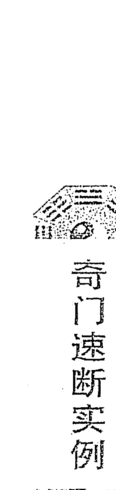

### 三、人体疾病预测

根据易学象数理模型的摹拟性，奇门预测人体健康与疾病状况，首先以奇门的九宫格摹拟人体，即以离九宫代表头部，巽四宫代表左臂，坤二宫代表右臂，震三宫代表左肋左腰，兑七宫代表右肋右腰，艮八宫代表左腿，乾六宫代表右腿，坎一宫代表泌尿生殖系统。这是大致的比附。

具体结合八卦五行属性、奇门内盘外盘，又以离九宫在体表代表头部、眼部、面部；离为火，在体内又主心脏、心血管、脑血管等。坤二宫在体表代表右耳，右臂、右手、人体肌肤；坤属土，在体内又主脾胃、食道、胰脏等消化系统。巽四宫在体表代表左耳、左臂、头发；巽属木属风，在体内又主肝胆、血管、经络、气血等。震三宫在体表代表左肋、左腰，震为运动，故又主足部；震属木，在体内又代表肝胆、左肺等。兑七宫在体表代表右肋、右腰，兑为口，故又代表口舌、牙齿等；兑属金，在体内又代表肺部、气管、右肺等。艮八宫在体表代表左腿、左脚，艮为山，在面部又代表鼻子；艮属土，在体内又代表肠胃消化等系统。乾六宫在体表代表右腿、右脚，乾为天为首，故又代表头部；乾属金，在体内又代表脊髓、筋骨、大肠。坎一宫在体表代表男女外阴部，坎属水，在体内又代表肾脏、膀胱、内分泌系统。

预测疾病以九星中的天芮星为疾病的主要代表符号，同时兼看八门中的死门、伤门、惊门、杜门、景门等，还要看天芮星所临的三奇六仪，以及上乘八神状况，据此来判断疾病的性质和部位，再根据奇门格局的吉凶，节气时令的旺相休囚以及与求测者本人的生克情况，综合判断疾病的轻重、发展态势以及预后情况。

又以天心星和乙奇为医生和医药的代表符号，看其落宫与病星天芮落宫的生克关系，以此判断治疗的成败及效果。用神遇白虎景门必然外伤或手术。

### 四、恋爱婚姻预测

测恋爱婚姻一般以天盘乙奇为女方，天盘庚为男方。如果两者落宫相生和比和，又逢吉门吉格，则恋爱可成，婚姻美满。如果两宫相冲相克，婚事难成，或夫妻关系不好。又以六合为媒人，六合落宫生乙奇落宫，媒人偏向女方；六合落宫生庚落宫，媒人偏向男方。

乙奇落宫所临门、星、神及格局，代表女方性格、身材、长相及职业状态。庚落宫所临门、星、神及格局，代表男方性格、身材、长相及职业状态。

已婚者，还可以用神相合之干为配偶的代表符号，以他们二者落宫的生克刑冲害等状态，来判断他们婚姻的美恶吉凶。

如果预测成婚或离婚等大事，还可以分别看男、女双方的年命落宫情况，以此帮助判断他们之间恋爱或婚姻的结局。

在旧社会以丁奇为妾，在现在以丁奇为插足男女双方的第三者女人，以丙奇为插足男女双方的第三者男人。

女求测者问婚姻，若日干与丙或庚同宫，虽没有结婚，必也与他人同居。男求测者问婚姻若日干或与乙或丁同宫虽没有结婚，必已与女子同居。

### 五、生男生女预测

关于妇女怀孕后判断胎儿是男是女，是双生是单生，胎位是否正常，预产期的确定，分娩是否顺利，等等，鉴于现代医学已经相当发达，上述问题都能准确地检测出来，所以我们研究会未将此列入研究项目，也没有积累这方面的经验。

现在只将古籍中祖先留下的经验归纳在下边。

- ①判断胎儿性别：以坤宫天芮星为母亲，以天盘临坤宫之星为胎儿，阳星为男胎儿，阴星为女胎儿。其中天禽星临坤宫为双生，阳干是男孩，阴干是女孩。又以坤宫所临之门为胎儿，阳门为男胎，阴门为女胎。又可以日干为母，以时干为子，以时干阴阳和所临星、门、宫来判断男女。还有以值符为产母，以六合或值使为胎儿来取月用神的。
- ②判断胎位情况及分娩是否顺利：以坤宫为产室，天芮星为产母，天盘所临之星为胎儿。天芮克天盘之星者，主产速。天盘星生地盘星天芮者，子恋母腹，产迟。天盘星克地盘天芮者，为子克母，主母凶，地盘天芮克天盘星者，母克子，主子亡，但得旺相之气，及奇门吉格者则不碍事。如果时干所临天盘星落地盘墓，主子死母腹内。天地两盘如果乘凶门凶格者，子母俱凶。

又以坤宫所临之门为胎儿，产室克门，胎不安。门克坤宫，孕妇常病。如果伏吟，为子恋母腹，胎主稳而产迟。上乘白虎，则主产速，因白虎为血光神。门到坤宫若休囚入墓，可能是死胎。如果临三奇，则为吉利。

- ③判断产期：一般以坤宫对冲之宫天盘所临之干为应期：也可按阴日看庚上之干，阳日看庚下之干等其他断应期的方法进行。

### 六、升学考试预测

- ①凡求学考试，如果是考生本人求测，则以日干为考生；如果是父母求测子女考学情况，则以时干为考生；同时，还可看考生年命（即出生之年的年干），以年命为用神。

一般以天辅星为考试院，以值符为主考官或副监考官，以丁奇为文章，以景门为试卷；以年干为录取学校。

考生落宫旺相，得三奇、吉门吉格，又得天辅星、值符，年干相生者，能考入理想学校。考生落宫旺相，得三奇、吉门吉格，克天辅星、值符、年干者，也能考入较好学校。考生落宫休囚无力，又不得奇门吉格者，但得天辅星、值符、年干相生者，虽考试成绩不佳，但也能录取。如果考生落宫死绝入墓或空亡，又得凶门凶格，又受天辅星、值符、年干相克者，定然是考不上。

丁奇为考生文章、景门为试卷，二者落宫状态及与天辅星、值符、年干的生克关系，以此来判断考试答题的优劣及得分状况。

- ②旧社会还有武试，即考武官，如考武秀才、武举、武状元等。古人经验，是以值符为主考官，以天冲星为监考官，以日干或时干为考生，以甲戌己为弓，以甲申庚为箭，以伤门为马，以甲午辛为靶心，以景门为策论。日干或时干旺相，甲申庚落宫克甲午辛落宫，或冲其宫，皆为箭中靶心；再看景门旺相，与值符宫相生，则能考中，反此不中。还可看年命与值符、天冲星落宫的生克关系。

现在没有武试了，但如果测武术比赛或军事科目考试，不妨参考。古人经验，变通一下进行试验。

- ③旧社会还有拜师学艺、入山访道。古人经验，以天芮星为访道之人，以天辅星为传道之人。若天辅得吉门、吉格来生天芮者，必得高人传授。相比和者，空见人，不传道。相克者，不能见人，或不传道。还有投武，拜师学武艺者，以天冲星为武士，以值符为武师或教头。二者相生，主利。彼此相克，不利。如果天冲星就是值符，则大利。遇反吟、伏吟不利。

### 七、工作升职预测

工作就业预测，包括毕业分配、求职就业、竞争上岗、晋升职称、官职升降、工作调动等。

一般以开门代表文职工作及单位，以杜门代表武职工作及单位。以年干代表上级领导，以值符代表顶头上司，以月干代表同事，以日干代表求测之人，以时干代表下级或单位职工群众。

日干或年命落宫旺相，又得吉门吉格吉神者，表示自身条件好，得天时地利；再得开门或杜门相生，则求职得官顺利；如果日干或年命克开门或杜门，经过努力，也能得到工作或官职；如果自身不得天时地利，又受开门或杜门冲克者，必然得不到官职或工作。

能否晋升职务、职称也是如此。一看天时，二看地利，三看人和，四看自身条件和运气。自身条件好，又得年干、值符、开门相生者，必然能晋升，反之则不能。

开门克用神，文官降调。杜门克用神，武官降职。反吟主调任，空亡必革职，入墓不但降罚，还会招来罪戾。太岁来克，上级领导不喜；值符来克，顶头上司不爱，月干来克，同事参劾；时干来克，下边群众告状。

又以开门为官星，以其所临九星为人品。如开门上乘吉星为好人，凶星为恶人。临天辅星文雅，天任星慈祥，天心星正直，天禽星忠厚，天冲星风厉，天英星昏烈，天芮星贪毒，天柱星奸诈，天蓬星大恶。

军队干部和士兵转业或退役，可以杜门为官长，以日干为退役之人。如果杜门生日干，主工作需要，领导有意留你，不准转业或退役。如果杜门克日干，则准退。比和者，也准退。如果日干乘青龙逃走或荧入白者，必退役，如果乘白入荧、虎猖狂者，则不可退。如果日干临蛇夭矫，则可能有官司缠身，欲退不能。如果见大格或雀投江凶格，则可能被辞职。

### 八、生意求财预测

经营求财预测，一般以日干为求测之人，以时干为财或货物；以甲子戊为资本，以生门为利息；以值符为货主，值使为购货之人；以六合为经纪人，月干为同行竞争者；以生门所临之星为财星，以值符和景门为行情；以时干和值使门落宫为经营项目；以开、休、生落宫为得财方向；以生门落宫为得财数量；以开门为店铺、门面，以生门为房屋，以死门为地皮；以值符为物主或银行，以值使为借贷人；以值符为银行为放贷人，以天乙（值符下临地盘之星）为贷款人或借款人，以值符为债主，以天乙为欠债人，以伤门为讨债人；等等。生门落旺宫、又得奇、得吉格，则得利大，相则平，休囚利微；如休囚又逢凶格，无利赔本；甲子戊与生门落空亡，反吟、墓绝；再有凶格凶神者，不仅不得财，反会招惹是非。甲子戊和生门上乘吉星事更吉，乘凶星则含有凶的成份。又可以地盘甲子戊上乘之干来判断得财数量。得财时间：甲子戊与生门同落内盘为距离近、速度快，一内一外则迟，全在外则更迟，更远。如甲子戊与开门同宫，则得财迅速。又以地盘时干宫的地支定应期，为得财之年、月、日、时。伏吟，则生门对冲之宫地支为应期。

### 九、出行出国预测

出行出国，一般以日干落宫为出行之人，看去什么方向，这个方向如果有吉格吉门来生日干落宫，则为顺利，如果无吉门吉格，但该方向地盘宫与日干落宫比和，也为顺利。如果日干落宫得吉门吉格，克所往方向之宫，也可出行。如果出行之方得吉门吉格，但克日干落宫，虽勉强可行，但必不顺。如果所往之方遇凶门凶格，又来冲克日干落宫，则大凶。如果所往之方为时干空亡之地或为日干之墓地，则不利。

如果日干或年命刑、墓、空亡，出行方位之宫，也为不利。同时，也可兼看日干与时干的关系，以便帮助判断出行的利弊吉凶。

凡出行乘车，以景门所临之宫为道路，以伤门为车。遇白入荧凶格易遭盗贼，逢荧入白凶格则可能碰上火灾，临天蓬、玄武可能被盗或丢失钱物。

凡出行乘船，以休门所落之宫为水路，以伤门为船只。如果遇青龙逃走或白虎猖狂凶格，可能遭遇风暴，如果碰上雀投江、蛇天矫凶格，则可能有沉船的危险。

如果坐飞机出行，可以九天所临之宫为航线，以开门为飞机，看其临宫状态、格局如何，以定其利弊吉凶。

凡预测出发时间，一般先看日干和时干，如果日干和时干均在内盘，则行期近；如果日干和时干俱在外盘则行期远；日干和时干一内一外，也主行期远。一般以开门落宫地盘所临之干为具体出发时间。

未动身时预测外出归来之期，一般以出门之日的日干落宫下临地盘之干为归来日期。

预测行人在外吉凶，一般以用神及其年命落宫所临星、门、宫、神及其格局好坏旺衰来判断。

预测行人归期，一般以庚格来判断。阴日以庚上之干为归期，阳日以庚下之干为归期。逢年格，年内必归；逢月格，月内归来；逢日格，当日即回；逢时格，本时辰内即归；不逢格，则不归。何谓不格？乙庚合，不为格；庚金入墓或空亡，不为格。古人经验，又有以天蓬、天芮二星为代表行人的，行人在千里之外以天蓬星为用神，行人在千里之内以天芮星为用神，如果时干临天蓬或天芮，则可归来，时干就是归期；伏吟不来，反吟来；如果用神临三奇和三吉门，三奇六仪又正好是行人的年干，则马上可以回来；如果凶星凶门临行人年干，必有妨碍不能回来。

### 十、行人走失预测

预测行人走失，如果以走失时间起局，一般以日干为用神；如果是按问测时间起局，一般以六亲关系取用神，如父母问测子女走失，以时干为用神，问测同辈人走失以月干为用神，问测老年人走失以年干为用神。同时，都还可以兼取行人年命为用神。

行人走失方向，古籍多以六合落宫为走失方向，经验证，一般情况下，六合落宫是行人开始走失的方向，中间值符落宫、值使门落宫都可能是其落脚点；而最终找回或死亡的方向往往是用神（包括年命）落宫的方向。如果走失之人是有意潜逃，杜门落宫则可能是其躲藏方向。如果九星或八门反吟，或用神宫逢空亡，用神落宫的对冲之宫则可能是其走失之方。又以内盘外盘分其远近，阳遁，用神落宫在一八三四，则为内为近；九二七六宫为外为远。阴遁，则以九二七六宫为内为近，以一八三四宫为外为远。

行人在外安危吉凶，则主要以用神落宫的格局来判断，如果用神旺相，又临三奇、吉门、吉格、吉神、吉星则平安无事，如果用神落宫得太岁、月干、日干或时干宫相生，则为有人帮助；如果用神休囚无力，又遇凶星、凶神、凶门、凶格或入墓、空亡、六仪击刑，则不吉或大凶。

行人走失，能否找回或自己回来，一般日干与时干同宫，或时干生日干，则容易找回或自己回来；日干生时干，日干克时干，或时干克日干，则不易归。用神旺相，又临开、休、生、杜四门者，不好找到；用神休囚，又临伤、景、死、惊四门者，则有消息，可以找到或自己回来。用神乘九地、太阴，可能有人潜藏；乘九天，远走高飞；乘玄武，被人拐骗；乘腾蛇，有人盘查羁留；乘白虎，防止刑伤；乘值符、六合，安全无事。另外，伏吟，人难归；反吟，人必归。

行人归期，一可以用神和值符定应期，旬空者，以填空之时或冲实之时为应期；逢冲者，以合为应期；逢合者，以冲为应期。二可以庚格定应期，逢年格者年内归，月格者月内归，日格者当日归，时格者本时辰内归：阴日看庚上之干，阳日看庚下之干为应期；或者看时干，时干临阴星，则以庚上之干为应期，时干临阳星，则以庚下之干为应期。三可看马星，马星动或冲动马星之时为应期。

### 十一、钱物丢失预测

钱物丢失，一般以日干落宫为失主，以时干落宫为丢失之钱物。如果日、时同宫，为没有丢失，可以找到。如果时干落宫乘旺相之气来生日干落宫，也能找回。反吟者也主能找回。相反，则不易找回。时干落空亡、墓、绝之宫，也主难找回。

日干与时干同在内盘，则钱物丢失在家中或近处；日干与时干同在外盘，则钱物丢失在外边或远处，日干在内、时干在外，则丢失在外边；时干在内，日干在外，则丢失在家中。

如果时干临玄武，则可能被人偷去或自己忘记；如果时干宫被玄武宫或天蓬宫所克，则可能被人盗走。玄武乘阳星为男人，乘阴星为女子；旺相有气为青壮年，休囚无气则为老年人。

丢失钱物找到时间，一般以时干生日干之日时为应期；或按庚格而断，阴干寻庚上，阳干寻庚下；入库者，以冲出之日时为应期，旬空者以填实之日时为应期。

### 十二、刑事案件预测

刑事犯罪包括偷盗、抢劫、流氓、杀人以及贪污受贿等经济犯罪。在奇门预测中，一般性偷窃财物、流氓强奸、轻微经济犯罪，多以玄武为用神，抢劫杀人、奸情杀人，重大贪污受贿罪犯，多以天蓬星为用神；同时，甲午辛为罪人，凡是犯错误或犯罪之人，都还可以同时以六仪辛为用神，来帮助判断之。

罪犯特征，一般以用神落宫旺衰，结合所临星，门、神、三奇六仪，来判断其职业、长相、身高、性格等。蓬、玄临庚多为老奸巨滑的重大案犯，临辛多为惯犯或曾被劳教关押者，临壬，癸多为在逃罪犯。

作案手段与工具，蓬、玄临伤门或伤门生蓬、玄，多为用车；临景门或景门生蓬、玄，多为使用枪枝火器；临庚、辛或庚、辛生蓬、玄，多为使用尖刀、匕首等金属器械；临巽宫或腾蛇，多以绳索将人勒死或以手掐颈而致死人命；临甲、乙或伤、杜二门，也可能用木棍或木制东西将人打伤或致死。

星门伏吟或用神落内盘，则可能是本地人或单位内部之人所为，星门反吟或用神落外盘，则可能是外地、外单位人或流窜犯再次作案。

罪犯逃跑，藏匿方向，一般以六合为逃犯，以杜门落宫为藏匿方向。以内盘、外盘、杜门所落宫数，来判断其远近。

发现无名尸首，一般以死门为其代表符号。死门临甲子戊，可能是为钱财而被杀；临乙、庚、丁、壬或桃花者，多为奸情所杀；乘太阴、六合，多为隐私暧昧之事所杀。

能否破案，一般以伤门、白虎、六仪中的庚和值使门为公安捕盗之人。公安捕盗之人落宫旺相，冲克罪犯落宫者，案一定能破；相反则难破或破不了案。星、门伏吟者难破，反吟则能破或案犯再次作案时可破。同时，有庚格，即庚临年、月、日、时者，能破；不格者，不破或难破。另外，杜门逢庚、辛、壬、癸，或天盘六仪克地盘六仪，或地盘六仪生天盘六仪，一般也能破案。

破案时间，多以庚格而断。庚临年干，一般年内可破，庚临月干，月内可破；庚临日干，当日可破；庚临时格，本时辰内或表示较短时间内可破。如果一局中同时出现两个庚格，则表示该案一定能破，而且时间较短。具体破获时间，还可以结合阳日看庚下之干，阴日看庚上之干，或时干临阳星看庚下之干，时干临阴星看庚上之干等方法来判断。还可以按旬空出空、马星动，值使门落宫等方法来判断。

另外，古籍中还有“死门加壬，主讼人自讼”和壬临坤宫凶犯自首的经验，也可供参考。

总之，奇门预测，如果搞得好，可以为刑侦人员提供一些有参考价值的意见或信息，以减少破案的盲目性，减轻其工作量，但绝对代替不了刑事侦察和调查取证，更不能作为破案的依据和证据。易学预测本身并不能破案。

### 十三、官司诉讼预测

凡预测官司诉讼，一般以值符为原告，以天乙（值符落宫地盘之星）为被告（古籍和今人著作中有以“乙奇”为被告者，从易理上讲不通，经过实践验证也不准确），以开门为法官，以六合为证人证据，以景门为诉；以丁奇为传票，以惊门为律师。

值符落宫旺相有气，又乘吉门、吉星、吉格来克天乙落宫者，原告胜。如果天乙落宫旺相有气，又乘吉门、吉星、吉格来克值符宫者，被告胜。如果二宫比和，则可能合解。如果值符宫生天乙宫，可能原告主动求和，如果天乙宫生值符宫，则可能被告主动求和。

开门落宫既克值符宫，又克天乙宫者，法官铁面无情，公平审判。

##### 奇门速断实例

开门生值符，法官向原告；开门生天乙，法官向被告。如果开门入墓，则法官糊涂，审不明白；开门落空亡，不予审理；反吟，需换官来审。

起诉书是否被法官受理，以景门为用神，代表起诉书。如果景门落宫旺相，又得三奇吉格，说明情词恳切，不被开门宫冲克者，必被受理。如果受开门宫冲克，则不予受理。如果景门落宫空亡，又乘玄武或腾蛇者，主所诉事情不实。如果六合宫逢空，则说明证据不足。

预测是否判刑，以甲午辛为罪人，以壬为天牢，以癸为地网，甲午辛临壬、癸者，必有牢狱之灾，临三奇，特别是丁奇者，则可能无罪释放。再结合与开门落宫的生克关系，综合判断之。

如果是犯罪本人或亲属预测，还可以日干或按六亲关系取用神，以辛为天狱，壬为地牢，癸为地网。如果用神落宫，下临辛，主被囚禁；临壬、癸者为误入天罗地网，待冲破之日可出。如果天盘壬、癸之干下临地盘辛者，为网罗蒙头，主囚禁时间长。如果用神落空亡之宫，则不会被囚禁。

### 十四、军事战争预测

奇门遁甲源于军事上的排兵布阵，最初主要也是用于军事上的预测和决策。虽然古籍中几乎没有留下一条应用于军事上的实例，但却留下了一些预测的经验；

为了引起军事战线上的易学爱好者对这个问题的兴趣，现将古籍中的取用判断经验归纳如下，另在历史事件预测中，写出一个事后对照研究的战例。

奇门遁甲中以六甲为元帅和主将，遁在六仪之下，而六甲最怕六庚来克（庚金克甲木为七煞，最凶），所以古人就以甲与庚这一对矛盾双方来代表战争的双方。一般以值符落宫（值班六甲所遁之处）为主方（因甲处在被克状态，被动为主），以六庚落宫为客方（因庚来克甲，庚处主动地位，故为客）。

凡值符落宫克六庚落宫，则主胜，反之则客胜。又以旺相休囚论胜负，旺相者为胜，休囚者为负；凡战阵又以景、惊二门主之。又治乱之法，要看惊门。所以，如果主宫得景、惊二门，或景、惊二门宫与主宫相生，则主胜，反之，则客胜。如果主、客所乘皆旺相，俱得二门，不相刑克，其力相等，则两相恐惧，不战而退。如果六庚为值符，则是主、客同宫，二家不分胜负。如果主客相生，二家可能讲和。又，日干加庚，则主胜；庚加日干，则客胜。也可以日干为我方，以时干为敌方，来帮助判断胜负。

凡预测军事情报和信息，以景门为用神，景门落宫旺相得奇为实信，不得奇为诈信，空亡休囚为谣言。

凡预测作战计划部署，以值符为上级，开门为官长，庚为敌人。如果开门受庚和值符克制又休囚入墓而无吉星相助者，则表示计划部署不当，损失惨重，招致上级批评拿问。如果值符生开门。而且又克庚，则表示计划部署得当，旗开得胜，会受到上级嘉奖提升。

凡预测敌人来不来，以六庚为用神，六庚落内四宫为来，落外四宫为不来。又太白入荧主贼来，荧入太白主贼去。如果贼已入境，看六庚在内四宫，为不去；在外四宫中为去。又六庚落宫克六庚，表示贼安营不稳，自惊而退。如果六庚克落宫，再乘玄武、天蓬或白虎，则必然大战一场。乘九天，大张声势，鸣鼓而进。乘九地，则偃旗息鼓而来。庚下之干即为敌人的来去时间。

凡测攻城，以六庚为攻者，以天禽为守者。六庚乘旺相星，得开门加中五宫，其城必克。又，地盘天禽所乘之宫，得旺相及吉门者，其守将可擒。反之，守将必死。

凡测守城，以天禽为守者，以天蓬、六庚为攻者。天禽落宫得休、生、杜、景四门，又旺相，有六丙，其城不破。如果无吉门旺相，再犯开门，天蓬乘六庚加入中宫，则不守。

凡预测派遣何人为宜，从众将中找年命之干被开门所冲者，即为应派之人。

### 十五、风水环境预测

人类的健康发展，离不开优良的地理环境，所谓“地灵人杰”是也。奇门遁甲由于是一个完整的时、空象数理模型，因此在用于预测，帮助人类选择最佳居住地理环境方面，比其他预测术更有优长之处。特别是一个堪舆师，如果再掌握了奇门遁甲，则如虎添翼，在为人们优选地理环境方面会做出更大更佳的贡献。

古籍中在这方面有些记载,但并不多,需要我们在实践中进一步摸索探讨。

预测地理环境,一般以日干为人,以时干为住宅。时干临三奇吉门吉星吉格乘旺相生日干,则为最佳住宅。此居住环境对人最为有利。如果时干不临三奇吉门,但临吉星吉格乘旺相生日干宫,也为较好住宅。如果时干所临有吉有凶,则为一般住宅。如果时干临凶门、凶星、凶神、凶格,又来克日干宫,自然就是大凶之宅了。具体吉凶,再根据星、门、宫等的生克关系来具体分析。

测阳宅,一般以生门为房屋,以死门为地皮(宅基),再以其旺相休囚,与日干的生克关系来判断其优劣。又以值符为新宅,以值使为旧宅。

测阴宅,一般以死门为用神,死门落宫地盘为死者,天盘为生者,吉神吉星又得三奇,上下相生者吉,凶神凶星不得奇且上下相克者凶,天盘克地盘,对死者不利,地盘克天盘,对生者不利。再者,死门落二、五、八、九宫为吉,落六、七宫次吉,落一、三、四宫不吉。

### 十六、人生命运预测

一个人的命运,除了个人主观努力以外,第一,与先天素质有关,即由祖上及父母遗传基因和出生前的时间、空间等自然界因素赋予他的基本素质有关。有人将这种基本素质,称之为“天赋”,也就是降生以前,客观世界给予他这个生物的物质结构、性能等。比如说是健康的肌体,还是有病残的肌体;是高智商的大脑,还是低智商弱智的大脑;是坚韧不拔、与人随和的性格,还是忽冷忽热、偏激古怪的性格,等等,这些都与他事业的成功与失败,选择什么样的职业才能更好地实现其人生价值,有很大关系。

第二,与后天的机遇有关。有的人先天素质很不错,但是阴差阳错,后天运程中老是碰不上发展其“天赋”的机遇,一生怀才不遇,郁郁寡欢。也有的人,从全面素质来比较可能不如另一个人,但他某一方面的“天赋”却碰上了发展的机遇,于是大展其才华成为“一招鲜,吃遍天”的明星人物。所谓后天机遇,包括天时、地利、人和,以及某些人类用肉眼无法直接看到的自然力量(能量场、生物场等)等因素。

奇门预测由于是一个将天时；地利、人和和自然力量综合到一起的时空象数理模型，所以可以帮助人们认识自我，了解自我，帮助你了解自己的先天素质如何；后天机遇如何，以便扬长避短，调整自我，经过主观努力，发展自我，完善自我，更好地实现其人生价值。

凡预测一个人的先天素质和后天大的机遇，可以通过其出生时间的奇门格局进行分析，一般以日干落宫为本人，在家庭，以年干为父母，以月干为兄弟姐妹，以时干为子女，在社会群体，以年干为上级领导，以月干为同事朋友，以时干为下级群众，以九星为天时，以八门为人事，以九宫为地理，以八神为自然力量：结合时令和落宫分析其旺相休囚，结合格局分析其机遇好坏，通过五行生克制化分析其吉凶祸福。

凡预测一个人近期机遇和行运，可以通过问测时间的奇门格局进行分析，一般以日干为本人，结合年命落宫，综合判断之，也可以结合来人落宫方位，帮助判断之。

## 第四章 奇门预测实例精解

### 一、艮宫白虎 脚有伤

2003年3月4日
癸未年乙卯月丙子日壬辰时 0149 局
0149 局 (7:00——9:00)

| 九地 天衡 | 九天 天辅 | 值符 天英 |
| :--- | :--- | :--- |
| 甲子戊+甲戌己 死 贵人入狱 巽 | 甲戌己+丁 惊 失盗入墓 离 | 丁+乙 （甲申庚） 开 人婚吉格 坤 |
| 玄武 天任 | 阳三局 甲申旬 壬辰时 | 螣蛇 丙+甲 辰壬 （甲申庚） 休 小格 兑 |
| 甲寅癸+甲子戊 景 天乙会合 震 | | |
| 白虎 天蓬 | 六合 天心 | 太阴 天柱 |
| 丙+甲寅癸 杜 华盖悖格 艮 | 甲午辛+丙 伤 干合悖师 坎 | 甲辰壬+甲午辛 生 螣蛇相缠 乾 |

上午7点30分我到市里办事，来一电话要预测，听口音象是广东人，我想着一定是来西安做生意的广东人，要预测事情，因当时我没有带奇门局，让他等一会再打电话，后来我9点多刚回到家前，他又连打几个电话来问，我想一定是生意人，有急事预测，我9点多一回到家翻看奇门局0149局，正看时，他又打电话来。

看奇门局他并非有钱生意人。

日干丙为求测人，在艮宫临杜门，上遇白虎天蓬星，必破财受伤。

我对他说：你最近运气不好，破财或受伤，有病。

他说：你怎么知道？我什么也没有说，你说我伤在什么地方？

艮宫为左腿左脚。

他说: 是，我是广西人，同老乡一起来西安打工，刚上几天班，干活时，砸伤了左脚，现在也没有办法上班，你真是高人，你在哪里？我去找你。

我对他说，你有伤就不要来了，再说坐车还要花钱。

他说: 我到处找高人，所以我一定要去。

没有办法，只好告诉他乘几路汽车可到我这里。

下午4点多他果真来，民工模样，两广口音，脚上果然有伤，我由此更加信服中华始祖发明的《奇门遁甲》的神奇，它应该是外星人传授给我们祖先的神秘符号，不是这样的话，为什么古人类科技不发达时，而天文学历法知识却很发达。

来人说：他是广西人，在家常玩六合彩并要跟我学习《奇门遁甲》。我说: 你讲话我只能听懂一部分，我给你介绍你们广西的一个高人，你回广西可去找他学习，因为语言相同好交流沟通。

我给他找出《奇门日课》的作者周时才先生的地址和电话，这个广西人临走时非要给我卦钱。我说: 你很困难，我不能收你的钱，但他硬留下几块钱离去。

### 二、格局龙折足 反映腿不好

2004年7月6日
甲申年庚午月丙戌日丁酉时 0634局
0634局(17:00——19:00)

| 九地 天心 | 玄武 天蓬 | 白虎 天任 |
| :--- | :--- | :--- |
| 甲庚癸+丙 | 甲戊己+甲申庚 | 甲午辛+甲子戊 (丁) |
| 开华盖悖师巽 | 休刑格反名离 | 生因龙被伤坤 |
| 九天 天柱 | 阴二局 甲午旬 丁酉时 | 六合 天芮 |
| 甲辰壬+乙 | | 乙+甲辰壬 |
| 惊小蛇日奇震 | | 伤奇入地兑 |
| 值符 丙（禽） 甲子戊+甲午辛 (丁) | 螣蛇 天英 | 太阴 天辅 |
| 死龙折足艮 | 甲申庚+甲戊己 | 丙+甲寅癸 |
| | 景刑格坎 | 杜华盖悖格乾 |

下午 6 点多,来一女顾客说:你会起名字?用什么方法起名字?看她怀疑的样子,我问她:你想给谁起名?

她说:想给我小孩改名。先为其预测了几条:

-   1、时干丁为子女,丁在艮宫,艮为少男,应为男孩。答:不是,是女孩。
-   2、时干丁为子女在艮宫,上有天芮病星,下临死门,格局龙折足,据此我对她说:你娃身体不好。她说:你也没有问出生时间,凭啥说我娃身体不好。我问她:你说对不对?她口气缓和地问:那你说我娃身体什么地方有病?我说左腿或左脚有病。她说:我娃现 12 岁,从小两条腿都有风湿病,我现在下岗失业,在外打零工。
-   3、庚为求测者丈夫在坎宫刑格又临景门,在坎为血光,据此我对她说:你虽下岗失业,运气不好,但你老公比你运气还差。她说:我老公出车祸已不在了。

### 三、99 朵玫瑰

2004 年 8 月 13 日
甲申年辛未月甲子日庚午时 0547 局
0547 局(11:00——13:00)

| 玄武 天衡 丙+丁 朱雀 休门 巽 | 白虎 天辅 丁+甲戊己 勾陈 生门 离 | 六合 天英 甲子戊+乙 (甲寅癸) 逢星 伤门 坤 |
| :--- | :--- | :--- |
| 九地 天任 甲申庚+丙 天英 开门 震 | 阴 一 局 甲子旬 庚午时 | 太阴 芮(禽) 乙+甲午辛 (甲寅癸) 龙逃走 杜门 兑 |
| 九天 天蓬 甲子戊+甲申庚 天任 惊门 艮 | 值符 天心 甲辰壬+甲子戊 天蓬 死门 坎 | 螣蛇 天柱 甲午辛+甲辰壬 天心 景门 乾 |

中午 12 点来一小伙子订 99 朵玫瑰，让下午 4 点送到灞桥区公安局一女孩子手里，我据当时的奇门顺便为其预测了几条，并对他说：99 朵玫瑰怕还不行。

-   1、乙为男子之对象在兑宫，你对象在你西边，送花之小伙在城里住，而纺织城灞桥公安局在西安市的东边，若按照常理推断，其对象应在东边，但奇门局乙在兑，其对象在小伙的西边，我对他说完后，想肯定我断错，他说：对象是在我西边。
-   2、乙在兑宫克庚所在震宫，为女子之对象在震宫，断：你和你对象闹矛盾。答：是有些矛盾，结果会咋样。
-   3、乙兑宫克庚震宫，格局又是龙逃走，并且相冲相克，兑中有酉，阴8月会吹。

后：九、十月的一天，我店来一女子。问我：你还认识我吗？我说：看着有点面熟。她说：你不是到公安局给我送的玫瑰花吗？我才想起，99朵玫瑰的事情。她又问我：是你算的，我和我对象要吹是吗？我说：是的，那你们吹了没有？她说：已经吹了。我们其实没有什么大矛盾，主要是我父母说我俩人八字不合，反对所至。我问她：几月吹的，她说：阴历8月吹的。随同她来的刑警队的小伙子说：我真佩服你，根据送花时间，你就能算出人家要吹。我说：我没有什么，你应该佩服中国的周易八卦《奇门遁甲》。

### 四、奇门测抢劫案

2005年9月10日晚7点30分
乙酉年乙酉月丁酉日庚戌时 1067局
1067局(15:00——17:00)

| 太阴 天衡 | 螣蛇 天辅 | 值符 天英 |
| :--- | :--- | :--- |
| 丁+甲寅癸 开 雀投江 翼 | 甲寅癸丁+甲子戊 休 天乙会合 离 | 甲子戊+丙 (甲辰壬) 生 龙回首 坤 |
| 六合 天任 甲戌己+丁 惊 朱雀入墓 震 | 阴九局 甲辰旬 庚戌时 | 九天 芮(禽) 丙+甲申庚 (甲辰壬) 伤 火入金乡 兑 |
| 白虎 天蓬 乙+甲戌己 死 奇入墓 艮 | 玄武 天心 甲午辛+乙 景 虎猖狂 坎 | 九地 天柱 甲申庚+甲午辛 杜 虎干格 乾 |

9月10日晚7点，纺正街一手机店发生被抢案件，劫匪将店员反锁店内，乘出租车逃走。当时有人看见，还以为是店员关门下班走了，等商店里的人敲门向外求救，已是晚7:30分，派出所的人来帮助打开门，并当场作了调查。第二天派出所又来人调查，据奇门局为其分析。

-   1、商店被抢看天蓬星，天蓬星为大盗，在艮宫，艮为少男，应为年轻人，遇白虎死门罪犯用刀伤过人或自己身上有刀伤，临死门必有命案，白虎天蓬必为大盗，并多次做案。
-   2、六合为逃走之人在震宫为东，杜门为躲藏方向，在乾宫西北方，时干临庚格，为能破案。劫匪应逃到东边，或西北方向。
-   3、其一警察问，如果你按6点30分来预测，结果会是怎样？因为案件是6点30分发生的。我又看奇门6点30分的局，天蓬星大盗在离宫，离主阴，劫匪中应有女的。他说：没有女的。我说：只能以7:30分来预测，因为7:30分是人们发现事件的时间。后来，证明是准确的。

11月15日，知道案已破，后见到派出所的人问及此事。他说：罪犯是三原县人，在三原多次作案而被抓。

三原县正是西安的西北方向。

时干庚格在乾宫，戌亥月破案，在丁亥月案破，此案正应杜门有格，一定可抓获，又八门反吟案可破，或罪犯再次作案可破案。

### 五、公司起名，奇门断方向

2004年3月24日下午6:00时
甲申年丁卯月壬寅日巳酉时 0526局
0526局 (17:00——19:00)

##### 奇门速断实例

| 值符 天柱 | 螣蛇 天心 | 太阴 天蓬 |
| :--- | :--- | :--- |
| 丙+甲辰壬 | 丁+甲子戊 | 甲戊己+甲申庚 (甲寅癸) |
| **伤**火入天网巽 | **杜**青龙转光离 | **景**刑格反名坤 |
| 九天 芮(禽) | **阴 九 局** | 六合 天任 |
| 甲申庚+甲午辛 (甲寅癸) | **甲 辰 旬** | 乙+丙 |
| **生** 度于格震 | **巳 酉 时** | **死**奇仪顺遂兑 |
| 九地 天英 | 玄武 天辅 | 白虎 天冲 |
| 甲子戊+乙 | 甲辰壬+甲戊己 | 甲午辛+丁 |
| **休**龙合灵门艮 | **开**凶蛇入狱坎 | **惊**狱神得奇乾 |

2004年3月，我在《三秦都市报》刊登起名预测的广告，3月24日下午一人来电话问起名，问我在什么地方，我说在东郊纺织城，他说他在北郊，不想来，想在市里找一个起名的公司。

我说：你不来就算了，你的工厂门朝北。

他惊奇的问：“我啥也没说，你咋知我工厂门朝北？”我说：你说我测的对不对？

他答：是。后来他来我这里起名，为其工厂起了十几个名字，他后来说，选择《西安新区春龙纸箱厂》。

开门在坎，工厂门朝北。

### 六、奇门测餐厅方向

2004年3月31日
甲申年丁卯月巳酉日壬申时 0189局
0189局（15:00——17:00）

| 值符 芮(禽) | 螣蛇 天柱 | 太阴 天心 |
| :--- | :--- | :--- |
| 丙+甲子戊 (甲戊己) | 甲午辛+甲寅癸 | 甲申庚+丙 (甲戊己禽) |
| **景** 鸟跌穴巽 | **死**天牢华盖离 | **惊** 白入荧坤 |
| 九天 天英 | **阴 四 局** | 六合 天蓬 |
| 甲寅癸+乙 | **甲 子 旬** | 丁+甲午辛 |
| **杜**华盖逢星震 | **壬 申 时** | **开**朱雀入狱兑 |
| 九地 天辅 | 玄武 天冲 | 白虎 天任 |
| 甲子戊+甲辰壬 | 乙+丁 | 甲辰壬+甲申庚 |
| **伤**龙入天牢辰 | **生**奇仪相合坎 | **休**太白擒蛇乾 |

下午3:15分来电问餐厅起名。

开门在兑宫，餐厅门朝西或座西向东。

答：朝东。

后来我处起名。

### 七、预测官司

2004年12月21日
癸未年甲子月戊辰日辛酉时 0058局
0058局（17:00——19:00）

| 白虎 天心 甲寅癸+甲午辛 开囚盖天牢巽 | 玄武 天蓬 甲子戊+乙 休龙合灵门离 | 九地 天任 丙+甲戊己丙 (甲辰壬禽) 生火悖入刑坤 |
| 六合 天柱 丁+甲申庚 惊文书阴隔震 | 阳一局 甲寅旬 辛酉时 | 九天 天冲 甲申庚+丁 伤亭亭白奸兑 |
| 太阴 芮(禽) 甲戊己+丙 (甲辰壬) 死火悖地户艮 | 螣蛇 天英 乙+甲子戊 景刑阴害阳坎 | 值符 天辅 甲午辛+癸 杜天牢华盖乾 |

下午6点，一来人测官司。

- ① 求测人原告，官司输，问准备上诉，问可胜否？八门反吟，值符乾宫克，下临之星巽宫，上诉可胜。
- ② 开门为法官者与天乙被告同宫，法官或法院向被告，所以第一次官司输。

答：是。

- ③ 日干戊临甲子戊挣钱多。

答：画家，卖画。

### 八、日干克开门，原是得罪法官

2004年2月19日
甲申年丙寅月戊辰日丙辰时 0533局
0533局（7:00——9:00）

| 九地 天冲 | 九天 天辅 | 值符 天英 |
| :--- | :--- | :--- |
| 甲午辛+甲辰壬 | 甲辰壬+甲子戊 | 甲子戊+甲申庚 (甲寅癸) |
| 伤凶蛇入墓巽 | 杜小蛇化龙离 | 景符飞宫坤 |
| 玄武 天任 | 阳九局 甲寅旬 丙辰时 | 螣蛇 芮(禽) |
| 乙+甲午辛 | | 甲申庚+丙 (甲寅癸) |
| 生 龙逃走震 | | 死 白入荧乾 |
| 白虎 天蓬 | 六合 天心 | 太阴 天柱 |
| 甲戌己+乙 | 丁+甲戌己 | 丙+丁 |
| 休 云遁艮 | 开火入勾陈坎 | 惊月奇朱雀乾 |

早8点，还未睡醒，画家来电话说，出了点事，让他过几分钟来电话。
日干甲子在坤宫，克开门坎宫，求测者一定是得罪法官，几分钟后
来电话说，因案子跟法官说话争吵，怕得罪法官，问是否要紧，我说，
无妨，后他的上诉官司经过一年多胜诉，以书画来感谢。

### 九、测婚姻，来电话是情人

2004年2月23日
甲申年丁卯月壬申日丙午时 0343局
0343局（11：00——13：00）

| 六合 天蓬 | 白虎 天任 | 玄武 天冲 |
| :--- | :--- | :--- |
| 甲辰壬+丙 | 甲申庚+甲午辛 | 丁+甲寅癸芮 (乙禽) |
| 生水蛇入火巽 | 伤虎干格杜 | 杜雀投江坤 |
| 太阴 天心 | 阳六局 甲辰旬 丙午时 | 九地 天辅 |
| 甲子戊+丁 | | 丙+甲戌己 |
| 休龙照明震 | | 景火悖入刑乾 |
| 螣蛇 天柱 | 值符 芮禽 | 九天 天英 |
| 甲戌己+甲申庚 | 甲寅癸+甲辰壬 (乙) | 甲午辛+甲子戊 |
| 开利格反名艮 | 惊复加腾蛇坎 | 死因龙被伤乾 |

午11点10分一女来测婚，此女春节前来我店买花送领导，我据
来时对她说，你不用送礼给领导，领导都对你很好，她说，就是。今日
又来测婚姻。

- ① 日干壬临时生门巽宫生庚其夫所在离宫，求测者有钱，对其夫好。

答：我在X有钱单位工作。

- ② 从乙庚关系看，乙在坎临值符克庚离宫，对丈夫不满，想离婚又有些不舍。

答：是。

正在为其预测，她的电话响：断电话是从西边打来的，景门在兑为西，又有丙奇，为情人来电，日干壬+丙也为有情人。

答：是情人来找我。

### 十、来人测运气，原是想离婚

2004年3月30日
甲申年丁卯月戊申日戊午时 0355局
0355局（11:00——13:00）

| 九地 天任 甲申庚+丙 生 白入荧巽 | 九天 天冲 丁+甲午辛 伤 朱雀入狱离 | 值符 天辅 丙+甲寅癸芮 (乙禽) 杜 华盖悖格坤 |
| :--- | :--- | :--- |
| 玄武 天蓬 甲辰壬+丁 休 合蛇刑震 | 阳六局 甲寅旬 戊午时 | 螣蛇 天英 甲午辛+甲戌己 景 入狱自刑兑 |
| 白虎 天心 甲子戊+甲申庚 开 符飞宫艮 | 六合 天柱 甲戌己+甲辰壬 惊 地网高张坎 | 太阴 芮(禽) 甲寅癸+甲子戊 (乙) 死 天乙会合乾 |

午11点多来人测运气

- ① 日干甲子戊临开门艮宫，求测者是有钱人，财运好。

答：自己做生意。

- ② 想离婚？

答：是。

庚在巽，乙在乾宫相冲相克。

### 十一、问失物、非失物

2004年8月10日
甲申年辛未月辛酉日丁酉时 0994局
0994局（17:00——19:00）

| 太阴 天辅 | 螣蛇 天英 | 值符 芮(禽) |
| :--- | :--- | :--- |
| 甲辰壬+甲辰壬 | 乙+乙 | 丁+丁 |
| 杜蛇入地罗巽 | 景 奇伏吟离 | 死奇入太阴坤 |
| 六合 天冲 | 阴 八 局 | 九天 天柱 |
| 甲寅癸+甲寅癸 | 甲 午 旬 | 甲戌己+甲戌己 |
| 伤天网四张震 | 丁 酉 时 | 惊地户逢鬼兑 |
| 白虎 天任 | 玄武 天蓬 | 九地 天心 |
| 甲子戊+甲子戊 | 丙+丙 | 甲申庚+甲申庚 |
| 生 符伏吟艮 | 休 奇符师坎 | 开 战格乾 |

下午6点，一女子找我说是丢失东西，奇门局日干辛时干丁同宫，临值符，物未丢失。

她说：是我借钱给人，并没有丢东西。
又测运气。

- ① 八门九星伏吟，伤门震宫克日干死门坤宫，三四月受伤破财，生门甲子戊艮宫伏吟，又遇白虎，左腿左脚受伤。

答：左腿碰伤，破财万元，是被人骗了万余元，至今报案未破。
被骗报案未破，伤门为警，伏吟不动。

- ② 辛月干又为兄妹，其妹有伤病，辛月干在坤宫，死门天芮病星大凶，其妹有伤病，病在身体右边。

答：上月妹被烫伤，右脸伤。
辛坤宫值符，其妹应为领导，官职不大，班长或组长。

答：是班长。

- ③ 问婚姻：奇仪伏吟，乙+乙离宫克庚+庚乾宫，必两次婚姻。

答：太神奇了，我已离婚两次。

### 十二、测小狗是公是母

2004年8月10日
甲申年辛未月辛酉日丁酉时 0994局
0994局（17:00——19:00）

| 太阴 天辅 | 螣蛇 天英 | 值符 芮(禽) |
| :--- | :--- | :--- |
| 甲辰壬+甲辰壬 螣蛇入地罗巽 | 乙+乙 景 奇伏吟离 | 丁+丁 (甲午辛+甲午辛) 死奇入太阴坤 |
| 六合 天冲 | 阴八局 | 九天 天柱 |
| 甲寅癸+甲寅癸 伤天网四张震 | 甲午旬 丁酉时 | 甲戌己+甲戌己 惊地户连鬼兑 |
| 白虎 天任 | 玄武 天蓬 | 九地 天心 |
| 甲子戊+甲子戊 生符伏吟艮 | 丙+丙 休奇悖师坎 | 甲申庚+甲申庚 开战格乾 |

下午6点，为那女子预测完走后，又一女子抱一个小狗坐于我花店旁台阶上，我想奇门局能否测出公狗还是母狗，局中甲戌已在兑，成为狗，兑为阴，惊门阴天柱星为阴，应为母狗，我问她：你的小狗是母狗吧？
她说：是母狗。
7点多又一人牵一大狗，可看见是公狗，看奇门局0995局，甲戌己转到震宫阳宫，真神奇也。

### 十三、阴历7月7日中国情人节大预测

2004年8月22日
甲申年壬申月癸酉日丁巳时 0774局
0774局（9:00——11:00）

| 九地 天柱 | 玄武 天心 | 白虎 天蓬 |
| :--- | :--- | :--- |
| 丁+甲子戊 | 丙+甲辰壬 | 甲午辛+甲申庚 (乙) |
| 开青龙转光巽 | 休火入天网离 | 生白虎出力坤 |
| 九天 芮(禽) | 阴四局 | 六合 天任 |
| 甲申庚+甲戌己 (乙) | 甲寅旬 | 甲寅癸+丁 |
| 惊刑格震 | 丁巳时 | 伤蛇天娇兑 |
| 值符 天英 | 螣蛇 天辅 | 太阴 天冲 |
| 甲辰壬+甲寅癸 | 甲子戊+甲午辛 | 甲戌己+丙 |
| 死幼女奸淫艮 | 景龙折足坎 | 杜火停地户乾 |

#### 奇门预测实例精解

凡来我花店买花，不论是看病还是送女朋友，我先看奇门局，本日上午预测4例错1例。

- ① 上午10点多一小伙买玫瑰送对象，据0774局乙奇在震，对象在其东边。

答：是。

- ② 11点多又一小伙来买玫瑰，据奇门0775局显示，乙在乾宫临死门天芮星，对象在西北，两个有矛盾，主要是对象找他事，而且对象身体不好。

答：全对。
后来此小伙又专门找我预测，并告知对象已吹。乙乾宫克日干癸巽宫。

- ③ 11点30分一中年男子来为其妻买花，断他与妻子闹矛盾，其妻身体不好。

答：是。

- ④ 最后一个小伙子原想在我这买玫瑰，后别处买了又来，问其与对象是否矛盾。

答：没有。

### 十四、她在电话里笑了

2004年8月23日
甲申年壬申月甲戌日庚午时 0907局
0907局（11:00——13:00）

| 六合 天英 | 太阴 芮(禽) | 螣蛇 天柱 |
| :--- | :--- | :--- |
| 丙+甲午辛 | 甲寅癸+丙(甲申庚) | 甲子戊+甲寅癸(甲申庚) |
| 生 为谋事就巽 | 伤 华盖僮师离 | 杜 青龙华盖坤 |
| 白虎 天辅 | 阴七局 | 值符 天心 |
| 甲午辛+甲辰壬 | 甲子旬 | 甲戊己+甲子戊 |
| 休 凶蛇入狱震 | 庚午时 | 景 天通青龙兑 |
| 玄武 天冲 | 九地 天任 | 九天 天蓬 |
| 甲辰午+乙 | 乙+丁 | 丁+甲戊己 |
| 开 小蛇日奇艮 | 惊 奇仪相佐坎 | 死 火入勾陈乾 |

中午11点多一女来电话问起小孩名字。
- ① 时干庚在离，庚为男孩。

答：女孩。应以离宫女断。

- ② 求测者，日干甲戌在兑宫，十甲子戊为资本、甲子戊，又临地盘值符，求测者是领导，主管财务或金融，电话那里不说是否。
我听她在电话里说：“把点钞纸拿来”。果然银行工作，更是金融工作，她在电话里笑了。

### 十五、测来意，矛盾纠纷

2004年8月25日
甲申年壬申月丙子日戊戌时 0935局
0935局（19:00——21:00）

| 值符 天蓬 | 九天 天任 | 九地 天冲 |
| :--- | :--- | :--- |
| 丁+甲午辛 | 乙+丙 | 甲辰壬+甲寅癸 (甲申庚) |
| 伤朱雀入狱巽 | 杜奇仪相佐离 | 景幼女奸淫坤 |
| 螣蛇 天心 | 阴 七局 | 玄武 天辅 |
| 甲戌己+甲辰壬 | 甲午旬 | 甲午辛+甲子戊 |
| 生地网高张震 | 戊戌时 | 死囚龙被伤兑 |
| 太阴 天柱 | 六合 丙(禽) | 白虎 天英 |
| 甲子戊+乙 | 甲寅癸+丁 (甲申庚) | 丙+甲戌己 |
| 休龙合灵门艮 | 开 蛇天矫坎 | 惊火悖入刑乾 |

晚7点30分。
- ① 日干丙与值符宫冲克，与领导关系不好，但又不怕领导。
- ② 甲子戊艮宫生日干乾宫，求测者有钱。

答：在银行工作。

同时有一女来电问婚姻，庚在坎克乙在离，其夫因有情人而提出离婚，乙 + 丙，她也有情人。

答：是。

10分钟后又有一年青姑娘来电问起名，断其没有对象。

答：是。

### 十六、奇门测命

1971年5月16日
辛亥年癸巳月辛亥日丁酉时 0034局
0034局（17:00——19:00）

| 值符 天蓬 | 螣蛇 天任 | 太阴 天冲 |
| :--- | :--- | :--- |
| 甲子戊+甲午辛 | 丙+乙 | 甲申庚+甲戊己丙(甲辰壬禽) |
| 休 龙折足巽 | 生 日月并行离 | 伤 刑格坤 |
| 九天 天心 | 阳一局 | 六合 天辅 |
| 甲寅癸+甲申庚 | 甲午旬 | 甲午辛+丁 |
| 开 太白入网震 | 丁酉时 | 杜 狱神得奇兑 |
| 九地 天柱 | 玄武 丙(禽) | 白虎 天英 |
| 丁+丙 | 甲戊己+甲子戊(甲辰壬) | 乙+甲寅癸 |
| 惊 星随月转艮 | 死 犬遇青龙坎 | 景 华盖逢星官乾 |

下午5点-7点出生。这是一个农村人来测运气。

- ① 日干辛在坎宫 + 甲子临伤门，非富命，但在平民中也不是很穷困之人，因日干 + 甲子戊钱财。
- ② 年干日干辛同宫，父母与本人近与其他兄弟疏远，年干辛克月癸震宫。

答：我与父母住在一起。

- ③ 生门是房屋，在离宫，房子风水好，没有不顺的事。朝南或座南，房对面（坎为水）有河或水沟，临死门无水。

答：房门朝南，对面确有水沟，但早已无水。房子入住后一直很顺。

### 十七、骂夫

2004年9月13日
甲申年壬申月乙未甲申时 0921局
0921局（15:00——17:00）

| 太阴 天辅 | 螣蛇 天英 | 值符 芮(禽) |
| :--- | :--- | :--- |
| 甲午辛+甲午辛 | 丙+丙 | 甲寅癸+甲寅癸 |
| 杜 伏吟天庭巽 | 景 奇仪顺遂离 | 死 战格坤 |
| 六合 天冲 | 阴七局 甲申旬 甲申时 | 九天 天柱 |
| 甲辰壬+甲辰壬 | | 甲子戊+甲子戊 |
| 伤 蛇入地罗震 | | 惊 符伏吟兑 |
| 白虎 天任 | 玄武 天蓬 | 九地 天心 |
| 乙+乙 | 丁+丁 | 甲戌己+甲戌己 |
| 生 奇伏吟艮 | 休 奇入太阴坎 | 开 地户遁鬼乾 |

下午4点多一女看到我在报上登的广告，来电问能否跟踪人，我说我搞预测的不跟踪人，并当即翻开奇门0921局，一边通电话，边看其跟踪什么人。

- ① 日干乙+乙，在艮宫生门，冲克庚+庚所在坤宫，乙又为妻，庚为夫。我说：你是夫妻闹矛盾，跟踪你丈夫。

答：是。

- ② 庚+庚值符，你丈夫是领导或跟领导在一起工作。

答：跟领导一起学坏。

### 十八、公司起名，不见面

2004年9月17日
甲申年癸酉月己亥日癸酉时 0550局
0550局（17:00——19:00）

| 玄武 天柱 | 白虎 天心 | 六合 天蓬 |
| :--- | :--- | :--- |
| 甲午辛+丁 | 甲辰壬+甲戌己 | 甲子戊+乙 |
| 杜 狱神得奇巽 | 景 囚蛇入墓离 | 死 龙合灵门坤 |
| 九地 芮(禽) | 阴一局 甲子旬 癸酉时 | 太阴 天任 |
| 乙+丙 | | 甲申庚+甲午辛 |
| 伤 奇仪顺遂震 | | 惊 虎干格兑 |
| 九天 天英 | 值符 天辅 | 螣蛇 天冲 |
| 甲戌己+甲申庚 | 丁+甲辰壬 | 丙+甲辰壬 |
| 生 利格反名艮 | 休 青龙转光坎 | 开 火入天网乾 |

下午5点多，来电话问公司起名，嫌我在纺织城太远，不愿来，为其预测。
公司起名，看开门，现开门在乾宫断其公司工厂门朝西北，或座西北方向东南。

答：不对。

过了几分钟他又回电话说：其在老家的工厂门朝东，在西安的公司向西北，并让为其公司起名。
后通过银行付款，通过传真机给他把公司名传过去。并选择开业吉日。

### 十九、公司起名，无对象

2004年9月18日
甲申年癸酉月庚子日癸未时 0560局
0560局（13:00——15:00）

| 螣蛇 天冲 | 值符 天辅 | 九天 天英 |
| :--- | :--- | :--- |
| 丙+丁 | 丁+甲戊己 | 甲戊己+乙 (甲寅癸) |
| 杜月奇朱雀巽 | 景火入勾陈离 | 死地户连星坤 |
| 太阴 天冲 | 阴 一 局 | 九地 天心 |
| 甲申庚+丙 | 甲戌旬 | 乙+甲午辛 (甲寅癸) |
| 伤白入荧震 | 癸未时 | 惊龙逃走兑 |
| 六合 天蓬 | 白虎 天心 | 玄武 天柱 |
| 甲子戊+甲申庚 | 甲辰壬+甲子戊 | 甲午辛+甲辰壬 |
| 生符飞宫艮 | 休小蛇化龙坎 | 开凶蛇入狱乾 |

午2点一人来电问公司起名。

- ① 公司门朝西北，开门在乾宫。

答：朝北。
- ② 本人是有钱人，日干庚在地盘上，临甲子代资本又生门，为临财旺，生意好。

答：是，生意一直很好。
- ③ 日干庚为夫在震宫，乙为妻在兑宫龙逃走，又甲戌旬酉空，为无对象或离婚。

答：无对象。
此人后来并没有来起名。
- ④ 回头看奇门局：时干癸为顾客临兑克日干庚震宫，庚又为阻力，所以没来起名。

### 二十、升职后，领导对其不满

2004年9月22日
甲申年癸酉月甲辰日壬申时 0729局
0729局（15:00——17:00）

| 值符 天冲 | 九天 天辅 | 九地 天英 |
| :--- | :--- | :--- |
| 甲戊己+甲子戊 | 甲子戊+甲辰壬 | 甲辰壬+甲申庚 (乙) |
| 生 犬遇青龙巽 | 伤 龙入天牢离 | 杜 太白擒蛇坤 |
| 螣蛇 天任 | 阴四局 | 玄武 芮(禽) |
| 甲寅癸+甲戊己 | 甲子旬 | 甲申庚+丁 (丁) |
| 休 华盖地户震 | 壬申时 | 景 亭亭白奸兑 |
| 太阴 天蓬 | 六合 天心 | 白虎 天柱 |
| 甲戊己+甲寅癸 | 丙+甲午辛 | 丁+丙 |
| 开 地刑玄武艮 | 惊 为谋事就坎 | 死 星随月转乾 |

下午3点多来电话，测生意。

- ① 日干甲辰在坤宫，景门丁奇为信息，在兑宫口舌，断来电话人在市区西边。

答：现在西郊，正往机场去。
- ② 日干甲辰在坤宫临杜门不通遇，庚为事受阻。

答：是。
- ③ 生意财运很好，有钱人。因生门在巽宫，生甲子戊离宫，甲子戊离宫又生日干坤宫。

答：是。

下午3点30分来电问升职，0729局。

- ① 领导对其不满，找其事。地盘值符巽克日干坤宫。

答：升职后，领导总找我事。
- ② 过年前后，升职后婚姻不顺。

二十一、电话预测

2004年9月24日

甲申年癸酉月丙午日癸巳时 0750局

0750局(9:00——11:00)

| 太阴 天心
丙+甲子戊
杜 鸟跌穴巽 | 螣蛇 天蓬
甲午辛+甲辰壬
景凶蛇入狱离 | 值符 天任
甲寅癸+甲申庚
(乙)
死太白入网坤 |
| 六合 天柱
丁+甲戊己
伤火入勾陈震 | 阴四局
甲申旬
癸巳时 | 九天 天冲
甲戊己+丁
惊朱雀入狱兑 |
| 白虎 芮(禽)
甲申庚+甲寅癸
(乙)
生大格艮 | 玄武 天英
甲辰壬+甲午辛
休腾蛇相缠坎 | 九地 天辅
甲子戊+丙
开龙回首乾 |

上午10点来电话，求测女

-   ① 求测者有钱，运气好。日干丙临巽宫 + 甲子戊跌穴吉格。
答:是
-   ② 开门乾宫克日干巽宫，没有工作
答:是
-   ③ 日干巽克庚天所在艮宫，乙庚虽同宫，但临白虎大格天芮星皆凶，故其婚姻不好
答:是

同日10点10分来电问公司起名，翻开奇门0150局，即断：

-   ① 公司门朝西北，开门在乾宫
答:朝西
-   ② 开门乾宫，甲子戊+丙，龙回首，公司为有钱大公司。
-   ③ 地盘值符坤为女，公司老板是女
答:是女老板。

奇门速断实例

### 二十二、问升职

2004年9月26日
甲申年癸酉月戊申日己未时 0776局。
0776局 (13:00——15:00)

| 九地 天冲 | 玄武 天辅 | 白虎 天英 |
| 甲戊己+甲子戊 伤火遇青龙巽 | 甲子戊+甲辰壬 杜龙入天牢离 | 甲辰壬+甲申庚(乙) 景太白擒蛇坤 |
| 九天 天任 | **阴四局 甲寅旬 己未时** | 六合 芮(禽) 甲申庚+丁(乙) 死青亭白奸兑 |
| 甲寅癸+甲戌己 生华盖地户震 | | |
| 值符 天蓬 | 螣蛇 天心 | 太阴 天柱 |
| 甲午辛+甲寅癸 休天牢华盖艮 | 丙+甲午辛 开为谋事就坎 | 丁+丙 惊星随月转乾 |

午1点多来一人电问升职

-   ① 日干甲子戊在离宫，生门钱财在震宫，生日干离宫，财运好。
答：公务员，收入稳。
-   ② 日干与天地盘值符相生，与领导关系好。
答：是。
-   ③ 开门坎宫，克日干离宫，不可升职，因开门为官职。

### 二十三、据八字 测运气

78年11月27日生，早7点出生
戊午年癸亥月癸巳日丙辰时 0653局
0653局 (7:00——9:00)

| 白虎 天心 | 六合 天蓬 | 太阴 天任 |
| 甲寅癸+丙 | 甲戊己+甲申庚 | 甲午辛+甲子戊 (丁) |
| 开 华盖悖师 巽 | 休 利格反名 离 | 生 困龙被伤 坤 |
| 玄武 天柱 | 阴二局 | 螣蛇 天冲 |
| 甲辰壬+乙 | 甲寅旬 | 乙+甲辰壬 |
| 惊 小蛇日奇 震 | 丙辰时 | 伤 奇入地户 兑 |
| 九地 芮(禽) | 九天 天英 | 值符 天辅 |
| 甲子戊+甲午辛 (丁) | 甲申庚+甲戊己 | 丙+甲寅癸 |
| 死 龙折足 艮 | 景 刑格 坎 | 杜 华盖悖格 乾 |

-   ① 日干癸巽宫临开门工作好，不会失业。
-   ② 日干白虎必受过外伤。
答：左腿94年受伤。
日干白虎巽克艮宫，死门龙折足，真神奇。
-   ③ 生门在坤，家中房门朝西南或座西南朝东北。
答：出生时家门朝西南，现在家门朝东。

### 二十四、看病人

2004年10月12日

甲申年癸酉月甲子日壬申时 0789局

0789局(15:00——17:00)

| 太阴 天蓬 | 螣蛇 天任 | 值符 天冲 |
| 甲辰壬+甲戊己 | 丁+甲寅癸 | 甲申庚+甲午辛 (甲子戊) |
| 生 凶蛇入墓 巽 | 伤 雀投江 离 | 杜 虎干格 坤 |
| 六合 天心 | 阴五局 | 九天 天辅 |
| 乙+甲申庚 | 甲子旬 | 甲戊己+丙 |
| 休 奇被刑 震 | 壬申时 | 景 火悖地户 兑 |
| 白虎 天柱 | 玄武 芮(禽) | 九地 天英 |
| 丙+丁 | 甲午辛+甲辰壬 (甲子戊) | 甲寅癸+乙 |
| 开 月奇朱雀 艮 | 惊 凶蛇入狱 坎 | 死 华盖逢星 乾 |

下午3点，来人买花看病人。

-   ① 天芮病星在坎宫，应为男病人
答：是男。
-   ② 天芮坎宫又临天盘值符，病人是领导

答: 是领导有病

### 二十五、扫墓

2004年10月13日

甲申年癸酉月乙丑日庚辰时 0797局

0797局(7:00——9:00)

| 值符 天英 甲寅癸+甲戊己 休华盖地户巽 | 九天 芮(禽) 甲午辛+甲寅癸 (甲子戊) 生天牢华盖离 | 九地 天柱 丙+甲子戊 (甲午辛) 伤鸟跌穴坤 |
| 螣蛇 天辅 甲戊己+甲申庚 开利格反名震 | 阴五局 甲戌旬 庚辰时 | 玄武 天心 乙+丙 杜奇仪相佐兑 |
| 太阴 天冲 甲申庚+丁 惊亭亭白奸艮 | 六合 天任 丁+甲辰壬 死五神互合坎 | 白虎 天蓬 甲辰壬+乙 景小蛇日奇乾 |

早8点30，来人买白菊花扫墓。

-   ① 死门在坎宫，死者是男
答: 是男
-   ② 墓向北或座北
答: 是，墓朝北。

甲申年癸酉月乙丑日癸未时 0800局

0800局(13:00——15:00)

| 值符 天冲 甲申庚+甲戊己 杜 刑格 巽 | 九天 天辅 甲戊己+甲寅癸 景地刑玄武离 | 九地 天英 甲寅癸+甲午辛 (甲子戊) 死网盖天牢坤 |
| 螣蛇 天任 丁+甲申庚 景文书阴隔伤 | 阴五局 甲戌旬 癸未时 | 玄武 芮(禽) 甲午辛+丙 (甲子戊) 惊于合悖蛇兑 |
| 太阴 天蓬 甲辰壬+丁 生干合蛇刑艮 | 六合 天心 乙+甲辰壬 休龙遁坎 | 白虎 天柱 丙+乙 开日月并行乾 |

奇门速断实例

下午2点30来电，女，测运气。…边通话，一边看奇门0800局，为其预测。

-   ① 日干乙在坎宫，休门龙遁吉格，运气很好。
未回答，只说自己开餐厅。
-   ② 开餐厅，开门在乾宫，门朝西北
答：向西。
有些人说方向只是习惯性，大概看，如果用指南针量，是不会错的。
-   ③ 日干癸在坤，是女孩
答：是
-   ④ 个子低而胖
答：不是

### 二十六、问起名，也想离婚

2004年10月18日：

甲申年甲戌月庚午日甲申时 0981局
0981局(15:00——17:00)

| 白虎 天辅 | 六合 天英 | 太阴 芮(禽) |
| 甲辰壬+甲辰壬 | 乙+乙 | 丁+丁 (甲午辛+甲午辛) |
| 杜 蛇入地罗 巽 | 景 奇伏吟 离 | 死 奇入太阴 坤 |
| 玄武 天冲 | 阴八局 | 螣蛇 天柱 |
| 甲寅癸+甲寅癸 | 甲申旬 甲申时 | 甲戊己+甲戊己 |
| 伤 天网四张 震 | | 惊 地户连鬼 兑 |
| 九地 天任 | 九天 天蓬 | 值符 天心 |
| 甲子戊+甲子戊 | 丙+丙 | 甲申庚+甲申庚 |
| 生 符伏吟 艮 | 休 奇悖师 坎 | 开 战格 乾 |

下午3点多，来电问商店起名，女。

-   ①店门向西北或座西北，开门在乾宫。
答：是
-   ②生门甲子戊在艮生日干乾，生意好。
答：是
-   ③乙离宫克庚乾宫，夫妻关系不好

答：是，想离婚，分居多年。

### 二十七、年干克日干小伙怕父母

2004年10月29日
甲申年甲戌月辛巳日丙申时 0873局
0873局(15:00——17:00)

| 九天 天英 丁+甲申庚 死文书阻隔巽 | 九地 芮禽 甲辰壬+丁 (甲戌己) 惊干合蛇刑离 | 玄武 天柱 乙+甲辰壬 (甲戌己) 开 地遁 坤 |
| 值符 天辅 甲申庚+甲午辛 景 虎干格震 | 阴六局 甲午旬 丙申时 | 白虎 天心 甲子戊+乙 休龙合灵门兑 |
| 螣蛇 天冲 甲午辛+丙 杜干合悖师艮 | 太阴 天任 丙+甲寅癸 伤华盖悖格坎 | 六合 天蓬 甲寅癸+甲子戊 生天乙会合乾 |

下午4点一男子来电话求测运气。

-   ① 其妻乙在坤宫开门格局地遁，运气好
答：妻比我运气好
-   ② 甲为年干甲申在震宫临地盘值符，其父母是领导 答：是村干部
-   ③ 年干甲申震克日午辛所在艮宫，年干在震格局是虎干格，所以断父母厉害。你父母厉害，你怕父母。

正说话时，就听电话那边一个老太太进房间问，你给谁打电话，他吓的挂掉电话。

### 二十八、生门天遁财运好

2004年11月14日
甲申年乙亥月丁酉日乙巳时 0822局
0822局(9:00——11:00)

| 九地 天英 甲寅癸+甲戊己 开华盖地户巽 | 玄武 芮（禽） 甲午辛+甲寅癸 （甲子戊） 休天牢华盖离 | 白虎 天柱 丙+甲午辛 （甲子戊） 生天遁坤 |
| 九天 天辅 甲戊己+甲申庚 惊刑格反名震 | 阴五局 甲辰旬 乙巳时 | 六合 天心 乙+丙 伤奇仪相佐兑 |
| 值符 天冲 甲申庚+丁 死享亭白奸艮 | 螣蛇 天任 丁+甲辰壬 景五神互合坎 | 太阴 天蓬 甲辰壬+乙 杜小蛇日奇乾 |

奇门速断实例

早上9点30分，女，来电求测

-   ① 求测者没有对象，庚在艮宫旬空，又克日干丁所在坎宫。
答：没有
-   ② 报数5，坤宫，天遁生门财运好，比父母运气好，也不靠父母。
答：是。

### 二十九、测走失之女

2004年11月27日
甲申年乙亥月庚戌日甲申时 0741局
0741局（15:00——17:00）

| 太阴 天辅 甲子戊+甲子戊 杜符伏吟巽 | 螣蛇 天英 甲辰壬+甲辰壬 景蛇入地罗离 | 值符 芮（禽） 甲申庚+甲申庚 （乙+乙） 死战格坤 |
| 六合 天冲 甲戊己+甲戊己 伤地户逢鬼震 | 阴四局 甲申旬 甲申时 | 九天 天柱 丁+丁 惊奇入太阴兑 |
| 白虎 天任 甲寅癸+甲寅癸 生天网四张辰 | 玄武 天蓬 甲午辛+甲午辛 休伏吟天庭坎 | 九地 天心 丙+丙 开奇悖师乾 |

下午，4点来一老者，测走失之女。

-   ① 甲申时干庚战格死门，九星八门伏吟必遇凶事，不回。
答：当年开车出去，至今4、5年未回。
-   ② 时干庚在坤，庚+庚为男，其女长相或性格象男
答：是，相貌性格都象男孩。

### 三十、开公司门朝西

2004年12月6日
甲申年乙亥月巳未日庚午时 0547局
0547局（11:00——13:00）

| 玄武 天冲 | 白虎 天辅 | 六合 天英 |
| 丙+丁 | 丁+甲戊己 | 甲戌己+乙 |
| **休**月奇朱雀**巽** | **生**火入勾陈**离** | **伤**地户连星**坤** |
| 九地 天任 | **阴一局** | 太阴 芮(禽) |
| 甲申庚+丙 | **甲子旬** | 乙+甲午辛 |
| **开**白入荧**震** | **庚午时** | (甲寅癸) |
| | | **杜**龙逃走**兑** |
| 九天 天蓬 | 值符 天心 | 螣蛇 天柱 |
| 甲子戊+甲申庚 | 甲辰壬+甲子戊 | 甲午辛+甲辰壬 |
| **惊**符飞宫**艮** | **死**小蛇化龙**坎** | **景**凶蛇入狱**乾** |

午11点50时来电问小孩起名

-   ① 时干庚在震宫为男孩。
答：是
-   ② 他说是南方人，在西安开公司，我马上据奇门局开门在震宫。
说你公司门朝东或座东向西。
答：门朝西。

### 三十一、庚+庚克乙+乙 必定是二婚

2005年1月3日午12点
甲申年丙子月丁亥日丙午时 0403局
0403局（11:00——13:00）

奇门速断实例

| 九地 天辅 | 九天 天英 | 值符 芮（禽） |
| 丁+丁 | 甲申庚+甲申庚 | 甲辰壬+甲辰壬（丙+丙） |
| **死** 奇入太阴 **巽** | **惊** 战格 **离** | **开** 蛇入地罗 **坤** |
| 玄武 天冲 | **阳七局** | 螣蛇 天柱 |
| 甲寅癸+甲寅癸 | **甲辰旬** | 甲子戊+甲子戊 |
| **景** 天网四张 **震** | **丙午时** | **休** 符伏吟 **兑** |
| 白虎 天任 | 六合 天蓬 | 太阴 天心 |
| 甲戊己+甲戊己 | 甲午辛+甲午辛 | 乙+乙 |
| **杜** 地户逢鬼 **艮** | **伤** 伏吟天庭 **坎** | **生** 奇伏吟 **乾** |

午12点多来我店一小伙，订花车，结婚，顺便问婚姻。

-   ③ 庚+庚离宫克乙+乙乾宫，对其妻不满，二婚象。
答：不对，如果不满意，我就不会结婚。
我说，错了，八卦也有错的时候，他在我店订完花车后，他似乎想起，对我说，你算的对，我因对妻不满而提出离婚，这是又结婚，而且对象比我小10岁。
-   ④ 乙+乙在乾宫临生门，两个妻子财运都很好，有钱。
答：前妻银行工作，现妻开店做生意。

### 三十二、2005测婚姻，无婚姻也无工作

2005年1月9日
甲申年丙子月癸巳日辛酉时 0238局
0238局（17:00——19:00）

| 九天 天任 | 值符 天冲 | 螣蛇 天辅 |
| 甲辰壬+甲子戊 | 乙+甲寅癸 | 甲子戊+丙丙（甲戊己禽） |
| **生** 小蛇化龙 **巽** | **伤** 华盖逢星官 **离** | **杜** 龙回首 **坤** |
| 九地 天蓬 | **阳四局** | 太阴 天英 |
| 丁+乙 | **甲寅旬** | 甲寅癸+甲申辛 |
| **休** 人遁吉格 **震** | **辛酉时** | **景** 网盖天牢 **兑** |
| 玄武 天心 | 白虎 天柱 | 六合 芮（禽） |
| 甲申庚+甲辰壬 | 甲午辛+丁 | 丙+甲申庚（甲戊己） |
| **开** 小格 **艮** | **惊** 狱神得奇 **坎** | **死** 火入金乡 **乾** |

下午5点5分女，来电测婚姻

-   ① 开门庚对象同在艮宫旬空，无工作无婚姻。
答：都没有。
-   ② 现在介绍的男友丙在乾宫运气不好
-   ③ 时干辛在坎宫，你的小孩是男孩。
答：男孩

甲申年丙子月癸巳日壬戌时 0239局
0239局（19：00——21：00）

| 九天 天柱 | 值符 天心 | 螣蛇 天蓬 |
| 甲午辛+甲子戊 惊 困龙被伤 巽 | 甲申庚+甲寅癸 开 大格 离 | 丁+丙芮 （甲戌己禽） 休 星随月转 坤 |
| 九地 芮（禽） 丙+乙 （甲戌己） 死 日月并行 震 | 阳四局 甲寅旬 壬戌时 | 太阴 天任 甲辰壬+甲午辛 生 螣蛇相缠 兑 |
| 玄武 天英 甲寅癸+甲辰壬 景 复加螣蛇 艮 | 白虎 天辅 甲子戊+丁 杜 龙耀明 坎 | 六合 天冲 乙+甲申庚 伤 奇悖刑 乾 |

### 三十三、乙+乙 丁+丁 女友多

2005年1月22日
甲申年丁丑月丙午日甲午时 0271局
0271局（11：00——13：00）

| 太阴 天辅 | 值符 天冲 | 白虎 芮（禽） |
| 乙+乙 杜 奇伏吟 巽 | 乙+甲寅癸 景 蛇入地罗 离 | 丁+丁 （甲子戊+甲子戊） 死 奇入太阴 坤 |
| 螣蛇 天冲 丙+丙 伤 奇悖刑 震 | 阳五局 甲午旬 甲午时 | 玄武 天柱 甲申庚+甲申庚 惊 战格 兑 |
| 值符 天任 甲午辛+甲午辛 生 虎遥 艮 | 九天 天蓬 甲寅癸+甲寅癸 休 天网四张 坎 | 九地 天心 甲戌己+甲戌己 开 地户逢鬼 乾 |

11点多来电测生意

-   ① 开门乾宫克日干丙震宫无工作。
答：自己开公司
-   ② 公司门朝西北或座西北。
答：朝西北方向
-   ③ 此虽八门伏吟，但生门在艮宫，甲子戊在坤宫同生，开门乾宫，说明其公司生意好，有钱挣。
答：是，生意挺好。
-   ④ 乙+乙，丁+丁，求测者女友多，年干庚+庚，父母在兑宫战格，父母关系不好。
答：常吵架。
-   ⑤ 乙+乙在巽东南方女友有文凭，丁+丁在坤西南女友临甲子戊有钱，但临死门天芮星，白虎，身体不好。
答：所测全对，只是不知选择那方向女友为终身伴侣。

### 三十四、未进门即知逝者是男是女

2005年2月23日
乙酉年戊寅月戊寅日丙辰时 0113局
0113局(7:00——9:00)

| 玄武 芮(禽) 甲子戊+甲申庚 (甲午辛) 死符飞宫巽 | 九地 天柱 甲寅癸+丙 惊华盖悖帅离 | 九天 天心 甲辰壬+甲子戊芮 (甲午辛禽) 开小蛇化龙坤 |
| 白虎 天英 丙+甲戊己 景火悖入刑震 | 阳二局 甲寅旬 丙辰时 | 值符 天蓬 乙+甲寅癸 休华盖逢星官兑 |
| 六合 天任 甲申庚+丁 杜亭亭白奸艮 | 太阴 天冲 甲戌己+乙 伤地户逢星坎 | 螣蛇 天任 丁+甲辰壬 生五神互合乾 |

早8点30分来人买花扫墓，死门巽宫是女，墓朝东南或座东南朝西北，经济条件好，生前有钱，临甲子戊。
答：女的，墓朝北。

乙酉年戊寅月戊寅日丁巳时 0114局

0114局(9:00——11:00)

| 玄武 天蓬 乙+甲申庚 生 风遁 巽 | 九地 天任 丁+丙 伤 星随月转 离 | 九天 天冲 甲戊己+甲子戊芮 (甲午辛禽) 杜 犬遇青龙 坤 |
| 白虎 天心 甲辰壬+甲戌己 休 凶蛇入墓 震 | 阳二局 甲寅旬 丁巳时 | 值符 天辅 甲申庚+甲寅癸 景 大格 兑 |
| 六合 天柱 甲寅癸+丁 开 蛇天矫 艮 | 太阴 芮(禽) 甲子戊+乙 (甲午辛) 惊 猖狂 坎 | 螣蛇 天英 丙+甲辰壬 死 火入天网 乾 |

9点30分，正在看奇门书，门前来一辆小车，车上下来几个人，臂戴黑孝，刚进门。我说：是男的。来人说是男的，快给包一束鲜花。当时死门在乾宫，死者为男。

奇门预测实例精解

### 三十五、乾为父，白虎出力身体好

2005年4月13日
乙酉年庚辰月丁卯日乙巳时 0222局
0222局(9:00——11:00)

| 太阴 天冲 乙+甲子戊 休 风遁 巽 | 六合 天辅 甲子戊+甲寅癸 生 青龙华盖 离 | 白虎 天英 甲寅癸+丙芮 (甲戊己禽) 伤 华盖悖师 坤 |
| 螣蛇 天任 甲辰壬+乙 开 小蛇日奇 震 | 阳四局 甲辰旬 乙巳时 | 玄武 芮(禽) 丙+甲午辛 (甲戊己) 杜 为谋害乾 兑 |
| 值符 天蓬 丁+甲辰壬 惊 五神互合 艮 | 九天 天心 甲申庚+丁 死 亭亭白奸 坎 | 九地 天柱 甲午辛+甲申庚 景 白虎出力 乾 |

上午9:30，婚礼司仪刘师傅，打电话(电话:029-87500266)说一朋友为其父选墓，问我认识不认识看风水的人，我说，我不认识，后我说## 奇门速断实例

可以用奇门选墓。

并当即翻到 0222 局，一边通话，一边为其预测，先为其预测了几条后，他说让我去，后来用车来接，去灞陵为其友之父选墓。

-   ① 朋友之托，庚月干为友在坎宫临死门，正符合选墓之事，真奇，奇门真奇。刘师 50 多岁，朋友庚在坎宫为中年人，据此，我在电话里问，此人应比你小，应该是晚辈，年纪青青就……。

> 刘师说：是我的一个小朋友，30 多岁，为其父选墓。

-   ② 乾为父临景门白虎出力，景门为游乐，没有天芮病星，我说：其父身体很好，并没有死，为什么要……。

> 刘师说：其父身体很好，只是生前想选个好墓地。

### 三十六、乙+乙 对象目标有两个

2005 年 4 月 17 日

乙酉月庚辰月辛未日甲午时 0031 局

0031 局（11:00——13:00）

| 值符 天辅 甲午辛+甲午辛 杜伏吟天庭巽 | 螣蛇 天英 乙+乙 景 奇伏吟离 | 太阴 芮(禽) 甲戊己+甲戊己 (甲辰壬+甲辰壬) 死地户逢鬼坤 |
| :--- | :--- | :--- |
| 九天 天冲 甲申庚+甲申庚 伤 战格震 | 阳 一 局 甲 午 旬 甲 午 时 | 六合 天柱 丁+丁 惊奇入太阴兑 |
| 九地 天任 丙+丙 生 奇性师艮 | 玄武 天蓬 甲子戊+甲子戊 休 符伏吟坎 | 白虎 天心 甲寅癸+甲寅癸 开天网四张乾 |

早上 9 点多跟刘师傅去灞陵选墓，午 12 点回来，去年（12 月 18 日丙子日，辛未日）来测婚姻的小伙今又来测事，上次是辛未日，今又是辛未日。

-   ① 八门九星伏吟，最近诸事不顺，对象有 2 个目标，又问家中有何事。
-   ② 月干庚 + 庚战格，月干为兄弟姐妹，在震宫，开门白虎乾克震，兄弟妹妹中有人有官司纠纷。

答：为房子打官司。

③ 年干乙 ÷ 乙景门离中伏吟，父母身体有病。
答：母亲1月份(阴丑月)病逝。
当时死门在坤为母。

④ 日干辛在巽为值符又是天显时格吉，本人无不顺之事。
回头看，他12月18日，晚9点20来时的奇门局。甲申年丙子月辛未日巳亥时 0936局

#### 0936局(21:00——23:00)

| 值符 天心 甲戊己+甲午辛 死游魂入墓巽 | 九天 天蓬 丁+丙 惊星随月转离 | 九地 天任 乙+甲寅癸 (甲申庚) 开华盖逢星官坤 |
| :--- | :--- | :--- |
| 腾蛇 天柱 甲子戊+甲辰壬 景鸟入天牢震 | 阴七局 甲午旬 已亥时 | 玄武 天冲 甲辰壬+甲子戊 休小蛇化龙兑 |
| 太阴 芮(禽) 甲寅癸+乙 (甲申庚) 杜华盖逢星艮 | 六合 天英 丙+丁 伤月奇朱雀坎 | 白虎 天辅 甲午辛+甲戊己 生入狱自刑乾 |

年干甲申庚天盘在艮宫，地盘在坤，日干辛时干巳同在巽临死门克年干庚在艮宫，父母宫艮又有天芮病，艮有丑，病逝于丑月，当时求测者来问婚姻，此父母之事反映不明显。

### 三十七、符值在艮，领导年轻

2005年5月21日

乙酉月辛巳月乙巳日辛巳时 0378局
0378局(9:00——11:00)

| 太阴 天英 甲申庚+丁 死亨亭白奸巽 | 六合 芮(禽) 甲辰壬+甲申庚 (丙禽) 惊太白擒蛇离 | 白虎 天柱 甲子戊+甲辰壬丙 (丙禽) 死龙入天牢坤 |
| :--- | :--- | :--- |
| 腾蛇 天辅 丁+甲寅癸 景 雀投江震 | 阳七局 甲戌旬 辛巳时 | 玄武 天心 乙+甲子戊 休利阴害阳兑 |
| 值符 天冲 甲寅癸+甲戊己 杜华盖地户艮 | 九天 天任 甲戊己+甲午辛 伤游魂入墓坎 | 九地 天蓬 甲午辛+乙 生 虎猖狂乾 |

#### 奇门例精测解

上午 10 点 30 分来电问婚姻，女。

-   ① 日干乙 + 甲子戊休门兑宫，为有钱之人运气很好，兑宫克庚 + 丁所在夫宫巽，因其夫有情人而离婚，95 年乙年离婚。
答：本人并非很有钱，但从不缺钱，96 年初离婚。
② 开门生日干乙兑宫，工作单位对其好，地盘值符艮为领导，生日干宫，领导对你好。
答：是。
③ 符值在艮，领导年青，是男的。
答：是。
④ 辛时干在乾宫生门，你的小孩是男孩，有钱，不靠父母。
答：男孩，挣钱多。

### 三十八、月干天蓬星，原是坐牢人

2005 年 5 月 23 日
乙酉年辛巳月丁未日乙巳时 0402 局
0402 局（9:00——11:00）

| 九地 天任 | 九天 天冲 | 值符 天辅 |
| :--- | :--- | :--- |
| 甲戌己+丁 | 甲寅癸+甲申庚 | 丁+甲辰壬芮 （丙禽） |
| 惊朱雀入墓巽 | 开太白入网离 | 休五神互合坤 |
| 玄武 天蕊 | 阳 七 局 甲 辰 旬 乙 巳 时 | 螣蛇 天英 |
| 甲午辛+甲寅癸 |  | 甲申庚+甲子戊 |
| 死天牢华盖震 |  | 生白乙伏宫兑 |
| 白虎 天心 | 六合 天柱 | 太阴 芮（禽） 甲辰壬+乙 （丙） |
| 乙+甲戌己 | 甲子戊+甲午辛 | 伤小蛇日奇乾 |
| 景 奇入墓艮 | 杜 龙折足坎 | 伤小蛇日奇乾 |

上午 9 点多一熟人，女，60 多岁，测生意

先摇一六爻卦，父母持世兄弟发动，破财。
答：做生意赔钱。

开矿需再投资，合伙人让她再投资，其它人都没钱。

又据奇门 0402 局推断

-   ① 合作开矿，月干为辛合作者在震宫死门天蓬星，合作者是男，比你年轻，没有你运气财运好，在这我将月干用作合作者也断对。奇门局与（梅花易数）和六爻卦一样，有时错卦反断正确，当事后发现，用正确局象反而不符合实事，如应用阳八局某时，翻书翻到阴八局，而虽测事完全正确。

答：男的40岁左右。

-   ② 此卦以合作者时干乙在艮宫遇白虎与日干丁在坤宫相冲相克，我对他说：“虽然你投资多，但在合作者不服你，都想拿住你，让你出钱。” 回答：就是这样。
-   ③ 月干十辛在震临天蓬星，合作者中有人被盗或自己就是这样的人。答：其中有坐过牢。
-   ⑤ 生门兑宫生甲子戊需追加资本，但生门兑临庚，甲予戊临杜门不通，资金不够，难以维持。几个月后，遇见他，问此事，她说已赔钱，再没有做这件事。此奇门局与六爻卦反应结果一样。

### 三十九、伤门迫宫遇天蓬，破财受伤

2005年5月29日
乙酉年辛巳月癸丑日丁巳时 0294局
上午9点30一熟人，常来找我预测，今又来问其女会生男孩女孩，问她本人的工作情况如何？

-   ① 时干丁在震宫为阳，坤宫上临天蓬星也阳，应为男，待反息信。
-   ③ 日干癸在坤宫临天盘值符与老板关系好。答：老板对人挺好，你测老板有何事。
-   ③ 伤门坤宫门迫宫遇天蓬星，受伤破财，伤在右边。答：车祸，伤右脸，还有一人因车祸死了。
-   ⑥ 人死了看死门，死门坎宫，地盘值符，天辅星文曲星，此人也是领导，知识分子。答：是老板，两人合作的公司，大学同学。

### 四十、用神临值符定是领导人

2005年6月8日午12点
乙酉年壬午月癸亥日 0475局
0475局（11:00——13:00）

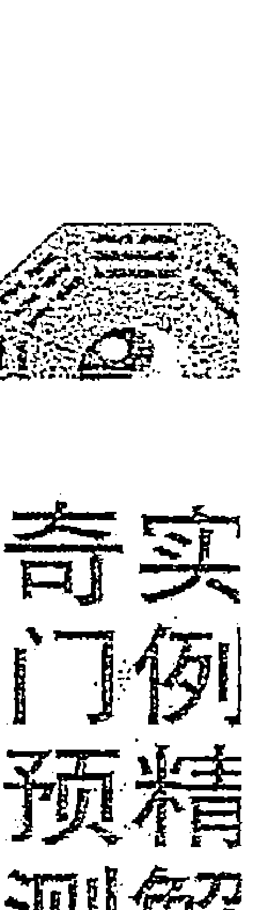

| 值符 芮禽 | 螣蛇 天柱 | 太阴 天心 |
| :--- | :--- | :--- |
| 甲午辛+甲寅癸 (丁) | 乙+甲戌己 | 丙+甲午辛丙 (丁禽) |
| 死天年华盖 婴 | 惊 希入墓 离 | 开为谋事 坤 |

##### 奇门速断实例

12点来人头花看病

-   ① 天芮病星在巽为女病人，临值符是领导。
  答：女病人，领导。
-   ④ 病在左。
  答：妇科病

### 四十一、天蓬白虎克日干，必有血光之灾

2005年6月12日
乙酉月壬午月丁卯日辛亥时 0348局
0348局(21:00——23:00)

| 六合 天心 | 白虎 天蓬 | 玄武 天任 |
| :--- | :--- | :--- |
| 甲子戊+丙 | 甲辰壬+甲午辛 | 甲申庚+甲寅癸芮 (乙禽) |
| 伤 龙回首 巽 | 杜 螣蛇相缠 离 | 景 火格 坤 |

小高来电话 029-88014069
晚9点40小高来电测运气，小高原在《华商报》做广告，现不干了，去年我为他预测了几件事都准确，今又打电话，说他认识一位八字老师，测出他这个月有血光之灾，问我是否有，据奇门局，近期确有凶事。并告诉他化解之法，只可惜他没来得及去做就……

-   ① 日干丁临死门，最近必有不顺事。
答：是
-   ② 时干辛值符天蓬凶星白虎凶神同在离宫，克日干丁兑宫，兑宫又临死门，确有凶事，应在午月壬或辛日。

6月16日，晚7:40。

乙酉月壬午日辛未日庚寅时 0155局

0155局(19:00——21:00)

| 白虎 天莲 丙+甲成己 伤火悸人刑巽 | 玄武 天任 甲寅癸+丁 杜蛇天娇离 | 九地 天冲 甲子戊+乙 (甲申庚) 景龙合灵门坤 |
| :--- | :--- | :--- |
| 六合 天心 甲午辛+甲子戊 生困龙被伤震 | 阳三局 甲午旬 戊戌时 | 九天 天辅 甲戊己+甲辰壬 死地网高张兑 |
| 太阴 天柱 甲辰壬+甲寅癸 休幼女奸淫艮 | 螣蛇 芮(禽) 乙+丙 (甲申庚) 开奇仪顺坠坎 | 值符 天英 丁+甲午辛 惊朱雀入狱乾 |

看奇门局并非有凶事，小高说凶事发生了，晨4点被劫，伤手臂，晨4点0147局。

0147局(3:00——5:00)

| 九地 天辅 甲戊己+甲戊己 杜地户连鬼巽 | 九天 天英 丁+丁 景奇人太阴离 | 值符 芮(禽) 乙+乙 (甲申庚+甲申庚) 死战格坤 |
| :--- | :--- | :--- |
| 玄武 天冲 甲子戊+甲子戊 伤符伏吟震 | 阳三局 甲申旬 庚寅时 | 螣蛇 天柱 甲辰壬+甲辰壬 惊蛇入地罗兑 |
| 白虎 天任 甲寅癸+甲寅癸 生天网四张艮 | 六合 天蓬 丙+丙 休奇悻师坎 | 太阴 天心 甲午辛+甲午辛 开伏吟天庭乾 |

八门九星伏吟大局凶，时干庚在坤死门，庚+庚战格凶，抢劫的人有三、四人，所幸只手臂受伤，全因日干辛在乾临开门，天心吉星。

通过这个实例，我觉得小高所说的为他预测出本月有血光之灾的八字老师，批八字的水平实在高。

### 四十二、测房子风水

2005年7月10日

乙酉癸未月乙未日壬午时 0979 局

0979 局（11：00——13：00）

| 六合 天柱 | 太阴 天心 | 螣蛇 天蓬 |
| :--- | :--- | :--- |
| 甲戊己+甲辰壬 | 甲申庚+乙 | 丙+丁 (甲午辛) |
| 休地网高张巽 | 生太白连星离 | 伤月奇朱雀坤 |
| 白虎 丙（禽） | 阴 八局 | 值符 天任 |
| 丁+甲寅癸 (甲午辛) | 甲 戌 旬 | 甲子戊+甲戌己 |
| 开 雀投江震 | 壬 午 时 | 杜贵人入狱兑 |
| 玄武 天英 | 九地 天蓬 | 值符 天心 |
| 乙+甲子戊 | 丙+丙 | 甲申庚+甲申庚 |
| 惊利阴害阳艮 | 死 奇悖师坎 | 景 战格 乾 |

12 时，小毛来电话问家里房子吉凶

-   ① 房门朝南或座南向北，对面有河或水沟。生门为房在离宫，对坎宫死门，坎为水有河。
答：门朝北，面对灞河
② 生门在离总体可以，只是庚+乙退吉进凶格局不好，乙为年干，为父母不太顺。
答：父亲不顺身体有病。
生门离宫克，乾宫乾为父又临景门血光，为身体有病。乙年干又在艮宫，乙+甲子戊格局利阴害阳，也显示父亲不顺。

### 四十三、甲子戊，男性多，遇白虎多剖腹产

2005年8月10日

乙酉年甲申月丙寅日丙申日丙申时 0633 局

0633 局（15：00——17：00）

| 九地 天任 | 玄武 天冲 | 白虎 天辅 |
| :--- | :--- | :--- |
| 甲午辛+丙 | 乙+甲申庚 | 丙+甲子戊 (丁) |
| 死千合悖帅巽 | 惊 奇被刑离 | 开 鸟跌穴坤 |
| 九天 天蓬 | 阴 二 局 | 六合 天英 |
| 甲戌己+乙 | 甲 午 旬 | 甲申庚+甲辰壬 |
| 景地户逢星震 | 丙 申 时 | 休 小格 兑 |
| 值符 天心 | 螣蛇 天柱 | 太阴 芮(禽) |
| 甲寅癸+甲午辛 | 甲辰壬+甲戌己 | 甲子戊+甲寅癸 (丁) |
| 杜网盖天牢艮 | 伤凶蛇入墓坎 | 生青龙华盖乾 |

下午4点多一人来我店买花，到医院去看刚出生的小孩，我据奇门局，一边为其包花一边说

-   ① 男孩子，剖腹产。
答：是男孩子。腹部产。你咋知道？你也认识我朋友？
我说是八卦显示的。

② 时丙在坤宫 + 甲子代，据多次经验很多看病人或扫墓人为其预测，虽在阴宫，但逢甲子代多为男，上遇白虎必动刀，故说：男孩子，剖腹产。

### 四十四、买花送对象，奇门断方向

2005年8月11日
乙酉月甲申月丁卯日戊申时 0645 局
0645 局 (15:00——17:00)

| 六合 天英 | 太阴 芮(禽) | 螣蛇 天柱 |
| :--- | :--- | :--- |
| 甲申庚+丙 | 甲子戊+甲申庚 (丁) | 甲辰壬+甲子戊 (丁) |
| 开 白入荧巽 | 休 符飞宫离 | 生小蛇化龙坤 |
| 白虎 天辅 | 阴 二 局 | 值符 天心 |
| 丙+乙 | 甲 辰 旬 | 甲寅癸+甲辰壬 |
| 惊日月并行震 | 戊 申 时 | 伤复加螣蛇兑 |
| 玄武 天冲 | 九地 天任 | 九天 天蓬 |
| 乙+甲午辛 | 甲午辛+甲戌己 | 甲戌己+甲寅癸 |
| 死 龙逃走艮 | 景入狱自刑坎 | 杜地刑玄武乾 |

下午3点30分，一小伙开车停我店前买玫瑰花，送对象，先看奇门局，乙奇在艮。

对他说：你对象在你东北方向。

他说：“是东北方向，我住在大差市，纺织城在我东北方向，在你这买花真值。”

付了50元买了一束玫瑰。

### ### 四十五、八门九星六仪伏吟，多为合葬墓

2005年9月20日

乙酉年月丁未日甲辰时 0881局

0881局(7:00——9:00)

| 太阴 天辅 甲申庚+甲申庚 杜 伏吟 巽 | 螣蛇 天英 丁+丁 景奇入太阴 离 | 值符 丙(禽) 甲辰壬+甲辰壬 (甲戌己+甲戌己) 死蛇入地罗 坤 |
| :--- | :--- | :--- |
| 六合 天冲 甲午辛+甲午辛 伤伏吟天庭 震 | 阴 六 局 甲 辰 旬 甲 辰 时 | 九天 天柱 乙+乙 惊 奇伏吟 兑 |
| 白虎 天任 丙+丙 生 奇悖师 艮 | 玄武 天蓬 甲寅癸+甲寅癸 休天网四张 坎 | 九地 天心 甲子戊+甲子戊 开 符伏吟 乾 |

早8点30分，来人买花扫墓。

-   ① 据奇门局断，死门在坤是女的，八门九是六仪伏吟是合葬墓。
答：是我母亲，父亲还在。
② 乾为父临开门甲子代戊，有工作经济好，身体好。
答：退休，身体好，有退休金。

### ### 四十六、日干临生门+甲子戊定为有钱人

2005年10月15日

乙酉年丙月壬申日戊申时 1065局

1065局(15:00——17:00)

| 太阴 天英 甲子戊+甲寅癸 休 青龙华盖巽 | 螣蛇 芮(禽) 丙+甲子戊 (甲辰壬) 生 鸟跌穴离 | 值符 天柱 甲申庚+丙 (甲辰壬) 伤 白入荧坤 |
| :--- | :--- | :--- |
| 六合 天辅 甲寅癸+丁 开 蛇天矫震 | 阴九局 甲辰旬 戊申时 | 九天 天心 甲午辛+甲申庚 杜 白虎出力兑 |
| 白虎 天冲 丁+甲戊己 惊 火入勾陈艮 | 玄武 天任 甲戊己+乙 死 地户逢星坎 | 九地 天蓬 乙+甲午辛 景 龙逃走乾 |

下午3点30分来一女求测运气

-   ① 日干壬在离临生门丙+甲子代鸟跌穴吉格，为运气好，有钱人。
她说没钱，纺织工人。
② 开门在震宫，生日干离宫旬空。没有上班。
来人一会说有工作，又说没工作，后说她休病假，你断对，她非说你断错，其目的，是不想付咨询费。
③ 庚为夫在坤宫伤门，为挣钱多，她说，出租司机没有钱，正应伤门为车，最后她实情相告，她自己买的出租车，其夫开车，正应日干在离宫临生门+甲子戊必为有钱人。爽快的付了咨询费，离去。

### 四十七、白虎加天芮星，必然身体有病

2005年10月16日

乙酉年丙月癸酉日丙辰日 1073局

1073局(7:00——9:00)

| 值符 天任 甲戊己+甲寅癸 生 地刑玄武巽 | 九天 天冲 丁+甲子戊 伤 青龙转光离 | 九地 天辅 甲寅癸+丙 (甲辰壬) 杜 华盖得财震 |
| :--- | :--- | :--- |
| 螣蛇 天蓬 乙+丁 休 奇仪相佐震 | 阴九局 甲寅旬 丙辰时 | 玄武 天英 甲子戊+甲申庚 景 符飞宫兑 |
| 值符 天心 甲午辛+甲戊己 开 入狱自刑艮 | 六合 天柱 甲申庚+乙 惊 太白逢星坎 | 白虎 芮(禽) 丙+甲午辛 (甲辰壬) 死 为谋寡毂乾 |

早 8 点来人买花扫墓

死门在乾，是男的，墓朝西北或座西北朝东南。

答：朝东南方，男的。

让我为其女儿预测，时干丙为女儿在乾，死门，天芮，白虎显示其最近不顺，身体不好。

后匆匆离开去，中午又和其女儿来让我为其预测

### 四十八、日干临值符，又是领导人

2005 年 10 月 18 日

乙酉年丙戌时月乙亥日丙戌时 0683 局

0683 局（19:00——21:00）

| 玄武 天柱 | 白虎 天心 | 六合 天蓬 |
| :--- | :--- | :--- |
| 甲寅癸+乙 | 丁+甲午辛 | 甲申庚+甲戌己（丙） |
| 伤华盖遁星巽 | 杜朱雀入狱离 | 景刑格 坤 |
| 九地 芮(禽) | 阴 三 局 | 太阴 天任 |
| 甲戌己+甲子戊（丙） | 甲 申 旬 | 甲辰壬+甲寅癸 |
| 生火遇青龙震 | 丙 戌 时 | 死幼女奸淫兑 |
| 九天 天英 | 值符 天辅 | 螣蛇 天冲 |
| 甲午辛+甲辰壬 | 乙+甲申庚 | 甲子戊+丁 |
| 休凶蛇入狱艮 | 开 奇被刑坎 | 惊 龙逃明乾 |

晚 7 点 30 分，来人顾客买花看病人，先看奇门局

-   ① 天芮星震宫，临生门，甲子戊，男病人，有钱人。
答：女病人大公司经理，性格象男人，挣钱多。

-   ② 来人让我为其预测，乙日干在坎宫开门有工作临值符，是领导，若不是领导必与领导在一起工作。
答：是车间书记，常跟厂领导在一起

-   ③ 问子女，子女时干丙在震宫，生门 + 甲子代，财运好，比父母挣钱多。
答：我一个退休金六七百工资，小孩挣一二两千。

-   ④ 同来的人报数 4，巽开门坎值符生领导对她好，丙时干在震，男孩。
她说，是儿子，她儿子也刚刚生小孩。
我说，生的是男娃。
答：男娃。

### 四十九、看病 是领导

2005年10月24日
乙酉年丙戌月辛巳日癸巳时 0810局
0810局(9:00——11:00)

| 九天 天任 | 九地 天冲 | 玄武 天辅 |
| :--- | :--- | :--- |
| 甲午辛+甲戌己 杜火入勾陈巽 | 甲申庚+甲寅癸 景 大格 离 | 甲戌己+甲午辛 (甲子戊) 死游魂入墓坤 |
| 值符 天蓬 | 阴五局 甲申旬 癸巳时 | 白虎 天英 |
| 甲辰壬+甲申庚 伤太白扒蛇震 | | 甲寅癸+丙 惊华盖悖师兑 |
| 螣蛇 天心 | 太阴 天柱 | 六合 芮(禽) |
| 乙+丁 生奇仪相佐艮 | 丙+甲辰壬 休火入天网坎 | 甲午辛+乙 (甲子戊) 开虎猖狂乾 |

上午9点20分，来2位女顾客买鲜花去看病，先看奇门局，0810局，天芮星在乾宫，临开门甲子戊，断为男病人，有钱。
二人回答：你咋知道？是男病人，他有钱，但我们没钱，买20块钱的鲜花吧。

乙酉年丙戌月辛巳日乙未时 0812局
0812局(13:00——15:00)

| 玄武 天任 | 螣蛇 天冲 | 值符 天辅 |
| :--- | :--- | :--- |
| 丁+甲戌己 休火入勾陈巽 | 甲申庚+甲寅癸 生 大格 离 | 甲戌己+甲午辛 (甲子戊) 伤游魂入墓坤 |
| 六合 天蓬 | 阴五局 甲午旬 乙未时 | 九天 天英 |
| 甲辰壬+甲申庚 开太白掩蛇震 | | 甲寅癸+丙 杜华盖悖师兑 |
| 白虎 天心 | 玄武 天柱 | 九地 芮(禽) |
| 乙+丁 惊奇仪相佐艮 | 丙+甲辰壬 死火入天网坎 | 甲午辛+乙 (甲子戊) 景 虎猖狂乾 |下午2点多，来顾客买花看病，先看看奇门0812局，天芮星在乾宫，临天盘值符，是男病人，并且是领导。
回答：男病人，是领导。

### 五十、月干丙+丁，丁为玉女，女友多

2005年10月30日

乙酉年丙戌月丁亥日丙午时 1003局

1003局 (11:00——13:00)

| 值符 天任 | 九天 天心 | 九地 天蓬 |
| :--- | :--- | :--- |
| 甲戌己+甲辰壬 | 甲申庚+乙 | 丙+丁 (甲午辛) |
| 生 地网高张 巽 | 伤 太白连星 离 | 杜 月奇朱雀 坤 |
| 螣蛇 丙(禽) | 阴八局 | 玄武 天任 |
| 丁+甲寅癸 (甲午辛) | 甲辰旬 | 甲子戊+甲戌己 |
| 休 雀投江 震 | 丙午时 | 景 贵人入狱 兑 |
| 太阴 天英 | 六合 天辅 | 白虎 天冲 |
| 乙+甲子戊 | 甲辰壬+丙 | 甲寅癸+甲申庚 |
| 开 利格害阳 艮 | 惊 水蛇入火 坎 | 死 太白入网 乾 |

##### 奇门速断实例

上午11点10分来2男顾客，买开业花篮，先看奇门局，开门在艮宫，开店之门应朝东北，或座东北朝西南。

回答：朝南。

我说：应偏西，为西南。

答：是西南，店在纺建路。

花篮做好后，让我为其一个朋友测一下婚姻，说他朋友谈对象老谈不成。

丙为月干为男朋友，在坤宫，丙+丁倚朱雀；他的朋友对象虽没谈成，但并不缺少女友，就是有不少女人，因此挑花眼，丁为玉女，丙+丁和庚+乙都为不缺女人。

回答：确实如此，身边女人不少。

### 五十一、一日诸多事，奇门全预测

2005年10月31日

#### 一、乙酉月丙戌月戊子日丙辰时 1013局

1013局(7:00——9:00)

| 九天 丙(禽) | 九地 天柱 | 玄武 天心 |
| :--- | :--- | :--- |
| 丁+甲辰壬 | 甲戌己+乙 | 甲申庚+丁 |
| (甲午辛) |  | (甲午辛) |
| 死 五神互合 巽 | 惊 地户逢星 离 | 开 梦亭白奸 坤 |
| 值符 天英 | 阴 八局 | 白虎 天蓬 |
| 乙+甲寅癸 | 甲 寅 旬 | 丙+甲戌己 |
| 景 华盖逢星 宫震 | 丙 辰 时 | 休 火悖入刑 兑 |
| 腾蛇 天辅 | 太阴 天冲 | 六合 天任 |
| 甲辰壬+甲子戊 | 甲寅癸+丙 | 甲子戊+甲申庚 |
| 杜 小蛇化龙 艮 | 伤 华盖悖师 坎 | 生 符飞宫 乾 |

- ①早上8点50来人买白菊花扫墓，奇门局，死门在巽宫，为女，墓朝东南，或座东南朝西北。
回答：是女的，墓朝北，在灞陵。

- ③ 9点钟来人买白菊花扫墓，死门在乾宫应为男。
答：是女的。

乙十庚奇被用刑，乙奇为女

墓朝西北或座西北

回答：墓朝西北

#### 二、9:50时接一电话。

乙酉月丙戌月戊子日丁巳时 1014局

1014局(9:00——11:00)

| 九天 天蓬 | 九地 天任 | 玄武 天冲 |
| :--- | :--- | :--- |
| 丙+甲辰壬 | 甲子戊+乙 | 甲寅癸+丁 |
|  |  | (甲午辛) |
| 生 火入天网 巽 | 伤 龙合灵门 离 | 杜 绝天妖 坤 |
| 值符 天心 | 阴 八局 | 白虎 天辅 |
| 甲申庚+甲寅癸 | 甲 寅 旬 | 甲辰壬+甲戌己 |
| 休 大格 震 | 丁 巳 时 | 景 凶蛇入墓 兑 |
| 腾蛇 天柱 | 太阴 丙(禽) | 六合 天英 |
| 甲戌己+甲子戊 | 丁+丙 | 乙+甲申庚 |
| 开 犬遇青龙 艮 | (甲午辛) | 死 奇被刑 乾 |
|  | 开 星随月转 坎 |  |

答：是女的。

乙十庚奇被用刑，乙奇为女

墓朝西北或座西北

回答：墓朝西北

#### 二、9:50时接一电话。

乙酉月丙戌月戊子日丁巳时 1014局

1014局(9:00——11:00)

| 九天 天蓬 | 九地 天任 | 玄武 天冲 |
| :--- | :--- | :--- |
| 丙+甲辰壬 | 甲子戊+乙 | 甲寅癸+丁 |
|  |  | (甲午辛) |
| 生 火入天网 巽 | 伤 龙合灵门 离 | 杜 绝天妖 坤 |
| 值符 天心 | 阴 八局 | 白虎 天辅 |
| 甲申庚+甲寅癸 | 甲 寅 旬 | 甲辰壬+甲戌己 |
| 休 大格 震 | 丁 巳 时 | 景 凶蛇入墓 兑 |
| 腾蛇 天柱 | 太阴 丙(禽) | 六合 天英 |
| 甲戌己+甲子戊 | 丁+丙 | 乙+甲申庚 |
| 开 犬遇青龙 艮 | (甲午辛) | 死 奇被刑 乾 |
|  | 开 星随月转 坎 |  |

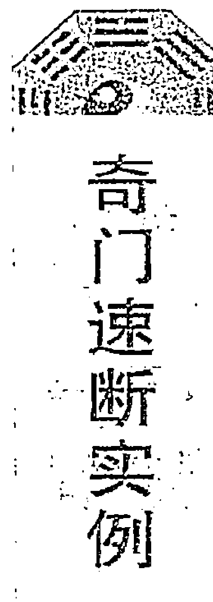

9点50分来一电话，说开会欲订桌上花篮，后来并没有要，据奇门1014局，开门在艮，艮又为桌形，断其主席台桌面向东北向或座东北方西南，打电话向她求证。

答：在灞桥公安局开会，公安局大门向西南，主席台向北。

三、当日4点接一电话。

乙酉月丙戌月戊子日庚申时 1017局

#### 1017局(15:00——17:00)

| 九天 天柱 | 九地 天心 | 玄武 天蓬 |
| :--- | :--- | :--- |
| 甲戌己+甲辰壬 | 甲申庚+乙 | 丙+甲申庚 |
| 惊 地网离张 巽 | 开 太白连星 离 | 休 火入金乡 坤 |
| 值符 芮(禽) | 阴 八局 | 白虎 天任 |
| 丁+甲寅癸 | 甲 寅 旬 | 甲子戊+甲戌己 |
| (甲午辛) | 庚 申 时 | 生 贵人入狱 兑 |
| 死 雀投江 震 |  |  |
| 螣蛇 天英 | 太阴 天辅 | 六合 天冲 |
| 乙+甲子戊 | 甲辰壬+丙 | 甲寅癸+甲申庚 |
| 景 利明害阳 艮 | 杜 水蛇入火 坎 | 伤 太白入网 乾 |

1017局，庚申时，下午4点左右，在东关办事，来一电话女求测生意财运，说她是渭南的，让我先为她测一下看准不准，

- ① 日干在兑宫，临生门，本人有钱人。
答：有一点钱。
- ② 日干戊+巳贵人入狱：临生门兑宫，遇白虎，必破财或受伤有病。
- ③ 时干庚开门在离宫，克日干戊所在兑宫，必有官司或矛盾纠纷。
答：基本上对一些，测我下半年运势。

四、晚上六点多，来一顾客。

乙酉月丙戌月戊子日辛酉时 1018局

#### 1018局(17:00——19:00)

| 九天 天蓬 | 九地 天任 | 玄武 天冲 |
| :--- | :--- | :--- |
| 丙+甲辰壬 | 甲子戊+乙 | 甲寅癸+丁 (甲午辛) |
| 休 火入天网 巽 | 生 龙合灵门 离 | 伤 蛇天矫 坤 |
| 值符 天心 | 阴八局 | 白虎 天辅 |
| 甲申庚+甲寅癸 | 甲寅旬 | 甲辰壬+甲戌己 |
| 开 大格 震 | 辛酉时 | 杜 凶蛇入墓 兑 |
| 螣蛇 天柱 | 太阴 芮(禽) | 六合 天英 |
| 甲戌己+甲子戊 | 丁+丙 (甲午辛) | 乙+甲申庚 |
| 惊 犬遁青龙 艮 | 死 星随月转 坎 | 景 奇被刑 乾 |

晚上六点多，1018局，来一女顾客带一小男孩，小孩带一副眼镜，来买花，说是买一束鲜花看刚出生的小孩。

- ① 时干辛在坎，是男娃。
答：是男娃。
- ②时干辛在坎宫，临死门上临天芮星病星，死门在坎，为门迫宫，综合信息反映，此小孩出生时遇故障，出生慢，但并没有剖腹产。
答：确实出生慢，生了两天才出来。
- ③用此奇门局看她带的小孩，六七岁就戴眼镜，也说明身体不好，眼睛也是身体的重要部分，正应奇门局，时干辛在坎宫，死门天芮病星。

### 五十二、奇门预测诸多事

2005年11月1日

乙酉年丙戌月己丑日戊辰时 0605局

0605局(7:00——9:00)

| 太阴 天辅 | 螣蛇 天英 | 值符 芮(禽) |
| :--- | :--- | :--- |
| 丙+丙 | 甲申庚+甲申庚 | 甲子戊+甲子戊 (丁+丁) |
| 伤 奇待顺 巽 | 杜 战格 离 | 景 符伏吟 坤 |
| 六合 天冲 | 阴二局 | 九天 天柱 |
| 乙+乙 | 甲子旬 | 甲辰壬+甲辰壬 |
| 生 奇伏吟 震 | 戊辰时 | 死 蛇入地罗 兑 |
| 白虎 天任 | 玄武 天蓬 | 九地 天心 |
| 甲午辛+甲午辛 | 甲戌己+甲戌己 | 甲寅癸+甲申庚 |
| 休 伏吟天庭 艮 | 开 地户连鬼 坎 | 惊 天网四张 乾 |

##### 奇门速断实例

- 1. 8点30分来人买菊花扫墓，死门兑伏吟，为女。应：有男也有女，伏吟：合葬墓。
- 2. 早上8点50分，来人买菊花扫墓，看奇门局应为9点前0605局，但当时匆忙，看了二次都将9点后0606局当9点以前看，死门在乾，为男，墓朝西北。
答：是男的，墓朝西北，你咋知道？你会看风水吗？
给她包完花，再细看奇门局，8点50应是0605局，死门在兑，应为女，六仪伏吟是合葬墓
答：是合墓，我爸去世，我妈还在。
0606局死门在乾为父，母亲坤宫临值符，甲子戊，经济条件好，是领导。
答：差不多吧。
错卦而判正确一切天意。
- 3. 11点10分来人买红包说给刚出生的小孩送礼。
看奇门局0607局庚午时，杜门不通又伏吟必出生慢
答：是女孩，出生慢。
- 4. 下午3点40分，0609局，和两个会八字的易友闲谈，来一男一女，来闲看。男的50岁左右，抱一2岁左右小孩，女的三十岁，我想预测所抱小孩是男是女，奇门局0609局，时干壬在乾宫，本想断男孩，但格局为幼女奸淫，断为女孩，问他们：你所抱的是女孩？
回答：是女孩，然后离开。
幼女奸淫是否也反映她是老夫少妻呢？自然也不好问，只有奇门知道。

### 五十三、时干兑宫克日干，是与女人闹矛盾

2005年11月2日
乙酉年丁亥日庚寅日癸未时 0620局
0620局（13:00——15:00）

玄武 天英 甲申庚+丙 杜 白入荧巽 | 白虎 芮(禽) 甲子戊+甲申庚 (丁) 景 符飞宫离 | 六合 天柱 甲辰壬+甲子戊 (丁) 死 小蛇化龙坤
九地 天辅 丙+乙 伤 日月并行震 | 阴二局 甲戌旬 癸未时 | 太阴 天心 甲寅癸+甲辰壬 惊 复加腾蛇兑
九天 天冲 乙+甲午辛 生 云遁艮 | 值符 天任 甲午辛+甲戌己 休 入狱自刑坎 | 腾蛇 天遁 甲戌己+甲寅癸 开 地刑玄武乾

下午两点多来一熟人问财运。

- ①日干庚在巽宫，临杜门，不通，时干癸在兑临惊门克巽宫，与女人有矛盾纠纷。
答：是
- ②日干庚地盘在离宫，甲子戊+庚遇白虎，夏天破财。
答：半个月前赔了七八百元。

2点半又来一位会八卦的熟人，问财运，同一奇门局，我半开玩笑地说①赔钱②和女人闹矛盾，而且是女人找你的事……
答：赌博赔钱，和媳妇闹矛盾。

### 五十四、天芮病星遇白虎，不是外伤必手术

2005年11月3日
甲申丁亥月辛卯日癸巳时 0630局
0630局（9:00——11:00）

腾蛇 天蓬 甲戌己+丙 杜 火悖地户巽 | 值符 天任 甲午辛+甲午辛 景 伏吟天庭离 | 九天 天冲 乙+甲子戊 (丁) 死 利害阴私坤
太阴 天心 甲寅癸+乙 伤 华盖逢星震 | 阴二局 甲申旬 癸巳时 | 九地 天辅 丙+甲辰壬 惊 火入天网兑
六合 天柱 甲辰壬+甲午辛 生 腾蛇相缠艮 | 白虎 芮(禽) 甲子戊+甲戌己 (丁) 休 贯入狱坎 | 玄武 天英 甲申庚+甲寅癸 开 大格乾

奇门预测实例精解

上午10点，正在打印一本书稿，旁边卖空调的女营业员说要买花看病人，下午4点，看到她才想起一下她上午看的是男病人还是女病人。

天芮病星在坎宫，遇白虎。

我问她：你上午看的病人是男病人？

她说：是呀，你咋知道？

我又说：男病人是外伤或做手术。

她说：是的，做手术。

### 五十五、乱猜岂能全猜对

2005年11月5日

乙酉年丁亥月癸巳日丁巳时 0654局

0654局(9:00——11:00)

| 白虎 丙(禽) | 六合 天柱 | 太阴 天心 |
| :--- | :--- | :--- |
| 甲子戊+丙 (丁) | 甲辰壬+甲申庚 | 甲寅癸+甲子戊 (丁) |
| 休 龙回首 巽 | 生 太白蛇蛇 离 | 伤 天乙会合 坤 |
| 玄武 天英 | 阴二局 | 螣蛇 天蓬 |
| 甲申庚+乙 | 甲寅旬 | 甲戌己+甲辰壬 |
| 开 太白逢星 震 | 丁巳时 | 杜 地罗禽张 兑 |
| 九地 天辅 | 九天 天冲 | 值符 天任 |
| 丙+甲午辛 | 乙+甲戌己 | 甲午辛+甲寅癸 |
| 惊 为谋事就 艮 | 死 奇入墓 坎 | 景 天牢华盖 乾 |

上午9点50分一女打电话来，问我是否想找工作，虽打错电话，但不忘闲聊，以奇门局判断：

- ①日干癸在坤宫，有甲子戊生门离宫生之，为财运好有钱。
答：没钱。
我说，你说你没钱；你虽不是大款，但从不缺钱。
她说：那倒是。
- ② 日干癸坤宫上乘天盘值符，和领导关系好，有一个领导性格或长像象女人。
回答：是。

地盘值符在乾宫临景门血光，格局天牢华盖。

我据此说：你还有一个领导，运气不好。
她说：你凭什么说的，乱猜的吧。
我说：你说有没有？
她说，我以前有一个老板做生意赔钱。你这都是乱猜的吧？
我说：乱猜怎么能全部猜对呢？

### 五十六、扫墓断方向

2005年11月8日
乙酉年丁亥月丙申日戊戌时 0875局
0875局(19:00——21:00)

| 九天 天柱 | 九地 天心 | 玄武 天蓬 |
| :--- | :--- | :--- |
| 乙+甲申庚 | 甲子戊+丁 | 甲寅癸+甲辰壬 (甲戌己) |
| 景 奇悖师 | 死 龙耀明 | 惊 覆加腾蛇 |
| 值符 芮(禽) | 阴六局 | 白虎 天任 |
| 甲辰壬+甲午辛 (甲戌己) | 甲午旬 | 丙+乙 |
| 杜 腾蛇相缠 | 戊戌时 | 开 日月并行 |
| 螣蛇 天英 | 太阴 天辅 | 六合 天冲 |
| 丁+丙 | 甲申庚+甲寅癸 | 甲午辛+甲子戊 |
| 伤 星随月转 | 生 大格 | 休 囚龙被伤 |

- 晚8点多来一老顾客买白菊花扫墓，因以前为他预测过
- ①他问我：“你看今天是男是女？”
- ②死门在离宫，应为女，但格局甲子戊+丁龙耀明，甲子戊多为男，离宫，墓朝南或座南向北，断是男的。
- 他说：“你真神，是男的，墓在汉陵，面向灞河，朝北。”
- ③甲子戊为钱财+丁龙耀明
- 我说：“此人生前经济条件好，为龙头。”
- 他说：确实如此，而且他属龙。

### 五十七、测是男是女

2005年11月9日
乙酉年丁亥月丁酉日戊申时 0885局
0885局(15:00——17:00)

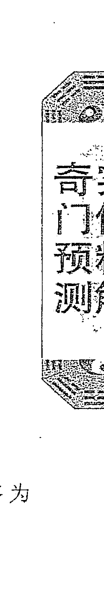

##### 奇门速断实例

| 太阴 天任 | 螣蛇 天冲 | 值符 天辅 |
| :--- | :--- | :--- |
| 丙+甲申庚 | 甲午辛+丁 | 甲申庚+甲辰壬(甲戊己) |
| 伤 火入金蝉 巽 | 杜 狱神符奇 离 | 景 小格 坤 |
| 六合 天蓬 | 阴六局 | 九天 天英 |
| 甲寅癸+甲午辛 | 甲辰旬 | 丁+乙 |
| 生 网盖天牢 震 | 戊申时 | 死 人遁吉格 兑 |
| 白虎 天心 | 玄武 天柱 | 九地 芮(禽) |
| 甲子戊+丙 | 乙+甲寅癸 | 甲辰壬+甲子戊(甲戊己) |
| 休 龙回首相 | 开 华盖逢星宫 坎 | 惊 小蛇化龙 乾 |

下午4点多来人买红包说是朋友刚生小孩。先看奇门再给她卖东西，奇门局0885局，时干戊为子女，时干戊在艮宫，上遇白虎。我说：是男娃。她说：你真神了，是男孩。我用手作刀形，说：男孩并且是剖腹产。她说：是剖腹产，今天肯定有人给你说什么了，不然，不可能知道这么清楚。她不信，我还不信，问几遍她：确实是剖腹产吗？她说：是剖腹产。

### 五十八、庚+庚战格 夫妻间矛盾

2005年11月2日

乙酉，丁亥月庚子日庚申时 1041局

1041局（15:00——17:00）

| 六合 天辅 | 太阴 天英 | 螣蛇 芮(禽) |
| :--- | :--- | :--- |
| 甲寅癸+甲寅癸 | 甲子戊+甲子戊 | 丙+丙(甲辰壬+甲辰壬) |
| 杜 雀投江 巽 | 景 天乙会合 离 | 死 奇悖师 坤 |
| 白虎 天衡 | 阴九局 | 值符 天柱 |
| 丁+丁 | 甲申旬 | 甲申庚+甲申庚 |
| 伤 奇入太阴 震 | 甲申时 | 惊 战格 兑 |
| 玄武 天任 | 九地 天蓬 | 九天 天心 |
| 甲戌己+甲戌己 | 乙+乙 | 甲午辛+甲午辛 |
| 生 地户逢鬼 艮 | 休 龙遁 坎 | 开 伏吟大庭 乾 |

#### 奇门预测实例精解

一、下午4点左右来几个买白菊花扫墓的人，死门在坤应为女，但是男，不对。其中有一女子听别人说我会测，让为其预测。

- 1. 日干庚 + 庚，临惊门，八门九星是伏吟，近有烦心不顺事。格局庚 + 庚战格，是夫妻闹矛盾。
她说：是。
- 2. 夫妻两人有当领导者，或跟领导在一起工作。
她说：我老公是领导，我是跟领导在一起工作。

二、4点50来一小伙买玫瑰花，送对象。

- 乙 + 乙在坎宫龙遁，我说：你对象在你北边，运气很好。他对同来的朋友说：准的很。同来的小伙让为其预测，报数3。
- 3. 3为震宫遇白虎伤门，三四月受伤，有病。
他说：有病在家。
- 4. 买玫瑰花的小伙又问财运，生门艮宫生庚兑宫财运好，庚 + 庚战格，争强好胜。
答：是。

### 五十九、办丧事 是女人

2005年11月17日
乙酉年丁亥日乙巳日癸未时 0680局
0680局（13:00——15:00）

| 太阴 天辅 | 螣蛇 天芮 | 值符 天英 |
| :--- | :--- | :--- |
| 甲子戊+乙 | 乙+甲午辛 | 甲午辛+甲戌己（丙） |
| 杜 龙合灵门 巽 | 景 龙迭走 离 | 死 入狱自刑 坤 |
| 六合 天任 | 阴三局 | 九天 芮（禽） |
| 甲辰壬+甲子戊 | 甲戌旬 | 甲戌己+甲寅癸（丙） |
| 伤 小蛇化龙 震 | 癸未时 | 惊 地刑玄武 兑 |
| 白虎 天蓬 | 玄武 天心 | 九地 天柱 |
| 甲申庚+甲辰壬 | 丁+甲申庚 | 甲寅癸+丁 |
| 生 小格 艮 | 休 文书阻隔 坎 | 开 蛇天矫 乾 |

午2点多来一熟人，说他早上帮别人办丧事，当即翻开奇门局0680局，死门在坤是女的，体胖。
他说：是女的，身体较瘦。

此外不符合坤为胖，临值符为领导，同来人报数6，坎宫休门，运气好，很休闲。
答：退休后都很好。

### 六十、测是男是女

2005年11月18日
乙酉年丁亥月丁午日丙申时 0693局
0693局（15:00——17:00）

| 螣蛇 天辅 | 值符 天芮 | 九天 天禽 |
| :--- | :--- | :--- |
| 甲子戊+乙 | 乙+甲午辛 | 甲午辛+甲戌己（丙） |
| 生 龙合灵门 巽 | 伤 龙逃走 离 | 杜 入狱自刑 坤 |
| 太阴 天任 | 阴三局 | 九地 芮（禽） |
| 甲辰壬+甲子戊 | 甲午旬 | 甲戌己+甲寅癸（丙） |
| 休 小蛇化龙 震 | 丙申时 | 景 地刑玄武 兑 |
| 六合 天蓬 | 白虎 天心 | 玄武 天柱 |
| 甲申庚+甲辰壬 | 丁+甲申庚 | 甲寅癸+丁 |
| 开 小格 艮 | 惊 奇被刑 坎 | 死 蛇天矫 乾 |

- 1、来人买花说明朋友刚生小孩，看奇门局0693局，时干丙在兑，地盘在坤，全阴定是女孩。
答：是女孩
- 2、丙在兑宫临景门血光，出生时流血多。
答：流血多是因剖腹产。

### 六十一、玫瑰送对象 奇门断方向

2005年11月20日
乙酉年丁亥月戊申日壬戌时 0719局
0719局（19:00——21:00）

| 六合 天蓬 | 太阴 天任 | 螣蛇 天冲 |
| :--- | :--- | :--- |
| 甲申庚+乙 | 甲辰壬+甲午辛 | 甲子戊+甲戌己 (丙) |
| 钦 太白送星 巽 | 生 腾蛇相缠 离 | 伤 贵人入狱 坤 |
| 白虎 天心 | 阴三局 | 值符 天辅 |
| 丁+甲子戊 | 甲寅旬 | 乙+甲寅癸 |
| 开 青龙转光 震 | 壬戌时 | 杜 华道送星 兑 |
| 玄武 天柱 | 九地 芮(禽) | 九天 天英 |
| 甲寅癸+甲辰壬 | 甲戌己+甲申庚 (丙) | 甲午辛+丁 |
| 惊 复加腾蛇 艮 | 死 利格反名 坎 | 景 狱神得奇 乾 |

晚7点半来一个小伙买玫瑰，正挑花时，又来一小伙也买玫瑰，看奇门局，乙在兑宫，问先来的小伙：你的女朋友在你的西边。他说：你咋知道，一点没错，是在我西边。他走后，我又问后来的这一位小伙，你的女朋友也在你的西边。他说：我家在湖北，女朋友是西安的，西安在湖北的西北方。

### 六十二、杜门遇白虎 女象男

2005年11月22日
乙酉年丁亥月庚戌日辛巳时 0798局
0798局(9:00——11:00)

| 值符 天任 | 九天 天衡 | 九地 天辅 |
| :--- | :--- | :--- |
| 丁+甲戌己 | 甲申庚+甲寅癸 | 甲戌己+甲午辛 (甲子戊) |
| 开 火入勾陈 巽 | 休 大格 离 | 生 游魂入墓 坤 |
| 螣蛇 天蓬 | 阴五局 | 玄武 天英 |
| 甲辰壬+甲申庚 | 甲戌旬 | 甲寅癸+丙 |
| 惊 太白擒蛇 震 | 辛巳时 | 伤 华盖停师 兑 |
| 太阴 天心 | 六合 天柱 | 白虎 芮(禽) |
| 乙+丁 | 丙+甲辰壬 | 甲午辛+乙 (甲子戊) |
| 死 奇仪相佐 艮 | 景 火入天网 坎 | 杜 奇入太阴 乾 |

早晨9点多来一顾客问小孩起名字。

- 1. 时干辛在乾为男孩。 答：女孩。
- 2. 白虎在乾宫为阳上有天芮阴星，但长相或性格像男。 答：是，长相性格都象男娃。

#### 奇门预测实例精解

### 六十三、做生意 门朝北

2005年11月23日
乙酉年丁亥月辛亥日壬辰时 0809局
0809局(3:00——5:00)

| 九天 芮(禽) | 九地 天柱 | 玄武 天心 |
| :--- | :--- | :--- |
| 甲午辛+甲戌己 (甲子戊) | 丙+甲寅癸 | 乙+甲午辛 (甲子戊) |
| 伤 火入勾陈 巽 | 杜 华盖悖格 离 | 景 龙逃走 坤 |
| 值符 天英 | 阴五局 甲申旬 壬辰时 | 白虎 天蓬 |
| 甲寅癸+甲申庚 | | 甲辰壬+丙 |
| 生 太白入网 震 | | 死 水蛇入火 兑 |
| 螣蛇 天辅 | 太阴 天衡 | 六合 天任 |
| 甲戌己+丁 | 甲申庚+甲辰壬 | 丁+乙 |
| 休 朱雀入墓 艮 | 开 小格 坎 | 惊 人循吉格 乾 |

早8点来人买花扫墓，死门在兑为女，年青。
答：是女的，40多岁。
来人说自己做生意，看开门在坎宫做生意，店门应朝北。
答：是朝北。

### 六十四、你算我是那里人

2005年11月27日
乙酉年丁亥月乙卯日壬午时 0979局
0979局(11:00——13:00)

| 六合 天柱 甲戌己+甲辰壬 休地网禽张巽 | 太阴 天心 甲申庚+乙 生太白逢星离 | 螣蛇 天蓬 丙+丁 (甲午辛) 伤月奇朱雀坤 |
| 白虎 芮(禽) 丁+甲寅癸 (甲午辛) 开雀投江震 | 阴八局 甲戌旬 壬午时 | 值符 天任 甲子戊+甲戌己 杜贵人入狱兑 |
| 玄武 天英 乙+甲子戊 惊刑囚害阳艮 | 九地 天辅 甲辰壬+丙 死水蛇入火坎 | 九天 天衢 甲寅癸+甲申庚 景太白入网乾 |

中午，快12点，来一人说原来在这扫马路的保洁员去世了，让我给写幅挽联，下午4点多来让再写一幅，写完后当时想保洁员肯定是女的，现在闲了，看奇门局对不对。看中午12点奇门局0979局死门在坎应为男。问他。
他说：是男的。原来他说是女保洁员的老伴去世了。
坎宫有九地天辅星，生前无病。
答：没有病，住院三天就去世。我据死门坎宫壬，应为大前天壬日入院。
来人说：是大前天住院。
来人中有一女。
问：你看我们是那里人，她说是同辈。看月干丁奇天盘在震，应是东边。
她说不是。
看月干丁奇在地盘坤，是西南方。
答：是长安县，在纺织城的西南方。
他们现到纺织城为西安所在的东边，地盘为他们家所在地。地盘月干丁在西南，他们家长安县，纺织城的西南。天盘为动丁在震宫，应为他们到东边来办事。

地盘月干丁奇在坤宫临伤门上乘天蓬星，螣蛇，断其中有人受伤或破财，赔钱之事，应是在6、7月。其他两人都说没有，而问话之女笑而不答，后来她说是被骗破财。她又问她儿子的婚姻，看奇门0981局，离宫乙+乙克庚+庚所在乾宫，乙奇克庚，都反映其儿子现没有对象，但乙问年干相同，今年谈的对象很多，但都不成。
答：现没有对象，今年谈的对象不少。

### 六十五、猫丢了

2005 年 11 月 28 日
乙酉年丁亥月丙辰日丙申时 0993 局
0993 局(15:00——17:00)

| 太阴 天蓬 | 螣蛇 天任 | 值符 天衡 |
| :--- | :--- | :--- |
| 丙+甲辰壬 | 甲子戊+乙 | 甲寅癸+丁 |
| 惊火入天网 巽 | 开龙合炅门 离 | 休蛇天矫 坤 |
| 六合 天心 | 阴 八 局 | 九天 天辅 |
| 甲申庚+甲寅癸 | 甲 午 旬 | 甲辰壬+甲戌己 |
| 死 大格 震 | 丙 申 时 | 生凶蛇入墓 兑 |
| 白虎 天柱 | 玄武 芮(禽) | 九地 天英 |
| 甲戌己+甲子戊 | 丁+丙 | 乙+甲申庚 |
| 景犬遁青龙 艮 | 杜星随月转 坎 | 伤奇被刑 乾 |

下午4点多，婚礼司仪刘师来闲聊，说他去看一个病人，看奇门局0993局。天芮病星在坎宫，为主年男子。
他说：是男病人，你看我丢什么东西。
时干丙日干丙同宫，为物不失可找到，刘师说：不可能，我养的两个猫跑丢了，不可能找到。
第二天，打电话问他，他说一个猫回家了，一个猫不见了。丙在巽宫上有天蓬星又甲午旬中辰巳空，2个猫丢一个，一个未丢。

### 六十六、马星冲动 人即回

2005 年 11 月 29 日
乙酉年丁亥月丁巳日丁未时 1004 局
1004 局(13:00——15:00)

| 值符 天任 | 九天 天芮 | 九地 天辅 |
| :--- | :--- | :--- |
| 甲子戊+甲辰壬 | 甲寅癸+乙 | 甲辰壬+丁 (甲午辛) |
| 惊龙入天牢巽 | 开华盖连星离 | 休干合蛇刑坤 |
| 螣蛇 天蓬 | 阴 八 局 | 玄武 天英 |
| 丙+甲寅癸 | 甲 辰 旬 | 乙+甲戌己 |
| 死华盖传格震 | 丁 未 时 | 生奇入墓兑 |
| 太阴 天心 | 六合 天柱 | 白虎 芮(禽) |
| 甲申庚+甲子戊 | 甲戌己+丙 | 丁+甲申庚 (甲午辛) |
| 景白乙伏宫艮 | 杜火传地户坎 | 伤文书阻隔乾 |

一女问对象在上海打工何日回来。
庚为对象，庚在艮宫，寅申相冲马星动，12 月 2 日回。实际 12 月 1 日已回来。

### 六十七、值符克日干 管理方找事

2005 年 11 月 30 日
乙酉年丁亥月戊午日己未时 1016 局
1016 局(13:00——15:00)

| 九天 天心 | 九地 天蓬 | 玄武 天任 |
| :--- | :--- | :--- |
| 甲申庚+甲辰壬 | 丙+乙 | 甲子戊+丁 (甲午辛) |
| 开 小格巽 | 休日月并行离 | 生龙耀明坤 |
| 值符 天柱 | 阴 八 局 | 白虎 天芮 |
| 甲戌己+甲寅癸 | 甲 寅 旬 | 甲寅癸+甲戌己 |
| 惊地刑玄武震 | 己 未 时 | 伤华盖地户兑 |
| 螣蛇 芮(禽) | 太阴 天英 | 六合 天辅 |
| 丁+甲子戊 (甲午辛) | 乙+丙 | 甲辰壬+甲申庚 |
| 死青龙转光艮 | 景奇仪顺遂坎 | 杜奇入太阴乾 |

下午小高来电话，问最近可有何事。小高现在做娱乐方面生意。时干己在震宫，临值符，值符为领导为管理方，克日干戊所在坤宫，应为有管理方找事。
他说：“昨天，公安局的去找事，但无事”。
管理方震宫临惊门，为门迫宫不吉。日干戊为小高，在生门坤宫，格局龙耀明，大吉，所以无事。

### 六十八、同一奇门局 预测兄弟俩

2005年12月6日
乙酉年戊子月甲子日癸酉时 0730局
0730局（17：00——19：00）

| 值符 天辅 甲辰壬+甲子戊 （丁） 杜白乙伏宫巽 | 九天 天柱 丁+甲辰壬 景五神互合离 | 九地 天心 丙+甲申庚 （乙） 死火入金乡坤 |
| 螣蛇 天英 甲辰壬+甲戌己 伤凶蛇入狱震 | 阴四局 甲子旬 癸酉时 | 玄武 天蓬 甲午辛+丁 惊狱神得奇兑 |
| 太阴 天辅 甲子戊+甲寅癸 生青龙华盖艮 | 六合 天芮 甲戌己+甲午辛 休游魂入墓坎 | 白虎 天任 甲寅癸+丙 开华盖悖师乾 |

晚6点来一小伙子买一朵玫瑰，说是替他哥为他嫂子所买，说他哥去外地学习，本想看下其对象所在方向，既然是为他哥就看他哥。

-   1、月干戊为兄弟，为其哥在艮宫，到东北方向去了。
答：去河北唐山，是西安的东北方。
-   2、临生门，月干戊，甲子戊，为挣钱多临天盘值符，是领导。
答：在电厂工作。电厂工人工资高与银行可比。
他又要为他预测和女友关系。
-   3、乙庚同宫为关系好。
他说：我啥都没有说，你咋知道。
我据奇门局又说，你是领导，不论组长还是班长。
他说：刚当上组长，我哥是班长。

### 六十九、甲子戊+甲子戊 遇白虎 破财两次

2005年12月16日晚8点多
乙酉年戊子月甲戌日甲戌时 0551局
0551 局（19:00——21:00）

| 螣蛇 天辅 丁+丁 杜 奇入太阴 巽 | 值符 天英 甲戌己+甲戌己 景 地户逢鬼 离 | 九天 芮（禽） 乙+乙 （甲寅癸+甲寅癸） 死 奇伏吟 坤 |
| 太阴 天冲 丙+丙 伤 蔽停师 震 | 阴 一 局 甲戌旬 甲戌时 | 九地 天柱 甲午辛+甲午辛 惊 伏吟天庭 兑 |
| 六合 天任 甲申庚+甲申庚 生 战格 艮 | 白虎 天蓬 甲子戊+甲子戊 休 符伏吟 坎 | 玄武 天心 甲辰壬+甲辰壬 开 蛇入地罗 乾 |

晚上来一小伙问起名，说他哥孩子

-   1、 时干甲戌在离，上有天英星为女孩。
答：是。
又问自己运气。
-   2、 日干甲戌己+甲戌己在离宫，值符天显时格，是领导，但运气不好。
他说：“不是”，又说是科长，最近很不顺。
-   3、 年干乙在坤宫，上级领导是女的，临死门天芮病星，运气不好。
答：是女领导，最近她母亲去世。
又问婚姻。
-   4、 庚+庚在艮，乙+乙在坤，相冲克，必不好。
答：是不太好。
-   5、 生门在艮宫克，甲子戊+甲子戊，所在坎宫，上遇白虎天蓬星，破财两次。问破财多少？甲子戊在坎宫，为1或6数。
答：上月将一部手机掉进厕所，这月被领导扣了6百元工资。

### 七十、小蛇化龙 从小单位调到大单位

2005年12月20日
乙酉年戊子月戊寅日辛酉时 0598 局
0598 局（17:00——19:00）

| 太阴 天冲 丙+丁 伤 月奇朱雀巽 | 螣蛇 天辅 丁+甲戌己 杜 火入勾陈离 | 值符 天英 甲戌己+乙 景 地户遁星坤 |
| 六合 天任 甲申庚+丙 生 白入荧震 | 阴一局 甲寅旬 辛酉时 | 九天 芮(禽) 乙+甲午辛 死 华盖悖师兑 |
| 白虎 天蓬 甲子戊+甲申庚 休 符飞宫艮 | 玄武 天心 甲辰壬+甲子戊 开 小蛇化龙坎 | 九地 天柱 甲午辛+甲辰壬 惊 凶蛇入狱乾 |

##### 奇门速断实例

一、
1、下午5点15分来人买花，说是看病人，看奇门局0589，天芮星在兑宫死门，应是女病人。
答：是女病人，你看啥样人？
2、兑宫中乙为年干，应为长辈。
答：是我大姐，虽非长辈，但我尊她为长辈。

二、
5点30分来一人买菊花扫墓，死门在兑应为女，墓朝西或座西。
答：是女的，我妈。墓朝南，合葬墓，我爸还在。
乾为父临惊门，天柱星，好动身体好，开门在坎旬空，退休，原单位有钱，小蛇化龙，从小单位到大单位。
答：我爸身体好，从供销社调到市商业局。

三、
6点左右，来一小伙买花看病人，一边包花，一边问他：病人是女病人，而且是长辈。
答：是女病人，长辈，是老师。

### 七十一、开门地遁运气好

2005年12月30日
乙酉年戊子月戊子日庚申时 0417局
0417局(15:00——17:00)

阳七局 甲寅旬 庚申时
| 宫位 | 神 | 星 | 天干组合 | 格局 | 宫门组合 |
| :--- | :--- | :--- | :--- | :--- | :--- |
| 巽四宫 | 螣蛇 | 天任 | 甲戌己+丁 | 朱雀入墓 | 生门 |
| 离九宫 | 太阴 | 天冲 | 甲寅癸+甲申庚 | 太白入网 | 伤门 |
| 坤二宫 | 六合 | 芮(禽) | 丁+甲辰壬(丙禽) | 五神互合 | 杜门 |
| 震三宫 | 值符 | 天蓬 | 甲午辛+甲寅癸 | 天牢华盖 | 休门 |
| 中五宫 | 阳七局 甲寅旬 庚申时 | - | - | - | - |
| 兑七宫 | 白虎 | 天英 | 甲申庚+甲子戊 | 白虎伏宫 | 景门 |
| 艮八宫 | 九天 | 天心 | 乙+甲戌己 | 地遁 | 开门 |
| 坎一宫 | 九地 | 天柱 | 甲子戊+甲午辛 | 龙折足 | 惊门 |
| 乾六宫 | 玄武 | 芮(禽) | 甲辰壬+乙(丙) | 小蛇日奇 | 死门 |

下午4点多来中年女顾客买花，顺便为其预测。她是为单位同事搬新房买花。报数8。
艮宫开门地遁，运气好，甲寅旬，子丑空艮宫开门宫，有工作，但现今没有上班。她说已退休，现在看孙子。

-   1. 时干庚在兑宫 + 甲子戊，儿女有钱财运好。
答：是。
-   2. 时干兑宫临白虎，子女中有人受伤，有病。
答：没有。
-   3. 白虎没有受伤，必破财，赔钱。
答：前几月女婿做生意赔钱。

### 七十二、你看我是干什么的？

2006年1月4日
乙酉年己丑月癸巳日丁巳时 0234局
0234局(9:00——11:00)

阳四局 甲寅旬 丁巳时
| 宫位 | 神 | 星 | 天干组合 | 格局 | 宫门组合 |
| :--- | :--- | :--- | :--- | :--- | :--- |
| 巽四宫 | 九地 | 天心 | 甲申庚+甲子戊 | 天乙会合 | 死门 |
| 离九宫 | 值符 | 天蓬 | 丁+甲寅癸 | 朱雀投江 | 惊门 |
| 坤二宫 | 螣蛇 | 天任 | 甲辰壬+丙(甲戌己禽) | 水蛇入火 | 开门 |
| 震三宫 | 九地 | 天柱 | 甲午辛+乙 | 白虎猖狂 | 景门 |
| 中五宫 | 阳四局 甲寅旬 丁巳时 | - | - | - | - |
| 兑七宫 | 太阴 | 天冲 | 乙+甲午辛 | 青龙逃走 | 休门 |
| 艮八宫 | 玄武 | 芮(禽) | 丙+甲辰壬(甲戌己) | 火入天网 | 杜门 |
| 坎一宫 | 白虎 | 天英 | 甲寅癸+丁 | 螣蛇天矫 | 伤门 |
| 乾六宫 | 六合 | 天辅 | 甲子戊+甲申庚 | 值符飞宫 | 生门 |

早上9点刚过，来一人买鲜花，说人刚去世。看奇门局，死门在巽宫为女。
答：是女的。
问：你看我是干什么的？
日干癸在坎宫临伤门白虎必是军警司法或是司机，因伤门白虎为警探，伤门为司机。
答：是警察，在新城公安局。
警察一般都会开车，伤门司机也对，你看奇不奇。

##### 奇门速断实例

### 七十三、年命与丁+乙同宫 桃花女人多

2006年1月10日下午4点
乙酉年己丑月己亥日壬申时 0429局
0429局（15:00——17:00）

| 太阴 天冲 甲辰壬+甲寅癸 惊幼女奸淫巽 | 六合 天辅 甲寅癸+甲戌己 开华盖地户离 | 白虎 天英 甲戌己+甲午辛 （丁禽） 休 青龙逃走坤 |
| 螣蛇 天任 甲子戊+甲子庚 死龙入天牢震 | 阳八局 甲子旬 壬申时 | 玄武 芮（禽） 甲午辛+乙 （丁） 生 白虎猖狂兑 |
| 螣蛇 天蓬 甲申庚+甲子戊 死龙入天牢艮 | 九天 天心 丙+甲申庚 杜火入金乡坎 | 九地 天柱 乙+丙 伤奇仪顺遂乾 |

下午4点多来一民工模样的人，来我店看我的书，闲聊中，让我为其测婚姻。

-   1. 庚在艮宫，生乙妻乾宫，夫妻关系好。
又问女朋友情况，一个工地民工，年龄50岁了，竟然问女朋友，没有想到，一看奇门局，果然情人、女人还真不少。
-   2. 日干己在坤+丁生，丁所在兑宫，兑宫又有丁+乙，为女人多，最少3个以上，因丁为玉女。
答：2个不止，上百个都有。
-   3. 年命甲午，也在兑宫丁+乙，兑宫又临生门，女朋友都是有钱人，本人也有钱，不缺钱。
答：其中关系很好的有汽车，我在外打工，月工资都在千元以上。
-   4、开门离宫生日干己坤宫，常是工作找你而不是你去找工作。
答：是。
此卦到正是：人不可貌相，海水不可斗量，就是貌相，我也不会看相，而奇门全知道。

### 七十四、测生男生女

2006 年 1 月 20 日
乙酉年己丑月己酉日己巳时，0126 局
0126 局（9：00——11：00）

| 螣蛇 天冲 | 太阴 天辅 | 六合 天英 |
| :--- | :--- | :--- |
| 甲子戊+甲戌己 景 贵人入狱 巽 | 甲戌己+丁 死 朱雀入墓 离 | 丁+乙 （甲申庚） 惊 人遁吉格 坤 |
| 值符 天任 | 阳三局 甲子旬 己巳时 | 白虎 芮（禽） 乙+甲辰壬 （甲申庚） 开 小格 兑 |
| 甲寅癸+甲子戊 杜 天乙会合 震 | | |
| 九天 天蓬 | 九地 天心 | 玄武 天柱 |
| 丙+甲寅癸 伤 华盖悖格 艮 | 甲午辛+丙 生 干合悖师 坎 | 甲辰壬+甲午辛 休 螣蛇相缠 乾 |

早上 9 点多礼品店女老板来，问她的营业员快要生产，是男，是女。
时干巳在离为阴，坤宫上有天英为阴，应是女孩，待返信息，半个月后问她。
回答说：生个女孩。

### 七十五、想算卦不开口 非让送几句

2006 年 1 月 23 日下午 5 点 30 分
乙酉年己丑月壬子日己酉时 0166 局
0166 局（17：00——19：00）

| 玄武 天柱 甲辰壬+甲戌己 开凶蛇入墓巽 | 九地 天心 甲午辛+丁 休狱神得奇离 | 九天 天蓬 丙+乙 （甲申庚） 生日月并行坤 |
| 白虎 芮(禽) 乙+甲子戊 （甲申庚） 惊天乙会合震 | **阳 三 局** **甲 辰 旬** **己 酉 时** | 值符 天任 甲寅癸+甲辰壬 伤复加螣蛇兑 |
| 六合 天英 丁+甲寅癸 死 雀投江艮 | 太阴 天辅 甲戌己+丙 景火悖地户坎 | 螣蛇 天冲 甲子戊+甲午辛 杜 龙折足乾 |

快过年了，精通六爻的老马，70多岁，在我店门前摆卦摊，遇到一个30多岁的男顾客，非要老马给他送几句，让他先摇卦，他还不肯。老马把他叫到我店里，我只好送他几句。

-   1、日干壬在巽宫临开门有工作。
答：工作很好。
-   2、月工资以生门看在坤二宫，应为2千，甲子戊为资本在乾宫，以一断。
答：月工资1千3百元，管吃管住。
我说：现在很多工厂工人月工资5、6百元，也不管吃住，你的工资1千3百加吃住，也将近2千元。
他说：是。
-   3、婚姻看乙奇天盘在震宫遇白虎，乙庚虽同宫，但甲子戊刑击，地盘乙在坤宫旬空，断其无婚姻或妻不在家，独守空房。
答：还没有结婚，也无对象。

### 七十六、乙庚相克 先闹矛盾后告吹

2006年1月25日
乙酉年己丑月甲寅日壬申时 0489局
0489局(15:00——17:00)## 七十七、不看奇门局 也能断男女

2006年1月26日
乙酉年巳丑月乙卯日庚辰时 0497局
0497局(7:00——9:00)

| 九天 天英 | 值符 芮(禽) | 螣蛇 天柱 |
| :---: | :---: | :---: |
| 甲子戊+甲辰壬 | 甲申庚+甲子戊 (甲寅癸) | 丙+甲申庚 (甲寅癸) |
| 惊龙入天牢巽 | 开白乙伏宫离 | 休火入金乡坤 |
| 九地 天辅 | 阳九局 | 太阴 天心 |
| 甲辰壬+甲午辛 | 甲子旬 | 丁+丙 |
| 死腾蛇相缠震 | 壬申时 | 生星随月转兑 |
| 玄武 天冲 | 白虎 天任 | 六合 天蓬 |
| 甲午辛+乙 | 乙+甲戌己 | 甲戌己+丁 |
| 景虎猖狂艮 | 杜奇入墓坎 | 伤朱雀入墓乾 |

下午4点多来一小伙买玫瑰花送对象。

-   1. 先看奇门局 0489，乙奇为对象在坎宫，对象在他的北边。
    答:对象家在商南，我在陕北，在西安工作。
-   2. 日干甲寅庚为男，同在离宫，乙为对象在坎宫，克离宫，你和对象闹矛盾，有分手和吹的危险。
    他说:是，帮我测一下工作和财运。
-   3. 开门为工作与日干值符，同在离宫，工作好，是领导，天盘值符，天英星在巽生，日干离，你的领导对你好，超过你对领导好。
    他说:我就是领导，我的领导对我很好。
-   4. 乙为年干，又代表父母，跟父母关系不好，因为乙在坎宫克日干离宫。
    他说:因为谈这个对象和父母闹矛盾。

为他预测完后，他买了10元钱的玫瑰花，给了50元钱。

##### 奇门速断实例

2006年1月26日
乙酉年己丑月乙卯日庚辰时 0497局
0497局(7:00——9:00)

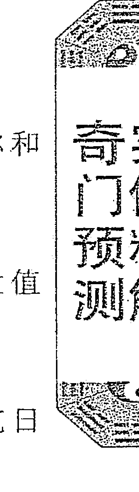

| 六合 天柱 | 白虎 天心 | 玄武 天蓬 |
| :---: | :---: | :---: |
| 丙+甲辰壬 | 丁+甲子戊 | 甲戊己+甲申庚 （甲寅癸） |
| 死火入天网巽 | 惊青龙转光离 | 开刑格反吟坤 |
| 太阴 芮(禽) | 阳 九 局 | 九地 天任 |
| 甲申庚+甲午辛 （甲寅癸） | 甲 戌 旬 | 乙+丙 |
| 景 虎干格震 | 庚 辰 时 | 休奇仪顺遂兑 |
| 螣蛇 天英 | 值符 天辅 | 九天 天冲 |
| 甲子戊+乙 | 甲辰壬+甲戊己 | 甲午辛+丁 |
| 杜龙合灵门艮 | 伤凶蛇入墓坎 | 生猖神得奇乾 |

早上8点50来一女顾客买鲜花扫墓，说是她姥姥，正在为其包花，又来一女顾客，也说是买花扫墓，没有看奇门局，根据第一个女顾客说的扫墓逝者是女。

我对后来人说是女的。

她说：是女的。

9点10分又来一女顾客来买花扫墓。

我对其说：是女的。

她说：是女的。

连着三个扫墓者逝者都是女的，后我翻看奇门局验证，看奇门是否对应。

乙酉年己丑月乙卯日辛巳时 0498局
0498局（9:00——11:00）

| 六合 天任 | 白虎 天冲 | 玄武 天辅 |
| :---: | :---: | :---: |
| 乙+甲辰壬 | 甲午辛+甲子戊 | 甲辰壬+甲申庚 （甲寅癸） |
| 伤地网高张巽 | 杜困龙被刑离 | 景太白擒蛇坤 |
| 太阴 天蓬 | 阳 九 局 | 九地 天英 |
| 甲戊己+甲午辛 | 甲 戌 旬 | 甲子戊+丙 |
| 生游魂入墓震 | 辛 巳 时 | 死 龙回首兑 |
| 螣蛇 天心 | 值符 天柱 | 九天 芮(禽) |
| 丁+乙 | 丙+甲戊己 | 甲申庚+丁 （甲寅癸） |
| 休入遇吉格艮 | 开火孛入刑坎 | 惊亭亭白奸乾 |

9点前死门在巽宫为阴为女，9点钟后，死门在兑为阴为女。

由此可见奇门之神奇，奇门每天每时都在反映着世间万物所发生的事情。

同日，2006年1月26日下午1点30分
乙酉年巳丑月乙卯日癸未时 0500局
0500局(13:00——15:00)

| 六合 天柱 | 白虎 天心 | 玄武 天蓬 |
| :---: | :---: | :---: |
| 丙+甲辰壬 | 丁+甲子戊 | 甲戊己+甲申庚 (甲寅癸) |
| 乙火入天网巽 | 景龙转光离 | 死刑格反名坤 |
| 太阴 芮（禽） | 阳九局 | 九地 天任 |
| 甲申庚+甲午辛 (甲寅癸) | 甲戌旬 | 乙+丙 |
| 伤虎干格震 | 癸未时 | 惊奇仪顺逐兑 |
| 螣蛇 天英 | 值符 天辅 | 九天 天冲 |
| 甲子戊+乙 | 甲辰壬+甲戊己 | 甲午辛+丁 |
| 生龙合灵门艮 | 休凶蛇入墓坎 | 开狱神得奇乾 |

上本书中2005年1月2日实例中会八卦的熟人路过我店门口，看其衣着整齐，象是最近运气很好，他说也是，看奇门局，日干乙+丙奇义顺逐在兑宫，兑为喜悦，日干乙地盘在艮宫临，生门甲子戊钱财生，日干所在兑、财运好，庚在震，乙在兑，乙为妻，庚为夫，说明他夫妻还有矛盾。
他说：是，算卦挣了一千多，和妻子还闹些矛盾。

### 七十八、奇门测房门方向

2006年2月8日 下午3点30分
丙戊年庚寅月戊辰日庚申时 0477局
0477局(15:00——17:00)

| 值符 天柱 | 螣蛇 天心 | 太阴 天蓬 |
| :---: | :---: | :---: |
| 乙+甲寅癸 | 丙+甲戊己 | 甲申庚+甲午辛 （丙丁奇） |
| 惊华盖逢星官巽 | 开火悖入刑离 | 休战格坤 |
| 九天 芮（禽） | 阳八局 | 六合 天任 |
| 甲午辛+甲辰壬 （丁） | 甲寅旬 | 甲子戊+乙 |
| 死天乙会合震 | 庚申时 | 生龙合灵门兑 |
| 九地 天英 | 玄武 天辅 | 白虎 天冲 |
| 甲戊己+甲子戊 | 甲寅癸+甲申庚 | 甲辰壬+丙 |
| 景犬遇青龙艮 | 杜太白入网坎 | 伤水蛇入火乾 |

下午3点30分，来女顾客买鲜花，说是朋友搬新房去看一看。翻看奇门局0477局，生门为房屋在兑宫，为西，房门应朝西或座西朝东。

她说：我还没有去过呢，还不知道。

我给她留下我的电话，让她去后告诉我其朋友新房门的朝向。

她还让我为她预测一下

日干戊在宫兑临生门，财运，运气都很好。

她说，还可以。看其衣着服饰，也符合。

她走后，半小时来电话说朋友家房门朝西。

### 七十九、断房门方向

2006年2月9日 丙戌年庚寅月巳巳日癸酉时 0251局

0251局（19:00——21:00）

| 白虎 天辅 | 玄武 天英 | 九地 芮(禽) |
| :---: | :---: | :---: |
| 乙+乙 | 甲辰壬+甲辰壬 | 丁+丁 |
| 杜 奇伏吟巽 | 景蛇入地罗离 | 死奇入太阴坤 |
| 六合 天冲 | 阳五局 | 九天 天柱 |
| 丙+丙 | 甲戌时 | 甲申庚+甲申庚 |
| 伤 奇悖师震 |  | 惊 战格 兑 |
| 太阴 天任 | 螣蛇 天蓬 | 值符 天心 |
| 甲午辛+甲午辛 | 甲寅癸+甲寅癸 | 甲戌己+甲戌己 |
| 生 虎适 艮 | 休天网四张坎 | 开地户逢鬼乾 |

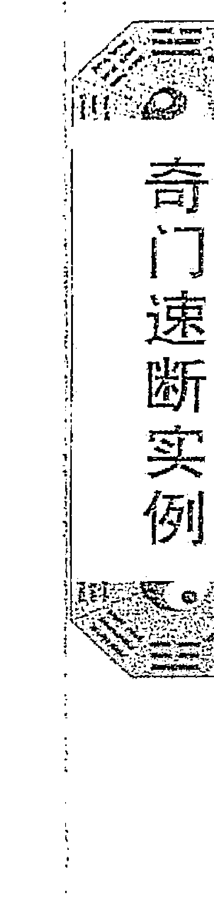

下午6点多来一顾客买鲜花，问他干什么用，他说给家里花瓶插花。看奇门局，生门为房屋在艮宫，艮为东北方，我对他说：你家房门朝东北方向。

他说：不对，门朝东。

晚8点来一小伙，买鲜花，说是给家里摆放，他问我：你不认识我了，纺正街手机店被抢是我办的案子，我还来问过你。我说：你我倒是没印象，那天同来的大个子警察，他的样子好记，但他给我反馈的信息太少，劫匪中身上有有伤或用刀伤过别人的人，对不对？他说：身上有刀伤，也用刀伤过别人。生门为房屋，在艮宫。

我对他说：你的房门朝东北方向。
他说：房门朝东，偏点北。

### 八十、测失物

2006 年 2 月 4 日
丙戌年庚寅月甲子日甲戌时 0431 局
0431 局(19:00——21:00)

| 九天 天辅 | 值符 天英 | 螣蛇 芮(禽) |
| :---: | :---: | :---: |
| 甲寅癸+甲寅癸 | 甲戊己+甲戊己 | 甲午辛+甲午辛 (丁+丁) |
| 杜 天网四张 巽 | 景 地户缝鬼 离 | 死 伏吟天庭 坤 |
| 九地 天冲 | 阳八局 | 太阴 天柱 |
| 甲辰壬+甲辰壬 | 甲戌旬 | 乙+乙 |
| 伤 蛇入地罗 震 | 甲戌时 | 惊 奇伏吟 兑 |
| 玄武 天任 | 白虎 天蓬 | 六合 天心 |
| 甲子戊+甲子戊 | 甲申庚+甲申庚 | 丙+丙 |
| 生 符伏吟 艮 | 休 战格 坎 | 开 奇悖师 乾 |

晚8点多，家中来电话说房门钥匙丢了，说是早上开门，可能忘记取下来，被人拿去，明天房门锁一定要全换，看奇门0431局，时干甲成为丢失之物在离宫，生日干甲子戊所在艮宫，为能找到，丢不了。第二天上午10点来电说找到了。

### 八十一、八门九星伏吟 工作不可动

2006 年 2 月 10 日
丙戌年庚寅月庚午日甲申时 0261 局
0261 局(15:00——17:00)

| 玄武 天辅 | 九地 天英 | 九天 芮(禽) |
| :---: | :---: | :---: |
| 乙+乙 | 甲辰壬+甲辰壬 | 丁+丁 (甲子戊+甲子戊) |
| 休 奇伏吟 巽 | 景 蛇入地罗 离 | 死 符伏吟 坤 |
| 白虎 天冲 | 阳五局 | 值符 天柱 |
| 丙+丙 | 甲申旬 | 甲申庚+甲申庚 |
| 伤 奇悖师 震 | 甲申时 | 惊 战格 兑 |
| 六合 天任 | 太阴 天蓬 | 螣蛇 天心 |
| 甲午辛+甲午辛 | 甲寅癸+甲寅癸 | 甲戊己+甲戊己 |
| 生 虎遁 艮 | 休 天网四张 坎 | 开 地户逢鬼 乾 |

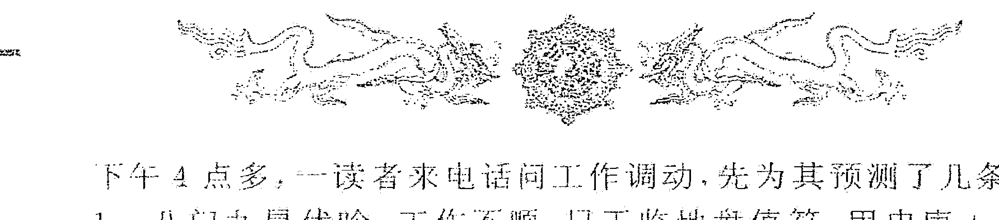

下午4点多，一读者来电话问工作调动，先为其预测了几条。

-   1、八门九星伏吟，工作不顺，日干临地盘值符，甲申庚+甲申庚格局战格断其是领导或领导在一起工作，但关系不好。
    答：和领导在一起工作。
-   2、年干丙为上级领导在震宫，伤门白虎，日干甲申庚在兑宫，克震宫，断其和领导关系不好，但领导领导制不住你而是你能把领导制住。
    答：我和领导关系很紧张，领导把我也没法。
-   3、生门钱财在艮宫，甲子戊资本钱财在坤宫，同生日干甲申所在兑宫，断其财运好。
    答：不多，月工资2000元左右。西安市职工月工资500到800元，千元以上应是中上高收入。
-   4、八门九星伏吟，工作不可动。

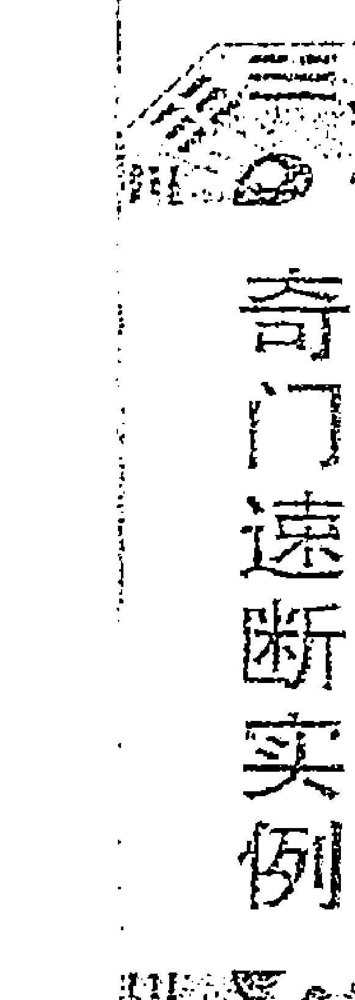

### 八十二、一局多断

2006年2月11日
丙戌年庚寅月辛未日甲午时 0271局
0271局（11：00——13：00）

| 太阴 天辅 | 六合 天英 | 白虎 丙（禽） |
| :---: | :---: | :---: |
| 乙+乙 | 甲辰壬+甲辰壬 | 丁+丁 (甲子戊+甲子戊) |
| 杜 奇伏吟巽 | 景蛇入地罗离 | 死奇入太阴坤 |
| 螣蛇 天冲 | 阳五局 | 玄武 天柱 |
| 丙+丙 | 甲午旬 | 甲申庚+甲申庚 |
| 伤 奇悖师震 | 甲午时 | 惊 战格 兑 |
| 值符 天任 | 九天 天蓬 | 九地 天心 |
| 甲午辛+甲午辛 | 甲寅癸+甲寅癸 | 甲戌己+甲戌己 |
| 生 虎遁艮 | 休天网四张坎 | 开地户逢鬼乾 |

一、中午一男顾客来买鲜花，说媳妇刚生小孩。
看奇门局0271局，时干为子女，时干甲午在艮宫，应是男孩，艮宫八门九星伏吟不动，小孩出生慢。
答：是男孩，出生慢。

二、这时又来一顾客说要买花篮，看病人，以奇门局天芮病星在坤，女病人上遇白虎。
我对他说：这个女病人不是外伤就是做手术，而且经济条件好，算是有钱人。

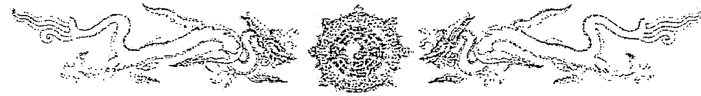

答: 是女病人, 做手术, 而且有钱人, 你怎算出来的, 我以前从不相信算卦。
怎样断这病人经济条件好呢?
天芮病星在坤宫, 甲子戊为资本钱财, 甲子戊 + 甲子戊, 怎能不是有钱人。

#### 三、中午 1 点 15 分 0272 局

0272 局 (13:00—15:00)

| 太阴 天任 | 六合 天冲 | 白虎 天辅 |
| :---: | :---: | :---: |
| 甲午辛+乙 | 丙+甲辰壬 | 乙+丁 （甲子戊） |
| 休 虎猖狂 巽 | 生 火入天网 离 | 伤 奇仪相佐 坤 |
| 螣蛇 天蓬 | 五局 | 玄武 天英 |
| 甲寅癸+丙 | 甲午旬 | 甲辰壬+甲申庚 |
| 开 华盖逢星 震 | 乙未时 | 杜 太白擒蛇 兑 |
| 值符 天心 | 九天 天柱 | 九地 芮(禽) |
| 甲戌己+甲午辛 | 甲申庚+甲寅癸 | 丁+甲戌己 (甲子戊) |
| 惊 游魂入墓 艮 | 死 大格 坎 | 景 火入勾陈 乾 |

午 1 点 15 分, 来人买花篮看病人, 先看奇门局 0272 局天芮病星转到乾宫、景门, 乾为阳为男, 景门为血光, 甲子戊为资本。
我对买花者说: 你看的是男病人, 流血多, 但此人是有钱人。
答: 男病人, 做手术肯定要流血, 他算是有钱人。

### 八十三、错例

2006 年 2 月 12 日早上 8 点
丙戌年庚寅月壬申日甲辰时 0281 局

0281 局 (7:00—9:00)

| 九天 天辅 | 值符 天英 | 螣蛇 芮(禽) |
| :---: | :---: | :---: |
| 乙+乙 | 甲辰壬+甲辰壬 | 丁+丁 (甲子戊+甲子戊) |
| 杜 奇伏吟 巽 | 景 蛇入地罗 离 | 死 奇入太阴 坤 |
| 九地 天冲 | 五局 | 太阴 天柱 |
| 丙+丙 | 甲辰旬 | 甲申庚+甲申庚 |
| 伤 奇逢师 震 | 甲辰时 | 惊 成格 兑 |
| 玄武 天任 | 白虎 天蓬 | 六合 天心 |
| 甲午辛+甲午辛 | 甲寅癸+甲寅癸 | 甲戌己+甲戌己 |
| 生 伏吟天庭 艮 | 休 天网四张 坎 | 开 地户逢鬼 乾 |

97

早上8点，来一顾客说买束鲜花，扫墓先看奇门局，死门在坤应为女，坤宫甲子戊为资本，生前经济条件好。
答：是男的，生前条件可以。
同时又来一顾客也要买花扫墓，我问他是女的，经济条件好。
答：是男的，生前有钱。
为什么男女断错，死门在坤为阴，坤宫中甲子戊多为男。

### 八十四、生门生日干 财运好

2006年2月17日
丙戌年庚寅月丁丑日乙巳时 0102局
0102局（9:00——11:00）

| 宫位 | 信息1 | 信息2 | 宫位 | 信息1 | 信息2 | 宫位 | 信息1 | 信息2 |
| :--- | :--- | :--- | :--- | :--- | :--- | :--- | :--- | :--- |
| 巽 | 白虎 天冲 甲戊己+甲申庚 景 风遁 | | 离 | 玄武 天辅 甲申庚+丙 死 白入荧 | | 坤 | 九地 天英 丙+甲子戊芮 (甲午辛禽) 惊 鸟跌穴 |
| 震 | 六合 天任 丁+甲戊己 杜 火入勾陈 | | 中 | 阳二局 甲辰旬 乙巳时 | | 兑 | 九天 芮(禽) 甲子戊+甲寅癸 (甲午辛) 开 青龙华盖 |
| 艮 | 太阴 天蓬 乙+丁 伤 奇仪相佐 | | 坎 | 螣蛇 天心 甲辰壬+乙 生 小蛇日奇 | | 乾 | 值符 天柱 甲寅癸+甲辰壬 休 贺加螣蛇 |

上午10点多接一河北读者电话，顺便为其预测。
-   1、日干丁在震宫，生门钱财，在坎宫，生日干宫为财运好，来财容易。
-   2、开门在兑宫，克日干丁所在震宫，现无工作。
    答：刚离开公司不干了。
-   3、开门兑宫有甲子戊资本，原工作单位是有钱大单位。
    答：是上市公司，我现在有自己的办公室，你看门朝那里。
-   4、开门在兑；门朝西。
    答：是朝西。
-   5、地盘值符在乾宫，克日干震宫，离开公司是领导找事。
    答：是。
-   6、天盘值符天心在坎宫生日干震宫，正职领导对你好。
    答：是。

### 八十五、测未见面的女友

2006年2月16日
丙戌年辛卯月甲辰日庚午时 0187局

0187局(11:00——13:00)

| 值符 天心 | 螣蛇 天蓬 | 太阴 天任 |
| :---: | :---: | :---: |
| 甲申庚+甲子戊 | 丁+甲寅癸 | 甲辰壬+丙芮 (甲戌己禽) |
| 惊白乙伏宫巽 | 开雀投江离 | 休水蛇入火坤 |
| 九天 天柱 | 阳四局 | 六合 天冲 |
| 甲午辛+乙 | 甲子旬 | 乙+甲午辛 |
| 死虎猖狂震 | 庚午时 | 生虎遁兑 |
| 九地 芮(禽) | 玄武 天英 | 白虎 天辅 |
| 丙+甲辰壬 (甲戌己) | 甲寅癸+丁 | 甲子戊+甲申庚 |
| 景火入天网艮 | 杜蛇天矫坎 | 伤符飞宫乾 |

中午来一小伙欲订玫瑰，说是要去见一个还未见面的女友，看奇门局。

-   1. 乙奇在兑，临生门，我对他说：这个人比你挣钱多。
    他说：我和她在电话里谈的很好，她是中学老师，月工资1千到2千一个月，我一个月工资8百元左右。
-   2. 日干甲辰在坤宫，临休门，休门为休闲。我对他说：你的工作很休闲。
    他说：工作是很轻松。
    丁为玉女在离宫，生日干甲辰所在坤宫，第三天这小伙来买花时说：本来我要去华县跟她见面，结果，她已到西安来和我见面，丁为玉女生日干，说明女友也很想见到她。
-   3. 乙为对象在兑宫，克庚为男，所在巽宫，乙又为去年乙酉年年干，故断他去年谈的对象多，但都不成，乙在兑宫临生门，所谈对象财运都很好。
    他说：去年谈了很多对象，没有一个成的，条件都挺好。

### 八十六、测婚姻

2006年2月17日
丙戌年庚寅月丁丑日 0106局
0106局（17:00——19:00）

| 白虎 天蓬 | 玄武 天任 | 九地 天冲 |
| :---: | :---: | :---: |
| 乙+甲申庚 | 丁+丙 | 甲戊己+甲子戊丙 （甲午辛酉） |
| 死 奇仪刑狱 巽 | 惊 星随月转 离 | 开 犬遁青龙 坤 |
| 六合 天心 | 阳二局 | 九天 天辅 |
| 甲辰壬+甲戊己 | 甲辰旬 | 甲申庚+甲寅癸 |
| 景 凶蛇入墓 震 | 己酉时 | 休 大格 兑 |
| 太阴 天性 | 螣蛇 丙(禽) | 值符 天英 |
| 甲寅癸+丁 | 甲子戊+乙 （甲午辛） | 丙+甲辰壬 |
| 杜 蛇天矫 艮 | 伤 龙合灵门 坎 | 生 火入天网 乾 |

下午5点多0106局，来一女顾客订花车，准备结婚，给她花车图片，让她看，我看奇门局0106局，问她：谁结婚，她说：我结婚。据奇门局庚为女子之对象在兑宫为西，我问她：你的对象在你的西边，她说：有点偏西，你算一下我的财运工作。

-   1、工作看开门在坤宫有甲子戊，工作好。
    答：在政府机关工作。
-   2、日干丁在离宫，天盘值符天心星，在震宫生离宫，正职领导对你好，而非你对领导好。
    答：领导对我很好。
-   3、日干丁所在离宫，克地盘值符所在乾宫，有一个西北方向领导，你不怕他，而且能制住他。
    答：有一个家住西北方向的领导，我们关系挺好，我也不怕他，你看我父母情况。
-   4、年午丙为父母在乾宫临生门钱财，地盘值符，你父母有钱，并且是领导，值符为领导。
    答：有钱倒是，但不是领导，父母是农民。
    我说：农村必是村干部，
    她说：不是。
    我说：在农村会计也是干部。
    她说:是村会计。
    为什么断是会计,会计管财务,年干丙在乾宫临生门,生门为钱财。
    日干丁在离宫,克年干丙父母所在乾宫,不怕父母。
    答:是,确实如此,你看我婚姻如何。
-   5、日干丁所在离宫克对象庚所在兑宫,对其对象不满意,对象庚兑宫克乙所在巽宫,你对象对你也有些不满意。
    答:是,我俩相互都有些不满意。
    我问她:为什么对你对象不满意?
    她说:因为他没有钱。

### 八十七、乙庚相克 两人闹矛盾

2006年2月22日
丙戌年庚寅月壬午日己酉时 0526局

0526局(17:00——19:00)

| 值符 天柱 | 螣蛇 天心 | 太阴 天蓬 |
| :---: | :---: | :---: |
| 丙+甲辰壬 | 丁+甲子戊 | 甲戊己+甲申庚 (甲寅癸) |
| 伤火入天网巽 | 杜青龙转光离 | 景利格反名坤 |
| 九天 芮(禽) | 阳九局 | 六合 天任 |
| 甲申庚+甲午辛 (甲寅癸) | 甲辰旬 | 乙+丙 |
| 生 虎干格震 | 己酉时 | 死奇仪顺逆兑 |
| 九地 天英 | 玄武 天辅 | 白虎 天冲 |
| 甲子戊+乙 | 甲辰壬+甲戌己 | 甲午辛+丁 |
| 休龙合灵门艮 | 开凶蛇入墓坎 | 惊狱神得奇乾 |

下午6点多下小伙来买4朵玫瑰花,问他是否送对象,他说是,先看奇门局。

-   1、乙奇为女友在兑宫,我对他说:你女朋友在你的西边。他说:你咋知道。
    我说:你说对不对。
    他说:是在我西边。你咋知道的。
    我说:是八卦显示的。
    他说:你算卦算出来的。我还吓一跳。
    我说:你还以我识认她。

The request was rejected because it was considered high risk## 一百零二、乙奇乘天蓬 女友厉害

2006年4月28日
丙戌年癸巳月丁未日戊申时 0105局
0105局(15:00——17:00)

| 九地 天心 | 九天 天蓬 | 值符 天任 |
| :--- | :--- | :--- |
| 甲辰壬+甲申庚 | 乙+丙 | 丁+甲子戊 芮 |
| （甲午辛） | （甲午辛） | （甲午辛） |
| 太白地巽 | 奇仪顺遂离 | 生青龙转光坤 |
| 玄武 天柱 | 阴二局 | 螣蛇 天冲 |
| 甲寅癸+甲戌己 | 甲午旬 | 甲戌己+甲寅癸 |
| 惊华盖地户震 | 丁酉时 | 伤地刑玄武兑 |
| 白虎 芮（禽） | 六合 天英 | 太阴 天辅 |
| 甲子戊+丁 | 丙+乙 | 甲申庚+甲辰壬 |
| （甲午辛） | | 小格乾 |
| 死龙德明艮 | 景日月并行坎 | |

1、生门代表房屋在坤宫，断其家房门朝西南或坐西南。她说：你会算卦，我家房门是朝西偏南，你算一下我的事业。
2、开门为事业，在巽宫旬空，现无工作或没有上班。答：你看什么时间能上班。
3、开门现旬空，午月出空可上班。地盘值符在坤宫，又有时干丁奇克日干丙奇所在坎宫，你的领导是女领导，对你不好。答：领导都是女的，和我关系一般。你看我婚姻。
4、看婚姻，庚为夫，在乾宫，生日干丙所在坎宫，你老公对你好。答：是。
5、生门在坤宫，生庚所在乾宫，乾宫又克开门所在巽宫，你老公不干工作，自己做生意，而且财运很好。答：是的，他自己做建材生意。

### 一百零三、断错生男生女，为什么？

#### 实例三十八 伤门迫宫遇天蓬 破财受伤

2005年5月29日上午9点30分
乙酉年辛巳月癸丑日丁巳时 0294局
上本书中实例中，一熟人来问生男生女，后来见到她，她说：我女儿生的女孩。
按当时奇门局0294，判断生男生女，以坤宫上乘之星断之，阳星为男，阴星为女，此局坤宫上乘天蓬星，阳星，日干丁在震宫，时干为子女，也应为男，但她却生女孩。
此处断错，而后面所断全对，为什么会这样？其实，此例还有一奇特巧合之处，就是前面问生，后面问死。
现将上本书中实例三十八再叙一次

#### 伤门迫宫遇天蓬，破财受伤

2005年5月29日上午9点30分
乙酉年辛巳月癸丑日丁巳时 0294局
0294局(9:00——11:00)

| 六合 天柱 甲申庚+乙 休 太白连星 巽 | 白虎 天心 甲戌己+甲辰壬 生 地网商张 离 | 玄武 天蓬 甲寅癸+丁丙 (甲子戊禽) 伤 蛇天矫 坤 |
| :--- | :--- | :--- |
| 太阴 芮 (禽) 丁+丙 (甲子戊) 开 星随月转 震 | 阳五局 甲寅旬 丁巳时 | 九地 天任 甲午辛+甲申庚 杜 白虎出力 兑 |
| 腾蛇 天英 甲辰壬+甲午辛 惊 膝蛇相缠 艮 | 值符 天辅 乙+甲寅癸 死 华盖迭星宫 坎 | 九天 天冲 丙+甲戌己 景 火孛入刑 乾 |

##### 奇门速断实例

上午9点30一熟人，常来找我预测，今又来问其女会生男孩女孩，又问她本人的工作情况如何？
1. 时干丁在震宫为阳，坤宫上临天蓬星也阳，应为男，待反馈信息。
2. 日干癸在坤宫，天盘值符与老板关系好。
答：老板对人挺好，你测老板有何事。
3. 伤门坤宫遇天蓬星，受伤破财，伤在右边。
答：车祸，伤右脸，还有一人因车祸死了。
4. 车祸死了人看死门，死门坎宫，地盘值符，上乘天辅星文曲星，此人也是领导，知识分子。
答：是老板，两人合作的公司，大学同学。

### 一百零四、奇门测命局一：

1970年6月7日晚9点
庚戌年壬午月戊午日癸亥时 0180局
0180局（21:00——23:00）

| 太阴 天辅 甲戌己+甲戌己 杜 地户连见 巽 | 六合 天英 丁+丁 景 奇入太阴 离 | 白虎 芮 (禽) 乙+乙 (甲申庚+甲申庚) 伤 蛇天矫 坤 |
| :--- | :--- | :--- |
| 腾蛇 天冲 甲子戊+甲子戊 伤 符伏吟 震 | 阳三局 甲寅旬 癸亥时 | 玄武 天柱 甲辰壬+甲辰壬 惊 蛇入地罗 兑 |
| 值符 天任 甲寅癸+甲寅癸 生 天罗四张 艮 | 九天 天蓬 丙+丙 休 奇待师 坎 | 九地 天心 甲午辛+甲午辛 开 伏吟天庭 乾 |

这是一个精通八字的朋友的八字。他让我用奇门测一下他出生时间戌时，或按亥时哪一个时辰更符合他。经预测亥时更符合他的命运。他也是我上本书中来我这定花车准备结婚的小伙。
1. 日干甲子戊 + 甲子戊在震宫，甲子戊为钱财，为有钱，财运好，但格局子刑卯，六仪刑击，临伤门，身上有伤。
他说：有钱也留不住，头上有很多伤。
2. 乙 + 乙，庚 + 庚，二婚象，丁 + 丁女友多。
他说：正是。
3. 年干庚为父母，在坤宫，临死门上遇白虎，父母运气不好，受伤有病，坤为母，母亲运气更差一些，庚 + 庚战格，父母关系不好。
答：我爸受过伤，我妈有病十几年了，他们常争吵。
4. 月干壬为兄弟姐妹，在兑宫，家中男少女多。
答：三个姐，一个哥。
生门在艮宫，生月干壬所在兑宫，其他人比你有钱，生门为钱财，也为阳宅，他们也得阳宅风水之助，死门为祖坟，在坤宫，生月干，姐妹中也得阴宅风水之助。
答：我姐很有钱。
他又问：“你看我家祖坟和毛泽东祖坟有何区别？”
1. 毛泽东祖坟，死门在坤宫乘天地盘值符，风水很好，而且生日干丁奇，毛泽东自然得阴宅风水之助。
2. 你家祖坟，死门也在坤宫，方向为西南方，但格局为战格，遇白虎，风水自然不是很好，虽不好，但生月干壬所在兑宫，姐妹弟兄得阴宅风水之助。他又问：你看祖坟周围环境如何？死门在坤，坟的周围情况死门在坤宫临兑，兑为坑为泽，祖坟周围有水坑。
答：有池塘，祖坟朝西南方向。
3. 生门为房屋在艮宫，临坎宫，房屋周围有水艮为山，房屋建在山跟前。
答：我老家在江苏，南方丘陵地带，房子建在山坡下，周围有池塘。

### 一百零五、奇门测命局二：

测命运、婚姻
82年10月18日晚10点出生 0672局
壬戌年庚戌月甲戌日乙亥时出生
0672局（21：00——23：00）

| 太阴 芮（禽） 甲戌己+乙（丙） 休 太白连星 巽 | 螣蛇 天柱 甲寅癸+甲午辛 生 网盖天牢 离 | 值符 天心 丁+甲戌己（丙） 伤 火入勾陈 坤 |
| :--- | :--- | :--- |
| 六合 天英 甲午辛+甲子戊 开 困龙被伤 震 | 阴三局 甲戌旬 乙亥时 | 九天 天蓬 甲申庚+甲寅癸 杜 大格 兑 |
| 白虎 天辅 乙+甲辰壬 惊 奇入地 艮 | 玄武 天冲 甲子戊+甲申庚 死 符飞宫 坎 | 九地 天任 甲辰壬+丁 景 于合蛇刑 乾 |

1. 日干甲戌己在巽宫，临休门运气好，学习好。
答：运气很好，大学毕业。
2. 庚月干为兄弟姐妹，在兑宫克日干巽宫，兄弟姐妹中有与你不好的人。
答：我弟跟我不好，我妹跟我关系可以但不是亲的。
3. 壬年干为父母在乾宫，景门壬 + 丁干合蛇刑，生门钱财克乾宫，甲子戊钱财在坎宫临死门，父母运气不好，家里条件不是很好。
答：是。
4. 生门为房屋在离宫，房门朝南或座南向北，对面有河或水沟。
答：门朝南，房对面有大水沟水不多。

### 一百零六、奇门测命局三：

2005年12月15日早7：30分出生，姓陶，男
乙酉年戊子月癸酉日丙辰时 0953局
0953局（7：00——9：00）

#### 奇门预测实例精解

| 太阴 天英 | 螣蛇 芮(禽) | 值符 天柱 |
| :--- | :--- | :--- |
| 丙+甲午辛 | 甲寅癸+丙 (甲申庚) | 甲子戊+甲寅癸 (甲申庚) |
| 景 为谋望就巽 | 死 华盖悖师离 | 惊 龙回百坤 |
| 六合 天辅 | 阴七局 甲寅旬 丙辰时 | 九天 天心 |
| 甲午辛+甲辰壬 | | 甲戌己+甲子戊 |
| 杜 凶蛇入狱震 | | 开 天遇吉龙兑 |
| 白虎 天冲 | 玄武 天任 | 九地 天蓬 |
| 甲辰壬+乙 | 乙+丁 | 丁+甲戌己 |
| 伤 小蛇日奇艮 | 生 奇仪相佐坎 | 休 火入勾陈乾 |

1、生门在坎宫，此人出生时，家中房朝北，或座北朝南。
答：家中大门朝南，而自己所住之房屋门朝北
2、生门在坎宫北，出生应在北，
答：我的小孩子在家的南边医院出生，医院门朝北。
3、乙年干为父母在坎宫，临生门，乙+丁，三奇遇吉门，父母财运好。
答：还可以。

### 一百零七、测婚姻家庭

2006年5月5日
丙戌年癸巳月甲午日甲戌时 0191局
0191局(19:00——21:00)

| 九地 天辅 | 九天 天英 | 值符 芮(禽) |
| :--- | :--- | :--- |
| 甲子戊+甲子戊 | 甲寅癸+甲寅癸 | 丙+丙 (甲戌己+甲戌己) |
| 杜 符飞宫巽 | 景 天网四张离 | 死 奇停师坤 |
| 玄武 天冲 | 阳四局 甲戌旬 甲戌时 | 螣蛇 天柱 |
| 乙+乙 | | 甲午辛+甲午辛 |
| 伤 奇伏吟震 | | 惊 伏吟天庭兑 |
| 白虎 天任 | 六合 天蓬 | 太阴 天心 |
| 甲辰壬+甲辰壬 | 丁+丁 | 甲申庚+甲申庚 |
| 生 蛇入地罗艮 | 休 奇入太阴坎 | 开 战格乾 |

下午7点多，一女来想预测事情，还不信任，非让先说几句，问她想测什么事。
她说：算一下家庭。
① 算家庭看乙庚夫妻关系，今乙在震宫，庚在乾宫克乙震宫，夫妻关系不好，闹矛盾。
答：是，娃她爸找我事，说我有外遇。
② 丙为第三者男人在坤宫，乙在震克之，应为没有，又甲戌旬空，丙在坤宫空，也是没有。
答：是，我没有，但他非说我有。
③ 庚为夫在乾宫生丁为第三者女人所在坎宫，你老公有情人。
答：不知道。
④ 开门为工作，在乾宫克乙所在震宫，你没有工作。
答：是我老公开工厂。
⑤ 开门在乾，工厂门朝西北或座西北朝东南。
答：朝东南。
⑥ 生门在艮宫，上遇白虎，今年年前必破财。时干甲戌，为工人，在坤宫临死门，上遇天芮病星，是因工人受伤，为其看病而赔钱。
答：是，一个工人手上两个指头受伤。

### 一百零八、来电测老婆丢了

2006年5月4日
丙戌年癸巳月癸巳日丁巳时 0474局
0474局(9:00——11:00)

| 值符 天任 甲子戊+甲寅癸 休 青龙华盖 坎 | 螣蛇 天冲 甲辰壬+甲戊己 生 凶蛇入墓 离 | 太阴 天辅 甲寅癸+甲午辛 芮(丁禽) 伤 网盖天牢 坤 |
| :--- | :--- | :--- |
| 九天 天蓬 甲申庚+甲辰壬 开 小格 震 | 阳八局 甲寅旬 丁巳时 | 六合 天英 甲戊己+乙 杜 地户逢星 兑 |
| 九地 天心 丙+甲子戊 惊 鸟跌穴 艮 | 玄武 天柱 乙+甲申庚 死 文书阻隔 坎 | 白虎 芮(禽) 甲午辛+丙(丁) 景 干合仵师 乾 |

早上9点多，接到一个四川来电话，说老婆丢了，看能否回来何时回来。
① 乙为妻在坎宫临死门，又甲寅旬子丑空，空而不在家，坎为水，在巳月巳日巳时，火旺水干，日干癸在坤宫克坎宫，难以找到。
答：我找了几个省，也没有找到。
② 日干癸天盘在坤宫，地盘在巽宫，有甲子戊生生门所在离宫，生门又生日干所在坤宫，断你是有钱人。
答：我有工厂。
③ 有工厂，看开门，今开门在震宫，工厂门朝东或座东向西。
答：向西。
④ 开门在震宫，上遇天蓬星，断：2、3月工厂被盗，破财。
答：上月丢了机器。

### 一百零九、张志春之学生 风水大师来电

2006年5月9日
丙戌年癸巳月戊戌日丁巳时 0234局
0234局(9：00——11：00)

| 九天 天心 | 值符 天蓬 | 腾蛇 天任 |
| :--- | :--- | :--- |
| 甲申庚+甲子戊 | 丁+甲寅癸 | 甲辰壬+丙丙 |
| **死** 天乙会合 巽 | **惊** 雀投江 离 | **开** 水蛇入火 坤 |
| 九地 天柱 | 阳四局 甲寅旬 丁巳时 | 太阴 天冲 |
| 甲午辛+乙 | | 乙+甲午辛 |
| **景** 虎猖狂 震 | | **休** 龙逃走 兑 |
| 玄武 芮(禽) 丙+甲辰壬 (甲戌己) | 白虎 天英 甲寅癸+丁 | 六合 天辅 甲子戊+甲申庚 |
| **杜** 火入天网 艮 | **伤** 蛇夭矫 坎 | **生** 符飞宫 乾 |

早上10点多，接一昆明读者电话，咨询预测彩票的情况，闲谈中顺便为他预测了几条。
① 日干戊在乾宫，临生门，必为有钱人，经济条件好，挣钱多。
答：没有钱，一月几千元。
② 日干戊在乾宫，上乘天辅星为文曲星，为文化高，从交谈中知道，他说是和杜新会师从于张志春先生学习奇门遁甲，并且精通八字风水，常给人看风水，易学各方面知识渊博，胜过于我。
答：经常在大学给别人讲课。
③ 乙为妻在兑宫，克庚为夫所在巽宫，婚姻不好。
答:97年离婚，现在婚姻是很好。
97年离婚，97年是丁丑年，丁年干在离宫克乙所在兑宫。
长途电话通了50多分钟，对于一个风水大师，是不在乎的，因他说：我看一个风水，就是几千块钱。

### 一百一十、测考大学 日干+丙有情人

2006年6月11日
丙戌年甲午月辛未日丙申时 0153局
0153局(15:00——17:00)

| 白虎 天冲 | 玄武 天柱 | 九地 天英 |
| :--- | :--- | :--- |
| 甲子戊+甲戌己 | 甲戌己+丁 | 丁+乙(甲申庚) |
| **生** 贵人入狱 **巽** | **伤** 朱雀入狱 **离** | **杜** 人遁吉格 **坤** |
| 六合 天任 | 阳三局 甲午旬 丙申时 | 九天 芮(禽) 乙+甲辰壬(甲申庚) |
| 甲辰壬+甲子戊 | | **景** 小格 **兑** |
| **休** 小蛇化龙 **震** | | |
| 太阴 天蓬 | 螣蛇 天心 | 值符 天柱 |
| 丙+甲寅癸 | 甲午辛+丙 | 甲辰壬+甲午辛 |
| **开** 华盖悖格 **艮** | **惊** 干合悖格 **坎** | **死** 螣蛇相缠 **乾** |

下午4点多一女来电话闲聊，顺便预测。
① 日干辛加丙在坎宫，应在去年冬天有情人，过年前又吹了，丙为情人，天盘在艮宫克日干辛所在坎宫，所以年前又吹了。
答：是。
② 本人在4、5月破财，因生门在巽宫上遇白虎。
答：是。
③ 问小孩今年考大学能否考上，时干丙在艮宫，三奇之丙奇加开门，大吉。天辅星在离宫，生时干艮宫，能考上，平时学习轻松。
答：我女儿学习就是很轻松。
④ 月干甲午在乾宫，临地盘值符，其哥是领导。
答：是。

### 一百一十一、来电预测

2006年6月11日
丙戌年甲午月辛未日癸亥时 0156局
0156局(21:00——23:00)

| 白虎 天心 | 玄武 天蓬 | 九地 天任 |
| :--- | :--- | :--- |
| 甲午辛+甲戌己 | 丙+丁 | 甲寅癸+乙(甲申庚) |
| 死 入狱自刑 巽 | 惊 月奇入狱 离 | 开 华盖逢星 坤 |
| 六合 天柱 | 阳三局 甲午旬 | 九天 天冲 |
| 甲辰壬+甲子戊 | | 甲子戊+甲辰壬 |
| 景 小蛇化龙 震 | | 休 龙入天门 兑 |
| 太阴 芮(禽) 乙+甲寅癸(甲申庚) | 螣蛇 天心 甲午辛+丙 | 值符 天辅 甲戌己+甲午辛 |
| 杜 大格 艮 | 伤 干合格格 坎 | 生 游魂入墓 乾 |

晚9点多，一女来电话咨询，闲谈中说起她的小孩，看奇门局时干已在乾宫应为男孩。
答：是女孩。
① 时干在乾宫临天辅星，是学习好。临地盘值符，是班干部。
答：学习中上，是组长。
② 日干辛在巽宫临死门，上遇白虎，4、5月受伤有病。
答：没有。
那就必然破财。
答：是。

### 一百一十二、日干+丁必有情人 男

2006年6月14日
丙戌年甲午月甲戌日壬申时 0489局
0489局(15:00——17:00)

##### 奇门速断实例

下午4点多，一山东读者来电话咨询奇门知识，交谈中顺便为其预测了几条。

1. 据日干甲戌在乾宫 + 丁奇，断其有婚姻之外的女朋友，也就是情人。答：有一个女朋友。
2. 女朋友丁奇天盘在兑宫临生门为财运好。答：还可以。
3. 开门在离宫克日干所在乾宫。断：你没有工作。答：是，我做小生意。
4. 丙年干为父母，在坤宫临休门，又得开门值符，所在离宫之生，为运气好，比你还好。答：是比我好。
5. 乙为妻在坎宫，临杜门，白虎，丁为情人在兑宫，临生门又丁 + 丙，情人比你妻运气好。答：是。

### 一百一十三、据命局测婚姻

1965 年 3 月 17 日晚 8 点出生 女 测婚姻
乙巳年己卯月庚午日丙戌时 0383 局
0383 局(19:00——21:00)

|  |  |  |
|---|---|---|
| 值符 天冲 甲寅癸+丁 伤 蛇天矫巽 | 螣蛇 天辅 丁+甲申庚 杜文书阻隔离 | 太阴 天英 甲申庚+甲辰壬芮 (丙禽) 景 小格坤 |
| 九天 天任 甲戊己+甲寅癸 生 蛇天娇震 | 阳 七局 甲 申 旬 丙 戌 时 | 六合 芮(禽) 甲辰壬+甲子戊 (丙) 死小蛇化龙兑 |
| 九地 天蓬 甲午辛+甲戊己 休入狱自刑艮 | 玄武 天心 乙+甲午辛 开 云遁 坎 | 白虎 天柱 甲子戊+乙 惊 龙合灵门乾 |

① 日干庚在坤宫克乙所在坎宫，第一次离婚是男方提出的。答：是。

② 日干庚在坤宫+丙奇，男朋友多，丙奇为男友，丙天盘在兑宫+甲子戊，男朋友中有有钱人。答：有千万富豪。

③ 2004年甲申年，谈的对象多并差点结婚。答：是。

④ 年干乙在坎宫，临开门云遁，父母运气很好。答：是。

⑤ 月干己在震中宫临生门，临卯月旺，故兄弟姐妹3到4人，并且比你有钱，月干己震宫克日干庚所在坤宫。
断：兄弟姐妹对你没有帮助，关系也不好。
答：兄弟姐妹四人，其他人都很有钱，关系一般。

⑥ 生门为房屋在震宫，你家房门朝东或座东。答：门朝东。

### 一百一十四、测讨债

2006 年 6 月 28 日
丙戌年甲午月戊子日丙辰时 0713 局
0713 局(7:00——9:00)

| 六合 天英 甲午辛+乙 景 虎猖狂 巽 | 太阴 丙(禽) 甲戌己+甲午辛 (丙) 死 游魂入墓 离 | 螣蛇 天柱 甲寅癸+甲戌己 (丙) 惊 华盖地户 坤 |
| --- | --- | --- |
| 白虎 天辅 乙+甲子戊 杜 利阴害阳 震 | 阴三局 甲寅旬 丙辰时 | 值符 天心 丁+甲寅癸 开 雀投江 兑 |
| 玄武 天冲 甲子戊+甲辰壬 伤 龙入天牢 艮 | 九地 天任 甲辰壬+甲申庚 生 太白擒蛇 坎 | 九天 天蓬 甲申庚+丁 休 亭亭白奸 乾 |

##### 奇门速断实例

早上8点50，一人来问测讨债。日干戊在艮宫，时干丙在离宫，生艮宫，对方和你关系好，不会为要钱而闹矛盾，本人是有钱人。
凡戊日来预测的多为有钱人。
我说：你是有钱人。
他说：没有钱，别人欠我一百多万工程款。
讨债值符为放债人，天乙为欠债人，今值符在兑宫，天乙天柱星在坤宫生兑宫，欠债可以要回，欠债人中有女的。因坤为阴，天柱也为阴。
答：有一个女经理。
5月份要回一些，6月可要回债务。
后来果然要回。

### 一百一十五、丁+丙同宫必同居

2006年7月7日
丙戌年乙未月丁酉日巳丙时 1006局
1006局(17:00——19:00)

| 值符 天蓬 丙+甲辰壬 死 火入天网 巽 | 九天 天任 甲子戊+乙 惊 龙合灵门 离 | 九地 天冲 甲寅癸+丁 (甲午辛) 开 蛇天妖 坤 |
| --- | --- | --- |
| 螣蛇 天心 甲申庚+甲寅癸 景 大格 震 | 阴八局 甲辰旬 己酉时 | 玄武 天辅 甲辰壬+甲戌己 休 凶蛇入墓 兑 |
| 太阴 天柱 甲戌己+甲子戊 杜 犬遇青龙 艮 | 六合 丙(禽) 丁+丙 (甲午辛) 伤 星随月转 坎 | 白虎 天英 乙+甲申庚 生 奇被刑 乾 |

下午 5 点，一女 20 多岁，来测婚姻，日干丁在坎宫，丁 + 丙为男性朋友多，乙 + 庚同在乾宫，也为有对象。
她说没有，后又说现谈的对象因为我对他态度不好，闹矛盾，属鼠的。

甲子在离宫，日干丁在坎宫克离宫，正反映此事。
她问：能否和好？
丁 + 丙也反映曾同男友同居，因日干丁 + 丙同宫。
答：曾同两个男友同居，但年龄大 30 岁，父母反对而告吹。

日干丁在坎宫，生门为钱财，在乾宫生坎宫，财运好，从不缺钱花。答：是。
日干在坎宫克甲子戊离宫，定有吹的危险。
后来果然吹了。

### 一百一十六、谈男朋友旬空 一切是假

2006 年 7 月 8 日
丙戌年乙未月戊戌日壬戌时 1019 局
1019 局(19：00——21：00)

| 九天 天冲 甲寅癸+甲辰壬 (甲午辛) 伤 莫加腾蛇 巽 | 九地 天辅 甲辰壬+乙 杜小蛇日奇 离 | 玄武 天英 乙+丁 景奇仪顺遂 坤 |
|---|---|---|
| 值符 天任 甲子戊+甲寅癸 生 青龙华盖 震 | 阴八局 甲寅旬 壬戌时 | 白虎 芮(禽) 丁+甲戊己 (甲午辛) 死火入勾陈 兑 |
| 螣蛇 天蓬 丙+甲子戊 休 鸟跌穴 艮 | 太阴 天心 甲申庚+丙 开 白入荧 坎 | 六合 天柱 甲戊己+甲申庚 惊利格反名 乾 |

晚上 8 点 30 分，一女子，30 多岁，来电话测事，此女前些天通过电话认识一个男朋友，说在电话里谈的很投机，她说她已经以心相许，可见已投入感情中，并说男朋友在广东，这个月要来西安与她见面。
今晚打电话说出了点事，让我测一下。

丙奇为男友，在庚宫旬空，庚为对象也为男友，在坎宫也旬空，应该没有这回事，或对方心是空的。我说完这话，她说电话男友说在新疆，正在通话时，突然大叫一声后电话断了，她刚说完，我就据奇门局丙奇在艮宫上遇天蓬星说，他是被抢或被盗，是假象，因为旬空，一切皆空。

她又说：我有些怀疑，他说被抢，让我给他寄钱，我又没有见过他，你看这一切是真是假。

丙为男友在艮宫也旬空，天蓬为盗，空为被盗之事空，或男友就是盗者，以骗取女子之钱财。

后来过来几天，她说：那个男的再也没有给她来电话，肯定是见她不上钩，不上当，也就不再打电话给她。

### 一百一十七、开商店 门朝南

2006年7月12日
丙戌年乙未月壬寅日庚戌时 0647局
0647局(19:00——21:00)

| 六合 芮(禽) 甲子戊+丙 (丁) 生 龙回首巽 | 太阴 天柱 甲辰壬+甲申庚 伤 太白擒蛇离 | 螣蛇 天心 甲寅癸+甲子戊 (丁) 杜 太乙会合坤 |
|---|---|---|
| 白虎 天英 甲申庚+乙 休 太白逢星震 | 阴二局 甲辰旬 庚戌时 | 值符 天蓬 甲戌己+甲辰壬 景 地网高张兑 |
| 玄武 天辅 丙+甲午辛 开 为谋事就艮 | 九地 天冲 乙+甲戌己 惊 奇入墓坎 | 九天 天任 甲午辛+甲寅癸 死 天牢华盖乾 |

晚7点30分来两个女顾客，其中一女问开店起名字。

- ① 开门在艮宫，门朝东北或坐东北朝西南。答：朝西南。
- ② 生门在巽宫格局，甲子戊+丙，龙回首，生日干壬所在离宫，来人是有钱人。答：没有钱，开个小店。
后来实说开干洗店，干洗店没有十几万是开不了的。
- ③ 生门巽宫，生日干离宫，四、五月进大财，六合有中介人，并且是女的，此中介人更有钱。

答：是一朋友介绍个生意，挣了一笔钱，朋友是女的。

### 一百一十八、日干龙遁运气好

2006年7月15日
丙戌年乙未月乙巳日癸未时  0800局
0800局（13:00——15:00）

| 值符 天冲 甲申庚+甲戌己 杜 刑格 巽 | 九天 天辅 甲戌己+甲寅癸 景地刑玄武 离 | 九地 天英 甲寅癸+甲午辛 (甲子戊) 死网盖天牢 坤 |
|---|---|---|
| 螣蛇 天任 丁+甲申庚 景文书阻隔 伤 | 阴五局 甲戌旬 癸未时 | 玄武 芮(禽) 甲午辛+丙 (甲子戊) 惊干合悖师 兑 |
| 太阴 天蓬 甲辰壬+丁 生干合蛇刑 艮 | 六合 天心 乙+甲辰壬 休 龙遁 坎 | 白虎 天柱 丙+乙 开日月并行 乾 |

午2点多接一河北男读者来电话，问彩票预测方面的事情，顺便从奇门局中看了一下他的情况。

- ① 日干乙同乙妻同在坎宫，临休门，格局龙遁，对来电话人说：你的运气很好，工作很轻松，因休门之故。答：我的工作是很轻闲的。
- ② 你妻子运气也很好。答：我媳妇是画画的。
- ③ 时癸在坤宫临死门克日干，因是一接电话就翻开奇门局预测，通电话中匆忙没有看到旬空，只断其子女运气不好。答：还没有小孩，也就是没有运气。

### 一百一十九、奇门测命

1969年11月30日
己酉年乙亥月己酉日辛未时  0728局
0728局（13:00——15:00）

##### 奇门速断实例

| 值符 天柱 丁+甲子戊 开青龙转光 巽 | 九天 天心 丙+甲辰壬 休火入天网 离 | 九地 天蓬 甲午辛+甲申庚 (乙) 生白虎出力 坤 |
|---|---|---|
| 腾蛇 丙(禽) 甲申庚+甲戌己 (丁) 惊 刑格 震 | 阴四局 甲子旬 辛未时 | 玄武 天任 甲寅癸+丁 伤 蛇天矫 兑 |
| 太阴 天英 甲辰壬+甲寅癸 死幼女奸淫 艮 | 六合 天辅 甲子戊+甲午辛 景 龙折足 坎 | 白虎 天冲 甲戊己+丙 杜火伶地户 乾 |

① 日干已同年干已同在乾宫，已 + 丙，丙为男友多，桃花运多，上乘天冲星，易冲动。答：是。

② 日干已在乾宫遇白虎 + 丙，今年丙戌年，丙为年干，戌年支同在乾，易受外伤。答：是，前两月在电梯里夹伤手，缝四针。

③ 时辛为子女，在坤宫，临生门，是女孩，以后会是有钱人。答：女孩，其他人也说我小孩有钱。

④ 生门又生日干已在乾宫，你和你父母都是有钱人。答：我父母有点钱。

⑤ 此女现开西式餐厅，开门为工作在巽宫，格局丁 + 甲子戊，以前工作单位都是有钱的好单位，日干已乾宫克开门巽宫，你辞工作，而不是工作辞你。答：是。

⑥ 日干已在乾宫克庚为夫所在震宫，你离婚，是你提出的，而且你老公没有你有钱。答：是，他是工人。

### 一百二十、测婚姻

2006年7月22日
丙戌年乙未月壬子日庚戌日时 0947局
0947局(19:00——21:00)

| 九天 天蓬 丁+甲午辛 惊朱雀入狱巽 | 九地 天任 乙+丙 开奇仪相佐离 | 玄武 天冲 甲辰壬+甲寅癸 (甲申庚) 休幼女奸淫坤 |
|---|---|---|
| 值符 天心 甲戊己+甲辰壬 死地网高张震 | 阴七局 甲辰旬 庚戌时 | 白虎 天辅 甲午辛+甲子戊 生囚龙被伤兑 |
| 腾蛇 天柱 甲子戊+乙 景龙合灵门艮 | 太阴 芮(禽) 甲寅癸+丁 (甲申庚) 杜蛇天矫坎 | 六合 天英 丙+甲戊己 伤火孛入刑乾 |

晚上8点多，来一个电话，87253919问婚姻，她是下午4点多来买花看病人。

据奇门0947局，断：天芮病星在艮宫，临伤门克宫。因此对他说：你看的是男病人，伤左腿。
她说：是左腿受伤，你怎样知道的？

断准确，故晚上又打电话，说替一个晚辈看婚姻，现正谈对象，男，40多岁。

晚辈看时干，今时干庚在坎宫，克乙所在离宫，两人都有工作，对所谈对象不满意，时干庚坎宫临杜门，是干军警司法工作。
答：是啊，在政法学院工作。

阴十一月可能吹散。

### 一百二十一、问婚姻，用神同宫已同居

2006年7月27日
丙戌年丙申月丁巳日戊申时 0585局
0585局(15:00——17:00)

| 白虎 天冲 丙+丁 死月奇朱雀巽 | 六合 天辅 丁+甲戊己 惊火入勾陈离 | 太阴 天英 甲戊己+乙 (甲寅癸) 开地户蓬星坤 |
|---|---|---|
| 玄武 天任 甲申庚+丙 景白入荧震 | 阴一局 甲辰旬 戊申时 | 螣蛇 芮(禽) 乙+甲午辛 (甲寅癸) 休云遁兑 |
| 九地 天蓬 甲子戊+甲申庚 杜符飞宫艮 | 九天 天心 甲辰壬+甲子戊 伤小蛇化龙坎 | 值符 天柱 甲午辛+甲辰壬 生凶蛇入狱乾 |

下午4点多，一熟人，女，来问小孩的婚姻，因是熟人，知道她是女孩。闲聊中知她女儿已大学毕业。

① 看时干戊在艮宫，+庚为有对象，同在一宫，已在一起同居。
答：你咋知道，他们在西郊工作，为工作之便，两人住在一起。

② 时干戊在艮宫，上遇天蓬星，年前你家小孩被盗破财。
答：你咋算出来的，是年前手机被抢。

③ 时干戊 ÷ 庚，其对象同宫，遇天蓬，对象也有破财之事。
答：是我小孩手机被抢，她对象也丢了一部手机，你看小孩对象是干什么工作的？

④ 庚为对象在震宫，临景门，门宫相生，不为血光之灾，应是酒宴游乐方面的工作。
答：你真行，他是干快餐店的工作。

##### 奇门速断实例

### 一百二十二、坐向克庚 想离婚

2006 年 7 月 27 日
丙戌年丙申月丁巳日戊申时 0586 局
0586 局（17:00——19:00）

| 白虎 天柱 甲午辛+丁 伤狱神得奇巽 | 六合 天心 甲辰壬+甲戌己 杜凶蛇入墓离 | 太阴 天蓬 甲子戊+乙（甲寅癸） 景龙合灵门坤 |
| --- | --- | --- |
| 玄武 芮（禽） 乙+丙 （甲寅癸） 生奇仪顺遂震 | 阴一局 甲辰旬 己酉时 | 螣蛇 天任 甲申庚+甲午辛 死 虎干格 兑 |
| 九地 天英 甲戌己+甲申庚 休刑格反名艮 | 九天 天辅 丁+甲子戊 开青龙转光坎 | 值符 天辅 丙+甲辰壬 惊火入天网乾 |

下午6点多，一女士来闲聊，坐我南边，顺便为其预测。

① 坐离宫克庚为夫所在兑宫，乙为妻在震宫，庚在兑宫，乙庚夫妻相冲相克，断其婚姻不好，想离婚。答：是。

② 日干丁在坎宫，临开门+甲子戊，财运可以，丙为情人在乾宫，生日干所在坎宫，断其有情人。答：是。这你都能算出来。

③ 乙在震宫，庚在兑，夫妻两人晚上不在一起住，你在房子的东边，老公在西边。
答：我两室一厅，我在东屋住，他在西边，各睡各的。

### 一百二十三、测租房子

2006年7月28日
丙戌年丙申月戊午日壬戌时·0599局
0599局（19:00——21:00）

| 太阴 天任 甲申庚+丁 生亭亭白奸巽 | 螣蛇 天冲 丙+甲戌己 伤火悖入刑离 | 值符 天辅 丁+乙（甲寅癸） 杜人遁吉格坤 |
| --- | --- | --- |
| 六合 天蓬 甲子戊+丙 休 龙回首 震 | 阴一局 甲寅旬 壬戌时 | 九天 天英 甲戌己+甲午辛 景游魂入墓兑 |
| 白虎 天心 甲辰壬+甲申庚 开太白擒蛇艮 | 玄武 天柱 甲午辛+甲子戊 惊因龙被伤坎 | 九地 芮（禽） 乙+甲辰壬 （甲寅癸） 死 奇入地 乾 |

##### 奇门速断实例

晚8点多，一人来问租门面房能成否。

① 日干戊在震宫，遇刑击，虽休门吉门，上遇天蓬星，阴2、3月破财。答: 3月丢一个手机。

② 生门为房在巽宫，遇日干震宫比和，看似可以，此房属商业局。但还有人想租此房，月干丙为同行竞争者在离宫，年干为上级领导也是丙，说明丙竞争者与上级领导关系好，生门巽宫，生丙所在离宫，丙离宫临伤门天冲星，也说明竞争者丙更具有竞争力，更说明此房之房东是商业局之领导，会将此门面房租给竞争者丙。
后，此房果被别人租去。

③ 天冲星伤门为主动，此门面房属商业局。生门为钱财在巽宫，甲子戊为钱财在震宫，同生丙所在离，说明竞争者很有钱，而且租此房后生意会很好，后来知道丙租房者已开八家餐饮店，此次开业很是火爆，因为此房就在我旁边，所以知道后面的事。

### 一百二十四、日干克夫，想离婚

2006年8月11日
丙戌年丙申月壬申日己酉时 0826局
0826局(17:00——19:00)

| 玄武 天蓬 甲辰壬+甲戌己 惊凶蛇入墓巽 | 白虎 天任 丁+甲寅癸 开雀投江离 | 六合 天冲 甲申庚+甲午辛 (甲子戊) 休虎干格坤 |
|---|---|---|
| 九地 天心 乙+甲申庚 死奇被刑震 | 阴五局 甲辰旬 己酉时 | 太阴 天辅 甲戊己+丙 生火悖地户兑 |
| 九天 天柱 丙+丁 景月奇朱雀艮 | 值符 芮(禽) 甲午辛+甲辰壬 (甲子戊) 杜凶蛇入狱坎 | 螣蛇 天英 甲寅癸+乙 伤华盖逢星乾 |

下午6点多，一女来说其表姐妹之事。

① 表妹之事，因来电话即翻奇门局，将时干己当作用神，己在兑宫临生门天辅星，经济条件好，月收入2千元以上，有文化。答: 月收入3千都有，只是还没有结婚。

② 日干壬在巽宫，克庚为失所在坤宫，乙 + 庚在震宫，奇被刑，反映婚姻不好。
我说：你的婚姻也不好，想离婚。
答：说我表妹，你咋能看出我的婚姻不好，你咋知道，你看能否离成。

③ 乙 + 庚同在震宫，暂时离不了。

④ 又说其子，时在巳在兑宫，临生门天辅星，学习中上。答：是。

⑤ 她又说弟，看月干丙，在艮宫，丙 + 丁，其弟女友多。

⑥ 又说自己开公司，开门在离宫，公司门朝南或座南。答：朝南。

⑦ 日干壬在巽宫，上遇玄武天蓬，常破财。三四月更是丢手机或钱财。
答：3、4月丢了几个手机。你说这些有什么根据，我打个电话，你就能算出这么多，简直不可思议，我也常找人算卦，人家都是根据摇钱法才算出的，比较可信。
我说：那我给你说的这些对不对？
她说：对是都对。

### 一百二十五、日干+丁 又是有情人

2006 年 9 月 10 日
丙戌年丙申月壬寅日丁未时 0704 局
0704 局（13：00——15：00）

| 九地 丙(禽) 甲戊己+乙 (丙) 开地户逢星巽 | 玄武 天柱 甲寅癸+甲午辛 休网盖天牢离 | 白虎 天心 丁+甲戊己 (丙) 生火入勾阵坤 |
|---|---|---|
| 九天 天英 甲午辛+甲子戊 惊囚龙被伤震 | 阴三局 甲辰旬 丁未时 | 六合 天蓬 甲申庚+甲寅癸 伤 大格 兑 |
| 值符 天辅 乙+甲辰壬 死 奇入地艮 | 螣蛇 天冲 甲子戊+甲辰壬 景龙入天牢坎 | 太阴 天任 甲辰壬+丁 杜干合蛇刑乾 |下午2点30分，接一电话13151991181，说是浙江人，问彩票预测的事情，并当即翻到奇门0704局，看他是什么人。

① 日干壬在乾宫 + 丁，丁为时干，又为情人，断其情人多，女朋友多，时干丁在坤宫，临生门钱财，情人多是有钱人。答：是的。

② 生门坤宫生日干壬所在乾宫，你是有钱人，乙为妻在艮宫，临死门，你老婆运气没有你的情人运气好。答：是的，你说的都很对。

##### 奇门速断实例

## 第五章 奇门遁甲解密

### 历史事件及人物

#### 一、西安事变

据中国文史出版社的《国共秘事》载，1936年12月12日，这是一个令世界震惊的日子。

这天凌晨4点半钟，西安附近的临潼华清池突然响起了清脆的枪声。下榻于华清池的蒋介石睡的昏昏沉沉。正在值班的蒋介石的卫士，报告情况有变，请蒋介石赶快起身。卫士把蒋介石背起来，藏到骊山腰的一个石缝里。这段描写，是西安事变发生的开始，蒋介石所藏身的骊山石缝是在他华清池住所的东南边，现上有一个亭子，过去这亭名叫正气亭，后叫捉蒋亭，现叫兵谏亭，我认为兵谏亭是最合适。

现以奇门遁甲来预测一下当时，事件发生时对当事双方张学良和蒋介石，对当时所发生事件的成败及吉凶祸福，以验证奇门对历史的反映是否正确。

##### （一）西安事变中蒋介石的命运

先以蒋介石为当事人来预测下事件发生，对他来说是吉是凶。据1936年12月12日晨4点半，枪声响的时间起局。

丙子年已亥月戊辰日甲寅时，阴4局0771局

0771局(7:00——9:00)

| 九地 天辅 | 玄武 天英 | 白虎 丙(禽) |
| :--- | :--- | :--- |
| 甲子戊+甲子戊 **杜** 符伏吟 **巽** | 甲辰壬+甲辰壬 **景** 蛇入地罗 **离** | 甲申庚+甲申庚 (乙+乙) **死** 战格 **坤** |
| 九天 天冲 | **阴 四 局** | 六合 天柱 |
| 甲戌己+甲戌己 **伤** 地户逢鬼 **震** | **甲 寅 旬** **甲 寅 时** | 丁+丁 **惊** 奇入太阴 **兑** |
| 值符 天任 | 螣蛇 天英 | 太阴 天心 |
| 甲寅癸+甲寅癸 **生** 天网四张 **艮** | 甲午辛+甲午辛 **休** 伏吟天庭 **坎** | 丙+丙 **开** 奇悖师 **乾** |

凌晨 4 点半华清池响起了枪声，对蒋介石是吉是凶，凶又有多凶。日干戊为当事人为蒋介石，在巽宫临杜门，当时格局，八门九星伏吟为大凶格局，反映蒋介石所在局势要出大乱子，但日干戊在巽宫，杜门为平门，吉凶参半，上乘天辅吉星，吉神九地，总体来说不是很凶，甲子戊 + 甲子戊符伏吟，甲子戊为值符为领导，蒋介石当时为国家之领导，伏吟难受。

时干甲寅为所发生之事在艮宫，临生门，也为蒋介石的下级，在艮宫甲寅癸 + 甲寅癸形成天网四张格局——本欲网住蒋介石逼蒋早日抗日。其结果是张学良被网——被蒋介石终身囚禁。

日干戊在巽宫克时干甲寅癸所在艮宫，日干克时干，反映蒋介石能克制住下级张学良，最终克破天网而出，蒋介石最终在各方努力下安全返回南京。

测战争，值符落宫为主方，以六庚落宫为客方，六庚落坤宫，遇白虎凶神，庚 + 庚为战格，为战争，为日本侵略者，今值符甲子戊为蒋介石为我方落巽宫杜门，克庚为客方为日本侵略者所在坤宫，说明蒋介石会抗日的，并且会取得抗日的胜利，只是等待时机。庚落坤宫，格局为战格，正反映日本发动此侵华战争。甲子戊巽宫克庚坤宫，后在国共共同抗战，取得抗日战争胜利。

##### （二）西安事变中张学良的命运

在从另一个当事人张学良发动西安事变，来看其吉凶福祸。1936 年 12 月 12 日凌晨 4 点半，华清池响起了枪声，对发动此事的张学良来说是吉是凶，能否成功。

凌晨 4 点，甲寅时干在艮宫，甲寅癸 + 甲寅癸，形成天网四张格局，总局势，八门九星伏吟，伏吟之时不宜用兵，那么此时用兵之人，日干戊为当事人，为张学良，他和蒋介石经过西安事变后，最终谁胜谁负，鹿死谁手，且看日干戊张学良在甲寅癸 + 甲寅癸天网四张时，又是八门九星伏吟局用兵，天网四张不可当，此时用事有灾殃。西安事变的发生，引起国内局势不安，幸有共产党及各方努力方得以和平解决。

蒋介石，出生于光绪十三年，公历1887年，年干命丁在兑宫，临惊门，在此事变中受到惊吓，日干戊为张学良，落巽宫杜门，丙年干为君，为上级，为蒋介石，落乾宫临开门，蒋介石年命丁落兑宫，齐克日干戊张学良所在巽宫，事件最后，是张学良被蒋介石终身囚禁。这一切结果都能如奇门局所反映。

另一角度看，时干甲寅癸 + 甲寅癸在艮宫临生门，格局天网四张，日干戊在巽宫，杜门克时干天网四张，但八门九星伏吟，又杜门伏而不动，又被年干丙所克制，岂能克破天网四张而出，此也反映张学良最终被囚禁之事。而生门艮宫时干甲寅癸，生蒋介石年命丁所在兑宫，又生当年年干丙所在乾宫，更反映蒋介石在此事变中，无生命危险。

日干戊被年干丙所在乾宫克制，又被蒋介石年命丁所在兑宫克制，自然日干戊无力去克时干，甲寅癸 + 甲寅癸，形成的天网四张。

#### 二、重庆谈判

1945 年 8 月 28 日，阴 4 局  0726 局
乙酉年甲申月己巳日己巳时
0726 局(9:00——11:00)

| 值符 天英 | 九天 芮（禽） 甲申庚+甲辰壬（乙） | 九地 天柱 丁+甲申庚（乙） |
| :--- | :--- | :--- |
| 甲辰壬+甲子戊 **死** 小蛇化龙 **巽** | 甲戌己+甲子戊 **惊** 小格 **离** | 丁+甲申庚（乙） **开** 文书阻隔 **坤** |
| 螣蛇 天辅 | **阴 四 局** | 玄武 天心 |
| 甲子戊+甲戌己 **景** 贵人入狱 **震** | **甲 子 旬** **己 巳 时** | 丙+丁 **休** 月奇朱雀 **兑** |
| 太阴 天衡 | | 六合 天任 |
| 甲戌己+午寅癸 **杜** 地刑玄武 **艮** | | 甲寅癸+甲午辛 **伤** 网盖天牢 **坎** |
| | | 白虎 天蓬 |
| | | 甲午辛+丙 **生** 千合怪师 **乾** |

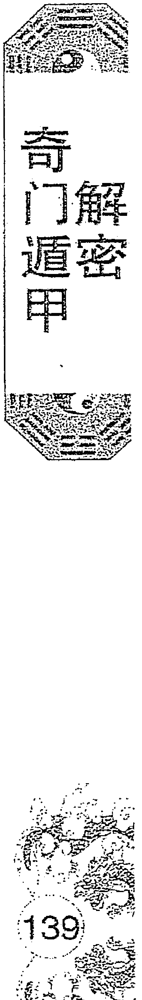

##### 奇门速断实例

1945年8月15日，日本帝国主义宣布无条件投降，举国上下为之欢呼，终于迎来了民族解放的伟大胜利。

然而，人们脸上喜悦的泪水还未擦干，内战的阴影就很快笼罩在中国大地上空，国民党蒋介石调兵遣将，阴谋袭击延安，破坏国内和平，挑起内战，一面又摆出和平姿态，一连给毛泽东发了三封电报，邀请毛泽东到重庆和平谈判。

8月28日，毛泽东启程去重庆，清早，人们向延安机场涌去，给毛泽东送行，10点多毛泽东乘飞机飞向重庆。

毛泽东重庆之行是吉是凶，且看奇门阴4局。

出行重庆为西南方，坤宫临开门 + 丁奇，吉门，与日干巳所在艮宫比和，应为顺利，艮宫与坤宫又相冲相克又反映国共两党有不可调和的矛盾。开门吉门，正反映蒋介石敞开大门欢迎毛泽东去谈判。

又日干时干巳同在艮宫比和，此行可去，乘飞机以九天为航线，在离宫生日干巳所在艮宫，又生重庆坤宫，此行顺利。

#### 三、孟良崮战役

以下资料来源中共党史出版社出版的《中国野战军秘闻》一书。

电影《红日》使孟良崮战役家喻户晓，也知道了国民党七十四师师长张灵甫。

1947年，国民党对我山东解放区实行重点进攻，5月11日晚，粟裕得到情报：汤思伯以张灵甫之七十四师为骨干，将发动一场进攻，矛头直指华野指挥部所在地坦埠，本来5月11日汤思伯对张灵甫曾有过劝阻，但张灵甫狂妄自大，求功心切，结果被解放军团团围住。

1947年5月12日早晨5点，七十四师师长，张灵甫率部由重山、艾山间渡过汶河，占领了黄鹿寨、佛山、三角山、马牧池等地。

张灵甫此次进攻解放军能否胜利呢？且看奇门阳七局所示。

1947年5月12日晨5点。

丁亥年甲辰月辛卯日辛卯时 0388局

0388局(5:00——7:00)

| 九天 天心 乙+丁 **生** 风遁 **巽** | 值符 天蓬 甲午辛+甲申庚 **伤** 白虎出力 **离** | 螣蛇 天任 甲戌己+甲辰壬丙 （丙禽） **杜** 地网四张 **蛇** |
| :--- | :--- | :--- |
| 九地 天柱 甲子戊+甲寅癸 **休** 青龙华盖 **震** | **阳七局** **甲申旬** **辛卯时** | 太阴 天冲 甲寅癸+甲子戊 **景** 天乙会合 **兑** |
| 玄武 芮（禽） 甲辰壬+甲戌己 （丙） **开** 凶蛇入墓 **艮** | 白虎 天英 甲申庚+甲午辛 **惊** 虎干格 **坎** | 六合 天辅 丁+乙 **死** 人遁吉格 **乾** |

测战争、攻城、以六庚为攻者，以天禽星为守者，六庚旺相克天禽落宫，其城必克，战必胜，守将可擒，反之，天禽星落宫克六庚落宫，攻城必败。

今张灵甫攻者，为庚落坎宫，临惊门凶门，上有凶神白虎不吉，天禽星为守者为解放区，落艮宫，临开门，克六庚所在坎宫，临开门也正反映陈毅、粟裕所率领的华野，故意打开大门，诱敌深入围歼七十四师的决心和计划。

4、六庚攻者，落坎宫受天禽庚宫之克，自然张灵甫必败，张灵甫被击毙，七十四师被全歼。

如果张灵甫向诸葛孔明一样会《奇门遁甲》，那么这场孟良崮战役就不会输得这么惨。

##### 奇门遁甲

#### 四、百万雄师过大江

1949年，国共和谈失败。4月中旬，解放军渡江工作准备就绪，只待命令一下，百万大军万船齐发。

1949年，4月20日，这是中国人民解放历史上一个极其重要的日子。

晚8时前，在北平香山的双清别墅，党中央、中央军委的最高领导人毛泽东、周恩来、朱德、刘少奇、任弼时等，个个目光中闪着兴奋的火花，两眼紧紧地盯着各自手中的怀表，在期盼着一个伟大时刻的到来。

与此同时，在合肥东南瑶岗村总前委的作战室里，在华中集团指挥官谭振林的司令部里，一双双眼睛都紧紧盯在闪闪发亮的秒针上，大家屏住呼吸，也在等着同样一个伟大时刻的降临。

当时针准时指向8点整时，谭震林憋足一口气，对着无线电话筒，雷霆万钧的下达命令：向江南进军。

伟大的渡江作战开始！

1949年4月20日晚8时择选这个时间渡江作战，能否打过长江，能否取得胜利呢？且看奇门阳五局所示。

己丑年戊辰月庚辰日丙戌时 0263局

0263局（19:00——21:00）

| 玄武 天心 甲戊己+乙 **死** 地户龙星 **巽** | 九地 天蓬 甲寅癸+甲辰壬 **惊** 复加腾蛇 **离** | 九天 天任 甲午辛+丁芮 (甲子戊禽) **开** 华盖停师 **坤** |
| :--- | :--- | :--- |
| 白虎 天柱 甲申庚+丙 **景** 白入荧 **震** | **阳五局** **甲申旬** **丙戊时** | 值符 天冲 丙+甲申庚 **休** 火入金乡 **兑** |
| 六合 芮(禽) 丁+甲午辛 (甲子戊) **杜** 朱雀入狱 **艮** | 太阴 天英 甲辰壬+甲寅癸 **伤** 幼女奸淫 **坎** | 螣蛇 天辅 乙+甲戊己 **生** 奇入墓 **乾** |

渡江作战，以庚为攻者，为解放军，与日干同落震宫。天禽为守者，为国民党军队，国民党欲以长江天险为防守，以保江南半壁江山。今天禽星落艮宫临杜门，杜门为阻塞，想阻止解放军过长江。

日干庚，同攻者庚同在震宫，时干丙也在震宫助庚之力，直克天禽所在艮宫，震宫中上有天柱破军之星，又有白虎凶猛之神，解放军横渡长江必定成功，渡江战役必定胜利，后果如奇门局势。

渡江战役发起后，千里江面上，频传捷报“我部突破安庆芜湖线，占领铜陵青阳”，我军进入无锡、苏州、常州、镇江。我解放军全力猛攻，势如破竹，敌人闻风丧胆，已经全线崩溃。

渡江战役胜利后，陈毅在南京总统府，坐在蒋介石坐过的总统办公桌后边的大椅子上，不禁诗兴大发，当即吟诗一首：

> 旌旗南指大江边，
不尽洪流涌上天，
直下金陵澄六合，
万方争颂换人间。

吟毕，陈毅要通了北平的电话，在总统府向毛主席报捷，毛泽东接完陈毅的电话，十分兴奋，情不自禁也吟诗一首：

钟山风雨起苍黄，百万雄师过大江。
虎踞龙盘今胜昔，天翻地覆慨而慷。
宜将胜勇追穷寇，不可沽名学霸王。
天若有情天亦老，人间正道是沧桑。

中国古人几千年前发明的奇门遁甲，把它运用到战争中并发挥的出神入化的只有诸葛亮。

那么1949年4月20日晚8时的渡江战役的时间是谁选择的呢？古有诸葛亮，今有毛泽东。

#### 五、林彪政变

据中央文献出版社《林彪反革命集团覆灭纪实》1971年林彪发动政变，当时毛泽东在杭州，当他察觉此事，紧急从杭州乘火车离开的时间是1971年9月10日下午3点35分。

林彪发现自己的阴谋暴露，匆忙乘飞机出逃的时间是1971年9月13日零时32分。

这两个时间，哪个吉哪个凶？让我们用奇门局来解析一下，看奇门遁甲所反映是否符合实际情况。

一、1971年9月10日下午3点35分
辛亥年丙申月戊戌日庚申时 1077局阴9局
1077局（15:00——17:00）

| 值符 天蓬 | 九天 天任 | 九地 天冲 |
| :--- | :--- | :--- |
| 乙+甲寅癸 **休** 风遁 **巽** | 甲戌己+甲子戊 **生** 犬遁青龙 **离** | 甲寅癸+丙 （甲辰壬） **伤** 星随月转 **坤** |
| 螣蛇 天心 | **阴九局** | 玄武 天辅 |
| 甲午辛+丁 **开** 狱神得奇 **震** | **甲寅旬** **庚申时** | 甲寅癸+甲申庚 **杜** 太白入网 **兑** |
| 太阴 天柱 | 六合 芮（禽） | 白虎 天英 |
| 甲申庚+甲戌己 **惊** 刑格 **艮** | 丙+乙 （甲辰壬） **死** 日月并行 **坎** | 甲子戊+甲午辛 **景** 龙折足 **乾** |

毛泽东到达杭州后，出新了一些新的令毛泽东惊讶的现象，8日晚，毛泽东得到消息说，杭州有人在装备飞机，还有人指责毛泽东的专列，停在杭州机场支线，妨碍他们走路，这种情况在“大树特树”毛泽东权威的年月里是不可想象的，也是从来没有的。

善于明察秋毫的毛泽东从一大堆疑团中迅速判断出林彪他们可能有不寻常的行动。

10日中午，毛泽东突然决定离开杭州，他对汪东兴说：“不要通知陈励耘他们。”

10日下午3点35分毛泽东的专列由杭州发出。毛泽东此行是吉是凶，是否安全，且看奇门阴9局。

辛亥年丙申月戊戌日庚申时，日干戊落乾宫，临景门，上遇白虎，景门为血光，白虎为刀光，此反映林彪准备布置要炸毛泽东专列以谋害毛泽东，如果毛泽东不赶快离杭州，必有血光之灾。

时干庚落艮宫生乾宫，转凶为吉，时庚临旬空，为林彪的阴谋计划落空。

时干庚又生毛泽东年命癸所在兑宫，伤门为车在坤宫，格局星随月转吉，说明乘火车安全。又生日干戊所在乾宫，和毛泽东年命癸所在兑宫，此行可转凶为吉，后毛泽东安全返回北京。

1971年9月13日，林彪的政变被毛泽东发现，13日零时，林彪等人乘坐的红旗来到了山海关机场，停在三叉飞机旁，林彪一行匆忙登上飞机，于13日零时32分强行起飞。

林彪此行是吉是凶，是否安全，且看奇门局阴3局。

辛亥年丙申月辛丑日巳丑时 0686局

0686局 (1:00——3:00)

| 巽宫 (翼) | 离宫 (离) | 坤宫 (坤) |
| :--- | :--- | :--- |
| 天盘: 玄武 天柱 地盘: 甲寅癸+乙 门: **惊** 华盖建星 | 天盘: 白虎 天心 地盘: 丁+甲午辛 门: **开** 龙逃走 | 天盘: 六合 天蓬 地盘: 甲申庚+甲戌己 (丙) 门: **休** 刑格 |
| 震宫 (震) | 中宫 | 兑宫 (兑) |
| 天盘: 九地 芮(禽) 地盘: 甲戊己+甲子戊 (丙) 门: **死** 犬遇青龙 | **局: 阴 三 局** **旬: 甲申旬** **时: 己 丑 时** | 天盘: 太阴 天任 地盘: 甲辰壬+甲寅癸 门: **生** 幼女奸淫 |
| 艮宫 (艮) | 坎宫 (坎) | 乾宫 (乾) |
| 天盘: 九天 天英 地盘: 甲午辛+甲辰壬 门: **景** 凶蛇入狱 | 天盘: 值符 天辅 地盘: 乙+甲申庚 门: **杜** 奇被刑 | 天盘: 螣蛇 天冲 地盘: 甲子戊+丁 门: **伤** 龙耀明 |

日干辛在艮宫临景门血光，上遇九天正反映林彪出行所乘飞机。

出行选吉时，林彪此次出行时间是吉是凶？

时干巳为所主之事，已在震宫，临死门。克日干辛所在艮宫，克九天所在艮宫。九天为飞机，岂能不被克下，林彪又岂能逃？

月干丙也在震宫，帮助时干巳增加克日干艮宫的力量，震宫中地盘甲子戊又是六仪刑击最为凶，又是死门大凶之门齐克日干艮宫，林彪又岂能逃。

癸为毛泽东年命在巽宫惊门，为震惊也克日干辛艮宫，林彪又岂能逃。

> 《林彪反革命集团覆灭纪实》一书中载，林彪乘飞机飞出国境后，于13日凌晨2时许，在蒙古人民共和国的温都尔汗草原坠毁，林彪、林立果和叶群等机上9人全部摔死。

林彪飞机从起飞到2时许坠毁，时间还没有过巳丑时。

#### 六、毛泽东奇门命局解析

毛泽东1893年12月26日辰时

癸巳年甲子月丁酉日甲辰时 0041局

0041局(7:00——9:00)

| 九地 天辅 甲午辛+甲午辛 **杜** 伏吟天庭 **巽** | 九天 天英 乙+乙 **景** 奇伏吟 **离** | 值符 芮(禽) 甲辰壬+甲戌己 (甲辰壬) **死** 凶蛇入墓 **坤** |
| :--- | :--- | :--- |
| 玄武 天冲 甲申庚+甲申庚 **伤** 战格 **震** | **阳 一 局** **甲 辰 旬** **甲 辰 时** | 螣蛇 天柱 丁+丁 **惊** 奇入太阴 **兑** |
| 白虎 天任 丙+丙 **生** 奇倚师 **艮** | 六合 天蓬 甲子戊+甲子戊 **休** 符伏吟 **坎** | 太阴 天心 甲寅癸+甲寅癸 **开** 天网四张 **乾** |

1. 日干丁落兑宫，丁+丁，丁为玉女。兑又为女，此正反映毛泽东男人女相的说法。丁奇到兑宫。为星见西方，天之神位，是贵人升于丁酉正殿，此正反映毛泽东的帝王之命。
2. 姻婚，乙为妻在离宫，乙+乙必两次姻婚、正反映毛泽东之姻婚不好。乙+乙在离宫，临景门为血光，此正反映毛泽东的两个妻子杨开慧、贺子珍为命革流血牺牲。

我失骄杨君失柳，

杨柳轻飏直上重霄九。
问讯吴刚何所有，
吴刚捧出桂花酒。
寂寞嫦娥舒广袖，
万里长空且为忠魂舞。
忽报人间曾伏虎，
泪飞顿作倾盆雨。

3. 生门为房屋在艮宫，艮为山，生门在艮宫，上乘天任吉星，又有三奇之丙奇，房屋风水很好。生门艮宫，生日干丁所在兑宫，毛泽东运势得阳宅风水之助。月干甲子戊为兄弟姐妹，在坎宫，生门在艮宫，克月干甲子戊所在坎宫，毛泽东其他兄弟不得阳宅风水之助。也没有毛泽东运气好，毛泽东家在韶山，艮宫生门临坎宫为水，毛泽东家房前有池塘。

> 独立寒秋，
湘江北去，
橘子洲头。
看万山红遍，
层林尽染；
漫江碧透，
百舸争流。

诗中尽显毛家风水的秀美。

4. 死门为祖坟在坤宫，上乘值符，又天地盘相生，祖坟风水好，这一点也符合有关毛泽东祖坟风水的传说，死门坤宫生日干丁所在兑宫，毛泽东运势得祖坟风水的阴护。死门坤宫克月干甲子所在坎宫，说明毛泽东的其他兄弟也不得阴宅风水之助，没有毛泽东运气好。

5. 毛泽东一生经过二次大的战争，抗日战争、解放战争，毛泽东本人是个伟大的军事家，庚+庚在震宫格局战格又临伤门，伤门在为破坏，正反映有经历这两次战争，毛泽东能否打赢二次战争呢？日干丁为毛泽东在兑宫，克庚+庚为战争所在震宫，毛泽东必胜无疑。

> 钟山风雨起苍黄，

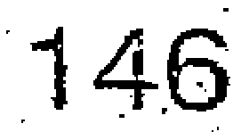The request was rejected because it was considered high risk## 奇门速断实例

| 太阴 天辅 甲申庚+甲申庚 杜 战格 巽 | 螣蛇 天英 丁+丁 景奇入太阴 离 | 值符 天英 甲辰壬+甲辰壬 （甲戌己） 死蛇入地罗 坤 |
| :--- | :--- | :--- |
| 六合 天冲 甲午辛+甲午辛 伤伏吟天庭 震 | 阴六局 甲戌旬 甲戌时 | 九天 天柱 乙+乙 惊 奇伏吟 兑 |
| 白虎 天任 丙+丙 生 奇将师 艮 | 玄武 天蓬 甲寅癸+甲寅癸 休天网四张 坎 | 九地 天芮 甲子戊+甲子戊 开 符伏吟 乾 |

当期排列3奖号，2、6、5。

用奇门遁甲预测彩票排列3，中1000元。

见中奖彩票。

2006年10月2日彩票复印见：

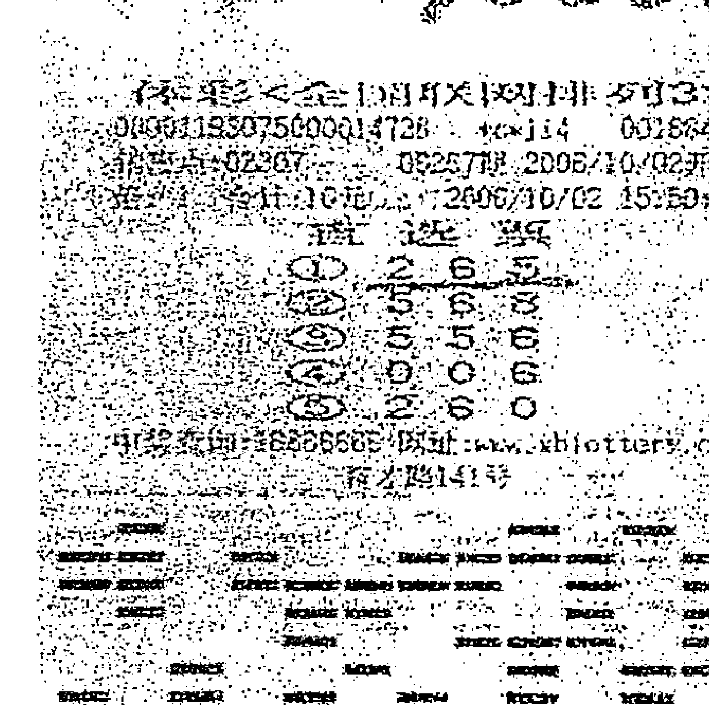

（二）2006年10月3日

丙戌年丁酉月乙丑日丙戌时 0863局

0863局（19:00——21:00）

| 值符 丙（禽） | 九天 天柱 | 九地 天心 |
| :--- | :--- | :--- |
| 甲辰壬+甲申庚 | 乙+丁 | 甲子戊+甲辰壬 |
| (甲戌己) | (甲戌己) | (甲戌己) |
| 生太白蛇蛇巽 | 伤奇仪相佐离 | 杜龙入天牢坤 |
| 螣蛇 天英 | 阴六局 | 玄武 天蓬 |
| 丁+甲午辛 | 甲申旬 | 甲寅癸+乙 |
| 休朱雀入狱震 | 丙戌时 | 景华盖逢星兑 |
| 太阴 天辅 | 六合 天冲 | 白虎 天任 |
| 甲申庚+丙 | 甲午辛+甲寅癸 | 丙+甲子戊 |
| 开白入荧辰 | 惊天牢华盖坎 | 死鸟跌穴乾 |

当期排列3奖号，6、3、8。

用奇门遁甲预测彩票排列3，买复式，中1000元。

见中奖彩票。

2006年10月3日彩票复见：

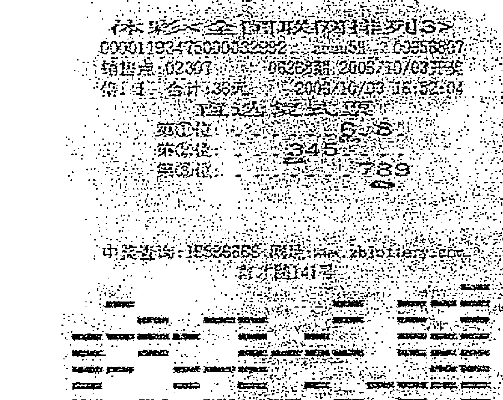

##### （三）2006年10月17日

丙戌年丁酉月巳卯日甲戌时 0791局

0791局(19:00——21:00)

#### 奇门遁甲预测彩票

##### 奇门速断实例

| 值符 天辅 甲戌己+甲戌己 杜 地户连鬼 巽 | 九天 天英 甲寅癸+甲寅癸 景 天网四张 离 | 九地 芮(禽) 甲午辛+甲午辛 (甲子戊+甲子戊) 死 伏吟天庭 坤 |
| :--- | :--- | :--- |
| 螣蛇 天冲 甲申庚+甲申庚 伤 战格 震 | 阴五局 甲戌旬 甲戌时 | 玄武 天柱 丙+丙 惊 奇悻师 兑 |
| 太阴 天任 丁+丁 生 奇入太阴 艮 | 六合 天蓬 甲辰壬+甲辰壬 休 蛇入地罗 坎 | 白虎 天心 乙+乙 开 奇伏吟 乾 |

当期排列3奖号，4、3、3。

用奇门遁甲预测彩票排列3，买复式，中320元。

见中奖彩票。

2006年10月17日彩票复印见：

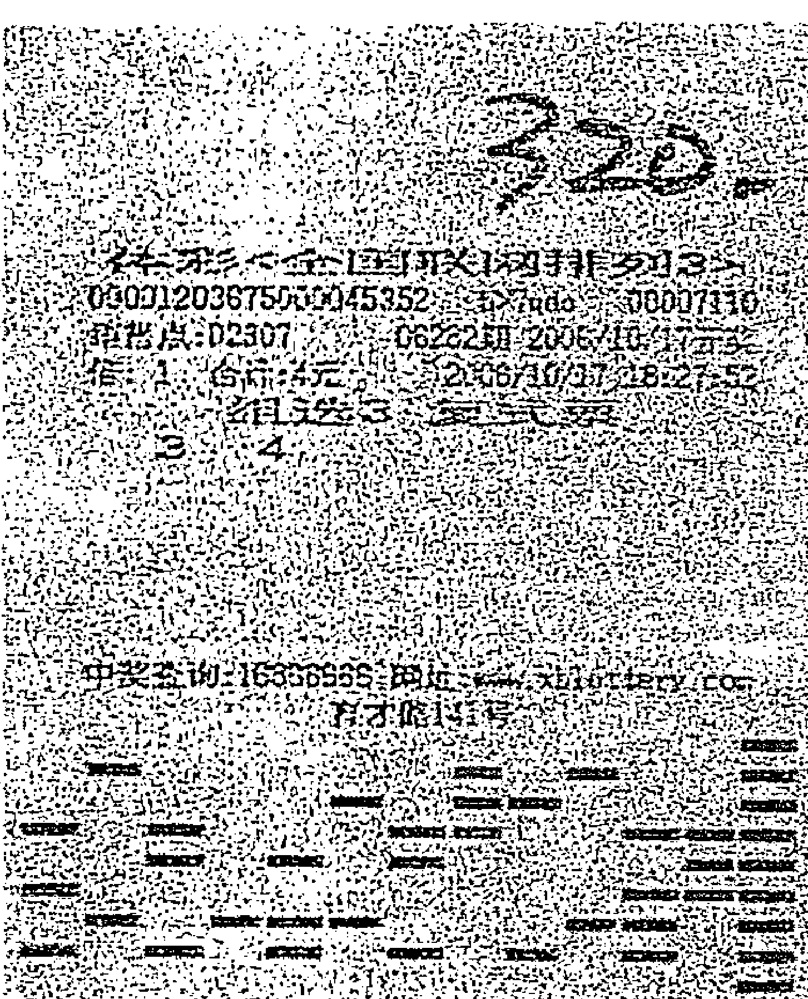

（四）2006年10月22日

丙戌年己亥月甲申日甲戌时 0971局

0971局(19:00——21:00)

| 六合 天辅 | 太阴 天辅 | 螣蛇 芮(禽) |
| :--- | :--- | :--- |
| 甲辰壬+甲辰壬 | 乙+乙 | 丁+丁 |
| 杜 蛇入地罗 巽 | 景 奇伏吟 离 | 死 奇入太阴 坤 |
| 白虎 天冲 | 阴八局 | 值符 天柱 |
| 甲辰癸+甲辰癸 | 甲戌旬 | 甲戌己+甲戌己 |
| 伤 天网四张 震 | 甲戌时 | 惊 地户逢鬼 兑 |
| 玄武 天任 | 九地 天蓬 | 九天 天心 |
| 甲子戊+甲子戊 | 丙+丙 | 甲申庚+甲申庚 |
| 生 符伏吟 艮 | 休 奇停师 坎 | 开 战格 乾 |

当期排列3奖号，4、4、7。

用奇门遁甲预测彩票排列3，单选中1000元。

见中奖彩票。

2006年10月22日彩票复印见：

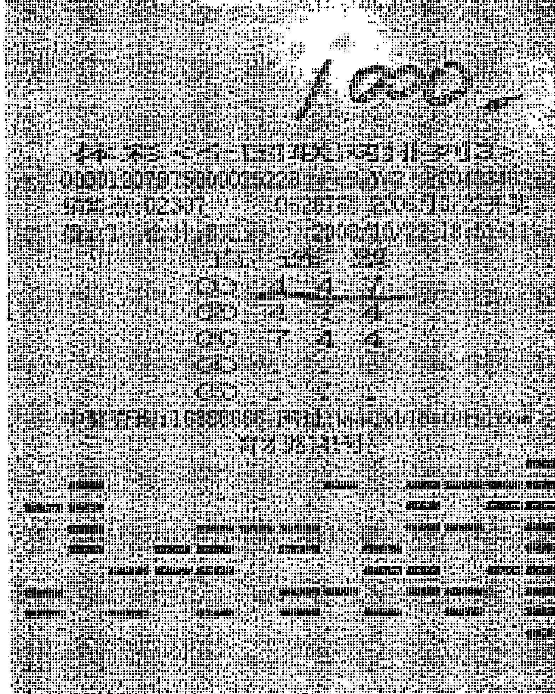

##### （五）2006年10月23日

丙戌年戊戌月乙酉日丙戌时 0983局

0983局(19:00——21:00)

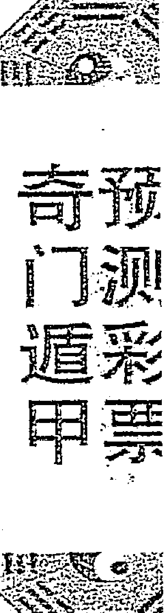

| 白虎 天冲 | 六合 天辅 | 太阴 天英 |
| :--- | :--- | :--- |
| 甲寅癸+甲辰壬 | 甲辰壬+乙 | 乙+丁 (甲午辛) |
| 开复加腾蛇 巽 | 休小蛇日奇 离 | 生 云遁 坤 |
| 玄武 天任 | 阴八局 甲申旬 丙戌时 | 螣蛇 丙(禽) |
| 甲子戊+甲寅癸 | | 丁+甲戊己 (甲午辛) |
| 惊龙华盖 震 | | 伤火入勾陈 兑 |
| 九地 天蓬 | 九天 天心 | 值符 天柱 |
| 丙+甲子戊 | 甲申庚+丙 | 甲戊己+甲申庚 |
| 死 鸟跌穴 艮 | 景 自入荧 坎 | 杜利格反名 乾 |

当期排列3奖号，1、4、5。

用奇门遁甲预测彩票排列3，中1000元。

见中奖彩票。

2006年10月23日彩票复印见：

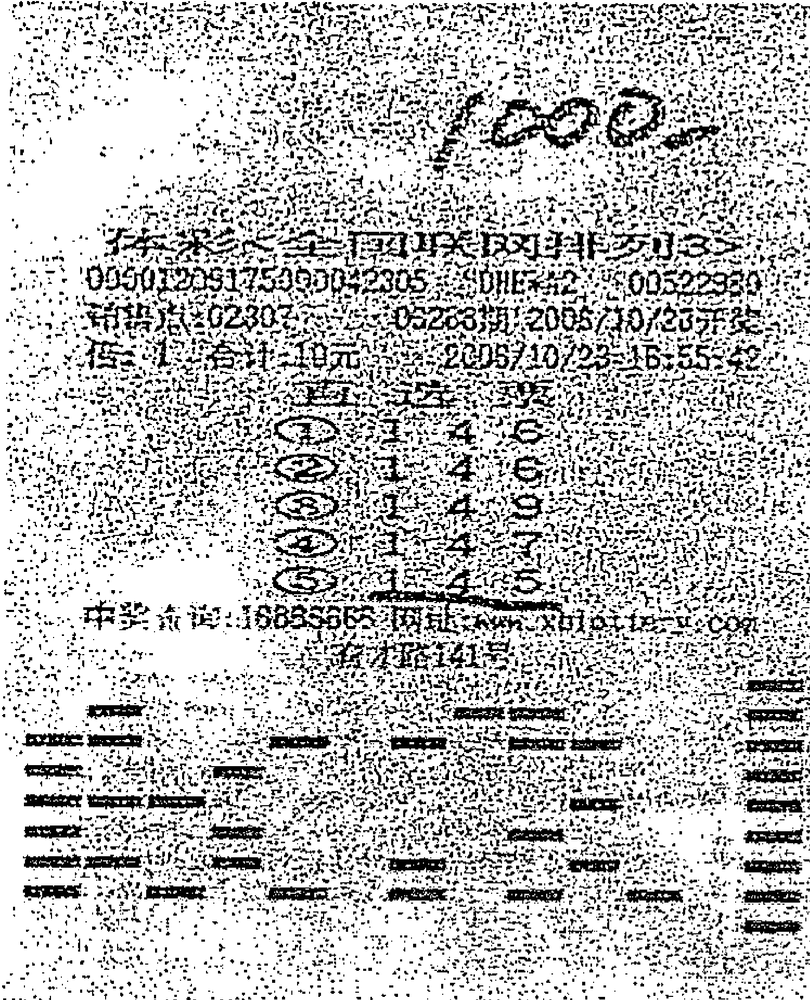

（六）2006年10月27日

丙戌年戊戌月巳日甲戌时 0611局

0611局(19:00——21:00)

| 玄武 天辅 丙+丙 杜 奇门师 巽 | 白虎 天英 甲申庚+甲申庚 景 战格 离 | 六合 芮(禽) 甲子戊+甲子戊 (丁+丁) 死 符伏吟 坤 |
| :--- | :--- | :--- |
| 九地 天冲 乙+乙 伤 奇伏吟 震 | 阴二局 甲戌旬 甲戌时 | 太阴 天柱 甲辰壬+甲辰壬 惊蛇入地罗 兑 |
| 九天 天任 甲午辛+甲午辛 生 虎返 艮 | 值符 天芮 甲戌己+甲戌己 休地户逢鬼 坎 | 螣蛇 天心 甲寅癸+甲寅癸 开天网四张 乾 |

当期排列3奖号，3、3、8。

用奇门遁甲预测彩票排列3，买复式中420元。

见中奖彩票。

2006年10月27日彩票复印见：

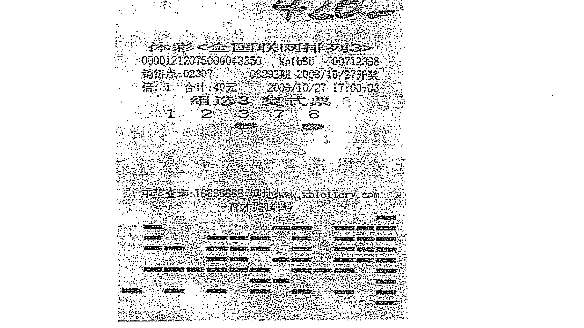

### 十四、奇门遁甲预测彩票是一个完整的科学体系

奇门预测彩票，是本人发明的《奇门遁甲》和周易八卦、风水理论完美相结合的一套完整的科学体系。

用奇门遁甲预测彩票，逢甲乙丙丁戊日买彩票，很容易预测。33选7，30选7，21选5，一、二个月就会出现一次一等奖的号码。选12个号或10个号出7个号，很容易中大奖。每当奇门局逢“遁”——人遁、龙遁、云遁、鬼遁等，必出连号。

但2003年5月20日陕西彩票33选7、21选5、22选5由原先的7点前开奖，改到现如今的8点左右开奖，奇门预测彩票就不是很容易。自2003年5月20日开奖时间改为7点以后，我很少中奖。以前奇门局逢甲最易出号，而现在7点至9点奇门局逢甲巳日多为伏吟局。经过二年多研究，伏吟局的问题已经基本解决。

2003年5月20日以前常出奖号而无钱购买。2003年5月20日以后，我开花店，每天可以花10元钱购彩票，而开奖改了时间，很难中奖。这真是命。如果2003年5月20日以前我每天能花10元钱，不知中了多少奖。

现在如果有钱，就会到全国各省市去找7点以前或9点以后开奖的彩票品种去预测购买。听说广州、杭州就有下午6:30开奖的彩票。我用《奇门遁甲》预测彩票时，当时也只是用奇门局预测彩票，不会用奇门遁甲来测事。所以只要有八卦基础知识的人，手里再有一本刘广斌先生写的《奇门遁甲预测学》一书，你就会预测全国各地彩票，包括香港六合彩。

欲学奇门预测彩票的秘法，可电话联系。

奇门预测彩票用日干、时干落宫只能预测9个号码以内的彩票，如3D、排列3。但对于33选7、36选7、30选7、22选5则完全不行。本人发明的奇门预测彩票的方法是一个完整的科学体系，它是专门用来预测33选7、36选7、30选7、22选5的，比预测3D、排3更容易，更准确神奇。

网址：www.qimendunjia.cn
中国奇门遁甲彩票研究中心
中心地址：陕西省西安市灞桥区粮食局五楼
通讯地址：陕西省西安市灞桥区粮食局家属院
联系电话：029-81922602      邮政编码：710038
联系人：秦小烽                户    名：秦晓峰

### 十五、奇门预测彩票答读者

自上本《奇门实例详解》红皮书出版以来，接到全国各省市来信或来电话咨询。有些人让为其预测当地彩票，还有人让试验测一下彩票号码。如果一次不准，他就认为不行。关于这一点，我要说明：彩票预测，不是每次都准。如果每天每次都准确，学费就不是一万多，而是十万至五十万。就是在2003年5月以前，陕西有每天7点前开奖的彩票的时候，那时我没有收入。如果我当时有五万元，我五十万也不会传授《奇门预测彩票》的方法。也正是现在陕西没有7点钟前开奖的彩票，所以我才将此方法传授于人。过去，也就是2003年5月前，经常出号，一到二个月出一二次一等奖的号，那也不是每天出奖号。要知道一等奖金一般都是百万以上。

关于有读者问奇门能否预测彩票，想学习但还有疑问，还有的认为学费太贵。《奇门预测彩票实证》一章中的证据，有些读者看了，还要问能否预测彩票这个问题。这就象平时给别人预测事情一样，明明给他预测准了，他还要说，八卦真能预测这么准吗？我问他：我刚才给你测的对不对？他说：全对，但你那是迷信，是察颜观色，不是科学。我想这样的事情读者易友们都会遇到过吧。

用六爻预测股票，其实很简单，尤其是大涨大跌最准确。我以前在《证券时报》上登广告，办《周易八卦预测股票学习班》，将每次大跌前买出的交割单，单上有证券公司的印章也印在报纸上。就这样还是有很多人问，八卦能预测股票吗？真能那么神吗？

有贵州一个读者，通过函授及电话学会我教给他的《奇门预测彩票》的方法，他来电话说：已经多次中奖，尤其在预测3D和排列3上，将我教给他的方法有所创新，可以说在预测3D上创新以后超过了我。尤其是陕西学员王震更是创下了用奇门遁甲预测彩票排列3一月内中6次头奖的纪录。我一般不做3D和排列3，因为3D和排列3比双色球等其他30选几的彩票奖金小，但投资大。

有浙江读者来我这里学习，学会奇门预测彩票后回去，来电话说：他们当地彩票晚上6点多开奖，并多次预测出当地省的彩票号码，有几次预测出全国29选7和双色球的号码。他来电话激动的说：已经中了几次小奖，一次中等奖，大奖大有希望。

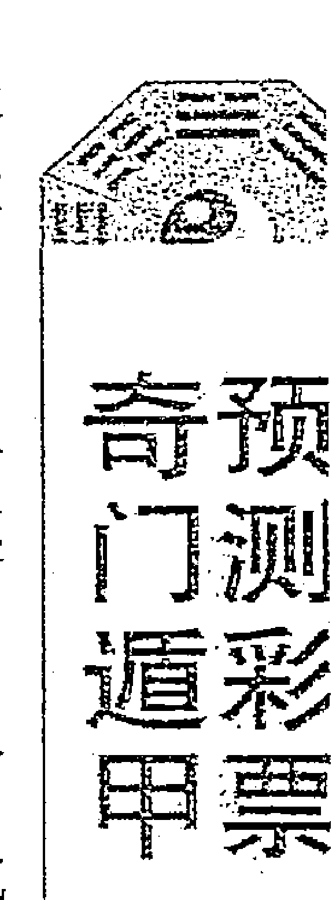

任何知识都不是死的，只要你灵活运用，就能把握。

#### 2007年11月奇门测彩票连中四天

2007年11月16日预测号 4488990

11月16日出奖号 3D 784，排列3 053。我站所买彩票中奖。

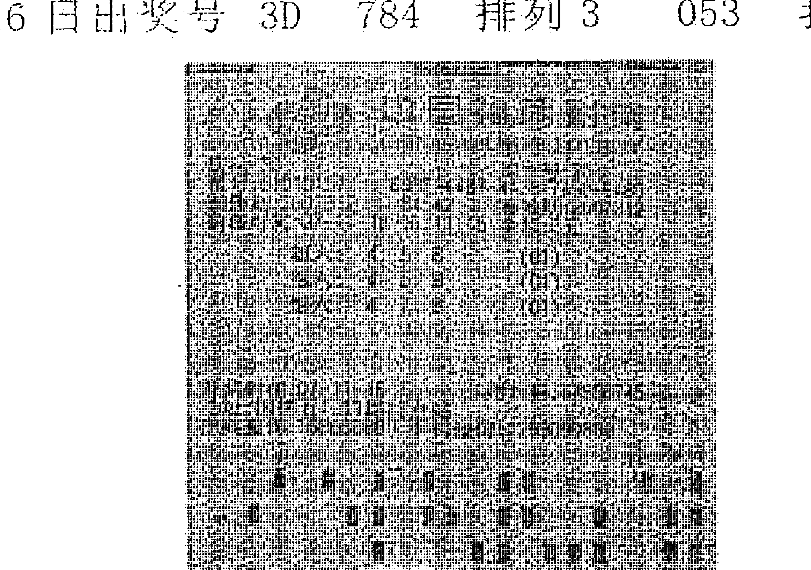

2007年11月17日预测号 1692

11月17日出奖号 3D 196，排列3 053

我站预测号码169出在3D 196。我站所买彩票有中奖。

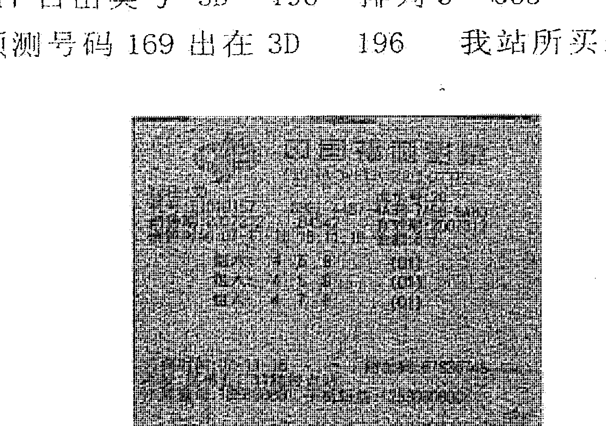

##### 奇门速断实例

2007年11月18日预测号 3986

11月18日出奖号 3D 343，排列3 174

我站所买号码差一个号

| 行号 | 数据 | 备注 |
| :--- | :--- | :--- |
| 1 | 5 2 9 3 8 6 3 9 8 6 | [0] |
| 2 | 6 4 5 0 1 6 2 1 4 9 | [0] |
| 3 | 7 4 5 4 6 6 7 6 4 8 | [0] |
| 4 | 8 3 2 6 7 6 2 5 7 9 | [0] |
| 5 | 9 5 7 4 5 2 1 4 0 9 | [0] |
| 6 | 10 0 0 5 7 3 7 0 5 9 | [0] |
| 7 | 11 6 5 7 0 9 1 1 0 0 | [0] |
| 8 | 12 7 8 5 4 5 9 1 2 3 | [0] |

2007年11月19日 七彩乐 --30选7

出奖号 2, 5, 9, 10, 16, 17, 24, 27

买七彩乐 --30选7，我站买10注中5注，见彩票。

| 行号 | 数据 | 备注 |
| :--- | :--- | :--- |
| 1 | 3 5 9 12 14 16 25 30 | [0] |
| 2 | 3 5 7 12 14 19 25 30 | [0] |
| 3 | 4 8 12 13 16 24 30 | [0] |
| 4 | 5 7 9 12 18 22 24 30 | [0] |
| 5 | 1 3 8 14 15 21 24 27 | [0] |
| 6 | 1 3 8 12 18 24 27 | [0] |
| 7 | 1 3 6 11 18 21 27 | [0] |
| 8 | 1 3 6 12 14 21 27 | [0] |

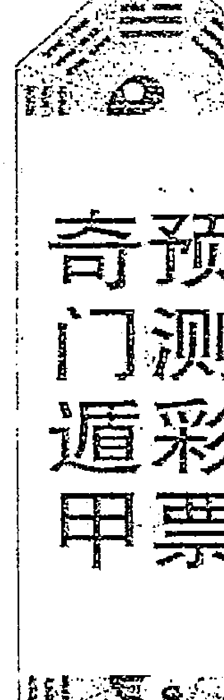

#### 2007年11月21日 七彩乐 30选7

出奖号 1, 13, 14, 17, 21, 22, 25, 27。

我站所买5注中两注，见彩票。

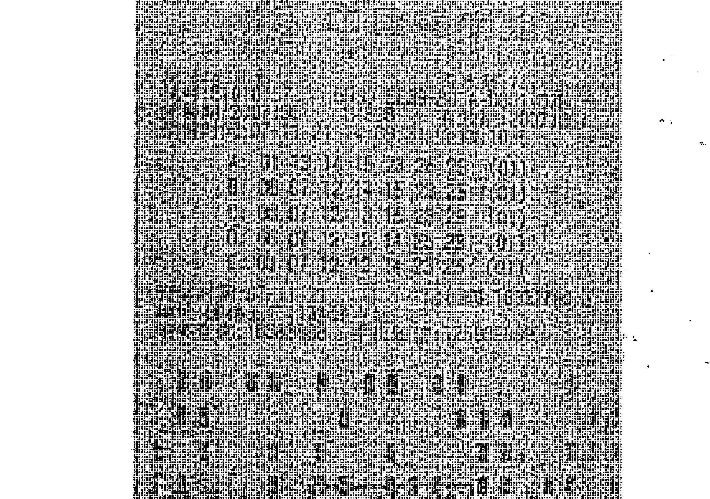

#### 奇门预测显神奇 07年12月初连续中奖

07年11月30日 七彩乐 -30选7

出奖号 1, 7, 8, 12, 19, 20, 23, 28

我站以奇门预测彩票，买5注中1注，见彩票。

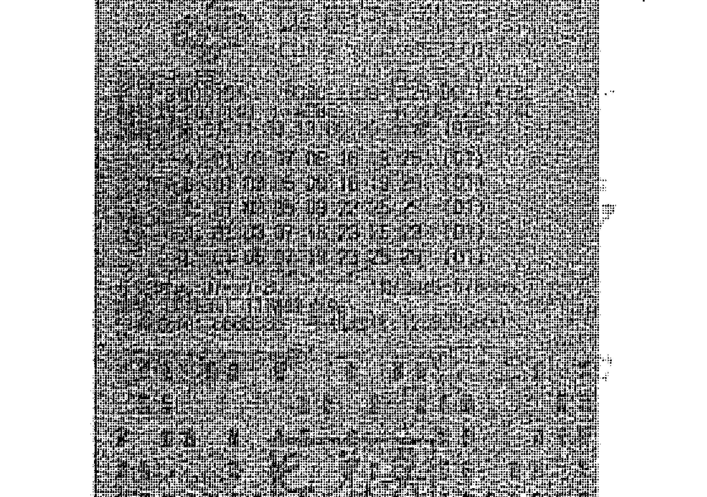

##### 奇门速断实例

##### 12月1日 全国联网29选7

出奖号 2, 3, 7, 12, 14, 17, 21, 28

我站以奇门预测彩票，买5注又中1注小奖，见彩票。

| 第一行 | 01 | 02 | 03 | 04 | 05 | 06 | 07 | 08 | 09 | 10 | 11 | 12 | 13 | 14 | 15 | 16 | 17 | 18 | 19 | 20 | 21 | 22 | 23 | 24 | 25 | 26 | 27 | 28 | 29 |
| :--- | :--- | :--- | :--- | :--- | :--- | :--- | :--- | :--- | :--- | :--- | :--- | :--- | :--- | :--- | :--- | :--- | :--- | :--- | :--- | :--- | :--- | :--- | :--- | :--- | :--- | :--- | :--- | :--- | :--- |
| 第二行 | 01 | 02 | 03 | 04 | 05 | 06 | 07 | 08 | 09 | 10 | 11 | 12 | 13 | 14 | 15 | 16 | 17 | 18 | 19 | 20 | 21 | 22 | 23 | 24 | 25 | 26 | 27 | 28 | 29 |
| 第三行 | 01 | 02 | 03 | 04 | 05 | 06 | 07 | 08 | 09 | 10 | 11 | 12 | 13 | 14 | 15 | 16 | 17 | 18 | 19 | 20 | 21 | 22 | 23 | 24 | 25 | 26 | 27 | 28 | 29 |
| 第四行 | 01 | 02 | 03 | 04 | 05 | 06 | 07 | 08 | 09 | 10 | 11 | 12 | 13 | 14 | 15 | 16 | 17 | 18 | 19 | 20 | 21 | 22 | 23 | 24 | 25 | 26 | 27 | 28 | 29 |
| 第五行 | 01 | 02 | 03 | 04 | 05 | 06 | 07 | 08 | 09 | 10 | 11 | 12 | 13 | 14 | 15 | 16 | 17 | 18 | 19 | 20 | 21 | 22 | 23 | 24 | 25 | 26 | 27 | 28 | 29 |

##### 12月3日 全国联网29选7

出奖号 1, 3, 8, 11, 22, 26, 28

我站以奇门预测彩票，买5注中2注小奖，见彩票。

| 全国联网29选7 | 01 | 02 | 03 | 04 | 05 | 06 | 07 | 08 | 09 | 10 | 11 | 12 | 13 | 14 | 15 | 16 | 17 | 18 | 19 | 20 | 21 | 22 | 23 | 24 | 25 | 26 | 27 | 28 | 29 |
| :--- | :--- | :--- | :--- | :--- | :--- | :--- | :--- | :--- | :--- | :--- | :--- | :--- | :--- | :--- | :--- | :--- | :--- | :--- | :--- | :--- | :--- | :--- | :--- | :--- | :--- | :--- | :--- | :--- | :--- |
| | 01 | 02 | 03 | 04 | 05 | 06 | 07 | 08 | 09 | 10 | 11 | 12 | 13 | 14 | 15 | 16 | 17 | 18 | 19 | 20 | 21 | 22 | 23 | 24 | 25 | 26 | 27 | 28 | 29 |
| | 01 | 02 | 03 | 04 | 05 | 06 | 07 | 08 | 09 | 10 | 11 | 12 | 13 | 14 | 15 | 16 | 17 | 18 | 19 | 20 | 21 | 22 | 23 | 24 | 25 | 26 | 27 | 28 | 29 |
| | 01 | 02 | 03 | 04 | 05 | 06 | 07 | 08 | 09 | 10 | 11 | 12 | 13 | 14 | 15 | 16 | 17 | 18 | 19 | 20 | 21 | 22 | 23 | 24 | 25 | 26 | 27 | 28 | 29 |
| | 01 | 02 | 03 | 04 | 05 | 06 | 07 | 08 | 09 | 10 | 11 | 12 | 13 | 14 | 15 | 16 | 17 | 18 | 19 | 20 | 21 | 22 | 23 | 24 | 25 | 26 | 27 | 28 | 29 |
| | 01 | 02 | 03 | 04 | 05 | 06 | 07 | 08 | 09 | 10 | 11 | 12 | 13 | 14 | 15 | 16 | 17 | 18 | 19 | 20 | 21 | 22 | 23 | 24 | 25 | 26 | 27 | 28 | 29 |# 12月5日 7彩乐 30选7

出奖号 1,4,6,8,14,16,20,25

我站以奇门预测彩票，预测出7个号，买中6个号，

我站买10注，中8注，其中2注6个号，见彩票

##### 奇门速断实例

12月5日 排列3 出奖号153 3D 535
我站以奇门预测彩票
所买的号码3,5同时出在3D排列3上，
只是都差一个号，见彩票

##### 奇门遁甲
预测彩票

##### 奇门遁甲实例

2007年12月7日 7彩乐 30选7
出奖号 5,10,15,16,17,18,21,27
我站买5注中1注,见彩票

12月7日 3D 出奖号284
我站只买一注,差一个号,

##### 2007年12月7日 7彩乐 30选7

出奖号 5,10,15,16,17,18,21,27

我站买5注中1注,见彩票

##### 12月7日 3D 出奖号 284

我站只买一注,差一个号

> 奇门遁甲
预测彩票

##### 08年5月 15日奇门预测29选7中3等奖

戊子年丁巳月乙卯日丙戌时 0013局

5月15日29选7出奖号
5.6.7.12.14.16.24.27

5月15日日干乙是云遁，奇门局逢遁容易出连号，我买三连号5.6.7和13.14.15。结果中5.6.7。

共买10注彩票中7注，其中一注6个号3等奖，这天奇门局显示8个号，我只买中6个号 三等奖

5月15日这天同时买3D出奖号 931
买3D一注差一个号 见彩票

## 第七章 周易八卦预测股票实例

一 股市风云变幻，八卦神机妙算

凡是 96 年进入股市的人，都经历过股市的大涨及 96 年 12 月 16 日股市因《人民日报》社论而暴跌，和 1997 年 2 月 20 日邓小平去世而引起的股市暴跌而后又大涨的经历，我正是经历了 96 年 12 月 16 日的暴跌后才研究出来用周易预测股票的。

1997 年 2 月 20 日 邓小平逝世

早 7 点半打开电视机，播一代伟人的邓小平先生逝世的消息，他的逝世是中国最大的损失，英灵长存！！！

邓小平的去世，今日股市必大跌停板！摇卦时手在发抖，心想不用算卦也是跌。摇出火天大有，归魂卦，但卦中显示，股市不跌，可能吗？又起一天火同人卦，又是一归魂卦，又显示不跌，股市不跌应涨。到证券交易所，未开盘大家都排队准备卖出股票，我因从卦中知股市不跌，没有准备卖出股票，而且还买进 900 股琼金盘。果然，开盘股市全部跌停板，而不到 20 分钟后，股指从跌停板向上狂涨，可见八卦之准，人们也从抢着卖出转眼变成抢着买进股票。

这天的股市真是是：股市风云变幻，又岂逃八卦神机妙算，由此可见中华易经八卦之神奇，可见中华始祖发明易经之伟大！

1997 年 2 月 20 日股票见股票交割单为证：

| 日期       | 预测涨跌 | 实际涨跌 | 备注               |
|------------|----------|----------|--------------------|
| 2007年5月28日 | 跌       | 跌       |                    |
| 2007年5月29日 | 跌       | 跌       |                    |
| 2007年5月30日 | 跌       | 暴跌     | 印花税上调，大跌   |
| 2007年5月31日 | 跌       | 跌       |                    |
| 2007年6月1日  | 跌       | 跌       |                    |

### 二 07 年著名的 5.30 暴跌

2007 年 5 月 30 日八卦预测

股票大跌，卖出

今天的大跌，我在星期一已经预测出，但今年的股票涨的人已经麻木，也是人性的弱点，不可避免，星期一八卦预测要跌，但当天并没有跌，自己就没有按八卦预测的去操作的卖出，到30日上调印花税，回看星期一的卦，一轮大跌就要开始，赶快做空卖出吧，做空也一样挣钱。果然，股票大跌几天。做空也很爽啊，中国的周易八卦万岁

奇门速断实例

### 三 07 年著名的 6.22 暴跌

2007 年 6 月 21 日八卦预测大跌
卖出 22 日 25 日暴跌 500 点
6 月 21 日八卦预测大跌我卖出, 6 月 22 日大跌
6 月 25 日星期一 我卖出的股票又是一个跌停板, 跌幅居前几位, 深圳大盘大跌 500 点
做空也很爽, 很爽
八卦预测又显神奇

### 四 2007 年 7 月 20 号八卦预测股票大涨,买入

7 月 20 号八卦预测股市大涨, 买进华纺股份, 大盘大涨 400 多点, 星期六报上登出减息的消息, 原来是利空出尽, 称为利好。机构和庄家提前知道此消息, 所以星期五股市大涨。但股民不知道, 但是八卦提前预测出来股市大涨。我所买的华纺股份大涨两天, 见股票交割单。

##### 奇门速断实例

### 五 2008年2月2日八卦愤起金箍棒 喜看股市大暴跌

最近一个月，股市在5000点上下波动，股评家们又说，股市要涨到6千点，我几次想买进，但用八卦预测，要大跌，又看现在的股票，都是50元，100元，200元，老百姓谁能买的起股票，现在好了，股市终于大跌了，让股市下跌的行情，跌的更深，让股市暴跌的行情，来的更猛烈些吧，让股票再跌的更便宜些吧。中国八卦万岁

### 六 奥运会 我终于盼到了股市的暴跌

### 逢888不一定发 做空肯定发

自7月11日将股票卖出后，本想等一个好的下跌行情，但是，股市并没有跌，而且《人民日报》还发了稳定股市的社论，难道八卦错了吗，不会的，我坚决不买入，我几次想买入，但用周易预测都显示要跌，但7月11日后的股市，今天涨一点，明天跌一点，一直到8月7日，股市跌40多点收盘又涨回来，我遇到一个老股民问他8月7日股市涨了没有，我最担心的就是股市涨，他高兴地说今天跌40点又涨回来了，我说今天跌的好好的怎么有涨上来了，很危险。他又高兴地说股市跌不动了，我说不可能你看明天吧。

2008年8月8日,上午股市小跌,到下午收盘,成功下跌100多点。我终于等到了一轮下跌行情。

再论2008年8月8日,是好日子吗? 庚辰日 奥运会召开,这天只有晚七时到九时是好时间,是吉时。日干庚和时干丙同在巽宫,临生门大吉之门,时干丙在震宫临休门,也是大吉之门。而8月8日晚7时以前,没有吉时。

可笑的是, 很多人, 认为2008年8月8日又是阴历8月8日,8多必发,8月8日人们将结婚日,开业都定在8月8日,还有一个北京的女士在7月中旬给我打电话,说是她8月8日生小孩,我当时断她是男孩,她说是男孩。让我给选个时间,我当时给她说8月8日非吉日。她自然不会听。

还有很多人选8月8日结婚,8月8日结婚的以后婚姻肯定不顺。

8月8日, 很多店家上午开业, 开店投资为赢利,8月8就能发吗?8月8日投资买股票必定赔钱,股市暴跌了,那么对开店的能是吉日吗? 8月8日开店的, 生意肯定不好,

8月8对股市多头是凶日,我们做空的人才是个大好吉日。

### 上次预测回顾———

七 八卦预测要跌 股市成功下跌《人民日报》社论也无用

7月11日 上星期五,

这个星期,我所买的股票600074股票从星期一涨到星期四,星期五,心想可能还会涨,但是,用八卦预测要跌,于是坚决按低于当时的价格低填卖出,结果,收盘果然成功下3% 下星期一也希望继续大跌,最好暴跌

奇门速断实例

7 月 14 日这个星期一，本想有一个大跌的好行情但股市没有跌，反涨 20 多点，而且《人民日报》还发了稳定股市的社论，难道八卦错了吗，不会的，我坚决不买入，我上星期卖出的股票 600074 星期一收盘涨一分。

7 月 15 日星期二，股市成功下跌，下跌行情还可以，我所卖出的股票成功下跌 3%

### 八 华山论剑 还看中国功夫周易预测

-   --11 月 20 日后会有大涨行情

> —— 全球危机与中国资本市场高峰论坛

### 2008年华山论剑 全球金融危机与中国资本市场高峰论坛

> 预测彩票奇门遁甲

全球金融危机，风运滚滚，危机起伏，古城西安高手云集。2008年11月2日，万众瞩目的《2008年华山论剑.全球金融危机与中国资本市场高峰论坛》在西安举行。

### 中国周易预测股票第一人  中国奇门遁甲预测彩票第一人

中国奇门遁甲预测彩票研究中心网站站长——秦小锋也应邀前去参加,对于这次金融危机提出与所有专家不同的观点做出了以下预测

中国股市上个星期成功跌破1800点,中国股市经过2008年--一年多火爆的下跌行情,从6000跌到1800时遇到了世界性的金融危机,这是中国股市的万幸.是中国股民的万幸,如果股市在6000点遇到金融危机,那才是最可怕的,如果在6000点遇到金融危机.那样股市将从6000点一个月内就会直线下跌到1800点,这说明中国的庄家投资者有远见,在6000点就预测到了金融危机,6000点就开始做空,直到现在2000才遇到世界性的金融危机,中国股市的风险已经释放的差不多了,我们老百姓又可以买到便宜股票了.美国没有预测到这场经济危机,所以美国人在这场金融危机中很惨,因为美国没有人会中国的周易八卦。

在下一个中国的甲子月前的甲子日,就是11月20日左右会有一个大的上涨行情。

大涨行情提前启动-买入- 11月20日后会有一轮大涨行情

在2008年11月2日,万众瞩目的《2008年华山论剑.全球金融危机与中国资本市场高峰论坛》上我预测股市在11月20日甲子日会有一个大涨行情,我原来想着股市空军能在11月20以前再向1600或1500点发起一次进攻,结果股市空军只是击穿了一次1700点,股市空军太累了。

2008年股市空军为老百姓英勇作战,从6000点一直打到2000点,在2000点遇到了全球金融危机,这时中国股市的风险已经释放的差不多了,如果中国股市在6000点或8000点遇到全球金融危机,那么后果将不堪想象,那样股市将从6000点一个月内就会直线下跌到1800点,股市空军使中国股市成功抵御了一次世界性的金融危机,在2000点股市空军又借全球金融危机的大好形势,乘胜追击,一举击破2000点,又成功攻下1800点,一直打到1700点,让我们老百姓都能买到便宜股票.股市空军该休息了。

而我在 11 月 2 日《2008年华山论剑：全球金融危机与中国资本市场高峰论坛》上预测股市在 11 月 20 日甲子日会有一个大涨行情，在 11 月 10 日甲寅日提前 10 天启动，只好提前大胆买入。

> 奇门遁甲
预知未来

### 附录一：读者来信

广西读者赵红新
秦老师，你好！
我看了许多奇门书籍，而奇门预测实例中，你的《奇门实例速断详解》一书中的例子，很有新意，有创意，而且实用实在，在断求测者和领导的关系方面，是其他书中没有的，如值符为领导克日干，领导对求测者好，我看了你的书后，将此用在预测中，很灵验，准确，希望你能帮助预测几期六合彩。

湖南读者王之新
秦老师：你好！
常言学会奇门遁甲来人不用问，我看了你的《奇门实例实例速断详解》一书中的例子，例十三骂夫，将来人不用问变来电不用问，骂夫中来电问跟踪人，据奇门遁甲，就可知跟踪其丈夫，实例三十二未进门即可知男女，据戴黑孝，就断死者是男是女。其是太神奇。看了你的，《奇门实例速断详解》我的奇门预测思路和技术有了很大提高希望再多一些实例。

湖北读者马宏伟
秦老师：你好！
秦老师，你的奇门预测彩票一章中，有彩票复印件，证明用奇门遁甲可以准确的预测彩票，只是学费太贵。
你书中讲的奇门预测公司大门朝向，虽然很简单，看开门在何宫，即知，公司或工厂大门朝向，真是一绝，是其他奇门书中所没有的，尤其是我开起名公司的，使用了此方法，很是吸引顾客。

广州读者冯凯

秦老师，你好！

看了你的书，你书中预测彩票的内容非常吸引我，尤其是连着几期多次用奇门预测出彩票“一等奖的号码”虽然你没有中一等奖，但你的彩票复印件测出的彩票号码，足以说明奇门预测彩票的科学性和实用性，现在虽然进入21世纪，社会上还有很多人把周易八卦预测当迷信，为人预测命运吉凶是迷信，那么用它预测出彩票的号码，不是迷信吧，你用实学为周易八卦奇门遁甲争光。

我学习奇门遁甲近十年，我们这多是港台的奇门书籍，而且实例很少，象你书中的例子，有些神奇的我开始都有些不相信，后来我在实际运用中得到了验证，一些过去小说中才能看到过如：来电话问公司起名就可以断出公司大门的方向，顾客只说了一句“我做生意”，据奇门就可断出他的店门方向，还有你书中的例子：骂夫，来电话问跟踪人，你就断他跟踪她丈夫，实在太神了。

看见戴黑孝，就断逝者是男是女，扫墓还可以断出人家墓的方向，这是以往任何奇门书所没有的。

至于彩票预测方面，我很想学，但是学费太贵。

### 附录二:《周易》八卦为什么会被当作迷信

前年中央电视台焦点访谈节目改版，图像下角的图案像一只眼睛，将其变成一个整圆，结果极像一个完美的太极图，比原先也是现在还在用的破眼睛图案要好看的多，可是没有过二天，完美的圆形图案又被改回去了，后来几个主持人在座谈节目中说，改回原来的样子，是因为很多观众还有些领导说改后的图案极像太极图，涉嫌宣扬迷信，所以又改回原来也就是现在使用的破眼睛图案。

这件事情说明了什么，这说明中国人把自己祖先发明的《易经》八卦及太极图当作所谓封建迷信。

实践是检验真理的标准。学习使用《易经》预测的人，我想大家都是经过实践后才认识到它的科学性和实用性。

说《易经》八卦是迷信，就是迷信，是骗人的东西，难道中国先人几千年前发明的《易经》八卦是用来骗现代人的钱的吗？就是骗得了，他花得了吗？

对中国人自己祖先发明的《易经》八卦，中国人自己踩在脚下，被当作迷信而韩国却将中国的太极图画在国旗上，这里的反差为什么这么大呢？由此，对《易经》八卦的错误认识一切皆源于文化大革命。

学易算卦之人常会遇到被人反问：你给别人算命，咋不给自己算个好命？尤其如果是一个很穷的人，如果在街上算卦，更是会有人说：自己是个穷命，还给别人算财运，如果会算，给自己算人发财呀，他早就发了。

其它以上的说法是语言逻辑上的错误，算命预测是一种方法，而不是一种能力，我曾以同样逻辑反问过一个这样问话的人，一个小学老师是否非要跟陈景润学数学，而不在小学老师学数学。
他说：为什么？
我说：用你的问话逻辑，一个小学老师，如果你教的好、学的好，自己早已是大学教授，是数学家了，还用当个小学老师。
难道学数学要跟陈景润，学牛顿定律要跟牛顿去学习？

### 中国《奇门遁甲》彩票预测研究中心

### 常年办班公告

《奇门遁甲速成速用学习班》　学费 1600 元
学习时间 10 天，有六爻八卦基础者，直接讲预测方法。

《奇门遁甲预测彩票学习班》　学费 8900 元
有八卦基础知识，会其中一项就可学会预测彩票。全国各省市彩票都可预测包括香港六合彩。

来人、来电、函授，全国统一价，随到随学。
函授有彩票预测方法的详细资料和光盘。

网址：www.qimendunjia.cn

中心地址：陕西省西安市灞桥区粮食局五楼

通讯地址：陕西省西安市灞桥区粮食局家属院

联系电话：029-81922602　　　　邮政编码：710038

联 系 人：秦小烽　　　　　　　户　　名：秦晓峰

-   银行帐号：工商银行 9558803700107617815
-   农业银行 9559980210315573019
-   邮政储蓄 607910108200177028
-   建设银行 367424220750169097

### 中国《奇门遁甲》彩票预测研究中心

### 附录一

### 预测咨询服务

-   一、起名，改名，个人 200 元，公司单位 600 元
-   二、生意投资，开店经营预测
-   三、官司胜负，行人走失预测
-   四、婚姻，升学，升官预测
-   五、开业结婚选吉日，生小孩子选吉日
-   六、股票涨跌预测

预测咨询费每次 100 元。

网址: www.qimendunjia.cn
中心地址: 陕西省西安市灞桥区粮食局五楼
联系地址: 陕西省西安市灞桥区粮食局家属院
联系电话: 029-81922602 邮政编码: 710038
联系 人: 秦小烽 户 名: 秦晓峰
银行帐号: 工商银行 9558803700107617815
农业银行 9559980210315573019
邮政储蓄 607910108200177028
建设银行 367424220750169097