# 奇门遁甲个别用秘义

# 序文

「遁甲」是一門學問，就如同「命理」一樣，不應該有某某流派的區別，即使就事實來講，也不應該這樣劃分。可是現在還是有很多人有門戶之見，只傳子孫，而不傳外人，好像很神秘似的，今人有一種玄之又玄的感覺，這種現象可說非常普遍，真是值得嘆息。如果「遁甲」被定義為「占卜」的話，那麼就如那些人的觀念一樣，是某某流、某某派，而且神秘莫測，宛若玄學。但現在任何事都可以「學」稱之，那麼它就是一門學問，既然是學問，就沒有什麼某某流、某某派之分別，如果一定要稱它為「流」，那麼此「流」也非一般所謂的「流」了，它屬於「學說」的一種，故同樣可以用「理論」和「實證」來推理，也可用學術名詞來統一稱呼，這就是「學」的真正意義。既然這是一門「學問」，那麼公開是必須的，而且正正當當、堂堂皇皇的公開，對於真理，是「是」就是「是」，「非」就是「非」，不應該有所顧忌。有關這一點，我會高聲疾呼，現在我更要說，趕快糾正錯誤吧！

無論如何，是非必須分明，因為「學習」是沒有「絕對」和「終點」的。據「命理學」的說法，是徹底以時間為主，而「遁甲」則是將時間所經過的空間變化情形加以說明，也就是融合時間和空間於一體，所以以前有「時間和空間是相對」的說法，這是錯誤的。應該說「時間和空間是一體的」。在過去我所寫的書中，也一再的強調這個說法，同時也指責「命理歸命理，遁甲歸遁甲」這一說法的錯誤。而一般人常把「時間」和「空間」這兩個觀念混淆不清，隨便說什麼「天德貴人的方位是吉方」或者「命運的轉換，應該是以那神的方位來定祭祀的日子」，這種關於「時間」、「空間」的認識，其程度可說只達小學程度而已。如果我們能正確認識空間和時間的觀念，並以「空間」的理論和各種事項來解釋遁甲，來了解遁甲，那麼就不會產生如此的謬論了，那些以無知蒙昧來誆騙世人的人，實在應該反省。「天文學者」時常指責「占星術」是天文學中的「魯鈍女兒」，就遁甲而言，氣學更是「愚鈍的兒子」。在中國的歷史上，發生過許許多多的悲劇，都是當時的主政者將事實歪曲所致，所以我們不單要指責他們對「愚鈍的兒子」所有的無知無能觀念，更要他們負責由其一手所產生的各種弊害，這些弊害，在歷史上都是證據確鑿的。

現在「氣學」已逐漸衰微了，這是當然之事，不正確的理論，是無法立足的，它已經慢慢的融入「奇門遁甲」的理論中，也就是說，它的不實理論已經遭到淘汰，而可取的部分又轉移到「奇門遁甲」之中，我相信以後兩者一定會合而為一，這只是時間的問題而已。不了解命理學的人，也就是所謂的「氣學象牙塔中的人」，他們否定氣學，也攻擊氣學，無異自己扼住自己的脖子，這些現象頗為可笑。「遁甲」這本書是建立在「能量不減」的理論上，亦即建立在「能量轉換」的理論基礎上，更明白的說，就是以「能量價值的轉換」為理論基礎，敘述個性的能量差，個人的「時間」和「空間」的用法（包括具體用法和目的的別用法）然後加以整理介紹給大家的。本書的出版，在日本尚屬首次，它可幫助大家對「遁甲」的意義更深入了解，並運用在日常生活之中。

# 第一單元

## 第一節 方位的意義

通常在日常生活中，我們常常以東、南、西、北、東北等用語來表示方位，這也就說明了方位的觀念在日常生活中是不可或缺的。取地名時也用到方位的觀念：像東京，有一個東字，東西線鐵路，東北新幹線等等，這也都與方位有關係，不僅是日本，各國都有這種用法，像東德、西德、東南亞、南美洲、北美洲等，可見在政治上及地理上的各項說明與指示都要用到方位用語。儘管我們在日常生活中毫無顧忌且頻繁的使用方位用語，但是「方位」的真正意義究竟是什麼？恐怕沒有幾個人能說得出來，相信我這麼一問，又有人會以爲它有什麼神祕不可解的地方了。事實上，在日常生活中，它並沒有什麼神祕，只是一個非常普遍的用語。以共同的言語、普通的知識來表達它，人人易懂，這也是我們日常使用話語的意義。以一般的常識來表示方位，大家都會覺得有什麼不便之處或是不順耳，因爲大家已經公認這種說法了。但是，方位是以某一個指定點來說明其他東西的位置的，所以東，對某一指定點而言，可以說是西，也可以說是南、是北；同樣的，南可以說是北，也可以說是東、是西，那麼照我這麼解釋，讀者也許就立刻有了「任何一個方向都可以說是任何一個方位了」的想法，或產生「那麼，到底那一個對呢？」的疑問。

事實上，「方位」是根據大家的習慣來說的，也就是說，「方位」用語的認識，是以「一般的意義」、「某一地點」和「某一個人的位置」來決定，之所以會有這些不同的稱呼，也是根據上述的決定因素而不同。上述的決定因素就是定方位的主要根據。而「東」這個方位的確定，除了依照「太陽及地球的關係」外，是無法再依其他的因素決定的；而把這些當然的事情，定出一個稱呼，是大家都公認的方便作法。因此「沒有時間的方位」，或「沒有方位的時間」，兩種說法都是不正確的，而「時間和空間是絕對不同的」則更離譜，它們應該屬於一體的兩面，也同為大家所公認。「方位」這個名詞，可以改變為「空間」來說比較正確，如果對空間認識不清，那就無法認識「方位」了。事實上，「時間」和「空間」只是在使用文字的國家之文字表現而已，而這些文字只是用來說明這個觀念而已。「時間」只是「時」的「間」，即指時被這些間所分隔，「間」字是指中間、隔開，而仍繼續移動之意；相對的「空間」這個名詞，也是指「空」的「間」，這個間字，乃指中間，故方位的認識，它可以指一定的地方，也可以指不確定的地方，換句話說，它的稱呼是不一定的。

把「時間」和「空間」這兩個觀念，用比較確定及深遠的意義來表現，就是形諸文字，而這些字也都有其造字之意。譬如「時」這個字，是由「日」和「寺」二字合成，日字代表太陽，寺字上為土，是表示地上的意思，也就是說，在地平線上生長著各種物體和草木，欣欣向榮。那麼下面的「寸」字，又代表什麼意義呢？這個「寸」字是代表人的手掌，即以手掌來測量的意思，也就是指以太陽的位置來定分秒，將整個意義組合就是一個「時」字。那麼「間」這個字又是什麼意義呢？「間」這個字是「閒」的略字，它有中間，隔開、間隙、閒、中、內等意義，「閒」的意氣是從門的隙縫中透過月光的意思，以後把這個月字改為日字就成為「間」這個字了。據中國的說法，「時間」正確的意思是「時刻」，也就是以太陽的位置來刻時間，意思是指把一天刻成十二個刻；中和內的意思就比較淡了，所以講「時間」比「時刻」來得恰當。「空」字是一個「穴」字加上一個「工」字，「穴」字是「宀」和「八」的合字，「宀」字的意義是家，而「八」字則是表開而進的意思，進了家門以後，就會感到很廣很大，好像是一個無法抓住的虛無，廣大而飄渺，這個廣大的「空」，也就是這個「空」字的造字由來，以上就是「時間」和「空間」的造字及意義。

現在「時間」及「空間」已經是一般性之詞，也很少有人對它的意義加以深究，只是談話中的指示而已。至於「方位」一詞，即綜合上述的意義才成為一面指示一定方向的「方」字和一定位置的「位」字的「方位」一詞。方位又被細分為東、西、南、北、東南、西南、東北、西北等方向，而這些方向又再被細分為東北、北東北等方向，也就是現在眾所知的各種方向用語，但是儘管它們有這麼多的稱呼，它們的關係仍然根據「太陽與地球的關係」而加以定位的。我們將太陽出來的位置定為「東」，其相對位置即為「西」，再由太陽和地球的相關性，才有「南」與「北」的方向名稱。太陽是從東邊出來，經過時間的變化，當它位在正中位置的時候就是正午，再經過時間的轉移，就到了下沈的時候了，那個下沈的位置就是西邊，同時夜間的時刻也就跟著來到，過了夜間這段時間，太陽又再度的從東邊出來，然後又經過一天，又到了夜晚，這樣的反覆進行，方向也就確定了。其實，日出的位置，並不是每天都一樣，一年之中其方位有稍許的變化，每天都有不同。

### 在二至（冬至，夏至）二分（春分，秋分）的太阳射角

如上图所示，和正午的太阳射角位置不同的地方就是日出、日落的方位，日出在东、日落在西，这是地球会自转公转之故。

### 地球的公轉軌道圖

在銀河系中，約有一千億個如太陽系的恆星系，因此我們所在的太陽系，只不過是銀河系中的一顆小沙粒而已，在太陽系中有一個行星——地球，不斷的自轉與公轉，就像上圖中按一定軌道運轉，其運轉以三百六十五天五小時四十八分四十六秒為一周天。地球所以能夠恆定的繞回運轉，是因為太陽的引力和地球的引力能夠保持均衡的關係。地球並非以一個正球體來繞日旋轉，它的主軸呈二十三度半傾斜，太陽所照射的範圍是從北緯二十三度半的北回歸線到南緯二十三度半的南回歸線之間，越過這個範圍的可能性相當小，在這個範圍之內，則時時接受太陽照射，如圖。因此，如果我們稱太陽出來的方向為東邊的話，並不十分正確，因為它並不是位在正東。

### 二至二分太阳正照点

每天，太陽在正午的時刻走至某一固定點，這個固定點就叫做南中，而人們也常常將頭頂上太陽的位置稱為正北方，因為地球呈傾斜，所以嚴格的說，也不是正北，當然，有的時候，因為地球自轉的關係，以及太陽的吸力，彼此的位置稍有遠近之差，因此太陽的高度也稍有不同，但即使有高度的不同，地球卻沒有回復到正位的時候，所以說太陽位於正北，也十分正確。因此，正南、正北，只是地球上方位的認定，也就是以地球為基準點，對「空間」做大概的認識而已，並不是宇宙的空間方位認定。

雖然正南、正北的位置稍有偏差，但大體而言，仍能以此為依據。

雖然已經確定了南、北的方向，但要決定

### 地理學上

東、西的方向，仍然有困難，因為地球稍呈傾斜，所以東、西方向的確認並非劃一條正中線穿過地心就可以了，應該是以地球的方位，以南北線為中心，與它垂直的方向劃一水平線，如此比較能客觀的指出東與西的方向。又因為地球呈橢圓形，所以要指出真正的東、西方，仍然需藉細分的方法來確認，這就是經線和緯線的劃分，而不是依照上圖，以直線就可以說清楚的。

上圖只是把東、西、南、北各自都做了三十度來說明方向，但是要真正的決定東與西的方向，還是要根據經度和緯度才能說明。經度和緯度的劃分，是以一定的基準點為劃分基礎。經度的劃分是以格林威治天文台為準，也就是以它為中心點，為零度，然後向左右各劃分一百八十度的經線，合為三百六十度的經線。從零度向右的經線有一百八十條，稱為東經線，總共有三百六十度，從零度向左的經線，也有一百八十條，稱為西經線，也有一百八十度，這樣的分割，即可說明地理的位置了，亦即「方位」可以確定了。（地理學、天文學或其他的學問都可認可。）

又取三百六十度的一半，即一百八十度，來劃分地球的南北方向。也就是連結各經度的中心點，畫一中心線，定為零度，向南北各做平行圈線，則成北邊有九十条平行圈線，南邊也有九十条平行圈線，總共有二百八十條平行圈線，這些平行的圈線就稱為緯線，北邊的平行圈線叫做北緯，南邊的平行圈線叫做南緯，則北緯有九十度，南緯也有九十度，總共有一百八十度的緯線。如此，南、北半球的方位就確定了，於是再與前述的經線配合，就可以清楚的說明地球的方位了。

整個地球的空間，是經度三百六十度，緯度一百八十度的，東經和西經合起來是三百六十度，南緯和北緯合起來是一百八十度。也就是說，在這經度三百六十度及緯度一百八十度以外的地球空間是不存在的。按照以前的說法，「時間」和「空間」的逆說性可以成立，也就是說它們是相對的，不過在清楚經、緯度是怎麼回事後，大家也可以判別它的真偽了。

地球自轉一天約需二十四小時，空間則經度三百六十度，所以以一天二十四小時除以三百六十度，就是每一度的時間了。換算的結果，二十四小時是一千四百四十分鐘，將其除以三百六十度，即每一經度為四分鐘，故時間和空間是並行的，並不是相對的。

東經和西經各自向東邊及西邊延伸，所以二者一定有一個交會的地點，這也就是換日線。東方做為一天的交會點，也就是一天的交界線，是最恰當的。

世界的標準時（以格林威治天文台的計時為準）和各國的標準時建立了一個一定的換算標準，即一經度為四分鐘，那麼是否會對日常生活有所影響呢？答案是否定的，亦即不會有絲毫的影響。

依照這個換算的標準，即使差上一小時，對社會、經濟等日常生活不會構成影響。舉例來說，依照這個換算的標準，在東京為四月一日中午十二點，在美國舊金山則是三月三十一日下午八時，那麼，今天和昨天為同一時刻，但這種時差對當地人的正常生活並沒有任何差別。「東德」與「西德」兩個國家，或東北新幹線，它們之所以有此稱呼，均是以其基準點為依據，如東德、西德是以國境線為中心而劃分東西，東北新幹線則是以東京火車站為基準點而命名的；即使東京本身也是如此，為何稱東京，乃是由京都的方向來看，因位於京都的東邊故稱東京，這一段歷史是大家所熟知的，由此可知，所有的事物，並不是都以格林威治天文台為標準，只要立一定點，以它為基準，那麼就有東、西、南、北之劃分。換句話說，所有的東、西、南、北物體，都是以某一物為基準點而命名的，並沒有絕對性的。雖然這些方向的名稱是依據某一個基準點，但是它們都隨時間運行，因此，如果說法「時間」和「空間」為相對性的，那就是大錯特錯了。我們常說什麼時間太陽出來，這就是時間，有時間就一定有空間，即從那個地方出來是一定的，所以可以證實時間和空間是一致的；同樣的，有空間就有時間，像太陽從東邊出來，那麼出來的時刻就一定了，所以有空間就有時間。能夠把時間和空間都識別清楚的人，就是有知識的人。在宇宙中，唯一能辨別時間和空間的生物，就是人類，至於其他的生物，它們所有的只是反應而已，當然也有些動物具有預知危險的本能，如在即將發生火災的房子或在一艘快要沈了的船上的老鼠都會逃之夭夭；死期將至之大象，會自己走到墳墓去；另外，還有一種小鳥，在發生地震前的十幾分鐘，會發出異樣的叫聲，這些生物雖然都有預知危險的本能，但是自古以來，從原始時代開始，人類則比其他的生物更有預知危險的能力。隨著文化的進展以及科學的發達，人類預知危險的能力降低了許多，儘管如此，有的人這種特殊能力依舊保留。例如，洞爺丸要沈沒的時候，以三氣法預知而改變原來乘船計劃的人有很多；三氣法就是依靠脖子和手的脈搏之跳動情形而預知事情的危險性。一般而言，脖子兩側和手的脈搏，其跳動情形完全一致，但是在生命有危險的時候，或是突然面臨危急的時候，脈搏的跳動數就會突然加劇，所以出現這種情形時，就可以知道危險已經來了。這種預知能力因人而異，但一般而言，每一個人都多多少少還有這項能力。人類自古以來即對方位的判斷與各種探求具有好奇心，且具有預知危險的自然本能，可是在探求的過程中，大部分的人都是在摸索或是趨向於迷信，能夠提昇到有體系，建立理論來研究的，只有奇門遁甲書。這並非誇大之詞，奇門遁甲確實是就上述的問題加以徹底的探討，在這裏，我只是先簡單介紹一番，必須靠讀者自己去研讀它，才能有所了解。

## 第二節 方位的角度

前面所講的東、西、南、北，雖然能夠定出方位，但那只是一個點、一條線，或是它們的連續結果而已，若是以此要表明方向，還是有一點不方便，因為點無面積，而線也無面積，若在實際生活中，指出日常用物的位置，還是有一點不足，所以需要一項輔助的測量法，即再加上角度的確認，才能確知它在空間的位置。

沒有面積就沒有空間，這也是大家都知道的，這也是互為因果，所以跟著「時間」也消失了，最後東、西、南、北的方位也無法指示，這是一個可怕的結果，所以有了角度以後，那麼位置就可以確切的指明了，如此，「空間」的連續性也存在了，所以一定要有角度來輔助說明。

那麼這種方位角有幾種劃分法呢？

- A、八方位——以一方的四十五度来划分。
- B、十二方位——以一方的三十度来划分。

A、有东、东南、南、西南、西、西北、北、东北八个方位，每一方的四十五度，那么八个四十五度合起来就是三百六十度。如果这样划分，那么东北、北北东、南南西等方向则又没有办法表示，仍嫌不够，因此有人建议增加为十二方位。这在地理、航海、航空上是以纬度、经度表示的，但若是从六十干支的长久历史看来，如果用这么多的方位来表示，会产生很多矛盾，所以最后还是采用了八方位，因此，这项建议，依然没有被采纳。易经，尤其是「周易」的小成八卦，如果不用八方位要代入方位之中，那就会产生很多矛盾。

「易」在「周易」以前，據說是以「太玄易」和「歸藏易」為主，這些書所說的事情，因為我涉獵不深，無法加以說明，只知道其說法完全屬於推測性的，它們只是說「那樣的結果……」以那樣的結果，好像是那樣的結論，即是說……」，但是不論它們的結論如何，易以「小成八卦」為主，不根據八方位的說法，則無法代入，這一點可說十分肯定。在「易」以前，已經有六十干支，我們可從殷墟出土的甲骨文上發現到，「殷墟」中的「甲骨文」上。如果按照它的排列，那麼一方位是四十五度的說法又不太適合了，不過一方位四十五度仍然是最佳的排列，至於將其用在六十干支所排列成的「二十四山說」時，就必須再做另外的補充，以滿足其需要。「二十四山說」如果想以四十五度來排列，那就必須在十二支和十干中（這是原有的）再加入八卦中的四卦（也就是乾、坤、艮、巽）。因為以三百六十度除以二十四，每一部份就是十五度，如此就可符合上述的情況了。

1.  以八卦為主的二十四山圖的排列中，八卦中的四卦，即乾、坤、艮、巽，排列在外周，而其餘的四卦則不列入。
2.  假如外周整個的加入八卦，那麼就變成十干、十二支再加上八卦，而構成三十個圖了，而以三百六十度除以這三十個圖，每個圖就有十二度，如此即無法分為八方位，也就是不能很完滿的解釋。

### 八卦管二十四山图

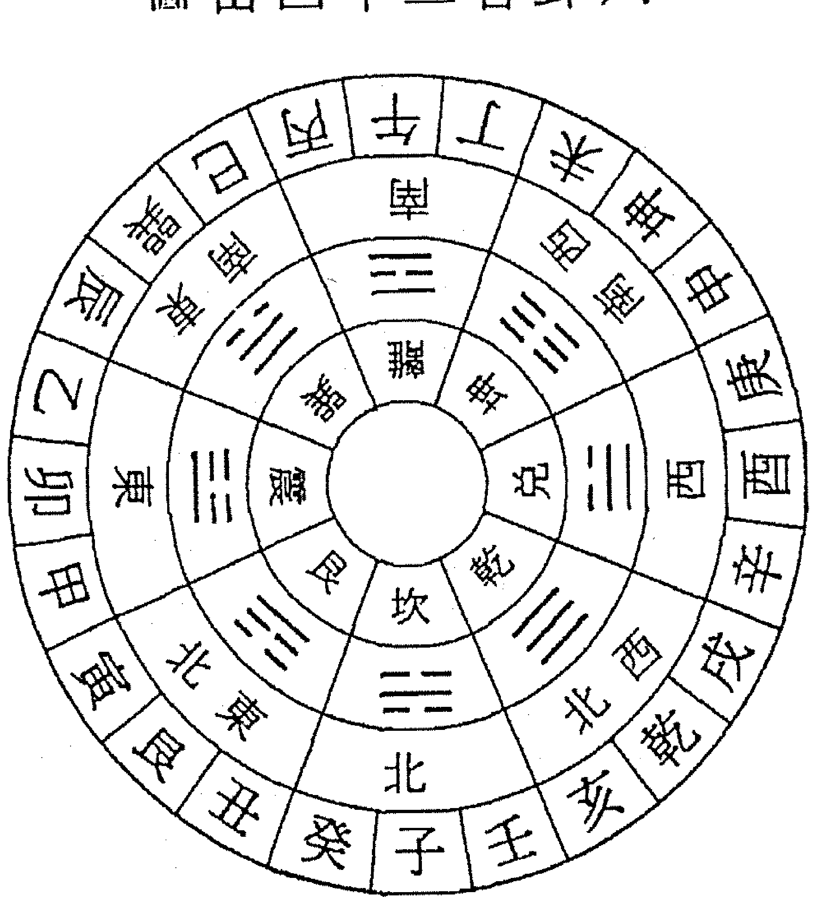

- 3. 以干支的理论来说，「干」是「天之气」，如果下降到地应该是没有定位的，但是在图上的外周却可以见到它的定位；十二支原本就定位，是以「一定不变」的方位来定时间，就如同钟表上的十二时刻将时间固定，子时即指午夜零时的时刻，它绝不会是指十八时；寅月代表正月，它不可能指五月或十月，它们都有其一定的代表意义，这是干支理论一定的事实，一定的系统。如果勉强以方位角来解释，它的矛盾性就会增大，人们的思想会被以前的旧说法以及技法束缚，如果再以理论加以赞美，那就更可怕了，如果不辨认清楚，这些谬论会弄混人们的思想。其中最显著的错误是「果老星宗」这本书，另外在「四柱推命」、「命理學」等書中，也有很多錯誤的記載。從徐子平以後，到現代的命理學及哥白尼的地動說，至真理的大轉變以前，還有「五星術」、「七政四餘」，及更複雜的命書，這些書都是命理學尚未理論化、高度系統化以前成立的。以上所提到的這些書，知道的人恐怕不多，但基於立場我仍需對他們的說法稍加說明。這個理論，簡單來說，就是以「方位角五度」為中心來說明各項事物的意義。它所主張的「二十四節氣七十二候」，完全是和「奇門遁甲」一書中所說的完全一樣，以後的部分則有點出入。可謂二十四節氣，是大家耳熟能詳的，將一節氣分為上元、中元、下元三個時候，那麼二十四節氣就有七十二候了，但是也有以五天為一候的，只是比較少用罷了。又，古時候的人似乎比較喜歡「七十二」這個數字，如姜太公就會把他的一千零八十個防謀對策改為七十二個，也就是七十二局的防謀對策，如此排列起來，那就每一局佔五度，同樣的七十二候也成了每一候佔五度的形式，若以此代入各方位角裏，就有了更多，更複雜的方向。姜太公的「七十二局說」防謀對策，原本只有其玄義，如果以這七十二局的佈陣勉強來解釋前面的二十四山說，那就更複雜了（因為它是以五度為一單位的），這是「張果老星宗」的說法，有關「張果老星宗大全」中的圖，列在次頁供大家參考。

像這樣，區分為幾部份來討論，是可以由人支配的，如果把一天分為一百刻，那麼以「時間和空間」的意義來看，就要考慮方位了。此時，十二支的「時間」、「月支」是不動的，而從某一定點來看的空間與方位，又有東、西、南、北等固定不變的位置，於是這百分位似乎顯得太複雜了，所以一方仍然以三十度較適宜。不過，關於時間，『命理學』和『四柱推命』的看法是一樣的，像子刻有早子刻和次子刻之分，一天當中的早子刻是上午零點至一點前，而次子刻則是下午十一點到上午零點前。

在『奇門遁甲玄義』中，是以一個畫有子、午、卯、酉四正為三十度，丑、寅作為東北，辰、巳為東南，未、申為西南，戌、亥為西北的圖板來說明各事象，本書在論及丑、寅的方位時，丑是三十度的方向，寅也是三十度的方向，而到底以那一者為依據最宜，亦有說明的，若以一方位為三十度，就會產生如次頁的圖。不過，遁甲板的作法恰好與地理學上的東、西、南、北方向相反，將東南、南南東作為東南；南南西、西南作為西南；西西南、北北西作為西北；北北東、東東北作為東北，二個方位合為一組統一命名，再加上中央，就成為『九宮』的圖樣。

東西南北的方位，必須有一定的劃分線，如東經一百八十度與西經一百八十度恰巧是二者的分界線，否則如果以東為起點，那麼一直向西走，繞了一圈回來以後，又回到了同一點，也就是起點，如果以西為起點，那麼一直向東走，繞了一圈回來以後，又回到了同一點，也就是東、西為同一點，也就是說，空間的範圍大至無限，所以一定要具有一分界線。方位的認定應該以某一定點為中心，從那個定定點向東或西的經度在一百八十度的地方，就應停止了，這東經或西經一百八十度就是分界線。更明確的說，東方就是指從一定地點的東方經度開始，向東到了東經一百八十度的地方。同樣的，西方就是指從某一定點的西方經度起，一直向西到西經一百八十度的地方，如果超過這一百八十度，如一百八十一度時，那就不是西方。

### 摘自地理天机会元

### 太虚元化生

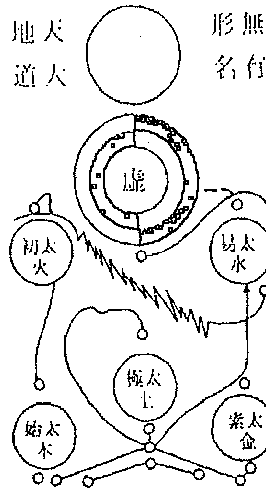

### 摘自星平会海

### 万物化生

### 张果老星宗大全

### 天地图

日月经天，纬地势起于北，故日居午，月居未，子丑皆属土。天道左旋，寅配春属木，卯配春属火，辰配秋属金，巳配冬属水，地道右转，亥配春属木，戌配夏属火，酉配秋属金，申配冬属水，逆顺之中，各有次序，行乎天地之间，乃先天之体也。

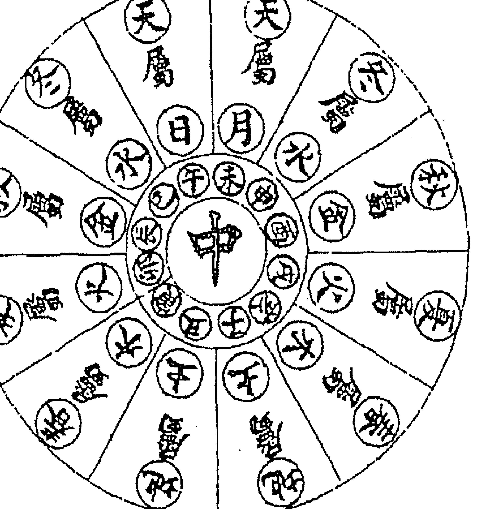

### 洪濛未判图

尝问天地未判，其名混沌，乾坤未分，是名胚腫，且日月星辰未生也，阴阳寒暑未分也，在上则无雨露，无风云，无霜雪，无雷霆，不过杳杳冥冥，在下则无草木，无山川，无禽兽，无人民，不过昧昧昏昏，是一气盘结于中。

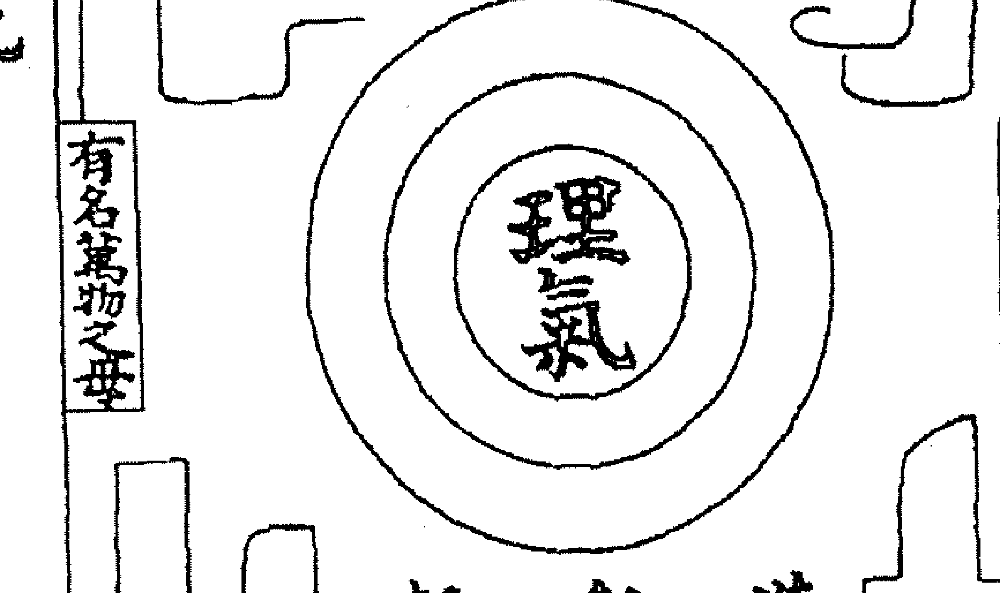

### 太极已判图

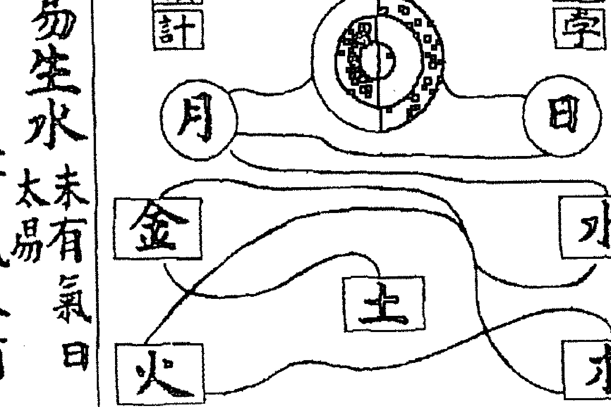

太易生水，太未有气；太初生火，太未有形；太始生木，太未有质；太素生金，太未有体；太极生土，乃形质已具，太极曰。

## 第三節 磁北與真北

古來已將太陽昇起的地方視為東邊，而將其定為東邊的原因，是因為人類所用的指南針只能指北，所以如果不是早上，那就沒有辦法定東方。但是在太陽出來以後，至夜間下山之時，是可以用指南針來確定方向的，若所指的方向為北方，其相對方向就是南方，在這南北點連線的中央，畫上一條水平線，那麼以人面對的北方，即針所指的方向，就可以定出各種方位了。他的右邊是東方，左邊是西方。雖說以這種方法定方位固然正確，但有時候也會產生一點誤差，有關此點將在下面一段討論。指南針的發明，中國要比歐洲早，古人將其用來指示方位，尤其在戰爭時以叫它做指南，我們在學問及做事上，把用來指示與說明的事項都叫做指南，也就是從此種意義引申而來的。事實上，磁石對指針的吸引力，要看指針者所在的地理位置而定，亦即因所在的地理位置的不同，正確的北方是有所偏差的，隨著科學的發達，人們能夠確定這一點，而對它更加的了解，這就是本節所要討論的「磁北與真北」。

> 「磁北非正北」這個說法，是說因為磁石與使用指南針者所在的地理位置有些許的偏差，所以產生若干的偏差角度，這個偏差角度看起來好像不是磁針的正北，但事實上它才是正北；因此，正確的說法，應該是我的指南針上偏西幾度幾分是正北，或是指南針上偏東幾度幾分才是正北，而且偏差角度的度數，也因各地的地理位置有所不同，在使用的時候稍微有些麻煩，日本的這種偏差情形，根據統計資料，如下一頁的圖表所示，這已是登山者熟知的事，但一般人還是不太了解的。這些因為地理位置偏差而產生的角度偏差，每年多少會有些變動，都記錄在政府所出版比例尺為五萬分之一的地圖上了，明確的標示了正確的偏差，並予以修正，以供國人參考，並且因為每年都作這樣正確的統計，才能知道真正的北方所在，所以這項調查統計資料相當珍貴，而這項工作也具有其必要性。讀者一旦知道了真正的北方（正北）就可以知道其餘的方位，得知的方法是根據正確的地圖和指南針，也就是藉由修正的地圖和良好品質的指南針找到真正的北方；所以，在沒有地圖，只是由某一點或是自己所在位置來推定方位，在不知道偏差度數的情況下，是沒有辦法知道正確方位的。

當我們要看地理或是定宅位的方向時，如果不知道正北的話，一定會弄錯方向，所以必須使用地圖或是正確的指南針，才能定出正確的方向，這樣對自己以後才有好處。

若你想要定出正確的東方、西方、南方、北方，需以你所要看房子的中心點所在之地理位置，配合度數的偏差，然後以良好的指南針來定出它的方位，並在定好方位以後，才能知道正北所在，那麼其餘的方位跟著也可以定出來了。此外，在使用磁石的時候，大家應該注意以下幾點，使用才方便而沒有錯誤。

- A、在測量的時候，應該慎選磁針的品質，注意磁針的製造公司、精度檢查的等級等，但由於它們在製造過程上多少會有誤差，所以應儘可能的使用品質較好的磁針，它們的正確性較高，但並非價格昂貴的磁針都是精確的，而是取決於製造技術的精良與否。以筆者使用指南針及羅盤的經驗來說，雖不能說全部都不好，但是價格相當昂貴，而在精度方面比日本幾個有信用公司所製造成品差的大有人在，所以慎選指南針是第一項重要的工作。
- B、以磁針測量正北的時候，應避免放在地上或是桌上，最好是放在手掌上，但要儘量保持水平，這樣所測得的正北位置比較正確。當然，人的身體內或多或少也有一點磁力，會影響測量的正確性；而這些磁力又因人而異，這也就是個人差異上有問題，但是這些個人差並不對測量的結果產生重大的影響，因為他們和磁石的磁力相比，可說是小巫見大巫，所以，我們可以安心的放在手掌上來測量，測量的結果比在不正確的磁石上測量更可靠、更精確。但在某些人的個人差（磁力）太大的情況下，就不能等閑視之。
- C、這一點是要特別注意的，磁石會受帶有金屬或磁力的東西影響，所以凡是從事測量的人，不可以戴具有金屬性的物質，像鐘錶、戒指一類的金屬物，或是如收音機、小型錄音機等隨身攜帶等物品。此外，應避免在大型收音機、電視機等附近工作。還有要注意的是，不要放在草蓆上測量，因為我們往往不會在草蓆上放任何東西，但是它的下面就很難說了，因為在草蓆下的任何一點足以構成影響的東西，都會造成誤差，如一枚小鐵釦，也會引起磁針敏感的反應。再者，也不要隨便放在地下測量，因為它的下面或周圍也許就有金屬性的東西，說不定有大到足以擾亂的磁石；總之，這些都是要注意的。當然，在有鋼筋混凝土和鐵骨架的大廈，或者是高層的建築物內是無法測量的，那麼在這種情況下，又應該如何測量呢？

這時，我們要先到建築物的外側，至少一或二公尺遠的地方進行測量工作，在測定好方位後，平行的移到屋內的中心點，這樣就可以測量出方位了。如果以圖示說明的話，請讀者按照這兩頁的圖例，逐步去做就可以了。A 點是建築物的中心，B 點是測量的人，C 點為正北。從A向B C線上畫垂直線，叫做A E，把尺放在A E上把另一隻三角定規按在A E線上，往上滑到A點，而畫出A下線，那麼F點就是這幢建築物的正北了。

這個測量法固然不錯，但是有一個問題，那就是如何測得房子中心點。像正方形、長方形一類的房屋，要找他們的中心點，是相當容易的，但遇到了凹凸不規則的房屋，要找出它的中心點就比較困難了。

A 點 建築物的中心
B 點 測量的人

### 中心點測定法（特殊的形狀）

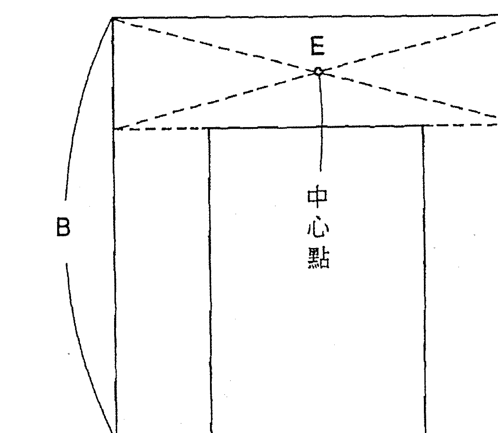

A = B, C = D，所以E為中心點。

C點正北的方向自A點向B C線畫一條垂直線，是為A E，在A E上放置一把尺，然後用另外一把尺放在A E上，然後移向A，到A點以後，畫A下線，那麼下點就是這幢建築物的正北。

現在，如果這幢建築物很複雜的話，又該如何計算它的中心呢？方法也很簡單，我們可以用測試的方法，試出它的中心點，不管如何複雜的凹凸建築物，你都不必經過很複雜的計算，都能用這種方法求得它的中心。

這個方法是利用重心法求得的。利用重心點就是中心點，作為該方法的理論根據。步驟是正確的測出房子的外周線，即這個房子的幾何圖形，然後正確的繪在一張較厚的硬紙板上，按照這個圖形剪下來，以鉛筆尖試頂，頂了幾次以後，如果能讓這個圖形立在鉛筆尖上，那就是找到了重心點，房子中心點的位置就可確定了。

但是，遇到如上圖那樣的建築物時，要如何求它的中心點呢？房子的建築有各種型式，也有如上圖所式的樣式，遇到這種情形，就要以另外一種方法來測知。

這個方法有二，一種是用鐘錶的方法來測知，一種就是用磁石來指示。前者以「磁石」的觀點而言，有一點奇怪，不過，它可以大概的指出方位。這裏順便也把不用磁石而可以知道方位的方法概略予以說明，特別是在有太陽的時候，可以試用這個方法，就是利用鐘錶的長短針來辨別方向。進行之前，應先確定鐘錶是絕對正確的。

- 1. 先把短針向著太陽，也就是正確的對著它的方向。
- 2. 鐘錶上的數字12（也就是正北的方向），它的延長線的相反方向就是正南，在不知道太陽的方向，或是看不見太陽的時候，就不能使用這個方法。在夜晚天空的星星清晰可見時，若以北極星的位置或是其他恆星的位置，也可指示方向。
- 3. 用磁石測量的方法是把磁石放在手掌上，水平的放好，在尋找磁北的時候，磁石的針往往是上下或左右的浮動，一般人總是在等磁針晃動停止後，才看磁針所指的方向來定正北。其實這樣做的話，是很容易產生錯誤的，因為有各種因素足以影響磁針的靜止，所以常常無法正確的看出指針在定位時所指的方向。爲了要確實知道正北的方向，我們可以用控制桿在磁針浮動時，作幾次試停，就大致可以知道正北的方向了。磁針的浮動是上下左右搖動的，因而產生了各種的輻射角，這些輻射角促使所要觀察的正北情形產生延誤與麻煩，故可在它左右上下的搖擺中，當指針過中心點的時候，立刻以控制桿控制，使它停止搖擺，而定在當時所在的位置上。有時，因爲控制的關係，使用者也許不能將其正確的停在中心位置上，因此必須多做幾次，大約就可以知道正北的方向所在。另外，大家在測量正確的方位時，必須要注意到輻射角，因爲它們可以測知當時位於附近各種影響因素的狀況。採用上述的方法找到「正北」的位置，必須顧及所有的注意事項才能達到目的；雖然如此，仍然有少許的誤差存在，但這也是不得已的事。像人們多半想在定宅、爬山等重要的時機，找出正確的方位；如果是在當天可以來回的行程，利用磁針來偵測方位則很少有人會，大部份都是翻閱地圖，查看方向後就確定了路徑，而後放心前往，如此地圖仍然是不可或缺的。現在我們要更深入的探討指南針的發明經過。在探討以前，首先應知道指南針是在何時發明的；相信大家都知道，指南針是中國發明的，但究竟在什麼時候發明，則有兩種說法。第一種說法是，黃帝和蚩尤戰於涿鹿時發明的，時值紀元前一千六百九十八年，也就是黃帝建國前很久以前的事。

### 昼夜百刻日永日短之圖

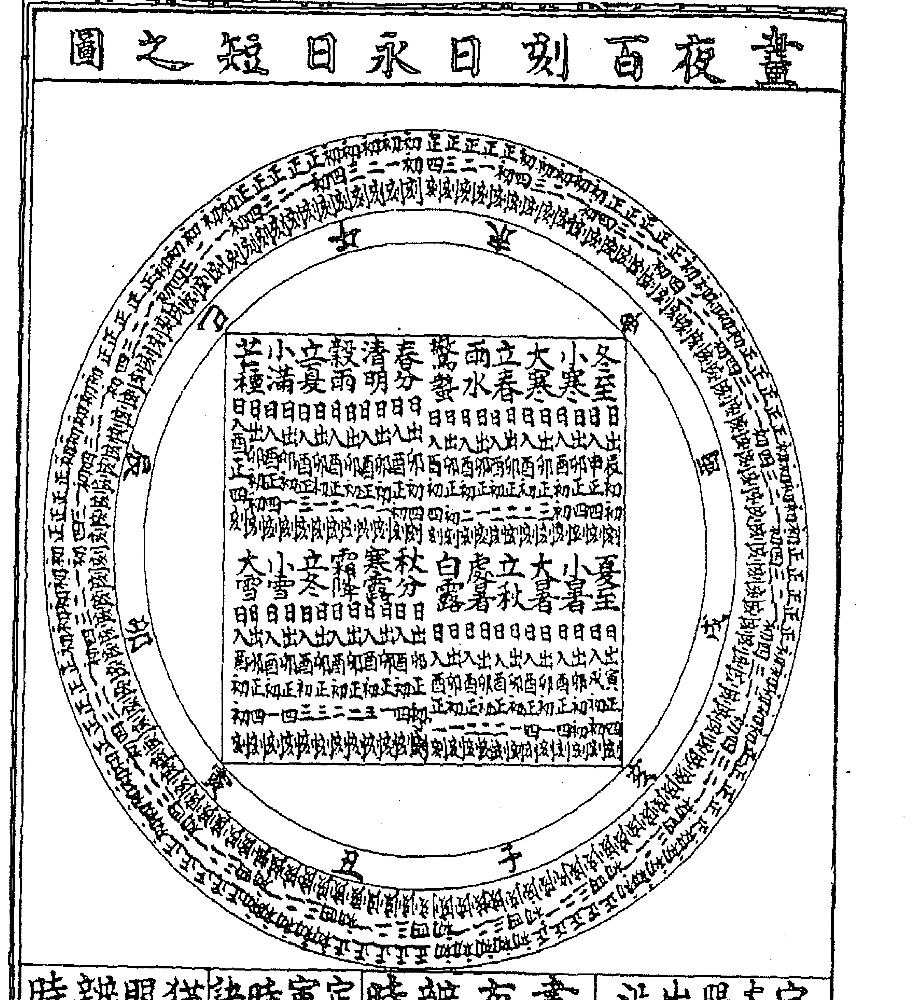

#### 定太陽出沒
- 正九出乙入庚方
- 二八出兔入雞場
- 三七發甲入辛地
- 四六生寅入戌乾
- 五月生艮没坤方
- 仲冬出巽没坤方
- 惟有十寅十二月
- 出辰入申仔細詳

#### 昼夜辦時
- 半夜子雞鳴丑
- 平旦寅日出卯
- 食時辰禺中巳
- 日中午日昳未
- 晡時申日入酉
- 黃昏戌人定亥

#### 定寅時訣
- 正九五更二點徹
- 二八四更三點歇
- 三七五更四點裁
- 四六天明五更絕
- 五月十一更四點
- 仲冬四更三點歇
- 惟有十寅更二點
- 仔細分明莫亂說

#### 貓眼辨時
- 子午卯酉一條線
- 寅申巳亥如鏡圓
- 辰戌丑未棗核尖
- 秘訣君知莫訛傳

### 十二支方位・月・時・図

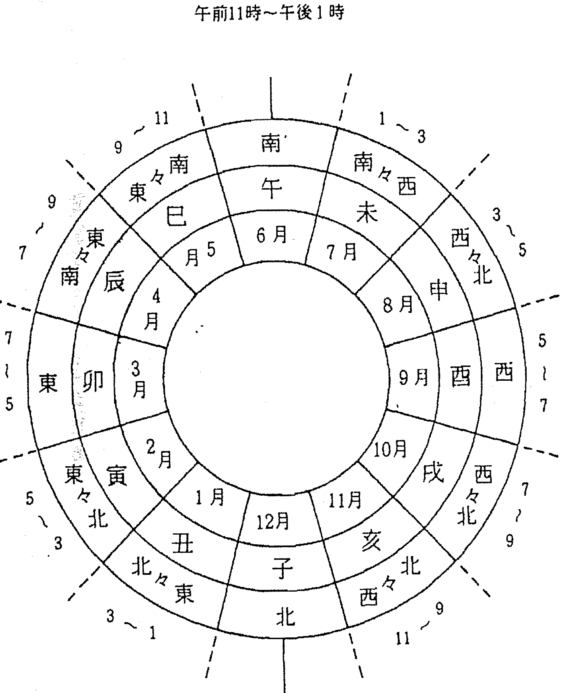

南中正午
午前11時～午後1時

時1～時0前午　時0～時11後午
日分界

### 等偏角线图（1970.0年）

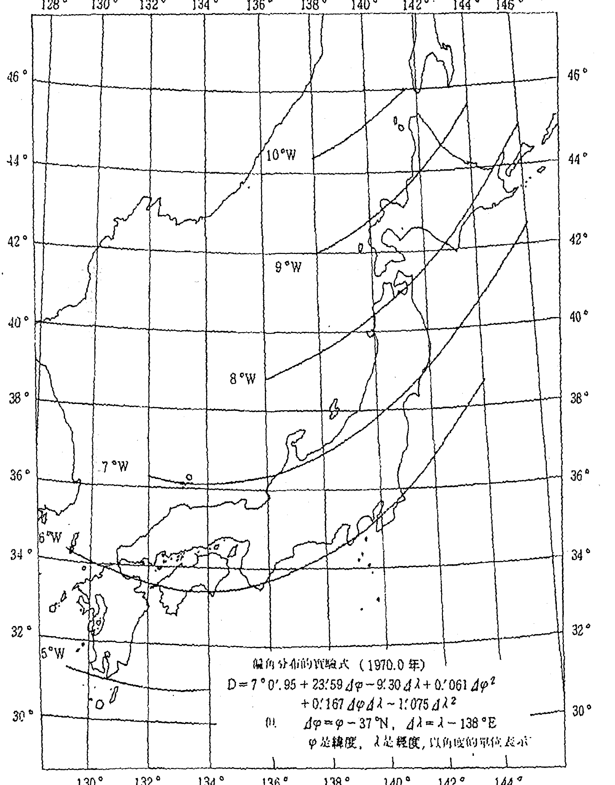

```
偏角分布的经验公式（1970.0年）
D = 7°0′.95 + 23′59 Δφ − 9.30 Δλ + 0′061 Δφ² + 0′167 ΔφΔλ − 1′075 Δλ²

Δφ = φ − 37°N，Δλ = λ − 138°E
φ 是纬度，λ 是经度，以角的单位表示
```

### 紙傳播的路線

第二種說法是周武帝即位前所作，即紀元前一千一百年以前。至於上述兩種情形，何者才是正確的，尚待考證。不過，就周武王在位以前所作的說法來看，則有待商榷；因爲現在的指南針之所以這樣精確，是經過許多改進的。古時的指南針並不像現在這麼精準，原因是它含有許多雜質，它之能夠演變至今日的局面，是經由逐漸改良精進的，如採用第二說，好像還沒有辦法那麼快的進步到現在的樣子，所以筆者認爲指南針係在黃帝時代發明的較爲正確。『紙』是文明迅速發展中，很重要的發明及傳播媒體，它承擔了傳播文化的任務。沒有了它，文化就無法如此快速的進展，這雖然和遁甲沒有關係，但是它的發展及傳播過程，正說明了指南針的進步及改進情形，如上圖所示，紙是經由絲路予以傳播到世界各地的。

文化很多例子顯示是經過長久的歲月才傳播到世界各地，就好像紙的傳播一樣，它原來是中國在紀元一百零五年發明的，但足足花了一千三百八十九年才傳到英國，可見一件事情的進展，並不是像噴射機那樣凌空飛掠，而是逐步的演進，我們舉這個例子的目的，是在說明指南針的改進是長久累積的結果。

## 第四節 真方位

人類可以「磁石」測知「正北」，但用地圖直接看出真正的方位，還不太容易。這是因為地球是球形的，而地圖是平面的，在判斷上還是有些許的誤差。例如，用比例尺五萬分之一的地圖，把周圍相連地區的分區圖十五、六張，一張張的黏接起來，就形成愈來愈長的長條形地圖，這樣讀者就會在中心點相距太遠的情況下，不想再去黏貼，因為它已愈來愈不準了。針對這一點，如果用前面所說的方法，以某一點為中心，利用定規及分度器來測量其他點的方位，以每三十度一方位的方法，用直線來測其他點的方位，是不太正確的，所測出的方位也不是真正的方位。

如果是近距離，則使用這個方法或是三角定規來定出真正的方位，就不會有太大的誤差。隨著距離的遠移，愈是位在遠方的定點，就會產生愈大的誤差；換言之，就是無法用直線來求出方位。

這是因為地球是一個球面體，它並不是一個平面，遠方的定點具有一個圓形弧度的距離差，這時如果要定方位，必須以球面三角法為測量的依據，就是以一定的計算方法，介紹如何在球面體上求得遠距離點的方位，也就是把一定點的經度、緯度和欲求點的經度及緯度作一比較，然後加上球面三角法的計算方法，求得該點的方位；一般而言，在船舶航行大海的時候，僅僅用定規和尺是沒有辦法到達目的地的，必須藉球面三角法及「天測」表，才能求得正確的方位。聽過或修習過「四柱推命學」的人，都會了解球面三角法的重要，其中也有不少人是從事航海及海上運輸事業的，筆者已連續接到這些人希望出版「奇門遁甲」的信，信上也一再強調若是不用球面三角法是無法達到目的地的，這也說明了筆者的講法是有實際根據的。嚴密而正確的算出真正的方位，一定要用球面三角的，如果只要求出大概的方位，參考一張簡明的地圖就可以了。本書提供一張真方位圖，及從東京、名古屋、大阪等日本國內的城市為定點到鄰近地區的真方位圖，列在後面，提供各位參考。以這張地圖做為參考，當讀者要走遍日本國內的每一個角落，就可以確定真方位，而不會走錯了。

次頁是一張以東京為中心點的概略真方位地圖，它雖然是一張概略圖，但是我們也可以藉其看出一個大概。現在若以東京的成田機場為中心，那麼美國的舊金山就是位在東北的一個遠方點；如果以舊金山為中心的話，成田機場就是一個位在西南的機場，這是一張以東京為中心所繪的概略圖，僅供參考之用，請大家不要誤會而廣為應用，那是會出差錯的。

### 從東京看世界的方位概略圖

| 地点 | 坐标 | 方向1 | 中心点 | 方向2 | 地点 |
|---|---|---|---|---|---|
| 札幌 | E 141°21' N 43°05' | 南 | 东京<br>E 139°45'<br>N 35°41' | 北 | 札幌 |
| 小樽 | E 141°20' N 43°10' | 南 | 东京<br>E 139°45'<br>N 35°41' | 北 | 小樽 |
| 室兰 | E 141°05' N 42°22' | 南 | 东京<br>E 139°45'<br>N 35°41' | 北 | 室兰 |
| 仙台 | E 140°50' N 35°15' | 西南 | 东京<br>E 139°45'<br>N 35°41' | 東北 | 仙台 |
| 新潟 | E 139°31' N 35°41' | 南◎ | 东京<br>E 139°45'<br>N 35°41' | 北 | 新潟 |
| 横滨 | E 139°37' N 35°30' | 東北 | 东京<br>E 139°45'<br>N 35°41' | 西南 | 横滨 |
| 名古屋 | E 135°55' N 35°11' | 東 | 东京<br>E 139°45'<br>N 35°41' | 西 | 名古屋 |
| 京都 | E 135°48' N 35°05' | 東 | 东京<br>E 139°45'<br>N 35°41' | 西 | 京都 |
| 金泽 | E 136°40' N 36°35' | 東南 | 东京<br>E 139°45'<br>N 35°41' | 西北 | 金泽 |
| 高知 | E 130°31' N 33°32' | 東北 | 东京<br>E 139°45'<br>N 35°41' | 西南 | 高知 |
| 广岛 | E 132°39' N 34°24' | 東◎ | 东京<br>E 139°45'<br>N 35°41' | 西 | 广岛 |
| 松江 | E 133°05' N 35°28' | 東 | 东京<br>E 139°45'<br>N 35°41' | 西 | 松江 |
| 福冈 | E 130°25' N 33°12' | 東北 | 东京<br>E 139°45'<br>N 35°41' | 西 | 福冈 |
| 大分 | E 131°36' N 33°12' | 東北 | 东京<br>E 139°45'<br>N 35°41' | 西南 | 大分 |
| 宫崎 | E 131°27' N 31°36' | 東北 | 东京<br>E 139°45'<br>N 35°41' | 西南 | 宫崎 |
| 熊本 | E 130°44' N 32°45' | 東北 | 东京<br>E 139°45'<br>N 35°41' | 西南 | 熊本 |
| 静冈 | E 138°24' N 34°58' | 東北 | 东京<br>E 139°45'<br>N 35°41' | 西南 | 静冈 |
| 神户 | E 135°14' N 34°13' | 東北 | 东京<br>E 139°45'<br>N 35°41' | 西 | 神户 |
| 大阪 | E 135°30' N 34°41' | 東北 | 东京<br>E 139°45'<br>N 35°41' | 西◎ | 大阪 |

◎是指该地靠近了境界线所以必须注意

| 城市 | 坐标 | 相对大阪方向 | 相对东京方向 | 城市 |
|---|---|---|---|---|
| 札幌 | E 141°21' N 43°05' | → 西南 | → 东北 | 札幌 |
| 小樽 | E 141°20' N 43°10' | → 西南 | → 东北 | 小樽 |
| 室兰 | E 141°05' N 42°22' | → 西南 | → 东北 | 室兰 |
| 仙台 | E 140°50' N 35°15' | → 西南 | → 东北 | 仙台 |
| 东京 | E 139°45' N 35°41' | → 东北 | ◎ 西 | 东京 |
| 新潟 | E 139°31' N 35°41' | → 西南 | → 东北 | 新潟 |
| 横滨 | E 139°37' N 35°30' | → 东 | → 西 | 横滨 |
| 名古屋 | E 135°55' N 35°11' | → 西南 | → 东北 | 名古屋 |
| 金泽 | E 136°40' N 36°35' | → 西南 | → 东北 | 金泽 |
| 高知 | E 130°31' N 33°32' | → 东北 | → 西南 | 高知 |
| 广岛 | E 132°39' N 34°24' | → 东 | → 西 | 广岛 |
| 松江 | E 133°05' N 35°28' | → 东南 | → 西北 | 松江 |
| 福冈 | E 130°25' N 33°12' | ◎ 东北 | ◎ 西 | 福冈 |
| 大分 | E 131°36' N 33°12' | → 东北 | → 西南 | 大分 |
| 宫崎 | E 131°27' N 31°36' | → 东北 | → 西南 | 宫崎 |
| 上海 | | → 东北 | → 西 | 上海 |
| 香港 | | → 东北 | → 西南 | 香港 |
| 罗马 | | → 东北 | → 西北 | 罗马 |
| 伦敦 | | → 东北 | → 西北 | 伦敦 |
| 柏林 | | → 东北 | → 西北 | 柏林 |
| 纽约 | | → 西北 | → 东北 | 纽约 |
| 里约热内卢 | | → 西北 | → 东 | 里约热内卢 |

◎是指该地靠近了境界线所以必须注意

| 出発地 | 座標 | 出発方向 | 中継地座標 | 到着方向 | 到着地 |
| --- | --- | --- | --- | --- | --- |
| 札幌 | E 141°21′<br>N 45°05′ | 西南 | E 135°55′<br>N 35°11′<br>名古屋 | 東北 | 札幌 |
| 小樽 | E 141°20′<br>N 43°10′ | 西南 |  | 東北 | 小樽 |
| 室蘭 | E 141°05′<br>N 42°22′ | 西南 |  | 東北 | 室蘭 |
| 仙台 | E 140°50′<br>N 35°15′ | 西南 |  | 東北 | 仙台 |
| 東京 | E 139°45′<br>N 35°41′ | 西 |  | 東 | 東京 |
| 新潟 | E 135°35′<br>N 34°40′ | 西南 |  | 東北 | 新潟 |
| 金澤 | E 136°40′<br>N 36°35′ | 南 |  | 北 | 金澤 |
| 高知 | E 130°31′<br>N 32°32′ | 東北 |  | 西南 | 高知 |
| 徳島 | E 132°39′<br>N 32°24′ | 東 |  | 西 | 徳島 |
| 松江 | E 133°05′<br>N 35°28′ | 東 |  | 西 | 松江 |
| 福岡◎ | E 130°25′<br>N 33°12′ | 東北 |  | 西南 | 福岡◎ |
| 大分 | E 131°36′<br>N 33°12′ | 東北 |  | 西南 | 大分 |
| 宮崎 | E 131°27′<br>N 31°36′ | 東北 |  | 西南 | 宮崎 |
| 京都 | E 135°44′<br>N 35°00′ | 東 |  | 西 | 京都 |
| 神戸 | E 135°14′<br>N 34°41′ | 東北 |  | 西南 | 神戸 |
| 大阪 | E 135°35′<br>N 34°40′ | 東北 |  | 西南 | 大阪 |
| 横浜 | E 139°37′<br>N 35°30′ | 西 |  | 東 | 横浜 |

◎是指該地靠近了境界線所以必須注意

# 第一章 方位的沉积学

在很久以前，人類本來是在地上爬行的，距離開始直立身體步行的時候，約有一百萬年的歷史，稱之為亞士特拉古斯的舊石器時代，接下來則是約在十四、五萬年前周口店的北京猿人時代。從北京猿人時代開始，到稱為完全人類的時代，大約又經過了八萬年，這段人類演化的長遠歷史是大家所熟知的。基於人類求生的本能，必須為自己的生存奮鬥。在奮鬥的過程中，必須做的第一件事是什麼呢？那就是民生的問題，也就是「食」。所有的生物在生存的要件中，都是以「食」為優先，人類也不例外。求生存的第一件事是解決「食」的問題。為了尋求「食」，必須做「食」的準備工作，因此需要耕作，而定居下來，只有定居以後才能從事農耕，所以要先解決居住的問題，如此就進入了農耕時代，這就是文明的開始。這種歷史的演進，在地球各角落同時進行，世界上除了在赤道附近的種族以外，大都是這樣演進的。

幼發拉底河及底格里斯河、印度河、尼羅河、黃河、長江和其他河川的周圍，都是孕育這些「農耕文化」的搖籃。在「農耕文化」的文化時期之前，是狩獵和遊牧生活的時代，以後才漸漸演變成「農耕文化」，直到現在，以狩獵和遊牧為生的民族，依然存在世界上。

自有人類開始，人類就時常和自然界的動物，以及其他部落或是部族，為「食」的問題而戰鬥，勝利的一方才能生存，才能享受可口美味的食物。人類爲求生存而產生的「攻擊」和「防衛」本能不斷的持續著，這種爲了「種族延續而奮鬥的本能，就是在現代法律的規範下，也依然存在著。在「農耕文化」時期，也還是有這種行爲的。想要獲得更肥沃的土地，爲了要擴大更多的農耕地，爲了要增加勞動的人口，因而觸發了更多的戰鬥，以求獲得肥沃的土地，更多的農耕地和奴隸，也就是擴大了勝利，但相對地，當別人攻擊自己時，土地和財富被掠奪，或是自己的宗族被入擄去當奴隸的事，也就跟著發生了。這些情況並不是進入農耕時代以後才發生的，可以追溯到狩獵和遊牧的遠古時代。人類大約在七千萬年前，就有這樣的事了。所以我們可以這樣說，原始的小集團是跟著時代的變遷，在宗族保衛的本能下，隨著攻擊和防衛的行動，而混合成大集團，再經過若千年的演變，漸漸形成了國家的雛型，而有了國家的誕生；國家爲了安全起見，就築了一個城堡以保衛自己，這樣在防衛、攻擊和抵禦外侮的行動上，才會勝利成功。一旦戰鬥開始，城裏所有的人都可以成爲鬥士，這是不難想像的。像這樣的築城行動，以中國的萬里長城最具代表性。我們再從中國的城市來看，它都是以城牆壁爲建築的樣式，從而大家可以了解到，自農耕時代以來，城堡就是人類活動的中心。

中國由於地大物博，異種民族很多，歷史學家把中國劃分為三個文化圈，即黃河文化圈、黃河江淮文化圈和揚子江江南文化圈，茲將原人文化圈表列於後，供各位參考。

青銅刀是在沿著黃河支流的洮河辛店遺跡發現的，由著名的考古學者及發掘家安達遜博士和亞魯朱博士所製作之下頁圖表，可以知道個大概。成立時期，是從殷墟的發掘推算而來，殷朝的成立是在紀元前一千五百年的時候，所以煙波釣叟歌中所說的「軒轅黃帝戰蚩尤於涿鹿」，並非全是神話。中國的歷史是從黃帝建國開始，然後傳到夏，再傳到殷，再傳到周的。夏朝建國年間根據司馬遷史記的記載，有十七代天子的世系，推算起來，大概有四百多年，這點在遺跡中也有發現。從這些事蹟看，殷的建國時期和黃帝的建國時期是可以互相連貫的；因此我們知道，農耕時期在很久遠的年代就開始了，因為這些歷史的記載和遺跡的發掘，令人產生它們實際存在的感覺。

下圖是古代的各個遺跡中心，再附上各個地名，可提供給讀者作為參考。根據下面這張地圖，相信大家只能了解一個梗概！古代遺跡的發掘地大多是集中的，大多是沿著河川的流域而存在的，從此也可看出河川對農耕文化的重要。古代的部落集團比個人優先，這是當然的事，因為他們需要「食」來生存，從母權時代一直到父權時代，這種演進與私有財產制是平行的；也就是說，雖然集團比個人優先，但是私有財產制仍然是漸漸形成了，並沒有消失掉，這也是歷史上著名的事蹟。部落與國家雖然形成，但還是以「完全的個人」思想為中心，那麼這種思想豈不是和「大家族主義」相違背嗎？答案是否定的。事實上，它不但和「大家族主義」相違背，反而和「大家族主義」一起成長，我們甚至可以說，如果「大家族主義」不和「個人幸福」的思想一起成長的話，那麼歷史一定是沒有辦法進展的；也就是說，他一定會在這種互相矛盾的情形下，阻礙了自己的發展。當然，在外敵的環伺下，不安的心理是會時常有的，每個人都希望沒有戰爭，但是為了「食」，會時起爭端，這就是為什麼戰爭不斷的原因。大家總是想要有一個長治久安的局面，而這種吵吵嚷嚷的情形，在周朝建國以後，

## 三大文化圈

## 中國的先前史時期

- ○ 彩陶出土地
- ◎ 黑陶出土地
- ⊙ 彩陶·黑陶出土地
- □ 邑
- ----- 殷的勢力範圍
- ———— 周的勢力範圍

五八

| 时间点 | 时期 |
|--------|------|
| B.C. 3500 | 齐家期 |
| B.C. 3200 | 仰韶期 |
| B.C. 3000 | 马厂期 |
| B.C. 2900 | 辛店期 |
| B.C. 2600 | 寺洼期 |
| B.C. 2300 | 沙井期 |
| B.C. 2000 | |
| B.C. 1700 | |

## 中國石器文化分布圖

就很少見了，而在以後的歷史上，我們也可以看到確實如此。

安定的局面對戰爭而言，就是一個勝利的戰局，如果武力、兵力、食糧充足的話，「富」就屬於那個國家、部落、集團。所以一場戰爭勝利的結果，並不單單屬於統治者、支配者或上層階級，而是屬於國民全體的，而對從屬的人民來說，也可共嚐勝利的果實。

爲了要在戰鬥中獲勝，爲了要增加自己的財富，則在戰爭中的方位認識，就格外的重要了，而方位的認識和戰爭的勝利，是同等重要的事，這也就是爲什麼「奇門遁甲」會被拿來討論的原因。在戰期中，因爲佈陣的關係，所以方位一定要弄清楚，因此以「方位」爲討論對象的「奇門遁甲」，就成爲大家研究的對象了。

讀者首先要知道的是，「奇門遁甲」是爲了「集」的需要而不是爲了「個」的需要而產生的；也就是說，有關「方位」的「吉」與「凶」，並不是因「個人」的需要而生，而是在求生存當中，爲集團的需要而作的一項認識，這也是歷史的必然性，也是我們研究「奇門遁甲」的時候，先要認知的，時間的認識和方位（空間、大氣現象的認識）則是學習者要先確立的思想。

前面所講的農耕村落時期是歷史發展中的必然現象，因爲「食」的關係，它的週期性和循環性是必然的，如果有某個部落被其他部落征服，他們的生活中還是要以「食」爲中心，所以雖然被征服了，「食」還是無法避免的。因爲生活的必要，再加上發現自然定律的關係，將一天分爲一年分作十二個月，而成春、夏、秋、冬四個季節，然後再以「曆」的形式表出，所以「農耕」和「曆法」是不可分割的。

古時候的君主，不僅是管理該國的事務而已，最重要的工作乃是要正確的傳達農耕的訊息，例如什麼時候播種、如何管理田地、何時收割等等，都要隨時告知國人，如果不知道這些事情的話，就無法做為一國之君，這從歷史上也可以看得出來。但是一個國君如果要能告知民眾這些訊息，就需要一段時間來觀察情況，這一段時間，往往是長久的，有時長久的令人難以想像；因為他要在廣大的天地裏，不斷的進行觀察。在不斷的觀察中，累積了「試行錯誤」的觀測和記錄，再加以分析、比較，始發現其週期性，因此才會把一天分為若干時刻，一年分為若干節氣；這些時間的確定，必須經由上述的各種過程，而那些分析與比較，在根本上是要經過哲學思考的嚴格程序，而並不只是單純的數學符號或是一些反覆使用的符號而已，這些觀察的記錄雖說不能適用於全體的事實（像數學符號只適用於某種數字的範圍），但是它的邏輯與思考還是很能適用的，所以中國的思想，遠比歐洲文明優秀，這是不容否定的事實。茲列出這些觀察記錄與邏輯思考的整理結果，供大家參考。

## 陰陽

以二進法表示。

## 五行思想

以五進法表示。

### 天·地·人·三元思想

以三進法表示。

-   十干 以十進法表示
-   十二支 以十二進法表示
-   六十干支 以六十進法表示

也就是說

-   一日＝十二刻 五日＝六十刻
-   (上·中·下) ×三×五＝十五日 二十四節氣×一五＝三六○日
-   一個月＝三○日 十二個月×三十日＝三六○日
-   陽適＝一八○日（三元×六○日〔二個月〕）
-   陰適＝一八○日（三元×六○日〔二個月〕）
-   陽適日十陰適日＝三六○日＝一年

由以上的結果可以看出，六十干支就是用來表示年、月、日、時種種秩序的符號。

這些推論與結果係在殷代完成，是經由考古學者在殷墟中發掘甲骨文後予以證實的，但也有人說這些記錄早在幾百年前就已確定了，到了殷代才突然出現，這是一件很難以想像的事。

根據研究曆法的學者以及天文學研究者的說法，所謂的曆，首先是在漢武帝時制定的，那時的历叫做『太初历』（纪元前一百零四年），而西汉建国是纪元前一百二十年的事，因此这个说法可以确立，而现在也证实了这本『太初历』是现存的历法中最古老的。在这本『太初历』未出现之前，农耕的顺序依然是观察太阳的运行而作息的，由此可以看出来，农耕工作是非常需要历法的，这也是可以想像的事。

太初历也称为『四分历』，把一年当做三百六十五又四分之一日，多出来的四分之一日是六小时（二十四小时÷四＝六小时），这和现在测得的五小时四十八分四十六秒，相差了三分十二秒，但是它还是有参考的价值。

农耕时期可能在纪元前三千年前就形成了，甚或更早；而历法的出现，大家也公认是从黄帝历开始，然后到颛顼历，继而夏历、殷历、周历、吕历。以『汉历』而言，『殷历』是在纪元前一千五百六十七年制定的，这和希腊自古以来，在纪元前四百零八年到三百五十五年的尤多克斯历法是相近的。至于何者比较古老或是谁先制定及中国是否仿照希腊等问题，本书不拟在此讨论。

比这个更重要的问题是『历』是用六十干支来记时、来表现的，并以二十四节气来补正实际气候和历法上的推算有关季节的误差的，这也就是说：

## 论。

欧美的太阳历和年代的更换无关，只是在三百六十五天之后，就排定次一年。例如，一月一日上午一時永遠是固定在上一年的三百六十五天之後的次一天，永遠不會改變。如果以六十進法來表示時間的話，那麽年、月、日、時，則各有六十種表示法，同樣是太陽曆上的一月一日上午一時，它的月干支、日干支、時干支是不一樣的；同樣的干支，可能要幾千年才有一次，也可能永遠不再出現。

> > 軒轅皇帝戰蚩尤於涿鹿，經今若未休。神童負圖出洛水，彩鳳銜書碧雲裏，因命風后演成文，遁甲奇門從此始。一千八十當時制。

遁甲的運用居於首功，在『煙波釣叟歌』中也曾說到這一段經過；對現在研究遁甲學問的人，『煙波釣叟歌』是一項很重要的參考史實。

這首『煙波釣叟歌』據說是宋（公元前七百七十年）趙晉所作，是春秋時代以後的事。在『奇門遁甲秘笈大全』和『活盤奇門遁甲』的序文裏，也記載著有關遁甲的事；從它們的敘述中，也可以知道遁甲的沿革，而有助於我們研究遁甲的學問。在『奇門遁甲秘笈全書』的序文中，有這麼一段記載：「本來奇門遁甲是張子房、諸葛武侯爲了抓住戰機，而以秘笈的形式著作的，所舉出的實際戰例皆很確實，它的巧妙令人吃驚。張子房是黃石公的嫡傳弟子，在漢高祖發動戰爭的時候，他以奇門遁甲十八格幫助高祖，在各種危急的戰局裏，都能夠平安度過，而獲得了決定性的勝利。
「孔明爲隆中隱士，出而輔佐漢主，他之所以能助漢主建立蜀漢皇朝，最主要是他能料事如神，他以如神般的預測抓住了每一個致勝的戰機，是導引勝利的最後關鍵。而其抓住戰機的預測方法，就是根據奇門遁甲而來，每一次都巧妙的運用奇門遁甲的方法獲得勝利。」
「但是到了以後，因爲張子房和諸葛武侯所著的奇門遁甲逐漸失傳，民間就以張子房所著的兵書爲諸葛武侯所著的奇門遁甲，以後也就很難斷定這本書的真偽了，它也就此埋沒民間。」
這些偽書流傳在民間，再加上後人的誤傳，以致錯誤百出，真理就些喪失了。在這裏，能夠再獲得石版的原書，對遁甲做正確的校訂，並重新對這門學問加以研究，可以說是難能可貴了，現在我們再針對遁甲的敘述加以校訂，使它的內容沒有一點錯誤，這樣就可以放心的進行研究了。
現在，這本經過校訂的遁甲書，可以說是珍本「秘中秘」。
又，「活盤奇門遁甲統宗大全」的「奇門遁甲統宗源流」上是這樣寫的：「奇門最初是從黃帝開始研究的，據說以後又由呂望（呂太公望）和張良（張子良）就其所傳秘本加以取捨選擇而成。在漢朝以前，這一類的書散見於民間，一直到了隋朝，才開始加以整理；隋書藝文志把十三家流派成果總合，這種學問的真正意義，就變得有些模糊不清，以致於變成了一些不太確定的事實。

又，根據「陰符經」的書中記載的事實，也約略可以了解一些奇門的事蹟，它是這樣記載的：「奇門是萬象八卦甲子的神機，也就是它們各種變化的現象，為張良所蒐藏。」根據它裏面的註解，又這樣說：「以六癸為天藏，以伏藏……云云」，雖然未說得完整，但是這樣的敘述，也已經佐證了奇門是萬象八卦甲子的神機，這也就是它的重要依據。

> 「奇門是萬象八卦甲子的神機，也就是它們各種變化的現象，為張良所蒐藏。」

> 「以六癸為天藏，以伏藏……云云」

大戴禮記明堂篇中也有這樣的說法：「明堂是自古以來就有的，九室（九、一、二、三、四、五、六、七、八）的河圖洛書的意義，也就是奇門遁甲的九宮。」這些記載都有助於我們了解奇門遁甲的意義。

> 「明堂是自古以來就有的，九室（九、一、二、三、四、五、六、七、八）的河圖洛書的意義，也就是奇門遁甲的九宮。」

-   五、六、七、八

漢書藝文志有云：「明堂陰陽二十三篇中，又有陰陽明堂五篇。宣帝時，魏相建議：『易是由陰陽講到明堂的月令，五帝各有所司，不能有所越位，東方的卦位不可置於西方，南方的卦位不可置於北方，一定要以八卦的方法來配明堂的九室，如此方可將每一個方位配置的各得其所。』又云：『所謂的一蓬、二芮、三沖、四輔、五禽、六心、七柱、八任、九英，都有太過不及之處。』」

> 「明堂陰陽二十三篇中，又有陰陽明堂五篇。」

> 「易是由陰陽講到明堂的月令，五帝各有所司，不能有所越位，東方的卦位不可置於西方，南方的卦位不可置於北方，一定要以八卦的方法來配明堂的九室，如此方可將每一個方位配置的各得其所。」

> 「所謂的一蓬、二芮、三沖、四輔、五禽、六心、七柱、八任、九英，都有太過不及之處。」

又，唐會要元宗三載十月，術士蘇嘉慶在京城排九宮，以五為中，以九為上，以一為最下，右為七，左以三、二、四為上，以六、八為下，作了一個遁甲而進言，這也說明了遁甲的一種排法。

武宗會昌二年正月，在僕篡位，發現黃帝九宮經和蕭吉的五行大義，其上記載著：：：日天蓬卦位在坎一，向著水方，在僕看過之後，即斷言是在講奇門之事；並看出當時正處於一個晦暗的時刻，這是相當危險的，因而就千方百計的要壓抑晦暗。這也就說明了卦位的位置不可隨意變換，否則就有吉凶的徵兆了。

宋仁宗時，洗馬楊維德編纂將「六壬」編纂成「神應經」一書，又再加上奇門，而成「符應經」。

如今，這些書均已失傳，或者世上仍有收藏者也未可知。明朝宸濠之亂，擁護亂王者欲收攬人心，於是孝成君乃拿出奇門一書，可是陶仲人卻說應該以前林家一代的人所保藏的珍本為準，認為此書才是可靠的記載，其他的書籍都不可靠。陶真人也有一本「遁甲神書」，是一部勝過國家的寶典，可是奇門的真傳似乎又勝過他這部「遁甲神書」。奇門的真傳卻是在李氏（曾著「李氏遁甲」一書）及仇鸞門下的林士徵手中，他曾以這本奇門的真傳占兵的方位，來捕捉各種戰機的時刻，結果非常準確，頗能適用於致勝的每個時機。陸炳曾經為這本書作序，序中言及傳世的奇門，只剩下三家而已，但仍可作為參考用。序上如此寫著：「奇門是從都天滅龍經中八十一論所導出的一項理論，它一共有九大主項，現在我一一的列在後面。

-   1. 是講都天九卦
    2. 是講人地三光
    3. 是講行宮三奇
    4. 是講住宅三月
    5. 是講進形太白書來隱住晦暗之事
    6. 是講八山城龍譯
    7. 是講轉山移水九字九經
    8. 是講建國安基萬年金經
    9. 是講元宮八福救貧生仙聖

目前所傳者只剩下住宅三月，其餘皆已不可得。

或謂，古之名山石室所收藏的重要經典，都已失傳，就是再出現，恐怕它的理論都不切實際，其可貴性只怕也已消磨殆盡，還有什麼好去珍惜的？但是對有眼光及有見識的人來講，這些書籍的理論依然是無窮盡的寶藏，只等有一天能找到這些珍本，再好好加以研讀，一定可以將它發揚光大；事到如今，石版已經找到，又予以校訂，可以說是沒有什麼錯誤了。

又，同書的凡例中，作者自己也說：

> > 奇門的理論已失傳很久，雖經後人加以研究，出現多種不同的說法，一字一義幾乎都有兩至三種以上的解釋與說法，我把每一種說法都列下來，給後人做參考。

作者保留這些解釋，留給後人參考，可見前人的看法還是具有參考的意義。

奇門遁甲的沿革史因為有多種的說法，看起來好像複雜難解，因此有人說

> > 既然原典都失傳了那麼久，就好像被人收藏起來一樣，不給人家看，各家自說自話，誰又能相信他們的說法呢？

這種說法看似有理，但若仔細考證歷史，奇門遁甲是從黃帝開始，經過呂望、張子良的整理，而成有系統的理論，後人因其失傳已久，才有多種說法出現，但是主要的系統還是沒有變，因爲它並不是一門複雜難解的學問。前面所講的「煙波釣叟歌」中，曾經有這麼一句：「太公測爲七十二，速於漢代張子良，一千八十局爲精藝。」這也就是說，太公原是定爲七十二局，到了漢代的張子良，這一千八十局成爲精藝；這裏所要注意的是，這一千八十局爲什麼與七十二局有互變的關係，它們的精藝又在何處，這也是我們要研究的地方。
太公望是助周武王平定商紂的大功臣，也是一個很神祕的人物，他在討伐商紂的戰爭中百戰百勝，變幻莫測，令人難以捉摸。在平定了商紂及其他小國之後，就建立了「周」。他之所以能戰勝商紂，據說也是應用了他自己所創的七十二局變法，也就是從一千八十局中導引出來的。現在的書籍只記載著：「周代對易的討論是著重在八卦的應用上，以八卦及九局合爲七十二局。」但是對於七十二局的互變與詳細說法，就沒有再說明下去，以後的考證就要看後人的傳述了。
像黃帝平定蚩尤、太公平定諸國等，都是很巧妙地應用了「戰機的捕捉法」。在戰爭中，間諜是常有的，如果這些捕捉戰機的方法被敵人窺知，那該是多麼可怕的事啊！
若要克敵致勝，事先一定要瞭解敵人的情勢，這在平常就應該去做，而不是等到戰爭開始之後，大家才互設間諜互相刺探。「間諜」之出現這可追溯到「農耕時代」，甚至在它之前就已存在。現在間諜戰更是厲害，小至一個國家內的各企業間，大至國家與國家之間，多半都有互派的間諜存在，這些間諜可以說是無孔不入的。

在『易』中也有『間諜潛號』這個名詞，一些在臺灣的大學執教的老師也有這樣的看法，他們不解，爲什麼安定的周代會再度陷入危險的局面？這可能是因爲太公的遁書被敵方的間諜所盜；由此看來，這克敵致勝的秘訣，是不能公開發表的？所以太公把所測得的七十二局收藏起來。然就我所知，能夠這樣想的人，從未出現過，只妄言太公的秘訣被別人盜用，而導致周朝的覆亡。那麽這七十二局被收藏到那裏去了呢？這點當然很難再予考據，但是現在既然又再出現，想來是不會再失傳了。在它失傳的期間內，時常有人說遁甲能獲得勝利，能指導人正確的方位，但那都只是坊間錯誤的版本所導致的結果，能夠正確的講出遁甲真義的人是少之又少，現在這本書再度問世，真是令人高興。由以上所述，不難看出這本珍本出現的重要，它的真髓留待以後再做詳細的討論。現在就『間諜對策』做一個簡單的探討。

『周』代爲了防止間諜獲得該項秘密，所以很慎重的保存著這本秘訣，同時更以『易』爲主將七十二局演變得更爲精純，它的重要性因而愈發的增加；爲了防止間諜的刺探，他們更想出種種欺瞞的方法，把七十二局故意曲解爲許多複雜難解的事實，作爲必要的保護。直到現在，仍有很多偽本在坊間流傳。同時，爲了更確切的保護自己的朝代，凡是持有『七十二局』秘訣的人要公開間斬，並株連族人，以收嚇阻之效。這樣嚴格禁止的結果，使得『七十二局』的真義更是難得，也更難理解了。因此，使得現存的記錄相當殘缺，令人難解它的真義。而更大規模的禁止行動是發生在紀元前二百一十三年及翌年秦始皇的『焚書坑儒』，終使得四書五經遭受了莫大摧殘，當然『遁甲』也受到牽連。所幸遁甲的書不多，不致影響過鉅，仍有部份留存下來，然而因為數量有限，愈益顯得重要。這些發展的歷史上都有明確的記載，本將這些事蹟的歷史記載列在後面，供各位參考。

-   1. 公元前一一七一年 周文王元年
    2. 公元前七七二年 春秋時代開始，中國大致分為吳、越、楚、宋、晉等國。
    3. 公元前五五一年 孔子誕生於魯國。
    4. 公元前四〇三年 中國的歷史進入戰國時代。
    5. 公元前三七一年 孟子誕生。
    6. 公元前二三四年 諸葛孔明誕生（紀元前一八一年殁）
    7. 公元前二二一年 秦統一中國。
    8. 公元前一〇二一年 西漢成立。

公元後 二五年 東漢成立。『吴氏兵法』是比较具体的一本兵书，皆在讨论作战的方法，约作于纪元前四百年左右。纪元五百年左右完成的『孙子兵法』则是一本颇具参考价值的典籍。经过了这样的摧残之后，所有的书籍大概都残缺不全了，那么遁甲又如何的保存下来的呢？这在『烟波钓叟歌』中有一部份的记载。『烟波钓叟歌』的前文有云：『逮于汉代张子房，一十八局为精艺。』意谓著这一十八局的精艺，已经成为对应策的终结，这和作战中的对应策是相互配合，相互为用的。日本的气学也曾经上过它的当，可见这一十八局确实是精艺，说这句话一点也不为过。从一到九的阳九盘与阴九盘，固然是无法与原版的一千零八十局的细密相比，但是它经过张子房的整理与校订后，也可以说是相当精密了，日本的气学上过它的当，然并不可耻，在中国也有同样的事发生，所以中国也有『一十八局为精艺』的讲授法，这也就证明了这一十八局是精要的说法。现在大家看到的『郭氏元经』，乃后人将『神杀派』与『吉凶神』等合而为一，作为另一种学派的说法。这一学派的说法虽不如遁甲精密，但是它的序文却可以提供一个有关道家『道德经』的事实。其序文中提及：『古有一老者老轮，曾至西域游历，有尹喜者在西域迎接他，两人相谈甚欢，老轮因而悟到大自然的道理，而作了『道德经八十一篇』。』

其後，盧扁又根據黃帝遺留的各種書籍，寫成「難經八十一篇」，被世人公認為是醫學界的名著，內容包羅萬象，羅列了醫家的奧秘，且蘊含很多哲理，確實是一本好書。著名史學家揚雄因懷才不遇，在鬱悶的心情下，撰寫「太玄經八十一篇」來研究「五經變化」之理，其中包含了部分的遁甲哲理，對後世之研究者提供了不少的參考價值。

晉代郭景純所著「元經八十一篇」，究明天地義理，以陰陽的道理闡釋世間的萬事萬物，經由後人的考據，也頗具參考價值。

後世乃依其「元經八十一篇」加以深入的研究與造作，求得陰陽的真義與玄妙，許多術士都著書稱讚，認為閱讀本書上可窺青冥，下可測杳邈，並能正確預測命理吉凶；其門人趙載為其作序，讀者可從「晉代郭景純公」一書中，瞭解其人之生平。

郭景純即郭璞，西元二七六年至三二四年間人，是有名的詩人及學者，祖籍山西，對占卜筮有深入的研究，東晉的統治者對他相當禮遇，在中國文學史上，被譽為是具有神仙思想的代表者，著名的作品「遊仙詩」，至於老輸，以其生卒年月不詳，所以後人對他的生平不太清楚。尹喜如果是歷史所記載的尹甫，那麼他就是周代的一位名醫，生於西元前八百年左右，他同時也是一位武將。此外，盧扁和揚雄也是生卒年月不詳，但如以文章來推測，兩人應早於郭景純許多，這點可以推測而知，以上大致介紹各個人物的生平，供讀者參考。

青冥是指『占卜天氣』，沓邈兩字不可考，只能推測是找尋失物（沓即指鞋也，而邈則有很遠、輕視的意思）。

造作是指建築、看家室風水，很明顯的是屬於人占卜，在『郭氏元經』中，氣學家所講的九星和「干支」的關係，是以神殺的吉凶神和「三合」的關係來論方位，似乎無法詳細說明清楚，裏面只提到「有關方位的述說，沒有比遁甲更好」的話，除此之外就再也沒有什麼詳盡的理論了；由此看來，『郭氏元經』並未確切說明有關方位的理論。

稍後又有人傳說，『郭氏元經』介於「干支學」和「九星學」之間，而「三白寶海」則介於「九星學」和「遁甲六壬學」之間，且其位置與地位又遠勝『郭氏元經』；此說看似有理，但筆者認為他並未弄懂這些書籍上所講的意義，而且他是否看過「三白寶海」？則頗令人懷疑。再者，他是否學過「奇門遁甲」及「秘笈全書」、「活盤奇門遁甲」及「六壬」？如果沒有，只是憑空亂講，那麼這種行為真是令研究者困惑。

『三白寶海』是武林味水居士李日華所撰，雖說是撰寫，其實他只是將其門人所持的書加以整理彙編而已；『三白寶海』為元朝僧侶幕講禪師所著，書內未曾言及「奇門遁甲」的「八門」、「四課三傳」，只能說是「方位神殺派」的論說而已。

所謂八十一篇，是指八十一篇重要結論，係指「煙波釣叟歌」所說的「張子房十八局為精藝一中的陽九與陰九相互配合而成的八十一局，也就是陽1、2、3、4、5、6、7、8、9，與陰9、8、7、6、5、4、3、2、1合成的八十一局，即9×9=81（年）（月），這八十一局也可以指示讀者有關時日的問題，故可廣泛應用。

我們可由以上的討論得到如下的重要結論：

-   1. 方位認識之所以有其必要性，是在時間的相對性中，為了充裕集團、部落、部族及國家的財富乃應運而生。在擴展地位、土地及勢力的戰鬥中，為了獲得最後的勝利，就必須抓住每個戰機，也就是抓住每個時刻，這樣才能獲得更多的財富。因此，方位的認知與確定，實在是一件相當迫切而必要的事。
    2. 隨著國家的安定，「私有財產」制度確立，並趨向一般化；換言之，亦是將「個人」地位的確定與認知明朗化。
    3. 「1」項所指的是以間諜的對策為主，以假為真，而以捕捉戰機為主，也就是以獲得勝利為目標的間諜戰，故以安易、單純化為首要條件。
    4. 隨著時代的進步，3項及2項兩者依然有其關連性及存在價值，然而它們表面上雖被留存下來，但本身並沒有什麼精確的意義，這是因為它們不太重視時刻，只以年和月做為記事的主要符號。

## 摘自方鑑秘訣集成

廿四山月日吉凶表
中廿四山之次ハ廿四節の旺衰る
又ハ同廿四節太陽の縮次の
又ハ消滅殺の日ハ干支ら
又ハ八殺日の干支ら
又ハ六甲の旬小空
消滅殺卦の変爻を取って
八殺日ハ納甲の官鬼爻
木卦と乾坎艮坤巽離兌
旬空之六甲の旬
空亡之処ら
凶之吉ら

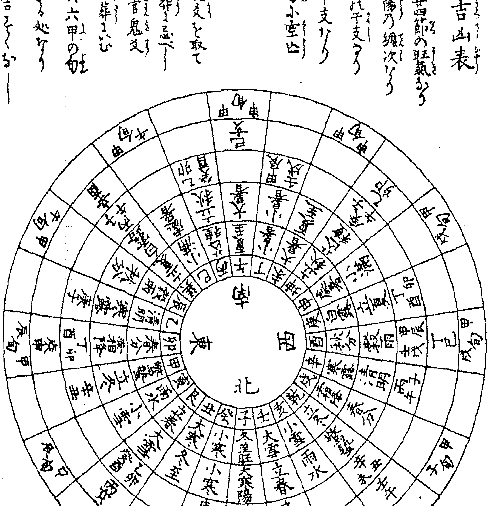

## 第二节 规模报酬递增

## 第一节 遁甲的攻击性

依据前章所述，我们可以约略知道「奇门遁甲」所要研究的事项。「奇门遁甲」是「抓住战机击败敌人，带来必胜结果」的「方位学」。我想大家都已有了这点认识，这种真传万一落入敌人手中，使敌人轻易地窥探出我方的虚实而加以攻击，那么我们就会自乱阵脚，被敌人消灭，这是很明显的事，因此保密工作是十分必要的。这也就是许多统治者千方百计的把「遁甲」的真传写成秘笺的原因，虽然这样做十分困难，他们也要排除万难，把所有的策谋变成秘诀，这在前章中已叙述过。不过，若是一直把它如此神秘的收藏起来，反而容易引起别人的窥伺，不如将其改头换面，以别种方式加以伪装，使人不再去注意它，自然也不会再刺探它的行踪了。早在周武王的时代，吕太公就想到了这个办法。吕太公认为「周易」在民间甚为流行，就把小成八卦和九局连接起来，而成八乘以九的七十二局，也因此使很多人产生「遁甲」和「易」不可分离的错觉，而因为演绎的关系，就出现了好几种的「遁甲演卦法」，尤其在日本，更是多得不得了；推测它们的年代，可能自江户时代就已不断的推演，这也是「易」在日本相当普及的结果。

其中，亦不乏相關書籍的問世，較具代表性的是大山童更所著的『陰陽發秘』，這本書中最值得注意的是他詳加闡述了吉凶和演卦的關係，其餘的書也都和遁甲有關，且內容都與「易」有相當程度的關連。不僅如此，中國目前和「易」有關的遁甲書籍也不少，雖然它們的流派相當多，若仔細研究，可以看出遁甲是從「易」導引出來的。「易」本身是一種「占術」，和「時間」、「空間」的科學性不同；嚴格來說，就好像水和油不能融合一樣。若是仔細推敲，遁甲的演卦法好像並不必要，雖然在「易」的小成八卦源遠思想中，並不能說與「時間」、「空間」的要素完全無關，若上述的要素離開了本身的科學性，而進入占術的領域，那它們就變成沒有科學性的東西，以前就是因為沒有科學性而進入占術之門，所以被巧妙的轉換成防諜作戰中的欺敵行為，且被掩飾得很好，這是令人相當頭疼而感嘆的事；使用者本身不得不認定上述的要素有遁甲的攻擊性，絕不是單純的「秘匿」、「隱蔽」、「防禦性」而已，也絕不是江湖術士的秘方，它具有絕對的殺傷力，我們曾列舉過一些事實說明；歷史上所記載的「焚書」、「坑儒」就是一項事實，可以說明君主對它的畏懼，而且我們還可以推測，在歷史上沒有記載的「手段」、「方位」、「曲數」、「人數」，不知被多少人用以掩飾及藏匿了，這些都足以說明研究「遁甲」是有其必要性。至於君主為什麼如此嚴格的禁止呢？這是想當然爾的事。原因當時的為政者，也就是權力的支配者，一直想隱瞞對自己不利的事情，所以就用威逼恐嚇的手段恐嚇那些記錄者，致使所做的記錄常有歪曲事實之處，這是無庸置疑的。但這些也並非完全歸責於記錄者，所以也不用責備他；同樣地，這些事在日本的歷史上也是如此，所以「史書」和「史實」不符的亦不在少數。為政者常藉寫日記來抒己見，那些日記雖然不知道是從什麼時候開始寫的，但畢竟還有些值得參考的地方，但是若被為政者發現，那麼不僅他本身，連他的眷屬乃至九族，都有生命的危險，所以他必須先作適當的考慮，才敢動筆直書。

反觀現在社會，民主化已相當進步，情報已成為世界性的消息，而被隱瞞的事實還不知道有多少，人的自私心是可以想像的，如此又怎能責備那些記錄史實的人呢？歷史並不完全是依靠史書來傳達，而那些記錄下來的事並不代表就是歷史，許多事情還是要靠後世的人仔細思考，才能弄得清楚，這是所有歷史學者公認的事實。

上面所講的遁甲七十二局也是一種欺瞞性的遁甲，是由孔明和仲達及許多戰術家及曆法家共同解明的，原來的各局因為時間久遠而有所變動，所以要由這些散亂的書籍中推想這些變化，必須靠孔明等人共同合作。以孔明的「遁甲」和現在所留存的「金函玉鏡」來看，可以知道它們曾被更改過，也就是具有一些欺瞞性，這點是可以確定的；雖是如此，它們還是有參考的價值。

研究這些史實並不是很重要的是，只是說明有很多事是需要自己去思考的，本書僅係提出一般事蹟，為大家解說而已。這裏的記錄不是用「干」的符號來作說明，也沒有「九宮」和「八神」，而冬至以後「陽一局」的「遁甲日盤」和「九天星」就是它的記載，也就是所謂的天蓬星變成軒轅，天芮星變成招搖，天沖星變成天符，天輔星變成青龍，天禽星變成咸池，天心星變成太陰，天柱星變成天乙，天任星變成太乙，天英星變成攝提這樣的變法。在此請大家特別注意的是，它的敘述是說「冬至後的甲子日」，而沒有說靠近冬至日的甲子情況，所以我們只能知道「冬至後的甲子日」之確實情況。一般市面上所出售的曆法，它們的陰陽遁變法是以靠近冬至的甲子日來計算的，以靠近夏至的甲子日做爲九紫，這種起法是錯誤的，希望讀者能加以注意，不要再弄錯了。

我們也可以現在科學的實證來說明這個錯誤，如圖所示，地球的中心軸有二十三度半的傾斜，太陽並不是完全正對着它照射，而只是在南回歸線和北回歸線之間移動及照射，並不是以甲子日做爲陰陽遁的交換線界，此點可以爲佐證。然而，陰遁並不是太陽正照北回歸線前的六天，而「九紫」、「八白」、「七赤」也在那些曆中成爲倒算時日的計數標準，是一種非常笨拙的計數方法。

太陽在正照北回歸線前的六天，是向着赤道的方向南下正照射，家庭曆對這種情形仍記載而不詳查，是非常嚴重的錯誤。正確的說法應該是以太陽正照南、北回歸線的時刻，做爲陰陽的替換界線。太陽正照北回歸線的月、日、時、分爲陰遁的開始，也就是陰遁是以那個時刻開始的。太陽正照南回歸線的月、日、時、分爲陽遁的開始，也就是陽遁是以那個時刻開始的。有的人認爲這是因爲干支是在太陽以前就有的排列法，所以六十干支優先於太陽的時刻，甚或能支配它的左右，這是一種錯誤的想法，而這種錯誤的想法，以氣學家們居多。那麼，如何才是正確的呢？我們應該如下面所說，才不會被人取笑，而且不違背科學的實證，請看下表。

| 月 | 日 | 干支 | 颜色 | 备注 |
|----|----|------|------|------|
|    | 23 | 壬申 | 一白 |      |
|    | 22 | 辛未 | 二黑 |      |
|    | 21 | 庚午 | 三碧 | 20時45分夏至 |
|    | 20 | 己巳 | 四绿 |      |
|    | 19 | 戊辰 | 五黄 |      |
|    | 18 | 丁卯 | 六白 |      |
|    | 17 | 丙寅 | 七赤 |      |
|    | 16 | 乙丑 | 八白 |      |
|    | 15 | 甲子 | 九紫 | 陰遁始 |
|    | 14 | 癸亥 | 九紫 |      |
|    |    |      |      | 誤九 |
|    |    |      |      | 正宮 |

一九八一年市面上所賣的曆法，是把陽遁的開始定在十二月十二日甲子日一白，而冬至是在十二月二十二日七時五十一分，但是又因為十二月十二日甲子日的太陽沒有正照南回歸線，所以要按陰遁的九紫來倒數，以九、八、七、六來排陰遁的九宮，而十二月二十一日七時五十一分前的時刻，是為陰遁的八白甲戌日，在同一時刻時刻分以後，才應該有陽遁二黑的甲戌日。

這樣看起來好像很有道理，但是按正確的方法來看，這是錯的，我敘述這一件事情，好像是說到不相干的事，但事實上，這正是『氣學』和『遁甲』的不同之處。

氣學就像把所有的醫生都當作良醫，能治癒百病。『醫生就是能把身上任何疾病，以適當方法及藥物予以治好的神仙』，就是因為有了這個錯誤的想法，才對某個固定的方位，寄以無限的希望，所以他對某一定方位的求取，幾乎都用月盤和年盤予以指示。

遁甲裏則沒有這種情形。『氣學』是以一個人的重心做為基準，以他為優先的考慮，而方位所定出的吉凶支配著他的一切，亦即他是受吉與凶支配，因為它有違常理，在常識豐富的人看來，是很可笑的。

『被所認定方位的醫師治療，那麼就一定能治好。』在這種錯誤的認定之下，一定會把所有的醫生當作是良醫，但是以局外人而言，也就是位在其他方位的人看來，他所指定的方位正是氣學上的凶方，同時從年命、月命與他不同的人看來，他的命運與上述的方向不能配合，因此那個方向也是個凶方，對他反而有害。因此，不但病不能治好，反而成了不治之症。所以，講一句不太好聽的話，「良醫在某年某月也會變成庸醫」，但這個事實好像不太能被人所接受。對某一位醫師而言，他是良醫就應該永遠好，而不能既是良醫又是庸醫，是庸醫又一下子變成良醫。雖然這在常理上不太可能，但是氣學家們都認為是如此，也就是即使是一個良醫，如果位在凶方，那他也可能誤診或開錯藥方，但是一個良醫，除非是在極端昏聵的情形下，否則是不會看錯病的，只能說當天是凶日，對那位求診者不好就是了，如果說一個良醫也會變成庸醫，那是氣學家們的錯誤說法，應該向那些名醫們道歉。

遁甲對這件事情的看法，是那位醫師是一位經驗豐富，醫療設備齊全的名醫，對求治者來說，該位名醫是透過他的親戚朋友介紹而認識的，他對求診者所患的疾病已有無數次的經驗，所以在他的醫治下，疾病不難治好。

忽略醫師的學識、努力和認真，只是用氣學的方法來看方位，並且依上面所指示的去看那位醫師，這真是愚不可及的行為，這樣做病是否能治好，是一件值得懷疑的事。

遁甲的看法是不允許那位病患這樣做的，絕不會讓那位病人去做這樣愚蠢的行為。「遁甲」會很認真的蒐集情報後，以認真的態度進行比較分析，檢討了以後，才告訴他應該去的地方。

「遁甲」甚至可以算出該病患的病因，指示他應該去的地方，並保證那位醫生一定會作正確的判斷，及以適當的處方和診療方法來治好他的病，也就是決定了正確的醫院和醫生之後，才叫病患前去求診。

「遁甲」是以時盤來決定醫生所在的方向，同時也會考慮到那位醫生的診療日期和時間；總之，它會以負責的態度告知患者應該去的醫院，有時，醫生會因事請假或是停診，「遁甲」可以告知病患醫生明確的診療日期。再者，如果能夠事先知道診療的日期，就可以電話掛號或詢問診療時間，就不會徒勞往返。

如果以急病和事故來討論的話，遁甲也有它的效用。因為急病和事故通常都是十分迫切，這時遁甲所指示的方位可以立即做為參考，因為遁甲已經把日期及方位測知的很正確。各日有各日的時辰及方位，一翻就可以立即知道，也就是以遁甲迅速的來看可與否，這和命理學的關係是一致的。我們在看方位的同時，也可以決定對策。但在緊急的病症中，如果有心臟病或是其他宿疾的人，能夠以遁甲來決定方位求醫的話，這是最好的；迫不得已時，才叫救護車；因為隨便叫救護車，它一定是把你送到最近的醫院去作各種檢查，這是非常危險的，不僅浪費時間，同時也對生命構成相當大的威脅，可能會致命。

有心臟病和痼疾的人經過詳細的檢查，應該可知道自己的情況和保健的方法，所以應該讓家人或身邊的人知道急救藥的擺放位置，這在心臟病發作的時候，可以立刻獲得解救，方法是先把「舌下藥」放在舌下，然後再緊急連絡常去的醫院，而免去許多無謂的麻煩。我們好像把話題扯遠了，但不管怎麼樣，以一個求治者的立場來說，這並不是題外話，氣學和遁甲是有天壤之別，但針對其他的事情，一般人如果能早知道的話，就可瞭解氣學有部分理論是相當曖昧的。

要找醫生的方位來求治，就是遁甲的攻擊性，這並不是單純的防禦，而是一場戰鬥，也就是前面所講的數位兵法家中，以諸葛武侯最值得注意。他是一位優秀的戰術家及兵法家，在其所著的兵書中曾經討論到捕捉戰機的方法，他曾經說過：

「如果要勝過敵人，不僅要知彼己，更要『得人和』、『得地利』、『得天時』，如果能夠做到的話，就能『百戰不殆』。」

「得天時」這句話就是指天時的重要，也就是「遁甲」，而人和與地利二者，都要活用「天時」，若能活用「天時」，而使得人和及地利兩者配合，則必定可以獲勝，這個觀念在捕捉戰機方面尤其不可或缺。 「人和」是指與人相處要和諧，而這裏所指的是「軍隊」方面的人和，廣義的說，就是任何階級」來貫徹命令系統，它是以人的和諧為主的，也就是要「得人和」，而不是以妥協或是友情以保衛國家擊潰敵人為共同目的的「集團」或是團體，在嚴格的訓練中，一定要以「秩序」和「的「和」貫注，應該是有守且具攻擊性的「和」，也不單單是數字的和，或是卦象方面的和，而是包含了勝過敵人本質在內的和。

「地之利」就是要取得一個比敵人更有利的地形、環境或是地勢，是指諸葛武侯所講的「人和」、「地利」、「天時」三者的配合，也就是「遁甲」的真髓。

這裏把目的意識再加以明確的說明，目的是希望在各項條件俱備的情況下，集中精神來努力，並且儘可能作毫無保留的發揮，這樣才可以達到目的。為了達到目標，需藉助遁甲的地方很多，而遁甲並不是以遊戲的心情去作，必須在確定吉方以後，努力去做，才能得到收穫，絕不是以輕鬆玩樂的心情即垂手可得的。

就一般情況而言，也並不一定要死板的用遁甲才能解決一切；例如只是要去郊遊、遊覽，也一定要先看吉方的話，那就矯枉過正了，只要擇定適當的地點，沒有危險及風暴，就可以欣然前往。如果每一件小事都執著於非看遁甲不可，就太古板了。因此，若是自認自己十分了解遁甲，就出版一些書籍，那是十分可笑的，這是不了解遁甲的真髓，及命理學的嚴正性的人才會如此做的。如此愚蠢的人只能暫時受歡迎，他會在時間的考驗下，暴露其真正面目；況且欺騙的行為也只能欺騙一時，不會永久，世人畢竟是會覺醒的。

這樣的人在日本、中國都有，那些自稱遁甲家的人，將太公原先的一千零八十局改為七十二局，然後又把七十二局改編為十八局，因為歷史的背景和政治謀略上的行為而作的欺騙，世人是不會知道的，但是他們的所作所為，又怎麼能逃得過歷史的考驗？在被人批評之後能夠立刻醒悟的人很多，如果被批評之後仍不自覺，依然固執於自己的言論態度傲慢，這種人是無可救藥的。

遁甲並不會引發奇蹟，也不是超能力及神附身的靈異，而是要正確的了解「人和」、「天時」、「地利」。它並不是光憑自己的想像去做就可以了，若是以幼稚的想法任性去做，往往會發生錯誤，而導致很難收拾殘局。

張子良（張子房）在閱讀了太公的一千零八十局後，將它精編為十八局，因而有漢朝的成立（紀元前二○二一年）。神殺派的理論，是無法了解天時及捕捉戰機的，這無助於國家的建立，如果有人持用這種方法危害國家，亦無損於國家的存立。所以精編的十八局之所以受歡迎，是理所當然的事。

今日戰鬥武器從刀槍演進至火器（槍、砲及其他），在戰術、兵法及軍略上也有了巨大的變化。「遁甲」這種以抓住戰機為目的的軍事謀略已逐漸淡薄，而在觀察之後才定方法的緩慢作法上，也有了重大的改變，但究竟改變成何種形式呢？其實就是以「集團」的活用性為主的機動作法，亦即以個人活動為主的空間及大氣現象的「趨吉避凶」、「轉禍為福」的「行動力學」了。這個重大的改變，也就是「集」和「个」的最大不同之處。

「集」是指群體，「个」則是指個人，在歷史的演進下，兩者並不相同，這點容後說明，這裡僅就「遁甲」的真髓予以探討。

人是在某年、某月、某日、某時被決定出生的，也就是在那個「決定瞬間」，決定了他的誕生。精確的來講，如果差了一刻鐘，那麼這個人將變為另外一個人，這種迅速而自然的轉變，不得不承認這個證理及事實，所以「決定瞬間」是不能更改的。

「個人差」和「個體差」雖然有其相互存在的關係，但兩者的界限嚴明，出生的嬰兒在母親的胎內和出生的那一瞬間，都在不斷維持生命的運作，也就是進行維持生命的「能源價值轉換」。在胎內時，就是以同一進度來作成長的「能源價值轉換」，在決定的瞬間，也是以同一進度作「能源價值轉換」以成為另一個獨立的個體，讓它在世間上是以肺來呼吸，以「食」的本能吃奶，排除異常的現象繼續成長。在新的環境裡，除了自己的父母以外，對於比自己年長或是同年齡小孩的攻擊行為，他也具有防禦的本能，也就是說，他開始有應變的能力，在攻擊和防禦本能之間慢慢開始自我成長。人類在幼兒期就具有攻擊及保護本能和與生俱來的核心氣質，以與生俱來的智慧來應付外界的變化，這樣一生中就不會有所改變，而以穩定的進度成長。

就人類從幼小時期就具有攻擊及防禦本能的觀點來看，其中有許多值得探討的地方，如果要在本書中提出專門討論，則脫離了本書主題，故在此不多做論述。至於闡述幼年期成長的專書，坊間大多有售，許多研究學者都有關於這方面的看法。當然，「種族保有本能」也會同時成長，也就是種族的血統不會變，有什麼樣的祖先，就有什麼樣的後代，荷爾蒙的分泌也會隨時調整，以加速其成長，隨著年齡增加的荷爾蒙是有其固定量，不會大量的湧出而妨礙生長。

這裏要說明的是，攻擊和防禦的本能並不是任意而發的，因為人有「智慧」，可運用智慧幫助判斷，不會使之在是非不分的情況下為所欲為，因而人人所呈現的攻擊及防禦本能是非動物性及理性的。

人是一種能夠持續作戰的動物，從廣義來說，不僅是對外的戰鬥，就是體內本身也分秒不停的從事著持續的戰鬥。

幼兒常會因爭玩具而有所衝突，對自己不中意的事會生氣，這也就是外在與內在的戰鬥。有時甚至會對不滿意的事情產生攻擊行為，這也是由內在戰鬥擴及外在戰鬥的顯例。

戰鬥是導源於一個觀念，那就是「既然是一個人，就會希望自己隨時都幸福」，這種觀念每個人都有，而且與生俱來。舉例來說，小時候的一顆糖果往往是一場紛爭的導火線，成年時又會因事務及金錢上的因素與人爭執，這些都是說明維持自己幸福而作攻擊的適例。舉凡從小開始成長到自我獨立的時期，從模仿期到接觸廣大層面的成人期，這個個體仍不會失去這個觀念。

人類在這種觀念下，自然是不斷的進行各種戰鬥，但這是否會給個人帶來不便與麻煩？答案是否定的，這是因爲人有「智慧」的緣故。例如：人們想獲得更好的成績，考取理想學校、有取之不盡的金錢、滿意的配偶、有才幹與能力、追求更高的地位或健康的身體等希望幸福的觀念不勝枚舉，在慾望中求生存正是人類與生俱來的本能，也因爲有慾望，才會不斷的努力。然而，不可諱言的是在追求幸福的過程中，也會有人嘗到失敗的滋味，但這都是因爲疏忽，以致不能順利達到目的；有的人失敗，是因爲不努力，因此戰鬥的本身並不可怕，只要肯努力就能成功，而且要更積極，才可獲得豐碩的成果。

既然是戰爭，就一定要全力以赴，以求得最後的勝利，如果抱著遊戲的態度或是半途而廢，就不可能成功，也就不可能獲得期望的幸福。

遁甲就是要抓住戰機來達到必勝的關鍵時刻，在時間和空間的相對性中，在「方位」和「大氣現象」中從事有效的能源價值轉換工作。

作戰的空間就是攻擊的地方，也就是所謂最大防禦地方，這裏所講的防禦，就是避開消極，而有消極作用的意義，這也就是遁甲存在的積極價值。

## 第二節 原因和結果

所有的事物都可以說是原因和結果的相互轉換，即使是哲學、科學，也是以原因和結果的互相關連性進行各項推理，以求獲結論，也就是用理論和秩序來作各種實證。人亦可謂是一生中都在原因和結果的累積中奮鬥的個體，所以終其生命都在判斷中求生存。人降生到世界上，也是一個結果的表現，但人是如何產生的呢？單純的說就是「受胎」。因為受胎才會有個體的產生，人才會出生到世上。事實上，「受胎」也可以說是一個結果，在它之前是精子與卵子的結合，由受精的原因產生受胎的結果，因而成孕。像這樣有了原因而產生結果，而結果又同時是原因，再據之產生結果，或者是原因前一個原因的結果，如此繼續不斷的演釋下去，就產生了各種事物，人類也因此而有進步。就一般情形而言，一個人出生到這個世界上，是代表它的一個個體，這種出生是萬人一致的，這些單獨的個體在命理學中所代表的意義是有千萬種不同的個體，這些各類型的個體不是全部相同，只是類似而已，命理學的理論體系也因而成為一個線索與開端，這也是大家熟知的事實。這些近似性與相異性是無法勉強的，因這種情形的存在，產生了種種相異相象，它代表了每個事物的特性，這些互為因果的關係不用說大家都會明白。

一個人出生到這個社會的瞬間，有他出生的形像，也就是出生年月日的決定瞬間決定了他的一生。照理講人應該是順遂渡過一生，但仔細觀察每個人的一生，常常有極端的情形存在；這些極端的情形，常常是在數天或數月之間造成的，其結果是相當悲慘的，最後以致離開世界。有的人是健康的成長，有的人卻夭折而死，或是喪失健康，或者遭遇天災地變而九死一生，而這九死一生的情況又接二連三的發生，使其不勝困擾。像這樣的有吉凶、禍福、貧富、生死，社會地位的變化，而從高位降到低位、配偶或子女的不和、雙親間的緣份日漸淡薄、接受恩惠的良與否（如某人惡意的陷害）等，這些都足以造成個人一生的失意，有的甚至可以預知兄弟姐妹的劫數，而且相當準確，對未來的事實也可以知道得很清楚。

因為有這樣的預知，所以某個在某年齡的人，如果希望以命理來推知未來，那是可以預作推知的，方法是以他的年齡為基準，把過去的經歷加以整理，然後根據情況來作推算，就可以知道日後的情形。我們以這些整理出來的事實作成一個系列，然後判斷以後的系列（以後會發生的情形）；若以後的系列當作百分之百，那麼在那個系列的事件中，有百分之九十五到百分之九十八的事都可以正確的算出，也就是所預知爾後的事會非常的準確。若再以吉凶禍福的程度來說，到底它的程度有多少呢？其情況也是自百分之九十五到百分之九十八，甚至有百分之百的情形，所以這種預測方法也是相當可行的。我們從一個人的前一生，來看他以後的經歷，可以預知他一生命運，也就是預測正確的話，那麼他以後一生中的命運將是按這個步驟進行的。這種情形也就是剛才所說的原因和結果的連續性，亦是人生的組成要素，這是可以預測的，上面的講法，也都可以歸納到這一點上。

命理學並不是宿命論，它是用來「造命」的，具有趨吉避凶、轉禍為福的理論，如此它才有存在的價值，才會有吉上加吉的結果；所以不要讓命運主宰自己，要把握人生，不要虛渡光陰，有了這樣的攻擊性，才有幸福可言。

因為有這種循環性，才能有繼續努力的希望，如果沒有攻擊性，也就沒有努力的心，那就會產生壞的結果；有了這樣的壞結果，那就必然是一個壞的原因（因果關係），繼而引發出複雜多枝的負荷，也就是壞的結果，這是必然的事情。所以如何把惡劣的原因轉換成好的原因，是我們應該注意的事，而把它轉換成一個好原因的方法就是具有最積極的攻擊性，其步驟是按遁甲來作能量價值的轉換，把開運造命和大氣造命的事實加以活用。

這也就是按照命理來審查自己的生命，這種方式可以多種途徑進行，我們可以用電話聯絡或是寫信查詢，在知道結果以後才付款。這雖然是一個不起眼的行為，但已經是在進行能量的轉換了，而且它也正在從事某個事項的調查，也就是所謂的起因，這個起因就是一個發端，它究竟會有怎樣的成果，讀者可以從過去的事蹟中得到推理，在拙作中有很多說明，可供參考。就以遁甲而言，一個人所擁有的智力和能力，能夠發揮到何種程度，是可以預作推測的，他要如何的把惡果惡因轉變為善果善因，這要在持續不懈的努力中才能得到，如此不斷的檢討，在時間的日積月中，自然就能進步。如果只是以遊樂的心情與過去一般的沈迷生活而想讓命運好轉的話，那怎麼能成功呢？又怎麼會有成功的希望呢？失意的人若只把自己的不幸與惡運推給命運，說是命運造化作弄人；或是推給雙親及祖先，來掩飾自己的懶惰，則遁甲的方法是無法實現的，類此的推諉行為也是遁甲所不容許的。這種把原因轉嫁給組織中他人的想法，就是一個惡因，有了這個想法，必然會有一連串的惡果，然後因為循環的關係，又回到了自己的身上，因此冤冤相報，本身仍然不能倖免，而且有了這個想法以後，人就不會再努力了，無法再有自我改革的智力、能力、努力，因而一再墮落，終至滅亡。誠然，並不是沒有先天性的障礙與困難，但既為一個人，就應有生存的希望，應有生命力，努力追尋克服困境，就應該與生命一起奮鬥下去。我們先前也提到，在個人的內心深處也有戰鬥存在，若是要轉嫁責任給其他的人，那也就是自我戰鬥失敗，也就是說這個人已經沒有希望了。人對命運的挑戰與攻擊是有嚴格界線的，不是隨便的去做就能達成目標；在嚴格的界線要求下，需以理性為前提。在原因與結果的連續循環中，如何造成良好的環境，也就是達到一個良好乃至最好的情況，是遁甲一直努力的目標，也就是如何去造命開運，以臻於完美的境界。

## 第三節 能源的價值轉換

能量不滅是眾所週知的物理原則，人的生命也是由能量構成的，無時無刻都需要能源，因而細胞一刻不停的在作新陳代謝，而體內所有的器官，則從事著能量的價值轉換，這才有了生命的氣息。

所謂飲食，是以勞動力把食物送入口中，然後以食物產生能量，而這些食物的購得，必須用金錢才能買到，為了要有這些金錢，每個人必須要努力工作，否則是不可能得到金錢的。

以能量轉換來講，就是把叫做能量的勞動能量放出，而把另一項獲得收回，以此能量來換取己身所需，這循環不已的工作就是能量不滅原則的適例。以勞動來換取金錢，就是把能量釋出以求得那價值轉變的金錢；以食物來說，也是取得食物以供給身體能量，這就是一項價值的轉變。

上述的例子不單是以勞動為能量轉換的唯一例子，而是說生活中的任何事物都可以作為能量的基準，在能量的複合與轉變下，每項都能獲得回收。像我們的呼吸，就是一項能量的價值轉換，吸入空氣以後，新鮮的氧氣能給予人所需的力量，而循環過的廢氣就要隨身體內的各項廢物一起排除，這裏所說的吸收與釋放，就是一個例子。

能量不滅的原則已如上述，那麼這個「能量」的來源究竟是什麼呢？其實就是太陽發射出原始的能量，將之移轉到地球，而地球上的生物接受了這些能量後就有了生氣，接受能量的時間長短與否，或是接受的地點為何，皆足以影響接受的能量，所以太陽、地球、時間及空間四者，可以說是萬事萬物的能量來源。

被稱做「天時」的「天」和「地利」的「地」，也就是指「地球」，在那種時和利（空間內）的條件下，才有「人」和「人類」的「和」，人類之間才有了和諧。

人在維持生命的過程中，如果失去了和諧，那就會發生很多事情。個人若是失去了調和，就會發生病變、事故、不幸、不孕及各種災禍，而且這些災禍如影隨形，絲毫不會消失。

筆者在命理學中是以公理來說明這些事情，就是以「太陽地球相關關係中個人與個人的對應關係」做為一個基準點，說明各項事物。

此外，我在「四柱推命學」的講義中，也是以能量不滅原則作為基礎，從側面加以說明各個事項，並發現它確實能夠適合大眾。

命理學的經典之作「滴天髓」中曾言及：「欲識三元萬法宗，先觀帝載與神功」

這個說法適足以支持我的「能量論」，也就是和我的這個公理以複雜和微妙的獨特表現法來說明萬事萬物的方法是不謀而合的。

在那裏面，是這樣說的，由「陰陽五行哲學」來生出「六十干支」、二進法、三進法、五進法、十進法、十二進法及六十進法，更從「三」這個數字產生九進法。在單數的魔術陣中所使用的方法，也就是以三為基準，該方法也叫做「井田法」。

這個魔術陣以古代中國人的智慧，把時間和空間用最單純，最樸實的同一體表現出來，這雖然和「氣學」有些相近，但還是不能當做氣學的正確解釋，也就是說氣學很正確。

這個魔術陣是以一個宮位配上九個數字（當作九個宮位），陽順的中宮一、二、三、四、五、六、七、八、九是按照日、時變動的；陰逆的話，就要以倒算的方法來做，也就是以九個數字按九、八、七、六、五、四、三、二、一的順序來排位，那麼中宮也就要按日、時來改變了。在中國的哲學中，以陰陽五行哲學最為偉大，它沒有包括這個魔術陣，如果只是用魔術陣的話，不管氣學家用那種說法來解釋，都是詭辯或強辯；因為魔術陣與氣學毫無關係，如果藉它來解釋氣學，是缺乏理論基礎的，並不能以「學」的理論來說明，氣學的大錯誤已在前面述及，這裏不再多說，只是說明以它的原緒性是沒有辦法來解釋魔術陣的。

氣學係以「占」為中心，是以純粹的確立論為理論基礎，而確立率的正確性極低，氣學家們也是知道的，這個魔術陣的起源，是以三個原則為中心，並以它作為演繹基礎，這三原則是：

### 魔方陣

（左側標註：七·五·三；右側標註：三個區段）

```
  4 9 2
  3 5 7
  8 1 6
```

```
+   1 2 3 4 5 6 7 8 9
    9 8 7 6 5 4 3 2 1
```

從這三個原則來看，以它們各自開始的數加三的和做為基點，再以這個基點繼續加三，如此一直加下去，那麼單數（基本數）一至九都很齊全，如此一直加下去的話，不管是多大的數都可以表示出來，1、2、3、4、5、6、7、8、9九個數字組合的，其中3隔開了「1、2」兩個數字，7隔開了「8、9」兩個數字，而5則是這個數列的中心點，因此「3」、「5」、「7」這三個數字就有了它們的特殊意義。

看出是中間的排列比較吉利；若把縱行、橫列及斜行的各個數字都加上的話，它們的和都是「15」，由數列也可以看出，從「1」開始順數，或由「9」逆數，都可以看出「5」是位居中間，也就是說「5」是一個中宮，若依上述的魔術陣排列，則無論是縱行、橫列或斜行，三個數字的和都是「15」，這點真是很巧，而所謂三元又恰好是三個位相，也就是「天」、「地」、「人」三個位相恰巧也是三個元素一組；因此，「3」這個數字也有其本身的意義。

我們可以說各種事情都具有其巧妙性，像張子房把太公望的一千零八十局精編為十八局，這在防諜作戰中是非常適合的，十八局的「18」恰巧是「3」的倍數，是個吉數，故能剋敵。三元的說法是「天」、「地」、「人」三個元素，也就是「天干」、「地支」和「人元」（藏干）。「地支」是時間的方位，它不會變動，會變化的只有「天干」，太陽是時間的變化，也是一個能量特性的變化，這種「太陽能量」的變化會對地球的能量特性變化產生極大的影響，人類在時間和空間中求取能量的調和，是一件很自然的事，這也就是遁甲的立論點，以「甲」為「至尊之神」，也就是玄義的要旨。

我們若在特定的某一定時，也就是吉的方位進行能量的活動，對該方位作能量的轉換，即可獲致豐碩的成果。例如，對某個方位進行消耗能量的活動，如以金錢購買物品、做體操舒展身體，或是朝某方位行駛，而行駛的是自身所擁有的交通工具，像這樣在從事活動的當中消耗能量，同時也能獲得自己所需的能量，這就是能量轉換的行為，人類可從其中得到更新更多的能源，做為思考的來源；這種把所有的能量按照能量不減原則做為價值轉換與取得的步驟，相信不會有人持相反論調。

以一個不了解遁甲的人實行「吉方活用大氣造命」，其效果是可以預料的，而且所收成效的差異顯而易見。如果有人問道：「一個不太懂遁甲的人，怎麼能活用「吉方活用大氣造命」的法則呢。」這句話我也不知道怎麼回答才好。誠然，「吉方活用大氣造命」並不能完全說明遁甲的精義，但是我們可以剛才所舉的「能量論」予以概略說明；如果「能量論」也不能讓人信服，筆者可以用一個使用打火機的例子再作說明。

大家都知道使用打火機時，要用大拇指來按輪轉鈕打火，若按下輪轉鈕而不用力的話，就無法點燃打火機；用力按的話，則表示是把能量加在輪轉鈕上，而這種能量又轉換成點燃火源的能量，使用者因此獲得了火源。你把自身的能量加在輪轉鈕上，一樣也能獲得火源；反之，若不在指定的時間和方位上把自己能量加上的話，恐怕無法獲得火源，這就是說使用者如果不按時辰在適當的方位上消耗本身的能源，就不能獲得適量的能源。

經過以上的解釋，相信大家都能了解遁甲的大意了，我之所以舉打火機的例子，是要告訴大家打火機雖是一個小巧的工具，但它仍是由多種物質合成的，是經由很多人的智慧一點一滴累積起來而成的物品；在文明的世界裏，這種工具似乎是不值得一看，但是在文明未開發的地方，它可是一種新鮮的玩意呢！如果你不告訴別人如何使用的話，只怕他們還不會使用呢！
我以這個例子說明「能量論」，想必大家已對遁甲有所了解，如果還是不能了解，那我懷疑這個人是否是生活在文明世界裏。
我們更明確的說，如果某人在某年某月某日某時出生，則那個時刻就是能量轉換的時刻，意思是他的雙親在該地方與環境中，以原先結合的能量轉換了這個出生的個體，這不失為能量轉換的一個實例。
個人的能量及生辰八字是一個決定的瞬間，沒有任何的力量可以改變；倘超前一刻，就變成另一個個體；晚了一刻，卻構成另一個個體，因此太過與不及都不是好的瞬間，而只能以決定的瞬間時刻來決定某個個體。
在大運及流年流月的時刻所佔用空間的能量是必須予以調節的，不僅是要調節，更要和諧的予以調節，才能適時適量，且不會有太過或不及的現象，這也就是「奇門遁甲」所要討論的對象，也就是「奇門遁甲」的主旨。

### 摘自地理天機會元

### 形水浮蝦玉

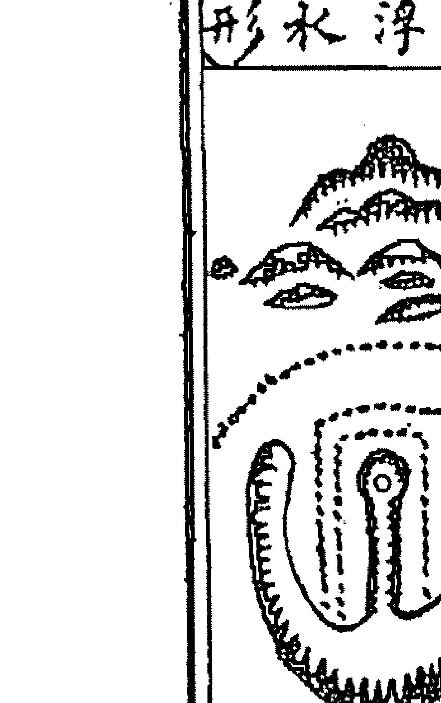

### 形球打信韓

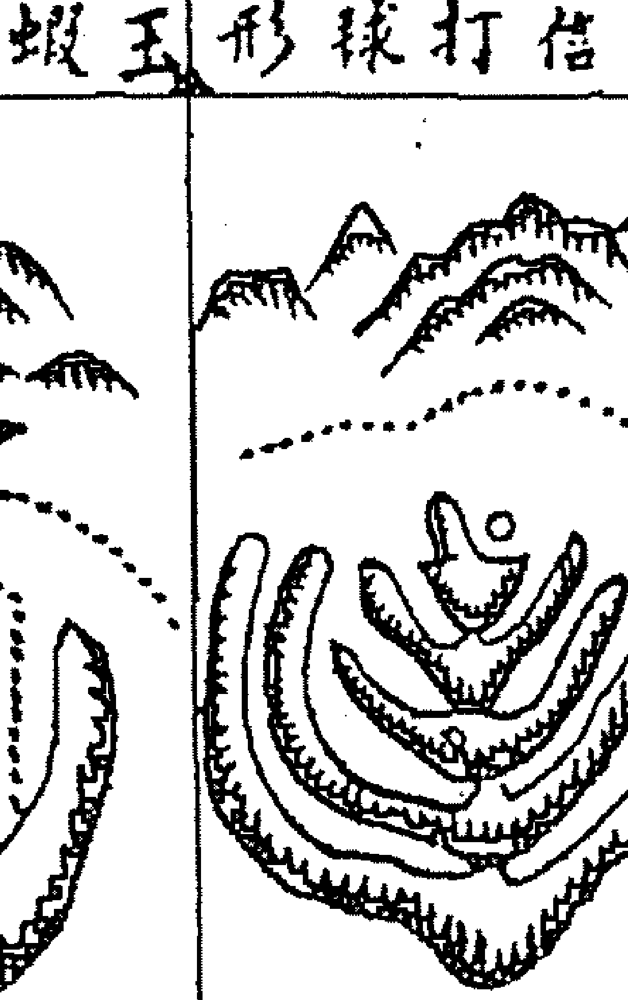

### 形柳楊吹風

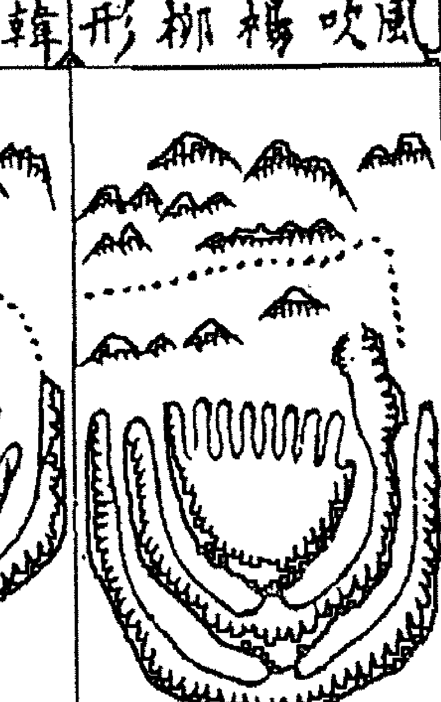

### 形龍祖家黃

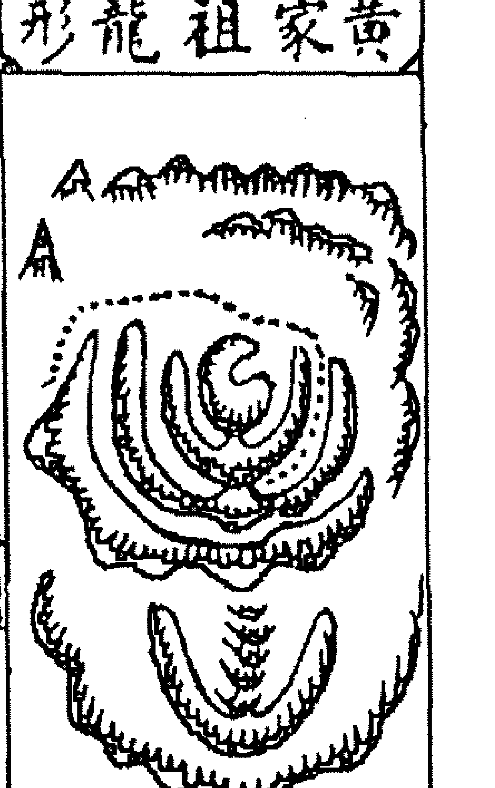

### 形旗摩士力

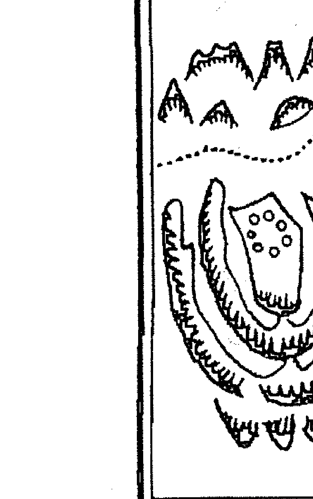

### 形花蓮

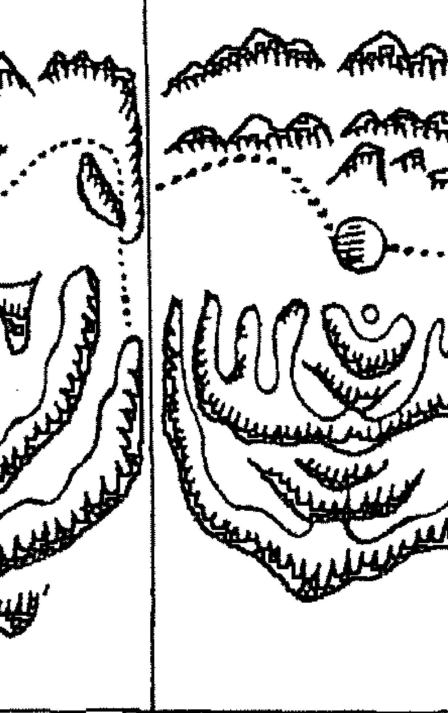

### 形鯉躍詩姜

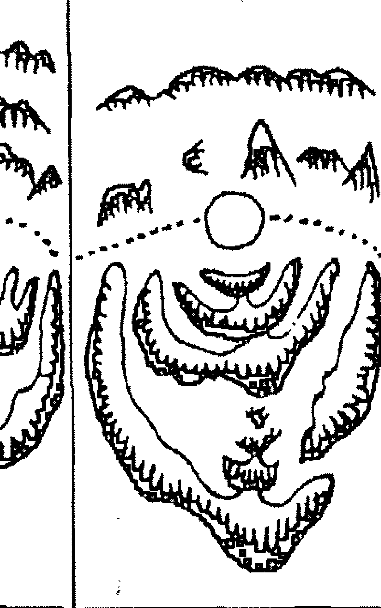

### 形葉荷露雨

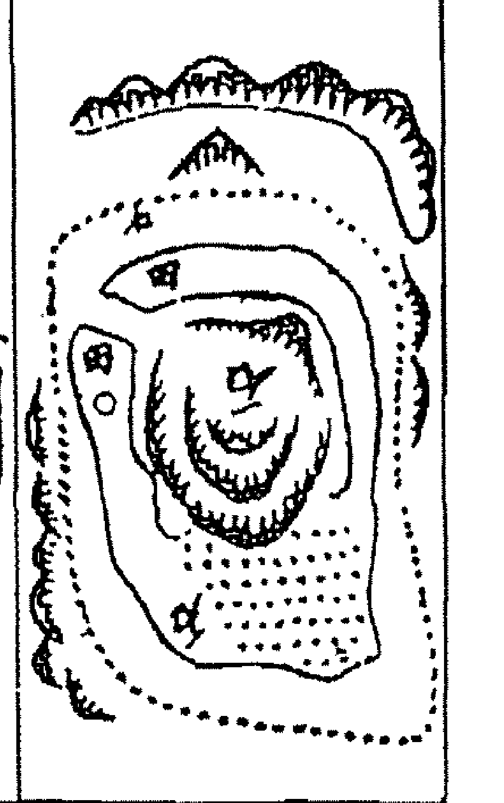

### 形蚣蜈崖奔

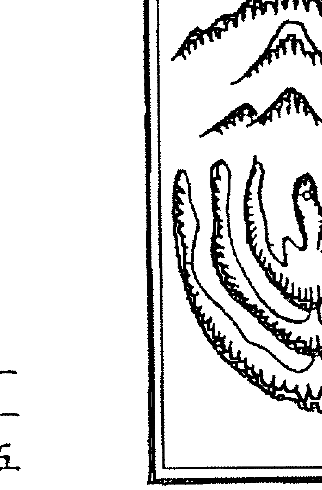

### 形珠穿針金

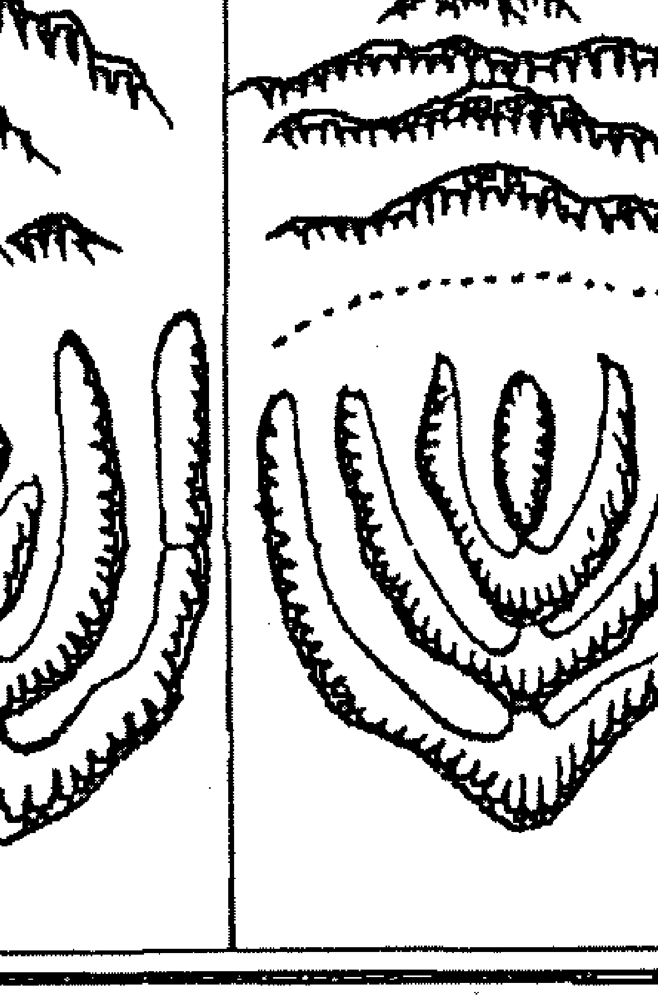

### 形蒼落

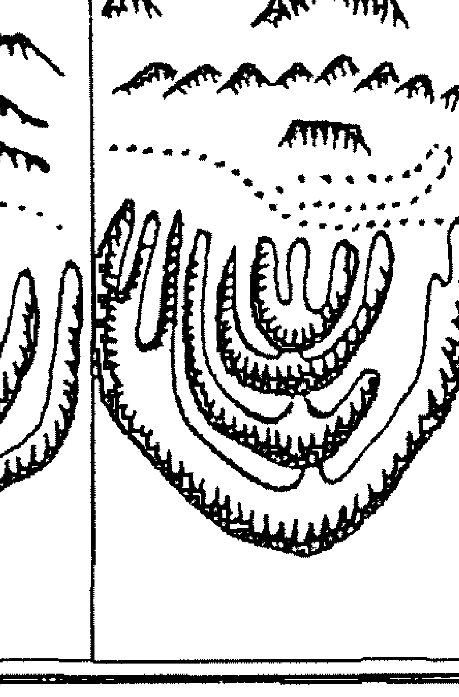

### 形花採蜂遊

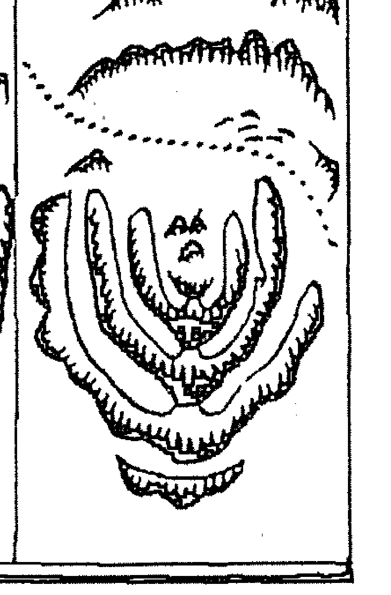

# 第四章 「集阅奥国」

## 第一節 「集」與「個」的相異

按照前章所述要義，學習遁甲者必須對「大氣造命吉方活用」的方法與原則有適當的瞭解。

截至前一章為止，在我們所討論的理論中，提到的大多是命理學與遁甲的相關部分，因此有人認為是否「命理學」就是「遁甲學」的前身，應該把它們相互參用，但這只說對了一半；事實上，遁甲學仍然是一個獨立的個體，有其理論體系。在把時間和空間作為同一體系來研究時，它們具有一定的關連性，我們從前面的討論可以大概了解到它們彼此之間的關連性。

如前所述，命理學是按照公理來表示自身的理論，太陽和地球的相關關係是生、年、月、日、時，它們相互影響對方，太陽賦予地球能量，地球與它互相吸引，太陽同時給予地球上的生物珍貴的禮物—時刻，來決定它們的一生，嚴格來講，即使只差了一分鐘，就不是那個原先生命體了。

以「時」來講，主要就是因為那個地方有命理學上的大運或者是流年流月，所以對該出生個體產生有關其一生的重大影響，是吉、是凶，是禍還是福，都很難由他個人去改變，一個決定的瞬間，決定了他的一生。

人每天的日常生活是在空間的範圍及方位中進行活動的，命理學就是講述這個空間的種種現象、大氣現象及雲層變換等等。如果一個人命運好的話，在行大運的時候，固然是會行向好的方位，但在流年時，則命運又會向何處去呢？答案是「也會向好的方位移動」。同樣的，壞的命運在大運之時，也是一樣的會向壞的方位移動；至於到流年流月的時候，那更是會向著壞的方位移動。由以上的敘述，我們知道「原因」的「決定時刻」決定了「結果」的好壞方位，因此「原因」和「結果」是很明顯的，也就是因果關係必然會展開，在這種情形下，「空間」好像就不太重要了。

遁甲剛好與此相反，它是有方位性的，有固定的年、月、日、時，也就是「方位」的空間和「時辰」的時間是一致的，大氣的現象也並不是一定的，它有它的節氣時候。「時間」和「空間」的一致性是其理論重心，這點已在前章中論敘過了。

『遁甲』是要抓住每個戰機來戰勝敵人，原先的一千零八十局在時代的演進及進步中，及戰鬥器具的改進下，面對這些挾帶強大殺傷力的武器，也不得不有所修正，必須修正到本身亦具備強盛的軍備才能克敵致勝，也就是決定在戰局勝敗上，原則與方法固然極其重要，但是堅強的戰鬥備力也是不可忽視的條件，但並不單指武器而言，它還包括了國家的每一分子，亦即集團中的每一分子。

隨著時代的推進及戰爭的情況來考驗個人意志力的強韌與否。通常是戰況愈激烈，他的意志力愈強，愈有戰勝的希望；戰況惡劣，意志力就愈薄弱，就只有束手就擒了，因此，戰勝的關鍵是在於對每場戰爭的意志力上。遁甲中除了講明方位外，更要鼓舞每個人的意志；因此不只 是意志力的堅強與否，有關遁甲活用的重要時機也十分重要，兩者在每場戰鬥中必須互相配合， 這也就是遁甲所謂的戰備力。

如前所述，因保衛國家而作欺瞞工作的十八局，經由歷史的證明，它們在防諜上是沒有缺點 的，但古人完成十八局的時候，究竟是以何種哲學為基礎？以什麼方位定出吉凶？仍然是一個問 題，有待後人考證。

現在只能約略的推想成它是把個人的生年生月的九宮（也就是氣學的九星）當作占卦的基準 ，在這個生年生月的基準下，每每都能逢凶化吉，獲致最後的勝利。這種情形在占卦的時候，參 照了各種吉凶神殺的說法，考慮了各種吉凶神殺的情形之後，才肯定的說出吉方。

這精編的十八局是由各種情況的推演彙編而成，由它再往回推到原先的一千零八十局就不是 那麼容易了，因此後人只能作這樣的推演，這在道理上十分的吻合。

「天」、「地」、「人」三元的完全消失，是此處的一項特點；因為它只看個人的生年月日及時辰，就可定出吉凶，這裏只用個人的生辰年月及遁甲的方法定吉方與凶方，因此只剩下「上」、「中」、「下」三元。古時因民眾知識未開，往往任由統治者為所欲為。「愚鈍的兒子」就是任意做了放肆的行為，也沒有人會去指責他，使其成為國家的支配者，這完全不同於現在的民主，相信沒有人會反對這種觀點。「愚鈍的兒子」所用的方法也是愚鈍的，以其有限的氣學知識，當然無法明瞭命理的堂奧，這種現象即使在今天也是一樣，研究氣學者往往想用氣學上的方法來解釋命理的理論，但每每感到沒有辦法解釋，所以就到臺灣尋找遁甲家來講解，然而人們是無法以氣學的知識來解釋命理的，縱然從臺灣聘請遁甲家至日本講解，其結果也是可想而知的。事實上，他們的想法並沒有錯，只是太幼稚罷了，因為即使了解遁甲，而要用氣學去解釋它也是很困難的，所以教的人只是告訴他們一些淺顯的知識，並沒有把重要的理論解釋給他們聽，因為傳授者似乎也知道以氣學的知識是無法完全了解遁甲的。

所謂把方位的吉凶不分時辰的混合在一起，對任何人都是一樣的，就好像雨會把任何人都淋濕一樣，是不太明確的講法。那裏有對大家都是一樣的吉方

如前面所討論的，筆者要強調「吉方對任何人均為吉方」這句話是錯誤的，我們可以從下面的事實得到證明。
「遁甲」是把握戰機來剋敵致勝的，可說是一場賭命的戰爭，所以它「吉」「凶」方位的認定與出現是相當厲害的，而此「吉」與「凶」的方位也是因個人生辰月日時辰的不同而有所改變，所謂的把握戰機，就是把得到的人和地利配合天時，在三者配合得宜的情況下，得到最後的勝利。所以為了贏得最後的勝利，求勝者可能要付出相當大的代價。
為了戰勝的戰鬥往往是相當激烈的，參戰者可能會陣亡或受重傷，而遭受生命的威脅；也許會是輕傷，或者只是一場虛驚，當然也有可能成為俘虜；總之，所有的凶災或不好的事情都會發生。相反的，也會發生好的事情，也許某個小人物會在某個時機擒住敵方大將，甚或得到對方的頭顱，這樣他的功勞就遠勝於衝鋒陷陣的勇士，並因此受到恩賞、加級，或是更大的榮譽。然而，這些吉事又是從何而來的呢？又是什麼因素決定了他的榮耀，究其原由，就是「天時」所致，也就是取於他的生辰月日及「決定瞬間」。
以集團或是部族而言，雖然每個人和他所屬的集團有很大的關係，但就個體而言，每個方位都是有吉有凶的，也就是任何一個方位並不是對每個人都是吉方；就算是同樣的吉方，對每個人而言，吉的程度也是有大小之分；同樣的，凶方對個體亦有程度上的區別，這些個人程度上的差異，就是「集」與「個」的差異。

戰鬥本就是生死交關的事，在吉凶上顯得特別激烈，但在非戰鬥的時刻，其顯現也是相當激烈的，如受虛驚的人、受重傷的人、死亡的人，各有其程度上的差異。我們時常在報上看到空難事件不斷的發生，而導致全機人員無一倖免的慘劇，但幸運逃過浩劫的情況也時有所聞，例如在空難事件發生後，往往會在燒焦的屍體裏找到待救的呻吟者，這真是不幸中之大幸。我們把這些事件的吉凶當作結論的話，就可以證實下面的講法「命運是因個人的時辰而有不同的吉凶。」「集團」或是「集」為個人的集合體，但是它的吉凶和個人吉凶無什關連，命理學和遁甲學是由時間和空間所具逆說性的因果律予以劃分的，也就是時間和空間是相互配合而非獨立的個體，在去除這個相對性以後，再經由因果律的關係產生命理學及遁甲學。命理是命理，遁甲是遁甲，這是一種體系的學說，如果說是一體的話，就和「沒有空間的時間」及「沒有時間的空間」說法一樣，是個很離譜的錯誤。在某年某月某日某時出生的某個人，以命理學的理論來說，是具有其自身的體系，也就是該人擁有自己的命理體系，在某個年月日的時辰內，個人有個人的先天命與後天命，這和遁甲有些方面是相通的，但它仍是自成體系，兩者不是絕對相同的。換言之，讀者只能從命理學當中約略知道遁甲的理論。

## 第二節「個人」與「遁甲」

命理學是以六十干支和個人的生年月日時，即四柱八字來審查個體的運道，也就是以天干四、地支四來配合，亦即是以地支人元的藏干來審查命運；而遁甲則是以十干（如果以六儀來作遁甲就會嫌不足，所以方位盤也是以干做為製作基準，但是它只取九干作基準，而不是全用十干）、八門、九天星、八神、九宮的五層理論為基礎而寫的。

這兩種理論的共通點就是以「天干」這層理論為基礎，至於十二支，兩派只是以時間和方位為其指示對象，並沒有特殊之處，這在前面也曾說明過。在共通「天干」的特性、意義及性情方面，兩派的看法是一致的，並沒有什麼差異。

命理學是以個人的命兆、四柱八字（含藏干）定出用神的一神和一干，這用神必須是喜神、忌神、閑神才可以，這些是審查命運之前必須注意的步驟。當然，在命兆中不包含者，就不能以「用神」來處理。「遁甲」是以「甲」做為「至尊之神」，以六儀為輔助工具，構成一個以甲為方向盤，乙、丙、丁三者為「三奇」的體系，這並不包括在六儀裏面。相信讀者定會奇怪為什麼？

這是因為「甲」為「天干」中的首位，是天地間的第一太陽，中國的歷史是向上逆算到周朝，至於歷史的原點究竟在什麼地方，一時也很難找；而曆法的逆算也是一直向上算到周朝，那麼曆法的原點又在什麼地方，也很難定。
我們將黃帝建國的年月日時定為甲子年、甲子月、甲子日、甲子時，一切都以「甲」為開始，所以「甲」的意義是至高無上的，因而以它為「至尊之神」。此處應注意的是，若以「甲」當作「至尊之神」、「用神」的話，要避免用剋傷「甲」的「庚金」。庚金在「滴天髓」中也曾提到，它是：

-   庚金帶殺
-   剛健為最
-   得水而清
-   得火而銳
-   土潤則生
-   土乾則脆
-   能贏甲兄
-   輸於乙妹

「得火而銳」的火就是含丙丁的符號，「輸於乙妹」也包含了「乙」字在內；而上述的話含有「乙」、「丙」、「丁」三者也為「日奇」、「月奇」和「星奇」。遁甲中常會有假設形容的用語，對忌神的「庚金」，在「甲、丙」的天地盤是用「青龍返首」這個「吉格」來消除惡運，「青龍返首」也就是青龍回頭的意思。「甲、丙」的天地盤是以丙火上的甲木來加強火力，火勢一強就會熔掉「庚金」的「庚」，而青龍的位置在東方，也就是木的位置，這就是指青龍悠閒的回過頭來看著西方的金位，於是把「庚金」中的白虎金位看住，所以「青龍返首」就是一個去除「庚金」惡運的「吉格」。
進而言之，「丙」與「甲」是代表天盤上的丙火在甲木上燃燒之意，火在木上燃燒的愈熾烈火力就愈旺，足以熔掉「庚金」中的「庚」，進而壓制「庚」的忌神作用，這句話與「飛鳥跌穴」這個「吉格」來剋殺「庚」的忌神作用是相同的。「飛鳥」是指「一隻在飛的鳥」，也就是「庚金」的意思，飛鳥（酉，即是庚金）跌入了巢穴之中，也就不再有作用，所以定為「吉格」，而它正是用來剋殺庚金的。
「三奇得使」中的「丙、戊」，在燥土上燃燒，丙火不單是剋殺了庚，更因為在燥土上燃燒，使燥土更為乾燥，就成了「滴天髓」中所說的「土乾則脆」，而在命理學上的講法是「燥土不能生金」，因此「丙、戊」也被認為是「吉格」。
「乙、己」這個符號是指天盤乙，地盤己在「滴天髓」中曾言及：
「乙木雖柔 判羊解牛 懷丁抱丙 跨鳳乘猴」
其中，乙木是用來剋己土的，己土是卑濕而能生金的，乙木剋住了己土，封殺其生金之能事，而無法生金。

「丁、壬」也在「三奇得使」之內，丁火是用以熔庚金而成器的，既已製成各項器具，就不能再生壬水，庚金的精氣既已被封殺住，就不能再生壬水，因而不再火暴，所以「得水而清」這句話是指得「三奇得使」中的「丁、壬」而能尅金，使它不火暴，因此得以天下清平，這就是指使金洩了精氣，不再有任何作用，且由於「丁」、「壬」干合、化成了甲乙木，更能產生清化的作用，所以為「吉格」。如此用命理學的講法可把「滴天髓」所提及的「三奇得使」各項代表符號說明清楚，連帶表明它與遁甲相通的地方，在看過這項解釋與說明後，相信大家的觀念會更清楚。「三奇異殿」也是探完全相同的說法說明三奇的清化作用，以不損傷「至尊之神」的「甲」的用神法的三奇為中心來述說「吉格」的意義，使讀者藉此了解「吉格」設置的來由。話雖如此，但並不表示凡是在用神中以「甲」為「至尊之神」的人都會逢凶化吉，所以我們才說「集」與「個」之間有很大的差異，因為這還要看個人的生辰月日來決定最後的吉凶，是故在戰爭中集團雖然贏得最後的勝利（也就是位在吉方），但是集團中的分子不一定都位在吉方，因而產生有人受傷、死亡等凶位；也就是說，個人遁甲活用的重要條件是「本身命兆用神的活用」，用神的良與否，是決定吉凶的要素與關鍵。此外，在此地不可以用喜神的天地盤來占卦。命理學是說命中所沒有的事項，就不能當作「用神」來處理，但在遁甲學中則可以當作「用神」來處理。這自然是指與各方面的用神事項配合的意思，而不是隨意指定的。

在命理學中，是原局的用神及喜神和大運流年之間的關係，命理貴在調和，如果沒有這項調和，而用神太過的話，喜悅的結局就會變成悲劇，這是因為用神的情形要以調和為輔，造命法常常會變，不但要看輔助的情形如何，更要看個人的大運流年關係來決定吉凶，「大氣造命」的「天地盤」，應該也會帶來調和的各種良好命運的。

以「丙丁火」當作忌神的四柱八字推測者，原則上以這項用神法造命，是不能用「景門」和「天英星」的，但這只是原則上的講法，還要看個人那年的運歲（大運和流年）如何及活用季節的情況，才能作最後的決定。

不但是使用的人要注意這點，就是被算命的人也要注意自己的運歲，才不會被人朦騙；別人的胡言有時反而是一個吉門，如果本身不能掌握命運，反而糊裏糊塗的害了自己。

以「開」、「休」、「生」三者來說，原則上是屬於吉門，但在某些運歲上及季節裏也會變壞，只是和「景門」相比，沒有那麼厲害罷了。

在用神方面，為了調和時間及空間，喜神的方位是以能量價值的轉換來作「大氣造命」，基本上也是要把個人「良化」，也就是此人命中若有惡果，則要把惡果轉為善果，使其以有善果為最終目的；反之，如果他本來就擁有善果，或是幸運，那就會吉上加吉，將他的幸運增至二倍、三倍或是十倍，而擴大「良化」的結果，這就是基本上的「命運好轉」。有了「良化」的結果，則不論在考學校、求良緣、借款、求醫或是病後恢復健康方面，都能夠有好的結果，各方面皆能如願或有所成就。基本上，這些都是在各人的希望及目的上求取好運，也就是在各項「目的別」上求「良化」。下一節將詳細說明「目的別」的用法，下一章打算深入討論「個人別活用化」使大家能進一步了解遁甲。

## 第二節 目的別活用法

在前一節已講過，『遁甲』是屬於個人的事，我曾說過：『以命理來論遁甲者請與我連絡。
本人是非常誠懇，原因是希望有更多的人參與研究這項工作，因為不通曉命理的人是無法活用遁甲的。有基礎的人也許能對研究遁甲方面有所助益，所以我才對大家提出這樣的要求。此外，
如果你保持的有『格』，也不必太過拘泥而應該去活用它，亦即以自然的說法加以活用，不必執著，這也是在個人級的用法中，需要注意的事項。再者，我們要在這一節中介紹目的的用法，
知道它的人恐怕不太多，筆者將舉例加以說明。

中國的遁甲書並不以『命理』，或是其他命理的詞語來解說玄的定義，只是用『不可以拘泥於格』來說明玄。

瞭解奇門遁甲的人應該知道，吉方要以生年月日時為主要的推算依據，很多遁甲家認為吉方適合每個人，也有的人只是把甲、乙、丙、丁當作喜神，更有的人把吉格一成不變的按照玄義上所說的來使用，如此不辨明情況而胡亂使用，是會有許多凶事出現的，也有可能在大運期的好日子時，沒有任何吉利的事出現，因為它們已經被這種誤用所延誤了，而這些事情多半是可以預測這種誤用的情形若是擴大的話，其結果頗令人擔心，這些人在遁甲解法的使用上，並不是全部錯誤，他們也採用「青龍返首」和「飛鳥跌穴」這兩項，但為何會遭到失敗？

他們來請教我時，我才發現原來他們用神的時候都不是在用神是喜神的時候，因此才會失敗，這是很值得警惕的。雖然他們是在調和的時機使用「喜神」，然而調和的時機是要全面兼顧的，但卻忽略了最重要的大運及流年的干支，如此怎能不失敗呢？換言之，也就是忽視了月令的情況，所以不能成功的算準吉方，那是註定要失散的；因此，只是把甲、乙、丙、丁用作喜神的格，也不一定會有吉兆，還是要看各項情形的配合，才能有良好的結果，而這並不是一件簡單的事。

我曾聽聞學過「四柱推命」講義的人說遁甲比較難懂，此外更有修完「四柱推命」及本書個別用法的章節的人，嘆說遁甲學比命理學難，這是多數人的想法，基於此，筆者打算再針對這方面的有關知識再作說明。

在用神方面，把「壬、癸、甲、乙」用作喜用神的人為數不少，有人是以「丙」為忌神，也有人用神是壬水而把「庚、辛、壬、癸」作為喜神，而用神是「庚」、「水」為閒神或是忌神的也有，所以要把這十干定型來用是有所困難的。

以語言和文章描述的話，不過是對某些事項的簡介而已，但是在實際應用上，「個人用法」的用法有很多困難，這些要素也不是一句話就可以講得完的，所以筆者舉兩、三個實例來說明這些基本命造的用法，相信應該對這方面的認識有所幫助才是。

命運好轉、趨吉避凶、轉禍為福、吉上加吉的開運法是最積極的「大氣造命」，也就是「大氣造命」的主要意義，它們都是以能量不變原則所作的能量價值轉換，以命運的調和壓抑太凶的運歲，而把不良的運歲扶植起來，採如此的方式達成一生完整的命運。一個人一生中的吉與凶總是交錯進行的。世事難料，一生中都能平平安安且風平浪靜的度過的人是很少的。

至於命造的意義，我想大家應該都能了解，在此不多作解釋，倒是應該對它的推算加以說明才是。

此一命造的解法我們省去不談，但若想要改進基本的命運，則不能採用「甲、丙」的陽干，這一點要特別注意，本書已在上面例子中說明，所以不能使用吉方的「甲丙」、「丙甲」、「丙戊」、「乙己」、三奇昇殿以及景門、天英星；此外，在這種情況下也應該避免使用天沖星和天輔，如果不注意而隨便使用的話，那對本屬痼疾的心臟病及呼吸器系統的疾病會有更加惡化的影響，繼而帶來凶惡的後果；如孤立的與人談判（為人所包圍）而被人陷害，最後整個談判破裂，或者是緣份散盡，良緣變惡緣，在金錢方面遭受損失等等，這都是惡運的徵兆。

某人在一九八〇年滿六十五歲生日的那天，他的大運是「大運庚寅」，而在一九八一年的年初，就是『大運辛卯』，去年是庚辛年，主用『庚壬』、『壬庚』、『己庚』，這樣對治病比較有利，這也是目的的別用法的一個例子；『辛金』以其特性來說，並不是很好的，而『癸水』是生木之情，從原局的天干有『甲』、『乙』和年支的卯，就知道它們是通根的，而水會濕木，那麼丙就會被困住，所以知道它們不會行向那個方向；用日盤來講，則『庚癸』是在第一盤，如果時盤是在『壬庚』和『庚壬』，那麼日子還可以過。庚申年的原局在申月，所以『甲』『寅』不會被沖去，申的裏面藏有『壬水』，五十五歲庚寅，那麼在『運沖提綱』中的申寅就要被沖去，而寅是有寅午火局的情，情不專，不致於沖去申寅，所以才能夠『用神壬』而不沖去，故除去前面所講的主用項目用神之外，也可以使用庚庚和庚辛。一九八一年的辛酉年，『壬壬』比『庚庚』好，這是因為酉年藏干沒有水的緣故；同時，大運忌神木旺的運道，在天干的庚辛金及原局金旺申月的金，透出了大運成為水源，因而顯得相當有力。在一九七四年以後，甲寅年、乙卯年、丙辰年、丁巳年、戊午年等各年會有各種問題發生，譬如在健康、家庭、金錢和交際方面都會有惡運。如此來看運歲的優劣，『目的的別用法』也是和『個人用法』一樣，無法以一成不變的方法來做，必須配合各方面的情況來作最大的調和，這不是用一句話或一篇介紹文就可以說清楚的。讀者如果要活用東北方位的話，那麼以三十度北北東『丑』的方位比較好；如果要活用東南方位，就要使用東南的辰；要活用西南方位，就得要使用西南「申」的方位；若是活用西北，則應使用北西西的「亥」的方位，如才能活用各個方位。

木旺月的東方及火旺月的南方是大家應該特別注意的，以庚申年及庚庚年使用於木旺月的戊寅月、己卯月會成為金木克戰，在辛己月、壬午月使用壬壬、庚壬、壬庚，則會成為水火克戰。

讀者應該知道庚庚是等於「戰格」的，屬於「凶格」中猛烈的「凶」，破壞作用很強，會發生許多悲慘、流血、殘酷事件，以及與親人生離死別、官災、交通事故……等不幸，在了解這種吉凶關係後，相信大家對這個凶格相當吃驚。

#### 例1

| 项目 | 内容 |
| :--- | :--- |
| 日期 | 一九一五、八、二三、午（推定） |
| 四柱 | 乙卯（甲乙）<br>甲申（己戊壬庚）<br>丙戌（辛丁戊）<br>甲午（丙丁） |
| 女命大运 | 5岁立运，顺转 |
| 大运干支 | 5岁 乙酉<br>15岁 丙戌<br>25岁 丁亥<br>35岁 戊子<br>45岁 己丑<br>55岁 庚寅<br>65岁 辛卯<br>75岁 壬辰 |
| 冲克合 | 午戌火局半会 |
| 格局 | 偏财格 |
| 用神 | 壬 |
| 喜神 | 庚辛壬癸 |
| 忌神 | 甲乙丙丁 |
| 闲神 | 戊己 |

#### 例2

| 年龄 | 天干地支 |
|------|----------|
| 4歲  | 庚午     |
| 14歲 | 辛未     |
| 24歲 | 壬申     |
| 34歲 | 癸酉     |
| 44歲 | 甲戌     |
| 54歲 | 乙亥     |
| 64歲 | 丙子     |

+   - 沖剋合: 甲己合去
- 格局: 巳酉金局半會 正官格
- 用神: 不用酉中的庚金
- 喜神: 庚辛壬癸 戊己（化殺生印、無水燥土不能生金的傾向很強）
- 忌神: 甲乙丙丁

這裡只不過是把「甲為至尊之神」的甲木，當作庚金帶殺、七殺的凶作用來說明。此外，庚壬是屬於「小格」且比較凶，庚樣的庚和壬，則是屬於主要的喜神，所以使用庚壬、壬庚和己庚，雖然也會吉化和良化，有化解凶氣的作用，但是在大運庚寅期，而且又有一九七四年以後的「原因」及「結果」的關係，所以，在一年或二年之間，或每年使用五、六次以上，也不能取回「北方運的佳良性」。讀者會問：在大運辛卯、丙寅年、丁巳年的時候，能夠平安的渡過嗎？這要看怎樣來持續「大氣造命的累積效果」，以及是否能夠實踐其他各項注意事項的程度而定。上記載命造，我不為其解命，但是辛金已月火旺生，雖然沒有壬癸水的反生效果，但是仍有其作用。巳中的土不燥不能生金，巳中的庚從丙火再來熔金，這種火旺金地的「造化」就是「貧賤、殘疾、僧道」，也就是甲己合去，無水無木，稱不上「甲為至尊之神」的命。一九八〇年的庚申年，大運壬申，這個壬水和原局的丁壬合，但是丁辛剋的作用並不會因此而抵消，一直通根到申，所以大運金旺是好的，但是在流年庚申到喜神太過，因而變成忌神，這 是喜神太過的另一個例子；如果用這一年的庚壬、壬庚、壬壬、庚癸、癸庚、癸癸天地盤，那就会有分離、固執、爭論等情事發生，特別是用了壬壬、癸癸的話，就會有沉溺酒色、流浪、性急 、逃避等情事發生，讀者要記得大運流年之間應該採用吉格，至於四吉、九天星也可以參照使用。在大運年同樣是壬申，但是該年如果是辛酉年，則甲癸就成為重要的項目了，只有丙甲與甲 丙稍能調和，但是不久即會破裂，同時這個時候也需要丙戊、丙奇昇殿。如果是大運壬申的壬戊年，即成為甲甲、甲癸，是屬於流年支午戌的火局半會，而引起火金剋戰及水火剋戰的局面。如 果要強化甲木讓它帶來通關的效果，那麼有關月令的選擇、調和的時機、原局、大運流年，加上 壬戌年的月令及月令的干支都是不能忽視的，這裏面還有很多的注意事項及選擇要素，留待以後 再作說明，而學過命理學的人應該知道這些情形。到了大運壬申的癸亥年，火局就會消失，這時需要一亥二巳的情，而不專亥水，這是有強化

### 例3

| 干支 | 丁酉 | 戊申 | 庚申 | 庚辰 |
| :--- | :--- | :--- | :--- | :--- |
| 藏干 | (庚 辛) | (己 戊 壬 庚) | (己 戊 壬 庚) | (乙 癸 戊) |
| 十神 | 正财 | 偏财 | 比肩 | 比肩 |
| 冲克合 | 無 | | | |
| 格局 | 建祿格 | | | |
| 用神 | 丁 | | | |
| 喜神 | 丙丁甲乙 | | | |
| 忌神 | 庚辛戊己 | | | |
| 闲神 | 壬癸 | | | |
| 大运 | 丁未 | 丙午 | 乙巳 | 甲辰 | 癸卯 | 壬寅 | 辛丑 | 庚子 |
| 起运 | 2岁 | 12岁 | 22岁 | 32岁 | 42岁 | 52岁 | 62岁 | 72岁 |

這個命造，如果以意義而言，「遁甲」的個人用法變化很大，因此困難的命、運、歲的情形，是必須要了解的。這個命造是由一丁開始的，不是從旺格，而且沒有引火的甲木、丁火煅庚的丁是當作用神，要按吉格「甲丙」、「丙甲」予以充分使用，比「甲丙」、「丙甲」更為迫切需要的是「甲丁」、「丁甲」、「丁丁」及「甲甲」，因為原局中沒有甲，所以才有這種需要。調候是在庚金申月生的時刻才能進行，以干的特性來講是丁火煅庚而成器的，但是原局年干中的丁要用來煅庚的話，還是要利用月干戊土的；以其生土性強，而且一丁無根，所以在大運二歲到十二歲的期間，丙午是良好的，流年甲寅、乙卯、丙辰、丁巳都在良好的狀態，戊午年也屬尚可，己未年的子月在大運交替下，成乙巳運。

一九八〇年庚申年、一九八一年辛酉年雖然都是在喜神運上，一年的吉凶是由年干支主宰的，並掌管大運十年的情況；整體看來，這兩年也並不是很好的，會有精神動搖、不安定、焦躁感、離合不定、太過自信、時常與人爭論、固執己見、良緣散盡、不和反目、自慫不醒、高傲自滿、自尊自大等病態，「丁丁」、「甲丁」、「丙甲」、「甲甲」、「甲丙」很難是大氣造命的基本良化項。

如此看來，上述的非基本良化項均為不好之兆，但是在火旺運的時候，則屬於大運干乙木，情況就不同了，因為此時甲是不可或缺的，同時也非常需要丙，但是最需要的則是一個有力的「丁」。

我再次說明「格是要記住的，不能把它忘掉，因為在活用的情形上，格之使用並不是一成不變的，請不要拘泥於所說的各種用法」，這就是在提醒大家不要死板的採用一定的方法來占吉，應活用各項情況來調和時機，讀者宜嚴記這項叮嚀。

從另一個角度來看，也就是「遁甲的個人用法是依照命理學上的用法，不需要一成不變的拘泥，而是在如何的實行調和全體的良化」。

### 例4
一九五九·四·一三·卯 男命

己亥（戊申壬）
戊辰（乙癸戊）
乙丑（癸辛己）
己卯（甲乙）
大运 逆转
2岁 丁卯
12岁 丙寅
22岁 乙丑
32岁 甲子
42岁 癸亥
52岁 壬戌
冲剋合 無
格局 建禄格
病药 无丙、土透通根病、药甲不透病
用神 甲
喜神 甲乙丙丁
忌神 壬癸戊己
闲神 庚辛（无甲透，近忌神）

笔者再举一个例子来说明调候的情形。

如上造是一真正用来表示甲乙木干特性的例子。木旺乙木司令，亥卯中有甲木的出现，但是在天干中有三土出现，以支中的甲对天干的三土，而且一直通根到辰丑，所以没有办法疏土制土，因此在这里不只是要作「假数测定」的补正与修整，更是要作干的特性及组织调候来作命造。

此外，虽然是甲乙喜神，但也未必是东方运的寅卯之喜，喜神丙丁虽然是死令，但是三土透出而且通根到辰丑，忌神的土又扶助，应说是很好的，但事实上这种命相是很低的。

大运丙寅戊午年审查的结果，遁甲只能用甲甲，而己未年的情形也是一样，只能用甲甲而已，「甲丙」、「丙甲」、「乙奇」、「丁奇门、『丙奇』无法令人安心使用；如果我们加上日盘的话，则可以使用，但这种情形在能够使用日时是很少的；庚申年中的支『申』是冲大运寅的，但是在大运丙寅会成为寅卯辰的东方，在十二岁以后，再加上比如『木』，就会陆续发生许多坏的事件。戊午年、己未年的甲甲在以后会稍增加效力，而在方位上只能用南南东和南方，但在二、三、四月的时候，就连那个方位也都不能用了。再者，在庚申年的时候，衰神是会激怒旺神的，所以就要把『丁丁』、『丁奇得使』、『丁奇昇殿』、『庚丁』、『丁庚』诸项拿来使用，而『丙甲』、『甲丙』只是间歇性的使用一、二次而已。二十二岁的时候会轮到大运乙丑，交替的月份是在辛酉年的甲午月中旬以后，所以在辛酉年甲午月中旬以后，大运是会到丙寅的，所以丙也不能大意使用，丁的情形也是一样；因为丙辛合去而丁辛克去，所以情况会转坏，变成『庚戊』、『戊庚』、『庚己』、『己庚』的情形，之所以会到那样的程度，是因为酉卯支的相冲损坏了东方的良因，所以只能勉强的用一用。在大运交替的时候，在己丑时、乙未月以后，就可以用『甲甲』、『甲乙』、『乙甲』；在这种情况下，也有不得不用『己庚』、『庚己』、『庚丁』、『丁庚』的时候，这也是遁甲被人认为比命理困难的地方。

本造金水两神成象格是个错误的想法，火旺日月生，全支巳酉丑是成金局的，而且年时都

### 例5
一九六一·五·二十·酉 男命 北海道生

大運 逆轉
5歲立運 壬辰
15歲 辛卯
25歲 庚寅
35歲 己丑
45歲 戊子
55歲 丁亥
65歲 丙戌
75歲 乙酉

沖剋合 巳酉丑丑
金支金局
格局 印綬格
用神 癸
喜神 壬癸
忌神 庚辛戊己
閒神 甲乙（靠近忌神）

辛丑（癸辛己）
癸巳（戊庚丙）
癸丑（癸辛己）
辛酉（庚辛）

有透出辛金及日月干癸，金多則水縮，所以那個孩子多病，有小兒結核、腎盂炎等疾病，他的父親相當著急，請我為他判斷預測，我說他的孩子在十二歲的時候是大運壬辰，辰酉合，能解開金局及全支個有根的流年甲寅年，在這之前，在壬子年、癸丑年時身體狀況會回復；接著他又要問升學的命如何，關於此點，則因為他的日干之根二丑和大運支在甲寅年、乙卯年、丙辰年、大運交替在辛卯，又可以解開金局，三辛本來是大忌辛金，但因在甲寅年，所以惡運可以去除。因有巳火原局，時盤在丙甲，日盤在甲癸，若繼續用遁甲方面的知識來說明的話，交替治療的結果會回復健康，也會很有幹勁。第二次的吉辰是在時盤丁丁的丁奇昇殿，日盤壬癸吉門「景門」的大氣造命。此後，他的學業成績也會很好，孩子的父親在聽到這樣的預測以後，就高高興興的回去了。

我也曾叮嚀他第三次的吉辰十分良好，可以不用依賴吉方；因為沒有依賴吉方的方法，所以雖然有些危險，但因為事情的叮嚀而有所注意，不會有什麼大礙。

雖然沒有什麼依賴活用吉方的方法，我還是力勸他使用「大氣造命」的活用法，然而這種建議被誤認是為賺錢而宣傳手法，因此無論如何解釋，他也不願意接受。其實人有危險的時候，雖是避過了大半，但仍不免為小危險纏身，像這個案例就是因為完全不依賴吉方活用法，結果小孩還是發生一點小毛病。

我當時雖勸他使用吉方活用方法，但被他誤會我是想藉機賺他的錢而不予理會，我只好放棄不管，那孩子的結核病在庚申年時再度發作，那時正是北海道二月的嚴寒天，我雖然接到了其家屬「有沒有辦法治好」的詢問信，卻是束手無策，所以那個孩子在甲申月的時候離開人世，這也是他父親後來告訴我的。

事實上北海道有其特殊的風土，姓氏上的「辛金」是沒有辦法化解它的，像這種情形，我不不得不嘆說「這是命中註定的，可惜呀！」除此之外，我又沒有什麼辦法呢？

一個人是無法同時採取行動的，在那樣危急的時刻，他的父親也應該想起我的勸告才對，只因為當時他完全置之不理，所以才會發生這樣不幸的後果。事後我想，假如他在回去後繼續做「大氣造命」，而不那麼固執的話，是不是就可以免去這個不幸後果呢？我相信答案是肯定的，而這樣的事在命理本身是無法證明的，何以「大氣造命」可以避免這些凶事呢？我想沒有人回答得出來，也許這就是上蒼的奧秘吧！讀者若問對命理有相當了解的人說他為什麼會有這麼好的命運，並且能快快樂樂的過活；我相信他也回答不出來，他必定也對上蒼的玄秘感到驚奇。這些都可以「遁甲」和「姓名」的活用方法來卜出吉方，這種說法並不是誇大之詞，而是有事實的根據及實行成果的。

#### 例6
一九一八・七・二一・卯女命

大运逆转
4岁立运

| 年龄 | 干支 |
| ---- | ---- |
| 4岁 | 戊午 |
| 14岁 | 丁巳 |
| 24岁 | 丙辰 |
| 34岁 | 乙卯 |
| 44岁 | 甲寅 |
| 54岁 | 癸丑 |
| 64岁 | 壬子 |
| 74岁 | 辛亥 |

| 项目 | 内容 |
| ---- | ---- |
| 年柱 | 戊辰（乙癸戊） |
| 月柱 | 己未（丁乙己） |
| 日柱 | 壬戌（辛丁戊） |
| 时柱 | 癸卯（甲乙） |
| 冲剋合 | 卯戌合去 |
| 格局 | 正官格 |
| 用神 | 癸 |
| 喜神 | 庚辛壬癸 |
| 忌神 | 戊己丙丁甲乙 |

日干壬水，生於未月土旺，午月干是戊己土透，年支辰是卯戌合去，沒有辦法來使用辛金通關的印，時干的癸僅僅是對年支辰遠隔通根，屬於財多身弱，但是可以制住強旺激甚的土，可是，在制甲木的藥方面，仍然是沒有辦法的，又因爲有癸水，可以通根到底，所以不能成爲從殺格。

東方運是乙卯，則洩身太過，會有心臟病的癇疾、子宮手術、骨骼異常等等；從流年丙午年開始，更會有長期的住院時間。壬子年出院後又來找我審查。

他是在癸丑年來我這裏，我看了他的運道以後，知道以後仍不見好轉，只有囑咐他多活用「大氣造命」來驅邪避凶。

四十四歲時是大運甲寅，流年甲寅，歲運並臨，屬於東方全，雖然現代醫學發達，但是要從甲寅年到乙卯年、丙辰年、丁巳年、戊午年、己未年，通常是不可能活那麼久的。

經過仔細審查以後，我就請他改名、改印，同時也以遁甲指示他造命（每年須作三至五次，至今還在繼續中）。他現在身體很健康並仍活動於工作崗位上（癇疾仍在，每年需作一次以上的定期檢查）。由此可見，命理學、宿命論及占卜並不完全一樣。

在他從事大氣造命養病的期間，曾就任新公司的董事長職位，在他新上任的那一年，他好管閒事的朋友把他的命運交給某位算命先生替他算算命，那位算命先生是櫻田虎門流派，他用「羊叉死的法則」隨便算了一下，就告訴對方什麼事都別做，只要靜靜的坐著不動，如果不這樣做的話，不久就會死掉，說完還對這個人深深的看了一眼。相信不管什麼人，一旦有人告訴他將不久人世，心裏一定會感到相當不安。因此再度跑來，要求我為他審查，我安慰他並和他作一番長談，詳細為他解說一切，勸他不要相信江湖術士的胡言亂語，他聽了之後才又放下心來，安心的回去了，現在身體依然健康得很。其實他的朋友並沒有惡意，只是這些人的做法，真令人懷疑他們是否有人性。那位江湖術士的話，在時間的考驗下，以及大家的談笑中，這天中殺的陰影在一年之內就逐漸消失了。那些自稱阿部泰山氏門下弟子的人，竟愚蠢無知的去拾取天中殺的餘物，著實令人嘆息，他們這樣做，真是有辱阿部先生的名譽！基此之故，筆者在本書中特別記述了「命理學的史實及其發展事例」，認為這是很值得做的一件事。此外，在「特別格局」的場合，讀者應該把喜用神當作主體加以考慮，不宜忽略掉它。

### 修正案

（順序和軌道修正・補正）

看運和歲的調和與分別者來說，應該有所了解，足以應付個人用法上較常遇到的問題。雖然說明了用法的五層，但是尚未述及具體使用的詳細情形，留待後面再做詳述，在此繼續討論使用遁甲的幾項重要原則。我們會在前面數次提及遁甲是以抓住戰機以剋敵制勝，而以一千零八十局來應付各種情況。戰機就是「時」，「時間」在作戰中最受重視，因為它主宰了最後的勝負關鍵，然後又被應用到人事方面；因此「時」的集合就成了「日」，「日」的累積又成了「月」，如此累積就成了「年」，就此擴大了遁甲的時間範圍。立向盤上的時盤因一千零八十局的範圍被劃分為「陰遁」和「陽遁」，其中「陰遁」五百四十局，「陽遁」五百四十局，合計為一千零八十局。而立向盤的日盤上，陰遁有一百八十局，陽遁也有一百八十局，合計為三百六十局，從甲子到六十干支，上、中、下三元合計為一百八十，同時也被區分為陰遁及陽遁，那麼合計就有三百六十（180×2＝360）了，一年所以會有「太陰太陽曆」的三百六十日，也是這樣算出來的。日盤並沒有一千零八十局，立向盤的月盤是每十個月交替一局，所以陰遁有一百八十局，立向盤的年盤陰遁是一百八十局；若以六十年和上、中、下三元來組合的話，就是一百八十（60×3＝180），這些都是分別獨立的，所以只有時盤有一千零八十局。

由上所述，我們可以得知「作為造命開運的大氣活用的能量價值轉換，是很重視時盤的」，但雖然如此，日盤仍有其價值，也是不可忽視的，它可供作個人忌神和凶門的參考。

-   陽干與陽干相剋的天地盤
-   陰干與陰干相剋的天地盤

上面所列的二項是不能用的。從陰干的特性來看，若是忌神的話，就要把「日盤」和「時盤」二盤加上，成為「天干」、「地干」、「日盤」、「時盤」四干，這樣就能強化喜用之神。在「滴天髓」中也說過「陰干易從無情義」，是指它容易隨在氣勢之後，若以這個特性來看，則在強化的場合使用就比較多了。

譬如，以「壬癸水」當作忌神使用時，假如不是「合剋傷用神」，就可以用「癸乙甲丙」；如果是向火進去的話，就可以用「甲癸」、「乙癸」的日盤，若日盤的門不是凶門，就可以使用它，此時也是使用「甲癸」比較好，「癸甲」、「癸乙」還是避免使用的好。

從這點來看，「乙」及「丁」比較容易使用。以「大氣造命」使用遁甲時，應該注意。

「雖然喜用神，但是要注意不要使用過多。」「約三次以後，應該當天回來。」

讀者務必要遵守這些規定（雖然它不會出現得很多次）。如果時常使用，則會有所損傷。外更要注意的是

「不要在一個月內連續三、四次使用。」
有的人貪多，認爲多用多吉，這樣就好像一位病患不管藥品的好壞，一味服用，這樣不問品質與不適量的結果，反而對身體有害，對病情毫無效果。正確的應該是一、二個月的反應，來判斷服藥的成效，查看病情的轉變後服用適當的藥量；當然，慎選藥種是先決條件，在中藥中也常常看見亂服藥的結果有「瞑眩」的現象，這個現象就是由前面所述的原因和結果產生的，所以猛服藥不見得有效。另外一個和「瞑眩」同樣著名的病象是「排泄」，此兩者是在吉方活用中產生的過猛性現象，很令人頭疼，所以其他的小病，如「發燒」、「腹痛」、「下痢」、「頭痛」等，是可以馬上治好的，而這種過猛性的現象則不容易立刻治好，這也就是遁甲效果的選擇，並不是一看見有兇猛的現象出現，就立刻以強而猛烈的對付方法去壓制它，如此反而會得到反效果，所以大家不要在有「瞑眩」和「排泄」現象的時候，立刻以遁甲中剋凶的方位猛烈去做，
此外，如果發生了「不大好的事」，也就是「過去有了不好的原因，導致了不好的結果，而這個不好的原因，單一者與複合者都有，在這樣錯綜複雜的情形下，惡果遲早會出現，是否是惡果出現了，情況就會好轉呢？答案是否定的；這個事件不會輕易的過去，而且時間愈長，惡果愈重，也就是它的陰影會一直存在，若設法把它延長，則結果更是糟糕，時間拖得愈長，後果就愈嚴重。這時如果用遁甲的吉方活用法，就可以很快的治癒，這並非誇大其詞，以前就有治癒的病例可循，所以能夠活用吉方法的人，可以免去這些無謂的惡果與病態。

在各種吉凶出現了以後，就得進行第二次「大氣造命」的軌道修正工作；在補註者和實行者之間常常會有「二人三腳」的情況產生，這種錯誤必須予以適度的修正。就實行者的立場而言，他們是不會有任何感覺與錯誤，但就使用者來說，綜合整個情形的判斷後，作一適當的修正是絕對必要的。在實作者方面，他們常常會說「在精神及身體狀況各方面都感到很舒爽，體力也相當充沛」，這與「從意外的地方獲得一份意外的禮物」，就好像「金錢的來往有借有還」一樣，感到十分的愉快。這也是在使用「大氣造命」之後所應有的反應與結果。

一個人的一生當中，沒有遇到任何吉凶而風平浪靜的情形是很少有的，泰半都是在交錯逃離的情況下起伏不定，因此吉方的活用有其重要性。

第二次的修正是必要的，這樣一再修正的結果，是把進路的轉換方向修正往好的方向前進，這種強化的作用是非常可喜的。

第四次的修正往往會叫對方來我的地方住上一個晚上，這也是我常常遇到的事，也是我應注意良好的變化對已婚者而言，常有一種可笑的情況發生，那就是夫婦的吉凶常常不一樣，導致於夫婦的隔離；事實上，這是非常可笑的，因為夫妻的吉與凶並不是絕對相對的，夫之吉可以沖去妻之凶，或是妻之吉可以沖去夫之凶，這些情形是常有的，下面所舉的例子可以說明這點。

在氣學中也常常有這個笑話，這個月這個方位對丈夫是吉方，但是對太太則是凶方，因此夫妻之間有些隔離，吉方怕被凶方沖到，凶方則是一直想靠近吉方，但是互沖的結果是一人都怕沾染到對方，而產生不和。

像這樣的情形，就是你要來我這裏，但是我要避開你，我要去的是吉方，但是你跟著我，使我不敢去，因此我討厭你；你雖然是要避開凶方，但是要自己找個地方去避難，然而因為你的到來，沖去我的吉利，所以我千方百計的避開你，這樣追逐的結果，最後是個別採取行動，因此造成很多誤會與不良後果。

氣學是沒有時盤的，這在前面已略事提及，所以它的理論不可靠，往往造成悲慘的結果。

但是「遁甲」的情形就完全不同了，它的目的是要使丈夫的情形更好，而使妻子的情況變好，也就是要使丈夫吉上加吉，使妻子趨吉避凶，這個目標是很明顯的，也就是根據這個目的來作「大氣造命」，因此它的吉上加吉是合而為一的，不是單為一人而作。

因為那個方位對妻子是一個凶方，但只要能正確使用吉方活用法，就可以化解凶事並趨吉避凶，如此就不會有更凶的憂慮，也就是不會有凶事，這遠比單獨一個人作大氣造命還要充實得多，而且使雙方都很愉快，是一件可喜的事。以往總是妻子為丈夫作大氣造命，在深思及冥想的時候，以能讓自己的丈夫過得幸福為目的，但在妻子有困苦時，丈夫要怎麼做才能打開僵局呢？

這是目的別活用法的一種實例。此時丈夫應該盡力設法解決妻子的困境，也就是讓它能回到吉方的快樂時辰才對。

譬如，妻子患病住院，在治療了相當期限以後，病情好轉出院回家休養，因想早日恢復健康，故而使用大氣造命法作出吉方，以這種方位的認定幫助其恢復身體健康。這樣做麻煩的是，妻子並沒有充沛的體力到那個方位去，這時就需要丈夫的扶持，但那個方位對丈夫而言恰巧是個凶位，不適合丈夫前往，這時如果丈夫對她說「那個方位是凶位，我不能去，你自己去吧！」則不論她的病情如何，若聽任她自己做去，那麼那位丈夫就罪大惡極了，將來必定會發生惡果與悲慘事實，這是毋庸置疑的。

反之，在這種情況下仍能扶著太太到那個方位去的丈夫才是真正的大丈夫。由於他對太太的體貼，太太的病情必然會立刻好轉，在往後的生活中才有愉快的氣氛，共同為生活奮鬥，對丈夫而言，雖然那個方位是凶方，但在這種情況下，上天自會以其適當的手法將該凶位化作吉位，以適合丈夫前往，這也是遁甲的活用方法之一；對一對夫妻來講，他們的凶方吉方是一致的，並不會互相剋對方，能夠以夫妻吉的方法來趨吉避凶，是遁甲活用的最大優點。

上天對這種患難扶持的愛心贊助都來不及，那裏會去造成凶方來破壞它呢？這就是遁甲活用的優點，它並非一成不變且墨守成規的氣學理論可以比擬的，這也是一種因果和結果的關係，有怎樣的原因就有怎樣的結果，這個道理是不會變的。

一個請求審查的嬰兒因為身體太弱，因而被斷定為身體脆弱需要參拜與作大氣造命，但是作參拜的廟宇不是隨便可以擇定的，它也是要看法位所在，與吉方選定的道理是完全一樣的。

這裏要強調的是「不受方位支配者的人性」。一個人有他的中心思想，不僅應正確而且更應該堅定，也就是「人要去選擇方位，而不是方位來支配人」。前面也曾討論到，方位活用的順序是以調和的情況為主，第一次不要使用過強語調，這些都是提醒人應注意的事項。所謂第一次不要使用太過強烈的語調，也就是不要對那些理論太過執著與相信，這些原則性的說法應該以原局、運、歲的情況，作一個適當的調配，以彈性的使用比較好。

此外，如果要修正軌道和補正軌道，方法也不是一定的，應該看活用吉方以後的「應」，也就是「事象發生」的情況，作最後的決定，而不是盲目的向前去做。

## 第一節「吉方活用」的「應」

所謂「吉方活用大氣造命」的個人基本運勢良化的「應」，是指事象的發生，也就是個人種種事象發生的情況並不相同。吉方活用究竟要以那些要素來決定呢？那就是

-   1. 原局，也就是四柱八字。
-   2. 大運干支的上下關係，對原局的關係，以及對「喜」、「忌」的情況如何的各種情況。
-   3. 以流年干支的上下情形、原局大運關係的結果，以及對「喜」、「忌」情況等來看關連性。
-   4. 要活用吉方者的年齡和過去的情況。

活用吉方的方法已如上述，這些都是讀者應該注意的事，也是非常重要的，具體說就是：

-   1. 原局良好
-   2. 大運良好
-   3. 流年良好

像這樣「遁甲活用」以後的「應」會很快的出現，而且大部份都是趨吉避凶的良好吉事，可以說沒有凶事；但即使是原局、運、歲都很良好的情況，也不能保證「應」的情況都是好的，其中也有極好與稍壞的差別。這種差異的情形並不是指前面所講1、2、3的情況都是好的，或是全部的情況都不好；或者是一個好，其他兩個不好；或者兩個好，一個不好，也就是良與不良的差別全部混在一起，所以情形就更加複雜了。

那些應該出現天數的數字，並非全部一致的，所經過的日數有一定的順序與系統，發生的順序大致是排定的，而其系統也是在一定的數字系統裏，這個數字系統就是「1・4・7」。在這個數字系統裏，開始的數字「1」在當天可以回來的時候，可能出現的時間是在你正前往目的地的途中，或是在回到家裏的時候，好事已經發生了，也就是在這二十四小時內可能出現的數字都是這個「1」，而事象發生的順序可能是在第四天、第七天、第十天、第十三天、第十六天、第十九天、第二十二天、第二十五天，所以說發生順序是一定的，而數字系統則是「10」「1＋0＝1，13＝1＋3＝4，16＝1＋6＝7，這「1、4、7」的數字系統就在這裏顯現。從「1、4、7」開始到一個月的前後，就開始遞減了，遞減到大致上是四個月的時候，就到達遞減的界限了，此種情形以一個月的報告來看，就可以得知情況；隔了二個月之後，作三次當天來回的大氣造命，那就不是單純的一加一再加一的算法，亦即不是「1＋1＝1」這種單純的算術加法。這也就是說只來一次、兩次，或者是活用了三次以後，再作一次「住一夜」的作法，就會產生很大的差距。像前面所講的原局、運、歲、年齡，雖然有千差萬別，但並非以一定的算術加法法則，也不是以幾何級數的算法就可以得到結果的；它們有「重層累積效果」的結果，這也可以說是在「原因」和「結果」原則下所產生的邏輯法則；如果這個「重層累積效果」繪成曲線圖的話，很快就可看出並不是以一定的算術法則或幾何級數就可以算出的，圖如上頁所示。

同樣的一個人在同一時間無法同時做同一行動，也不可能去做另外一件事情，但是如果要正確的看出現狀的話，是要以一個人不好的出發點來看他的吉凶的。

如圖所示，我們可以看出：

| 情況 | 描述 |
| :--- | :--- |
| **A** | 大約自第三個月起遞減，而在四個月以後又回到原出發點。 |
| **B** | 在第二個月使用遁甲的時候，遞減的速度就逐漸的緩慢下來，但是遞減的情況並不因此而停止，還是會遞減的，照情形看來，總有一天會降回原出發點的。 |
| **C** | 兩次、三次、四次，到最後「住一夜」的時候，上升氣流大約持續了一年，在第四次「住一夜」的時候，如果停了下來，又會回到原出發點；當然，超過一年以上的話，就會又受到流年的吉凶。 |

上面的曲線圖並不表示有「無限上升」的意思，也含有流年和大運變化的因素在內，「曲線圖」只是為了容易看出及了解情況而畫的，並不是一定可以正確的預測未來，這還要看當時的調和情況才能判斷。

進一步的說，不單單是流年，那麼流月的情況又是怎麼樣的呢？當然，也是一樣加上去的。

流月的情況如果不好，即可用這種效果去壓制它。總而言之，遁甲是由「重層的累積加速度」效果組成的，各種情況都可因它當時的狀況而受壓制，這種累積的加速度正是遁甲「吉方活用」方法的優點。

經過我所「審查」的患者，以十五、六年為最長的存活期限，而七、八年則是最普遍的。

良化與吉化的上昇限度又在什麼地方呢？這是無法一概而論的。若要達到相當吉化而沒有任何變化的情況，還要看看個人的「分」和「年齡」的種種狀況才能決定，不幸與霉運雖然都已消除了大半，如果要徹底根除的話，仍然要作一段期間的「大氣造命」。像在某一時期的大月時期，約有十年作「大氣造命」的話，每年還要定期作三、五次（含住一夜的情形），這樣做到了適當的程度，還須在以後的時日裏每年作兩次「大氣造命」，如此在事業及人情上就不用再去介意什麼方位與壞運了，但在出外遊玩或休閒的時候，還是要作遁甲的「大氣造命」，這是很重要而必須注意的。

出外遊玩或休閒的時候，如果是一個人的話，就與上面所講以「個」為主的情況是一樣的，只要看「大氣生命」的情況就可以了；如果是和鄰居結伴、團體旅行甚或公司旅行等，則每個人都有他自己的運，這當然不是戰鬥需要抓住戰機，以剋敵制勝為主要看時辰的目的，而是要使每個人都能逢凶化吉為主要看時辰的目的，讓每個人不發生問題為最終目的，才可以作「大氣造命」，這時應該使用最不會發生問題的天地盤和三吉門。

每個人都有他自己的運，這當然不是戰鬥需要抓住戰機，以剋敵制勝為主要看時辰的目的，而是要使每個人都能逢凶化吉為主要看時辰的目的，讓每個人不發生問題為最終目的，才可以作「大氣造命」，這時應該使用最不會發生問題的天地盤和三吉門。

最有問題的項目是在陰干中的「乙」。其他如「風、雲、龍、遁」也很好；如果一時都用不到的話，用「乙丁」、「丁乙」、「乙乙」這些項目也可以。

「個」的情形有時也與「集團」的情形相似，像要回來的時候，多半是乘坐交通工具，在日本大多是坐汽車、電車和遊覽車，這時就應該從遊玩的地方算好出發的時盤，選擇一個好的時刻回來，這樣就沒有什麼問題了。

話雖如此，但往往有許多特殊狀況，譬如在去的第二天，該天的時盤全都是凶的時候也有，所以不得不住上一夜，更有的是連著二天都是凶時，以致不得不多住二夜，當然住三、四夜的情況也有。像這樣去的時候好，回來的時候不好，也是沒有用的，一定要在來回都是吉辰才有很多自命通甲家的人，在論到「大氣造命」的時候，往往只注意到去的時候，要選吉辰，而沒有注意到回來的時刻，這是不對的。回來的時候，應該選一個吉辰，但是有人說這很難做到，只好在要去的時候選擇適當的時機，能夠適合去與回，也就是選一調和的時機，這樣就不會有問題。如果沒有良辰，就不要硬闘，反正不能到凶方去就是了。

這在出發時就要注意，如果真的沒有辦法找到吉辰吉刻，那只好作當天往返的旅行。

住一夜、二夜、三夜的機會愈多，日盤的重要性就愈增加。如果是做長距離的二、三夜旅行，吉辰的選定就應該儘量的以離家和發車的時刻為主，而吉方的選定也是一樣，應以車輛所在車站的方位为决定的因素，有时因为某些人有自己的车子，所以不用赶到车站去，就要将车站的方位为决定的因素，改为以离家的时刻为主，这种情形，就不必拘泥于车站方位时辰，以自己离家出发的时刻为准即可。 如果是乘飞机出外旅行，则时盘和日盘都是重要的决定因素，这是因为飞机的高度和速度与其他的交通工具不同，而且行经的空间也不同于其他的交通工具，从自己家出发和飞机起飞的时刻都「吉」的情形很少，而以慢一小时的情形较多，所以预约飞机时，以适当的情形最好，如果家和机场很近就更好了。

# 第八章 道德经 解析

## 第一節 關於『煙波釣叟歌』

研究遁甲者常說「原書」、「原文」沒有流傳後世，這點大家應該已在前章的「沿革概論」中了解了原因；這是統治者在「防諜策略」上的措施。我說過到現在為止，在所有論述遁甲的書中並沒有提到，這也就是「原書」、「原文」沒有流傳的原因。研究遁甲學的人一致推崇「煙波釣叟歌」，並公認為是最早論及遁甲的一篇記述；就如同命理學中的「滴天髓」一樣，被人稱頌為「遁甲的聖典」。台灣在遁甲的研究上有八大流派，他們雖各自鼓吹宣傳，但皆不違背「遁甲的聖典」——「煙波釣叟歌」，這就證明它的歷史地位是不會改變的。實際上，這八大流派也有它們的缺點，因其各自宣傳本身的派義，又拒絕別人參與，而自成一家且不傳外人，就這樣與其他的人逐漸疏離，並與世界隔離，這是相當可怕的；其實那些封閉且具封建性的思想是錯誤的，我相信它們會使後人在研究上遭遇很多困難，後世子孫應該能體認這些時代的錯誤。而避免困難的正確做法是，應該將事實公開發表，在「理論」和「實證」的反覆辯論中，察究到底那一派那一說才是正確的；如果只是一味的姑息隱蔽，才真是個最大的錯誤，這是否就是一般人所說的「沒有自信」和「沒有對學問的愛護之心」呢？筆者相信不管那一流派，如果否定「煙波釣叟歌」，我都不對的，他們也不能稱為遁甲家了。在這些流派裹，可能有很多人在「煙波釣叟歌」中附加了自己的意見，也或許添加許多不必要的傳說神話，如「五要奇書」及「玄機賦」上所說的種種奇怪事蹟，或者是「內周」附加上六十干支等等，使得後人對「煙波釣叟歌」有所誤會，這真是相當令人感嘆的事。我只是把這些奇怪現象發生的原因予以推測，希望能糾正那些錯誤，此外更奇怪的是，很多不知道命理真髓的人，隨便配上了「四柱八字」的怪說，這更是值得大家注意的事。不管好事者如何附加色彩，我想大家都看得出來，離開了「煙波釣叟歌」的遁甲，一定不是真的遁甲，這是不變的事實。對於「煙波釣叟歌」的原書名，我們不知道是否有對這書名加以解說的人及書籍。在命理學的聖典「滴天髓」或是其他書籍，如「窮通寶鑑」、「造化元鑰」中，也多次提到這個名字，但是大家就這樣沿用下來，沒有再去考據，因此我想不必去追究它們的意義，只要大家能夠了解就可以了。講到「煙波釣叟歌」的字面意義，「煙」是指「煙」或是「煙灰」（這裏有「雲煙」的意思），「波」就是「水波」；「煙波」就是指小波上有雲煙；「釣」是指「釣魚」，「叟」則是指老人，「烟波钓叟」就是指站在云烟中的钓者，这是唐朝张志和的雅号（他另一个雅号是「烟波钓徒」）；「烟波钓徒」曾出现于古书中，而「烟波钓叟」就是指那个年纪大的钓鱼人。「钓叟」和「钓徒」意义相近，两者可以互通。另外，在嵇康的书中也有「嘉彼钓叟」的文字，故「钓叟」常被人用做美称，其意就是在烟雾笼罩的水波岸上，有一位钓鱼老翁悠闲自得的在钓鱼。这个题字没有什么特别的意义，只是一个意境而已。宋朝赵晋为它作了解，遗憾的是他的考证仍有很多无法证明。宋的传国年代是在公元九六〇——一二二七年，被称为命理学始祖的徐子平即为这一时期之人。写出这首歌诀的应该是那个时代的读书人，故能提出如此传神的书名，最重要的是「叟」这个字，更能表现出悠闲神秘的气氛。「叟」有年老、老翁的意思，还可引申为找和寻索；钓是钓东西，在该意义上更可引出索的意思，含有索天地的意义在内；「烟」是火之气，火字旁再加上云字，有缥缈之意；「波」是水动，所以「烟波钓叟」的意思就是「在烟雾笼罩的水中，岸上站着一位悠闲的老人在垂钓」，而在遁甲的意义上，我们也可以解释为「在水和火的相容时刻，去寻找一个相当调和的情况，也就是一个更好的格」。水和火本来是对立的，命理学中有不离「丙火壬水」和「壬水丙火」的说法，也就是在气候的调和中，水和火是重要的因素。在「阴阳五行思想」和「易学」的讨论中，把「烟波」当作「水」和「火」，是中国文字的奥妙，亦即是它们在文字上的用法，这不难想像到是否为当时统治者的一项韬晦之说，也就是防谍作战中的一项工作，含有隐藏之意；如果说有其他公开的想法，可能不太妥当，这点我们已在沿革史中大概介绍过了。此外，在「烟波钓叟歌」中没有讲到而与命理有关的，读者也可从前面的讨论中略知一二。
例如其起头词「阴阳顺逆妙难穷」，就可以当作命理学中所讲天地的意思，这句话乍看之下好像很普通，若仔细推敲，阴阳顺逆也是自然界中的规律，因此它的含意和深度是非常明显的，所以我将它解释为自然界的规律，也就是将「原因」和「结果」包含在这句话中，而以妙用无穷总括其意，因此它是相当有深度的。
「河图洛书」是大家耳熟能详的，笔者在此将「和汉二才图绘」、「五要奇书」和「易篡言」中所讲的「古河图」和「古洛书」印出，以供参考。
至于这些书中所讲的，究竟是那一说正确，已因年代久远无法置评，但看过的人对其中旨和主题上的相异叙述，应该可以明显的加以区分才对。
我们可以由「河图洛书」看出来，为了要让后世了解或是要把自己的见闻予以真实的描述，必须有一定的事实作为根据，而后人如果要了解前人所说事项，则需视各种情形作正确的判断。

## 易纂言

## 和漢三才圖會

## 五要奇書

除了上述各种书籍外，还有其他的书籍也作出各种不同的判断，很多人只知道其中的一小节，就大吹法螺，这是很不对的；我们可以想像这样的人为数不少，因此有关这方面的伪说就有数百种之多，这是可以预见的，至于应如何正确的判断而不被那些不完整的思想迷惑，则是我们应该注意的事。
兹再举一个例子说明这些伪说的泛滥。古代传说有一种叫做「龙马」的动物，古籍上对它的形像只是略事记载，而现在有关其形像的图解就有好几百种，究竟那一种说法正确，现在已很难判断，大致以「古今图书集成」中的说法较为正确，因此本书把它的图说及图像印出供大家参考。「古今图书集成」内容严谨，是为后世而编辑的，故所载较为翔实。（参看第176页）
「古今图书集成」亦曾讲述到一千零八十局，由吕太公把它改成七十二局，以后张子良又改为十八局，这些经过在「沿革史概论」中已大致提过。
那么，虽然有了「三奇、三吉门」，但是其他的九宫、九星、八神诸项，又是怎么一回事呢？这也是在占卜方面要注意的。像这些项目的调和，在原局不吉的时候，它们整体的配合会指出瑕疵，因此还是有注意的必要。但是，如果采用完全无视日盘的「以甲为至尊之神」的想法是不完整的；这种情形在占卜上很少出现。那么有人会想只用时盘似乎没什么关系吧！然而这种想法确实不太妥当；因为即使是一千零八十局的时盘，其中全部属吉的情形很少，所以调和的情况仍是我们应该注意的。
如果不管这些，而只以时盘来考虑，那么加入阳九星、阴九星的吉凶，甚或再加上天门地户或十二直，将使吉的情形减少。比较原局的结果会发现，就是因为十二直的凶加入了的缘故，而变成「无视日盘的十二直」了，这就造成遁甲本身的矛盾。另外，所谓「十二支将」的讲法，和前面所讲十二直的意义是一样的，它也许是后人添加上去的，而古人并没有如此讲法。
我认为应该以「日盘」和「时盘」的调和情况来看「时盘」，所以如果「天蓬」在「伏吟」的时候，日盘就是由「天芮」、「天禽」、「天任」所构成；如果有「天冲」、「天辅」在日盘时，这个情形就不是吉时，应该避免。「反吟」要是在地盘的「天英」上，或是日盘有「天冲」、「天辅」，即成水火克战，这时「木」即能通关，而成了木火的顺序（把火当作喜或忌的地位，这里暂时不介绍它的用法）。
这个通关的道理就在于水木火顺序是吉的，这个道理在「门迫」时也是一样的。例如，在开门三碧定位时有门迫，如果这时有天蓬星、一白、壬、癸，那么这种「喜用之神」可以去除凶气，就会有门迫的情形。所谓「门迫」就是「门定位的性情主使和五行主使的控制」循环起来以封住定位，这是相当有害的。
我们可从这个道理知道金所以克木的原因。「金」克「木」的原因是「开门」定位和「金性」的三碧卯位东方，但又因为金对木的水性缘故，所以要说金会克木，则只有在「门迫」时产生。因为金对木的水性缘故，所以不会有金克木，这是因为金生水，水生木，所以才不会克木，这也就是命理学所谓「通关用神」的原因。门迫是「门制其宫定迫难」，所以在「开门」四绿中，它也是有的，因为「门迫」的情形没有改变，而「五行相生的原则」是金生水，水生木，所以金克木的门迫是不会成立的。
「天罗」、「地网」在命理学中与神杀一样，在「奇门遁甲」中，对「天罗」、「地网」的问题不加讨论，只以「方位」来定吉凶。
从后面的「节气推移时候」开始到「不是真贤莫相与」为止，可能是「烟波钓叟歌」中的最原始文句，在这些句子之前的文句可能是后人添加的。
这里还有一个非常重要的问题，就是黄帝战蚩尤于涿鹿时，以六十干支制定了一千零八十局（这时只用时盘作为制定的依据），才讨平蚩尤。至于年月日的九宫是否就是此时制定的，犹待商榷。年月日配上九宫固然是黄帝讨伐蚩尤时所用的时盘，但其是否在当时制定的，仍是后人一直讨论的疑点。因为年月日的九宫固然是黄帝讨伐蚩尤时所用的时盘，看起来理所当然就是当时制定的。但据考古学家所言，黄帝只是用了别人制定的时盘，那它到底是何人制定，就很有问题了，虽然知道这点并无啥价值可言，但仍值得探讨。一九八〇年是庚申年二黑，那么一九八一年则是一白。一九八二年是壬戌年九紫，一九八三年是癸亥年八白，甲子年则为七赤，而甲子会变成七赤是因为甲子年到癸亥年的六十年间，是为下元的关系，而一九八〇年、一九八一年、一九八二年及一九八三年是属于「中元」。
中国有关历法的书把黄帝建国的年代定在公元前二六九八年，而日本饭岛忠夫博士所著的「天文历与阴阳五行说」则说是公元前二六九八年。在中国，一九八一年是辛酉年一白，因此1981年＋2685年＝4666年，4666÷60＝77回 77÷3元（上、中、下三元）＝25回余2 因此一九八一年就变为下元的第四十六年了。
但是若根据饭岛博士的「木星记年法」，那么1981年＋2698年＝4679年，4679÷60＝77回 77÷3元（上、中、下元）＝25回余2 因为余2的关系，所以是下元，一九八一年就成了下元的第五十九年了。这样一来，下元的第五十八年，在中元、下元方面就差了一年，中元、下元又有不同，以中的黄帝建国元年计算，即为下元第四十七年，全部都成了下元，因为系以三元一百八十年为转换点，因此所得的商数也要以三来除，而原先的和要以六十来除，才会正确。
一九八一年再加上黄帝公元前的建国年数，以六十相除，再以三除之，前面除六十所得商数如果是三的倍数，就是上元的年份，也就是后面的年数是上元的第几年；如果余数是一的话，就成为中元的年份，也就是后面的年数是中元的第几年；若余数是二的话，就成为下元的年份，也就是后面的年数是下元的第几年，因此由这个算法可以知道一个大概。（正确的来讲，公元是有零年的，所以公元的年数都应该加上一才对，当然，各年份也就有不同了。）
不论是中国的黄帝建国年份或是饭岛博士的黄帝建国年份来看，残余的年数虽有不同，但一九八二年都是属「下元三碧」的年份，而在市面上所出售的民历和「万年干支历」则说它是「九紫」，如此一来，则又变成了中元的年份。
读者会问为什么要在里说明这些呢？因为以黄帝建国的年份当作甲子年、甲子月、甲子日、甲子时是在周朝时代，直到汉朝才把立春的寅月做为正月推算，而比子月的正月慢了两个月，故使以后的年代及月份都有一些改变，这是理所当然的，虽然如此，仍不会产生中元和下元的错误。
这样的解说是以「月盘十个月做为一局，两个月一换」为根据；如此一来，黄帝的建国年份就变成甲己年和丙寅月，另外根据饭岛博士所述，「太初历」定一年为三百六十五又四分之一日，一个月为二十九日又九百四十分之四百九十九，系在公元一百零四年所制定与发布的，几乎所有的历史年表都有记载，但是上面并没有提到甲子年的事件，只是说汉历正月为寅月。根据这种计算法，那么

```
104 + 1981 = 2085, 2085 ÷ 60 = 34 余 45 年
```

```
34 ÷ 3 = 11 余 1
```

照这样计算的话，又成为「中元」的第四十五年了（亦即以公元一百零四年做为起点）。按这样的算法，把「太初历」的甲子年当作「七赤」，则一九八一年辛酉年一白就是「中元」。
上面所讨论的是供大家作参考，主要在说明一个推算方法而已。将黄帝建国的年份定为「九紫」，用现在的九宫法来看是不能成立的；这个道理不是一言两语即可说清楚的，大概而言九宫的配置始于汉朝，现在的人只能这样推测，正确的原因尚待历史学家探究。

> 饭岛博士和新城新藏博士皆谓，「太初历」（或称四分历）是在十九年中置七个闰的历法，比希腊的梅顿和加加利博士所制定之历法更古。人们总认为它是最古老的历法，但事实不然，历史家及天文学者即否定了「太初历」是最古老的历法之说，只说它的雏形可能是成立于公元前一〇四年，而不是说它是最古老的历法。
黄帝历亦称「颛顼历」，它可能是最早的一部历法，经过「夏历」、「殷历」、「周历」、「鲁历」之后，而成为「汉历」。

## 第二节「八门」特别是四吉门

遁甲中的十干都和时间有关，同时也和命理学中的十干相关，各有好与不好的一面，虽然有「以甲为至尊之神」的讲法，但并不表示「甲」就是一个最好的项目，只说它是一个记法罢了。
即使是在「甲木」的地方，也是说「不要丧失生命，不要成废村」，「生旺太过的话，就没有栖息之所……」等话，以这样的说法说明太过与不及的缺点，此外，庚虽为七杀，但仍有善、恶、喜、忌之分，而所有的十干亦同样性质，有善也有恶，有喜即有忌，这是相当重要观念。
这种干的相通精神，才是遁甲和命理学上很重要的相接点，这个观念带来的影响是，如果不懂命理，则无法了解遁甲，我们将在介绍九天星时再作说明。
接着要说明的是「八门」，它是在介绍各门各时的事。例如，「开门」为什么会是「三吉门」中的一项？这虽是大家耳熟能详的项目，但仍有详加说明的必要。
由于原书失传颇多，笔者只能就目前残存书籍中所讲的遁甲的意义，以比较浅显而易懂的方式介绍给大家。

## 八门定位

「开门」、「休门」、「生门」三门在「烟波钓叟歌」中称为「三吉门」，此「三吉门」的说法是固定的，故不再谈及「四吉门」。又，为什么叫做「吉门」呢？相信这点还没有人能够了解。
「景门」是接在「三吉门」后面的吉门，这个理由很容易为人接受，兹说明如下：

- 1. 自然现象的循环导出。
- 2. 按照自然现象的循环律，人一天一天的过活，为了过一年的生活，在不平面性的场所就要以螺旋的循环律来渡过，这样就可以平安的过日子了。

这个一天的循环律是以一固定时刻为起点，一直循环下去，例如，「开门」的时辰是十九至二十三时，该时辰固然因春、夏、秋、冬季节的不同而有差异，同时也因阳光照射时间、昼间长短及个人习惯的差异而不同。如老年人觉得疲累，而年轻人却还有体力玩乐，但时辰对两者都是一样的；这里所讲的时辰是以健康男子的状况作标准，但也可以一个小孩或是老人当作标准。
我们如果要继续区分，则又会发现许多足以构述影响的差异点，如职业、劳动阶级、年代及生活情况等，但本书只打算进行一般性的讨论，不去计较那些足以构成影响的因素，事实上它们也不值得研究。
人一个一天工作完毕后，为了明天能继续工作，就需要充分休息。当然，这里所说的休息是指各种松解精神的方法，如各种调息、娱乐等，也要有家族团圆的时候，一家人畅谈一天的事情，自然其乐融融。在晚餐后稍事休息，沐浴完毕后，自然就能恢复体力，然后就寝。
经过一番调息，精神及肉体都能获得松驰，自然就能熟睡；所以「开门」就是指明日工作的开始，也是进入熟睡状态的开始，这时应该已是二十一时或二十二时了，而进入熟睡的时刻则是在二十三时左右。
不睡眠的人无法胜任明日的工作。在睡眠中，人体依旧在进行着工作，这句话怎么讲呢？

| 项目 | 冬至 | 秋分 | 夏至 | 春分 |
|------|------|------|------|------|
| 日出 | 6时11分 | 4时57分 | 3时47分 | 5时11分 |
| 日入 | 17时8分 | 18时9分 | 19时38分 | 18时26分 |

？这是指人体一直在从事新陈代谢，如呼吸及各项循环，熟睡时因精神和肉体完全获得休息，所以从二十三时起到明天一时止是休息的时刻，故以「休门」来称呼这个时辰实在是恰当不过了。因为从二十三时起到翌日一时止，是最适合休息的时刻，尤其在古代，光和热等科学知识不像现在这么发达，譬如照明时只以油灯取亮，而不用灯泡，晚上也不像现在有电视、收音机等可供消遣娱乐，只是拉拉琴、散散步而已，所以就寝的时间大致是固定的，因此从十九时至二十时止是准备就寝的时间。当然，这个时刻也常常受季节的影响而略有不同；譬如，夏天白天较长，有的人就较晚就寝；冬天白天较短，也许就早些就寝；春、秋时节也因为气候的寒冷与否有就寝时间的早与晚，但一个人的睡眠时间总有七、八小时左右。也许有人会说，我的就寝习惯与别人不一样，喜欢晚点睡，但总计还是有七、八小时之久，这样在精神上获得充分休息，有助于一天的工作。
此外，起床的时刻也因人而异；譬如，有人习惯在五时或四时半起床，但那是没有什么差别的。如前所述，季节的差别也是有的。为了便于参考起见，笔者在此把一九八一年的二至与二分的大约日出及日没时刻编印成表，以供各位参考，相信会大家有所帮助。
日出是指太阳的上缘露出地平线的瞬间时刻，但严格讲来，又因为地平线上的大气差、雾的浓度差、太阳的视半径、个人的视差与身高差别，以及对日出时刻的观察而有不同；读者应该注意的是，天文学上是从太阳的中心到天顶的距离成九十度五十分的时刻为标准的日出时刻，以这样的方式来计算时刻，应该比较客观。虽然会因个人的身高而产生些微的视差，但这并不会影响到观察的结果，故而以天文学上的标准来计算日出的时刻是最为正确的。
此外，还有一个影响的因素，就是观察者所站位置的高低，也就是其所站位置的标高，据此来看日出也是有差别的；标高的地方一下子就可以看到日出，标高低的地方则要等一段时间才能看到，而使日出的时刻有所不同，故以天文学上的标准来计日出的时间为宜。
再者，日出的光明度也是影响的因素，在没有大气差的时候，一下子就会看到光线；反之，有大气差的时候，光线映射到眼睛的速度则慢了些，因此在日出的时间上又有了差别。此时只能以平均的气候，即在最平常的状况下，以光出现的那一瞬间为日出时间；更明确的说，就是以晴朗的时候光之出现时刻为日出时间。
同样的，在太阳的顶缘快要没入地平线的时候，它的光线依然散射在空中，但我们往往会说太阳快要下沈了，因此日没的时刻也应以一般的正常状况为准，而不以余晖的存在与否为主要的计算时刻。
一个人平均的睡眠时间是八小时，这在医学上是有依据的，所以读者若是在二十时就寝，而在翌日四时或是四时半起床，就可以获得充分的睡眠。
所以从当天的一时起至五时止，就是那一天开始活动的时间，人感到活泼而有朝气，且因为身体的新陈代谢良好，使得一天的工作获得相当的效果。休养之后的活力会全部生出力量，所以把这个时辰叫做「生门」是很有道理的。
由于夜间有充分的睡眠，所以从早上起就有充分的能量工作，也就是将能量缓缓放出，做为活力的泉源。前一天细胞活力的恢复是靠完整的新陈代谢作用的结果，身心各方面如大脑、脑神经、内脏各器官及肌肉、关节等都会恢复作用；所以如果没有「开门」、「休门」、「生门」的三个时刻的循环，人就没有办法获得休息且恢复活力，是故我们把这三个时辰叫做「三吉门」。
如果没有睡眠，结果又将如何呢？我相信不管失眠症有多严重的人，他或多或少都可经由睡眠得到少许的休息；相反的，一个不需睡眠的人，不管他有多大的能耐，相信他是无法获得活力的，即使勉强工作，也持续不了多久，如果能勉强持续一天，那么第三天必然效率低落，他也许还会自以为是，但仍免不了会打瞌睡。此外，如果前一晚根本没睡，而在白天一口气睡上八小时，是不是就能弥补晚上睡眠的效果呢？答案是否定的。因为这样做不仅是没有效果，而且睡意会一直持续下去，使得整天都迷迷糊糊的，以致没办法做事情，精神恍惚是很痛苦的，相信很多人都有这种经验。从五时到七时是「伤门」的时刻，它是一天生活中最要注意的时刻，也是一天规律生活的开始，因为该时刻是身体状况最好的时候，也正是发放本身能源的时机，若是过分劳动，就有伤身体，往往会产生焦躁。在疲累的情况下，做出伤己和伤人的行为，应该注意且慎重行事，不要太过于急躁，而导致偏激状态；在与人接洽时宜谨慎行事，注意自己的言语，自然就可以避免「伤门」之下的种种忧虑情况。再者，睡眠不充分时，睡意仍残留在脑海中，很容易发生恍惚的现象，而缺乏迅速和机动的敏捷性，故以这个时刻作为应该注意的凶门时刻，称之为「伤门」。「杜门」也是凶门的一种，虽不如「伤门」那样具有伤害性，但也是个值得注意的时刻；是一天规律生活中即将步入工作的时刻，也是即将发散能量的时刻，就如前面所说“伤门”一样，是一个值得注意的凶门，所以被排在“开门”的正对面，形成对宫的关系，故把“开门”的时辰叫做“天门”，而把“杜门”称为“地户”。

其次是“景门”，指工作方面能做得顺利而起劲，也能充分运用时间，是一天中身心状态最旺盛的时候，所以被认为是次于“三吉门”的吉门。

一天三餐是大家的共同习惯，不论是公司行号或机关学校，必以中午的时刻至十三时止，定为午餐及午休时间，古代的一天二餐制是没有午休时间的，但是这个习惯不为多数人接受，而午休仍然是大家共同的作息时刻，所以将其定为供给能量的“景门”。

从十三时至十七时止，是“死门”的时刻。属于最旺盛工作时刻后的持续疲劳时刻，也是一直继续累积疲劳的时刻，亦即是精神由旺盛走向疲劳与松弛的时刻，所以排在“生门”的相对方，成为凶门的“死门”，代表的意义是沈闷、迟滞、怠惰、缓慢，含有逐渐凋谢的意味，所以定为“死门”。

“惊门”是随在“死门”之后的时辰，是一天工作完毕后要下班回家的信号，也就是歇息的时刻。与“伤门”相对，有“惊起人们”的意思，有如“易”中所讲的震宫一样，含有震惊天地的意思，“震宫”在易中有“雷”和“地震”的意思。这里说它与“震宫”具有相同的意义，是指它能提醒人们的注意，所以叫做‘惊门’。附带一提的是，‘酉宫’本身在易中也有工作后歇息的意思。

到了十九时以后则属于‘开门’，此时不需再辛勤劳动，是一个休息的时刻。

这可以说是每个人的工作时刻循环律，也可以说是大自然的循环律。日月的循环律使大自然的运行极为规律，对大自然有规律的循环能做适当调和的人，就是如此展开一天的工作的。

太阳在寅时从东方升起，在卯时（五至七时）完全出现，经过辰、巳而到了午时，也就是正午（南中），在一天当中到了正南，也是这一天中的最高点，它升到了这个最高点以后，就会慢慢的偏西；它缓慢的偏向西方，经过未、申的时刻，然后没入西方，在完全没入以后，夜晚就来到了，自然界就是如此的循环不息，人们也就配合这个循环从事一天的作息。

人们把这种情形予以规则性的整理及系统的述说，而成了后世的自然科学。以人的智慧凝聚而成的科学，可以释明自然界的各种现象。从另一个角度看，有光线的地方就有色彩，也就是说光是由色彩组成的，这也可由科学加以证明。

白色的光是由蓝、绿、红三原色的光所组成，即
B（蓝色）＋C（绿色）＋R（红色）＝W（白色）
人类视而不见的光线仍是存在的，像紫外线就是紫色光以外的一种光线，属于三碧，而红外线就是红色光以外的光线，属于七赤；三原色（蓝、绿、红）光线的加色法可形成白色的光，也就是‘六白’、‘一白’、‘八白’，亦即‘开门’、‘休门’、‘生门’三吉门的意思。

以上的解析，是自然界生生不息循环不已的道理。这又可以解释为是一年（一个回归年）各个月份的流转，以同样的理论来推算就可以了解了。

寅月，三阳开泰，是一个迎接立春的时刻，冬天的余寒犹在，在命学上是一个需要丙火照暖来作调和的季节。

二月，寅的根基，是‘续’的意思，具有拉长及萌芽的意思，把一个萌芽的东西，在它开始动的时候，将其拉长来使它快速成长，这个时候是万物生长，具有蓬勃生气，也就是‘生门’的时刻。

三月，卯的根基，是‘冒’的意思，含有反、绳的意义在，把东西覆盖起来再让它前进，所以有冒险之意，更含有受伤的忧虑在内，所以它属于‘伤门’。‘卯’在象形字上的写法是‘卯’，在甲骨文上则是‘卯’，天文学上则叫做‘卯酉圈’。

四月，辰的根基，是震的意思，含有‘震动’、‘惊讶’和各种‘急进性’的意思。它一方面是理解度很深，值得思考，另一方面则是感受性灵敏，对各种事物都有感触；它对农耕有提醒的作用，‘震动’即是将万物震醒，使大家提起精神努力奋斗，它的‘惊讶’使人能振起精神勤勉耕作，故在“辰”字上加“曲”字，就成了“農”字。

五月，巳的根基，是“紀”的意思，有纪录、纪念、纪元的意思，就“巳”字本身而言，也不可，它刚好是位在“开门”的对宫上，故属于“杜门”。含有“它”的意思在内，这是古人惟恐洞穴中有蛇而提醒大家警戒的意思；辰巳并列则更非注意。

六月，午的根基，是“忤”的意思，具有违反、教训、盛大的意思，因为表示实际的、行动的，及敏捷、明朗，所以作为“景门”；“景”就是光、明、美、大，更含有景色及阴的意义。

七月，未的根基，是“昧”的意思，具有昏暗、不明、午后的意思，亦指气味、味道、情趣好，手法好的意思，可以表示阳气结束进入阴气的时节，有成熟的意味。

八月，申的根基，是“伸”的意思，伸者，伸展也，所以有屈伸的含义，也就是指以水果、谷物把自己的身体屈伸以成长的意思，也有收获的意义；此外又有呻的意義，是指万物都发出了声者，而不是呻吟之意。如果在“申”字的左边加上“示”字就成了“神”字，虽然也含有神降大地的意思，所以仍属凶门，神在生门的对面，所以未、申是死门。

九月，酉的根基，是“缩”的意思，有紧缩之意，同时还有酒的意思，可制出酒、醋和各种酸，是富于奇知、奇略的意思，以其有奇的意义，故有性急的含意。以其有变化的奇略，往往会有惊人的行为发生，故属于“惊门”。它和对宫的三碧、卯宫同样，对地震有很大的影响，所以也被称为“惊门”；不过，笔者认为这个说法不比前者好，对酉字的意义，还是以绢字的解释较妥。

十月，戌的根基，是“灭”的意思，有狗或是灭亡的意思，也是寓意草木老成到秋天而成熟。戌也有寿的意义。“戌”就是把成熟的东西收割而蓄藏下来，当作一年的食粮，饥荒时还可用来赈灾，有救助的意义。

十一月，亥的根基，是“核”的意思，也就是种子之意，因此也有硬的意思。在寒冷的季节里，所收藏的种子一定会变硬。此外，亥字在篆体的意义上是指男女交媾而受胎，也是属于“开门”。

十二月，子的根基，是孳生的意思，是一个阳动的时刻，万物都已休眠，而胎儿孕育已成，在胎内孳萌而动，故这个时刻被认为是“休门”的时刻。休眠可去除身心的疲劳，回复到精神的时刻，因为多情的交接而子孙绵延，所以十二月是一个孳生的季节。

一月，丑的根基，是纽的意思，本来是绳子，但是也有透出丝线，不让自己扰乱而能廓清万物的意思，也是阴气团结，万物始动的初生期；故以意义来讲，是动气生门的意思，而在寅月立春时节，成为三阳开泰的“生门”，所以一月是始生的日期。

以上就是一年十二个月的气候和季节的循环律，人类依这个气候及节气的循环作息、生产、收获、准备、初动，生产各种作物，在这个大自然的循环中生长，这也就是说

1.  一天的循环律成立了
2.  一年的循环律成立了
3.  对应了这一天、一年的循环律，人类就有了一天、一年的生活循环律，昨天的一天虽然和今天的一天相同，但是实质的内容并不一样，一年也是如此，虽然有季节性的变化，但是周而复始的循环律依然，且永恒不变，虽然它不是平面性的循环律，而是一个螺旋性的循环律，但此螺旋性并不影响它的循环规则性。
4.  以色彩来讲，仍然是以蓝色、绿色、红色调和而成纯白色，即B＋C＋R＝W。

以上讨论的是“开门”、“休门”、“生门”三个吉门，接着的“景门”和“杜门”虽然是凶门，相信读者已了解何以它们没有像凶门那样凶性的理由。最凶的凶门仍是死门，而伤门和惊门也可以称为凶门，但是和景门及杜门一样，不是凶门中最凶的门，其理由同于前述，这里就不再多说，但要提醒大家，各凶门要依各别的目的予以使用，并不一定就是凶的。

## 第三节 九天星（命理和遁甲表里一体的说明）

笔者曾在“烟波钓叟歌”中简单介绍过“象天到九天星是上层，象人到八门是中层，象地到八卦是下层”，这里所讲的八卦是指十二支方位应该是没有错的，我们可以从它的含义中推知。

天之气下降，干则是配合地盘的干，而这地盘的干是直符之甲（也就是遁甲的六仪），如此直符之甲就成为天之气干中的一项，成为天盘；干是没有定位的，它流动不已，而且常以某种形式成为一个特定的指示项，通常是以二干的重层形成天之气，进而成为天地盘。

1.  这种天之气的干所形成的天地盘，因为是由干的相关关系所组成，所以会带来很大的变化。如果对象是人，就要注意“集”和“个”的意义与差别，这时差别就变成首要的注意事项了。个人的原局、命造、大运流年及流月的全调和是以攻击性为基础来作能量的价值转换，它也是最重要的基础。
2.  次要的就是门了。因为接在“天气下降”和“地气上升”之后，就是决定的时刻了，而在“天气下降”和“地气上升”之间，人是以“门”为接受之处，所以“门”是决定吉凶的主要通路，这是不可忽略的。

### 北斗七星

其次就是九天星。由于“八神”、“九宫”，而把它当作第七项，此处需要更正，其补正留待后面说明。将九天星称为天蓬星，使之成为北斗七星的第一星是今人的习惯，照理说先绘出整个北斗七星图后再作说明的做法是对的，但是像上面的图就不尽理想而需要更正和补足。天蓬星的希腊名称叫做α，或称贪狼星、天枢星，在它的直线延长线上可以碰到北极星，这种情形如果以北极星作为中心而从地球上来看的话，就如下图所绘。也就是从地球上来看，从北纬、南纬、经度上的任何地方看，北斗七星的形状是不会改变的。从它的位置方向的改变，可以推知晚间的大约时刻，也就是以地球为中心的北斗七星的位置和方向，因为所在不同，也可以描绘出一幅时间图。本书虽已按照原书说明了九天星的种种，但还有需要补述的地方，兹分述如下：

| 希腊文字 | 中国名（一） | 中国名（二） | 分类 |
|----------|--------------|--------------|------|
| α        | 贪狼         | 天枢         |      |
| β        | 巨门         | 天璇         | 魁   |
| γ        | 禄存         | 天机         |      |
| δ        | 文曲         | 天权         |      |
| ε        | 廉贞         | 玉衡         | 杓   |
| ζ        | 武曲         | 开阳         |      |
| η        | 破军         | 摇光         |      |

北斗七星移动图

### 天蓬星

α星，亦称贪狼、天枢、太乙等，它的本体是水，气则属于木。蓬，也就是艾草的艾，也有在杂乱中旺盛、逍遥的意思，逍遥也可引申为在不安定环境中水摇荡的样子；当然，不单单是这样，还含有木的意义在，故不要一味认定它是水而不改，应该要活用而不拘泥。旺盛的意思就是能耐得住困苦以及种种和“干”相关的事项。和“干”的相关事项，是指和“干”有关的“天地盘”及“八门”的关系，这种情况需要相当复杂而高度的思考能力才能明了；其实这高度的思考能力在每个项目上都是有需要的，所以不要太拘泥于仅与“干”的解释与说明。

- 甲 对甲而言，是生木、养木的意思。
- 乙 对乙而言，是阴湿会加重的意思。
- 丙 对丙而言，虽然会合成水克火，但在有癸水的时候，则成癸水两困；有壬水的话，则是丙的辅映湖海是不可能的，这时也要看原局的情形如何，才能做最后的决定，有时也会形成补映湖海的局面。阳对阳克，而水火激战；如果有通关的甲木，则水木火就顺生了（癸水也是同样的情形，但是壬对丁而言，是癸水伤丁，若有壬，则为丁壬合（为合的情形，如果遇到冲克，则情况不佳，如果把所有的情形都当做是试行错误，而认为它们是时代的病态，这种囫囵吞枣的态度是相当危险的，我们不能不管情况的好坏而遽下结论，也不能说是反对“合”的情形），就不会有什么危险了。
- 丁 木旺被认为是“一应化木”的良好情况，这是根据天蓬是“气为木”、“体为水”而来的。这是通常的情形，除此之外还要看五层的情况才能作最后的决定，那是由于“蓬”具有紊乱、流浪等不安定的意思所造成的。
- 戊 戊会制水，如果有癸，则形成戊癸合，这与前面所讨论的情形一样；因此，火旺月也可以当作化火的情形来看，但也要看其他天干配合的好坏，才能做最后的决定，如果是不化，即为制水合的情形则要看如何处理它才能定案；如果有七赤的话，再加上“开门”、“休门”，调和起来就是以合制水，如果有一白“休门”，就会变成“土流”。
- 己 对己而言，有癸水就会演成相克的关系，如果再加上天蓬星，就不能制水，但若再加上“壬水”、“景门”、“九紫”，就变成己土浊壬，对栽培树木相当有利。
- 庚 对庚而言会成水源，水源的水充足，就能够强化水势。
- 辛 对辛而言会成水源，同时也会加强辛金淘洗的情形。
- 壬 对壬而言，可能会发生水势泛滥等不良情形，需要配合原局的情况来论断。
- 癸 对癸而言，同样是水太过，但这与壬水的情形一样，是不能一概而论的，要看原局的状况而定。

以上所讨论的和命理学中所说的完全一样，但和有天蓬星的宫稍有不同。

### 天芮星

β，又称巨门、天旋、摄提等，属于金水、阴土，这点十分重要。

芮，指微小的东西，或芦苇状。生长在水边，是系桩之绳，有发芽时又小又柔软的样子和水深场所等意思。和天蓬星一样，可以表示出与十干的关系，但是请大家不要忘记，它与天蓬星一样，要看原局的情况而定。

- 甲、对甲而言，是培木的意思。
- 乙、对乙而言，是更阴湿的意思。
- 丙、对丙而言，情况大致良好。
- 丁、对丁而言，则有情况的差别。如果没有过多水分的话，有温文儒雅的个性及玉女的意思。
- 戊、对戊而言，受制于水。
- 己、对己而言，水会被吸进去，水太多会产生混浊的情况。
- 庚、对庚而言，是土金水流通的意思。
- 辛、对辛而言，是土金水的意思，辛金则是指喜见壬癸来淘洗。
- 壬、对壬而言，是水稍多的情况。
- 癸、对癸而言则水稍强，若讲到生甲的情，那就是相当强而有力的了。如果是甲癸，那就是好的征兆；如果是癸甲的话，就有泛木的倾向。

### 天冲星

r，又称为禄存、天机、轩辕、天冲等，属于阴土，定位是属于三碧，有出身、福禄、长寿、权势等含意，所以更会有节省、耐得住辛苦、勤勉、白手成家、迅速等意思。

冲，就是穿水的声音，滤滤的水声，也含有幼稚、涌出的意思，而滴滴的穿水声又含有垂下的意思，冲又可作冲解，有碰触和碰撞的意义，亦有抵触之意。

“冲”、“冲”二字原先是不同的，不知何时两字就互相借用了，或许是从“冲天”、“冲击”这些词语的意义而来；尤其在命理学的重要理论上，更有可能互相借用。但是“天冲星”含有“福禄”的意思，扩大解释则有“冲天”的意思，与命理学所讲的“互冲”、“互克”不同。有如此误解的人是因为他不了解文字的真正意义，而认为命理和遁甲毫无关系，这是本末倒置及一知半解的说法。天冲星和十干的关系，可依上述方法类推。

### 天辅星

δ，又称文曲、天权、招摇等，属于阴水。辅原意为车辆两边所夹的横木，为辅助车辆行进之用，在命理学上则引申为人的面颊骨；因为人的面颊骨可辅助面颊的形象及上颚，故有支柱的意义。此外，它有官吏的意义在，但比助和佐的意义更广，它代表了试验、文章、文意、技术、技艺、博学、头脑敏锐、稳健、宗教、哲学、清雅的意思。天辅星和任何的干都不会变坏，而和各个干的进一步关系，就如同前面所讲，是要看原局调和的关系来作判断。

### 天禽星

ε，又称廉贞、玉衡、天府，属于阴火。

“禽”这个字就是鸟及生禽等的意思。“鸟”和“禽”的相异点在“白虎通”里是这样记载的：“禽为鸟兽的总称，鸟不叫做兽，而兽则应该称为禽。”如鹦鹉不是兽，而猩猩则可称为禽或兽。禽主要是指鸟类，而鸟是一定的名称，禽就不是了，它可以泛指飞禽走兽。

以定位来讲，属于“五黄”，这大概就是气学上所讲的“残渣”的意思，故有过度被认为凶象的倾向。

廉贞星属于吉利之星，它的出现有“吉”的意义，另外也有角、间隔、清、节省、节约的意义，有威严、有利、察明的含意，贞是正、定、不动之意；除了这些还有“占卜”的意义，也就是古书所讲的“元亨利贞”，所以不要武断的说它有凶的含意，也不能一概而论它的出现就是凶兆，一定要先加以判断才行。

它和十干的关系，可以上述方式类推。

### 天心星

### 天柱星

6、又称武曲、开阳、青龙。

虑于阴金，“心”是指心脏，主宰全身的活动，有情、意、知、情意的意思，再扩大解释就有想、道理、原因、中央等含意。因为是一个主宰，而有中央系统的意思，但并不是只有魄力、刚健、果断等单纯的意思，也有易被改变的情况。因此，造成容易改变的决定因素是不能忽略及否定的。它与十干的关系可以如前述般的予以类推，但关系较为复杂，我们会在以后再做讨论。

又称破军、摇光、咸池，属于阴水，定位是七赤金性。

“柱”是柱子，有支持、服从、制的意思。破军即破军之阵，为破掉敌人所布的阵势；像“破颜”是指脸上绽开笑容，所以是笑的意思。怖阵的意思，所以是指破解敌人阵势。摇光是指光线均匀的摇动，有人说这与破军的意义难通，而这这里所讲“破军”中的军是指战争、兵士、队伍、战斗、阵的意思；但不管怎么讲，它都有。但是我想可以把它解释为阵地晃动的人影，这就要靠大家去想象了。咸池是尧帝时候的乐曲名，有人解释为日光浴所用的天池，这是淮南子的说法，书中有一句“日浴于咸池”。一讲到“浴”这个字，每个人就会联想到有“淫”、“裸”的意思，但是此处并没有这个意思，只是指沐浴之事。

The request was rejected because it was considered high risk再加上狗又作人語進入屋內，這樣的狀況激進的在進行著，就是怪風人行的意思，所以破財雖在進行，但是財物上的損失不會持續，三年後一定會變成食神，食神制殺，就會有很大的發旺，也就是會有財官的良好事象發生。

講到這裏，我想各位定會想起人一生中命運常被人稱作「如繩紋般交替進行的延長物」，這句話似乎萬般無奈，但是仔細觀察，可以知道命運也並不全是如此；它有時「吉上加吉」，有時「凶上加凶」，當然，有時吉凶則如繩紋般交互進行。天蓬星水性，在寅卯辰巳午時所產生的災禍也是無可避免的，凡事都會產生負面的情況，值得大家多方注意。

雖然說是寅時卯時，卻相當於「以甲為至尊之神的遁甲」的甲乙、巳午和丙丁。對於這一點，請大家確認並且記住，它可做為判斷上的參考。

值未時主童子趕馬牛至鸞鸞自北方飛來女人著紅衣至為應作用後六十日至賊人入屋劫掠財物凶敗。

在未時使用天蓬星方位的情況是童子趕著馬牛（趕就是拉起獸類的尾巴讓牠奔跑），下面還有一個「至」字，問題就出在這個「至」字上。過去書中曾數次出現「至」字，像冬至、夏至，指它們這裏的至，則是指到了的意思。又，陰極、陽極，也有以「極」代替「至」的意思，所以「極」與「至」有時是相通的，在這些使用方位的各種時辰的「應」上，多次使用這「至」字是有其特殊意義的。鷺鷥（鷺鷥同樣是鳥，但鷺毛色較白）從北方飛來，女人穿紅衣有出殯的意思，已如前述。在方位使用後的六十日，會遭賊竊，掠奪所有的財物，成爲凶敗的局面。這段話的意義大體上和前面的敘述相通，童子就是小子，東方的木就是微力的木，馬是午，牛是丑；因火土太過，所以就以「趕」這個字表現，而北方是水，鷺鷥是酉；火太過，所以以水制火（天蓬星也是水），庚金肆逞，發揮猛威到致人於死的狀態。六十干支一巡，同一干支的來到，庚金七殺，財被劫掠，屬凶敗的事，如前文所述。

值申時主有取水人並持傘蓋至西方小兒打水擂鼓叫喊為應作用後二十日雞窩內有蛇傷物百日內少婦自縊為淫欲把官司凶敗。

在申時使用天蓬星，是取水的，大家拿著傘遮住頭，在西方有小孩子打水擂鼓鬧著玩，使用了以後二十日，蛇會侵入雞窠，傷了雞和蛋；在百日內使用後，女人會自殺或是做淫欲之事，這可以法律加以制裁，也屬凶敗之事。因爲申是水局長生而又藏壬，本氣的庚金又成水源，結果水太過，而天蓬星恰巧又是水，導致水淹過來，這時就要取水；這裏的意思並不是喝水，是指將過多的水淹去或是舀去，反正就是將水取走的意思。同時，因快要下雨了，大家以傘遮頭；西方是指金，既然有孩子吵鬧著，是指金水太過的局面。

使用這方位後二十日（第一次的二十日出現，在六十干支表上應該會瞭解到的）和使用日期同一干，支如果是陽干的話，是水局或火局；如果是陰干，那就是木局或金局的半會，旺支不入，而成半會之情的情形也是有的；酉再加上已就成金局半會，金勢是會強化的。少婦屬陰，使丁火更趨弱勢，是會被逆剋的。
如果有這種情形，則會有自縊或自縊的情事發生。淫慾是水之相，所以成為官殺的法律是會發揮制裁的作用。
此處對原因和結果的邏輯是以淫慾和自縊的結果來表現；因爲作了不好的事，會遭到法律的處罰，如果是一位善人或做過善事的人，則不會被處罰。
一些好事之徒往往插手別人的訴訟案件，嚕囌的人往往會替別人喊冤，細究之，他是否知道事件的始末還是個問題，故而經常弄錯了對象，擾亂別人訴訟的進行。
一個人是不是做了壞事或是冤枉的，皆可在青天白日下論究竟是非，有累積善行的人最後會得到公道。不過，這裏並不是要強調各種訴訟的情形，只在討論分辨善惡及有否作惡爲善。若是搬弄是非、嘩衆取寵的人，其心態及行爲固然值得討伐，而其詭辯則是相當卑劣的行爲。

值酉時主西方有馬行來群鴉飛鳴為應作用後百日內生貴子僧道作牙進商音人財產大發。

如果在酉時使用天蓬星的方位，主西方有馬來，鴉群到處飛舞鳴叫著，使用這個方位後百日內可生貴子，僧侶和商人會作仲介的事，而且十分繁忙，這時就有大筆的財富進來。
這是因爲西方是庚辛金，庚辛金是午火丙丁，得到適當的壓制，而能鍛金；因此有器具會被鍛成；鴉就是酉，不會變得懶懶無能，而會顯出蓬勃的朝氣，百日以後（因爲生孩子的母親是要受胎的，所以受胎的時期應該比百日稍早）男命以官殺爲子女，官殺有了生氣而不會太過，至會之神會生甲木，化殺生印，印又生身，而使甲木獲得生機，有了力量，庚金劈甲引丁，引丁（午）也是不錯的，丁火鍛庚，因此變成有貴子緣。
僧道作牙進商音的僧道是指僧的作法，道則有其用意在，道是指土，僧是指商業，沒有利害的討價還價之事。
一般而言，商人如果要把東西賣給僧侶是不會謀取暴利的，但賣給一般人往往索價甚高，賣給和尚是因爲他們是出家人，所以不但不貴，還以更便宜的價錢賣出，像這樣不謀取出家人的事，就是商的意義。
牙有天子之旗、掮客、居中介紹的意思。在此作中間人解釋的話，比較能夠銜接下句財產大發的意思，也就是甲木會被強化，食傷洩丙丁，土就是財，食傷生財，所以成爲財產大發。

值戍時主老人柱杖至顴髩人擔籮筐至西方雷雨至為應作用後有白犬自來八十日拾軍器得橫財發大富。

在戊時使用天蓬星的方位，就會有留著鬍鬚的老人扛著竹編的箱子，柱著拐杖而來，如果西方有雷雨，在使用過方位後，有白色的狗自己會來，經過八十日後（參閱前文，以此類推），會拾得軍器而獲一筆橫財，而成大富。
鬍鬚和毛髮都屬於水，天蓬星也是水，戊土是濕土可生金，培甲。
精神奕奕的老人柱著拐杖，扛著竹簍，就是至尊之神來到，精神奕奕也是至尊之神的一項特徵。
對西方的金而言，雷是東方木的意思，雨是癸水能生甲，庚金的水源能生水，水能濕潤燥土的戊，結果成了金水木的順序，戊又為寅午戌的火庫，也就是藏干丁，丁火煅庚，故情況不錯。
使用過這個方位之後，戊土自甲來看是財，也就是財會從那個方位滾滾而來，八十日的時間兵器會被煅庚而製成，拾得兵器就是庚金劈甲引丁，而丁火共同煅庚的結果，就會變成食傷生財，因此會得到大筆的財富而成富翁，此時使用這個方位是很有用的。

值亥時主小兒成群至女人著孝服應為作用後六十日因捉賊得錢穀三年內賣藥及符水發財。

在亥時使用天蓬星這個方位，會有許多孩子成群而來，女孩如果穿喪服的話，在方位使用後的六十日就因捉賊而得到金錢及穀類，三年內如果賣符咒符水及藥，就能發財致富。
這就是說亥是代表甲木的長生，生命力旺盛的小孩成群而來，也就是暗指長生的力量，所以有力以後就會強大，此外，女人服雙親之喪也就是思親的孝行表現，有這種善行一定會有善果的。在使用這個方位後六十日就可以捉賊，得到錢財及穀物是指制七殺庚金的意思，因此庚金七殺就不會攻身了，因而人會任財及生財。如果問為什麼不是衙門捉賊而是自己要去捉賊，這是一句很愚蠢的話；自己去表示自己有責任，而且捉到賊人交給衙門，可以領賞金呢！這兒只是以其他的現象形容命理而已，有比喻指示的意思，並不是真實的事蹟或行為，這也許就是命理學的特點吧！

蓬星也是水，己土濁壬而生甲的道理，是因為它滋潤了甲，但是己土雖然是甲的正財，但並不全是會生財，只是在這個時候會食傷生財，化殺生印，因此在這種好的情況下，就會發財生旺。以上把「天蓬星」的子時到亥時的情況向各位作了一個介紹，相信大家對之應該有所了解，這也就是它與各干的關係。如果以命理和遁甲二方面來看，可以如下表作一歸納：

| 1. 天地盤的干 |
| 2. 八門 |
| 3. 八神 |
| 4. 九宮 |
| 5. 月令 |
| 6. 方位如何 |

我們若仔細看上面的討論，就會發現各種現象似乎並未提及對這六項的綜合比較，僅略事述及各應與十二時的關連，因而得知上面的討論是以「甲為至尊之神」的觀念為基礎，只是以流顯的討論把這些現象性的東西以多方面的表示方法予以說明，雖然顯得複雜而迂迴，但還是有其可取之處。

在上面的說明中，是採用四柱推命中的比肩、劫財、食神、傷官十干中的干與干的相互關係予以釋明；以許多假設的現象加以比喻及說明，也是長生、沐浴、冠帶、建祿等一年間循環律的假設代名詞而已。如果以那樣的暗示比喻方式討論空亡的諸神煞，恐怕沒有辦法解釋清楚，一般人恐怕也無法了解。

如果一般人執著不正常的觀念，認為不用以暗示或比喻的現象來說明各方位的應，那麼要麼樣才能找出命理學和遁甲學的接點呢？如果認為那樣才是四柱推命的話，又如何知道四柱推命與命理的共通點呢？

同樣的，學氣學者若不顧自己的了解程度，只是以模糊的觀念來了解遁甲，結果就會變成「吉方對任何人都是吉方，任何人下雨時都會淋濕」的錯誤想法，像這樣的欺瞞詭辯，而以不實的言論來公開發表，而又隨便說：「這樣的討論，是來自某一位作者書中的言論，如果發生不太好的的事或逾越法令的事，我對那位作者是不負言論責任的。」這是要負法律責任與刑事行為的。

我們已討論過「天蓬星」的情況，而以後的「天芮星」到「天英星」又是如何呢？當然，這些天星的二十一時也都有其特定情況，相當值得討論。按照以上解釋與說明方法，相信大家都可以清楚的了解各星的情況。

在介紹各星的對應情況時，本書仍採把原文列於上欄，下欄解說各星與十二時辰情況的方式，但是不再以文字解釋，只以註解予以釋明，遇到比較難的地方，參看註解以後，就應該可以瞭解的。若以文字逐一解釋的話，恐篇幅繁雜，而影響到讀者的閱讀興趣，在此僅作簡略的說明。

筆者預備以上述方式介紹「天芮星」，而把其他諸星的註解一併列示於後，這樣較不佔用篇幅又可一目瞭然，相信大家也樂於閱讀。

如果讀者有興趣想更深入討論的話，我建議他去看前面對「天蓬星」的十二時解釋，就可以了，我們不必逐一再作說明。

天芮值子時秋冬用吉春夏用凶有飛禽戰驚西南方上火光二人相逐為應作用後主貓犬瘋癲傷人惹官事六十日內女人自縊死秋冬用之當進羽音財產發旺及婦人喜事吉。

禽是酉。
西南方上，是未申，天芮星為土，土生金。
火光二人相逐，是拿著火的二人互相追趕，火光為丙丁的意思。
貓犬瘋癲，貓及犬瘋癲，就是發瘋的意思，犬為戌，貓不在十一支之內，以其和虎類似，乃以虎代貓，故爲寅支，寅戌之間暗夾午，這是指火勢激烈。
進羽音爲鳥拍翅之聲，也就是酉，天芮爲土，土生金，秋冬時金水進氣，水生甲，至尊之神甲木能制天芮土財，財產發旺。

值丑時有鼓聲自西北方至七日內主龜鱉自林中來六十日主盜賊官司破財凶。

鼓聲，就是鼓的聲音，意思是指有很多人，這裏有喊的聲音之意，也有人被鼓聲鼓舞而衝勢很強的意思。
西北方，屬戊亥，對水進氣的意思。
七日，干支共，天剋地沖，天干剋，地支沖的意思。
龜鱉，龜爲甲蟲長之，龜和鱉有時還可以互稱，龜是長壽的象徵；有時也可用來罵人，有不倫不類的意思；在這裏應該是指至尊之神甲木碰到了豐富的水，結果吸收水分，成爲氾木的情況。
盜賊，就是自己變成盜賊的意思。
官司，官司就是指被捕而遭處罰之意，盜賊是指七殺肆逞，不服從律法，天芮星是土，也就是指西北方的水，濕土強爲生殺，丑就是濕土。

值寅時主齊婦懷孕至夏秋披養衣人至春著皮衣人來為應作用後如得奇門旺相六十日內牛入屋變成土金水火土。

值卯時主女人著色衣送物及貴人騎馬來二犬相咬牛鳴為應作用後六十日進東方人財產犬傷小兒進血產三年內婦人產難凶。

貴人騎馬來，對甲來說，正官為貴，午上是一殺屬喜，和正官的作用相同，屬於庚午。
二犬相咬牛鳴，戊和丑為藏干。
丑（癸 辛 己） 戊（辛 丁 戊）
相咬的意思是中氣相剋（如丁火剋辛），所以牛會叫，但就日常生活上來看，狗的相互吠咬和牛的悲鳴是很少看見的。
財產大傷，戊土財，東方人，甲木太強，因此會導致傷財。
小兒進血產，這是指生小孩的狀況，這會不會是指那個小孩一直在出血呢？
婦人產難凶，這句話裏的婦人，是否也有「妻子」的含意，筆者有些疑問。二年是食傷年，所以難產，前面所提的血字可解作水，水尅火，女命食傷，子女是水的話，則會相互尅傷，屬凶。
門賴婚後生貴子發旺。

值辰時有東方樹倒傷人鼓樂鳴女人著紅衣至為應鵲繞屋飛鳴因賊破財作用後六十日瘋腳人上門抵賴婚。

樹倒傷人，請參照「天蓬星值丑時」的註解，此處似指東方樹而言。
鼓樂鳴，與「天蓬星值辰時」的註解相同，請參照。
紅衣，如前所述，有葬儀的意義。
鵲繞屋飛鳴，鵲是喜鵲，指喜鵲繞屋飛舞啼叫，鵲是酉，有多金的意思。
瘋腳人，瘋是發瘋、瘋癲的意思；全句的意思是發瘋的傳快信，這倒是一個很奇異的現象；但是前面「天蓬星值午時」敘述中有一句「作怪風腳人行」，在辰時有「病腳人上門抵賴」，推此可類推其意義，下面的「賴婚」也有其含意；婚就是甲兄把乙妹嫁給庚金的庚金項，庚金以丙火尅制，這時如果要保住甲，應該有食神生財或是生出官殺，庚金是不會直接倒伐甲的，所以應該解釋為生貴子。

值巳時有婦人少女同至為應作用後四十日進絕戶人田契一年因水大發財。

婦人少女，婦人為火，屬陰，為丁火；少女指婦人之女，故為食傷的陰，也就是己土，巳時本氣是丙，於是形成了巳酉丑金局，因長生的緣故，所以藏庚。
但本句中并未講到其他的干，而只是說已，因此就已來作討論。如果當作和其他的天干地支無關的話，那麼中氣的藏干庚金七殺是會變本氣的丙火來熔，因此又變成了無力的庚，而丁火會煅庚，然後又生己土，己土濕，會生金，金又會生庚，依此循環。四十日，請參閱前文。進絕戶人田契，耕田的人死了，意指與新的耕田人有了契約。因水大發財，所謂因為水而發大財，就是指財是因為水而來的。整句話的意思是說壬癸水生甲木，甲木得力，引發了田土的財，丁己的己是正財，丁火煅庚，所以會發財，天芮星也為土。

值午時有缺唇白衣人至孕婦過為應作用後六十日貓咬人因買賣大發財得東郊產業大發。

缺唇白衣人，缺唇已如前述，火是無力損傷的，白衣人在古時是指一個無位無冠的人，也就是士以外的農夫、工人、商人等。
孕婦，也就是陰丁，因此時機一到會產生戊己土食傷，從至尊之神的甲來看，午時食傷，婦人丁是生土，是主發財的。
貓咬人，貓屬寅，這裏不用虎來代表寅顯得相當突出與諷刺，強力的寅是甲木的根，甲木得勢就得任財。
東鄰產業，東鄰，就是東邊的鄉村，東方木的意思，產業就是生產買賣之意。

值未時有捕獵人至白衣僧道擋茶過為應作用後七日有烏鵲繞樹鳴噪一年內動瘟痘火燒屋蕩敗。

獵人，指捕捉鳥獸的人，鳥為酉，獸為卯、寅，龍（辰）為假想之十二支生肖，牛（丑）、馬（午）、未、犬（戌）是家畜。
白衣僧道擋茶，無位無冠的僧者及命兆不好的人，無法任財任官，而以埋葬死者，作葬禮儀式為生計，靠這一行業為生的人。擋茶，意為擋帶著茶水來，是指放在茶室內的茶水，而沒有壬癸水的茶水是不能用來養木培木的。若從甲來看，庚是一股很大的勢力；因為未是己土，天芮星又是土，很多土合起來是能生根的。
烏鵲繞樹鳴噪，鳥就是酒，鵲也是酉，主要是官殺（庚辛金）來襲，也就是所謂官多變殺；動瘟痘，瘟是病的名稱；痘是黃疸、疸病、癆的意思，也就是指肝機能衰退，膽的機能有病，因此不能運行，身體健康受到阻礙。
火燒屋蕩敗，這都是指火不及或太過的現象，與缺口唇有關；丙丁火不及，未土是指天芮星土，不能生財富。而庚金七殺太過，會燒掉房子。

值申時主東方傘蓋人過僧道髭髯人至為應主牛馬傷人犬咬人作用後二百日內進羽音人產業一年内水牛入屋野鸟进宅主疾病。

伞盖人，指降雨的样子，也就是水太过。
僧道鬍鬚人，僧道和鬍鬚都是指水太过。
牛马伤人，牛马属丑午，伤人是伤害甲的水太过，丑是土金水的藏干中的水源，是相当深的；午是火，水火激战，甲木耐不住而泄身。
犬咬人，即戊土伤人，甲因此不能任财。
二百日，二百日恰巧是六十干支三巡又二十天，三巡就是循环上中下三元。
牛入屋野鸟进宅家，牛为丑，酉丑金局半会，庚辛金势强。
主疾病，再轻微的病也会引起身体的不适，是指家主人一定会生病，可能是肝臟、胰臟、腎臟及神经系统方面的病。中的本气是庚，中气壬水，金局半会。再者水若太过，就是平安的日子也难免会罹患疾病；若病造真是坏得不得了，则还不只是罹患疾病呢！

值酉时主有西方马过群鸟鸣飞为应作用后百日内僧道作合进商音人财产生贵子发旺。

西方马过，西方是庚辛金地，而且天芮星土，土能生金。午是丙丁火（虽然过去命理说是午中、丙己丁，但就午中己土搬废理论中以实证来说的话，我认为是丙丁），能锻金、熔金，故力量很强。
群鳥鳴飛，若金被過度熔掉的話，庚辛金的良好作用就無從發揮，而酉金強化，丁火煅庚會使它們成器。
僧道作合進商人，僧道是水，辛金有被淘洗的意思，這裏的合並不是六合、三合的合，而是合併的合。商人、音人屬土，天芮星也是土，土旺則屬甲財。
財產，在此之前，應該有一個「發」字，也就是成財的意思。
生貴子，庚辛為官殺，因為子女會被煅金而淘洗，故可得貴子。
發旺，如前所述，並不是子發旺（子是指男孩子，高貴的男孩子，指能出人頭地），而是指這個人本身會發旺，主體性是指那位使用方位的人，因此是指該人本身會發旺，將得到土財和金官貴而顯達。

值戌是有老人扶杖至西方雷雨鬍鬚人擔物來為應後有白犬自來六十日拾軍馬器得橫財大發。

西方雷雨，西方金，雷是東方木，雨是壬癸，癸水生申能耐官殺，化殺生印，印又生身，如此一直循環。
鬍鬚人擔物，鬍鬚指水，至於擔物及扛物中的物，就是「滴天髓」中所謂要物的物，翻譯成口語就是帶來了必要且調和的喜神，這個意思並不限於用神方面。
白犬自來，即白犬自己來，白是開門、休門、生門的六白、一白、八白，並且是天心星、天蓬星、天任星的總合。
「戊」狹義而言是開門，為天心星的六白，戊為土財，又是藏干中的寅午戌火庫。
拾軍馬器，如前所述，就是拾軍器的意思，這裏我們不把馬解作午，但若將其解作午，也不能說錯。
這裏直接解釋為軍馬、軍器比較易懂，尤其應該把解說的重點放在軍這個字上，因為它有煅成器且堅硬的意思。

值亥時有小兒成群婦人著孝服至為應後六十日因賤得財三年後因符水藥劑發財。

天芮值戌亥二時與天蓬值戌亥二時之應驗相同查得相同故又補之。
天芮星的戌亥二時辰和天蓬星的戌亥二時辰相同，在此之後所講的註解幾乎都是一樣的。
小兒成群，婦人著孝服，請參閱前註。
因賤得財，文中有一「因」字，與「天蓬星值戌時」中的「因捉賤得錢」的註解相同，請參閱前文。
因符水藥劑，這句話也是和前面所說「賣藥及符水」一樣，只是意思稍有改變。

以上就是天芮星十二時辰的情形，不管那一項都和命理與遁甲的基本點「天星及使用方位的時辰」並無一致。此外，附註對一知半解的命理學者可能有困難，但是原文的道理與意義是不能隨便改變的，非那樣寫不可。如果不懂那些用語，想必是對命理學及遁甲學欠缺了解所知！至於以後的各星，亦即從「天冲星」到「天英星」，本書限於篇幅，只寫出原文，把註解列示於後，以便統一查考。註解的方式還是和「天芮星」一樣，只把句子予以解說，至於個中含意則留給各位自己思考。

### 天衝（冲）星

- 值子時，主仙禽鳴噪鐘聲，為應作用後有生氣入宅，一年內蠶倍（此處應為培字較為正確）
- 值丑時，主雲霧四合，小兒成隊及婦人至。為應作用後，黑貓生白子，拾得古鏡、發財。一年內得僧道田契，生貴子。
- 值寅時，主貴人乘轎馬，及執金銀器至。為應作用後六十日，進文契六畜並琉璃器物，入宅母雞啼，家主有災因口舌，得財乙己丁生者，發富貴。
- 值卯時，主女人穿色衣送物，及貴人騎馬至。二犬嘶咬，又主牛鳴，為應作用後六十日，進東萬人產業，湯火傷小兒進財，三年內婦人產難凶。

# 第七章 日的别道申活用法

人类在其成长的过程中，会有许多的希望、愿望和欲望，所以看人的行为，就可以知道他的未来愿望。以“大脑生理发达学”的理论来看，小孩从出生起到成人期间，成长大致可分为五个阶段，即初期是本能性，慢慢的随着成长而成为意识体，就是自己的意识去达成他的希望、愿望和欲望的一个意识体，而这些希望、愿望等又随着环境、个体差、年龄及大脑发达的程度而有所不同，此点已获证实。

在此，对一个已经完全成长的人，如何按他们的愿望及目的别活用遁甲以达目的，是本书要讨论的重点，理所当然地，我们也应该以各人命运基盘上的“目的别活用法”为考虑的优先条件。因为读者必须以各人命运的基盘为考虑的对象，这是很自然的事，在这些希望、愿望和目的上，有些是违法或是违背人道的，就绝不能用遁甲活用法予以说明。此外，站在著书者的立场，应该严予拒绝这类有关的事情才是。

> > 这点在“烟波钓叟歌”中也曾提到：“一个卑鄙或是欺负人的人，不要教给他这项知识。”
> 
> 这就是“非是真贤莫相与”的真义，这个自古以来深植人心的道理是不会改变的。

## 第一节 有关财的问题

人不能一天离开金钱，在这个异常繁忙的社会中，金钱更显出其重要性。“时间就是金钱”是大家耳熟能详的名句，人时时刻刻都会与钱发生关系，金钱可说是一切行动的媒体；换言之，就是所有能量转换的媒介。

命理学把金钱总称为“财”，“财”又可区分为“正财”与“偏财”，各有其意义、作用、性情和差异处，应用在遁甲上亦是指与金钱有关的事。就上班族或其他收入固定的人而言，如果想要得到更多金钱是很难的，个人的收入既已固定，调薪、升级制度也已固定，自己虽然可以自由得财，但所得总不及自身努力的多；如果想要得到正财，而被定在固定薪级制中，那么管它用几十次，几百次的遁甲法，都很难得到财的有利结局，这可经由常识判断得知。

如果想买房子，那么可用低利和银行借得款项，这种得财法是另外一回事；一般而言，如果有遁甲的目的别活用法，就可以很快的借到，但是若借款的条件不符，或是其他因素影响，那么即使是用生财的方位也是无法求得，大家应该多加注意。

---

### 天辅星

- 值子时，主西方人着红衣大叫前来。为应作用后六十日，进商音人财物，猴入室，宝瓶鸣，主加官进职生贵子，十二年兴旺吉。
- 值丑时（原文无此项）
- 值寅时，有公吏人持铁器至及艺人送物来，为应作用后六十日内，进日契，十一年生贵子，大发。
- 值卯时，有女人持伞至，师巫吹角声。为应六十日内，发财添丁，有生气物家，旺财谷，因女人、公事进田地财产。
- 值辰时，白羊与黄犬相斗，卖菜人与卖油人相撞，白衣小儿啼哭，孕妇至。为应一年内，生贵子、财产大发。
- 值巳时，有二人相打，女人拘布衣，风四起，小儿啼哭。六十日，进东方财产，鬼神运来，大发。
- 值午时，僧道拿物，女人着红衣过。为应六十日，有贵人送异物，进四方金银，一年内得寡妇人家田契财产大发。
- 值未时，主二畜相触，有人携皮毛至，僧道成群过。为应作用后，西北方人争财，百日内进财物文契。
- 值申时，有患足人携酒至，三色衣人来，西北方鼓声鸣。为应作用后半年内，蛇由井中出，白衣人送牛羊至，得妇人财发家。
- 值酉时，主有远方书信至，东方人言狐狸，或有人喊叫。为应作用后，三年内生贵子，横发财产。
- 值戌时，主有三五人来，寻物师巫对行。为应作用后六十日，鸡上树鸣，远信至，妇人财，小儿被牛伤，一年内验之。
- 值亥时，主有跛足人至，青衣人来，东北方人家火光。为应作用后百日内，猫捕白鼠，一年内进田产。

### 天禽星

- 值子时，主有孕妇来，紫衣人至。为应作用后五十日，有文人送物，三年内因武得官，二十年外财谷广益，人丁千口，财旺。
- 值丑时，主孝妇拿锡器来，小儿拍掌吹哨，打鼓喊叫。为应作用后，因赌戏得财，或开窨得财，三年内得盗贼，财发，家致富。
- 值寅时，主鸡鸣、犬吠，道人戴棕笠至。为应作用后，进羽音人田，契人丁，发旺。
- 值卯时，主有大风东起，禽鸟西叫，孕妇至。为应作用后半年内，得横财，起家。
- 值辰时，主九流人相争叫，东方乌鸦鸣。为应作用后六十日，有僧道及孤独人送物来。
- 值巳时，主有白项鸦成群飞来，及师巫相打，贵人骑马过。为应作用后七十日内，主妇人生贵子，成家，田产大旺。
- 值午时，主有白衣人至，狗衔花，山鸡斗风雨至。为应作用后，有人自来因赌戏公事，得财旺。
- 值未时，主有老年跛足担花过，或青衣人携物至。为应作用后六十日内，进羽音人铁器，发旺。
- 值申时，主空中飞鸟啼，师巫拿纸物来。为应作用后百日内，女人拾珠翠归，一年内生贵子。
- 值酉时，主西方火起，人家吵嚷，鼓声喧闹。为应作用后一年内，生贵子，发旺。
- 值戌时，主东北方有钟鼓声，青衣女子携篮至。为应作用后六十日内，主白鼠来，得寡妇，旺财物发达。

### 天心星

- 值亥时，主有西北方妇人笑声大起，狂风折树毁屋，人喊叫。为应作用后百日内，进铁匠器物，及僧道产。
- 值子时，主有人争斗鼓声西北起。为应作用后九十日内，有赤面人作合进商音人古铜画轴，十二年田蚕发旺。
- 值丑时，主西南方有火光，跛足人送物至，五日内双猫自来。为应作用后四十日，有远方人送物，进商音人，财产文契。
- 值寅时，主有水鸟至，钟鼓鸣，青衣女人提篮至。为应作用后，火烧小口，六十日有公事，百日造金银，拾古器，进人口产业，三年因妻得财、生贵子。
- 值卯时，主有跛足妇人相打，犬吠及鼓击北方轿至。为应作用后七日内，进财物，三年内，有牛马来，财禄大旺。
- 值辰时，主云从西北方起，青衣人拿鱼至，女人与僧道同行。为应作用后，井中气出如云，三日内生贵子，后主科第富贵。
- 值巳时，主有人抱小儿至，紫衣人骑马过。为应龟上树，作用后半月内，进远方人财，跛足人作合进田契，六畜旺，女人治家，寡妇坐堂。
- 值午时，主有风雨骤至，蛇横路，女人着红裙提酒至。为应作用后六十日内，有跛足人送活物，五年内横发财产。
- 值未时，主有法术人拿空器过，白衣老人至。为应作用后，得商音姓人文契，田宅发富。
- 值申时，主有僧道来，金鼓四鸣，百鸟齐噪，红裙女人送酒。为应作用后三年内，寡妇持家。
- 值酉时，主僧尼道姑拿火自西南来北方钟鼓声。为应作用后七十日内，得马牛，得官府财物。
- 值戌时，主南方喊叫，有贼小人牵牛至。为应作用后百日内，生贵子，金鸡石上鸣无故远信至。
- 值亥时，主鸡鸣犬吠，老人着皮衣帽至，手拿铁器。为应作用后七日内，有远人来借宿，遗下财物而去。

### 天柱星

- 值子时，主有风雨火从东方起，缺唇人至。为应作用后六十日内，蛇犬咬人，刀刃伤人见血。
- 值丑时，主有北方木匠拿斧，树上生金花。为应作用后六十日，进羽音人金银器，三年内大火破财。
- 值寅时，主牛马喧，僧道拿伞盖至，有雷雨喜鹊噪。为应作用后，主贼人牵连，官讼破财。
- 值卯时，主有人伐树，男人拿鼓黄衣，老人拿锄过。为应作用后六十日内，母鸡上屋，一年内少妇死凶。
- 值辰时，主有人自西方拿金器来。为应作用后七日内，进阴人财物，三年内大发。
- 值巳时，主有黑牛拉车，猪上山，钟鼓声鸣。为应作用后二十日内，进商音姓人财物，六十日内有女人下水野物入宅，一年内生贵子，大发之兆。
- 值午时，主有人骑马至，冬月有雪，夏秋有鸦飞鸣。为应作用后五日，孕妇带孝服疾行哭泣，退财小口凶。
- 值未时，主有女人与僧道同行，东北方人携伞盖，骑马过。为应作用后，因女人见狐狸，退败大凶。
- 值申时，主有鹰捕鸟落地，及青衣人携伞盖至。为应作用后三年内，天火焚宅，家业大财凶。
- 值酉时，主东方有大小车联络数十辆行。为应作用后七十日内，得女人首饰，发财。
- 值戌时，主有女人抱白布物至，西北方有鼓声。为应作用后，东北方树打人喊叫后六十日，蛇蝎伤人、瘟疫死，大败凶。
- 值亥时，主西方有钟鼓。为应山下人喊叫。作用后百日内，因救火得财大利。

### 天任星

- 值子时，主有风雨至，水畔鸡鸣，东南方有人带刀过。为应作用后百日内，主妇人离异点。
- 值丑时，主青衣妇人提酒至，西方鼓声。为应作用后半年内，进异方财物，一年内鹦鹉入宅。
- 值寅时，主女人成队至，或拿火来，童子拍手大笑。为应作用后六十日内，甑鸣老翁死。
- 值卯时，主有老人持杖至，喜鹊鸣噪。为应作用后七日内，有人送铜铁器物，六十日内因女人得进六畜，赌博赢，官禄至吉。
- 值辰时，主有白衣男女同行，或孕妇抱小儿。为应作用后，有人送活物至，大吉。

### 天英星

- 值巳时，主有二犬相争，野人负柴薪，吏人拿伞过。为应作用后六十日，得外方人财物，南方人送鱼至，一年内生贵子，发富贵吉。
- 值午时，主西方黄色禽鸟飞来，僧道与儒士同行。为应作用后四十日，得贵人财宝，紫衣人进宅，生贵子吉。
- 值未时，主有白鸟自西南方飞来，北方钟鼓声。为应风雨至，作用后七日外，女人送白衣物或白纸物来，主六畜兴旺。
- 值申时，主风雨陡至，人打鼓，僧道着黄衣。为应作用后七日内，女人被火烧荡败凶。
- 值酉时，主僧道尼姑持火自西南方来，北方钟鼓声。为应作用后七十日内，得官员财物，进牛马，喜信至，大吉，钱财丰美，大利。
- 值戌时，主有女人抱布来，西北方鼓声，北方树木伤人，为应作用后六十日内，蛇咬人凶，若有老人与小儿同至，即解祸为福。
- 值亥时，主西方磬鸣，人拿火喊叫。为应作用后一年内，因救火得财大利。
- 值子时，主有锣声自西北来，三五人拿火伐木。为应作用后一年内，主有残疾人抵赖破家，三年内自刎小儿，因汤火灾伤。
- 值丑时，主东北方师巫僧道至，锣声鸣。为应作用后一月内，火烧房屋，一年内犬作人言百怪，俱见死亡大败凶。
- 值寅时，主东方有兵马来，及捕鱼人持网过。为应作用后，女人路上拾财物，六十日内寡妇田产龙雷折屋凶。
- 值卯时，主有人提灯笼过，或持米来雷鸣。为应作用后六十日内，进女人财宝发家。
- 值辰时，主西北方女人携物来，鸡上树。为应作用后七十日，野物进，宅大发展产。
- 值巳时，主有人抱文书，持伞盖至或锡抱磁器。为应作用后六十日内，得异姓人财产，南方人送活物来，一年内生贵子，发达。
- 值午时，主有人自南方来，着红衣或骑马持文书至。为应作用后六十日内，被木石打死及自缢，人命官司凶。
- 值未时，主有怀孕妇人过，西北方鼓声。为应作用后九十日内，家主淹死，一年内瘟疫大败。
- 值申时，主有孕妇哭泣，西方钟鼓声，僧道拿物过。为应作用后七十日内，大凶。
- 值酉时，主西方有人吵闹，鸟鹊鸣噪，白衣女人过。为应作用后，小口女人足疾，百日内败。因唇舌得财。
- 值戌时，女人持瓦器或铁物怒骂。为应作用后百日内，因词讼破财。
- 值亥时，主有女人掌火来，为应作用后，有癫癎人上门抵赖，身死破财。

---

(1) 轿马，指轿和马。
(2) 琉璃，玻璃器具，七宝之一。
(3) 母鸡，酉之母（阴女），属辛金。
(4) 有鱼上树，水太过的意思。
(5) 白虎出山，庚金出现，表示强的意思。
(6) 成夥，众人聚集之意，有水太过，金水太过之意，辰是水库。
(7) 黄白之物，土制水。
(8) 折伤之患，无火而成土金水，食伤无力，也就是受伤骨折的意思。
(9) 牛羊争行，丑、未太过。
(10) 二女嘶骂，二丁的意思。
(11) 生贵子，女命以食伤为子，食伤有力属喜，所以会生贵子；食伤生财是喜欢火生土，时支本气丙火，生未丑土的财。
(12) 响小儿着孝衣，响和向同义。
(13) 作牙，指商人。
(14) 人口，指奴隶或帮忙工作的人。
(15) 东方人家说狐狸，这里所说的狐狸是指不说真话，木变成不是木的意思。
(16) 掌火，即火大盛的意思。
(17) 三五人，指很多人，有三三五五的意思，若再深入解释，就是三数、五数之意。
(18) 猫捕白鼠，鼠是子水，遇到了火就不要放在它的前面，应该放在生木的方向，此外木会生火。
(19) 猴入室宝瓶鸣，猴是申，宝瓶是辛金，也就是天辅星；木，庚金劈甲引丁，丁火煅庚，子时是水，辛金淘洗过后就会发生光辉。
(20) 添丁，丁就是命理学中「丁」的意思。
(21) 白羊与黄犬相斗，指未、戌相斗，相斗的意思如左图所示。
(22) 卖茶人与卖油人相撞，这句话的意思和右边图示的意思一样，亦即茶是癸乙，油是丁。
(23) 鬼神运，鬼并不是忌，而是灵能进去的意思，如果不解作好运气的话，将是一件非常奇怪的事。
(24) 二畜相触，二畜就是午和丑，小生就是把午中藏干己土废掉的那个人，按照以往的见解而言，所使用的时是未时，天辅星是木，甲木疏土，而『滴天髓』中所讲的『乙木虽柔，刲羊解牛』就是这个意思。
(25) 酒，就是酉和亥子水。
(26) 三色衣人，蓝（木）红（火）白（水）。
(27) 紫衣人，丙火。
(28) 文人，丁火。
(29) 人丁千口，就是领导指挥的部下有千人，千人是指人数众多的意思。
(30) 锡器，庚金。
(31) 吹哨，吹口哨、唱歌之意。
(32) 开窖，把窖打开；窖是贮藏食物的洞窟，和开库的意思相近。
(33) 九流，就是儒教、道教、阴阳道、法家、名家、墨家、纵横家、农家、杂家的总称。汉书艺文志谓这些派流皆属丁火文性。辰是水库、水智。辰土是天禽星也是土，结果成了水火相争的局。
(34) 黑鸡生白鸡，指旧生鹰的意思，也许是比喻为生贵子的形容语。
(35) 赤面人，属丙火，天心星是金性，西北方是戊亥，在子时，金水太过，就以戊土制它，戊是火库，丙丁火生土制水。
(36) 古铜画轴，古铜是金性，画轴同样是指美术工艺品之类，属丙丁火。
(37) 女人治家，寡妇坐堂是天心星金性，巳时丙火，紫衣人属于丁火；跛足人合进田契云云，龟上树，主人死亡，泄身太过，日干就是没有印的情况，也就是无人可依靠一直到死；因此，留在家中的妻子非要治家理家不可。这句话就是以寡妇一个人很寂寞的坐在堂上来形容这个情况。
(38) 率，绑和拖。
(39) 小口，这句话的意思并不是指唇的火，而是指使用人的意思。
(40) 主妇人离异点，这并不一定就是指离婚或是分居的意思，以采身心离开，身与心的行为不同或是不能一致解释较好，也就是前文中所述的至尊之神甲、天任星土，子时是水、泥土。甲己干合（请参照前述的六亲关系）的情况中，风雨、水畔、水太过就不能己土制水，东南辰巳、庚金（带刀）湿土生金，所以庚金强，妻财生庚金，且生的情相当强，张的庚金又克甲木（巳中的庚金本来是受克于丙火的本气，作用很弱，因为辰湿土的关系，巳中的庚也能发挥作用；鸡鸣是酉，而且水姓人浮木漂木，田产退化。如此男为七杀成盗贼；女人则作娼妇的。
(41) 甄鸣老翁死，甄（正字，是炊具的意思）以土制的较多，有吃的意义在，食伤（丙丁火）老翁是指以父为偏财，壬癸水，是指无法有效作用之意。天任星土，寅时甲木，女人成队是丁火重重的意思；再者，拿火就是通通都有火的意思，甲木生火，天任星的土财虽然能够田蚕发旺，但是丙丁火缺损（口唇变火，如前述）就不能通关，成了比劫争财或争妻财的局面，在命理上也是指会失败之意。
(42) 自刻小儿，刻是砍头的意思，斩就是杀害孩子，天英星是火（丙丁火），子时是壬癸水，水火克战，而且西北戌亥，铎声（庚金），湿土生庚金，三、五人拿火且火势重重，无土之通关，火金克战，再经过伐木，甲就无能了；五行偏枯，伤官太过，因成残疾。此外，庚金七杀，正官都化杀（刻小儿），因火势强，水成沸水，会发生火灾及受损伤，也就是甲木被伐，有焚木的意思，亦即火势强化了天英星。
(43) 龙雷折屋，雷击在房子上，摧毁了房子，天英星是火，寅时木，而且东方木到午时，木是会化火的，因此形成炎炎烈火，捕鱼人虽然是水，但是鱼网为木，水不能制火，因而更演成炎炎烈火。
(44) 鸡上树，甲申（乙酉，是不能充分解说的），辰是「火戏乘龙」的辰，申子辰水库，西北戌、戊亥，物是要物的物，天英星是火，为女人（丁），亥水生甲，至尊之神的辰生亥，甲木生火而且会生辰土，湿土生金，金（申、戌）又生水，五行流通是「精神」、「有情」、「有力」「生时归宿之地，譬之墓也」。
值得一提的是，在「滴天髓」中有这么一句话：
在「时间」和「空间」的意义上，现在的人似乎把他们搞混了，能够深刻了解其意义的人，是很令人佩服的。
平心而论，即使相当了解或熟悉命理的人，也不是一下就可以看懂，同样需要花费时间去了解它；从一个人看原文并以遁甲或命理的原理予以解释的程度，可以看出其功力之高下。
要懂遁甲才能看得懂上面的注解。
仍摸不着头绪，更不用说那些以「比肩劫财，长生沐浴」等为号召的推命家了；换言之，也就是大家也可以看出命理和遁甲有不可分的关系，完全不懂命理的人是不可能看懂这些比喻和叙述的，而一知半解或只知一点气学就自命为遁甲家的人也是看不懂的，就算看了全部的说明，可能以上我将九天星与十二时辰的关系，以命理和遁甲的综合关系作了一番注解，由这些注解中
(45) 淹死，淹到水里而死。
(46) 吵闹，吵架的意思，口唇是火，是无法带来良好作用的丙丁火，后文的因唇舌是丙丁火的良好作用，丙火照媛、丁火煅庚，天英星的火就成了更有效的酉时。「、『要物』（用神），适宜「纯粹」、「清高」，所以大发。

揭示了「时」和九天星的关系，说出时的重要性，这是颇值得我们深思的。这句话再次注明每个人的命都能用遁甲予以解明，在对原文作了以上的讨论后，可以看出它显然是以「甲为至尊之神」当作出发点。

此外，假使想從銀行或合作社得到融資，在還債的能力與擔保物件不符標準時，同樣無法使用求財方位。

然而，在那些條件下，如果原標準有出入或是降低融資金額而得到貸款的情形也是有的，這一點不僅是固定收入的上班族可以做得到，就是自營事業者也能辦得到，因此用求財方位還是有效果，但若要求奇蹟般的效法，則是無法肯定的事；這對各種項目都有共通性，結果應該可以預料，其實適甲活用的求財方位對一般項目也十分有效，所以本章將就這方面的知識略加介紹。

### (A) 求財方位

所謂求財的方位，就是如何增多自己錢財的好方位；一般而言，可以歸納到一個利財好轉的方位上。

所謂利財好轉的方位是指非借款的項目，只是把自己經營的店舖或收入增加的辦法，以求財的方位下而得的方位。

A、日干強，而財為喜神時。這時是以食傷、正財的天地盤為主，八門所使用的是開門、休門、生門三吉門。在火為喜神，也可以用景門，火為忌神則無法使用景門。九天星是按五行的喜忌來占卜的，八神則用在吉神最好，而九宮用四綠、七赤最佳，可是要五層都是喜的情形，且一時盤」、「日盤」都在喜的日期是很少有的，可以說幾乎是碰不到。從以上的討論，我們可以作一個結論來說明對其重視的次序為：

- 1. 干的天地盤
- 2. 吉門
- 3. 九天星

這樣的順序並不排斥其他的參考項目，最好是把八神、九宮都列入參考，這樣對命造的吉凶更有用，氣學上所講的「本命殺」、「本命的殺」、「五黃殺」及「暗劍殺」則完全沒有參考的價值。

B、日干弱而財為忌神時，應強化日干，這樣就能任財，只要找到它的借財方位就可以達到目的，也就是說天地盤是用比肩劫財為主，而以印來強化日干；讀者要注意的是，當時作為印來用的干應該避免在天盤上，在地盤上有的話，則是可以的，而在食傷最強的時候，不能用天地盤的比、劫，否則會把最強的食傷強化，把印用來制食傷，如此會弱化食傷的能力；到了這個地步，用什麼方法都無法加以節制。此外，八門、九天星、八神、九宮的各情形皆可準用A項的討論。

以上所述者，是一種原則論。欲得正確的方位，還是要看原局、大運、流年，再加上流月的情況來綜合判斷，以距離求財目標五成的距離，用遁甲萬年盤先算出日時，然後以東南、西南、西北、東北的方位加以判定，應該如何取決，則要看支的方位來決定，這點和前面所討論的相同。我們以三四頁的例一為例說明這項原則。假設是自營業而欲求求財的方位，那麼應該以上述的方法應用如下，

#### 例1

民國4年8月23日午時 女命

| 项目 | 内容 |
|------|------|
| 年柱 | 乙卯 |
| 月柱 | 甲申 |
| 日柱 | 丙戌 |
| 时柱 | 甲午 |
| 现行大运 | 65. 岁 辛 卯 |
| 用神 | 壬 |
| 喜神 | 庚辛壬癸 |
| 忌神 | 甲乙丙丁 |
| 闲神 | 戊己 |

右列命造的人求財方位是辛酉年，丙申月。以第一次為例：

- 1. 以天地盤辛庚（干的特性是辛金弱，庚金陽剛是助辛的，在地盤方面必須有庚）作時盤，因爲是當天可回的路程，所以日盤的天地盤是己辛、辛己、辛庚。
- 2. 至於門方面，因爲是第一次，所以以開門爲最好，也就是在日盤的使用上以開門爲最好，休門、生門也是很好的，注意絕對不能使用景門。至於傷門、杜門、死門、驚門，皆不可在日盤、時盤上使用。
- 3. 九天星方面，以天心星、天柱星为最好，其次是天芮星、天禽星、天任星，再下去的天蓬、天冲、天辅、天英各星，在日盘和时盘上都不能用。
- 4. 八神方面，以太阴、六合、九地、九天为最好。
- 5. 九宫方面，以七赤、六白为最好，其次是二黑、五黄、八白。

如果是第二次、第三次的话，在当日可回的情况下是集中使用的。第一次是辛庚、开门、天柱星等的时盘使用，第二次及第三次是辛辛、辛庚、辛己、开门、休门、生门这三吉门在此时的壬，变成让它受苦的癸，这时如果在日盘的天干中有壬辛、癸辛、壬癸、壬壬、癸癸的方向与方位的话，那就最好不过了，至于九月丁酉月也可以准用八月的情况。

十月戊戌月，因为是戊燥土，土特别旺，是土旺的月份，所以不能生金，在壬辛、癸辛和申的方位，申酉戌有西方金的气势，壬壬、癸癸以一次为有效，和八月、九月的情形一样，在这三个月的期间，至少有六次的诊断与审查，这是以当日可回的集中累积来看，因为有效，所以八次、十次也可以，但如果她是一位经营者，有可能离开家的时候，因此可以视状况集中几次，以利判断与审查。

应该注意的是，「求财」的原因是因为经营的业绩不好，或是经营顺利但是收入少甚或停业，或是經營順利但想得更多的財，這在目的意識上，有許多的不同，故在目的意識上是要考慮的，

假使是經營不振，求財的方法是找出不振的原因對症下藥，就可以重振績效了。不振的原因可能是內部人事不整、錢財浪費，或是對外交涉方法錯誤，銷路不暢，也許是賒賬過多，使金錢的收入大量減少，因而導致資金短缺，這些都要按各種情況而有其重振法，並不能一概而論。

在明瞭求財的目的以後，經過重覆的考慮、深思，然會想到應付的方法，然應如何改進呢？

這時就可以召幹部會議或與一、二、三位從業員討論，如果仍然無法想出對策，只好另外採取適當的方法；這並不是說想不到恰當的解決方案，而是一時沒有想到，靈感無法出現而已；一般而言，藉助借財方位即可達到目的。

如此，在吉方活用的能量價值轉換中的頭腦能量代謝轉換，就是把行動的能量和時間、空間的能量以及金錢消費的等價交換，換成頭腦的能量，再把頭腦的能量移回行動、時間和空間上去，這種能量波動是從意外的「利財好轉」作用而來，是自然界能量價值的轉換，並不是一項奇蹟，也就是前面所講的能量不減法則。

#### 例2

一九五四年 五月二十五日 酉時 男命

- 甲午 己巳 辛巳 丁酉
- 24.歲 壬申 現行大運
- 用神 庚
- 喜神 庚辛壬癸戊己
- 忌神 甲乙丙丁

者，如果求財方位八月丙申月來求，以當日來回的旅程為審查時間，可以說明如下：
- 1. 天地盤 把甲甲當作主用的項目，則時盤非甲甲不可。再者，日盤是甲甲、甲癸、甲乙其中之一的話，如果會成「風、雲、龍、虎遁」，那麼用乙甲也是可以的。如果是「風遁」的話，就要用巳的方位；若是「雲遁」，就應用木庫的方位；若是「龍遁」，則要用甲的長生亥的方位；如果是「虎遁」，就一定要用寅的方位。
- 2. 八門 第一次時盤上所使用的是「開門」，日盤則是「開門」、「休門」、「生門」、「景門」。
- 3. 九天星 以天沖星、天輔星為主，至於天心星、天柱星、天任星、天芮星、天禽星則避免使用較好，可用的星位除了天沖、天輔外，只有天蓬星、天英星了。
- 4. 八神 以直符為佳。
- 5. 九宫 以三碧、四绿较好，其次是一白、九紫。

第二次與第三次的天地盤使用情形與第一次相同，而八門的使用則是以四吉門為佳。

這與集中的累積情形相同，如果到了丁酉月，則從甲丙、丙甲、甲甲、甲癸到「風、雲、龍、虎遁」，就和乙甲的方位一樣，還是應該用辛金的正財，以用甲較適當。

在這裡不用三奇得使、三奇昇殿，是為了求財上能得較好結果的緣故。

在深思熟慮時需要的「頭腦能量價值轉換」是相當必要的；不管萬事萬物的情形與目的如何，都要以「頭腦能量的價值轉換」為思考的途徑，在此不贅言，只是籲請大家以後多以此為思考。

#### 例3.

路径。

- 丁酉
- 戊申
- 庚申
- 庚辰

一九五七年 八月十六日 辰時 男命

22歲 乙巳

#### 現行大運

| 神 | 天干 |
|---|---|
| 用神 | 丁 |
| 喜神 | 丙丁甲乙 |
| 忌神 | 戊己庚辛 |
| 闲神 | 壬癸 |

右列命造若以求財方位來講，則日干庚金是最強旺的。四十一歲以後的二十年間財運亨通，是大運二十二歲以後到意識上的喜神運，但是在一九八〇年庚申年、一九八一年辛酉年是有忌神的流年。

這二年之間萬事不順且有疾病，因無甲而加強了罹患神經方面疾病的機會，因此更需要以適甲來作「求醫方位」及「治病方位」。以這樣的審查來作基本命運的良化工作，所以適甲的使用在大氣造命的工作上有其必要，由於這個命造並不是獨立自營的命造，在假設的項目上可以與前二例互相參照。

先提出已知的正財乙，其大運天干也是乙。以天干的特性來講，乙木是陰而柔的，如果以第一次的求財方位看來，可以說明如後。

- 1. 天地盤日盤、時盤必須用甲乙，不過假使是乙奇昇殿，用乙甲也可以，但若是用這個項目，則會成天地盤的時盤，成日盤的機會是很少的。以當天來回的第一次而言，日盤用乙丁、乙丙、乙乙、乙甲是很好的，若是在丁奇昇殿的情形下，則用丁甲、丁乙也是很好的，然在丙奇昇殿的情況，則用丙乙比較好。

雖然是吉格，若是要求財路，也就是以求財的方位為目的的審查，因為甲也是財，若丙奇昇殿加上了飛鳥跌穴，那麼丙甲就成為不良的項目，也就是甲偏財的情形，這樣就不能達到借財的目的了；因此，這個例子可以作以後「借財方位」上的參考，因為它也是以甲為主的，甲偏財的情形，應力求避免；同樣的，乙為正財，所以是不要用乙自己的乙奇得使。

- 2. 八門 同樣的，時盤在第一次是使用開門，日盤則以使用開門、休門、生門及景門為佳，
- 3. 九天星 以使用天沖星、天輔星、天英星比較好，其他的諸星也可以使用，但是最大的界限是只有到天蓬星為止，其他的各星還是不用較妥。
- 4. 八神 以直符、太陰、六合、九地、九天為最好，至於蛇、陳、雀則不太好，但是在前面一、二、三項都良好的情形下，則蛇、陳、雀亦在可以使用的範圍內。
- 5. 九宮 以三碧、四綠為最好，其次是九紫、一白，絕對避免的是六白和七赤。如果一、二、三、四項都很良好，也就是在能制剋金的情形下，六白、七赤的制剋就有了可能，因此九宮的使用是有彈性的，讀者可從這點看出來。

尤其在辛酉年、丙申月、丁酉月的時候，在前述第一項當中的丙奇昇殿、丁奇昇殿的日盤及時盤都是有效的，但仍要以乙為主，同時不要忘記藉著藤蘿繫甲的甲木來扶助，才能有效用。在辛酉年、戊戌月的時候，丙比丁重要。

#### 例 4

一九五九年四月十三日 卯時 男命

己亥 戊辰 乙丑 己卯

現行大運 22歲 乙丑

用神 甲 喜神 甲乙丙丁 忌神 壬癸戊己 闲神 庚辛

右列命造是極難使用遁甲的例子之一，本書現在以假設的方式來說明使用求財方位的方法，現在先以它是辛酉年、丙申月的情形來講。

- 1. 天地盤 只有甲甲而已，不管辰月乙木木旺月的出生，大運是從辛酉年的甲午月換乙丑的原局忌神的土，因為通根到大運支，故只有任財的甲木。日盤及時盤都是以甲甲為最好，當天可以回的旅程，第一次除了甲甲以外，沒有更好的項目。第二次開始，日盤可以用甲乙或乙奇昇殿的乙甲，乙奇得使還是以不用為原則，因為它屬己土偏財。
- 2. 八門 第一次的時候，時盤用開門，日盤用開門、休門、生門，這時以景門為佳。
- 3. 九天星 以天沖、天輔較好，天英星也可以，天柱星和天心星還是避免使用的好。
- 4. 八神 當然，直符是會來的，乙奇昇殿也是陰、合、地、天這幾項比較好，最好避免使用蛇、陳、雀，此外沒有更好的辦法。
- 5. 九宮 以三碧、四綠較好，九紫也可以，所要避免的是一黑、五黃、八白。

#### 例 5

一九六一年五月二十日酉時 男命

| 年柱 | 月柱 | 日柱 | 时柱 |
|------|------|------|------|
| 辛丑 | 癸巳 | 癸丑 | 辛酉 |

現行大運 14歲辛卯

- 用神：癸
- 喜神：壬癸
- 忌神：戊己庚辛
- 閒神：甲乙

如前所述，以年齡或是整個命運來看，要在二十歲的酉年有獨立自營的事業是不可能的，但這也需以這個命造來作判斷，不是單看當中的幾項就可以決定的。

- 1. 天地盤 只有壬壬、壬癸而已，日盤及時盤上除了這兩項以外沒有其他的項目，癸水正財丙，大運支卯，沖原局酉，成為全地支固有根，巳月丙火司令的生，丙火有根，加上日干癸水是因令得來的水，年、月二丑，成為水源深的情況，日干因而被強化，這在流年辛酉，流月丙申月，丁酉月是忌神的印時，也會被強化，所以在第二次、第三次使用丙甲及丙丙靜靜觀察事象出現的情況，是比較好的方法。
- 2. 八門 這時還是以開門為第一優先，日盤若是四吉門的話，那就表示命造還不錯，可以使用休門；因為是由開門、休門來的，故接著的生門會變成甲，這是因為有暗夾休門之故。
- 3. 九天星 此時以天蓬星為最好，如果有一白的話，那麼用天柱星、天心星就可以了，而不可使用天芮星、天禽星、天任星，天英星則應絕對避免。
- 4. 八神 以陰、合、地、天為最好。
- 5. 九宮 一白最好，其次是九紫，再來是三碧、四綠，其他項目都不好，應該避免使用。

#### 例6

#### 法。

> 個命造到了壬戌年是會和大運的卯發生合的情況，而大運支卯合是沖的，因而發生情不專的情形，這個命造到了壬戌年是會和大運的卯發生合的情況，而大運支卯合是沖的，因而發生情不專的情形，這個命造到了壬戌年是會和大運的卯發生合的情況，而大運支卯合是沖的，因而發生情不專的情形。

原局就再 一次成為巳酉、丑丑，全支金局。以求財而言，除了強化日干以外，沒有其他的補救方法。

現行大運

|  |  |  |  |  |
| --- | --- | --- | --- | --- |
| 癸卯 | 壬戌 | 己未 | 戊辰 | 一九二八年 七月二十一日 卯時 |
|  |  |  |  | 女命 |
|  |  | 用神 | 癸 |  |
|  |  | 喜神 | 庚辛壬癸 |  |
|  |  | 忌神 | 戊己丙丁甲乙 |  |
|  | 44歲 | 甲寅 |  |  |

上列命造，其大运甲寅，原局在寅卯辰东方的地方解合，因为产生了戊中辛金的水源，所以以忌方比较大，就是泄身的话，也没法抵住官杀最强的土制，现状如右列命造，他在辛酉年、丙申月求财的方位是：

- 1. 天地盘 日盘及时盘都是壬辛、壬庚、壬壬、壬癸，皆能强化日干，所以是任财。
- 2. 八门 以第一次而言，普通是使用开门为最好；到目前为止，可以看出他已经做了十几次的大气造命，所以在这儿使用开门、休门、生门三个吉门比较好；如果是当天可以来回，则日盘以景门为妥。
- 3. 九天星 以天蓬、天柱、天心三星为佳，使用天英星也不错。
- 4. 八神 到现在为止，大气造命的累积已有不错的效果，再加上和姓名、印鉴等造命效果相乘的结果，大运已经不成问题了，所以在八神方面不会有问题。
- 5. 九宫 情形和第四项的讨论一样是不错的。

对于求财而言，尽量以能达成目的为主；可能的话，应该采以集中活用的方式。根据上面所讨论的几个例子，我想大家可以实际应用在命造上的求财方位，并能达到目的。但是，在有特别格局的时候，还是要看财是在那一方，来决定正确方位比较好，例如在喜神、忌神、闲神的那一方，其考究的方法是不一样的。在喜神、闲神的地方，天地盘是比较切（天盘）．食傷（地盤），還是食傷（天盤）、比劫（地盤）的情形，應該加以正視的，不論是哪一種情形，都應該從干的特性上來注意，再加上原局、大運、流年、流月的情形，總合以後來考究。

此外，還有一點要注意的是，雖然是以求財方位為借財的目的，但是連續五、六個月，乃至連續一、二年，一直的做，也是很不好的；讀者可在這段時間內用過去所講的個人別遁甲，巧妙的把「大氣造命」以計劃性活用的方法，將命造加以安排，使其更有效用，這是其他目的別的遁甲活用法上的一個巧妙基本方法，在各方面都可以通用；若是兩方面加以活用，是會產生相乘的效果，促使遁甲的效用更為宏大。

### （B）借财方位

一般而言，借款的對象及款項總是無法由自己決定，此種不能由自己意志主宰的現象即成為借款與求財的差別所在，因此借財方位應視全局的總合予以審查；更明確的來說，就是借財方面的偏財是主用的一點，係無可置疑的。此外還要注意的是，借財一定要還，這也是「正財」和「偏財」不一樣的地方，雖然它們有上述的不同，但如果了解了求財活用方位的基本事項，自然就可以明白借財的方位。

借財的對象是一定的，像銀行、合作社或個人等，其中以合作社與個人的效果比較大，而個人這個借財對象，對每個人都是很有幫助的。前面所討論的事項並不包括大企業的借財方位，只是以中小企業及個人的借財事項作為問題的重心來作討論，故其求財方位也是一樣，主要以中小企業及個人為對象。事實上，中小企業也是以董事長的身分代表整個企業，以遁甲的活用方法為輔進行審查，因此可以說，個人這個個體是整個問題的核心。重要的是，請大家不要忘了在借財的行爲開始以後才使用方位就來不及了。補救的辦法是可能的話，應該把正在交涉中的事項停下來，在這段期間趕緊將借財方位的活用方法集中使用，同時併用改造基本命運的大氣造命，如此經過幾個月以後，在身邊的遁甲吉事象出現以後，再重新交涉新的借財事項，這樣或許可補救危急的情形。上述只是原則性的討論，而在實際與對方交涉的時候，還是要看商量的條件如何，才做最後的決定；因此，就全局而言，必須查看清楚再行事。在上述的辦法中，如果情況不很危急，則可將過去所作的事情予以廢止不去計較，然後重新作一次大氣造命。這個方法也可以說是遁甲的本來活用方法，它並不一定能產生奇蹟，只是一個較好的補救方法而已，這也可以說是借財方位與求財方位的最大不同點；借財方位是要看對象，而求財方位卻可以指示出一個可尋求的方位，所以兩者有些不同。

一般而言借財方位的審查，至少需要五、六次；如果在這段期間中能把改造基本命運的大氣造命一起併用一、二次的話，相信定能對借財的目的發揮作用。在併用大氣造命以後認清對象的情形，如銀行或合作社借款或擔保的條件符合與否，才向著時盤的借財方位去求方位，這樣才能對目的的達成有所幫助。

這個時候當然應該取「主」的位置。
然而，在對象是個人、親戚或是朋友前輩的時候，就無法這樣做了；因為他們的财力或是擔保條件甚至於個人的意願，都足以影響到借財的目的。我們在借財時，本來應該先去了解對象的命造，其方法涉及「主客論」的討論範圍。雖然這個範圍相當大，但總不脫「知己知彼，百戰百勝」的古訓，因此在借財目的的達成上，大家可以放心的使用這個方法。當然，對方不但要有我們所需的金錢，更要具備願意借款予人的意願，那當然就是最好的事了，但偶而也會有一種情形，也是最壞的情形，就是對方沒有錢且不想借，那麼無論用什麼借財的方位，恐怕都無能為力了，這也是使用這個方法之前，應該注意的事項。

假如對方有錢且有借予的意願，那麼連絡的方法應該是先去拜訪或是約其在外見面，方式是先用電話連絡或是寫封信予以詢問，弄清楚情況以後，再作進一步的安排，如此才是正確的步驟。

當然，如果要打電話或寫信，應該在借財方位的時間內為之，但即使是在借財方位的時間內，卻因為對方的時間或事情安排上有衝突，而改變時間或指定場所另行安排見面的情況也不是沒有，但這些都不足以影響借財的目的，因為我們仍然可以看以後的時盤來決定；如果他當天有借財方位上的方位，那麼即使是在三更半夜或是凌晨幾點也無所謂，重要的是千萬不要失去這個機會。

對方有時雖是在時盤上的借財方位，但是因欲前往的場所太遠，所以一時來不及去，或者是借財的方位不在吉方而略有偏差，這時就應該採用「客」的立場。所謂「客」的立場，是指請他略微修正見面的時候或是約會的地點，或者是把有關金錢上的問題讓他決定，但在他沒有注意，而一味不在吉方的時間及地點約人時，我們就不要直接要求，只以其他的方式指出即，如以開談或是與借財無關的話題慢慢勸誘，我們要是能在分手時考慮對方方便的時間，進而約定借財方位的日與時，那是最好不過了。約定時可以選定二、三個借財方位上的日與時，給對方一個選擇的機會，他總會選中其中的某個時日，如此對雙方都有好處。

如果對方以一般可以考慮的時間和場所隨口答應，而我們卻急忙回說那是不好的時刻，他一定不能接受，這時可以用上述的方法慢慢勸引，接著準備妥二、三個吉時吉辰供其挑選，而他可能會接受其中一個吉時吉辰，這時就可以易客為主，以作主人的地位請其指定適當的地點，如果他一时没有办法决定，也不必心急的要求他迅速定夺，此时可以提出我们原先决定的吉时方位，建议他采用。如果他仍不采用，则作另外的选定，不必过于急躁；因为草率的决定地点，很可能错用了凶方，把借财的目的全都毁掉，这就是太过于会产生反效果的道理，稍不小心就把过去所作的努力全部瓦解。

如果对方糊里糊涂的，那么可能是他本身有什么禁忌。再者虽然双方已作决定，但是仍应注意是否有其他的附属条件，如彼此之间的利息担保等问题，这是一般性的注意事项，不必再用借财方位去求。

至于父母儿女、夫妇或朋友之间，有时不需要利息的条件，我们可以将之看做是一项赠与行为，而赠与是要负担赠与税的，则达成这两者的目的是可以用求财的方位来求的。赠与的方位在了解求财的方位以后作盘，作盘出来以后，本方位就没有什么困难了。如前所述，对象是个人的话，就应该要考虑到将来，也就是将来的计划是个考虑的重点（虽然它比较复杂）。

在实际的生活中不需要借财方位的时候也有，那就是父母与子女，夫妇及兄弟姐妹之间，因为只要他们彼此约定就可以答应了，不需任何担保条件；有时对象虽然具有上述的关系，但要应用借财方位的情况也是有的，如借与的行为等。

### (C) 財的紛爭解決方位

這一節要討論的是有關財之紛爭的解決。雖然說是財的糾紛，但情況仍有多種，不僅是單純的借與還。大體來說，有下列幾項：

-   請求所借金錢的償還。
-   延後應償還的日期。
-   因為離婚產生的財產糾紛。
-   因為遺產分配不均導致之財產糾紛。
-   稅金交與的糾紛。
-   租借房子、房間及公寓的糾紛，及與租賃有關的房租與日期糾紛。
-   涉及租借房屋之後的搬離糾紛。
-   土地租賃糾紛。
-   土地界線糾紛。

上述的種種糾紛只不過是略舉實際上的一、二項而已，現實的生活有關財務的糾紛層出不窮，與有關法律的問題佔絕大多數，在民主國家中，係以法律為解決紛爭的途徑，而通甲家並非法律方面的專家，又如何能誘導與指示良好的解決方法呢？適甲家固然不是法律專家，但是他在誘導與指示有利方位上是絕對有幫助的，因適甲不是律師，所以法律方面的問題應該找相關專家來解釋，這種職有所司的心理是正確的。實則法律上的知識遠比一般常識來得必要，大家或多或少都知道一些，特別是在民事訴訟方面，當我們要提起訴訟時，應該選個吉時吉辰，並以一個較好的方式來作選取。既然提出訴訟，就有聘請律師的機會，但是如何選定聘請的吉時吉辰，以利往後的訴訟，則非適甲不爲功；在把事情誘導到有利的地位上，適甲的側面援護是一項不可忽視的重要指示，這種方法應該用求財和借財的方法來做。

雖然用適甲的方法來指示財務紛爭的解決途徑是有效的，但仍舊有幾項應該注意的地方，那就是：

-   如果用商量就可以解決問題的話，就表示在甲己、丙辛、戊癸、庚乙、壬丁的情形時，可以在地盤上的財方位，因此上列各項不管在日、時盤的那一方，都是可以使用的，日盤及時盤是個人適甲用法的天地盤，時盤干合，日盤用個人適甲用法就可以達到目的了。

再者，雖然是自己的財產，但是也有無法自行處理情況，這時用求財的借財方位，可以回復到親身處理的局面；若是進一步要求指示的話，更可以完全將它變回到自己的名目之下，此外在某項財務已作其他使用，需要調度而無法運轉的情況下就可使用求財的方位將之轉圍並在自己的名分下處理；因此，借財方位的使用是非常有用的，可以任何的盤來使用，也就是日盤和時盤都可以使用。

-   門的方面是那一門都可以，至於傷門和杜門，則不論在日盤或時盤的那一方，只要有一門是吉門就可以了。我們要從傷門攻擊，在使用的方法上就要以抓賊的心情去抓它，並以嚴謹的態度予以處理，杜門則是用作消除災害或是減輕事象，在許可的情形下，仍然是可以用的。
-   九天星、八神、九宮的使用法和求財方位及個人遁甲使用法完全一樣，請參照。

此外還有一種情況是，如果某人過去曾活用大氣造命三次以上，更可增強解決財務糾紛的效果。至於其他的造命法，如姓名、印鑑等等，也應該集中一起使用，這樣更可以增加效果。話雖如此，在有對象的時候，仍然要看對象的情況決定；這是因為對象有其個人的性情、條件，而不一定符合我們的要求，因此要特別注意這一點，在與他交涉的時候，往往要化天數、日期等為符合條件的時候，手續上比較麻煩，因而經常需要相當的時期才能得到。在這一段期間，個人可以盡量的實踐個人遁甲用法的大氣造命，以達成求財的目的，這是一個非常重要的原則。

在財產的糾紛方面，假使是有關個人的事，就從自宅找出對方的方向；至於「企業」、「公司」、「機關團體」的財務糾紛，從它們所在的地點來看，應該取「主」的地位。

有關家族的糾紛，其解決方法應該和與別人打官司一樣，但在遺產的紛爭上就比較麻煩；這時應該向法院提出遺書，申報關係人的姓名、地址，以便後面的作業，這是相當重要的事，若家族之中能夠自行和解，就不用申訴了。

這些糾紛當中也許有不知原告是誰或何時提出的申訴，只有法院單方面的傳票通知，若其決定的日時又不是吉方的方位時，我們可以求財的方位轉禍為福，因此身為被告的一方使用求財的方位，也是可以轉禍為福，但是這樣的事比較少有。類此事情在使用求財方位時，也有「主客」的方位。

再者，如果是後來才以申請的名義向法院提出申告，使用遁甲的方法仍然有效。另外在聘請律師的時候，使用遁甲的方法也是一樣有效。有人會問：「繼承法上的限定，是否用遁甲的方法也很有效？』答案是肯定的。我們使用遁甲的方法以求財，並不是說它有什麼魔力可以漫無邊界的使用，在法律的限定界限以內，它仍然是有效的。所謂使用遁甲有效，是指在法律或人道上有效，在這個前提下，它絕對有效，這也就是「非是真賢莫相與」的意思。

這一節所討論的都是針對財務上的糾紛，也就是有關金錢方面的事，歸納後得出兩點總結：

1. 以基本的造命開運來使用個人遁甲法以達成目的。
2. 正財、偏財的喜忌情況如何，在原局、大運、流年、流月上，如何有效的按順序活用以達成目的。

像這樣真正活用而千變萬化的遁甲，才是使用奇門遁甲的真正意義。

## 第二節 有關遷居的問題

遷移可以從農漁村的型態與都市型態兩方面來敘述。由於農漁村的結構比較嚴謹，遷居的人很少，而都市的結構鬆散，遷居的人就比較多。遷居的頻率以都市為大，這似乎與人口過密有關。在農漁村方面，子弟多半承繼祖業，很少遷居，此外，當然還有夫婦不和而分居或離開村落的情事，類似這種遷居的型態雖然很多，但和都市相比，仍居少數。就任新職或離開村落，是因職務或生活上的必要而離開原居地，也有因為維持生存遷居的，如本地的就業狀況不佳，必須到外地去謀生就是屬於此類。在都市中也有因為無法謀生而遷居的情形，他們同樣是為了謀事而作遷居行為，其遷居的行為雖是一致的，但在利用正確的方位以求得方向的心理仍然相同，並無二致。在實際生活中，有許多情形是因為突發因素而起，在這種情形下遷居，有人認為並不要緊，事實上這也是以方位的指示為依據，對以後的居住比較有幫助。如收入減少，必須遷居到比較便宜的公寓，或是收入增加想擁有更大房子，這是與收入多寡有關的例子。至於其他方面的例子，如為上班方便、公司命令調動或是為改善生活環境，而與濃厚情感的原居地分開，這時若是要維繫這份深厚的情感，是否要以遷居的方位來指示吉方較好？其他像為了獨立生計或因結婚而離開原本生長環境的情形也是一樣的，以遷居方法指示方向可以安定日後的生活。

以上所說的遷移都有它的理由和背景，並不是草率遷居的。除此之外也有因夫婦不和而離婚，或當事人在生存上、情感上，甚而許多第三者不得而知的情況，在這種情形下，若不視吉方的方位而隨便亂做，將會影響自己以後的生活而要求一個良好的遷居方位應該看夫婦的命造如何，以使用遷居的方位或是夫婦合夥的方位來看遷居的方向，比較具有導引性，才是圓滿解決問題的方法。

我們不要管為什麼要作方位的選擇，應該把焦點放在遷居以後方位對自己幸福與否的影響上，這才是個人一生追求的目標。

「家」（包括公寓、租的房子在內）是為了維持生活的一個根據地，也是生活上的據點，它是修養、用功、研究、吃食、睡眠、團聚等行為的場所，也是種族保存的重要所在，對每個人而言是必要而不可或缺的。它是人們自小到大最安全的避風港。

一個漂泊而居無定所的人，他的信用度將遭人懷疑，即使是暫時的遷居也應該立即告知常往來的親戚朋友，如此才能保持信用，所以遷居不是一件可輕忽的事，同時也不能忽視遷居的地點。

再者，隨著時間的繼續和永續，雖然有時是因事不需久居而又搬離，但在搬離之後，又會再度遷移，但多數人仍是以永久定居為多，因此遷居的問題是不能忽視的。

如上面所討論的各種生活上的營運據點及種族繁衍的地方，對每個人而言，有其無比重要的意義，在時間的存續上也有其意義，它代表嚴肅與信用，自古以來，人們對遷居一事是相當重視的。

如果不重視方位與時辰而隨意遷居的人，往往會得到一些很奇怪的報應，這在冥冥中似乎是註定的。

或許有人會說某些人不重視命運，還不是順利一生，但是他們可曾看到那些人的最後下場？那些人前半輩子雖然是胡作一氣，但是到了要結婚的時候，往往也是翻開民曆擇取一個黃道吉日，吉日，可見黃道吉日的吉時吉辰對每個人仍然是有影響的。

假使搬家的家族中有人死亡，則可能是碰到了凶殺的事，例如「暗劍殺」、「五黃殺」，再加上「本命殺」、「本命的殺」、「月命殺」、「月命的殺」諸項，凶事自然就會發生；此外，「年破」、「月破」到「大將軍」的「定位對沖」種種的凶殺，一定會有一項沖到了這個命造不好的人，才會導致死亡。

假使是遇到「暗劍殺」或「五黃殺」而發生意外，人們才說：「啊！原來是因為這個緣故，那個人才這樣突然的死亡，真是可惜呀！」，其實到這個時候才說這句話有點嫌晚，如果有三或四個人一起搬家，為什麼只有那個人死了呢？其餘的人雖然逃過這一劫，但是不是就能保證今後無事呢？該人的死亡會對家庭造成什麼影響呢？除了家人悲哀之外，也許他正是一家之主，因此變故嚴重影響了今後的生活，「所以五黃殺」是很可怕的。這樣說的人也很愚蠢，他們應該想一想，為何偏偏那個人會遭此厄運呢？他們似乎沒有去想這個關鍵性的問題，而只是隨口胡謅，仔細起來，他們似乎不是不去想，而是不肯仔細想罷了，這也就是氣學家們的想法。由此可知，用氣學的理論來解釋命運是行不通的。

如此說來，遷居的時候應該以什麼方法為最好的指導原則呢？這和過去所講的方法一樣，可以下述兩點歸納說明：

1. 要看各人原局的喜忌來決定方向。
2. 以大運流年流月的喜忌決定全盤。

遷居方向的確定可以說是以這兩點為準。

換言之，命運是可以改造的，可以由不良轉為良。我們可以知道命運，方法是從個人的過去、現在來判斷未來，藉此預知他的命運。有關這些時間性的東西以空間的大氣現象來解釋，作為趨吉避凶、轉禍為福的命造，這就是遷居上的重要指導原則，也是一個良好的開端。以命理學的理論來說，這並不是宿命論，而是造運開命論，亦即是原因和結果的延續，所以遷居可以說是造運開命上的重要問題，以遁甲的方法求其方位是十分恰當的。

奇門遁甲原本就是以抓住戰機為主的策略，是一項重視時的學問，以時的經過延續成一天，日的經過延續成一個月，以十二個月為一年，這是大家都知道的事。大氣造命同樣也是重視時、日，而遷居問題在這方面更是重視永續性，即時、日、月、年的延續，這些已如前述，相信讀者都已了解。

前面所講的當日來回界限效用暫定為四個月，如果以理論的基礎來說，可以將其用公式列出如下：

一刻＝四個月，一日（十二刻）×四＝四八個月＝四年
一個月＝三十日（假定）＝一二○年，一年＝十二個月＝四四○年

這也只是以理論求作的推論，在實際生活上是沒有辦法這樣做的。

說的更明理些，在做「大氣造命」的時候，如果是在當天來回的條件下，則是以時盤為主，日盤為輔；如果需要三、四次以上來回情況，就要以日盤為主，此時雖不以時盤為主位，但使用者仍不可忽視它的存在；所以如果遷居新居地四個月以上的話，應該以日盤為主；如果超過一年以上，則超過的情形可以總結為如下之情況：

A、以「月盤」為主，接著是日盤，而以年盤為輔。
B、以月盤為主，其次是年盤，但日盤也不容忽視。
C、以年盤為主，其次是月盤，但也不能忽視日盤。
D、以年盤及月盤為主，但也不能忽視日盤。如此，可以由以上四種方法歸納出辦法，對這些點而言，前面所列的公式是要重新考慮的，把A和D作為彈力的基礎，並不會有什麼太過的結果。目前還存在一個問題，就是如果只是個人遷居，則情況相當單純，如果是夫婦加上父母、孩子和親戚的話，則情形就不同了。因為各人命運不同，情形就不會像一個人那樣單純。因此，個人的遷居問題有分開討論的必要，茲分述如下：

### (A) 個人的遷居

在遁甲的方法還沒有普遍以前，氣學的方法是相當普遍的，它是以年盤為主而應用在遷居的問題上，所以吉方的方位往往有主觀的謬誤。例如本命（生年九宮）三碧的人，在一九八二年時，以一白的方位較好，尤其是亥的方位在歲祿上是最好的。因七月是九紫，照推論來講，一九八二年七月亥的方位就是最大的吉方，但事實上則不然，而氣學卻

#### 一九八二年 九紫

| 8 歲破 | 4 暗劍 | 6 的殺 |
|--------|--------|--------|
| 7      | 9      | 2      |
| 3 本命 | 5 五黃殺 | 1      |

#### 一九八二年丁未月九紫陰三局

| 心陳己 8 杜乙 | 芮合癸 4 景辛 | 輔陰丁 6 死己 |
| 禽雀辛 7 傷戊 | 丙 9 柱 | 英蛇庚 2 驚癸 |
| 蓬地乙 3 生甲 | 冲天戊 5 休庚 | 任符甲 1 開丁 |

#### 一九八二年壬戌年九紫陰九局

| 冲合甲 8 杜甲 | 任陰戊 4 景戊 | 蓬蛇丙 6 死丙 |
| 芮陳丁 7 傷丁 | 壬 9 輔 | 心符庚 2 驚庚 |
| 柱雀己 3 生己 | 英地乙 5 休乙 | 禽天辛 1 開辛 |

但是若以遁甲的方法來看，則情形就不是這樣了。一九八二年的遁甲年盤和月盤如上圖所示，就是年月成開門的伏門；如果有人以甲乙丙丁作爲喜神，而其命造真的是如此的話，那麼這開門的伏門是一項很討厭的東西，它會剋制命宮，但在年盤的「辛辛」伏干下，則有一些抵制作用，可是不巧的很，年干的壬水水源大量的湧出，所以又無法使用了。至於八門方面，在一九八二年以後到一九八五年之間，伏門的情勢是不會改變的，所以「月盤」需要有「休門」和「生門」。因此，以甲乙丙丁爲喜神的命造，想在用盤上取吉方的方向是不可能的。上面所講的主要是提醒大家遷居的吉方不是容易得到的，必須視遁甲的方法及全局的情況綜合判斷方能求得。如果以庚辛壬癸爲命造上喜神的人，其月盘在一九八二年中是不可能有吉方的；而以戊己庚辛为喜神的人，如上述，他在「伏干」及「伏门」的情形下，一九八二年的四月甲辰月，年盘己土生庚金是在东北方向，而北北东三十度丑的方位，吉方只有一次；如果要把握的话，也只有那一次机会，这就是遁甲上所说把握战机的意义，与气学上的推论是不一样的。

从上面的讨论，我们可以看出遁甲与气学的不同，及何者较为可取。

由以上的情形可以知道，想要在半年以后搬家的人，根据上面记述的情况还不错，但是要在以后的一个月搬家者，除了特别的情形以外，是很难再找到吉方的。

除此之外，我们还要提出一种特殊情况，那就是在不得已的情况下迁居的人，在没有吉方的情形下该如何呢？答案是只好在最低限度下，使用一个不是凶方的方位，而且在到了新居以后，至少住上两三年再迁居，所以如此是为了符合迁居方面的卜吉，这对单身者而言应该不是什么难题，但在再度迁徙的时候，必须确定所要迁往位置的吉方与吉辰，并且在那个时辰下定决心离去。

以原局、大运、流年和方位现象的总合情形来看，如果不以吉时吉辰吉位来作迁徙方位的指南，不但会带来不好的结果，更会把好的结果冲掉。故预知能力的养成及有关预知方面的真髓，应该是未来预知学的一项重点。此外，为了要让命运好转，所有关于造命开运法的是必要的，尤其是最积极的「大气造命」累积效果是最有益的，由于累积的效果要实践到下一次的造命上，因此除了正確之外，還能夠持續實踐下去，因此它是一項最有力的助言。如果沒有正確的把握住，那麼下一次的造命開運極可能失敗，前幾次的累積效果都將白費了。如此「功敗垂成」，多麼可惜。

若是有人要求審查，但是無法確定月數，此時擔任審查者一定要拒絕他，同時請他回去準備好一切原局再來，不要以草率的心情隨便審查以敷衍了事。從事審查者應該有此種自信與榮譽心，不為金錢而任意行事，我希望每個審查者都抱持這種態度。從另一個角度來看，被審查者在知道自己命造資料不全以後，一定會怕麻煩而不想多跑一趟，而要求審查者將就看下去，這時如果審查者還勉強為之，那就有違職業道德了。

總括以上的情形，有複雜的家族遷徙、個人的遷居、公司職員調動、公務員調職等，這些行動是否都是在預期的推斷中進行？我相信是沒有；因此像突然被調職的情形，並非是氣學的預知理論所能預知的。

截至目前為止，還沒有因為所在的上班地點不好，而在團體中被調職或解僱的事例。雖然也有調差者，但他們是在調差之前就已申調其他地方服務，雖說是調職，卻是自己申請調動的。另外還有自己辭職的，但是這些人也是在事情發生以前就想辭職，因此一旦獲知調動的命令，就乾脆正式提出辭呈而自謀生路，這種情形是由自己意志所為的行動，而不是遭到了厄運的結果。

上所舉都屬於自由的意志，因此以遁甲的理論來求正確移動的方位是毫無問題的。有心繼續服務下去卻遭到調職或解職的情形是絕無僅有的，若說是遭到方位不好的厄運，更是一項嚴重的錯誤。氣學雖然也討論知厄運的方法，但僅是指出厄運而已，對方位的尋求並無良好的方法，亦即只說出不好，而無化解不良現象的對策。此外，氣學能夠指出凶象，如說出五黃殺、暗劍殺、本命殺等凶象，但並未言及去除凶象的方法，只說對某人是項損失，故遁甲在此種方法的討論上，仍有其優先存在價值。為了調動而遷居的人，固然是因其意願，但對他本身而言，仍然是一項能量轉換的考驗；他必須以腦中的能量判斷該去的方位，然後付諸行動，嚴格說來，他是有一些損失，運道上是負的而非正的。若是有了負的運道，而不以遁甲的趨吉避凶之法來祈福，恐怕一生中都沒有幸福可言，因此我們有必要去了解遁甲，這也是遁甲所謂的存在價值。熟知命理學的人遇到厄運也會慌張，因為他能了解厄運的來源與種類，從容不迫的予以解決，進而換取新生。這項了解根源及預知未來的能力，是遁甲學的特點之一。既然知道了厄運的來源及其處置辦法，自然能夠立即予以去除，具有這種能力是相當可貴的。雖然每個時辰並不是因每個人的大氣造命都能適用，而須看原局的情形再做最後的決定，但是在行動上的具體趨吉避凶，轉禍為福，卻都是一致的，因此每個人依照他自己的命造選擇適當的時辰與方位，是一定會有相当的效果的。

厄运是谁也无法预料的事，每个人依其命造的不同，又有不同的境遇。如果在事先无法预知的情形下，一旦遇到厄运，难免心慌意乱，处置上难免颇多缺失，如果有预知能力及解决的方法，那么在转祸为福方面就有很大的助益。负运道的消除与否，要看每个人使用方法是否正确，虽不能一概而论，但转为正方向的目的是一致的，值得读者讨论与学习。

开始在搬迁的时候，搬迁者因有了心理准备与正确方向的指示，因此不用担心搬迁方位的吉凶与否；笔者相信每个人都有一个疑问，那就是在不得已的情形下，必须搬迁到一个非凶方也非吉方的方位，应该怎么办呢？这时候就应该以缓和的态度去处理它，如延后一天或两天再去。若在极不得已的情况下，也可以先期使用遁甲求吉的方法去除一些厄运后，再行前往，就不会有什么顾虑了。如果是不得已搬迁到非吉方的所在，而仍然以一般的造命开运法来实践的话，那当然不会有好结果；虽说各人的命运并不一样，但这种情况仍可依一般常识予以判断。读者要记住，在这种不得已的情形下，应该以全局来考虑，不应莽撞前往，而毁了自己的前途。

搬迁的原因虽有很多种，但都不单纯，搬迁本身必然有其原因，因此还是可以经由判断得知。例如以调动而言，并不只是单纯的调动，还有荣升与降调的调动，更有许多不得而知的原因，但不管是荣升降调，是知或不知的原因，一旦知道要搬迁，就应该以开运造命法了解是否为吉。

然後前往；如果在慌張之餘不知所措而冒然前往，後果就不堪設想了；但好在遁甲的大氣造命法為人們提供許多助益，如果事先能以它來卜吉的話，結果就不致於那麼糟了。
另外，在這個情形下，應該注意的是，所有造成結果的原因。例如，造成遷居的原因，除了遷離原地之外，是否還有其他的因素，如颶風或是調動……等。這個注意事項不單適用於遷居的行動，對其他的事項都能適用。在造成遷居行動的原因方面，對有特定對象的事物都應該注意，如特定對象為人的時候，我們就要注意到底是那個人主持這項調動的事務，主動加以了解，就可以大氣造命的方法予以判斷，這樣就不會被對方矇騙了。同時，如果自己稍有不慎或一時迷糊，但能及時懸崖勒馬，不造成糊塗事，這時有良知的提醒是不用說的了，但偶而也會有人助的情形出現；同樣的，我們也可以用大氣造命的方法得知究竟是那個人把自己正常矯正了自己的行為，這種現象需要去了解，但是更需這種理解力，這樣就可以知道所交往朋友的好壞與否；好的朋友我們可以更加親近，壞朋友則要遠離不再來往，以後就不會再作糊塗事了。
如果沒有這項能力，就無法知道事情的真相，容易為人利用或蒙蔽。因不知而疏遠了好人，如同失去可以整衣冠的鏡子，多麼可惜！而壞人因無法判斷，而遭其引誘陷入不能自拔的深淵，又是多麼可怕與悲慘的事。
反之，若是了解遁甲大氣造命的方法，就可以預卜事象的吉凶，繼之可勸人回頭是岸。在這種情形下，方法與態度的運用是十分值得注意的。例如，我們知道某人誤入歧途，不必急於去指責他，可以用婉轉的態度去勸說他，唯有在不得已的情形下，才以嚴厲的態度阻止他；換句話說，即以婉轉的態度及臨機應變，視其接受程度而予以勸誘，如此定能收到善誘的效果。以上所講的遁甲大氣造命開運法，是以遷居的方法為主要的轉機時刻，同時也可以應用到其他的方面，這就是遁甲效用宏大的實例；讀者只要運用得當，就會變成任何一方面的造命開運助言，是個不容置疑的有效方法。

### (B) 對於家族遷居方面的幫助

個人遷居固然比較簡單，但也有像前面所說不單純的時候，例如該人有配偶或是其他親人。此時要看以何人為主，何人為從，決定最後的方位，因此有數個人的情形比較複雜。例如，只有夫妻兩人的時候，應以何者的原局為主，何人的原局為從，必須經過一番審慎的選擇。當然，以一般的情形來看，這個主從的選擇並不困難，通常是以夫的原局為主，妻的原局為從，如此可減輕其複雜性而沒什麼困難；然而現在的社會制度隨著時代的變遷，已與以前不同了。例如，妻子同樣可以就業，負擔部分生活，因此有時也可以其命造為主，而以夫的命造為從。此外，還有比較困難的情況，就是夫的命造並非良好，若仍堅持以其命造為主，必會給家庭帶來不幸，此時就應變通的以其他人的命造為主來卜吉方。以主的命造及家族構成方法決定遁甲方主的地位，是大氣造命的一項活用，類此方法的選擇，有主變從、從變主的情形，而主從皆難決定的狀況也不乏其例，雖是如此，這項活用方法仍值得讀者學習。我們姑且不論社會制度如何變遷，主從的命運怎樣難以決定，本書後面所要介紹的家族生活設計表仍是非常有用的方法，不僅在生活的細節上討論的十分清楚，而且包括家族的遷居在內。就因為有周詳的計畫，才不會遭到厄運，可見凡事有計畫是非常重要的，一個人應有此認識才對。如果認識不清，就隨便遷居，怎麼會有遷居上的吉方呢？所以我們可以肯定遁甲的大氣造命相當的有用。另外，通常大多數只有夫妻二人的情形，但是也有比較複雜而困難的情形；本書列舉一、二件例做為說明，相信大家可以明瞭；若是一一列舉，則又太複雜而不必要，因此只舉一件事為各位解說，讀者可藉此類推其他的情形。例如，一對結了婚的夫婦要看目的別的方位吉否，這本來是件簡單的事。這位先生原先是和母親一起生活，在娶了太太之後，就組成三人的小家庭，照理來說，夫妻雙方是經過交往及家長同意才結婚的，因此三個人應該很融洽的共同生活；但是往往事與願違，總有一些小摩擦與誤會，導致婆媳之間不和睦，或是起初很好，但漸漸因誤會而產生糾紛，作先生的雖然想要居間調解，但並不討好，使妻子負氣回娘家，先生就要到岳家與妻之雙親（單親或是父母代理人）商量與解釋；若是岳丈待他不錯，就沒有什麼問題，反之，則他就要以吉方的方位來選定良好的時辰。像上面例子，如果只有年輕的夫婦，則情形比較單純，但是因為有婆婆的關係，所以方位的選擇就要看三人的命造如何來決定。

另外，有的夫婦在生了一個或兩個孩子之後，情形就更複雜了；因為各人的命造情形不一樣，究竟是誰的命造為主，是一個主要的關鍵。如果是重新租公寓，或者是自己蓋房子，都必須遷居，這時若不以吉方活用來看方位，將會導致家庭日後不和諧，由此可見吉方的活用仍然有其價值。

採用的方法是先考慮要結婚或是遷居到公寓，這和單身的情形一樣，最好的方法則是如上圖所示，用男命來看。但是，若用女命來看也很適合的話，就用女命看也可以，這在實際的應用上也有先例。我們把地理上的方位「北」當作方位的方向，那麼男命的現在地址和女命的現在地址吉方是會交叉的，即如圖斜線部分所示，對兩者而言，北方就是吉方。像這樣的情形，不僅是上面A、B、C三個例子，還有許多情形都是如此，然而，儘管有這麼多例子，但是能否說明兩者都在最好的情形下，還是有問題存在，此時應該認定主與從的地位，主作主，從作從，在主為吉方的情況優先考慮，才是處理問題的原則。另外還要注意的是，方位雖已選定是吉方，但其他種種的障礙仍然存在，如交通上的不方便及天然地形的阻隔等；交通不方便使人很難在吉時前往，天然地形的阻隔則會造成前往時的諸多不便。如A的情形，就其形勢來講，北方是海或山，交通不便，但儘管有這層阻隔存在，似乎也無法阻止人前往，因為我們在通過這層阻隔上仍然可以選定吉時吉辰，這就是吉方活用的功效。此時要注意的是，通過雖是沒有問題，而在其他的命造方面卻有不少的困難；如前圖所示，D雖成為丙甲飛鳥跌穴的吉方，對雙方而言都相當好，這也是雙方結婚的重大關鍵，然由於原先有飛鳥跌穴的格在，所以緣份不是很好，故在離婚方面成為一個強化的原因。讀者會問既是如此，雙方為什麼又結成夫妻呢？那是因為在戀愛的時候，雙方互相愛慕，對這一點並不太計較，加上雙親都不反對，才決定結成夫婦，親友即使反對也沒有辦法，只能看著他們結婚了，問題是日後如果真的離婚的話，又怎麼辦呢？那也只能嘆說是命了。有關運道的不良，是原先就應該注意的；如果不理會而繼續實行，那真是什麼辦法都沒有了。奇怪的是，為什麼有了吉方而運道仍然不好呢？這是因為有了飛鳥跌穴這個格的關係，這點是通曉命理的人都應該知道的，此處暫不討論，因為緣份的關係屬命理學的範疇，而不是奇門遁甲上的問題。如果緣份不好，但還能過下去的話，那是最好不過的；但若碰到不得已要遷居，亦或發現自己的住宅不好，但又說不出所在方位是否良好時，就要趕快活用吉方的卜吉法來選擇正確的方位，而緣份到了最後的關頭，很不幸的演變成夫婦不和而妻離家出走，或是兩人成分離狀態；這時若要圓滿解決問題，丈夫應該趕快遷居到沒有問題的地方，若問題發生在丈夫這方，則妻子也應該立刻遷居到好的地方，而且期限最少應該在三個月以內。先生與太太能在三個月以內先後遷居到吉方，就能順利的解決問題，至少能做到縮小凶干凶門，這是可以預期的效果，同時可避免以後凶門凶干的到來。在這裡要注意的是，時間在一個月到三個月，如果疏忽而延長了很久的話，恐怕又會節外生枝，產生很多不良現象，所以應該特別予以注意，盡量在預期的時間內做好。

當然，我們不一定要選很遠的方位，只要在吉方的方位上，有好的公寓或是出租的房間對夫婦的和好及日常生活有幫助，能夠幫助雙方達成妥協者，就可以列入考慮。此外在不是凶方，也不吉方的情形下，應該使用遷居後的夫婦和合方位，才可以消弭凶運；再者，為了達成主方的大氣開運造命方法，累積出相乘的效果，自然就能達到目的，相信讀者自會應用。

由以上的討論得知，只有夫妻兩人的情形比較複雜，那麼要是家中有一到三個孩子或是與雙親同住的話，若要遷居就很困難了。

我們對夫妻二人的情況采用主、從的地位進行造命，但是在「個人別」的用法中，好像也約略的提到過，丈夫如果在不良的地位而遷往吉方，則不論那個方向對妻子良好與否，妻子也可前往；同樣的，丈夫前往能使妻子變好的吉方，這是愛情的善意行動，不會有凶運來襲，亦即那個方向雖對夫妻中的任何一方是凶方，但凶的事象並不會出現。

不僅如此，如果夫婦不結伴同去，只有妻子去的話，則妻子的吉方還是會產生生命造的作用，在妻子活用吉方造命法後，未隨妻行的丈夫雖然位在凶方，但一樣不會有凶事，反而會一起產生吉的事象，這在實際的事例上不勝枚舉。在此要警告讀者的是，丈夫的「輕浮」和「離婚意志」無法用作主從的地位，而且以後是否會有連續的凶事發生是無法預料的；此後若再採用夫婦和合的方位來取吉方遷居，也不會再有吉方的事象，讀者千萬要留意這點。

不但如此，像這樣有異心的人，如果讓他前往有決定性的方向，將會加強其離婚意願，這種情形也是有的，在實際的生活上不能太過輕率。如果一開始就選擇錯誤，應該盡量勸其回頭，以免他日後行向那個方位，導致嚴重的後果，就會後悔莫及；話雖如此，犯這種錯誤者大有人在。相信各位對這樣的解說應該很清楚，但為了作他山之石起見，筆者要在發生過的許多事例中，舉一個最嚴重的事實給大家參考，至於當事人的實際命造及四柱八字，則省略不講。

事情是這樣的，某位先生和一個有錢的女孩結婚，因為是入贅，所以和她的雙親一起生活。起初因為剛結婚，相處還算融洽，表面上相當和樂，但在某些問題上已經有些歧見，也漸漸了解對方的一些小缺點，因不能容忍而時起勃谿，看似風平浪靜，實則已是暗潮洶湧。

這位先生畢業於某一流大學，並順利的進一流的事業，擔任高級職員；以其排行第三，家裏乃答應他入贅女方。女方出身富裕且才貌雙全，兩人結識後十分相愛，並於結婚之後與岳家同住。好景不常的是人的性情是無法掩飾的，不論開始如何的做作及為愛情犧牲，最後總是會露出本性來。

時間飛逝，兩人的本性漸漸表露出來，岳父母也看出了女婿的本性，原本好感的印象一掃而空，並在久處之下有了怨言，在年齡、環境、思想、嗜好等差異下，開始產生歧見，原本很高興的答應他一起同住，但內心總是獨生女被人搶去的感覺，在這種不滿與憤恨的情緒交織下，逐漸不耐而想把他驅逐出去，但看在女兒的份上又忍了下來，可是經不起時日的考驗，終在女方的提議下分居，雙方因為分開上的種種問題，而求助於筆者。

他們以自己選定的公寓作為遷居的目標，提出種種適甲方的要求，我因為初次面臨夫婦離婚的情況，只好隨口答說原先的住家不太好，而不敢出主意說那裏的公寓較好，但因這對年輕夫婦想重新過新的生活而不斷追問，我也想到如果照實回答可能導致嚴重的離婚後果，只得以往居的方式及看法告知某個方向較妥，不敢據實把所有的命造情形告訴他們。

這件事過後，兩夫婦再也沒有任何消息，直到有一天，這對夫婦的朋友來筆者處卜吉，順便提及一些消息，才知道這位男士拿了不少錢與女方協議離婚，這是個很可怕的事例，且在我預料之中，那個方向果然成了一個夫妻離異的方位，真是十分遺憾。這宗事例可以說明不能草率讓夫妻兩人同去的道理，十分值得大家警惕。

這件事的發展到此告一段落。無可諱言的，也有夫婦感情好而想遷居的情形，多半為想選擇一個較好的地方而卜居，並不是因口角而離異。在這種情形之下，夫妻應該以和合的方位或是以男方的主地位再遷居到更好的環境，這樣對以後的發展才有幫助；因為這樣的發展，對整個社會結構都有幫助，這個道理是很明顯的。最重要的一點是，夫妻的感情好必須心裏一致，若是不一致或思想上有歧見，那就好像兩條單行道一樣，一直不相交的向前延伸著，不能期待它有什麼效果。

如果有單行道的事情發生，就應該立刻採取和合方位和累積大氣造命的效果予以彌補，找出夫婦感情惡化的原因，用遁甲的方法活用到吉方，自然就可以消除惡化的因素而重歸舊好。

這樣不斷深入的追求與探討，自然就能解決問題，千萬不要在事情發生的開始，就畏懼而不負責任，把責任推給對方，這樣只能顯示出自己的懦弱而已。正確的做法是找出自己的錯處，盡力的消除它，然後與對方互相接近多作了解，在吉的徵兆微現之時，馬上用和合的方位再求良好，效果才能宏大。

遷居畢竟是一件大事，尤其在有了孩子之後，更是不能不注意；原因是各人的命造不一，情形比較複雜，此外，夫婦要產生和合的情形，是無法以二、三夜或四夜的和合旅行就可以達成的，因此這個時候需有耐性；若有需要，五、六夜的時間都有可能，若無耐心就很可能耐不住長期的實作而失敗。即使有困難，也要實行下去；因為兩個人每天在一起，有時難以解決問題，如果以二、三夜或四夜的時間使用「和合方位」改善惡化的原因，是最好不過的。以一個完全不一樣的地方重新探討，可以安靜彼此的心靈面對任何的問題，以一個完全不一樣的世界，在一個沒有任何人知道的地方，互相的依賴、關照、庇護、扶持，逐漸化解問題的癥結，再度邁向美好的世界。唯有在那個場所，生活行動才能一致，才有可能重修舊好，以產生良化的結果，所以應該不計困難的做下去。這樣的情形在當天可回或是只住一夜的狀況下，恐怕無法達成；因此所需的時間是愈長久愈好，而且在方位的選擇上，也不是換了一個場所就可以的，還要看是否合「和合方位」上所指示的地點才可以去；另外，由於互相接近的意識是受能量的刺激而產生的，因此能量是否在適當的時辰放出而有效是十分重要的，若能在適當的時候放出，定能收二至三倍的效果，這也是能量價值轉換的實例。類此住三、四夜的旅行，必須要慎重一些，事先一定要做縝密而遇到的吉方到吉方的「吉方連鎖」效應，在作的時候是一天都不能差的，這樣在目的別的效果上才會有很大的幫助。因為要住上三、四夜，所以在地點的選擇上，以到距離稍遠的地方為佳。如果只是在近處盤桓，那麼是否適宜，就要看當時的情形了，總之，盡量至遠方才是最好的方法。另外，如果所去的地方相當無聊或是沒有什麼可看性，就成了一次不愉快的旅行，不愉快的心情升高的話，相信在效果的回收上一定減了不少；因此，適宜的地點也是十分重要的，而應有心理的準備，這是在活用大氣造命的方法上應該知道的事。此外，若是乘船或搭飛機，則應注意開船及飛機起飛時刻，它在吉時吉辰的時刻上具有決定性。

不僅是在吉時吉辰上有重要的決定關鍵，同時也因船和飛機是一個廣大的密閉場所，在行駛時須注意其安全，像狗就不太適合乘坐那樣的交通工具，牠在密閉系統內有不安全的感覺，就算是人在這種密閉空間內，也難免煩悶，因而在心裏的連帶不安下，產生不安全的感覺，故在交通工具的選擇上也十分重要。

類似這種夫婦一起旅行的情況，應該在回程表的編排上，把飛機的行程編入，並與後面所講的日盤及時盤的情況同等重視，這樣才會有完美的效果。這種交通工具因其特性有些不同；例如它的高度與速度是陸上交通工具不能比擬的，光是這點就足以讓我們重視它了。

遷居的日期通常以在新居地居住三至四個月以上，才算是新遷居，最低限度也應該是在這個範圍內；若是不得已，也必須持續一小段時間，這樣才能收到活用的效果。通常需一年以上到五、十年的遷居才能看出效用，這和住三、四夜的情形不一樣，尤其是遷居的地點在外國的時候，更與在本國當地住三、四夜的情況不同，這個原因或多或少與命理學上的運歲有關，從一個人凶事象的發生以預測未來的預知情形，對凶事的預防而言是有必要的。

這種預防的能力在十年或二十年後依然有效，也就是凶事雖然在十或二十年後才會發生，但是現在的預測一樣有效，同時對位在主地位的人更有提醒的效果，因為它可預知吉凶的事象，因為用了「吉方遷居」的方法上，可以連帶的抑制住凶象，而讓吉象不斷的增加。此外，這個方法也因個人差和大氣造命的使用法而在相乘累積的效果上有所不同，要把原局、大運、流年等諸項一起加上去才有成效；如果不細分清楚，只是一味的把命理學、遁甲學及時間、空間的用法予以混合的話，就會攪亂全局，成為不倫不類的命相，這可從以前的事例中得到證明，所以要特別注意。父母和親子之間的關係，並不是連為一體的，他們既不是異心同體也不是同心同體，必須看年齡的增加及自我確立的原則才能斷言。年齡的增加常帶來許多無謂的困擾，而自我原則若不能確立，一樣不能堅定，麻煩一定會來；所以若不以這些條件與先決的判斷為主的話，就成了許多遷居的情形上無法以一般的情形來算。在此需要以理智判斷的地方，氣學上並沒有確切的理論，只是以小兒殺方的說法對雙親產生恐嚇的作用，小兒殺方的說法在仔細的區別之下，還可以分為兩派；一派的說法是男孩七歲、女孩八歲是殺方的年齡；一派則說男孩及女孩都是八歲，或是男孩八歲、女孩七歲為殺方年齡，像這樣在年齡上沒有確切的限制，顯得相當凌亂，絲毫沒有理論和科學根據，令人遺憾；但奇怪的是，這種說法還很風行，使人百思不解，所以筆者常說：「所謂的某某殺是無稽之談，沒有什麼根據。」

「相信大家可以了解這句話的意義。」據從大腦生理發達學的理論看來，個人一生中第一次生長中的大「節」時期，大約在三歲的時候，第二節約在五、六歲；人的精神暢旺時期則是從第二節附近開始的，以後逐步形成旺盛的力量，因此第二節是人生的萌芽期；在人的一生中是很完美的時刻，可在雙親的呵護及撫育下，成長為完整的個人，前章討論過的人類攻擊與防禦本能，就是在這個時期逐漸形成的，在知性環境的各種狀況下，慢慢演成個人的自立本能、人格及習性，在雙親的庇護下，成為更具自主的成人。

總括以上各點，可以作成如下的結論：

- 凡是五、六歲以上的孩子，對於他們的凶方應該儘量避免，而其凶方也不致於那麼可怕。

所以一個完整的人格對他的趨吉避凶是有幫助的。

如果是對夫婦及五、六歲以前的孩子要遷居的話，若孩子是在遷居方向的吉方，但對六十歲的雙親為凶方的話，處置的辦法應該是讓月盤上的凶方慢下來，至少不讓其成為凶方，而以吉方在方位上佔優先的時候遷居，至少應在凶方降成非凶方時才遷居，否則的話會給自己帶來麻煩的。

然而，世上不如意事十有八九，雖是努力以赴，仍然做不到的時候也有，這時的情形多半是老人或孩子的命造不合時宜而位在凶方，正確的應對是停下來勿勉強，以在遷居上的方位消減而達成目的的時為主。大氣造命可以在遷居月份的次一個月或再次一個月作，也可以在當日來回的，活用大氣造命充分活用；活用時應該注意命理與遁甲的關係，以原因和結果的相互因果關係遞推的推理下去，把壞的原因及結果去除以後，自然就可以造成一個良好的環境，而這良好的環境自然就是形成美好結果的導因，這應該是雙親的義務，試想，一個五、六歲的孩子怎麼會活用大氣吉方呢？所以雙親若能從旁輔助，一起或單獨與孩子同行，相信原先對雙親不利之凶方就會消失無形。

另外，調職的時候可能是自己前往上任或與家族同行；如果是自己單獨前去，在大命造命上比較簡單；若是與家族同行，就要看團體的命造如何。假如這項調動已經卜過吉的方位，那麼再看命造就不是明智之舉；如果尚未卜過方位，則不妨看看吉凶，且前往新職的日程是比較重要的一項，如若已在公司卜過個人吉凶，而又在自己家作大命造命就顯得多此一舉，所以命遠和方位的配合是作命造時所要注意的。

而之所以作大命造命，是要使命造吉上加吉，並在產生凶事象之前將之消弭於無形，所以整體的配合運用十分重要。

自己動手蓋房子的時候，應該把要遷居的日期一併算在內；購買土地時就將動工的日期及預算……保證以後可以幸運遷居的年月日一併列入，然後以大氣造命的方式尋找土地的方向，如此就可以保證以後可以幸運。

福的過日子，所以徹底而有計劃的來蓋新房子，是我們應該注意的事；雖然遷居的日期是預定的，但是它只是指示出房子的方位，而在它的前後數日，是不用顧慮的。

在建房子方面，另外還有關於住宅興建的注意事項及增建或改建的要點，這在另章還會加以說明。

由這一點來看，可見凡事都要有計劃再做，才不會後悔。像以上所討論的遷居事項，應該是一項十年或二十年計劃，絕不能草率行事；單就遷居一項而言，這項計劃就已顯出它的重要性了，更何況是其他方面的事，人生的「計劃性」或是生活上的「設計計劃」，在人的一生中扮演著非常重要的角色，我們豈可忽視它呢？如果能夠事先計劃清楚，然後按著計劃一步步實踐下去，就能走上「開運之道」。如果毫無計劃，並且時常改變步驟行事就不會成功，也沒有比這種錯誤的思想更能阻礙進步的了。

氣學上不管什麼計劃都要用到三合，也就是如果轉居到亥卯未的方向，則同樣也要轉到寅午戌、申子辰、巳酉丑的三合上，以其理論而言，這是一個最好的遷居方位順序，但實際上沒有比這樣做更危險的。

他所持的說法，在理論上欠缺考慮；假如寅午戌是寅在東北，午在南方，戌在西北的情形，但很不幸的，某人的命運忌神如果恰好在這個方位上，那他的後半輩子就無法安定了，災禍會陸續發生，這樣豈不是相當可怕嗎？氣學的理論在考量上完全不顧命理的順序，所以我們可以斷言，沒有比這樣草率更危險的事了。此處再舉一、二例子來說明：此人生於中等以上家庭，父親死後，乃賣掉位於郊外的土地，自己開創一番事業，但因運氣不佳，生意不太順利，而找某位氣學家看命造；氣學家對他說：『寅午戌的三合是八白的土性，為火生土的局面，最好趕快搬離原住址。』他聽了以後，心裏很害怕，就立刻搬離原居住地而遷到另一個新址。他在一九六七年十月遷居到位於寅方位的一幢公寓，遷入後不久，心臟病突然惡化，事業更不順利，幾乎瀕臨破產的邊緣。

一九二九年六月十日
辰
男命
八白年命
忌神 甲乙丙丁
喜神 戊己庚辛壬癸
用神 壬
格局 建祿格
沖剋合 午戌
辰戌解沖解局

- 一歲 己巳
- 十歲 戊辰
- 二一歲 丁卯
- 三一歲 丙寅
- 四一歲 乙丑
- 五一歲 甲子

### 家族的喜用之神

| 项目 | 长户 | 夫人 | 长男 | 次男 |
| :--- | :--- | :--- | :--- | :--- |
| 喜神 | 戊己庚辛壬癸 | 壬癸庚辛 | 壬癸甲乙 | 丁己辛丙戊庚 |
| 大运 | 乙丑 | 甲辰 | 庚辰 | 壬申 |
| 流年 | 乙卯 | 乙卯 | 乙卯 | 乙卯 |
| 年命 | 八白 | 六白 | 三碧 | 一白 |
| 年龄 | 45 岁 | 43 岁 | 22 岁 | 20 岁 |

一九七五年二月，有人劝他到南方去，看是否能改运，他有些疑虑，就到笔者处要求替他审查。

我看过他的命造以后，不禁对前面的说法有所感叹。因为他的命造有木火忌神，而使用寅午戌的三合并不是很恰当，在内行人看来，这样做颇令人吃惊。假使是使用三合的话，就应该用申子辰，但以气学家的说法，则成为土克水，故为凶，此外，丙寅大运，因心脏病住院六个月以后，固然病情减轻，但还是应该时常携带舌下药以备万一，而为他审查的人竟然没有告诉他这一点，可以说是九死一生，真是太冒险了。

笔者在审查该人的命造之后，发现他的大运是乙丑，宜与人合作以开创事业，在壬子、癸丑年的运道是相当不错的；从一九七四年开始，由于世界石油情势剧变，造成经济的恐慌，使他的事业也亮起了红灯。在判断整个情形之后，我为他找了一个吉方，结果看到在一九七五年二月东北丑的方位三十度之处是一个好地方，就叫他迁居到那里去，然后在一九七九年的十二月再迁居到北方，以适甲盘显示，上面所讨论的情形，则如下页所示。

#### 一九七九年12 丙子月四绿阴六局

|   |   |   |
|---|---|---|
|   |   |   |
|   |   |   |
|   | 柱蛇癸 9 休 癸 |   |

#### 一九七五年2  戊寅月八白三局

| 7 | 3 | 5 |
|---|---|---|
| 6 | 8 | 1 |
| 柱蛇辛 2 休 壬 | 4 | 9 |

#### 一九七九年己未年三碧阴三局

|   |   |   |
|---|---|---|
|   |   |   |
|   |   |   |
|   | 心雀壬 8 生 庚 |   |

#### 一九七五年 乙卯年七赤阴七局

|   |   |   |
|---|---|---|
|   |   |   |
|   |   |   |
| 芮符甲 1 驚 乙 |   |   |

#### 一九六六年丙午年七赤陰七局

|   |   |   |
|---|---|---|
|   | 柱蛇乙 6 |   |
|   | 死 辛 |   |
|   |   |   |
|   |   |   |

#### 一九六六年11 己亥月八白陰四局

|   |   |   |
|---|---|---|
|   | 芮天癸 7 |   |
|   | 杜 戊 |   |
|   |   |   |
|   |   |   |

如上所示，他在这段期间改了名字及公司名称，并变更公司及本人的图章，如此略作修正以后，再用大气造命在一年内连续作四至五次的累积效果活用，公司的情况就显著的改善了，而有了大幅度的盈余。再加上流年庚申、辛酉年，运道则略有增加，如此总合的结果，效果的宏大是不容否认的；不仅是他个人的命造有所改变，连带孩子的命造也得到了好处，其间他的大儿子及二儿子都大学毕业了，而且顺利的在大企业里就职，可以说相当不错。

#### 一九七四年甲寅年八白陰八局

#### 一九七四年5 己巳月八白陰四局

|   |   |   |
|---|---|---|
|   |   |   |
|   |   | 心合庚 9 開 庚 |

|   |   |   |
|---|---|---|
|   |   |   |
|   |   | 柱合辛 9 生 丙 |

气学家劝他迁居，他就依言迁居，如此就略显草率了，而在亲密的朋友陆续离开之后，才发觉事态不妙，于是又回到原来的住家，他在原住处虽然有居住权和营业权，但为了改善公司的情况，不得不回去予以重整，这个时候就方位而言，还是有弥补的办法。因为他虽然暂时不能在原地居住，但是房子仍可保留不收房租，也不让它营业，就以有人居住的型态存在着，本人虽以迁居的方式迁离到吉利的方位去，但这房子仍然存在，代表他仍住在那儿，在命造上就不算脱离而仍有助益，甚而在房子不属于他的情况下，也有弥补的办法，方法是可以与他的房东订立契约，以保证上述的事实，如此对他的命造仍有很大的帮助，也可以挽回他的事业，这些弥补的办法，在法律常识范围内是可以做得到的，但是他没有去做，实在是一件很可惜的事，这也暴露他欠缺法律常识的事实，这样的改进怎么会有帮助呢？

兹再举一个事例来作说明。是一位单身女性的命造，喜神是甲乙丙丁，忌神是庚辛壬癸己，她是在一九六六年的十一月迁居到东南方；因为本命三碧，月命五黄，东南年六白，月六白方位，大概也是因为迁居到东南的方位，所以才用六白，这是一件相当奇怪的事，但这是气学上的讲法。如果用遁甲盘来揭示的话，则情况如前页所示，月盘及年盘的显示结果看起来真令人害怕，这种命造不只对金钱方面有相当大的损害，在亲戚朋友方面也会有众叛亲离的现象，使得她孤立无援，这在人生中是相当可悲的事。又因流年不利，子宫肌肿开刀，使她想前往自宅的西北方休憩。这时正是在一九七四年五月，也就是甲寅年的己巳月，是八白年八白月，如果用遁甲盘来显示，即如上表所示，其结果相当不好，凶方的凶气实在是太重了，不仅使人在金钱财利上有所损失，健康显著的衰退，在其他辛劳方面也有足以致人于病的情形，在这样身心皆受到伤害的情况下，人会憔悴不堪，而有无可弥补的情况，着实需要多加注意。

上述事例是笔者在一九七八年五月审核的，那位小姐在我指点了医疗的方向之后，继续在作大气造命，现在已有良化的局面，而仍持续在求良化，以上所述皆属吉方的显示。至于其他方面，单是迁居一项的例子就不胜枚举，值得我们深入探讨。

## 第二节 新蓋的房子和改造的問題

回想一九八一年時，若自己要蓋一幢房子來住是件困難的事，因為我們可能沒有那麼多的現金，相信多數人都有這個想法，真正實行起來是有很多困難的，完成後也頗多麻煩。像一位公務員因命令退休離開了工作崗位，在擁有一筆退休金之後，就想蓋幢房子舒服的過日子，但在現在的都市裏，那種念頭又成了痴人說夢，但是否因為這樣的限制，就不能實現蓋房子的夢想呢？答案是否定的。只要運用得當，自己還是可以擁有一棟房子的，亦即在蓋新房子的時候，注意下列八項要點。

1. 需獲得土地

買土地必須籌措資金，不管是自備或是融資，應該要看資金的來源是否穩定及確實的土地目標，才可以從事蓋房子的計畫。在作計畫時，並不是只看地上的建物就可以了，應該把建圍牆的土地一併算在內，才是整個的建坪，這是尋找土地所必備的完整條件。

如此說來，我們應如何掌握土地的要件呢？相信左列的項目可供大家作一參考。

- (1) 地形、地質及土地的高低。
- (2) 四周的空地是否能作有效的運用。
- (3) 陽光及光線是否充足。
- (4) 通風是否良好。
- (5) 交通是否方便或太過偏僻。
- (6) 周圍物價有無偏高的情況。

除了上述條件外，我們還要看土地所在的環境如何，才知道以後應該如何居住。例如，在河川附近就必須注意颱風時期的威脅，可能把大樹吹倒而阻礙進出，就算沒有颱風，也要防止河水高漲，或是洪水倒灌，所以環境的養護工作是相當重要的。假如河川不是筆直狀，而是如上圖呈彎曲的情形所示，則應該注意圖上的「×」記號，它代表危險，因為彎曲的地方最容易導致河水淤積與沖擊，如果住在該處，恐怕有致生命的危險，這樣的環境一定要多加注意。

前圖所示雖然是一條小河流，但是也不能輕視，因為每條河川都有可能發生水患。上圖河川如果稍微下點雨的話，很容易造成淤積，而且整個地盤會被侵蝕，房屋的地基若被沖垮，則會危害人畜的安全，所以住在這種環境附近的人，必須特別注意。如下頁A圖所示，房子大致是位在正北方，缺點是「陽光照射不良」、「冬天的防風情況不好，正對迎風的位置，被凜冽的寒風吹襲」，這會影響到健康。如果不計較這些而裝置冷暖氣機，結果將因裝置及維修費而加重家庭的負擔，因此這座房子不甚理想；但與南側的土地相比，其價錢則稍微便宜了些，因此可能會有人選擇這塊土地，只是相對的要負擔上述的費用罷了。便宜的東西有時也有優點，但情形較少；一般而言，便宜貨都會有些缺點，不能完全以價錢來估計，千萬不要因為便宜而買下。若以長遠的眼光來看，這是得不償失的，也是頂愚蠢的行為。其他要避免的情形是在下頁B圖中G位置的土地，正處「露煞」的位置，也就是風壓會透過馬路全部集中到G的位置上，如果在這裏蓋房子，人會不斷的生病，不幸而悲慘的事會接踵而來，到那時候後悔就來不及了。前曾述及必須特別注意房子所在的地形和地質，尤其更要留意造成地盤下陷的原因，這裏就不再多說了。

### 2. 房屋建筑的条件

房子在建造上要以长远的眼光来设计。例如，家族人口在目前是这样，若干年后，可能增加数人，原先的设计就不敷使用了；因此房子应该以今后家族的构成为设计目标，不能单凭目前的需要来看，设计完成后不宜轻易再作变更，故设计时应慎重，期使完成后不再有所顾虑。至于新盖房子的进行步骤应该如何呢？以下的顺序可提供大家参考。

- (1) 破土典礼
- (2) 工程开工
- (3) 竣工、移交
- (4) 迁居

在寻找土地时，就应当预计到迁居的日期，以作为整个工程的预定完工时间。以这样的方式寻找土地是很正确的。此外，找土地需要相当充裕的时间，通常为一年，至少也要八个月，若以长远的眼光来看，花费这段时间是值得的，所以不要顾虑所花的时间是否太长而心急。以上是一个大概的程序，其中较重要的破土典礼，但也有因土地坪数不同而有差异，亦即因关系，不得不自另一个吉方动土，但大多数都是从吉方动土的。破土典礼时辰的选定可以日盘观察，至于其他的工具只是辅助而已。新盖房子的地点当然比现在居住的处所更为吉利，更重要的则是破土及留作开门的方位，因为它们对往后的幸福有相当大的影响，不能不多加注意。但无论如何，以迁居的方位来作吉方的选择是不会错的。

另外，也有因房子老旧拆迁重建情况，也可视同迁入新居一样，以吉方活用的遁甲法来找吉方，不必另寻其他的方法。

综合以上的讨论，可以将迁居的吉方活用情形归纳为以下二点：

- （1）如果要迁入新建的房子，该处的方位应该是吉方才是最好的，至少不能是凶方。
- （2）如果是老旧的房子拆迁重建，那么在搬回由原址新建的房屋时，也应以吉时吉辰为佳。

在以上（1）、（2）项的预定工程中，如果是把旧的房子拆掉重建，那在翻土地时至少要把原土表层一公尺以下的土重新翻过才算动工；这项土地的标准，可以从设计图上的土层高得到标准的数，因为这样做才表示原址是新建的，否则以动一铲土即算动工的话，遁甲活用的方法是不会有效的。

不论是动土典礼或开工、竣工，都应该计算到迁入的日期，才是整个的工程预算、天数及月数。

此外，并不是迁居到北方，回来的时候就一定是要南方，也许你的命造在那个时辰是以西南及东南的方位最好，这时就不必拘泥于一定回南方的方位，甚而有时未必是以北方为最好的迁居方位呢！因此不必限定在南北方向移动，四面八方都可以。

还有一种情形是，虽然要将旧的房子拆掉重建，但因原先的房子相当宽敞，而另外加盖了其他的房间，此时只需搬到那些房间暂住一下，不用迁居到远处，但这时是否不用看日盘的吉方呢？答案是否定的，这时仍然算是迁居到别的地方，不仅要算好破土典礼和迁入新居的日期，更要用日盘来看吉时与吉方，切记不可忽略。

另外，如果原先的建坪很大，住了一段时间后，又想加盖，若只以钢筋混凝土来自建，或者是盖三至四层的房间，这时也不用迁居，只要住在原先的房间内即可，有些人以为这不算迁居，随便以某个日期作为开工典礼的日期，并且照样住着，这样往往导致不太好的结局，如开工不顺利及施工期中遭遇种种问题，这都是观念上的错误，此时必须慎重算定工程的日期，选定吉方开始施工，这也算是迁居或迁入新居。

再者，如果原先建筑基地的面积很广，也盖了许多附属建筑物，若着重艺术气氛，乃选定了很好的建材；现在要重建房子，而这些建材依然很新，所以就用在新的建筑物上，这在迁居的目的用法上就犯了很大的忌讳；如果一意孤行而不以遁甲的方法来作大气造命，生重病及层出不穷的纠纷会陆续发生。

在这种情况下，不管你如何施工，总是会感到有一点差错或是歪斜，而且不容易纠正，原先的调和状态就被破坏了。

至于增建和改建的情形又是如何呢？我们以两项事实来作讨论：

- (1) 一般来说，不应该随便的把平房顶上再加一层或加盖。
- (2) 增建也不是很好，如果不得已，可以用特殊的工作方法来从事。

为什么(1)、(2)项可以归纳为增建和改建呢？因为近几年来社会繁荣，使得原先的设计结构不敷居住的需要，而上面两项的情形最多，因此归纳为此等情形来讨论。

有关上述两项情形，其缺点在什么地方呢？

- (1) 一般而言，大多数人都草率行事，从未把增建的重量算在房子的负荷范围内，若碰到地震就负荷不了，而呈现倾倒的现象，这时后悔已来不及了。
- (2) 因为草率行事的结果，使得房子的耐用期限缩短，造成许多无谓的损失。
- (3) 不论建造的技术如何高明，总会有些补补贴贴，而影响到外观。
- (4) 虽然细心的注意外观工程，在时日的考验下，阳光曝晒的裂痕及雨水的渗入仍在所难免。
- (5) 地震、暴风雨等天灾所造成的龟裂是无法避免的。

从以上各点的讨论，我们不难发现增建及改建是不太适宜的。

若是以气学的理论来看以上所述各点，是以「副构」的说法予以否定，以气学的副构理论而言，系以主建筑物为重心，四边若围建其他建筑物，等于主重心被封住不能动弹，因此幸运开运成功的例子绝无仅有，这种说法与遁甲的理论无关。

如果有人在增建或改建之后，事业反而成功，表示他的命运必在好的命造上；如果没有这副构物的话，他可以更早获致更大的成功。副构的说法，实在是希望成功者的绊脚石！

事实上，只要有宽敞的土地、充裕的财力及完整的计划，则副构的建筑不会有什么影响；若是只有二十坪或三十坪的土地，在略嫌狭窄的空间里，还要在南、东或东南等方向兴建若干附属建筑物，多少会对主建筑物的阳光和通风有所影响，这个弊害才是副构带来的影响，而不是如上述气学的说法。

气学的缺点在于它的某些观点不正确，因而有错误的论断，这是相当可惜的事。

## 第四节 有关求偶的问题

结婚是人生的一件大事，配偶的良善与否；对幸福的影响颇大；因此，找一个好丈夫或妻子是大家共同的愿望。

遁甲对这一点颇能发挥其效用，实际上成功的例子不胜枚举，但也要看男性与女性的命造而各有不同的用法，并不是人人都可以使用它而获得成功的。其判断法可区分为：

- (1) 女命「玉女守门」
- (2) 男命「青龙返首」、「飞鸟跌穴」

以这两种原则来看各人的大气造命，要注意的是它仍然是以甲为至尊之神、庚为大忌的论点来判断。人命的使用，都是以此原则来确立的。

如前所述，阴干比阳干具有弹性且更好使用，只要看原局、大运、流年、流月、流日、流时等等可否使用的情形相互配合，就可以看出命造。既然如此，为什么以女命的「玉女守门」一项当作求缘的方位呢？以下我们作一简单介绍。

不懂命理的人想要解释清楚这个道理，是相当困难的，这非从命理的基本观念讲起不可，可见「玉女守门」和命理学有相当大的关系，和遁甲的关系就更不用说了。

女命是阴，日干为甲，但是也时常当作是乙，对日干乙而言，夫是正官地位，同样是属于庚金，也就因为如此，所以乙庚干结成夫妻，这样一来，「玉女守门」是应该用庚的，这项结论应该可以立即断定是错误的。甲为至尊之神，用神日干来假设的话，忌神当然是庚金，因此不管是否有正官，庚仍然是大忌，所以完全不能用庚金。

如果以女命乙来看，子女是丙丁火，丁不但是食神，更能以丁火来炖庚，使庚金成为一忌项而不能用，丙在此是熔金的，没有办法把物体变成器具，把二项合在一起，就成了这一干的特性，而「玉女守门」在天盘上就是丁的位置，是八门直使的门。直使即是地盘六仪上甲的当门，是一个喜用至尊之神的门，也是附随在至尊之神旁的一个门，可以说庚金劈甲引丁，丁火又炖庚，这样就可以暗示接下来的一个门了。

虽然是直使的意思，但并不是所有直使的门都可以使用，像凶门的直使就是一个例子，在「玉女守门」的使用方面，当然更不能用它。如果在「玉女守门」的时候一定要用到它，只能以辅助观察的方式来用，这时不但需要开门、休门、生门三吉门，更需要景门来帮忙，才可以造命，且地盘还要在癸、辛、己的情况才行，「玉女守门」不能并用的项目有癸水伤丁、丁火克辛，丁火泄湿土己，因为湿土生庚，所以有其不能使用的原因，这也含有指示下一个使用门的意义在。內，所以不能使用的項目，在造命時要特別注意。

總之，如果以甲為至尊之神來看原局的話，可依下例之最佳順序來解釋天地盤的「玉女守門」：

- (1) 丁甲
- (2) 丁丁
- (3) 丁乙
- (4) 丁丙
- (5) 丁庚
- (6) 丁戊
- (7) 丁壬

以這樣的理論來說，構成大氣造命吉的項目以丁為最多，因為丁奇得使可以大量的使用，但丁是否每逢一局就能用呢？答案是不一定。本書就把丁不能作為玉女守門的命及運的情形概略介紹一下，大致以如下的分類作一簡單說明，以它們來考慮玉女守門的情形十分適宜；當然，這還是要看「調候」和「干的特性」來判斷。

- (1) 戊己庚辛為喜用時。因為女命陰的關係，所以作為己，正官是甲木、甲己干合，甲成為制土的忌項，應該用庚金截斷自己的甲，讓它能夠成器，辛金是無法截斷甲木的，所以「玉女守門」的女命結緣方位是天干的「庚金」，也就是庚己、庚戊、庚庚、庚丁（丁是地盤），至於庚甲、庚丙是絕對不可以使用的。

### (2) 庚辛壬癸為喜用時

因為女命是陰，辛的正官是丙，而「丙火猛烈，欺霜侮雪能煅庚金，逢辛反怯，土眾生慈，水猶顯節」（滴天髓）。因此，在「玉女守門」的天盤干方面非用壬水不可，天地盤的干是壬辛、壬庚、壬癸、壬壬，壬水丙火不離，所以只能用這個丙火壬水不離的壬水，而不能用癸水丙因的癸水。

### (3) 以壬癸庚辛為喜用神時

因為女命是陰及癸，而正官是戊土，戊癸干合，戊土制水，因此戊是忌項，那麼甲木到底要到什麼程度才能使用呢？這必須看原局、大運、流年、流月來細察，如果甲能使用的話，則天盤是甲，天地盤是甲癸、甲甲、甲乙，而甲壬成浮木，這樣一來就有了問題，因此甲庚、甲辛、甲戊、甲己是不能使用的。

- (4) 從(1)(2)(3)項可以知道，因為女命是陰及丁，壬是正官，玉女守門在天盤上是丁，這時還是以戊土堤防來疏導水的方向，讓水流流向好的方向不再擴流，這是一個比較好的方法，所以在天盤的位置上，以戊丁、戊丙、戊戊、戊己諸項為佳。

我們在前面已經討論過以上事項，相信大家都能領略它的用法；要注意的是，請把格記下不要忘記，同時不要拘泥於格，這種目的的別使用法的道理是一定的。

至於在門的方面，當然也是要使用吉門，像上列的情形，門是直使的吉門，但是使用的意義完全一樣，並不因直使或不直使而有所差別。

前面的討論是針對「玉女守門」而言，因此其六儀的甲的門會更強化，若運用的是普通的方法，則令人有矛盾的感覺，這只能解釋為在此地是以「六儀」、「直使」為討論對象，其他方面仍須按照以往的方法觀察與判斷，事實上也是如此，只是「玉女守門」不像普通事項那樣，以三吉門、四吉門為輔助就可以審查，它要以諸項為判斷的原因。因此，「結緣方位」較諸其他目的別方位困難，審查起來也比較費事；在準備方面應比其他項提早一些，而在資料準備上，也應儘早備齊，亦即有計畫性的早期準備，審查時不致於太費事，早期的計畫對求盤的精確很有幫助。當然，對於許多常識性的判斷的問題，讀者自己可加以注意，並不一定需要依造命法去做。

### (A) 女命

- 1. 適婚年齡大約從十八、九歲，一直到三十歲為止，而對象若是過了三十歲以後，則以再婚的男性較多。
- 2. 本人需有結婚的意志和希望。
- 3. 自己的身心要健全，對象的身心亦須健全。
- 4. 無論本人或雙親皆須擴大尋找結婚對象的行動半徑，這樣才能找到較多的對象。例如，儘量將相親相片交給多人以求緣，而本人同時也積極擴大行動半徑，這樣雙管齊下的結果，成功的希望較大。如未提出相親相片，只是靜坐家中，知道的人不多，成功的希望就很渺茫，好的緣份不會奇蹟般的出現，還是要自己拓展才有效。所謂自己有拓展的行動，即是把自己的行動能量化作尋找的能量，在有回收的行為與效果時，就是獲得價值的轉換，也就是能量的價值轉換不減的原則下，一直進行著，也很符合「能量不減原則」的自然定理。改善命運的吉方有時很難尋得，雖然作了大氣造命來尋求，但是要找到或是偶有一得的機會不多，甚至一次都沒有，至於求緣方位的數量尋得，恐怕就更少了。和其他大氣造命一樣，必要的時候一定要作三次；如果是當天可以來回的路程，作到第二次就要以時盤為主，日盤是以不凶的程度為使用原則；當然，吉時是最好的，但若要時盤和日盤都成為前面所寫求緣吉方的情形則是很少的。第三次也和一、二次的情形一樣，要以時盤為主，但因為是第三次，用日盤為主也可以，這時就可以時盤為從了。通常到第三次的時候，已經花了四—六個月的時間，但這並不浪費時間，而是獲致成功的重要途徑。

此外，早期即能出現大氣造命的效果，是在當天來回行程的第二天、一星期或十天內，尤其是產生緣份的情形，因此，以求緣方位而言，遁甲的大氣造命是相當值得做的，但也不是說每次到第二次的時候，都能產生預期的效果，還是要看事先的安排情形如何，才能有預期的效果。如相親時，也許有許多人知道，因此會陸續的有人上門提親；如果要求更好條件的對象或是不滿意要拒絕的話，也要看自己的身分來處理，並不是一味要求別人就可以做到的。也有因為要求好的對象，因此對求親者一再拒絕，起初別人並不在意，但時間久了自然會覺得厭煩而自然離去，如此往往造成誤會而使好朋友變成仇人，這是一件遺憾的事。最好在拜託別人找對象的時候，事先說明自己的環境及要求的條件，那麼別人自然會依照你所委託的條件幫忙尋找，這樣找到的對象就能如你所願了。所以事先的安排是十分必要的。相親以後，雙方若還滿意，為慎重起見，不妨再以大氣造命一個吉方，在這次的問卜上，諸如緣份好不好，或是健康、生活、習慣等方面相合與否，就是命理學方面的事了。在此要特別注意的是，為慎重起見而作的大氣造命，不能以重新造命的方式來作，這樣極容易破壞良好的姻緣。因為雙方初步都已滿意，再次的問卜只是基於慎重而問的，並不是初次的求緣，良緣既然已經出來了，就不能再使用結緣方位來問吉方，須知結緣方位的使用與未知時求結緣方位的情形是完全一樣的，在緣份已出來的狀況下，等於就是已經找到更好的緣份，若是再使用結緣方位來問吉方，須知結緣方位的使用與未知時求結緣方位的情形是完全一樣的，在緣份已出來的狀況下，等於就是已經找到更好的緣份，若是再使用它的話，無異是要重新找緣份而放棄這份良緣，姻緣因此自然就被破壞了。

### (B) 男命

這裏先介紹男命的求緣方位法。如果了解A項的女命求緣方法，則亦可明白男命的求緣方位法。

男命是陽，係以甲為至尊之神，以乙、丙、丁為喜，甲的配偶者對甲而言是己土的正財，甲己干合會成甲丙、丙甲，同時也有直使門的吉門，由木生火，火生土，而生出己土的陰濕土，己土濕土生金就成了吉項。從男命來看子女，則官殺暗生庚辛，但是庚辛金必須有火勢，才能成至尊之神來護甲，這與命理學的理論完全一致。

所以無法用甲為至尊之神的男命，他的「結緣吉方」應該是如下的情形：

- 1. 對丙的妻是辛，丙己、丙丁及丙丙是生燥土的，會成為燥土不能生金的情形，丙戊也是不可以用的，勉強可用的是丙乙、丁己。
- (2) 對戊的妻是癸，所以以戊辛、戊己較好，戊庚並不是不能使用，須要看時候來用；而戊丁、戊戊、戊丙是完全不能使用的，己辛、己庚則可以使用。
- (3) 對庚而言，妻子是乙，乙庚干合，庚癸、庚壬、辛癸、辛壬都可以生水，水生濕乙木，所以這一項是可以使用的。
- (4) 對壬而言，妻是丁，丁壬干合，故壬乙、壬甲、癸乙、癸甲都可以使用，壬壬、癸癸或傷丁火的局面，故不可以使用。

使用以上的注意事項和女命的情形完全一樣，不過和女命比起來，使用天地盤的情形可能比較多，這是因為男命的繼續行動性較大的緣故。

接著，我們要再討論相親的方位。一般而言，以男命為主的相親方位比較好，這時用時盤的機會亦較多，但這並不是就女命就永遠是不好的，只是在使用的情形上，是以不為凶的方位為最低限度。

然而，若遇到方位都不好的情形，人是否就被它支配了呢？當然，人的命運還是由自己主宰的，這在前面已數次提及，畢竟是先有命運才有方位的，這種事情在目的別活用法上是一個重要前提。另外一件重要的事是，在男女命求緣方位的判定上，並不一定全看原局上的配偶干和求緣方位上干的吉凶，而經由其他干的情形之判定也可以求吉方，這一局的一致與否並不十分重要。

## 第五節 有關病的問題

疾病是人生不能避免的，誰也不願意生病，但是突發的狀況則很難避免，任何人都不敢保證不會生病。不過，較輕的疾病（如感冒、肚子痛等）可以不必使用求醫方位，這樣反而使許多人疏忽了治療而變成大病而成萬病之源；一旦繼續惡化下去，更會併發其他的病，甚而引起如肺炎般可怕的病症，到了那時才想治療，是既困擾又費事的，其中治不好的例子更是不勝枚舉。因此，若是有肚子疼痛等的小病，也不可忽視，應立刻予以治療，切勿輕視。總之，身體有了異常狀況就應留心，但是否偶有一些不舒服，就要立刻去求治呢？其實不需要如此，這時只要依情形來斟酌即可。

些許的疼痛，並非就是疾病，可以看情形的嚴重與否而定。例如肚子餓的時候，胃也許會收縮得厲害，這時若緊張過度，就判定自己胃痛，就顯得有些小題大作了。

對疼痛過分敏感、神經緊張、不安與愁苦的人，反而會有很多疾病，而時常有異常感的人，因為異常感導致更多疾病是必然的現象，也就是古語所謂「病是從氣來的」。像這類神經緊張的人，到了醫生處求治的時候，醫生常會以輕蔑的口吻回答他說：「這是神經性的某某病。」類此情形十分常見，這也隱藏著許多問題，本書將予以詳述。

中國古來就有「醫食同源」的說法，就是說在治療方面可以食物來治療，不一定要使用藥物，在以往的病例上，有不管服用什麼藥物或是正確配方者，病情也未能痊癒的情況，反而是在改變飲食後，獲致良好的效果，這類病患在掌握了正確的飲食方向後，反而得到了調和，使得氣力、體力及心力得到融合，病因而治癒了，所以「醫食同源」仍然是一項可信的說法。

但是，如果真的有了疾病或因不注意而導致危險的病症，抑或是危險的病症擴大成為重症，則以遁甲的方法應該如何治療？

### (A) 求醫方位

例如某個在九紫年三碧月患病的病人，而在五黃年的一黑月求醫，則如上圖所示，以西邊方位的醫生最好，因此可以去西邊求診；但是西邊是否是良好的方向呢？或許，用這個方法來判定往往會遇到蒙古大夫，這方法只是說在那個月可能有良醫在西方，如果說西方全是良醫倒也未必；從事實上看，也不應該有這樣荒唐無稽的事。這麼說法也有一點可疑之處，對於一個在五黃年二黑月所生的人來說，名醫與良醫需要慎重選擇，因為良醫在那個月可能會變成庸醫，然而，疑點就在這裏，一個醫生如果是良醫就一定是良醫，怎麼可能忽然變成庸醫了呢？這真是奇怪的事，所以以氣學的方法來看吉方，是一件相當愚蠢的事，也會造成錯誤。

九紫三碧的人

月盤
| 1 | 6 | 8 |
| 9 | 2 | 4 |
| 5 | 7 | 3 |

年盤
| 4 | 9 | 2 |
| 3 | 5 | 7 |
| 8 | 1 | 6 |

遁甲完全否定上述的說法，因為那樣的思考十分笨拙，判斷正確的方位必須仔細的審查原局，以該人的命造、大運、流年為判斷的主要因素，看看疾病大概是從什麼時候開始發覺的，現在的情況如何，將來的趨勢可能如何，如此仔細的看過之後，再用所有的方法去找對那種疾病有豐富臨床經驗，會治癒成功的醫生治療，這樣成功的希望才大。知道了方位後，為了治癒疾病，可能連晚上也不能休息而應兼程趕去，因為吉時吉辰的選定是不太容易的，而且在尋找醫院的時候，還要找醫療器材設備完好的醫院，這樣才可以充分的予以治療，這亦可以經由常識來判斷，若能以遁甲的方法為輔助，當然就更好了。

也許有人會說，雖然氣學家所說的並不一定是正確的，但是仍然有其可信處，它指示一個方位，讓人努力的去尋找，它也不致於把婦科的疾病指示到小兒科或耳鼻喉科去看，有關吉方上的指示不會錯誤到這種地步，其說法固然不錯，但是如上所講，它經常未把大運及流年的情形列入考慮，只是以「月盤九宮」來看方位是會導致錯誤的。

理想的作法應該是以該方位婦產科醫生的學識經驗及機械設備為最後判斷的因素，如果完全不考慮這些主要因素，與正常醫療方式相差很遠的話，去求治是會產生難以預料的後果，這時應該慎重的去找那個方向的名醫或良醫才是正確的。如果沒有這份努力的心，必然會在能量上有所損失，這是一件很可怕的事。

雖然如此，但氣學家仍然會辯說那個方向是正確的求醫方位，雖然不見得個個都是好醫生，但總有良醫在，不會誤診的，這根本就是詭辯。因為那個方向以流年來看並不是好方向，因此那方面的醫生都值得考慮，庸醫就是因為誤診才被稱為庸醫的，庸醫的誤診比率是相當高的，與良醫比較起來，仍然相當怕人。

假如要尋找有名醫及良醫而且設備又齊全的醫院，從自己所在的方位就可以發揮遁甲的威力了。以遁甲的方法可以找出吉方所在，以該醫院醫師的診察時間，如星期幾的幾時及掛號的時間，來找出造命所需的時刻；這就如同自一千零八十局中尋找遁甲時盤的方法一樣，可以時盤及自家裏出發的時刻看造命。在允許的情況下，也應該重視日盤，但在緊急的時刻應以時盤為主，通常的情況是二盤併用，只使用時盤則較難達成目的。

在看求醫的方位時，應該注意的順序是：

- (1) 八門 其中以「生門」最為重要。
- (2) 天池盤 由前面所述的婦科疾病，可以大致看出天池盤的重要，天干戊土；腫瘍系的疾病屬於丙，神經系統、肝、胰及消化系統屬於甲，心臟系統及高低血壓系統則屬於壬，呼吸系統及腸系屬於庚，因此天池盤可供作一個疾病系統的參考，地盤是生出天盤的干，大體上而言，兩者都很重要。
- (3) 九天星 若要具備這種星上的命造略微有些困難，但是沒有比它更好的指示工具了。
- (4) (5) 用八神、九宮，不必拘泥它們指示的位置，只看其吉凶即可，因為位置方向的決定已在前三項中指示出來了。

由以上的討論，可以看出所謂「暗劍殺」、「五黃殺」等等的說法，是欠缺知識的膚淺看法。有一種緊急的情況較為特殊，就是有了緊急病症（如急性盲腸炎）的時候，需要立刻住院開刀，像這樣的情況，八門必須用傷門；至於其餘的事項，則可準用上面所述的事項。像這種緊急而無充分時間考慮的時機，即使是沒有經過審查，也可以普通的常識選擇一所設備完善且醫療經驗豐富的醫院來作治療。

病人在「初診」時，可以準用上面所討論的情況，而第一次診察就可以不用這些方法來求方位了，只要依醫生所指示的事項去做就可以了。

至於生產方面，因為它並不是什麼病症，不需以求醫的方位來求吉方，若是太拘泥於方位的話，反而不太好，只要以過去的生活方式起居作息就可以了，用常識來選擇大醫院及良醫以利生產是最好的方法，不用太過麻煩。

生產以後，可以方位及時辰稍微看一下吉方以利出院，回到家中以後的休養，以生產前的作息為起居的標準，這有助於身體的恢復；因此，生產前生活的標準化是相當重要的。

上面所講出院時參考吉時的作法，有些人可能會反對並反駁說：「生產以後為求母子平安，一定要看吉時的呀！」這固然是不錯，但是我們也應該考慮到別人所需，也許另一位產婦看準了這個吉時要來住院，而你卻佔住這個舖位，缺乏成人之美的心意，因此參考的時辰只要不是凶時就可以了。像那些不負責任的人隨口說說，只是逞一時的口舌之快，不負言語的後果，不管別人的需要，是很不應該的。

然而，這是否係指生產後就不需要吉方活用了呢？答案是否定的。生產後的母體固然需要保養調適，對新生兒尤其需要注意。懷胎十月所得的新生兒是多麼的寶貴，對其命名、命造審查、育兒保健等均應重視，即使以後的滿月酒時日及週歲外出的日期都應該注意，尤其是在週歲時參拜寺廟的方位更應留意，因為這可能關係到他一生的成功與失敗。

雖然是處在健康的狀況，但是為了預防疾病感染，事先也可以目的別活用法祈求健康；雖然「預防醫學」並不是命理學上的醫療服務項目，但是我們也可以活用遁甲學的大氣造命方法預防疾病發生，防患未然總是好的；我們在沒有生病的時候，應該作各項的求醫方位造命，使疾病不要侵害到身體。

也許有人不以為然，認為人體仍會有許多突發狀況出現，但那都屬於意外狀況，像突如其來的災難等，在正常的情況下，可以達到預期的預防效果，我們可以舉一個病症來說明遁甲在預防醫學上的功效。子宮頸腫是目前很流行的一項疾病，有的病患在發病後跑遍了全省各大醫院，才找到子宮頸上的一塊息肉，還有的是翻來覆去檢查之後才找到病徵，這項翻來覆去的檢查從頭上檢查過了之後，再從腳下逐點細察才找到病徵的，這項檢查是多麼的令人厭煩，既花時間又花金錢，且精神上的折磨更是令人不堪其擾，若能以遁甲的求醫方位事先預防，就可以免去這些不必要的麻煩，我相信從子宮頸腫的病例中，可以預言大家將來對遁甲學的求醫方位造命是多麼迫切的需要，現在我們能先習得一些求醫方位的方法，又是多麼值得慶幸。

如果以氣學的理論來看，是不太可能知道的；舉例來說，癌症目前也是很令人頭疼的病變之一，它在一九八一年一度被視為絕症，但是現在也可早期治療了，這雖是一個福音，但末期的癌症仍是相當可怕的，有的患者在知道自己罹患癌症之後，就找氣學家詢問求醫方位，經過他們指示而照著去做的人，除了很難找到良好的方位外，也很難找到良醫。即使找到，也是歷盡千辛萬苦才找到的，如果是在初期求治，還有治癒的可能；若是到了末期，在無法治癒的情況下，醫生往往不告訴患者，只對他們說「是可以治好的胃潰瘍」，這對患者固然一番好意，但是若讓他們到臨死時才知道真相，倒不如讓其事先知道而有心理準備，這樣即使到了死期，也不會太痛苦，像上述命理家的做法是難逃嚴厲批評的。此外，不論是夫妻或雙方中的任何一人，在知道罹患癌症，所餘生命無幾的時候，常會在絕望之中求教於遁甲家，使用其所教授的大氣造命法，之後大多能把生命延續長久些，比醫生所說三至六個月還要久，某些人也許會不以為然，認為終究無可挽回生命，但這個方法在絕望之中，已是相當盡力的彌補辦法了。在這麼短的時間內，能夠用遁甲的方法讓病患的生命之火再次燃燒，再享天倫之樂，是雙親的最大願望，不論是雙親或是單親，都是他們真情的流露，遁甲上的方法對此是一大貢獻，而是否能讓患者再延續生命，是現在遁甲家所要努力的目標。

### (B) 治病方位

如上所述，以求醫的方位住院、生產既而出院，或者到復健院復健後，病情雖稍有好轉，但若要回復到健康，就需要以又一次的造命法作再次的健康造命，這個能使身體回復到健康本位的方法叫做治病方位的求法，它和健康時的大氣造命稍有不同，因其係以復健為主，而健康時則以祈福為主。

- 1. 做好飲食的適當管理。
- 2. 不要勉強作超出本身體力範圍內的運動。
- 3. 要有精神上的安定及回復原來健康的恆心與毅力。

如果不遵循這三項基本前提來作，恐怕無法期待在能量轉換下的相乘及積累效果，所以一定要了解上述前提的重要性及「治病方位」的真正意義。

那麼，「治病方位」的方法又如何呢？以它的順序來說，應該是：

- 1. 在八門方面，用開門、休門、生門三個門，有人用景門也是可以的。
- 2. 天地盤方面，能用己土最好，如果是用求醫人的陽干，那麼在這裏最好把它用作陰干。

這個方法的進一步情形如下所示：

- 己戊、己丁、己丙、己巳為可用的項目，但是有的病要用己庚、己辛。金最懼埋金，要看原局的大運、流年、流月來使用其他的項目，以免把金埋掉，有時也有無法用金的情況。
- 辛巳、辛戊、辛庚、辛辛等項是可以使用的，有的人也可以使用辛亥、辛壬。
- 癸辛、癸庚、癸壬、癸癸項是可以使用的，有的人也可以使用癸甲、癸乙。
- 乙癸、乙壬、乙乙和「風、雲、龍、虎遁、乙奇昇殿」是可以使用的，但是乙己項的三奇得使不可使用，這是應該注意的地方。另外，有的人也可視情況使用乙丁、乙丙。
- 丁乙、丁甲、丁丁、丁奇昇殿也可以使用，丁戊、丁己也有其使用的場合；至於丁壬和丁奇得使除了特殊情形之外，是沒有辦法使用的。

大致上是使用當天可以來回的行程到筆者處審查的，所以出發時間是以「時盤」為主，但是在「日盤」的天盤有陽干的情形時也可以使用。若有需要，在住宿筆者處的情況下，不論是一夜、二夜或是三夜的情形，在日盤上的重量就會漸漸增加，這主要是因為日盤的天盤干及時盤的天盤是由陽干而來的。

(3) 九天星方面，治病的方位應該看疾病的種類而定。這個時候各星都是可以使用的，九天星的活用和求醫方位的情形是一樣的，需視各種情況作最後的決定，因此需審慎不可隨便。

(4) 八神方面，最好是用吉神，這樣更有助於復健。

(5)九宫方面，這個時候也應該以普通的情況加以判斷，而不必過份的勉強自己以非常神奇的方法去求，只要做到八神九宫各方面及身体各部位的「吉」就可以了。如果單單只有一方「吉」或其他事象上的「吉」，就要設法求到各方面都「吉」，才是完滿的狀況，要不然仍然有些缺憾。如果(1)項及(2)項都好，那麼在這一項的影響上較強；如果(1)、(2)、(3)項都是完好的，那就會把吉化了的事象予以強化，使得「吉」上加「吉」而能轉禍為福。

用以上的方法使得病情好轉而復健，應該看它的原病情如何、治療完好與否，在復原期的進展如何，可隨時視狀況使用上述的方法，自然就能收到效果。病患可以一邊服用中藥，一邊活用治病的方位，把本身付諸復健方面的能量作有效的價值轉換，期待異常的效果及累積的效果，則病情定能很快好轉，相信好轉的程度連醫師都會大喫一驚！

有的醫院習慣使用化學藥物來抵抗病菌，它對剛才所說的服用中藥有何影響？這在造命的使用上並沒有什麼影響，而且不是所有的醫院都使用化學藥物，也有很多是並用中藥的，但不管他們使用什麼藥物，皆不對以上的大氣造命有什麼影響。化學藥物及中藥藥方的效力完全一樣，大家可以放心的購買使用。

筆者可以斷言，西方醫學及東方醫學必可匯合成一股醫學主流，而在醫學界蔚成新潮流。事實上，化學藥品的進步與中藥的草本治療法是不相違背的，所以互相攜長補短是必然的趨勢。

以前的人也做過這樣的實驗，就是把一個病人分開在兩個診察室診斷，先前以西方醫學的方法為主，在後則用中醫的方法診療，然後會合兩位主治大夫的診斷報告，結果發現無論在病情的診察、治療的方法及處方的配製方面，都有彈性的處置，也就是融合中西醫學的診療法，兩者優點合而為一，結果病人恢復得很快，要比以往單採一種方法治療快得多，這個實例說明了採擷優點的好處，如果能再加以推廣，那麼各種病情都將迅速回復，而不再有麻煩及拖延的情事，該是多麼愉快的事，將使醫學界及社會大眾受益匪淺。

病患有時不用化學藥品來作治療，這時中藥就發揮了它的作用，相信中醫師們對此說法都會當仁不讓，而化學藥品的藥劑師也不會否定中藥的效力，中醫醫學及西醫醫學是應該攜手合作，共同為人類的幸福開創更美好的明天，這也是社會大眾所期望的。當然，到了那個時候，針灸和其他各種物理治療法一定會被廣泛的運用。

為了使大家便於了解起見，筆者將九天星、八神、九宮與身體各部位的關係表作一介紹，並將它們與干的代表事項一併列出，事象則是以良好面為介紹對象，相信這張表對大家都會有所幫助。

在下面的一覽表中，有關身體的部位和其他書中所提的部份略有不同，但是這些微小的差異無損其代表性，身體的部位可以彈性的運用，不用拘泥在某一部分器官上。

| 九天星 | 身体部位 | 事象（良好方面） | 八神 | 身体部位 | 事象（良好方面） |
| --- | --- | --- | --- | --- | --- |
| 天蓬星 | 耳·肾脏·泌尿器系·毛发·阴部·妇人科系·血脉 | 良缘·对自己吉 | 直符 | 肝脏·肾脏·神经·目 | 清高·重量感·志气高·悠悠 |
| 天芮星 | 皮肤·肉·脉·神经·妊娠 | 忍耐·柔顺·守规 | 螣蛇 | 心脏·血·脉 | 正直·志气·努力 |
| 天冲星 | 心脏·淋巴腺·肩膀僵硬·消化器系·目（包含天辅星） | 巧妙·迅速·勤勉·忍耐 | 太阴 | 呼吸器系·口唇·目·皮肤·受伤 | 助人·正直·隐匿 |
| 天辅星 | 肝脏·胆囊·胰脏（包括天冲星） | 临机应变明晰技术文书 | 六合 | 神经系·目·肝脏·气力 | 和合·平和·努力·忍耐 |
| 天禽星 | 脑·血液·胃·受伤·肿瘤 | 革新·祈福·勇气 |  |  |  
| 天心星 | 心脏·动脉·静脉·血压·骨·齿·肿瘤 | 气力旺盛·正直·变化多 |  |  |  
| 天柱星 | 呼吸器系·肠·骨 | 修复·回复·努力·强力 |  |  |  
| 天任星 | 消化器系·鼻·咽喉·因脂肪过多带来的疾病 | 努力·笃实·救助或被救助 |  |  |  
| 天英星 | 心脏·目·血脉·口唇·消化器（特小肠）·神经系统 | 正直·细心·责任感·努力 |  |  |  |

| 九宫 | 一白 | 二黑 | 三碧 | 四绿 | 五黄 | 六白 | 七赤 | 八白 | 九紫 |
|------|------|------|------|------|------|------|------|------|------|
| 身体部位 | 泌尿器系・婦人科系・毛髪・目 | 呼吸器・消化器・皮膚 | 神経系・三焦・肝臟・咽喉・目・手指 | 肝臟・膽囊・脾臟・目・神経系統 | 神経（特別是腦）・骨（特別是脊髓、頭骨）呼吸器系 | 有關靜脈動脈的病・有關骨頭的病・受傷・頭痛 | 呼吸器系・大腸・肛門。 | 消化器系・神経系・腰・鼻・背部。 | 心臟・口唇・目・耳・小腸 |
| 事象（良好方面） | 冷静・沈着・和合 | 柔順・穩健 | 迅速・氣力強・實行 | 溫和・堅守・努力・信用 | 穩忍・努力・堅持 | 剛健而堅強，忍耐力行。 | 忍耐・努力 | 勤勉力行・柔順 | 聰明・熱心・努力・明朗 |

| 九天星 | 勾陳 | 朱雀 | 九地 | 九天 |
|--------|------|------|------|------|
| 身体部位 | 膽・消化器・筋・肉・神経・腰・事故 | 泌尿器系・腎臟・陰部・骨・耳・毛髪 | 脾臟・肉・皮膚・泌尿器系 | 神経系・消化器系・泌尿器系・毛髪・目 |
| 事象（良好方面） | 柔順・慈心・力行・氣力充足 | 聰明・柔順・靜和 | 堅守・堅實・正直・努力 | 剛健・公平・和平・陽氣 |

## 第八節 求考試及格的方位

如何在考試中獲得勝利，應該是每個人努力爭取的事實。在這一點上，氣學的指導是有些瑕疵，除了這些考試以外，就業考試方面也有錯誤。

許多人雖經過一番努力，但仍然無法考取，他們並不是頭腦不好，也不是不用功，可是怎麼每次考試都會失敗呢？問題就在於這個人的命道不好，並非他的努力不夠，他在這一年這月的方位與時辰是沒有辦法考取的，因此不論付出多大的代價總是失敗；如果能找到吉的方位，他就可以考取了，這不僅是理論而已，更有實際的例子可以證明。

遁甲在助人成功的想法上與氣學一樣，但在方法上略有不同，遁甲的目的別雖是因各目的設置，但是在方法使用上並不完全一致。像前面所說的求醫方位與考試及格方位在方法上稍有不同，因此對考試方位的使用方法有討論的必要。

考試方位究竟應該如何使用呢？可以分成以下幾項來說明。

- (1) 應考者在及格的範圍內應有充分的自信，不能有悲觀及沮喪的心情。所謂及格的範圍內，是指各項考試的客觀標準，例如這項考試以六十分為及格標準，那項考試以七十分為及格標準。

這些標準就是客觀的標準，在這個範圍內，應考的人應該有充分的自信，不能有自我提高的標準；因為那要看各人的情況而定，或者這樣做是太勉強自己，沒有必要那樣鑽牛角尖，因此只要在及格的範圍內努力以赴就可以了。所謂充分的自信是指有信心來達成，除了有充分的準備以外，更要有樂觀的心情及奮鬥的意志，這樣才可以順利的通過考試。

- 如果該項考試預定錄取一百個人，那麼你應該有自信在八十名到一百名之間。
- 如果該項考試預定錄取一百個人，及格分數是一百分，那麼你至少要有信心在八十分到九十分，再經一番努力，你必定能夠達到該項標準。

這樣在未甄試之前，你已有了自信，能在百分之三十至四十的界限內，如果能夠抱持樂觀的態度去努力的話，那通過這場考試將是輕而易舉的事了。

上面的討論是指一般的情況，如果情況特殊，那情形自然就不同了；例如，有人情介紹或是公司自行甄選，這個界限對某人而言是一道關卡，對另外一個人也許就不是關卡了，這在人情上也是常有的事。在命理上，對這個現象也可以命運的吉否來作解釋；在命運好的時候，這道人情的關卡可以通過，反之在命運不好的時候，即使是通過了這道人情關卡，也是待不久的，這完全是依該人的原局、大運、流年、流月的情況而定，在喜忌參半之中，喜方比較大的月、年是成敗得失的總關鍵。

- (2)人的命運總是一個決定性的關鍵，雖然你已有樂觀的心情及充分的準備，但總脫不了命運安排。有的人命道好，有的人命道不好，這是無法一概而論的，但很不幸的在命運外的人，非得提早開始作大氣造命不可，通常他們在兩年前就開始非正式的作大氣累積造命和應考及格方位的累積，到了應試期，才正式的作大氣造命，雖然這個方法有助於改善命運，但在『命、運』的良好性要求較高的情況下，仍然要多做；通常一年之中作四到六次的大氣造命活用是最常見的，至於是需要更多的次數，就要看個人的情形了。通常到筆者處看命造的人，多半在六個月前就來了，比較晚的在兩個月前，而情形嚴重想在短時間內轉禍為福的，大多在一個月前來；至於想在更短的時間內轉吉的情形就很少見了。在最後一、二個月才來的人，如果情形不太嚴重還可挽回的話，我會盡量為他祈福；如果情形已相當嚴重，則不管他如何懇求或出示多少證物，我都會拒絕，此時已為時晚矣，想要奇蹟出現，恐怕是不可能的。

在及格的範圍內，以沒有自信的人居多，這也就是我剛才強調要有樂觀心情的原因，但是相當有自信的人是不是就一定考得取呢？那也不一定，考不取的仍大有人在，故宜充分的準備。遁甲原先是以捕捉戰機、剋敵致勝為主要目標，在考試的事件上，也如同戰場一樣要捕捉戰機，才能贏得最後的勝利；若能活用考試方位，就能達到錄取的目的，這也就是遁甲的的功效，是它最具價值所在。

- (3) 接著，要把基本命運改為良好的「大氣造命」，不論這個基本命運是在當天來回路程的前
- (4) 以當天可以來回的路程為例，它的應考吉方要看流年、流月的情況而定。

- A、丁火屬於文性，所以能夠使用，故天盤上的丁為最好的項目。
- B、在不得已的情況下，如果不能使用丁火，就要改採壬癸水智的項目。
- C、如果丁、壬、癸都無法使用，那就要改用天盤上辛癸、辛壬的「金白清水」。

討論至此，可以看出戊己土是無法使用的（但它們對求醫方位及治療方位則是個良好的方位已如前述，若要應考方向吉的話，就應該把(3)、(4)項反覆的操作，尤其是(4)項更要多作。

接著，就要考慮考試當天的年月日時。如上圖所示，和攻城的情形一樣，應以抓住戰機的時刻為主，所以應該以「時盤」上所指示的時刻向考場出發，這樣才對考試有利。如果費時間的多寡而定，這時出發的地點以西南比較好；因為考場既然是在東方三十度之處，那麼西方是未方，而南南西也很好，位在這個範圍內，未中藏丁，是為吉方。另外，西方及南方也包括在這個吉的範圍之內。

考試起程的時間以能在考試前二刻（四小時）出發為妥，這是包括須住宿的情形在內，若以這個時刻為限界的時刻也是相當好的，不會太早或太晚。但考生有時無法作正確的吉方判斷，又該如何處理呢？這個時候因為每個方位都有吉的情形在內，無法指出最好的，因此除了使用其中最好的吉方之外，就沒有別的辦法了，這最高的吉方，相信也能帶來好的運兆。

另外，考場與考生住宿的旅館或飯店位在一個方向的情形也有，有的人就會以為反正是位在同一個方向，必定是吉方，因此就不去看那個方位的吉與凶，這個觀念是不正確的；因為該地在那個時辰是否屬吉方是需要考慮的，從家裡出發到住宿地去，能夠趕上吉辰才是有利的，因此要考慮該地的吉辰，以火車或汽車能夠趕到宿地的話，就要儘量趕上。如果是位在比較偏僻或是一般極其普通的房子或寺廟，若能預先卜得其位在吉方的話，事前即可先去交涉，就有關的寄宿問題預作安排，就可以免去匆忙的顧慮，專心的應考，若能在前二、三天就安排妥當，則時間上更為充裕，更有利於考試。

上述的地方有很多隱藏著能量價值轉換的玄機，因此處理上不能不慎重。此外，像那樣的宿地或場所最少要住上一夜，所以最好在前一天就到達，才不會匆忙慌張。另外，考場的位置及情形也應該先行觀察一番，才不會臨時找錯地方，這切勿疏忽了。

參加考試除了要有充分的準備外，吉方的選擇十分重要，但是心裏的準備也不能忽視。如果臨到了考期，因為身體過分勞累或過分緊張，導致考試失敗，那是多麼可惜；相反的，如果過分輕鬆，又容易導致準備上的疏忽，以致全盤皆輸，也並不是什麼好事，所以應該把身心調理到最後的狀況，以舒適坦然的心情應試，才是最好的辦法。

如果平常疏於準備或是過分大意，認為一切等考試當天自然就可以應付了，那一定不可能成功的。

再者，考試也有連考一天乃至於三天的情形，所以在看準時辰以後，可以連續的做下去，不必再三的以時盤來選擇良辰，如果過分為方位所支配，精神就會因負擔太重而崩潰；精神一動搖，什麼事情都無法做了，也就是醫學上所說『成為負的狀況』的現象，所以不用太拘泥時盤。

一般而言，能夠長久居住的地方沒有比自己家更好的了，像上面所討論必須赴外地考試的情形，是因為有不得已的原因才去的。在這種情況下，以原定期限內的住宿為大氣造命上的良事，如果超過了這個期限，恐怕就不是良事了。超過大氣造命上的期限，是行動負結果的情況，很容易導致「精神上負情況」的現象，這是十分值得注意的。例如，四、五日的住宿原是大氣造命上的指示，如果不注意而花了一個禮拜或十天的時間待在宿地上，就很容易因不合時造而成「精神上的負情況」，因此住宿時還是要依大氣造命的指示，以界限內的佳期爲最好的時日，勿自作主張逾越期限，這是非常不好的做法。

以上不論是旅館、飯店、鄉下的房子或是寺廟，都屬於宿地的範圍，必須以大氣造命作吉時的選擇。至於親戚或朋友的住處，是否就不用大氣造命作吉時的選擇呢？

答案是否定的。即使是要這樣的地方，也不能放鬆，還是應該以大氣造命的方法作吉方的選擇，依照吉方的指示作吉方的事，這樣才可以成功，不必因人情上的緣故，就疏忽了自己應該做的事，這樣不明智的舉動應該避免。

總之，考驗本身的意志及精神上應該注意的事，都和上面所討論的應考情形一致，不能因爲某些人情或常有的事疏忽大氣造命，使自己的身心成爲負的情況，這是成功的秘訣之一。

## 第七節 夫婦和合的方位

夫婦雖是倫常之一，但情況卻是最複雜的，非局外人所能了解，讀者可能認為這是言過其實；但事實上，在我們身邊所發生夫妻之間的事，確是多得令人無法理解，這可由以前約略談過的例子窺見一斑。但夫婦並不是全都不合，其中不乏白頭偕老者，這可說是大家樂於見到的；但不幸的是，日常生活裏常有無數的例子與此相反，實在是相當可惜的事。

有些夫妻在旁人看來似乎是相當和睦的一對，但這種良好的關係也會像泡沫一樣迅快破裂，通常的情況是兩人吵鬧不絕導致一方逝去，剩下的一方則過著寂寞淒涼的餘生，更有結婚近四十年的夫婦在晚年為了過自由生活而狠心離異的，真是令人感慨！

其他因各種原因而離異者不可勝數，接受調解的人大有人在，而逕行到法院訴訟離婚者，數量更多。

就地區而言，都市的離婚率較農村高，與現代化的進展成正比，尤其是二十歲至三十歲前更是佔絕大多數。雖然有隨著年齡的增長而遞減的趨勢，但是在四十歲及五十歲前後又造成另一個離婚高峯。本書不做離婚方面的探討，故不予以分析，只是以此做個說明罷了。

現代女性參與工作，逐漸走出廚房與家庭，她們不僅實地參與工作，且在知識思想上也有很大的進步，這固然是由於教育的普及，但是她們個人的思想接受程度也是促成進步的主因。在促進男女平等的推展上，相信大家都持贊成的觀點，但因女性對某些思想的不成熟，頗值得憂慮。筆者在一九八三年某月某日，曾經在公共汽車上聽到兩位職業婦女的對話，可以說是現代生活思想的代表，她們的談話如下：

> A、「以前當小姐的時候，我把結婚當作就業的地方，它不僅是歸宿，更是個鐵飯碗，但是我發現有點不一樣了。」
> B、「是啊！我以前也是這樣想，但現在也覺得不一樣了，對方不知道什麼時候會死……」
> A、「不僅如此，隨時都有失業的可能，真是令人提心吊膽！」
> B、「丈夫雖然結了婚，但仍然像個孩子般天真不負責任，真令人氣惱，如果生了孩子，就等於要照顧兩個孩子般，真是煩人！」
> A、「他定期的調薪和年終獎金我是一毛錢也拿不到，雖然是夫妻，也只有他領的分，真是不公平；另外，萬一他死了，我們還領不到一般公司的特殊保證金及撫郵金，怎不叫人煩惱與心急……。」
> B、「在這樣擔心不已的環境下，更不要談什麼輕鬆的國外旅行了！」
> A、「活是活得下去，但是這樣提心吊膽的過下去很不愉快，在人生的旅途上是一大損失，我們真應該好好考慮自己往後的生活，在老年的時候才不會有煩惱，唉！」

以上的對話是否就是她們的真心話就不得而知了；假使真是心中的話，那就太可怕了，今後要如何改善這種想法，就成爲社會的一大課題了。

這段對話的長短與否並不重要，但是卻暴露出現代人的矛盾心理與現代社會生活的一個斷面，大家應該心有所感吧！

其實生活中的問題還多得很，不只是上述對話中的煩惱，從到筆者處求取佳偶的男女所要求的事中，可看出重重的問題，足證在現代的社會中，還有很多待改進的事情，而夫婦和合的問題確是其中一大課題。

男女兩人總是有緣才能結爲夫妻，中國話中的「有緣」真是婚姻成功的最好註解；但是在衆多的新婚夫婦中，又有幾人能把對方當成知己來互相傾訴衷曲呢？在人生的旅途上，有多少人能把對方當成惕勵的朋友互勉呢？

此外，能把彼此缺點和優點提出討論的又有幾人？在人生的旅途上，能有長遠想法在八十歲以後還繼續攜手同行作夫婦生活計劃表，進而實行的有幾人？即使是有心作計劃而且已實際執行計劃，在實行的途中能隨時修正軌道的又有幾？這些問題都是我們應當注意的。

這個計劃表的制定，實則對孩子以後的生活也有很大的幫助。像第一個孩子出生以後，立刻就記下他的出生年月日，並作經歷表記載其成長經過，填上重要的事項，在他完全獨立以後交給他，他一定很高興。孩子不僅知道了自己的成長過程，更體會到以後人生生活的價值及作設計表的重要性，進而會為自己的計畫作設計表及實行它。

在人生實際生活上，也更有意義。如果把「年次表」依個人的需要再作成「月間表」或「星期表」，也是一件相當有創意的事。

在夫妻反目的事件中，若雙方都有和解的意思，只是女性因顧及自尊及面子，男性礙於男子氣魄及權威，不肯向對方低頭認輸，以致兩人一直沒有機會和好，使感情一直呈現破裂的局面。事實上，只要有一方認為這些都是小事而先開口道歉，事情就能圓滿解決了，所以夫婦應該不究既往，勇於與對方談和才對。

以上述的情形作大氣造命的時候，應該用夫婦和合方位，儘量指定一個良好的地點，讓他們單獨相處及商談，這樣就可以把過去的誤會冰釋，而重歸舊好。

有關方位的指定，如果不能當天來回，至少也應該以住三夜的時間指定一個地點，讓這對夫婦能夠在無人知曉的情形下，消除過去的偏見，重歸舊好。即使是當天能夠來回，也是一個離家較遠的地方為宜。因為地點遙遠，在處理上比較有慎重的感覺，又因遠離家庭的關係，有將舊嫌遠遠拋在腦後的意思，這樣對事情的解決較有幫助，所以作大氣造命的時候，方向應該儘量的遠。

經過這樣互諒以後，回來的時候已經不是以前怒目相視的男女，而是一對令人欽羨的夫妻，那種愉快的笑容會使鄰居及朋友相當吃驚。要達成這樣的結果，在到指定的方位時，絕不能以賭氣旅行或觀光旅行的心情去作；否則重修舊好就遙遙無期了。在離開自己家很遠的地方，與周圍的人完全隔絕的情況下，作只有兩個人的慰藉與依賴，對以前誤會的冰釋相當有幫助。

這時最忌諱繼續堅持已見僵持下去，這樣意氣用事只有讓感情對立怨怒昇高，事情永遠沒有辦法解決。最好的辦法是兩人靜坐下來，面對面互相認定各自以往不對的地方，然後相視一笑握手言和，一切誤會就都解決了。

> 「啊！真謝謝你這一生中對我如此辛勞的照顧，偏勞你了，我已感到滿足。」

以後應該如何完滿快樂的過日子，是接下來的重要課題。在相互討論這個問題的時候，一定是以非常快樂的心情來談；在這個課題上，甚至還會談到人總有一天要死的，到了將死的時候，先一步離去的人一定會向依偎在牀邊的人說：

這種出自內心深處的話語，相信已往的誤會都已冰釋，而且兩個人的手會握的更緊，雙方的感情達到巔峰的狀態，這樣有良知的商談是相當不錯的了。

如果兩人的脾氣都相當倔強，誰也不肯向誰認輸，如同兩條平行線，那麼就是用夫婦和合的方位，指定再遠的地方都沒有用了，這樣的例子並不是沒有，而且多得不勝枚舉。有人或許會持懷疑的態度說：「是否有第三者的介入才使得情形變得這樣糟呢？」答案是否定的；這些例子不僅沒有第三者介入，且在大氣造命的活用上還煞費心機，這樣的情形只能說是緣份已盡！

那麼，究竟應該如何使用這個夫婦和合的方位呢？方法是把男命陽及女命陰在相當用神及喜神那樣的情況下來使用，就相當方便，也就是像干合的情況來用它，才能發揮效用，亦即在下述的情況使用甲己、乙庚、丙辛、丁壬、戊癸是有效果的：

- (1) 注意出發的時、日。
- (2) 中途住宿的地方和抵達下一個預定地的時間。（在原地出發的時日及抵達目的地的時刻，自第一目的地出發的時刻至第二目的地的時刻，如此類推，視目的地的多寡訂定各時刻。）
- (3) 自目的地啟程的時刻及回到原出發點的時日。

在可能的範圍中儘量使用夫婦和合方位，可得到預期的效果。以丈夫為主的大氣造命和以妻子為主的大氣造命編成一局以後，視原局的情況很容易就可指出方位，這種作業還是以吉方活用為主；因為這些情況並不完全如以上所討論的，例如在某一個目的地有住上兩夜的情形，這時就和以上所述住一夜的情形不同，像這種有困難及不得已的事，就不能呆板的以上述的情形去作，必須完全以大氣造命吉方活用的情形予以判斷。雖然是以用神和喜神的情形來作，但是沒有適當干合以編成原局的情形也有，那時可以用男命日干陽及女命日干陰配合成干合，或可解決部份的問題。有人會問是否如此做了以後，所有的情形都能作業呢？那也不一定，無法成干合的情況不乏其例，那麽又應該怎麽做呢？此時要互相作命造的調和，也就是再度的配合用神及喜神的作業，使用八柱、十六柱來定方位，這時的情形略顯困難與複雜，但請各位不要心慌，仍然要用原局的情形當作主要的判斷方向，在這個大氣造命的過程之中，就像前面所說的一樣，要看原局、大運、流年、流月的情況綜合判定，不能單看造命的方法去做。

這種夫婦和合方位的辦法，不只是用在夫婦和合的命造方面，也可以應用在其他事項上，它的方法限於上述的情形，還有多種的變化。

親友與親友間有糾紛的時候，可以比照這個方法來作，在與有交易關係的公司來往時，同樣也可以用這個方法。其他像感情惡化的情人，斷絕父子關係的父子，為了回復和好的局面，都可適用這項辦法的，而在方法的使用上則略有不同。若是夫婦，陽干必定是天盤，地盤是陰干的干合，看「時」和「場合」及「人」的不同，有的人可以使用，有的人則不可以使用；在用天盤是陰干，地盤是陽干的干合較妥的情況也是有的，所以方法不是一成不變，要看吉的方位來加以活用。使用時千萬不要忘了「主」、「從」的地位及其彼此間的類似之處。因為方位的使用目的是在去除壞事重歸舊好，所以千萬不可以對心惡的人傳授遁甲的使用方法，這點一定要多加注意。

## 第八節 有關財的另外一個問題

有關財的問題，我們在第七章第一節中曾作以求財和借財方位爲主的概略討論，但對於人身體的維持及種族保存的生活資源上，有關金錢及所應注意的事項，則一時無法交待清楚，本節擬分類詳述之。

### (A) 把商業的交易變成有利的方位

這是特別指以商業行爲主要事項的公司董監事、從業員或是以自營爲商業行爲的經營者，在其所從事的重要商業行爲上，能夠把凶方位變成吉方位的一種方法，所以只作某一期間的定期性或不定期性的商業行爲，它的活用方法不包括在這節的討論範圍之內，它們可以運用這種方法來求吉方。

所謂重要或是重大問題，要依照這個公司的規模及業績來做決定；如果只以金額的多少來定該項交易的重要與否，並不可行。金額的多寡在小企業來說是一項重要的交易，但對某些大企業而言，這筆錢不太重要，因爲它是一筆小的交易，因此先以金額來論重要性，是無法完全說明的。

某些企業的貿易項目，所擔負的責任範圍及法律資格各不相同，因此它們的商業行為完全是看對公司效益與否來決定，像只在某時期的定時交易是時常有的，如一個員工賣了五十萬的機器或商品，是否會給公司帶來收益呢？如果對公司本身是一種利益，那麼也同時關係到那個員工的業績，則它就是一項重要的商業行為；如果不是的話，它就不是重要的商業行為；因此，商業的價值還是要看性質來決定。有人以為商業行為的價值是看由誰來從事而決定的，這偏差存在。像商品有定價和折扣的比例，這在成本的計價上，雖然有上下限的限制，但不論誰做這筆買賣都是一樣的，其他像定價的時漲時跌，或是無法減價的東西，任誰來銷售都是那個價錢。在商業交易行為上，賣方將成品賣給買方是一定的事情，所以誰來從事此項交易都是一樣的。賣方有時提高價錢顯示商品的品質，而買方基於價昂品質貴的心理樂於購買，因此由誰承銷與由誰買就有了差別，但這只是說明當時消費者的心理型態，還是不能說明商業行為的因人而異。某些物品以其性能差及耐久性差比較的話，即使價格稍昂也有其價值。例如，二件商品之，一件是十萬，另一件是十二萬，表面上十二萬的價錢好像比較昂貴，但是以品質及耐久性而論，十二萬的商品耐用期限較長，比十萬元商品划算多了，而承銷十二萬商品的人，不見得就能給公司帶來較大的收益，這種事例相當多，不用一一列舉也可以明白它的道理。

其他還有多種商業類型足以說明商品不是以價錢決定其價值的，而必須將重點放在它的商業行為主體上。

在交易行為的月、日、時上，到底買主與賣主之間，那一方較有決定權呢？一般而言，百分之九十以上是以買方的吉時為決定商業交易的時刻，因為該項商品是以其為銷售對象的。

那麼賣方的情況是不是就完全處於「從」的地位呢？那也不是。賣方以他所承銷的商品成為「主」地位的也有，成為「優位」的情形也有，因此如果日時及場所是由我們決定的話，那麼，

- (1)首先要了解交涉人本身的求財方位與借財方位，假如能做到的話，更應該蒐交涉對方的命運、命造等。有了這些資料，就可以判斷買方與賣方吉凶地位的關係，如果賣方方位對買方而言是凶方的話，那就是最好的情況了。

為什麼我們自己的求財與借財方位都是可以使用的呢？因為在一項商業交易行為中，所得的金錢並不是如我們想以百分之幾的比例歸自己，甚或是大部分皆歸己，只是其中的一小部分屬於自己罷了，因此不能只用求財方位看，必須輔以借財方位才行。更明確的說，這項利益也不可以

- (2)這時求財及借財方位的中心並不是由自己家來看，必須以服務的公司為中心來看「方位」及「時間」。因為我們一天之中至少有八小時在那裏工作，所以應該以該處為中心來看吉凶，這

- (3) 與對方約定場所的方位選定，要以賣方這邊為計算起點，出發的時間也是一樣。另外，如果有辦法的話，最好知道對方出發的時刻，為他估計一下，然後擇定一個吉時吉辰出發才是對的。
- (4) 那個時候一定要採取主的地位來行動，而不能被動。
- (5) 如果是從自己的地方去對方公司訪問，則和 (1) 項的情形一樣，必須取主的地位。
- (6) 從對方的地方要來到我們這個地方商談事情的時候，要把對方來到的時間略微計算一下，以他來到時為「凶」的時刻最好，這時仍要以主的地位從事商談。

如果由對方指定時間與地點，我們可以看情形來決定。如果對賣方是吉的話，那麼就取主的地位；如果是凶，則取客的地位。或暫時不要先決定取主或取客，事先預定好的時刻如果對賣方有利，那麼巧妙的將它代入原局而取主的地位，以讓它展開成一個有利的局面，這時必定對賣方相當有利。

真正抓住戰機勝敵的作法，是遁甲的一項妙處與價值所在。賣方時還要看金額的多少來決定該項商業行為是否能成功。因為金額的多少與買主的心理成反比，價過昂他不一定買，價低他也許願意，因此每每要請教上司或是透過公司會議來決定，銷售者是沒有辦法遽下決定的，因而在每次的商業行為中，必須充分了解到自己與對方的情況，而決定取主取從以定吉凶要看當時的情況才能取決，沒有辦法像求醫一般，只是看了初診的吉方以後可以一直複診下去，這點是兩者區別之所在。

另外本人假使有把基本命運改成好轉的大氣累積造命的時候，在這項商業交易行爲上是可以發揮相乘效果的，大家可以了解這個道理。

這樣的事情對所有目的的別使用法也是共通的，在其他的地方也約略提及過。

同樣的商業上交易，也因有特定或不特定的顧客而成爲各種商業型態，有的金額不大，但交易頻繁；有的金額雖大，但買賣可能只有一、二宗，如一般的零售業、飲食業、美容業、理髮業等交易頻繁，但金額不大；而不動產的仲介業，不動產的建築銷售、公寓的建築銷售、租賃等，金額最大，但一年中的買賣可能只有一、二宗，其他如寶石、手錶業，雖然是高價的商品，但是交易行爲可能不像零售業那麼頻繁，不論他們的商業型態爲何，要使商業行爲成功的目的則是一致的，因此以目的別的作法一樣能夠獲致成功，即：

- (1) 坐山盤能預知的話，就能了解是否能成功了，所以坐山盤的審查是很重要的。
- (2) 這個時候應該把對方的地址或是大約離家的時間作一詳盡的了解，本來是要打聽他的出生年月日時以便作原局的審查，但這樣做的話，又嫌不太禮貌，所以只能用以下幾項作爲審查的重點：(A)八門(B)八神(C)九天星(D)九宮，其中以(A)(B)項爲主，(C)(D)項爲副，雖是如此，若是在(E)干與天地相剋的話，事情仍然不會成功。

坐山盤的情況是，以對方的情形看我方的情形，所以才要搜集他的資料，而判斷的情形是對方看我方是吉的話，那麼成功的機會就很大了，本來這樣的情形是用在不動產方面為多，但是現在其他的別用法也可以用，而它是以對方的立場來看我方，因此可以客觀的情況判斷，大致上可以知道成功與否。

寶石和其他的行業也是如此，但和其他的行業比較起來，這個行業遇到的顧客只是問價而以不買的情形較多，但坐山盤的預卜情形並不是就沒有用了，還是可以提供一個完好的情況作為指標；如果在坐山盤指示情況比較緊急的時候，你可以使用各種方法與顧客達成協議，使這宗買賣成功，這時就能量的價值轉換來說，是稍有一些損失的，但是我們不應該計較這一點性能量的損失，應該以完成這宗買賣為主要的努力目標，把這些能量的損失消除掉，以成功或不成功的預測作一指標，把商業交易行為上的成功因素匯合起來作最大的努力，這樣才有成功的希望。當然，一件事的的成功與否不在預料之中，但我們總要以成功的看法去從事，以樂觀的心情預測，這樣才有可能在商場上成功，如果一開始就裹足不前，就永遠不可能成功了。

### (B) 挨戶推銷訪問的方位

商業行為相當的多，進門促銷的方法也不少，挨戶推銷是其中的一項辦法。這個方法實行起來，不論是總公司或分公司，方法都是一樣的。像化粧品、汽車或是家庭器具的外務銷售員或是其他行業的外務員，他們以挨家訪問的形式進行促銷，即使爲人辦保險的保險公司，在推銷保險時也是挨家挨戶，所以對一個公司來說，不論是企業者或是業務員，不論總公司或分公司或是更小的分支處與連絡處，在實行推銷方法的行爲上是一致的，只要是該企業的一個據點，就是進行這項方法的橋頭堡，因此這個方法有討論的必要，這在奇門遁甲中也有個別的活用法。在實際從事商業的行爲當中，我們常常會聽到「今天契約很多」、「今天很成功的推展了業務」的話，或是「昨天業績不好」、「昨天浪費了很多時間」等，不管是成果良好與否，每天希望有良好銷售額的心理是相同的，但是每天都有好的銷售額似乎是不太可能的事，如果要達到這個目的，還是以每天走到吉方去進行促銷活動爲最好，就是在吉方作了適當的能量價值轉換，才會有好的促銷成果。因此，吉方的選擇就相當重要了，那麼吉方要怎麼看才好呢？應該是以前面所討論的求財方法爲主來作大氣造命，這樣就可以找到它了，求財方位使用的時候是以該人的求財方位爲主，並不是以他的家爲中心，這在求財的時候是一個重點，至於分店或連絡處則可作爲中心，這都是以活動時的方位爲主要重點，但是還有幾項值得注意的是：

- (1) 不必完全以時盤爲主，以日盤爲主的情形也很多，時盤也並不是沒有用，只是以它爲輔助工具就是了。
- (2)在指示方位的時候，也並不是完全以該方位爲主，這還是要看時和場所來定，有的方位距離很近就在附近，但是我們的方位就是幾乎沒有人居住才想要到遠方去，因此這個方位不能適用；但位在遠方的方位雖然有人居住，但又因密度太小而不適於應用這個方法。此外即使有人居住，但是這些人對你的商品不甚興趣，因此也不是販賣的對象，如果上述的現象均存在的話，就要以次一個方位爲從事活動的目標了。如果都不是上述的情形，而在極適合進行商業活動的促銷情況下，就沒有問題了。
- (3)在開門、休門、生門三個吉門的時候，選擇其中最好的一個門來使用，看人及商品的受歡迎程度，景門也可以加入，最不好的門是死門，次之的是驚門，再次者爲杜門，但是因情形千變萬化，有時傷門反而比景門好的情形也有，這必須抓住對象才能獲得完全的效果；這就跟打獵和漁撈的情形一樣，這裏雖然把客戶比喻爲獵物，但是並沒有輕視的意思，不太妥當的地方，還請大家海涵。有的公司雖然在促銷活動上以分區活動爲主，但是由各地區的不同情況，還是會造成業績上的差異，意思是在一個地區分爲若干小組來活動，雖然該地區的情況不錯，分區的地方不致於人口太疏，但是因人及對商品的歡迎程度，還是會影響到銷售成果，因此如果單單苛責銷售員是不對的，這樣的結果使得有能力的人有無法伸展的感覺。這種挨家推銷的辦法，也不只是大企業才有，許多自營事業中——也有很多採用這種方式，如收舊貨、賣竹竿及烤蕃薯的人，也是挨家推銷從事活動的，這時也可以自家爲求財方位的中心。

有的人認爲開區是最好的促銷地方，這個觀念是錯誤的；如上所述，若是該地區的人均不甚喜歡這種方式或是不歡迎人來敲門，那你必然是失敗的，所以這種看法不能成立。

### (C) 使新開張的生意成功的方位

讀者若想要新開一家店鋪或是要開創新事業，需要一所辦公場所的時候，氣學上的理論也是犯了一項嚴重的錯誤，有顧客來商量時，他們往往指出一個不太適合的地方，以致於經常把人導向失敗的方向去。

店鋪及事業的辦公場所是營利的根據地，所以在求吉的方位上，所用的方法完全一樣，但是氣學家們往往不考慮其他的因素，只是以「今年的時運以這個方位比較好」這句話，告訴找他商量的人，就這樣草草結束了方位的求取，這樣做有欠考慮。適甲的方法則是在審查的初期並不先看方位，而是以整個區域的活動爲審查要點。如下圖所示，雖然是同一個地區，也就是同一個方位，但是活動的情形卻有若干不同。以氣學的理論看來，東南的方位是吉方，但是以A、B、C的人口密度來說，如果A區是當作「一」的比例數字，那麼B就是「三分之一」的數字，C則爲「四分之一」的數字，A區才是人口密度較大的地區。如上圖所示，斜線區域的商業比較繁榮，而以點表示區域的商業較爲蕭條，時常有人遷入遷出，這個現象又要如何解釋呢？這個現象若以統計數字來說就不難解釋了，否則以整個地區言，活動的情形一致，很難說明這個奇怪的現象。
很顯然的，A地區因爲人口密度高，早晚上班及下班的人潮及行使得該地區熱鬧無比，並因家庭主婦的外出購物使得它更顯熱鬧，而在不遠處的火車站沿線北側附近，人行道上的活動率則僅及A地區的十分之一，假如在同一個方位而又有天然差異的話，那當然是如此；但是如圖所示，並沒有什麼天然的差異，因此唯一可以解釋的是因人口活動少的關係，才使得如此近的地區有這麼大的差異。在斜線地區居住的人不想把房子讓售是自然的道理，但也有一個原因使得他想讓給別人，就是A地區的地價太高了，生活水準太高使得他想搬到別的地方去。據統計的結果，A地區每坪地價是B C地區地價的五、六倍，這確實是相當貴的。
把這些應該考慮的情形放在一邊，只用一句『東南方比較好』來指示方位，這樣的結果常常使人走上失敗的地步，我們是否能以這句話斷言？相信大家都看清楚了，是不能斷言的。假如有一個人按照這位氣學家所說的方法去做，必定會產生很多的困難，因爲要去除這些困難而又去請教這位氣學家是否有辦法更改，這位氣學家一定會說：『你去做這個，你去做那個，這樣才可以改善情況。』就因爲他沒有說清楚，因此這個人又東奔西跑了一陣子，最後疲累不堪，卻仍然無法達成目的。

事實上，只要他能夠買下A區商業繁榮的地方，就可以解決這個問題，就因為沒有買下A區，所以一直不能發展。不知底細的人就隨口說：「唉！那個人的命造不好才會這樣的結果。」在他又去請教那位氣學家之後，所得到的答案只是：「你爲什麼不做良好的選擇」這一句話，這真是太不負責任了，這樣的推卸責任，實在令人感慨！

> 「遁甲學」是絕對不會這樣做的，我們曾在前面討論過，它的真義是：「不被方位左右」

「有完整的知識再加上方位予以輔助，這才是真正的遁甲學」

那麼，具體的作法又如何呢？

- (1)必須看你租店鋪時的成本及融資資金和生意的狀況而定。成本是看業務的種類、週轉金及設備、裝潢裝修方面的總和而定的，對以後計畫的訂定十分有幫助。
- (2)依店鋪的性質，看太陽照射的方位；如果是屬於吉方，即可經營下去。
- (3)普通時日和假日該地區人口的流動率如何，對經營狀況有決定性的影響。
- (4)店鋪進入的位置也是考慮的要項之一。進門的方位在那個方向，那個方位比較好呢？這也會影響以後的經營情況；在地下室好呢？還是在一樓的入口？入口並不一定只限於地下室或一樓入口，在二樓乃至三樓的情況都有，需看情形判斷。
- (5)第五項的這一點是十分重要的，就是在初期的時候不要只拘泥於一個最好的方位，可以擇定另外的二、三方位；因爲一個地方的長遠發展才是最重要的，並不能以膚淺的眼光只看眼前的美景，必須以日後的發展情況作長遠的考慮才是要件。
- (6)如果你看中了某一個方位及地點，就應該立刻付定金買下，不管有多忙，在幾天之內一定要抽空去看；如果是我的話，不管多忙，兩三天以內一定會去看的；相反的，如果你認爲不好的話，千萬不要付定金，如果是在已付定金的情況下，也千萬別認爲定金已經付了就隨便答應，認爲收不回，也就算了，這樣是會影響以後營運狀況的。

不要在乎跑路，必須勤於仔細尋找各種條件與方位，因為有了這些能量的消耗以後，才會有同樣能量的換回，也就是才有以後的經驗與智識。

如果不做這項能量的消耗，只空想有所成就，是不可能的事，只因別人的一句「東南方比較好」，就往東南方跑，一點都不作仔細的搜索與尋找，那麼就會像某些人一樣隨便去借店舖，最後的結果就是失敗。這都是在根本上不想努力的結果，天下那有不勞而獲的事呢？這是相當錯誤的。

如果在所有的條件齊備的情況下，以堅強的毅力自那個時候開始來發揮命理和遁甲的巧妙功用，則成功指日可待，也就是前面所說的。

## 第九節 可以提高地位及名譽的方法

由某種型態轉為可以求財的型態，是本節所要探討的事項之一，本來這一節應該放在求財的方位中討論，但因為薪水階級和自由業對名譽和地位的提升比財的獲得更有強烈的欲望，因此列出專節予以討論。

薪水階級的人如果地位提高的話，錢財自然就會提高，所謂「升官發財」就是這個道理。以一般的情形來說，一個人從員工升到股長再升到科長的職位，隨著地位的上升也就有了種種的職務加給，因此錢財也就隨之而來，更何況有的公司調薪比例及各種職務津貼的種類相當的多，在公司組織方面職位的差異。因此，就一般而言，隨著地位的升高，加給就增多是一定的道理，但就如同上面所說的，地位及名譽也是大家所希望的，因此薪水階級的人除了有特殊的情形外，只用求財的方位是無法達到目的的，因此本節專題討論這個問題，以期能一併解決這個要求。

然而，這個現象在自由業中更為明顯。因為自由業中，財產大部分都已固定了，在財的方面已不再需求，自然而然的就希望在社會上有名望和聲譽，這也是大家的心理，所以這一節還是有討論的必要。
不管是那種情形，都是有它追求的界限。就像考試一樣，它的評分標準是有限度的，同時也有及格的界限，就像考試有及格分數一樣，因此不適合你願望的時候居多，在這種情形下，遁甲的活用法就有它的必要了。在實際工作的時候，當然是應該一步一步的努力向上，而每個人也應該有他的成就；從經驗、工作成績及各種貢獻上來表現個人的能力才是對的，如果只想一步登天是不太可能的。有的人不努力而只想到獎賞或是其他的獎勵，這是完全不可能的，而以腳踏實地逐步謀求地位的高升才是正途，遁甲的活用在這方面只居於輔助的地位。

地位的上升及名譽的獲得在命理學上是屬於「正官、偏官」，因此要能有日干強旺，以官殺為喜神的情況才有幫助。因此，我們以這個情況來討論的話，就是：

- (1) 天地盤，屬於官殺的干，因為在天盤上，所以會成財的干是以喜神的型態出現，這個喜神應該在地盤，必須看原局、大運、流年、流月的情況而定，但也有天地盤都成官或殺的干之局面，這就須看干的特性而定。
- (2)「開門、休門、生門」的情況是不錯的，但是如果能用「景門」的話就更好。此外，方位也是以南方巳、午、未三個方位的情況較好，而其他方位也很有效，大家也不必拘泥在巳、午、未三個方向上。
- (3) 九天星，如果能用「天英星」的話最好，不管情況如何，總是以喜的九天星才好。
- (4) 九神，最好是吉神，也就是直符和九天星為最好。
- (5) 九宮，九宮方面以九紫為最好，但是就干、門、星的順序來說，八神及九宮是接干、門、星之後而來的；如果當中有一種屬於吉的話，反而是一個不好的現象。因為如果以日盤的情況一併考慮的話，五層都屬於吉的現象是很少的，所以這個時候以期待累積效果出現的情況比較好。

在日干弱而「官、殺、財、食傷」成為忌神的時候：

1.  天地盤，天地之間有印或比劫的干，這個時候干的特性是很重要的，它和原局、大運、流年、流月配合起來，可以制太過強的「官殺」、「食傷」，且效果甚佳；但若是財生官殺的天地盤，那就無法使用了。因為干的特性和其他種種的原因，把比劫置於天盤上，食傷置於地盤上比較好，或者是食傷放在天盤上，也可以，也就是天地盤食傷和傷食的情形都是好的，故可以看情形靈活運用，而不能一概而論。
- 以下的2、3、4、5項都與1項同，不再論述。

在地位向上的目的方面，就有以上的情形，這也是在先作基本命運待其良化之後，再實施基本命運好轉的大氣造命數次以後才做的。如果是一開始就做這種造命法，效果不會大；因為這種想法本身太過直線化，實際執行起來太過膠著，不適宜使用，若操之過急常會遭致反效果。

想要有累積和相乘效果是必須期待的，只使用一次促使地位向上以取得名譽的方位，就想要達到自己的願望及擁有名譽是不可能的。如果更期待奇蹟的出現，就更荒謬了，此時要看各種的情況決定；而在這種情況下，目的的出現是有快慢的，因為每一個人的命運各不相同，沒有任何一個環境條件是相同的。

## 第十節 其他的方位

人的希望、願望和欲望很多，不單單是五慾、十慾等，其他的希望何止千萬，如果要把它們一項一項的寫出來，是不太可能的。

但是讀者若能了解命理和遁甲的真髓，則對於實現這些願望、希望等就指日可待了，因為這一些真髓是歸在一個道理上的，把這個道理應用在希望的實現上，是可以做得到的。

雖然人類的願望很多，但大體上可以區分為若干種，其中有些必須加以解說，本書關出一節的篇幅加以介紹。

- 賽馬、賽車、賭博
這些包括在持有彩券的範圍之內，這種命造的作法是把人類所有的僥倖心及刺激的形態表現出來，其中也有人是以玩樂的心情來作的，這時就要把他的期待予以實現。再者，對抽籤屢抽不中的人而言，也可以使他的運氣變好，但因大部份皆屬於命理的範圍，這裏只作方位的指示。另外，如果把這種事當作「不使人困惑而做有限度取樂」的人，應該不吝惜的把他教會；如果是使人迷惑或家族傾敗，抑或不作取捨而耽溺其中，那就不要教導他了。
本身認為賭博是一件不好的事情而不想做，但因陷溺已深而無法自拔，那麼在這個時候傳授遁甲是相當有用的。
對於不理會旁人之勸誘，而毫無顧忌的人最好劃定一個時間範圍，並用有效的方法來逐步的誘導他，以改掉他過去的習氣，這是比較煩人的事情。
這時應該注意四柱八字的原局，因為由大運所帶來的環境會使他的惰性復發，應力求避免。
想要『停止不做』、『無法停止』或『不想停止』的人，在遁甲的使用法上也是一樣的，都是要他們改過向善，不在墮落的邊緣徘徊；不過，『不想停止』的人，不管你用什麼方法去勸導他，他也不會改變，為了防止惡性復發起見，你只能盡力的勸他，在遁甲的使用法上也是一樣，需以抑惡揚善之法教他才行。
像這種對賭博瘋狂的人，在先天的命上都有寅支、午支、戌支，並且也有數種綜合混雜的型態，而且有混雜命的人就佔了百分之八十以上，實在是嚇人。如果是屬於單純的情形者，就要看清楚是屬於那一支而對症下藥，知道是那一支使他如此的話，使用大氣造命來作就簡單多了。如果是屬於複雜的情形，那麼大氣造命就要多用幾次，這樣做雖然比較麻煩，但是能改掉惡習總是好的，所以不要吝嗇時間與精神，努力去做就好了。
在實際從事的時候，只要按照大氣造命的原則去做就可以了，但要特別注意的是，一定要將令其發瘋的支沖掉才能奏效，這個方位在尋找上難免有其困難，但是能使用這個方位較好，大可不必怕麻煩。
特別是要使用方位的支旺，這樣才能奏效。使用其他支的時候，效果雖然不甚顯著，但也會有累積的效果。在那個人是自己丈夫的情況下，就是當天來回的行程也要去；我們在前面已經講過，夫妻同去是十分有感情的，在效果上也一定能達成，這是為人妻者十二萬分真摯感情的表現，不管是什麼厄運，必能化解掉，請大家千萬不要忘了夫妻的情感在能量的轉換上是能感動天地的。
當然，在使用大氣造命時，就不能再有賭博的行為，否則即無法達成行為的效果造命，而如果在夫婦失和的情況下，類此的大氣造命也不會有效；尤有更甚者，如果在造命之時有失和的情況，那大運會立刻消失，所以一定要努力做才有效果。

### ○封住輕浮之氣
在方位的討論上，是沒有十全十美的運氣方位的。一個男人也會有輕浮的時候，如看見摩登的女郎難免會勾起他的性慾，若只是怪那個摩登的女郎，也是不對的，持此想法的妻子，她的武斷是令人驚訝的。封鎖住丈夫的行為必須努力去做，一個有魅力的妻子應能改善丈夫的外遇情況，這是為人妻者應有的想法，不應如上述般的武斷。
那麼在作法上又應如何呢？這是一種方位可以使用的。在命理上可以在同一軌道內把自己不對的地方加以改善，同時也能使自己的親友改善，就可以使用這個方法。
丈夫外遇的对象不一定都比太太有魅力，有的也十分平常，但是丈夫如此着迷就十分奇怪了。据统计，这只是一种平常的心理而已，不要操之过急，相信情况是可以改善的。太太相当有女人味，但是比她更性感的女人也是有的，因此丈夫的疯狂是常有的，这时若失去了理智，逾越常轨就没有办法挽回了，故一定要慎用大气造命法来补救才是正途。
丈夫若陷入太深，又应如何处理呢？到了那个地步，自己应该把它看做是一项考验，而以一步一步的把他拉出深渊才是解救的办法，就如同以竹竿拉拔他上来一样；如果失去了理性而疯狂乱作，只有使他陷得愈深，这不仅是男性，女性也常有这种情形，做丈夫的也应该如此做，因此遁甲上的和合方位是一项值得学习的方法。

### ○出殡及迁墓的方位
这两件事情都是以日盘为主。因在黎明、天黑，甚或是半夜的时候出殡或迁墓是很少的，也可以说全然没有，所以这两件事是以日盘为主要卜吉的工具。
门，是以使用「死门」为原则，这在出殡及迁墓的时候都是一样的，但是在意义和内容方面则稍有不同，以下就分开来讨论。

#### 出殯
在吉時的選擇上是以死者的大氣造命為主，而在造命的同時，又以天地盤的干為主要的指示事項，所應注意的地方是：

- (1) 火葬場的方位
- (2) 公祭的禮堂（在自己家中公祭時，以東北或北的方向為最好）
- (3) 放置骨灰的墳墓及方位。

以上的注意事項還是要看季節和死者的公祭禮堂，與弔祭人數的多寡及宗教信仰來決定，不能一概而論；在不是死門的時候，如果使用杜門、三吉門、景門則全帶來凶的結果，不可以使用。

#### 遷墓
因為各種原因而必須遷墓的情況是常有的，有的情形是改以和古時的土葬一樣，也有把合葬人的骨頭再分開來埋，或是把整個人移走情形各異，因此方法也各有不同。
雖然命造各有不同，但是在干的使用上都是用「乙癸」、「癸癸」，方位的選擇也是以從舊墓的場所來看新墓的方位，並不是從自己家中來看墓的方位。
像這種遷墓的情形，並不是很急迫，故以使用「死門」較好，一定要充分的考慮遷墓的日期，以使死者安眠於地下。
為什麼要使用「癸」？這是因為在『滴天髓』中講到如下的這句話：「癸水至弱，達於天津，功化斯神，不愁火土」
至於「乙木」也是可以使用的，「乙木雖柔，刲羊解牛」，這句話就是說明「乙木」的去除凶氣，可用於遷墓的方位。
基於上述的關係，以陰干較容易使用，成為較有彈性而不困難的原因，而且死亡的人有的也許已過了相當長久的年代，在干的使用上，以陰干較為適宜，故在遷墓的時候應該作如此考慮。
此外，若要再度進行土葬的話，如果能夠找到遺骨，那是最好的；若找不到，只要把生前死者所認為最好的東西或遺骨場所附近的土裝入骨灰中就可以了，如果是二至三人合葬，情形也是一樣。
六曜是最能令人信服的，在使用上述方法以前，應該看看日、時，不必太偏限於上述的方法，其他中段、下段及二十八宿的方法在使用上也不要太過限制。

### ○酒精中毒
這和賽馬、賽車、賭博類似，所不同的是，它關係到自己的身體，要格外注意。
酒精中毒（毒品中毒）必須住院，如果把這種現象以輕忽的心情視之，只以「方位」來治療這個症狀是非常困難的，這種嚴重的症狀就和戒煙一樣，在癮很深的時候很不容易根除，因此種病症關係到本人的意志，意志堅強很容易根除，意志不堅則不容易根除，所以從思想觀念上的改變是比較重要的。
酒後亂性的情形也和酒精中毒一樣，完全是以本人的意志為主的治療法。如果本人不想改，其他的人只是以賽馬的方法找一個方位來改善，其效果即可想而知。至於醫藥方面的治療是以醫學的方法做的，屬於醫學上的問題，這裏不予介紹。
酒精中毒一根除，身體狀況的回復就可以治病的方法來求助了，總而言之，感情的事比意氣用事在治病方面更有助益。
有許多的例子足以證明上述的講法，筆者就曾在醫院看過好幾起病例。以戒煙而言，最足以說明此種現象。這些癮君子起初都有很堅強的意願戒煙，到了後來，因為熬不過煙癮忍不住想開禁，經由有關人員勸導以後才忍了下來，終而戒除煙癮，這就說明了戒除一項病症，並不是單有衝動就可以做得到的，除了旁人的感情勸導之外，他本人的思想觀念也應該徹底予以培養，朝三暮四的想法豈能收效？此外在自律神經的訓練方面也是不可或缺的，這都與感情的誘導有相當大的關係，而以他本人的意志為最重要的治療工具。
如果醫生告訴他說「如果不戒煙的話，會導致死亡」一樣可以達成目的；因為常人都是怕死的，對死亡的恐懼會使任何一個癮君子立刻丟棄嘴上的香煙，但這並不是最好的方法。
最理想的方法是培養他「抽煙並不是好事」的觀念，在活用大氣造命和方位的時候，應該在他的觀念裏培養「香煙味道不好」的想法，並輔以感情的說服；如果只是以「戒煙吧」來相規勸，他不見得會接受，而且有時反而會激起他的反感而導致反效果，因此如何正確的開導才是重要的。
在戒除疾病的時候，還要有恆心才能達成目的，這也是極待培養的觀念之一，不容忽視。

### ○不良少年
筆者相信「性善」和「性惡」的說法，我認為一個人變好或變壞，並不完全是他個人行為導致的；不良少年的產生，社會、家庭、學校都有責任，雖然有個人差異存在，但是從十二、三歲到十七、八歲的階段沒有辦法順利成長的少年、少女很多，而且學習大人不良的習慣與嗜好，固然是不好的現象，但是社會環境也有一些影響，他們潛意識中想成為大人，但是又不知如何是好，才會模仿大人的樣子，這是屬於大腦生理發達學的理論，而且是最新的理論。
這些成長中的少年男女，因為得不到正確的引導，無法順利成長，其中百分之九十以上是被朋友誘引而墮落的，更有的是被前輩所誘，實在駭人聽聞。他們大都是在家中得不到溫暖，在孤獨寂寞的包圍下被人利用，為人父母者實在應該注意。
成長期中的少年男女最容易衝動，很少聽見有二十四、五歲的年輕人加入飆車的行列，足證少年男女是最容易衝動的，其中個人差異的因素固然要考慮，但是家庭的溫暖也不可或缺。
對於這個問題的解決，方位還在其次，雙親如何與孩子談話以增進情感才是一項重要的方法。父母的立場總是想讓孩子變好，但是他們忘記自己在孩提時社會及環境的缺點，到了他們的時代仍然沒有改善，而只是以大人的眼光來看孩子，督使他們做這做那，而不設法去了解孩子們的世界，因而時常有歧見，只見孩子們在家的乖巧，而不知他們在外面的情形，只是自認為「我的孩子不會如此」而放心不理，糊里糊塗的任他們胡作非為，墮落深淵，真是令人嘆息！
為人父者若認為孩子的教育應由母親和學校負責，自己完全沒有責任，這種人真不配為人父。他只是一個提供食物的人，這種行為十分卑劣。夫妻如果不能了解自身的責任而互相推諉，那麼不論活用什麼目的別的方法，都無法達成教養的目的。

### ○拒絕上學
這個情形如同前面一樣，也多半發生在少年男女的身上，但所不同的是，拒絕上學的情形大多是由複合心理所生出的自卑感造成的，如果不去除的話，就沒有辦法改善這個情況，要找精神科的醫生或從事「暗示療法」才有辦法治療。
這種情形也要以大氣造命的方法來治療，但是完全相信方位而不去做精神上的治療是沒有辦法的。

無法回復的，應該以精神治療爲主，大氣造命爲輔，雙管齊下，就能根除自卑的狀態。

## ○能使成績好轉的方位

使學習成績向上與使頭腦聰明是類似的事，如果頭腦聰明，學習成績也能夠好轉，主要還是在於個人的學習態度，如果不肯用心努力學習，那成績怎麼會好呢？這是必然的結果與事實。

有時雖然很用功，但是成績一直不見提高，平常可以解答的問題到了考試就無法解答出來，這又是什麼原因呢？這可能是看錯了或弄錯題目的意思，臨時慌張所導致的後果。另外一種可能是學習上的欠缺，尤其是缺乏集中力，這就和不能充分了解問題一樣，腦中一直沒有把學習過的知識記下，因此雖然努力的看書，卻一點效果也沒有，學習成績依然不見好轉。

當然，學校的成績並不能決定人的一生，有的人在學校的成績不好，但因日後的努力而成功了，也有另外的才能而成功的，雖然沒有辦法一概而論，但是學習的態度必須正確，而且成績要達到標準才能畢業。因此，使學習態度正確仍然是有必要的。

雖然也會好好的用功，但是成績卻不見好轉，這可能是有別的原因；如果立刻就斷定他的智慧差，那就太武斷了，之所以如此，也許是環境沒有改善，設備不齊全的關係，或許是教法上的錯誤，這些都有待大家去思考。

人的才能不是與生俱來的，在沒有受到環境的污染之前，每個人都是好的，在受到環境污染之後則會變壞，如果父母對孩子說：『你的腦筋為什麼這麼差？這麼壞？』或是『你真是笨了之後，一、一『你為什麼總是學不好？』等等的話，是會傷及他的自尊心的，如果嘴上沒有說這些話，而在行動上卻有所暗示，也是相當不妥，應極力避免。一個成績不好的孩子如果經常被父母及老師做這樣的批評，總是不當的。孩子從父母及老師那裏受到了『語言及態度的暗示』，再加上自以為是的自我暗示，必定十分分不快，如何使他們從這些暗示中獲得解脫，是家庭及學校要努力的事。到底是什麼原因使得他們的腦筋無法靈活運用而導致學習效果不佳呢？原因很多，最主要是「不安」和「自卑感」促成的。「不安」的情緒使他沒有辦法集中精神；「自卑感」的壓力使他不肯再學習下去，而一直垂頭喪氣，在其他事物方面，應該努力的也不會去努力了，可以說大多都是這樣造成的。若能去除自卑感，學習成果自然就能好轉，在良好的情緒下，在桌前坐六個小時不會比三個小時來得有效，時間長久反而會造成不安。小學、初中及高中的成績如果要好，這個提高的方位應該由雙親和學校共同查出成績不會提高的原因，然後以「想」這種目的的意識來活用造命，用十分、十二分的力量集中商討，這樣就能解決問題。一個討厭唸書的人，若問他「為什麼不用功」，他是一定不會回答的，我們可以用另一個方法查出原因，父母及师长可以从他的基础是不是坚固加以了解；是否因为基础不好，前面的基本知识不懂而学校却一直的教下去，抑或是对老师有嫌恶感而不肯学？或是否因为无法集中思考，也就是散漫浮动性比较强没有办法静坐？这种种原因在大人方面也是一样的，故有加以探讨的必要。

头脑变好的方位和能集中思考的方位是一样的，精神不能集中是一个主要的原因，为了求生活，肉体上的精神异常是常见的。对于这件事，应该考虑他的方位来解决问题，在找出线索之后来解决它，才是主要的办法。

1.  在天地盘的干方面，天盘丁可以使用，在原局、大运、流年、流月的调和下，以便使用丁甲、丁乙、丁丁、丁丙、丁庚较好，在没有办法使用的时候，可以使用癸辛、癸庚、癸癸、癸壬、壬辛、壬庚、壬壬、壬癸。
2.  八门方面，在三吉门、景门可以使用的时候，以景门为最好，三吉门中则以「休门」为最好。
3.  九天星方面，以天蓬星为最好，其次是天英星，天柱星和天心星也可以使用，但是要具备项的情形比较困难，所以九天星的使用时机是比较少的，可以参酌使用。
4.  八神方面，以直符、太阴、六合、九地、九天较不好，其馀可以使用。
5.  九宮方面，以一白、九紫較好，但是也有不能使用的時候，這就要加以考慮了。在以上的3. 、4. 、5. 項之中，如果有一項是理想的情況就非常好，有一項也可以，但若是一、二、三項全都不好的話，就沒有辦法再作造命了。

這個目的別也是要期待累積和相乘效果的事項，它的效用至少要在七個月以後才會有結果出現，集中力本身可以從一個月以後看出情況。

## ○有孩子的方位

這個方位是很難有的，也可以說完全沒有。就氣學家而言，他們又是那句老話：『到某一邊去就可以了，可以求得一男半女。』或者是：『若睡在這間房子的話，就可以得到孩子。』這個方法是頗值得懷疑的。

如果以醫學上的常識來分析，結果是可以預知的，茲以下面三點總括討論的結果：

1.  首先要知道丈夫是否射出了精子，如果要受孕的話，通常要有三億個精子，而常人約有五億個精子，所以不用憂慮是否能成孕，但是這些精子一定要活潑，否則再多也沒有用。
2.  妻子本身是否有不能受孕的原因。
3.  排卵期和行房的時間應該配合。

如果一、二項完全沒有問題，那麼第三項就是一個重大關鍵了；如果把第三項解決的話，應該是沒有什麼問題了，這主要是醫學上的問題而不是方位的問題。

其他還有種種的願望、希望等等，此處無法一一列舉出來，有的可以用遁甲和命理學來解決，有的則必須配合「醫學」、「營養學」、「心理學」、「法學」等各方面的知識予以解決，不管情況如何，都是要配合多方面的知識方能解困。

基本上，要良化命運的大氣造命需要積累效果，不僅僅是靠一個大氣造命，還要加上那個人善行善果的相乘效果，這樣在目的別活用上的效果才能強而有力的發生，有的時候還有完全意外的變好情形，並且有例為證，有人把這一類的事叫做奇蹟的出現。事實上，這不是奇蹟的出現，應該說是能量轉換的效果。

以上對於人生上發生的各種希望及願望作了探討與說明，除了上述之外，還有奇怪與邪惡的念頭，例如復仇，把對方推入陷阱，尤有甚者，是想把別人置於死地而想出很多問題去為難人，有的是騙人金錢或身心，諸如此類的行為令人鄙視，對有這種惡意的人，我不想教他們遁甲的知識。如果他們熟悉遁甲的話，就可以達到他的目的，這是多麼的可怕，所以我一再強調「非是真賢莫相與」，也就是這個意思。

讀者如果能充分了解上面所說的各種目的的別活用法，則其他的別用法也可以比照著運用，最重要的是要把命運良化，這才是我們大氣造命的目的。在這樣的大氣造命積累上才會產生各個目的別的效用，同時這也是能量價值轉換及原因結果的相續性，並不是能夠自由自在操縱對方的魔術。他人之所以相信遁甲的力量，就是因為它是按照科學、化學、社會秩序的道理推演的一種學問，而在希望、願望的目的別上加以活用，請大家體認這個觀念，不要被那些不懂的人隨便欺騙了。

第八回 适仲汛用上的汪允不忘事

## 第一節 個人活用的時候

本章的目的在將上面所講的遁甲事項再加以說明，以使大家能各別的活用遁甲並對其深入了解，本節首先說明在個人活用上的注意事項。

A、對「大氣造命」實行的時候，最重要的是要有強烈及顯明的目的意識。在大氣造命實行的同時，對這一類的問題務必要有鮮明和強烈的目的意識才行；如果以開玩笑、漫不經心的態度或漠然的表情來作大氣造命，是不可能達到目的的；如果一開始就存心如此做而有能達成目的的心理，那是絕對會落空的。因為這是意識中的能量價值轉換問題，如果沒有這項意識能量的轉換，就不可能有收穫的能量，那自然就沒有辦法達成目的。

B、方位方面，就是把那個人居住的場所當作卜吉的中心位置，然後以「十二方位」來判斷以後的命造及發展情形。

然而，居住的場所常因工作關係有所變動，例如出外行商，一個星期總有五、六天在外面，每天換一個地方住宿，固然可以消除疲勞，但是對於生活中心的尋找則不容易，這時只好以當天的宿地為生活的中心來做大氣造命；但如果知道下一個宿地的方位為吉方的話，就立刻前往，那麼這個吉方恐怕無法發揮效用，因吉方的選定仍然是以固定的地方較好。如果是從自己家的方向選定一個吉方，在住了一、二夜後再去尋找一個吉方的方位居住，這樣的三次、四次累積下去，那麼命造裏的吉方當然是增加了，但也因為不斷的換場所，所以吉的效應好像不大，而且這樣的作法顯得有些急躁，以命理學的理論來講是不大好；因此，這種脫離固定生活的方式並不好，瞑眩（反彈現象）的情形會很強烈。有的情形是因工作的關係，一星期中有一半的時間在工廠中，自然必須宿於廠內，只有一半的時間居於家中，這時可以前一天的宿地為中心來看；例如在工廠的時間就以宿地為準，在家的時間則以自己家的居地為中心來卜吉。

但如果多次的使用吉方以後，也就是把同一个方位视为吉方而连续使用，好虽好，但会是如上面所示的图形一样，显出反弹现象，这种情形不只是在多次重复使用的情形会有，即使是在多处地方循环的使用它们作为吉方的话，这个吉象递减的情形仍会发生。例如，在三个地方重复的循环一个礼拜，吉的情形是不会增加的，再持续的做下去，会反成凶。而在这种时候，吉方的情形是随使用次数而减少的，更有一种可怕的情形是，当天的吉方是以自己家为中心而看出的，因此在第一次它可能是吉方，到了再一次以它为中心而在同一个方向找吉方的时候，就可能不是吉方了，这时不去加以判断而糊里糊涂的一直作下去，就会遭到厄运。如果是一天换好几次的话，则運會隨時發生，這個時候雖然不是反彈現象，但是對命造而言也並不輕舉妄動。這種情形皆起因於操之過急，不肯判斷而沒有主意的關係，因此我們應該小心去做，而不宜假設的情形，但是對說明這個現象卻很有幫助。如圖所示，東北方雖然是吉方，但是多次使用後就不見得是吉了，直接改以北北東方向，另尋吉方反而更好。此外，在到達目的地的時候，也許多經由多條不同的路徑抵達的，但是不論中途如何走法，目的地與目標是永遠不變的，這個情形無論是馬路上行走或是乘坐其他交通工具都無礙，某些人以為乘坐的交通工具有不同的效果，但事實證明其中並沒有什麼影響，搭公車、電車與乘飛機到達目的地的效果是完全一樣的。路線的彎曲對路程的進行與目的的抵達沒有妨礙。假如是屬於同一個方位，那麼即使有兩個目的地也沒有什麼關係。例如，到平常所信仰的寺廟後再到溫泉、海邊或是峽谷遊玩是沒有什麼關係的，回程時也是一樣。

C、「時間」方面，當然是依照經度的不同和平均時差來加減，才會成為真正的太陽時，手錶有的時候並沒有辦法完全準確，所以要到一個地方去，可以較預定的時間提早五分鐘或十分鐘到達。另外，如果能夠有效的運用支中藏干分野的時間，是很有幫助的。

### D、到达目的地以后

一定要让自己的精神安定下来，使注意力集中。对于遁甲活用的目的，深思熟虑是必要的条件，在深思冥想之中，会慢慢进入催眠状态，如此就不会让自己的精神陷入散漫迷惘之境。如果一开始就深思熟虑，是不可能且很难做到的事，所以应该以使注意力集中为优先条件。看清目的的意识而深思其中的道理，在一开始的时候会发生困难的道理是因为人总是有杂念的，因此如何排除杂念以使思考力集中是首要的条件与工作。进入这一阶段，就可以思考其中的问题了，才是真正的进入深思的境界。精神在这个时候统一，大脑中才会有足够的能量转换成获致效果的能量，在价值的转换上才会有效果。在当天来回的旅程中，如果抵达家门的时候已经超越了当天的吉时时刻，那也无所谓，只要出发的时刻是吉的时刻就够了。这个时候是以出发的时间为大气造命的时刻，而不是以抵达目的地的时间为造命的时刻，这个时候虽然已经超越当天的时间，但已是到家的时刻而不是从那个地方出发的时刻，如此应没有什么关系；对于这一点，在住了一天以上的旅程是不用担忧的，住多夜的人自然更不用说了。

### E、从活用的顺序上来说

并不是一开始就必须要住一夜或一夜，这样强迫去做反而会有反弹现象。在造命的第一次到第三次的时候，是以当天来回的作法比较好，看事件变好坏的情况，而在第三次以后到第五次的期间，才开始考虑住一夜以上的时间。

通常在「大氣造命」活用以後的事象良惡變化，大約要經過二個月以後才看得出來。在這二個月期間內，對於事情的變化經過，每個人都必須以書面報告作詳盡的說明，以使造命者能了解事象的經過。如果是夫妻二人的話，一人均須書面報告以詳細說明經過，這是極為必要的事，這就好像醫生必須知道自己所開出的藥品藥效如何以及是否有改變處方的必要，若是病人沒有詳細告病情，那麼醫生怎麼能知道呢？而且以書面報告比較能詳實，不會像電話報告那樣，因為太匆促而有錯誤的憂慮。

當然，企圖用虛偽的報告來誇耀自己的命造是萬萬不容許的，這在情理上固然不容許，即使是在以後的幸福上也是不允許的。因為根據這份報告來作今後的「處方箋」，是遁甲活用上的軌道修正之重要理論，所以絕對不能虛報。

用當天來回的「吉方活用法」作出「能量轉換作用的適應性」，並根據它的指示去作，適應了以後，才決定住一夜、二夜的情形，對以後命造的改進是有幫助的，以後多夜的幫助才會更大。

更清楚來講，在當天來回的行程中，經過了三回次的「大氣造命」後再繼續以後的造命，是開始良化事象必經的順序。在經過這三、四次的造命以後，才再作比較強烈的審查來幫助命運的良化，是一般的程序。例如在原局中沒有甲，不得已而非用乙為用神的時候，在丙、丁對原局也會成喜神的狀態時，如果從第一次就開始使用「時盤」甲丙及「日盤」丙甲的話，三吉門的使用會變得太過強烈；像那樣的情形，就在儘量的用「風、雲、龍、虎遁」，再看它們的良化與否來作調整；或者使用「時盤」乙甲、「日盤」丙甲或甲丙來作也可以，這是因為當日來回的旅程中是以「時盤」為主。在第二次的「時盤」用甲甲、甲乙、而局面呈現了良好的事象再被良化的話，就可以繼續使用甲丙、丙甲，「日盤」用甲丙、丙甲是很好的，尤其在這個時候更能顯出效果。任何一個人都想讓事象良化，沒有人會希望它惡化的。對於身體的健康也是一樣，人總是希望自己長壽永健而不希望有病，但如果一開始就用太強烈的項目使自己長壽永健，又太操之過急的情形是，不僅有瞬間性的反應，更會有「拒絕反應」產生，這就不是如瞬間性那樣的異常而已，而是更有相當長久的異常現象持續下去。我們有時一開始就需要用強烈的遁甲「大氣造命」，但那是看命運的情況而定；如果不適於使用，是有潛在危機的，這潛在的危機並不會立刻發作，有的在三年以後才會以不自覺的形式發病，若是自己無此自覺，疾病的發作將不可收拾，所以本身一定要有預防的辦法才行。除了以命造的情況作適當的處置外，更要有早期自覺法來發現病情，就是要常到醫院作診察法來早期預防病情的發作，這種活用法也是遁甲中的一種方法，但此種方法如果不是通曉命理的人，是沒有辦法知道的，如果不是有很多的實例和經验证明，没有人會相信，若未經審查的人仔細告知則沒有人敢作。因此，在開始作的時候可能有一點恐懼而慌張，因而弄巧成拙，在這種情況下，如果有好的對策，則還是以不用及不審查為宜。

此外，還有一種方法可以作有效的治療，筆者並不是附帶提出，而是本來就預備介紹給大家的，那就是在生病的時候有一種「逆療法」可以治好病情，在局面變壞的時候可以立刻予以遏止而壓抑住。在「大氣造命」上也有用「逆療法」的時候，在那種情形下，至少要在兩個月內使用，在這段期間內足以看出病況（即命造的狀況），因此適時的採用可以使它發揮效用，如果沒有發生效用，就要馬上停止不用，看以後的情形再做。這在醫學上也有同樣的說法，就是抗體在體內如果沒有增強效用的話，就要立刻消減或減弱。

從當天來回的審查情形到要住宿的時候開始，這段過程中，重點的看法是從「時盤」移形到「月盤」上，如果以「月盤」爲主，那就是遷居了；至於「年盤」的情形，主從都可以使用，但遷居的日期是使用日盤而不是時盤。

再者，遷居的方位並不是全都屬吉的，也有次吉的情形，因而在凶事象暗動而年盤還沒有動的時候，以同一方位來講，如果是遷居到東方，就要更向東去，這個時候月盤自然就是吉方了，單身者比較沒有顧慮；如果是家族的遷居，因為人數多的關係，所以必須看各人的命運來卜吉，用集中的大氣造命能夠把凶事象減少，達到轉禍爲福的目的，但方法儘管很多，還是不能脫離原因和結果的邏輯性。

### F、大氣造命效果呈現的方式有很多種

在質量、時期、持續的期間方面要看個人的原局、大運、流年、流月來決定，沒有辦法一概而論，這個命運對這個人也許是好的，對那個人則可能不好，因此需視各人的命造而定。

另外，由那個人的過去及「善惡之因」的累積對效果有所影響，有善因的人得善果，有惡因的人得惡果。再者，看開運的方法及大氣造命的累積程度，與善因會有相乘的累積作用，這也是無法一概而論的原因之一。但就原則論上的理論大致說來，可以歸納為以下幾點：

1.  在大氣造命中有自覺命造發生的情形，也有完全不能自覺或其他的情形，同時與他有關的人也可以自覺或不能自覺，因此為了達到命運吉化的效果，必須多做大氣造命。
2.  每個個人的大氣造命效果各有不同的情況，也就是在質與量的效果上各不相同，所以沒有辦法以同一結果適應每個人；但是以那個人過去的生活延續情形來看，吉與凶的報應是無法改善的事實，也就是在這條延長線上，善者得善果，惡者得惡果，是永遠不變的原則。
3.  由於已經作了大氣造命，所以整個人就放縱了起來，以為不論做了什麼事都不會有惡果，這樣想的人會恰得其反，也是屬於「心惡的人」，我從不會為他做命造的審查。

雖然作了大氣造命並遷居到吉方，但是不顧死活的猛喝酒、亂開車、闖紅綠燈、開車的時候打瞌睡，這樣還是會發生車禍的。還有，雖然做了大氣造命，仍然暴飲暴食或是對人不好而有予人惱怒的舉動，在作人的道理上不遵守應有的態度及胡作非為，一定會有凶的事象發生，也就是會產生惡的能量。

4.  遁甲在好與壞的分野上是絕對的，並相當的嚴格。凡是近於瘋狂、不守本分的行為，不論其作了何種或幾次的大氣造命，都無法避免惡運到來，沒有辦法使他們消滅，而且沒有道理的事若是增大了，則必定要遭到惡果。不懂禮、不識理，輕視仁義、嘲笑道理、全無信譽、濫用知識的人是相當可惡的，這都是心惡的人，所謂「遁甲不可教」，就是指這一類事，也就是對這類的人不齒，讀者對「非是真賢莫相與」的道理片刻都不能忘。
5.  此外，事象的出現如果是一、四、七系列的時，那麼強化的現象是必然的，會以兩個月為一週期持續下去，這就是當天來回所呈現的效果，也就是過去延長線上的吉凶報應不變的原則，在人生的道路上，值得人們警惕。

## 第二節 家族和集團活用的時機

### (A) 家族

按照每個人的原局、大運、流年、流月，以同方位做大氣造命的方向固然可以，但是某些人的命造若與那個方位不合，那就無法同列原局。每個人的命造各有不同，如果數人命造皆合那個方位當然很好，但是在沒有辦法使用的時候就不能使用它，這屬基本知識範圍，不再說明。

對一對有感情的夫妻或父子而言，這又是一個問題了。為了丈夫、妻女及孩子，結伴同行到那個方向，如果對其中一方為兇方的話，則兇象自然消失；因為這份愛已經化解了兇事。相反的，若因為那個方向對自己是兇方而不願同去，就一定會有兇事發生，因為如此一做，在這個人的心裏已有私慾，就是沒有了父子及妻女之情，暗中自然就存有危險的要素，故一定會有兇事發生，但在不得已的情況而無法同去的情況，又另當別論了。換言之，遁甲的目的活用仍然是以做人的道理為前提的卜法，我們在前面曾約略提及。

### (B)慰勞・集團旅行的時候

在公司或同一里鄰內及其他的集團內，常會舉辦旅行。在旅行途中，常有遊覽車墜崖或飛機失事等事故發生。每個人都有他的命造，在集團裏面所發生的事更是因各人的命造而有不同，可是事情卻常常發生在同一時地，因此各人可以依其命運而有不同的情況，但是凶事畢竟發生了，對人總是以先看命運的好壞才行事為宜。

例如在乘坐飛機的時候，命運被駕駛員所操縱，他若精神清醒，則失誤自然就小；若意識迷糊，失誤的機率就相當大，可以說機上乘客的命運全都被他左右了。這個時候失事可以說因干的相剋而成死門、驚門、傷門的局面，時盤及日盤的干（四干、天和天、地和地的干關係）不好，才會如此；或者都是凶門的時候才會有此下場，只有在有生門的時候才有生還的機會。

雖然有如此多的驚險發生，但是企劃旅行的人仍然只按照旅行的計劃去做，並沒有以遁甲的方法卜吉，如果是公司或旅行社，則只按單位所交付的計劃進行，至於其他的團體也是由計劃人設計，而該單位並沒有顧及危險狀況的處置，也就是以遁甲的情形去看吉凶者仍然居少數。在外面做事的人，常常會有旅行的機會，由於有這樣的凶事，使得人有些顧慮，這時應該怎麼做呢？

我們應該知道他們並沒有作大氣造命，在審查的時候我們就應該把好壞之處列出，將壞處能否免與否列審查的第一要點，因為目的的意識完全不同，所以天地盤的干門、九天星、八神和九宮等項可以有彈性的運用，不必太過拘泥。

在時盤及日盤都很差的情況下，四干的關係是很不好的，這並不是以當事人的心情或是自己的想法可以改變的，如果情形太差，就不要去參加；如果礙於人情，還是要以安全的理由予以拒絕，尤其是在「日盤」及「時盤」上是「死門」、「傷門」及「傷門」、「死門」及「死門」的情況時，是絕對不能去的。萬一遇到是乘坐飛機，更要把飛機的高度和速度列入考慮，這在前面已約略提及。

此外，雖是同樣的方位及同一個日、時，但因參加的人之目的意識和其他大氣造命的不同，所以不可能產生同樣的現象，雖是如此，以安全而言，還是避免凶象為宜。

本來基於安全理由，第一次要計劃旅行的人是應該做遁甲盤的，或是找一位遁甲家為他們審查命造才是安全之策，不論其情況如何，也許有各種關係的影響使得他無法做這項審查，但是籌畫這項旅行的日期應該早些準備，以便有從容的時間作遁甲的審查，在吉時的選擇上應該符合，這項計畫至少要在半年前，最慢也應該在三個月前就著手計劃了，這樣即可避免許多凶象。

八門的情況是，如果在日盤及時盤為凶門的時候，就要極力的避免。

干的方面，在使用的時候並不是以「勝敵」為目的，而要以「慰勞」為目的，前面也有提到，用乙、丁陰干比較不會有問題，但是若天地盤成相剋的情形則不可以用，即乙丁、丁乙、乙乙、丁丁或者是乙己、丁己、己丁可用。此外，丁庚、庚丁也是可以用的。在出國考察及旅行的時候，以丁干為最好。當然，這個時候是以巴士、飛機、鐵路及電車的出發點為中心來看方位，也就是以在那個地點集合出發的時間為選擇的要項，對於目的地則務必要一致；如果各自散亂不一，就成為個人別的用法了。

# 第九章「萬能公司」的月股法

## 一九八二年壬寅月五黃陰四局 (2)

| 禽蛇丙 4 膜 戊 | 蓬符甲 9 開 壬 | 冲天癸 2 休 庚 |
| 輔陰丁 3 死 己 | 心 5 乙 | 任地己 7 生 丁 |
| 英合庚 8 景 癸 | 芮陳壬 1 杜 甲 | 柱雀戊 6 傷 丙 |

| 禽蛇丙 639 驚 戊 | 蓬符甲 285 開 壬 | 冲天癸 417 休 庚 |
| 輔陰丁 528 死 己 | 心 741 乙 | 任地己 963 生 丁 |
| 英合庚 174 景 癸 | 芮陳壬 396 杜 甲 | 柱雀戊 852 傷 丙 |

遁甲天地盤的構成是用一百個干配合的工具，而「時盤」則是一千零八十局，「日盤」是陰遁一百八十局，陽遁一百八十局，一共是三百六十局；月盤只有陰遁五百四十局，年盤也只有陰遁一百八十局。

筆者所做的「萬年盤」是以「日盤」及「時盤」為主，這是因為月盤、年盤使用的頻率較小，如果知道了作盤法，就可以馬上作出「萬年盤」來；如果從陰遁的分叉部分把中宮的九宮改變一下，也可以得到「萬年盤」。把這種情形以月盤來作說明，就如下例所示。

如果要把一九八二年二月的月盤做成萬年盤的話，那麼一九八二年二月就是壬寅月陰四局，而九宮方面是屬於五黃。所以在「陰遁局」的分叉方面有陰四局的「壬寅」，就可以馬上變動，故如圖(2)，在中宮配5，這樣順佈下去，就成為一九八二年二月的月盤了。「年盤」的作法也是把九宮改變一下就可以了。

## 第一節 遁甲盘活用法(1)

這個活用法是最單純的方法：

+   (1) 陽遁的情形，則從陽遁局的一局開始，就以「大氣造命」充分的活用時盤；陰遁的情形，就從陰遁局的九局來找出能夠活用的時盤（根據已講過的天地盤道理），假如天地盤是甲丙、丙甲時，就把三吉門在陽遁之中找出來應用。

「陽遁局」的一頁右側下段，丙寅刻是指東北，甲丙、開門、符、天蓬、六九三的情形，因此可以知道丙寅刻是甲子旬六儀的時候，那它就是戊，丙寅刻是一定在甲日或己日的，而子時則是在「休門」、「陽一局」上。

+   (2) 以一九八二年為例，陽遁是從一九八一年十二月二十二日上午七時五十一分的冬至開始到一九八二年的六月二十二日上午二時二十三分前，而和一九八二年十一月二十二日下午一時三十九分以後到一九八三年一月三十日（土）癸丑五黃為止，同屬於「大寒下元」，而它們的年干支是辛酉年，月是辛丑，這裏暫時只是看年月干支，至於原局和大運則暫時不論。由上所述，二辛、酉丑的金局半會就形成了。

從一月六日「小寒上元」開始，略述甲己日，可得下列的情形：

+   - 小寒上元 一月六日 己丑八白
- 小寒中元 一月十一日 甲午四綠
- 大寒上元 一月十六日 己亥九紫（這一年的小寒並沒有下元）
- 大寒中元 一月二十一日 甲辰五黃
- 大寒下元 一月二十六日 己酉一白

以上就是有丙寅刻的日期。

+   (3) 順便來求「凡例」的「立向時盤局數」，以表中的小寒、大寒的六儀戊上、中、下元來求「一」的吉方，那麼小寒是二、八、五，大寒是三、九、六；這樣一來，一局是沒有辦法找到的，所以一月甲己日的陽一局是不存在的，故丙寅刻在這裏是無法使用的。

此外，和(1)同樣的來找丙甲、甲丙，在下面所寫的是丙子刻、六儀己、西南、丙甲、開門、陳、天禽、七一四，因為子刻太早了，所以我們就不用，但是丙戌刻又太晚了，在當天來回的審查是無法使用的，所以也不用；接著的辛卯刻，東方、丙甲、景門、天芮、九天、二五八等，六儀是庚，辛卯刻是一定在乙日和庚日的，所以在一月中要找乙庚日（從這裏開始，就如同(3)開始所說的，以小寒及大寒六儀庚的上、中、下元中的「一局」來找比較快，在「凡例」的庚儀的小寒及大寒欄中可以找到小寒中元的「陽一局」的話，因為一月是小寒中元，所以乙庚日是一月十二日乙未五黃。

+   (4)所以按照「順日盤」的陽遁來找乙未日的五黃，則它是在盤中右側欄的中段，但是東方又寫著癸丙、開門、天柱、九天、3，因為癸水丙困，那就會成癸水門迫的「通關」，但是天柱星的金性水源成為相當強的癸水，因此不單單是日盤丙，連時盤丙都會困窮，所以就不能使用了，若使用是極為危險的，需加以注意。

所以又回到了(1)來找，在盤中丙申刻甲丙是死門，所以不可以用，己亥刻的東南及內甲也是傷門並且稍晚了一些，也不可以用，接著就找下面盤中的丙午刻、甲丙、生門、天禽、符、四七，六儀是壬，「凡例」中可以找到千箴、小寒、大寒來求陽一局的話，大寒是下元一局，丙午刻一定是在丁日或壬日，所以在大寒下元來找的話，那麼一月二十九日壬子四綠即為所求，「順日盤」的壬子日四綠的東北方是甲甲、景門、天任、符、7，這個時候是甲木成林，故可充分使用。

以在一月二十九日壬子日四綠丙午刻，東北（特別是寅方位三十度）作大氣造命的話，那是很好的，但是時盤的九宮仍然沒有定下來。

+   (5)以「凡例」中所附的附表(3)所寫的陽遁午刻的未日是一白，東北是四綠宮，如此就完成了。

### 丙午刻一白大寒下元陽一局

|   |   |   |
|---|---|---|
|   |   |   |
|禽符甲4生丙|   |   |

### 一九八二年.1.29壬子日四綠陽四局

|   |   |   |
|---|---|---|
|   |   |   |
|任符甲7景甲|   |   |

如上圖的「遁甲日時盤」，這在陽一局中是找不到的，但是從陽一局到陽九局中比上述更好的日時還是有的。

上述的方法很單純，但仍有些匆忙，因此就活用的順序來說不是十分好的。所以，我們想出了改進的方法，在下一節中再作介紹，如果要實踐清楚且完整的話，以這個方法為佳。

若同樣以「陰遁」作盤的話，起初可能比較麻煩，但是以後就可以節省時間了，而且「時盤」及「日盤」也可以如此做，日後在使用上比較方便。

舉例來說，在己土天干的情況，把在庚辛金地盤的「治病方位」以陰遁全九局的「時盤」求出的話，就是下面所記載的情況：

+   - ○ 甲·己日

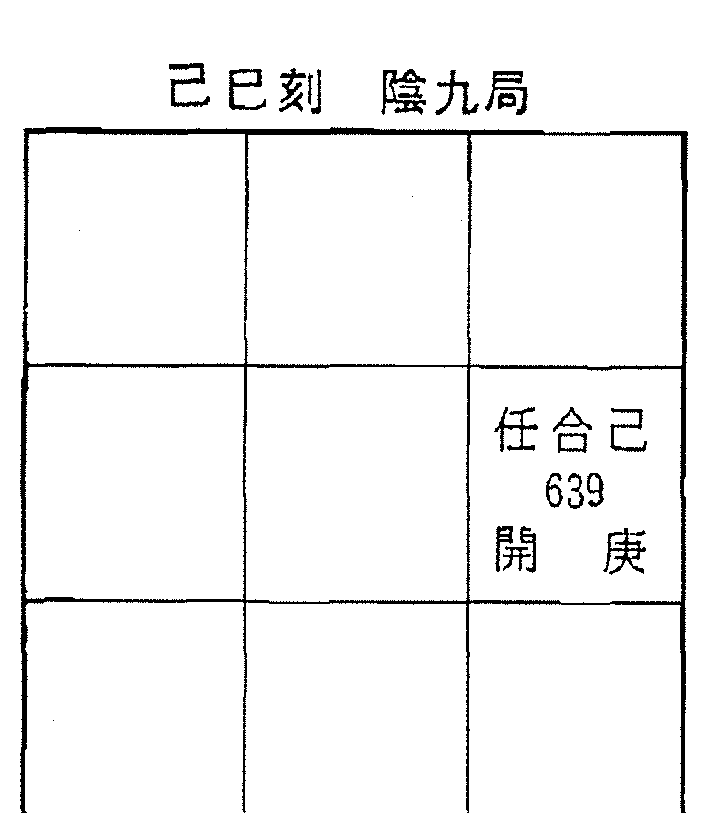

+   - ○ 夏至上元
- ○ 白露上元
- ○ 寒露中元
- ○ 立冬中元

### 己巳刻 阴三局

|   |   |   |
|---|---|---|
|   |   |   |
|   | 芮禽巳<br>963<br>景 庚 |   |
|   |   |   |

### 丁卯刻 阴四局

|   |   | 任蛇巳<br>396<br>休 庚 |
|---|---|---|
|   |   |   |
|   |   |   |
|   |   |   |

+   - ○ 大雪 上元
- ○ 秋分 下元
- ○ 处暑 中元
- ○ 大暑 下元
- ○ 立冬 下元
- ○ 寒露 下元
- ○ 白露 中元
- ○ 夏至 中元

### 乙卯刻 陰九局

|   |   |   |
|---|---|---|
|   |   |   |
|   |   | 蓬陰己 852 開 庚 |
|   |   |   |

### 戊・癸日

### 乙巳刻 陰八局

|   |   |   |
|---|---|---|
|   |   |   |
|   |   |   |
|   |   | 蓬雀己 528 休 庚 |

### 丁・壬日

+   ○ 小雪上元
○ 霜降上元
○ 立秋中元
○ 小暑下元
○ 立冬下元
○ 寒露下元
○ 白露中元
○ 夏至中元

### 丙辰刻 陰二局

|   |   |   |
|---|---|---|
|   | 芮天己<br>963<br>休 庚 |   |
|   |   |   |
|   |   |   |

### 乙卯刻 陰七局

|   |   |   |
|---|---|---|
| 柱地己<br>528<br>休 辛 |   |   |
|   |   |   |
|   |   |   |

+   ○ 大雪 中元
○ 秋分 上元
○ 处暑 下元
○ 大暑 上元
○ 立冬 下元
○ 寒露 下元
○ 白露 中元
○ 夏至 中元

如此，大致上是從卯刻到午刻為止，故只舉這一例說明就可以了。

+   (5) 將上述的情形以「順日盤」看的話，可以看出好與不好的情況，也可以知道其使用的優先順序。

+   (6) 求出九宮

這樣作就可以了。

以上述的方法作「時盤」「日盤」的「治病方位」，可以很快的看出吉方，並可建立一個有計畫性的人生。

# 第十章 笔记本消费法

假如遁甲的各盤都作好了，即可做為應急之用，但是仍要看每日的吉凶；如果運用的不適當，就會被「方位」支配及束縛。

假如大氣造命的累積和其他所有努力的開運相乘的話，在許可的情況下，就不必每天再作造命了。在不知不覺中，「原因」及結果的「命運」進行下，運氣一定會向好的方向轉進，所以對瑣碎的事物用不著每日看遁甲盤，只要以前次的方向進行就可以了。

但是，人生旅途上每日每時每事的應變情況，是要看情形來決定的，要採取那種態度是不一定的，必須看當時的變化而定。

如果把那天的干支和時盤的局數暗暗記下來的話，那麼在作盤就能馬上決定，但若要全部背下來又很困難，所以大多數人都帶有記事本輔助記事，如此即能充分的活用了。

假如把記事本如附圖般的攤開，則下面幾項是很重要的，必須予以記載下來。

| 1981~1982年 12月·1月 庚子·辛丑 | 1月 小寒 六白 | 上 2~7 中 8~4 下 |
| :--- | :--- | :--- |
| 27 (日) 己卯7 | 3 (日) 丙戌5 | |
| 28 (月) | 4 (月) | |
| 29 (火) | 5 (火) | |
| 30 (水) | 6 (水) 1°13分 | |
| 31 (木) | 7 (木) | |
| 1月 1 (金) | 8 (金) | |
| 2 (土) | 9 (土) | |

月干支、日干支（原则上每日应该记载，如此则稍嫌麻烦了些，只要在每页的第一行记上，以下按顺序数就可以了）、月的九宫、日的九宫（这也和日干的情形一样）、节令的日时分、节令的时盘、九宫（全都要写的话稍嫌麻烦，约略的记入即可）。像这样记载时盘的九宫，应该很方便，如：上 2～7 中 8～4 下 无。因此就得到：

## 壬辰刻五黄小寒上元阳四局

| 芮阴壬<br>4<br>杜 戊 | 柱合乙<br>9<br>景 癸 | 英陈戊<br>2<br>死 丙 |
|---|---|---|
| 蓬蛇丁<br>3<br>伤 乙 | 冲<br>5<br>己 | 禽雀癸<br>7<br>惊 辛 |
| 心符甲<br>8<br>生 壬 | 任天辛<br>1<br>休 丁 | 辅地丙<br>6<br>开（庚）甲 |

## 辛卯日一白阳一局

| 柱符甲<br>9<br>死 辛 | 任蛇辛<br>5<br>惊 乙 | 蓬阴乙<br>7<br>开 己 |
|---|---|---|
| 芮天丙<br>8<br>景（庚）甲 | 辅<br>1<br>壬 | 心合己<br>3<br>休 丁 |
| 柱地戊<br>4<br>杜 丙 | 英雀癸<br>6<br>伤 戊 | 禽陈丁<br>2<br>生 癸 |

甲子旬（戊仪）上元二局 中元八局 下元五局
甲戌旬（己仪）上元三局 中元九局 下元六局
甲申旬（庚仪）上元四局 中元一局 下元七局
甲午旬（辛仪）上元五局 中元二局 下元八局
甲辰旬（壬仪）上元六局 中元三局 下元九局
甲寅旬（癸仪）上元七局 中元四局 下元一局

欲知一月八日上午八时五十分的「日盘」及「时盘」，则：一月八日自丙戊算是辛卯日，九宫是阳遁，所以一白阳一局如上图，自「万年遁甲盘」的顺日盘上辛卯日所记载的情形看来，是完全一样的。辛日的上午八时五十分是壬辰刻，壬辰是从甲申旬（庚仪）上看到的，因为是小寒上元，所以是阳四局，九宫是卯日的阳之辰，是为五黄，和「时盘」、「此外，九宫是卯日的阳之辰，是为五黄，和「时盘」

「陽遁局」的陽四局是一樣的，這在陽四局的壬辰刻也是這樣記載的。

採用以上的方法，則不論何時何日都可以馬上做出。如此一來，對緊急變動的情況就可採取對應的處置或方案，而不再心慌了。

像這樣把方位握在掌中，就能夠預知和對應方位的諸事象，而不被方位支配的宿命論所左右，這樣才能採取主動來支配方位，進而轉向更好的方向，這就是造命論的原理，能把「時間」和「空間」統一起來加以把握，然後按各自的命、運、歲、月導引到開運上。

> 以上仔細的講解了遁甲的意義，它的精義即在「滴天髓」中所講的開頭一句話：「欲識三元萬物宗，先觀帝載與神功。」

因此，在活用遁甲方面，就是以它為指引，作能量的價值轉換，以個人的目的方法活用，這就是遁甲的真正意義，能夠把這個意義廣泛傳播給國人並鼓勵他們活用下去，是筆者出版本書的心願。

## 後記

我最近有空把出版『極意 奇門遁甲玄義』後縈繞心頭的『個人別』及『目的別』的想法寫出來，這也是遁甲的用法及其真髓，並把『時間和空間』的意義予以統一，將能量轉換的道理說清楚，連帶闡釋了活用遁甲各項事理及注意事項。

此外，本書詳述了在活用時必須知道的『意義與行動』，但仍須注意的是：『對卑鄙的人勿教遁甲』是不可違背的原則。『吉方對每個人均為吉方』的論調是謬誤的，相信大家已知道了。

就是不知命理及不會活用遁甲的人，也能約略了解上述的原則，相信大家在閱讀本書之後，一定能對遁甲有所了解。

寫完本書後，筆者自覺還有多處敘述未盡理想，且實際命造舉例方面亦欠詳盡，希望大家能夠舉一反三。因限於篇幅，書中僅能予以概述，期盼讀者諸君能夠就這方面多加思考，將遁甲發揚光大。

## 三式系列叢書

+   - △奇門遁甲開運實務／余勝唐 平裝／25開／464頁／450元
- △奇門遁甲實用集／姜建宏 平裝／25開／432頁／450元 熟練掌訣法，即可輕鬆製作遁甲盤來應用
- △大六壬預測學／秦瑞生 附·七百二十課式便覽 平裝／25開／616頁／600元
- △大六壬畢法賦精註詳解／秦瑞生 針對原著標點及重點注解，並附實例 平裝／25開／640頁／450元
- △大六壬心鏡／徐道符著·程樹勳手錄 措辭簡要，註釋確實·文義易曉 平裝／25開／320頁／250元
- △奇門遁甲天地全書／張耀文 避凶趨吉和洩露天機的中國秘典 平裝／25開／320頁／200元
- △奇門遁甲秘笈大全／劉伯溫校 附武侯行兵遁甲圖 平裝／25開／248頁／200元
- △奇門遁甲選時占驗應用／李科儒 附奇門遁甲萬年曆陰陽遁一千八十局 平裝／25開／456頁／500元
- △御定奇門寶鑑（陽遁九局）／徐道符 珍藏版 精裝／25開／1104頁／800元
- △御定奇門寶鑑（陰遁九局）／徐道符 珍藏版 精裝／25開／1104頁／800元
- △鬼谷子奇門遁甲應時天機千年秘笈首次公開 鈺 精裝／25開／800頁／800元
- △奇門遁甲秘笈真詮／張崇俊 奇門陰陽九遁佈局實例 精裝／25開／1432頁／2500元

| 项目 | 内容 |
|------|------|
| 编号 | 三式系列-9 |
| ISBN | 957-35-0813-3 |
| 书名 | 奇门遁甲 刑用秘義 |
| 著者 | 武田居士 |
| 定价 | 350元 |
| 备注 |  |

## 刑用秘義

有限公司 主南路三段十九巷十九号 29·23630730 53 16.hinet.net nw.woolin.com.tw 印刷有限公司 第1128号

一版二刷 2002年6月 定价 350元 缺页或装订错误可随时更换 版权所有·翻印必究 ISBN 957-35-0813-3