# 奇门遁甲使用精典

奇門遁甲借天時、地理所助，其力量大而無窮。在古代乃帝王之學，用於操兵、作戰等，一般平民百姓不得學之。現代之遁甲，人人可學，用途更為廣泛，可用於事業、考試、交友、宴會、旅遊、......等。本書內容由淺入深，以白話加上圖例、口訣與步驟，局，各局之吉凶格局清楚註明，方便隨身應用。

奇門遁甲的使用訣竅，並特別加以說明，方便隨身應用。

## 自序

奇門遁甲乃先賢黃帝得神授而創立。先是輔佐黃帝打敗蚩尤，後經張良刪改至今之遁甲，又扶持漢高祖取得天下。
遁甲之運用是借以時間及方位，即天時、地理所助，其力量之大而無窮。在古代遁甲是帝王之學，用於操兵、作戰等，一般平民百姓不得學之。現代之遁甲，人人可學，用途更為廣泛，可用於事業、考試、交友、宴會、競技、談判……等。
本書內容由粗淺的入門開始到深入的遁甲運用，皆以白話表達，公開奇門遁甲的使用訣竅，其中更加以圖面明示。並特別將時盤一千零八局，各局之吉凶格局加以註明清楚，以方便翻閱運用。
奇門遁甲的功能及效應，期待能藉以本書的運用，使其發揮更好的效果，造福他人也能造福自己。書中難免有謬漏之處，敬請諸位賢達，包涵並惠予指教。

筆者：林琮學 西元二〇〇〇年七月一日 台北內湖

## 目錄

### 使用入門篇

- 如何查表看盤 ............................ 三

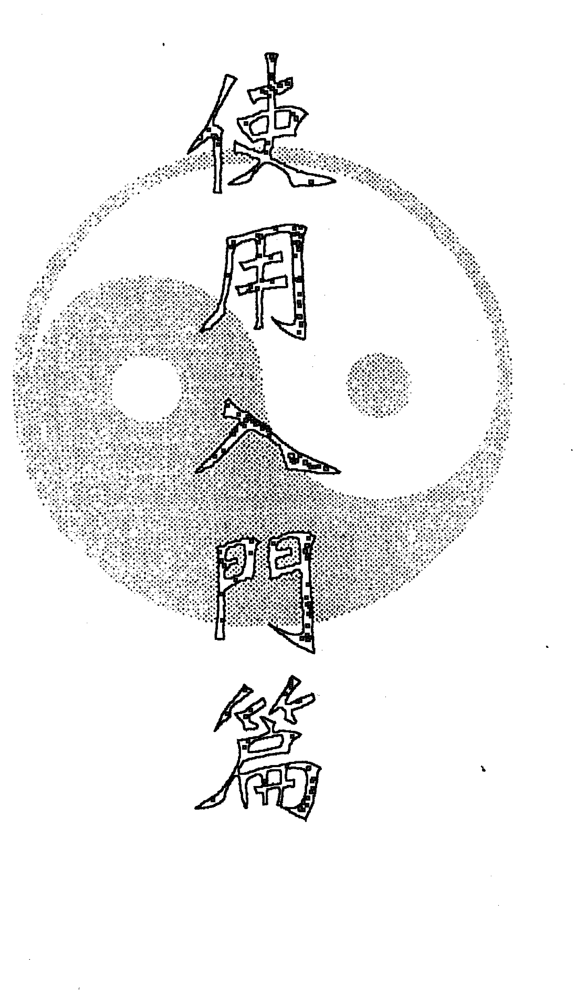

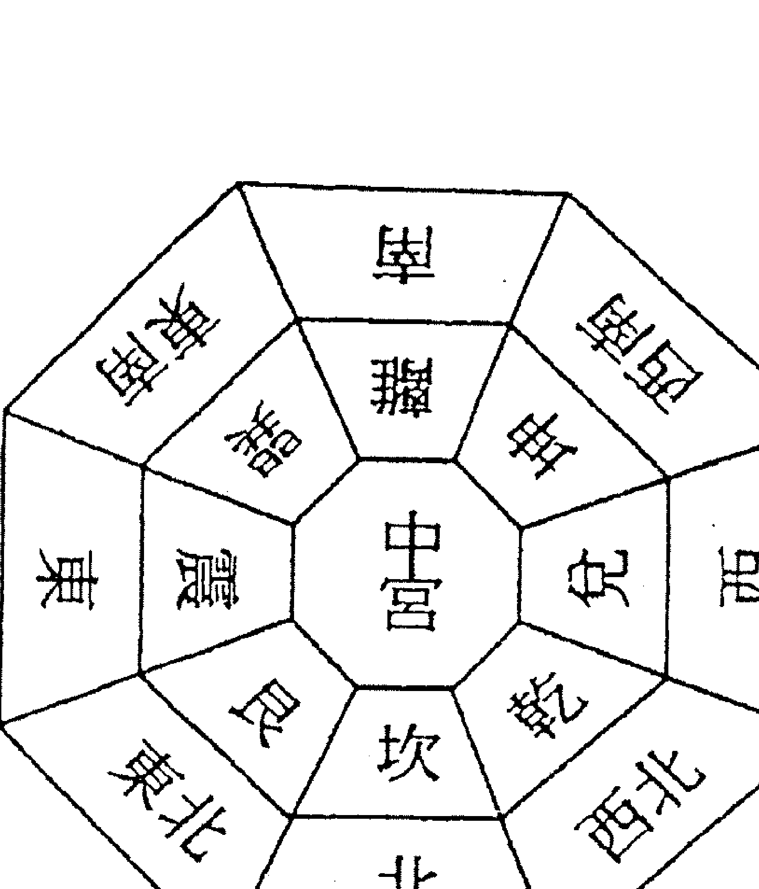

| 巽宮（屬木） | 離宮（屬火） | 坤宮（屬土） |
|--------------|--------------|--------------|
| 震宮（屬木） | 中宮（屬土） | 兌宮（屬金） |
| 艮宮（屬土） | 坎宮（屬水） | 乾宮（屬金） |

應。奇門遁甲乃是借重於空間與時間之吉方吉曜所扶助，而產生所須之感應。初學者首先須認識後天八卦宮位與方位如下二圖：

奇門遁甲首重八門之感應，八門則是：休、生、傷、杜、景、死、驚、開等，共八個門，依順佈於後天八卦八個宮位，其八門原始宮位與八卦宮五行相同如下二圖：

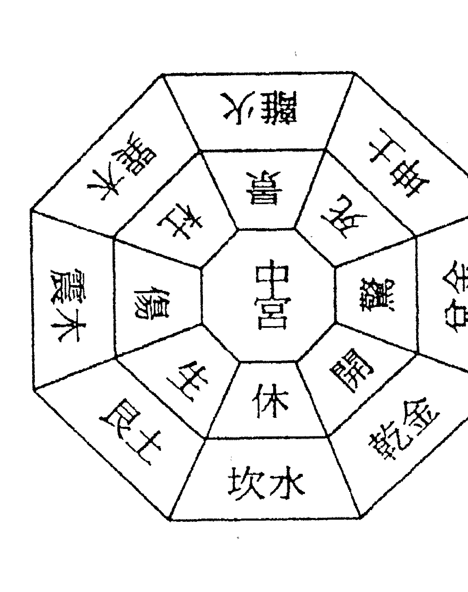

## （八門五行配洛書）

|   |   |   |
|---|---|---|
| 四杜木 | 九景火 | 二死土 |
| 三傷木 | 五中土 | 七驚金 |
| 八生土 | 一休水 | 六開金 |

若休門在震宮則八門如上圖，如休門在坤則八門如下圖，先布休門其餘皆順佈。

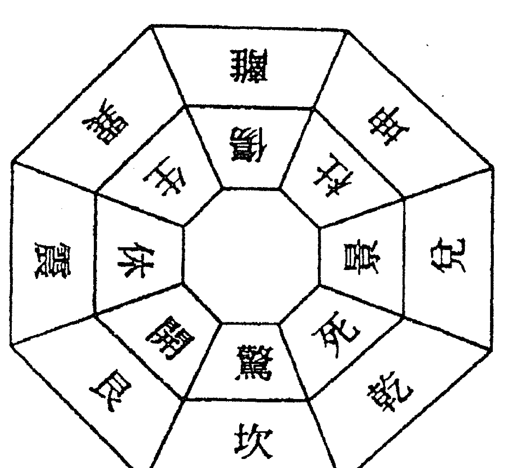

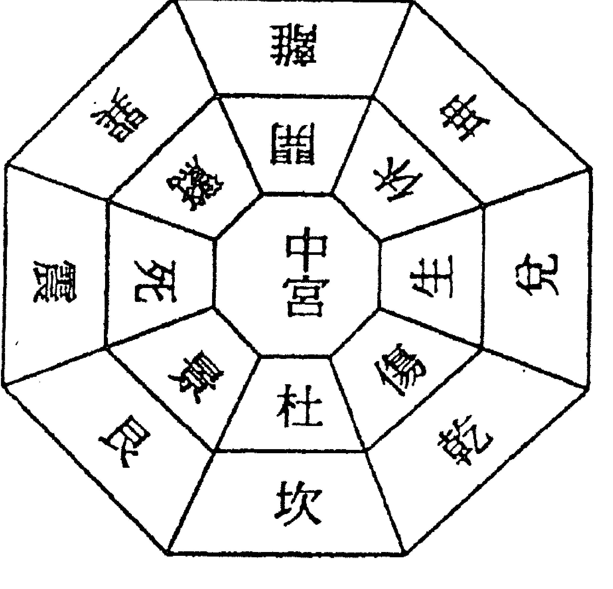

## 而遁甲之八門功能大略如下：

- 生門主：生氣蓬勃、旺丁旺財、源源不斷。
- 開門主：創造開發、突破重圍、利財利事。
- 休門主：順事如意、輕鬆自如、化解煩惱。
- 景門主：華麗顯耀、表現凸出、引人注目。
- 杜門主：堵塞不通、陰暗潛逃、隱密藏身。
- 驚門主：緊張急躁、情緒不穩、驚嚇嚇阻。
- 傷門主：傷害破損、不惜一戰、殺傷力強。
- 死門主：老化死氣、生氣停止、陰森黑暗。

以上八門之吉凶，各有所用，各有所司，如求財求事等則宜出二吉門即生開休，考試演講等則宜出景門，逃避隱藏宜用杜門，打獵或捕捉盜賊則可用傷門，嚇阻作用則可出驚門，安葬出殯則用死門。

八門亦有時盤、日盤、月盤、年盤。而時盤的形成較快、感應也比較快，因此使用的人較多，其次為日盤。而月盤及年盤的太極點較寬而大，並形成的時間較慢感應較慢，因此使用的機會較少，但優點是時效性較耐久。

年盤之交界點在立春，立春前是舊年盤，立春後為新年盤。月盤則以月令為準，節氣的開始是月盤交界之點。日盤是以子時之初為始、亥時之末為終，即是自23時開始至次日23時為結束，總共12時即24小時。時盤則依每日之12時辰為變化，即每天都有12個時盤，交界之時間如下表：

| 12時辰 | 24小時 |
|---|---|
| 子 | 23～1 |
| 丑 | 1～3 |
| 寅 | 3～5 |
| 卯 | 5～7 |
| 辰 | 7～9 |
| 巳 | 9～11 |
| 午 | 11～13 |
| 未 | 13～15 |
| 申 | 15～17 |
| 酉 | 17～19 |
| 戌 | 19～21 |
| 亥 | 21～23 |

## （八卦位置）

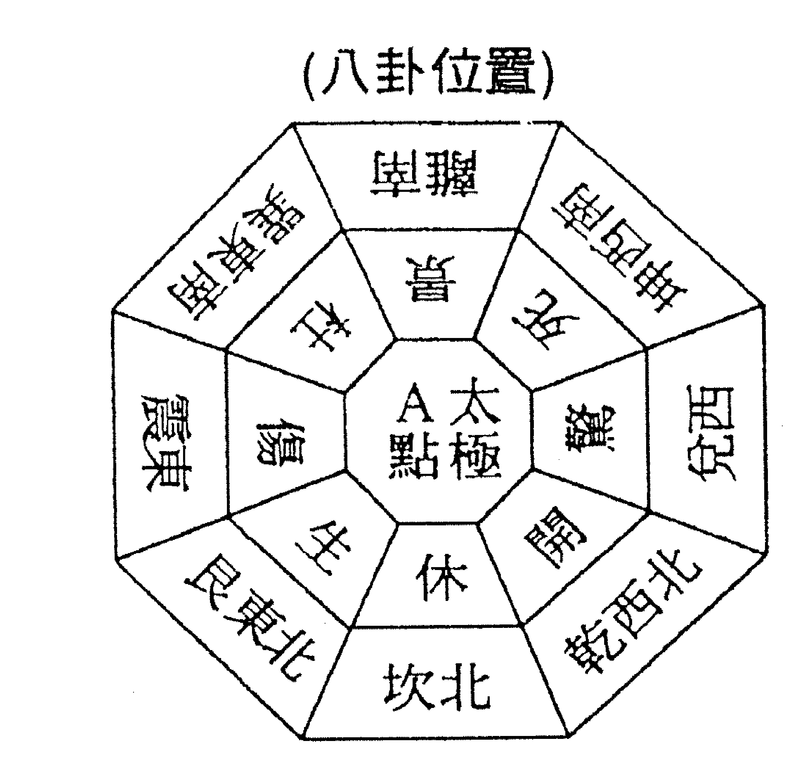

## （地圖方位）

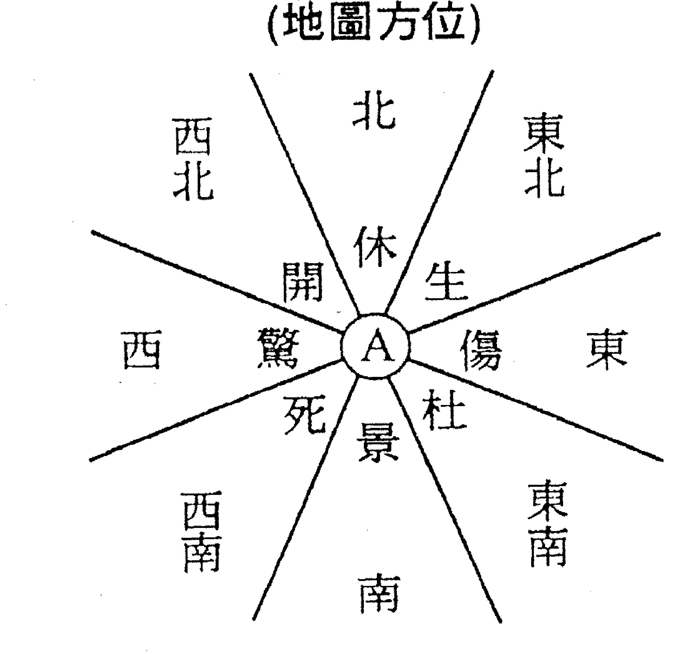

時盤的產生大約須十五分鐘以上，即能感應出八個方位之吉凶，若超過三十分鐘以上，則此時盤之八方吉凶會更加顯著。
若於某地A太極點，停留約十五分鐘以上，而此時的時盤休門剛好居於此方坎宮，則八門方位如下二圖：

綜合以上二圖即知，地圖的方位與八卦九宮的位置是剛好相反的。則此時如往東行出傷門可利捕獵，若往東北出生門可利生財，往南出景門則利於考試求職等。以上是時盤的形成運用，若須日盤的形成運用，則必須停留三個小時以上，才能浮現出日盤的感應。如某日於居家睡醒後清晨出門，此時之日盤太極A點，通常都超過三個小時以上，因此日盤能有明確之感應。若當日之日盤休門在東震宮，八

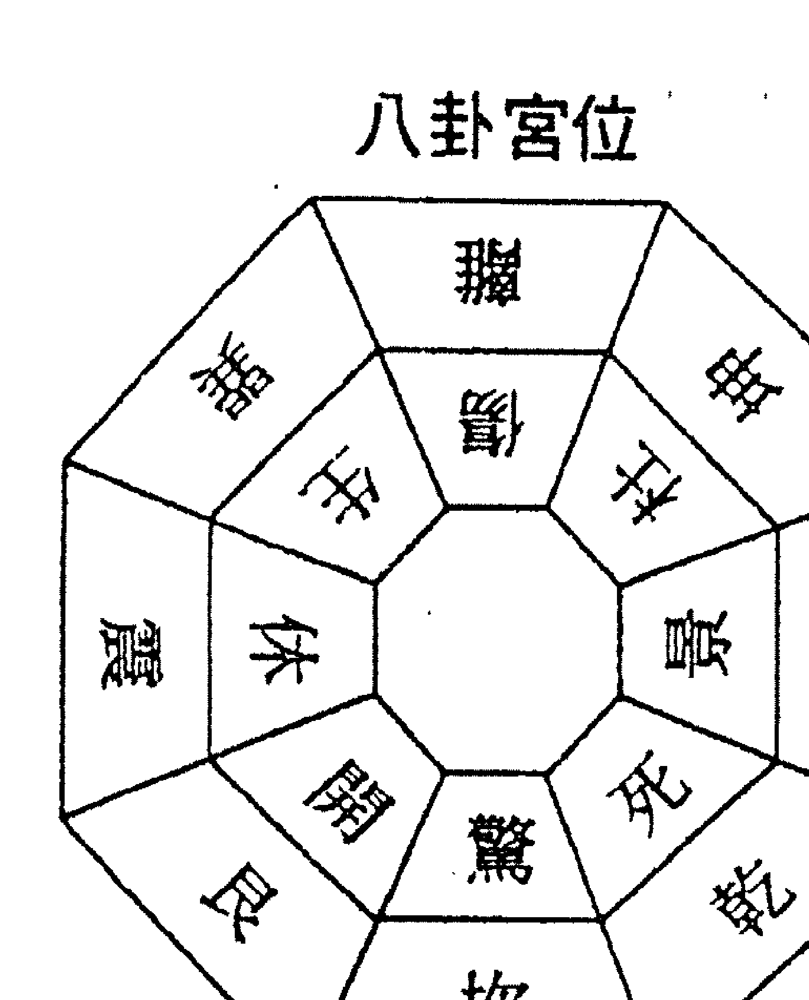

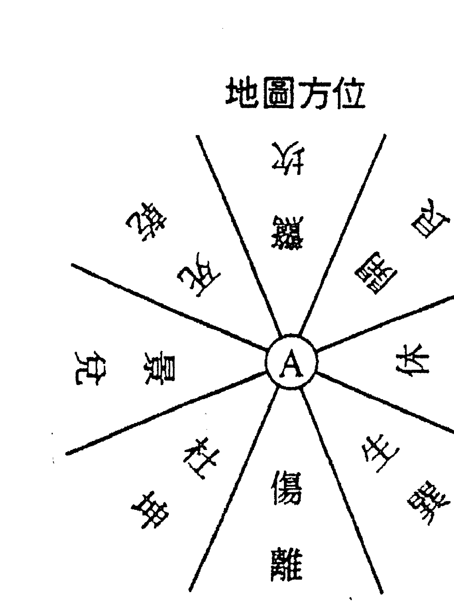

上列二圖為某日盤之八門，得知三吉門居於艮震巽三宮，利於求財求事等，景門則居於兌宮，利於考試演講等。運用日盤出門時效性較長，但靈活度卻不如時盤，時盤雖然時效性較短，但靈活度高、感應快、運用廣泛，因此使用度較高。如考試用景門進入考場，而考場在居家之東、日盤及時盤均無景門，此時唯有運用時盤如下列幾點：

1. 先查看進入考場之時盤景門在何宮，若是辰時在坤宮。
2. 須提前二十分鐘到達考場景門之對宮距考場約300公尺外，即艮宮停留二十分鐘形成新的太極A點。本太極A點向著考場即是坤方。
3. 待辰時由太極A點進入考場，即是往坤方出景門進入考場，可得景門扶助發揮實力，考試順利。

如下頁例圖：

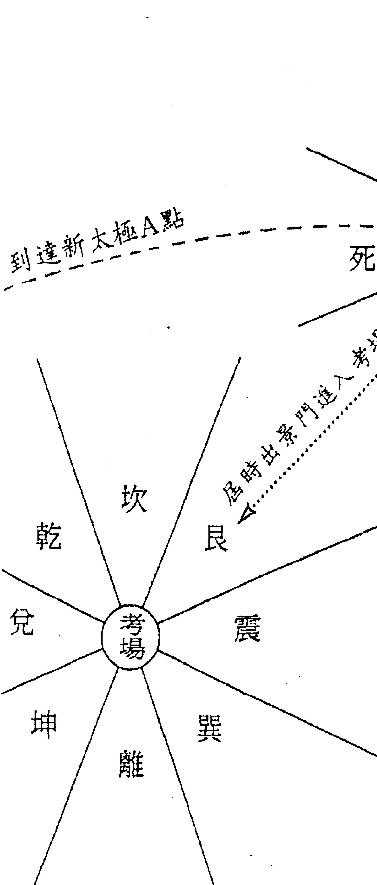

到遷新太極A點

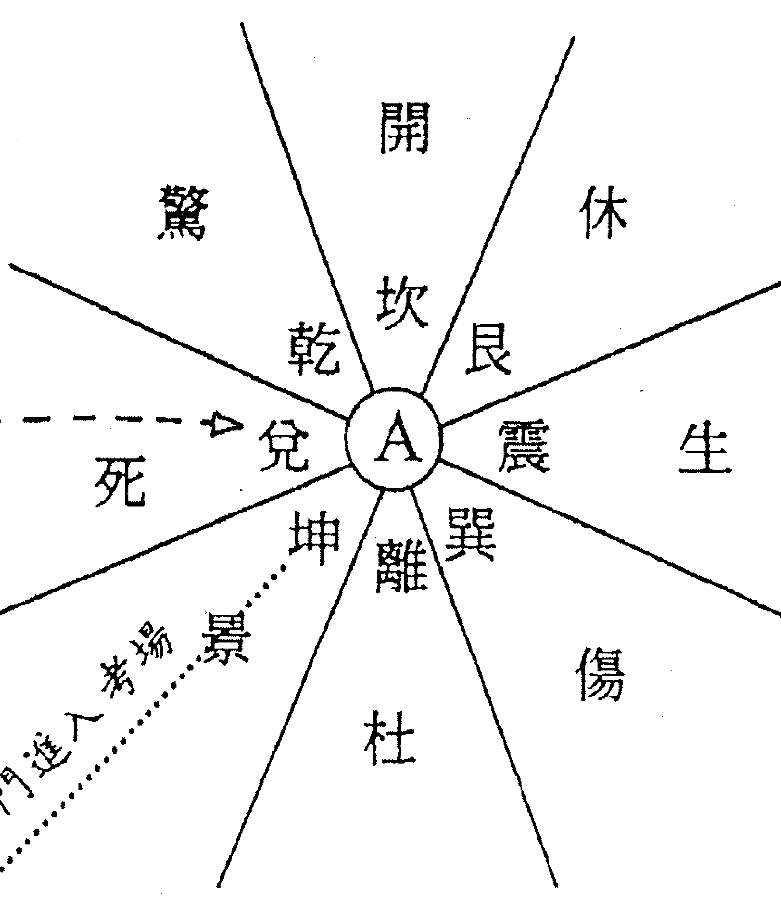

辰時出景門進入考場

例圖：若辰時景門在坤

註：地圖之上方為北。

北

南

西

東

提早30分鐘

- 北: 坎
- 東北: 艮
- 東: 震
- 東南: 巽
- 南: 離
- 西南: 坤
- 西: 兌
- 西北: 乾

家

時盤的基本架構是由八門、天盤、地盤、九星、八神所組合而成的。

其效應八門占最主要的功能，其次為天盤，另外地盤、九星及八神所佔比率較低，其重要性不及八門及天盤。

八門中之三吉門乃是休生開三門。若三吉門再配合天盤之三奇，即三奇逢吉門謂之奇門。

時盤中出現奇門是遁甲中之精華，若能借以奇門扶助，其感應之力量是大而無窮的。

天盤之三奇乃是乙丙丁，因遁甲之精髓即是甲，甲乃是帝王、是尊貴，不可侵之、不可犯之，須以遁之、須以護之。但克甲之敵乃是庚，能促使庚金不來克甲的是：

- 一為乙：因乙會將庚合掉。
- 二為丙：因陽火之丙會剋盡陽金之庚。
- 三為丁：因陰火之丁會牽制住庚金，致使庚金無法去克甲木。

則乙丙丁成為護甲之功臣，稱之為三奇，三奇則是貴也。

## 如何查表看盤

初學者為了使用上求方便，一般皆以翻閱書本查盤來看局，而盤中亦有奇門之吉局與凶局，一般市面上所販售書中之時盤一千零八十局，皆未將當中的吉凶局佈出、或雖佈出卻未詳加正確的佈以清楚，使用起來費時又費力，亦無法將各局之吉凶全盤掌握清楚。若能運用本書所刊登出之各局各盤加以查閱，非但省時省力，且吉凶各局皆有詳細註明清楚，使用上方便又快速。

若須查閱西元二○○五年，歲次乙酉，陽曆三月十七日，陰曆二月八日巳時之時盤，則須先查閱奇門遁甲萬年曆，此日是何日干、陰陽何局，

如下圖：

## 西元二〇〇五年
民國九十四年
歲次：乙酉

| 曆國 | 月一 | 月二 | 月三 |
|------|------|------|------|
| 農曆 | 大月二十 | 小月正 | 大月二 |
| 令月 | 丑丁 | 寅戊 | 卯己 |
| 節氣 | 13小寒52分未時 7大寒11分辰時 | 1立春34分丑時 21雨水28分亥時 | 19驚蟄45分戌時 20春分41分戌時 |
| 干支 | 乙酉 丙戌 丁亥 戊子 己丑陽四 庚寅 辛卯 壬辰 癸巳 甲午陽二 乙未 丙申 丁酉 戊戌 己亥陽八 庚子 辛丑 | 丙辰 丁巳 戊午 己未陽六 庚申 辛酉 壬戌 癸亥 甲子陽八 乙丑 丙寅 丁卯 戊辰 己巳陽五 庚午 辛未 壬申 | 甲申陽六 乙酉 丙戌 丁亥 戊子 己丑陽三 庚寅 辛卯 壬辰 癸巳 甲午陽一 乙未 丙申 丁酉 戊戌 己亥陽七 庚子 |
| 農曆 | 11/21 11/22 11/23 11/24 11/25 11/28 11/27 11/28 11/29 12/1 12/2 12/3 12/4 12/5 12/6 12/7 12/8 | 12/23 12/24 12/25 12/26 12/27 12/28 12/29 12/30 1/1 1/2 1/3 1/4 1/5 1/6 1/7 1/8 1/9 | 1/22 1/23 1/24 1/25 1/26 1/27 1/28 1/29 2/1 2/2 2/3 2/4 2/5 2/6 2/7 2/8 |

是陽曆3月17日的第二天庚子日

陰曆
六十甲子日

每由甲己日起為一局
陰陽局別從萬年曆上知道，乙酉年陽曆3月17日陰曆2月8日，是陽七局庚子日後，再從時盤一○八○局當中，找陽七局乙庚日之辛巳時盤，如下圖：

| 左列 | 中列 | 右列 |
|------|------|------|
| 庚 六合 奇格 丁 死 英 丁 陰 五 雀江 癸 景 輔 癸 蛇 一 己 杜 衝 | 壬 二 陳 癸白 月升 庚 驚 芮 直符：己 直使：八 天任 生 己 符 三 辛 傷 任 | 戊 四 雀 龍返 壬 開 柱 乙 地 九 重詐 戊 休 心 辛 天 八 虎猖 乙 生 蓬 |

天盤之丁奇
地盤
天盤
八神
吉局在左
凶局在右
此吉局全名謂：青龍返首
地盤
八門
九星
紫白星
此凶局全名謂：白虎猖狂
逢乙日是謂之：不遇時，庚日不論。
辛巳時
乙日不遇

注：地图之上方为北。

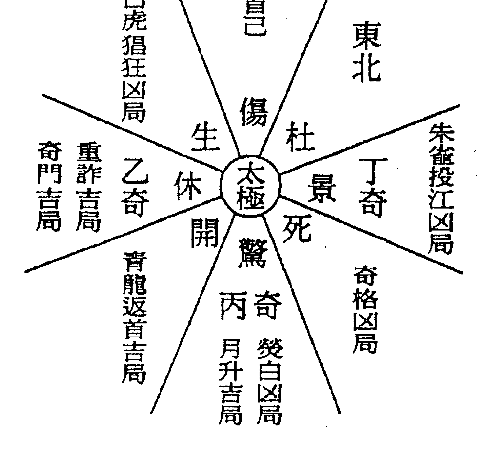

阳七局
乙庚日
辛巳时之
奇门遁甲时盘
地图方位八方

最後還須買張居家或公司之當地地圖，將居家或公司作為太極點，劃分出八個方位，出門時只要翻閱遁甲盤，則知何方為吉、何方可用、何條街道巷弄為之何方所屬、何宮所轄，吉凶一目了然。入門篇就執筆到此，希望初學者看過本篇後，即能翻閱本書運用自如，造福自己也能造福他人。

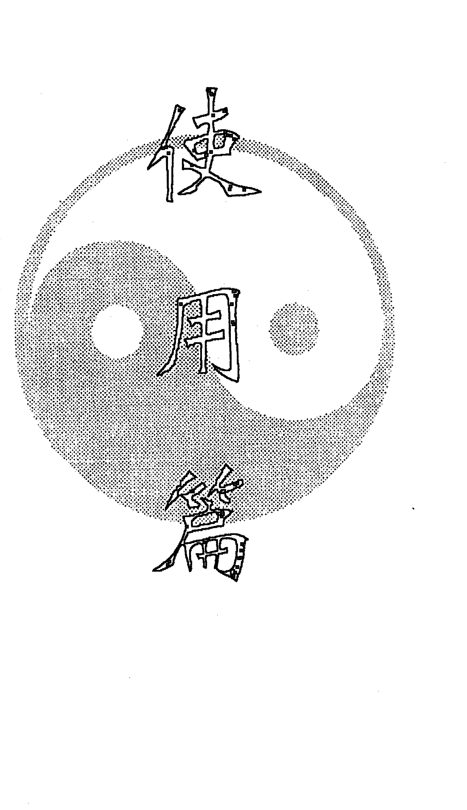

## 方位之運用

空間乃奇門遁甲運用之要訣，要辨示出方位必須先立出太極點，再劃分出八個方位。首先須買一張居家的城市區域地圖，再標點出居家位置為太極中心點，然後劃分出八卦方位。但須注意地圖方位與後天八卦方位恰好是相反的，後天八卦的北方是朝下的，而地圖的北方是朝上的。

每日睡醒後的時盤或日盤是最明確的，若每天第一次出門時，走出奇門方約二、三百公尺以上，則能扶助當日之運程亨通順利。若須用日盤則須走出吉門方五百公尺以上。

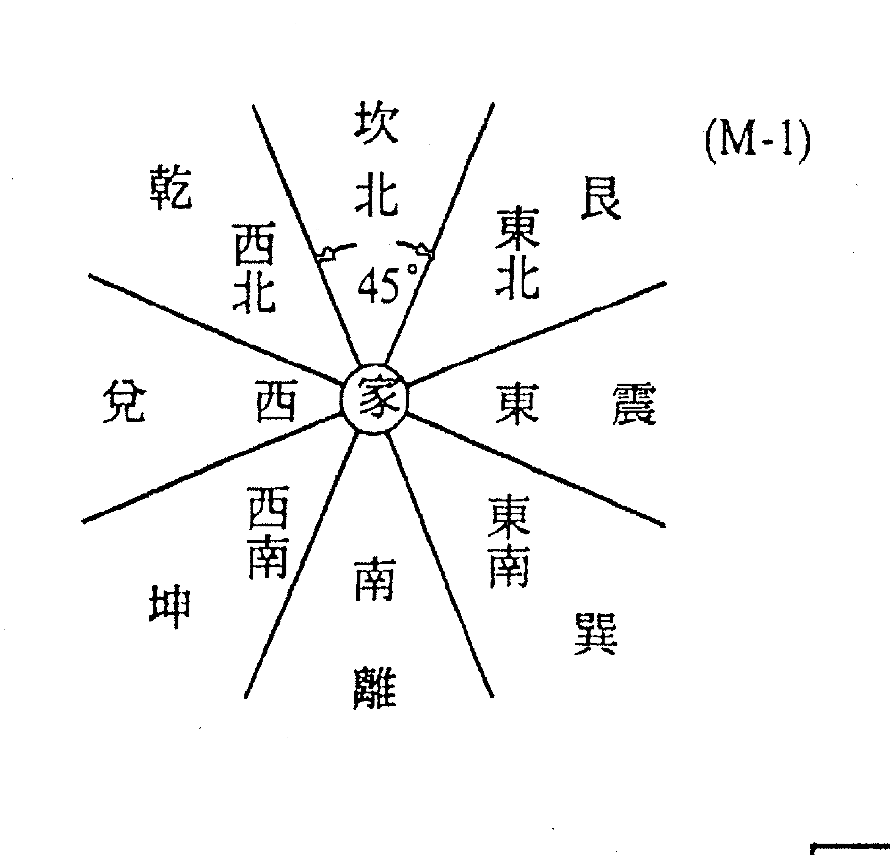

## 時盤的運用

有言年不如月、月不如日、日不如時。而奇門遁甲是以時盤的運用最多，一是感應快、二是時盤的形成快，只要十五分鐘以上即可形成一時盤，太極點，運用方便。

如運用時盤應考時，則考場剛好在居家之吉方，則可一鼓作氣於時辰內出門並到達考場。如圖 M-2，於辰時，景門逢乙奇於兌宮，而考場剛好在居家之西方，則須七點後出門九點前到達考場。

但往往考場並非剛好會在居家之吉方，若不逢吉方時，則須於考場吉方之對宮另立一新太極點，15分鐘後再由此太極點往之吉方走入考場。

運用此法必先確定考場之地理位置，因此須要有一張考場的市區地圖，再將考場位置設立一太極點，並劃出八個方位。再將所須運用的新太極點（簡稱 A 點）立於考場吉方之對宮，如吉方在離，則須立新太極 A 點於考場之北邊。若隔日辰時，景門逢丙奇在離宮，而考場卻在居家之西方無法運用，因此必須先到考場吉方離宮之對宮即坎宮，約離考場二百公尺以上之北方，立一新太極A點，考生於A點停留15分鐘以上，此考生即形成一新太極A點，待辰時即可由A點太極向南走進考場如M-3圖。

- 時間：辰時 AM 7~9
- 方向：西方
- 奇門：景門乙奇

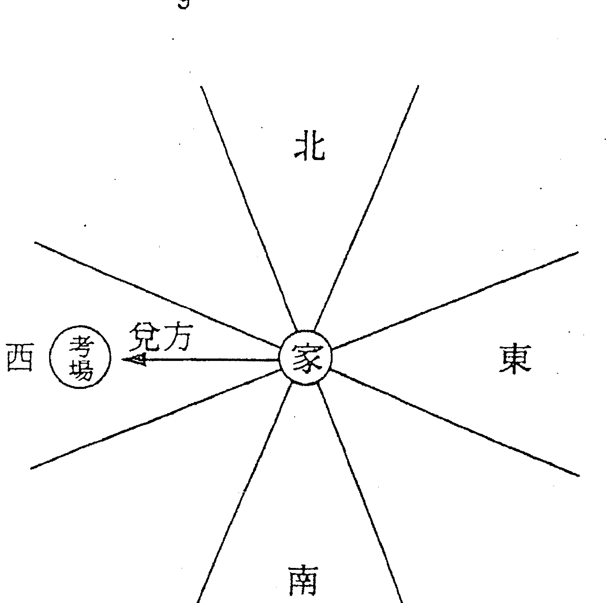

時間：隔日辰時
方向：南方
奇門：景門丙奇

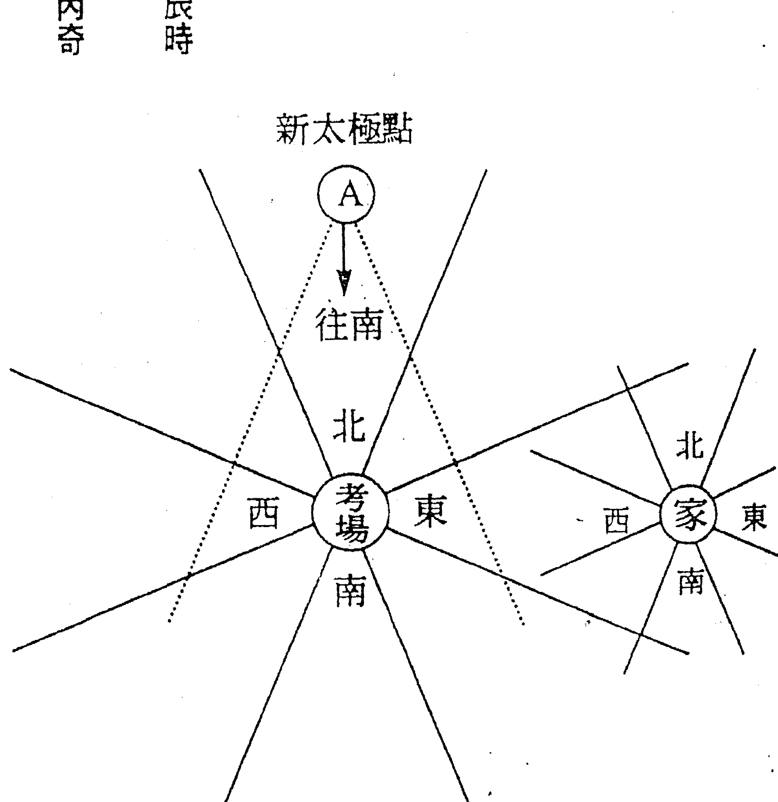

## 電話方位運用

若用電話或以傳真方式與客戶交談介紹生意，須先準備一張公司或居家所在地的市區地圖或全國、全球地圖，再以公司或居家為太極中心點，詳細劃分出八個方位，則所有客戶皆能詳知其方。若某時生門或開門在兌宮時，此時在西邊的客戶皆能以電話連絡交談或以傳真方式招攬生意。但若以郵寄方式，則難以在同一時辰內送達到客戶手中，難得遁甲之扶持，倒是可運用日盤吉方，以快遞方式送達。以上之運作可得遁甲扶助產品之推銷、公司之營利。

## 拜访客户之运用

當欲拜訪之客戶剛好在公司吉方時，則能於同一時辰內，由公司出發到達客戶處。若客戶不在吉門方時，則須到客戶點吉方之對宮，建立太極A點後再進入拜訪即可。但若須拜訪數位客戶時，則須先選擇公司吉方之客戶，首先到達拜訪後再逐一的拜訪其它之客戶。此第一位客戶乃是先出奇門即得遁甲之助，其它客戶連續拜訪即可，不必再立門而入。若每天所拜訪的客戶甚多，則須由家中第一次出門即走出奇門，往奇門方走出約兩三百公尺以上，並在奇門方稍作停留約五——十分鐘，得奇門之扶助再往其他方向走去，到達公司或直接去拜訪客戶、本日之內即能感應到遁甲之扶助。

## 新年開運奇門法

每年的大年初一是新一年的開始，新的開始第一次出門，須選擇一奇門吉方而出，扶助新年的運程亨通，所用之吉曜如下：

- 八門：生開休景。
- 天干：甲乙丙丁（甲即為符首）。
- 九星：天輔、天心、天禽、天沖、天任。
- 八神：直符、九天、九地、太陰、六合。
- 奇門吉格：如天地人遁……等。

以上吉曜之運用，須視個人之目標而作調整。如應考生、選舉人宜運用景門，作生意求財利者宜運用生開休三吉門，旅遊、娛樂、退休、退官符者宜運用休門，欲求子、添丁，則可運用生門等，適當調整運用可得吉星照耀新年運程。

如：西元二〇〇二年，歲次·癸未，大年初一乙巳日為陽曆二月一日陽六局。若睡醒後用辰時向西出門，是運用兌宮生門，天盤逢丙奇、地盤己、八神朱雀、九星天輔、奇門吉局為憧怡及飛鳥跌穴。出此吉方可得奇門遁甲扶助財利興旺、人丁顯貴、順心如意。

| 壬 陰 五 | 庚 合 一 | 丁 陳 三 雀江 沖 |
| 丙 驚 蓬 | 辛 開 任 | 癸 休 沖 |
| 戊 蛇 四 | 直符 直使 符首己 天柱 驚 | 丙 雀 八 鳥獸穴怡 生 輔 |

- 乾：宮剋門
- 坎：宮生門
- 艮：飛宮格、門生宮
- 震：宮剋門
- 巽：門迫宮
- 離：宮剋門
- 坤：宮剋門、朱雀投江
- 兌：門生宮、飛鳥跌穴、憧怡
- 柱符加艮為澤山咸
- 驚門加巽為澤風大過

> > 註：天柱為兌加艮宮為澤山咸驚門居兌加巽宮為澤風大過

## 地图位置

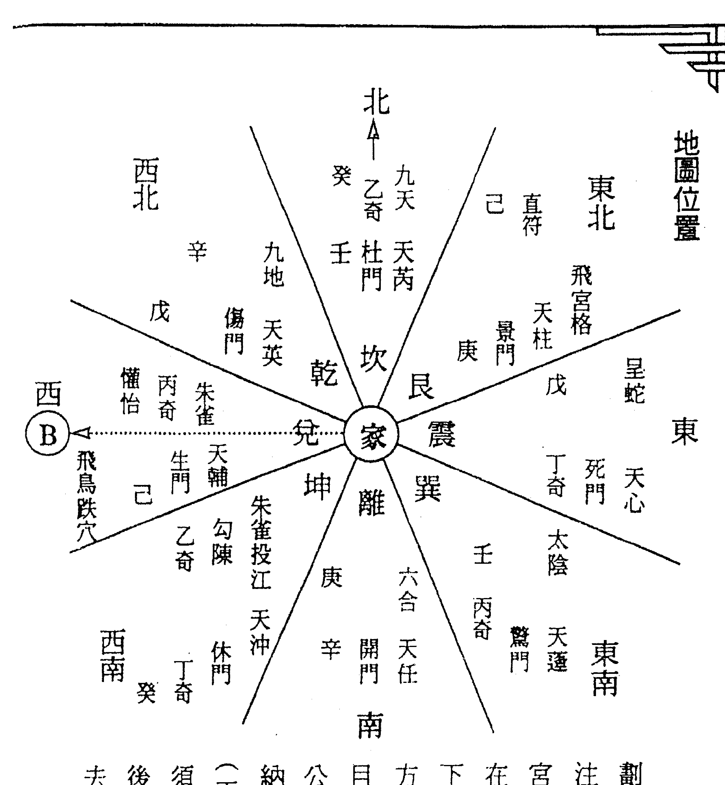

割居家地理位置时须注意，地图位置与九宫方位是相反的。坎在地图上方、离居下、震在右、兑居左方。此局可向西直到目的地或出兑宫三百公尺后，停留15分钟纳气增强遁甲功能（平常非特别日子只需五分钟即可）之后，再往其它方向行去亦可。

## 求財

財為養生之源，錢雖非萬能，但沒錢則萬萬不能。上至宰相官員，下至販夫走卒，每天是為財而奔波。馬路上的人來人往、車水馬龍，亦多以求財為要，則人不可無財，無財則寸步難行。本命生辰先天所帶之財已成定局無法改變之，唯有後天運作改變之，若依法好好運作財利增益一到數成則受益無窮、財運亨通，若不當運用反而損及先天之財庫，陷入財務困局。如依八字之財利命名、行事，依地理之納財方位佈局，依個人之祿、馬、貴人，選擇吉時日課開市、入宅或結婚，此乃是先賢所傳之訣，皆可扶助財利、事業、貴人顯現。除此之外亦可以奇門遁甲之良時吉方，即天時、地利吉曜運用扶助。

- 八門：生門、開門、休門。
- 天干：符首、乙奇、丙奇、丁奇。（以天盤為重）
- 九星：天輔、天心、天禽、天沖、天任。
- 九神：直符、九天、九地、太陰、六合。
- 吉格：天遁、地遁、人遁、神遁、風遁、雲遁、龍遁、虎遁、貝詐、重詐、休詐、飛鳥跌穴、青龍返首或懂怕、相佐逢三吉門。

## 求醫

在人生當中疾病是免不了的，而求醫之時並非都要運用奇門遁甲，如以下二點：

1.  逢緊急情況急救時，為了爭取時效性，則不必運用奇門遁甲。
2.  一般小病，如感冒、肚痛之短期間內小病症，不必再費心去運用遁甲了。

而何時求醫須運用奇門遁甲如下：

1.  四處尋醫而找不出病因時。
2.  難醫之疾病時，須要醫師慎重診斷醫治時。
3.  重大病症之醫治、治療、手術等，須以初次診斷為要。
4.  母親生產是以初次到醫院作產檢為要，此時可運用奇門遁甲，以後則按醫師指示行事即可。

## 求醫遁甲吉曜如下：

- 八門：生門最佳、開休門亦可。
- 生門：與生命搏鬥之重症最宜。
- 開門：開刀、手術、醫療等。
- 休門：治療麻煩雜症時。
- 天干：符首、乙丙丁三奇。
- 九星：天輔、天心、天禽、天沖、天任。
- 八神：直符、九天、九地、太陰、六合。
- 吉格：天遁、地遁、人遁、神遁、風遁、雲遁、龍遁、虎遁、真詐、重詐、休詐、飛鳥跌穴、青龍返首或惟怡、相佐逢之三吉門。

運用：以家為太極點，往吉方就醫。取時盤為主要運作，亦可配合日盤輔助運用。

## 拜拜、祈福、求神

一般之祈福求神有二，一為到外面寺廟求拜，另一是於家中神明求拜。到外面寺廟求拜，則宜選擇良時吉方，前去寺廟求拜即可。若於家中求拜神明時，宜以朝拜位為太極中心，向神明吉方求拜。假設家中神明座山為辰山或巽巳山時，則時盤之吉曜來到巽宮為最佳求拜時，靈應度比平時快又強。

拜神之吉曜如下：

- 八門：生開休三吉門，奏書、棄文可用景門。
- 天干：符首及乙丙丁三奇。
- 九星：天輔、天心、天禽、天沖、天任。
- 八神：直符、九天、九地、六合、太陰。
- 吉格：天遁、地遁、人遁、神遁、風遁、雲遁、龍遁、虎遁、真詐、重詐、休詐、天假、神假、飛鳥跌穴、青龍返首或憧怡、相佐逢三吉門。

## 考試：面試、應徵

考試雖然是以實力為重，但亦要有三分運氣來助才能得心應手。若能適當的運用奇門遁甲來提昇考運5——10％，則應考必然更能順心得意。而考試之要訣不外乎下列幾點：

1.  考前必作充分之準備，提昇實力以備應考。
2.  運用本命或陽宅之文昌位用功，以利提昇讀書效率。
3.  於考前數日，選本命之文昌日或奇門吉方，到孔子廟或文昌廟求拜。
4.  考試當日以居家為太極點，向奇門吉方直接進入考場，或先到考場吉方之對宮形成時盤太極，屆時再進入考場，亦可在考場奇門吉方之對宮，找地方暫居一晚，待隔日時辰一到直接進入考場。

考試運用之吉曜如下：

- 八門：景門為主，次為生開休三吉門。
- 天干：符首、乙丙丁。
- 九星：天輔、天心、天禽、天沖、天任。
- 八神：直符、九天、九地、六合、太陰。
- 吉格：天假、三詐、天遁、地遁、人遁、雲遁、風遁、龍遁、虎遁、神遁、飛鳥跌穴、青龍返首、或懂怡及相佐逢之景生開休四吉門。

## 訴訟

在當今社會中，人與人的來往於生意上的競爭、錢財上的糾紛、權利上的劃分，難免會有官司之事。而奇門遁甲的運用在於找律師、開庭打官司、遞狀、和解、告狀、解除官司等方面，可發揮其輔助功能，彰顯遁甲的威力。

運作時須以奇與門為主，奇與門的功效即能達到輔助之效應，亦可再配合九星、八神幫助奇門之威力顯現。時間與方位乃以進入法院之時為準，則可在法院吉方之對宮，建立太極A點，待時間一到即可直接進入法院。或以居家為太極點、法院為方位，適時、適宮可用，則可在時辰內直接由家中進入法院。

八門運作如下：

- 開門：可突破困境、助於辯論、佐證有效，致使對方罪名成立。有利於遞狀、告訴、找律師、搜找證據等。

## 八神吉星

生門：趨吉避凶、生機重現、提證有力。有利於和解、告狀、找律師、尋找證據等。

休門：大事化小、化解官司。利於和解、去除官司、化解煩惱麻煩等。

景門：利於遞狀、告訴、報案、提證等。

傷門：欲告對方，使其罪名成立判刑。

驚門：讓對方驚惶失色，不知所措。

## 九星

- 宜靜：天蓬、天芮、天柱、天英。
- 宜動：天沖、天任。
- 靜動皆宜：天輔、天禽、天心。

- 主靜：六合、九地。
- 主動：太陰、九天。
- 動靜皆宜：直符。

註：欲求對方之諒解，可用天輔時前去。

## 隱密事宜

公司的機密文件、私人的隱私、財物的隱藏、逃避兇惡或無賴之人。使其不易曝光、不被跟蹤、不被竊聽、不遭竊取，可運用奇門遁甲的杜門加奇，去隱藏、逃走、避開、約會、協商、會談、出門等一切不願公開曝光光之事可以運用之。如以居家為太極點，擇時辰及方位而出，或以進入場所杜門之對宮，建立太極 A 點屆時進入即可。

其隱藏吉曜如下：

八門：杜門。

天干：最好是符首、次為乙丙丁。

九星：天柱最佳。次為天輔、天禽、天心。天沖及天任主動，少用之。

八神：以直符、九地、六合為要，次為太陰。九天乃宣揚之星不可用之。

吉格：地遁、鬼遁、雲遁、地假。另逃避災難可用太沖天馬方。

## 約會

戀愛約會、相親提親等，男女姻緣和合之事可運用奇門遁甲來扶助、姻緣顯現、情投意合。

奇門吉曜如下：
- 時：玉女守門時。
- 八門：以休門為主，次為生、開、景門。
- 九星：天輔、天心、天禽、天英、天沖、天任。
- 吉格：玉女守門、飛鳥跌穴、青龍返首、天遁、地遁、人遁、雲遁、天假。憐怡及相佐逢之四吉門。

## 競賽、談判、辯論

人生的競賽幾何，從小到老歷經無數次，而競賽或比賽的取勝，除實力外還須靠運氣的扶持。若須運用遁甲的扶之，則須選擇吉方出門或吉方入場，或是以吉方靠之。

## 奇門遁甲競賽用盤如下：

- 八門：以生為主、開為次，而休門僅用於娛樂性競賽。
- 天干：符首、乙、丙、丁。
- 九星：天輔、天心、天禽、天沖、天任。
- 八神：直符、九天、九地、六合、太陰。
- 吉格：天遁、地遁、人遁、雲遁、風遁、龍遁、虎遁、神遁、飛鳥跌穴、青龍返首、真詐、重詐、休詐、懂怡、相佐。
- 座方：符首、九天、生門、月建、亭亭。其中以背生擊死為要。
- 不擊方：符首、九地、生門、九天及八門直使之宮位。

## 廣告

廣告之別有推銷產品、徵人、租售房屋、選舉造勢、郵寄、張貼、廣播、分發等。運作時即以家或公司為太極點，選擇吉時吉方前去郵寄、刊登、接洽、張貼即可。或借以風遁等吉局進入廣播室、演講場。

## 廣告吉照：

- 八門：生、開、休、景。
- 天干：符首、乙、丙、丁三奇。
- 九星：天輔、天心、天禽、天任、天沖。
- 八神：直符、九天、九地、六合、太陰。
- 吉格：風遁、天遁、地遁、人遁、雲遁、龍遁、虎遁、神遁、真詐、重詐、休詐、天假、飛鳥跌穴、青龍返首、權怡、相佐。

## 休閒旅遊

現代人由於工作壓力的煩重，而常借以休閒旅遊來紓解壓力。出門旅遊運用奇門遁甲最宜奇合休門、次為生門或開門，主拋開壓力、心情愉快、盡情享受休閒之快樂。而回程最宜用奇合生門、開門、次為休門、或遁甲之吉格，主生氣蓬勃、精力旺盛、充電後再重新出發。若居於台北市，要到日月潭、嘉義、台南等地旅遊數日。首先須要有一張台灣地圖，而在地圖上確定旅遊方位，日月潭、嘉義、台南等地，是在台北的西南方坤方，非一般人所想像的南方離方，真正台北的南方是花蓮、台東等地。若於西元二千年、陽曆十一月二十壬午日，日盤西南方坤宮為休門（如圖）、時盤為陰五局、用乙巳時出發，西南方坤宮為生門合丙奇，則休門在日盤、奇在時盤，可得串用並時盤之生門逢天遁、值符之吉格，乃是吉上加吉。若回程定在十一月二十三乙酉日，回台北是東北艮方，日盤為生門合吉曜太乙。時盤為陰八局，用辰時出發返家，時盤之艮宮為開門合丙奇，奇門吉格為天遁、重詐及飛鳥跌穴。日盤用生門、時盤只要合三奇或符首就可用之，若時盤再逢吉門或吉格則更為吉祥如意、百事大吉。

| 第三列 | 第二列 | 第一列 |
| :--- | :--- | :--- |
| ○太陰 驚 | 軒轅 開 | ○太乙 休 |
| ○天乙 死 | 咸池 | 天符 生 |
| 招搖 景 | 攝提 杜 | ○青龍 傷 |

| 第三列 | 第二列 | 第一列 |
| :--- | :--- | :--- |
| 癸 陳 四 己 開 英 己 雀 三 庚 驚 輔 庚 地 八 奇格 丁 死 沖 | 辛戊 合 九 癸 休 芮 直符:天蓬 直使:一休 符首:壬 丁 天 一 天假 壬 景 任 | 丙 陰 二 柱 辛戊 生 真天烏月 詐遁穴使 乙 蛇 七 日制 丙 傷 心 壬 符 六 相佐 乙 杜 蓬 |

夏至後陰遁 乙酉日遁甲盤

休閒旅遊吉蹤如下：八門：休、生、門、景。天盤：符首、乙、丙、丁。吉格：人遁、天遁、地遁、雲遁、風遁、虎遁、龍遁、神遁、慎詐、重詐、休詐、天假、飛鳥跌穴、青龍返首、或懂怡、相佐合吉門。

| 天符 杜 | ○天乙 景 | 咸池 死 |
| ○青龍 傷 | 招搖 | 攝提 驚 |
| ○太乙 生 | ○太陰 休 | 軒轅 開 |

| 癸 際 七 | 壬 合 三 | 乙 陰 五 |
| 壬 生 沖 | 乙 傷 輔 | 辛 杜 英 |
| 戊 符 六 | 直符：天柱 | 丁 蛇 一 |

## 討債、博戲

對於討債、呆帳之催收、告官索債、博戲、獵物、捕捉盜賊等，宜運用傷門並合三奇或符首助之。

如以家為太極點，則選擇傷門方前去討債或按鈴申告，或以公司為太極點待傷門臨方，直接去催討呆帳，以上如能再配合日盤之傷門，其效果更為顯著。若無法由居家或公司出門，亦可運用時盤於傷門對宮產生太極 A 點，最好於太極 A 點處待三十分鐘以上，讓時盤穩定形成，再進入討債感應會更強，方法雖好但亦怕對方無錢還債，唯看交代一途。

若逢門犬、博戲或拳擊比賽，亦可運用太極 A 點進入場內，並於事先確定好三勝宮及五不擊之方位，選手或主人盡量背於三勝宮之方。

討債、博戲吉曜如下：
- 八門：傷門。
- 天盤：符首、乙、丙、丁。
- 三勝宮：符首、九天、生門、亭亭、月建或太歲方。
- 五不擊：符首、九天、生門、九地及直使宮。

## 搬家、移民

入宅、移徙、搬家、移民等乃是人生一大事，選擇吉方、吉時入宅可得吉曜扶助運程亨通、百事皆吉。搬家入宅以時盤及日盤爲用，若再配合年月盤來輔佐更佳。但如果是移民的話，由於在千萬里之外，且須賴國內的長期感應，則須以年或月盤爲用，再配合日時盤之扶，則可得遁甲之助。

## 入宅移徙之吉曜：

- 八門：生門、開門、休門、景門。
- 天盤：符首、乙、丙、丁。
- 九星：天輔、天心、天禽、天沖、天任。
- 八神：直符、九天、九地、太陰、六合。
- 吉格：天遁、地遁、人遁、雲遁、風遁、龍遁、虎遁、神遁、眞詐、重詐、休詐、返吟、伏吟。

## 夏至後陰遁甲辰日

|  | 青龍 | 太陰 | 招搖 |
| :---: | :---: | :---: | :---: |
|  | 杜 | 傷 | 生 |
|  | 太乙 | 軒轅 | 天符 |
|  | 景 |  | 休 |
|  | 攝提 | 咸池 | 天乙 |
|  | 死 | 驚 | 開 |

## 陰一局甲辰日丙寅時

七 丁雀
雀江 癸
乙景輔

三 己陳
機星
怡升
辛死英

二 乙合
癸
日基芮
壬驚

五 丙地
月升
己杜沖

符首:戊
直使:一休
直符:天蓬

六 辛陰
戊開柱

九 庚天
奇格
丁傷任

八 戊符
龍相
返佐
丙生蓬

四 壬蛇
庚休心

## 開市、動土

陽宅之開市、開工、動土、修造、神明安座、造景、謝土等皆宜在吉方動之。因動之吉，百事順利、大吉大利，動之凶，災厄連綿、凶惡不利。

卦有八卦，一卦管三山，則共有二十四山，而開市、動土、安座、謝土等皆以座山為主。如座丙、午、丁山則以離宮為用，如座丑、艮、寅山則以艮宮為用。但若只在某方修造，或某宮造作，則宜以陽宅中心分出九宮，當修造之宮逢時盤吉利則可用之，亦可配合日盤扶之更佳。動之乃忌凶惡之宮，年月日時五黃相疊之宮，殺破之方不宜動土、安座等。

## 月盘紫白值星及五黄占宫

| 年支 | 子午卯酉值星 | 子午卯酉五黄占宫 | 辰戌丑未值星 | 辰戌丑未五黄占宫 | 寅申巳亥值星 | 寅申巳亥五黄占宫 |
|------|--------------|------------------|--------------|------------------|--------------|------------------|
| 月建 |  |  |  |  |  |  |
| 寅 | 八 | 坤 | 五 | 中 | 二 | 艮 |
| 卯 | 七 | 震 | 四 | 乾 | 一 | 离 |
| 辰 | 六 | 巽 | 三 | 兑 | 九 | 坎 |
| 巳 | 五 | 中 | 二 | 艮 | 八 | 坤 |
| 午 | 四 | 乾 | 一 | 离 | 七 | 震 |
| 未 | 三 | 兑 | 九 | 坎 | 六 | 巽 |
| 申 | 二 | 艮 | 八 | 坤 | 五 | 中 |
| 酉 | 一 | 离 | 七 | 震 | 四 | 乾 |
| 戌 | 九 | 坎 | 六 | 巽 | 三 | 兑 |
| 亥 | 八 | 坤 | 五 | 中 | 二 | 艮 |
| 子 | 七 | 震 | 四 | 乾 | 一 | 离 |
| 丑 | 六 | 巽 | 三 | 兑 | 九 | 坎 |

如宅座辛兼酉山屬兌宮，動土選西元二千年歲次庚辰、陽曆12月24日、陰曆11月29日、壬辰時。年五黃占坎、月五黃占乾、日五黃占坤、時五黃占震。陽遁丙辰日盤生門在兌宮、時盤陽七局兌宮逢生門合丙奇、天遁、飛鳥跌穴等吉局動之大吉。

- 庚辰年、沖戌、殺南
- 戊子年、沖午、殺南
- 丙辰年、沖戌、殺南
- 壬辰年、沖戌、殺南

庚辰年 戊子月 丙辰日 壬辰时

## 阳遁丙辰日盘

| 太阴惊 | 招摇开 | 青龙休 |
|---|---|---|
| 咸池死 | 天乙 | 摄提生 |
| 轩辕景 | 天符杜 | 太乙伤 |

## 阳七局、丙辰日、壬辰时

| 癸 地 六 蛇天 丁 惊 冲 | 丁 天 二 惟星 怡旺 庚 开 辅 | 庚 符 四 龙相 返佐 丙 壬 休 英 |
|---|---|---|
| 己 雀 五 癸 死 任 | 直符·天英 直使·九景 符首·庚 | 壬 丙 蛇 九 鸟天 穴遁 戊 生 芮 |
| 辛 陈 一 己 景 蓬 | 乙 合 三 日旺 龙走 辛 杜 心 | 戊 阴 八 乙 伤 柱 |

## 值年紫白九星入中及五黄占宫

| 庚午 | 己巳 | 戊辰 | 丁卯 | 丙寅 | 乙丑 | 甲子 | 年庚 | 九运 | 三元 |
|---|---|---|---|---|---|---|---|---|---|
| 四 | 五 | 六 | 七 | 八 | 九 | 一 | 中入星值位宫黄五 | 1864——1883 | 一运上元 |
| 六 | 五 | 四 | 三 | 二 | 一 | 九 | 星值黄五 | 1924——1943 | 四运中元 |
| 七 | 八 | 九 | 一 | 二 | 三 | 四 | 星值黄五 | 1984——2003 | 七运下元 |
| **庚寅** | **己丑** | **戊子** | **丁亥** | **丙戌** | **乙酉** | **甲申** | **年庚** | | |
| 二 | 三 | 四 | 五 | 六 | 七 | 八 | 中入星值位宫黄五 | 1884——1903 | 二运上元 |
| 五 | 六 | 七 | 八 | 九 | 一 | 二 | 星值黄五 | 1944——1963 | 五运中元 |
| 八 | 九 | 一 | 二 | 三 | 四 | 五 | 星值黄五 | 2004——2023 | 八运下元 |
| **庚戌** | **己酉** | **戊申** | **丁未** | **丙午** | **乙巳** | **甲辰** | **年庚** | | |
| 九 | 一 | 二 | 三 | 四 | 五 | 六 | 中入星值位宫黄五 | 1904——1923 | 三运上元 |
| 三 | 四 | 五 | 六 | 七 | 八 | 九 | 星值黄五 | 1964——1983 | 六运中元 |
| 六 | 七 | 八 | 九 | 一 | 二 | 三 | 星值黄五 | 2024——2043 | 九运下元 |

| 癸未 | 壬午 | 辛巳 | 庚辰 | 己卯 | 戊寅 | 丁丑 | 丙子 | 乙亥 | 甲戌 | 癸酉 | 壬申 | 辛未 |
|------|------|------|------|------|------|------|------|------|------|------|------|------|
| 九 | 一 | 二 | 三 | 四 | 五 | 六 | 七 | 八 | 九 | 一 | 二 | 三 |
| 1 | 9 | 8 | 7 | 6 | 5 | 4 | 3 | 2 | 1 | 9 | 8 | 7 |
| 三 | 四 | 五 | 六 | 七 | 八 | 九 | 一 | 二 | 三 | 四 | 五 | 六 |
| 7 | 6 | 5 | 4 | 3 | 2 | 1 | 9 | 8 | 7 | 6 | 5 | 4 |
| 六 | 七 | 八 | 九 | 一 | 二 | 三 | 四 | 五 | 六 | 七 | 八 | 九 |
| 4 | 3 | 2 | 1 | 9 | 8 | 7 | 6 | 5 | 4 | 3 | 2 | 1 |
| 癸卯 | 壬寅 | 辛丑 | 庚子 | 己亥 | 戊戌 | 丁酉 | 丙申 | 乙未 | 甲午 | 癸巳 | 壬辰 | 辛卯 |
| 七 | 八 | 九 | 一 | 二 | 三 | 四 | 五 | 六 | 七 | 八 | 九 | 一 |
| 3 | 2 | 1 | 9 | 8 | 7 | 6 | 5 | 4 | 3 | 2 | 1 | 9 |
| 一 | 二 | 三 | 四 | 五 | 六 | 七 | 八 | 九 | 一 | 二 | 三 | 四 |
| 9 | 8 | 7 | 6 | 5 | 4 | 3 | 2 | 1 | 9 | 8 | 7 | 6 |
| 四 | 五 | 六 | 七 | 八 | 九 | 一 | 二 | 三 | 四 | 五 | 六 | 七 |
| 6 | 5 | 4 | 3 | 2 | 1 | 9 | 8 | 7 | 6 | 5 | 4 | 3 |
| 癸亥 | 壬戌 | 辛酉 | 庚申 | 己未 | 戊午 | 丁巳 | 丙辰 | 乙卯 | 甲寅 | 癸丑 | 壬子 | 辛亥 |
| 五 | 六 | 七 | 八 | 九 | 一 | 二 | 三 | 四 | 五 | 六 | 七 | 八 |
| 5 | 4 | 3 | 2 | 1 | 9 | 8 | 7 | 6 | 5 | 4 | 3 | 2 |
| 八 | 九 | 一 | 二 | 三 | 四 | 五 | 六 | 七 | 八 | 九 | 一 | 二 |
| 2 | 1 | 9 | 8 | 7 | 6 | 5 | 4 | 3 | 2 | 1 | 9 | 8 |
| 二 | 三 | 四 | 五 | 六 | 七 | 八 | 九 | 一 | 二 | 三 | 四 | 五 |
| 8 | 7 | 6 | 5 | 4 | 3 | 2 | 1 | 9 | 8 | 7 | 6 | 5 |

## 安葬吉凶感應

破土、立碑、安葬、完盆、啟攢、修墳等陰宅之事，最宜座生向死，次為座開向杜、座休向景。選擇單用時盤即可，若再逢年月日盤吉曜加臨更佳。

若座庚兼酉山屬兌宮，安葬日課擇庚辰年陰曆八月二十二日辰時，陰七局時盤兌宮生門逢天盤丁奇升殿，合八神之九天及九星之天蓬。

其日課及時盤感應如下：

- 座山：庚兼酉。
- 忌沖山：卯。
- 忌三煞：亥卯未。

兆應·東北樹倒、鼓聲四起、女著紅衣、老人攜鋤、牛羊鹿趕、見應葬後烏鴉四鳴、六十日內有破財，或見腳風之人上門來，日後家生貴子、大發財穀。

日課 庚辰年 乙酉月 庚辰日 庚辰時

| 四 符 己 | 二 蛇 戊 | 六 陰 癸 |
| :--- | :--- | :--- |
| 庚 庚 休 心 | 龍 返 開 柱 開 | 驚 芮 |
| 九 天 辛 生 蓬 | 符 首 己 直 使 六 開 天 心 | 五 合 丙 死 英 |
| 八 地 乙 傷 任 | 三 雀 壬 白 奇 格 杜 沖 | 一 陳 辛 虎 猖 景 輔 |

## 陰七局、庚辰日、庚辰時

## 進階篇

## 奇门遁甲流源

据传轩辕黄帝，姓公孙曰姬，乃有熊国少典之子。其母见电光闪绕枢星感而生出黄帝于轩辕之丘，今之河南郑县，因而命名轩辕。此乃天地阴阳交媾、雷电闪绕北斗第一枢星而生，出之神灵、成之聪明，习用干戈，善于用兵，修德治兵。涿鹿，今之北平、河北省、察哈尔省一带。轩辕黄帝与蚩尤苦战多年，蚩尤好兵作乱，暴虐天下，额头硬如铜铁般之坚固，谙阴阳法术，能起烟雾，迷雾军士。后轩辕以指南车作战，并于涿鹿擒之蚩尤，而被推代神农氏为天子。某日偶梦天神授符诀，黄帝始创奇门有四千三百二十局，乃一节管三元，每元五日，即每节有十五日，每元五日有六十时，即每节十五日有一百八十时，每年有二十四节，即共有四千三百二十局。后经风后删制奇门为一千零八十硬局，此乃八卦管八节，一节管三气，一气管三候天地人元，一元五日，即每候五日为六十时，一岁七十二候，每四候共用一局，即为一千零八十硬局。

汉张良，字子房，其师黄石公将天书授于子房以扶高祖得天下。子房删捷奇门订为冬至后为阳九局，夏至后订为阴九局，一岁共有阴阳十八局，则每局管辖五日六十时，而成一千八十活局时盘，此活局乃奇门之捷径，也扶持了汉高祖决胜夺得天下。此一千八十局从此流传至今。

## 奇門遁甲之運用

古代奇門遁甲乃帝王之學，神秘之學術。用之於作戰、兵法、練兵、護身、潛逃、打獵、捕魚、造符、造葬、求嗣、求官、開市、造福、賞功、封爵、任職、捉賊等。
現代之奇門遁甲一般人即可學習。用於競技、推銷、求財、求貴、求職、考試、訴訟、索債、交易、姻緣、求婚、休閒、娛樂、旅遊、開運、祈求、入宅、談判等。

## 奇門遁甲之意義

奇乃三奇日月星，即乙奇、丙奇、丁奇。門則為休、生、傷、杜、景、死、驚、開，計八門，其中休生開三門稱之三吉門。遁即隱藏、維護。甲為至尊、為我、為心臟地帶、指揮中心，為十天干之首，貴不可侵、尊不可犯。

## 奇門遁甲時盤基本宮位

九宫格图，展示奇门遁甲时盘的基本宫位布局。各宫位配置如下：

**方位标注（外围）**：
- 上方：(南東)、(南)、(南西)
- 左侧：(東)
- 右侧：(西)
- 下方：(北東)、(北)、(北西)

**九宫内容（从上到下，从左至右）**：
1.  **(四巽木) 宫**：八神：六合；天盘：辛；地盘：辛；门：杜；星：天輔
2.  **(九離火) 宫**：八神：勾陳；天盘：乙；地盘：乙；门：景；星：天英
3.  **(二坤土) 宫**：八神：朱雀；天盘：己；地盘：己；门：死；星：天芮
4.  **(三震木) 宫**：八神：太陰；天盘：庚；地盘：庚；门：傷；星：天沖
5.  **(五中土) 宫**：八神：空；天盘：壬；地盘：壬；门：空；星：天禽
6.  **(七兌金) 宫**：八神：九地；天盘：丁；地盘：丁；门：驚；星：天柱
7.  **(八艮土) 宫**：八神：呈蛇；天盘：丙；地盘：丙；门：生；星：天任
8.  **(一坎水) 宫**：八神：直符；天盘：戊；地盘：戊；门：休；星：天蓬
9.  **(六乾金) 宫**：八神：九天；天盘：癸；地盘：癸；门：開；星：天心

**底部标注（图注）**：
- 箭头1（指向‘生’门）：地盘
- 箭头2（指向‘丙’天盘）：天盘
- 箭头3（指向‘直符’）：八神
- 箭头4（指向‘天蓬’）：九星
- 箭头5（指向‘九天’）：九宫
- 箭头6（指向‘開’门）：八門

## 时盘基本要源

- 八门：休、生、伤、杜、景、死、惊、开。
- 九星：天蓬星、天任星、天冲星、天辅星、天英星、天禽星、天芮星、天柱星、天心星。
- 八神：直符、螣蛇、太阴、六合、勾陈、朱雀、九地、九天。
- 天干：甲、乙、丙、丁、戊、己、庚、辛、壬、癸。
- 地支：子、丑、寅、卯、辰、巳、午、未、申、酉、戌、亥。

天干阴阳五行：

- 甲乙属东方木，甲为阳木，乙为阴木。
- 丙丁属南方火，丙为阳火，丁为阴火。
- 戊己属中央土，戊为阳土，己为阴土。
- 庚辛属西方金，庚为阳金，辛为阴金。
- 壬癸属北方水，壬为阳水，癸为阴水。

## 五行相生：

- 金生水
- 水生木
- 木生火
- 火生土
- 土生金

## 五行相剋：

- 金剋木
- 木剋土
- 土剋水
- 水剋火
- 火剋金

## 十二地支五行宫位

| 巳火 | 午火 | 未土 | 申金 |
|------|------|------|------|
| 辰土 |      |      | 酉金 |
| 卯木 |      |      | 戌土 |
| 寅木 | 丑土 | 子水 | 亥水 |

- 子：陽地支屬水
- 丑：陰地支屬土
- 寅：陽地支屬木
- 卯：陰地支屬木
- 辰：陽地支屬土
- 巳：陰地支屬火
- 午：陽地支屬火
- 未：陰地支屬土
- 申：陽地支屬金
- 酉：陰地支屬金
- 戌：陽地支屬土
- 亥：陰地支屬水

## 時盤之功能感應

人有常言，年不如月、月不如日、日不如時。故選時尤急，時盤之感應遠比日盤快。乃時盤由八門、天盤、地盤、九星、八神，所組合而成。其感應程度乃以八門為重，約占45%。其次為天盤，約占25%。其餘地盤、九星、八神，各約占10%左右。

## 八門所至

開門：上吉之門，主好的門始、突破重圍、掃除困難、重新開始、創造開發。宜開市、動工、創業、出兵、求貴、求財、求事、求名、出外遠行、開光點眼、剪綵、搬新家、新官上任、拜師學藝、求神、整修動土，所向通達，諸事皆宜。

休門：上吉之門，主輕鬆、愉快。宜研究學習、共商事宜、演兵、點召、入營、消除壓力、解除煩惱、化解糾紛、和解事情、去除官司、求貴託人、購物消費、溝通理解、聚餐娛樂、休閒旅遊、消災改厄、養神治病等。可得處事輕鬆如意。

生門：上上吉之門，主生命旺盛、成長迅速、源源不斷、生氣蓬勃。宜求財求利、商賈買賣、求職求事、求貴、研究學習、婚姻嫁娶、移徙入宅、營造建築、求醫、延壽、逃生、祭祀、祈福、求子、法事、求醫可得順利醫治。往生門求財作生意，獲利豐富、生意興隆。出生門可避開凶煞、惡人、小人、平安如意、萬事亨通。

### 傷門

凶門，主傷害、破壞。宜打獵捕魚、尋仇、捉賊擒盜、索債、打官司等。傷門具有殺傷力，非必要時不得輕易使用。如索債乃是對付惡性倒債者，打官司時，乃是對使對方遭判重刑。

### 杜門

凶門，主堵塞、陰暗、隱密。宜潛逃、開秘密會議、避開仇人、閃避媒體、隱藏、傳送秘密文件、埋伏、跟蹤等。杜門有堵塞之作用，對於求財、求事、遠行者不宜，但對於隱密事件反而有利，不易被發現。往杜門去，即使遇到熟人也不易被注意到。

### 景門

中吉之門，主華麗、顯現、受注意、凸出、虛張。宜演講、考試、面試、上書、呈報、排場、表達、社交活動、選舉、投訴、報案、提建議、華麗場合、提昇地位等。用景門可提昇注意力，引起眾人

### 死門：

大凶之門，主陰氣、停止、老化、死亡、不活躍。宜行刑誅戮、破土、安葬、送葬、掃墓、祭拜祖先、喪事作法、弔祭亡魂等，凡與死有關之事皆可反凶為吉，避免重喪，安撫亡者。運用死門有避煞的效果，遠離亡者或陰魂的糾纏，但死門不宜積極用事，不宜求財求醫等。

### 驚門：

凶門，主緊張、急躁、情緒不穩定等。宜捕捉壞人、宣戰、警告、嚇阻、打官司、惡作劇等。運用驚門能使對方有驚嚇、嚇阻的作用，而不致於傷及對方。

## 九星

- 天英 火星 (小凶)
- 天芮 土星 (大凶)
- 天柱 金星 (小凶)
- 天心 金星 (大吉)
- 天蓬 水星 (大凶)
- 天任 土星 (小吉)
- 天冲 木星 (小吉)
- 天辅 木星 (大吉)
- 天禽 土星 (大吉)

### 天蓬星：

字子禽，大凶之星，五行屬水。主静，宜守不宜攻，利主不利客，不利攻打。宜修築城池、培養兵力、加強防禦、不利移徙主失火、不利鬥爭主血光、不利商賈主損財，凡事凶多吉少、不通達、不宜積極用事。但逢生門與丙乙奇同宮時，諸事皆宜，論吉不論凶。

古曰：
訟庭爭競遇天蓬，勝捷威靈萬里同。
春夏用之皆大吉，秋冬用此最為凶。
嫁娶遠行應小利，葬埋修造亦閑空。
須得生門同丙乙，同之萬事得昌榮。

### 天芮星：

字子成，大凶之星，五行屬土。主崇尚道德、交結識友，主静不利攻擊、冒險。宜培養兵力、加強防禦、訓練士兵、教育思想、尊師親友、研究学习、社交活动、结社组织、集会沟通。不利用兵、嫁娶、争讼、移徙、修造、安葬、秋冬吉利春夏凶。

> 古曰：
受道交结宜芮星，行方由此最疑难。
出行用事宜先退，修造安坟发祸刑。
盗贼忧惶惊小口，更宜因事横官非。
纵得奇门从此宿，求其吉事也虚名。

### 天冲星：
字子翘，中吉之星，五行属木。主冲动、活跃、武力，主动不利静。

> 古曰：
宜出兵、攻打、报仇、宣战、田径比赛、赛车、赛马。但不利求财、不宜
出行、移徙、修造、安葬、嫁娶等。
嫁娶安营产女惊，出行移徙遇遭迍。
修造埋葬皆不利，万般作事且逡巡。

### 天辅星：
字子卿，上吉之星，五行属木。主富贵、文武双全、福寿显现、名利皆兴。宜求财、求贵、求寿、商贾买卖、开张利市、上官任职、移徙、入宅，诸事亨通，四季皆宜，有吉无凶。

> 古曰：
天辅之星远行良，葬埋起造福添长。
上官移徙皆吉利，喜溢人财万事昌。

### 天禽星：
字子公，上吉之星，五行属土。宜求财、求福、求寿、新官上任、策划、赏功、用谋不战敌人畏服、移徙、嫁娶等。

> 古曰：
天禽远行偏宜利，坐贾行商皆称意。投谒贵人两益怀，更兼造葬皆丰遂。

### 天心星：
字子襄，上吉之星，五行属金。主正义、贵气、健康、福寿。宜治病、求医、合药、攻击、铲除恶势力。用兵秋冬得地大胜、春夏不利。求财、任官、修造、祭祀、商贾买卖、秋冬大利、春夏不利。若合生门，不论四季，财利百倍，增添福寿，诸事皆吉。

> 古曰：求仙合药见天心，适途旅福又还新。又将迁葬皆宜利，万事逢之福禄深。

### 天柱星：
字子中，小凶之星，五行属金。主保守、隐密性高、喜静不喜动。宜养伤、隐迹、躲避、保守、安静、嫁娶、修造、祭祀、求福。
- 不宜移徙、公开、发表、求财、求名、考试、远行、登山冒险。

> 古曰：
天柱藏形谨守直，不须远出及营为。
万种所谋皆利益，远行从去见灾危。

### 天任星：
字子章，中吉之星，五行属土。主财利、人丁、喜庆之曜。宜用兵出征、求贵、求财、嫁娶多子孙、新官任职、喜悦庆贺。

> 古曰：
天任吉宿事皆通，祭祀求官嫁娶同。
断灭群凶移徙事，商贾造葬喜重重。

### 天英星：
字子戚，小凶之星，五行属火。宜求贵、社交应酬、饮宴作乐、逛街购物。不利求财、嫁娶、出兵、移徙、筑室、祠祀、商贾。

> 古曰：
天英之星嫁娶凶，远行移徙不宜逢。
上官文武皆宜去，商贾求财总是空。

## # 九星旺相休囚

> > 三元经曰：辅禽心宿为上吉，冲任次吉理须明。大凶天蓬与天芮，小凶天柱与天英。更论五行旺相气，吉凶轻重自然分。大凶旺相凶却小，小凶旺相号中平。吉星旺相吉无比，若还无气也中平。

-   天蓬水星，旺于亥子月，相于寅卯月。
-   天任芮禽土星，旺于辰戌丑未月，相于申酉月。
-   天辅冲木星，旺于寅卯月，相于巳午月。
-   天英火星，旺于巳午月，相于辰戌丑未月。
-   天柱心金星，旺于申酉月，相于亥子月。

## 八神
直符：大吉之神，属阳火。宜求贵、求职、诉讼、求财、求名等，诸事皆宜。
腾蛇：大凶之神，属阴火。主虚诈、阴沈、惊吓，诸事不宜。
太阴：小吉之神，属阴金。主阴私，宜求贵、嫁娶、任职、机谋用策等。
六合：小吉之神，属阴木。主护卫、和平。宜嫁娶、宴客、调解、媒合之事等。
勾陈：大凶之神，属阳土。主凶恶、损伤。诸事不宜，易生是非。（白虎）
朱雀：大凶之神，属阴火。主口舌是非，破败。诸事不利。（玄武）
九地：小吉之神，属阴土。主静。利于隐藏，暗中求利，宜守不宜攻。
九天：中吉之神，属阳金。主好动，名利。宜求财、求名、攻击、宣扬、发表。

| 朱雀（凶） | 勾陈（凶） | 六合（小吉） |
| :---: | :---: | :---: |
| 九地（小吉） | | 太阴（小吉） |
| 九天（中吉） | 直符（大吉） | 腾蛇（凶） |

## 五鼠遁
甲己起甲子（日起时星诀）
乙庚起丙子
丙辛起戊子
丁壬起庚子
戊癸起壬子

| 时干支 \ 日干时 \ 辰 | 甲己日 | 乙庚日 | 丙辛日 | 丁壬日 | 戊癸日 |
| :--- | :---: | :---: | :---: | :---: | :---: |
| 子时 23-1 | 甲子 | 丙子 | 戊子 | 庚子 | 壬子 |
| 丑时 1-3 | 乙丑 | 丁丑 | 己丑 | 辛丑 | 癸丑 |
| 寅时 3-5 | 丙寅 | 戊寅 | 庚寅 | 壬寅 | 甲寅 |
| 卯时 5-7 | 丁卯 | 己卯 | 辛卯 | 癸卯 | 乙卯 |
| 辰时 7-9 | 戊辰 | 庚辰 | 壬辰 | 甲辰 | 丙辰 |
| 巳时 9-11 | 己巳 | 辛巳 | 癸巳 | 乙巳 | 丁巳 |
| 午时 11-13 | 庚午 | 壬午 | 甲午 | 丙午 | 戊午 |
| 未时 13-15 | 辛未 | 癸未 | 乙未 | 丁未 | 己未 |
| 申时 15-17 | 壬申 | 甲申 | 丙申 | 戊申 | 庚申 |
| 酉时 17-19 | 癸酉 | 乙酉 | 丁酉 | 己酉 | 辛酉 |
| 戌时 19-21 | 甲戌 | 丙戌 | 戊戌 | 庚戌 | 壬戌 |
| 亥时 21-23 | 乙亥 | 丁亥 | 己亥 | 辛亥 | 癸亥 |

## 五虎遁
甲己起丙寅（年起月令诀）

-   乙庚起戊寅
-   丙辛起庚寅
-   丁壬起壬寅
-   戊癸起甲寅

| 戊癸日 | 戊癸日 | 丙辛日 | 乙庚日 | 甲己日 | 年干 | 月令 |
|--------|--------|--------|--------|--------|------|------|
| 甲寅 | 壬寅 | 庚寅 | 戊寅 | 丙寅 | 寅 | 正 |
| 乙卯 | 癸卯 | 辛卯 | 己卯 | 丁卯 | 卯 | 二 |
| 丙辰 | 甲辰 | 壬辰 | 庚辰 | 戊辰 | 辰 | 三 |
| 丁巳 | 乙巳 | 癸巳 | 辛巳 | 己巳 | 巳 | 四 |
| 戊午 | 丙午 | 甲午 | 壬午 | 庚午 | 午 | 五 |
| 己未 | 丁未 | 乙未 | 癸未 | 辛未 | 未 | 六 |
| 庚申 | 戊申 | 丙申 | 甲申 | 壬申 | 申 | 七 |
| 辛酉 | 己酉 | 丁酉 | 乙酉 | 癸酉 | 酉 | 八 |
| 壬戌 | 庚戌 | 戊戌 | 丙戌 | 甲戌 | 戌 | 九 |
| 癸亥 | 辛亥 | 己亥 | 丁亥 | 乙亥 | 亥 | 十 |
| 甲子 | 壬子 | 庚子 | 戊子 | 丙子 | 子 | 十一 |
| 乙丑 | 癸丑 | 辛丑 | 己丑 | 丁丑 | 丑 | 十二 |

## 配洛书数先天后天卦

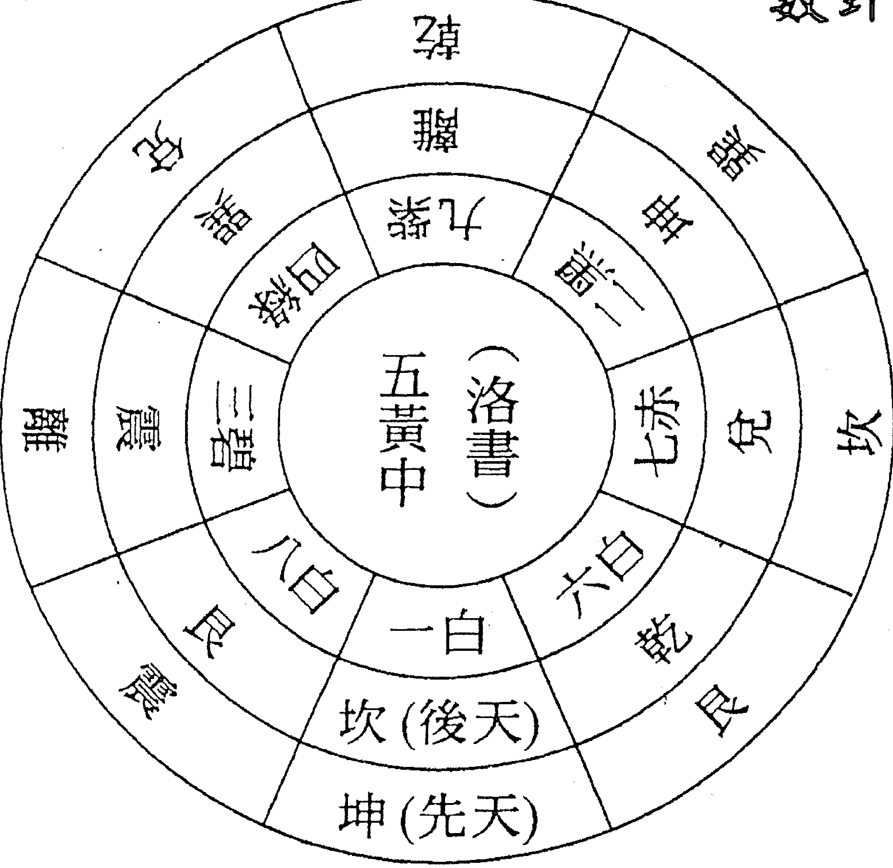

## 九星基本宫位：后天卦配洛书

| 四绿巽 | 九紫离 | 二黑坤 |
| 三碧震 | 五黄中 | 七赤兑 |
| 八白艮 | 一白坎 | 六白乾 |

## 三奇
乙为日奇，又为天德。
丙为月奇，又为玉女。
丁为星奇，又为天威。

## 六甲旬
甲子旬。甲戌旬、甲申旬。甲午旬。甲辰旬。甲寅旬。

## 六仪
戊、己、庚、辛、壬、癸。

## 符首
甲藏于六甲旬中之六仪。甲子旬为戊、甲戌旬为己、甲申旬为庚、甲午旬为辛、甲辰旬为壬、甲寅旬为癸。

## 六甲旬符首表

| 符首 | 六十时干辰支 | 六甲旬 |
|---|---|---|
| 戊 | 癸壬辛庚己戊丁丙乙甲
酉申未午巳辰卯寅丑子 | 甲子旬 |
| 己 | 癸壬辛庚己戊丁丙乙甲
未午巳辰卯寅丑子亥戌 | 甲戌旬 |
| 庚 | 癸壬辛庚己戊丁丙乙甲
巳辰卯寅丑子亥戌酉申 | 甲申旬 |
| 辛 | 癸壬辛庚己戊丁丙乙甲
卯寅丑子亥戌酉申未午 | 甲午旬 |
| 壬 | 癸壬辛庚己戊丁丙乙甲
丑子亥戌酉申未午巳辰 | 甲辰旬 |
| 癸 | 癸壬辛庚己戊丁丙乙甲
亥戌酉申未午巳辰卯寅 | 甲寅旬 |

## 地盘排列方式
阳局顺布，阴局逆布，何局则以该宫起布六仪，甲子戊、甲戌己、甲申庚、甲午辛、甲辰壬、甲寅癸、丁奇、丙奇、乙奇。

1.  如阳一局则由一白坎宫起甲子戊、二坤甲戌己、三震甲申庚、四巽甲午辛、五中甲辰壬、六乾甲寅癸、七兑丁奇、八艮丙奇、九离乙奇。
2.  如阳八局则由八白艮宫起甲子戊。
3.  如阴一局则甲子戊起坎、己在离、庚在艮、辛在兑、壬在乾、癸在中、丁在巽、丙在震、乙在坤，逆布九宫。
4.  如阴七局则甲子戊起兑，逆布九宫。

## 阴一局

| 丁奇 | 甲戊己 | 乙奇 |
| 丙奇 | 甲寅癸 | 甲午辛 |
| 甲申庚 | 甲子戊 | 甲辰壬 |

## 阳一局

| 四巽 甲午辛 | 九离 乙奇 | 二坤 甲戊己 |
| 三震 甲申庚 | 五中 甲辰壬 | 七兑 丁奇 |
| 八艮 丙奇 | 一坎 甲子戊 | 六乾 甲寅癸 |

## 阴七局

| 甲午辛 | 丙奇 | 甲寅癸 |
| 甲辰壬 | 甲申庚 | 甲子戊 |
| 乙奇 | 丁奇 | 甲戊己 |

## 阳八局

| 甲寅癸 | 甲戊己 | 甲午辛 |
| 甲辰壬 | 丁奇 | 乙奇 |
| 甲子戊 | 甲申庚 | 丙奇 |

## 阳遁九局地盘
**阳七局**
| 丁 | 庚 | 壬 |
|---|---|---|
| 癸 | 丙 | 戊 |
| 己 | 辛 | 乙 |

**阳四局**
| 戊 | 癸 | 丙 |
|---|---|---|
| 乙 | 己 | 辛 |
| 壬 | 丁 | 庚 |

**阳一局**
| 辛 | 乙 | 己 |
|---|---|---|
| 庚 | 壬 | 丁 |
| 丙 | 戊 | 癸 |

**阳八局**
| 癸 | 己 | 辛 |
|---|---|---|
| 壬 | 丁 | 乙 |
| 戊 | 庚 | 丙 |

**阳五局**
| 乙 | 壬 | 丁 |
|---|---|---|
| 丙 | 戊 | 庚 |
| 辛 | 癸 | 己 |

**阳二局**
| 庚 | 丙 | 戊 |
|---|---|---|
| 己 | 辛 | 癸 |
| 丁 | 乙 | 壬 |

**阳九局**
| 壬 | 戊 | 庚 |
|---|---|---|
| 辛 | 癸 | 丙 |
| 乙 | 己 | 丁 |

**阳六局**
| 丙 | 辛 | 癸 |
|---|---|---|
| 丁 | 乙 | 己 |
| 庚 | 壬 | 戊 |

**阳三局**
| 己 | 丁 | 乙 |
|---|---|---|
| 戊 | 庚 | 壬 |
| 癸 | 丙 | 辛 |

## 阴遁九局地盘
**阴七局**

| 辛 | 丙 | 癸 |
| --- | --- | --- |
| 壬 | 庚 | 戊 |
| 乙 | 丁 | 己 |

**阴四局**

| 戊 | 壬 | 庚 |
| --- | --- | --- |
| 己 | 乙 | 丁 |
| 癸 | 辛 | 丙 |

**阴一局**

| 丁 | 己 | 乙 |
| --- | --- | --- |
| 丙 | 癸 | 辛 |
| 庚 | 戊 | 壬 |

**阴八局**

| 壬 | 乙 | 丁 |
| --- | --- | --- |
| 癸 | 辛 | 己 |
| 戊 | 丙 | 庚 |

**阴五局**

| 己 | 癸 | 辛 |
| --- | --- | --- |
| 庚 | 戊 | 丙 |
| 丁 | 壬 | 乙 |

**阴二局**

| 丙 | 庚 | 戊 |
| --- | --- | --- |
| 乙 | 丁 | 壬 |
| 辛 | 己 | 癸 |

**阴九局**

| 癸 | 戊 | 丙 |
| --- | --- | --- |
| 丁 | 壬 | 庚 |
| 己 | 乙 | 辛 |

**阴六局**

| 庚 | 丁 | 壬 |
| --- | --- | --- |
| 辛 | 己 | 乙 |
| 丙 | 癸 | 戊 |

**阴三局**

| 乙 | 辛 | 己 |
| --- | --- | --- |
| 戊 | 丙 | 癸 |
| 壬 | 庚 | 丁 |

## 天盘布法
将地盘之符首，转至时干之宫位，布之天盘符首，其余各干依地盘顺布天盘各宫位。

| 己 壬 | 丁 乙 | 癸 己 壬 |
| 乙 庚 | 壬 | 戊 丁 |
| 辛 丙 | 庚 戊 | 丙 癸 |

天盘符首

时干

地盘符首

如：阳一局、甲子日、丁卯时。
丁卯时为甲子旬即符首为戊。地盘符首戊布在坎宫，丁卯时天干丁在兑，即天盘戊符首布在兑宫，其余顺布九宫。

> > 注：中宫之星，随二黑坤宫之星布置。

| 戊 | 乙 | 辛 |
| 乙 | 辛 | 己丙 |
| 壬 | 丙 | 癸 |
| 庚 | 丁 | 癸 |
| 壬 | 庚 | 丁 |

> 又如阴三局，丙午日，壬辰时，甲申旬，符首为庚。时干壬在艮宫，即布天盘庚在艮宫，其余各星顺布九宫。

天盘符首

时干

地盘符首

## 直使与直符
直使：八门基本位逢地盘符首同宫者，谓之直使。如符首在巽则八门直使为杜。
直符：九星基本位逢地盘符首同宫者，谓之直符。如符首在巽则直符为天辅星。

## 八门布法
将八门直使纳入十二地支宫位，由六甲旬支宫位，阳局顺算阴局逆算，皆顺布至时支宫位，所值之数即为直使所布宫位，再由此宫顺布八门。

如：阳七局、丙寅日、辛卯时、甲申旬、符首为庚。地盘符首庚在离宫，则知八门直使为九景，将景门纳入旬支申位，阳局顺算顺布为九申、一酉、二戌、三亥、四子、五丑、六寅、七卯，即七至时支卯位，则七兑为直使景门宫位再顺布八门。

| 乙 (生) 丁 | 辛 (伤) 庚 (符首) | 己 (杜) 壬 丙 |
| 戊 (休) 癸 | 丙 | 癸 (景) 戊 (七兑) |
| 壬 丙 (开) 己 | 庚 (惊) 辛 | 死 乙 |

| (巳) | (午) | (未) | 九景 (中) |
| (辰) | 符首：庚 直使：九景 |  | 一 (酉) |
| 七 (卯) |  |  | 二 (戌) |
| 六 (寅) | 五 (丑) | 四 (子) | 三 (亥) |

阳二局、癸卯日、戊午时、甲寅旬。直使七惊、阳局由寅顺算七、顺布至午为二、即惊门于二坤顺布八门。

| 丙(景)庚 | 戊(死)辛丙 | 癸(惊)戊辛 |
|----------|------------|------------|
| 庚(杜)己 | 辛         | 壬(开)癸   |
| 己(伤)丁 | 丁(生)乙   | 乙(休)壬   |

| 一 (巳) | 二 (坤) (午) | (未) | (申) |
|---------|--------------|------|------|
| 九 (辰) | 直使：七惊 符首：癸 | (酉) |      |
| 八 (卯) | 四 (子)      | (戌) | (亥) |
| 七惊 (寅)| (丑)         | 四 (子) | (亥) |

阴七局、丁酉日、戊申时、甲辰旬。直使三伤阴局由辰逆算顺布至申为八，即伤门于艮宫顺布八门。

| 己(景)辛 | 丁(死)丙 | 乙(惊)癸 庚 |
| 戊(杜)壬 | 庚 | 壬(开)戊 |
| 癸 庚(伤)乙 | 丙(生)丁 | 辛(休)己 |

| 二(巳) | 一(午) | 九(未) | 八(申) |
| 三伤(辰) | 直使：三伤 | 符首：壬 | (酉) |
| (卯) |  |  | (戌) |
| (寅) | (丑) | (子) | (亥) |

阳九局、戊子日、己未时、甲寅旬。
门布在一坎。
地盘符首癸入中，则直使为五死，五死由寅顺布顺算至未为一，则死

| 八 (巳) | 九 (午) | 一 (未) | (申) |
| --- | --- | --- | --- |
| 七 (辰) | 直使：五死 符首：癸 | | (酉) |
| 六 (卯) | | | (戌) |
| 五 (寅) | (丑) | (子) | (亥) |

阴八局、丙戌日、甲午时、甲午旬。
地盘符首辛入中，转入天盘时干为甲，甲为符首则依地盘同宫布之天盘，而直使五死由午至午亦为五，则八门布原始宫位。

| 辛丁 (死) | 乙 (景) | 壬 (杜) |
| :---: | :---: | :---: |
| 己 (惊) | 辛 | 癸 (伤) |
| 庚 (开) | 丙 (休) | 戊 (生) |

| (巳) | (午) 五 | (未) | (申) |
| :---: | :---: | :---: | :---: |
| (辰) | 符首：辛 直使：五死 | (酉) |
| (卯) | | (戌) |
| (寅) | (丑) | (子) | (亥) |

## # 九星布法
地盘符首宫为九星之直符。如地盘符首在坎，则九星直符为天蓬星，在震则为天冲，在乾则为天心。再布九星直符入天盘符首之宫位。

如阴七局、丁酉日、戊申时、甲辰旬。地盘符首壬在震宫，则九星直符为天冲，而天盘符首在兑宫，则布天冲在兑、天辅在乾、天英在坎、天芮在艮……等顺布各宫。

| 己
辛
景
心 | 丁
丙
死
莲 | 乙
癸庚
惊
任 |
|---|---|---|
| 戊
壬
杜
柱 | 庚 | 壬
戊
开
(冲) |
| 癸庚
己
伤
芮 | 丙
丁
生
英 | 辛
己
休
辅 |

再如阳二局、癸卯日、戊午时、甲寅旬。地盘符首癸在兑宫，则九星直符为天柱。再将天柱布入天盘符首坤宫，则天柱在坤、天心在兑、天蓬在乾、天任在坎、天冲在艮、天辅在震、天英在巽、天芮在离，顺布各宫。

| 丙 景 英 | 戊 辛 死 丙 芮 | 癸 惊 戊 辛 (柱) |
|----------|----------------|------------------|
| 庚 杜 己 辅 辛 | 辛 | 壬 开 癸 心 |
| 己 伤 丁 冲 | 丁 生 乙 任 | 乙 休 壬 蓬 |

## 八神布法
将八神直符布在天盘符首宫位，阳局顺布八神，阴局逆布八神。如阳一局、甲子日、辛未时、甲子旬、符首戊。将八神直符布入天盘符首巽宫，则直符在巽、腾蛇在离、太阴在坤、六合在兑、勾陈在乾、朱雀在坎、九地在艮、九天在震，阳局顺布八神。

| 戊 (符) 伤 辛 蓬 | 丙 杜 蛇 乙 任 | 庚 景 阴 己 壬 冲 |
| 癸 生 庚 心 | 天 壬 (辛) | 丁 死 合 辅 |
| 丁庚 休 地 丙 柱 | 己壬 开 雀 戊 芮 | 乙 惊 陈 癸 英 |## 佈時盤總訣

- 1. 地盤：陽順陰逆，何局則起戊於何宮。
- 2. 天盤：符首佈在時干宮位，依地盤順佈。
- 3. 八門：地盤符首宮為八門直使，再將直使由旬支順佈至時支轉盤，陽順算陰逆算，得何數則直使佈此宮，再順佈八門。
- 4. 九星：地盤符首宮為九星直符，再將九星直符佈在天盤符首宮位順佈九星。
- 5. 八神：將八神直符佈在天盤符首宮位，陽順佈陰逆佈。

又如陰八局、辛巳日、乙未時、甲午旬、符首辛。直使：五死。九星直符：天禽。將八神直符佈入天盤符首離宮，則直符在離、螣蛇在巽、太陰在震、六合在艮、勾陳在坎、朱雀在乾、九地在兌、九天在坤，陰局逆布八神。

| 左列 | 中列 | 右列 |
| :--- | :--- | :--- |
| 乙 壬 死 | 蛇 英 丁 辛 (符) 驚 | 己 丁 辛 開 天 柱 |
| 壬 癸 陰 輔 景 | 辛 | 庚 己 休 地 心 |
| 癸 戊 合 衝 杜 | 戊 丙 陳 任 傷 | 丙 庚 生 雀 蓬 |

例：陰八局。丁卯日。丙午時。甲辰旬。符首：壬。八門直使：四杜。九星直符：天輔。

| 己 壬 | 雀 柱 | 庚 乙 | 陳 心 | 丙 丁辛 | 合 蓬 |
| :--- | :--- | :--- | :--- | :--- | :--- |
| 丁辛 癸 | 地 芮 | 辛 | | 戊 己 | 陰 任 |
| 乙 戊 | 天 英 | 壬 丙 | 符 輔 | 癸 庚 | 蛇 衝 |

| 三 | 二 | | |
| :--- | :--- | :--- | :--- |
| (巳) | (午) | (未) | (中) |
| 四 | 陽順算 陰逆算 | 時支順布 由旬支到 | (酉) |
| (辰) | | | |
| (卯) | | | (戌) |
| (寅) | (丑) | (子) | (亥) |

例：陽六局。癸未日。壬子時。甲辰旬。符首：壬。八門直使：一休。九星直符：天蓬。

| 丙 丙 | 合 輔 開 | 辛 辛 | 陳 英 休 | 癸乙 癸乙 | 雀 芮 生 |
| :--- | :--- | :--- | :--- | :--- | :--- |
| 丁 丁 | 陰 衝 驚 | 乙 | | 己 己 | 地 柱 傷 |
| 庚 庚 | 蛇 任 死 | 壬 壬 | 符 蓬 景 | 戊 戊 | 心 天 杜 |

| 二（巳） | 三（午） | 四（未） | 五（申） |
| :--- | :--- | :--- | :--- |
| 一（辰） | 由旬支到 時支順佈 陽順算 陰逆算 | | 六（酉） |
| （卯） | | | 七（戌） |
| （寅） | （丑） | 九（子） | 八（亥） |

## 陽遁歌訣

冬至驚蟄一七四，小寒二八五同推。春分大寒三九六，芒種六三九是真。穀雨小滿五二八，立春八五二相隨。立夏清明四一七，九六三從雨水期。

## 陰遁歌訣

夏至白露九三六，小暑八二五重逢。秋分大暑七一四，立秋二五八流通。霜降小雪五八二，大雪四七一相同。處暑排來一四七，立冬寒露六九三。

## 陰陽遁局表

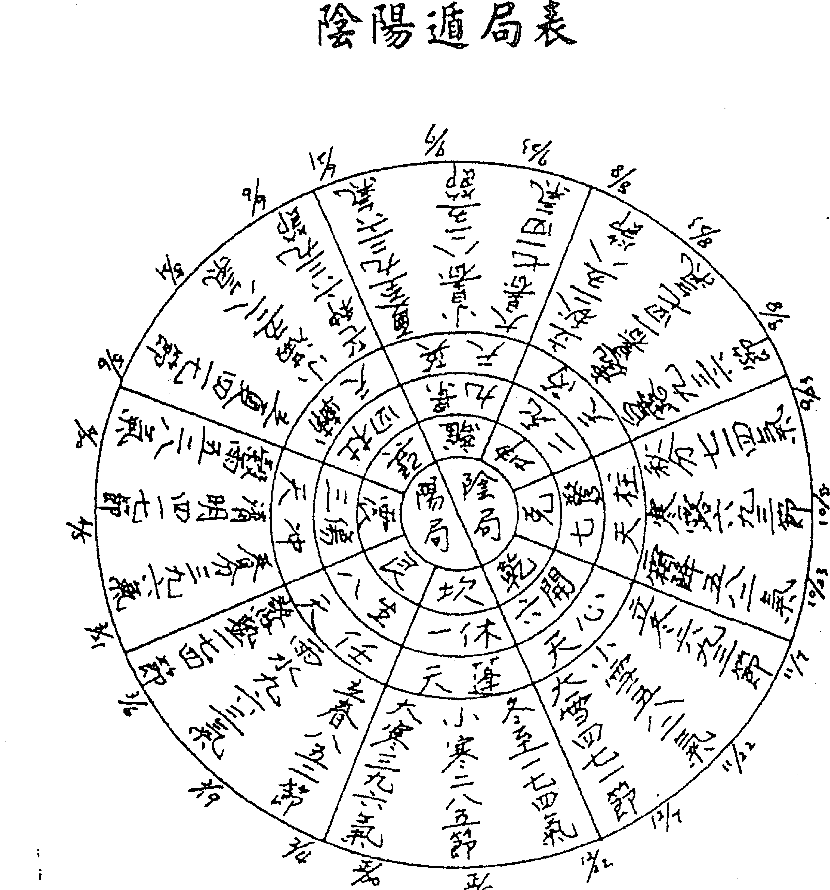

## 陽遁

| 項目 | 六月 | 五月 | 四月 | 三月 | 二月 | 正月 | 十二月 |
| :--- | :--- | :--- | :--- | :--- | :--- | :--- | :--- |
| 陽曆±1天 | 6日 | 21日/6日 | 20日/5日 | 21日/6日 | 19日/4日 | 20日/5日 | 22日 |
| 月令 | 午月 | 巳月 | 辰月 | 卯月 | 寅月 | 丑月 | 子月 |
| 24節氣 | 芒種 | 小滿/立夏 | 穀雨/清明 | 春分/驚蟄 | 雨水/立春 | 大寒/小寒 | 冬至 |
| 節氣 | 節 | 氣/節 | 氣/節 | 氣/節 | 氣/節 | 氣/節 | 氣 |
| 陰陽局三元 | 六三九 | 五二八 | 四一七 | 五二八 | 四一七 | 三九六 | 一七四 |
| 陰陽遁 | 陽遁 | | | | | | |

| 十二月 | 十一月 | 十月 | 九月 | 八月 | 七月 | 六月 |
| :---: | :---: | :---: | :---: | :---: | :---: | :---: |
| 陽曆±1天 | 7日 23日 | 7日 23日 | 8日 23日 | 8日 23日 | 8日 23日 | 7日 23日 | 21日 |
| 月令 | 子月 | 亥月 | 戌月 | 酉月 | 申月 | 未月 | 午月 |
| 24節氣 | 大雪 小雪 | 立冬 霜降 | 寒露 秋分 | 白露 處暑 | 立秋 大暑 | 小暑 夏至 |  |
| 節氣 | 節 氣 | 節 氣 | 節 氣 | 節 氣 | 節 氣 | 節 氣 | 氣 |
| 上中下 | 四七一 | 五六二 | 六九三 | 五六二 | 六九三 | 七一四 | 九三六 | 一四七 | 二五八 | 七一四 | 八二五 | 九三六 |
| 陰陽遁 | \multicolumn{7}{c}{陰 遁} |

## 閏奇

陰陽遁：每年冬至後陽氣上升，則由陰遁變換為陽遁。夏至後陰氣上升，則由陽遁變換為陰遁。即冬至後夏至前用陽局，夏至後冬至前用陰局。

三元：分上元、中元、下元，每元由甲己日管轄五天，每一個節氣配有三元，即三元共有十五天，每元五日管轄一局。

符頭：乃三元之首日，又謂進神，即甲子日、己卯日、甲午日或己酉日，此四日為四進神日。

- 超神：符頭日超前節氣，而提早換局。
- 接氣：節氣已到但尚未換局，即延後換局。
- 正授：節氣與符頭同時到達，即節氣當日換局。
- 閏奇：年有24節氣，每個節氣管轄三元15天，但每年約有365又1/4天，則每三年內須要閏奇一次三元15天，來調整換局與節氣。

閏奇過程：超神九天則閏奇一次，閏奇後變為接氣，由延後換局漸變成正授，正授即换局与节气同日，再变成超神提早换局，由少日渐变成多日换局，超过九天再闰奇一次，约三年内循环一次闰奇。阳局闰芒种六三九，阴局闰大雪四七一局。

例西元一九九一年，岁次..辛未。

夏至（阳历）6/22（阴历）5/11 癸亥日卯时 接夏至上阴九局

小暑
7/3，5/17 己巳日，接夏至中阴三局
7/7，5/21 甲戌日，接夏至下阴六局
7/8，5/26 戊寅日夜子时23点37分，接夏至上阴八局
7/13，6/2 己卯日，接小暑上阴八局
7/18，6/7 甲申日，接小暑中阴二局
7/23，6/12 己丑日，接小暑下阴五局
7/28，6/17 甲午日，接小暑下阴五局

大暑
7/23，6/12 甲午日申时，接小暑下阴五局（正授）
7/28，6/17 己亥日，正大暑中阴一局
8/2，6/22 甲辰日，正大暑下阴四局

### 立秋

- 8/7 8/7 6/27 己酉日，超立秋上陰二局
- 8/8 6/28 庚戌日巳時
- 8/12 7/3 甲寅日，超立秋中陰五局 (超神)
- 8/17 7/8 己未日，超立秋下陰八局
- 8/22 7/13 甲子日，超處暑上陰一局
- 8/23 7/14 乙丑日夜子時23點47分
- 8/27 7/18 己巳日，超處暑中陰四局
- 9/1 7/23 甲戌日，超處暑下陰七局

### 處暑

- 8/23 7/14 乙丑日夜子時23點47分
- 8/27 7/18 己巳日，超處暑中陰四局
- 9/1 7/23 甲戌日，超處暑下陰七局

### 小雪

- 11/22 10/8 己丑日未時
- 11/22 10/8 己丑日，超小雪下陰二局
- 11/17 10/3 甲申日，超小雪中陰八局
- 11/12 9/27 己卯日，超小雪上陰五局
- 11/7 9/22 甲戌日申時（超神）

例西元2001年，歲次..辛巳。

### 大雪

### 冬至

### 2001年

### 小寒

### 大寒

11/27 10/13 甲午日，超大雪上陰四局

12/2 10/18 己亥日，超大雪中陰七局

12/7 10/23 甲辰日，超大雪下陰一局

12/12 10/28 乙酉日，閏大雪上陰四局（閏奇）

12/17 11/3 甲寅日，閏大雪中陰七局

12/22 11/8 己未日，閏大雪下陰一局

12/27 11/13 甲子日，閏大雪上陰一局（接氣）

1/1 11/22 癸酉日戌時

1/5 11/28 己卯日

1/6 12/4 甲申日，接小寒上陽二局

1/11 11/23 甲戌日，接小寒中陽八局

1/16 12/9 己丑日，接小寒下陽五局

1/20 12/8 乙丑日，接小寒下陽五局

1/21 12/9 戊子日未時

## 三奇得使

歌曰：
三奇得使诚堪使，六甲遇之非小补。
乙马逢犬丙鼠猴，六丁玉女骑龙虎。
甲戌甲午乙为使，甲子甲申丙为使。
甲辰甲寅丁为使，三奇得使更为吉。

- 日奇得使·乙为日奇，在乾六或离九宫谓之日奇得使。
- 月奇得使·丙为月奇，在坎一或坤二宫谓之月奇得使。
- 星奇得使·丁为星奇，在巽四或艮八宫谓之星奇得使。

如阴遁三局、丙辛之日、壬辰时、甲申旬。此时乙奇临离九宫甲午为乙奇得使。

又如陽遁五局、丁壬日、丙午時，此時丙奇臨在坎一宮甲子為丙奇得使。

## 陰二局、丙辛日、壬辰時

| 戊 驚 乙 | 地 衝 開 | 辛 輔 己丙 |
| 壬 天 死 戊 任 | 直符:天蓬 直使:一休 符首:庚 | 己丙 生 癸 合 芮 |
| 庚 符 景 壬 蓬 | 丁 蛇 杜 庚 心 | 癸 傷 丁 陰 柱 |

## 陽五局、丁壬日、丙午時

| 丁戊 蛇 傷 乙 芮 | 庚 杜 壬 柱 | 己 景 丁戊 心 |
| 壬 符 生 丙 英 | 直符:天英 直使:九景 符首:壬 | 癸 死 庚 陳 蓬 |
| 乙 天 休 辛 輔 | 丙 地 開 癸 衝 | 辛 驚 己 任 |

三奇得使乃奇得旺，有奇無門難用之，但逢奇得使，即使無門亦可用之。但如逢吉門吉宿助之，即諸事皆宜，亨通大吉。

再如陰遁五局、丙辛日、乙未時。此時丁奇臨巽四、甲辰為丁奇得使。

| 丁 | 陳 | 庚 | 合 | 己 | 陰 |
| :--- | :--- | :--- | :--- | :--- | :--- |
| 休 | 任 | 生 | 衝 | 傷 | 輔 |
| 己 | 癸 | 辛 | 戊 | 辛 | 戊 |
| 壬 | 雀 | 直符天芮 | 直使死 | 符首辛 | 癸 |
| 庚 | 蓬 |  |  |  | 丙 |
| 乙 | 地 | 丙 | 天 | 辛戊 | 符 |
| 丁 | 心 | 壬 | 柱 | 乙 | 芮 |

### (三奇得使)

| 甲辰 | 丁奇 | 乙奇 | 丙奇 |
| :--- | :--- | :--- | :--- |
| 甲申 | 乙奇 | 丙奇 | 丁奇 |
| 甲寅 | 丙奇 | 丁奇 | 乙奇 |
| 甲子 | 丁奇 | 丙奇 | 乙奇 |
| 甲戌 | 丙奇 | 乙奇 | 丁奇 |

## 二奇升殿

乙奇升殿：乙奇臨震為日出扶桑，為祿之鄉，貴人陞於乙卯正殿。

丙奇升殿：丙奇到離為月照瑞門，火旺之地，貴人陞於丙午正殿。

丁奇升殿：丁奇臨兌為丁見西方天神之位。火旺之地。

| 丙奇 | |
| :--- | :--- |
| 乙奇 | 丁奇 |

日出東卯。丁為玉女、兌為少女。

## 三奇旺相格

乙奇到巽为玉兔乘风，到坎为玉兔饮泉。日奇旺相：乙奇到坎或巽宫。

丙奇到震为月入雷门，到巽为火行风起。月奇旺相：丙奇到震或巽宫。

丁奇到巽为玉女留郎，到离为乘旺而火炎。星奇旺相：丁奇到巽或离宫。

## 二奇入墓宫

古曰：三奇入墓者谓：六乙日奇临坤二宫。六丙月奇临乾六宫。六丁星奇临艮八宫。乙奇临坤二宫亦是，是谓三奇入墓也。假如阴遁四局、丙辛日、庚寅时、六丙月奇下临乾六宫，是谓月奇入墓。凡遇三奇入墓纵有奇门，不可举兵，百事皆凶。

经云：三奇入墓何时辰，丙奇乾上乙临坤，或遇乙奇居戌上，还加丁向丑中存，丁乃阴火死在寅，墓在丑也。

日奇入墓宫，天盘乙奇在坤二或乾六宫。
月奇入墓宫，天盘丙奇临乾宫。
星奇入墓宫，天盘丁奇临艮宫。

| 病 | 死 | 墓 | |
| :--- | :--- | :--- | :--- |
| 衰 | | | |
| 帝旺 | | | |
| 臨官 | 冠帶 | 沐浴 | 長生 |

甲木墓在未

| 沐浴 | 長生 | | |
| :--- | :--- | :--- | :--- |
| 冠帶 | | | |
| 臨官 | | 墓 | |
| 帝旺 | 衰 | 病 | 死 |

乙木墓在戌

| 臨官 | 帝旺 | 衰 | 病 |
| :--- | :--- | :--- | :--- |
| 冠帶 | | 死 | |
| 沐浴 | | 墓 | |
| 長生 | | | |

丙火墓在戌

| 帝旺 | 臨官 | 冠帶 | 沐浴 |
| :--- | :--- | :--- | :--- |
| 衰 | | | 長生 |
| 病 | | | |
| 死 | 墓 | | |

丁火墓在丑

阴四局、丙辛日、庚寅时、甲申旬。
丙奇入墓宫

| 戊杜戊 | 陰輔壬 | 壬景壬 | 蛇英庚乙 | 庚乙死庚乙 | 符丙 |
| :--- | :--- | :--- | :--- | :--- | :--- |
| 己傷己 | 合衝 | 直符：天芮 | 直使：二死 | 符首：庚 | 丁驚丁 | 天柱 |
| 癸生癸 | 陳任 | 辛休辛 | 雀蓬 | 丙開丙 | 地心 |

阳五局、甲己日、乙亥时、甲戌旬。
丁奇入墓宫

| 己景乙 | 符心 | 癸死壬 | 蛇蓬 | 辛驚丁戊 | 陰任 |
| :--- | :--- | :--- | :--- | :--- | :--- |
| 庚杜丙 | 天柱 | 直符：天心 | 直使：六開 | 符首：己 | 丙開庚 | 合衝 |
| 丁戊傷辛 | 地芮 | 壬生癸 | 雀英 | 乙休己 | 陳輔 |

## 三奇入墓時

古曰：又有時干入墓宮，課中時下忌相逢，戊戌、壬辰、丙戌、癸未、丁丑一同凶。三奇者謂：丙戌時為月奇入墓之時。又曰：凡遇乙庚日丁丑時為丁奇入墓，黃昏是丙戌故為月奇入墓。

二奇入墓時，乃丙奇在丙戌時，丁奇在丁丑時。其它戊戌、壬辰、癸未、己丑時，雖非三奇入墓時，但逢之時干宮亦不用。

## 二奇受制

月星奇受制：丙丁奇入坎宫。

日奇受制：乙奇入兌或乾宫。

古曰：丙丁奇入一宫乃火入水池，乙奇入六宫乃木入金乡，二奇受制万事不可举也。

## 二奇入各宮旺衰表

| 宮位\三奇 | 坎宮 | 艮宮 | 震宮 | 巽宮 | 離宮 | 坤宮 | 兌宮 | 乾宮 |
| :--- | :--- | :--- | :--- | :--- | :--- | :--- | :--- | :--- |
| 日奇 | ○ |  | ○ | ○ | ○ | × | × | × |
| 月奇 |  |  | ○ | ○ | ○ | ○ |  | × |
| 星奇 | × |  |  | ◎ | ○ | ○ | ○ |  |

| | | |
| :--- | :--- | :--- |
| 丁奇得使 丙奇旺相 乙奇旺相 丁奇旺相 | 乙奇得使 丙奇升殿 丁奇旺相 | 丙奇得使 乙奇入墓 |
| 乙奇升殿 丙奇旺相 | | 丁奇升殿 乙奇受制 |
| 丁奇得使 丁奇入墓 | 乙奇旺相 丙奇得使 丁奇入墓 丙奇入墓 | 乙奇得使 乙奇入墓 乙奇受制 丙奇入墓 |

## 天辅时

三元经曰：天辅之时有罪无疑，斧鑽在前，天犹救之，此时有罪皆能自释。谓：甲己之日，时下得己。庚乙、丙辛、丁壬、戊癸之日，时下得甲故也。

天辅时：
- 甲己日·己巳时。
- 乙庚日·甲申时。
- 丙辛日·甲午时。
- 丁壬日·甲辰时。
- 戊癸日·甲寅时。

天辅时又曰：天赦时。乃上天开恩之时，可大事化小、小事化无、逢凶化吉之时。宜求情、求宽恕、化解心结、调解事非、减轻判刑。此为遁甲之旺时，能提升奇门之功能，逢吉更吉、凶者不凶。

## 玉女守門時

三元經曰：三奇遊六儀，利以宮廷宴會、喜樂之事。六儀者六甲也，三奇者乙丙丁也。謂乙丙丁遊六儀之上，甲子旬有庚午、甲戌旬有己卯、甲申旬有戊子、甲午旬有丁酉、甲辰旬有丙午、甲寅旬有乙卯，此時玉女守門之時也。

玉女守門時於六十甲子時當中，共有六個時辰，如下：

- 甲子旬·庚午時
- 甲戌旬·己卯時
- 甲申旬·戊子時
- 甲午旬·丁酉時
- 甲辰旬·丙午時
- 甲寅旬·乙卯時

主：歡喜、快樂。

宜：求親、求貴人、喜慶宴會、飲酒作樂。易於人際關係的溝通、社交集會的連繫，可訂婚提親、相親約會等。

## 德威之時

古曰：六丙為威，六甲為德。利以為客，宜發號施令、入其國、大不吠、馬不嘶、回車止輪，所動萬里敢有舉兵來向者，皆還自滅、賊必亡矣，為客大勝，若此時不利為主，惟宜固守屯營以待天時。

### 六甲為德：

- 主·尊貴、得貴人扶助、提昇遁甲效應。
- 宜·積極用事，如求財、求貴、求事等。時干逢之功能提升，再逢天盤更為增強遁甲之力量。

### 六丙為威：

- 主·氣勢旺盛、聲勢逼人。可壓制敵人、迎進貴人、逼退小人、利客不利主。
- 宜·求財、求事、求勝、求貴等。

逢之六丙時，利於用事。若天盤再逢丙奇，效益增強，百事亨通。如陽一局、甲己日、甲子時、甲子旬。

| 辛合 杜輔 辛 | 乙陳 景英 乙 | 己壬雀 死芮 己壬 |
| :--- | :--- | :--- |
| 庚陰 傷衝 庚 | 直符符首 天蓬一休戊 戊 | 丁地 驚柱 丁 |
| 丙蛇 生任 丙 | 戊符 休蓬 戊 | 癸天 開心 癸 |

此盤逢六甲時，乃為德威之時。遁甲效能提升，再逢甲時干在坎，則坎宮更為旺盛。

再如陽一局、甲己日、丙寅時、甲子旬。

| 庚 辛 生 陰 衝 | 辛 乙 傷 輔 合 | 乙 己壬 杜 英 陳 |
| :--- | :--- | :--- |
| 丙 庚 休 蛇 任 | 直符：天蓬 直使：一休 符首：戊 | 己壬 丁 景 芮 雀 |
| 戊 丙 開 符 蓬 | 癸 戊 天 心 | 丁 癸 死 柱 地 |

此盤逢六丙時，乃為德威之時。遁甲效能提升，再逢丙時干在震，則震宮更強盛。

## 五不遇時
五不遇時乃爲陽時干剋陽日干，陰時干剋陰日干。陽剋陽、陰剋陰，爲無情之剋，日之損傷甚重，是爲遁甲凶時。不宜用兵、恐有損傷。不宜用事，易有血光。求財不利、處事不順、百事宜避之。

## 十日不遇時
- 甲日庚午時。
- 乙日辛巳時。
- 丙日壬辰時。
- 丁日癸卯時。
- 戊日甲寅時。
- 己日乙丑時。
- 庚日丙子時。
- 辛日丁酉時。
- 壬日戊申時。
- 癸日己未時。

## 遁甲擇日
六十甲子日當中，天干地支有生剋、比和之現象。則日之吉凶分爲寶、義、和、制、伐五種：
寶爲上吉之日，乃天干生扶地支日。如甲午日，天干甲木生扶地支午火。
義爲次吉之日，乃地支生扶天干日。如甲子日，地支子水生扶天干甲木。
和爲小吉之日，乃天干與地支比和。如壬子日，天干壬水與地支子水比和。
制爲中平之日，乃天干剋地支也。如甲戌日，天干甲木剋下地支戌土。
伐爲極凶之日，乃地支剋上天干。如甲申日，地支申金剋上天干甲木。

## 遁甲五陽利客
五陽爲甲乙丙丁戊，五天干時。五陽時居在東部生氣謂之：客利先舉。
主：動不利靜、利客不利主、利攻不利守、利外不利內。
宜：舉兵攻打、遠行、求財、上官任職、移徙、嫁娶、拜访、求事等皆吉。

## 遁甲五陰利主
五陰爲己庚辛壬癸，五天干時。五陰時居在西部煞氣謂之：主利後動。
主：靜不利動，利主不利客、易守不利攻、利內不利外。
宜：策劃、密謀、籌備、訓練、學習、祈福、商討事宜等。
五陰幹乃惡神治事，則五陰煞氣不動爲要也，不宜拜官、出行、移徙等對外活動。

## 門迫宮
經曰：吉門被迫則事不成，凶門被迫則凶事尤甚。宮制其門是凶迫，門制宮是吉迫。門生宮爲和，宮生門爲義。
八門逢九宮則有生克吉凶，而分以和、義、制、害四類如下：
- 和：八門生宮位五行，屬吉。能提升奇門功能。
- 義：宮位生八門五行，屬吉。能增強遁甲效能。
- 制：八門克宮位五行，中平。門克宮，八門之運作不受宮位所影響。
- 害：宮位克八門五行，屬凶。逢吉事不成，逢凶事尤甚。

|      | 左      | 中        | 右      |
|------|---------|-----------|---------|
| 上   | 休(水)  | 傷杜(木)  | 景(火)  |
| 中   | 休(水)  |           | 死生(土)|
| 下   | 景(火)  | 驚開(金)  | 死生(土)|

|      | 左      | 中        | 右      |
|------|---------|-----------|---------|
| 上   | 景(火)  | 死生(土)  | 驚開(金)|
| 中   | 景(火)  |           | 休(水)  |
| 下   | 驚開(金)| 傷杜(木)  | 休(水)  |

|      | 左      | 中        | 右      |
|------|---------|-----------|---------|
| 上   | 驚開(金)| 休(水)    | 傷杜(木)|
| 中   | 驚開(金)|           | 景(火)  |
| 下   | 傷杜(木)| 死生(土)  | 景(火)  |

|      | 左      | 中        | 右      |
|------|---------|-----------|---------|
| 上   | 死生(土)| 驚開(金)  | 休(水)  |
| 中   | 死生(土)|           | 傷杜(木)|
| 下   | 休(水)  | 景(火)    | 傷杜(木)|

## 九遁

### 一、天遁
歌曰：生門六丙合六丁此爲天遁，此時得月華所蔽，亦不可犯奇墓門迫，其氣升，内應心外主身。名曰：玄珠能聽。
天遁乃生門合天盤丙奇、地盤丁奇或生門合天盤丙奇、地盤戊及開門合天盤丙奇、地盤戊。但怕奇逢墓及門迫，如丙墓在乾、生門迫害在震巽。天遁力量遠大於奇門，又曰：月華所蔽。
宜：出兵遠征、威鎮天下、登基、朝君、求福、求官、求職、開張利市、遠行旅遊、求財求利、移徙、嫁娶、開運等百事皆宜、興隆大吉。
玉女神咒曰：丁卯玉女護我祐我，毋令傷我，視我則瞽，傷我者反受其殃，急急如律令！咒後不得回顧。天人地遁得用。

| 丁 戊 蛇 蓬 (景) | 壬 癸 陰 任 (死) | 乙 丙 壬 合 驚 冲 |
|------------------|------------------|------------------|
| 庚 乙 符 心 (杜) | 直符:天心 直使:六開 符首:庚 | 戊 壬 陳 輔 (開) |
| 辛 壬 天 柱 (傷) | 丙 丁 地 芮 (生) | 癸 庚 雀 英 (休) |

如：陽四局、乙庚日、乙酉時、甲申旬。生門與天盤丙奇、地盤丁奇，同居在坎宮，則此宮位合成天遁。

### 二、地遁
歌曰：開門六乙合六己地遁也。此時得日精所蔽，其氣黃，內應其脾、外應其形，任呼任用。又名：黃婆金公。
地遁乃由開門合乙奇天盤及地盤己所成，其遁甲力量強而有力，但亦忌乙墓在乾、門在離迫。
- 宜：
- 藏兵安營
- 建府
- 築牆
- 可攻可守
- 求仙
- 求師
- 求貴
- 求財
- 安墳
- 開礦
- 修道
- 逃亡絕跡等百事大吉。
咒：玉女神咒。地戶得日精所蔽。

| 庚 辛 符 (死) 冲 | 辛 乙 蛇 (驚) 辅 | 乙 己 壬 陰 (開) 英 |
|------------------|------------------|------------------|
| 丙 庚 天 (景) 任 | 直符: 天冲 直使: 三伤 符首: 庚 | 己 壬 丁 合 (休) 芮 |
| 戊 丙 地 (杜) 蓬 | 癸 戊 雀 (傷) 心 | 丁 癸 陳 (生) 柱 |

地遁
如：陽一局、丙辛日、辛卯時、甲申旬。開門合天盤乙、地盤己在坤宮。

| 丁 癸 陰 (生) 冲 | 癸 戊 蛇 (傷) 辅 | 戊 丙 壬 符 (杜) 英 |
|------------------|------------------|------------------|
| 己 丁 合 (休) 任 | 直符: 天英 直使: 九景 符首: 戊 | 丙 庚 天 (景) 芮 |
| 乙 己 陳 (開) 蓬 | 辛 乙 雀 (驚) 心 | 庚 辛 地 (死) 柱 |

地遁
如：陰九局、甲己日、丙寅時、甲子旬。開門合天盤乙、地盤己在艮宮。

### 三、人遁
歌曰：休门六丁共太陰，欲求人遁無過此。太陰之位乃得星精所蔽，其氣青黑，內應腎、外主耳目。名曰：還陽丹修。其方可以擇賢人、求猛將、添進人口、交易利市十倍。天則隨其所求、地則隨其所視、人則隨其所令，保持全勝之玄機也。
人遁乃以休門合天盤丁奇及八神太陰所形成，遁甲三才之一，威力強而感應快。
宜：求財、求貴、求丁等與天地遁同，百事大吉。
咒：玉女神咒。會以天地人三才，以左手相天，右執劍指相地，見貴求官書「天」字、商賈嫁娶會親書「和」字、入山捕獅字、指揮用事比賽書「強」字、過河渡海治水書「土」或「戊」字、遊山玩水修道書「龍」字。凡此天地人三遁用事興兵等萬事吉利。

| 乙 地 景 丁 心 | 辛 天 死 庚 蓬 | 己 符 驚 壬壬 任 |
|----------------|----------------|-----------------|
| 戊 雀 杜 柱   | 直符：天任 直使：八生 符首：己 | 癸壬 蛇 開 戊 冲 |
| 壬 陳 傷 己 芮 | 庚 合 生 辛 英 | 丁 陰 休 乙 輔 |

如：陽七局、六乙日、丙子時、甲戌旬。休門會天盤丁奇、八神太陰在乾宮、生門得宮生、丁奇無入墓，人遁也。

### 四、神遁
歌曰：天上六丙合九天，再合生门神遁然。丙奇与生门下临九天之位，得神灵所蔽，其方可以祭神，灵用圣术。
通感应迅速。宜：求神、求嗣、安神、作醮、祈福、塑造神像、开光点眼、建庙、造符、驱邪制煞、利攻用策、求医合药、求财求利、延寿保命等百事皆宜。
如：阳一局、乙庚日、甲申时、甲申旬。生门会同天盘丙奇与八神九天在艮宫，此为神遁也。

### 五、鬼遁
歌曰：天上六乙合九地临於杜门鬼遁。取丁奇与休门，相合下临九地之位。得鬼神隐伏之蔽。
鬼遁乃杜门合天盘乙奇临九地之宫，或休门合天盘丁奇会九地。此乃得鬼神所蔽，阴神所助，主阴之用事。
宜：伏兵偷袭、策谋用计、密探军情、散播谣言、跟踪埋伏、祭祀、超渡亡魂、扫墓等一切阴暗事情皆宜。
如：阴三局、丁壬日、甲辰时、甲辰旬。杜门合天盘乙奇及九地在巽宫，谓之鬼遁。

| 乙 乙 辅 | 辛 辛 英 | 己丙 己丙 芮 |
|----------|----------|--------------|
| 地 (杜) | 雀 (景) | 陈 (死) |
| 戊 戊 冲 | 直符：壬 直使：八生 | 癸 癸 柱 |
| 天 (伤) | 符首：壬 | 合 (驚) |
| 壬 壬 任 | 庚 庚 蓬 | 丁 丁 心 |
| 符 (生) | 蛇 (休) | 阴 (開) |

### 六、風遁
歌曰：天上六乙合三門下臨巽宮風遁矣。
風遁乃天盤乙奇合休生開三吉門於巽宮，主得風助、順風、無孔不入、通行無阻。
宜：出航、旅遊、開車遠行、立旗、宣戰、演講、造勢、打知名度、廣告、滲透、借風交戰、密探軍情、探查事由等借風事宜皆可。特別是打歌或新產品可造成新風潮，促進流行風。
如：陰一局、甲己日、辛未時、甲子旬。天盤乙奇合三吉門之生門於巽宮。

### 七、雲遁
歌曰：天上六乙合六辛，臨三吉門爲雲遁。
雲遁乃由天盤乙奇、地盤辛，會合三吉門即是。但亦不宜逢墓及門迫。主得雲之庇護、輕鬆、如意、消暑、減輕壓力。
宜：遁藏、追擊、戰鬥、埋伏、跟蹤、製造兵器、操兵演練、學道、術、求雨、出外旅遊、休閒娛樂等百事皆吉。
如：陰六局、丙辛日、戊子時、甲申旬。天盤乙奇、地盤辛合生門於震宮爲之雲遁，但生門逢害，雲遁效果減弱。

| 戊庚傷 陳心 | 癸丁杜 合蓬 | 丙壬景 陰任 |
|-------------|-------------|-------------|
| 乙辛生 雀柱 | 庚符首·真符·天輔 辛真使·四杜 辛乙死 蛇沖 | 丁天開 天英 辛符 辅 |
| 壬丙休 地芮 | 癸丁開 天英 | 庚戊驚 符辅 |

### 八、龍遁
歌曰：日奇合休於坎宮，此爲龍遁。
龍遁乃乙奇合休門於坎宮，可得龍之蔽護。主水潤雨澤，萬物生長。
- 渡江過河、水戰、治水、開闢水源、出航、造船、海軍行事、普渡水祭、祭拜鬼神、造橋、築堤、游泳戲水、求雨、建造水庫、漁作業等一切與水有關之事皆宜，水事大吉。
如：陰七局、甲己日、癸酉時、甲子旬。天盤乙奇合休門於坎宮，謂之：龍遁。

| 丙 辛（杜） | 阴 英（杜） | 癸 丙（景） | 蛇 芮（景） | 戊 癸（死） | 符 柱（死） |
|-------------|-------------|-------------|-------------|-------------|-------------|
| 辛 壬（伤） | 合 辅       | 直符 戊     | 直使 七煞（警） | 符首 己     | 天心 戊     |
| 壬 乙（生） | 陈 冲       | 乙 丁（休） | 雀 任       | 丁 己（开） | 地 蓬       |

### 九、虎遁
歌曰：天上六乙合六辛临休到艮，虎遁门。又曰：乙奇与生门临六辛，得虎之蔽。虎遁乃天盘乙奇合地盘辛逢休门于艮宫。主：强猛有劲、威武、具攻击性。宜：出兵攻打、设立要塞、设关卡拦截（虎关）、演习、下马威、阅兵、镇压、捕盗贼、新官上任、驱邪镇煞、领兵、训導等百事皆吉。如：阳五局、乙庚日、戊寅时、甲戌旬。天盘乙奇合地盘六辛，再会合休门于艮宫。谓之虎遁。

| 列1 | 列2（傷） | 列3 | 列4 | 列5 | 列6（景） |
|-----|-----------|-----|-----|-----|-----------|
| 丁 乙 | 地 芮 | 庚 壬 | 天 柱 | 己 丁 | 符 心 |
| 壬 丙 | 雀 英（生） | 真 符：天心 | 符首：己 六開（符） | 癸 蓬（死） | 蛇 蓬 |
| 乙 辛 | 陳 輔 | 丙 癸（開） | 合 冲 | 辛 己（驚） | 陰 任 |

## 三詐
古經云：凡欲經求万事宜休、開、生，下合乙、丙、丁，即吉。又取陰門相助謂之：三詐。凡太陰、六合、九地宮助奇門全備、用之有十分之利。若三門逢三奇無詐宮，謂之有奇無陰得七分之利。若三門合太陰無三奇，謂之有陰無奇犯者不利。
1.  真詐：三吉門逢三奇臨太陰。宜：施恩、隱遁、求仙。
2.  重詐：三吉門合三奇臨九地。宜：求財、求貴、任職、選人、旺丁。
3.  休詐：三吉門合三奇臨六合。宜：合藥、求醫、治邪、祈求、嫁娶、媒合、宴客等。

|      | 左          | 中                  | 右          |
|------|-------------|---------------------|-------------|
| 上   | 丁 戊 (休) 阴 | 丙 壬 (生) 蛇       | 辛 庚乙 (伤) 符 |
| 中   | 庚乙 己 (开) 合 | 直符: 天蓬 直使: 一休 符首: 辛 | 癸 丁 (杜) 天 |
| 下   | 壬 癸 (惊) 陈 | 戊 辛 (死) 雀       | 己 丙 (景) 地 |

如：陰四局、丁壬日、庚子時。乙奇會開門臨六合在震為休詐。又丁奇會休門臨太陰在巽宮為真詐。

|      | 左              | 中                  | 右              |
|------|-----------------|---------------------|-----------------|
| 上   | 丙 戊 (伤) 雀心 | 辛 壬 (杜) 陈蓬     | 癸 庚乙 (景) 合任 |
| 中   | 丁 己 (生) 地柱 | 直符: 天英 直使: 九景 符首: 壬 | 己 丁 (死) 阴冲 |
| 下   | 庚乙 癸 (休) 天芮 | 壬 辛 (开) 符英     | 戊 丙 (惊) 蛇辅 |

如：陰四局、丁壬日、辛亥時。丁奇會生門臨九地於震宮為重詐。

## 五假

### 一、地假
1.  杜門合天盤丁己癸下臨九地宮。宜：隱藏、隱身、隱遁、潛伏等。
2.  杜門合天盤丁己癸下臨太陰宮。宜：暗查秘訪、收集情報、微信調查等。
3.  杜門合天盤丁己癸下臨六合宮。宜：隱藏、脫逃、避難、遁逃等。

| 癸 | 合 | 己 | 陈 | 辛丁 | 雀 |
|----|----|----|----|------|----|
| 癸 | 杜 | 己 | 景 | 辛丁 | 死 |
| 合 | 辅 | 陈 | 英 | 辛丁 | 芮 |
| 壬 | 阴 | 直符·天蓬 | 直使·一休 | 符首·庚 | 乙 | 地 |
| 壬 | 伤 | 冲 | | | 惊 | 柱 |
| 戊 | 蛇 | 庚 | 符 | 丙 | 天 |
| 戊 | 生 | 任 | 庚 | 蓬 | 丙 | 心 |

以上三項地假乃由陰門合陰干，再會陰神。主暗而不明、不易被發現、易於遁藏。
陽八局、乙庚日、甲申時。天盤癸合杜門及六合於巽宮。謂之：地假。

### 二、天假
景門合天盤乙丙丁下臨九天宮。九天為陽之吉神，景門亦為陽之吉門，再合三奇，主光明顯耀。宜：求名、應試、演講、選舉、發表會、見貴、求神、自我推薦等求功名之事。

| 辛 (驚) 癸 | 雀 心 | 乙 (開) 戊 | 陳 蓬 | 己 (休) 丙壬 | 合 任 |   |   |   |
|------------|-------|------------|-------|--------------|-------|---|---|---|
| 庚 (死) 丁 | 地 柱 | 真符：天英 | 真使：九景 | 符首：戊 | 丁 (生) 庚 | 陰 冲 |   |   |
| 丙壬 (景) 己 | 天 芮 | 戊 (杜) 乙 | 符 英 | 癸 (傷) 辛 | 蛇 輔 |   |   |   |

如：陰九局、甲己日、乙丑時。
天盤丙奇合景門逢九天於艮宮。謂：天假。

### 三、神假
傷門合天盤丁己癸下臨九地宮。宜：安神、祈福、安奉祖先牌位、埋葬、造墳、求神、求貴、祭祖等。
如：陽四局、丁壬日、癸卯時。傷門合天盤癸臨九地於震宮。謂之神假。

| 丙戊(杜) 天芮 | 辛癸(景) 符柱 | 庚丙(死) 蛇心 |
|---------------|---------------|---------------|
| 癸乙(傷) 地英 | 直符:天柱 直使:七驚 | 辛(驚) 陰蓬 |
| 戊壬(生) 雀輔 | 乙丁(休) 陳沖 | 壬庚(開) 合任 |

### 四、人假
驚門合天盤壬下臨九天宮。宜：捕捉要犯盜賊、下馬威等。如：陽七局、甲己日、庚午時。驚門合天盤壬臨九天在巽宮謂之：人假。

| 壬丙 天 驚 丁 芮 | 戊 符 柱 庚 開 | 乙 蛇 心 休 壬丙 |
|------------------|----------------|------------------|
| 庚 地 死 癸 英 | 直符 天柱 直使 七 驚 符首 戊 | 辛 陰 生 戊 蓬 |
| 丁 雀 景 己 輔 | 癸 陳 杜 辛 沖 | 己 合 傷 乙 任 |

### 五、鬼假
死門合天盤丁己癸下臨九地宮。宜：超渡亡魂、普渡等。
如：陰六局、丙辛日、壬辰時。死門合天盤己臨九地於乾宮。謂：鬼假。

| 丙 庚 生 陰 任 | 辛 丁 傷 蛇 冲 | 庚 壬己 杜 符 輔 |
|----------------|----------------|-----------------|
| 癸 辛 休 合 蓬 | 直符:天輔 直使:四柱 符首:庚 | 丁 乙 景 天 英 |
| 戊 丙 開 陳 心 | 乙 癸 驚 雀 柱 | 壬己 戊 死 地 芮 |

## 飛鳥跌穴
歌曰：丙加甲兮鳥跌穴、進飛得地、雲龍聚會、君臣燕喜、舉動皆利。此時從生擊死、一敵萬人、百戰百勝。
飛鳥跌穴乃由天盤丙奇合地盤符首，或合地盤戊即是。主：喜慶財利。不必逢吉門即能單獨使用、發揮功效，若能再逢吉門則更強盛。
宜：出兵作戰、生意買賣、求財、求貴、相親、宴會、嫁娶、營造，利君子不利小人，遠行旅遊等百事皆宜。
如：陽八局、戊癸日、丁巳時。德威丙奇合地盤戊於艮宮。謂之：飛鳥跌穴。

## 青龍返首
歌曰：甲加丙兮龍回首，不問陰陽一遁得此局更合吉門上吉。雖無吉門亦可用事。

| 庚 己 | 合 景 | 己 死 | 陰 癸 | 癸 驚 | 蛇 英 |
| :---: | :---: | :---: | :---: | :---: | :---: |
| 丁 杜 | 陳 任 | 直符天芮 | 直使二死 | 符首辛 | 辛戊 開 |
| 壬 傷 | 雀 蓬 | 乙 生 | 地 心 | 丙 休 | 天 柱 |

青龍返首乃由天盤之符首合地盤丙、或天盤戊合地盤丙所組成。主財利、威鎮。宜：舉兵攻打、求財求利、新官上任、遠行、拜訪利客等皆宜。如：陰五局、丙辛日、丙申時。天盤符首六辛合地盤丙奇於兌宮謂之：青龍返首。

## 玉女守門方
歌曰：又有三奇遊六儀，號爲玉女守門扉。若作陰私和合事，請君但向此中推。三奇遊六儀者乃天上乙丙丁遊於甲子戊、甲戌己、甲申庚、甲午辛、甲辰壬、甲寅癸之六儀也。玉女守門者謂丁爲玉女，而會天乙直使之星也。
玉女守門方乃由八門直使合天盤丁或地盤丁奇而成。主：男女和合感情姻緣之事。宜：相親、求婚、嫁娶、求貴、和解、宴客、休閒娛樂社交等。
如：陰四局、丁壬日、庚子時。八門直使休門會丁奇玉女於巽宮謂之：玉女守門方。

| 符 | 蛇 | 辛 | 丙 | 陰 | 丁 |
| :--- | :--- | :--- | :--- | :--- | :--- |
| 蓬 | (傷) 庚乙 | 心 | (生) 壬 | 柱 | (休) 戊 |
| 天任 | 杜 丁 | 符首:辛 | 直使:休 | 直符:天蓬 | 合 庚乙 |
| 地冲 | 景 丙 | 輔 | 雀 | 死 戊 | 陳 |
| (景) 己 | (死) 辛 | (驚) 壬 | 開 己 | (開) 庚乙 | 英 癸 |

## 權怡、相佐

權怡：天盤乙丙丁逢地盤符首。

相佐：天盤符首合地盤乙丙丁逢八神直符。

主貴人相助、順事如意。

-   逢開門：生意、諸事更通達。
-   逢休門：貴人相助、稱心如意。
-   逢生門：財利百事等更加旺盛。
-   逢景門：名聲貴氣更加顯現。
-   逢傷門：有利於索債事宜。

如：阴七局、戊癸日、戊午时。丙奇逢地盘符首癸于坤宫。谓：權怡。

（權怡）

| 伤（壬辛） | 合冲 | 杜（辛丙） | 阴辅 | 景（丙癸庚） | 蛇英 |
| :--- | :--- | :--- | :--- | :--- | :--- |
| 生（乙壬） | 陈任 | 真符：天丙 直使：二死 | 符首：癸 | 死（癸庚戊） | 符芮 |
| 休（丁乙） | 雀蓬 | 开（己丁） | 地心 | 驚（戊己） | 天柱 |

如：阴七局、戊癸日、丁巳时。天盘符首癸合地盘三奇丁，再逢八神直符于坎宫。谓：相佐。

（相佐）

| 开（丁辛） | 雀蓬 | 休（乙丙） | 陈任 | 生（壬癸庚） | 合冲 |
| :--- | :--- | :--- | :--- | :--- | :--- |
| 驚（己壬） | 地心 | 真符：天丙 直使：二死 | 符首：癸 | 伤（辛戊） | 阴辅 |
| 死（戊乙） | 天柱 | 景（癸庚丁） | 符芮 | 杜（丙己） | 蛇英 |

## 天三门、地四户

烟波叟曰：天三门分地四户，问君此法从何处，太冲、小吉与从魁，此是天门私出路。地户除、危、定与开，举事皆从此中去。入式歌云：天乙会合女阴私。所谓天乙会合女阴私之事要在三奇临六仪与三奇吉门合太冲、从魁、小吉、天三门，加除定危开地四户是谓：福食远行出入皆吉。

-   正月雨水后起亥为登明
-   二月春分后起戌为河魁
-   三月谷雨后起酉为从魁
-   四月小满后起申为传送
-   五月夏至后起未为小吉
-   六月大暑后起午为胜光
-   七月处暑后起巳为太乙
-   八月秋分后起辰为天罡
-   九月霜降后起卯为太冲
-   十月小雪后起寅为功曹
-   十一月冬至后起丑为大吉
-   十二月大寒后起子为神后

用法：以用时怖之月将宫位顺算，逢之太冲、小吉、从魁，谓之天三门。

如正月雨水後用午時出門，則以月將登明加在午、神后在未、大吉在申、功曹在酉、太冲在戌、天罡在亥、太乙在子、勝光在丑、小吉在寅、傳送在卯、從魁在辰、河魁在巳。而寅辰戌即艮巽乾方為天三門，由此出入貴人扶助，不必逢奇門即可單獨使用，若再逢奇門或三奇加符首，並會合地四戶，稱之：福食遠行出入皆吉。

地四戶乃用時加月建起建除十二神，逢之除危定開四方為地四戶。

用法：如九月某日巳時出門，則已加於戌、午加於亥、未加於子、申加於丑、酉加於寅、戌加於卯。則建在卯、除在辰、滿在巳、平在午、定在未、執在申、破在酉、危在戌、成在亥、收在子、開在丑、閉在寅。則戌月巳時，地四戶在辰戌丑未，即巽、乾、艮、坤。

## 天三门之图

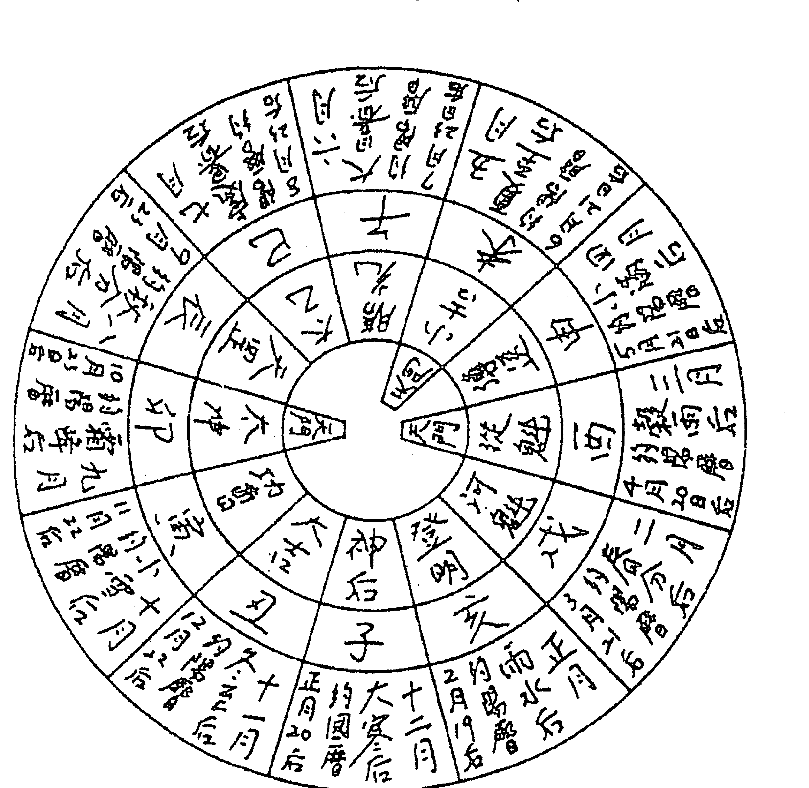

## 地四户之图

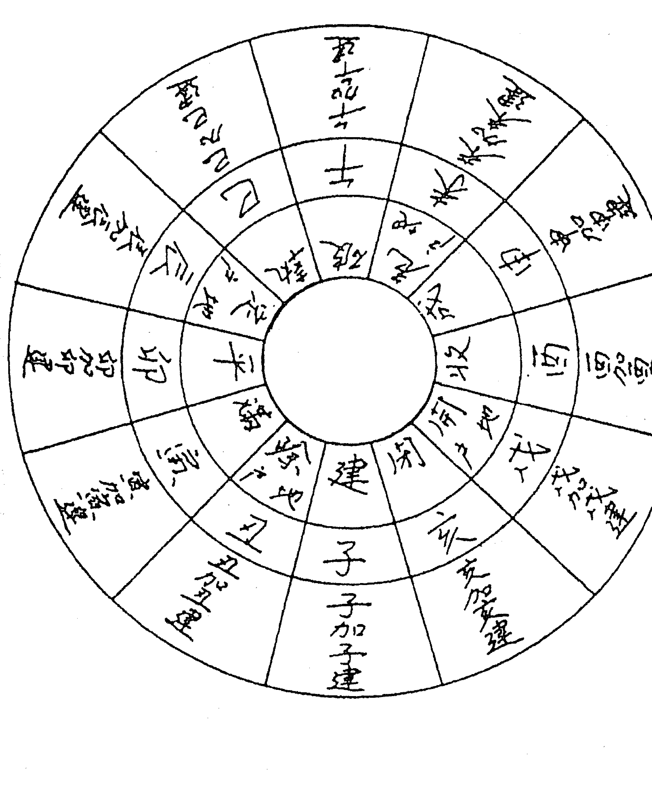

## 地私門

> 歌曰：六合太陰太常君三辰元是地私門，更得奇門相照耀，出門百事總欣欣。

地私門乃由十二神將貴人、螣蛇、朱雀、六合、勾陳、青龍、天空、白虎、太常、玄武、太陰、天后等，其中逢之六合、太陰、太常謂之地私門。若再逢奇門則百事大吉、陽時利客利攻、陰時利主利守。而地私門有日盤與時盤、陽貴與陰貴之別。日盤之佈置，乃以亥日至辰日為陽順佈、巳日到戌日為陰逆佈。是以日分陰陽，不論陰陽貴人。如：丁亥日，亥為陽日、丙丁豬雞位，則起貴人於亥酉，不論陰陽貴順佈十二將神。時盤則由月將加用時，再尋本日之貴人於何，再以陽貴順佈，陰貴逆推。如正月之月將在亥，若甲日用辰時，則將月將亥天盤佈於辰時之地盤，尋至本日陽貴未天盤到地盤子。則子起貴人順佈、丑為螣蛇、寅為朱雀、卯為六合、辰為勾陳、巳為青龍、午為天空、未為白虎、申為太常、酉為玄武、戌為太陰、亥為天后。則陽貴之地私門居在卯、申、戌等地。如用陰貴則月將亥天盤佈於用時辰之地盤、順數至陰貴丑之天盤在地盤午位。則午起貴人逆佈，巳為騰蛇、辰為朱雀、卯為六合、寅為勾陳、丑為天后。則此時陰貴之地私門居於卯、戌、申三地。

陽貴訣：庚戌見牛甲在羊、乙猴巳鼠丙雞方、丁豬癸蛇壬是兔、六辛逢虎貴為陽。

陰貴訣：甲貴陰牛庚戌羊、乙陰在鼠巳猴鄉、丙豬丁雞辛遇馬、壬蛇癸兔屬陰方。

| 十天干 | 陽貴人 | 陰貴人 |
|---|---|---|
| 甲 | 未 | 丑 |
| 乙 | 申 | 子 |
| 丙 | 酉 | 亥 |
| 丁 | 亥 | 酉 |
| 戊 | 丑 | 未 |
| 己 | 子 | 申 |
| 庚 | 丑 | 未 |
| 辛 | 寅 | 午 |
| 壬 | 卯 | 巳 |
| 癸 | 巳 | 卯 |

## 月将亥
甲日
辰时
阳贵未

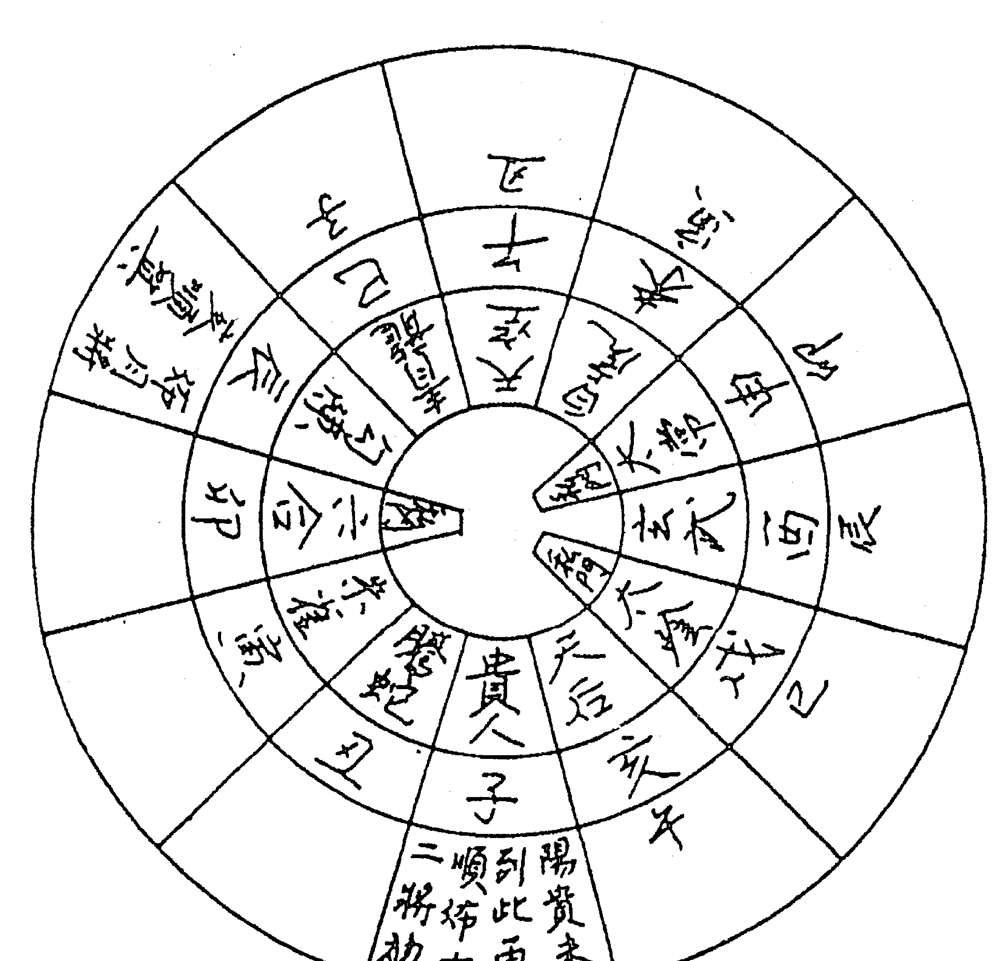

## 月將亥
甲日
辰時
陰貴丑

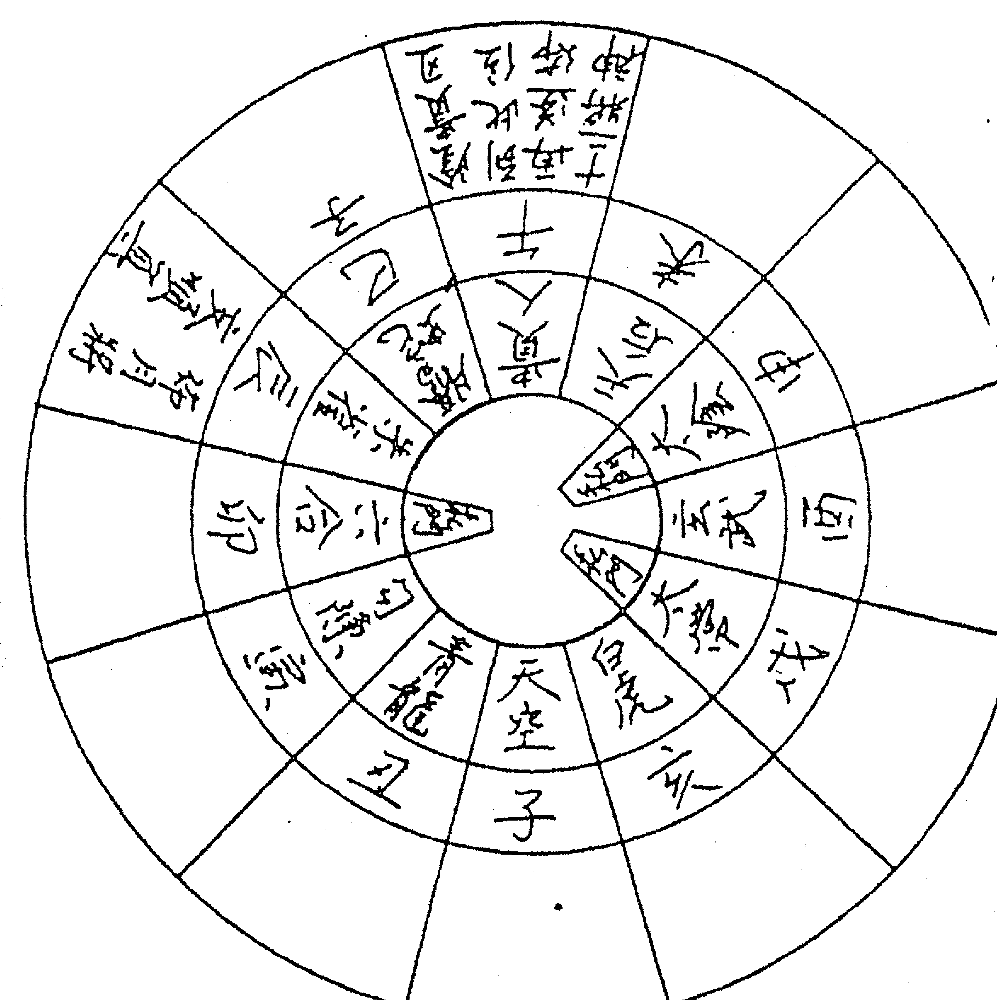

## 天乙貴人起法

陽貴：由先天卦坤宮起子位順佈，甲在子、乙在丑、丙在寅、丁在卯、辰為天羅貴人不居、戊在巳、午居於坤卦對宮稱之天空貴人不居、己在未、庚在申、辛在酉、戌為地綱貴人不居、壬在亥、子為天空沖位唯居甲，則癸佈在丑。

然天干五合謂之干德合為貴，則甲己合己貴在子、乙庚合庚貴在丑、丙辛合辛貴在寅、丁壬合壬貴在卯、戊癸合癸貴在巳、己甲合甲貴在未、庚乙合乙貴在申、辛丙合丙貴在酉、壬丁合丁貴在亥、癸戊合戊貴在丑。

陰貴：由後天卦坤宮起申位逆佈，甲在申、乙在未、丙在午、丁在巳、辰不居、戊在卯、寅天空、己在丑、庚在子、辛在亥、戌不居、壬在酉、癸在未。

陰貴干德合：甲己合己貴在申、乙庚合庚貴在未、丙辛合辛貴在午、丁壬合壬貴在巳、戊癸合癸貴在卯、己甲合甲貴在丑、庚乙合乙貴在子、辛丙合丙貴在亥、壬丁合丁貴在酉、癸戊合戊貴在未。

合壬貴在巳、戊癸合癸貴在卯、己甲合甲貴在丑、庚乙合乙貴在子、辛丙合丙貴在亥、壬丁合丁貴在酉、癸戊合戊貴在未。

貴人訣：甲戊庚牛羊，乙己鼠猴鄉。丙丁豬雞位，壬癸兔蛇藏。六辛逢馬虎，此是貴人方。

## 阳贵图

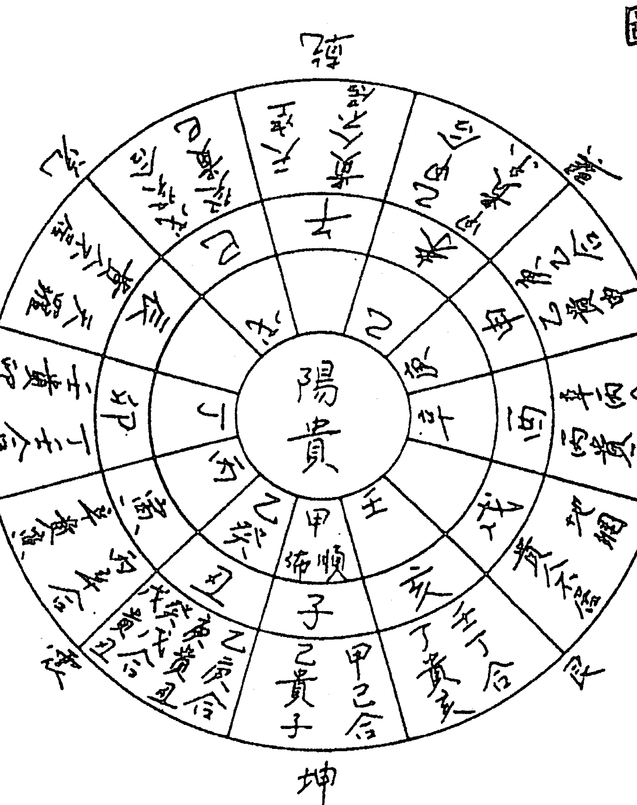

## 陰貴圖

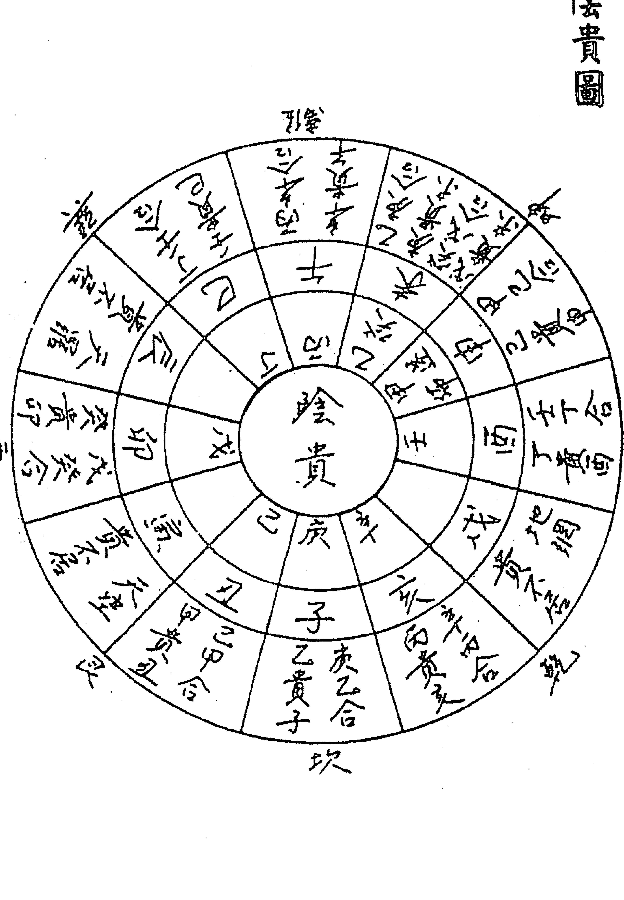

## 太冲天馬

> 歌曰：太冲天馬最爲貴，卒然有難宜逃避，但當乘取天馬行，劍戟如山不足畏。將支加在用時支，順輪十二逢卯止，卯止宮爲天馬方，此方避難真亨利。

| （巳） | （午） | （未） | （申） |
| :---: | :---: | :---: | :---: |
| 天馬 卯 （辰） | 太沖 方 辰 方 | 月將：亥 用時：子 | （酉） |
| 寅 （卯） | | | （戌） |
| 丑 （寅） | 子 （丑） | 亥 （子） | 月將 （亥） |

太冲即天馬方，此方宜逃避災難用之，其起法是以月將爲天盤，佈於用時之地盤，順算至天盤卯位，此位地盤即是太沖天馬方。如正月雨水後，月將爲亥，用子時，則亥爲天盤加在子地盤，順佈至天盤卯，地盤爲辰，辰方即是太冲天馬方。

## 太冲天马方

| 月 | 将 | 正月雨水亥 | 二月春分戌 | 三月谷雨酉 | 四月小满申 | 五月夏至未 | 六月大暑午 | 七月处暑巳 | 八月秋分辰 | 九月霜降卯 | 十月小雪寅 | 十一月冬至子 | 十二月大寒丑 |
| :---: | :---: | :---: | :---: | :---: | :---: | :---: | :---: | :---: | :---: | :---: | :---: | :---: | :---: |
|  | 阳历约用时 | 2/19后 | 3/21后 | 4/20后 | 5/21后 | 6/21后 | 7/23后 | 8/23后 | 9/23后 | 10/23后 | 11/22后 | 12/22后 | 1/20后 |
| 子 |  | 辰 | 巳 | 午 | 未 | 申 | 酉 | 戌 | 亥 | 子 | 丑 | 寅 | 卯 |
| 丑 |  | 巳 | 午 | 未 | 申 | 酉 | 戌 | 亥 | 子 | 丑 | 寅 | 卯 | 辰 |
| 寅 |  | 午 | 未 | 申 | 酉 | 戌 | 亥 | 子 | 丑 | 寅 | 卯 | 辰 | 巳 |
| 卯 |  | 未 | 申 | 酉 | 戌 | 亥 | 子 | 丑 | 寅 | 卯 | 辰 | 巳 | 午 |
| 辰 |  | 申 | 酉 | 戌 | 亥 | 子 | 丑 | 寅 | 卯 | 辰 | 巳 | 午 | 未 |
| 巳 |  | 酉 | 戌 | 亥 | 子 | 丑 | 寅 | 卯 | 辰 | 巳 | 午 | 未 | 申 |
| 午 |  | 戌 | 亥 | 子 | 丑 | 寅 | 卯 | 辰 | 巳 | 午 | 未 | 申 | 酉 |
| 未 |  | 亥 | 子 | 丑 | 寅 | 卯 | 辰 | 巳 | 午 | 未 | 申 | 酉 | 戌 |
| 申 |  | 子 | 丑 | 寅 | 卯 | 辰 | 巳 | 午 | 未 | 申 | 酉 | 戌 | 亥 |
| 酉 |  | 丑 | 寅 | 卯 | 辰 | 巳 | 午 | 未 | 申 | 酉 | 戌 | 亥 | 子 |
| 戌 |  | 寅 | 卯 | 辰 | 巳 | 午 | 未 | 申 | 酉 | 戌 | 亥 | 子 | 丑 |
| 亥 |  | 卯 | 辰 | 巳 | 午 | 未 | 申 | 酉 | 戌 | 亥 | 子 | 丑 | 寅 |

## 亭亭白奸

> 歌曰：更得直符直使利兵家，用事最爲貴，常從此地擊其冲，百戰百勝君須記。

王璋曰：亭亭者天之貴神也，背之擊其冲爲勝，推法以天月將加所用正時神后，所臨之宮即亭亭居其上也。

亭亭白奸乃分月日時三盤，時之亭亭是以天月將爲天盤，佈于用時之地盤，算至天盤子位神后，此地盤位即为亭亭。數至地盤寅午戌三宮位，逢之寅申巳亥之一，此四孟方为白奸，是因白奸常居于寅申巳亥之位。

如：正月天月将在亥、卯时用事，则亥为天盘，佈入地盘卯宫，数至辰宫为天盘子、则亭亭在辰，算至地盘午得寅，则时之白奸在寅。

| | | | |
|---|---|---|---|
|丑 (巳)|寅 白奸 (午)|(未)|(申)|
|子 神后 (辰)|白奸 : 寅子 亭亭 : 辰 用時 : 卯 月將 : 亥|(酉)|
|亥 月將 (卯)| | (戌)|
|(寅)|(丑)|亥 (子)|月將 (亥)|

訣：北著亭亭擊向對宮或白奸之宮。

## 亭亭白奸月方

| 十二月将 | 亭亭 | 白奸 |
|----------|------|------|
| 正       | 卯   | 亥   |
| 二       | 辰   | 寅   |
| 三       | 巳   | 巳   |
| 四       | 午   | 申   |
| 五       | 未   | 亥   |
| 六       | 申   | 寅   |
| 七       | 酉   | 巳   |
| 八       | 戌   | 申   |
| 九       | 亥   | 亥   |
| 十       | 子   | 寅   |
| 十一     | 丑   | 巳   |
| 十二     | 寅   | 申   |

## 亭亭白奸日方

| 十二地支日 | 亭亭 | 白奸 |
|------------|------|------|
| 子         | 巳   | 巳   |
| 丑         | 午   | 申   |
| 寅         | 未   | 亥   |
| 卯         | 申   | 寅   |
| 辰         | 酉   | 巳   |
| 巳         | 戌   | 申   |
| 午         | 亥   | 亥   |
| 未         | 子   | 寅   |
| 申         | 丑   | 巳   |
| 酉         | 寅   | 申   |
| 戌         | 卯   | 亥   |
| 亥         | 辰   | 寅   |

## 三勝宮

> > 歌曰：天乙吉神所在之宮，大將宜居擊對沖。假令符首居離九、天英坐起擊天蓬，是謂第一勝天乙宮，天上符首乘爲天乙宮，上將居之用兵而擊其沖百勝。若在陽遁即用天上符首所居宮，若用陰遁即用地下符首所居宮。

第一勝乃居於符首宮之位而擊對宮，必可取勝。但須視陰陽遁局，若在陽遁即用天盤之符首宮，若在陰遁即用地盤之符首宮。如符首及天英居在離九宮，宜座南擊北，即擊坎宮天蓬所居之位即能取勝。

第二勝九天宮，陽遁天上直符一為九天，陰遁直符前一為九天。我軍立九天之上而擊其沖，則敵人不敢當我之鋒。

第二勝乃八神之九天宮，陽遁即直符後一位為九天宮，陰遁即直符前一位為九天宮。立在九天之上而擊其沖，則敵人不敢當我之鋒。

第二勝生門宮，謂生門合三奇之吉宮，上將引兵從生門擊死門百戰百勝。

第三勝即背生門擊死門，若生門再逢三奇助之必然百戰百勝。

又曰：背亭亭向天門一勝，背月建一勝，背生擊死三勝，大同小異。

也。另外又有一套三勝訣，即背著亭亭擊向對宮為一勝，背著月建或太歲攻擊對宮為二勝，背著生門擊向死門為三勝，此乃大同小異，亦可以用之。

如：陽三局、甲己日、丁卯時。天盤符首戊臨九離為天乙宮即一勝，八神之九天居在巽宮為二勝，生門合丁奇在兌宮為之三勝。則可選擇以南擊北，以西擊東或以東南擊西北。

又如：陰八局、甲己日、戊辰時。地盤符首在艮八為天乙宮即一勝，八神之九天在震宮為之二勝，生門臨在巽宮為之三勝。則此盤立以東部大利，宜擊向西部。

-   诀一：天乙 九天 生门
-   诀二：亭亭 月建 生门

阳三局甲己日丁卯时蛇辅

| 癸己 驚 天任 | 戊丁 開 符冲 | 己乙庚 休 蛇辅 |
|--------------|--------------|----------------|
| 丙戊 死 地蓬 | 直符:天冲 直使:三傷 符首:戊 | 丁壬 生 陰英 |
| 辛癸 景 雀心 | 壬丙 杜 陳柱 | 乙庚 辛 傷 合芮 |

阴八局甲己日戊辰时

| 壬壬 生 地輔 | 乙乙 傷 雀英 | 丁丁 杜 陳芮 |
|--------------|--------------|--------------|
| 癸癸 休 天冲 | 直符:天任 直使:八生 符首:戊 | 己己 景 合柱 |
| 戊戊 開 符任 | 丙丙 驚 蛇蓬 | 庚庚 死 陰心 |

## 五不擊

歌曰：五不擊，第一不擊天乙宮、第二不擊九天宮、第三不擊生門宮、第四不擊九地宮、第五不擊直使宮，以上皆不可擊。

五不擊之宮位即：一不擊符首之天乙宮、二不擊八神之九天宮位、三不擊生門宮位、四不擊八神之九地宮位、五不擊八門直使遁甲之宮位。以上之宮位不宜攻之。

如：陽八局、丙辛日、辛卯時。一不擊：天乙宮，陽遁天盤符首居於坤二宮西南。二不擊：八神之九天居於離九宮正南。三不擊：生門在震三宮正東。四不擊：八神之九地居於巽四宮東南。五不擊：直使一休居在艮八宮東北。以上艮、震、巽、離、坤五宮位為五不擊。

又如：陰七局、甲己日、丙寅時。一不擊：天乙宮，陰遁地盤符首戊在兌七宮。二不擊：九天居於坤二宮。三不擊：生門居於坎一宮。四不擊：九地居於兌七宮。五不擊，直使七驚在五宮而是寄坤二宮。以上坎、兌、坤二宮位爲五不擊。

## 陽八局、丙辛日、辛卯時

| | | |
|---|---|---|
| 乙 傷 癸 (地) | 丙 杜 己 (天) | 庚 景 辛丁 (符) |
| 辛丁 生 壬 (生) | 直符：天蓬 直使：一休 符首：庚 | 戊 死 乙 (蛇) |
| 己 休 戊 (陳) | 癸 開 庚 (合) | 壬 驚 丙 (陰) |

五不擊
1. 天乙
2. 九天
3. 生門
4. 九地
5. 直使

## 陰七局、甲己日、丙寅時

| | | |
|---|---|---|
| 癸庚 景 辛 (蛇) | 戊 死 丙 (符) | 己 驚 癸庚 (天心) |
| 丙 杜 壬 (陰英) | 直符：天柱 直使：七驚 符首：戊 | 丁 開 戊 (地蓬) |
| 辛 傷 乙 (合輔) | 壬 生 丁 (陳沖) | 乙 休 己 (雀任) |

## 遊三避五

> 歌曰：三為生氣五為死，勝在三分衰在五，能識遊三避五時，造化真機須記取。

> 三元經曰：天道不遠三五反復，知三避五恢然獨處。三為生氣故遊三也，五為害氣故避五也。三為威五為武，盛於三衰於五。

三為生氣、五為死氣。即三得用旺盛大吉，逢五即害大凶宜避之不用。如：陽一局、甲己日、起甲子時到三為丙寅時，此時生氣蓬勃百事宜用。再到五為戊辰時，此時害氣大凶，百事宜避之。

> 又曰：直使加震宮三為生宜向之，直使加中宮寄二宮為死宜避之。

陰二局、丙辛日、己亥時、甲午旬

| 符首: 辛 | 直使: 八生 | 直符: 天任 |  |  |  |  |  |  |
| :--- | :--- | :--- | :--- | :--- | :--- | :--- | :--- | :--- |
| 合 | 陳 | 雀 |  |  |  |  |  |  |
| 柱 | 芮 | 英 |  |  |  |  |  |  |
| 壬 | 丙丁 | 戊丁 |  |  |  |  |  |  |
| 景 | 杜 | 傷 |  |  |  |  |  |  |
| 陰 | 符首 | 地 |  |  |  |  |  |  |
| 心 | 辛 | 輔 |  |  |  |  |  |  |
| 癸 | 壬 | 乙 |  |  |  |  |  |  |
| 死 | 生 | 休 |  |  |  |  |  |  |
| 蛇 | 任 | 天 |  |  |  |  |  |  |
| 蓬 | 己 | 沖 |  |  |  |  |  |  |
| 己 | 癸 | 辛 |  |  |  |  |  |  |
| 驚 | 開 |  |  |  |  |  |  |  |

又有一說爲直使到震二宮爲游三。如陰二局、丙辛日、己亥時，直使生門到震二宮，則震宮百事大吉宜用之。
但逢直使到五黃中宮時，此直使必然寄於坤二，則坤逢五凶不用。

-   游三：直使到震三宮。
-   避五：直使到五黃中宮寄坤。

陰二局、丙辛日、戊子時、甲申旬

| 符首: 戊 | 直使: 七驚 | 直符: 天柱 |  |  |  |  |  |  |
| :--- | :--- | :--- | :--- | :--- | :--- | :--- | :--- | :--- |
| 符 | 蛇 | 陰 |  |  |  |  |  |  |
| 英 | 輔 | 沖 |  |  |  |  |  |  |
| 戊丁 | 庚 | 丙 |  |  |  |  |  |  |
| 景 | 杜 | 傷 |  |  |  |  |  |  |
| 天 | 符首 | 合 |  |  |  |  |  |  |
| 芮 | 戊 | 任 |  |  |  |  |  |  |
| 戊丁 | 壬 | 乙 |  |  |  |  |  |  |
| 死 | 生 | 休 |  |  |  |  |  |  |
| 地 | 雀 | 陳 |  |  |  |  |  |  |
| 柱 | 心 | 蓬 |  |  |  |  |  |  |
| 壬 | 癸 | 己 |  |  |  |  |  |  |
| 驚 | 開 |  |  |  |  |  |  |  |

陰二局、丙辛日、戊子時，直使九景逢五宮而寄在坤二宮，則坤宮逢五宜避之。

## 奇门心格

### 青龙逃走

歌曰：六乙加辛龙逃走。金为太白乃白虎。木为青龙金克木。龙虎相战凶格也。

六乙乃青龙、六辛为白虎，是为龙虎相斗。又为金克木乃乙奇受制凶不用。

主：失财、遗失、破败、主客俱伤百事皆凶。不宜举兵动众，此方宜静不宜动。

如：阴遁二局、丁壬日、丁未时。天盘乙奇逢地盘六辛在艮八宫，谓之：青龙逃走。

| 庚 丙 | 阴 惊 | 戊丁 开 | 蛇 庚 | 壬 休 | 柱 戊丁 |
|-------|-------|---------|-------|-------|---------|
| 丙 乙 | 合 死 | 直符·天柱 | 直使·七惊 | 符首·壬 | 天 心 |
| 乙 辛 | 辅 景 | 辛 杜 | 己 | 雀 任 | 地 蓬 |

阴二局、丁壬日、丁未时、甲辰旬

青龙逃走·天乙逢地辛

### 白虎猖狂

| 乙 (惊) | 合 (冲) | 丙 (开) | 阴 (辅) | 庚 (休) | 蛇 (英) |
| 丙 (死) | 陈 (任) | 庚 | 直符：戊 | 戊丁 (生) | 符 (芮) |
| 己 (景) | 雀 (蓬) | 癸 | 地 | 壬 (伤) | 天 (柱) |

> 歌曰：六辛加乙虎猖狂。白虎猖狂乃天盘辛逢地盘乙，亦是金木相克，龙虎相斗。主：损财伤人、主客俱伤。

阴二局、甲己日、壬申时、甲子旬

不宜：嫁娶、修造、求财等，百事皆凶。则此方宜静不宜动，动易有血光之灾。

如：阴二局、甲己日、壬申时。天盘辛逢地盘乙奇在震宫，即是白虎猖狂。

### 朱雀入江

歌曰：六丁加癸雀入江，丁属火为朱雀，癸属水，故丁加癸为朱雀入江。

| 庚丁 | 陈英 | 壬丙庚 | 雀丙 | 戊壬丙 |
| --- | --- | --- | --- | --- |
| 丁癸 | 合辅 | 直符直使：天蓬一休 | 符首：辛 | 乙戊 |
| 癸己 | 阴冲 | 己辛 | 蛇任 | 辛乙 |

朱雀入江乃天盘丁奇逢地盘癸水。

主：文书之牵连、官司诉讼之灾、易有恐惊怪事、口舌是非、招惹小人。

不宜：出兵、用事、动众等百事皆凶。若逢之诉事，必宜避之。

如：阳七局、丙辛日、乙未时。天盘丁奇逢地盘癸水于震三宫，谓之：朱雀入江。

朱雀入江：天丁加地癸。

### 螣蛇夭矫

> 歌曰：六癸加六丁、夭矫迷路程、忧惶难进步、端坐却不宁。

| 癸(杜) 蛇冲 | 丁(景) 庚辅 | 阴(死) 庚壬丙 合英 |
| 己(伤) 符任 | 直符：天任 直使：八生 | 壬丙(惊) 戊芮 陈 |
| 辛(生) 天蓬 | 乙(休) 地心 | 戊(开) 雀柱 |

螣蛇夭矫乃天盘癸水逢地盘丁火。癸水属北为之玄武龟蛇、水来克火。

乃蛇夭矫。主：迷失、虚惊不安宁、难以前进、无信心、没主见。

不宜：出兵用事、百事皆凶，纵有吉门相助亦主虚惊不安。此方宜静不宜动。

如：阳七局、乙庚日、癸未时。天盘六癸逢地盘丁奇在巽四宫。谓：螣蛇夭矫。

螣蛇夭矫·天癸加地丁。

### 四凶神

> 歌曰：请观四者是凶神，百事逢之莫措手。四凶神者为：龙逃走、虎猖狂、雀入江及蛇夭矫。

阴阳相克有合及官之用，如甲克己为甲己合、辛克甲辛为甲之官。但逢阳克阳、阴克阴，则为无情之克凶而不和。尤以乙丁辛癸，皆阴神克阴神，其祸不救故不可用之，其方宜静不可动。

### 大格

| 丁己 (死) | 陈任 | 庚癸 (惊) | 合冲 | 己辛戊 (开) | 阴辅 |
| 壬庚 (景) | 雀蓬 | 直符：天禽 直使：五死 | 符首：戊 | 癸丙 (休) | 蛇英 |
| 乙丁 (杜) | 地心 | 丙壬 (伤) | 天柱 | 辛戊乙 (生) | 符禽 |

阴五局、甲己日、乙丑时、甲子旬

歌曰：六庚如加癸、图谋未可通、求人终不见。

大格乃是天盘庚逢地盘癸。主：阻碍、破财、损伤、遗失等百事凶不用。

不宜远行，主车破马死、车祸之灾。

不宜造葬，主人财破散。不宜求贵，反招其咎。不宜求事，主事不成破败。

如：阴五局、甲己日、乙丑时。天盘六庚逢地盘六癸在离九宫，谓：大格。

大格：天庚加地癸。

### 刑格

歌曰：加己为刑最不宜。六庚加六己、赤地须千里、远行马车堕、军兵半路止。

刑格又称刑隔，乃是天盘六庚逢之地盘六己。此时如出兵主：车破马死、士兵逃走，且不可追回，反招凶咎。刑格亦主破财、疾病、车祸等。

不宜：出兵、用事、远行、求财等。

如：阴六局、丁壬日、戊申时。天盘六庚逢六己在坤宫谓之刑格。

## 岁格

三元经云：六庚加当年太岁之干曰岁格，此时用事大凶。

## 月朔格

三元经云：六庚加月为朔格，凶时也。

## 日格

三元经曰：六庚加当日日干为日干格，此时用事大凶。

## 时格

> 三元经曰：六庚加本时时干者为时格，亦名伏吟格。

- 天盘庚逢地盘为当年之岁干为岁格。
- 天盘庚逢地盘为当月之月干为月朔格。
- 天盘庚逢地盘为当日之日干为日格。
- 天盘庚逢地盘为本时之时干为时格，又称伏吟格。

庚乃为甲之杀，若再逢岁月日时来助之，必然更为凶恶。主百事不顺、阻碍难行。但若庚逢直符时，则不以凶论。

如：己卯年、甲戌月、乙未日、丙戌时。若天盘庚逢地盘己，则为岁格。

- 若天盘庚逢地盘甲（符首代之），则为月朔格。
- 若天盘庚逢地盘乙，则为日格。
- 若天盘庚逢地盘丙，则为时格（伏吟格）。

### 勃格

歌曰：丙为勃兮庚为格，格则不通勃乱逆。
天盘丙奇逢地盘六庚为勃。主毫无纪律、混乱不堪。不宜出兵、聚众。宜守不宜攻。

天盘六庚逢地盘六癸为格。主障碍难行、百事不通。不宜统兵、领众。

另有天盘庚逢地盘为年月日时干，此与岁月日时格相同，但另称时勃，亦主阻碍混乱。

再又一种之时勃者：天盘丙奇逢地盘年月日时干，但此时有丙奇在，可化凶为吉则不以凶论。但要注意地盘不可逢丁，因丙丁同宫称之勃火星焚大屋。此宫不宜动，动则主火灾。

| 庚乙 戊 | 陈雀 丁壬 | 合地 丙庚乙 | 阴天 |
|---|---|---|---|
| (死) | (惊) | (开) | 阴四局，戊癸日、丙辰时、甲寅旬 |
| 壬己 | 雀陈 直符：天任 | 直使：八生 符首：癸 | 辛丁 蛇蓬 |
| (景) | (休) | | |
| 戊癸 | 地辅 己辛 | 天冲 癸丙 | 符任 |
| (杜) | (伤) | (生) | |

如：阴四局、戊癸日、丙辰时。天丙逢地庚在坤二宫为之勃。又如：

勃：天丙地庚
格：天庚地癸
荧入白：天丙地庚
大格：天庚地癸

阳八局、丙辛日、癸巳时。天庚逢地癸在巽宫为之格。

| 庚癸 符蓬 | 戊己 蛇任 | 壬辛丁 阴冲 | 阳八局、丙辛日、癸巳时、甲申旬 |
|---|---|---|---|
| (杜) | (景) | (死) | |
| 丙壬 天心 | 直符：天蓬 直使：一休 符首：庚 | 癸乙 合辅 |
| (伤) | (惊) | | |
| 乙戊 地柱 | 辛丁 雀丙 | 己丙 陈英 |
| (生) | (休) | (开) | |

### 荧入白

> 歌曰：六丙加庚荧入白，荧入白兮贼须灭。又曰：天盘丙加地盘庚，是火入金乡，此时闻贼当退。

天盘丙奇逢地盘六庚为荧入白。丙火为荧惑、庚金为太白，乃是火到金乡，天地相克。此方来信必有诈，逢贼贼逃。
不宜：出兵、用事、求财等。

### 白入荧

> 歌曰：六庚加丙白入荧，白入荧兮贼即来。又曰：天盘庚加地盘丙，乃金入火乡而受克凶，乃对敌宜防贼。

| 壬癸 | 地冲 | 癸己 | 天辅 | 己辛丁 | 符英 |
|---|---|---|---|---|---|
| 地冲 | (死) | 癸己 | (惊) | 辛丁 | (开) |
| 癸 | 辛丁 | 己 | 辛丁 | 辛丁 | 辛丁 |
| 地冲 | 辛丁 | 天辅 | 辛丁 | 符英 | 蛇芮 |
| 辛丁 | (惊) | 辛丁 | (开) | 辛丁 | (休) |
| 癸己 | 辛丁 | 己 | 辛丁 | 辛丁 | 乙 |
| 天辅 | 辛丁 | 符英 | 蛇芮 | 乙 | 阴柱 |
| 辛丁 | (开) | 辛丁 | (休) | 辛丁 | (生) |
| 己 | 辛丁 | 辛丁 | 乙 | 乙 | 丙 |
| 符英 | 蛇芮 | 乙 | 阴柱 | 丙 | 雀任 |
| 辛丁 | (休) | 辛丁 | (生) | 辛丁 | (伤) |
| 辛丁 | 乙 | 乙 | 丙 | 丙 | 庚 |
| 蛇芮 | 乙 | 阴柱 | 丙 | 雀任 | 合心 |
| 乙 | (生) | 乙 | (伤) | 丙 | 庚 |
| 乙 | 丙 | 丙 | 庚 | 庚 | 天蓬 |
| 阴柱 | 丙 | 雀任 | 合心 | 庚 | 直符 |
| 丙 | (伤) | 丙 | 庚 | 庚 | (景) |
| 丙 | 庚 | 庚 | 天蓬 | 天蓬 | 天英 |
| 雀任 | 合心 | 庚 | 直符 | 直符 | 直使 |
| 庚 | (景) | 庚 | (死) | 天蓬 | 九地 |
| 庚 | 天蓬 | 天蓬 | 天英 | 天英 | 天任 |
| 合心 | 庚 | 直符 | 直使 | 九地 | 九天 |
| 天蓬 | (死) | 天蓬 | (开) | 天英 | (惊) |

阳八局、乙庚日、丁丑时、甲戌旬
日丁亥时，天庚合地丙于乾宫，谓之白入荧。
如：阳八局、乙庚日、丁丑时，天丙合地庚于坎宫，谓之荧入白。同
不宜：求财、用事。易逢盗贼之灾。
天盘六庚逢地盘丙奇为白入荧。此乃是金到火乡，金受克害。主盗贼、损财等。

荧入白：
天丙地庚
白入荧：
天庚地丙

| 己癸 | 陈英 | 辛己 | 雀芮 | 乙辛丁 | 地柱 |
|---|---|---|---|---|---|
| 陈英 | (生) | 辛己 | (伤) | 辛丁 | (杜) |
| 己癸 | 辛丁 | 辛己 | 辛丁 | 辛丁 | 辛丁 |
| 陈英 | 辛丁 | 雀芮 | 辛丁 | 地柱 | 天心 |
| 辛丁 | (伤) | 辛丁 | (杜) | 辛丁 | (景) |
| 己癸 | 辛丁 | 辛己 | 辛丁 | 辛丁 | 乙 |
| 雀芮 | 辛丁 | 地柱 | 天心 | 乙 | 符蓬 |
| 辛丁 | (杜) | 辛丁 | (景) | 辛丁 | (死) |
| 辛己 | 辛丁 | 辛丁 | 乙 | 乙 | 丙 |
| 地柱 | 辛丁 | 天心 | 乙 | 符蓬 | 蛇任 |
| 辛丁 | (景) | 辛丁 | (死) | 辛丁 | (惊) |
| 辛丁 | 乙 | 乙 | 丙 | 丙 | 庚 |
| 天心 | 乙 | 符蓬 | 蛇任 | 庚 | 直符 |
| 乙 | (死) | 乙 | (惊) | 丙 | 庚 |
| 乙 | 丙 | 丙 | 庚 | 庚 | 天英 |
| 符蓬 | 蛇任 | 庚 | 直符 | 直符 | 直使 |
| 丙 | (惊) | 丙 | (休) | 庚 | 天任 |
| 丙 | 庚 | 庚 | 天英 | 天英 | 天辅 |
| 蛇任 | 庚 | 直符 | 直使 | 天任 | 天辅 |
| 庚 | (休) | 庚 | (开) | 天英 | 天冲 |
| 庚 | 天英 | 天英 | 天辅 | 天辅 | 天芮 |
| 直符 | 直使 | 天任 | 天辅 | 天冲 | 天芮 |
| 天英 | (开) | 天任 | 天辅 | 天冲 | 天芮 |

阳八局、乙庚日、丁亥时、甲申旬

### 伏干格

> 歌曰：庚加日干为伏干，六庚为太白，加日干即为伏干格。

伏干格乃是天盘庚逢地盘为日干。主：战斗损伤、主将遭擒。不宜：出兵、用事。

### 飞干格

三元经曰：今日之干加六庚飞干格，此时战斗主客两伤。飞干格则是天盘为日干、地盘庚所合成之宫位。主：战争不利、主客两伤。

| 丙乙 雀冲 杜 | 乙壬 地辅 景 | 壬丁戊 天英 死 |
|---|---|---|
| 辛丙 陈任 伤 | 直符：天禽 直使：五死 符首：戊 | 丁戊 庚 蛇符 惊 |
| 癸辛 合蓬 生 | 己癸 阴心 休 | 庚己 蛇柱 开 |

- 飞干·天日干地庚。
- 伏干·天庚地日干。（同日格）

日兑宫为飞干格。逢己日乾宫为伏干格。
如：阳五局、甲己日、庚午时。逢甲不宜：出兵、用事。

### 伏宫格

三元经曰：六庚加直符名为天乙伏宫格。此时客主皆不利、战斗交兵气自衰、占见人不在、占来人不来。
天盘庚逢地盘符首为天乙伏宫格。主：土气衰弱、贵人不显、交易不利、多失败少成功。
不宜：出兵用将、求财、求贵等。

### 飞宫格

三元经曰：直符加六庚名天乙飞宫格，此时主客不利。
天盘符首逢地盘庚为天乙飞宫格。主：宾主皆败、进攻时主将遭擒。
不宜：出兵、用事。宜守不宜攻。

如：阴六局、丁壬日、庚子时。天盘符首辛逢地盘庚于巽四宫，谓之天乙飞宫格。又如：阳四局、戊癸日、壬戌时。天盘庚逢地盘符首癸于离九宫，谓之天乙伏宫格。

| 辛(惊) 庚 庚 | 符(开) 庚 丁 | 地(休) 丁 壬己 |
|---------------------|---------------------|-----------------------|
| 丙 辛(死)        | 蛇 冲 丁(生)  | 雀 壬己 乙       |
| 丙(景) 癸        | 阴 任(杜)        | 丙 戊(伤)          |

### 天乙飞宫格：天符首地庚
### 天乙伏宫格：天庚地符首

| 辛(惊) 戊    | 阴(开) 庚    | 丁(休) 丙己  |
|--------------------|--------------------|--------------------|
| 丙(死) 己 乙 | 蛇              | 雀 壬 辛     |
| 癸(景) 壬       | 符 英(杜)       | 地 丁(伤)       |

### 战格（同宫格）

| 辛 | 地辅 | 乙 | 天英 | 己壬 | 符芮 |
| 辛 | 地辅 | 乙 | 天英 | 己壬 | 符芮 |
| 庚 | 雀冲 | 庚 | 直符：天芮 | 直使：二死 | 符首：己 | 丁 | 蛇柱 |
| 庚 | 雀冲 | 庚 | 直符：天芮 | 直使：二死 | 符首：己 | 丁 | 蛇柱 |
| 丙 | 陈任 | 戊 | 合蓬 | 癸 | 阴心 |

歌曰：加一宫兮战在野，同一宫兮战在国。

天盘庚再逢地盘庚为之战格。一庚在宫主外战，两庚同宫主内战。则战格主：内门不合、自相残杀、出兵失利、两败俱伤、贵人不现。占人则人不在，占来人则人不来。

不宜：聚众、用兵。宜：固守、伏藏。

如：阳一局、乙庚日、壬午时。天盘庚再逢地盘庚于震三宫。谓之战格。

战格：天庚地庚。

### 六仪击刑

> 歌曰：六仪击刑何太凶，甲子直符愁向东、戌刑在未申刑虎、寅巳辰午刑午。

六仪击刑乃是：

- 甲子戊刑震卯
- 甲戌己刑坤未
- 甲申庚刑艮寅
- 甲午辛刑离午
- 甲辰壬刑巽辰
- 甲寅癸刑巽巳

| 甲寅癸 甲辰壬 | 甲午辛 | 甲戊己 |
| --- | --- | --- |
| 甲子戊 | | |
| 甲申庚 | | |

刑乃是由寅午戌局刑巳午未乡，巳酉丑局刑申酉戌乡，

申子辰局刑寅卯辰乡，亥卯未局刑亥子丑乡。
此是金火持强各刑本方，水流趋东，木落返本。
则六仪符首忌与各宫位刑，刑则不利、刑则全盘无力、遁甲无气、用事不利。

阴七局、戊癸日、辛酉时、甲寅旬

| | | | | | |
|---|---|---|---|---|---|
| 癸 辛 | 庚 (死) | 符 芮 | 戊 丙 | 天 (惊) 柱 | 己 癸庚 | 地 (开) 心 |
| 丙 壬 | 蛇 (景) 英 | 直符:天芮 | 直使:二死 | 符首:癸 | 丁 戊 | 雀 (休) 蓬 |
| 辛 乙 | 阴 (杜) 辅 | 壬 丁 | 合 (伤) 冲 | 乙 己 | 陈 (生) 任 |

上盘：甲寅癸
刑已在巽宫。
下盘：甲子戊
刑子在震宫。

阳六局甲己日、丁卯时、甲子旬

| | | | | | |
|---|---|---|---|---|---|
| 壬 丙 | 蛇 (惊) 蓬 | 庚 辛 | 阴 (开) 任 | 丁 癸乙 | 合 (休) 冲 |
| 戊 丁 | 符 (死) 心 | 直符:天心 | 直使:六开 | 符首:戊 | 丙 己 | 陈 (生) 辅 |
| 己 庚 | 天 (景) 柱 | 癸乙 壬 | 地 (杜) 芮 | 辛 戊 | 雀 (伤) 英 |

### 伏吟格

歌曰：就中伏吟最为凶，天蓬加著地天蓬。十干伏若加错，入库休囚吉事危。

伏吟格乃是各星曜复归在基本宫位，或天地十干同在一宫。主：伏而不进、遁甲功能降低。其中以全盘伏吟最为凶，不宜用事。其次为九星伏吟为次凶，主：丧门、孝服、损伤人丁。再其次以十天干伏吟为次次凶。其余之伏吟则以小凶论之，如逢吉曜扶之亦可用无碍。

1. 八门伏吟：
八门皆归在基本宫位。

2. 九星伏吟：
九星各居在基本宫位。

| 杜门 | 景门 | 死门 |
| 伤门 | | 惊门 |
| 生门 | 休门 | 开门 |

| 天辅 | 天英 | 天芮 |
| 天冲 | 天禽 | 天柱 |
| 天任 | 天蓬 | 天心 |

3. 六仪伏吟：六仪居于基本宫位。

4. 十天干伏吟：天盘同宫又曰直符伏吟。

5. 地支伏吟：月将天盘与时支地盘相同。如小雪后月将为寅，用寅时则太冲天马在卯、亭亭在子。

| 己 | 乙 | 辛 |
|---|---|---|
| 丁 | 壬 | 庚 |
| 癸 | 戊 | 丙 |

六仪伏吟

| 己己 | 乙乙 | 辛辛 |
|---|---|---|
| 丁丁 | 壬壬 | 庚庚 |
| 癸癸 | 戊戊 | 丙丙 |

十天干伏吟、直符伏吟

| 巳 (巳) | 午 (午) | 未 (未) | 申 (申) |
|---|---|---|---|
| 辰 (辰) | 太冲方：卯 亭亭：子 | 酉 (酉) |
| 卯 (卯) | | 戌 (戌) |
| 寅 (寅) | (丑) | 神后 (子) | 亥 (亥) |

月将寅
起寅时
地支伏吟## 陽一局、甲己日、甲子時
| 辛辛 | 合輔 | 乙乙 | 陳英 | 己壬己壬 | 雀芮 |
| 庚庚 | 陰沖 | 直符：一休 | 直使：符蓬 | 符首：戊 | 丁丁 | 地柱 |
| 丙丙 | 蛇任 | 戊戊 | 符蓬 | 癸癸 | 天心 |
（注：此表为简化表示，实际原表为三行三列九宫布局，包含天干、神盘、门、星等符号）

## 陽五局、甲己日、戊辰時
| 乙乙 | 地輔 | 壬壬 | 天英 | 丁戊丁戊 | 符禽 |
| 丙丙 | 雀沖 | 直符：天禽 | 直使：五死 | 符首：戊 | 庚庚 | 蛇柱 |
| 辛辛 | 陳任 | 癸癸 | 合蓬 | 己己 | 陰心 |
（注：此表为简化表示，实际原表为三行三列九宫布局，包含天干、神盘、门、星等符号）

如：陽一局、甲己日、甲子時。天盤甲子戊、地盤甲子戊、休門、天蓬星皆居在坎宮，此時盤稱之：星、門、符皆伏吟也。

又如：陽五局、甲己日、戊辰時。符首戊在中宮而寄於坤二宮。時干為戊與符首同，則符首及十天干天地盤皆在同宮謂之：十干伏吟格又曰直符伏吟格而必然同時九星伏吟，則凶不用。

陽一局、甲己日、甲子時。天盤甲子戊、地盤甲子戊、休門、天蓬星皆居在坎宮，此時盤稱之：星、門、符皆伏吟也。

## 反吟格

> 歌曰：天蓬若到天英上，须知即是反吟宫。

反吟格乃是星曜居于基本宫位之对宫。主：灾厄、吉事冲散、凶事更凶，则不宜用事。在反吟格当中最忌地盘符首与天盘符首对冲，是为直符反吟并九星反吟：

- 直符反吟：天盘符首落入地盘符首对宫。
- 九星反吟：九星各居于基本宫位之对宫。
- 八门反吟：八门各居于对冲宫位。
- 地支反吟：天盘之月将与地盘之时支冲。如小满后，月将用申、用寅时，则太冲天马方在酉、亭亭神后在午。

| 癸 辛 | 天心 | 戊 乙 | 符蓬 | 丙 己壬 | 蛇任 |
|---|---|---|---|---|---|
| 惊 | | 开 | | 休 | |
| 丁 庚 | 地柱 | 直符天蓬 | 直使一休 | 符首戊 | 庚 丁 | 阴冲 生 |
| 死 | | | | | |
| 己壬 丙 | 雀芮 | 乙 戊 | 陈英 | 辛 癸 | 合辅 景 杜 伤 |

| 开门 | 休门 | 生门 |
|---|---|---|
| 惊门 | | 伤门 |
| 死门 | 景门 | 杜门 |
| | | 八门反吟 |

如：阳一局、甲己日、乙丑时。直符甲子戊并九星反吟。

| 亥 (巳) | 子 神后 亭亭 (午) | 丑 (未) | 寅 (申) |
|---|---|---|---|
| 戌 (辰) | 亭亭：午 太冲天马：酉 | 用时：寅 | 月将：申 | 天马 卯 太冲 (酉) |
| 酉 (卯) | | | (戌) |
| 申 (寅) | (丑) | 子 神后 亭亭 (子) | (亥) |

## 天纲四张

> 歌曰：天纲四张无路走，一二纲低有路踪，三至四宫行入墓，八九高强任西东。

三元经曰：天纲四张万物尽伤，此时不可举兵，为之百事皆凶。

癸时为天网、壬时为地网。地网无碍最怕天网。主：天纲盖住、行程受阻、易有血光之灾。不宜逃难、出兵、远行等。

逢天盘癸在坎宫纲一尺、坤宫二尺、震宫三尺、巽宫四尺，此时天纲较低、易受纲住不宜出行，或逢之癸为符首时则可扬声而出。若逢天盘癸在六七八九宫时，则纲高，可以两臂横负一刀，匍匐爬行而出，天纲自无所伤。但若强出而立必有所伤并主血光之灾。此时若有敌人来攻，逢之天纲当自溃败。

解天纲亦可由天三门加奇门而出。即月将加在时，卯为太冲、未为小吉、酉为从魁。或寻奇门加太阴，即由真诈方而出。

## 陽三局、丁壬日、癸卯時

| 癸 杜 己 任 | 阴 戊 景 丁 冲 | 合 己 死 乙庚 辅 | 陳 |
| 丙 伤 戊 蓬 | 蛇 直符：天心 直使：六開 符首：辛 | 丁 惊 壬 英 | 雀 |
| 辛 生 癸 心 | 符 壬 休 丙 柱 | 庚 开 辛 芮 | 地 |

如：雨水後，月將為亥、陽三局、丁壬日、癸卯時。癸之天盤在巽四，即天網四尺。宜由乾宮而出，即天二門之小吉在亥為乾宮，又逢之奇門同宮。

- 雨水后
- 月將：亥
- 用時：卯
- 太冲：未坤
- 小吉：亥乾
- 從魁：丑艮

| 丑 | 寅 | 卯 太冲 | 辰 |
| 子 辰 |  | 巳 |
| 亥 午 |  | 午 |
| 戌 | 酉 從魁 | 未 小吉 |

## 奇格

歌曰：更有一般奇格者，六庚謹勿加三奇，此時若也行兵去，匹馬隻輪無返期。

奇格乃是天盤六庚逢地盤三奇乙丙丁，而奇所不同則感應不同，吉凶有別：

- 凶：天盤六庚逢地盤丙丁，此是下剋上、先舉者凶無返期。
- 吉：天盤六庚逢地盤乙奇，此是上剋下、先舉者勝、匹馬隻輪能敵萬人。
主：先動手為強，可以少擊多。宜：先發制人，利攻不利守。

註：以上由178頁至208頁為奇門凶格

## 孤虚法

> 黄石公曰：背孤击虚，一女可敌十夫。十人用时孤、百人用日孤、千人用月孤、万人用年孤，惟有时孤最灵验。

- 甲子旬，孤在戌亥，虚在辰巳。
- 甲戌旬，孤在申酉，虚在寅卯。
- 甲申旬，孤在午未，虚在子丑。
- 甲午旬，孤在辰巳，虚在戌亥。
- 甲辰旬，孤在寅卯，虚在申酉。
- 甲寅旬，孤在子丑，虚在午未。

以孤击虚，旺气十倍，相气五倍，休气如数，囚气减少，死气减半也。

## 五帝旺氣坐向方位

> 歌曰：
> 正五九月正南方，面北大勝。
> 二六十月正東方，面西大勝。
> 三七十一月正北方，面南大勝。
> 四八十二月正西方，面東大勝。

## 五帝旺氣方即是月德貴人方：

寅午戌月在丙方，亥卯未月在甲方。
申子辰月在壬方，巳酉丑月在庚方。

座於此方可得貴人扶持，氣勢旺盛，得利得勝。宜：談判、競技、比賽、會議、動工、破土、修造、用事思考、求財、求貴等百事皆吉。

## 三甲合

> 歌曰：今日是甲，直符与时皆是甲，名为三甲合吉。若逢甲日之甲时，而天盘直符方为甲，此时是谓三甲合方，此时遁甲旺盛，百事吉利。

## 時加三奇

六乙天德吉神护，六丙明堂彰天威，六丁玉女为太阴，时干逢之日月星，三奇扶持吉神临。

乙为天德、丙为天威、丁为太阴，逢临时干是时奇来助，可逢凶化吉，遁甲功能提升。

## 時間與空間

奇門遁甲乃是由時與方位而顯現出吉凶，即時間與空間是奇門遁甲運作之要點。空間乃是由太極位為中心而分八方，即八卦之方位。但時間卻有地區統一標準時間即鐘錶時以及太陽時兩種。

## 太陽時

地球每自轉一週為一日，即廿四小時。以英國格林威治為準，向東半球 180 度為東經，向西半球 180 度為西經，即全球東西向共劃分為 360 度。而 360 度為一天，除以 24 小時，即每小時分占 15 度。以台北來講，位於台北以東 15 度，則比台北早見到太陽一個小時，以西 15 度則慢一個小時見到太陽。若台北約為東經 121 度，日本京都約為東經 136 度、高棉金邊約東經 106 度，則太陽時與台北各差一個小時。即台北清晨五點時，京都已經是六點了，因為京都比台北早一個小時見到太陽，此時的金邊方凌晨四點尚未看到太陽，此乃是太陽時的差異。而台北是依中原標準時間東經 120 度對時的，但台北的東經度約在 121 度 30 分，比中原約提早六分鐘看到太陽，馬祖則剛好在東經 120 度線上，因此馬祖的太陽時恰與中原標準時相同。以時鐘論太陽卯時的話，台北是 4 點 54 分—6 點 54 分前為卯時，而馬祖則是 5 點—7點前為卯時。若是宜蘭市位於東經121度又45分則卯時即為4點53分前，因宜蘭市早七分鐘見到太陽。

## 太陽時差算法

### 一、台灣地區時差：

是以東經120度為準，以東15度則提早一個小時，即每度為4分鐘，每度又細分為60分度，即每分鐘占15分度，每分度占4秒鐘。因此每多一度則提前4分鐘，每多15分度則提前一分鐘、每多一分度則提前4秒鐘。如苗栗約東經120度又48分度，比120度多出了48分度，則45分度為三分鐘，餘3分度為12秒鐘。即苗栗比中原時早3分又12秒鐘見到太陽。

### 二、季節太陽時差：

地球圍繞著太陽公轉並再以自轉，其所受太陽照射的角度各季有所不同，而區別出季節性的太陽時。如台北於陽曆二月十四日立春後10天，太陽慢14分鐘，而台北約早中原時六分鐘，因此此時台北約慢了八分鐘，也就是說此時的台北是5點08分方進入卯時。

## 台灣各地與東經120度時差表

| 地名 | 東經度 | 時差 |
| :--- | :--- | :--- |
| 基隆 | 121° 44′ | -6分57秒 |
| 台北 | 121° 31′ | -6分03秒 |
| 桃園 | 121° 18′ | -5分12秒 |
| 新竹 | 120° 58′ | -3分52秒 |
| 苗栗 | 120° 48′ | -3分12秒 |
| 台中 | 120° 42′ | -2分51秒 |
| 彰化 | 120° 33′ | -2分10秒 |
| 南投 | 120° 41′ | -2分44秒 |
| 斗六 | 120° 32′ | -2分09秒 |
| 嘉義 | 120° 26′ | -1分45秒 |
| 台南 | 120° 13′ | -0分52秒 |
| 高雄 | 120° 16′ | -1分04秒 |
| 恆春 | 120° 45′ | -3分00秒 |
| 宜蘭 | 121° 45′ | -7分00秒 |
| 花蓮 | 121° 37′ | -6分28秒 |
| 台東 | 121° 09′ | -4分36秒 |
| 澎湖 | 119° 33′ | +1分48秒 |
| 馬祖 | 120° 0′ | 0分00秒 |

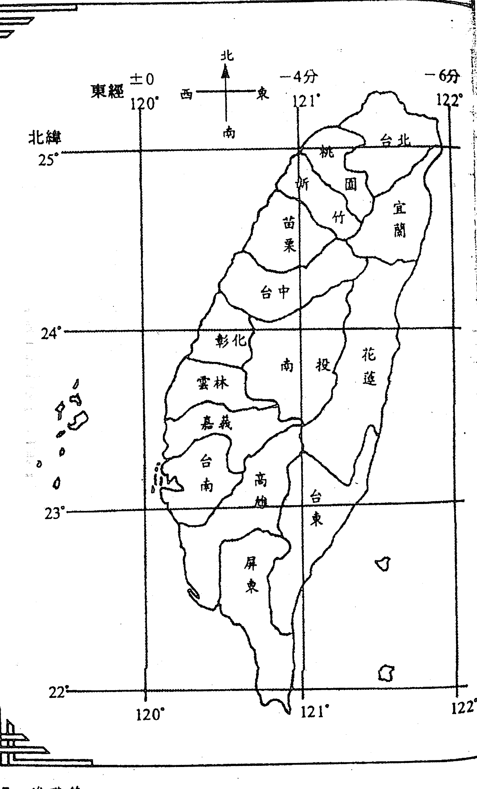

## 全年太陽時差表（以陽曆為準）

| 七月大 | 八月大 | 九月小 | 十月大 | 十一月小 | 十二月大 |
| :---: | :---: | :---: | :---: | :---: | :---: |
| 上半月 | 下半月 | 上半月 | 下半月 | 上半月 | 下半月 | 上半月 | 下半月 | 上半月 | 下半月 | 上半月 | 下半月 |
| 早18分 | 早16分 | 早14分 | 早12分 | 早10分 | 早8分 | 早6分 | 早4分 | 早2分 | ±0分 | 慢2分 | 慢4分 |
| 7月1日 | 7月16日 | 8月1日 | 8月16日 | 9月1日 | 9月15日 | 10月1日 | 10月16日 | 11月1日 | 11月15日 | 12月1日 | 12月16日 |

| 一月大 | 二月小 | 三月大 | 四月小 | 五月大 | 六月小 |
| :---: | :---: | :---: | :---: | :---: | :---: |
| 上半月下半月 | 上半月下半月 | 上半月下半月 | 上半月下半月 | 上半月下半月 | 上半月下半月 |
| 早18分 | 早16分 | 早14分 | 早12分 | 早10分 | 早8分 |
| 1月1日 1月16日 | 2月1日 2月14日 | 3月1日 3月16日 | 4月1日 4月15日 | 5月1日 5月16日 | 6月1日 6月15日 7月1日 |

## 奇門遁甲出門剋應秘訣

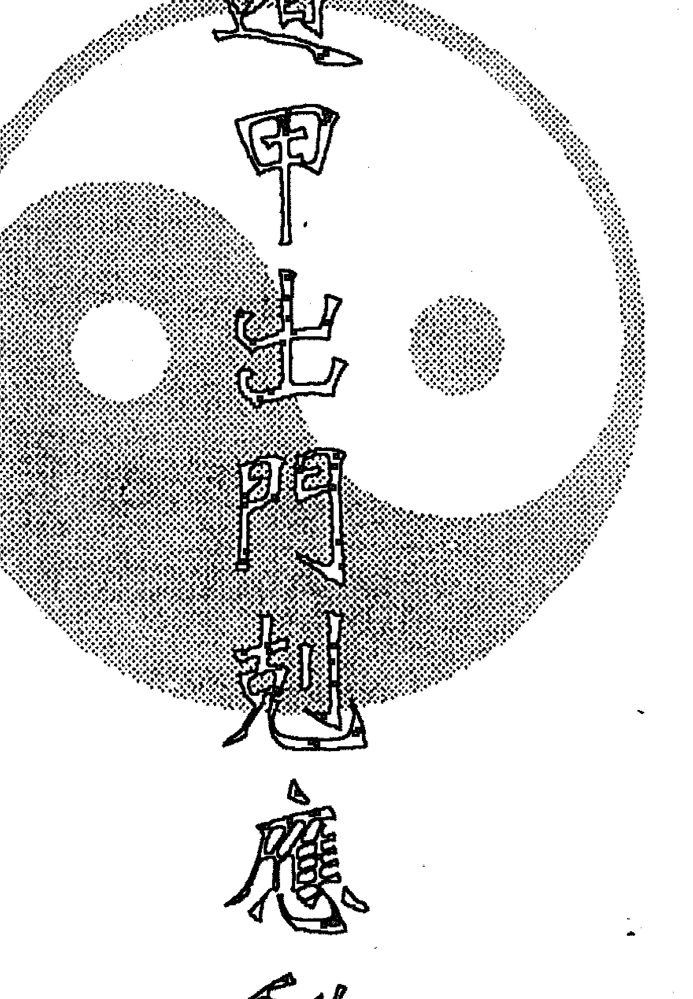

## 天干數

- 甲己九
- 乙庚八
- 丙辛七
- 丁壬六
- 戊癸五

## 地支數

- 子午九
- 丑未八
- 寅申七
- 卯酉六
- 辰戌五
- 巳亥四

## 使用訣

甲子出門是十八，未時乃是添八數。二六北方公文行，南方見到小兒啼。遇此刻應最為靈，子孫顯貴封官祿。

## 十二吉：

十二遁甲見陰陽，西北乾宮逢老婦。手執棉布同小女，此時有應主亨昌。作事出門推陰陽，經營謀利嫁娶吉。起基營作大吉昌，子孫官貴遇時良。

## 十四凶：

遁甲逢之十四數，東北來人能逢之。白馬或驢隨身行，身帶弓箭衣穿紫。或是見著黑衣人，前有大坑后白虎。兇惡小人是非纏，遠行娛樂千莫去。不宜嫁娶談婚事，凡事暫避不宜行。

## 十五吉：

十五遁甲逢吉利，南方逢之一少女。牵牛或是抱婴儿，东方见到车与马。后有男人追趕来，見此刻應好吉兆。日月在前放光明，駟馬時從干事好。送葬修造皆可行，百事逢之能亨通。

## 十六吉：

十六如见妇人到，是主升官得职位。东北可见禽鸟飞，西北见之白衣人。或逢老人持拐杖，遇之是主财利豊。酒肉饮食貴人助，交易修造婚姻吉。

## 十七凶：

十七西方風雨雲，或見身穿孝服人。車上可見兩人座，逢此刻應是凶數。死屍在前後病符，求財求事皆不利。嫁娶事宜逢災咎，若遇此時宜避開。

## 十八吉：

十八剋應在南邊，少婦犬仔或青鱔。東方行人匆匆來，嫁娶以外萬事吉。求財求事皆亨通，求貴此時必陞官。

## 十九凶：

十九鴉鵲並弓弩，銅鐵器具東方舞。

## 二十凶：

更有見著白衣人，西方有人喚驢犬。見此刻應乃是凶，不宜動作宜靜守。二十北方人與驢，老僧道人與尼姑。人趕豬羊去屠宰，此是凶惡之剋應。前有橋樑後豬羊，若遇此時萬事殃。

## 二十一吉：

遁甲逢之二十一，東方遇之是孝子。亦見婦人同時臨，見到老人擇拐杖。西北剋應是乾宮，此時所遊見吉兆。青雲上蓋呈貴氣，百事吉昌順利行。

## 二十二吉：

遇見求乞持杖子，西方聽見鼓笛聲。逢坤兌宮應更奇，婦人提籠並現出。乘車駕馬擋酒肉，萬事皆吉與平安。

## 二十三凶：

男子婦人擋寶劍，南方有人執鐵瓶。海報文字毀罵詞，遇見豬羊病迎門。事事阻礙遠行難，動則遇侵靜安寧。

## 二十四吉：

南方迎送福壽仙，少女手中執金錢。西邊兌宮羊到來，物色黑青纏不離。飛鳥在前玉土後，嫁娶無咎刑長官。

## 二十五吉：

龍馬猿猴共一起，南方看見婦人至。西方看見老人來，見此剋應最為靈。四足動物自來現，百事如意最稱心。出門逢見長老者，再遇知音萬事吉。

## 二十六吉：

二六北方公文行，南方見到小兒啼。遇此剋應最為靈，子孫顯貴封官祿。大吉大利不須疑，以上諸時之剋應。此時乃是吉利，但試其事無失誤。

## 二十七凶：

白馬紫驢共一處，有人騎出向西方。遇此剋應大不利，以上諸數此最凶。逢之宜避不宜用，動則凶惡靜安寧。

每日出門占吉凶，奇門良時大吉利。奇逢凶時亦無礙，只怕凶局遇凶時。趨吉避凶其中妙，善用必然喜冲冲。

## 日家奇门

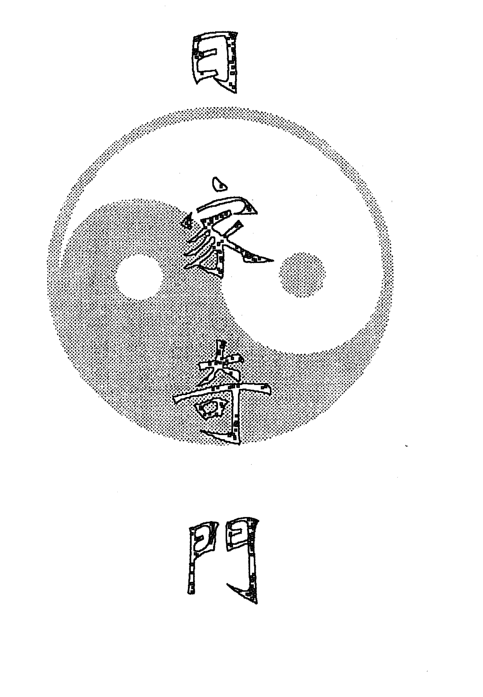

## 超神接氣辨陰陽遁

奇門日盤有陽遁六十局及陰遁六十局，共有一百二十局之日盤。別陰陽之遁亦是由冬至及夏至之分，冬至後夏至前為陽遁，夏至後冬至前為陰遁，但必須逢甲日方可以換之。若冬至為己日，則甲在冬至前五日乃依夏至陰遁，直到冬至後第六天逢甲日方換為陽遁之開始。此名曰：超神，謂中氣已到六甲一旬十日超過中氣也。但若冬至逢戊日，則甲日在冬至前四天已經變換為陽遁了。此是曰：接氣，是符首先到迎接中氣也。簡單說就是冬至或夏至，逢甲乙丙丁戊日則提早換局，逢己庚辛壬癸日則延後換局。

## 陽遁家奇門

## 陽遁八門九宮起訣

甲戊壬子坎上休，丁辛乙卯向坤求。
戊庚甲馬歸震位，丁癸辛雞巽上搜。
丙庚鼠行乾天上，己癸兔走在西疇。
丙壬馬立艮山位，乙己雞飛落離周。

## 陽遁日盤八門佈法

陽遁八門佈法是將六十甲子日劃分為一十局，每局三日即每三日一盤。由甲子、乙丑、丙寅三日休門起坎一宮，丁卯、戊辰、己巳三日起坤二宮，庚午、辛未、壬申起震三宮，癸酉、甲戌、乙亥起巽四宮，丙子、丁丑、戊寅起乾六宮，己卯、庚辰、辛巳起兌七宮，壬午、癸未、甲申起艮八宮，乙酉、丙戌、丁亥起離九宮。休門起佈巽四宮，佈完六十甲子日止。

## 陽遁六十甲子日休門佈宮表

| 宮位 | 休門所起宮 | 日干支 |
|---|---|---|
| 坎一 | | 甲子、乙丑、丙寅 |
| 坤二 | | 丁卯、戊辰、己巳 |
| 震三 | | 庚午、辛未、壬申 |
| 巽四 | | 癸酉、甲戌、乙亥 |
| 中宮 | 不用 | |
| 乾六 | | 丙子、丁丑、戊寅 |
| 兌七 | | 己卯、庚辰、辛巳 |
| 艮八 | | 壬午、癸未、甲申 |
| 离九 | | 乙酉、丙戌、丁亥 |
| （重复周期示例） | | |
| 坎一 | | 壬子、癸丑、甲寅 |
| 坤二 | | 乙卯、丙辰、丁巳 |
| 震三 | | 戊午、己未、庚申 |
| 巽四 | | 辛酉、壬戌、癸亥 |
| 乾六 | | 甲午、乙未、丙申 |
| 兑七 | | 丁酉、戊戌、己亥 |
| 艮八 | | 庚子、辛丑、壬寅 |
| 离九 | | 癸卯、甲辰、乙巳 |

## 阳遁九星起诀

歌曰：甲子山前起艮，甲戌离上横行。甲申坎宫顺数，甲午坤宫发动。甲辰震雷吐雾，甲寅巽上生风。

日之九星乃：太乙、摄提、轩辕、招摇、天符、青龙、咸池、太阴、天乙。是六十甲子日，分六甲旬而佈九星，如甲子旬即由甲子日起佈太乙在艮宫、摄提在离、轩辕在坎、招摇在坤、天符在震、青龙在巽、咸池在乾、太阴在兑。再由乙丑日太乙起离顺佈九星，丙寅日起坎、丁卯日起坤、戊辰日起震、己巳日起巽、庚午日起中宫、辛未日起乾、壬申日起兑，最后癸酉日起太乙於艮宫顺佈九星，即佈完甲子旬之十日，再接佈甲戌旬之甲戌日太乙起离宫顺佈九星……一直到甲寅旬之癸亥日，太乙起巽宫顺布九星，则顺布完成阳遁六十甲子日之九星。

- 甲子旬之甲子日太乙起艮八。
- 甲戌旬之甲戌日太乙起离九。
- 甲申旬之甲申日太乙起坎一。
- 甲午旬之甲午日太乙起坤二。
- 甲辰旬之甲辰日太乙起震三。
- 甲寅旬之甲寅日太乙起巽四。

## 十二神佈法

十二神乃由：五符、天曹、地府、风伯、雨师、雷公、风云、唐符、国印、天关、地锁、天贼。以上神煞所组合而成，分布在十二地支位于九宫，子在坎、丑寅在艮、卯在震、辰巳在巽、午在离、未申在坤、酉在兑、戌亥在乾。

再依六十甲子日天干之禄位起五符，不论阴阳遁皆顺转佈十二神诀：

- 甲禄在寅
- 乙禄在卯
- 丙戊禄在巳
- 丁己禄在午
- 庚禄在申
- 辛禄在酉
- 壬禄在亥
- 癸禄在子

起五符。

例：阳遁甲子日盘；八门诀：甲戊壬子坎上休；九星诀：（太乙）甲子山前起艮；12神诀：甲禄在寅起五符

12神诀：辛禄在酉起五符

九星诀：甲戌离上横行（甲戌—辛巳、离九—兑七）

八门诀：己癸兔走在西咙（己卯、庚辰、辛巳）

例：阳遁辛巳日盘

例：阳遁壬戌日盘

八门诀：丁癸辛鸡巽上搜
（丁酉、壬戌、癸亥、休在巽）

九星诀：甲寅巽上生风
（甲寅、壬戌、巽四、震三）

12神诀：壬禄在亥起五符

## 阴遁日家奇门

## 阴遁八门九宫起诀

- 甲戊壬子九宫求，丁辛乙艮八收。
- 戊庚甲马兑上座，癸丁辛鸡向乾遊。
- 丙庚二子巽位立，黑黄二兔震宫收。
- 壬丙二马坤宫站，青黄鸡飞水上浮。

## 阴遁日盘八门佈法

阴遁日盘佈法与阳遁佈法大致相同，但须别阳顺阴逆。阴遁亦是将六甲子日划分为二十局，每局三日即三日一门盘。由甲子、乙丑、丙寅三日起佈休门在离宫、丁卯、戊辰、己巳三日休门佈艮……到最后辛酉、壬戌、癸亥佈休门在乾为止。

## 阴遁六十甲子日休门佈宫表

| 列1 | 列2 | 列3 |
|-----|-----|-----|
| 丙子 丁丑 戊寅 庚子 辛丑 壬寅 | 甲子 乙丑 丙寅 戊子 己丑 庚寅 壬子 癸丑 甲寅 | 壬午 癸未 甲申 丙午 丁未 戊申 |
| 己卯 庚辰 辛巳 癸卯 甲辰 乙巳 乙卯 丙辰 丁巳 | 巽四 离九 坤二 震三 中宫不用 兑七 艮八 坎一 乾六 | 戊午 己未 庚申 甲午 乙未 丙申 庚午 辛未 壬申 己酉 庚戌 辛亥 乙酉 丙戌 丁亥 己酉 庚戌 辛亥 |
| 乙卯 丙辰 丁巳 | 乙酉 丙戌 丁亥 己酉 庚戌 辛亥 癸酉 甲戌 乙亥 | 丁酉 戊戌 己亥 辛酉 壬戌 癸亥 乙酉 丙戌 丁亥 |

## 阴遁九星起诀

歌曰：甲子起逐老母位，狗儿戏水腾波浪。
猴马上笑呵呵，甲马艮宫独乐居。
龙行兑上去寻觅，虎向乾位不必疑。
太乙九星并逆排，此法细推无灾祸。

阴遁九星是由甲子旬之甲子日，由坤宫起太乙逆布九宫，即太乙坤二、摄提坎一、轩辕离九、招摇艮八、天符兑七、青龙乾六、咸池中宫、太阴巽四、天乙震三。则佈完甲子日后再佈乙丑日是太乙起坎一逆佈九宫，丙寅起离九、丁卯日起艮八、戊辰日起兑七、己巳日起乾六、庚午日起中宫、辛未日起巽四、壬申日起震三、癸酉日起坤二。再轮至甲戌旬之甲戌日太乙起坎逆佈、乙亥起离、到甲寅旬之癸亥日，太乙起乾逆佈九宫即佈完阴遁六十甲子日。

- 甲子旬之甲子日太乙起坤二。
- 甲戌旬之甲戌日太乙起坎一。
- 甲申旬之甲申日太乙起离九。
- 甲午旬之甲午日太乙起艮八。
- 甲辰旬之甲辰日太乙起兑七。
- 甲寅旬之甲寅日太乙起乾六。

例：阴遁甲子日盘
八门诀：甲戊壬子九宫求
九星诀：甲子起逐老母位
12神诀：甲禄在寅起五符

例：阴遁丙申日盘

八门诀：戊庚甲马兑上座
（甲午、乙未、丙申、休起兑）

九星诀：甲马艮宫独乐居
（甲午艮、乙未兑、丙申乾）

12神诀：丙禄在巳起五符

## 日盘推八门总诀

> 歌曰：休门出入贵人留，欲要潜身向杜游。
求索酒食景门上，探筮筮埋死门投。
捕猎惊门十得九，买卖经商生上酬。
远行嫁娶开门吉，索债伤门十倍收。

### 休门贪狼水星

公求相讲遇休门，吉宿游人见贵人。
更得相生无相克，自然出入笑欣欣。

凡出休门者宜：和解、休退官符、聚会、演兵、习阵、求财、求婚、娱乐、休闲、旅游等万事清吉如意。

### 生门左辅土星

但凡出入遇其生，吉曜临门百事亨。
若有凶星来隔拨，求财成处必无争。

凡出生门者宜：求财、见贵、策划、经营、谋利、求医等百事大吉。

### 伤门禄存木星

远行伤门见血光，须防暗箭被人伤。
求财惊恐多不利，只宜索债不须防。

凡出伤门百事不宜，唯索债、博戏等可用。

### 杜门文曲木星

若出杜门路不通，只宜逃避走西东。除邪去鬼皆不利，百事诸凡尽不中。

凡出杜门主阻塞，不通，唯逃避、隐藏、避难可用之。

### 景门右弼火星

若出景门贼盗逢，劝君思想莫停身。恐遇恶人不用去，谒故寻亲方可行。

凡出景门怕逢盗贼之灾，若是远行恐有阻碍不通之事，但若是要去寻亲反而大吉，可遇贵人助之。

### 死门巨门土星

若出死门不须论，无灾去外命难存。
土居八门最为恶，只宜探猎送妖怪。

凡出死门者远行恐有灾厄、道路封闭、行程不顺、百事不宜。唯打猎、杀生、丧事、安葬、招魂等可用之。

### 惊门破军金星

若出惊门病缠身，阴谋口舌有灾迍。
远行出外伤财宝，百怪灾殃戏弄人。

凡出惊门者有恐惧之灾，官事连绵，只宜捕捉盗贼大吉。

### 开门武曲金星

若遇开门事吉祥，干求诸事遇贤良。官司理论皆吉利，八门之中最为强。

凡出开门者百事皆吉，远行、求利皆顺利，贵人吉曜相扶持。

## 推九星吉凶歌

### 太乙星：主吉

门中见太乙，星曜号贪狼，赌博钱财遂，婚姻大吉昌，远行无阻滞，参谒见贤良，远行三五里，著早辨阴阳。

凡出太乙星者，行数里后见到黑衣人来，必然求贵、婚姻、谋利等百事大吉。

### 摄提星：主凶

门中见摄提，百事必迟疑，相生犹自可，相克有灾危，远行多不利，耕地损牛犁，死门相并见，老妇哭悲啼。

凡出摄提星主凶不利，外出一里后主逢耕作损牛犁，老妇悲哭不吉。

### 轩辕星：小凶

门中见轩辕，做事必牵缠，相生能克主，相克主熬煎，远行途阻滞，赌博自输钱，但行三五路，路逢一官员。

凡出轩辕星者，远行必然受阻滞，求财不利更防自己逢灾厄、诸事不利。

### 招摇星：小凶中平

招摇土木星，当门事不成，远行三五里，阴人口舌迎，怪梦虚惊怕，门鸣户作声，前行数十里，必见一亲人。

凡出招摇星者，主见妇人口舌临、怪梦、异声，诸事难成主不顺利。

### 天符星：至凶

五符号天符，当门妇人谋，相克无好事，行人阻路途，走失难寻觅，路逢一姑，前行七八里，可见一亲故。

凡出天符星者，主见妇人谋害、行程阻塞滞碍难行、口舌官非临身区不利。

### 青龙星：主吉

门中见青龙，求事喜重重，投入逢酒肉，赌博见兴隆，更遇相生位，钱财得不空，前路五六里，医人路上逢。

凡出青龙星者主见酒食、利博戏、求财、上官、迁移等百事大吉。

### 咸池星：主凶

星门号咸池，当门并不宜，远行多不利，相克有灾危，赌博全输尽，求财空手归，神仙具妙诀，愚人莫与知。

凡出咸池星者，主出行求财或赌博必然无利空手而归，恐损财疾病灾厄大凶。

### 太阴星：吉

门中太阴星，百事并不侵，求财皆成就，知交自己寻，前行七八里，牵牛小子临，机审牢收取，此法值千金。

凡出太阴星者，行七八里后逢小孩牵牛吉应，求财、求事等吉利亨通。

### 天乙星：至吉

门中见天乙，相生百事成，求财皆和顺，茶酒自来迎，行去数十里，路逢戴孝人，除服无不验，灾祸甚分明。

凡出天乙星者，行二三里后见妇人著五色衣服抱小儿吉应，主百事大吉大利。

## 九星五行吉凶总诀

- 一、太乙水吉
- 二、摄提土凶
- 三、轩辕木平
- 四、招摇木平
- 五、天符土凶
- 六、青龙金吉
- 七、咸池金凶
- 八、太阴土吉
- 九、天乙火吉

## 推十二神吉凶诀

> 歌曰：天符天曹地府星吉，风伯雨师雷公精凶。
风云唐符并国印吉，天关地锁天贼凶。

- 一、五符：五行属火，上吉之星，主谒贵，代表甲神贵不可侵也，出兵必胜、求财、求贵、远行、商贾、上任、统领兵权等百事皆吉。
- 二、天曹：五行属金，中吉之星，主诉讼，宜对簿公堂，上书献策，计划谋事等用之吉利。
- 三、地府：五行属土，主静宜守不宜攻，宜防守、筑墙、修城、隐藏、修道、学习、拜师等中吉之星。
- 四、风伯：五行属木，中凶之星，主惊恐，不宜出兵，恐慌不安、易迷惑、失财、不顺、凶多吉少。
- 五、雨师：五行属水，中凶之星，主阴雨，有阻碍、易逢灾难，由此出行多不顺。
水战大胜、陆战不利、雨天吉而晴天凶。
- 六、雷公：五行属木，中凶之星，主惊恐，不宜出兵，不通顺，易惊慌不安，宜静不宜动，动则凶多吉少。
- 七、风云：五行属木，中吉之星，主阴暗，宜埋伏、跟踪、偷袭、隐藏、不愿曝光事宜，休闲轻松如意等吉利。
- 八、唐符：五行属金，上吉之星，主财利。宜远行、求财、求贵、出兵、诸事大吉大利。
- 九、国印：五行属金，上吉之星，主升迁。出兵大胜荣获功劳，宜任职、表扬、求财、求贵，顺利亨通无阻碍。
- 十、天关：五行属木，大凶之星，主障碍不顺。行程受阻，易有灾厄、血光等诸事不顺。
- 十一、地锁：五行属土，大凶之星，主反复不定。宜静不宜动，易损财利、障碍难行、百事不顺、凶多去少。
- 十二、天贼：五行属水，大凶之星，主盗劫损财。此方行之易逢盗贼之灾，意外事故，诸事不利。

## 月盘、年盘与日盘

## 月盘

## 定局：

由六十甲子年其中，每五年为一元计六十甲子月，即每十五年轮上中下三元计一百八十个月，则六十甲子年共轮四个三元。而局之运用乃上元为阴一局、中元为阴四局、下元为阴七局。即甲子年之丙寅月—戊辰年乙丑月为阴一局，再由己巳年之丙寅月—癸酉年之乙丑月为阴四局，到己未年之丙寅月—癸亥年之乙丑月为阴七局。

| 三元 | 上元 | 中元 | 下元 |
| :---: | :---: | :---: | :---: |
| 局数 | 阴一局 | 阴四局 | 阴七局 |
| 六 十 年 甲 子 | 甲子 乙丑 丙寅 丁卯 戊辰 己巳 庚午 辛未 壬申 癸酉 甲戌 乙亥 | 甲寅 乙卯 丙辰 丁巳 戊午 己未 庚申 辛酉 壬戌 癸亥 甲子 乙丑 | 甲戌 乙亥 丙子 丁丑 戊寅 己卯 庚辰 辛巳 壬午 癸未 甲申 乙酉 |

## 佈月盘总诀

- 1. 地盘：逆佈一四七何局则起戊于何。
- 2. 天盘：符首佈在月干宫位，依地盘顺佈。
- 3. 八门：地盘符首宫为八门直使，再将直使由旬支顺佈至月支转盘，一四七阴逆算，得何数则直使佈此宫，再顺佈八门。
- 4. 九星：地盘符首宫为九星直符，再将九星直符佈在天盘符首宫位顺佈九星。
- 5. 八神：将八神直符佈在天盘符首宫位，再逆佈各宫。
- 6. 布紫白飞星：参照47页值月紫白入中一律顺佈九宫。

例：阴一局、己卯年、丁丑月、甲戌旬。
符首：己。八门直使：九景。九星直符：天英。

注：月盘可参照时盘阴一四七局，唯紫白飞星不同。

| 己丁符休英五 | 乙己癸天一生芮 | 辛乙癸地伤柱三 |
| 丁丙蛇开辅四 | 值符星白六 | 壬辛雀杜心八 |
| 丙庚阴惊冲九 | 庚戊合死任二 | 戊壬陈景蓬七 |

| (巳) | (午) | 未(未) | (申) |
| (辰) | 直使再逆算八门 | 顺佈旬支到月支 | (酉) |
| (卯) |  | 九景(戌) |  |
| (寅) | 六(丑) | 七(子) | 八(亥) |

## 年盘

## 定局：

年盘是以立春为界而分前后，立春前为旧年之年盘、立春后为新年之年盘。而局之定法是以上元60年为阴一局、中元60年为阴四局、下元60年为阴七局，三元共180年轮佈阴一四七局。

年盘之佈法与时盘相同，唯差紫白飞星不同，年之紫白飞星是以值年紫白佈入中宫而顺佈九宫为用，因此要寻年盘，只要按时盘之阴一四七局为用，再布上值年紫白飞星顺佈九宫即可。

例：下元庚辰年、阴七局、甲戌旬、值星九紫、符首己。

| 癸庚阴八 | 戊蛇四 | 己符六 |
| 辛 芮 （惊） | 丙 柱 （开） | 癸庚 心 （休） |
| 丙合七 | 值星:九紫 | 丁天生二 |
| 壬 英 （死） |  | 戊 蓬 （生） |
| 辛陈三 | 壬雀五 | 乙地一 |
| 乙 辅 （景） | 丁 冲 （杜） | 己 任 （伤） |

| (巳) | (午) | (未) | (申) |
|------|------|------|------|
| 九 (辰) （庚辰） | 直符:天心 | 直使:六开 | 符首:己 (酉) |
| 一 (卯) |  |  | 六开 (戌) （甲戌） |
| 二 (寅) | 三 (丑) | 四 (子) | 五 (亥) |

## 阳局日盘

丁卯日

甲子日

戊辰日

乙丑日

己巳日

丙寅日

| | | | 天乙 | 太阴 | 咸池 | 青龙 | 天符 | 招摇 | 轩辕 | 摄提 | 太乙 | 九星 |
|---|---|---|---|---|---|---|---|---|---|---|---|---|
| | | | 吉 | 吉 | 凶 | 吉 | 凶 | 平 | 平 | 凶 | 吉 | |
| 天贼 | 地镇 | 天关 | 国印 | 唐符 | 风云 | 雷公 | 雨师 | 风伯 | 地府 | 天曹 | 五符 | 12神 |
| 凶 | 凶 | 凶 | 吉 | 吉 | 吉 | 凶 | 凶 | 凶 | 吉 | 吉 | 吉 | |

## 阳局日盘

丁丑日

甲戊日

戊寅日

乙亥日

己卯日

丙子日

| 九星 | 太乙 | 摄提 | 轩辕 | 招摇 | 天符 | 青龙 | 咸池 | 太阴 | 天乙 | |
| :--- | :--- | :--- | :--- | :--- | :--- | :--- | :--- | :--- | :--- | :--- |
| | 吉 | 凶 | 平 | 平 | 凶 | 吉 | 凶 | 吉 | 吉 | |
| 12神 | 五符 | 天曹 | 地府 | 风伯 | 雨师 | 雷公 | 风云 | 唐符 | 国印 | 天关 | 地镇 | 天贼 |
| | 吉 | 吉 | 吉 | 凶 | 凶 | 凶 | 吉 | 吉 | 吉 | 凶 | 凶 | 凶 |阳局日盘

丁亥日

甲申日

戊子日

乙酉日

己丑日

丙戌日

壬辰日

庚寅日

癸巳日

辛卯日

|  |  |  | 天乙 | 太阴 | 咸池 | 青龙 | 天符 | 招摇 | 轩辕 | 摄提 | 太乙 | 九星 |
|---|---|---|---|---|---|---|---|---|---|---|---|---|
|  |  |  | 吉 | 吉 | 凶 | 吉 | 凶 | 平 | 平 | 凶 | 吉 |  |
| 天贼 | 地镇 | 天关 | 国印 | 唐符 | 风云 | 雷公 | 雨师 | 风伯 | 地府 | 天曹 | 五符 | 12神 |

阳局日盘

丁酉日

甲午日

戊戌日

乙未日

己亥日

丙申日

九星 | 太乙 | 摄提 | 轩辕 | 招摇 | 天符 | 青龙 | 咸池 | 太阴 | 天乙 |   |   |
---|---|---|---|---|---|---|---|---|---|---|---|---
|      | 吉   | 凶   | 平   | 平   | 凶   | 吉   | 凶   | 吉   | 吉   |   |   |
| 12神 | 五符 | 天曹 | 地府 | 风伯 | 雨师 | 雷公 | 风云 | 唐符 | 国印 | 天关 | 地镇 | 天贼 |
|      | 吉   | 吉   | 凶   | 凶   | 凶   | 吉   | 吉   | 吉   | 吉   | 凶 | 凶 | 凶 |

阳局日盘

壬子日

庚戌日

癸丑日

辛亥日

九星 | 太乙 | 摄提 | 轩辕 | 招摇 | 天符 | 青龙 | 咸池 | 太阴 | 天乙 |
---|---|---|---|---|---|---|---|---|---
|      | 吉   | 凶   | 平   | 平   | 凶   | 吉   | 凶   | 吉   | 吉   |
| 12神 | 五符 | 天曹 | 地府 | 风伯 | 雨师 | 雷公 | 风云 | 唐符 | 国印 | 天关 | 地镇 | 天贼 |
|      | 吉   | 吉   | 吉   | 凶   | 凶   | 凶   | 吉   | 吉   | 吉   | 凶 | 凶 | 凶 |

277 月盘、年盘与日盘

阳局日盘

九星 | 太乙 | 攝提 | 軒轅 | 招搖 | 天符 | 青龍 | 咸池 | 太陰 | 天乙 |
---|---|---|---|---|---|---|---|---|---
|      | 吉   | 凶   | 平   | 平   | 凶   | 吉   | 凶   | 吉   | 吉   |
| 12神 | 五符 | 天曹 | 地府 | 風伯 | 雨師 | 雷公 | 風雲 | 唐符 | 國印 | 天關 | 地鎮 | 天賊 |
|      | 吉   | 吉   | 吉   | 凶   | 凶   | 凶   | 吉   | 吉   | 吉   | 凶   | 凶   | 凶   |

阴局日盘

九星 | 太乙 | 摄提 | 轩辕 | 招摇 | 天符 | 青龙 | 咸池 | 太阴 | 天乙 |
---|---|---|---|---|---|---|---|---|---
| 吉凶 | 吉 | 凶 | 平 | 平 | 凶 | 吉 | 凶 | 吉 | 吉 |
| 12神 | 五符 | 天曹 | 地府 | 风伯 | 雷公 | 雨师 | 风云 | 唐符 | 国印 | 天阙 | 地镇 | 天贼 |
| 吉凶 | 吉 | 吉 | 吉 | 凶 | 凶 | 凶 | 吉 | 吉 | 吉 | 凶 | 凶 | 凶 |

阴局日盘

丁丑日

甲戌日

戊寅日

乙亥日

己卯日

丙子日

九星 | 太乙 | 摄提 | 轩辕 | 招摇 | 天符 | 青龙 | 咸池 | 太阴 | 天乙 |
---|---|---|---|---|---|---|---|---|---
|      | 吉   | 凶   | 平   | 平   | 凶   | 吉   | 凶   | 吉   | 吉   |
| 12神 | 五符 | 天曹 | 地府 | 风伯 | 雨师 | 雷公 | 风云 | 唐符 | 国印 | 天阙 | 地镇 | 天贼 |
|      | 吉   | 吉   | 吉   | 凶   | 凶   | 凶   | 吉   | 吉   | 凶   | 凶   | 凶   |

阴局日盘

表格包含九星（太乙、摄提、轩辕、招摇、天符、青龙、咸池、太阴、天乙）与12神（天贼、地镇、天关、国印、唐符、风云、雷公、雨师、风伯、地府、天曹、五符）的吉凶标注

285 月盘、年盘与日盘

阴局日盘

甲午日

丁酉日

乙未日

戊戌日

丙申日

己亥日

壬寅日

庚子日

癸卯日

辛丑日

| | | | 天乙 | 太阴 | 咸池 | 青龙 | 天符 | 招摇 | 轩辕 | 摄提 | 太乙 | 九星 |
| --- | --- | --- | --- | --- | --- | --- | --- | --- | --- | --- | --- | --- |
| | | | 吉 | 吉 | 凶 | 吉 | 凶 | 平 | 平 | 凶 | 吉 | |
| 天贼 | 地镇 | 天关 | 国印 | 唐符 | 风云 | 雷公 | 雨师 | 风伯 | 地府 | 天曹 | 五符 | 12神 |
| 凶 | 凶 | 凶 | 吉 | 吉 | 吉 | 凶 | 凶 | 凶 | 吉 | 吉 | 吉 | |

阴局日盘

九星 | 太乙 | 攝提 | 軒轅 | 招搖 | 天符 | 青龍 | 咸池 | 太陰 | 天乙 |
---|---|---|---|---|---|---|---|---|---
| 吉凶 | 吉 | 凶 | 平 | 平 | 凶 | 吉 | 凶 | 吉 | 吉 |
| 12神 | 五符 | 天曹 | 地府 | 風伯 | 雨師 | 雷公 | 風雲 | 唐符 | 國印 | 天關 | 地鎮 | 天賊 |
| 吉凶 | 吉 | 吉 | 吉 | 凶 | 凶 | 凶 | 吉 | 吉 | 吉 | 凶 | 凶 | 凶 |

阴局日盘# 壬戌日

（图片：img/2f35636a8eb894302a69d54657539668_305_0.png）

## 庚申日

（图片：img/2f35636a8eb894302a69d54657539668_305_1.png）

## 癸亥日

（图片：img/2f35636a8eb894302a69d54657539668_305_2.png）

## 辛酉日

（图片：img/2f35636a8eb894302a69d54657539668_305_3.png）

|   |   |   | 天乙 | 太阴 | 咸池 | 青龙 | 天符 | 招摇 | 轩辕 | 摄提 | 太乙 | 九星 |
|---|---|---|---|---|---|---|---|---|---|---|---|---|
|   |   |   | 吉 | 吉 | 凶 | 吉 | 凶 | 平 | 平 | 凶 | 吉 |   |
| 天贼 | 地镇 | 天关 | 国印 | 唐符 | 风云 | 雷公 | 雨师 | 风伯 | 地府 | 天曹 | 五符 | 12神 |
| 凶 | 凶 | 凶 | 吉 | 吉 | 吉 | 凶 | 凶 | 凶 | 吉 | 吉 | 吉 |   |

## 奇门遁甲时盘1080局

（图片：img/2f35636a8eb894302a69d54657539668_307_0.png）

## 阳一局甲己日

| 己雀九 辛休芮 | 丁地五 乙生柱 | 癸天七 己伤心 |
| 乙陈八 庚开英 | — 壬 | 甲符三 丁杜蓬 |
| 辛合四 丙惊辅 | 庚阴六 甲死冲 | 丙蛇二 癸景任 |

丁卯时

| 辛合九 辛杜辅 | 乙陈五 乙景英 | 己雀七 己死芮 |
| 庚阴八 庚伤冲 | — 壬 | 丁地三 丁惊柱 |
| 丙蛇四 丙生任 | 甲符六 甲休蓬 | 癸天二 癸开心 |

甲子时

| 辛合九 辛惊辅 | 乙陈五 乙开英 | 己雀七 己休芮 |
| 庚阴八 庚死冲 | — 壬 | 丁地三 丁生柱 |
| 丙蛇四 丙景任 | 甲符六 甲杜蓬 | 癸天二 癸伤心 |

戊辰时

| 癸天九 辛惊心 | 甲符五 乙开蓬 | 丙蛇七 己休任 |
| 丁地八 庚死柱 | — 壬 | 庚阴三 丁生冲 |
| 己雀四 丙景芮 | 乙陈六 甲杜英 | 辛合二 癸伤辅 |

乙丑时

| 丁地九 辛景柱 | 癸天五 乙死心 | 甲符七 己惊蓬 |
| 己雀八 庚杜芮 | — 壬 | 丙蛇三 丁开任 |
| 乙陈四 丙伤英 | 辛合六 甲生辅 | 庚阴二 癸休冲 |

己巳时

| 庚阴九 辛生冲 | 辛合五 乙伤辅 | 乙陈七 己杜英 |
| 丙蛇八 庚休任 | — 壬 | 己雀三 丁景芮 |
| 甲符四 丙开蓬 | 癸天六 甲惊心 | 丁地二 癸死柱 |

丙寅时

## 阳一局甲己日

**癸酉时**
| 乙陈九 辛杜英 | 己雀五 乙景芮 | 丁地七 己死柱 |
| 辛合八 庚伤辅 | 一 壬 | 癸开三 丁惊心 |
| 庚阴四 丙生冲 | 丙蛇六 甲休任 | 甲符二 癸开蓬 |

**庚午时**
| 丙蛇九 辛死任 | 庚阴五 乙惊冲 | 辛合七 己开辅 |
| 甲符八 庚景蓬 | 一 壬 | 乙陈三 丁休英 |
| 癸天四 丙杜心 | 丁地六 甲伤柱 | 己雀二 癸生芮 |

**甲戌时**
| 辛地九 辛杜英 | 乙天五 乙景英 | 甲符七 甲死芮 |
| 庚雀八 庚伤冲 | 一 壬 | 丁蛇三 丁惊柱 |
| 丙陈四 丙生任 | 戊合六 甲休蓬 | 癸阴二 癸开心 |

**辛未时**
| 甲符九 辛伤蓬 | 丙蛇五 乙杜任 | 庚阴七 己景冲 |
| 癸天八 庚生心 | 一 壬 | 辛合三 丁死辅 |
| 丁地四 丙休柱 | 己雀六 甲开芮 | 乙陈二 癸惊英 |

**乙亥时**
| 乙天九 辛惊英 | 甲符五 乙开芮 | 丁蛇七 甲休柱 |
| 辛地八 庚死辅 | 一 壬 | 癸阴三 丁生心 |
| 庚雀四 丙景冲 | 丙陈六 戊杜任 | 戊合二 癸伤蓬 |

**壬申时**
| 丁地九 辛开柱 | 癸天五 乙休心 | 甲符七 己生蓬 |
| 己雀八 庚惊芮 | 一 壬 | 丙蛇三 丁伤任 |
| 乙陈四 丙死英 | 辛合六 甲景辅 | 庚阴二 癸杜冲 |

## 阳一局乙庚日

| 辛地九 | 乙天五 | 甲符七 |
| 辛伤辅 | 乙杜英 | 甲景芮 |
| 庚雀八 | — | 丁蛇三 |
| 庚生冲 | 壬 | 丁死柱 |
| 丙陈四 | 戊合六 | 癸阴二 |
| 丙休任 | 戊开蓬 | 癸惊心 |

| 癸阴九 | 戊合五 | 丙陈七 |
| 辛死心 | 乙惊蓬 | 甲开任 |
| 丁蛇八 | — | 庚雀三 |
| 庚景柱 | 壬 | 丁休冲 |
| 甲符四 | 乙天六 | 辛地二 |
| 丙杜芮 | 戊伤英 | 癸生辅 |

| 丁蛇九 | 癸阴五 | 戊合七 |
| 辛开柱 | 乙休心 | 甲生蓬 |
| 甲符八 | — | 丙陈三 |
| 庚惊芮 | 壬 | 丁伤任 |
| 乙天四 | 辛地六 | 庚雀二 |
| 丙死英 | 戊景辅 | 癸杜冲 |

| 庚雀九 | 辛地五 | 乙天七 |
| 辛杜冲 | 乙景辅 | 甲死英 |
| 丙陈八 | — | 甲符三 |
| 庚伤任 | 壬 | 丁惊芮 |
| 戊合四 | 癸阴六 | 丁蛇二 |
| 丙生蓬 | 戊休心 | 癸开柱 |

| 甲符九 | 丁蛇五 | 癸阴七 |
| 辛景芮 | 乙死柱 | 甲惊心 |
| 乙天八 | — | 戊合三 |
| 庚杜英 | 壬 | 丁开蓬 |
| 辛地四 | 庚雀六 | 丙陈二 |
| 丙伤辅 | 戊生冲 | 癸休任 |

| 戊合九 | 丙陈五 | 庚雀七 |
| 辛生蓬 | 乙伤任 | 癸杜冲 |
| 癸阴八 | — | 辛地三 |
| 庚休心 | 壬 | 丁景辅 |
| 丁蛇四 | 甲符六 | 乙天二 |
| 丙开柱 | 戊惊芮 | 癸死英 |

## 阳一局乙庚日

丙天九 | 甲符五 | 辛蛇七
辛伤任 | 乙杜冲 | 己景辅
戊地八 | 一 | 己阴三
甲生蓬 | 壬 | 丁死英
癸雀四 | 丁陈六 | 己合二
丙休心 | 戊开柱 | 癸惊芮

（乙酉时）

辛地九 | 乙天五 | 甲符七
辛休辅 | 乙生英 | 甲伤芮
庚雀八 | 一 | 丁蛇三
庚开冲 | 壬 | 丁杜柱
丙陈四 | 戊合六 | 癸阴二
丙惊任 | 戊死蓬 | 癸景心

（壬午时）

乙阴九 | 己合五 | 丁陈七
辛休英 | 乙生芮 | 己伤柱
辛蛇八 | 一 | 癸雀三
甲开辅 | 壬 | 丁杜心
甲符四 | 丙天六 | 戊地二
丙惊冲 | 戊死任 | 癸景蓬

（丙戌时）

丙陈九 | 庚雀五 | 辛地七
辛杜任 | 乙景冲 | 甲死辅
戊合八 | 一 | 己天三
庚伤蓬 | 壬 | 丁惊英
癸阴四 | 丁蛇六 | 甲符二
丙生心 | 戊休柱 | 癸开芮

（癸未时）

癸雀九 | 戊地五 | 丙天七
辛惊心 | 乙开蓬 | 己休任
丁陈八 | 一 | 甲符三
甲死柱 | 壬 | 丁生冲
己合四 | 乙阴六 | 辛蛇二
丙景芮 | 戊杜英 | 癸伤辅

（丁亥时）

辛蛇九 | 乙阴五 | 己合七
辛杜辅 | 乙景英 | 己死芮
甲符八 | 一 | 丁陈三
甲伤冲 | 壬 | 丁惊柱
丙天四 | 戊地六 | 癸雀二
丙生任 | 戊休蓬 | 癸开心

（甲申时）

## 阳一局丙辛日

| 甲符九 辛死阴 | 辛蛇五 乙惊辅 | 乙阴七 己开英 |
| 丙天八 甲景任 | 壬 | 己合三 丁休芮 |
| 戊地四 丙杜蓬 | 癸雀六 戊伤心 | 丁陈二 癸生柱 | 辛卯时

| 己合九 辛开芮 | 丁陈五 乙休柱 | 癸雀七 己生心 |
| 乙阴八 甲惊英 | 壬 | 戊地三 丁伤蓬 |
| 辛蛇四 丙死辅 | 甲符六 戊景冲 | 丙天二 癸杜任 | 戊子时

| 戊地九 辛休蓬 | 丙天五 乙生任 | 甲符七 己伤冲 |
| 癸雀八 甲开心 | 壬 | 辛蛇三 丁杜辅 |
| 丁陈四 丙惊柱 | 己合六 戊死芮 | 乙阴二 癸景英 | 壬辰时

| 戊地九 辛景蓬 | 丙天五 乙死任 | 甲符七 己惊冲 |
| 癸雀八 甲杜心 | 壬 | 辛蛇三 丁开辅 |
| 丁陈四 丙伤柱 | 己合六 戊生芮 | 乙阴二 癸休英 | 己丑时

| 丁陈九 辛杜柱 | 癸雀五 乙景心 | 戊地七 己死蓬 |
| 己合八 甲伤芮 | 壬 | 丙天三 丁惊任 |
| 乙阴四 丙生英 | 辛蛇六 戊休辅 | 甲符二 癸开冲 | 癸巳时

| 辛蛇九 辛生辅 | 乙阴五 乙伤英 | 己合七 己杜芮 |
| 甲符八 甲休冲 | 壬 | 丁陈三 丁景柱 |
| 丙天四 丙开任 | 戊地六 戊惊蓬 | 癸雀二 癸死心 | 庚寅时

## 阳一局丙辛日

丁酉时

| 戊雀九 | 丙地五 | 庚天七 |
| 甲休蓬 | 乙生任 | 己伤冲 |
| 癸陈八 | 一 | 甲符三 |
| 庚开心 | 壬 | 丁杜辅 |
| 丁合四 | 己阴六 | 乙蛇二 |
| 丙惊柱 | 戊死芮 | 癸景英 |

甲午时

| 甲符九 | 乙蛇五 | 己阴七 |
| 甲杜辅 | 乙景英 | 己死芮 |
| 庚天八 | 一 | 丁合三 |
| 庚伤冲 | 壬 | 丁惊柱 |
| 丙地四 | 戊雀六 | 癸陈二 |
| 丙生任 | 戊休蓬 | 癸开心 |

戊戌时

| 丁合九 | 癸陈五 | 戊雀七 |
| 甲死柱 | 乙惊心 | 己开蓬 |
| 己阴八 | 一 | 丙地三 |
| 庚景芮 | 壬 | 丁休任 |
| 乙蛇七 | 甲符九 | 庚天二 |
| 丙杜英 | 戊伤辅 | 癸生冲 |

乙未时

| 庚天九 | 甲符五 | 乙蛇七 |
| 甲生冲 | 乙伤辅 | 己杜英 |
| 丙地八 | 一 | 己阴三 |
| 庚休任 | 壬 | 丁景芮 |
| 戊雀四 | 癸陈六 | 丁合二 |
| 丙开蓬 | 戊惊心 | 癸死柱 |

己亥时

| 丙地九 | 庚天五 | 甲符七 |
| 甲伤任 | 乙杜冲 | 己景辅 |
| 戊雀八 | 一 | 乙蛇三 |
| 庚生蓬 | 壬 | 丁死英 |
| 癸陈四 | 丁合九 | 己阴二 |
| 丙休心 | 戊开柱 | 癸惊芮 |

丙申时

| 己阴九 | 丁合五 | 癸陈七 |
| 甲开芮 | 乙休柱 | 己生心 |
| 乙蛇八 | 一 | 戊雀三 |
| 庚惊英 | 壬 | 丁伤蓬 |
| 甲符四 | 庚开六 | 丙地二 |
| 丙死辅 | 戊景冲 | 癸杜任 |

## 阳一局丁壬日

### 癸卯时

| 癸陈九甲杜心 | 戊雀五乙景蓬 | 丙地七己死任 |
| :---: | :---: | :---: |
| 丁合八庚伤柱 | 壬 | 庚天三丁惊冲 |
| 己阴四丙生芮 | 乙蛇六戊休英 | 甲符二癸开辅 |

### 庚子时

| 乙蛇九甲惊英 | 己阴五乙开芮 | 丁合七己休柱 |
| :---: | :---: | :---: |
| 甲符八庚死辅 | 壬 | 癸陈三丁生心 |
| 庚天四丙景冲 | 丙地六戊杜任 | 戊雀二癸伤蓬 |

### 甲辰时

| 辛地九辛杜辅 | 乙天五乙景英 | 己符七己死禽 |
| :---: | :---: | :---: |
| 庚雀八庚伤冲 | 甲 | 丁蛇三丁惊柱 |
| 丙陈四丙生任 | 戊合六戊休蓬 | 癸阴二癸开心 |

### 辛丑时

| 甲符九甲生辅 | 乙蛇五乙伤英 | 己阴七己杜芮 |
| :---: | :---: | :---: |
| 庚天八庚休冲 | 壬 | 丁合三丁景柱 |
| 丙地四丙开任 | 戊雀六戊惊蓬 | 癸陈二癸死心 |

### 己巳时

| 乙天九辛生辅 | 己符五乙伤英 | 丁蛇七己杜禽 |
| :---: | :---: | :---: |
| 辛蛇八庚休冲 | 甲 | 癸阴三丁景柱 |
| 庚雀四丙开任 | 丙陈九戊惊蓬 | 戊合二癸死心 |

### 壬寅时

| 丙地九甲景任 | 庚天五乙死冲 | 甲符七己惊辅 |
| :---: | :---: | :---: |
| 戊雀八庚杜蓬 | 壬 | 乙蛇三丁开英 |
| 癸陈四丙伤心 | 丁合六戊生柱 | 己阴二癸休芮 |

## 阳一局丁壬日

| 辛地九 | 乙天五 | 己符七 |
| 辛休辅 | 乙生英 | 己伤禽 |
| 庚雀八 | 一 | 丁蛇三 |

己酉时

| 癸阴九 | 戊合五 | 丙陈七 |
| 辛伤心 | 乙杜蓬 | 己景任 |
| 丁蛇八 | 一 | 庚雀三 |

丙午时

| 丁蛇九 | 癸阴五 | 戊合七 |
| 辛杜柱 | 乙景心 | 己死蓬 |
| 己符八 | 一 | 丙陈三 |

庚戌时

| 庚雀九 | 辛地五 | 乙天七 |
| 辛开冲 | 乙休辅 | 己生英 |
| 丙陈八 | 一 | 己符三 |

丁未时

| 己符九 | 丁蛇五 | 癸阴七 |
| 辛惊禽 | 乙开柱 | 己休心 |
| 乙天八 | 一 | 戊合三 |

辛亥时

| 戊合九 | 丙陈五 | 庚雀七 |
| 辛景蓬 | 乙死任 | 己惊冲 |
| 癸阴八 | 一 | 辛地三 |

戊申时

## 阳遁一局戊癸日

| 丁天九 | 甲符五 | 戊蛇七 |
| 辛景柱 | 乙死心 | 己惊蓬 |
| 己地八 | 一 | 丙阴三 |
| 庚杜芮 | 壬 | 丁开任 |

| 辛地九 | 乙天五 | 己符七 |
| 辛死辅 | 乙惊英 | 己开禽 |
| 庚雀八 | 一 | 丁蛇三 |
| 庚景冲 | 甲 | 丁休柱 |

| 丙阴九 | 庚合五 | 辛陈七 |
| 辛生任 | 乙伤冲 | 己杜辅 |
| 戊蛇八 | 一 | 乙雀三 |
| 庚休蓬 | 壬 | 丁景英 |

| 丙陈九 | 庚雀五 | 辛地七 |
| 辛杜任 | 乙景冲 | 己死辅 |
| 戊合八 | 一 | 乙天三 |
| 庚伤蓬 | 甲 | 丁惊英 |

| 乙雀九 | 己地五 | 丁天七 |
| 辛惊英 | 乙开芮 | 己休柱 |
| 辛陈八 | 一 | 甲符三 |
| 庚死辅 | 壬 | 丁生心 |

| 辛陈九 | 乙雀五 | 己地七 |
| 辛杜辅 | 乙景英 | 己死芮 |
| 庚合八 | 一 | 丁天三 |
| 庚伤冲 | 壬 | 丁惊柱 |

## 阳一局戊癸日

| 甲符九 | 戊蛇五 | 丙阴七 |
| 辛开心 | 乙休蓬 | 己生任 |
| 丁天八 | — | 庚合三 |
| 庚惊柱 | 壬 | 丁伤冲 |
| 己地四 | 乙雀六 | 辛陈二 |
| 丙死芮 | 戊景英 | 甲杜辅 |

**辛酉时**

| 庚合九 | 辛陈五 | 乙雀七 |
| 辛伤冲 | 乙杜辅 | 己景英 |
| 丙阴八 | — | 己地三 |
| 庚生任 | 壬 | 丁死芮 |
| 戊蛇四 | 甲符六 | 丁天二 |
| 丙休蓬 | 戊开心 | 丁惊柱 |

**戊午时**

| 己地九 | 丁天五 | 甲符七 |
| 辛死芮 | 乙惊柱 | 己开心 |
| 乙雀八 | — | 戊蛇三 |
| 庚景英 | 壬 | 丁休蓬 |
| 辛陈四 | 庚合九 | 丙阴二 |
| 丙杜辅 | 戊伤冲 | 甲生任 |

**壬戌时**

| 己地九 | 丁天五 | 甲符七 |
| 辛死芮 | 乙惊柱 | 己开心 |
| 乙雀八 | — | 戊蛇三 |
| 庚景英 | 壬 | 丁休蓬 |
| 辛陈四 | 庚合六 | 丙阴二 |
| 丙杜辅 | 戊伤冲 | 甲生任 |

**己未时**

| 辛陈九 | 乙雀五 | 己地七 |
| 辛杜辅 | 乙景英 | 己死芮 |
| 庚合八 | — | 丁天三 |
| 庚伤冲 | 壬 | 丁惊柱 |
| 丙阴四 | 戊蛇六 | 甲符二 |
| 丙生任 | 戊休蓬 | 甲开心 |

**癸亥时**

| 戊蛇九 | 丙阴五 | 庚合七 |
| 辛休蓬 | 乙生任 | 己伤冲 |
| 甲符八 | — | 辛陈三 |
| 庚开心 | 壬 | 丁杜辅 |
| 丁天四 | 己地六 | 乙雀二 |
| 丙惊柱 | 戊死芮 | 甲景英 |

**庚申时**

## 阳二局甲己日

丁卯时表格

| 壬阴一庚杜心 | 乙合六丙景蓬 | 丁陈八甲死任 |
| 癸蛇九己伤柱 | 二辛 | 己雀四癸惊冲 |
| 甲符五丁生芮 | 丙天七乙休英 | 庚地三壬开辅 |

甲子时表格

| 庚地一庚杜辅 | 丙天六丙景英 | 甲符八甲死芮 |
| 己雀九己伤冲 | 二辛 | 癸蛇四癸惊柱 |
| 丁陈五丁生任 | 乙合七乙休蓬 | 壬阴三壬开心 |

戊辰时表格

| 庚地一庚生辅 | 丙天六丙伤英 | 甲符八甲杜芮 |
| 己雀九己休冲 | 二辛 | 癸蛇四癸景柱 |
| 丁陈五丁开任 | 乙合七乙惊蓬 | 壬阴三壬死心 |

乙丑时表格

| 乙合一庚惊蓬 | 丁陈六丙开任 | 己雀八甲休冲 |
| 壬阴九己死心 | 二辛 | 庚地四癸生辅 |
| 癸蛇五丁景柱 | 甲符七乙杜芮 | 丙天三壬伤英 |

己日时表格

| 癸蛇一庚伤柱 | 壬阴六丙杜心 | 乙合八甲景蓬 |
| 甲符九己生芮 | 二辛 | 丁陈四癸死任 |
| 丙天五丁休英 | 庚地七乙开辅 | 己雀三壬景冲 |

丙寅时表格

| 辛天一庚死英 | 甲符六丙惊芮 | 癸蛇八甲开柱 |
| 庚地九己景辅 | 二辛 | 壬阴四癸休心 |
| 己雀五丁杜冲 | 丁陈七乙伤任 | 乙合三壬生蓬 |

## 阳二局甲己日

### 癸酉时
| 己雀一 | 庚地六 | 丙天八 |
| 庚杜冲 | 丙景辅 | 甲死英 |
| 丁陈九 | 二 | 甲符四 |
| 己伤任 | 辛 | 癸惊芮 |

### 庚午时
| 甲符一 | 癸蛇六 | 壬阴八 |
| 庚开芮 | 丙休柱 | 甲生心 |
| 丙天九 | 二 | 乙合四 |
| 己惊英 | 辛 | 癸伤蓬 |

### 甲戌时
| 庚蛇一 | 丙阴六 | 戊合八 |
| 庚杜辅 | 丙景英 | 戊死芮 |
| 甲符九 | 二 | 癸陈四 |
| 甲伤冲 | 辛 | 癸惊柱 |

### 辛未时
| 庚地一 | 丙天六 | 甲符八 |
| 庚景辅 | 丙死英 | 甲惊芮 |
| 己雀九 | 二 | 癸蛇四 |
| 己杜冲 | 辛 | 癸开柱 |

### 乙亥时
| 戊合一 | 癸陈六 | 壬雀八 |
| 庚伤芮 | 丙杜柱 | 戊景心 |
| 丙阴九 | 二 | 乙地四 |
| 甲生英 | 辛 | 癸死蓬 |

### 壬申时
| 丁陈一 | 己雀六 | 庚地八 |
| 庚休任 | 丙生冲 | 甲伤辅 |
| 乙合九 | 二 | 丙天四 |
| 己开蓬 | 辛 | 癸杜英 |## 阳二局乙庚日

庚蛇一 丙阴六 戊合八
庚景辅 丙死英 戊惊芮

甲符九 二 癸陈四
甲杜冲 辛 癸开柱

丁天五 乙地七 壬雀三
丁伤任 乙生蓬 壬休心

己卯时

丁天一 甲符六 庚蛇八
庚休任 丙生冲 戊伤辅

乙地九 二 丙阴四
甲开蓬 辛 癸杜英

壬雀五 癸陈七 戊合三
丁景心 乙死柱 壬景芮

丙子时

甲符一 庚蛇六 丙阴八
庚生冲 丙伤辅 戊杜英

丁天九 二 戊合四
甲休任 辛 癸景芮

乙地五 壬雀七 癸陈三
丁开蓬 乙惊心 壬死柱

庚辰时

丙阴一 戊合六 癸陈八
庚惊英 丙开芮 戊休柱

庚蛇九 二 壬雀四
甲死辅 辛 癸生心

甲符五 丁天七 乙地三
丁景冲 乙杜任 壬伤蓬

丁丑时

乙地一 丁天六 甲符八
庚死蓬 丙惊芮 戊开冲

壬雀九 二 庚蛇四
甲景心 辛 癸休辅

癸陈五 戊合七 丙阴三
丁杜柱 乙伤芮 壬生英

辛巳时

乙地一 丁天六 甲符八
庚开蓬 丙休任 戊生冲

壬雀九 二 庚蛇四
甲惊心 辛 癸伤辅

癸陈五 戊合七 丙阴三
丁死柱 乙景芮 壬杜英

戊寅时

## 陽二局乙庚日

| 癸合一 甲生柱 | 壬陈六 丙伤心 | 乙雀八 戊杜蓬 |
| 戊阴九 己休芮 | 二 辛 | 丁地四 癸景任 |
| 丙蛇五 丁开英 | 甲符七 乙惊辅 | 己天三 壬死冲 |

乙酉时

| 癸陈一 庚休柱 | 壬雀六 丙生心 | 乙地八 戊伤蓬 |
| 戊合九 甲开芮 | 二 辛 | 丁天四 癸杜任 |
| 丙阴五 丁惊英 | 庚蛇七 乙死辅 | 甲符三 壬景冲 |

壬午时

| 己天一 甲开冲 | 甲符六 丙休辅 | 丙蛇八 戊生英 |
| 丁地九 己惊任 | 二 辛 | 戊阴四 癸伤芮 |
| 乙雀五 丁死蓬 | 壬陈七 乙景心 | 癸合三 壬杜柱 |

丙戌时

| 壬雀一 庚杜心 | 乙地六 丙景蓬 | 丁天八 戊死任 |
| 癸陈九 甲伤柱 | 二 辛 | 甲符四 癸惊冲 |
| 戊合五 丁生芮 | 丙阴七 乙休英 | 庚蛇三 壬开辅 |

癸未时

| 戊阴一 甲休芮 | 癸合六 丙生柱 | 壬陈八 戊伤心 |
| 丙蛇九 己开英 | 二 辛 | 乙雀四 癸杜蓬 |
| 甲符五 丁惊辅 | 己天七 乙死冲 | 丁地三 壬景任 |

丁亥时

| 甲符一 甲杜辅 | 丙蛇六 丙景英 | 戊阴八 戊死芮 |
| 己天九 己伤冲 | 二 辛 | 癸合四 癸惊柱 |
| 丁地五 丁生任 | 乙雀七 乙休蓬 | 壬陈三 壬开心 |

甲申时

## 阳二局丙辛日

| 丁地一 己天六 甲符八 | 甲生任 丙伤冲 戊杜辅 | 乙雀九 二 丙蛇四 辛卯时 |
| 己休蓬 辛 癸景英 | 壬陈五 癸合七 戊阴三 | 丁开心 乙惊柱 壬死芮 |

| 丁地一 己天六 甲符八 | 甲死任 丙惊冲 戊开辅 | 乙雀九 二 丙蛇四 戊子时 |
| 己景蓬 辛 癸休英 | 壬陈五 癸合七 戊阴三 | 丁杜心 乙伤柱 壬生芮 |

| 壬陈一 乙雀六 丁地八 | 甲景心 丙死蓬 戊惊任 | 癸合九 二 己天四 壬辰时 |
| 己杜柱 辛 癸开冲 | 戊阴五 丙蛇七 甲符三 | 丁伤芮 乙生英 壬休辅 |

| 丙蛇一 戊阴六 癸合八 | 甲伤英 丙杜芮 戊景柱 | 甲符九 二 壬陈四 己丑时 |
| 己生辅 辛 癸死心 | 己天五 丁地七 乙雀三 | 丁休冲 乙开任 壬惊蓬 |

| 乙雀一 丁地六 己天八 | 甲杜蓬 丙景任 戊死冲 | 壬陈九 二 甲符四 癸巳时 |
| 己伤心 辛 癸惊辅 | 癸合五 戊阴七 丙蛇三 | 丁生柱 乙休芮 壬开英 |

| 甲符一 丙蛇六 戊阴八 | 甲惊辅 丙开英 戊休芮 | 己天九 二 癸合四 庚寅时 |
| 己死冲 辛 癸生柱 | 丁地五 乙雀七 壬陈三 | 丁景任 乙杜蓬 壬伤心 |

## 陽二局丙辛日

| 壬阴一 庚开心 | 乙合六 丙休蓬 | 丁陈八 戊生任 |
| 癸蛇九 己惊柱 | 二 甲 | 己雀四 癸伤冲 |
| 戊符五 丁死禽 | 丙天七 乙景英 | 庚地三 壬杜辅 |

丁酉时

| 庚地一 庚杜辅 | 丙天六 丙景英 | 戊符八 戊死禽 |
| 己雀九 己伤冲 | 二 甲 | 癸蛇四 癸惊柱 |
| 丁陈五 丁生任 | 乙合七 乙休蓬 | 壬阴三 壬开心 |

甲午时

| 庚地一 庚景辅 | 丙天六 丙死英 | 戊符八 戊惊禽 |
| 己雀九 己杜冲 | 二 甲 | 癸蛇四 癸开柱 |
| 丁陈五 丁伤任 | 乙合七 乙生蓬 | 壬阴三 壬休心 |

戊戌时

| 乙合一 庚生蓬 | 丁陈六 丙伤任 | 己雀八 戊杜冲 |
| 壬阴九 己休心 | 二 甲 | 庚地四 癸景辅 |
| 癸蛇五 丁开柱 | 戊符七 乙惊禽 | 丙天三 壬死英 |

乙未时

| 癸蛇一 庚休柱 | 壬阴六 丙生心 | 乙合八 戊伤蓬 |
| 戊符九 己开禽 | 二 甲 | 丁陈四 癸杜任 |
| 丙天五 丁惊英 | 庚地七 乙死辅 | 己雀三 壬景冲 |

己亥时

| 丙天一 庚伤英 | 戊符六 丙杜禽 | 癸蛇八 戊景柱 |
| 庚地九 己生辅 | 二 甲 | 壬阴四 癸死心 |
| 己雀五 丁休冲 | 丁陈七 乙开任 | 乙合三 壬惊蓬 |

丙申时

## 阳遁二局丁壬日

己雀一 庚杜冲 | 庚地六 丙景辅 | 丙天八 戊死英
丁陈九 己伤任 | 甲 | 戊符四 癸惊禽
乙合五 丁生蓬 | 壬阴七 乙休心 | 癸蛇三 壬开柱

癸卯时

辛符一 庚杜禽 | 癸蛇六 丙景柱 | 壬阴八 戊死心
丙天九 己伤英 | 甲 | 乙合四 癸惊蓬
庚地五 丁生辅 | 己雀七 乙休冲 | 壬开任

庚子时

庚陈一 庚杜辅 | 丙雀六 丙景英 | 戊地八 戊死芮
己合九 己伤冲 | 辛 | 癸天四 癸惊柱
丁阴五 丁生任 | 乙蛇七 乙休蓬 | 甲符三 甲开心

甲辰时

庚地一 庚惊辅 | 丙天六 丙开英 | 戊符八 戊休禽
己雀九 己死冲 | 甲 | 癸蛇四 癸生柱
丁陈五 丁景任 | 乙合七 乙杜蓬 | 壬阴三 壬伤心

辛丑时

己合一 庚景冲 | 庚陈六 丙死辅 | 丙雀八 戊地英
丁阴九 己杜任 | 辛 | 戊地四 癸开芮
乙蛇五 丁伤蓬 | 甲符七 乙生心 | 癸天三 甲休柱

乙巳时

丁陈一 庚死任 | 己雀六 丙惊冲 | 庚地八 戊开辅
乙合九 己景蓬 | 甲 | 丙天四 癸休英
壬阴五 丁杜心 | 癸蛇七 乙伤柱 | 戊符三 壬生禽

壬寅时

## 阳二局丁壬日

乙蛇一 庚死蓬 | 丁阴六 丙惊任 | 己合八 戊开冲
甲符九 己景心 | 二 辛 | 庚陈四 癸休辅
癸天五 丁杜柱 | 戊地七 乙伤芮 | 丙雀三 甲生英

癸天一 庚生柱 | 甲符六 丙伤心 | 乙蛇八 戊杜蓬
戊地九 己休芮 | 二 辛 | 丁阴四 癸景任
丙雀五 丁开英 | 庚陈七 乙惊辅 | 己合三 甲死冲

甲符一 庚休心 | 乙蛇六 丙生蓬 | 丁阴八 戊伤任
癸天九 己开柱 | 二 辛 | 己合四 癸杜冲
戊地五 丁惊芮 | 丙雀七 乙死英 | 庚陈三 甲景辅

丁阴一 庚惊任 | 己合六 丙开冲 | 庚陈八 戊休辅
乙蛇九 己死蓬 | 二 辛 | 丙雀四 癸生英
甲符五 丁景心 | 癸天七 乙杜柱 | 戊地三 甲伤芮

戊地一 庚开芮 | 癸天六 丙休柱 | 甲符八 戊生心
丙雀九 己惊英 | 二 辛 | 乙蛇四 癸伤蓬
庚陈五 丁死辅 | 己合七 乙景冲 | 丁阴三 甲杜任

戊地一 庚伤芮 | 癸天六 丙杜柱 | 甲符八 戊景心
丙雀九 己生英 | 二 辛 | 乙蛇四 癸死蓬
庚陈五 丁休辅 | 己合七 乙开冲 | 丁阴三 甲惊任

## 阳二局戊癸日

| 丁合一 庚休任 | 己陈六 丙生冲 | 庚雀八 戊伤辅 |
| 乙阴九 己开蓬 | 二 辛 | 丙地四 甲杜英 |
| 壬蛇五 丁惊心 | 甲符七 乙死柱 | 戊天三 壬景芮 |

| 庚陈一 庚死辅 | 丙雀六 丙惊英 | 戊地八 戊开芮 |
| 己合九 己景冲 | 二 辛 | 癸天四 癸休柱 |
| 丁阴五 丁杜任 | 乙蛇七 乙伤蓬 | 甲符三 甲生心 |

| 戊天一 庚死芮 | 甲符六 丙惊柱 | 壬蛇八 戊开心 |
| 丙地九 己景英 | 二 辛 | 乙阴四 甲休蓬 |
| 庚雀五 丁杜辅 | 己陈七 乙伤冲 | 丁合三 壬生任 |

| 丙雀一 庚杜英 | 戊地六 丙景芮 | 癸天八 戊死柱 |
| 庚陈九 己伤辅 | 二 辛 | 甲符四 癸惊心 |
| 己合五 丁生冲 | 丁阴七 乙休任 | 乙蛇三 甲开蓬 |

| 乙阴一 庚生蓬 | 丁合六 丙伤任 | 己陈八 戊杜冲 |
| 壬蛇九 己休心 | 二 辛 | 庚雀四 甲景辅 |
| 甲符五 丁开柱 | 戊天七 乙惊芮 | 丙地三 壬死英 |

| 庚雀一 庚杜辅 | 丙地六 丙景英 | 戊天八 戊死芮 |
| 己陈九 己伤冲 | 二 辛 | 甲符四 甲惊柱 |
| 丁合五 丁生任 | 乙阴七 乙休蓬 | 壬蛇三 壬开心 |

### 陽二局戊癸日

| 左列 | 中列 | 右列 | 时辰 |
|------|------|------|------|
| 丙地一 庚景英 | 戊天六 丙死芮 | 甲符八 戊惊柱 | 辛酉时 |
| 庚雀九 己杜辅 | 二 辛 | 壬蛇四 甲开心 |  |
| 己陈五 丁伤冲 | 丁合七 乙生任 | 乙阴三 壬休蓬 |  |

| 左列 | 中列 | 右列 | 时辰 |
|------|------|------|------|
| 丙地一 庚景英 | 戊天六 丙死芮 | 甲符八 戊惊柱 | 戊午时 |
| 庚雀九 己杜辅 | 二 辛 | 壬蛇四 甲开心 |  |
| 己陈五 丁伤冲 | 丁合七 乙生任 | 乙阴三 壬休蓬 |  |

| 左列 | 中列 | 右列 | 时辰 |
|------|------|------|------|
| 己陈一 庚伤冲 | 庚雀六 丙杜辅 | 丙地八 戊景英 | 壬戌时 |
| 丁合九 己生任 | 二 辛 | 戊天四 甲死芮 |  |
| 乙阴五 丁休蓬 | 壬蛇七 乙开心 | 甲符三 壬惊柱 |  |

| 左列 | 中列 | 右列 | 时辰 |
|------|------|------|------|
| 壬蛇一 庚开心 | 乙阴六 丙休蓬 | 丁合八 戊生任 | 己未时 |
| 甲符九 己惊柱 | 二 辛 | 己陈四 甲伤冲 |  |
| 戊天五 丁死芮 | 丙地七 乙景英 | 庚雀三 壬杜辅 |  |

| 左列 | 中列 | 右列 | 时辰 |
|------|------|------|------|
| 庚雀一 庚杜辅 | 丙地六 丙景英 | 戊天八 戊死芮 | 癸亥时 |
| 己陈九 己伤冲 | 二 辛 | 甲符四 甲惊柱 |  |
| 丁合五 丁生任 | 乙阴七 乙休蓬 | 壬蛇三 壬开心 |  |

| 左列 | 中列 | 右列 | 时辰 |
|------|------|------|------|
| 甲符一 庚惊柱 | 壬蛇六 丙开心 | 乙阴八 戊休蓬 | 庚申时 |
| 戊天九 己死芮 | 二 辛 | 丁合四 甲生任 |  |
| 丙地五 丁景英 | 庚雀七 乙杜辅 | 己陈三 壬伤冲 |  |

## 阳三局甲己日

| 癸天二 己惊任 | 甲符七 丁开冲 | 己蛇九 乙休辅 |
| 丙地一 甲死蓬 | 三 庚 | 丁阴五 壬生英 |
| 辛雀六 癸景心 | 壬陈八 丙杜柱 | 乙合四 辛伤芮 |

丁卯时

| 己蛇二 己杜辅 | 丁阴七 丁景英 | 乙合九 乙死芮 |
| 甲符一 甲伤冲 | 三 庚 | 壬陈五 壬惊柱 |
| 癸天六 癸生任 | 丙地八 丙休蓬 | 辛雀四 辛开心 |

甲子时

| 己蛇二 己开辅 | 丁阴七 丁休英 | 乙合九 乙生芮 |
| 甲符一 甲惊冲 | 三 庚 | 壬陈五 壬伤柱 |
| 癸天六 癸死任 | 丙地八 丙景蓬 | 辛雀四 辛杜心 |

戊辰时

| 丙地二 己伤蓬 | 癸天七 丁杜任 | 甲符九 乙景冲 |
| 辛雀一 甲生心 | 三 庚 | 己蛇五 壬死辅 |
| 壬陈六 癸休柱 | 乙合八 丙开芮 | 丁阴四 辛惊英 |

乙丑时

| 甲符二 己景冲 | 己蛇七 丁死辅 | 丁阴九 乙惊英 |
| 癸天一 甲杜任 | 三 庚 | 乙合五 壬开芮 |
| 丙地六 癸伤蓬 | 辛雀八 丙生心 | 壬陈四 辛休柱 |

己巳时

| 乙合二 己休芮 | 壬陈七 丁生柱 | 辛雀九 乙伤心 |
| 丁阴一 甲开英 | 三 庚 | 丙地五 壬杜蓬 |
| 己蛇六 癸惊辅 | 甲符八 丙死冲 | 癸天四 辛景任 |

丙寅时

### 陽三局甲己日

**癸酉时**

| 丁阴二 | 乙合七 | 壬陈九 |
| 己杜英 | 丁景芮 | 乙死柱 |
| 己蛇一 | 三 | 辛雀五 |
| 甲伤辅 | 庚 | 壬惊心 |

**庚午时**

| 丙地二 | 癸天七 | 甲符九 |
| 己生蓬 | 丁伤任 | 乙杜冲 |
| 辛雀一 | 三 | 己蛇五 |
| 甲休心 | 庚 | 壬景辅 |

**甲戌时**

| 甲符二 | 丁蛇七 | 乙阴九 |
| 甲杜辅 | 丁景英 | 乙死芮 |
| 戊天一 | 三 | 壬合五 |
| 戊伤冲 | 庚 | 壬惊柱 |

**辛未时**

| 壬陈二 | 辛雀七 | 丙地九 |
| 己死柱 | 丁惊心 | 乙开蓬 |
| 乙合一 | 三 | 癸天五 |
| 甲景芮 | 庚 | 壬休任 |

**乙亥时**

| 癸地二 | 戊天七 | 甲符九 |
| 甲生任 | 丁伤冲 | 乙杜辅 |
| 丙雀一 | 三 | 丁蛇五 |
| 戊休蓬 | 庚 | 壬景英 |

**壬申时**

| 辛雀二 | 丙地七 | 癸天九 |
| 己休心 | 丁生蓬 | 乙伤任 |
| 壬陈一 | 三 | 甲符五 |
| 甲开柱 | 庚 | 壬杜冲 |

## 阳三局乙庚日

己卯时
| 甲符二 | 丁蛇七 | 乙阴九 |
| 甲伤辅 | 丁杜英 | 乙景芮 |
| 戊天一 | 三 | 壬合五 |
| 戊生冲 | 庚 | 壬死柱 |
| 癸地六 | 丙雀八 | 辛陈四 |
| 癸休任 | 丙开蓬 | 辛惊心 |

丙子时
| 壬合二 | 辛陈七 | 丙雀九 |
| 甲开柱 | 丁休心 | 乙生蓬 |
| 乙阴一 | 三 | 癸地五 |
| 戊惊芮 | 庚 | 壬伤任 |
| 丁蛇六 | 甲符八 | 戊天四 |
| 癸死英 | 丙景辅 | 辛杜冲 |

庚辰时
| 癸地二 | 戊天七 | 丁符九 |
| 甲惊任 | 丁开冲 | 壬休辅 |
| 丙雀一 | 三 | 丁蛇五 |
| 戊死蓬 | 庚 | 壬生英 |
| 辛陈六 | 壬合八 | 乙阴四 |
| 癸景心 | 丙杜柱 | 辛伤芮 |

丁丑时
| 戊天二 | 甲符七 | 丁蛇九 |
| 甲休冲 | 丁生辅 | 乙伤英 |
| 癸地一 | 三 | 乙阴五 |
| 戊开任 | 庚 | 壬杜芮 |
| 丙雀六 | 辛陈八 | 壬合四 |
| 癸惊蓬 | 丙死心 | 辛景柱 |

辛巳时
| 辛陈二 | 丙雀七 | 癸地九 |
| 甲生心 | 丁伤蓬 | 乙杜任 |
| 壬合一 | 三 | 戊天五 |
| 戊休柱 | 庚 | 壬景冲 |
| 乙阴六 | 丁蛇八 | 甲符四 |
| 癸开芮 | 丙惊英 | 辛死辅 |

戊寅时
| 丁蛇二 | 乙阴七 | 壬合九 |
| 甲死英 | 丁惊芮 | 乙开柱 |
| 甲符一 | 三 | 辛陈五 |
| 戊景辅 | 庚 | 壬休心 |
| 戊天六 | 癸地八 | 丙雀四 |
| 癸杜冲 | 丙伤任 | 辛生蓬 |

### **阳三局乙庚日**

| 己地二 | 丁天七 | 乙符九 |
| 己生辅 | 丁伤英 | 乙杜禽 |
| 戊雀一 | 三 甲 | 壬蛇五 |
| 戊休冲 |  | 壬景柱 |
| 癸陈六 | 丙合八 | 辛阴四 |
| 癸开任 | 丙惊蓬 | 辛死心 |
*乙酉时*

| 丙雀二 | 癸地七 | 戊天九 |
| 甲景蓬 | 丁死任 | 乙惊冲 |
| 辛陈一 | 三 | 甲符五 |
| 戊杜心 | 庚 | 壬开辅 |
| 壬合六 | 乙阴八 | 丁蛇四 |
| 癸伤柱 | 丙生芮 | 辛休英 |
*壬午时*

| 丙合二 | 癸陈七 | 戊雀九 |
| 己伤蓬 | 丁杜任 | 乙景冲 |
| 辛阴一 | 三 | 己地五 |
| 戊生心 | 甲 | 壬死辅 |
| 壬蛇六 | 乙符八 | 丁天四 |
| 癸休柱 | 丙开禽 | 辛惊英 |
*丙戌时*

| 乙阴二 | 壬合七 | 辛陈九 |
| 甲杜芮 | 丁景柱 | 乙死心 |
| 丁蛇一 | 三 | 丙雀五 |
| 戊伤英 | 庚 | 壬惊蓬 |
| 甲符六 | 戊天八 | 癸地四 |
| 癸生辅 | 丙休冲 | 辛开任 |
*癸未时*

| 丁天二 | 乙符七 | 壬蛇九 |
| 己开英 | 丁休禽 | 乙生柱 |
| 己地一 | 三 | 辛阴五 |
| 戊惊辅 | 甲 | 壬伤心 |
| 戊雀六 | 癸陈八 | 丙合四 |
| 癸死冲 | 丙景任 | 辛杜蓬 |
*丁亥时*

| 己地二 | 丁天七 | 乙符九 |
| 己杜辅 | 丁景英 | 乙死禽 |
| 戊雀一 | 三 | 壬蛇五 |
| 戊伤冲 | 甲 | 壬惊柱 |
| 癸陈六 | 丙合八 | 辛阴四 |
| 癸生任 | 丙休蓬 | 辛开心 |
*甲申时*# 阳三局丙辛日

### 辛卯时
| 壬蛇二 | 辛阴七 | 丙合九 |
| --- | --- | --- |
| 己景柱 | 丁死心 | 乙惊蓬 |
| 乙符一 | 三 | 癸陈五 |
| 戊杜禽 | 甲 | 壬开任 |

### 戊子时
| 戊雀二 | 己地七 | 丁天九 |
| --- | --- | --- |
| 己死冲 | 丁惊辅 | 乙开英 |
| 癸陈一 | 三 | 乙符五 |
| 戊景任 | 甲 | 壬休禽 |

### 壬辰时
| 乙符二 | 壬蛇七 | 辛阴九 |
| --- | --- | --- |
| 己休禽 | 丁生柱 | 乙伤心 |
| 丁天一 | 三 | 丙合五 |
| 戊开英 | 甲 | 壬杜蓬 |

### 己丑时
| 辛阴二 | 丙合七 | 癸陈九 |
| --- | --- | --- |
| 己杜心 | 丁景蓬 | 乙死任 |
| 壬蛇一 | 三 | 戊雀五 |
| 戊伤柱 | 甲 | 壬惊冲 |

### 癸巳时
| 己地二 | 丁天七 | 乙符九 |
| --- | --- | --- |
| 己杜辅 | 丁景英 | 乙死禽 |
| 戊雀一 | 三 | 壬蛇五 |
| 戊伤冲 | 甲 | 壬惊柱 |

### 庚寅时
| 癸陈二 | 戊雀七 | 己地九 |
| --- | --- | --- |
| 己惊任 | 丁开冲 | 乙休辅 |
| 丙合一 | 三 | 丁天五 |
| 戊死蓬 | 甲 | 壬生英 |

## 阳遁三局丙辛日
| 壬天二 | 甲符七 | 丙蛇九 |
| --- | --- | --- |
| 己惊柱 | 丁开心 | 乙休蓬 |
| 乙地一 | 三 | 癸阴五 |
| 戊死芮 | 庚 | 壬生任 |
| 丁雀六 | 乙陈八 | 戊合四 |
| 癸景英 | 丙杜辅 | 甲伤冲 |

| 己陈二 | 丁雀七 | 乙地九 |
| --- | --- | --- |
| 己杜辅 | 丁景英 | 乙死芮 |
| 戊合一 | 三 | 辛天五 |
| 戊伤冲 | 庚 | 辛惊柱 |
| 癸阴六 | 丙蛇八 | 甲符四 |
| 癸生任 | 丙休蓬 | 甲开心 |

| 丙蛇二 | 癸阴七 | 戊合九 |
| --- | --- | --- |
| 己伤蓬 | 丁杜任 | 乙景冲 |
| 甲符一 | 三 | 己陈五 |
| 戊生心 | 庚 | 壬死辅 |
| 壬天六 | 乙地八 | 丁雀四 |
| 癸休柱 | 丙开芮 | 甲惊英 |

| 乙地二 | 壬天七 | 甲符九 |
| --- | --- | --- |
| 己景芮 | 丁死柱 | 乙惊心 |
| 丁雀一 | 三 | 丙蛇五 |
| 戊杜英 | 庚 | 壬开蓬 |
| 己陈六 | 戊合八 | 癸阴四 |
| 癸伤辅 | 丙生冲 | 甲休任 |

| 甲符二 | 丙蛇七 | 癸阴九 |
| --- | --- | --- |
| 己死心 | 丁惊蓬 | 乙开任 |
| 壬天一 | 三 | 戊合五 |
| 戊景柱 | 庚 | 壬休冲 |
| 乙地六 | 丁雀八 | 己陈四 |
| 癸杜芮 | 丙伤英 | 甲生辅 |

| 戊合二 | 己陈七 | 丁雀九 |
| --- | --- | --- |
| 己生冲 | 丁伤辅 | 乙杜英 |
| 癸阴一 | 三 | 乙地五 |
| 戊休任 | 庚 | 壬景芮 |
| 丙蛇六 | 甲符八 | 壬天四 |
| 癸开蓬 | 丙惊心 | 甲死柱 |

## 阳三局丁壬日
| 癸阴二 | 戊合七 | 己陈九 |
| --- | --- | --- |
| 己杜任 | 丁景冲 | 乙死辅 |
| 丙蛇一 | 三 | 丁雀五 |
| 戊伤蓬 | 庚 | 壬惊英 |
| 甲符六 | 壬天八 | 乙地四 |
| 癸生心 | 丙休柱 | 甲开芮 |

### 癸卯时
| 乙地二 | 壬天七 | 甲符九 |
| --- | --- | --- |
| 己休芮 | 丁生柱 | 乙伤心 |
| 丁雀一 | 三 | 丙蛇五 |
| 戊开英 | 庚 | 壬杜蓬 |
| 己陈六 | 戊合八 | 癸阴四 |
| 癸惊辅 | 丙死冲 | 甲景任 |

### 庚子时
| 己雀二 | 丁地七 | 乙天九 |
| --- | --- | --- |
| 己杜辅 | 丁景英 | 乙死芮 |
| 戊陈一 | 三 | 甲符五 |
| 戊伤冲 | 庚 | 甲惊柱 |
| 癸合六 | 丙阴八 | 辛蛇四 |
| 癸生任 | 丙休蓬 | 辛开心 |

### 甲辰时
| 己陈二 | 丁雀七 | 乙地九 |
| --- | --- | --- |
| 己开辅 | 丁休英 | 乙生芮 |
| 戊合一 | 三 | 壬天五 |
| 戊惊冲 | 庚 | 壬伤柱 |
| 癸阴六 | 丙蛇八 | 甲符四 |
| 癸死任 | 丙景蓬 | 甲杜心 |

### 辛丑时
| 丁地二 | 乙天七 | 甲符九 |
| --- | --- | --- |
| 己休英 | 丁生芮 | 乙伤柱 |
| 己雀一 | 三 | 辛蛇五 |
| 戊开辅 | 庚 | 甲杜心 |
| 戊陈六 | 癸合八 | 丙阴四 |
| 癸惊冲 | 丙死任 | 辛景蓬 |

### 乙巳时
| 丁雀二 | 乙地七 | 壬天九 |
| --- | --- | --- |
| 己死英 | 丁惊芮 | 乙开柱 |
| 己陈一 | 三 | 甲符五 |
| 戊景辅 | 庚 | 壬休心 |
| 戊合六 | 癸阴八 | 丙蛇四 |
| 癸杜冲 | 丙伤任 | 甲生蓬 |

### 壬寅时

## 阳二局丁壬日
| 甲符二 | 辛蛇七 | 丙阴九 |
| --- | --- | --- |
| 己开柱 | 丁休心 | 乙生蓬 |
| 乙天一 | 三 | 癸合五 |
| 戊惊芮 | 庚 | 甲伤任 |

| 癸合二 | 戊陈七 | 己雀九 |
| --- | --- | --- |
| 己死任 | 丁惊冲 | 乙开辅 |
| 丙阴一 | 三 | 丁地五 |
| 戊景蓬 | 庚 | 甲休英 |

| 丁地二 | 乙天七 | 甲符九 |
| --- | --- | --- |
| 己惊英 | 丁开芮 | 乙休柱 |
| 己雀一 | 三 | 辛蛇五 |
| 戊死辅 | 庚 | 甲生心 |

| 乙天二 | 甲符七 | 辛蛇九 |
| --- | --- | --- |
| 己生芮 | 丁伤柱 | 乙杜心 |
| 丁地一 | 三 | 丙阴五 |
| 戊休英 | 庚 | 甲景蓬 |

| 戊陈二 | 己雀七 | 丁地九 |
| --- | --- | --- |
| 己景冲 | 丁死辅 | 乙惊英 |
| 癸合一 | 三 | 乙天五 |
| 戊杜任 | 庚 | 甲开芮 |

| 辛蛇二 | 丙阴七 | 癸合九 |
| --- | --- | --- |
| 己景心 | 丁死蓬 | 乙惊任 |
| 甲符一 | 三 | 戊陈五 |
| 戊杜柱 | 庚 | 甲开冲 |

## 阳三局戊癸日
| 辛地二 | 丙天七 | 甲符九 |
| 己休心 | 丁生蓬 | 乙伤任 |
| 壬雀一 | 三 | 戊蛇五 |
| 戊开柱 | 庚 | 壬杜冲 |

### 乙卯时
| 乙陈六 | 丁合八 | 己阴四 |
| 甲惊芮 | 丙死英 | 辛景辅 |

| 己雀二 | 丁地七 | 乙天九 |
| 己伤辅 | 丁杜英 | 乙景芮 |
| 戊陈六 | 三 | 甲符五 |
| 戊生冲 | 庚 | 甲死柱 |

### 壬子时
| 癸合一 | 丙阴八 | 辛蛇四 |
| 癸休任 | 丙开蓬 | 辛惊心 |

| 丁合二 | 乙陈七 | 壬雀九 |
| 己景英 | 丁死芮 | 乙惊柱 |
| 己阴一 | 三 | 辛地五 |
| 戊杜辅 | 庚 | 壬开心 |

### 丙辰时
| 戊蛇六 | 甲符八 | 丙天四 |
| 甲伤冲 | 丙生任 | 辛休蓬 |

| 丙阴二 | 癸合七 | 戊陈九 |
| 己杜蓬 | 丁景任 | 乙死冲 |
| 辛蛇六 | 三 | 己雀五 |
| 戊伤心 | 庚 | 甲惊辅 |

### 癸丑时
| 甲符一 | 乙天八 | 丁地四 |
| 癸生柱 | 丙休芮 | 辛开英 |

| 丙天二 | 甲符七 | 戊蛇九 |
| 己开蓬 | 丁休任 | 乙生冲 |
| 辛地一 | 三 | 已阴五 |
| 戊惊心 | 庚 | 壬伤辅 |

### 丁巳时
| 壬雀六 | 乙陈八 | 丁合四 |
| 甲死柱 | 丙景芮 | 辛杜英 |

| 已阴二 | 丁合七 | 乙陈九 |
| 已杜辅 | 丁景英 | 乙死芮 |
| 戊蛇六 | 三 | 壬雀五 |
| 戊伤冲 | 庚 | 壬惊柱 |

### 甲寅时
| 甲符一 | 丙天八 | 辛地四 |
| 甲生任 | 丙休蓬 | 辛开心 |

## 阳三局戊癸日
| 乙陈二 | 壬雀七 | 辛地九 |
| --- | --- | --- |
| 己死芮 | 丁惊柱 | 乙开心 |
| 丁合一 | 三 | 丙天五 |
| 戊景英 | 庚 | 壬休蓬 |
| 己阴六 | 戊蛇八 | 甲符四 |
| 甲杜辅 | 丙伤冲 | 辛生任 |

### 辛酉时
| 戊蛇二 | 己阴七 | 丁合九 |
| --- | --- | --- |
| 己伤冲 | 丁杜辅 | 乙景英 |
| 甲符一 | 三 | 乙陈五 |
| 戊生任 | 庚 | 壬死芮 |
| 丙天六 | 辛地八 | 王雀四 |
| 甲休蓬 | 丙开心 | 辛惊柱 |

### 戊午时
| 壬雀二 | 辛地七 | 丙天九 |
| --- | --- | --- |
| 己惊柱 | 丁开心 | 乙休蓬 |
| 乙陈一 | 三 | 甲符五 |
| 戊死芮 | 庚 | 壬生任 |
| 丁合六 | 己阴八 | 戊蛇四 |
| 甲景英 | 丙杜辅 | 辛伤冲 |

### 壬戌时
| 甲符二 | 戊蛇七 | 己阴九 |
| --- | --- | --- |
| 己生任 | 丁伤冲 | 乙杜辅 |
| 丙天一 | 三 | 丁合五 |
| 戊休蓬 | 庚 | 壬景英 |
| 辛地六 | 王雀八 | 乙陈四 |
| 甲开心 | 丙伤柱 | 辛死芮 |

### 己未时
| 己阴二 | 丁合七 | 乙陈九 |
| --- | --- | --- |
| 己杜辅 | 丁景英 | 乙死芮 |
| 戊蛇一 | 三 | 王雀五 |
| 戊伤冲 | 庚 | 王惊柱 |
| 甲符六 | 丙天八 | 辛地四 |
| 甲生任 | 丙休蓬 | 辛开心 |

### 癸亥时
| 辛地二 | 丙天七 | 甲符九 |
| --- | --- | --- |
| 己开心 | 丁休蓬 | 乙生任 |
| 王雀一 | 三 | 戊蛇五 |
| 戊惊柱 | 庚 | 王伤冲 |
| 乙陈六 | 丁合八 | 己阴四 |
| 甲死芮 | 丙景英 | 辛杜辅 |

### 庚申时

## 阳四局甲己日
| 辛合三 | 庚陈八 | 丁雀一 |
| --- | --- | --- |
| 甲休柱 | 癸生心 | 丙伤蓬 |
| 丙阴二 | 四 | 壬地六 |
| 乙开芮 | 己 | 辛杜任 |
| 癸蛇七 | 甲符九 | 乙天五 |
| 壬惊英 | 丁死辅 | 庚景冲 |

| 甲符三 | 癸蛇八 | 丙阴一 |
| --- | --- | --- |
| 甲杜辅 | 癸景英 | 丙死芮 |
| 乙天二 | 四 | 辛合六 |
| 乙伤冲 | 己 | 辛惊柱 |
| 壬地七 | 丁雀九 | 庚陈五 |
| 壬生任 | 丁休蓬 | 庚开心 |

| 甲符三 | 癸蛇八 | 丙阴一 |
| --- | --- | --- |
| 甲死辅 | 癸惊英 | 丙开芮 |
| 乙天二 | 四 | 辛合六 |
| 乙景冲 | 己 | 辛休柱 |
| 壬地七 | 丁雀九 | 庚陈五 |
| 壬杜任 | 丁伤蓬 | 庚生心 |

| 癸蛇三 | 丙阴八 | 辛合一 |
| --- | --- | --- |
| 甲生英 | 癸伤芮 | 丙杜柱 |
| 甲符二 | 四 | 庚陈六 |
| 乙休辅 | 己 | 辛景心 |
| 乙天七 | 壬地九 | 丁雀五 |
| 壬开冲 | 丁惊任 | 庚死蓬 |

| 壬地三 | 乙天八 | 甲符一 |
| --- | --- | --- |
| 甲伤任 | 癸杜冲 | 丙景辅 |
| 丁雀二 | 四 | 癸蛇六 |
| 乙生蓬 | 己 | 辛死英 |
| 庚陈七 | 辛合九 | 丙阴五 |
| 壬休心 | 丁开柱 | 庚惊芮 |

| 壬地三 | 乙天八 | 甲符一 |
| --- | --- | --- |
| 甲开任 | 癸休冲 | 丙生辅 |
| 丁雀二 | 四 | 癸蛇六 |
| 乙惊蓬 | 己 | 辛伤英 |
| 庚陈七 | 辛合九 | 丙阴五 |
| 壬死心 | 丁景柱 | 寅杜芮 |

## 阳四局甲己日
| 乙天三 | 甲符八 | 癸蛇一 |
| 甲杜冲 | 癸景辅 | 丙死英 |
| 壬地二 | 四 | 丙阴六 |
| 乙伤任 | 己 | 辛惊芮 |
| 丁雀七 | 庚陈九 | 辛合五 |
| 壬生蓬 | 丁休心 | 庚开柱 |

### 癸酉时
| 庚陈三 | 丁雀八 | 壬地一 |
| 甲惊心 | 癸开蓬 | 丙休任 |
| 辛合二 | 四 | 乙天六 |
| 乙死柱 | 己 | 辛生冲 |
| 丙阴七 | 癸蛇九 | 甲符五 |
| 壬景芮 | 丁杜英 | 庚伤辅 |

### 庚午时
| 戊地三 | 癸天八 | 丙符一 |
| 戊杜辅 | 癸景英 | 丙死禽 |
| 乙雀二 | 四 | 辛蛇六 |
| 乙伤冲 | 甲 | 辛惊柱 |
| 壬陈七 | 丁合九 | 庚阴五 |
| 壬生任 | 丁休蓬 | 庚开心 |

### 甲戌时
| 丁雀三 | 壬地八 | 乙天一 |
| 甲生蓬 | 癸伤任 | 丙杜冲 |
| 庚陈二 | 四 | 甲符六 |
| 乙休心 | 己 | 辛景辅 |
| 辛合七 | 丙阴九 | 癸蛇五 |
| 壬开柱 | 丁惊芮 | 庚死英 |

### 辛未时
| 辛蛇三 | 庚阴八 | 丁合一 |
| 戊生柱 | 癸伤心 | 丙杜蓬 |
| 丙符二 | 四 | 壬陈六 |
| 乙休禽 | 甲 | 辛景任 |
| 癸天七 | 戊地九 | 乙雀五 |
| 壬开英 | 丁惊辅 | 庚死冲 |

### 乙亥时
| 丙阴三 | 辛合八 | 庚陈一 |
| 甲景芮 | 癸死柱 | 丙惊心 |
| 癸蛇二 | 四 | 丁雀六 |
| 乙杜英 | 己 | 辛开蓬 |
| 甲符七 | 乙天九 | 王地五 |
| 壬伤辅 | 丁生冲 | 庚休任 |

### 壬申时

## 阳四局乙庚日
| 戊地三 | 癸天八 | 丙符一 |
| 戊休辅 | 癸生英 | 丙伤禽 |
| 乙雀二 | 四 | 辛蛇六 |
| 乙开冲 | 甲 | 辛杜柱 |
| 壬陈七 | 丁合九 | 庚阴五 |
| 壬惊任 | 丁死蓬 | 庚景心 |

### 己卯时
| 戊地三 | 癸天八 | 丙符一 |
| 戊伤辅 | 癸杜英 | 丙景禽 |
| 乙雀二 | 四 | 辛蛇六 |
| 乙生冲 | 甲 | 辛死柱 |
| 壬陈七 | 丁合九 | 庚阴五 |
| 壬休任 | 丁开蓬 | 庚惊心 |

### 丙子时
| 壬陈三 | 乙雀八 | 戊地一 |
| 戊杜任 | 癸景冲 | 丙死辅 |
| 丁合二 | 四 | 癸天六 |
| 乙伤蓬 | 甲 | 辛惊英 |
| 庚阴七 | 辛蛇九 | 丙符五 |
| 壬生心 | 丁休柱 | 庚开禽 |

### 庚辰时
| 丁合三 | 壬陈八 | 乙雀一 |
| 戊开蓬 | 癸休任 | 丙生冲 |
| 庚阴二 | 四 | 戊地六 |
| 乙惊心 | 甲 | 辛伤辅 |
| 辛蛇七 | 丙符九 | 癸天五 |
| 壬死柱 | 丁景禽 | 庚杜英 |

### 丁丑时
| 乙雀三 | 戊地八 | 癸天一 |
| 戊惊冲 | 癸开辅 | 丙休英 |
| 壬陈二 | 四 | 丙符六 |
| 乙死任 | 甲 | 辛生禽 |
| 丁合七 | 庚阴九 | 辛蛇五 |
| 壬景蓬 | 丁杜心 | 庚伤柱 |

### 辛巳时
| 丙符三 | 辛蛇八 | 庚阴一 |
| 戊景禽 | 癸死柱 | 丙惊心 |
| 癸天二 | 四 | 丁合六 |
| 乙杜英 | 甲 | 辛开蓬 |
| 戊地七 | 乙雀九 | 壬陈五 |
| 壬伤辅 | 丁生冲 | 庚休任 |

### 戊寅时

## 阳四局乙庚日
| 丁蛇三 | 壬阴八 | 乙合一 |
| 戊景蓬 | 癸死任 | 丙惊冲 |
| 甲符二 | 四 | 戊陈六 |
| 乙杜心 | 己 | 辛开辅 |
| 辛天七 | 丙地九 | 癸雀五 |
| 壬伤柱 | 丁生芮 | 甲休英 |

| 庚阴三 | 丁合八 | 壬陈一 |
| 戊死心 | 癸惊蓬 | 丙开任 |
| 辛蛇二 | 四 | 乙雀六 |
| 乙景柱 | 甲 | 辛休冲 |
| 丙符七 | 癸天九 | 戊地五 |
| 壬杜禽 | 丁伤英 | 庚生辅 |

| 丙地三 | 辛天八 | 甲符一 |
| 戊生芮 | 癸伤柱 | 丙杜心 |
| 癸雀二 | 四 | 丁蛇六 |
| 乙休英 | 己 | 辛景蓬 |
| 戊陈七 | 乙合九 | 壬阴五 |
| 壬开辅 | 丁惊冲 | 甲死任 |

| 癸天三 | 丙符八 | 辛蛇一 |
| 戊杜英 | 癸景禽 | 丙死柱 |
| 戊地二 | 四 | 庚阴六 |
| 乙伤辅 | 甲 | 辛惊心 |
| 乙雀七 | 壬陈九 | 丁合五 |
| 壬生冲 | 丁休任 | 庚开蓬 |

| 乙合三 | 戊陈八 | 癸雀一 |
| 戊惊冲 | 癸开辅 | 丙休英 |
| 壬阴二 | 四 | 丙地六 |
| 乙死任 | 己 | 辛生芮 |
| 丁蛇七 | 甲符九 | 辛天五 |
| 壬景蓬 | 丁杜心 | 甲伤柱 |

| 戊陈三 | 癸雀八 | 丙地一 |
| 戊杜辅 | 癸景英 | 丙死芮 |
| 乙合二 | 四 | 辛天六 |
| 乙伤冲 | 己 | 辛惊柱 |
| 壬阴七 | 丁蛇九 | 甲符五 |
| 壬生任 | 丁休蓬 | 甲开心 |

## 阳四局丙辛日
### 辛卯时
| 癸雀三 | 丙地八 | 辛天一 |
| 戊开英 | 癸休芮 | 丙生柱 |
| 戊陈二 | 四 | 甲符六 |
| 乙惊辅 | 己 | 辛伤心 |
| 乙合七 | 壬阴九 | 丁蛇五 |
| 壬死冲 | 丁景任 | 甲杜蓬 |

### 戊子时
| 甲符三 | 丁蛇八 | 壬阴一 |
| 戊伤心 | 癸杜蓬 | 丙景任 |
| 辛天二 | 四 | 乙合六 |
| 乙生柱 | 己 | 辛死冲 |
| 丙地七 | 癸雀九 | 戊陈五 |
| 壬休芮 | 丁开英 | 甲惊辅 |

### 壬辰时
| 壬阴三 | 乙合八 | 戊陈一 |
| 戊死任 | 癸惊冲 | 丙开辅 |
| 丁蛇二 | 四 | 癸雀六 |
| 乙景蓬 | 己 | 辛休英 |
| 甲符七 | 辛天九 | 丙地五 |
| 壬杜心 | 丁伤柱 | 甲生芮 |

### 己丑时
| 丙地三 | 辛天八 | 甲符一 |
| 戊死芮 | 癸惊柱 | 丙开心 |
| 癸雀二 | 四 | 丁蛇六 |
| 乙景英 | 己 | 辛休蓬 |
| 戊陈七 | 乙合九 | 壬阴五 |
| 壬杜辅 | 丁伤冲 | 甲生任 |

### 癸巳时
| 辛天三 | 甲符八 | 丁蛇一 |
| 戊杜柱 | 癸景心 | 丙死蓬 |
| 丙地二 | 四 | 壬阴六 |
| 乙伤芮 | 己 | 辛惊任 |
| 癸雀七 | 戊陈九 | 乙合五 |
| 壬生英 | 丁休辅 | 甲开冲 |

### 庚寅时
| 戊陈三 | 癸雀八 | 丙地一 |
| 戊休辅 | 癸生英 | 丙伤芮 |
| 乙合二 | 四 | 辛天六 |
| 乙开冲 | 己 | 辛杜柱 |
| 壬阴七 | 丁蛇九 | 甲符五 |
| 壬惊任 | 丁死蓬 | 甲景心 |

## 阳四局丙辛日
### 丁酉时
| 王合三 | 乙陈八 | 戊雀一 |
| 戊生任 | 癸伤冲 | 丙杜辅 |
| 丁阴二 | 四 | 癸地六 |
| 乙休蓬 | 己 | 甲景英 |
| 庾蛇七 | 甲符九 | 丙天五 |
| 王开心 | 丁惊柱 | 庾死芮 |

### 甲午时
| 戊雀三 | 癸地八 | 丙天一 |
| 戊杜辅 | 癸景英 | 丙死芮 |
| 乙陈二 | 四 | 甲符六 |
| 乙伤冲 | 己 | 甲惊柱 |
| 王合七 | 丁阴九 | 庾蛇五 |
| 王生任 | 丁休蓬 | 庾开心 |

### 戊戌时
| 甲符三 | 庾蛇八 | 丁阴一 |
| 戊景柱 | 癸死心 | 丙惊蓬 |
| 丙天二 | 四 | 王合六 |
| 乙杜芮 | 己 | 甲开任 |
| 癸地七 | 戊雀九 | 乙陈五 |
| 王伤英 | 丁生辅 | 庾休冲 |

### 乙未时
| 庾蛇三 | 丁阴八 | 王合一 |
| 戊休心 | 癸生蓬 | 丙伤任 |
| 甲符二 | 四 | 乙陈六 |
| 乙开柱 | 己 | 甲杜冲 |
| 丙天七 | 癸地九 | 戊雀五 |
| 王惊芮 | 丁死英 | 庾景辅 |

### 己亥时
| 癸地三 | 丙天八 | 甲符一 |
| 戊开英 | 癸休芮 | 丙生柱 |
| 戊雀二 | 四 | 庾蛇六 |
| 乙惊辅 | 己 | 甲伤心 |
| 乙陈七 | 王合九 | 丁阴五 |
| 王死冲 | 丁景任 | 庾杜蓬 |

### 丙申时
| 癸地三 | 丙天八 | 甲符一 |
| 戊死英 | 癸惊芮 | 丙开柱 |
| 戊雀二 | 四 | 庾蛇六 |
| 乙景辅 | 己 | 甲休心 |
| 乙陈七 | 王合九 | 丁阴五 |
| 王杜冲 | 丁伤任 | 庾生蓬 |# 陽四局丁壬日

| 丙天三 | 甲符八 | 庚蛇一 |
|---|---|---|
| 戊杜芮 | 癸景柱 | 丙死心 |
| 癸地二 | 四 | 丁陰六 |
| 乙傷英 | 己 | 甲驚蓬 |
| 戊雀七 | 乙陳九 | 壬合五 |
| 壬生輔 | 丁休沖 | 庚開任 |

| 乙陳三 | 戊雀八 | 癸地一 |
|---|---|---|
| 戊驚沖 | 癸開輔 | 丙休英 |
| 丁合二 | 四 | 丙天六 |
| 壬死任 | 己 | 甲生芮 |
| 丁陰七 | 庚蛇九 | 甲符五 |
| 壬景蓬 | 丁杜心 | 庚傷柱 |

| 戊陰三 | 癸合八 | 丙陳一 |
|---|---|---|
| 戊杜輔 | 癸景英 | 丙死芮 |
| 乙蛇二 | 四 | 辛雀六 |
| 乙傷沖 | 己 | 辛驚柱 |
| 甲符七 | 丁天九 | 庚地五 |
| 甲生任 | 丁休蓬 | 庚開心 |

| 戊雀三 | 癸地八 | 丙天一 |
|---|---|---|
| 戊景輔 | 癸死英 | 丙驚芮 |
| 乙陳二 | 四 | 甲符六 |
| 乙杜沖 | 己 | 甲開柱 |
| 壬合七 | 丁陰九 | 庚蛇五 |
| 壬傷任 | 丁生蓬 | 庚休心 |

| 乙蛇三 | 戊陰八 | 癸合一 |
|---|---|---|
| 戊休沖 | 癸生輔 | 丙傷英 |
| 甲符二 | 四 | 丙陳六 |
| 乙開任 | 己 | 辛杜芮 |
| 丁天七 | 庚地九 | 辛雀五 |
| 甲驚蓬 | 丁死心 | 庚景柱 |

| 丁陰三 | 壬合八 | 乙陳一 |
|---|---|---|
| 戊傷蓬 | 癸杜任 | 丙景沖 |
| 庚蛇二 | 四 | 戊雀六 |
| 乙生心 | 己 | 甲死輔 |
| 甲符七 | 丙天九 | 癸地五 |
| 壬休柱 | 丁開芮 | 庚驚英 |

## 陽四局丁壬日

庚地三 | 丁天八 | 甲符一
---|---|---
戊生心 | 癸傷蓬 | 丙杜任
辛雀二 | 四 | 乙蛇六 | 己酉時
乙休柱 | 己 | 辛景沖
丙陳七 | 癸合九 | 戊陰五
甲開芮 | 丁驚英 | 庚死輔

庚地三 | 丁天八 | 甲符一
---|---|---
戊景心 | 癸死蓬 | 丙驚任
辛雀二 | 四 | 乙蛇六 | 丙午時
乙杜柱 | 己 | 辛開沖
丙陳七 | 癸合九 | 戊陰五
甲傷芮 | 丁生英 | 庚休輔

丙陳三 | 辛雀八 | 庚地一
---|---|---
戊開芮 | 癸休柱 | 丙生心
癸合二 | 四 | 丁天六 | 庚戌時
乙驚英 | 己 | 辛傷蓬
戊陰七 | 乙蛇九 | 甲符五
甲死輔 | 丁景沖 | 庚杜任

癸合三 | 丙陳八 | 辛雀一
---|---|---
戊開英 | 癸休芮 | 丙生柱
戊陰二 | 四 | 庚地六 | 丁未時
乙驚輔 | 己 | 辛傷心
乙蛇七 | 甲符九 | 丁天五
甲死沖 | 丁景任 | 庚杜蓬

辛雀三 | 庚地八 | 丁天一
---|---|---
戊死柱 | 癸驚心 | 丙開蓬
丙陳二 | 四 | 甲符六 | 辛亥時
乙景芮 | 己 | 辛休任
癸合七 | 戊陰九 | 乙蛇五
甲杜英 | 丁傷輔 | 庚生沖

甲符三 | 乙蛇八 | 戊陰一
---|---|---
戊傷任 | 癸杜沖 | 丙景輔
丁天二 | 四 | 癸合六 | 戊申時
乙生蓬 | 己 | 辛死英
庚地七 | 辛雀九 | 丙陳五
甲休心 | 丁開柱 | 庚驚芮

## 陽四局戊癸日

| 丙蛇三 | 辛陰八 | 庚合一 |
|---|---|---|
| 戊開芮 | 甲休柱 | 丙生心 |
| 甲符二 | 四 | 丁陳六 |
| 乙驚英 | 己 | 辛傷蓬 |
| 戊天七 | 乙地九 | 壬雀五 |
| 壬死輔 | 丁景沖 | 庚杜任 |

乙卯時

| 戊陰三 | 癸合八 | 丙陳一 |
|---|---|---|
| 戊驚輔 | 癸開英 | 丙休芮 |
| 乙蛇二 | 四 | 辛雀六 |
| 乙死沖 | 己 | 辛生柱 |
| 甲符七 | 丁天九 | 庚地五 |
| 甲景任 | 丁杜蓬 | 庚傷心 |

壬子時

| 乙地三 | 戊天八 | 甲符一 |
|---|---|---|
| 戊傷沖 | 甲杜輔 | 丙景英 |
| 壬雀二 | 四 | 丙蛇六 |
| 乙生任 | 己 | 辛死芮 |
| 丁陳七 | 庚合九 | 辛陰五 |
| 壬休蓬 | 丁開心 | 庚驚柱 |

丙辰時

| 丁天三 | 甲符八 | 乙蛇一 |
|---|---|---|
| 戊杜蓬 | 癸景任 | 丙死沖 |
| 庚地二 | 四 | 戊陰六 |
| 乙傷心 | 己 | 辛驚輔 |
| 辛雀七 | 丙陳九 | 癸合五 |
| 甲生柱 | 丁休芮 | 庚開英 |

癸丑時

| 庚合三 | 丁陳八 | 壬雀一 |
|---|---|---|
| 戊死心 | 甲驚蓬 | 丙開任 |
| 辛陰二 | 四 | 乙地六 |
| 乙景柱 | 己 | 辛休沖 |
| 丙蛇七 | 甲符九 | 戊天五 |
| 壬杜芮 | 丁傷英 | 庚生輔 |

丁巳時

| 戊天三 | 甲符八 | 丙蛇一 |
|---|---|---|
| 戊杜輔 | 甲景英 | 丙死芮 |
| 乙地二 | 四 | 辛陰六 |
| 乙傷沖 | 己 | 辛驚柱 |
| 壬雀七 | 丁陳九 | 庚合五 |
| 壬生任 | 丁休蓬 | 庚開心 |

甲寅時

## 陽四局戊癸日

| 壬雀三戊生任 | 乙地八甲傷沖 | 戊天一丙杜輔 |
|---|---|---|
| 丁陳二乙休蓬 | 四己 | 甲符六辛景英 |
| 庚合七壬開心 | 辛陰九丁驚柱 | 丙蛇五庚死芮 |

| 甲符三戊景英 | 丙蛇八甲死芮 | 辛陰一丙驚柱 |
|---|---|---|
| 戊天二乙杜輔 | 四己 | 庚合六辛開心 |
| 乙地七壬傷沖 | 壬雀九丁生任 | 丁陳五庚休蓬 |

| 辛陰三戊驚柱 | 庚合八甲開心 | 丁陳一丙休蓬 |
|---|---|---|
| 丙蛇二乙死芮 | 四己 | 壬雀六辛生任 |
| 甲符七壬景英 | 戊天九丁杜輔 | 乙地五庚傷沖 |

| 乙地三戊傷沖 | 戊天八甲杜輔 | 甲符一丙景英 |
|---|---|---|
| 壬雀二乙生任 | 四己 | 丙蛇六辛死芮 |
| 丁陳七壬休蓬 | 庚合九丁開心 | 辛陰五庚驚柱 |

| 戊天三戊杜輔 | 甲符八甲景英 | 丙蛇一丙死芮 |
|---|---|---|
| 乙地二乙傷沖 | 四己 | 辛陰六辛驚柱 |
| 壬雀七壬生任 | 丁陳九丁休蓬 | 庚合五庚開心 |

| 丁陳三戊休蓬 | 壬雀八甲生任 | 乙地一丙傷沖 |
|---|---|---|
| 庚合二乙開心 | 四己 | 戊天六辛杜輔 |
| 辛陰七壬驚柱 | 丙蛇九丁死芮 | 甲符五庚景英 |

## 陽五局甲己日

丁卯時

| 乙地四 | 壬天九 | 丁符二 |
|---|---|---|
| 乙開輔 | 壬休英 | 丁生禽 |
| 丙雀三 | 五 | 庚蛇七 |
| 丙驚沖 | 甲 | 庚傷柱 |

甲子時

| 乙地四 | 壬天九 | 丁符二 |
|---|---|---|
| 乙杜輔 | 壬景英 | 丁死禽 |
| 丙雀三 | 五 | 庚蛇七 |
| 丙傷沖 | 甲 | 庚驚柱 |

戊辰時

| 乙地四 | 壬天九 | 丁符二 |
|---|---|---|
| 乙景輔 | 壬死英 | 丁驚禽 |
| 丙雀三 | 五 | 庚蛇七 |
| 丙杜沖 | 甲 | 庚開柱 |

乙丑時

| 丁符四 | 庚蛇九 | 己陰二 |
|---|---|---|
| 乙生禽 | 壬傷柱 | 丁杜心 |
| 壬天三 | 五 | 癸合七 |
| 丙休英 | 甲 | 庚景蓬 |

己巳時

| 辛陳四 | 丙雀九 | 乙地二 |
|---|---|---|
| 乙休任 | 壬生沖 | 丁傷輔 |
| 癸合三 | 五 | 壬天七 |
| 丙開蓬 | 甲 | 庚杜英 |

丙寅時

| 庚蛇四 | 己陰九 | 癸合二 |
|---|---|---|
| 乙傷柱 | 壬杜心 | 丁景蓬 |
| 丁符三 | 五 | 辛陳七 |
| 丙生禽 | 甲 | 庚死任 |

## 陽五局甲己日

| 癸合四 | 辛陳九 | 丙雀二 |
|---|---|---|
| 乙杜蓬 | 壬景任 | 乙死沖 |
| 己陰三 | 五 | 乙地七 |
| 丙傷心 | 甲 | 庚驚輔 |
| 庚蛇八 | 丁符一 | 壬天六 |
| 辛生柱 | 癸休禽 | 己開英 |

癸酉時

| 丙雀四 | 乙地九 | 壬天二 |
|---|---|---|
| 乙杜沖 | 壬景輔 | 丁死英 |
| 辛陳三 | 五 | 丁符七 |
| 丙傷任 | 甲 | 庚驚禽 |
| 癸合八 | 己陰一 | 庚蛇六 |
| 辛生蓬 | 癸休心 | 己開柱 |

庚午時

| 乙陳四 | 壬雀九 | 丁地二 |
|---|---|---|
| 乙杜輔 | 壬景英 | 丁死芮 |
| 丙合三 | 五 | 庚天七 |
| 丙傷沖 | 戊 | 庚驚柱 |
| 辛陰八 | 癸蛇一 | 甲符六 |
| 辛生任 | 癸休蓬 | 甲開心 |

甲戌時

| 己陰四 | 癸合九 | 辛陳二 |
|---|---|---|
| 乙驚心 | 壬開蓬 | 丁休任 |
| 庚蛇三 | 五 | 丙雀七 |
| 丙死柱 | 甲 | 庚生沖 |
| 丁符八 | 壬天一 | 乙地六 |
| 辛景禽 | 癸杜英 | 己傷輔 |

辛未時

| 甲符四 | 癸蛇九 | 辛陰二 |
|---|---|---|
| 乙景心 | 壬死蓬 | 丁驚任 |
| 庚天三 | 五 | 丙合七 |
| 丙杜柱 | 戊 | 庚開沖 |
| 丁地八 | 壬雀一 | 乙陳六 |
| 辛傷芮 | 癸生英 | 甲休輔 |

乙亥時

| 壬天四 | 丁符九 | 庚蛇二 |
|---|---|---|
| 乙死英 | 壬驚禽 | 丁開柱 |
| 乙地三 | 五 | 己陰七 |
| 丙景輔 | 甲 | 庚休心 |
| 丙雀八 | 辛陳一 | 癸合六 |
| 辛杜沖 | 癸傷任 | 己生蓬 |

壬申時

335 奇門遁甲時盤 1080局

## 陽五局乙庚日

| 乙陳四 | 壬雀九 | 丁地二 |
|---|---|---|
| 乙死輔 | 壬驚英 | 丁開芮 |
| 丙合三 | 五 | 庚天七 |
| 丙景沖 | 戊 | 庚休柱 |
| 辛陰八 | 癸蛇一 | 甲符六 |
| 辛杜任 | 癸傷蓬 | 甲生心 |

己卯時

| 癸蛇四 | 辛陰九 | 丙合二 |
|---|---|---|
| 乙生蓬 | 壬傷任 | 丁杜沖 |
| 甲符三 | 五 | 乙陳七 |
| 丙休心 | 戊 | 庚景輔 |
| 庚天八 | 丁地一 | 壬雀六 |
| 辛開柱 | 癸驚芮 | 甲死英 |

丙子時

| 壬雀四 | 丁地九 | 庚天二 |
|---|---|---|
| 乙休英 | 壬生芮 | 丁傷柱 |
| 乙陳三 | 五 | 甲符七 |
| 丙開輔 | 戊 | 庚杜心 |
| 丙合八 | 辛陰一 | 癸蛇六 |
| 辛驚沖 | 癸死任 | 甲景蓬 |

庚辰時

| 丁地四 | 庚天九 | 甲符二 |
|---|---|---|
| 乙驚芮 | 壬開柱 | 丁休心 |
| 壬雀三 | 五 | 癸蛇七 |
| 丙死英 | 戊 | 庚生蓬 |
| 乙陳八 | 丙合一 | 辛陰六 |
| 辛景輔 | 癸杜沖 | 甲傷任 |

丁丑時

| 辛陰四 | 丙合九 | 乙陳二 |
|---|---|---|
| 乙開任 | 壬休沖 | 丁生輔 |
| 癸蛇三 | 五 | 壬雀七 |
| 丙驚蓬 | 戊 | 庚傷英 |
| 甲符八 | 庚天一 | 丁地六 |
| 辛死心 | 癸景柱 | 甲杜芮 |

辛巳時

| 丁地四 | 庚天九 | 甲符二 |
|---|---|---|
| 乙傷芮 | 壬杜柱 | 丁景心 |
| 壬雀三 | 五 | 癸蛇七 |
| 丙生英 | 戊 | 庚死蓬 |
| 乙陳八 | 丙合一 | 辛陰六 |
| 辛休輔 | 癸開沖 | 甲驚任 |

戊寅時

## 陽五局乙庚日

甲符四 | 己蛇九 | 癸陰二
---|---|---
乙休柱 | 壬生心 | 丁傷蓬
丁天三 | 五 | 辛合七
丙開芮 | 戊 | 甲杜任
壬地八 | 乙雀一 | 丙陳六
辛驚英 | 癸死輔 | 己景沖

乙酉時

庚天四 | 甲符九 | 癸蛇二
---|---|---
乙死柱 | 壬驚心 | 丁開蓬
丁地三 | 五 | 辛陰七
丙景芮 | 戊 | 庚休任
壬雀八 | 乙陳一 | 丙合六
辛杜英 | 癸傷輔 | 甲生沖

壬午時

己蛇四 | 癸陰九 | 辛合二
---|---|---
乙死心 | 壬驚蓬 | 丁開任
甲符三 | 五 | 丙陳七
丙景柱 | 戊 | 甲休沖
丁天八 | 壬地一 | 乙雀六
辛杜芮 | 癸傷英 | 己生輔

丙戌時

丙合四 | 乙陳九 | 壬雀二
---|---|---
乙杜沖 | 壬景輔 | 丁死英
辛陰三 | 五 | 丁地七
丙傷任 | 戊 | 庚驚芮
癸蛇八 | 甲符一 | 庚天六
辛生蓬 | 癸休心 | 甲開柱

癸未時

壬地四 | 丁天九 | 甲符二
---|---|---
乙生英 | 壬傷芮 | 丁柱柱
乙雀三 | 五 | 乙蛇七
丙休輔 | 戊 | 甲景心
丙陳八 | 辛合一 | 癸陰六
辛開沖 | 癸驚任 | 己死蓬

丁亥時

乙雀四 | 壬地九 | 丁天二
---|---|---
乙杜輔 | 壬景英 | 丁死芮
丙陳三 | 五 | 甲符七
丙傷沖 | 戊 | 甲驚柱
辛合八 | 癸陰一 | 己蛇六
辛生任 | 癸休蓬 | 己開心

甲申時

## 陽五局丙辛日

| 癸陰四 | 辛合九 | 丙陳二 |
|---|---|---|
| 乙景蓬 | 壬死任 | 丁驚沖 |
| 己蛇三 | 五 | 乙雀七 |
| 丙杜心 | 戊 | 甲開輔 |
| 甲符八 | 丁天一 | 壬地六 |
| 辛傷柱 | 癸生丙 | 己休英 |

| 壬地四 | 丁天九 | 甲符二 |
|---|---|---|
| 乙景英 | 壬死芮 | 丁驚柱 |
| 乙雀三 | 五 | 己蛇七 |
| 丙杜輔 | 戊 | 甲開心 |
| 丙陳八 | 辛合一 | 癸陰六 |
| 辛傷沖 | 癸生任 | 己休蓬 |

| 丁天四 | 甲符九 | 己蛇二 |
|---|---|---|
| 乙傷芮 | 壬杜柱 | 丁景心 |
| 壬地三 | 五 | 癸陰七 |
| 丙生英 | 戊 | 甲死蓬 |
| 乙雀八 | 丙陳一 | 辛合六 |
| 辛休輔 | 癸開沖 | 己驚任 |

| 丙陳四 | 乙雀九 | 壬地二 |
|---|---|---|
| 乙開沖 | 壬休輔 | 丁生英 |
| 辛合三 | 五 | 丁天七 |
| 丙驚任 | 戊 | 甲傷芮 |
| 癸陰八 | 己蛇一 | 甲符六 |
| 辛死蓬 | 癸景心 | 己杜柱 |

| 辛合四 | 丙陳九 | 乙雀二 |
|---|---|---|
| 乙杜任 | 壬景沖 | 丁死輔 |
| 癸陰三 | 五 | 壬地七 |
| 丙傷蓬 | 戊 | 甲驚英 |
| 己蛇八 | 甲符一 | 丁天六 |
| 辛生心 | 癸休柱 | 己開芮 |

| 乙雀四 | 壬地九 | 丁天二 |
|---|---|---|
| 乙驚輔 | 壬開英 | 丁休芮 |
| 丙陳三 | 五 | 甲符七 |
| 丙死沖 | 戊 | 甲生柱 |
| 辛合八 | 癸陰一 | 己蛇六 |
| 辛景任 | 癸杜蓬 | 己傷心 |

## 陽五局丙辛日

| 己地四 | 癸天九 | 甲符二 |
|---|---|---|
| 乙開心 | 壬休蓬 | 丁生任 |
| 庚雀三 | 五 | 丙蛇七 |
| 丙驚柱 | 戊 | 庚傷沖 |
| 丁陳八 | 壬合一 | 乙陰六 |
| 甲死芮 | 癸景英 | 己杜輔 |

| 乙陰四 | 壬合九 | 丁陳二 |
|---|---|---|
| 乙杜輔 | 壬景英 | 丁死芮 |
| 丙蛇三 | 五 | 庚雀七 |
| 丙傷沖 | 戊 | 庚驚柱 |
| 甲符八 | 癸天一 | 己地六 |
| 甲生任 | 癸休蓬 | 己開心 |

| 己地四 | 癸天九 | 甲符二 |
|---|---|---|
| 乙傷心 | 壬杜蓬 | 丁景任 |
| 庚雀三 | 五 | 丙蛇七 |
| 丙生柱 | 戊 | 庚死沖 |
| 丁陳八 | 壬合一 | 乙陰六 |
| 甲休芮 | 癸開英 | 己驚輔 |

| 甲符四 | 丙蛇九 | 乙陰二 |
|---|---|---|
| 乙休任 | 壬生沖 | 丁傷輔 |
| 癸天三 | 五 | 壬合七 |
| 丙開蓬 | 戊 | 庚杜英 |
| 己地八 | 庚雀一 | 丁陳六 |
| 甲驚心 | 癸死柱 | 己景芮 |

| 丁陳四 | 庚雀九 | 己地二 |
|---|---|---|
| 乙生芮 | 壬傷柱 | 丁杜心 |
| 壬合三 | 五 | 癸天七 |
| 丙休英 | 戊 | 庚景蓬 |
| 乙陰八 | 丙蛇一 | 甲符六 |
| 甲開輔 | 癸驚沖 | 己死任 |

| 丙蛇四 | 乙陰九 | 壬合二 |
|---|---|---|
| 乙景沖 | 壬死輔 | 丁驚英 |
| 甲符三 | 五 | 丁陳七 |
| 丙杜任 | 戊 | 庚開芮 |
| 癸天八 | 己地一 | 庚雀六 |
| 甲傷蓬 | 癸生心 | 己休柱 |

339 奇門遁甲時盤 1080 局

## 陽五局丁壬日

壬合四 | 丁陳九 | 庚雀三
---|---|---
乙杜英 | 壬景芮 | 丁死柱
乙陰三 | 五 | 己地七
丙傷輔 | 戊 | 庚驚心
丙蛇八 | 甲符一 | 癸天六
甲生沖 | 癸休任 | 己開蓬

庚雀四 | 己地九 | 癸天三
---|---|---
乙開柱 | 壬休心 | 丁生蓬
丁陳三 | 五 | 甲符七
丙驚芮 | 戊 | 庚傷任
壬合八 | 乙陰一 | 丙蛇六
甲死英 | 癸景輔 | 己杜沖

乙天四 | 甲符九 | 丁蛇三
---|---|---
乙杜輔 | 甲景英 | 丁死芮
丙地三 | 五 | 庚陰七
丙傷沖 | 戊 | 庚驚柱
辛雀八 | 癸陳一 | 己合六
辛生任 | 癸休蓬 | 己開心

乙陰四 | 壬合九 | 丁陳三
---|---|---
乙死輔 | 壬驚英 | 丁開芮
丙蛇三 | 五 | 庚雀七
丙景沖 | 戊 | 庚休柱
甲符八 | 癸天一 | 己地六
甲杜任 | 癸傷蓬 | 己生心

甲符四 | 丁蛇九 | 庚陰三
---|---|---
乙開英 | 甲休芮 | 丁生柱
乙天三 | 五 | 己合七
丙驚輔 | 戊 | 庚傷心
丙地八 | 辛雀一 | 癸陳六
辛死沖 | 癸景任 | 己杜蓬

癸天四 | 甲符九 | 丙蛇三
---|---|---
乙驚蓬 | 壬開任 | 丁休沖
己地三 | 五 | 乙陰七
丙死心 | 戊 | 庚生輔
庚雀八 | 丁陳一 | 壬合六
甲景柱 | 癸杜芮 | 己傷英

## 陽五局丁壬日

| 癸陳四 | 辛雀九 | 丙地二 |
|---|---|---|
| 乙傷蓬 | 甲杜任 | 丁景沖 |
| 己合三 | 五 | 乙天七 |
| 丙生心 | 戊 | 庚死輔 |
| 庚陰八 | 丁蛇一 | 甲符六 |
| 辛休柱 | 癸開芮 | 己驚英 |

已酉時

| 丁蛇四 | 庚陰九 | 己合二 |
|---|---|---|
| 乙傷芮 | 甲杜柱 | 丁景心 |
| 甲符三 | 五 | 癸陳七 |
| 丙生英 | 戊 | 庚死蓬 |
| 乙天八 | 丙地一 | 辛雀六 |
| 辛休輔 | 癸開沖 | 己驚任 |

丙午時

| 辛雀四 | 丙地九 | 乙天二 |
|---|---|---|
| 乙休任 | 甲生沖 | 丁傷輔 |
| 癸陳三 | 五 | 甲符七 |
| 丙開蓬 | 戊 | 庚杜英 |
| 己合八 | 庚陰一 | 丁蛇六 |
| 辛驚心 | 癸死柱 | 己景芮 |

庚戌時

| 丙地四 | 乙天九 | 甲符二 |
|---|---|---|
| 乙死沖 | 甲驚輔 | 丁開英 |
| 辛雀三 | 五 | 丁蛇七 |
| 丙景任 | 戊 | 庚休芮 |
| 癸陳八 | 己合一 | 庚陰六 |
| 辛杜蓬 | 癸傷心 | 己生柱 |

丁未時

| 庚陰四 | 己合九 | 癸陳二 |
|---|---|---|
| 乙生柱 | 甲傷心 | 丁杜蓬 |
| 丁蛇三 | 五 | 辛雀七 |
| 丙休芮 | 戊 | 庚景任 |
| 甲符八 | 乙天一 | 丙地六 |
| 辛開英 | 癸驚輔 | 己死沖 |

辛亥時

| 丙地四 | 乙天九 | 甲符二 |
|---|---|---|
| 乙景沖 | 甲死輔 | 丁驚英 |
| 辛雀三 | 五 | 丁蛇七 |
| 丙杜任 | 戊 | 庚開芮 |
| 癸陳八 | 己合一 | 庚陰六 |
| 辛傷蓬 | 癸生心 | 己休柱 |

戊申時# 阳五局戊癸日

### 乙卯时
| 甲符四 | 辛蛇九 | 丙阴二 |
| 乙惊蓬 | 壬开任 | 丁休冲 |
| 己天三 | 五 | 乙合七 |

### 壬子时
| 乙天四 | 甲符九 | 丁蛇二 |
| 乙惊辅 | 甲开英 | 丁休芮 |
| 丙地三 | 五 | 庚阴七 |

### 丙辰时
| 辛蛇四 | 丙阴九 | 乙合二 |
| 乙生任 | 壬伤冲 | 丁杜辅 |
| 甲符三 | 五 | 壬陈七 |

### 癸丑时
| 己合四 | 癸陈九 | 辛雀二 |
| 乙杜心 | 甲景蓬 | 丁死任 |
| 庚阴三 | 五 | 丙地七 |

### 丁巳时
| 庚地四 | 己天九 | 甲符二 |
| 乙休柱 | 壬生心 | 丁伤蓬 |
| 丁雀三 | 五 | 辛蛇七 |

### 甲寅时
| 乙合四 | 壬陈九 | 丁雀二 |
| 乙杜辅 | 壬景英 | 丁死芮 |
| 丙阴三 | 五 | 庚地七 |

## 阳五局戊癸日

辛酉时

| 丙阴四 乙伤冲 | 乙合九 士杜辅 | 士陈二 丁景英 |
| 辛蛇三 丙生任 | 五 戊 | 丁雀七 庚死芮 |
| 甲符八 辛休蓬 | 己天一 甲开心 | 庚地六 己惊柱 |

戊午时

| 庚地四 乙惊柱 | 己天九 壬开心 | 甲符二 丁休蓬 |
| 丁雀三 丙死芮 | 五 戊 | 辛蛇七 庚生任 |
| 壬陈八 辛景英 | 乙合一 甲杜辅 | 丙阴六 己伤冲 |

壬戌时

| 己天四 乙开心 | 甲符九 壬休蓬 | 辛蛇二 丁生任 |
| 庚地三 丙惊柱 | 五 戊 | 丙阴七 庚伤冲 |
| 丁雀八 辛死芮 | 壬陈一 甲景英 | 乙合六 己杜辅 |

己未时

| 壬陈四 乙景英 | 丁雀九 壬死芮 | 庚地二 丁惊柱 |
| 乙合三 丙杜辅 | 五 戊 | 癸天七 庚开心 |
| 丙阴八 辛伤冲 | 辛蛇一 甲生任 | 甲符六 己休蓬 |

癸亥时

| 乙合四 乙杜辅 | 壬陈九 壬景英 | 丁雀二 丁死芮 |
| 丙阴三 丙伤冲 | 五 戊 | 庚地七 庚惊柱 |
| 辛蛇八 辛生任 | 甲符一 甲休蓬 | 己天六 己开心 |

庚申时

| 丁雀四 乙死芮 | 庚地九 壬惊柱 | 己天二 丁开心 |
| 壬陈三 丙景英 | 五 戊 | 甲符七 庚休蓬 |
| 乙合八 辛杜辅 | 丙阴一 甲伤冲 | 辛蛇六 己生任 |

## 阳六局甲己日

| 壬蛇五 丙惊蓬 | 庚阴一 辛开任 | 丁合三 癸休冲 |
| 甲符四 | 六 | 丙陈八 |
| 丁死心 乙 | | 己生辅 |

丁卯时

| 丙陈五 丙杜辅 | 辛雀一 辛景英 | 癸地三 癸死芮 |
| 丁合四 | 六 | 己天八 |
| 丁伤冲 乙 | | 己惊柱 |

甲子时

| 丙陈五 丙伤辅 | 辛雀二 辛杜英 | 癸地三 癸景芮 |
| 丁合四 | 六 | 己天八 |
| 丁生冲 乙 | | 己死柱 |

戊辰时

| 癸地五 丙景芮 | 己天一 辛死柱 | 甲符三 癸惊心 |
| 辛雀四 | 六 | 壬蛇八 |
| 丁杜英 乙 | | 己开蓬 |

乙丑时

| 辛雀五 丙死英 | 癸地一 辛惊芮 | 己天三 癸开柱 |
| 丙陈四 | 六 | 甲符八 |
| 丁景辅 乙 | | 己休心 |

己巳时

| 甲符五 丙生心 | 壬蛇一 辛伤蓬 | 庚阴三 癸杜任 |
| 己天四 | 六 | 丁合八 |
| 丁休柱 乙 | | 己景冲 |

丙寅时

## 阳六局甲己日

癸酉时

| 癸地五 丙杜芮 | 己天一 辛景柱 | 甲符三 癸死心 |
| 辛雀四 丁伤英 | 六 乙 | 壬蛇八 己惊蓬 |
| 丙陈九 庚生辅 | 丁合二 壬休冲 | 庚阴七 甲开任 |

庚午时

| 庚阴五 丙休任 | 丁合一 辛生冲 | 丙陈三 癸伤辅 |
| 壬蛇四 丁开蓬 | 六 乙 | 辛雀八 己杜英 |
| 甲符九 庚惊心 | 己天二 壬死柱 | 癸地七 甲景芮 |

甲戌时

| 丙雀五 丙杜辅 | 辛地一 辛景英 | 癸天三 癸死芮 |
| 丁陈四 丁伤冲 | 六 乙 | 甲符八 甲惊柱 |
| 庚合九 庚生任 | 壬阴二 壬休蓬 | 戊蛇七 戊开心 |

辛未时

| 己天五 丙开柱 | 甲符一 辛休心 | 壬蛇三 癸生蓬 |
| 癸地四 丁惊芮 | 六 乙 | 庚阴八 己伤任 |
| 辛雀九 庚死英 | 丙陈二 壬景辅 | 丁合七 甲杜冲 |

乙亥时

| 辛地五 丙休英 | 癸天一 辛生芮 | 甲符三 癸伤柱 |
| 丙雀四 丁开辅 | 六 乙 | 戊蛇八 甲杜心 |
| 丁陈九 庚惊冲 | 庚合二 壬死任 | 壬阴七 戊景蓬 |

壬申时

| 丁合五 丙死冲 | 丙陈一 辛惊辅 | 辛雀三 癸开英 |
| 庚阴四 丁景任 | 六 乙 | 癸地八 己休芮 |
| 壬蛇九 庚杜蓬 | 甲符二 壬伤心 | 己天七 甲生柱 |

## 阳六局乙庚日

| 丙雀五 辛地一 癸天三 | 甲符五 戊蛇一 壬阴三 |
|---|---|
| 丙开辅 辛休英 癸生芮 | 丙死柱 辛景心 癸开蓬 |
| 丁陈四 六 甲符八 | 癸天四 六 庚合八 |
| 丁惊冲 乙 甲伤柱 | 丁景芮 乙 甲休任 |
| 庚合九 壬阴二 戊蛇七 | 辛地九 丙雀二 丁陈七 |
| 庚死任 壬景蓬 戊杜心 | 庚杜英 壬伤辅 戊生冲 |

*（对应时辰：己卯时，丙子时）*

| 壬阴五 庚合一 丁陈三 | 戊蛇五 壬阴一 庚合三 |
|---|---|
| 丙惊蓬 辛开任 癸休冲 | 丙生心 辛伤蓬 癸杜任 |
| 戊蛇四 六 丙雀八 | 甲符四 六 丁陈八 |
| 丁死心 乙 甲生辅 | 丁休柱 乙 甲景冲 |
| 甲符九 癸天二 辛地七 | 癸天九 辛地二 丙雀七 |
| 庚景柱 壬杜芮 戊伤英 | 庚开芮 壬惊英 戊死辅 |

*（对应时辰：庚辰时，丁丑时）*

| 癸天五 甲符一 戊蛇三 | 丁陈五 丙雀一 辛地三 |
|---|---|
| 丙景芮 辛死柱 癸惊心 | 丙景冲 辛死辅 癸惊英 |
| 辛地四 六 壬阴八 | 庚合四 六 癸天八 |
| 丁杜英 乙 甲开蓬 | 丁杜任 乙 甲开芮 |
| 丙雀九 丁陈二 庚合七 | 壬阴九 戊蛇二 甲符七 |
| 庚伤辅 壬生冲 戊休任 | 庚伤蓬 壬生心 戊休柱 |

*（对应时辰：辛巳时，戊寅时）*

## 阳六局乙庚日

| 第一列 | 第二列 | 第三列 |
| :--- | :--- | :--- |
| 戊地五 丙休心 | 壬天一 辛生蓬 | 甲符三 癸伤任 |
| 己雀四 丁开柱 | 六 乙 | 丁蛇八 己杜冲 |
| 癸陈九 甲惊芮 | 辛合二 壬死英 | 丙阴七 戊景辅 |

（表格右侧标注：乙酉时）

| 第一列 | 第二列 | 第三列 |
| :--- | :--- | :--- |
| 庚合五 丙伤任 | 丁陈一 辛杜冲 | 丙雀三 癸景辅 |
| 壬阴四 丁生蓬 | 六 乙 | 辛地八 甲死英 |
| 戊蛇九 庚休心 | 甲符二 壬开柱 | 癸天七 戊惊芮 |

（表格右侧标注：壬午时）

| 第一列 | 第二列 | 第三列 |
| :--- | :--- | :--- |
| 甲符五 丙景任 | 丁蛇一 辛死冲 | 丙阴三 癸惊辅 |
| 壬天四 丁杜蓬 | 六 乙 | 辛合八 己开英 |
| 戊地九 甲伤心 | 己雀二 壬生柱 | 癸陈七 戊休芮 |

（表格右侧标注：丙戌时）

| 第一列 | 第二列 | 第三列 |
| :--- | :--- | :--- |
| 辛地五 丙杜英 | 癸天一 辛景芮 | 甲符三 癸死柱 |
| 丙雀四 丁伤辅 | 六 乙 | 戊蛇八 甲惊心 |
| 丁陈九 庚生冲 | 庚合二 壬休任 | 壬阴七 戊开蓬 |

（表格右侧标注：癸未时）

| 第一列 | 第二列 | 第三列 |
| :--- | :--- | :--- |
| 丁蛇五 丙开冲 | 丙阴一 辛休辅 | 辛合三 癸生英 |
| 甲符四 丁惊任 | 六 乙 | 癸陈八 己伤芮 |
| 壬天九 甲死蓬 | 戊地二 壬景心 | 己雀七 戊杜柱 |

（表格右侧标注：丁亥时）

| 第一列 | 第二列 | 第三列 |
| :--- | :--- | :--- |
| 丙阴五 丙杜辅 | 辛合一 辛景英 | 癸陈三 癸死芮 |
| 丁蛇四 丁伤冲 | 六 乙 | 己雀八 己惊柱 |
| 甲符九 甲生任 | 壬天二 壬休蓬 | 戊地七 戊开心 |

（表格右侧标注：甲申时）

## 阳六局丙辛日

| 壬天五 甲符一 丁蛇三 |
| 丙死蓬 辛惊任 癸开冲 |
| 戊地四 六 丙阴八 辛卯时 |
| 丁景心 乙 己休辅 |
| 己雀九 癸陈二 辛合七 |
| 甲杜柱 王伤芮 戊生英 |

| 癸陈五 己雀一 戊地三 |
| 丙伤芮 辛杜柱 癸景心 |
| 辛合四 六 王天八 戊子时 |
| 丁生英 乙 己死蓬 |
| 丙阴九 丁蛇二 甲符七 |
| 甲休辅 王开冲 戊惊任 |

| 辛合五 癸陈一 己雀三 |
| 丙惊英 辛开芮 癸休柱 |
| 丙阴四 六 戊地八 壬辰时 |
| 丁死辅 乙 己生心 |
| 丁蛇九 甲符二 王天七 |
| 甲景冲 王杜任 戊伤蓬 |

| 己雀五 戊地一 王天三 |
| 丙生柱 辛伤心 癸杜蓬 |
| 癸陈四 六 甲符八 己丑时 |
| 丁休芮 乙 己景任 |
| 辛合九 丙阴二 丁蛇七 |
| 甲开英 王惊辅 戊死冲 |

| 戊地五 王天一 甲符三 |
| 丙杜心 辛景蓬 癸死任 |
| 己雀四 六 丁蛇八 癸巳时 |
| 丁伤柱 乙 己惊冲 |
| 癸陈九 辛合二 丙阴七 |
| 甲生芮 王休英 戊开辅 |

| 丙阴五 辛合一 癸陈三 |
| 丙开辅 辛休英 癸生芮 |
| 丁蛇四 六 己雀八 庚寅时 |
| 丁惊冲 乙 己伤柱 |
| 甲符九 王天二 戊地七 |
| 甲死任 王景蓬 戊杜心 |

## 阳六局丙辛日

| 癸蛇五 丙死芮 | 己阴一 甲惊柱 | 戊合三 癸开心 |
| 甲符四 丁景英 | 六 乙 | 壬陈八 己休蓬 |
| 丙天九 庚杜辅 | 丁地二 壬伤冲 | 庚雀七 戊生任 |

丁酉时

| 丙天五 丙杜辅 | 甲符一 甲景英 | 癸蛇三 癸死芮 |
| 丁地四 丁伤冲 | 六 乙 | 己阴八 己惊柱 |
| 庚雀九 庚生任 | 壬陈二 壬休蓬 | 戊合七 戊开心 |

甲午时

| 壬陈五 丙景蓬 | 庚雀一 甲死任 | 丁地三 癸惊冲 |
| 戊合四 丁杜心 | 六 乙 | 丙天八 己开辅 |
| 己阴九 庚伤柱 | 癸蛇二 壬生芮 | 甲符七 戊休英 |

戊戌时

| 丁地五 丙开冲 | 丙天一 甲休辅 | 甲符三 癸生英 |
| 庚雀四 丁惊任 | 六 乙 | 癸蛇八 己伤芮 |
| 壬陈九 庚死蓬 | 戊合二 壬景心 | 己阴七 戊杜柱 |

乙未时

| 庚雀五 丙伤任 | 丁地一 甲杜冲 | 丙天三 癸景辅 |
| 壬陈四 丁生蓬 | 六 乙 | 甲符八 己死英 |
| 戊合九 庚休心 | 壬阴二 己开柱 | 癸蛇七 戊惊芮 |

己亥时

| 甲符心 丙伤英 | 癸蛇一 甲杜芮 | 己阴三 癸景柱 |
| 丙天四 丁生辅 | 六 乙 | 戊合八 己死心 |
| 丁地九 庚休冲 | 庚雀二 壬开任 | 壬陈七 戊惊蓬 |

丙申时

## 阳六局丁壬日

| 丁地五 丙杜冲 | 丙天一 甲景辅 | 甲符三 癸死英 |
| :--- | :--- | :--- |
| 癸雀四 丁伤任 | 六 乙 | 癸蛇八 己惊芮 |
| 壬陈九 庚生蓬 | 戊合二 壬休心 | 己阴七 戊开柱 |
| **癸卯时** | | |

| 己阴五 丙休柱 | 戊合一 甲生心 | 壬陈三 癸伤蓬 |
| :--- | :--- | :--- |
| 癸蛇四 丁开芮 | 六 庚雀八 己杜任 | **庚子时** |
| 甲符九 庚惊英 | 丙天二 壬死辅 | 丁地七 戊景冲 |
| | | |

| 丙合五 丙杜辅 | 辛陈一 辛景英 | 癸雀三 癸死芮 |
| :--- | :--- | :--- |
| 丁阴四 丁伤冲 | 六 乙 | 己地八 己惊柱 |
| 庚蛇九 庚生任 | 甲符二 甲休蓬 | 戊天七 戊开心 |
| **甲辰时** | | |

| 丙天五 丙生辅 | 甲符一 甲伤英 | 癸蛇三 癸杜芮 |
| :--- | :--- | :--- |
| 丁地四 丁休冲 | 六 乙 | 己阴八 己景柱 |
| 庚雀九 庚开任 | 壬陈二 壬惊蓬 | 戊合七 戊死心 |
| **辛丑时** | | |

| 己地五 丙惊柱 | 戊天一 辛开心 | 甲符三 癸休蓬 |
| :--- | :--- | :--- |
| 癸雀四 丁死芮 | 六 乙 | 庚蛇八 己生任 |
| 辛陈九 辛景英 | 丙合二 丙杜辅 | 丁阴七 戊伤冲 |
| **乙巳时** | | |

| 戊合五 丙惊心 | 壬陈一 甲开蓬 | 庚雀三 癸休任 |
| :--- | :--- | :--- |
| 己阴四 丁死柱 | 六 乙 | 丁地八 己生冲 |
| 癸蛇九 癸景芮 | 甲符二 壬杜英 | 丙天七 戊伤辅 |
| **壬寅时** | | |

## 阳六局丁壬日

| 己酉时 | | | |
|---|---|---|---|
| 癸雀五 | 己地一 | 戊天三 | 甲符五 |
| 丙景芮 | 辛死柱 | 癸惊心 | 丙生蓬 |
| 辛陈四 | 六 | 甲符八 | 辛伤任 |
| 丁杜英 | 乙 | 己开蓬 | 癸杜冲 |

| 丙午时 | | | |
|---|---|---|---|
| 甲符五 | 庚蛇一 | 丁阴三 | 丙生蓬 |
| 丙生蓬 | 辛伤任 | 癸杜冲 | 辛伤任 |
| 戊天四 | 六 | 丙合八 | 癸杜冲 |
| 丁休心 | 乙 | 己景辅 | 辛伤任 |

| 庚戌时 | | | |
|---|---|---|---|
| 丁阴五 | 丙合一 | 辛陈三 | 庚蛇五 |
| 丙死冲 | 辛惊辅 | 癸开英 | 丙休任 |
| 庚蛇四 | 六 | 癸雀八 | 辛生冲 |
| 丁景任 | 乙 | 己休芮 | 癸伤辅 |

| 丁未时 | | | |
|---|---|---|---|
| 庚蛇五 | 丁阴一 | 丙合三 | 丙合三 |
| 丙休任 | 辛生冲 | 癸伤辅 | 辛生冲 |
| 甲符四 | 六 | 辛陈八 | 癸伤辅 |
| 丁开蓬 | 乙 | 己杜英 | 辛生冲 |

| 辛亥时 | | | |
|---|---|---|---|
| 戊天五 | 甲符一 | 庚蛇三 | 辛陈五 |
| 丙伤心 | 辛杜蓬 | 癸景任 | 丙惊英 |
| 己地四 | 六 | 丁阴八 | 辛开芮 |
| 丁生柱 | 乙 | 己死冲 | 癸杜柱 |

| 戊申时 | | | |
|---|---|---|---|
| 辛陈五 | 癸雀一 | 己地三 | 己地三 |
| 丙惊英 | 辛开芮 | 癸杜柱 | 辛开芮 |
| 丙合四 | 六 | 戊天八 | 癸杜柱 |
| 丁死辅 | 乙 | 己生心 | 辛开芮 |

## 阳六局戊癸日

| 丙地五 丙惊辅 | 辛天一 辛开英 | 甲符三 甲休丙 |
| 丁雀四 丁死冲 | 六 乙 | 己蛇八 己生柱 |
| 庚陈九 庚景任 | 壬合二 壬杜蓬 | 戊阴七 戊伤心 |

乙卯时

| 丙合五 丙开辅 | 辛陈一 辛休英 | 癸雀三 癸生芮 |
| 丁阴四 丁惊冲 | 六 乙 | 己地八 己伤柱 |
| 庚蛇九 庚死任 | 甲符二 甲景蓬 | 戊天七 戊杜心 |

壬子时

| 甲符五 丙死芮 | 己蛇一 辛惊柱 | 戊阴三 甲开心 |
| 辛天四 丁景英 | 六 乙 | 壬合八 己休蓬 |
| 丙地九 庚杜辅 | 丁雀二 壬伤冲 | 庚陈七 戊生任 |

丙辰时

| 己地五 丙杜柱 | 戊天一 辛景心 | 甲符三 癸死蓬 |
| 癸雀四 丁伤芮 | 六 乙 | 庚蛇八 己惊任 |
| 辛陈九 庚生英 | 丙合二 甲休辅 | 丁阴七 戊开冲 |

癸丑时

| 己蛇五 丙杜柱 | 戊阴一 辛景心 | 壬合三 甲死蓬 |
| 甲符四 丁伤芮 | 六 乙 | 庚陈八 己惊任 |
| 辛天九 庚生英 | 丙地二 壬休辅 | 丁雀七 戊开冲 |

丁巳时

| 丙地五 丙杜辅 | 辛天一 辛景英 | 甲符三 甲死芮 |
| 丁雀四 丁伤冲 | 六 乙 | 己蛇八 己惊柱 |
| 庚陈九 庚生任 | 壬合二 壬休蓬 | 戊阴七 戊开心 |

甲寅时

## 阳六局戊癸日

| 辛天五 | 甲符一 | 己蛇三 |
| 丙景英 | 辛死芮 | 甲惊柱 |
| 丙地四 | 六 | 戊阴八 |
| 丁杜辅 | 乙 | 己开心 |
| 丁雀九 | 庚陈二 | 壬合七 |
| 庚伤冲 | 壬生任 | 戊休蓬 |

辛酉时

| 庚陈五 | 丁雀一 | 丙地三 |
| 丙生任 | 辛伤冲 | 甲杜辅 |
| 壬合四 | 六 | 辛天八 |
| 丁休蓬 | 乙 | 己景英 |
| 戊阴九 | 己蛇二 | 甲符七 |
| 庚开心 | 壬惊柱 | 戊死芮 |

戊午时

| 壬合五 | 庚陈一 | 丁雀三 |
| 丙休蓬 | 辛生任 | 甲伤冲 |
| 戊阴四 | 六 | 丙地八 |
| 丁开心 | 乙 | 己杜辅 |
| 己蛇九 | 甲符二 | 辛天七 |
| 庚惊柱 | 壬死芮 | 戊景英 |

壬戌时

| 丁雀五 | 丙地一 | 辛天三 |
| 丙伤冲 | 辛杜辅 | 甲景英 |
| 庚陈四 | 六 | 甲符八 |
| 丁生任 | 乙 | 己死芮 |
| 壬合九 | 戊阴二 | 己蛇七 |
| 庚休蓬 | 壬开心 | 戊惊柱 |

己未时

| 丙地五 | 辛天一 | 甲符三 |
| 丙杜辅 | 辛景英 | 甲死芮 |
| 丁雀四 | 六 | 己蛇八 |
| 丁伤冲 | 乙 | 己惊柱 |
| 庚陈九 | 壬合二 | 戊阴七 |
| 庚生任 | 壬休蓬 | 戊开心 |

癸亥时

| 戊阴五 | 壬合一 | 庚陈三 |
| 丙开心 | 辛休蓬 | 甲生任 |
| 己蛇四 | 六 | 丁雀八 |
| 丁惊柱 | 乙 | 己伤冲 |
| 甲符九 | 辛天二 | 丙地七 |
| 庚死芮 | 壬景英 | 戊杜辅 |

庚申时## 阳七局甲己日

### 丁卯时
| 甲符六 | 乙蛇二 | 辛阴四 |
| 丁生柱 | 庚伤心 | 壬杜蓬 |
| 壬天五 | 七 | 己合九 |
| 癸休芮 | 丙 | 甲景任 |

### 甲子时
| 丁雀六 | 庚地三 | 壬天四 |
| 丁杜辅 | 庚景英 | 壬死芮 |
| 癸陈五 | 七 | 甲符九 |
| 癸伤冲 | 丙 | 甲惊柱 |

### 戊辰时
| 丁雀六 | 庚地二 | 壬天四 |
| 丁景辅 | 庚死英 | 壬惊芮 |
| 癸陈五 | 七 | 甲符九 |
| 癸杜冲 | 丙 | 甲开柱 |

### 乙丑时
| 癸陈六 | 丁雀二 | 庚地四 |
| 丁休冲 | 庚生辅 | 壬伤英 |
| 己合五 | 七 | 壬天九 |
| 癸开任 | 丙 | 甲杜芮 |

### 己巳时
| 辛阴六 | 己合二 | 癸陈四 |
| 丁开蓬 | 庚休任 | 壬生冲 |
| 乙蛇五 | 七 | 丁雀九 |
| 癸惊心 | 丙 | 甲伤辅 |

### 丙寅时
| 庚地六 | 壬天二 | 甲符四 |
| 丁死英 | 庚惊芮 | 壬开柱 |
| 丁雀五 | 七 | 乙蛇九 |
| 癸景辅 | 丙 | 甲休心 |

## 阳七局甲己日

| 乙蛇六 辛阴二 己合四 | 壬天六 甲符二 乙蛇四 |
|---|---|
| 丁杜心 庚景蓬 壬死任 | 丁惊芮 庚开柱 壬休心 |
| 甲符五 癸陈九 (癸酉时) | 庚地五 辛阴九 (庚午时) |
| 癸伤柱 丙 甲惊冲 | 癸死英 丙 甲生蓬 |
| 壬天一 庚地三 丁雀八 | 丁雀一 癸陈三 己合八 |
| 己生芮 辛休英 乙开辅 | 己景辅 辛杜冲 乙伤任 |

| 丁阴六 庚合二 壬陈四 | 己合六 癸陈二 丁雀四 |
|---|---|
| 丁杜辅 庚景英 壬死芮 | 丁景任 庚死冲 壬惊辅 |
| 癸蛇五 戊雀九 (甲戌时) | 辛阴五 庚地九 (辛未时) |
| 癸伤冲 丙 戊惊柱 | 癸杜蓬 丙 甲开英 |
| 甲符一 辛天三 乙地八 | 乙蛇一 甲符三 壬天八 |
| 甲生任 辛休蓬 乙开心 | 己伤心 辛生柱 乙休芮 |

| 壬陈六 戊雀二 乙地四 | 庚地六 壬天二 甲符四 |
|---|---|
| 丁休芮 庚生柱 壬伤心 | 丁伤英 庚杜芮 壬景柱 |
| 庚合五 辛天九 (乙亥时) | 丁雀五 乙蛇九 (壬申时) |
| 癸开英 丙 戊杜蓬 | 癸生辅 丙 甲死心 |
| 丁阴一 癸蛇三 甲符八 | 癸陈一 己合三 辛阴八 |
| 甲惊辅 辛死冲 乙景任 | 己休冲 辛开任 乙惊蓬 |

## 阳七局乙庚日

（己卯时）
| 乙地六 丁景心 | 辛天二 庚死蓬 | 甲符四 壬惊任 |
|---|---|---|
| 戊雀五 癸杜柱 | 七 丙 | 癸蛇九 戊开冲 |
| 壬陈一 甲伤芮 | 庚合三 辛生英 | 丁阴八 乙休辅 |

（丙子时）
| 辛天六 丁开蓬 | 甲符二 庚休任 | 癸蛇四 壬生冲 |
|---|---|---|
| 乙地五 癸惊心 | 七 丙 | 丁阴九 戊伤辅 |
| 戊雀一 甲死住 | 壬陈三 辛景芮 | 庚合八 乙杜英 |

（庚辰时）
| 甲符六 丁开任 | 癸蛇二 庚休冲 | 丁阴四 壬生辅 |
|---|---|---|
| 辛天五 癸惊蓬 | 七 丙 | 庚合九 戊伤英 |
| 乙地一 甲死心 | 戊雀三 辛景柱 | 壬陈八 乙杜芮 |

（丁丑时）
| 庚合六 丁死英 | 壬陈二 庚惊芮 | 戊雀四 壬开柱 |
|---|---|---|
| 丁阴五 癸景辅 | 七 丙 | 乙地九 戊休心 |
| 癸蛇一 甲杜冲 | 甲符三 辛伤任 | 辛天八 乙生蓬 |

（辛巳时）
| 戊雀六 丁伤柱 | 乙地二 庚杜心 | 辛天四 王景蓬 |
|---|---|---|
| 壬陈五 癸生芮 | 七 丙 | 甲符九 戊死任 |
| 庚合一 甲休英 | 丁阴三 辛开辅 | 癸蛇八 乙惊冲 |

（戊寅时）

## 阳七局乙庚日

### 乙酉时
| 辛陈六 丁开蓬 | 己雀二 甲休任 | 癸地四 壬生冲 |
|---|---|---|
| 乙合五 癸惊心 | 七 丙 | 丁天九 戊伤辅 |
| 戊阴一 己死柱 | 壬蛇三 辛景芮 | 甲符八 乙杜英 |

### 壬午时
| 乙地六 丁惊心 | 辛天二 庚开蓬 | 甲符四 壬休任 |
|---|---|---|
| 戊雀五 癸死柱 | 七 丙 | 癸蛇九 戊生冲 |
| 壬陈一 甲景芮 | 庚合三 辛杜英 | 丁阴八 乙伤辅 |

### 丙戌时
| 癸地六 丁伤冲 | 丁天二 甲杜辅 | 甲符四 壬景英 |
|---|---|---|
| 己雀五 癸生任 | 七 丙 | 壬蛇九 戊死芮 |
| 辛陈一 己休蓬 | 乙合三 辛开心 | 戊阴八 乙惊柱 |

### 癸未时
| 癸蛇六 丁杜冲 | 丁阴二 庚景辅 | 庚合四 壬死英 |
|---|---|---|
| 甲符五 癸伤任 | 七 丙 | 壬陈九 戊惊芮 |
| 辛天一 甲生蓬 | 乙地三 辛休心 | 戊雀八 乙开柱 |

### 丁亥时
| 甲符六 丁死英 | 壬蛇二 甲惊芮 | 戊阴四 壬开柱 |
|---|---|---|
| 丁天五 癸景辅 | 七 丙 | 乙合九 戊休心 |
| 癸地一 己杜冲 | 己雀三 辛伤任 | 辛陈八 乙生蓬 |

### 甲申时
| 丁天六 丁杜辅 | 甲符二 甲景英 | 壬蛇四 壬死芮 |
|---|---|---|
| 癸地五 癸伤冲 | 七 丙 | 戊阴九 戊惊柱 |
| 己雀一 己生任 | 辛陈三 辛休蓬 | 乙合八 乙开心 |

## 阳七局丙辛日

| 乙合六 丁生心 | 辛陈三 甲伤蓬 | 己雀四 壬杜任 |
|---|---|---|
| 戊阴五 癸休柱 | 七丙 | 癸地九 戊景冲 |
| 壬蛇一 己开芮 | 甲符三 辛惊英 | 丁天八 乙死辅 |

| 己雀六 丁景任 | 癸地二 甲死冲 | 丁天四 壬惊辅 |
|---|---|---|
| 辛陈五 癸杜蓬 | 七丙 | 甲符九 戊开英 |
| 乙合一 己伤心 | 戊阴三 辛生柱 | 壬蛇八 乙休芮 |

| 癸地六 丁惊冲 | 丁天二 甲开辅 | 甲符四 壬休英 |
|---|---|---|
| 己雀五 癸死任 | 七丙 | 壬蛇九 戊生芮 |
| 辛陈一 己景蓬 | 乙合三 辛杜心 | 戊阴八 乙伤柱 |

| 戊阴六 丁伤柱 | 乙合二 甲杜心 | 辛陈四 壬景蓬 |
|---|---|---|
| 壬蛇五 癸生芮 | 七丙 | 己雀九 戊死任 |
| 甲符一 己休英 | 丁天三 辛开辅 | 癸地八 乙惊冲 |

| 壬蛇六 戊阴二 乙合四 | 丁杜芮 | 甲景柱 壬死心 |
|---|---|---|
| 甲符五 癸伤英 | 七丙 | 辛陈九 戊惊蓬 |
| 丁天一 己生辅 | 癸地三 辛休冲 | 己雀八 乙开任 |

| 丁天六 甲符二 壬蛇四 | 丁休辅 | 甲生英 壬伤芮 |
|---|---|---|
| 癸地五 癸开冲 | 七丙 | 戊阴九 戊杜柱 |
| 己雀一 己惊任 | 辛陈三 辛死蓬 | 乙合八 乙景心 |

## 阳七局丙辛日

*丁酉时*
| 甲符六 | 己蛇二 | 癸阴四 |
|---|---|---|
| 丁休蓬 | 庚生任 | 壬伤冲 |
| 乙天五 | 七 | 丁合九 |
| 癸开心 | 丙 | 戊杜辅 |
| 戊地一 | 壬雀三 | 庚陈八 |
| 己惊柱 | 甲死芮 | 乙景英 |

*甲午时*
| 丁合六 | 庚陈二 | 壬雀四 |
|---|---|---|
| 丁杜辅 | 庚景英 | 壬死芮 |
| 癸阴五 | 七 | 戊地九 |
| 癸伤冲 | 丙 | 戊惊柱 |
| 己蛇一 | 甲符三 | 乙天八 |
| 己生任 | 甲休蓬 | 乙开心 |

*戊戌时*
| 壬雀六 | 戊地二 | 乙天四 |
|---|---|---|
| 丁惊芮 | 庚开柱 | 壬休心 |
| 庚陈五 | 七 | 甲符九 |
| 癸死英 | 丙 | 戊生蓬 |
| 丁合一 | 癸阴三 | 己蛇八 |
| 己景辅 | 甲杜冲 | 乙伤任 |

*乙未时*
| 庚陈六 | 壬雀二 | 戊地四 |
|---|---|---|
| 丁惊英 | 庚开芮 | 壬休柱 |
| 丁合五 | 七 | 乙天九 |
| 癸死辅 | 丙 | 戊生心 |
| 癸阴一 | 己蛇三 | 甲符八 |
| 己景冲 | 甲杜任 | 乙伤蓬 |

*己亥时*
| 癸阴六 | 丁合二 | 庚陈四 |
|---|---|---|
| 丁景冲 | 庚死辅 | 壬惊英 |
| 己蛇五 | 七 | 壬雀九 |
| 癸杜任 | 丙 | 戊开芮 |
| 甲符一 | 乙天三 | 戊地八 |
| 己伤蓬 | 甲生心 | 乙休柱 |

*丙申时*
| 戊地六 | 乙天二 | 甲符四 |
|---|---|---|
| 丁生柱 | 庚伤心 | 王杜蓬 |
| 王雀五 | 七 | 己蛇九 |
| 癸休芮 | 丙 | 戊景任 |
| 庚陈一 | 丁合三 | 癸阴八 |
| 己开英 | 甲惊辅 | 乙死冲 |

## 阳七局丁壬日

（癸卯时）
己蛇六 丁杜任 甲符五 癸伤蓬 乙天一 己生心
癸阴二 庚景冲 七 丙 戊地三 甲休柱
丁合四 壬死辅 庚陈九 戊惊英 壬雀八 乙开芮

（庚子时）
乙天六 丁死心 戊地五 癸景柱 壬雀一 己杜芮
甲符二 庚惊蓬 七 丙 庚陈三 甲伤英
己蛇四 壬开任 癸阴九 戊休冲 丁合八 乙生辅

（甲辰时）
丁地六 丁杜辅 癸雀五 癸伤冲 己陈一 己生任
庚天二 庚景英 七 丙 辛合三 辛休蓬
甲符四 甲死芮 戊蛇九 戊惊柱 乙阴八 乙开心

（辛丑时）
丁合六 丁伤辅 癸阴五 癸生冲 己蛇一 己休任
庚陈二 庚杜英 七 丙 甲符三 甲开蓬
壬雀四 壬景芮 戊地九 戊死柱 乙天八 乙惊心

（乙巳时）
己陈六 丁惊任 辛合五 癸死蓬 乙阴一 己景心
癸雀二 庚开冲 七 丙 戊蛇三 辛杜柱
丁地四 甲休辅 庚天九 戊生英 甲符八 乙伤芮

（壬寅时）
戊地六 丁开柱 壬雀五 癸惊芮 庚陈一 己死英
乙天二 庚休心 七 丙 丁合三 甲景辅
甲符四 壬生蓬 己蛇九 戊伤任 癸阴八 乙杜冲

## 阳七局丁壬日

### 己酉时
| 乙阴六 辛合二 己陈四 | 丁地六 庚天二 甲符四 |
|---|---|
| 丁伤心 庚杜蓬 甲景任 | 丁死辅 庚惊英 甲开芮 |
| 戊蛇五 癸雀九 | 癸雀五 戊蛇九 |
| 癸生柱 丙 戊死冲 | 癸景冲 丙 戊休柱 |
| 甲符一 庚天三 丁地八 | 己陈一 辛合三 乙阴八 |
| 己休芮 辛开英 乙惊辅 | 己杜任 辛伤蓬 乙生心 |

### 丙午时
| 丁地六 庚天二 甲符四 | 乙阴六 辛合二 己陈四 |
|---|---|
| 丁死辅 庚惊英 甲开芮 | 丁伤心 庚杜蓬 甲景任 |
| 癸雀五 戊蛇九 | 戊蛇五 癸雀九 |
| 癸景冲 丙 戊休柱 | 癸生柱 丙 戊死冲 |
| 己陈一 辛合三 乙阴八 | 甲符一 庚天三 丁地八 |
| 己杜任 辛伤蓬 乙生心 | 己休芮 辛开英 乙惊辅 |

### 庚戌时
| 庚天六 甲符二 戊蛇四 | 甲符六 戊蛇二 乙阴四 |
|---|---|
| 丁开英 庚休芮 甲生柱 | 丁杜芮 庚景柱 甲死心 |
| 丁地五 乙阴九 | 庚天五 辛合九 |
| 癸惊辅 丙 戊伤心 | 癸伤英 丙 戊惊蓬 |
| 癸雀一 己陈三 辛合八 | 丁地一 癸雀三 己陈八 |
| 己死冲 辛景任 乙杜蓬 | 己生辅 辛休冲 乙开任 |

### 丁未时
| 甲符六 戊蛇二 乙阴四 | 庚天六 甲符二 戊蛇四 |
|---|---|
| 丁杜芮 庚景柱 甲死心 | 丁开英 庚休芮 甲生柱 |
| 庚天五 辛合九 | 丁地五 乙阴九 |
| 癸伤英 丙 戊惊蓬 | 癸惊辅 丙 戊伤心 |
| 丁地一 癸雀三 己陈八 | 癸雀一 己陈三 辛合八 |
| 己生辅 辛休冲 乙开任 | 己死冲 辛景任 乙杜蓬 |

### 辛亥时
| 辛合六 己陈二 癸雀四 | 癸雀六 丁地二 庚天四 |
|---|---|
| 丁景蓬 庚死任 甲惊冲 | 丁生冲 庚伤辅 甲杜英 |
| 乙阴五 丁地九 | 己陈五 甲符九 |
| 癸杜心 丙 戊开辅 | 癸休任 丙 戊景芮 |
| 戊蛇一 甲符三 庚天八 | 辛合一 乙阴三 戊蛇八 |
| 己伤柱 辛生芮 乙休英 | 己开蓬 辛惊心 己死柱 |

### 戊申时
| 癸雀六 丁地二 庚天四 | 辛合六 己陈二 癸雀四 |
|---|---|
| 丁生冲 庚伤辅 甲杜英 | 丁景蓬 庚死任 甲惊冲 |
| 己陈五 甲符九 | 乙阴五 丁地九 |
| 癸休任 丙 戊景芮 | 癸杜心 丙 戊开辅 |
| 辛合一 乙阴三 戊蛇八 | 戊蛇一 甲符三 庚天八 |
| 己开蓬 辛惊心 己死柱 | 己伤柱 辛生芮 乙休英 |

## 阳七局戊癸日

| 戊陈六 丁伤柱 | 乙雀二 庚杜心 | 辛地四 壬景蓬 |
|---|---|---|
| 壬合五 甲生丙 | 七丙 | 己天九 戊死任 |
| 庚阴一 己休英 | 丁蛇三 辛开辅 | 甲符八 乙惊冲 |

| 丁地六 丁休辅 | 庚天二 庚生英 | 甲符四 甲伤芮 |
|---|---|---|
| 癸雀五 癸开冲 | 七丙 | 戊蛇九 戊杜柱 |
| 己陈一 己惊任 | 辛合三 辛死蓬 | 乙阴八 乙景心 |

| 辛地六 丁休蓬 | 己天二 庚生任 | 甲符四 壬伤冲 |
|---|---|---|
| 乙雀五 甲开心 | 七丙 | 丁蛇九 戊杜辅 |
| 戊陈一 己惊柱 | 王合三 辛死芮 | 庚阴八 乙景英 |

| 戊蛇六 丁杜柱 | 乙阴二 庚景心 | 辛合四 甲死蓬 |
|---|---|---|
| 甲符五 癸伤芮 | 七丙 | 己陈九 戊惊任 |
| 庚天一 己生英 | 丁地三 辛休辅 | 癸雀八 乙开冲 |

| 甲符六 丁惊冲 | 丁蛇二 庚开辅 | 庚阴四 壬休英 |
|---|---|---|
| 己天五 甲死任 | 七丙 | 壬合九 戊生芮 |
| 辛地一 己景蓬 | 乙雀三 辛杜心 | 戊陈八 乙伤柱 |

| 丁蛇六 丁杜辅 | 庚阴二 庚景英 | 王合四 壬死芮 |
|---|---|---|
| 甲符五 甲伤冲 | 七丙 | 戊陈九 戊惊柱 |
| 己天一 己生任 | 辛地三 辛休蓬 | 乙雀八 乙开心 |

## 阳七局戊癸日

### 辛酉时
| 壬合六 | 戊陈二 | 乙雀四 |
|---|---|---|
| 丁死芮 | 庚惊柱 | 王开心 |
| 庚阴五 | 七 | 辛地寅 |
| 甲景英 | 丙 | 戊休蓬 |
| 丁蛇一 | 甲符三 | 己天八 |
| 己杜辅 | 辛伤冲 | 乙生任 |

### 戊午时
| 乙雀六 | 辛地二 | 己天四 |
|---|---|---|
| 丁开心 | 庚休蓬 | 王生任 |
| 戊陈五 | 七 | 甲符九 |
| 甲惊柱 | 丙 | 戊伤冲 |
| 壬合一 | 庚阴三 | 丁蛇八 |
| 己死芮 | 辛景英 | 乙杜辅 |

### 壬戌时
| 辛地六 | 己天二 | 甲符四 |
|---|---|---|
| 丁休蓬 | 庚生任 | 王伤冲 |
| 乙雀五 | 七 | 丁蛇九 |
| 甲开心 | 丙 | 戊杜辅 |
| 戊陈一 | 壬合三 | 庚阴八 |
| 己惊柱 | 辛死芮 | 乙景英 |

### 己未时
| 庚阴六 | 壬合二 | 戊陈四 |
|---|---|---|
| 丁景英 | 庚死芮 | 壬惊柱 |
| 丁蛇五 | 七 | 乙雀九 |
| 甲杜辅 | 丙 | 戊开心 |
| 甲符一 | 己天三 | 辛地八 |
| 己伤冲 | 辛生任 | 乙休蓬 |

### 癸亥时
| 丁蛇六 | 庚阴二 | 壬合四 |
|---|---|---|
| 丁杜辅 | 庚景英 | 王死芮 |
| 甲符五 | 七 | 戊陈九 |
| 甲伤冲 | 丙 | 戊惊柱 |
| 己天一 | 辛地三 | 乙雀八 |
| 己生任 | 辛休蓬 | 乙开心 |

### 庚申时
| 己天六 | 甲符二 | 丁蛇四 |
|---|---|---|
| 丁生任 | 庚伤冲 | 王杜辅 |
| 辛地五 | 七 | 庚阴九 |
| 甲休蓬 | 丙 | 戊景英 |
| 乙雀一 | 戊陈三 | 壬合八 |
| 己开心 | 辛惊柱 | 乙死芮 |

## 阳八局甲己日

### 丁卯时
| 丙地七 癸开心 | 庚天三 己休蓬 | 甲符五 辛生任 |
|---|---|---|
| 乙雀六 壬惊柱 | 八 丁 | 壬蛇一 乙伤冲 |
| 辛陈二 甲死芮 | 己合四 庚景英 | 癸阴九 丙杜辅 |

### 甲子时
| 癸阴七 癸杜辅 | 己合三 己景英 | 辛陈五 辛死芮 |
|---|---|---|
| 壬蛇六 壬伤冲 | 八 丁 | 乙雀一 乙惊柱 |
| 甲符二 甲生任 | 庚天四 庚休蓬 | 丙地九 丙开心 |

### 戊辰时
| 癸阴七 癸伤辅 | 己合三 己杜英 | 辛陈五 辛景芮 |
|---|---|---|
| 壬蛇六 壬生冲 | 八 丁 | 乙雀一 乙死柱 |
| 甲符二 甲休任 | 庚天四 庚开蓬 | 丙地九 丙惊心 |

### 乙丑时
| 乙雀七 癸休柱 | 丙地三 己生心 | 庚天五 辛伤蓬 |
|---|---|---|
| 辛陈六 壬开芮 | 八 丁 | 甲符一 乙杜任 |
| 己合二 甲惊英 | 癸阴四 庚死辅 | 壬蛇九 丙景冲 |

### 己巳时
| 癸天七 庚生蓬 | 甲符三 己伤任 | 壬蛇五 辛杜冲 |
|---|---|---|
| 丙地六 壬休心 | 八 丁 | 癸阴一 乙景辅 |
| 乙雀二 甲开柱 | 辛陈四 庚惊芮 | 己合九 丙死英 |

### 丙寅时
| 辛陈七 癸景芮 | 乙雀三 己死柱 | 丙地五 辛惊心 |
|---|---|---|
| 己合六 壬杜英 | 八 丁 | 庚天一 乙开蓬 |
| 癸阴二 甲伤辅 | 壬蛇四 庚生冲 | 甲符九 丙休任 |

## 陽八局甲己日

| 甲符七 | 壬蛇三 | 癸陰五 |
| :--- | :--- | :--- |
| 癸杜任 | 己景沖 | 辛死輔 |
| 庚天六 | 八 | 己合一 |

癸酉時

| 己合七 | 辛雀三 | 乙雀五 |
| :--- | :--- | :--- |
| 癸開英 | 己休芮 | 辛生柱 |
| 癸陰六 | 八 | 丙地一 |

庚午時

| 癸天七 | 甲符三 | 辛蛇五 |
| :--- | :--- | :--- |
| 癸杜輔 | 甲景英 | 辛死芮 |
| 壬地六 | 八 | 乙陰一 |

甲戌時

| 丙地七 | 庚天三 | 甲符五 |
| :--- | :--- | :--- |
| 癸死心 | 己驚蓬 | 辛開任 |
| 乙雀六 | 八 | 壬蛇一 |

辛未時

| 戊雀七 | 壬地三 | 癸天五 |
| :--- | :--- | :--- |
| 癸開任 | 甲休沖 | 辛生輔 |
| 庚陳六 | 八 | 甲符一 |

乙亥時

| 壬蛇七 | 癸陰三 | 己合五 |
| :--- | :--- | :--- |
| 癸驚沖 | 己開輔 | 辛休英 |
| 甲符六 | 八 | 辛雀一 |

壬申時

## 陽八局乙庚日

### 己卯時

| 癸天七 | 甲符三 | 辛蛇五 |
| :--- | :--- | :--- |
| 癸傷輔 | 甲杜英 | 辛景芮 |
| 壬地六 | 八 | 乙陰一 |
| 壬生沖 | 丁 | 乙死柱 |
| 戊雀二 | 庚陳四 | 丙合九 |
| 戊休任 | 庚開蓬 | 丙驚心 |

### 丙子時

| 庚陳七 | 戊雀三 | 壬地五 |
| :--- | :--- | :--- |
| 癸傷蓬 | 甲杜任 | 辛景沖 |
| 丙合六 | 八 | 癸天一 |
| 壬生心 | 丁 | 乙死輔 |
| 乙陰二 | 辛蛇四 | 甲符九 |
| 戊休柱 | 庚開芮 | 丙驚英 |

### 庚辰時

| 丙合七 | 庚陳三 | 戊雀五 |
| :--- | :--- | :--- |
| 癸休心 | 甲生蓬 | 辛傷任 |
| 乙陰六 | 八 | 壬地一 |
| 壬開柱 | 丁 | 乙杜沖 |
| 辛蛇二 | 甲符四 | 癸天九 |
| 戊驚芮 | 庚死英 | 丙景輔 |

### 丁丑時

| 壬地七 | 癸天三 | 甲符五 |
| :--- | :--- | :--- |
| 癸死沖 | 甲驚輔 | 辛開英 |
| 戊雀六 | 八 | 辛蛇一 |
| 壬景任 | 丁 | 乙休芮 |
| 庚陳二 | 丙合四 | 乙陰九 |
| 戊杜蓬 | 庚傷心 | 丙生柱 |

### 辛巳時

| 壬地七 | 癸天三 | 甲符五 |
| :--- | :--- | :--- |
| 癸生沖 | 甲傷輔 | 辛杜英 |
| 戊雀六 | 八 | 辛蛇一 |
| 壬休任 | 丁 | 乙景芮 |
| 庚陳二 | 丙合四 | 乙陰九 |
| 戊開蓬 | 庚驚心 | 丙死柱 |

### 戊寅時

| 乙陰七 | 丙合三 | 庚陳五 |
| :--- | :--- | :--- |
| 癸景柱 | 甲死心 | 辛驚蓬 |
| 辛蛇六 | 八 | 戊雀一 |
| 壬杜芮 | 丁 | 乙開任 |
| 甲符二 | 癸天四 | 壬地九 |
| 戊傷英 | 癸生輔 | 丙休沖 |

## 陽八局乙庚日

| 辛雀七 | 乙地三 | 丙天五 |
| :--- | :--- | :--- |
| 癸驚芮 | 己開柱 | 辛休心 |
| 己陳六 | 八 | 甲符一 |

| 辛蛇七 | 乙陰三 | 丙合五 |
| :--- | :--- | :--- |
| 癸驚芮 | 甲開柱 | 辛休心 |
| 甲符六 | 八 | 庚陳一 |

| 己陳七 | 辛雀三 | 乙地五 |
| :--- | :--- | :--- |
| 癸生英 | 己傷芮 | 辛杜柱 |
| 癸合六 | 八 | 丙天一 |

| 甲符七 | 辛蛇三 | 乙陰五 |
| :--- | :--- | :--- |
| 癸杜英 | 甲景芮 | 辛死柱 |
| 癸天六 | 八 | 丙合一 |

| 乙地七 | 丙天三 | 甲符五 |
| :--- | :--- | :--- |
| 癸休柱 | 己生心 | 辛傷蓬 |
| 辛雀六 | 八 | 戊蛇一 |

| 癸合七 | 己陳三 | 辛雀五 |
| :--- | :--- | :--- |
| 癸杜輔 | 己景英 | 辛死芮 |
| 壬陰六 | 八 | 乙地一 |

## 陽八局丙辛日

| 乙地七 | 丙天三 | 甲符五 |
| :--- | :--- | :--- |
| 癸傷柱 | 己杜心 | 辛景蓬 |
| 辛雀六 | 八 | 戊蛇一 |
| 壬生芮 | 丁 | 乙死任 |
| 己陳二 | 癸合四 | 壬陰九 |
| 戊休英 | 甲開輔 | 丙驚沖 |

**辛卯時**

| 壬陰七 | 癸合三 | 己陳五 |
| :--- | :--- | :--- |
| 癸驚沖 | 己開輔 | 辛休英 |
| 戊蛇六 | 八 | 辛雀一 |
| 壬死任 | 丁 | 乙生芮 |
| 甲符二 | 丙天四 | 乙地九 |
| 戊景蓬 | 甲杜心 | 丙傷柱 |

**戊子時**

| 戊蛇七 | 壬陰三 | 癸合五 |
| :--- | :--- | :--- |
| 癸開任 | 己休沖 | 辛生輔 |
| 甲符六 | 八 | 己陳一 |
| 壬驚蓬 | 丁 | 乙傷英 |
| 丙天二 | 乙地四 | 辛雀九 |
| 戊死心 | 甲景柱 | 丙杜芮 |

**壬辰時**

| 丙天七 | 甲符三 | 戊蛇五 |
| :--- | :--- | :--- |
| 癸景心 | 己死蓬 | 辛驚任 |
| 乙地六 | 八 | 壬陰一 |
| 壬杜柱 | 丁 | 乙開沖 |
| 辛雀二 | 己陳四 | 癸合九 |
| 戊傷芮 | 甲生英 | 丙休輔 |

**己丑時**

| 甲符七 | 戊蛇三 | 壬陰五 |
| :--- | :--- | :--- |
| 癸杜蓬 | 己景任 | 辛死沖 |
| 丙天六 | 八 | 癸合一 |
| 壬傷心 | 丁 | 乙驚輔 |
| 乙地二 | 辛雀四 | 己陳九 |
| 戊生柱 | 甲休芮 | 丙開英 |

**癸巳時**

| 癸合七 | 己陳三 | 辛雀五 |
| :--- | :--- | :--- |
| 癸死輔 | 己驚英 | 辛開芮 |
| 壬陰六 | 八 | 乙地一 |
| 壬景沖 | 丁 | 乙休柱 |
| 戊蛇二 | 甲符四 | 丙天九 |
| 戊杜任 | 甲傷蓬 | 丙生心 |

**庚寅時**

## 陽八局丙辛日

| 癸地七 | 己天三 | 甲符五 | 丁酉時 |
| :--- | :--- | :--- | :--- |
| 癸杜輔 | 己景英 | 甲死芮 | |
| 壬雀六 | 八 | 乙蛇一 | |
| 壬傷沖 | 丁 | 乙驚柱 | |
| 戊陳二 | 庚合四 | 丙陰九 | |
| 戊生任 | 庚休蓬 | 丙開心 | |

| 癸地七 | 己天三 | 甲符五 | 甲午時 |
| :--- | :--- | :--- | :--- |
| 癸杜輔 | 己景英 | 甲死芮 | |
| 壬雀六 | 八 | 乙蛇一 | |
| 壬傷沖 | 丁 | 乙驚柱 | |
| 戊陳二 | 庚合四 | 丙陰九 | |
| 戊生任 | 庚休蓬 | 丙開心 | |

| 丙陰七 | 庚合三 | 戊陳五 | 戊戌時 |
| :--- | :--- | :--- | :--- |
| 癸生心 | 己傷蓬 | 甲杜任 | |
| 乙蛇六 | 八 | 壬雀一 | |
| 壬休柱 | 丁 | 乙景沖 | |
| 甲符二 | 己天四 | 癸地九 | |
| 戊開芮 | 庚驚英 | 丙死輔 | |

| 壬雀七 | 癸地三 | 己天五 | 乙未時 |
| :--- | :--- | :--- | :--- |
| 癸驚沖 | 己開輔 | 甲休英 | |
| 戊陳六 | 八 | 甲符一 | |
| 壬死任 | 丁 | 乙生芮 | |
| 庚合二 | 丙陰四 | 乙蛇九 | |
| 戊景蓬 | 庚杜心 | 丙傷柱 | |

| 己天七 | 甲符三 | 乙蛇五 | 己亥時 |
| :--- | :--- | :--- | :--- |
| 癸傷英 | 己杜芮 | 甲景柱 | |
| 癸地六 | 八 | 丙陰一 | |
| 壬生輔 | 丁 | 乙死心 | |
| 壬雀二 | 戊陳四 | 庚合九 | |
| 戊休沖 | 庚開任 | 丙驚蓬 | |

| 戊陳七 | 壬雀三 | 癸地五 | 丙申時 |
| :--- | :--- | :--- | :--- |
| 癸死任 | 己驚沖 | 甲開輔 | |
| 庚合六 | 八 | 己天一 | |
| 壬景蓬 | 丁 | 乙休英 | |
| 丙陰二 | 乙蛇四 | 甲符九 | |
| 戊杜心 | 庚傷柱 | 丙生芮 | |

## 陽八局丁壬日

癸卯時

| 甲符七 | 乙蛇三 | 丙陰五 |
| :--- | :--- | :--- |
| 癸杜芮 | 己景柱 | 甲死心 |
| 己天六 | 八 | 庚合一 |
| 壬傷英 | 丁 | 乙驚蓬 |
| 癸地二 | 壬雀四 | 戊陳九 |
| 戊生輔 | 庚休沖 | 丙開任 |

庚子時

| 庚合七 | 戊陳三 | 壬雀五 |
| :--- | :--- | :--- |
| 癸開蓬 | 己休任 | 甲生沖 |
| 丙陰六 | 八 | 癸地一 |
| 壬驚心 | 丁 | 乙傷輔 |
| 乙蛇二 | 甲符四 | 己天九 |
| 戊死柱 | 庚景芮 | 丙杜英 |

甲辰時

| 癸蛇七 | 己陰三 | 辛合五 |
| :--- | :--- | :--- |
| 癸杜輔 | 己景英 | 辛死芮 |
| 甲符六 | 八 | 乙陳一 |
| 甲傷沖 | 丁 | 乙驚柱 |
| 戊天二 | 庚地四 | 丙雀九 |
| 戊生任 | 庚休蓬 | 丙開心 |

辛丑時

| 癸地七 | 己天三 | 甲符五 |
| :--- | :--- | :--- |
| 癸景輔 | 己死英 | 甲驚芮 |
| 壬雀六 | 八 | 乙蛇一 |
| 壬杜沖 | 丁 | 乙開柱 |
| 戊陳二 | 庚合四 | 丙陰九 |
| 戊傷任 | 庚生蓬 | 丙休心 |

乙巳時

| 丙雀七 | 庚地三 | 戊天五 |
| :--- | :--- | :--- |
| 癸傷心 | 己杜蓬 | 辛景任 |
| 乙陳六 | 八 | 甲符一 |
| 甲生柱 | 丁 | 乙死沖 |
| 辛合二 | 己陰四 | 癸蛇九 |
| 戊休芮 | 庚開英 | 丙驚輔 |

壬寅時

| 乙蛇七 | 丙陰三 | 庚合五 |
| :--- | :--- | :--- |
| 癸休柱 | 己生心 | 甲傷蓬 |
| 甲符六 | 八 | 戊陳一 |
| 壬開芮 | 丁 | 乙杜任 |
| 己天二 | 癸地四 | 壬雀九 |
| 戊驚英 | 庚死輔 | 丙景沖 |

## 陽八局丁壬日

己酉時

| 戊天七 | 甲符三 | 癸蛇五 |
| :--- | :--- | :--- |
| 癸景任 | 己死沖 | 辛驚輔 |
| 庚地六 | 八 | 己陰一 |
| 甲杜蓬 | 丁 | 乙開英 |

丙午時

| 乙陳七 | 丙雀三 | 庚地五 |
| :--- | :--- | :--- |
| 癸休柱 | 己生心 | 辛傷蓬 |
| 辛合六 | 八 | 戊天一 |
| 甲開芮 | 丁 | 乙杜任 |

庚戌時

| 辛合七 | 乙陳三 | 丙雀五 |
| :--- | :--- | :--- |
| 癸生芮 | 己傷柱 | 辛杜心 |
| 己陰六 | 八 | 庚地一 |
| 甲休英 | 丁 | 乙景蓬 |

丁未時

| 庚地七 | 戊天三 | 甲符五 |
| :--- | :--- | :--- |
| 癸驚蓬 | 己開任 | 辛休沖 |
| 丙雀六 | 八 | 癸蛇一 |
| 甲死心 | 丁 | 乙生輔 |

辛亥時

| 庚地七 | 戊天三 | 甲符五 |
| :--- | :--- | :--- |
| 癸死蓬 | 己驚任 | 辛開沖 |
| 丙雀六 | 八 | 癸蛇一 |
| 甲景心 | 丁 | 乙休輔 |

戊申時

| 己陰七 | 辛合三 | 乙陳五 |
| :--- | :--- | :--- |
| 癸開英 | 己休芮 | 辛生柱 |
| 癸蛇六 | 八 | 丙雀一 |
| 甲驚輔 | 丁 | 乙傷心 |

## 陽八局戊癸日

| 庚雀七 | 戊地三 | 壬天五 |
| :--- | :--- | :--- |
| 甲生蓬 | 己傷任 | 辛杜沖 |
| 丙陳六 | 八 | 甲符一 |

乙卯時

| 癸蛇七 | 己陰三 | 辛合五 |
| :--- | :--- | :--- |
| 癸休輔 | 己生英 | 辛傷芮 |
| 甲符六 | 八 | 乙陳一 |

壬子時

| 丙陳七 | 庚雀三 | 戊地五 |
| :--- | :--- | :--- |
| 甲開心 | 己休蓬 | 辛生任 |
| 乙合六 | 八 | 壬天一 |

丙辰時

| 甲符七 | 癸蛇三 | 己陰五 |
| :--- | :--- | :--- |
| 癸杜沖 | 己景輔 | 辛死英 |
| 戊天六 | 八 | 辛合一 |

癸丑時

| 戊地七 | 壬天三 | 甲符五 |
| :--- | :--- | :--- |
| 甲休任 | 己生沖 | 辛傷輔 |
| 庚雀六 | 八 | 己蛇一 |

丁巳時

| 甲符七 | 己蛇三 | 辛陰五 |
| :--- | :--- | :--- |
| 甲杜輔 | 己景英 | 辛死芮 |
| 壬天六 | 八 | 乙合一 |

甲寅時

## 陽八局戊癸日

| 戊地七 | 壬天三 | 甲符五 |
| :--- | :--- | :--- |
| 甲生任 | 己傷沖 | 辛杜輔 |
| 庚雀六 | 八 | 己蛇二 |
| 壬休蓬 | 丁 | 乙景英 |
| 丙陳二 | 乙合四 | 辛陰九 |
| 戊開心 | 庚驚柱 | 丙死芮 |

| 辛陰七 | 乙合三 | 丙陳五 |
| :--- | :--- | :--- |
| 甲死芮 | 己驚柱 | 辛開心 |
| 己蛇六 | 八 | 庚雀一 |
| 壬景英 | 丁 | 乙休蓬 |
| 甲符二 | 壬天四 | 戊地九 |
| 戊杜輔 | 傷沖 | 丙生任 |

| 己蛇七 | 辛陰三 | 乙合五 |
| :--- | :--- | :--- |
| 甲景英 | 己死芮 | 辛驚柱 |
| 甲符六 | 八 | 丙陳一 |
| 壬杜輔 | 丁 | 乙開心 |
| 壬天二 | 戊地四 | 庚雀九 |
| 戊傷沖 | 庚生任 | 丙休蓬 |

| 壬天七 | 甲符三 | 己蛇五 |
| :--- | :--- | :--- |
| 甲傷沖 | 己杜輔 | 辛景英 |
| 戊地六 | 八 | 辛陰一 |
| 壬生任 | 丁 | 己死芮 |
| 庚雀二 | 丙陳四 | 乙合九 |
| 戊休蓬 | 庚開心 | 丙驚柱 |

| 甲符七 | 己蛇三 | 辛陰五 |
| :--- | :--- | :--- |
| 甲杜輔 | 己景英 | 辛死芮 |
| 壬天六 | 八 | 乙合一 |
| 壬傷沖 | 丁 | 乙驚柱 |
| 戊地二 | 庚雀四 | 丙陳九 |
| 戊生任 | 庚休蓬 | 丙開心 |

| 乙合七 | 丙陳三 | 庚雀五 |
| :--- | :--- | :--- |
| 甲驚柱 | 己開心 | 辛休蓬 |
| 辛陰六 | 八 | 戊地一 |
| 壬死芮 | 丁 | 乙生任 |
| 己蛇二 | 甲符四 | 壬心九 |
| 戊景英 | 庚杜輔 | 丙傷沖 |

## 陽九局甲己日

| 己陳八 | 乙雀四 | 辛地六 |
| :--- | :--- | :--- |
| 壬死蓬 | 甲驚任 | 庚開沖 |
| 丁合七 | 九 | 壬天二 |
| 辛景心 | 癸 | 丙休輔 |
| 丙陰三 | 庚蛇五 | 甲符一 |
| 乙杜柱 | 己傷芮 | 丁生英 |

丁卯時

| 壬天八 | 甲符四 | 庚蛇六 |
| :--- | :--- | :--- |
| 壬杜輔 | 甲景英 | 庚死芮 |
| 辛地七 | 九 | 丙陰二 |
| 辛傷沖 | 癸 | 丙驚柱 |
| 乙雀三 | 己陳五 | 丁合一 |
| 乙生任 | 己休蓬 | 丁開心 |

甲子時

| 壬天八 | 甲符四 | 庚蛇六 |
| :--- | :--- | :--- |
| 壬景輔 | 甲死英 | 庚驚芮 |
| 辛地七 | 九 | 丙陰二 |
| 辛杜沖 | 癸 | 丙開柱 |
| 乙雀三 | 己陳五 | 丁合一 |
| 乙傷任 | 己生蓬 | 丁休心 |

戊辰時

| 丙陰八 | 丁合四 | 己陳六 |
| :--- | :--- | :--- |
| 壬開柱 | 甲休心 | 庚生蓬 |
| 庚蛇七 | 九 | 乙雀二 |
| 辛驚芮 | 癸 | 丙傷任 |
| 甲符三 | 壬天五 | 辛地一 |
| 乙死英 | 己景輔 | 丁杜沖 |

乙丑時

| 丁合八 | 己陳四 | 乙雀六 |
| :--- | :--- | :--- |
| 壬傷心 | 甲杜蓬 | 庚景任 |
| 丙陰七 | 九 | 辛地二 |
| 辛生柱 | 癸 | 丙死沖 |
| 庚蛇三 | 甲符五 | 壬天一 |
| 乙休芮 | 己開英 | 丁煞輔 |

己巳時

| 乙雀八 | 辛地四 | 壬天六 |
| :--- | :--- | :--- |
| 壬傷任 | 甲杜沖 | 庚景輔 |
| 己陳七 | 九 | 甲符二 |
| 辛生蓬 | 癸 | 丙死英 |
| 丁合三 | 丙陰五 | 庚蛇一 |
| 乙休心 | 己開柱 | 丁驚芮 |

丙寅時

## 陽九局甲己日

辛地八 壬天四 甲符六
壬杜沖 甲景輔 庚死英
乙雀七 九 庚蛇二
辛傷任 癸 丙驚芮
己陳三 丁合五 丙陰一
乙生蓬 己休心 丁開柱

**癸酉時**

辛地八 壬天四 甲符六
壬休沖 甲生輔 庚傷英
乙雀七 九 庚蛇二
辛開任 癸 丙杜芮
己陳三 丁合五 丙陰一
乙驚蓬 己死心 丁景柱

**庚午時**

壬合八 戊陳四 庚雀六
壬杜輔 戊景英 庚死芮
辛陰七 九 丙地二
辛傷沖 癸 丙驚柱
乙蛇三 甲符五 丁天一
乙生任 甲休蓬 丁開心

**甲戌時**

庚蛇八 丙陰四 丁合六
壬生芮 甲傷柱 庚杜心
甲符七 九 己陳二
辛休英 癸 丙景蓬
壬天三 辛地五 乙雀一
乙開輔 己驚沖 丁死任

**辛未時**

辛陰八 壬合四 戊陳六
壬驚沖 戊開輔 庚休英
乙蛇七 九 庚雀二
辛死任 癸 丙生芮
甲符三 丁天五 丙地一
乙景蓬 甲杜心 丁傷柱

**乙亥時**

甲符八 庚蛇四 丙陰六
壬驚英 甲開芮 庚休柱
壬天七 九 丁合二
辛死輔 癸 丙生心
辛地三 乙雀五 己陳一
乙景沖 己杜任 丁傷蓬

**壬申時**

## 陽九局乙庚日

| 壬合八 | 戊陳四 | 庚雀六 |
| :--- | :--- | :--- |
| 壬景輔 | 戊死英 | 庚驚芮 |
| 辛陰七 | 九 | 丙地二 |
| 辛杜沖 | 癸 | 丙開柱 |
| 乙蛇三 | 甲符五 | 丁天一 |
| 乙傷任 | 甲生蓬 | 丁休心 |

己卯時

| 庚雀八 | 丙地四 | 丁天六 |
| :--- | :--- | :--- |
| 壬生芮 | 戊傷柱 | 庚杜心 |
| 戊陳七 | 九 | 甲符二 |
| 辛休英 | 癸 | 丙景蓬 |
| 壬合三 | 辛陰五 | 乙蛇一 |
| 乙開輔 | 甲驚沖 | 丁死任 |

丙子時

| 丙地八 | 丁天四 | 甲符六 |
| :--- | :--- | :--- |
| 壬死柱 | 戊驚心 | 庚開蓬 |
| 庚雀七 | 九 | 乙蛇二 |
| 辛景芮 | 癸 | 丙休任 |
| 戊陳三 | 壬合五 | 辛陰一 |
| 乙杜英 | 甲傷輔 | 丁生沖 |

庚辰時

| 戊陳八 | 庚雀四 | 丙地六 |
| :--- | :--- | :--- |
| 壬休英 | 戊生芮 | 庚傷柱 |
| 壬合七 | 九 | 丁天二 |
| 辛開輔 | 癸 | 丙杜心 |
| 辛陰三 | 乙蛇五 | 甲符一 |
| 乙驚沖 | 甲死任 | 丁景蓬 |

丁丑時

| 乙蛇八 | 辛陰四 | 壬合六 |
| :--- | :--- | :--- |
| 壬傷任 | 戊杜沖 | 庚景輔 |
| 甲符七 | 九 | 戊陳二 |
| 辛生蓬 | 癸 | 丙死英 |
| 丁天三 | 丙地五 | 庚雀一 |
| 乙休心 | 甲開柱 | 丁驚芮 |

辛巳時

| 丁天八 | 甲符四 | 乙蛇六 |
| :--- | :--- | :--- |
| 壬驚心 | 戊開蓬 | 庚休任 |
| 丙地七 | 九 | 辛陰二 |
| 辛死柱 | 癸 | 丙生沖 |
| 庚雀三 | 戊陳五 | 壬合一 |
| 乙景芮 | 甲杜英 | 丁傷輔 |

戊寅時

## 陽九局乙庚日

| 丁陰八 | 己合四 | 乙陳六 |
| :--- | :--- | :--- |
| 壬驚心 | 戊開蓬 | 甲休任 |
| 丙蛇七 | 九 | 辛雀二 |
| 辛死柱 | 癸 | 丙生沖 |
| 甲符三 | 戊天五 | 壬地一 |
| 乙景芮 | 己杜英 | 丁傷輔 |

| 甲符八 | 乙蛇四 | 辛陰六 |
| :--- | :--- | :--- |
| 壬開蓬 | 戊休任 | 庚生沖 |
| 丁天七 | 九 | 壬合二 |
| 辛驚心 | 癸 | 丙傷輔 |
| 丙地三 | 庚雀五 | 戊陳一 |
| 乙死柱 | 甲景芮 | 丁杜英 |

| 辛雀八 | 壬地四 | 戊天六 |
| :--- | :--- | :--- |
| 壬死沖 | 戊驚輔 | 甲開英 |
| 乙陳七 | 九 | 甲符二 |
| 辛景任 | 癸 | 丙休芮 |
| 己合三 | 丁陰五 | 丙蛇一 |
| 乙杜蓬 | 己傷心 | 丁生柱 |

| 丙地八 | 丁天四 | 甲符六 |
| :--- | :--- | :--- |
| 壬杜柱 | 戊景心 | 庚死蓬 |
| 庚雀七 | 九 | 乙蛇二 |
| 辛傷芮 | 癸 | 丙驚任 |
| 戊陳三 | 壬合五 | 辛陰一 |
| 乙生英 | 甲休輔 | 丁開沖 |

| 乙陳八 | 辛雀四 | 壬地六 |
| :--- | :--- | :--- |
| 壬杜任 | 戊景沖 | 甲死輔 |
| 己合七 | 九 | 戊天二 |
| 辛傷蓬 | 癸 | 丙驚英 |
| 丁陰三 | 丙蛇五 | 甲符一 |
| 乙生心 | 己休柱 | 丁開芮 |

| 壬地八 | 戊天四 | 甲符六 |
| :--- | :--- | :--- |
| 壬杜輔 | 戊景英 | 甲死芮 |
| 辛雀七 | 九 | 丙蛇二 |
| 辛傷沖 | 癸 | 丙驚柱 |
| 乙陳三 | 己合五 | 丁陰一 |
| 乙生任 | 己休蓬 | 丁開心 |# 阳九局丙辛日

| 丙 蛇 八 | 丁 阴 四 | 己 合 六 |
| --- | --- | --- |
| 壬 景 柱 | 戊 死 心 | 甲 惊 蓬 |
| 甲 符 七 | 九 | 乙 陈 二 |
| 辛 杜 芮 | 癸 | 丙 开 任 |
| 戊 天 三 | 壬 地 五 | 辛 雀 一 |
| 乙 伤 英 | 己 生 辅 | 丁 休 冲 |

辛卯时

| 戊 天 八 | 甲 符 四 | 丙 蛇 六 |
| --- | --- | --- |
| 壬 生 英 | 戊 伤 芮 | 甲 杜 柱 |
| 壬 地 七 | 九 | 丁 阴 二 |
| 辛 休 辅 | 癸 | 丙 景 心 |
| 辛 雀 三 | 乙 陈 五 | 己 合 一 |
| 乙 开 冲 | 己 惊 任 | 丁 死 蓬 |

戊子时

| 甲 符 八 | 丙 蛇 四 | 丁 阴 六 |
| --- | --- | --- |
| 壬 休 芮 | 戊 生 柱 | 甲 伤 心 |
| 戊 天 七 | 九 | 己 合 二 |
| 辛 开 英 | 癸 | 丙 杜 蓬 |
| 壬 地 三 | 辛 雀 五 | 乙 陈 一 |
| 乙 惊 辅 | 己 死 冲 | 丁 景 任 |

壬辰时

| 己 合 八 | 乙 陈 四 | 辛 雀 六 |
| --- | --- | --- |
| 壬 伤 蓬 | 戊 杜 任 | 甲 景 冲 |
| 丁 阴 七 | 九 | 壬 地 二 |
| 辛 生 心 | 癸 | 丙 死 辅 |
| 丙 蛇 三 | 甲 符 五 | 戊 天 一 |
| 乙 休 柱 | 己 开 芮 | 丁 惊 英 |

己丑时

| 壬 地 八 | 戊 天 四 | 甲 符 六 |
| --- | --- | --- |
| 壬 杜 辅 | 戊 景 英 | 甲 死 芮 |
| 辛 雀 七 | 九 | 丙 蛇 二 |
| 辛 伤 冲 | 癸 | 丙 惊 柱 |
| 乙 陈 三 | 己 合 五 | 丁 阴 一 |
| 乙 生 任 | 己 休 蓬 | 丁 开 心 |

癸巳时

| 壬 地 八 | 戊 天 四 | 甲 符 六 |
| --- | --- | --- |
| 壬 开 辅 | 戊 休 英 | 甲 生 芮 |
| 辛 雀 七 | 九 | 丙 蛇 二 |
| 辛 惊 冲 | 癸 | 丙 伤 柱 |
| 乙 陈 三 | 己 合 五 | 丁 阴 一 |
| 乙 死 任 | 己 景 蓬 | 丁 杜 心 |

庚寅时

## 阳九局丙辛日

丙陈八 丁雀四 己地六
壬惊柱 戊开心 庚休蓬
庚合七 九 乙天二
甲死芮 癸 丙生任
戊阴三 壬蛇五 甲符一
乙景英 己杜辅 丁伤冲
丁酉时

壬蛇八 戊阴四 庚合六
壬杜辅 戊景英 庚死芮
甲符七 九 丙陈二
甲伤冲 癸 丙惊柱
乙天三 己地五 丁雀一
乙生任 己休蓬 丁开心
甲午时

乙天八 甲符四 壬蛇六
壬开任 戊休冲 庚生辅
己地七 九 戊阴二
甲惊蓬 癸 丙伤英
丁雀三 丙陈五 庚合一
乙死心 己景柱 丁杜芮
戊戌时

戊阴八 庚合四 丙陈六
壬伤英 戊杜芮 庚景柱
壬蛇七 九 丁雀二
甲生辅 癸 丙死心
甲符三 乙天五 己地一
乙休冲 己开任 丁惊蓬
乙未时

庚合八 丙陈四 丁雀六
壬景芮 戊死柱 庚惊心
戊阴七 九 己地二
甲杜英 癸 丙开蓬
壬蛇三 甲符五 乙天一
乙伤辅 己生冲 丁休任
己亥时

丁雀八 己地四 乙天六
壬休心 戊生蓬 庚伤任
丙陈七 九 甲符二
甲开柱 癸 丙杜冲
庚合三 戊阴五 壬蛇一
乙惊芮 己死英 丁景辅
丙申时

379 奇门遁甲时盘 1080 局

## 阳九局丁壬日

己地八 乙天四 甲符六
壬杜蓬 戊景任 庚死冲
丁雀七 九 壬蛇二
甲伤心 癸 丙惊辅
丙陈三 庚合五 戊阴一
乙生柱 己休芮 丁开英

癸卯时

己地八 乙天四 甲符六
壬生蓬 戊伤任 庚杜冲
丁雀七 九 壬蛇二
甲休心 癸 丙景辅
丙陈三 庚合五 戊阴一
乙开柱 己惊芮 丁死英

庚子时

甲符八 戊蛇四 庚阴六
甲杜辅 戊景英 庚死芮
辛天七 九 丙合二
辛伤冲 癸 丙惊柱
乙地三 己雀五 丁陈一
乙生任 己休蓬 丁开心

甲辰时

壬蛇八 戊阴四 庚合六
壬死辅 戊惊英 庚开芮
甲符七 九 丙陈二
甲景冲 癸 丙休柱
乙天三 己地五 丁雀一
乙杜任 己伤蓬 丁生心

辛丑时

庚阴八 丙合四 丁陈六
甲生芮 戊伤柱 庚杜心
戊蛇七 九 己雀二
辛休英 癸 丙景蓬
甲符三 辛天五 乙地一
乙开辅 己惊冲 丁死任

乙巳时

甲符八 壬蛇四 戊阴六
壬休冲 戊生辅 庚伤英
乙天七 九 庚合二
甲开任 癸 丙杜芮
己地三 丁雀五 丙陈一
乙惊蓬 己死心 丁景柱

壬寅时

## 阳九局丁壬日

| 己酉时 | 丙 | 癸 | 辛 | 庚 | 己 | 戊 | 丁 | 丙 | 乙 | 甲 |
| :--- | :--- | :--- | :--- | :--- | :--- | :--- | :--- | :--- | :--- | :--- |
| 八 | 丙合八甲伤柱 | | | 九 | | 二 | 乙地二丙死任 | | | |
| 七 | 庚阴七辛生芮 | | | 一 | | 五 | 甲符五己开辅 | | | |
| 六 | 己雀六庚景蓬 | | | 四 | | 三 | 戊蛇三乙休英 | | | |
| 宫位/天盘 | 八 | 七 | 六 | 九 | 一 | 五 | 四 | 三 | 二 | 一 |
| 地盘/天盘 | 丙/甲 | 庚/辛 | 己/庚 | （空） | 乙/丙 | 甲/己 | 丁/戊 | 戊/乙 | 乙/丙 | 辛/丁 |

| 丙午时 | 丙 | 癸 | 辛 | 庚 | 己 | 戊 | 丁 | 丙 | 乙 | 甲 |
| :--- | :--- | :--- | :--- | :--- | :--- | :--- | :--- | :--- | :--- | :--- |
| 八 | 己雀八甲开蓬 | | | 九 | | 二 | 甲符二丙伤辅 | | | |
| 七 | 丁陈七辛惊心 | | | 一 | | 五 | 庚阴五己景芮 | | | |
| 六 | 辛天六庚生冲 | | | 四 | | 三 | 丙合三乙死柱 | | | |
| 宫位/天盘 | 八 | 七 | 六 | 九 | 一 | 五 | 四 | 三 | 二 | 一 |
| 地盘/天盘 | 己/甲 | 丁/辛 | 辛/庚 | （空） | 甲/丙 | 戊/己 | 乙/戊 | 丙/乙 | 庚/庚 | 戊/丁 |

| 庚戌时 | 丙 | 癸 | 辛 | 庚 | 己 | 戊 | 丁 | 丙 | 乙 | 甲 |
| :--- | :--- | :--- | :--- | :--- | :--- | :--- | :--- | :--- | :--- | :--- |
| 八 | 乙地八甲惊任 | | | 九 | | 二 | 戊蛇二丙生英 | | | |
| 七 | 己雀七辛死蓬 | | | 一 | | 五 | 丙合五己杜柱 | | | |
| 六 | 甲符六庚休辅 | | | 四 | | 三 | 丁陈三乙景心 | | | |
| 宫位/天盘 | 八 | 七 | 六 | 九 | 一 | 五 | 四 | 三 | 二 | 一 |
| 地盘/天盘 | 乙/甲 | 己/辛 | 辛/庚 | （空） | 戊/丙 | 甲/己 | 庚/戊 | 丁/乙 | 丙/丙 | 庚/丁 |

| 丁未时 | 丙 | 癸 | 辛 | 庚 | 己 | 戊 | 丁 | 丙 | 乙 | 甲 |
| :--- | :--- | :--- | :--- | :--- | :--- | :--- | :--- | :--- | :--- | :--- |
| 八 | 丁陈八甲休心 | | | 九 | | 二 | 辛天二丙杜冲 | | | |
| 七 | 丙合七辛开柱 | | | 一 | | 五 | 戊蛇五己死英 | | | |
| 六 | 乙地六庚伤任 | | | 四 | | 三 | 甲符一丁景辅 | | | |
| 宫位/天盘 | 八 | 七 | 六 | 九 | 一 | 五 | 四 | 三 | 二 | 一 |
| 地盘/天盘 | 丁/甲 | 丙/辛 | 辛/庚 | （空） | 庚/丙 | 戊/己 | 己/戊 | 乙/乙 | 甲/甲 | 丁/丁 |

| 辛亥时 | 丙 | 癸 | 辛 | 庚 | 己 | 戊 | 丁 | 丙 | 乙 | 甲 |
| :--- | :--- | :--- | :--- | :--- | :--- | :--- | :--- | :--- | :--- | :--- |
| 八 | 戊蛇八甲生英 | | | 九 | | 二 | 丁陈二丙景心 | | | |
| 七 | 甲符七辛休辅 | | | 一 | | 五 | 乙地五己惊任 | | | |
| 六 | 丙合六庚杜柱 | | | 四 | | 三 | 辛天三乙开冲 | | | |
| 宫位/天盘 | 八 | 七 | 六 | 九 | 一 | 五 | 四 | 三 | 二 | 一 |
| 地盘/天盘 | 戊/甲 | 甲/辛 | 辛/庚 | （空） | 丁/丙 | 庚/己 | 丙/乙 | 辛/丁 | 乙/乙 | 己/己 |

| 戊申时 | 丙 | 癸 | 辛 | 庚 | 己 | 戊 | 丁 | 丙 | 乙 | 甲 |
| :--- | :--- | :--- | :--- | :--- | :--- | :--- | :--- | :--- | :--- | :--- |
| 八 | 辛天八甲死冲 | | | 九 | | 二 | 庚阴二丙休芮 | | | |
| 七 | 乙地七辛景任 | | | 一 | | 五 | 丁陈五己伤心 | | | |
| 六 | 甲符四戊惊辅 | | | 四 | | 三 | 己雀三乙杜蓬 | | | |
| 宫位/天盘 | 八 | 七 | 六 | 九 | 一 | 五 | 四 | 三 | 二 | 一 |
| 地盘/天盘 | 辛/甲 | 乙/辛 | 辛/庚 | （空） | 丙/丙 | 戊/己 | 己/戊 | 丁/乙 | 庚/庚 | 甲/甲 |

## 阳九局戊癸日

丁阴八 己合四 乙陈六
壬生心 戊伤蓬 庚杜任
丙蛇七 九 辛雀二
辛休柱 甲 丙景冲
乙卯时
庚符三 戊天五 壬地一
乙开禽 己惊英 乙死辅

甲符八 戊蛇四 庚阴六
甲景辅 戊死英 庚惊芮
辛天七 九 丙合二
辛杜冲 癸 丙开柱
壬子时
乙地三 己雀五 丁陈一
乙伤任 己生蓬 丁休心

辛雀八 壬地四 戊天六
壬伤冲 戊杜辅 庚景英
乙陈七 九 庚符二
辛生任 甲 丙死禽
丙辰时
己合三 丁阴五 丙蛇一
乙休蓬 己开心 丁惊柱

乙地八 辛天四 甲符六
甲杜任 戊景冲 庚死辅
己雀七 九 戊蛇二
辛伤蓬 癸 丙惊英
癸丑时
丁陈三 丙合五 庚阴一
乙生心 己休柱 丁开芮

乙陈八 辛雀四 壬地六
壬开任 戊休冲 庚生辅
己合七 九 戊天二
辛惊蓬 甲 丙伤英
丁巳时
丁阴三 丙蛇五 庚符一
乙死心 己景柱 丁杜禽

壬地八 戊天四 庚符六
壬杜辅 戊景英 庚死禽
辛雀七 九 丙蛇二
辛伤冲 甲 丙惊柱
甲寅时
乙陈三 己合五 丁阴一
乙生任 己休蓬 丁开心

## 阳九局戊癸日

| 丙蛇八 壬惊柱 | 丁阴四 戊开心 | 己合六 庚休蓬 |
| --- | --- | --- |
| 庚符七 辛死禽 | 九 甲 | 乙陈二 丙生任 |
| 戊天三 乙景英 | 壬地五 己杜辅 | 辛雀一 丁伤冲 |

辛酉时

| 戊天八 壬景英 | 庚符四 戊死禽 | 丙蛇六 庚惊柱 |
| --- | --- | --- |
| 壬地七 辛杜辅 | 九 甲 | 丁阴二 丙开心 |
| 辛雀三 乙伤冲 | 乙陈五 己生任 | 己合一 丁休蓬 |

戊午时

| 庚符八 壬死禽 | 丙蛇四 戊惊柱 | 丁阴六 庚开心 |
| --- | --- | --- |
| 戊天七 辛景英 | 九 甲 | 己合二 丙休蓬 |
| 壬地三 乙杜辅 | 辛雀五 己伤冲 | 乙陈一 丁生任 |

壬戌时

| 己合八 壬休蓬 | 乙陈四 戊生任 | 辛雀六 庚伤冲 |
| --- | --- | --- |
| 丁阴七 辛开心 | 九 甲 | 壬地二 丙杜辅 |
| 丙蛇三 乙惊柱 | 庚符五 己死禽 | 戊天一 丁景英 |

己未时

| 壬地八 壬杜辅 | 戊天四 戊景英 | 庚符六 庚死禽 |
| --- | --- | --- |
| 辛雀七 辛伤冲 | 九 甲 | 丙蛇二 丙惊柱 |
| 乙陈三 乙生任 | 己合五 己休蓬 | 丁阴一 丁开心 |

癸亥时

| 壬地八 壬杜辅 | 戊天四 戊景英 | 庚符六 庚死禽 |
| --- | --- | --- |
| 辛雀七 辛伤冲 | 九 甲 | 丙蛇二 丙惊柱 |
| 乙陈三 乙生任 | 己合五 己休蓬 | 丁阴一 丁开心 |

庚申时

## 阴九局甲己日

| 丙天八 | 庚地四 | 辛雀六 |
| --- | --- | --- |
| 癸休芮 | 甲生柱 | 丙伤心 |
| 甲符七 | 九 | 乙陈三 |
| 丁开英 | 壬 | 庚杜蓬 |

丁卯时

| 癸蛇八 | 甲符四 | 丙天六 |
| --- | --- | --- |
| 癸杜辅 | 甲景英 | 丙死芮 |
| 丁阴七 | 九 | 庚地三 |
| 丁伤冲 | 壬 | 庚惊柱 |

甲子时

| 癸蛇八 | 甲符四 | 丙天六 |
| --- | --- | --- |
| 癸伤辅 | 甲杜英 | 丙景芮 |
| 丁阴七 | 九 | 庚地三 |
| 丁生冲 | 壬 | 庚死柱 |

戊辰时

| 辛雀八 | 乙陈四 | 己合六 |
| --- | --- | --- |
| 癸惊心 | 甲开蓬 | 丙休任 |
| 庚地七 | 九 | 丁阴三 |
| 丁死柱 | 壬 | 庚生冲 |

乙丑时

| 庚阴八 | 辛合四 | 乙陈六 |
| --- | --- | --- |
| 癸景柱 | 甲死心 | 丙惊蓬 |
| 丙蛇七 | 九 | 己雀三 |
| 丁杜芮 | 壬 | 庚开任 |

己巳时

| 丁阴八 | 癸蛇四 | 甲符六 |
| --- | --- | --- |
| 癸生冲 | 甲伤辅 | 丙杜英 |
| 己合七 | 九 | 丙天三 |
| 丁休任 | 壬 | 庚景芮 |

丙寅时

## 阴九局甲己日

癸酉时
| 甲符八 | 丙天四 | 庚地六 |
| --- | --- | --- |
| 癸杜英 | 甲景芮 | 丙死柱 |
| 癸蛇七 | 九 | 辛雀三 |
| 丁伤辅 | 壬 | 庚惊心 |
| 丁阴三 | 己合五 | 乙陈一 |
| 己生冲 | 乙休任 | 辛开蓬 |

庚午时
| 己合八 | 丁阴四 | 癸蛇六 |
| --- | --- | --- |
| 癸死任 | 甲惊冲 | 丙开辅 |
| 乙陈七 | 九 | 甲符三 |
| 丁景蓬 | 壬 | 庚休英 |
| 辛雀三 | 庚地五 | 丙天一 |
| 己杜心 | 乙伤柱 | 辛生芮 |

甲戌时
| 癸地八 | 戊雀四 | 丙陈六 |
| --- | --- | --- |
| 癸杜辅 | 戊景英 | 丙死芮 |
| 丁天七 | 九 | 庚合三 |
| 丁伤冲 | 壬 | 庚惊柱 |
| 甲符三 | 乙蛇五 | 辛阴一 |
| 甲生任 | 乙休蓬 | 辛开心 |

辛未时
| 乙陈八 | 己合四 | 丁阴六 |
| --- | --- | --- |
| 癸伤蓬 | 甲杜任 | 丙景冲 |
| 辛雀七 | 九 | 癸蛇三 |
| 丁生心 | 壬 | 庚死辅 |
| 庚地三 | 丙天五 | 甲符一 |
| 己休柱 | 乙开芮 | 辛惊英 |

乙亥时
| 戊雀八 | 丙陈四 | 庚合六 |
| --- | --- | --- |
| 癸惊英 | 戊开芮 | 丙休柱 |
| 癸地七 | 九 | 辛阴三 |
| 丁死辅 | 壬 | 庚生心 |
| 丁天三 | 甲符五 | 乙蛇一 |
| 甲景冲 | 乙杜任 | 辛伤蓬 |

壬申时
| 丁阴八 | 癸蛇四 | 甲符六 |
| --- | --- | --- |
| 癸开冲 | 甲休辅 | 丙生英 |
| 己合七 | 九 | 丙天三 |
| 丁惊任 | 壬 | 庚伤芮 |
| 乙陈三 | 辛雀五 | 庚地一 |
| 己死蓬 | 乙景心 | 辛杜柱 |

## 阴九局乙庚日

己卯时
| 癸地八 | 戊雀四 | 丙陈六 |
| 丁天七 | 九 | 庚合二 |
| 甲符三 | 乙蛇五 | 辛阴一 |

丙子时
| 辛阴八 | 乙蛇四 | 甲符六 |
| 癸死心 | 戊惊蓬 | 丙开任 |
| 庚合七 | 九 | 丁天二 |

庚辰时
| 庚合八 | 辛阴四 | 乙蛇六 |
| 癸开柱 | 戊休心 | 丙生蓬 |
| 丙陈七 | 九 | 甲符二 |

丁丑时
| 丁天八 | 癸地四 | 戊雀六 |
| 癸开冲 | 戊休辅 | 丙生英 |
| 甲符七 | 九 | 丙陈二 |

辛巳时
| 丙陈八 | 庚合四 | 辛阴六 |
| 癸景芮 | 戊死柱 | 丙惊心 |
| 戊雀七 | 九 | 乙蛇二 |

戊寅时
| 乙蛇八 | 甲符四 | 丁天六 |
| 癸生蓬 | 戊伤任 | 丙杜冲 |
| 辛阴七 | 九 | 癸地二 |

## 阴九局乙庚日

乙酉时
| 丙合八 甲伤柱 | 丁陈四 戊杜冲 | 己合六 庚休蓬 |
| 庚阴七 辛生芮 | 九 甲 | 乙地二 丙死任 |
| 己雀六 庚景蓬 | 戊蛇三 乙休英 | 甲符五 己开辅 |

壬午时
| 辛阴八 癸休心 | 乙蛇四 戊生蓬 | 甲符六 丙伤任 |
| 庚合七 丁开柱 | 九 壬 | 丁天二 癸杜冲 |
| 丙陈三 甲惊芮 | 戊雀五 乙死英 | 癸地一 辛景辅 |

丙戌时
| 戊阴八 癸景英 | 丙蛇四 戊死芮 | 甲符六 丙惊柱 |
| 癸合七 丁杜辅 | 九 壬 | 辛天二 甲开心 |
| 丁陈三 己惊冲 | 己雀五 乙生任 | 乙地一 辛休蓬 |

癸未时
| 甲符八 癸杜任 | 丁天四 戊景冲 | 癸地六 丙死辅 |
| 乙蛇七 丁伤蓬 | 九 壬 | 戊雀二 庚惊英 |
| 辛阴三 甲生心 | 庚合五 乙休柱 | 丙陈一 辛开芮 |

丁亥时
| 辛天八 癸惊心 | 乙地四 戊开蓬 | 己雀六 丙休任 |
| 甲符七 丁死柱 | 九 壬 | 丁陈二 甲生冲 |
| 丙蛇三 己景芮 | 戊阴五 乙杜英 | 癸合一 辛伤辅 |

甲申时
| 癸合八 癸杜辅 | 戊阴四 戊景英 | 丙蛇六 丙死芮 |
| 丁陈七 丁伤冲 | 九 壬 | 甲符二 甲惊柱 |
| 己雀三 己生任 | 乙地五 乙休蓬 | 辛天一 辛开心 |## 阴九局丙辛日

| 丁陈八 癸死冲 | 癸合四 戊惊辅 | 戊阴六 丙开英 |
| :---: | :---: | :---: |
| 己雀七 丁景任 | 九 壬 | 丙蛇二 甲休芮 |
| 乙地三 己杜蓬 | 辛天五 乙伤心 | 甲符一 辛生柱 |

### 辛卯时

| 丙蛇八 癸开芮 | 甲符四 戊休柱 | 辛天六 丙生心 |
| :---: | :---: | :---: |
| 戊阴七 丁惊英 | 九 壬 | 乙地二 甲伤蓬 |
| 癸合三 己死辅 | 丁陈五 乙景冲 | 己雀一 辛杜任 |

### 戊子时

| 戊阴八 癸休英 | 丙蛇四 戊生芮 | 甲符六 丙伤柱 |
| :---: | :---: | :---: |
| 癸合七 丁开辅 | 九 壬 | 辛天二 甲杜心 |
| 丁陈三 己惊冲 | 己雀五 乙死任 | 乙地一 辛景蓬 |

### 壬辰时

| 乙地八 癸景蓬 | 己雀四 戊死任 | 丁陈六 丙惊冲 |
| :---: | :---: | :---: |
| 辛天七 丁杜心 | 九 壬 | 癸合二 甲开辅 |
| 甲符三 己伤柱 | 丙蛇五 乙生芮 | 戊阴一 辛休英 |

### 己丑时

| 甲符八 癸杜柱 | 辛天四 戊景心 | 乙地六 丙死蓬 |
| :---: | :---: | :---: |
| 丙蛇七 丁伤芮 | 九 壬 | 己雀二 甲惊任 |
| 戊阴三 癸合五 | 癸合五 乙休辅 | 丁陈一 辛开冲 |

### 癸巳时

| 癸合八 癸生辅 | 戊阴四 戊伤英 | 丙蛇六 丙杜芮 |
| :---: | :---: | :---: |
| 丁陈七 丁休冲 | 九 壬 | 甲符二 甲景柱 |
| 己雀三 己开任 | 乙地五 乙惊蓬 | 辛天一 辛死心 |

### 庚寅时

| 乙天八 | 己地四 | 丁雀六 |
| :---: | :---: | :---: |
| 甲符七 | 九 | 癸陈二 |
| 庚蛇三 | 丙阴五 | 戊合一 |

### 甲午时

| 癸陈八 | 戊合四 | 丙阴六 |
| :---: | :---: | :---: |
| 丁雀七 | 九 | 庚蛇二 |
| 己地三 | 乙天五 | 甲符一 |

### 戊戌时

| 庚蛇八 | 甲符四 | 乙天六 |
| :---: | :---: | :---: |
| 丙阴七 | 九 | 己地二 |
| 戊合三 | 癸陈五 | 丁雀一 |

### 乙未时

| 丁雀八 | 癸陈四 | 戊合六 |
| :---: | :---: | :---: |
| 己地七 | 九 | 丙阴二 |
| 乙天三 | 甲符五 | 庚蛇一 |

### 己亥时

| 己地八 | 丁雀四 | 癸陈六 |
| :---: | :---: | :---: |
| 乙天七 | 九 | 戊合二 |
| 甲符三 | 庚蛇五 | 丙阴一 |

### 丙申时

| 丙阴八 | 庚蛇四 | 甲符六 |
| :---: | :---: | :---: |
| 戊合七 | 九 | 乙天二 |
| 癸陈三 | 丁雀五 | 己地一 |

## 阴九局丁壬日

| 甲符八 癸杜心 | 乙天四 戊景蓬 | 己地六 丙死任 |
| :---: | :---: | :---: |
| 庚蛇七 丁伤柱 | 九 壬 | 丁雀二 庚惊冲 |
| 丙阴三 己生芮 | 戊合五 乙休英 | 癸陈一 甲开辅 |

### 癸卯时

| 戊合八 癸惊英 | 丙阴四 戊开芮 | 庚蛇六 丙休柱 |
| :---: | :---: | :---: |
| 癸陈七 丁死辅 | 九 壬 | 甲符二 庚生心 |
| 丁雀三 己景冲 | 己地五 乙杜任 | 乙天一 甲伤蓬 |

### 庚子时

| 癸阴八 癸杜辅 | 戊蛇四 戊景英 | 丙符六 丙死禽 |
| :---: | :---: | :---: |
| 丁合七 丁伤冲 | 九 甲 | 庚天二 庚惊柱 |
| 己陈三 己生任 | 乙雀五 乙休蓬 | 辛地一 辛开心 |

### 甲辰时

| 癸陈八 癸生辅 | 戊合四 戊伤英 | 丙阴六 丙杜芮 |
| :---: | :---: | :---: |
| 丁雀七 丁休冲 | 九 壬 | 庚蛇二 庚景柱 |
| 己地三 己开任 | 乙天五 乙惊蓬 | 甲符一 甲死心 |

### 辛丑时

| 乙雀八 癸死蓬 | 己陈四 戊惊任 | 丁合六 丙开冲 |
| :---: | :---: | :---: |
| 辛地七 丁景心 | 九 甲 | 癸阴二 庚休辅 |
| 庚天三 己杜柱 | 丙符五 乙伤禽 | 戊蛇一 辛生英 |

### 乙巳时

| 丙阴八 癸景芮 | 庚蛇四 戊死柱 | 甲符六 丙惊心 |
| :---: | :---: | :---: |
| 戊合七 丁杜英 | 九 壬 | 乙天二 庚开蓬 |
| 癸陈三 己伤辅 | 丁雀五 乙生冲 | 己地一 甲休任 |

### 壬寅时

| 辛地八 癸景心 | 乙雀四 戊死蓬 | 己陈六 丙惊任 |
| :---: | :---: | :---: |
| 庚天七 丁杜柱 | 九 甲 | 丁合二 庚开冲 |
| 丙符三 己伤禽 | 戊蛇五 乙生英 | 癸阴一 辛休辅 |

### 己酉时

| 癸阴八 癸惊辅 | 戊蛇四 戊开英 | 丙符六 丙休禽 |
| :---: | :---: | :---: |
| 丁合七 丁死冲 | 九 甲 | 庚天二 庚生柱 |
| 己陈三 己景任 | 乙雀五 乙杜蓬 | 辛地一 辛伤心 |

### 丙午时

| 丁合八 癸开冲 | 癸阴四 戊休辅 | 戊蛇六 丙生英 |
| :---: | :---: | :---: |
| 己陈七 丁惊任 | 九 甲 | 丙符二 庚伤禽 |
| 乙雀三 己死蓬 | 辛地五 乙景心 | 庚天一 辛杜柱 |

### 庚戌时

| 庚天八 癸杜柱 | 辛地四 戊景心 | 乙雀六 丙死蓬 |
| :---: | :---: | :---: |
| 丙符七 丁伤禽 | 九 甲 | 己陈二 庚惊任 |
| 戊蛇三 己生英 | 癸阴五 乙休辅 | 丁合一 辛开冲 |

### 丁未时

| 己陈八 癸伤任 | 丁合四 戊杜冲 | 癸阴六 丙景辅 |
| :---: | :---: | :---: |
| 乙雀七 丁生蓬 | 九 甲 | 戊蛇二 庚死英 |
| 辛地三 己休心 | 庚天五 乙开柱 | 丙符一 辛惊禽 |

### 辛亥时

| 戊蛇八 癸休英 | 丙符四 戊生禽 | 庚天六 丙伤柱 |
| :---: | :---: | :---: |
| 癸阴七 丁开辅 | 九 甲 | 辛地二 庚杜心 |
| 丁合三 己惊冲 | 己陈五 乙死任 | 乙雀一 辛景蓬 |

### 戊申时

## 阴九局戊癸日

| 左上 | 中上 | 右上 |
| :---: | :---: | :---: |
| 庚雀八 甲景柱 | 辛陈四 戊死心 | 乙合六 丙惊蓬 |
| 丙地七 丁杜芮 | 九 壬 | 己阴二 庚开任 |
| 戊天三 己伤英 | 甲符五 乙生辅 | 丁蛇一 辛休冲 |

| 左上 | 中上 | 右上 |
| :---: | :---: | :---: |
| 癸阴八 癸生辅 | 戊蛇四 戊伤英 | 丙符六 丙杜禽 |
| 丁合七 丁休冲 | 九 甲 | 庚天二 庚景柱 |
| 己陈三 己开任 | 乙雀五 乙惊蓬 | 辛地一 辛死心 |

| 左上 | 中上 | 右上 |
| :---: | :---: | :---: |
| 己阴八 甲生任 | 丁蛇四 戊伤冲 | 甲符六 丙杜辅 |
| 乙合七 丁休蓬 | 九 壬 | 戊天二 庚景英 |
| 辛陈三 己开心 | 庚雀五 乙惊柱 | 丙地一 辛死芮 |

| 左上 | 中上 | 右上 |
| :---: | :---: | :---: |
| 丙符八 癸杜禽 | 庚天四 戊景柱 | 辛地六 丙死心 |
| 戊蛇七 丁伤英 | 九 甲 | 乙雀二 庚惊蓬 |
| 癸阴三 己生辅 | 丁合五 乙休冲 | 己陈一 辛开任 |

| 左上 | 中上 | 右上 |
| :---: | :---: | :---: |
| 戊天八 甲惊英 | 丙地四 戊开芮 | 庚雀六 丙休柱 |
| 甲符七 丁死辅 | 九 壬 | 辛陈二 庚生心 |
| 丁蛇三 己景冲 | 己阴五 乙杜任 | 乙合一 辛伤蓬 |

| 左上 | 中上 | 右上 |
| :---: | :---: | :---: |
| 甲符八 甲杜辅 | 戊天四 戊景英 | 丙地六 丙死芮 |
| 丁蛇七 丁伤冲 | 九 壬 | 庚雀二 庚惊柱 |
| 己阴三 己生任 | 乙合五 乙休蓬 | 辛陈一 辛开心 |

## 阴九局戊癸日

| 辛陈八 甲开心 | 乙合四 戊休蓬 | 己阴六 丙生任 |
| :---: | :---: | :---: |
| 庚雀七 丁惊柱 | 九 壬 | 丁蛇二 庚伤冲 |
| 丙地三 己死芮 | 戊天五 乙景英 | 甲符一 辛杜辅 |

| 丁蛇八 甲伤冲 | 甲符四 戊杜辅 | 戊天六 丙景英 |
| :---: | :---: | :---: |
| 己阴七 丁生任 | 九 壬 | 丙地二 庚死芮 |
| 乙合三 己休蓬 | 辛陈五 己开心 | 庚雀一 辛惊柱 |

| 己阴八 甲生任 | 丁蛇四 戊伤冲 | 甲符六 丙杜辅 |
| :---: | :---: | :---: |
| 乙合七 丁休蓬 | 九 壬 | 戊天二 庚景英 |
| 辛陈三 己开心 | 庚雀五 乙惊柱 | 丙地一 辛死芮 |

| 丙地八 甲死芮 | 庚雀四 戊惊柱 | 辛陈六 丙开心 |
| :---: | :---: | :---: |
| 戊天七 丁景英 | 九 壬 | 乙合二 庚休蓬 |
| 甲符三 己杜辅 | 丁蛇五 己伤冲 | 己阴一 辛生任 |

| 甲符八 甲杜辅 | 戊天四 戊景英 | 丙地六 丙死芮 |
| :---: | :---: | :---: |
| 丁蛇七 丁伤冲 | 九 壬 | 庚雀二 庚惊柱 |
| 己阴三 己生任 | 乙合五 乙休蓬 | 辛陈一 辛开心 |

| 乙合八 甲休蓬 | 己阴四 戊生任 | 丁蛇六 丙伤冲 |
| :---: | :---: | :---: |
| 辛陈七 丁开心 | 九 壬 | 甲符二 庚杜辅 |
| 庚雀三 己惊柱 | 丙地五 乙死芮 | 戊天一 辛景英 |

## 阴八局甲己日

### 丁卯时

| 庚阴七 壬开心 | 丙蛇三 乙休蓬 | 甲符五 丁生任 |
| :---: | :---: | :---: |
| 己合六 癸惊柱 | 八 辛 | 癸天一 己伤冲 |

### 甲子时

| 壬地七 壬杜辅 | 乙雀三 乙景英 | 丁陈五 丁死芮 |
| :---: | :---: | :---: |
| 癸天六 癸伤冲 | 八 辛 | 己合一 己惊柱 |

### 戊辰时

| 壬地七 壬生辅 | 乙雀三 乙伤英 | 丁陈五 丁杜芮 |
| :---: | :---: | :---: |
| 癸天六 癸休冲 | 八 辛 | 己合一 己景柱 |

### 乙丑时

| 丙蛇七 壬惊蓬 | 甲符三 乙开任 | 癸天五 丁休冲 |
| :---: | :---: | :---: |
| 庚阴六 癸死心 | 八 辛 | 壬地一 己生辅 |

### 己巳时

| 己合七 壬伤柱 | 庚阴三 乙杜心 | 丙蛇五 丁景蓬 |
| :---: | :---: | :---: |
| 丁陈六 癸生芮 | 八 辛 | 甲符一 己死任 |

### 丙寅时

| 乙地七 壬死英 | 丁雀三 乙惊芮 | 己陈五 丁开柱 |
| :---: | :---: | :---: |
| 壬天六 癸景辅 | 八 辛 | 庚合一 己休心 |

## 阴八局甲己日

### 癸酉时

| 癸天七 壬杜冲 | 壬地三 乙景辅 | 乙雀五 丁死英 |
| :---: | :---: | :---: |
| 甲符六 癸伤任 | 八 | 丁陈一 己惊芮 |
| 丙蛇二 甲生蓬 | 庚阴四 丙休心 | 己合九 庚开柱 |

### 庚午时

| 丁陈七 壬开芮 | 己合三 乙休柱 | 庚阴五 丁生心 |
| :---: | :---: | :---: |
| 乙雀六 癸惊英 | 八 | 丙蛇一 己伤蓬 |
| 壬地二 甲死辅 | 癸天四 丙景冲 | 甲符九 庚杜任 |

### 甲戌时

| 壬合七 壬杜辅 | 乙阴三 乙景英 | 丁蛇五 丁死芮 |
| :---: | :---: | :---: |
| 癸陈六 癸伤冲 | 八 | 甲符一 甲惊柱 |
| 戊雀二 戊生任 | 丙地四 丙休蓬 | 庚天九 庚开心 |

### 辛未时

| 庚阴七 壬景心 | 丙蛇三 乙死蓬 | 甲符五 丁惊任 |
| :---: | :---: | :---: |
| 己合六 癸杜柱 | 八 | 癸天一 己开冲 |
| 丁陈二 甲伤芮 | 乙雀四 丙生英 | 壬地九 庚休辅 |

### 乙亥时

| 丁蛇七 壬伤芮 | 甲符三 乙杜柱 | 庚天五 丁景心 |
| :---: | :---: | :---: |
| 乙阴六 癸生英 | 八 | 丙地一 甲死蓬 |
| 壬合二 戊休辅 | 癸陈四 丙开冲 | 戊雀九 庚惊任 |

### 壬申时

| 甲符七 壬休任 | 癸天三 乙生冲 | 壬地五 丁伤辅 |
| :---: | :---: | :---: |
| 丙蛇六 癸开蓬 | 八 | 乙雀一 己杜英 |
| 庚阴二 甲惊心 | 己合四 丙死柱 | 丁陈九 庚景芮 |

## 阴八局乙庚日

### 己卯时局盘

| 壬合七 壬景辅 | 乙阴三 乙死英 | 丁蛇五 丁惊芮 |
| :---: | :---: | :---: |
| 癸陈六 癸杜冲 | 八 辛 | 甲符一 甲开柱 |
| 戊雀二 戊伤任 | 丙地四 丙生蓬 | 庚天九 庚休心 |

### 丙子时局盘

| 戊雀七 壬景任 | 癸陈三 乙死冲 | 壬合五 丁惊辅 |
| :---: | :---: | :---: |
| 丙地六 癸杜蓬 | 八 辛 | 乙阴一 甲开英 |
| 庚天二 戊伤心 | 甲符四 丙生柱 | 丁蛇九 庚休芮 |

### 庚辰时局盘

| 癸陈七 壬生冲 | 壬合三 乙伤辅 | 乙阴五 丁杜英 |
| :---: | :---: | :---: |
| 戊雀六 癸休任 | 八 辛 | 丁蛇一 甲景芮 |
| 丙地二 戊开蓬 | 庚天四 丙惊心 | 甲符九 庚死柱 |

### 丁丑时局盘

| 乙阴七 壬惊英 | 丁蛇三 乙开芮 | 甲符五 丁休柱 |
| :---: | :---: | :---: |
| 壬合六 癸死辅 | 八 辛 | 庚天一 甲生心 |
| 癸陈二 戊景冲 | 戊雀四 丙杜任 | 丙地九 庚伤蓬 |

### 辛巳时局盘

| 乙阴七 壬死英 | 丁蛇三 乙惊芮 | 甲符五 丁开柱 |
| :---: | :---: | :---: |
| 壬合六 癸景辅 | 八 辛 | 庚天一 甲休心 |
| 癸陈二 戊杜冲 | 戊雀四 丙伤任 | 丙地九 庚生蓬 |

### 戊寅时局盘

| 丙地七 壬开蓬 | 戊雀三 乙休任 | 癸陈五 丁生冲 |
| :---: | :---: | :---: |
| 庚天六 癸惊心 | 八 辛 | 壬合一 甲伤辅 |
| 甲符二 戊死柱 | 丁蛇四 丙景芮 | 乙阴九 庚杜英 |

## 阴八局乙庚日

| 己蛇七 壬死柱 | 甲符三 乙惊心 | 丙天五 丁开蓬 |
| :---: | :---: | :---: |
| 丁阴六 癸景芮 | 八 辛 | 戊地一 己休任 |
| 乙合二 戊杜英 | 壬陈四 丙伤辅 | 癸雀九 甲生冲 |

| 甲雀七 壬休柱 | 庚天三 乙生心 | 丙地五 丁伤蓬 |
| :---: | :---: | :---: |
| 丁蛇六 癸开芮 | 八 辛 | 戊雀一 甲杜任 |
| 乙阴二 戊惊英 | 壬合四 丙死辅 | 癸陈九 庚景冲 |

| 癸雀七 壬开冲 | 壬陈三 乙休辅 | 乙合五 丁生英 |
| :---: | :---: | :---: |
| 戊地六 癸惊任 | 八 辛 | 丁阴一 己伤芮 |
| 丙天二 戊死蓬 | 甲符四 丙景心 | 己蛇九 甲杜柱 |

| 庚天七 壬杜心 | 丙地三 乙景蓬 | 戊雀五 丁死任 |
| :---: | :---: | :---: |
| 甲符六 癸伤柱 | 八 辛 | 癸陈一 甲惊冲 |
| 丁蛇二 戊生芮 | 乙阴四 丙休英 | 壬合九 庚开辅 |

| 丁阴七 壬休芮 | 己蛇三 乙生柱 | 甲符五 丁伤心 |
| :---: | :---: | :---: |
| 乙合六 癸开英 | 八 辛 | 丙天一 己杜蓬 |
| 壬陈二 戊惊辅 | 癸雀四 丙死冲 | 戊地九 甲景任 |

| 壬陈七 壬杜辅 | 丁合三 丁景英 | 乙阴五 乙死芮 |
| :---: | :---: | :---: |
| 癸雀六 癸伤冲 | 八 辛 | 己蛇一 己惊柱 |
| 戊地二 戊生任 | 丙天四 丙休蓬 | 甲符九 甲开心 |

## 阴八局丙辛日

| 丁阴七 | 己蛇三 | 甲符五 |
| --- | --- | --- |
| 壬生芮 | 乙伤柱 | 丁杜心 |
| 乙合六 | 八 | 丙天一 | 辛卯时 |
| 癸休英 | 辛 | 己景蓬 |
| 壬陈二 | 癸雀四 | 戊地九 |
| 戊开辅 | 丙惊冲 | 甲死任 |

| 戊地七 | 癸雀三 | 壬陈五 |
| --- | --- | --- |
| 壬死任 | 乙惊冲 | 丁开辅 |
| 丙天六 | 八 | 乙合一 | 戊子时 |
| 癸景蓬 | 辛 | 己休英 |
| 甲符二 | 己蛇四 | 丁阴九 |
| 戊杜心 | 丙伤柱 | 甲生芮 |

| 甲符七 | 丙天三 | 戊地五 |
| --- | --- | --- |
| 壬景心 | 乙死蓬 | 丁惊任 |
| 己蛇六 | 八 | 癸雀一 | 壬辰时 |
| 癸杜柱 | 辛 | 己开冲 |
| 丁阴二 | 乙合四 | 壬陈九 |
| 戊伤芮 | 丙生英 | 甲休辅 |

| 乙合七 | 丁阴三 | 己蛇五 |
| --- | --- | --- |
| 壬伤英 | 乙杜芮 | 丁景柱 |
| 壬陈六 | 八 | 甲符一 | 己丑时 |
| 癸生辅 | 辛 | 己死心 |
| 癸雀二 | 戊地四 | 丙天九 |
| 戊休冲 | 丙开任 | 甲惊蓬 |

| 丙天七 | 戊地三 | 癸雀五 |
| --- | --- | --- |
| 壬杜蓬 | 乙景任 | 丁死冲 |
| 甲符六 | 八 | 壬陈一 | 癸巳时 |
| 癸伤心 | 辛 | 己惊辅 |
| 己蛇二 | 丁阴四 | 乙合九 |
| 戊生柱 | 丙休芮 | 甲开英 |

| 壬陈七 | 乙合三 | 丁阴五 |
| --- | --- | --- |
| 壬惊辅 | 乙开英 | 丁休芮 |
| 癸雀六 | 八 | 己蛇一 | 庚寅时 |
| 癸死冲 | 辛 | 己生柱 |
| 戊地二 | 丙天四 | 甲符九 |
| 戊景任 | 丙杜蓬 | 甲伤心 |

## 阴八局丙辛日

丁酉时
| 壬阴七 | 乙蛇三 | 丁符五 |
| --- | --- | --- |
| 壬杜辅 | 乙景英 | 丁死禽 |
| 癸合六 | 八 | 己天一 |
| 癸伤冲 | 甲 | 己惊柱 |
| 戊陈二 | 丙雀四 | 庚地九 |
| 戊生任 | 丙休蓬 | 庚开心 |

甲午时
| 壬阴七 | 乙蛇三 | 丁符五 |
| --- | --- | --- |
| 壬杜辅 | 乙景英 | 丁死禽 |
| 癸合六 | 八 | 己天一 |
| 癸伤冲 | 甲 | 己惊柱 |
| 戊陈二 | 丙雀四 | 庚地九 |
| 戊生任 | 丙休蓬 | 庚开心 |

戊戌时
| 庚地七 | 丙雀三 | 戊陈五 |
| --- | --- | --- |
| 壬休心 | 乙生蓬 | 丁伤任 |
| 己天六 | 八 | 癸合一 |
| 癸开柱 | 甲 | 己杜冲 |
| 丁符二 | 乙蛇四 | 壬阴九 |
| 戊惊禽 | 丙死英 | 庚景辅 |

乙未时
| 乙蛇七 | 丁符三 | 己天五 |
| --- | --- | --- |
| 壬死英 | 乙惊禽 | 丁开柱 |
| 壬阴六 | 八 | 庚地一 |
| 癸景辅 | 甲 | 己休心 |
| 癸合二 | 戊陈四 | 丙雀九 |
| 戊杜冲 | 丙伤任 | 庚生蓬 |

己亥时
| 癸合七 | 壬阴三 | 乙蛇五 |
| --- | --- | --- |
| 壬景冲 | 乙死辅 | 丁惊英 |
| 戊陈六 | 八 | 丁符一 |
| 癸杜任 | 甲 | 己开禽 |
| 丙雀二 | 庚地四 | 己天九 |
| 戊伤蓬 | 丙生心 | 庚休柱 |

丙申时
| 丙雀七 | 戊陈三 | 癸合五 |
| --- | --- | --- |
| 壬惊蓬 | 乙开任 | 丁休冲 |
| 庚地六 | 八 | 壬阴一 |
| 癸死心 | 甲 | 己生辅 |
| 己天二 | 丁符四 | 乙蛇九 |
| 戊景柱 | 丙杜禽 | 庚伤英 |

## 阴七局丙辛日

辛卯时
| 癸符六 | 戊天二 | 己地四 |
| --- | --- | --- |
| 辛伤禽 | 丙杜柱 | 癸景心 |
| 丙蛇五 | 七 | 丁雀九 |
| 壬生英 | 甲 | 戊死蓬 |
| 辛阴一 | 壬合三 | 乙陈八 |
| 乙休辅 | 丁开冲 | 己惊任 |

戊子时
| 壬合六 | 辛阴二 | 丙蛇四 |
| --- | --- | --- |
| 辛休冲 | 丙生辅 | 癸伤英 |
| 乙陈五 | 七 | 庚符九 |
| 壬开任 | 甲 | 戊杜禽 |
| 丁雀一 | 己地三 | 戊天八 |
| 乙惊蓬 | 丁死心 | 己景柱 |

壬辰时
| 戊天六 | 己地二 | 丁雀四 |
| --- | --- | --- |
| 辛生柱 | 丙伤心 | 癸杜蓬 |
| 癸符五 | 七 | 乙陈九 |
| 壬休禽 | 甲 | 戊景任 |
| 丙蛇一 | 丁阴三 | 壬合八 |
| 乙开英 | 辛惊辅 | 己死冲 |

己丑时
| 乙陈六 | 壬合二 | 辛阴四 |
| --- | --- | --- |
| 辛景任 | 丙死冲 | 癸惊辅 |
| 丁雀五 | 七 | 丙蛇九 |
| 壬杜蓬 | 甲 | 戊开英 |
| 己地一 | 戊天三 | 癸符八 |
| 乙伤心 | 丁生柱 | 己休禽 |

癸巳时
| 辛阴六 | 丙蛇二 | 癸符四 |
| --- | --- | --- |
| 辛杜辅 | 丙景英 | 癸死禽 |
| 壬合五 | 七 | 戊天九 |
| 壬伤冲 | 甲 | 戊惊柱 |
| 乙陈一 | 丁雀三 | 己地八 |
| 乙生任 | 丁休蓬 | 己开心 |

庚寅时
| 辛阴六 | 丙蛇二 | 癸符四 |
| --- | --- | --- |
| 辛开辅 | 丙休英 | 癸生禽 |
| 壬合五 | 七 | 戊天九 |
| 壬惊冲 | 甲 | 戊伤柱 |
| 乙陈一 | 丁雀三 | 己地八 |
| 乙死任 | 丁景蓬 | 己杜心 |

丁酉时
| 戊雀六 | 己陈二 | 丁合四 |
| --- | --- | --- |
| 甲惊柱 | 丙开心 | 癸休蓬 |
| 癸地五 | 七 | 乙阴九 |
| 壬死芮 | 庚 | 戊生任 |
| 丙天一 | 甲符三 | 壬蛇八 |
| 乙景英 | 丁杜辅 | 己伤冲 |

甲午时
| 甲符六 | 丙天二 | 癸地四 |
| --- | --- | --- |
| 甲杜辅 | 丙景英 | 癸死芮 |
| 壬蛇五 | 七 | 戊雀九 |
| 壬伤冲 | 庚 | 戊惊柱 |
| 乙阴一 | 丁合三 | 己陈八 |
| 乙生任 | 丁休蓬 | 己开心 |

戊戌时
| 丁合六 | 乙阴二 | 壬蛇四 |
| --- | --- | --- |
| 甲伤蓬 | 丙杜任 | 癸景冲 |
| 己陈五 | 七 | 甲符九 |
| 壬生心 | 庚 | 戊死辅 |
| 戊雀一 | 癸地三 | 丙天八 |
| 乙休柱 | 丁开芮 | 己惊英 |

乙未时
| 癸地六 | 戊雀二 | 己陈四 |
| --- | --- | --- |
| 甲景芮 | 丙死柱 | 癸惊心 |
| 丙天五 | 七 | 丁合九 |
| 壬杜英 | 庚 | 戊开蓬 |
| 甲符一 | 壬蛇三 | 乙阴八 |
| 乙伤辅 | 丁生冲 | 己休任 |

己亥时
| 己陈六 | 丁合二 | 乙阴四 |
| --- | --- | --- |
| 甲死心 | 丙惊蓬 | 癸开任 |
| 戊雀五 | 七 | 壬蛇九 |
| 壬景柱 | 庚 | 戊休冲 |
| 癸地一 | 丙天三 | 甲符八 |
| 乙杜芮 | 丁伤英 | 己生辅 |

丙申时
| 壬蛇六 | 甲符二 | 丙天四 |
| --- | --- | --- |
| 甲生冲 | 丙伤辅 | 癸杜英 |
| 乙阴五 | 七 | 癸地九 |
| 壬休任 | 庚 | 戊景芮 |
| 丁合一 | 己陈三 | 癸雀八 |
| 乙开蓬 | 丁惊心 | 己死柱 |

## 阴八局丁壬日

己天七 庚地三 丙雀五
壬杜柱 己景心 丁死蓬

丁符六 八 戊陈一
癸伤禽 甲 己惊任

乙蛇二 壬阴四 癸合九
戊生英 丙休辅 庚开冲

戊陈七 癸合三 壬阴五
壬开任 乙休冲 丁生辅

丙雀六 八 乙蛇一
癸惊蓬 甲 己伤英

庚地二 己天四 丁符九
戊死心 丙景柱 庚杜禽

甲符七 乙天三 丁地五
甲杜辅 乙景英 丁死芮

癸蛇六 八 己雀一
癸伤冲 辛 己惊柱

戊阴二 丙合四 庚陈九
戊生任 丙休辅 庚开心

壬阴七 乙蛇三 丁符五
壬伤辅 乙杜英 丁景禽

癸合六 八 己天一
癸生冲 甲 己死柱

戊陈二 丙雀四 庚地九
戊休任 丙开蓬 庚惊心

癸蛇七 甲符三 乙天五
甲景冲 乙死辅 丁惊英

戊阴六 八 丁地一
癸杜任 辛 己开芮

丙合二 庚陈四 己雀九
戊伤蓬 丙生心 庚休柱

丁符七 己天三 庚地五
壬生禽 乙伤柱 丁杜心

乙蛇六 八 丙雀一
癸休英 甲 己景蓬

壬阴二 癸合四 戊陈九
戊开辅 丙惊冲 庚死任

## 阴八局丁壬日

乙酉时
| 丙合七 | 戊阴三 | 癸蛇五 |
| --- | --- | --- |
| 甲死蓬 | 乙惊任 | 丁开冲 |
| 庚陈六 | 八 | 甲符一 |
| 癸景心 | 辛 | 己休辅 |
| 己雀二 | 丁地四 | 乙天九 |
| 戊杜柱 | 丙伤芮 | 庚生英 |

丙午时
| 己雀七 | 庚陈三 | 丙合五 |
| --- | --- | --- |
| 甲生柱 | 乙伤心 | 丁杜蓬 |
| 丁地六 | 八 | 戊阴一 |
| 癸休芮 | 辛 | 己景任 |
| 乙天二 | 甲符四 | 癸蛇九 |
| 戊开英 | 丙惊辅 | 庚死冲 |

庚戌时
| 庚陈七 | 丙合三 | 戊阴五 |
| --- | --- | --- |
| 甲休心 | 乙生蓬 | 丁伤任 |
| 己雀六 | 八 | 癸蛇一 |
| 癸开柱 | 辛 | 己杜冲 |
| 丁地二 | 乙天四 | 甲符九 |
| 戊惊芮 | 丙死英 | 庚景辅 |

丁未时
| 戊阴七 | 癸蛇三 | 甲符五 |
| --- | --- | --- |
| 甲惊任 | 乙开冲 | 丁休辅 |
| 丙合六 | 八 | 乙天一 |
| 癸死蓬 | 辛 | 己生英 |
| 庚陈二 | 己雀四 | 丁地九 |
| 戊景心 | 丙杜柱 | 庚伤芮 |

辛亥时
| 戊阴七 | 癸蛇三 | 甲符五 |
| --- | --- | --- |
| 甲开任 | 乙休冲 | 丁生辅 |
| 丙合六 | 八 | 乙天一 |
| 癸惊蓬 | 辛 | 己伤英 |
| 庚陈二 | 己雀四 | 丁地九 |
| 戊死心 | 丙景柱 | 庚杜芮 |

戊申时
| 丁地七 | 己雀三 | 庚陈五 |
| --- | --- | --- |
| 甲伤芮 | 乙杜柱 | 丁景心 |
| 乙天六 | 八 | 丙合一 |
| 癸生英 | 辛 | 己死蓬 |
| 甲符二 | 癸蛇四 | 戊阴九 |
| 戊休辅 | 丙开冲 | 庚惊任 |

## 阴八局戊癸日

| 戊蛇七 | 甲符三 | 壬天五 |
| --- | --- | --- |
| 壬休任 | 乙生冲 | 丁伤辅 |
| 丙阴六 | 八 | 乙地一 |
| 甲开蓬 | 辛 | 己杜英（乙卯时） |
| 庚合二 | 己陈四 | 丁雀九 |
| 戊惊心 | 丙死柱 | 庚景芮 |

| 甲符七 | 乙天三 | 丁地五 |
| --- | --- | --- |
| 甲生辅 | 乙伤英 | 丁杜芮 |
| 癸蛇六 | 八 | 己雀一 |
| 癸休冲 | 辛 | 己景柱（壬子时） |
| 戊阴二 | 丙合四 | 庚陈九 |
| 戊开任 | 丙惊蓬 | 庚死心 |

| 丁合七 | 己陈三 | 庚雀五 |
| --- | --- | --- |
| 壬死芮 | 乙惊柱 | 丁开心 |
| 乙阴六 | 八 | 丙地一 |
| 甲景英 | 辛 | 己休蓬（丙辰时） |
| 壬蛇二 | 甲符四 | 戊天九 |
| 戊杜辅 | 丙伤冲 | 庚生任 |

| 乙天七 | 丁地三 | 己雀五 |
| --- | --- | --- |
| 甲杜英 | 乙景芮 | 丁死柱 |
| 甲雀六 | 八 | 庚陈一 |
| 癸伤辅 | 辛 | 己惊心（癸丑时） |
| 癸蛇二 | 戊阴四 | 丙合九 |
| 戊生冲 | 丙休任 | 庚开蓬 |

| 丙阴七 | 戊蛇三 | 甲符五 |
| --- | --- | --- |
| 壬生蓬 | 乙伤任 | 丁杜冲 |
| 庚合六 | 八 | 壬天一 |
| 甲休心 | 辛 | 己景辅（丁巳时） |
| 己陈二 | 丁雀四 | 乙地九 |
| 戊开柱 | 丙惊芮 | 庚死英 |

| 壬天七 | 丁地三 | 乙雀五 |
| --- | --- | --- |
| 壬杜辅 | 丁景英 | 乙死芮 |
| 甲符六 | 八 | 己陈一 |
| 甲伤冲 | 辛 | 己惊柱（甲寅时） |
| 戊蛇二 | 丙阴四 | 庚合九 |
| 戊生任 | 丙休蓬 | 庚开心 |

## 阴八局戊癸日

| 丙阴七 | 戊蛇三 | 甲符五 | 辛酉时 |
| --- | --- | --- | --- |
| 壬休蓬 | 乙生任 | 丁伤冲 | |
| 庚合六 | 八 | 壬天一 | |
| 甲开心 | 辛 | 己杜辅 | |
| 己陈二 | 丁雀四 | 乙地九 | |
| 戊惊柱 | 丙死芮 | 庚景英 | |

| 乙地七 | 丁雀三 | 己陈五 | 戊午时 |
| --- | --- | --- | --- |
| 壬景英 | 乙死芮 | 丁惊柱 | |
| 壬天六 | 八 | 庚合一 | |
| 甲杜辅 | 辛 | 己开心 | |
| 甲符二 | 戊蛇四 | 丙阴九 | |
| 戊伤冲 | 丙生任 | 庚休蓬 | |

| 甲符七 | 壬天三 | 乙地五 | 壬戌时 |
| --- | --- | --- | --- |
| 己伤冲 | 乙杜辅 | 丁景英 | |
| 戊蛇六 | 八 | 丁雀一 | |
| 甲生任 | 辛 | 己死芮 | |
| 丙阴二 | 庚合四 | 己陈九 | |
| 戊休蓬 | 丙开心 | 庚惊柱 | |

| 庚合七 | 丙阴三 | 戊蛇五 | 己未时 |
| --- | --- | --- | --- |
| 壬开心 | 乙休蓬 | 丁生任 | |
| 己陈六 | 八 | 甲符一 | |
| 甲惊柱 | 辛 | 己伤冲 | |
| 丁雀二 | 乙地四 | 壬天九 | |
| 戊死芮 | 丙景英 | 庚杜辅 | |

| 壬天七 | 乙地三 | 丁雀五 | 癸亥时 |
| --- | --- | --- | --- |
| 壬杜辅 | 乙景英 | 丁死芮 | |
| 甲符六 | 八 | 己陈一 | |
| 甲伤冲 | 辛 | 己惊柱 | |
| 戊蛇二 | 丙阴四 | 庚合九 | |
| 戊生任 | 丙休蓬 | 庚开心 | |

| 己陈七 | 庚合三 | 丙阴五 | 庚申时 |
| --- | --- | --- | --- |
| 壬惊柱 | 乙开心 | 丁休蓬 | |
| 丁雀六 | 八 | 戊蛇一 | |
| 甲死芮 | 辛 | 己生任 | |
| 乙地二 | 壬天四 | 甲符九 | |
| 戊景英 | 丙杜辅 | 庚伤冲 | |

## 阴七局甲己日

| 列1 | 列2 | 列3 |
|------|------|------|
| 乙雀六 辛惊任 | 壬陈二 丙开冲 | 辛合四 癸休辅 |
| 丁地五 壬死蓬 | 七 庚 | 丙阴九 甲生英 |
| 己天一 乙景心 | 甲符三 丁杜柱 | 癸蛇八 己伤芮 |

| 列1 | 列2 | 列3 |
|------|------|------|
| 辛合六 辛杜辅 | 丙阴二 丙景英 | 癸蛇四 癸死芮 |
| 壬陈五 壬伤冲 | 七 庚 | 甲符九 甲惊柱 |
| 乙雀一 乙生任 | 丁地三 丁休蓬 | 己天八 己开心 |

| 列1 | 列2 | 列3 |
|------|------|------|
| 辛合六 辛开辅 | 丙阴二 丙休英 | 癸蛇四 癸生芮 |
| 壬陈五 壬惊冲 | 七 庚 | 甲符九 甲伤柱 |
| 乙雀一 乙死任 | 丁地三 丁景蓬 | 己天八 己杜心 |

| 列1 | 列2 | 列3 |
|------|------|------|
| 丁地六 辛伤蓬 | 乙雀二 丙杜任 | 壬陈四 癸景冲 |
| 己天五 壬生心 | 七 庚 | 辛合九 甲死辅 |
| 甲符一 乙休柱 | 癸蛇三 丁开芮 | 丙阴八 己惊英 |

| 列1 | 列2 | 列3 |
|------|------|------|
| 壬陈六 辛景冲 | 辛合二 丙死辅 | 丙阴四 癸惊英 |
| 乙雀五 壬杜任 | 七 庚 | 癸蛇九 甲开芮 |
| 丁地一 乙伤蓬 | 己天三 丁生心 | 甲符八 己休柱 |

| 列1 | 列2 | 列3 |
|------|------|------|
| 癸蛇六 辛景芮 | 甲符二 丙死柱 | 己天四 癸惊心 |
| 丙阴五 壬杜英 | 七 庚 | 丁地九 甲开蓬 |
| 辛合一 乙伤辅 | 壬陈三 丁生冲 | 乙雀八 己休任 |

## 阴七局甲己日

癸酉时
| 丙阴六 | 癸蛇二 | 甲符四 |
| --- | --- | --- |
| 辛生英 | 丙伤芮 | 癸杜柱 |
| 辛合五 | 七 | 己天九 |
| 壬休辅 | 庚 | 甲景心 |
| 壬陈一 | 乙雀三 | 丁地八 |
| 乙开冲 | 丁惊任 | 己死蓬 |

庚午时
| 辛陈六 | 丙合二 | 癸阴四 |
| --- | --- | --- |
| 辛杜辅 | 丙景英 | 癸死芮 |
| 壬雀五 | 七 | 戊蛇九 |
| 壬伤冲 | 庚 | 戊惊柱 |
| 乙地一 | 丁天三 | 甲符八 |
| 乙生任 | 丁休蓬 | 甲开心 |

甲戌时
| 甲符六 | 己天二 | 丁地四 |
| --- | --- | --- |
| 辛死柱 | 丙惊心 | 癸开蓬 |
| 癸蛇五 | 七 | 乙雀九 |
| 壬景芮 | 庚 | 甲休任 |
| 丙阴一 | 辛合三 | 壬陈八 |
| 乙杜英 | 丁伤辅 | 己生冲 |

辛未时
| 乙地六 | 壬雀二 | 辛陈四 |
| --- | --- | --- |
| 辛死任 | 丙惊冲 | 癸开辅 |
| 丁天五 | 七 | 丙合九 |
| 壬景蓬 | 庚 | 戊休英 |
| 甲符一 | 戊蛇三 | 癸阴八 |
| 乙杜心 | 丁伤柱 | 甲生芮 |

乙亥时
| 己天六 | 丁地二 | 乙雀四 |
| --- | --- | --- |
| 辛休心 | 丙生蓬 | 癸伤任 |
| 甲符五 | 七 | 壬陈九 |
| 壬开柱 | 庚 | 甲杜冲 |
| 癸蛇一 | 丙阴三 | 辛合八 |
| 乙惊芮 | 丁死英 | 己景辅 |

## 阴七局乙庚日

|  |  |  |
|---|---|---|
| 辛陈六 辛伤辅 | 丙合二 丙杜英 | 癸阴四 癸景芮 |
| 壬雀五 壬生冲 | 庚 | 戊蛇九 戊死柱 |
| 乙地一 乙休任 | 丁天三 丁开蓬 | 甲符八 甲惊心 |

|  |  |  |
|---|---|---|
| 戊蛇六 辛开柱 | 甲符二 丙休心 | 丁天四 癸生蓬 |
| 癸阴五 壬惊芮 | 庚 | 乙地九 戊伤任 |
| 丙合一 乙死英 | 辛陈三 丁景辅 | 壬雀八 甲杜冲 |

|  |  |  |
|---|---|---|
| 癸阴六 辛惊芮 | 戊蛇二 丙开柱 | 甲符四 癸休心 |
| 丙合五 壬死英 | 庚 | 丁天九 戊生蓬 |
| 辛陈一 乙景辅 | 壬雀三 丁杜冲 | 乙地八 甲伤任 |

|  |  |  |
|---|---|---|
| 壬雀六 辛休冲 | 辛陈二 丙生辅 | 丙合四 癸伤英 |
| 乙地五 壬开任 | 庚 | 癸阴九 戊杜芮 |
| 丁天一 乙惊蓬 | 甲符三 丁死心 | 戊蛇八 甲景柱 |

|  |  |  |
|---|---|---|
| 甲符六 辛生心 | 丁天二 丙伤蓬 | 乙地四 癸杜任 |
| 戊蛇五 壬休任 | 庚 | 壬雀九 戊景冲 |
| 癸阴一 乙开芮 | 丙合三 丁惊英 | 辛陈八 甲死辅 |

|  |  |  |
|---|---|---|
| 丙合六 辛死英 | 癸阴二 丙惊芮 | 戊蛇四 癸开柱 |
| 辛陈五 壬景辅 | 庚 | 甲符九 戊休心 |
| 壬雀一 乙杜冲 | 乙地三 丁伤任 | 丁天八 甲生蓬 |

## 阴七局乙庚日

乙酉时
丁天六 乙地二 壬雀四
辛景蓬 丙死任 癸惊冲

甲符五 七 辛陈九
壬杜心 庚 戊开辅

戊蛇一 癸阴三 丙合八
乙伤柱 丁生芮 甲休英

壬午时
丙蛇六 癸符二 戊天四
辛惊英 丙开禽 癸休柱

辛阴五 七 己地九
壬死辅 甲 戊生心

壬合一 乙陈三 丁雀八
乙景冲 丁杜任 己伤蓬

丙戌时
癸阴六 戊蛇二 甲符四
辛杜芮 丙景柱 癸死心

丙合五 七 丁天九
壬伤英 庚 戊惊蓬

辛陈一 壬雀三 乙地八
乙生辅 丁休冲 甲开任

癸未时
丁雀六 乙陈二 壬合四
辛杜蓬 丙景任 癸死冲

己地五 七 辛阴九
壬伤心 甲 戊惊辅

戊天一 癸符三 丙蛇八
乙生柱 丁休禽 己开英

丁亥时
辛阴六 丙蛇二 癸符四
辛杜辅 丙景英 癸死禽

壬合五 七 戊天九
壬伤冲 甲 戊惊柱

乙陈一 丁雀三 己地八
乙生任 丁休蓬 己开心

## 阴七局丙辛日

辛卯时
| 癸符六 | 戊天二 | 己地四 |
| --- | --- | --- |
| 辛伤禽 | 丙杜柱 | 癸景心 |
| 丙蛇五 | 七 | 丁雀九 |
| 壬生英 | 甲 | 戊死蓬 |
| 辛阴一 | 壬合三 | 乙陈八 |
| 乙休辅 | 丁开冲 | 己惊任 |

戊子时
| 壬合六 | 辛阴二 | 丙蛇四 |
| --- | --- | --- |
| 辛休冲 | 丙生辅 | 癸伤英 |
| 乙陈五 | 七 | 庚符九 |
| 壬开任 | 甲 | 戊杜禽 |
| 丁雀一 | 己地三 | 戊天八 |
| 乙惊蓬 | 丁死心 | 己景柱 |

壬辰时
| 戊天六 | 己地二 | 丁雀四 |
| --- | --- | --- |
| 辛生柱 | 丙伤心 | 癸杜蓬 |
| 癸符五 | 七 | 乙陈九 |
| 壬休禽 | 甲 | 戊景任 |
| 丙蛇一 | 丁阴三 | 壬合八 |
| 乙开英 | 辛惊辅 | 己死冲 |

己丑时
| 乙陈六 | 壬合二 | 辛阴四 |
| --- | --- | --- |
| 辛景任 | 丙死冲 | 癸惊辅 |
| 丁雀五 | 七 | 丙蛇九 |
| 壬杜蓬 | 甲 | 戊开英 |
| 己地一 | 戊天三 | 癸符八 |
| 乙伤心 | 丁生柱 | 己休禽 |

癸巳时
| 辛阴六 | 丙蛇二 | 癸符四 |
| --- | --- | --- |
| 辛杜辅 | 丙景英 | 癸死禽 |
| 壬合五 | 七 | 戊天九 |
| 壬伤冲 | 甲 | 戊惊柱 |
| 乙陈一 | 丁雀三 | 己地八 |
| 乙生任 | 丁休蓬 | 己开心 |

庚寅时
| 辛阴六 | 丙蛇二 | 癸符四 |
| --- | --- | --- |
| 辛开辅 | 丙休英 | 癸生禽 |
| 壬合五 | 七 | 戊天九 |
| 壬惊冲 | 甲 | 戊伤柱 |
| 乙陈一 | 丁雀三 | 己地八 |
| 乙死任 | 丁景蓬 | 己杜心 |

## 阴七局丁壬日

己天七 庚地三 丙雀五
壬杜柱 己景心 丁死蓬

丁符六 八 戊陈一
癸伤禽 甲 己惊任

乙蛇二 壬阴四 癸合九
戊生英 丙休辅 庚开冲

戊陈七 癸合三 壬阴五
壬开任 乙休冲 丁生辅

丙雀六 八 乙蛇一
癸惊蓬 甲 己伤英

庚地二 己天四 丁符九
戊死心 丙景柱 庚杜禽

甲符七 乙天三 丁地五
甲杜辅 乙景英 丁死芮

癸蛇六 八 己雀一
癸伤冲 辛 己惊柱

戊阴二 丙合四 庚陈九
戊生任 丙休辅 庚开心

壬阴七 乙蛇三 丁符五
壬伤辅 乙杜英 丁景禽

癸合六 八 己天一
癸生冲 甲 己死柱

戊陈二 丙雀四 庚地九
戊休任 丙开蓬 庚惊心

癸蛇七 甲符三 乙天五
甲景冲 乙死辅 丁惊英

戊阴六 八 丁地一
癸杜任 辛 己开芮

丙合二 庚陈四 己雀九
戊伤蓬 丙生心 庚休柱

丁符七 己天三 庚地五
壬生禽 乙伤柱 丁杜心

乙蛇六 八 丙雀一
癸休英 甲 己景蓬

壬阴二 癸合四 戊陈九
戊开辅 丙惊冲 庚死任

## 阴七局丁壬日

乙酉时
| 丙合七 | 戊阴三 | 癸蛇五 |
| --- | --- | --- |
| 甲死蓬 | 乙惊任 | 丁开冲 |
| 庚陈六 | 八 | 甲符一 |
| 癸景心 | 辛 | 己休辅 |
| 己雀二 | 丁地四 | 乙天九 |
| 戊杜柱 | 丙伤芮 | 庚生英 |

丙午时
| 己雀七 | 庚陈三 | 丙合五 |
| --- | --- | --- |
| 甲生柱 | 乙伤心 | 丁杜蓬 |
| 丁地六 | 八 | 戊阴一 |
| 癸休芮 | 辛 | 己景任 |
| 乙天二 | 甲符四 | 癸蛇九 |
| 戊开英 | 丙惊辅 | 庚死冲 |

庚戌时
| 庚陈七 | 丙合三 | 戊阴五 |
| --- | --- | --- |
| 甲休心 | 乙生蓬 | 丁伤任 |
| 己雀六 | 八 | 癸蛇一 |
| 癸开柱 | 辛 | 己杜冲 |
| 丁地二 | 乙天四 | 甲符九 |
| 戊惊芮 | 丙死英 | 庚景辅 |

丁未时
| 戊阴七 | 癸蛇三 | 甲符五 |
| --- | --- | --- |
| 甲惊任 | 乙开冲 | 丁休辅 |
| 丙合六 | 八 | 乙天一 |
| 癸死蓬 | 辛 | 己生英 |
| 庚陈二 | 己雀四 | 丁地九 |
| 戊景心 | 丙杜柱 | 庚伤芮 |

辛亥时
| 戊阴七 | 癸蛇三 | 甲符五 |
| --- | --- | --- |
| 甲开任 | 乙休冲 | 丁生辅 |
| 丙合六 | 八 | 乙天一 |
| 癸惊蓬 | 辛 | 己伤英 |
| 庚陈二 | 己雀四 | 丁地九 |
| 戊死心 | 丙景柱 | 庚杜芮 |

戊申时
| 丁地七 | 己雀三 | 庚陈五 |
| --- | --- | --- |
| 甲伤芮 | 乙杜柱 | 丁景心 |
| 乙天六 | 八 | 丙合一 |
| 癸生英 | 辛 | 己死蓬 |
| 甲符二 | 癸蛇四 | 戊阴九 |
| 戊休辅 | 丙开冲 | 庚惊任 |

## 阴七局戊癸日

| 戊蛇七 | 甲符三 | 壬天五 |
| --- | --- | --- |
| 壬休任 | 乙生冲 | 丁伤辅 |
| 丙阴六 | 八 | 乙地一 |
| 甲开蓬 | 辛 | 己杜英（乙卯时） |
| 庚合二 | 己陈四 | 丁雀九 |
| 戊惊心 | 丙死柱 | 庚景芮 |

| 甲符七 | 乙天三 | 丁地五 |
| --- | --- | --- |
| 甲生辅 | 乙伤英 | 丁杜芮 |
| 癸蛇六 | 八 | 己雀一 |
| 癸休冲 | 辛 | 己景柱（壬子时） |
| 戊阴二 | 丙合四 | 庚陈九 |
| 戊开任 | 丙惊蓬 | 庚死心 |

| 丁合七 | 己陈三 | 庚雀五 |
| --- | --- | --- |
| 壬死芮 | 乙惊柱 | 丁开心 |
| 乙阴六 | 八 | 丙地一 |
| 甲景英 | 辛 | 己休蓬（丙辰时） |
| 壬蛇二 | 甲符四 | 戊天九 |
| 戊杜辅 | 丙伤冲 | 庚生任 |

| 乙天七 | 丁地三 | 己雀五 |
| --- | --- | --- |
| 甲杜英 | 乙景芮 | 丁死柱 |
| 甲雀六 | 八 | 庚陈一 |
| 癸伤辅 | 辛 | 己惊心（癸丑时） |
| 癸蛇二 | 戊阴四 | 丙合九 |
| 戊生冲 | 丙休任 | 庚开蓬 |

| 丙阴七 | 戊蛇三 | 甲符五 |
| --- | --- | --- |
| 壬生蓬 | 乙伤任 | 丁杜冲 |
| 庚合六 | 八 | 壬天一 |
| 甲休心 | 辛 | 己景辅（丁巳时） |
| 己陈二 | 丁雀四 | 乙地九 |
| 戊开柱 | 丙惊芮 | 庚死英 |

| 壬天七 | 丁地三 | 乙雀五 |
| --- | --- | --- |
| 壬杜辅 | 丁景英 | 乙死芮 |
| 甲符六 | 八 | 己陈一 |
| 甲伤冲 | 辛 | 己惊柱（甲寅时） |
| 戊蛇二 | 丙阴四 | 庚合九 |
| 戊生任 | 丙休蓬 | 庚开心 |

## 阴七局戊癸日

辛酉时
| 丙阴七 | 戊蛇三 | 甲符五 |
| --- | --- | --- |
| 壬休蓬 | 乙生任 | 丁伤冲 |
| 庚合六 | 八 | 壬天一 |
| 甲开心 | 辛 | 己杜辅 |
| 己陈二 | 丁雀四 | 乙地九 |
| 戊惊柱 | 丙死芮 | 庚景英 |

戊午时
| 乙地七 | 丁雀三 | 己陈五 |
| --- | --- | --- |
| 壬景英 | 乙死芮 | 丁惊柱 |
| 壬天六 | 八 | 庚合一 |
| 甲杜辅 | 辛 | 己开心 |
| 甲符二 | 戊蛇四 | 丙阴九 |
| 戊伤冲 | 丙生任 | 庚休蓬 |

壬戌时
| 甲符七 | 壬天三 | 乙地五 |
| --- | --- | --- |
| 己伤冲 | 乙杜辅 | 丁景英 |
| 戊蛇六 | 八 | 丁雀一 |
| 甲生任 | 辛 | 己死芮 |
| 丙阴二 | 庚合四 | 己陈九 |
| 戊休蓬 | 丙开心 | 庚惊柱 |

己未时
| 庚合七 | 丙阴三 | 戊蛇五 |
| --- | --- | --- |
| 壬开心 | 乙休蓬 | 丁生任 |
| 己陈六 | 八 | 甲符一 |
| 甲惊柱 | 辛 | 己伤冲 |
| 丁雀二 | 乙地四 | 壬天九 |
| 戊死芮 | 丙景英 | 庚杜辅 |

癸亥时
| 壬天七 | 乙地三 | 丁雀五 |
| --- | --- | --- |
| 壬杜辅 | 乙景英 | 丁死芮 |
| 甲符六 | 八 | 己陈一 |
| 甲伤冲 | 辛 | 己惊柱 |
| 戊蛇二 | 丙阴四 | 庚合九 |
| 戊生任 | 丙休蓬 | 庚开心 |

庚申时
| 己陈七 | 庚合三 | 丙阴五 |
| --- | --- | --- |
| 壬惊柱 | 乙开心 | 丁休蓬 |
| 丁雀六 | 八 | 戊蛇一 |
| 甲死芮 | 辛 | 己生任 |
| 乙地二 | 壬天四 | 甲符九 |
| 戊景英 | 丙杜辅 | 庚伤冲 |# 阴七局丁壬日

| 乙阴六甲杜任 | 壬蛇二丙景冲 | 甲符四癸死辅 |
| :--- | :--- | :--- |
| 丁合五壬伤蓬 | 七庚 | 丙天九戊惊英 |
| 已陈一乙生心 | 戊雀三丁休柱 | 癸地八已开芮 |

| 乙阴六甲休任 | 壬蛇二丙生冲 | 甲符四癸伤辅 |
| :--- | :--- | :--- |
| 丁合五壬开蓬 | 七庚 | 丙天九戊杜英 |
| 已陈一乙惊心 | 戊雀三丁死柱 | 癸地八已景芮 |

| 辛天六辛杜辅 | 丙地二丙景英 | 癸雀四癸死芮 |
| :--- | :--- | :--- |
| 甲符五甲伤冲 | 七庚 | 戊陈九戊惊柱 |
| 乙蛇一乙生任 | 丁阴三丁休蓬 | 已合八已开心 |

| 甲符六甲开辅 | 丙天二丙休英 | 癸地四癸生芮 |
| :--- | :--- | :--- |
| 壬蛇五壬惊冲 | 七庚 | 戊雀九戊伤柱 |
| 乙阴一乙死任 | 丁合三丁景蓬 | 已陈八已杜心 |

| 丙地六辛休英 | 癸雀二丙生芮 | 戊陈四癸伤柱 |
| :--- | :--- | :--- |
| 辛天五甲开辅 | 七庚 | 已合九戊杜心 |
| 甲符一乙惊冲 | 乙蛇三丁死任 | 丁阴八已景蓬 |

| 丙天六甲生英 | 癸地二丙伤芮 | 戊雀四癸杜柱 |
| :--- | :--- | :--- |
| 甲符五壬休辅 | 七庚 | 已陈九戊景心 |
| 壬蛇一乙开冲 | 乙阴三丁惊任 | 丁合八已死蓬 |

## 陰七局丁壬日

戊陳六 | 己合二 | 丁陰四
辛開柱 | 丙休心 | 癸生蓬
癸雀五 | 七 | 乙蛇九
甲驚芮 | 庚 | 戊傷任
丙地一 | 辛天三 | 甲符八
乙死英 | 丁景輔 | 己杜沖

乙蛇六 | 甲符二 | 辛天四
辛死任 | 丙驚沖 | 癸開輔
丁陰五 | 七 | 丙地九
甲景蓬 | 庚 | 戊休英
己合一 | 戊陳三 | 癸雀八
乙杜心 | 丁傷柱 | 己生芮

丁陰六 | 乙蛇二 | 甲符四
辛驚蓬 | 丙開任 | 癸休沖
己合五 | 七 | 辛天九
甲死心 | 庚 | 戊生輔
戊陳一 | 癸雀三 | 丙地八
乙景柱 | 丁杜芮 | 己傷英

癸雀六 | 戊陳二 | 己合四
辛生芮 | 丙傷柱 | 癸杜心
丙地五 | 七 | 丁陰九
甲休英 | 庚 | 戊景蓬
辛天一 | 甲符三 | 乙蛇八
乙開輔 | 丁驚沖 | 己死任

甲符六 | 辛天二 | 丙地四
辛休沖 | 丙生輔 | 癸傷英
乙蛇五 | 七 | 癸雀九
甲開任 | 庚 | 戊杜芮
丁陰一 | 己合三 | 戊陳八
乙驚蓬 | 丁死心 | 己景柱

己合六 | 丁陰二 | 乙蛇四
辛景心 | 丙死蓬 | 癸驚任
戊陳五 | 七 | 甲符九
甲杜柱 | 庚 | 戊開沖
癸雀一 | 丙地三 | 辛天八
乙傷芮 | 丁生英 | 己休輔

## 阴七局戊癸日

| 己地六 辛休心 | 丁雀二 丙生蓬 | 乙陳四 甲傷任 |
| :--- | :--- | :--- |
| 戊天五 壬開柱 | 庚 | 壬合九 戊杜沖 |

| 辛天六 辛傷輔 | 丙地二 丙杜英 | 癸雀四 癸景芮 |
| :--- | :--- | :--- |
| 甲符五 甲生沖 | 庚 | 戊陳九 戊死柱 |

| 丙蛇六 辛景英 | 甲符二 丙死芮 | 戊天四 甲驚柱 |
| :--- | :--- | :--- |
| 辛陰五 壬杜輔 | 庚 | 己地九 戊開心 |

| 丁陰六 辛杜蓬 | 乙蛇二 丙景任 | 甲符四 癸死沖 |
| :--- | :--- | :--- |
| 己合五 甲傷心 | 庚 | 辛天九 戊驚輔 |

| 丁雀六 辛開蓬 | 乙陳二 丙休任 | 壬合四 甲生沖 |
| :--- | :--- | :--- |
| 己地五 壬驚心 | 庚 | 辛陰九 戊傷輔 |

| 辛陰六 辛杜輔 | 丙蛇二 丙景英 | 甲符四 甲死芮 |
| :--- | :--- | :--- |
| 壬合五 壬傷沖 | 庚 | 戊天九 戊驚柱 |

## 陰七局戊癸日

辛酉時
| 甲符六 | 戊天二 | 己地四 |
| :--- | :--- | :--- |
| 辛死芮 | 丙惊柱 | 甲开心 |
| 丙蛇五 | 七 | 丁雀九 |
| 壬景英 | 庚 | 戊休蓬 |
| 辛阴一 | 壬合三 | 乙陈八 |
| 乙杜辅 | 丁伤冲 | 己生任 |

戊午時
| 壬合六 | 辛阴二 | 丙蛇四 |
| :--- | :--- | :--- |
| 辛伤冲 | 丙杜辅 | 甲景英 |
| 乙陳五 | 七 | 甲符九 |
| 壬生任 | 庚 | 戊死芮 |
| 丁雀一 | 己地三 | 戊天八 |
| 乙休蓬 | 丁开心 | 己惊柱 |

壬戌時
| 戊天六 | 己地二 | 丁雀四 |
| :--- | :--- | :--- |
| 辛惊柱 | 丙开心 | 甲休蓬 |
| 甲符五 | 七 | 乙陳九 |
| 壬死芮 | 庚 | 戊生任 |
| 丙蛇一 | 辛阴三 | 壬合八 |
| 乙景英 | 丁杜辅 | 己伤冲 |

己未時
| 乙陳六 | 壬合二 | 辛阴四 |
| :--- | :--- | :--- |
| 辛生任 | 丙伤冲 | 甲杜辅 |
| 丁雀五 | 七 | 丙蛇九 |
| 壬休蓬 | 庚 | 戊景英 |
| 己地一 | 戊天三 | 甲符八 |
| 乙开心 | 丁惊柱 | 己死芮 |

癸亥時
| 辛阴六 | 丙蛇二 | 甲符四 |
| :--- | :--- | :--- |
| 辛杜辅 | 丙景英 | 甲死芮 |
| 壬合五 | 七 | 戊天九 |
| 壬伤冲 | 庚 | 戊惊柱 |
| 乙陳一 | 丁雀三 | 己地八 |
| 乙生任 | 丁休蓬 | 己开心 |

庚申時
| 辛阴六 | 丙蛇二 | 甲符四 |
| :--- | :--- | :--- |
| 辛杜辅 | 丙景英 | 甲死芮 |
| 壬合五 | 七 | 戊天九 |
| 壬伤冲 | 庚 | 戊惊柱 |
| 乙陳一 | 丁雀三 | 己地八 |
| 乙生任 | 丁休蓬 | 己开心 |

## 陰六局甲己日

丁卯時
| 乙蛇五 | 甲符一 | 癸天三 |
| :--- | :--- | :--- |
| 庚休柱 | 丁生心 | 壬傷蓬 |
| 壬陰四 | 六己 | 丙地八 |
| 辛開芮 | | 乙杜任 |
| 丁合九 | 庚陳二 | 辛雀七 |
| 丙驚英 | 癸死輔 | 甲景沖 |

甲子時
| 庚陳五 | 乙合一 | 壬陰三 |
| :--- | :--- | :--- |
| 庚杜輔 | 乙景英 | 壬死芮 |
| 辛雀四 | 六己 | 丁蛇八 |
| 辛傷沖 | | 丁驚柱 |
| 丙地九 | 癸天二 | 甲符七 |
| 丙生任 | 癸休蓬 | 甲開心 |

戊辰時
| 庚陳五 | 丁合一 | 壬陰三 |
| :--- | :--- | :--- |
| 庚死輔 | 丁驚英 | 壬開芮 |
| 辛雀四 | 六己 | 乙蛇八 |
| 辛景沖 | | 乙休柱 |
| 丙地九 | 癸天二 | 甲符七 |
| 丙杜任 | 癸傷蓬 | 甲生心 |

乙丑時
| 丁合五 | 壬陰一 | 乙蛇三 |
| :--- | :--- | :--- |
| 庚死英 | 丁驚芮 | 壬開柱 |
| 庚陳四 | 六己 | 甲符八 |
| 辛景輔 | | 乙休心 |
| 辛雀九 | 丙地二 | 癸天七 |
| 丙杜沖 | 癸傷任 | 甲生蓬 |

己巳時
| 壬陰五 | 乙蛇一 | 甲符三 |
| :--- | :--- | :--- |
| 庚傷芮 | 丁杜柱 | 壬景心 |
| 丁合四 | 六己 | 癸天八 |
| 辛生英 | | 乙死蓬 |
| 庚陳九 | 辛雀二 | 丙地七 |
| 丙休輔 | 癸開沖 | 甲驚任 |

丙寅時
| 丙地五 | 辛雀一 | 庚陳三 |
| :--- | :--- | :--- |
| 庚開任 | 丁休沖 | 壬生輔 |
| 癸天四 | 六己 | 丁合八 |
| 辛驚蓬 | | 乙傷英 |
| 甲符九 | 乙蛇二 | 壬陰七 |
| 丙死心 | 癸景柱 | 甲杜芮 |

## 陰六局甲己日

癸酉時

| 辛雀五 | 庚陳一 | 丁合三 |
| :--- | :--- | :--- |
| 庚杜沖 | 丁景輔 | 壬死英 |
| 丙地四 | 六 | 壬陰八 |

庚午時

| 甲符五 | 癸天一 | 丙地三 |
| :--- | :--- | :--- |
| 庚驚心 | 丁開蓬 | 壬休任 |
| 乙蛇四 | 六 | 辛雀八 |

甲戌時

| 庚陰五 | 丁蛇一 | 壬符三 |
| :--- | :--- | :--- |
| 庚杜輔 | 丁景英 | 壬死禽 |
| 辛合四 | 六 | 乙天八 |

辛未時

| 癸天五 | 丙地一 | 辛雀三 |
| :--- | :--- | :--- |
| 庚生蓬 | 丁傷任 | 壬杜沖 |
| 甲符四 | 六 | 庚陳八 |

乙亥時

| 辛合五 | 庚陰一 | 丁蛇三 |
| :--- | :--- | :--- |
| 庚死沖 | 丁驚輔 | 壬開英 |
| 丙陳四 | 六 | 壬符八 |

壬申時

| 壬陰五 | 乙蛇一 | 甲符三 |
| :--- | :--- | :--- |
| 庚景芮 | 丁死柱 | 壬驚心 |
| 丁合四 | 六 | 癸天八 |

## 阴六局乙庚日

|  |  |  |
| :--- | :--- | :--- |
| 庚阴五 庚景辅 | 丁蛇一 丁死英 | 壬符三 壬惊禽 |
| 辛合四 辛杜冲 | 六 甲 | 乙天八 乙开柱 |
| 丙陈九 丙伤任 | 癸雀二 癸生蓬 | 戊地七 戊休心 |

|  |  |  |
| :--- | :--- | :--- |
| 戊地五 庚惊心 | 癸雀一 丁开蓬 | 丙陈三 壬休任 |
| 乙天四 辛死柱 | 六 甲 | 辛合八 乙生冲 |
| 壬符九 丙景禽 | 丁蛇二 癸杜英 | 庚阴七 戊伤辅 |

|  |  |  |
| :--- | :--- | :--- |
| 壬符五 庚开禽 | 己天一 丁休柱 | 戊地三 壬生心 |
| 丁蛇四 辛惊英 | 六 甲 | 癸雀八 乙伤蓬 |
| 庚阴九 丙死辅 | 辛合二 癸景冲 | 丙陈七 戊杜任 |

|  |  |  |
| :--- | :--- | :--- |
| 丁蛇五 庚杜英 | 壬符一 丁景禽 | 乙天三 壬死柱 |
| 庚阴四 辛伤辅 | 六 甲 | 戊地八 乙惊心 |
| 辛合九 丙生冲 | 丙陈二 癸休任 | 癸雀七 戊开门 |

|  |  |  |
| :--- | :--- | :--- |
| 乙天五 庚伤柱 | 戊地一 丁杜心 | 癸雀三 壬景蓬 |
| 壬符四 辛生禽 | 六 甲 | 丙陈八 乙死任 |
| 丁蛇九 丙休英 | 庚阴二 癸开门 | 辛合七 戊惊冲 |

|  |  |  |
| :--- | :--- | :--- |
| 丙陈五 庚休任 | 辛合一 丁生冲 | 庚阴三 壬伤辅 |
| 癸雀四 辛开门 | 六 甲 | 丁蛇八 乙杜英 |
| 戊地九 丙惊心 | 乙天二 癸死柱 | 壬符七 戊景禽 |

## 阴六局乙庚日

### 乙酉时
| | | |
| :--- | :--- | :--- |
| 癸合五 甲景蓬 | 丙阴一 丁死任 | 辛蛇三 壬惊冲 |
| 戊陈四 辛杜心 | 六 己 | 甲符八 乙开辅 |
| 乙雀九 丙伤柱 | 壬地二 癸生芮 | 丁天七 戊休英 |

### 壬午时
| | | |
| :--- | :--- | :--- |
| 庚阴五 庚生辅 | 丁蛇一 丁伤英 | 壬符三 壬杜禽 |
| 辛合四 辛休冲 | 六 甲 | 乙天八 乙景柱 |
| 丙陈九 丙开任 | 癸雀二 癸惊蓬 | 戊地七 戊死心 |

### 丙戌时
| | | |
| :--- | :--- | :--- |
| 壬地五 甲生芮 | 乙雀一 丁伤柱 | 戊陈三 壬杜心 |
| 丁天四 辛休英 | 六 己 | 癸合八 乙景蓬 |
| 甲符九 丙开辅 | 辛蛇二 癸惊冲 | 丙阴七 戊死任 |

### 癸未时
| | | |
| :--- | :--- | :--- |
| 癸雀五 庚杜蓬 | 丙陈一 丁景任 | 辛合三 壬死冲 |
| 戊地四 辛伤心 | 六 甲 | 庚阴八 乙惊辅 |
| 乙天九 丙生柱 | 壬符二 癸休禽 | 丁蛇七 戊开英 |

### 丁亥时
| | | |
| :--- | :--- | :--- |
| 辛蛇五 甲惊冲 | 甲符一 丁开辅 | 丁天三 壬休英 |
| 丙阴四 辛死任 | 六 己 | 壬地八 乙生芮 |
| 癸合九 丙景蓬 | 戊陈二 癸杜心 | 乙雀七 戊伤柱 |

### 甲申时
| | | |
| :--- | :--- | :--- |
| 甲符五 甲杜辅 | 丁天一 丁景英 | 壬地三 壬死芮 |
| 辛蛇四 辛伤冲 | 六 己 | 乙雀八 乙惊柱 |
| 丙阴九 丙生任 | 癸合二 癸休蓬 | 戊陈七 戊开心 |

## 陰六局丙辛日

| 丁天五 甲開英 | 壬地一 丁休芮 | 乙雀三 壬生柱 |
| :--- | :--- | :--- |
| 甲符四 辛驚輔 | 六 己 | 戊陳八 乙傷心 |
| 辛蛇九 丙死冲 | 丙陰二 癸景任 | 癸合七 戊杜蓬 |

| 戊陳五 甲傷心 | 癸合一 丁杜蓬 | 丙陰三 壬景任 |
| :--- | :--- | :--- |
| 乙雀四 辛生柱 | 六 己 | 辛蛇八 乙死冲 |
| 壬地九 丙休芮 | 丁天二 癸開英 | 甲符七 戊驚輔 |

| 丙陰五 甲生任 | 辛蛇一 丁傷冲 | 甲符三 壬杜輔 |
| :--- | :--- | :--- |
| 癸合四 辛休蓬 | 六 己 | 丁天八 乙景英 |
| 戊陳九 丙開心 | 乙雀二 癸驚柱 | 壬地七 戊死芮 |

| 丙陰五 甲死任 | 辛蛇一 丁驚冲 | 甲符三 壬開輔 |
| :--- | :--- | :--- |
| 癸合四 辛景蓬 | 六 己 | 丁天八 乙休英 |
| 戊陳九 丙杜心 | 乙雀二 癸傷柱 | 壬地七 戊生芮 |

| 乙雀五 甲杜柱 | 戊陳一 丁景心 | 癸合三 壬死蓬 |
| :--- | :--- | :--- |
| 壬地四 辛傷芮 | 六 己 | 丙陰八 乙驚任 |
| 丁天九 丙生英 | 甲符二 癸休輔 | 辛蛇七 戊開冲 |

| 甲符五 丁天一 | 丁天一 王地三 | 王地三 壬傷芮 |
| :--- | :--- | :--- |
| 甲休輔 丁生英 | 丁生英 壬傷芮 | 壬傷芮 乙雀八 |
| 辛蛇四 辛開冲 | 六 己 | 乙雀八 乙杜柱 |
| 丙陰九 丙驚任 | 癸合二 癸死蓬 | 戊陳七 戊景心 |

## 陰六局丙辛日

| 左上 | 中上 | 右上 |
| :--- | :--- | :--- |
| 丙蛇五 庚生任 | 甲符一 丁傷沖 | 庚天三 壬杜輔 |
| 癸陰四 甲休蓬 | 己 | 六 丁地八 乙景英 |
| 戊合九 丙開心 | 乙陳二 癸驚柱 | 壬雀七 戊死芮 |

| 左上 | 中上 | 右上 |
| :--- | :--- | :--- |
| 庚天五 庚杜輔 | 丁地一 丁景英 | 壬雀三 壬死芮 |
| 甲符四 甲傷沖 | 己 | 六 乙陳八 乙驚柱 |
| 丙蛇九 丙生任 | 癸陰二 癸休蓬 | 戊合七 戊開心 |

| 左上 | 中上 | 右上 |
| :--- | :--- | :--- |
| 乙陳五 庚景柱 | 戊合一 丁死心 | 癸陰三 壬驚蓬 |
| 壬雀四 甲杜芮 | 己 | 六 丙蛇八 乙開任 |
| 丁地九 丙傷英 | 庚天二 癸生輔 | 甲符七 戊休沖 |

| 左上 | 中上 | 右上 |
| :--- | :--- | :--- |
| 戊合五 庚休心 | 癸陰一 丁生蓬 | 丙蛇三 壬傷任 |
| 乙陳四 甲開柱 | 己 | 六 甲符八 乙杜沖 |
| 壬雀九 丙驚芮 | 丁地二 癸死英 | 庚天七 戊景輔 |

| 左上 | 中上 | 右上 |
| :--- | :--- | :--- |
| 癸陰五 庚開蓬 | 丙蛇一 丁休任 | 甲符三 壬生沖 |
| 戊合四 甲驚心 | 己 | 六 庚天八 乙傷輔 |
| 乙陳九 丙死柱 | 壬雀二 癸景芮 | 丁地七 戊杜英 |

| 左上 | 中上 | 右上 |
| :--- | :--- | :--- |
| 丁地五 庚死英 | 壬雀一 丁驚芮 | 乙陳三 壬開柱 |
| 庚天四 甲景輔 | 己 | 六 戊合八 乙休心 |
| 甲符九 丙杜沖 | 丙蛇二 癸傷任 | 癸陰七 戊生蓬 |

## 陰六局丁壬日

癸卯時
| 壬雀五 庚杜芮 | 乙陳一 丁景柱 | 戊合三 壬死心 |
| :--- | :--- | :--- |
| 丁地四 甲傷英 | 六 己 | 癸陰八 乙驚蓬 |
| 庚天九 丙生輔 | 甲符二 癸休沖 | 丙蛇七 戊開任 |

庚子時
| 甲符五 庚驚沖 | 庚天一 丁開輔 | 丁地三 壬休英 |
| :--- | :--- | :--- |
| 丙蛇四 甲死任 | 六 己 | 壬雀八 乙生芮 |
| 癸陰九 丙景蓬 | 戊合二 癸杜心 | 乙陳七 戊傷柱 |

甲辰時
| 庚陰五 庚杜輔 | 丁蛇一 丁景英 | 甲符三 甲死芮 |
| :--- | :--- | :--- |
| 辛合四 辛傷沖 | 六 己 | 乙天八 乙驚柱 |
| 丙陳九 丙生任 | 癸雀二 癸休蓬 | 戊地七 戊開心 |

辛丑時
| 庚天五 庚休輔 | 丁地一 丁生英 | 壬雀三 壬傷芮 |
| :--- | :--- | :--- |
| 甲符四 甲開沖 | 六 己 | 乙陳八 乙杜柱 |
| 丙蛇九 丙驚任 | 癸陰二 癸死蓬 | 戊合七 戊景心 |

乙巳時
| 辛合五 庚休沖 | 庚陰一 丁生輔 | 丁蛇三 甲傷英 |
| :--- | :--- | :--- |
| 丙陳四 辛開任 | 六 己 | 甲符八 乙杜芮 |
| 癸雀九 丙驚蓬 | 戊地二 癸死心 | 乙天七 戊景柱 |

壬寅時
| 癸陰五 庚傷蓬 | 丙蛇一 丁杜任 | 甲符三 壬景沖 |
| :--- | :--- | :--- |
| 戊合四 甲生心 | 六 己 | 庚天八 乙死輔 |
| 乙陳九 丙休柱 | 壬雀二 癸開芮 | 丁地七 戊驚英 |

## 陰六局丁壬日

庚陰五 丁蛇一 甲符三
庚生輔 丁傷英 甲杜芮

辛合四 六 乙天八
辛休冲 己 乙景柱

丙陳九 癸雀二 戊地七
丙開任 癸驚蓬 戊死心

己酉時

戊地五 癸雀一 丙陳三
庚景心 丁死蓬 甲驚任

乙天四 六 辛合八
辛杜柱 己 乙開冲

甲符九 丁蛇二 庚陰七
丙傷芮 癸生英 戊休輔

丙午時

甲符五 丁天一 戊地三
庚杜芮 乙景柱 甲死心

丁蛇四 六 癸雀八
辛傷英 己 乙驚蓬

庚陰九 辛合二 丙陳七
丙生輔 癸休冲 戊開任

庚戌時

丁蛇五 甲符一 乙天三
庚開英 丁休芮 甲生柱

庚陰四 六 戊地七
辛驚輔 己 乙傷心

辛合九 丙陳二 癸雀八
丙死冲 癸景任 戊杜蓬

丁未時

乙天五 戊地一 癸雀三
庚死柱 丁驚心 甲開蓬

甲符四 六 丙陳八
辛景芮 己 乙休任

丁蛇九 庚陰二 辛合七
丙杜英 癸傷輔 戊生冲

辛亥時

丙陳五 辛合一 庚陰三
庚傷任 丁杜冲 甲景輔

癸雀四 六 丁蛇七
辛生蓬 己 乙死英

戊地九 乙天二 甲符八
丙休心 癸開柱 戊驚芮

戊申時

421 奇門遁甲時盤 1080 局## 阴六局戊癸日

| 壬合五 | 乙阴一 | 戊蛇三 |
| --- | --- | --- |
| 庚开芮 | 丁休柱 | 壬生心 |
| 丁陈四 | 六 | 甲符八 |
| 辛惊英 | 己 | 乙伤蓬 |
| 庚雀九 | 辛地二 | 丙天七 |
| 丙死辅 | 甲景冲 | 戊杜任 |

### 乙卯时

| 庚阴五 | 丁蛇一 | 甲符三 |
| --- | --- | --- |
| 庚惊辅 | 丁开英 | 甲休芮 |
| 辛合四 | 六 | 乙天八 |
| 辛死冲 | 己 | 乙生柱 |
| 丙陈九 | 癸雀二 | 戊地七 |
| 丙景任 | 癸杜蓬 | 戊伤心 |

### 壬子时

| 辛地五 | 庚雀一 | 丁陈三 |
| --- | --- | --- |
| 庚伤冲 | 丁杜辅 | 壬景英 |
| 丙天四 | 六 | 壬合八 |
| 辛生任 | 己 | 乙死芮 |
| 甲符九 | 戊蛇二 | 乙阴七 |
| 丙休蓬 | 甲开心 | 戊惊柱 |

### 丙辰时

| 癸雀五 | 丙陈一 | 辛合三 |
| --- | --- | --- |
| 庚杜蓬 | 丁景任 | 甲死冲 |
| 戊地四 | 六 | 庚阴八 |
| 辛伤心 | 己 | 乙惊辅 |
| 乙天九 | 甲符二 | 丁蛇七 |
| 丙生柱 | 癸休芮 | 戊开英 |

### 癸丑时

| 戊蛇五 | 甲符一 | 丙天三 |
| --- | --- | --- |
| 庚死心 | 丁惊蓬 | 壬开任 |
| 乙阴四 | 六 | 辛地八 |
| 辛景柱 | 己 | 乙休冲 |
| 壬合九 | 丁陈二 | 庚雀七 |
| 丙杜芮 | 甲伤英 | 戊生辅 |

### 丁巳时

| 庚雀五 | 丁陈一 | 壬合三 |
| --- | --- | --- |
| 庚杜辅 | 丁景英 | 壬死芮 |
| 辛地四 | 六 | 乙阴八 |
| 辛伤冲 | 己 | 乙惊柱 |
| 丙天九 | 甲符二 | 戊蛇七 |
| 丙生任 | 甲休蓬 | 戊开心 |

### 甲寅时

## 陰六局戊癸日

| 丙天五 | 辛地一 | 庚雀三 |
| --- | --- | --- |
| 庚生任 | 丁傷冲 | 壬杜輔 |
| 甲符四 | 六 | 丁陳八 |
| 辛休蓬 | 己 | 乙景英 |
| 戊蛇九 | 乙陰二 | 壬合七 |
| 丙開心 | 甲驚柱 | 戊死芮 |

| 丁陳五 | 壬合一 | 乙陰三 |
| --- | --- | --- |
| 庚景英 | 丁死芮 | 壬驚柱 |
| 庚雀四 | 六 | 戊蛇八 |
| 辛杜輔 | 己 | 乙開心 |
| 辛地九 | 丙天二 | 甲符七 |
| 丙傷冲 | 甲生任 | 戊休蓬 |

| 乙陰五 | 戊蛇一 | 甲符三 |
| --- | --- | --- |
| 庚驚柱 | 丁開心 | 壬休蓬 |
| 壬合四 | 六 | 丙天八 |
| 辛死芮 | 己 | 乙生任 |
| 丁陳九 | 庚雀二 | 辛地七 |
| 丙景英 | 甲杜輔 | 戊傷冲 |

| 乙陰五 | 戊蛇一 | 甲符三 |
| --- | --- | --- |
| 庚驚柱 | 丁開心 | 壬休蓬 |
| 壬合四 | 六 | 丙天八 |
| 辛死芮 | 己 | 乙生任 |
| 丁陳九 | 庚雀二 | 辛地七 |
| 丙景英 | 甲杜輔 | 戊傷冲 |

| 庚雀五 | 丁陳一 | 壬合三 |
| --- | --- | --- |
| 庚杜輔 | 丁景英 | 壬死芮 |
| 辛地四 | 六 | 乙陰八 |
| 辛傷冲 | 己 | 乙驚柱 |
| 丙天九 | 甲符二 | 戊蛇七 |
| 丙生任 | 甲休蓬 | 戊開心 |

| 甲符五 | 丙天一 | 辛地三 |
| --- | --- | --- |
| 庚休蓬 | 丁生任 | 壬傷冲 |
| 戊蛇四 | 六 | 庚雀八 |
| 辛開心 | 己 | 乙杜輔 |
| 乙陰九 | 壬合二 | 丁陳七 |
| 丙驚柱 | 甲死芮 | 戊景英 |

## 阴五局甲己日

| 乙地四 己杜心 | 壬雀九 癸景蓬 | 丁陈二 辛死任 |
| --- | --- | --- |
| 丙天三 庚伤柱 | 五 甲 | 庚合七 丙惊冲 |
| 辛符八 丁生禽 | 癸蛇一 壬休英 | 己阴六 乙开辅 |

### 丁卯时

| 己阴四 己杜辅 | 癸蛇九 癸景英 | 辛符二 辛死禽 |
| --- | --- | --- |
| 庚合三 庚伤冲 | 五 甲 | 丙天七 丙惊柱 |
| 丁陈八 丁生任 | 壬雀一 壬休蓬 | 乙地六 乙开心 |

### 甲子时

| 己阴四 己休辅 | 癸蛇九 癸生英 | 辛符二 辛伤禽 |
| --- | --- | --- |
| 庚合三 庚开冲 | 五 甲 | 丙天七 丙杜柱 |
| 丁陈八 丁惊任 | 壬雀一 壬死蓬 | 乙地六 乙景心 |

### 戊辰时

| 丁陈四 己死任 | 庚合九 癸惊冲 | 己阴二 辛开辅 |
| --- | --- | --- |
| 壬雀三 庚景蓬 | 五 甲 | 癸蛇七 丙休英 |
| 乙地八 丁杜心 | 丙天一 壬伤柱 | 辛符六 乙生禽 |

### 乙丑时

| 辛符四 己景禽 | 丙天九 癸死柱 | 乙地三 辛惊心 |
| --- | --- | --- |
| 癸蛇三 庚杜英 | 五 甲 | 壬雀七 丙开蓬 |
| 己阴八 丁伤辅 | 庚合一 壬生冲 | 丁陈六 乙休任 |

### 己巳时

| 庚合四 己惊冲 | 己阴九 癸开辅 | 癸蛇二 辛休英 |
| --- | --- | --- |
| 丁陈三 庚死任 | 五 甲 | 辛符七 丙生禽 |
| 壬雀八 丁景蓬 | 乙地一 壬杜心 | 丙天六 乙伤柱 |

### 丙寅时

## # 阴五局甲己日

| 癸蛇四 | 辛符九 | 丙天二 |
| --- | --- | --- |
| 己杜英 | 癸景禽 | 辛死柱 |
| 己阴三 | 五 | 乙地七 |
| 庚伤辅 | 甲 | 丙惊心 |

| 丙天四 | 乙地九 | 王雀二 |
| --- | --- | --- |
| 己开柱 | 癸休心 | 辛生蓬 |
| 辛符三 | 五 | 丁陈七 |
| 庚惊禽 | 甲 | 丙伤任 |

| 甲符四 | 癸天九 | 辛地二 |
| --- | --- | --- |
| 甲杜辅 | 癸景英 | 辛死芮 |
| 庚蛇三 | 五 | 丙雀七 |
| 庚伤冲 | 戊 | 丙惊柱 |

| 己阴四 | 癸蛇九 | 辛符二 |
| --- | --- | --- |
| 己伤辅 | 癸杜英 | 辛景禽 |
| 庚合三 | 五 | 丙天七 |
| 庚生冲 | 甲 | 丙死柱 |

| 乙陈四 | 壬合九 | 丁阴二 |
| --- | --- | --- |
| 甲景心 | 癸死蓬 | 辛惊任 |
| 丙雀三 | 五 | 庚蛇七 |
| 庚杜柱 | 戊 | 丙开冲 |

| 王雀四 | 丁陈九 | 庚合二 |
| --- | --- | --- |
| 己生蓬 | 癸伤任 | 辛杜冲 |
| 乙地三 | 五 | 己阴七 |
| 庚休心 | 甲 | 丙景辅 |

## 陰五局乙庚日

| 甲 符 四 甲 死 輔 | 癸 天 九 癸 驚 英 | 辛 地 二 辛 開 芮 |
| --- | --- | --- |
| 庚 蛇 三 庚 景 沖 | 五 戊 | 丙 雀 七 丙 休 柱 |
| 丁 陰 八 丁 杜 任 | 壬 合 一 壬 傷 蓬 | 乙 陳 六 乙 生 心 |

### 己卯時

| 壬 合 四 甲 生 蓬 | 丁 陰 九 癸 傷 任 | 庚 蛇 二 辛 杜 沖 |
| --- | --- | --- |
| 乙 陳 三 庚 休 心 | 五 戊 | 甲 符 七 丙 景 輔 |
| 丙 雀 八 丁 開 柱 | 辛 地 一 壬 驚 芮 | 癸 天 六 乙 死 英 |

### 丙子時

| 癸 天 四 甲 休 英 | 辛 地 九 癸 生 芮 | 丙 雀 二 辛 傷 柱 |
| --- | --- | --- |
| 甲 符 三 庚 開 輔 | 五 戊 | 乙 陳 七 丙 杜 心 |
| 庚 蛇 八 丁 驚 沖 | 丁 陰 一 壬 死 任 | 壬 合 六 乙 景 蓬 |

### 庚辰時

| 辛 地 四 甲 驚 芮 | 丙 雀 九 癸 開 柱 | 乙 陳 二 辛 休 心 |
| --- | --- | --- |
| 癸 天 三 庚 死 英 | 五 戊 | 壬 合 七 丙 生 蓬 |
| 甲 符 八 丁 景 輔 | 庚 蛇 一 壬 杜 沖 | 丁 陰 六 乙 傷 任 |

### 丁丑時

| 丁 陰 四 甲 開 任 | 庚 蛇 九 癸 休 沖 | 甲 符 二 辛 生 輔 |
| --- | --- | --- |
| 壬 合 三 庚 驚 蓬 | 五 戊 | 癸 天 七 丙 傷 英 |
| 乙 陳 八 丁 死 心 | 丙 雀 一 壬 景 柱 | 辛 地 六 乙 杜 芮 |

### 辛巳時

| 丁 陰 四 甲 傷 任 | 庚 蛇 九 癸 杜 沖 | 甲 符 二 辛 景 輔 |
| --- | --- | --- |
| 壬 合 三 庚 生 蓬 | 五 戊 | 癸 天 七 丙 死 英 |
| 乙 陳 八 丁 休 心 | 丙 雀 一 壬 開 柱 | 辛 地 六 乙 驚 芮 |

### 戊寅時

## 陰五局乙庚日

| 丙陳四 | 乙合九 | 壬陰二 |
| --- | --- | --- |
| 己休柱 | 癸生心 | 辛傷蓬 |
| 辛雀三 | 五 | 丁蛇七 |
| 甲開芮 | 戊 | 丙杜任 |
| 癸地八 | 己天一 | 甲符六 |
| 丁驚英 | 壬死輔 | 乙景冲 |

| 丙雀四 | 乙陳九 | 壬合二 |
| --- | --- | --- |
| 甲生柱 | 癸傷心 | 辛杜蓬 |
| 辛地三 | 五 | 丁陰七 |
| 庚休芮 | 戊 | 丙景任 |
| 癸天八 | 甲符一 | 庚蛇六 |
| 丁開英 | 壬驚輔 | 乙死冲 |

| 乙合四 | 壬陰九 | 丁蛇二 |
| --- | --- | --- |
| 己死心 | 癸驚蓬 | 辛開任 |
| 丙陳三 | 五 | 甲符七 |
| 甲景柱 | 戊 | 丙休沖 |
| 辛雀八 | 癸地一 | 己天六 |
| 丁杜芮 | 壬傷英 | 乙生輔 |

| 庚蛇四 | 甲符九 | 癸天二 |
| --- | --- | --- |
| 甲杜沖 | 癸景輔 | 辛死英 |
| 丁陰三 | 五 | 辛地七 |
| 庚傷任 | 戊 | 丙驚芮 |
| 壬合八 | 乙陳一 | 丙雀六 |
| 丁生蓬 | 壬休心 | 乙開柱 |

| 癸地四 | 辛雀九 | 丙陳二 |
| --- | --- | --- |
| 己生英 | 癸傷芮 | 辛杜柱 |
| 己天三 | 五 | 乙合七 |
| 甲休輔 | 戊 | 丙景心 |
| 甲符八 | 丁蛇一 | 壬陰六 |
| 丁開沖 | 壬驚任 | 乙死蓬 |

| 己天四 | 癸地九 | 辛雀二 |
| --- | --- | --- |
| 己杜輔 | 癸景英 | 辛死芮 |
| 甲符三 | 五 | 丙陳七 |
| 甲傷沖 | 戊 | 丙驚柱 |
| 丁蛇八 | 壬陰一 | 乙合六 |
| 丁生任 | 壬休蓬 | 乙開心 |

## 阴五局丙辛日

| 王阴四 | 丁蛇九 | 甲符二 |
| --- | --- | --- |
| 己休蓬 | 癸生任 | 辛伤冲 |
| 己合三 | 五 | 己天七 |
| 丑开心 | 戊 | 丙杜辅 |
| 丙陈八 | 辛雀一 | 癸地六 |
| 丁惊柱 | 壬死芮 | 乙景英 |

| 壬阴四 | 丁蛇九 | 甲符二 |
| --- | --- | --- |
| 乙景蓬 | 癸死任 | 辛惊冲 |
| 乙合三 | 五 | 己天七 |
| 甲杜心 | 戊 | 丙开辅 |
| 丙陈八 | 辛雀一 | 癸地六 |
| 丁伤柱 | 壬生芮 | 乙休英 |

| 辛雀四 | 丙陈九 | 乙合二 |
| --- | --- | --- |
| 己伤芮 | 癸杜柱 | 辛景心 |
| 癸地三 | 五 | 壬阴七 |
| 甲生英 | 戊 | 丙死蓬 |
| 己天八 | 甲符一 | 丁蛇六 |
| 丁休辅 | 壬开冲 | 乙惊任 |

| 甲符四 | 己天九 | 癸地二 |
| --- | --- | --- |
| 己开冲 | 癸休辅 | 辛生英 |
| 丁蛇三 | 五 | 辛雀七 |
| 甲惊任 | 戊 | 丙伤芮 |
| 壬阴八 | 乙合一 | 丙陈六 |
| 丁死蓬 | 壬景心 | 乙杜柱 |

| 丁蛇四 | 甲符九 | 己天二 |
| --- | --- | --- |
| 己杜任 | 癸景冲 | 辛死辅 |
| 壬阴三 | 五 | 癸地七 |
| 甲伤蓬 | 戊 | 丙惊英 |
| 乙合八 | 丙陈一 | 辛雀六 |
| 丁生心 | 壬休柱 | 乙开芮 |

| 己天四 | 癸地九 | 辛雀二 |
| --- | --- | --- |
| 己惊辅 | 癸开英 | 辛休芮 |
| 甲符三 | 五 | 丙陈七 |
| 甲死冲 | 戊 | 丙生柱 |
| 丁蛇八 | 壬阴一 | 乙合六 |
| 丁景任 | 壬杜蓬 | 乙伤心 |

## 陰五局丙辛日

| 乙地四 己開心 | 壬雀九 癸休蓬 | 丁陳二 甲生任 |
| --- | --- | --- |
| 丙天三 庚驚柱 | 五 戊 | 庚合七 丙傷沖 |
| 甲符八 丁死芮 | 癸蛇一 壬景英 | 己陰六 乙杜輔 |

| 己陰四 己杜輔 | 癸蛇九 癸景英 | 甲符二 甲死芮 |
| --- | --- | --- |
| 庚合三 庚傷沖 | 五 戊 | 丙天七 丙驚柱 |
| 丁陳八 丁生任 | 壬雀一 壬休蓬 | 乙地六 乙開心 |

| 己陰四 己傷輔 | 癸蛇九 癸杜英 | 甲符二 甲景芮 |
| --- | --- | --- |
| 庚合三 庚生沖 | 五 戊 | 丙天七 丙死柱 |
| 丁陳八 丁休任 | 壬雀一 壬開蓬 | 乙地六 乙驚心 |

| 丁陳四 己休任 | 庚合九 癸生沖 | 己陰二 甲傷輔 |
| --- | --- | --- |
| 壬雀三 庚開蓬 | 五 戊 | 癸蛇七 丙杜英 |
| 乙地八 丁驚心 | 丙天一 壬死柱 | 甲符六 乙景芮 |

| 甲符四 己生芮 | 丙天九 癸傷柱 | 乙地二 甲杜心 |
| --- | --- | --- |
| 癸蛇三 庚休英 | 五 戊 | 壬雀七 丙景蓬 |
| 己陰八 丁開輔 | 庚合一 壬驚沖 | 丁陳六 乙死任 |

| 庚合四 己景沖 | 己陰九 癸死輔 | 癸蛇二 甲驚英 |
| --- | --- | --- |
| 丁陳三 庚杜任 | 五 戊 | 甲符六 丙開柱 |
| 壬雀八 丁傷蓬 | 乙地一 壬生心 | 丙天六 乙休柱 |

## # 阴五局丁壬日

| 癸蛇四 己杜英 | 甲符九 癸景芮 | 丙天二 甲死柱 |
| --- | --- | --- |
| 己陰三 庚傷輔 | 五 戊 | 乙地七 丙驚心 |
| 庚合八 丁生冲 | 丁陳一 壬休任 | 壬雀六 乙開蓬 |

| 丙天四 己杜柱 | 乙地九 癸景心 | 壬雀二 甲死蓬 |
| --- | --- | --- |
| 甲符三 庚傷芮 | 五 戊 | 丁陳七 丙驚任 |
| 癸蛇八 丁生英 | 己陰一 壬休輔 | 庚合六 乙開沖 |

| 己雀四 己杜輔 | 癸陳九 癸景英 | 辛合二 辛死芮 |
| --- | --- | --- |
| 庚地三 庚傷冲 | 五 戊 | 丙陰七 丙驚柱 |
| 丁天八 丁生任 | 甲符一 甲休蓬 | 乙蛇六 乙開心 |

| 己陰四 己死輔 | 癸蛇九 癸驚英 | 甲符二 甲開芮 |
| --- | --- | --- |
| 庚合三 庚景冲 | 五 戊 | 丙天七 丙休柱 |
| 丁陳八 丁杜任 | 壬雀一 壬傷蓬 | 乙地六 乙生心 |

| 癸陳四 己開英 | 辛合九 癸休芮 | 甲陰二 辛生柱 |
| --- | --- | --- |
| 己雀三 庚驚輔 | 五 戊 | 乙蛇七 丙傷心 |
| 庚地八 丁死冲 | 丁天一 甲景任 | 甲符六 乙杜蓬 |

| 壬雀四 己驚蓬 | 丁陳九 癸開任 | 庚合二 甲休冲 |
| --- | --- | --- |
| 乙地三 庚死心 | 五 戊 | 己陰七 丙生輔 |
| 丙天八 丁景柱 | 甲符一 壬杜芮 | 癸蛇六 乙傷英 |

## 阴五局丁壬日

| 甲符四己煞蓬 | 丁天九癸开任 | 庚地二辛休冲 |
| --- | --- | --- |
| 乙蛇三庚死心 | 五戊 | 己雀七丙生辅 |
| 丙阴八丁景柱 | 辛合一甲杜芮 | 癸陈六乙伤英 |

### 己酉时

| 辛合四己伤芮 | 丙阴九癸杜柱 | 乙蛇二辛景心 |
| --- | --- | --- |
| 癸陈三庚生英 | 五戊 | 甲符七丙死蓬 |
| 己雀八丁休辅 | 庚地一甲开冲 | 丁天六乙惊任 |

### 丙午时

| 丁天四己休任 | 庚地九癸生冲 | 己雀二辛伤辅 |
| --- | --- | --- |
| 甲符三庚开蓬 | 五戊 | 癸陈七丙杜英 |
| 乙蛇八丁惊心 | 丙阴一甲死柱 | 辛合六乙景芮 |

### 庚戌时

| 庚地四己死冲 | 己雀九癸惊辅 | 癸陈二辛开英 |
| --- | --- | --- |
| 丁天三庚景任 | 五戊 | 辛合七丙休芮 |
| 甲符八丁杜蓬 | 乙蛇一甲伤心 | 丙阴六乙休柱 |

### 丁未时

| 丙阴四乙生柱 | 乙蛇九癸伤心 | 甲符二壬杜蓬 |
| --- | --- | --- |
| 辛合三庚休芮 | 五戊 | 丁天七丙景任 |
| 癸陈八丁开英 | 己雀一甲惊辅 | 庚地六乙死冲 |

### 辛亥时

| 丙阴四己景柱 | 乙蛇九癸死心 | 甲符二辛惊蓬 |
| --- | --- | --- |
| 辛合三庚杜芮 | 五戊 | 丁天七丙开任 |
| 癸陈八丁伤英 | 己雀一甲生辅 | 庚地六乙休冲 |

### 戊申时

## 陰五局戊癸日

| 壬陳四 丁合九 庚陰三 | 己驚蓬 甲開任 辛休冲 | 乙雀三 五 乙蛇七 | 庚死心 戊 丙生輔 | 丙地八 辛天一 甲符六 | 丁景柱 壬杜芮 乙傷英 |
| --- | --- | --- | --- | --- | --- |

### 乙卯时

| 己雀四 癸陳九 辛合三 | 己驚輔 癸開英 辛休芮 | 庚地三 五 丙陰七 | 庚死沖 戊 丙生杜 | 丁天八 甲符一 乙蛇六 | 丁景任 甲杜蓮 乙傷心 |
| --- | --- | --- | --- | --- | --- |

### 壬子时

| 丁合四 庚陰九 己蛇三 | 己生任 甲傷沖 辛杜輔 | 壬陳三 五 甲符七 | 庚休蓬 戊 丙景英 | 乙雀八 丙地一 辛天六 | 丁開心 壬驚柱 乙死芮 |
| --- | --- | --- | --- | --- | --- |

### 丙辰时

| 乙地四 甲符九 丁天三 | 己杜心 癸景蓬 辛死任 | 丙陰三 五 庚地七 | 庚傷柱 戊 丙驚沖 | 辛合八 癸陳一 己雀六 | 丁生芮 甲休英 乙開輔 |
| --- | --- | --- | --- | --- | --- |

### 癸丑时

| 丙地四 乙雀九 壬陳三 | 己休柱 甲生心 辛傷蓬 | 辛天三 五 丁合七 | 庚開芮 戊 丙杜任 | 甲符八 己蛇一 庚陰六 | 丁驚英 壬死輔 乙景沖 |
| --- | --- | --- | --- | --- | --- |

### 丁巳时

| 己蛇四 甲符九 辛天三 | 己杜輔 甲景英 辛死芮 | 庚陰三 五 丙地七 | 庚傷沖 戊 丙驚柱 | 丁合八 壬陳一 乙雀六 | 丁生任 王休蓬 乙開心 |
| --- | --- | --- | --- | --- | --- |

### 甲寅时

## 阴五局戊癸日

| 庚阴四 | 己蛇九 | 甲符二 |
| --- | --- | --- |
| 己伤冲 | 甲杜辅 | 辛景英 |
| 丁合三 | 五 | 辛天七 |

### 辛酉时

| 庚阴四 | 己蛇九 | 甲符二 |
| --- | --- | --- |
| 己伤冲 | 甲杜辅 | 辛景英 |
| 丁合三 | 五 | 辛天七 |

### 戊午时

| 乙雀四 | 壬陈九 | 丁合二 |
| --- | --- | --- |
| 己开心 | 甲休蓬 | 辛生任 |
| 丙地三 | 五 | 庚阴七 |

### 壬戌时

| 甲符四 | 辛天九 | 丙地二 |
| --- | --- | --- |
| 己景英 | 甲死芮 | 辛惊柱 |
| 己蛇三 | 五 | 乙雀七 |

### 己未时

| 己蛇四 | 甲符九 | 辛天二 |
| --- | --- | --- |
| 己杜辅 | 甲景英 | 辛死芮 |
| 庚阴三 | 五 | 丙地七 |

### 癸亥时

| 辛天四 | 丙地九 | 乙雀二 |
| --- | --- | --- |
| 己死芮 | 甲惊柱 | 辛开心 |
| 甲符三 | 五 | 壬陈七 |

### 庚申时

## 阴四局甲己日

| 辛合三 | 癸阴八 | 己蛇一 |
|--------|--------|--------|
| 甲惊蓬 | 壬开任 | 庚休冲 |
| 丙陈二 | 四 | 甲符六 |
| 己死心 | 乙 | 丁生辅 |
| 丁雀七 | 庚地九 | 壬天五 |
| 癸景柱 | 辛杜芮 | 丙伤英 |

| 甲符三 | 壬天八 | 庚地一 |
|--------|--------|--------|
| 甲杜辅 | 壬景英 | 庚死芮 |
| 己蛇二 | 四 | 丁雀六 |
| 己伤冲 | 乙 | 丁惊柱 |
| 癸阴七 | 辛合九 | 丙陈五 |
| 癸生任 | 辛休蓬 | 丙开心 |

| 甲符三 | 壬天八 | 庚地一 |
|--------|--------|--------|
| 甲伤辅 | 壬杜英 | 庚景芮 |
| 己蛇二 | 四 | 丁雀六 |
| 己生冲 | 乙 | 丁死柱 |
| 癸阴七 | 辛合九 | 丙陈五 |
| 癸休任 | 辛开蓬 | 丙惊心 |

| 癸阴三 | 己蛇八 | 甲符一 |
|--------|--------|--------|
| 甲景任 | 壬死冲 | 庚惊辅 |
| 辛合二 | 四 | 壬天六 |
| 己杜蓬 | 乙 | 丁开英 |
| 丙陈七 | 丁雀九 | 庚地五 |
| 癸伤心 | 辛生柱 | 丙休芮 |

| 壬天三 | 庚地八 | 丁雀一 |
|--------|--------|--------|
| 甲死英 | 壬惊芮 | 庚开柱 |
| 甲符二 | 四 | 丙陈六 |
| 己景辅 | 乙 | 丁休心 |
| 己蛇七 | 癸阴九 | 辛合五 |
| 癸杜冲 | 辛伤任 | 丙生蓬 |

| 丙陈三 | 辛合八 | 癸阴一 |
|--------|--------|--------|
| 甲生心 | 壬伤蓬 | 庚杜任 |
| 丁雀二 | 四 | 己蛇六 |
| 己休柱 | 乙 | 丁景冲 |
| 庚地七 | 壬天九 | 甲符五 |
| 癸开芮 | 辛惊英 | 丙死辅 |

## 阴四局甲己日

庚地三
甲杜芮 | 丁雀八
壬景柱 | 丙陈一
庚死心

壬天二
己伤英 | 四乙 | 辛合六
丁惊蓬

甲符七
癸生辅 | 己蛇九
辛休冲 | 癸阴五
丙开任

### 癸酉时

癸阴三
甲休任 | 己蛇八
壬生冲 | 甲符一
庚伤辅

辛合二
己开蓬 | 四乙 | 壬天六
丁杜英

丙陈七
癸惊心 | 丁雀九
辛死柱 | 庚地五
丙景芮

### 庚午时

戊天三
戊杜辅 | 壬地八
壬景英 | 庚雀一
庚死芮

甲符二
甲伤冲 | 四乙 | 丁陈六
丁惊柱

癸蛇七
癸生任 | 辛阴九
辛休蓬 | 丙合五
丙开心

### 甲戌时

丁雀三
甲开柱 | 丙陈八
壬休心 | 辛合一
庚生蓬

庚地二
己惊芮 | 四乙 | 癸阴六
丁伤任

壬天七
癸死英 | 甲符九
辛景辅 | 己蛇五
丙杜冲

### 辛未时

辛阴三
戊休蓬 | 癸蛇八
壬生任 | 甲符一
庚伤冲

丙合二
甲开心 | 四乙 | 戊天六
丁杜辅

丁陈七
癸惊柱 | 庚雀九
辛死芮 | 壬地五
丙景英

### 乙亥时

己蛇三
甲生冲 | 甲符八
壬伤辅 | 壬天一
庚杜英

癸阴二
己休任 | 四乙 | 庚地六
丁景芮

辛合七
癸开蓬 | 丙陈九
辛惊心 | 丁雀五
丙死柱

### 壬申时

## 阴四局乙庚日

| 戊天三 | 壬地八 | 庚雀一 |
|--------|--------|--------|
| 戊开辅 | 壬休英 | 庚生芮 |
| 甲符二 | 四 | 丁陈六 |
| 甲惊冲 | 乙 | 丁伤柱 |

| 丁陈三 | 丙合八 | 辛阴一 |
|--------|--------|--------|
| 戊死柱 | 壬惊心 | 庚开蓬 |
| 庚雀二 | 四 | 癸蛇六 |
| 甲景芮 | 乙 | 丁休任 |

| 辛阴三 | 癸蛇八 | 甲符一 |
|--------|--------|--------|
| 戊惊蓬 | 壬开任 | 庚休冲 |
| 丙合二 | 四 | 戊天六 |
| 甲死心 | 乙 | 丁生辅 |

| 丙合三 | 辛阴英 | 癸蛇一 |
|--------|--------|--------|
| 戊生心 | 壬伤蓬 | 庚杜任 |
| 丁陈二 | 四 | 甲符六 |
| 甲休柱 | 乙 | 丁景冲 |

| 庚雀三 | 丁陈八 | 丙合一 |
|--------|--------|--------|
| 戊休芮 | 壬生柱 | 庚伤心 |
| 壬地二 | 四 | 辛阴六 |
| 甲开英 | 乙 | 丁杜蓬 |

| 甲符三 | 戊天八 | 壬地一 |
|--------|--------|--------|
| 戊景冲 | 壬死辅 | 庚惊英 |
| 癸蛇二 | 四 | 庚雀六 |
| 甲杜任 | 乙 | 丁开芮 |

| 戊阴三 | 壬蛇八 | 甲符一 |
|--------|--------|--------|
| 戊休辅 | 壬生英 | 甲伤芮 |
| 己合二 | 四 | 丁天六 |
| 己开冲 | 乙 | 丁杜柱 |
| 癸陈七 | 辛雀九 | 丙地五 |
| 癸惊任 | 辛死蓬 | 丙景心 |

| 癸蛇三 | 甲符八 | 戊天一 |
|--------|--------|--------|
| 戊伤任 | 壬杜冲 | 寅景辅 |
| 辛阴二 | 四 | 壬地六 |
| 甲生蓬 | 乙 | 丁死英 |
| 丙合七 | 丁陈九 | 庚雀五 |
| 癸休心 | 辛开柱 | 丙惊芮 |

| 癸陈三 | 己合八 | 戊阴一 |
|--------|--------|--------|
| 戊景任 | 壬死冲 | 甲惊辅 |
| 辛雀二 | 四 | 壬蛇六 |
| 己杜蓬 | 乙 | 丁开英 |
| 丙地七 | 丁天九 | 甲符五 |
| 癸伤心 | 辛生柱 | 丙休芮 |

| 壬地三 | 庚雀八 | 丁陈一 |
|--------|--------|--------|
| 戊杜英 | 壬景芮 | 庚死柱 |
| 戊天二 | 四 | 丙合六 |
| 甲伤辅 | 乙 | 丁惊心 |
| 甲符七 | 癸蛇九 | 辛阴五 |
| 癸生冲 | 辛休任 | 丙开蓬 |

| 己合三 | 戊阴八 | 壬蛇一 |
|--------|--------|--------|
| 戊开冲 | 壬休辅 | 甲生英 |
| 癸陈二 | 四 | 甲符六 |
| 己惊任 | 乙 | 丁伤芮 |
| 辛雀七 | 丙地九 | 丁天五 |
| 癸死蓬 | 辛景心 | 丙杜柱 |

| 戊阴三 | 壬蛇八 | 甲符一 |
|--------|--------|--------|
| 戊杜辅 | 壬景英 | 甲死芮 |
| 己合二 | 四 | 丁天六 |
| 己伤冲 | 乙 | 丁惊柱 |
| 癸陈七 | 辛雀九 | 丙地五 |
| 癸生任 | 辛休蓬 | 丙开心 |

## 阴四局丙辛日

| 辛雀三 | 癸陈八 | 己合一 |
|--------|--------|--------|
| 戊死蓬 | 壬惊任 | 甲开冲 |
| 丙地二 | 四 | 戊阴六 |
| 己景心 | 乙 | 丁休辅 |
| 丁天七 | 甲符九 | 壬蛇五 |
| 癸杜柱 | 辛伤芮 | 丙生英 |

| 甲符三 | 丁天八 | 丙地一 |
|--------|--------|--------|
| 戊伤芮 | 壬杜柱 | 甲景心 |
| 壬蛇二 | 四 | 辛雀六 |
| 己生英 | 乙 | 丁死蓬 |
| 戊阴七 | 己合九 | 癸陈五 |
| 癸休辅 | 辛开冲 | 丙惊任 |

| 壬蛇三 | 甲符八 | 丁天一 |
|--------|--------|--------|
| 戊惊英 | 壬开芮 | 甲休柱 |
| 戊阴二 | 四 | 丙地六 |
| 己死辅 | 乙 | 丁生心 |
| 己合七 | 癸陈九 | 辛雀五 |
| 癸景冲 | 辛杜任 | 丙伤蓬 |

| 丁天三 | 丙地八 | 辛雀一 |
|--------|--------|--------|
| 戊生柱 | 壬伤心 | 甲杜蓬 |
| 甲符二 | 四 | 癸陈六 |
| 己休芮 | 乙 | 丁景任 |
| 壬蛇七 | 戊阴九 | 己合五 |
| 癸开英 | 辛惊辅 | 丙死冲 |

| 丙地三 | 辛雀八 | 癸陈一 |
|--------|--------|--------|
| 戊杜心 | 壬景蓬 | 甲死任 |
| 丁天二 | 四 | 己合六 |
| 己伤柱 | 乙 | 丁惊冲 |
| 甲符七 | 壬蛇九 | 戊阴五 |
| 癸生芮 | 辛休英 | 丙开辅 |

| 戊阴三 | 壬蛇八 | 甲符一 |
|--------|--------|--------|
| 戊杜辅 | 壬景英 | 甲死芮 |
| 己合二 | 四 | 丁天六 |
| 己伤冲 | 乙 | 丁惊柱 |
| 癸陈七 | 辛雀九 | 丙地五 |
| 癸生任 | 辛休蓬 | 丙开心 |

## 阴四局丙辛日

| 庚合三 | 丁阴八 | 丙蛇一 |
|--------|--------|--------|
| 戊死芮 | 壬惊柱 | 庚开心 |
| 壬陈二 | 四 | 甲符六 |
| 己景英 | 乙 | 丁休蓬 |
| 戊雀七 | 己地九 | 癸天五 |
| 癸杜辅 | 甲伤冲 | 丙生任 |

| 戊雀三 | 壬陈八 | 庚合一 |
|--------|--------|--------|
| 戊杜辅 | 壬景英 | 庚死芮 |
| 己地二 | 四 | 丁阴六 |
| 己伤冲 | 乙 | 丁惊柱 |
| 癸天七 | 甲符九 | 丙蛇五 |
| 癸生任 | 甲休蓬 | 丙开心 |

| 甲符三 | 癸天八 | 己地一 |
|--------|--------|--------|
| 戊景蓬 | 壬死任 | 庚惊冲 |
| 丙蛇二 | 四 | 戊雀六 |
| 己杜心 | 乙 | 丁开辅 |
| 丁阴七 | 庚合九 | 壬陈五 |
| 癸伤柱 | 甲生芮 | 丙休英 |

| 丁阴三 | 丙蛇八 | 甲符一 |
|--------|--------|--------|
| 戊开柱 | 壬休心 | 庚生蓬 |
| 庚合二 | 四 | 癸天六 |
| 己惊芮 | 乙 | 丁伤任 |
| 壬陈七 | 戊雀九 | 己地五 |
| 癸死英 | 甲景辅 | 丙杜冲 |

| 癸天三 | 己地八 | 戊雀一 |
|--------|--------|--------|
| 戊惊任 | 壬开冲 | 庚休辅 |
| 甲符二 | 四 | 壬陈六 |
| 己死蓬 | 乙 | 丁生英 |
| 丙蛇七 | 丁阴九 | 庚合五 |
| 癸景心 | 甲杜柱 | 丙伤芮 |

| 壬陈三 | 庚合八 | 丁阴一 |
|--------|--------|--------|
| 戊伤英 | 壬杜芮 | 庚景柱 |
| 戊雀二 | 四 | 丙蛇六 |
| 己生辅 | 乙 | 丁死心 |
| 己地七 | 癸天九 | 甲符五 |
| 癸休冲 | 甲开任 | 丙惊蓬 |

## 阴四局丁壬日

| 己地三 | 戊雀八 | 壬陈一 |
|--------|--------|--------|
| 戊杜冲 | 壬景辅 | 庚死英 |
| 癸天二 | 四 | 庚合六 |
| 己伤任 | 乙 | 丁惊芮 |

| 丁阴三 | 丙蛇八 | 甲符一 |
|--------|--------|--------|
| 戊休柱 | 壬生心 | 庚伤蓬 |
| 庚合二 | 四 | 癸天六 |
| 己开芮 | 乙 | 丁杜任 |

| 戊蛇三 | 甲符八 | 庚天一 |
|--------|--------|--------|
| 戊杜辅 | 甲景英 | 庚死芮 |
| 己阴二 | 四 | 丁地六 |
| 己伤冲 | 乙 | 丁惊柱 |

| 戊雀三 | 壬陈八 | 庚合一 |
|--------|--------|--------|
| 戊生辅 | 壬伤英 | 庚杜芮 |
| 己地二 | 四 | 丁阴六 |
| 己休冲 | 乙 | 丁景柱 |

| 己阴三 | 戊蛇八 | 甲符一 |
|--------|--------|--------|
| 戊惊冲 | 甲开辅 | 庚休英 |
| 癸合二 | 四 | 庚天六 |
| 己死任 | 乙 | 丁生芮 |

| 丙蛇三 | 甲符八 | 癸天一 |
|--------|--------|--------|
| 戊惊心 | 壬开蓬 | 庚休任 |
| 丁阴二 | 四 | 己地六 |
| 己死柱 | 乙 | 丁生冲 |

## 阴四局丁壬日

庚天三 丁地八 丙雀一
戊景芮 甲死柱 庚惊心
甲符二 四 辛陈六
己杜英 乙 丁开蓬
戊蛇七 己阴九 癸合五
癸伤辅 辛生冲 丙休任

### 己酉时

辛陈三 癸合八 己阴一
戊生蓬 甲伤任 庚杜冲
丙雀二 四 戊蛇六
己休心 乙 丁景辅
丁地七 庚天九 甲符五
癸开柱 辛惊芮 丙死英

### 丙午时

己阴三 戊蛇八 甲符一
戊死冲 甲惊辅 庚开英
癸合二 四 庚天六
己景任 乙 丁休芮
辛陈七 丙雀九 丁地五
癸杜蓬 辛伤心 丙生柱

### 庚戌时

癸合三 己阴八 戊蛇一
戊休任 甲生冲 庚伤辅
辛陈二 四 甲符六
己开蓬 乙 丁杜英
丙雀七 丁地九 庚天五
癸惊心 辛死柱 丙景芮

### 丁未时

丙雀三 辛陈八 癸合一
戊伤心 甲杜蓬 庚景任
丁地二 四 己阴六
己生柱 乙 丁死冲
庚天七 甲符九 戊蛇五
癸休芮 辛开英 丙惊辅

### 辛亥时

甲符三 庚天八 丁地一
戊伤英 甲杜芮 庚景柱
戊蛇二 四 丙雀六
己生辅 乙 丁死心
己阴七 癸合九 辛陈五
癸休冲 辛开任 丙惊蓬

### 戊申时

441 奇门遁甲时盘 1080 局

## 阴四局戊癸日

| 丙阴三 | 辛蛇八 | 甲符一 |
|--------|--------|--------|
| 戊惊心 | 壬开蓬 | 庚休任 |
| 丁合二 | 四 | 己天六 |
| 己死柱 | 乙 | 丁生冲 |
| 庚陈七 | 壬雀九 | 戊地五 |
| 甲景芮 | 辛杜英 | 丙伤辅 |

| 戊蛇三 | 甲符八 | 庚天一 |
|--------|--------|--------|
| 戊开辅 | 甲休英 | 庚生芮 |
| 己阴二 | 四 | 丁地六 |
| 己惊冲 | 乙 | 丁伤柱 |
| 癸合七 | 辛陈九 | 丙雀五 |
| 癸死任 | 辛景蓬 | 丙杜心 |

| 庚陈三 | 丁合八 | 丙阴一 |
|--------|--------|--------|
| 戊死芮 | 壬惊柱 | 庚开心 |
| 壬雀二 | 四 | 辛蛇六 |
| 己景英 | 乙 | 丁休蓬 |
| 戊地七 | 己天九 | 甲符五 |
| 甲杜辅 | 辛伤冲 | 丙生任 |

| 丁地三 | 丙雀八 | 辛陈一 |
|--------|--------|--------|
| 戊杜柱 | 甲景心 | 庚死蓬 |
| 庚天二 | 四 | 癸合六 |
| 己伤芮 | 乙 | 丁惊任 |
| 甲符七 | 戊蛇九 | 己阴五 |
| 癸生英 | 辛休辅 | 丙开冲 |

| 丁合三 | 丙阴八 | 辛蛇一 |
|--------|--------|--------|
| 戊开柱 | 壬休心 | 庚生蓬 |
| 庚陈二 | 四 | 甲符六 |
| 己惊芮 | 乙 | 丁伤任 |
| 壬雀七 | 戊地九 | 己天五 |
| 甲死英 | 辛景辅 | 丙杜冲 |

| 戊地三 | 壬雀八 | 庚陈一 |
|--------|--------|--------|
| 戊杜辅 | 壬景英 | 庚死芮 |
| 己天二 | 四 | 丁合六 |
| 己伤冲 | 乙 | 丁惊柱 |
| 甲符七 | 辛蛇九 | 丙阴五 |
| 甲生任 | 辛休蓬 | 丙开心 |

## 阴四局戊癸日

| 壬雀三 | 庚陈八 | 丁合一 |
|--------|--------|--------|
| 戊景英 | 壬死芮 | 庚惊柱 |
| 戊地二 | 四 | 丙阴六 |
| 己杜辅 | 乙 | 丁开心 |
| 己天七 | 甲符九 | 辛蛇五 |
| 甲伤冲 | 辛生任 | 丙休蓬 |

### 辛酉时

| 甲符三 | 己天八 | 戊地一 |
|--------|--------|--------|
| 戊生任 | 壬伤冲 | 庚杜辅 |
| 辛蛇二 | 四 | 壬雀六 |
| 壬休蓬 | 乙 | 丁景英 |
| 丙阴七 | 丁合九 | 庚陈五 |
| 甲开心 | 辛惊柱 | 丙死芮 |

### 戊午时

| 辛蛇三 | 甲符八 | 己天一 |
|--------|--------|--------|
| 戊休蓬 | 壬生任 | 庚伤冲 |
| 丙阴二 | 四 | 戊地六 |
| 己开心 | 乙 | 丁杜辅 |
| 丁合七 | 庚陈九 | 壬雀五 |
| 甲惊柱 | 辛死芮 | 丙景英 |

### 壬戌时

| 己天三 | 戊地八 | 壬雀一 |
|--------|--------|--------|
| 戊伤冲 | 壬杜辅 | 庚景英 |
| 甲符二 | 四 | 庚陈六 |
| 己生任 | 乙 | 丁死芮 |
| 辛蛇七 | 丙阴九 | 丁合五 |
| 甲休蓬 | 辛开心 | 丙惊柱 |

### 己未时

| 戊地三 | 壬雀八 | 庚陈一 |
|--------|--------|--------|
| 戊杜辅 | 壬景英 | 庚死芮 |
| 己天二 | 四 | 丁合六 |
| 己伤冲 | 乙 | 丁惊柱 |
| 甲符七 | 辛蛇九 | 丙阴五 |
| 甲生任 | 辛休蓬 | 丙开心 |

### 癸亥时

| 丙阴三 | 辛蛇八 | 甲符一 |
|--------|--------|--------|
| 戊开心 | 壬休蓬 | 庚生任 |
| 丁合二 | 四 | 己天六 |
| 己惊柱 | 乙 | 丁伤冲 |
| 庚陈七 | 壬雀九 | 戊地五 |
| 甲死芮 | 辛景英 | 丙杜辅 |

### 庚申时

## 阴三局甲己日

| 癸陈二 | 丁合七 | 庚阴九 |
|--------|--------|--------|
| 乙生柱 | 辛伤心 | 己杜蓬 |
| 己雀一 | 三 | 壬蛇五 |
| 甲休芮 | 丙 | 癸景任 |
| 辛地六 | 乙天八 | 甲符四 |
| 壬开英 | 庚惊辅 | 丁死冲 |

### 丁卯时

| 乙天二 | 辛地七 | 己雀九 |
|--------|--------|--------|
| 乙杜辅 | 辛景英 | 己死芮 |
| 甲符一 | 二 | 癸陈五 |
| 甲伤冲 | 丙 | 癸惊柱 |
| 壬蛇六 | 庚阴八 | 丁合四 |
| 壬生任 | 庚休蓬 | 丁开心 |

### 甲子时

| 乙天二 | 辛地七 | 己雀九 |
|--------|--------|--------|
| 乙景辅 | 辛死英 | 己惊芮 |
| 甲符一 | 三 | 癸陈五 |
| 甲杜冲 | 丙 | 癸开柱 |
| 壬蛇六 | 庚阴八 | 丁合四 |
| 壬伤任 | 庚生蓬 | 丁休心 |

### 戊辰时

| 甲符二 | 乙天七 | 辛地九 |
|--------|--------|--------|
| 乙休冲 | 辛生辅 | 己伤英 |
| 壬蛇一 | 三 | 己雀五 |
| 甲开任 | 丙 | 癸杜芮 |
| 庚阴六 | 丁合八 | 癸陈四 |
| 壬惊蓬 | 庚死心 | 丁景柱 |

### 乙丑时

| 庚阴二 | 壬蛇七 | 甲符九 |
|--------|--------|--------|
| 乙开蓬 | 辛休任 | 己生冲 |
| 丁合一 | 三 | 乙天五 |
| 甲惊心 | 丙 | 癸伤辅 |
| 癸陈六 | 己雀八 | 辛地四 |
| 壬死柱 | 庚景芮 | 丁杜英 |

### 己巳时

| 庚阴二 | 壬蛇七 | 甲符九 |
|--------|--------|--------|
| 乙死蓬 | 辛惊任 | 己开冲 |
| 丁合一 | 三 | 乙天五 |
| 甲景心 | 丙 | 癸休辅 |
| 癸陈六 | 己雀八 | 辛地四 |
| 壬杜柱 | 庚伤芮 | 丁生英 |

### 丙寅时

## 阴三局甲己日

| 丁合二 | 庚阴七 | 壬蛇九 |
|--------|--------|--------|
| 乙杜心 | 辛景蓬 | 己死任 |
| 癸陈一 | 三 | 甲符五 |
| 甲伤柱 | 丙 | 癸惊冲 |
| 己雀六 | 辛地八 | 乙天四 |
| 壬生芮 | 庚休英 | 丁开辅 |

| 己雀二 | 癸陈七 | 丁合九 |
|--------|--------|--------|
| 乙惊芮 | 辛开柱 | 己休心 |
| 辛地一 | 三 | 庚阴五 |
| 甲死英 | 丙 | 癸生蓬 |
| 乙天六 | 甲符八 | 壬蛇四 |
| 壬景辅 | 庚杜冲 | 丁伤任 |

| 乙阴二 | 辛蛇七 | 甲符九 |
|--------|--------|--------|
| 乙杜辅 | 辛景英 | 甲死芮 |
| 戊合一 | 三 | 癸天五 |
| 戊伤冲 | 丙 | 癸惊柱 |
| 壬陈六 | 庚雀八 | 丁地四 |
| 壬生任 | 庚休蓬 | 丁开心 |

| 壬蛇二 | 甲符七 | 乙天九 |
|--------|--------|--------|
| 乙休任 | 辛生冲 | 己伤辅 |
| 庚阴一 | 三 | 辛地五 |
| 甲开蓬 | 丙 | 癸杜英 |
| 丁合六 | 癸陈八 | 己雀四 |
| 壬惊心 | 庚死柱 | 丁景芮 |

| 甲符二 | 癸天七 | 丁地九 |
|--------|--------|--------|
| 乙休芮 | 辛生柱 | 甲伤心 |
| 辛蛇一 | 三 | 庚雀五 |
| 戊开英 | 丙 | 癸杜蓬 |
| 乙阴六 | 戊合八 | 壬陈四 |
| 壬惊辅 | 庚死冲 | 丁景任 |

| 辛地二 | 己雀七 | 癸陈九 |
|--------|--------|--------|
| 乙伤英 | 辛杜芮 | 己景柱 |
| 乙天一 | 三 | 丁合五 |
| 甲生辅 | 丙 | 癸死心 |
| 甲符六 | 壬蛇八 | 庚阴四 |
| 壬休冲 | 庚开任 | 丁惊蓬 |

## 阴三局乙庚日

| 乙阴二 | 辛蛇七 | 甲符九 |
|--------|--------|--------|
| 乙生辅 | 辛伤英 | 甲杜芮 |
| 戊合一 | 三 | 癸天五 |
| 戊休冲 | 丙 | 癸景柱 |

### 己卯时

| 乙阴二 | 辛蛇七 | 甲符九 |
|--------|--------|--------|
| 乙景辅 | 辛死英 | 甲煞芮 |
| 戊合一 | 三 | 癸天五 |
| 戊杜冲 | 丙 | 癸开柱 |

### 丙子时

| 庚雀二 | 壬陈七 | 戊合九 |
|--------|--------|--------|
| 乙杜蓬 | 辛景任 | 甲死冲 |
| 丁地一 | 三 | 乙阴五 |
| 戊伤心 | 丙 | 癸惊辅 |

### 庚辰时

| 壬陈二 | 戊合七 | 乙阴九 |
|--------|--------|--------|
| 乙开任 | 辛休冲 | 甲生辅 |
| 庚雀一 | 三 | 辛蛇五 |
| 戊惊蓬 | 丙 | 癸伤英 |

### 丁丑时

| 辛蛇二 | 甲符七 | 癸天九 |
|--------|--------|--------|
| 乙死英 | 辛惊芮 | 甲开柱 |
| 乙阴一 | 三 | 丁地五 |
| 戊景辅 | 丙 | 癸休心 |

### 辛巳时

| 癸天二 | 丁地七 | 庚雀九 |
|--------|--------|--------|
| 乙伤柱 | 辛杜心 | 甲景蓬 |
| 甲符一 | 三 | 壬陈五 |
| 戊生芮 | 丙 | 癸死任 |

### 戊寅时

## 陰三局乙庚日

| 甲符二 | 壬天七 | 戊地九 |
| --- | --- | --- |
| 乙開蓬 | 辛休任 | 己生沖 |
| 丁蛇一 | 三 | 乙雀五 |
| 戊驚心 | 丙 | 癸傷輔 |
| 癸陰六 | 己合八 | 辛陳四 |
| 壬死柱 | 甲景芮 | 丁杜英 |
右侧标注：乙酉時

| 丁地二 | 庚雀七 | 壬陳九 |
| --- | --- | --- |
| 乙驚心 | 辛開蓬 | 甲休任 |
| 癸天一 | 三 | 戊合五 |
| 戊死柱 | 丙 | 癸生沖 |
| 甲符六 | 辛蛇八 | 乙陰四 |
| 壬景芮 | 庚杜英 | 丁傷輔 |
右侧标注：壬午時

| 癸陰二 | 丁蛇七 | 甲符九 |
| --- | --- | --- |
| 乙傷柱 | 辛杜心 | 己景蓬 |
| 己合一 | 三 | 壬天五 |
| 戊生芮 | 丙 | 癸死任 |
| 辛陳六 | 乙雀八 | 戊地四 |
| 壬休英 | 甲開輔 | 丁驚沖 |
右侧标注：丙戌時

| 戊合二 | 乙陰七 | 辛蛇九 |
| --- | --- | --- |
| 乙杜沖 | 辛景輔 | 甲死英 |
| 壬陳一 | 三 | 甲符五 |
| 戊傷任 | 丙 | 癸驚芮 |
| 庚雀六 | 丁地八 | 癸天四 |
| 壬生蓬 | 庚休心 | 丁開柱 |
右侧标注：癸未時

| 辛陳二 | 己合七 | 癸陰九 |
| --- | --- | --- |
| 乙死英 | 辛驚丙 | 己開柱 |
| 乙雀一 | 三 | 丁蛇五 |
| 戊景輔 | 丙 | 癸休心 |
| 戊地六 | 壬天八 | 甲符四 |
| 壬杜沖 | 甲傷任 | 丁生蓬 |
右侧标注：丁亥時

| 乙雀二 | 辛陳七 | 己合九 |
| --- | --- | --- |
| 乙杜輔 | 辛景英 | 己死芮 |
| 戊地一 | 三 | 癸陰五 |
| 戊傷沖 | 丙 | 癸驚柱 |
| 壬天六 | 甲符八 | 丁蛇四 |
| 壬生任 | 甲休蓬 | 丁開心 |
右侧标注：甲申時

## 陰三局丙辛日

| 丁蛇二 | 甲符七 | 壬天九 |
| --- | --- | --- |
| 乙生心 | 辛傷蓬 | 己杜任 |
| 癸陰一 | 三 | 戊地五 |
| 戊休柱 | 丙 | 癸景冲 |
| 己合六 | 辛陳八 | 乙雀四 |
| 壬開芮 | 甲驚英 | 丁死輔 |

| 壬天二 | 戊地七 | 乙雀九 |
| --- | --- | --- |
| 乙景任 | 辛死冲 | 己驚輔 |
| 甲符一 | 三 | 辛陳五 |
| 戊杜蓬 | 丙 | 癸開英 |
| 丁蛇六 | 癸陰八 | 己合四 |
| 壬傷心 | 甲生柱 | 丁休芮 |

| 戊地二 | 乙雀七 | 辛陳九 |
| --- | --- | --- |
| 乙驚冲 | 辛開輔 | 己休英 |
| 壬天一 | 三 | 己合五 |
| 戊死任 | 丙 | 癸生芮 |
| 甲符六 | 丁蛇八 | 癸陰四 |
| 壬景蓬 | 甲杜心 | 丁傷柱 |

| 癸陰二 | 丁蛇七 | 甲符九 |
| --- | --- | --- |
| 乙驚柱 | 辛開心 | 己休蓬 |
| 己合一 | 三 | 壬天五 |
| 戊死芮 | 丙 | 癸生任 |
| 辛陳六 | 乙雀八 | 戊地四 |
| 壬景英 | 甲杜輔 | 丁傷冲 |

| 己合二 | 癸陰七 | 丁蛇九 |
| --- | --- | --- |
| 乙杜芮 | 辛景柱 | 己死心 |
| 辛陳一 | 三 | 甲符五 |
| 戊傷英 | 丙 | 癸驚蓬 |
| 乙雀六 | 戊地八 | 壬天四 |
| 壬生輔 | 甲休冲 | 丁開任 |

| 乙雀二 | 辛陳七 | 己合九 |
| --- | --- | --- |
| 乙休輔 | 辛生英 | 己傷芮 |
| 戊地一 | 三 | 癸陰五 |
| 戊開冲 | 丙 | 癸杜柱 |
| 壬天六 | 甲符八 | 丁蛇四 |
| 壬驚任 | 甲死蓬 | 丁景心 |

## 陰三局丙辛日

丁酉時

| 庚陳二 | 壬合七 | 戊陰九 |
| --- | --- | --- |
| 乙休蓬 | 甲生任 | 己傷沖 |
| 丁雀一 | 三 | 乙蛇五 |
| 戊開心 | 丙 | 癸杜輔 |
| 癸地六 | 己天八 | 甲符四 |
| 壬驚柱 | 庚死芮 | 丁景英 |

甲午時

| 乙蛇二 | 甲符七 | 己天九 |
| --- | --- | --- |
| 乙杜輔 | 甲景英 | 己死芮 |
| 戊陰一 | 三 | 癸地五 |
| 戊傷沖 | 丙 | 癸驚柱 |
| 壬合六 | 庚陳八 | 丁雀四 |
| 壬生任 | 庚休蓬 | 丁開心 |

戊戌時

| 己天二 | 癸地七 | 丁雀九 |
| --- | --- | --- |
| 乙傷芮 | 甲杜柱 | 己景心 |
| 甲符一 | 三 | 庚陳五 |
| 戊生英 | 丙 | 癸死蓬 |
| 乙蛇六 | 戊陰八 | 壬合四 |
| 壬休輔 | 庚開沖 | 丁驚任 |

乙未時

| 甲符二 | 己天七 | 癸地九 |
| --- | --- | --- |
| 乙驚英 | 甲開芮 | 己休柱 |
| 乙蛇一 | 三 | 丁雀五 |
| 戊死輔 | 丙 | 癸生心 |
| 戊陰六 | 壬合八 | 庚陳四 |
| 壬景沖 | 庚杜任 | 丁傷蓬 |

己亥時

| 戊陰二 | 乙蛇七 | 甲符九 |
| --- | --- | --- |
| 乙景沖 | 甲死輔 | 己驚英 |
| 壬合一 | 三 | 己天五 |
| 戊杜任 | 丙 | 癸開芮 |
| 庚陳六 | 丁雀八 | 癸地四 |
| 壬傷蓬 | 庚生心 | 丁休柱 |

丙申時

| 戊陰二 | 乙蛇七 | 甲符九 |
| --- | --- | --- |
| 乙生沖 | 甲傷輔 | 己杜英 |
| 壬合一 | 三 | 己天五 |
| 戊休任 | 丙 | 癸景芮 |
| 庚陳六 | 丁雀八 | 癸地四 |
| 壬開蓬 | 庚驚心 | 丁死柱 |

## 陰二局丁壬日

癸卯時

| 壬合二 | 戊陰七 | 己蛇九 |
| --- | --- | --- |
| 乙杜任 | 甲景沖 | 己死輔 |
| 庚陳一 | 三 | 甲符五 |
| 戊傷蓬 | 丙 | 癸驚英 |
| 丁雀六 | 癸地八 | 己天四 |
| 壬生心 | 庚休柱 | 丁開芮 |

庚子時

| 丁雀二 | 庚陳七 | 壬合九 |
| --- | --- | --- |
| 乙死心 | 甲驚蓬 | 己開任 |
| 癸地一 | 三 | 戊陰五 |
| 戊景柱 | 丙 | 癸休沖 |
| 己天六 | 甲符八 | 乙蛇四 |
| 壬杜芮 | 庚傷英 | 丁生輔 |

甲辰時

| 乙地二 | 辛雀七 | 己陳九 |
| --- | --- | --- |
| 乙杜輔 | 辛景英 | 己死芮 |
| 戊天一 | 三 | 癸合五 |
| 戊傷沖 | 丙 | 癸驚柱 |
| 甲符六 | 庚蛇八 | 丁陰四 |
| 甲生任 | 庚休蓬 | 丁開心 |

辛丑時

| 乙蛇二 | 甲符七 | 己天九 |
| --- | --- | --- |
| 乙傷輔 | 甲杜英 | 己景芮 |
| 戊陰一 | 三 | 癸地五 |
| 戊生沖 | 丙 | 癸死柱 |
| 壬合六 | 庚陳八 | 丁雀四 |
| 壬休任 | 庚開蓬 | 丁驚心 |

乙巳時

| 甲符二 | 戊天七 | 乙地九 |
| --- | --- | --- |
| 乙驚任 | 辛開沖 | 己休輔 |
| 庚蛇一 | 三 | 辛雀五 |
| 戊死蓬 | 丙 | 癸生英 |
| 丁陰六 | 癸合八 | 己陳四 |
| 甲景心 | 庚杜柱 | 丁傷芮 |

壬寅時

| 癸地二 | 丁雀七 | 庚陳九 |
| --- | --- | --- |
| 乙開柱 | 甲休心 | 己生蓬 |
| 己天一 | 三 | 壬合五 |
| 戊驚芮 | 丙 | 癸傷任 |
| 甲符六 | 乙蛇八 | 戊陰四 |
| 壬死英 | 庚景輔 | 丁杜沖 |

## 阴三局丁壬日

己酉时

| 丁陰二 | 庚蛇七 | 甲符九 |
| --- | --- | --- |
| 乙傷心 | 辛杜蓬 | 己景任 |
| 癸合一 | 三 | 戊天五 |

丙午时

| 丁陰二 | 庚蛇七 | 甲符九 |
| --- | --- | --- |
| 乙死心 | 辛驚蓬 | 己開任 |
| 癸合一 | 三 | 戊天五 |

庚戌时

| 辛雀二 | 己陳七 | 癸合九 |
| --- | --- | --- |
| 乙開英 | 辛休芮 | 己生柱 |
| 乙地一 | 三 | 丁陰五 |

丁未时

| 己陳二 | 癸合七 | 丁陰九 |
| --- | --- | --- |
| 乙開芮 | 辛休柱 | 己生心 |
| 辛雀一 | 三 | 庚蛇五 |

辛亥时

| 庚蛇二 | 甲符七 | 戊天九 |
| --- | --- | --- |
| 乙景蓬 | 辛死任 | 己驚冲 |
| 丁陰一 | 三 | 乙地五 |

戊申时

| 戊天二 | 乙地七 | 辛雀九 |
| --- | --- | --- |
| 乙生冲 | 辛傷輔 | 己杜英 |
| 甲符一 | 三 | 己陳五 |

## 阴三局戊癸日

| 甲符二 | 丁天七 | 庚地九 |
| --- | --- | --- |
| 乙伤柱 | 辛杜心 | 己景蓬 |
| 己蛇一 | 三 | 壬雀五 |
| 戊生芮 | 丙 | 甲死任 |
| 辛阴六 | 乙合八 | 戊陈四 |
| 壬休英 | 庚开辅 | 丁惊冲 |

| 乙地二 | 辛雀七 | 己陈九 |
| --- | --- | --- |
| 乙休辅 | 辛生英 | 己伤芮 |
| 戊天一 | 三 | 癸合五 |
| 戊开冲 | 丙 | 癸杜柱 |
| 甲符六 | 庚蛇八 | 丁阴四 |
| 甲惊任 | 庚死蓬 | 丁景心 |

| 辛阴二 | 己蛇七 | 甲符九 |
| --- | --- | --- |
| 乙景英 | 辛死芮 | 己惊柱 |
| 乙合一 | 三 | 丁天五 |
| 戊杜辅 | 丙 | 甲开心 |
| 戊陈六 | 壬雀八 | 庚地四 |
| 壬伤冲 | 庚生任 | 丁休蓬 |

| 癸合二 | 丁阴七 | 庚蛇九 |
| --- | --- | --- |
| 乙杜柱 | 辛景心 | 己死蓬 |
| 己陈一 | 三 | 甲符五 |
| 戊伤芮 | 丙 | 癸惊任 |
| 辛雀六 | 乙地八 | 戊天四 |
| 甲生英 | 庚休辅 | 丁开冲 |

| 戊陈二 | 乙合七 | 辛阴九 |
| --- | --- | --- |
| 乙惊冲 | 辛开辅 | 己休英 |
| 壬雀一 | 三 | 己蛇五 |
| 戊死任 | 丙 | 甲生芮 |
| 庚地六 | 丁天八 | 甲符四 |
| 壬景蓬 | 庚杜心 | 丁伤柱 |

| 乙合二 | 辛阴七 | 己蛇九 |
| --- | --- | --- |
| 乙杜辅 | 辛景英 | 己死芮 |
| 戊陈一 | 三 | 甲符五 |
| 戊伤冲 | 丙 | 甲惊柱 |
| 壬雀六 | 庚地八 | 丁天四 |
| 壬生任 | 庚休蓬 | 丁开心 |

## 阴三局戊癸日

| 己蛇二 乙死芮 | 甲符七 辛惊柱 | 丁天九 己开心 |
| 辛阴一 戊景英 | 三 丙 | 庚地五 甲休蓬 |
| 乙合六 壬杜辅 | 戊陈八 庚伤冲 | 壬雀四 丁生任 |

| 丁天二 乙开心 | 庚地七 辛休蓬 | 壬雀九 己生任 |
| 甲符一 戊惊柱 | 三 丙 | 戊陈五 甲伤冲 |
| 己蛇六 壬死芮 | 辛阴八 庚景英 | 乙合四 丁杜辅 |

| 庚地二 乙休蓬 | 壬雀七 辛生任 | 戊陈九 己伤冲 |
| 丁天一 戊开心 | 三 丙 | 乙合五 甲杜辅 |
| 甲符六 壬惊柱 | 己蛇八 庚死芮 | 辛阴四 丁景英 |

| 辛阴二 乙景英 | 己蛇七 辛死芮 | 甲符九 己惊柱 |
| 乙合一 戊杜辅 | 三 丙 | 丁天五 甲开心 |
| 戊陈六 壬伤冲 | 壬雀八 庚生任 | 庚地四 丁休蓬 |

| 乙合二 乙杜辅 | 辛阴七 辛景英 | 己蛇九 己死芮 |
| 戊陈一 戊伤冲 | 三 丙 | 甲符五 甲惊柱 |
| 壬雀六 壬生任 | 庚地八 庚休蓬 | 丁天四 丁开心 |

| 壬雀二 乙生任 | 戊陈七 辛伤冲 | 乙合九 己杜辅 |
| 庚地一 戊休蓬 | 三 丙 | 辛阴五 甲景英 |
| 丁天六 壬开心 | 甲符八 庚惊柱 | 己阴四 丁死芮 |

## 陰二局甲己日

丁卯時

| 丙陰一 | 庚蛇六 | 甲符八 |
| --- | --- | --- |
| 丙開輔 | 庚休英 | 甲生芮 |
| 乙合九 | 二     | 壬天四 |
| 乙驚沖 | 丁     | 壬傷柱 |
| 辛陳五 | 己雀七 | 癸地三 |
| 辛死任 | 己景蓬 | 癸杜心 |

甲子時

| 丙陰一 | 庚蛇六 | 甲符八 |
| --- | --- | --- |
| 丙杜輔 | 庚景英 | 甲死芮 |
| 乙合九 | 二     | 壬天四 |
| 乙傷沖 | 丁     | 壬驚柱 |
| 辛陳五 | 己雀七 | 癸地三 |
| 辛生任 | 己休蓬 | 癸開心 |

戊辰時

| 丙陰一 | 庚蛇六 | 甲符八 |
| --- | --- | --- |
| 丙傷輔 | 庚杜英 | 甲景芮 |
| 己合九 | 二     | 壬天四 |
| 乙生沖 | 丁     | 壬死柱 |
| 辛陳五 | 己雀七 | 癸地三 |
| 辛休任 | 己開蓬 | 癸驚心 |

乙丑時

| 壬天一 | 癸地六 | 己雀八 |
| --- | --- | --- |
| 丙休柱 | 庚生心 | 甲傷蓬 |
| 甲符九 | 二     | 辛陳四 |
| 乙開芮 | 丁     | 壬杜任 |
| 庚蛇五 | 丙陰七 | 乙合三 |
| 辛驚英 | 己死輔 | 癸景沖 |

己巳時

| 己雀一 | 辛陳六 | 乙合八 |
| --- | --- | --- |
| 丙生蓬 | 庚傷任 | 甲杜沖 |
| 癸地九 | 二     | 丙陰四 |
| 乙休心 | 丁     | 壬景輔 |
| 壬天五 | 甲符七 | 庚蛇三 |
| 辛開柱 | 己驚芮 | 癸死英 |

丙寅時

| 甲符一 | 壬天六 | 癸地八 |
| --- | --- | --- |
| 丙景芮 | 庚死柱 | 甲驚心 |
| 庚蛇九 | 二     | 己雀四 |
| 乙杜英 | 丁     | 壬開蓬 |
| 丙陰五 | 乙合七 | 辛陳三 |
| 辛傷輔 | 己生沖 | 癸休任 |

## 陰二局甲己日

癸酉時

| 辛陳一 | 乙合六 | 丙陰八 |
| --- | --- | --- |
| 丙杜任 | 庚景沖 | 甲死輔 |
| 己雀九 | 二 | 庚蛇四 |
| 乙傷蓬 | 丁 | 壬驚英 |
| 癸地五 | 壬天七 | 甲符三 |
| 辛生心 | 己休柱 | 癸開芮 |

庚午時

| 庚蛇一 | 甲符六 | 壬天八 |
| --- | --- | --- |
| 丙杜英 | 庚景芮 | 甲死柱 |
| 丙陰九 | 二 | 癸地四 |
| 乙傷輔 | 丁 | 壬驚心 |
| 乙合五 | 辛陳七 | 己雀三 |
| 辛生沖 | 己休任 | 癸開蓬 |

甲戌時

| 丙雀一 | 庚陳六 | 戊合八 |
| --- | --- | --- |
| 丙杜輔 | 庚景英 | 戊死芮 |
| 乙地九 | 二 | 壬陰四 |
| 乙傷沖 | 丁 | 壬驚柱 |
| 辛天五 | 甲符七 | 癸蛇三 |
| 辛生任 | 甲休蓬 | 癸死心 |

辛未時

| 癸地一 | 己雀六 | 辛陳八 |
| --- | --- | --- |
| 丙死心 | 庚驚蓬 | 甲開任 |
| 壬天九 | 二 | 乙合四 |
| 乙景柱 | 丁 | 壬休沖 |
| 甲符五 | 庚蛇七 | 丙陰三 |
| 辛杜芮 | 己傷英 | 癸生輔 |

乙亥時

| 辛天一 | 乙地六 | 丙雀八 |
| --- | --- | --- |
| 丙開任 | 庚休沖 | 戊生輔 |
| 甲符九 | 二 | 庚陳四 |
| 乙驚蓬 | 丁 | 壬傷英 |
| 癸蛇五 | 壬陰七 | 戊合三 |
| 辛死心 | 甲景柱 | 癸杜芮 |

壬申時

| 乙合一 | 丙陰六 | 庚蛇八 |
| --- | --- | --- |
| 丙驚沖 | 庚開輔 | 甲休英 |
| 辛陳九 | 二 | 甲符四 |
| 乙死任 | 丁 | 壬生芮 |
| 己雀五 | 癸地七 | 壬天三 |
| 辛景蓬 | 己杜心 | 癸傷柱 |

## 阴二局乙庚日

己卯時

| 丙雀一 | 庚陈六 | 戊合八 |
| --- | --- | --- |
| 丙惊辅 | 庚开英 | 戊休芮 |
| 乙地九 | 二 | 壬阴四 |
| 乙死冲 | 丁 | 壬生柱 |
| 辛天五 | 甲符七 | 癸蛇三 |
| 辛景任 | 甲杜蓬 | 癸伤心 |

丙子時

| 甲符一 | 辛天六 | 乙地八 |
| --- | --- | --- |
| 丙伤蓬 | 庚杜任 | 戊景冲 |
| 癸蛇九 | 二 | 丙雀四 |
| 乙生心 | 丁 | 壬死辅 |
| 壬阴五 | 戊合七 | 庚陈三 |
| 辛休柱 | 甲开芮 | 癸惊英 |

庚辰時

| 癸蛇一 | 甲符六 | 辛天八 |
| --- | --- | --- |
| 丙休心 | 庚生蓬 | 戊伤任 |
| 壬阴九 | 二 | 乙地四 |
| 乙开柱 | 丁 | 壬杜冲 |
| 戊合五 | 庚陈七 | 丙雀三 |
| 辛惊芮 | 甲死英 | 癸景辅 |

丁丑時

| 壬阴一 | 癸蛇六 | 甲符八 |
| --- | --- | --- |
| 丙死柱 | 庚惊心 | 戊开蓬 |
| 戊合九 | 二 | 辛天四 |
| 乙景芮 | 丁 | 壬休任 |
| 庚陈五 | 丙雀七 | 乙地三 |
| 辛杜英 | 甲伤辅 | 癸生冲 |

辛巳時

| 乙地一 | 丙雀六 | 庚陈八 |
| --- | --- | --- |
| 丙生冲 | 庚伤辅 | 戊杜英 |
| 辛天九 | 二 | 戊合四 |
| 乙休任 | 丁 | 壬景芮 |
| 甲符五 | 癸蛇七 | 壬阴三 |
| 辛开蓬 | 甲惊心 | 癸死柱 |

戊寅時

| 壬阴一 | 癸蛇六 | 甲符八 |
| --- | --- | --- |
| 丙景柱 | 庚死心 | 戊惊蓬 |
| 戊合九 | 二 | 辛天四 |
| 乙杜芮 | 丁 | 壬开任 |
| 庚陈五 | 丙雀七 | 乙地三 |
| 辛伤英 | 甲生辅 | 癸休冲 |

## 陰二局乙庚日

乙酉時

| 戊天一 | 壬地六 | 癸雀八 |
| --- | --- | --- |
| 丙驚芮 | 甲開柱 | 戊休心 |
| 甲符九 | 二 | 己陳四 |
| 乙死英 |  | 壬生蓬 |

壬午時

| 戊合一 | 壬陰六 | 癸蛇八 |
| --- | --- | --- |
| 丙驚芮 | 庚開柱 | 戊休心 |
| 庚陳九 | 二 | 甲符四 |
| 乙死英 | 丁 | 壬生蓬 |

丙戌時

| 甲符一 | 戊天六 | 壬地八 |
| --- | --- | --- |
| 丙生英 | 甲傷芮 | 戊杜柱 |
| 丙蛇九 | 二 | 癸雀四 |
| 乙休輔 | 丁 | 壬景心 |

癸未時

| 庚陳一 | 戊合六 | 壬陰八 |
| --- | --- | --- |
| 丙杜英 | 庚景芮 | 戊死柱 |
| 丙雀九 | 二 | 癸蛇四 |
| 乙傷輔 | 丁 | 壬驚心 |

丁亥時

| 乙陰一 | 丙蛇六 | 甲符八 |
| --- | --- | --- |
| 丙休沖 | 甲生輔 | 戊傷英 |
| 辛合九 | 二 | 戊天四 |
| 乙開任 | 丁 | 壬杜芮 |

甲申時

| 丙蛇一 | 甲符六 | 戊天八 |
| --- | --- | --- |
| 丙杜輔 | 甲景英 | 戊死芮 |
| 乙陰九 | 二 | 壬地四 |
| 乙傷沖 | 丁 | 壬驚柱 |

## 陰二局丙辛日

辛卯時

| 壬地一 丙傷柱 | 癸雀六 甲杜心 | 己陳八 戊景蓬 |
| 戊天九 乙生芮 | 二 丁 | 辛合四 壬死任 |
| 甲符五 辛休英 | 丙蛇七 己開輔 | 乙陰三 癸驚沖 |

戊子時

| 乙陰一 丙傷沖 | 丙蛇六 甲杜輔 | 甲符八 戊景英 |
| 辛合九 乙生任 | 二 丁 | 戊天四 壬死芮 |
| 己陳五 辛休蓬 | 癸雀七 己開心 | 壬地三 癸驚柱 |

壬辰時

| 辛合一 丙開任 | 乙陰六 甲休沖 | 丙蛇八 戊生輔 |
| 己陳九 乙驚蓬 | 二 丁 | 甲符四 壬傷英 |
| 癸雀五 辛死心 | 壬地七 己景柱 | 戊天三 癸杜芮 |

己丑時

| 癸雀一 丙景心 | 己陳六 甲死蓬 | 辛合八 戊驚任 |
| 壬地九 乙杜柱 | 二 丁 | 乙陰四 壬開沖 |
| 戊天五 辛傷芮 | 甲符七 己生英 | 丙蛇三 癸休輔 |

癸巳時

| 己陳一 丙杜蓬 | 辛合六 甲景任 | 乙陰八 戊死沖 |
| 癸雀九 乙傷心 | 二 丁 | 丙蛇四 壬驚輔 |
| 壬地五 辛生柱 | 戊天七 己休芮 | 甲符三 癸開英 |

庚寅時

| 丙蛇一 丙死輔 | 甲符六 甲驚英 | 戊天八 戊開芮 |
| 乙陰九 乙景沖 | 二 丁 | 壬地四 壬休柱 |
| 辛合五 辛杜任 | 己陳七 己傷蓬 | 癸雀三 癸生心 |

## 阴二局丙辛日

丁酉時

| 癸阴一 | 己蛇六 | 甲符八 |
| --- | --- | --- |
| 丙开心 | 庚休蓬 | 戊生任 |
| 壬合九 | 二 | 乙天四 |

甲午時

| 丙地一 | 庚雀六 | 戊陈八 |
| --- | --- | --- |
| 丙杜辅 | 庚景英 | 戊死芮 |
| 乙天九 | 二 | 壬合四 |

戊戌時

| 癸阴一 | 己蛇六 | 甲符八 |
| --- | --- | --- |
| 丙生心 | 庚伤蓬 | 戊杜任 |
| 壬合九 | 二 | 乙天四 |

乙未時

| 乙天一 | 丙地六 | 庚雀八 |
| --- | --- | --- |
| 丙惊冲 | 庚开辅 | 戊休英 |
| 甲符九 | 二 | 戊陈四 |

己亥時

| 庚雀一 | 戊陈六 | 壬合八 |
| --- | --- | --- |
| 丙伤英 | 庚杜芮 | 戊景柱 |
| 丙地九 | 二 | 癸阴四 |

丙申時

| 甲符一 | 乙天六 | 丙地八 |
| --- | --- | --- |
| 丙死任 | 庚惊冲 | 戊开辅 |
| 己蛇九 | 二 | 庚雀四 |# 阴二局丁壬日

| 戊陈一 丙杜芮 | 壬合六 庚景柱 | 癸阴八 戊死心 |
|---|---|---|
| 庚雀九 乙伤英 | 二 丁 | 己蛇四 壬惊蓬 |
| 丙地五 甲生辅 | 乙天七 己休冲 | 甲符三 癸开任 |

| 己蛇一 丙开蓬 | 甲符六 庚休任 | 乙天八 戊生冲 |
|---|---|---|
| 癸阴九 丁惊心 | 二 丁 | 丙地四 壬伤辅 |
| 壬合五 甲死柱 | 戊陈七 己景芮 | 庚雀三 癸杜英 |

| 丙合一 丙杜辅 | 庚阴六 庚景英 | 戊蛇八 戊死芮 |
|---|---|---|
| 乙陈九 乙伤冲 | 二 丁 | 甲符四 甲惊柱 |
| 辛雀五 辛生任 | 己地七 己休蓬 | 癸天三 癸开心 |

| 丙地一 丙景辅 | 庚雀六 庚死英 | 戊陈八 戊惊芮 |
|---|---|---|
| 乙天九 乙杜冲 | 二 丁 | 壬合四 壬开柱 |
| 甲符五 甲伤任 | 己蛇七 己生蓬 | 癸阴三 癸休心 |

| 癸天一 丙伤心 | 己地六 庚杜蓬 | 辛雀八 戊景任 |
|---|---|---|
| 甲符九 乙生柱 | 二 丁 | 乙陈四 甲死冲 |
| 戊蛇五 辛休芮 | 庚阴七 己开英 | 丙合三 癸惊辅 |

| 壬合一 丙休柱 | 癸阴六 庚生心 | 己蛇八 戊伤蓬 |
|---|---|---|
| 戊陈九 乙开芮 | 二 丁 | 甲符四 壬杜任 |
| 庚雀五 甲惊英 | 丙地七 己死辅 | 乙天三 癸景冲 |

## 陰二局丁壬日

### 己酉時
| 辛雀一 乙陈六 丙合八 |
|---|
| 丙景任 庚死冲 戊惊辅 |
| 己地九 二 庚阴四 |
| 乙杜蓬 丁 甲开英 |
| 癸天五 甲符七 戊蛇三 |
| 辛伤心 己生柱 癸休芮 |

### 丙午時
| 甲符一 癸天六 己地八 |
|---|
| 丙景柱 庚死心 戊惊蓬 |
| 戊蛇九 二 辛雀四 |
| 乙杜芮 丁 甲开任 |
| 庚阴五 丙合七 乙陈三 |
| 辛伤英 己生辅 癸休冲 |

### 庚戌時
| 戊蛇一 甲符六 癸天八 |
|---|
| 丙生芮 庚伤柱 戊杜心 |
| 庚阴九 二 己地四 |
| 乙休英 丁 甲景蓬 |
| 丙合五 乙陈七 辛雀三 |
| 辛开辅 己惊冲 癸死任 |

### 丁未時
| 庚阴一 戊蛇六 甲符八 |
|---|
| 丙惊英 庚开芮 戊休柱 |
| 丙合九 二 癸天四 |
| 乙死辅 丁 甲生心 |
| 乙陈五 辛雀七 己地三 |
| 辛景冲 己杜任 癸伤蓬 |

### 辛亥時
| 己地一 辛雀六 乙陈八 |
|---|
| 丙死蓬 庚惊任 戊开冲 |
| 癸天九 二 丙合四 |
| 乙景心 丁 甲休辅 |
| 甲符五 戊蛇七 庚阴三 |
| 辛杜柱 己伤芮 癸生英 |

### 戊申時
| 庚阴一 戊蛇六 甲符八 |
|---|
| 丙开英 庚休芮 戊生柱 |
| 丙合九 二 癸天四 |
| 乙惊辅 丁 甲伤心 |
| 乙陈五 辛雀七 己地三 |
| 辛死冲 己景任 癸杜蓬 |

## 阴二局戊癸日

| 一 | 六 | 八 |
|---|---|---|
| 丙死蓬 | 庚惊任 | 戊开冲 |
| 甲符九 | 二 | 丙陈四 |
| 乙景心 | 丁 | 壬休辅 |
| 壬蛇五 | 戊阴七 | 庚合三 |
| 辛杜柱 | 己伤芮 | 甲生英 |

| 一 | 六 | 八 |
|---|---|---|
| 丙休辅 | 庚生英 | 戊伤芮 |
| 乙陈九 | 二 | 甲符四 |
| 乙开冲 | 丁 | 甲杜柱 |
| 辛雀五 | 己地七 | 癸天三 |
| 辛惊任 | 己死蓬 | 癸景心 |

| 一 | 六 | 八 |
|---|---|---|
| 丙开心 | 庚休蓬 | 戊生任 |
| 壬蛇九 | 二 | 乙雀四 |
| 乙惊柱 | 丁 | 壬伤冲 |
| 戊阴五 | 庚合七 | 丙陈三 |
| 辛死芮 | 己景英 | 甲杜辅 |

| 一 | 六 | 八 |
|---|---|---|
| 丙杜冲 | 庚景辅 | 戊死英 |
| 辛雀九 | 二 | 戊蛇四 |
| 乙伤任 | 丁 | 甲惊芮 |
| 己地五 | 癸天七 | 甲符三 |
| 辛生蓬 | 己休心 | 癸开柱 |

| 一 | 六 | 八 |
|---|---|---|
| 丙休芮 | 庚生柱 | 戊伤心 |
| 庚合九 | 二 | 己天四 |
| 乙开英 | 丁 | 壬杜蓬 |
| 丙陈五 | 乙雀七 | 辛地三 |
| 辛惊辅 | 己死冲 | 甲景任 |

| 一 | 六 | 八 |
|---|---|---|
| 丙杜辅 | 庚景英 | 戊死芮 |
| 乙雀九 | 二 | 壬蛇四 |
| 乙伤冲 | 丁 | 壬惊柱 |
| 辛地五 | 己天七 | 甲符三 |
| 辛生任 | 己休蓬 | 甲开心 |

## 陰二局戊癸日

| 辛地一 | 乙雀六 | 丙陈八 |
|---|---|---|
| 丙生任 | 庚伤冲 | 戊杜辅 |
| 己天九 | 二 | 庚合四 |
| 乙休蓬 | 丁 | 壬景英 |
| 甲符五 | 壬蛇七 | 戊阴三 |
| 辛开心 | 己惊柱 | 甲死芮 |

### 辛酉時
| 戊阴一 | 己蛇六 | 甲符八 |
|---|---|---|
| 丙死芮 | 庚惊柱 | 戊开心 |
| 庚合九 | 二 | 己天四 |
| 乙景英 | 丁 | 壬休蓬 |
| 丙陈五 | 乙雀七 | 辛地三 |
| 辛杜辅 | 己伤冲 | 甲生任 |

### 戊午時
| 庚合一 | 戊阴六 | 壬蛇八 |
|---|---|---|
| 丙景英 | 庚死芮 | 戊惊柱 |
| 丙陈九 | 二 | 甲符四 |
| 乙杜辅 | 丁 | 壬开心 |
| 乙雀五 | 辛地七 | 己天三 |
| 辛伤冲 | 己生任 | 甲休蓬 |

### 壬戌時
| 乙雀一 | 丙陈六 | 庚合八 |
|---|---|---|
| 丙伤冲 | 庚杜辅 | 戊景英 |
| 辛地九 | 二 | 戊阴四 |
| 乙生任 | 丁 | 壬死芮 |
| 己天五 | 甲符七 | 壬蛇三 |
| 辛休蓬 | 己开心 | 甲惊柱 |

### 己未時
| 丙陈一 | 庚合六 | 戊阴八 |
|---|---|---|
| 丙杜辅 | 庚景英 | 戊死芮 |
| 乙雀九 | 二 | 壬蛇四 |
| 乙伤冲 | 丁 | 壬惊柱 |
| 辛地五 | 己天七 | 甲符三 |
| 辛生任 | 己休蓬 | 甲开心 |

### 癸亥時
| 壬蛇一 | 甲符六 | 己天八 |
|---|---|---|
| 丙惊柱 | 庚开心 | 戊休蓬 |
| 戊阴九 | 二 | 辛地四 |
| 己死芮 | 丁 | 壬生任 |
| 庚合五 | 丙陈七 | 乙雀三 |
| 辛景英 | 己杜辅 | 甲伤冲 |

### 庚申時

## 陰一局甲己日

| 甲符九 | 庚天五 | 丙地七 |
| 丁死蓬 | 己惊任 | 乙开冲 |
| 壬蛇八 | 一 | 丁雀三 |
| 丙景心 | 癸 | 辛休辅 |

### 丁卯時
| 丁雀九 | 己陈五 | 乙合七 |
| 丁杜辅 | 己景英 | 乙死芮 |
| 丙地八 | 一 | 辛阴三 |
| 丙伤冲 | 癸 | 辛惊柱 |

### 甲子時
| 丁雀九 | 己陈五 | 乙合七 |
| 丁景辅 | 己死英 | 乙惊芮 |
| 丙地八 | 一 | 辛阴三 |
| 丙杜冲 | 癸 | 辛开柱 |

### 戊辰時
| 辛阴九 | 壬蛇五 | 甲符七 |
| 丁开柱 | 己休心 | 乙生蓬 |
| 乙合八 | 一 | 庚天三 |
| 丙惊芮 | 癸 | 辛伤任 |

### 乙丑時
| 壬阴九 | 甲符五 | 庚天七 |
| 丁惊心 | 己开蓬 | 乙休任 |
| 辛阴八 | 一 | 丙地三 |
| 丙死柱 | 癸 | 辛生冲 |

### 己巳時
| 庚天九 | 丙地五 | 丁雀七 |
| 丁伤任 | 己杜冲 | 乙景辅 |
| 甲符八 | 一 | 己陈三 |
| 丙生蓬 | 癸 | 辛死英 |

### 丙寅時

## 陰一局甲己日

| 辛阴九 | 壬蛇五 | 甲符七 |
|---|---|---|
| 丁杜柱 | 己景心 | 乙死蓬 |
| 乙合八 | 一 | 庚天三 |
| 丙伤芮 | 癸 | 辛惊任 |
| 己陈四 | 丁雀六 | 丙地二 |
| 庚生英 | 甲休辅 | 壬开冲 |

| 丙地九 | 丁雀五 | 己陈七 |
|---|---|---|
| 丁休冲 | 己生辅 | 乙伤英 |
| 庚天八 | 一 | 乙合三 |
| 丙开任 | 癸 | 辛杜芮 |
| 甲符四 | 壬蛇六 | 辛阴二 |
| 庚惊蓬 | 甲死心 | 壬景柱 |

| 丁蛇九 | 甲符五 | 乙天七 |
|---|---|---|
| 丁杜辅 | 甲景英 | 乙死芮 |
| 丙阴八 | 一 | 辛地三 |
| 丙伤冲 | 癸 | 辛惊柱 |
| 庚合四 | 戊陈六 | 壬雀二 |
| 庚生任 | 戊休蓬 | 壬开心 |

| 乙合九 | 辛阴五 | 壬蛇七 |
|---|---|---|
| 丁生芮 | 己伤柱 | 乙杜心 |
| 己陈八 | 一 | 甲符三 |
| 丙休英 | 癸 | 辛景蓬 |
| 丁雀四 | 丙地六 | 庚天二 |
| 庚开辅 | 甲惊冲 | 壬死任 |

| 丙阴九 | 丁蛇五 | 甲符七 |
|---|---|---|
| 丁惊冲 | 甲开辅 | 乙休英 |
| 庚合八 | 一 | 乙天三 |
| 丙死任 | 癸 | 辛生芮 |
| 戊陈四 | 壬雀六 | 辛地二 |
| 庚景蓬 | 戊杜心 | 壬伤柱 |

| 己陈九 | 乙合五 | 辛阴七 |
|---|---|---|
| 丁惊英 | 己开芮 | 乙休柱 |
| 丁雀八 | 一 | 壬蛇三 |
| 丙死辅 | 癸 | 辛生心 |
| 丙地四 | 庚天六 | 甲符二 |
| 庚景冲 | 甲杜任 | 壬伤蓬 |

## 陰一局乙庚日

| 丁蛇九 丁景辅 | 甲符五 甲死英 | 乙天七 乙惊芮 |
|---|---|---|
| 丙阴八 丙杜冲 | 一 癸 | 辛地三 辛开柱 |
| 庚合四 庚伤任 | 戊陈六 戊死蓬 | 壬雀二 壬休心 |

### 己卯時
| 乙天九 丁生芮 | 辛地五 甲伤柱 | 壬雀七 乙杜心 |
|---|---|---|
| 甲符八 丙休英 | 一 癸 | 戊陈三 辛景蓬 |
| 丁蛇四 庚开辅 | 丙阴六 戊惊冲 | 庚合二 壬死任 |

### 丙子時
| 辛地九 丁死柱 | 壬雀五 甲惊心 | 戊陈七 乙开蓬 |
|---|---|---|
| 乙天八 丙景芮 | 一 癸 | 庚合三 辛休任 |
| 甲符四 庚杜英 | 丁蛇六 戊伤辅 | 丙阴二 壬生冲 |

### 庚辰時
| 甲符九 丁休英 | 乙天五 甲生芮 | 辛地七 乙伤柱 |
|---|---|---|
| 丁蛇八 丙开辅 | 一 癸 | 壬雀三 辛杜心 |
| 丙阴四 庚惊冲 | 庚合六 戊死任 | 戊陈二 壬景蓬 |

### 丁丑時
| 庚合九 丁伤任 | 丙阴五 甲杜冲 | 丁蛇七 乙景辅 |
|---|---|---|
| 戊陈八 丙生蓬 | 一 癸 | 甲符三 辛死英 |
| 壬雀四 庚休心 | 辛地六 戊开柱 | 乙天二 壬惊芮 |

### 辛巳時
| 壬雀九 丁伤心 | 戊陈五 甲杜蓬 | 庚合七 乙景任 |
|---|---|---|
| 辛地八 丙生柱 | 一 癸 | 丙阴三 辛死冲 |
| 乙天四 庚休芮 | 甲符六 戊开英 | 丁蛇二 壬惊辅 |

### 戊寅時

## 陰一局乙庚日

| 壬阴九 戊蛇五 甲符七 | 戊陈九 庚合五 丙阴七 |
|---|---|
| 丁惊心 己开蓬 乙休任 | 丁开蓬 甲休任 乙生冲 |
| 辛合八 一 丙天三 | 壬雀八 一 丁蛇三 |
| 丙死柱 癸 辛生冲 | 丙惊心 癸 辛伤辅 |
| 乙陈四 己雀六 丁地二 | 辛地四 乙天六 甲符二 |
| 甲景芮 戊杜英 壬伤辅 | 庚死柱 戊景芮 壬杜英 |
| **乙酉时** | **壬午时** |

| 戊陈九 庚合五 丙阴七 | 丁开蓬 甲休任 乙生冲 |
|---|---|
| 壬雀八 一 丁蛇三 | 丙惊心 癸 辛伤辅 |
| 辛地四 乙天六 甲符二 | 庚死柱 戊景芮 壬杜英 |
| **壬午时** |

| 丙天九 丁地五 己雀七 | 丙阴九 丁蛇五 甲符七 |
|---|---|
| 丁死冲 己惊辅 乙开英 | 丁杜冲 甲景辅 乙死英 |
| 甲符八 一 乙陈三 | 庚合八 一 乙天三 |
| 丙景任 癸 辛休芮 | 丙伤任 癸 辛惊芮 |
| 戊蛇四 壬阴六 辛合二 | 戊陈四 壬雀六 辛地二 |
| 甲杜蓬 戊伤心 壬生柱 | 庚生蓬 戊休心 壬开柱 |
| **丙戌时** | **癸未时** |

| 丙阴九 丁蛇五 甲符七 | 丁杜冲 甲景辅 乙死英 |
|---|---|
| 庚合八 一 乙天三 | 丙伤任 癸 辛惊芮 |
| 戊陈四 壬雀六 辛地二 | 庚生蓬 戊休心 壬开柱 |
| **癸未时** |

| 甲符九 丙天五 丁地七 | 丁地九 己雀五 乙陈七 |
|---|---|
| 丁开任 己休冲 乙生辅 | 丁杜辅 己景英 乙死芮 |
| 戊蛇八 一 己雀三 | 丙天八 一 辛合三 |
| 丙惊蓬 癸 辛伤英 | 丙伤冲 癸 辛惊柱 |
| 壬阴四 辛合六 乙陈二 | 甲符四 戊蛇六 壬阴二 |
| 甲死心 戊景柱 壬杜芮 | 甲生任 戊休蓬 壬开心 |
| **丁亥时** | **甲申时** |

| 丁地九 己雀五 乙陈七 | 丁杜辅 己景英 乙死芮 |
|---|---|
| 丙天八 一 辛合三 | 丙伤冲 癸 辛惊柱 |
| 甲符四 戊蛇六 壬阴二 | 甲生任 戊休蓬 壬开心 |
| **甲申时** |

## 陰一局丙辛日

| 辛合九 | 壬阴五 | 戊蛇七 |
|---|---|---|
| 丁景柱 | 己死心 | 乙惊蓬 |
| 乙陈八 | 一 | 甲符三 |
| 丙杜芮 | 癸 | 辛开任 |

### 辛卯時
| 己雀九 | 乙陈五 | 辛合七 |
|---|---|---|
| 丁生英 | 己伤芮 | 乙杜柱 |
| 丁地八 | 一 | 壬阴三 |
| 丙休辅 | 癸 | 辛景心 |

### 戊子時
| 乙陈九 | 辛合五 | 壬阴七 |
|---|---|---|
| 丁休芮 | 己生柱 | 乙伤心 |
| 己雀八 | 一 | 戊蛇三 |
| 丙开英 | 癸 | 辛杜蓬 |

### 壬辰時
| 戊蛇九 | 甲符五 | 丙天七 |
|---|---|---|
| 丁伤蓬 | 己杜任 | 乙景冲 |
| 壬阴八 | 一 | 丁地三 |
| 丙生心 | 癸 | 辛死辅 |

### 己丑時
| 壬阴九 | 戊蛇五 | 甲符七 |
|---|---|---|
| 丁杜心 | 己景蓬 | 乙死任 |
| 辛合八 | 一 | 丙天三 |
| 丙伤柱 | 癸 | 辛惊冲 |

### 癸巳時
| 丁地九 | 己雀五 | 乙陈七 |
|---|---|---|
| 丁开辅 | 己休英 | 乙生芮 |
| 丙天八 | 一 | 辛合三 |
| 丙惊冲 | 癸 | 辛伤柱 |

### 庚寅時

## 陰一局丙辛日

| 甲符九 | 壬天五 | 戊地七 |
|---|---|---|
| 丁惊柱 | 己开心 | 乙休蓬 |
| 乙地八 | 一 | 庚雀三 |
| 丙死芮 | 癸 | 甲生任 |
| 己阴四 | 丁合六 | 丙陈二 |
| 庚景英 | 戊杜辅 | 壬伤冲 |

### 丁酉時
| 丁合九 | 己阴五 | 乙蛇七 |
|---|---|---|
| 丁杜辅 | 己景英 | 乙死芮 |
| 丙陈八 | 一 | 甲符三 |
| 丙伤冲 | 癸 | 甲惊柱 |
| 庚雀四 | 戊地六 | 壬天二 |
| 庚生任 | 戊休蓬 | 壬开心 |

### 甲午時
| 庚雀九 | 丙陈五 | 丁合七 |
|---|---|---|
| 丁开任 | 己休冲 | 乙生辅 |
| 戊地八 | 一 | 己阴三 |
| 丙惊蓬 | 癸 | 甲伤英 |
| 壬天四 | 甲符六 | 乙蛇二 |
| 庚死心 | 戊景柱 | 壬杜芮 |

### 戊戌時
| 己阴九 | 乙蛇五 | 甲符七 |
|---|---|---|
| 丁伤英 | 己杜芮 | 乙景柱 |
| 丁合八 | 一 | 壬天三 |
| 丙生辅 | 癸 | 甲死心 |
| 丙陈四 | 庚雀六 | 戊地二 |
| 庚休冲 | 戊开任 | 壬惊蓬 |

### 乙未時
| 乙蛇九 | 甲符五 | 壬天七 |
|---|---|---|
| 丁景芮 | 己死柱 | 乙惊心 |
| 己阴八 | 一 | 戊地三 |
| 丙杜英 | 癸 | 甲开蓬 |
| 丁合四 | 丙陈六 | 庚雀二 |
| 庚伤辅 | 戊生冲 | 壬休任 |

### 己亥時
| 壬天九 | 戊地五 | 庚雀七 |
|---|---|---|
| 丁景心 | 己死蓬 | 乙惊任 |
| 甲符八 | 一 | 丙陈三 |
| 丙杜柱 | 癸 | 甲开冲 |
| 乙蛇四 | 己阴六 | 丁合二 |
| 庚伤芮 | 戊生英 | 壬休辅 |

### 丙申時

## 陰一局丁壬日

### 癸卯時
| 己阴九 丁杜英 | 乙蛇五 己景芮 | 甲符七 乙死柱 |
|---|---|---|
| 丁合八 丙伤辅 | 一 癸 | 壬天三 甲惊心 |
| 丙陈四 庚生冲 | 庚雀六 戊休任 | 戊地二 壬开蓬 |

### 庚子時
| 戊地九 丁生蓬 | 庚雀五 己伤任 | 丙陈七 乙杜冲 |
|---|---|---|
| 壬天八 丙休心 | 一 癸 | 丁合三 甲景辅 |
| 甲符四 庚开柱 | 乙蛇六 戊惊芮 | 己阴二 壬死英 |

### 甲辰時
| 丁陈九 丁杜辅 | 己合五 己景英 | 乙阴七 乙死芮 |
|---|---|---|
| 丙雀八 丙伤冲 | 一 癸 | 辛蛇三 辛惊柱 |
| 庚地四 庚生任 | 戊天六 戊休蓬 | 甲符二 甲开心 |

### 辛丑時
| 丁合九 丁死辅 | 己阴五 己惊英 | 乙蛇七 乙开芮 |
|---|---|---|
| 丙陈八 丙景冲 | 一 癸 | 甲符三 甲休柱 |
| 庚雀四 庚杜任 | 戊地六 戊伤蓬 | 壬天二 壬生心 |

### 乙巳時
| 乙阴九 丁死芮 | 戊蛇五 己惊柱 | 甲符七 乙开心 |
|---|---|---|
| 己合八 丙景英 | 一 癸 | 戊天三 辛休蓬 |
| 丁陈四 庚杜辅 | 丙雀六 戊伤冲 | 庚地二 甲生任 |

### 壬寅時
| 丙陈九 丁休冲 | 丁合五 己生辅 | 己阴七 乙伤英 |
|---|---|---|
| 庚雀八 丙开任 | 一 癸 | 乙蛇三 甲杜芮 |
| 戊地四 庚惊蓬 | 壬天六 戊死心 | 甲符二 壬景柱 |

## 陰一局丁壬日

| 辛蛇九 | 甲符五 | 戊天七 |
|---|---|---|
| 丁伤柱 | 己杜心 | 乙景蓬 |
| 乙阴八 | 一 | 庚地三 |
| 丙生芮 | 癸 | 辛死任 |
| 己合四 | 丁陈六 | 丙雀二 |
| 庚休英 | 戊开辅 | 甲惊冲 |

### 己酉時
| 戊天九 | 庚地五 | 丙雀七 |
|---|---|---|
| 丁开蓬 | 己休任 | 乙生冲 |
| 甲符八 | 一 | 丁陈三 |
| 丙惊心 | 癸 | 辛伤辅 |
| 辛蛇四 | 乙阴六 | 己合二 |
| 庚死柱 | 戊景芮 | 甲杜英 |

### 丙午時
| 庚地九 | 丙雀五 | 丁陈七 |
|---|---|---|
| 丁惊任 | 己开冲 | 乙休辅 |
| 戊天八 | 一 | 己合三 |
| 丙死蓬 | 癸 | 辛生英 |
| 甲符四 | 辛蛇六 | 乙阴二 |
| 庚景心 | 戊杜柱 | 甲伤芮 |

### 庚戌時
| 甲符九 | 戊天五 | 庚地七 |
|---|---|---|
| 丁休心 | 己生蓬 | 乙伤任 |
| 辛蛇八 | 一 | 丙雀三 |
| 丙开柱 | 癸 | 辛杜冲 |
| 乙阴四 | 己合六 | 丁陈二 |
| 庚惊芮 | 戊死英 | 甲景辅 |

### 丁未時
| 己合九 | 乙阴五 | 辛蛇七 |
|---|---|---|
| 丁生英 | 己伤芮 | 乙杜柱 |
| 丁陈八 | 一 | 甲符三 |
| 丙休辅 | 癸 | 辛景心 |
| 丙雀四 | 庚地六 | 戊天二 |
| 庚开冲 | 戊惊任 | 甲死蓬 |

### 辛亥時
| 丙雀九 | 丁陈五 | 己合七 |
|---|---|---|
| 丁死冲 | 己惊辅 | 乙开英 |
| 庚地八 | 一 | 乙阴三 |
| 丙景任 | 癸 | 辛休芮 |
| 戊天四 | 甲符六 | 辛蛇二 |
| 庚杜蓬 | 戊伤心 | 甲生柱 |

### 戊申時

471 奇門遁甲時盤 1080 局

## 阴一局戊癸日

| 丁陰九 己蛇五 乙符七 | 丁死輔 己驚英 乙開芮 | 丙合八 一 辛天三 | 丙景沖 甲 辛休柱 | 庚陳四 戊雀六 壬地二 | 庚杜任 戊傷蓬 壬生心 |
|---|---|---|---|---|---|

| 丁陳九 己合五 乙陰七 | 丁景輔 己死英 乙驚芮 | 丙雀八 一 辛蛇三 | 丙杜沖 癸 辛開柱 | 庚地四 戊天六 甲符二 | 庚傷任 戊生蓬 甲休心 |

| 辛天九 壬地五 戊雀七 | 丁驚柱 己開心 乙休蓬 | 乙符八 一 庚陳三 | 丙死禽 甲 辛生任 | 己蛇四 丁陰六 丙合二 | 庚景英 戊杜輔 壬傷沖 |

| 乙陰九 辛蛇五 甲符七 | 丁杜芮 己景柱 乙死心 | 己合八 一 戊天三 | 丙傷英 癸 辛驚蓬 | 丁陳四 丙雀六 庚地二 | 庚生輔 戊休沖 甲開任 |

| 乙符九 辛天五 壬地七 | 丁杜禽 己景柱 乙死心 | 己蛇八 一 戊雀三 | 丙傷英 甲 辛驚蓬 | 丁陰四 丙合六 庚陳二 | 庚生輔 戊休沖 壬開任 |

| 丁陰九 己蛇五 乙符七 | 丁杜輔 己景英 乙死芮 | 丙合八 一 辛天三 | 丙傷沖 甲 辛驚柱 | 庚陳四 戊雀六 壬地二 | 庚生任 戊休蓬 壬開心 |

## 陰一局戊癸日

| 丙合九 | 丁陰五 | 己蛇七 |
| 丁傷沖 | 己杜輔 | 乙景英 |
| 庚陳八 | 一 | 乙符三 |
| 丙生任 | 甲 | 辛死禽 |

| 戊雀九 | 庚陳五 | 丙合七 |
| 丁休蓬 | 己生任 | 乙傷沖 |
| 壬地八 | 一 | 丁陰三 |
| 丙開心 | 甲 | 辛休輔 |

| 庚陳九 | 丙合五 | 丁陰七 |
| 丁生任 | 己傷沖 | 乙杜輔 |
| 戊雀八 | 一 | 己蛇三 |
| 丙休蓬 | 甲 | 辛景英 |

| 己蛇九 | 乙符五 | 辛天七 |
| 丁景英 | 己死禽 | 乙驚柱 |
| 丁陰八 | 一 | 壬地三 |
| 丙杜輔 | 甲 | 辛開心 |

| 丁陰九 | 己蛇五 | 乙符七 |
| 丁杜輔 | 己景英 | 乙死芮 |
| 丙合八 | 一 | 辛天三 |
| 丙傷沖 | 甲 | 辛驚柱 |

| 壬地九 | 戊雀五 | 庚陳七 |
| 丁開心 | 己休蓬 | 乙生任 |
| 辛天八 | 一 | 丙合三 |
| 丙驚柱 | 甲 | 辛傷沖 |

473 奇門遁甲時盤 1080 局

| 月 六 | 月 五 | 月 四 | 月 三 | 月 二 | 月 一 | 曆農 |
|---|---|---|---|---|---|---|
| 小月五 午 庚 | 大月四 巳 己 | 小月三 辰 戊 | 小月二 卯 丁 | 大月正 寅 丙 | 大月二十 丑 乙 | 令月 |
| 5/9 4/23 | 4/7 3/21 | 3/5 2/19 | 2/4 1/19 | 1/4 12/19 | 12/4 11/19 | 節氣 |
| 4 夏至 4時33分 寅時 | 11 芒種 11時51分 午時 | 20 小滿 20時27分 戌時 | 7 立夏 7時29分 辰時 | 20 穀雨 20時55分 戌時 | 13 清明 13時55分 戌時 | 9 春分 9時46分 巳時 | 8 驚蟄 8時52分 辰時 | 10 雨水 10時33分 巳時 | 14 立春 14時42分 未時 | 20 大寒 20時16分 戌時 | 3 小寒 3時0分 丑時 |
| 曆農 干支 | 曆農 干支 | 曆農 干支 | 曆農 干支 | 曆農 干支 | 曆農 干支 | 曆國 |
| 4/18 甲申陽二 | 3/16 癸丑 | 2/15 癸未 | 1/14 壬子 | 12/16 甲申陽九 | 11/14 癸丑 | 1 |
| 4/19 乙酉 | 3/17 甲寅陽二 | 2/16 甲申陽九 | 1/15 癸丑 | 12/17 乙酉 | 11/15 甲寅陽七 | 2 |
| ... | ... | ... | ... | ... | ... | ... |

## 西元一九九九年 民國八十八年 歲次：己卯 太歲：伍仲 值星：一白

西元一九九九年
民國八十八年
歲次：己卯
太歲：伍仲
值星：一白

| 月份 | 農曆（大/小月） | 月令 | 節氣（節） | 節氣（氣） | 國曆日期 | 農曆日期 | 干支 |
|------|----------------|------|------------|------------|----------|----------|------|
| 七   | 小月六         | 辛未 | 22小       | 15大       | 6/11     | 甲寅陰3  | ...  |
| 八   | 大月七         | 壬申 | 7立        | 15大       | 6/27     | 乙卯     | ...  |
| 九   | 小月八         | 癸酉 | 10白       | 19秋       | 7/13     | 丙辰     | ...  |
| 十   | 大月九         | 甲戌 | 2寒        | 4霜        | 8/14     | 丁巳     | ...  |
| 十一 | 大月十         | 乙亥 | 5立        | 2小        | 9/16     | 戊午     | ...  |
| 十二 | 大月十一       | 丙子 | 21大       | 15冬       | 10/30    | 己未     | ...  |
| 1    | ...            | ...  | ...        | ...        | 10/24    | 丁亥     | ...  |
| 2    | ...            | ...  | ...        | ...        | 10/25    | 戊子     | ...  |
| 31   | ...            | ...  | ...        | ...        | 11/24    | 丁巳     | ...  |

475 奇門遁甲萬年曆

## 西元二〇〇〇年 民國八十九年 歲次：庚辰 太歲：重德 值星：九紫

| 序号 | 月六 | 月五 | 月四 | 月三 | 月二 | 月一 | 曆國 |
|------|------|------|------|------|------|------|------|
| 1 | 4/29 庚寅 | 3/27 己未陽八 | 2/27 己丑陽六 | 1/26 戊午 | 12/26 己丑陽六 | 11/25 戊午 | 1 |
| 2 | 5/1 辛卯 | 3/28 庚申 | 2/28 庚寅 | 1/27 己未陽三 | 12/27 庚寅 | 11/26 己未陽四 | 2 |
| 3 | 5/2 壬辰 | 3/29 辛酉 | 2/29 辛卯 | 1/28 庚申 | 12/28 辛卯 | 11/27 庚申 | 3 |
| 4 | 5/3 癸巳 | 4/1 壬戌 | 2/30 壬辰 | 1/29 辛酉 | 12/29 壬辰 | 11/28 辛酉 | 4 |
| 5 | 5/4 甲午陽六 | 4/2 癸亥 | 3/1 癸巳 | 1/30 壬戌 | 1/1 癸巳 | 11/29 壬戌 | 5 |
| 6 | 5/5 乙未 | 4/3 甲子陽四 | 3/2 甲午陽四 | 2/1 癸亥 | 1/2 甲午陽八 | 11/30 癸亥 | 6 |
| 7 | 5/6 丙申 | 4/4 乙丑 | 3/3 乙未 | 2/2 甲子陽一 | 1/3 乙未 | 12/1 甲子陽二 | 7 |
| 8 | 5/7 丁酉 | 4/5 丙寅 | 3/4 丙申 | 2/3 乙丑 | 1/4 丙申 | 12/2 乙丑 | 8 |
| 9 | 5/8 戊戌 | 4/6 丁卯 | 3/5 丁酉 | 2/4 丙寅 | 1/5 丁酉 | 12/3 丙寅 | 9 |
| 10 | 5/9 己亥陽三 | 4/7 戊辰 | 3/6 戊戌 | 2/5 丁卯 | 1/6 戊戌 | 12/4 丁卯 | 10 |
| 11 | 5/10 庚子 | 4/8 己巳陽一 | 3/7 己亥陽一 | 2/6 戊辰 | 1/7 己亥陽五 | 12/5 戊辰 | 11 |
| 12 | 5/11 辛丑 | 4/9 庚午 | 3/8 庚子 | 2/7 己巳陽七 | 1/8 庚子 | 12/6 己巳陽八 | 12 |
| 13 | 5/12 壬寅 | 4/10 辛未 | 3/9 辛丑 | 2/8 庚午 | 1/9 辛丑 | 12/7 庚午 | 13 |
| 14 | 5/13 癸卯 | 4/11 壬申 | 3/10 壬寅 | 2/9 辛未 | 1/10 壬寅 | 12/8 辛未 | 14 |
| 15 | 5/14 甲辰陽九 | 4/12 癸酉 | 3/11 癸卯 | 2/10 壬申 | 1/11 癸卯 | 12/9 壬申 | 15 |
| 16 | 5/15 乙巳 | 4/13 甲戌陽七 | 3/12 甲辰陽七 | 2/11 癸酉 | 1/12 甲辰陽二 | 12/10 癸酉 | 16 |
| 17 | 5/16 丙午 | 4/14 乙亥 | 3/13 乙巳 | 2/12 甲戌陽四 | 1/13 乙巳 | 12/11 甲戌陽五 | 17 |
| 18 | 5/17 丁未 | 4/15 丙子 | 3/14 丙午 | 2/13 乙亥 | 1/14 丙午 | 12/12 乙亥 | 18 |
| 19 | 5/18 戊申 | 4/16 丁丑 | 3/15 丁未 | 2/14 丙子 | 1/15 丁未 | 12/13 丙子 | 19 |
| 20 | 5/19 己酉陰9 | 4/17 戊寅 | 3/16 戊申 | 2/15 丁丑 | 1/16 戊申 | 12/14 丁丑 | 20 |
| 21 | 5/20 庚戌 | 4/18 己卯陽五 | 3/17 己酉陽五 | 2/16 戊寅 | 1/17 己酉陽九 | 12/15 戊寅 | 21 |
| 22 | 5/21 辛亥 | 4/19 庚辰 | 3/18 庚戌 | 2/17 己卯陽三 | 1/18 庚戌 | 12/16 己卯陽三 | 22 |
| 23 | 5/22 壬子 | 4/20 辛巳 | 3/19 辛亥 | 2/18 庚辰 | 1/19 辛亥 | 12/17 庚辰 | 23 |
| 24 | 5/23 癸丑 | 4/21 壬午 | 3/20 壬子 | 2/19 辛巳 | 1/20 壬子 | 12/18 辛巳 | 24 |
| 25 | 5/24 甲寅陰3 | 4/22 癸未 | 3/21 癸丑 | 2/20 壬午 | 1/21 癸丑 | 12/19 壬午 | 25 |
| 26 | 5/25 乙卯 | 4/23 甲申陽二 | 3/22 甲寅陽二 | 2/21 癸未 | 1/22 甲寅陽六 | 12/20 癸未 | 26 |
| 27 | 5/26 丙辰 | 4/24 乙酉 | 3/23 乙卯 | 2/22 甲申陽九 | 1/23 乙卯 | 12/21 甲申陽九 | 27 |
| 28 | 5/27 丁巳 | 4/25 丙戌 | 3/24 丙辰 | 2/23 乙酉 | 1/24 丙辰 | 12/22 乙酉 | 28 |
| 29 | 5/28 戊午 | 4/26 丁亥 | 3/25 丁巳 | 2/24 丙戌 | 1/25 丁巳 | 12/23 丙戌 | 29 |
| 30 | 5/29 己未陰6 | 4/27 戊子 | 3/26 戊午 | 2/25 丁亥 |  | 12/24 丁亥 | 30 |
| 31 |  | 4/28 己丑陽八 |  | 2/26 戊子 |  | 12/25 戊子 | 31 |

## 西元二〇〇〇年 民國八十九年
歲次：庚辰 太歲：重德 值星：九紫

| 國曆 | 七 | | 八 | | 九 | | 十 | | 十一 | | 十二 | |
| :--- | :--- | :--- | :--- | :--- | :--- | :--- | :--- | :--- | :--- | :--- | :--- | :--- |
| 農曆 | 小月六 | | 小月七 | | 大月八 | | 小月九 | | 大月十 | | 大月十一 | |
| 月令 | 未 癸 | | 申 甲 | | 酉 乙 | | 戌 丙 | | 亥 丁 | | 子 戊 | |
| | 6/21 | 6/6 | 7/24 | 7/8 | 8/26 | 8/10 | 9/26 | 9/11 | 10/27 | 10/12 | 11/26 | 11/12 |
| 節 | 21 大
時暑
15 亥
分 時 | 4 小
時暑
4 寅
分 時 | 4 處
時暑
11 寅
分 時 | 13 立
時秋
36 未
分 時 | 1 秋
時分
35 丑
分 時 | 16 白
時露
30 申
分 時 | 10 霜
時降
41 巳
分 時 | 7 寒
時露
54 辰
分 時 | 8 小
時雪
3 辰
分 時 | 10 立
時冬
49 巳
分 時 | 21 冬
時至
16 亥
分 時 | 3 大
時雪
29 寅
分 時 |
| 氣 | | | | | | | | | | | | |
| 曆國 | 曆農 | 干支 | 曆農 | 干支 | 曆農 | 干支 | 曆農 | 干支 | 曆農 | 干支 | 曆農 | 干支 |
| 1 | 5/30 庚申陰6 | 6/1 辛酉 | 7/2 辛卯 | 7/3 壬辰 | 8/4 壬戌 | 8/5 癸亥 | 9/4 壬辰 | 9/5 癸巳 | 10/6 癸亥 | 10/7 甲子陰6 | 11/6 癸巳 | 11/7 甲午陰4 |
| 2 | 6/2 壬戌 | 6/3 癸亥 | 7/4 癸巳 | 7/5 甲午陰2 | 8/6 甲子陰9 | 8/7 乙丑 | 9/6 甲午陰6 | 9/7 乙未 | 10/8 乙丑 | 10/9 丙寅 | 11/8 乙未 | 11/9 丙申 |
| 3 | 6/4 甲子陰8 | 6/5 乙丑 | 7/6 乙未 | 7/7 丙申 | 8/8 丙寅 | 8/9 丁卯 | 9/8 丙申 | 9/9 丁酉 | 10/10 丁卯 | 10/11 戊辰 | 11/10 丁酉 | 11/11 戊戌 |
| 4 | 6/6 丙寅 | 6/7 丁卯 | 7/8 丁酉 | 7/9 戊戌 | 8/10 戊辰 | 8/11 己巳陰3 | 9/10 戊戌 | 9/11 己亥陰9 | 10/12 己巳陰9 | 10/13 庚午 | 11/12 己亥陰7 | 11/13 庚子 |
| 5 | 6/8 戊辰 | 6/9 己巳陰2 | 7/10 己亥陰5 | 7/11 庚子 | 8/12 庚午 | 8/13 辛未 | 9/12 庚子 | 9/13 辛丑 | 10/14 辛未 | 10/15 壬申 | 11/14 辛丑 | 11/15 壬寅 |
| 6 | 6/10 庚午 | 6/11 辛未 | 7/12 辛丑 | 7/13 壬寅 | 8/14 壬申 | 8/15 癸酉 | 9/14 壬寅 | 9/15 癸卯 | 10/16 癸酉 | 10/17 甲戌陰3 | 11/16 癸卯 | 11/17 甲辰陰1 |
| 7 | 6/12 壬申 | 6/13 癸酉 | 7/14 癸卯 | 7/15 甲辰陰8 | 8/16 甲戌陰6 | 8/17 乙亥 | 9/16 甲辰陰3 | 9/17 乙巳 | 10/18 乙亥 | 10/19 丙子 | 11/18 乙巳 | 11/19 丙午 |
| 8 | 6/14 甲戌陰5 | 6/15 乙亥 | 7/16 乙巳 | 7/17 丙午 | 8/18 丙子 | 8/19 丁丑 | 9/18 丙午 | 9/19 丁未 | 10/20 丁丑 | 10/21 戊寅 | 11/20 丁未 | 11/21 戊申 |
| 9 | 6/16 丙子 | 6/17 丁丑 | 7/18 丁未 | 7/19 戊申 | 8/20 戊寅 | 8/21 己卯陰7 | 9/20 戊申 | 9/21 己酉陰5 | 10/22 己卯陰5 | 10/23 庚辰 | 11/22 己酉陽一 | 11/23 庚戌 |
| 10 | 6/18 戊寅 | 6/19 己卯陰7 | 7/20 己酉陰1 | 7/21 庚戌 | 8/22 庚辰 | 8/23 辛巳 | 9/22 庚戌 | 9/23 辛亥 | 10/24 辛巳 | 10/25 壬午 | 11/24 辛亥 | 11/25 壬子 |
| 11 | 6/20 庚辰 | 6/21 辛巳 | 7/22 辛亥 | 7/23 壬子 | 8/24 壬午 | 8/25 癸未 | 9/24 壬子 | 9/25 癸丑 | 10/26 癸未 | 10/27 甲申陰8 | 11/26 癸丑 | 11/27 甲寅陽七 |
| 12 | 6/22 壬午 | 6/23 癸未 | 7/24 癸丑 | 7/25 甲寅陰4 | 8/26 甲申陰1 | 8/27 乙酉 | 9/26 甲寅陰8 | 9/27 乙卯 | 10/28 乙酉 | 10/29 丙戌 | 11/28 乙卯 | 11/29 丙辰 |
| 13 | 6/24 甲申陰1 | 6/25 乙酉 | 7/26 乙卯 | 7/27 丙辰 | 8/28 丙戌 | 8/29 丁亥 | 9/28 丙辰 | 9/29 丁巳 | 10/30 丁亥 | 11/1 戊子 | 11/30 丁巳 | 12/1 戊午 |
| 14 | 6/26 丙戌 | 6/27 丁亥 | 7/28 丁巳 | 7/29 戊午 | 8/30 戊子 | 9/1 己丑陰4 | 9/29 丁巳 | 10/1 戊午 | 11/2 己丑陰2 | 11/3 庚寅 | 12/2 己未陰四 | 12/3 庚申 |
| 15 | 6/28 戊子 | 6/29 己丑陰4 | 8/1 己未陰7 | 8/2 庚申 | 9/2 庚寅 | 9/3 辛卯 | 10/4 辛酉 | 10/5 壬戌 | 11/4 辛卯 | 11/5 壬辰 | 12/4 辛酉 | 12/5 壬戌 |
| 16 | 6/30 庚寅 | 7/1 辛卯 | 8/3 辛酉 | | | | | | | | | |

477 奇門遁甲萬年曆

| 月 六 | 月 五 | 月 四 | 月 三 | 月 二 | 月 一 ||
|---|---|---|---|---|---|---|
| 大月五 | 大月四 | 小月三 | 大月二 | 大月正 | 小月二十 | 曆國 |
| 午 甲 | 巳 癸 | 辰 壬 | 卯 辛 | 寅 庚 | 丑 己 | 曆農 |
| 5/1 | 4/14 閏 | 4/29 | 4/13 | 3/27 | 3/12 | 2/26 | 2/11 | 1/26 | 1/12 | 12/26 | 12/11 | 令月 |
| 16 夏 時至 12 申 分 時 | 23 芒 時種 29 夜 分 子 | 8 小 時滿 6 辰 分 時 | 19 立 時夏 7 戌 分 時 | 8 毅 時雨 43 辰 分 時 | 1 清 時明 33 丑 分 時 | 21 春 時分 24 亥 分 時 | 20 驚 時蟄 30 戌 分 時 | 22 雨 時水 11 亥 分 時 | 2 立 時春 20 丑 分 時 | 7 大 時寒 54 辰 分 時 | 14 小 時寒 38 未 分 時 | 節氣 |
| 曆農 | 支干 | 曆農 | 支干 | 曆農 | 支干 | 曆農 | 支干 | 曆農 | 支干 | 曆農 | 干支 | 曆國 |
| 4/10 乙未 | 4/9 甲子陽四 | 3/8 甲午陽四 | 2/7 癸亥 | 1/9 乙未 | 12/7 甲子陽二 | 1 |
| 4/11 丙申 | 4/10 乙丑 | 3/9 乙未 | 2/8 甲子陽一 | 1/10 丙申 | 12/8 乙丑 | 2 |
| 4/12 丁酉 | 4/11 丙寅 | 3/10 丙申 | 2/9 乙丑 | 1/11 丁酉 | 12/9 丙寅 | 3 |
| 4/13 戊戌 | 4/12 丁卯 | 3/11 丁酉 | 2/10 丙寅 | 1/12 戊戌 | 12/10 丁卯 | 4 |
| 4/14 己亥陽三 | 4/13 戊辰 | 3/12 戊戌 | 2/11 丁卯 | 1/13 己亥陽五 | 12/11 戊辰 | 5 |
| 4/15 庚子 | 4/14 己巳陽一 | 3/13 己亥陽一 | 2/12 戊辰 | 1/14 庚子 | 12/12 己巳陽八 | 6 |
| 4/16 辛丑 | 4/15 庚午 | 3/14 庚子 | 2/13 己巳陽七 | 1/15 辛丑 | 12/13 庚午 | 7 |
| 4/17 壬寅 | 4/16 辛未 | 3/15 辛丑 | 2/14 庚午 | 1/16 壬寅 | 12/14 辛未 | 8 |
| 4/18 癸卯 | 4/17 壬申 | 3/16 壬寅 | 2/15 辛未 | 1/17 癸卯 | 12/15 壬申 | 9 |
| 4/19 甲辰陽九 | 4/18 癸酉 | 3/17 癸卯 | 2/16 壬申 | 1/18 甲辰陽二 | 12/16 癸酉 | 10 |
| 4/20 乙巳 | 4/19 甲戌陽七 | 3/18 甲辰陽七 | 2/17 癸酉 | 1/19 乙巳 | 12/17 甲戌陽五 | 11 |
| 4/21 丙午 | 4/20 乙亥 | 3/19 乙巳 | 2/18 甲戌陽四 | 1/20 丙午 | 12/18 乙亥 | 12 |
| 4/22 丁未 | 4/21 丙子 | 3/20 丙午 | 2/19 乙亥 | 1/21 丁未 | 12/19 丙子 | 13 |
| 4/23 戊申 | 4/22 丁丑 | 3/21 丁未 | 2/20 丙子 | 1/22 戊申 | 12/20 丁丑 | 14 |
| 4/24 己酉陰9 | 4/23 戊寅 | 3/22 戊申 | 2/21 丁丑 | 1/23 己酉陽九 | 12/21 戊寅 | 15 |
| 4/25 庚戌 | 4/24 己卯陽五 | 3/23 己酉陽五 | 2/22 戊寅 | 1/24 庚戌 | 12/22 己卯陽三 | 16 |
| 4/26 辛亥 | 4/25 庚辰 | 3/24 庚戌 | 2/23 己卯陽三 | 1/25 辛亥 | 12/23 庚辰 | 17 |
| 4/27 壬子 | 4/26 辛巳 | 3/25 辛亥 | 2/24 庚辰 | 1/26 壬子 | 12/24 辛巳 | 18 |
| 4/28 癸丑 | 4/27 壬午 | 3/26 壬子 | 2/25 辛巳 | 1/27 癸丑 | 12/25 壬午 | 19 |
| 4/29 甲寅陰3 | 4/28 癸未 | 3/27 癸丑 | 2/26 壬午 | 1/28 甲寅陽六 | 12/26 癸未 | 20 |
| 5/1 乙卯 | 4/29 甲申陽二 | 3/28 甲寅陽二 | 2/27 癸未 | 1/29 乙卯 | 12/27 甲申陽九 | 21 |
| 5/2 丙辰 | 4/30 乙酉 | 3/29 乙卯 | 2/28 甲申陽九 | 1/30 丙辰 | 12/28 乙酉 | 22 |
| 5/3 丁巳 | 4/1 閏 丙戌 | 4/1 丙辰 | 2/29 乙酉 | 2/1 丁巳 | 12/29 丙戌 | 23 |
| 5/4 戊午 | 4/2 丁亥 | 4/2 丁巳 | 2/30 丙戌 | 2/2 戊午 | 1/1 丁亥 | 24 |
| 5/5 己未陰6 | 4/3 戊子 | 4/3 戊午 | 3/1 丁亥 | 2/3 己未陽三 | 1/2 戊子 | 25 |
| 5/6 庚申 | 4/4 己丑陽八 | 4/4 己未陽八 | 3/2 戊子 | 2/4 庚申 | 1/3 己丑陽六 | 26 |
| 5/7 辛酉 | 4/5 庚寅 | 4/5 庚申 | 3/3 己丑陽六 | 2/5 辛酉 | 1/4 庚寅 | 27 |
| 5/8 壬戌 | 4/6 辛卯 | 4/5 辛酉 | 3/4 庚寅 | 2/6 壬戌 | 1/5 辛卯 | 28 |
| 5/9 癸亥 | 4/7 壬辰 | 4/7 壬戌 | 3/5 辛卯 | | 1/6 壬辰 | 29 |
| 5/10 甲子陰8 | 4/8 癸巳 | 4/8 癸亥 | 3/6 壬辰 | | 1/7 癸巳 | 30 |
| | 4/9 甲午陽六 | | 3/7 癸巳 | | 1/8 甲午陽八 | 31 |

## 西元二〇〇一年 民國九十年 歲次：辛巳 太歲：鄭祖 值星：八白

西元二〇〇一年
民國九十年
歲次：辛巳
太歲：鄭祖
值星：八白

| 陽曆 | 七月 | 八月 | 九月 | 十月 | 十一月 | 十二月 |
| :--- | :--- | :--- | :--- | :--- | :--- | :--- |
| 農曆 | 小月六 | 小月七 | 大月八 | 小月九 | 大月十 | 小月十一 |
| 月令 | 乙 未 | 丙 申 | 丁 酉 | 戊 戌 | 己 亥 | 庚 子 |
| 節氣 | 5/17 小暑 9時52分 巳時 6/3 大暑 3時5分 寅時 | 6/18 立秋 19時34分 戌時 7/5 處暑 10時1分 巳時 | 7/20 白露 22時18分 亥時 8/7 秋分 7時25分 辰時 | 8/22 寒露 13時42分 未時 9/7 霜降 16時31分 申時 | 9/22 立冬 16時31分 申時 10/8 小雪 13時53分 未時 | 10/23 大雪 9時17分 巳時 11/8 冬至 3時6分 寅時 |
| 農曆 | 干支 | 農曆 | 干支 | 農曆 | 干支 | 農曆 | 干支 | 農曆 | 干支 | 農曆 | 干支 |
| 1 | 5/11 乙丑 | 6/12 丙申 | 7/14 丁卯 | 8/15 丁酉 | 9/16 戊辰 | 10/17 戊戌 |
| 2 | 5/12 丙寅 | 6/13 丁酉 | 7/15 戊辰 | 8/16 戊戌 | 9/17 己巳陰9 | 10/18 己亥陰7 |
| 3 | 5/13 丁卯 | 6/14 戊戌 | 7/16 己巳陰3 | 8/17 己亥陰9 | 9/18 庚午 | 10/19 庚子 |
| 4 | 5/14 戊辰 | 6/15 己亥陰5 | 7/17 庚午 | 8/18 庚子 | 9/19 辛未 | 10/20 辛丑 |
| 5 | 5/15 己巳陰2 | 6/16 庚子 | 7/18 辛未 | 8/19 辛丑 | 9/20 壬申 | 10/21 壬寅 |
| 6 | 5/16 庚午 | 6/17 辛丑 | 7/19 壬申 | 8/20 壬寅 | 9/21 癸酉 | 10/22 癸卯 |
| 7 | 5/17 辛未 | 6/18 壬寅 | 7/20 癸酉 | 8/21 癸卯 | 9/22 甲戌陰3 | 10/23 甲辰陰1 |
| 8 | 5/18 壬申 | 6/19 癸卯 | 7/21 甲戌陰6 | 8/22 甲辰陰3 | 9/23 乙亥 | 10/24 乙巳 |
| 9 | 5/19 癸酉 | 6/20 甲辰陰8 | 7/22 乙亥 | 8/23 乙巳 | 9/24 丙子 | 10/25 丙午 |
| 10 | 5/20 甲戌陰5 | 6/21 乙巳 | 7/23 丙子 | 8/24 丙午 | 9/25 丁丑 | 10/26 丁未 |
| 11 | 5/21 乙亥 | 6/22 丙午 | 7/24 丁丑 | 8/25 丁未 | 9/26 戊寅 | 10/27 戊申 |
| 12 | 5/22 丙子 | 6/23 丁未 | 7/25 戊寅 | 8/26 戊申 | 9/27 己卯陰5 | 10/28 己酉陰4 |
| 13 | 5/23 丁丑 | 6/24 戊申 | 7/26 己卯陰7 | 8/27 己酉陰5 | 9/28 庚辰 | 10/29 庚戌 |
| 14 | 5/24 戊寅 | 6/25 己酉陰1 | 7/27 庚辰 | 8/28 庚戌 | 9/29 辛巳 | 10/30 辛亥 |
| 15 | 5/25 己卯陰7 | 6/26 庚戌 | 7/28 辛巳 | 8/29 辛亥 | 10/1 壬午 | 11/1 壬子 |
| 16 | 5/26 庚辰 | 6/27 辛亥 | 7/29 壬午 | 8/30 壬子 | 10/2 癸未 | 11/2 癸丑 |
| 17 | 5/27 辛巳 | 6/28 壬子 | 8/1 癸未 | 9/1 癸丑 | 10/3 甲申陰8 | 11/3 甲寅陰7 |
| 18 | 5/28 壬午 | 6/29 癸丑 | 8/2 甲申陰1 | 9/2 甲寅陰8 | 10/4 乙酉 | 11/4 乙卯 |
| 19 | 5/29 癸未 | 7/1 甲寅陰4 | 8/3 乙酉 | 9/3 乙卯 | 10/5 丙戌 | 11/5 丙辰 |
| 20 | 5/30 甲申陰1 | 7/2 乙卯 | 8/4 丙戌 | 9/4 丙辰 | 10/6 丁亥 | 11/6 丁巳 |
| 21 | 6/1 乙酉 | 7/3 丙辰 | 8/5 丁亥 | 9/5 丁巳 | 10/7 戊子 | 11/7 戊午 |
| 22 | 6/2 丙戌 | 7/4 丁巳 | 8/6 戊子 | 9/6 戊午 | 10/8 己丑陰2 | 11/8 己未陰1 |
| 23 | 6/3 丁亥 | 7/5 戊午 | 8/7 己丑陰4 | 9/7 己未陰2 | 10/9 庚寅 | 11/9 庚申 |
| 24 | 6/4 戊子 | 7/6 己未陰7 | 8/8 庚寅 | 9/8 庚申 | 10/10 辛卯 | 11/10 辛酉 |
| 25 | 6/5 己丑陰4 | 7/7 庚申 | 8/9 辛卯 | 9/9 辛酉 | 10/11 壬辰 | 11/11 壬戌 |
| 26 | 6/6 庚寅 | 7/8 辛酉 | 8/10 壬辰 | 9/10 壬戌 | 10/12 癸巳 | 11/12 癸亥 |
| 27 | 6/7 辛卯 | 7/9 壬戌 | 8/11 癸巳 | 9/11 癸亥 | 10/13 甲午陰4 | 11/13 甲子陰一 |
| 28 | 6/8 壬辰 | 7/10 癸亥 | 8/12 甲午陰6 | 9/12 甲子陰6 | 10/14 乙未 | 11/14 乙丑 |
| 29 | 6/9 癸巳 | 7/11 甲子陰9 | 8/13 乙未 | 9/13 乙丑 | 10/15 丙申 | 11/15 丙寅 |
| 30 | 6/10 甲午陰2 | 7/12 乙丑 | 8/14 丙申 | 9/14 丙寅 | 10/16 丁酉 | 11/16 丁卯 |
| 31 | 6/11 乙未 | 7/13 丙寅 | 8/15 丁卯 | 9/15 丁卯 | 10/17 戊戌 | 11/16 戊辰 |

479 奇門遁甲萬年曆

| 月 六 | 月 五 | 月 四 | 月 三 | 月 二 | 月 一 | 曆國 |
| :--- | :--- | :--- | :--- | :--- | :--- | :--- |
| 小月五 | 大月四 | 小月三 | 小月二 | 大月正 | 大月二十 | 曆農 |
| 午 丙 | 巳 乙 | 辰 甲 | 卯 癸 | 寅 壬 | 丑 辛 | 今月 |
| 5/11 | 4/26 | 4/10 | 3/24 | 3/8 | 2/23 | 2/8 | 1/23 | 1/8 | 12/23 | 12/8 | 11/22 |
| 22 夏至 1時50分 亥時 | 5 芒種 17時24分 卯時 | 13 小滿 55時55分 未時 | 0 立夏 55時00分 子時 | 14 穀雨 33時33分 未時 | 7 清明 21時07分 辰時 | 3 春分 14時03分 寅時 | 2 驚蟄 18時02分 丑時 | 4 雨水 1時04分 寅時 | 8 立春 8時08分 辰時 | 13 大寒 44時44分 未時 | 20 小寒 26時26分 戌時 |
| 曆農 | 支干 | 曆農 | 支干 | 曆農 | 支干 | 曆農 | 支干 | 曆農 | 支干 | 曆農 | 干支 |
| 4/21 庚子 | 3/19 己巳陽二 | 2/19 亥己陽九 | 1/18 戊辰 | 12/20 庚子 | 11/18 己巳陽七 | 1 |
| ... 更多數據行 ... |

西元二〇〇二年 民國九十一年 歲次：壬午 太歲：路明 值星：七赤

## 西元二〇〇二年
民國九十一年
歲次：壬午
太歲：路明
值星：七赤

| 國曆 | 月 七 | 月 八 | 月 九 | 月 十 | 月 十一 | 月 十二 |
| :--- | :--- | :--- | :--- | :--- | :--- | :--- |
| 農曆 | 大月六 | 小月七 | 小月八 | 大月九 | 小月十 | 大月十一 |
| 月令 | 丁未 | 戊申 | 己酉 | 庚戌 | 辛亥 | 壬子 |
| 節氣 | 5/27 小暑 15時40分 申時 6/14 大暑 8時54分 辰時 | 6/30 立秋 1時23分 丑時 7/15 處暑 15時50分 申時 | 8/2 白露 4時7分 寅時 8/17 秋分 13時14分 未時 | 9/3 寒露 19時31分 戌時 9/18 霜降 22時20分 亥時 | 10/3 立冬 22時26分 亥時 10/18 小雪 19時42分 戌時 | 11/4 大雪 15時6分 申時 11/19 冬至 8時55分 辰時 |
| 農曆 | 干支 | 干支 | 干支 | 干支 | 干支 | 干支 |
| 1 | 5/21 庚午 | 6/23 辛丑 | 7/24 壬申 | 8/25 壬寅 | 9/27 癸酉 | 10/27 癸卯 |
| 2 | 5/22 辛未 | 6/24 壬寅 | 7/25 癸酉 | 8/26 癸卯 | 9/28 甲戌陰2 | 10/28 甲辰陰2 |
| 3 | 5/23 壬申 | 6/25 癸卯 | 7/26 甲戌陰7 | 8/27 甲辰陰4 | 9/29 乙亥 | 10/29 乙巳 |
| 4 | 5/24 癸酉 | 6/26 甲辰陰4 | 7/27 乙亥 | 8/28 乙巳 | 9/30 丙子 | 11/1 丙午 |
| 5 | 5/25 甲戌陰6 | 6/27 乙巳 | 7/28 丙子 | 8/29 丙午 | 10/1 丁丑 | 11/2 丁未 |
| 6 | 5/26 乙亥 | 6/28 丙午 | 7/29 丁丑 | 9/1 丁未 | 10/2 戊寅 | 11/3 戊申 |
| 7 | 5/27 丙子 | 6/29 丁未 | 8/1 戊寅 | 9/2 戊申 | 10/3 己卯陰6 | 11/4 己酉陰4 |
| 8 | 5/28 丁丑 | 6/30 戊申 | 8/2 己卯陰9 | 9/3 己酉陰6 | 10/4 庚辰 | 11/5 庚戌 |
| 9 | 5/29 戊寅 | 7/1 己酉陰2 | 8/3 庚辰 | 9/4 庚戌 | 10/5 辛巳 | 11/6 辛亥 |
| 10 | 6/1 己卯陰8 | 7/2 庚戌 | 8/4 辛巳 | 9/5 辛亥 | 10/6 壬午 | 11/7 壬子 |
| 11 | 6/2 庚辰 | 7/3 辛亥 | 8/5 壬午 | 9/6 壬子 | 10/7 癸未 | 11/8 癸丑 |
| 12 | 6/3 辛巳 | 7/4 壬子 | 8/6 癸未 | 9/7 癸丑 | 10/8 甲申陰9 | 11/9 甲寅陰7 |
| 13 | 6/4 壬午 | 7/5 癸丑 | 8/7 甲寅陰3 | 9/8 甲寅陰9 | 10/9 乙酉 | 11/10 乙卯 |
| 14 | 6/5 癸未 | 7/6 甲寅陰5 | 8/8 乙卯 | 9/9 乙卯 | 10/10 丙戌 | 11/11 丙辰 |
| 15 | 6/6 甲申陰2 | 7/7 乙卯 | 8/9 丙戌 | 9/10 丙辰 | 10/11 丁亥 | 11/12 丁巳 |
| 16 | 6/7 乙酉 | 7/8 丙辰 | 8/10 丁亥 | 9/11 丁巳 | 10/12 戊子 | 11/13 戊午 |
| 17 | 6/8 丙戌 | 7/9 丁巳 | 8/11 戊子 | 9/12 戊午 | 10/13 己丑陰3 | 11/14 己未陰1 |
| 18 | 6/9 丁亥 | 7/10 戊午 | 8/12 己丑陰6 | 9/13 己未陰3 | 10/14 庚寅 | 11/15 庚申 |
| 19 | 6/10 戊子 | 7/11 己未陰8 | 8/13 庚寅 | 9/14 庚申 | 10/15 辛卯 | 11/16 辛酉 |
| 20 | 6/11 己丑陰5 | 7/12 庚申 | 8/14 辛卯 | 9/15 辛酉 | 10/16 壬辰 | 11/17 壬戌 |
| 21 | 6/12 庚寅 | 7/13 辛酉 | 8/15 壬辰 | 9/16 壬戌 | 10/17 癸巳 | 11/18 癸亥 |
| 22 | 6/13 辛卯 | 7/14 壬戌 | 8/16 癸巳 | 9/17 癸亥 | 10/18 甲午陰5 | 11/19 甲子陽1 |
| 23 | 6/14 壬辰 | 7/15 癸亥 | 8/17 甲午陰7 | 9/18 甲子陰5 | 10/19 乙未 | 11/20 乙丑 |
| 24 | 6/15 癸巳 | 7/16 甲子陰1 | 8/18 乙未 | 9/19 乙丑 | 10/20 丙申 | 11/21 丙寅 |
| 25 | 6/16 甲午陰7 | 7/17 乙丑 | 8/19 丙申 | 9/20 丙寅 | 10/21 丁酉 | 11/22 丁卯 |
| 26 | 6/17 乙未 | 7/18 丙寅 | 8/20 丁酉 | 9/21 丁卯 | 10/22 戊戌 | 11/23 戊辰 |
| 27 | 6/18 丙申 | 7/19 丁卯 | 8/21 戊戌 | 9/22 戊辰 | 10/23 己亥陰8 | 11/24 己巳陽7 |
| 28 | 6/19 丁酉 | 7/20 戊辰 | 8/22 己亥陰1 | 9/23 己巳陰8 | 10/24 庚子 | 11/25 庚午 |
| 29 | 6/20 戊戌 | 7/21 己巳陰4 | 8/23 庚子 | 9/24 庚午 | 10/25 辛丑 | 11/26 辛未 |
| 30 | 6/21 己亥陰1 | 7/22 庚午 | 8/24 辛丑 | 9/25 辛未 | 10/26 壬寅 | 11/27 壬申 |
| 31 | 6/22 庚子 | 7/23 辛未 | | 9/26 壬申 | | 11/28 癸酉 |

481 奇門遁甲年曆

| 月 六 | 月 五 | 月 四 | 月 三 | 月 二 | 月 一 | 西元二〇〇三年 | 民國九十二年 | 歲次：癸未 | 太歲：魏明 | 值星：六白 |
| :--- | :--- | :--- | :--- | :--- | :--- | :--- | :--- | :--- | :--- | :--- |
| 大月五 | 大月四 | 小月三 | 大月二 | 大月正 | 小月二十 | 國曆 | 農曆 | 干支 | 農曆 | 干支 | 農曆 | 干支 | 農曆 | 干支 | 農曆 | 干支 | 農曆 | 干支 |
| 午 戊 | 巳 丁 | 辰 丙 | 卯 乙 | 寅 甲 | 丑 癸 | | | | | | | | | | | | | |
| 5/23 | 5/7 | 4/21 | 4/6 | 3/19 | 3/4 | 2/19 | 2/4 | 1/19 | 1/4 | 12/18 | 12/4 | 節氣 | | | | | | |
| | | | | | | | | | | | | 3夏至50分時 | 11芒種6午時 | 19小滿44戌時 | 6立夏44卯時 | 20雨水22戌時 | 13清明10未時 | 9春分3巳時 | 8驚蟄7辰時 | 9雨水50巳時 | 13立春57未時 | 19大寒33戌時 | 2小寒15丑時 |
| 5/2 | 乙巳 | 4/1 | 甲戌陽八 | 2/30 | 甲辰陽六 | 1/29 | 癸酉 | 1/1 | 乙巳 | 11/29 | 甲戌陽四 | 1 | | | | | |
| 5/3 | 丙午 | 4/2 | 乙亥 | 3/1 | 乙巳 | 1/30 | 甲戌陽三 | 1/2 | 丙午 | 11/30 | 乙亥 | 2 | | | | | |
| 5/4 | 丁未 | 4/3 | 丙子 | 3/2 | 丙午 | 2/1 | 乙亥 | 1/3 | 丁未 | 12/1 | 丙子 | 3 | | | | | |
| 5/5 | 戊申 | 4/4 | 丁丑 | 3/3 | 丁未 | 2/2 | 丙子 | 1/4 | 戊申 | 12/2 | 丁丑 | 4 | | | | | |
| 5/6 | 己酉陽六 | 4/5 | 戊寅 | 3/4 | 戊申 | 2/3 | 丁丑 | 1/5 | 己酉陽八 | 12/3 | 戊寅 | 5 | | | | | |
| 5/7 | 庚戌 | 4/6 | 己卯陽四 | 3/5 | 己酉陽四 | 2/4 | 戊寅 | 1/6 | 庚戌 | 12/4 | 己卯陽二 | 6 | | | | | |
| 5/8 | 辛亥 | 4/7 | 庚辰 | 3/6 | 庚戌 | 2/5 | 己卯陽一 | 1/7 | 辛亥 | 12/5 | 庚辰 | 7 | | | | | |
| 5/9 | 壬子 | 4/8 | 辛巳 | 3/7 | 辛亥 | 2/6 | 庚辰 | 1/8 | 壬子 | 12/6 | 辛巳 | 8 | | | | | |
| 5/10 | 癸丑 | 4/9 | 壬午 | 3/8 | 壬子 | 2/7 | 辛巳 | 1/9 | 癸丑 | 12/7 | 壬午 | 9 | | | | | |
| 5/11 | 甲寅陽三 | 4/10 | 癸未 | 3/9 | 癸丑 | 2/8 | 壬午 | 1/10 | 甲寅陽五 | 12/8 | 癸未 | 10 | | | | | |
| 5/12 | 乙卯 | 4/11 | 甲申陽一 | 3/10 | 甲寅陽一 | 2/9 | 癸未 | 1/11 | 乙卯 | 12/9 | 甲申陽八 | 11 | | | | | |
| 5/13 | 丙辰 | 4/12 | 乙酉 | 3/11 | 乙卯 | 2/10 | 甲申陽七 | 1/12 | 丙辰 | 12/10 | 乙酉 | 12 | | | | | |
| 5/14 | 丁巳 | 4/13 | 丙戌 | 3/12 | 丙辰 | 2/11 | 乙酉 | 1/13 | 丁巳 | 12/11 | 丙戌 | 13 | | | | | |
| 5/15 | 戊午 | 4/14 | 丁亥 | 3/13 | 丁巳 | 2/12 | 丙戌 | 1/14 | 戊午 | 12/12 | 丁亥 | 14 | | | | | |
| 5/16 | 己未陽九 | 4/15 | 戊子 | 3/14 | 戊午 | 2/13 | 丁亥 | 1/15 | 己未陽二 | 12/13 | 戊子 | 15 | | | | | |
| 5/17 | 庚申 | 4/16 | 己丑陽七 | 3/15 | 己未陽七 | 2/14 | 戊子 | 1/16 | 庚申 | 12/14 | 己丑陽五 | 16 | | | | | |
| 5/18 | 辛酉 | 4/17 | 庚寅 | 3/16 | 庚申 | 2/15 | 己丑陽四 | 1/17 | 辛酉 | 12/15 | 庚寅 | 17 | | | | | |
| 5/19 | 壬戌 | 4/18 | 辛卯 | 3/17 | 辛酉 | 2/16 | 庚寅 | 1/18 | 壬戌 | 12/16 | 辛卯 | 18 | | | | | |
| 5/20 | 癸亥 | 4/19 | 壬辰 | 3/18 | 壬戌 | 2/17 | 辛卯 | 1/19 | 癸亥 | 12/17 | 壬辰 | 19 | | | | | |
| 5/21 | 甲子陰9 | 4/20 | 癸巳 | 3/19 | 癸亥 | 2/18 | 壬辰 | 1/20 | 甲子陰九 | 12/18 | 癸巳 | 20 | | | | | |
| 5/22 | 乙丑 | 4/21 | 甲午陽五 | 3/20 | 甲子陽五 | 2/19 | 癸巳 | 1/21 | 乙丑 | 12/19 | 甲午陽三 | 21 | | | | | |
| 5/23 | 丙寅 | 4/22 | 乙未 | 3/21 | 乙丑 | 2/20 | 甲午陽三 | 1/22 | 丙寅 | 12/20 | 乙未 | 22 | | | | | |
| 5/24 | 丁卯 | 4/23 | 丙申 | 3/22 | 丙寅 | 2/21 | 乙未 | 1/23 | 丁卯 | 12/21 | 丙申 | 23 | | | | | |
| 5/25 | 戊辰 | 4/24 | 丁酉 | 3/23 | 丁卯 | 2/22 | 丙申 | 1/24 | 戊辰 | 12/22 | 丁酉 | 24 | | | | | |
| 5/26 | 己巳陰3 | 4/25 | 戊戌 | 3/24 | 戊辰 | 2/23 | 丁酉 | 1/25 | 己巳陽六 | 12/23 | 戊戌 | 25 | | | | | |
| 5/27 | 庚午 | 4/26 | 己亥陰二 | 3/25 | 己巳陰二 | 2/24 | 戊戌 | 1/26 | 庚午 | 12/24 | 己亥陽九 | 26 | | | | | |
| 5/28 | 辛未 | 4/27 | 庚子 | 3/26 | 庚午 | 2/25 | 己亥陽九 | 1/27 | 辛未 | 12/25 | 庚子 | 27 | | | | | |
| 5/29 | 壬申 | 4/28 | 辛丑 | 3/27 | 辛未 | 2/26 | 庚子 | 1/28 | 壬申 | 12/26 | 辛丑 | 28 | | | | | |
| 5/30 | 癸酉 | 4/29 | 壬寅 | 3/28 | 壬申 | 2/27 | 辛丑 | 1/29 | | 12/27 | 壬寅 | 29 | | | | | |
| 6/1 | 甲戌陰6 | 4/30 | 癸卯 | 3/29 | 癸酉 | 2/28 | 壬寅 | 1/30 | | 12/28 | 癸卯 | 30 | | | | | |
| 5/1 | 甲辰陽八 | | | | 2/29 | 癸卯 | | 12/29 | 甲辰陽六 | 31 | | | | | | |

奇門遁甲使用精典 482

## 西元二〇〇三年
### 民国九十二年
### 岁次：癸未
### 太岁：魏明
### 值星：六白

| 國曆 | 月 二 十 | 月 一 十 | 月 十 | 月 九 | 月 八 | 月 七 |
| :--- | :--- | :--- | :--- | :--- | :--- | :--- |
| 農曆 | 小月 一 十 | 大月 十 | 小月 九 | 小月 八 | 大月 七 | 小月 六 |
| 月令 | 子 甲 | 亥 癸 | 戌 壬 | 酉 辛 | 申 庚 | 未 己 |
| **節氣** | **11/29** 冬至14時44分 **11/14** 大雪20時55分 | **10/30** 小雪1時31分 **10/15** 立冬4時15分 | **9/29** 霜降4時9分 **9/14** 寒露1時20分 | **8/27** 秋分19時3分 **8/12** 白露9時56分 | **7/26** 處暑21時39分 **7/11** 立秋7時12分 | **6/24** 大暑14時43分 **6/8** 小暑21時29分 |
| **日** | **曆農** **干支** | **曆農** **干支** | **曆農** **干支** | **曆農** **干支** | **曆農** **干支** | **曆農** **干支** |
| 1 | 11/8 戊申 | 10/8 戊寅 | 9/6 丁未 | 8/5 丁丑 | 7/4 丙午 | 6/2 乙亥 |
| 2 | 11/9 己酉陰4 | 10/9 己卯陰6 | 9/7 戊申 | 8/6 戊寅 | 7/5 丁未 | 6/3 丙子 |
| 3 | 11/10 庚戌 | 10/10 庚辰 | 9/8 己酉陰6 | 8/7 己卯陰9 | 7/6 戊申 | 6/4 丁丑 |
| 4 | 11/11 辛亥 | 10/11 辛巳 | 9/9 庚戌 | 8/8 庚辰 | 7/7 己酉陰2 | 6/5 戊寅 |
| 5 | 11/12 壬子 | 10/12 壬午 | 9/10 辛亥 | 8/9 辛巳 | 7/8 庚戌 | 6/6 己卯陰8 |
| 6 | 11/13 癸丑 | 10/13 癸未 | 9/11 壬子 | 8/10 壬午 | 7/9 辛亥 | 6/7 庚辰 |
| 7 | 11/14 甲寅陰7 | 10/14 甲申陰9 | 9/12 癸丑 | 8/11 癸未 | 7/10 壬子 | 6/8 辛巳 |
| 8 | 11/15 乙卯 | 10/15 乙酉 | 9/13 甲寅陰9 | 8/12 甲申陰3 | 7/11 癸丑 | 6/9 壬午 |
| 9 | 11/16 丙辰 | 10/16 丙戌 | 9/14 乙卯 | 8/13 乙酉 | 7/12 甲寅陰5 | 6/10 癸未 |
| 10 | 11/17 丁巳 | 10/17 丁亥 | 9/15 丙辰 | 8/14 丙戌 | 7/13 乙卯 | 6/11 甲申陰2 |
| 11 | 11/18 戊午 | 10/18 戊子 | 9/16 丁巳 | 8/15 丁亥 | 7/14 丙辰 | 6/12 乙酉 |
| 12 | 11/19 己未陰1 | 10/19 己丑陰3 | 9/17 戊午 | 8/16 戊子 | 7/15 丁巳 | 6/13 丙戌 |
| 13 | 11/20 庚申 | 10/20 庚寅 | 9/18 己未陰3 | 8/17 己丑陰6 | 7/16 戊午 | 6/14 丁亥 |
| 14 | 11/21 辛酉 | 10/21 辛卯 | 9/19 庚申 | 8/18 庚寅 | 7/17 己未陰8 | 6/15 戊子 |
| 15 | 11/22 壬戌 | 10/22 壬辰 | 9/20 辛酉 | 8/19 辛卯 | 7/18 庚申 | 6/16 己丑陰5 |
| 16 | 11/23 癸亥 | 10/23 癸巳 | 9/21 壬戌 | 8/20 壬辰 | 7/19 辛酉 | 6/17 庚寅 |
| 17 | 11/24 甲子陽1 | 10/24 甲午陰5 | 9/22 癸亥 | 8/21 癸巳 | 7/20 壬戌 | 6/18 辛卯 |
| 18 | 11/25 乙丑 | 10/25 乙未 | 9/23 甲子陰5 | 8/22 甲午陰7 | 7/21 癸亥 | 6/19 壬辰 |
| 19 | 11/26 丙寅 | 10/26 丙申 | 9/24 乙丑 | 8/23 乙未 | 7/22 甲子陰1 | 6/20 癸巳 |
| 20 | 11/27 丁卯 | 10/27 丁酉 | 9/25 丙寅 | 8/24 丙申 | 7/23 乙丑 | 6/21 甲午陰7 |
| 21 | 11/28 戊辰 | 10/28 戊戌 | 9/26 丁卯 | 8/25 丁酉 | 7/24 丙寅 | 6/22 乙未 |
| 22 | 11/29 己巳陽7 | 10/29 己亥陰8 | 9/27 戊辰 | 8/26 戊戌 | 7/25 丁卯 | 6/23 丙申 |
| 23 | 12/1 庚午 | 10/30 庚子 | 9/28 己巳陰8 | 8/27 己亥陰1 | 7/26 戊辰 | 6/24 丁酉 |
| 24 | 12/2 辛未 | 11/1 辛丑 | 9/29 庚午 | 8/28 庚子 | 7/27 己巳陰4 | 6/25 戊戌 |
| 25 | 12/3 壬申 | 11/2 壬寅 | 10/1 辛未 | 8/29 辛丑 | 7/28 庚午 | 6/26 己亥陰1 |
| 26 | 12/4 癸酉 | 11/3 癸卯 | 10/2 壬申 | 9/1 壬寅 | 7/29 辛未 | 6/27 庚子 |
| 27 | 12/5 甲戌陽4 | 11/4 甲辰陰2 | 10/3 癸酉 | 9/2 癸卯 | 7/30 壬申 | 6/28 辛丑 |
| 28 | 12/6 乙亥 | 11/5 乙巳 | 10/4 甲戌陰2 | 9/3 甲辰陰4 | 8/1 癸酉 | 6/29 壬寅 |
| 29 | 12/7 丙子 | 11/6 丙午 | 10/5 乙亥 | 9/4 乙巳 | 8/2 甲戌陰7 | 7/1 癸卯 |
| 30 | 12/8 丁丑 | 11/7 丁未 | 10/6 丙子 | 9/5 丙午 | 8/3 乙亥 | 7/2 丙辰陰4 |
| 31 | 12/9 戊寅 | | 10/7 丁丑 | | 8/4 丙子 | 7/3 乙巳 |

| 月 六 | 月 五 | 月 四 | 月 三 | 月 二 | 月 一 | 曆國 |
| :--- | :--- | :--- | :--- | :--- | :--- | :--- |
| 小月五 | 大月四 | 大月三 | 大月二 | 小月正 | 大月二十 | 曆農 |
| 午 庚 | 巳 己 | 辰 戊 | 卯 丁 | 寅 丙 | 丑 乙 | 令月 |
| 節氣 | 5/4 芒種16時55分申時 4/3 立夏12時33分午時 | 4/3 小滿1時33分丑時 3/2 毅雨2時11分丑時 | 3/2 清明18時59分酉時 2/15 驚蟄13時56分未時 | 2/30 春分14時52分未時 2/15 立春19時46分戌時 | 1/29 雨水21時39分申時 1/14 立春19時46分戌時 | 12/30 大寒7時22分丑時 12/15 小寒8時4分辰時 |
| 曆農 | 干支 | 曆農 | 干支 | 曆農 | 干支 | 曆農 | 干支 | 曆農 | 干支 |
| 1 | 4/14 辛亥 | 3/13 庚辰 | 2/12 庚戌 | 2/11 己卯陽一 | 1/11 庚戌 | 12/10 己卯陽二 |
| 2 | 4/15 壬子 | 3/14 辛巳 | 2/13 辛亥 | 2/12 庚辰 | 1/12 辛亥 | 12/11 庚辰 |
| 3 | 4/16 癸丑 | 3/15 壬午 | 2/14 壬子 | 2/13 辛巳 | 1/13 壬子 | 12/12 辛巳 |
| 4 | 4/17 甲寅陽三 | 3/16 癸未 | 2/15 癸丑 | 2/14 壬午 | 1/14 癸丑 | 12/13 壬午 |
| 5 | 4/18 乙卯 | 3/17 甲申陽一 | 2/16 甲寅陽一 | 2/15 癸未 | 1/15 甲寅陽五 | 12/14 癸未 |
| 6 | 4/19 丙辰 | 3/18 乙酉 | 2/17 乙卯 | 2/16 甲申陽七 | 1/16 乙卯 | 12/15 甲申陽八 |
| 7 | 4/20 丁巳 | 3/19 丙戌 | 2/18 丙辰 | 2/17 乙酉 | 1/17 丙辰 | 12/16 乙酉 |
| 8 | 4/21 戊午 | 3/20 丁亥 | 2/19 丁巳 | 2/18 丙戌 | 1/18 丁巳 | 12/17 丙戌 |
| 9 | 4/22 己未陽九 | 3/21 戊子 | 2/20 戊午 | 2/19 丁亥 | 1/19 戊午 | 12/18 丁亥 |
| 10 | 4/23 庚申 | 3/22 己丑陽七 | 2/21 己未陽七 | 2/20 戊子 | 1/20 己未陽二 | 12/19 戊子 |
| 11 | 4/24 辛酉 | 3/23 庚寅 | 2/22 庚申 | 2/21 己丑陽四 | 1/21 庚申 | 12/20 己丑陽五 |
| 12 | 4/25 壬戌 | 3/24 辛卯 | 2/23 辛酉 | 2/22 庚寅 | 1/22 辛酉 | 12/21 庚寅 |
| 13 | 4/26 癸亥 | 3/25 壬辰 | 2/24 壬戌 | 2/23 辛卯 | 1/23 壬戌 | 12/22 辛卯 |
| 14 | 4/27 甲子陰9 | 3/26 癸巳 | 2/25 癸亥 | 2/24 壬辰 | 1/24 癸亥 | 12/23 壬辰 |
| 15 | 4/28 乙丑 | 3/27 甲午陽五 | 2/26 甲子陽五 | 2/25 癸巳 | 1/25 甲子陽九 | 12/24 癸巳 |
| 16 | 4/29 丙寅 | 3/28 乙未 | 2/27 乙丑 | 2/26 甲午陽三 | 1/26 乙丑 | 12/25 甲午陽三 |
| 17 | 4/30 丁卯 | 3/29 丙申 | 2/28 丙寅 | 2/27 乙未 | 1/27 丙寅 | 12/26 乙未 |
| 18 | 5/1 戊辰 | 3/30 丁酉 | 2/29 丁卯 | 2/28 丙申 | 1/28 丁卯 | 12/27 丙申 |
| 19 | 5/2 己巳陰3 | 4/1 戊戌 | 3/1 戊辰 | 2/29 丁酉 | 1/29 戊辰 | 12/28 丁酉 |
| 20 | 5/3 庚午 | 4/2 己亥陽二 | 3/2 己巳陽二 | 2/30 戊戌 | 2/1 己巳陽六 | 12/29 戊戌 |
| 21 | 5/4 辛未 | 4/3 庚子 | 3/3 庚午 | 2/1 己亥陽九 | 2/2 庚午 | 12/30 己亥陽九 |
| 22 | 5/5 壬申 | 4/4 辛丑 | 3/4 辛未 | 2/2 庚子 | 2/3 辛未 | 1/1 庚子 |
| 23 | 5/6 癸酉 | 4/5 壬寅 | 3/5 壬申 | 2/3 辛丑 | 2/4 壬申 | 1/2 辛丑 |
| 24 | 5/7 甲戌陰6 | 4/6 癸卯 | 3/6 癸酉 | 2/4 壬寅 | 2/5 癸酉 | 1/3 壬寅 |
| 25 | 5/8 乙亥 | 4/7 甲辰陽八 | 3/7 甲戌陽八 | 2/5 癸卯 | 2/6 甲戌陽三 | 1/4 癸卯 |
| 26 | 5/9 丙子 | 4/8 乙巳 | 3/8 乙亥 | 2/6 甲辰陽六 | 2/7 乙亥 | 1/5 甲辰陽六 |
| 27 | 5/10 丁丑 | 4/9 丙午 | 3/9 丙子 | 2/7 乙巳 | 2/8 丙子 | 1/6 乙巳 |
| 28 | 5/11 戊寅 | 4/10 丁未 | 3/10 丁丑 | 2/8 丙午 | 2/9 丁丑 | 1/7 丙午 |
| 29 | 5/12 己卯陰8 | 4/11 戊申 | 3/11 戊寅 | 2/9 丁未 | 2/10 戊寅 | 1/8 丁未 |
| 30 | 5/13 庚辰 | 4/12 己酉陽六 | 3/12 己卯陽四 | 2/10 戊申 | 2/11 己酉陽四 | 1/9 戊申 |
| 31 | | | | | 2/12 己酉陽四 | 1/10 己酉陽八 |

## 西元二〇〇四年
### 民國九十三年
### 歲次：甲申
### 太歲：方公
### 值星：五黄

| 項目 | 月二十 | 月一十 | 月十 | 月九 | 月八 | 月七 |
|---|---|---|---|---|---|---|
| 農曆 | 小月一十 | 大月十 | 小月九 | 大月八 | 小月七 | 大月六 |
| 月干 | 丙子 | 乙亥 | 甲戌 | 癸酉 | 壬申 | 辛未 |
| 節氣日期 | 11/10 10/26 | 10/11 9/25 | 9/10 8/25 | 8/10 7/23 | 7/8 6/22 | 6/6 5/20 |
| 節氣 | 冬至 20時33分 戌時 大雪 2時43分 丑時 | 小雪 7時20分 辰時 立冬 10時3分 巳時 | 寒露 9時58分 巳時 霜降 7時8分 辰時 | 秋分 0時52分 子時 白露 15時44分 申時 | 處暑 3時28分 寅時 立秋 12時59分 午時 | 大暑 20時32分 戌時 小暑 3時18分 寅時 |
| 歷日/干支 | 1 | 10/20 甲寅陰 7 | 9/19 甲申陰 9 | 8/18 癸丑 | 7/17 癸未 | 6/16 壬子 | 5/14 辛巳 |
| 歷日/干支 | 2 | 10/21 乙卯 | 9/20 乙酉 | 8/19 甲寅陰 9 | 7/18 甲申陰 3 | 6/17 癸丑 | 5/15 壬午 |
| 歷日/干支 | 3 | 10/22 丙辰 | 9/21 丙戌 | 8/20 乙卯 | 7/19 乙酉 | 6/18 甲寅陰 5 | 5/16 癸未 |
| 歷日/干支 | 4 | 10/23 丁巳 | 9/22 丁亥 | 8/21 丙辰 | 7/20 丙戌 | 6/19 乙卯 | 5/17 甲申陰 2 |
| 歷日/干支 | 5 | 10/24 戊午 | 9/23 戊子 | 8/22 丁巳 | 7/21 丁亥 | 6/20 丙辰 | 5/18 乙酉 |
| 歷日/干支 | 6 | 10/25 己未陰 1 | 9/24 己丑陰 3 | 8/23 戊午 | 7/22 戊子 | 6/21 丁巳 | 5/19 丙戌 |
| 歷日/干支 | 7 | 10/26 庚申 | 9/25 庚寅 | 8/24 己未陰 3 | 7/23 己丑陰 6 | 6/22 戊午 | 5/20 丁亥 |
| 歷日/干支 | 8 | 10/27 辛酉 | 9/26 辛卯 | 8/25 庚申 | 7/24 庚寅 | 6/23 己未陰 8 | 5/21 戊子 |
| 歷日/干支 | 9 | 10/28 壬戌 | 9/27 壬辰 | 8/26 辛酉 | 7/25 辛卯 | 6/24 庚申 | 5/22 己丑陰 5 |
| 歷日/干支 | 10 | 10/29 癸亥 | 9/28 癸巳 | 8/27 壬戌 | 7/26 壬辰 | 6/25 辛酉 | 5/23 庚寅 |
| 歷日/干支 | 11 | 10/30 甲子陰 4 | 9/29 甲午陰 5 | 8/28 癸亥 | 7/27 癸巳 | 6/26 壬戌 | 5/24 辛卯 |
| 歷日/干支 | 12 | 11/1 乙丑 | 10/1 乙未 | 8/29 甲子陰 5 | 7/28 甲午陰 7 | 6/27 癸亥 | 5/25 壬辰 |
| 歷日/干支 | 13 | 11/2 丙寅 | 10/2 丙申 | 8/30 乙丑 | 7/29 乙未 | 6/28 甲子陰 1 | 5/26 癸巳 |
| 歷日/干支 | 14 | 11/3 丁卯 | 10/3 丁酉 | 9/1 丙寅 | 8/1 丙申 | 6/29 乙丑 | 5/27 甲午陰 7 |
| 歷日/干支 | 15 | 11/4 戊辰 | 10/4 戊戌 | 9/2 丁卯 | 8/2 丁酉 | 6/30 丙寅 | 5/28 乙未 |
| 歷日/干支 | 16 | 11/5 己巳陰 7 | 10/5 己亥陰 8 | 9/3 戊辰 | 8/3 戊戌 | 7/1 丁卯 | 5/29 丙申 |
| 歷日/干支 | 17 | 11/6 庚午 | 10/6 庚子 | 9/4 己巳陰 8 | 8/4 己亥陰 1 | 7/2 戊辰 | 6/1 丁酉 |
| 歷日/干支 | 18 | 11/7 辛未 | 10/7 辛丑 | 9/5 庚午 | 8/5 庚子 | 7/3 己巳陰 4 | 6/2 戊戌 |
| 歷日/干支 | 19 | 11/8 壬申 | 10/8 壬寅 | 9/6 辛未 | 8/6 辛丑 | 7/4 庚午 | 6/3 己亥陰 1 |
| 歷日/干支 | 20 | 11/9 癸酉 | 10/9 癸卯 | 9/7 壬申 | 8/7 壬寅 | 7/5 辛未 | 6/4 庚子 |
| 歷日/干支 | 21 | 11/10 甲戌陰 1 | 10/10 甲辰陰 2 | 9/8 癸酉 | 8/8 癸卯 | 7/6 壬申 | 6/5 辛丑 |
| 歷日/干支 | 22 | 11/11 乙亥 | 10/11 乙巳 | 9/9 甲戌陰 2 | 8/9 甲辰陰 4 | 7/7 癸酉 | 6/6 壬寅 |
| 歷日/干支 | 23 | 11/12 丙子 | 10/12 丙午 | 9/10 乙亥 | 8/10 乙巳 | 7/8 甲戌陰 7 | 6/7 癸卯 |
| 歷日/干支 | 24 | 11/13 丁丑 | 10/13 丁未 | 9/11 丙子 | 8/11 丙午 | 7/9 乙亥 | 6/8 甲辰陰 4 |
| 歷日/干支 | 25 | 11/14 戊寅 | 10/14 戊申 | 9/12 丁丑 | 8/12 丁未 | 7/10 丙子 | 6/9 乙巳 |
| 歷日/干支 | 26 | 11/15 己卯陰 6 | 10/15 己酉陰 4 | 9/13 戊寅 | 8/13 戊申 | 7/11 丁丑 | 6/10 丙午 |
| 歷日/干支 | 27 | 11/16 庚辰 | 10/16 庚戌 | 9/14 己卯陰 6 | 8/14 己酉陰 6 | 7/12 戊寅 | 6/11 丁未 |
| 歷日/干支 | 28 | 11/17 辛巳 | 10/17 辛亥 | 9/15 庚辰 | 8/15 庚戌 | 7/13 己卯陰 9 | 6/12 戊申 |
| 歷日/干支 | 29 | 11/18 壬午 | 10/18 壬子 | 9/16 辛巳 | 8/16 辛亥 | 7/14 庚辰 | 6/13 己酉陰 2 |
| 歷日/干支 | 30 | 11/19 癸未 | 10/19 癸丑 | 9/17 壬午 | 8/17 壬子 | 7/15 辛巳 | 6/14 庚戌 |
| 歷日/干支 | 31 | 11/20 甲申陽七 | | 9/18 癸未 | | 7/16 壬午 | 6/15 辛亥 |

## 西元二〇〇五年
### 民國九十四年
### 歲次：乙酉
### 太歲：蔣尚
### 值星：四綠

| 曆國 | 月一 | 月二 | 月三 | 月四 | 月五 | 月六 |
| :--- | :--- | :--- | :--- | :--- | :--- | :--- |
| 曆農 | 大月二十 | 小月正 | 大月二 | 小月三 | 大月四 | 小月五 |
| 令月 | 丁丑 | 戊寅 | 己卯 | 庚辰 | 辛巳 | 壬午 |
| 節氣 | 小寒 13時52分 大寒 7時11分 | 立春 1時34分 雨水 21時28分 | 驚蟄 19時45分 春分 20時41分 | 清明 0時48分 穀雨 8時0分 | 立夏 18時23分 小滿 7時22分 | 芒種 22時45分 夏至 15時28分 |
| 曆農 | 干支 | 干支 | 干支 | 干支 | 干支 | 干支 |
| 1 | 11/21 乙酉 | 12/23 丙辰 | 1/21 甲申陽六 | 2/23 乙卯 | 3/23 乙酉 | 4/25 丙辰 |
| 2 | 11/22 丙戌 | 12/24 丁巳 | 1/22 乙酉 | 2/24 丙辰 | 3/24 丙戌 | 4/26 丁巳 |
| 3 | 11/23 丁亥 | 12/25 戊午 | 1/23 丙戌 | 2/25 丁巳 | 3/25 丁亥 | 4/27 戊午 |
| 4 | 11/24 戊子 | 12/26 己未陽六 | 1/24 丁亥 | 2/26 戊午 | 3/26 戊子 | 4/28 己未陽八 |
| 5 | 11/25 己丑陽四 | 12/27 庚申 | 1/25 戊子 | 2/27 己未陽六 | 3/27 己丑陽八 | 4/29 庚申 |
| 6 | 11/26 庚寅 | 12/28 辛酉 | 1/26 己丑陽三 | 2/28 庚申 | 3/28 庚寅 | 4/30 辛酉 |
| 7 | 11/27 辛卯 | 12/29 壬戌 | 1/27 庚寅 | 2/29 辛酉 | 3/29 辛卯 | 5/1 壬戌 |
| 8 | 11/28 壬辰 | 12/30 癸亥 | 1/28 辛卯 | 2/30 壬戌 | 4/1 壬辰 | 5/2 癸亥 |
| 9 | 11/29 癸巳 | 1/1 甲子陽八 | 1/29 壬辰 | 3/1 癸亥 | 4/2 癸巳 | 5/3 甲子陽六 |
| 10 | 12/1 甲午陽二 | 1/2 乙丑 | 2/1 癸巳 | 3/2 甲子陽四 | 4/3 甲午陽四 | 5/4 乙丑 |
| 11 | 12/2 乙未 | 1/3 丙寅 | 2/2 甲午陽一 | 3/3 乙丑 | 4/4 乙未 | 5/5 丙寅 |
| 12 | 12/3 丙申 | 1/4 丁卯 | 2/3 乙未 | 3/4 丙寅 | 4/5 丙申 | 5/6 丁卯 |
| 13 | 12/4 丁酉 | 1/5 戊辰 | 2/4 丙申 | 3/5 丁卯 | 4/6 丁酉 | 5/7 戊辰 |
| 14 | 12/5 戊戌 | 1/6 己巳陽五 | 2/5 丁酉 | 3/6 戊辰 | 4/7 戊戌 | 5/8 己巳陽三 |
| 15 | 12/6 己亥陽八 | 1/7 庚午 | 2/6 戊戌 | 3/7 己巳陽一 | 4/8 己亥陽一 | 5/9 庚午 |
| 16 | 12/7 庚子 | 1/8 辛未 | 2/7 己亥陽七 | 3/8 庚午 | 4/9 庚子 | 5/10 辛未 |
| 17 | 12/8 辛丑 | 1/9 壬申 | 2/8 庚子 | 3/9 辛未 | 4/10 辛丑 | 5/11 壬申 |
| 18 | 12/9 壬寅 | 1/10 癸酉 | 2/9 辛丑 | 3/10 壬申 | 4/11 壬寅 | 5/12 癸酉 |
| 19 | 12/10 癸卯 | 1/11 甲戌陽二 | 2/10 壬寅 | 3/11 癸酉 | 4/12 癸卯 | 5/13 甲戌陽九 |
| 20 | 12/11 甲辰陽五 | 1/12 乙亥 | 2/11 癸卯 | 3/12 甲戌陽七 | 4/13 甲辰陽七 | 5/14 乙亥 |
| 21 | 12/12 乙巳 | 1/13 丙子 | 2/12 甲辰陽四 | 3/13 乙亥 | 4/14 乙巳 | 5/15 丙子 |
| 22 | 12/13 丙午 | 1/14 丁丑 | 2/13 乙巳 | 3/14 丙子 | 4/15 丙午 | 5/16 丁丑 |
| 23 | 12/14 丁未 | 1/15 戊寅 | 2/14 丙午 | 3/15 丁丑 | 4/16 丁未 | 5/17 戊寅 |
| 24 | 12/15 戊申 | 1/16 己卯陽九 | 2/15 丁未 | 3/16 戊寅 | 4/17 戊申 | 5/18 己卯陽九 |
| 25 | 12/16 己酉陽三 | 1/17 庚辰 | 2/16 戊申 | 3/17 己卯陽五 | 4/18 己酉陽五 | 5/19 庚辰 |
| 26 | 12/17 庚戌 | 1/18 辛巳 | 2/17 己酉陽三 | 3/18 庚辰 | 4/19 庚戌 | 5/20 辛巳 |
| 27 | 12/18 辛亥 | 1/19 壬午 | 2/18 庚戌 | 3/19 辛巳 | 4/20 辛亥 | 5/22 壬午 |
| 28 | 12/19 壬子 | 1/20 癸未 | 2/19 辛亥 | 3/20 壬午 | 4/21 壬子 | 5/22 癸未 |
| 29 | 12/20 癸丑 | | 2/20 壬子 | 3/21 癸未 | 4/22 癸丑 | 5/23 甲申陰3 |
| 30 | 12/21 甲寅陽九 | | 2/21 癸丑 | 3/22 甲申陽二 | 4/23 甲寅陽二 | 5/24 乙酉 |
| 31 | 12/22 乙卯 | | 2/22 甲寅陽九 | | 4/24 乙卯 | |西元二〇〇五年 民國九十四年 歲次：乙酉 太歲：蔣耑 值星：四綠

| 國曆月份 | 七月 (大月) | 八月 (大月) | 九月 (小月) | 十月 (大月) | 十一月 (小月) | 十二月 (大月) |
|---|---|---|---|---|---|---|
| 農曆月份 | 六月 | 七月 | 八月 | 九月 | 十月 | 十一月 |
| 月令干支 | 未 癸 | 申 甲 | 酉 乙 | 戌 丙 | 亥 丁 | 子 戊 |
| 節氣日期 | 6/2, 6/18 | 7/3, 7/19 | 8/4, 8/20 | 9/6, 9/21 | 10/6, 10/21 | 11/7, 11/22 |
| 節氣名稱 | 小暑 (巳時 8分) | 大暑 (丑時 21分) | 立秋 (酉時 51分) | 處暑 (巳時 17分) | 白露 (亥時 35分) | 秋分 (卯時 41分) |
| | 寒露 (午時 59分) | 霜降 (申時 47分) | 立冬 (申時 54分) | 小雪 (未時 9分) | 大雪 (辰時 34分) | 冬至 (丑時 22分) |
| 農曆日期與干支 | 5/25 丙戌 | 6/27 丁巳 | 7/28 戊子 | 8/28 戊午 | 9/30 己丑陰 2 | 11/1 己未陰 2 |
| | 5/26 丁亥 | 6/28 戊午 | 7/29 己丑陰 7 | 8/29 己未陰 4 | 10/1 庚寅 | 11/2 庚申 |
| | 5/27 戊子 | 6/29 己未陰 4 | 7/30 庚寅 | 9/1 庚申 | 10/2 辛卯 | 11/3 辛酉 |
| | 5/28 己丑陰 6 | 6/30 庚申 | 8/1 辛卯 | 9/2 辛酉 | 10/3 壬辰 | 11/4 壬戌 |
| | 5/29 庚寅 | 7/1 辛酉 | 8/2 壬辰 | 9/3 壬戌 | 10/4 癸巳 | 11/5 癸亥 |
| | 6/1 辛卯 | 7/2 壬戌 | 8/3 癸巳 | 9/4 癸亥 | 10/5 甲午陰 6 | 11/6 甲子陰 4 |
| | 6/2 壬辰 | 7/3 癸亥 | 8/4 甲午陰 9 | 9/5 甲子陰 6 | 10/6 乙未 | 11/7 乙丑 |
| | 6/3 癸巳 | 7/4 甲子陰 2 | 8/5 乙未 | 9/6 乙丑 | 10/7 丙申 | 11/8 丙寅 |
| | 6/4 甲午陰 8 | 7/5 乙丑 | 8/6 丙申 | 9/7 丙寅 | 10/8 丁酉 | 11/9 丁卯 |
| | 6/5 乙未 | 7/6 丙寅 | 8/7 丁酉 | 9/8 丁卯 | 10/9 戊戌 | 11/10 戊辰 |
| | 6/6 丙申 | 7/7 丁卯 | 8/8 戊戌 | 9/9 戊辰 | 10/10 己亥陰 9 | 11/11 己巳陰 7 |
| | 6/7 丁酉 | 7/8 戊辰 | 8/9 己亥陰 3 | 9/10 己巳陰 9 | 10/11 庚子 | 11/12 庚午 |
| | 6/8 戊戌 | 7/9 己巳陰 5 | 8/10 庚子 | 9/11 庚午 | 10/12 辛丑 | 11/13 辛未 |
| | 6/9 己亥陰 2 | 7/10 庚午 | 8/11 辛丑 | 9/12 辛未 | 10/13 壬寅 | 11/14 壬申 |
| | 6/10 庚子 | 7/11 辛未 | 8/12 壬寅 | 9/13 壬申 | 10/14 癸卯 | 11/15 癸酉 |
| | 6/11 辛丑 | 7/12 壬申 | 8/13 癸卯 | 9/14 癸酉 | 10/15 甲辰陰 3 | 11/16 甲戌陰 1 |
| | 6/12 壬寅 | 7/13 癸酉 | 8/14 甲辰陰 6 | 9/15 甲戌陰 3 | 10/16 乙巳 | 11/17 乙亥 |
| | 6/13 癸卯 | 7/14 甲戌陰 8 | 8/15 乙巳 | 9/16 乙亥 | 10/17 丙午 | 11/18 丙子 |
| | 6/14 甲辰陰 5 | 7/15 乙亥 | 8/16 丙午 | 9/17 丙子 | 10/18 丁未 | 11/19 丁丑 |
| | 6/15 乙巳 | 7/16 丙子 | 8/17 丁未 | 9/18 丁丑 | 10/19 戊申 | 11/20 戊寅 |
| | 6/16 丙午 | 7/17 丁丑 | 8/18 戊申 | 9/19 戊寅 | 10/20 己酉陰 5 | 11/21 己卯陰 一 |
| | 6/17 丁未 | 7/18 戊寅 | 8/19 己酉陰 7 | 9/20 己卯陰 5 | 10/21 庚戌 | 11/22 庚辰 |
| | 6/18 戊申 | 7/19 己卯陰 1 | 8/20 庚戌 | 9/21 庚辰 | 10/22 辛亥 | 11/23 辛巳 |
| | 6/19 己酉陰 7 | 7/20 庚辰 | 8/21 辛亥 | 9/22 辛巳 | 10/23 壬子 | 11/24 壬午 |
| | 6/20 庚戌 | 7/21 辛巳 | 8/22 壬子 | 9/23 壬午 | 10/24 癸丑 | 11/25 癸未 |
| | 6/21 辛亥 | 7/22 壬午 | 8/23 癸丑 | 9/24 癸未 | 10/25 甲寅陰 8 | 11/26 甲申陰 七 |
| | 6/22 壬子 | 7/23 癸未 | 8/24 甲寅陰 1 | 9/25 甲申陰 8 | 10/26 乙卯 | 11/27 乙酉 |
| | 6/23 癸丑 | 7/24 甲申陰 4 | 8/25 乙卯 | 9/26 乙酉 | 10/27 丙辰 | 11/28 丙戌 |
| | 6/24 甲寅陰 1 | 7/25 乙酉 | 8/26 丙辰 | 9/27 丙戌 | 10/28 丁巳 | 11/29 丁亥 |
| | 6/25 乙卯 | 7/26 丙戌 | 8/27 丁巳 | 9/28 丁亥 | 10/29 戊午 | 11/30 戊子 |
| | 6/26 丙辰 | 7/27 丁亥 | 9/29 戊子 | 12/1 己丑陰 四 | | |

## 西元二〇〇六年
民國九十五年
歲次：丙戌
太歲：向般
值星：三碧

### 上半年（正月至六月）

| 國曆 | 月 | 正月 | 二月 | 三月 | 四月 | 五月 | 六月 |
|---|---|---|---|---|---|---|---|
| 農曆 | 月 | 小二十 | 大月正 | 小月二 | 大月三 | 小月四 | 大月五 |
| 月令 | | 丑 己 | 寅 庚 | 卯 辛 | 辰 壬 | 巳 癸 | 午 甲 |
| 節氣 | | 小寒 9時43分戌時 | 立春 7時25分辰時 | 雨水 3時17分寅時 | 驚蟄 1時35分丑時 | 春分 2時30分丑時 | 清明 6時38分卯時 |
| | | 大寒 13時0分未時 | 立春 0時12分子時 | 雨水 13時12分未時 | 驚蟄 13時49分未時 | 春分 18時34分寅時 | 清明 21時18分亥時 |
| 國曆 | 農曆 | 12/21 庚寅 | 1/7 辛酉 | 1/22 己丑陽三 | 2/7 庚申 | 2/22 庚寅 | 3/8 辛酉 |
| | | 12/22 辛卯 | 1/8 壬戌 | 1/23 庚寅 | 2/8 辛酉 | 2/23 辛卯 | 3/9 壬戌 |
| | | 12/23 壬辰 | 1/9 癸亥 | 1/24 辛卯 | 2/9 壬戌 | 2/24 壬辰 | 3/10 癸亥 |
| | | 12/24 癸巳 | 1/10 甲子陽八 | 1/25 壬辰 | 2/10 癸亥 | 2/25 癸巳 | 3/11 甲子陽六 |
| | | 12/25 甲午陽二 | 1/11 乙丑 | 1/26 癸巳 | 2/11 甲子陽四 | 2/26 甲午陽四 | 3/12 乙丑 |
| | | 12/26 乙未 | 1/12 丙寅 | 1/27 甲午陽一 | 2/12 乙丑 | 2/27 乙未 | 3/13 丙寅 |
| | | 12/27 丙申 | 1/13 丁卯 | 1/28 乙未 | 2/13 丙寅 | 2/28 丙申 | 3/14 丁卯 |
| | | 12/28 丁酉 | 1/14 戊辰 | 1/29 丙申 | 2/14 丁卯 | 3/1 丁酉 | 3/15 戊辰 |
| | | 12/29 戊戌 | 1/15 己巳陽五 | 1/30 丁酉 | 2/15 戊辰 | 3/2 戊戌 | 3/16 己巳陽三 |
| | | 12/30 己亥陽八 | 1/16 庚午 | 1/31 戊戌 | 2/16 己巳陽一 | 3/3 己亥陽一 | 3/17 庚午 |
| | | 12/31 庚子 | 1/17 辛未 | 2/1 己亥陽七 | 2/17 庚午 | 3/4 庚子 | 3/18 辛未 |
| | | 1/1 辛丑 | 1/18 壬申 | 2/2 庚子 | 2/18 辛未 | 3/5 辛丑 | 3/19 壬申 |
| | | 1/2 壬寅 | 1/19 癸酉 | 2/3 辛丑 | 2/19 壬申 | 3/6 壬寅 | 3/20 癸酉 |
| | | 1/3 癸卯 | 1/20 甲戌陽二 | 2/4 壬寅 | 2/20 癸酉 | 3/7 癸卯 | 3/21 甲戌陽九 |
| | | 1/4 甲辰陽五 | 1/21 乙亥 | 2/5 癸卯 | 2/21 甲戌陽七 | 3/8 甲辰陽七 | 3/22 乙亥 |
| | | 1/5 乙巳 | 1/22 丙子 | 2/6 甲辰陽四 | 2/22 乙亥 | 3/9 乙巳 | 3/23 丙子 |
| | | 1/6 丙午 | 1/23 丁丑 | 2/7 乙巳 | 2/23 丙子 | 3/10 丙午 | 3/24 丁丑 |
| | | 1/7 丁未 | 1/24 戊寅 | 2/8 丙午 | 2/24 丁丑 | 3/11 丁未 | 3/25 戊寅 |
| | | 1/8 戊申 | 1/25 己卯陽九 | 2/9 丁未 | 2/25 戊寅 | 3/12 戊申 | 3/26 己卯陰9 |
| | | 1/9 己酉陽三 | 1/26 庚辰 | 2/10 戊申 | 2/26 己卯陽五 | 3/13 己酉陽五 | 3/27 庚辰 |
| | | 1/10 庚戌 | 1/27 辛巳 | 2/11 己酉陽三 | 2/27 庚辰 | 3/14 庚戌 | 3/28 辛巳 |
| | | 1/11 辛亥 | 1/28 壬午 | 2/12 庚戌 | 2/28 辛巳 | 3/15 辛亥 | 3/29 壬午 |
| | | 1/12 壬子 | 1/29 癸未 | 2/13 辛亥 | 3/1 壬午 | 3/16 壬子 | 3/30 癸未 |
| | | 1/13 癸丑 | 1/30 甲申陽六 | 2/14 壬子 | 3/2 癸未 | 3/17 癸丑 | 3/31 甲申陰3 |
| | | 1/14 甲寅陽九 | 1/31 乙酉 | 2/15 癸丑 | 3/3 甲申陽二 | 3/18 甲寅陽二 | 4/1 乙酉 |
| | | 1/15 乙卯 | 2/1 丙戌 | 2/16 甲寅陽九 | 3/4 乙酉 | 3/19 乙卯 | 4/2 丙戌 |
| | | 1/16 丙辰 | 2/2 丁亥 | 2/17 乙卯 | 3/5 丙戌 | 3/20 丙辰 | 4/3 丁亥 |
| | | 1/17 丁巳 | 2/3 戊子 | 2/18 丙辰 | 3/6 丁亥 | 3/21 丁巳 | 4/4 戊子 |
| | | 1/18 戊午 | 2/4 己丑 | 2/19 丁巳 | 3/7 戊子 | 3/22 戊午 | 4/5 己丑陰6 |
| | | 1/19 己未陽六 | 2/5 庚寅 | 2/20 戊午 | 3/8 己丑陽八 | 3/23 己未陽八 | 4/6 庚寅 |
| | | 1/20 庚申 | 2/6 辛卯 | 2/21 己未陽六 | 3/9 庚寅 | 3/24 庚申 | 4/7 辛卯 |

### 下半年（七月至十二月）

| 國曆 | 月 | 十二月 | 十一月 | 十月 | 九月 | 八月 | 七月 |
|---|---|---|---|---|---|---|---|
| 農曆 | 月 | 大月一十 | 小月十 | 大月九 | 大月八 | 大月七 | 小月六 |
| 月令 | | 子 庚 | 亥 己 | 戌 戌 | 酉 丁 | 申 丙 | 未 乙 |
| 節氣 | | 冬至 8時13分辰時 | 大雪 14時23分未時 | 小雪 19時0分戌時 | 立冬 21時43分亥時 | 霜降 21時37分亥時 | 寒露 18時48分酉時 |
| | | 秋分 12時31分午時 | 白露 3時24分寅時 | 處暑 15時7分申時 | 立秋 0時40分子時 | 大暑 8時11分辰時 | 小暑 14時57分未時 |
| 國曆日期 | 農曆日期與干支 | 10/11 甲子陰4 | 9/11 甲午陰6 | 8/10 癸亥 | 7/9 癸巳 | 7/8 壬戌 | 6/6 辛卯 |
| | | 10/12 乙丑 | 9/12 乙未 | 8/11 甲子陰6 | 7/10 甲午陰9 | 7/9 癸亥 | 6/7 壬辰 |
| | | 10/13 丙寅 | 9/13 丙申 | 8/12 乙丑 | 7/11 乙未 | 7/10 甲子陰2 | 6/8 癸巳 |
| | | 10/14 丁卯 | 9/14 丁酉 | 8/13 丙寅 | 7/12 丙申 | 7/11 乙丑 | 6/9 甲午陰8 |
| | | 10/15 戊辰 | 9/15 戊戌 | 8/14 丁卯 | 7/13 丁酉 | 7/12 丙寅 | 6/10 乙未 |
| | | 10/16 己巳陰7 | 9/16 己亥陰9 | 8/15 戊辰 | 7/14 戊戌 | 7/13 丁卯 | 6/11 丙申 |
| | | 10/17 庚午 | 9/17 庚子 | 8/16 己巳陰9 | 7/15 己亥陰3 | 7/14 戊辰 | 6/12 丁酉 |
| | | 10/18 辛未 | 9/18 辛丑 | 8/17 庚午 | 7/16 庚子 | 7/15 己巳陰5 | 6/13 戊戌 |
| | | 10/19 壬申 | 9/19 壬寅 | 8/18 辛未 | 7/17 辛丑 | 7/16 庚午 | 6/14 己亥陰2 |
| | | 10/20 癸酉 | 9/20 癸卯 | 8/19 壬申 | 7/18 壬寅 | 7/17 辛未 | 6/15 庚子 |
| | | 10/21 甲戌陰1 | 9/21 甲辰陰3 | 8/20 癸酉 | 7/19 癸卯 | 7/18 壬申 | 6/16 辛丑 |
| | | 10/22 乙亥 | 9/22 乙巳 | 8/21 甲戌陰3 | 7/20 甲辰陰6 | 7/19 癸酉 | 6/17 壬寅 |
| | | 10/23 丙子 | 9/23 丙午 | 8/22 乙亥 | 7/21 乙巳 | 7/20 甲戌陰8 | 6/18 癸卯 |
| | | 10/24 丁丑 | 9/24 丁未 | 8/23 丙子 | 7/22 丙午 | 7/21 乙亥 | 6/19 甲辰陰5 |
| | | 10/25 戊寅 | 9/25 戊申 | 8/24 丁丑 | 7/23 丁未 | 7/22 丙子 | 6/20 乙巳 |
| | | 10/26 己卯陽一 | 9/26 己酉陰5 | 8/25 戊寅 | 7/24 戊申 | 7/23 丁丑 | 6/21 丙午 |
| | | 10/27 庚辰 | 9/27 庚戌 | 8/26 己卯陰5 | 7/25 己酉陰7 | 7/24 戊寅 | 6/22 丁未 |
| | | 10/28 辛巳 | 9/28 辛亥 | 8/27 庚辰 | 7/26 庚戌 | 7/25 己卯陰1 | 6/23 戊申 |
| | | 10/29 壬午 | 9/29 壬子 | 8/28 辛巳 | 7/27 辛亥 | 7/26 庚辰 | 6/24 己酉陰7 |
| | | 11/1 癸未 | 9/30 癸丑 | 8/29 壬午 | 7/28 壬子 | 7/27 辛巳 | 6/25 庚戌 |
| | | 11/2 甲申陽七 | 10/1 甲寅陰8 | 8/30 癸未 | 7/29 癸丑 | 7/28 壬午 | 6/26 辛亥 |
| | | 11/3 乙酉 | 10/2 乙卯 | 9/1 甲申陰8 | 8/1 甲寅陰1 | 7/29 癸未 | 6/27 壬子 |
| | | 11/4 丙戌 | 10/3 丙辰 | 9/2 乙酉 | 8/2 乙卯 | 7/30 甲申陰4 | 6/28 癸丑 |
| | | 11/5 丁亥 | 10/4 丁巳 | 9/3 丙戌 | 8/3 丙辰 | 7/1 閏 乙酉 | 6/29 甲寅陰1 |
| | | 11/6 戊子 | 10/5 戊午 | 9/4 丁亥 | 8/4 丁巳 | 7/2 丙戌 | 6/30 乙卯 |
| | | 11/7 己丑陰四 | 10/6 己未陰2 | 9/5 戊子 | 8/5 戊午 | 7/3 丁亥 | 7/1 丙辰 |
| | | 11/8 庚寅 | 10/7 庚申 | 9/6 己丑陰2 | 8/6 己未陰4 | 7/4 戊子 | 7/2 丁巳 |
| | | 11/9 辛卯 | 10/8 辛酉 | 9/7 庚寅 | 8/7 庚申 | 7/5 己丑陰7 | 7/3 戊午 |
| | | 11/10 壬辰 | 10/9 壬戌 | 9/8 辛卯 | 8/8 辛酉 | 7/6 庚寅 | 7/4 己未陰4 |
| | | 11/11 癸巳 | 10/10 癸亥 | 9/9 壬辰 | 8/9 壬戌 | 7/7 辛卯 | 7/5 庚申 |
| | | 11/12 甲午陰二 | | 9/10 癸巳 | | 7/8 壬辰 | 7/6 辛酉 |# 西元二〇〇七年
民國九十六年
歲次：丁亥
太歲：封齊
值星：二黑

| 月份 | 正月 | 二月 | 三月 | 四月 | 五月 | 六月 |
| :--- | :--- | :--- | :--- | :--- | :--- | :--- |
| 大小 | 大月二十 | 小月正 | 小月二 | 大月三 | 小月四 | 小月五 |
| 干支 | 丑 辛 | 寅 壬 | 卯 癸 | 辰 甲 | 巳 乙 | 午 丙 |
| 公历起始 | 12/2 | 1/2 | 2/3 | 3/4 | 4/5 | 5/8 |
| 公历结束 | 11/18 | 12/17 | 1/17 | 2/18 | 3/20 | 4/21 |
| 节气 | 小寒 12日1时32分 丑时 | 大寒 18日51分 酉时 | 立春 13日14时 未时 | 雨水 9日8时 巳时 | 惊蛰 7日24时 辰时 | 春分 8日21时 辰时 |
| 节气 | 清明 12日27时 午时 | 谷雨 19日40时 戌时 | 立夏 6日1时 卯时 | 小满 19日2时 戌时 | 芒种 10日23时 巳时 | 夏至 3日8时 寅时 |
| 农历 | 干支 | 农历 | 干支 | 农历 | 干支 | 农历 | 干支 |
| 11/13 乙未 | 12/14 丙寅 | 1/12 甲午陽一 | 2/14 乙丑 | 3/15 乙未 | 4/16 丙寅 |
| 11/14 丙申 | 12/15 丁卯 | 1/13 乙未 | 2/15 丙寅 | 3/16 丙申 | 4/17 丁卯 |
| 11/15 丁酉 | 12/16 戊辰 | 1/14 丙申 | 2/16 丁卯 | 3/17 丁酉 | 4/18 戊辰 |
| 11/16 戊戌 | 12/17 己巳陽五 | 1/15 丁酉 | 2/17 戊辰 | 3/18 戊戌 | 4/19 己巳陽三 |
| 11/17 己亥陽八 | 12/18 庚午 | 1/16 戊戌 | 2/18 己巳陽一 | 3/19 己亥陽一 | 4/20 庚午 |
| 11/18 庚子 | 12/19 辛未 | 1/17 己亥陽七 | 2/19 庚午 | 3/20 庚子 | 4/21 辛未 |
| 11/19 辛丑 | 12/20 壬申 | 1/18 庚子 | 2/20 辛未 | 3/21 辛丑 | 4/22 壬申 |
| 11/20 壬寅 | 12/21 癸酉 | 1/19 辛丑 | 2/21 壬申 | 3/22 壬寅 | 4/23 癸酉 |
| 11/21 癸卯 | 12/22 甲戌陽二 | 1/20 壬寅 | 2/22 癸酉 | 3/23 癸卯 | 4/24 甲戌陽九 |
| 11/22 甲辰陽五 | 12/23 乙亥 | 1/21 癸卯 | 2/23 甲戌陽七 | 3/24 甲辰陽七 | 4/25 乙亥 |
| 11/23 乙巳 | 12/24 丙子 | 1/22 甲辰陽四 | 2/24 乙亥 | 3/25 乙巳 | 4/26 丙子 |
| 11/24 丙午 | 12/25 丁丑 | 1/23 乙巳 | 2/25 丙子 | 3/26 丙午 | 4/27 丁丑 |
| 11/25 丁未 | 12/26 戊寅 | 1/24 丙午 | 2/26 丁丑 | 3/27 丁未 | 4/28 戊寅 |
| 11/26 戊申 | 12/27 己卯陽九 | 1/25 丁未 | 2/27 戊寅 | 3/28 戊申 | 4/29 己卯陰9 |
| 11/27 己酉陽三 | 12/28 庚辰 | 1/26 戊申 | 2/28 己卯陽五 | 3/29 己酉陽五 | 5/1 庚辰 |
| 11/28 庚戌 | 12/29 辛巳 | 1/27 己酉陽三 | 2/29 庚辰 | 3/30 庚戌 | 5/2 辛巳 |
| 11/29 辛亥 | 12/30 壬午 | 1/28 庚戌 | 3/1 辛巳 | 4/1 辛亥 | 5/3 壬午 |
| 11/30 壬子 | 1/1 癸未 | 1/29 辛亥 | 3/2 壬午 | 4/2 壬子 | 5/4 癸未 |
| 12/1 癸丑 | 1/2 甲申陽六 | 2/1 壬子 | 3/3 癸未 | 4/3 癸丑 | 5/5 甲申陰3 |
| 12/2 甲寅陽九 | 1/3 乙酉 | 2/2 癸丑 | 3/4 甲申陽二 | 4/4 甲寅陽二 | 5/6 乙酉 |
| 12/3 乙卯 | 1/4 丙戌 | 2/3 甲寅陽九 | 3/5 乙酉 | 4/5 乙卯 | 5/7 丙戌 |
| 12/4 丁巳 | 1/5 丁亥 | 2/4 乙卯 | 3/6 丙戌 | 4/6 丙辰 | 5/8 丁亥 |
| 12/5 丁巳 | 1/6 戊子 | 2/5 丙辰 | 3/7 丁亥 | 4/7 丁巳 | 5/9 戊子 |
| 12/6 戊午 | 1/7 己丑陽三 | 2/6 丁巳 | 3/8 戊子 | 4/8 戊午 | 5/10 己丑陰6 |
| 12/7 己未陽六 | 1/8 庚寅 | 2/7 戊午 | 3/9 己丑陽八 | 4/9 己未陽八 | 5/11 庚寅 |
| 12/8 庚申 | 1/9 辛卯 | 2/8 己未陽六 | 3/10 庚寅 | 4/10 庚申 | 5/12 辛卯 |
| 12/9 辛酉 | 1/10 壬辰 | 2/9 庚申 | 3/11 辛卯 | 4/11 辛酉 | 5/13 壬辰 |
| 12/10 壬戌 | 1/11 癸巳 | 2/10 辛酉 | 3/12 壬辰 | 4/12 壬戌 | 5/14 癸巳 |
| 12/11 癸亥 | | 2/11 壬戌 | 3/13 癸巳 | 4/13 癸亥 | 5/15 甲午陰8 |
| 12/12 甲子陽八 | | 2/12 癸亥 | 3/14 甲午陽四 | 4/14 甲子陽六 | 5/16 乙未 |
| 12/13 乙丑 | | 2/13 甲子陽四 | | 4/15 乙丑 | |

| 日期 | 七月 | 八月 | 九月 | 十月 | 十一月 | 十二月 |
| :--- | :--- | :--- | :--- | :--- | :--- | :--- |
| 1 | 5/17 丙申 | 6/19 丁卯 | 7/20 戊戌 | 8/21 戊辰 | 9/22 己亥陰9 | 10/22 己巳陰7 |
| 2 | 5/18 丁酉 | 6/20 戊辰 | 7/21 己亥陰3 | 8/22 己巳陰9 | 9/23 庚子 | 10/23 庚午 |
| 3 | 5/19 戊戌 | 6/21 己巳陰5 | 7/22 庚子 | 8/23 庚午 | 9/24 辛丑 | 10/24 辛未 |
| 4 | 5/20 己亥陰2 | 6/22 庚午 | 7/23 辛丑 | 8/24 辛未 | 9/25 壬寅 | 10/25 壬申 |
| 5 | 5/21 庚子 | 6/23 辛未 | 7/24 壬寅 | 8/25 壬申 | 9/26 癸卯 | 10/26 癸酉 |
| 6 | 5/22 辛丑 | 6/24 壬申 | 7/25 癸卯 | 8/26 癸酉 | 9/27 甲辰陰3 | 10/27 甲戌陰1 |
| 7 | 5/23 壬寅 | 6/25 癸酉 | 7/26 甲辰陰6 | 8/27 甲戌陰3 | 9/28 乙巳 | 10/28 乙亥 |
| 8 | 5/24 癸卯 | 6/26 甲戌陰8 | 7/27 乙巳 | 8/28 乙亥 | 9/29 丙午 | 10/29 丙子 |
| 9 | 5/25 甲辰陰5 | 6/27 乙亥 | 7/28 丙午 | 8/29 丙子 | 9/30 丁未 | 10/30 丁丑 |
| 10 | 5/26 乙巳 | 6/28 丙子 | 7/29 丁未 | 8/30 丁丑 | 10/1 戊申 | 11/1 戊寅 |
| 11 | 5/27 丙午 | 6/29 丁丑 | 7/30 戊申 | 9/1 戊寅 | 10/2 己酉陰5 | 11/2 己卯陰4 |
| 12 | 5/28 丁未 | 6/30 戊寅 | 8/1 己酉陰7 | 9/2 己卯陰5 | 10/3 庚戌 | 11/3 庚辰 |
| 13 | 5/29 戊申 | 7/1 己卯陰1 | 8/2 庚戌 | 9/3 庚辰 | 10/4 辛亥 | 11/4 辛巳 |
| 14 | 6/1 己酉陰7 | 7/2 庚辰 | 8/3 辛亥 | 9/4 辛巳 | 10/5 壬子 | 11/5 壬午 |
| 15 | 6/2 庚戌 | 7/3 辛巳 | 8/4 壬子 | 9/5 壬午 | 10/6 癸丑 | 11/6 癸未 |
| 16 | 6/3 辛亥 | 7/4 壬午 | 8/5 癸丑 | 9/6 癸未 | 10/7 甲寅陰8 | 11/7 甲申陰7 |
| 17 | 6/4 壬子 | 7/5 癸未 | 8/6 甲寅陰1 | 9/7 甲申陰8 | 10/8 乙卯 | 11/8 乙酉 |
| 18 | 6/5 癸丑 | 7/6 甲申陰4 | 8/7 乙卯 | 9/8 乙酉 | 10/9 丙辰 | 11/9 丙戌 |
| 19 | 6/6 甲寅陰1 | 7/7 乙酉 | 8/8 丙辰 | 9/9 丙戌 | 10/10 丁巳 | 11/10 丁亥 |
| 20 | 6/7 乙卯 | 7/8 丙戌 | 8/9 丁巳 | 9/10 丁亥 | 10/11 戊午 | 11/11 戊子 |
| 21 | 6/8 丙辰 | 7/9 丁亥 | 8/10 戊午 | 9/11 戊子 | 10/12 己未陰2 | 11/12 己丑陰1 |
| 22 | 6/9 丁巳 | 7/10 戊子 | 8/11 己未陰4 | 9/12 己丑陰2 | 10/13 庚申 | 11/13 庚寅 |
| 23 | 6/10 戊午 | 7/11 己丑陰7 | 8/12 庚申 | 9/13 庚寅 | 10/14 辛酉 | 11/14 辛卯 |
| 24 | 6/11 己未陰4 | 7/12 庚寅 | 8/13 辛酉 | 9/14 辛卯 | 10/15 壬戌 | 11/15 壬辰 |
| 25 | 6/12 庚申 | 7/13 辛卯 | 8/14 壬戌 | 9/15 壬辰 | 10/16 癸亥 | 11/16 癸巳 |
| 26 | 6/13 辛酉 | 7/14 壬辰 | 8/15 癸亥 | 9/16 癸巳 | 10/17 甲子陰4 | 11/17 甲午陰一 |
| 27 | 6/14 壬戌 | 7/15 癸巳 | 8/16 甲子陰6 | 9/17 甲午陰6 | 10/18 乙丑 | 11/18 乙未 |
| 28 | 6/15 癸亥 | 7/16 甲午陰9 | 8/17 乙丑 | 9/18 乙未 | 10/19 丙寅 | 11/19 丙申 |
| 29 | 6/16 甲子陰2 | 7/17 乙未 | 8/18 丙寅 | 9/19 丙申 | 10/20 丁卯 | 11/20 丁酉 |
| 30 | 6/17 乙丑 | 7/18 丙申 | 8/19 丁卯 | 9/20 丁酉 | 10/21 戊辰 | 11/21 戊戌 |
| 31 | 6/18 丙寅 | 7/19 丁酉 | 8/20 丁卯 | 9/21 戊戌 | | 11/22 己亥陰七 |

## 西元二〇〇八年
民國九十七年
歲次：戊子
太歲：鄧班
值星：一白

| 月份 | 正月 | 二月 | 三月 | 四月 | 五月 | 六月 | 節氣 |
| :--- | :--- | :--- | :--- | :--- | :--- | :--- | :--- |
| 大小 | 大月二十 | 大月正 | 小月二 | 小月三 | 大月四 | 小月五 |  |
| 干支 | 丑 癸 | 寅 甲 | 卯 乙 | 辰 丙 | 巳 丁 | 午 戊 |  |
| 公历起始 | 11/28 | 12/14 | 1/13 | 2/13 | 3/15 | 4/1 |  |
| 公历结束 | 12/13 | 1/12 | 2/12 | 3/14 | 4/17 | 5/2 |  |
| 节气 | 小寒 7日21时 辰时 | 大寒 0日40时 子时 | 立春 19日3时 戌时 | 雨水 14日57时 未时 | 惊蛰 13日13时 未时 | 春分 14日10时 未时 |  |
| 节气 | 清明 18日16时 酉时 | 谷雨 1日29时 丑时 | 立夏 11日50时 午时 | 小满 0日51时 子时 | 芒种 16日12时 申时 | 夏至 8日57时 辰时 |  |
| 农历 | 干支 | 农历 | 干支 | 农历 | 干支 | 农历 | 干支 | 农历 | 干支 | 农历 | 干支 | 闰月 |
| 11/23 庚子 | 12/25 辛未 | 1/24 庚子 | 2/25 辛未 | 3/26 辛丑 | 4/28 壬申 | 1 |
| 11/24 辛丑 | 12/26 壬申 | 1/25 辛丑 | 2/26 壬申 | 3/27 壬寅 | 4/29 癸酉 | 2 |
| 11/25 壬寅 | 12/27 癸酉 | 1/26 壬寅 | 2/27 癸酉 | 3/28 癸卯 | 4/30 甲戌陽八 | 3 |
| 11/26 癸卯 | 12/28 甲戌陽六 | 1/27 癸卯 | 2/28 甲戌陽六 | 3/29 甲辰陽八 | 5/1 乙亥 | 4 |
| 11/27 甲辰陽四 | 12/29 乙亥 | 1/28 甲辰陽三 | 2/29 乙亥 | 4/1 乙巳 | 5/2 丙子 | 5 |
| 11/28 乙巳 | 12/30 丙子 | 1/29 乙巳 | 3/1 丙子 | 4/2 丙午 | 5/3 丁丑 | 6 |
| 11/29 丙午 | 1/1 丁丑 | 1/30 丙午 | 3/2 丁丑 | 4/3 丁未 | 5/4 戊寅 | 7 |
| 12/1 丁未 | 1/2 戊寅 | 2/1 丁未 | 3/3 戊寅 | 4/4 戊申 | 5/5 己卯陽六 | 8 |
| 12/2 戊申 | 1/3 己卯陽八 | 2/2 戊申 | 3/4 己卯陽四 | 4/5 己酉陽四 | 5/6 庚辰 | 9 |
| 12/3 己酉陽二 | 1/4 庚辰 | 2/3 己酉陽一 | 3/5 庚辰 | 4/6 庚戌 | 5/7 辛巳 | 10 |
| 12/4 庚戌 | 1/5 辛巳 | 2/4 庚戌 | 3/6 辛巳 | 4/7 辛亥 | 5/8 壬午 | 11 |
| 12/5 辛亥 | 1/6 壬午 | 2/5 辛亥 | 3/7 壬午 | 4/8 壬子 | 5/9 癸未 | 12 |
| 12/6 壬子 | 1/7 癸未 | 2/6 壬子 | 3/8 癸未 | 4/9 癸丑 | 5/10 甲申陽三 | 13 |
| 12/7 癸丑 | 1/8 甲申陽五 | 2/7 癸丑 | 3/9 甲申陽一 | 4/10 甲寅陽一 | 5/11 乙酉 | 14 |
| 12/8 甲寅陽八 | 1/9 乙酉 | 2/8 甲寅陽七 | 3/10 乙酉 | 4/11 乙卯 | 5/12 丙戌 | 15 |
| 12/9 乙卯 | 1/10 丙戌 | 2/9 乙卯 | 3/11 丙戌 | 4/12 丙辰 | 5/13 丁亥 | 16 |
| 12/10 丙辰 | 1/11 丁亥 | 2/10 丙辰 | 3/12 丁亥 | 4/13 丁巳 | 5/14 戊子 | 17 |
| 12/11 丁巳 | 1/12 戊子 | 2/11 丁巳 | 3/13 戊子 | 4/14 戊午 | 5/15 己丑陽九 | 18 |
| 12/12 戊午 | 1/13 己丑陽二 | 2/12 戊午 | 3/14 己丑陽七 | 4/15 己未陽七 | 5/16 庚寅 | 19 |
| 12/13 己未陽五 | 1/14 庚寅 | 2/13 己未陽四 | 3/15 庚寅 | 4/16 庚申 | 5/17 辛卯 | 20 |
| 12/14 庚申 | 1/15 辛卯 | 2/14 庚申 | 3/16 辛卯 | 4/17 辛酉 | 5/18 壬辰 | 21 |
| 12/15 辛酉 | 1/16 壬辰 | 2/15 辛酉 | 3/17 壬辰 | 4/18 壬戌 | 5/19 癸巳 | 22 |
| 12/16 壬戌 | 1/17 癸巳 | 2/16 壬戌 | 3/18 癸巳 | 4/19 癸亥 | 5/20 甲午陰9 | 23 |
| 12/17 癸亥 | 1/18 甲午陽九 | 2/17 癸亥 | 3/19 甲午陽五 | 4/20 甲子陽五 | 5/21 乙未 | 24 |
| 12/18 甲子陽三 | 1/19 乙未 | 2/18 甲子陽三 | 3/20 乙未 | 4/21 乙丑 | 5/22 丙申 | 25 |
| 12/19 乙丑 | 1/20 丙申 | 2/19 乙丑 | 3/21 丙申 | 4/22 丙寅 | 5/23 丁酉 | 26 |
| 12/20 丙寅 | 1/21 丁酉 | 2/20 丙寅 | 3/22 丁酉 | 4/23 丁卯 | 5/24 戊戌 | 27 |
| 12/21 丁卯 | 1/22 戊戌 | 2/21 丁卯 | 3/23 戊戌 | 4/24 戊辰 | 5/25 己亥陰3 | 28 |
| 12/22 戊辰 | 1/23 己亥陽六 | 2/22 戊辰 | 3/24 己亥陽二 | 4/25 己巳陽二 | 5/26 庚子 | 29 |
| 12/23 己巳陽九 | | 2/23 己巳陽九 | 3/25 庚子 | 4/26 庚午 | 5/27 辛丑 | 30 |
| 12/24 庚午 | | | 3/26 辛丑 | 4/27 辛未 | | 31 |

| 农历 | 十一月 | 十月 | 九月 | 八月 | 七月 | 六月 |
| :--- | :--- | :--- | :--- | :--- | :--- | :--- |
| 大小 | 大月十 | 小月一 | 大月九 | 大月八 | 小月七 | 大月六 |
| 干支 | 子 甲 | 亥 癸 | 戌 壬 | 酉 辛 | 申 庚 | 未 己 |
| 节气 | 冬至 19日51分 戌时 | 大雪 2日1分 丑时 | 小雪 6日38分 卯时 | 立冬 9日21分 巳时 | 霜降 9日16分 巳时 | 寒露 6日26分 卯时 | 秋分 0日10分 子时 | 白露 15日2分 申时 | 处暑 2日46分 丑时 | 立秋 12日18分 午时 | 大暑 19日50分 戌时 | 小暑 2日35分 丑时 |
| 农历 | 干支 | 农历 | 干支 | 农历 | 干支 | 农历 | 干支 | 农历 | 干支 | 农历 | 干支 |
| 11/4 乙亥 | 10/4 乙巳 | 9/3 甲戌陰4 | 8/2 甲辰陰7 | 7/1 癸酉 | 5/28 壬寅 |
| 11/5 丙子 | 10/5 丙午 | 9/4 乙亥 | 8/3 乙巳 | 7/2 甲戌陰4 | 5/29 癸卯 |
| 11/6 丁丑 | 10/6 丁未 | 9/5 丙子 | 8/4 丙午 | 7/3 乙亥 | 6/1 甲辰陰6 |
| 11/7 戊寅 | 10/7 戊申 | 9/6 丁丑 | 8/5 丁未 | 7/4 丙子 | 6/2 乙巳 |
| 11/8 己卯陰4 | 10/8 己酉陰6 | 9/7 戊寅 | 8/6 戊申 | 7/5 丁丑 | 6/3 丙午 |
| 11/9 庚辰 | 10/9 庚戌 | 9/8 己卯陰6 | 8/7 己酉陰9 | 7/6 戊寅 | 6/4 丁未 |
| 11/10 辛巳 | 10/10 辛亥 | 9/9 庚辰 | 8/8 庚戌 | 7/7 己卯陰2 | 6/5 戊申 |
| 11/11 壬午 | 10/11 壬子 | 9/10 辛巳 | 8/9 辛亥 | 7/8 庚辰 | 6/6 己酉陰8 |
| 11/12 癸未 | 10/12 癸丑 | 9/11 壬午 | 8/10 壬子 | 7/9 辛巳 | 6/7 庚戌 |
| 11/13 甲申陰7 | 10/13 甲寅陰9 | 9/12 癸未 | 8/11 癸丑 | 7/10 壬午 | 6/8 辛亥 |
| 11/14 乙酉 | 10/14 乙卯 | 9/13 甲申陰9 | 8/12 甲寅陰3 | 7/11 癸未 | 6/9 壬子 |
| 11/15 丙戌 | 10/15 丙辰 | 9/14 乙酉 | 8/13 乙卯 | 7/12 甲申陰5 | 6/10 癸丑 |
| 11/16 丁亥 | 10/16 丁巳 | 9/15 丙戌 | 8/14 丙辰 | 7/13 乙酉 | 6/11 甲寅陰2 |
| 11/17 戊子 | 10/17 戊午 | 9/16 丁亥 | 8/15 丁巳 | 7/14 丙戌 | 6/12 乙卯 |
| 11/18 己丑陰1 | 10/18 己未陰3 | 9/17 戊子 | 8/16 戊午 | 7/15 丁亥 | 6/13 丙辰 |
| 11/19 庚寅 | 10/19 庚申 | 9/18 己丑陰3 | 8/17 己未陰6 | 7/16 戊子 | 6/14 丁巳 |
| 11/20 辛卯 | 10/20 辛酉 | 9/19 庚寅 | 8/18 庚申 | 7/17 己丑陰8 | 6/15 戊午 |
| 11/21 壬辰 | 10/21 壬戌 | 9/20 辛卯 | 8/19 辛酉 | 7/18 庚寅 | 6/16 己未陰5 |
| 11/22 癸巳 | 10/22 癸亥 | 9/21 壬辰 | 8/20 壬戌 | 7/19 辛卯 | 6/17 庚申 |
| 11/23 甲午陽一 | 10/23 甲子陰5 | 9/22 癸巳 | 8/21 癸亥 | 7/20 壬辰 | 6/18 辛酉 |
| 11/24 乙未 | 10/24 乙丑 | 9/23 甲午陰5 | 8/22 甲子陰7 | 7/21 癸巳 | 6/19 壬戌 |
| 11/25 丙申 | 10/25 丙寅 | 9/24 乙未 | 8/23 乙丑 | 7/22 甲午陰1 | 6/20 癸亥 |
| 11/26 丁酉 | 10/26 丁卯 | 9/25 丙申 | 8/24 丙寅 | 7/23 乙未 | 6/21 甲子陰7 |
| 11/27 戊戌 | 10/27 戊辰 | 9/26 丁酉 | 8/25 丁卯 | 7/24 丙申 | 6/22 乙丑 |
| 11/28 己亥陽七 | 10/28 己巳陰8 | 9/27 戊戌 | 8/26 戊辰 | 7/25 丁酉 | 6/23 丙寅 |
| 11/29 庚子 | 10/29 庚午 | 9/28 己亥陰8 | 8/27 己巳陰1 | 7/26 戊戌 | 6/24 丁卯 |
| 12/1 辛丑 | 10/30 辛未 | 9/29 庚子 | 8/28 庚午 | 7/27 己亥陰4 | 6/25 戊辰 |
| 12/2 壬寅 | 11/1 壬申 | 9/30 辛丑 | 8/29 辛未 | 7/28 庚子 | 6/26 己巳陰1 |
| 12/3 癸卯 | 11/2 癸酉 | 10/1 壬寅 | 9/1 壬申 | 7/29 辛丑 | 6/27 庚午 |
| 12/4 甲辰陽四 | 11/3 甲戌陰2 | 10/2 癸卯 | 9/2 癸酉 | 7/30 壬寅 | 6/28 辛未 |
| 12/5 乙巳 | | 10/3 甲辰陰2 | | 8/1 癸卯 | 6/29 壬申 |# 西元二〇〇九年

民国九十八年
岁次：己丑
太岁：潘盖
值星：九紫

| 月 一 | 月 二 | 月 三 | 月 四 | 月 五 | 六 月 |
| :--- | :--- | :--- | :--- | :--- | :--- |
| 大月二十 | 大月正 | 大月二 | 小月三 | 小月四 | 大月五 |
| 丑 乙 | 寅 丙 | 卯 丁 | 辰 戊 | 巳 己 | 午 庚 |
| 12/10 小寒 13時 10分 未時 | 1/10 立春 0時 52分 子時 | 2/9 驚蟄 19時 2分 戌時 | 3/10 清明 5時 5分 子時 | 4/11 立夏 17時 39分 酉時 | 5/13 芒種 22時 1分 亥時 |
| 12/25 大寒 6時 29分 卯時 | 1/24 雨水 20時 46分 戌時 | 2/24 春分 19時 59分 戌時 | 3/25 穀雨 7時 18分 辰時 | 4/27 小滿 6時 40分 卯時 | 5/29 夏至 14時 46分 未時 |
| 曆農 | 干支 | 曆農 | 干支 | 曆農 | 干支 | 曆農 | 干支 | 曆農 | 干支 | 曆農 | 干支 |
| 12/6 丙午 | 1 | 1/7 丁丑 | 1 | 2/5 乙巳 | 1 | 3/6 丙子 | 1 | 4/7 丙午 | 1 | 5/9 丁丑 | 1 |
| 12/7 丁未 | 2 | 1/8 戊寅 | 2 | 2/6 丙午 | 2 | 3/7 丁丑 | 2 | 4/8 丁未 | 2 | 5/10 戊寅 | 2 |
| 12/8 戊申 | 3 | 1/9 己卯陽八 | 3 | 2/7 丁未 | 3 | 3/8 戊寅 | 3 | 4/9 戊申 | 3 | 5/11 己卯陽六 | 3 |
| 12/9 己酉陽二 | 4 | 1/10 庚辰 | 4 | 2/8 戊申 | 4 | 3/9 己卯陽四 | 4 | 4/10 己酉陽四 | 4 | 5/12 庚辰 | 4 |
| 12/10 庚戌 | 5 | 1/11 辛巳 | 5 | 2/9 己酉陽一 | 5 | 3/10 庚辰 | 5 | 4/11 庚戌 | 5 | 5/13 辛巳 | 5 |
| 12/11 辛亥 | 6 | 1/12 壬午 | 6 | 2/10 庚戌 | 6 | 3/11 辛巳 | 6 | 4/12 辛亥 | 6 | 5/14 壬午 | 6 |
| 12/12 壬子 | 7 | 1/13 癸未 | 7 | 2/11 辛亥 | 7 | 3/12 壬午 | 7 | 4/13 壬子 | 7 | 5/15 癸未 | 7 |
| 12/3 癸丑 | 8 | 1/14 甲申陽五 | 8 | 2/12 壬子 | 8 | 3/13 癸未 | 8 | 4/14 癸丑 | 8 | 5/16 甲申陽三 | 8 |
| 12/14 甲寅陽八 | 9 | 1/15 乙酉 | 9 | 2/13 癸丑 | 9 | 3/14 甲申陽一 | 9 | 4/15 甲寅陽一 | 9 | 5/17 乙酉 | 9 |
| 12/15 乙卯 | 10 | 1/16 丙戌 | 10 | 2/14 甲寅陽七 | 10 | 3/15 乙酉 | 10 | 4/16 乙卯 | 10 | 5/18 丙戌 | 10 |
| 12/16 丙辰 | 11 | 1/17 丁亥 | 11 | 2/15 乙卯 | 11 | 3/16 丙戌 | 11 | 4/17 丙辰 | 11 | 5/19 丁亥 | 11 |
| 12/17 丁巳 | 12 | 1/18 戊子 | 12 | 2/16 丙辰 | 12 | 3/17 丁亥 | 12 | 4/18 丁巳 | 12 | 5/20 戊子 | 12 |
| 12/18 戊午 | 13 | 1/19 己丑陽二 | 13 | 2/17 丁巳 | 13 | 3/18 戊子 | 13 | 4/19 戊午 | 13 | 5/21 己丑陽九 | 13 |
| 12/19 己未陽五 | 14 | 1/20 庚寅 | 14 | 2/18 戊午 | 14 | 3/19 己丑陽七 | 14 | 4/20 己未陽七 | 14 | 5/22 庚寅 | 14 |
| 12/20 庚申 | 15 | 1/21 辛卯 | 15 | 2/19 己未陽四 | 15 | 3/20 庚寅 | 15 | 4/21 庚申 | 15 | 5/23 辛卯 | 15 |
| 12/21 辛酉 | 16 | 1/22 壬辰 | 16 | 2/20 庚申 | 16 | 3/21 辛卯 | 16 | 4/22 辛酉 | 16 | 5/24 壬辰 | 16 |
| 12/22 壬戌 | 17 | 1/23 癸巳 | 17 | 2/21 辛酉 | 17 | 3/22 壬辰 | 17 | 4/23 壬戌 | 17 | 5/25 癸巳 | 17 |
| 12/23 癸亥 | 18 | 1/24 甲午陽九 | 18 | 2/22 壬戌 | 18 | 3/23 癸巳 | 18 | 4/24 癸亥 | 18 | 5/26 甲午陰9 | 18 |
| 12/24 甲子陽三 | 19 | 1/25 乙未 | 19 | 2/23 癸亥 | 19 | 3/24 甲午陽五 | 19 | 4/25 甲子陽五 | 19 | 5/27 乙未 | 19 |
| 12/25 乙丑 | 20 | 1/26 丙申 | 20 | 2/24 甲子陽三 | 20 | 3/25 乙未 | 20 | 4/26 乙丑 | 20 | 5/28 丙申 | 20 |
| 12/26 丙寅 | 21 | 1/27 丁酉 | 21 | 2/25 乙丑 | 21 | 3/26 丙申 | 21 | 4/27 丙寅 | 21 | 5/29 丁酉 | 21 |
| 12/27 丁卯 | 22 | 1/28 戊戌 | 22 | 2/26 丙寅 | 22 | 3/27 丁酉 | 22 | 4/28 丁卯 | 22 | 5/30 戊戌 | 22 |
| 12/28 戊辰 | 23 | 1/29 己亥陽六 | 23 | 2/27 丁卯 | 23 | 3/28 戊戌 | 23 | 4/29 戊辰 | 23 | 6/1 閏己亥陰3 | 23 |
| 12/29 己巳陽九 | 24 | 1/30 庚子 | 24 | 2/28 戊辰 | 24 | 3/29 己亥陽二 | 24 | 5/1 己巳陽二 | 24 | 5/2 庚子 | 24 |
| 12/30 庚午 | 25 | 2/1 辛丑 | 25 | 2/29 己巳陽九 | 25 | 4/1 庚子 | 25 | 5/2 庚午 | 25 | 5/3 辛丑 | 25 |
| 1/1 辛未 | 26 | 2/2 壬寅 | 26 | 3/1 庚午 | 26 | 4/2 辛丑 | 26 | 5/3 辛未 | 26 | 5/4 壬寅 | 26 |
| 1/2 壬申 | 27 | 2/3 癸卯 | 27 | 3/2 辛未 | 27 | 4/3 壬寅 | 27 | 5/4 壬申 | 27 | 5/5 癸卯 | 27 |
| 1/3 癸酉 | 28 | 2/4 甲辰陽三 | 28 | 3/2 壬申 | 28 | 4/4 癸卯 | 28 | 5/5 癸酉 | 28 | 5/6 甲辰陰6 | 28 |
| 1/4 甲戌陽六 | 29 | | | | | 4/5 甲辰陽八 | 29 | 5/6 甲戌陽八 | 29 | 5/7 乙巳 | 29 |
| 1/5 乙亥 | 30 | | | | | 4/6 乙巳 | 30 | 5/7 乙亥 | 30 | 5/8 丙午 | 30 |
| 1/6 丙子 | 31 | | | | | 3/5 乙亥 | | 5/8 丙子 | 31 | | |

| 月 六 | 月 五 | 月 四 | 月 三 | 月 二 | 月 一 |
| :--- | :--- | :--- | :--- | :--- | :--- |
| 大月五 | 小月四 | 小月三 | 大月二 | 大月正 | 大月二十 |
| 午 庚 | 巳 己 | 辰 戊 | 卯 丁 | 寅 丙 | 丑 乙 |
| 5/13 芒種 22時 1分 亥時 | 4/11 立夏 17時 39分 酉時 | 3/10 清明 5時 5分 子時 | 2/9 驚蟄 19時 2分 戌時 | 1/10 立春 0時 52分 子時 | 12/10 小寒 13時 10分 未時 |
| 5/29 夏至 14時 46分 未時 | 4/27 小滿 6時 40分 卯時 | 3/25 穀雨 7時 18分 辰時 | 2/24 春分 19時 59分 戌時 | 1/24 雨水 20時 46分 戌時 | 12/25 大寒 6時 29分 卯時 |
| 曆農 | 干支 | 曆農 | 干支 | 曆農 | 干支 | 曆農 | 干支 | 曆農 | 干支 | 曆農 | 干支 |
| 5/9 丁丑 | 1 | 4/7 丙午 | 1 | 3/6 丙子 | 1 | 2/5 乙巳 | 1 | 1/7 丁丑 | 1 | 12/6 丙午 | 1 |
| 5/10 戊寅 | 2 | 4/8 丁未 | 2 | 3/7 丁丑 | 2 | 2/6 丙午 | 2 | 1/8 戊寅 | 2 | 12/7 丁未 | 2 |
| 5/11 己卯陽六 | 3 | 4/9 戊申 | 3 | 3/8 戊寅 | 3 | 2/7 丁未 | 3 | 1/9 己卯陽八 | 3 | 12/8 戊申 | 3 |
| 5/12 庚辰 | 4 | 4/10 己酉陽四 | 4 | 3/9 己卯陽四 | 4 | 2/8 戊申 | 4 | 1/10 庚辰 | 4 | 12/9 己酉陽二 | 4 |
| 5/13 辛巳 | 5 | 4/11 庚戌 | 5 | 3/10 庚辰 | 5 | 2/9 己酉陽一 | 5 | 1/11 辛巳 | 5 | 12/10 庚戌 | 5 |
| 5/14 壬午 | 6 | 4/12 辛亥 | 6 | 3/11 辛巳 | 6 | 2/10 庚戌 | 6 | 1/12 壬午 | 6 | 12/11 辛亥 | 6 |
| 5/15 癸未 | 7 | 4/13 壬子 | 7 | 3/12 壬午 | 7 | 2/11 辛亥 | 7 | 1/13 癸未 | 7 | 12/12 壬子 | 7 |
| 5/16 甲申陽三 | 8 | 4/14 癸丑 | 8 | 3/13 癸未 | 8 | 2/12 壬子 | 8 | 1/14 甲申陽五 | 8 | 12/3 癸丑 | 8 |
| 5/17 乙酉 | 9 | 4/15 甲寅陽一 | 9 | 3/14 甲申陽一 | 9 | 2/13 癸丑 | 9 | 1/15 乙酉 | 9 | 12/14 甲寅陽八 | 9 |
| 5/18 丙戌 | 10 | 4/16 乙卯 | 10 | 3/15 乙酉 | 10 | 2/14 甲寅陽七 | 10 | 1/16 丙戌 | 10 | 12/15 乙卯 | 10 |
| 5/19 丁亥 | 11 | 4/17 丙辰 | 11 | 3/16 丙戌 | 11 | 2/15 乙卯 | 11 | 1/17 丁亥 | 11 | 12/16 丙辰 | 11 |
| 5/20 戊子 | 12 | 4/18 丁巳 | 12 | 3/17 丁亥 | 12 | 2/16 丙辰 | 12 | 1/18 戊子 | 12 | 12/17 丁巳 | 12 |
| 5/21 己丑陽九 | 13 | 4/19 戊午 | 13 | 3/18 戊子 | 13 | 2/17 丁巳 | 13 | 1/19 己丑陽二 | 13 | 12/18 戊午 | 13 |
| 5/22 庚寅 | 14 | 4/20 己未陽七 | 14 | 3/19 己丑陽七 | 14 | 2/18 戊午 | 14 | 1/20 庚寅 | 14 | 12/19 己未陽五 | 14 |
| 5/23 辛卯 | 15 | 4/21 庚申 | 15 | 3/20 庚寅 | 15 | 2/19 己未陽四 | 15 | 1/21 辛卯 | 15 | 12/20 庚申 | 15 |
| 5/24 壬辰 | 16 | 4/22 辛酉 | 16 | 3/21 辛卯 | 16 | 2/20 庚申 | 16 | 1/22 壬辰 | 16 | 12/21 辛酉 | 16 |
| 5/25 癸巳 | 17 | 4/23 壬戌 | 17 | 3/22 壬辰 | 17 | 2/21 辛酉 | 17 | 1/23 癸巳 | 17 | 12/22 壬戌 | 17 |
| 5/26 甲午陰9 | 18 | 4/24 癸亥 | 18 | 3/23 癸巳 | 18 | 2/22 壬戌 | 18 | 1/24 甲午陽九 | 18 | 12/23 癸亥 | 18 |
| 5/27 乙未 | 19 | 4/25 甲子陽五 | 19 | 3/24 甲午陽五 | 19 | 2/23 癸亥 | 19 | 1/25 乙未 | 19 | 12/24 甲子陽三 | 19 |
| 5/28 丙申 | 20 | 4/26 乙丑 | 20 | 3/25 乙未 | 20 | 2/24 甲子陽三 | 20 | 1/26 丙申 | 20 | 12/25 乙丑 | 20 |
| 5/29 丁酉 | 21 | 4/27 丙寅 | 21 | 3/26 丙申 | 21 | 2/25 乙丑 | 21 | 1/27 丁酉 | 21 | 12/26 丙寅 | 21 |
| 5/30 戊戌 | 22 | 4/28 丁卯 | 22 | 3/27 丁酉 | 22 | 2/26 丙寅 | 22 | 1/28 戊戌 | 22 | 12/27 丁卯 | 22 |
| 6/1 閏己亥陰3 | 23 | 4/29 戊辰 | 23 | 3/28 戊戌 | 23 | 2/27 丁卯 | 23 | 1/29 己亥陽六 | 23 | 12/28 戊辰 | 23 |
| 5/2 庚子 | 24 | 5/1 己巳陽二 | 24 | 3/29 己亥陽二 | 24 | 2/28 戊辰 | 24 | 1/30 庚子 | 24 | 12/29 己巳陽九 | 24 |
| 5/3 辛丑 | 25 | 5/2 庚午 | 25 | 4/1 庚子 | 25 | 2/29 己巳陽九 | 25 | 2/1 辛丑 | 25 | 12/30 庚午 | 25 |
| 5/4 壬寅 | 26 | 5/3 辛未 | 26 | 4/2 辛丑 | 26 | 3/1 庚午 | 26 | 2/2 壬寅 | 26 | 1/1 辛未 | 26 |
| 5/5 癸卯 | 27 | 5/4 壬申 | 27 | 4/3 壬寅 | 27 | 3/2 辛未 | 27 | 2/3 癸卯 | 27 | 1/2 壬申 | 27 |
| 5/6 甲辰陰6 | 28 | 5/5 癸酉 | 28 | 4/4 癸卯 | 28 | 3/2 壬申 | 28 | 2/4 甲辰陽三 | 28 | 1/3 癸酉 | 28 |
| 5/7 乙巳 | 29 | 5/6 甲戌陽八 | 29 | 4/5 甲辰陽八 | 29 | 3/3 癸酉 | 29 | | | 1/4 甲戌陽六 | 29 |
| 5/8 丙午 | 30 | 5/7 乙亥 | 30 | 4/6 乙巳 | 30 | 3/4 甲戌陽六 | 30 | | | 1/5 乙亥 | 30 |
| 5/8 丙子 | 31 | | | | | 3/5 乙亥 | 31 | | | 1/6 丙子 | 31 |

## 西元二〇〇九年

民国九十八年
岁次：己丑
太岁：潘盖
值星：九紫

| 序号 | 十二月 大月 丙子 | 十一月 小月 乙亥 | 十月 大月 甲戌 | 九月 小月 癸酉 | 八月 大月 壬申 | 七月 小月 辛未 |
| :--- | :--- | :--- | :--- | :--- | :--- | :--- |
| | 阳历 | 阴历 | 阳历 | 阴历 | 阳历 | 阴历 | 阳历 | 阴历 | 阳历 | 阴历 | 阳历 | 阴历 |
| | 11/7 | 10/21 | 10/6 | 9/21 | 9/6 | 8/20 | 8/5 | 7/19 | 7/4 | 6/17 | 6/2 | 5/15 |
| | 1 冬至 1时40分 | 7 大雪 5时5分 | 12 小雪 12时27分 | 15 立冬 10时10分 | 15 霜降 5时5分 | 12 寒露 15时15分 | 5 秋分 59时59分 | 20 白露 51时51分 | 8 处暑 35时35分 | 18 立秋 7时7分 | 1 大暑 39时39分 | 8 小暑 24时24分 |
| 节气 | 农历 | 干支 | 农历 | 干支 | 农历 | 干支 | 农历 | 干支 | 农历 | 干支 | 农历 | 干支 |
| 1 | 10/15 | 庚辰 | 9/15 | 庚戌 | 8/13 | 己卯阴6 | 7/13 | 己酉阴9 | 6/11 | 戊寅 | 5/9 | 丁未 |
| 2 | 10/16 | 辛巳 | 9/16 | 辛亥 | 8/14 | 庚辰 | 7/14 | 庚戌 | 6/12 | 己卯阴2 | 5/10 | 戊申 |
| 3 | 10/17 | 壬午 | 9/17 | 壬子 | 8/15 | 辛巳 | 7/15 | 辛亥 | 6/13 | 庚辰 | 5/11 | 己酉阴8 |
| 4 | 10/18 | 癸未 | 9/18 | 癸丑 | 8/16 | 壬午 | 7/16 | 壬子 | 6/14 | 辛巳 | 5/12 | 庚戌 |
| 5 | 10/19 | 甲申阴7 | 9/19 | 甲寅阴9 | 8/17 | 癸未 | 7/17 | 癸丑 | 6/15 | 壬午 | 5/13 | 辛亥 |
| 6 | 10/20 | 乙酉 | 9/20 | 乙卯 | 8/18 | 甲申阴9 | 7/18 | 甲寅阴3 | 6/16 | 癸未 | 5/14 | 壬子 |
| 7 | 10/21 | 丙戌 | 9/21 | 丙辰 | 8/19 | 乙酉 | 7/19 | 乙卯 | 6/17 | 甲申阴5 | 5/15 | 癸丑 |
| 8 | 10/22 | 丁亥 | 9/22 | 丁巳 | 8/20 | 丙戌 | 7/20 | 丙辰 | 6/18 | 乙酉 | 5/16 | 甲寅阴2 |
| 9 | 10/23 | 戊子 | 9/23 | 戊午 | 8/21 | 丁亥 | 7/21 | 丁巳 | 6/19 | 丙戌 | 5/17 | 乙卯 |
| 10 | 10/24 | 己丑阴1 | 9/24 | 己未阴3 | 8/22 | 戊子 | 7/22 | 戊午 | 6/20 | 丁亥 | 5/18 | 丙辰 |
| 11 | 10/25 | 庚寅 | 9/25 | 庚申 | 8/23 | 己丑阴3 | 7/23 | 己未阴6 | 6/21 | 戊子 | 5/19 | 丁巳 |
| 12 | 10/26 | 辛卯 | 9/26 | 辛酉 | 8/24 | 庚寅 | 7/24 | 庚申 | 6/22 | 己丑阴8 | 5/20 | 戊午 |
| 13 | 10/27 | 壬辰 | 9/27 | 壬戌 | 8/25 | 辛卯 | 7/25 | 辛酉 | 6/23 | 庚寅 | 5/21 | 己未阴5 |
| 14 | 10/28 | 癸巳 | 9/28 | 癸亥 | 8/26 | 壬辰 | 7/26 | 壬戌 | 6/24 | 辛卯 | 5/22 | 庚申 |
| 15 | 10/29 | 甲午阴一 | 9/29 | 甲子阴5 | 8/27 | 癸巳 | 7/27 | 癸亥 | 6/25 | 壬辰 | 5/23 | 辛酉 |
| 16 | 11/1 | 乙未 | 9/30 | 乙丑 | 8/28 | 甲午阴5 | 7/28 | 甲子阴7 | 6/26 | 癸巳 | 5/24 | 壬戌 |
| 17 | 11/2 | 丙申 | 10/1 | 丙寅 | 8/29 | 乙未 | 7/29 | 乙丑 | 6/27 | 甲午阴1 | 5/25 | 癸亥 |
| 18 | 11/3 | 丁酉 | 10/2 | 丁卯 | 9/1 | 丙申 | 7/30 | 丙寅 | 6/28 | 乙未 | 5/26 | 甲子阴7 |
| 19 | 11/4 | 戊戌 | 10/3 | 戊辰 | 9/2 | 丁酉 | 8/1 | 丁卯 | 6/29 | 丙申 | 5/27 | 乙丑 |
| 20 | 11/5 | 己亥阴七 | 10/4 | 己巳阴8 | 9/3 | 戊戌 | 8/2 | 戊辰 | 7/1 | 丁酉 | 5/28 | 丙寅 |
| 21 | 11/6 | 庚子 | 10/5 | 庚午 | 9/4 | 己亥阴8 | 8/3 | 己巳阴1 | 7/2 | 戊戌 | 5/29 | 丁卯 |
| 22 | 11/7 | 辛丑 | 10/6 | 辛未 | 9/5 | 庚子 | 8/4 | 庚午 | 7/3 | 己亥阴4 | 6/1 | 戊辰 |
| 23 | 11/8 | 壬寅 | 10/7 | 壬申 | 9/6 | 辛丑 | 8/5 | 辛未 | 7/4 | 庚子 | 6/2 | 己巳阴1 |
| 24 | 11/9 | 癸卯 | 10/8 | 癸酉 | 9/7 | 壬寅 | 8/6 | 壬申 | 7/5 | 辛丑 | 6/3 | 庚午 |
| 25 | 11/10 | 甲辰阴四 | 10/9 | 甲戌阴2 | 9/8 | 癸卯 | 8/7 | 癸酉 | 7/6 | 壬寅 | 6/4 | 辛未 |
| 26 | 11/11 | 乙巳 | 10/10 | 乙亥 | 9/9 | 甲辰阴2 | 8/8 | 甲戌阴4 | 7/7 | 癸卯 | 6/5 | 壬申 |
| 27 | 11/12 | 丙午 | 10/11 | 丙子 | 9/10 | 乙巳 | 8/9 | 乙亥 | 7/8 | 甲辰阴7 | 6/6 | 癸酉 |
| 28 | 11/13 | 丁未 | 10/12 | 丁丑 | 9/11 | 丙午 | 8/10 | 丙子 | 7/9 | 乙巳 | 6/7 | 甲戌阴4 |
| 29 | 11/14 | 戊申 | 10/13 | 戊寅 | 9/12 | 丁未 | 8/11 | 丁丑 | 7/10 | 丙午 | 6/8 | 乙亥 |
| 30 | 11/15 | 己酉阴二 | 10/14 | 己卯阴4 | 9/13 | 戊申 | 8/12 | 戊寅 | 7/11 | 丁未 | 6/9 | 丙子 |
| 31 | 11/16 | 庚戌 | | | 9/14 | 己酉阴6 | | | 7/12 | 戊申 | 6/10 | 丁丑 |## 西元二〇一〇年 民國九十九年 歲次：庚寅 太歲：鄒桓 值星：八白

| 国历 | 一月 | 二月 | 三月 | 四月 | 五月 | 六月 |
| :--- | :--- | :--- | :--- | :--- | :--- | :--- |
| 农历干支 | 大月二十 | 大月正 | 小月二 | 大月三 | 小月四 | 大月五 |
|  | 丁丑 | 戊寅 | 己卯 | 庚辰 | 辛巳 | 壬午 |
| 节气 | 21分亥时 大雪12 6分戌时 大雪12 | 6分酉时 小雪21 1亥时 立冬 | 54分戌时 霜降20 5分酉时 寒露 | 41分未时 大雪13 29分辰时 冬至7 | 55分卯时 清明5 48丑分 春分1 | 29分子 立夏23 29分 小满12 |
| 农历干支 | 11/21 辛亥 | 12/18 壬午 | 12/19 癸未 | 12/20 甲申陽五 | 12/21 乙酉 | 12/22 丙戌 |
|  | 11/22 壬子 | 12/19 癸未 | 12/20 甲申陽五 | 12/21 乙酉 | 12/22 丙戌 | 12/23 丁亥 |
|  | 11/23 癸丑 | 12/20 甲申陽五 | 12/21 乙酉 | 12/22 丙戌 | 12/23 丁亥 | 12/24 戊子 |
|  | 11/24 甲寅陽八 | 12/21 乙酉 | 12/22 丙戌 | 12/23 丁亥 | 12/24 戊子 | 12/25 己丑陽二 |
|  | 11/25 乙卯 | 12/22 丙戌 | 12/23 丁亥 | 12/24 戊子 | 12/25 己丑陽二 | 12/26 庚寅 |
|  | 11/26 丙辰 | 12/23 丁亥 | 12/24 戊子 | 12/25 己丑陽二 | 12/26 庚寅 | 12/27 辛卯 |
|  | 11/27 丁巳 | 12/24 戊子 | 12/25 己丑陽二 | 12/26 庚寅 | 12/27 辛卯 | 12/28 壬辰 |
|  | 11/28 戊午 | 12/25 己丑陽二 | 12/26 庚寅 | 12/27 辛卯 | 12/28 壬辰 | 12/29 癸巳 |
|  | 11/29 己未陽五 | 12/26 庚寅 | 12/27 辛卯 | 12/28 壬辰 | 12/29 癸巳 | 12/30 甲午陽九 |
|  | 11/30 庚申 | 12/27 辛卯 | 12/28 壬辰 | 12/29 癸巳 | 12/30 甲午陽九 | 1/1 乙未 |
|  | 12/1 辛酉 | 12/28 壬辰 | 12/29 癸巳 | 12/30 甲午陽九 | 1/1 乙未 | 1/2 丙申 |
|  | 12/2 壬戌 | 12/29 癸巳 | 12/30 甲午陽九 | 1/1 乙未 | 1/2 丙申 | 1/3 丁酉 |
|  | 12/3 癸亥 | 12/30 甲午陽九 | 1/1 乙未 | 1/2 丙申 | 1/3 丁酉 | 1/4 戊戌 |
|  | 12/4 甲子陽三 | 1/1 乙未 | 1/2 丙申 | 1/3 丁酉 | 1/4 戊戌 | 1/5 己亥陽六 |
|  | 12/5 乙丑 | 1/2 丙申 | 1/3 丁酉 | 1/4 戊戌 | 1/5 己亥陽六 | 1/6 庚子 |
|  | 12/6 丙寅 | 1/3 丁酉 | 1/4 戊戌 | 1/5 己亥陽六 | 1/6 庚子 | 1/7 辛丑 |
|  | 12/7 丁卯 | 1/4 戊戌 | 1/5 己亥陽六 | 1/6 庚子 | 1/7 辛丑 | 1/8 壬寅 |
|  | 12/8 戊辰 | 1/5 己亥陽六 | 1/6 庚子 | 1/7 辛丑 | 1/8 壬寅 | 1/9 癸卯 |
|  | 12/9 己巳陽九 | 1/6 庚子 | 1/7 辛丑 | 1/8 壬寅 | 1/9 癸卯 | 1/10 甲辰陽三 |
|  | 12/10 庚午 | 1/7 辛丑 | 1/8 壬寅 | 1/9 癸卯 | 1/10 甲辰陽三 | 1/11 乙巳 |
|  | 12/11 辛未 | 1/8 壬寅 | 1/9 癸卯 | 1/10 甲辰陽三 | 1/11 乙巳 | 1/12 丙午 |
|  | 12/12 壬申 | 1/9 癸卯 | 1/10 甲辰陽三 | 1/11 乙巳 | 1/12 丙午 | 1/13 丁未 |
|  | 12/13 癸酉 | 1/10 甲辰陽三 | 1/11 乙巳 | 1/12 丙午 | 1/13 丁未 | 1/14 戊申 |
|  | 12/14 甲戌陽六 | 1/11 乙巳 | 1/12 丙午 | 1/13 丁未 | 1/14 戊申 | 1/15 己酉陽一 |
|  | 12/15 乙亥 | 1/12 丙午 | 1/13 丁未 | 1/14 戊申 | 1/15 己酉陽一 | 1/16 庚戌 |
|  | 12/16 丙子 | 1/13 丁未 | 1/14 戊申 | 1/15 己酉陽一 | 1/16 庚戌 | 1/17 辛亥 |
|  | 12/17 丁丑 | 1/14 戊申 | 1/15 己酉陽一 | 1/16 庚戌 | 1/17 辛亥 | 1/18 壬子 |
|  | 12/18 戊寅 | 1/15 己酉陽一 | 1/16 庚戌 | 1/17 辛亥 | 1/18 壬子 | 1/19 癸丑 |
|  | 12/19 己卯陽八 | 1/16 庚戌 | 1/17 辛亥 | 1/18 壬子 | 1/19 癸丑 | 1/20 甲寅陽七 |
|  | 12/20 庚辰 | 1/17 辛亥 | 1/18 壬子 | 1/19 癸丑 | 1/20 甲寅陽七 | 1/21 乙卯 |
|  | 12/21 辛巳 | 1/18 壬子 | 1/19 癸丑 | 1/20 甲寅陽七 | 1/21 乙卯 | 1/22 丙辰 |
|  |  | 1/19 癸丑 | 1/20 甲寅陽七 | 1/21 乙卯 | 1/22 丙辰 | 1/23 丁巳 |
|  |  | 1/20 甲寅陽七 | 1/21 乙卯 | 1/22 丙辰 | 1/23 丁巳 | 1/24 戊午 |
|  |  |  | 1/22 丙辰 | 1/23 丁巳 | 1/24 戊午 | 1/25 己未陽四 |
|  |  |  | 1/23 丁巳 | 1/24 戊午 | 1/25 己未陽四 | 1/26 庚申 |
|  |  |  |  |  | 1/26 庚申 | 1/27 辛酉 |
|  |  |  |  |  | 1/27 辛酉 | 1/28 壬戌 |
|  |  |  |  |  | 1/28 壬戌 | 1/29 癸亥 |
|  |  |  |  |  | 1/29 癸亥 | 1/30 甲子陽三 |
|  |  |  |  |  | 1/30 甲子陽三 | 2/1 乙丑 |
|  |  |  |  |  | 2/1 乙丑 | 2/2 丙寅 |
|  |  |  |  |  | 2/2 丙寅 | 2/3 丁卯 |
|  |  |  |  |  | 2/3 丁卯 | 2/4 戊辰 |
|  |  |  |  |  | 2/4 戊辰 | 2/5 己巳陽九 |
|  |  |  |  |  | 2/5 己巳陽九 | 2/6 庚午 |
|  |  |  |  |  | 2/6 庚午 | 2/7 辛未 |
|  |  |  |  |  | 2/7 辛未 | 2/8 壬申 |
|  |  |  |  |  | 2/8 壬申 | 2/9 癸酉 |
|  |  |  |  |  | 2/9 癸酉 | 2/10 甲戌陽六 |
|  |  |  |  |  | 2/10 甲戌陽六 | 2/11 乙亥 |
|  |  |  |  |  | 2/11 乙亥 | 2/12 丙子 |
|  |  |  |  |  | 2/12 丙子 | 2/13 丁丑 |
|  |  |  |  |  | 2/13 丁丑 | 2/14 戊寅 |
|  |  |  |  |  | 2/14 戊寅 | 2/15 己卯陽八 |
|  |  |  |  |  |  | 2/16 庚辰 |
|  |  |  |  |  |  | 2/17 辛巳 |

| 国历 | 七月 | 八月 | 九月 | 十月 | 十一月 | 十二月 |
| :--- | :--- | :--- | :--- | :--- | :--- | :--- |
| 农历干支 | 小月七 | 小月八 | 大月九 | 小月十 | 大月十一 |  |
|  | 乙未 | 丙申 | 丁酉 | 戊戌 | 己亥 | 庚子 |
| 节气 | 18寒露5分酉时 21立冬1亥时 18小雪16分酉时 13大雪41分未时 7冬至29分辰时 | 20霜降54分戌时 23秋分37分酉时 8白露33分辰分 20处暑13戌分 1立秋49卯分 | 13大暑17未分 20小暑6戌分 |  |  |  |
| 农历干支 | 5/20 壬子 | 6/21 癸未 | 7/23 甲寅陰4 | 8/24 甲申陰1 | 9/25 乙卯 | 10/26 乙酉 |
|  | 5/21 癸丑 | 6/22 甲申陰1 | 7/24 乙卯 | 8/25 乙酉 | 9/26 丙辰 | 10/27 丙戌 |
|  | 5/22 甲寅陰3 | 6/23 乙酉 | 7/25 丙辰 | 8/26 丙戌 | 9/27 丁巳 | 10/28 丁亥 |
|  | 5/23 乙卯 | 6/24 丙戌 | 7/26 丁巳 | 8/27 丁亥 | 9/28 戊午 | 10/29 戊子 |
|  | 5/24 丙辰 | 6/25 丁亥 | 7/27 戊午 | 8/28 戊子 | 9/29 己未陰2 | 10/30 己丑陰2 |
|  | 5/25 丁巳 | 6/26 戊子 | 7/28 己未陰7 | 8/29 己丑陰4 | 10/1 庚申 | 11/1 庚寅 |
|  | 5/26 戊午 | 6/27 己丑陰4 | 7/29 庚申 | 8/30 庚寅 | 10/2 辛酉 | 11/2 辛卯 |
|  | 5/27 己未陰6 | 6/28 庚寅 | 8/1 辛酉 | 9/1 辛卯 | 10/3 壬戌 | 11/3 壬辰 |
|  | 5/28 庚申 | 6/29 辛卯 | 8/2 壬戌 | 9/2 壬辰 | 10/4 癸亥 | 11/4 癸巳 |
|  | 5/29 辛酉 | 7/1 壬辰 | 8/3 癸亥 | 9/3 癸巳 | 10/5 甲子陰6 | 11/5 甲午陰4 |
|  | 5/30 壬戌 | 7/2 癸巳 | 8/4 甲子陰9 | 9/4 甲午陰6 | 10/6 乙丑 | 11/6 乙未 |
|  | 6/1 癸亥 | 7/3 甲午陰2 | 8/5 乙丑 | 9/5 乙未 | 10/7 丙寅 | 11/7 丙申 |
|  | 6/2 甲子陰8 | 7/4 乙未 | 8/6 丙寅 | 9/6 丙申 | 10/8 丁卯 | 11/8 丁酉 |
|  | 6/3 乙丑 | 7/5 丙申 | 8/7 丁卯 | 9/7 丁酉 | 10/9 戊辰 | 11/9 戊戌 |
|  | 6/4 丙寅 | 7/6 丁酉 | 8/8 戊辰 | 9/8 戊戌 | 10/10 己巳陰9 | 11/10 己亥陰7 |
|  | 6/5 丁卯 | 7/7 戊戌 | 8/9 己巳陰3 | 9/9 己亥陰9 | 10/11 庚午 | 11/11 庚子 |
|  | 6/6 戊辰 | 7/8 己亥陰5 | 8/10 庚午 | 9/10 庚子 | 10/12 辛未 | 11/12 辛丑 |
|  | 6/7 己巳陰2 | 7/9 庚子 | 8/11 辛未 | 9/11 辛丑 | 10/13 壬申 | 11/13 壬寅 |
|  | 6/8 庚午 | 7/10 辛丑 | 8/12 壬申 | 9/12 壬寅 | 10/14 癸酉 | 11/14 癸卯 |
|  | 6/9 辛未 | 7/11 壬寅 | 8/13 癸酉 | 9/13 癸卯 | 10/15 甲戌陰3 | 11/15 甲辰陰1 |
|  | 6/10 壬申 | 7/12 癸卯 | 8/14 甲戌陰6 | 9/14 甲辰陰3 | 10/16 乙亥 | 11/16 乙巳 |
|  | 6/11 癸酉 | 7/13 甲辰陰8 | 8/15 乙亥 | 9/15 乙巳 | 10/17 丙子 | 11/17 丙午 |
|  | 6/12 甲戌陰5 | 7/14 乙巳 | 8/16 丙子 | 9/16 丙午 | 10/18 丁丑 | 11/18 丁未 |
|  | 6/13 乙亥 | 7/15 丙午 | 8/17 丁丑 | 9/17 丁未 | 10/19 戊寅 | 11/19 戊申 |
|  | 6/14 丙子 | 7/16 丁未 | 8/18 戊寅 | 9/18 戊申 | 10/20 己卯陰5 | 11/20 己酉陽一 |
|  | 6/15 丁丑 | 7/17 戊申 | 8/19 己卯陰7 | 9/19 己酉陰5 | 10/21 庚辰 | 11/21 庚戌 |
|  | 6/16 戊寅 | 7/18 己酉陰1 | 8/20 庚辰 | 9/20 庚戌 | 10/22 辛巳 | 11/22 辛亥 |
|  | 6/17 己卯陰7 | 7/19 庚戌 | 8/21 辛巳 | 9/21 辛亥 | 10/23 壬午 | 11/23 壬子 |
|  | 6/18 庚辰 | 7/20 辛亥 | 8/22 壬午 | 9/22 壬子 | 10/24 癸未 | 11/24 癸丑 |
|  | 6/19 辛巳 | 7/21 壬子 | 8/23 癸未 | 9/23 癸丑 | 10/25 甲申陰8 | 11/25 甲寅陽七 |
|  | 6/20 壬午 | 7/22 癸丑 | 8/24 甲寅陰8 | 9/24 甲寅陰8 | 10/26 乙酉 | 11/26 乙卯 |
|  |  |  |  | 9/25 乙卯 | 10/27 丙戌 |  |
|  |  |  |  | 9/26 丙辰 | 10/28 丁亥 |  |
|  |  |  |  | 9/27 丁巳 | 10/29 戊子 |  |
|  |  |  |  | 9/28 戊午 | 10/30 己丑陰2 |  |
|  |  |  |  | 9/29 己未陰2 | 11/1 庚寅 |  |
|  |  |  |  | 9/30 庚申 | 11/2 辛卯 |  |
|  |  |  |  | 10/1 辛酉 | 11/3 壬辰 |  |
|  |  |  |  | 10/2 壬戌 | 11/4 癸巳 |  |
|  |  |  |  | 10/3 癸亥 | 11/5 甲午陰4 |  |
|  |  |  |  | 10/4 甲子陰6 | 11/6 乙未 |  |
|  |  |  |  | 10/5 乙丑 | 11/7 丙申 |  |
|  |  |  |  | 10/6 丙寅 | 11/8 丁酉 |  |
|  |  |  |  | 10/7 丁卯 | 11/9 戊戌 |  |
|  |  |  |  | 10/8 戊辰 | 11/10 己亥陰7 |  |
|  |  |  |  | 10/9 己巳陰9 | 11/11 庚子 |  |
|  |  |  |  | 10/10 庚午 | 11/12 辛丑 |  |
|  |  |  |  | 10/11 辛未 | 11/13 壬寅 |  |
|  |  |  |  | 10/12 壬申 | 11/14 癸卯 |  |
|  |  |  |  | 10/13 癸酉 | 11/15 甲辰陰1 |  |
|  |  |  |  | 10/14 甲戌陰3 | 11/16 乙巳 |  |
|  |  |  |  | 10/15 乙亥 | 11/17 丙午 |  |
|  |  |  |  | 10/16 丙子 | 11/18 丁未 |  |
|  |  |  |  | 10/17 丁丑 | 11/19 戊申 |  |
|  |  |  |  | 10/18 戊寅 | 11/20 己酉陽一 |  |
|  |  |  |  | 10/19 己卯陰5 | 11/21 庚戌 |  |
|  |  |  |  | 10/20 庚辰 | 11/22 辛亥 |  |
|  |  |  |  | 10/21 辛巳 | 11/23 壬子 |  |
|  |  |  |  | 10/22 壬午 | 11/24 癸丑 |  |
|  |  |  |  | 10/23 癸未 | 11/25 甲寅陽七 |  |
|  |  |  |  | 10/24 甲申陰8 | 11/26 乙卯 |  |
|  |  |  |  |  | 11/27 丙辰 |  |
|  |  |  |  |  | 11/28 丁巳 |  |
|  |  |  |  |  | 11/29 戊午 |  |
|  |  |  |  |  | 11/30 己未陽四 |  |
|  |  |  |  |  | 12/1 庚申 |  |

## 西元二〇一一年 民国一〇〇年 歲次：辛卯 太歲：范寧 值星：七赤

| 国历 | 七月 | 八月 | 九月 | 十月 | 十一月 | 十二月 |
| :--- | :--- | :--- | :--- | :--- | :--- | :--- |
| 农历 | 大月六 | 小月七 | 小月八 | 大月九 | 小月十 | 大月十一 |
| 月令 | 乙未 | 丙申 | 丁酉 | 戊戌 | 己亥 | 庚子 |
| 节气 | 6小暑20分戌时 13大暑17分未时 1立秋49分卯时 20处暑13分戌时 8白露33分辰分 23秋分37分酉分 | 2霜降43分丑时 2立冬52分丑分 0小雪5分子分 19大雪32分戌分 13冬至18分未分 |  |  |  |  |
| 国历干支 | 6/1 丁巳 | 7/2 戊子 | 8/4 己未陰7 | 9/5 己丑陰4 | 10/6 庚申 | 11/7 庚寅 |
|  | 6/2 戊午 | 7/3 己丑陰4 | 8/5 庚申 | 9/6 庚寅 | 10/7 辛酉 | 11/8 辛卯 |
|  | 6/3 己未陰6 | 7/4 庚寅 | 8/6 辛酉 | 9/7 辛卯 | 10/8 壬戌 | 11/9 壬辰 |
|  | 6/4 庚申 | 7/5 辛卯 | 8/7 壬戌 | 9/8 壬辰 | 10/9 癸亥 | 11/10 癸巳 |
|  | 6/5 辛酉 | 7/6 壬辰 | 8/8 癸亥 | 9/9 癸巳 | 10/10 甲子陰6 | 11/11 甲午陰4 |
|  | 6/6 壬戌 | 7/7 癸巳 | 8/9 甲子陰9 | 9/10 甲午陰6 | 10/11 乙丑 | 11/12 乙未 |
|  | 6/7 癸亥 | 7/8 甲午陰2 | 8/10 乙丑 | 9/11 乙未 | 10/12 丙寅 | 11/13 丙申 |
|  | 6/8 甲子陰8 | 7/9 乙未 | 8/11 丙寅 | 9/12 丙申 | 10/13 丁卯 | 11/14 丁酉 |
|  | 6/9 乙丑 | 7/10 丙申 | 8/12 丁卯 | 9/13 丁酉 | 10/14 戊辰 | 11/15 戊戌 |
|  | 6/10 丙寅 | 7/11 丁酉 | 8/13 戊辰 | 9/14 戊戌 | 10/15 己巳陰9 | 11/16 己亥陰7 |
|  | 6/11 丁卯 | 7/12 戊戌 | 8/14 己巳陰3 | 9/15 己亥陰9 | 10/16 庚午 | 11/17 庚子 |
|  | 6/12 戊辰 | 7/13 己亥陰5 | 8/15 庚午 | 9/16 庚子 | 10/17 辛未 | 11/18 辛丑 |
|  | 6/13 己巳陰2 | 7/14 庚子 | 8/16 辛未 | 9/17 辛丑 | 10/18 壬申 | 11/19 壬寅 |
|  | 6/14 庚午 | 7/15 辛丑 | 8/17 壬申 | 9/18 壬寅 | 10/19 癸酉 | 11/20 癸卯 |
|  | 6/15 辛未 | 7/16 壬寅 | 8/18 癸酉 | 9/19 癸卯 | 10/20 甲戌陰3 | 11/21 甲辰陰1 |
|  | 6/16 壬申 | 7/17 癸卯 | 8/19 甲戌陰6 | 9/20 甲辰陰3 | 10/21 乙亥 | 11/22 乙巳 |
|  | 6/17 癸酉 | 7/18 甲辰陰8 | 8/20 乙亥 | 9/21 乙巳 | 10/22 丙子 | 11/23 丙午 |
|  | 6/18 甲戌陰5 | 7/19 乙巳 | 8/21 丙子 | 9/22 丙午 | 10/23 丁丑 | 11/24 丁未 |
|  | 6/19 乙亥 | 7/20 丙午 | 8/22 丁丑 | 9/23 丁未 | 10/24 戊寅 | 11/25 戊申 |
|  | 6/20 丙子 | 7/21 丁未 | 8/23 戊寅 | 9/24 戊申 | 10/25 己卯陰5 | 11/26 己酉陰一 |
|  | 6/21 丁丑 | 7/22 戊申 | 8/24 己卯陰7 | 9/25 己酉陰5 | 10/26 庚辰 | 11/27 庚戌 |
|  | 6/22 戊寅 | 7/23 己酉陰1 | 8/25 庚辰 | 9/26 庚戌 | 10/27 辛巳 | 11/28 辛亥 |
|  | 6/23 己卯陰7 | 7/24 庚戌 | 8/26 辛巳 | 9/27 辛亥 | 10/28 壬午 | 11/29 壬子 |
|  | 6/24 庚辰 | 7/25 辛亥 | 8/27 壬午 | 9/28 壬子 | 10/29 癸未 | 11/30 癸丑 |
|  | 6/25 辛巳 | 7/26 壬子 | 8/28 癸未 | 9/29 癸丑 | 10/30 甲申陰8 | 12/1 甲寅陰七 |
|  | 6/26 壬午 | 7/27 癸丑 | 8/29 甲申陰1 | 9/30 甲寅陰8 | 11/1 甲申陰8 | 12/2 乙卯 |
|  | 6/27 癸未 | 7/28 甲寅陰4 | 8/30 乙酉 | 10/1 乙卯 | 11/2 乙酉 | 12/3 丙辰 |
|  | 6/28 甲申陰1 | 7/29 乙卯 | 8/31 丙戌 | 10/2 丙辰 | 11/3 丙戌 | 12/4 丁巳 |
|  | 6/29 乙酉 | 8/1 丙辰 | 9/1 丁亥 | 10/3 丁巳 | 11/4 丁亥 | 12/5 戊午 |
|  | 6/30 丙戌 | 8/2 丁巳 | 9/2 戊子 | 10/4 戊午 | 11/5 戊子 | 12/6 己未陽四 |
|  | 7/1 丁亥 | 8/3 戊午 | 9/3 己丑陰2 | 10/5 己未陰2 | 11/6 己丑陰2 | 12/7 庚申 |
|  |  |  | 9/4 庚寅 | 10/5 己未陰2 |  |  |## 西元二〇一二年 民國一〇一年

歲次：壬辰 太歲：彭泰 值星：六白

| 國曆 | 月一 | 月二 | 月三 | 月四 | 月五 | 月六 | 月七 | 月八 | 月九 | 月十 | 月一十 | 月二十 |
| :---: | :---: | :---: | :---: | :---: | :---: | :---: | :---: | :---: | :---: | :---: | :---: | :---: |
| 農曆 | 大月正 | 大月二 | 大月三 | 大月四 | 大月五 | 小月六 | 大月七 | 小月八 | 大月九 | 小月十 | 大月一十 | 小月二十 |
| 月令 | 寅 壬 | 卯 癸 | 辰 甲 | 巳 乙 | 午 丙 | 未 丁 | 申 戊 | 酉 己 | 戌 庚 | 亥 辛 | 子 壬 | 丑 辛 |
| 節氣 | 13 春 時分 20 未 分 時 | 17 清 時明 16 酉 分 時 | 0 毅 時雨 25 子 分 時 | 10 立 時夏 40 已 分 時 | 23 小 時滿 40 夜 分 子 | 14 芒 時種 50 未 分 時 | 7 夏 時至 45 辰 分 時 | 1 小 暑時 21丑 分時 | 18 大 暑時 51酉 分時 | 11 立 秋時 26午 分時 | 2 處 暑時 16丑 分時 | 14 白 露時 44未 分時 | 0 秋 分時 18子 分時 |
| | | | | | | | 6 寒 露時 42卯 分時 | 9 霜 降時 52巳 分時 | 9 立 冬時 56巳 分時 | 7 小 雪時 19辰 分時 | 2 大 雪時 32丑 分時 | 20 冬 至時 16戌 分時 |
| 農曆 | 干支 | 農曆 | 干支 | 農曆 | 干支 | 農曆 | 干支 | 農曆 | 干支 | 農曆 | 干支 | 農曆 | 干支 | 農曆 | 干支 |
| 1 | 1/28 | 1/10 壬辰 | 2/9 辛酉 | 3/11 壬辰 | 4/11 壬戌 | 4/12 癸巳 | 5/13 癸亥 | 6/14 甲午陰2 | 7/16 乙丑 | 8/16 乙未 | 9/18 丙寅 | 10/18 丙申 | 12/8 辛酉 |
| 2 | 1/29 | 1/11 癸巳 | 2/10 壬戌 | 3/12 癸巳 | 4/12 癸亥 | 4/13 甲午陽六 | 5/14 甲子陰8 | 6/15 乙未 | 7/17 丙寅 | 8/17 丙申 | 9/19 丁卯 | 10/19 丁酉 | 12/9 壬戌 |
| 3 | 1/30 | 1/12 甲午陽四 | 2/11 癸亥 | 3/13 甲午陽四 | 4/13 甲子陽四 | 4/14 乙未 | 5/15 乙丑 | 6/16 丙申 | 7/18 丁卯 | 8/18 丁酉 | 9/20 戊辰 | 10/20 戊戌 | 12/10 癸亥 |
| 4 | 2/1 癸丑 | 1/13 乙未 | 2/12 甲子陽一 | 3/14 乙未 | 4/14 乙丑 | 4/15 丙申 | 5/16 丙寅 | 6/17 丁酉 | 7/19 戊辰 | 8/19 戊戌 | 9/21 己巳陰9 | 10/21 己亥陰7 | 12/11 甲子陽二 |
| 5 | 2/2 甲寅陽六 | 1/14 丙申 | 2/13 乙丑 | 3/15 丙申 | 4/15 丙寅 | 4/16 丁酉 | 5/17 丁卯 | 6/18 戊戌 | 7/20 己巳陰3 | 8/20 己亥陰9 | 9/22 庚午 | 10/22 庚子 | 12/12 乙丑 |
| 6 | 2/3 乙卯 | 1/15 丁酉 | 2/14 丙寅 | 3/16 丁酉 | 4/16 丁卯 | 4/17 戊戌 | 5/18 戊辰 | 6/19 己亥陰5 | 7/21 庚午 | 8/21 庚子 | 9/23 辛未 | 10/23 辛丑 | 12/13 丙寅 |
| 7 | 2/4 丙辰 | 1/16 戊戌 | 2/15 丁卯 | 3/17 戊戌 | 4/17 戊辰 | 4/18 己亥陽三 | 5/19 己巳陰2 | 6/20 庚子 | 7/22 辛未 | 8/22 辛丑 | 9/24 壬申 | 10/24 壬寅 | 12/14 丁卯 |
| 8 | 2/5 丁巳 | 1/17 己亥陽五 | 2/16 戊辰 | 3/18 己亥陽一 | 4/18 己巳陽一 | 4/19 庚子 | 5/20 庚午 | 6/21 辛丑 | 7/23 壬申 | 8/23 壬寅 | 9/25 癸酉 | 10/25 癸卯 | 12/15 戊辰 |
| 9 | 2/6 戊午 | 1/18 庚子 | 2/17 己巳陽七 | 3/19 庚子 | 4/19 庚午 | 4/20 辛丑 | 5/21 辛未 | 6/22 壬寅 | 7/24 癸酉 | 8/24 癸卯 | 9/26 甲戌陰3 | 10/26 甲辰陰1 | 12/16 己巳陽八 |
| 10 | 2/7 己未陽三 | 1/19 辛丑 | 2/18 庚午 | 3/20 辛丑 | 4/20 辛未 | 4/21 壬寅 | 5/22 壬申 | 6/23 癸卯 | 7/25 甲戌陰6 | 8/25 甲辰陰3 | 9/27 乙亥 | 10/27 乙巳 | 12/17 庚午 |
| 11 | 2/8 庚申 | 1/20 壬寅 | 2/19 辛未 | 3/21 壬寅 | 4/21 壬申 | 4/22 癸卯 | 5/23 癸酉 | 6/24 甲辰陰8 | 7/26 乙亥 | 8/26 乙巳 | 9/28 丙子 | 10/28 丙午 | 12/18 辛未 |
| 12 | 2/9 辛酉 | 1/21 癸卯 | 2/20 壬申 | 3/22 癸卯 | 4/22 癸酉 | 4/23 甲辰陽九 | 5/24 甲戌陰5 | 6/25 乙巳 | 7/27 丙子 | 8/27 丙午 | 9/29 丁丑 | 10/29 丁未 | 12/19 壬申 |
| 13 | 2/10 壬戌 | 1/22 甲辰陽二 | 2/21 癸酉 | 3/23 甲辰陽七 | 4/23 甲戌陽七 | 4/24 乙巳 | 5/25 乙亥 | 6/26 丙午 | 7/28 丁丑 | 8/28 丁未 | 9/30 戊寅 | 11/1 戊申 | 12/20 癸酉 |
| 14 | 2/11 癸亥 | 1/23 乙巳 | 2/22 甲戌陽四 | 3/24 乙巳 | 4/24 乙亥 | 4/25 丙午 | 5/26 丙子 | 6/27 丁未 | 7/29 戊寅 | 8/29 戊申 | 10/1 己卯陰5 | 11/2 己酉陰一 | 12/21 甲戌陽五 |
| 15 | 2/12 甲子陽一 | 1/24 丙午 | 2/23 乙亥 | 3/25 丙午 | 4/25 丙子 | 4/26 丁未 | 5/27 丁丑 | 6/28 戊申 | 7/30 己卯陰7 | 8/30 己酉陰5 | 10/2 庚辰 | 11/3 庚戌 | 12/22 乙亥 |
| 16 | 2/13 乙丑 | 1/25 丁未 | 2/24 丙子 | 3/26 丁未 | 4/26 丁丑 | 4/27 戊申 | 5/28 戊寅 | 6/29 己酉陰1 | 8/1 庚辰 | 9/1 庚戌 | 10/3 辛巳 | 11/4 辛亥 | 12/23 丙子 |
| 17 | 2/14 丙寅 | 1/26 戊申 | 2/25 丁丑 | 3/27 戊申 | 4/27 戊寅 | 4/28 己酉陰9 | 5/29 己卯陰7 | 7/1 庚戌 | 8/2 辛巳 | 9/2 辛亥 | 10/4 壬午 | 11/5 壬子 | 12/24 丁丑 |
| 18 | 2/15 丁卯 | 1/27 己酉陽九 | 2/26 戊寅 | 3/28 己酉陽五 | 4/28 己卯陽五 | 4/29 庚戌 | 5/30 庚辰 | 7/2 辛亥 | 8/3 壬午 | 9/3 壬子 | 10/5 癸未 | 11/6 癸丑 | 12/25 戊寅 |
| 19 | 2/16 戊辰 | 1/28 庚戌 | 2/27 己卯陽三 | 3/29 庚戌 | 4/29 庚辰 | 4/30 辛亥 | 6/1 辛巳 | 7/3 壬子 | 8/4 癸未 | 9/4 癸丑 | 10/6 甲申陰8 | 11/7 甲寅陽七 | 12/26 己卯陽三 |
| 20 | 2/17 己巳陽七 | 1/29 辛亥 | 2/28 庚辰 | 3/30 辛亥 | 4/30 辛巳 | 5/1 壬子 | 6/2 壬午 | 7/4 癸丑 | 8/5 甲申陰1 | 9/5 甲寅陰8 | 10/7 乙酉 | 11/8 乙卯 | 12/27 庚辰 |
| 21 | 2/18 庚午 | 1/30 壬子 | 3/1 壬午 | 4/1 壬子 | 5/1 壬午 | 5/2 癸丑 | 6/3 癸未 | 7/5 甲寅陰4 | 8/6 乙酉 | 9/6 乙卯 | 10/8 丙戌 | 11/9 丙辰 | 12/28 辛巳 |
| 22 | 2/19 辛未 | 2/1 癸丑 | 3/2 癸未 | 4/2 癸丑 | 5/2 癸未 | 5/3 甲寅陰3 | 6/4 甲申陰1 | 7/6 乙卯 | 8/7 丙戌 | 9/7 丙辰 | 10/9 丁亥 | 11/10 丁巳 | 12/29 壬午 |
| 23 | 2/20 壬申 | 2/2 甲寅陽六 | 3/3 甲申陽九 | 4/3 甲寅陽二 | 5/3 甲申陽二 | 5/4 乙卯 | 6/5 乙酉 | 7/7 丙辰 | 8/8 丁亥 | 9/8 丁巳 | 10/10 戊子 | 11/11 戊午 | 12/30 癸未 |
| 24 | 2/21 癸酉 | 2/3 乙卯 | 3/4 乙酉 | 4/4 乙卯 | 5/4 乙卯 | 5/5 丙辰 | 6/6 丙戌 | 7/8 丁巳 | 8/9 戊子 | 9/9 戊午 | 10/11 己丑陰2 | 11/12 己未陽四 | 12/31 甲申陰9 |
| 25 | 2/22 甲戌陽四 | 2/4 丙辰 | 3/5 丙戌 | 4/5 丙辰 | 5/5 丙辰 | 5/6 丁巳 | 6/7 丁亥 | 7/9 戊午 | 8/10 己丑陰4 | 9/10 己未陰2 | 10/12 庚寅 | 11/13 庚申 | 1/1 乙酉 |
| 26 | 2/23 乙亥 | 2/5 丁巳 | 3/6 丁亥 | 4/6 丁巳 | 5/6 丁巳 | 5/7 戊午 | 6/8 戊子 | 7/10 己未陰7 | 8/11 庚寅 | 9/11 庚申 | 10/13 辛卯 | 11/14 辛酉 | 1/2 丙戌 |
| 27 | 2/24 丙子 | 2/6 戊午 | 3/7 戊子 | 4/7 戊午 | 5/7 戊午 | 5/8 己未陰6 | 6/9 己丑陰4 | 7/11 庚申 | 8/12 辛卯 | 9/12 辛酉 | 10/14 壬辰 | 11/15 壬戌 | 1/3 丁亥 |
| 28 | 2/25 丁丑 | 2/7 己未陽三 | 3/8 己丑陽六 | 4/8 己未陽八 | 5/8 己未陽八 | 5/9 庚申 | 6/10 庚寅 | 7/12 辛酉 | 8/13 壬辰 | 9/13 壬戌 | 10/15 癸巳 | 11/16 癸亥 | 1/4 戊子 |
| 29 | 2/26 戊寅 | 2/8 庚申 | 3/9 庚寅 | 4/9 庚申 | 5/9 庚申 | 5/10 辛酉 | 6/11 辛卯 | 7/13 壬戌 | 8/14 癸巳 | 9/14 癸亥 | 10/16 甲午陰4 | 11/17 甲子陽二 | 1/5 己丑陰2 |
| 30 | 2/27 己卯陽三 | 2/9 辛酉 | 3/10 辛卯 | 4/10 辛酉 | 5/10 辛酉 | 5/11 壬戌 | 6/12 壬辰 | 7/14 癸亥 | 8/15 甲午陰6 | 9/15 甲子陰6 | 10/17 乙未 | 11/18 乙丑 | 1/6 庚寅 |
| 31 | 2/28 庚辰 | | 4/11 壬辰 | | 5/11 壬戌 | | 6/13 癸巳 | 7/15 甲子陰9 | 9/16 乙丑 | | 10/18 丙申 | 11/19 丙寅 | |

## 西元二〇一三年 民國一〇二年

歲次：癸巳 太歲：徐舜 值星：五黃

| 國曆 | 月一 | 月二 | 月三 | 月四 | 月五 | 月六 | 月七 | 月八 | 月九 | 月十 | 月一十 | 月二十 |
| :--- | :--- | :--- | :--- | :--- | :--- | :--- | :--- | :--- | :--- | :--- | :--- | :--- |
| 農曆 | 大月六 | 大月七 | 大月八 | 小月九 | 大月十 | 小月十一 | 大月正 | 大月二 | 大月三 | 大月四 | 大月五 | 小月二十 |
| 月令 | 未 己 | 申 庚 | 酉 辛 | 戌 壬 | 亥 癸 | 子 甲 | 寅 甲 | 卯 乙 | 辰 丙 | 巳 丁 | 午 戊 | 丑 癸 |
| 節氣 | 6/16 大暑 0時40分子時 5/29 小暑 7時9分辰時 | 7/17 處暑 8時5分辰時 7/1 立秋 17時14分酉時 | 8/19 秋分 6時22分卯時 8/3 白露 20時33分戌時 | 9/19 霜降 15時41分申時 9/4 寒露 12時31分午時 | 10/20 小雪 13時8分未時 10/5 立冬 15時45分申時 | 11/20 冬至 2時5分丑時 11/5 大雪 3時21分辰時 | 13 小寒 16 未分 | 0 立春 31 子分 | 20 雨水 15 戌分 | 18 驚蟄 19 酉分 | 19 春分 9 戌分 | 23 清明 5 夜分子 |
| 農曆 | 干支 | 農曆 | 干支 | 農曆 | 干支 | 農曆 | 干支 | 農曆 | 干支 | 農曆 | 干支 | 農曆 | 干支 |
| 1 | 5/23 戊辰 | 6/1 乙亥 | 6/25 己亥陰1 | 7/26 庚午 | 8/27 庚子 | 9/28 辛未 | 12/21 戊戌 | 12/22 己亥陽五 | 1/20 丙寅 | 1/21 丁卯 | 2/21 丁酉 | 12/24 戊戌 |
| 2 | 5/24 己巳陰3 | 6/2 丙子 | 6/26 庚子 | 7/27 辛未 | 8/28 辛丑 | 9/29 壬申 | 12/22 己亥陽五 | 12/23 庚子 | 1/21 丁卯 | 1/22 戊辰 | 2/22 戊戌 | 12/25 己亥陰8 |
| 3 | 5/25 庚午 | 6/3 丁丑 | 6/27 辛丑 | 7/28 壬申 | 8/29 壬寅 | 10/1 癸酉 | 12/23 庚子 | 12/24 辛丑 | 1/22 戊辰 | 1/23 己巳陰七 | 2/23 己亥陰1 | 12/26 庚子 |
| 4 | 5/26 辛未 | 6/4 戊寅 | 6/28 壬寅 | 7/29 癸酉 | 8/30 癸卯 | 10/2 甲戌陰2 | 12/24 辛丑 | 12/25 壬寅 | 1/23 己巳陰七 | 1/24 庚午 | 2/24 庚子 | 12/27 辛丑 |
| 5 | 5/27 壬申 | 6/5 己卯陰8 | 6/29 癸卯 | 7/30 甲戌陰6 | 9/1 甲辰陰4 | 10/3 乙亥 | 12/25 壬寅 | 12/26 癸卯 | 1/24 庚午 | 1/25 辛未 | 2/25 辛丑 | 12/28 壬寅 |
| 6 | 5/28 癸酉 | 6/6 庚辰 | 7/1 甲戌陰3 | 8/1 乙亥 | 9/2 乙巳 | 10/4 丙子 | 12/26 癸卯 | 12/27 甲辰陰8 | 1/25 辛未 | 1/26 壬申 | 2/26 壬寅 | 12/29 癸卯 |
| 7 | 5/29 甲戌陰6 | 6/7 辛巳 | 7/2 乙亥 | 8/2 丙子 | 9/3 丙午 | 10/5 丁丑 | 12/27 甲辰陰8 | 12/28 乙巳 | 1/26 壬申 | 1/27 癸酉 | 2/27 癸卯 | 12/30 甲辰陰2 |
| 8 | 5/30 乙亥 | 6/8 壬午 | 7/3 丙子 | 8/3 丁丑 | 9/4 丁未 | 10/6 戊寅 | 12/28 乙巳 | 12/29 丙午 | 1/27 癸酉 | 1/28 甲戌陽七 | 2/28 甲辰陽七 | 12/31 乙巳 |
| 9 | 6/1 丙子 | 6/9 癸未 | 7/4 丁丑 | 8/4 戊寅 | 9/5 戊申 | 10/7 己卯陰6 | 12/29 丙午 | 12/30 丁未 | 1/28 甲戌陽七 | 1/29 乙亥 | 3/1 乙巳 | 1/1 丙午 |
| 10 | 6/2 丁丑 | 6/10 甲申陰8 | 7/5 戊寅 | 8/5 己卯陰9 | 9/6 己酉陰6 | 10/8 庚辰 | 12/30 丁未 | 12/31 戊申 | 1/29 乙亥 | 1/30 丙子 | 3/2 丙午 | 1/2 丁未 |
| 11 | 6/3 戊寅 | 6/11 乙酉 | 7/6 己卯陰7 | 8/6 庚辰 | 9/7 庚戌 | 10/9 辛巳 | 12/31 戊申 | 1/1 己酉陰一 | 1/30 丙子 | 1/31 丁丑 | 3/3 丁未 | 1/3 戊申 |
| 12 | 6/4 己卯陰7 | 6/12 丙戌 | 7/7 庚辰 | 8/7 辛巳 | 9/8 辛亥 | 10/10 壬午 | 1/1 己酉陰一 | 1/2 庚戌 | 1/31 丁丑 | 2/1 戊寅 | 3/4 戊申 | 1/4 己酉陽五 |
| 13 | 6/5 庚辰 | 6/13 丁亥 | 7/8 辛巳 | 8/8 壬午 | 9/9 壬子 | 10/11 癸未 | 1/2 庚戌 | 1/3 辛亥 | 2/1 戊寅 | 2/2 己卯陽三 | 3/5 己酉陽五 | 1/5 庚戌 |
| 14 | 6/6 辛巳 | 6/14 戊子 | 7/9 壬午 | 8/9 癸未 | 9/10 癸丑 | 10/12 甲申陰9 | 1/3 辛亥 | 1/4 壬子 | 2/2 己卯陽三 | 2/3 庚辰 | 3/6 庚戌 | 1/6 辛亥 |
| 15 | 6/7 壬午 | 6/15 己丑陰7 | 7/10 癸未 | 8/10 甲申陰3 | 9/11 甲寅陰9 | 10/13 乙酉 | 1/4 壬子 | 1/5 癸丑 | 2/3 庚辰 | 2/4 辛巳 | 3/7 辛亥 | 1/7 壬子 |
| 16 | 6/8 癸未 | 6/16 庚寅 | 7/11 甲申陰2 | 8/11 乙酉 | 9/12 乙卯 | 10/14 丙戌 | 1/5 癸丑 | 1/6 甲寅陽二 | 2/4 辛巳 | 2/5 壬午 | 3/8 壬子 | 1/8 癸丑 |
| 17 | 6/9 甲申陰2 | 6/17 辛卯 | 7/12 乙酉 | 8/12 丙戌 | 9/13 丙辰 | 10/15 丁亥 | 1/6 甲寅陽二 | 1/7 乙卯 | 2/5 壬午 | 2/6 癸未 | 3/9 癸丑 | 1/9 甲寅陰9 |
| 18 | 6/10 乙酉 | 6/18 壬辰 | 7/13 丙戌 | 8/13 丁亥 | 9/14 丁巳 | 10/16 戊子 | 1/7 乙卯 | 1/8 丙辰 | 2/6 癸未 | 2/7 甲申陽二 | 3/10 甲寅陽二 | 1/10 乙卯 |
| 19 | 6/11 丙戌 | 6/19 癸巳 | 7/14 丁亥 | 8/14 戊子 | 9/15 戊午 | 10/17 己丑陰3 | 1/8 丙辰 | 1/9 丁巳 | 2/7 甲申陽二 | 2/8 乙酉 | 3/11 乙卯 | 1/11 丙辰 |
| 20 | 6/12 丁亥 | 6/20 甲午陰7 | 7/15 戊子 | 8/15 己丑陰6 | 9/16 己未陰3 | 10/18 庚寅 | 1/9 丁巳 | 1/10 戊午 | 2/8 乙酉 | 2/9 丙戌 | 3/12 丙辰 | 1/12 丁巳 |
| 21 | 6/13 戊子 | 6/21 乙未 | 7/16 己丑陰4 | 8/16 庚寅 | 9/17 庚申 | 10/19 辛卯 | 1/10 戊午 | 1/11 己未陽四 | 2/9 丙戌 | 2/10 丁亥 | 3/13 丁巳 | 1/13 戊午 |
| 22 | 6/14 己丑陰5 | 6/22 丙申 | 7/17 庚寅 | 8/17 辛卯 | 9/18 辛酉 | 10/20 壬辰 | 1/11 己未陽四 | 1/12 庚申 | 2/10 丁亥 | 2/11 戊子 | 3/14 戊午 | 1/14 己未陰1 |
| 23 | 6/15 庚寅 | 6/23 丁酉 | 7/18 辛卯 | 8/18 壬辰 | 9/19 壬戌 | 10/21 癸巳 | 1/12 庚申 | 1/13 辛酉 | 2/11 戊子 | 2/12 己丑陽八 | 3/15 己未陽八 | 1/15 庚申 |
| 24 | 6/16 辛卯 | 6/24 戊戌 | 7/19 壬辰 | 8/19 癸巳 | 9/20 癸亥 | 10/22 甲午陰5 | 1/13 辛酉 | 1/14 壬戌 | 2/12 己丑陽八 | 2/13 庚寅 | 3/16 庚申 | 1/16 辛酉 |
| 25 | 6/17 壬辰 | 6/25 己亥陰5 | 7/20 癸巳 | 8/20 甲午陰7 | 9/21 甲子陰5 | 10/23 乙未 | 1/14 壬戌 | 1/15 癸亥 | 2/13 庚寅 | 2/14 辛卯 | 3/17 辛酉 | 1/17 壬戌 |
| 26 | 6/18 癸巳 | 6/26 庚子 | 7/21 甲午陰6 | 8/21 乙未 | 9/22 乙丑 | 10/24 丙申 | 1/15 癸亥 | 1/16 甲子陽一 | 2/14 辛卯 | 2/15 壬辰 | 3/18 壬戌 | 1/18 癸亥 |
| 27 | 6/19 甲午陰7 | 6/27 辛丑 | 7/22 乙未 | 8/22 丙申 | 9/23 丙寅 | 10/25 丁酉 | 1/16 甲子陽一 | 1/17 乙丑 | 2/15 壬辰 | 2/16 癸巳 | 3/19 癸亥 | 1/19 甲子陰6 |
| 28 | 6/20 乙未 | 6/28 壬寅 | 7/23 丙申 | 8/23 丁酉 | 9/24 丁卯 | 10/26 戊戌 | 1/17 乙丑 | 1/18 丙寅 | 2/16 癸巳 | 2/17 甲午陰四 | 3/20 甲子陰5 | 1/20 乙丑 |
| 29 | 6/21 丙申 | 6/29 癸卯 | 7/24 丁酉 | 8/24 戊戌 | 9/25 戊辰 | 10/27 己亥陰8 | 1/18 丙寅 | 1/19 丁卯 | 2/17 甲午陰四 | 2/18 乙未 | 3/21 乙丑 | 1/21 丙寅 |
| 30 | 6/22 丁酉 | 6/30 甲辰陰8 | 7/25 戊戌 | 8/25 己亥陰1 | 9/26 己巳陰8 | 10/28 庚子 | 1/19 丁卯 | 1/20 戊辰 | 2/18 乙未 | 2/19 丙申 | 3/22 丙寅 | 1/22 丁卯 |
| 31 | 6/23 戊戌 | | 7/26 己亥陰9 | | 9/27 庚午 | | 1/20 戊辰 | | 2/19 丙申 | | 3/23 丁卯 | |

[/content]

## 西元二〇一四年
民國一〇三年
歲次：甲午
太歲：張詞
值星：四綠

| 國曆 | 農曆 | 節氣 | 國曆 | 農曆 | 節氣 | 國曆 | 農曆 | 節氣 | 國曆 | 農曆 | 節氣 | 國曆 | 農曆 | 節氣 | 國曆 | 農曆 | 節氣 |
|---|---|---|---|---|---|---|---|---|---|---|---|---|---|---|---|---|---|
| 12/6 小寒 | 7戌分時 | 大月二十 丑乙 | 12/20 大寒 | 15午分時 | 1/5 立春 | 21卯分時 | 小月正 寅丙 | 1/20 雨水 | 4丑分時 | 2/6 驚蟄 | 7子分時 | 大月二 卯丁 | 2/21 春分 | 57子分時 | 3/6 清明 | 54寅分時 | 小月三 辰戊 |
| 3/21 穀雨 | 12午分時 | 4/7 立夏 | 16亥分時 | 大月四 巳己 | 4/23 小滿 | 17午分時 | 5/9 芒種 | 32丑分時 | 小月五 午庚 | 5/24 夏至 | 21戌分時 | | | | | | |
| 12/1 壬申 | 1 | 12/2 癸酉 | 2 | 12/3 甲戌陽四 | 3 | 12/4 乙亥 | 4 | 12/5 丙子 | 5 | 12/6 丁丑 | 6 | 12/7 戊寅 | 7 | 12/8 己卯陽二 | 8 | 12/9 庚辰 | 9 |
| 12/10 辛巳 | 10 | 12/11 壬午 | 11 | 12/12 癸未 | 12 | 12/13 甲申陽八 | 13 | 12/14 乙酉 | 14 | 12/15 丙戌 | 15 | 12/16 丁亥 | 16 | 12/17 戊子 | 17 | 12/18 己丑陽五 | 18 |
| 12/19 庚寅 | 19 | 12/20 辛卯 | 20 | 12/21 壬辰 | 21 | 12/22 癸巳 | 22 | 12/23 甲午陽三 | 23 | 12/24 乙未 | 24 | 12/25 丙申 | 25 | 12/26 丁酉 | 26 | 12/27 戊戌 | 27 |
| 12/28 己亥陽九 | 28 | 12/29 庚子 | 29 | 12/30 辛丑 | 30 | 1/1 壬寅 | 31 | | | | | | | | | | |

## 西元二〇一四年 民國一〇三年 歲次甲午 太歲：張詞 值星：四綠

| 日期 | 十二月 | 十一月 | 十月 | 九月 | 八月 | 七月 |
|---|---|---|---|---|---|---|
| 表头 | 月十二 | 月十一 | 月十 | 月九 | 月八 | 月七 |
| 大小 | 小月一十 | 大月十 | 大月九 | 大月八 | 小月七 | 大月六 |
| 干支 | 子 丙 | 亥 乙 | 戌 甲 | 酉 癸 | 申 壬 | 未 辛 |
| 日期范围 | 11/1-10/16 | 10/1-9/15問 | 9/30-9/15 | 8/30-8/15 | 7/28-7/12 | 6/27-6/11 |
| 节气 | 7 冬至50分 時 14 大雪11分 時 | 18 小雪58分 酉 時 21 立冬36分 亥 時 | 21 霜降30分 亥 時 18 寒露20分 酉 時 | 11 秋分51分 午 時 2 白露21分 丑 時 | 13 處暑53分 未 時 23 立秋2分 夜 子時 | 6 大暑27分 卯 時 12 小暑57分 午 時 |
| 1 | 10/10 丙午 | 9/9 丙子 | 9/8 乙巳 | 8/8 乙亥 | 7/6 甲辰陰4 | 6/5 癸酉 |
| 2 | 10/11 丁未 | 9/10 丁丑 | 9/9 丙午 | 8/9 丙子 | 7/7 乙巳 | 6/6 甲戌陰6 |
| 3 | 10/12 戊申 | 9/11 戊寅 | 9/10 丁未 | 8/10 丁丑 | 7/8 丙午 | 6/7 乙亥 |
| 4 | 10/13 己酉陰4 | 9/12 己卯陰6 | 9/11 戊申 | 8/11 戊寅 | 7/9 丁未 | 6/8 丙子 |
| 5 | 10/14 庚戌 | 9/13 庚辰 | 9/12 己酉陰6 | 8/12 己卯陰9 | 7/10 戊申 | 6/9 丁丑 |
| 6 | 10/15 辛亥 | 9/14 辛巳 | 9/13 庚戌 | 8/13 庚辰 | 7/11 己酉陰2 | 6/10 戊寅 |
| 7 | 10/16 壬子 | 9/15 壬午 | 9/14 辛亥 | 8/14 辛巳 | 7/12 庚戌 | 6/11 己卯陰8 |
| 8 | 10/17 癸丑 | 9/16 癸未 | 9/15 壬子 | 8/15 壬午 | 7/13 辛亥 | 6/12 庚辰 |
| 9 | 10/18 甲寅陰7 | 9/17 甲申陰9 | 9/16 癸丑 | 8/16 癸未 | 7/14 壬子 | 6/13 辛巳 |
| 10 | 10/19 乙卯 | 9/18 乙酉 | 9/17 甲寅陰9 | 8/17 甲申陰3 | 7/15 癸丑 | 6/14 壬午 |
| 11 | 10/20 丙辰 | 9/19 丙戌 | 9/18 乙卯 | 8/18 乙酉 | 7/16 甲寅陰5 | 6/15 癸未 |
| 12 | 10/21 丁巳 | 9/20 丁亥 | 9/19 丙辰 | 8/19 丙戌 | 7/17 乙卯 | 6/16 甲申陰2 |
| 13 | 10/22 戊午 | 9/21 戊子 | 9/20 丁巳 | 8/20 丁亥 | 7/18 丙辰 | 6/17 乙酉 |
| 14 | 10/23 己未陰1 | 9/22 己丑陰3 | 9/21 戊午 | 8/21 戊子 | 7/19 丁巳 | 6/18 丙戌 |
| 15 | 10/24 庚申 | 9/23 庚寅 | 9/22 己未陰3 | 8/22 己丑陰6 | 7/20 戊午 | 6/19 丁亥 |
| 16 | 10/25 辛酉 | 9/24 辛卯 | 9/23 庚申 | 8/23 庚寅 | 7/21 己未陰8 | 6/20 戊子 |
| 17 | 10/26 壬戌 | 9/25 壬辰 | 9/24 辛酉 | 8/24 辛卯 | 7/22 庚申 | 6/21 己丑陰5 |
| 18 | 10/27 癸亥 | 9/26 癸巳 | 9/25 壬戌 | 8/25 壬辰 | 7/23 辛酉 | 6/22 庚寅 |
| 19 | 10/28 甲子陽一 | 9/27 甲午陰5 | 9/26 癸亥 | 8/26 癸巳 | 7/24 壬戌 | 6/23 辛卯 |
| 20 | 10/29 乙丑 | 9/28 乙未 | 9/27 甲子陰5 | 8/27 甲午陰7 | 7/25 癸亥 | 6/24 壬辰 |
| 21 | 10/30 丙寅 | 9/29 丙申 | 9/28 乙丑 | 8/28 乙未 | 7/26 甲子陰1 | 6/25 癸巳 |
| 22 | 11/1 丁卯 | 10/1 丁酉 | 9/29 丙寅 | 8/29 丙申 | 7/27 乙丑 | 6/26 甲午陰7 |
| 23 | 11/2 戊辰 | 10/2 戊戌 | 9/30 丁卯 | 8/30 丁酉 | 7/28 丙寅 | 6/27 乙未 |
| 24 | 11/3 己巳陽七 | 10/3 己亥陰8 | 9/1 問戊辰 | 9/1 戊戌 | 7/29 丁卯 | 6/28 丙申 |
| 25 | 11/4 庚午 | 10/4 庚子 | 9/2 己巳陰8 | 9/2 己亥陰1 | 8/1 戊辰 | 6/29 丁酉 |
| 26 | 11/5 辛未 | 10/5 辛丑 | 9/3 庚午 | 9/3 庚子 | 8/2 己巳陰4 | 6/30 戊戌 |
| 27 | 11/6 壬申 | 10/6 壬寅 | 9/4 辛未 | 9/4 辛丑 | 8/3 庚午 | 7/1 己亥陰1 |
| 28 | 11/7 癸酉 | 10/7 癸卯 | 9/5 壬申 | 9/5 壬寅 | 8/4 辛未 | 7/2 庚子 |
| 29 | 11/8 甲戌陽四 | 10/8 甲辰陰2 | 9/6 癸酉 | 9/6 癸卯 | 8/5 壬申 | 7/3 辛丑 |
| 30 | 11/9 乙亥 | 10/9 乙巳 | 9/7 甲戌陰2 | 9/7 甲辰陰4 | 8/6 癸酉 | 7/4 壬寅 |
| 31 | 11/10 丙子 | | 9/8 乙亥 | | 8/7 甲戌陰7 | 7/5 癸卯 |

| 月 | 六 | 月 | 五 | 月 | 四 | 月 | 三 | 月 | 二 | 月 | 一 | 农历 |
|---|---|---|---|---|---|---|---|---|---|---|---|---|
| 大月五 | 小月四 | 小月三 | 大月二 | 小月正 | 大月二十 | 干支 |
| 午 | 壬 | 巳 | 辛 | 辰 | 庚 | 卯 | 己 | 寅 | 戌 | 丑 | 丁 | 合月 |
| 5/7 | 4/20 | 4/4 | 3/18 | 3/2 | 2/17 | 2/2 | 1/16 | 1/1 | 12/16 | 12/1 | 11/16 | |
| 2 夏至 | 8 芒种 | 17 小满 | 4 立夏 | 17 谷雨 | 10 清明 | 6 春分 | 5 惊蛰 | 7 雨水 | 12 立春 | 18 大寒 | 0 小寒 | |
| 時9丑分 | 時20辰分 | 時5酉分 | 時11寅分 | 時52酉分 | 時58巳分 | 時47卯分 | 時56卯分 | 時54辰分 | 時9午分 | 時5酉分 | 時57子分 | |
| 农历 | 干支 | 农历 | 干支 | 农历 | 干支 | 农历 | 干支 | 农历 | 干支 | 农历 | 干支 | |
| 4/15 戊申 | 3/13 丁丑 | 2/13 丁未 | 1/11 丙子 | 12/13 戊申 | 11/11 丁丑 | |
| 4/16 己酉陽六 | 3/14 戊寅 | 2/14 戊申 | 1/12 丁丑 | 12/14 己酉陽八 | 11/12 戊寅 | |
| 4/17 庚戌 | 3/15 己卯陽四 | 2/15 己酉陽四 | 1/13 戊寅 | 12/15 庚戌 | 11/13 己卯陽二 | |
| 4/18 辛亥 | 3/16 庚辰 | 2/16 庚戌 | 1/14 己卯陽一 | 12/16 辛亥 | 11/14 庚辰 | |
| 4/19 壬子 | 3/17 辛巳 | 2/17 辛亥 | 1/15 庚辰 | 12/17 壬子 | 11/15 辛巳 | |
| 4/20 癸丑 | 3/18 壬午 | 2/18 壬子 | 1/16 辛巳 | 12/18 癸丑 | 11/16 壬午 | |
| 4/21 甲寅陽三 | 3/19 癸未 | 2/19 癸丑 | 1/17 壬午 | 12/19 甲寅陽五 | 11/17 癸未 | |
| 4/22 乙卯 | 3/20 甲申陽一 | 2/20 甲寅陽一 | 1/18 癸未 | 12/20 乙卯 | 11/18 甲申陽八 | |
| 4/23 丙辰 | 3/21 乙酉 | 2/21 乙卯 | 1/19 甲申陽七 | 12/21 丙辰 | 11/19 乙酉 | |
| 4/24 丁巳 | 3/22 丙戌 | 2/22 丙辰 | 1/20 乙酉 | 12/22 丁巳 | 11/20 丙戌 | |
| 4/25 戊午 | 3/23 丁亥 | 2/23 丁巳 | 1/21 丙戌 | 12/23 戊午 | 11/21 丁亥 | |
| 4/26 己未陽九 | 3/24 戊子 | 2/24 戊午 | 1/22 丁亥 | 12/24 己未陽二 | 11/22 戊子 | |
| 4/27 庚申 | 3/25 己丑陽七 | 2/25 己未陽七 | 1/23 戊子 | 12/25 庚申 | 11/23 己丑陽五 | |
| 4/28 辛酉 | 3/26 庚寅 | 2/26 庚申 | 1/24 己丑陽四 | 12/26 辛酉 | 11/24 庚寅 | |
| 4/29 壬戌 | 3/27 辛卯 | 2/27 辛酉 | 1/25 庚寅 | 12/27 壬戌 | 11/25 辛卯 | |
| 5/1 癸亥 | 3/28 壬辰 | 2/28 壬戌 | 1/26 辛卯 | 12/28 癸亥 | 11/26 壬辰 | |
| 5/2 甲子陰9 | 3/29 癸巳 | 2/29 癸亥 | 1/27 壬辰 | 12/29 甲子陽九 | 11/27 癸巳 | |
| 5/3 乙丑 | 4/1 甲午陽五 | 2/30 甲子陽五 | 1/28 癸巳 | 12/30 乙丑 | 11/28 甲午陽三 | |
| 5/4 丙寅 | 4/2 乙未 | 3/1 乙丑 | 1/29 甲午陽三 | 1/1 丙寅 | 11/29 乙未 | |
| 5/5 丁卯 | 4/3 丙申 | 3/2 丙寅 | 2/1 乙未 | 1/2 丁卯 | 12/1 丙申 | |
| 5/6 戊辰 | 4/4 丁酉 | 3/3 丁卯 | 2/2 丙申 | 1/3 戊辰 | 12/2 丁酉 | |
| 5/7 己巳陰3 | 4/5 戊戌 | 3/4 戊辰 | 2/3 丁酉 | 1/4 己巳陽六 | 12/3 戊戌 | |
| 5/8 庚午 | 4/6 己亥陽二 | 3/5 己巳陽二 | 2/4 戊戌 | 1/5 庚午 | 12/4 己亥陽九 | |
| 5/9 辛未 | 4/7 庚子 | 3/6 庚午 | 2/5 己亥陽九 | 1/6 辛未 | 12/5 庚子 | |
| 5/10 壬申 | 4/8 辛丑 | 3/7 辛未 | 2/6 庚子 | 1/7 壬申 | 12/6 辛丑 | |
| 5/11 癸酉 | 4/9 壬寅 | 3/8 壬申 | 2/7 辛丑 | 1/8 癸酉 | 12/7 壬寅 | |
| 5/12 甲戌陰6 | 4/10 癸卯 | 3/9 癸酉 | 2/8 壬寅 | 1/9 甲戌陽三 | 12/8 癸卯 | |
| 5/13 乙亥 | 4/11 甲辰陽八 | 3/10 甲戌陽八 | 2/9 癸卯 | 1/10 乙亥 | 12/9 甲辰陽六 | |
| 5/14 丙子 | 4/12 乙巳 | 3/11 乙亥 | 2/10 甲辰陽六 | | 12/10 乙巳 | |
| 5/15 丁丑 | 4/13 丙午 | 3/12 丙子 | 2/11 乙巳 | | 12/11 丙午 | |
| | 4/14 丁未 | | 2/12 丙午 | | 12/12 丁未 | |

西元二〇一五年
民國一〇四年
歲次：乙未
太歲：楊賢
值星：三碧

| 西元二〇一五年 | 12 | 11 | 10 | 9 | 8 | 7 |
|---|---|---|---|---|---|---|
| 农历 | 大月10 | 小月10 | 大月9 | 大月8 | 大月7 | 小月6 |
| 月令 | 子 丙 | 亥 乙 | 戌 甲 | 酉 癸 | 申 壬 | 未 辛 |
| 节气时间 | 13冬至45分 | 20大雪1分 | 0小雪48分 | 3立冬25分 | 3霜降20分 | 0寒露9分 | 17秋分45分 | 8白露10分 | 19处暑51分 | 4立秋51分 | 12大暑16分 | 18小暑30分 |
| 1日 | 10/20辛亥 | 9/20辛巳 | 8/19庚戌 | 7/19庚辰 | 6/17己酉除2 | 5/16戊寅 |
| 2日 | 10/21壬子 | 9/21壬午 | 8/20辛亥 | 7/20辛巳 | 6/18庚戌 | 5/17己卯除8 |
| ... | ... | ... | ... | ... | ... | ... |
| 31日 | 11/21辛巳 | 10/19庚戌 | 9/19庚辰 | 8/18己酉除6 | 7/17戊寅 | 6/15丁未 |

507 奇门遁甲流年历

| 月 六 | 月 五 | 月 四 | 月 三 | 月 二 | 月 一 | 农历 |
|---|---|---|---|---|---|---|
| 小月五 | 小月四 | 大月三 | 小月二 | 大月正 | 小月二十 | 干支 |
| 午 甲 | 巳 癸 | 辰 壬 | 卯 辛 | 寅 庚 | 丑 己 | 令月 |
| 5/17 | 5/1 | 4/14 | 3/29 | 3/13 | 2/27 | 2/12 | 1/27 | 1/12 | 12/26 | 12/11 | 11/27 |
| 6時57分夏至時 | 14時9分芒種時 | 22時54分小滿時 | 9時54分立夏時 | 23時30分穀雨夜子 | 16時32分清明申時 | 12時37分春分午時 | 11時46分驚蟄午時 | 13時44分雨水未時 | 18時0分立春酉時 | 23時50分大寒夜子 | 6時47分小寒卯時 |
| 农历 | 干支 | 农历 | 干支 | 农历 | 干支 | 农历 | 干支 | 农历 | 干支 | 农历 | 干支 | 农历 |
| 4/26 甲寅陽三 | 3/25 癸未 | 2/24 癸丑 | 1/23 壬午 | 12/23 癸丑 | 11/22 壬午 | 1 |
| 4/27 乙卯 | 3/26 甲申陽一 | 2/25 甲寅陽一 | 1/24 癸未 | 12/24 甲寅陽五 | 11/23 癸未 | 2 |
| 4/28 丙辰 | 3/27 乙酉 | 2/26 乙卯 | 1/25 甲申陽七 | 12/25 乙卯 | 11/24 甲申陽八 | 3 |
| 4/29 丁巳 | 3/28 丙戌 | 2/27 丙辰 | 1/26 乙酉 | 12/26 丙辰 | 11/25 乙酉 | 4 |
| 5/1 戊午 | 3/29 丁亥 | 2/28 丁巳 | 1/27 丙戌 | 12/27 丁巳 | 11/26 丙戌 | 5 |
| 5/2 己未陽九 | 3/30 戊子 | 2/29 戊午 | 1/28 丁亥 | 12/28 戊午 | 11/27 丁亥 | 6 |
| 5/3 庚申 | 4/1 己丑陽七 | 3/1 己未陽七 | 1/29 戊子 | 12/29 己未陽二 | 11/28 戊子 | 7 |
| 5/4 辛酉 | 4/2 庚寅 | 3/2 庚申 | 1/30 己丑陽四 | 1/1 庚申 | 11/29 己丑陽五 | 8 |
| 5/5 壬戌 | 4/3 辛卯 | 3/3 辛酉 | 2/1 庚寅 | 1/2 辛酉 | 11/30 庚寅 | 9 |
| 5/6 癸亥 | 4/4 壬辰 | 3/4 壬戌 | 2/2 辛卯 | 1/3 壬戌 | 12/1 辛卯 | 10 |
| 5/7 甲子陽六 | 4/5 癸巳 | 3/5 癸亥 | 2/3 壬辰 | 1/4 癸亥 | 12/2 壬辰 | 11 |
| 5/8 乙丑 | 4/6 甲午陽五 | 3/6 甲子陽五 | 2/4 癸巳 | 1/5 甲子陽九 | 12/3 癸巳 | 12 |
| 5/9 丙寅 | 4/7 乙未 | 3/7 乙丑 | 2/5 甲午陽三 | 1/6 乙丑 | 12/4 甲午陽三 | 13 |
| 5/10 丁卯 | 4/8 丙申 | 3/8 丙寅 | 2/6 乙未 | 1/7 丙寅 | 12/5 乙未 | 14 |
| 5/11 戊辰 | 4/9 丁酉 | 3/9 丁卯 | 2/7 丙申 | 1/8 丁卯 | 12/6 丙申 | 15 |
| 5/12 己巳陽三 | 4/10 戊戌 | 3/10 戊辰 | 2/8 丁酉 | 1/9 戊辰 | 12/7 丁酉 | 16 |
| 5/13 庚午 | 4/11 己亥陽二 | 3/11 己巳陽二 | 2/9 戊戌 | 1/10 己巳陽六 | 12/8 戊戌 | 17 |
| 5/14 辛未 | 4/12 庚子 | 3/12 庚午 | 2/10 己亥陽九 | 1/11 庚午 | 12/9 己亥陽九 | 18 |
| 5/15 壬申 | 4/13 辛丑 | 3/13 辛未 | 2/11 庚子 | 1/12 辛未 | 12/10 庚子 | 19 |
| 5/16 癸酉 | 4/14 壬寅 | 3/14 壬申 | 2/12 辛丑 | 1/13 壬申 | 12/11 辛丑 | 20 |
| 5/17 甲戌陽九 | 4/15 癸卯 | 3/15 癸酉 | 2/13 壬寅 | 1/14 癸酉 | 12/12 壬寅 | 21 |
| 5/18 乙亥 | 4/16 甲辰陽八 | 3/16 甲戌陽八 | 2/14 癸卯 | 1/15 甲戌陽三 | 12/13 癸卯 | 22 |
| 5/19 丙子 | 4/17 乙巳 | 3/17 乙亥 | 2/15 甲辰陽六 | 1/16 乙亥 | 12/14 甲辰陽六 | 23 |
| 5/20 丁丑 | 4/18 丙午 | 3/18 丙子 | 2/16 乙巳 | 1/17 丙子 | 12/15 乙巳 | 24 |
| 5/21 戊寅 | 4/19 丁未 | 3/19 丁丑 | 2/17 丙午 | 1/18 丁丑 | 12/16 丙午 | 25 |
| 5/22 己卯陰9 | 4/20 戊申 | 3/20 戊寅 | 2/18 丁未 | 1/19 戊寅 | 12/17 丁未 | 26 |
| 5/23 庚辰 | 4/21 己酉陽六 | 3/21 己卯陽四 | 2/19 戊申 | 1/20 己卯陽一 | 12/18 戊申 | 27 |
| 5/24 辛巳 | 4/22 庚戌 | 3/22 庚辰 | 2/20 己酉陽四 | 1/21 庚辰 | 12/19 己酉陽八 | 28 |
| 5/25 壬午 | 4/23 辛亥 | 3/23 辛巳 | 2/21 庚戌 | 1/22 辛巳 | 12/20 庚戌 | 29 |
| 5/26 癸未 | 4/24 壬子 | 3/24 壬午 | 2/22 辛亥 | | 12/21 辛亥 | 30 |
| | 4/25 癸丑 | | 2/23 壬子 | | 12/22 壬子 | 31 |

西元二〇一六年 民國一〇五年 歲次：丙申 太歲：管仲 值星：二黑

## 西元二〇一六年
民國一〇五年
歲次：丙申
太歲：管仲
值星：二黑

| 國曆 | 月二十 | 月一十 | 月十 | 月九 | 月八 | 月七 |
|------|--------|--------|------|------|------|------|
| 農曆 | 大月一十 | 小月十 | 大月九 | 大月八 | 小月七 | 大月六 |
| 月令 | 子庚 | 亥己 | 戌戊 | 酉丁 | 申丙 | 未乙 |
| 1 | 11/3 丁巳 | 10/2 丁亥 | 9/1 丙辰 | 8/1 丙戌 | 6/29 乙卯 | 5/27 甲申陰3 |
| 2 | 11/4 戊午 | 10/3 戊子 | 9/2 丁巳 | 8/2 丁亥 | 6/30 丙辰 | 5/28 乙酉 |
| 3 | 11/5 己未陰2 | 10/4 己丑陰2 | 9/3 戊午 | 8/3 戊子 | 7/1 丁巳 | 5/29 丙戌 |
| 4 | 11/6 庚申 | 10/5 庚寅 | 9/4 己未陰4 | 8/4 己丑陰7 | 7/2 戊午 | 6/1 丁亥 |
| 5 | 11/7 辛酉 | 10/6 辛卯 | 9/5 庚申 | 8/5 庚寅 | 7/3 己未陰4 | 6/2 戊子 |
| 6 | 11/8 壬戌 | 10/7 壬辰 | 9/6 辛酉 | 8/6 辛卯 | 7/4 庚申 | 6/3 己丑陰6 |
| 7 | 11/9 癸亥 | 10/8 癸巳 | 9/7 壬戌 | 8/7 壬辰 | 7/5 辛酉 | 6/4 庚寅 |
| 8 | 11/10 甲子陰4 | 10/9 甲午陰6 | 9/8 癸亥 | 8/8 癸巳 | 7/6 壬戌 | 6/5 辛卯 |
| 9 | 11/11 乙丑 | 10/10 乙未 | 9/9 甲子陰6 | 8/9 甲午陰9 | 7/7 癸亥 | 6/6 壬辰 |
| 10 | 11/12 丙寅 | 10/11 丙申 | 9/10 乙丑 | 8/10 乙未 | 7/8 甲子陰2 | 6/7 癸巳 |
| 11 | 11/13 丁卯 | 10/12 丁酉 | 9/11 丙寅 | 8/11 丙申 | 7/9 乙丑 | 6/8 甲午陰8 |
| 12 | 11/14 戊辰 | 10/13 戊戌 | 9/12 丁卯 | 8/12 丁酉 | 7/10 丙寅 | 6/9 乙未 |
| 13 | 11/15 己巳陰7 | 10/14 己亥陰9 | 9/13 戊辰 | 8/13 戊戌 | 7/11 丁卯 | 6/10 丙申 |
| 14 | 11/16 庚午 | 10/15 庚子 | 9/14 己巳陰9 | 8/14 己亥陰3 | 7/12 戊辰 | 6/11 丁酉 |
| 15 | 11/17 辛未 | 10/16 辛丑 | 9/15 庚午 | 8/15 庚子 | 7/13 己巳陰5 | 6/12 戊戌 |
| 16 | 11/18 壬申 | 10/17 壬寅 | 9/16 辛未 | 8/16 辛丑 | 7/14 庚午 | 6/13 己亥陰2 |
| 17 | 11/19 癸酉 | 10/18 癸卯 | 9/17 壬申 | 8/17 壬寅 | 7/15 辛未 | 6/14 庚子 |
| 18 | 11/20 甲戌陰1 | 10/19 甲辰陰3 | 9/18 癸酉 | 8/18 癸卯 | 7/16 壬申 | 6/15 辛丑 |
| 19 | 11/21 乙亥 | 10/20 乙巳 | 9/19 甲戌陰3 | 8/19 甲辰陰6 | 7/17 癸酉 | 6/16 壬寅 |
| 20 | 11/22 丙子 | 10/21 丙午 | 9/20 乙亥 | 8/20 乙巳 | 7/18 甲戌陰8 | 6/17 癸卯 |
| 21 | 11/23 丁丑 | 10/22 丁未 | 9/21 丙子 | 8/21 丙午 | 7/19 乙亥 | 6/18 甲辰陰5 |
| 22 | 11/24 戊寅 | 10/23 戊申 | 9/22 丁丑 | 8/22 丁未 | 7/20 丙子 | 6/19 乙巳 |
| 23 | 11/25 己卯陽-- | 10/24 己酉陰5 | 9/23 戊寅 | 8/23 戊申 | 7/21 丁丑 | 6/20 丙午 |
| 24 | 11/26 庚辰 | 10/25 庚戌 | 9/24 己卯陰5 | 8/24 己酉陰7 | 7/22 戊寅 | 6/21 丁未 |
| 25 | 11/27 辛巳 | 10/26 辛亥 | 9/25 庚辰 | 8/25 庚戌 | 7/23 己卯陰1 | 6/22 戊申 |
| 26 | 11/28 壬午 | 10/27 壬子 | 9/26 辛巳 | 8/26 辛亥 | 7/24 庚辰 | 6/23 己酉陰7 |
| 27 | 11/29 癸未 | 10/28 癸丑 | 9/27 壬午 | 8/27 壬子 | 7/25 辛巳 | 6/24 庚戌 |
| 28 | 11/30 甲申陽七 | 10/29 甲寅陰8 | 9/28 癸未 | 8/28 癸丑 | 7/26 壬午 | 6/25 辛亥 |
| 29 | 12/1 乙酉 | 11/1 乙卯 | 9/29 甲申陰8 | 8/29 甲寅陰1 | 7/27 癸未 | 6/26 壬子 |
| 30 | 12/2 丙戌 | 11/2 丙辰 | 9/30 乙酉 | 8/30 乙卯 | 7/28 甲申陰4 | 6/27 癸丑 |
| 31 | 12/3 丁亥 | | 10/1 丙戌 | | 7/29 乙酉 | 6/28 甲寅陰1 |

| 月 六 | 月 五 | 月 四 | 月 三 | 月 二 | 月 一 | 曆國 |
|---|---|---|---|---|---|---|
| 小月五 | 大月四 | 小月三 | 大月二 | 小月正 | 大月二十 | 曆農 |
| 午 丙 | 巳 乙 | 辰 甲 | 卯 癸 | 寅 壬 | 丑 辛 | 令月 |
| 5/27 5/11 | 4/26 4/10 | 3/24 3/8 | 2/23 2/8 | 1/22 1/7 | 12/23 12/8 | 曆農 |
| 12 時至46分 19 時種57分 | 4 時滿42分 15 時夏42分 | 5 殼雨29分 22 時明20分 | 18 春分25分 17 時酉36分 | 19 雨水31分 23 時春49分 | 5 大寒45分 12 小寒36分 | 支干 |
| 5/7 己未陽八 | 4/6 戊子 | 3/5 戊午 | 2/4 丁亥 | 1/5 己未陽六 | 12/4 戊子 | 1 |
| 5/8 庚申 | 4/7 己丑陽八 | 3/6 己未陽六 | 2/5 戊子 | 1/6 庚申 | 12/5 己丑陽四 | 2 |
| 5/9 辛酉 | 4/8 庚寅 | 3/7 庚申 | 2/6 己丑陽三 | 1/7 辛酉 | 12/6 庚寅 | 3 |
| 5/10 壬戌 | 4/9 辛卯 | 3/8 辛酉 | 2/7 庚寅 | 1/8 壬戌 | 12/7 辛卯 | 4 |
| 5/11 癸亥 | 4/10 壬辰 | 3/9 壬戌 | 2/8 辛卯 | 1/9 癸亥 | 12/8 壬辰 | 5 |
| 5/12 甲子陽六 | 4/11 癸巳 | 3/10 癸亥 | 2/9 壬辰 | 1/10 甲子陽八 | 12/9 癸巳 | 6 |
| 5/13 乙丑 | 4/12 甲午陽四 | 3/11 甲子陽四 | 2/10 癸巳 | 1/11 乙丑 | 12/10 甲午陽二 | 7 |
| 5/14 丙寅 | 4/13 乙未 | 3/12 乙丑 | 2/11 甲午陽一 | 1/12 丙寅 | 12/11 乙未 | 8 |
| 5/15 丁卯 | 4/14 丙申 | 3/13 丙寅 | 2/12 乙未 | 1/13 丁卯 | 12/12 丙申 | 9 |
| 5/16 戊辰 | 4/15 丁酉 | 3/14 丁卯 | 2/13 丙申 | 1/14 戊辰 | 12/13 丁酉 | 10 |
| 5/17 己巳陽三 | 4/16 戊戌 | 3/15 戊辰 | 2/14 丁酉 | 1/15 己巳陽五 | 12/14 戊戌 | 11 |
| 5/18 庚午 | 4/17 己亥陽一 | 3/16 己巳陽一 | 2/15 戊戌 | 1/16 庚午 | 12/15 己亥陽八 | 12 |
| 5/19 辛未 | 4/18 庚子 | 3/17 庚午 | 2/16 己亥陽七 | 1/17 辛未 | 12/16 庚子 | 13 |
| 5/20 壬申 | 4/19 辛丑 | 3/18 辛未 | 2/17 庚子 | 1/18 壬申 | 12/17 辛丑 | 14 |
| 5/21 癸酉 | 4/20 壬寅 | 3/19 壬申 | 2/18 辛丑 | 1/19 癸酉 | 12/18 壬寅 | 15 |
| 5/22 甲戌陽九 | 4/21 癸卯 | 3/20 癸酉 | 2/19 壬寅 | 1/20 甲戌陽二 | 12/19 癸卯 | 16 |
| 5/23 乙亥 | 4/22 甲辰陽七 | 3/21 甲戌陽七 | 2/20 癸卯 | 1/21 乙亥 | 12/20 甲辰陽五 | 17 |
| 5/24 丙子 | 4/23 乙巳 | 3/22 乙亥 | 2/21 甲辰陽四 | 1/22 丙子 | 12/21 乙巳 | 18 |
| 5/25 丁丑 | 4/24 丙午 | 3/23 丙子 | 2/22 乙巳 | 1/23 丁丑 | 12/22 丙午 | 19 |
| 5/26 戊寅 | 4/25 丁未 | 3/24 丁丑 | 2/23 丙午 | 1/24 戊寅 | 12/23 丁未 | 20 |
| 5/27 己卯陰9 | 4/26 戊申 | 3/25 戊寅 | 2/24 丁未 | 1/25 己卯陽九 | 12/24 戊申 | 21 |
| 5/28 庚辰 | 4/27 己酉陽五 | 3/26 己卯陽五 | 2/25 戊申 | 1/26 庚辰 | 12/25 己酉陽三 | 22 |
| 5/29 辛巳 | 4/28 庚戌 | 3/27 庚辰 | 2/26 己酉陽三 | 1/27 辛巳 | 12/26 庚戌 | 23 |
| 6/1 壬午 | 4/29 辛亥 | 3/28 辛巳 | 2/27 庚戌 | 1/28 壬午 | 12/27 辛亥 | 24 |
| 6/2 癸未 | 4/30 壬子 | 3/29 壬午 | 2/28 辛亥 | 1/29 癸未 | 12/28 壬子 | 25 |
| 6/3 甲申陰3 | 5/1 癸丑 | 4/1 癸未 | 2/29 壬子 | 2/1 甲申陽六 | 12/29 癸丑 | 26 |
| 6/4 乙酉 | 5/2 甲寅陽二 | 4/2 甲申陽二 | 2/30 癸丑 | 2/2 乙酉 | 12/30 甲寅陽九 | 27 |
| 6/5 丙戌 | 5/3 乙卯 | 4/3 乙酉 | 3/1 甲寅陽九 | 2/3 丙戌 | 1/1 乙卯 | 28 |
| 6/6 丁亥 | 5/4 丙辰 | 4/4 丙戌 | 3/2 乙卯 | | 1/2 丙辰 | 29 |
| 6/7 戊子 | 5/5 丁巳 | 4/5 丁亥 | 3/3 丙辰 | | 1/3 丁巳 | 30 |
| | 5/6 戊午 | | 3/4 丁巳 | | 1/4 戊午 | 31 |

## 西元二〇一七年 民國一〇六年 歲次：丁酉 太歲：康傑 值星：一白

| 國曆 | 農曆 | 月令 | 節氣 | 曆國 | 曆農 | 支干 | 干支 |
|------|------|------|------|------|------|------|------|
| 11/5 | 10/20 | 子 壬 | 冬至 1時24分 | 壬戌 | 壬戌 | 10/14 | 壬戌 |
| 10/5 | 9/19 | 亥 辛 | 大雪 7時40分 | 辛酉 | 辛酉 | 9/13 | 壬辰 |
| 9/4 | 8/19 | 戌 庚 | 小雪 12時26分 | 庚申 | 庚申 | 8/12 | 辛酉 |
| 8/4 | 7/17 | 酉 己 | 立冬 15時3分 | 己未 | 己未 | 7/11 | 辛卯 |
| 7/2 | 6/16 | 申 戊 | 霜降 14時58分 | 戊午 | 戊午 | 6/10 | 庚申 |
| 6/29 | 6/14 | 未 丁 | 寒露 11時47分 | 丁巳 | 丁巳 | 6/8 | 己丑陰6 |
| 6/29 | 6/14 | 未 丁 | 秋分 5時22分 | 丁巳 | 丁巳 | 6/8 | 己丑陰6 |
| 6/29 | 6/14 | 未 丁 | 白露 19時46分 | 丁巳 | 丁巳 | 6/8 | 己丑陰6 |
| 6/29 | 6/14 | 未 丁 | 處暑 7時18分 | 丁巳 | 丁巳 | 6/8 | 己丑陰6 |
| 6/29 | 6/14 | 未 丁 | 立秋 16時27分 | 丁巳 | 丁巳 | 6/8 | 己丑陰6 |
| 6/29 | 6/14 | 未 丁 | 大暑 23時51分 | 丁巳 | 丁巳 | 6/8 | 己丑陰6 |
| 6/29 | 6/14 | 未 丁 | 小暑 6時21分 | 丁巳 | 丁巳 | 6/8 | 己丑陰6 |
| 1 | 10/14 | 壬戌 | | 壬戌 | 壬戌 | 10/14 | 壬戌 |
| 2 | 10/15 | 癸亥 | | 癸亥 | 癸亥 | 10/15 | 癸亥 |
| 3 | 10/16 | 甲子陰4 | | 甲子陰4 | 甲子陰4 | 10/16 | 甲子陰4 |
| 4 | 10/17 | 乙丑 | | 乙丑 | 乙丑 | 10/17 | 乙丑 |
| 5 | 10/18 | 丙寅 | | 丙寅 | 丙寅 | 10/18 | 丙寅 |
| 6 | 10/19 | 丁卯 | | 丁卯 | 丁卯 | 10/19 | 丁卯 |
| 7 | 10/20 | 戊辰 | | 戊辰 | 戊辰 | 10/20 | 戊辰 |
| 8 | 10/21 | 己巳陰7 | | 己巳陰7 | 己巳陰7 | 10/21 | 己巳陰7 |
| 9 | 10/22 | 庚午 | | 庚午 | 庚午 | 10/22 | 庚午 |
| 10 | 10/23 | 辛未 | | 辛未 | 辛未 | 10/23 | 辛未 |
| 11 | 10/24 | 壬申 | | 壬申 | 壬申 | 10/24 | 壬申 |
| 12 | 10/25 | 癸酉 | | 癸酉 | 癸酉 | 10/25 | 癸酉 |
| 13 | 10/26 | 甲戌陰1 | | 甲戌陰1 | 甲戌陰1 | 10/26 | 甲戌陰1 |
| 14 | 10/27 | 乙亥 | | 乙亥 | 乙亥 | 10/27 | 乙亥 |
| 15 | 10/28 | 丙子 | | 丙子 | 丙子 | 10/28 | 丙子 |
| 16 | 10/29 | 丁丑 | | 丁丑 | 丁丑 | 10/29 | 丁丑 |
| 17 | 10/30 | 戊寅 | | 戊寅 | 戊寅 | 10/30 | 戊寅 |
| 18 | 11/1 | 己卯陽一 | | 己卯陽一 | 己卯陽一 | 11/1 | 己卯陽一 |
| 19 | 11/2 | 庚辰 | | 庚辰 | 庚辰 | 11/2 | 庚辰 |
| 20 | 11/3 | 辛巳 | | 辛巳 | 辛巳 | 11/3 | 辛巳 |
| 21 | 11/4 | 壬午 | | 壬午 | 壬午 | 11/4 | 壬午 |
| 22 | 11/5 | 癸未 | | 癸未 | 癸未 | 11/5 | 癸未 |
| 23 | 11/6 | 甲申陽七 | | 甲申陽七 | 甲申陽七 | 11/6 | 甲申陽七 |
| 24 | 11/7 | 乙酉 | | 乙酉 | 乙酉 | 11/7 | 乙酉 |
| 25 | 11/8 | 丙戌 | | 丙戌 | 丙戌 | 11/8 | 丙戌 |
| 26 | 11/9 | 丁亥 | | 丁亥 | 丁亥 | 11/9 | 丁亥 |
| 27 | 11/10 | 戊子 | | 戊子 | 戊子 | 11/10 | 戊子 |
| 28 | 11/11 | 己丑陽四 | | 己丑陽四 | 己丑陽四 | 11/11 | 己丑陽四 |
| 29 | 11/12 | 庚寅 | | 庚寅 | 庚寅 | 11/12 | 庚寅 |
| 30 | 11/13 | 辛卯 | | 辛卯 | 辛卯 | 11/13 | 辛卯 |
| 31 | 11/14 | 壬辰 | | 壬辰 | 壬辰 | 11/14 | 壬辰 |

## 西元二〇一八年 民國一〇七年 歲次：戊戌 太歲：姜武 值星：九紫

| 曆國 | 月一 | 月二 | 月三 | 月四 | 月五 | 月六 |
|------|------|------|------|------|------|------|
| 節氣 | 小寒 18時33分 酉時 大寒 11時34分 午時 立春 5時28分 卯時 雨水 1時18分 子時 驚蟄 23時25分 亥時 春分 0時13分 子時 清明 4時20分 寅時 穀雨 11時18分 午時 立夏 21時31分 亥時 小滿 10時30分 巳時 芒種 1時29分 丑時 夏至 18時33分 酉時 | 大寒 11時34分 午時 立春 5時28分 卯時 雨水 1時18分 子時 驚蟄 23時25分 亥時 春分 0時13分 子時 清明 4時20分 寅時 穀雨 11時18分 午時 立夏 21時31分 亥時 小滿 10時30分 巳時 芒種 1時29分 丑時 夏至 18時33分 酉時 小暑 11時34分 午時 | 立春 5時28分 卯時 雨水 1時18分 子時 驚蟄 23時25分 亥時 春分 0時13分 子時 清明 4時20分 寅時 穀雨 11時18分 午時 立夏 21時31分 亥時 小滿 10時30分 巳時 芒種 1時29分 丑時 夏至 18時33分 酉時 小暑 11時34分 午時 大暑 4時20分 寅時 | 雨水 1時18分 子時 驚蟄 23時25分 亥時 春分 0時13分 子時 清明 4時20分 寅時 穀雨 11時18分 午時 立夏 21時31分 亥時 小滿 10時30分 巳時 芒種 1時29分 丑時 夏至 18時33分 酉時 小暑 11時34分 午時 大暑 4時20分 寅時 立秋 20時14分 亥時 | 驚蟄 23時25分 亥時 春分 0時13分 子時 清明 4時20分 寅時 穀雨 11時18分 午時 立夏 21時31分 亥時 小滿 10時30分 巳時 芒種 1時29分 丑時 夏至 18時33分 酉時 小暑 11時34分 午時 大暑 4時20分 寅時 立秋 20時14分 亥時 處暑 11時34分 午時 | 春分 0時13分 子時 清明 4時20分 寅時 穀雨 11時18分 午時 立夏 21時31分 亥時 小滿 10時30分 巳時 芒種 1時29分 丑時 夏至 18時33分 酉時 小暑 11時34分 午時 大暑 4時20分 寅時 立秋 20時14分 亥時 處暑 11時34分 午時 白露 23時25分 亥時 | 清明 4時20分 寅時 穀雨 11時18分 午時 立夏 21時31分 亥時 小滿 10時30分 巳時 芒種 1時29分 丑時 夏至 18時33分 酉時 小暑 11時34分 午時 大暑 4時20分 寅時 立秋 20時14分 亥時 處暑 11時34分 午時 白露 23時25分 亥時 秋分 5時28分 卯時 |
| 曆農/支干 | 12/15 癸亥 12/14 壬戌 12/13 辛酉 12/12 庚申 12/11 己未陽六 12/10 戊午 12/9 丁巳 12/8 丙辰 12/7 乙卯 12/6 甲寅陽九 12/5 癸丑 12/4 壬子 12/3 辛亥 12/2 庚戌 12/1 己酉陽三 11/30 戊申 11/29 丁未 11/28 丙午 11/27 乙巳 11/26 甲辰陽五 11/25 癸卯 11/24 壬寅 11/23 辛丑 11/22 庚子 11/21 己亥陽八 11/20 戊戌 11/19 丁酉 11/18 丙申 11/17 乙未 11/16 甲午陽二 11/15 癸巳 | 1/13 辛卯 1/12 庚寅 1/11 己丑陽三 1/10 戊子 1/9 丁亥 1/8 丙戌 1/7 乙酉 1/6 甲申陽六 1/5 癸未 1/4 壬午 1/3 辛巳 1/2 庚辰 1/1 己卯陽九 12/31 戊寅 12/30 丁丑 12/29 丙子 12/28 乙亥 12/27 甲戌陽二 12/26 癸酉 12/25 壬申 12/24 辛未 12/23 庚午 12/22 己巳陽五 12/21 戊辰 12/20 丁卯 12/19 丙寅 12/18 乙丑 12/17 甲子陽八 12/16 癸亥 | 2/14 辛酉 2/13 庚申 2/12 己未陽六 2/11 戊午 2/10 丁巳 2/9 丙辰 2/8 乙卯 2/7 甲寅陽九 2/6 癸丑 2/5 壬子 2/4 辛亥 2/3 庚戌 2/2 己酉陽三 2/1 戊申 1/30 丁未 1/29 丙午 1/28 乙巳 1/27 甲辰陽四 1/26 癸卯 1/25 壬寅 1/24 辛丑 1/23 庚子 1/22 己亥陽七 1/21 戊戌 1/20 丁酉 1/19 丙申 1/18 乙未 1/17 甲午陽一 1/16 癸巳 1/15 壬辰 | 3/15 壬辰 3/14 辛卯 3/13 庚寅 3/12 己丑陽八 3/11 戊子 3/10 丁亥 3/9 丙戌 3/8 乙酉 3/7 甲申陽二 3/6 癸未 3/5 壬午 3/4 辛巳 3/3 庚辰 3/2 己卯陽五 3/1 戊寅 2/28 丁丑 2/27 丙子 2/26 乙亥 2/25 甲戌陽七 2/24 癸酉 2/23 壬申 2/22 辛未 2/21 庚午 2/20 己巳陽一 2/19 戊辰 2/18 丁卯 2/17 丙寅 2/16 乙丑 2/15 甲子陽四 2/14 癸亥 | 4/16 壬戌 4/15 辛酉 4/14 庚申 4/13 己未陽八 4/12 戊午 4/11 丁巳 4/10 丙辰 4/9 乙卯 4/8 甲寅陽二 4/7 癸丑 4/6 壬子 4/5 辛亥 4/4 庚戌 4/3 己酉陽五 4/2 戊申 4/1 丁未 3/29 丙午 3/28 乙巳 3/27 甲辰陽七 3/26 癸卯 3/25 壬寅 3/24 辛丑 3/23 庚子 3/22 己亥陽一 3/21 戊戌 3/20 丁酉 3/19 丙申 3/18 乙未 3/17 甲午陽四 3/16 癸巳 | 5/17 癸巳 5/16 壬辰 5/15 辛卯 5/14 庚寅 5/13 己丑陰6 5/12 戊子 5/11 丁亥 5/10 丙戌 5/9 乙酉 5/8 甲申陰3 5/7 癸未 5/6 壬午 5/5 辛巳 5/4 庚辰 5/3 己卯陰9 5/2 戊寅 5/1 丁丑 4/30 丙子 4/29 乙亥 4/28 甲戌陽九 4/27 癸酉 4/26 壬申 4/25 辛未 4/24 庚午 4/23 己巳陽三 4/22 戊辰 4/21 丁卯 4/20 丙寅 4/19 乙丑 4/18 甲子陽六 |

西元二〇一八年
民國一〇七年
歲次：戊戌
太歲：姜武
值星：九紫

| 國曆 | 十二月 | 十一月 | 十月 | 九月 | 八月 | 七月 |
| :--- | :--- | :--- | :--- | :--- | :--- | :--- |
| 農曆 | 大月十一 | 小月十 | 大月九 | 小月八 | 大月七 | 小月六 |
| 月令 | 甲子 | 癸亥 | 壬戌 | 辛酉 | 庚申 | 己未 |
| 節氣 | 11/16 冬至 7時14分 11/1 大雪 13時30分 | 10/15 小雪 18時17分 9/30 立冬 20時54分 | 9/15 霜降 20時47分 8/29 寒露 17時36分 | 8/14 秋分 11時11分 7/29 白露 1時35分 | 7/13 處暑 13時7分 6/26 立秋 22時15分 | 6/11 大暑 5時40分 5/24 小暑 12時9分 |
| 日期 | 農曆 | 干支 | 農曆 | 干支 | 農曆 | 干支 | 農曆 | 干支 | 農曆 | 干支 | 農曆 | 干支 |
| 1 | 10/24 丁卯 | 9/24 丁酉 | 8/22 丙寅 | 7/22 丙申 | 6/20 乙丑 | 5/18 甲午陰8 |
| 2 | 10/25 戊辰 | 9/25 戊戌 | 8/23 丁卯 | 7/23 丁酉 | 6/21 丙寅 | 5/19 乙未 |
| 3 | 10/26 己巳陰7 | 9/26 己亥陰9 | 8/24 戊辰 | 7/24 戊戌 | 6/22 丁卯 | 5/20 丙申 |
| 4 | 10/27 庚午 | 9/27 庚子 | 8/25 己巳陰9 | 7/25 己亥陰3 | 6/23 戊辰 | 5/21 丁酉 |
| 5 | 10/28 辛未 | 9/28 辛丑 | 8/26 庚午 | 7/26 庚子 | 6/24 己巳陰5 | 5/22 戊戌 |
| 6 | 10/29 壬申 | 9/29 壬寅 | 8/27 辛未 | 7/27 辛丑 | 6/25 庚午 | 5/23 己亥陰2 |
| 7 | 11/1 癸酉 | 9/30 癸卯 | 8/28 壬申 | 7/28 壬寅 | 6/26 辛未 | 5/24 庚子 |
| 8 | 11/2 甲戌陰1 | 10/1 甲辰陰3 | 8/29 癸酉 | 7/29 癸卯 | 6/27 壬申 | 5/25 辛丑 |
| 9 | 11/3 乙亥 | 10/2 乙巳 | 9/1 甲戌陰3 | 7/30 甲辰陰6 | 6/28 癸酉 | 5/26 壬寅 |
| 10 | 11/4 丙子 | 10/3 丙午 | 9/2 乙亥 | 8/1 乙巳 | 6/29 甲戌陰8 | 5/27 癸卯 |
| 11 | 11/5 丁丑 | 10/4 丁未 | 9/3 丙子 | 8/2 丙午 | 7/1 乙亥 | 5/28 甲辰陰5 |
| 12 | 11/6 戊寅 | 10/5 戊申 | 9/4 丁丑 | 8/3 丁未 | 7/2 丙子 | 5/29 乙巳 |
| 13 | 11/7 己卯陰4 | 10/6 己酉陰5 | 9/5 戊寅 | 8/4 戊申 | 7/3 丁丑 | 6/1 丙午 |
| 14 | 11/8 庚辰 | 10/7 庚戌 | 9/6 己卯陰5 | 8/5 己酉陰7 | 7/4 戊寅 | 6/2 丁未 |
| 15 | 11/9 辛巳 | 10/8 辛亥 | 9/7 庚辰 | 8/6 庚戌 | 7/5 己卯陰1 | 6/3 戊申 |
| 16 | 11/10 壬午 | 10/9 壬子 | 9/8 辛巳 | 8/7 辛亥 | 7/6 庚辰 | 6/4 己酉陰7 |
| 17 | 11/11 癸未 | 10/10 癸丑 | 9/9 壬午 | 8/8 壬子 | 7/7 辛巳 | 6/5 庚戌 |
| 18 | 11/12 甲申陰7 | 10/11 甲寅陰8 | 9/10 癸未 | 8/9 癸丑 | 7/8 壬午 | 6/6 辛亥 |
| 19 | 11/13 乙酉 | 10/12 乙卯 | 9/11 甲申陰8 | 8/10 甲寅陰1 | 7/9 癸未 | 6/7 壬子 |
| 20 | 11/14 丙戌 | 10/13 丙辰 | 9/12 乙酉 | 8/11 乙卯 | 7/10 甲申陰4 | 6/8 癸丑 |
| 21 | 11/15 丁亥 | 10/14 丁巳 | 9/13 丙戌 | 8/12 丙辰 | 7/11 乙酉 | 6/9 甲寅陰1 |
| 22 | 11/16 戊子 | 10/15 戊午 | 9/14 丁亥 | 8/13 丁巳 | 7/12 丙戌 | 6/10 乙卯 |
| 23 | 11/17 己丑陰1 | 10/16 己未陰2 | 9/15 戊子 | 8/14 戊午 | 7/13 丁亥 | 6/11 丙辰 |
| 24 | 11/18 庚寅 | 10/17 庚申 | 9/16 己丑陰2 | 8/15 己未陰4 | 7/14 戊子 | 6/12 丁巳 |
| 25 | 11/19 辛卯 | 10/18 辛酉 | 9/17 庚寅 | 8/16 庚申 | 7/15 己丑陰7 | 6/13 戊午 |
| 26 | 11/20 壬辰 | 10/19 壬戌 | 9/18 辛卯 | 8/17 辛酉 | 7/16 庚寅 | 6/14 己未陰4 |
| 27 | 11/21 癸巳 | 10/20 癸亥 | 9/19 壬辰 | 8/18 壬戌 | 7/17 辛卯 | 6/15 庚申 |
| 28 | 11/22 甲午陽一 | 10/21 甲子陰4 | 9/20 癸巳 | 8/19 癸亥 | 7/18 壬辰 | 6/16 辛酉 |
| 29 | 11/23 乙未 | 10/22 乙丑 | 9/21 甲午陰6 | 8/20 甲子陰6 | 7/19 癸巳 | 6/17 壬戌 |
| 30 | 11/24 丙申 | 10/23 丙寅 | 9/22 乙未 | 8/21 乙丑 | 7/20 甲午陰9 | 6/18 癸亥 |
| 31 | 11/25 丁酉 | | 9/23 丙申 | | 7/21 乙未 | 6/19 甲子陰2 |

513 奇門遁甲萬年曆

| 節氣 | 一月 (大月二十) 乙丑 | 二月 (小月正) 丙寅 | 三月 (大月二) 丁卯 | 四月 (大月三) 戊辰 | 五月 (小月四) 己巳 | 六月 (大月五) 庚午 |
| :--- | :--- | :--- | :--- | :--- | :--- | :--- |
| 節氣時間 | 12/1 小寒 0時16分 12/15 大寒 17時28分 | 12/30 立春 11時28分 1/15 雨水 7時12分 | 2/1 驚蟄 5時14分 2/16 春分 6時4分 | 3/1 清明 9時59分 3/16 穀雨 17時7分 | 4/2 立夏 3時28分 4/17 小滿 16時19分 | 5/4 芒種 7時33分 5/20 夏至 0時22分 |
| 日期 | 干支 | 干支 | 干支 | 干支 | 干支 | 干支 |
| 1 | 11/26 戊戌 | 12/27 己巳陽九 | 12/28 庚午 | 12/29 辛未 | 12/30 壬申 | 1/1 癸酉 |
| 2 | 11/27 己亥陽七 | 12/28 庚午 | 12/29 辛未 | 12/30 壬申 | 1/1 癸酉 | 1/2 甲戌陽六 |
| 3 | 11/28 庚子 | 12/29 辛未 | 12/30 壬申 | 1/1 癸酉 | 1/2 甲戌陽六 | 1/3 乙亥 |
| 4 | 11/29 辛丑 | 12/30 壬申 | 1/1 癸酉 | 1/2 甲戌陽六 | 1/3 乙亥 | 1/4 丙子 |
| 5 | 11/30 壬寅 | 1/1 癸酉 | 1/2 甲戌陽六 | 1/3 乙亥 | 1/4 丙子 | 1/5 丁丑 |
| 6 | 12/1 癸卯 | 1/2 甲戌陽六 | 1/3 乙亥 | 1/4 丙子 | 1/5 丁丑 | 1/6 戊寅 |
| 7 | 12/2 甲辰陽四 | 1/3 乙亥 | 1/4 丙子 | 1/5 丁丑 | 1/6 戊寅 | 1/7 己卯陽八 |
| 8 | 12/3 乙巳 | 1/4 丙子 | 1/5 丁丑 | 1/6 戊寅 | 1/7 己卯陽八 | 1/8 庚辰 |
| 9 | 12/4 丙午 | 1/5 丁丑 | 1/6 戊寅 | 1/7 己卯陽八 | 1/8 庚辰 | 1/9 辛巳 |
| 10 | 12/5 丁未 | 1/6 戊寅 | 1/7 己卯陽八 | 1/8 庚辰 | 1/9 辛巳 | 1/10 壬午 |
| 11 | 12/6 戊申 | 1/7 己卯陽八 | 1/8 庚辰 | 1/9 辛巳 | 1/10 壬午 | 1/11 癸未 |
| 12 | 12/7 己酉陽二 | 1/8 庚辰 | 1/9 辛巳 | 1/10 壬午 | 1/11 癸未 | 1/12 甲申陽五 |
| 13 | 12/8 庚戌 | 1/9 辛巳 | 1/10 壬午 | 1/11 癸未 | 1/12 甲申陽五 | 1/13 乙酉 |
| 14 | 12/9 辛亥 | 1/10 壬午 | 1/11 癸未 | 1/12 甲申陽五 | 1/13 乙酉 | 1/14 丙戌 |
| 15 | 12/10 壬子 | 1/11 癸未 | 1/12 甲申陽五 | 1/13 乙酉 | 1/14 丙戌 | 1/15 丁亥 |
| 16 | 12/11 癸丑 | 1/12 甲申陽五 | 1/13 乙酉 | 1/14 丙戌 | 1/15 丁亥 | 1/16 戊子 |
| 17 | 12/12 甲寅陽八 | 1/13 乙酉 | 1/14 丙戌 | 1/15 丁亥 | 1/16 戊子 | 1/17 己丑陽二 |
| 18 | 12/13 乙卯 | 1/14 丙戌 | 1/15 丁亥 | 1/16 戊子 | 1/17 己丑陽二 | 1/18 庚寅 |
| 19 | 12/14 丙辰 | 1/15 丁亥 | 1/16 戊子 | 1/17 己丑陽二 | 1/18 庚寅 | 1/19 辛卯 |
| 20 | 12/15 丁巳 | 1/16 戊子 | 1/17 己丑陽二 | 1/18 庚寅 | 1/19 辛卯 | 1/20 壬辰 |
| 21 | 12/16 戊午 | 1/17 己丑陽二 | 1/18 庚寅 | 1/19 辛卯 | 1/20 壬辰 | 1/21 癸巳 |
| 22 | 12/17 己未陽五 | 1/18 庚寅 | 1/19 辛卯 | 1/20 壬辰 | 1/21 癸巳 | 1/22 甲午陽九 |
| 23 | 12/18 庚申 | 1/19 辛卯 | 1/20 壬辰 | 1/21 癸巳 | 1/22 甲午陽九 | 1/23 乙未 |
| 24 | 12/19 辛酉 | 1/20 壬辰 | 1/21 癸巳 | 1/22 甲午陽九 | 1/23 乙未 | 1/24 丙申 |
| 25 | 12/20 壬戌 | 1/21 癸巳 | 1/22 甲午陽九 | 1/23 乙未 | 1/24 丙申 | 1/25 丁酉 |
| 26 | 12/21 癸亥 | 1/22 甲午陽九 | 1/23 乙未 | 1/24 丙申 | 1/25 丁酉 | 1/26 戊戌 |
| 27 | 12/22 甲子陽三 | 1/23 乙未 | 1/24 丙申 | 1/25 丁酉 | 1/26 戊戌 | 1/27 己亥 |
| 28 | 12/23 乙丑 | 1/24 丙申 | 1/25 丁酉 | 1/26 戊戌 | | |
| 29 | 12/24 丙寅 | 1/25 丁酉 | 1/26 戊戌 | | | |
| 30 | 12/25 丁卯 | 1/26 戊戌 | | | | |
| 31 | 12/26 戊辰 | | | | | |
| 日期 | 干支 | 干支 | 干支 | 干支 | 干支 | 干支 |
| 1 | 12/27 己巳陽九 | 1/25 丁酉 | 2/1 壬寅 | 3/1 壬申 | 4/1 壬寅 | 5/1 辛未 |
| 2 | 12/28 庚午 | 1/26 戊戌 | 2/2 癸卯 | 3/2 癸酉 | 4/2 癸卯 | 5/2 壬申 |
| 3 | 12/29 辛未 | 1/27 己亥陽六 | 2/3 甲辰陽三 | 3/3 甲戌陽六 | 4/3 甲辰陽八 | 5/3 癸酉 |
| 4 | 12/30 壬申 | 1/28 庚子 | 2/4 乙巳 | 3/4 乙亥 | 4/4 乙巳 | 5/4 甲戌陽八 |
| 5 | 1/1 癸酉 | 1/29 辛丑 | 2/5 丙午 | 3/5 丙子 | 4/5 丙午 | 5/5 乙亥 |
| 6 | 1/2 甲戌陽六 | 2/1 壬寅 | 2/6 丁未 | 3/6 丁丑 | 4/6 丁未 | 5/6 丙子 |
| 7 | 1/3 乙亥 | 2/2 癸卯 | 2/7 戊申 | 3/7 戊寅 | 4/7 戊申 | 5/7 丁丑 |
| 8 | 1/4 丙子 | 2/3 甲辰陽三 | 2/8 己酉陽一 | 3/8 己卯陽四 | 4/8 己酉陽四 | 5/8 戊寅 |
| 9 | 1/5 丁丑 | 2/4 乙巳 | 2/9 庚戌 | 3/9 庚辰 | 4/9 庚戌 | 5/9 己卯陽六 |
| 10 | 1/6 戊寅 | 2/5 丙午 | 2/10 辛亥 | 3/10 辛巳 | 4/10 辛亥 | 5/10 庚辰 |
| 11 | 1/7 己卯陽八 | 2/6 丁未 | 2/11 壬子 | 3/11 壬午 | 4/11 壬子 | 5/11 辛巳 |
| 12 | 1/8 庚辰 | 2/7 戊申 | 2/12 癸丑 | 3/12 癸未 | 4/12 癸丑 | 5/12 壬午 |
| 13 | 1/9 辛巳 | 2/8 己酉陽一 | 2/13 甲寅陽七 | 3/13 甲申陽一 | 4/13 甲寅陽一 | 5/13 癸未 |
| 14 | 1/10 壬午 | 2/9 庚戌 | 2/14 乙卯 | 3/14 乙酉 | 4/14 乙卯 | 5/14 甲申陽三 |
| 15 | 1/11 癸未 | 2/10 辛亥 | 2/15 丙辰 | 3/15 丙戌 | 4/15 丙辰 | 5/15 乙酉 |
| 16 | 1/12 甲申陽五 | 2/11 壬子 | 2/16 丁巳 | 3/16 丁亥 | 4/16 丁巳 | 5/16 丙戌 |
| 17 | 1/13 乙酉 | 2/12 癸丑 | 2/17 戊午 | 3/17 戊子 | 4/17 戊午 | 5/17 丁亥 |
| 18 | 1/14 丙戌 | 2/13 甲寅陽七 | 2/18 己未陽四 | 3/18 己丑陽七 | 4/18 己未陽七 | 5/18 戊子 |
| 19 | 1/15 丁亥 | 2/14 乙卯 | 2/19 庚申 | 3/19 庚寅 | 4/19 庚申 | 5/19 己丑陽九 |
| 20 | 1/16 戊子 | 2/15 丙辰 | 2/20 辛酉 | 3/20 辛卯 | 4/20 辛酉 | 5/20 庚寅 |
| 21 | 1/17 己丑陽二 | 2/16 丁巳 | 2/21 壬戌 | 3/21 壬辰 | 4/21 壬戌 | 5/21 辛卯 |
| 22 | 1/18 庚寅 | 2/17 戊午 | 2/22 癸亥 | 3/22 癸巳 | 4/22 癸亥 | 5/22 壬辰 |
| 23 | 1/19 辛卯 | 2/18 己未陽四 | 2/23 甲子陽三 | 3/23 甲午陽五 | 4/23 甲子陽五 | 5/23 癸巳 |
| 24 | 1/20 壬辰 | 2/19 庚申 | 2/24 乙丑 | 3/24 乙未 | 4/24 乙丑 | 5/24 甲午陰9 |
| 25 | 1/21 癸巳 | 2/20 辛酉 | 2/25 丙寅 | 3/25 丙申 | 4/25 丙寅 | 5/25 乙未 |
| 26 | 1/22 甲午陽九 | 2/21 壬戌 | 2/26 丁卯 | 3/26 丁酉 | 4/26 丁卯 | 5/26 丙申 |
| 27 | 1/23 乙未 | 2/22 癸亥 | 2/27 戊辰 | | 4/27 戊辰 | 5/27 丁酉 |
| 28 | 1/24 丙申 | 2/23 甲子陽三 | | | | 5/28 戊戌 |

西元二〇一九年
民國一〇八年
歲次：己亥
太歲：謝壽
值星：八白

| 序号 | 十二月 | 十一月 | 十月 | 九月 | 八月 | 七月 |
|------|--------|--------|------|------|------|------|
| 1 | 11/6 壬申 | 10/5 壬寅 | 9/3 辛未 | 8/3 辛丑 | 7/1 庚午 | 5/29 己亥陰3 |
| 2 | 11/7 癸酉 | 10/6 癸卯 | 9/4 壬申 | 8/4 壬寅 | 7/2 辛未 | 5/30 庚子 |
| 3 | 11/8 甲戌陰2 | 10/7 甲辰陰2 | 9/5 癸酉 | 8/5 癸卯 | 7/3 壬申 | 6/1 辛丑 |
| 4 | 11/9 乙亥 | 10/8 乙巳 | 9/6 甲戌陰4 | 8/6 甲辰陰7 | 7/4 癸酉 | 6/2 壬寅 |
| 5 | 11/10 丙子 | 10/9 丙午 | 9/7 乙亥 | 8/7 乙巳 | 7/5 甲戌陰4 | 6/3 癸卯 |
| 6 | 11/11 丁丑 | 10/10 丁未 | 9/8 丙子 | 8/8 丙午 | 7/6 乙亥 | 6/4 甲辰陰6 |
| 7 | 11/12 戊寅 | 10/11 戊申 | 9/9 丁丑 | 8/9 丁未 | 7/7 丙子 | 6/5 乙巳 |
| 8 | 11/13 己卯陰4 | 10/12 己酉陰6 | 9/10 戊寅 | 8/10 戊申 | 7/8 丁丑 | 6/6 丙午 |
| 9 | 11/14 庚辰 | 10/13 庚戌 | 9/11 己卯陰6 | 8/11 己酉陰9 | 7/9 戊寅 | 6/7 丁未 |
| 10 | 11/15 辛巳 | 10/14 辛亥 | 9/12 庚辰 | 8/12 庚戌 | 7/10 己卯陰2 | 6/8 戊申 |
| 11 | 11/16 壬午 | 10/15 壬子 | 9/13 辛巳 | 8/13 辛亥 | 7/11 庚辰 | 6/9 己酉陰8 |
| 12 | 11/17 癸未 | 10/16 癸丑 | 9/14 壬午 | 8/14 壬子 | 7/12 辛巳 | 6/10 庚戌 |
| 13 | 11/18 甲申陰7 | 10/17 甲寅陰9 | 9/15 癸未 | 8/15 癸丑 | 7/13 壬午 | 6/11 辛亥 |
| 14 | 11/19 乙酉 | 10/18 乙卯 | 9/16 甲申陰9 | 8/16 甲寅陰3 | 7/14 癸未 | 6/12 壬子 |
| 15 | 11/20 丙戌 | 10/19 丙辰 | 9/17 乙酉 | 8/17 乙卯 | 7/15 甲申陰5 | 6/13 癸丑 |
| 16 | 11/21 丁亥 | 10/20 丁巳 | 9/18 丙戌 | 8/18 丙辰 | 7/16 乙酉 | 6/14 甲寅陰2 |
| 17 | 11/22 戊子 | 10/21 戊午 | 9/19 丁亥 | 8/19 丁巳 | 7/17 丙戌 | 6/15 乙卯 |
| 18 | 11/23 己丑陰1 | 10/22 己未陰3 | 9/20 戊子 | 8/20 戊午 | 7/18 丁亥 | 6/16 丙辰 |
| 19 | 11/24 庚寅 | 10/23 庚申 | 9/21 己丑陰3 | 8/21 己未陰6 | 7/19 戊子 | 6/17 丁巳 |
| 20 | 11/25 辛卯 | 10/24 辛酉 | 9/22 庚寅 | 8/22 庚申 | 7/20 己丑陰8 | 6/18 戊午 |
| 21 | 11/26 壬辰 | 10/25 壬戌 | 9/23 辛卯 | 8/23 辛酉 | 7/21 庚寅 | 6/19 己未陰5 |
| 22 | 11/27 癸巳 | 10/26 癸亥 | 9/24 壬辰 | 8/24 壬戌 | 7/22 辛卯 | 6/20 庚申 |
| 23 | 11/28 甲午陽一 | 10/27 甲子陰5 | 9/25 癸巳 | 8/25 癸亥 | 7/23 壬辰 | 6/21 辛酉 |
| 24 | 11/29 乙未 | 10/28 乙丑 | 9/26 甲午陰5 | 8/26 甲子陰7 | 7/24 癸巳 | 6/22 壬戌 |
| 25 | 11/30 丙申 | 10/29 丙寅 | 9/27 乙未 | 8/27 乙丑 | 7/25 甲午陰1 | 6/23 癸亥 |
| 26 | 12/1 丁酉 | 11/1 丁卯 | 9/28 丙申 | 8/28 丙寅 | 7/26 乙未 | 6/24 甲子陰7 |
| 27 | 12/2 戊戌 | 11/2 戊辰 | 9/29 丁酉 | 8/29 丁卯 | 7/27 丙申 | 6/25 乙丑 |
| 28 | 12/3 己亥陽七 | 11/3 己巳陰8 | 10/1 戊戌 | 8/30 戊辰 | 7/28 丁酉 | 6/26 丙寅 |
| 29 | 12/4 庚子 | 11/4 庚午 | 10/2 己亥陰8 | 9/1 己巳陰1 | 7/29 戊戌 | 6/27 丁卯 |
| 30 | 12/5 辛丑 | 11/5 辛未 | 10/3 庚子 | 9/2 庚午 | 8/1 己亥陰4 | 6/28 戊辰 |
| 31 | 12/6 壬寅 | | 10/4 辛丑 | | 8/2 庚子 | 6/29 己巳陰1 |西元二〇二〇年 民国一〇九年 歲次：庚子 太歲：虞起 值星：七赤

| 國曆 | 農曆 | 月令 | 節氣 | 農曆 | 支干 | 農曆 | 支干 | 農曆 | 支干 | 農曆 | 支干 | 農曆 | 支干 | 農曆 | 支干 | 農曆 | 支干 |
|---|---|---|---|---|---|---|---|---|---|---|---|---|---|---|---|---|---|
| 十二月大 | 丁丑 | 令月 | 小寒 6時卯分 | 十二月七日 | 癸卯 | 十二月八日 | 甲辰陽四 | 十二月九日 | 乙巳 | 十二月十日 | 丙午 | 十二月十一日 | 丁未 | 十二月十二日 | 戊申 | |
| | | | 大寒 23時夜分 | 十二月二十三日 | 戊申 | 十二月二十四日 | 己酉陽二 | 十二月二十五日 | 庚戌 | 十二月二十六日 | 辛亥 | 十二月二十七日 | 壬子 | 十二月二十八日 | 癸丑 | |
| | | | 立春 17時酉分 | 十二月二十四日 | 己酉 | 十二月二十五日 | 庚戌 | 十二月二十六日 | 辛亥 | 十二月二十七日 | 壬子 | 十二月二十八日 | 癸丑 | 十二月二十九日 | 甲寅陽八 | |
| 正月小 | 戊寅 | 令月 | 雨水 13時未分 | 正月八日 | 甲戌陽六 | 正月九日 | 乙亥 | 正月十日 | 丙子 | 正月十一日 | 丁丑 | 正月十二日 | 戊寅 | 正月十三日 | 己卯陽八 | |
| | | | 驚蟄 11時午分 | 正月九日 | 乙亥 | 正月十日 | 丙子 | 正月十一日 | 丁丑 | 正月十二日 | 戊寅 | 正月十三日 | 己卯陽八 | 正月十四日 | 庚辰 | |
| | | | 春分 11時午分 | 正月二十三日 | 己卯 | 正月二十四日 | 庚辰 | 正月二十五日 | 辛巳 | 正月二十六日 | 壬午 | 正月二十七日 | 癸未 | 正月二十八日 | 甲申陽五 | |
| 二月大 | 己卯 | 令月 | 清明 15時申分 | 二月十日 | 甲申 | 二月十一日 | 乙酉 | 二月十二日 | 丙戌 | 二月十三日 | 丁亥 | 二月十四日 | 戊子 | 二月十五日 | 己丑 | |
| | | | 穀雨 22時亥分 | 二月十日 | 甲申 | 二月十一日 | 乙酉 | 二月十二日 | 丙戌 | 二月十三日 | 丁亥 | 二月十四日 | 戊子 | 二月十五日 | 己丑 | |
| | | | 立夏 9時巳分 | 二月二十四日 | 戊子 | 二月二十五日 | 己丑 | 二月二十六日 | 庚寅 | 二月二十七日 | 辛卯 | 二月二十八日 | 壬辰 | 二月二十九日 | 癸巳 | |
| 三月大 | 庚辰 | 令月 | 小滿 20時亥分 | 三月九日 | 甲戌 | 三月十日 | 乙亥 | 三月十一日 | 丙子 | 三月十二日 | 丁丑 | 三月十三日 | 戊寅 | 三月十四日 | 己卯 | |
| | | | 芒種 13時未分 | 三月十一日 | 丙子 | 三月十二日 | 丁丑 | 三月十三日 | 戊寅 | 三月十四日 | 己卯 | 三月十五日 | 庚辰 | 三月十六日 | 辛巳 | |
| | | | 夏至 6時卯分 | 三月二十五日 | 庚辰 | 三月二十六日 | 辛巳 | 三月二十七日 | 壬午 | 三月二十八日 | 癸未 | 三月二十九日 | 甲申陽五 | 四月一日 | 乙酉 | |
| 四月大 | 辛巳 | 令月 | 小暑 6時卯分 | 四月九日 | 甲辰 | 四月十日 | 乙巳 | 四月十一日 | 丙午 | 四月十二日 | 丁未 | 四月十三日 | 戊申 | 四月十四日 | 己酉 | |
| | | | 大暑 22時亥分 | 四月九日 | 甲辰 | 四月十日 | 乙巳 | 四月十一日 | 丙午 | 四月十二日 | 丁未 | 四月十三日 | 戊申 | 四月十四日 | 己酉 | |
| | | | 立秋 15時申分 | 四月二十四日 | 己酉 | 四月二十五日 | 庚戌 | 四月二十六日 | 辛亥 | 四月二十七日 | 壬子 | 四月二十八日 | 癸丑 | 四月二十九日 | 甲寅 | |
| 五月大 | 壬午 | 令月 | 處暑 6時卯分 | 五月十日 | 甲寅 | 五月十一日 | 乙卯 | 五月十二日 | 丙辰 | 五月十三日 | 丁巳 | 五月十四日 | 戊午 | 五月十五日 | 己未 | |
| | | | 白露 18時酉分 | 五月十一日 | 乙卯 | 五月十二日 | 丙辰 | 五月十三日 | 丁巳 | 五月十四日 | 戊午 | 五月十五日 | 己未 | 五月十六日 | 庚申 | |
| | | | 秋分 23時夜分 | 五月二十六日 | 庚申 | 五月二十七日 | 辛酉 | 五月二十八日 | 壬戌 | 五月二十九日 | 癸亥 | 六月一日 | 甲子陽三 | 六月二日 | 乙丑 | |
| 六月小 | 癸未 | 令月 | 寒露 5時卯分 | 六月十一日 | 乙丑 | 六月十二日 | 丙寅 | 六月十三日 | 丁卯 | 六月十四日 | 戊辰 | 六月十五日 | 己巳陽二 | 六月十六日 | 庚午 | |
| | | | 霜降 8時巳分 | 六月十二日 | 丙寅 | 六月十三日 | 丁卯 | 六月十四日 | 戊辰 | 六月十五日 | 己巳陽二 | 六月十六日 | 庚午 | 六月十七日 | 辛未 | |
| | | | 立冬 11時午分 | 六月二十七日 | 辛未 | 六月二十八日 | 壬申 | 六月二十九日 | 癸酉 | 七月一日 | 甲戌陽八 | 七月二日 | 乙亥 | 七月三日 | 丙子 | |

## 西元二〇二〇年 民国一〇九年 歲次：庚子 太歲：虞起 值星：七赤

| 國曆 | 一月 | 二月 | 三月 | 四月 | 五月 | 六月 |
|---|---|---|---|---|---|---|
| 農曆 | 小月一十 | 大月十 | 小月九 | 大月八 | 小月七 | 小月六 |
| 月令 | 子 戌 | 亥 丁 | 戌 丙 | 酉 乙 | 申 甲 | 未 癸 |
| 節氣 | 11/7 冬至 18時54分酉時 | 10/23 大雪 1時9丑時分時 | 10/8 小雪 5時56卯時分時 | 9/22 立冬 8時31辰時分時 | 9/7 霜降 8時26辰時分時 | 8/22 寒露 5時15卯時分時 |
| | 8/6 秋分 20時49亥時分時 | 7/20 白露 13時12未時分時 | 7/5 處暑 0時43子時分時 | 6/18 立秋 9時51巳時分時 | 6/2 大暑 17時16酉時分時 | 5/16 小暑 23時46夜子時分時 |
| 曆國 | 農曆 | 支干 | 農曆 | 支干 | 農曆 | 支干 |
| 1 | 10/17 戊寅 | 9/16 戊申 | 8/15 丁丑 | 7/14 丁未 | 6/12 丙子 | 5/11 乙巳 |
| 2 | 10/18 己卯陰4 | 9/17 己酉陰6 | 8/16 戊寅 | 7/15 戊申 | 6/13 丁丑 | 5/12 丙午 |
| 3 | 10/19 庚辰 | 9/18 庚戌 | 8/17 己卯陰6 | 7/16 己酉陰9 | 6/14 戊寅 | 5/13 丁未 |
| 4 | 10/20 辛巳 | 9/19 辛亥 | 8/18 庚辰 | 7/17 庚戌 | 6/15 己卯陰2 | 5/14 戊申 |
| 5 | 10/21 壬午 | 9/20 壬子 | 8/19 辛巳 | 7/18 辛亥 | 6/16 庚辰 | 5/15 己酉陰8 |
| 6 | 10/22 癸未 | 9/21 癸丑 | 8/20 壬午 | 7/19 壬子 | 6/17 辛巳 | 5/16 庚戌 |
| 7 | 10/23 甲申陰7 | 9/22 甲寅陰9 | 8/21 癸未 | 7/20 癸丑 | 6/18 壬午 | 5/17 辛亥 |
| 8 | 10/24 乙酉 | 9/23 乙卯 | 8/22 甲申陰9 | 7/21 甲寅陰3 | 6/19 癸未 | 5/18 壬子 |
| 9 | 10/25 丙戌 | 9/24 丙辰 | 8/23 乙酉 | 7/22 乙卯 | 6/20 甲申陰5 | 5/19 癸丑 |
| 10 | 10/26 丁亥 | 9/25 丁巳 | 8/24 丙戌 | 7/23 丙辰 | 6/21 乙酉 | 5/20 甲寅陰2 |
| 11 | 10/27 戊子 | 9/26 戊午 | 8/25 丁亥 | 7/24 丁巳 | 6/22 丙戌 | 5/21 乙卯 |
| 12 | 10/28 己丑陰1 | 9/27 己未陰3 | 8/26 戊子 | 7/25 戊午 | 6/23 丁亥 | 5/22 丙辰 |
| 13 | 10/29 庚寅 | 9/28 庚申 | 8/27 己丑陰3 | 7/26 己未陰6 | 6/24 戊子 | 5/23 丁巳 |
| 14 | 10/30 辛卯 | 9/29 辛酉 | 8/28 庚寅 | 7/27 庚申 | 6/25 己丑陰8 | 5/24 戊午 |
| 15 | 11/1 壬辰 | 10/1 壬戌 | 8/29 辛卯 | 7/28 辛酉 | 6/26 庚寅 | 5/25 己未陰5 |
| 16 | 11/2 癸巳 | 10/2 癸亥 | 8/30 壬辰 | 7/29 壬戌 | 6/27 辛卯 | 5/26 庚申 |
| 17 | 11/3 甲午陰一 | 10/3 甲子陰5 | 9/1 癸巳 | 8/1 癸亥 | 6/28 壬辰 | 5/27 辛酉 |
| 18 | 11/4 乙未 | 10/4 乙丑 | 9/2 甲午陰5 | 8/2 甲子陰7 | 6/29 癸巳 | 5/28 壬戌 |
| 19 | 11/5 丙申 | 10/5 丙寅 | 9/3 乙未 | 8/3 乙丑 | 7/1 甲午陰1 | 5/29 癸亥 |
| 20 | 11/6 丁酉 | 10/6 丁卯 | 9/4 丙申 | 8/4 丙寅 | 7/2 乙未 | 5/30 甲子陰7 |
| 21 | 11/7 戊戌 | 10/7 戊辰 | 9/5 丁酉 | 8/5 丁卯 | 7/3 丙申 | 6/1 乙丑 |
| 22 | 11/8 己亥陰七 | 10/8 己巳陰8 | 9/6 戊戌 | 8/6 戊辰 | 7/4 丁酉 | 6/2 丙寅 |
| 23 | 11/9 庚子 | 10/9 庚午 | 9/7 己亥陰8 | 8/7 己巳陰1 | 7/5 戊戌 | 6/3 丁卯 |
| 24 | 11/10 辛丑 | 10/10 辛未 | 9/8 庚子 | 8/8 庚午 | 7/6 己亥陰4 | 6/4 戊辰 |
| 25 | 11/11 壬寅 | 10/11 壬申 | 9/9 辛丑 | 8/9 辛未 | 7/7 庚子 | 6/5 己巳陰1 |
| 26 | 11/12 癸卯 | 10/12 癸酉 | 9/10 壬寅 | 8/10 壬申 | 7/8 辛丑 | 6/6 庚午 |
| 27 | 11/13 甲辰陽四 | 10/13 甲戌陰2 | 9/11 癸卯 | 8/11 癸酉 | 7/9 壬寅 | 6/7 辛未 |
| 28 | 11/14 乙巳 | 10/14 乙亥 | 9/12 甲辰陰2 | 8/12 甲戌陰4 | 7/10 癸卯 | 6/8 壬申 |
| 29 | 11/15 丙午 | 10/15 丙子 | 9/13 乙巳 | 8/13 乙亥 | 7/11 甲辰陰7 | 6/9 癸酉 |
| 30 | 11/16 丁未 | 10/16 丁丑 | 9/14 丙午 | 8/14 丙子 | 7/12 乙巳 | 6/10 甲戌陰4 |
| 31 | 11/17 戊申 | | 9/15 丁未 | | 7/13 丙午 | 6/11 乙亥 |

## 西元二〇二一年 民國一一〇年 岁次：辛丑 太岁：汤信 值星：六白

| 國曆 | 十二月 | 一月 | 二月 | 三月 | 四月 | 五月 | 六月 |
|---|---|---|---|---|---|---|---|
| 農曆 | 大月二十 | 小月正 | 大月二 | 大月三 | 小月四 | 大月五 | |
| 月令 | 丑 己 | 寅 庚 | 卯 辛 | 辰 壬 | 巳 癸 | 午 甲 | |
| 今月 | 12/22 | 1/7 | 1/22 | 2/8 | 2/23 | 3/9 | 3/24 |
| | | 4/10 | 4/25 | 5/12 | | | |
| 節氣 | 11 小寒 11時55午分時 | 12 大寒 5時4卯分時 | 23 立春 8夜分子時 | 18 雨水 18時51酉分時 | 16 驚蟄 16時54申分時 | 17 春分 17時42酉分時 | 21 清明 21時37亥分時 |
| | 4 毅雨 4時44寅分時 | 14 立夏 14時57未分時 | 3 小滿 3時56寅分時 | 19 芒種 19時9戌分時 | 11 夏至 11時58午分時 | | |
| 農曆 | 支干 | 農曆 | 支干 | 農曆 | 支干 | 農曆 | 支干 |
| 國曆 | | | | | | | |
| 1 | 12/8 己酉陽二 | 11/18 己酉陽二 | 12/20 庚辰 | 1/18 戊申 | 2/20 己卯陽四 | 3/20 己酉陽四 | 4/21 庚辰 |
| 2 | 11/19 庚戌 | 12/21 辛巳 | 1/19 己酉陽一 | 2/21 庚辰 | 3/21 庚戌 | 4/22 辛巳 | |
| 3 | 11/20 辛亥 | 12/22 壬午 | 1/20 庚戌 | 2/22 辛巳 | 3/22 辛亥 | 4/23 壬午 | |
| 4 | 11/21 壬子 | 12/23 癸未 | 1/21 辛亥 | 2/23 壬午 | 3/23 壬子 | 4/24 癸未 | |
| 5 | 11/22 癸丑 | 12/24 甲申陽五 | 1/22 壬子 | 2/24 癸未 | 3/24 癸丑 | 4/25 甲申陽三 | |
| 6 | 11/23 甲寅陽八 | 12/25 乙酉 | 1/23 癸丑 | 2/25 甲申陽一 | 3/25 甲寅陽一 | 4/26 乙酉 | |
| 7 | 11/24 乙卯 | 12/26 丙戌 | 1/24 甲寅陽七 | 2/26 乙酉 | 3/26 乙卯 | 4/27 丙戌 | |
| 8 | 11/25 丙辰 | 12/27 丁亥 | 1/25 乙卯 | 2/27 丙戌 | 3/27 丙辰 | 4/28 丁亥 | |
| 9 | 11/26 丁巳 | 12/28 戊子 | 1/26 丙辰 | 2/28 丁亥 | 3/28 丁巳 | 4/29 戊子 | |
| 10 | 11/27 戊午 | 12/29 己丑陽二 | 1/27 丁巳 | 2/29 戊子 | 3/29 戊午 | 5/1 己丑陽九 | |
| 11 | 11/28 己未陽五 | 12/30 庚寅 | 1/28 戊午 | 2/30 己丑陽七 | 3/30 己未陽七 | 5/2 庚寅 | |
| 12 | 11/29 庚申 | 1/1 辛卯 | 1/29 己未陽四 | 3/1 庚寅 | 4/1 庚申 | 5/3 辛卯 | |
| 13 | 12/1 辛酉 | 1/2 壬辰 | 2/1 庚申 | 3/2 辛卯 | 4/2 辛酉 | 5/4 壬辰 | |
| 14 | 12/2 壬戌 | 1/3 癸巳 | 2/2 辛酉 | 3/3 壬辰 | 4/3 壬戌 | 5/5 癸巳 | |
| 15 | 12/3 癸亥 | 1/4 甲午陽九 | 2/3 壬戌 | 3/4 癸巳 | 4/4 癸亥 | 5/6 甲午陰9 | |
| 16 | 12/4 甲子陽三 | 1/5 乙未 | 2/4 癸亥 | 3/5 甲午陽五 | 4/5 甲子陽五 | 5/7 乙未 | |
| 17 | 12/5 乙丑 | 1/6 丙申 | 2/5 甲子陽三 | 3/6 乙未 | 4/6 乙丑 | 5/8 丙申 | |
| 18 | 12/6 丙寅 | 1/7 丁酉 | 2/6 乙丑 | 3/7 丙申 | 4/7 丙寅 | 5/9 丁酉 | |
| 19 | 12/7 丁卯 | 1/8 戊戌 | 2/7 丙寅 | 3/8 丁酉 | 4/8 丁卯 | 5/10 戊戌 | |
| 20 | 12/8 戊辰 | 1/9 己亥陽六 | 2/8 丁卯 | 3/9 戊戌 | 4/9 戊辰 | 5/11 己亥陰3 | |
| 21 | 12/9 己巳陽九 | 1/10 庚子 | 2/9 戊辰 | 3/10 己亥陽二 | 4/10 己巳陽二 | 5/12 庚子 | |
| 22 | 12/10 庚午 | 1/11 辛丑 | 2/10 己巳陽九 | 3/11 庚子 | 4/11 庚午 | 5/13 辛丑 | |
| 23 | 12/11 辛未 | 1/12 壬寅 | 2/11 庚午 | 3/12 辛丑 | 4/12 辛未 | 5/14 壬寅 | |
| 24 | 12/12 壬申 | 1/13 癸卯 | 2/12 辛未 | 3/13 壬寅 | 4/13 壬申 | 5/15 癸卯 | |
| 25 | 12/13 癸酉 | 1/14 甲辰陽三 | 2/13 壬申 | 3/14 癸卯 | 4/14 癸酉 | 5/16 甲辰陰6 | |
| 26 | 12/14 甲戌陽六 | 1/15 乙巳 | 2/14 癸酉 | 3/15 甲辰陽八 | 4/15 甲戌陽八 | 5/17 乙巳 | |
| 27 | 12/15 乙亥 | 1/16 丙午 | 2/15 甲戌陽六 | 3/16 乙巳 | 4/16 乙亥 | 5/18 丙午 | |
| 28 | 12/16 丙子 | 1/17 丁未 | 2/16 乙亥 | 3/17 丙午 | 4/17 丙子 | 5/19 丁未 | |
| 29 | 12/17 丁丑 | | 2/17 丙子 | 3/18 丁未 | 4/18 丁丑 | 5/20 戊申 | |
| 30 | 12/18 戊寅 | | 2/18 丁丑 | 3/19 戊申 | 4/19 戊寅 | 5/21 己酉陰8 | |
| 31 | 12/19 己卯陽八 | | 2/19 戊寅 | | 4/20 己卯陽六 | | |西元二〇二一年
民國一一〇年
歲次：辛丑
太歲：湯信
值星：六白

| 序號 | 國曆 | 干支 | 國曆 | 干支 | 國曆 | 干支 | 國曆 | 干支 | 國曆 | 干支 | 國曆 | 干支 |
| :--- | :--- | :--- | :--- | :--- | :--- | :--- | :--- | :--- | :--- | :--- | :--- | :--- |
| 1 | 10/27 癸未 | 9/27 癸丑 | 8/25 壬午 | 7/25 壬子 | 6/23 辛巳 | 5/22 庚戌 |
| 2 | 10/28 甲申陰7 | 9/28 甲寅陰9 | 8/26 癸未 | 7/26 癸丑 | 6/24 壬午 | 5/23 辛亥 |
| 3 | 10/29 乙酉 | 9/29 乙卯 | 8/27 甲申陰9 | 7/27 甲寅陰3 | 6/25 癸未 | 5/24 壬子 |
| 4 | 11/1 丙戌 | 9/30 丙辰 | 8/28 乙酉 | 7/28 乙卯 | 6/26 甲申陰5 | 5/25 癸丑 |
| 5 | 11/2 丁亥 | 10/1 丁巳 | 8/29 丙戌 | 7/29 丙辰 | 6/27 乙酉 | 5/26 甲寅陰2 |
| 6 | 11/3 戊子 | 10/2 戊午 | 9/1 丁亥 | 7/30 丁巳 | 6/28 丙戌 | 5/27 乙卯 |
| 7 | 11/4 己丑陰1 | 10/3 己未陰3 | 9/2 戊子 | 8/1 戊午 | 6/29 丁亥 | 5/28 丙辰 |
| 8 | 11/5 庚寅 | 10/4 庚申 | 9/3 己丑陰3 | 8/2 己未陰6 | 7/1 戊子 | 5/29 丁巳 |
| 9 | 11/6 辛卯 | 10/5 辛酉 | 9/4 庚寅 | 8/3 庚申 | 7/2 己丑陰8 | 5/30 戊午 |
| 10 | 11/7 壬辰 | 10/6 壬戌 | 9/5 辛卯 | 8/4 辛酉 | 7/3 庚寅 | 6/1 己未陰5 |
| 11 | 11/8 癸巳 | 10/7 癸亥 | 9/6 壬辰 | 8/5 壬戌 | 7/4 辛卯 | 6/2 庚申 |
| 12 | 11/9 甲午陰4 | 10/8 甲子陰5 | 9/7 癸巳 | 8/6 癸亥 | 7/5 壬辰 | 6/3 辛酉 |
| 13 | 11/10 乙未 | 10/9 乙丑 | 9/8 甲午陰5 | 8/7 甲子陰7 | 7/6 癸巳 | 6/4 壬戌 |
| 14 | 11/11 丙申 | 10/10 丙寅 | 9/9 乙未 | 8/8 乙丑 | 7/7 甲午陰1 | 6/5 癸亥 |
| 15 | 11/12 丁酉 | 10/11 丁卯 | 9/10 丙申 | 8/9 丙寅 | 7/8 乙未 | 6/6 甲子陰7 |
| 16 | 11/13 戊戌 | 10/12 戊辰 | 9/11 丁酉 | 8/10 丁卯 | 7/9 丙申 | 6/7 乙丑 |
| 17 | 11/14 己亥陰7 | 10/13 己巳陰8 | 9/12 戊戌 | 8/11 戊辰 | 7/10 丁酉 | 6/8 丙寅 |
| 18 | 11/15 庚子 | 10/14 庚午 | 9/13 己亥陰8 | 8/12 己巳陰1 | 7/11 戊戌 | 6/9 丁卯 |
| 19 | 11/16 辛丑 | 10/15 辛未 | 9/14 庚子 | 8/13 庚午 | 7/12 己亥陰4 | 6/10 戊辰 |
| 20 | 11/17 壬寅 | 10/16 壬申 | 9/15 辛丑 | 8/14 辛未 | 7/13 庚子 | 6/11 己巳陰1 |
| 21 | 11/18 癸卯 | 10/17 癸酉 | 9/16 壬寅 | 8/15 壬申 | 7/14 辛丑 | 6/12 庚午 |
| 22 | 11/19 甲辰陰1 | 10/18 甲戌陰2 | 9/17 癸卯 | 8/16 癸酉 | 7/15 壬寅 | 6/13 辛未 |
| 23 | 11/20 乙巳 | 10/19 乙亥 | 9/18 甲辰陰2 | 8/17 甲戌陰4 | 7/16 癸卯 | 6/14 壬申 |
| 24 | 11/21 丙午 | 10/20 丙子 | 9/19 乙巳 | 8/18 乙亥 | 7/17 甲辰陰7 | 6/15 癸酉 |
| 25 | 11/22 丁未 | 10/21 丁丑 | 9/20 丙午 | 8/19 丙子 | 7/18 乙巳 | 6/16 甲戌陰4 |
| 26 | 11/23 戊申 | 10/22 戊寅 | 9/21 丁未 | 8/20 丁丑 | 7/19 丙午 | 6/17 乙亥 |
| 27 | 11/24 己酉陽一 | 10/23 己卯陰4 | 9/22 戊申 | 8/21 戊寅 | 7/20 丁未 | 6/18 丙子 |
| 28 | 11/25 庚戌 | 10/24 庚辰 | 9/23 己酉陰6 | 8/22 己卯陰6 | 7/21 戊申 | 6/19 丁丑 |
| 29 | 11/26 辛亥 | 10/25 辛巳 | 9/24 庚戌 | 8/23 庚辰 | 7/22 己酉陰9 | 6/20 戊寅 |
| 30 | 11/27 壬子 | 10/26 壬午 | 9/25 辛亥 | 8/24 辛巳 | 7/23 庚戌 | 6/21 己卯陰2 |
| 31 | 11/28 癸丑 | | 9/26 壬子 | | 7/24 辛亥 | 6/22 庚辰 |

519 奇門遁甲萬年曆

## 西元二〇二二年
民國一一一年
歲次：壬寅
太歲：賀諤
值星：五黃

| 節氣 | 小寒 | 大寒 | 立春 | 雨水 | 驚蟄 | 春分 | 清明 | 穀雨 | 立夏 | 小滿 | 芒種 | 夏至 |
|---|---|---|---|---|---|---|---|---|---|---|---|---|
| 日期 | 12/3 17時46分 | 12/18 10時54分 | 1/4 4時58分 | 1/19 0時42分 | 2/3 22時42分 | 2/18 23時32分 | 3/5 3時22分 | 3/20 10時33分 | 4/5 20時45分 | 4/21 9時44分 | 5/8 0時58分 | 5/23 12時 |
| 辛丑 | 12/17 壬申 | 12/18 癸酉 | 12/19 甲戌陽五 | 12/20 乙亥 | 12/21 丙子 | 12/22 丁丑 | 12/23 戊寅 | 12/24 己卯陽三 | 12/25 庚辰 | 12/26 辛巳 | 12/27 壬午 | 12/28 癸未 |
| 壬寅 | 12/29 甲申陽九 | 1/1 乙酉 | 1/2 丙戌 | 1/3 丁亥 | 1/4 戊子 | 1/5 己丑陽六 | 1/6 庚寅 | 1/7 辛卯 | 1/8 壬辰 | 1/9 癸巳 | 1/10 甲午陽八 | 1/11 乙未 |
| 癸卯 | 1/12 丙申 | 1/13 丁酉 | 1/14 戊戌 | 1/15 己亥陽五 | 1/16 庚子 | 1/17 辛丑 | 1/18 壬寅 | 1/19 癸卯 | 1/20 甲辰陽二 | 1/21 乙巳 | 1/22 丙午 | 1/23 丁未 |
| 甲辰 | 1/24 戊申 | 1/25 己酉陽九 | 1/26 庚戌 | 1/27 辛亥 | 1/28 壬子 | 1/29 癸丑 | 1/30 甲寅陽六 | 2/1 乙卯 | 2/2 丙辰 | 2/3 丁巳 | 2/4 戊午 | 2/5 己未陽三 |
| 乙巳 | 2/6 庚申 | 2/7 辛酉 | 2/8 壬戌 | 2/9 癸亥 | 2/10 甲子陽一 | 2/11 乙丑 | 2/12 丙寅 | 2/13 丁卯 | 2/14 戊辰 | 2/15 己巳陽七 | 2/16 庚午 | 2/17 辛未 |
| 丙午 | 2/18 壬申 | 2/19 癸酉 | 2/20 甲戌陽四 | 2/21 乙亥 | 2/22 丙子 | 2/23 丁丑 | 2/24 戊寅 | 2/25 己卯陽三 | 2/26 庚辰 | 2/27 辛巳 | 2/28 壬午 | 2/29 癸未 |
| 丁未 | 3/1 甲申陽九 | 3/2 乙酉 | 3/3 丙戌 | 3/4 丁亥 | 3/5 戊子 | 3/6 己丑陽六 | 3/7 庚寅 | 3/8 辛卯 | 3/9 壬辰 | 3/10 癸巳 | 3/11 甲午陽四 | 3/12 乙未 |
| 戊申 | 3/13 丙申 | 3/14 丁酉 | 3/15 戊戌 | 3/16 己亥陽一 | 3/17 庚子 | 3/18 辛丑 | 3/19 壬寅 | 3/20 癸卯 | 3/21 甲辰陽七 | 3/22 乙巳 | 3/23 丙午 | 3/24 丁未 |
| 己酉 | 3/25 戊申 | 3/26 己酉陽五 | 3/27 庚戌 | 3/28 辛亥 | 3/29 壬子 | 3/30 癸丑 | 4/1 甲寅陽二 | 4/2 乙卯 | 4/3 丙辰 | 4/4 丁巳 | 4/5 戊午 | 4/6 己未陽八 |
| 庚戌 | 4/7 庚申 | 4/8 辛酉 | 4/9 壬戌 | 4/10 癸亥 | 4/11 甲子陽四 | 4/12 乙丑 | 4/13 丙寅 | 4/14 丁卯 | 4/15 戊辰 | 4/16 己巳陽一 | 4/17 庚午 | 4/18 辛未 |
| 辛亥 | 4/19 壬申 | 4/20 癸酉 | 4/21 甲戌陽七 | 4/22 乙亥 | 4/23 丙子 | 4/24 丁丑 | 4/25 戊寅 | 4/26 己卯陽五 | 4/27 庚辰 | 4/28 辛巳 | 4/29 壬午 | 5/1 癸未 |
| 壬子 | 5/2 甲申陽二 | 5/3 乙酉 | 5/4 丙戌 | 5/5 丁亥 | 5/6 戊子 | 5/7 己丑陽六 | 5/8 庚寅 | 5/9 辛卯 | 5/10 壬辰 | 5/11 癸巳 | 5/12 甲午陽六 | 5/13 乙未 |
| 癸丑 | 5/14 丙申 | 5/15 丁酉 | 5/16 戊戌 | 5/17 己亥陽三 | 5/18 庚子 | 5/19 辛丑 | 5/20 壬寅 | 5/21 癸卯 | 5/22 甲辰陽九 | 5/23 乙巳 | 5/24 丙午 | 5/25 丁未 |
| 甲寅 | 5/26 戊申 | 5/27 己酉陰9 | 5/28 庚戌 | 5/29 辛亥 | 5/30 壬子 | 6/1 癸丑 | 6/2 甲寅陰3 | | | | | |

### 表头信息：
- 月份：十月，九月，八月，七月，六月
- 大小月：十月小，九月大，八月小，七月大，六月小，五月大
- 干支：壬子，辛亥，庚戌，己酉，戊申，丁未
- 节气：
  - 十月：6日冬至33分卯时，12日大寒49分午时
  - 九月：17日小寒35分酉时，20日立冬11分戌时
  - 八月：20日霜降4分戌时，16日寒露53分申时
  - 七月：10日秋分27分巳时，0日白露50分子时
  - 六月：12日处暑20分午时，21日立秋28分亥时
  - 五月：4日大暑52分寅时，11日小暑22分午时

### 数据表格：
| 序号 | 十月日期 | 十月干支 | 九月日期 | 九月干支 | 八月日期 | 八月干支 | 七月日期 | 七月干支 | 六月日期 | 六月干支 | 五月日期 | 五月干支 |
|------|----------|----------|----------|------------|----------|----------|----------|----------|----------|----------|----------|----------|
| 1 | 11/8 | 戊子 | 10/8 | 戊午 | 9/6 | 丁亥 | 8/6 | 丁巳 | 7/4 | 丙戌 | 6/3 | 乙卯 |
| 2 | 11/9 | 己丑陰2 | 10/9 | 己未陰2 | 9/7 | 戊子 | 8/7 | 戊午 | 7/5 | 丁亥 | 6/4 | 丙辰 |
| 3 | 11/10 | 庚寅 | 10/10 | 庚申 | 9/8 | 己丑陰4 | 8/8 | 己未陰7 | 7/6 | 戊子 | 6/5 | 丁巳 |
| 4 | 11/11 | 辛卯 | 10/11 | 辛酉 | 9/9 | 庚寅 | 8/9 | 庚申 | 7/7 | 己丑陰4 | 6/6 | 戊午 |
| 5 | 11/12 | 壬辰 | 10/12 | 壬戌 | 9/10 | 辛卯 | 8/10 | 辛酉 | 7/8 | 庚寅 | 6/7 | 己未陰6 |
| 6 | 11/13 | 癸巳 | 10/13 | 癸亥 | 9/11 | 壬辰 | 8/11 | 壬戌 | 7/9 | 辛卯 | 6/8 | 庚申 |
| 7 | 11/14 | 甲午陰4 | 10/14 | 甲子陰6 | 9/12 | 癸巳 | 8/12 | 癸亥 | 7/10 | 壬辰 | 6/9 | 辛酉 |
| 8 | 11/15 | 乙未 | 10/15 | 乙丑 | 9/13 | 甲午陰6 | 8/13 | 甲子陰9 | 7/11 | 癸巳 | 6/10 | 壬戌 |
| 9 | 11/16 | 丙申 | 10/16 | 丙寅 | 9/14 | 乙未 | 8/14 | 乙丑 | 7/12 | 甲午陰2 | 6/11 | 癸亥 |
| 10 | 11/17 | 丁酉 | 10/17 | 丁卯 | 9/15 | 丙申 | 8/15 | 丙寅 | 7/13 | 乙未 | 6/12 | 甲子陰8 |
| 11 | 11/18 | 戊戌 | 10/18 | 戊辰 | 9/16 | 丁酉 | 8/16 | 丁卯 | 7/14 | 丙申 | 6/13 | 乙丑 |
| 12 | 11/19 | 己亥陰7 | 10/19 | 己巳陰9 | 9/17 | 戊戌 | 8/17 | 戊辰 | 7/15 | 丁酉 | 6/14 | 丙寅 |
| 13 | 11/20 | 庚子 | 10/20 | 庚午 | 9/18 | 己亥陰9 | 8/18 | 己巳陰3 | 7/16 | 戊戌 | 6/15 | 丁卯 |
| 14 | 11/21 | 辛丑 | 10/21 | 辛未 | 9/19 | 庚子 | 8/19 | 庚午 | 7/17 | 己亥陰5 | 6/16 | 戊辰 |
| 15 | 11/22 | 壬寅 | 10/22 | 壬申 | 9/20 | 辛丑 | 8/20 | 辛未 | 7/18 | 庚子 | 6/17 | 己巳陰2 |
| 16 | 11/23 | 癸卯 | 10/23 | 癸酉 | 9/21 | 壬寅 | 8/21 | 壬申 | 7/19 | 辛丑 | 6/18 | 庚午 |
| 17 | 11/24 | 甲辰陰1 | 10/24 | 甲戌陰3 | 9/22 | 癸卯 | 8/22 | 癸酉 | 7/20 | 壬寅 | 6/19 | 辛未 |
| 18 | 11/25 | 乙巳 | 10/25 | 乙亥 | 9/23 | 甲辰陰3 | 8/23 | 甲戌陰6 | 7/21 | 癸卯 | 6/20 | 壬申 |
| 19 | 11/26 | 丙午 | 10/26 | 丙子 | 9/24 | 乙巳 | 8/24 | 乙亥 | 7/22 | 甲辰陰8 | 6/21 | 癸酉 |
| 20 | 11/27 | 丁未 | 10/27 | 丁丑 | 9/25 | 丙午 | 8/25 | 丙子 | 7/23 | 乙巳 | 6/22 | 甲戌陰5 |
| 21 | 11/28 | 戊申 | 10/28 | 戊寅 | 9/26 | 丁未 | 8/26 | 丁丑 | 7/24 | 丙午 | 6/23 | 乙亥 |
| 22 | 11/29 | 己酉陰一 | 10/29 | 己卯陰5 | 9/27 | 戊申 | 8/27 | 戊寅 | 7/25 | 丁未 | 6/24 | 丙子 |
| 23 | 12/1 | 庚戌 | 10/30 | 庚辰 | 9/28 | 己酉陰5 | 8/28 | 己卯陰7 | 7/26 | 戊申 | 6/25 | 丁丑 |
| 24 | 12/2 | 辛亥 | 11/1 | 辛巳 | 9/29 | 庚戌 | 8/29 | 庚辰 | 7/27 | 己酉陰1 | 6/26 | 戊寅 |
| 25 | 12/3 | 壬子 | 11/2 | 壬午 | 10/1 | 辛亥 | 8/30 | 辛巳 | 7/28 | 庚戌 | 6/27 | 己卯陰7 |
| 26 | 12/4 | 癸丑 | 11/3 | 癸未 | 10/2 | 壬子 | 9/1 | 壬午 | 7/29 | 辛亥 | 6/28 | 庚辰 |
| 27 | 12/5 | 甲寅陰七 | 11/4 | 甲申陰8 | 10/3 | 癸丑 | 9/2 | 癸未 | 8/1 | 壬子 | 6/29 | 辛巳 |
| 28 | 12/6 | 乙卯 | 11/5 | 乙酉 | 10/4 | 甲寅陰8 | 9/3 | 甲申陰1 | 8/2 | 癸丑 | 6/30 | 壬午 |
| 29 | 12/7 | 丙辰 | 11/6 | 丙戌 | 10/5 | 乙卯 | 9/4 | 乙酉 | 8/3 | 甲寅陰4 | 7/1 | 癸未 |
| 30 | 12/8 | 丁巳 | 11/7 | 丁亥 | 10/6 | 丙辰 | 9/5 | 丙戌 | 8/4 | 乙卯 | 7/2 | 甲申陰1 |
| 31 | 12/9 | 戊午 | | | 10/7 | 丁巳 | | | 8/5 | 丙辰 | 7/3 | 乙酉 |

| 月 | 六 | 月 | 五 | 月 | 四 | 月 | 三 | 月 | 二 | 月 | 一 | 歷國 |
| --- | --- | --- | --- | --- | --- | --- | --- | --- | --- | --- | --- | --- |
| 大月五 | 小月四 | 大月三 | 大月二 | 大月正 | 大月二十 | 歷農 |
| 午 戊 | 巳 丁 | 辰 丙 | 卯 乙 | 寅 甲 | 丑 癸 | 令月 |
| 5/4 | 4/18 | 4/2 | 3/17 | 3/1 | 2/15閏 | 2/30 | 2/15 | 1/29 | 1/14 | 12/29 | 12/14 | |
| 23夏時至35夜分子 | 6芒時種46卯分時 | 15小時滿32申分時 | 2立時夏33丑分時 | 16穀時雨21申分時 | 9清時明14巳分時 | 5春時分20卯分時 | 4驚時蟄31寅分時 | 6雨時水30卯分時 | 10立時春47巳分時 | 16大時寒43申分時 | 23小時寒35夜分子 | 節 |
| 曆農 | 支干 | 曆農 | 支干 | 曆農 | 支干 | 曆農 | 支干 | 曆農 | 支干 | 曆農 | 干支 | 曆國 |
| 4/13 庚寅 | 3/12 己未陽八 | 2/11 己丑陽六 | 2/10 戊午 | 1/11 庚寅 | 12/10 己未陽四 | 1 |
| 4/14 辛卯 | 3/13 庚申 | 2/12 庚寅 | 2/11 己未陽三 | 1/12 辛卯 | 12/11 庚申 | 2 |
| 4/15 壬辰 | 3/14 辛酉 | 2/13 辛卯 | 2/12 庚申 | 1/13 壬辰 | 12/12 辛酉 | 3 |
| ... | ... | ... | ... | ... | ... | ... |

## 西元二〇二三年
民國一一二年
歲次：癸卯
太歲：皮時
值星：四綠西元二〇二三年
民国一一二年
岁次：癸卯
太岁：皮时
值星：四绿

| 月份 | 农历大小 | 节气与日期 |
|------|----------|------------|
| 七 | 小月六 | 5/20 芒种 己未 6/6 夏至 辛卯 6/15 小暑 壬辰 6/22 大暑 甲午阴2 6/29 乙巳 7/8 立秋 壬申 7/17 壬戌 7/24 处暑 甲子阴9 8/9 白露 辛酉 8/24 秋分 壬辰 |
| 八 | 大月七 | 6/6 芒种 庚申 6/6 夏至 辛卯 6/15 小暑 壬辰 6/22 大暑 甲午阴2 6/29 乙巳 7/8 立秋 壬申 7/17 壬戌 7/24 处暑 甲子阴9 8/9 白露 辛酉 8/24 秋分 壬辰 |
| 九 | 小月九 | 8/24 秋分 壬辰 8/9 白露 辛酉 8/9 白露 壬申 8/24 秋分 壬辰 9/10 寒露 甲午 9/10 寒露 癸巳 9/18 癸亥 10/10 霜降 甲子阴6 10/10 霜降 辛丑 10/10 霜降 壬辰 |
| 十 | 大月八 | 8/9 白露 辛酉 8/9 白露 壬申 8/24 秋分 壬辰 9/10 寒露 甲午 9/10 寒露 癸巳 9/18 癸亥 10/10 霜降 甲子阴6 10/10 霜降 辛丑 10/10 霜降 壬辰 10/10 霜降 壬辰 |
| 十一 | 大月十 | 9/25 立冬 癸亥 9/10 寒露 甲午 9/10 寒露 癸巳 9/18 癸亥 10/10 霜降 甲子阴6 10/10 霜降 辛丑 10/10 霜降 壬辰 10/10 霜降 壬辰 10/10 霜降 壬辰 10/10 霜降 壬辰 |
| 十二 | 小月一十 | 10/25 大雪 甲午阴4 10/10 霜降 癸巳 10/10 霜降 甲子阴6 10/10 霜降 辛丑 10/10 霜降 壬辰 10/10 霜降 壬辰 10/10 霜降 壬辰 10/10 霜降 壬辰 10/10 霜降 壬辰 10/10 霜降 壬辰 |

| 日 | 月一 | 月二 | 月三 | 月四 | 月五 | 月六 |
|----|------|------|------|------|------|------|
| 1 | 10/19 癸巳 | 9/18 癸亥 | 8/17 壬辰 | 7/17 壬戌 | 6/15 辛卯 | 5/14 庚申 |
| 2 | 10/20 甲午阴4 | 9/19 甲子阴6 | 8/18 癸巳 | 7/18 癸亥 | 6/16 壬辰 | 5/15 辛酉 |
| 3 | 10/21 乙未 | 9/20 乙丑 | 8/19 甲午阴6 | 7/19 甲子阴9 | 6/17 癸巳 | 5/16 壬戌 |
| 4 | 10/22 丙申 | 9/21 丙寅 | 8/20 乙未 | 7/20 乙丑 | 6/18 甲午阴2 | 5/17 癸亥 |
| 5 | 10/23 丁酉 | 9/22 丁卯 | 8/21 丙申 | 7/21 丙寅 | 6/19 乙未 | 5/18 甲子阴8 |
| 6 | 10/24 戊戌 | 9/23 戊辰 | 8/22 丁酉 | 7/22 丁卯 | 6/20 丙申 | 5/19 乙丑 |
| 7 | 10/25 己亥阴7 | 9/24 己巳阴9 | 8/23 戊戌 | 7/23 戊辰 | 6/21 丁酉 | 5/20 丙寅 |
| 8 | 10/26 庚子 | 9/25 庚午 | 8/24 己亥阴9 | 7/24 己巳阴3 | 6/22 戊戌 | 5/21 丁卯 |
| 9 | 10/27 辛丑 | 9/26 辛未 | 8/25 庚子 | 7/25 庚午 | 6/23 己亥阴5 | 5/22 戊辰 |
| 10 | 10/28 壬寅 | 9/27 壬申 | 8/26 辛丑 | 7/26 辛未 | 6/24 庚子 | 5/23 己巳阴2 |
| 11 | 10/29 癸卯 | 9/28 癸酉 | 8/27 壬寅 | 7/27 壬申 | 6/25 辛丑 | 5/24 庚午 |
| 12 | 10/30 甲辰阴1 | 9/29 甲戌阴3 | 8/28 癸卯 | 7/28 癸酉 | 6/26 壬寅 | 5/25 辛未 |
| 13 | 11/1 乙巳 | 10/1 乙亥 | 8/29 甲辰阴3 | 7/29 甲戌阴6 | 6/27 癸卯 | 5/26 壬申 |
| 14 | 11/2 丙午 | 10/2 丙子 | 8/30 乙巳 | 7/30 乙亥 | 6/28 甲辰阴8 | 5/27 癸酉 |
| 15 | 11/3 丁未 | 10/3 丁丑 | 9/1 丙午 | 8/1 丙子 | 6/29 乙巳 | 5/28 甲戌阴5 |
| 16 | 11/4 戊申 | 10/4 戊寅 | 9/2 丁未 | 8/2 丁丑 | 7/1 丙午 | 5/29 乙亥 |
| 17 | 11/5 己酉阳一 | 10/5 己卯阴5 | 9/3 戊申 | 8/3 戊寅 | 7/2 丁未 | 5/30 丙子 |
| 18 | 11/6 庚戌 | 10/6 庚辰 | 9/4 己酉阴5 | 8/4 己卯阴7 | 7/3 戊申 | 6/1 丁丑 |
| 19 | 11/7 辛亥 | 10/7 辛巳 | 9/5 庚戌 | 8/5 庚辰 | 7/4 己酉阴1 | 6/2 戊寅 |
| 20 | 11/8 壬子 | 10/8 壬午 | 9/6 辛亥 | 8/6 辛巳 | 7/5 庚戌 | 6/3 己卯阴7 |
| 21 | 11/9 癸丑 | 10/9 癸未 | 9/7 壬子 | 8/7 壬午 | 7/6 辛亥 | 6/4 庚辰 |
| 22 | 11/10 甲寅阴七 | 10/10 甲申阴8 | 9/8 癸丑 | 8/8 癸未 | 7/7 壬子 | 6/5 辛巳 |
| 23 | 11/11 乙卯 | 10/11 乙酉 | 9/9 甲寅阴8 | 8/9 甲申阴1 | 7/8 癸丑 | 6/6 壬午 |
| 24 | 11/12 丙辰 | 10/12 丙戌 | 9/10 乙卯 | 8/10 乙酉 | 7/9 甲寅阴4 | 6/7 癸未 |
| 25 | 11/13 戊午 | 10/13 丁亥 | 9/11 丙辰 | 8/11 丙戌 | 7/10 乙卯 | 6/8 甲申阴1 |
| 26 | 11/14 丁巳 | 10/14 戊子 | 9/12 丁巳 | 8/12 丁亥 | 7/11 丙辰 | 6/9 乙酉 |
| 27 | 11/15 己未阴四 | 10/15 己丑阴2 | 9/13 戊午 | 8/13 戊子 | 7/12 丁巳 | 6/10 丙戌 |
| 28 | 11/16 庚辛 | 10/16 庚寅 | 9/14 己未阴2 | 8/14 己丑阴4 | 7/13 戊午 | 6/11 丁亥 |
| 29 | 11/17 辛酉 | 10/17 辛卯 | 9/15 庚申 | 8/15 庚寅 | 7/14 己未阴7 | 6/12 戊子 |
| 30 | 11/18 壬戌 | 10/18 壬辰 | 9/16 辛酉 | 8/16 辛卯 | 7/15 庚申 | 6/13 己丑阴4 |
| 31 | 11/19 癸亥 | | 9/17 壬戌 | | 7/16 辛酉 | 6/14 庚寅 |

523 奇门遁甲萬年曆

| 月 六 | 月 五 | 月 四 | 月 三 | 月 二 | 月 一 | 附图 |
|-------|-------|-------|-------|-------|-------|------|
| 大月五 | 小月四 | 小月三 | 二月二 | 小月正 | 大月二十 | 屠農 |
| 午 庚 | 巳 己 | 辰 戊 | 卯 丁 | 寅 丙 | 丑 乙 | 令月 |
| 4/25 丙申 | 3/23 乙丑 | 2/23 乙未 | 1/21 甲子陽一 | 12/22 乙未 | 11/20 甲子陽二 | 1 |
| 4/26 丁酉 | 3/24 丙寅 | 2/24 丙申 | 1/22 乙丑 | 12/23 丙申 | 11/21 乙丑 | 2 |
| 4/27 戊戌 | 3/25 丁卯 | 2/25 丁酉 | 1/23 丙寅 | 12/24 丁酉 | 11/22 丙寅 | 3 |
| 4/28 己亥陽三 | 3/26 戊辰 | 2/26 戊戌 | 1/24 丁卯 | 12/25 戊戌 | 11/23 丁卯 | 4 |
| 4/29 庚子 | 3/27 己巳陽一 | 2/27 己亥陽一 | 1/25 戊辰 | 12/26 己亥陽五 | 11/24 戊辰 | 5 |
| 5/1 辛丑 | 3/28 庚午 | 2/28 庚子 | 1/26 己巳陽七 | 12/27 庚子 | 11/25 己巳陽八 | 6 |
| 5/2 壬寅 | 3/29 辛未 | 2/29 辛丑 | 1/27 庚午 | 12/28 辛丑 | 11/26 庚午 | 7 |
| 5/3 癸卯 | 4/1 壬申 | 2/30 壬寅 | 1/28 辛未 | 12/29 壬寅 | 11/27 辛未 | 8 |
| 5/4 甲辰陽九 | 4/2 癸酉 | 3/1 癸卯 | 1/29 壬申 | 12/30 癸卯 | 11/28 壬申 | 9 |
| 5/5 乙巳 | 4/3 甲戌陽七 | 3/2 甲辰陽七 | 2/1 癸酉 | 1/1 甲辰陽二 | 11/29 癸酉 | 10 |
| 5/6 丙午 | 4/4 乙亥 | 3/3 乙巳 | 2/2 甲戌陽四 | 1/2 乙巳 | 12/1 甲戌陽五 | 11 |
| 5/7 丁未 | 4/5 丙子 | 3/4 丙午 | 2/3 乙亥 | 1/3 丙午 | 12/2 乙亥 | 12 |
| 5/8 戊申 | 4/6 丁丑 | 3/5 丁未 | 2/4 丙子 | 1/4 丁未 | 12/3 丙子 | 13 |
| 5/9 己酉陰9 | 4/7 戊寅 | 3/6 戊申 | 2/5 丁丑 | 1/5 戊申 | 12/4 丁丑 | 14 |
| 5/10 庚戌 | 4/8 己卯陽五 | 3/7 己酉陽五 | 2/6 戊寅 | 1/6 己酉陽九 | 12/5 戊寅 | 15 |
| 5/11 辛亥 | 4/9 庚辰 | 3/8 庚戌 | 2/7 己卯陽三 | 1/7 庚戌 | 12/6 己卯陽三 | 16 |
| 5/12 壬子 | 4/10 辛巳 | 3/9 辛亥 | 2/8 庚辰 | 1/8 辛亥 | 12/7 庚辰 | 17 |
| 5/13 癸丑 | 4/11 壬午 | 3/10 壬子 | 2/9 辛巳 | 1/9 壬子 | 12/8 辛巳 | 18 |
| 5/14 甲寅陰3 | 4/12 癸未 | 3/11 癸丑 | 2/10 壬午 | 1/10 癸丑 | 12/9 壬午 | 19 |
| 5/15 乙卯 | 4/13 甲申陽二 | 3/12 甲寅陽二 | 2/11 癸未 | 1/11 甲寅陽六 | 12/10 癸未 | 20 |
| 5/16 丙辰 | 4/14 乙酉 | 3/13 乙卯 | 2/12 甲申陽九 | 1/12 乙卯 | 12/11 甲申陽九 | 21 |
| 5/17 丁巳 | 4/15 丙戌 | 3/14 丙辰 | 2/13 乙酉 | 1/13 丙辰 | 12/12 乙酉 | 22 |
| 5/18 戊午 | 4/16 丁亥 | 3/15 丁巳 | 2/14 丙戌 | 1/14 丁巳 | 12/13 丙戌 | 23 |
| 5/19 己未陰6 | 4/17 戊子 | 3/16 戊午 | 2/15 丁亥 | 1/15 戊午 | 12/14 丁亥 | 24 |
| 5/20 庚申 | 4/18 己丑陽八 | 3/17 己未陽八 | 2/16 戊子 | 1/16 己未陽三 | 12/15 戊子 | 25 |
| 5/21 辛酉 | 4/19 庚寅 | 3/18 庚申 | 2/17 己丑陽六 | 1/17 庚申 | 12/16 己丑陽六 | 26 |
| 5/22 壬戌 | 4/20 辛卯 | 3/19 辛酉 | 2/18 庚寅 | 1/18 辛酉 | 12/17 庚寅 | 27 |
| 5/23 癸亥 | 4/21 壬辰 | 3/20 壬戌 | 2/19 辛卯 | 1/19 壬戌 | 12/18 辛卯 | 28 |
| 5/24 甲子陰8 | 4/22 癸巳 | 3/21 癸亥 | 2/20 壬辰 | 1/20 癸亥 | 12/19 壬辰 | 29 |
| 5/25 乙丑 | 4/23 甲午陽六 | 3/22 甲子陽四 | 2/21 癸巳 | 12/20 癸巳 | 12/21 甲午陽八 | 30 |
| | 4/24 乙未 | | 2/22 甲午陽四 | | 12/21 甲午陽八 | 31 |

## 西元二〇二四年 民國一二三年 歲次甲辰 太歲李成 值星三碧

| 國曆 | 月二十 | 月一十 | 月十九 | 月八七 | 月七六 | 月六五 |
| :--- | :--- | :--- | :--- | :--- | :--- | :--- |
| 農曆 | 大月一十 | 大月十 | 小月九 | 大月八 | 大月七 | 小月六 |
| 月令 | 丙子 | 乙亥 | 甲戌 | 癸酉 | 壬申 | 辛未 |
| 氣候 | 11/21 11/7 冬至 18時13分酉時 大雪 0時29分子時 | 10/22 10/7 小雪 5時14分卯時 立冬 7時49分辰時 | 9/21 9/6 霜降 7時43分辰時 寒露 4時31分寅時 | 8/20 8/5 秋分 22時4分亥時 白露 12時27分午時 | 7/19 7/4 處暑 23時57分子時 立秋 9時5分巳時 | 6/17 6/1 大暑 16時29分申時 小暑 22時58分亥時 |
| 國曆/農曆/干支 | 1 11/1 己亥陰7 | 1 10/1 己巳陰9 | 1 8/29 戊戌 | 1 7/29 戊辰 | 1 6/27 丁酉 | 1 5/26 丙寅 |
|  | 2 11/2 庚子 | 2 10/2 庚午 | 2 8/30 己亥陰9 | 2 7/30 己巳陰3 | 2 6/28 戊戌 | 2 5/27 丁卯 |
|  | 3 11/3 辛丑 | 3 10/3 辛未 | 3 9/1 庚子 | 3 8/1 庚午 | 3 6/29 己亥陰5 | 3 5/28 戊辰 |
|  | 4 11/4 壬寅 | 4 10/4 壬申 | 4 9/2 辛丑 | 4 8/2 辛未 | 4 7/1 庚子 | 4 5/29 己巳陰2 |
|  | 5 11/5 癸卯 | 5 10/5 癸酉 | 5 9/3 壬寅 | 5 8/3 壬申 | 5 7/2 辛丑 | 5 5/30 庚午 |
|  | 6 11/6 甲辰陰1 | 6 10/6 甲戌陰3 | 6 9/4 癸卯 | 6 8/4 癸酉 | 6 7/3 壬寅 | 6 6/1 辛未 |
|  | 7 11/7 乙巳 | 7 10/7 乙亥 | 7 9/5 甲辰陰3 | 7 8/5 甲戌陰6 | 7 7/4 癸卯 | 7 6/2 壬申 |
|  | 8 11/8 丙午 | 8 10/8 丙子 | 8 9/6 乙巳 | 8 8/6 乙亥 | 8 7/5 甲辰陰8 | 8 6/3 癸酉 |
|  | 9 11/9 丁未 | 9 10/9 丁丑 | 9 9/7 丙午 | 9 8/7 丙子 | 9 7/6 乙巳 | 9 6/4 甲戌陰5 |
|  | 10 11/10 戊申 | 10 10/10 戊寅 | 10 9/8 丁未 | 10 8/8 丁丑 | 10 7/7 丙午 | 10 6/5 乙亥 |
|  | 11 11/11 己酉陰4 | 11 10/11 己卯陰5 | 11 9/9 戊申 | 11 8/9 戊寅 | 11 7/8 丁未 | 11 6/6 丙子 |
|  | 12 11/12 庚戌 | 12 10/12 庚辰 | 12 9/10 己酉陰5 | 12 8/10 己卯陰7 | 12 7/9 戊申 | 12 6/7 丁丑 |
|  | 13 11/13 辛亥 | 13 10/13 辛巳 | 13 9/11 庚戌 | 13 8/11 庚辰 | 13 7/10 己酉陰1 | 13 6/8 戊寅 |
|  | 14 11/14 壬子 | 14 10/14 壬午 | 14 9/12 辛亥 | 14 8/12 辛巳 | 14 7/11 庚戌 | 14 6/9 己卯陰7 |
|  | 15 11/15 癸丑 | 15 10/15 癸未 | 15 9/13 壬子 | 15 8/13 壬午 | 15 7/12 辛亥 | 15 6/10 庚辰 |
|  | 16 11/16 甲寅陰7 | 16 10/16 甲申陰8 | 16 9/14 癸丑 | 16 8/14 癸未 | 16 7/13 壬子 | 16 6/11 辛巳 |
|  | 17 11/17 乙卯 | 17 10/17 乙酉 | 17 9/15 甲寅陰8 | 17 8/15 甲申陰1 | 17 7/14 癸丑 | 17 6/12 壬午 |
|  | 18 11/18 丙辰 | 18 10/18 丙戌 | 18 9/16 乙卯 | 18 8/16 乙酉 | 18 7/15 甲寅陰4 | 18 6/13 癸未 |
|  | 19 11/19 丁巳 | 19 10/19 丁亥 | 19 9/17 丙辰 | 19 8/17 丙戌 | 19 7/16 乙卯 | 19 6/14 甲申陰1 |
|  | 20 11/20 戊午 | 20 10/20 戊子 | 20 9/18 丁巳 | 20 8/18 丁亥 | 20 7/17 丙辰 | 20 6/15 乙酉 |
|  | 21 11/21 己未陰1 | 21 10/21 己丑陰2 | 21 9/19 戊午 | 21 8/19 戊子 | 21 7/18 丁巳 | 21 6/16 丙戌 |
|  | 22 11/22 庚申 | 22 10/22 庚寅 | 22 9/20 己未陰2 | 22 8/20 己丑陰4 | 22 7/19 戊午 | 22 6/17 丁亥 |
|  | 23 11/23 辛酉 | 23 10/23 辛卯 | 23 9/21 庚申 | 23 8/21 庚寅 | 23 7/20 己未陰7 | 23 6/18 戊子 |
|  | 24 11/24 壬戌 | 24 10/24 壬辰 | 24 9/22 辛酉 | 24 8/22 辛卯 | 24 7/21 庚申 | 24 6/19 己丑陰4 |
|  | 25 11/25 癸亥 | 25 10/25 癸巳 | 25 9/23 壬戌 | 25 8/23 壬辰 | 25 7/22 辛酉 | 25 6/20 庚寅 |
|  | 26 11/26 甲子陰一 | 26 10/26 甲午陰4 | 26 9/24 癸亥 | 26 8/24 癸巳 | 26 7/23 壬戌 | 26 6/21 辛卯 |
|  | 27 11/27 乙丑 | 27 10/27 乙未 | 27 9/25 甲子陰6 | 27 8/25 甲午陰6 | 27 7/24 癸亥 | 27 6/22 壬辰 |
|  | 28 11/28 丙寅 | 28 10/28 丙申 | 28 9/26 乙丑 | 28 8/26 乙未 | 28 7/25 甲子陰9 | 28 6/23 癸巳 |
|  | 29 11/29 丁卯 | 29 10/29 丁酉 | 29 9/27 丙寅 | 29 8/27 丙申 | 29 7/26 乙丑 | 29 6/24 甲午陰2 |
|  | 30 11/30 戊辰 | 30 10/30 戊戌 | 30 9/28 丁卯 | 30 8/28 丁酉 | 30 7/27 丙寅 | 30 6/25 乙未 |
|  | 31 12/1 己巳陰七 |  | 31 9/29 戊辰 |  | 31 7/28 丁卯 | 31 6/26 丙申 |## 西元二〇二五年 民國一一四年
歲次：乙巳
太歲：吳遂
值年卦：火雷噬嗑
年卦方位吉凶：西北吉
年卦五行：佛燈火
年卦值日卦：天山遁

| 國曆 | 一月 | 二月 | 三月 | 四月 | 五月 | 六月 |
| :--- | :--- | :--- | :--- | :--- | :--- | :--- |
| 農曆 | 小月二十 | 大月正 | 小月二 | 大月三 | 小月四 | 小月五 |
| 月令 | 丑 丁 | 寅 戊 | 卯 己 | 辰 庚 | 巳 辛 | 午 壬 |
| 節氣 | 4 大寒 23 寅分時 11 小寒 15 午分時 | 20 清明 52 戌分時 16 春分 59 申分時 | 22 立春 27 亥分時 | 3 毅雨 57 寅分時 14 立夏 11 未分時 | 3 小滿 9 寅分時 18 芒種 22 酉分時 | 11 夏至 41 午分時 |
| 暨國干支 | 12/2 庚午 1/4 辛丑 1/5 壬寅 1/6 癸卯 1/7 甲辰陽六 1/8 乙巳 1/9 丙午 1/10 丁未 1/11 戊申 1/12 己酉陽八 1/13 庚戌 1/14 辛亥 1/15 壬子 1/16 癸丑 1/17 甲寅陽五 1/18 乙卯 1/19 丙辰 1/20 丁巳 1/21 戊午 1/22 己未陽二 1/23 庚申 1/24 辛酉 1/25 壬戌 1/26 癸亥 1/27 甲子陽九 1/28 乙丑 1/29 丙寅 1/30 丁卯 2/1 戊辰 2/2 己亥陽九 2/3 庚子 | 12/6 甲戌陽四 12/7 乙亥 12/8 丙子 12/9 丁丑 12/10 戊寅 12/11 己卯陽二 12/12 庚辰 12/13 辛巳 12/14 壬午 12/15 癸未 12/16 甲申陽八 12/17 乙酉 12/18 丙戌 12/19 丁亥 12/20 戊子 12/21 己丑陽五 12/22 庚寅 12/23 辛卯 12/24 壬辰 12/25 癸巳 12/26 甲午陽三 12/27 乙未 12/28 丙申 12/29 丁酉 12/30 戊戌 12/31 己亥陽九 1/1 庚子 | 2/2 己巳陽六 2/3 庚午 2/4 辛未 2/5 壬申 2/6 癸酉 2/7 甲戌陽三 2/8 乙亥 2/9 丙子 2/10 丁丑 2/11 戊寅 2/12 己卯陽一 2/13 庚辰 2/14 辛巳 2/15 壬午 2/16 癸未 2/17 甲申陽七 2/18 乙酉 2/19 丙戌 2/20 丁亥 2/21 戊子 2/22 己丑陽四 2/23 庚寅 2/24 辛卯 2/25 壬辰 2/26 癸巳 2/27 甲午陽三 2/28 乙未 2/29 丙申 3/1 丁酉 3/2 戊戌 3/3 己亥陽九 | 3/4 庚子 3/5 辛丑 3/6 壬寅 3/7 癸卯 3/8 甲辰陽六 3/9 乙巳 3/10 丙午 3/11 丁未 3/12 戊申 3/13 己酉陽四 3/14 庚戌 3/15 辛亥 3/16 壬子 3/17 癸丑 3/18 甲寅陽一 3/19 乙卯 3/20 丙辰 3/21 丁巳 3/22 戊午 3/23 己未陽七 3/24 庚申 3/25 辛酉 3/26 壬戌 3/27 癸亥 3/28 甲子陽五 3/29 乙丑 3/30 丙寅 4/1 丁卯 4/2 戊辰 4/3 己巳陽二 4/4 庚午 | 4/5 辛未 4/6 壬申 4/7 癸酉 4/8 甲戌陽八 4/9 乙亥 4/10 丙子 4/11 丁丑 4/12 戊寅 4/13 己卯陽四 4/14 庚辰 4/15 辛巳 4/16 壬午 4/17 癸未 4/18 甲申陽一 4/19 乙酉 4/20 丙戌 4/21 丁亥 4/22 戊子 4/23 己丑陽七 4/24 庚寅 4/25 辛卯 4/26 壬辰 4/27 癸巳 4/28 甲午陽七 4/29 乙未 5/1 丙申 5/2 丁酉 5/3 戊戌 5/4 己亥陽二 5/5 庚子 | 5/6 辛丑 5/7 壬寅 5/8 癸卯 5/9 甲辰陽八 5/10 乙巳 5/11 丙午 5/12 丁未 5/13 戊申 5/14 己酉陽六 5/15 庚戌 5/16 辛亥 5/17 壬子 5/18 癸丑 5/19 甲寅陽三 5/20 乙卯 5/21 丙辰 5/22 丁巳 5/23 戊午 5/24 己未陽九 5/25 庚申 5/26 辛酉 5/27 壬戌 5/28 癸亥 5/29 甲子陰9 6/1 乙丑 6/2 丙寅 6/3 丁卯 6/4 戊辰 6/5 己巳陰3 6/6 庚午 |

| 西元二〇二五年 民國一一四年 | 七月 大月六 | 八月 大月七 | 九月 小月八 | 十月 大月九 | 十一月 大月十 | 十二月 大月十一 |
| :--- | :--- | :--- | :--- | :--- | :--- | :--- |
| 國曆 | 7 | 8 | 9 | 10 | 11 | 12 |
| 農曆 | 未 癸 | 申 甲 | 酉 乙 | 戌 丙 | 亥 丁 | 子 戊 |
| 月令 | 6/13 4 小暑時丑46分 6/28 22 大暑時亥17分 | 7/1 5 處暑時卯45分 7/16 18 白露時酉15分 | 8/2 3 秋分時寅53分 8/17 10 寒露時巳19分 | 9/3 13 霜降時未32分 9/18 13 立冬時未40分 | 10/3 11 小雪時午4分 10/18 6 大雪時卯18分 | 11/3 0 冬至時子3分 11/18 6 大雪時卯18分 |
| 國曆 (農曆日) | 6/7 辛未 6/8 壬申 6/9 癸酉 6/10 甲戌陰6 6/11 乙亥 6/12 丙子 6/13 丁丑 6/14 戊寅 6/15 己卯陰8 6/16 庚辰 6/17 辛巳 6/18 壬午 6/19 癸未 6/20 甲申陰2 6/21 乙酉 6/22 丙戌 6/23 丁亥 6/24 戊子 6/25 己丑陰5 6/26 庚寅 6/27 辛卯 6/28 壬辰 6/29 癸巳 6/30 甲午陰7 6/1 閏 乙未 6/2 丙申 6/3 丁酉 6/4 戊戌 6/5 己亥陰1 6/6 庚子 6/7 辛丑 | 6/8 壬寅 6/9 癸卯 6/10 甲辰陰4 6/11 乙巳 6/12 丙午 6/13 丁未 6/14 戊申 6/15 己酉陰2 6/16 庚戌 6/17 辛亥 6/18 壬子 6/19 癸丑 6/20 甲寅陰5 6/21 乙卯 6/22 丙辰 6/23 丁巳 6/24 戊午 6/25 己未陰8 6/26 庚申 6/27 辛酉 6/28 壬戌 6/29 癸亥 6/30 甲子陰1 7/1 乙丑 7/2 丙寅 7/3 丁卯 7/4 戊辰 7/5 己巳陰4 7/6 庚午 7/7 辛未 | 6/10 癸酉 6/11 甲戌陰7 6/12 乙亥 6/13 丙子 6/14 丁丑 6/15 戊寅 6/16 己卯陰9 6/17 庚辰 6/18 辛巳 6/19 壬午 6/20 癸未 6/21 甲申陰3 6/22 乙酉 6/23 丙戌 6/24 丁亥 6/25 戊子 6/26 己丑陰6 6/27 庚寅 6/28 辛卯 6/29 壬辰 6/30 癸巳 7/1 甲午陰7 7/2 乙未 7/3 丙申 7/4 丁酉 7/5 戊戌 7/6 己亥陰1 7/7 庚子 7/8 辛丑 7/9 壬申 | 7/10 癸酉 7/11 甲戌陰7 7/12 乙亥 7/13 丙子 7/14 丁丑 7/15 戊寅 7/16 己卯陰9 7/17 庚辰 7/18 辛巳 7/19 壬午 7/20 癸未 7/21 甲申陰3 7/22 乙酉 7/23 丙戌 7/24 丁亥 7/25 戊子 7/26 己丑陰6 7/27 庚寅 7/28 辛卯 7/29 壬辰 7/30 癸巳 7/31 甲午陰7 8/1 乙未 8/2 丙申 8/3 丁酉 8/4 戊戌 8/5 己亥陰1 8/6 庚子 8/7 辛丑 8/8 壬寅 | 8/10 癸卯 8/11 甲辰陰4 8/12 乙巳 8/13 丙午 8/14 丁未 8/15 戊申 8/16 己酉陰6 8/17 庚戌 8/18 辛亥 8/19 壬子 8/20 癸丑 8/21 甲寅陰9 8/22 乙卯 8/23 丙辰 8/24 丁巳 8/25 戊午 8/26 己未陰3 8/27 庚申 8/28 辛酉 8/29 壬戌 8/30 癸亥 8/31 甲子陰5 9/1 乙丑 9/2 丙寅 9/3 丁卯 9/4 戊辰 9/5 己巳陰8 9/6 庚午 9/7 辛未 9/8 壬申 9/9 癸酉 | 9/12 甲戌陰2 9/13 乙亥 9/14 丙子 9/15 丁丑 9/16 戊寅 9/17 己卯陰6 9/18 庚辰 9/19 辛巳 9/20 壬午 9/21 癸未 9/22 甲申陰9 9/23 乙酉 9/24 丙戌 9/25 丁亥 9/26 戊子 9/27 己丑陰3 9/28 庚寅 9/29 辛卯 9/30 壬辰 10/1 癸巳 10/2 甲午陰5 10/3 乙未 10/4 丙申 10/5 丁酉 10/6 戊戌 10/7 己亥陰8 10/8 庚子 10/9 辛丑 10/10 壬寅 10/11 癸卯 | 10/12 甲辰陰2 10/13 乙巳 10/14 丙午 10/15 丁未 10/16 戊申 10/17 己酉陰4 10/18 庚戌 10/19 辛亥 10/20 壬子 10/21 癸丑 10/22 甲寅陰7 10/23 乙卯 10/24 丙辰 10/25 丁巳 10/26 戊午 10/27 己未陰1 10/28 庚申 10/29 辛酉 10/30 壬戌 11/1 癸亥 11/2 甲子陰一 11/3 乙丑 11/4 丙寅 11/5 丁卯 11/6 戊辰 11/7 己巳陽七 11/8 庚午 11/9 辛未 11/10 壬申 11/11 癸酉 11/12 甲戌陽四 |

## 西元二〇二六年 民國一一五年
歲次：丙午
太歲：文折
值星：一白

| 國曆 | 一月 | 二月 | 三月 | 四月 | 五月 | 六月 |
| :--- | :--- | :--- | :--- | :--- | :--- | :--- |
| 農曆 | 小月二十 | 大月正 | 小月二 | 大月三 | 小月四 | 小月五 |
| 月令 | 丑 己 | 寅 庚 | 卯 辛 | 辰 壬 | 巳 癸 | 午 甲 |
| 節氣 | 10 大寒 13 巳分時 17 小寒 5 酉分時 | 22 春分 48 亥分時 2 驚蟄 0 亥分時 2 清明 41 丑分時 | 4 立春 16 寅分時 23 雨水 59 夜分子 | 9 穀雨 48 巳分時 19 立夏 59 戌分時 | 8 小滿 57 辰分時 0 芒種 11 分時 | 16 夏至 59 分時 |
| 農曆干支 | 12/17 乙亥 11/18 庚辰 11/19 辛巳 11/20 壬午 11/21 癸未 11/22 甲申陽八 11/23 乙酉 11/24 丙戌 11/25 丁亥 11/26 戊子 11/27 己丑陽五 11/28 庚寅 11/29 辛卯 11/30 壬辰 12/1 癸巳 12/2 甲午陽三 12/3 乙未 12/4 丙申 12/5 丁酉 12/6 戊戌 12/7 己亥陽九 12/8 庚子 12/9 辛丑 12/10 壬寅 12/11 癸卯 12/12 甲辰陽六 12/13 乙巳 | 12/14 丙午 12/15 丁未 12/16 戊申 12/17 己酉陽八 12/18 庚戌 12/19 辛亥 12/20 壬子 12/21 癸丑 12/22 甲寅陽五 12/23 乙卯 12/24 丙辰 12/25 丁巳 12/26 戊午 12/27 己未陽二 12/28 庚申 12/29 辛酉 1/1 壬戌 1/2 癸亥 1/3 甲子陽九 1/4 乙丑 1/5 丙寅 1/6 丁卯 1/7 戊辰 1/8 己巳陽六 1/9 庚午 1/10 辛未 1/11 壬申 1/12 癸酉 1/13 甲戌陽四 | 1/14 乙亥 1/15 丙子 1/16 丁丑 1/17 戊寅 1/18 己卯陽二 1/19 庚辰 1/20 辛巳 1/21 壬午 1/22 癸未 1/23 甲申陽七 1/24 乙酉 1/25 丙戌 1/26 丁亥 1/27 戊子 1/28 己丑陽四 1/29 庚寅 1/30 辛卯 2/1 壬辰 2/2 癸巳 2/3 甲子陽五 2/4 乙丑 2/5 丙寅 2/6 丁卯 2/7 戊辰 2/8 己巳陽二 2/9 庚午 2/10 辛未 2/11 壬申 2/12 癸酉 2/13 甲戌陽四 | 2/14 乙巳 2/15 丙午 2/16 丁未 2/17 戊申 2/18 己酉陽四 2/19 庚戌 2/20 辛亥 2/21 壬子 2/22 癸丑 2/23 甲寅陽一 2/24 乙卯 2/25 丙辰 2/26 丁巳 2/27 戊午 2/28 己未陽七 3/1 庚申 3/2 辛酉 3/3 壬戌 3/4 癸亥 3/5 甲子陽五 3/6 乙丑 3/7 丙寅 3/8 丁卯 3/9 戊辰 3/10 己巳陽二 3/11 庚午 3/12 辛未 3/13 壬申 3/14 癸酉 3/15 甲戌陽八 | 3/16 乙亥 3/17 丙子 3/18 丁丑 3/19 戊寅 3/20 己卯陽四 3/21 庚辰 3/22 辛巳 3/23 壬午 3/24 癸未 3/25 甲申陽一 3/26 乙酉 3/27 丙戌 3/28 丁亥 3/29 戊子 3/30 己丑陽七 4/1 庚寅 4/2 辛卯 4/3 壬辰 4/4 癸巳 4/5 甲子陽五 4/6 乙丑 4/7 丙寅 4/8 丁卯 4/9 戊辰 4/10 己巳陽二 4/11 庚午 4/12 辛未 4/13 壬申 4/14 癸酉 4/15 甲戌陽八 | 4/16 丙午 4/17 丁未 4/18 戊申 4/19 己酉陽六 4/20 庚戌 4/21 辛亥 4/22 壬子 4/23 癸丑 4/24 甲寅陽三 4/25 乙卯 4/26 丙辰 4/27 丁巳 4/28 戊午 4/29 己未陽九 5/1 庚申 5/2 辛酉 5/3 壬戌 5/4 癸亥 5/5 甲子陰九 5/6 乙丑 5/7 丙寅 5/8 丁卯 5/9 戊辰 5/10 己巳陰三 5/11 庚午 5/12 辛未 5/13 壬申 5/14 癸酉 5/15 甲戌陰六 5/16 乙亥 |西元二〇二六年 民國一一五年 歲次：丙午 太歲：文昌 個星：白

| 月 七 | 月 八 | 月 九 | 月 十 | 月 一十 | 月 二十 |
| :--- | :--- | :--- | :--- | :--- | :--- |
| 大月六 | 小月七 | 小月八 | 大月九 | 大月十 | 大月一十 |
| 未 乙 | 申 丙 | 酉 丁 | 戌 戊 | 亥 己 | 子 庚 |
| 5/23 | 6/10 | 6/25 | 7/11 | 7/27 | 8/13 | 8/28 | 9/14 | 9/29 | 10/14 | 10/29 | 11/14 |
| 10 小暑 34巳時 | 4 大暑 5寅時 | 20 立秋 41戌時 | 11 處暑 34午時 | 0 白露 4子時 | 9 秋分 42巳時 | 16 寒露 8申時 | 19 霜降 21戌時 | 19 立冬 29戌時 | 16 小雪 53申時 | 12 大雪 8午時 | 5 冬至 52卯時 |
| 歷國 | 歷農 | 干支 | 歷農 | 干支 | 歷農 | 干支 | 歷農 | 干支 | 歷農 | 干支 | 歷農 | 干支 |
| 1 | 5/17 丙子 | | 6/19 丁未 | | 7/20 戊寅 | | 8/21 戊申 | | 9/23 己卯陰6 | | 10/23 己酉陰4 |
| 2 | 5/18 丁丑 | | 6/20 戊申 | | 7/21 己卯陰9 | | 8/22 己酉陰6 | | 9/24 庚辰 | | 10/24 庚戌 |
| 3 | 5/19 戊寅 | | 6/21 己酉陰2 | | 7/22 庚辰 | | 8/23 庚戌 | | 9/25 辛巳 | | 10/25 辛亥 |
| 4 | 5/20 己卯陰8 | | 6/22 庚戌 | | 7/23 辛巳 | | 8/24 辛亥 | | 9/26 壬午 | | 10/26 壬子 |
| 5 | 5/21 庚辰 | | 6/23 辛亥 | | 7/24 壬午 | | 8/25 壬子 | | 9/27 癸未 | | 10/27 癸丑 |
| 6 | 5/22 辛巳 | | 6/24 壬子 | | 7/25 癸未 | | 8/26 癸丑 | | 9/28 甲申陰9 | | 10/28 甲寅陰7 |
| 7 | 5/23 壬午 | | 6/25 癸丑 | | 7/26 甲申陰3 | | 8/27 甲寅陰9 | | 9/29 乙酉 | | 10/29 乙卯 |
| 8 | 5/24 癸未 | | 6/26 甲寅陰5 | | 7/27 乙酉 | | 8/28 乙卯 | | 9/30 丙戌 | | 10/30 丙辰 |
| 9 | 5/25 甲申陰2 | | 6/27 乙卯 | | 7/28 丙戌 | | 8/29 丙辰 | | 10/1 丁亥 | | 11/1 丁巳 |
| 10 | 5/26 乙酉 | | 6/28 丙辰 | | 7/29 丁亥 | | 9/1 丁巳 | | 10/2 戊子 | | 11/2 戊午 |
| 11 | 5/27 丙戌 | | 6/29 丁巳 | | 8/1 戊子 | | 9/2 戊午 | | 10/3 己丑陰3 | | 11/3 己未陰1 |
| 12 | 5/28 丁亥 | | 6/30 戊午 | | 8/2 己丑陰6 | | 9/3 己未陰3 | | 10/4 庚寅 | | 11/4 庚申 |
| 13 | 5/29 戊子 | | 7/1 己未陰8 | | 8/3 庚寅 | | 9/4 庚申 | | 10/5 辛卯 | | 11/5 辛酉 |
| 14 | 6/1 己丑陰5 | | 7/2 庚申 | | 8/4 辛卯 | | 9/5 辛酉 | | 10/6 壬辰 | | 11/6 壬戌 |
| 15 | 6/2 庚寅 | | 7/3 辛酉 | | 8/5 壬辰 | | 9/6 壬戌 | | 10/7 癸巳 | | 11/7 癸亥 |
| 16 | 6/3 辛卯 | | 7/4 壬戌 | | 8/6 癸巳 | | 9/7 癸亥 | | 10/8 甲午陰5 | | 11/8 甲子陰一 |
| 17 | 6/4 壬辰 | | 7/5 癸亥 | | 8/7 甲午陰7 | | 9/8 甲子陰5 | | 10/9 乙未 | | 11/9 乙丑 |
| 18 | 6/5 癸巳 | | 7/6 甲子陰1 | | 8/8 乙未 | | 9/9 乙丑 | | 10/10 丙申 | | 11/10 丙寅 |
| 19 | 6/6 甲午陰7 | | 7/7 乙丑 | | 8/9 丙申 | | 9/10 丙寅 | | 10/11 丁酉 | | 11/11 丁卯 |
| 20 | 6/7 乙未 | | 7/8 丙寅 | | 8/10 丁酉 | | 9/11 丁卯 | | 10/12 戊戌 | | 11/12 戊辰 |
| 21 | 6/8 丙申 | | 7/9 丁卯 | | 8/11 戊戌 | | 9/12 戊辰 | | 10/13 己亥陰8 | | 11/13 己巳陰七 |
| 22 | 6/9 丁酉 | | 7/10 戊辰 | | 8/12 己亥陰1 | | 9/13 己巳陰8 | | 10/14 庚子 | | 11/14 庚午 |
| 23 | 6/10 戊戌 | | 7/11 己巳陰4 | | 8/13 庚子 | | 9/14 庚午 | | 10/15 辛丑 | | 11/15 辛未 |
| 24 | 6/11 己亥陰1 | | 7/12 庚午 | | 8/14 辛丑 | | 9/15 辛未 | | 10/16 壬寅 | | 11/16 壬申 |
| 25 | 6/12 庚子 | | 7/13 辛未 | | 8/15 壬寅 | | 9/16 壬申 | | 10/17 癸卯 | | 11/17 癸酉 |
| 26 | 6/13 辛丑 | | 7/14 壬申 | | 8/16 癸卯 | | 9/17 癸酉 | | 10/18 甲辰陰2 | | 11/18 甲戌陰四 |
| 27 | 6/14 壬寅 | | 7/15 癸酉 | | 8/17 甲辰陰4 | | 9/18 甲戌陰2 | | 10/19 乙巳 | | 11/19 乙亥 |
| 28 | 6/15 癸卯 | | 7/16 甲戌陰7 | | 8/18 乙巳 | | 9/19 乙亥 | | 10/20 丙午 | | 11/20 丙子 |
| 29 | 6/16 甲辰陰4 | | 7/17 乙亥 | | 8/19 丙午 | | 9/20 丙子 | | 10/21 丁未 | | 11/21 丁丑 |
| 30 | 6/17 乙巳 | | 7/18 丙子 | | 8/20 丁未 | | 9/21 丁丑 | | 10/22 戊申 | | 11/22 戊寅 |
| 31 | 6/18 丙午 | | 7/19 丁丑 | | | | 9/22 戊寅 | | | | 11/23 己卯陰二 |

| 月 六 | 月 五 | 月 四 | 月 三 | 月 二 | 月 一 |
| :--- | :--- | :--- | :--- | :--- | :--- |
| 小月五 | 大月四 | 小月三 | 大月二 | 大月正 | 小月二十 |
| 午 丙 | 巳 乙 | 辰 甲 | 卯 癸 | 寅 壬 | 丑 辛 |
| 5/17 | 5/2 | 4/16 | 4/1 | 3/14 | 2/29 | 2/14 | 1/29 | 1/14 | 12/28 | 12/13 | 11/28 |
| 22 夏至 47分亥時 | 5 芒種 58分卯時 | 14 小滿 46分卯時 | 1 立夏 48分丑時 | 15 穀雨 36分申時 | 8 清明 31分辰時 | 4 春分 37分寅時 | 3 驚蟄 49分寅時 | 5 雨水 49分卯時 | 10 立春 6分巳時 | 16 大寒 2分申時 | 22 小寒 56分亥時 |
| 辰曆 | 干支 | 辰曆 | 干支 | 辰曆 | 干支 | 辰曆 | 干支 | 辰曆 | 干支 | 干支 | 曆國 |
| 4/27 辛亥 | | 3/25 庚辰 | | 2/25 庚戌 | | 1/24 己卯陽一 | | 12/25 辛亥 | | 11/24 庚辰 |
| 4/28 壬子 | | 3/26 辛巳 | | 2/26 辛亥 | | 1/25 庚辰 | | 12/26 壬子 | | 11/25 辛巳 |
| 4/29 癸丑 | | 3/27 壬午 | | 2/27 壬子 | | 1/26 辛巳 | | 12/27 癸丑 | | 11/26 壬午 |
| 4/30 甲寅陽三 | | 3/28 癸未 | | 2/28 癸丑 | | 1/27 壬午 | | 12/28 甲寅陽五 | | 11/27 癸未 |
| 5/1 乙卯 | | 3/29 甲申陽一 | | 2/29 甲寅陽一 | | 1/28 癸未 | | 12/29 乙卯 | | 11/28 甲申陽八 |
| 5/2 丙辰 | | 4/1 乙酉 | | 2/30 乙卯 | | 1/29 甲申陽七 | | 1/1 丙辰 | | 11/29 乙酉 |
| 5/3 丁巳 | | 4/2 丙戌 | | 3/1 丙辰 | | 1/30 乙酉 | | 1/2 丁巳 | | 11/30 丙戌 |
| 5/4 戊午 | | 4/3 丁亥 | | 3/2 丁巳 | | 2/1 丙戌 | | 1/3 戊午 | | 12/1 丁亥 |
| 5/5 己未陽九 | | 4/4 戊子 | | 3/3 戊午 | | 2/2 丁亥 | | 1/4 己未陽二 | | 12/2 戊子 |
| 5/6 庚申 | | 4/5 己丑陽七 | | 3/4 己未陽七 | | 2/3 戊子 | | 1/5 庚申 | | 12/3 己丑陽五 |
| 5/7 辛酉 | | 4/6 庚寅 | | 3/5 庚申 | | 2/4 己丑陽四 | | 1/6 辛酉 | | 12/4 庚寅 |
| 5/8 壬戌 | | 4/7 辛卯 | | 3/6 辛酉 | | 2/5 庚寅 | | 1/7 壬戌 | | 12/5 辛卯 |
| 5/9 癸亥 | | 4/8 壬辰 | | 3/7 壬戌 | | 2/6 辛卯 | | 1/8 癸亥 | | 12/6 壬辰 |
| 5/10 甲子陰9 | | 4/9 癸巳 | | 3/8 癸亥 | | 2/7 壬辰 | | 1/9 甲子陽九 | | 12/7 癸巳 |
| 5/11 乙丑 | | 4/10 甲午陽五 | | 3/9 甲子陽五 | | 2/8 癸巳 | | 1/10 乙丑 | | 12/8 甲午陽三 |
| 5/12 丙寅 | | 4/11 乙未 | | 3/10 乙丑 | | 2/9 甲午陽三 | | 1/11 丙寅 | | 12/9 乙未 |
| 5/13 丁卯 | | 4/12 丙申 | | 3/11 丙寅 | | 2/10 乙未 | | 1/12 丁卯 | | 12/10 丙申 |
| 5/14 戊辰 | | 4/13 丁酉 | | 3/12 丁卯 | | 2/11 丙申 | | 1/13 戊辰 | | 12/11 丁酉 |
| 5/15 己巳陰3 | | 4/14 戊戌 | | 3/13 戊辰 | | 2/12 丁酉 | | 1/14 己巳陽六 | | 12/12 戊戌 |
| 5/16 庚午 | | 4/15 己亥陽二 | | 3/14 己巳陽二 | | 2/13 戊戌 | | 1/15 庚午 | | 12/13 己亥陽九 |
| 5/17 辛未 | | 4/16 庚子 | | 3/15 庚午 | | 2/14 己亥陽九 | | 1/16 辛未 | | 12/14 庚子 |
| 5/18 壬申 | | 4/17 辛丑 | | 3/16 辛未 | | 2/15 庚子 | | 1/17 壬申 | | 12/15 辛丑 |
| 5/19 癸酉 | | 4/18 壬寅 | | 3/17 壬申 | | 2/16 辛丑 | | 1/18 癸酉 | | 12/16 壬寅 |
| 5/20 甲戌陰6 | | 4/19 癸卯 | | 3/18 癸酉 | | 2/17 壬寅 | | 1/19 甲戌陽三 | | 12/17 癸卯 |
| 5/21 乙亥 | | 4/20 甲辰陽八 | | 3/19 甲戌陽八 | | 2/18 癸卯 | | 1/20 乙亥 | | 12/18 甲辰陽六 |
| 5/22 丙子 | | 4/21 乙巳 | | 3/20 乙亥 | | 2/19 甲辰陽六 | | 1/21 丙子 | | 12/19 乙巳 |
| 5/23 丁丑 | | 4/22 丙午 | | 3/21 丙子 | | 2/20 乙巳 | | 1/22 丁丑 | | 12/20 丙午 |
| 5/24 戊寅 | | 4/23 丁未 | | 3/22 丁丑 | | 2/21 丙午 | | 1/23 戊寅 | | 12/21 丁未 |
| 5/25 己卯陰8 | | 4/24 戊申 | | 3/23 戊寅 | | 2/22 丁未 | | | | 12/22 戊申 |
| 5/26 庚辰 | | 4/25 己酉陽六 | | 3/24 己卯陽四 | | 2/23 戊申 | | | | 12/23 己酉陽八 |
| | | 4/26 庚戌 | | | | 2/24 己酉陽四 | | | | 12/24 庚戌 |

西元二〇二七年 民國一一六年 歲次：丁未 太歲：廖丙 值星：九紫

西元二〇二七年 民國一一六年 歲次：丁未 太歲：廖丙 值星：九紫

| 節氣/日期 | 月七 (小月六) | 月八 (大月七) | 月九 (小月八) | 月十 (小月九) | 月一十 (大月十) | 月二十 (大月一十) |
| :--- | :--- | :--- | :--- | :--- | :--- | :--- |
| **陽曆** | 6/20 6/4 | 7/22 7/7 | 8/23 8/8 | 9/25 9/9 | 10/25 10/11 | 11/25 11/10 |
| **節氣** | 大暑 54巳時 | 小暑 22申時 | 處暑 22酉時 | 立秋 30丑時 | 秋分 30申時 | 白露 52卯時 | 霜降 10丑時 | 寒露 58亥時 | 小雪 43亥時 | 立冬 18丑時 | 冬至 43午時 | 大雪 58酉時 |
| **農曆** | **干支** | **農曆** | **干支** | **農曆** | **干支** | **農曆** | **干支** | **農曆** | **干支** | **農曆** | **干支** |
| 1 | 5/27 辛巳 | 6/29 壬子 | 8/1 癸未 | 9/2 癸丑 | 10/4 甲申陰9 | 11/4 甲寅陰7 |
| 2 | 5/28 壬午 | 7/1 癸丑 | 8/2 甲申陰3 | 9/3 甲寅陰9 | 10/5 乙酉 | 11/5 乙卯 |
| 3 | 5/29 癸未 | 7/2 甲寅陰5 | 8/3 乙酉 | 9/4 乙卯 | 10/6 丙戌 | 11/6 丙辰 |
| 4 | 6/1 甲申陰2 | 7/3 乙卯 | 8/4 丙戌 | 9/5 丙辰 | 10/7 丁亥 | 11/7 丁巳 |
| 5 | 6/2 乙酉 | 7/4 丙辰 | 8/5 丁亥 | 9/6 丁巳 | 10/8 戊子 | 11/8 戊午 |
| 6 | 6/3 丙戌 | 7/5 丁巳 | 8/6 戊子 | 9/7 戊午 | 10/9 己丑陰3 | 11/9 己未陰1 |
| 7 | 6/4 丁亥 | 7/6 戊午 | 8/7 己丑陰6 | 9/8 己未陰3 | 10/10 庚寅 | 11/10 庚申 |
| 8 | 6/5 戊子 | 7/7 己未陰8 | 8/8 庚寅 | 9/9 庚申 | 10/11 辛卯 | 11/11 辛酉 |
| 9 | 6/6 己丑陰5 | 7/8 庚申 | 8/9 辛卯 | 9/10 辛酉 | 10/12 壬辰 | 11/12 壬戌 |
| 10 | 6/7 庚寅 | 7/9 辛酉 | 8/10 壬辰 | 9/11 壬戌 | 10/13 癸巳 | 11/13 癸亥 |
| 11 | 6/8 辛卯 | 7/10 壬戌 | 8/11 癸巳 | 9/12 癸亥 | 10/14 甲午陰5 | 11/14 甲子陰4 |
| 12 | 6/9 壬辰 | 7/11 癸亥 | 8/12 甲午陰7 | 9/13 甲子陰5 | 10/15 乙未 | 11/15 乙丑 |
| 13 | 6/10 癸巳 | 7/12 甲子陰1 | 8/13 乙未 | 9/14 乙丑 | 10/16 丙申 | 11/16 丙寅 |
| 14 | 6/11 甲午陰7 | 7/13 乙丑 | 8/14 丙申 | 9/15 丙寅 | 10/17 丁酉 | 11/17 丁卯 |
| 15 | 6/12 乙未 | 7/14 丙寅 | 8/15 丁酉 | 9/16 丁卯 | 10/18 戊戌 | 11/18 戊辰 |
| 16 | 6/13 丙申 | 7/15 丁卯 | 8/16 戊戌 | 9/17 戊辰 | 10/19 己亥陰8 | 11/19 己巳陰7 |
| 17 | 6/14 丁酉 | 7/16 戊辰 | 8/17 己亥陰1 | 9/18 己巳陰8 | 10/20 庚子 | 11/20 庚午 |
| 18 | 6/15 戊戌 | 7/17 己巳陰4 | 8/18 庚子 | 9/19 庚午 | 10/21 辛丑 | 11/21 辛未 |
| 19 | 6/16 己亥陰1 | 7/18 庚午 | 8/19 辛丑 | 9/20 辛未 | 10/22 壬寅 | 11/22 壬申 |
| 20 | 6/17 庚子 | 7/19 辛未 | 8/20 壬寅 | 9/21 壬申 | 10/23 癸卯 | 11/23 癸酉 |
| 21 | 6/18 辛丑 | 7/20 壬申 | 8/21 癸卯 | 9/22 癸酉 | 10/24 甲辰陰2 | 11/24 甲戌陰1 |
| 22 | 6/19 壬寅 | 7/21 癸酉 | 8/22 甲辰陰4 | 9/23 甲戌陰2 | 10/25 乙巳 | 11/25 乙亥 |
| 23 | 6/20 癸卯 | 7/22 甲戌陰7 | 8/23 乙巳 | 9/24 乙亥 | 10/26 丙午 | 11/26 丙子 |
| 24 | 6/21 甲辰陰4 | 7/23 乙亥 | 8/24 丙午 | 9/25 丙子 | 10/27 丁未 | 11/27 丁丑 |
| 25 | 6/22 乙巳 | 7/24 丙子 | 8/25 丁未 | 9/26 丁丑 | 10/28 戊申 | 11/28 戊寅 |
| 26 | 6/23 丙午 | 7/25 丁丑 | 8/26 戊申 | 9/27 戊寅 | 10/29 己酉陰4 | 11/29 己卯陰一 |
| 27 | 6/24 丁未 | 7/26 戊寅 | 8/27 己酉陰6 | 9/28 己卯陰6 | 10/30 庚戌 | 11/30 庚辰 |
| 28 | 6/25 戊申 | 7/27 己卯陰9 | 8/28 庚戌 | 9/29 庚辰 | 11/1 辛亥 | 12/1 辛巳 |
| 29 | 6/26 己酉陰2 | 7/28 庚辰 | 8/29 辛亥 | 10/1 辛巳 | 11/2 壬子 | 12/2 壬午 |
| 30 | 6/27 庚戌 | 7/29 辛巳 | 9/1 壬子 | 10/2 壬午 | 11/3 癸丑 | 12/3 癸未 |
| 31 | 6/28 辛亥 | 7/30 壬午 | | 10/3 癸未 | | 12/4 甲申陰七 |## 西元二〇一八年
## 民國一〇七年

| 月 一 | 月 二 | 月 三 | 月 四 | 月 五 | 月 六 |
|---|---|---|---|---|---|
| 小月二十 | 大月正 | 大月二 | 大月三 | 小月四 | 大月五 |
| 癸丑 | 甲寅 | 乙卯 | 丙辰 | 丁巳 | 戊午 |
| 12/10 | 1/10 | 2/10 | 3/10 | 4/11 | 5/13 |
| 4 小時 寅44分時 | 15 立春 時申56分 | 9 驚蟄 時巳38分 | 14 清明 時未19分 | 7 立夏 時辰36分 | 11 芒種 時午47分 |
| 12/24 | 1/25 | 2/25 | 3/25 | 4/26 | 5/29 |
| 21 大寒 時亥52分 | 11 雨水 時午38分 | 10 春分 時巳27分 | 21 穀雨 時亥25分 | 20 小滿 時戌34分 | 4 夏至 時寅35分 |
| 歷農 干支 | 歷農 支干 | 歷農 支干 | 歷農 支干 | 歷農 支干 | 歷農 支干 |
| 12/5 乙酉 | 1/7 丙辰 | 2/6 乙酉 | 3/7 丙辰 | 4/7 丙戌 | 5/9 丁巳 |
| 12/6 丙戌 | 1/8 丁巳 | 2/7 丙戌 | 3/8 丁巳 | 4/8 丁亥 | 5/10 戊午 |
| 12/7 丁亥 | 1/9 戊午 | 2/8 丁亥 | 3/9 戊午 | 4/9 戊子 | 5/11 己未陽八 |
| 12/8 戊子 | 1/10 己未陽六 | 2/9 戊子 | 3/10 己未陽六 | 4/10 己丑陽八 | 5/12 庚申 |
| 12/9 己丑陽四 | 1/11 庚申 | 2/10 己丑陽三 | 3/11 庚申 | 4/11 庚寅 | 5/13 辛酉 |
| 12/10 庚寅 | 1/12 辛酉 | 2/11 庚寅 | 3/12 辛酉 | 4/12 辛卯 | 5/14 壬戌 |
| 12/11 辛卯 | 1/13 壬戌 | 2/12 辛卯 | 3/13 壬戌 | 4/13 壬辰 | 5/15 癸亥 |
| 12/12 壬辰 | 1/14 癸亥 | 2/13 壬辰 | 3/14 癸亥 | 4/14 癸巳 | 5/16 甲子陽六 |
| 12/13 癸巳 | 1/15 甲子陽八 | 2/14 癸巳 | 3/15 甲子陽四 | 4/15 甲午陽四 | 5/17 乙丑 |
| 12/14 甲午陽二 | 1/16 乙丑 | 2/15 甲午陽一 | 3/16 乙丑 | 4/16 乙未 | 5/18 丙寅 |
| 12/15 乙未 | 1/17 丙寅 | 2/16 乙未 | 3/17 丙寅 | 4/17 丙申 | 5/19 丁卯 |
| 12/16 丙申 | 1/18 丁卯 | 2/17 丙申 | 3/18 丁卯 | 4/18 丁酉 | 5/20 戊辰 |
| 12/17 丁酉 | 1/19 戊辰 | 2/18 丁酉 | 3/19 戊辰 | 4/19 戊戌 | 5/21 己巳陽三 |
| 12/18 戊戌 | 1/20 己巳陽五 | 2/19 戊戌 | 3/20 己巳陽一 | 4/20 己亥陽一 | 5/22 庚午 |
| 12/19 己亥陽八 | 1/21 庚午 | 2/20 己亥陽七 | 3/21 庚午 | 4/21 庚子 | 5/23 辛未 |
| 12/20 庚子 | 1/22 辛未 | 2/21 庚子 | 3/22 辛未 | 4/22 辛丑 | 5/24 壬申 |
| 12/21 辛丑 | 1/23 壬申 | 2/22 辛丑 | 3/23 壬申 | 4/23 壬寅 | 5/25 癸酉 |
| 12/22 壬寅 | 1/24 癸酉 | 2/23 壬寅 | 3/24 癸酉 | 4/24 癸卯 | 5/26 甲戌陽九 |
| 12/23 癸卯 | 1/25 甲戌陽二 | 2/24 癸卯 | 3/25 甲戌陽七 | 4/25 甲辰陽七 | 5/27 乙亥 |
| 12/24 甲辰陽五 | 1/26 乙亥 | 2/25 甲辰陽四 | 3/26 乙亥 | 4/26 乙巳 | 5/28 丙子 |
| 12/25 乙巳 | 1/27 丙子 | 2/26 乙巳 | 3/27 丙子 | 4/27 丙午 | 5/29 丁丑 |
| 12/26 丙午 | 1/28 丁丑 | 2/27 丙午 | 3/28 丁丑 | 4/28 丁未 | 5/30 戊寅 |
| 12/27 丁未 | 1/29 戊寅 | 2/28 丁未 | 3/29 戊寅 | 4/29 戊申 | 5/1 閏己卯陰9 |
| 12/28 戊申 | 1/30 己卯陽九 | 2/29 戊申 | 3/30 己卯陽五 | 5/1 己酉陽五 | 5/2 庚辰 |
| 12/29 己酉陽三 | 2/1 庚辰 | 2/30 己酉陽三 | 4/1 庚辰 | 5/2 庚戌 | 5/3 辛巳 |
| 1/1 庚戌 | 2/2 辛巳 | 3/1 庚戌 | 4/2 辛巳 | 5/3 辛亥 | 5/4 壬午 |
| 1/2 辛亥 | 2/3 壬午 | 3/2 辛亥 | 4/3 壬午 | 5/4 壬子 | 5/5 癸未 |
| 1/3 壬子 | 2/4 癸未 | 3/3 壬子 | 4/4 癸未 | 5/5 癸丑 | 5/6 甲申陰3 |
| 1/4 癸丑 | 2/5 甲申陽六 | 3/4 癸丑 | 4/5 甲申陽二 | 5/6 甲寅陽二 | 5/7 乙酉 |
| 1/5 甲寅陽九 | | 3/5 甲寅陽九 | 4/6 乙酉 | 5/7 乙卯 | 5/8 丙戌 |
| 1/6 乙卯 | | 3/6 乙卯 | | 5/8 丙辰 | |
| 25 | 24 | 23 | 22 | 21 | 20 |
| 24 | 23 | 22 | 21 | 20 | 19 |
| 23 | 22 | 21 | 20 | 19 | 18 |
| 22 | 21 | 20 | 19 | 18 | 17 |
| 21 | 20 | 19 | 18 | 17 | 16 |
| 20 | 19 | 18 | 17 | 16 | 15 |
| 19 | 18 | 17 | 16 | 15 | 14 |
| 18 | 17 | 16 | 15 | 14 | 13 |
| 17 | 16 | 15 | 14 | 13 | 12 |
| 16 | 15 | 14 | 13 | 12 | 11 |
| 15 | 14 | 13 | 12 | 11 | 10 |
| 14 | 13 | 12 | 11 | 10 | 9 |
| 13 | 12 | 11 | 10 | 9 | 8 |
| 12 | 11 | 10 | 9 | 8 | 7 |
| 11 | 10 | 9 | 8 | 7 | 6 |
| 10 | 9 | 8 | 7 | 6 | 5 |
| 9 | 8 | 7 | 6 | 5 | 4 |
| 8 | 7 | 6 | 5 | 4 | 3 |
| 7 | 6 | 5 | 4 | 3 | 2 |
| 6 | 5 | 4 | 3 | 2 | 1 |
| 5 | 4 | 3 | 2 | 1 | |
| 4 | 3 | 2 | 1 | | |
| 3 | 2 | 1 | | | |
| 2 | 1 | | | | |
| 1 | | | | | |
| | | | | | |

歲次：戊申

太歲：俞忠

值星：八白

奇門遁甲使用精典 532

| 序号 | 月七 (小月六) 己未 | 月八 (大月七) 庚申 | 月九 (小月八) 辛酉 | 月十 (小月九) 壬戌 | 月十一 (大月十) 癸亥 | 月十二 (大月十一) 甲子 |
|---|---|---|---|---|---|---|
| 1 | 5/9 丁亥 | 6/11 戊午 | 7/13 己丑阴7 | 8/13 己未阴4 | 9/15 庚寅 | 10/16 辛酉 |
| 2 | 5/10 戊子 | 6/12 己未阴4 | 7/14 庚寅 | 8/14 庚申 | 9/16 辛卯 | 10/17 辛酉 |
| 3 | 5/11 己丑阴6 | 6/13 庚申 | 7/15 辛卯 | 8/15 辛酉 | 9/17 壬辰 | 10/18 壬戌 |
| 4 | 5/12 庚寅 | 6/14 辛酉 | 7/16 壬辰 | 8/16 壬戌 | 9/18 癸巳 | 10/19 癸亥 |
| 5 | 5/13 辛卯 | 6/15 壬戌 | 7/17 癸巳 | 8/17 癸亥 | 9/19 甲午阴6 | 10/20 甲子阴4 |
| 6 | 5/14 壬辰 | 6/16 癸亥 | 7/18 甲午阴9 | 8/18 甲子阴6 | 9/20 乙未 | 10/21 乙丑 |
| 7 | 5/15 癸巳 | 6/17 甲子阴2 | 7/19 乙未 | 8/19 乙丑 | 9/21 丙申 | 10/22 丙寅 |
| 8 | 5/16 甲午阴8 | 6/18 乙丑 | 7/20 丙申 | 8/20 丙寅 | 9/22 丁酉 | 10/23 丁卯 |
| 9 | 5/17 乙未 | 6/19 丙寅 | 7/21 丁酉 | 8/21 丁卯 | 9/23 戊戌 | 10/24 戊辰 |
| 10 | 5/18 丙申 | 6/20 丁卯 | 7/22 戊戌 | 8/22 戊辰 | 9/24 己亥阴9 | 10/25 己巳阴7 |
| 11 | 5/19 丁酉 | 6/21 戊辰 | 7/23 己亥阴3 | 8/23 己巳阴9 | 9/25 庚子 | 10/26 庚午 |
| 12 | 5/20 戊戌 | 6/22 己巳阴5 | 7/24 庚子 | 8/24 庚午 | 9/26 辛丑 | 10/27 辛未 |
| 13 | 5/21 己亥阴2 | 6/23 庚午 | 7/25 辛丑 | 8/25 辛未 | 9/27 壬寅 | 10/28 壬申 |
| 14 | 5/22 庚子 | 6/24 辛未 | 7/26 壬寅 | 8/26 壬申 | 9/28 癸卯 | 10/29 癸酉 |
| 15 | 5/23 辛丑 | 6/25 壬申 | 7/27 癸卯 | 8/27 癸酉 | 9/29 甲辰阴3 | 10/30 甲戌阴7 |
| 16 | 5/24 壬寅 | 6/26 癸酉 | 7/28 甲辰阴6 | 8/28 甲戌阴3 | 10/1 乙巳 | 11/1 乙亥 |
| 17 | 5/25 癸卯 | 6/27 甲戌阴8 | 7/29 乙巳 | 8/29 乙亥 | 10/2 丙午 | 11/2 丙子 |
| 18 | 5/26 甲辰阴5 | 6/28 乙亥 | 7/30 丙午 | 9/1 丙子 | 10/3 丁未 | 11/3 丁丑 |
| 19 | 5/27 乙巳 | 6/29 丙子 | 8/1 丁未 | 9/2 丁丑 | 10/4 戊申 | 11/4 戊寅 |
| 20 | 5/28 丙午 | 7/1 丁丑 | 8/2 戊申 | 9/3 戊寅 | 10/5 己酉阴5 | 11/5 己卯阴一 |
| 21 | 5/29 丁未 | 7/2 戊寅 | 8/3 己酉阴7 | 9/4 己卯阴5 | 10/6 庚戌 | 11/6 庚辰 |
| 22 | 6/1 戊申 | 7/3 己卯阴1 | 8/4 庚戌 | 9/5 庚辰 | 10/7 辛亥 | 11/7 辛巳 |
| 23 | 6/2 己酉阴7 | 7/4 庚辰 | 8/5 辛亥 | 9/6 辛巳 | 10/8 壬子 | 11/8 壬午 |
| 24 | 6/3 庚戌 | 7/5 辛巳 | 8/6 壬子 | 9/7 壬午 | 10/9 癸丑 | 11/9 癸未 |
| 25 | 6/4 辛亥 | 7/6 壬午 | 8/7 癸丑 | 9/8 癸未 | 10/10 甲寅阴8 | 11/10 甲申阴七 |
| 26 | 6/5 壬子 | 7/7 癸未 | 8/8 甲寅阴1 | 9/9 甲申阴8 | 10/11 乙卯 | 11/11 乙酉 |
| 27 | 6/6 癸丑 | 7/8 甲申阴4 | 8/9 乙卯 | 9/10 乙酉 | 10/12 丙辰 | 11/12 丙戌 |
| 28 | 6/7 甲寅阴1 | 7/9 乙酉 | 8/10 丙辰 | 9/11 丙戌 | 10/13 丁巳 | 11/13 丁亥 |
| 29 | 6/8 乙卯 | 7/10 丙戌 | 8/11 丁巳 | 9/12 丁亥 | 10/14 戊午 | 11/14 戊子 |
| 30 | 6/9 丙辰 | 7/11 丁亥 | 8/12 戊午 | 9/13 戊子 | 10/15 己未阴2 | 11/15 己丑阴四 |
| 31 | 6/10 丁巳 | 7/12 戊子 | | 9/14 己丑阴2 | | 11/16 庚寅 |

## 西元二〇二九年 民國一二八年 歲次：己酉 太歲：程寅 值星：七赤

| 月 六 | 月 五 | 月 四 | 月 三 | 月 二 | 月 一 | 曆國 |
|---|---|---|---|---|---|---|
| 小月五 | 大月四 | 小月三 | 大月二 | 大月正 | 小月二十 | 曆農 |
| 庚午 | 己巳 | 戊辰 | 丁卯 | 丙寅 | 乙丑 | 令月 |
| 5/10 | 4/24 | 4/9 | 3/22 | 3/7 | 2/21 | 2/6 | 2/21 | 1/6 | 12/20 | 12/6 | 11/21 | 節氣 |
| 夏至 10時23分 | 芒種 17時35分 | 小滿 2時44分 | 立夏 13時26分 | 穀雨 3時14分 | 清明 20時8分 | 春分 16時16分 | 驚蟄 15時29分 | 雨水 17時28分 | 立春 21時45分 | 大寒 3時42分 | 小寒 10時34分 | 氣 |
| 曆農 | 支干 | 曆農 | 支干 | 曆農 | 支干 | 曆農 | 支干 | 曆農 | 支干 | 曆農 | 干支 | 曆國 |
| 4/20 壬戌 | 3/18 辛卯 | 2/18 辛酉 | 1/17 庚寅 | 12/18 壬戌 | 11/17 辛卯 | 1 |
| 4/21 癸亥 | 3/19 壬辰 | 2/19 壬戌 | 1/18 辛卯 | 12/19 癸亥 | 11/18 壬辰 | 2 |
| 4/22 甲子陽六 | 3/20 癸巳 | 2/20 癸亥 | 1/19 壬辰 | 12/20 甲子陽八 | 11/19 癸巳 | 3 |
| 4/23 乙丑 | 3/21 甲午陽四 | 2/21 甲子陽四 | 1/20 癸巳 | 12/21 乙丑 | 11/20 甲午陽二 | 4 |
| 4/24 丙寅 | 3/22 乙未 | 2/22 乙丑 | 1/21 甲午陽一 | 12/22 丙寅 | 11/21 乙未 | 5 |
| 4/25 丁卯 | 3/23 丙申 | 2/23 丙寅 | 1/22 乙未 | 12/23 丁卯 | 11/22 丙申 | 6 |
| 4/26 戊辰 | 3/24 丁酉 | 2/24 丁卯 | 1/23 丙申 | 12/24 戊辰 | 11/23 丁酉 | 7 |
| 4/27 己巳陽三 | 3/25 戊戌 | 2/25 戊辰 | 1/24 丁酉 | 12/25 己巳陽五 | 11/24 戊戌 | 8 |
| 4/28 庚午 | 3/26 己亥陽一 | 2/26 己巳陽一 | 1/25 戊戌 | 12/26 庚午 | 11/25 己亥陽八 | 9 |
| 4/29 辛未 | 3/27 庚子 | 2/27 庚午 | 1/26 己亥陽七 | 12/27 辛未 | 11/26 庚子 | 10 |
| 4/30 壬申 | 3/28 辛丑 | 2/28 辛未 | 1/27 庚子 | 12/28 壬申 | 11/27 辛丑 | 11 |
| 5/1 癸酉 | 3/29 壬寅 | 2/29 壬申 | 1/28 辛丑 | 12/29 癸酉 | 11/28 壬寅 | 12 |
| 5/2 甲戌陽九 | 4/1 癸卯 | 2/30 癸酉 | 1/29 壬寅 | 1/1 甲戌陽二 | 11/29 癸卯 | 13 |
| 5/3 乙亥 | 4/2 甲辰陽七 | 3/1 甲戌陽七 | 1/30 癸卯 | 1/2 乙亥 | 11/30 甲辰陽五 | 14 |
| 5/4 丙子 | 4/3 乙巳 | 3/2 乙亥 | 2/1 甲辰陽四 | 1/3 丙子 | 12/1 乙巳 | 15 |
| 5/5 丁丑 | 4/4 丙午 | 3/3 丙子 | 2/2 乙巳 | 1/4 丁丑 | 12/2 丙午 | 16 |
| 5/6 戊寅 | 4/5 丁未 | 3/4 丁丑 | 2/3 丙午 | 1/5 戊寅 | 12/3 丁未 | 17 |
| 5/7 己卯陰9 | 4/6 戊申 | 3/5 戊寅 | 2/4 丁未 | 1/6 己卯陰九 | 12/4 戊申 | 18 |
| 5/8 庚辰 | 4/7 己酉陽五 | 3/6 己卯陽五 | 2/5 戊申 | 1/7 庚辰 | 12/5 己酉陽三 | 19 |
| 5/9 辛巳 | 4/8 庚戌 | 3/7 庚辰 | 2/6 己酉陽三 | 1/8 辛巳 | 12/6 庚戌 | 20 |
| 5/10 壬午 | 4/9 辛亥 | 3/8 辛巳 | 2/7 庚戌 | 1/9 壬午 | 12/7 辛亥 | 21 |
| 5/11 癸未 | 4/10 壬子 | 3/9 壬午 | 2/8 辛亥 | 1/10 癸未 | 12/8 壬子 | 22 |
| 5/12 甲申陰3 | 4/11 癸丑 | 3/10 癸未 | 2/9 壬子 | 1/11 甲申陽六 | 12/9 癸丑 | 23 |
| 5/13 乙酉 | 4/12 甲寅陽二 | 3/11 甲申陽二 | 2/10 癸丑 | 1/12 乙酉 | 12/10 甲寅陽九 | 24 |
| 5/14 丙戌 | 4/13 乙卯 | 3/12 乙酉 | 2/11 甲寅陽九 | 1/13 丙戌 | 12/11 乙卯 | 25 |
| 5/15 丁亥 | 4/14 丙辰 | 3/13 丙戌 | 2/12 乙卯 | 1/14 丁亥 | 12/12 丙辰 | 26 |
| 5/16 戊子 | 4/15 丁巳 | 3/14 丁亥 | 2/13 丙辰 | 1/15 戊子 | 12/13 丁巳 | 27 |
| 5/17 己丑陰6 | 4/16 戊午 | 3/15 戊子 | 2/14 丁巳 | 1/16 己丑陰三 | 12/14 戊午 | 28 |
| 5/18 庚寅 | 4/17 己未陽八 | 3/16 己丑陽八 | 2/15 戊午 | | 12/15 己未陽六 | 29 |
| 5/19 辛卯 | 4/18 庚申 | 3/17 庚寅 | 2/16 己未陽六 | | 12/16 庚申 | 30 |
| | 4/19 辛酉 | | 2/17 庚申 | | 12/17 辛酉 | 31 |# 西元二〇二九年 民國一〇八年 歲次：己酉 太歲：程寅 值星：七赤

| 行號 | 十月國曆/農曆 | 十月干支 | 十一月國曆/農曆 | 十一月干支 | 十二月國曆/農曆 | 十二月干支 | 正月國曆/農曆 | 正月干支 | 二月國曆/農曆 | 二月干支 | 三月國曆/農曆 | 三月干支 |
| :--- | :--- | :--- | :--- | :--- | :--- | :--- | :--- | :--- | :--- | :--- | :--- | :--- |
| 1 | 10/26 乙丑 | 9/25 乙未 | 8/24 甲子陰6 | 7/23 甲午陰9 | 6/22 癸亥 | 5/20 壬辰 | 4/14 壬申 | 3/28 辛巳 | 2/12 辛卯 | 1/25 庚寅 | 12/28 庚子 | 11/30 己亥 |
| 2 | 10/27 丙寅 | 9/26 丙申 | 8/25 乙丑 | 7/24 乙未 | 6/23 甲子陰2 | 5/21 癸巳 | 4/15 癸酉 | 3/29 壬辰 | 2/13 壬申 | 1/26 辛丑 | 12/29 辛卯 | 12/1 庚寅 |
| 3 | 10/28 丁卯 | 9/27 丁酉 | 8/26 丙寅 | 7/25 丙申 | 6/24 乙丑 | 5/22 甲午陰8 | 4/16 甲戌 | 3/30 癸巳 | 2/14 癸酉 | 1/27 壬寅 | 12/30 壬辰 | 12/2 辛丑 |
| 4 | 10/29 戊辰 | 9/28 戊戌 | 8/27 丁卯 | 7/26 丁酉 | 6/25 丙寅 | 5/23 乙未 | 4/17 乙亥 | 3/31 甲午 | 2/15 甲戌 | 1/28 癸卯 | 12/31 癸巳 | 12/3 壬寅 |
| 5 | 11/1 己巳陰7 | 9/29 己亥陰9 | 8/28 戊辰 | 7/27 戊戌 | 6/26 丁卯 | 5/24 丙申 | 4/18 丙子 | 4/1 乙未 | 2/16 乙亥 | 1/29 甲辰 | 1/1 甲午 | 12/4 癸卯 |
| 6 | 11/2 庚午 | 10/1 庚子 | 8/29 己巳陰9 | 7/28 己亥陰3 | 6/27 戊辰 | 5/25 丁酉 | 4/19 丁丑 | 4/2 丙申 | 2/17 丙子 | 1/30 乙巳 | 1/2 乙未 | 12/5 甲辰 |
| 7 | 11/3 辛未 | 10/2 辛丑 | 8/30 庚午 | 7/29 庚子 | 6/28 己巳陰5 | 5/26 戊戌 | 4/20 戊寅 | 4/3 丁酉 | 2/18 丁丑 | 1/31 丙午 | 1/3 丙申 | 12/6 乙巳 |
| 8 | 11/4 壬申 | 10/3 壬寅 | 9/1 辛未 | 7/30 辛丑 | 6/29 庚午 | 5/27 己亥陰2 | 4/21 己卯 | 4/4 戊戌 | 2/19 戊寅 | 2/1 丁未 | 1/4 丁酉 | 12/7 丙午 |
| 9 | 11/5 癸酉 | 10/4 癸卯 | 9/2 壬申 | 8/1 壬寅 | 6/30 辛未 | 5/28 庚子 | 4/22 庚辰 | 4/5 己亥 | 2/20 己卯 | 2/2 戊申 | 1/5 戊戌 | 12/8 丁未 |
| 10 | 11/6 甲戌陰1 | 10/5 甲辰陰3 | 9/3 癸酉 | 8/2 癸卯 | 7/1 壬申 | 5/29 辛丑 | 4/23 辛巳 | 4/6 庚子 | 2/21 庚辰 | 2/3 己酉 | 1/6 己亥 | 12/9 戊申 |
| 11 | 11/7 乙亥 | 10/6 乙巳 | 9/4 甲戌陰3 | 8/3 甲辰陰6 | 7/2 癸酉 | 5/30 壬寅 | 4/24 壬午 | 4/7 辛丑 | 2/22 辛巳 | 2/4 庚戌 | 1/7 庚子 | 12/10 己酉 |
| 12 | 11/8 丙子 | 10/7 丙午 | 9/5 乙亥 | 8/4 乙巳 | 7/3 甲戌陰8 | 5/31 癸卯 | 4/25 癸未 | 4/8 壬寅 | 2/23 壬午 | 2/5 辛亥 | 1/8 辛丑 | 12/11 庚戌 |
| 13 | 11/9 丁丑 | 10/8 丁未 | 9/6 丙子 | 8/5 丙午 | 7/4 乙亥 | 6/1 甲辰 | 4/26 甲申 | 4/9 癸卯 | 2/24 癸未 | 2/6 壬子 | 1/9 壬寅 | 12/12 辛亥 |
| 14 | 11/10 戊寅 | 10/9 戊申 | 9/7 丁丑 | 8/6 丁未 | 7/5 丙子 | 6/2 乙巳 | 4/27 乙酉 | 4/10 甲辰 | 2/25 甲申 | 2/7 癸丑 | 1/10 癸卯 | 12/13 壬子 |
| 15 | 11/11 己卯陽1 | 10/10 己酉陰5 | 9/8 戊寅 | 8/7 戊申 | 7/6 丁丑 | 6/3 丙午 | 4/28 丙戌 | 4/11 乙巳 | 2/26 乙酉 | 2/8 甲寅 | 1/11 甲辰 | 12/14 癸丑 |
| 16 | 11/12 庚辰 | 10/11 庚戌 | 9/9 己卯陰5 | 8/8 己酉陰7 | 7/7 戊寅 | 6/4 丁未 | 4/29 丁亥 | 4/12 丙午 | 2/27 丙戌 | 2/9 乙卯 | 1/12 乙巳 | 12/15 甲寅 |
| 17 | 11/13 辛巳 | 10/12 辛亥 | 9/10 庚辰 | 8/9 庚戌 | 7/8 己卯陰1 | 6/5 戊申 | 4/30 戊子 | 4/13 丁未 | 2/28 丁亥 | 2/10 丙辰 | 1/13 丙午 | 12/16 乙卯 |
| 18 | 11/14 壬午 | 10/13 壬子 | 9/11 辛巳 | 8/10 辛亥 | 7/9 庚辰 | 6/6 己酉 | 5/1 己丑 | 4/14 戊申 | 3/1 戊子 | 2/11 丁巳 | 1/14 丁未 | 12/17 丙辰 |
| 19 | 11/15 癸未 | 10/14 癸丑 | 9/12 壬午 | 8/11 壬子 | 7/10 辛巳 | 6/7 庚戌 | 5/2 庚寅 | 4/15 己酉 | 3/2 己丑 | 2/12 戊午 | 1/15 戊申 | 12/18 丁巳 |
| 20 | 11/16 甲申陽7 | 10/15 甲寅陰8 | 9/13 癸未 | 8/12 癸丑 | 7/11 壬午 | 6/8 辛亥 | 5/3 辛卯 | 4/16 庚戌 | 3/3 庚寅 | 2/13 己未 | 1/16 己酉 | 12/19 戊午 |
| 21 | 11/17 乙酉 | 10/16 乙卯 | 9/14 甲申陰8 | 8/13 甲寅陰1 | 7/12 癸未 | 6/9 壬子 | 5/4 壬辰 | 4/17 辛亥 | 3/4 辛卯 | 2/14 庚申 | 1/17 庚戌 | 12/20 己未 |
| 22 | 11/18 丙戌 | 10/17 丙辰 | 9/15 乙酉 | 8/14 乙卯 | 7/13 甲申陰4 | 6/10 癸丑 | 5/5 癸巳 | 4/18 壬子 | 3/5 壬辰 | 2/15 辛酉 | 1/18 辛亥 | 12/21 庚申 |
| 23 | 11/19 丁亥 | 10/18 丁巳 | 9/16 丙戌 | 8/15 丙辰 | 7/14 乙酉 | 6/11 甲寅 | 5/6 甲午 | 4/19 癸丑 | 3/6 癸巳 | 2/16 壬戌 | 1/19 壬子 | 12/22 辛酉 |
| 24 | 11/20 戊子 | 10/19 戊午 | 9/17 丁亥 | 8/16 丁巳 | 7/15 丙戌 | 6/12 乙卯 | 5/7 乙未 | 4/20 甲寅 | 3/7 甲午 | 2/17 癸亥 | 1/20 癸丑 | 12/23 壬戌 |
| 25 | 11/21 己丑陽4 | 10/20 己未陰2 | 9/18 戊子 | 8/17 戊午 | 7/16 丁亥 | 6/13 丙辰 | 5/8 丙申 | 4/21 乙卯 | 3/8 乙未 | 2/18 甲子 | 1/21 甲寅 | 12/24 癸亥 |
| 26 | 11/22 庚寅 | 10/21 庚申 | 9/19 己丑陰2 | 8/18 己未陰4 | 7/17 戊子 | 6/14 丁巳 | 5/9 丁酉 | 4/22 丙辰 | 3/9 丙申 | 2/19 乙丑 | 1/22 乙卯 | 12/25 甲子 |
| 27 | 11/23 辛卯 | 10/22 辛酉 | 9/20 庚寅 | 8/19 庚申 | 7/18 己丑陰7 | 6/15 戊午 | 5/10 戊戌 | 4/23 丁巳 | 3/10 丁酉 | 2/20 丙寅 | 1/23 丙辰 | 12/26 乙丑 |
| 28 | 11/24 壬辰 | 10/23 壬戌 | 9/21 辛卯 | 8/20 辛酉 | 7/19 庚寅 | 6/16 己未 | 5/11 己亥 | 4/24 戊午 | 3/11 戊戌 | 2/21 丁卯 | 1/24 丁巳 | 12/27 丙寅 |
| 29 | 11/25 癸巳 | 10/24 癸亥 | 9/22 壬辰 | 8/21 壬戌 | 7/20 辛卯 | 6/17 庚申 | 5/12 庚子 | 4/25 己未 | 3/12 己亥 | 2/22 戊辰 | 1/25 戊午 | 12/28 丁卯 |
| 30 | 11/26 甲午陽2 | 10/25 甲子陰4 | 9/23 癸巳 | 8/22 癸亥 | 7/21 壬辰 | 6/18 辛酉 | 5/13 辛丑 | 4/26 庚申 | 3/13 庚子 | 2/23 己巳 | 1/26 己未 | 12/29 戊辰 |
| 31 | 11/27 乙未 | 10/26 乙丑 | 9/24 甲午陰6 | 8/23 癸亥 | 7/22 癸巳 | 6/19 壬戌 | 5/14 壬寅 | 4/27 辛酉 | 3/14 辛丑 | 2/24 庚午 | 1/27 庚申 | 12/30 己巳 |

## 西元二〇三〇年 民國一一九年 歲次：庚戌 太歲：化秋 值星：六白

| 國曆 | 一月 | 二月 | 三月 | 四月 | 五月 | 六月 |
| :--- | :--- | :--- | :--- | :--- | :--- | :--- |
| **農曆** | 小月二十 | 大月正 | 大月二 | 小月三 | 大月四 | 大月五 |
| **月令** | 丑 丁 | 寅 戊 | 卯 己 | 辰 庚 | 巳 辛 | 午 壬 |
| **日期** | 12/2 | 1/3 | 2/2 | 3/3 | 4/4 | 5/5 |
|  | 12/17 | 1/17 | 2/17 | 3/18 | 4/20 | 5/21 |
| **節氣** | 16 小寒 24 申時 分時 | 3 立春 35 寅時 分時 | 21 驚蟄 18 亥時 分時 | 1 清明 57 丑時 分時 | 19 立夏 13 戌時 分時 | 23 芒種 23 夜子 分時 |
|  | 9 大寒 31 巳時 分時 | 23 雨水 17 夜子 分時 | 22 春分 5 亥時 分時 | 9 穀雨 3 巳時 分時 | 8 小滿 10 辰時 分時 | 16 夏至 11 申時 分時 |
| **農曆** | 干支 | 干支 | 干支 | 干支 | 干支 | 干支 |
| **日期** | 11/28 丙申 | 12/29 丁卯 | 1/28 乙未 | 2/29 丙寅 | 3/29 丙申 | 5/1 丁卯 |
|  | 11/29 丁酉 | 1/1 戊辰 | 1/29 丙申 | 2/30 丁卯 | 4/1 丁酉 | 5/2 戊辰 |
|  | 11/30 戊戌 | 1/2 己巳陽5 | 1/30 丁酉 | 3/1 戊辰 | 4/2 戊戌 | 5/3 己巳陽3 |
|  | 12/1 己亥陽8 | 1/3 庚午 | 2/1 戊戌 | 3/2 己巳陽1 | 4/3 己亥陽1 | 5/4 庚午 |
|  | 12/2 庚子 | 1/4 辛未 | 2/2 己亥陽7 | 3/3 庚午 | 4/4 庚子 | 5/5 辛未 |
|  | 12/3 辛丑 | 1/5 壬申 | 2/3 庚子 | 3/4 辛未 | 4/5 辛丑 | 5/6 壬申 |
|  | 12/4 壬寅 | 1/6 癸酉 | 2/4 辛丑 | 3/5 壬申 | 4/6 壬寅 | 5/7 癸酉 |
|  | 12/5 癸卯 | 1/7 甲戌陽2 | 2/5 壬寅 | 3/6 癸酉 | 4/7 癸卯 | 5/8 甲戌陽9 |
|  | 12/6 甲辰陽5 | 1/8 乙亥 | 2/6 癸卯 | 3/7 甲戌陽7 | 4/8 甲辰陽7 | 5/9 乙亥 |
|  | 12/7 乙巳 | 1/9 丙子 | 2/7 甲辰陽4 | 3/8 乙亥 | 4/9 乙巳 | 5/10 丙子 |
|  | 12/8 丙午 | 1/10 丁丑 | 2/8 乙巳 | 3/9 丙子 | 4/10 丙午 | 5/11 丁丑 |
|  | 12/9 丁未 | 1/11 戊寅 | 2/9 丙午 | 3/10 丁丑 | 4/11 丁未 | 5/12 戊寅 |
|  | 12/10 戊申 | 1/12 己卯陽9 | 2/10 丁未 | 3/11 戊寅 | 4/12 戊申 | 5/13 己卯陰9 |
|  | 12/11 己酉陽3 | 1/13 庚辰 | 2/11 戊申 | 3/12 己卯陽5 | 4/13 己酉陽5 | 5/14 庚辰 |
|  | 12/12 庚戌 | 1/14 辛巳 | 2/12 己酉陽3 | 3/13 庚辰 | 4/14 庚戌 | 5/15 辛巳 |
|  | 12/13 辛亥 | 1/15 壬午 | 2/13 庚戌 | 3/14 辛巳 | 4/15 辛亥 | 5/16 壬午 |
|  | 12/14 壬子 | 1/16 癸未 | 2/14 辛亥 | 3/15 壬午 | 4/16 壬子 | 5/17 癸未 |
|  | 12/15 癸丑 | 1/17 甲申陽6 | 2/15 壬子 | 3/16 癸未 | 4/17 癸丑 | 5/18 甲申陰3 |
|  | 12/16 甲寅陽9 | 1/18 乙酉 | 2/16 癸丑 | 3/17 甲申陽2 | 4/18 甲寅陽2 | 5/19 乙酉 |
|  | 12/17 乙卯 | 1/19 丙戌 | 2/17 甲寅陽9 | 3/18 乙酉 | 4/19 乙卯 | 5/20 丙戌 |
|  | 12/18 丙辰 | 1/20 丁亥 | 2/18 乙卯 | 3/19 丙戌 | 4/20 丙辰 | 5/21 丁亥 |
|  | 12/19 丁巳 | 1/21 戊子 | 2/19 丙辰 | 3/20 丁亥 | 4/21 丁巳 | 5/22 戊子 |
|  | 12/20 戊午 | 1/22 己丑陽3 | 2/20 丁巳 | 3/21 戊子 | 4/22 戊午 | 5/23 己丑陰6 |
|  | 12/21 己未陽6 | 1/23 庚寅 | 2/21 戊午 | 3/22 己丑陽8 | 4/23 己未陽8 | 5/24 庚寅 |
|  | 12/22 庚申 | 1/24 辛卯 | 2/22 己未陽6 | 3/23 庚寅 | 4/24 庚申 | 5/25 辛卯 |
|  | 12/23 辛酉 | 1/25 壬辰 | 2/23 庚申 | 3/24 辛卯 | 4/25 辛酉 | 5/26 壬辰 |
|  | 12/24 壬戌 | 1/26 癸巳 | 2/24 辛酉 | 3/25 壬辰 | 4/26 壬戌 | 5/27 癸巳 |
|  | 12/25 癸亥 | 1/27 甲午陽1 | 2/25 壬戌 | 3/26 癸巳 | 4/27 癸亥 | 5/28 甲午陰8 |
|  | 12/26 甲子陽8 |  | 2/26 癸亥 | 3/27 甲午陽4 | 4/28 甲子陽6 | 5/29 乙未 |
|  | 12/27 乙丑 |  | 2/27 甲子陽4 | 3/28 乙未 | 4/29 乙丑 | 5/30 丙申 |
|  | 12/28 丙寅 |  | 2/28 乙丑 |  | 4/30 丙寅 |  |

## 西元二〇三〇年 民國一一九年 歲次：庚戌 太歲：化秋 值星：六白

| 國曆 | 七月 | 八月 | 九月 | 十月 | 十一月 | 十二月 |
| :--- | :--- | :--- | :--- | :--- | :--- | :--- |
| **農曆** | 小月六 | 大月七 | 小月八 | 大月九 | 小月十 | 大月一十 |
| **月令** | 未 癸 | 申 甲 | 酉 乙 | 戌 丙 | 亥 丁 | 子 戊 |
| **日期** | 6/23 6/7 | 7/25 7/9 | 8/26 8/10 | 9/27 9/12 | 10/27 10/12 | 11/28 11/13 |
| **節氣** | 3 大暑 18 寅時 分 時 | 19 立秋 54 戌時 分 時 | 10 處暑 47 巳時 分 時 | 23 白露 18 夜子 分 時 | 8 秋分 57 辰時 分 時 | 15 寒露 24 申時 分 時 |
|  | 9 小暑 46 巳時 分 時 | 3 大暑 18 寅時 分 時 | 19 立秋 54 戌時 分 時 | 10 處暑 47 巳時 分 時 | 18 霜降 38 酉時 分 時 | 16 小雪 12 申時 分 時 |
|  | | | | 15 寒露 24 申時 分 時 | 18 立冬 47 酉時 分 時 | 5 冬至 12 卯時 分 時 |
|  | | | | | | 11 大雪 27 午時 分 時 |

| 國曆 | 農曆 | 干支 | 農曆 | 干支 | 農曆 | 干支 | 農曆 | 干支 | 農曆 | 干支 | 農曆 | 干支 |
| :--- | :--- | :--- | :--- | :--- | :--- | :--- | :--- | :--- | :--- | :--- | :--- | :--- |
| 1 | 11/7 | 庚午 | 10/6 | 庚子 | 9/5 | 己巳陰9 | 8/4 | 己亥陰3 | 7/3 | 戊辰 | 6/1 | 丁酉 |
| 2 | 11/8 | 辛未 | 10/7 | 辛丑 | 9/6 | 庚午 | 8/5 | 庚子 | 7/4 | 己巳陰5 | 6/2 | 戊戌 |
| 3 | 11/9 | 壬申 | 10/8 | 壬寅 | 9/7 | 辛未 | 8/6 | 辛丑 | 7/5 | 庚午 | 6/3 | 己亥陰2 |
| 4 | 11/10 | 癸酉 | 10/9 | 癸卯 | 9/8 | 壬申 | 8/7 | 壬寅 | 7/6 | 辛未 | 6/4 | 庚子 |
| 5 | 11/11 | 甲戌陰1 | 10/10 | 甲辰陰3 | 9/9 | 癸酉 | 8/8 | 癸卯 | 7/7 | 壬申 | 6/5 | 辛丑 |
| 6 | 11/12 | 乙亥 | 10/11 | 乙巳 | 9/10 | 甲戌陰3 | 8/9 | 甲辰陰6 | 7/8 | 癸酉 | 6/6 | 壬寅 |
| 7 | 11/13 | 丙子 | 10/12 | 丙午 | 9/11 | 乙亥 | 8/10 | 乙巳 | 7/9 | 甲戌陰8 | 6/7 | 癸卯 |
| 8 | 11/14 | 丁丑 | 10/13 | 丁未 | 9/12 | 丙子 | 8/11 | 丙午 | 7/10 | 乙亥 | 6/8 | 甲辰陰5 |
| 9 | 11/15 | 戊寅 | 10/14 | 戊申 | 9/13 | 丁丑 | 8/12 | 丁未 | 7/11 | 丙子 | 6/9 | 乙巳 |
| 10 | 11/16 | 己卯陰4 | 10/15 | 己酉陰5 | 9/14 | 戊寅 | 8/13 | 戊申 | 7/12 | 丁丑 | 6/10 | 丙午 |
| 11 | 11/17 | 庚辰 | 10/16 | 庚戌 | 9/15 | 己卯陰5 | 8/14 | 己酉陰7 | 7/13 | 戊寅 | 6/11 | 丁未 |
| 12 | 11/18 | 辛巳 | 10/17 | 辛亥 | 9/16 | 庚辰 | 8/15 | 庚戌 | 7/14 | 己卯陰1 | 6/12 | 戊申 |
| 13 | 11/19 | 壬午 | 10/18 | 壬子 | 9/17 | 辛巳 | 8/16 | 辛亥 | 7/15 | 庚辰 | 6/13 | 己酉陰7 |
| 14 | 11/20 | 癸未 | 10/19 | 癸丑 | 9/18 | 壬午 | 8/17 | 壬子 | 7/16 | 辛巳 | 6/14 | 庚戌 |
| 15 | 11/21 | 甲申陰7 | 10/20 | 甲寅陰8 | 9/19 | 癸未 | 8/18 | 癸丑 | 7/17 | 壬午 | 6/15 | 辛亥 |
| 16 | 11/22 | 乙酉 | 10/21 | 乙卯 | 9/20 | 甲申陰8 | 8/19 | 甲寅陰1 | 7/18 | 癸未 | 6/16 | 壬子 |
| 17 | 11/23 | 丙戌 | 10/22 | 丙辰 | 9/21 | 乙酉 | 8/20 | 乙卯 | 7/19 | 甲申陰4 | 6/17 | 癸丑 |
| 18 | 11/24 | 丁亥 | 10/23 | 丁巳 | 9/22 | 丙戌 | 8/21 | 丙辰 | 7/20 | 乙酉 | 6/18 | 甲寅陰1 |
| 19 | 11/25 | 戊子 | 10/24 | 戊午 | 9/23 | 丁亥 | 8/22 | 丁巳 | 7/21 | 丙戌 | 6/19 | 乙卯 |
| 20 | 11/26 | 己丑陰1 | 10/25 | 己未陰2 | 9/24 | 戊子 | 8/23 | 戊午 | 7/22 | 丁亥 | 6/20 | 丙辰 |
| 21 | 11/27 | 庚寅 | 10/26 | 庚申 | 9/25 | 己丑陰2 | 8/24 | 己未陰4 | 7/23 | 戊子 | 6/21 | 丁巳 |
| 22 | 11/28 | 辛卯 | 10/27 | 辛酉 | 9/26 | 庚寅 | 8/25 | 庚申 | 7/24 | 己丑陰7 | 6/22 | 戊午 |
| 23 | 11/29 | 壬辰 | 10/28 | 壬戌 | 9/27 | 辛卯 | 8/26 | 辛酉 | 7/25 | 庚寅 | 6/23 | 己未陰4 |
| 24 | 11/30 | 癸巳 | 10/29 | 癸亥 | 9/28 | 壬辰 | 8/27 | 壬戌 | 7/26 | 辛卯 | 6/24 | 庚申 |
| 25 | 12/1 | 甲午陰1 | 11/1 | 甲子陰4 | 9/29 | 癸巳 | 8/28 | 癸亥 | 7/27 | 壬辰 | 6/25 | 辛酉 |
| 26 | 12/2 | 乙未 | 11/2 | 乙丑 | 9/30 | 甲午陰6 | 8/29 | 甲子陰6 | 7/28 | 癸巳 | 6/26 | 壬戌 |
| 27 | 12/3 | 丙申 | 11/3 | 丙寅 | 10/1 | 乙未 | 9/1 | 乙丑 | 7/29 | 甲午陰9 | 6/27 | 癸亥 |
| 28 | 12/4 | 丁酉 | 11/4 | 丁卯 | 10/2 | 丙申 | 9/2 | 丙寅 | 7/30 | 乙未 | 6/28 | 甲子陰2 |
| 29 | 12/5 | 戊戌 | 11/5 | 戊辰 | 10/3 | 丁酉 | 9/3 | 丁卯 | 8/1 | 丙申 | 6/29 | 乙丑 |
| 30 | 12/6 | 己亥陰7 | 11/6 | 己巳陰7 | 10/4 | 戊戌 | 9/4 | 戊辰 | 8/2 | 丁酉 | 7/1 | 丙寅 |
| 31 | 12/7 | 庚子 | | | 10/5 | 己亥陰9 | | | 8/3 | 戊戌 | 7/2 | 丁卯 |## 進源書局特別推廣

八寸六電木合盤羅經，是延聘二十幾位堪輿名家精心校定，金字清晰明顯，準確無誤，永不褪色，定價伍仟伍佰元整，歡迎指教。

-   尋龍尺：20,000 元
-   精準電木羅經（三元、三合同價）：
    -   二寸六分（綜合）：1,500 元
    -   三寸六分（綜合）：2,000 元
    -   七寸二分（綜合）：3,500 元
    -   三寸六分：1,800 元
    -   六寸二分：2,500 元
    -   六寸二分（八宅明鏡）：3,000 元
    -   七寸二分：2,900 元
    -   二寸二分（乾坤國寶）：1,500 元

本書局專營：風水、命理、斗數、通書、民曆等五術叢書，凡是各大出版社所出版之五術圖書，本局應有盡有，種類齊全價格便宜，歡迎參觀選購。

-   地 址／台北市桂林路144號5樓
-   電 話／(02)2304-2670 傳真／(02)2302-9249
-   門市部／台北市華西街觀光夜市 A 區16 號
-   電 話／(02)2304-0856

| 月 六 | 月 五 | 月 四 | 月 三 | 月 二 | 月 一 | 曆國 |
| :--- | :--- | :--- | :--- | :--- | :--- | :--- |
| 小月五 | 大月四 | 大月三 | 大月二 | 小月正 | 小月二十 | 曆農 |
| 午 甲 | 巳 癸 | 辰 壬 | 卯 辛 | 寅 庚 | 丑 己 | 令月 |
| 5/2 夏至 21時59分 | 4/17 芒種 5時12分卯時 | 4/1 小滿 13時59分未時 | 3/15 立夏 1時2分丑時 | 3/29 穀雨 14時51分未時 | 3/14 清明 7時46分辰時 | 2/29 春分 3時54分寅時 |
| 4/12 壬申 | 3/10 辛丑 | 3/10 辛未 | 2/9 庚子 | 1/10 壬申 | 12/8 辛丑 | 1 |
| 4/13 癸酉 | 3/11 壬寅 | 3/11 壬申 | 2/10 辛丑 | 1/11 癸酉 | 12/9 壬寅 | 2 |
| 4/14 甲戌陽八 | 3/12 癸卯 | 3/12 癸酉 | 2/11 壬寅 | 1/12 甲戌陽六 | 12/10 癸卯 | 3 |
| 4/15 乙亥 | 3/13 甲辰陽八 | 3/13 甲戌陽六 | 2/12 癸卯 | 1/13 乙亥 | 12/11 甲辰陽四 | 4 |
| 4/16 丙子 | 3/14 乙巳 | 3/14 乙亥 | 2/13 甲辰陽三 | 1/14 丙子 | 12/12 乙巳 | 5 |
| 4/17 丁丑 | 3/15 丙午 | 3/15 丙子 | 2/14 乙巳 | 1/15 丁丑 | 12/13 丙午 | 6 |
| 4/18 戊寅 | 3/16 丁未 | 3/16 丁丑 | 2/15 丙午 | 1/16 戊寅 | 12/14 丁未 | 7 |
| 4/19 己卯陽六 | 3/17 戊申 | 3/17 戊寅 | 2/16 丁未 | 1/17 己卯陽八 | 12/15 戊申 | 8 |
| 4/20 庚辰 | 3/18 己酉陽四 | 3/18 己卯陽四 | 2/17 戊申 | 1/18 庚辰 | 12/16 己酉陽二 | 9 |
| 4/21 辛巳 | 3/19 庚戌 | 3/19 庚辰 | 2/18 己酉陽一 | 1/19 辛巳 | 12/17 庚戌 | 10 |
| 4/22 壬午 | 3/20 辛亥 | 3/20 辛巳 | 2/19 庚戌 | 1/20 壬午 | 12/18 辛亥 | 11 |
| 4/23 癸未 | 3/21 壬子 | 3/21 壬午 | 2/20 辛亥 | 1/21 癸未 | 12/19 壬子 | 12 |
| 4/24 甲申陽三 | 3/22 癸丑 | 3/22 癸未 | 2/21 壬子 | 1/22 甲申陽五 | 12/20 癸丑 | 13 |
| 4/25 乙酉 | 3/23 甲寅陽一 | 3/23 甲申陽一 | 2/22 癸丑 | 1/23 乙酉 | 12/21 甲寅陽八 | 14 |
| 4/26 丙戌 | 3/24 乙卯 | 3/24 乙酉 | 2/23 甲寅陽七 | 1/24 丙戌 | 12/22 乙卯 | 15 |
| 4/27 丁亥 | 3/25 丙辰 | 3/25 丙戌 | 2/24 乙卯 | 1/25 丁亥 | 12/23 丙辰 | 16 |
| 4/28 戊子 | 3/26 丁巳 | 3/26 丁亥 | 2/25 丙辰 | 1/26 戊子 | 12/24 丁巳 | 17 |
| 4/29 己丑陽九 | 3/27 戊午 | 3/27 戊子 | 2/26 丁巳 | 1/27 己丑陽二 | 12/25 戊午 | 18 |
| 4/30 庚寅 | 3/28 己未陽七 | 3/28 己丑陽七 | 2/27 戊午 | 1/28 庚寅 | 12/26 己未陽五 | 19 |
| 5/1 辛卯 | 3/29 庚申 | 3/29 庚寅 | 2/28 己未陽四 | 1/29 辛卯 | 12/27 庚申 | 20 |
| 5/2 壬辰 | 4/1 辛酉 | 3/30 辛卯 | 2/29 庚申 | 2/1 壬辰 | 12/28 辛酉 | 21 |
| 5/3 癸巳 | 4/2 壬戌 | 閏3/1 壬辰 | 2/30 辛酉 | 2/2 癸巳 | 12/29 壬戌 | 22 |
| 5/4 甲午陰9 | 4/3 癸亥 | 3/2 癸巳 | 3/1 壬戌 | 2/3 甲午陽九 | 1/1 癸亥 | 23 |
| 5/5 乙未 | 4/4 甲子陽五 | 3/3 甲午陽五 | 3/2 癸亥 | 2/4 乙未 | 1/2 甲子陽三 | 24 |
| 5/6 丙申 | 4/5 乙丑 | 3/4 乙未 | 3/3 甲子陽三 | 2/5 丙申 | 1/3 乙丑 | 25 |
| 5/7 丁酉 | 4/6 丙寅 | 3/5 丙申 | 3/4 乙丑 | 2/6 丁酉 | 1/4 丙寅 | 26 |
| 5/8 戊戌 | 4/7 丁卯 | 3/6 丁酉 | 3/5 丙寅 | 2/7 戊戌 | 1/5 丁卯 | 27 |
| 5/9 己亥陰3 | 4/8 戊辰 | 3/7 戊戌 | 3/6 丁卯 | 2/8 己亥陽六 | 1/6 戊辰 | 28 |
| 5/10 庚子 | 4/9 己巳陽二 | 3/8 己亥陽二 | 3/7 戊辰 | 2/9 庚子 | 1/7 己巳陽九 | 29 |
| 5/11 辛丑 | 4/10 庚午 | 3/9 庚子 | 3/8 己巳陽九 | 2/10 辛丑 | 1/8 庚午 | 30 |
| | 4/11 辛未 | 3/9 庚午 | 3/9 庚午 | | 1/9 辛未 | 31 |

西元二〇三一年
民國一二〇年
歲次：辛亥
太歲：葉堅
值星：五黃

| 國曆 | 月 七 | 月 八 | 月 九 | 月 十 | 月 一十 | 月 二十 |
| :--- | :--- | :--- | :--- | :--- | :--- | :--- |
| 農曆 | 大月六 | 大月七 | 小月八 | 大月九 | 小月十 | 大月一十 |
| 月令 | 乙 未 | 丙 申 | 丁 酉 | 戊 戌 | 己 亥 | 庚 子 |
| 節氣 | 5/18 小暑 15時35分申 | 5/1 大暑 9時5分巳 | 6/21 立秋 1時42分丑 | 7/6 處暑 16時35分申 | 7/22 白露 5時7分卯 | 8/22 寒露 21時13分亥 | 9/9 霜降 0時27分子 | 9/24 立冬 0時35分子 | 10/8 小雪 22時1分亥 | 10/23 大雪 17時16分酉 | 11/9 冬至 11時1分午 |
| 曆國 | 農曆 | 干支 | 農曆 | 干支 | 農曆 | 干支 | 農曆 | 干支 | 農曆 | 干支 | 農曆 | 干支 |
| 1 | 5/12 壬寅 | 6/14 癸酉 | 7/15 甲辰陰 7 | 8/15 甲戌陰 4 | 9/17 乙巳 | 10/17 乙亥 |
| 2 | 5/13 癸卯 | 6/15 甲戌陰 4 | 7/16 乙巳 | 8/16 乙亥 | 9/18 丙午 | 10/18 丙子 |
| 3 | 5/14 甲辰陰 6 | 6/16 乙亥 | 7/17 丙午 | 8/17 丙子 | 9/19 丁未 | 10/19 丁丑 |
| 4 | 5/15 乙巳 | 6/17 丙子 | 7/18 丁未 | 8/18 丁丑 | 9/20 戊申 | 10/20 戊寅 |
| 5 | 5/16 丙午 | 6/18 丁丑 | 7/19 戊申 | 8/19 戊寅 | 9/21 己酉陰 6 | 10/21 己卯陰 4 |
| 6 | 5/17 丁未 | 6/19 戊寅 | 7/20 己酉陰 9 | 8/20 己卯陰 6 | 9/22 庚戌 | 10/22 庚辰 |
| 7 | 5/18 戊申 | 6/20 己卯陰 2 | 7/21 庚戌 | 8/21 庚辰 | 9/23 辛亥 | 10/23 辛巳 |
| 8 | 5/19 己酉陰 8 | 6/21 庚辰 | 7/22 辛亥 | 8/22 辛巳 | 9/24 壬子 | 10/24 壬午 |
| 9 | 5/20 庚戌 | 6/22 辛巳 | 7/23 壬子 | 8/23 壬午 | 9/25 癸丑 | 10/25 癸未 |
| 10 | 5/21 辛亥 | 6/23 壬午 | 7/24 癸丑 | 8/24 癸未 | 9/26 甲寅陰 9 | 10/26 甲申陰 7 |
| 11 | 5/22 壬子 | 6/24 癸未 | 7/25 甲寅陰 3 | 8/25 甲申陰 9 | 9/27 乙卯 | 10/27 乙酉 |
| 12 | 5/23 癸丑 | 6/25 甲申陰 5 | 7/26 乙卯 | 8/26 乙酉 | 9/28 丙辰 | 10/28 丙戌 |
| 13 | 5/24 甲寅陰 2 | 6/26 乙酉 | 7/27 丙辰 | 8/27 丙戌 | 9/29 丁巳 | 10/29 丁亥 |
| 14 | 5/25 乙卯 | 6/27 丙戌 | 7/28 丁巳 | 8/28 丁亥 | 9/30 戊午 | 11/1 戊子 |
| 15 | 5/26 丙辰 | 6/28 丁亥 | 7/29 戊午 | 8/29 戊子 | 10/1 己未陰 3 | 11/2 己丑陰 1 |
| 16 | 5/27 丁巳 | 6/29 戊子 | 7/30 己未陰 6 | 9/1 己丑陰 3 | 10/2 庚申 | 11/3 庚寅 |
| 17 | 5/28 戊午 | 6/30 己丑陰 8 | 8/1 庚申 | 9/2 庚寅 | 10/3 辛酉 | 11/4 辛卯 |
| 18 | 5/29 己未陰 5 | 7/1 庚寅 | 8/2 辛酉 | 9/3 辛卯 | 10/4 壬戌 | 11/5 壬辰 |
| 19 | 5/30 庚申 | 7/2 辛卯 | 8/3 壬戌 | 9/4 壬辰 | 10/5 癸亥 | 11/6 癸巳 |
| 20 | 5/31 辛酉 | 7/3 壬辰 | 8/4 癸亥 | 9/5 癸巳 | 10/6 甲子陰 5 | 11/7 甲午陽 一 |
| 21 | 6/1 壬戌 | 7/4 癸巳 | 8/5 甲子陰 7 | 9/6 甲午陽 5 | 10/7 乙丑 | 11/8 乙未 |
| 22 | 6/2 癸亥 | 7/5 甲午陽 1 | 8/6 乙丑 | 9/7 乙未 | 10/8 丙寅 | 11/9 丙申 |
| 23 | 6/3 甲子陽 7 | 7/6 乙未 | 8/7 丙寅 | 9/8 丙申 | 10/9 丁卯 | 11/10 丁酉 |
| 24 | 6/4 乙丑 | 7/7 丙申 | 8/8 丁卯 | 9/9 丁酉 | 10/10 戊辰 | 11/11 戊戌 |
| 25 | 6/5 丙寅 | 7/8 丁酉 | 8/9 戊辰 | 9/10 戊戌 | 10/11 己巳陰 8 | 11/12 己亥陽 七 |
| 26 | 6/6 丁卯 | 7/9 戊戌 | 8/10 己巳陰 1 | 9/11 己亥陰 8 | 10/12 庚午 | 11/13 庚子 |
| 27 | 6/7 戊辰 | 7/10 己亥陰 4 | 8/11 庚午 | 9/12 庚子 | 10/13 辛未 | 11/14 辛丑 |
| 28 | 6/8 己巳陰 1 | 7/11 庚子 | 8/12 辛未 | 9/13 辛丑 | 10/14 壬申 | 11/15 壬寅 |
| 29 | 6/9 庚午 | 7/12 辛丑 | 8/13 壬申 | 9/14 壬寅 | 10/15 癸酉 | 11/16 癸卯 |
| 30 | 6/10 辛未 | 7/13 壬寅 | 8/14 癸酉 | 9/15 癸卯 | 10/16 甲戌陰 2 | 11/17 甲辰陽 四 |
| 31 | 6/11 壬申 | 7/14 癸卯 | 8/15 甲戌陰 2 | 9/16 甲辰陰 2 | | 11/18 乙巳 |

西元二〇三一年 民國一二〇年 歲次：辛亥 太歲：葉堅 值星：五黃

## 寻龙尺

## 探索…………地理的奥秘 100% 正确

## 寻龙尺的功能：

-   ① 寻找正确藏龙之所，流传中国堪舆学基础理论得以证实。
-   ② 协助堪舆师学术研判，可使人人都能看得见信得过。
-   ③ 以科学方法印证，破除猜疑，提高堪舆师的声誉。
-   ④ 凡得地灵者，可促进人体血液循环，身心舒畅。
-   ⑤ 长时间坐卧于龙脉者，能增进思考能力及判断力。
-   ⑥ 经商者若依风水方位学，而取得龙脉者，能顺序发展，生意兴隆。
-   ⑦ 阴宅得地灵龙脉者，可促进代代子孙灵性相通，凡事发展迅速，一切顺利。

## 使用方法：

测定时，利用人体为一导电体，以右手撑托寻龙尺为水平，保持静态，以全神贯注于寻龙尺尖端位置，至达到心灵合一。如此寻龙尺将受灵气（地磁场力）吸引而摆动，辨别灵气强与弱，是以寻龙尺摆动的速度，若无灵气则磁头永远不动，人人稍学即会使用。

## 林琮学五术推广学苑

## 地理命理择日馆

日本高岛易断总本部学术顾问

-   亲自传授：
    -   文王神卦
    -   八字命理
    -   地理风水
    -   阴阳宅学
    -   安神符法
    -   天文择日
    -   奇门遁甲
    -   收惊补运

欢迎来电索取简章

-   服务项目：
    -   风水地理
    -   占卜问事
    -   安神财位
    -   择日命理
    -   公司阳宅
    -   布局鉴定
    -   公司行号
    -   婴儿命名
    -   收惊制煞
    -   和合催财

行动：0935-232329

电话：(02)2657-4111.2797-1173

台北市内湖区港墘路一巷15号

## * 毫不保留公開傳授五術秘訣 *

## * 不必出門學藝照樣成為名師 *

## 辛巳年乙泰五術錄影帶函授課程

## 卜卦: 24 卷 $40000 元

龜卦 米卦 數字卦 最新卦訣 不必死背 起卦快 斷卦準 占求財 事業 感情 股票等 一切盡在卦中知分曉。

## 八字: 24 卷 $30000 元

取用神 斷六親 富貴貧賤 吉凶天壽 事業 姻緣 開運…等論命。

## 符法: 5 卷 $40000 元

小兒收驚法 神明開光安神法 鎮宅法 羅庚八卦開光法 草人開運祭解法 安胎符法 化骨法 制官符 隔開小人法。

## 地理: 30 卷 $80000 元

詳解羅經 24 屠各層使用竅門 三合水法八大局 三元大卦山龍水法 明師盤 大三元 64 卦地理法 三元紫白陽宅斷法 龍門八局水法 九星山法水法 大玄空地理 秘傳城門一訣 玄空擇日訣 楊公救貧法 呼龍安后土訣 集各法地理精華在此詳解開竅 使你精通陰陽兩宅各法 運用自如。

## 擇日速成: 3 卷 $6000 元 通書 $500 元

使你快速學成選擇安香 神明開光 開市 動土 入宅…等招財大利吉課 內容宜富 終身受益無窮。

## 擇日上期: 15 卷 $30000 元

含速成三卷及結婚日課選用 嫁娶碎金賦詳解 通書嫁娶使用精解 嫁娶全章 男女合卦訣 貴人登天門時 麒麟鳳凰符使用法…等快速選擇婚課檢查一覽表

## 擇日下期: 15 卷 $40000 元

安葬全章 入殮移柩宜忌 安葬忌例 啟攢宜忌 24 山會解 破土 立碑 進金 謝土 合爐 葬課選擇訣 七層斗首 三元擇日訣 日月精華日課 大六壬奇門吉課…等。

## 陽宅學: 12 卷 $25000 元

羅庚基本使用法 論東西四宅 陽宅吉凶形勢看法 八宅開門訣 求財方 文昌位 安神位 床位 灶位 九星宅法 陽宅水法 三元不敗催財秘訣: 五鬼運財法。

## 奇門遁甲: 16 卷 $35000 元

宜求財 求事 姻緣 約會 比賽 談判 考試 訴訟 和解 廣告 求神 祈福 求醫 問證 拜訪客戶 休閒 娛樂 討債 開市 搬家 移民 隱藏 逃避 事宜…等 遁甲 1080 局 各局吉凶註明清楚 運作方便 扶助運程亨通 趨吉避凶 運用自如 順心如意。

林琮學五術學苑 郵政劃撥: 11546126 戶名: 施淑粉

電話: (02)2657-4111.2797-1173 行動: 0935-232329

## 地理師的好幫手

## 乙泰羅經瞄準器

特點: 體積輕巧 攜帶方便 外殼美觀堅固 整台壓克力製造 不影響磁場 使用簡單 不論遠近距離皆可觀測 可高低角度定分金 不必拉線。

用途:定分金 放水口 安后土 測曜殺 辨來龍 觀案山 立座向 量來水 瞄出水 論撥砂 各陰陽宅法 水法 山法等觀測瞄準用。

外殼體積:28x 7x 6公分 本身重量:350公克 外殼重量:300公克 辛巳年售價:$6000元

