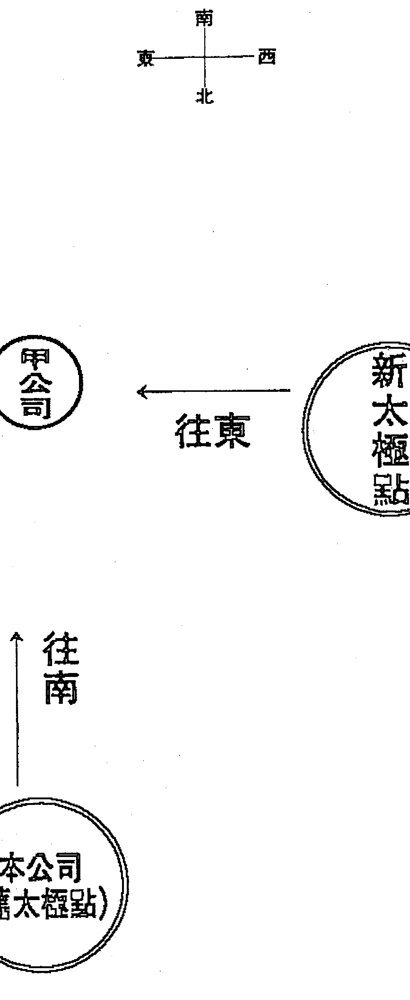
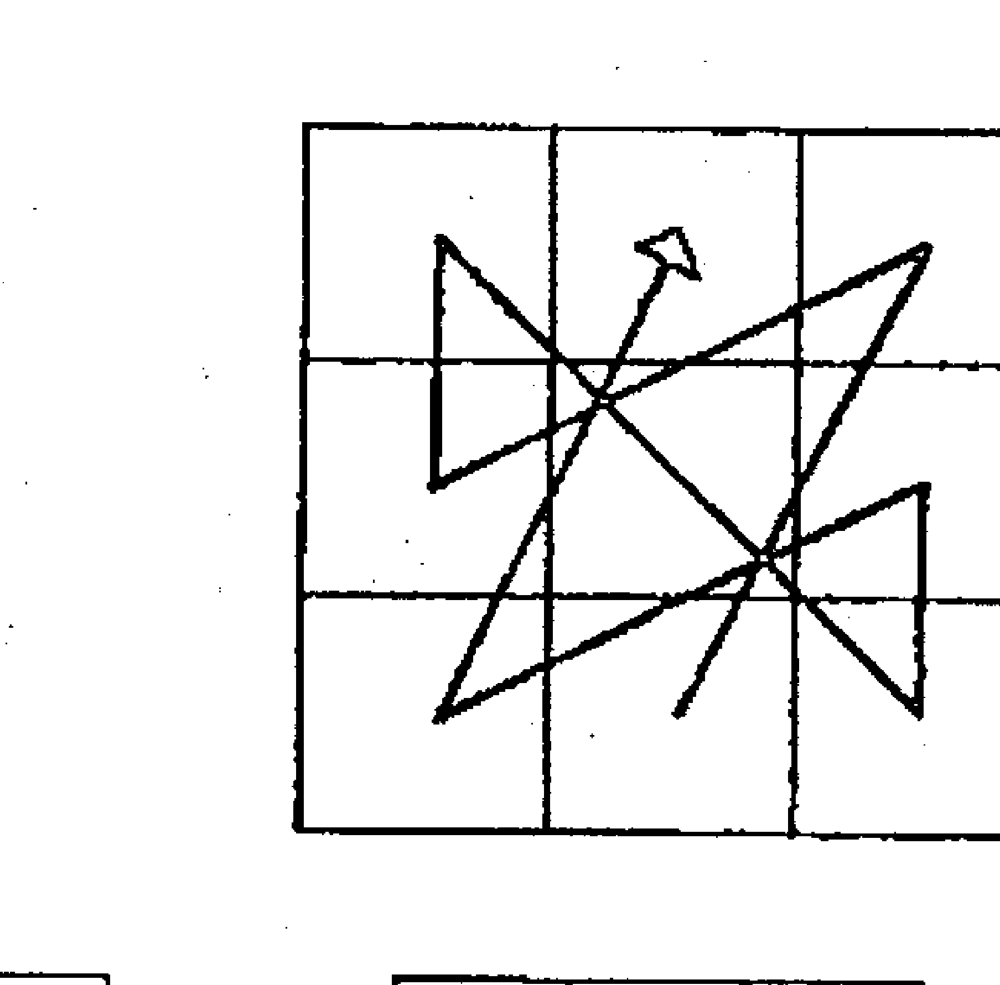
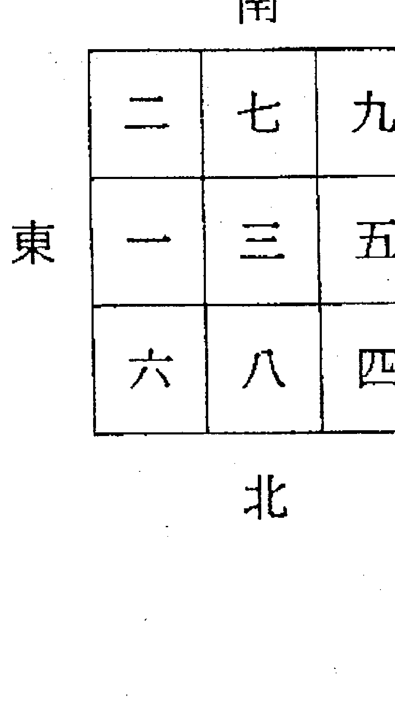
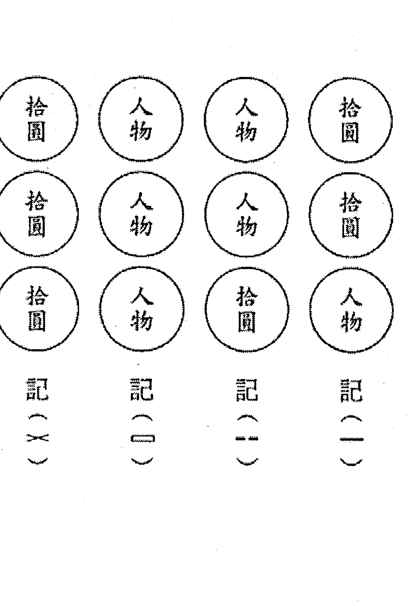

# 奇门遁甲制胜秘诀

## 前言

編寫這本書，主要是要讓讀者能夠運用奇門遁甲的功效，增強吾人的能量、氣勢、人緣。永遠將自己處於上風。比如遇到一個實力相當的競爭對手時，如果有一方懂得奇門遁甲，那麼這一方一定是個勝利者。本書即是欲告知讀者在極短時間內，就會翻閱選出奇遁之最佳時間、方位，利用「天時」、「地利」與人事上的努力，來達成您的願望！
在這競爭激烈的工商社會，人際複雜，吾人生存在這時代，要能脫穎而出，能稍有成就，除了本身的先天命運外，自己的努力也是相當重要。但有很多人經過努力後，卻懷才不遇、事倍功半、事與願違，機會總是擦身而過。或缺個臨門一腳的功夫，令人唏噓感嘆。
奇門遁甲，是後天造命之學，利用時間與空間的配合，能夠在極短暫時間，將我們的能力完全發揮出來，並操控場面——它不再是古老神秘之學。
在行銷學中，如何推銷自己，更是現代社會致勝的關鍵，例如在眾多面試者中，能獲得主考官青睞，臨場表現就很重要。行銷自己的方法有很多，但利用奇門遁甲無形的力量之法，則奧妙無窮。

大部分有關奇門遁甲之書，都艱澀難懂，不然就言之太玄，或偏重於軍隊作戰，或著重於占卜之道，令人望之生畏。本書的編寫方式，希望能讓讀者，輕易翻閱使用。將古老智慧之書——奇門遁甲，以淺顯易懂之白話說明，應用於日常生活中之活動事物。例如：

- 謁貴
- 上任
- 關說
- 談判
- 求財
- 推銷
- 借錢
- 索債
- 競技
- 上書
- 求職
- 面試
- 考試
- 約會
- 求婚
- 遠行
- 就醫等等。

本書可分兩個階段研習——

第一階段：為初習者如何查閱本書，就可以隨時隨地翻閱它，使用它的工具書。

第二階段：由符號篇起則適合有興趣深入研究其理論的讀者入門之啟迪。

這本書是伴您行遍天下的「人生最佳指南」！

### 快速使用本書說明

例如：用時為一九九八年陽曆6月6日下午六點，奇遁的最佳方位為何？

1. 步驟一：依照用時，查閱第114頁奇門時盤局數速見表。得知一九九八年陽曆6月6日為甲申日陽遁三局。
2. 步驟二：查閱日干推時干表（第44頁） 得知甲申日的下午六點為「癸酉」時。
3. 步驟三：查閱一千零八十盤（第153頁）找出陽三局的癸酉時之時盤。 得知為第一三〇圖之時盤。
4. 步驟四：由第一三〇圖有「☆」星星記號者，得知最佳方位為東北方。
5. 步驟五：依照陰陽遁及用時之日支，查閱陰陽遁時盤九宮起局表（第58頁）將用時的九宮排列出來，然後避開五黃煞、暗箭煞、本命煞及的煞。例如：陽遁甲申日的酉時為七入中宮，則飛宮五黃到東方，暗箭煞在西方。利用本书，只要熟练以上步骤，相信在一分钟内，就可以找出奇门遁甲时盘的最佳方位。将带给您一生受用无穷！

### 如何利用奇門吉位

1. 每天早上第一次出門，效果最強，盡量選擇吉方出門。自由業者可將上班時辰、吉方寫在日曆上，應用於出訪客戶或治事。上班族則在出門時，先到該時辰的吉方，至少離家一百公尺以上的地方停留一刻鐘以上後再往公司上班。經常為之，就可改變吾人之氣場、能量，增強我們的運氣。
2. 平常有早起運動習慣者，可利用奇門吉方到吉方去運動。增加旺氣。身體健康、氣勢興旺。
3. 如果欲去方位不是吉位，可提前半小時以上到達目的地，找出該時辰吉方的對宮處停留半小時以上。然後再往目的地治事。例如：今天十點要到達本公司南方的甲公司接洽業務，但該時辰的吉位是宜往东方。则吾人可事先到达甲公司的西方处一百公尺外暂时停留半个小时以上（时间愈长效果愈好），重新立一太极点，然后再往东方的甲公司，即是往吉方矣。
4. 奇门吉位，是以出发的时辰为准，至于到达的时间则比较无所谓。但总以在同一个时辰完成较佳。
5. 可利用城市地图，量出两地的正确方位。或以指南针来量方位亦可。
6. 所谓奇门吉位，是以欲前往之处的方位，行经路途转弯拐角则不论。或中途休息亦无妨，但不可中途到其他处办他事。不然，要重新以停留处立太极点，再择吉位。

### 【新舊太極點圖】

### 奇門遁甲致勝秘决

### 時空動力學——奇門遁甲

何謂「奇門遁甲」？若照字面來解釋，即為利用「三奇」與「八門」的優勢，發揮主動出擊的一門時間空間配合的學問。即吾人利用「天時」與「地利」，制敵於機先，誠所謂知「天時」而用「天時」，知「天機」而用「天機」，達到趨吉避凶的後天造命之學。
奇門遁甲一書乃是我國流傳下來的一部預測學的重要典籍，與「太乙神數」、「大六壬」，號稱三大奇書。「太乙神數」為觀歲運，演式須用天算，繁雜難以通貫，其道式微。「大六壬」以上占人事為主，古代也用於談兵謀略。而奇門遁甲自古列為帝王之學，非經允許私自學習者難逃問斬。古代奇門遁甲以占軍機、興王定霸，如得斯術可興兵叛變。戰必勝、攻必剋，不得不慎重之。
然而現今的戰爭已進入電子科技戰，不再是只有平面上的作戰。因此如再強調此術為萬能，則脫離時代背景的考量。再如奇門的剋應篇所述的現象，諸如「青衣人、戴笠人、牛」之類的事物，在今日社會環境不一定可以看到。如在大都市要看到一條牛在街道上走，是不太可能之事。所以，現代人研究奇門遁甲，應必先有這方面的認識。而應朝實用爲主，大致上應用在日常生活上，諸如某年某月某日某時要謀事是否吉凶，出門向哪一個方向爲吉利。像這種狹小的範圍就可以了。也不須要再注重古書上所列舉之繁冗細節，甚至配合符籙道具使用。如此一來便顯得呆板、不自然或迷信的感覺了。事實上，我們不應再視奇門遁甲為神秘之學，它應是我們日常生活中可隨時作爲參考的工具使用一般。可將它視爲一種時空動力學，即時間、方位、人事天地人三才之配合。換句話說就是吾人在謀事時能考慮到吉時，向好的方向去達成所願。這一套很簡單的理論，人人均可學習而且受用不盡。

### 奇門遁甲的來由：

相傳始於黃帝盛於漢代，古時，都用之於戰術。理論架構於河圖、洛書、八卦、八門、九星、天干、五行、節氣等。

### 認識奇門遁甲——神秘變簡易

「奇門遁甲」是為我國古代著名而源遠流長的一部學術專書。也是我們祖先遺留下來的一部相當重要的文化典籍。在古代亦稱為「帝王之學」，意謂這是一門神祕深奧的學問，一般百姓是不可學到，甚至學到它，招來殺身之禍。因為如此，所以民間流傳就很少。主要還是被歷代王室將之秘藏於庫。
奇門遁甲有法奇門和術奇門，相傳法奇門已經失傳。法奇門是為道家以符籙加之運用力，力量功用之大相當驚人，幾乎是可奪天地之造化，隨心所欲。在正式的史書記載，紀曉嵐的《閱微草堂》筆記中，提及法奇門傳至宋清遠而失傳了。或許民間還保有一部分也說不定。我們所要談的為術奇門。
奇門遁甲是古代高層次的預測學，在古代它在軍事上有重要的用途。為自古兵家必修之課，歷代政治家們亦常用它來幫助推測事物，判斷吉凶，尋找適當時機，如何反敗為勝等等，如漢代張良，三國時的諸葛亮，北宋吳用，明初劉伯溫等。所謂軍師輔臣皆需精通此術，作爲一門特殊的文化遺產。但它經過了千百年來的流傳、演變，本身難免被混淆曲解或篡改。當然，千百年來，這門學問也自然累積了不少前人觀測天文氣象、風雨雷電、時令變化及社會人事等方面的經驗。因此，今日要學奇門遁甲，首先就應該知道如何去偽存真，去粗存精，將荒誕無稽乃至太過繁雜的刪除。
目前，國外學者對奇門遁甲的研究日趨重視，不僅用於軍事、政治方面，而且推廣到經濟企業管理及市場預測等方面。爲了發揚中華文化，繼承前人的歷史遺產，我們更應該以科學的態度、嚴謹的治學精神來加以研究它，好讓它對我們人生有所助益。雖然時代背景不同，許多條件與情境亦非一樣，有些適用於古代的，不見得適用於今日社會。例如古代的戰爭均爲平面作戰，而今天的戰爭已是發展到立體戰爭、電子作戰了。若是 一成不變還是拿古代方法運之於現代作戰，豈不是會認爲奇門遁甲是騙術、不靈光。其實，奇門遁甲在現代的日常生活當中，還是相當有用的，舉凡商場上的談判，國際間的談判、調停，球場上的競技，考試，簽證，打牌，面試，求醫治病，相親，約會，談生意，索債，應酬，郊遊等等。都可以發揮意想不到的效果，如果知道運用它，您將是無往不利，所謂百戰百勝矣！
在所有的算命預測方法上，大都是建立在某種理論架構的命盤上，找出過去與未來的一生行運軌跡。也可說是一種命定論，頂多預測出凶險不利的事，但也無補於事。事情會發生的終究還是會發生。沒有辦法改變它，這是算命學的缺點。不得不藉用宗教心靈的修養，教人多作善事、積功德來化解可能會發生的凶事。除此之外，風水地理師就建議利用陽宅化氣或改變陰宅來改運，古人所謂：一、運，二、命，三、風水，四、積陰功，五、讀書及努力。由此可知，在改造命運方面，只有積陰功、住好風水、及努力打拼。無庸置疑，這些努力的確對改善命運應該有幫助，但總是有些緩不濟急，無法收到立竿見影之效。惟獨奇門遁甲可以辦得到，它的力量是可以馬上看到，而且運用起來更會讓人發現它的神奇。幾乎一切可以操之在我的感覺，所謂「知命用命」是也。習得此術，終生受益。也惟有它能最直接有效的改變吾人的命運。美好的明天，就操在自己的手中。奇門遁甲亦可說是一門電氣學的原理。人，本身是帶有磁電的物體，而宇宙時空也是有磁場效應。如何利用這種關係，進而增強本身的磁場，使自己利用最有利的時機與方位，達到預期的目的，效果又是驚人的。這就是這門學問神奇獨到的地方。簡單的說，奇門遁甲的效應，即在於如何「選吉辨位」及趨吉避凶的時空方位動力學。譬如，一位求職者要去參加面試。但這位求職者平常能力雖優秀，但拙於表達。這份工作又勢在必得，競爭者亦多，如何用奇門遁甲來達成願望呢？若能利用『選吉辨位』原理，在面試當天，選擇最有利的方向，從家裡出發。或者事先到達面試地點附近，挑選最有利於自己的方位，吸收該場所的磁場，然後再出發。如此一來，面試的主考官在當時對你的印象，特別有好感，也就是你當時身上的氣場能量特別強，對方比較能信服你。如此一來，你便順利獲得喜歡的工作，這豈不是對你的一生大有幫助嗎？這就是利用時空配合人力發揮宇宙無形的力量，奇門遁甲主要在創造獲勝的機率。再說，運用於男女約會、相親時，雙方見面談話都能比較和洽，互相欣賞。投緣者運用於求婚較易成功。但婚緣雖然有時要靠自己去創造，但也不可太勉強。若運用於商場上的談判、求生意，便可大大的幫助事業的拓展，利潤的創造，如虎添翼的效果。因為奇門遁甲能增加你談判的氣勢。若運用於球賽，當兩隊技術水準差不多時，懂得利用奇門遁甲應賽的一方，往往就是贏家。比賽的勝負，是榮耀的象徵，若是球隊的教練能習得此術，將可經常品嚐勝利的滋味。當然平時的努力訓練也是必需的。不管任何比賽，當兩隊勢均力敵時，懂得運用奇門遁甲的一方，往往就會勝利。
若運用於疾病就醫，平時不易找出的病因，便可覺得良醫診治。至少不會被誤診，醫師也會比較有耐心診斷病情。
若運於索債也較易成功，即使無法要回欠債，也不至於遭到欠債人的惡言相向。
運用賭博、打麻將等投機行為。也是有驚人效果。畢竟，投機行為不被鼓勵運用它。以上僅舉例運用於日常生活方面。精通此術者，除了適用於日常生活外，更高深及於政治、經濟、軍事等方面。
吾人強調「盡人事而聽天命」和「順理則吉」、「逆理則凶」，這兩條法則應當被視為使用預測學時必須遵循的兩大原則。在為一件事情已經盡了最大努力，仍然無進展，才能去尋求預測學來參考。否則就是愚蠢的人了。人事未盡而去「聽天命」也是消極的。
此外，「有理走遍天下，無理寸步難行」。因此，「順理」是非常重要的。
奇門遁甲預測學能增進我們辦事效用，所謂「知命而用命」功效非凡，千萬不可挾此術以害人，做一個「不學有術」之人，為害社會非淺，或走入魔道，不可不慎。也不可本身不努力而妄為強求也是惘然，吾人利用此術時應慎之，方能做到「己立而立人」、「己達而達人」。

### 奇門遁甲分成幾家

可分爲年家、月家、日家與時家，年家者著重年盤、月家者著重月盤，日家者重日盤、時家者著重時盤。因年盤、月盤與日盤古時候大都用於風水方面。聊備一格居多。真正能應用於今日的日常生活者，惟「時盤」效用最大。故本書只探討「時盤」爲主。因奇門遁甲的時效性比較低，而沒有持續性。所以只要能掌握活用「時盤」，必能在日常行事中助益無窮。在使用時盤前必先確定局數，奇門陰陽遁共十八局。定局是最重要關鍵，目前坊間奇門書有十時一局、有五日一局。然以五日一局應用上較準確。十時一局以數理邏輯並無錯誤，只是十時就要更局數不切實際。本書的時盤起局是採用五日爲一局之法。

### 奇門遁甲之源由

奇門遁甲的理論基礎是建立於易經八卦、河圖、洛書上，進一步綜合了星相曆法、天文地理、干支四柱、陰陽五行、四時五方、六壬七曜、八門九星等等，可謂是集古代預測學的大成。它是一個有豐富的綜合性信息庫，及深奧複雜的預測學。相傳源自黃帝命風后所創的，但並沒有依據可尋。我國歷代的風氣都喜歡「崇尚古制」，崇拜古代權威，而且越古越好，所以任何事情都假托給古人以增加它的威信和神秘感。因為古人知識與物質的貧乏，不能解釋神秘的自然現象，和把握自己的命運，於是便產生了「天命」的思想，認為至尊至大的「天」有萬不可抗拒的神奇力量，並主宰支配人世間的一切事物。因此，才會相傳它是神授的、黃帝、風后製作發明的。實際上，應該說奇門遁甲是源於周、發源於漢、興盛於南北朝。

## 符號篇

### 何謂「奇門六大要」

為了研究一門學問，首先必須要懂得其中的符號，方能入門研究。奇門遁甲亦然，它有六大要，即六個主要的符號。

- 一、八卦
- 二、八門
- 三、八神
- 四、九干
- 五、九星
- 六、九宮

奇門遁甲的「盤」製作，就是依據使用的時間，將六大符號排列組合起來，然後依其組合來分辨吉凶方位。茲簡述六大符號於後：奇門遁甲六大符號為：八卦、八門、八神、九干、九星、九宮（便捷記憶即三個「八」與三個「九」。茲分述於後：

### （一）、八卦：震卦、巽卦、離卦、坤卦、兌卦、乾卦、坎卦、艮卦。

本書所有的排盤，方位仍以南方為上，北方為下，東方為左，西方為右。主要是方便讀者參照古籍研讀之方便，實際應用時，還是以地球磁場的方位為準。（即指南針或羅盤的方位為準）

#### 後天八卦

| 巽 | 離 | 坤 |
|---|---|---|
| 震 |   | 兌 |
| 艮 | 坎 | 乾 |

### 八卦的五行：

| 卦名 | 五行 |
|---|---|
| 乾 | 金 |
| 兌 | 金 |
| 震 | 木 |
| 巽 | 木 |
| 坎 | 水 |
| 離 | 火 |
| 艮 | 土 |
| 坤 | 土 |

| 八門 | 五行 |
|------|------|
| 開門 | 金   |
| 休門 | 水   |
| 生門 | 土   |
| 傷門 | 木   |
| 杜門 | 木   |
| 景門 | 火   |
| 死門 | 土   |
| 驚門 | 金   |

#### 八門的五行

八門的五行乃依八卦的五行而定。

#### 八卦

| 東   |      | 西   |
|------|------|------|
| 杜   | 景   | 死   |
| 傷   |      | 驚   |
| 生   | 休   | 開   |

一般而言，吉門為開門、休門、生門、景門。凶門為傷門、杜門、死門、驚門。但使用奇門時，還是要依使用之用途來取捨該用何門。

### （二）、八門：開門、休門、生門、傷門、杜門、景門、死門、驚門。

### （三）、八神：直符、螣蛇、太陰、六合、勾陳、朱雀、九地、九天。

八神不依八卦論五行，另外，八神的排法為陽順陰逆而排，排盤時必須要特別留意。

| 八神 | 直符 | 螣蛇 | 太陰 | 六合 | 勾陳 | 朱雀 | 九地 | 九天 |
|---|---|---|---|---|---|---|---|---|
| 五行 | 土 | 火 | 金 | 木 | 金 | 水 | 土 | 金 |

一般而言，八神中之直符、太陰、六合、九地、九天為吉神，螣蛇、勾陳、朱雀為凶神。

（四）九干：即乙、丙、丁、戊、己、庚、辛、壬、癸（略去甲）。因「甲」为天尊，需要隐藏不现。九干中之乙为「日奇」，丙为「月奇」，丁为「星奇」，乙丙丁合称「三奇」，其他戊、己、庚、辛、壬、癸合称为「六仪」。

## 天干的五行

| 别称 | 天干 | 五行 |
| :--- | :--- | :--- |
| 天尊 | 甲 | 木 |
| 三奇 | 乙 | 木 |
| 三奇 | 丙 | 火 |
| 三奇 | 丁 | 火 |
| 六仪 | 戊 | 土 |
| 六仪 | 己 | 土 |
| 六仪 | 庚 | 金 |
| 六仪 | 辛 | 金 |
| 六仪 | 壬 | 水 |
| 六仪 | 癸 | 水 |

（五）九星：即天蓬、天任、天冲、天辅、天英、天芮、天柱、天心、天禽星。

| 五行 | 九星 |
| :--- | :--- |
| 水 | 天蓬 |
| 土 | 天任 |
| 木 | 天冲 |
| 木 | 天辅 |
| 火 | 天英 |
| 土 | 天芮 |
| 金 | 天柱 |
| 金 | 天心 |
| 土 | 天禽 |

## 地盤九星固定之位

|   | 南 |   |
| :--- | :--- | :--- |
| 辅 | 英 | 芮 |
| 冲 | 禽 | 柱 |
| 任 | 蓬 | 心 |

九星的五行乃依八卦宫位的五行而定。

一般而言，九星之中，天辅星、天心星、天任星、天冲星、天禽星为吉星。天蓬星、天芮星、天柱星、天英星为凶星。

## 洛書九宮圖

|   | 南 |   |
| :--- | :--- | :--- |
| 四 | 九 | 二 |
| 三 | 五 | 七 |
| 八 | 一 | 六 |

（六）九宫：即洛书之九宫排列为坎一、坤二、震三、巽四、中五、乾六、兑七、艮八、离九。只要记住以上数序，使用就很方便。

## 九宮飛泊法

一般而言，九宫中之五黄最凶，称五黄煞。九宫的五行依八卦宫位五行而定：

| 4 木 | 9 火 | 2 土 |
| :--- | :--- | :--- |
| 3 木 | 5 土 | 7 金 |
| 8 土 | 1 水 | 6 金 |

即一白为水，二黑为土，三碧为木，四绿为木，五黄为土，六白为金，七赤为金，八白为土，九紫为火。

## 九宮飛泊路線圖

| 2 | 7 | 9 |
| :--- | :--- | :--- |
| 1 | 3 | 5 |
| 6 | 8 | 4 |

| 1 | 6 | 8 |
| :--- | :--- | :--- |
| 9 | 2 | 4 |
| 5 | 7 | 3 |

| 9 | 5 | 7 |
| :--- | :--- | :--- |
| 8 | 1 | 3 |
| 4 | 6 | 2 |

| 5 | 1 | 3 |
| :--- | :--- | :--- |
| 4 | 6 | 8 |
| 9 | 2 | 7 |

| 4 | 9 | 2 |
| :--- | :--- | :--- |
| 3 | 5 | 7 |
| 8 | 1 | 6 |

| 3 | 8 | 1 |
| :--- | :--- | :--- |
| 2 | 4 | 6 |
| 7 | 9 | 5 |

| 8 | 4 | 6 |
| :--- | :--- | :--- |
| 7 | 9 | 2 |
| 3 | 5 | 1 |

| 7 | 3 | 5 |
| :--- | :--- | :--- |
| 6 | 8 | 1 |
| 2 | 4 | 9 |

| 6 | 2 | 4 |
| :--- | :--- | :--- |
| 5 | 7 | 9 |
| 1 | 3 | 8 |

奇门遁甲有天、地盘之分，地盘是固定不变的，如前述六大要的排列，而天盘是依不同时间，而有不同的排列组合。认识以上六种符号，然后方能入门研究。奇门遁甲分三大步骤，第一为「起局」，其其次是「排盘」，第三是「解盘」。第一步骤的「起局」最为关键，起局若是起错局数，则「排盘」与「盘解」便无意义了。张良把「冬至」后的十二气分为三十六候形成「阳遁」九局，把「夏至」后的十二气分为三十六候，形成「阴遁」九局，每一局数有六十时，一共是一千零八十局。起局的最关键处，完全决定于「超接置闰」。不明此者，布局错误，吉凶自然不验。至于「排盘」方法大致相同，少数争执点在以顺时钟排盘，或以九宫飞泊法排盘。第三步骤的「解盘」，古书上所书的吉凶及克应，最大疑惑，在于今人无法亦无暇去一一验证。许多克应现象，因时代背景不同，按理而言，也该有所差异。还好，大致上，吉凶判断上不致有太大问题。也就不需太在意于克应现象。

## 起局篇

### 何谓符头日

符头日即是甲子日、甲午日、己卯日、己酉日四日称之。因为奇门起局，是以符头日为基准标的日。如同部队之标兵为符号标准的道理相同。学习奇门起局之前，应先认识这四个符头日。

## 奇门用时之起局（时盘之起局法）

以最靠近冬至的符头日（即甲子日、甲午日、己卯日、己酉日）不论在冬至之前或冬至之后，都一律为阳一局开始，每五日换一局。因一个节气有15天，五天分为一元则15天分为三元，故冬至的上元五天为阳一局，接着为冬至中元的五天为阳七局，下元的五天为阳四局。然后接小寒节气的三元分别为阳二、阳九、阳六局。（换局之日一定为甲日或己日）。同样地，以最靠近夏至的符头日起阴九局为上元五天，接着五日为中元阴三局，下元五日为阴六局，然后才接小暑的三元。兹列表于后，以便于起局对照。

## 阳遁时盘起局表

| 节气 | 芒种 | 小满 | 立夏 | 谷雨 | 清明 | 春分 | 惊蛰 | 雨水 | 立春 | 大寒 | 小寒 | 冬至 |
| :--- | :--- | :--- | :--- | :--- | :--- | :--- | :--- | :--- | :--- | :--- | :--- | :--- |
| 上元 | 6 | 5 | 4 | 5 | 4 | 3 | 1 | 9 | 8 | 3 | 2 | 1 |
| 中元 | 3 | 2 | 1 | 2 | 1 | 9 | 7 | 6 | 5 | 9 | 8 | 7 |
| 下元 | 9 | 8 | 7 | 8 | 7 | 6 | 4 | 3 | 2 | 6 | 5 | 4 |

## 阴遁时盘起局表

| 节气 | 大雪 | 小雪 | 立冬 | 霜降 | 寒露 | 秋分 | 白露 | 处暑 | 立秋 | 大暑 | 小暑 | 夏至 |
| :--- | :--- | :--- | :--- | :--- | :--- | :--- | :--- | :--- | :--- | :--- | :--- | :--- |
| 上元 | 4 | 5 | 6 | 5 | 6 | 7 | 9 | 1 | 2 | 7 | 8 | 9 |
| 中元 | 7 | 8 | 9 | 8 | 9 | 1 | 3 | 4 | 5 | 1 | 2 | 3 |
| 下元 | 1 | 2 | 3 | 2 | 3 | 4 | 6 | 7 | 8 | 4 | 5 | 6 |

## 二十四节气配八卦起局数图解

二十四节气配八卦起局数图解表格：
第一组：芒种、小满、立夏 | 夏至、小暑、大暑 | 立秋、处暑、白露
数字行：
六 五 四 | 九 八 七 | 二 一 九
三 二 一 | 三 二 一 | 五 四 三
九 八 七 | 六 五 四 | 八 七 六

第二组：谷雨、清明、春分 | （空白） | 秋分、寒露、露降
数字行：
五 四 三 | | 七 六 五
二 一 九 | | 一 九 八
八 七 六 | | 四 三 二

第三组：惊蛰、雨水、立春 | 大寒、小寒、冬至 | 立冬、小雪、大雪
数字行：
一 九 八 | 三 二 一 | 六 五 四
七 六 五 | 九 八 七 | 九 八 七
四 三 二 | 六 五 四 | 三 二 一

注：阳遁局数以国字表示。阴遁局数以阿拉伯数字示。

说明：一卦管三个节气，八卦正好管廿四节气。由于「两至还乡一、九宫」，冬至后阳气生，故为阳遁一局始，夏至阴气生，故为阴遁九局始。因阳顺阴逆的道理，属于阳遁的节气为顺布，如冬至上元为阳一局，冬至后之节气小寒上元为阳二局，小寒后之节气大寒的上元为阳三局。夏至后的节气为阴遁，故夏至上元起阴遁九局，小暑起阴遁八局，大暑起阴遁七局。再者，因每隔五日共60个时辰换局数，故如冬至上元五天为阳一局后，中元五天一定是阳七局，下元五天一定为阳四局。因为九宫之数为一到九，如从「一」为上元的局数开始算，顺数六位（二、三、四、五、六），便是「七」为中元局数，再从「七」顺数六位（八、九、一、二、三），便是「四」为下元的局数。阴遁则逆数便是。例如：一九九七年七月一日的时盘为阴遁或阳遁几局？首先查当年的农民历或万年历，查出该年的夏至在六月廿一日，是日为甲午日正是符头日，故从六月廿一日至六月廿五日的五天，时盘起局用夏至上元阴九局，从六月廿六日至六月卅日的五天，时盘起局用夏至中元阴三局，从七月一日至七月五日的五天，时盘起局用夏至下元阴六局。由以上可知，七月一日的时盘为阴遁六局。

## 千古不传之秘——超接置闰要诀

奇门遁甲之起局最为重要，如起局错误，则失之毫厘，差之千里，反而可能会弄巧成拙，得到反效果。时盘的起局，容易算错之处，在于「置闰」，若该年需要置闰，而忘记置闰，则全盘皆错。可见置闰的重要性。但一般而言，学习奇门遁甲者，能懂得置闰之诀窍者，则不多。作者不吝将其置闰「心」法公开，期使有心研究奇门遁甲者，不至浪费太多精力于「置闰」的关卡上，并能正确的布局。事实上，只要有此「心法」诀窍，置闰起局的问题是轻而易解的，奇门起局不再是件难事。盼习得斯诀者，宜珍惜之。欲了解「置闰」之前，先要知道何谓「正授」、「超神」、与「接气」。奇门的起局，先由正授起始，超神继之，超神太多天之后，继之置闰，置闰之后，接气继之。接气之后，复为正授。如此周而复始的循环布局。

正授者 即冬至或夏至的日干支为四个符头日（甲子、甲午、己卯、己酉）之一。称之正授。例如民国86年的夏至为六月廿一日，是日的日干支为甲午日，吾人便称民国86年的夏至为正授。

超神者 是指该节气的上元起始日在该节气日之前。例如民国86年七月六日为小暑上元阴八局始，然而七月七日方为小暑的节气日，吾人称之为超神。（超神一天）

接气者 和超神相反，即该节气的上元起始日在该节气日之后，换言之，节气日先到，而该节气的上元起始日后到。例如民国86年六月六日为芒种的上元阳六局始，而前一天六月五日为芒种的节气日，即接气一天。

置闰者 乃为了避免超神太多天，变得节气日落后节气上元的起始日，而给其置闰来改善之。其道理和一般的闰月相同。因为奇门阴阳遁共十八局，而一年是三百六十五天，无法整除之。所以有置闰的必要。这也是宇宙运行之理，因不能整除，方有畸零之余数，使得宇宙生生不息，即「天长地久无时尽」。

置闰要诀：为比较最靠近冬至与夏至的符头日之日干来决定是否要置闰。如果最靠近两至的符头日日干相同者，不用置闰。反之，如果符头日的日干不同时，则该冬至之前的节气大雪要再闰一次大雪，或夏至之前的芒种节气要再闰芒种一次。奇门置闰的节气只有芒种或大雪，其余节气则不可置闰。因奇门起局总以冬夏两至为界。

### 举例说明

例如民国86年最靠近夏至的符头日为「甲」午日（也是正授）。同年最靠近冬至的十二月十六日的符头日为「甲」午日。因为两至的符头日干均为「甲」，故民国86年的冬至之前的节气不需置闰。再继续比较民国87年的近夏至符头日亦为「甲」午日，所以也不需置闰芒种之节气，再继续比较民国87年的冬至之最近的符头日，为十二月廿八日（「己」酉日），因为与夏至的符头日日干不相同。所以民国87年的冬至前之节气大雪必须要置闰。即十二月廿八日往前的十五天为闰大雪三元。而十二月十三日往前十五天为原来大雪三元。

*以上即是奇门置闰之心法，也是起局之关键。这是作者研究多年之经验要诀，简单、易懂，又不易混淆。识者应视如宝方是。

兹列出民国87至100年（西元一九九八～二〇一一年），必须置闰之年，方便读者对照研习。并提醒自己在时盘起局时要特别留意。

- 民国八十七年（西元一九九八）闰大雪三元。
- 民国九十年（西元二〇〇一）闰大雪三元。
- 民国九十三年（西元二〇〇四）闰大雪三元。
- 民国九十六年（西元二〇〇七）闰芒种三元。
- 民国九十九年（西元二〇一〇）闰芒种三元。

## 推时之法（日干起时干支表）

| 时辰 | 戊癸 | 丁壬 | 丙辛 | 乙庚 | 甲己 | 时间范围 |
| :--- | :--- | :--- | :--- | :--- | :--- | :--- |
| 子时 | 壬子 | 庚子 | 戊子 | 丙子 | 甲子 | 23-1 |
| 丑时 | 癸丑 | 辛丑 | 己丑 | 丁丑 | 乙丑 | 1-3 |
| 寅时 | 甲寅 | 壬寅 | 庚寅 | 戊寅 | 丙寅 | 3-5 |
| 卯时 | 乙卯 | 癸卯 | 辛卯 | 己卯 | 丁卯 | 5-7 |
| 辰时 | 丙辰 | 甲辰 | 壬辰 | 庚辰 | 戊辰 | 7-9 |
| 巳时 | 丁巳 | 乙巳 | 癸巳 | 辛巳 | 己巳 | 9-11 |
| 午时 | 戊午 | 丙午 | 甲午 | 壬午 | 庚午 | 11-13 |
| 未时 | 己未 | 丁未 | 乙未 | 癸未 | 辛未 | 13-15 |
| 申时 | 庚申 | 戊申 | 丙申 | 甲申 | 壬申 | 15-17 |
| 酉时 | 辛酉 | 己酉 | 丁酉 | 乙酉 | 癸酉 | 17-19 |
| 戌时 | 壬戌 | 庚戌 | 戊戌 | 丙戌 | 甲戌 | 19-21 |
| 亥时 | 癸亥 | 辛亥 | 己亥 | 丁亥 | 乙亥 | 21-23 |

例如：民国八十七年正月廿八日（农历正月初一）早上八点的时干为何？首先查出该日的日干支为乙亥日，由日干「乙」对照前面推时之表，得知早上八点为「庚辰」时。

## 排盘篇

## 奇门遁甲天地盘的制作

由起局法知道为阴遁几局或阳遁几局之后，便须将其天地盘制作出来，亦是将奇门的六大符号依照排盘法排出来。本书附录之一千零八十八个盘就是依此公式排出来的。读者有兴趣也研玩其排盘法，若无暇者，只要学会如何按表查盘取用即可。第一步骤：定地盘奇仪依照局数的决定，将「戊」置于该宫，而后依洛书飞宫的次序将「己」、「庚」、「辛」、「壬」、「癸」、「丁」、「丙」、「乙」的顺序，阳遁顺排，阴遁逆排，布入盘中。兹将地盘阴阳共十八局的奇仪列表于后：

### 阳七局

| 丁 | 庚 | 壬 |
| :--- | :--- | :--- |
| 癸 | 丙 | 戊 |
| 己 | 辛 | 乙 |

### 阳四局

| 戊 | 癸 | 丙 |
| :--- | :--- | :--- |
| 乙 | 己 | 辛 |
| 壬 | 丁 | 庚 |

### 阳一局

| 辛 | 乙 | 己 |
| :--- | :--- | :--- |
| 庚 | 壬 | 丁 |
| 丙 | 戊 | 癸 |

### 阳八局

| 癸 | 己 | 辛 |
| :--- | :--- | :--- |
| 壬 | 丁 | 乙 |
| 戊 | 庚 | 丙 |

### 阳五局

| 乙 | 壬 | 丁 |
| :--- | :--- | :--- |
| 丙 | 戊 | 庚 |
| 辛 | 癸 | 己 |

### 阳二局

| 庚 | 丙 | 戊 |
| :--- | :--- | :--- |
| 己 | 辛 | 癸 |
| 丁 | 乙 | 壬 |

### 阳九局

| 壬 | 戊 | 庚 |
| :--- | :--- | :--- |
| 辛 | 癸 | 丙 |
| 乙 | 己 | 丁 |

### 阳六局

| 丙 | 辛 | 癸 |
| :--- | :--- | :--- |
| 丁 | 乙 | 己 |
| 庚 | 壬 | 戊 |

### 阳三局

| 己 | 丁 | 乙 |
| :--- | :--- | :--- |
| 戊 | 庚 | 壬 |
| 癸 | 丙 | 辛 |

### 阴七局
| 辛 | 丙 | 癸 |
| :--- | :--- | :--- |
| 壬 | 庚 | 戊 |
| 乙 | 丁 | 己 |

### 阴四局
| 戊 | 壬 | 庚 |
| :--- | :--- | :--- |
| 己 | 乙 | 丁 |
| 癸 | 辛 | 丙 |

### 阴一局
| 丁 | 己 | 乙 |
| :--- | :--- | :--- |
| 丙 | 癸 | 辛 |
| 庚 | 戊 | 壬 |

### 阴八局
| 壬 | 乙 | 丁 |
| :--- | :--- | :--- |
| 癸 | 辛 | 己 |
| 戊 | 丙 | 庚 |

### 阴五局
| 己 | 癸 | 辛 |
| :--- | :--- | :--- |
| 庚 | 戊 | 丙 |
| 丁 | 壬 | 乙 |

### 阴二局
| 丙 | 庚 | 戊 |
| :--- | :--- | :--- |
| 乙 | 丁 | 壬 |
| 辛 | 己 | 癸 |

### 阴九局
| 癸 | 戊 | 丙 |
| :--- | :--- | :--- |
| 丁 | 壬 | 庚 |
| 己 | 乙 | 辛 |

### 阴六局
| 庚 | 丁 | 壬 |
| :--- | :--- | :--- |
| 辛 | 己 | 乙 |
| 丙 | 癸 | 戊 |

### 阴三局
| 乙 | 辛 | 己 |
| :--- | :--- | :--- |
| 戊 | 丙 | 癸 |
| 壬 | 庚 | 丁 |

## 定天盘奇仪

(1) 由「用时」找出「旬首」。（查阅旬首表）

(2) 将地盘「旬首」置于地盘「用时」之上，而后依顺时钟方向依序将其他奇仪布入盘中。

(3) 「旬首」入中宫，则以「坤宫」加于「用时」，余同。

(4) 「用时」入中宫，则以「旬首」加于「坤宫」，余同。

(5) 「旬首」与「用时」同一字，或同时入中宫，或「用时」逢甲，用旬首代替甲，则皆为重干（伏吟）。

(6) 将旬首还元为甲，方便断吉凶。

### 何谓旬首

六十甲子分为六旬，每一旬有十个干支，吾人将六仪（戊、己、庚、辛、壬、癸）分别做为每一旬的旬首代替甲，因奇门遁甲之「甲」为天尊，要隐藏不现，故以六仪来替代之，旬首表——

| 用时 | 甲子 | 甲戌 | 甲申 | 甲午 | 甲辰 | 甲寅 |
| :--- | :--- | :--- | :--- | :--- | :--- | :--- |
| | 乙丑 | 乙亥 | 乙酉 | 乙未 | 乙巳 | 乙卯 |
| | 丙寅 | 丙子 | 丙戌 | 丙申 | 丙午 | 丙辰 |
| | 丁卯 | 丁丑 | 丁亥 | 丁酉 | 丁未 | 丁巳 |
| | 戊辰 | 戊寅 | 戊子 | 戊戌 | 戊申 | 戊午 |
| | 己巳 | 己卯 | 己丑 | 己亥 | 己酉 | 己未 |
| | 庚午 | 庚辰 | 庚寅 | 庚子 | 庚戌 | 庚申 |
| | 辛未 | 辛巳 | 辛卯 | 辛丑 | 辛亥 | 辛酉 |
| | 壬申 | 壬午 | 壬辰 | 壬寅 | 壬子 | 壬戌 |
| | 癸酉 | 癸未 | 癸巳 | 癸卯 | 癸丑 | 癸亥 |
| 旬首 | 戊 | 己 | 庚 | 辛 | 壬 | 癸 |例如，用时、西元一九九七年九月十六日（辛酉日）丁酉时
依起局表得知一九九七年九月十六日为阴遁六局
由旬首表查知用时「丁酉」时，其旬首为「辛」。

注：
一、圈△为用时（丁）
二、依辛、庚、丁、壬、乙、戊、癸、丙顺时钟之序排天盘奇仪。
三、将旬首还原为甲（旬首辛即是甲）

## （步骤一）
阴六局地盘奇仪

| 庚 | 丁(△) | 壬 |
| :---: | :---: | :---: |
| 辛(○) | 己 | 乙 |
| 丙 | 癸 | 戊 |

## （步骤二）
旬首加在用时之上

| 丙庚 | 辛(○)△ | 庚壬 |
| :---: | :---: | :---: |
| 癸辛(○) | 己 | 丁乙 |
| 戊丙 | 乙癸 | 壬戊 |

## （步骤三）

| 丙庚 | 甲(○)丁 | 庚壬 |
| :---: | :---: | :---: |
| 癸甲(○) |  | 丁乙 |
| 戊丙 | 乙癸 | 壬戊 |

## 定八门

- (1) 地盘「旬首」所在之宫，该宫地盘固定之门，即为「直使」。
- (2) 由地盘「旬首」所在之宫，阳顺阴逆由甲数至「用时」，即为天盘「直使」所在之宫，而后依八门之序，将其余之门，布入盘中。
- (3) 地盘「旬首」入中宫，以「坤宫」死门为直使，而从中宫数起，余同。
- (4) 天盘「直使」入中宫，则寄「坤宫」，余同。
- (5) 用时逢甲、癸，则八门为伏吟（与地盘八门位置同）

依前之例，阴六局，用时丁酉，旬首为辛，排八门之前先找出直使：

| 4 杜 | 9 景 | 2 死 |
| 3 伤 | 5 | 7 惊 |
| 8 生 | 1 休 | 6 开 |

参考图
(地盘八门)

### 阴六局

| 庚 | △ | 壬 |
|---|---|---|
| 辛 | 己 | 乙 |
| 丙 | 癸 | 戊 |

地盘旬首「辛」所在之宫，该宫地盘八门为「伤门」，故直使为「伤门」。

旬首「辛」所在的宫位当「甲」逆数到用时「丁」时，即为天盘直使（伤门）所在之宫：

| 旬首所在之宫 | 用时 |
|---|---|
| 3 | 甲 |
| 2 | 乙 |
| 1 | 丙 |
| 9 | … |
| … | … |

| 杜 | 伤 | 生 |
| 景 | | 休 |
| 死 | 惊 | 开 |

由右表知道天盘直使（伤门）落于九离卦之位，然后排天盘「直使」及其余之门。

## 定九星

- (1) 地盘「旬首」所在之宫，该宫地盘固定之星，即为「大值符」。
- (2) 将「大值符」加于地盘「用时」之宫，即为天盘「大值符」，而后依顺时钟方向将其余之星，布入盘中。
- (3) 天禽星永远和天芮星同宫。
再依前例阴六局，用时丁酉，旬首为辛

### 地盘九星

| 芮 | 英 | 辅 |
| :---: | :---: | :---: |
| 柱 | 禽 | 冲 |
| 心 | 蓬 | 任 |

### 阴六局

| 庚 | 丁 | 壬 |
| :---: | :---: | :---: |
| 辛 | 己 | 乙 |
| 丙 | 癸 | 戊 |

## 排天盘九星：

- (1) 找出「大值符」地盘旬首「辛」所在之宫，该宫地盘固定之星为「天冲星」即为大值符。
- (2) 将大值符「天冲星」加于用时「丁」上，即为天盘之大值符，而后排其余之星

### 天盘九星

| | | |
| --- | --- | --- |
| 任 | 冲 | 辅 |
| 蓬 | | 英 |
| 心 | 柱 | 禽芮 |

将大值符「天冲星」加于用时「丁」上，即为天盘之大值符，而后排其余之星

## 定八神

- (1) 八神之直符，直接加于天盘之「大值符」之宫。(即直符永远和大值符在一起)
- (2) 然后依「符、蛇、阴、合、陈、雀、地、天」顺序，阳顺阴逆布入盘中。

依前例：阴六局，用时丁酉、旬首「辛」。

排法：因「大值符」星为天冲星落在离宫，所以八神之直符也在离宫，然后依逆时钟方向（因是阴遁）将其余之神布入盘中。

### 天盘八神

| | 符「冲」 | |
|---|---|---|
| 蛇 | | 天 |
| 阴 | | 地 |
| 合 | 陈 | 雀 |

## 定九宫

| 日支 | 时支 | 子午卯酉日 | 辰戌丑未日 | 寅申巳亥日 |
| :--- | :--- | :--- | :--- | :--- |
| 子 | 子 | 九 | 六 | 三 |
| 丑 | 丑 | 八 | 五 | 二 |
| 寅 | 寅 | 七 | 四 | 一 |
| 卯 | 卯 | 六 | 三 | 九 |
| 辰 | 辰 | 五 | 二 | 八 |
| 巳 | 巳 | 四 | 一 | 七 |
| 午 | 午 | 三 | 九 | 六 |
| 未 | 未 | 二 | 八 | 五 |
| 申 | 申 | 一 | 七 | 四 |
| 酉 | 酉 | 九 | 六 | 三 |
| 戌 | 戌 | 八 | 五 | 二 |
| 亥 | 亥 | 七 | 四 | 一 |

(1) 阳遁子午卯酉日，子时中宫为一，辰戌丑未日子时为四，寅申巳亥日子时为七，每时进一位，顺推。
阴遁子午卯酉日子时为九，辰戌丑未日子时为六，寅申巳亥日子时为三，每时退一位，逆推。
列表如下：
阴遁时盘九宫起局表

(2) 中宫求出后，依地盘九宫原来顺序，由中宫开始依洛书之序布其余之宫。
依前面之例：阴遁六局，用时为辛酉日的丁酉时，则查阴遁时盘九宫起局表，得知九入中宫。
然后就可依洛书之序，将九宫排列出来。

| 日支组\时支 | 子 | 丑 | 寅 | 卯 | 辰 | 巳 | 午 | 未 | 申 | 酉 | 戌 | 亥 |
|-------------|----|----|----|----|----|----|----|----|----|----|----|----|
| 子午卯酉 | 一 | 二 | 三 | 四 | 五 | 六 | 七 | 八 | 九 | 一 | 二 | 三 |
| 丑未辰戌 | 四 | 五 | 六 | 七 | 八 | 九 | 一 | 二 | 三 | 四 | 五 | 六 |
| 寅申巳亥 | 七 | 八 | 九 | 一 | 二 | 三 | 四 | 五 | 六 | 七 | 八 | 九 |

| 8 | 4 | 6 |
|---|---|---|
| 7 | 9 | 2 |
| 3 | 5 | 1 |

| 4 | 9 | 2 |
|---|---|---|
| 3 | 5 | 7 |
| 8 | 1 | 6 |

将前述各步骤综合起来，即是一完整的奇门遁甲盘的制作如下：用时：一九九七年国历九月十六日（辛酉日）的酉时

| 生任 蛇8 丙庚 | 伤冲 符4 甲丁 | 杜辅 天6 庚壬 |
|---|---|---|
| 休蓬 阴7 癸甲 | 9 己 | 景英 地2 丁乙 |
| 开心 合3 戊丙 | 惊柱 陈5 乙癸 | 死芮 雀1 壬戊 |

## 简易查表法

一、起局：查民国八十六年九月十六日的时盘得知为阴六局

二、由五鼠遁表查知辛酉日的酉时为丁酉时

三、查一千零八十盘的阴六局、丁酉时为第八百七十四图

四、吉门之方位为正东、正西、东北。

验证第八百七十四图和前面依排盘公式所排出之盘是否相同。

## 解盘篇

## 论八门

奇门遁甲以九星象天，八门象人，九宫象地。由此可知应用于人事上者以八门最为首要。一般而言，八门中之开门、休门、生门、景门为吉，如再配吉格则优先取用。其余之门则应用于特定之用途，兹简述八门之应用。

**开门：** 宜谒贵、谋利、买卖、征战、球赛、竞技、上任。

**休门：** 宜求职、到任、见贵、谈判、和解、关说、婚娶、谋事、托人、求情、约会、分手、辞职。

**生门：** 宜求财、生意、借钱、嫁娶、球赛、开拓市场、探病、手术、生产。

奇门格局的吉凶，是根据三奇、六仪、八门、九星、八神、九宫，其卦位五行之间

## 奇门吉格与凶格

- 伤门：宜索债、钓鱼、狩猎、博戏、还钱、离婚、断交、打官司。
- 杜门：宜藏匿、逃逸、跑路、逃难、躲避、捕盗、隐居、幽会、密谋。
- 景门：宜考试、面试、献策、公文、执照、应酬、签约、报案、求婚、演讲、购物。
- 死门：宜出殡、打猎、送丧、吊丧、行刑、不宜远行。
- 惊门：宜捉贼、捉逃犯、威吓、捉奸、捉逃家之人、赌博。

出门办事，最好能选择有吉门方位，再加上有吉天干，大致而言，就是可以用的方位，如果能再加上吉神、吉星则吉上加吉。如果遇到凶神、凶星，也只是美中瑕疵而已。最怕是凶门再遇上凶干、凶神、凶星则凶上加凶，应避而不用。如果用特殊用途必须使用凶门（杜、伤、死、惊门）时，最好能配合吉干使用，否则，凶门遇凶干使用起来，可能任务达成，但反而有副作用产生。

的生、克、制化关系，所综合判断总结出来的结果。基本上，能称得上名称的「吉格」者，优先考虑选用。同时，避开所谓的「凶格」。奇门的格局大约有四十种之多，因有些定义不一，见解不同，兹列出比较灵验之格局如后，供读者参考。

### 【吉格】

- 青云返首：即天盘甲加地盘丙，但旬首甲以甲子、甲戌为限（即用时为丙寅、丙子时）
- 飞鸟跌穴：即天盘丙加甲，仍以旬首甲子、甲戌为限。
- 玉女守门：即天盘直使加在地盘星奇丁之上。
- 日奇得使：即天盘乙加地盘己。
- 月奇得使：即天盘丙加地盘戊。
- 星奇得使：即天盘丁加在地盘壬。
- 龙遁：即天盘乙、休门临「坎宫」。
- 虎遁：即天盘乙、休门临「艮宫」。

### 【凶格】

- 云遁：即天盘乙、开门临「坤宫」。
- 地遁：即天盘乙和开门加地盘己。
- 人遁：即天盘丁和休门以及太阴同在一宫。
- 青龙逃走：即天盘乙加地盘辛。
- 朱雀投江：即天盘丁加地盘癸。
- 荧惑入白：即天盘丙加地盘庚。
- 腾蛇天矫：即天盘癸加地盘丁。
- 白虎猖狂：即天盘辛加地盘乙。
- 太白入火：即天盘庚加地盘丙。
- 大格：即天盘庚加地盘癸。
- 小格：即天盘庚加地盘壬。
- 刑格：即天盘庚加地盘己。
- 年格：即天盘庚加地盘年干。
- 月格：即天盘庚加地盘月干。

## 八门吉凶诀

- 日格：即天盘庚加地盘日干。
- 时格：即天盘庚加在地盘时干。
- 飞干格：即天盘日干加地盘庚。
- 伏干格：与「日格」同论。
- 飞宫：即天盘甲加地盘庚。
- 伏宫：即天盘庚加地盘甲。

休门——一气盈室，富贵子孙田土吉。
祭祀修营入它基，赴官迁徙事周悉。
产招难绝入兴隆，北旺冬时数六一。
南北婚娶有远亲，送来六畜增官秩。

生门八八气盈星，凶煞皆降尊土精。
因待女财人寄物，从兹致富子孙兴。
三年定有贵儿产，出入外州泉货盈。

嫁娶种萌并造作，消灾发福有奇灵。

伤门气短数三三，寅卯旺方音角间。
渔猎捕征侵索债，更宜赌博迫亡还。
官司口舌重丧至，六畜遭瘟火盗艰。
夫妇血光灾眼症，三旬产厄祸刀残。
刑名死以兼风疾，蛇虎伤人居不安。

杜门四四星凶恶，木星时方寅卯泊。
闭提绝对事封陪，追邪代盗并勾捉。
出亡逃离断欲宜，隐伏邀遮俱可托。
去佞远藏理闭藏，生克绝阴能久约。
用动似防盗贼侵，官刑财散伤瘟疫。
蛇伤雷打疥浓疮，焚疠人亡家退落。

景门九九紫气盈，巳午旺南寅戌结。
遣使上书能解厄，求谋修造访寻谒。
葬埋嫁娶吉中斗，给赏吏人如手捉。

死门二二凶星逆，戊己坤艮方位即。穿猎渔网刑戮宜，送丧吊死葬埋盆。
修营妨长及平房，忤逆重丧亡产憾。所求不利不宜行，动见败亡官落职。

惊门七七气为逆，旺在庚申辛酉地。罗网张疑立狱讼，攻门刑击一齐到。
逃亡掩捕得功能，贾市营修皆可忌。
致讼虚惊疾疫兴，败囚军贼犬羊毙。

开门六六气营奇，谒贵求谋利有为。
立宅扦修官职进，外来财帛马牛肥。
蜂蜜窖浩横财发，富盛子孙利名齐。
金上庚辛秋月旺，奴田畜产贾商宜。

## 天地盘奇仪相加吉凶表

| 吉凶 | 描述 |
| :--- | :--- |
| 吉 | 甲加甲为双木成林，正直威严，荣华富贵。 |
| 吉 | 甲加乙为藤萝纡木，贵人提拔，后山有靠。 |
| 吉 | 甲加丙为青龙返首，化凶为吉，动作大利。 |
| 吉 | 甲加丁为乾柴烈火，渴贵必遂，一拍即合。 |
| 凶 | 甲加戊为秃山孤木，孤立无援，寡不敌众。 |
| 吉 | 甲加己为根制松土，共协互惠，欣欣向荣。 |
| 凶 | 甲加庚为飞宫砍伐，树倒猴散，连根拔起。 |
| 凶 | 甲加辛为木棍碎瓦，不利攸往，静吉动凶。 |
| 凶 | 甲加壬为只帆漂洋，有去无归，流浪天涯。 |
| 吉 | 甲加癸为树根露水，同性相辅，化险为夷。 |
| 吉 | 乙加甲为锦上添花，吉上加吉，庆上加庆。 |
| 吉 | 丙加丁为三奇顺遂，贵人吉利，常人平静。 |
| 凶 | 丙加丙为伏吟洪光，有勇无谋，破耗损失。 |
| 吉 | 丙加乙为艳阳丽花，公私皆吉，内外均利。 |
| 吉 | 丙加甲为飞鸟跌穴，谋为洞澈，不劳而获。 |
| 吉 | 乙加癸为绿野朝露，遁迹修道，匿藏形。 |
| 吉 | 乙加壬为荷叶莲花，男游天下，女归侯门。 |
| 凶 | 乙加辛为青龙逃走，奴仆拐带，六畜皆伤。 |
| 凶 | 乙加庚为日奇披刑，争讼财产，夫妻怀私。 |
| 吉 | 乙加己为日奇得使，以一当十，以柔制刚。 |
| 吉 | 乙加戊为鲜花名瓶，游山玩水，婚姻大吉。 |
| 吉 | 乙加丁为三奇相佐，文书事吉，百事可为。 |
| 吉 | 乙加丙为三奇顺遂，迁官进职，夫妻分离。 |
| 凶 | 乙加乙为伏吟杂草，不宜进取，只可安分。 |
| 吉 | 丙加戊为月奇得使，有力有谋，有利有益。 |
| 吉 | 丙加己为大地普照，吉门大吉，凶门不凶。 |
| 凶 | 丙加庚为荧惑入白，门户破败，盗贼遁逃。 |
| 吉 | 丙加辛为日月相会，谋事成就，病人不凶。 |
| 凶 | 丙加壬为江晖相映，虽有大利，是非颇多。 |
| 凶 | 丙加癸为黑云遮日，阴人害事，灾祸频生。 |
| 吉 | 丁加甲为青龙转光，官人升迁，常人威昌。 |
| 吉 | 丁加乙为烧田种作，加官进禄，加田进宅。 |
| 吉 | 丁加丙为嫦娥奔月，越级高升，乐极生悲。 |
| 凶 | 丁加丁为伏吟失位，不宜进取，静吉动凶。 |
| 吉 | 丁加戊为有火有炉，平安福寿，巧夺天工。 |
| 凶 | 丁加己为星坠勾陈，奸私仇冤，事因女人。 |
| 吉 | 丁加庚为火炼真金，文书畅通，行人必归。 |
| 凶 | 丁加辛为烧毁珠玉，常人蒙冤，官人失位。 |
| 吉 | 丁加壬为星奇得使，贵人恩诏，讼狱公平。 |
| 凶 | 丁加癸为朱雀投江，文书有误，诉讼必败。 |
| 凶 | 戊加甲为巨石压木，不平难伸，理直讼屈。 |
| 凶 | 戊加乙为青龙合灵，门吉大吉，门凶平常。 |
| 吉 | 戊加丙为日出东山，初难后易，前苦后甘。 |
| 吉 | 戊加丁为火烧赤壁，以少胜多，以寡敌众。 |
| 凶 | 戊加戊为伏吟峻山，凡事闭塞，静守为吉。 |
| 凶 | 戊加己为物以类聚，好逸恶劳，坐食山空。 |
| 凶 | 戊加庚为助纣为虐，吉事不吉，凶事更凶。 |
| 凶 | 戊加辛为反吟泄气，招灾失败，十事九败。 |
| 吉 | 戊加壬为山明水秀，有勇有谋，迎刃而解。 |
| 凶 | 戊加癸为岩石浸蚀，门吉不吉，门凶招凶。 |
| 凶 | 己加甲为永不发芽，太公招亲，剪刀铁扫。 |
| 吉 | 己加乙为柔情蜜意，郎才女貌，海誓山盟。 |
| 凶 | 己加丙为火孛地户，阳人相害，阴人淫污。 |
| 凶 | 己加丁为朱雀入墓，文状词讼，先曲后直。 |
| 吉 | 己加戊为犬遇青龙，谋望遂意，上人见喜。 |
| 凶 | 己加己为伏吟软弱，百事不遂，病者必死。 |
| 凶 | 己加庚为颠倒刑利，词讼谋害，活鬼缠身。 |
| 凶 | 己加辛为湿泥污玉，失足一瞬，悔恨千年。 |
| 凶 | 己加壬为反吟浊水，狡童佚失，奸情伤杀。 |
| 凶 | 己加癸为地刑玄武，好事必止，病人必死。 |
| 凶 | 庚加甲为伏宫摧残，官吏失位，商贾失败。 |
| 吉 | 庚加乙为太白逢星，退吉进凶，动咎静安。 |
| 凶 | 庚加丙为太白入荧，占贼必来，为主破财。 |
| 吉 | 庚加丁为亭亭之格，门吉则吉，门凶则凶。 |
| 凶 | 庚加戊为有炉无火，顽铁不炼，难成大器。 |
| 凶 | 庚加己为官符刑格，溺色堕落，犯刑入牢。 |
| 凶 | 庚加庚为伏吟战格，官灾横祸，兄弟雷攻。 |
| 凶 | 庚加辛为铁银碎五，车折马死，不可远行。 |
| 凶 | 庚加壬为耗散小格，迷失道路，音信嗟呀。 |
| 凶 | 庚加癸为反吟大格，伤灾崩溃，如铁生锈。 |
| 凶 | 辛加甲为月下松影，终南无径，怀才不遇。 |
| 凶 | 辛加乙为白虎猖狂，人亡家败，远行多殃。 |
| 吉 | 辛加丙为干合孛师，虽有大利，因财致讼。 |
| 吉 | 辛加丁为狱神得奇，经商倍利，囚人逢杀。 |
| 凶 | 辛加戊为反吟被伤，官司破财，妄动祸殃。 |
| 凶 | 辛加己为入狱自刑，奴仆背主，诉讼难伸。 |
| 凶 | 壬加壬为伏吟地纲，外人缠绕，内事索索。 |
| 吉 | 壬加辛为淘洗珠玉，刑狱公平，立剖邪正。 |
| 凶 | 壬加庚为腾蛇相缠，纵得吉门，亦不能安。 |
| 凶 | 壬加己为反吟泥浆，大祸将至，诉讼理曲。 |
| 吉 | 壬加戊为小蛇化龙，男人发达，女坐金舆。 |
| 吉 | 壬加丁为干合星奇，文书顺利，贵人扶持。 |
| 凶 | 壬加丙为日落西海，回光返照，为期不远。 |
| 凶 | 壬加乙为逐水桃花，男人轻薄，女人淫荡。 |
| 凶 | 壬加甲为浪中孤舟，内外危险，速决为佳。 |
| 凶 | 辛加癸为天牢华盖，误入天网，动止乖张。 |
| 凶 | 辛加壬为寒塘月影，表实内虚，徒有其名。 |
| 凶 | 辛加辛为伏吟相克，公废私就，自罹罪名。 |
| 凶 | 癸加癸为伏吟天罗，行人失件，病讼皆伤。 |
| 凶 | 癸加壬为冲天奔地，嫁娶重婚，急进误事。 |
| 凶 | 癸加辛为阳衰阴盛，占病占讼，死罪莫逃。 |
| 凶 | 癸加庚为反吟浸白，顽铁不炼，不能成钢。 |
| 凶 | 癸加己为华盖地户，银信皆阻，男女不安。 |
| 吉 | 癸加戊为天乙会合，财喜婚姻，吉人赞可。 |
| 凶 | 癸加丁为螣蛇妖矫，文书官司，火焚莫逃。 |
| 吉 | 癸加丙为华盖孛师，贵人禄位，常人平安。 |
| 凶 | 癸加乙为梨花春雨，劳燕分飞，各据一方。 |
| 吉 | 癸加甲为杨柳甘露，困时得助，险时有救。 |
| 凶 | 壬加癸为幼女奸淫，家有丑声，反福为祸。 |

## 論九星吉凶

論九星吉凶時，宜再考慮九星之旺衰，如歌訣云：「旺相休囚看輕重，與我同行即為旺，我生之月誠為相，廢於父母休於財，囚於鬼兮真不安。」茲將九星之亮度列表於後：

| 月份 | 旺 | 相 | 死 | 囚 | 休 |
| :--- | :--- | :--- | :--- | :--- | :--- |
| 春 (寅卯) | 冲輔 | 英 | 任芮禽 | 柱心 | 蓬 |
| 夏 (巳午) | 英 | 任芮禽 | 柱心 | 蓬 | 冲輔 |
| 四季 (丑辰未戌) | 任芮禽 | 柱心 | 蓬 | 冲輔 | 英 |
| 秋 (申酉) | 柱心 | 蓬 | 冲輔 | 英 | 任芮禽 |
| 冬 (亥子) | 蓬 | 冲輔 | 英 | 任芮禽 | 柱心 |

## 九星吉凶訣

- 天蓬主事巽秋冬，用訟安邊春夏功。
- 嫁娶俱亡移徙火，入官險道門逢凶。
- 商賈埋葬居行否，相會奇門略少通。
- 天芮授道結交宜，作事征行不必為。
- 盜賊憂驚傷小口，災刑因事被官羈。
- 春夏秋冬有吉凶，若得奇門福不虧。
- 天沖報怨趁春溫，萬里威風膽氣雄。
- 不利秋冬春夏勝，商賈行徒入宮迍。
- 造葬修方娶產難，須知萬物來逢春。
- 天輔修身利造營，征贏春夏地門平。
- 罪刑此出逢天赦，遠出居官功亦成。
- 嫁娶多兒增利市，謁求移徙卻無情。
- 天禽中主四時通，硬沖堅大有奇功。
- 宜用智謀機括伏，祭神感應上官亨。
- 商賈嫁娶行修造，奇門加到盡亨通。
- 天心星機神道輝，求仙合藥百為宜。
- 入宮嫁娶及移徙，造葬征行祭祀時。
- 泰在秋冬春夏日，利加君子小人危。
- 天柱山方修造良，祀神嫁娶亦生光。
- 藏刑謹守斯為美，移征征行卻受殃。
- 營謀不善如輕動，安行相交主中傷。
- 天任之宿屬星儀，百事求謀利四時。
- 造葬入官並請謁，行商娶祀吉遷移。
- 主邊更喜氣神旺，來發機緣客已危。
- 天英之宿是天衙，遠行飲宴樂愉愉。
- 出入葬埋宜嫁娶，徙宮築室祀商違。
- 主勿慎勿輕加宿，彼若未攻自取危。

## 論八神吉凶

八神之直符即為值日之星宿，可視爲值星官，行使元首之權，亦可視爲「天乙貴人」之尊，故直符最爲吉。經云：「急從神兮緩從門」，即是當時時間急迫，又找不到吉門、三奇吉格可用時，吾人可權變一時，選「直符」所在之宮位用之。但若能再搭配吉門則更吉。否則儘量少用。其餘，太陰、六合、九地、九天亦爲吉。騰蛇勾陳、朱雀則爲凶。

## 九宫之吉凶

奇門九宮取象「地」，即空間、方位，九宮數字可以代表距離之里程數或行步數故亦稱爲方位學，此乃依時盤陰陽遁取中宮之數後，循洛書飛宮之法佈局。其中飛宮五所在的位置稱爲「五黄煞」爲最凶，其對宮稱爲「暗箭煞」次凶。例如：若「三」入中宫則「五」黃飛到「兌」宮是為五黃煞，其對宮「震」宮為暗箭煞。圖示如後。

同一個奇門吉位，對每一個人不一定為吉，這是必然的，否則，每天往相同方向的人，運氣不見得相同，所以必須要再考慮個人的八字、行運喜忌，如能配合起來使用，則如虎添翼，事半功倍。但如不懂八字喜忌，至少也要懂得自己的命卦，將命卦配合奇門遁甲來使用，則可增加致勝的生機。

## 認識自己的本命卦

### 一坎命卦
- 男性·民國7、16、25、34、43、52、61、70、79、88、97年生
- 女性·民國3、12、21、30、39、48、57、66、75、84、93年生

### 二坤命卦
- 男性·民國3、6、12、15、21、24、30、33、39、42、48、51、57、60、66、69年生

### 三震命卦
- 女性·民國4、13、22、31、40、49、58、67、76、85、94年生

### 四巽命卦
- 男性·民國5、14、23、32、41、50、59、68、77、86、95年生
- 女性·民國5、14、23、32、41、50、59、68、77、86、95年生

### 六乾命卦
- 男性年份：4, 13, 22, 31, 40, 49, 58, 67, 76, 85, 94
- 女性年份：6, 15, 24, 33, 42, 51, 60, 69, 78, 87, 96

### 七兌命卦
- 男性年份：2, 11, 20, 29, 38, 47, 56, 65, 74, 83, 92
- 女性年份：8, 17, 26, 35, 44, 53, 62, 71, 80, 89, 98

### 八艮命卦
- 男性年份：9, 18, 27, 36, 45, 54, 63, 72, 81, 90, 99
- 女性年份：1, 10, 19, 28, 37, 46, 55, 64, 73, 82, 91

### 九離命卦
- 男性年份：8, 17, 26, 35, 44, 53, 62, 71, 80, 89, 98
- 女性年份：2, 11, 20, 29, 38, 47, 56, 65, 74, 83, 92

## 避開自己的本命煞與的煞

本命煞者，即九宮飛星所到自己命卦之位。例如民國五十年生之男性的本命卦為三震卦，如果「二」入中宮之用時，九宮飛星「三」到乾位，則乾位即為其本命煞，其對宮巽位即為其「的煞」。

| 八 | 六 | 一 |
|---|---|---|
| 四 | 二 | 九 |
| 三 | 七 | 五 |

註：三震命的人在用時的九宮為「一」時，其本命煞在乾位，的煞在巽位

## 奇門凶時——五不遇時

所謂五不遇時，即是時干比剋日干，例如，甲日遇到庚午時，因時干為「庚」屬陽金，日干為「甲」屬陽木，陽金剋陽木是為比剋。比剋者，即陽剋陽，或陰剋陰。日干為君，時干為臣，時干剋日干，是為臣犯君，代表君臣不和，故五不遇時為凶時，縱有奇門吉格，也不宜用之。

五不遇時表
| 日干 | 時干 |
|------|------|
| 甲 | 庚 |
| 乙 | 辛 |
| 丙 | 壬 |
| 丁 | 癸 |
| 戊 | 甲 |
| 己 | 乙 |
| 庚 | 丙 |
| 辛 | 丁 |
| 壬 | 戊 |
| 癸 | 己 |

## 玉女守门时

玉女守门，是奇门吉格之一，适宜应酬、约会、求婚及男女阴私和合之事。但在六十甲子中，只有六个时辰会有玉女守门的格局出现，即用时为乙卯、己卯、丙午、庚午、戊子、丁酉时。以上六个用时，吾人可善加利用。但宜分辨真假玉女守门时，若与五不遇时抵触，则舍而不用。例如甲日的庚午时为五不遇时，虽有玉女守门的格局出现，也是不用它为是。

## 何谓「三奇入墓」

三奇入墓时，吉方的力量无法充分发挥出来。三奇入墓有两种情形：

(1) 為時干入墓，即用時為乙未時、丙戌時、丁丑時稱之。

(2) 天盤三奇（乙、丙、丁）入墓，即天盤乙奇在坤宮（西南位）、丙奇在乾位（西北位）、丁奇在艮位（東北位）稱之天盤三奇入墓，雖是三奇，力量發揮不出去。列表於後：

天盤之三奇入墓
| | 乙 |
|---|---|
| 丁 | 丙 |

## 何謂反吟、伏吟

反吟者，即天盤八門的位置與地盤固定八門的位置於對沖的位置。例如：天盤開門在巽宮，即與地盤開門在乾宮對沖，是爲門的反吟。九星也有反吟，其理相同。茲以圖示天盤八門與天盤九星反吟之宮位。

| 天心 | 天蓬 | 天任 |
|---|---|---|
| 天柱 | | 天冲 |
| 天芮 | 天英 | 天辅 |

| 开门 | 休门 | 生门 |
|---|---|---|
| 惊门 | | 伤门 |
| 死门 | 景门 | 杜门 |

伏吟者，即天盤的八門位置和地盤八門位置相同，稱之「八門伏吟」。九星伏吟亦同。原則上，星門反吟與伏吟，動如不動，因為力量無法充分發揮出來，故宜靜不宜動。

## 何謂門迫與宮迫

所謂門迫，即天盤之八門五行臨於其所剋之宮位，例如：開門五行屬金，如天盤之開門落居「震」、「巽」之宮，因震、巽五行屬木。金剋木，謂之門迫。亦即是門的五行剋宮位的五行是也。茲分別列出天盤八門所臨宮位之門迫圖。

## 門迫圖

| 開門或驚門 | 休門 | 傷門或杜門 |
| 開門或驚門 | | 景門 |
| 傷門或杜門 | 生門或死門 | 景門 |

## 宮迫圖

宮迫：即宮位的五行剋八門的五行。例如，開門五行為金，如居「離」位，因離位五行為火，火剋金，即為宮迫。如果吉門受剋則不吉，凶門受剋則更凶。所以門迫或宮迫皆不吉。

| 生门 或 死门 | 开门 或 惊门 | 休门 |
| :--- | :--- | :--- |
| 生门 或 死门 | | 伤门 或 杜门 |
| 休门 | 景门 | 伤门 或 杜门 |

## 何謂「六儀擊刑」

六儀擊刑為凶格之一，一般而言，宜避之不用。甲「子」旬的旬首為戊，但「子」與「卯」相刑，故如果「戊」在「卯」宮（震位）則稱為六儀擊刑。其他甲「戊」旬的句首為己，因戌與「未」相刑害，如「己」在未宮（坤位）亦為六儀擊刑。甲申旬的庚、甲午旬的辛、甲辰旬的壬，甲寅旬的癸，其理相同。茲列表於後：

天盤六儀擊刑位置圖

| 己 | 辛 | 壬癸 |
|---|---|---|
| 戊 | | |
| 庚 | | |

八卦二十四山

| 巳巽辰 | 丙午丁 | 未坤申 |
|---|---|---|
| 乙卯甲 | | 庚酉辛 |
| 寅艮丑 | 癸子壬 | 戌乾亥 |

## 何謂「坐孤擊虛」

坐孤擊虛的力量無窮，可以一當十，所謂孤者即空亡也，虛者即空亡之對宮。
依六十甲子干支來找出空亡。

- 甲子旬的空亡（孤）為「戌、亥」，其對宮為「虚」即「辰、巳」，
- 甲戌旬之孤為「申、酉」，虛為「寅、卯」。
- 甲申旬之孤為「午、未」，虛為「子、丑」。
- 甲午旬之孤為「辰、巳」，虛為「戌、亥」。
- 甲辰旬之孤為「寅、卯」，虛為「申、酉」。
- 甲寅旬之孤為「子、丑」，虛為「午、未」。

## 六十甲子孤虛之表

| 六十甲子 (用時) | 甲子 | 甲戌 | 甲申 | 甲午 | 甲辰 | 甲寅 |
|----------------|------|------|------|------|------|------|
| | 甲子 | 甲戌 | 甲申 | 甲午 | 甲辰 | 甲寅 |
| | 乙丑 | 乙亥 | 乙酉 | 乙未 | 乙巳 | 乙卯 |
| | 丙寅 | 丙子 | 丙戌 | 丙申 | 丙午 | 丙辰 |
| | 丁卯 | 丁丑 | 丁亥 | 丁酉 | 丁未 | 丁巳 |
| | 戊辰 | 戊寅 | 戊子 | 戊戌 | 戊申 | 戊午 |
| | 己巳 | 己卯 | 己丑 | 己亥 | 己酉 | 己未 |
| | 庚午 | 庚辰 | 庚寅 | 庚子 | 庚戌 | 庚申 |
| | 辛未 | 辛巳 | 辛卯 | 辛丑 | 辛亥 | 辛酉 |
| | 壬申 | 壬午 | 壬辰 | 壬寅 | 壬子 | 壬戌 |
| | 癸酉 | 癸未 | 癸巳 | 癸卯 | 癸丑 | 癸亥 |
| (空亡)孤 | 子丑 | 寅卯 | 辰巳 | 午未 | 申酉 | 戌亥 |
| 虚 | 午未 | 申酉 | 戌亥 | 子丑 | 寅卯 | 辰巳 |

例如：用時為「丙午」，查前面孤虛之表，得知「孤」為「寅卯」，虛為「申酉」。所以坐孤擊虛，即坐寅卯（東方）向申酉（西方）。

> 古書黃石公曰：「背孤擊虛，一女可敵十人，古法十人、用時孤，百人日孤、千人月孤、萬人用年孤、惟時孤最驗。」

孤虛之用法，有以年月日時之前一位為其孤，對沖之為虛。如子年亥為孤、巳為虛。
- 丑月子為孤、午為虛。
- 寅日丑為孤，未為虛等。

另法是以六甲之旬空取孤虛，例如，如用時為「丙午」時，因丙午屬於甲辰旬，然而甲辰旬的空亡為「寅卯」，即為其孤，對沖之「申酉」為其虛。

## 日盘的使用

一般而言，奇门的日盘，较少使用。因其机动性差，瞬间的暴发力不够。但日盘也有一些优点，它的稳定性及时效性稍长。日盘使用时比较简单，只考虑当日的吉门与死门即可，宜往吉门行，不可往死门走。尤其要远行、出国当日不可往死门方去。使用日盘时，只要知道当日之日干支，然后查阅第95页之日盘万年吉凶速查表，即为当日之吉门与死门方。如果有下列情况时，也可考虑以日盘使用：

(1) 遇到五不遇时。
(2) 时盘没有奇门吉格可用之时。
(3) 平常在办公室上班之上班族每天第一次出门。
(4) 到很远的地方办事。
(5) 到同一个地方要办很多样事，及办很久的时间。

## 奇門遁甲陽遁日盤萬年吉門與凶門速查表

| 酉癸 | 申壬 | 未辛 | 午庚 | 巳己 | 辰戊 | 卯丁 | 寅丙 | 丑乙 | 子甲 | 日 |
|---|---|---|---|---|---|---|---|---|---|---|
| 南東 | 東正 | 南東 | 東正 | 北正 | 南西 | 北正 | 北正 | 北東 | 北東 | 門吉 |
| 北正 | 北西 | 北西 | 東西 | 東正 | 東正 | 東正 | 南西 | 南西 | 南西 | 門死 |
| 未癸 | 午壬 | 巳辛 | 辰庚 | 卯己 | 戊寅 | 丑丁 | 子丙 | 亥乙 | 戌甲 | 日 |
| 北東 | 北東 | 西正 | 北西 | 西正 | 北正 | 北正 | 北正 | 南正 | 南正 | 門吉 |
| 西正 | 西正 | 南東 | 南東 | 南東 | 南正 | 南正 | 南正 | 北正 | 北正 | 門死 |
| 巳癸 | 辰壬 | 卯辛 | 寅庚 | 丑己 | 子戊 | 亥丁 | 戌丙 | 酉乙 | 申甲 | 日 |
| 南正 | 南正 | 西正 | 北西 | 北西 | 北正 | 南正 | 南西 | 南正 | 北正 | 門吉 |
| 東正 | 東正 | 東正 | 南西 | 南西 | 南西 | 東北 | 北東 | 北東 | 西正 | 門死 |
| 卯癸 | 寅壬 | 辛丑 | 子庚 | 亥己 | 戊戌 | 酉丁 | 丙申 | 未乙 | 午甲 | 日 |
| 南西 | 北正 | 西正 | 北西 | 東正 | 南東 | 南正 | 南東 | 東正 | 北東 | 門吉 |
| 南東 | 南正 | 南正 | 南正 | 北正 | 北正 | 北正 | 北西 | 北西 | 北西 | 門死 |
| 丑癸 | 子壬 | 亥辛 | 戌庚 | 酉己 | 戊申 | 未丁 | 午丙 | 巳乙 | 辰甲 | 日 |
| 北正 | 北正 | 南正 | 南正 | 南東 | 東正 | 北東 | 北正 | 南西 | 西正 | 門吉 |
| 南西 | 南西 | 北東 | 東北 | 北東 | 西正 | 西正 | 西正 | 南東 | 南東 | 門死 |
| 亥癸 | 戌壬 | 酉辛 | 庚申 | 未己 | 戊午 | 巳丁 | 辰丙 | 卯乙 | 甲寅 | 日 |
| 南東 | 東正 | 南東 | 北東 | 北東 | 南東 | 西正 | 南西 | 西正 | 北東 | 門吉 |
| 北正 | 北正 | 北正 | 北西 | 北西 | 北西 | 東正 | 東正 | 東正 | 南西 | 門死 |

## 奇門遁甲陰遁日盤萬年吉門與凶門速查表

| 酉癸 | 申壬 | 未辛 | 午庚 | 巳己 | 辰戊 | 卯丁 | 寅丙 | 丑乙 | 子甲 | 日 |
| :---: | :---: | :---: | :---: | :---: | :---: | :---: | :---: | :---: | :---: | :---: |
| 北西 | 北西 | 北西 | 西正 | 北正 | 北東 | 北正 | 南西 | 南西 | 南西 | 門吉 |
| 南正 | 南東 | 南東 | 南東 | 西正 | 西正 | 西正 | 北東 | 北東 | 北東 | 門死 |
| 未癸 | 午壬 | 巳辛 | 辰庚 | 卯己 | 戊寅 | 丑丁 | 子丙 | 亥乙 | 戌甲 | 日 |
| 西正 | 南西 | 東正 | 南東 | 東正 | 南正 | 南正 | 南正 | 北正 | 北正 | 門吉 |
| 東正 | 東正 | 北西 | 北西 | 西北 | 北正 | 北正 | 北正 | 南正 | 南正 | 門死 |
| 巳癸 | 辰壬 | 卯辛 | 寅庚 | 丑己 | 子戊 | 亥丁 | 戌丙 | 酉乙 | 甲申 | 日 |
| 北正 | 北正 | 東正 | 南東 | 南東 | 南正 | 北正 | 北東 | 北正 | 南正 | 門吉 |
| 西正 | 西正 | 西正 | 北東 | 北東 | 北東 | 西南 | 南西 | 南西 | 東正 | 門死 |
| 卯癸 | 寅壬 | 丑辛 | 子庚 | 亥己 | 戌戊 | 酉丁 | 申丙 | 未乙 | 午甲 | 日 |
| 北東 | 南東 | 東正 | 南東 | 西正 | 北西 | 西正 | 北西 | 西正 | 北西 | 門吉 |
| 北西 | 北正 | 北正 | 北正 | 南正 | 正南 | 南正 | 南東 | 南東 | 南東 | 門死 |
| 丑癸 | 子壬 | 亥辛 | 戌庚 | 己酉 | 申戊 | 未丁 | 午丙 | 巳乙 | 辰甲 | 日 |
| 南正 | 南正 | 北正 | 北正 | 北西 | 西正 | 西正 | 西正 | 東正 | 北東 | 門吉 |
| 北東 | 北東 | 南西 | 南西 | 南西 | 東正 | 東正 | 東正 | 北西 | 北西 | 門死 |
| 亥癸 | 戌壬 | 酉辛 | 申庚 | 未己 | 午戊 | 巳丁 | 辰丙 | 卯乙 | 寅甲 | 日 |
| 北西 | 西正 | 北正 | 南西 | 南西 | 北西 | 東正 | 北東 | 東正 | 南西 | 門吉 |
| 南正 | 南正 | 南正 | 南東 | 南東 | 南東 | 西正 | 西正 | 西正 | 北東 | 門死 |

## 煙波釣叟奇門歌訣

陰陽順逆妙難窮，二至還鄉一九宮。
若能了達陰陽理，天地都來一掌中。
軒轅黃帝戰蚩尤，涿鹿經今苦未休。
偶夢天神授符訣，登壇致祭謹虔誠。
神龍負圖出洛水，彩鳳唧書碧雲裡。
因命風后演成文，遁甲奇門從此始。
一千八十當時制，太公刪成七十二。
逮於漢代張子房，一十八局為精藝。
先須掌上排九宮，縱橫十五在其中。
神將八卦輪八節，一氣統三為正宗。
陰陽二遁分順逆，一氣三元人莫測。
五日都來換一元，接氣超神為準的。
認取九宮為九星，八門又遂九星行。

## 奇門遁甲致勝秘訣

九宮逢甲為直符，八門直使自分明。
符上之門為直使，十時一位堪憑據。
直符常遣加時干，直使須遁宮去。
六甲元號六儀名，三奇即是乙丙丁。
陽遁順儀奇逆布，陰遁逆儀奇順行。
吉門偶爾合三奇，直此雖云百事宜。
更合從傍加簡點，餘宮不可有微疵。
三奇得使誠堪取，六甲遇之非小補。
乙逢犬馬丙鼠猴，六丁玉女騎龍虎。
又有三奇遊六儀，號為玉女守門扉。
若作陰私和合事，問君但向此中推。
天三門兮四地戶，問君此法如何處。
太沖小吉與從魁，這是天門私出路。
地戶除危定與開，舉事皆從此中去。
六合太陰太常君，三辰元是地私門。
更得奇門相照耀，出門百事總欣欣。

太衝天馬最為貴，卒然有准宜迴避。
但當乘取天馬行，劍戟如山不足畏。
三為生氣五為死，勝在三難難逃五。
能識遊三避五時，造化真機須記取。
就中伏吟為最凶，天蓬加着地天蓬。
天蓬若到天英上，須知即是反吟宮。
八門返復皆如此，生在生門死在死。
縱令吉宿得奇門，萬事皆凶不壞使。
六儀擊刑何太凶，甲子直符愁向東。
成刑在未申刑虎，寅巳辰辰午刑午。
三奇入墓好思推，甲日那堪見未宮。
丙奇屬火火墓戌，此時諸事不須為。
更兼六乙來臨二，月奇臨六亦同論。
又有時墓入墓宮，得中時下忌相逢。

戊辰壬辰兼丙戌，癸未丁丑一同凶。
五不遇時龍不精，號爲日月損光明。
時干來尅日干上，甲日須知時忌庚。
奇與門兮共太陰，三般難得總加臨。
若還得二亦爲吉，舉措行藏必遂心。
更得直符直使利，兵家用事最爲貴。
管從此地擊其衝，百戰百勝君須記。
天乙之神所在宮，大將宜居擊對衝。
歲令直符居離九，天英坐取擊天蓬。
甲乙丙丁戊陽時，神居天上要君知。
坐擊須憑天上奇，陰時地下亦如之。
若見三奇在五陽，偏宜爲客自高強。
忽然逢着五陰位，又宜爲主好裁詳。
直符前三位六合位，太陰之神在前二。
後一宮中爲九天，後二之神爲九地。

九天之上好揚兵，九地潛藏好立營。
伏兵但向太陰位，若逢六合利逃形。
天地人分三遁名，天遁月精華蓋臨。
地遁日精紫雲蔽，人遁當知是太陰。
生門六丙合六丁，此為天遁自分明。
開門六乙合六己，地遁如斯而已矣。
休門六丁共太陰，欲求人遁無過此。
要知三遁何所宜，藏形遁跡斯為美。
丙為生門臨九地，神遁畫地佈蒔元。
乙與開門臨九地，鬼遁偷營劫寨美。
休門合乙臨坎鄉，龍遁浮江水戰強。
生門合辛臨艮山，虎遁潛機把隘關。
六乙生門臨六辛，靈雲掩蔽默通神。
六乙休門臨六辛，順風喜悅事皆新。
庚為太白丙熒惑，庚丙相加誰會得。

六庚加丙兮白入荧，六丙加庚荧入白。
白入荧兮贼即来，荧入白兮贼须灭。
丙为勃兮庚为格，格则不通勃乱逆。
丙加天乙为直符，天乙加丙为飞勃。
庚加日干为伏干，日干加庚飞干格。
加一宫兮战在野，同一宫兮战于国。
庚加直符天乙伏，直符加庚天乙飞。
庚加癸兮为大格，加己为刑最不宜。
加壬之时为上格，又嫌岁月日时逢。
更有一般奇格者，六庚谨勿加三奇。
此时若也行兵去，匹马只轮无返期。
六癸加丁蛇天矫，六丁加癸雀投江。
六乙加辛龙逃走，六辛加乙虎猖狂。
请观四者是凶神，百事逢之莫措手。
丙加甲兮鸟跌穴，甲加丙兮龙回首。

只此二者是吉神，為事如意十八九。
八門若遇開休生，諸事逢之總稱情。
傷宜捕獵終須獲，杜好邀遮及隱形。
景上投書并破陣，驚能擒訟有聲名。
若值死門何所主，只宜弔死與行刑。
蓬任衝輔禽陽星，英芮柱心陰宿名。
輔禽心星為上吉，衝任小吉未全享。
大凶蓬芮不堪遇，小凶英柱不精明。
大凶垂氣變為吉，小凶無氣一同之。
吉宿更能蓬旺相，萬舉萬全功必成。
若遇休囚并廢沒，勸君不必進前程。
要識九星配五行，各隨八卦考羲經。
坎蓬星水離為火，中宮坤艮土為營。
乾兌金震巽木，旺相休囚看重輕。
與我同行即為旺，我生之月誠為相。

廢於知識休於財，囚於鬼兮真不妄。
假令水宿號天蓬，旺在初冬與仲冬。
相於正二休四五，其餘做此自研窮。
急則從神緩從門，三五反覆天道亨。
十干加伏若加錯，入庫休囚吉事危。
十精為使用為貴，起宮天乙用無遺。
天目為客地為主，六甲推兮發差理。
勸君莫失此玄機，洞徹九宮扶明主。
宮制其門正為遁，門制其宮是迫雄。
天網四張無走路，一二綱低有路蹤。
三至四宮行入墓，八九高強任西東。
節氣推移時候定，陰陽逆順要精通。
三元積數成六紀，天地未成有一理。
請觀歌裡精妙訣，非是賢人莫傳與。

## 奇門遁甲占卜法

奇門遁甲除了選吉辨位，亦可以用於占卜。其占卜方法十分簡單易學，但在斷事時則需要經驗。茲介紹其占卜方法。

取十二支長短相同之竹籤或紙板，上面分別書寫十二個地支，子、丑、寅、卯、辰、巳、午、未、申、酉、戌、亥。將12支竹籤或紙板，置於一竹筒或容器內。然後搖動竹筒，同時集中心思，想著欲占問之事情，爾後任意抽取一支，看是何支，來決定占卜當日之時支，再排其時盤即可。或以求卜者問事的時間來取時盤亦可。

## 奇門占事

如欲應用奇門遁甲來占事，宜先分清主客體，因時有先後，應有主客。不可混淆，否則求福反禍。一般而言，主客關係分兩類：

- 一、人的主與客：先發動者為客，例如我去尋人，我為客，他為主。或兩人共處，先說話者為客。若他來找我，則他為客，我為主。天盤為客，地盤為主。端看他來生我，我來生他，以斷吉凶。

我生他，则益在我。我生他，则益在他。他克我，则我损。我克他，则损他。若时辰利于客，则应选择做主。反之，应争取为客。为客为主，任我择也。

(二)、在一般的占事中，如问名利、求财、官讼、婚姻或社会大事等，是以天盘为客，地盘为主。如客生主为最吉，表示圆满顺利。若主生客，表示事多阻滞。若主客比和，亦吉。若主克客，事无结果。客克主，为大凶。

奇门占事，须先定用神。九星象天，八门象人，九宫象地。首重九星之吉凶，如星克门吉，门克星凶。如出行、旅游、人事部分，则重八门，门克宫吉，宫克门凶。

如应用于迁移，则重九宫，门与宫相生则吉，相克则凶。其余用神的取法，则依不同的占事来取用。例如，占心神不定时的吉凶，以朱雀为用神。看朱雀所落之宫位之奇仪、八门是否为吉或为凶来占断之。

其他，占梦的用神为腾蛇，占官讼，以惊门、直符、景门为用神。占访友，以对方所住方位为主，天盘为我，地盘为他，看天地盘之五行为何。

占疾病，以天芮星为用神。占失物，以占卜日的日干为失主，时干为失物。如时干所落之宫位为吉相，五行又生日干所落之宫位，则可寻回。

占考试，以天辅星为用神，占卜日的日干为考生，丁奇为考试科目。

占懷胎是男是女，以坤宮天盤之天干爲陽生男，天干爲陰生女。其餘各種占事也都可以奇門遁甲來占卜，只是要熟記各種用神不易，斷驗又繁雜，作者認爲若純爲了占卜問事，還有其他更簡單的占卜法可利用，不一定非要用奇門遁甲來占卜。茲再介紹其他占卜問事的方法。

## 金鎖玉環遁甲出行訣

此法是以出行的日干支和時支來占卜吉凶，可做爲出行洽事行誼之參考。首先依下表，查出出行之日干與日支之數，再加上時支之數，然後對照數的吉凶表。

| 日干 | 甲己 | 乙庚 | 丙辛 | 丁壬 | 戊癸 |
| :--- | :--- | :--- | :--- | :--- | :--- |
| 數字 | 9 | 8 | 7 | 6 | 5 |

| 日地支 | 子午 | 丑未 | 寅申 | 卯酉 | 辰戌 | 巳亥 |
| :--- | :--- | :--- | :--- | :--- | :--- | :--- |
| 數字 | 9 | 8 | 7 | 6 | 5 | 4 |

| 時支 | 子 | 丑 | 寅 | 卯 | 辰 | 巳 | 午 | 未 | 申 | 酉 | 戌 | 亥 |
| --- | --- | --- | --- | --- | --- | --- | --- | --- | --- | --- | --- | --- |
| 數字 | 1 | 2 | 3 | 4 | 5 | 6 | 7 | 8 | 9 | 10 | 11 | 12 |

| 吉凶數表 | 吉數 | 凶數 |
| --- | --- | --- |
|  | 13, 15, 16, 18, 21, 22, 24, 25, 26 | 14, 17, 19, 20, 23, 27 |

例如：民國87年2月16日下午3點27分華航一班機由印尼起飛。是日為甲午日的申時。由前面表中，查知「甲」為9，「午」為9，「申」為9，相加得二十七數，屬凶，故不幸失事於桃園大園地區。

## 六壬占卜時課速算法

河圖之天一生水，地六成之。

六壬之名乃取自五行始於水，故曰「壬」，河圖中之天一生水，地六成之，故曰「六」。六壬原本於易，有六十四課為大六壬，較為深奧，非短期能學會，但「小六壬」則簡單易用，人人都能學會，頗有玩趣，易為幽贊神明，以通神明之德，術者倘其占，「天人感應」，心誠則靈，準確性不可思議，特將其法簡述於後：

> 【小六壬取課法】

- (1) 以問事之月、日、時來起課，不用年。或以心感的時辰去起課，或以事情的發生時間來取課，端賴靈感的通變。或任意講出三個數字來取課（三個數字分別代表月日時）。
- (2) 依掌訣上的六個位置。按「大安」上起月，月上起日，日上取時，一宮一位，順時鐘方向行轉。
- (3) 掌訣之吉位為大安、速喜、小吉。凶位為留連、赤口、空亡。

例如：六月初八日辰時感事，心血來潮，馬上捏指一算是吉還是凶。則自大安

步驟：

## 梅花心易占卜法

小六壬占卜取課掌示圖

【小六壬占卜】
大安起正月，月上起日，日上起時。
起正月順行至六月在「空亡」上，而就「空亡」上起初一順行，初八在「大安」上，再就大安上起子時，順數至辰時是「小吉」。表示所占卜之事爲吉。

- (一) 依掌訣圖，將八卦乾、兌、離、震、巽、坎、艮、坤，定位在四指上。
- (二) 依占卜之年支、月、日由乾卦逆數至所落之處的卦名，取為上卦。
- (三) 其次求下卦，依上卦所在之宮位的下一位起子時，逆數到用時，即為下卦。
- 例如：寅年七月六日辰時占事，首先從小指上方的「乾」卦當做「子」，開始算，依逆時鐘方向順數，則寅年落在「離」卦。其次從下一位「震」當做一月算至七月，即是「澤」，再以下一位的「離」卦當一日算到六日為「坤」卦，則上卦便是坤卦。然後再取下卦，以坤卦的下一卦「乾」卦為子時，算到辰時，為「巽」卦，即為其下卦。上下卦合起來卦名為䷭升卦。
- (四) 取動爻，依掌訣，將初爻、二爻、三爻、四爻、五爻、上爻定位在小指、無名指、中指，然後依先前之占卜用時之年、月、日、時之數，從小指上初爻按次算下來，即得出動爻。同上例之動爻便是在第三爻。
- (五) 占斷原則：先比較「體用」之五行生剋，如動爻在下卦，則下卦為「用」，如動爻在上卦，則上卦為「用」。一般而言，用生體，體剋用或體用比和為吉，體生用、用剋體為凶。（八卦的五行乾兌為金，震巽為木，坎為水，離為火，艮、坤為土。）

然後再依周易「遠取諸物，近取諸身」來預測占斷之。但在下斷時定要靜思、明察，方能『天人感应』神准无比。

## 青城山道家教丹功秘法

（本手册以陽曆編排）

### 民國八十七年(1998)歲次戊寅

| 一月 | 二月 | 三月 | 四月 | 五月 | 六月 |
|------|------|------|------|------|------|
| 2日 己酉 小寒上元陽二局 | 1日 己卯 立春上元陽八局 | 3日 己酉 驚蟄上元陽一局 | 2日 己卯 清明上元陽四局 | 2日 己酉 立夏上元陽四局 | 1日 己卯 芒種上元陽六局 |
| 7日 甲寅 小寒中元陽八局 | 6日 甲申 立春中元陽五局 | 8日 甲寅 驚蟄中元陽七局 | 7日 甲申 清明中元陽一局 | 7日 甲寅 立夏中元陽一局 | 6日 甲申 芒種中元陽三局 |
| 12日 己未 小寒下元陽五局 | 11日 己丑 立春下元陽二局 | 13日 己未 驚蟄下元陽四局 | 12日 己丑 清明下元陽七局 | 12日 己未 立夏下元陽七局 | 11日 己丑 芒種下元陽九局 |
| 17日 甲子 大寒上元陽三局 | 16日 甲午 雨水上元陽九局 | 18日 甲子 春分上元陽三局 | 17日 甲午 穀雨上元陽五局 | 17日 甲子 小滿上元陽五局 | 16日 甲午 夏至上元陰九局 |
| 22日 己巳 大寒中元陽九局 | 21日 己亥 雨水中元陽六局 | 23日 己巳 春分中元陽九局 | 22日 己亥 穀雨中元陽二局 | 22日 己巳 小滿中元陽二局 | 21日 己亥 夏至中元陰三局 |
| 27日 甲戌 大寒下元陽六局 | 26日 甲辰 雨水下元陽三局 | 28日 甲戌 春分下元陽六局 | 27日 甲辰 穀雨下元陽八局 | 27日 甲戌 小滿下元陽八局 | 26日 甲辰 夏至下元陰六局 |

### 民國八十七年(1998)歲次戊寅

| 七月 | 八月 | 九月 | 十月 | 十一月 | 十二月 |
|------|------|------|------|--------|--------|
| 1日己酉 小暑上元陰八局 | 5日甲申 立秋中元陰五局 | 4日甲寅 白露中元陰三局 | 3日甲寅 立冬中元陰九局 | 28日己酉 冬至上元陽一局 | 28日己酉 大雪上元陰四局 |
| 6日甲寅 小暑中元陰二局 | 10日己丑 立秋下元陰八局 | 9日己未 白露下元陰六局 | 8日己未 立冬下元陰三局 | 23日甲辰 冬至下元陰一局 | 23日甲戌 小雪下元陰二局 |
| 11日己未 小暑下元陰五局 | 15日甲午 處暑上元陰一局 | 14日甲子 秋分上元陰七局 | 13日甲子 小雪上元陰五局 | 18日己亥 冬至中元陰七局 | 18日己巳 小雪中元陰八局 |
| 16日甲子 大暑下元陰七局 | 20日己亥 處暑中元陰四局 | 19日己巳 秋分中元陰一局 | 18日己巳 小雪中元陰八局 | 13日甲午 冬至上元陰四局 | 13日甲子 小雪上元陰五局 |
| 21日己巳 大暑中元陰一局 | 25日甲辰 處暑下元陰七局 | 24日甲戌 秋分下元陰四局 | 23日甲戌 小雪下元陰二局 | 8日己丑 大雪下元陰一局 | 8日己未 立冬下元陰三局 |
| 26日甲戌 大暑下元陰四局 | 30日己酉 白露上元陰九局 | 29日己酉 寒露上元陰九局 | 28日己卯 大雪上元陰四局 | 3日甲申 大雪中元陰七局 | 3日甲寅 立冬中元陰九局 |
| 31日己卯 立秋上元陰二局 |  |  |  |  |  |

# 民国八十八年(1999)岁次己卯

| 月份 | 日期与节气局数 | 日期与节气局数 | 日期与节气局数 | 日期与节气局数 | 日期与节气局数 | 日期与节气局数 |
| :--- | :--- | :--- | :--- | :--- | :--- | :--- |
| **一月** | 2日甲寅 冬至中元阳七局 | 7日己未 冬至下元阳四局 | 12日甲子 小寒上元阳二局 | 17日己巳 小寒中元阳八局 | 22日甲戌 小寒下元阳五局 | 27日己卯 大寒上元阳三局 |
| **二月** | 1日甲申 大寒中元阳九局 | 6日己丑 大寒下元阳六局 | 11日甲午 立春上元阳八局 | 16日己亥 立春中元阳五局 | 21日甲辰 立春下元阳二局 | 26日己酉 雨水上元阳九局 |
| **三月** | 3日甲寅 雨水中元阳六局 | 8日己未 雨水下元阳三局 | 13日甲子 惊蛰上元阳一局 | 18日己巳 惊蛰中元阳七局 | 23日甲戌 惊蛰下元阳四局 | 28日己卯 春分上元阳三局 |
| **四月** | 2日甲申 春分中元阳九局 | 6日己丑 春分下元阳六局 | 12日甲午 清明上元阳四局 | 17日己亥 清明下元阳一局 | 22日甲辰 清明下元阳七局 | 27日己酉 谷雨上元阳五局 |
| **五月** | 2日甲寅 谷雨中元阳二局 | 7日己未 谷雨下元阳八局 | 12日甲子 立夏上元阳四局 | 17日己巳 立夏中元阳一局 | 22日甲戌 立夏下元阳七局 | 27日己卯 小满上元阳五局 |
| **六月** | 1日甲申 小满中元阳二局 | 6日己丑 小满下元阳八局 | 11日甲午 芒种上元阳六局 | 16日己亥 芒种中元阳三局 | 21日甲辰 芒种下元阳九局 | 26日己酉 夏至下元阳九局 |

### 民國八十八年(1999)歲次己卯

| 日期 | 描述 |
|------|------|
| 30日甲寅 | 處暑中元陰四局 |
| 25日己酉 | 處暑上元陰一局 |
| 20日甲辰 | 立秋下元陰八局 |
| 15日己亥 | 立秋中元陰五局 |
| 10日甲午 | 立秋下元陽二局 |
| 5日己丑 | 大暑下元陰四局 |

| 日期 | 描述 |
|------|------|
| 1日甲寅 | 夏至中元陰三局 |
| 6日己未 | 夏至下元陰六局 |
| 11日甲子 | 小暑上元陰八局 |
| 16日己巳 | 小暑中元陰二局 |
| 21日甲戌 | 小暑下元陰五局 |
| 26日己卯 | 大暑下元陰七局 |
| 31日甲申 | 大暑下元陰一局 |

| 日期 | 描述 |
|------|------|
| 4日己未 | 處暑下元陰七局 |
| 9日甲子 | 白露上元陰九局 |
| 14日己巳 | 白露中元陰三局 |
| 19日甲戌 | 白露下元陰六局 |
| 24日己卯 | 秋分上元陰七局 |
| 29日甲申 | 秋分中元陰一局 |

| 日期 | 描述 |
|------|------|
| 4日己丑 | 秋分下元陰四局 |
| 9日甲午 | 寒露上元陰六局 |
| 14日己亥 | 寒露中元陰九局 |
| 19日甲辰 | 寒露下元陰三局 |
| 24日己酉 | 霜降上元陰五局 |
| 29日甲寅 | 霜降中元陰八局 |

| 日期 | 描述 |
|------|------|
| 3日己未 | 霜降下元陰二局 |
| 8日甲子 | 立冬上元陰六局 |
| 13日己巳 | 立冬中元陰九局 |
| 18日甲戌 | 立冬下元陰三局 |
| 23日己卯 | 小雪上元陰五局 |
| 28日甲申 | 小雪中元陰八局 |

| 日期 | 描述 |
|------|------|
| 3日己丑 | 小雪下元陰二局 |
| 8日甲午 | 大雪上元陰四局 |
| 13日己亥 | 大雪上元陰七局 |
| 18日甲辰 | 大雪上元陰一局 |
| 23日己酉 | 冬至上元陽一局 |
| 28日甲寅 | 冬至中元陽七局 |# 民國八十九年(2000)歲次庚辰

| 月份 | 日期 | 干支 | 节气 | 描述 |
|------|------|------|------|------|
| 一月 | 2日 | 己未 | 冬至 | 下元陽四局 |
| 一月 | 7日 | 甲子 | 小寒 | 上元陽二局 |
| 一月 | 12日 | 己巳 | 小寒 | 中元陽八局 |
| 一月 | 17日 | 甲戌 | 小寒 | 下元陽五局 |
| 一月 | 22日 | 己卯 | 大寒 | 上元陽三局 |
| 一月 | 27日 | 甲申 | 大寒 | 中元陽九局 |
| 二月 | 1日 | 己丑 | 大寒 | 下元陽六局 |
| 二月 | 6日 | 甲午 | 立春 | 上元陽八局 |
| 二月 | 11日 | 己亥 | 立春 | 中元陽五局 |
| 二月 | 16日 | 甲辰 | 立春 | 下元陽五局 |
| 二月 | 21日 | 己酉 | 雨水 | 上元陽九局 |
| 二月 | 26日 | 甲寅 | 雨水 | 中元陽六局 |
| 三月 | 2日 | 己未 | 雨水 | 下元陽三局 |
| 三月 | 7日 | 甲子 | 驚蟄 | 上元陽一局 |
| 三月 | 12日 | 己巳 | 驚蟄 | 中元陽七局 |
| 三月 | 17日 | 甲戌 | 驚蟄 | 下元陽四局 |
| 三月 | 22日 | 己卯 | 春分 | 上元陽三局 |
| 三月 | 27日 | 甲申 | 春分 | 中元陽九局 |
| 四月 | 1日 | 己丑 | 春分 | 下元陽六局 |
| 四月 | 6日 | 甲午 | 清明 | 上元陽四局 |
| 四月 | 11日 | 己亥 | 清明 | 中元陽一局 |
| 四月 | 16日 | 甲辰 | 清明 | 下元陽七局 |
| 四月 | 21日 | 己酉 | 穀雨 | 上元陽五局 |
| 四月 | 26日 | 甲寅 | 穀雨 | 中元陽二局 |
| 五月 | 1日 | 己未 | 穀雨 | 下元陽八局 |
| 五月 | 6日 | 甲子 | 立夏 | 上元陽四局 |
| 五月 | 11日 | 己巳 | 立夏 | 中元陽一局 |
| 五月 | 16日 | 甲戌 | 立夏 | 下元陽七局 |
| 五月 | 21日 | 己卯 | 小滿 | 上元陽五局 |
| 五月 | 26日 | 甲申 | 小滿 | 中元陽二局 |
| 五月 | 31日 | 己丑 | 小滿 | 下元陽八局 |
| 六月 | 5日 | 甲午 | 芒種 | 上元陽六局 |
| 六月 | 10日 | 己亥 | 芒種 | 中元陽三局 |
| 六月 | 15日 | 甲辰 | 芒種 | 下元陽九局 |
| 六月 | 20日 | 己酉 | 夏至 | 上元陰九局 |
| 六月 | 25日 | 甲寅 | 夏至 | 中元陰三局 |
| 六月 | 30日 | 己未 | 夏至 | 下元陰六局 |
| 七月 | 5日 | 甲子 | 小暑 | 上元陰八局 |
| 七月 | 10日 | 己巳 | 小暑 | 中元陰二局 |
| 七月 | 15日 | 甲戌 | 小暑 | 下元陰五局 |
| 七月 | 20日 | 己卯 | 大暑 | 上元陰七局 |
| 七月 | 25日 | 甲申 | 大暑 | 中元陰一局 |
| 七月 | 30日 | 己丑 | 大暑 | 下元陰四局 |
| 八月 | 4日 | 甲午 | 立秋 | 上元陰二局 |
| 八月 | 9日 | 己亥 | 立秋 | 中元陰五局 |
| 八月 | 14日 | 甲辰 | 立秋 | 下元陰八局 |
| 八月 | 19日 | 己酉 | 處暑 | 上元陽一局 |
| 八月 | 24日 | 甲寅 | 處暑 | 中元陰四局 |
| 八月 | 29日 | 己未 | 處暑 | 下元陰七局 |
| 九月 | 3日 | 甲子 | 白露 | 上元陰九局 |
| 九月 | 8日 | 己巳 | 白露 | 中元陰三局 |
| 九月 | 13日 | 甲戌 | 白露 | 下元陰六局 |
| 九月 | 18日 | 己卯 | 秋分 | 上元陰七局 |
| 九月 | 23日 | 甲申 | 秋分 | 中元陰一局 |
| 九月 | 28日 | 己丑 | 秋分 | 下元陰四局 |
| 十月 | 3日 | 甲午 | 寒露 | 上元陰六局 |
| 十月 | 8日 | 己亥 | 寒露 | 中元陰九局 |
| 十月 | 13日 | 甲辰 | 寒露 | 下元陰三局 |
| 十月 | 18日 | 己酉 | 霜降 | 上元陰五局 |
| 十月 | 23日 | 甲寅 | 霜降 | 中元陰八局 |
| 十月 | 28日 | 己未 | 霜降 | 下元陰二局 |
| 十一月 | 2日 | 甲子 | 立冬 | 上元陰六局 |
| 十一月 | 7日 | 己巳 | 立冬 | 中元陰九局 |
| 十一月 | 12日 | 甲戌 | 立冬 | 下元陰三局 |
| 十一月 | 17日 | 己卯 | 小雪 | 上元陰五局 |
| 十一月 | 22日 | 甲申 | 小雪 | 中元陰八局 |
| 十一月 | 27日 | 己丑 | 小雪 | 下元陰二局 |
| 十二月 | 2日 | 甲午 | 大雪 | 上元陰四局 |
| 十二月 | 7日 | 己亥 | 大雪 | 中元陰七局 |
| 十二月 | 12日 | 甲辰 | 大雪 | 下元陰一局 |
| 十二月 | 17日 | 己酉 | 冬至 | 上元陽一局 |
| 十二月 | 22日 | 甲寅 | 冬至 | 中元陽七局 |
| 十二月 | 27日 | 己未 | 冬至 | 下元陽四局 |

### 民國九十年(2001)歲次辛巳

| 月份 | 日期 | 干支 | 节气 | 局数 |
|------|------|------|------|------|
| 一月 | 1日 | 甲子 | 小寒 | 上元陽一局 |
| 一月 | 6日 | 己巳 | 小寒 | 中元陽八局 |
| 一月 | 11日 | 甲戌 | 小寒 | 下元陽五局 |
| 一月 | 16日 | 己卯 | 大寒 | 上元陽三局 |
| 一月 | 21日 | 甲申 | 大寒 | 中元陽九局 |
| 一月 | 26日 | 己丑 | 大寒 | 下元陽六局 |
| 一月 | 31日 | 甲午 | 立春 | 上元陽八局 |
| 二月 | 5日 | 己亥 | 立春 | 中元陽五局 |
| 二月 | 10日 | 甲辰 | 立春 | 下元陽二局 |
| 二月 | 15日 | 己酉 | 雨水 | 上元陽九局 |
| 二月 | 20日 | 甲寅 | 雨水 | 中元陽六局 |
| 二月 | 25日 | 己未 | 雨水 | 下元陽二局 |
| 三月 | 2日 | 甲子 | 驚蟄 | 上元陽一局 |
| 三月 | 7日 | 己巳 | 驚蟄 | 中元陽七局 |
| 三月 | 12日 | 甲戌 | 驚蟄 | 下元陽四局 |
| 三月 | 17日 | 己卯 | 春分 | 上元陽三局 |
| 三月 | 22日 | 甲申 | 春分 | 中元陽九局 |
| 三月 | 27日 | 己丑 | 春分 | 下元陽六局 |
| 四月 | 1日 | 甲午 | 清明 | 上元陽四局 |
| 四月 | 6日 | 己亥 | 清明 | 中元陽一局 |
| 四月 | 11日 | 甲辰 | 清明 | 下元陽七局 |
| 四月 | 16日 | 己酉 | 穀雨 | 上元陽五局 |
| 四月 | 21日 | 甲寅 | 穀雨 | 中元陽二局 |
| 四月 | 26日 | 己未 | 穀雨 | 下元陽八局 |
| 五月 | 1日 | 甲子 | 立夏 | 上元陽四局 |
| 五月 | 6日 | 己巳 | 立夏 | 中元陽一局 |
| 五月 | 11日 | 甲戌 | 立夏 | 下元陽七局 |
| 五月 | 16日 | 己卯 | 小滿 | 上元陽五局 |
| 五月 | 21日 | 甲申 | 小滿 | 中元陽二局 |
| 五月 | 26日 | 己丑 | 小滿 | 下元陽八局 |
| 五月 | 31日 | 甲午 | 芒種 | 上元陽六局 |
| 六月 | 5日 | 己亥 | 芒種 | 中元陽三局 |
| 六月 | 10日 | 甲辰 | 芒種 | 下元陽九局 |
| 六月 | 15日 | 己酉 | 夏至 | 上元陰九局 |
| 六月 | 20日 | 甲寅 | 夏至 | 中元陰三局 |
| 六月 | 25日 | 己未 | 夏至 | 下元陰六局 |
| 六月 | 30日 | 甲子 | 小暑 | 上元陰八局 |

#### 七月
| 日期 | 干支 | 节气 | 局数 |
| :--- | :--- | :--- | :--- |
| 5日 | 己巳 | 小暑 | 中元陰二局 |
| 10日 | 甲戌 | 小暑 | 下元陰五局 |
| 15日 | 己卯 | 大暑 | 上元陰七局 |
| 20日 | 甲申 | 大暑 | 中元陰一局 |
| 25日 | 己丑 | 大暑 | 下元陰四局 |
| 30日 | 甲午 | 立秋 | 上元陰二局 |

#### 八月
| 日期 | 干支 | 节气 | 局数 |
| :--- | :--- | :--- | :--- |
| 4日 | 己亥 | 立秋 | 中元陰五局 |
| 9日 | 甲辰 | 立秋 | 下元陰八局 |
| 14日 | 己酉 | 处暑 | 上元陰一局 |
| 19日 | 甲寅 | 处暑 | 中元陰四局 |
| 24日 | 己未 | 处暑 | 下元陰七局 |
| 29日 | 甲子 | 白露 | 上元陰九局 |

#### 九月
| 日期 | 干支 | 节气 | 局数 |
| :--- | :--- | :--- | :--- |
| 3日 | 己巳 | 白露 | 中元陰三局 |
| 8日 | 甲戌 | 白露 | 下元陰六局 |
| 13日 | 己卯 | 秋分 | 上元陰七局 |
| 18日 | 甲申 | 秋分 | 中元陰一局 |
| 23日 | 己丑 | 秋分 | 下元陰四局 |
| 28日 | 甲午 | 寒露 | 上元陰六局 |

#### 十月
| 日期 | 干支 | 节气 | 局数 |
| :--- | :--- | :--- | :--- |
| 3日 | 己亥 | 寒露 | 中元陰九局 |
| 8日 | 甲辰 | 寒露 | 下元陰三局 |
| 13日 | 己酉 | 霜降 | 上元陰五局 |
| 18日 | 甲寅 | 霜降 | 中元陰八局 |
| 23日 | 己未 | 霜降 | 下元陰二局 |
| 28日 | 甲子 | 立冬 | 上元陰六局 |

#### 十一月
| 日期 | 干支 | 节气 | 局数 |
| :--- | :--- | :--- | :--- |
| 2日 | 己巳 | 立冬 | 中元陰九局 |
| 7日 | 甲戌 | 立冬 | 下元陰三局 |
| 12日 | 己卯 | 小雪 | 上元陰五局 |
| 17日 | 甲申 | 小雪 | 中元陰八局 |
| 22日 | 己丑 | 小雪 | 下元陰二局 |
| 27日 | 甲午 | 大雪 | 上元陰四局 |

#### 十二月
| 日期 | 干支 | 节气 | 局数 |
| :--- | :--- | :--- | :--- |
| 2日 | 己亥 | 大雪 | 中元陰七局 |
| 7日 | 甲辰 | 大雪 | 下元陰一局 |
| 12日 | 己酉 | 闰大雪 | 上元陰四局 |
| 17日 | 甲寅 | 闰大雪 | 中元陰七局 |
| 22日 | 己未 | 闰大雪 | 下元陰一局 |
| 27日 | 甲子 | 冬至 | 上元陽一局 |

### 民國九十一年(2002)歲次壬午

| 月份 | 日期 | 干支 | 节气 | 局数 |
|------|------|------|------|------|
| 一月 | 1日 | 己巳 | 冬至 | 中元陽七局 |
| 一月 | 6日 | 甲戌 | 冬至 | 下元陽四局 |
| 一月 | 11日 | 己卯 | 小寒 | 上元陽二局 |
| 一月 | 16日 | 甲申 | 小寒 | 中元陽八局 |
| 一月 | 21日 | 己丑 | 小寒 | 下元陽五局 |
| 一月 | 26日 | 甲午 | 大寒 | 上元陽三局 |
| 一月 | 31日 | 己亥 | 大寒 | 中元陽九局 |
| 二月 | 5日 | 甲辰 | 大寒 | 下元陽六局 |
| 二月 | 10日 | 己酉 | 立春 | 上元陽八局 |
| 二月 | 15日 | 甲寅 | 立春 | 中元陽五局 |
| 二月 | 20日 | 己未 | 立春 | 下元陽二局 |
| 二月 | 25日 | 甲子 | 雨水 | 上元陽九局 |
| 三月 | 2日 | 己巳 | 雨水 | 中元陽六局 |
| 三月 | 7日 | 甲戌 | 雨水 | 下元陽三局 |
| 三月 | 12日 | 己卯 | 驚蟄 | 上元陽一局 |
| 三月 | 17日 | 甲申 | 驚蟄 | 中元陽七局 |
| 三月 | 22日 | 己丑 | 驚蟄 | 下元陽四局 |
| 三月 | 27日 | 甲午 | 春分 | 上元陽三局 |
| 四月 | 1日 | 己亥 | 春分 | 中元陽九局 |
| 四月 | 6日 | 甲辰 | 春分 | 下元陽六局 |
| 四月 | 11日 | 己酉 | 清明 | 上元陽四局 |
| 四月 | 16日 | 甲寅 | 清明 | 中元陽一局 |
| 四月 | 21日 | 己未 | 清明 | 下元陽七局 |
| 四月 | 26日 | 甲子 | 穀雨 | 上元陽五局 |
| 五月 | 1日 | 己巳 | 穀雨 | 中元陽二局 |
| 五月 | 6日 | 甲戌 | 穀雨 | 下元陽八局 |
| 五月 | 11日 | 己卯 | 立夏 | 上元陽四局 |
| 五月 | 16日 | 甲申 | 立夏 | 中元陽一局 |
| 五月 | 21日 | 己丑 | 立夏 | 下元陽七局 |
| 五月 | 26日 | 甲午 | 小滿 | 上元陽五局 |
| 五月 | 31日 | 己亥 | 小滿 | 中元陽二局 |
| 六月 | 5日 | 甲辰 | 小滿 | 下元陽八局 |
| 六月 | 10日 | 己酉 | 芒種 | 上元陽六局 |
| 六月 | 15日 | 甲寅 | 芒種 | 中元陽三局 |
| 六月 | 20日 | 己未 | 芒種 | 下元陽九局 |
| 六月 | 25日 | 甲子 | 夏至 | 上元陰九局 |
| 六月 | 30日 | 己巳 | 夏至 | 中元陰三局 |
| 七月 | 5日 | 甲戌 | 夏至 | 下元陰六局 |
| 七月 | 10日 | 己卯 | 小暑 | 上元陰八局 |
| 七月 | 15日 | 甲申 | 小暑 | 中元陰二局 |
| 七月 | 20日 | 己丑 | 小暑 | 下元陰五局 |
| 七月 | 25日 | 甲午 | 大暑 | 上元陰七局 |
| 七月 | 30日 | 己亥 | 大暑 | 中元陰一局 |
| 八月 | 4日 | 甲辰 | 大暑 | 下元陰四局 |
| 八月 | 9日 | 己酉 | 立秋 | 上元陰二局 |
| 八月 | 14日 | 甲寅 | 立秋 | 中元陰五局 |
| 八月 | 19日 | 己未 | 立秋 | 下元陰八局 |
| 八月 | 24日 | 甲子 | 處暑 | 上元陰一局 |
| 八月 | 29日 | 己巳 | 處暑 | 中元陰四局 |
| 九月 | 3日 | 甲戌 | 處暑 | 下元陰七局 |
| 九月 | 8日 | 己卯 | 白露 | 上元陰九局 |
| 九月 | 13日 | 甲申 | 白露 | 中元陰三局 |
| 九月 | 18日 | 己丑 | 白露 | 下元陰六局 |
| 九月 | 23日 | 甲午 | 秋分 | 上元陰七局 |
| 九月 | 28日 | 己亥 | 秋分 | 中元陰一局 |
| 十月 | 3日 | 甲辰 | 秋分 | 下元陰四局 |
| 十月 | 8日 | 己酉 | 寒露 | 上元陰六局 |
| 十月 | 13日 | 甲寅 | 寒露 | 中元陰九局 |
| 十月 | 18日 | 己未 | 寒露 | 下元陰三局 |
| 十月 | 23日 | 甲子 | 霜降 | 上元陰五局 |
| 十月 | 28日 | 己巳 | 霜降 | 中元陰八局 |
| 十一月 | 2日 | 甲戌 | 霜降 | 下元陰二局 |
| 十一月 | 7日 | 己卯 | 立冬 | 上元陰六局 |
| 十一月 | 12日 | 甲申 | 立冬 | 中元陰九局 |
| 十一月 | 17日 | 己丑 | 立冬 | 下元陰三局 |
| 十一月 | 22日 | 甲午 | 小雪 | 上元陰五局 |
| 十一月 | 27日 | 己亥 | 小雪 | 中元陰八局 |
| 十二月 | 2日 | 甲辰 | 小雪 | 下元陰三局 |
| 十二月 | 7日 | 己酉 | 大雪 | 上元陰四局 |
| 十二月 | 12日 | 甲寅 | 大雪 | 中元陰七局 |
| 十二月 | 17日 | 己未 | 大雪 | 下元陰一局 |
| 十二月 | 22日 | 甲子 | 冬至 | 上元陽一局 |
| 十二月 | 27日 | 己巳 | 冬至 | 中元陽七局 |

### 民國九十二年(2003)歲次癸未

| 月份 | 日期 | 干支 | 节气 | 局数 |
|------|------|------|------|------|
| 一月 | 1日 | 甲戌 | 冬至 | 下元陽四局 |
| 一月 | 6日 | 己卯 | 小寒 | 上元陽二局 |
| 一月 | 11日 | 甲申 | 小寒 | 中元陽八局 |
| 一月 | 16日 | 己酉 | 小寒 | 下元陽五局 |
| 一月 | 21日 | 甲午 | 大寒 | 上元陽三局 |
| 一月 | 26日 | 己亥 | 大寒 | 中元陽九局 |
| 一月 | 31日 | 甲辰 | 大寒 | 下元陽六局 |
| 二月 | 5日 | 己酉 | 立春 | 上元陽八局 |
| 二月 | 10日 | 甲寅 | 立春 | 中元陽五局 |
| 二月 | 15日 | 己未 | 立春 | 下元陽二局 |
| 二月 | 20日 | 甲子 | 雨水 | 上元陽九局 |
| 二月 | 25日 | 己巳 | 雨水 | 中元陽六局 |
| 三月 | 2日 | 甲戌 | 雨水 | 下元陽三局 |
| 三月 | 7日 | 己卯 | 驚蟄 | 上元陽一局 |
| 三月 | 12日 | 甲申 | 驚蟄 | 中元陽七局 |
| 三月 | 17日 | 己酉 | 驚蟄 | 下元陽四局 |
| 三月 | 22日 | 甲午 | 春分 | 上元陽三局 |
| 三月 | 27日 | 己亥 | 春分 | 中元陽九局 |
| 四月 | 1日 | 甲辰 | 春分 | 下元陽六局 |
| 四月 | 6日 | 己酉 | 清明 | 上元陽四局 |
| 四月 | 11日 | 甲寅 | 清明 | 中元陽一局 |
| 四月 | 16日 | 己未 | 清明 | 下元陽七局 |
| 四月 | 21日 | 甲子 | 穀雨 | 上元陽五局 |
| 四月 | 26日 | 己巳 | 穀雨 | 中元陽二局 |
| 五月 | 1日 | 甲戌 | 穀雨 | 下元陽八局 |
| 五月 | 6日 | 己卯 | 立夏 | 上元陽四局 |
| 五月 | 11日 | 甲申 | 立夏 | 中元陽一局 |
| 五月 | 16日 | 己酉 | 立夏 | 下元陽七局 |
| 五月 | 21日 | 甲午 | 小滿 | 上元陽五局 |
| 五月 | 26日 | 己亥 | 小滿 | 中元陽二局 |
| 五月 | 31日 | 甲辰 | 小滿 | 下元陽八局 |
| 六月 | 5日 | 己酉 | 芒種 | 上元陽六局 |
| 六月 | 10日 | 甲寅 | 芒種 | 中元陽三局 |
| 六月 | 15日 | 己未 | 芒種 | 下元陽九局 |
| 六月 | 20日 | 甲子 | 夏至 | 上元陰九局 |
| 六月 | 25日 | 己巳 | 夏至 | 中元陰三局 |
| 六月 | 30日 | 甲戌 | 夏至 | 下元陰六局 |
| 七月 | 5日 | 己卯 | 小暑 | 上元陰八局 |
| 七月 | 10日 | 甲申 | 小暑 | 中元陰二局 |
| 七月 | 15日 | 己丑 | 小暑 | 下元陰五局 |
| 七月 | 20日 | 甲午 | 大暑 | 上元陰七局 |
| 七月 | 25日 | 己亥 | 大暑 | 中元陰一局 |
| 七月 | 30日 | 甲辰 | 大暑 | 下元陰四局 |
| 八月 | 4日 | 己酉 | 立秋 | 上元陰二局 |
| 八月 | 9日 | 甲寅 | 立秋 | 中元陰五局 |
| 八月 | 14日 | 己未 | 立秋 | 下元陰八局 |
| 八月 | 19日 | 甲子 | 處暑 | 上元陰一局 |
| 八月 | 24日 | 己巳 | 處暑 | 中元陰四局 |
| 八月 | 29日 | 甲戌 | 處暑 | 下元陰七局 |
| 九月 | 3日 | 己卯 | 白露 | 上元陰九局 |
| 九月 | 8日 | 甲申 | 白露 | 中元陰三局 |
| 九月 | 13日 | 己丑 | 白露 | 下元陰六局 |
| 九月 | 18日 | 甲午 | 秋分 | 上元陰七局 |
| 九月 | 23日 | 己亥 | 秋分 | 中元陰一局 |
| 九月 | 28日 | 甲辰 | 秋分 | 下元陰四局 |
| 十月 | 3日 | 己酉 | 寒露 | 上元陰六局 |
| 十月 | 8日 | 甲寅 | 寒露 | 中元陰九局 |
| 十月 | 13日 | 己未 | 寒露 | 下元陰三局 |
| 十月 | 18日 | 甲子 | 霜降 | 上元陰五局 |
| 十月 | 23日 | 己巳 | 霜降 | 中元陰八局 |
| 十月 | 28日 | 甲戌 | 霜降 | 下元陰三局 |
| 十一月 | 2日 | 己卯 | 立冬 | 上元陰六局 |
| 十一月 | 7日 | 甲申 | 立冬 | 中元陰九局 |
| 十一月 | 12日 | 己丑 | 立冬 | 下元陰三局 |
| 十一月 | 17日 | 甲午 | 小雪 | 上元陰五局 |
| 十一月 | 22日 | 己亥 | 小雪 | 中元陰八局 |
| 十一月 | 27日 | 甲辰 | 小雪 | 下元陰二局 |
| 十二月 | 2日 | 己酉 | 大雪 | 上元陰四局 |
| 十二月 | 7日 | 甲寅 | 大雪 | 中元陰七局 |
| 十二月 | 12日 | 己未 | 大雪 | 下元陰一局 |
| 十二月 | 17日 | 甲子 | 冬至 | 上元陽一局 |
| 十二月 | 22日 | 己巳 | 冬至 | 中元陽七局 |
| 十二月 | 27日 | 甲戌 | 冬至 | 下元陽四局 |

### 民國九十三年(2004)歲次甲申

| 月份 | 日期 | 干支 | 描述 |
|------|------|------|------|
| 一月 | 1日 | 己卯 | 小寒上元陽二局 |
| 一月 | 6日 | 甲申 | 小寒中元陽八局 |
| 一月 | 11日 | 己酉 | 小寒下元陽五局 |
| 一月 | 16日 | 甲午 | 大寒上元陽三局 |
| 一月 | 21日 | 己亥 | 大寒中元陽九局 |
| 一月 | 26日 | 甲辰 | 大寒下元陽六局 |
| 一月 | 31日 | 己酉 | 立春上元陽八局 |
| 二月 | 5日 | 甲寅 | 立春中元陽五局 |
| 二月 | 10日 | 己未 | 立春下元陽二局 |
| 二月 | 15日 | 甲子 | 雨水上元陽九局 |
| 二月 | 20日 | 己巳 | 雨水中元陽六局 |
| 二月 | 25日 | 甲午 | 雨水下元陽三局 |
| 三月 | 1日 | 己卯 | 驚蟄上元陽一局 |
| 三月 | 6日 | 甲申 | 驚蟄中元陽七局 |
| 三月 | 11日 | 己丑 | 驚蟄下元陽四局 |
| 三月 | 16日 | 甲午 | 春分上元陽三局 |
| 三月 | 21日 | 己亥 | 春分中元陽九局 |
| 三月 | 26日 | 甲辰 | 春分下元陽六局 |
| 三月 | 31日 | 己酉 | 清明上元陽四局 |
| 四月 | 5日 | 甲寅 | 清明中元陽一局 |
| 四月 | 10日 | 己未 | 清明下元陽七局 |
| 四月 | 15日 | 甲子 | 穀雨上元陽五局 |
| 四月 | 20日 | 己巳 | 穀雨中元陽二局 |
| 四月 | 25日 | 甲午 | 穀雨下元陽八局 |
| 四月 | 30日 | 己卯 | 立夏上元陽四局 |
| 五月 | 5日 | 甲申 | 立夏中元陽一局 |
| 五月 | 10日 | 己丑 | 立夏下元陽七局 |
| 五月 | 15日 | 甲午 | 小滿上元陽五局 |
| 五月 | 20日 | 己亥 | 小滿中元陽二局 |
| 五月 | 25日 | 甲辰 | 小滿下元陽八局 |
| 五月 | 30日 | 己酉 | 芒種上元陽六局 |
| 六月 | 4日 | 甲寅 | 芒種中元陽三局 |
| 六月 | 9日 | 己未 | 芒種下元陽九局 |
| 六月 | 14日 | 甲子 | 夏至上元陰九局 |
| 六月 | 19日 | 己巳 | 夏至中元陰三局 |
| 六月 | 24日 | 甲戌 | 夏至下元陰六局 |
| 六月 | 29日 | 己卯 | 小暑上元陰八局 |

| 七月 | 日期 | 干支 | 描述 |
|------|------|------|------|
| 七月 | 4日 | 己丑 | 小暑中元陰二局 |
| 七月 | 9日 | 甲午 | 小暑上元陰八局 |
| 七月 | 14日 | 己亥 | 大暑下元陰五局 |
| 七月 | 19日 | 甲辰 | 大暑中元陰一局 |
| 七月 | 24日 | 己酉 | 大暑上元陰七局 |
| 七月 | 29日 | 甲寅 | 立秋下元陰八局 |

| 八月 | 日期 | 干支 | 描述 |
|------|------|------|------|
| 八月 | 3日 | 己未 | 立秋中元陰五局 |
| 八月 | 8日 | 甲子 | 立秋上元陰二局 |
| 八月 | 13日 | 己巳 | 處暑下元陰七局 |
| 八月 | 18日 | 甲戌 | 處暑中元陰四局 |
| 八月 | 23日 | 己卯 | 處暑上元陰一局 |
| 八月 | 28日 | 甲申 | 白露下元陰六局 |

| 九月 | 日期 | 干支 | 描述 |
|------|------|------|------|
| 九月 | 2日 | 己丑 | 白露中元陰三局 |
| 九月 | 7日 | 甲午 | 白露上元陰九局 |
| 九月 | 12日 | 己亥 | 秋分下元陰四局 |
| 九月 | 17日 | 甲辰 | 秋分中元陰一局 |
| 九月 | 22日 | 己酉 | 秋分上元陰七局 |
| 九月 | 27日 | 甲寅 | 寒露下元陰三局 |

| 十月 | 日期 | 干支 | 描述 |
|------|------|------|------|
| 十月 | 2日 | 己未 | 寒露中元陰九局 |
| 十月 | 7日 | 甲子 | 寒露上元陰六局 |
| 十月 | 12日 | 己巳 | 霜降下元陰二局 |
| 十月 | 17日 | 甲戌 | 霜降中元陰八局 |
| 十月 | 22日 | 己卯 | 霜降上元陰五局 |
| 十月 | 27日 | 甲申 | 立冬下元陰三局 |

| 十一月 | 日期 | 干支 | 描述 |
|--------|------|------|------|
| 十一月 | 1日 | 己丑 | 立冬中元陰九局 |
| 十一月 | 6日 | 甲午 | 立冬上元陰六局 |
| 十一月 | 11日 | 己亥 | 小雪下元陰二局 |
| 十一月 | 16日 | 甲辰 | 小雪中元陰八局 |
| 十一月 | 21日 | 己酉 | 小雪上元陰五局 |
| 十一月 | 26日 | 甲寅 | 大雪下元陰一局 |

| 十二月 | 日期 | 干支 | 描述 |
|--------|------|------|------|
| 十二月 | 1日 | 己未 | 大雪中元陰七局 |
| 十二月 | 6日 | 甲子 | 大雪上元陰四局 |
| 十二月 | 11日 | 己巳 | 冬至下元陽四局 |
| 十二月 | 16日 | 甲戌 | 冬至中元陽七局 |
| 十二月 | 21日 | 己卯 | 冬至上元陽一局 |
| 十二月 | 26日 | 甲申 | 小寒上元陽二局 |
| 十二月 | 31日 | 己丑 | 小寒中元陽八局 |

### 民國九十四年（2005）歲次乙酉

| 月份 | 日期 | 干支 | 节气 | 局数 |
|------|------|------|------|------|
| 一月 | 5日 | 己丑 | 冬至 | 下元陽四局 |
| 一月 | 10日 | 甲午 | 小寒 | 上元陽二局 |
| 一月 | 15日 | 己亥 | 小寒 | 中元陽八局 |
| 一月 | 20日 | 甲辰 | 小寒 | 下元陽五局 |
| 一月 | 25日 | 己酉 | 大寒 | 上元陽三局 |
| 一月 | 30日 | 甲寅 | 大寒 | 中元陽九局 |
| 二月 | 4日 | 己未 | 大寒 | 下元陽六局 |
| 二月 | 9日 | 甲子 | 立春 | 上元陽八局 |
| 二月 | 14日 | 己巳 | 立春 | 中元陽五局 |
| 二月 | 19日 | 甲戌 | 立春 | 下元陽二局 |
| 二月 | 24日 | 己卯 | 雨水 | 上元陽九局 |
| 三月 | 1日 | 甲申 | 雨水 | 中元陽六局 |
| 三月 | 6日 | 己丑 | 雨水 | 下元陽三局 |
| 三月 | 11日 | 甲午 | 驚蟄 | 上元陽一局 |
| 三月 | 16日 | 己亥 | 驚蟄 | 中元陽七局 |
| 三月 | 21日 | 甲辰 | 驚蟄 | 下元陽四局 |
| 三月 | 26日 | 己酉 | 春分 | 上元陽三局 |
| 三月 | 31日 | 甲寅 | 春分 | 中元陽九局 |
| 四月 | 5日 | 己未 | 春分 | 下元陽六局 |
| 四月 | 10日 | 甲子 | 清明 | 上元陽四局 |
| 四月 | 15日 | 己巳 | 清明 | 中元陽一局 |
| 四月 | 20日 | 甲戌 | 清明 | 下元陽七局 |
| 四月 | 25日 | 己卯 | 穀雨 | 上元陽五局 |
| 四月 | 30日 | 甲申 | 穀雨 | 中元陽二局 |
| 五月 | 5日 | 己丑 | 穀雨 | 下元陽八局 |
| 五月 | 10日 | 己亥 | 立夏 | 上元陽四局 |
| 五月 | 15日 | 己亥 | 立夏 | 中元陽一局 |
| 五月 | 20日 | 甲辰 | 立夏 | 下元陽七局 |
| 五月 | 25日 | 己酉 | 小滿 | 上元陽五局 |
| 五月 | 30日 | 甲寅 | 小滿 | 中元陽二局 |
| 六月 | 4日 | 己未 | 小滿 | 下元陽八局 |
| 六月 | 9日 | 甲子 | 芒種 | 上元陽六局 |
| 六月 | 14日 | 己巳 | 芒種 | 中元陽三局 |
| 六月 | 19日 | 甲戌 | 芒種 | 下元陽九局 |
| 六月 | 24日 | 己卯 | 夏至 | 上元陰九局 |
| 六月 | 29日 | 甲申 | 夏至 | 中元陰三局 |

| 七月 | 日期 | 干支 | 节气局数 |
|------|------|------|----------|
| 七月 | 4日 | 己丑 | 夏至下元陰六局 |
| 七月 | 9日 | 甲午 | 小暑上元陰八局 |
| 七月 | 14日 | 己亥 | 小暑中元陰二局 |
| 七月 | 19日 | 甲辰 | 小暑下元陰五局 |
| 七月 | 24日 | 己酉 | 大暑上元陰七局 |
| 七月 | 29日 | 甲寅 | 大暑中元陰一局 |

| 八月 | 日期 | 干支 | 节气局数 |
|------|------|------|----------|
| 八月 | 3日 | 己未 | 大暑下元陰四局 |
| 八月 | 8日 | 甲子 | 立秋上元陰二局 |
| 八月 | 13日 | 己巳 | 立秋中元陰五局 |
| 八月 | 18日 | 甲戌 | 立秋下元陰八局 |
| 八月 | 23日 | 己卯 | 處暑上元陰一局 |
| 八月 | 28日 | 甲申 | 處暑中元陰四局 |

| 九月 | 日期 | 干支 | 节气局数 |
|------|------|------|----------|
| 九月 | 2日 | 己丑 | 處暑下元陰七局 |
| 九月 | 7日 | 甲午 | 白露上元陰九局 |
| 九月 | 12日 | 己亥 | 白露中元陰三局 |
| 九月 | 17日 | 甲辰 | 白露下元陰六局 |
| 九月 | 22日 | 己酉 | 秋分上元陰七局 |
| 九月 | 27日 | 甲寅 | 秋分中元陰一局 |

| 十月 | 日期 | 干支 | 节气局数 |
|------|------|------|----------|
| 十月 | 2日 | 己未 | 秋分下元陰四局 |
| 十月 | 7日 | 甲子 | 寒露上元陰六局 |
| 十月 | 12日 | 己巳 | 寒露中元陰九局 |
| 十月 | 17日 | 甲戌 | 寒露下元陰三局 |
| 十月 | 22日 | 己卯 | 霜降上元陰五局 |
| 十月 | 27日 | 甲申 | 霜降中元陰八局 |

| 十一月 | 日期 | 干支 | 节气局数 |
|--------|------|------|----------|
| 十一月 | 1日 | 己丑 | 霜降下元陰二局 |
| 十一月 | 6日 | 甲午 | 立冬上元陰六局 |
| 十一月 | 11日 | 己亥 | 立冬中元陰九局 |
| 十一月 | 16日 | 甲辰 | 立冬下元陰三局 |
| 十一月 | 21日 | 己酉 | 小雪上元陰五局 |
| 十一月 | 26日 | 甲寅 | 小雪中元陰八局 |

| 十二月 | 日期 | 干支 | 节气局数 |
|--------|------|------|----------|
| 十二月 | 1日 | 己未 | 小雪下元陰二局 |
| 十二月 | 6日 | 甲子 | 大雪上元陰四局 |
| 十二月 | 11日 | 己巳 | 大雪中元陰七局 |
| 十二月 | 16日 | 甲戌 | 大雪下元陰一局 |
| 十二月 | 21日 | 己卯 | 冬至上元陽一局 |
| 十二月 | 26日 | 甲申 | 冬至中元陽七局 |
| 十二月 | 31日 | 己丑 | 冬至下元陽四局 |

### 民國九十五年（2006）歲次丙戌

| 一月 | 日期 | 干支 | 节气局数 |
|------|------|------|----------|
| 一月 | 5日 | 甲午 | 小寒上元陽二局 |
| 一月 | 10日 | 己亥 | 小寒中元陽八局 |
| 一月 | 15日 | 甲辰 | 小寒下元陽五局 |
| 一月 | 20日 | 己酉 | 大寒上元陽三局 |
| 一月 | 25日 | 甲寅 | 大寒中元陽九局 |
| 一月 | 30日 | 己未 | 大寒下元陽六局 |

| 二月 | 日期 | 干支 | 节气局数 |
|------|------|------|----------|
| 二月 | 4日 | 甲子 | 立春上元陽八局 |
| 二月 | 9日 | 己巳 | 立春中元陽五局 |
| 二月 | 14日 | 甲戌 | 立春下元陽二局 |
| 二月 | 19日 | 己卯 | 雨水上元陽九局 |
| 二月 | 24日 | 甲申 | 雨水中元陽六局 |

| 三月 | 日期 | 干支 | 节气局数 |
|------|------|------|----------|
| 三月 | 1日 | 己丑 | 雨水下元陽三局 |
| 三月 | 6日 | 甲午 | 驚蟄上元陽一局 |
| 三月 | 11日 | 己亥 | 驚蟄中元陽七局 |
| 三月 | 16日 | 甲辰 | 驚蟄下元陽四局 |
| 三月 | 21日 | 己酉 | 春分上元陽三局 |
| 三月 | 26日 | 甲寅 | 春分中元陽九局 |
| 三月 | 31日 | 己未 | 春分下元陽六局 |

| 四月 | 日期 | 干支 | 节气局数 |
|------|------|------|----------|
| 四月 | 5日 | 甲子 | 清明上元陽四局 |
| 四月 | 10日 | 己巳 | 清明中元陽一局 |
| 四月 | 15日 | 甲戌 | 清明下元陽七局 |
| 四月 | 20日 | 己卯 | 穀雨上元陽五局 |
| 四月 | 25日 | 甲寅 | 穀雨中元陽二局 |
| 四月 | 30日 | 己丑 | 穀雨下元陽八局 |

| 五月 | 日期 | 干支 | 节气局数 |
|------|------|------|----------|
| 五月 | 5日 | 甲午 | 立夏上元陽四局 |
| 五月 | 10日 | 己亥 | 立夏中元陽一局 |
| 五月 | 15日 | 甲辰 | 立夏下元陽七局 |
| 五月 | 20日 | 己酉 | 小滿上元陽五局 |
| 五月 | 25日 | 甲申 | 小滿中元陽二局 |
| 五月 | 30日 | 己未 | 小滿下元陽八局 |

| 六月 | 日期 | 干支 | 节气局数 |
|------|------|------|----------|
| 六月 | 4日 | 甲子 | 芒種上元陽六局 |
| 六月 | 9日 | 己巳 | 芒種中元陽三局 |
| 六月 | 14日 | 甲戌 | 芒種下元陽九局 |
| 六月 | 19日 | 己卯 | 夏至上元陰九局 |
| 六月 | 24日 | 甲申 | 夏至中元陰三局 |
| 六月 | 29日 | 己丑 | 夏至下元陰六局 |

#### 七月
| 日期 | 节气 | 局数 |
|------|------|------|
| 4日甲午 | 小暑上元 | 陰八局 |
| 9日己亥 | 小暑中元 | 陰二局 |
| 14日甲辰 | 小暑下元 | 陰五局 |
| 19日己酉 | 大暑上元 | 陰七局 |
| 24日甲寅 | 大暑中元 | 陰一局 |
| 29日己未 | 大暑下元 | 陰四局 |

#### 八月
| 日期 | 节气 | 局数 |
|------|------|------|
| 3日甲子 | 立秋上元 | 陰二局 |
| 8日己巳 | 立秋中元 | 陰五局 |
| 13日甲戌 | 立秋下元 | 陰八局 |
| 18日己卯 | 處暑上元 | 陰一局 |
| 23日甲申 | 處暑中元 | 陰四局 |
| 28日己丑 | 處暑下元 | 陰七局 |

#### 九月
| 日期 | 节气 | 局数 |
|------|------|------|
| 2日甲午 | 白露上元 | 陰九局 |
| 7日己亥 | 白露中元 | 陰三局 |
| 12日甲辰 | 白露下元 | 陰六局 |
| 17日己酉 | 秋分上元 | 陰七局 |
| 22日甲寅 | 秋分中元 | 陰一局 |
| 27日己未 | 秋分下元 | 陰四局 |

#### 十月
| 日期 | 节气 | 局数 |
|------|------|------|
| 2日甲子 | 寒露上元 | 陰六局 |
| 7日己巳 | 寒露中元 | 陰九局 |
| 12日甲戌 | 寒露下元 | 陰三局 |
| 17日己卯 | 霜降上元 | 陰五局 |
| 22日甲申 | 霜降中元 | 陰八局 |
| 27日己丑 | 霜降下元 | 陰三局 |

#### 十一月
| 日期 | 节气 | 局数 |
|------|------|------|
| 1日甲子 | 大雪上元 | 陰四局 |
| 6日己巳 | 大雪中元 | 陰七局 |
| 11日甲戌 | 大雪下元 | 陰一局 |
| 16日己卯 | 冬至上元 | 陽一局 |
| 21日甲申 | 冬至中元 | 陽七局 |
| 26日己丑 | 冬至下元 | 陽四局 |
| 31日甲午 | 小寒上元 | 陽二局 |

#### 十二月
| 日期 | 节气 | 局数 |
|------|------|------|
| 5日己亥 | 小寒中元 | 陽八局 |
| 10日甲辰 | 小寒下元 | 陽五局 |
| 15日己酉 | 大寒上元 | 陽三局 |
| 20日甲寅 | 大寒中元 | 陽九局 |
| 25日己未 | 大寒下元 | 陽六局 |
| 30日甲子 | 立春上元 | 陽八局 |

| 一月 | 日期 | 干支 | 节气局数 |
|------|------|------|----------|
| 一月 | 3日 | 己巳 | 立春中元陽五局 |
| 一月 | 9日 | 甲戌 | 立春下元陽二局 |
| 一月 | 14日 | 己卯 | 雨水上元陽九局 |
| 一月 | 19日 | 甲申 | 雨水中元陽六局 |
| 一月 | 24日 | 己丑 | 雨水下元陽三局 |

| 二月 | 日期 | 干支 | 节气局数 |
|------|------|------|----------|
| 二月 | 1日 | 甲午 | 驚蟄上元陽一局 |
| 二月 | 6日 | 己亥 | 驚蟄中元陽七局 |
| 二月 | 11日 | 甲辰 | 驚蟄下元陽四局 |
| 二月 | 16日 | 己酉 | 春分上元陽三局 |
| 二月 | 21日 | 甲寅 | 春分中元陽九局 |
| 二月 | 26日 | 己未 | 春分下元陽六局 |

| 三月 | 日期 | 干支 | 节气局数 |
|------|------|------|----------|
| 三月 | 3日 | 甲子 | 清明上元陽四局 |
| 三月 | 8日 | 己巳 | 清明中元陽一局 |
| 三月 | 13日 | 甲戌 | 清明下元陽七局 |
| 三月 | 18日 | 己卯 | 穀雨上元陽五局 |
| 三月 | 23日 | 甲申 | 穀雨中元陽二局 |
| 三月 | 28日 | 己丑 | 穀雨下元陽八局 |

| 四月 | 日期 | 干支 | 节气局数 |
|------|------|------|----------|
| 四月 | 2日 | 甲午 | 立夏上元陽四局 |
| 四月 | 7日 | 己亥 | 立夏中元陽一局 |
| 四月 | 12日 | 甲辰 | 立夏下元陽七局 |
| 四月 | 17日 | 己酉 | 小滿上元陽五局 |
| 四月 | 22日 | 甲寅 | 小滿中元陽二局 |
| 四月 | 27日 | 己未 | 小滿下元陽八局 |

| 五月 | 日期 | 干支 | 节气局数 |
|------|------|------|----------|
| 五月 | 2日 | 甲子 | 芒種上元陽六局 |
| 五月 | 7日 | 己巳 | 芒種中元陽三局 |
| 五月 | 12日 | 甲戌 | 芒種下元陽九局 |
| 五月 | 17日 | 己卯 | 閏芒種上元陽六局 |
| 五月 | 22日 | 甲申 | 閏芒種中元陽三局 |
| 五月 | 27日 | 己丑 | 閏芒種下元陽九局 |

| 六月 | 日期 | 干支 | 节气局数 |
|------|------|------|----------|
| 六月 | 1日 | 甲午 | 夏至上元陰九局 |
| 六月 | 6日 | 己亥 | 夏至中元陰三局 |
| 六月 | 11日 | 甲辰 | 夏至下元陰六局 |
| 六月 | 16日 | 己酉 | 小暑上元陰八局 |
| 六月 | 21日 | 甲寅 | 小暑中元陰二局 |
| 六月 | 26日 | 己未 | 小暑下元陰五局 |

| 七月 | 日期 | 干支 | 节气局数 |
|------|------|------|----------|
| 七月 | 1日 | 甲子 | 大暑上元陰七局 |
| 七月 | 6日 | 己巳 | 大暑中元陰一局 |
| 七月 | 11日 | 甲戌 | 大暑下元陰四局 |
| 七月 | 16日 | 己卯 | 立秋上元陰二局 |
| 七月 | 21日 | 甲申 | 立秋中元陰五局 |
| 七月 | 26日 | 己丑 | 立秋下元陰八局 |

| 八月 | 日期 | 干支 | 节气局数 |
|------|------|------|----------|
| 八月 | 31日 | 甲午 | 處暑上元陰一局 |

## 奇門遁甲致勝秘訣

### 民國九十五年 (2006) 歲次丙戌

#### 八月
| 日期 | 节气 | 局数 |
|------|------|------|
| 28日己丑 | 處暑下元 | 陰七局 |
| 23日甲申 | 處暑中元 | 陰四局 |
| 18日己卯 | 處暑上元 | 陰一局 |
| 13日甲戌 | 立秋下元 | 陰八局 |
| 8日己巳 | 立秋中元 | 陰五局 |
| 3日甲子 | 立秋上元 | 陰二局 |

#### 七月
| 日期 | 节气 | 局数 |
|------|------|------|
| 29日己未 | 大暑下元 | 陰四局 |
| 24日甲寅 | 大暑中元 | 陰一局 |
| 19日己酉 | 大暑上元 | 陰七局 |
| 14日甲辰 | 小暑下元 | 陰五局 |
| 9日己亥 | 小暑中元 | 陰二局 |
| 4日甲午 | 小暑上元 | 陰八局 |

#### 十月
| 日期 | 节气 | 局数 |
|------|------|------|
| 27日己丑 | 霜降下元 | 陰三局 |
| 22日甲申 | 霜降中元 | 陰八局 |
| 17日己卯 | 霜降上元 | 陰五局 |
| 12日甲戌 | 寒露下元 | 陰三局 |
| 7日己巳 | 寒露中元 | 陰九局 |
| 2日甲子 | 寒露上元 | 陰六局 |

#### 九月
| 日期 | 节气 | 局数 |
|------|------|------|
| 27日己未 | 秋分下元 | 陰四局 |
| 22日甲寅 | 秋分中元 | 陰一局 |
| 17日己酉 | 秋分上元 | 陰七局 |
| 12日甲辰 | 白露下元 | 陰六局 |
| 7日己亥 | 白露中元 | 陰三局 |
| 2日甲午 | 白露上元 | 陰九局 |

#### 十一月
| 日期 | 节气 | 局数 |
|------|------|------|
| 31日甲午 | 小寒上元 | 陽二局 |
| 26日己丑 | 冬至下元 | 陽四局 |
| 21日甲申 | 冬至中元 | 陽七局 |
| 16日己卯 | 冬至上元 | 陽一局 |
| 11日甲戌 | 大雪下元 | 陰一局 |
| 6日己巳 | 大雪中元 | 陰七局 |
| 1日甲子 | 大雪上元 | 陰四局 |

#### 十二月
| 日期 | 节气 | 局数 |
|------|------|------|
| 26日己未 | 小雪下元 | 陰二局 |
| 21日甲寅 | 小雪中元 | 陰八局 |
| 16日己酉 | 小雪上元 | 陰五局 |
| 11日甲辰 | 立冬下元 | 陰三局 |
| 6日己亥 | 立冬中元 | 陰九局 |
| 1日甲午 | 立冬上元 | 陰六局 |

### 民國九十六年 (2007) 歲次丁亥

| 日期干支 | 节气局数 |
|----------|----------|
| 28日甲午 | 處暑上元陰一局 |
| 23日己丑 | 立秋下元陰八局 |
| 18日甲申 | 立秋中元陰五局 |
| 13日己卯 | 立秋上元陰二局 |
| 8日甲戌 | 大暑下元陰四局 |
| 3日己巳 | 大暑中元陰一局 |

| 日期干支 | 节气局数 |
|----------|----------|
| 29日甲子 | 大暑上元陰七局 |
| 24日己未 | 小暑下元陰五局 |
| 19日甲寅 | 小暑中元陰二局 |
| 14日己酉 | 小暑上元陰八局 |
| 9日甲辰 | 夏至下元陰六局 |
| 4日己亥 | 夏至中元陰三局 |

| 日期干支 | 节气局数 |
|----------|----------|
| 27日甲午 | 霜降上元陰五局 |
| 22日己丑 | 寒露下元陰三局 |
| 17日甲申 | 寒露中元陰九局 |
| 12日己卯 | 寒露上元陰六局 |
| 7日甲戌 | 秋分下元陰四局 |
| 2日己巳 | 秋分中元陰一局 |

| 日期干支 | 节气局数 |
|----------|----------|
| 27日甲子 | 秋分上元陰七局 |
| 22日己未 | 白露下元陰六局 |
| 17日甲寅 | 白露中元陰三局 |
| 12日甲辰 | 白露上元陰九局 |
| 7日甲辰 | 處暑下元陰七局 |
| 2日己亥 | 處暑中元陰四局 |

| 日期干支 | 节气局数 |
|----------|----------|
| 31日己亥 | 冬至中元陽七局 |
| 26日甲午 | 冬至上元陽一局 |
| 21日己丑 | 大雪下元陰一局 |
| 16日甲申 | 大雪中元陰七局 |
| 11日己卯 | 大雪上元陰四局 |
| 6日甲戌 | 小雪下元陰二局 |
| 1日己巳 | 小雪中元陰八局 |

| 日期干支 | 节气局数 |
|----------|----------|
| 26日甲子 | 小雪上元陰五局 |
| 21日己未 | 立冬下元陰三局 |
| 16日甲寅 | 立冬中元陰九局 |
| 11日己酉 | 立冬上元陰六局 |
| 6日甲辰 | 霜降下元陰二局 |
| 1日己亥 | 霜降中元陰八局 |

### 民國九十七年（2008）歲次戊子

#### 一月
| 日期 | 干支 | 节气局数 |
|------|------|----------|
| 5日 | 甲辰 | 冬至下元陽四局 |
| 10日 | 己酉 | 小寒上元陽二局 |
| 15日 | 甲寅 | 小寒中元陽八局 |
| 20日 | 己未 | 小寒下元陽五局 |
| 25日 | 甲子 | 大寒上元陽三局 |
| 30日 | 己巳 | 大寒中元陽九局 |

#### 二月
| 日期 | 干支 | 节气局数 |
|------|------|----------|
| 4日 | 甲戌 | 大寒下元陽六局 |
| 9日 | 己卯 | 立春上元陽八局 |
| 14日 | 甲申 | 立春中元陽五局 |
| 19日 | 己丑 | 立春下元陽二局 |
| 24日 | 甲午 | 雨水上元陽九局 |
| 29日 | 己亥 | 雨水中元陽六局 |

#### 三月
| 日期 | 干支 | 节气局数 |
|------|------|----------|
| 5日 | 甲辰 | 雨水下元陽三局 |
| 10日 | 己酉 | 驚蟄上元陽一局 |
| 15日 | 甲寅 | 驚蟄中元陽七局 |
| 20日 | 己未 | 驚蟄下元陽四局 |
| 25日 | 甲子 | 春分上元陽三局 |
| 30日 | 己巳 | 春分中元陽九局 |

#### 四月
| 日期 | 干支 | 节气局数 |
|------|------|----------|
| 4日 | 甲戌 | 春分下元陽六局 |
| 9日 | 己卯 | 清明上元陽四局 |
| 14日 | 甲申 | 清明中元陽一局 |
| 19日 | 己丑 | 清明下元陽七局 |
| 24日 | 甲午 | 穀雨上元陽五局 |
| 29日 | 己亥 | 穀雨中元陽二局 |

#### 五月
| 日期 | 干支 | 节气局数 |
|------|------|----------|
| 4日 | 甲辰 | 穀雨下元陽八局 |
| 9日 | 己酉 | 立夏上元陽四局 |
| 14日 | 甲寅 | 立夏中元陽一局 |
| 19日 | 己未 | 立夏下元陽七局 |
| 25日 | 甲子 | 小滿上元陽五局 |
| 29日 | 己巳 | 小滿中元陽二局 |

#### 六月
| 日期 | 干支 | 节气局数 |
|------|------|----------|
| 3日 | 甲戌 | 小滿下元陽八局 |
| 8日 | 己卯 | 芒種上元陽六局 |
| 13日 | 甲申 | 芒種中元陽三局 |
| 18日 | 己丑 | 芒種下元陽九局 |
| 23日 | 甲午 | 夏至上元陰九局 |
| 28日 | 己亥 | 夏至中元陰三局 |

### 民國九十七年（2008）歲次戊子

| 八月 |  |  |  |  |  | 七月 |  |  |  |  |  |
|------|--|--|--|--|--|------|--|--|--|--|--|
| 27日己亥 處暑中元陰四局 | 22日甲午 處暑上元陰一局 | 17日己丑 立秋下元陰八局 | 12日甲申 立秋中元陰五局 | 7日己卯 立秋上元陰二局 | 2日甲戌 大暑下元陰四局 | 28日己巳 大暑中元陰一局 | 23日甲子 大暑上元陰七局 | 18日己未 小暑下元陰九局 | 13日甲寅 小暑中元陰二局 | 8日己酉 小暑上元陰八局 | 3日甲辰 夏至下元陰六局 |

| 十月 |  |  |  |  |  | 九月 |  |  |  |  |  |
|------|--|--|--|--|--|------|--|--|--|--|--|
| 31日甲辰 霜降下元陰二局 | 26日乙亥 霜降中元陰八局 | 21日甲午 霜降上元陰五局 | 16日己丑 寒露下元陰三局 | 11日甲申 寒露中元陰九局 | 6日己卯 寒露上元陰六局 | 1日甲戌 秋分下元陰四局 | 26日己巳 秋分中元陰一局 | 21日甲子 秋分上元陰七局 | 16日己未 白露下元陰六局 | 11日甲寅 白露中元陰三局 | 6日己酉 白露上元陰九局 | 1日甲辰 處暑下元陰七局 |

| 十二月 |  |  |  |  |  | 十一月 |  |  |  |  |  |
|--------|--|--|--|--|--|--------|--|--|--|--|--|
| 30日甲辰 冬至下元陽四局 | 25日己亥 冬至中元陽七局 | 20日甲午 冬至上元陽一局 | 15日己丑 大雪下元陰一局 | 10日甲申 大雪中元陰七局 | 5日己卯 大雪上元陰四局 | 30日甲戌 小雪下元陰二局 | 25日己巳 小雪中元陰八局 | 20日甲子 小雪上元陰五局 | 15日己未 立冬下元陰三局 | 10日甲寅 立冬中元陰九局 | 5日己酉 立冬上元陰六局 |

### 民國九十八年（2009）歲次己丑

| 二月 | | | | | | 一月 | | | | | |
| --- | --- | --- | --- | --- | --- | --- | --- | --- | --- | --- | --- |
| 28日甲辰 雨水下元陽三局 | 23日乙亥 雨水中元陽六局 | 18日甲午 雨水上元陽九局 | 13日乙丑 立春下元陽二局 | 8日甲申 立春中元陽五局 | 3日己卯 立春上元陽八局 | 29日甲戌 大寒下元陽六局 | 24日己巳 大寒中元陽九局 | 19日甲子 大寒上元陽三局 | 14日己未 小寒下元陽五局 | 9日甲寅 小寒中元陽八局 | 4日己酉 小寒上元陽二局 |

| 四月 | | | | | | 三月 | | | | | |
| 29日甲辰 穀雨下元陽八局 | 24日己亥 穀雨中元陽二局 | 19日甲午 穀雨上元陽五局 | 14日己丑 清明下元陽七局 | 9日甲申 清明中元陽一局 | 4日己卯 清明上元陽四局 | 30日甲戌 春分下元陽六局 | 25日己巳 春分中元陽九局 | 20日甲子 春分上元陽三局 | 15日己未 驚蟄下元陽四局 | 10日甲寅 驚蟄中元陽七局 | 5日己酉 驚蟄上元陽一局 |

| 六月 | | | | | | 五月 | | | | | |
| 28日甲辰 夏至下元陰六局 | 23日己亥 夏至中元陰三局 | 18日甲午 夏至上元陰九局 | 13日己丑 芒種下元陽九局 | 8日甲申 芒種中元陽三局 | 3日己卯 芒種上元陽六局 | 29日甲戌 小滿下元陽八局 | 24日己巳 小滿中元陽二局 | 19日甲子 小滿上元陽五局 | 14日己未 立夏下元陽七局 | 9日甲寅 立夏中元陽一局 | 4日己酉 立夏上元陽四局 |

### 民國九十八年（2009）歲次己丑

#### 七月
| 日期 | 干支 | 节气 | 格局 |
| :--- | :--- | :--- | :--- |
| 3日 | 己酉 | 小暑上元 | 阴八局 |
| 8日 | 甲寅 | 小暑中元 | 阴二局 |
| 13日 | 己未 | 小暑下元 | 阴五局 |
| 18日 | 甲子 | 大暑上元 | 阴七局 |
| 23日 | 己巳 | 大暑中元 | 阴一局 |
| 28日 | 甲戌 | 大暑下元 | 阴四局 |

#### 八月
| 日期 | 干支 | 节气 | 格局 |
| :--- | :--- | :--- | :--- |
| 2日 | 己卯 | 立秋上元 | 阴二局 |
| 7日 | 甲申 | 立秋中元 | 阴五局 |
| 12日 | 己丑 | 立秋下元 | 阴八局 |
| 17日 | 甲午 | 处暑上元 | 阴一局 |
| 22日 | 己亥 | 处暑中元 | 阴四局 |
| 27日 | 甲辰 | 处暑下元 | 阴七局 |

#### 九月
| 日期 | 干支 | 节气 | 格局 |
| :--- | :--- | :--- | :--- |
| 1日 | 己酉 | 白露上元 | 阴九局 |
| 6日 | 甲寅 | 白露中元 | 阴三局 |
| 11日 | 己未 | 白露下元 | 阴六局 |
| 16日 | 甲子 | 秋分上元 | 阴七局 |
| 21日 | 己巳 | 秋分中元 | 阴一局 |
| 26日 | 甲戌 | 秋分下元 | 阴四局 |

#### 十月
| 日期 | 干支 | 节气 | 格局 |
| :--- | :--- | :--- | :--- |
| 1日 | 己卯 | 寒露上元 | 阴六局 |
| 6日 | 甲申 | 寒露中元 | 阴九局 |
| 11日 | 己丑 | 寒露下元 | 阴三局 |
| 16日 | 甲午 | 霜降上元 | 阴五局 |
| 21日 | 己亥 | 霜降中元 | 阴八局 |
| 26日 | 甲辰 | 霜降下元 | 阴二局 |
| 31日 | 己酉 | 立冬上元 | 阴六局 |

#### 十一月
| 日期 | 干支 | 节气 | 格局 |
| :--- | :--- | :--- | :--- |
| 5日 | 甲寅 | 立冬中元 | 阴九局 |
| 10日 | 己未 | 立冬下元 | 阴三局 |
| 15日 | 甲子 | 小雪上元 | 阴五局 |
| 20日 | 己巳 | 小雪中元 | 阴八局 |
| 25日 | 甲戌 | 小雪下元 | 阴二局 |
| 30日 | 己卯 | 大雪上元 | 阴四局 |

#### 十二月
| 日期 | 干支 | 节气 | 格局 |
| :--- | :--- | :--- | :--- |
| 5日 | 甲申 | 大雪中元 | 阴七局 |
| 10日 | 己丑 | 大雪下元 | 阴一局 |
| 15日 | 甲午 | 冬至上元 | 阳一局 |
| 20日 | 己亥 | 冬至中元 | 阳七局 |
| 25日 | 甲辰 | 冬至下元 | 阳四局 |
| 30日 | 己酉 | 小寒上元 | 阳二局 |

### 民國九十九年（2010）歲次庚寅

#### 一月
| 日期 | 干支 | 节气 | 格局 |
| :--- | :--- | :--- | :--- |
| 4日 | 甲寅 | 小寒中元 | 陽八局 |
| 9日 | 己未 | 小寒下元 | 陽五局 |
| 14日 | 甲子 | 大寒上元 | 陽三局 |
| 19日 | 己巳 | 大寒中元 | 陽九局 |
| 24日 | 甲戌 | 大寒下元 | 陽六局 |
| 29日 | 己卯 | 立春上元 | 陽八局 |

#### 二月
| 日期 | 干支 | 节气 | 格局 |
| :--- | :--- | :--- | :--- |
| 3日 | 甲申 | 立春中元 | 陽五局 |
| 8日 | 己丑 | 立春下元 | 陽一局 |
| 13日 | 甲午 | 雨水上元 | 陽九局 |
| 18日 | 己亥 | 雨水中元 | 陽六局 |
| 23日 | 甲辰 | 雨水下元 | 陽三局 |
| 28日 | 己酉 | 驚蟄上元 | 陽一局 |

#### 三月
| 日期 | 干支 | 节气 | 格局 |
| :--- | :--- | :--- | :--- |
| 5日 | 甲寅 | 驚蟄中元 | 陽七局 |
| 10日 | 己未 | 驚蟄下元 | 陽四局 |
| 15日 | 甲子 | 春分上元 | 陽三局 |
| 20日 | 己巳 | 春分中元 | 陽九局 |
| 25日 | 甲戌 | 春分下元 | 陽六局 |
| 30日 | 己卯 | 清明上元 | 陽四局 |

#### 四月
| 日期 | 干支 | 节气 | 格局 |
| :--- | :--- | :--- | :--- |
| 4日 | 甲申 | 清明中元 | 陽一局 |
| 9日 | 己丑 | 清明下元 | 陽七局 |
| 14日 | 甲午 | 穀雨上元 | 陽五局 |
| 19日 | 己亥 | 穀雨中元 | 陽二局 |
| 24日 | 甲辰 | 穀雨下元 | 陽八局 |
| 29日 | 己酉 | 立夏上元 | 陽四局 |

#### 五月
| 日期 | 干支 | 节气 | 格局 |
| :--- | :--- | :--- | :--- |
| 4日 | 甲寅 | 立夏中元 | 陽一局 |
| 9日 | 己未 | 立夏下元 | 陽七局 |
| 14日 | 甲子 | 小滿上元 | 陽五局 |
| 19日 | 己巳 | 小滿中元 | 陽二局 |
| 24日 | 甲戌 | 小滿下元 | 陽八局 |
| 29日 | 己卯 | 芒種上元 | 陽六局 |

#### 六月
| 日期 | 干支 | 节气 | 格局 |
| :--- | :--- | :--- | :--- |
| 3日 | 甲申 | 芒種中元 | 陽三局 |
| 8日 | 己丑 | 芒種下元 | 陽九局 |
| 13日 | 甲午 | 閏芒種上元 | 陽六局 |
| 18日 | 己亥 | 閏芒種中元 | 陽三局 |
| 23日 | 甲辰 | 閏芒種下元 | 陽九局 |
| 28日 | 己酉 | 夏至上元 | 陰九局 |

### 民國九十九年（2010）歲次庚寅

#### 七月
| 日期 | 干支 | 节气 | 格局 |
| :--- | :--- | :--- | :--- |
| 3日 | 甲寅 | 夏至中元 | 陰三局 |
| 8日 | 己未 | 夏至下元 | 陰六局 |
| 13日 | 甲子 | 小暑上元 | 陰八局 |
| 18日 | 己巳 | 小暑中元 | 陰二局 |
| 23日 | 甲戌 | 小暑下元 | 陰五局 |
| 28日 | 己卯 | 大暑上元 | 陰七局 |

#### 八月
| 日期 | 干支 | 节气 | 格局 |
| :--- | :--- | :--- | :--- |
| 2日 | 甲申 | 大暑中元 | 陰一局 |
| 7日 | 己丑 | 大暑下元 | 陰四局 |
| 12日 | 甲午 | 立秋上元 | 陰二局 |
| 17日 | 己亥 | 立秋中元 | 陰五局 |
| 22日 | 甲辰 | 立秋下元 | 陰八局 |
| 27日 | 己酉 | 處暑上元 | 陰一局 |

#### 九月
| 日期 | 干支 | 节气 | 格局 |
| :--- | :--- | :--- | :--- |
| 1日 | 甲寅 | 處暑中元 | 陰四局 |
| 6日 | 己未 | 處暑下元 | 陰七局 |
| 11日 | 甲子 | 白露上元 | 陰九局 |
| 16日 | 己巳 | 白露中元 | 陰三局 |
| 21日 | 甲戌 | 白露下元 | 陰六局 |
| 26日 | 己卯 | 秋分上元 | 陰七局 |

#### 十月
| 日期 | 干支 | 节气 | 格局 |
| :--- | :--- | :--- | :--- |
| 1日 | 甲申 | 秋分中元 | 陰一局 |
| 6日 | 己丑 | 秋分下元 | 陰四局 |
| 11日 | 甲午 | 寒露上元 | 陰六局 |
| 16日 | 己亥 | 寒露中元 | 陰九局 |
| 21日 | 甲辰 | 寒露下元 | 陰三局 |
| 26日 | 己酉 | 霜降上元 | 陰五局 |
| 31日 | 甲寅 | 霜降中元 | 陰八局 |

#### 十一月
| 日期 | 干支 | 节气 | 格局 |
| :--- | :--- | :--- | :--- |
| 5日 | 己未 | 霜降下元 | 陰二局 |
| 10日 | 甲子 | 立冬上元 | 陰六局 |
| 15日 | 己巳 | 立冬中元 | 陰九局 |
| 20日 | 甲戌 | 立冬下元 | 陰三局 |
| 25日 | 己卯 | 小雪上元 | 陰五局 |
| 30日 | 甲申 | 小雪中元 | 陰八局 |

#### 十二月
| 日期 | 干支 | 节气 | 格局 |
| :--- | :--- | :--- | :--- |
| 5日 | 己丑 | 小雪下元 | 陰二局 |
| 10日 | 甲午 | 大雪上元 | 陰四局 |
| 15日 | 己亥 | 大雪中元 | 陰七局 |
| 20日 | 甲辰 | 大雪下元 | 陰一局 |
| 25日 | 己酉 | 冬至上元 | 陽一局 |
| 30日 | 甲寅 | 冬至中元 | 陽七局 |

### 民國百年（2011）歲次辛卯

| 一月 | 二月 | 三月 | 四月 | 五月 | 六月 |
| :--- | :--- | :--- | :--- | :--- | :--- |
| 4日己未 冬至下元陽四局 | 3日己丑 大寒下元陽六局 | 5日己未 雨水下元陽三局 | 4日己丑 春分下元陽六局 | 4日己未 穀雨下元陽八局 | 3日己丑 小滿下元陽八局 |
| 9日甲子 小寒上元陽一局 | 8日甲午 立春上元陽八局 | 10日甲子 驚蟄上元陽一局 | 9日甲午 清明上元陽四局 | 9日甲子 立夏上元陽四局 | 8日甲午 芒種上元陽六局 |
| 14日己巳 小寒中元陽八局 | 13日己亥 立春中元陽五局 | 15日己巳 驚蟄中元陽七局 | 14日己亥 清明中元陽一局 | 14日己巳 立夏中元陽一局 | 13日己亥 芒種中元陽三局 |
| 19日甲戌 小寒下元陽五局 | 18日甲辰 立春下元陽二局 | 20日甲戌 驚蟄下元陽四局 | 19日甲辰 清明下元陽七局 | 19日甲戌 立夏下元陽七局 | 18日甲辰 芒種下元陽九局 |
| 24日己卯 大寒上元陽三局 | 23日己酉 雨水上元陽九局 | 25日己卯 春分上元陽三局 | 24日己酉 穀雨上元陽五局 | 24日己卯 小滿上元陽五局 | 23日己酉 夏至上元陰九局 |
| 29日甲申 大寒中元陽九局 | 28日甲寅 雨水中元陽六局 | 30日甲申 春分中元陽九局 | 29日甲寅 穀雨中元陽二局 | 29日甲申 小滿中元陽二局 | 28日甲寅 夏至中元陰三局 |

### 民國一百年（2011）歲次辛卯

#### 七月
| 日期 | 干支 | 节气 | 格局 |
| :--- | :--- | :--- | :--- |
| 3日 | 己未 | 夏至下元 | 陰六局 |
| 8日 | 甲子 | 小暑上元 | 陰八局 |
| 13日 | 己巳 | 小暑中元 | 陰二局 |
| 18日 | 甲戌 | 小暑下元 | 陰五局 |
| 23日 | 己卯 | 大暑上元 | 陰七局 |
| 28日 | 甲申 | 大暑中元 | 陰一局 |

#### 八月
| 日期 | 干支 | 节气 | 格局 |
| :--- | :--- | :--- | :--- |
| 2日 | 己丑 | 大暑中元 | 陰四局 |
| 7日 | 甲辰 | 立秋下元 | 陰二局 |
| 12日 | 己酉 | 立秋上元 | 陰八局 |
| 17日 | 甲寅 | 立秋中元 | 陰五局 |
| 22日 | 己未 | 處暑上元 | 陰一局 |
| 27日 | 甲子 | 處暑中元 | 陰四局 |

#### 九月
| 日期 | 干支 | 节气 | 格局 |
| :--- | :--- | :--- | :--- |
| 1日 | 己巳 | 處暑下元 | 陰七局 |
| 6日 | 甲戌 | 白露上元 | 陰九局 |
| 11日 | 己卯 | 白露中元 | 陰二局 |
| 16日 | 甲申 | 白露下元 | 陰六局 |
| 21日 | 己丑 | 秋分上元 | 陰七局 |
| 26日 | 甲午 | 秋分中元 | 陰一局 |

#### 十月
| 日期 | 干支 | 节气 | 格局 |
| :--- | :--- | :--- | :--- |
| 1日 | 己亥 | 秋分下元 | 陰四局 |
| 6日 | 甲辰 | 寒露上元 | 陰六局 |
| 11日 | 己酉 | 寒露中元 | 陰九局 |
| 16日 | 甲寅 | 寒露下元 | 陰三局 |
| 21日 | 己未 | 霜降上元 | 陰五局 |
| 26日 | 甲子 | 霜降中元 | 陰八局 |

#### 十一月
| 日期 | 干支 | 节气 | 格局 |
| :--- | :--- | :--- | :--- |
| 5日 | 甲午 | 大雪上元 | 陰四局 |
| 10日 | 己亥 | 大雪中元 | 陰七局 |
| 15日 | 甲辰 | 大雪下元 | 陰一局 |
| 20日 | 己酉 | 冬至上元 | 陽一局 |
| 25日 | 甲寅 | 冬至中元 | 陽七局 |
| 30日 | 己未 | 冬至下元 | 陽四局 |

#### 十二月
| 日期 | 干支 | 节气 | 格局 |
| :--- | :--- | :--- | :--- |
| 5日 | 甲子 | 小雪上元 | 陰五局 |
| 10日 | 己巳 | 小雪中元 | 陰八局 |
| 15日 | 甲戌 | 小雪下元 | 陰二局 |
| 20日 | 己卯 | 立冬上元 | 陰六局 |
| 25日 | 甲申 | 立冬中元 | 陰九局 |
| 30日 | 己丑 | 立冬下元 | 陰三局 |

## 一千零八十個時盤總圖

一、本盤佈局以南方為上，北方為下，東方為左，右方為西。

二、首先需從用時查出局數（參閱第113頁奇門時盤速見表曆）。

三、局數決定後，再依用時的日干找出時盤。例如：已知用時為民國九十一年一月26日（甲午日）辛未時，經第二步驟查出為陽三局，然後查出陽三局的甲日時盤為第121～132圖，其中辛未時為第128圖即是。

四、盤中有☆記號者，為該時盤之吉門和吉干方位，為第一優先選擇，最好再配合解盤篇之注意事項使用。

五、盤中若無☆記號可選用時，必要時可取直符星之宮位權宜用之，或參考日盤使用。

### 陽一局（甲己日時盤）

| 子甲 圖1第 |
| :---: |
| 合杜辛 輔辛 | 陳景乙 英乙 | 雀死己 芮己 |
| 陰傷庚 沖庚 | 壬 | 地驚丁 杜丁 |
| 蛇生丙 任丙 | 符休甲 ☆蓬甲 | 天開癸 心癸 |

| 辰戊 圖5第 |
| :---: |
| 合驚辛 輔辛 | 陳開乙 英乙 | 雀休己 禽芮己 |
| 陰死庚 沖庚 | 壬 | 地生丁 杜丁 |
| 蛇景丙 任丙 | 符杜甲 蓬甲 | 天傷癸 心癸 |

| 申壬 圖9第 |
| :---: |
| 地開丁 杜辛 | 天休癸 心乙 | 符生甲 ☆蓬己 |
| 雀驚己 禽芮庚 | 壬 | 蛇傷丙 任丁 |
| 陳死乙 英丙 | 合景辛 輔甲 | 陰杜庚 沖癸 |

| 丑乙 圖2第 |
| :---: |
| 天驚癸 心辛 | 符開甲 ☆蓬乙 | 蛇休丙 ☆任己 |
| 地死丁 柱庚 | 壬 | 陰生庚 ☆沖丁 |
| 雀景己 禽芮丙 | 陳杜乙 英甲 | 合傷辛 輔癸 |

| 己己 圖6第 |
| :---: |
| 地景丁 柱辛 | 天死癸 心乙 | 符驚甲 蓬己 |
| 雀杜己 禽芮庚 | 壬 | 蛇開丙 ☆任丁 |
| 陳傷乙 英丙 | 合生辛 輔甲 | 陰休庚 沖癸 |

| 酉癸 圖10第 |
| :---: |
| 陳杜乙 英辛 | 雀景己 ☆芮乙 | 地死丁 柱己 |
| 合傷辛 輔庚 | 壬 | 天驚癸 心丁 |
| 陰生庚 沖丙 | 蛇休丙 ☆任甲 | 符開甲 ☆蓬癸 |

| 寅丙 圖3第 |
| :---: |
| 陰生庚 沖辛 | 合傷辛 輔乙 | 陳杜乙 英己 |
| 蛇休丙 任庚 | 壬 | 雀景己 芮丁 |
| 符開甲 ☆蓬丙 | 天驚癸 心甲 | 地死丁 柱癸 |

| 午庚 圖7第 |
| :---: |
| 蛇死丙 任辛 | 陰驚庚 沖乙 | 合開辛 輔己 |
| 符景甲 蓬庚 | 壬 | 陳休乙 ☆英丁 |
| 天杜癸 心丙 | 地傷丁 柱甲 | 雀生己 禽芮癸 |

| 戌甲 圖11第 |
| :---: |
| 地杜辛 輔辛 | 天景乙 英乙 | 符死甲 禽芮甲 |
| 雀傷庚 沖庚 | 壬 | 蛇驚丁 柱丁 |
| 陳生丙 任丙 | 合休戊 蓬戊 | 陰開癸 心癸 |

| 卯丁 圖4第 |
| :---: |
| 雀休己 禽芮辛 | 地生丁 ☆柱乙 | 天傷癸 心己 |
| 陳開乙 英庚 | 壬 | 符杜甲 蓬丁 |
| 合驚辛 輔丙 | 陰死庚 沖甲 | 蛇景丙 任癸 |

| 未辛 圖8第 |
| :---: |
| 符傷甲 蓬辛 | 蛇杜丙 任乙 | 陰景庚 沖己 |
| 天生癸 心庚 | 壬 | 合死辛 輔丁 |
| 地休丁 ☆柱丙 | 雀開己 禽芮甲 | 陳驚乙 英癸 |

| 亥乙 圖12第 |
| :---: |
| 天驚乙 英辛 | 符開甲 ☆芮乙 | 蛇休丁 ☆柱甲 |
| 地死辛 輔庚 | 壬 | 陰生癸 心丁 |
| 雀景庚 沖丙 | 陳杜丙 任戊 | 合傷戊 蓬癸 |

#### 乙庚日時盤

## 申甲 圖21第

| 蛇杜辛輔辛 | 陰景乙英乙 | 合死己禽芮己 |
| 符傷甲沖甲 | 壬 | 陳驚丁柱丁 |
| 天生丙任丙 | 地休戊蓬戊 | 雀開癸心癸 |

## 辰庚 圖17第

| 蛇開丁柱辛 | 陰休癸心乙 | 合生戊蓬甲 |
| 符驚甲禽芮庚 | 壬 | 陳傷丙任丁 |
| 天死乙英丙 | 地景辛輔戊 | 雀杜庚沖癸 |

## 子丙 圖13th

| 陰死癸心辛 | 合驚戊蓬乙 | 陳開丙☆任甲 |
| 蛇景丁柱庚 | 壬 | 雀休庚沖丁 |
| 符杜甲禽芮丙 | 天傷乙英戊 | 地生辛輔癸 |

## 酉乙 圖22第

| 天傷丙任辛 | 符杜甲沖乙 | 蛇景辛輔己 |
| 地生戊蓬甲 | 壬 | 陰死乙英丁 |
| 雀休癸心丙 | 陳開丁☆柱戊 | 合驚己禽芮癸 |

## 巳辛 圖18th

| 符景甲禽芮辛 | 蛇死丁柱乙 | 陰驚癸心甲 |
| 天杜乙英庚 | 壬 | 合開戊☆蓬丁 |
| 地傷辛輔丙 | 雀生庚沖戊 | 陳休丙任癸 |

## 丑丁 圖14th

| 雀杜庚沖辛 | 地景辛輔乙 | 天死乙英甲 |
| 陳傷丙任庚 | 壬 | 符驚甲禽芮丁 |
| 合生戊☆蓬丙 | 陰休癸心戊 | 蛇開丁柱癸 |

## 戌丙 圖23rd

| 陰休乙英辛 | 合生己☆芮乙 | 陳傷丁柱己 |
| 蛇開辛輔甲 | 壬 | 雀杜癸心丁 |
| 符驚甲沖丙 | 天死丙任戊 | 地景戊蓬癸 |

## 午壬 圖19th

| 地休辛輔辛 | 天生乙英乙 | 符傷甲禽芮甲 |
| 雀開庚沖庚 | 壬 | 蛇杜丁柱丁 |
| 陳驚丙任丙 | 合死戊蓬戊 | 陰景癸心癸 |

## 寅戊 圖15th

| 合生戊蓬辛 | 陳傷丙任乙 | 雀杜庚沖甲 |
| 陰休癸心庚 | 壬 | 地景辛輔丁 |
| 蛇開丁柱丙 | 符驚甲禽芮戊 | 天死乙英癸 |

## 亥丁 圖24th

| 雀驚癸心辛 | 地開戊☆蓬乙 | 天休丙☆任己 |
| 陳死丁柱甲 | 壬 | 符生甲☆沖丁 |
| 合景己禽芮丙 | 陰杜乙英戊 | 蛇傷辛輔癸 |

## 未癸 圖20th

| 陳杜丙任辛 | 雀景庚沖乙 | 地死辛輔甲 |
| 合傷戊蓬庚 | 壬 | 天驚乙英丁 |
| 陰生癸心丙 | 蛇休丁☆柱戊 | 符開甲☆芮癸 |

## 卯己 圖16th

| 地傷辛輔辛 | 天杜乙英乙 | 符景甲☆芮甲 |
| 雀生庚沖庚 | 壬 | 蛇死丁柱丁 |
| 陳休丙任丙 | 合開戊蓬戊 | 陰驚癸心癸 |

#### 丙辛日時盤

| 陰開己 | 合休丁 | 陳生癸 |
| 禽芮甲 | ☆柱乙 | 心己 |
| 蛇驚乙 | 壬 | 雀傷戊 |
| 英庚 | | 蓬丁 |
| 符死甲 | 天景庚 | 地杜丙 |
| 輔丙 | 沖戊 | 任癸 |

| 地休戊 | 天生丙 | 符傷甲 |
| 蓬辛 | ☆任乙 | 沖己 |
| 雀開癸 | 壬 | 蛇杜辛 |
| ☆心甲 | | 輔丁 |
| 陳驚丁 | 合死己 | 陰景乙 |
| 柱丙 | 禽芮戊 | ☆英癸 |

| 合開己 | 陳休丁 | 雀生癸 |
| 禽芮辛 | ☆柱乙 | 心己 |
| 陰驚乙 | 壬 | 地傷戊 |
| 英甲 | | 蓬丁 |
| 蛇死辛 | 符景甲 | 天杜丙 |
| 輔丙 | 沖戊 | 任癸 |

| 雀休戊 | 地生丙 | 天傷庚 |
| 蓬甲 | ☆任乙 | 沖己 |
| 陳開癸 | 壬 | 符杜甲 |
| 心庚 | | 輔丁 |
| 合驚丁 | 陰死己 | 蛇景乙 |
| 柱丙 | 禽芮戊 | ☆英癸 |

| 陳杜丁 | 雀景癸 | 地死戊 |
| 柱辛 | 心乙 | 蓬己 |
| 合傷己 | 壬 | 天驚丙 |
| 芮甲 | | 任丁 |
| 陰生乙 | 蛇休辛 | 符開甲 |
| ☆英丙 | 輔戊 | ☆沖癸 |

| 地景戊 | 天死丙 | 符驚甲 |
| 蓬辛 | 任乙 | 沖己 |
| 雀杜癸 | 壬 | 蛇開辛 |
| 心甲 | | 輔丁 |
| 陳傷丁 | 合生己 | 陰休乙 |
| 柱丙 | ☆芮戊 | ☆英癸 |

| 合死丁 | 陳驚癸 | 雀開戊 |
| 柱甲 | 心乙 | 蓬己 |
| 陰景己 | 壬 | 地休丙 |
| 禽芮庚 | | ☆任丁 |
| 蛇杜乙 | 符傷甲 | 天生庚 |
| 英丙 | 輔戊 | 沖癸 |

| 符杜甲 | 蛇景乙 | 陰死己 |
| 輔甲 | 英乙 | 禽芮己 |
| 天傷庚 | 壬 | 合驚丁 |
| 沖庚 | | 柱丁 |
| 地生丙 | 雀休戊 | 陳開癸 |
| 任丙 | 蓬戊 | 心癸 |

| 蛇生辛 | 陰傷乙 | 合杜己 |
| 輔辛 | 英乙 | 禽芮己 |
| 符休甲 | 壬 | 陳景丁 |
| 沖甲 | | 柱丁 |
| 天開丙 | 地驚戊 | 雀死癸 |
| 任丙 | 蓬戊 | 心癸 |

| 地傷丙 | 天杜庚 | 符景甲 |
| 任甲 | 沖乙 | ☆輔己 |
| 雀生戊 | 壬 | 蛇死乙 |
| 蓬庚 | | 英丁 |
| 陳休癸 | 合開丁 | 陰驚己 |
| 心丙 | ☆柱戊 | 禽芮癸 |

| 天生庚 | 符傷甲 | 蛇杜乙 |
| 沖甲 | 輔乙 | 英己 |
| 地休丙 | 壬 | 陰景己 |
| 任庚 | | 禽芮丁 |
| 雀開戊 | 陳驚癸 | 合死丁 |
| ☆蓬丙 | 心戊 | 柱癸 |

| 符死甲 | 蛇驚辛 | 陰開乙 |
| 沖辛 | 輔乙 | ☆英己 |
| 天景丙 | 壬 | 合休己 |
| ☆任甲 | | 禽芮丁 |
| 地杜戊 | 雀傷癸 | 陳生丁 |
| 蓬丙 | 心戊 | 柱癸 |

#### 丁壬日時盤

申戊 圖45第

| 合景戊 陳死丙 雀驚庚 | 蓬辛 任乙 沖己 | 陰杜癸 壬 地開辛 |
| 蓬辛 任乙 沖己 | 心庚 輔丁 | 地開辛 輔丁 |
| 陰杜癸 壬 地開辛 | 蛇傷丁 符生己 天休乙 | 柱丙 ☆丙戊 ☆英癸 |

辰甲 圖41第

| 地杜辛 天景乙 符死己 | 輔辛 英乙 禽芮己 | 雀傷庚 壬 蛇驚丁 |
| 沖庚 柱丁 | 陳生丙 合休戊 陰開癸 | 任丙 蓬戊 心癸 |

子庚 圖37第

| 蛇驚乙 陰開己 合休丁 | 英甲 禽芮乙 柱己 | 符死甲 壬 陳生癸 |
| 輔庚 心丁 | 天景庚 地杜丙 雀傷戊 | 沖丙 任戊 蓬癸 |

酉己 圖46第

| 地休辛 天生乙 符傷己 | 輔辛 英乙 禽芮己 | 雀開庚 壬 蛇杜丁 |
| 沖庚 柱丁 | 陳驚丙 合死戊 陰景癸 | 任丙 蓬戊 心癸 |

巳乙 圖42第

| 天生乙 符傷己 蛇杜丁 | 英辛 禽芮乙 柱己 | 地休辛 壬 陰景癸 |
| 輔庚 心丁 | 雀開庚 陳驚丙 合死戊 | 沖丙 任戊 蓬癸 |

丑辛 圖38第

| 符生甲 蛇傷乙 陰杜己 | ☆輔甲 英乙 禽芮己 | 天休庚 壬 合景丁 |
| 沖庚 柱丁 | 地開丙 雀驚戊 陳死癸 | 任丙 蓬戊 心癸 |

戌庚 圖47第

| 蛇杜丁 陰景癸 合死戊 | 柱辛 心乙 蓬己 | 符傷己 壬 陳驚丙 |
| 禽芮庚 任丁 | 天生乙 地休辛 雀開庚 | ☆英丙 禽輔戊 沖癸 |

午丙 圖43第

| 陰傷癸 合杜戊 陳景丙 | 心辛 蓬乙 ☆任己 | 蛇生丁 壬 雀死庚 |
| 柱庚 沖丁 | 符休己 天開乙 地驚辛 | 禽芮丙 ☆英戊 輔癸 |

寅壬 圖39第

| 地景丙 天死庚 符驚甲 | ☆任甲 沖乙 輔己 | 雀杜戊 壬 蛇開乙 |
| 蓬庚 ☆英丁 | 陳傷癸 合生丁 陰休己 | 心丙 ☆柱戊 禽芮癸 |

亥辛 圖48第

| 符驚己 蛇開丁 陰休癸 | 禽芮辛 ☆柱乙 心己 | 天死乙 壬 合生戊 |
| 英庚 ☆蓬丁 | 地景辛 雀杜庚 陳傷丙 | 輔丙 沖戊 任癸 |

未丁 圖44第

| 雀開庚 地休辛 天生乙 | 沖辛 輔乙 ☆英己 | 陳驚丙 壬 符傷己 |
| 任庚 禽芮丁 | 合死戊 陰景癸 蛇杜丁 | 蓬丙 心戊 柱癸 |

卯癸 圖40第

| 陳杜癸 雀景戊 地死丙 | 心甲 蓬乙 任己 | 合傷丁 壬 天驚庚 |
| 柱庚 沖丁 | 陰生己 蛇休乙 符開甲 | 禽芮丙 ☆英戊 ☆輔癸 |

#### 戊癸日時盤

| 申庚 圖57第 | 辰丙 圖53第 | 子壬 圖49第 |
| :--- | :--- | :--- |
| 蛇休戊 蓬辛 | 陰生丙 任辛 | 合傷庚 沖己 |
| 陰生丙 ☆任乙 | 合傷庚 沖乙 | 陳杜辛 輔己 |
| 符開甲 心庚 | 壬 | 陳杜辛 輔丁 |
| 蛇休戊 蓬庚 | 壬 | 雀景乙 英丁 |
| 天驚丁 柱丙 | 地死己 禽芮戊 | 雀景乙 ☆英甲 |
| 符開甲 ☆心丙 | 天驚丁 柱戊 | 地死己 禽芮甲 |

| 酉辛 圖58第 | 巳丁 圖54th | 丑癸 圖50th |
| :--- | :--- | :--- |
| 符開甲 心辛 | 雀驚乙 英辛 | 陳杜丙 任辛 |
| 蛇休戊 ☆蓬乙 | 地開己 ☆芮乙 | 雀景庚 沖乙 |
| 陰生丙 ☆任己 | 天休丁 柱己 | 地死辛 輔己 |
| 天驚丁 杜庚 | 陳死辛 輔庚 | 合傷戊 蓬庚 |
| 壬 | 合傷庚 沖丁 | 壬 |
| 符生甲 ☆心丁 | 壬 | 天驚乙 英丁 |
| 地死己 禽芮丙 | 雀景乙 ☆英戊 | 陳杜辛 輔甲 |
| 合景庚 沖丙 | 陰杜丙 任戊 | 蛇傷戊 蓬甲 |

| 戌壬 圖59th | 午戊 圖55th | 寅甲 圖51st |
| :--- | :--- | :--- |
| 地死己 禽芮辛 | 天驚丁 柱乙 | 符開甲 ☆心己 |
| 雀景乙 英庚 | 壬 | 蛇休戊 ☆蓬丁 |
| 陳杜辛 輔丙 | 合傷庚 沖戊 | 陰生丙 ☆任甲 |
| 合傷庚 沖辛 | 陳杜辛 輔乙 | 雀景乙 ☆英己 |
| 陰生丙 任庚 | 壬 | 地死己 禽芮丁 |
| 蛇休戊 ☆蓬丙 | 符開甲 心戊 | 天驚丁 柱甲 |
| 陰生丙 任丙 | 蛇休戊 蓬戊 | 符開甲 ☆心甲 |

| 亥癸 圖60th | 未己 圖56th | 卯乙 圖52nd |
| :--- | :--- | :--- |
| 陳杜辛 輔辛 | 雀景乙 英乙 | 地死己 禽芮己 |
| 合傷庚 沖庚 | 壬 | 天驚丁 柱丁 |
| 陰生丙 任丙 | 蛇休戊 蓬戊 | 符開甲 ☆心甲 |
| 地死己 禽芮辛 | 天驚丁 柱乙 | 符開甲 ☆心己 |
| 雀景乙 英庚 | 壬 | 蛇休戊 ☆蓬丁 |
| 陳杜辛 輔丙 | 合傷庚 沖戊 | 陰生丙 ☆任甲 |
| 天景丁 柱辛 | 符死甲 心乙 | 蛇驚戊 蓬己 |
| 地杜己 禽芮庚 | 壬 | 陰開丙 ☆任丁 |
| 雀傷乙 英丙 | 陳生辛 輔戊 | 合休庚 沖甲 |

### 陽二局 甲己日時盤

## 申壬 第69圖

| 陳休丁 任庚 | 雀生己 沖丙 | 地傷庚 輔甲 |
| 合開乙 蓬已 | 辛 | 天杜丙 英癸 |
| 陰驚壬 心丁 | 蛇死癸 柱乙 | 符景甲 禽芮壬 |

## 辰戌 第65圖

| 地生庚 輔庚 | 天傷丙 英丙 | 符杜甲 禽芮甲 |
| 雀休己 沖己 | 辛 | 蛇景癸 柱癸 |
| 陳開丁 任丁 | 合驚乙 蓬乙 | 陰死壬 心壬 |

## 子甲 第61圖

| 地杜庚 輔庚 | 天景丙 英丙 | 符死甲 禽芮甲 |
| 雀傷己 沖己 | 辛 | 蛇驚癸 柱癸 |
| 陳生丁 任丁 | 合休乙 蓬乙 | 陰開壬 心壬 |

## 酉癸 第70圖

| 雀杜己 沖庚 | 地景庚 輔丙 | 天死丙 英甲 |
| 陳傷丁 任己 | 辛 | 符驚甲 禽芮癸 |
| 合生乙 蓬丁 | 陰休壬 心乙 | 蛇開癸 柱壬 |

## 已已 第66圖

| 蛇傷癸 柱庚 | 陰杜壬 心丙 | 合景乙 蓬甲 |
| 符生甲 芮己 | 辛 | 陳死丁 任癸 |
| 天休丙 英丁 | 地開庚 輔乙 | 雀驚己 沖壬 |

## 丑乙 第62圖

| 合驚乙 蓬庚 | 陳開丁 任丙 | 雀休己 沖甲 |
| 陰死壬 心己 | 辛 | 地生庚 輔癸 |
| 蛇景癸 柱丁 | 符杜甲 禽芮乙 | 天傷丙 英壬 |

## 戌甲 第71圖

| 蛇杜庚 輔庚 | 陰景丙 英丙 | 合死戊 禽芮戊 |
| 符傷甲 沖甲 | 辛 | 陳驚癸 柱癸 |
| 天生丁 任丁 | 地休乙 蓬乙 | 雀開壬 心壬 |

## 午庚 第67圖

| 符開甲 禽芮庚 | 蛇休癸 柱丙 | 陰生壬 心甲 |
| 天驚丙 英己 | 辛 | 合傷乙 蓬癸 |
| 地死庚 輔丁 | 雀景己 沖乙 | 陳杜丁 任壬 |

## 寅丙 第63圖

| 天死丙 英庚 | 符驚甲 禽芮丙 | 蛇開癸 柱甲 |
| 地景庚 輔己 | 辛 | 陰休壬 心癸 |
| 雀杜己 沖丁 | 陳傷丁 任乙 | 合生乙 蓬壬 |

## 亥乙 第72圖

| 合傷戊 禽芮庚 | 陳杜癸 柱丙 | 雀景壬 心戊 |
| 陰生丙 英甲 | 辛 | 地死乙 蓬癸 |
| 蛇休庚 輔丁 | 符開甲 沖乙 | 天驚丁 任壬 |

## 未辛 第68圖

| 地景庚 輔庚 | 天死丙 英丙 | 符驚甲 禽芮甲 |
| 雀杜己 沖己 | 辛 | 蛇開癸 柱癸 |
| 陳傷丁 任丁 | 合生乙 蓬乙 | 陰休壬 心壬 |

## 卯丁 第64圖

| 陰杜壬 心庚 | 合景乙 蓬丙 | 陳死丁 任甲 |
| 蛇傷癸 柱己 | 辛 | 雀驚己 沖癸 |
| 符生甲 芮丁 | 天休丙 英乙 | 地開庚 輔壬 |

#### 乙庚日時盤

| 甲申 第81圖 | 庚辰 第77圖 | 丙子 第73圖 |
|---|---|---|
| 符杜甲 輔甲 蛇景丙 英丙 陰死戊 禽芮戊 | 符生甲 沖庚 蛇傷庚 輔丙 陰杜丙 英戊 | 天休丁 任庚 符生甲 ☆沖丙 蛇傷庚 輔戊 |
| 天傷己 沖己 辛 合驚癸 柱癸 | 天休丁 ☆任甲 辛 合景戊 禽芮癸 | 地開乙 ☆蓬甲 辛 陰杜丙 英癸 |
| 地生丁 任丁 雀休乙 蓬乙 陳開心壬 | 地開乙 ☆蓬丁 雀驚壬 心乙 陳死癸 柱壬 | 雀驚壬 心丁 陳死癸 柱乙 合景戊 禽芮壬 |
| 酉乙 第82圖 | 辛巳 第78圖 | 丁丑 第74圖 |
| 合生癸 ☆柱甲 陳傷壬 心丙 雀杜乙 蓬戊 | 地死乙 蓬庚 天驚丁 任丙 符開甲 沖戊 | 陰驚丙 英庚 合開戊 ☆芮丙 陳休癸 ☆柱戊 |
| 陰休戊 禽芮己 辛 地景丁 任癸 | 雀景壬 心甲 辛 蛇休庚 輔癸 | 蛇死庚 輔甲 辛 雀生壬 心癸 |
| 蛇開丙 ☆英丁 符驚甲 輔乙 天死己 沖壬 | 陳杜癸 柱丁 合傷戊 禽芮乙 陰生丙 ☆英壬 | 符景甲 ☆沖丁 天杜丁 任乙 地傷乙 蓬壬 |
| 丙戌 第83圖 | 壬午 第79圖 | 戊寅 第75圖 |
| 天開己 沖甲 符休甲 ☆輔丙 蛇生丙 ☆英戊 | 陳休癸 柱庚 雀生壬 心丙 地傷乙 蓬戊 | 地開乙 蓬庚 天休丁 ☆任丙 符生甲 沖戊 |
| 地驚丁 任己 辛 陰傷戊 禽芮癸 | 合開戊 禽芮甲 辛 天杜丁 任癸 | 雀驚壬 心甲 辛 蛇傷庚 輔癸 |
| 雀死乙 蓬丁 陳景壬 心乙 合杜癸 柱壬 | 陰驚丙 英丁 蛇死庚 輔乙 符景甲 沖壬 | 陳死癸 柱丁 合景戊 ☆芮乙 陰杜丙 英壬 |
| 丁亥 第84圖 | 癸未 第80圖 | 己卯 第76圖 |
| 陰休戊 禽芮甲 合生癸 柱丙 陳傷壬 心戊 | 雀杜壬 心庚 地景乙 ☆蓬丙 天死丁 任戊 | 蛇景庚 輔庚 陰死丙 英丙 合驚戊 禽芮戊 |
| 蛇開丙 ☆英己 辛 雀杜乙 蓬癸 | 陳傷癸 杜甲 辛 符驚甲 沖癸 | 符杜甲 沖甲 辛 陳開癸 杜癸 |
| 符驚甲 輔丁 天死己 沖乙 地景丁 ☆任壬 | 合生戊 ☆芮丁 陰休丙 ☆英乙 蛇開庚 輔壬 | 天傷丁 任丁 地生乙 蓬乙 雀休壬 心壬 |

# 丙辛日时盘

申丙 图93

| 天傷丙 符杜戊 蛇景癸 |
| :--- |
| 英庚 禽丙丙 ☆柱戊 |
| 地生庚 辛 陰死壬 |
| 輔己 心癸 |
| 雀休己 陳開丁 合驚乙 |
| 沖丁 ☆任乙 蓬壬 |

辰壬 图89

| 陳景壬 雀死乙 地驚丁 |
| :--- |
| 心甲 蓬丙 任戊 |
| 合杜癸 辛 天開己 |
| 柱己 沖癸 |
| 陰傷戊 蛇生丙 符休甲 |
| 禽丙丁 ☆英乙 輔壬 |

子戊 图85

| 地死丁 天驚己 符開甲 |
| :--- |
| 任甲 沖丙 輔戊 |
| 雀景己 辛 蛇休丙 |
| ☆蓬己 英癸 |
| 陳杜壬 合傷癸 陰生戊 |
| 心丁 柱乙 ☆丙壬 |

酉丁 图94

| 陰開壬 合休乙 陳生丁 |
| :--- |
| 心庚 ☆蓬丙 ☆任戊 |
| 蛇驚癸 辛 雀傷己 |
| 柱己 沖癸 |
| 符死戊 天景丙 地杜庚 |
| 禽丙丁 ☆英乙 輔壬 |

巳癸 图90

| 雀杜乙 地景丁 天死己 |
| :--- |
| 蓬甲 任丙 沖戊 |
| 陳傷壬 辛 符驚甲 |
| 心己 輔癸 |
| 合生癸 陰休戊 蛇開丙 |
| 柱丁 ☆芮乙 英壬 |

丑己 图86

| 蛇傷丙 陰杜戊 合景癸 |
| :--- |
| 英甲 禽丙丙 柱戊 |
| 符生甲 辛 陳死壬 |
| ☆輔己 心癸 |
| 天休己 地開丁 雀驚乙 |
| 沖丁 ☆任乙 蓬壬 |

戌戊 图95

| 地景庚 天死丙 符驚戊 |
| :--- |
| 輔庚 英丙 禽芮戊 |
| 雀杜己 辛 蛇開癸 |
| 沖己 柱癸 |
| 陳傷丁 合生乙 陰休壬 |
| 任丁 蓬乙 心壬 |

午甲 图91

| 地杜庚 天景丙 符死戊 |
| :--- |
| 輔庚 英丙 禽芮戊 |
| 雀傷己 辛 蛇驚癸 |
| 沖己 柱癸 |
| 陳生丁 合休乙 陰開壬 |
| 任丁 蓬乙 心壬 |

寅庚 图87

| 符驚甲 蛇開丙 陰休戊 |
| :--- |
| 輔甲 英丙 禽芮戊 |
| 天死己 辛 合生癸 |
| 沖己 柱癸 |
| 地景丁 雀杜乙 陳傷壬 |
| 任丁 蓬乙 心壬 |

亥己 图96

| 蛇休癸 陰生壬 合傷乙 |
| :--- |
| 柱庚 心丙 蓬戊 |
| 符開戊 辛 陳杜丁 |
| 禽芮己 任癸 |
| 天驚丙 地死庚 雀景己 |
| 英丁 輔乙 沖壬 |

未乙 图92

| 合生乙 陳傷丁 雀杜己 |
| :--- |
| 蓬庚 任丙 沖戊 |
| 陰休壬 辛 地景庚 |
| 心己 輔癸 |
| 蛇開癸 符驚戊 天死丙 |
| 柱丁 禽芮乙 英壬 |

卯辛 图88

| 地生丁 天傷己 符杜甲 |
| :--- |
| ☆任甲 沖丙 輔戊 |
| 雀休乙 辛 蛇景丙 |
| ☆蓬己 英癸 |
| 陳開壬 合驚癸 陰死戊 |
| 心丁 柱乙 禽芮壬 |

# 丁壬日时盘

申戊 105

| 天傷戊禽芮庚 | 天杜癸柱丙 | 符景甲心戊 |
| :--- | :--- | :--- |
| 雀生丙☆英己 | 辛 | 蛇死乙蓬癸 |
| 陈休庚☆辅丁 | 合开己☆冲乙 | 阴惊丁任甲 |

辰甲 101

| 陈杜庚辅庚 | 雀景丙英丙 | 地死戊禽芮戊 |
| :--- | :--- | :--- |
| 合伤己冲己 | 辛 | 天惊癸柱癸 |
| 阴生丁任丁 | 蛇休乙蓬乙 | 符开甲☆心甲 |

子庚 图97

| 符杜戊禽芮庚 | 蛇景癸柱丙 | 阴死壬心戊 |
| :--- | :--- | :--- |
| 天伤丙英己 | 辛 | 合惊乙蓬癸 |
| 地生庚辅丁 | 雀休己☆冲乙 | 陈开丁任壬 |

酉乙 106

| 蛇死乙蓬庚 | 阴惊丁任丙 | 合开己☆冲戊 |
| :--- | :--- | :--- |
| 符景甲☆心己 | 辛 | 陈休庚辅癸 |
| 天杜癸柱丁 | 地伤戊禽芮乙 | 雀生丙☆英甲 |

巳乙 102

| 合景己冲庚 | 陈死庚辅丙 | 雀惊丙英戊 |
| :--- | :--- | :--- |
| 阴杜丁任己 | 辛 | 地开戊禽芮癸 |
| 蛇伤乙蓬丁 | 符生甲☆心乙 | 天休癸☆柱甲 |

丑辛 图98

| 地惊庚辅庚 | 天开丙英丙 | 符休戊禽芮戊 |
| :--- | :--- | :--- |
| 雀死己冲己 | 辛 | 蛇生癸柱癸 |
| 陈景丁任丁 | 合杜乙蓬乙 | 阴伤壬心壬 |

戌庚 107

| 符休甲心庚 | 蛇生乙☆蓬丙 | 阴伤丁任戊 |
| :--- | :--- | :--- |
| 天开癸柱己 | 辛 | 合杜己冲癸 |
| 地惊戊禽芮丁 | 雀死丙英乙 | 陈景庚辅甲 |

午丙 103

| 天生癸柱庚 | 符伤甲心丙 | 蛇杜乙蓬戊 |
| :--- | :--- | :--- |
| 地休戊禽芮己 | 辛 | 阴景丁任癸 |
| 雀开丙☆英丁 | 陈惊庚辅乙 | 合死己冲甲 |

寅壬 图99

| 陈死丁任庚 | 雀惊己冲丙 | 地开庚辅戊 |
| :--- | :--- | :--- |
| 合景乙☆蓬己 | 辛 | 天休丙英癸 |
| 阴杜壬心丁 | 蛇伤癸柱乙 | 符生戊☆芮壬 |

亥辛 108

| 地开戊禽芮庚 | 天休癸柱丙 | 符生甲心戊 |
| :--- | :--- | :--- |
| 雀惊丙英己 | 辛 | 蛇伤乙蓬癸 |
| 陈死庚辅丁 | 合景己冲乙 | 阴杜丁任甲 |

未丁 104

| 阴惊丁任庚 | 合开己冲丙 | 陈休庚辅戊 |
| :--- | :--- | :--- |
| 蛇死乙蓬己 | 辛 | 雀生丙英癸 |
| 符景甲☆心丁 | 天杜癸柱乙 | 地伤戊禽芮甲 |

卯癸 100

| 雀杜己冲庚 | 地景庚辅丙 | 天死丙英戊 |
| :--- | :--- | :--- |
| 陈伤丁任己 | 辛 | 符惊戊禽芮癸 |
| 合生乙☆蓬丁 | 阴休壬心乙 | 蛇开癸柱壬 |

# 戊癸日时盘

申庚 117

| 符驚甲 柱庚 | 蛇開壬 心丙 | 陰休乙 ☆蓬戊 |
| :--- | :--- | :--- |
| 天死戊 禽芮己 | 辛 | 合生丁 ☆任甲 |
| 地景丙 ☆英丁 | 雀杜庚 輔乙 | 陳傷己 沖壬 |

辰丙 113

| 天死戊 禽芮庚 | 符驚甲 柱丙 | 蛇開壬 ☆心戊 |
| :--- | :--- | :--- |
| 地景丙 ☆英己 | 辛 | 陰休乙 ☆蓬甲 |
| 雀杜庚 輔丁 | 陳傷己 沖乙 | 合生丁 ☆任壬 |

子壬 109

| 陳死庚 輔庚 | 雀驚丙 英丙 | 地開戊 禽芮戊 |
| :--- | :--- | :--- |
| 合景己 沖己 | 辛 | 天休癸 柱癸 |
| 陰杜丁 任丁 | 蛇傷乙 蓬乙 | 符生甲 ☆心甲 |

酉辛 118

| 地景丙 英庚 | 天死戊 禽芮丙 | 符驚甲 柱戊 |
| :--- | :--- | :--- |
| 雀杜庚 輔己 | 辛 | 蛇開壬 心甲 |
| 陳傷己 沖丁 | 合生丁 ☆任乙 | 陰休乙 ☆蓬壬 |

巳丁 114

| 陰生乙 蓬庚 | 合傷丁 任丙 | 陳杜己 沖戊 |
| :--- | :--- | :--- |
| 蛇休壬 心己 | 辛 | 雀景庚 輔甲 |
| 符開甲 ☆柱丁 | 天驚戊 禽芮乙 | 地死丙 英壬 |

丑癸 110

| 雀杜丙 英庚 | 地景戊 ☆芮丙 | 天死癸 柱戊 |
| :--- | :--- | :--- |
| 陳傷庚 輔己 | 辛 | 符驚甲 心癸 |
| 合生己 沖丁 | 陰休丁 ☆任乙 | 蛇開乙 ☆蓬甲 |

戌壬 119

| 陳傷己 沖庚 | 雀杜庚 輔丙 | 地景丙 ☆英戊 |
| :--- | :--- | :--- |
| 合生丁 任己 | 辛 | 天死戊 禽英甲 |
| 陰休乙 ☆蓬丁 | 蛇開壬 心乙 | 符驚甲 柱壬 |

午戊 115

| 地景丙 英庚 | 天死戊 禽芮丙 | 符驚甲 柱戊 |
| :--- | :--- | :--- |
| 雀杜庚 輔己 | 辛 | 蛇開壬 ☆心甲 |
| 陳傷己 沖丁 | 合生丁 ☆任乙 | 陰休乙 ☆蓬壬 |

寅甲 111

| 雀杜庚 輔庚 | 地景丙 英丙 | 天死戊 禽芮戊 |
| :--- | :--- | :--- |
| 陳傷己 沖己 | 辛 | 符驚甲 柱甲 |
| 合生丁 任丁 | 陰休乙 蓬乙 | 蛇開壬 心壬 |

亥癸 120

| 雀杜庚 輔庚 | 地景丙 英丙 | 天死戊 禽芮戊 |
| :--- | :--- | :--- |
| 陳傷己 沖己 | 辛 | 符驚甲 柱甲 |
| 合生丁 任丁 | 陰休乙 蓬乙 | 蛇開壬 心壬 |

未己 116

| 蛇開壬 心庚 | 陰休乙 ☆蓬丙 | 合生丁 ☆任戊 |
| :--- | :--- | :--- |
| 符驚甲 柱己 | 辛 | 陳傷己 沖甲 |
| 天死戊 禽芮丁 | 地景丙 ☆英乙 | 雀杜庚 輔壬 |

卯乙 112

| 合休丁 任庚 | 陳生己 沖丙 | 雀傷庚 輔戊 |
| :--- | :--- | :--- |
| 陰開乙 ☆蓬己 | 辛 | 地杜丙 英甲 |
| 蛇驚壬 心丁 | 符死甲 柱乙 | 天景戊 ☆芮壬 |

### 陽三局 甲己日時盤

申壬 129

| 雀休辛 心己 | 地生丙 ☆蓬丁 | 天傷癸 任乙 |
| :--- | :--- | :--- |
| 陳開壬 柱甲 | 庚 | 符杜甲 冲壬 |
| 合驚乙 禽芮癸 | 陰死丁 英丙 | 蛇景己 輔辛 |

辰戊 125

| 蛇開己 輔己 | 陰休丁 英丁 | 合生乙 禽芮乙 |
| :--- | :--- | :--- |
| 符驚甲 冲甲 | 庚 | 陳傷壬 柱壬 |
| 天死癸 任癸 | 地景丙 蓬丙 | 雀杜辛 心辛 |

子甲 121

| 蛇杜己 輔己 | 陰景丁 英丁 | 合死乙 禽芮乙 |
| :--- | :--- | :--- |
| 符傷甲 冲甲 | 庚 | 陳驚壬 柱壬 |
| 天生癸 任癸 | 地休丙 蓬丙 | 雀開辛 心辛 |

酉癸 130

| 陰杜丁 英己 | 合景乙 ☆芮丁 | 陳死壬 柱乙 |
| :--- | :--- | :--- |
| 蛇傷己 輔甲 | 庚 | 雀驚辛 心壬 |
| 符生甲 ☆冲癸 | 天休癸 任丙 | 地開丙 蓬辛 |

巳己 126

| 符景甲 ☆冲己 | 蛇死己 輔丁 | 陰驚丁 英乙 |
| :--- | :--- | :--- |
| 天杜癸 任甲 | 庚 | 合開乙 ☆芮壬 |
| 地傷丙 蓬癸 | 雀生辛 心丙 | 陳休壬 柱辛 |

丑乙 122

| 地傷丙 蓬己 | 天杜癸 任丁 | 符景甲 ☆冲乙 |
| :--- | :--- | :--- |
| 雀生辛 心甲 | 庚 | 蛇死己 輔壬 |
| 陳休壬 柱癸 | 合開丁 ☆芮丙 | 陰驚丁 英辛 |

戌甲 131

| 符杜甲 輔甲 | 蛇景丁 英丁 | 陰死乙 禽芮乙 |
| :--- | :--- | :--- |
| 天傷戊 冲戊 | 庚 | 合驚壬 柱壬 |
| 地生癸 任癸 | 雀休丙 蓬丙 | 陳開辛 心辛 |

午庚 127

| 地生丙 ☆蓬己 | 天傷癸 任丁 | 符杜甲 冲乙 |
| :--- | :--- | :--- |
| 雀休辛 心甲 | 庚 | 蛇景己 輔壬 |
| 陳開壬 柱癸 | 合驚乙 禽芮丙 | 陰死丁 英辛 |

寅丙 123

| 合休乙 ☆芮己 | 陳生壬 ☆柱丁 | 雀傷辛 心乙 |
| :--- | :--- | :--- |
| 陰開丁 ☆英甲 | 庚 | 地杜丙 蓬壬 |
| 蛇驚己 輔癸 | 符死甲 冲丙 | 天景癸 任辛 |

亥乙 132

| 地生癸 ☆任甲 | 天傷戊 冲丁 | 符杜甲 輔乙 |
| :--- | :--- | :--- |
| 雀休丙 ☆蓬戊 | 庚 | 蛇景丁 ☆英壬 |
| 陳開辛 心癸 | 合驚壬 柱丙 | 陰死乙 禽芮辛 |

未辛 128

| 陳死壬 柱己 | 雀驚辛 心丁 | 地開丙 ☆蓬乙 |
| :--- | :--- | :--- |
| 合景乙 ☆芮甲 | 庚 | 天休癸 任壬 |
| 陰杜丁 英癸 | 蛇傷己 輔丙 | 符生甲 冲辛 |

卯丁 124

| 天驚癸 任己 | 符開甲 ☆冲丁 | 蛇休己 ☆輔乙 |
| :--- | :--- | :--- |
| 地死丙 蓬甲 | 庚 | 陰生丁 英壬 |
| 雀景辛 心癸 | 陳杜壬 柱丙 | 合傷乙 禽芮辛 |

#### 乙庚日時盤

申甲 141

| 地杜己 輔己 | 天景丁 英丁 | 符死乙 禽芮乙 |
| :--- | :--- | :--- |
| 雀傷戊 冲戊 | 庚 | 蛇驚壬 杜壬 |
| 陳生癸 任癸 | 合休丙 蓬丙 | 陰開辛 心辛 |

辰庚 137

| 地驚癸 任甲 | 天開戊 ☆沖丁 | 符休甲 ☆輔乙 |
| :--- | :--- | :--- |
| 雀死丙 蓬戊 | 庚 | 蛇生丁 英壬 |
| 陳景辛 心癸 | 合杜壬 柱丙 | 陰傷乙 禽芮辛 |

子丙 133

| 合開壬 柱甲 | 陳休辛 心丁 | 雀生丙 ☆蓬乙 |
| :--- | :--- | :--- |
| 陰驚乙 禽芮戊 | 庚 | 地傷癸 任壬 |
| 蛇死丁 英癸 | 符景甲 ☆輔丙 | 天杜戊 冲辛 |

酉乙 142

| 地生己 輔己 | 天傷丁 英丁 | 符杜乙 禽芮乙 |
| :--- | :--- | :--- |
| 雀休戊 冲戊 | 庚 | 蛇景壬 杜壬 |
| 陳開癸 任癸 | 合驚丙 蓬丙 | 陰死辛 心辛 |

巳辛 138

| 陳生辛 心甲 | 雀傷丙 蓬丁 | 地杜癸 任乙 |
| :--- | :--- | :--- |
| 合休壬 ☆柱戊 | 庚 | 天景戊 ☆沖壬 |
| 陰開乙 ☆芮癸 | 蛇驚丁 英丙 | 符死甲 輔辛 |

丑丁 134

| 天休戊 冲甲 | 符生甲 ☆輔丁 | 蛇傷丁 英乙 |
| :--- | :--- | :--- |
| 地開癸 ☆任戊 | 庚 | 陰杜乙 禽芮壬 |
| 雀驚丙 蓬癸 | 陳死辛 心丙 | 合景壬 杜辛 |

戌丙 143

| 合傷丙 蓬己 | 陳杜癸 任丁 | 雀景戊 ☆沖乙 |
| :--- | :--- | :--- |
| 陰生辛 心戊 | 庚 | 地死己 輔壬 |
| 蛇休壬 柱癸 | 符開乙 ☆芮丙 | 天驚丁 英辛 |

午壬 139

| 雀景丙 ☆蓬甲 | 地死癸 任丁 | 天驚戊 冲乙 |
| :--- | :--- | :--- |
| 陳杜辛 心戊 | 庚 | 符開甲 輔壬 |
| 合傷壬 柱癸 | 陰生乙 ☆芮丙 | 蛇休丁 英辛 |

寅戊 135

| 蛇死丁 英甲 | 陰驚乙 禽芮丁 | 合開壬 柱乙 |
| :--- | :--- | :--- |
| 符景甲 輔戊 | 庚 | 陳休辛 心壬 |
| 天杜戊 冲癸 | 地傷癸 任丙 | 雀生丙 ☆蓬辛 |

亥丁 144

| 天開丁 英己 | 符休乙 ☆芮丁 | 蛇生壬 柱乙 |
| :--- | :--- | :--- |
| 地驚己 輔戊 | 庚 | 陰傷辛 心壬 |
| 雀死戊 冲癸 | 陳景癸 任丙 | 合杜丙 蓬辛 |

未癸 140

| 陰杜乙 禽芮甲 | 合景壬 ☆柱丁 | 陳死辛 心乙 |
| :--- | :--- | :--- |
| 蛇傷丁 英戊 | 庚 | 雀驚丙 蓬壬 |
| 符生甲 ☆輔癸 | 天休戊 ☆沖丙 | 地開癸 任辛 |

卯己 136

| 符傷甲 輔甲 | 蛇杜丁 英丁 | 陰景乙 禽芮乙 |
| :--- | :--- | :--- |
| 天生戊 冲戊 | 庚 | 合死壬 柱壬 |
| 地休癸 任癸 | 雀開丙 蓬丙 | 陳驚辛 心辛 |

#### 丙辛日時盤

申丙 153

| 合生戊冲己 | 陳傷己輔丁 | 雀杜丁英乙 |
| :--- | :--- | :--- |
| 陰休癸☆任戊 | 庚 | 地景乙☆芮壬 |
| 蛇開丙蓬癸 | 符驚甲心丙 | 天死壬柱甲 |

辰壬 149

| 雀死戊沖己 | 地驚己輔丁 | 天開丁☆英乙 |
| :--- | :--- | :--- |
| 陳景癸☆任戊 | 庚 | 符休乙☆芮壬 |
| 合杜丙蓬癸 | 陰傷辛心丙 | 蛇生壬柱辛 |

子戊 145

| 蛇景壬柱己 | 陰死辛心丁 | 合驚丙蓬乙 |
| :--- | :--- | :--- |
| 符杜乙禽芮戊 | 庚 | 陳開癸任壬 |
| 天傷丁英癸 | 地生己輔丙 | 雀休戊沖辛 |

酉丁 154

| 天驚壬柱己 | 符開甲☆心丁 | 蛇休丙☆蓬乙 |
| :--- | :--- | :--- |
| 地死乙禽芮戊 | 庚 | 陰生癸任壬 |
| 雀景丁英癸 | 陳杜己輔丙 | 合傷戊沖甲 |

丑癸 150

| 陰杜辛心己 | 合景丙☆蓬丁 | 陳死癸任乙 |
| :--- | :--- | :--- |
| 蛇傷壬杜戊 | 庚 | 雀驚戊沖壬 |
| 符生乙☆芮癸 | 天休丁英丙 | 地開己輔辛 |

丑己 146

| 符休乙☆芮己 | 蛇生壬柱丁 | 陰傷辛心乙 |
| :--- | :--- | :--- |
| 天開丁☆英戊 | 庚 | 合杜丙蓬壬 |
| 地驚己輔癸 | 雀死戊沖丙 | 陳景癸任辛 |

戌戊 155

| 蛇傷丙蓬己 | 陰杜癸任丁 | 合景戊☆沖乙 |
| :--- | :--- | :--- |
| 符生甲心戊 | 庚 | 陳死己輔壬 |
| 天休壬柱癸 | 地開乙☆芮丙 | 雀驚丁英甲 |

午甲 151

| 陳杜己輔己 | 雀景丁英丁 | 地死乙禽芮乙 |
| :--- | :--- | :--- |
| 合傷戊沖戊 | 庚 | 天驚壬柱壬 |
| 陰生癸任癸 | 蛇休丙蓬丙 | 符開甲☆心甲 |

寅庚 147

| 地杜己輔己 | 天景丁英丁 | 符死乙禽芮乙 |
| :--- | :--- | :--- |
| 雀傷戊沖戊 | 庚 | 蛇驚壬柱壬 |
| 陳生癸任癸 | 合休丙蓬丙 | 陰開辛心辛 |

亥己 156

| 符死甲心己 | 蛇驚丙蓬丁 | 陰開癸任乙 |
| :--- | :--- | :--- |
| 天景壬☆柱戊 | 庚 | 合休戊☆沖壬 |
| 地杜乙禽芮癸 | 雀傷丁英丙 | 陳生己輔甲 |

未乙 152

| 地景乙☆芮己 | 天死壬柱丁 | 符驚甲心乙 |
| :--- | :--- | :--- |
| 雀杜丁英戊 | 庚 | 蛇開丙蓬壬 |
| 陳傷己輔癸 | 合生戊☆沖丙 | 陰休癸☆任甲 |

卯辛 148

| 陳驚癸任己 | 雀開戊☆沖丁 | 地休己☆輔乙 |
| :--- | :--- | :--- |
| 合死丙蓬戊 | 庚 | 天生丁☆英壬 |
| 陰景辛心癸 | 蛇杜壬柱丙 | 符傷乙禽芮辛 |

#### 丁壬日時盤

申戌 165

| 蛇景辛心己 | 陰死丙蓬丁 | 合驚癸任乙 |
| :--- | :--- | :--- |
| 符杜甲柱戊 | 庚 | 陳開戊沖甲 |
| 天傷乙禽芮癸 | 地生丁☆英丙 | 雀休己輔辛 |

辰甲 161

| 雀杜己輔己 | 地景丁英丁 | 天死乙禽芮乙 |
| :--- | :--- | :--- |
| 陳傷戊沖戊 | 庚 | 符驚甲柱甲 |
| 合生癸任癸 | 陰休丙蓬丙 | 蛇開辛心辛 |

子庚 157

| 地休乙☆芮己 | 天生壬☆柱丁 | 符傷甲心乙 |
| :--- | :--- | :--- |
| 雀開丁☆英戊 | 庚 | 蛇杜丙蓬壬 |
| 陳驚己輔癸 | 合死戊沖丙 | 陰景癸☆任甲 |

酉己 166

| 符開甲☆柱己 | 蛇休辛心丁 | 陰生丙蓬乙 |
| :--- | :--- | :--- |
| 天驚乙禽芮戊 | 庚 | 合傷癸任甲 |
| 地死丁英癸 | 雀景己輔丙 | 陳杜戊沖辛 |

巳乙 162

| 地休丁英己 | 天生乙☆丙丁 | 符傷甲柱乙 |
| :--- | :--- | :--- |
| 雀開己☆輔戊 | 庚 | 蛇杜辛心甲 |
| 陳驚戊沖癸 | 合死癸任丙 | 陰景丙蓬辛 |

丑辛 158

| 陳開己輔己 | 雀休丁英丁 | 地生乙禽芮乙 |
| :--- | :--- | :--- |
| 合驚戊沖戊 | 庚 | 天傷壬柱壬 |
| 陰死癸任癸 | 蛇景丙蓬丙 | 符杜甲心甲 |

戌庚 167

| 地驚丁英己 | 天開乙☆芮丁 | 符休甲☆柱乙 |
| :--- | :--- | :--- |
| 雀死己輔戊 | 庚 | 蛇生辛心甲 |
| 陳景戊沖癸 | 合杜癸任丙 | 陰傷丙蓬辛 |

午丙 163

| 合死癸任己 | 陳驚戊沖丁 | 雀開己☆輔乙 |
| :--- | :--- | :--- |
| 陰景丙☆蓬戊 | 庚 | 地休丁☆英甲 |
| 蛇杜辛心癸 | 符傷甲柱丙 | 天生乙禽丙辛 |

寅壬 159

| 雀死丁英己 | 地驚乙禽芮丁 | 天開壬柱乙 |
| :--- | :--- | :--- |
| 陳景己☆輔戊 | 庚 | 符休甲心壬 |
| 合杜戊沖癸 | 陰傷癸任丙 | 蛇生丙☆蓬甲 |

亥辛 168

| 陳景戊沖己 | 雀死己輔丁 | 地驚丁英乙 |
| :--- | :--- | :--- |
| 合杜癸任戊 | 庚 | 天開乙☆丙甲 |
| 陰傷丙蓬癸 | 蛇生辛心丙 | 符休甲柱辛 |

未丁 164

| 天生乙☆丙己 | 符傷甲柱丁 | 蛇杜辛心乙 |
| :--- | :--- | :--- |
| 地休丁☆英戊 | 庚 | 陰景丙☆蓬甲 |
| 雀開己輔癸 | 陳驚戊沖丙 | 合死癸任辛 |

卯癸 160

| 陰杜癸任己 | 合景戊☆沖丁 | 陳死己輔乙 |
| :--- | :--- | :--- |
| 蛇傷丙蓬戊 | 庚 | 雀驚丁英壬 |
| 符生甲☆心癸 | 天休壬柱丙 | 地開乙☆丙甲 |## 戊癸日时盘

##### 申庚 171

| 地開辛 心己 | 天休丙 ☆蓬丁 | 符生甲 ☆任乙 |
| 雀驚壬 柱戊 | 庚 | 蛇傷戊 沖壬 |
| 陳死乙 禽芮甲 | 合景丁 英丙 | 陰杜己 輔辛 |

##### 辰丙 173

| 合景丁 英己 | 陳死乙 禽芮丁 | 雀驚壬 柱乙 |
| 陰杜己 輔戊 | 庚 | 地開辛 心壬 |
| 蛇傷戊 沖甲 | 符生甲 ☆任丙 | 天休丙 ☆蓬辛 |

##### 子壬 169

| 雀傷己 輔己 | 地杜丁 英丁 | 天景乙 禽芮乙 |
| 陳生戊 沖戊 | 庚 | 符死甲 柱甲 |
| 合休癸 任癸 | 陰開丙 蓬丙 | 蛇驚辛 心辛 |

##### 酉辛 178

| 陳死乙 禽芮己 | 雀驚壬 柱丁 | 地開辛 心乙 |
| 合景丁 ☆英戊 | 庚 | 天休丙 ☆蓬壬 |
| 陰杜己 輔甲 | 蛇傷戊 沖丙 | 符生甲 任辛 |

##### 巳丁 174

| 天開丙 ☆蓬己 | 符休甲 ☆任丁 | 蛇生戊 ☆沖乙 |
| 地驚辛 心戊 | 庚 | 陰傷己 輔壬 |
| 雀死壬 柱甲 | 陳景乙 ☆芮丙 | 合杜丁 英辛 |

##### 丑癸 170

| 陰杜丙 蓬己 | 合景癸 任丁 | 陳死戊 沖乙 |
| 蛇傷辛 心戊 | 庚 | 雀驚己 輔甲 |
| 符生甲 ☆柱癸 | 天休乙 ☆芮丙 | 地開丁 英辛 |

##### 戌壬 179

| 雀驚壬 柱己 | 地開辛 心丁 | 天休丙 ☆蓬乙 |
| 陳死乙 禽芮戊 | 庚 | 符生甲 任壬 |
| 合景丁 ☆英甲 | 陰杜己 輔丙 | 蛇傷戊 沖辛 |

##### 午戊 175

| 蛇傷戊 沖己 | 陰杜己 輔丁 | 合景丁 ☆英乙 |
| 符生甲 任戊 | 庚 | 陳死乙 禽芮壬 |
| 天休丙 ☆蓬甲 | 地開辛 心丙 | 雀驚壬 柱辛 |

##### 寅甲 171

| 陰杜己 輔己 | 合景丁 英丁 | 陳死乙 禽芮乙 |
| 蛇傷戊 沖戊 | 庚 | 雀驚壬 柱壬 |
| 符生甲 ☆任甲 | 天休丙 蓬丙 | 地開辛 心辛 |

##### 亥癸 180

| 陰杜己 輔己 | 合景丁 英丁 | 陳死乙 禽芮乙 |
| 蛇傷戊 沖戊 | 庚 | 雀驚壬 柱壬 |
| 符生甲 ☆任甲 | 天休丙 蓬丙 | 地開辛 心辛 |

##### 未己 176

| 符生甲 ☆任己 | 蛇傷戊 ☆沖丁 | 陰杜己 輔乙 |
| 天休丙 ☆蓬戊 | 庚 | 合景丁 ☆英壬 |
| 地開辛 心甲 | 雀驚壬 柱丙 | 陳死乙 禽芮辛 |

##### 卯乙 172

| 地休辛 心己 | 天生丙 ☆蓬丁 | 符傷甲 任乙 |
| 雀開壬 ☆柱戊 | 庚 | 蛇杜戊 沖壬 |
| 陳驚乙 禽芮甲 | 合死丁 英丙 | 陰景己 輔辛 |

## 阳四局 甲己日时盘

##### 申壬 189

| 阴景丙☆芮甲 | 合死辛柱癸 | 陈惊庚心丙 |
| 蛇杜癸英乙 | 己 | 雀开丁蓬辛 |
| 符伤甲辅壬 | 天生乙☆冲丁 | 地休壬任庚 |

##### 辰戊 185

| 符死甲辅甲 | 蛇惊癸英癸 | 阴开丙禽芮丙 |
| 天景乙冲乙 | 己 | 合休辛柱辛 |
| 地杜壬任壬 | 雀伤丁蓬丁 | 陈生庚心庚 |

##### 子甲 181

| 符杜甲辅甲 | 蛇景癸英癸 | 阴死丙禽芮丙 |
| 天伤乙冲乙 | 己 | 合惊辛柱辛 |
| 地生壬任壬 | 雀休丁蓬丁 | 陈开庚心庚 |

##### 酉癸 190

| 天杜乙冲甲 | 符景甲☆辅癸 | 蛇死癸英丙 |
| 地伤壬任乙 | 己 | 阴惊丙禽芮辛 |
| 雀生丁☆蓬壬 | 陈休庚☆心丁 | 合开辛柱庚 |

##### 巳己 186

| 地伤壬任甲 | 天杜乙冲癸 | 符景甲☆辅丙 |
| 雀生丁☆蓬乙 | 己 | 蛇死癸英辛 |
| 陈休庚心壬 | 合开辛柱丁 | 阴惊丙禽芮戊 |

##### 丑乙 182

| 蛇生癸☆英甲 | 阴伤丙禽癸 | 合杜辛柱丙 |
| 符休甲☆辅乙 | 己 | 陈景庚心辛 |
| 天开乙☆冲癸 | 地惊壬任丁 | 雀死丁蓬戊 |

##### 戌甲 191

| 地杜戊辅戊 | 天景癸英癸 | 符死丙禽丙 |
| 雀伤乙冲乙 | 己 | 蛇惊辛柱辛 |
| 陈生壬任壬 | 合休丁蓬丁 | 阴开庚心庚 |

##### 午庚 187

| 陈惊庚心甲 | 雀开丁蓬癸 | 地休壬任丙 |
| 合死辛柱乙 | 己 | 天生乙冲辛 |
| 阴景丙禽丙 | 蛇杜癸英丁 | 符伤甲辅庚 |

##### 寅丙 183

| 地开壬任甲 | 天杜乙☆冲癸 | 符生甲☆辅丙 |
| 雀惊丁蓬乙 | 庚 | 蛇伤癸英辛 |
| 陈死庚心壬 | 合景辛柱丁 | 阴杜丙禽庚 |

##### 亥乙 192

| 蛇生辛柱戊 | 阴伤庚心癸 | 合杜丁蓬丙 |
| 符休丙☆芮乙 | 己 | 陈景壬任辛 |
| 天开癸芮壬 | 地惊戊辅丁 | 雀死乙冲庚 |

##### 未辛 188

| 雀生丁☆蓬甲 | 地伤壬任癸 | 天杜乙冲丙 |
| 陈休庚心乙 | 己 | 符景甲辅辛 |
| 合开辛柱壬 | 阴惊丙禽丁 | 蛇死癸英庚 |

##### 卯丁 184

| 合休辛柱甲 | 陈生庚心癸 | 雀伤丁蓬丙 |
| 阴开丙☆芮乙 | 己 | 地杜壬任辛 |
| 蛇惊癸英壬 | 符死甲辅丁 | 天景乙冲庚 |

## 乙庚日时盘

##### 申甲 201
| 陳杜戊 輔戊 合傷乙 冲乙 陰生壬 任壬 | 陳杜壬 任戊 合傷丁 蓬乙 陰生庚 心壬 | 地傷戊 輔戊 雀生乙 冲乙 陳休壬 任壬 |
| --- | --- | --- |
| 雀景癸 英癸 己 蛇休丁 蓬丁 | 雀景乙 ☆沖癸 己 蛇休辛 杜丁 | 天杜癸 英癸 己 合開丁 蓬丁 |
| 地死丙 禽芮丙 天驚辛 杜辛 符開甲 ☆心甲 | 地死戊 輔丙 天驚癸 英辛 符開丙 禽芮庚 | 符景丙 禽芮丙 蛇死辛 杜辛 陰驚庚 心庚 |

##### 辰庚 197
| 陰死壬 任癸 己 地生丙 ☆芮丁 | 地開戊 輔癸 己 陰杜庚 心丁 | 陳休壬 任癸 己 符景丙 ☆芮丁 |
| --- | --- | --- |
| 合驚乙 冲丙 陳開戊 輔辛 雀休癸 ☆英甲 | 天休癸 英丙 符生丙 ☆芮辛 蛇傷辛 杜庚 | 雀生乙 ☆冲丙 地傷戊 輔辛 天杜癸 英庚 |
| 蛇景丁 ☆蓬戊 符杜甲 心乙 天傷辛 柱壬 | 雀驚乙 冲戊 陳死壬 任乙 合景丁 ☆蓬壬 | 合開丁 ☆蓬戊 陰驚庚 心乙 蛇死辛 柱壬 |

##### 子丙 193
| 天傷辛 柱癸 己 蛇景丁 蓬辛 | 合驚丁 蓬癸 己 雀休乙 冲辛 | 蛇死辛 柱癸 己 合開丁 蓬辛 |
| --- | --- | --- |
| 陰死庚 心戊 蛇景辛 柱乙 符杜丙 禽芮壬 | 陳開壬 任丙 天傷癸 英丁 地生戊 輔庚 | 陰驚庚 心丙 雀生乙 ☆冲丁 陳休壬 任庚 |
| 符景甲 ☆柱丙 蛇休庚心甲 合驚乙 冲丁 陰死壬 任甲 | 天杜癸 英戊 地傷戊 輔乙 雀生乙 ☆沖壬 | 地休戊 輔戊 雀開乙 冲乙 陳驚壬 任壬 |

##### 酉乙 202
| 陰死壬 任癸 己 地生丙 ☆芮丁 | 地開戊 輔癸 己 陰杜庚 心丁 | 陳休壬 任癸 己 符景丙 ☆芮丁 |
| --- | --- | --- |
| 合驚乙 冲丙 陳開戊 輔辛 雀休癸 ☆英甲 | 天休癸 英丙 符生丙 ☆芮辛 蛇傷辛 杜庚 | 雀生乙 ☆冲丙 地傷戊 輔辛 天杜癸 英庚 |
| 蛇景丁 ☆蓬戊 符杜甲 心乙 天傷辛 柱壬 | 雀驚乙 冲戊 陳死壬 任乙 合景丁 ☆蓬壬 | 合開丁 ☆蓬戊 陰驚庚 心乙 蛇死辛 柱壬 |

##### 巳辛 198
| 天杜乙 冲甲 符景甲☆辅癸 蛇死癸 英丙 地傷壬 任乙 己 陰驚丙 禽芮辛 雀生丁☆蓬壬 陳休庚☆心丁 合開辛 柱庚 | 陰死壬 任癸 己 地生丙 ☆芮丁 | 地開戊 輔癸 己 陰杜庚 心丁 |
| --- | --- | --- |
| 合驚乙 冲丙 陳開戊 輔辛 雀休癸 ☆英甲 | 天休癸 英丙 符生丙 ☆芮辛 蛇傷辛 杜庚 | 雀生乙 ☆冲丙 地傷戊 輔辛 天杜癸 英庚 |
| 蛇景丁 ☆蓬戊 符杜甲 心乙 天傷辛 柱壬 | 雀驚乙 冲戊 陳死壬 任乙 合景丁 ☆蓬壬 | 合開丁 ☆蓬戊 陰驚庚 心乙 蛇死辛 柱壬 |

##### 丑丁 194
| 天杜乙 冲甲 符景甲☆辅癸 蛇死癸 英丙 地傷壬 任乙 己 陰驚丙 禽芮辛 雀生丁☆蓬壬 陳休庚☆心丁 合開辛 柱庚 | 陰死壬 任癸 己 地生丙 ☆芮丁 | 地開戊 輔癸 己 陰杜庚 心丁 |
| --- | --- | --- |
| 合驚乙 冲丙 陳開戊 輔辛 雀休癸 ☆英甲 | 天休癸 英丙 符生丙 ☆芮辛 蛇傷辛 杜庚 | 雀生乙 ☆冲丙 地傷戊 輔辛 天杜癸 英庚 |
| 蛇景丁 ☆蓬戊 符杜甲 心乙 天傷辛 柱壬 | 雀驚乙 冲戊 陳死壬 任乙 合景丁 ☆蓬壬 | 合開丁 ☆蓬戊 陰驚庚 心乙 蛇死辛 柱壬 |

##### 戌丙 203
| 陰死庚 心戊 蛇景辛 柱乙 符杜丙 禽芮壬 | 陳開壬 任丙 天傷癸 英丁 地生戊 輔庚 | 陰驚庚 心丙 雀生乙 ☆冲丁 陳休壬 任庚 |
| --- | --- | --- |
| 符景甲 ☆柱丙 蛇休庚心甲 合驚乙 冲丁 陰死壬 任甲 | 天杜癸 英戊 地傷戊 輔乙 雀生乙 ☆沖壬 | 地休戊 輔戊 雀開乙 冲乙 陳驚壬 任壬 |
| 地死丙 禽芮丙 天驚辛 杜辛 符開甲 ☆心甲 | 地死戊 輔丙 天驚癸 英辛 符開丙 禽芮庚 | 符景丙 禽芮丙 蛇死辛 杜辛 陰驚庚 心庚 |

##### 午壬 199
| 陳驚庚 心甲 雀開丁 蓬癸 地休壬 任丙 合死辛 柱乙 己 天生乙 冲辛 陰景丙 禽丙 蛇杜癸 英丁 符傷甲 輔庚 | 天傷辛 柱癸 己 蛇景丁 蓬辛 | 合驚丁 蓬癸 己 雀休乙 冲辛 |
| --- | --- | --- |
| 陰死庚 心戊 蛇景辛 柱乙 符杜丙 禽芮壬 | 陳開壬 任丙 天傷癸 英丁 地生戊 輔庚 | 陰驚庚 心丙 雀生乙 ☆冲丁 陳休壬 任庚 |
| 符景甲 ☆柱丙 蛇休庚心甲 合驚乙 冲丁 陰死壬 任甲 | 天杜癸 英戊 地傷戊 輔乙 雀生乙 ☆沖壬 | 地休戊 輔戊 雀開乙 冲乙 陳驚壬 任壬 |

##### 寅戊 195
| 地開壬 任甲 天杜乙☆冲癸 符生甲☆輔丙 雀驚丁 蓬乙 庚 蛇傷癸 英辛 陳死庚 心壬 合景辛 柱丁 陰杜丙 禽庚 | 天傷辛 柱癸 己 蛇景丁 蓬辛 | 合驚丁 蓬癸 己 雀休乙 冲辛 |
| --- | --- | --- |
| 陰死庚 心戊 蛇景辛 柱乙 符杜丙 禽芮壬 | 陳開壬 任丙 天傷癸 英丁 地生戊 輔庚 | 陰驚庚 心丙 雀生乙 ☆冲丁 陳休壬 任庚 |
| 符景甲 ☆柱丙 蛇休庚心甲 合驚乙 冲丁 陰死壬 任甲 | 天杜癸 英戊 地傷戊 輔乙 雀生乙 ☆沖壬 | 地休戊 輔戊 雀開乙 冲乙 陳驚壬 任壬 |

##### 亥丁 204
| 蛇生辛 柱戊 陰傷庚 心癸 合杜丁 蓬丙 符休丙☆芮乙 己 陳景壬 任辛 天開癸 芮壬 地驚戊 輔丁 雀死乙 冲庚 | 陳開戊 輔癸 己 符杜甲 心丁 | 雀休癸 英丙 天傷辛 柱甲 地生丙 ☆芮辛 |
| --- | --- | --- |
| 蛇死辛 柱丙 陰驚庚 心辛 合開丁 ☆蓬庚 | 天生癸 英癸 己 蛇杜辛 柱辛 | 符傷丙 禽芮丙 合死丁 蓬丁 陰景庚 心庚 |
| 合驚乙 冲戊 陰死壬 任乙 蛇景丁 ☆蓬壬 | 天杜癸 英戊 地傷戊 輔乙 雀生乙 ☆沖壬 | 地休戊 輔戊 雀開乙 冲乙 陳驚壬 任壬 |

##### 未癸 200
| 陳開戊 輔癸 己 符杜甲 心丁 | 符景丙 禽芮癸 己 陳休壬 ☆任丁 | 天生癸 英癸 己 蛇杜辛 柱辛 |
| --- | --- | --- |
| 蛇死辛 柱丙 陰驚庚 心辛 合開丁 ☆蓬庚 | 雀休癸 英丙 天傷辛 柱甲 地生丙 ☆芮辛 | 符傷丙 禽芮丙 合死丁 蓬丁 陰景庚 心庚 |
| 合驚乙 冲戊 陰死壬 任乙 蛇景丁 ☆蓬壬 | 天杜癸 英戊 地傷戊 輔乙 雀生乙 ☆沖壬 | 地休戊 輔戊 雀開乙 冲乙 陳驚壬 任壬 |

##### 卯己 196
| 雀休癸 英丙 天傷辛 柱甲 地生丙 ☆芮辛 | 蛇死辛 柱丙 陰驚庚 心辛 合開丁 ☆蓬庚 | 符傷丙 禽芮丙 合死丁 蓬丁 陰景庚 心庚 |
| --- | --- | --- |
| 天生癸 英癸 己 蛇杜辛 柱辛 | 合驚乙 冲戊 陰死壬 任乙 蛇景丁 ☆蓬壬 | 天杜癸 英戊 地傷戊 輔乙 雀生乙 ☆沖壬 |
| 陳開戊 輔癸 己 符杜甲 心丁 | 符景丙 禽芮癸 己 陳休壬 ☆任丁 | 地休戊 輔戊 雀開乙 冲乙 陳驚壬 任壬 |

## 丙辛日时盘

##### 申丙 213

| 地死癸英戊 | 天惊丙禽芮癸 | 符开甲☆柱丙 |
| 雀景戊☆辅乙 | 己 | 蛇休庚心甲 |
| 陈杜乙冲壬 | 合伤壬任丁 | 阴生丁☆蓬庚 |

##### 辰壬 209

| 阴死壬任戊 | 合惊乙冲癸 | 陈开戊☆辅丙 |
| 蛇景丁☆蓬乙 | 己 | 雀休癸英辛 |
| 符杜甲心壬 | 天伤辛柱丁 | 地生丙☆芮甲 |

##### 子戊 205

| 符伤心戊 | 蛇杜丁蓬癸 | 阴景壬任丙 |
| 天生辛柱乙 | 己 | 合死乙冲辛 |
| 地休丙☆芮壬 | 雀开癸英丁 | 陈惊戊辅甲 |

##### 酉丁 214

| 合生壬☆任戊 | 陈伤乙冲癸 | 雀杜戊辅丙 |
| 阴休丁☆蓬乙 | 己 | 地景癸☆英甲 |
| 蛇开庚☆心壬 | 符惊甲柱丁 | 天死丙禽芮庚 |

##### 巳癸 210

| 天杜辛柱戊 | 符景甲☆心癸 | 蛇死丁蓬丙 |
| 地伤丙禽芮乙 | 己 | 阴惊壬任辛 |
| 雀生癸英壬 | 陈休戊☆辅丁 | 合开乙☆冲甲 |

##### 丑己 206

| 地死丙禽芮戊 | 天惊辛柱癸 | 符开甲☆心丙 |
| 雀景癸英乙 | 己 | 蛇休丁蓬辛 |
| 陈杜戊辅壬 | 合伤乙冲丁 | 阴生壬任甲 |

##### 戌戊 215

| 符景甲杜戊 | 蛇死庚心癸 | 阴惊丁蓬丙 |
| 天杜丙禽芮乙 | 己 | 合开壬任甲 |
| 地伤癸英壬 | 雀生戊☆辅丁 | 陈休乙冲庚 |

##### 午甲 211

| 雀杜戊辅戊 | 地景癸英癸 | 天死丙禽芮丙 |
| 陈伤乙冲乙 | 己 | 符惊甲柱甲 |
| 合生壬任壬 | 阴休丁蓬丁 | 蛇开庚心庚 |

##### 寅庚 207

| 陈休戊辅戊 | 雀生癸英癸 | 地伤丙禽芮丙 |
| 合开乙冲乙 | 己 | 天杜辛柱辛 |
| 阴惊壬任壬 | 蛇死丁蓬丁 | 符景甲☆心甲 |

##### 亥己 216

| 地开癸☆英戊 | 天休丙禽芮癸 | 符生甲☆柱丙 |
| 雀惊戊辅乙 | 己 | 蛇伤庚心甲 |
| 陈死乙冲壬 | 合景壬☆任丁 | 阴杜丁蓬庚 |

##### 未乙 212

| 蛇休庚心戊 | 阴生丁蓬癸 | 合伤壬任丙 |
| 符开甲☆柱乙 | 己 | 陈杜乙冲甲 |
| 天惊丙禽芮壬 | 地死癸英丁 | 雀景戊辅庚 |

##### 卯辛 208

| 雀开癸☆英戊 | 地休丙禽芮癸 | 天生辛☆柱丙 |
| 陈惊戊辅乙 | 己 | 符伤心辛 |
| 合死乙冲壬 | 阴景壬☆任丁 | 蛇杜丁蓬甲 |

## 丁壬日时盘

| 符傷甲任戊 | 蛇杜乙沖癸 | 陰景戊☆輔丙 |
| 天生丁☆蓬乙 | 己 | 合死癸英辛 |
| 地休庚心甲 | 雀開辛柱丁 | 陳驚丙禽芮庚 |

| 陰杜戊輔戊 | 合景癸英癸 | 陳死丙禽丙 |
| 蛇傷乙沖乙 | 己 | 雀驚辛柱辛 |
| 符生甲☆任甲 | 天休丁蓬丁 | 地開庚心庚 |

| 陳驚乙沖戊 | 雀開戊輔癸 | 地休癸英丙 |
| 合死壬任乙 | 己 | 天生丙☆芮甲 |
| 陰景丁☆蓬壬 | 蛇杜庚心丁 | 符傷甲柱庚 |

| 地生庚心戊 | 天傷丁蓬癸 | 符杜甲任丙 |
| 雀休辛柱乙 | 己 | 蛇景乙沖辛 |
| 陳開丙☆芮甲 | 合驚癸英丁 | 陰死戊輔庚 |

| 蛇休乙☆沖戊 | 陰生戊輔癸 | 合傷癸英丙 |
| 符開甲☆任乙 | 己 | 陳杜丙禽芮辛 |
| 天驚丁蓬甲 | 地死庚心丁 | 雀景辛柱庚 |

| 雀景戊輔戊 | 地死癸英癸 | 天驚丙禽丙 |
| 陳杜乙沖乙 | 己 | 符開甲☆柱甲 |
| 合傷壬任壬 | 陰生丁蓬丁 | 蛇休庚心庚 |

| 陳開丙☆芮戊 | 雀休辛柱癸 | 地生庚心丙 |
| 合驚癸英乙 | 己 | 天傷丁蓬辛 |
| 陰死戊輔甲 | 蛇景乙☆沖丁 | 符杜甲任庚 |

| 地景庚心戊 | 天死丁蓬癸 | 符驚甲任丙 |
| 雀杜辛柱乙 | 己 | 蛇開乙沖辛 |
| 陳傷丙禽芮甲 | 合生癸英丁 | 陰休戊輔庚 |

| 陰傷丁蓬戊 | 合杜壬任癸 | 陳景乙☆沖丙 |
| 蛇生庚心乙 | 己 | 雀死戊輔辛 |
| 符休甲☆柱壬 | 天開丙☆芮丁 | 地驚癸英庚 |

| 雀死辛柱戊 | 地驚庚心癸 | 天開丁☆蓬丙 |
| 陳景丙芮乙 | 己 | 符休甲任辛 |
| 合杜癸英甲 | 陰傷戊輔丁 | 蛇生乙沖庚 |

| 合開癸☆英戊 | 陳休丙禽芮癸 | 雀生辛☆柱丙 |
| 陰驚戊輔乙 | 己 | 地傷庚心辛 |
| 蛇死乙沖甲 | 符景甲☆任丁 | 天杜丁蓬庚 |

| 天柱丙禽戊 | 符景甲☆柱癸 | 蛇死庚心丙 |
| 地傷癸英乙 | 己 | 陰驚丁蓬甲 |
| 雀生戊☆輔壬 | 陳休乙☆沖丁 | 合開壬任庚 |

## 戊癸日时盘

##### 申庚 237

| 陈休丁 ☆蓬戊 | 雀生壬 任甲 | 地伤乙 冲丙 |
| 合開庚 ☆心乙 | 己 | 天杜戊 輔辛 |
| 阴驚辛 柱壬 | 蛇死丙 禽芮丁 | 符景甲 英庚 |

##### 辰丙 233

| 地伤乙 冲戊 | 天杜戊 輔甲 | 符景甲 ☆英丙 |
| 雀生壬 任乙 | 己 | 蛇死丙 禽芮辛 |
| 陈休丁 ☆蓬壬 | 合開庚 ☆心丁 | 阴驚辛 柱庚 |

##### 子壬 229

| 阴驚戊 輔戊 | 合開癸 英癸 | 陈休丙 禽芮丙 |
| 蛇死乙 冲乙 | 己 | 雀生辛 柱辛 |
| 符景甲 ☆任甲 | 天杜丁 蓬丁 | 地伤庚 心庚 |

##### 酉辛 238

| 雀生壬 ☆任戊 | 地伤乙 冲甲 | 天杜戊 輔丙 |
| 陈休丁 ☆蓬乙 | 己 | 符景甲 英辛 |
| 合開庚 心壬 | 阴驚辛 柱丁 | 蛇死丙 禽芮庚 |

##### 巳丁 234

| 合死庚 心戊 | 陈惊丁 蓬甲 | 雀開壬 任丙 |
| 阴景辛 柱乙 | 己 | 地休乙 冲辛 |
| 蛇杜丙 禽芮壬 | 符傷甲 英丁 | 天休戊 輔庚 |

##### 丑癸 230

| 天杜丁 蓬戊 | 符景甲 ☆任癸 | 蛇死乙 冲丙 |
| 地伤庚 心乙 | 己 | 阴驚戊 輔辛 |
| 雀生辛 柱甲 | 陈休丙 ☆芮丁 | 合開癸 英庚 |

##### 戌壬 239

| 阴驚辛 柱戊 | 合開庚 心甲 | 陈休丁 蓬丙 |
| 蛇死丙 禽芮乙 | 己 | 雀生壬 ☆任辛 |
| 符景甲 英壬 | 天杜戊 輔丁 | 地伤乙 冲庚 |

##### 午戊 235

| 符景甲 英戊 | 蛇死丙 禽芮甲 | 阴驚辛 柱丙 |
| 天杜戊 輔乙 | 己 | 合開庚 心辛 |
| 地伤乙 冲壬 | 雀生壬 ☆任丁 | 陈休丁 ☆蓬庚 |

##### 寅甲 231

| 天杜戊 輔戊 | 符景甲 ☆英甲 | 蛇死丙 禽芮丙 |
| 地伤乙 冲乙 | 己 | 阴驚辛 柱辛 |
| 雀生壬 任壬 | 陈休丁 蓬丁 | 合開庚 心庚 |

##### 亥癸 240

| 天杜戊 輔戊 | 符景甲 ☆英甲 | 蛇死丙 禽芮丙 |
| 地伤乙 冲乙 | 己 | 阴驚辛 柱辛 |
| 雀生壬 任壬 | 陈休丁 蓬丁 | 合開庚 心庚 |

##### 未己 236

| 地伤乙 冲戊 | 天杜戊 輔甲 | 符景甲 ☆英丙 |
| 雀生壬 任乙 | 己 | 蛇死丙 禽芮辛 |
| 陈休丁 ☆蓬壬 | 合開庚 ☆心丁 | 阴驚辛 柱庚 |

##### 卯乙 232

| 蛇開丙 ☆芮戊 | 阴休辛 柱癸 | 合生庚 心丙 |
| 符驚甲 英乙 | 己 | 陈傷丁 蓬辛 |
| 天死戊 輔壬 | 地景乙 ☆冲丁 | 雀杜壬 任庚 |

## 阳五局 甲己日时盘

##### 申壬 249

| 天死壬 英乙 | 符驚丁 禽芮壬 | 蛇開庚 ☆柱丁 |
| 地景乙 ☆輔丙 | 戊 | 陰休己 心庚 |
| 雀杜丙 沖辛 | 陳傷辛 任癸 | 合生癸 蓬己 |

##### 辰戊 245

| 地景乙 輔乙 | 天死壬 英壬 | 符驚丁 禽芮丁 |
| 雀杜丙 沖丙 | 戊 | 蛇開庚 柱庚 |
| 陳傷辛 任辛 | 合生癸 蓬癸 | 陰休己 心己 |

##### 子甲 241

| 地杜乙 輔乙 | 天景壬 英壬 | 符死丁 禽芮丁 |
| 雀傷丙 沖丙 | 戊 | 蛇驚庚 柱庚 |
| 陳生辛 任辛 | 合休癸 蓬癸 | 陰開己 心己 |

##### 酉癸 250

| 合杜癸 蓬乙 | 陳景辛 任壬 | 雀死丙 沖丁 |
| 陰傷己 心丙 | 戊 | 地驚乙 輔庚 |
| 蛇生庚 杜辛 | 符休丁 禽芮癸 | 天開壬 英己 |

##### 巳己 246

| 陳休辛 任乙 | 雀生丙 ☆沖壬 | 地傷乙 輔丁 |
| 合開癸 蓬丙 | 戊 | 天杜壬 英庚 |
| 陰驚己 心辛 | 蛇死庚 杜癸 | 符景丁 禽芮己 |

##### 丑乙 242

| 符生丁 ☆芮乙 | 蛇傷庚 柱壬 | 陰杜己 心丁 |
| 天休壬 英丙 | 戊 | 合景癸 蓬庚 |
| 地開乙 輔辛 | 雀驚丙 沖癸 | 陳死辛 任己 |

##### 戌甲 251

| 陳杜乙 輔乙 | 雀景壬 英壬 | 地死丁 禽芮丁 |
| 合傷丙 沖丙 | 戊 | 天驚庚 柱庚 |
| 陰生辛 任辛 | 蛇休癸 蓬癸 | 符開甲 ☆心甲 |

##### 午庚 247

| 雀杜丙 沖乙 | 地景乙 ☆輔壬 | 天死壬 英丁 |
| 陳傷辛 任丙 | 戊 | 符驚丁 禽芮庚 |
| 合生癸 蓬辛 | 陰休己 心癸 | 蛇開庚 柱己 |

##### 寅丙 243

| 蛇傷庚 柱乙 | 陰杜己 心壬 | 合景癸 蓬丁 |
| 符生丁 ☆芮丙 | 戊 | 陳死辛 任庚 |
| 天休壬 ☆英辛 | 地開乙 ☆輔癸 | 雀驚丙 沖己 |

##### 亥乙 252

| 符景甲 ☆心乙 | 蛇死癸 蓬壬 | 陰驚辛 任丁 |
| 天杜庚 柱丙 | 戊 | 合開丙 沖庚 |
| 地傷丁 禽芮辛 | 雀生壬 英癸 | 陳休乙 ☆輔甲 |

##### 未辛 248

| 陰驚己 心乙 | 合開癸 蓬壬 | 陳休辛 任丁 |
| 蛇死庚 柱丙 | 戊 | 雀生丙 沖庚 |
| 符景丁 禽芮辛 | 天杜壬 英癸 | 地傷乙 輔己 |

##### 卯丁 244

| 地開乙 輔乙 | 天休壬 英壬 | 符生丁 禽芮丁 |
| 雀驚丙 沖丙 | 戊 | 蛇傷庚 柱庚 |
| 陳死辛 任辛 | 合景癸 蓬癸 | 陰杜己 心己 |# 乙庚日时盘

申甲 261
| 雀杜乙 輔乙 | 地景壬 英壬 | 天死丁 禽芮丁 |
|---|---|---|
| 陳傷丙 冲丙 | 戊 | 符驚甲 柱甲 |
| 合生辛 任辛 | 陰休癸 蓬癸 | 蛇開己 心己 |

辰庚 257
| 雀休壬 英乙 | 地生丁 ☆芮壬 | 天傷庚 柱丁 |
|---|---|---|
| 陳開乙 ☆輔丙 | 戊 | 符杜甲 心庚 |
| 合驚丙 冲辛 | 陰死辛 任癸 | 蛇景癸 ☆蓬甲 |

子丙 253
| 蛇生癸 蓬乙 | 陰傷辛 任壬 | 合杜丙 冲丁 |
|---|---|---|
| 符休甲 ☆心丙 | 戊 | 陳景乙 輔庚 |
| 天開庚 柱辛 | 地驚丁 禽芮癸 | 雀死壬 英甲 |

酉乙 262
| 符休甲 ☆柱乙 | 蛇生己 心壬 | 陰傷癸 蓬丁 |
|---|---|---|
| 天開丁 ☆芮丙 | 戊 | 合杜辛 任甲 |
| 地驚壬 英辛 | 雀死乙 輔癸 | 陳景丙 ☆冲己 |

巳辛 258
| 陰開癸 任乙 | 合休辛 冲壬 | 陳生丙 ☆輔丁 |
|---|---|---|
| 蛇驚庚 蓬丙 | 戊 | 雀傷乙 英庚 |
| 符死甲 心辛 | 天景丁 柱癸 | 地杜壬 禽芮甲 |

丑丁 254
| 地驚丁 禽芮乙 | 天開庚 柱壬 | 符休甲 ☆心丁 |
|---|---|---|
| 雀死壬 英丙 | 戊 | 蛇生癸 蓬庚 |
| 陳景乙 輔辛 | 合杜丙 冲癸 | 陰傷辛 任甲 |

戌丙 263
| 蛇死己 心乙 | 陰驚癸 蓬壬 | 合開辛 任丁 |
|---|---|---|
| 符景甲 ☆柱丙 | 戊 | 陳休丙 ☆冲甲 |
| 天杜丁 禽芮辛 | 地傷壬 英癸 | 雀生乙 ☆輔己 |

午壬 259
| 天死庚 柱乙 | 符驚甲 心壬 | 蛇開癸 蓬丁 |
|---|---|---|
| 地景丁 禽芮丙 | 戊 | 陰休辛 任庚 |
| 雀杜壬 英辛 | 陳傷乙 輔癸 | 合生丙 ☆冲甲 |

寅戊 255
| 地傷丁 禽芮乙 | 天杜庚 柱壬 | 符景甲 ☆心丁 |
|---|---|---|
| 雀生壬 英丙 | 戊 | 蛇死癸 蓬庚 |
| 陳休乙 輔辛 | 合開丙 冲癸 | 陰驚辛 任甲 |

亥丁 264
| 地生壬 英乙 | 天傷丁 禽芮壬 | 符杜甲 柱丁 |
|---|---|---|
| 雀休乙 ☆輔丙 | 戊 | 蛇景己 心甲 |
| 陳開丙 ☆冲辛 | 合驚辛 任癸 | 陰死癸 蓬己 |

未癸 260
| 合杜丙 冲乙 | 陳景乙 ☆輔壬 | 雀死壬 英丁 |
|---|---|---|
| 陰傷辛 任丙 | 戊 | 地驚丁 禽芮庚 |
| 蛇生癸 蓬辛 | 符休甲 ☆心癸 | 天開庚 杜甲 |

卯己 256
| 陳死乙 輔乙 | 雀驚壬 英壬 | 地開丁 禽芮丁 |
|---|---|---|
| 合景丙 冲丙 | 戊 | 天休庚 柱庚 |
| 陰杜辛 任辛 | 蛇傷癸 蓬癸 | 符生甲 ☆心甲 |

# 丙辛日时盘

| 蛇景丙 ☆冲乙 | 阴死乙 辅壬 | 合惊壬 英丁 |
|---|---|---|
| 天伤丁 禽芮乙 | 符杜甲 柱壬 | 蛇景己 心丁 |
| 地景壬 英乙 | 天死丁 禽芮壬 | 符惊甲 柱丁 |
| 符杜甲 任丙 | 戊 | 陈开丁 ☆芮庚 |
| 地生壬 英丙 | 戊 | 阴死癸 蓬甲 |
| 雀杜乙 辅丙 | 戊 | 蛇开己 心甲 |
| 天伤癸 蓬甲 | 地生己 心癸 | 雀休庚 柱己 |
| 雀休乙 辅辛 | 陈开丙 冲癸 | 合惊辛 任己 |
| 陈伤丙 冲辛 | 合生辛 任癸 | 阴休癸 蓬己 |

| 地开己 心乙 | 天休癸 蓬壬 | 符生甲 ☆任丁 |
|---|---|---|
| 合杜辛 任乙 | 陈景丙 ☆冲壬 | 雀死乙 辅丁 |
| 陈开丙 ☆冲乙 | 雀休乙 ☆辅壬 | 地生壬 英丁 |
| 雀惊庚 柱丙 | 戊 | 蛇伤丙 冲庚 |
| 阴伤癸 蓬丙 | 戊 | 地惊壬 英甲 |
| 合惊辛 任丙 | 戊 | 天伤丁 禽芮甲 |
| 陈死丁 禽芮甲 | 合景壬 英癸 | 阴杜乙 辅己 |
| 蛇生己 心辛 | 符休甲 ☆柱癸 | 天开丁 禽芮己 |
| 阴死癸 蓬辛 | 蛇景己 心癸 | 符杜甲 柱己 |

| 地伤己 心乙 | 天杜癸 蓬壬 | 符景甲 ☆任丁 |
|---|---|---|
| 阴杜乙 辅乙 | 合景壬 英壬 | 陈死丁 禽芮丁 |
| 雀惊乙 辅乙 | 地开壬 英壬 | 天休丁 禽芮丁 |
| 雀生庚 柱丙 | 戊 | 蛇死丙 冲庚 |
| 蛇伤丙 冲丙 | 戊 | 雀惊庚 柱庚 |
| 陈死丙 冲丙 | 戊 | 符生甲 ☆柱甲 |
| 陈休丁 ☆芮甲 | 合开壬 英癸 | 阴惊乙 辅己 |
| 符生甲 ☆任甲 | 天休癸 蓬癸 | 地开己 心己 |
| 合景辛 任辛 | 阴杜癸 蓬癸 | 蛇伤己 心己 |

| 陈生丁 ☆芮乙 | 雀伤庚 柱壬 | 地杜己 心丁 |
|---|---|---|
| 符休甲 ☆任乙 | 蛇生丙 ☆冲壬 | 阴伤乙 辅丁 |
| 阴景癸 蓬乙 | 合死辛 任壬 | 陈惊丙 冲丁 |
| 合休壬 英丙 | 戊 | 天景癸 蓬庚 |
| 天开癸 蓬丙 | 戊 | 合杜壬 英庚 |
| 蛇杜己 心丙 | 戊 | 雀开乙 ☆辅甲 |
| 阴开乙 ☆辅甲 | 蛇惊丙 冲癸 | 符死甲 任己 |
| 地惊己 心甲 | 雀死庚 柱癸 | 陈景丁 禽芮己 |
| 符伤甲 柱辛 | 天生丁 禽芮癸 | 地休壬 英己 |

# 丁壬日时盘

戊申 285
| 地景丙 ☆冲乙 | 天死乙 輔甲 | 符驚甲 英丁 |
|---|---|---|
| 雀杜辛 任丙 | 戊 | 蛇開丁 ☆芮庚 |
| 符傷癸 蓬辛 | 合生己 心癸 | 陰休庚 柱己 |

甲辰 281
| 天杜乙 輔乙 | 符景甲 ☆英甲 | 蛇死丁 禽芮丁 |
|---|---|---|
| 地傷丙 冲丙 | 戊 | 陰驚庚 柱庚 |
| 雀生辛 任辛 | 陳休癸 蓬癸 | 合開己 心己 |

庚子 277
| 雀開庚 杜乙 | 地休己 心壬 | 天生癸 蓬丁 |
|---|---|---|
| 陳驚丁 禽芮丙 | 戊 | 符傷甲 任庚 |
| 合死壬 英甲 | 陰景乙 ☆輔癸 | 蛇杜丙 冲己 |

己酉 286
| 陳傷癸 蓬乙 | 雀杜辛 任甲 | 地景丙 ☆冲丁 |
|---|---|---|
| 合生己 心丙 | 戊 | 天死乙 輔庚 |
| 陰休庚 柱辛 | 蛇開丁 禽芮癸 | 符驚甲 英己 |

乙巳 282
| 符開甲 ☆英乙 | 蛇休丁 ☆芮甲 | 陰生庚 ☆柱丁 |
|---|---|---|
| 天驚乙 輔丙 | 戊 | 合傷己 心庚 |
| 地死丙 冲辛 | 雀景辛 任癸 | 陳杜癸 蓬己 |

辛丑 278
| 陰死乙 輔乙 | 合驚壬 英壬 | 陳開丁 禽芮丁 |
|---|---|---|
| 蛇景丙 冲丙 | 戊 | 雀休庚 柱庚 |
| 符杜甲 任甲 | 天傷癸 蓬癸 | 地生己 心己 |

庚戌 287
| 雀休辛 任乙 | 地生丙 ☆冲甲 | 天傷乙 輔丁 |
|---|---|---|
| 陳開癸 蓬丙 | 戊 | 符杜甲 英庚 |
| 合驚己 心辛 | 陰死庚 柱癸 | 蛇景丁 禽芮己 |

丙午 283
| 蛇傷丁 禽芮乙 | 陰杜庚 柱甲 | 合景己 心丁 |
|---|---|---|
| 符生甲 ☆英丙 | 戊 | 陳死癸 蓬庚 |
| 天休乙 輔辛 | 地開丙 冲癸 | 雀驚辛 任己 |

壬寅 279
| 天驚癸 蓬乙 | 符開甲 任壬 | 蛇休丙 ☆冲丁 |
|---|---|---|
| 地死己 心丙 | 戊 | 陰生乙 輔庚 |
| 雀景庚 柱甲 | 陳杜丁 禽芮癸 | 合傷壬 英己 |

辛亥 288
| 陰生庚 ☆柱乙 | 合傷己 心甲 | 陳杜癸 蓬丁 |
|---|---|---|
| 蛇休丁 ☆芮丙 | 戊 | 雀景辛 任庚 |
| 符開甲 英辛 | 天驚乙 輔癸 | 地死丙 冲己 |

丁未 284
| 地死丙 冲乙 | 天驚乙 輔甲 | 符開甲 ☆英丁 |
|---|---|---|
| 雀景辛 ☆任丙 | 戊 | 蛇休丁 禽芮庚 |
| 陳杜癸 蓬辛 | 合傷己 心癸 | 陰生庚 柱己 |

癸卯 280
| 合杜壬 英乙 | 陳景丁 ☆芮壬 | 雀死庚 柱丁 |
|---|---|---|
| 陰傷乙 輔丙 | 戊 | 地驚己 心庚 |
| 蛇生丙 ☆冲甲 | 符休甲 ☆任癸 | 天開癸 蓬己 |

# 戊癸日时盘

庚申 297
| 禽芮乙 雀死丁 | 柱壬 地驚庚 | 心丁 天開己 |
|---|---|---|
| 英丙 陳景壬 | 戊 | 蓬庚 符休甲 |
| 輔辛 合杜乙 | 冲甲 陰傷丙 | 任己 蛇生辛 |

丙辰 293
| 任乙 蛇生辛 | 冲壬 陰傷丙 | 輔丁 合杜乙 |
|---|---|---|
| ☆蓬丙 符休甲 | 戊 | 英庚 陳景壬 |
| 心辛 天開己 | 柱甲 地驚庚 | 禽芮己 雀死丁 |

壬子 289
| 輔乙 天驚乙 | ☆英甲 符開甲 | 禽芮丁 蛇休丁 |
|---|---|---|
| 冲丙 地死丙 | 戊 | 柱庚 陰生庚 |
| 任辛 雀景辛 | 蓬癸 陳杜癸 | 心己 合傷己 |

辛酉 298
| 冲乙 陰傷丙 | 輔壬 合杜乙 | ☆英丁 陳景壬 |
|---|---|---|
| ☆任丙 地生辛 | 戊 | 禽芮庚 雀死丁 |
| 蓬辛 符休甲 | 心甲 天開己 | 柱己 地驚庚 |

丁巳 294
| ☆柱乙 地休庚 | 心壬 天生己 | 蓬丁 符傷甲 |
|---|---|---|
| ☆芮丙 雀開丁 | 戊 | 任庚 蛇杜辛 |
| 英辛 陳驚壬 | 輔甲 合死乙 | ☆冲己 陰景丙 |

癸丑 290
| 心乙 合杜己 | ☆蓬甲 陳景癸 | 任丁 雀死辛 |
|---|---|---|
| 柱丙 陰傷庚 | 戊 | 冲庚 地驚丙 |
| 禽芮辛 蛇生丁 | ☆英癸 符休甲 | ☆輔己 天開乙 |

壬戌 299
| ☆心乙 天開己 | ☆蓬壬 符休甲 | 任丁 蛇生辛 |
|---|---|---|
| 柱丙 地驚庚 | 戊 | 冲庚 陰傷丙 |
| 禽芮辛 雀死丁 | 英甲 陳景壬 | 輔己 合杜乙 |

戊午 295
| 柱乙 地驚庚 | 心任 天開己 | ☆蓬丁 符休甲 |
|---|---|---|
| 禽芮丙 雀死丁 | 戊 | 任庚 蛇生辛 |
| ☆英辛 陳景壬 | 輔甲 合杜乙 | 冲己 陰傷丙 |

甲寅 291
| 輔乙 合杜乙 | 英壬 陳景壬 | 禽芮丁 雀死丁 |
|---|---|---|
| 冲丙 陰傷丙 | 戊 | 柱庚 地驚庚 |
| 任辛 蛇生辛 | ☆蓬甲 符休甲 | 心己 天開己 |

癸亥 300
| 輔乙 合杜乙 | 英壬 陳景壬 | 禽芮丁 雀死丁 |
|---|---|---|
| 冲丙 陰傷丙 | 戊 | 柱庚 地驚庚 |
| 任辛 蛇生辛 | ☆蓬甲 符休甲 | 心己 天開己 |

己未 296
| 英乙 陳景壬 | 禽芮壬 雀死丁 | 柱丁 地驚庚 |
|---|---|---|
| 輔丙 合杜乙 | 戊 | 心庚 天開己 |
| 冲辛 陰傷丙 | 任甲 蛇生辛 | ☆蓬己 符休甲 |

乙卯 292
| 蓬乙 符驚甲 | 任壬 蛇開辛 | ☆冲丁 陰休丙 |
|---|---|---|
| 心丙 天死己 | 戊 | 輔庚 合生乙 |
| 杜辛 地景庚 | 禽芮甲 雀杜丁 | 英己 陳傷任 |

# 阳六局 甲己日时盘

| 合死丁冲丙 | 陈惊丙辅辛 | 雀开辛英癸 |
|---|---|---|
| 阴景庚☆任丁 | 乙 | 地休癸禽丙己 |
| 蛇杜壬蓬庚 | 符伤甲心壬 | 天生己柱甲 |

| 陈伤丙辅丙 | 雀杜辛英辛 | 地景癸禽丙癸 |
|---|---|---|
| 合生丁冲丁 | 乙 | 天死己柱己 |
| 阴休庚任庚 | 蛇开壬蓬壬 | 符惊甲心甲 |

| 陈杜丙辅丙 | 雀景辛英辛 | 地死癸禽丙癸 |
|---|---|---|
| 合伤丁冲丁 | 乙 | 天惊己柱己 |
| 阴生庚任庚 | 蛇休壬蓬壬 | 符开甲☆心甲 |

| 地杜癸禽丙丙 | 天景己柱辛 | 符死甲心癸 |
|---|---|---|
| 雀伤辛英丁 | 乙 | 蛇惊壬柱己 |
| 陈生丙辅庚 | 合休丁☆冲壬 | 阴开庚任甲 |

| 雀死辛英丙 | 地惊癸禽丙辛 | 天开己柱癸 |
|---|---|---|
| 陈景丙☆辅丁 | 乙 | 符休甲☆心己 |
| 合杜丁冲庚 | 阴伤庚任壬 | 蛇生壬蓬甲 |

| 地景癸禽丙丙 | 天死己柱辛 | 符惊甲心癸 |
|---|---|---|
| 雀杜辛英丁 | 乙 | 蛇开壬蓬己 |
| 陈伤丙辅庚 | 合生丁☆冲壬 | 阴休庚任甲 |

| 雀杜丙辅丙 | 地景辛英辛 | 天死癸禽丙癸 |
|---|---|---|
| 陈伤丁冲丁 | 乙 | 符惊甲柱甲 |
| 合生庚任庚 | 阴休壬蓬壬 | 蛇开心戊 |

| 阴休庚任丙 | 合生丁冲辛 | 陈伤丙辅癸 |
|---|---|---|
| 蛇开壬☆蓬丁 | 乙 | 雀杜辛英己 |
| 符惊甲心庚 | 天死己柱壬 | 地景癸☆丙甲 |

| 符生甲☆心丙 | 蛇伤壬蓬辛 | 阴杜庚任癸 |
|---|---|---|
| 天休己柱丁 | 乙 | 合景丁冲己 |
| 地开癸禽丙庚 | 雀惊辛英壬 | 陈死丙辅甲 |

| 地休辛英丙 | 天生癸禽丙辛 | 符伤甲柱癸 |
|---|---|---|
| 雀开丙☆辅丁 | 乙 | 蛇柱戊心甲 |
| 陈惊丁冲庚 | 合死庚任壬 | 阴景壬☆蓬戊 |

| 天开己柱丙 | 符休甲心辛 | 蛇生壬蓬癸 |
|---|---|---|
| 地惊癸禽丙丁 | 乙 | 阴伤庚任己 |
| 雀死辛英庚 | 陈景丙☆辅壬 | 合杜丁冲甲 |

| 蛇惊壬蓬丙 | 阴开庚任辛 | 合休丁冲癸 |
|---|---|---|
| 符死甲心丁 | 乙 | 陈生丙☆辅己 |
| 天景己柱庚 | 地杜癸禽丙壬 | 雀伤辛英甲 |

# 乙庚日时盘

甲申 321
| 阴杜丙辅丙 | 合景辛英辛 | 陈死癸禽芮癸 |
|---|---|---|
| 蛇伤丁冲丁 | 乙 | 雀惊己柱己 |
| 符生甲☆任甲 | 天休壬蓬壬 | 地开心戊 |

庚辰 317
| 阴惊壬蓬丙 | 合开庚任辛 | 陈休丁冲癸 |
|---|---|---|
| 蛇死戊心丁 | 乙 | 雀生丙☆辅甲 |
| 符景甲柱庚 | 天癸癸禽芮壬 | 地伤辛英戊 |

丙子 313
| 符死甲柱丙 | 蛇惊戊心柱辛 | 阴开壬蓬癸 |
|---|---|---|
| 天景癸禽芮丁 | 乙 | 合休庚任甲 |
| 地杜辛英庚 | 雀伤丙辅壬 | 陈生丁☆冲戊 |

乙酉 322
| 地休戊☆心丙 | 天生壬蓬辛 | 符伤甲任癸 |
|---|---|---|
| 雀开己柱丁 | 乙 | 蛇杜丁冲己 |
| 陈惊癸禽芮甲 | 合死辛英壬 | 阴景丙☆辅戊 |

辛巳 318
| 天景癸禽芮丙 | 符死甲柱辛 | 蛇惊戊心癸 |
|---|---|---|
| 地杜辛英丁 | 乙 | 阴开壬蓬甲 |
| 雀伤丙辅庚 | 陈生丁☆冲壬 | 合休庚任戊 |

丁丑 314
| 蛇生戊☆心丙 | 阴伤壬蓬辛 | 合杜庚任癸 |
|---|---|---|
| 符休甲☆柱丁 | 乙 | 陈景丁☆冲甲 |
| 天开癸禽芮庚 | 地惊辛英壬 | 雀死丙辅戊 |

丙戌 323
| 符景甲☆任丙 | 蛇死丁冲辛 | 阴惊丙辅癸 |
|---|---|---|
| 天杜壬蓬丁 | 乙 | 合开辛英己 |
| 地伤心甲 | 雀生己柱壬 | 陈休癸☆芮戊 |

壬午 319
| 合伤庚任丙 | 陈杜丁冲辛 | 雀景丙辅癸 |
|---|---|---|
| 阴生壬☆蓬丁 | 乙 | 地死辛英甲 |
| 蛇休戊心庚 | 符开甲杜壬 | 天惊癸禽芮戊 |

戊寅 315
| 陈景丁☆冲丙 | 雀死丙辅辛 | 地惊辛英癸 |
|---|---|---|
| 合杜庚任丁 | 乙 | 天开癸☆芮甲 |
| 阴伤壬蓬庚 | 蛇生戊☆心壬 | 符休甲杜戊 |

丁亥 324
| 蛇开丁☆冲丙 | 阴休丙辅辛 | 合生辛英癸 |
|---|---|---|
| 符惊甲任丁 | 乙 | 陈伤癸禽芮己 |
| 天死壬蓬甲 | 地景戊☆心壬 | 雀杜己柱戊 |

癸未 320
| 地杜辛英丙 | 天景癸禽芮辛 | 符死甲柱癸 |
|---|---|---|
| 雀伤丙辅丁 | 乙 | 地惊戊心甲 |
| 陈生丁冲庚 | 合休庚任壬 | 阴开壬☆蓬戊 |

己卯 316
| 雀开丙辅丙 | 地休辛英辛 | 天生癸阴芮癸 |
|---|---|---|
| 陈惊丁冲丁 | 乙 | 符伤甲柱甲 |
| 合死庚任庚 | 阴景壬蓬壬 | 蛇杜戊心戊 |# 丙辛日時盤

丙申 323

| 符傷甲 英丙 | 蛇杜癸 禽芮甲 | 陰景己 柱癸 |
| :--- | :--- | :--- |
| 天生丙 ☆輔丁 | 乙 | 合死戊 心己 |
| 地休丁 ☆冲庚 | 雀開庚 任壬 | 陳驚壬 蓬戊 |

壬辰 329

| 合驚辛 英丙 | 陳開癸 禽丙辛 | 雀休己 柱癸 |
| :--- | :--- | :--- |
| 陰死丙 輔丁 | 乙 | 地生戊 心己 |
| 蛇景丁 ☆冲甲 | 符杜甲 任壬 | 天傷壬 蓬戊 |

戊子 325

| 陳傷癸 禽芮丙 | 雀杜己 柱辛 | 地景戊 心癸 |
| :--- | :--- | :--- |
| 合生辛 英丁 | 乙 | 天死壬 蓬己 |
| 陰休丙 ☆輔甲 | 蛇開丁 ☆冲壬 | 符驚甲 任戊 |

丁酉 334

| 蛇死癸 禽芮丙 | 陰驚己 柱甲 | 合開戊 心癸 |
| :--- | :--- | :--- |
| 符景甲 ☆英丁 | 乙 | 陳休壬 蓬己 |
| 天杜丙 輔庚 | 地傷丁 冲壬 | 雀生庚 任戊 |

癸巳 330

| 地杜戊 心丙 | 天景壬 蓬辛 | 符死甲 任癸 |
| :--- | :--- | :--- |
| 雀傷己 柱丁 | 乙 | 蛇驚丁 冲己 |
| 陳生癸 ☆芮甲 | 合休辛 英壬 | 陰開丙 ☆輔戊 |

己丑 326

| 雀生己 柱丙 | 地傷戊 心辛 | 天杜壬 蓬癸 |
| :--- | :--- | :--- |
| 陳休癸 禽芮丁 | 乙 | 符景甲 ☆任己 |
| 合開辛 英甲 | 陰驚丙 輔壬 | 蛇死丁 冲戊 |

戊戌 335

| 陳景壬 蓬丙 | 雀死庚 任甲 | 地驚丁 冲癸 |
| :--- | :--- | :--- |
| 合杜戊 心丁 | 乙 | 天開丙 ☆輔己 |
| 陰傷己 柱庚 | 蛇生癸 禽芮壬 | 符休甲 英戊 |

甲午 331

| 天杜丙 輔丙 | 符景甲 ☆英甲 | 蛇死癸 禽丙癸 |
| :--- | :--- | :--- |
| 地傷丁 冲丁 | 乙 | 陰驚己 柱己 |
| 雀生庚 任庚 | 陳休壬 蓬壬 | 合開戊 心戊 |

庚寅 327

| 陰開丙 輔丙 | 合休辛 英辛 | 陳生癸 禽芮癸 |
| :--- | :--- | :--- |
| 蛇驚丁 冲丁 | 乙 | 符傷己 柱己 |
| 符死甲 任甲 | 天景壬 蓬壬 | 蛇杜戊 心戊 |

己亥 336

| 雀傷庚 任丙 | 地杜丁 冲甲 | 天景丙 輔癸 |
| :--- | :--- | :--- |
| 陳生壬 ☆蓬丁 | 乙 | 符死甲 英己 |
| 合休戊 心庚 | 陰開己 柱壬 | 蛇驚癸 禽芮戊 |

乙未 332

| 地開丁 冲丙 | 天休丙 ☆輔甲 | 符生甲 ☆英癸 |
| :--- | :--- | :--- |
| 雀驚庚 任丁 | 乙 | 蛇傷癸 禽芮己 |
| 陳死壬 蓬庚 | 合景戊 ☆心壬 | 陰杜己 柱戊 |

辛卯 328

| 天死壬 蓬丙 | 陳驚甲 任辛 | 蛇開丁 冲癸 |
| :--- | :--- | :--- |
| 地景戊 ☆心丁 | 乙 | 陰休丙 ☆輔己 |
| 雀杜己 柱甲 | 陳傷癸 禽芮壬 | 合生辛 英戊 |

#### 丁壬日時盤

戊申 345

| 陳驚辛 英丙 | 雀開癸 禽芮辛 | 地休乙 柄癸 |
| :--- | :--- | :--- |
| 合死丙 輔丁 | 乙 | 天生戊 心己 |
| 陰景丁 ☆沖庚 | 蛇杜庚 任甲 | 符傷甲 蓬戊 |

甲辰 341

| 合杜丙 輔丙 | 陳景辛 英辛 | 雀死癸 禽芮癸 |
| :--- | :--- | :--- |
| 陰傷丁 沖丁 | 乙 | 地驚己 柱己 |
| 蛇生庚 任庚 | 符休甲 ☆蓬甲 | 天開戊 心戊 |

庚子 337

| 陰休己 柱丙 | 合生戊 心甲 | 陳傷壬 蓬癸 |
| :--- | :--- | :--- |
| 蛇開癸 禽芮丁 | 乙 | 雀杜庚 任己 |
| 符驚甲 英庚 | 天死丙 輔壬 | 地景丁 ☆沖戊 |

己酉 346

| 雀景癸 禽芮丙 | 地死己 柱辛 | 天驚戊 心癸 |
| :--- | :--- | :--- |
| 陳杜辛 英丁 | 乙 | 符開甲 ☆蓬己 |
| 合傷丙 輔庚 | 陰生丁 ☆沖甲 | 蛇休庚 任戊 |

乙巳 342

| 地驚己 柱丙 | 天開戊 心辛 | 符休甲 ☆蓬癸 |
| :--- | :--- | :--- |
| 雀死癸 禽芮丁 | 乙 | 蛇生庚 任己 |
| 陳景辛 英庚 | 合杜丙 輔甲 | 陰傷丁 沖戊 |

辛丑 338

| 天生丙 輔丙 | 符傷甲 英甲 | 蛇杜癸 禽芮癸 |
| :--- | :--- | :--- |
| 地休丁 沖丁 | 乙 | 陰景己 柱己 |
| 雀開庚 任庚 | 陳驚壬 蓬壬 | 合死戊 心戊 |

庚戌 347

| 陰死丁 沖丙 | 合驚丙 輔辛 | 陳開辛 英癸 |
| :--- | :--- | :--- |
| 蛇景庚 ☆任丁 | 乙 | 雀休癸 禽芮己 |
| 符杜甲 蓬庚 | 天傷戊 心甲 | 地生己 ☆柱戊 |

丙午 343

| 符生甲 ☆蓬丙 | 蛇傷庚 任辛 | 陰杜丁 沖癸 |
| :--- | :--- | :--- |
| 天休戊 ☆心丁 | 乙 | 合景丙 ☆輔己 |
| 地開己 柱庚 | 雀驚癸 禽芮甲 | 陳死辛 英戊 |

壬寅 339

| 合驚戊 心丙 | 陳開壬 蓬甲 | 雀休庚 任癸 |
| :--- | :--- | :--- |
| 陰死己 柱丁 | 乙 | 地生丁 沖己 |
| 蛇景癸 禽芮庚 | 符杜甲 英壬 | 天傷丙 輔戊 |

辛亥 348

| 天傷戊 心丙 | 符杜甲 蓬辛 | 蛇景庚 任癸 |
| :--- | :--- | :--- |
| 地生己 柱丁 | 乙 | 陰死丁 沖己 |
| 雀休癸 禽芮庚 | 陳開辛 英甲 | 合驚丙 輔戊 |

丁未 344

| 蛇休庚 任丙 | 陰生丁 沖辛 | 合傷丙 輔癸 |
| :--- | :--- | :--- |
| 符開甲 ☆蓬丁 | 乙 | 陳杜辛 英己 |
| 天驚戊 心庚 | 地死己 柱甲 | 雀景癸 ☆芮戊 |

癸卯 340

| 地杜丁 沖丙 | 天景丙 ☆輔甲 | 符死甲 英癸 |
| :--- | :--- | :--- |
| 雀傷庚 任丁 | 乙 | 蛇驚癸 禽芮己 |
| 陳生壬 蓬庚 | 合休戊 ☆心壬 | 陰開己 ☆柱戊 |

#### 戊癸日時盤

庚申 357

| 陰開戊 ☆心丙 | 合休壬 ☆蓬辛 | 陳生庚 任甲 |
| :--- | :--- | :--- |
| 蛇驚己 柱丁 | 乙 | 雀傷丁 冲己 |
| 符死甲 禽芮庚 | 天景辛 英壬 | 地杜丙 輔戊 |

丙辰 353

| 符死甲 禽芮丙 | 蛇驚己 柱辛 | 陰開戊 心甲 |
| :--- | :--- | :--- |
| 天景辛 英丁 | 乙 | 合休壬 蓬己 |
| 地杜丙 輔庚 | 雀傷丁 冲壬 | 陳生庚 任戊 |

壬子 349

| 合開丙 輔丙 | 陳休辛 英辛 | 雀生癸 禽丙癸 |
| :--- | :--- | :--- |
| 陰驚丁 冲丁 | 乙 | 地傷己 柱己 |
| 蛇死庚 任庚 | 符景甲 ☆蓬甲 | 天杜戊 心戊 |

辛酉 358

| 天景辛 ☆英丙 | 符死甲 禽芮辛 | 蛇驚己 柱甲 |
| :--- | :--- | :--- |
| 地杜丙 輔丁 | 乙 | 陰開戊 心己 |
| 雀傷丁 冲庚 | 陳生庚 任壬 | 合休壬 ☆蓬戊 |

丁巳 354

| 蛇杜己 柱丙 | 陰景戊 心辛 | 合死壬 蓬甲 |
| :--- | :--- | :--- |
| 符傷甲 禽芮丁 | 乙 | 陳驚庚 任己 |
| 天生辛 英庚 | 地休丙 ☆輔壬 | 雀開丁 ☆冲戊 |

癸丑 350

| 地杜己 柱丙 | 天景戊 心辛 | 符死甲 蓬癸 |
| :--- | :--- | :--- |
| 雀傷癸 禽芮丁 | 乙 | 蛇驚庚 任己 |
| 陳生辛 英庚 | 合休丙 ☆輔甲 | 陰開丁 ☆冲戊 |

壬戌 359

| 合休壬 蓬丙 | 陳生庚 任辛 | 雀傷丁 冲甲 |
| :--- | :--- | :--- |
| 陰開戊 ☆心丁 | 乙 | 杜丙 輔己 |
| 蛇驚己 柱庚 | 符死甲 禽芮壬 | 景辛 英戊 |

戊午 355

| 陳生庚 任丙 | 雀傷丁 冲辛 | 地杜丙 輔甲 |
| :--- | :--- | :--- |
| 合休壬 ☆蓬丁 | 乙 | 天景辛 英己 |
| 陰開戊 心庚 | 蛇驚己 柱壬 | 符死甲 禽芮戊 |

甲寅 351

| 地杜丙 輔丙 | 天景辛 英辛 | 符死甲 禽芮甲 |
| :--- | :--- | :--- |
| 雀傷丁 冲丁 | 乙 | 蛇驚己 柱己 |
| 陳生庚 任庚 | 合休壬 蓬壬 | 陰開戊 心戊 |

癸亥 360

| 地杜丙 輔丙 | 天景辛 英辛 | 符死甲 禽芮甲 |
| :--- | :--- | :--- |
| 雀傷丁 冲丁 | 乙 | 蛇驚己 柱己 |
| 陳生庚 任庚 | 合休壬 蓬壬 | 陰開戊 心戊 |

己未 356

| 雀傷丁 冲丙 | 地杜丙 輔辛 | 天景辛 英甲 |
| :--- | :--- | :--- |
| 陳生庚 ☆任丁 | 乙 | 符死甲 禽芮己 |
| 合休壬 蓬庚 | 陰開戊 ☆心壬 | 蛇驚己 柱戊 |

乙卯 352

| 地驚丙 輔丙 | 天開辛 英辛 | 符休甲 ☆芮甲 |
| :--- | :--- | :--- |
| 雀死丁 冲丁 | 乙 | 蛇生己 柱己 |
| 陳景庚 任庚 | 合杜壬 蓬壬 | 陰傷戊 心戊 |

### 陽七局 甲己日時盤

壬申 369

| 地傷庚 英丁 | 天杜壬 禽芮庚 | 符景甲 柱壬 |
| :--- | :--- | :--- |
| 雀生丁 輔癸 | 丙 | 蛇死乙 心甲 |
| 陳休癸 冲己 | 合開己 任辛 | 陰驚辛 蓬乙 |

戊辰 365

| 雀景丁 輔丁 | 地死庚 英庚 | 天驚壬 禽芮壬 |
| :--- | :--- | :--- |
| 陳杜癸 冲癸 | 丙 | 符開甲 ☆柱甲 |
| 合傷己 任己 | 陰生辛 蓬辛 | 蛇休乙 心乙 |

甲子 361

| 雀杜丁 輔丁 | 地景庚 英庚 | 天死壬 禽芮壬 |
| :--- | :--- | :--- |
| 陳傷癸 冲癸 | 丙 | 符驚甲 柱甲 |
| 合生己 任己 | 陰休辛 蓬辛 | 蛇開乙 心乙 |

癸酉 370

| 蛇杜乙 心丁 | 陰景辛 蓬庚 | 合死己 任壬 |
| :--- | :--- | :--- |
| 符傷甲 柱癸 | 丙 | 陳驚癸 冲甲 |
| 天生壬 禽芮己 | 地休庚 英辛 | 雀開丁 ☆輔乙 |

己巳 366

| 陰開辛 蓬丁 | 合休己 任庚 | 陳生癸 冲壬 |
| :--- | :--- | :--- |
| 蛇驚乙 心癸 | 丙 | 雀傷丁 輔甲 |
| 符死甲 柱己 | 天景壬 禽芮辛 | 地杜庚 英乙 |

乙丑 362

| 陳休癸 冲丁 | 雀生丁 ☆輔庚 | 地傷庚 英壬 |
| :--- | :--- | :--- |
| 合開己 任癸 | 丙 | 天杜壬 禽芮甲 |
| 陰驚辛 蓬己 | 蛇死乙 心辛 | 符景甲 ☆柱乙 |

甲戌 371

| 陰杜丁 輔丁 | 合景庚 英庚 | 陳死壬 禽芮壬 |
| :--- | :--- | :--- |
| 蛇傷癸 冲癸 | 丙 | 雀驚戊 柱戊 |
| 符生甲 ☆任甲 | 天休辛 蓬辛 | 地開乙 心乙 |

庚午 367

| 天驚壬 禽芮丁 | 符開甲 柱庚 | 蛇休乙 ☆心壬 |
| :--- | :--- | :--- |
| 地死庚 英癸 | 丙 | 陰生辛 蓬甲 |
| 雀景丁 輔己 | 陳杜癸 冲辛 | 合傷己 任乙 |

丙寅 363

| 地死庚 英丁 | 天驚壬 禽芮庚 | 符開甲 柱壬 |
| :--- | :--- | :--- |
| 雀景丁 輔癸 | 丙 | 蛇休乙 ☆心甲 |
| 陳杜癸 冲己 | 合傷己 任辛 | 陰生辛 蓬乙 |

乙亥 372

| 陳休壬 ☆芮丁 | 雀生戊 柱庚 | 地傷乙 心壬 |
| :--- | :--- | :--- |
| 合開庚 英癸 | 丙 | 天杜辛 蓬戊 |
| 陰驚丁 輔甲 | 蛇死癸 冲辛 | 符景甲 ☆任乙 |

辛未 368

| 合景己 任丁 | 陳死癸 冲庚 | 雀驚丁 輔壬 |
| :--- | :--- | :--- |
| 陰杜辛 蓬癸 | 丙 | 地開庚 英甲 |
| 蛇傷乙 心己 | 符生甲 柱辛 | 天休壬 禽芮乙 |

丁卯 364

| 符生甲 ☆柱丁 | 蛇傷乙 心庚 | 陰杜辛 蓬壬 |
| :--- | :--- | :--- |
| 天休壬 禽芮癸 | 丙 | 合景己 任甲 |
| 地開庚 英己 | 雀驚丁 輔辛 | 陳死癸 冲乙 |

#### 乙庚日時盤

甲申 381

| 天杜丁 輔丁 | 符景甲 ☆英甲 | 蛇死壬 禽芮壬 |
| :--- | :--- | :--- |
| 地傷癸 沖癸 | 丙 | 陰驚戊 柱戊 |
| 雀生己 任己 | 陳休辛 蓬辛 | 合開乙 心乙 |

庚辰 377

| 天開辛 蓬丁 | 符休甲 任庚 | 蛇生癸 沖壬 |
| :--- | :--- | :--- |
| 地驚乙 心癸 | 丙 | 陰傷丁 輔戊 |
| 雀死戊 柱甲 | 陳景壬 ☆丙辛 | 合杜庚 英乙 |

丙子 373

| 地景乙 ☆心丁 | 天死辛 蓬庚 | 符驚甲 任壬 |
| :--- | :--- | :--- |
| 雀杜戊 柱癸 | 丙 | 蛇開癸 沖戊 |
| 陳傷壬 禽丙甲 | 合生庚 英辛 | 陰休丁 ☆輔乙 |

乙酉 382

| 陳開辛 蓬丁 | 雀休己 任甲 | 地生癸 沖壬 |
| :--- | :--- | :--- |
| 合驚乙 心癸 | 丙 | 天傷丁 輔戊 |
| 陰死戊 柱己 | 蛇景壬 ☆丙辛 | 符杜甲 英乙 |

辛巳 378

| 合死庚 英丁 | 陳驚壬 禽芮庚 | 雀開戊 ☆柱壬 |
| :--- | :--- | :--- |
| 陰景丁 輔癸 | 丙 | 地休乙 ☆心戊 |
| 蛇杜癸 沖甲 | 符傷甲 任辛 | 天生辛 蓬乙 |

丁丑 374

| 符開甲 ☆任丁 | 蛇休癸 沖庚 | 陰生丁 ☆輔壬 |
| :--- | :--- | :--- |
| 天驚辛 蓬癸 | 丙 | 合傷庚 英戊 |
| 地死乙 心甲 | 雀景戊 柱辛 | 陳杜壬 禽芮乙 |

丙戌 383

| 地傷癸 沖丁 | 天杜丁 輔甲 | 符景甲 英壬 |
| :--- | :--- | :--- |
| 雀生己 任癸 | 丙 | 蛇死壬 禽芮戊 |
| 陳休辛 蓬己 | 合開乙 心辛 | 陰驚戊 柱乙 |

壬午 379

| 地驚乙 心丁 | 天開辛 蓬庚 | 符休甲 任壬 |
| :--- | :--- | :--- |
| 雀死戊 杜癸 | 丙 | 蛇生癸 ☆沖戊 |
| 陳景壬 禽丙甲 | 合杜庚 英辛 | 陰傷丁 輔乙 |

戊寅 375

| 雀傷戊 柱丁 | 地杜乙 心庚 | 天景辛 蓬壬 |
| :--- | :--- | :--- |
| 陳生壬 禽芮癸 | 丙 | 符死甲 任戊 |
| 合休庚 英甲 | 陰開丁 輔辛 | 蛇驚癸 沖乙 |

丁亥 384

| 符死甲 英丁 | 蛇驚壬 禽丙甲 | 陰開戊 ☆柱壬 |
| :--- | :--- | :--- |
| 天景丁 輔癸 | 丙 | 合休乙 ☆心戊 |
| 地杜癸 沖己 | 雀傷己 任辛 | 陳生辛 蓬乙 |

癸未 380

| 蛇杜癸 沖丁 | 陰景丁 ☆輔庚 | 合死庚 英壬 |
| :--- | :--- | :--- |
| 符傷甲 任癸 | 丙 | 陳驚壬 禽芮戊 |
| 天生辛 蓬甲 | 地休乙 心辛 | 雀開戊 ☆柱乙 |

己卯 376

| 陰生丁 輔丁 | 合傷庚 英庚 | 陳杜壬 禽芮壬 |
| :--- | :--- | :--- |
| 蛇休癸 沖癸 | 丙 | 雀景戊 杜戊 |
| 符開甲 ☆任甲 | 天驚辛 蓬辛 | 地死乙 心乙 |

#### 丙辛日時盤

丙申 393

| 地生戊 ☆柱丁 | 天傷乙 心庚 | 符杜甲 蓬壬 |
| :--- | :--- | :--- |
| 雀休壬 禽芮癸 | 丙 | 蛇景己 ☆任戊 |
| 陳開庚 英己 | 合驚丁 輔甲 | 陰死癸 冲乙 |

壬辰 389

| 陳驚癸 冲丁 | 雀開丁 ☆輔甲 | 符休甲 英壬 |
| :--- | :--- | :--- |
| 合死己 任癸 | 丙 | 蛇生壬 ☆丙戊 |
| 陰景辛 蓬己 | 蛇杜乙 心辛 | 陰傷戊 柱乙 |

戊子 385

| 雀景己 任丁 | 地死癸 冲甲 | 天驚丁 輔壬 |
| :--- | :--- | :--- |
| 陳休辛 蓬癸 | 丙 | 符開甲 英戊 |
| 合傷乙 心己 | 陰生戊 柱辛 | 蛇休壬 禽芮乙 |

丁酉 394

| 符休甲 ☆蓬丁 | 蛇生己 任庚 | 陰傷癸 冲壬 |
| :--- | :--- | :--- |
| 天開乙 ☆心癸 | 丙 | 合杜丁 輔戊 |
| 地驚戊 柱己 | 雀死壬 禽芮甲 | 陳景庚 ☆英乙 |

癸巳 390

| 蛇杜壬 輔丁 | 陰景戊 英甲 | 合死乙 禽芮壬 |
| :--- | :--- | :--- |
| 符傷甲 冲癸 | 丙 | 陳驚辛 柱戊 |
| 天生丁 任己 | 地休癸 蓬辛 | 雀開己 ☆心乙 |

己丑 386

| 陰傷戊 柱丁 | 合杜乙 心甲 | 陳景辛 蓬壬 |
| :--- | :--- | :--- |
| 蛇生壬 禽芮癸 | 丙 | 雀死己 任戊 |
| 符休甲 ☆英己 | 天開丁 輔辛 | 地驚癸 冲乙 |

戊戌 395

| 雀驚壬 禽芮丁 | 地開戊 柱庚 | 天休乙 ☆心壬 |
| :--- | :--- | :--- |
| 陳死庚 英癸 | 丙 | 符生甲 蓬戊 |
| 合景丁 ☆輔己 | 陰杜癸 冲甲 | 蛇傷己 任乙 |

甲午 391

| 合杜丁 輔丁 | 陳景庚 英庚 | 雀死壬 禽芮壬 |
| :--- | :--- | :--- |
| 陰傷癸 冲癸 | 丙 | 地驚戊 柱戊 |
| 蛇生己 任己 | 符休甲 ☆蓬甲 | 天開乙 心乙 |

庚寅 387

| 天休丁 輔丁 | 符生甲 ☆英甲 | 蛇傷壬 禽芮壬 |
| :--- | :--- | :--- |
| 地開癸 冲癸 | 丙 | 陰杜戊 柱戊 |
| 雀驚己 任己 | 陳死辛 蓬辛 | 合景乙 心乙 |

己亥 396

| 陰景癸 冲丁 | 合死丁 輔庚 | 陳驚庚 英壬 |
| :--- | :--- | :--- |
| 蛇杜己 任癸 | 丙 | 雀開壬 ☆芮戊 |
| 符傷甲 蓬己 | 天生乙 ☆心甲 | 地休戊 ☆柱乙 |

乙未 392

| 陳驚庚 英丁 | 雀開壬 禽芮庚 | 地休戊 ☆柱壬 |
| :--- | :--- | :--- |
| 合死丁 輔癸 | 丙 | 天生乙 ☆心戊 |
| 陰景癸 冲己 | 蛇杜己 任甲 | 符傷甲 蓬乙 |

辛卯 388

| 合生乙 ☆心丁 | 陳傷辛 蓬甲 | 雀杜己 任壬 |
| :--- | :--- | :--- |
| 陰休戊 柱癸 | 丙 | 地景癸 冲戊 |
| 蛇開壬 禽芮己 | 符驚甲 英辛 | 天死丁 輔乙 |

## 丁壬日时盘

### 戊申 405
| 雀生癸 冲丁 | 地伤丁 辅庚 | 天杜庚 英甲 |
| 陈休己 任癸 | 丙 | 符景甲 禽芮戊 |
| 合开辛 蓬己 | 阴惊乙 心辛 | 蛇死戊 柱乙 |

### 甲辰 401
| 地杜丁 辅丁 | 天景庚 英庚 | 符死甲 禽芮甲 |
| 雀伤癸 冲癸 | 丙 | 蛇惊戊 柱戊 |
| 陈生己 任己 | 合休辛 蓬辛 | 阴开乙 心乙 |

### 庚子 397
| 天死乙 心丁 | 符惊甲 蓬庚 | 蛇开己 任壬 |
| 地景戊 柱癸 | 丙 | 阴杜癸 冲戊 |
| 雀杜壬 禽芮己 | 陈伤庚 英甲 | 合生丁 辅乙 |

### 己酉 406
| 阴伤乙 心丁 | 合杜辛 蓬庚 | 陈景己 任甲 |
| 蛇生戊 柱癸 | 丙 | 雀死癸 冲戊 |
| 符休甲 芮己 | 天开庚 英辛 | 地惊丁 辅乙 |

### 乙巳 402
| 陈惊己 任丁 | 雀开癸 冲庚 | 地休丁 辅甲 |
| 合死辛 蓬癸 | 丙 | 天生庚 英戊 |
| 阴景乙 心己 | 蛇杜戊 柱辛 | 符伤甲 禽芮乙 |

### 辛丑 398
| 合伤丁 辅丁 | 陈杜庚 英庚 | 雀景壬 禽芮壬 |
| 阴生癸 冲癸 | 丙 | 地死戊 柱戊 |
| 蛇休己 任己 | 符开甲 蓬甲 | 天惊乙 心乙 |

### 庚戌 407
| 天开庚 英丁 | 符休甲 禽芮庚 | 蛇生戊 柱甲 |
| 地惊丁 辅癸 | 丙 | 阴伤乙 心戊 |
| 雀死癸 冲己 | 陈景己 任辛 | 合杜辛 蓬乙 |

### 丙午 403
| 地死丁 辅丁 | 天惊庚 英庚 | 符开甲 芮甲 |
| 雀景癸 冲癸 | 丙 | 蛇休庚 柱庚 |
| 陈杜己 任己 | 合伤辛 蓬辛 | 阴生乙 心乙 |

### 壬寅 399
| 地开戊 柱丁 | 天休乙 心庚 | 符生甲 蓬壬 |
| 雀惊壬 禽芮癸 | 丙 | 蛇伤己 任戊 |
| 陈死庚 英己 | 合景丁 辅甲 | 阴杜癸 冲乙 |

### 辛亥 408
| 合景辛 蓬丁 | 陈死己 任庚 | 雀惊癸 冲甲 |
| 阴杜乙 心癸 | 丙 | 地开丁 辅戊 |
| 蛇伤戊 柱己 | 符生甲 禽芮辛 | 天休庚 英乙 |

### 丁未 404
| 符杜甲 禽芮丁 | 蛇景戊 柱庚 | 阴死甲 心甲 |
| 天伤庚 英癸 | 丙 | 合惊戊 蓬戊 |
| 地生丁 辅己 | 雀休癸 冲辛 | 陈开乙 任乙 |

### 癸卯 400
| 蛇杜己 任丁 | 阴景癸 冲庚 | 合死丁 辅壬 |
| 符伤甲 蓬癸 | 丙 | 陈惊庚 英壬 |
| 天生乙 心己 | 地休戊 柱甲 | 雀开壬 禽芮乙 |

## 戊癸日时盘

### 庚申 417
| 天生己 任丁 | 符伤甲 冲庚 | 蛇丁丁 辅壬 |
| 地休辛 蓬甲 | 丙 | 阴景庚 英戊 |
| 雀开乙 ☆心己 | 陈惊戊 柱辛 | 合死壬 禽芮乙 |

### 丙辰 413
| 地休辛 蓬丁 | 天生己 任庚 | 符伤甲 冲壬 |
| 雀开乙 ☆心甲 | 丙 | 蛇丁丁 辅戊 |
| 陈惊戊 柱己 | 合死壬 禽芮辛 | 阴景庚 ☆英乙 |

### 壬子 409
| 地休丁 辅丁 | 天生庚 英庚 | 符伤甲 禽芮甲 |
| 雀开癸 冲癸 | 丙 | 蛇杜戊 柱戊 |
| 陈惊己 任己 | 合死辛 蓬辛 | 阴景乙 心乙 |

### 辛酉 418
| 合死壬 禽芮丁 | 陈惊戊 柱庚 | 雀开乙 ☆心壬 |
| 阴景庚 英甲 | 丙 | 地休辛 蓬戊 |
| 蛇丁丁 辅己 | 符伤甲 冲辛 | 天生己 ☆任乙 |

### 丁巳 414
| 符惊甲 冲丁 | 蛇开丁 ☆辅庚 | 阴休庚 英壬 |
| 天死己 任甲 | 丙 | 合生壬 ☆芮戊 |
| 地景辛 蓬己 | 雀杜乙 心辛 | 陈伤戊 柱乙 |

### 癸丑 410
| 蛇杜戊 柱丁 | 阴景乙 心庚 | 合死辛 蓬甲 |
| 符伤甲 禽芮癸 | 丙 | 陈惊己 任戊 |
| 天生庚 英己 | 地休丁 辅辛 | 雀开癸 冲乙 |

### 壬戌 419
| 地休辛 蓬丁 | 天生己 任庚 | 符伤甲 冲壬 |
| 雀开乙 ☆心甲 | 丙 | 蛇丁丁 辅戊 |
| 陈惊戊 柱己 | 合死壬 禽芮辛 | 阴景庚 ☆英乙 |

### 戊午 415
| 雀开乙 ☆心丁 | 地休辛 蓬庚 | 天生己 任壬 |
| 陈惊戊 柱甲 | 丙 | 符伤甲 冲戊 |
| 合死壬 禽芮己 | 阴景庚 英辛 | 蛇丁丁 辅己 |

### 甲寅 411
| 蛇丁丁 辅丁 | 阴景庚 英庚 | 合死壬 禽芮壬 |
| 符伤甲 冲甲 | 丙 | 陈惊戊 柱戊 |
| 天生己 任己 | 地休辛 蓬辛 | 雀开乙 心乙 |

### 癸亥 420
| 蛇丁丁 辅丁 | 阴景庚 英庚 | 合死壬 禽芮壬 |
| 符伤甲 冲甲 | 丙 | 陈惊戊 柱戊 |
| 天生己 任己 | 地休辛 蓬辛 | 雀开乙 心乙 |

### 己未 416
| 阴景庚 ☆英丁 | 合死壬 禽芮庚 | 陈惊戊 柱壬 |
| 蛇丁丁 辅甲 | 丙 | 雀开乙 ☆心戊 |
| 符伤甲 冲己 | 天生己 任辛 | 地休辛 蓬乙 |

### 乙卯 412
| 陈伤戊 柱丁 | 雀杜乙 心庚 | 地景辛 蓬壬 |
| 合生壬 禽芮甲 | 丙 | 天死己 任戊 |
| 阴休庚 英己 | 蛇开丁 辅辛 | 符惊甲 冲乙 |

## 阳八局 甲己日时盘

### 壬申 429
| 蛇惊壬 冲癸 | 阴开癸 辅己 | 合休己 英辛 |
| 符死甲 任壬 | 丁 | 陈生辛 禽芮乙 |
| 天景庚 蓬甲 | 地杜丙 心庚 | 雀伤乙 柱丙 |

### 戊辰 425
| 阴伤癸 辅癸 | 合杜己 英己 | 陈景辛 禽芮辛 |
| 蛇生壬 冲壬 | 丁 | 雀死乙 柱乙 |
| 符休甲 ☆任甲 | 天开庚 蓬庚 | 地惊丙 心丙 |

### 甲子 421
| 阴杜癸 辅癸 | 合景己 英己 | 陈死辛 禽芮辛 |
| 蛇伤壬 冲壬 | 丁 | 雀惊乙 柱乙 |
| 符生甲 ☆任甲 | 天休庚 蓬庚 | 地开心 丙 |

### 癸酉 430
| 符杜甲 任癸 | 蛇景壬 冲己 | 阴死癸 辅辛 |
| 天伤庚 蓬壬 | 丁 | 合惊己 英乙 |
| 地生丙 ☆心甲 | 雀休乙 柱庚 | 陈开辛 禽芮丙 |

### 己巳 426
| 天生庚 蓬癸 | 符伤甲 任己 | 蛇杜壬 冲辛 |
| 地休丙 ☆心壬 | 丁 | 阴景癸 辅乙 |
| 雀开乙 ☆柱甲 | 陈惊辛 禽芮庚 | 合死己 英丙 |

### 乙丑 422
| 雀休乙 ☆柱癸 | 地生丙 ☆心己 | 天伤庚 蓬辛 |
| 陈开辛 禽芮壬 | 丁 | 符杜甲 任乙 |
| 合惊己 英甲 | 阴死癸 辅庚 | 蛇景壬 冲丙 |

### 甲戌 431
| 天杜癸 辅癸 | 符景甲 ☆英甲 | 蛇死辛 禽芮辛 |
| 地伤壬 冲壬 | 丁 | 阴惊乙 柱乙 |
| 雀生戊 任戊 | 陈休庚 蓬庚 | 合开心 丙 |

### 庚午 427
| 合开己 英癸 | 陈休辛 禽芮己 | 雀生乙 柱辛 |
| 阴惊癸 辅壬 | 丁 | 地伤丙 心乙 |
| 蛇死壬 冲甲 | 符景甲 任庚 | 天杜庚 蓬丙 |

### 丙寅 423
| 陈景辛 禽芮癸 | 雀死乙 柱己 | 地惊丙 心辛 |
| 合杜己 英壬 | 丁 | 天开庚 ☆蓬乙 |
| 阴伤癸 辅甲 | 蛇生壬 冲庚 | 符休甲 ☆任丙 |

### 乙亥 432
| 雀开戊 任癸 | 地休壬 冲甲 | 天生癸 辅辛 |
| 陈惊庚 蓬壬 | 丁 | 符伤甲 英乙 |
| 合死丙 心戊 | 阴景乙 柱庚 | 蛇杜辛 禽芮丙 |

### 辛未 428
| 地死丙 心癸 | 天惊庚 蓬己 | 符开甲 任辛 |
| 雀景乙 ☆柱壬 | 丁 | 蛇休壬 冲乙 |
| 陈杜辛 禽芮甲 | 合伤己 英庚 | 阴生癸 辅丙 |

### 丁卯 424
| 地开心 丙癸 | 天休庚 蓬己 | 符生甲 任辛 |
| 雀惊乙 柱壬 | 丁 | 蛇伤壬 冲乙 |
| 陈死辛 禽芮甲 | 合景己 英庚 | 阴杜癸 辅丙 |

## 乙庚日时盘

### 甲申 441
| 合杜癸 辅癸 | 陈景己 英己 | 雀死辛 禽芮辛 |
| 阴伤壬 冲壬 | 丁 | 地惊乙 柱乙 |
| 蛇生戊 任戊 | 符休甲 ☆蓬甲 | 天开心 丙 |

### 庚辰 437
| 合休丙 心癸 | 陈生庚 蓬甲 | 雀伤戊 任辛 |
| 阴开乙 ☆柱壬 | 丁 | 地杜壬 冲乙 |
| 蛇惊辛 禽芮戊 | 符死甲 英庚 | 天景癸 辅丙 |

### 丙子 433
| 陈伤庚 蓬癸 | 雀杜戊 任甲 | 地景壬 ☆冲辛 |
| 合生丙 ☆心壬 | 丁 | 天死癸 辅乙 |
| 阴休乙 ☆柱戊 | 蛇开辛 禽芮庚 | 符惊甲 英丙 |

### 乙酉 442
| 雀惊辛 禽芮癸 | 地开乙 ☆柱己 | 天休丙 心辛 |
| 陈死己 英壬 | 丁 | 符生甲 ☆蓬乙 |
| 合景癸 ☆辅戊 | 阴杜壬 冲甲 | 蛇伤戊 任丙 |

### 辛巳 438
| 地生壬 冲癸 | 天伤癸 辅甲 | 符杜甲 英辛 |
| 雀休戊 ☆任壬 | 丁 | 蛇景辛 禽芮乙 |
| 陈开庚 蓬戊 | 合惊丙 心庚 | 阴死乙 柱丙 |

### 丁丑 434
| 地死壬 冲癸 | 天惊癸 辅甲 | 符开甲 英辛 |
| 雀景戊 ☆任壬 | 丁 | 蛇休辛 禽芮乙 |
| 陈杜庚 蓬戊 | 合伤丙 心庚 | 阴生乙 ☆柱丙 |

### 丙戌 443
| 陈生己 英癸 | 雀伤辛 禽芮己 | 地杜乙 柱辛 |
| 合休癸 辅壬 | 丁 | 天景丙 ☆心乙 |
| 阴开壬 ☆冲戊 | 蛇惊戊 任甲 | 符死甲 蓬丙 |

### 壬午 439
| 蛇惊辛 禽芮癸 | 阴开乙 ☆柱甲 | 合休丙 心辛 |
| 符死甲 英壬 | 丁 | 陈生庚 ☆蓬乙 |
| 天景癸 ☆辅戊 | 地杜壬 冲庚 | 雀伤戊 任丙 |

### 戊寅 435
| 阴景乙 ☆柱癸 | 合死丙 心甲 | 陈惊庚 蓬辛 |
| 蛇杜辛 禽芮壬 | 丁 | 雀开戊 ☆任乙 |
| 符伤甲 英戊 | 天生癸 辅庚 | 地休壬 冲丙 |

### 丁亥 444
| 地休乙 ☆柱癸 | 天生丙 ☆心己 | 符伤甲 蓬辛 |
| 雀开辛 禽芮壬 | 丁 | 蛇杜戊 任乙 |
| 陈惊己 英戊 | 合死癸 辅甲 | 阴景壬 冲丙 |

### 癸未 440
| 符杜甲 英癸 | 蛇景辛 禽芮甲 | 阴死乙 柱辛 |
| 天伤癸 辅壬 | 丁 | 合惊丙 心乙 |
| 地生壬 ☆冲戊 | 雀休戊 任庚 | 陈开庚 蓬丙 |

### 己卯 436
| 天伤癸 辅癸 | 符杜甲 英甲 | 蛇景辛 禽芮辛 |
| 地生壬 冲壬 | 丁 | 阴死乙 柱乙 |
| 雀休戊 任戊 | 陈开庚 蓬庚 | 合惊丙 心丙 |

## 丙辛日时盘

### 丙申 453
| 陈死戊 任癸 | 雀惊壬 冲己 | 地开癸 ☆辅甲 |
| 合景庚 蓬壬 | 丁 | 天休己 ☆英乙 |
| 阴杜丙 心戊 | 蛇伤乙 柱庚 | 符生甲 ☆芮丙 |

### 壬辰 449
| 蛇开戊 任癸 | 阴休壬 冲己 | 合生癸 辅辛 |
| 符惊甲 蓬壬 | 丁 | 陈伤己 英乙 |
| 天死丙 心戊 | 地景乙 ☆柱甲 | 雀杜辛 禽芮丙 |

### 戊子 445
| 阴惊壬 冲癸 | 合开癸 辅己 | 陈休己 英辛 |
| 蛇死戊 任壬 | 丁 | 雀生辛 禽芮乙 |
| 符景甲 蓬戊 | 天杜丙 心甲 | 地伤乙 柱丙 |

### 丁酉 454
| 地杜癸 辅癸 | 天景己 英己 | 符死甲 禽芮甲 |
| 雀伤壬 冲壬 | 丁 | 蛇惊乙 柱乙 |
| 陈生戊 任戊 | 合休庚 蓬庚 | 阴开心 丙 |

### 癸巳 450
| 符杜甲 蓬癸 | 蛇景戊 任己 | 阴死壬 冲辛 |
| 天伤丙 心壬 | 丁 | 合惊癸 辅乙 |
| 地生乙 ☆柱戊 | 雀休辛 禽芮甲 | 陈开己 英丙 |

### 己丑 446
| 天景丙 心癸 | 符死甲 蓬己 | 蛇惊戊 任辛 |
| 地杜乙 柱壬 | 丁 | 阴开壬 冲乙 |
| 雀伤辛 禽芮戊 | 陈生己 英甲 | 合休癸 辅丙 |

### 戊戌 455
| 阴生丙 心癸 | 合伤庚 蓬己 | 陈杜戊 任甲 |
| 蛇休乙 ☆柱壬 | 丁 | 雀景壬 冲乙 |
| 符开甲 禽芮戊 | 天惊己 英庚 | 地死癸 辅丙 |

### 甲午 451
| 地杜癸 辅癸 | 天景己 英己 | 符死甲 禽芮甲 |
| 雀伤壬 冲壬 | 丁 | 蛇惊乙 柱乙 |
| 陈生戊 任戊 | 合休庚 蓬庚 | 阴开心 丙 |

### 庚寅 447
| 合死癸 辅癸 | 陈惊己 英己 | 雀开辛 禽芮辛 |
| 阴景壬 冲壬 | 丁 | 地休乙 柱乙 |
| 蛇杜戊 任戊 | 符伤甲 蓬甲 | 天生丙 心丙 |

### 己亥 456
| 天伤己 英癸 | 符杜甲 禽芮己 | 蛇景乙 ☆柱甲 |
| 地生癸 辅壬 | 丁 | 阴死丙 心乙 |
| 雀休壬 ☆冲戊 | 陈开戊 任庚 | 合惊庚 蓬丙 |

### 乙未 452
| 雀惊壬 冲癸 | 地开癸 辅己 | 天休己 英甲 |
| 陈死戊 任壬 | 丁 | 符生甲 ☆芮乙 |
| 合景庚 蓬戊 | 阴杜丙 心庚 | 蛇伤乙 柱丙 |

### 辛卯 448
| 地伤乙 杜癸 | 天杜丙 心己 | 符景甲 蓬辛 |
| 雀生辛 禽芮壬 | 丁 | 蛇死戊 任乙 |
| 陈休己 ☆英戊 | 合开癸 ☆辅甲 | 阴惊壬 冲丙 |

## 丁壬日时盘

### 戊申 465
| 阴开己 英癸 | 合休辛 禽芮己 | 陈生乙 杜辛 |
| 蛇惊癸 辅甲 | 丁 | 雀伤丙 心乙 |
| 符死甲 冲戊 | 天景戊 任庚 | 地杜庚 蓬丙 |

### 甲辰 461
| 蛇杜癸 辅癸 | 阴景己 英己 | 合死辛 禽芮辛 |
| 符伤甲 冲甲 | 丁 | 陈惊乙 柱乙 |
| 天生戊 任戊 | 地休庚 蓬庚 | 雀开心 丙 |

### 庚子 457
| 合开庚 蓬癸 | 陈休戊 任己 | 雀生壬 冲甲 |
| 阴惊丙 心壬 | 丁 | 地伤癸 辅乙 |
| 蛇死乙 柱戊 | 符甲甲 禽芮庚 | 天杜己 英丙 |

### 己酉 466
| 天景戊 任癸 | 符死甲 冲己 | 蛇惊癸 辅辛 |
| 地杜庚 蓬甲 | 丁 | 阴开己 ☆英乙 |
| 雀伤丙 心戊 | 陈生乙 柱庚 | 合休辛 禽芮丙 |

### 乙巳 462
| 雀伤丙 心癸 | 地休庚 蓬己 | 天景戊 任辛 |
| 陈生乙 ☆柱甲 | 丁 | 符死甲 冲乙 |
| 合休辛 禽芮戊 | 阴开己 英庚 | 蛇惊癸 辅丙 |

### 辛丑 458
| 地景癸 辅癸 | 天死己 英己 | 符惊甲 禽芮甲 |
| 雀杜壬 冲壬 | 丁 | 蛇开乙 柱乙 |
| 陈伤戊 任戊 | 合生庚 蓬庚 | 阴休丙 心丙 |

### 庚戌 467
| 合生辛 禽芮癸 | 陈伤乙 柱己 | 雀杜丙 心辛 |
| 阴休己 英甲 | 丁 | 地景庚 蓬乙 |
| 蛇开癸 ☆辅戊 | 符惊甲 冲庚 | 天死戊 任丙 |

### 丙午 463
| 陈休乙 ☆柱癸 | 雀生丙 ☆心己 | 地伤庚 蓬辛 |
| 合开辛 禽芮甲 | 丁 | 天杜戊 任乙 |
| 阴惊己 英戊 | 蛇死癸 辅庚 | 符景甲 ☆冲丙 |

### 壬寅 459
| 蛇休乙 ☆柱癸 | 阴生丙 ☆心己 | 合伤庚 蓬甲 |
| 符开甲 禽芮壬 | 丁 | 陈杜戊 任乙 |
| 天惊己 英戊 | 地死癸 辅庚 | 雀景壬 冲丙 |

### 辛亥 468
| 地死庚 蓬癸 | 天惊戊 任己 | 符开甲 冲辛 |
| 雀景丙 ☆心甲 | 丁 | 蛇休癸 辅乙 |
| 陈杜乙 柱戊 | 合伤辛 禽芮庚 | 阴生己 英丙 |

### 丁未 464
| 地惊庚 蓬癸 | 天开戊 任己 | 符休甲 冲辛 |
| 雀死丙 心甲 | 丁 | 蛇生癸 辅乙 |
| 陈景乙 ☆柱戊 | 合杜辛 禽芮庚 | 阴伤己 英丙 |

### 癸卯 460
| 符杜甲 禽芮癸 | 蛇景乙 ☆柱己 | 阴死丙 心甲 |
| 天伤己 英壬 | 丁 | 合惊庚 蓬乙 |
| 地生癸 ☆辅戊 | 雀休壬 冲庚 | 陈开戊 ☆任丙 |## 戊癸日時盤

### 庚申 477
| 合驚乙 | 陳開丙 | 雀休庚 |
| --- | --- | --- |
| 陰死辛 | 丁 | 地生戊 |
| 蛇景己 | 符杜甲 | 天傷壬 |

### 丙辰 473
| 陳開丙 | 雀休庚 | 地生戊 |
| --- | --- | --- |
| 合驚乙 | 丁 | 天傷壬 |
| 陰死辛 | 蛇景己 | 符杜甲 |

### 壬子 469
| 蛇休癸 | 陰生己 | 合傷辛 |
| --- | --- | --- |
| 符開甲 | 丁 | 陳杜乙 |
| 天驚戊 | 地死庚 | 雀景丙 |

### 辛酉 478
| 地生戊 | 天傷壬 | 符杜甲 |
| --- | --- | --- |
| 雀休庚 | 丁 | 蛇景己 |
| 陳開丙 | 合驚乙 | 陰死辛 |

### 丁巳 474
| 地休戊 | 天生壬 | 符傷甲 |
| --- | --- | --- |
| 雀開庚 | 丁 | 蛇杜己 |
| 陳驚丙 | 合死乙 | 陰景辛 |

### 癸丑 470
| 符杜甲 | 蛇景癸 | 陰死己 |
| --- | --- | --- |
| 天傷戊 | 丁 | 合驚辛 |
| 地生庚 | 雀休丙 | 陳開乙 |

### 壬戌 479
| 蛇景己 | 陰死辛 | 合驚乙 |
| --- | --- | --- |
| 符杜甲 | 丁 | 陳開丙 |
| 天傷壬 | 地生戊 | 雀休庚 |

### 戊午 475
| 陰死辛 | 合驚乙 | 陳開丙 |
| --- | --- | --- |
| 蛇景己 | 丁 | 雀休庚 |
| 符杜甲 | 天傷壬 | 地生戊 |

### 甲寅 471
| 符杜甲 | 蛇景己 | 陰死辛 |
| --- | --- | --- |
| 天傷壬 | 丁 | 合驚乙 |
| 地生戊 | 雀休庚 | 陳開丙 |

### 癸亥 480
| 符杜甲 | 蛇景己 | 陰死辛 |
| --- | --- | --- |
| 天傷壬 | 丁 | 合驚乙 |
| 地生戊 | 雀休庚 | 陳開丙 |

### 己未 476
| 天傷壬 | 符杜甲 | 蛇景己 |
| --- | --- | --- |
| 地生戊 | 丁 | 陰死辛 |
| 雀休庚 | 陳開丙 | 合驚乙 |

### 乙卯 472
| 雀生庚 | 地傷戊 | 天杜壬 |
| --- | --- | --- |
| 陳休丙 | 丁 | 符景甲 |
| 合開乙 | 陰驚辛 | 蛇死己 |

### 陽九局 甲己日時盤

### 壬申 489
| 符驚甲英壬 | 蛇開庚禽芮甲 | 陰休丙柱庚 |
| --- | --- | --- |
| 天死壬輔辛 | 癸 | 合生丁☆心丙 |
| 地景辛沖乙 | 雀杜乙任己 | 陳傷己蓬丁 |

### 戊辰 485
| 天景壬輔壬 | 符死甲英甲 | 蛇驚庚禽芮庚 |
| --- | --- | --- |
| 地杜辛沖辛 | 癸 | 陰開丙柱丙 |
| 雀傷乙任乙 | 陳生己蓬己 | 合休丁心丁 |

### 甲子 481
| 天杜壬輔壬 | 符景甲☆英甲 | 蛇死庚禽芮庚 |
| --- | --- | --- |
| 地傷辛沖辛 | 癸 | 陰驚丙柱丙 |
| 雀生乙任乙 | 陳休己蓬己 | 合開丁心丁 |

### 癸酉 490
| 地杜辛沖壬 | 天景壬輔甲 | 符死甲英庚 |
| --- | --- | --- |
| 雀傷乙任辛 | 癸 | 蛇驚庚禽芮丙 |
| 陳生己☆蓬乙 | 合休丁心己 | 陰開丙☆柱丁 |

### 己巳 486
| 合傷丁心壬 | 陳杜己蓬甲 | 雀景乙任庚 |
| --- | --- | --- |
| 陰生丙柱辛 | 癸 | 地死辛沖丙 |
| 蛇休庚禽芮乙 | 符開甲☆英己 | 天驚壬輔丁 |

### 乙丑 482
| 陰開丙柱壬 | 合休丁☆心甲 | 陳生己蓬庚 |
| --- | --- | --- |
| 蛇驚庚禽芮辛 | 癸 | 雀傷乙任丙 |
| 符死甲英乙 | 天景壬輔己 | 地杜辛沖丁 |

### 甲戌 491
| 合杜壬輔壬 | 陳景戊英戊 | 雀死庚禽芮庚 |
| --- | --- | --- |
| 陰傷辛沖辛 | 癸 | 地驚丙柱丙 |
| 蛇生乙任乙 | 符休甲☆蓬甲 | 天開丁心丁 |

### 庚午 487
| 地休辛沖壬 | 天生壬輔甲 | 符傷甲英庚 |
| --- | --- | --- |
| 雀開乙任辛 | 癸 | 蛇杜庚禽芮丙 |
| 陳驚己蓬乙 | 合死丁心己 | 陰景丙☆柱丁 |

### 丙寅 483
| 雀傷乙任壬 | 地杜辛沖甲 | 天景壬輔庚 |
| --- | --- | --- |
| 陳生己蓬辛 | 癸 | 符死甲英丙 |
| 合休丁☆心乙 | 陰開丙☆柱己 | 蛇驚庚禽芮丁 |

### 乙亥 492
| 陰驚辛沖壬 | 合開壬☆輔戊 | 陳休戊英庚 |
| --- | --- | --- |
| 蛇死乙任辛 | 癸 | 雀生庚禽芮丙 |
| 符景甲☆蓬乙 | 天杜丁心甲 | 地傷丙柱丁 |

### 辛未 488
| 蛇生庚禽芮壬 | 陰傷丙柱甲 | 合杜丁心庚 |
| --- | --- | --- |
| 符休甲英辛 | 癸 | 陳景己蓬丙 |
| 天開壬輔乙 | 地驚辛沖己 | 雀死乙任丁 |

### 丁卯 484
| 陳死己蓬壬 | 雀驚乙任甲 | 地開辛沖庚 |
| --- | --- | --- |
| 合景丁心辛 | 癸 | 天休壬輔丙 |
| 陰杜丙柱乙 | 蛇傷庚禽芮己 | 符生甲☆英丁 |

#### 乙庚日時盤

### 甲申 501
| 地杜壬輔壬 | 天景戊英戊 | 符死甲禽芮甲 |
| --- | --- | --- |
| 雀傷辛沖辛 | 癸 | 蛇驚丙柱丙 |
| 陳生乙任乙 | 合休己蓬己 | 陰開丁心丁 |

### 庚辰 497
| 地死丙柱壬 | 天驚丁心戊 | 符開甲蓬庚 |
| --- | --- | --- |
| 雀景庚禽芮辛 | 癸 | 蛇休乙☆任丙 |
| 陳杜戊英乙 | 合傷壬輔甲 | 陰生辛沖丁 |

### 丙子 493
| 雀生庚禽芮壬 | 地傷丙柱戊 | 天杜丁心庚 |
| --- | --- | --- |
| 陳休戊英辛 | 癸 | 符景甲☆蓬丙 |
| 合開壬輔乙 | 陰驚辛沖甲 | 蛇死乙任丁 |

### 乙酉 502
| 陰驚丁心壬 | 合開己☆蓬戊 | 陳休乙☆任甲 |
| --- | --- | --- |
| 蛇死丙柱辛 | 癸 | 雀生辛沖丙 |
| 符景甲☆芮乙 | 天杜戊英己 | 地傷壬輔丁 |

### 辛巳 498
| 蛇傷乙任壬 | 陰杜辛沖戊 | 合景壬輔庚 |
| --- | --- | --- |
| 符生甲蓬辛 | 癸 | 陳死戊英丙 |
| 天休丁☆心乙 | 地開丙☆柱甲 | 雀驚庚禽芮丁 |

### 丁丑 494
| 陳休戊☆英壬 | 雀生庚禽芮戊 | 地傷丙柱庚 |
| --- | --- | --- |
| 合開壬輔辛 | 癸 | 天杜丁心丙 |
| 陰驚辛沖乙 | 蛇死乙任甲 | 符景甲☆蓬丁 |

### 丙戌 503
| 雀死辛沖壬 | 地驚壬輔戊 | 天開戊英甲 |
| --- | --- | --- |
| 陳景乙任辛 | 癸 | 符休甲☆芮丙 |
| 合杜己蓬乙 | 陰傷丁心己 | 蛇生丙☆柱丁 |

### 壬午 499
| 符開甲蓬壬 | 蛇休乙☆任戊 | 陰生辛沖庚 |
| --- | --- | --- |
| 天驚丁心辛 | 癸 | 合傷壬輔丙 |
| 地死丙柱乙 | 雀景庚禽芮甲 | 陳杜戊英丁 |

### 戊寅 495
| 天驚丁心壬 | 符開甲蓬戊 | 蛇休乙任庚 |
| --- | --- | --- |
| 地死丙柱辛 | 癸 | 陰生辛☆沖丙 |
| 雀景庚禽芮乙 | 陳杜戊英甲 | 合傷壬輔丁 |

### 丁亥 504
| 陳杜乙任任 | 雀景辛沖戊 | 地死壬輔甲 |
| --- | --- | --- |
| 合傷己蓬辛 | 癸 | 天驚戊英丙 |
| 陰生丁☆心乙 | 蛇休丙☆柱己 | 符開甲☆芮丁 |

### 癸未 500
| 地杜丙柱壬 | 天景丁☆心戊 | 符死甲蓬庚 |
| --- | --- | --- |
| 雀傷庚禽芮辛 | 癸 | 蛇驚乙任丙 |
| 陳生戊☆英乙 | 合休壬輔甲 | 陰開辛沖丁 |

### 己卯 496
| 合景壬輔壬 | 陳死戊英戊 | 雀驚庚禽芮庚 |
| --- | --- | --- |
| 陰杜辛沖辛 | 癸 | 地開丙柱丙 |
| 蛇傷乙任乙 | 符生甲☆蓬甲 | 天休丁心丁 |

#### 丙辛日時盤

### 丙申 513
| 雀休丁☆心壬 | 地生己☆蓬戊 | 天傷乙任庚 |
| --- | --- | --- |
| 陳開丙☆柱甲 | 癸 | 符杜甲沖丙 |
| 合驚庚禽芮乙 | 陰死戊英己 | 蛇景壬輔丁 |

### 壬辰 509
| 符休甲禽芮壬 | 蛇生丙☆柱戊 | 陰傷丁心甲 |
| --- | --- | --- |
| 天開戊英辛 | 癸 | 合杜己蓬丙 |
| 地驚壬輔乙 | 雀死辛沖己 | 陳景乙☆任丁 |

### 戊子 505
| 天生戊☆英壬 | 符傷甲禽芮戊 | 蛇杜丙柱甲 |
| --- | --- | --- |
| 地休壬輔辛 | 癸 | 陰景丁心丙 |
| 雀開辛沖乙 | 陳驚乙任己 | 合死己蓬丁 |

### 丁酉 514
| 陳驚丙柱壬 | 雀開丁心戊 | 地休己蓬庚 |
| --- | --- | --- |
| 合死庚禽芮甲 | 癸 | 天生乙☆任丙 |
| 陰景戊☆英乙 | 蛇杜壬輔己 | 符傷甲沖丁 |

### 癸巳 510
| 地杜壬輔壬 | 天景戊英戊 | 符死甲禽芮甲 |
| --- | --- | --- |
| 雀傷辛沖辛 | 癸 | 蛇驚丙柱丙 |
| 陳生乙任乙 | 合休己蓬己 | 陰開丁心丁 |

### 己丑 506
| 合傷己蓬壬 | 陳杜乙任戊 | 雀景辛沖甲 |
| --- | --- | --- |
| 陰生丁心辛 | 癸 | 地死壬輔丙 |
| 蛇休丙☆柱乙 | 符開甲☆芮己 | 天驚戊英丁 |

### 戊戌 515
| 天開乙☆任壬 | 符休甲沖戊 | 蛇生壬輔庚 |
| --- | --- | --- |
| 地驚己蓬甲 | 癸 | 陰傷戊英丙 |
| 雀死丁心乙 | 陳景丙☆柱己 | 合杜庚禽芮丁 |

### 甲午 511
| 蛇杜壬輔壬 | 陰景戊英戊 | 合死庚禽芮庚 |
| --- | --- | --- |
| 符傷甲沖甲 | 癸 | 陳驚丙柱丙 |
| 天生乙任乙 | 地休己蓬己 | 雀開丁心丁 |

### 庚寅 507
| 地開壬輔壬 | 天休戊英戊 | 符生甲☆芮甲 |
| --- | --- | --- |
| 雀驚辛沖辛 | 癸 | 蛇傷丙柱丙 |
| 陳死乙任乙 | 合景己蓬己 | 陰杜丁心丁 |

### 己亥 516
| 合景庚禽芮壬 | 陳死丙柱戊 | 雀驚丁心庚 |
| --- | --- | --- |
| 陰杜戊英甲 | 癸 | 地開己蓬丙 |
| 蛇傷壬輔乙 | 符生甲☆沖己 | 天休乙☆任丁 |

### 乙未 512
| 陰傷戊英壬 | 合杜庚禽芮戊 | 陳景丙柱庚 |
| --- | --- | --- |
| 蛇生壬輔甲 | 癸 | 雀死丁心丙 |
| 符休甲☆沖乙 | 天開乙☆任己 | 地驚己蓬丁 |

### 辛卯 508
| 蛇景丙☆柱壬 | 陰死丁心戊 | 合驚己蓬甲 |
| --- | --- | --- |
| 符杜甲禽芮辛 | 癸 | 陳開乙☆任丙 |
| 天傷戊英乙 | 地生壬輔己 | 雀休辛沖丁 |

#### 丁壬日時盤

### 戊申 525
| 天死辛沖甲 | 符驚甲輔戊 | 蛇開戊英庚 |
| --- | --- | --- |
| 地景乙任辛 | 癸 | 陰休庚禽芮丙 |
| 雀杜己蓬乙 | 陳傷丁心己 | 合生丙☆柱丁 |

### 甲辰 521
| 符杜甲輔甲 | 蛇景戊英戊 | 陰死庚禽芮庚 |
| --- | --- | --- |
| 天傷辛沖辛 | 癸 | 合驚丙柱丙 |
| 地生乙任乙 | 雀休己蓬己 | 陳開丁心丁 |

### 庚子 517
| 地生己蓬壬 | 天傷乙任戊 | 符杜甲沖庚 |
| --- | --- | --- |
| 雀休丁☆心甲 | 癸 | 蛇景壬輔丙 |
| 陳開丙☆柱乙 | 合驚庚禽芮己 | 陰死戊英丁 |

### 己酉 526
| 合傷丙柱甲 | 陳杜丁心戊 | 雀景己蓬庚 |
| --- | --- | --- |
| 陰生庚禽芮辛 | 癸 | 地死乙任丙 |
| 蛇休戊☆英乙 | 符開甲☆輔己 | 天驚辛沖丁 |

### 乙巳 522
| 陰生庚禽芮甲 | 合傷丙柱戊 | 陳杜丁心庚 |
| --- | --- | --- |
| 蛇休戊英辛 | 癸 | 雀景己蓬丙 |
| 符開甲☆輔乙 | 天驚辛沖己 | 地死乙任丁 |

### 辛丑 518
| 蛇死壬輔壬 | 陰驚戊英戊 | 合開庚禽芮庚 |
| --- | --- | --- |
| 符景甲☆沖甲 | 癸 | 陳休丙柱丙 |
| 天杜乙任乙 | 地傷己蓬己 | 雀生丁心丁 |

### 庚戌 527
| 地驚乙任甲 | 天開辛沖戊 | 符休甲輔庚 |
| --- | --- | --- |
| 雀死己蓬辛 | 癸 | 蛇生成戊☆英丙 |
| 陳景丁☆心乙 | 合杜丙柱己 | 陰傷庚禽芮丁 |

### 丙午 523
| 雀開己蓬甲 | 地休乙☆任戊 | 天生辛沖庚 |
| --- | --- | --- |
| 陳驚丁心辛 | 癸 | 符傷甲輔丙 |
| 合死丙柱乙 | 陰景庚禽芮己 | 蛇杜戊英丁 |

### 壬寅 519
| 符休甲沖壬 | 蛇生壬☆輔戊 | 陰傷戊英庚 |
| --- | --- | --- |
| 天開乙☆任甲 | 癸 | 合杜庚禽芮丙 |
| 地驚己蓬乙 | 雀死丁心己 | 陳景丙☆柱丁 |

### 辛亥 528
| 蛇生成戊英甲 | 陰傷庚禽芮戊 | 合杜丙柱庚 |
| --- | --- | --- |
| 符休甲輔辛 | 癸 | 陳景丁心丙 |
| 天開辛沖乙 | 地驚乙任己 | 雀死己蓬丁 |

### 丁未 524
| 陳休丁☆心甲 | 雀生己☆蓬戊 | 地傷乙任庚 |
| --- | --- | --- |
| 合開丙柱辛 | 癸 | 天杜辛沖丙 |
| 陰驚庚禽芮乙 | 蛇死戊英己 | 符景甲☆輔丁 |

### 癸卯 520
| 地杜己蓬壬 | 天景乙☆任戊 | 符死甲沖庚 |
| --- | --- | --- |
| 雀傷丁心甲 | 癸 | 蛇驚壬輔丙 |
| 陳生丙☆柱乙 | 合休庚禽芮己 | 陰開戊☆英丁 |

#### 戊癸日時盤

### 申庚 537
| 地杜壬輔壬 | 天景戊英戊 | 符死庚禽芮庚 |
| :---: | :---: | :---: |
| 雀傷辛沖辛 | 癸 | 蛇驚丙柱丙 |
| 陳生乙任乙 | 合休己蓬己 | 陰開丁心丁 |

### 辰丙 533
| 雀傷辛沖壬 | 地杜壬輔戊 | 天景戊英庚 |
| :---: | :---: | :---: |
| 陳生乙任辛 | 癸 | 符死庚禽芮丙 |
| 合休己☆蓬乙 | 陰開丁心己 | 蛇驚丙柱丁 |

### 子壬 529
| 符景甲☆輔甲 | 蛇死戊英戊 | 陰驚庚禽芮庚 |
| :---: | :---: | :---: |
| 天杜辛沖辛 | 癸 | 合開丙柱丙 |
| 地生乙任乙 | 雀生己蓬己 | 陳休丁心丁 |

### 酉辛 538
| 蛇驚丙柱壬 | 陰開丁☆心戊 | 合休己蓬庚 |
| :---: | :---: | :---: |
| 符死庚禽芮辛 | 癸 | 陳生乙☆任丙 |
| 天景戊☆英乙 | 地杜壬輔己 | 雀傷辛沖丁 |

### 巳丁 534
| 陳開乙☆任壬 | 雀休辛沖戊 | 地生壬輔庚 |
| :---: | :---: | :---: |
| 合驚己蓬辛 | 癸 | 天傷戊英丙 |
| 陰死丁心乙 | 蛇景丙☆柱己 | 符杜庚禽芮丁 |

### 丑癸 530
| 地杜乙任甲 | 天景辛沖戊 | 符死甲輔庚 |
| :---: | :---: | :---: |
| 雀傷己蓬辛 | 癸 | 蛇驚戊英丙 |
| 陳生丁☆心乙 | 合休丙☆柱己 | 陰開庚禽芮丁 |

### 戌壬 539
| 符死庚禽芮壬 | 蛇驚丙柱戊 | 陰開丁心庚 |
| :---: | :---: | :---: |
| 天景戊英辛 | 癸 | 合休己蓬丙 |
| 地杜壬輔乙 | 雀傷辛沖己 | 陳生乙任丁 |

### 午戊 535
| 天景戊☆英壬 | 符死庚禽芮戊 | 蛇驚丙柱庚 |
| :---: | :---: | :---: |
| 地杜壬輔辛 | 癸 | 陰開丁☆心丙 |
| 雀傷辛沖乙 | 陳生乙☆任己 | 合休己蓬丁 |

### 寅甲 531
| 地杜壬輔壬 | 天景戊英戊 | 符死庚禽芮庚 |
| :---: | :---: | :---: |
| 雀傷辛沖辛 | 癸 | 蛇驚丙柱丙 |
| 陳生乙任乙 | 合休己蓬己 | 陰開丁心丁 |

### 亥癸 540
| 地杜壬輔壬 | 天景戊英戊 | 符死庚禽芮庚 |
| :---: | :---: | :---: |
| 雀傷辛沖辛 | 癸 | 蛇驚丙柱丙 |
| 陳生乙任乙 | 合休己蓬己 | 陰開丁心丁 |

### 未己 536
| 合休己蓬壬 | 陳生乙☆任戊 | 雀傷辛沖庚 |
| :---: | :---: | :---: |
| 陰開丁心辛 | 癸 | 地杜壬輔丙 |
| 蛇驚丙柱乙 | 符死庚禽芮己 | 天景戊☆英丁 |

### 卯乙 532
| 陰生丁☆心壬 | 合傷己蓬戊 | 陳杜乙任庚 |
| :---: | :---: | :---: |
| 蛇休丙柱辛 | 癸 | 雀景辛沖丙 |
| 符開庚禽芮乙 | 天驚戊英己 | 地死壬輔丁 |

### 陰一局 甲己日時盤

### 陳驚己英己
| 陳驚己英己 | 合開乙☆芮乙 | 陰休辛柱乙 |
| 合死丁輔丙 | 癸 | 蛇生壬心辛 |
| 地景丙沖庚 | 天杜庚任甲 | 符傷甲蓬壬 |

### 雀景丁輔丁
| 雀景丁輔丁 | 陳死己英己 | 合驚乙禽芮乙 |
| 蛇杜丙沖丙 | 癸 | 陰開辛柱辛 |
| 天傷庚任庚 | 符生甲☆蓬甲 | 蛇休壬心壬 |

### 雀杜丁輔丁
| 雀杜丁輔丁 | 陳景己英己 | 符生乙禽任乙 |
| 地傷丙沖丙 | 癸 | 陰驚辛柱辛 |
| 天生庚任庚 | 符休甲☆蓬甲 | 蛇開壬心壬 |

### 陳杜辛柱丁
| 陳杜辛柱丁 | 蛇景壬心己 | 符死甲蓬乙 |
| 合傷乙禽芮丙 | 癸 | 天驚庚任辛 |
| 陳生己英庚 | 雀休丁☆輔甲 | 地開丙☆沖壬 |

### 蛇驚壬心丁
| 蛇驚壬心丁 | 符開甲☆蓬己 | 天休庚任乙 |
| 陰死辛柱丙 | 癸 | 地生丙沖辛 |
| 合景乙禽英庚 | 陳杜己癸甲 | 雀傷丁輔壬 |

### 陰開辛柱丁
| 陰開辛柱丁 | 蛇休壬心己 | 符生甲☆蓬乙 |
| 合驚乙禽芮丙 | 癸 | 蛇傷庚任辛 |
| 陳死己英庚 | 雀景丁☆輔甲 | 地杜丙沖壬 |

### 蛇杜丁輔丁
| 蛇杜丁輔丁 | 符景甲☆英甲 | 天死乙禽芮乙 |
| 陰傷丙沖丙 | 癸 | 地驚辛柱辛 |
| 合生庚任庚 | 遠休戊蓬戊 | 雀開壬心壬 |

### 地休丙沖丁
| 地休丙☆沖丁 | 雀生丁輔己 | 陳傷己英乙 |
| 天開庚任丙 | 癸 | 合杜乙禽芮辛 |
| 符驚甲蓬庚 | 蛇配壬心甲 | 陰景辛柱壬 |

### 天傷庚任丁
| 天傷庚任丁 | 地杜丙沖己 | 雀景丁☆輔乙 |
| 符生甲☆蓬丙 | 癸 | 陳死己英辛 |
| 蛇休壬心寅 | 陰開辛柱甲 | 合驚乙禽芮壬 |

### 陰驚丙沖丁
| 陰驚丙沖丁 | 蛇開丁☆輔甲 | 符休甲☆英乙 |
| 合死庚任丙 | 癸 | 天生乙禽芮辛 |
| 陳景戊蓬庚 | 杜壬雀戊 | 地傷辛柱壬 |

### 合生乙芮丁
| 合生乙☆芮丁 | 陰傷辛柱己 | 蛇杜壬心乙 |
| 陳休己英丙 | 癸 | 符景甲蓬辛 |
| 雀問丁輔庚 | 地驚丙沖甲 | 天死庚天壬 |

### 符死甲蓬丁
| 符死甲蓬丁 | 天驚庚任己 | 地開丙☆沖乙 |
| 蛇景壬心丙 | 癸 | 雀休丁輔辛 |
| 陰杜辛柱庚 | 合傷乙禽芮甲 | 陳生己英壬 |

#### 乙庚日時盤

### 申甲 561
| 地杜丁輔丁 | 雀景己英己 | 陳死乙禽芮乙 |
| :--- | :--- | :--- |
| 天傷丙沖丙 | 癸 | 合驚辛柱辛 |
| 符生甲☆任甲 | 蛇休戊蓬戊 | 陰開壬心壬 |

### 辰庚 557
| 地死辛柱丁 | 雀驚壬心甲 | 陳開戊☆蓬乙 |
| :--- | :--- | :--- |
| 天景乙☆芮丙 | 癸 | 合休庚任辛 |
| 符杜甲英庚 | 蛇傷丁輔戊 | 陰生丙☆沖壬 |

### 子丙 553
| 天生乙☆芮丁 | 地傷辛柱甲 | 雀杜壬心乙 |
| :--- | :--- | :--- |
| 符休甲☆英丙 | 癸 | 陳景戊蓬辛 |
| 蛇開丁輔庚 | 陰驚丙沖戊 | 合死庚任壬 |

### 酉乙 562
| 陰驚壬心丁 | 蛇開戊蓬己 | 符休甲☆任乙 |
| :--- | :--- | :--- |
| 合死辛柱丙 | 癸 | 天生丙沖辛 |
| 陳景乙☆芮甲 | 雀杜己英戊 | 地傷丁輔壬 |

### 巳辛 558
| 合傷庚任丁 | 陰杜丙☆沖甲 | 蛇景丁☆輔乙 |
| :--- | :--- | :--- |
| 陳生戊☆蓬丙 | 癸 | 符死甲英辛 |
| 雀休壬心庚 | 地開辛柱戊 | 天驚乙禽芮壬 |

### 丑丁 554
| 符休甲☆英丁 | 天生乙☆芮甲 | 地傷辛柱乙 |
| :--- | :--- | :--- |
| 蛇開丁輔丙 | 癸 | 雀杜壬心辛 |
| 陰驚丙沖庚 | 合死庚任戊 | 陳景戊☆蓬壬 |

### 戌丙 563
| 天死丙沖丁 | 地驚丁輔己 | 雀開己☆英乙 |
| :--- | :--- | :--- |
| 符景甲☆任丙 | 癸 | 陳休乙禽芮辛 |
| 蛇杜戊蓬甲 | 陰傷壬心戊 | 合生辛柱壬 |

### 午壬 559
| 陳開戊☆蓬丁 | 合休庚任甲 | 陰生丙☆沖乙 |
| :--- | :--- | :--- |
| 雀驚壬心丙 | 癸 | 蛇傷丁輔辛 |
| 地死辛柱庚 | 天景乙☆芮戊 | 符杜甲英壬 |

### 寅戊 555
| 雀傷壬心丁 | 陳杜戊蓬甲 | 合景庚任乙 |
| :--- | :--- | :--- |
| 地生辛柱丙 | 癸 | 陰死丙沖辛 |
| 天休乙禽芮庚 | 符開甲英戊 | 蛇驚丁輔壬 |

### 亥丁 564
| 符開甲☆任丁 | 天休丙☆沖己 | 地生丁☆輔乙 |
| :--- | :--- | :--- |
| 蛇驚戊蓬丙 | 癸 | 雀傷己英辛 |
| 陰死壬心申 | 合景辛柱戊 | 陳杜乙禽芮壬 |

### 未癸 560
| 陰杜丙沖丁 | 蛇景丁☆輔甲 | 符死甲英乙 |
| :--- | :--- | :--- |
| 合傷庚任丙 | 癸 | 天驚乙禽芮辛 |
| 陳生戊蓬庚 | 雀休壬☆心戊 | 地開辛柱壬 |

### 卯己 556
| 蛇景丁輔丁 | 符死甲英甲 | 天驚乙禽芮乙 |
| :--- | :--- | :--- |
| 陰杜丙沖丙 | 癸 | 地開辛柱辛 |
| 合傷庚任庚 | 陳生戊蓬戊 | 雀休壬心壬 |# 丙辛日时盘

### 申丙 573
| 天景壬 ☆心丁 | 地死戊 蓬己 | 雀惊庚 任乙 |
| :--- | :--- | :--- |
| 符杜甲 柱丙 |  | 陈开丙 ☆冲甲 |
| 蛇伤乙 禽芮庚 | 阴生己 ☆英戊 | 合休丁 ☆辅壬 |

### 辰壬 569
| 陈休乙 ☆芮丁 | 合生辛 柱己 | 阴伤壬 心乙 |
| :--- | :--- | :--- |
| 雀开己 英丙 |  | 蛇杜戊 蓬辛 |
| 地惊丁 辅甲 | 天死丙 冲戊 | 符景甲 任壬 |

### 子戊 565
| 雀生己 英丁 | 陈伤乙 禽芮己 | 合杜辛 柱乙 |
| :--- | :--- | :--- |
| 地休丁 辅丙 |  | 阴景壬 心辛 |
| 天开丙 ☆冲甲 | 符惊甲 任戊 | 蛇死戊 蓬壬 |

### 酉丁 574
| 符惊甲 柱丁 | 天开壬 心己 | 地休戊 ☆蓬乙 |
| :--- | :--- | :--- |
| 蛇死乙 禽芮丙 |  | 雀生庚 任甲 |
| 阴景己 英庚 | 合杜丁 辅戊 | 陈伤丙 冲壬 |

### 巳癸 570
| 阴杜壬 心丁 | 蛇景戊 蓬己 | 符死甲 任乙 |
| :--- | :--- | :--- |
| 合伤辛 柱丙 |  | 天惊丙 冲辛 |
| 陈生乙 ☆芮甲 | 雀休己 ☆英戊 | 地开丁 ☆辅壬 |

### 丑己 566
| 蛇伤戊 蓬丁 | 符杜甲 任己 | 天景丙 ☆冲乙 |
| :--- | :--- | :--- |
| 阴生壬 心丙 |  | 地死丁 辅辛 |
| 合休辛 柱甲 | 陈开乙 ☆芮戊 | 雀惊己 英壬 |

### 戌戌 575
| 雀开庚 ☆任丁 | 陈休丙 ☆冲己 | 合生丁 ☆辅乙 |
| :--- | :--- | :--- |
| 地惊戊 蓬丙 |  | 阴伤己 英甲 |
| 天死壬 心庚 | 符景甲 柱戊 | 蛇杜乙 禽芮壬 |

### 午甲 571
| 合杜丁 辅丁 | 阴景己 英己 | 蛇死乙 禽芮乙 |
| :--- | :--- | :--- |
| 陈伤丙 冲丙 |  | 符惊甲 柱甲 |
| 雀生庚 任庚 | 地休戊 蓬戊 | 天开壬 心壬 |

### 寅庚 567
| 地开丁 辅丁 | 雀休己 英己 | 陈生乙 禽芮乙 |
| :--- | :--- | :--- |
| 天惊丙 冲丙 |  | 合伤辛 柱辛 |
| 符死甲 任甲 | 蛇景戊 蓬戊 | 阴杜壬 心壬 |

### 亥己 576
| 蛇景乙 ☆芮丁 | 符死甲 柱乙 | 天惊壬 心乙 |
| :--- | :--- | :--- |
| 阴杜己 英丙 |  | 地开戊 蓬甲 |
| 合伤丁 辅庚 | 陈生丙 ☆冲戊 | 雀休庚 任壬 |

### 未乙 572
| 阴伤己 英丁 | 蛇杜乙 禽芮己 | 符景甲 ☆柱乙 |
| :--- | :--- | :--- |
| 合生丁 ☆辅丙 |  | 天死壬 心甲 |
| 陈休丙 冲庚 | 省开庚 任戊 | 地惊戊 蓬壬 |

### 卯辛 568
| 合景辛 柱丁 | 阴死壬 心己 | 蛇惊戊 蓬乙 |
| :--- | :--- | :--- |
| 陈杜乙 禽芮丙 |  | 符开甲 任辛 |
| 雀伤己 英甲 | 地生丁 ☆辅戊 | 天休丙 ☆冲壬 |

# 丁壬日时盘

### 申戊 585
| 雀死丙冲丁 | 陈惊丁辅己 | 合开己英乙 |
| :--- | :--- | :--- |
| 地景庚任丙 | 癸 | 阴休乙禽芮辛 |
| 天杜戊蓬寅 | 符伤心戊 | 蛇生辛柱甲 |

### 辰甲 581
| 陈杜丁辅丁 | 合景己英己 | 阴死乙禽芮乙 |
| :--- | :--- | :--- |
| 雀伤丙冲丙 | 癸 | 蛇惊辛柱辛 |
| 地生庚任庚 | 天休戊蓬戊 | 符开心甲 |

### 子庚 577
| 地生戊蓬丁 | 雀伤庚任己 | 陈杜丙冲乙 |
| :--- | :--- | :--- |
| 天休壬心丙 | 癸 | 合景丁辅甲 |
| 符开甲柱庚 | 蛇惊乙禽芮戊 | 阴死己英壬 |

### 酉己 586
| 蛇伤辛柱丁 | 符杜甲心己 | 天景戊蓬乙 |
| :--- | :--- | :--- |
| 阴生乙芮丙 | 癸 | 地死庚任辛 |
| 合休己英庚 | 陈开丁辅戊 | 雀惊丙冲甲 |

### 巳乙 582
| 阴死乙禽芮丁 | 蛇惊辛柱己 | 符开心乙 |
| :--- | :--- | :--- |
| 合景己英丙 | 癸 | 天休戊蓬辛 |
| 陈杜丁辅庚 | 雀伤丙冲戊 | 地生庚任甲 |

### 丑辛 578
| 合死丁辅丁 | 阴惊己英己 | 蛇问乙禽芮乙 |
| :--- | :--- | :--- |
| 陈景丙冲丙 | 癸 | 符休甲柱甲 |
| 雀杜庚任庚 | 地伤戊蓬戊 | 天生壬心壬 |

### 戊庚 587
| 地惊庚任丁 | 雀开丙冲己 | 陈休丁辅乙 |
| :--- | :--- | :--- |
| 天死戊蓬丙 | 癸 | 合生己英辛 |
| 符开心庚 | 蛇杜辛柱戊 | 阴伤乙芮甲 |

### 午丙 583
| 天问戊蓬丁 | 地休庚任己 | 雀生丙冲乙 |
| :--- | :--- | :--- |
| 符惊甲心丙 | 癸 | 陈伤丁辅辛 |
| 蛇死辛柱庚 | 阴景乙芮戊 | 合杜己英甲 |

### 寅壬 579
| 陈休丙冲丁 | 合生丁辅己 | 阴伤己英乙 |
| :--- | :--- | :--- |
| 雀开庚任丙 | 癸 | 蛇杜乙禽芮甲 |
| 地惊戊蓬庚 | 天死壬心戊 | 符景甲柱壬 |

### 亥辛 588
| 合生己英丁 | 阴伤乙禽芮己 | 蛇杜辛柱乙 |
| :--- | :--- | :--- |
| 陈休丁辅丙 | 癸 | 符景甲心辛 |
| 雀开丙冲庚 | 地惊庚任戊 | 天死戊蓬甲 |

### 未丁 584
| 符休甲心丁 | 天生戊蓬己 | 地伤庚任乙 |
| :--- | :--- | :--- |
| 蛇关辛柱丙 | 癸 | 雀杜丙冲辛 |
| 阴惊乙禽芮庚 | 合死己英戊 | 陈景丁辅甲 |

### 卯癸 580
| 阴杜己英丁 | 蛇景乙芮己 | 符死甲柱乙 |
| :--- | :--- | :--- |
| 合伤丁辅丙 | 癸 | 天惊壬心甲 |
| 陈生丙冲庚 | 雀休庚任戊 | 地开戊蓬壬 |

#### 戊癸日時盤

### 申庚 597
| 地開壬 心丁 | 雀休戊 蓬己 | 陳生庚 任乙 |
| :--- | :--- | :--- |
| 天驚辛 柱丙 | 癸 | 合傷丙 冲辛 |
| 符死乙 禽芮庚 | 蛇景己 ☆英戊 | 陰杜丁 輔壬 |

### 辰丙 593
| 天驚辛 杜丁 | 地開壬 心己 | 省休戊 ☆蓬乙 |
| :--- | :--- | :--- |
| 符死乙 禽芮丙 | 癸 | 陳甚庚 任辛 |
| 蛇景己 英庚 | 杜丁 陰輔戊 | 合傷丙 冲壬 |

### 子壬 589
| 陳景丁 輔丁 | 合死己 英己 | 陰驚乙 禽芮乙 |
| :--- | :--- | :--- |
| 雀杜丙 冲丙 | 癸 | 蛇開辛 柱辛 |
| 地傷庚 任庚 | 天生戊 蓬戊 | 符休甲 ☆心甲 |

### 酉辛 598
| 合傷丙 冲丁 | 陰杜丁 輔己 | 蛇景己 ☆英乙 |
| :--- | :--- | :--- |
| 陳生庚 任丙 | 癸 | 符死乙 禽芮辛 |
| 雀休戊 蓬庚 | 地開壬 ☆心戌 | 天驚辛 柱壬 |

### 巳丁 594
| 符杜乙 禽芮丁 | 景辛 天杜己 | 地死壬 心乙 |
| :--- | :--- | :--- |
| 蛇傷己 英丙 | 癸 | 雀驚戊 蓬辛 |
| 陰生丁 ☆輔庚 | 合休丙 ☆冲戊 | 陳開庚 任壬 |

### 丑癸 590
| 陰杜乙 禽芮丁 | 蛇景辛 柱己 | 符死甲 心乙 |
| :--- | :--- | :--- |
| 合傷己 英丙 | 癸 | 天驚戊 蓬辛 |
| 陳生丁 ☆輔庚 | 雀休丙 ☆冲戊 | 地開庚 任甲 |

### 戌壬 599
| 陳生庚 任丁 | 合傷丙 冲己 | 陰杜丁 輔乙 |
| :--- | :--- | :--- |
| 雀休戊 ☆蓬丙 | 癸 | 蛇景己 英辛 |
| 地開壬 心庚 | 天驚辛 柱戌 | 符死乙 禽芮壬 |

### 午戊 595
| 雀休戊 ☆蓬丁 | 陳生庚 任己 | 合傷丙 冲乙 |
| :--- | :--- | :--- |
| 地開壬 心丙 | 癸 | 陰杜丁 輔辛 |
| 天驚辛 柱庚 | 符死乙 禽芮戌 | 蛇景己 英壬 |

### 寅甲 591
| 陰杜丁 輔丁 | 蛇景己 英己 | 符死乙 禽芮乙 |
| :--- | :--- | :--- |
| 合傷丙 冲丙 | 癸 | 天驚辛 柱辛 |
| 陳生庚 任庚 | 雀休戊 蓬戌 | 地開壬 心壬 |

### 亥癸 600
| 陰杜丁 輔丁 | 蛇景己 英己 | 符死乙 禽芮乙 |
| :--- | :--- | :--- |
| 合傷丙 冲丙 | 雀 癸 | 天驚辛 柱辛 |
| 陳生庚 任庚 | 休戊 蓬戌 | 地開壬 心壬 |

### 未己 596
| 蛇景己 英丁 | 符死乙 禽芮己 | 天驚辛 柱乙 |
| :--- | :--- | :--- |
| 陰杜丁 輔丙 | 癸 | 地開壬 心辛 |
| 合傷丙 冲庚 | 陳生庚 任戌 | 雀休戊 蓬壬 |

### 卯乙 592
| 陰死丁 輔丁 | 蛇驚己 英己 | 符開乙 禽芮乙 |
| :--- | :--- | :--- |
| 合景丙 冲丙 | 癸 | 天休辛 柱辛 |
| 陳杜庚 任庚 | 雀傷戊 蓬戌 | 地生壬 心壬 |

### 陰二局 甲己日時盤

| 合驚乙 冲丙 | 陰開丙 輔庚 | 蛇休庚 英甲 |
| :--- | :--- | :--- |
| 陳死辛 任乙 | 丁 | 符生甲 禽芮壬 |
| 雀景己 蓬辛 | 地杜癸 心己 | 天傷壬 杜癸 |

| 陰傷丙 輔丙 | 蛇杜庚 英庚 | 符景甲 ☆丙甲 |
| :--- | :--- | :--- |
| 合生乙 冲乙 | 丁 | 天死壬 杜壬 |
| 陳休辛 任辛 | 雀開己 蓬己 | 地驚癸 心癸 |

| 陰杜丙 輔丙 | 蛇景庚 英庚 | 符死甲 禽丙甲 |
| :--- | :--- | :--- |
| 合傷乙 冲乙 | 丁 | 天驚壬 杜壬 |
| 陳生辛 任辛 | 雀休己 蓬己 | 地開癸 心癸 |

| 陳杜辛 任丙 | 合景乙 冲庚 | 陰死丙 輔甲 |
| :--- | :--- | :--- |
| 雀傷己 蓬乙 | 丁 | 蛇驚庚 英壬 |
| 地生癸 心辛 | 天休壬 杜己 | 符開甲 禽丙癸 |

| 雀生己 蓬丙 | 陳傷辛 任庚 | 合杜乙 冲甲 |
| :--- | :--- | :--- |
| 地休癸 心乙 | 丁 | 陰景丙 ☆輔壬 |
| 天開壬 杜辛 | 符驚甲 禽丙己 | 蛇死庚 英癸 |

| 天休壬 杜丙 | 生癸 地心庚 | 雀傷己 蓬甲 |
| :--- | :--- | :--- |
| 符開甲 ☆丙乙 | 丁 | 陳杜辛 任壬 |
| 蛇驚庚 英辛 | 陰輔丙 死己 | 合景乙 ☆冲癸 |

| 雀杜丙 輔丙 | 陳景庚 英庚 | 合死戊 禽丙戊 |
| :--- | :--- | :--- |
| 地傷乙 冲乙 | 丁 | 陰驚壬 杜壬 |
| 天生辛 任辛 | 符休甲 蓬甲 | 蛇開癸 心癸 |

| 蛇杜庚 英丙 | 符景甲 禽丙寅 | 天死壬 杜甲 |
| :--- | :--- | :--- |
| 陰傷丙 輔乙 | 丁 | 地驚癸 心壬 |
| 合生乙 冲辛 | 陳休辛 任己 | 雀開己 蓬癸 |

| 符景甲 ☆丙丙 | 天死壬 杜庚 | 地驚癸 心甲 |
| :--- | :--- | :--- |
| 蛇杜庚 英乙 | 丁 | 雀開己 蓬壬 |
| 陰傷丙 輔辛 | 合生乙 ☆冲己 | 陳休辛 任癸 |

| 天開辛 ☆任丙 | 休乙 冲庚 | 雀生丙 ☆輔戊 |
| :--- | :--- | :--- |
| 符驚甲 蓬乙 | 丁 | 陳傷庚 英壬 |
| 蛇死癸 心辛 | 景壬 杜甲 | 合杜戊 禽丙癸 |

| 地死癸 心丙 | 雀驚己 蓬庚 | 陳開辛 任甲 |
| :--- | :--- | :--- |
| 天景壬 杜乙 | 丁 | ☆休乙 冲壬 |
| 符杜甲 禽丙辛 | 蛇傷庚 英己 | 陰生丙 輔癸 |

| 陰開丙 輔丙 | 蛇休庚 英庚 | 符生甲 ☆丙甲 |
| :--- | :--- | :--- |
| 合驚乙 冲乙 | 丁 | 天傷壬 杜壬 |
| 陳死辛 任辛 | 雀景己 蓬己 | 地杜癸 心癸 |

#### 乙庚日時盤

### 申甲 621
| 蛇杜丙輔丙 | 符景甲☆英甲 | 天死戊禽丙戊 |
| :--- | :--- | :--- |
| 陰傷乙沖乙 | 丁 | 地驚壬柱壬 |
| 合生辛任辛 | 陳休己蓬己 | 雀開癸心癸 |

### 辰庚 617
| 蛇休癸心丙 | 符生甲蓬庚 | 天傷辛任戊 |
| :--- | :--- | :--- |
| 陰開壬柱己 | 丁 | 地杜乙沖壬 |
| 合驚戊禽芮辛 | 陳死庚英甲 | 雀景丙輔癸 |

### 子丙 613
| 符傷甲蓬丙 | 天杜辛任庚 | 地景乙☆沖戊 |
| :--- | :--- | :--- |
| 蛇生癸心乙 | 丁 | 雀死丙輔壬 |
| 陰休壬柱辛 | 合開戊禽芮甲 | 陳驚庚英癸 |

### 酉乙 622
| 天驚戊禽芮丙 | 地開壬柱甲 | 雀休癸☆心戊 |
| :--- | :--- | :--- |
| 符死甲英乙 | 丁 | 陳生己蓬壬 |
| 蛇景丙輔辛 | 陰杜乙沖己 | 合傷辛任癸 |

### 巳辛 618
| 地生乙☆沖丙 | 雀傷丙輔庚 | 陳杜庚英戊 |
| :--- | :--- | :--- |
| 天休辛任乙 | 丁 | 合景戊禽芮壬 |
| 符開甲蓬開 | 蛇驚癸心甲 | 陰死壬柱癸 |

### 丑丁 614
| 陰死壬輔丙 | 蛇驚癸英庚 | 符開甲禽芮戊 |
| :--- | :--- | :--- |
| 合景戊☆沖乙 | 丁 | 天休辛柱壬 |
| 陳杜庚任辛 | 雀傷丙蓬甲 | 地生乙☆心癸 |

### 戌丙 623
| 符生甲☆英丙 | 天傷戊禽芮甲 | 地杜壬柱戊 |
| :--- | :--- | :--- |
| 蛇休丙☆輔乙 | 丁 | 雀景癸英壬 |
| 陰開乙任辛 | 合驚辛任己 | 陳死己蓬癸 |

### 午壬 619
| 合驚戊禽芮丙 | 陰開壬柱庚 | 蛇休癸☆心戊 |
| :--- | :--- | :--- |
| 陳死庚英乙 | 丁 | 符生甲蓬壬 |
| 雀景丙輔辛 | 地杜乙沖甲 | 天傷辛任癸 |

### 寅戊 615
| 陰景壬輔丙 | 蛇死癸英庚 | 符驚甲禽芮戊 |
| :--- | :--- | :--- |
| 合杜戊沖乙 | 丁 | 天開辛柱壬 |
| 陳傷庚任辛 | 雀生丙☆蓬甲 | 地休乙☆心癸 |

### 亥丁 624
| 陰休乙☆沖丙 | 蛇生丙☆輔甲 | 符傷甲英戊 |
| :--- | :--- | :--- |
| 合開辛任乙 | 丁 | 天杜戊禽芮壬 |
| 陳驚己蓬辛 | 雀死癸心己 | 地景壬柱癸 |

### 未癸 620
| 陳杜庚英丙 | 合景戊禽芮庚 | 陰死壬柱戊 |
| :--- | :--- | :--- |
| 雀傷丙輔乙 | 丁 | 蛇驚癸心壬 |
| 地生乙沖辛 | 天休辛任甲 | 符開甲☆蓬癸 |

### 卯己 616
| 雀驚丙輔丙 | 陳開庚英庚 | 合休戊禽芮戊 |
| :--- | :--- | :--- |
| 地死乙沖乙 | 丁 | 陰生壬柱壬 |
| 天景辛任辛 | 符杜甲蓬甲 | 蛇傷癸心癸 |

#### 丙辛日時盤

| 符死甲 任丙 | 天驚乙 冲庚 | 地開丙 ☆輔戊 |
| :--- | :--- | :--- |
| 蛇景己 ☆蓬乙 | 丁 | 雀休庚 英壬 |
| 陰杜癸 心甲 | 合傷壬 柱己 | 陳生戊 禽芮癸 |

| 合開辛 任丙 | 陰休乙 ☆冲甲 | 蛇生丙 ☆輔戊 |
| :--- | :--- | :--- |
| 陳驚己 蓬乙 | 丁 | 符傷甲 英壬 |
| 雀死癸 心辛 | 地景壬 柱己 | 天杜戊 禽芮癸 |

| 陰傷乙 冲丙 | 蛇杜丙 輔甲 | 符景甲 英戊 |
| :--- | :--- | :--- |
| 合生辛 任乙 | 丁 | 天死戊 禽芮壬 |
| 陳休己 蓬辛 | 雀開癸 心己 | 地驚壬 柱癸 |

| 陰開癸 心丙 | 蛇休己 蓬庚 | 符生甲 任戊 |
| :--- | :--- | :--- |
| 合驚壬 柱乙 | 丁 | 天傷乙 冲壬 |
| 陳死戊 禽芮甲 | 雀景庚 英己 | 地杜丙 輔癸 |

| 陳杜己 蓬丙 | 合景辛 任甲 | 陰死乙 冲戊 |
| :--- | :--- | :--- |
| 雀傷癸 心乙 | 丁 | 蛇輔丙 驚壬 |
| 地生壬 柱辛 | 天休戊 禽芮己 | 符開甲 ☆英癸 |

| 雀景癸 英丙 | 陳死己 蓬甲 | 合驚辛 任戊 |
| :--- | :--- | :--- |
| 地杜壬 柱乙 | 丁 | 陰開乙 ☆冲壬 |
| 天傷戊 禽芮辛 | 符生甲 ☆英己 | 蛇休丙 輔癸 |

| 陰生癸 心丙 | 蛇傷己 蓬庚 | 符杜甲 任戊 |
| :--- | :--- | :--- |
| 合休壬 柱乙 | 丁 | 天景乙 冲壬 |
| 陳開戊 禽芮甲 | 雀驚庚 英己 | 地死丙 輔癸 |

| 地杜丙 輔丙 | 雀景庚 英庚 | 陳死戊 禽芮戊 |
| :--- | :--- | :--- |
| 天傷乙 冲乙 | 丁 | 合驚壬 柱壬 |
| 符生甲 ☆任甲 | 蛇休己 蓬己 | 陰開癸 心癸 |

| 蛇死丙 輔丙 | 符驚甲 英甲 | 天開戊 蘆芮戊 |
| :--- | :--- | :--- |
| 陰景乙 冲乙 | 丁 | 地休壬 柱壬 |
| 合杜辛 任辛 | 陳傷己 蓬己 | 雀生癸 心癸 |

| 雀傷庚 英丙 | 陳戊戌 禽芮庚 | 合景壬 ☆柱戊 |
| :--- | :--- | :--- |
| 地生丙 ☆輔乙 | 丁 | 陰死癸 心壬 |
| 天休乙 ☆冲甲 | 符關甲 ☆任己 | 蛇驚己 蓬癸 |

| 天驚乙 冲丙 | 地開丙 輔庚 | 符休庚 英戊 |
| :--- | :--- | :--- |
| 符死甲 任乙 | 丁 | 陳生戊 禽芮壬 |
| 蛇景己 蓬甲 | 陰杜癸 心己 | 合傷壬 柱癸 |

| 地傷壬 柱丙 | 雀杜癸 心甲 | 陳景己 蓬戊 |
| :--- | :--- | :--- |
| 天生成 ☆芮乙 | 丁 | 合死辛 任壬 |
| 符休甲 英辛 | 蛇開丙 ☆輔己 | 陰驚乙 冲癸 |

#### 丁壬日時盤

### 申戊 (645)
| 阴開庚 英丙 | 蛇休戊 禽芮庚 | 符生甲 柱戊 |
| :--- | :--- | :--- |
| 合驚丙 辅乙 | 天傷癸 丁 心甲 | 陈死乙 冲辛 |
| 雀景辛 任己 | 地杜己 蓬癸 |  |

### 辰甲 (641)
| 合杜丙 辅丙 | 阴景庚 英庚 | 蛇死戊 禽芮戊 |
| :--- | :--- | :--- |
| 陈傷乙 冲乙 | 符驚甲 丁 柱甲 | 雀生辛 任辛 |
| 地休己 蓬己 | 天開癸 心癸 |  |

### 子庚 (637)
| 蛇开己 蓬丙 | 符休甲 仲庚 | 天生乙 ☆冲戊 |
| :--- | :--- | :--- |
| 阴驚癸 心乙 | 地傷丙 丁 辅壬 | 合死壬 柱甲 |
| 陈景戊 禽芮己 | 雀杜庚 英癸 |  |

### 酉己 (646)
| 雀景辛 任丙 | 陈死乙 冲庚 | 合驚丙 辅戊 |
| :--- | :--- | :--- |
| 地杜己 蓬乙 | 阴開庚 丁 英甲 | 天傷癸 心辛 |
| 符生甲 ☆柱己 | 蛇休戊 禽芮癸 |  |

### 巳乙 (642)
| 天傷癸 心丙 | 地杜己 蓬庚 | 景辛 雀任戊 |
| :--- | :--- | :--- |
| 符生甲 ☆柱乙 | 陈死乙 丁 冲甲 | 蛇休戊 芮辛 |
| 阴開庚 英己 | 合驚丙 辅癸 |  |

### 丑辛 (638)
| 地景丙 辅丙 | 雀死庚 英庚 | 陈驚戊 禽芮戊 |
| :--- | :--- | :--- |
| 天杜乙 冲乙 | 合開壬 丁 柱壬 | 符傷甲 任甲 |
| 蛇生己 蓬己 | 阴休癸 心癸 |  |

### 戌庚 (647)
| 蛇生成 ☆芮丙 | 符傷甲 柱庚 | 天杜癸 心戊 |
| :--- | :--- | :--- |
| 阴休庚 英乙 | 地景己 丁 蓬甲 | 合開丙 辅辛 |
| 陈驚乙 冲己 | 雀死辛 任癸 |  |

### 午丙 (643)
| 符景甲 ☆柱丙 | 天死癸 心庚 | 地驚己 蓬戊 |
| :--- | :--- | :--- |
| 蛇杜戊 禽芮乙 | 雀開辛 丁 任甲 | 阴傷庚 英辛 |
| 合生丙 辅己 | 陈休乙 ☆冲癸 |  |

### 寅壬 (639)
| 合休壬 柱丙 | 阴生癸 心庚 | 蛇伤己 蓬戊 |
| :--- | :--- | :--- |
| 陈開戊 ☆芮乙 | 符杜甲 丁 任壬 | 雀驚庚 英甲 |
| 地死丙 辅己 | 在景乙 ☆冲癸 |  |

### 亥辛 (648)
| 地死己 蓬丙 | 雀驚辛 任庚 | 陈開乙 ☆冲戊 |
| :--- | :--- | :--- |
| 天景癸 心乙 | 合休丙 丁 ☆辅甲 | 符杜甲 杜辛 |
| 蛇傷戊 禽芮己 | 阴生庚 英癸 |  |

### 未丁 (644)
| 阴驚庚 英丙 | 蛇開戊 禽芮庚 | 符休甲 柱戊 |
| :--- | :--- | :--- |
| 合死丙 辅乙 | 天生癸 丁 心甲 | 陈景乙 冲辛 |
| 雀杜辛 任己 | 地傷己 蓬癸 |  |

### 卯癸 (640)
| 陈杜戊 禽芮丙 | 合景壬 柱庚 | 阴死癸 心戊 |
| :--- | :--- | :--- |
| 地傷庚 ☆英乙 | 蛇驚己 丁 蓬壬 | 生丙 辅甲 |
| 天休乙 ☆冲己 | 符開甲 ☆任癸 |  |## 戊癸日時盤

| 蛇惊壬 杜丙 | 符开甲 心庚 | 天休己 蓬戊 |
| 阴死戊 芮乙 | 丁 | 地生辛 任壬 |
| 合景庚 英未 | 陈杜丙 辅己 | 雀伤乙 冲甲 |

| 符开甲 心丙 | 天休己 蓬庚 | 地生辛 任戊 |
| 蛇惊壬 柱乙 | 丁 | 雀伤乙 冲壬 |
| 阴死戊 禽芮辛 | 合景庚 英己 | 陈杜丙 辅甲 |

| 合休丙 辅丙 | 阴生庚 英庚 | 蛇伤戊 芮戊 |
| 陈关乙 冲乙 | 丁 | 符杜甲 柱甲 |
| 雀惊辛 任辛 | 地死己 蓬己 | 天景癸 心癸 |

| 地生辛 任丙 | 雀伤乙 冲庚 | 雀杜丙 辅戊 |
| 天休己 ☆蓬乙 | 丁 | 合景庚 英壬 |
| 符开甲 心辛 | 蛇惊壬 柱己 | 阴死戊 禽芮甲 |

| 阴休戊 ☆芮丙 | 蛇生壬 柱庚 | 符伤甲 心戊 |
| 合开庚 英乙 | 丁 | 天杜己 蓬壬 |
| 陈惊丙 辅辛 | 雀死乙 冲己 | 地景辛 任甲 |

| 陈杜乙 冲丙 | 合景丙 辅庚 | 阴死庚 英戊 |
| 雀伤辛 任乙 | 丁 | 蛇惊戊 芮甲 |
| 地生己 蓬辛 | 天休癸 心己 | 符开甲 ☆柱癸 |

| 合景庚 英丙 | 阴死戊 禽芮庚 | 蛇惊壬 柱戊 |
| 陈杜丙 辅乙 | 丁 | 符开甲 心壬 |
| 雀伤乙 冲辛 | 地生辛 任己 | 天休己 蓬甲 |

| 阴死戊 芮丙 | 蛇惊壬 柱庚 | 符开甲 心戊 |
| 合景庚 ☆英乙 | 丁 | 天休己 蓬壬 |
| 陈杜丙 辅辛 | 雀伤乙 冲己 | 地生辛 任甲 |

| 陈杜丙 辅丙 | 合景庚 英庚 | 阴死戊 禽芮戊 |
| 雀伤乙 冲乙 | 丁 | 蛇惊壬 柱壬 |
| 地生辛 任辛 | 天休己 蓬己 | 符开甲 ☆心甲 |

| 陈杜丙 辅丙 | 合景庚 英庚 | 阴死戊 禽芮戊 |
| 雀伤乙 冲乙 | 丁 | 蛇惊壬 柱壬 |
| 地生辛 任辛 | 天休己 蓬己 | 符开甲 ☆心甲 |

| 雀伤乙 冲丙 | 陈杜丙 辅庚 | 地生庚 英戊 |
| 地生辛 任乙 | 丁 | 雀死戊 芮壬 |
| 天休己 蓬辛 | 符开甲 ☆心己 | 陈惊壬 柱甲 |

| 天死己 蓬丙 | 地惊辛 任庚 | 雀开乙 ☆冲戊 |
| 符景甲 ☆心乙 | 丁 | 陈休丙 辅壬 |
| 蛇杜壬 辛 | 阴伤戊 禽芮己 | 合生庚 英甲 |

## 阴三局 甲己日时盘

甲壬 669 | 辰戊 665 | 子甲 661
:---:|:---:|:---:
地伤辛 英乙 雀杜己 禽芮辛 陈景癸 柱己 | 天景乙 辅乙 地死辛 英辛 雀惊己 禽丙己 | 天杜乙 辅乙 地景辛 英辛 雀死己 禽丙己
天生乙 ☆辅甲 合死丁 心癸 符休甲 冲壬 | 符杜甲 冲甲 陈开癸 柱癸 蛇伤壬 任壬 | 符伤甲 冲甲 陈惊癸 柱癸 蛇生壬 任壬
蛇开壬 任庚 阴惊庚 蓬丁 | 阴生庚 蓬庚 合休丁 心丁 | 阴休庚 蓬庚 合开丁 心丁

酉癸 670 | 巳己 666 | 丑乙 662
:---:|:---:|:---:
合杜丁 心乙 阴景庚 蓬辛 蛇死壬 任己 | 阴开乙 蓬庚 蛇休壬 任辛 符生甲 ☆冲己 | 符休甲 ☆冲乙 天生乙 辅辛 地伤辛 英己
陈伤癸 柱甲 符惊甲 冲癸 | 合惊丁 心甲 天伤乙 辅癸 | 蛇开壬 任甲 雀杜己 禽芮癸
雀生己 禽芮壬 地休辛 英庚 天开乙 ☆辅丁 | 陈死癸 柱壬 雀景己 禽丙庚 地杜辛 英丁 | 阴惊庚 蓬壬 合死丁 心庚 陈景癸 柱丁

戌甲 671 | 午庚 667 | 寅丙 663
:---:|:---:|:---:
地杜乙 辅乙 天景辛 英辛 符死甲 禽芮甲 | 雀惊己 禽丙乙 陈开癸 柱辛 合休丁 心己 | 阴死庚 蓬乙 蛇惊壬 任辛 符开甲 ☆冲己
雀伤戊 冲戊 蛇惊癸 柱癸 | 地死辛 英甲 阴生庚 蓬癸 | 合景丁 ☆心甲 天休乙 ☆辅癸
陈生壬 任壬 合休庚 蓬庚 阴开丁 心丁 | 天景乙 ☆辅壬 符杜甲 冲庚 蛇伤壬 任丁 | 陈杜癸 柱壬 雀伤己 禽芮庚 地生辛 英丁

亥乙 672 | 未辛 668 | 卯丁 664
:---:|:---:|:---:
符休甲 ☆芮乙 天生癸 柱辛 地伤丁 心甲 | 蛇休壬 ☆任乙 符生甲 冲辛 天伤乙 辅己 | 陈生癸 柱乙 合伤丁 心辛 阴杜癸 蓬己
蛇开辛 英戊 雀杜庚 蓬癸 | 阴开庚 蓬甲 杜辛 英癸 | 雀休己 禽芮甲 蛇景壬 任癸
阴惊乙 辅壬 合死戊 冲庚 陈景壬 ☆任丁 | 合惊丁 心壬 陈死癸 柱庚 雀景己 禽芮丁 | 地开辛 英壬 天惊乙 辅庚 符死甲 冲丁

#### 乙庚日時盤

申甲 681
| 雀杜乙 辅乙 | 陈景辛 英辛 | 合死己 禽芮己 |
| 地伤戊 冲戊 | 丙 | 阴惊癸 柱癸 |
| 天生壬 任壬 | 符休甲 ☆蓬甲 | 蛇开丁 心丁 |

辰庚 677
| 雀杜庚 蓬乙 | 陈景壬 ☆任辛 | 合死戊 冲甲 |
| 地伤丁 心戊 | 丙 | 阴惊乙 辅癸 |
| 天生癸 柱壬 | 符休甲 禽芮庚 | 蛇开辛 英丁 |

子丙 673
| 阴景乙 辅乙 | 蛇死辛 英辛 | 符惊甲 禽芮甲 |
| 合杜戊 冲戊 | 丙 | 天开癸 柱癸 |
| 陈伤壬 任壬 | 雀生庚 蓬庚 | 地休丁 心丁 |

酉乙 682
| 符开甲 ☆蓬乙 | 天休壬 任辛 | 地生戊 冲己 |
| 蛇惊丁 心戊 | 丙 | 雀伤乙 辅癸 |
| 阴死癸 柱壬 | 合景己 禽芮甲 | 陈英辛 杜丁 |

巳辛 678
| 蛇死辛 英乙 | 符惊甲 禽芮辛 | 天开癸 ☆柱甲 |
| 阴景乙 ☆辅戊 | 丙 | 地休丁 心癸 |
| 合杜戊 冲壬 | 陈伤壬 任庚 | 雀生庚 ☆蓬丁 |

丑丁 674
| 陈开壬 ☆任乙 | 合休戊 冲辛 | 阴生乙 ☆辅甲 |
| 雀惊庚 蓬戊 | 丙 | 蛇伤辛 英癸 |
| 地死丁 心壬 | 天景癸 柱庚 | 符杜甲 禽芮丁 |

戌丙 683
| 阴伤癸 柱乙 | 蛇杜丁 心辛 | 符景甲 ☆蓬己 |
| 合生己 ☆芮戊 | 丙 | 天死壬 任癸 |
| 陈休辛 英壬 | 雀开乙 ☆辅甲 | 地惊戊 冲丁 |

午壬 679
| 地惊丁 心乙 | 雀开庚 蓬辛 | 陈休壬 任甲 |
| 天死癸 柱戊 | 丙 | 合生戊 冲癸 |
| 符景甲 禽芮壬 | 蛇杜辛 英庚 | 阴伤乙 辅丁 |

寅戊 675
| 天伤癸 柱乙 | 地杜丁 心辛 | 雀景庚 蓬甲 |
| 符生甲 禽芮戊 | 丙 | 陈死壬 任癸 |
| 蛇休辛 英壬 | 阴开乙 辅庚 | 合惊戊 冲丁 |

亥丁 684
| 陈死辛 英乙 | 合惊己 禽芮辛 | 阴开癸 柱己 |
| 雀景乙 ☆辅戊 | 丙 | 蛇休丁 心癸 |
| 地杜戊 冲壬 | 天伤壬 任甲 | 符生甲 ☆蓬丁 |

未癸 680
| 合杜戊 冲乙 | 阴景乙 辅辛 | 蛇死辛 英甲 |
| 陈伤壬 任戊 | 丙 | 符惊甲 禽芮癸 |
| 雀生庚 蓬壬 | 地休丁 ☆心庚 | 天开癸 柱丁 |

卯己 676
| 阴生乙 辅乙 | 蛇伤辛 英辛 | 符杜甲 禽芮甲 |
| 合休戊 冲戊 | 丙 | 天景癸 柱癸 |
| 陈开壬 任壬 | 雀惊庚 蓬庚 | 地死丁 心丁 |

## 丙辛日时盘

申丙 693

| 阴生戊☆冲乙 | 蛇伤乙 辅甲 | 符杜甲 英己 |
| 合休壬☆任戊 | 丙 | 天景己 禽芮癸 |
| 陈开庚 蓬壬 | 雀惊丁 心庚 | 地死癸 柱丁 |

辰壬 689

| 地冲戊 乙 | 雀开乙 辅辛 | 陈休辛 英己 |
| 天死壬 任戊 | 丙 | 合生己 禽芮癸 |
| 符景甲 蓬壬 | 蛇杜丁 心甲 | 阴伤癸 柱丁 |

子戊 685

| 天景壬 任乙 | 地死戊 冲辛 | 雀惊乙 辅己 |
| 符杜甲 蓬戊 | 丙 | 陈开辛 英癸 |
| 蛇伤丁 心壬 | 阴生癸 ☆柱甲 | 合休己 禽芮丁 |

酉丁 694

| 陈休庚 ☆蓬乙 | 合生壬 任甲 | 阴伤戊 冲己 |
| 雀开丁 ☆心戊 | 丙 | 蛇杜乙 辅癸 |
| 地惊癸 柱壬 | 天死己 禽芮庚 | 符景甲 ☆英丁 |

巳癸 690

| 合杜己 禽芮乙 | 阴景癸 柱辛 | 蛇死丁 心己 |
| 陈伤辛 英戊 | 丙 | 符惊甲 蓬癸 |
| ☆生乙 辅壬 | 地休戊 冲甲 | 天开壬 ☆任丁 |

丑己 686

| 阴惊癸 柱乙 | 蛇开丁 心辛 | 符休甲 ☆蓬己 |
| 合死己 禽芮戊 | 丙 | 天生壬 任癸 |
| 陈景辛 英壬 | 雀杜乙 辅甲 | 地伤戊 冲丁 |

戊戊 695

| 天伤己 禽芮乙 | 地杜癸 柱甲 | 雀景丁 心己 |
| 符生甲 英戊 | 丙 | 陈死庚 蓬癸 |
| 蛇休乙 ☆辅壬 | 阴开戊 冲癸 | 合惊壬 任丁 |

午甲 691

| 蛇杜乙 辅乙 | 符景甲 ☆英甲 | 天死己 禽芮己 |
| 阴伤戊 冲戊 | 丙 | 地惊癸 柱癸 |
| 合生壬 任壬 | 陈休庚 蓬庚 | 雀开丁 心丁 |

寅庚 687

| 雀休乙 辅乙 | 陈生辛 英辛 | 合伤己 禽芮己 |
| 地开戊 冲戊 | 丙 | 阴杜癸 柱癸 |
| 天惊壬 任壬 | 符死甲 蓬甲 | 蛇景丁 心丁 |

亥己 696

| 阴景戊 ☆冲乙 | 蛇死乙 辅甲 | 符惊甲 英己 |
| 合杜壬 任戊 | 丙 | 天开己 禽芮癸 |
| 陈伤庚 蓬壬 | 雀生丁 心庚 | 地休癸 柱丁 |

未乙 692

| 符惊甲 英乙 | 天开己 禽芮甲 | 地休癸 柱己 |
| 蛇死乙 辅戊 | 丙 | 雀生丁 心癸 |
| 阴景戊 ☆冲壬 | 合杜壬 任庚 | 陈伤庚 蓬丁 |

卯辛 688

| 地生丁 ☆心乙 | 符伤甲 蓬辛 | 天柱壬 任己 |
| 阴休癸 柱戊 | 丙 | 地景戊 冲癸 |
| 合开己 禽芮壬 | 陈惊辛 英甲 | 雀死乙 辅丁 |

#### 丁壬日時盤

申戊 705
天生戊☆冲乙 地伤乙辅辛 雀杜辛英己
符杜甲任戊 丙 陈芮己禽景癸
蛇开庚蓬甲 阴惊丁心庚 合死癸柱丁

辰甲 701
地杜乙辅乙 雀景辛英辛 陈死己禽丙己
天伤戊冲戊 丙 合惊癸柱癸
符生甲☆任甲 蛇休庚蓬庚 阴开丁心

子庚 697
符死丁心乙 陈惊庚蓬甲 合开壬任己
地景癸☆柱戊 丙 阴休戊冲癸
天杜己禽芮壬 符伤甲英庚 蛇生乙☆辅丁

酉己 706
阴伤丁心乙 蛇杜庚辅辛 符景甲☆任丁
合生癸☆柱戊 丙 天死戊冲癸
陈休己禽芮甲 雀开辛英庚 地惊乙辅丁

巳乙 702
符惊甲任乙 天开戊冲辛 地休乙☆辅己
蛇死庚蓬戊 丙 雀生辛英癸
阴景丁☆心甲 合杜癸柱庚 陈伤己禽芮丁

丑辛 698
蛇伤乙辅乙 符杜甲英甲 天景己禽芮己
阴生成冲戊 丙 地死癸柱癸
合休壬任壬 陈开庚蓬庚 雀惊丁心丁

戊庚 707
雀开辛英乙 陈休己禽芮辛 合生癸柱己
地惊乙辅戊 丙 阴伤丁心癸
天死戊冲甲 符景甲任庚 蛇杜庚蓬丁

午丙 703
阴死丁心乙 蛇惊庚蓬辛 符开甲☆任己
合景癸☆柱戊 丙 天休戊冲癸
陈杜己☆芮甲 雀伤辛英庚 地生乙☆辅丁

寅壬 699
地开癸柱乙 雀休丁☆心甲 陈生癸蓬己
天芮己禽惊戊 丙 合伤壬任癸
符死甲英壬 蛇景乙辅庚 阴杜戊冲丁

亥辛 708
蛇景庚蓬乙 陈死甲禽任辛 天惊戊冲己
阴杜丁心戊 丙 地开乙☆辅癸
合伤癸柱甲 陈生己禽芮庚 雀休辛英丁

未丁 704
天开己芮乙 合休癸柱辛 阴生丁心己
雀惊辛英戊 丙 蛇伤庚蓬癸
地死乙辅甲 天景戊冲庚 符杜甲任丁

卯癸 700
合杜壬任乙 阴景戊冲甲 蛇死乙辅己
陈伤庚蓬戊 丙 符惊甲英癸
雀生丁☆心壬 地休癸柱庚 天开己禽芮丁

#### 戊癸日時盤

| 申庚 117 | 辰丙 113 | 子壬 109 |
| :--- | :--- | :--- |
| 雀生壬 任乙 地休庚 蓬戊 天开丁 心壬 | 陈伤戊 冲辛 丙 符惊甲 杜庚 | 合杜乙 辅己 阴景辛 英申 蛇死己 禽芮丁 |
| 阴景辛 英乙 合杜乙 辅戊 陈伤戊 冲壬 | 蛇死己 禽芮辛 丙 雀生壬 任庚 | 符惊甲 杜己 天开丁 心甲 地休庚 蓬丁 |
| 地休乙 辅乙 天开戊 冲戊 符惊甲 任甲 | 雀生辛 英辛 丙 蛇死庚 蓬庚 | 陈伤己 禽芮己 合杜癸 杜癸 阴景丁 心丁 |
| 酉辛 118 | 巳丁 114 | 丑癸 110 |
| 蛇死己 禽芮乙 阴景辛 英戊 合杜乙 辅壬 | 陈惊戊 冲乙 雀死壬 任戊 地景庚 蓬壬 | 阴休辛 英己 蛇生己 禽芮甲 符伤甲 杜丁 |
| 符惊甲 杜辛 丙 陈伤戊 冲庚 | 合开乙 辅辛 丙 天杜丁 心庚 | 合杜癸 杜乙 陈伤己 禽芮戊 雀生辛 英甲 |
| 天开丁 心己 地休庚 蓬甲 雀生壬 任丁 | 阴休辛 英己 蛇生己 禽芮甲 符伤甲 杜丁 | 阴景丁 心辛 覆死庚 蓬己 符惊甲 任癸 |
| 戌壬 719 | 午戊 715 | 寅甲 711 |
| 地休庚 蓬乙 天开丁 心戊 符惊甲 杜壬 | 天开丁 心乙 符惊甲 杜戊 蛇死己 禽芮壬 | 合杜乙 辅乙 陈伤戊 冲戊 雀生壬 任壬 |
| 雀生壬 任辛 丙 蛇死己 禽芮庚 | 地休庚 蓬辛 丙 阴景辛 英庚 | 阴景辛 英辛 丙 蛇休庚 蓬庚 |
| 蛇伤戊 冲己 合杜乙 辅甲 阴景辛 英丁 | 雀生壬 任己 陈伤戊 冲甲 合杜乙 辅丁 | 蛇死己 禽芮己 符惊甲 杜甲 天开丁 心丁 |
| 亥癸 720 | 未己 716 | 卯乙 712 |
| 合杜乙 辅乙 陈伤戊 冲戊 雀生壬 任壬 | 阴景己 英未 合杜乙 辅戊 陈伤戊 冲壬 | 符伤甲 杜乙 蛇生己 禽芮戊 阴休辛 英壬 |
| 阴景辛 英辛 丙 符惊甲 杜甲 | 蛇死己 禽芮辛 丙 天开丁 心甲 | 天杜丁 心辛 丙 合开乙 辅庚 |
| 蛇死己 禽芮己 地休庚 蓬庚 天开丁 心丁 | 符惊甲 杜己 地休庚 蓬丁 雀生壬 任庚 | 地景庚 蓬己 雀死壬 任甲 陈惊戊 冲丁 |

## 阴四局 甲己日时盘

| 符伤甲·辅壬 | 天柱壬·英庚 | 地景庚·禽芮庚 |
| :--- | :--- | :--- |
| 蛇生己·冲甲 | 乙 | 雀死丁·柱丁 |
| 合开辛·蓬癸 | 陈惊丙·心辛 | 符杜甲·辅甲 |

| 符伤甲·辅甲 | 天柱壬·英壬 | 地景庚·禽芮庚 |
| :--- | :--- | :--- |
| 蛇生己·冲己 | 乙 | 雀死丁·柱丁 |
| 阴休癸·任癸 | 合开辛·蓬辛 | 陈惊丙·心丙 |

| 符杜甲·辅甲 | 天景壬·英壬 | 地死庚·禽芮庚 |
| :--- | :--- | :--- |
| 蛇伤己·冲己 | 乙 | 雀惊丁·柱丁 |
| 阴生癸·任癸 | 合休辛·蓬辛 | 陈开丙·心丙 |

| 地柱庚·禽芮甲 | 雀景丁·☆柱壬 | 陈死丙·心庚 |
| :--- | :--- | :--- |
| 天伤壬·英己 | 乙 | 合惊辛·蓬丁 |
| 符生甲·☆辅癸 | 蛇休己·冲辛 | 阴开癸·任丙 |

| 天死壬·英甲 | 地惊庚·禽芮壬 | 雀开丁·柱庚 |
| :--- | :--- | :--- |
| 符景甲·☆辅己 | 乙 | 陈休丙·☆心丁 |
| 蛇杜己·冲癸 | 阴伤癸·任辛 | 合生辛·蓬丙 |

| 阴景癸·☆任甲 | 蛇死己·冲壬 | 符惊甲·辅庚 |
| :--- | :--- | :--- |
| 合杜辛·蓬己 | 乙 | 天开壬·☆英丁 |
| 陈休丙·心癸 | 雀生丁·柱辛 | 地休庚·禽芮丙 |

| 天柱戊·辅戊 | 地景壬·英壬 | 雀死庚·禽芮庚 |
| :--- | :--- | :--- |
| 符伤甲·冲甲 | 乙 | 陈惊丁·柱丁 |
| 蛇生癸·任癸 | 阴休辛·蓬辛 | 合开丙·心丙 |

| 阴休癸·☆任甲 | 蛇生己·冲壬 | 符伤甲·辅庚 |
| :--- | :--- | :--- |
| 合开辛·蓬己 | 乙 | 天柱壬·英丁 |
| 陈惊丙·心癸 | 雀死丁·柱辛 | 地景庚·禽芮丙 |

| 陈生丙·☆心甲 | 合伤辛·蓬壬 | 阴杜癸·任庚 |
| :--- | :--- | :--- |
| 雀休丁·柱己 | 乙 | 蛇景己·冲丁 |
| 地开庚·禽芮癸 | 天惊壬·英辛 | 符死甲·辅丙 |

| 阴休辛·蓬戊 | 蛇生癸·任壬 | 符伤甲·冲庚 |
| :--- | :--- | :--- |
| 合开丙·☆心甲 | 乙 | 天柱戊·辅丁 |
| 陈惊丁·柱癸 | 雀死庚·禽芮辛 | 地景壬·英丙 |

| 雀开丁·☆柱甲 | 陈休丙·☆心壬 | 合生辛·蓬庚 |
| :--- | :--- | :--- |
| 地惊庚·禽芮己 | 乙 | 阴伤癸·任丁 |
| 天死壬·英癸 | 符景甲·辅辛 | 蛇杜己·冲丙 |

| 合惊辛·蓬甲 | 阴开癸·任壬 | 蛇休己·冲庚 |
| :--- | :--- | :--- |
| 陈死丙·☆心己 | 乙 | 符生甲·☆辅丁 |
| 雀景丁·柱癸 | 地柱庚·禽芮辛 | 天伤壬·英丙 |

#### 乙庚日時盤

申甲 741
| 阴杜戊 辅戊 | 蛇景壬 英壬 | 符死甲 禽芮甲 |
| 合伤己 冲己 | 乙 | 天惊丁 杜丁 |
| 陈生癸 任癸 | 雀休辛 蓬辛 | 地开丙 心丙 |

辰庚 737
| 阴惊辛 蓬戊 | 蛇开癸 任壬 | 符休甲 冲庚 |
| 合死丙 心甲 | 乙 | 天生戊 ☆辅丁 |
| 陈景丁 杜癸 | 雀杜庚 禽芮辛 | 地伤壬 英丙 |

子丙 733
| 陈死丁 杜戊 | 合惊丙 心壬 | 阴开辛 蓬庚 |
| 雀景庚 禽芮甲 | 乙 | 蛇休癸 任丁 |
| 地杜壬 英癸 | 天伤戊 辅辛 | 符生甲 ☆冲丙 |

酉乙 742
| 阴休戊 辅戊 | 蛇生壬 英壬 | 符伤甲 禽芮甲 |
| 合开己 冲己 | 乙 | 天杜丁 杜丁 |
| 陈惊癸 任癸 | 雀死辛 蓬辛 | 地景丙 心丙 |

巳辛 738
| 雀休庚 禽芮戊 | 陈生丁 ☆柱壬 | 合伤丙 心庚 |
| 地开壬 英甲 | 乙 | 阴杜辛 蓬丁 |
| 天惊戊 辅癸 | 符死甲 冲辛 | 蛇景癸 任丙 |

丑丁 734
| 合生丙 ☆心戊 | 阴伤辛 蓬壬 | 蛇杜癸 任庚 |
| 陈休丁 ☆柱甲 | 乙 | 符景甲 ☆冲丁 |
| 雀开庚 禽芮癸 | 地惊壬 英辛 | 天死戊 辅丙 |

戌丙 743
| 陈景癸 ☆任戊 | 合死己 冲壬 | 阴惊戊 辅甲 |
| 雀杜辛 蓬己 | 乙 | 蛇开壬 ☆英丁 |
| 地伤丙 心癸 | 天生丁 杜辛 | 符休甲 ☆芮丙 |

午壬 739
| 蛇伤癸 任戊 | 符杜甲 冲壬 | 天景戊 辅庚 |
| 阴生辛 蓬甲 | 乙 | 地死壬 英丁 |
| 合休丙 心癸 | 陈开丁 杜辛 | 雀惊庚 禽芮丙 |

寅戊 735
| 符景甲 冲戊 | 天死戊 辅壬 | 地惊壬 英庚 |
| 蛇杜 任 | 乙 | 雀开庚 禽芮丁 |
| 阴伤辛 蓬癸 | 合生丙 心辛 | 陈休丁 ☆柱丙 |

亥丁 744
| 合开己 ☆冲戊 | 阴休戊 ☆辅壬 | 蛇生壬 英甲 |
| 陈惊癸 任己 | 乙 | 符伤甲 禽芮丁 |
| 雀死辛 蓬癸 | 地景丙 心辛 | 天杜丁 柱丙 |

未癸 740
| 地杜壬 英戊 | 雀景庚 禽芮壬 | 陈死丁 杜庚 |
| 天伤戊 辅甲 | 乙 | 合惊丙 心丁 |
| 符生甲 ☆冲癸 | 蛇休癸 任辛 | 阴开辛 蓬丙 |

卯己 736
| 天开戊 辅戊 | 地休壬 英壬 | 雀生庚 禽芮庚 |
| 符惊甲 冲甲 | 乙 | 陈伤丁 柱丁 |
| 蛇死癸 任癸 | 阴景辛 蓬辛 | 合杜丙 心丙 |# 丙辛日時盤

## 申丙 753

| 陳傷壬英戊 | 合杜庚禽芮壬 | 陰景丁杜庚 |
| :---: | :---: | :---: |
| 雀生戊輔己 | 乙 | 蛇死丙心丁 |
| 地休己沖癸 | 天開癸☆任甲 | 符驚甲蓬丙 |

## 辰壬 749

| 蛇驚壬英戊 | 符開甲禽芮壬 | 天休丁☆柱甲 |
| :---: | :---: | :---: |
| 陰死戊輔己 | 乙 | 地生丙☆心丁 |
| 合景己沖癸 | 陳杜癸任辛 | 雀傷辛蓬丙 |

## 子戊 745

| 符傷甲禽芮戊 | 天杜丁柱壬 | 地景丙☆心甲 |
| :---: | :---: | :---: |
| 蛇生壬英己 | 乙 | 雀死辛蓬丁 |
| 陰休戊輔癸 | 合開己沖辛 | 陳驚癸任丙 |

## 酉丁 754

| 合死庚禽芮戊 | 陰驚丁柱壬 | 蛇開丙心庚 |
| :---: | :---: | :---: |
| 陳景壬英己 | 乙 | 符休甲☆蓬丁 |
| 雀杜戊輔癸 | 地傷己沖甲 | 天生癸任丙 |

## 巳癸 750

| 地杜丙心戊 | 雀景辛蓬壬 | 陳死癸任甲 |
| :---: | :---: | :---: |
| 天傷丁柱己 | 乙 | 合驚己沖丁 |
| 符生甲☆芮癸 | 蛇休壬☆英辛 | 陰開戊☆輔丙 |

## 丑己 746

| 天生丁☆柱戊 | 地傷丙心壬 | 雀杜辛蓬甲 |
| :---: | :---: | :---: |
| 符休甲☆芮己 | 乙 | 陳景癸任丁 |
| 蛇開壬英癸 | 陰驚戊輔辛 | 合死己沖丙 |

## 戌戊 755

| 符景甲蓬戊 | 天死癸任壬 | 地驚己沖庚 |
| :---: | :---: | :---: |
| 蛇杜丙心己 | 乙 | 雀開戊☆輔丁 |
| 陰傷丁柱癸 | 合坐庚禽芮甲 | 陳休壬英丙 |

## 午甲 751

| 雀杜戊輔戊 | 陳景壬英壬 | 合死庚禽芮庚 |
| :---: | :---: | :---: |
| 司傷己沖己 | 乙 | 陰驚丁柱丁 |
| 天生癸任癸 | 符休甲☆蓬甲 | 蛇開丙心丙 |

## 寅庚 147

| 陰壯戊輔戊 | 蛇景壬英壬 | 符死甲禽芮甲 |
| :---: | :---: | :---: |
| 合傷己沖己 | 乙 | 天驚丁柱丁 |
| 陳生癸任癸 | 雀休辛蓬辛 | 地開丙心丙 |

## 亥己 756

| 天驚癸任戊 | 地開己沖壬 | 雀休壬輔庚 |
| :---: | :---: | :---: |
| 符死甲蓬己 | 乙 | 陳生壬☆英丁 |
| 蛇景丙心癸 | 陰杜丁柱甲 | 合傷庚禽芮丙 |

## 未乙 752

| 陰開丁☆柱戊 | 蛇休丙心壬 | 符生甲蓬庚 |
| :---: | :---: | :---: |
| 合驚庚禽芮己 | 乙 | 天傷癸任丁 |
| 陳死壬英癸 | 雀景戊輔甲 | 地杜己沖丙 |

## 卯辛 748

| 雀死辛蓬戊 | 陳驚癸任壬 | 合開己沖甲 |
| :---: | :---: | :---: |
| 地景丙☆心己 | 乙 | 陰休戊☆輔丁 |
| 天杜丁柱癸 | 符傷甲禽芮辛 | 蛇生壬英丙 |

# 丁壬日时盘

## 申戌 765

| 符伤甲 英戊 | 天杜庚 禽芮甲 | 地景丁 ☆柱庚 |
| :--- | :--- | :--- |
| 蛇生戊 辅己 | 乙 | 雀死丙 心丁 |
| 阴休己 冲癸 | 合开癸 任辛 | 陈惊辛 蓬丙 |

## 辰甲 761

| 蛇杜戊 辅戊 | 符景甲 ☆英甲 | 天死庚 禽芮庚 |
| :--- | :--- | :--- |
| 阴伤己 冲己 | 乙 | 地惊丁 柱丁 |
| 合生癸 任癸 | 陈休辛 蓬辛 | 雀开丙 心丙 |

## 子庚 757

| 阴休丁 ☆柱戊 | 成生丙 ☆心壬 | 符伤甲 蓬庚 |
| :--- | :--- | :--- |
| 合开庚 禽芮己 | 乙 | 天杜癸 任丁 |
| 陈惊壬 英癸 | 雀死戊 辅甲 | 地景己 冲丙 |

## 酉己 766

| 天景庚 禽芮戊 | 地死丁 柱甲 | 雀惊丙 心庚 |
| :--- | :--- | :--- |
| 符杜甲 英己 | 乙 | 陈开辛 蓬丁 |
| 蛇伤戊 辅癸 | 阴生己 冲辛 | 合休癸 任丙 |

## 巳乙 762

| 阴惊己 冲戊 | 蛇开戊 辅甲 | 符休甲 英庚 |
| :--- | :--- | :--- |
| 合死癸 任己 | 乙 | 天生庚 ☆芮丁 |
| 陈景辛 蓬癸 | 雀杜丙 心辛 | 地伤丁 柱丙 |

## 丑辛 758

| 雀生戊 辅戊 | 陈伤壬 英壬 | 合杜庚 禽芮庚 |
| :--- | :--- | :--- |
| 地休己 冲己 | 乙 | 阴景丁 柱丁 |
| 天开癸 任癸 | 符惊甲 蓬甲 | 蛇死丙 心丙 |

## 戌庚 767

| 阴死己 冲戊 | 蛇惊戊 辅甲 | 符开甲 英庚 |
| :--- | :--- | :--- |
| 合景癸 任己 | 乙 | 天休庚 禽芮丁 |
| 陈杜辛 蓬癸 | 雀警丙 辅辛 | 地生丁 ☆柱丙 |

## 午丙 763

| 陈生辛 蓬戊 | 合伤癸 任甲 | 阴杜己 冲庚 |
| :--- | :--- | :--- |
| 雀休丙 ☆心己 | 乙 | 蛇景戊 ☆辅丁 |
| 地开丁 柱癸 | 天惊庚 禽芮辛 | 符死甲 英丙 |

## 寅壬 759

| 蛇惊丙 心戊 | 符开甲 蓬壬 | 天休癸 任庚 |
| :--- | :--- | :--- |
| 阴死丁 柱己 | 乙 | 地生己 冲丁 |
| 合景庚 禽芮癸 | 陈杜壬 英甲 | 雀伤戊 辅丙 |

## 亥辛 768

| 雀伤丙 心戊 | 陈伤辛 心甲 | 合景癸 任庚 |
| :--- | :--- | :--- |
| 地生丁 柱己 | 乙 | 阴死己 冲丁 |
| 天休庚 禽芮癸 | 符开甲 英辛 | 蛇惊戊 辅丙 |

## 未丁 764

| 合休癸 ☆任戊 | 阴生己 冲甲 | 蛇伤戊 辅庚 |
| :--- | :--- | :--- |
| 陈开辛 蓬己 | 乙 | 符杜甲 英丁 |
| 雀惊丙 心癸 | 地死丁 柱辛 | 天景庚 禽芮丙 |

## 卯癸 760

| 地杜己 冲戊 | 雀景戊 ☆辅壬 | 陈死壬 英庚 |
| :--- | :--- | :--- |
| 天伤癸 任己 | 乙 | 合惊庚 禽芮丁 |
| 符生甲 ☆蓬癸 | 蛇休丙 ☆心甲 | 阴开丁 ☆柱丙 |

#### 戊癸日時盤

## 申庚 717

| ☆開丙心戊 | 蛇休辛蓬壬 | 符生甲任庚 |
| :--- | :--- | :--- |
| 合驚丁柱己 | 乙 | 天傷己沖丁 |
| 陳死庚禽芮甲 | 雀景壬英辛 | 地杜戊輔丙 |

##### 辰丙 173

| 陳死庚禽芮戊 | 合驚丁柱壬 | 陰開丙心庚 |
| :--- | :--- | :--- |
| 雀景壬英己 | 乙 | 蛇休辛蓬丁 |
| 地杜戊輔甲 | 天傷己沖辛 | 符生甲☆任丙 |

## 子壬 769

| 蛇開戊輔戊 | 符休甲☆英甲 | 天生庚禽芮庚 |
| :--- | :--- | :--- |
| 陰驚己沖己 | 乙 | 地傷丁柱丁 |
| 合死癸任癸 | 陳景辛蓬辛 | 雀杜丙心丙 |

## 酉辛 718

| 雀景壬☆英戊 | 陳死庚禽芮壬 | 合驚丁柱庚 |
| :--- | :--- | :--- |
| 地杜戊輔己 | 乙 | 陰開丙☆心丁 |
| 天傷己沖甲 | 符生甲任辛 | 蛇休辛蓬丙 |

## 巳丁 714

| 合開丁☆柱戊 | 陰休丙心壬 | 蛇生辛蓬庚 |
| :--- | :--- | :--- |
| 陳驚庚禽芮己 | 乙 | 符傷甲任丁 |
| 雀死壬英甲 | 地景戊輔辛 | 天杜己沖丙 |

## 丑癸 710

| 地杜丁柱戊 | 雀景丙☆心甲 | 陳死辛蓬庚 |
| :--- | :--- | :--- |
| 天傷庚禽芮己 | 乙 | 合驚癸任丁 |
| 符生甲☆英癸 | 蛇休戊輔辛 | 陰開己沖丙 |

## 戊壬 719

| 蛇休辛蓬戊 | 符生甲任壬 | 天傷己沖庚 |
| :--- | :--- | :--- |
| 陰開丙☆心己 | 乙 | 地杜戊輔丁 |
| 合驚丁柱甲 | 陳死庚禽芮辛 | 雀景壬英丙 |

## 午戊 715

| 符生甲任戊 | 天傷己沖壬 | 地杜戊輔庚 |
| :--- | :--- | :--- |
| 蛇休辛蓬己 | 乙 | 雀景壬☆英丁 |
| 陰開丙☆心甲 | 合驚丁柱辛 | 陳死庚禽芮丙 |

## 寅甲 711

| 地杜戊輔戊 | 雀景壬英壬 | 陳死庚禽芮庚 |
| :--- | :--- | :--- |
| 天傷己沖己 | 乙 | 合驚丁柱丁 |
| 符生甲☆任甲 | 蛇休辛蓬辛 | 陰開丙心丙 |

## 亥癸 780

| 地杜戊輔戊 | 雀景壬英壬 | 陳死庚禽芮庚 |
| :--- | :--- | :--- |
| 天傷己沖己 | 乙 | 合驚丁柱丁 |
| 符生甲☆任甲 | 蛇休辛蓬辛 | 陰開丙心丙 |

## 未己 716

| 天傷己沖戊 | 地杜戊輔壬 | 雀景壬英庚 |
| :--- | :--- | :--- |
| 符生甲☆任己 | 乙 | 陳死庚禽芮丁 |
| 蛇休辛蓬甲 | 陰開丙心辛 | 合驚丁柱丙 |

## 卯乙 712

| 陰驚丙心戊 | 蛇開辛蓬壬 | 符休甲任庚 |
| :--- | :--- | :--- |
| 合死丁柱己 | 乙 | 天生己沖丁 |
| 陳景庚禽芮甲 | 雀杜壬英辛 | 地傷戊輔丙 |

# 阴五局 甲己日时盘

## 申壬 789

| 雀生壬蓬己 | 陈伤丁任癸 | 合杜庚冲辛 |
| :--- | :--- | :--- |
| 地休乙心庚 | 戊 | 阴景己辅丙 |
| 天开丙六柱丁 | 符惊辛禽芮壬 | 蛇死癸英乙 |

## 辰戊 785

| 阴休己辅己 | 蛇生癸英癸 | 符伤辛禽芮辛 |
| :--- | :--- | :--- |
| 合开庚冲庚 | 戊 | 天杜丙柱丙 |
| 陈惊丁任丁 | 雀死壬蓬壬 | 地景乙心乙 |

## 子甲 781

| 阴杜己辅己 | 蛇景癸英癸 | 符死辛禽芮辛 |
| :--- | :--- | :--- |
| 合伤庚冲庚 | 戊 | 天惊丙柱丙 |
| 陈生丁任丁 | 雀休壬蓬壬 | 地开心乙 |

## 酉癸 790

| 阴杜癸英己 | 蛇景辛禽英癸 | 符死丙柱辛 |
| :--- | :--- | :--- |
| 合伤己辅庚 | 戊 | 天惊乙心丙 |
| 陈生庚冲丁 | 雀休丁任壬 | 地开壬蓬乙 |

## 巳己 786

| 符景辛禽芮己 | 天死丙柱癸 | 地惊乙心辛 |
| :--- | :--- | :--- |
| 蛇杜癸英庚 | 戊 | 雀开壬蓬丙 |
| 阴伤己辅丁 | 合生庚冲壬 | 陈休丁任乙 |

## 丑乙 782

| 陈死丁任己 | 合惊庚冲癸 | 阴开乙辅辛 |
| :--- | :--- | :--- |
| 雀景壬蓬庚 | 戊 | 蛇休癸英丙 |
| 地杜乙心丁 | 天伤丙柱壬 | 符生辛禽芮乙 |

## 戌甲 791

| 符杜甲辅甲 | 天景癸英癸 | 地死辛禽芮辛 |
| :--- | :--- | :--- |
| 蛇伤庚冲庚 | 戊 | 雀惊丙柱丙 |
| 阴生丁任丁 | 合休壬蓬壬 | 陈开心乙 |

## 午庚 787

| 天开丙柱己 | 地休乙心癸 | 雀生壬蓬辛 |
| :--- | :--- | :--- |
| 符惊辛禽芮庚 | 戊 | 陈伤丁任丙 |
| 蛇死癸英丁 | 阴景己辅壬 | 合杜庚冲乙 |

## 寅丙 783

| 合惊庚冲己 | 阴开己辅癸 | 蛇休癸英辛 |
| :--- | :--- | :--- |
| 陈死丁任庚 | 戊 | 符生辛禽芮丙 |
| 雀景壬蓬丁 | 地杜乙心壬 | 天惊丙柱乙 |

## 亥乙 792

| 陈景乙英甲 | 合死壬蓬癸 | 蛇惊丁任辛 |
| :--- | :--- | :--- |
| 雀杜丙柱庚 | 戊 | 符开庚冲丙 |
| 地伤辛禽芮丁 | 天生癸英壬 | 休甲辅乙 |

## 未辛 788

| 阴伤己辅己 | 蛇杜癸英癸 | 符景辛禽芮辛 |
| :--- | :--- | :--- |
| 合生庚冲庚 | 戊 | 天柱丙死丙 |
| 陈休丁任丁 | 雀开壬蓬壬 | 地惊乙心乙 |

## 卯丁 784

| 地杜乙心己 | 雀景壬蓬癸 | 陈死丁任辛 |
| :--- | :--- | :--- |
| 天伤丙柱庚 | 戊 | 合惊庚冲丙 |
| 符生辛禽芮丁 | 蛇休癸英壬 | 阴开己辅乙 |

#### 乙庚日時盤

## 申甲 801

| 天杜己辅己 | 地景癸英癸 | 雀死辛禽芮辛 |
| 符伤甲冲甲 | 陈惊丙柱丙 | 蛇生丁任丁 |
| 蛇生丁任丁 | 阴休壬蓬壬 | 合开心乙 |

## 辰庚 797

| 天休癸英甲 | 地生辛禽芮癸 | 雀伤丙柱辛 |
| 符开甲辅庚 | 陈杜乙心丙 | 蛇惊庚冲丁 |
| 阴死丁任壬 | 合景壬蓬乙 | 天死癸英乙 |

## 子丙 793

| 合生壬蓬申 | 阴伤丁任癸 | 蛇杜庚冲辛 |
| 陈休乙心庚 | 符景甲辅丙 | 雀开丙柱丁 |
| 地惊辛禽芮壬 | 天死癸英乙 | 等等 |

## 酉乙 802

| 陈休丙柱己 | 合生乙心癸 | 阴伤壬蓬辛 |
| 雀开辛禽芮甲 | 蛇杜丁任丙 | 符景甲冲乙 |
| 地惊癸英丁 | 天死己辅壬 | 等等 |

## 巳辛 798

| 阴开丁任甲 | 蛇休庚冲癸 | 符生甲辅辛 |
| 合惊壬蓬庚 | 天伤癸英丙 | 陈死乙心丁 |
| 雀景丙柱壬 | 地杜辛禽芮乙 | 等等 |

## 丑丁 794

| 地惊辛禽芮甲 | 雀开丙柱癸 | 陈休乙心辛 |
| 天死癸英庚 | 合生壬蓬丙 | 符景甲辅丁 |
| 蛇杜庚冲壬 | 阴伤丁任乙 | 等等 |

## 戌丙 803

| 陈死乙心己 | 阴惊壬蓬癸 | 蛇开丁任辛 |
| 符景丙柱甲 | 符休甲冲丙 | 禽杜辛芮丁 |
| 地伤癸英壬 | 天生己辅乙 | 等等 |

## 午壬 799

| 雀生丙柱甲 | 陈伤乙心癸 | 合杜壬蓬辛 |
| 地休辛禽芮庚 | 阴景丁任丙 | 蛇死庚冲乙 |
| 天开癸英丁 | 符惊甲辅壬 | 等等 |

## 寅戊 795

| 阴伤丁任申 | 蛇杜庚冲癸 | 景甲辅辛 |
| 合生壬蓬庚 | 天死癸英丙 | 陈休乙心丁 |
| 雀开丙柱壬 | 地惊辛禽芮乙 | 等等 |

## 亥丁 804

| 地生癸英己 | 雀伤辛禽芮癸 | 陈杜丙柱辛 |
| 天休己辅甲 | 合景乙心丙 | 符开甲冲丁 |
| 蛇惊丁任壬 | 阴死壬蓬乙 | 等等 |

## 未癸 800

| 蛇杜庚冲甲 | 符景甲辅癸 | 天死癸英辛 |
| 阴伤丁任庚 | 地惊辛禽芮丙 | 合生壬蓬丁 |
| 陈休乙心壬 | 雀开丙柱乙 | 等等 |

## 卯己 796

| 符死甲辅甲 | 天惊癸英癸 | 地开辛禽芮辛 |
| 蛇景庚冲庚 | 雀休丙柱丙 | 阴杜丁任丁 |
| 伤壬蓬壬 | 陈生乙心乙 | 等等 |

#### 丙辛日時盤

### 申丙 813
| | | |
|---|---|---|
| 合景庚 沖己 | 陰死己 輔癸 | 蛇驚癸 英甲 |
| 陳杜丁 任庚 | 戊 | 符開甲 ☆丙丙 |
| 雀傷壬 蓬丁 | 地生乙 ☆心壬 | 天休丙 ☆柱乙 |

### 辰壬 809
| | | |
|---|---|---|
| 雀傷辛 禽芮己 | 陳杜丙 柱癸 | 合景乙 心辛 |
| 地生癸 ☆英甲 | 戊 | 陰死壬 蓬丙 |
| 天休己 輔丁 | 符開甲 沖壬 | 蛇驚丁 任乙 |

### 子戊 805
| | | |
|---|---|---|
| 陰景壬 輔己 | 蛇死丁 任癸 | 符驚甲 沖辛 |
| 合杜乙 心甲 | 戊 | 天開己 輔丙 |
| 陳傷丙 柱丁 | 雀生辛 禽芮壬 | 地休癸 英乙 |

### 酉丁 814
| | | |
|---|---|---|
| 地開乙 ☆心己 | 雀休壬 蓬癸 | 陳生丁 ☆任甲 |
| 天驚丙 柱庚 | 戊 | 合傷庚 沖丙 |
| 符死甲 禽芮丁 | 蛇景壬 英壬 | 陰杜己 輔乙 |

### 巳癸 810
| | | |
|---|---|---|
| 蛇杜丁 任己 | 符景甲 ☆沖癸 | 天死己 輔辛 |
| 陰傷壬 逢甲 | 戊 | 地驚癸 英丙 |
| 合生乙 ☆心丁 | 陳休丙 ☆柱壬 | 雀開辛 禽芮乙 |

### 丑己 806
| | | |
|---|---|---|
| 符開甲 ☆沖乙 | 天休己 輔癸 | 地生癸 英辛 |
| 蛇驚丁 任甲 | 戊 | 雀傷辛 禽芮丙 |
| 陰死壬 蓬丁 | 合景乙 ☆心壬 | 陳杜丙 柱乙 |

### 戌戊 815
| | | |
|---|---|---|
| 陰傷己 輔己 | 蛇杜癸 邊癸 | 符景甲 ☆芮甲 |
| 合沖庚 生庚 | 戊 | 天死丙 柱丙 |
| 陳休丁 任丁 | 雀開壬 蓬壬 | 地驚乙 心乙 |

### 午甲 811
| | | |
|---|---|---|
| 陰杜己 輔己 | 蛇景癸 英癸 | 符死甲 禽芮甲 |
| 合傷庚 沖庚 | 戊 | 天驚丙 柱丙 |
| 陳生丁 任丁 | 雀休壬 蓬壬 | 地開乙 心乙 |

### 寅庚 807
| | | |
|---|---|---|
| 天驚己 輔己 | 地開癸 英癸 | 雀休辛 禽芮辛 |
| 符死甲 沖甲 | 戊 | 陳生丙 柱丙 |
| 蛇景丁 任丁 | 陰杜壬 蓬壬 | 合傷乙 心乙 |

### 亥己 816
| | | |
|---|---|---|
| 符生甲 ☆芮己 | 天傷丙 柱癸 | 地杜乙 心甲 |
| 蛇休癸 英庚 | 戊 | 雀景壬 蓬丙 |
| 陰開己 輔丁 | 合驚庚 沖壬 | 陳死丁 任乙 |

### 未乙 812
| | | |
|---|---|---|
| 陳休丁 任己 | 合生庚 沖癸 | 陰傷己 輔甲 |
| 雀開壬 蓬庚 | 戊 | 蛇杜癸 英丙 |
| 地驚乙 心丁 | 柱丙 | 符景甲 ☆芮乙 |

### 卯辛 808
| | | |
|---|---|---|
| 陰休壬 蓬己 | 蛇生丁 任癸 | 符傷甲 沖辛 |
| 合開乙 ☆心甲 | 戊 | 天杜己 輔酉 |
| 陳驚丙 柱丁 | 雀死辛 禽芮壬 | 地景癸 英乙 |

#### 丁壬日時盤

### 申戊 825

| 陰景丙☆杜己 | 蛇死乙心癸 | 符驚甲蓬辛 |
| 合杜辛禽丙庚 | 戊 | 天開丁任丙 |
| 陳傷癸英丁 | 雀生己輔甲 | 地休庚☆沖乙 |

### 辰甲 821

| 雀杜己輔己 | 陳景癸英癸 | 合死辛禽芮辛 |
| 地傷庚沖庚 | 戊 | 陰驚丙柱丙 |
| 天生丁任丁 | 符休甲☆蓬甲 | 蛇開乙心乙 |

### 子庚 817

| 天杜丙柱己 | 地景乙☆心癸 | 雀死壬蓬甲 |
| 符傷甲禽芮庚 | 戊 | 陳驚丁任丙 |
| 蛇生癸英丁 | 陰休己輔壬 | 合問庚沖乙 |

### 酉己 826

| 符驚甲蓬己 | 天開丁任癸 | 地休庚沖辛 |
| 蛇死乙心庚 | 戊 | 雀生己輔丙 |
| 陰景丙☆柱丁 | 合杜辛禽芮甲 | 陳傷癸英乙 |

### 巳乙 822

| 陳開癸英己 | 合休辛禽芮癸 | 陰生丙☆柱辛 |
| 雀驚己輔庚 | 戊 | 蛇傷乙心丙 |
| 地死庚沖丁 | 天景丁☆任甲 | 符杜甲蓬乙 |

### 丑辛 818

| 陰死己輔己 | 蛇驚癸英癸 | 符開甲☆芮甲 |
| 合景庚沖庚 | 戊 | 天休丙柱丙 |
| 陳杜丁任丁 | 雀傷壬蓬壬 | 地生乙心乙 |

### 戊庚 827

| 天休丁任己 | 地生庚沖癸 | 雀傷己輔辛 |
| 符開甲蓬庚 | 戊 | 陳杜癸英丙 |
| 蛇驚乙心丁 | 陰死丙柱甲 | 合景辛禽芮乙 |

### 午丙 823

| 合傷辛禽芮己 | 陰杜丙柱癸 | 蛇景乙心辛 |
| 陳生癸英庚 | 戊 | 符死甲蓬丙 |
| 雀休己輔丁 | 地開庚沖甲 | 天驚丁任乙 |

### 寅壬 819

| 雀驚壬蓬己 | 陳開丁任癸 | 合休庚沖甲 |
| 地死乙心庚 | 戊 | 陰生己輔丙 |
| 天景丙☆柱丁 | 符杜甲禽芮壬 | 蛇傷癸英乙 |

### 亥辛 828

| 陰生丙☆柱己 | 蛇傷乙心癸 | 符杜甲蓬辛 |
| 合休辛禽芮庚 | 戊 | 天景丁☆任丙 |
| 陳開癸英丁 | 雀驚己輔甲 | 地死庚沖乙 |

### 未丁 824

| 地死庚沖己 | 雀驚己輔癸 | 陳開癸英辛 |
| 天景丁☆任庚 | 戊 | 合休辛☆芮丙 |
| 符杜甲蓬丁 | 蛇傷乙心甲 | 陰生丙☆柱乙 |

### 卯癸 820

| 蛇杜癸英己 | 符景甲☆芮癸 | 天死丙柱盡 |
| 陰傷己輔庚 | 戊 | 地驚乙心丙 |
| 合生庚☆沖丁 | 陳休丁任壬 | 雀開壬蓬乙 |

#### 戊癸日時盤

申庚 837
|  |  |  |
|---|---|---|
| 天死辛 禽芮己 | 地驚丙 柱申 | 雀開乙 心辛 |
| 符景甲 英庚 | 戊 | 陳休壬 蓬丙 |
| 蛇杜己 輔丁 | 陰傷庚 沖壬 | 合生丁 ☆任乙 |

辰丙 833
|  |  |  |
|---|---|---|
| 合生丁 任己 | 陰傷庚 沖甲 | 蛇杜己 輔辛 |
| 陳休壬 蓬庚 | 戊 | 符景甲 ☆英丙 |
| 雀開乙 ☆心丁 | 地驚丙 柱壬 | 天死辛 禽芮乙 |

子壬 829
|  |  |  |
|---|---|---|
| 雀驚己 輔己 | 陳開癸 英癸 | 合休辛 禽芮辛 |
| 地死庚 沖庚 | 戊 | 陰生丙 柱丙 |
| 天景丁 任丁 | 符杜甲 蓬甲 | 蛇傷乙 心乙 |

酉辛 838
|  |  |  |
|---|---|---|
| 陰傷庚 沖己 | 蛇杜己 輔甲 | 符景甲 英辛 |
| 合生丁 任庚 | 戊 | 天死辛 禽芮丙 |
| 陳休壬 ☆蓬丁 | 雀開乙 ☆心壬 | 地驚丙 柱乙 |

巳丁 834
|  |  |  |
|---|---|---|
| 地休丙 ☆柱己 | 雀生乙 ☆心甲 | 陳傷壬 蓬辛 |
| 天開辛 禽芮庚 | 戊 | 合杜丙 任丁 |
| 符驚甲 英丁 | 蛇死己 輔壬 | 陰景庚 ☆沖乙 |

丑癸 830
|  |  |  |
|---|---|---|
| 蛇杜乙 心己 | 符景甲 ☆蓬癸 | 天死丁 任辛 |
| 陰傷丙 柱庚 | 戊 | 地驚庚 沖丙 |
| 合生辛 禽芮丁 | 陳休癸 英甲 | 雀開己 ☆輔乙 |

戌壬 839
|  |  |  |
|---|---|---|
| 雀開乙 ☆心己 | 陳休壬 蓬甲 | 合生丁 任辛 |
| 地驚丙 柱庚 | 戊 | 陰傷庚 沖丙 |
| 天死辛 禽芮丁 | 符景甲 英壬 | 蛇杜己 輔乙 |

午戊 835
|  |  |  |
|---|---|---|
| 陰傷庚 沖己 | 蛇杜己 輔甲 | 符景甲 英辛 |
| 合生丁 ☆任庚 | 戊 | 天死辛 禽芮丙 |
| 陳休壬 ☆蓬丁 | 雀開乙 ☆心壬 | 地驚丙 柱乙 |

寅甲 831
|  |  |  |
|---|---|---|
| 蛇杜己 輔己 | 符景甲 ☆英甲 | 天死辛 禽芮辛 |
| 陰傷庚 沖庚 | 戊 | 地驚丙 柱丙 |
| 合生丁 任丁 | 陳休壬 蓬壬 | 雀開乙 心乙 |

亥癸 840
|  |  |  |
|---|---|---|
| 蛇杜己 輔己 | 符景甲 ☆英甲 | 天死辛 禽芮辛 |
| 陰傷庚 沖庚 | 戊 | 地驚丙 柱丙 |
| 合生丁 任丁 | 陳休壬 蓬壬 | 雀開乙 心乙 |

未己 836
|  |  |  |
|---|---|---|
| 符景甲 ☆英己 | 天死辛 禽芮甲 | 地驚丙 柱辛 |
| 蛇杜己 輔庚 | 戊 | 雀開乙 ☆心丙 |
| 陰傷庚 沖丁 | 合生丁 ☆任壬 | 陳休壬 蓬乙 |

卯乙 832
|  |  |  |
|---|---|---|
| 陳驚壬 蓬己 | 合開丁 ☆任甲 | 陰休庚 沖辛 |
| 雀死乙 心庚 | 戊 | 蛇生己 輔丙 |
| 地景丙 ☆柱丁 | 天杜辛 禽芮壬 | 符傷甲 英乙 |

阴六局 甲己日时盘

| 申壬 849 | 辰戊 845 | 子甲 841 |
| :--- | :--- | :--- |
| 阴景壬 禽芮庚   合杜丁 英辛   陈伤庚 辅丙 | 陈死庚 辅庚   雀景辛 冲辛   地杜丙 任丙 | 陈杜庚 辅庚   雀伤辛 冲辛   地生丙 任丙 |
| 蛇死乙 柱丁   己   雀生辛 冲癸 | 合惊丁 英丁   己   天伤癸 蓬癸 | 合景丁 英丁   己   天休癸 蓬癸 |
| 符惊甲 心壬   天开癸 蓬乙   地休丙 ☆任甲 | 阴开壬 禽芮壬   蛇休乙 柱乙   符坐甲 ☆心甲 | 阴死壬 禽芮壬   蛇惊乙 柱乙   符开甲 ☆心甲 |

酉癸 850 己己 846 丑乙 842

| 酉癸 850 | 己己 846 | 丑乙 842 |
| :--- | :--- | :--- |
| 雀杜辛 冲庚   地伤丙 任辛   天生癸 蓬丙 | 阴伤壬 禽芮庚   合生丁 英辛   陈休庚 辅丙 | 合死丁 英庚   陈景庚 辅辛   雀杜辛 冲丙 |
| 陈景庚 ☆辅丁   己   符休甲 ☆心癸 | 蛇杜乙 柱丁   己   雀开辛 冲癸 | 阴惊壬 禽芮丁   己   地伤丙 任癸 |
| 合死丁 英壬   阴惊壬 禽芮乙   蛇开乙 ☆柱甲 | 符景甲 心壬   天死癸 蓬乙   地惊丙 任甲 | 蛇开乙 ☆柱壬   符休甲 ☆心乙   天生癸 ☆蓬甲 |

戌甲 851 午庚 847 寅丙 843

| 戌甲 851 | 午庚 847 | 寅丙 843 |
| :--- | :--- | :--- |
| 阴杜庚 辅庚   合伤辛 冲辛   陈生丙 任丙 | 符惊甲 心庚   蛇死乙 杜辛   阴景壬 禽芮丙 | 地开丙 任庚   天惊癸 蓬辛   符死甲 心丙 |
| 蛇景丁 英丁   己   雀休癸 蓬癸 | 天开癸 蓬丁   己   合杜丁 英癸 | 雀休辛 冲丁   己   蛇景乙 ☆柱癸 |
| 符死壬 禽芮壬   天惊乙 柱乙   地开心戊 | 地休丙 ☆任壬   雀生辛 冲乙   陈伤庚 辅甲 | 陈生庚 辅壬   合伤丁 英乙   阴杜壬 禽芮甲 |

亥乙 852 未辛 848 卯丁 844

| 亥乙 852 | 未辛 848 | 卯丁 844 |
| :--- | :--- | :--- |
| 合死辛 冲庚   陈景丙 任辛   雀杜癸 蓬丙 | 天生癸 蓬庚   符休甲 心辛   蛇开乙 ☆柱丙 | 蛇休乙 柱庚   阴开壬 禽芮辛   合惊丁 英丙 |
| 阴惊庚 辅丁   己   地伤戊 心癸 | 地伤丙 任丁   己   阴惊壬 禽芮癸 | 符生甲 ☆心丁   己   陈死庚 辅癸 |
| 蛇开丁 ☆英壬   符休壬 禽芮乙   天生乙 ☆柱戊 | 雀杜辛 冲壬   陈景庚 辅乙   合死丁 英甲 | 天伤癸 蓬壬   地杜丙 任乙   雀景辛 冲甲 |

阴六局 甲己日时盘

| 申壬 849 | 辰戊 845 | 子甲 841 |
| :--- | :--- | :--- |
| 阴景壬 禽芮庚   合杜丁 英辛   陈伤庚 辅丙 | 陈死庚 辅庚   雀景辛 冲辛   地杜丙 任丙 | 陈杜庚 辅庚   雀伤辛 冲辛   地生丙 任丙 |
| 蛇死乙 柱丁   己   雀生辛 冲癸 | 合惊丁 英丁   己   天伤癸 蓬癸 | 合景丁 英丁   己   天休癸 蓬癸 |
| 符惊甲 心壬   天开癸 蓬乙   地休丙 ☆任甲 | 阴开壬 禽芮壬   蛇休乙 柱乙   符坐甲 ☆心甲 | 阴死壬 禽芮壬   蛇惊乙 柱乙   符开甲 ☆心甲 |

酉癸 850 己己 846 丑乙 842

| 酉癸 850 | 己己 846 | 丑乙 842 |
| :--- | :--- | :--- |
| 雀杜辛 冲庚   地伤丙 任辛   天生癸 蓬丙 | 阴伤壬 禽芮庚   合生丁 英辛   陈休庚 辅丙 | 合死丁 英庚   陈景庚 辅辛   雀杜辛 冲丙 |
| 陈景庚 ☆辅丁   己   符休甲 ☆心癸 | 蛇杜乙 柱丁   己   雀开辛 冲癸 | 阴惊壬 禽芮丁   己   地伤丙 任癸 |
| 合死丁 英壬   阴惊壬 禽芮乙   蛇开乙 ☆柱甲 | 符景甲 心壬   天死癸 蓬乙   地惊丙 任甲 | 蛇开乙 ☆柱壬   符休甲 ☆心乙   天生癸 ☆蓬甲 |

戌甲 851 午庚 847 寅丙 843

| 戌甲 851 | 午庚 847 | 寅丙 843 |
| :--- | :--- | :--- |
| 阴杜庚 辅庚   合伤辛 冲辛   陈生丙 任丙 | 符惊甲 心庚   蛇死乙 杜辛   阴景壬 禽芮丙 | 地开丙 任庚   天惊癸 蓬辛   符死甲 心丙 |
| 蛇景丁 英丁   己   雀休癸 蓬癸 | 天开癸 蓬丁   己   合杜丁 英癸 | 雀休辛 冲丁   己   蛇景乙 ☆柱癸 |
| 符死壬 禽芮壬   天惊乙 柱乙   地开心戊 | 地休丙 ☆任壬   雀生辛 冲乙   陈伤庚 辅甲 | 陈生庚 辅壬   合伤丁 英乙   阴杜壬 禽芮甲 |

亥乙 852 未辛 848 卯丁 844

| 亥乙 852 | 未辛 848 | 卯丁 844 |
| :--- | :--- | :--- |
| 合死辛 冲庚   陈景丙 任辛   雀杜癸 蓬丙 | 天生癸 蓬庚   符休甲 心辛   蛇开乙 ☆柱丙 | 蛇休乙 柱庚   阴开壬 禽芮辛   合惊丁 英丙 |
| 阴惊庚 辅丁   己   地伤戊 心癸 | 地伤丙 任丁   己   阴惊壬 禽芮癸 | 符生甲 ☆心丁   己   陈死庚 辅癸 |
| 蛇开丁 ☆英壬   符休壬 禽芮乙   天生乙 ☆柱戊 | 雀杜辛 冲壬   陈景庚 辅乙   合死丁 英甲 | 天伤癸 蓬壬   地杜丙 任乙   雀景辛 冲甲 |

阴六局 甲己日时盘

| 申壬 849 | 辰戊 845 | 子甲 841 |
| :--- | :--- | :--- |
| 阴景壬 禽芮庚   合杜丁 英辛   陈伤庚 辅丙 | 陈死庚 辅庚   雀景辛 冲辛   地杜丙 任丙 | 陈杜庚 辅庚   雀伤辛 冲辛   地生丙 任丙 |
| 蛇死乙 柱丁   己   雀生辛 冲癸 | 合惊丁 英丁   己   天伤癸 蓬癸 | 合景丁 英丁   己   天休癸 蓬癸 |
| 符惊甲 心壬   天开癸 蓬乙   地休丙 ☆任甲 | 阴开壬 禽芮壬   蛇休乙 柱乙   符坐甲 ☆心甲 | 阴死壬 禽芮壬   蛇惊乙 柱乙   符开甲 ☆心甲 |

酉癸 850 己己 846 丑乙 842

| 酉癸 850 | 己己 846 | 丑乙 842 |
| :--- | :--- | :--- |
| 雀杜辛 冲庚   地伤丙 任辛   天生癸 蓬丙 | 阴伤壬 禽芮庚   合生丁 英辛   陈休庚 辅丙 | 合死丁 英庚   陈景庚 辅辛   雀杜辛 冲丙 |
| 陈景庚 ☆辅丁   己   符休甲 ☆心癸 | 蛇杜乙 柱丁   己   雀开辛 冲癸 | 阴惊壬 禽芮丁   己   地伤丙 任癸 |
| 合死丁 英壬   阴惊壬 禽芮乙   蛇开乙 ☆柱甲 | 符景甲 心壬   天死癸 蓬乙   地惊丙 任甲 | 蛇开乙 ☆柱壬   符休甲 ☆心乙   天生癸 ☆蓬甲 |

戌甲 851 午庚 847 寅丙 843

| 戌甲 851 | 午庚 847 | 寅丙 843 |
| :--- | :--- | :--- |
| 阴杜庚 辅庚   合伤辛 冲辛   陈生丙 任丙 | 符惊甲 心庚   蛇死乙 杜辛   阴景壬 禽芮丙 | 地开丙 任庚   天惊癸 蓬辛   符死甲 心丙 |
| 蛇景丁 英丁   己   雀休癸 蓬癸 | 天开癸 蓬丁   己   合杜丁 英癸 | 雀休辛 冲丁   己   蛇景乙 ☆柱癸 |
| 符死壬 禽芮壬   天惊乙 柱乙   地开心戊 | 地休丙 ☆任壬   雀生辛 冲乙   陈伤庚 辅甲 | 陈生庚 辅壬   合伤丁 英乙   阴杜壬 禽芮甲 |

亥乙 852 未辛 848 卯丁 844

| 亥乙 852 | 未辛 848 | 卯丁 844 |
| :--- | :--- | :--- |
| 合死辛 冲庚   陈景丙 任辛   雀杜癸 蓬丙 | 天生癸 蓬庚   符休甲 心辛   蛇开乙 ☆柱丙 | 蛇休乙 柱庚   阴开壬 禽芮辛   合惊丁 英丙 |
| 阴惊庚 辅丁   己   地伤戊 心癸 | 地伤丙 任丁   己   阴惊壬 禽芮癸 | 符生甲 ☆心丁   己   陈死庚 辅癸 |
| 蛇开丁 ☆英壬   符休壬 禽芮乙   天生乙 ☆柱戊 | 雀杜辛 冲壬   陈景庚 辅乙   合死丁 英甲 | 天伤癸 蓬壬   地杜丙 任乙   雀景辛 冲甲 |

#### 乙庚日時盤

## 申甲 861

| 符杜甲 輔甲 | 天景丁 英丁 | 地死壬 禽芮壬 |
| 蛇傷辛 冲辛 | 己 | 雀驚乙 柱乙 |
| 陰生丙 任丙 | 合休癸 蓬癸 | 陳開戊 心戊 |

## 辰庚 857

| 符開壬 禽芮庚 | 天休乙 ☆柱丁 | 地生戊 ☆心壬 |
| 地驚丁 英辛 | 己 | 雀傷癸 蓬乙 |
| 陰死庚 輔丙 | 合景辛 冲癸 | 陳杜丙 任戊 |

## 子丙 853

| 地驚戊 心庚 | 雀開癸 蓬丁 | 陳休丙 任壬 |
| 天死乙 杜辛 | 己 | 合生辛 冲乙 |
| 符景壬 禽芮丙 | 蛇杜丁 英癸 | 陰傷庚 輔戊 |

## 酉乙 862

| 合景癸 ☆蓬甲 | 陰死丙 任丁 | 蛇驚辛 冲壬 |
| 陳杜戊 心辛 | 己 | 符開甲 ☆輔乙 |
| 合傷乙 柱丙 | 地生壬 禽芮癸 | 天休丁 ☆英戊 |

## 巳辛 858

| 天傷乙 杜庚 | 地杜戊 心丁 | 雀景癸 蓬壬 |
| 符生壬 禽芮辛 | 己 | 陳死丙 任乙 |
| 蛇休丁 ☆英丙 | 陰開庚 輔癸 | 合驚辛 冲戊 |

## 丑丁 854

| 蛇杜丁 英庚 | 符景壬 ☆芮丁 | 天死乙 杜壬 |
| 陰傷庚 輔辛 | 己 | 地驚戊 心乙 |
| 合景辛 ☆冲丙 | 陳休丙 任癸 | 雀開癸 ☆蓬戊 |

## 戌丙 863

| 地生壬 禽芮甲 | 雀傷乙 杜丁 | 陳杜戊 心壬 |
| 天休丁 英辛 | 己 | 合景癸 蓬乙 |
| 符開甲 ☆輔丙 | 蛇驚辛 冲癸 | 陰死丙 任戊 |

## 午壬 859

| 陰生庚 輔庚 | 蛇傷丁 英丁 | 符杜壬 禽芮壬 |
| 合休辛 冲辛 | 己 | 天景乙 杜乙 |
| 陳開丙 任丙 | 雀驚癸 蓬癸 | 地死戊 心戊 |

## 寅戊 855

| 陳休丙 任庚 | 合生辛 冲丁 | 陰傷庚 輔壬 |
| 雀開癸 蓬辛 | 己 | 蛇杜丁 英乙 |
| 地驚戊 心丙 | 天死乙 杜癸 | 符景壬 ☆芮戊 |

## 亥丁 864

| 蛇驚辛 冲甲 | 符開甲 ☆輔丁 | 天休丁 ☆英壬 |
| 陰死丙 任辛 | 己 | 地生壬 禽芮乙 |
| 合景癸 蓬丙 | 陳杜戊 心癸 | 雀傷乙 柱戊 |

## 未癸 860

| 雀杜癸 蓬庚 | 陳景丙 ☆任丁 | 合死辛 冲壬 |
| 地傷戊 心辛 | 己 | 陰驚庚 輔乙 |
| 天生乙 ☆柱丙 | 符休壬 禽芮癸 | 蛇開丁 ☆英戊 |

## 卯己 856

| 陰景庚 輔庚 | 蛇死丁 英丁 | 符驚壬 禽芮壬 |
| 合杜辛 冲辛 | 己 | 天開乙 杜乙 |
| 陳傷丙 任丙 | 雀生癸 蓬癸 | 地休戊 心戊 |

#### 丙辛日時盤

### 申丙 873

| | | |
|---|---|---|
| 地死丁英庚 | 雀驚壬禽丙丁 | 陳開乙☆柱壬 |
| 天景庚輔甲 | 己 | 合休戊☆心乙 |
| 符杜甲沖丙 | 蛇傷丙任癸 | 陰生癸☆蓬戊 |

### 辰壬 869

| | | |
|---|---|---|
| 陰生丙☆任甲 | 蛇傷辛沖丁 | 符杜甲輔壬 |
| 合休癸蓬辛 | 己 | 天景丁☆英乙 |
| 陳開戊☆心丙 | 雀驚乙柱癸 | 地死壬禽丙戊 |

### 子戊 865

| | | |
|---|---|---|
| 陳傷戊心甲 | 合杜癸蓬丁 | 陰景丙任壬 |
| 雀生乙柱辛 | 己 | 蛇死辛沖乙 |
| 地休壬禽丙丙 | 天開丁英癸 | 符驚甲輔戊 |

### 酉丁 874

| | | |
|---|---|---|
| 蛇生丙任庚 | 符傷甲沖丁 | 天杜庚輔壬 |
| 陰休癸☆蓬甲 | 己 | 地景丁☆英乙 |
| 合開戊☆心丙 | 陳驚乙柱癸 | 雀死壬禽丙戊 |

### 巳癸 870

| | | |
|---|---|---|
| 雀杜乙柱甲 | 陳景戊心丁 | 合死癸蓬壬 |
| 地傷壬禽丙辛 | 己 | 陰驚丙任乙 |
| 天生丁☆英丙 | 符休甲☆輔癸 | 蛇開辛沖戊 |

### 丑己 866

| | | |
|---|---|---|
| 陰死丙任甲 | 蛇驚辛沖丁 | 符開甲輔壬 |
| 合景癸蓬辛 | 己 | 天休丁☆英乙 |
| 陳杜戊心丙 | 雀傷乙柱癸 | 地生壬禽丙戊 |

### 戌戊 875

| | | |
|---|---|---|
| 陳景乙英庚 | 合死戊心丁 | 陰驚癸蓬壬 |
| 雀杜壬禽丙甲 | 己 | 蛇開丙☆任乙 |
| 地傷丁英丙 | 天生庚輔癸 | 符休甲沖戊 |

### 午甲 871

| | | |
|---|---|---|
| 天杜庚輔庚 | 地景丁英丁 | 雀死壬禽丙壬 |
| 符傷甲沖甲 | 己 | 陳驚乙柱乙 |
| 蛇生丙任丙 | 陰休癸蓬癸 | 合開戊心戊 |

### 寅庚 867

| | | |
|---|---|---|
| 符休甲☆輔甲 | 天生丁英丁 | 地傷壬禽丙壬 |
| 蛇開辛沖辛 | 己 | 雀杜乙柱乙 |
| 陰驚丙任丙 | 合死癸蓬癸 | 陳景戊心戊 |

### 亥己 876

| | | |
|---|---|---|
| 陰開癸蓬庚 | 蛇休丙☆任丁 | 符生甲沖壬 |
| 合驚戊心甲 | 己 | 天傷庚輔乙 |
| 陳死乙柱丙 | 雀景壬禽丙癸 | 地杜丁英戊 |

### 未乙 872

| | | |
|---|---|---|
| 合休戊心庚 | 陰生癸蓬丁 | 蛇傷丙任壬 |
| 陳開乙☆柱甲 | 己 | 符杜甲沖乙 |
| 雀驚壬禽丙丙 | 地死丁英癸 | 天景庚輔戊 |

### 卯辛 868

| | | |
|---|---|---|
| 天開丁☆英甲 | 地休壬☆芮丁 | 雀生乙☆柱壬 |
| 符驚甲輔辛 | 己 | 陳傷戊心乙 |
| 蛇死辛沖丙 | 陰景丙任癸 | 合杜癸蓬戊 |## 丁壬日時盤

申戊 885
| 陳傷丙 任庚 | 合杜辛 沖丁 | 陰景庚 輔甲 |
| 雀生癸 蓬辛 | 己 | 蛇死丁 英乙 |
| 地休戊 ☆心丙 | 天開乙 ☆柱癸 | 符驚甲 禽丙戊 |

辰甲 881
| 陰杜庚 輔庚 | 蛇景丁 英丁 | 符死甲 禽芮甲 |
| 合傷辛 沖辛 | 己 | 天驚乙 柱乙 |
| 陳生丙 任丙 | 雀休癸 蓬癸 | 地開戊 心戊 |

子庚 877
| 符驚甲 沖庚 | 天開庚 輔丁 | 地休丁 ☆英壬 |
| 蛇死丙 任甲 | 己 | 雀生壬 禽芮乙 |
| 陰景癸 蓬丙 | 合杜戊 心癸 | 陳傷乙 柱戊 |

酉己 886
| 陰生庚 輔庚 | 蛇傷丁 英丁 | 符杜甲 禽芮甲 |
| 合休辛 沖辛 | 己 | 天景乙 柱乙 |
| 陳開丙 任丙 | 雀驚癸 蓬癸 | 地死戊 心戊 |

巳乙 882
| 合休辛 沖庚 | 陰生庚 ☆輔丁 | 蛇傷丁 英甲 |
| 陳開丙 任辛 | 己 | 符杜甲 禽芮乙 |
| 雀驚癸 蓬丙 | 地死戊 心癸 | 天景乙 ☆柱戊 |

丑辛 878
| 天休庚 輔庚 | 地生丁 英丁 | 雀傷壬 禽芮壬 |
| 符開甲 ☆沖甲 | 己 | 陳杜乙 柱乙 |
| 蛇驚丙 任丙 | 陰死癸 蓬癸 | 合景戊 心戊 |

戌庚 887
| 符杜甲 禽芮庚 | 天景乙 ☆柱丁 | 地死戊 心甲 |
| 蛇傷丁 英辛 | 己 | 雀驚乙 蓬乙 |
| 陰生庚 輔丙 | 合休辛 沖癸 | 陳開丙 ☆任戊 |

午丙 883
| 地景戊 心庚 | 雀死癸 蓬丁 | 陳驚丙 任甲 |
| 天杜乙 柱辛 | 己 | 合開辛 沖乙 |
| 符傷甲 禽芮丙 | 蛇生丁 英癸 | 陰休庚 輔戊 |

寅壬 879
| 陰傷癸 蓬庚 | 蛇杜丙 任丁 | 符景甲 沖壬 |
| 合生戊 心甲 | 己 | 天死庚 輔乙 |
| 陳休乙 ☆柱丙 | 雀開壬 禽芮癸 | 地驚丁 英戊 |

亥辛 886
| 天死乙 柱庚 | 地驚戊 心丁 | 雀開癸 ☆蓬甲 |
| 符景甲 禽芮辛 | 己 | 陳休丙 ☆任乙 |
| 蛇杜丁 英丙 | 陰傷庚 輔癸 | 合生辛 沖戊 |

未丁 884
| 蛇開丁 ☆英庚 | 符休甲 ☆芮丁 | 天生乙 ☆柱甲 |
| 陰驚庚 輔辛 | 己 | 地傷戊 心乙 |
| 合死辛 沖丙 | 陳景丙 任癸 | 雀杜癸 蓬戊 |

卯癸 880
| 雀杜壬 禽芮庚 | 陳景乙 ☆柱丁 | 合死戊 心壬 |
| 地傷丁 英甲 | 己 | 陰驚癸 蓬乙 |
| 天生庚 輔丙 | 符休甲 ☆沖癸 | 蛇開丙 ☆任戊 |

#### 戊癸日時盤

申庚 897
| 符休甲 蓬庚 | 天生丙 ☆任丁 | 地傷辛 沖壬 |
| 蛇開戊 心辛 | 己 | 雀杜庚 輔乙 |
| 陰驚乙 柱丙 | 合死壬 禽芮甲 | 陳景丁 ☆英戊 |

辰丙 893
| 地傷辛 沖庚 | 雀杜庚 輔丁 | 陳景丁 ☆英壬 |
| 天生丙 任辛 | 己 | 合死壬 禽芮乙 |
| 符休甲 ☆蓬丙 | 蛇開戊 心甲 | 陰驚乙 柱戊 |

子壬 889
| 陰驚庚 輔庚 | 蛇開丁 英丁 | 符休甲 ☆芮甲 |
| 合死辛 沖辛 | 己 | 天生乙 柱乙 |
| 陳景丙 任丙 | 雀杜癸 蓬癸 | 地傷戊 心戊 |

酉辛 898
| 天生丙 任庚 | 地傷辛 沖丁 | 雀杜庚 輔壬 |
| 符休甲 蓬辛 | 己 | 陳景丁 ☆英乙 |
| 蛇開戊 ☆心丙 | 陰驚乙 柱甲 | 合死壬 禽芮戊 |

巳丁 894
| 蛇死戊 心庚 | 符應甲 蓬丁 | 天開丙 ☆任壬 |
| 陰景乙 柱辛 | 己 | 地休辛 沖乙 |
| 合杜壬 禽芮丙 | 陳傷丁 英甲 | 雀生庚 輔戊 |

丑癸 890
| 雀杜癸 蓬庚 | 陳景丙 ☆任丁 | 合死辛 沖甲 |
| 地傷戊 心辛 | 己 | 陰驚庚 輔乙 |
| 天生乙 ☆柱丙 | 符休甲 ☆芮癸 | 蛇開丁 ☆英戊 |

戌壬 899
| 陰驚乙 柱庚 | 蛇開戊 ☆心丁 | 符休甲 蓬壬 |
| 合死壬 禽芮辛 | 己 | 天生丙 ☆任乙 |
| 陳景丁 英丙 | 雀杜庚 輔甲 | 地傷辛 沖戊 |

午戊 895
| 陳景丁 ☆英庚 | 合死壬 禽芮丁 | 陰驚乙 柱壬 |
| 雀杜庚 輔辛 | 己 | 蛇開戊 ☆心乙 |
| 地傷辛 沖丙 | 天生丙 ☆任甲 | 符休甲 蓬戊 |

寅甲 891
| 雀杜庚 輔庚 | 陳景丁 英丁 | 合死壬 禽芮壬 |
| 地傷辛 沖辛 | 己 | 陰驚乙 柱乙 |
| 天生丙 任丙 | 符休甲 ☆蓬甲 | 蛇開戊 心戊 |

亥癸 900
| 雀杜庚 輔庚 | 陳景丁 英丁 | 合死壬 禽芮壬 |
| 地傷辛 沖辛 | 己 | 陰驚乙 柱乙 |
| 天生丙 任丙 | 符休甲 ☆蓬甲 | 蛇開戊 心戊 |

未己 896
| 陰驚乙 柱庚 | 蛇開戊 ☆心丁 | 符休甲 蓬壬 |
| 合死壬 禽芮辛 | 己 | 天生丙 ☆任乙 |
| 陳景丁 英丙 | 雀杜庚 輔甲 | 地傷辛 沖戊 |

卯乙 892
| 合開壬 禽芮庚 | 陰休乙 ☆柱丁 | 蛇生戊 ☆心壬 |
| 陳驚丁 英辛 | 己 | 符傷甲 蓬乙 |
| 雀死庚 輔丙 | 地景辛 沖甲 | 天杜丙 任戊 |

### 陰七局 甲己日時盤

| 天休己 心辛 | 地生丁 ☆蓬丙 | 雀傷乙 任癸 |
| 符開甲 柱壬 | 庚 | 陳杜壬 沖甲 |
| 蛇驚癸 禽芮乙 | 陰死丙 英丁 | 合景辛 輔己 |

| 合開辛 輔辛 | 陰休丙 英丙 | 蛇生癸 禽芮癸 |
| 陳驚壬 沖壬 | 庚 | 符傷甲 柱甲 |
| 雀死乙 任乙 | 地景丁 蓬丁 | 天杜己 心己 |

| 合杜辛 輔辛 | 陰景丙 英丙 | 蛇死癸 禽芮癸 |
| 陳傷壬 沖壬 | 庚 | 符驚甲 柱甲 |
| 雀生乙 任乙 | 地休丁 蓬丁 | 天開己 心己 |

| 陰杜丙 英辛 | 蛇景癸 禽芮丙 | 符死甲 杜癸 |
| 合傷辛 輔壬 | 庚 | 天驚己 心甲 |
| 陳生壬 沖乙 | 雀休乙 ☆任丁 | 地開丁 蓬己 |

| 陳景壬 沖辛 | 合死辛 輔丙 | 陰驚丙 英癸 |
| 雀杜乙 任壬 | 庚 | 蛇開癸 ☆芮甲 |
| 地傷丁 蓬乙 | 天生己 心丁 | 符休甲 ☆柱己 |

| 地傷丁 蓬辛 | 雀杜乙 任丙 | 陳景壬 沖癸 |
| 天生己 心壬 | 庚 | 合死辛 輔甲 |
| 符休甲 ☆柱乙 | 蛇開癸 禽芮丁 | 陰驚丙 英己 |

| 陳杜辛 輔辛 | 合景丙 英丙 | 陰死癸 禽芮癸 |
| 雀傷壬 沖壬 | 庚 | 蛇驚戊 柱戊 |
| 地生乙 任乙 | 天休丁 蓬丁 | 符開甲 ☆心甲 |

| 陰生丙 英辛 | 蛇傷癸 禽芮丙 | 符杜甲 杜癸 |
| 合休辛 輔壬 | 庚 | 天景己 心甲 |
| 陳開壬 沖乙 | 雀驚乙 任丁 | 地死丁 蓬己 |

| 蛇景癸 禽芮辛 | 符死甲 杜丙 | 天驚己 心癸 |
| 陰杜丙 英壬 | 庚 | 地開丁 ☆蓬甲 |
| 合傷辛 輔乙 | 陳生壬 ☆冲丁 | 雀休乙 ☆任己 |

| 地死乙 任辛 | 雀驚壬 沖丙 | 陳開辛 輔癸 |
| 天景丁 ☆蓬壬 | 庚 | 合休丙 ☆英戊 |
| 符杜甲 心乙 | 蛇傷戊 柱丁 | 陰生癸 ☆芮甲 |

| 符死甲 柱辛 | 天驚己 心丙 | 地開丁 蓬癸 |
| 蛇景癸 禽芮江 | 庚 | 雀休乙 ☆任甲 |
| 陰杜丙 英乙 | 合傷辛 輔丁 | 陳生壬 沖己 |

| 雀驚乙 任辛 | 陳開壬 沖丙 | 合休辛 輔癸 |
| 地死丁 蓬壬 | 庚 | 陰生丙 ☆英甲 |
| 天景己 心乙 | 符杜甲 柱丁 | 蛇傷癸 禽芮己 |

#### 乙庚日時盤

申甲 921
| 陰杜辛 輔辛 | 蛇景丙 英丙 | 符死癸 禽芮癸 |
| 合傷壬 沖壬 | 庚 | 天驚戊 柱戊 |
| 陳生乙 任乙 | 雀休丁 蓬丁 | 地開己 心己 |

辰庚 917
| 陰驚癸 禽芮辛 | 蛇開戊 ☆柱丙 | 符休甲 ☆心癸 |
| 合死丙 英壬 | 庚 | 天生丁 ☆蓬戊 |
| 陳景辛 輔乙 | 雀杜壬 沖丁 | 地傷乙 任甲 |

子丙 913
| 蛇開戊 柱辛 | 符休甲 ☆心丙 | 天生丁 蓬癸 |
| 陰驚癸 禽芮壬 | 庚 | 地傷乙 任戊 |
| 合死丙 英乙 | 陳景辛 輔丁 | 雀杜壬 沖甲 |

酉乙 922
| 地死己 心辛 | 雀驚丁 蓬丙 | 陳開乙 ☆任癸 |
| 天景戊 ☆柱壬 | 庚 | 合休壬 ☆沖戊 |
| 符杜癸 禽芮乙 | 蛇傷丙 英丁 | 陰生辛 輔己 |

巳辛 918
| 符生甲 心辛 | 天傷丁 蓬丙 | 地杜乙 任癸 |
| 蛇休戊 ☆柱壬 | 庚 | 雀景壬 ☆沖戊 |
| 陰開癸 禽芮乙 | 合驚丙 英丁 | 陳死辛 輔甲 |

丑丁 914
| 雀休壬 ☆沖辛 | 陳生辛 ☆輔丙 | 合傷丙 英癸 |
| 地開乙 ☆任壬 | 庚 | 陰杜癸 禽芮戊 |
| 天驚丁 蓬乙 | 符死甲 心丁 | 蛇景戊 柱甲 |

戌丙 923
| 蛇驚丙 英辛 | 符開癸 禽芮丙 | 天休戊 柱癸 |
| 陰死辛 輔壬 | 庚 | 地生己 心戊 |
| 合景壬 沖乙 | 陳杜乙 任丁 | 雀傷丁 蓬己 |

午壬 919
| 天景丁 蓬辛 | 地死乙 任丙 | 雀驚壬 沖癸 |
| 符杜甲 心壬 | 庚 | 陳開辛 輔戊 |
| 蛇傷戊 杜乙 | 陰生癸 禽芮丁 | 合休丙 ☆英甲 |

寅戊 915
| 合死丙 英辛 | 陰驚癸 禽芮丙 | 蛇開戊 柱癸 |
| 陳景辛 輔壬 | 庚 | 符休甲 心戊 |
| 雀杜壬 沖乙 | 地傷乙 任丁 | 天生丁 ☆蓬甲 |

亥丁 924
| 雀杜丁 蓬辛 | 陳景乙 ☆任丙 | 合死壬 沖癸 |
| 地傷己 心壬 | 庚 | 陰驚辛 輔戊 |
| 天生戊 ☆柱乙 | 符休癸 禽芮丁 | 蛇開丙 ☆英己 |

未癸 920
| 陰杜癸 禽芮辛 | 蛇景戊 ☆柱丙 | 符死甲 心癸 |
| 合傷丙 英壬 | 庚 | 天驚丁 蓬戊 |
| 陳生辛 輔乙 | 雀休壬 ☆沖丁 | 地開乙 ☆任甲 |

卯己 916
| 陳傷辛 輔辛 | 合杜丙 英丙 | 陰景癸 禽芮癸 |
| 雀生壬 沖壬 | 庚 | 蛇死戊 柱戊 |
| 地休乙 任乙 | 天開丁 蓬丁 | 符驚甲 心甲 |

#### 丙辛日時盤

### 申丙 933
| 蛇生壬 沖甲 | 符傷甲 輔丙 | 天杜丙 英癸 |
| 陰休乙 ☆任壬 | 庚 | 地景癸 禽芮戊 |
| 合開丁 ☆蓬乙 | 陳驚己 心丁 | 雀死戊 柱己 |

### 辰壬 929
| 天生戊 杜辛 | 地傷己 心丙 | 雀杜丁 蓬癸 |
| 符休癸 禽芮壬 | 庚 | 陳景乙 ☆任戊 |
| 蛇開丙 ☆英乙 | 陰驚辛 輔丁 | 合死壬 沖己 |

### 子戊 925
| 合休壬 沖辛 | 陰生辛 輔丙 | 蛇傷丙 芮癸 |
| 陳開乙 ☆任壬 | 庚 | 符杜癸 禽芮戊 |
| 雀驚丁 蓬乙 | 地死己 心丁 | 天景戊 柱己 |

### 酉丁 934
| 雀驚戊 柱甲 | 陳開心丙 | 合休丁 蓬癸 |
| 地死癸 禽芮壬 | 庚 | 陰生乙 ☆任戊 |
| 天景丙 ☆英乙 | 符杜甲 輔丁 | 蛇傷壬 沖己 |

### 巳癸 930
| 陰杜辛 輔辛 | 蛇景丙 英丙 | 符死癸 禽芮癸 |
| 合傷壬 沖壬 | 庚 | 天驚戊 柱戊 |
| 陳生乙 任乙 | 雀休丁 蓬丁 | 地開心己 |

### 丑己 926
| 陳景乙 任辛 | 合死壬 沖丙 | 陰驚辛 輔癸 |
| 雀杜丁 蓬壬 | 庚 | 蛇開丙 ☆英戊 |
| 地傷己 心乙 | 天生戊 ☆柱丁 | 符休癸 禽芮己 |

### 戌戊 935
| 合傷丁 蓬甲 | 陰杜乙 任丙 | 蛇景壬 沖癸 |
| 陳生己 心壬 | 庚 | 符死甲 禽芮戊 |
| 雀休戊 ☆柱乙 | 蛇開癸 禽芮丁 | 天驚丙 英己 |

### 午甲 931
| 符杜甲 輔甲 | 天景丙 英丙 | 地死癸 禽芮癸 |
| 地傷壬 沖壬 | 庚 | 雀驚戊 柱戊 |
| 陰生乙 任乙 | 合休丁 蓬丁 | 陳開心己 |

### 寅庚 927
| 陰開辛 輔辛 | 蛇休丙 英丙 | 符生癸 禽芮癸 |
| 合驚壬 沖壬 | 庚 | 天傷戊 柱戊 |
| 陳死乙 任乙 | 雀景丁 蓬丁 | 地杜己 心己 |

### 亥己 936
| 陳死己 心甲 | 合驚丁 蓬丙 | 陰開乙 ☆任癸 |
| 雀景戊 ☆柱壬 | 庚 | 蛇休壬 ☆沖戊 |
| 地杜癸 禽芮乙 | 天傷丙 英丁 | 符生甲 ☆輔己 |

### 未乙 932
| 地景癸 ☆芮甲 | 雀死戊 柱丙 | 陳驚己 心癸 |
| 天杜丙 英壬 | 庚 | 合開丁 ☆蓬戊 |
| 符傷甲 輔乙 | 蛇生壬 ☆沖丁 | 陰休乙 ☆任己 |

### 卯辛 928
| 符傷癸 禽芮辛 | 天杜戊 柱丙 | 地景己 心癸 |
| 蛇生丙 英壬 | 庚 | 雀死丁 蓬戊 |
| 陰休辛 輔乙 | 合開壬 ☆沖丁 | 陳驚乙 任己 |

#### 丁壬日時盤

申戊 945
| 合景己 心辛 | 陰死丁 蓬丙 | 蛇驚乙 任癸 |
| 陳杜戊 柱甲 | 庚 | 符開甲 沖戊 |
| 雀傷癸 禽芮乙 | 地生丙 ☆英丁 | 天休辛 輔己 |

辰甲 941
| 天杜辛 輔辛 | 地景丙 英丙 | 雀死癸 禽芮癸 |
| 符傷甲 沖甲 | 庚 | 陳驚戊 柱戊 |
| 蛇生乙 任乙 | 陰休丁 蓬丁 | 合開己 心己 |

子庚 937
| 陰休乙 ☆任甲 | 蛇生壬 沖丙 | 符傷甲 輔癸 |
| 合開丁 ☆蓬壬 | 庚 | 天杜丙 英戊 |
| 陳驚己 心乙 | 雀死戊 柱丁 | 地景癸 禽芮己 |

酉己 946
| 陳開戊 柱辛 | 合休己 心丙 | 陰生丁 蓬癸 |
| 雀驚癸 禽芮甲 | 庚 | 蛇傷乙 任戊 |
| 地死丙 英乙 | 天景辛 輔丁 | 符杜甲 沖己 |

巳乙 942
| 地休丙 英辛 | 雀生癸 禽芮丙 | 陳傷戊 柱癸 |
| 天開辛 輔甲 | 庚 | 合杜己 心戊 |
| 符驚甲 沖乙 | 蛇死乙 任丁 | 陰景丁 蓬己 |

丑辛 938
| 符開甲 ☆輔甲 | 天休丙 英丙 | 地生癸 禽芮癸 |
| 蛇驚壬 沖壬 | 庚 | 雀傷戊 柱戊 |
| 陰死乙 任乙 | 合景丁 蓬丁 | 陳杜己 心己 |

戌庚 947
| 陰驚丁 蓬辛 | 蛇開乙 ☆任丙 | 符休甲 ☆沖癸 |
| 合死己 心甲 | 庚 | 天生辛 輔戊 |
| 陳景戊 ☆柱乙 | 雀癸癸 禽芮丁 | 地傷丙 英己 |

午丙 943
| 蛇死乙 任辛 | 符驚甲 沖丙 | 天開辛 輔癸 |
| 陰景丁 ☆蓬甲 | 庚 | 地休丙 ☆英戊 |
| 合杜己 心乙 | 陳傷戊 柱丁 | 雀生癸 禽芮己 |

寅壬 939
| 天生丙 ☆英甲 | 地傷壬 禽芮丙 | 雀杜戊 柱癸 |
| 符休甲 輔壬 | 庚 | 陳景己 心戊 |
| 蛇開壬 沖乙 | 陰驚乙 任丁 | 合死丁 蓬己 |

亥辛 948
| 符休甲 沖辛 | 天生辛 輔丙 | 地傷丙 英癸 |
| 蛇開乙 ☆任甲 | 庚 | 雀杜癸 禽芮戊 |
| 陰驚丁 蓬乙 | 合死己 心丁 | 陳景戊 柱己 |

未丁 944
| 雀生癸 禽芮辛 | 陳傷戊 柱丙 | 合杜己 心癸 |
| 地休丙 ☆英甲 | 庚 | 陰景丁 ☆蓬戊 |
| 天開辛 輔乙 | 符驚甲 沖丁 | 蛇死乙 任己 |

卯癸 940
| 陰杜乙 任甲 | 蛇景壬 沖丙 | 符死甲 輔癸 |
| 合傷丁 蓬壬 | 庚 | 天驚丙 英戊 |
| 陳生己 心乙 | 雀休戊 ☆柱丁 | 地開癸 禽芮己 |

### 申庚 957
| 陰杜辛 輔辛 | 蛇景丙 英丙 | 符死甲 禽芮甲 |
| 合傷壬 沖壬 | 庚 | 天驚戊 柱戊 |
| 陳生乙 任乙 | 雀休丁 蓬丁 | 地開己 心己 |

### 辰丙 953
| 蛇景丙 英辛 | 符死甲 禽芮丙 | 天驚戊 柱甲 |
| 陰杜辛 輔壬 | 庚 | 地開己 心戊 |
| 合傷壬 沖乙 | 陳生乙 任丁 | 雀休丁 蓬己 |

### 子壬 949
| 天傷辛 輔辛 | 地杜丙 英丙 | 雀景癸 禽芮癸 |
| 符生甲 ☆沖甲 | 庚 | 陳死戊 柱戊 |
| 蛇休乙 任乙 | 陰開丁 蓬丁 | 合驚己 心己 |

### 酉辛 958
| 符死甲 禽芮辛 | 天驚戊 柱丙 | 地開己 心甲 |
| 蛇景丙 英壬 | 庚 | 雀休丁 ☆蓬戊 |
| 陰杜辛 輔乙 | 合傷壬 沖丁 | 陳生乙 ☆任己 |

### 巳丁 954
| 雀開丁 蓬辛 | 陳休乙 ☆任丙 | 合生壬 沖甲 |
| 地驚己 心壬 | 庚 | 陰傷辛 輔戊 |
| 天死戊 柱乙 | 符景甲 ☆芮丁 | 蛇杜丙 英己 |

### 丑癸 950
| 陰杜丁 蓬辛 | 蛇景乙 ☆任丙 | 符死甲 沖癸 |
| 合傷己 心甲 | 庚 | 天驚辛 輔戊 |
| 陳生戊 ☆柱乙 | 雀休癸 禽芮丁 | 地開丙 ☆英己 |

### 戌壬 959
| 天驚戊 柱辛 | 地開己 心丙 | 雀休丁 ☆蓬甲 |
| 符死甲 禽芮壬 | 庚 | 陳生乙 ☆任戊 |
| 蛇景丙 ☆英乙 | 陰杜辛 輔丁 | 合傷壬 沖己 |

### 午戊 955
| 合傷壬 沖辛 | 陰杜辛 輔丙 | 蛇景丙 ☆英甲 |
| 陳生乙 ☆任壬 | 庚 | 符死甲 禽芮戊 |
| 雀休丁 ☆蓬乙 | 地開己 心丁 | 天驚戊 柱己 |

### 寅甲 951
| 陰杜辛 輔辛 | 蛇景丙 英丙 | 符死甲 禽芮甲 |
| 合傷壬 沖壬 | 庚 | 天驚戊 柱戊 |
| 陳生乙 任乙 | 雀休丁 蓬丁 | 地開己 心己 |

### 亥癸 960
| 陰杜辛 輔辛 | 蛇景丙 英丙 | 符死甲 禽芮甲 |
| 合傷壬 沖壬 | 庚 | 天驚戊 柱戊 |
| 陳生乙 任乙 | 雀休丁 蓬丁 | 地開己 心己 |

### 未己 956
| 陳生乙 任辛 | 合傷壬 沖丙 | 陰杜辛 輔甲 |
| 雀休丁 ☆蓬壬 | 庚 | 蛇景丙 ☆英戊 |
| 地開己 ☆心乙 | 天驚戊 柱丁 | 符死甲 禽芮己 |

### 卯乙 952
| 地休己 心辛 | 雀生丁 ☆蓬丙 | 陳傷乙 任甲 |
| 天開戊 ☆柱壬 | 庚 | 合杜壬 沖戊 |
| 符驚甲 禽芮乙 | 蛇死丙 英丁 | 陰景辛 輔己 |## 阴八局 甲己日时盘

### 申壬 969
| 符休甲任壬 | 天生癸冲乙 | 地伤壬辅丁 |
|---|---|---|
| 蛇开丙蓬癸 | 辛 | 雀杜乙英己 |
| 阴惊庚心甲 | 合死己杜丙 | 陈景丁☆芮庚 |

### 辰戊 965
| 地生壬辅壬 | 雀伤乙英乙 | 陈杜丁禽芮丁 |
|---|---|---|
| 天休癸冲癸 | 辛 | 合景己柱己 |
| 符开甲☆任甲 | 蛇惊丙蓬丙 | 阴死庚心庚 |

### 子甲 961
| 地杜壬辅壬 | 雀景乙英乙 | 陈死丁禽芮丁 |
|---|---|---|
| 天伤癸冲癸 | 辛 | 合惊己柱己 |
| 符生甲☆任甲 | 蛇休丙蓬丙 | 阴开庚心庚 |

### 酉癸 970
| 天杜癸冲壬 | 地景壬辅乙 | 雀死乙英丁 |
|---|---|---|
| 符伤甲任癸 | 辛 | 陈惊丁禽芮己 |
| 蛇生丙☆蓬甲 | 阴休庚心丙 | 合开己柱庚 |

### 巳己 966
| 合伤己柱壬 | 阴杜庚心乙 | 蛇景丙☆蓬丁 |
|---|---|---|
| 陈生丁禽丙癸 | 辛 | 符死甲任己 |
| 雀休乙☆英甲 | 地开壬辅丙 | 天惊癸冲庚 |

### 丑乙 962
| 蛇惊丙蓬壬 | 符开甲☆任乙 | 天休癸冲丁 |
|---|---|---|
| 阴死庚心癸 | 辛 | 地生壬辅己 |
| 合景己柱甲 | 陈杜丁禽芮丙 | 雀伤乙英庚 |

### 戌甲 971
| 合杜壬辅壬 | 阴景乙英乙 | 蛇死丁禽芮丁 |
|---|---|---|
| 陈伤癸冲癸 | 辛 | 符惊甲柱蛊 |
| 雀生戊任戊 | 地休丙蓬丙 | 天开庚心庚 |

### 午庚 965
| 陈开丁☆丙壬 | 合休己柱乙 | 阴生庚☆心丁 |
|---|---|---|
| 雀惊乙英癸 | 辛 | 蛇伤丙蓬己 |
| 地死壬辅甲 | 天景癸冲丙 | 符杜甲任庚 |

### 寅丙 963
| 雀死乙英壬 | 雀惊丁禽芮乙 | 合开己柱丁 |
|---|---|---|
| 地景壬辅癸 | 辛 | 阴休庚心己 |
| 天杜癸冲甲 | 符伤甲任丙 | 蛇生丙蓬庚 |

### 亥乙 972
| 蛇伤丁禽芮壬 | 符杜甲柱乙 | 天景庚☆心丁 |
|---|---|---|
| 阴生乙☆英癸 | 辛 | 地死丙蓬甲 |
| 合休壬☆辅戊 | 陈开癸冲丙 | 雀惊戊任庚 |

### 未辛 968
| 阴景庚心壬 | 蛇死丙蓬乙 | 符惊甲任丁 |
|---|---|---|
| 合杜己柱癸 | 辛 | 天开癸冲己 |
| 陈伤丁禽芮甲 | 雀生乙☆英丙 | 地休壬辅庚 |

### 卯丁 964
| 阴开庚心壬 | 蛇休丙☆蓬乙 | 符生甲☆任丁 |
|---|---|---|
| 合惊己柱癸 | 辛 | 天伤癸冲己 |
| 陈死丁禽芮甲 | 雀景乙☆英丙 | 地杜壬辅庚 |

## 乙庚日时盘

### 申甲 981
| 陈杜壬辅壬 | 合景乙英乙 | 阴死丁禽芮丁 |
|---|---|---|
| 雀伤癸冲癸 | 辛 | 蛇惊己杜己 |
| 地生戊任戊 | 天休丙蓬丙 | 符开心庚 |

### 辰庚 977
| 陈生癸冲壬 | 合伤壬辅乙 | 阴杜乙英丁 |
|---|---|---|
| 雀休戊任癸 | 辛 | 蛇景丁☆芮甲 |
| 地开丙☆蓬戊 | 天惊庚心丙 | 符死甲柱庚 |

### 子丙 973
| 雀景戊☆任壬 | 陈死癸冲乙 | 合惊壬辅丁 |
|---|---|---|
| 地杜丙蓬癸 | 辛 | 阴开乙☆英甲 |
| 天伤心戊 | 符生甲☆柱丙 | 蛇休丁禽芮庚 |

### 酉乙 982
| 蛇死己杜壬 | 符惊甲心乙 | 天开丙☆蓬丁 |
|---|---|---|
| 阴景丁禽芮癸 | 辛 | 地休戊任己 |
| 合杜乙英戊 | 陈伤壬辅丙 | 雀生癸☆冲甲 |

### 巳辛 978
| 阴死乙英壬 | 蛇惊丁禽芮乙 | 符开甲☆柱丁 |
|---|---|---|
| 合景壬辅癸 | 辛 | 天休庚心甲 |
| 陈杜癸冲戊 | 雀伤戊任丙 | 地生丙蓬庚 |

### 丑丁 974
| 阴惊乙英壬 | 蛇开丁☆芮乙 | 符休甲☆柱丁 |
|---|---|---|
| 合死壬辅癸 | 辛 | 天生庚心甲 |
| 陈景癸☆冲戊 | 雀杜戊任丙 | 地伤丙蓬庚 |

### 戌丙 983
| 雀开癸冲壬 | 陈休壬辅乙 | 合生乙☆英丁 |
|---|---|---|
| 地惊戊任癸 | 辛 | 阴伤丁禽芮己 |
| 天死丙蓬戊 | 符景甲☆心丙 | 蛇杜己柱甲 |

### 午壬 979
| 符休甲柱壬 | 天生庚☆心乙 | 地伤丙蓬丁 |
|---|---|---|
| 蛇开丁禽芮癸 | 辛 | 雀杜戊任甲 |
| 阴惊乙英戊 | 合死壬辅丙 | 陈景癸冲庚 |

### 寅戊 975
| 地开丙蓬壬 | 雀休戊☆任乙 | 陈生癸冲丁 |
|---|---|---|
| 天惊庚心癸 | 辛 | 合伤壬辅甲 |
| 符死甲柱戊 | 蛇景丁禽芮丙 | 阴杜乙英庚 |

### 亥丁 984
| 阴休丁☆芮壬 | 蛇生己☆柱乙 | 符伤心丁 |
|---|---|---|
| 合开乙☆英癸 | 辛 | 天杜丙蓬己 |
| 陈惊壬辅戊 | 雀死癸冲丙 | 地景戊任甲 |

### 未癸 980
| 天杜庚心壬 | 地景丙☆蓬乙 | 雀死戊任丁 |
|---|---|---|
| 符伤甲柱癸 | 辛 | 陈惊癸冲甲 |
| 蛇生丁☆芮戊 | 阴休乙☆英丙 | 合开壬辅庚 |

### 卯己 976
| 合景壬辅壬 | 阴死乙英乙 | 蛇惊丁禽芮丁 |
|---|---|---|
| 陈杜癸冲癸 | 辛 | 符开甲☆柱甲 |
| 雀伤戊任戊 | 地生丙蓬丙 | 天休庚心庚 |

## 丙辛日时盘

| 雀惊丙蓬壬 | 陈开戊☆任乙 | 合休癸冲丁 |
|---|---|---|
| 地死庚心癸 | 辛 | 阴生壬辅己 |
| 天景己☆柱戊 | 符杜丁禽芮丙 | 蛇伤乙英庚 |

| 符景甲心壬 | 天死丙蓬乙 | 地惊戊任丁 |
|---|---|---|
| 蛇杜己柱癸 | 辛 | 雀开癸冲己 |
| 阴伤丁禽芮戊 | 合生乙☆英丙 | 陈休壬辅甲 |

| 地死戊任壬 | 雀惊癸冲乙 | 陈开壬☆辅丁 |
|---|---|---|
| 天景丙蓬癸 | 辛 | 合休乙☆英己 |
| 符杜甲心戊 | 蛇伤己柱丙 | 阴生丁☆芮甲 |

| 阴杜壬辅壬 | 蛇景乙英乙 | 符死丁禽芮丁 |
|---|---|---|
| 合伤癸冲癸 | 辛 | 天惊己柱己 |
| 陈生戊任戊 | 雀休丙蓬丙 | 地开心庚 |

| 天杜丙蓬壬 | 地景戊☆任乙 | 雀死癸冲丁 |
|---|---|---|
| 符伤心癸 | 辛 | 陈惊壬辅己 |
| 蛇生己☆柱戊 | 阴休丁禽芮丙 | 合开乙☆英甲 |

| 合伤乙英壬 | 阴杜丁禽芮乙 | 蛇景己柱丁 |
|---|---|---|
| 陈生壬辅癸 | 辛 | 符死甲心己 |
| 雀休癸☆冲戊 | 地开戊☆任丙 | 天惊丙蓬甲 |

| 地休庚心壬 | 雀生丙☆蓬乙 | 陈伤戊任丁 |
|---|---|---|
| 天开己柱癸 | 辛 | 合杜癸冲己 |
| 符惊丁禽芮戊 | 蛇死乙英丙 | 阴景壬辅庚 |

| 阴杜壬辅壬 | 蛇景乙英乙 | 符死丁禽芮丁 |
|---|---|---|
| 合伤癸冲癸 | 辛 | 天惊己柱己 |
| 陈生戊任戊 | 雀休丙蓬丙 | 地开心庚 |

| 陈惊壬辅壬 | 合开乙英乙 | 阴休丁禽芮丁 |
|---|---|---|
| 雀死癸冲癸 | 辛 | 蛇生己柱己 |
| 地景戊任戊 | 天杜丙蓬丙 | 符伤心甲 |

| 合景癸冲壬 | 阴死壬辅乙 | 蛇惊乙英丁 |
|---|---|---|
| 陈杜戊任癸 | 辛 | 符开丁禽芮己 |
| 雀伤丙蓬戊 | 地生庚心丙 | 天休己柱庚 |

| 蛇死乙英壬 | 符惊丁禽芮乙 | 天开己柱丁 |
|---|---|---|
| 阴景壬辅癸 | 辛 | 地休庚心己 |
| 合杜癸冲戊 | 陈伤戊任丙 | 雀生丙蓬庚 |

| 阴生丁☆芮壬 | 蛇伤己柱乙 | 符杜甲心丁 |
|---|---|---|
| 合休乙☆英癸 | 辛 | 天景丙☆蓬己 |
| 陈开壬☆辅戊 | 雀惊癸冲丙 | 地死戊任甲 |

## 丁壬日时盘

### 申戊 1005
| 地伤丁 禽芮甲 | 雀杜己 柱乙 | 陈景庚 ☆心丁 |
| :--- | :--- | :--- |
| 天生乙 ☆英癸 | 辛 | 合死丙 蓬己 |
| 符休甲 辅戊 | 蛇开癸 冲丙 | 阴惊戊 任庚 |

### 辰甲 1001
| 符杜甲 辅甲 | 天景乙 英乙 | 地死丁 禽芮丁 |
| :--- | :--- | :--- |
| 蛇伤癸 冲癸 | 辛 | 雀惊己 柱己 |
| 阴生戊 任戊 | 合休丙 蓬丙 | 陈开心庚 |

### 子庚 997
| 陈开戊 ☆任壬 | 合休癸 冲乙 | 阴生壬 ☆辅丁 |
| :--- | :--- | :--- |
| 雀惊丙 蓬癸 | 辛 | 蛇伤乙 英己 |
| 地死庚 心戊 | 天景己 柱丙 | 符杜丁 禽芮庚 |

### 酉己 1006
| 合死丙 蓬甲 | 阴惊戊 任乙 | 蛇开癸 冲丁 |
| :--- | :--- | :--- |
| 陈景庚 心癸 | 辛 | 符休甲 ☆辅己 |
| 雀杜己 柱戊 | 蛇伤丁 禽芮丙 | 天生乙 英庚 |

### 巳乙 1002
| 蛇景癸 ☆冲甲 | 符死甲 辅乙 | 天惊乙 英丁 |
| :--- | :--- | :--- |
| 阴杜戊 任癸 | 辛 | 地开丁 禽芮己 |
| 合伤丙 蓬戊 | 陈生庚 心丙 | 雀休己 柱庚 |

### 丑辛 998
| 阴伤壬 辅壬 | 蛇杜乙 英乙 | 符景丁 禽芮丁 |
| :--- | :--- | :--- |
| 合生癸 冲癸 | 辛 | 天死己 柱己 |
| 陈休戊 任戊 | 雀开丙 蓬丙 | 地惊庚 心庚 |

### 戌庚 1007
| 陈休庚 心甲 | 合生丙 ☆蓬乙 | 阴伤戊 任丁 |
| :--- | :--- | :--- |
| 雀开己 柱癸 | 辛 | 蛇杜癸 冲己 |
| 地惊丁 禽芮戊 | 天死乙 英丙 | 符景甲 辅庚 |

### 午丙 1003
| 雀生己 柱甲 | 陈伤庚 心乙 | 合杜丙 蓬丁 |
| :--- | :--- | :--- |
| 地休丁 禽芮癸 | 辛 | 阴景戊 任己 |
| 天开乙 ☆英戊 | 符惊甲 辅丙 | 蛇死癸 冲庚 |

### 寅壬 999
| 符生丁 ☆芮壬 | 天伤己 柱乙 | 地杜庚 心丁 |
| :--- | :--- | :--- |
| 蛇休乙 ☆英癸 | 辛 | 雀景丙 ☆蓬己 |
| 阴开壬 ☆辅戊 | 合惊癸 冲丙 | 陈死戊 任庚 |

### 亥辛 1008
| 阴开戊 任甲 | 蛇休癸 冲乙 | 符生甲 ☆辅丁 |
| :--- | :--- | :--- |
| 合惊丙 蓬癸 | 辛 | 天伤乙 英己 |
| 陈死庚 心戊 | 雀景己 柱丙 | 地杜丁 禽芮庚 |

### 未丁 1004
| 阴惊戊 任甲 | 蛇开癸 冲乙 | 符休甲 ☆辅丁 |
| :--- | :--- | :--- |
| 合死丙 蓬癸 | 辛 | 天生乙 ☆英己 |
| 陈景庚 心戊 | 雀杜己 柱丙 | 地伤丁 禽芮庚 |

### 卯癸 1000
| 天杜己 柱壬 | 地景庚 心乙 | 雀死丙 蓬丁 |
| :--- | :--- | :--- |
| 符伤丁 禽芮癸 | 辛 | 陈惊戊 任己 |
| 蛇生乙 ☆英戊 | 阴休壬 辅丙 | 合开癸 冲庚 |

## 戊癸日时盘

### 申庚 1017
| 陈惊己柱壬 | 合开心乙 | 阴休丙☆蓬丁 |
|---|---|---|
| 雀死丁禽芮甲 | 辛 | 蛇生戊任己 |
| 地景乙☆英戊 | 天杜壬辅丙 | 符伤甲冲庚 |

### 辰丙 1013
| 雀死丁禽芮壬 | 陈惊己柱乙 | 合开庚☆心丁 |
|---|---|---|
| 地景乙☆英甲 | 辛 | 阴休丙☆蓬己 |
| 天杜壬辅戊 | 符伤甲冲丙 | 蛇生戊任庚 |

### 子壬 1009
| 符生甲☆辅甲 | 天伤乙英乙 | 地杜丁禽芮丁 |
|---|---|---|
| 蛇休癸冲癸 | 辛 | 雀景己柱己 |
| 阴开戊任戊 | 合惊丙蓬丙 | 陈死庚心庚 |

### 酉辛 1018
| 阴休丙☆蓬壬 | 蛇生戊☆任乙 | 符伤甲冲丁 |
|---|---|---|
| 合开心甲 | 辛 | 天杜壬辅己 |
| 陈惊己柱戊 | 雀死丁禽芮丙 | 地景乙英庚 |

### 巳丁 1014
| 阴生丙☆蓬壬 | 蛇伤戊任乙 | 符杜甲冲丁 |
|---|---|---|
| 合休庚心甲 | 辛 | 天景壬辅己 |
| 陈开己柱戊 | 雀惊丁禽芮丙 | 地死乙英庚 |

### 丑癸 1010
| 天杜乙英甲 | 地景丁☆芮乙 | 雀死己柱丁 |
|---|---|---|
| 符伤甲辅癸 | 辛 | 陈惊庚心己 |
| 蛇生癸☆冲戊 | 阴休戊☆任丙 | 合开丙蓬庚 |

### 戌壬 1019
| 符伤甲冲壬 | 天杜壬辅乙 | 地景乙☆英丁 |
|---|---|---|
| 蛇生戊任甲 | 辛 | 雀死丁禽芮己 |
| 阴休丙☆蓬戊 | 合开心丙 | 陈惊己柱庚 |

### 午戊 1015
| 地景乙☆英壬 | 雀死丁禽芮乙 | 陈惊己柱丁 |
|---|---|---|
| 天杜壬辅甲 | 辛 | 合开心己 |
| 符伤甲冲戊 | 蛇生戊☆任丙 | 阴休丙蓬庚 |

### 寅甲 1011
| 天杜壬辅壬 | 地景乙英乙 | 雀死丁禽芮丁 |
|---|---|---|
| 符伤甲冲甲 | 辛 | 陈惊己柱己 |
| 蛇生戊任戊 | 阴休丙蓬丙 | 合开心庚 |

### 亥癸 1020
| 天杜壬辅壬 | 地景乙英乙 | 雀死丁禽芮丁 |
|---|---|---|
| 符伤甲冲甲 | 辛 | 陈惊己柱己 |
| 蛇生戊任戊 | 阴休丙蓬丙 | 合开心庚 |

### 未己 1016
| 合开心壬 | 阴休丙☆蓬乙 | 蛇生戊☆任丁 |
|---|---|---|
| 陈惊己柱甲 | 辛 | 符伤甲冲己 |
| 雀死丁禽芮戊 | 地景乙☆英丙 | 天杜壬辅庚 |

### 卯乙 1012
| 蛇休戊☆任壬 | 符生甲☆冲乙 | 天伤壬辅丁 |
|---|---|---|
| 阴开丙☆蓬甲 | 辛 | 地杜乙英己 |
| 合惊庚心戊 | 陈死己柱丙 | 雀景丁☆芮庚 |

## 阴九局 甲己日时盘

### 申壬 1029
| 阴开丁 冲癸 | 蛇休癸 ☆辅甲 | 符生甲 ☆英丙 |
|---|---|---|
| 合惊己 任丁 | 壬 | 天伤丙 禽芮庚 |
| 陈死乙 蓬己 | 雀景辛 心乙 | 地杜庚 杜辛 |

### 辰戌 1025
| 蛇伤癸 辅癸 | 符杜甲 英甲 | 天景丙 禽芮丙 |
|---|---|---|
| 阴生丁 冲丁 | 壬 | 地死庚 柱庚 |
| 合休己 任己 | 陈开乙 蓬乙 | 雀惊辛 心辛 |

### 子甲 1021
| 蛇杜癸 辅癸 | 符景甲 ☆英甲 | 天死丙 禽芮丙 |
|---|---|---|
| 阴伤丁 冲丁 | 壬 | 地惊庚 柱庚 |
| 合生己 任己 | 陈休乙 蓬乙 | 雀开心辛 |

### 酉癸 1030
| 符杜甲 英癸 | 天景丙 ☆芮甲 | 地死庚 柱丙 |
|---|---|---|
| 蛇伤癸 辅丁 | 壬 | 雀惊辛 心庚 |
| 阴生丁 冲己 | 合休己 ☆任乙 | 陈开乙 蓬辛 |

### 巳己 1026
| 地景庚 柱癸 | 雀死辛 心甲 | 陈惊乙 蓬丙 |
|---|---|---|
| 天杜丙 禽芮丁 | 壬 | 合开己 任庚 |
| 符伤甲 英己 | 蛇杜癸 辅乙 | 阴休丁 冲辛 |

### 丑乙 1022
| 雀惊辛 心癸 | 陈开乙 ☆蓬甲 | 合休己 任丙 |
|---|---|---|
| 地死庚 柱丁 | 壬 | 阴生丁 冲庚 |
| 天景丙 ☆芮己 | 符杜甲 英乙 | 蛇伤癸 辅辛 |

### 戌甲 1031
| 地杜癸 辅癸 | 雀景戊 英戊 | 陈死丙 禽芮丙 |
|---|---|---|
| 天伤丁 冲丁 | 壬 | 合惊庚 柱庚 |
| 符生甲 ☆任甲 | 地休乙 蓬乙 | 阴开心辛 |

### 午庚 1027
| 合死己 任癸 | 阴惊丁 冲甲 | 蛇开癸 辅丙 |
|---|---|---|
| 陈景乙 ☆蓬丁 | 壬 | 符休甲 英庚 |
| 雀杜辛 心己 | 地伤庚 柱乙 | 天生丙 ☆芮辛 |

### 寅丙 1023
| 阴生丁 冲癸 | 蛇伤癸 辅甲 | 符杜甲 英丙 |
|---|---|---|
| 合休己 任丁 | 壬 | 天景丙 禽芮庚 |
| 陈开乙 ☆蓬己 | 雀惊辛 心乙 | 地死庚 柱辛 |

### 亥乙 1032
| 雀惊戊 英癸 | 陈开丙 ☆芮戊 | 合休庚 柱丙 |
|---|---|---|
| 地死癸 辅丁 | 壬 | 阴生辛 心庚 |
| 天景丁 ☆冲甲 | 符杜甲 任乙 | 蛇伤乙 蓬辛 |

### 未辛 1028
| 陈伤乙 蓬癸 | 合杜己 任甲 | 阴景丁 冲丙 |
|---|---|---|
| 雀生辛 心丁 | 壬 | 蛇死癸 辅庚 |
| 地休庚 柱己 | 天开丙 ☆芮乙 | 符惊甲 英辛 |

### 卯丁 1024
| 天休丙 禽芮癸 | 地生庚 柱甲 | 雀伤辛 心丙 |
|---|---|---|
| 符开甲 ☆英丁 | 壬 | 陈杜乙 蓬庚 |
| 蛇惊癸 辅己 | 阴死丁 冲乙 | 合景己 任辛 |

## 乙庚日时盘

### 申甲 1041
| 合杜癸辅癸 | 阴景戊英戊 | 蛇死丙禽芮丙 |
| 陈伤丁冲丁 | 壬 | 符惊甲柱甲 |
| 雀生己任己 | 地休乙蓬乙 | 天开心辛 |
| --- | --- | --- |
| **辰庚 1037** |  |  |
| 合开庚柱癸 | 阴休辛心戊 | 蛇生乙☆蓬丙 |
| 陈惊丙禽芮丁 | 壬 | 符伤甲任庚 |
| 雀死戊英甲 | 地景癸辅乙 | 天杜丁冲辛 |
| --- | --- | --- |
| **子丙 1033** |  |  |
| 阴死辛心癸 | 蛇惊乙蓬戊 | 符开甲☆任丙 |
| 合景庚☆柱丁 | 壬 | 天休丁☆冲庚 |
| 陈杜丙禽芮甲 | 雀伤戊英乙 | 地生癸辅辛 |

### 酉乙 1042
| 雀伤己任癸 | 陈杜丁冲戊 | 合景癸辅丙 |
| 地生乙☆蓬丁 | 壬 | 阴死戊英甲 |
| 天休辛心己 | 符开甲☆柱乙 | 蛇惊丙禽芮辛 |
| --- | --- | --- |
| **巳辛 1038** |  |  |
| 陈景丙禽芮癸 | 合死庚柱戊 | 阴惊辛心丙 |
| 雀杜戊英丁 | 壬 | 蛇开乙蓬庚 |
| 地伤癸辅甲 | 天生丁☆冲乙 | 符休甲任辛 |
| --- | --- | --- |
| **丑丁 1034** |  |  |
| 天开丁冲癸 | 地休癸☆辅戊 | 雀生戊☆英丙 |
| 符惊甲任丁 | 壬 | 陈伤丙禽芮庚 |
| 蛇死乙蓬甲 | 阴景辛心乙 | 合杜庚柱辛 |

### 戌丙 1043
| 阴景戊英癸 | 蛇死丙禽芮戊 | 符惊甲柱丙 |
| 合杜癸辅丁 | 壬 | 天开心甲 |
| 陈伤丁冲己 | 雀生己任乙 | 地休乙蓬辛 |
| --- | --- | --- |
| **午壬 1039** |  |  |
| 阴休辛心癸 | 蛇生乙☆蓬戊 | 符伤甲任丙 |
| 合开庚柱丁 | 壬 | 天杜丁冲庚 |
| 陈惊丙禽芮甲 | 雀死戊英乙 | 地景癸辅辛 |
| --- | --- | --- |
| **寅戊 1035** |  |  |
| 蛇生乙☆蓬癸 | 符伤甲任戊 | 天杜丁冲丙 |
| 阴休辛心丁 | 壬 | 地景癸辅庚 |
| 合开庚柱甲 | 陈惊丙禽芮乙 | 雀死戊英辛 |

### 亥丁 1044
| 天惊辛心癸 | 地开乙☆蓬戊 | 雀休己任丙 |
| 符死甲柱丁 | 壬 | 陈生丁☆冲甲 |
| 蛇景丙☆芮己 | 阴杜戊英乙 | 合伤癸辅辛 |
| --- | --- | --- |
| **未癸 1040** |  |  |
| 符杜甲任癸 | 天景丁☆冲戊 | 地死癸辅丙 |
| 蛇伤乙蓬丁 | 壬 | 雀惊戊英庚 |
| 阴生辛心甲 | 合休庚☆柱乙 | 陈开丙禽芮辛 |
| --- | --- | --- |
| **卯己 1036** |  |  |
| 地伤癸辅癸 | 雀杜戊英戊 | 陈景丙禽芮丙 |
| 天生丁冲丁 | 壬 | 合死庚柱庚 |
| 符休甲☆任甲 | 蛇开乙蓬乙 | 阴惊辛心辛 |## 丙辛日時盤

| 申丙 1053 |
| :---: |
| 陰開丙禽芮癸 \| 蛇休庚柱戊 \| 符生甲☆心丙 |
| 合驚戊英丁 \| 壬 \| 天傷乙蓬庚 |
| 陳死癸輔己 \| 雀景丁☆沖乙 \| 地杜己任甲 |

| 辰壬 1049 |
| :---: |
| 陰休戊英癸 \| 地生丙☆蓬戊 \| 符傷甲柱丙 |
| 合開癸輔丁 \| 壬 \| 天杜辛心甲 |
| 陳驚丁沖己 \| 雀死己任乙 \| 地景乙蓬辛 |

| 子戊 1045 |
| :---: |
| 蛇開丙禽芮癸 \| 符休甲柱戊 \| 天生辛心丙 |
| 陰驚戊英丁 \| 壬 \| 地傷乙蓬甲 |
| 合死癸輔己 \| 陳景丁☆沖乙 \| 雀杜己任辛 |

| 酉丁 1054 |
| :---: |
| 天休乙☆蓬癸 \| 地生己☆任戊 \| 雀傷丙沖丁 |
| 符開甲☆心丁 \| 壬 \| 陳杜癸輔庚 |
| 蛇驚庚柱己 \| 陰死丙禽芮乙 \| 合景戊英甲 |

| 巳癸 1050 |
| :---: |
| 符杜甲柱癸 \| 天景辛心戊 \| 地死乙蓬丙 |
| 蛇傷丙禽芮丁 \| 壬 \| 雀驚己任甲 |
| 陰生戊英己 \| 合休癸輔乙 \| 陳開丁沖辛 |

| 丑己 1046 |
| :---: |
| 地景乙蓬癸 \| 雀死己任戊 \| 陳驚丙沖丁 |
| 天杜辛心丁 \| 壬 \| 合開癸☆輔甲 |
| 符傷甲柱己 \| 蛇生丙☆芮乙 \| 陰休戊英辛 |

| 戌戊 1055 |
| :---: |
| 蛇死庚柱癸 \| 符驚甲心戊 \| 天開乙☆蓬丙 |
| 陰景丙☆芮丁 \| 壬 \| 地休己任庚 |
| 合杜戊英己 \| 陳傷癸輔乙 \| 雀生丁☆沖甲 |

| 午甲 1051 |
| :---: |
| 陳杜癸輔癸 \| 合景戊英戊 \| 陰死丙禽芮丙 |
| 雀傷丁沖丁 \| 壬 \| 蛇驚庚柱庚 |
| 地生己任己 \| 天休乙蓬乙 \| 符開甲☆心甲 |

| 寅庚 1047 |
| :---: |
| 合生癸輔癸 \| 陰傷戊英戊 \| 蛇杜丙禽芮丙 |
| 陳休丁沖丁 \| 壬 \| 符景甲☆柱甲 |
| 雀開己任己 \| 地驚乙蓬乙 \| 天死辛心辛 |

| 亥己 1056 |
| :---: |
| 地傷己任癸 \| 雀杜丁沖戊 \| 陳景癸輔丙 |
| 天生乙☆蓬丁 \| 壬 \| 合死戊英庚 |
| 符休甲☆心己 \| 蛇開庚☆杜乙 \| 陰驚丙禽芮甲 |

| 未乙 1052 |
| :---: |
| 雀死丁沖癸 \| 陳驚癸輔戊 \| 合開戊☆英丙 |
| 地景己任丁 \| 壬 \| 陰休丙禽芮庚 |
| 天杜乙蓬己 \| 符傷甲心乙 \| 蛇生庚柱甲 |

| 卯辛 1048 |
| :---: |
| 陳死丁沖癸 \| 合驚癸輔戊 \| 陰開戊☆英丙 |
| 雀景己任丁 \| 壬 \| 蛇休丙☆芮甲 |
| 地杜乙蓬己 \| 天傷辛心乙 \| 符生甲柱辛 |

## 丁壬日时盘

| 申戊 1065 |
| :--- |
| 蛇休戊 | 符生丙 | 天伤庚 |
| 英癸 | ☆芮戊 | 柱丙 |
| 阴开癸 | 壬 | 地杜辛 |
| 辅丁 |  | 心庚 |
| 合惊丁 | 陈死己 | 雀景乙 |
| 冲己 | 任乙 | 蓬辛 |

| 辰甲 1061 |
| :--- |
| 阴杜癸 | 蛇景戊 | 符死丙 |
| 辅癸 | 英戊 | 禽芮丙 |
| 合伤丁 | 壬 | 天惊庚 |
| 冲丁 |  | 柱庚 |
| 陈生己 | 雀休乙 | 地开辛 |
| 任己 | 蓬乙 | 心辛 |

| 子庚 1057 |
| :--- |
| 合惊戊 | 阴开丙 | 蛇休庚 |
| 英癸 | ☆芮戊 | 柱丙 |
| 陈死癸 | 壬 | 符生甲 |
| 辅丁 |  | 心庚 |
| 雀景丁 | 地杜己 | 天伤乙 |
| 冲己 | 任乙 | 蓬甲 |

| 酉己 1066 |
| :--- |
| 地景辛 | 雀死乙 | 陈惊己 |
| 心癸 | 蓬戊 | 任丙 |
| 天杜庚 | 壬 | 合开丁 |
| 杜丁 |  | ☆冲庚 |
| 符伤丙 | 蛇生戊 | 阴休癸 |
| 禽芮己 | ☆英乙 | 辅辛 |

| 巳乙 1062 |
| :--- |
| 雀死乙 | 陈惊己 | 合开丁 |
| 蓬癸 | 任戊 | ☆冲丙 |
| 地景辛 | 壬 | 阴休癸 |
| 心丁 |  | 辅庚 |
| 天杜庚 | 符伤丙 | 地生戊 |
| 杜己 | 禽芮乙 | 英辛 |

| 丑辛 1058 |
| :--- |
| 陈生癸 | 合伤戊 | 阴杜丙 |
| 辅癸 | 英戊 | 禽芮丙 |
| 雀休丁 | 壬 | 蛇景庚 |
| 冲丁 |  | 柱庚 |
| 地开己 | 天惊乙 | 符死甲 |
| 任己 | 蓬乙 | 心甲 |

| 戌庚 1067 |
| :--- |
| 合开丁 | 阴休癸 | 蛇生戊 |
| 冲癸 | ☆辅戊 | ☆英丙 |
| 陈惊己 | 壬 | 符伤丙 |
| 任丁 |  | 禽芮庚 |
| 雀死乙 | 地景辛 | 天杜庚 |
| 蓬己 | 心乙 | 柱辛 |

| 午丙 1063 |
| :--- |
| 阴惊癸 | 蛇开戊 | 符休丙 |
| 辅癸 | 英戊 | 禽芮丙 |
| 合死丁 | 壬 | 天生庚 |
| 冲丁 |  | 柱庚 |
| 陈景己 | 雀杜乙 | 地伤辛 |
| 任己 | 蓬乙 | 心辛 |

| 寅壬 1059 |
| :--- |
| 阴景丙 | 蛇死庚 | 符惊甲 |
| 禽芮癸 | 柱戊 | 心丙 |
| 合杜戊 | 壬 | 天开乙 |
| 英丁 |  | 蓬庚 |
| 陈伤癸 | 雀生丁 | 地休己 |
| 辅己 | ☆冲乙 | 任甲 |

| 亥辛 1068 |
| :--- |
| 陈伤己 | 合杜丁 | 阴景癸 |
| 任癸 | 冲戊 | 辅丙 |
| 雀生乙 | 壬 | 蛇死戊 |
| ☆蓬丁 |  | 英庚 |
| 地休辛 | 天开庚 | 符惊丙 |
| 心己 | ☆柱乙 | 禽芮辛 |

| 未丁 1064 |
| :--- |
| 天杜庚 | 地景辛 | 雀死乙 |
| 柱癸 | 心戊 | 蓬丙 |
| 符伤丙 | 壬 | 陈惊己 |
| 禽芮丁 |  | 任庚 |
| 蛇生戊 | 阴休癸 | 合开丁 |
| 英己 | 辅乙 | 冲辛 |

| 卯癸 1060 |
| :--- |
| 符杜甲 | 天景乙 | 地死己 |
| 心癸 | ☆蓬戊 | 任丙 |
| 蛇伤庚 | 壬 | 雀惊丁 |
| 柱丁 |  | 冲庚 |
| 阴生丙 | 合休戊 | 陈开癸 |
| ☆芮己 | ☆英乙 | ☆辅甲 |

## 戊癸日时盘

| 申庚 1017 |
| :--- |
| 合休乙☆蓬甲 | 阴生己任戊 | 蛇伤丁冲丙 |
| 陈开心丁 | 壬 | 符杜甲辅庚 |
| 雀惊庚柱己 | 地死丙禽芮乙 | 天景戊英辛 |

| 辰丙 1073 |
| :--- |
| 阴生己任甲 | 蛇伤丁冲戊 | 符杜甲辅丙 |
| 合休乙☆蓬丁 | 壬 | 天景戊英庚 |
| 陈开心己 | 雀惊庚杜乙 | 地死丙禽芮辛 |

| 子壬 1069 |
| :--- |
| 阴生癸辅癸 | 蛇伤戊英戊 | 符杜丙禽芮丙 |
| 合休丁冲丁 | 壬 | 天景庚柱庚 |
| 陈开己任己 | 雀惊乙蓬乙 | 地死辛心辛 |

| 酉辛 1078 |
| :--- |
| 陈开心甲 | 合休乙☆蓬戊 | 阴生己任丙 |
| 雀惊庚柱丁 | 壬 | 蛇伤丁冲庚 |
| 地死丙禽芮己 | 天景戊☆英乙 | 符杜甲辅辛 |

| 巳丁 1074 |
| :--- |
| 天惊戊英甲 | 地开丙☆芮戊 | 雀休庚柱丙 |
| 符死甲辅丁 | 壬 | 陈生辛心庚 |
| 蛇景丁冲己 | 阴杜己任乙 | 合伤乙蓬辛 |

| 丑癸 1070 |
| :--- |
| 符杜丙禽芮癸 | 天景庚柱戊 | 地死辛心丙 |
| 蛇伤戊英丁 | 壬 | 雀惊乙蓬庚 |
| 阴生癸辅己 | 合休丁☆冲乙 | 陈开己任辛 |

| 戌壬 1079 |
| :--- |
| 阴生己任甲 | 蛇伤丁冲戊 | 符杜甲辅丙 |
| 合休乙☆蓬丁 | 壬 | 天景戊英庚 |
| 陈开心己 | 雀惊庚柱乙 | 地死丙禽芮辛 |

| 午戊 1075 |
| :--- |
| 蛇伤丁冲甲 | 符杜甲辅戊 | 天景戊☆英丙 |
| 阴生己任丁 | 壬 | 地死丙禽芮庚 |
| 合休乙☆蓬己 | 阴开心乙 | 雀惊庚柱辛 |

| 寅甲 1071 |
| :--- |
| 符杜甲辅甲 | 天景戊英戊 | 地死丙禽芮丙 |
| 蛇伤丁冲丁 | 壬 | 雀惊庚柱庚 |
| 阴生己任己 | 合休乙蓬乙 | 陈开心辛 |

| 亥癸 1080 |
| :--- |
| 符杜甲辅甲 | 天景戊英戊 | 地死丙禽芮丙 |
| 蛇伤丁冲丁 | 壬 | 雀惊庚柱庚 |
| 阴生己任己 | 合休乙蓬乙 | 陈开心辛 |

| 未己 1076 |
| :--- |
| 地死丙禽芮甲 | 雀惊庚柱戊 | 陈开心丙 |
| 天景戊☆英丁 | 壬 | 合休乙蓬庚 |
| 符杜甲辅己 | 蛇伤丁冲乙 | 阴生己任辛 |

| 卯乙 1072 |
| :--- |
| 雀景庚柱甲 | 陈死辛心戊 | 合惊乙蓬丙 |
| 地杜丙禽芮丁 | 壬 | 阴开己任庚 |
| 天伤戊英己 | 符生甲☆辅乙 | 蛇休丁冲辛 |

## 後天卦占卜法

利用後天卦占卜，不論天地的方位，而以自己所處的位置為中心（太極）中宮的位置，即我的前方永遠是離位。依現象的變動來占卜，因為易有變方能論吉凶。上卦為取類神，下卦為取方位。例如我的西方突然有隻狗走過去，依後天卦占卜得出上卦艮卦（類神為狗，狗為艮卦）下卦為兌卦（我的西方，西方為兌卦）。上卦與下卦加用時除以六求餘數是其動爻。依前例取出之卦為☰☷損卦。

| 巽 | 離 | 坤 |
| :---: | :---: | :---: |
| 震 | 我 | 兌 |
| 艮 | 坎 | 乾 |

後天卦圖示

利用後天卦占卜，一定要有動象方能取卦。

## 金錢卦占法

方法：選二個銅板，定義數字面為『陽』，圖案面為『陰』。置一容器或包在手中，虔誠默禱專注在所要問之事物。搖晃後連續拋桌面六次，依初爻、二爻、三爻、四爻、五爻、上爻排列萬一卦。

- 如兩陽一陰為少陽以『二』記之
- 如兩陰一陽為少陰以『一一』記之
- 如二陰面則以「」記之，是為動爻。
- 如二陽面則以『×』記之，是為動爻。

- 判斷法：如無動爻則以本卦卦辭論斷
- 如動爻為三個則以本卦與變卦之卦辭論斷
- 如超過四個動爻，則顯示情緒狀況不明，稍後再占。

> 講文：「伏羲、文王、周公、孔子四大聖人，今有某人，因有一事不明，請出示」卦告示吉凶。」

### 定義：拾圓為陽（一）人物為陰（一）

### 占卜禁忌

- 1. 不誠者不占
- 2. 得失心太重者不占
- 3. 已定案者不占
- 4. 不法之事不占
- 5. 同一事不可重複占卜

### 簡易金錢卦占卜法

依前面方法準備三枚銅板，只要拋擲兩次即可成卦。第一次將三枚銅板拋擲輕放桌面上，依靠近自己身體者為第一爻，中間的為第二爻，遠者為第三爻。第一次的三爻卦為下卦。然後再拋擲第二次依樣取出上卦。上下兩卦重之便是所占卜到的卦。再加上占卜時的時辰取出動爻。

## 個人出生時間占卜法

依出生年月日取上卦，再加出生時取下卦，年與時依十二地支次序排位。例如農曆壬午年6月1日寅時生人。午年以7代替，寅時以3代替。則7加6加1為14，14除以8，餘6，6為坎卦是為上卦。14再加3為17，17除以8，餘1，1是為下卦乾卦。本命卦即上坎下乾為需卦。取動爻的方法為年月日時相加除以6求餘數。如上例，總數為17除以6餘數為5。即動爻第五爻，陰爻要變陽爻，變卦即為地天泰卦。本命卦為一生的根基，變卦為人生的結局，互卦為生命的過程，互卦的求法為第二、三、四、五爻共組為一卦，（二、三、四爻為下卦，三、四、五爻為上卦）如前例的互卦即為火澤睽卦。

| 地支 | 數 |
| :---: | :---: |
| 子 | 1 |
| 丑 | 2 |
| 寅 | 3 |
| 卯 | 4 |
| 辰 | 5 |
| 巳 | 6 |
| 午 | 7 |
| 未 | 8 |
| 申 | 9 |
| 酉 | 10 |
| 戌 | 11 |
| 亥 | 12 |

上卦算法：（生年+生月+生日）除 8 求余數

下卦算法：（生年+生月+生日+生時）除 8 求余數

動爻算法：下卦總數除 6 求余數。

### 餘數取卦

| 卦名 | 餘數 |
| :---: | :---: |
| 乾 | 1 |
| 兌 | 2 |
| 離 | 3 |
| 震 | 4 |
| 巽 | 5 |
| 坎 | 6 |
| 艮 | 7 |
| 坤 | 8 |

### 64卦對照表

| 下卦 \ 上卦 | 坤 (☷) | 艮 (☶) | 坎 (☵) | 巽 (☴) | 震 (☳) | 離 (☲) | 兌 (☱) | 乾 (☰) |
| :---: | :---: | :---: | :---: | :---: | :---: | :---: | :---: | :---: |
| **乾 (☰)** | 地天泰 | 山天大畜 | 水天需 | 風天小畜 | 雷天大壯 | 火天大有 | 澤天夬 | 乾為天 |
| **兌 (☱)** | 地澤臨 | 山澤損 | 水澤節 | 風澤中孚 | 雷澤歸妹 | 火澤睽 | 兌為澤 | 天澤履 |
| **離 (☲)** | 地火明夷 | 山火賁 | 水火既濟 | 風火家人 | 雷火豐 | 離為火 | 澤火革 | 天火同人 |
| **震 (☳)** | 地雷復 | 山雷頤 | 水雷屯 | 風雷益 | 震為雷 | 火雷噬嗑 | 澤雷隨 | 天雷无妄 |
| **巽 (☴)** | 地風升 | 山風蠱 | 水風井 | 巽為風 | 雷風恆 | 火風鼎 | 澤風大過 | 天風姤 |
| **坎 (☵)** | 地水師 | 山水蒙 | 坎為水 | 風水渙 | 雷水解 | 火水未濟 | 澤水困 | 天水訟 |
| **艮 (☶)** | 地山謙 | 艮為山 | 水山蹇 | 風山漸 | 雷山小過 | 火山旅 | 澤山咸 | 天山遯 |
| **坤 (☷)** | 坤為地 | 山地剝 | 水地比 | 風地觀 | 雷地豫 | 火地晉 | 澤地萃 | 天地否 |