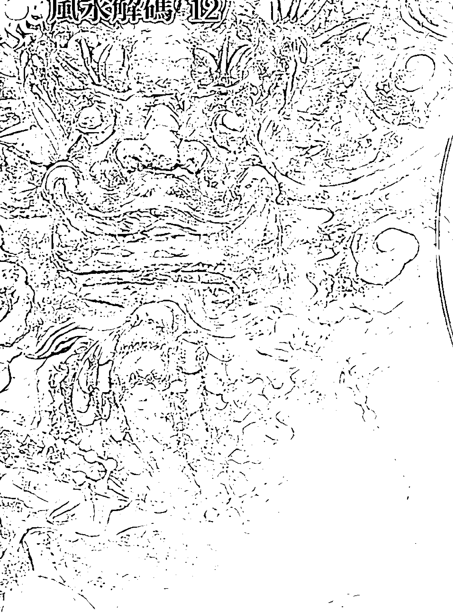
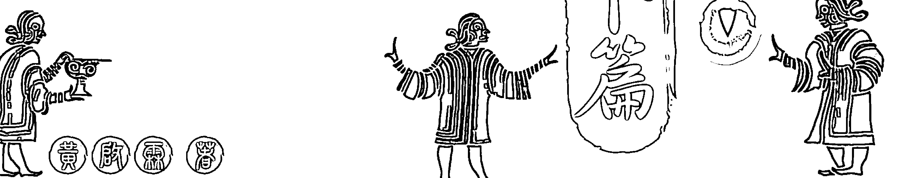
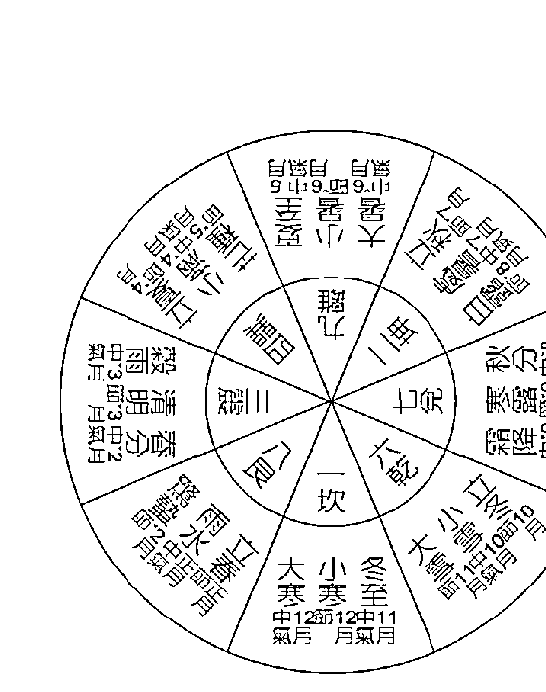
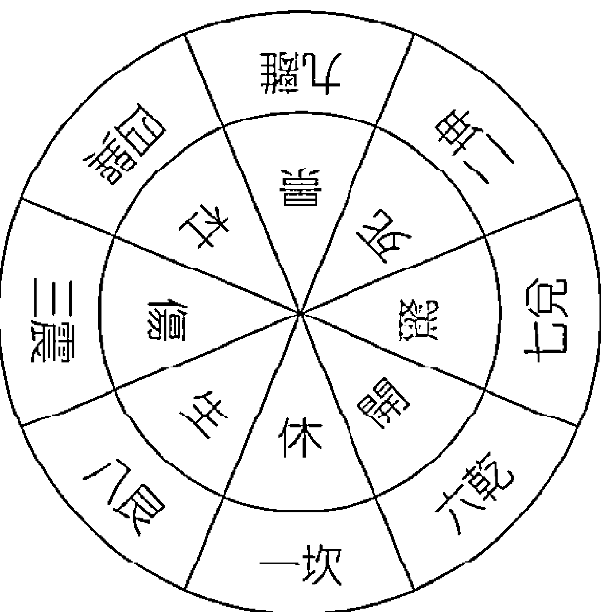
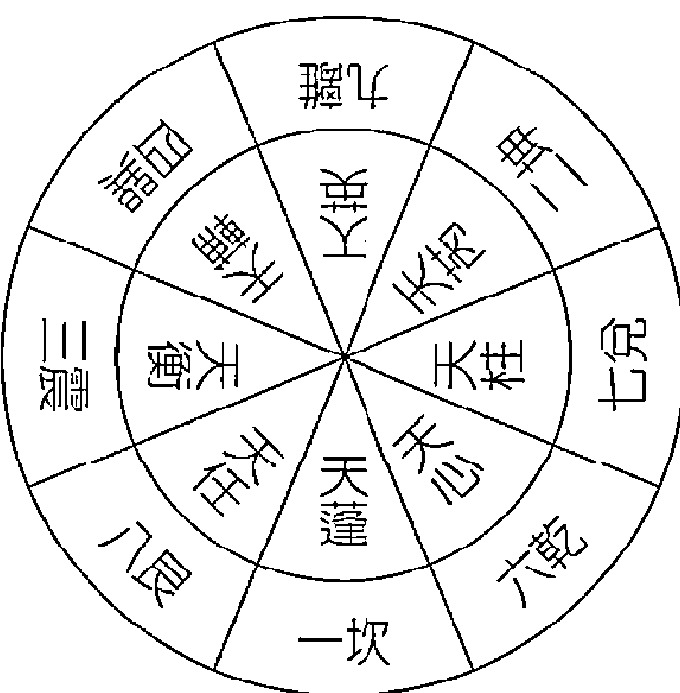
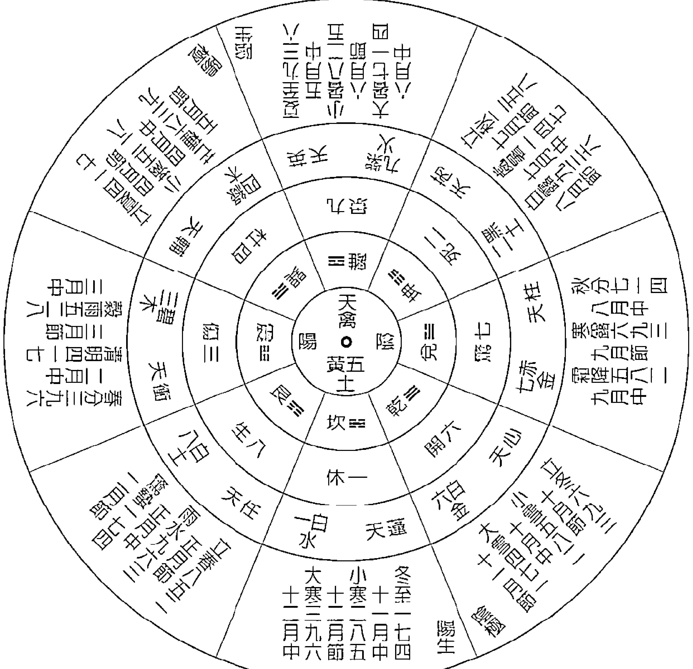

# 奇门遁甲占卜篇

繼「奇門遁甲」系列四冊後，再一創舉，將奇門遁甲應用篇中，最具有特色之「占卜理論」，以奇門遁甲經典「煙波釣叟歌」為架構，是屬於修得前四冊後之後續研究應用本。

全台第一套完整揭露奇門遁甲「知命造運」訣竅，適用於各種大小考試、業務協商、開發生意、衝刺業績、外交軍事談判、出國、選舉，甚至戀愛求婚等各方面，教您如何在特定的時間與空間內，如何擷取「趨吉避凶」的能源置換力量，以達到致勝目的。

# 作者简介

# 黃啟霖

1929年生，十七、八歲年少時期即有機緣接觸奇門遁甲之學，自此投入研究，並發表諸多文章，不曾間斷。六十歲自化學專業工作退休後，便開始奇門遁甲小班教學，除台灣外，也受邀赴日講學，是國內少見以日語教授並著作奇門遁甲實用知識的老師。

# 奇門遁甲簡介

黃帝根據天時、地利、人和與陰陽五行之磁場原理，始創4320局奇門遁甲盤、再經宰相風后整修為1080局之遁甲時盤。從此中國的朝代興亡史也可說是奇門遁甲的推演史。因為各主要朝代興革的關鍵人物，都具奇門遁甲造詣，如姜子牙、漢朝張子房、三國的諸葛孔明等，無一不是輔佐帝王開基建業的功臣，而明朝的劉伯溫，則將遁甲之學發揚光大。

古代，奇門遁甲之學不但被用於戰鬥爭霸、擴張領域，在帝王治國的政治、建設、法律等方面，也是不可缺的重要寶典，但民間是禁學的，所以有「帝王學」之稱。

在現代社會中，奇門遁甲之應用範圍更是廣泛，國家之政治、軍事、經濟、外交，工商企業經營、財務投資借貸，求取功名、營造感情等的個人家庭及社會活動，都可用來轉禍為福、趨吉避凶。

# 序言

黃帝根據天時、地利、人和與陰陽五行之磁場原理，始創4320局奇門遁甲盤、再經宰相風后整修為1080局之遁甲時盤。從此，中國的朝代興亡史，也可說是奇門遁甲的推演史。因為，各主要朝代興革的關鍵人物，都具奇門遁甲造詣，如姜子牙、漢朝張子房、三國的諸葛孔明等，無一不是輔佐帝王開基建業的功臣，而明朝的劉伯溫，則將遁甲之學發揚光大。

古代，奇門遁甲之學不但被用於戰鬥爭霸、擴張領域，在帝王治國的政治、建設、法律等方面，也是不可缺的重要寶典，但民間是禁學的，所以有「帝王學」之稱。

在現代社會中，奇門遁甲之應用範圍更是廣泛，國家之政治、軍事、經濟、外交，工商企業經營、財務投資借貸，求取功名、營造感情等的個人家庭及社會活動，都可用以轉禍為福、趨吉避凶。

拙著已出書「奇門遁甲解碼全集」四冊，含有奇門遁甲基礎篇、工具篇、陽遁篇、陰遁篇等。而本書「占卜篇」是後續第五冊。將奇門遁甲應用篇中，最具有特色之占卜理論，以奇門遁甲經典「煙波釣叟歌」為架構，是屬於修得前四冊後之後續研究應用本。

為了尚未修讀前四冊之讀者，特附錄本書所要之「遁甲時盤集」及「時盤專用曆」，「遁甲重要諸理論之壓縮索引集」，以方便讀者。

本書之目的，是希望修讀者，能對諸凡日常生活諸事之善惡是否，能有比較正確之判別，以至於達到趨吉避凶之效。

本書能公諸於世，首先虔誠感謝啟蒙恩師蔡典道先生，並對助力育生本書之諸先達諸先輩感謝。

黃啟霖

# 煙波釣叟歌 古今圖書集成

陰陽順逆妙難窮 二至還鄉一九宮 若能了達陰陽理 天地都來一掌中 軒轅黃帝戰蚩尤 逐鹿經今若未休 偶夢天神授符訣 登壇致祭謹虔修 神龍負圖出洛水 彩鳳銜書碧雲裏 因命風后演成文 遁甲奇門從此始 一千八十當時制 太公刪成七十二 逮於漢代張子房 一十八局為精藝 先須掌上看九宮 縱橫十五在其中 次將八卦論八節 一氣統三為正合 陰陽二遁分順逆 一氣三元人莫測 五日都來換一元 接氣超神為準的 認取九宮為九星 八門又逐九宮行 九星逢甲為直符 八門直使自分門 符上之門為直使 十時一位堪憑據 直符常遣加時干 直使順逆遁宮去 六甲元號六儀名 三奇即是乙丙丁 陽遁順儀奇逆布 陰遁逆儀奇順行 吉門偶爾合三奇 直此雖云百事宜 更合從傍加檢點 餘宮不可有微疵

| 左列 | 右列 |
|------|------|
| 三奇得使誠堪使 | 六甲遇之非小補 |
| 乙逢犬馬丙鼠猴 | 六丁玉女騎龍虎 |
| 又有三奇遊六儀 | 號為玉女守門扉 |
| 若作陰私和合事 | 請君但向此中推 |
| 天三門兮地四戶 | 問君此法如何處 |
| 太衝小吉與從魁 | 此是天門私出路 |
| 地戶除危定與開 | 舉事皆從此中去 |
| 六合太陰太常君 | 三辰元是地私門 |
| 更得奇門相照耀 | 出門百事總欣欣 |
| 太衝天馬最為貴 | 卒然有難宜逃避 |
| 但當乘取天馬行 | 劍戟如山不足畏 |
| 三為生氣五為死 | 勝在三分衰在五 |
| 能識遊三避五時 | 造化真機須記取 |
| 就中伏吟最為凶 | 天蓬加著地天蓬 |
| 天蓬若到天英上 | 須知即是反吟宮 |
| 八門反覆皆如此 | 生在生門死在死 |
| 縱有吉宿得奇門 | 萬事皆凶不堪使 |
| 六儀手刑何太凶 | 甲子直符愁向東 |
| 戊刑在未申刑虎 | 寅巳辰辰午刑午 |
| 三奇入墓好思推 | 甲日那堪宮見未 |
| 丙奇屬火火墓戌 | 此時諸事不須為 |
| 更兼六乙來臨二 | 月奇臨六亦同論 |
| 又有時干入墓宮 | 課中時下忌相逢 |
| 戊戌壬辰兼丙戌 | 癸未丁丑一同凶 |

五不遇時龍不精　號為日月損光明 時干來剋日干上　甲子須知時忌庚 奇與門兮共太陰　三般難得總加臨 若還得二亦為吉　舉措行藏必遂心 更得直符直使利　兵家用事最為貴 常從此地擊其衝　百戰百勝君須記 天乙之神所在宮　大將宜居擊對衝 假令直符居離九　天英坐取擊天蓬 甲乙丙丁戊陽時　神居天下要君知 坐擊須憑天上奇　陰時地下亦如之 若見三奇在五陽　偏宜為客自高強 勿然逢著五陰位　又宜為主好裁詳 直符前三六合位　太陰之神在前二 後一宮中為九天　後二之神為九地 九天之上好揚兵　九地潛藏可立營 伏兵但向太陰位　若逢六合利逃形 天地人分三遁名　天遁月精華蓋臨 地遁日精紫雲詳　人遁當知是太陰 生門六丙合六丁　此為天遁自分明 開門六乙合六己　地遁如斯而已矣 休門六丁共太陰　欲求人遁無過此 要知三遁何所宜　藏形遁跡斯為美 庚為太白丙熒惑　庚丙相加誰會得 六庚加丙白入熒　六丙加庚熒入白

### 奇門遁甲占卜篇

## [術數解碼精撰]

白入熒兮賊即來   熒入白兮賊須滅

丙為勃兮庚為格   格則不通勃亂逆

天丙加地干為勃   天庚加地癸為格

丙加天乙為勃符   天乙加丙為飛勃

庚加日干為伏干   日干加庚飛干格

加一宮兮戰在野   同一宮兮戰於國

庚加直符天乙伏   直符加庚天之飛

庚加癸兮為大格   加己為刑最不宜

加壬之時為上格   又嫌歲月日時逢

更有一盤奇格者   六庚謹勿加三奇

此時若也行兵去   匹馬只輪無反期

六癸加丁蛇天矯   六丁加癸雀入江

六乙加辛龍逃走   六辛加乙虎猖狂

請觀四者是凶神   百事逢之莫措手

丙加甲兮鳥跌穴   甲加丙兮龍回首

只此三者是吉神   為事如意十八九

八門若遇開休生   諸事逢之總稱情

傷宜捕獵終須獲   杜好邀遮及隱形

景上投書並破陣   驚能擒訟有聲名

若問死門何所主   只宜吊死與行刑

蓬任冲輔禽陽星   英芮柱心陰宿名

輔禽心星為上吉   冲任小吉未全亨

大凶逢芮不堪使   小凶英柱不精明

大凶無氣變為吉   小凶無氣一同之

吉宿更能逢旺相    萬舉萬全功必成
若遇休凶並廢沒    勸名不必進前程
要識九星配五行    各隨八卦考義經
坎蓬星水離英火    中宮坤艮土為營
乾兌為金震巽木    旺相休囚看重輕
與我同行即為相    我生之月誠為旺
廢於父母休於財    囚於鬼兮真不妄
假令水宿號天蓬    相在初冬與仲冬
旺於正二休其餘    其餘做此自研窮
急則從神緩從門    三五反覆天道亨
十干加伏若加錯    入庫休囚吉事危
十精為使用為貴    起宮天乙用無遺
天目為客地為主    六甲推兮無差理
勸君莫失此玄機    洞徹九宮扶明主
宮制其門不為迫    門制其宮為迫雄
天網四張無路走    一二網低有路蹤
三至四宮行入墓    八九高強任西東
節氣推移時候定    陰陽順逆要精通
三元積數成六紀    天地未成有一理
請觀歌裡精微訣    非是賢人莫傳與

# 論占卜

一、占卜即易占，以事態為主體，預測事態之來龍去脈與即將面臨之吉凶禍福，並謀求處置因應之道的術法。

於日常生活中遇到的事，有些事態並不是命運所推算到，或不能根據行運去推測到的。

若能預測這些事態之吉凶而有利對處之，當可得趨吉避凶之效應，甚至對以後之行運或有良好之影響。此乃占卜之目的。

## 二、奇門遁甲占卜法

1.  奇門遁甲占卜術源自河洛理數，以陰陽五行學說為理論基礎，綜合古來諸賢在天文地理、曆法數術、政治軍事、宗教民俗等之經驗徵候的歸納，而經數千年流傳過程的累積，使遁甲占卜法應用範圍廣泛，判斷速度既快又準確度高，可謂是一種精妙之預測學。

2.  奇門遁甲占卜法以一〇八〇時盤，為占卜基礎，當占卜意念產生時，就以該時辰時盤之卦象、門、星、神的表徵判斷吉凶。

3.  占卜時機：

    - 本人占卜自己：以事態發生時辰，得到事態發生訊息之時辰，對可能發生或已發生之事態，有占卜意念產生之時辰的各時盤都對事態吉凶靈驗。就中，有占卜意念產生時，立即以該時局盤占卜；所得占示最靈驗。所以當意念產生時，若手邊無時盤可立即使用，須要記下意念產生時辰，延後以該記下的時辰時盤行占卜就可。

    惟拖延的時間，不要太長，因為拖久靈驗度變差，萬一沒有記下來，再想到時，就以再想到的時辰局盤為準，但占卜準確度可能會低落。

    - 占別人（來人託占）：以來人開口，表示要占卜之意 思時辰之局盤為用，應以開始講起要占卜事態的時間為準，但他人以書面來託占卜，則以看到書面的時辰盤為用，不是以他人書寫託文之時辰為準。

    - 多人占卜同一事態：多人於同時辰問占同一事態，要分先後。第一個先問者，以該當時辰局盤為用。第二個以後，逐一加下個時辰局盤為用。同時辰內，問占同一事態者是複數，則不能使用同一時盤占卜。

    - 一人同時來問占多項：各項都要以開口時的時局盤，若開口問占的時辰不相同則依次以開口時的局盤為用。

4.  一般占卜，若有 70% 準確度，就可謂不錯。奇門遁甲占卜，若方法正確成熟，應可得比他法占卜更高的準確率。

5.  占卜，所謂誠則靈，只要對占卜術有信心，有敬虔之心，確實有切身需要，才行占卜，必能得到靈驗結果。試探或無需要而半開玩笑，或無信心，則不要占卜，因為這所謂「戲占」，絕不可能得到靈驗結果。

### 1 占陛遷

原文：

開門加生旺宮再有三奇德合吉格者主陛遷。再有三奇德合吉格者主陛遷。再遇太歲月建乘吉神來生，高擢甚速。或吉格不旺相或旺相無吉格或旺相格各吉、太歲、月建不來相生亦為不利。

占卜目的：

公務員或企業從業員的職務移動或調升吉凶，以開門吉格、配太歲、月建、判斷。

占卜資料：

開門＝表徵官運、職務運。

占卜要領：

1.  開門若落於生旺宮，已有吉的移動或調升的感應。
2.  開門落生旺宮，並有三奇、吉星、吉神，已夠陛遷條件。
3.  若開門雖生旺，但無三奇、吉星神，表示還有環境上阻力。
4.  有 2 的情況，再有太歲宮、月建宮、相生開門宮，並乘有吉神、吉星，不但調升已夠格，且高擢甚速。
5.  有 2 的情況，太歲宮亦乘吉星神，又來生，但月建無吉、無生。表徵陞遷未能即時到來，須待一時。
6.  有 2 的情況，但太歲宮不佳（無吉星神，不來生）則陞遷須以年單位待延。（太歲感應比月建強）。

### 註

- 2、3 是判斷夠不夠格陞遷之必要條件。
- 4、5、6 是已知備有陞遷條件，補占陞遷之快慢佳否。
- 太歲月建宮，都以地支推。

#### 占卜目的：

1.  占卜時間：西曆 1986 年 10 月 23 日 11～13 時
2.  干支曆：丙寅年戊月 庚子日 壬午時（陰八局）

*本書附錄「時盤專用曆」可查上記 2，年干支 日干支及陰陽遁局「遁甲時盤集」可根據已知陰陽遁局，得「遁甲時盤」。

| 己 天柱 休 壬 巽四 東南 | 庚 天心 生 乙 離九 正南 | 丙 天蓬 傷 丁辛 坤二 西南 |
| :--- | :---: | :--- |
| 丁辛 天芮禽 開 癸 震三 正東 | 符首：己 | 戊 天任 杜 己 兌七 正西 |
| 乙 天英 驚 戊 艮八 東北 | 壬 天輔 死 丙 坎一 正北 | 癸 天衝 景 庚 乾六 西北 |# 占卜實例：

-   ○開門落震三，妻財宮、合丁奇、中吉（己夠格，可陞遷）
-   ○占時太歲寅，月建戌、（農九月）
太歲艮八土宮，我剋妻財，中吉加吉神
月建乾六金宮，剋我大凶（金剋木）

結論：陞遷夠格，但時未到，今明年中可。

### ② 占上官

#### 原文：

> > 依方所向須端詳，如上官向東，看東方所得宮神各依向方宮神以得吉格為主，得吉則必陞遷，無吉格旺相責降其職，若無吉格星又休囚廢沒者，罷黜之象也凡凶格伏吟反吟飛勃伏干，五不遇時入墓等格，均不利，便不必論其方向矣。

#### 占卜目的：

-   1. 新當官，新經營事業，新就職等，之前先占可否。（前途工作有無順利，可否升官發財等）
-   2. 原已有官職或已在經營事業，擬改行政改職，與原來工作相比較吉凶。
同時有兩個工作機會待選，要占何吉何凶。

#### 占卜資料：

以太極點為中心論吉凶

-   - 太極點在中宮，還無工作時，以住宅為太極點，原有官職、事業，要與新的比較時，以原工作地點為太極點，論方向吉凶。（同一公司裡，轉職位、以原桌位為太極）

#### 占卜要领：

-   1. 上官方向，以有奇门（开休生 八门加乙丙丁 三奇）、吉格、吉星神为吉，表顺利可进行。若有凶格则不顺，不宜进行。
-   2. 天盘符首，视同三奇，为吉，上官八门「景门」亦同三吉门，为吉。
-   3. 占卜时是「五不遇时」，即时不对，事不成，故不必再论下去。
-   4. 占卜时是「三奇入墓时」，为埋没人才，亦事不成，不必再论下去。
-   5. 上官占卜不佳，但转任系强制，不去上任不可时，上官后，每天上班要用奇门三盘行动趋吉避凶。（拙着奇门遁甲解码全集 基础篇有详解）
-   6. 八门对上官占卜的感应吉凶如下：
    - 开休生：上官事业都吉。
    - 景门：新官上任吉，事业亦可，但发财少。
    - 惊门：做事不稳定。
    - 伤门：做事勉强可，若认真努力，有机发财。
    - 杜门：做事时有阻礙。
    - 死门：皆凶不顺。
-   7. 八门旺相：（只供参考，不是占卜之必要条件）。
-   8. 九星对上官占卜的感应吉凶（只供比较吉凶之参考）。
    - 天辅、天禽、天心、上吉、
    - 天冲、天任、次吉。
    - 天柱、天英、小凶、
    - 天蓬、天芮、大凶。
-   9. 九星的旺裡要看占時月令（供參考不是必要條件）。
-   10. 八神對上官占卜的感應吉凶（供參考不是必要條件）。

#### 占卜用時盤之求法：

-   1. 占卜時間：1986 年 10 月 23 日 11～13 時
-   2. 干支曆：丙寅年戌月 庚子日 壬午時（陰八局）

| 巽四 東南 | 離九 正南 | 坤二 西南 |
|----------|----------|----------|
| 陰八局、直符、己、休、天柱、壬 | 庚、生、天心、乙 | 丙、傷、天蓬、丁辛 |
| 震三 正東 | 五中 | 兌七 正西 |
| 壬午時、騰蛇、丁辛、開、天芮禽、癸 | 符首:己 | 戊、杜、天任、己 |
| 艮八 東北 | 坎一 正北 | 乾六 西北 |
| 直符:七天、太陰、乙、驚、天英、戊 | 壬、死、天輔、丙 | 癸、景、天衝、庚 |

#### 占卜實例：

### ○方向吉凶看八門：

-   - 正北：死門，皆凶、不順
-   東北：驚門，做事不穩定
-   正東：開門，丁奇、雀投江利主守吉
-   東南：休門，符首宮、不囚、順利大吉（以東南方，休門，為吉方）
-   正南：生門，生旺、奇格（上剋下利客）進吉
-   西南：傷門，不囚、勉強可，加油努力，有機會發財
-   正西：杜門，囚凶，做事時有阻疑，不順
-   西北：景門，不囚，新上任、新事業可、財運平（西北方，景門，次吉方）

### ○以占時月令（九月戊土）看九星旺衰，複數吉方取捨用

- 正北、西北：天輔、天沖木星（九月令次吉） | 月平
- 東北：天英火星 | 土月相暈
- 正東、正西： | （九月令以正東 正西方吉） | 土月相旺
- 東南、正南： | 土月廢囚
- 西南：天蓬水星 | 土月廢囚

### ○八神吉凶：有複數吉方時之取捨參考。

### 3 占官員考績

**原文：**

直符為天官開門為官星，開門宮受直符宮克又休囚廢沒不得星得格者凶，旺相者罷職得吉星者責降，不受直符宮克及相生者無事。

**占卜目的：**

於就職機關內部升等或年度考績之吉凶。

**占卜資料：**

天盤符首，代表上級主管。（評審官）
開門落宮代表被考核人。（官員）

**占卜要領：**

-   1. 天盤符首宮生開門宮或開門宮剋天盤符首宮吉。
-   2. 天盤符首宮剋開門宮或開門生天盤符首宮凶。
-   3. 天盤符首宮與開門同宮或同類、自家人、同派最吉。
-   ○ 開門宮受符首宮剋：最不好，上級偏心、不公
-   ○ 開門宮剋符首宮：好，被考核人能力強、成績佳

#### 占卜用時盤之求法：

-   1. 占卜時間：西曆1986年10月23日 11~13時
-   2. 這天的干支曆：丙寅年戊戌月 庚子日 壬午時（陰八局）

| 宮位 | 巽四 東南 | 離九 正南 | 坤二 西南 |
|---|---|---|---|
| 陰八局 | 己 休 天柱 壬 | 庚 生 天心 乙 | 丙 傷 天蓬 丁辛 |
| 壬午時 | 丁辛 開 天芮禽 癸 | 五中 符首：己 | 戊 杜 天任 己 |
| 直符：七天慈柱 | 乙 驚 天英 戊 | 壬 死 天輔 丙 | 癸 景 天衝 庚 |

#### 占卜實例：

-   ○ 開門落宮震三木
-   ○ 天盤符首宮巽四木（符首己）
-   ○ 開門宮與天盤符首宮同類

結論：被考核人很幸運是上級評審宮的自己人、同派，當然考績佳，沒話可說。

### 4 占科名

**原文：**

凡占科名以日干為士子直符為主司天乙為分司景門為文章，直符宮剋日干宮天乙剋日干宮，景門剋日干宮，日干宮剋景門宮及景門宮休咎廢沒俱失意。如直符天乙來生日干，景門又得旺相者必得科名，再遇三奇吉門吉宿於本人年干之上者大利。

**占卜目的：**

科名乃國家考試，高普考、職業考、機關就職考等。（升學、聯考等不計在內）
古時縣考＝鄉貢生（秀才）省考＝舉人，中央＝進士
殿試第一狀元，第二探花，第三榜眼，每三年（仲年）考一次
占卜條件較苛，因為考及即當高官、競爭激烈。

**占卜資料：**

-   - 天盤日干＝應試人
-   天盤符首＝主考官
-   天盤乙奇＝副考官
-   景門＝考卷答案文章

#### 占卜要领：

-   1. 天盤符首、乙奇、景門三者均生天盤日干，景門又旺相者及第。（一定能考及）
-   2. 有1之情况，且应试人的生年干（地盘）上有奇门吉格者，不但考及，而且成绩佳、高中。
-   3. 1之条件，三者欠一都不可，必须三者齐全才可。

#### 占卜用时盘之求法：

-   1. 占卜时间：1986年9月30日 13～15时
-   2. 干支历：丙寅年酉月 丁亥日 丁未时（阴四局）

┌─────────────────────┐
│  阴四局   丁未时  │
├────────┬────────┬────────┤
│  东南    │   正南   │   西南   │
│  癸      │    己   │    戊   │
│  天任    │    天芮   │    天辅   │
│  休门    │    生门   │    伤门   │
│  六合    │    太阴   │    螣蛇   │
│  戊      │    壬   │    庚乙  │
│  巽四    │    离九   │    坤二   │
├────────┼────────┼────────┤
│  正东    │    中宫   │   正西   │
│  辛      │         │    壬   │
│  天蓬    │         │    天英   │
│  开门    │         │    杜门   │
│  勾陈    │  符首：壬 │    直符   │
│  己      │         │    丁   │
│  震三    │    五中   │    兑七   │
├────────┼────────┼────────┤
│  东北    │   正北   │   西北   │
│  丙      │    丁   │    庚乙  │
│  天心    │    天柱   │    天芮禽 │
│  惊门    │    死门   │    景门   │
│  朱雀    │    九地   │    九天   │
│  癸      │    辛   │    丙   │
│  艮八    │    坎一   │    乾六   │
└─────────────────────┘

#### 占卜实例：

-   ○应试人：天盘日干丁，坎一水
-   主考官：天盘符首壬，兑七金
-   副考官：天盘乙奇，乾六金
-   考卷文章：景门，乾六金

#### 結論：

-   ○主考，副考官，答卷，都是金，來生應試人落宮水，故考及，因金與水相生
-   ○景門落宮無旺，但為直使，成績佳。
-   ○應試人地盤日干丁，兌宮上無三奇，但為符首宮，故視同吉格，成績優秀。

### 5 占考試（占小試）

**原文：**

凡士子小試以天輔爲試官日干爲士子六丁爲文章，六丁得旺方更兼天輔乘生又得三奇及開休生景四吉門者爲上吉，文星旺試官生不得三奇吉門者爲大吉，文星雖旺而試官不生或試官生而文星不旺僅得中平，文星旺試官又剋幸有三奇吉門者爲下，試官剋害文星不旺日干又在休囚宮又無三奇吉門或得死門及諸凶格者凶。

**占卜目的：**

占聯考、升學、留學考試之吉凶，用之。

**占卜資料：**

-   - 天盤日干宮代表考生
-   天輔星代表考官
-   天盤丁奇代表考卷、答卷、文章

**占卜要領：**

-   1. 天盤丁奇及天輔星落宮生天盤日干宮且丁奇旺。考及中吉。
-   2. 1之情況再丁奇合開休生景四吉，考及上吉，進好學校。
-   3. 只有 1 之情況，無 2 之情況，且丁奇不旺，可考及平平。
-   4. 天盤丁奇宮與天輔星宮，其中之一生日干宮也勉強，可考及，但考進的學校極普通、低空進場。
-   - ■ 只有天輔星落宮生日干宮，表主考官一關通過，能考及。
-   - ○ 丁奇落宮不生日干或無旺相，題目難，考卷答不好，成績平。
-   - ○ 丁奇合四吉門，考題頗合考生胃口，且有貴人，成績佳。
-   - ○ 天輔宮剋日干宮或雖無剋而丁奇宮剋，又無吉格者，考不及。

#### 占卜用時盤之求法：

-   1. 占卜時間：西曆 1986 年 10 月 23 日 11~13 時
-   2. 干支曆：丙寅年戌月 庚子日 壬午時（陰八局）

| 左列 | 中列 | 右列 |
|------|------|------|
| 陰八局 直符 休 天柱 壬 巽四 東南 | 己 九天 生 天心 乙 離九 正南 | 庚 九地 傷 天蓬 丁辛 坤二 西南 |
| 壬午時 騰蛇 開 天芮禽 癸 震三 正東 | 符首：己 五中 | 朱雀 杜 天任 己 兌七 正西 |
| 直符：天柱 直使：七天 太陰 驚 天英 戊 艮八 東北 | 六合 死 天輔 丙 坎一 正北 | 勾陳 景 天衡 庚 乾六 西北 |

#### 占卜實例：

-   - 考生：天盤日干庚離九火
-   - 考官：天輔星宮坎一水
-   - 考卷：天盤丁奇震三木
-   ○天盤丁奇落宮生天盤日干庚宮，且丁奇旺宮，有開門
但天輔星宮不來生，反剋

#### 結論：

-   ○判考卷文章成績佳，開門貴人，故應可考及（只有一種來生就可）
-   天輔星剋考生而成績無問題，則應注意答案以外之違規。

### 6 占稱貸

#### 原文：

直符為物主天乙為稱貸之人各以所落的宮分生克論之直符生天乙天乙剋直符必遂。直符剋天乙天生直符不遂。

#### 占卜目的：

要向人家靠貸金錢或物質，須先探知物主樂不樂意借，若知物(金)主樂意肯借，才開口，可保自己面子亦不會傷人家。

#### 占卜資料：

天盤符首符宮＝物（金）主
天盤乙奇落宮＝要借人

#### 占卜要領：

-   1. 天盤符首落宮生天盤乙奇落宮。
-   2. 天盤乙奇落宮剋天盤符首落宮。二情況之一就能借得到。
-   3. 天盤符首宮剋天盤乙奇落宮。
-   4. 天盤乙奇落宮生天盤符首符宮。二情況之一都不能借到。
-   3. 天盤符直落宮與天盤乙奇落宮同宮或同類，吉多凶少，要討好、商量始得成，不比1之情況強。

#### 占卜用時盤之求法：

-   1. 占卜時間：西曆1986年10月23日 11~13時
-   2. 這天的干支曆：丙寅年戊戌月 庚子日 壬午時（陰八局）

陰四局 | 壬 | 庚乙 | 丁
直符 | 傷門(天英) | 杜門(天芮禽) | 景門(天柱)
戊(巽四 東南) | 壬(離九 正南) | 庚乙(坤二 西南)
騰蛇 | 生門(天輔) | | 死門(天心)
戊申時 | 己(震三 正東) | 五中 | 丁(兌七 正西)
直使(九天) | 休門(天衡) | 開門(天任) | 驚門(天蓬)
符首:壬 | 太陰 | 六合 | 勾陳
 | 癸(艮八 東北) | 辛(坎一 正北) | 丙(乾六 西北)

#### 占卜實例：

-   ○金主：天盤符首宮巽四木
-   要借人：天盤乙奇宮離九火
-   ○天盤符首生天盤乙奇宮

結論：

-   ○借得到

### 7 占求財

**原文：**

須看生門落宮並看上下二盤格局靈禽經云生門之上好求財上下二盤仔細猜吉格吉星求必遂一有不吉所求乖一有不吉所求減半休囚死廢全無用生旺相和事事諧。

**占卜目的：**

已有予定求財目標如要開公司、工場、做買賣而求卜占其能否賺到錢。

**占卜資料：**

以生門落宮論吉凶

**占卜要領：**

-   1. 生門落於旺宮又得令，進財多。
落干旺宮與否最重要，得令（立春三節）次要
-   2. 生門落宮之天地盤是符首乙、丙、丁、戊及吉星神，則財旺，若奇儀星神吉凶參雜則雖進財但平平。
-   3. 生門落宮遇庚儀或門星符伏吟等，營業成績要打折扣。
-   4. 生門落宮不可落空亡宮（六甲旬時辰空亡），若有 1、2 情況，其結果變為平平，若無 1、2 情況，此事失敗。

#### 占卜用時盤之求法：

-   1. 占卜時間：1986 年 12 月 11 日 19~21 時
-   2. 干支曆：丙寅年子月 己丑日 甲戌時（陰一局）

奇门遁甲排盘表格，包含九宫格，各宫位标注天干、门、星、神、方位等信息。表格左侧标注‘陰一局’、‘甲戌時’、‘直符:天英 直使:景門’。

#### 占卜實例 1：

-   ○生門落宮、艮八占時不得令
-   ○生門落宮天地盤庚一庚
-   ○生門落宮九星、天任、次吉
-   ○生門落宮八神、六合吉
-   ○生門落宮（丑寅）無空亡（占時甲戌旬空亡申酉）

#### 結論：

-   1. 生門宮入艮八，旺相宮，經營目標正確，終會賺。
-   2. 生門落宮天地盤庚一庚，無乙丙丁戊等財神來助，表示經營賺錢要一番辛苦努力，尤其庚、庚組合帶有競爭是非，是最不好的組合，累！！
-   3. 萬盤伏吟之狀況，亦表示經營辛苦。
-   4. 生門於陰遁期不當令(生門當令是立春 45 天)亦表示成就不得時。
-   5. 星神天任、六合，都吉，表示有來人助。
-   6. 生門艮八宮、不落空亡，亦表示事可做。

以上綜合結論：計劃可進行，會賺有來路，但經營須經辛苦亦有是非不順，努力加強終會賺。

#### 占卜用時盤之求法：

-   1. 占卜時間：1986年10月30日 11～13時
-   2. 干支曆：丙寅年戊月 丁未日 丙午時 (陰二局)

| 直符 陰二局 | 九天 | 九地 |
|---|---|---|
| 壬 景 天柱 丙 巽四 東南 | 癸 死 天心 庚 離九 正南 | 己 驚 天蓬 戊丁 坤二 西南 |
| 戊丁 杜 天芮禽 乙 震三 正東 | 符首：壬 五中 | 辛 開 天任 壬 兌七 正西 |
| 庚 傷 天英 辛 艮八 東北 | 丙 生 天輔 己 坎一 正北 | 乙 休 天衝 癸 乾六 西北 |

#### 占卜实例2：

-   - 生门落宫坎一、不旺相、不当令、宫迫
-   - 落宫有三奇、吉星神、财力旺、贵人多
-   - 占时甲辰旬空亡寅卯、生门，不落空亡

结论：虽然财力旺，贵人多又不落空亡而计划来势凶凶，但宫迫，事不成。

#### 占卜用时盘之求法：

-   1. 占卜时间：1986年10月30日 13~15时
-   2. 干支历：丙寅年戌月 丁未日 丁未时（阴二局）

| 阴二局 | 庚 天英 惊门 丙 巽四 东南 | 戊丁 天芮禽 开门 庚 离九 正南 |
| 丁未时 | 丙 天辅 死门 乙 震三 正东 | 五中 符首：壬 癸 天心 生门 壬 兑七 正西 |
| 直使：天芮 直符：天柱 | 乙 天衡 景门 辛 艮八 东北 | 辛 天任 杜门 己 坎一 正北 |

#### 占卜实例3：

-   - 生门落宫兑七、泄气凶、不当令
-   - 地盘符首星神俱吉
-   - 占寺、甲辰旬、空亡、寅卯，故不落空

結論：雖然貴人多，亦有財力，但經營困難，賺錢難。

### 8 占合伙

#### ⇝原文：

地盤生門為財主天盤生門落宮為夥計地盤剋天盤不成天盤剋地盤亦不利天盤生地盤和美利主地盤生天盤全美。

#### ⇝占卜目的：

要做合夥事業前占卜雙方能否合得來、順不順。

#### ⇝占卜資料：

以生門落宮天地盤之五行生剋論吉凶。
生門地盤代表資方（出財力、物力的人）如董事長。
生門天盤代表勞方（出能力、才能的人）如總經理。
若合夥雙方都同樣條件，出錢出力相同則以要卜人為「我」為地盤，若董事長不出資就以天盤斷。

#### ⇝占卜要領：

-   1. 天盤地盤相生，合作順利。
-   2. 地盤（資方或我）剋天盤（勞方）或天盤剋地盤，不順。
-   3. 地盤生天盤，吉利全美，最好情況，100分。
-   4. 天盤生地盤，出力出才能的人能幹和美，80分。
-   5. 天地盤同類或符伏，可算合得來。

> 註 此占卜只論天地奇儀之五行生剋相比，不論格局。

#### 占卜用時盤之求法：

-   1. 占卜時間：1986年10月30日 11～13時
-   2. 干支曆：丙寅年戊月 丁未日 丙午時（陰二局）

| 巽四 (東南) | 離九 (正南) | 坤二 (西南) |
|--------------|--------------|--------------|
| 直符 天柱 景 壬 丙 | 九天 天心 死 癸 庚 | 九地 天蓬 驚 己 戊丁 |
| 震三 (正東) | 中五 | 兌七 (正西) |
| 騰蛇 天芮禽 杜 戊丁 乙 | 符首:壬 | 朱雀 天任 開 辛 壬 |
| 艮八 (東北) | 坎一 (正北) | 乾六 (西北) |
| 太陰 天英 傷 庚 辛 | 六合 天輔 生 丙 己 | 勾陳 天衡 休 乙 癸 |

#### 占卜實例及結論：

-   ○生門宮天盤丙火一地盤己土、天盤生地盤
-   勞方股東能幹吉利全美，100分，合作順利

#### 占财运（得財）

原文：

地盤時干在內地上得三奇休生二門天盤甲子戊亦在內地會開門此財甚速不會三門所得主遲又以本宮所得何支定期限若時干與甲子戊俱在外或一內一外俱主遲伏吟亦然空亡終不得。

占卜目的：

無特定的求財目標，只占能否有財運，何時能得財，來財快慢，本來的工作收入會不會增多等等。

占卜資料：

以地盤時干宮占財神，地盤時干代表求財人（財運）。

-   1. 地盤時干宮得八門休生，天盤三奇：財旺，財來多。
    地盤時干宮得八門、開門，天盤三奇：財次旺，來財次多。
    地盤時干宮得吉門，不得奇雖有財運，但不旺不多。
-   2. 地盤時干宮在內地，天盤戊儀亦在內地；財神搶快地盤時干與天盤戊儀，一內一外，財神來臨較慢。地盤時干，天盤戊儀都在外地，財神不遠、財太慢。
-   3. 地盤時干落宮於空亡宮（占時的六甲旬空）財空無財。
    地盤時干落宮符伏門伏，財神遲來，財遲。
-   4. 來財快慢之時期以占卜時的時干來推。
    如占時的時干「己」則來財的時期快則「己」時、「己」日，慢則「己」月、「己」年。
    若占得「財旺、來財快」則來財時為下個「己」時，也即十時辰後，就能得財，若占得「有財，但較慢」則以最近的「己」日或「己」月為來財期，若占得，「有財但太慢」則以「己」月或「己」年為財神來臨時。
-   5. 推算進財時期，若「己」干用時，當推「己」時得財而「己」時得不到就不能再用下個「己」時，而用下個「己」日才可，而推到下個「己」日可得財，但實得不到，就不能再用己日，而須改用「己」月，如此類推（同級不能推二次）。

#### 占卜時 陽遁之內外地

內：坎艮震巽 外：離坤兌乾

| 內 | 外 | 外 |
| :--- | :--- | :--- |
| 內 |   | 外 |
| 內 | 內 | 外 |

#### 占卜時 陰遁之內外地

內：離坤兌乾 外：坎艮震巽

| 外 | 內 | 內 |
| :--- | :--- | :--- |
| 外 |   | 內 |
| 外 | 外 | 內 |

#### 占卜用時盤之求法：

-   1. 占卜時間：1986年8月21日 13～15時
-   2. 干支曆：丙寅年申月 丁酉日 丁未時（陰一局）

| 陰一局 | 直符 丁未時 直使 六開心 | 天心 壬 休 丁 巽四 東南 | 九天 戊 生 己 離九 正南 | 九地 庚 傷 乙癸 坤二 西南 |
| :--- | :--- | :--- | :--- | :--- |
| | | 螣蛇 辛 開 丙 震三 正東 | 五中 符首：壬 | 朱雀 丙 杜 辛 兌七 正西 |

#### 占卜實例1：

-   ○ 時干丁落宮，休門符首壬（同三奇）財旺多
-   ○ 地盤時干在外，戊在內，來財較慢
-   ○ 奇儀反吟，來財較遲
-   ○ 來財期以時干推，因為慢，故不用丁日，而用丁月推

結論：來財旺，多，下個丁月會來。

#### 占卜用時盤之求法：

-   1. 占卜時間：1986年10月30日 13~15時
-   2. 干支曆：丙寅年戌月 丁未日 丁未時（陰二局）

| | 庚 太陰 驚 丙 巽四 東南 | 戊丁 騰蛇 閉 庚 離九 正南 | 壬 直符 休 戊丁 坤二 西南 |
| :--- | :--- | :--- | :--- |
| 丁未時 六合 | 丙 死 乙 震三 正東 | 符首：壬 | 癸 九天 生 壬 兌七 正西 |
| 直使：天芮 直符：天柱 勾陳 | 乙 景 辛 艮八 東北 | 辛 杜 己 坎一 正北 | 己 傷 癸 乾六 西北 |

#### 占卜實例2：

-   - ○地盤時干宮（坤二）休門、符首壬（同三奇）
-   - ○地盤時干丁，天盤戊都在內
-   - ○無來財遲的現象，故來財多而快

結論：來財期為下個丁時，丁日，若明日的丁巳時（戊午日）不來，就下個丁日（丁卯日）。

### 10 占交易

原文：

直符為買物之人生門為所買之物，生門落宮為物，生門來生直符宮，其物得價有利門與本符落相生為物主相戀其物難買相剋則已成交直符宮得旺生生門宮利賣者生門宮生直符宮利買者凡欲買物要賣主方得吉格者有利反此不利凡賣物要買主之方得吉格者利凶格不利。

占卜目的：

特定的一批買賣，能否成交，標的物已決定時要占卜此批買賣順不順。

占投機性買賣，如股票、期貨、黃金、外匯等都可用此法占卜，占到對我有利時要馬上實行買賣，不能猶疑不決，以免錯失時機。

東西買進來要買出去有利無利，不在此占之範圍，此屬「占求財」。

占卜資料：

天盤符首＝買方（購物者）

生門落宮＝賣方（標的物）

#### 占卜要领：

-   1. 天盤符首宮生生門宮（買方生賣方）高價買進。
-   2. 生門宮生天盤符首宮（賣方生買方）低價買進。
-   3. 天盤符首宮剋生門宮（買方剋賣方）低價買進。
-   4. 生門宮剋天盤符首宮（賣方剋買方）高價買進。
-   5. 生門落旺宮（門與宮相生）買方買得高價值物佔便宜。
-   6. 符首落旺宮（符宮相生）賣方有利，賣得好價格。
-   7. 符首宮與生門宮都落衰宮，不成交。

> 我被剋，我生他，都對我不利（購物者）
我剋他，他生我，都對我有利（標的物）

#### 占卜用時盤之求法：

-   1. 占卜時間：1986 年 10 月 30 日  11～13 時
-   2. 干支曆：丙寅年戊月 丁未日 丙午時（陰二局）

| 宫位 | 天盘 | 人盘 | 地盘 | 八神 | 天干 | 方位 |
| :--- | :--- | :--- | :--- | :--- | :--- | :--- |
| 巽四 | 天柱 | 景 | 丙 | 直符 | 壬 | 東南 |
| 離九 | 天心 | 死 | 庚 | 九天 | 癸 | 正南 |
| 坤二 | 天蓬 | 驚 | 戊丁 | 九地 | 己 | 西南 |
| 震三 | 天芮禽 | 杜 | 乙 | 騰蛇 | 戊丁 | 正東 |
| 中五 | | | | | 符首：壬 | |
| 兌七 | 天任 | 開 | 壬 | 朱雀 | 辛 | 正西 |
| 艮八 | 天英 | 傷 | 辛 | 太陰 | 庚 | 東北 |
| 坎一 | 天輔 | 生 | 己 | 六合 | 丙 | 正北 |
| 乾六 | 天衝 | 休 | 癸 | 勾陳 | 乙 | 西北 |

#### 占卜實例1：

-   ○天盤符首巽四木，生門（賣方）坎一水
    賣方生買方：低價買進
-   ○天盤符首宮：壬（木）在木宮、相生、旺、篤志於學於買方生賣方、賣得好價格
-   ○生門落坎一水，門剋宮、不旺成交

結論：成交，買方低價買進，但賣方也賣得好價格。

#### 占卜用時盤之求法：

-   1. 占卜時間：1986年10月30日 13～15時
-   2. 干支曆：丙寅年戊月 丁未日 丁未時（陰二局）

| 陰二局 丁未時 直符：天柱 直使：七煞 | 庚 丙 巽四 東南 | 戊丁 庚 離九 正南 | 壬 戊丁 坤二 西南 |
| :--- | :--- | :--- | :--- |
| 六合 | 丙 乙 震三 正東 | | 九天 癸 壬 兌七 正西 |
| 勾陳 | 乙 辛 艮八 東北 | 朱雀 辛 己 坎一 正北 | 九地 己 癸 乾六 西北 |

#### 占卜實例2：

-   ○天盤符首壬坤二：生門兌七
    買方生賣方：高價買進
-   ○天盤符首宮：符宮不相生、剋我
-   ○生門落宮門宮不相生：我生

結論：符門都落衰宮：不成交。

#### 占生意买卖（贸易）

原文：生门落宫旺相再有吉星及三奇吉格主买卖兴隆如不合者平常若遇凶格大不利经云欲占春夏旺天冲禽宿当权秋与冬余星到处皆无利若遇天篷大有凶。

占卜目的：已有一种事业，包括国内外，一般买卖，公司行号，或生产事业等，于开张前或经营中，占吉凶，此占只要占一次，不可常占，否则失灵。

占卜资料：以生门落宫占吉凶 即生门落宫的旺相、吉格、吉星神、与否决吉凶。

-   - 生门旺宫：宫生门最佳、门克宫不佳、宫克门最差。
-   - 三奇吉格：奇门、龙返首跌穴、天地人遁等。
-   - 吉星：天任、天冲、天辅、天禽、天心。
-   - 吉神：直符、太阴、六合、九地、九天。

#### 占卜要领：

-   1. 生門落宮，上記四種都吉、則財旺、生意興隆順利。
-   2. 四種欠一，只三種吉，還可（生門仍然旺相則財旺）。
-   3. 四種欠二，只有二種吉，情況差些。
-   4. 四種欠三，事業經營相當辛苦，不一定賺錢。
-   5. 四種都不好，尤其加凶格，不但經營辛苦，會虧本。

#### 占卜用時盤之求法：

-   1. 占卜時間：1986年12月18日  19～21時
-   2. 干支曆：丙寅年子月  丙申日  戊戌時（陽一局）

| 陽一局 | 左 | 中 | 右 |
| :--- | :--- | :--- | :--- |
| | 丁 六合 死 天柱 辛 巽四 東南 | 癸 勾陳 驚 天心 乙 離九 正南 | 戊 朱雀 開 天蓬 己壬 坤二 西南 |
| 戊戌時 | 太陰 己壬 景 天芮禽 庚 震三 正東 | 五中 符首：辛 | 九地 丙 休 天任 丁 兌七 正西 |
| 直符直使：天輔 四杜 | 螣蛇 乙 杜 天英 丙 艮八 東北 | 直符 辛 傷 天輔 戊 坎一 正北 | 九天 庚 生 天衝 癸 乾六 西北 |

#### 占卜實例1：

-   - ○生門落宮乾六金，我生他，洩，漏財
-   - ○生門宮天地，庚一癸，搭配不佳
-   - ○九星，天沖，次吉星，不是上吉
-   ○八神，九天，吉神，无吉格

結論：四種中，三種不好，經營差，尤其是天盤庚表辛苦，是非顧客苛。

#### 占卜用时盘之求法：

-   1. 占卜时间：1986年11月6日 13~15时
-   2. 干支曆：丙寅年戌月 甲寅日 辛未时（阴九局）

| 阴九局 辛未时 直符：九天 直使：景英 | | |
| :--- | :--- | :--- |
| 乙 傷 天蓬 勾陳 癸 巽四 東南 | 己 杜 天任 六合 戊 離九 正南 | 丁 景 天衡 太阴 丙壬 坤二 西南 |
| 辛 生 天心 朱雀 丁 震三 正东 | 五中 符首：戊 | 癸 死 天辅 螣蛇 庚 兑七 正西 |
| 庚 休 天柱 九地 己 艮八 东北 | 丙壬 开 天芮禽 九天 乙 坎一 正北 | 戊 惊 天英 直符 辛 乾六 西北 |

#### 占卜实例2：

-   ○生门落宫震三木，他克我大凶
-   ○天地辛—丁，不佳无吉格
-   ○九星天心吉
-   ○八神朱雀不吉

结论：四种有三种不佳，生意可做但经营差。

#### 占卜用时盘之求法

-   1. 占卜时间：1986年11月1日　5~7时
-   2. 干支历：丙寅年戊月　己酉日　丁卯时（阴六局）

| 阴六局 | 乙 螣蛇 休 天柱 庚 巽四 东南 | 戊 直符 生 天心 丁 离九 正南 | 癸 九天 伤 天蓬 壬己 坤二 西南 |
| :--- | :--- | :--- | :--- |
| 丁卯时 | 壬己 太阴 开 天芮禽 辛 震三 正东 | 符首：戊 | 丙 九地 杜 天任 乙 兑七 正西 |
| 直使：六天 直符：开心 | 丁 六合 惊 天英 丙 艮八 东北 | 庚 勾陈 死 天辅 癸 坎一 正北 | 辛 朱雀 景 天心 戊 乾六 西北 |

#### 占卜实例3

-   - 生门落离九火，生门，旺门，财旺
-   - 天地符首戊一丁，吉
-   - 九星天心，直符吉
-   - 八神直符，吉
-   - 相佐（天盘符首、地盘三奇）吉格

结论：四种都吉，财旺、生意兴隆，再加上生门落宫生旺，故经营顺利、赚钱。

### 12 占買賣盈虧（利息）

原文：

凡占貿易得利多少須憑生門所臨之宮旺則多利相則利平休囚利微休囚有凶格主消折生門居旺相再看甲子戊上乘何干以決其數。

占卜目的：

此占，比占貿易更具體細分，如交易、貿易之項的股票、期貨、黃金、外匯或一般買賣，可占出投資規模，能得到多少或虧損多少。

占卜資料：

-   以生門落宮旺相休囚，吉格論之。
-   觀法與「占貿易」之項相同，生門落宮條件佳就賺，條件不好，宮位衰，則虧損。
-   以天盤甲子戊落宮之地盤干決其正或負數
-   算法：天盤戊5數乘以地盤干之數
-   干數：甲乙丙丁戊己庚辛壬癸
    1 2 3 4 5 6 7 8 9 10
-   例如：地盤干為庚7則（5×7＝35）故3.5 35 350 3500都可，若地盤干是複雜，可先求其和，再乘天盤戊5。

（例一）依阳一丙申日戊戌时盘，四条件欠三，且生门财衰，定亏，天盘甲子戊5 坤二的地盘壬9 己6，5×（9＋6）＝75，即亏，0.75 7.5 75 750 万。如此例，地盘二干时，先二干数相加再乘天盘戊5数。

（例二）阴六局己酉日丁卯时盘，四条件都吉，具生门宫生旺，定赚，天盘戊5，离九地盘丁4，5×4＝20，即赚20、200万依投资规模定。

#### 占卜用时盘之求法：

例1：1986年12月18日 19～21时
丙寅年戊月 丁未日 丙午时（阴二局）

| 阳一局 | 丁 六合 死 天柱 辛 巽四 东南 | 癸 勾陈 惊 天心 乙 离九 正南 | 戊 朱雀 开 天蓬 己壬 坤二 西南 |
| :--- | :--- | :--- | :--- |
| 戊戌时 | 己壬 太阴 景 天芮禽 庚 震三 正东 | 五中 符首：辛 | 丙 九地 休 天任 丁 兑七 正西 |
| 直符：天辅 直使：四杜 | 乙 螣蛇 杜 天英 丙 艮八 东北 | 辛 直符 伤 天辅 戊 坎一 正北 | 庚 九天 生 天衡 癸 乾六 西北 |

#### 例2：1986年11月1日 5～7時

丙寅年戌月 己酉日 丁卯时（阴六局）

| 阴六局（左列标注） | 乙 (休门 天柱 庚) 螣蛇 巽四 东南 | 戊 (生门 天心 丁) 直符 离九 正南 | 癸 (伤门 天蓬 壬己) 九天 坤二 西南 |
| :--- | :--- | :--- | :--- |
| 丁卯时（左列标注） | 壬己 (开门 天芮 辛) 太阴 震三 正东 | （中宫：符首：戊） 五中 | 丙 (杜门 天任 乙) 九地 兑七 正西 |
| 直使：六仪开 直符：天心（左列标注） | 丁 (惊门 天英 丙) 六合 艮八 东北 | 庚 (死门 天辅 癸) 勾陈 坎一 正北 | 辛 (景门 天冲 戊) 朱雀 乾六 西北 |

### 13 占放債

#### 原文：

直符為財主天乙為取財之人生門為財神各以生剋旺相論之，直符剋天乙吉天乙剋直符凶天乙生直符吉，直符生天乙凶生門與天乙同剋直符其財盡失同生直符子母俱全生門與天乙有一生一剋者不全則遲天乙財神得休囚氣雖生直符終是無力不全主遲。

#### 占卜目的：

占可否放款給人，貸給了後能否收回來，有人來勸募互助會，可否參加，會不會被倒招損等。

#### 占卜資料：

-   - 天盤直符為財主（放款人）
-   - 天盤乙奇為借款人
-   - 生門為財神

#### 占卜要領：

-   1. 天盤乙奇與生門、同生符首、上吉，安全收回，子母齊，利息厚。
-   2. 天盤乙奇與生門一生一剋符首，差，收回慢，須催才還。
-   3. 天盤符首剋天盤乙奇，會還錢。
-   4. 乙奇、生門同剋符首，借款人不關有無錢，不樂意還。
-   5. 天盤乙奇、生門雖生符首，但休囚無氣，雖有誠意但無力。

> 註 4 與 5 之情況都會倒債，放款人招損
休囚無氣：乙奇木在金宮，生門土在木宮。乙奇木被居宮金剋、生門土被居宮木剋。

### 14 占索债

#### 原文：

傷門克天乙宮去人實心任事天乙宮克傷門彼必爭鬥不服傷門與天乙同生直符子母全得同來克直符者不還，傷門生直符克天乙還生天乙克直符不還天乙旺相克傷門雖有不還休囚生傷門雖有心還無力量還亦不全若天乙乘庚辛來克直符有經官之事直符克天乙乘六丁或景門加之四宮亦有經官之事甲子戊會開門加內地時干其債速還。

#### 占卜目的：

向人讨回债或被倒会要回债等等。

#### 占卜资料：

-   - 天盘符首为债权人
-   - 天盘乙奇为债务人
-   - 八门伤门为债神
-   - (伤门偏符首，债权人有利，偏乙奇，债务人有利)

#### 占卜要領：

-   1. 乙奇、傷門同生直符，債權人吉，錢還、可保持債權。
    乙奇、傷門同剋符首，債務人錢不還、債權保不住。
-   2. 傷門生符首剋乙奇，債神助債權人，錢能索回。
    傷門生乙奇剋符首，債神助債務人錢索不回。
-   3. 乙奇旺相剋傷門，雖有能力還，故意不還。
    乙奇休囚生傷門，雖有心還，但能力不夠。
-   4. 乙奇之地盤有庚、辛，又乙奇剋符首，會打官司。
-   5. 符首之地盤有丁（文章、口舌）又剋乙奇，會打官司。
-   6. 景門在巽四宮，會打官司。
-   7. 甲子戊與開門同宮，又在內地，會迅速還債，但若同時有 3 的情況就索不回。（內地、外地在書本占財運之項有說明）

> 註 索討欠債的實際行動要用傷門
行動時的時盤（坐山、立向）傷門為對方、方位、電話討價方向亦同。
有關奇門三盤理論（坐山、立向）於拙著「奇門解碼全集基礎篇」有詳解
本項所謂乙奇，都指天盤乙奇。

### 15 占爭競 (爭奪財產)

原文：

凡財物爭競符為爭競先動之人為客天乙為後動之人為主爭錢財青龍為主爭田產五穀衣物生門為主直符落宮旺相六甲落宮與生門落宮交生直符利客天乙落宮與六甲生門又生天乙利主直符旺相六甲生門天乙先動者得理後動者得財天乙旺相六甲生門生直符後動者得理先動者得財若財神不生兩家并兩家來生財神俱不得經云來生兩家各得半旺相已生尚可多。

占卜目的：

爭財產，合夥要折夥爭好的條件，有先後攻比賽（如球賽）之輸贏等。

占卜資料：

-   - 天盤符首：先提議之人（先動的一方）
-   - 天盤乙奇：後提意見之人（後動的一方）
-   - 八門生門：物產、財產、競賽

#### 占卜要領：

-   1. 地盤符首與生門宮同生天盤符首宮。
    利客：對先動先提案之人有利。
-   2. 天盤符首與生門宮同生天盤乙奇宮。
    利主：對後提意見，後發動的一方有利。
-   3. 天盤符首與天盤乙奇同生生門宮：俱不得、賽和。
-   4. 生門剋天盤符首與天盤乙奇：俱不得、賽有是非不歡而散，4比3更不佳。

### 16 占诉讼

原文：

直符为讼者天乙为对者开门为问官惊门为讼神，开惊二门俱剋对者则对者败俱剋讼者则讼者败一剋动讼一剋对讼则两败俱伤开生讼者惊剋讼者或开剋惊生者俱方不利对者亦然又符首天乙旺相为胜休囚为败若符首生天乙则讼者和生符首主对者求息不必二门定胜负矣总以落宫决之经云二门胜败已安排景合奇星讼不乖若是惊伤会凶宿死门合一大凶。

占卜目的：

占打官司的两造，何有利何不利。

占卜资料：

天盘符首=原告（本造）
天盘乙奇=被告（对造）
开门=法官（推事检察官）
惊门=讼神（惊门旺、官司激烈、衰、温和）
景门=诉状（合三奇、诉状通顺）

#### 占卜要領：

-   1. 開驚門俱剋乙奇：被告敗訴。
    開驚門俱剋符首：原告敗訴。
-   2. 開驚一剋乙奇、一剋符首：兩敗俱傷。
-   3. 開驚一生一剋：對符首，原吉不利。
    對乙奇，被告不利。
-   4. 符首與乙奇：①旺相者為勝，休囚者為敗。
    ②剋的一方有利，被剋的一方不利。
    ③符首生乙奇，原告求和。
    ④乙奇生符首，被告求和。
    有③④情況則不必再開驚二門求勝敗。
-   5. 景門即訴狀，若合三奇佳，理由充足通順。
    若無合三奇而遇庚，表法官對訴狀不悅不欣賞。
-   6. 天盤符首或乙奇宮遇死門：都不利、不光彩。
    如原告落死門宮表示原告打這官司並無好處。
    就是官司打贏，也不很光榮光彩。
-   7. 本項所謂乙奇，都指天盤乙奇。

> 譯 占卜的結果是未經加工修飾的單純結果，而事實上於官司進行期中，應實行奇門三盤造運，且其效應頗靈驗，例如：
(1)被告出門赴法院的坐山盤或立向盤用休門。
    原告出門赴法院的坐山或立向盤用開門。
(2)被告進法院的立向盤為開門（俟打官司時用開門）
    被告若未提出反訴或誣告訴就用休門。
(3)立向盤用門之法，於拙著「奇門解碼全集基礎篇」有詳解。

#### 占卜用時盤之求法

1. 占卜時間：1987年5月14日 19~21時
2. 干支曆：丁卯年巳月 戊癸日 壬戌時（陽七局）

| 陽七局 | 辛 | 己 | 癸 |
| :--- | :--- | :--- | :--- |
| 九地 | 休 | 生 | 傷 |
| 天蓬 | 天任 | 天沖 |
| 丁 | 庚 | 壬丙 |
| 巽四 東南 | 離九 正南 | 坤二 西南 |
| 壬戌時 | 乙 | 符首：癸 | 丁 |
| 朱雀 | 開 | 杜 |
| 天心 | 天輔 |
| 癸 | 戊 |
| 震三 正東 | 兌七 正西 |
| 直符：天沖 直使：傷門 | 戊 | 壬丙 | 庚 |
| 勾陳 | 驚 | 死 | 景 |
| 天柱 | 天芮禽 | 天英 |
| 己 | 辛 | 乙 |
| 艮八 東北 | 坎一 正北 | 乾六 西北 |

#### 占卜實例1

- ○天盤符首：癸原告、木造、坤二土
- ○天盤乙奇：被告、對造、震三木
- ○開門：推事、檢察官、震三木
- ○驚門：訟神、入旺宮、艮八土
- ○景門：訴狀、遇庚、乾六金

原告：被乙奇（被告）克，被開門克，與驚門同類、景門遇庚
- 被告：剋原告，剋驚門，與開門同類、被告有利
- 驚門：在艮
- 旺宮：表示官司激烈
- 結論：法官訟神一剋一生對原告、原告不利、景門遇庚是法官對告訴狀不欣賞、不同調。被告剋訟神，訴訟對被告有利，官司一下子就解決訟神驚門落旺宮，官司激烈，但終對被告有利。

#### ☆占卜用時盤之求法

1. 占卜時間：1987年7月17日 7～9時
2. 干支曆：丁卯年未月 丁卯日 甲辰時（陰八局）

| 陰八局 直符 杜 天輔 壬 巽四 東南 | 乙 九天 景 天英 乙 離九 正南 | 丁辛 九地 死 天芮禽 丁辛 坤二 西南 |
| :--- | :--- | :--- |
| 騰蛇 傷 天衡 癸 震三 正東 | 符首：壬 五中 | 朱雀 煞 天柱 己 兌七 正西 |
| 太陰 生 天任 戊 艮八 東北 | 六合 休 天蓬 丙 坎一 正北 | 勾陳 闇 天心 庚 乾六 西北 |

#### ☆占卜實例2

- ○原告：天盤符首壬，巽四木
- ○被告：天盤乙奇，離九火
符首生乙奇，原告求和

#### # 結論

此官司已定能和解
不必再以開驚、二門，占下去
- ◎若被告生原告，被告求和亦同。

### 17 占刑事案件（官事牽連否）

**原文：**

> 本人日干為有事之人庚為天獄辛為天庭壬為天牢本人日干以地盤為主上三凶煞以天盤定之犯一星與日干同害定有牽連再有擊刑定有責罰得天網僅枷鎖臨身再有凶格等煞連累甚重若得三奇吉門吉格者無礙若不犯上庚辛壬癸定不牽連經云天牢天獄地藏神犯此雖清係不清。

**占卜目的：**

占官司會不會牽連到刑事案件
因為被法官傳訊時，若有牽連刑事案，會有可能當場扣下，故為了安全起見先占看有無牽連。

**占卜資料：**

- 地盤日干=被告當事人
- 天盤庚=天獄
- 天盤辛=天庭
- 天盤壬=天牢
- 天盤癸=天網

#### 占卜要領

1. 地盤日干落宮之天盤有庚辛壬癸：有牽連。
2. 1 之情況再逢凶格連累加重，如擊刑定有罰。
3. 天盤逢三奇或吉格：不受牽連、六儀亦是貴人。
4. 若庚辛壬癸之一輪值符首，則不為害，無牽連。

被傳赴法院時，用奇門三盤趨吉造運（休門）解厄。

#### 占卜用時盤之求法

1. 占卜時間：1997年4月11日 19~21時
2. 干支曆：丁丑年酉月 癸亥日 壬戌時（陽七局）

陽七局
壬戌時
直符直使：三天傷衝

| 辛 九地 休 天蓬 丁 巽四 東南 | 己 九天 生 天任 庚 離九 正南 | 癸 直符 傷 天衝 壬丙 坤二 西南 |
| :--- | :--- | :--- |
| 乙 朱雀 開 天心 癸 震三 正東 | 五中 | 丁 螣蛇 杜 天輔 戊 兌七 正西 |
| 戊 勾陳 驚 天柱 己 艮八 東北 | 壬丙 六合 死 天芮禽 辛 坎一 正北 | 庚 太陰 景 天英 乙 乾六 西北 |

#### 占卜實例1

- ○被告：地盤日干癸震三
- ○地盤日干宮：天盤蓬奇門
- ○地盤日干宮：天盤無庚、辛、壬、癸亦無凶格
結論：此官司被告不會牽連刑事。

#### ✎ 占卜用時盤之求法

1. 占卜時間：1997 年 8 月 19 日 11～13 時
2. 干支曆：丁丑年申月 癸卯日 戊午時（陰八局）

| 陰八局 | 乙 天英 景 壬 巽四 東南 | 丁辛 天芮禽 死 乙 離九 正南 | 己 天柱 驚 丁辛 坤二 西南 |
| :--- | :--- | :--- | :--- |
| 九地 | 朱雀 | 勾陳 |
| 戊午時 | 壬 天輔 杜 癸 震三 正東 | 符首：癸 | 庚 天心 開 己 兌七 正西 |
| 九天 | 六合 | |
| 直使：天衝 直符：三天傷 | 癸 天衡 傷 戊 艮八 東北 | 戊 天任 生 丙 坎一 正北 | 丙 天蓬 休 庚 乾六 西北 |
| 直符 | 騰蛇 | 太陰 |

#### ✎ 占卜實例2

- ○被告：地盤日干癸震三
- ○地盤日干宮之天盤壬、犯天牢
- ○本盤符首癸無六儀擊刑
結論：本件被告有牽連刑事案件，但地盤日干宮無凶格且星神吉，無擊刑，故不嚴重。

### 18 占興訟（起訴與否）

**原文：**

丁為朱雀為訟神雀落陽干之宮又落宮與天獄相沖或乘景門其訟必興若落陰干之宮或投江入墓不興之象也又臨旺相之宮者其訟大起落休囚者易結局。

**占卜目的：**

占牽案會被起訴（刑事）；內容輕重不含在內。

**占卜資料：**

天盤丁奇（朱雀）=訟神

**占卜要領：**

1. 天盤丁奇落宮之地盤為陽干（甲丙戊庚壬）必興訟。
2. 天盤丁奇落宮之八門為景門必興訟，因丁=朱雀口舌，景=訴狀。
3. 天盤丁奇落宮之地盤為陰干（乙、丁、己、辛、癸）訴不興。
4. 雀投江（天盤丁、地盤癸）、丁入墓（艮八天盤丁）都訴不興。
5. 天盤丁奇臨旺相宮，訴大起，落休囚宮宮易結束。

#### 占卜用時盤之求法

1. 占卜時間：1988年3月15日 19～21時
2. 干支曆：戊辰年卯月 癸亥日 壬戌時（陽七局）

| 辛 天蓬 九地 丁 巽四 東南 | 己 天任 九天 庚 離九 正南 | 癸 天衡 直符 壬丙 坤二 西南 |
| :--- | :--- | :--- |
| 乙 天心 朱雀 癸 震三 正東 | 符首：癸 | 丁 天輔 滕蛇 戊 兌七 正西 |
| 戊 天柱 勾陳 己 艮八 東北 | 壬丙 天芮禽 六合 辛 坎一 正北 | 庚 天英 太陰 乙 乾六 西北 |

#### 占卜實例1

- ○天盤丁落宮地盤戊（陽干）必興訟
- ○天盤丁落宮不旺相（火克金、克他）
結論：官司會起訴、不大興易終局。

#### 占卜用時盤之求法

1. 占卜時間：1986年8月11日 13～15時
2. 干支曆：丙寅年申月 丁日 丁亥時（陰五局）

| 陰五局 | 庚 死門 天衝 九地 己 巽四 東南 | 己 驚門 天輔 朱雀 癸 離九 正南 | 癸 開門 天英 勾陳 辛戊 坤二 西南 |
| :--- | :--- | :--- | :--- |
| 丁未時 | 丁 景門 天任 九天 庚 震三 正東 五中 | 符首：壬 | 辛戊 休門 天芮禽 六合 丙 兌七 正西 |
| 直符：天蓬 直使：一休 | 壬 杜門 天蓬 直符 丁 艮八 東北 | 乙 傷門 天心 騰蛇 壬 坎一 正北 | 丙 生門 天柱 太陰 乙 乾六 西北 |

#### 👁️占卜實例2

- ○天盤丁落宮地盤庚陽干、必興訟
- ○天盤丁落宮八門景門必興訟
- ○天盤丁落旺相宮（木生火）訴大起
結論：此官司必起訴且大興。

### 19 狀詞（訴狀）

#### 原文：

開為官長景為文狀開到宮生景門宮吉景到宮生開門宮不吉景門宮剋開門宮吉，開剋景則不吉又景落宮旺相則吉休囚廢沒不吉旺相生開門吉，休囚廢沒剋開門不吉。

#### 占卜目的：

占起訴狀、答辯狀、理由書、證據等有無效用。

#### 占卜資料

- 景門：投遞書狀之當事人（或書狀內容）
- 開門：法官

#### 占卜要領

1. 景門剋開門吉：訴文通達法官滿意。
   景門生開門凶：訴文不通無力（洩）。
2. 開門剋景門凶：訴文理由法官不採納。
   開門生景門吉：法官欣賞訴文。
3. 景門落旺宮吉：文狀理由充分，震、巽二宮最佳。
   景門落衰宮不吉：文意弱，理由不通達。

#### ✧占卜用時盤之求法

1. 占卜時間：1990年3月9日 19~21時
2. 干支時：庚午年寅月 癸酉日 壬戌時（陽七局）

| 陽七局 | 辛 天蓬 休 丁 巽四 東南 | 己 天任 生 庚 離九 正南 | 癸 天衝 傷 壬丙 坤二 西南 |
| :--- | :--- | :--- | :--- |
| 壬戌時 | 乙 天心 開 癸 震三 正東 | (中宮) 五中 符首：癸 | 丁 天輔 杜 戊 兌七 正西 |
| 直符：天衝 直使：三傷 | 戊 天柱 驚 己 艮八 東北 | 壬丙 天禽死 辛 坎一 正北 | 庚 天英 景 乙 乾六 西北 |

*表內各宮格內容：*
- 九地 辛 天蓬 休 丁 巽四 東南
- 九天 己 天任 生 庚 離九 正南
- 直符 癸 天衝 傷 壬丙 坤二 西南
- 朱雀 乙 天心 開 癸 震三 正東
- (中宮) 五中 符首：癸
- 螣蛇 丁 天輔 杜 戊 兌七 正西
- 勾陳 戊 天柱 驚 己 艮八 東北
- 六合 壬丙 天禽死 辛 坎一 正北
- 太陰 庚 天英 景 乙 乾六 西北

#### ✧占卜實例

- ○景門落宮剋開門落宮
  訴文通達法官滿意
- ○景門火落宮金、門剋宮中吉訴文內容吉多凶少
結論：此訴文理由通達，訴情雖不充分吉效，但有吉的影響。

### 20 占罪輕重（罪人輕重）

**原文：**

開為問官六辛為罪人六壬為天牢若開剋辛宮辛上又乘六壬防有牢獄二者欠一則不為害。

**占卜目的：**

占會不會判刑、判罪。

**占卜資料：**

- 開門=法官
- 地盤辛=罪人（被告）
- 天盤壬=天牢

**占卜要領：**

1. 開門落宮剋地盤辛落宮且辛之天盤為壬（天牢）為最嚴重，天盤辛落宮生開門落宮且天盤壬，次凶。
2. 其餘情況不為害或害輕。

#### 開門與地盤辛落宮之關係

- 開門宮剋辛落宮，他剋我，對辛為害嚴重
- 辛落宮生開門宮，我生他，對辛為害重
- 辛落宮剋開門宮，我剋他，對辛為害輕

#### 占卜用時盤之求法

1. 占卜時間：1990 年 3 月 9 日 19～21 時
2. 干支曆：庚午年卯月 癸酉日 壬戌時（陽七局）

| 陽七局 | 辛 九地 休 天蓬 丁 巽四 東南 | 己 九天 生 天任 庚 離九 正南 | 癸 直符 傷 天衝 壬丙 坤二 西南 |
| :--- | :--- | :--- | :--- |
| 壬戌時 | 乙 朱雀 開 天心 癸 震三 正東 | 五中 符首：癸 螣蛇 | 丁 天輔 杜 戊 兌七 正西 |
| 直使：天心 直符：天芮 | 戊 勾陳 驚 天柱 己 艮八 東北 | 壬丙 六合 死 天芮禽 辛 坎一 正北 | 庚 太陰 景 天英 乙 乾六 西北 |

#### 占卜實例

#### ○地盤辛落宮生開門落宮

地盤辛天天盤是壬
結論：雖開門落宮不剋地盤辛，但辛落宮之天盤有壬（天牢）而辛落宮生開門宮，判罪吉少凶多。

### 21 占罪人開釋

#### 原文：

地盤六辛為罪人上乘吉星吉門吉格再剋開落之宮或與落宮相生全者釋罪主速不備者少遲若開落之宮剋六辛宮再得休囚者牽纏難解又天網低難釋天網高則主釋罪歌曰天網四張無路走一二網低有路通

#### 占卜目的：

占罪速釋或難釋。

#### 占卜資料

- 開門＝法官
- 地盤辛＝被告

#### 占卜要領

1. 地盤辛的落宮有奇門、吉星、吉格又剋開門宮速釋，被押在看守所，一下子被放出。
2. 開門落宮剋地盤辛：難解釋。
3. 天網高（天盤癸在高數宮）有利，天網低（天盤癸在低數宮）不利。

#### 占卜用時盤之求法

1. 占卜時間：1990年3月9日 19～21時
2. 干支曆：庚午年卯月 癸酉日 壬戌時（陽七局）

| | | |
| :--- | :--- | :--- |
| 辛 九地 休 天蓬 丁 巽四 東南 | 己 九天 生 天任 庚 離九 正南 | 癸 直符 傷 天衡 壬丙 坤二 西南 |
| 乙 朱雀 開 天心 癸 震三 正東 | 五中 符首：癸 | 丁 騰蛇 杜 天輔 戊 兌七 正西 |
| 戊 勾陳 驚 天柱 己 艮八 東北 | 壬丙 六合 死 天芮禽 辛 坎一 正北 | 庚 太陰 景 天英 乙 乾六 西北 |

#### 占卜實例

- ○ 地盤辛落宮死門不利
- ○ 地盤辛落宮生開門落宮開釋不利
- ○ 天盤癸在坤二天網低不利
結論：罪人被押後難釋。

### 22 占行期

#### 原文：

若出行或被牽纏不能擺脫或被人節制不能自由或猶豫不定須以時干為起行之人日干為牽纏節制之人開門為起行之期，若日干剋制時干不能行時干剋日干即行日干宮上下皆來剋者得行若猶豫者看時干在外為去在內為不去俱看開落宮下得何干以定其期。

#### 占卜目的：

要遠行出國或出去辦特定事，被自家之事牽纏，或服務機關或特殊事情纏住，不能即時自由行事，占何時能擺脫成行。

#### 占卜資料

- 天盤時干：要起行之人
- 天盤日干：牽制之人 事
- 開門落宮地盤＝行期

#### 占卜要領

1. 日干落宮剋時干落宮：行不得（以落宮五行比）。
2. 時干落宮剋日干落宮：可行（以落宮五行比）。
3. 日干宮之天地盤均剋時干：行不得（以干本身五行相比）。
4. 可行之情況下，行期快慢：
   - 時干落宮在外：行期快
   - 時干落宮在內：行期慢
5. 去向吉凶：觀去向的門、星、神吉凶格而斷。
   例如：予定去向之八門「死門」但有鳥跌穴格則逢凶化吉。
6. 何時成行：開門落宮之地盤干為決定成行日期，如能擺脫或解決纏住之事而決定成行或機關批准能出行或出發之日期。
   若開門宮地盤干是戊，就是戊日（快）或戊月（慢）若戊日不能成行則戊月。
   日期判斷法與占財運之項，占卜要領4·5相同，但來財快慢與行期快慢的內外分別相反。

#### 占卜用時盤之求法

1. 占卜時間：1985年1月13日 19~21時
2. 干支曆：丙寅年丑月 丁巳日 庚戌時（陽八局）

| | | |
| :--- | :--- | :--- |
| 辛丁 生 天芮禽 六合 癸 巽四東南 | 乙 傷 天柱 勾陳 己 離九正南 | 丙 杜 天心 朱雀 辛丁 坤二西南 |
| 己 休 天英 太陰 壬 震三正東 | 五中 符首:壬 | 庚 景 天蓬 九地 乙 兌七正西 |
| 癸 開 天輔 騰蛇 戊 艮八東北 | 壬 驚 天衝 直符 庚 坎一正北 | 戊 死 天任 九天 丙 乾六西北 |

#### ✋占卜實例

- ○天盤時干：庚，兌七，起行之人
  天盤日干：丁，巽四，牽制之人
  時干剋日干：可行
- ○日干落宮天地盤：十火辛金癸水
  時干落宮天地盤：庚金、乙木
  日干宮天地盤不全剋時干宮天地盤，可行
- ○時干落宮兌，在外，行期快
- ○方位、西北方、乾六：八門、死門、鳥跌穴、九天、天任、雖死門不吉，但吉格、吉神、又吉星，可逢凶化吉
結論：○行期：開門落宮地盤「戊」，即最近之戊日，再來就是戊月。

### 23 占干謁

**原文：**

休門宮分為所見之人時干宮為干謁之人休門宮生時干宮時干宮再有三奇必主遂意相克更無奇到主不得見或不喜悅彼此旺相則見休囚則不如意所往之方得休門者見開生二門未能即見餘門不吉。

**占卜目的：**

要拜訪長輩、長官、地位比自己高的，占能否進見，見了以後能否見效有幫助。

**占卜資料：**

地盤時干：要進謁之人
休門：欲見的長上

**占卜要領：**

1. 休門落宮生地盤時干宮：進見遂意。
2. 休門落宮克地盤時干宮：不得見或不喜悅見。
   ※以上兩項是能干謁與否的必要條件。
3. 往方得休門：不但能得見，且能得樂意相助。
   往方得開生二門：雖不能即時見謁，但不凶，餘門均不吉。
4. 地盤時干宮之天盤有三奇或干自身旺相：大吉。
5. 休門本身旺相，則遂意，休囚則不如意（時干亦是）。
   ※3、4、5 三項是 1、2 項先決後之具體效應。
   ※若占卜結果不如意但非見不可則要用奇門三盤趨吉造運法，加強運氣而行。

### 24 占訪反

**原文：**

凡訪友尋人以所往方地盤為主天盤為客要相生合得吉門去必相遇若門凶上下二盤相剋則不遇庚逢年月日時為格者主不遇。

**占卜目的：**

占一般性拜訪友人，找人接洽、拜訪客戶，成不成。

**占卜資料：**

- 往方之天盤＝去訪之人（本人、訪客）
- 往方之地盤＝被訪之人（對方主人、被訪人）
- 往方即以時盤中宮為本人位，取八宮之方向（往方宮之方位）

**占卜要領：**

1. 往方天盤五行剋地盤五行：吉。
   往方天盤五行生地盤五行：凶。
2. 往方地盤五行生天盤五行：吉。
   往方地盤五行剋天盤五行：凶。
   ※以上都以干本身五行相比，不以落宫五行。（本身五行 即天盤干地盤干之五行）
3. 往方為年、月、日、時格：不遇見或遇見不吉。（天盤庚、地盤年、月、日、時干，為格）

#### 占卜用時盤之求法

1. 占卜時間：1985年1月13日 19～21時
2. 干支曆：丙寅年丑月 丁巳日 庚戌時（陽八局）

陽八局
庚戌時
直符直使：天芮 傷

| 辛丁 生 天芮禽 | 乙 傷 天柱 | 丙 杜 天心 |
| :--- | :--- | :--- |
| 己 休 天英 | 符首：壬 | 庚 景 天蓬 |
| 癸 開 天輔 | 壬 驚 天衡 | 戊 死 天任 |

#### 占卜實例及結論

- ○若往方東方 天盤己土地盤壬水 天盤五行土，克地盤五行水，吉
- ○若往方西北方 天盤戊土，地盤丙火 地盤五行火，生天盤五行土，吉

## 25 占請人來否

#### 原文：
請人方向地盤干剋天盤干地盤星干又轉內界或所往方得開門必來如下不剋上及上剋下地盤在本方宮不得開門主不來所請方不落空亡得日干格者來。

#### 占卜目的：
請人來開會、集餐、自己當召集人、先占看集合情況。

#### 占卜資料：
- 請人方向之地盤：召集人（召集人）
- 請人方向之天盤：被邀請人（客人）

#### 占卜要領：
1. 地盤剋天盤，宮在內界，逢開門，三件合，必來，只要地盤剋天盤就表受邀人有意要參加。
在內：來意加強，無問題。在外：想要來，有事纏、遲來。
逢開門：在內的情況下必來，在外則遲到。
2. 天盤剋地盤：在外定下來，在內不一定。
天盤生地盤：會來。
3. 請人方向落空亡：不來。
例如甲辰旬占時，空亡、寅卯、方向艮八、震三。
4. 請人方向日干格者：會來。
（天盤庚、地盤日干為日干格）

### 奇門遁甲占卜篇
卜筮解碼精義

## 26 占遠信

#### 原文：
六丁落宮為信時干落宮內外為遲速臨外信遲內主速丁奇受制休囚輕則信遲重則無信朱雀投江永無音信騰蛇天矯遲滯難前，六丁帶三奇德合而有吉信擊刑若見凶信信生駭入墓何能望信庚格見而難期元樞經云本人居地景門臨北地南占信息真。

#### 占卜目的：
占有無消息來，所需情報能否得到打聽的行情有無結束等。

#### 占卜資料：
- 天盤丁奇＝信息
- 天盤時干＝遲速

#### 占卜要領：
1. 時干在內宮：信息速來，在外宮，信息遲來。
2. 天盤丁奇入墓（艮八）：信息遲來。
3. 朱雀投江（丁一癸）：無音信，騰蛇天矯因丁不在天盤不占。
4. 丁奇受制（坎一宫）：信息被扣或遲來。

> ※若景門在坎一宮合丁奇：表示南方有最好最正確的情報來，雖丁奇受制，但內容是可靠的。

5. 天盤丁奇落宮合吉門，地盤三奇：有吉信。
6. 天盤丁奇落宮地盤庚：無信。

## 27 占迁移

#### 原文：
凡迁移方上得奇门三吉再时天禽四季日皆吉天辅春夏大利天心秋冬大吉其余星俱不利各以来占时看何星为天乙定之。

#### 占卜目的：
预定搬家占一占可否，住家、办公等移转，先占好方向再找房子，占法是新家，老家方位相比论吉凶。

#### 占卜要领：
1. 有三奇吉门之方向，为吉之迁移方。
2. 若占时，三大吉星，天禽、天辅、天心值直符，更吉。占时，直符是天禽所值，此迁移占卜，四季皆吉上加吉。占时，直符是天辅所值且适春夏，此占吉上（吉方）加吉。占时直符是天心所值且适秋冬，此占吉上（吉方）加吉。

※「天乙」有二种意义，一指为直符、符首，另一为指天盘乙奇，平常是指直符、符首。

#### 占卜用時盤之求法：
1. 占卜時間：1988年8月8日 15～17時
2. 干支曆：戊辰年申月 乙未日 甲申時（陰二局）

| 巽四 (東南) | 離九 (正南) | 坤二 (西南) |
|:-------------|:-------------|:-------------|
| 丙 杜 天輔 | 庚 景 天英 | 戊丁 死 天芮禽 |
| 震三 (正東) | 中五 (符首：庚) | 兌七 (正西) |
| 乙 傷 天衝 | | 壬 驚 天柱 |
| 艮八 (東北) | 坎一 (正北) | 乾六 (西北) |
| 辛 生 天任 | 己 休 天蓬 | 癸 開 天心 |

#### 占卜實例：
- 八方向都無三奇吉門，搬家不理想。
- 占時天乙（直符）不是三奇星不理想

結論：搬家之事，延後再考慮。

## 28 占婚姻

#### 原文：
凡男家求婦女家求婚或方議結婚或將爲娶嫁以乙爲女庚爲夫兩處落宮相生合則成相刑剋則不成又以天六合爲媒人如六合生乙向女家生庚向男家庚宮剋乙宮乙宮剋庚宮彼此互剋者不成乙宮帶擊刑主女性兇惡帶德合主性溫良貞潔庚帶凶神夫性暴烈帶德合主渾厚。

#### 占卜目的：
男女要訂親前，先占看此婚姻好否，對方意向如何。

#### 占卜資料：
- 天盤庚：男方
- 天盤乙：女方
- 八神六合：媒人

#### 占卜要領：
1. 天盤乙與天盤庚落宮。
相生：雙方都滿意、婚事成。
相克：提到对方缺点，或有其他阻疑，不成。
2. 六合（八神）：
   - 六合宫生天盘庚宫：媒人偏好男方，为男女讲好话。
   - 六合宫生天盘乙宫：媒人偏好女方，为女方讲好话。
3. 天盘庚宫八神、勾陈腾蛇：男性格暴烈，直符：温厚。
   天盘乙宫地盘六仪击刑：女性性格凶恶，符首：温良。
4. 天盘庚或乙宫之八门，可看男女有关婚事之进展现况。
5. 符首地盘（时干）可看成婚之年、月、或现况（八门）。

### 六仪击刑、符首入宫图

| 天盘癸壬 | 天盘辛 | 天盘己 |
|----------|--------|--------|
| 天盘戊   |        |        |
| 天盘庚   |        |        |

占婚姻：地盘有击刑表女方凶恶

### 🐧占卜用时盘之求法：
1. 占卜时间：1990年6月18日 19～21时
2. 干支历：庚午年午月 甲寅日 甲戌时（阳三局）

| 陽三局 | 己 直符 杜 天輔 己 巽四 東南 | 丁 騰蛇 景 天英 丁 離九 正南 | 乙庚 太陰 死 天芮禽 乙庚 坤二 西南 |
| ---- | ---- | ---- | ---- |
| 甲戌時 | 戊 九天 傷 天衝 戊 震三 正東 符首：己 | （空） 五中 | 壬 六合 驚 天柱 壬 兌七 正西 |
| 直符四天輔 直使杜 | 癸 九地 生 天任 癸 艮八 東北 | 丙 朱雀 休 天蓬 丙 坎一 正北 | 辛 勾陳 閉 天心 辛 乾六 西北 |

### 🔮占卜實例：
- ○天盤乙與天盤庚同宮、婚姻成
- ○乙、庚，同生六合，媒人不需費力
- ○乙庚都無凶神擊刑

結論：○乙庚共同八門死門、男女雙方的現在處境不大如意。
○符首地盤己，己年己月，處境變好成婚。

## 29 占娶婦

#### 原文：
乙為女庚為婿兩宮相生比者如期娶嫁反比有遷延如丙庚加年月日時千年月日時干加庚丙不獨遷延更有他咎。

#### 占卜目的：
已經訂婚，占到底能否如期結婚或拖延。

#### 占卜要領：
1. 天盤乙奇或庚落宮相生：如期。相剋：遷延。
2. 天盤丙，或天盤庚加地盤年、月、日時干或天盤年、月、日、時干加地盤丙或庚。
有意外。年月較輕，日、時、較重，皆比 1. 更凶。此種意外情況比 1 之情況（乙庚相剋情況）更嚴重、不單是遷延（任何一宮有就算）。

### ➤占卜用時盤之求法：
1. 占卜時間：1990年6月18日 19～21時
2. 干支曆：庚午年午月 甲寅日 甲戌時（陽三局）

| 左 | 中 | 右 |
|----|----|----|
| 己 杜 天輔 巽四 東南 | 丁 景 天英 離九 正南 | 乙庚 死 天芮禽 坤二 西南 |
| 戊 傷 天衝 震三 正東 | 五中 | 驚 天柱 兌七 正西 |
| 癸 生 天任 艮八 東北 | 丙 休 天蓬 坎一 正北 | 辛 開 天心 乾六 西北 |

### ➤占卜實例：
○天盤乙奇落宮與天盤庚落宮同宮，兩者同類

結論：如期嫁娶。

### ➤占卜用時盤之求法：
1. 占卜時間：1999年3月24日 17～19時
2. 干支曆：己卯年卯月 乙亥日 乙酉時（陽四局）

| 左 | 中 | 右 |
|----|----|----|
| 丁 景 戊 巽四 東南 | 壬 死 癸 離九 正南 | 乙 惊 丙己 坤二 西南 |
| 庚 杜 乙 震三 正東 | 五中 | 戊 開 辛 兌七 正西 |
| 辛 傷 壬 艮八 東北 | 丙己 生 丁 坎一 正北 | 癸 休 庚 乾六 西北 |

#### 占卜实例：
- 若，占時為乙月乙年，則「干格」有意外，但比乙日、乙時以「干格」輕
- 結論：天盤乙奇坤二土，天盤庚震三木兩者相剋要延期。
- 天盤庚震三（符首），地盤乙（占時）天乙伏干格，有意外，狀況比延期更嚴重（不單是延期）。

## 30 占胎孕

#### 原文：
凡占胎孕男女及產育難易者，以坤卦爲主坤上所得門爲胎天盤爲產室產室剋門子不存坤剋上門胎不安門剋坤宮孕婦常病天盤剋地盤胎婦不安得門屬陽爲男陰爲女胎如伏吟爲子戀母腹胎主穩而產難，見白虎爲血光神其產甚速門到坤宮若爲入墓必是死胎天盤星爲門宮二者之墓不吉爲坤之墓不利母爲門之墓不利子若吉帶三奇更妙。

#### 占卜目的：
占孕婦生產平安與否，胎兒是男是女。

#### 占卜資料：
坤二宮：產婦之宮
坤二地盤：母身、八門：胎兒。坤二天盤：產婆、產室。

#### 占卜要領：
1. 坤二天盤剋八門：胎兒不利（都以本身五行論生剋）。
坤二宮土剋八門：胎不安。
八門剋坤宮土：產婦常病。
坤二天盤剋地盤：胎、婦都不安。
2. 坤二八門為陽門（開休生傷）：男嬰。
   坤二八門為陰門（杜景死驚）：女嬰。
3. 坤二八門伏吟或伏：較難產。
4. 坤二八神是勾陳（白虎），可能有血光（開刀）。
5. 坤二天盤是乙奇（入墓），又有1、3、4情況，可能死胎。

### ➤占卜用時盤之求法：
1. 占卜時間：1990年6月18日 19~21時
2. 干支曆：庚午年午月 甲寅日 甲戌時（陽三局）

| 陽三局 | 己 直符 杜 己 巽四 東南 | 丁 騰蛇 景 丁 離九 正南 | 乙庚 太陰 死 乙庚 坤二 西南 |
| :--- | :--- | :--- | :--- |
| 甲戌時 | 戊 九天 傷 戊 震三 正東 | 符首：己 | 壬 六合 驚 壬 兌七 正西 |
| 直符：天輔 直使：杜 | 癸 九地 生 癸 艮八 東北 | 丙 朱雀 休 丙 坎一 正北 | 辛 勾陳 開 辛 乾六 西北 |

### ➤占卜實例：
> ○坤二天盤乙剋坤：八門死門土
此次生產對胎兒不利，難產

- 八門伏吟：難產、陰門：女胎
- 乙奇落坤二，入墓宮，胎兒危險
- 坤二與八門（死門）同宮，不剋

結論：以上只有末項，胎兒有得救的一線希望，但他項都不利，狀況不樂觀。

### 31 占走失

**原文：**
时干为失主八门物类为逃亡之物上乘旺相星宿又乘六合不可得得休囚废没星宿九地太阴有人潜藏九天远走元武被盗螣蛇有人盘诘羁縻朱雀有信勾陈有内人勾引而去又看六庚年格年获月格月得日时亦同又天网低可获高不可获。

**占卜目的：**
宠物、小儿、家人等走失，占能动的物走失能否寻回、捉到。

**占卜资料：**
- 天盘时干：失主
- 八门物类：走失或逃走之人、物（动物依十二生肖属宫查）

**占卜要领：**
1. 天盘时干旺相：较易寻回或损失较少。
   天盘时干休囚：较不易寻回或损失较多。
2. 八门物类落宫之八神为六合：寻不回、不易获。
八門物類落宮之八神為九天：走遠不易尋回。
八門物類落宮有九地、太陰：有人掩護把他藏起來。
八門物類落宮有天蓬：失物是被盜、被幫架。
八門物類落宮有朱雀：人物被扣押不得自由。
八門物類落宮有勾陳：人物被勾引。
3. 天網低（被網住跑不遠）：可獲捉。
天網高（不易網住、跑掉）不可獲
4. 天盤庚、地盤年、月、日、時干：可獲。
年格年得、月格月得、日格日得、時格時得。
5. 人物以八門代表性別、年令。
例：45 歲以上老女走失，要看死門（不一定在坤二宮）
6. 人物走失占法：若 45 歲以上老女：
    ①死門落宮之八神、九星斷走失情況。
    ②天盤旺衰：天盤時干旺相較易獲，休囚較不易獲。
    ③看天網高低：尋獲難易。
    ④看天盤庚的地盤干、何干：測獲符的年、月、日、時。

### 32 占失財物

**原文：**
八門落宮得元武有人盜去不見元武自己迷失元武剋八門物類宮物類宮生元武宮主人盜去又看六甲旬中空亡如落宮亡失迷或被盜俱不能得又在內四宮為宅中外四宮失落甚遠地盤宮分論方向地盤支干論日期元武乘陽星為男人陰為女人有氣為少無氣則老以元武宮天地盤看以干決衣服顏色。

**占卜目的：**
靜態物件遺失時占

**占卜資料：**
八門物類：遺失的財物，若珠寶即看開門。

**占卜要領：**
1. 八門物類宮生朱雀落宮或朱雀落宮剋八門物類或八門物類宮與朱雀同宮：均有人盜去（同宮是內）。
2. 八門物類宮位在內四宮：失物在家中或近處。
八門物類宮位在外四宮：失落在遠處。
3. 八門物類宮落於空亡宮：失落或被盜均不能回。
4. 朱雀落宮之九星，代表盜賊性別、老少。
九星陽星，蓬任沖輔禽，男：有氣青少，無氣老。
陰星，英芮柱心，女：有氣青少，無氣老。
5. 朱雀落宮之天地盤五行：看盜賊體形、皮色、衣著。
6. 八門物類宮的地盤卦方，論方向，如戌亥—西北。
7. 八門物類宮的地盤干與宮支；

| 甲乙 | 丙丁 | 戊己 | 庚辛 | 壬癸 |
| :---: | :---: | :---: | :---: | :---: |
| 修青綠 | 瘦點紅 | 胖點黃 | 皮色白 | 黑胖黑 |

#### 🎯占卜用時盤之求法：
1. 占卜時間：1990年6月18日 19～21時
2. 干支曆：庚午年午月 甲寅日 甲戌時（陽三局）

#### 占卜實例：
- ○失物、金銀飾品、用開門
- ○開門落宮乾六，生朱雀落宮坎一被人盜去
- ○朱雀在內開門宮在外。外人盜，不是內人
- ○朱雀宮九星天蓬、陽星、男人
- ○開門在外，失物在遠處
- ○朱雀落宮坎一，男性16—30歲

結論：○開門乾六，沒有落空亡，可能找回。
○方向：乾六西北。（失落方向）
○日期：辛亥月、日。找回

### 33 占病

#### 原文：
天芮為病神生死二門為愈敗本人年干落宮得生門不死得死門難愈若年命休囚廢沒再有凶星凶格大凶餘六門亦生纏綿以天芮廢沒之月為愈期占父母病得年干入墓同類病得月干入墓兒女病得時干入墓皆主大凶又凶星加病人年干更無救神不可救若凶星加奇門上下干相救可死中得生若三奇吉門星更天地相合不藥可愈。

#### 占卜目的：
占自己、六親、朋友之病癒或敗。

#### 占卜資料：
天芮星：病神（病魔）。
本人、生年干（地盤）落宮：癒敗。
父母：占時、年干 同類：占時的月干。
配偶：占時的日干 兒女：占時的時干（都地盤）。

#### 占卜要领：
1. 地盘干宫逢生门：病会愈、不死。
2. 地盘干宫逢死门：病难愈。
3. 地盘干宫入墓：病凶。
4. 地盘干宫入墓又加凶星、凶门星、无救神：不可救、缠绵。
5. 地盘干宫遇凶星，加奇门上下干三奇：可死里逃生。
6. 地盘干宫遇三奇、吉门、星、天地相合：不药可愈。
7. 地盘干宫与天芮星同宫：病魔缠身、老病。
8. 天芮星在旺宫病重、废休囚宫：病不重。
9. 天芮落宫之地盘干被克时为愈期。

#### 占卜用时盘之求法：
1. 占卜时间：1998年1月24日 19~21时
2. 干支历：丁丑年丑月 辛未日 戊戌时（阳九局）

阳九局
戊戌时
直符直使：天衝 伤门

| 单元格1 | 单元格2 | 单元格3 |
|---------|---------|---------|
| 乙 天任 开 壬 巽四 东南 九天 | 辛 天衝 休 戊 离九 正南 直符 | 壬 天辅 生 庚癸 坤二 西南 腾蛇 |
| 己 天蓬 惊 辰 震三 正东 九地 | 符首：辛 五中 | 戊 天英 伤 丙 兑七 正西 太阴 |
| 丁 天心 死 乙 艮八 东北 朱雀 | 丙 天柱 景 己 坎一 正北 勾陈 | 庚癸 天芮 杜 丁 乾六 西北 六合 |

#### 占卜實例及結論：
- ○占本身，設生年干為丙
- ○地盤丙，落宮傷門，病不太好
- ○但落宮有太陰吉神，戊一丙龍返首，病可逢凶化吉，而癒
- ○天芮星於乾六金，星生宮洩氣病會好

- 占父母：觀占時的年干地盤宮
- 占配偶：觀占時的日干地盤宮
- 占兄弟：觀占時的月干地盤宮
- 占兒女：觀占時的時干地盤宮

### 34 占眼疾

#### 原文：
離為目九宮上得吉門星格癒速凶則痊遲吉凶不分主纏綿而不重。

#### 占卜目的：
眼好的人健康，眼有神，得意財氣好，在賺錢，眼鼻表財氣（鼻毛不能用拔的）。頭髮變白表示血氣在衰落（老年人頭髮亮好）。

#### 占卜資料：
離九宮判眼部吉凶

#### 占卜要領：
1. 離九宮得吉門吉星吉格：癒速（最好有奇門）。
2. 天芮星在離九宮：毛病嚴重若有好門星亦可癒。
3. 離九宮無吉門、星、格：痊遲。
4. 離九宮，門星格吉凶不分則纏綿而不重。

#### ⊙占卜用時盤之求法：
1. 占卜時間：1998 年 1 月 24 日 19~21 時
2. 干支曆：戊寅年丑月 辛未日 戊戌時（陽九局）

| 陽九局 戊戌時 直符：天衝 直使：傷門 | 乙 天任 開 九天 壬 巽四 東南 | 辛 天衡 休 直符 戊 離九 正南 | 壬 天輔 生 螣蛇 庚癸 坤二 西南 |
|---|---|---|---|
| | 己 天蓬 驚 九地 辛 震三 正東 | 五中 符首：辛 | 戊 天英 傷 太陰 丙 兌七 正西 |
| | 丁 天心 死 朱雀 乙 艮八 東北 | 丙 天柱 景 勾陳 己 坎一 正北 | 庚癸 天芮 杜 六合 丁 乾六 西北 |

#### ⊙占卜實例及結論：
○離九宮
休門，天盤符首視同三奇
直符吉神，天衝吉星
結論：眼疾速癒。

## 35 占嘱托

**原文：**
天乙宮爲求託之人直符爲所求之人直使爲轉託之人符剋使不利生直使利使符符宮被必不悦生直符雖依其言不堪快利直使生天乙剋直符不成直使生直符剋天乙不利符使俱生天乙或俱爲天乙所剋其事濟有一不生亦不濟各以落宮定之。

**占卜目的：**
託人辦事作媒介等，工商社會多項事情須委託人代辦，若打官司要委託律師，主管不在下級代行等，占占能否辦成。

**占卜資料：**
- 天盤乙奇：委託之人，託辦事之人
- 天盤符首：所求之對方。
- 直使：受委託之人，代表辦事之人。

**占卜要領：**
1. 符首宮生直使宮：情況好，所託之事照希望完成。

符首宮克直使宮：所託之事，辦不成。
2. 直使宮生符首宮：代辦人遷就對方。
直使宮克符首宮：對方不高興（對方吃虧）。
3. 直使宮生乙奇宮克符首宮：事辦不成，但對我有利。
直使宮生符首宮乙奇宮：對我不利。
4. 乙奇宮克符首及直使宮：事情會成（照希望辦好）
乙奇宮對符首及直使克一：有辦成希望但不太樂觀。

#### 占卜用時盤之求法：

占卜時間：1998年1月24日 19～21時

干支曆：丁丑年丑月 辛未日 戊戌時（陽九局）

| 陽九局 | 乙 開 天任 壬 巽四 東南 | 辛 休 天衡 戊 離九 正南 | 壬 生 天輔 庚癸 坤二 西南 |
| :--- | :--- | :--- | :--- |
| 戊戌時 | 己 惊 天蓬 辛 震三 正東 | 符首：辛 五中 | 戊 傷 天英 丙 兌七 正西 |
| 直使傷門天心 | 丁 死 天心 乙 艮八 東北 | 丙 景 天柱 己 坎一 正北 | 庚癸 杜 天芮 丁 乾六 西南 |

#### 占卜實例：

- ○天盤乙奇巽四木
- ○天盤符首辛離九火
- ○直使傷門兌七金

結論：○直使克乙奇：委託之事，辦對我不利。

○符首克傷門直使：事辦不佳，不成。

## 36 占约期

#### 原文：

年為尊長月為同類時後輩日為己身在直符前者先至在直符後者後至所落宮相生至相剋不至俱在前後者亦然伏吟陽星不至格勃亦然。

#### 占卜目的：

占約會或繳請的人會不會來（以來人之身份、斷）前「請人來否」之占法是以來人之方向斷。

#### 占卜資料：

- 占時的年干（天盤）：尊長
- 占時的月干（天盤）：同輩、同事
- 占時的日干（天盤）：本人
- 占時的時干（天盤）：晚輩、部屬

#### 占卜要領：

1. 以干之落宮與天盤符首宮相比：

天盘干在天盘符首前：先至、干在符首后：后至。
※阳遁顺向推阴遁逆向推，干在对宫情况特殊，或最先或最后到。

2. 干落宫与天盘符首宫相生：会到。
   干落宫与天盘符首宫相克：不会到。
3. 九星为阳星又伏吟：不会到（干的宫位）。
4. 天地盘有格、勃：不会到（干的宫位）。

#### 占卜用时盘之求法：

1. 占卜时间：1987年2月5日 19~21时
2. 干支历：丁卯年寅月 乙丑日 丙戌时（阳五局）

阳五局
丙戌时
直符：天柱
直使：天任

| 己 天心 死 乙 巽四 东南 | 癸 天蓬 惊 壬 离九 正南 | 辛 天任 开 丁戊 坤二 西南 |
| :--- | :--- | :--- |
| 庚 天柱 景 丙 震三 正东 | 符首：庚 五中 | 丙 天衡 休 庚 兑七 正西 |
| 丁戊 天芮 杜 辛 艮八 东北 | 壬 天英 伤 癸 坎一 正北 | 乙 天辅 生 己 乾六 西北 |

#### 占卜实例及结论：

- ○设年干丁、月干壬（阳遁）
○天盘符首庚震三木
○年干丁落艮八土，与符首相克不会来
○月干壬落坎一水，与符首相生会来

- 日干乙落乾六金，與符首相剋不會來
- 時干丙、落兌七金，與符首相剋不會來

本盤占得同輩同事會來，至於來得早晚，可依如次推法斷

- 不早（月干壬在最後二位，故不早）
- 陽遁、順宮位由符首庚起，庚→己→癸→辛→丙→乙→壬→戊丁

## 37 占和事

#### 原文：

庚丙為兩家相構之人甲子為和事之主，甲子落宮生兩家或剋兩家則和有準一生一剋者不和之象也若甲子在旺相之中庚內在休囚之分亦當主和。

#### 占卜目的：

有對立的兩派或兩人或兩家，有和事佬調解，占能否和解。

#### 占卜資料：

天盤庚與天盤丙：對立之雙方
天盤戊：和事佬

#### 占卜要領：

1. 庚丙同生戊：會和好。（戊即甲子戊之戊）
2. 戊剋庚丙：會和好。
   戊生庚丙：會和好。
3. 戊對庚丙一生一剋：不會和好。
   戊旺相、庚丙休囚：會和好。

## 38 占夢

#### 原文：

看地盤夢時時干上門星俱凶得三奇吉格或無三奇吉格星門俱吉者皆非吉夢然亦無凶若得星門奇諸吉格主大吉反之皆得諸凶者大凶即吉夢亦當凶兆若時值甲申空亡即屬幻景無所關係也。

#### 占卜目的：

作夢有吉凶之表兆，如周公解夢的內容好適，但內容複雜，判別不易又費時，反觀奇門斷夢，簡單明瞭，吉凶分明，也較準確。

#### 占卜資料：

以作夢睡醒的時間作為占卜的標準時辰，時盤時干宮為夢境（不明睡醒辰，則以占卜時辰）。

#### 占卜要領：

1. 地盤時干落宮有奇門吉格者：吉夢。
   地盤時干落宮無奇門卻凶格者：凶夢。
2. 若時辰為當日空亡時（六甲旬空亡）：幻景、不論吉凶。

### ※解凶夢之法：

- ○民曆十二建神的「除」日當天，向常拜之神，拜求曰「弟子某某，何時作的惡夢，請給除掉」，即被拔除。
- ○若占到好的夢，亦可求神幫忙實現，民曆十二建神「收」日當天向神拜求曰「弟子某某何時作的吉夢，請幫忙實現」。

## 39 占六畜病

#### 原文：

看八卦類神上得吉星門格者主無損傷反此不利。

#### 占卜目的：

動物分類以八卦類神，或八卦靜應章行之，惟分法複雜，亦可以十二生肖屬宮分類，較簡潔實用。

#### 占卜要領：

1. 落宮逢生門，病狀吉：病可除。
2. 落宮逢死門，天芮星：病情嚴重。
3. 落宮有吉門，吉格者：無損傷，反此則不利。

## 40 在外占家中安否

#### 原文：

日干為主十干生處為家如甲木生在亥亥寄乾宮之類看乾宮地盤中無凶星凶格者家中平安若有凶門星等格者看剋害何干即依干之六親決之年知父母月知兄弟時則為妻子有咎也。

#### 占卜目的：

出外久無音信，擔心家裡，不知情況時，占。

#### 占卜資料：

- 天盤日干：在外本人
- 天盤日干長生宮：本家（要分別陰陽五行）

#### 占卜要領：

1. 日干長生宮：有奇門、吉門吉格：家中平安。
   日干長生宮無奇門、且凶星凶格：不平安。
2. 若長生宮不平安，則以長生宮五行所剋之干，定六親何人不平安（被剋干為占時、年、月、日時干）

年干：父母、月干：兄弟、日干：配偶、时干：子女。

| 天盘日干宫 | 甲 | 乙 | 丙 | 丁 | 戊 | 己 | 庚 | 辛 | 壬 | 癸 |
| :--- | :--- | :--- | :--- | :--- | :--- | :--- | :--- | :--- | :--- | :--- |
| 长生宫 | 亥 | 午 | 寅 | 酉 | 寅 | 酉 | 巳 | 子 | 申 | 卯 |
| 长生卦宫 | 乾 | 离 | 艮 | 兑 | 艮 | 兑 | 巽 | 坎 | 坤 | 震 |
| 长生五行 | 金 | 火 | 土 | 金 | 土 | 金 | 木 | 水 | 土 | 木 |

## 41 占在外人安否

#### 原文：

看外方上下二盤得三奇吉門及諸吉格者無不安穩反此定咎之輕重。

#### 占卜目的：

家裡人想念出外的家人安否而占。

#### 占卜資料：

出外家人離家的那一方，以占時時盤宮位定之（落美國、東方震三日本、東北艮八等）。上記時盤方向宮的天、地二盤判吉凶。上下（天地）好、門好、有吉星就安然。

### 42 在外投宿店吉凶

**原文：**

時干落宮遇蓬芮英柱俱主惡人餘五星皆吉落宮剋時干主有侵害
時干落宮遇三奇吉門吉格者雖有惡意而不敢害無吉格但乘旺相亦無
礙若時干犯凶星凶格及休囚廢沒者當主侵害。

**占卜目的：**

出外要投宿之飯店吉凶如何（古時旅店害人、盜賊多）。

**占卜资料：**

- 天盤時干：要投宿旅店之出外人
- 天盤時干落宫：要投宿之飯店

**占卜要领：**

1. 時干落宮之九星、吉星：主人無惡意服務好。
   時干落宮之九星爲凶星：主人有惡意服務不好。
2. 時干落宮有奇門、吉格：住宿舒服縱有凶星亦無害。
3. 時干落宮無吉門，有凶星、凶格：主有遇害之可能。

- ※宫逢朱雀：火灾，天蓬：盗贼
- 天英、天柱、天芮：遇恶人，馀星均吉。

### 43 占水路舟船善恶

**原文：**

震三宮為船天盤所得之星為船戶輔禽心為上吉星任衝半吉蓬芮英柱大凶。

**占卜目的：**

古時船戶有時會搶人，占預定搭船，路途平安否。

**占卜资料：**

- 震三為船
- 九星：船主、船長
- 震三宮得吉星，船路吉
- 得凶星，船路凶
- 輔、禽、心：上吉。任、衝：吉。蓬、芮、英、柱：凶。
- 占飛機以巽四宮代震三：得吉星吉，凶星凶。
- ※選旅行搭船、坐飛機之吉日另一法。
- 預定日程之前後數日、日盤：
- 以目的方位為宮位，有吉格吉星當天為吉日。

### 44 占道途吉凶

**原文：**

時干所落前一宮得天蓬為賊盜如無不遇時干所加本宮得三奇、吉門、吉格及旺相者道途安穩即乘蓬亦無妨。

**占卜目的：**

昔日行路屢遇盜賊，占走路開車山路暗路，路況吉凶。

**占卜資料：**

- 天盤時干落宮：行人
- 天蓬星落宮：盜賊

**占卜要領：**

1. 天盤時干宮之前一宮有天蓬星：易遇盜賊。
2. 時干宮有奇門、吉星：可逢凶化吉、路況佳。

### 45 占路逢同伴善恶

**原文：**
凡出行在外中途遇伴不知善凶看地盤時干為己身上得何星以定同伴如禽心衝輔任為吉人蓬芮英柱為惡人惡在得旺相時干居廢沒之地主有侵害如時干旺相凶星廢沒不敢害俱旺俱廢亦不致害我也如凶星害時干得休生開並三奇吉格者主被害中有生意時干旺相得刑格凶格者雖有侵無妨。

**占卜目的：**
占出外行程路途常會遇生人為同路同伴，交通工具上亦然所遇之人善或惡。

**占卜要領：**
1. 地盤時干宮有吉星輔禽心任衝：同伴是好人。
   地盤時干宮有凶星蓬芮英柱：會遇惡人同伴。
2. 地盤時干旺相、有吉格、吉門：縱有凶星也不為害。

### 46 占回鄉

#### 原文：

凡人久在他鄉欲回家鄉未知得回否及何日能回本人年命占入局中落內界主回以地盤支干定其日期如年命落在外界雖有回家之心終有牽纏上得吉門吉星回家平安上得凶星門回家有事。

#### 占卜目的：

出外人欲回家，占能否安然回去，回去可否，回期何時。

#### 占卜資料：

天盤本人生年干：欲回鄉之人。

#### 占卜要領：

1. 生年干落內界：回期速。
    生年干落外界：回期晚。
2. 地盤干支定日期。
    如：天盤生年干宮之地盤干乙，落亥宮則，日期為乙亥年、月、日、依速、晚判斷。

3. 天盤生年干宮有吉門、吉星，本人能平安回家。
   天盤生年干宮有凶門、凶星，本人回家、有事纏。

#### 占卜用時盤之求法：

1. 占卜時間：1998年2月14日  19~21時
2. 干支曆：戊寅年寅月  壬辰日  庚戌時（陽二局）

陽二局
直符 庚 休 天心 巽四 東南
螣蛇 丙 生 天蓬 離九 正南
太陰 戊辛 傷 天任 坤二 西南

庚戌時
九天 己 開 天柱 震三 正東
 符首：壬
六合 癸 杜 天衝 兌七 正西

直使符：九天開心
九地 丁 驚 天芮 艮八 東北
朱雀 乙 死 天英 坎一 正北
勾陳 壬 景 天輔 乾六 西北

#### 占卜實例：

- ○看生年干宮定吉凶
設占卜人之生年干、壬年干
○天盤壬、巽四宮
○陽遁在內，回期速
地盤庚，於庚、辰、月日可回

結論：○在飛宮格（符首一庚）飛干格（日干一庚）最好不要庚月日，擇辰月日則可。

### 47 占捕盗

**原文：**
天蓬玄武宮爲賊盜傷門宮爲捕人時干宮爲物主傷門落宮剋天蓬玄武宮易尋時干宮再剋天蓬玄武宮易捕若傷門宮生天蓬玄武宮不實捕捉天蓬玄武來剋時干傷門難獲傷門與天蓬玄武同宮時干再剋捕無不獲天蓬玄武同宮黨羽必眾一處兩處在四方旺相難捕休囚易獲乘六合爲大盜天網低可獲高難捕。

**占卜目的：**
遇搶竊去報案，占能否捉到。

**占卜資料：**
天蓬、玄武；賊盗
傷門：捕人、刑警
天盤時干：失主

**占卜要領：**
1. 傷門剋天蓬、玄武：易尋
   傷門生天蓬玄武：捕盜不積極
2. 時干剋天蓬、玄武：易捕
   天蓬、玄武同宮、時干再剋之：捕無不獲，一網打盡
3. 天蓬、玄武同宮：黨羽眾多
   天蓬、玄武剋時干與傷門：難捕獲
   天蓬、玄武乘六合：大盜
   天蓬、玄武旺相：難捕獲 休囚：易捕獲
4. 天網低：可獲，天網高：不可獲

#### 占卜用時盤之求法：

1. 占卜時間：1998 年 2 月 14 日 19～21 時
2. 干支曆：戊寅年寅月 壬辰日 庚戌時（陽二局）

陽二局	直符	壬
天心
休
庚
巽四 東南	乙
天蓬
生
丙
離九 正南	丁
天任
傷
戊辛
坤二 西南
庚戌時	九天	癸
天柱
開
己
震三 正東	五中
符首：壬	六合
天輔
杜
己
癸
兌七 正西
直符：天心
直使：開	九地	戊辛
天芮禽
驚
丁
艮八 東北	丙
天英
死
乙
坎一 正北	庚
天輔
景
壬
乾六 西北

#### 占卜實例：

- ○盜賊：天蓬離九火、玄武、坎一水
○刑警：傷門坤二土
○失主：天盤時干乾六金
○天網：震三低

1. 天蓬、玄武都休囚，易獲
2. 刑警傷門克玄武：易尋
   天蓬來生傷門：賊討好警刑
3. 時干庚、生玄武洩，被蓬剋損

結論：盜賊易尋獲，警刑立功，盜賊對警刑有好處，失主倒楣，失物損失恐追不回。

### 48 占捕亡

**原文：**
六合為逃人傷門為捕人六合宮生傷門宮自歸剋傷門宮不可得傷門宮剋六合宮易得生六合宮必有盜賂傷門與六合同宮有欺蔽值年月日時格則可獲天網在一二三四宮可獲在五六七八九宮不得獲又人假合太白入熒同宮必獲又陰時可獲陽時不可獲。

**占卜目的：**
占逃掉的人（債務人、逃款職員、逃獄、逃兵）能否捉到。

**占卜資料：**
六合：潛逃之人
傷門：憲刑警、捕人

**占卜要領：**
1. 六合宮生傷門：逃人自首、自投
   六合剋傷門宮：逃人捕不到
2. 傷門剋六合：能捕獲、易可得
   傷門生六合宮：有盜賂（行賄溝通）
3. 傷門六合同宮：有欺蔽、串通（同流合污）
4. 天網低（一至四宮）：可捕獲
   天網高（五至九宮）：不可獲
5. 年、月、日、時格可獲（天盤庚、地盤干）
6. 人假合太白入熒（人假驚、天盤、壬、九天白入熒庚一丙）必獲
7. 陰時占可獲、陽時占不可獲 陽：甲乙丙丁戊 陰：己庚辛壬癸

#### 占卜用時盤之求法：

1. 占卜時間：1998年2月14日 19~21時
2. 干支曆：戊寅年寅月 壬辰日 庚戌時（陽二局）

| 陽二局 | 壬 休 天心 庚 巽四 東南 | 乙 生 天蓬 丙 離九 正南 | 丁 傷 天任 戊辛 坤二 西南 |
| :--- | :--- | :--- | :--- |
| 庚戌時 | 癸 開 天柱 己 震三 正東 | 五中 符首：壬 | 己 杜 天衡 癸 兌七 正西 |
| 直使：天心 直符：六開 | 戊辛 驚 天芮禽 丁 艮八 東北 | 丙 死 天英 乙 坎一 正北 | 庚 景 天輔 壬 乾六 西北 |

#### 占卜實例：

- ○潛逃人、六合：兌七金
- ○刑警、傷門：坤二土
- ○天網、震三（丁四宮）低
- ○日干格　乾六　庚一壬　壬日
- ○占時陰時（己庚辛壬癸時）

結論：逃人可獲

傷門生六合，警察放水（逃人行賄、溝通）。

### 49 占遇难避方

**原文：**
凡有危難逃避者不知何處可去當看杜門六丁六戊六己或六合宮天上太衝及生門所臨之方又本生時時干此數者合一件則吉再遇星吉三奇大吉反此不利。

**占卜目的：**
緊急避難，已有太衝天馬方、杜門、生門等可避，此所謂者，平時或雖有預兆，但還沒有發生事以前，先占避難方向，以免臨急時、手忙腳亂、弄不清方向。

若先前已占而曾經利用過的，不可利用第二次，須再占一次準備下次用。
遇難時，臨時、盤上避難方（如太衝天馬）最靈但預先認識臨急用避難方向，也是方便。

**占卜要領：**
1. 生門方、杜門方、配天盤丁戊癸、六合之方位。
2. 生門方、杜門方生時干之方位。
3. 生門方、杜門方、配占時的太衝天馬方：（百分之百可取）。

※太衝天馬：若正月戌時的太衝方「寅」（月將亥置戌位亥、子、丑、寅、卯在寅）即查知太衝、天馬方：若知是寅字，再看時盤寅方有無生門、杜門，有則其方避難效果百分之一百。

### 50 占逃避可否

**原文：**
避兵看六庚避賊看天蓬避官訟者看六辛時干為己身，六庚剋時干不臨內地不必避加內地不剋時干亦不必避剋時干不加時干不必避如時干不剋時干者亦不必避剋時干臨內地加時干俱為當避也天蓬六辛同此避仇人先動者為客為陽六丙主之後動者為陰六庚主之客占以六庚落宮剋六丙落宮又臨內地當避或剋不臨內地或臨內地不剋俱不必避若六庚乘休囚之宿加內不必避乘旺相之宿加內當避主占看六丙同惟丙下臨六庚凡事當退亦不必避。

**占卜目的：**
要從戰亂、兵災、賊寇、官訟、仇家避難，占能否避開。

**占卜資料：**
- 戰亂、兵災：天盤庚宮
- 賊寇：天蓬宮
- 官訟：天盤辛宮（官事、警事）
- 仇人：天盤丙宮
- 時干宮：己身

**占卜要領：**
1. 時干宮被凶災落宮剋
2. 凶災落宮在內界（凶災已來臨）

有以上兩種情況，必須逃離否則受害。

雖有 1 之情況但 2 的凶災落宮在外界則因災還遠，未到不必逃離。

### 51 占雨

**原文：**
柱為雨師英為電閃輔為風伯衝為雷公蓬為水神雲霧臨坎兌震乘壬癸二干或柱衝同蓬此臨宮分又必英輔所落天上宮克地下宮方主雷雨看落宮得何干以定日期與直符近則雨速遠則雨遲臨坤主密雲不雨臨震一坎七不乘水神亦無雨英臨日干時干主晴英與衝合剋日時干主雷電或直使臨坤天禽直符上見太衝白虎青龍天罡登明神后旺相者多雨又天禽值時直使在坤上見太衝白虎日鬼主雨中電。

**占卜目的：**
現代已有氣象報告，天候較易掌握，然氣象報告未報導的將來日期，要以占卜了解。

**占卜資料：**
- 九星象天故占天象以九星表徵之感應最靈。
- 以日干宫的九星可斷較長時日的天候概況。
- 以時干宫的九星斷的情況是較短期間的表示。
- 使用有「占雨靈感」時的時盤
- 天盤干為欲占知的日干或時干

**占卜要领：**

观天盘干宫内的九星情况

- 天蓬：水神、小雨 天任：晴风 天芮禽：阴雾
- 天柱：雨师 雨 天辅：晴风 天心：晴、彩虹
- 天衡：雷公雷或雨 天英：晴

### 52 占怪异

**原文：**
怪异狗嚎釜鸣火灾水灾牝鸡晨鸣之类以时干所加下得三奇吉门吉星吉格者平安无奇门吉星犯凶格凶星者难无事若吉多凶少祸亦无妨吉少凶多岂能无碍内为前半年外生后半年以八宫定其日期。

**占卜目的：**
反常谓怪异，狗嚎声，釜鸣（厨房锅子等感觉有异样声），看到火灾或水灾（都反常），母鸡会啼也是反常，遇此记下时间（看到听到的时间）留后再占。

**占卜资料：**
怪异发生时、时盘天盘时干宫论吉凶。

**占卜要领：**
1. 时干宫在内地：可能半年内生事（生事近）。
2. 时干宫在外地：生事在后半年内（较晚）。
3. 时干落宫的地盘干，可知大约的发生时期。

### 53 占雀噪

原文：
看朱雀所临之下得何奇何门以决其事。开门得奇，有亲朋至，或行人远归，或主酒食；休门盖奇，主有喜事、喜信及婚姻之事；生门盖奇，主得田宅财物、头畜之事。若不得三门及门迫、奇墓，俱主无所属也。更看景门所临吉格，主有喜信；凶格则有忧信或小烦恼。

占卜目的：
小鸟麻雀等啼叫声，多报喜，一般说来是吉兆。

占卜资料：
鸟啼（特别感觉悦耳时）的时盘吉门断吉兆。

占卜要领：
- 朱雀落宫有吉门时：
  - 开门：亲朋至或有酒食
  - 休门：喜事、喜信、婚姻
  - 生门：会得田宅、财物、头畜等
  - 景门：有吉格：会得吉兆吉信；凶格：有小麻烦
- 有门迫、奇墓（三奇入墓）或凶门：鸟报不算

### 54 占鸦鸣

原文：
凡遇鸦鸣，急视景门在直符前后。一切迫来临前：二口舌，前三婚姻，不然争讼与讲门庭；前四斗殴，财利相争。直符后：一事涉女人；后二欺蔽、淫欲、奸萌；后三亡失，失衣物牲。更寻六丙下值何神：河魁则贵有灾，六畜有伤；从魁在下，寡妇传音；上逢吉将，酒食邀迎；传送在下，人来觅物；小吉在下，妇女喜成；胜光在下，征召怀忻；太乙在下，大吏相寻；天罡在下，争斗讼死；太冲在下，酒食邀迎；功曹在下，庆贺祥臻；大吉在下，亲戚得朋；神后在下，事主奸淫；登明在下，吏索公文。又须听声过何方隅，吉门则吉，凶门则凶。

占卜目的：
乌鸦鸣声报凶较多。

占卜资料：
听到乌鸦叫声，且看飞向何方，以时盘可断吉凶。

占卜要领：
1.  景门与直符宫的前后远近论吉凶事项。阴阳一律顺时针。
2.  乌鸦鸣叫后飞去的方向，论吉凶发生之方向。
    - 景门位，符首宫前一：凶速临；后一：桃花
    - 前二：口舌；后二：奸萌（犯小人）
    - 前三：争斗；后三：失财
    - 前四：争财；符首同宫：不论吉凶
3.  景门落宫在内，发生时期快；在外，发生时期慢。
4.  景门落宫地盘干，可占大约发生日期。

据说乌鸦报凶很灵，如乌鸦飞临某一房屋，冲下叫一声再飞上去，那一家有人，数天内有事，可说是阴界派来报凶的。
鸦鸣、狗嚎吠等，据说“五常”已来，凶兆已临最后关头。

### 55 占祈祷

原文：
凡祈祷雨泽、祭祀禳福、一切书符作法、造进表词之类，俱看天禽所在下，得神、鬼、风、云、龙五遁方得效验，反此不验。

占卜目的：
欲要祈祷求神助，占卜看看有无神助效应。

占卜资料：
天禽所落宫位有神遁、鬼遁、风遁、龙遁、云遁五遁者，可有效得到神助。
- 神遁：生门合天盘丙加临九天（阳四局 庚子时 兑）
- 鬼遁：杜门合天盘乙加临九地（阴四局 癸酉时 巽）
- 风遁：三吉门合天盘乙加临巽宫（阳三局 己丑时 巽）
- 龙遁：三吉门合天盘乙加临坎宫（阴一局 己丑时 坎）
- 云遁：三吉门合天盘乙加临地辛（阴一局 丙戌时 兑）

应用：先找有五遁加天禽的时盘，于该当时盘的日时，合方向祈祷求神助，即有效。

#### 兑七宫 神遁
阳四局 庚子时 直使：天柱 直符：天芮

|          | 巽四 东南       | 离九 正南       | 坤二 西南         |
| :------- | :-------------- | :-------------- | :---------------- |
| 勾陈     | 乙 伤 天衡 戊   | 朱雀           | 戊 开 天辅 癸     | 九地           | 癸 休 天英 丙己   |
| 六合     | 壬 死 天任 乙   | 五中           | 符首：辛          | 九天           | 丙己 生 天芮禽 辛 |
| 太阴     | 丁 景 天蓬 壬   | 螣蛇           | 庚 杜 天心 丁     | 直符           | 辛 伤 天柱 庚     |

#### 巽四宫 鬼遁
阴四局 癸酉时 直使：天辅 直符：天芮

|          | 巽四 东南         | 离九 正南       | 坤二 西南       |
| :------- | :---------------- | :-------------- | :-------------- |
| 九地     | 庚乙 杜 天芮禽 戊 | 朱雀           | 丁 景 天柱 壬   | 勾陈           | 丙 死 天心 庚乙   |
| 九天     | 壬 伤 天英 己     | 五中           | 符首：戊        | 六合           | 辛 惊 天蓬 丁     |
| 直符     | 戊 生 天辅 癸     | 螣蛇           | 己 休 天衡 辛   | 太阴           | 癸 开 天任 丙     |

#### 巽四宫 风遁
阳三局 己丑时 直使：天禽芮 直符：天芮

|          | 巽四 东南         | 离九 正南       | 坤二 西南         |
| :------- | :---------------- | :-------------- | :---------------- |
| 直符     | 乙庚 休 天禽芮 己 | 螣蛇           | 壬 生 天柱 丁     | 太阴           | 辛 伤 天心 乙庚   |
| 九天     | 丁 开 天英 戊     | 五中           | 符首：庚          | 六合           | 丙 杜 天蓬 壬     |
| 九地     | 己 惊 天辅 癸     | 朱雀           | 戊 死 天衡 丙     | 勾陈           | 癸 景 天任 辛     |

#### 坎一宫 龙遁
阴一局 己丑时 直使：天任 直符：天任

|          | 巽四 东南       | 离九 正南       | 坤二 西南         |
| :------- | :-------------- | :-------------- | :---------------- |
| 螣蛇     | 戊 伤 天蓬 丁   | 直符           | 庚 杜 天任 己     | 九天           | 丙 景 天衡 乙癸   |
| 太阴     | 壬 生 天心 丙   | 五中           | 符首：庚          | 九地           | 丁 死 天辅 辛     |
| 六合     | 辛 休 天柱 庚   | 勾陈           | 乙癸 开 天芮禽 戊 | 朱雀           | 己 惊 天英 壬     |

#### 兑七宫 云遁
阴一局 丙戌时 直使：天任 直符：天任

|          | 巽四 东南       | 离九 正南       | 坤二 西南         |
| :------- | :-------------- | :-------------- | :---------------- |
| 九天     | 丙 死 天衡 丁   | 九地           | 丁 惊 天辅 己     | 朱雀           | 己 开 天英 乙癸   |
| 直符     | 庚 景 天任 丙   | 五中           | 符首：庚          | 勾陈           | 乙癸 休 天芮禽 辛 |
| 螣蛇     | 戊 杜 天蓬 庚   | 太阴           | 壬 伤 天心 戊     | 六合           | 辛 生 天柱 壬     |

### 56 占动四体吉凶 (手术)

原文：
眼属肝，为木，为震；耳属肾，为水，为坎；唇属土，坤；左臂属巽；右臂属坤；左足属艮；右足属乾；右胁属兑；左属震；背属中。以上本方得奇门吉格者吉，不得者平平，凶格者凶。

占卜目的：
占身体各部位，动手术之吉凶。

占卜资料：
- 手术部位落宫有奇门、吉格：表示手术顺利
- 手术部位落宫有凶门凶格：不顺或危险
- 震三：眼、肝、声带、左胁
- 坎一：耳、肾、血液
- 坤二：背、胃、右臂（坤二系由中宫寄）
- 巽四：左臂
- 艮八：左足、手指
- 兑七：右胁、口、舌
- 乾六：右足、肺
- 离九：心脏

#### ✦占卜用时盘之求法：
1.  占卜时间：1987年4月30日 21～23时
2.  干支历：丁卯年辰月 己酉日 乙亥时（阳四局）

阳四局 乙亥时 直使：天死禽芮 直符：五

|          | 巽四 东南   | 离九 正南   | 坤二 西南     |
| :------- | :---------- | :---------- | :------------ |
| 螣蛇     | 生 戊 天柱  | 惊 丙己 天芮 | 开 壬 天英    |
| 直符     | （符首：己）| 五中        | 九天          |
| 太阴     | 伤 癸 天心  | （中宫寄坤二）| 九地          |
| 六合     | 杜 丙己 天蓬 | 景 辛 天任  | 朱雀          |
| 直符     | （休）乙（天禽芮） | （景）辛（天任） | 勾陈          |
| 九地     | （惊）丁（天辅） | （死）庚（天冲） | 九天          |
| 九天     | 开 壬 天英  | 惊 丁 天辅  | 死 庚 天冲    |
| 朱雀     | 惊 丁 天辅  | 死 庚 天冲  | 开 壬 天英    |
| 勾陈     | 死 庚 天冲  | 开 壬 天英  | 生 戊 天柱    |

#### ✦占卜实例及结论：
- 心脏、离九、伤门中凶，天地不佳，阴心星神尚可，开刀可能伤害大，医师伤脑筋。
- 肝：震三、奇门符首：顺利，可能遇名医。
- 肾：坎一、惊门、紧张不顺（天地佳、星神吉）虽有惊，但可能无险。
- 胃：坤二、杜门迟滞不顺、天地好、吉神，开刀过程迟滞不顺但结果无险。
- 左胁：巽四、生门、上吉（星神天地虽不吉）无论开刀结果如何终会好。
- 左足、艮八、开门上吉（星神天地虽不吉）。
- 右胁、兑七、景门中吉、天地、神不吉、开刀要忍耐点，有希望好起来。
- 肺、乾六、死门大凶、天盘乙、天冲吉，死门开刀状况不佳，虽有一线生机，但凶多吉少。

### 57 占求仙

原文：
地盘本身日干为主，上得心、芮二星、生门并六仪三奇俱生日干，占时又得六癸者可求。若无心、芮二星，是无明师；有心、芮二星，不得生门并六仪三奇来生日干者不能。

占卜目的：
欲参加宗教、传、道、求精神上解脱等，向神求仙人指点，求教人生方向等，有无效果，吉不吉。

占卜资料：
- 地盘日干：自己（欲求之人）
- 生门、天心、天芮：仙、师父

占卜要领：
1.  地盘日干宫：天盘生地盘 吉：可求师。
2.  地盘日干宫：有天心、天芮星 吉：可求，有明师；地盘日干宫：无天心、天芮星 凶：无明师。
3.  生门落宫生地盘日干宫 吉：可求师。
4.  占时为六癸时 吉：可求。
5.  地盘时干宫有生门 吉：可求师。

### 58 占求师傅道

原文：
所往之方上得天芮，可遇明师。来生时干，传道无疑；来克时干，必不投合。时干或生或克天芮亦无用。天芮方上有三奇吉门及诸吉格者，方为明师。

占卜目的：
求学会否遇到好老师，补习班、幼稚园选科老师，好不好等。

占卜资料：
天芮星代表老师资质、学校、补习班。

占卜要领：
1.  天芮星落宫有三吉、吉门、吉格：明师、好老师。
2.  往方得天芮星：可遇明师。
3.  天芮星落宫生时干宫（天盘）老师乐意传教。
4.  天芮星落宫克时干宫：求师不如意。

#### 占卜用时盘之求法：
1.  占卜时间：1986年3月15日 21～23时
2.  干支历：丙寅年卯月 戊午日 癸亥时（阳七局）

阳七局 癸亥时 直使：天伤 直符：三天冲

丁 杜 天辅 巽四 东南 | 庚 景 天英 离九 正南 | 壬丙 死 天芮禽 坤二 西南
---|---|---
癸 伤 天冲 震三 正东 | 符首：癸 五中 | 戊 惊 天柱 兑七 正西
己 生 天任 艮八 东北 | 辛 休 天蓬 坎一 正北 | 乙 开 天心 乾六 西北

#### 占卜实例：
- 师资天芮坤二 丙奇、六合
  死门：不是明师、丙奇、六合吉投缘。
- 西南方可遇名师。
  只看天芮星方向（明师）。
- 时干落宫（天盘）震三木
  结论：学生克学校（老师）同于学校生学生，老师乐意传教。

### 59 占人谋害

原文：
庚为仇人，甲为己身。庚落宫而克甲，谋害多迍；甲落宫而克庚，不谋自信。害则甲落宫而受击刑，不害要逢旺相，虽击刑亦无迍。庚金上下之星皆火，及甲申庚作直符，俱不能害。

占卜目的：
与人争斗官司、党派恼意见、情敌、政敌、职务纠纷等成仇，占会否被谋害。

占卜资料：
- 天盘庚：仇人
- 天盘符首：己身

占卜要领：
1.  天盘庚落宫克符首宫：会受害。
2.  天盘符首旺相：不会受害。
3.  天盘符首宫克天盘庚宫：不会受害。
4.  天盘庚为符首：不会受害。
5.  天盘庚居衰宫及地盘有丙、丁：不受害。

#### ☞占卜用时盘之求法：
1.  占卜时间：1986年5月19日 21～23时
2.  干支历：丙寅年巳月 癸亥日 癸亥时（阳七局）

阳七局 癸亥时 直使：天三伤冲 直符：直符

丁 天辅 杜 巽四 东南 | 庚 天英 景 离九 正南 | 壬丙 天芮禽 死 坤二 西南
---|---|---
癸 天冲 伤 震三 正东 | (符首：癸) 五中 | 戊 天柱 惊 兑七 正西
己 天任 生 艮八 东北 | 辛 天蓬 休 坎一 正北 | 乙 天心 开 乾六 西北

#### ☞占卜实例及结论：
- 己身、天盘符首癸，震三。
- 仇人、天盘庚，离九火。
  符首木生天盘庚、火（同庚克癸），有意要来谋害。
  但庚本身落离九火宫，衰，故癸符首不受害。

### 60 占行诈

原文：
六丙为己，六庚为敌，朱雀为谣。雀落旺地，六丙落宫克六庚落宫，或六庚落宫生六丙落宫，其术得行。若庚被丙克，在旺相之乡，或生六丙，不在休囚废没之地，主半疑半信。丙被庚克，或生六庚不旺相者，其术不行。如常人争讼私斗亦行诈者，以日为自己，年为长辈，月为同类，时为晚辈，其占法同。

占卜目的：
欲用诈术欺骗对方，用圈套制造假状况，中伤对方等，占对方会否上当。

占卜资料：
- 天盘丙奇，行诈者（来占卜本人要行诈）
- 天盘庚落宫：敌人
- 朱雀：谣言或诈术

#### ✦占卜要领：
1.  丙奇落宫 克 庚落宫：行诈能得逞。
    丙奇落宫 生 庚落宫：行诈失败、露出马脚。
2.  庚落宫生 丙奇落宫：诈术通。
    庚落宫克 丙奇落宫：诈术不通。
3.  朱雀在旺宫：诈术厉害，给对方打击大。
    ※朱雀火神：木、火宫：旺，水宫伤，土宫：泄，金宫：衰。
    ※行诈者：来占卜本人，用丙奇；来占卜人的配偶：用日干。
    长辈：用年干，同辈用月干，晚辈用时干。

### [61] 占阴宅

#### 原文：
腾蛇为坟穴，为水口；勾陈为山，又为罗城；玄武为明堂，又为水流来去；朱雀为对山，左砂青龙，右砂白虎。年庚岁月，即从时干起六神；祸福来情，皆从日干定六曜。内三爻前三十年之过去，外三爻后三十年之吉凶。

#### 占卜目的：
阴宅与阳宅同，须就理法与形法共观而定吉凶。已予定一所阴宅，吉凶聘地理师推判，但一讲好一讲不佳，观法不一，无法决定，可用此法自己占卜定吉凶。

#### 占卜资料：
以八神代表形法，以其落宫九星论吉凶；以其落宫天地奇仪补吉凶。

#### 八神落宫：
- 腾蛇：代表坟穴（墓中心）观墓相重点。
- 勾陈：坐山（后龙）墓后。
- 朱雀：明堂（对山、案山）墓前。

#### 占卜要领：
1.  八神落宫九星，属吉星吉，凶星不吉。
2.  八神落宫天地奇仪属阳干较吉，三奇尤吉。
    墓前：明堂；墓中心：坟穴；墓后：后龙，坐山。

#### 占卜用时盘之求法：
1.  占卜时间：1986年5月19日 21～23时
2.  干支历：丙寅年巳月 癸亥日 癸亥时（阳七局）

阳七局 癸亥时 直使：天冲 直符：天冲

丁杜天辅 螣蛇 巽四 东南 | 庚景天英 太阴 离九 正南 | 壬丙死天芮禽 六合 坤二 西南
---|---|---
癸伤天冲 直符 震三 正东 | 符首：癸 五中 | 戊惊天柱 勾陈 兑七 正西
己生天任 九天 艮八 东北 | 辛休天蓬 九地 坎一 正北 | 乙开天心 朱雀 乾六 西北

#### 占卜实例及结论：
- 螣蛇落宫巽四：观墓中心吉凶。
  九星天辅吉神，天地丁一丁吉。
  八门杜门中凶，不向阳。
  虽然八门中凶，但星吉、天地吉，属佳。
- 朱雀落宫乾天，观墓前吉凶。
  九星天心吉，开门合乙奇门吉。
  墓前明堂吉相，美景。
- 勾陈落宫兑七，观墓后吉凶。
  九星天柱中凶、惊门中凶。
  只有天地戊一戊阳干。
  墓穴后山（坐山）有压力感。

## 索引辞典

八门 三奇 六仪 九星 八神 吉凶时 吉凶格

*本节各项于拙著「奇门遁甲基础篇」有详解*

### 一、八门
1.  **开门**：谒贵人、创业、远行，诸事公明正大则百事百泰。
    八门中，开门为三吉门之一。
    在遁甲盘中（洛书九宫基本盘），开门位置在乾六宫，具「乾卦」象意，五行「金」。
    在遁甲时盘（活盘）的开门，五行仍「金」，乾卦象。
    开门在活盘各宫的生旺宫（吉兆）及休囚宫（凶兆）；
    生旺宫：艮土、坤土、兑金、乾金、震木、巽木。
    休囚宫：离火、坎水。

2.  **休门**：赴任、营造、迁移、万事和解、娱乐、情绪愉快。
    八门中，休门为三吉门之一。
    在遁甲盘中（洛书九宫基本盘），休门位置在坎一宫，具「坎卦」象意，五行「水」。
    在遁甲时盘（活盘）的休门，五行仍「水」，坎卦象。
    休门在活盘各宫的生旺宫（吉兆）及休囚宫（凶兆）；
    生旺宫：兑金、乾金、坎水、离火。
    休囚宫：艮土、坤土、震木、巽木。

3.  **生门**：三阳开泰，万物俱生，求财、经商、营造、养生、婚嫁皆佳。
    八门中，生门为三吉门之一。
    在遁甲盘中（洛书九宫基本盘），生门位置在艮八宫，具「艮卦」象意，五行「土」。
    在遁甲时盘（活盘）的生门，五行仍「土」，艮卦象。
    生门在活盘各宫的生旺宫（吉兆）及休囚宫（凶兆）；
    生旺宫：艮土、坤土、离火、坎水。
    休囚宫：震木、巽木、兑金、乾金。

4.  **伤门**：外华内虚，不能胜其劳，泄其根基太过，诸事皆不利。
    八门中，伤门为中凶门。
    在遁甲盘中（洛书九宫基本盘），伤门位置在震三宫，具「震卦」象意，五行「木」。
    在遁甲时盘（活盘）的伤门，五行仍「木」，震卦象。
    伤门在活盘各宫的生旺宫（吉兆）及休囚宫（凶兆）；
    生旺宫：震木、巽木、坎水、艮土、坤土。
    休囚宫：兑金、乾金、离火。

5.  **杜门**：春夏交接一阴将至，欲收敛而收不得，欲生旺而力已尽。
    八门中，杜门为中凶门。
    在遁甲盘中（洛书九宫基本盘），杜门位置在巽四宫，具「巽卦」象意，五行「木」。
    在遁甲时盘（活盘）的杜门，五行仍「木」，巽卦象。
    杜门在活盘各宫的生旺宫（吉兆）及休囚宫（凶兆）；
    生旺宫：震木、巽木、坎水、艮土、坤土。
    休囚宫：兑金、乾金、离火。

6.  **景门**：酷暑炎旺，阳气强弩之末，不全吉。考试吉，上书献策吉。
    八门中，景门为中吉门。
    在遁甲盘中（洛书九宫基本盘），景门位置在离九宫，具「离卦」象意，五行「火」。
    在遁甲时盘（活盘）的景门，五行仍「火」，离卦象。
    景门在活盘各宫的生旺宫（吉兆）及休囚宫（凶兆）；
    生旺宫：离火、震木、巽木、兑金、乾金。
    休囚宫：坎水、艮土、坤土。

7.  **死门**：秋天落叶，百事入灭，此时空，合适之行事最少，大凶门。
    八门中，死门为大凶门。
    在遁甲盘中（洛书九宫基本盘），死门位置在坤二宫，具「坤卦」象意，五行「土」。
    在遁甲时盘（活盘）的死门，五行仍「土」，坤卦象。
    死门在活盘各宫的生旺宫（吉兆）及休囚宫（凶兆）；
    生旺宫：离火、艮土、坤土、坎水。
    休囚宫：兑金、乾金、震木、巽木。

8.  **惊门**：物数苍老，肃煞无生气之期，诸事不成功。
    八门中，惊门属凶门。
    在遁甲盘中（洛书九宫基本盘），惊门位置在兑七宫，具「兑卦」象意，五行「金」。
    在遁甲时盘（活盘）的惊门，五行仍「金」，兑卦象。
    惊门在活盘各宫的生旺宫（吉兆）及休囚宫（凶兆）；
    生旺宫：艮土、坤土、兑金、乾金、震木、巽木。
    休囚宫：离火、坎水。

### 二、三奇
三奇即乙奇、丙奇、丁奇：
- 乙奇：本定位在正东（震），为日出是处，谓「天德」。
- 丙奇：本定位在正南（离），为阳火旺位，谓「天威」。
- 丁奇：本定位在正西（兑），为阴佑之星，谓「玉女」。

1.  三奇旺相：
    乙丙丁三奇，入其五行相生的宫位，能强化吉效。
    - 乙奇（木），临四宫（木）玉兔乘风，百事皆吉。
    - 临一宫（水）玉兔饮泉，木入生乡，吉。
    - 丙奇（火），临三宫（木）月入雷门，吉。
    - 临四宫（木）火行风起，龙神助威，吉。
    - 丁奇（火），临四宫（木）玉女留郎，大风成象，吉。
    - 临九宫（火）乘龙万里，乘旺火炎，吉。

### 2、三奇入墓

乙丙丁三奇，入其墓位，是凶的结构，失去其特异效能。百事凶。

- 乙奇；临乾六宫及坤二宫，
- 丙奇；临乾六宫，
- 丁奇；临艮八宫，都是入墓。

### 三、符首 六仪

六十甲子干支中，以甲为干者有六组，甲子、甲戌、甲申、甲午、甲辰、甲寅称为「六甲」。各辖十干支一组。为「六甲」旬。各旬之六甲为「符首」，以戊、己、庚、辛、壬、癸六仪代理之，各干即谓符首。

- 甲子旬，「戊」仪，代理为符首
- 甲戌旬，「己」仪，代理为符首
- 甲申旬，「庚」仪，代理为符首
- 甲午旬，「辛」仪，代理为符首
- 甲辰旬，「壬」仪，代理为符首
- 甲寅旬，「癸」仪，代理为符首

### ○六仪入墓

代理六甲之六仪（戊己庚辛壬癸）各干，若入其墓位为凶的结构，失去其符首之效能，诸事凶。各墓宫位（如下）

戊干入戌宫，己干入丑宫，壬干入辰宫，癸干入未宫，都是入墓。

### ○六仪击刑

六甲旬符首受刑害，诸事如受肘腋压力，须谨慎。

符首若落入受刑之地，谓六仪击刑，此时全盘凶。

- 甲子旬；天盘戊仪 临震宫
- 甲戌旬；天盘己仪 临坤宫
- 甲申旬；天盘庚仪 临艮宫
- 甲午旬；天盘辛仪 临离宫
- 甲辰旬；天盘壬仪 临巳宫
- 甲寅旬；天盘癸仪 临巳宫

以上各宫都是六仪受刑之地。

### 四、九星

九星有：天蓬、天芮、天冲、天辅、天禽、天心、天柱、天任、天英等。

- 天辅、天禽、天心 为三大吉星，
- 天冲、天任 为二中吉星，
- 天英、天柱 为二中凶星，
- 天蓬、天芮 为二大凶星。

### ○九星之旺相（吉旺）废囚（凶衰）

九星之旺（吉）衰（凶）要看月令

- 天蓬（水） 旺相：亥、子、寅、卯 月
- 废囚：申、酉、辰戌丑未 月

| 星名（五行） | 旺相/废囚月份 |
| :--- | :--- |
| 天任、天禽、天芮（土） | 旺相：辰戌丑未、申、酉 月 废囚：寅、卯 月 |
| 天冲、天辅（木） | 旺相：寅、卯、巳、午 月 废囚：亥、子、申、酉 月 |
| 天英（火） | 旺相：巳、午、辰戌丑未 月 废囚：寅、卯、亥、子 月 |
| 天心、天柱（金） | 旺相：申、酉、亥、子 月 废囚：辰戌丑未、巳、午 月 |

### 五、八神

直符、螣蛇、太阴、六合、勾陈、朱雀、九地、九天为八神。
直符、太阴、六合、九地、九天为吉神，
螣蛇、勾陈、朱雀为凶神。

### 六、吉时 凶时

#### 1、天辅时

此乃天赦开恩之时，此时行事，可得天佑神助，提升奇门效果。
不只针对单一方 位，而是包含整个时辰。

- 甲日、己日－己巳时
- 乙日、庚日－甲申时
- 丙日、辛日－甲午时
- 丁日、壬日－甲辰时
- 戊日、癸日－甲申时

#### 2、玉女守门扉

男女和合、谈心求爱、人事和解、娱乐喜宴、生意商谈最有效。
平时不易接近之人，事利用此时辰方位，则易成功。（独立吉格）

- 八门直使 ＋天盘丁奇
- 八门直使＋ 地盘丁奇

#### 3、五不遇时

此乃龙失精气、日月失光明之时辰，纵有奇门亦凶，百事不可行。

五不遇时，每天都有一时辰。

- 甲日－庚午时、乙日－辛巳时、丙日－壬辰时、丁日－癸卯时
- 戊日－甲申时、己日－乙丑时、庚日－丙子时、辛日－丁酉时
- 壬日－戊寅时、癸日－己未时

#### 4、空亡

天干与地支的组合，若以十天干为组合的构成，则于十组合之后，十二地支必剩余二地支出，来此剩余出来的二地支即谓「空亡」。
若要求某时辰时间带之「空亡时」，须先推出该时间带所属之六甲旬，然后求出该六甲旬旬支之前二地支，即「空亡时」。

- 甲子旬（甲子时～癸酉时） 剩余之「戌亥」二地支为空亡时
- 甲戌旬（甲戌时～癸未时） 剩余之「申酉」二地支为空亡时
- 甲申旬（甲申时～癸巳时） 剩余之「午未」二地支为空亡时
- 甲午旬（甲午时～癸卯时） 剩余之「辰巳」二地支为空亡时
- 甲辰旬（甲辰时～癸丑时） 剩余之「寅卯」二地支为空亡时
- 甲寅旬（甲寅时～癸亥时） 剩余之「子丑」二地支为空亡时

### 七、吉格部

#### ◎九遁
奇门遁甲吉格中，最吉格者，比吉门、奇门、三诈、五假更高分。

1. 天遁：于此时辰方位行事，诸事易达目的，且创业财利佳，吉运持续。
移转、婚嫁、远行、学业、升进、修道练武、祈愿等，百事有吉效。
   - 生门 ＋ 天盘 丙 ＋ 地盘 戊
   - 生门 ＋ 天盘 丙 ＋ 地盘 丁
   - 开门 ＋ 天盘 丙

2. 人遁：此时辰方位行事，人事顺调，委托协助推荐人材，恋爱约会、相亲、求婚都可成。财运亦吉，交易可得利。
   - 休门 ＋ 天盘 丁 ＋ 地盘 丙
   - 休门 ＋ 天盘 丁 ＋ 八神 太阴

3. 地遁：此时辰方位攻守俱可，攻能胜，退可隐遁驻屯，筑城营造开矿、修造坟墓、修身仙道等都可用。
   - 开门 + 天盘 乙 + 地盘 己

4. 风遁：此时辰方位可设坛发风，利用风势(资讯)、播音宣传、(立旗)文宣、又出帆出航、航空飞行、气球等顺利。
   - 开门 + 天盘 乙 临于 巽四宫
   - 休门 + 天盘 乙 临于 巽四宫
   - 生门 + 天盘 乙 临于 巽四宫

5. 云遁：适于遁藏埋伏、打游击、设法鼓舞士气、策划作战、军备造器、设坛祈雨、人造雨、修道求仙。
   - 开门 + 天盘 乙 + 地盘 辛
   - 休门 + 天盘 乙 + 地盘 辛
   - 生门 + 天盘 乙 + 地盘 辛

6. 龙遁：此时辰方位、龙神有灵、可设坛祈雨、下船出帆、建造水霸堤防、穿井、又适开通运河、治水等。
   - 开门 + 天盘 乙 临于 坎一宫
   - 休门 + 天盘 乙 临于 坎一宫
   - 生门 + 天盘 乙 临于 坎一宫

7. 虎遁：此时辰方位虎威强势、镇压暴动、设立关卡、以法术驱鬼镇邪。又新官下马威有效。
   - 休门 + 天盘 乙 + 地盘 辛 临于 艮八宫

8. 神遁：祭鬼神、招天兵天将制敌。现代用于雕刻神像佛像、祈愿改运。
   - 生门 + 天盘 丙 + 八神 九天

9. 鬼遁：适于侦察敌状、愚弄敌人、散布流言、间谍工作、诡计文章得逞。中元普渡祭拜可得吉效。
   - 生门 + 天盘 丁 + 八神 九地
   - 杜门 + 天盘 乙 + 八神 九地

#### ◎三诈

三诈乃奇门再加八神之「太阴、九地、六合」，有「阴门助奇」吉上加吉之效。能得十分利。比吉门、奇门更高分。

##### 1、真诈
奇门之吉象再加上「太阴阴门助奇」是为「上奇门」。
适施恩犒奖、布施隐遁修道求仙、祈祀。经营商务亦有利。
- 开门、休门、生门 + 天盘 三奇（乙丙丁）+ 八神

##### 2、重诈
奇门之吉象再加上「九地阴门助奇」是为「上奇门」。
适雇用人材、认养子女、商业收款、奖券纳财、上官赴任等。
- 开门、休门、生门 + 天盘 三奇（乙丙丁）+ 八神 九地

##### 3、休诈
奇门之吉象再加上「六合阴门助奇」是为「上奇门」。
适求药治病、祭祈消灾、和解和议、媒酌相亲。求贵求财。
- 开门、休门、生门 + 天盘 三奇（乙丙丁）+ 八神 六合

#### ◎五假
凶门与奇仪八神，期望导引我方之体势能得保守保身之有效组合。
五假若能善加应用，则可得与奇门一般之效能。

1. 天假：景门虽非上吉门，有乙丙丁三奇与九天加临，则似能提高身份胆量，晋谒上司或与人相处较受尊重，面接应试不被看不起。
   - 景门 + 天盘三奇（乙丙丁）+ 八神 九天

2. 地假：杜门阴性凶门，再加丁己癸阴干，及阴性八神，能得隐密作用。
   - 杜门 + 天盘 丁己癸 + 八神 太阴(A)、九地(B)、六合(C)
     - (A) 隐匿身分行使间谍、探侦、市场调查、情报搜集，可得有利效果。
     - (B) 不愿曝露身份或不愿公开时用之，有利潜藏、埋伏性行动。
     - (C) 不愿与对方正面敌对，为求和合而欲避开时的避难逃亡有效。

3. 人假：惊门能使人心恐慌不安定，利用此，可用于吓喝、逮捕恶人。
但不可用之作恶，如黑社会恐喝索财，金光党使人恍惚骗财等。
   - 惊门 + 天盘 壬 + 八神 九天

4. 神假：祭拜神佛祖先、祈福平安，或参列葬仪埋葬等，不会受到阴煞之气。又可看病探病，索债(针对阴谋诈欺不还之债权)。
   - 伤门 + 天盘 丁、己、癸 + 八神 九地

5. 鬼假：于此时空行超渡亡魂、扫墓等，可化解幽灵杀气、保平安。
   - 死门 + 天盘 丁、己、癸 + 八神 九地

#### ◎青龙返首
阳气旺盛、喜从天降、求名利、婚嫁、营造、埋葬、百事百利。
行事公明则吉、阴谋则凶、遇三吉门更加吉、遇凶门亦中小吉。
- 天盘符首 + 地盘 丙奇

#### ◎飞鸟跌穴
阳气旺盛、喜从天降、名利、婚嫁、营造、埋葬、百事。
行事公明则吉、阴谋则凶、遇三吉门更加吉、遇凶门亦中小吉。
- 天盘丙奇 + 地盘 符首

#### ◎相佐
阳气旺盛、喜从天降、求名利、婚嫁、营造、埋葬、百事。
行事公明则吉、阴谋则凶、遇三吉门更加吉、遇凶门亦中小吉。
（若地盘丙则为青龙返首、成为青龙返首与相佐两种功能）
- 天盘符首 + 地盘 乙、丙、丁

#### ◎欢怡
情绪愉快、诸事顺调发展。
（若天盘丙则为飞鸟跌穴、成为飞鸟跌穴与欢怡两种功能）
- 天盘 乙、丙、丁 + 地盘 符首

### 八、凶格部

- ◎青龙逃走：失败、衰退、损失、部下横领潜逃、两败俱伤、百事凶。
  - 天盘 乙奇 + 地盘 辛

- ◎白虎倡狂：攻守皆不利、婚嫁不成立、白虎暴虐、商务、营造、皆凶。
  - 天盘 辛 + 地盘 乙奇

- ◎腾蛇天矫：百事不利、情绪不安、忧愁忧虑、虚惊不断。
  - 天盘 癸 + 地盘 丁奇

- ◎朱雀投江：论陷葬、诉讼刑狱、文件诉状、有价证券、皆不利。
  - 天盘 丁奇 + 地盘 癸

- ◎火入金：易遭诈欺陷阱、不宜主动、宜采取回避策。
  - 天盘 丙奇 + 地盘 庚

- ◎金入火：南北祸乱、须防、敌攻贼袭、部下反叛与下剋上。
  - 天盘 庚 + 地盘 丙奇

- ◎飞宫格：攻守俱败、出战易遭取擒、或受意外伤害、宜固守。
  - 天盘 符首 + 地盘 庚

- ◎伏宫格：攻守都不利、动则败、主客皆不利。
  - 天盘 庚 + 地盘 符首

- ◎刑格：名誉财帛损失、有疾病等潜伏性灾害、而且有后遗症。
  - 天盘 庚 + 地盘 己

- ◎战格：斗争激烈、兄弟斗争、官灾横祸、大凶。
  - 天盘 庚 + 地盘 庚

- ◎上格：易遭牵制、百事不顺调、行军出战亦凶。
  - 天盘 庚 + 地盘 壬

- ◎大格：不宜远行易遭车祸、人财产业破败、图谋不通、求人不在。
  - 天盘 庚 + 地盘 癸

- ◎奇格：
  - 地盘乙者，上剋下，主动者虽不败，但亦不利，无好处。
  - 地盘丙丁者，下剋上，主动出击或旅游，都无返期。
    - 天盘 庚 + 地盘 乙奇
    - 天盘 庚 + 地盘 丙奇 或 丁奇

- ◎反吟：八门奇仪九星、对冲之时辰、求财无利、婚姻不成、谋事都不成。
八门以外，九星奇仪得奇门则无害。反吟之凶兆，是包含整个时辰。

- ◎伏吟：天地同干、八门九星伏于地盘本宫位，是损伤人口、遗失损财，
只宜收敛财货。天蓬加天蓬、死门加死门、庚加庚方位最凶。

#### ◎天网四张

癸时盘为伤败、不成就之时辰。尤其是天盘癸之方位。
癸时时盘的天盘癸、所临之方位、仍谓天网四张。

- 天网低：（一～四宫）容易捕获或罪难释放
- 天网高：（五～九宫）不容易捕获或罪容易释放

### 九、其他

#### ◎八门物类

要判断，人物老幼男女，或财物、动物等，可依「八门物类宫」行之。
所谓「八门物类」即古书所载「门合八卦动应章」，惟文意难解。
又有「支应章」，可判断动物者。

#### ○ 依八门判断人物阴阳年龄

- 生门：可看１～１５岁、少男之情况
- 休门：可看１６～３０岁、青男之情况
- 伤门：可看３１～４５岁、中男之情况
- 开门：可看４５岁以上、老男之情况
- 惊门：可看１～１５岁、少女之情况
- 景门：可看１６～３０岁、青女之情况
- 杜门：可看３１～４５岁、中女之情况
- 死门：可看４５岁以上、老女之情况

#### ○ 八门表征之金银饰品

例如，要找失物是金银饰品，则看开门。

- 休门：水晶、真珠、笔墨。
- 生门：玉器、石、鞋。
- 伤门：木器、车船、衣类。
- 杜门：美术品、丝绸、扇。
- 景门：图画、文件、火具。
- 死门：陶器、象牙。
- 惊门：首饰、电子音响。
- 开门：金银饰品。

#### ○ 动物走失或疾病依十二生肖属宫表判断

| 蛇 四巽 辰巳 | 马 九离 午 | 羊猴 二坤 未申 |
| :--- | :--- | :--- |
| 兔 三震 卯 |   | 鸡鸟 七兑 酉 |
| 牛猫虎 八艮 丑寅 | 鼠 一坎 子 | 狗猪 六乾 戌亥 |

## 奇门遁甲各基本图 解说

### 洛书八卦九宫数

洛书九数是由中宫起五数，六数则飞入乾宫，七数飞入兑宫，八数艮宫，九数离宫，九数后之一数则飞入坎宫，二数坤宫，三数震宫，四数巽宫，之后五数复入中宫。这是洛书九数从中宫起五数的「洛书九宫飞泊法」。

| 4 巽 | 9 离 | 2 坤 |
| :---: | :---: | :---: |
| 3 震 | 5 中 | 7 兑 |
| 8 艮 | 1 坎 | 6 乾 |

### 洛书八卦与二十四节气（一卦三节气）

八卦中，「一坎、八艮、三震、四巽」是阳遁，其管辖是一卦三节，四卦共十二节气。「九离、二坤、七兑、乾六」是阴遁，其管辖也是四卦共十二节气。奇门遁甲的九宫飞法，不一定都从五数，一～九数每一数都可能入中宫，而且不只是飞数字。奇门遁甲地盘的「三奇六仪」各天干亦得飞入九宫。地盘的三奇六仪各天干的洛书九宫飞泊法，是阳遁顺数顺飞，阴遁逆数逆飞的。

下图洛书九宫阴阳遁区分图。中宫斜线之左四宫属阳遁，斜线之右四宫是属阴遁。

| 东南 巽四 | 南 离九 | 西南 坤二 |
| :--- | :--- | :--- |
| 东 震三 | 阴遁/阳遁 | 西 兑七 |
| 东北 艮八 | 北 坎一 | 西北 乾六 |

### 洛书九宫阴阳遁区分图

### 八门基本图与八卦象

八门在洛书九宫的基本配置为，一坎休门、八艮生门、三震伤门、四巽杜门、九离景门、二坤死门、七兑惊门、六乾开门、中五无八门。
各门基本性质，同于其基本宫卦象，如休门的基本宫是一坎，则具有坎卦象。活盘时，虽宫位移转于他宫，其卦象仍坎卦的卦象。

### 奇门遁甲占卜篇
下卦解码精要

### 九星八卦宫位

| | | |
| :---: | :---: | :---: |
| 四柱 木 | 九景 火 | 二死 土 |
| 三伤 木 | 五中 土 | 七惊 金 |
| 八生 土 | 一休 水 | 六开 金 |

### 八门八卦宫位

### 九星基本图与八卦象

九星的基本宫配置是，一坎天蓬、八艮天任、三震天冲、四巽天辅、九离天英、五中天禽、二坤天芮、六乾天心、七兑天柱。
其五行性质及卦象、与同宫八卦相同，只是中五宫天禽具有「二坤卦象」。活盘时，九星转移他宫亦保持其基本宫位的卦象。

### 九星基本宫位

| | | |
| :---: | :---: | :---: |
| 天辅 木 | 天英 火 | 天芮 土 |
| 天冲 木 | 天禽 土 | 天柱 金 |
| 天任 土 | 天蓬 水 | 天心 金 |

### 九星八卦宫位

### 二至还乡图

本图表示奇门遁甲一切原理现象，如洛书九宫八卦、八门、九星等之基本位置，与「天时」（二十四节季、太阳时刻）之相对关联、以及随「天时」移动之奇门遁甲、活盘阴阳遁局变化等、集于一图。
如「天时」之变化；遁甲活盘冬至起「阳遁」、乾宫的「大雪节」也即「十一月节」阴极、「子宫冬至」乃「十一月中气」阳生。
夏至起「阴遁」、巽宫「芒种节」为「五月节」阳极、「午宫夏至」乃「五月中气」阴生。如此，经年不息、轮回无穷。
由图中可得知，冬至在一坎宫，夏至在九离宫。

### 八神 （八诈门）

直符前三六合位，太阴之神在前二：后一宫中为九天，后二之神为九地；
这四句「烟波钓叟歌」说的是八神（八诈门）之配置。八神之配布以其第一神直符为基准，是有直符、螣蛇、太阴、六合、勾陈、朱雀、九地、九天。直符不如九星或八门有基本宫，直符的位置常配于天盘直符（符首）宫，再依上记次序，阳遁顺时针、阴遁逆时针配之。

阳遁顺推

| 六合 | 勾陈 | 朱雀 |
| :---: | :---: | :---: |
| 太阴 | | 九地 |
| 螣蛇 | 直符 | 九天 |

阴遁逆推

| 朱雀 | 勾陈 | 六合 |
| :---: | :---: | :---: |
| 九地 | | 太阴 |
| 九天 | 直符 | 螣蛇 |

### 「地利」

「地」是大地，是我们的地球，是人类栖息的地方。是固定不动的。人类在地上移动活动的所谓「方向」，是指「相对性意识」的方向。因是人在移动而不是地在移动。
「地」依固定的「十二地支」，表示遁甲时盘八方位之卦象「分为 子、丑寅、卯、辰巳、午、未申、酉、戌亥」。而一旦与相体性「天时」天干互相配合，则会显示八卦八方位之吉凶卦象，是所谓「地利」。

| 方向 | 地支 | 卦象 | 地支 | 卦象 | 地支 | 卦象 |
| :--- | :--- | :--- | :--- | :--- | :--- | :--- |
| 南 | 巳 | 巽 | 午 | 离 | 巳 | 坤 |
| 东 | 卯 | 震 | | | 酉 | 兑 |
| 北 | 寅 | 艮 | 子 | 坎 | 戌 | 乾 |

### 十二地支与卦位、方向对应图

## 附录一

### 【奇门遁甲】

### 阴阳遁时盘 1,080 局盘

阳遁一局～阳遁九局
（甲子时～癸亥时）

阴遁九局～阴遁一局
（甲子时～癸亥时）

阳遁一局图表（丁卯时）

阳遁一局图表（丁卯时）

阳遁一局图表（丁卯时）

阳遁一局图表## 遁甲時盤 陽遁一局

### 甲己日～戊癸日

甲子時～癸亥時 六十時盤

### 奇门遁甲占卜篇 下册解码精撰

### 甲己日

#### 甲子时 阳一局

| 宫位 | 天盘 | 地盘 | 八门 | 九神 | 天星 | 方位 |
|---|---|---|---|---|---|---|
| 四 | 辛 | 辛 | 杜 | 六合 | 天辅 | 巽四 東南 |
| 九 | 乙 | 乙 | 景 | 勾陈 | 天英 | 離九 正南 |
| 二 | 己壬 | 己壬 | 死 | 朱雀 | 天芮禽 | 坤二 西南 |
| 三 | 庚 | 庚 | 傷 | 太陰 | 天衝 | 震三 正東 |
| 中五 | 符首:戊 | 符首:戊 | (空) | 九地 | (空) | 五中 |
| 七 | 丁 | 丁 | 驚 | (直符) | 天柱 | 兌七 正西 |
| 八 | 丙 | 丙 | 生 | 騰蛇 | 天任 | 艮八 東北 |
| 一 | 戊 | 戊 | 休 | 直符 | 天蓬 | 坎一 正北 |
| 六 | 癸 | 癸 | 開 | 九天 | 天心 | 乾六 西北 |

直符：天蓬
直使：休门

#### 丁卯时 阳一局

| 宫位 | 天盘 | 地盘 | 八门 | 九神 | 天星 | 方位 |
|---|---|---|---|---|---|---|
| 四 | 己壬 | 辛 | 休 | 朱雀 | 天芮禽 | 巽四 東南 |
| 九 | 丁 | 乙 | 生 | 九地 | 天柱 | 離九 正南 |
| 二 | 癸 | 己壬 | 傷 | 九天 | 天心 | 坤二 西南 |
| 三 | 乙 | 庚 | 開 | 勾陈 | 天英 | 震三 正東 |
| 中五 | 符首:戊 | 符首:戊 | (空) | 直符 | (空) | 五中 |
| 七 | 戊 | 丁 | 杜 | (直符) | 天蓬 | 兌七 正西 |
| 八 | 辛 | 丙 | 驚 | 六合 | 天輔 | 艮八 東北 |
| 一 | 庚 | 戊 | 死 | 太陰 | 天衝 | 坎一 正北 |
| 六 | 丙 | 癸 | 景 | 騰蛇 | 天任 | 乾六 西北 |

直符：天蓬
直使：休门

#### 乙丑时 阳一局

| 宫位 | 天盘 | 地盘 | 八门 | 九神 | 天星 | 方位 |
|---|---|---|---|---|---|---|
| 四 | 癸 | 辛 | 驚 | 九天 | 天心 | 巽四 東南 |
| 九 | 戊 | 乙 | 開 | 直符 | 天蓬 | 離九 正南 |
| 二 | 丙 | 己壬 | 休 | 騰蛇 | 天任 | 坤二 西南 |
| 三 | 丁 | 庚 | 死 | 九地 | 天柱 | 震三 正東 |
| 中五 | 符首:戊 | 符首:戊 | (空) | 太陰 | (空) | 五中 |
| 七 | 庚 | 丁 | 生 | (直符) | 天衝 | 兌七 正西 |
| 八 | 己壬 | 丙 | 景 | 朱雀 | 天芮禽 | 艮八 東北 |
| 一 | 乙 | 戊 | 杜 | 勾陈 | 天英 | 坎一 正北 |
| 六 | 辛 | 癸 | 傷 | 六合 | 天輔 | 乾六 西北 |

直符：天蓬
直使：休门

#### 戊辰时 阳一局

| 宫位 | 天盘 | 地盘 | 八门 | 九神 | 天星 | 方位 |
|---|---|---|---|---|---|---|
| 四 | 辛 | 辛 | 驚 | 六合 | 天輔 | 巽四 東南 |
| 九 | 乙 | 乙 | 開 | 勾陈 | 天英 | 離九 正南 |
| 二 | 己壬 | 己壬 | 休 | 朱雀 | 天芮禽 | 坤二 西南 |
| 三 | 庚 | 庚 | 死 | 太陰 | 天衝 | 震三 正東 |
| 中五 | 符首:戊 | 符首:戊 | (空) | 九地 | (空) | 五中 |
| 七 | 丁 | 丁 | 生 | (直符) | 天柱 | 兌七 正西 |
| 八 | 丙 | 丙 | 景 | 騰蛇 | 天任 | 艮八 東北 |
| 一 | 戊 | 戊 | 杜 | 直符 | 天蓬 | 坎一 正北 |
| 六 | 癸 | 癸 | 傷 | 九天 | 天心 | 乾六 西北 |

直符：天蓬
直使：休门

#### 丙寅时 阳一局

| 宫位 | 天盘 | 地盘 | 八门 | 九神 | 天星 | 方位 |
|---|---|---|---|---|---|---|
| 四 | 庚 | 辛 | 生 | 太陰 | 天衝 | 巽四 東南 |
| 九 | 辛 | 乙 | 傷 | 六合 | 天輔 | 離九 正南 |
| 二 | 乙 | 己壬 | 杜 | 勾陈 | 天英 | 坤二 西南 |
| 三 | 丙 | 庚 | 休 | 騰蛇 | 天任 | 震三 正東 |
| 中五 | 符首:戊 | 符首:戊 | (空) | 朱雀 | (空) | 五中 |
| 七 | 己壬 | 丁 | 景 | (直符) | 天芮禽 | 兌七 正西 |
| 八 | 戊 | 丙 | 開 | 直符 | 天蓬 | 艮八 東北 |
| 一 | 癸 | 戊 | 驚 | 九天 | 天心 | 坎一 正北 |
| 六 | 丁 | 癸 | 死 | 九地 | 天柱 | 乾六 西北 |

直符：天蓬
直使：休门

#### 己巳时 阳一局

| 宫位 | 天盘 | 地盘 | 八门 | 九神 | 天星 | 方位 |
|---|---|---|---|---|---|---|
| 四 | 丁 | 辛 | 景 | 九地 | 天柱 | 巽四 東南 |
| 九 | 癸 | 乙 | 死 | 九天 | 天心 | 離九 正南 |
| 二 | 戊 | 己壬 | 驚 | 直符 | 天蓬 | 坤二 西南 |
| 三 | 己壬 | 庚 | 杜 | 朱雀 | 天芮禽 | 震三 正東 |
| 中五 | 符首:戊 | 符首:戊 | (空) | 騰蛇 | (空) | 五中 |
| 七 | 丙 | 丁 | 開 | (直符) | 天任 | 兌七 正西 |
| 八 | 乙 | 丙 | 傷 | 勾陈 | 天英 | 艮八 東北 |
| 一 | 辛 | 戊 | 生 | 六合 | 天輔 | 坎一 正北 |
| 六 | 庚 | 癸 | 休 | 太陰 | 天衝 | 乾六 西北 |

直符：天蓬
直使：休门

### 甲己日

#### 陽一局 庚午時

直符：天蓬 直使：天蓬

| 丙(天任)死(巽四东南) | 庚(天冲)惊(离九正南) | 辛(天辅)开(坤二西南) |
| 戊(天蓬)景(震三正东) | 符首：戊 | 乙(天英)休(兑七正西) |
| 癸(天心)杜(艮八东北) | 丁(天柱)伤(坎一正北) | 己壬(天芮)生(乾六西北) |

#### 陽一局 癸酉時

直符：天蓬 直使：天蓬

| 乙(天英)杜(巽四东南) | 己壬(天芮)景(离九正南) | 丁(天柱)死(坤二西南) |
| 辛(天辅)伤(震三正东) | 符首：戊 | 癸(天心)惊(兑七正西) |
| 庚(天冲)生(艮八东北) | 丙(天任)休(坎一正北) | 戊(天蓬)开(乾六西北) |

#### 陽一局 辛未時

直符：天蓬 直使：天蓬

| 戊(天蓬)伤(巽四东南) | 丙(天任)杜(离九正南) | 庚(天冲)景(坤二西南) |
| 癸(天心)生(震三正东) | 符首：戊 | 辛(天辅)死(兑七正西) |
| 丁(天柱)休(艮八东北) | 己壬(天芮)开(坎一正北) | 乙(天英)惊(乾六西北) |

#### 陽一局 甲戌時

直符：天芮禽 直使：天芮禽

| 辛(天辅)杜(巽四东南) | 乙(天英)景(离九正南) | 己壬(天芮)死(坤二西南) |
| 庚(天冲)伤(震三正东) | 符首：己 | 丁(天柱)惊(兑七正西) |
| 丙(天任)生(艮八东北) | 戊(天蓬)休(坎一正北) | 癸(天心)开(乾六西北) |

#### 陽一局 壬申時

直符：天蓬 直使：天蓬

| 丁(天柱)开(巽四东南) | 癸(天心)休(离九正南) | 戊(天蓬)生(坤二西南) |
| 己壬(天芮)惊(震三正东) | 符首：戊 | 丙(天任)伤(兑七正西) |
| 乙(天英)死(艮八东北) | 辛(天辅)景(坎一正北) | 庚(天冲)杜(乾六西北) |

#### 陽一局 乙亥時

直符：天芮禽 直使：天芮禽

| 乙(天英)惊(巽四东南) | 己壬(天芮)开(离九正南) | 丁(天柱)休(坤二西南) |
| 辛(天辅)死(震三正东) | 符首：己 | 癸(天心)生(兑七正西) |
| 庚(天冲)景(艮八东北) | 丙(天任)杜(坎一正北) | 戊(天蓬)伤(乾六西北) |

### 奇门遁甲占卜篇

### 乙庚日

#### 阳一局 丙子时

直符：天芮禽
直使：死门

- 巽四宫（东南）：
  - 天干：癸、辛
  - 神：太阴
  - 星：天心
  - 门：死

- 离九宫（正南）：
  - 天干：戊、乙
  - 神：六合
  - 星：天蓬
  - 门：惊

- 坤二宫（西南）：
  - 天干：丙、己壬
  - 神：勾陈
  - 星：天任
  - 门：开

- 震三宫（正东）：
  - 天干：丁、庚
  - 神：螣蛇
  - 星：天柱
  - 门：景

- 中五宫：
  - 符首：己

- 兑七宫（正西）：
  - 天干：庚、丁
  - 神：朱雀
  - 星：天冲
  - 门：休

- 艮八宫（东北）：
  - 天干：己壬、丙
  - 神：直符
  - 星：天芮禽
  - 门：杜

- 坎一宫（正北）：
  - 天干：乙、戊
  - 神：九天
  - 星：天英
  - 门：伤

- 乾六宫（西北）：
  - 天干：辛、癸
  - 神：九地
  - 星：天辅
  - 门：生

#### 阳一局 己卯时

直符：天芮禽
直使：死门

- 巽四宫（东南）：
  - 天干：辛、辛
  - 神：九地
  - 星：天辅
  - 门：伤

- 离九宫（正南）：
  - 天干：乙、乙
  - 神：九天
  - 星：天英
  - 门：杜

- 坤二宫（西南）：
  - 天干：己壬、己壬
  - 神：直符
  - 星：天芮禽
  - 门：景

- 震三宫（正东）：
  - 天干：庚、庚
  - 神：朱雀
  - 星：天冲
  - 门：生

- 中五宫：
  - 符首：己

- 兑七宫（正西）：
  - 天干：丁、丁
  - 神：螣蛇
  - 星：天柱
  - 门：死

- 艮八宫（东北）：
  - 天干：丙、丙
  - 神：勾陈
  - 星：天任
  - 门：休

- 坎一宫（正北）：
  - 天干：戊、戊
  - 神：六合
  - 星：天蓬
  - 门：开

- 乾六宫（西北）：
  - 天干：癸、癸
  - 神：太阴
  - 星：天心
  - 门：惊

#### 阳一局 丁丑时

直符：天芮禽
直使：死门

- 巽四宫（东南）：
  - 天干：庚、辛
  - 神：朱雀
  - 星：天冲
  - 门：杜

- 离九宫（正南）：
  - 天干：辛、乙
  - 神：九地
  - 星：天辅
  - 门：景

- 坤二宫（西南）：
  - 天干：乙、己壬
  - 神：九天
  - 星：天英
  - 门：死

- 震三宫（正东）：
  - 天干：丙、庚
  - 神：勾陈
  - 星：天任
  - 门：伤

- 中五宫：
  - 符首：己

- 兑七宫（正西）：
  - 天干：己壬、丁
  - 神：直符
  - 星：天芮禽
  - 门：惊

- 艮八宫（东北）：
  - 天干：戊、丙
  - 神：六合
  - 星：天蓬
  - 门：生

- 坎一宫（正北）：
  - 天干：癸、戊
  - 神：太阴
  - 星：天心
  - 门：休

- 乾六宫（西北）：
  - 天干：丁、癸
  - 神：螣蛇
  - 星：天柱
  - 门：开

#### 阳一局 庚辰时

直符：天芮禽
直使：死门

- 巽四宫（东南）：
  - 天干：丁、辛
  - 神：螣蛇
  - 星：天柱
  - 门：开

- 离九宫（正南）：
  - 天干：癸、乙
  - 神：太阴
  - 星：天心
  - 门：休

- 坤二宫（西南）：
  - 天干：戊、己壬
  - 神：六合
  - 星：天蓬
  - 门：生

- 震三宫（正东）：
  - 天干：己壬、庚
  - 神：直符
  - 星：天芮禽
  - 门：惊

- 中五宫：
  - 符首：己

- 兑七宫（正西）：
  - 天干：丙、丁
  - 神：勾陈
  - 星：天任
  - 门：伤

- 艮八宫（东北）：
  - 天干：乙、丙
  - 神：九天
  - 星：天英
  - 门：死

- 坎一宫（正北）：
  - 天干：辛、戊
  - 神：九地
  - 星：天辅
  - 门：景

- 乾六宫（西北）：
  - 天干：庚、癸
  - 神：朱雀
  - 星：天冲
  - 门：杜

#### 阳一局 戊寅时

直符：天芮禽
直使：死门

- 巽四宫（东南）：
  - 天干：戊、辛
  - 神：六合
  - 星：天蓬
  - 门：生

- 离九宫（正南）：
  - 天干：丙、乙
  - 神：勾陈
  - 星：天任
  - 门：伤

- 坤二宫（西南）：
  - 天干：庚、己壬
  - 神：朱雀
  - 星：天冲
  - 门：杜

- 震三宫（正东）：
  - 天干：癸、庚
  - 神：太阴
  - 星：天心
  - 门：休

- 中五宫：
  - 符首：己

- 兑七宫（正西）：
  - 天干：辛、丁
  - 神：九地
  - 星：天辅
  - 门：景

- 艮八宫（东北）：
  - 天干：丁、丙
  - 神：螣蛇
  - 星：天柱
  - 门：开

- 坎一宫（正北）：
  - 天干：己壬、戊
  - 神：直符
  - 星：天芮禽
  - 门：惊

- 乾六宫（西北）：
  - 天干：乙、癸
  - 神：九天
  - 星：天英
  - 门：死

#### 阳一局 辛巳时

直符：天芮禽
直使：死门

- 巽四宫（东南）：
  - 天干：己壬、辛
  - 神：直符
  - 星：天芮禽
  - 门：景

- 离九宫（正南）：
  - 天干：丁、乙
  - 神：螣蛇
  - 星：天柱
  - 门：死

- 坤二宫（西南）：
  - 天干：癸、己壬
  - 神：太阴
  - 星：天心
  - 门：惊

- 震三宫（正东）：
  - 天干：乙、庚
  - 神：九天
  - 星：天英
  - 门：杜

- 中五宫：
  - 符首：己

- 兑七宫（正西）：
  - 天干：戊、丁
  - 神：六合
  - 星：天蓬
  - 门：开

- 艮八宫（东北）：
  - 天干：辛、丙
  - 神：九地
  - 星：天辅
  - 门：伤

- 坎一宫（正北）：
  - 天干：庚、戊
  - 神：朱雀
  - 星：天冲
  - 门：生

- 乾六宫（西北）：
  - 天干：丙、癸
  - 神：勾陈
  - 星：天任
  - 门：休

### 乙庚日

#### 壬午時

| 宫位 | 天干 | 九星 | 八门 | 方向 | 神 |
|------|------|------|------|------|----|
| 乾六 | 癸 | 天心 | 景 | 西北 | 太阴 |
| 坎一 | 戊 | 天蓬 | 死 | 正北 | 六合 |
| 艮八 | 丙 | 天任 | 惊 | 东北 | 勾陈 |
| 震三 | 庚 | 天冲 | 开 | 正东 | 朱雀 |
| 巽四 | 辛 | 天辅 | 休 | 东南 | 九地 |
| 离九 | 乙 | 天英 | 生 | 正南 | 九天 |
| 坤二 | 己壬 | 天芮禽 | 伤 | 西南 | 直符 |
| 兑七 | 丁 | 天柱 | 杜 | 正西 | 螣蛇 |
| 中五 |  |  |  | 五中 |  |

#### 乙酉時

| 宫位 | 天干 | 九星 | 八门 | 方向 | 神 |
|------|------|------|------|------|----|
| 乾六 | 辛 | 天辅 | 景 | 西北 | 螣蛇 |
| 坎一 | 乙 | 天英 | 死 | 正北 | 太阴 |
| 艮八 | 戊 | 天蓬 | 开 | 东北 | 九地 |
| 震三 | 庚 | 天冲 | 休 | 正东 | 九天 |
| 巽四 | 丙 | 天任 | 惊 | 东南 | 朱雀 |
| 离九 | 庚 | 天冲 | 杜 | 正南 | 直符 |
| 坤二 | 己壬 | 天芮禽 | 伤 | 西南 | 六合 |
| 兑七 | 丁 | 天柱 | 开 | 正西 | 勾陈 |
| 中五 |  |  |  | 五中 |  |

#### 癸未時

| 宫位 | 天干 | 九星 | 八门 | 方向 | 神 |
|------|------|------|------|------|----|
| 乾六 | 丙 | 天任 | 惊 | 西北 | 勾陈 |
| 坎一 | 戊 | 天蓬 | 死 | 正北 | 六合 |
| 艮八 | 癸 | 天心 | 生 | 东北 | 太阴 |
| 震三 | 庚 | 天冲 | 开 | 正东 | 九地 |
| 巽四 | 辛 | 天辅 | 休 | 东南 | 九天 |
| 离九 | 乙 | 天英 | 生 | 正南 | 朱雀 |
| 坤二 | 己壬 | 天芮禽 | 伤 | 西南 | 直符 |
| 兑七 | 丁 | 天柱 | 杜 | 正西 | 螣蛇 |
| 中五 |  |  |  | 五中 |  |

#### 丙戌時

| 宫位 | 天干 | 九星 | 八门 | 方向 | 神 |
|------|------|------|------|------|----|
| 乾六 | 乙 | 天英 | 死 | 西北 | 太阴 |
| 坎一 | 丁 | 天柱 | 开 | 正北 | 勾陈 |
| 艮八 | 癸 | 天心 | 休 | 东北 | 朱雀 |
| 震三 | 庚 | 天冲 | 惊 | 正东 | 九地 |
| 巽四 | 辛 | 天辅 | 景 | 东南 | 九天 |
| 离九 | 己壬 | 天芮禽 | 伤 | 正南 | 六合 |
| 坤二 | 乙 | 天英 | 死 | 西南 | 直符 |
| 兑七 | 丙 | 天任 | 开 | 正西 | 螣蛇 |
| 中五 |  |  |  | 五中 |  |

#### 甲申時

| 宫位 | 天干 | 九星 | 八门 | 方向 | 神 |
|------|------|------|------|------|----|
| 乾六 | 辛 | 天辅 | 杜 | 西北 | 螣蛇 |
| 坎一 | 戊 | 天蓬 | 死 | 正北 | 六合 |
| 艮八 | 丙 | 天任 | 惊 | 东北 | 勾陈 |
| 震三 | 庚 | 天冲 | 开 | 正东 | 朱雀 |
| 巽四 | 辛 | 天辅 | 休 | 东南 | 九地 |
| 离九 | 乙 | 天英 | 生 | 正南 | 九天 |
| 坤二 | 己壬 | 天芮禽 | 伤 | 西南 | 直符 |
| 兑七 | 丁 | 天柱 | 杜 | 正西 | 螣蛇 |
| 中五 |  |  |  | 五中 |  |

#### 丁亥時

| 宫位 | 天干 | 九星 | 八门 | 方向 | 神 |
|------|------|------|------|------|----|
| 乾六 | 丙 | 天任 | 开 | 西北 | 直符 |
| 坎一 | 乙 | 天英 | 死 | 正北 | 太阴 |
| 艮八 | 丙 | 天任 | 休 | 东北 | 勾陈 |
| 震三 | 庚 | 天冲 | 惊 | 正东 | 九地 |
| 巽四 | 辛 | 天辅 | 景 | 东南 | 九天 |
| 离九 | 己壬 | 天芮禽 | 伤 | 正南 | 六合 |
| 坤二 | 乙 | 天英 | 死 | 西南 | 直符 |
| 兑七 | 丙 | 天任 | 开 | 正西 | 螣蛇 |
| 中五 |  |  |  | 五中 |  |

### 奇门遁甲占卜篇 详解精撰

### 丙 辛 日

#### 戊子時

| | 阳一局 | 己壬 天芮禽 六合 开 辛 巽四 東南 | 丁 天柱 勾陈 休 乙 離九 正南 | 癸 天心 朱雀 生 己壬 坤二 西南 |
|---|---|---|---|---|
| 戊子時 | 乙 天英 太阴 惊 庚 震三 正東 | 符首：庚 五中 | 戊 天蓬 九地 伤 丁 兌七 正西 |
| 直使符： 三天傷衝 | 辛 天輔 螣蛇 死 丙 艮八 東北 | 庚 天衝 直符 景 戊 坎一 正北 | 丙 天任 九天 杜 癸 乾六 西北 |

#### 辛卯時

| | 阳一局 | 庚 天衝 直符 死 辛 巽四 東南 | 辛 天輔 螣蛇 惊 乙 離九 正南 | 乙 天英 太阴 開 己壬 坤二 西南 |
|---|---|---|---|---|
| 辛卯時 | 丙 天任 九天 景 庚 震三 正東 | 符首：庚 五中 | 己壬 天芮禽 六合 休 丁 兌七 正西 |
| 直使符： 三天傷衝 | 戊 天蓬 九地 杜 丙 艮八 東北 | 癸 天心 朱雀 伤 戊 坎一 正北 | 丁 天柱 勾陈 生 癸 乾六 西北 |

#### 己丑時

| | 阳一局 | 戊 天蓬 九地 景 辛 巽四 東南 | 丙 天任 九天 死 乙 離九 正南 | 庚 天衝 直符 惊 己壬 坤二 西南 |
|---|---|---|---|---|
| 己丑時 | 癸 天心 朱雀 杜 庚 震三 正東 | 符首：庚 五中 | 辛 天輔 螣蛇 開 丁 兌七 正西 |
| 直使符： 三天傷衝 | 丁 天柱 勾陈 伤 丙 艮八 東北 | 己壬 天芮禽 六合 生 戊 坎一 正北 | 乙 天英 太阴 休 癸 乾六 西北 |

#### 壬辰時

| | 阳一局 | 戊 天蓬 九地 休 辛 巽四 東南 | 丙 天任 九天 生 乙 離九 正南 | 庚 天衝 直符 伤 己壬 坤二 西南 |
|---|---|---|---|---|
| 壬辰時 | 癸 天心 朱雀 開 庚 震三 正東 | 符首：庚 五中 | 辛 天輔 螣蛇 杜 丁 兌七 正西 |
| 直使符： 三天傷衝 | 丁 天柱 勾陈 惊 丙 艮八 東北 | 己壬 天芮禽 六合 死 戊 坎一 正北 | 乙 天英 太阴 景 癸 乾六 西北 |

#### 庚寅時

| | 阳一局 | 辛 天輔 螣蛇 生 辛 巽四 東南 | 乙 天英 太阴 伤 乙 離九 正南 | 己壬 天芮禽 六合 杜 己壬 坤二 西南 |
|---|---|---|---|---|
| 庚寅時 | 庚 天衝 直符 休 庚 震三 正東 | 符首：庚 五中 | 丁 天柱 勾陈 景 丁 兌七 正西 |
| 直使符： 三天傷衝 | 丙 天任 九天 開 丙 艮八 東北 | 戊 天蓬 九地 惊 戊 坎一 正北 | 癸 天心 朱雀 死 癸 乾六 西北 |

#### 癸巳時

| | 阳一局 | 丁 天柱 勾陈 杜 辛 巽四 東南 | 癸 天心 朱雀 景 乙 離九 正南 | 戊 天蓬 九地 死 己壬 坤二 西南 |
|---|---|---|---|---|
| 癸巳時 | 己壬 天芮禽 六合 伤 庚 震三 正東 | 符首：庚 五中 | 丙 天任 九天 惊 丁 兌七 正西 |
| 直使符： 三天傷衝 | 乙 天英 太阴 生 丙 艮八 東北 | 辛 天輔 螣蛇 休 戊 坎一 正北 | 庚 天衝 直符 開 癸 乾六 西北 |

##### 丙辛日

| 直符: 辛 杜 天辅 (巽四 东南) | 螣蛇: 乙 景 天英 (离九 正南) | 太阴: 己壬 死 天芮禽 (坤二 西南) |
| :--- | :--- | :--- |
| 九天: 庚 伤 天冲 (震三 正东) | (五中) 符首: 辛 | 六合: 丁 惊 天柱 (兑七 正西) |
| 九地: 丙 生 天任 (艮八 东北) | 朱雀: 戊 休 天蓬 (坎一 正北) | 勾陈: 癸 开 天心 (乾六 西北) |

| 朱雀: 戊 休 天蓬 (巽四 东南) | 九地: 丙 生 天任 (离九 正南) | 九天: 庚 伤 天冲 (坤二 西南) |
| :--- | :--- | :--- |
| 勾陈: 癸 开 天心 (震三 正东) | (五中) 符首: 辛 | 直符: 辛 杜 天辅 (兑七 正西) |
| 六合: 丁 惊 天柱 (艮八 东北) | 太阴: 己壬 死 天芮禽 (坎一 正北) | 螣蛇: 乙 景 天英 (乾六 西北) |

| 九天: 庚 生 天冲 (巽四 东南) | 直符: 辛 伤 天辅 (离九 正南) | 螣蛇: 乙 杜 天英 (坤二 西南) |
| :--- | :--- | :--- |
| 九地: 丙 休 天任 (震三 正东) | (五中) 符首: 辛 | 太阴: 己壬 景 天芮禽 (兑七 正西) |
| 朱雀: 戊 开 天蓬 (艮八 东北) | 勾陈: 癸 惊 天心 (坎一 正北) | 六合: 丁 死 天柱 (乾六 西北) |

| 六合: 丁 死 天柱 (巽四 东南) | 勾陈: 癸 惊 天心 (离九 正南) | 朱雀: 戊 开 天蓬 (坤二 西南) |
| :--- | :--- | :--- |
| 太阴: 己壬 景 天芮禽 (震三 正东) | (五中) 符首: 辛 | 九地: 丙 休 天任 (兑七 正西) |
| 螣蛇: 乙 杜 天英 (艮八 东北) | 直符: 辛 伤 天辅 (坎一 正北) | 九天: 庚 生 天冲 (乾六 西北) |

| 太阴: 己壬 开 天芮禽 (巽四 东南) | 六合: 丁 休 天柱 (离九 正南) | 勾陈: 癸 生 天心 (坤二 西南) |
| :--- | :--- | :--- |
| 螣蛇: 乙 惊 天英 (震三 正东) | (五中) 符首: 辛 | 朱雀: 戊 伤 天蓬 (兑七 正西) |
| 直符: 辛 死 天辅 (艮八 东北) | 九天: 庚 景 天冲 (坎一 正北) | 九地: 丙 杜 天任 (乾六 西北) |

| 九地: 丙 伤 天任 (巽四 东南) | 九天: 庚 杜 天冲 (离九 正南) | 直符: 辛 景 天辅 (坤二 西南) |
| :--- | :--- | :--- |
| 朱雀: 戊 生 天蓬 (震三 正东) | (五中) 符首: 辛 | 螣蛇: 乙 死 天英 (兑七 正西) |
| 勾陈: 癸 休 天心 (艮八 东北) | 六合: 丁 开 天柱 (坎一 正北) | 太阴: 己壬 惊 天芮禽 (乾六 西北) |

### 奇门遁甲占卜篇

##### 丁壬日

| 阳一局 | 庚子时 | 直符直使：四天杜辅 |
| :--- | :--- | :--- |
| 乙 天英 惊 辛 巽四 东南 | 己壬 天芮 开 乙 离九 正南 | 丁 天柱 休 己壬 坤二 西南 |
| 辛 天辅 死 庚 震三 正东 | 符首：辛 | 癸 天心 生 丁 兑七 正西 |
| 庚 天冲 景 丙 艮八 东北 | 丙 天任 杜 戊 坎一 正北 | 戊 天蓬 伤 癸 乾六 西北 |

| 阳一局 | 癸卯时 | 直符直使：四天杜辅 |
| :--- | :--- | :--- |
| 癸 天心 杜 辛 巽四 东南 | 戊 天蓬 景 乙 离九 正南 | 丙 天任 死 己壬 坤二 西南 |
| 丁 天柱 伤 庚 震三 正东 | 符首：辛 | 庚 天冲 惊 丁 兑七 正西 |
| 己壬 天芮 生 丙 艮八 东北 | 乙 天英 休 戊 坎一 正北 | 辛 天辅 开 癸 乾六 西北 |

| 阳一局 | 辛丑时 | 直符直使：四天杜辅 |
| :--- | :--- | :--- |
| 辛 天辅 生 辛 巽四 东南 | 乙 天英 伤 乙 离九 正南 | 己壬 天芮 杜 己壬 坤二 西南 |
| 庚 天冲 休 庚 震三 正东 | 符首：辛 | 丁 天柱 景 丁 兑七 正西 |
| 丙 天任 开 丙 艮八 东北 | 戊 天蓬 惊 戊 坎一 正北 | 癸 天心 死 癸 乾六 西北 |

| 阳一局 | 甲辰时 | 直符直使：五天死禽芮 |
| :--- | :--- | :--- |
| 辛 天辅 杜 辛 巽四 东南 | 乙 天英 景 乙 离九 正南 | 己壬 天禽芮 死 己壬 坤二 西南 |
| 庚 天冲 伤 庚 震三 正东 | 符首：壬 | 丁 天柱 惊 丁 兑七 正西 |
| 丙 天任 生 丙 艮八 东北 | 戊 天蓬 休 戊 坎一 正北 | 癸 天心 开 癸 乾六 西北 |

| 阳一局 | 壬寅时 | 直符直使：四天杜辅 |
| :--- | :--- | :--- |
| 丙 天任 景 辛 巽四 东南 | 庚 天冲 死 乙 离九 正南 | 辛 天辅 惊 己壬 坤二 西南 |
| 戊 天蓬 杜 庚 震三 正东 | 符首：辛 | 乙 天英 开 丁 兑七 正西 |
| 癸 天心 伤 丙 艮八 东北 | 丁 天柱 生 戊 坎一 正北 | 己壬 天芮 休 癸 乾六 西北 |

| 阳一局 | 乙巳时 | 直符直使：五天死禽芮 |
| :--- | :--- | :--- |
| 乙 天英 生 辛 巽四 东南 | 己壬 天禽芮 伤 乙 离九 正南 | 丁 天柱 杜 己壬 坤二 西南 |
| 辛 天辅 休 庚 震三 正东 | 符首：壬 | 癸 天心 景 丁 兑七 正西 |
| 庚 天冲 开 丙 艮八 东北 | 丙 天任 惊 戊 坎一 正北 | 戊 天蓬 死 癸 乾六 西北 |

##### 丁壬日

| 癸 太阴 伤 天心 辛 巽四 东南 | 戊 六合 杜 天蓬 乙 离九 正南 | 丙 勾陈 景 天任 己壬 坤二 西南 |
| :--- | :--- | :--- |
| 丁 螣蛇 生 天柱 庚 震三 正东 | 符首：壬 五中 | 庚 朱雀 死 天冲 丁 兑七 正西 |
| 己壬 直符 休 天禽芮 丙 艮八 东北 | 乙 九天 开 天英 戊 坎一 正北 | 辛 九地 惊 天辅 癸 乾六 西北 |

| 辛 九地 休 天辅 辛 巽四 东南 | 乙 九天 生 天英 乙 离九 正南 | 己壬 直符 伤 天禽芮 己壬 坤二 西南 |
| :--- | :--- | :--- |
| 庚 朱雀 开 天冲 庚 震三 正东 | 符首：壬 五中 | 丁 螣蛇 杜 天柱 丁 兑七 正西 |
| 丙 勾陈 惊 天任 丙 艮八 东北 | 戊 六合 死 天蓬 戊 坎一 正北 | 癸 太阴 景 天心 癸 乾六 西北 |

| 庚 朱雀 开 天冲 辛 巽四 东南 | 辛 九地 休 天辅 乙 离九 正南 | 乙 九天 生 天英 己壬 坤二 西南 |
| :--- | :--- | :--- |
| 丙 勾陈 惊 天任 庚 震三 正东 | 符首：壬 五中 | 己壬 直符 伤 天禽芮 丁 兑七 正西 |
| 戊 六合 死 天蓬 丙 艮八 东北 | 癸 太阴 景 天心 戊 坎一 正北 | 丁 螣蛇 杜 天柱 癸 乾六 西北 |

| 丁 螣蛇 杜 天柱 辛 巽四 东南 | 癸 太阴 景 天心 乙 离九 正南 | 戊 六合 死 天蓬 己壬 坤二 西南 |
| :--- | :--- | :--- |
| 己壬 直符 伤 天禽芮 庚 震三 正东 | 符首：壬 五中 | 丙 勾陈 惊 天任 丁 兑七 正西 |
| 乙 九天 生 天英 丙 艮八 东北 | 辛 九地 休 天辅 戊 坎一 正北 | 庚 朱雀 开 天冲 癸 乾六 西北 |

| 戊 六合 景 天蓬 辛 巽四 东南 | 丙 勾陈 死 天任 乙 离九 正南 | 庚 朱雀 惊 天冲 己壬 坤二 西南 |
| :--- | :--- | :--- |
| 癸 太阴 杜 天心 庚 震三 正东 | 符首：壬 五中 | 辛 九地 开 天辅 丁 兑七 正西 |
| 丁 螣蛇 伤 天柱 丙 艮八 东北 | 己壬 直符 生 天禽芮 戊 坎一 正北 | 乙 九天 休 天英 癸 乾六 西北 |

| 己壬 直符 惊 天禽芮 辛 巽四 东南 | 丁 螣蛇 开 天柱 乙 离九 正南 | 癸 太阴 休 天心 己壬 坤二 西南 |
| :--- | :--- | :--- |
| 乙 九天 死 天英 庚 震三 正东 | 符首：壬 五中 | 戊 六合 生 天蓬 丁 兑七 正西 |
| 辛 九地 景 天辅 丙 艮八 东北 | 庚 朱雀 杜 天冲 戊 坎一 正北 | 丙 勾陈 伤 天任 癸 乾六 西北 |

### 奇门遁甲占卜篇

### 下卦断法精微

戊癸日

壬子时

阳一局

直使符：五天禽芮

| 辛(九地)死(天辅) 辛(巽四东南) | 乙(九天)惊(天英) 乙(离九正南) | 己壬(直符)开(天禽芮) 己壬(坤二西南) |
| :--- | :--- | :--- |
| 庚(朱雀)景(天冲) 庚(震三正东) | (符首：壬) | 丁(腾蛇)休(天柱) 丁(兑七正西) |
| 丙(勾陈)杜(天任) 丙(艮八东北) | 戊(六合)伤(天蓬) 戊(坎一正北) | 癸(太阴)生(天心) 癸(乾六西北) |

乙卯时

阳一局

直使符：六天开

| 丁(九天)景(天柱) 辛(巽四东南) | 癸(直符)死(天心) 乙(离九正南) | 戊(腾蛇)惊(天蓬) 己壬(坤二西南) |
| :--- | :--- | :--- |
| 己壬(九地)杜(天禽) 庚(震三正东) | (符首：癸) | 丙(太阴)开(天任) 丁(兑七正西) |
| 乙(朱雀)伤(天英) 丙(艮八东北) | 辛(勾陈)生(天辅) 戊(坎一正北) | 庚(六合)休(天冲) 癸(乾六西北) |

癸丑时

阳一局

直使符：五天禽芮

| 丙(勾陈)杜(天任) 辛(巽四东南) | 庚(朱雀)景(天冲) 乙(离九正南) | 辛(九地)死(天辅) 己壬(坤二西南) |
| :--- | :--- | :--- |
| 戊(六合)伤(天蓬) 庚(震三正东) | (符首：壬) | 乙(九天)惊(天英) 丁(兑七正西) |
| 癸(太阴)生(天心) 丙(艮八东北) | 丁(腾蛇)休(天柱) 戊(坎一正北) | 己壬(直符)开(天禽) 癸(乾六西北) |

丙辰时

阳一局

直使符：六天心

| 丙(太阴)生(天任) 辛(巽四东南) | 庚(六合)伤(天冲) 乙(离九正南) | 辛(勾陈)杜(天辅) 己壬(坤二西南) |
| :--- | :--- | :--- |
| 戊(腾蛇)休(天蓬) 庚(震三正东) | (符首：癸) | 乙(朱雀)景(天英) 丁(兑七正西) |
| 癸(直符)开(天心) 丙(艮八东北) | 丁(九天)惊(天柱) 戊(坎一正北) | 己壬(九地)死(天禽) 癸(乾六西北) |

甲寅时

阳一局

直使符：六天心

| 辛(勾陈)杜(天辅) 辛(巽四东南) | 乙(朱雀)景(天英) 乙(离九正南) | 己壬(九地)死(天禽) 己壬(坤二西南) |
| :--- | :--- | :--- |
| 庚(六合)伤(天冲) 庚(震三正东) | (符首：癸) | 丁(九天)惊(天柱) 丁(兑七正西) |
| 丙(太阴)生(天任) 丙(艮八东北) | 戊(腾蛇)休(天蓬) 戊(坎一正北) | 癸(直符)开(天心) 癸(乾六西北) |

丁巳时

阳一局

直使符：六天心

| 乙(朱雀)惊(天英) 辛(巽四东南) | 己壬(九地)开(天禽) 乙(离九正南) | 丁(九天)休(天柱) 己壬(坤二西南) |
| :--- | :--- | :--- |
| 辛(勾陈)死(天辅) 庚(震三正东) | (符首：癸) | 癸(直符)生(天心) 丁(兑七正西) |
| 庚(六合)景(天冲) 丙(艮八东北) | 丙(太阴)杜(天任) 戊(坎一正北) | 戊(腾蛇)伤(天蓬) 癸(乾六西北) |

##### 戊癸日

| 阳一局 戊午时 | | |
| :--- | :--- | :--- |
| 庚 六合 伤 天冲 辛 巽四 东南 | 辛 勾陈 杜 天辅 乙 离九 正南 | 乙 朱雀 景 天英 己壬 坤二 西南 |
| 丙 太阴 生 天任 庚 震三 正东 | 五中 符首：癸 | 己壬 九地 死 天芮禽 丁 兑七 正西 |
| 戊 螣蛇 休 天蓬 丙 艮八 东北 | 癸 直符 开 天心 戊 坎一 正北 | 丁 九天 惊 天柱 癸 乾六 西北 |

| 阳一局 辛酉时 | | |
| :--- | :--- | :--- |
| 癸 直符 开 天心 辛 巽四 东南 | 戊 螣蛇 休 天蓬 乙 离九 正南 | 丙 太阴 生 天任 己壬 坤二 西南 |
| 丁 九天 惊 天柱 庚 震三 正东 | 五中 符首：癸 | 庚 六合 伤 天冲 丁 兑七 正西 |
| 己壬 九地 死 天芮禽 丙 艮八 东北 | 乙 朱雀 景 天英 戊 坎一 正北 | 辛 勾陈 杜 天辅 癸 乾六 西北 |

| 阳一局 己未时 | | |
| :--- | :--- | :--- |
| 己壬 九地 死 天芮禽 辛 巽四 东南 | 丁 九天 惊 天柱 乙 离九 正南 | 癸 直符 开 天心 己壬 坤二 西南 |
| 乙 朱雀 景 天英 庚 震三 正东 | 五中 符首：癸 | 戊 螣蛇 休 天蓬 丁 兑七 正西 |
| 辛 勾陈 杜 天辅 丙 艮八 东北 | 庚 六合 伤 天冲 戊 坎一 正北 | 丙 太阴 生 天任 癸 乾六 西北 |

| 阳一局 壬戌时 | | |
| :--- | :--- | :--- |
| 己壬 九地 死 天芮禽 辛 巽四 东南 | 丁 九天 惊 天柱 乙 离九 正南 | 癸 直符 开 天心 己壬 坤二 西南 |
| 乙 朱雀 景 天英 庚 震三 正东 | 五中 符首：癸 | 戊 螣蛇 休 天蓬 丁 兑七 正西 |
| 辛 勾陈 杜 天辅 丙 艮八 东北 | 庚 六合 伤 天冲 戊 坎一 正北 | 丙 太阴 生 天任 癸 乾六 西北 |

| 阳一局 庚申时 | | |
| :--- | :--- | :--- |
| 戊 螣蛇 休 天蓬 辛 巽四 东南 | 丙 太阴 生 天任 乙 离九 正南 | 庚 六合 伤 天冲 己壬 坤二 西南 |
| 癸 直符 开 天心 庚 震三 正东 | 五中 符首：癸 | 辛 勾陈 杜 天辅 丁 兑七 正西 |
| 丁 九天 惊 天柱 丙 艮八 东北 | 己壬 九地 死 天芮禽 戊 坎一 正北 | 乙 朱雀 景 天英 癸 乾六 西北 |

| 阳一局 癸亥时 | | |
| :--- | :--- | :--- |
| 辛 勾陈 杜 天辅 辛 巽四 东南 | 乙 朱雀 景 天英 乙 离九 正南 | 己壬 九地 死 天芮禽 己壬 坤二 西南 |
| 庚 六合 伤 天冲 庚 震三 正东 | 五中 符首：癸 | 丁 九天 惊 天柱 丁 兑七 正西 |
| 丙 太阴 生 天任 丙 艮八 东北 | 戊 螣蛇 休 天蓬 戊 坎一 正北 | 癸 直符 开 天心 癸 乾六 西北 |

### 遁甲時盤  陽遁二局

甲己日～戊癸日

甲子時～癸亥時  六十時盤

### 奇门遁甲占卜篇

### 卜筮解易精撰

### 甲 己 日

| 阳二局 | 九地 | 庚 | 杜 | 天辅 | 庚 | 巽四 东南 | 九天 | 丙 | 景 | 天英 | 丙 | 离九 正南 | 直符 | 戊辛 | 死 | 天芮禽 | 戊辛 | 坤二 西南 |
| :--- | :--- | :--- | :--- | :--- | :--- | :--- | :--- | :--- | :--- | :--- | :--- | :--- | :--- | :--- | :--- | :--- | :--- |
| 甲子時 | 朱雀 | 己 | 伤 | 天冲 | 己 | 震三 正东 | 符首：戊 | 五中 | 螣蛇 | 癸 | 惊 | 天柱 | 癸 | 兑七 正西 |
| 直使：天芮禽 直符：死 | 勾陈 | 丁 | 生 | 天任 | 丁 | 艮八 东北 | 六合 | 乙 | 休 | 天蓬 | 乙 | 坎一 正北 | 太阴 | 壬 | 开 | 天心 | 壬 | 乾六 西北 |

| 阳二局 | 太阴 | 壬 | 杜 | 天心 | 庚 | 巽四 东南 | 六合 | 乙 | 景 | 天蓬 | 丙 | 离九 正南 | 勾陈 | 丁 | 死 | 天任 | 戊辛 | 坤二 西南 |
| :--- | :--- | :--- | :--- | :--- | :--- | :--- | :--- | :--- | :--- | :--- | :--- | :--- | :--- | :--- | :--- | :--- | :--- |
| 丁卯時 | 螣蛇 | 癸 | 伤 | 天柱 | 己 | 震三 正东 | 符首：戊 | 五中 | 朱雀 | 己 | 惊 | 天冲 | 癸 | 兑七 正西 |
| 直使：天芮禽 直符：死 | 直符 | 戊辛 | 生 | 天芮禽 | 丁 | 艮八 东北 | 九天 | 丙 | 休 | 天英 | 乙 | 坎一 正北 | 九地 | 庚 | 开 | 天辅 | 壬 | 乾六 西北 |

| 阳二局 | 六合 | 乙 | 惊 | 天蓬 | 庚 | 巽四 东南 | 勾陈 | 丁 | 开 | 天任 | 丙 | 离九 正南 | 朱雀 | 己 | 休 | 天冲 | 戊辛 | 坤二 西南 |
| :--- | :--- | :--- | :--- | :--- | :--- | :--- | :--- | :--- | :--- | :--- | :--- | :--- | :--- | :--- | :--- | :--- | :--- |
| 乙丑時 | 太阴 | 壬 | 死 | 天心 | 己 | 震三 正东 | 符首：戊 | 五中 | 九地 | 庚 | 生 | 天辅 | 癸 | 兑七 正西 |
| 直使：天芮禽 直符：死 | 螣蛇 | 癸 | 景 | 天柱 | 丁 | 艮八 东北 | 直符 | 戊辛 | 杜 | 天芮禽 | 乙 | 坎一 正北 | 九天 | 丙 | 伤 | 天英 | 壬 | 乾六 西北 |

| 阳二局 | 九地 | 庚 | 生 | 天辅 | 庚 | 巽四 东南 | 九天 | 丙 | 伤 | 天英 | 丙 | 离九 正南 | 直符 | 戊辛 | 杜 | 天芮禽 | 戊辛 | 坤二 西南 |
| :--- | :--- | :--- | :--- | :--- | :--- | :--- | :--- | :--- | :--- | :--- | :--- | :--- | :--- | :--- | :--- | :--- | :--- |
| 戊辰時 | 朱雀 | 己 | 休 | 天冲 | 己 | 震三 正东 | 符首：戊 | 五中 | 螣蛇 | 癸 | 景 | 天柱 | 癸 | 兑七 正西 |
| 直使：天芮禽 直符：死 | 勾陈 | 丁 | 开 | 天任 | 丁 | 艮八 东北 | 六合 | 乙 | 惊 | 天蓬 | 乙 | 坎一 正北 | 太阴 | 壬 | 死 | 天心 | 壬 | 乾六 西北 |

| 阳二局 | 九天 | 丙 | 死 | 天英 | 庚 | 巽四 东南 | 直符 | 戊辛 | 惊 | 天芮禽 | 丙 | 离九 正南 | 螣蛇 | 癸 | 开 | 天柱 | 戊辛 | 坤二 西南 |
| :--- | :--- | :--- | :--- | :--- | :--- | :--- | :--- | :--- | :--- | :--- | :--- | :--- | :--- | :--- | :--- | :--- | :--- |
| 丙寅時 | 九地 | 庚 | 景 | 天辅 | 己 | 震三 正东 | 符首：戊 | 五中 | 太阴 | 壬 | 休 | 天心 | 癸 | 兑七 正西 |
| 直使：天芮禽 直符：死 | 朱雀 | 己 | 杜 | 天冲 | 丁 | 艮八 东北 | 勾陈 | 丁 | 伤 | 天任 | 乙 | 坎一 正北 | 六合 | 乙 | 生 | 天蓬 | 壬 | 乾六 西北 |

| 阳二局 | 螣蛇 | 癸 | 伤 | 天柱 | 庚 | 巽四 东南 | 太阴 | 壬 | 杜 | 天心 | 丙 | 离九 正南 | 六合 | 乙 | 景 | 天蓬 | 戊辛 | 坤二 西南 |
| :--- | :--- | :--- | :--- | :--- | :--- | :--- | :--- | :--- | :--- | :--- | :--- | :--- | :--- | :--- | :--- | :--- | :--- |
| 己巳時 | 直符 | 戊辛 | 生 | 天芮禽 | 己 | 震三 正东 | 符首：戊 | 五中 | 勾陈 | 丁 | 死 | 天任 | 癸 | 兑七 正西 |
| 直使：天芮禽 直符：死 | 九天 | 丙 | 休 | 天英 | 丁 | 艮八 东北 | 九地 | 庚 | 开 | 天辅 | 乙 | 坎一 正北 | 朱雀 | 己 | 惊 | 天冲 | 壬 | 乾六 西北 |## 甲己日

| 戊辛 天芮禽 直符 庚 | 癸 天柱 螣蛇 丙 | 壬 天心 太陰 戊辛 |
|---|---|---|
| 巽四 東南 | 離九 正南 | 坤二 西南 |
| **丙 天英** 九天 己 | **符首：戊** 五中 | **乙 天蓬** 六合 癸 |
| 震三 正東 | | 兌七 正西 |
| **庚 天輔** 九地 丁 | **己 天衡** 朱雀 乙 | **丁 天任** 勾陳 壬 |
| 艮八 東北 | 坎一 正北 | 乾六 西北 |

#### 阳二局 庚午时
直符：天芮禽 直使：死

| 己 天衡 朱雀 庚 | 庚 天輔 九地 丙 | 丙 天英 九天 戊辛 |
|---|---|---|
| 巽四 東南 | 離九 正南 | 坤二 西南 |
| **丁 天任** 勾陳 己 | **符首：戊** 五中 | **戊辛 天芮禽** 直符 癸 |
| 震三 正東 | | 兌七 正西 |
| **乙 天蓬** 六合 丁 | **壬 天心** 太陰 乙 | **癸 天柱** 螣蛇 壬 |
| 艮八 東北 | 坎一 正北 | 乾六 西北 |

#### 阳二局 癸酉时
直符：天芮禽 直使：死

| 庚 天輔 九地 庚 | 丙 天英 九天 丙 | 戊辛 天芮禽 直符 戊辛 |
|---|---|---|
| 巽四 東南 | 離九 正南 | 坤二 西南 |
| **己 天衡** 朱雀 己 | **符首：戊** 五中 | **癸 天柱** 螣蛇 癸 |
| 震三 正東 | | 兌七 正西 |
| **丁 天任** 勾陳 丁 | **乙 天蓬** 六合 乙 | **壬 天心** 太陰 壬 |
| 艮八 東北 | 坎一 正北 | 乾六 西北 |

#### 阳二局 辛未时
直符：天芮禽 直使：死

| 庚 天輔 螣蛇 庚 | 丙 天英 太陰 丙 | 戊辛 天芮禽 六合 戊辛 |
|---|---|---|
| 巽四 東南 | 離九 正南 | 坤二 西南 |
| **己 天衡** 直符 己 | **符首：己** 五中 | **癸 天柱** 勾陳 癸 |
| 震三 正東 | | 兌七 正西 |
| **丁 天任** 九天 丁 | **乙 天蓬** 九地 乙 | **壬 天心** 朱雀 壬 |
| 艮八 東北 | 坎一 正北 | 乾六 西北 |

#### 阳二局 甲戌时
直符：天芮禽 直使：死

| 丁 天任 勾陳 庚 | 己 天衡 朱雀 丙 | 庚 天輔 九地 戊辛 |
|---|---|---|
| 巽四 東南 | 離九 正南 | 坤二 西南 |
| **乙 天蓬** 六合 己 | **符首：戊** 五中 | **丙 天英** 九天 癸 |
| 震三 正東 | | 兌七 正西 |
| **壬 天心** 太陰 丁 | **癸 天柱** 螣蛇 乙 | **戊辛 天芮禽** 直符 壬 |
| 艮八 東北 | 坎一 正北 | 乾六 西北 |

#### 阳二局 壬申时
直符：天芮禽 直使：死

| 戊辛 天芮禽 六合 庚 | 癸 天柱 勾陳 丙 | 壬 天心 朱雀 戊辛 |
|---|---|---|
| 巽四 東南 | 離九 正南 | 坤二 西南 |
| **丙 天英** 太陰 己 | **符首：己** 五中 | **乙 天蓬** 九地 癸 |
| 震三 正東 | | 兌七 正西 |
| **庚 天輔** 螣蛇 丁 | **己 天衡** 直符 乙 | **丁 天任** 九天 壬 |
| 艮八 東北 | 坎一 正北 | 乾六 西北 |

#### 阳二局 乙亥时
直符：天芮禽 直使：死

### 奇门遁甲占卜篇

### 乙庚日

#### 阳二局 丙子时
直符：天芮 直使：伤门

| 宫位 | 天盘 | 地盘 | 八门 | 八神 | 天干 | 地支 | 方位 |
|------|------|------|------|------|------|------|------|
| 巽四 | 九天 | 丁 | 天任 | 休 | 庚 | 東南 |
| 离九 | 直符 | 己 | 天衡 | 生 | 丙 | 正南 |
| 坤二 | 螣蛇 | 庚 | 天辅 | 伤 | 戊辛 | 西南 |
| 震三 | 九地 | 乙 | 天蓬 | 开 | 己 | 正东 |
| 五中 | | | | | | |
| 兑七 | 太阴 | 丙 | 天英 | 杜 | 癸 | 正西 |
| 艮八 | 朱雀 | 壬 | 天心 | 惊 | 丁 | 東北 |
| 坎一 | 勾陈 | 癸 | 天柱 | 死 | 乙 | 正北 |
| 乾六 | 六合 | 戊辛 | 天芮禽 | 景 | 壬 | 西北 |

#### 阳二局 己卯时
直符：天芮 直使：伤门

| 宫位 | 天盘 | 地盘 | 八门 | 八神 | 天干 | 地支 | 方位 |
|------|------|------|------|------|------|------|------|
| 巽四 | 螣蛇 | 庚 | 天辅 | 景 | 庚 | 東南 |
| 离九 | 太阴 | 丙 | 天英 | 死 | 丙 | 正南 |
| 坤二 | 六合 | 戊辛 | 天芮禽 | 惊 | 戊辛 | 西南 |
| 震三 | 直符 | 己 | 天衡 | 杜 | 己 | 正东 |
| 五中 | | | | | | |
| 兑七 | 勾陈 | 癸 | 天柱 | 开 | 癸 | 正西 |
| 艮八 | 九天 | 丁 | 天任 | 伤 | 丁 | 東北 |
| 坎一 | 九地 | 乙 | 天蓬 | 生 | 乙 | 正北 |
| 乾六 | 朱雀 | 壬 | 天心 | 休 | 壬 | 西北 |

#### 阳二局 丁丑时
直符：天芮 直使：伤门

| 宫位 | 天盘 | 地盘 | 八门 | 八神 | 天干 | 地支 | 方位 |
|------|------|------|------|------|------|------|------|
| 巽四 | 太阴 | 丙 | 天英 | 惊 | 庚 | 東南 |
| 离九 | 六合 | 戊辛 | 天芮禽 | 开 | 丙 | 正南 |
| 坤二 | 勾陈 | 癸 | 天柱 | 休 | 戊辛 | 西南 |
| 震三 | 螣蛇 | 庚 | 天辅 | 死 | 己 | 正东 |
| 五中 | | | | | | |
| 兑七 | 朱雀 | 壬 | 天心 | 生 | 癸 | 正西 |
| 艮八 | 直符 | 己 | 天衡 | 景 | 丁 | 東北 |
| 坎一 | 九天 | 丁 | 天任 | 杜 | 乙 | 正北 |
| 乾六 | 九地 | 乙 | 天蓬 | 伤 | 壬 | 西北 |

#### 阳二局 庚辰时
直符：天芮 直使：伤门

| 宫位 | 天盘 | 地盘 | 八门 | 八神 | 天干 | 地支 | 方位 |
|------|------|------|------|------|------|------|------|
| 巽四 | 直符 | 己 | 天衡 | 生 | 庚 | 東南 |
| 离九 | 螣蛇 | 庚 | 天辅 | 伤 | 丙 | 正南 |
| 坤二 | 太阴 | 丙 | 天英 | 杜 | 戊辛 | 西南 |
| 震三 | 九天 | 丁 | 天任 | 休 | 己 | 正东 |
| 五中 | | | | | | |
| 兑七 | 六合 | 戊辛 | 天芮禽 | 景 | 癸 | 正西 |
| 艮八 | 九地 | 乙 | 天蓬 | 开 | 丁 | 東北 |
| 坎一 | 朱雀 | 壬 | 天心 | 惊 | 乙 | 正北 |
| 乾六 | 勾陈 | 癸 | 天柱 | 死 | 壬 | 西北 |

#### 阳二局 戊寅时
直符：天芮 直使：伤门

| 宫位 | 天盘 | 地盘 | 八门 | 八神 | 天干 | 地支 | 方位 |
|------|------|------|------|------|------|------|------|
| 巽四 | 九地 | 乙 | 天蓬 | 开 | 庚 | 東南 |
| 离九 | 九天 | 丁 | 天任 | 休 | 丙 | 正南 |
| 坤二 | 直符 | 己 | 天衡 | 生 | 戊辛 | 西南 |
| 震三 | 朱雀 | 壬 | 天心 | 惊 | 己 | 正东 |
| 五中 | | | | | | |
| 兑七 | 螣蛇 | 庚 | 天辅 | 伤 | 癸 | 正西 |
| 艮八 | 勾陈 | 癸 | 天柱 | 死 | 丁 | 東北 |
| 坎一 | 六合 | 戊辛 | 天芮禽 | 景 | 乙 | 正北 |
| 乾六 | 太阴 | 丙 | 天英 | 杜 | 壬 | 西北 |

#### 阳二局 辛巳时
直符：天芮 直使：伤门

| 宫位 | 天盘 | 地盘 | 八门 | 八神 | 天干 | 地支 | 方位 |
|------|------|------|------|------|------|------|------|
| 巽四 | 九地 | 乙 | 天蓬 | 死 | 庚 | 東南 |
| 离九 | 九天 | 丁 | 天任 | 惊 | 丙 | 正南 |
| 坤二 | 直符 | 己 | 天衡 | 开 | 戊辛 | 西南 |
| 震三 | 朱雀 | 壬 | 天心 | 景 | 己 | 正东 |
| 五中 | | | | | | |
| 兑七 | 螣蛇 | 庚 | 天辅 | 休 | 癸 | 正西 |
| 艮八 | 勾陈 | 癸 | 天柱 | 杜 | 丁 | 東北 |
| 坎一 | 六合 | 戊辛 | 天芮禽 | 伤 | 乙 | 正北 |
| 乾六 | 太阴 | 丙 | 天英 | 生 | 壬 | 西北 |

### 乙庚日

#### 阳二局 壬午时
直符：天芮 直使：伤门

| 巽四(东南) | 离九(正南) | 坤二(西南) |
|------------|------------|------------|
| 癸 天柱 休 庚 | 壬 天心 生 丙 | 乙 天蓬 伤 戊辛 |

| 震三(正东) | 五中 | 兑七(正西) |
|------------|------|------------|
| 戊辛 天芮 开 己 | 符首：己 | 丁 天任 杜 癸 |

| 艮八(东北) | 坎一(正北) | 乾六(西北) |
|------------|------------|------------|
| 丙 天英 惊 丁 | 庚 天辅 死 乙 | 己 天衡 景 壬 |

#### 阳二局 乙酉时
直符：天芮 直使：伤门

| 巽四(东南) | 离九(正南) | 坤二(西南) |
|------------|------------|------------|
| 癸 天柱 生 庚 | 壬 天心 伤 丙 | 乙 天蓬 杜 戊辛 |

| 震三(正东) | 五中 | 兑七(正西) |
|------------|------|------------|
| 戊辛 天芮 休 己 | 符首：庚 | 丁 天任 景 癸 |

| 艮八(东北) | 坎一(正北) | 乾六(西北) |
|------------|------------|------------|
| 丙 天英 惊 丁 | 庚 天辅 死 乙 | 己 天衡 死 壬 |

#### 阳二局 癸未时
直符：天芮 直使：伤门

| 巽四(东南) | 离九(正南) | 坤二(西南) |
|------------|------------|------------|
| 壬 天心 杜 庚 | 乙 天蓬 景 丙 | 丁 天任 死 戊辛 |

| 震三(正东) | 五中 | 兑七(正西) |
|------------|------|------------|
| 癸 天柱 伤 己 | 符首：己 | 己 天衡 惊 癸 |

| 艮八(东北) | 坎一(正北) | 乾六(西北) |
|------------|------------|------------|
| 戊辛 天芮 生 丁 | 丙 天英 休 乙 | 庚 天辅 开 壬 |

#### 阳二局 丙戌时
直符：天芮 直使：伤门

| 巽四(东南) | 离九(正南) | 坤二(西南) |
|------------|------------|------------|
| 己 天衡 开 庚 | 庚 天辅 休 丙 | 丙 天英 生 戊辛 |

| 震三(正东) | 五中 | 兑七(正西) |
|------------|------|------------|
| 丁 天任 惊 己 | 符首：庚 | 戊辛 天芮 伤 癸 |

| 艮八(东北) | 坎一(正北) | 乾六(西北) |
|------------|------------|------------|
| 乙 天蓬 死 丁 | 壬 天心 景 乙 | 癸 天柱 杜 壬 |

#### 阳二局 甲申时
直符：天芮 直使：伤门

| 巽四(东南) | 离九(正南) | 坤二(西南) |
|------------|------------|------------|
| 庚 天辅 杜 庚 | 丙 天英 景 丙 | 戊辛 天芮 死 戊辛 |

| 震三(正东) | 五中 | 兑七(正西) |
|------------|------|------------|
| 己 天衡 伤 己 | 符首：庚 | 癸 天柱 惊 癸 |

| 艮八(东北) | 坎一(正北) | 乾六(西北) |
|------------|------------|------------|
| 丁 天任 生 丁 | 乙 天蓬 休 乙 | 壬 天心 开 壬 |

#### 阳二局 丁亥时
直符：天芮 直使：伤门

| 巽四(东南) | 离九(正南) | 坤二(西南) |
|------------|------------|------------|
| 戊辛 天芮 休 庚 | 癸 天柱 生 丙 | 壬 天心 伤 戊辛 |

| 震三(正东) | 五中 | 兑七(正西) |
|------------|------|------------|
| 丙 天英 开 己 | 符首：庚 | 乙 天蓬 杜 癸 |

| 艮八(东北) | 坎一(正北) | 乾六(西北) |
|------------|------------|------------|
| 庚 天辅 惊 丁 | 己 天衡 死 乙 | 丁 天任 景 壬 |

### 奇门遁甲占卜篇
卜理解码精撰

##### 丙辛日

#### 阳二局 戊子时
直符：天辅 直使：杜门

| 丁 九地 死 庚 | 己 九天 惊 丙 | 庚 直符 开 戊辛 |
|---|---|---|
| 巽四 東南 | 離九 正南 | 坤二 西南 |
| **乙 朱雀 景 己** | **五中** | **丙 螣蛇 休 癸** |
| 震三 正東 | | 兌七 正西 |
| **壬 勾陳 杜 丁** | **癸 六合 傷 乙** | **戊辛 太陰 生 壬** |
| 艮八 東北 | 坎一 正北 | 乾六 西北 |

#### 阳二局 辛卯时
直符：天辅 直使：杜门

| 丁 九地 生 庚 | 己 九天 伤 丙 | 庚 直符 杜 戊辛 |
|---|---|---|
| 巽四 東南 | 離九 正南 | 坤二 西南 |
| **乙 朱雀 休 己** | **五中** | **丙 螣蛇 景 癸** |
| 震三 正東 | | 兌七 正西 |
| **壬 勾陳 開 丁** | **癸 六合 驚 乙** | **戊辛 太陰 死 壬** |
| 艮八 東北 | 坎一 正北 | 乾六 西北 |

#### 阳二局 己丑时
直符：天辅 直使：杜门

| 丙 螣蛇 伤 庚 | 戊辛 太陰 杜 丙 | 癸 六合 景 戊辛 |
|---|---|---|
| 巽四 東南 | 離九 正南 | 坤二 西南 |
| **庚 直符 生 己** | **五中** | **壬 勾陳 死 癸** |
| 震三 正東 | | 兌七 正西 |
| **己 九天 休 丁** | **丁 九地 開 乙** | **乙 朱雀 驚 壬** |
| 艮八 東北 | 坎一 正北 | 乾六 西北 |

#### 阳二局 壬辰时
直符：天辅 直使：杜门

| 壬 勾陳 景 庚 | 乙 朱雀 死 丙 | 丁 九地 驚 戊辛 |
|---|---|---|
| 巽四 東南 | 離九 正南 | 坤二 西南 |
| **癸 六合 杜 己** | **五中** | **己 九天 開 癸** |
| 震三 正東 | | 兌七 正西 |
| **戊辛 太陰 傷 丁** | **丙 螣蛇 生 乙** | **庚 直符 休 壬** |
| 艮八 東北 | 坎一 正北 | 乾六 西北 |

#### 阳二局 庚寅时
直符：天辅 直使：杜门

| 庚 直符 驚 庚 | 丙 螣蛇 開 丙 | 戊辛 太陰 休 戊辛 |
|---|---|---|
| 巽四 東南 | 離九 正南 | 坤二 西南 |
| **己 九天 死 己** | **五中** | **癸 六合 生 癸** |
| 震三 正東 | | 兌七 正西 |
| **丁 九地 景 丁** | **乙 朱雀 杜 乙** | **壬 勾陳 傷 壬** |
| 艮八 東北 | 坎一 正北 | 乾六 西北 |

#### 阳二局 癸巳时
直符：天辅 直使：杜门

| 乙 朱雀 杜 庚 | 丁 九地 景 丙 | 己 九天 死 戊辛 |
|---|---|---|
| 巽四 東南 | 離九 正南 | 坤二 西南 |
| **壬 勾陳 傷 己** | **五中** | **庚 直符 驚 癸** |
| 震三 正東 | | 兌七 正西 |
| **癸 六合 生 丁** | **戊辛 太陰 休 乙** | **丙 螣蛇 開 壬** |
| 艮八 東北 | 坎一 正北 | 乾六 西北 |

##### 丙辛日

#### 甲午时
直符：天禽芮 直使：死门

| 巽四 东南 | 离九 正南 | 坤二 西南 |
| :--- | :--- | :--- |
| 庚 杜 天辅 九地 庚 | 丙 景 天英 九天 丙 | 戊辛 死 天禽芮 直符 戊辛 |
| 震三 正东 | 中五 | 兑七 正西 |
| :--- | :--- | :--- |
| 己 伤 天冲 朱雀 己 | 符首：辛 | 癸 惊 天柱 腾蛇 癸 |
| 艮八 东北 | 坎一 正北 | 乾六 西北 |
| :--- | :--- | :--- |
| 丁 生 天任 勾陈 丁 | 乙 休 天蓬 六合 乙 | 壬 开 天心 太阴 壬 |

#### 丁酉时
直符：天禽芮 直使：死门

| 巽四 东南 | 离九 正南 | 坤二 西南 |
| :--- | :--- | :--- |
| 壬 开 天心 太阴 庚 | 乙 休 天蓬 六合 丙 | 丁 生 天任 勾陈 戊辛 |
| 震三 正东 | 中五 | 兑七 正西 |
| :--- | :--- | :--- |
| 癸 惊 天柱 腾蛇 己 | 符首：辛 | 己 伤 天冲 朱雀 癸 |
| 艮八 东北 | 坎一 正北 | 乾六 西北 |
| :--- | :--- | :--- |
| 戊辛 死 天禽芮 直符 丁 | 丙 景 天英 九天 乙 | 庚 杜 天辅 九地 壬 |

#### 乙未时
直符：天禽芮 直使：死门

| 巽四 东南 | 离九 正南 | 坤二 西南 |
| :--- | :--- | :--- |
| 乙 生 天蓬 六合 庚 | 丁 伤 天任 勾陈 丙 | 己 杜 天冲 朱雀 戊辛 |
| 震三 正东 | 中五 | 兑七 正西 |
| :--- | :--- | :--- |
| 壬 开 天心 太阴 己 | 符首：辛 | 庚 景 天辅 九地 癸 |
| 艮八 东北 | 坎一 正北 | 乾六 西北 |
| :--- | :--- | :--- |
| 癸 惊 天柱 腾蛇 丁 | 戊辛 死 天禽芮 直符 乙 | 丙 景 天英 九天 壬 |

#### 戊戌时
直符：天禽芮 直使：死门

| 巽四 东南 | 离九 正南 | 坤二 西南 |
| :--- | :--- | :--- |
| 庚 杜 天辅 九地 庚 | 丙 死 天英 九天 丙 | 戊辛 惊 天禽芮 直符 戊辛 |
| 震三 正东 | 中五 | 兑七 正西 |
| :--- | :--- | :--- |
| 己 杜 天冲 朱雀 己 | 符首：辛 | 癸 开 天柱 腾蛇 癸 |
| 艮八 东北 | 坎一 正北 | 乾六 西北 |
| :--- | :--- | :--- |
| 丁 伤 天任 勾陈 丁 | 乙 生 天蓬 六合 乙 | 壬 休 天心 太阴 壬 |

#### 丙申时
直符：天禽芮 直使：死门

| 巽四 东南 | 离九 正南 | 坤二 西南 |
| :--- | :--- | :--- |
| 丙 伤 天英 九天 庚 | 戊辛 杜 天禽芮 直符 丙 | 癸 惊 天柱 腾蛇 戊辛 |
| 震三 正东 | 中五 | 兑七 正西 |
| :--- | :--- | :--- |
| 庚 生 天辅 九地 己 | 符首：辛 | 壬 死 天心 太阴 癸 |
| 艮八 东北 | 坎一 正北 | 乾六 西北 |
| :--- | :--- | :--- |
| 己 开 天冲 朱雀 丁 | 丁 伤 天任 勾陈 乙 | 乙 休 天蓬 六合 壬 |

#### 己亥时
直符：天禽芮 直使：死门

| 巽四 东南 | 离九 正南 | 坤二 西南 |
| :--- | :--- | :--- |
| 癸 休 天柱 腾蛇 庚 | 壬 生 天心 太阴 丙 | 乙 伤 天蓬 六合 戊辛 |
| 震三 正东 | 中五 | 兑七 正西 |
| :--- | :--- | :--- |
| 戊辛 开 天禽芮 直符 己 | 符首：辛 | 丁 杜 天任 勾陈 癸 |
| 艮八 东北 | 坎一 正北 | 乾六 西北 |
| :--- | :--- | :--- |
| 丙 惊 天英 九天 丁 | 庚 死 天辅 九地 乙 | 己 景 天冲 朱雀 壬 |

### 奇门遁甲占卜篇

##### 丁壬日

时辰：庚子时
局数：阳二局
直符：天芮
直使：死门

| 宫位 | 天盘 | 地盘 | 八神 | 九星 | 八门 | 天干 | 方位 |
|---|---|---|---|---|---|---|---|
| 四 | 辛 | 庚 | 直符 | 天芮 | 杜门 | 戊 | 巽四 东南 |
| 九 | 癸 | 丙 | 螣蛇 | 天柱 | 景门 | | 离九 正南 |
| 二 | 壬 | 戊辛 | 太阴 | 天心 | 死门 | | 坤二 西南 |
| 三 | 丙 | 己 | 九天 | 天英 | 伤门 | | 震三 正东 |
| 中 | | | | 符首：辛 | | | 五中 |
| 七 | 乙 | 癸 | 六合 | 天蓬 | 生门 | | 兑七 正西 |
| 八 | 庚 | 丁 | 九地 | 天辅 | 生门 | | 艮八 东北 |
| 一 | 己 | 乙 | 朱雀 | 天衡 | 休门 | | 坎一 正北 |
| 六 | 丁 | 壬 | 勾陈 | 天任 | 开门 | | 乾六 西北 |

时辰：癸卯时
局数：阳二局
直符：天芮
直使：死门

| 宫位 | 天盘 | 地盘 | 八神 | 九星 | 八门 | 天干 | 方位 |
|---|---|---|---|---|---|---|---|
| 四 | 己 | 庚 | 朱雀 | 天衡 | 杜门 | | 巽四 东南 |
| 九 | 庚 | 丙 | 九地 | 天辅 | 景门 | | 离九 正南 |
| 二 | 丙 | 戊辛 | 九天 | 天英 | 死门 | | 坤二 西南 |
| 三 | 丁 | 己 | 勾陈 | 天任 | 伤门 | | 震三 正东 |
| 中 | | | | 符首：辛 | | | 五中 |
| 七 | 戊辛 | 癸 | 直符 | 天禽芮 | 惊门 | | 兑七 正西 |
| 八 | 乙 | 丁 | 六合 | 天蓬 | 生门 | | 艮八 东北 |
| 一 | 壬 | 乙 | 太阴 | 天心 | 休门 | | 坎一 正北 |
| 六 | 癸 | 壬 | 螣蛇 | 天柱 | 开门 | | 乾六 西北 |

时辰：辛丑时
局数：阳二局
直符：天芮
直使：死门

| 宫位 | 天盘 | 地盘 | 八神 | 九星 | 八门 | 天干 | 方位 |
|---|---|---|---|---|---|---|---|
| 四 | 庚 | 庚 | 九地 | 天辅 | 惊门 | | 巽四 东南 |
| 九 | 丙 | 丙 | 九天 | 天英 | 开门 | | 离九 正南 |
| 二 | 戊辛 | 戊辛 | 直符 | 天禽芮 | 休门 | | 坤二 西南 |
| 三 | 己 | 己 | 朱雀 | 天衡 | 死门 | | 震三 正东 |
| 中 | | | | 符首：辛 | | | 五中 |
| 七 | 癸 | 癸 | 螣蛇 | 天柱 | 生门 | | 兑七 正西 |
| 八 | 丁 | 丁 | 勾陈 | 天任 | 景门 | | 艮八 东北 |
| 一 | 乙 | 乙 | 六合 | 天蓬 | 杜门 | | 坎一 正北 |
| 六 | 壬 | 壬 | 太阴 | 天心 | 伤门 | | 乾六 西北 |

时辰：甲辰时
局数：阳二局
直符：天心
直使：开门

| 宫位 | 天盘 | 地盘 | 八神 | 九星 | 八门 | 天干 | 方位 |
|---|---|---|---|---|---|---|---|
| 四 | 庚 | 庚 | 勾陈 | 天辅 | 杜门 | | 巽四 东南 |
| 九 | 丙 | 丙 | 朱雀 | 天英 | 景门 | | 离九 正南 |
| 二 | 戊辛 | 戊辛 | 九地 | 天禽芮 | 死门 | | 坤二 西南 |
| 三 | 己 | 己 | 六合 | 天衡 | 伤门 | | 震三 正东 |
| 中 | | | | 符首：壬 | | | 五中 |
| 七 | 癸 | 癸 | 九天 | 天柱 | 惊门 | | 兑七 正西 |
| 八 | 丁 | 丁 | 太阴 | 天任 | 生门 | | 艮八 东北 |
| 一 | 乙 | 乙 | 螣蛇 | 天蓬 | 休门 | | 坎一 正北 |
| 六 | 壬 | 壬 | 直符 | 天心 | 开门 | | 乾六 西北 |

时辰：壬寅时
局数：阳二局
直符：天芮
直使：死门

| 宫位 | 天盘 | 地盘 | 八神 | 九星 | 八门 | 天干 | 方位 |
|---|---|---|---|---|---|---|---|
| 四 | 丁 | 庚 | 勾陈 | 天任 | 死门 | | 巽四 东南 |
| 九 | 己 | 丙 | 朱雀 | 天衡 | 惊门 | | 离九 正南 |
| 二 | 庚 | 戊辛 | 九地 | 天辅 | 开门 | | 坤二 西南 |
| 三 | 乙 | 己 | 六合 | 天蓬 | 景门 | | 震三 正东 |
| 中 | | | | 符首：辛 | | | 五中 |
| 七 | 丙 | 癸 | 九天 | 天英 | 休门 | | 兑七 正西 |
| 八 | 壬 | 丁 | 太阴 | 天心 | 杜门 | | 艮八 东北 |
| 一 | 癸 | 乙 | 螣蛇 | 天柱 | 伤门 | | 坎一 正北 |
| 六 | 戊辛 | 壬 | 直符 | 天禽芮 | 生门 | | 乾六 西北 |

时辰：乙巳时
局数：阳二局
直符：天心
直使：开门

| 宫位 | 天盘 | 地盘 | 八神 | 九星 | 八门 | 天干 | 方位 |
|---|---|---|---|---|---|---|---|
| 四 | 己 | 庚 | 六合 | 天衡 | 景门 | | 巽四 东南 |
| 九 | 庚 | 丙 | 勾陈 | 天辅 | 死门 | | 离九 正南 |
| 二 | 丙 | 戊辛 | 朱雀 | 天英 | 惊门 | | 坤二 西南 |
| 三 | 丁 | 己 | 太阴 | 天任 | 杜门 | | 震三 正东 |
| 中 | | | | 符首：壬 | | | 五中 |
| 七 | 戊辛 | 癸 | 九地 | 天禽芮 | 开门 | | 兑七 正西 |
| 八 | 乙 | 丁 | 螣蛇 | 天蓬 | 伤门 | | 艮八 东北 |
| 一 | 壬 | 乙 | 直符 | 天心 | 生门 | | 坎一 正北 |
| 六 | 癸 | 壬 | 九天 | 天柱 | 休门 | | 乾六 西北 |

##### 丁壬日

阳二局
丙午时
直符：天心
直使：开门

| 宫位 | 天盘 | 地盘 | 八神 | 九星 | 八门 | 天干 | 方位 |
|---|---|---|---|---|---|---|---|
| 四 | 癸 | 庚 | 九天 | 天柱 | 生门 | | 巽四 东南 |
| 九 | 壬 | 丙 | 直符 | 天心 | 伤门 | | 离九 正南 |
| 二 | 乙 | 戊辛 | 螣蛇 | 天蓬 | 杜门 | | 坤二 西南 |
| 三 | 戊辛 | 己 | 九地 | 天芮禽 | 休门 | | 震三 正东 |
| 中 | | | | 符首：壬 | | | 五中 |
| 七 | 丁 | 癸 | 太阴 | 天任 | 景门 | | 兑七 正西 |
| 八 | 丙 | 丁 | 朱雀 | 天英 | 开门 | | 艮八 东北 |
| 一 | 庚 | 乙 | 勾陈 | 天辅 | 惊门 | | 坎一 正北 |
| 六 | 己 | 壬 | 六合 | 天衡 | 死门 | | 乾六 西北 |

阳二局
己酉时
直符：天心
直使：开门

| 宫位 | 天盘 | 地盘 | 八神 | 九星 | 八门 | 天干 | 方位 |
|---|---|---|---|---|---|---|---|
| 四 | 乙 | 庚 | 螣蛇 | 天蓬 | 死门 | | 巽四 东南 |
| 九 | 丁 | 丙 | 太阴 | 天任 | 惊门 | | 离九 正南 |
| 二 | 己 | 戊辛 | 六合 | 天衡 | 开门 | | 坤二 西南 |
| 三 | 壬 | 己 | 直符 | 天心 | 景门 | | 震三 正东 |
| 中 | | | | 符首：壬 | | | 五中 |
| 七 | 庚 | 癸 | 勾陈 | 天辅 | 休门 | | 兑七 正西 |
| 八 | 戊辛 | 丁 | 九天 | 天芮禽 | 杜门 | | 艮八 东北 |
| 一 | 丙 | 乙 | 九地 | 天英 | 伤门 | | 坎一 正北 |
| 六 | 癸 | 壬 | 朱雀 | 天柱 | 生门 | | 乾六 西北 |

阳二局
丁未时
直符：天心
直使：开门

| 宫位 | 天盘 | 地盘 | 八神 | 九星 | 八门 | 天干 | 方位 |
|---|---|---|---|---|---|---|---|
| 四 | 丁 | 庚 | 太阴 | 天任 | 惊门 | | 巽四 东南 |
| 九 | 己 | 丙 | 六合 | 天衡 | 开门 | | 离九 正南 |
| 二 | 庚 | 戊辛 | 勾陈 | 天辅 | 休门 | | 坤二 西南 |
| 三 | 乙 | 己 | 螣蛇 | 天蓬 | 死门 | | 震三 正东 |
| 中 | | | | 符首：壬 | | | 五中 |
| 七 | 丙 | 癸 | 朱雀 | 天英 | 生门 | | 兑七 正西 |
| 八 | 壬 | 丁 | 直符 | 天心 | 景门 | | 艮八 东北 |
| 一 | 癸 | 乙 | 九天 | 天柱 | 杜门 | | 坎一 正北 |
| 六 | 戊辛 | 壬 | 九地 | 天芮禽 | 伤门 | | 乾六 西北 |

阳二局
庚戌时
直符：天心
直使：开门

| 宫位 | 天盘 | 地盘 | 八神 | 九星 | 八门 | 天干 | 方位 |
|---|---|---|---|---|---|---|---|
| 四 | 壬 | 庚 | 直符 | 天心 | 休门 | | 巽四 东南 |
| 九 | 乙 | 丙 | 螣蛇 | 天蓬 | 生门 | | 离九 正南 |
| 二 | 丁 | 戊辛 | 太阴 | 天任 | 伤门 | | 坤二 西南 |
| 三 | 癸 | 己 | 九天 | 天柱 | 开门 | | 震三 正东 |
| 中 | | | | 符首：壬 | | | 五中 |
| 七 | 己 | 癸 | 六合 | 天衡 | 杜门 | | 兑七 正西 |
| 八 | 戊辛 | 丁 | 九地 | 天芮禽 | 惊门 | | 艮八 东北 |
| 一 | 丙 | 乙 | 朱雀 | 天英 | 死门 | | 坎一 正北 |
| 六 | 庚 | 壬 | 勾陈 | 天辅 | 景门 | | 乾六 西北 |

阳二局
戊申时
直符：天心
直使：开门

| 宫位 | 天盘 | 地盘 | 八神 | 九星 | 八门 | 天干 | 方位 |
|---|---|---|---|---|---|---|---|
| 四 | 戊辛 | 庚 | 九地 | 天芮禽 | 伤门 | | 巽四 东南 |
| 九 | 癸 | 丙 | 九天 | 天柱 | 杜门 | | 离九 正南 |
| 二 | 壬 | 戊辛 | 直符 | 天心 | 景门 | | 坤二 西南 |
| 三 | 丙 | 己 | 朱雀 | 天英 | 生门 | | 震三 正东 |
| 中 | | | | 符首：壬 | | | 五中 |
| 七 | 乙 | 癸 | 螣蛇 | 天蓬 | 死门 | | 兑七 正西 |
| 八 | 庚 | 丁 | 勾陈 | 天辅 | 休门 | | 艮八 东北 |
| 一 | 己 | 乙 | 六合 | 天衡 | 开门 | | 坎一 正北 |
| 六 | 丁 | 壬 | 太阴 | 天任 | 惊门 | | 乾六 西北 |

阳二局
辛亥时
直符：天心
直使：开门

| 宫位 | 天盘 | 地盘 | 八神 | 九星 | 八门 | 天干 | 方位 |
|---|---|---|---|---|---|---|---|
| 四 | 戊辛 | 庚 | 九地 | 天芮禽 | 开门 | | 巽四 东南 |
| 九 | 癸 | 丙 | 九天 | 天柱 | 休门 | | 离九 正南 |
| 二 | 壬 | 戊辛 | 直符 | 天心 | 生门 | | 坤二 西南 |
| 三 | 丙 | 己 | 朱雀 | 天英 | 惊门 | | 震三 正东 |
| 中 | | | | 符首：壬 | | | 五中 |
| 七 | 乙 | 癸 | 螣蛇 | 天蓬 | 伤门 | | 兑七 正西 |
| 八 | 庚 | 丁 | 勾陈 | 天辅 | 死门 | | 艮八 东北 |
| 一 | 己 | 乙 | 六合 | 天衡 | 景门 | | 坎一 正北 |
| 六 | 丁 | 壬 | 太阴 | 天任 | 杜门 | | 乾六 西北 |

##### 戊癸日

阳二局 壬子时

| 宫位 | 天盘 | 地盘 | 八神 | 九星 | 八门 | 天干 | 方位 |
|---|---|---|---|---|---|---|---|
| 四 | 庚 | 庚 | 勾陈 | 天辅 | 死门 | | 巽四 东南 |
| 九 | 丙 | 丙 | 朱雀 | 天英 | 惊门 | | 离九 正南 |
| 二 | 戊辛 | 戊辛 | 九地 | 天芮禽 | 开门 | | 坤二 西南 |
| 三 | 己 | 己 | 六合 | 天衡 | 景门 | | 震三 正东 |
| 中 | | | | 符首：壬 | | | 五中 |
| 七 | 癸 | 癸 | 九天 | 天柱 | 休门 | | 兑七 正西 |
| 八 | 丁 | 丁 | 太阴 | 天任 | 杜门 | | 艮八 东北 |
| 一 | 乙 | 乙 | 螣蛇 | 天蓬 | 伤门 | | 坎一 正北 |
| 六 | 壬 | 壬 | 直符 | 天心 | 生门 | | 乾六 西北 |
直使符：天心 开门

阳二局 乙卯时

| 宫位 | 天盘 | 地盘 | 八神 | 九星 | 八门 | 天干 | 方位 |
|---|---|---|---|---|---|---|---|
| 四 | 丁 | 庚 | 六合 | 天任 | 休门 | | 巽四 东南 |
| 九 | 己 | 丙 | 勾陈 | 天生 | | 离九 正南 |
| 二 | 庚 | 戊辛 | 朱雀 | 天辅 | 伤门 | | 坤二 西南 |
| 三 | 乙 | 己 | 太阴 | 天蓬 | 开门 | | 震三 正东 |
| 中 | | | | 符首：癸 | | | 五中 |
| 七 | 丙 | 癸 | 九地 | 天英 | 杜门 | | 兑七 正西 |
| 八 | 壬 | 丁 | 螣蛇 | 天心 | 惊门 | | 艮八 东北 |
| 一 | 癸 | 乙 | 直符 | 天柱 | 死门 | | 坎一 正北 |
| 六 | 戊辛 | 壬 | 九天 | 天芮禽 | 景门 | | 乾六 西北 |
直使符：天柱 惊门

阳二局 癸丑时

| 宫位 | 天盘 | 地盘 | 八神 | 九星 | 八门 | 天干 | 方位 |
|---|---|---|---|---|---|---|---|
| 四 | 丙 | 庚 | 朱雀 | 天英 | 杜门 | | 巽四 东南 |
| 九 | 戊辛 | 丙 | 九地 | 天芮禽 | 景门 | | 离九 正南 |
| 二 | 癸 | 戊辛 | 九天 | 天柱 | 死门 | | 坤二 西南 |
| 三 | 庚 | 己 | 勾陈 | 天辅 | 伤门 | | 震三 正东 |
| 中 | | | | 符首：壬 | | | 五中 |
| 七 | 壬 | 癸 | 直符 | 天心 | 惊门 | | 兑七 正西 |
| 八 | 己 | 丁 | 六合 | 天生 | 生门 | | 艮八 东北 |
| 一 | 丁 | 乙 | 太阴 | 天任 | 休门 | | 坎一 正北 |
| 六 | 乙 | 壬 | 螣蛇 | 天蓬 | 开门 | | 乾六 西北 |
直使符：天心 开门

阳二局 丙辰时

| 宫位 | 天盘 | 地盘 | 八神 | 九星 | 八门 | 天干 | 方位 |
|---|---|---|---|---|---|---|---|
| 四 | 戊辛 | 庚 | 九天 | 天芮禽 | 死门 | | 巽四 东南 |
| 九 | 癸 | 丙 | 直符 | 天柱 | 惊门 | | 离九 正南 |
| 二 | 壬 | 戊辛 | 螣蛇 | 天心 | 开门 | | 坤二 西南 |
| 三 | 丙 | 己 | 九地 | 天英 | 景门 | | 震三 正东 |
| 中 | | | | 符首：癸 | | | 五中 |
| 七 | 乙 | 癸 | 太阴 | 天蓬 | 休门 | | 兑七 正西 |
| 八 | 庚 | 丁 | 朱雀 | 天辅 | 杜门 | | 艮八 东北 |
| 一 | 己 | 乙 | 勾陈 | 天生 | 伤门 | | 坎一 正北 |
| 六 | 丁 | 壬 | 六合 | 天任 | 生门 | | 乾六 西北 |
直使符：天柱 惊门

阳二局 甲寅时

| 宫位 | 天盘 | 地盘 | 八神 | 九星 | 八门 | 天干 | 方位 |
|---|---|---|---|---|---|---|---|
| 四 | 庚 | 庚 | 朱雀 | 天辅 | 杜门 | | 巽四 东南 |
| 九 | 丙 | 丙 | 九地 | 天英 | 景门 | | 离九 正南 |
| 二 | 戊辛 | 戊辛 | 九天 | 天芮禽 | 死门 | | 坤二 西南 |
| 三 | 己 | 己 | 勾陈 | 天衡 | 伤门 | | 震三 正东 |
| 中 | | | | 符首：癸 | | | 五中 |
| 七 | 癸 | 癸 | 直符 | 天柱 | 惊门 | | 兑七 正西 |
| 八 | 丁 | 丁 | 六合 | 天任 | 生门 | | 艮八 东北 |
| 一 | 乙 | 乙 | 太阴 | 天蓬 | 休门 | | 坎一 正北 |
| 六 | 壬 | 壬 | 螣蛇 | 天心 | 开门 | | 乾六 西北 |
直使符：天柱 惊门

阳二局 丁巳时

| 宫位 | 天盘 | 地盘 | 八神 | 九星 | 八门 | 天干 | 方位 |
|---|---|---|---|---|---|---|---|
| 四 | 乙 | 庚 | 太阴 | 天蓬 | 生门 | | 巽四 东南 |
| 九 | 丁 | 丙 | 六合 | 天任 | 伤门 | | 离九 正南 |
| 二 | 己 | 戊辛 | 勾陈 | 天生 | 杜门 | | 坤二 西南 |
| 三 | 壬 | 己 | 螣蛇 | 天心 | 休门 | | 震三 正东 |
| 中 | | | | 符首：癸 | | | 五中 |
| 七 | 庚 | 癸 | 朱雀 | 天辅 | 景门 | | 兑七 正西 |
| 八 | 戊辛 | 丁 | 直符 | 天柱 | 开门 | | 艮八 东北 |
| 一 | 丙 | 乙 | 九天 | 天芮禽 | 惊门 | | 坎一 正北 |
| 六 | 癸 | 壬 | 九地 | 天英 | 死门 | | 乾六 西北 |
直使符：天柱 惊门

##### 戊癸日

**戊午时 阳二局**

| 宫位 | 天盘 | 地盘 | 八神 | 九星 | 八门 | 天干 | 方位 |
| :--- | :--- | :--- | :--- | :--- | :--- | :--- | :--- |
| 四 | 丙 | 庚 | 九地 | 天英 | 景门 | 丙 | 巽四 东南 |
| 九 | 戊辛 | 丙 | 九天 | 天芮禽 | 死门 | 戊辛 | 离九 正南 |
| 二 | 癸 | 戊辛 | 直符 | 天柱 | 惊门 | 癸 | 坤二 西南 |
| 三 | 庚 | 己 | 朱雀 | 天辅 | 杜门 | 庚 | 震三 正东 |
| 五中 | (空) | (空) | (空) | (空) | (空) | 符首:癸 | 五中 |
| 七 | 壬 | 癸 | 螣蛇 | 天心 | 开门 | 壬 | 兑七 正西 |
| 八 | 己 | 丁 | 勾陈 | 天衡 | 伤门 | 己 | 艮八 东北 |
| 一 | 丁 | 乙 | 六合 | 天任 | 生门 | 乙 | 坎一 正北 |
| 六 | 乙 | 壬 | 太阴 | 天蓬 | 休门 | 壬 | 乾六 西北 |

*直使: 天柱, 直符: 天芮禽*

**辛酉时 阳二局**

| 宫位 | 天盘 | 地盘 | 八神 | 九星 | 八门 | 天干 | 方位 |
| :--- | :--- | :--- | :--- | :--- | :--- | :--- | :--- |
| 四 | 丙 | 庚 | 九地 | 天英 | 景门 | 丙 | 巽四 东南 |
| 九 | 戊辛 | 丙 | 九天 | 天芮禽 | 死门 | 戊辛 | 离九 正南 |
| 二 | 癸 | 戊辛 | 直符 | 天柱 | 惊门 | 癸 | 坤二 西南 |
| 三 | 庚 | 己 | 朱雀 | 天辅 | 杜门 | 庚 | 震三 正东 |
| 五中 | (空) | (空) | (空) | (空) | (空) | 符首:癸 | 五中 |
| 七 | 壬 | 癸 | 螣蛇 | 天心 | 开门 | 壬 | 兑七 正西 |
| 八 | 己 | 丁 | 勾陈 | 天衡 | 伤门 | 己 | 艮八 东北 |
| 一 | 丁 | 乙 | 六合 | 天任 | 生门 | 乙 | 坎一 正北 |
| 六 | 乙 | 壬 | 太阴 | 天蓬 | 休门 | 壬 | 乾六 西北 |

*直使: 天柱, 直符: 天芮禽*

**己未时 阳二局**

| 宫位 | 天盘 | 地盘 | 八神 | 九星 | 八门 | 天干 | 方位 |
| :--- | :--- | :--- | :--- | :--- | :--- | :--- | :--- |
| 四 | 壬 | 庚 | 螣蛇 | 天心 | 开门 | 庚 | 巽四 东南 |
| 九 | 乙 | 丙 | 太阴 | 天蓬 | 休门 | 丙 | 离九 正南 |
| 二 | 丁 | 戊辛 | 六合 | 天任 | 生门 | 戊辛 | 坤二 西南 |
| 三 | 癸 | 己 | 直符 | 天柱 | 惊门 | 己 | 震三 正东 |
| 五中 | (空) | (空) | (空) | (空) | (空) | 符首:癸 | 五中 |
| 七 | 己 | 癸 | 勾陈 | 天衡 | 伤门 | 癸 | 兑七 正西 |
| 八 | 戊辛 | 丁 | 九天 | 天芮禽 | 死门 | 丁 | 艮八 东北 |
| 一 | 丙 | 乙 | 九地 | 天英 | 景门 | 乙 | 坎一 正北 |
| 六 | 庚 | 壬 | 朱雀 | 天辅 | 杜门 | 壬 | 乾六 西北 |

*直使: 天柱, 直符: 天芮禽*

**壬戌时 阳二局**

| 宫位 | 天盘 | 地盘 | 八神 | 九星 | 八门 | 天干 | 方位 |
| :--- | :--- | :--- | :--- | :--- | :--- | :--- | :--- |
| 四 | 己 | 庚 | 勾陈 | 天衡 | 伤门 | 庚 | 巽四 东南 |
| 九 | 庚 | 丙 | 朱雀 | 天辅 | 杜门 | 丙 | 离九 正南 |
| 二 | 丙 | 戊辛 | 九地 | 天英 | 景门 | 戊辛 | 坤二 西南 |
| 三 | 丁 | 己 | 六合 | 天任 | 生门 | 己 | 震三 正东 |
| 五中 | (空) | (空) | (空) | (空) | (空) | 符首:癸 | 五中 |
| 七 | 戊辛 | 癸 | 九天 | 天芮禽 | 死门 | 癸 | 兑七 正西 |
| 八 | 乙 | 丁 | 太阴 | 天蓬 | 休门 | 丁 | 艮八 东北 |
| 一 | 壬 | 乙 | 螣蛇 | 天心 | 开门 | 乙 | 坎一 正北 |
| 六 | 癸 | 壬 | 直符 | 天柱 | 惊门 | 壬 | 乾六 西北 |

*直使: 天柱, 直符: 天芮禽*

**庚申时 阳二局**

| 宫位 | 天盘 | 地盘 | 八神 | 九星 | 八门 | 天干 | 方位 |
| :--- | :--- | :--- | :--- | :--- | :--- | :--- | :--- |
| 四 | 癸 | 庚 | 直符 | 天柱 | 惊门 | 庚 | 巽四 东南 |
| 九 | 壬 | 丙 | 螣蛇 | 天心 | 开门 | 丙 | 离九 正南 |
| 二 | 乙 | 戊辛 | 太阴 | 天蓬 | 休门 | 戊辛 | 坤二 西南 |
| 三 | 戊辛 | 己 | 九天 | 天芮禽 | 死门 | 己 | 震三 正东 |
| 五中 | (空) | (空) | (空) | (空) | (空) | 符首:癸 | 五中 |
| 七 | 丁 | 癸 | 六合 | 天任 | 生门 | 癸 | 兑七 正西 |
| 八 | 丙 | 丁 | 九地 | 天英 | 景门 | 丁 | 艮八 东北 |
| 一 | 庚 | 乙 | 朱雀 | 天辅 | 杜门 | 乙 | 坎一 正北 |
| 六 | 己 | 壬 | 勾陈 | 天衡 | 伤门 | 壬 | 乾六 西北 |

*直使: 天柱, 直符: 天芮禽*

**癸亥时 阳二局**

| 宫位 | 天盘 | 地盘 | 八神 | 九星 | 八门 | 天干 | 方位 |
| :--- | :--- | :--- | :--- | :--- | :--- | :--- | :--- |
| 四 | 庚 | 庚 | 朱雀 | 天辅 | 杜门 | 庚 | 巽四 东南 |
| 九 | 丙 | 丙 | 九地 | 天英 | 景门 | 丙 | 离九 正南 |
| 二 | 戊辛 | 戊辛 | 九天 | 天芮禽 | 死门 | 戊辛 | 坤二 西南 |
| 三 | 己 | 己 | 勾陈 | 天衡 | 伤门 | 己 | 震三 正东 |
| 五中 | (空) | (空) | (空) | (空) | (空) | 符首:癸 | 五中 |
| 七 | 癸 | 癸 | 直符 | 天柱 | 惊门 | 癸 | 兑七 正西 |
| 八 | 丁 | 丁 | 六合 | 天任 | 生门 | 丁 | 艮八 东北 |
| 一 | 乙 | 乙 | 太阴 | 天蓬 | 休门 | 乙 | 坎一 正北 |
| 六 | 壬 | 壬 | 螣蛇 | 天心 | 开门 | 壬 | 乾六 西北 |

*直使: 天柱, 直符: 天芮禽*# 遁甲时盘　阳遁三局

甲己日～戊癸日
甲子时～癸亥时　六十时盘

### 甲己日

#### 阳三局 甲子时
直符：天冲
直使：伤门

| 己 天辅 杜门 巽四 東南 螣蛇 | 丁 天英 景门 离九 正南 太阴 | 乙庚 天芮禽 死门 坤二 西南 六合 |
| 戊 天冲 傷门 震三 正東 直符 | 符首：戊 | 壬 天柱 驚门 兑七 正西 勾陳 |
| 癸 天任 生门 艮八 東北 九天 | 丙 天蓬 休门 坎一 正北 九地 | 辛 天心 開门 乾六 西北 朱雀 |

#### 阳三局 丁卯时
直符：天蓬
直使：休门

| 癸 天任 惊门 艮八 東北 九天 | 戊 天冲 开门 震三 正東 直符 | 己 天辅 休门 巽四 東南 螣蛇 |
| 丙 天蓬 死门 坎一 正北 九地 | 符首：戊 | 丁 天英 生门 离九 正南 太阴 |
| 辛 天心 景门 乾六 西北 朱雀 | 壬 天柱 杜门 兑七 正西 勾陳 | 乙庚 天芮禽 傷门 坤二 西南 六合 |

#### 阳三局 乙丑时
直符：天心
直使：开门

| 丙 天蓬 傷门 坎一 正北 九地 | 癸 天任 杜门 艮八 東北 九天 | 戊 天冲 景门 震三 正東 直符 |
| 辛 天心 生门 乾六 西北 朱雀 | 符首：戊 | 己 天辅 死门 巽四 東南 螣蛇 |
| 壬 天柱 休门 兑七 正西 勾陳 | 乙庚 天芮禽 開门 坤二 西南 六合 | 丁 天英 惊门 离九 正南 太阴 |

#### 阳三局 戊辰时
直符：天冲
直使：伤门

| 己 天辅 開门 巽四 東南 螣蛇 | 丁 天英 休门 离九 正南 太阴 | 乙庚 天芮禽 生门 坤二 西南 六合 |
| 戊 天冲 惊门 震三 正東 直符 | 符首：戊 | 壬 天柱 傷门 兑七 正西 勾陳 |
| 癸 天任 死门 艮八 東北 九天 | 丙 天蓬 景门 坎一 正北 九地 | 辛 天心 杜门 乾六 西北 朱雀 |

#### 阳三局 丙寅时
直符：天芮
直使：休门

| 乙庚 天芮禽 休门 坤二 西南 六合 | 壬 天柱 生门 兑七 正西 勾陳 | 辛 天心 傷门 乾六 西北 朱雀 |
| 丁 天英 開门 离九 正南 太阴 | 符首：戊 | 丙 天蓬 杜门 坎一 正北 九地 |
| 己 天辅 惊门 巽四 東南 螣蛇 | 戊 天冲 死门 震三 正東 直符 | 癸 天任 景门 艮八 東北 九天 |

#### 阳三局 己巳时
直符：天任
直使：生门

| 戊 天冲 景门 震三 正東 直符 | 己 天辅 死门 巽四 東南 螣蛇 | 丁 天英 惊门 离九 正南 太阴 |
| 癸 天任 杜门 艮八 東北 九天 | 符首：戊 | 乙庚 天芮禽 開门 坤二 西南 六合 |
| 丙 天蓬 傷门 坎一 正北 九地 | 辛 天心 生门 乾六 西北 朱雀 | 壬 天柱 休门 兑七 正西 勾陳 |

### 甲己日

#### 阳三局 庚午时
直符：天芮星
直使：死门

| 丙 九地 生 巽四 东南 |
| 辛 朱雀 休 震三 正东 |
| 壬 勾陈 开 艮八 东北 |

#### 阳三局 癸酉时
直符：天芮星
直使：死门

| 丁 太阴 杜 巽四 东南 |
| 己 螣蛇 伤 震三 正东 |
| 戊 直符 生 艮八 东北 |

#### 阳三局 辛未时
直符：天芮星
直使：死门

| 壬 勾陈 死 巽四 东南 |
| 乙庚 六合 景 震三 正东 |
| 丁 太阴 杜 艮八 东北 |

#### 阳三局 甲戌时
直符：天芮星
直使：死门

| 己 直符 杜 巽四 东南 |
| 戊 九天 伤 震三 正东 |
| 癸 九地 生 艮八 东北 |

#### 阳三局 壬申时
直符：天芮星
直使：死门

| 辛 朱雀 休 巽四 东南 |
| 壬 勾陈 开 震三 正东 |
| 乙庚 六合 惊 艮八 东北 |

#### 阳三局 乙亥时
直符：天芮星
直使：死门

| 癸 九地 生 巽四 东南 |
| 丙 朱雀 休 震三 正东 |
| 辛 勾陈 开 艮八 东北 |

### 奇门遁甲占卜篇

### 乙庚日

#### 阳三局 丙子时
直符：天辅
直使：杜

| 九天 壬 开 天柱 己 巽四 東南 | 勾陈 辛 休 天心 丁 離九 正南 | 朱雀 丙 生 天蓬 乙庚 坤二 西南 |
| 太阴 乙庚 惊 天芮禽 戊 震三 正東 | 符首：己 | 九地 癸 伤 天任 壬 兌七 正西 |
| 螣蛇 丁 死 天英 癸 艮八 東北 | 直符 己 景 天辅 丙 坎一 正北 | 九天 戊 杜 天衡 辛 乾六 西北 |

#### 阳三局 己卯时
直符：天辅
直使：杜

| 直符 己 伤 天辅 己 巽四 東南 | 螣蛇 丁 杜 天英 丁 離九 正南 | 太阴 乙庚 景 天芮禽 乙庚 坤二 西南 |
| 九天 戊 生 天衡 戊 震三 正東 | 符首：己 | 六合 壬 死 天柱 壬 兌七 正西 |
| 九地 癸 休 天任 癸 艮八 東北 | 朱雀 丙 开 天蓬 丙 坎一 正北 | 勾陈 辛 惊 天心 辛 乾六 西北 |

#### 阳三局 丁丑时
直符：天辅
直使：杜

| 九天 戊 休 天衡 己 巽四 東南 | 直符 己 生 天辅 丁 離九 正南 | 螣蛇 丁 伤 天英 乙庚 坤二 西南 |
| 九地 癸 开 天任 戊 震三 正東 | 符首：己 | 太阴 乙庚 杜 天芮禽 壬 兌七 正西 |
| 朱雀 丙 惊 天蓬 癸 艮八 東北 | 勾陈 辛 死 天心 丙 坎一 正北 | 六合 壬 景 天柱 辛 乾六 西北 |

#### 阳三局 庚辰时
直符：天辅
直使：杜

| 九地 癸 惊 天任 己 巽四 東南 | 九天 戊 开 天衡 丁 離九 正南 | 直符 己 休 天辅 乙庚 坤二 西南 |
| 朱雀 丙 死 天蓬 戊 震三 正東 | 符首：己 | 螣蛇 丁 生 天英 壬 兌七 正西 |
| 勾陈 辛 景 天心 癸 艮八 東北 | 六合 壬 杜 天柱 丙 坎一 正北 | 太阴 乙庚 伤 天芮禽 辛 乾六 西北 |

#### 阳三局 戊寅时
直符：天辅
直使：杜

| 螣蛇 丁 死 天英 己 巽四 東南 | 太阴 乙庚 惊 天芮禽 丁 離九 正南 | 六合 壬 开 天柱 乙庚 坤二 西南 |
| 直符 己 景 天辅 戊 震三 正東 | 符首：己 | 勾陈 辛 休 天心 壬 兌七 正西 |
| 九天 戊 杜 天衡 癸 艮八 東北 | 九地 癸 伤 天任 丙 坎一 正北 | 朱雀 丙 生 天蓬 辛 乾六 西北 |

#### 阳三局 辛巳时
直符：天辅
直使：杜

| 勾陈 辛 生 天心 己 巽四 東南 | 朱雀 丙 伤 天蓬 丁 離九 正南 | 九地 癸 杜 天任 乙庚 坤二 西南 |
| 六合 壬 休 天柱 戊 震三 正東 | 符首：己 | 九天 戊 景 天衡 壬 兌七 正西 |
| 太阴 乙庚 开 天芮禽 癸 艮八 東北 | 螣蛇 丁 惊 天英 丙 坎一 正北 | 直符 己 死 天辅 辛 乾六 西北 |

### 乙庚日

#### 壬午时
直使：天辅
符首：己

| 丙 朱雀 景 天蓬 巽四 东南 | 癸 九地 死 天任 离九 正南 | 戊 九天 驚 天衝 坤二 西南 |
| 辛 勾陈 杜 天心 震三 正东 | 符首：己 | 己 直符 開 天辅 兑七 正西 |
| 壬 六合 傷 天柱 艮八 东北 | 乙庚 太阴 生 天芮禽 坎一 正北 | 丁 螣蛇 休 天英 乾六 西北 |

#### 乙酉時
直使：天芮禽
符首：庚

| 己 九地 生 天辅 巽四 东南 | 丁 九天 傷 天英 离九 正南 | 乙庚 直符 杜 天禽芮 坤二 西南 |
| 戊 朱雀 休 天衝 震三 正东 | 符首：庚 | 壬 螣蛇 景 天柱 兑七 正西 |
| 癸 勾陈 開 天任 艮八 东北 | 丙 六合 驚 天蓬 坎一 正北 | 辛 太阴 死 天心 乾六 西北 |

#### 癸未時
直使：天辅
符首：己

| 乙庚 太阴 杜 天芮禽 巽四 东南 | 壬 六合 景 天柱 离九 正南 | 辛 勾陈 死 天心 坤二 西南 |
| 丁 螣蛇 傷 天英 震三 正东 | 符首：己 | 丙 朱雀 驚 天蓬 兑七 正西 |
| 己 直符 生 天辅 艮八 东北 | 戊 九天 休 天衝 坎一 正北 | 癸 九地 開 天任 乾六 西北 |

#### 丙戌時
直使：天芮禽
符首：庚

| 丙 六合 傷 天蓬 巽四 东南 | 癸 勾陈 杜 天任 离九 正南 | 戊 朱雀 景 天衝 坤二 西南 |
| 辛 太阴 生 天心 震三 正东 | 符首：庚 | 己 九地 死 天辅 兑七 正西 |
| 壬 螣蛇 休 天柱 艮八 东北 | 乙庚 直符 開 天禽芮 坎一 正北 | 丁 九天 驚 天英 乾六 西北 |

#### 甲申時
直使：天芮禽
符首：庚

| 己 九地 杜 天辅 巽四 东南 | 丁 九天 景 天英 离九 正南 | 乙庚 直符 死 天禽芮 坤二 西南 |
| 戊 朱雀 傷 天衝 震三 正东 | 符首：庚 | 壬 螣蛇 驚 天柱 兑七 正西 |
| 癸 勾陈 生 天任 艮八 东北 | 丙 六合 休 天蓬 坎一 正北 | 辛 太阴 開 天心 乾六 西北 |

#### 丁亥時
直使：天芮禽
符首：庚

| 丁 九天 開 天英 巽四 东南 | 乙庚 直符 休 天禽芮 离九 正南 | 壬 螣蛇 生 天柱 坤二 西南 |
| 己 九地 驚 天辅 震三 正东 | 符首：庚 | 辛 太阴 傷 天心 兑七 正西 |
| 戊 朱雀 死 天衝 艮八 东北 | 癸 勾陈 景 天任 坎一 正北 | 丙 六合 杜 天蓬 乾六 西北 |

### 奇门遁甲占卜篇

丙 辛 日

#### 陽三局 戊子時
直符：天禽芮
直使：五死

| 宫位 | 天盘 (神/星) | 地盘 (门/仪) | 方位 |
| :--- | :--- | :--- | :--- |
| 巽四 (东南) | 螣蛇、天柱 | 壬、景 | 己 |
| 离九 (正南) | 太阴、天心 | 辛、死 | 丁 |
| 坤二 (西南) | 六合、天蓬 | 丙、惊 | 乙庚 |
| 震三 (正东) | 直符、天禽芮 | 乙庚、杜 | 戊 |
| 中五 (寄坤二) | 符首：庚 | (空) | (空) |
| 兑七 (正西) | 勾陈、天任 | 癸、开 | 壬 |
| 艮八 (东北) | 九天、天英 | 丁、伤 | 癸 |
| 坎一 (正北) | 九地、天辅 | 己、生 | 丙 |
| 乾六 (西北) | 朱雀、天冲 | 戊、休 | 辛 |

#### 陽三局 辛卯時
直符：天禽芮
直使：五死

| 宫位 | 天盘 (神/星) | 地盘 (门/仪) | 方位 |
| :--- | :--- | :--- | :--- |
| 巽四 (东南) | 勾陈、天任 | 癸、惊 | 己 |
| 离九 (正南) | 朱雀、天冲 | 戊、开 | 丁 |
| 坤二 (西南) | 九地、天辅 | 己、休 | 乙庚 |
| 震三 (正东) | 六合、天蓬 | 丙、死 | 戊 |
| 中五 (寄坤二) | 符首：庚 | (空) | (空) |
| 兑七 (正西) | 九天、天英 | 丁、生 | 壬 |
| 艮八 (东北) | 太阴、天心 | 辛、景 | 癸 |
| 坎一 (正北) | 螣蛇、天柱 | 壬、杜 | 丙 |
| 乾六 (西北) | 直符、天禽芮 | 乙庚、伤 | 辛 |

#### 陽三局 己丑時
直符：天禽芮
直使：五死

| 宫位 | 天盘 (神/星) | 地盘 (门/仪) | 方位 |
| :--- | :--- | :--- | :--- |
| 巽四 (东南) | 直符、天禽芮 | 乙庚、休 | 己 |
| 离九 (正南) | 螣蛇、天柱 | 壬、生 | 丁 |
| 坤二 (西南) | 太阴、天心 | 辛、伤 | 乙庚 |
| 震三 (正东) | 九天、天英 | 丁、开 | 戊 |
| 中五 (寄坤二) | 符首：庚 | (空) | (空) |
| 兑七 (正西) | 六合、天蓬 | 丙、杜 | 壬 |
| 艮八 (东北) | 九地、天辅 | 己、惊 | 癸 |
| 坎一 (正北) | 朱雀、天冲 | 戊、死 | 丙 |
| 乾六 (西北) | 勾陈、天任 | 癸、景 | 辛 |

#### 陽三局 壬辰時
直符：天禽芮
直使：五死

| 宫位 | 天盘 (神/星) | 地盘 (门/仪) | 方位 |
| :--- | :--- | :--- | :--- |
| 巽四 (东南) | 朱雀、天冲 | 戊、死 | 己 |
| 离九 (正南) | 九地、天辅 | 己、惊 | 丁 |
| 坤二 (西南) | 九天、天英 | 丁、开 | 乙庚 |
| 震三 (正东) | 勾陈、天任 | 癸、景 | 戊 |
| 中五 (寄坤二) | 符首：庚 | (空) | (空) |
| 兑七 (正西) | 直符、天禽芮 | 乙庚、休 | 壬 |
| 艮八 (东北) | 六合、天蓬 | 丙、杜 | 癸 |
| 坎一 (正北) | 太阴、天心 | 辛、伤 | 丙 |
| 乾六 (西北) | 螣蛇、天柱 | 壬、生 | 辛 |

#### 陽三局 庚寅時
直符：天禽芮
直使：五死

| 宫位 | 天盘 (神/星) | 地盘 (门/仪) | 方位 |
| :--- | :--- | :--- | :--- |
| 巽四 (东南) | 九地、天辅 | 己、杜 | 己 |
| 离九 (正南) | 九天、天英 | 丁、景 | 丁 |
| 坤二 (西南) | 直符、天禽芮 | 乙庚、死 | 乙庚 |
| 震三 (正东) | 朱雀、天冲 | 戊、伤 | 戊 |
| 中五 (寄坤二) | 符首：庚 | (空) | (空) |
| 兑七 (正西) | 螣蛇、天柱 | 壬、惊 | 壬 |
| 艮八 (东北) | 勾陈、天任 | 癸、生 | 癸 |
| 坎一 (正北) | 六合、天蓬 | 丙、休 | 丙 |
| 乾六 (西北) | 太阴、天心 | 辛、开 | 辛 |

#### 陽三局 癸巳時
直符：天禽芮
直使：五死

| 宫位 | 天盘 (神/星) | 地盘 (门/仪) | 方位 |
| :--- | :--- | :--- | :--- |
| 巽四 (东南) | 太阴、天心 | 辛、杜 | 己 |
| 离九 (正南) | 六合、天蓬 | 丙、景 | 丁 |
| 坤二 (西南) | 勾陈、天任 | 癸、死 | 乙庚 |
| 震三 (正东) | 螣蛇、天柱 | 壬、伤 | 戊 |
| 中五 (寄坤二) | 符首：庚 | (空) | (空) |
| 兑七 (正西) | 朱雀、天冲 | 戊、惊 | 壬 |
| 艮八 (东北) | 直符、天禽芮 | 乙庚、生 | 癸 |
| 坎一 (正北) | 九天、天英 | 丁、休 | 丙 |
| 乾六 (西北) | 九地、天辅 | 己、开 | 辛 |

##### 丙辛日

#### 阳三局 甲午时
直符：天心
直使：六開

| 勾陳 己 杜 天輔 巽四 東南 | 朱雀 丁 景 天英 離九 正南 | 九地 乙庚 死 天芮禽 坤二 西南 |
| 六合 戊 傷 天衝 震三 正東 | 符首：辛 五中 | 九天 壬 驚 天柱 兌七 正西 |
| 太陰 癸 生 天任 艮八 東北 | 螣蛇 丙 休 天蓬 坎一 正北 | 直符 辛 開 天心 乾六 西北 |

#### 阳三局 丁酉时
直符：天心
直使：六開

| 九天 壬 驚 天柱 巽四 東南 | 直符 辛 開 天心 離九 正南 | 螣蛇 丙 休 天蓬 坤二 西南 |
| 九地 乙庚 死 天芮禽 震三 正東 | 符首：辛 五中 | 太陰 癸 生 天任 兌七 正西 |
| 朱雀 丁 景 天英 艮八 東北 | 勾陳 己 杜 天輔 坎一 正北 | 六合 戊 傷 天衝 乾六 西北 |

#### 阳三局 乙未时
直符：天心
直使：六開

| 九地 乙庚 景 天芮禽 巽四 東南 | 九天 壬 死 天柱 離九 正南 | 直符 辛 驚 天心 坤二 西南 |
| 朱雀 丁 杜 天英 震三 正東 | 符首：辛 五中 | 螣蛇 丙 開 天蓬 兌七 正西 |
| 勾陳 己 傷 天輔 艮八 東北 | 六合 戊 生 天衝 坎一 正北 | 太陰 癸 休 天任 乾六 西北 |

#### 阳三局 戊戌时
直符：天心
直使：六開

| 螣蛇 丙 傷 天蓬 巽四 東南 | 太陰 癸 杜 天任 離九 正南 | 六合 戊 景 天衝 坤二 西南 |
| 直符 辛 生 天心 震三 正東 | 符首：辛 五中 | 勾陳 己 死 天輔 兑七 正西 |
| 九天 壬 休 天柱 艮八 東北 | 九地 乙庚 開 天芮禽 坎一 正北 | 朱雀 丁 驚 天英 乾六 西北 |

#### 阳三局 丙申时
直符：天心
直使：六開

| 六合 戊 生 天衝 巽四 東南 | 勾陳 己 傷 天輔 離九 正南 | 朱雀 丁 杜 天英 坤二 西南 |
| 太陰 癸 休 天任 震三 正東 | 符首：辛 五中 | 九地 乙庚 景 天芮禽 兌七 正西 |
| 螣蛇 丙 開 天蓬 艮八 東北 | 直符 辛 驚 天心 坎一 正北 | 九天 壬 死 天柱 乾六 西北 |

#### 阳三局 己亥时
直符：天心
直使：六開

| 直符 辛 死 天心 巽四 東南 | 螣蛇 丙 驚 天蓬 離九 正南 | 太陰 癸 開 天任 坤二 西南 |
| 九天 壬 景 天柱 震三 正東 | 符首：辛 五中 | 六合 戊 休 天衝 兌七 正西 |
| 九地 乙庚 杜 天芮禽 艮八 東北 | 朱雀 丁 傷 天英 坎一 正北 | 勾陳 己 生 天輔 乾六 西北 |

### 奇门遁甲占卜篇

### 丁 壬 日

#### 阳三局 庚子时
直符：六天
直使：开心

| 九地 乙庚 休 天芮禽 己 巽四 东南 | 九天 壬 生 天柱 丁 离九 正南 | 直符 辛 伤 天心 乙庚 坤二 西南 |
| 朱雀 丁 开 天英 戊 震三 正东 | 符首：辛 | 螣蛇 丙 杜 天蓬 壬 兑七 正西 |
| 勾陈 己 惊 天辅 癸 艮八 东北 | 六合 戊 死 天衡 丙 坎一 正北 | 太阴 癸 景 天任 辛 乾六 西北 |

#### 阳三局 癸卯时
直符：六天
直使：开心

| 太阴 癸 杜 天任 己 巽四 东南 | 六合 戊 景 天衡 丁 离九 正南 | 勾陈 己 死 天辅 乙庚 坤二 西南 |
| 螣蛇 丙 伤 天蓬 戊 震三 正东 | 符首：辛 | 朱雀 丁 惊 天英 壬 兑七 正西 |
| 直符 辛 生 天心 癸 艮八 东北 | 九天 壬 休 天柱 丙 坎一 正北 | 九地 乙庚 开 天芮禽 辛 乾六 西北 |

#### 阳三局 辛丑时
直符：六天
直使：开心

| 勾陈 己 开 天辅 己 巽四 东南 | 朱雀 丁 休 天英 丁 离九 正南 | 九地 乙庚 生 天芮禽 乙庚 坤二 西南 |
| 六合 戊 惊 天衡 戊 震三 正东 | 符首：辛 | 九天 壬 伤 天柱 壬 兑七 正西 |
| 太阴 癸 死 天任 癸 艮八 东北 | 螣蛇 丙 景 天蓬 丙 坎一 正北 | 直符 辛 杜 天心 辛 乾六 西北 |

#### 阳三局 甲辰时
直符：七天
直使：惊柱

| 朱雀 丁 杜 天辅 己 巽四 东南 | 九地 丁 景 天英 丁 离九 正南 | 九天 乙庚 死 天芮禽 乙庚 坤二 西南 |
| 勾陈 戊 伤 天衡 戊 震三 正东 | 符首：壬 | 直符 壬 惊 天柱 壬 兑七 正西 |
| 六合 癸 生 天任 癸 艮八 东北 | 太阴 丙 休 天蓬 丙 坎一 正北 | 螣蛇 辛 开 天心 辛 乾六 西北 |

#### 阳三局 壬寅时
直符：六天
直使：开心

| 朱雀 丁 死 天英 己 巽四 东南 | 九地 乙庚 惊 天芮禽 丁 离九 正南 | 九天 壬 开 天柱 乙庚 坤二 西南 |
| 勾陈 己 景 天辅 戊 震三 正东 | 符首：辛 | 直符 辛 休 天心 壬 兑七 正西 |
| 六合 戊 杜 天衡 癸 艮八 东北 | 太阴 癸 伤 天任 丙 坎一 正北 | 螣蛇 丙 生 天蓬 辛 乾六 西北 |

#### 阳三局 乙巳时
直符：七天
直使：惊柱

| 九地 丁 休 天英 己 巽四 东南 | 九天 乙庚 生 天芮禽 丁 离九 正南 | 直符 壬 伤 天柱 乙庚 坤二 西南 |
| 朱雀 己 开 天辅 戊 震三 正东 | 符首：壬 | 螣蛇 辛 杜 天心 壬 兑七 正西 |
| 勾陈 戊 惊 天衡 癸 艮八 东北 | 六合 癸 死 天任 丙 坎一 正北 | 太阴 丙 景 天蓬 辛 乾六 西北 |

### 丁 壬 日

| 阳三局 | 癸 天任 死 巽四 东南 | 戊 天衡 惊 离九 正南 | 己 天辅 开 坤二 西南 |
|---|---|---|---|
| 丙午时 | 丙 天蓬 景 震三 正东 | 符首：壬 | 丁 天英 休 兑七 正西 |
| 直符：天心直使：天柱 | 辛 天心 杜 艮八 东北 | 壬 天柱 伤 坎一 正北 | 乙庚 天芮禽 生 乾六 西北 |

| 阳三局 | 壬 天柱 开 巽四 东南 | 辛 天心 休 离九 正南 | 丙 天蓬 生 坤二 西南 |
|---|---|---|---|
| 己酉时 | 乙庚 天芮禽 惊 震三 正东 | 符首：壬 | 癸 天任 伤 兑七 正西 |
| 直符：天心直使：天柱 | 丁 天英 死 艮八 东北 | 己 天辅 景 坎一 正北 | 戊 天衡 杜 乾六 西北 |

| 阳三局 | 乙庚 天芮禽 生 巽四 东南 | 壬 天柱 伤 离九 正南 | 辛 天心 杜 坤二 西南 |
|---|---|---|---|
| 丁未时 | 丁 天英 休 震三 正东 | 符首：壬 | 丙 天蓬 景 兑七 正西 |
| 直符：天心直使：天柱 | 己 天辅 开 艮八 东北 | 戊 天衡 惊 坎一 正北 | 癸 天任 死 乾六 西北 |

| 阳三局 | 丁 天英 惊 巽四 东南 | 乙庚 天芮禽 开 离九 正南 | 壬 天柱 休 坤二 西南 |
|---|---|---|---|
| 庚戌时 | 己 天辅 死 震三 正东 | 符首：壬 | 辛 天心 生 兑七 正西 |
| 直符：天心直使：天柱 | 戊 天衡 景 艮八 东北 | 癸 天任 杜 坎一 正北 | 丙 天蓬 伤 乾六 西北 |

| 阳三局 | 辛 天心 景 巽四 东南 | 丙 天蓬 死 离九 正南 | 癸 天任 惊 坤二 西南 |
|---|---|---|---|
| 戊申时 | 壬 天柱 杜 震三 正东 | 符首：壬 | 戊 天衡 开 兑七 正西 |
| 直符：天心直使：天柱 | 乙庚 天芮禽 伤 艮八 东北 | 丁 天英 生 坎一 正北 | 己 天辅 休 乾六 西北 |

| 阳三局 | 戊 天衡 景 巽四 东南 | 己 天辅 死 离九 正南 | 丁 天英 惊 坤二 西南 |
|---|---|---|---|
| 辛亥时 | 癸 天任 杜 震三 正东 | 符首：壬 | 乙庚 天芮禽 开 兑七 正西 |
| 直符：天心直使：天柱 | 丙 天蓬 伤 艮八 东北 | 辛 天心 生 坎一 正北 | 壬 天柱 休 乾六 西北 |

### 奇门遁甲占卜篇

##### 戊癸日

| 左上 | 中上 | 右上 |
|------|------|------|
| 己 天辅 伤 巽四 东南 | 丁 天英 杜 离九 正南 | 乙庚 天芮禽 景 坤二 西南 |
| 左中 | 中中 | 右中 |
| 戊 天衡 生 震三 正东 | 五中 符首：壬 | 壬 天柱 死 兑七 正西 |
| 左下 | 中下 | 右下 |
| 癸 天任 休 艮八 东北 | 丙 天蓬 开 坎一 正北 | 辛 天心 惊 乾六 西北 |

| 左上 | 中上 | 右上 |
|------|------|------|
| 辛 天心 休 巽四 东南 | 丙 天蓬 生 离九 正南 | 癸 天任 伤 坤二 西南 |
| 左中 | 中中 | 右中 |
| 壬 天柱 开 震三 正东 | 五中 符首：癸 | 戊 天衡 杜 兑七 正西 |
| 左下 | 中下 | 右下 |
| 乙庚 天芮禽 惊 艮八 东北 | 丁 天英 死 坎一 正北 | 己 天辅 景 乾六 西北 |

| 左上 | 中上 | 右上 |
|------|------|------|
| 丙 天蓬 杜 巽四 东南 | 癸 天任 景 离九 正南 | 戊 天衡 死 坤二 西南 |
| 左中 | 中中 | 右中 |
| 辛 天心 伤 震三 正东 | 五中 符首：壬 | 己 天辅 惊 兑七 正西 |
| 左下 | 中下 | 右下 |
| 壬 天柱 生 艮八 东北 | 乙庚 天芮禽 休 坎一 正北 | 丁 天英 开 乾六 西北 |

| 左上 | 中上 | 右上 |
|------|------|------|
| 丁 天英 景 巽四 东南 | 乙庚 天芮禽 死 离九 正南 | 壬 天柱 惊 坤二 西南 |
| 左中 | 中中 | 右中 |
| 己 天辅 杜 震三 正东 | 五中 符首：癸 | 辛 天心 开 兑七 正西 |
| 左下 | 中下 | 右下 |
| 戊 天衡 伤 艮八 东北 | 癸 天任 生 坎一 正北 | 丙 天蓬 休 乾六 西北 |

| 左上 | 中上 | 右上 |
|------|------|------|
| 己 天辅 杜 巽四 东南 | 丁 天英 景 离九 正南 | 乙庚 天芮禽 死 坤二 西南 |
| 左中 | 中中 | 右中 |
| 戊 天衡 伤 震三 正东 | 五中 符首：癸 | 壬 天柱 惊 兑七 正西 |
| 左下 | 中下 | 右下 |
| 癸 天任 生 艮八 东北 | 丙 天蓬 休 坎一 正北 | 辛 天心 开 乾六 西北 |

| 左上 | 中上 | 右上 |
|------|------|------|
| 丙 天蓬 开 巽四 东南 | 癸 天任 休 离九 正南 | 戊 天衡 生 坤二 西南 |
| 左中 | 中中 | 右中 |
| 辛 天心 惊 震三 正东 | 五中 符首：癸 | 己 天辅 伤 兑七 正西 |
| 左下 | 中下 | 右下 |
| 壬 天柱 死 艮八 东北 | 乙庚 天芮禽 景 坎一 正北 | 丁 天英 杜 乾六 西北 |

##### 戊癸日

阳三局
戊午时
直符：天任
直使：八门生

巽四东南 | 离九正南 | 坤二西南
--- | --- | ---
戊 天辅
螣蛇
伤
己 | 己 天辅
太阴
杜
丁 | 丁 天英
六合
景
乙庚

震三正东 | 中五 | 兑七正西
--- | --- | ---
癸 天任
直符
生
戊 | （空） | 乙庚 天芮禽
勾陈
死
壬

艮八东北 | 坎一正北 | 乾六西北
--- | --- | ---
丙 天蓬
九天
休
癸 | 辛 天心
九地
开
丙 | 壬 天柱
朱雀
惊
辛

阳三局
辛酉时
直符：天任
直使：八门生

巽四东南 | 离九正南 | 坤二西南
--- | --- | ---
乙庚 天芮禽
勾陈
死
己 | 壬 天柱
朱雀
惊
丁 | 辛 天心
九地
开
乙庚

震三正东 | 中五 | 兑七正西
--- | --- | ---
丁 天英
六合
景
戊 | （空） | 丙 天蓬
九天
休
壬

艮八东北 | 坎一正北 | 乾六西北
--- | --- | ---
己 天辅
太阴
杜
癸 | 戊 天辅
螣蛇
伤
丙 | 癸 天任
直符
生
辛

阳三局
己未时
直符：天任
直使：八门生

巽四东南 | 离九正南 | 坤二西南
--- | --- | ---
癸 天任
直符
生
己 | 戊 天辅
螣蛇
伤
丁 | 己 天辅
太阴
杜
乙庚

震三正东 | 中五 | 兑七正西
--- | --- | ---
丙 天蓬
九天
休
戊 | （空） | 丁 天英
六合
景
壬

艮八东北 | 坎一正北 | 乾六西北
--- | --- | ---
辛 天心
九地
开
癸 | 壬 天柱
朱雀
惊
丙 | 乙庚 天芮禽
勾陈
死
辛

阳三局
壬戌时
直符：天任
直使：八门生

巽四东南 | 离九正南 | 坤二西南
--- | --- | ---
壬 天柱
朱雀
惊
己 | 辛 天心
九地
开
丁 | 丙 天蓬
九天
休
乙庚

震三正东 | 中五 | 兑七正西
--- | --- | ---
乙庚 天芮禽
勾陈
死
戊 | （空） | 癸 天任
直符
生
壬

艮八东北 | 坎一正北 | 乾六西北
--- | --- | ---
丁 天英
六合
景
癸 | 己 天辅
太阴
杜
丙 | 戊 天辅
螣蛇
伤
辛

阳三局
庚申时
直符：天任
直使：八门生

巽四东南 | 离九正南 | 坤二西南
--- | --- | ---
辛 天心
九地
开
己 | 丙 天蓬
九天
休
丁 | 癸 天任
直符
生
乙庚

震三正东 | 中五 | 兑七正西
--- | --- | ---
壬 天柱
朱雀
惊
戊 | （空） | 戊 天辅
螣蛇
伤
壬

艮八东北 | 坎一正北 | 乾六西北
--- | --- | ---
乙庚 天芮禽
勾陈
死
癸 | 丁 天英
六合
景
丙 | 己 天辅
太阴
杜
辛

阳三局
癸亥时
直符：天任
直使：八门生

巽四东南 | 离九正南 | 坤二西南
--- | --- | ---
己 天辅
太阴
杜
己 | 丁 天英
六合
景
丁 | 乙庚 天芮禽
勾陈
死
乙庚

震三正东 | 中五 | 兑七正西
--- | --- | ---
戊 天辅
螣蛇
伤
戊 | （空） | 壬 天柱
朱雀
惊
壬

艮八东北 | 坎一正北 | 乾六西北
--- | --- | ---
癸 天任
直符
生
癸 | 丙 天蓬
九天
休
丙 | 辛 天心
九地
开
辛

### 遁甲時盤    陽遁四局

甲己日～戊癸日

甲子時～癸亥時    六十時盤

### 奇门遁甲占卜篇 详解精撰

甲己日

阳四局 甲子时
| 戊 杜 天辅 直符 戊 巽四 东南 | 癸 景 天英 腾蛇 癸 离九 正南 | 丙己 死 天芮禽 太阴 丙己 坤二 西南 |
| 乙 伤 天冲 九天 乙 震三 正东 | 符首：戊 五中 | 辛 惊 天柱 六合 辛 兑七 正西 |
| 壬 生 天任 九地 壬 艮八 东北 | 丁 休 天蓬 朱雀 丁 坎一 正北 | 庚 开 天心 勾陈 庚 乾六 西北 |

阳四局 乙丑时
| 癸 生 天英 腾蛇 戊 巽四 东南 | 丙己 伤 天芮禽 太阴 癸 离九 正南 | 辛 杜 天柱 六合 丙己 坤二 西南 |
| 戊 休 天辅 直符 乙 震三 正东 | 符首：戊 五中 | 庚 景 天心 勾陈 辛 兑七 正西 |
| 乙 开 天冲 九天 壬 艮八 东北 | 壬 惊 天任 九地 丁 坎一 正北 | 丁 死 天蓬 朱雀 庚 乾六 西北 |

阳四局 丙寅时
| 壬 开 天任 九地 戊 巽四 东南 | 乙 休 天冲 九天 癸 离九 正南 | 戊 生 天辅 直符 丙己 坤二 西南 |
| 丁 惊 天蓬 朱雀 乙 震三 正东 | 符首：戊 五中 | 癸 伤 天英 腾蛇 辛 兑七 正西 |
| 庚 死 天心 勾陈 壬 艮八 东北 | 辛 景 天柱 六合 丁 坎一 正北 | 丙己 杜 天芮禽 太阴 庚 乾六 西北 |

阳四局 丁卯时
| 辛 休 天柱 六合 戊 巽四 东南 | 庚 生 天心 勾陈 癸 离九 正南 | 丁 伤 天蓬 朱雀 丙己 坤二 西南 |
| 丙己 开 天芮禽 太阴 乙 震三 正东 | 符首：戊 五中 | 壬 杜 天任 九地 辛 兑七 正西 |
| 癸 惊 天英 腾蛇 壬 艮八 东北 | 戊 死 天辅 直符 丁 坎一 正北 | 乙 景 天冲 九天 庚 乾六 西北 |

阳四局 戊辰时
| 戊 死 天辅 直符 戊 巽四 东南 | 癸 惊 天英 腾蛇 癸 离九 正南 | 丙己 开 天芮禽 太阴 丙己 坤二 西南 |
| 乙 景 天冲 九天 乙 震三 正东 | 符首：戊 五中 | 辛 休 天柱 六合 辛 兑七 正西 |
| 壬 杜 天任 九地 壬 艮八 东北 | 丁 伤 天蓬 朱雀 丁 坎一 正北 | 庚 生 天心 勾陈 庚 乾六 西北 |

阳四局 己巳时
| 壬 伤 天任 九地 戊 巽四 东南 | 乙 杜 天冲 九天 癸 离九 正南 | 戊 景 天辅 直符 丙己 坤二 西南 |
| 丁 生 天蓬 朱雀 乙 震三 正东 | 符首：戊 五中 | 癸 死 天英 腾蛇 辛 兑七 正西 |
| 庚 休 天心 勾陈 壬 艮八 东北 | 辛 开 天柱 六合 丁 坎一 正北 | 丙己 惊 天芮禽 太阴 庚 乾六 西北 |

### 甲己日

阳四局 庚午时

| 宫位 | 天干 | 八门 | 九星 | 八神 | 方位 |
|---|---|---|---|---|---|
| 巽四 | 庚 | 惊 | 天心 | 勾陈 | 东南 |
| 离九 | 丁 | 开 | 天蓬 | 朱雀 | 正南 |
| 坤二 | 壬 | 休 | 天任 | 九地 | 西南 |
| 震三 | 辛 | 死 | 天柱 | 六合 | 正东 |
| 中五 | (符首: 戊) | | | | |
| 兑七 | 乙 | 生 | 天冲 | 九天 | 正西 |
| 艮八 | 丙己 | 景 | 天芮禽 | 太阴 | 东北 |
| 坎一 | 癸 | 杜 | 天英 | 螣蛇 | 正北 |
| 乾六 | 戊 | 伤 | 天辅 | 直符 | 西北 |

直符：天辅
直使：四天杜

阳四局 辛未时

| 宫位 | 天干 | 八门 | 九星 | 八神 | 方位 |
|---|---|---|---|---|---|
| 巽四 | 丁 | 生 | 天蓬 | 朱雀 | 东南 |
| 离九 | 壬 | 伤 | 天任 | 九地 | 正南 |
| 坤二 | 乙 | 杜 | 天冲 | 九天 | 西南 |
| 震三 | 庚 | 休 | 天心 | 勾陈 | 正东 |
| 中五 | (符首: 戊) | | | | |
| 兑七 | 戊 | 景 | 天辅 | 直符 | 正西 |
| 艮八 | 辛 | 开 | 天柱 | 六合 | 东北 |
| 坎一 | 丙己 | 惊 | 天芮禽 | 太阴 | 正北 |
| 乾六 | 癸 | 死 | 天英 | 螣蛇 | 西北 |

直符：天辅
直使：四天杜

阳四局 壬申时

| 宫位 | 天干 | 八门 | 九星 | 八神 | 方位 |
|---|---|---|---|---|---|
| 巽四 | 丙己 | 景 | 天芮禽 | 太阴 | 东南 |
| 离九 | 辛 | 死 | 天柱 | 六合 | 正南 |
| 坤二 | 庚 | 惊 | 天心 | 勾陈 | 西南 |
| 震三 | 癸 | 杜 | 天英 | 螣蛇 | 正东 |
| 中五 | (符首: 戊) | | | | |
| 兑七 | 丁 | 开 | 天蓬 | 朱雀 | 正西 |
| 艮八 | 戊 | 伤 | 天辅 | 直符 | 东北 |
| 坎一 | 乙 | 生 | 天冲 | 九天 | 正北 |
| 乾六 | 壬 | 休 | 天任 | 九地 | 西北 |

直符：天辅
直使：四天杜

阳四局 癸酉时

| 宫位 | 天干 | 八门 | 九星 | 八神 | 方位 |
|---|---|---|---|---|---|
| 巽四 | 乙 | 杜 | 天冲 | 九天 | 东南 |
| 离九 | 戊 | 景 | 天辅 | 直符 | 正南 |
| 坤二 | 癸 | 死 | 天英 | 螣蛇 | 西南 |
| 震三 | 壬 | 伤 | 天任 | 九地 | 正东 |
| 中五 | (符首: 戊) | | | | |
| 兑七 | 丙己 | 惊 | 天芮禽 | 太阴 | 正西 |
| 艮八 | 丁 | 生 | 天蓬 | 朱雀 | 东北 |
| 坎一 | 庚 | 休 | 天心 | 勾陈 | 正北 |
| 乾六 | 辛 | 开 | 天柱 | 六合 | 西北 |

直符：天辅
直使：四天杜

阳四局 甲戌时

| 宫位 | 天干 | 八门 | 九星 | 八神 | 方位 |
|---|---|---|---|---|---|
| 巽四 | 戊 | 杜 | 天辅 | 九地 | 东南 |
| 离九 | 癸 | 景 | 天英 | 九天 | 正南 |
| 坤二 | 丙己 | 死 | 天芮禽 | 直符 | 西南 |
| 震三 | 乙 | 伤 | 天冲 | 朱雀 | 正东 |
| 中五 | (符首: 己) | | | | |
| 兑七 | 辛 | 惊 | 天柱 | 螣蛇 | 正西 |
| 艮八 | 壬 | 生 | 天任 | 勾陈 | 东北 |
| 坎一 | 丁 | 休 | 天蓬 | 六合 | 正北 |
| 乾六 | 庚 | 开 | 天心 | 太阴 | 西北 |

直符：天禽芮
直使：五天死禽芮

阳四局 乙亥时

| 宫位 | 天干 | 八门 | 九星 | 八神 | 方位 |
|---|---|---|---|---|---|
| 巽四 | 辛 | 生 | 天柱 | 螣蛇 | 东南 |
| 离九 | 庚 | 伤 | 天心 | 太阴 | 正南 |
| 坤二 | 丁 | 杜 | 天蓬 | 六合 | 西南 |
| 震三 | 丙己 | 休 | 天芮禽 | 直符 | 正东 |
| 中五 | (符首: 己) | | | | |
| 兑七 | 壬 | 景 | 天任 | 勾陈 | 正西 |
| 艮八 | 癸 | 开 | 天英 | 九天 | 东北 |
| 坎一 | 戊 | 惊 | 天辅 | 九地 | 正北 |
| 乾六 | 乙 | 死 | 天冲 | 朱雀 | 西北 |

直符：天禽芮
直使：五天死禽芮

### 奇门遁甲占卜篇

### 乙庚日

丙子时

| 阳四局 九地 戊 天辅 巽四 东南 | 九天 癸 天英 离九 正南 | 直符 景 天禽芮 丙己 坤二 西南 |
| 朱雀 乙 天衡 震三 正东 | 五中 | 符首：己 螣蛇 辛 天柱 兑七 正西 |
| 勾陈 壬 天任 艮八 东北 | 六合 丁 天蓬 坎一 正北 | 太阴 庚 天心 乾六 西北 |

己卯时

| 阳四局 九地 戊 天辅 巽四 东南 | 九天 癸 天英 离九 正南 | 直符 伤 天禽芮 丙己 坤二 西南 |
| 朱雀 乙 天衡 震三 正东 | 五中 | 符首：己 螣蛇 辛 天柱 兑七 正西 |
| 勾陈 壬 天任 艮八 东北 | 六合 丁 天蓬 坎一 正北 | 太阴 庚 天心 乾六 西北 |

丁丑时

| 阳四局 六合 丁 天蓬 巽四 东南 | 勾陈 癸 天任 离九 正南 | 朱雀 乙 天衡 坤二 西南 |
| 太阴 庚 天心 震三 正东 | 五中 | 九地 戊 天辅 兑七 正西 |
| 螣蛇 辛 天柱 艮八 东北 | 直符 景 天禽芮 坎一 正北 | 九天 癸 天英 乾六 西北 |

庚辰时

| 阳四局 勾陈 壬 天任 巽四 东南 | 朱雀 乙 天衡 离九 正南 | 九地 戊 天辅 坤二 西南 |
| 六合 丁 天蓬 震三 正东 | 五中 | 九天 癸 天英 兑七 正西 |
| 太阴 庚 天心 艮八 东北 | 螣蛇 辛 天柱 坎一 正北 | 直符 开 天禽芮 乾六 西北 |

戊寅时

| 阳四局 直符 景 天禽芮 巽四 东南 | 螣蛇 死 天柱 离九 正南 | 太阴 伤 天心 坤二 西南 |
| 九天 癸 天英 震三 正东 | 五中 | 六合 开 天蓬 兑七 正西 |
| 九地 戊 天辅 艮八 东北 | 朱雀 乙 天衡 坎一 正北 | 勾陈 壬 天任 乾六 西北 |

辛巳时

| 阳四局 朱雀 伤 天衡 巽四 东南 | 九地 开 天辅 离九 正南 | 九天 休 天英 坤二 西南 |
| 勾陈 死 天任 震三 正东 | 五中 | 直符 生 天禽芮 兑七 正西 |
| 六合 景 天蓬 艮八 东北 | 太阴 杜 天心 坎一 正北 | 螣蛇 伤 天柱 乾六 西北 |

### 乙庚日

阳四局
壬午时
直使：天芮符：死禽

| 庚 太阴 死 天心 巽四 东南 | 丁 六合 惊 天蓬 离九 正南 | 壬 勾陈 开 天任 坤二 西南 |
| --- | --- | --- |
| 辛 腾蛇 景 天柱 震三 正东 | 符首：己 | 乙 朱雀 休 天衡 兑七 正西 |
| 丙己 直符 杜 天禽芮 艮八 东北 | 癸 九天 伤 天英 坎一 正北 | 戊 九地 生 天辅 乾六 西北 |

阳四局
乙酉时
直使：天心符：六开

| 丁 腾蛇 景 天蓬 巽四 东南 | 壬 太阴 死 天任 离九 正南 | 乙 六合 惊 天衡 坤二 西南 |
| --- | --- | --- |
| 庚 直符 杜 天心 震三 正东 | 符首：庚 | 戊 勾陈 开 天辅 兑七 正西 |
| 辛 九天 伤 天柱 艮八 东北 | 丙己 九地 生 天芮禽 坎一 正北 | 癸 朱雀 休 天英 乾六 西北 |

阳四局
癸未时
直使：天芮符：五死禽

| 癸 九天 杜 天英 巽四 东南 | 丙己 直符 景 天禽芮 离九 正南 | 辛 腾蛇 死 天柱 坤二 西南 |
| --- | --- | --- |
| 戊 九地 伤 天辅 震三 正东 | 符首：己 | 庚 太阴 惊 天心 兑七 正西 |
| 乙 朱雀 生 天衡 艮八 东北 | 壬 勾陈 休 天任 坎一 正北 | 丁 六合 开 天蓬 乾六 西北 |

阳四局
丙戌时
直使：天心符：六开

| 丙己 九地 生 天芮禽 巽四 东南 | 辛 九天 伤 天柱 离九 正南 | 庚 直符 杜 天心 坤二 西南 |
| --- | --- | --- |
| 癸 朱雀 休 天英 震三 正东 | 符首：庚 | 丁 腾蛇 景 天蓬 兑七 正西 |
| 戊 勾陈 开 天辅 艮八 东北 | 乙 六合 惊 天衡 坎一 正北 | 壬 太阴 死 天任 乾六 西北 |

阳四局
甲申时
直使：天心符：六开

| 戊 勾陈 杜 天辅 巽四 东南 | 癸 朱雀 景 天英 离九 正南 | 丙己 九地 死 天芮禽 坤二 西南 |
| --- | --- | --- |
| 乙 六合 伤 天衡 震三 正东 | 符首：庚 | 辛 九天 惊 天柱 兑七 正西 |
| 壬 太阴 生 天任 艮八 东北 | 丁 腾蛇 休 天蓬 坎一 正北 | 庚 直符 开 天心 乾六 西北 |

阳四局
丁亥时
直使：天心符：六开

| 乙 六合 惊 天衡 巽四 东南 | 戊 勾陈 开 天辅 离九 正南 | 癸 朱雀 休 天英 坤二 西南 |
| --- | --- | --- |
| 壬 太阴 死 天任 震三 正东 | 符首：庚 | 丙己 九地 生 天芮禽 兑七 正西 |
| 丁 腾蛇 景 天蓬 艮八 东北 | 庚 直符 杜 天心 坎一 正北 | 辛 九天 伤 天柱 乾六 西北 |

### 奇门遁甲占卜篇

##### 丙辛日

| 阳四局 | 庚 戊 天心 直符 伤 巽四 东南 | 丁 癸 天蓬 螣蛇 杜 离九 正南 | 壬 丙己 天任 太阴 景 坤二 西南 |
| --- | --- | --- | --- |
| 戊子时 | 辛 乙 天柱 九天 生 震三 正东 | 符首：庚 五中 | 乙 辛 天芮 六合 死 兑七 正西 |
| 直符：天心 直使：开门 | 丙己 壬 天禽 九地 休 艮八 东北 | 癸 丁 天英 朱雀 开 坎一 正北 | 戊 庚 天辅 勾陈 惊 乾六 西北 |

| 阳四局 | 癸 戊 天英 朱雀 开 巽四 东南 | 丙己 癸 天芮禽 九地 休 离九 正南 | 辛 丙己 天柱 九天生 坤二 西南 |
| --- | --- | --- | --- |
| 辛卯时 | 戊 乙 天辅 勾陈 惊 震三 正东 | 符首：庚 五中 | 庚 辛 天心 直符 伤 兑七 正西 |
| 直符：天心 直使：开门 | 乙 壬 天禽 六合 死 艮八 东北 | 壬 丁 天任 太阴 景 坎一 正北 | 丁 庚 天蓬 螣蛇 杜 乾六 西北 |

| 阳四局 | 丙己 戊 天禽 九地 死 巽四 东南 | 辛 癸 天柱 九天 惊 离九 正南 | 庚 丙己 天心 直符 开 坤二 西南 |
| --- | --- | --- | --- |
| 己丑时 | 癸 乙 天英 朱雀 景 震三 正东 | 符首：庚 五中 | 丁 辛 天蓬 螣蛇 休 兑七 正西 |
| 直符：天心 直使：开门 | 戊 壬 天辅 勾陈 杜 艮八 东北 | 乙 丁 天禽 六合 伤 坎一 正北 | 壬 庚 天任 太阴 生 乾六 西北 |

| 阳四局 | 壬 戊 天任 太阴 死 巽四 东南 | 乙 癸 天禽 六合 惊 离九 正南 | 戊 丙己 天辅 勾陈 开 坤二 西南 |
| --- | --- | --- | --- |
| 壬辰时 | 丁 乙 天蓬 螣蛇 景 震三 正东 | 符首：庚 五中 | 癸 辛 天英 朱雀 休 兑七 正西 |
| 直符：天心 直使：开门 | 庚 壬 天心 直符 杜 艮八 东北 | 辛 丁 天柱 九天 伤 坎一 正北 | 丙己 庚 天芮禽 九地 生 乾六 西北 |

| 阳四局 | 戊 戊 天辅 勾陈 休 巽四 东南 | 癸 癸 天英 朱雀 生 离九 正南 | 丙己 丙己 天芮禽 九地 伤 坤二 西南 |
| --- | --- | --- | --- |
| 庚寅时 | 乙 乙 天禽 六合 开 震三 正东 | 符首：庚 五中 | 辛 辛 天柱 九天 杜 兑七 正西 |
| 直符：天心 直使：开门 | 壬 壬 天任 太阴 惊 艮八 东北 | 丁 丁 天蓬 螣蛇 死 坎一 正北 | 庚 庚 天心 直符 景 乾六 西北 |

| 阳四局 | 辛 戊 天柱 九天 杜 巽四 东南 | 庚 癸 天心 直符 景 离九 正南 | 丁 丙己 天蓬 螣蛇 死 坤二 西南 |
| --- | --- | --- | --- |
| 癸巳时 | 丙己 乙 天禽 九地 伤 震三 正东 | 符首：庚 五中 | 壬 辛 天任 太阴 惊 兑七 正西 |
| 直符：天心 直使：开门 | 癸 壬 天英 朱雀 生 艮八 东北 | 戊 丁 天辅 勾陈 休 坎一 正北 | 乙 庚 天禽 六合 开 乾六 西北 |

##### 丙辛日

阳四局
甲午时
直使符：天柱 直符：七煞

| 戊 (天辅) | 癸 (天英) | 丙己 (天芮禽) |
| --- | --- | --- |
| 杜 | 景 | 死 |
| 戊 巽四 东南 | 癸 离九 正南 | 丙己 坤二 西南 |

阳四局
丁酉时
直使符：天柱 直符：七煞

| 壬 (天任) | 乙 (天冲) | 戊 (天辅) |
| --- | --- | --- |
| 生 | 伤 | 杜 |
| 戊 巽四 东南 | 癸 离九 正南 | 丙己 坤二 西南 |

阳四局
乙未时
直使符：天柱 直符：七煞

| 庚 (天心) | 丁 (天蓬) | 壬 (天任) |
| --- | --- | --- |
| 休 | 生 | 伤 |
| 戊 巽四 东南 | 癸 离九 正南 | 丙己 坤二 西南 |

阳四局
戊戌时
直使符：天柱 直符：七煞

| 辛 (天柱) | 庚 (天心) | 丁 (天蓬) |
| --- | --- | --- |
| 景 | 死 | 惊 |
| 戊 巽四 东南 | 癸 离九 正南 | 丙己 坤二 西南 |

阳四局
丙申时
直使符：天柱 直符：七煞

| 癸 (天英) | 丙己 (天芮禽) | 辛 (天柱) |
| --- | --- | --- |
| 死 | 惊 | 开 |
| 戊 巽四 东南 | 癸 离九 正南 | 丙己 坤二 西南 |

阳四局
己亥时
直使符：天柱 直符：七煞

| 癸 (天英) | 丙己 (天芮禽) | 辛 (天柱) |
| --- | --- | --- |
| 开 | 休 | 生 |
| 戊 巽四 东南 | 癸 离九 正南 | 丙己 坤二 西南 |

### 奇门遁甲占卜篇

##### 卜卦解梦精解

##### 丁壬日

| 勾陈 | 乙 天衡 | 朱雀 | 戊 天辅 | 九地 | 癸 天英 |
| --- | --- | --- | --- | --- | --- |
| 六合 | 壬 天任 | 符首：辛 | 九天 | 丙己 天芮禽 |  |
| 太阴 | 丁 天蓬 | 螣蛇 | 庚 天心 | 直符 | 辛 天柱 |

| 九天 | 丙己 天芮禽 | 直符 | 辛 天柱 | 螣蛇 | 庚 天心 |
| --- | --- | --- | --- | --- | --- |
| 九地 | 癸 天英 | 符首：辛 | 太阴 | 丁 天蓬 |  |
| 朱雀 | 戊 天辅 | 勾陈 | 乙 天衡 | 六合 | 壬 天任 |

| 朱雀 | 戊 天辅 | 九地 | 癸 天英 | 九天 | 丙己 天芮禽 |
| --- | --- | --- | --- | --- | --- |
| 勾陈 | 乙 天衡 | 符首：辛 | 直符 | 辛 天柱 |  |
| 六合 | 壬 天任 | 太阴 | 丁 天蓬 | 螣蛇 | 庚 天心 |

| 太阴 | 戊 天辅 | 六合 | 癸 天英 | 勾陈 | 丙己 天芮禽 |
| --- | --- | --- | --- | --- | --- |
| 螣蛇 | 乙 天衡 | 符首：壬 | 朱雀 | 辛 天柱 |  |
| 直符 | 壬 天任 | 九天 | 丁 天蓬 | 九地 | 庚 天心 |

| 太阴 | 丁 天蓬 | 六合 | 壬 天任 | 勾陈 | 乙 天衡 |
| --- | --- | --- | --- | --- | --- |
| 螣蛇 | 庚 天心 | 符首：辛 | 朱雀 | 戊 天辅 |  |
| 直符 | 辛 天柱 | 九天 | 丙己 天芮禽 | 九地 | 癸 天英 |

| 螣蛇 | 乙 天衡 | 太阴 | 戊 天辅 | 六合 | 癸 天英 |
| --- | --- | --- | --- | --- | --- |
| 直符 | 壬 天任 | 符首：壬 | 勾陈 | 丙己 天芮禽 |  |
| 九天 | 丁 天蓬 | 九地 | 庚 天心 | 朱雀 | 辛 天柱 |

##### 阳四局
| 宫位 | 天盘 | 地盘 | 八门 | 九星 | 八神 | 方位 |
| --- | --- | --- | --- | --- | --- | --- |
| 巽四 | 庚 | 戊 | 景 | 天心 | 九地 | 东南 |
| 离九 | 丁 | 癸 | 死 | 天蓬 | 九天 | 正南 |
| 坤二 | 壬 | 丙己 | 惊 | 天任 | 直符 | 西南 |
| 震三 | 辛 | 乙 | 杜 | 天柱 | 朱雀 | 正东 |
| 中五 | (符首：壬) | 辛 | (无门) | (无星) | (无神) | (中宫) |
| 兑七 | 乙 | 辛 | 开 | 天冲 | 螣蛇 | 正西 |
| 艮八 | 丙己 | 壬 | 伤 | 天芮禽 | 勾陈 | 东北 |
| 坎一 | 癸 | 丁 | 生 | 天英 | 六合 | 正北 |
| 乾六 | 戊 | 庚 | 休 | 天辅 | 太阴 | 西北 |

##### 阳四局
| 宫位 | 天盘 | 地盘 | 八门 | 九星 | 八神 | 方位 |
| --- | --- | --- | --- | --- | --- | --- |
| 巽四 | 庚 | 戊 | 生 | 天心 | 九地 | 东南 |
| 离九 | 丁 | 癸 | 伤 | 天蓬 | 九天 | 正南 |
| 坤二 | 壬 | 丙己 | 杜 | 天任 | 直符 | 西南 |
| 震三 | 辛 | 乙 | 休 | 天柱 | 朱雀 | 正东 |
| 中五 | (符首：壬) | 辛 | (无门) | (无星) | (无神) | (中宫) |
| 兑七 | 乙 | 辛 | 景 | 天冲 | 螣蛇 | 正西 |
| 艮八 | 丙己 | 壬 | 开 | 天芮禽 | 勾陈 | 东北 |
| 坎一 | 癸 | 丁 | 惊 | 天英 | 六合 | 正北 |
| 乾六 | 戊 | 庚 | 死 | 天辅 | 太阴 | 西北 |

##### 阳四局
| 宫位 | 天盘 | 地盘 | 八门 | 九星 | 八神 | 方位 |
| --- | --- | --- | --- | --- | --- | --- |
| 巽四 | 癸 | 戊 | 开 | 天英 | 六合 | 东南 |
| 离九 | 丙己 | 癸 | 休 | 天芮禽 | 勾陈 | 正南 |
| 坤二 | 辛 | 丙己 | 生 | 天柱 | 朱雀 | 西南 |
| 震三 | 戊 | 乙 | 惊 | 天辅 | 太阴 | 正东 |
| 中五 | (符首：壬) | 辛 | (无门) | (无星) | (无神) | (中宫) |
| 兑七 | 庚 | 辛 | 伤 | 天心 | 九地 | 正西 |
| 艮八 | 乙 | 壬 | 死 | 天冲 | 螣蛇 | 东北 |
| 坎一 | 壬 | 丁 | 景 | 天任 | 直符 | 正北 |
| 乾六 | 丁 | 庚 | 杜 | 天蓬 | 九天 | 西北 |

##### 阳四局
| 宫位 | 天盘 | 地盘 | 八门 | 九星 | 八神 | 方位 |
| --- | --- | --- | --- | --- | --- | --- |
| 巽四 | 丙己 | 戊 | 开 | 天芮禽 | 勾陈 | 东南 |
| 离九 | 辛 | 癸 | 休 | 天柱 | 朱雀 | 正南 |
| 坤二 | 庚 | 丙己 | 生 | 天心 | 九地 | 西南 |
| 震三 | 癸 | 乙 | 惊 | 天英 | 六合 | 正东 |
| 中五 | (符首：壬) | 辛 | (无门) | (无星) | (无神) | (中宫) |
| 兑七 | 丁 | 辛 | 伤 | 天蓬 | 九天 | 正西 |
| 艮八 | 戊 | 壬 | 死 | 天辅 | 太阴 | 东北 |
| 坎一 | 乙 | 丁 | 景 | 天冲 | 螣蛇 | 正北 |
| 乾六 | 壬 | 庚 | 杜 | 天任 | 直符 | 西北 |

##### 阳四局
| 宫位 | 天盘 | 地盘 | 八门 | 九星 | 八神 | 方位 |
| --- | --- | --- | --- | --- | --- | --- |
| 巽四 | 壬 | 戊 | 伤 | 天任 | 直符 | 东南 |
| 离九 | 乙 | 癸 | 杜 | 天冲 | 螣蛇 | 正南 |
| 坤二 | 戊 | 丙己 | 景 | 天辅 | 太阴 | 西南 |
| 震三 | 丁 | 乙 | 生 | 天蓬 | 九天 | 正东 |
| 中五 | (符首：壬) | 辛 | (无门) | (无星) | (无神) | (中宫) |
| 兑七 | 癸 | 辛 | 死 | 天英 | 六合 | 正西 |
| 艮八 | 庚 | 壬 | 休 | 天心 | 九地 | 东北 |
| 坎一 | 辛 | 丁 | 开 | 天柱 | 朱雀 | 正北 |
| 乾六 | 丙己 | 庚 | 惊 | 天芮禽 | 勾陈 | 西北 |

##### 阳四局
| 宫位 | 天盘 | 地盘 | 八门 | 九星 | 八神 | 方位 |
| --- | --- | --- | --- | --- | --- | --- |
| 巽四 | 辛 | 戊 | 死 | 天柱 | 朱雀 | 东南 |
| 离九 | 庚 | 癸 | 惊 | 天心 | 九地 | 正南 |
| 坤二 | 丁 | 丙己 | 开 | 天蓬 | 九天 | 西南 |
| 震三 | 丙己 | 乙 | 景 | 天芮禽 | 勾陈 | 正东 |
| 中五 | (符首：壬) | 辛 | (无门) | (无星) | (无神) | (中宫) |
| 兑七 | 壬 | 辛 | 休 | 天任 | 直符 | 正西 |
| 艮八 | 癸 | 壬 | 杜 | 天英 | 六合 | 东北 |
| 坎一 | 戊 | 丁 | 伤 | 天辅 | 太阴 | 正北 |
| 乾六 | 乙 | 庚 | 生 | 天冲 | 螣蛇 | 西北 |

### 奇门遁甲占卜篇

##### 卜理图说精撰

##### 戊癸日

壬子时

阳四局

| 宫位 | 天盘 | 地盘 | 八门 | 九星 | 八神 | 方位 |
| --- | --- | --- | --- | --- | --- | --- |
| 巽四 | 戊 | 戊 | 惊 | 天辅 | 太阴 | 东南 |
| 离九 | 癸 | 癸 | 开 | 天英 | 六合 | 正南 |
| 坤二 | 丙己 | 丙己 | 休 | 天芮禽 | 勾陈 | 西南 |
| 震三 | 乙 | 乙 | 死 | 天冲 | 螣蛇 | 正东 |
| 中五 | (符首：壬) | 辛 | (无门) | (无星) | (无神) | (中宫) |
| 兑七 | 辛 | 辛 | 生 | 天柱 | 朱雀 | 正西 |
| 艮八 | 壬 | 壬 | 景 | 天任 | 直符 | 东北 |
| 坎一 | 丁 | 丁 | 杜 | 天蓬 | 九天 | 正北 |
| 乾六 | 庚 | 庚 | 伤 | 天心 | 九地 | 西北 |

乙卯时

阳四局

| 宫位 | 天盘 | 地盘 | 八门 | 九星 | 八神 | 方位 |
| --- | --- | --- | --- | --- | --- | --- |
| 巽四 | 丙己 | 戊 | 开 | 天芮禽 | 螣蛇 | 东南 |
| 离九 | 辛 | 癸 | 休 | 天柱 | 太阴 | 正南 |
| 坤二 | 庚 | 丙己 | 生 | 天心 | 六合 | 西南 |
| 震三 | 癸 | 乙 | 惊 | 天英 | 直符 | 正东 |
| 中五 | (符首：癸) | 辛 | (无门) | (无星) | (无神) | (中宫) |
| 兑七 | 丁 | 辛 | 伤 | 天蓬 | 勾陈 | 正西 |
| 艮八 | 戊 | 壬 | 死 | 天辅 | 九天 | 东北 |
| 坎一 | 乙 | 丁 | 景 | 天冲 | 九地 | 正北 |
| 乾六 | 壬 | 庚 | 杜 | 天任 | 朱雀 | 西北 |

癸丑时

阳四局

| 宫位 | 天盘 | 地盘 | 八门 | 九星 | 八神 | 方位 |
| --- | --- | --- | --- | --- | --- | --- |
| 巽四 | 丁 | 戊 | 杜 | 天蓬 | 九天 | 东南 |
| 离九 | 壬 | 癸 | 景 | 天任 | 直符 | 正南 |
| 坤二 | 乙 | 丙己 | 死 | 天冲 | 螣蛇 | 西南 |
| 震三 | 庚 | 乙 | 伤 | 天心 | 九地 | 正东 |
| 中五 | (符首：壬) | 辛 | (无门) | (无星) | (无神) | (中宫) |
| 兑七 | 戊 | 辛 | 惊 | 天辅 | 太阴 | 正西 |
| 艮八 | 辛 | 壬 | 生 | 天柱 | 朱雀 | 东北 |
| 坎一 | 丙己 | 丁 | 休 | 天芮禽 | 勾陈 | 正北 |
| 乾六 | 癸 | 庚 | 开 | 天英 | 六合 | 西北 |

丙辰时

阳四局

| 宫位 | 天盘 | 地盘 | 八门 | 九星 | 八神 | 方位 |
| --- | --- | --- | --- | --- | --- | --- |
| 巽四 | 乙 | 戊 | 伤 | 天冲 | 九地 | 东南 |
| 离九 | 戊 | 癸 | 杜 | 天辅 | 九天 | 正南 |
| 坤二 | 癸 | 丙己 | 景 | 天英 | 直符 | 西南 |
| 震三 | 壬 | 乙 | 生 | 天任 | 朱雀 | 正东 |
| 中五 | (符首：癸) | 辛 | (无门) | (无星) | (无神) | (中宫) |
| 兑七 | 丙己 | 辛 | 死 | 天芮禽 | 螣蛇 | 正西 |
| 艮八 | 丁 | 壬 | 休 | 天蓬 | 勾陈 | 东北 |
| 坎一 | 庚 | 丁 | 开 | 天心 | 太阴 | 正北 |
| 乾六 | 辛 | 庚 | 惊 | 天柱 | 六合 | 西北 |

甲寅时

阳四局

| 宫位 | 天盘 | 地盘 | 八门 | 九星 | 八神 | 方位 |
| --- | --- | --- | --- | --- | --- | --- |
| 巽四 | 戊 | 戊 | 杜 | 天辅 | 九天 | 东南 |
| 离九 | 癸 | 癸 | 景 | 天英 | 直符 | 正南 |
| 坤二 | 丙己 | 丙己 | 死 | 天芮禽 | 螣蛇 | 西南 |
| 震三 | 乙 | 乙 | 伤 | 天冲 | 九地 | 正东 |
| 中五 | (符首：癸) | 辛 | (无门) | (无星) | (无神) | (中宫) |
| 兑七 | 辛 | 辛 | 惊 | 天柱 | 太阴 | 正西 |
| 艮八 | 壬 | 壬 | 生 | 天任 | 朱雀 | 东北 |
| 坎一 | 丁 | 丁 | 休 | 天蓬 | 勾陈 | 正北 |
| 乾六 | 庚 | 庚 | 开 | 天心 | 六合 | 西北 |

丁巳时

阳四局

| 宫位 | 天盘 | 地盘 | 八门 | 九星 | 八神 | 方位 |
| --- | --- | --- | --- | --- | --- | --- |
| 巽四 | 庚 | 戊 | 死 | 天心 | 六合 | 东南 |
| 离九 | 丁 | 癸 | 惊 | 天蓬 | 勾陈 | 正南 |
| 坤二 | 壬 | 丙己 | 开 | 天任 | 朱雀 | 西南 |
| 震三 | 辛 | 乙 | 景 | 天柱 | 太阴 | 正东 |
| 中五 | (符首：癸) | 辛 | (无门) | (无星) | (无神) | (中宫) |
| 兑七 | 乙 | 辛 | 休 | 天冲 | 九地 | 正西 |
| 艮八 | 丙己 | 壬 | 杜 | 天芮禽 | 螣蛇 | 东北 |
| 坎一 | 癸 | 丁 | 伤 | 天英 | 直符 | 正北 |
| 乾六 | 戊 | 庚 | 生 | 天辅 | 九天 | 西北 |# 戊癸日

陽四局
戊午時
直符：九天 景

| 单元格1 | 单元格2 | 单元格3 |
|---------|---------|---------|
| 癸 天英 景 直符 戊 巽四 東南 | 丙己 天芮禽 死 腾蛇 癸 離九 正南 | 辛 天柱 驚 太陰 丙己 坤二 西南 |
| 戊 天輔 杜 九天 乙 震三 正東 | 符首：癸 | 庚 天心 開 六合 辛 兌七 正西 |
| 乙 天衡 傷 九地 壬 艮八 東北 | 壬 天任 生 朱雀 丁 坎一 正北 | 丁 天蓬 休 勾陳 庚 乾六 西北 |

陽四局
辛酉時
直符：九天 景

| 单元格1 | 单元格2 | 单元格3 |
|---------|---------|---------|
| 壬 天任 生 朱雀 戊 巽四 東南 | 乙 天衡 傷 九地 癸 離九 正南 | 戊 天輔 杜 九天 丙己 坤二 西南 |
| 丁 天蓬 休 勾陳 乙 震三 正東 | 符首：癸 | 癸 天英 景 直符 辛 兌七 正西 |
| 庚 天心 開 六合 壬 艮八 東北 | 辛 天柱 驚 太陰 丁 坎一 正北 | 丙己 天芮禽 死 腾蛇 庚 乾六 西北 |

陽四局
己未時
直符：九天 景

| 单元格1 | 单元格2 | 单元格3 |
|---------|---------|---------|
| 乙 天衡 傷 九地 戊 巽四 東南 | 戊 天輔 杜 九天 癸 離九 正南 | 癸 天英 景 直符 丙己 坤二 西南 |
| 壬 天任 生 朱雀 乙 震三 正東 | 符首：癸 | 丙己 天芮禽 死 腾蛇 辛 兌七 正西 |
| 丁 天蓬 休 勾陳 壬 艮八 東北 | 庚 天心 開 六合 丁 坎一 正北 | 辛 天柱 驚 太陰 庚 乾六 西北 |

陽四局
壬戌時
直符：九天 景

| 单元格1 | 单元格2 | 单元格3 |
|---------|---------|---------|
| 辛 天柱 驚 太陰 戊 巽四 東南 | 庚 天心 開 六合 癸 離九 正南 | 丁 天蓬 休 勾陳 丙己 坤二 西南 |
| 丙己 天芮禽 死 腾蛇 乙 震三 正東 | 符首：癸 | 壬 天任 生 朱雀 辛 兌七 正西 |
| 癸 天英 景 直符 壬 艮八 東北 | 戊 天輔 杜 九天 丁 坎一 正北 | 乙 天衡 傷 九地 庚 乾六 西北 |

陽四局
庚申時
直符：九天 景

| 单元格1 | 单元格2 | 单元格3 |
|---------|---------|---------|
| 丁 天蓬 休 勾陳 戊 巽四 東南 | 壬 天任 生 朱雀 癸 離九 正南 | 乙 天衡 傷 九地 丙己 坤二 西南 |
| 庚 天心 開 六合 乙 震三 正東 | 符首：癸 | 戊 天輔 杜 九天 辛 兌七 正西 |
| 辛 天柱 驚 太陰 壬 艮八 東北 | 丙己 天芮禽 死 腾蛇 丁 坎一 正北 | 癸 天英 景 直符 庚 乾六 西北 |

陽四局
癸亥時
直符：九天 景

| 单元格1 | 单元格2 | 单元格3 |
|---------|---------|---------|
| 戊 天輔 杜 九天 戊 巽四 東南 | 癸 天英 景 直符 癸 離九 正南 | 丙己 天芮禽 死 腾蛇 丙己 坤二 西南 |
| 乙 天衡 傷 九地 乙 震三 正東 | 符首：癸 | 辛 天柱 驚 太陰 辛 兌七 正西 |
| 壬 天任 生 朱雀 壬 艮八 東北 | 丁 天蓬 休 勾陳 丁 坎一 正北 | 庚 天心 開 六合 庚 乾六 西北 |

### 遁甲時盤 陽遁五局

甲己日～戊癸日

甲子時～癸亥時 六十時盤

### 奇门遁甲占卜篇

### 甲己日

#### 阳五局 甲子时

| 九地 | 九天 | 直符 |
|------|------|------|
| 乙 杜 天辅 巽四 东南 | 壬 景 天英 离九 正南 | 丁戊 死 天禽芮 坤二 西南 |
| 朱雀 | 符首:戊 | 螣蛇 |
| 丙 伤 天衡 震三 正东 |  | 庚 惊 天柱 兑七 正西 |
| 勾陈 | 六合 | 太阴 |
| 辛 生 天任 艮八 东北 | 癸 休 天蓬 坎一 正北 | 己 开 天心 乾六 西北 |

#### 阳五局 丁卯时

| 九地 | 九天 | 直符 |
|------|------|------|
| 乙 开 天辅 巽四 东南 | 壬 休 天英 离九 正南 | 丁戊 生 天禽芮 坤二 西南 |
| 朱雀 | 符首:戊 | 螣蛇 |
| 丙 惊 天衡 震三 正东 |  | 庚 伤 天柱 兑七 正西 |
| 勾陈 | 六合 | 太阴 |
| 辛 死 天任 艮八 东北 | 癸 景 天蓬 坎一 正北 | 己 杜 天心 乾六 西北 |

#### 阳五局 乙丑时

| 直符 | 螣蛇 | 太阴 |
|------|------|------|
| 丁戊 生 天禽芮 巽四 东南 | 庚 伤 天柱 离九 正南 | 己 杜 天心 坤二 西南 |
| 九天 | 符首:戊 | 六合 |
| 壬 休 天英 震三 正东 |  | 癸 景 天蓬 兑七 正西 |
| 九地 | 朱雀 | 勾陈 |
| 乙 开 天辅 艮八 东北 | 丙 惊 天衡 坎一 正北 | 辛 死 天任 乾六 西北 |

#### 阳五局 戊辰时

| 九地 | 九天 | 直符 |
|------|------|------|
| 乙 景 天辅 巽四 东南 | 壬 死 天英 离九 正南 | 丁戊 惊 天禽芮 坤二 西南 |
| 朱雀 | 符首:戊 | 螣蛇 |
| 丙 杜 天衡 震三 正东 |  | 庚 开 天柱 兑七 正西 |
| 勾陈 | 六合 | 太阴 |
| 辛 伤 天任 艮八 东北 | 癸 生 天蓬 坎一 正北 | 己 休 天心 乾六 西北 |

#### 阳五局 丙寅时

| 螣蛇 | 太阴 | 六合 |
|------|------|------|
| 庚 伤 天柱 巽四 东南 | 己 杜 天心 离九 正南 | 癸 景 天蓬 坤二 西南 |
| 直符 | 符首:戊 | 勾陈 |
| 丁戊 生 天禽芮 震三 正东 |  | 辛 死 天任 兑七 正西 |
| 九天 | 九地 | 朱雀 |
| 壬 休 天英 艮八 东北 | 乙 开 天辅 坎一 正北 | 丙 惊 天衡 乾六 西北 |

#### 阳五局 己巳时

| 勾陈 | 朱雀 | 九地 |
|------|------|------|
| 辛 休 天任 巽四 东南 | 丙 生 天衡 离九 正南 | 乙 伤 天辅 坤二 西南 |
| 六合 | 符首:戊 | 九天 |
| 癸 开 天蓬 震三 正东 |  | 壬 杜 天英 兑七 正西 |
| 太阴 | 螣蛇 | 直符 |
| 己 惊 天心 艮八 东北 | 庚 死 天柱 坎一 正北 | 丁戊 景 天禽芮 乾六 西北 |

### 甲己日

#### 阳五局 庚午时
直符：天禽芮
直使：五死

| 巽四 东南 | 离九 正南 | 坤二 西南 |
|-----------|-----------|-----------|
| 丙 天衡 杜 乙 朱雀 | 乙 天辅 景 壬 九地 | 壬 天英 死 丁戊 九天 |
| 辛 天任 伤 丙 勾陈 | 符首：戊 | 丁戊 天禽芮 惊 庚 直符 |
| 癸 天蓬 生 辛 六合 | 己 天心 休 癸 太阴 | 庚 天柱 开 巳 螣蛇 |

#### 阳五局 癸酉时
直符：天禽芮
直使：五死

| 巽四 东南 | 离九 正南 | 坤二 西南 |
|-----------|-----------|-----------|
| 癸 天蓬 杜 乙 六合 | 辛 天任 景 壬 勾陈 | 丙 天衡 死 丁戊 朱雀 |
| 己 天心 伤 丙 太阴 | 符首：戊 | 乙 天辅 惊 庚 九地 |
| 庚 天柱 生 辛 螣蛇 | 丁戊 天禽芮 休 癸 直符 | 壬 天英 开 巳 九天 |

#### 阳五局 辛未时
直符：天禽芮
直使：五死

| 巽四 东南 | 离九 正南 | 坤二 西南 |
|-----------|-----------|-----------|
| 己 天心 惊 乙 太阴 | 癸 天蓬 开 壬 六合 | 辛 天任 休 丁戊 勾陈 |
| 庚 天柱 死 丙 螣蛇 | 符首：戊 | 丙 天衡 生 庚 朱雀 |
| 丁戊 天禽芮 景 辛 直符 | 壬 天英 杜 癸 九天 | 乙 天辅 伤 巳 九地 |

#### 阳五局 甲戌时
直符：天心
直使：六开

| 巽四 东南 | 离九 正南 | 坤二 西南 |
|-----------|-----------|-----------|
| 乙 天辅 杜 乙 勾陈 | 壬 天英 景 壬 朱雀 | 丁戊 天禽芮 死 丁戊 九地 |
| 丙 天衡 伤 丙 六合 | 符首：己 | 庚 天柱 惊 庚 九天 |
| 辛 天任 生 辛 太阴 | 癸 天蓬 休 癸 螣蛇 | 己 天心 开 巳 直符 |

#### 阳五局 壬申时
直符：天禽芮
直使：五死

| 巽四 东南 | 离九 正南 | 坤二 西南 |
|-----------|-----------|-----------|
| 壬 天英 死 乙 九天 | 丁戊 天禽芮 惊 壬 直符 | 庚 天柱 开 丁戊 螣蛇 |
| 乙 天辅 景 丙 九地 | 符首：戊 | 己 天心 休 庚 太阴 |
| 丙 天衡 杜 辛 朱雀 | 辛 天任 伤 癸 勾陈 | 癸 天蓬 生 巳 六合 |

#### 阳五局 乙亥时
直符：天心
直使：六开

| 巽四 东南 | 离九 正南 | 坤二 西南 |
|-----------|-----------|-----------|
| 己 天心 景 乙 直符 | 癸 天蓬 死 壬 螣蛇 | 辛 天任 惊 丁戊 太阴 |
| 庚 天柱 杜 丙 九天 | 符首：己 | 丙 天衡 开 庚 六合 |
| 丁戊 天禽芮 伤 辛 九地 | 壬 天英 生 癸 朱雀 | 乙 天辅 休 巳 勾陈 |

### 奇门遁甲占卜篇 下册详解精撰

### 乙庚日

| 阳五局 丙子时 | | |
| --- | --- | --- |
| 螣蛇 癸 天蓬 生门 巽四 東南 | 太陰 辛 天任 傷門 離九 正南 | 六合 丙 天衡 杜門 坤二 西南 |
| 直符 己 天心 休門 震三 正東 | 符首：己 勾陳 乙 天輔 景門 兌七 正西 | |

| 陽五局 己卯時 | | |
| --- | --- | --- |
| 勾陳 乙 天輔 死門 巽四 東南 | 朱雀 壬 天英 景門 離九 正南 | 九地 丁戊 天芮禽 開門 坤二 西南 |
| 六合 丙 天衡 景門 震三 正東 | 符首：己 九天 庚 天柱 休門 兌七 正西 | |

| 陽五局 丁丑時 | | |
| --- | --- | --- |
| 九地 丁戊 天芮禽 景門 巽四 東南 | 九天 庚 天柱 開門 離九 正南 | 直符 己 天心 休門 坤二 西南 |
| 朱雀 壬 天英 死門 震三 正東 | 符首：己 螣蛇 癸 天蓬 生門 兌七 正西 | |

| 陽五局 庚辰時 | | |
| --- | --- | --- |
| 朱雀 壬 天英 休門 巽四 東南 | 九地 丁戊 天芮禽 生門 離九 正南 | 九天 庚 天柱 傷門 坤二 西南 |
| 勾陳 乙 天輔 開門 震三 正東 | 符首：己 直符 己 天心 杜門 兌七 正西 | |

| 陽五局 戊寅時 | | |
| --- | --- | --- |
| 九地 丁戊 天芮禽 傷門 巽四 東南 | 九天 庚 天柱 杜門 離九 正南 | 直符 己 天心 景門 坤二 西南 |
| 朱雀 壬 天英 生門 震三 正東 | 符首：己 螣蛇 癸 天蓬 死門 兌七 正西 | |

| 陽五局 辛巳時 | | |
| --- | --- | --- |
| 太陰 辛 天任 開門 巽四 東南 | 六合 丙 天衡 休門 離九 正南 | 勾陳 乙 天輔 生門 坤二 西南 |
| 螣蛇 癸 天蓬 景門 震三 正東 | 符首：己 朱雀 壬 天英 傷門 兌七 正西 | |

### 乙庚日

#### 阳五局 壬午时
直符：天心
直使：六开

| 巽四 東南 | 離九 正南 | 坤二 西南 |
|-----------|-----------|-----------|
| 庚 (九天) 天柱 死 乙 | 己 (直符) 天心 惊 壬 | 癸 (腾蛇) 天蓬 开 丁戊 |
| 丁戊 (九地) 天芮禽 景 丙 | 五中 符首：己 | 辛 (太陰) 天任 休 庚 |
| 壬 (朱雀) 天英 杜 辛 艮八 東北 | 乙 (勾陳) 天輔 傷 癸 坎一 正北 | 丙 (六合) 天衡 生 己 乾六 西北 |

#### 陽五局 乙酉時
直符：天柱
直使：七惊

| 巽四 東南 | 離九 正南 | 坤二 西南 |
|-----------|-----------|-----------|
| 庚 (直符) 天柱 休 乙 | 己 (腾蛇) 天心 生 壬 | 癸 (太陰) 天蓬 傷 丁戊 |
| 丁戊 (九天) 天芮禽 開 丙 | 五中 符首：庚 | 辛 (六合) 天任 杜 庚 |
| 壬 (九地) 天英 惊 辛 艮八 東北 | 乙 (朱雀) 天輔 死 癸 坎一 正北 | 丙 (勾陳) 天衡 景 己 乾六 西北 |

#### 陽五局 癸未時
直符：天心
直使：六开

| 巽四 東南 | 離九 正南 | 坤二 西南 |
|-----------|-----------|-----------|
| 丙 (六合) 天衡 杜 乙 | 乙 (勾陳) 天輔 景 壬 | 壬 (朱雀) 天英 死 丁戊 |
| 辛 (太陰) 天任 傷 丙 | 五中 符首：己 | 丁戊 (九地) 天芮禽 惊 庚 |
| 癸 (腾蛇) 天蓬 生 辛 艮八 東北 | 己 (直符) 天心 休 癸 坎一 正北 | 庚 (九天) 天柱 開 己 乾六 西北 |

#### 陽五局 丙戌時
直符：天柱
直使：七惊

| 巽四 東南 | 離九 正南 | 坤二 西南 |
|-----------|-----------|-----------|
| 己 (腾蛇) 天心 死 乙 | 癸 (太陰) 天蓬 惊 壬 | 辛 (六合) 天任 開 丁戊 |
| 庚 (直符) 天柱 景 丙 | 五中 符首：庚 | 丙 (勾陳) 天衡 休 庚 |
| 丁戊 (九天) 天芮禽 杜 辛 艮八 東北 | 壬 (九地) 天英 傷 癸 坎一 正北 | 乙 (朱雀) 天輔 生 己 乾六 西北 |

#### 陽五局 甲申時
直符：天柱
直使：七惊

| 巽四 東南 | 離九 正南 | 坤二 西南 |
|-----------|-----------|-----------|
| 乙 (朱雀) 天輔 杜 乙 | 壬 (九地) 天英 景 壬 | 丁戊 (九天) 天芮禽 死 丁戊 |
| 丙 (勾陳) 天衡 傷 丙 | 五中 符首：庚 | 庚 (直符) 天柱 惊 庚 |
| 辛 (六合) 天任 生 辛 艮八 東北 | 癸 (太陰) 天蓬 休 癸 坎一 正北 | 己 (腾蛇) 天心 開 己 乾六 西北 |

#### 陽五局 丁亥時
直符：天柱
直使：七惊

| 巽四 東南 | 離九 正南 | 坤二 西南 |
|-----------|-----------|-----------|
| 壬 (九地) 天英 生 乙 | 丁戊 (九天) 天芮禽 傷 壬 | 庚 (直符) 天柱 杜 丁戊 |
| 乙 (朱雀) 天輔 休 丙 | 五中 符首：庚 | 己 (腾蛇) 天心 景 庚 |
| 丙 (勾陳) 天衡 開 辛 艮八 東北 | 辛 (六合) 天任 惊 癸 坎一 正北 | 癸 (太陰) 天蓬 死 己 乾六 西北 |

### 奇门遁甲占卜篇

##### 丙辛日

#### 戊子时 (阳五局)
直使：天柱
直符：七天

| 巽四 東南 | 離九 正南 | 坤二 西南 |
|-----------|-----------|-----------|
| 九地 壬 景 天英 乙 | 九天 丁戊 死 天芮禽 壬 | 直符 庚 惊 天柱 丁戊 |
| 朱雀 乙 杜 天辅 丙 | 符首：庚 五中 | 螣蛇 己 开 天心 庚 |
| 勾陈 丙 伤 天衡 辛 艮八 東北 | 六合 辛 生 天任 癸 坎一 正北 | 太阴 癸 休 天蓬 己 乾六 西北 |

#### 辛卯时 (阳五局)
直使：天柱
直符：七天

| 巽四 東南 | 離九 正南 | 坤二 西南 |
|-----------|-----------|-----------|
| 太阴 癸 景 天蓬 乙 | 六合 辛 死 天任 壬 | 勾陈 丙 惊 天衡 丁戊 |
| 螣蛇 己 杜 天心 丙 | 符首：庚 五中 | 朱雀 乙 开 天辅 庚 |
| 直符 庚 伤 天柱 辛 艮八 東北 | 九天 丁戊 生 天芮禽 癸 坎一 正北 | 九地 壬 休 天英 己 乾六 西北 |

#### 己丑时 (阳五局)
直使：天柱
直符：七天

| 巽四 東南 | 離九 正南 | 坤二 西南 |
|-----------|-----------|-----------|
| 勾陈 丙 开 天衡 乙 | 朱雀 乙 休 天辅 壬 | 九地 壬 生 天英 丁戊 |
| 六合 辛 惊 天任 丙 | 符首：庚 五中 | 九天 丁戊 伤 天芮禽 庚 |
| 太阴 癸 死 天蓬 辛 艮八 東北 | 螣蛇 己 景 天心 癸 坎一 正北 | 直符 庚 杜 天柱 己 乾六 西北 |

#### 壬辰时 (阳五局)
直使：天柱
直符：七天

| 巽四 東南 | 離九 正南 | 坤二 西南 |
|-----------|-----------|-----------|
| 九天 丁戊 伤 天芮禽 乙 | 直符 庚 杜 天柱 壬 | 螣蛇 己 景 天心 丁戊 |
| 九地 壬 生 天英 丙 | 符首：庚 五中 | 太阴 癸 死 天蓬 庚 |
| 朱雀 乙 休 天辅 辛 艮八 東北 | 勾陈 丙 开 天衡 癸 坎一 正北 | 六合 辛 惊 天任 己 乾六 西北 |

#### 庚寅时 (阳五局)
直使：天柱
直符：七天

| 巽四 東南 | 離九 正南 | 坤二 西南 |
|-----------|-----------|-----------|
| 朱雀 乙 惊 天辅 乙 | 九地 壬 开 天英 壬 | 九天 丁戊 休 天芮禽 丁戊 |
| 勾陈 丙 死 天衡 丙 | 符首：庚 五中 | 直符 庚 生 天柱 庚 |
| 六合 辛 景 天任 辛 艮八 東北 | 太阴 癸 杜 天蓬 癸 坎一 正北 | 螣蛇 己 伤 天心 己 乾六 西北 |

#### 癸巳时 (阳五局)
直使：天柱
直符：七天

| 巽四 東南 | 離九 正南 | 坤二 西南 |
|-----------|-----------|-----------|
| 六合 辛 杜 天任 乙 | 勾陈 丙 景 天衡 壬 | 朱雀 乙 死 天辅 丁戊 |
| 太阴 癸 伤 天蓬 丙 | 符首：庚 五中 | 九地 壬 惊 天英 庚 |
| 螣蛇 己 生 天心 辛 艮八 東北 | 直符 庚 休 天柱 癸 坎一 正北 | 九天 丁戊 开 天芮禽 己 乾六 西北 |## 丙 辛 日

甲午时 阳五局 图表

| 方位 | 符号 | 神煞 | 门 | 方位描述 |
|------|------|------|----|----------|
| 东南 | 乙 | 太阴 | 杜 | 巽四 东南 |
| 正南 | 壬 | 六合 | 景 | 离九 正南 |
| 西南 | 丁戊 | 勾陈 | 死 | 坤二 西南 |
| 正东 | 丙 | 螣蛇 | 伤 | 震三 正东 |
| 正西 | 庚 | 朱雀 | 惊 | 兑七 正西 |
| 东北 | 辛 | 直符 | 生 | 艮八 东北 |
| 正北 | 癸 | 九天 | 休 | 坎一 正北 |
| 西北 | 己 | 九地 | 开 | 乾六 西北 |

符首：辛
直符：天任
直使：生

丁酉时 阳五局 图表

| 方位 | 符号 | 神煞 | 门 | 方位描述 |
|------|------|------|----|----------|
| 东南 | 己 | 九地 | 开 | 巽四 东南 |
| 正南 | 癸 | 九天 | 休 | 离九 正南 |
| 西南 | 辛 | 直符 | 生 | 坤二 西南 |
| 正东 | 庚 | 朱雀 | 惊 | 震三 正东 |
| 正西 | 丙 | 螣蛇 | 伤 | 兑七 正西 |
| 东北 | 丁戊 | 勾陈 | 死 | 艮八 东北 |
| 正北 | 壬 | 六合 | 景 | 坎一 正北 |
| 西北 | 乙 | 太阴 | 杜 | 乾六 西北 |

符首：辛
直符：天任
直使：生

乙未时 阳五局 图表

| 方位 | 符号 | 神煞 | 门 | 方位描述 |
|------|------|------|----|----------|
| 东南 | 辛 | 直符 | 休 | 巽四 东南 |
| 正南 | 丙 | 螣蛇 | 生 | 离九 正南 |
| 西南 | 乙 | 太阴 | 伤 | 坤二 西南 |
| 正东 | 癸 | 九天 | 开 | 震三 正东 |
| 正西 | 壬 | 六合 | 杜 | 兑七 正西 |
| 东北 | 己 | 九地 | 惊 | 艮八 东北 |
| 正北 | 庚 | 朱雀 | 死 | 坎一 正北 |
| 西北 | 丁戊 | 勾陈 | 景 | 乾六 西北 |

符首：辛
直符：天任
直使：生

戊戌时 阳五局 图表

| 方位 | 符号 | 神煞 | 门 | 方位描述 |
|------|------|------|----|----------|
| 东南 | 己 | 九地 | 伤 | 巽四 东南 |
| 正南 | 癸 | 九天 | 杜 | 离九 正南 |
| 西南 | 辛 | 直符 | 景 | 坤二 西南 |
| 正东 | 庚 | 朱雀 | 生 | 震三 正东 |
| 正西 | 丙 | 螣蛇 | 死 | 兑七 正西 |
| 东北 | 丁戊 | 勾陈 | 休 | 艮八 东北 |
| 正北 | 壬 | 六合 | 开 | 坎一 正北 |
| 西北 | 乙 | 太阴 | 惊 | 乾六 西北 |

符首：辛
直符：天任
直使：生

丙申时 阳五局 图表

| 方位 | 符号 | 神煞 | 门 | 方位描述 |
|------|------|------|----|----------|
| 东南 | 丙 | 螣蛇 | 景 | 巽四 东南 |
| 正南 | 乙 | 太阴 | 死 | 离九 正南 |
| 西南 | 壬 | 六合 | 惊 | 坤二 西南 |
| 正东 | 辛 | 直符 | 杜 | 震三 正东 |
| 正西 | 丁戊 | 勾陈 | 开 | 兑七 正西 |
| 东北 | 癸 | 九天 | 伤 | 艮八 东北 |
| 正北 | 己 | 九地 | 生 | 坎一 正北 |
| 西北 | 庚 | 朱雀 | 休 | 乾六 西北 |

符首：辛
直符：天任
直使：生

己亥时 阳五局 图表

| 方位 | 符号 | 神煞 | 门 | 方位描述 |
|------|------|------|----|----------|
| 东南 | 丁戊 | 勾陈 | 生 | 巽四 东南 |
| 正南 | 庚 | 朱雀 | 伤 | 离九 正南 |
| 西南 | 己 | 九地 | 杜 | 坤二 西南 |
| 正东 | 壬 | 六合 | 休 | 震三 正东 |
| 正西 | 癸 | 九天 | 景 | 兑七 正西 |
| 东北 | 乙 | 太阴 | 开 | 艮八 东北 |
| 正北 | 丙 | 螣蛇 | 惊 | 坎一 正北 |
| 西北 | 辛 | 直符 | 死 | 乾六 西北 |

符首：辛
直符：天任
直使：生

### 奇门遁甲占卜篇
#### 详解精撰

##### 丁壬日

庚子时 阳五局 图表

| 巽四 东南 | 离九 正南 | 坤二 西南 |
|-----------|-----------|-----------|
| 乙 太阴 死 天辅 乙 | 壬 六合 惊 天英 壬 | 丁戊 勾陈 开 天芮禽 丁戊 |
| 震三 正东 | 五中 | 兑七 正西 |
| 丙 螣蛇 景 天衡 丙 | 符首：辛 | 庚 朱雀 休 天柱 庚 |
| 艮八 东北 | 坎一 正北 | 乾六 西北 |
| 辛 直符 杜 天任 辛 | 癸 九天 伤 天蓬 癸 | 己 九地 生 天心 己 |

直使：天任 直符：天任

癸卯时 阳五局 图表

| 巽四 东南 | 离九 正南 | 坤二 西南 |
|-----------|-----------|-----------|
| 壬 六合 杜 天英 乙 | 丁戊 勾陈 景 天芮禽 壬 | 庚 朱雀 死 天柱 丁戊 |
| 震三 正东 | 五中 | 兑七 正西 |
| 乙 太阴 伤 天辅 丙 | 符首：辛 | 己 九地 惊 天心 庚 |
| 艮八 东北 | 坎一 正北 | 乾六 西北 |
| 丙 螣蛇 生 天衡 辛 | 辛 直符 休 天任 癸 | 癸 九天 开 天蓬 己 |

直使：天任 直符：天任

辛丑时 阳五局 图表

| 巽四 东南 | 离九 正南 | 坤二 西南 |
|-----------|-----------|-----------|
| 乙 太阴 死 天辅 乙 | 壬 六合 惊 天英 壬 | 丁戊 勾陈 开 天芮禽 丁戊 |
| 震三 正东 | 五中 | 兑七 正西 |
| 丙 螣蛇 景 天衡 丙 | 符首：辛 | 庚 朱雀 休 天柱 庚 |
| 艮八 东北 | 坎一 正北 | 乾六 西北 |
| 辛 直符 杜 天任 辛 | 癸 九天 伤 天蓬 癸 | 己 九地 生 天心 己 |

直使：天任 直符：天任

甲辰时 阳五局 图表

| 巽四 东南 | 离九 正南 | 坤二 西南 |
|-----------|-----------|-----------|
| 乙 九天 杜 天辅 乙 | 壬 直符 景 天英 壬 | 丁戊 螣蛇 死 天芮禽 丁戊 |
| 震三 正东 | 五中 | 兑七 正西 |
| 丙 九地 伤 天衡 丙 | 符首：壬 | 庚 太阴 惊 天柱 庚 |
| 艮八 东北 | 坎一 正北 | 乾六 西北 |
| 辛 朱雀 生 天任 辛 | 癸 勾陈 休 天蓬 癸 | 己 六合 开 天心 己 |

直使：天英 直符：九天

壬寅时 阳五局 图表

| 巽四 东南 | 离九 正南 | 坤二 西南 |
|-----------|-----------|-----------|
| 癸 九天 惊 天蓬 乙 | 辛 直符 开 天任 壬 | 丙 螣蛇 休 天衡 丁戊 |
| 震三 正东 | 五中 | 兑七 正西 |
| 己 九地 死 天心 丙 | 符首：辛 | 乙 太阴 生 天辅 庚 |
| 艮八 东北 | 坎一 正北 | 乾六 西北 |
| 庚 朱雀 景 天柱 辛 | 丁戊 勾陈 杜 天芮禽 癸 | 壬 六合 伤 天英 己 |

直使：天任 直符：天任

乙巳时 阳五局 图表

| 巽四 东南 | 离九 正南 | 坤二 西南 |
|-----------|-----------|-----------|
| 壬 直符 开 天英 乙 | 丁戊 螣蛇 休 天芮禽 壬 | 庚 太阴 生 天柱 丁戊 |
| 震三 正东 | 五中 | 兑七 正西 |
| 乙 九天 惊 天辅 丙 | 符首：壬 | 己 六合 伤 天心 庚 |
| 艮八 东北 | 坎一 正北 | 乾六 西北 |
| 丙 九地 死 天衡 辛 | 辛 朱雀 景 天任 癸 | 癸 勾陈 杜 天蓬 己 |

直使：天英 直符：九天

##### 丁壬日

丙午时 阳五局
直符：九天 景英 直使：九天 景英

| 巽四 东南 | 离九 正南 | 坤二 西南 |
|-----------|-----------|-----------|
| 丁戊 螣蛇 伤 天芮禽 乙 | 庚 太阴 杜 天柱 壬 | 己 六合 景 天心 丁戊 |
| 震三 正东 | 五中 | 兑七 正西 |
| 壬 直符 生 天英 丙 | 符首：壬 勾陈 | 癸 勾陈 死 天蓬 庚 |
| 艮八 东北 | 坎一 正北 | 乾六 西北 |
| 乙 九天 休 天辅 辛 | 丙 九地 开 天衡 癸 | 辛 朱雀 惊 天任 己 |

己酉时 阳五局
直符：九天 景英 直使：九天 景英

| 巽四 东南 | 离九 正南 | 坤二 西南 |
|-----------|-----------|-----------|
| 癸 勾陈 伤 天蓬 乙 | 辛 朱雀 杜 天任 壬 | 丙 九地 景 天衡 丁戊 |
| 震三 正东 | 五中 | 兑七 正西 |
| 己 六合 生 天心 丙 | 符首：壬 | 乙 九天 死 天辅 庚 |
| 艮八 东北 | 坎一 正北 | 乾六 西北 |
| 庚 太阴 休 天柱 辛 | 丁戊 螣蛇 开 天芮禽 癸 | 壬 直符 惊 天英 己 |

丁未时 阳五局
直符：九天 景英 直使：九天 景英

| 巽四 东南 | 离九 正南 | 坤二 西南 |
|-----------|-----------|-----------|
| 丙 九地 死 天衡 乙 | 乙 九天 惊 天辅 壬 | 壬 直符 开 天英 丁戊 |
| 震三 正东 | 五中 | 兑七 正西 |
| 辛 朱雀 景 天任 丙 | 符首：壬 螣蛇 休 | 丁戊 勾陈 死 天芮禽 庚 |
| 艮八 东北 | 坎一 正北 | 乾六 西北 |
| 癸 勾陈 杜 天蓬 辛 | 己 六合 伤 天心 癸 | 庚 太阴 生 天柱 己 |

庚戌时 阳五局
直符：九天 景英 直使：九天 景英

| 巽四 东南 | 离九 正南 | 坤二 西南 |
|-----------|-----------|-----------|
| 辛 朱雀 休 天任 乙 | 丙 九地 生 天衡 壬 | 乙 九天 伤 天辅 丁戊 |
| 震三 正东 | 五中 | 兑七 正西 |
| 癸 勾陈 开 天蓬 丙 | 符首：壬 直符 杜 | 壬 勾陈 死 天英 庚 |
| 艮八 东北 | 坎一 正北 | 乾六 西北 |
| 己 六合 惊 天心 辛 | 庚 太阴 死 天柱 癸 | 丁戊 螣蛇 景 天芮禽 己 |

戊申时 阳五局
直符：九天 景英 直使：九天 景英

| 巽四 东南 | 离九 正南 | 坤二 西南 |
|-----------|-----------|-----------|
| 丙 九地 景 天衡 乙 | 乙 九天 死 天辅 壬 | 壬 直符 惊 天英 丁戊 |
| 震三 正东 | 五中 | 兑七 正西 |
| 辛 朱雀 杜 天任 丙 | 符首：壬 螣蛇 开 | 丁戊 勾陈 死 天芮禽 庚 |
| 艮八 东北 | 坎一 正北 | 乾六 西北 |
| 癸 勾陈 伤 天蓬 辛 | 己 六合 生 天心 癸 | 庚 太阴 休 天柱 己 |

辛亥时 阳五局
直符：九天 景英 直使：九天 景英

| 巽四 东南 | 离九 正南 | 坤二 西南 |
|-----------|-----------|-----------|
| 庚 太阴 生 天柱 乙 | 己 六合 伤 天心 壬 | 癸 勾陈 杜 天蓬 丁戊 |
| 震三 正东 | 五中 | 兑七 正西 |
| 丁戊 螣蛇 休 天芮禽 丙 | 符首：壬 朱雀 景 | 辛 朱雀 开 天任 庚 |
| 艮八 东北 | 坎一 正北 | 乾六 西北 |
| 壬 直符 开 天英 辛 | 乙 九天 惊 天辅 癸 | 丙 九地 死 天衡 己 |

### 奇门遁甲占卜篇
##### 卜卦解码精选

##### 戊癸日

##### 壬子时（阳五局）
直符：九天 直使：景英

| 宫位 | 天盘 | 地盘 | 八神 | 八门 | 天星 |
| ---- | ---- | ---- | ---- | ---- | ---- |
| 东南（巽四） | 乙 | 乙 | 九天 | 慮 | 天輔 |
| 正南（離九） | 壬 | 壬 | 直符 | 開 | 天英 |
| 西南（坤二） | 丁戊 | 丁戊 | 螣蛇 | 休 | 天芮禽 |
| 正东（震三） | 丙 | 丙 | 九地 | 死 | 天衡 |
| 中宫（五中） |  |  | 符首：壬 |  |  |
| 正西（兌七） | 庚 | 庚 | 太阴 | 生 | 天柱 |
| 东北（艮八） | 辛 | 辛 | 朱雀 | 景 | 天任 |
| 正北（坎一） | 癸 | 癸 | 勾陳 | 杜 | 天蓬 |
| 西北（乾六） | 己 | 己 | 六合 | 傷 | 天心 |

##### 乙卯時（陽五局）
直符：直符 直使：一天休蓬

| 宫位 | 天盘 | 地盘 | 八神 | 八门 | 天星 |
| ---- | ---- | ---- | ---- | ---- | ---- |
| 东南（巽四） | 癸 | 乙 | 直符 | 慮 | 天蓬 |
| 正南（離九） | 辛 | 壬 | 螣蛇 | 開 | 天任 |
| 西南（坤二） | 丙 | 丁戊 | 太阴 | 休 | 天衡 |
| 正东（震三） | 己 | 丙 | 九天 | 死 | 天心 |
| 中宫（五中） |  |  | 符首：癸 |  |  |
| 正西（兌七） | 乙 | 庚 | 六合 | 生 | 天輔 |
| 东北（艮八） | 庚 | 辛 | 九地 | 景 | 天柱 |
| 正北（坎一） | 丁戊 | 癸 | 朱雀 | 杜 | 天芮禽 |
| 西北（乾六） | 壬 | 己 | 勾陳 | 傷 | 天英 |

##### 癸丑時（陽五局）
直符：九天 直使：景英

| 宫位 | 天盘 | 地盘 | 八神 | 八门 | 天星 |
| ---- | ---- | ---- | ---- | ---- | ---- |
| 东南（巽四） | 己 | 乙 | 六合 | 杜 | 天心 |
| 正南（離九） | 癸 | 壬 | 勾陳 | 景 | 天蓬 |
| 西南（坤二） | 辛 | 丁戊 | 朱雀 | 死 | 天任 |
| 正东（震三） | 庚 | 丙 | 太阴 | 傷 | 天柱 |
| 中宫（五中） |  |  | 符首：壬 |  |  |
| 正西（兌七） | 丙 | 庚 | 九地 | 慮 | 天衡 |
| 东北（艮八） | 丁戊 | 辛 | 螣蛇 | 生 | 天芮禽 |
| 正北（坎一） | 壬 | 癸 | 直符 | 休 | 天英 |
| 西北（乾六） | 乙 | 己 | 九天 | 開 | 天輔 |

##### 丙辰時（陽五局）
直符：直符 直使：一天休蓬

| 宫位 | 天盘 | 地盘 | 八神 | 八门 | 天星 |
| ---- | ---- | ---- | ---- | ---- | ---- |
| 东南（巽四） | 辛 | 乙 | 螣蛇 | 生 | 天任 |
| 正南（離九） | 丙 | 壬 | 太阴 | 傷 | 天衡 |
| 西南（坤二） | 乙 | 丁戊 | 六合 | 杜 | 天輔 |
| 正东（震三） | 癸 | 丙 | 直符 | 休 | 天蓬 |
| 中宫（五中） |  |  | 符首：癸 |  |  |
| 正西（兌七） | 壬 | 庚 | 勾陳 | 景 | 天英 |
| 东北（艮八） | 己 | 辛 | 九天 | 開 | 天心 |
| 正北（坎一） | 庚 | 癸 | 九地 | 慮 | 天柱 |
| 西北（乾六） | 丁戊 | 己 | 朱雀 | 死 | 天芮禽 |

##### 甲寅時（陽五局）
直符：直符 直使：一天休蓬

| 宫位 | 天盘 | 地盘 | 八神 | 八门 | 天星 |
| ---- | ---- | ---- | ---- | ---- | ---- |
| 东南（巽四） | 乙 | 乙 | 六合 | 杜 | 天輔 |
| 正南（離九） | 壬 | 壬 | 勾陳 | 景 | 天英 |
| 西南（坤二） | 丁戊 | 丁戊 | 朱雀 | 死 | 天芮禽 |
| 正东（震三） | 丙 | 丙 | 太阴 | 傷 | 天衡 |
| 中宫（五中） |  |  | 符首：癸 |  |  |
| 正西（兌七） | 庚 | 庚 | 九地 | 慮 | 天柱 |
| 东北（艮八） | 辛 | 辛 | 螣蛇 | 生 | 天任 |
| 正北（坎一） | 癸 | 癸 | 直符 | 休 | 天蓬 |
| 西北（乾六） | 己 | 己 | 九天 | 開 | 天心 |

##### 丁巳時（陽五局）
直符：直符 直使：一天休蓬

| 宫位 | 天盘 | 地盘 | 八神 | 八门 | 天星 |
| ---- | ---- | ---- | ---- | ---- | ---- |
| 东南（巽四） | 庚 | 乙 | 九地 | 休 | 天柱 |
| 正南（離九） | 己 | 壬 | 九天 | 生 | 天心 |
| 西南（坤二） | 癸 | 丁戊 | 直符 | 傷 | 天蓬 |
| 正东（震三） | 丁戊 | 丙 | 朱雀 | 開 | 天芮禽 |
| 中宫（五中） |  |  | 符首：癸 |  |  |
| 正西（兌七） | 辛 | 庚 | 螣蛇 | 杜 | 天任 |
| 东北（艮八） | 壬 | 辛 | 勾陳 | 慮 | 天英 |
| 正北（坎一） | 乙 | 癸 | 六合 | 死 | 天輔 |
| 西北（乾六） | 丙 | 己 | 太阴 | 景 | 天衡 |

##### 戊癸日

##### 戊午时 阳五局
直符：天蓬
直使：休

| 巽四 东南 | 离九 正南 | 坤二 西南 |
| :---: | :---: | :---: |
| 庚 天柱 九地 惊 乙 | 己 天心 九天 开 壬 | 癸 天蓬 直符 休 丁戊 |
| 震三 正东 | 五中 | 兑七 正西 |
| 丁戊 天芮 朱雀 死 丙 | 符首：癸 | 辛 天任 腾蛇 生 庚 |
| 艮八 东北 | 坎一 正北 | 乾六 西北 |
| 壬 天英 勾陈 景 辛 | 乙 天辅 六合 杜 癸 | 丙 天衡 太阴 伤 己 |

##### 辛酉时 阳五局
直符：天蓬
直使：休

| 巽四 东南 | 离九 正南 | 坤二 西南 |
| :---: | :---: | :---: |
| 丙 天衡 太阴 伤 乙 | 乙 天辅 六合 杜 壬 | 壬 天英 勾陈 景 丁戊 |
| 震三 正东 | 五中 | 兑七 正西 |
| 辛 天任 腾蛇 生 丙 | 符首：癸 | 丁戊 天芮 朱雀 死 庚 |
| 艮八 东北 | 坎一 正北 | 乾六 西北 |
| 癸 天蓬 直符 休 辛 | 己 天心 九天 开 癸 | 庚 天柱 九地 惊 己 |

##### 己未时 阳五局
直符：天蓬
直使：休

| 巽四 东南 | 离九 正南 | 坤二 西南 |
| :---: | :---: | :---: |
| 壬 天英 勾陈 景 乙 | 丁戊 天芮 朱雀 死 壬 | 庚 天柱 九地 惊 丁戊 |
| 震三 正东 | 五中 | 兑七 正西 |
| 乙 天辅 六合 杜 丙 | 符首：癸 | 己 天心 九天 开 庚 |
| 艮八 东北 | 坎一 正北 | 乾六 西北 |
| 丙 天衡 太阴 伤 辛 | 辛 天任 腾蛇 生 癸 | 癸 天蓬 直符 休 己 |

##### 壬戌时 阳五局
直符：天蓬
直使：休

| 巽四 东南 | 离九 正南 | 坤二 西南 |
| :---: | :---: | :---: |
| 己 天心 九天 开 乙 | 癸 天蓬 直符 休 壬 | 辛 天任 腾蛇 生 丁戊 |
| 震三 正东 | 五中 | 兑七 正西 |
| 庚 天柱 九地 惊 丙 | 符首：癸 | 丙 天衡 太阴 伤 庚 |
| 艮八 东北 | 坎一 正北 | 乾六 西北 |
| 丁戊 天芮 朱雀 死 辛 | 壬 天英 勾陈 景 癸 | 乙 天辅 六合 杜 己 |

##### 庚申时 阳五局
直符：天蓬
直使：休

| 巽四 东南 | 离九 正南 | 坤二 西南 |
| :---: | :---: | :---: |
| 丁戊 天芮 朱雀 死 乙 | 庚 天柱 九地 惊 壬 | 己 天心 九天 开 丁戊 |
| 震三 正东 | 五中 | 兑七 正西 |
| 壬 天英 勾陈 景 丙 | 符首：癸 | 癸 天蓬 直符 休 庚 |
| 艮八 东北 | 坎一 正北 | 乾六 西北 |
| 乙 天辅 六合 杜 辛 | 丙 天衡 太阴 伤 癸 | 辛 天任 腾蛇 生 己 |

##### 癸亥时 阳五局
直符：天蓬
直使：休

| 巽四 东南 | 离九 正南 | 坤二 西南 |
| :---: | :---: | :---: |
| 乙 天辅 六合 杜 乙 | 壬 天英 勾陈 景 壬 | 丁戊 天芮 朱雀 死 丁戊 |
| 震三 正东 | 五中 | 兑七 正西 |
| 丙 天衡 太阴 伤 丙 | 符首：癸 | 庚 天柱 九地 惊 庚 |
| 艮八 东北 | 坎一 正北 | 乾六 西北 |
| 辛 天任 腾蛇 生 辛 | 癸 天蓬 直符 休 癸 | 己 天心 九天 开 己 |## 遁甲时盘 阳遁六局

甲己日～戊癸日
甲子时～癸亥时 六十时盘

### 奇门遁甲占卜篇

### 甲己日

甲子时
直使符：六天开心

| 列1 | 列2 | 列3 |
|-----|-----|-----|
| 勾陈 丙 杜 天辅 | 朱雀 辛 景 天英 | 九地 癸乙 死 天芮禽 |
| 六合 丁 伤 天冲 | 符首：戊 | 九天 己 惊 天柱 |
| 太阴 庚 生 天任 | 螣蛇 壬 休 天蓬 | 直符 戊 开 天心 |

丁卯时
直使符：六天开心

| 列1 | 列2 | 列3 |
|-----|-----|-----|
| 螣蛇 壬 惊 天蓬 | 太阴 庚 开 天任 | 六合 丁 休 天冲 |
| 直符 戊 死 天心 | 符首：戊 | 勾陈 己 生 天辅 |
| 九天 己 景 天柱 | 九地 癸乙 杜 天芮禽 | 朱雀 辛 伤 天英 |

乙丑时
直使符：六天开心

| 列1 | 列2 | 列3 |
|-----|-----|-----|
| 九地 癸乙 景 天芮禽 | 九天 己 死 天柱 | 直符 戊 惊 天心 |
| 朱雀 辛 杜 天英 | 符首：戊 | 螣蛇 壬 开 天蓬 |
| 勾陈 丙 伤 天辅 | 六合 丁 生 天冲 | 太阴 庚 休 天任 |

戊辰时
直使符：六天开心

| 列1 | 列2 | 列3 |
|-----|-----|-----|
| 勾陈 丙 伤 天辅 | 朱雀 辛 杜 天英 | 九地 癸乙 景 天芮禽 |
| 六合 丁 生 天冲 | 符首：戊 | 九天 己 死 天柱 |
| 太阴 庚 休 天任 | 螣蛇 壬 开 天蓬 | 直符 戊 惊 天心 |

丙寅时
直使符：六天开心

| 列1 | 列2 | 列3 |
|-----|-----|-----|
| 直符 戊 生 天心 | 螣蛇 壬 伤 天蓬 | 太阴 庚 杜 天任 |
| 九天 己 休 天柱 | 符首：戊 | 六合 丁 景 天冲 |
| 九地 癸乙 开 天芮禽 | 朱雀 辛 惊 天英 | 勾陈 丙 死 天辅 |

己巳时
直使符：六天开心

| 列1 | 列2 | 列3 |
|-----|-----|-----|
| 朱雀 辛 死 天英 | 九地 癸乙 惊 天芮禽 | 九天 己 开 天柱 |
| 勾陈 丙 景 天辅 | 符首：戊 | 直符 戊 休 天心 |
| 六合 丁 杜 天冲 | 太阴 庚 伤 天任 | 螣蛇 壬 生 天蓬 |

### 甲己日

阳六局
庚午时
直使：天心
符首：戊

| 阳六局 | 庚午时 | 直使：天心 符首：戊 |
|---|---|---|
| 太阴 庚 休 天任 巽四 东南 | 六合 丁 生 天冲 离九 正南 | 勾陈 丙 伤 天辅 坤二 西南 |
| 螣蛇 壬 开 天蓬 震三 正东 | 五中 | 朱雀 辛 杜 天英 兑七 正西 |
| 直符 戊 惊 天心 艮八 东北 | 九天 己 死 天柱 坎一 正北 | 九地 癸乙 景 天芮禽 乾六 西北 |

阳六局
癸酉时
直使：天心
符首：戊

| 阳六局 | 癸酉时 | 直使：天心 符首：戊 |
|---|---|---|
| 九地 癸乙 杜 天芮禽 巽四 东南 | 九天 己 景 天柱 离九 正南 | 直符 戊 死 天心 坤二 西南 |
| 朱雀 辛 伤 天英 震三 正东 | 五中 | 螣蛇 壬 惊 天蓬 兑七 正西 |
| 勾陈 丙 生 天辅 艮八 东北 | 六合 丁 休 天冲 坎一 正北 | 太阴 庚 开 天任 乾六 西北 |

阳六局
辛未时
直使：天心
符首：戊

| 阳六局 | 辛未时 | 直使：天心 符首：戊 |
|---|---|---|
| 九天 己 开 天柱 巽四 东南 | 直符 戊 休 天心 离九 正南 | 螣蛇 壬 生 天蓬 坤二 西南 |
| 九地 癸乙 惊 天芮禽 震三 正东 | 五中 | 太阴 庚 伤 天任 兑七 正西 |
| 朱雀 辛 死 天英 艮八 东北 | 勾陈 丙 景 天辅 坎一 正北 | 六合 丁 杜 天冲 乾六 西北 |

阳六局
甲戌时
直使：天柱
符首：己

| 阳六局 | 甲戌时 | 直使：天柱 符首：己 |
|---|---|---|
| 朱雀 丙 杜 天辅 巽四 东南 | 九地 辛 景 天英 离九 正南 | 九天 癸乙 死 天芮禽 坤二 西南 |
| 勾陈 丁 伤 天冲 震三 正东 | 五中 | 直符 己 惊 天柱 兑七 正西 |
| 六合 庚 生 天任 艮八 东北 | 太阴 壬 休 天蓬 坎一 正北 | 螣蛇 戊 开 天心 乾六 西北 |

阳六局
壬申时
直使：天心
符首：戊

| 阳六局 | 壬申时 | 直使：天心 符首：戊 |
|---|---|---|
| 六合 丁 死 天冲 巽四 东南 | 勾陈 丙 惊 天辅 离九 正南 | 朱雀 辛 开 天英 坤二 西南 |
| 太阴 庚 景 天任 震三 正东 | 五中 | 九地 癸乙 休 天芮禽 兑七 正西 |
| 螣蛇 壬 杜 天蓬 艮八 东北 | 直符 戊 伤 天心 坎一 正北 | 九天 己 生 天柱 乾六 西北 |

阳六局
乙亥时
直使：天柱
符首：己

| 阳六局 | 乙亥时 | 直使：天柱 符首：己 |
|---|---|---|
| 九地 辛 休 天英 巽四 东南 | 九天 癸乙 生 天芮禽 离九 正南 | 直符 己 伤 天柱 坤二 西南 |
| 朱雀 丙 开 天辅 震三 正东 | 五中 | 螣蛇 戊 杜 天心 兑七 正西 |
| 勾陈 丁 惊 天冲 艮八 东北 | 六合 庚 死 天任 坎一 正北 | 太阴 壬 景 天蓬 乾六 西北 |

### 奇门遁甲占卜篇
##### 下册 解局精撰
### 乙庚日

丙子时
直使：天柱 直符：天蓬

| 阳六局 | 己 直符 死 天柱 丙 巽四 东南 | 戊 螣蛇 惊 天心 辛 离九 正南 | 壬 太阴 开 天蓬 癸乙 坤二 西南 |
|---|---|---|---|
| 符首：己 | 癸乙 九天 景 天芮禽 丁 震三 正东 | 五中 | 庚 六合 休 天任 己 兑七 正西 |
|  | 辛 九地 杜 天英 庚 艮八 东北 | 丙 朱雀 伤 天辅 壬 坎一 正北 | 丁 勾陈 生 天冲 戊 乾六 西北 |

己卯时
直使：天柱 直符：天蓬

| 阳六局 | 丙 朱雀 开 天辅 丙 巽四 东南 | 辛 九地 休 天英 辛 离九 正南 | 癸乙 九天 生 天芮禽 癸乙 坤二 西南 |
|---|---|---|---|
| 符首：己 | 丁 勾陈 惊 天冲 丁 震三 正东 | 五中 | 己 直符 伤 天柱 己 兑七 正西 |
|  | 庚 六合 死 天任 庚 艮八 东北 | 壬 太阴 景 天蓬 壬 坎一 正北 | 戊 螣蛇 杜 天心 戊 乾六 西北 |

丁丑时
直使：天柱 直符：天蓬

| 阳六局 | 戊 螣蛇 生 天心 丙 巽四 东南 | 壬 太阴 伤 天蓬 辛 离九 正南 | 庚 六合 杜 天任 癸乙 坤二 西南 |
|---|---|---|---|
| 符首：己 | 己 直符 休 天柱 丁 震三 正东 | 五中 | 丁 勾陈 景 天冲 己 兑七 正西 |
|  | 癸乙 九天 开 天芮禽 庚 艮八 东北 | 辛 九地 惊 天英 壬 坎一 正北 | 丙 朱雀 死 天辅 戊 乾六 西北 |

庚辰时
直使：天柱 直符：天蓬

| 阳六局 | 壬 太阴 惊 天蓬 丙 巽四 东南 | 庚 六合 开 天任 辛 离九 正南 | 丁 勾陈 休 天冲 癸乙 坤二 西南 |
|---|---|---|---|
| 符首：己 | 戊 螣蛇 死 天心 丁 震三 正东 | 五中 | 丙 朱雀 生 天辅 己 兑七 正西 |
|  | 己 直符 景 天柱 庚 艮八 东北 | 癸乙 九天 杜 天芮禽 壬 坎一 正北 | 辛 九地 伤 天英 戊 乾六 西北 |

戊寅时
直使：天柱 直符：天蓬

| 阳六局 | 丁 勾陈 景 天冲 丙 巽四 东南 | 丙 朱雀 死 天辅 辛 离九 正南 | 辛 九地 惊 天英 癸乙 坤二 西南 |
|---|---|---|---|
| 符首：己 | 庚 六合 杜 天任 丁 震三 正东 | 五中 | 癸乙 九天 开 天芮禽 己 兑七 正西 |
|  | 壬 太阴 伤 天蓬 庚 艮八 东北 | 戊 螣蛇 生 天心 壬 坎一 正北 | 己 直符 休 天柱 戊 乾六 西北 |

辛巳时
直使：天柱 直符：天蓬

| 阳六局 | 癸乙 九天 景 天芮禽 丙 巽四 东南 | 己 直符 死 天柱 辛 离九 正南 | 戊 螣蛇 惊 天心 癸乙 坤二 西南 |
|---|---|---|---|
| 符首：己 | 辛 九地 杜 天英 丁 震三 正东 | 五中 | 壬 太阴 开 天蓬 己 兑七 正西 |
|  | 丙 朱雀 伤 天辅 庚 艮八 东北 | 丁 勾陈 生 天冲 壬 坎一 正北 | 庚 六合 休 天任 戊 乾六 西北 |

### 乙庚日

壬午时
直使：天芮 直符：天任

| 阳六局 | 庚 天任 丙 巽四 东南 | 丁 天芮 辛 离九 正南 | 丙 天辅 癸乙 坤二 西南 |
|---|---|---|---|
| 符首：己 | 壬 天蓬 丁 震三 正东 | 五中 | 辛 天英 己 兑七 正西 |
|  | 戊 天心 庚 艮八 东北 | 己 天柱 壬 坎一 正北 | 癸乙 天芮禽 戊 乾六 西北 |

乙酉时
直使：天任 直符：天芮

| 阳六局 | 戊 天心 丙 巽四 东南 | 壬 天蓬 辛 离九 正南 | 庚 天任 癸乙 坤二 西南 |
|---|---|---|---|
| 符首：庚 | 己 天柱 丁 震三 正东 | 五中 | 丁 天冲 己 兑七 正西 |
|  | 癸乙 天芮禽 庚 艮八 东北 | 辛 天英 壬 坎一 正北 | 丙 天辅 戊 乾六 西北 |

癸未时
直使：天芮 直符：天任

| 阳六局 | 辛 天英 丙 巽四 东南 | 癸乙 天芮禽 辛 离九 正南 | 己 天柱 癸乙 坤二 西南 |
|---|---|---|---|
| 符首：己 | 丙 天辅 丁 震三 正东 | 五中 | 戊 天心 己 兑七 正西 |
|  | 丁 天冲 庚 艮八 东北 | 庚 天任 壬 坎一 正北 | 壬 天蓬 戊 乾六 西北 |

丙戌时
直使：天任 直符：天芮

| 阳六局 | 庚 天任 丙 巽四 东南 | 丁 天冲 辛 离九 正南 | 丙 天辅 癸乙 坤二 西南 |
|---|---|---|---|
| 符首：庚 | 壬 天蓬 丁 震三 正东 | 五中 | 辛 天英 己 兑七 正西 |
|  | 戊 天心 庚 艮八 东北 | 己 天柱 壬 坎一 正北 | 癸乙 天芮禽 戊 乾六 西北 |

甲申时
直使：天任 直符：天芮

| 阳六局 | 丙 天辅 丙 巽四 东南 | 辛 天英 辛 离九 正南 | 癸乙 天芮禽 癸乙 坤二 西南 |
|---|---|---|---|
| 符首：庚 | 丁 天冲 丁 震三 正东 | 五中 | 己 天柱 己 兑七 正西 |
|  | 庚 天任 庚 艮八 东北 | 壬 天蓬 壬 坎一 正北 | 戊 天心 戊 乾六 西北 |

丁亥时
直使：天任 直符：天芮

| 阳六局 | 丁 天冲 丙 巽四 东南 | 丙 天辅 辛 离九 正南 | 辛 天英 癸乙 坤二 西南 |
|---|---|---|---|
| 符首：庚 | 庚 天任 丁 震三 正东 | 五中 | 癸乙 天芮禽 己 兑七 正西 |
|  | 壬 天蓬 庚 艮八 东北 | 戊 天心 壬 坎一 正北 | 己 天柱 戊 乾六 西北 |

### 奇门遁甲占卜篇

##### 丙辛日

##### 阳六局 戊子时
直符：天任 直使：八神

| 勾陈 伤 丙 巽四 东南 天芮禽 天柱 | 朱雀 杜 辛 离九 正南 天柱 | 九地 景 癸乙 坤二 西南 天心 |
| 六合 生 丁 震三 正东 天英 | 符首：庚 | 九天 死 己 兑七 正西 天蓬 |
| 太阴 休 庚 艮八 东北 天辅 | 螣蛇 开 壬 坎一 正北 天冲 | 直符 惊 戊 乾六 西北 天任 |

##### 阳六局 辛卯时
直符：天任 直使：八神

| 九天 死 丙 巽四 东南 天蓬 | 直符 惊 辛 离九 正南 天任 | 螣蛇 开 癸乙 坤二 西南 天冲 |
| 九地 景 丁 震三 正东 天心 | 符首：庚 | 太阴 休 己 兑七 正西 天辅 |
| 朱雀 杜 庚 艮八 东北 天柱 | 勾陈 伤 壬 坎一 正北 天芮禽 | 六合 生 戊 乾六 西北 天英 |

##### 阳六局 己丑时
直符：天任 直使：八神

| 朱雀 生 丙 巽四 东南 天柱 | 九地 伤 辛 离九 正南 天心 | 九天 杜 癸乙 坤二 西南 天蓬 |
| 勾陈 休 丁 震三 正东 天芮禽 | 符首：庚 | 直符 景 己 兑七 正西 天任 |
| 六合 开 庚 艮八 东北 天英 | 太阴 惊 壬 坎一 正北 天辅 | 螣蛇 死 戊 乾六 西北 天冲 |

##### 阳六局 壬辰时
直符：天任 直使：八神

| 六合 惊 丙 巽四 东南 天英 | 勾陈 开 丁 震三 正东 天芮禽 | 朱雀 休 癸乙 坤二 西南 天柱 |
| 太阴 死 丁 震三 正东 天辅 | 符首：庚 | 九地 生 己 兑七 正西 天心 |
| 螣蛇 景 庚 艮八 东北 天冲 | 直符 杜 壬 坎一 正北 天任 | 九天 伤 戊 乾六 西北 天蓬 |

##### 阳六局 庚寅时
直符：天任 直使：八神

| 太阴 开 丙 巽四 东南 天辅 | 六合 休 辛 离九 正南 天英 | 勾陈 生 癸乙 坤二 西南 天芮禽 |
| 螣蛇 惊 丁 震三 正东 天冲 | 符首：庚 | 朱雀 伤 己 兑七 正西 天柱 |
| 直符 死 庚 艮八 东北 天任 | 九天 景 壬 坎一 正北 天蓬 | 九地 杜 戊 乾六 西北 天心 |

##### 阳六局 癸巳时
直符：天任 直使：八神

| 九地 杜 丙 巽四 东南 天心 | 九天 景 辛 离九 正南 天蓬 | 直符 死 癸乙 坤二 西南 天任 |
| 朱雀 伤 丁 震三 正东 天柱 | 符首：庚 | 螣蛇 惊 己 兑七 正西 天冲 |
| 勾陈 生 庚 艮八 东北 天芮禽 | 六合 休 壬 坎一 正北 天英 | 太阴 开 戊 乾六 西北 天辅 |

##### 丙辛日

| 左上 | 中上 | 右上 |
|---|---|---|
| 丙 杜 天辅 丙 巽四 东南 | 辛 景 天英 辛 离九 正南 | 癸乙 死 天芮禽 癸乙 坤二 西南 |
| 丁 伤 天冲 丁 震三 正东 | 符首：辛 | 己 惊 天柱 己 兑七 正西 |
| 庚 生 天任 庚 艮八 东北 | 壬 休 天蓬 壬 坎一 正北 | 戊 开 天心 戊 乾六 西北 |

| 左上 | 中上 | 右上 |
|---|---|---|
| 癸乙 死 天芮禽 丙 巽四 东南 | 己 惊 天柱 辛 离九 正南 | 戊 开 天心 癸乙 坤二 西南 |
| 辛 景 天英 丁 震三 正东 | 符首：辛 | 壬 休 天蓬 己 兑七 正西 |
| 丙 杜 天辅 庚 艮八 东北 | 丁 伤 天冲 壬 坎一 正北 | 庚 生 天任 戊 乾六 西北 |

| 左上 | 中上 | 右上 |
|---|---|---|
| 丁 开 天冲 丙 巽四 东南 | 丙 休 天辅 辛 离九 正南 | 辛 生 天英 癸乙 坤二 西南 |
| 庚 惊 天任 丁 震三 正东 | 符首：辛 | 癸乙 伤 天芮禽 己 兑七 正西 |
| 壬 死 天蓬 庚 艮八 东北 | 戊 景 天心 壬 坎一 正北 | 己 杜 天柱 戊 乾六 西北 |

| 左上 | 中上 | 右上 |
|---|---|---|
| 壬 景 天蓬 丙 巽四 东南 | 庚 死 天任 辛 离九 正南 | 丁 惊 天冲 癸乙 坤二 西南 |
| 戊 杜 天心 丁 震三 正东 | 符首：辛 | 丙 开 天辅 己 兑七 正西 |
| 己 伤 天柱 庚 艮八 东北 | 癸乙 生 天芮禽 壬 坎一 正北 | 辛 休 天英 戊 乾六 西北 |

| 左上 | 中上 | 右上 |
|---|---|---|
| 辛 伤 天英 丙 巽四 东南 | 癸乙 杜 天芮禽 辛 离九 正南 | 己 景 天柱 癸乙 坤二 西南 |
| 丙 生 天辅 丁 震三 正东 | 符首：辛 | 戊 死 天心 己 兑七 正西 |
| 丁 休 天冲 庚 艮八 东北 | 庚 开 天任 壬 坎一 正北 | 壬 惊 天蓬 戊 乾六 西北 |

| 左上 | 中上 | 右上 |
|---|---|---|
| 庚 伤 天任 丙 巽四 东南 | 丁 杜 天冲 辛 离九 正南 | 丙 景 天辅 癸乙 坤二 西南 |
| 壬 生 天蓬 丁 震三 正东 | 符首：辛 | 辛 死 天英 己 兑七 正西 |
| 戊 休 天心 庚 艮八 东北 | 己 开 天柱 壬 坎一 正北 | 癸乙 惊 天芮禽 戊 乾六 西北 |## 丁壬日

阳六局
庚子时
直符: 九天
直使: 景英

| 己 太阴 休 天柱 丙 巽四 东南 | 戊 六合 生 天心 辛 离九 正南 | 壬 勾陈 伤 天蓬 癸乙 坤二 西南 |
| :--- | :--- | :--- |
| 癸乙 腾蛇 开 天芮禽 丁 震三 正东 | 符首: 辛 五中 | 庚 朱雀 杜 天任 己 兑七 正西 |
| 辛 直符 惊 天英 庚 艮八 东北 | 丙 九天 死 天辅 壬 坎一 正北 | 丁 九地 景 天衡 戊 乾六 西北 |

阳六局
癸卯时
直符: 九天
直使: 景英

| 丁 九地 杜 天衡 丙 巽四 东南 | 丙 九天 景 天辅 辛 离九 正南 | 辛 直符 死 天英 癸乙 坤二 西南 |
| :--- | :--- | :--- |
| 庚 朱雀 伤 天任 丁 震三 正东 | 符首: 辛 五中 | 癸乙 腾蛇 惊 天芮禽 己 兑七 正西 |
| 壬 勾陈 生 天蓬 庚 艮八 东北 | 戊 六合 休 天心 壬 坎一 正北 | 己 太阴 开 天柱 戊 乾六 西北 |

阳六局
辛丑时
直符: 九天
直使: 景英

| 丙 九天 生 天辅 丙 巽四 东南 | 辛 直符 伤 天英 辛 离九 正南 | 癸乙 腾蛇 杜 天芮禽 癸乙 坤二 西南 |
| :--- | :--- | :--- |
| 丁 九地 休 天衡 丁 震三 正东 | 符首: 辛 五中 | 己 太阴 景 天柱 己 兑七 正西 |
| 庚 朱雀 开 天任 庚 艮八 东北 | 壬 勾陈 惊 天蓬 壬 坎一 正北 | 戊 六合 死 天心 戊 乾六 西北 |

阳六局
甲辰时
直符: 天休
直使: 蓬

| 丙 六合 杜 天辅 丙 巽四 东南 | 辛 勾陈 景 天英 辛 离九 正南 | 癸乙 朱雀 死 天芮禽 癸乙 坤二 西南 |
| :--- | :--- | :--- |
| 丁 太阴 伤 天衡 丁 震三 正东 | 符首: 壬 五中 | 己 九地 惊 天柱 己 兑七 正西 |
| 庚 腾蛇 生 天任 庚 艮八 东北 | 壬 直符 休 天蓬 壬 坎一 正北 | 戊 九天 开 天心 戊 乾六 西北 |

阳六局
壬寅时
直符: 九天
直使: 景英

| 戊 六合 惊 天心 丙 巽四 东南 | 壬 勾陈 开 天蓬 辛 离九 正南 | 庚 朱雀 休 天任 癸乙 坤二 西南 |
| :--- | :--- | :--- |
| 己 太阴 死 天柱 丁 震三 正东 | 符首: 辛 五中 | 丁 九地 生 天衡 己 兑七 正西 |
| 癸乙 腾蛇 景 天芮禽 庚 艮八 东北 | 辛 直符 杜 天英 壬 坎一 正北 | 丙 九天 伤 天辅 戊 乾六 西北 |

阳六局
乙巳时
直符: 天休
直使: 蓬

| 己 九地 惊 天柱 丙 巽四 东南 | 戊 九天 开 天心 辛 离九 正南 | 壬 直符 休 天蓬 癸乙 坤二 西南 |
| :--- | :--- | :--- |
| 癸乙 朱雀 死 天芮禽 丁 震三 正东 | 符首: 壬 五中 | 庚 腾蛇 生 天任 己 兑七 正西 |
| 辛 勾陈 景 天英 庚 艮八 东北 | 丙 六合 杜 天辅 壬 坎一 正北 | 丁 太阴 伤 天衡 戊 乾六 西北 |

##### 丁壬日

阳六局
壬庚丁
天蓬 天任 天冲
生 伤 杜
丙 巽四 东南 辛 离九 正南 癸乙 坤二 西南
九天 六合 太阴
丙午时
直符 直使
天蓬 天蓬
戊 丙 己
天心 天辅 天柱
休 景 开
丁 震三 正东 己 兑七 正西 庚 艮八 东北
直符 直使
天蓬 天蓬
丙 壬 戊
天辅 天蓬 天心
生 休 死
壬 坎一 正北 戊 乾六 西北 辛 坤二 西南

阳六局
癸乙 己 戊
天芮禽 天柱 天心
景 死 惊
丙 巽四 东南 辛 离九 正南 癸乙 坤二 西南
朱雀 九地 九天
己酉时
直符 直使
天蓬 天蓬
辛 壬 丙
天英 天蓬 天辅
杜 开 伤
丁 震三 正东 己 兑七 正西 庚 艮八 东北
直符 直使
天蓬 天蓬
丙 丁 庚
天辅 天冲 天任
休 生 伤
壬 坎一 正北 戊 乾六 西北 壬 坎一 正北

阳六局
庚 丁 丙
天任 天冲 天辅
休 生 伤
丙 巽四 东南 辛 离九 正南 癸乙 坤二 西南
腾蛇 太阴 六合
丁未时
直符 直使
天蓬 天蓬
壬 壬 辛
天蓬 天任 天英
开 杜 惊
丁 震三 正东 己 兑七 正西 庚 艮8 东北
直符 直使
天蓬 天蓬
戊 己 癸乙
天心 天柱 天芮禽
死 景 开
壬 坎一 正北 戊 乾六 西北 丙 坤二 西南

阳六局
丁 丙 辛
天冲 天辅 天英
死 惊 开
丙 巽四 东南 辛 离九 正南 癸乙 坤二 西南
太阴 六合 勾陈
庚戌时
直符 直使
天蓬 天蓬
庚 丁 壬
天任 天心 天柱
景 杜 生
丁 震三 正东 己 兑七 正西 庚 艮8 东北
直符 直使
天蓬 天蓬
壬 戊 己
天蓬 天心 天柱
伤 死 开
壬 坎一 正北 戊 乾六 西北 丁 坤二 西南

阳六局
辛 癸乙 己
天英 天芮禽 天柱
惊 开 休
丙 巽四 东南 辛 离九 正南 癸乙 坤二 西南
勾陈 朱雀 九地
戊申时
直符 直使
天蓬 天蓬
丙 丙 戊
天辅 天心 天心
死 生 景
丁 震三 正东 己 兑七 正西 庚 艮8 东北
直符 直使
天蓬 天蓬
丁 壬 壬
天冲 天任 天蓬
杜 伤 开
壬 坎一 正北 戊 乾六 西北 丙 坤二 西南

阳六局
戊 壬 庚
天心 天蓬 天任
伤 杜 景
丙 巽四 东南 辛 离九 正南 癸乙 坤二 西南
九天 直符 腾蛇
辛亥时
直符 直使
天蓬 天蓬
己 丁 丁
天柱 天冲 天冲
死 生 景
丁 震三 正东 己 兑七 正西 庚 艮8 东北
直符 直使
天蓬 天蓬
癸乙 辛 丙
天芮禽 天英 天辅
休 开 惊
壬 坎一 正北 戊 乾六 西北 丙 坤二 西南

### 奇门遁甲占卜篇

##### 戊癸日

##### 壬子时

##### 阳六局

| 六合 天辅 丙 巽四 东南 | 休门 天英 辛 离九 正南 | 生门 天芮禽 癸乙 坤二 西南 |
| :--- | :--- | :--- |
| 丁 天衢 太阴 震三 正东 | 符首：壬 九地 己 天柱 兑七 正西 |  |
| 直使：天蓬 螣蛇 死门 庚 艮8 东北 | 直符：天蓬 直符 景门 壬 坎一 正北 | 九天 杜门 戊 乾六 西北 |

##### 乙卯时

##### 阳六局

| 九地 天辅 丙 巽四 东南 | 九天 天英 辛 离九 正南 | 直符 天芮禽 癸乙 坤二 西南 |
| :--- | :--- | :--- |
| 朱雀 死门 天衢 丁 震三 正东 | 符首：癸 螣蛇 天柱 己 兑七 正西 |  |
| 直使：死门 勾陈 景门 庚 艮8 东北 | 直符：天蓬 六合 杜门 壬 坎一 正北 | 太阴 伤门 戊 乾六 西北 |

##### 癸丑时

##### 阳六局

| 九地 杜门 天柱 己 巽四 东南 | 九天 景门 天心 戊 离九 正南 | 直符 死门 天蓬 壬 坤二 西南 |
| :--- | :--- | :--- |
| 朱雀 伤门 天芮禽 癸乙 震三 正东 | 符首：壬 螣蛇 天任 庚 兑七 正西 |  |
| 直使：天蓬 勾陈 生门 辛 艮8 东北 | 直符：天蓬 六合 休门 丙 坎一 正北 | 太阴 开门 丁 乾六 西北 |

##### 丙辰时

##### 阳六局

| 直符 死门 天芮禽 丙 巽四 东南 | 腾蛇 惊门 天柱 辛 离九 正南 | 太阴 开门 天心 癸乙 坤二 西南 |
| :--- | :--- | :--- |
| 九天 景门 天英 丁 震三 正东 | 符首：癸 六合 天蓬 壬 兑七 正西 |  |
| 直使：死门 九地 杜门 庚 艮8 东北 | 直符：天蓬 朱雀 伤门 壬 坎一 正北 | 勾陈 生门 戊 乾六 西北 |

##### 甲寅时

##### 阳六局

| 九地 杜门 天辅 丙 巽四 东南 | 九天 景门 天英 辛 离九 正南 | 直符 死门 天芮禽 癸乙 坤二 西南 |
| :--- | :--- | :--- |
| 朱雀 伤门 天衢 丁 震三 正东 | 符首：癸 螣蛇 天柱 己 兑七 正西 |  |
| 直使：天蓬 勾陈 生门 庚 艮8 东北 | 直符：天蓬 六合 休门 壬 坎一 正北 | 太阴 开门 戊 乾六 西北 |

##### 丁巳时

##### 阳六局

| 腾蛇 杜门 天柱 己 巽四 东南 | 太阴 景门 天心 戊 离九 正南 | 六合 死门 天蓬 壬 坤二 西南 |
| :--- | :--- | :--- |
| 直符 伤门 天芮禽 癸乙 震三 正东 | 符首：癸 勾陈 天任 庚 兑7 正西 |  |
| 直使：死门 九天 生门 辛 艮8 东北 | 直符：天蓬 九地 休门 丙 坎一 正北 | 朱雀 开门 丁 乾6 西北 |

##### 戊癸日

阳六局
戊午时
直符：天芮禽
直使：死

| 庚（天任，生） | 丁（天冲，伤） | 丙（天辅，杜） |
| :--- | :--- | :--- |
| 丙，巽四，东南 | 辛，离九，正南 | 癸乙，坤二，西南 |
| 壬（天蓬，休） | （符首：癸） | 辛（天英，景） |
| 丁，震三，正东 | 五中 | 己，兑七，正西 |
| 戊（天心，开） | 己（天柱，惊） | 癸乙（天芮禽，死） |
| 庚，艮八，东北 | 壬，坎一，正北 | 戊，乾六，西北 |

阳六局
辛酉时
直符：天芮禽
直使：死

| 辛（天英，景） | 癸乙（天芮禽，死） | 己（天柱，惊） |
| :--- | :--- | :--- |
| 丙，巽四，东南 | 辛，离九，正南 | 癸乙，坤二，西南 |
| 丙（天辅，杜） | （符首：癸） | 戊（天心，开） |
| 丁，震三，正东 | 五中 | 己，兑七，正西 |
| 丁（天冲，伤） | 庚（天任，生） | 壬（天蓬，休） |
| 庚，艮八，东北 | 壬，坎一，正北 | 戊，乾六，西北 |

阳六局
己未时
直符：天芮禽
直使：死

| 丁（天冲，伤） | 丙（天辅，杜） | 辛（天英，景） |
| :--- | :--- | :--- |
| 丙，巽四，东南 | 辛，离九，正南 | 癸乙，坤二，西南 |
| 庚（天任，生） | （符首：癸） | 癸乙（天芮禽，死） |
| 丁，震三，正东 | 五中 | 己，兑七，正西 |
| 壬（天蓬，休） | 戊（天心，开） | 己（天柱，惊） |
| 庚，艮八，东北 | 壬，坎一，正北 | 戊，乾六，西北 |

阳六局
壬戌时
直符：天芮禽
直使：死

| 壬（天蓬，休） | 庚（天任，生） | 丁（天冲，伤） |
| :--- | :--- | :--- |
| 丙，巽四，东南 | 辛，离九，正南 | 癸乙，坤二，西南 |
| 戊（天心，开） | （符首：癸） | 丙（天辅，杜） |
| 丁，震三，正东 | 五中 | 己，兑七，正西 |
| 己（天柱，惊） | 癸乙（天芮禽，死） | 辛（天英，景） |
| 庚，艮八，东北 | 壬，坎一，正北 | 戊，乾六，西北 |

阳六局
庚申时
直符：天芮禽
直使：死

| 戊（天心，开） | 壬（天蓬，休） | 庚（天任，生） |
| :--- | :--- | :--- |
| 丙，巽四，东南 | 辛，离九，正南 | 癸乙，坤二，西南 |
| 己（天柱，惊） | （符首：癸） | 丁（天冲，伤） |
| 丁，震三，正东 | 五中 | 己，兑七，正西 |
| 癸乙（天芮禽，死） | 辛（天英，景） | 丙（天辅，杜） |
| 庚，艮八，东北 | 壬，坎一，正北 | 戊，乾六，西北 |

阳六局
癸亥时
直符：天芮禽
直使：死

| 丙（天辅，杜） | 辛（天英，景） | 癸乙（天芮禽，死） |
| :--- | :--- | :--- |
| 丙，巽四，东南 | 辛，离九，正南 | 癸乙，坤二，西南 |
| 丁（天冲，伤） | （符首：癸） | 己（天柱，惊） |
| 丁，震三，正东 | 五中 | 己，兑七，正西 |
| 庚（天任，生） | 壬（天蓬，休） | 戊（天心，开） |
| 庚，艮八，东北 | 壬，坎一，正北 | 戊，乾六，西北 |

### 遁甲时盘 阳遁七局

甲己日～戊癸日

甲子时～癸亥时 六十时盘

### 奇门遁甲占卜篇

八门解码精要

甲己日
阳七局
甲子时
直符：天柱 直使：天蓬

| 九宫 | 巽四 (东南) | 离九 (正南) | 坤二 (西南) |
| :--- | :--- | :--- | :--- |
| **天盘** | 丁 杜 天辅 朱雀 丁 | 庚 景 天英 九地 庚 | 壬丙 死 天芮禽 九天 壬丙 |
| **地盘** | 癸 伤 天冲 勾陈 癸 震三 (正东) | (五中) | 戊 惊 天柱 直符：戊 戊 兑七 (正西) |
| **八神/八门** | 己 生 天任 六合 己 艮八 (东北) | 辛 休 天蓬 太阴 辛 坎一 (正北) | 乙 开 天心 腾蛇 乙 乾六 (西北) |

甲己日
阳七局
丁卯时
直符：天柱 直使：天蓬

| 九宫 | 巽四 (东南) | 离九 (正南) | 坤二 (西南) |
| :--- | :--- | :--- | :--- |
| **天盘** | 戊 生 天柱 腾蛇 丁 | 乙 伤 天心 太阴 庚 | 辛 杜 天蓬 九天 壬丙 |
| **地盘** | 壬丙 休 天芮禽 九天 癸 震三 (正东) | (五中) | 己 景 天任 六合 戊 兑七 (正西) |
| **八神/八门** | 庚 开 天英 朱雀 己 艮八 (东北) | 丁 惊 天辅 勾陈 辛 坎一 (正北) | 癸 死 天冲 陈 乙 乾六 (西北) |

甲己日
阳七局
乙丑时
直符：天柱 直使：天蓬

| 九宫 | 巽四 (东南) | 离九 (正南) | 坤二 (西南) |
| :--- | :--- | :--- | :--- |
| **天盘** | 癸 休 天冲 勾陈 丁 | 丁 生 天辅 朱雀 庚 | 庚 伤 天英 九地 壬丙 |
| **地盘** | 己 开 天任 六合 癸 震三 (正东) | (五中) | 壬丙 杜 天芮禽 九天 戊 兑七 (正西) |
| **八神/八门** | 辛 惊 天蓬 太阴 己 艮八 (东北) | 乙 死 天心 腾蛇 辛 坎一 (正北) | 戊 景 天柱 直符：戊 乙 乾六 (西北) |

甲己日
阳七局
戊辰时
直符：天柱 直使：天蓬

| 九宫 | 巽四 (东南) | 离九 (正南) | 坤二 (西南) |
| :--- | :--- | :--- | :--- |
| **天盘** | 丁 景 天辅 朱雀 丁 | 庚 死 天英 九地 庚 | 壬丙 惊 天芮禽 九天 壬丙 |
| **地盘** | 癸 杜 天冲 勾陈 癸 震三 (正东) | (五中) | 戊 开 天柱 直符：戊 戊 兑七 (正西) |
| **八神/八门** | 己 伤 天任 六合 己 艮八 (东北) | 辛 生 天蓬 太阴 辛 坎一 (正北) | 乙 休 天心 腾蛇 乙 乾六 (西北) |

甲己日
阳七局
丙寅时
直符：天柱 直使：天蓬

| 九宫 | 巽四 (东南) | 离九 (正南) | 坤二 (西南) |
| :--- | :--- | :--- | :--- |
| **天盘** | 庚 死 天英 九地 丁 | 壬丙 惊 天芮禽 九天 庚 | 戊 开 天柱 直符：戊 壬丙 |
| **地盘** | 丁 景 天辅 朱雀 癸 震三 (正东) | (五中) | 乙 休 天心 腾蛇 戊 兑七 (正西) |
| **八神/八门** | 癸 杜 天冲 勾陈 己 艮八 (东北) | 己 伤 天任 六合 辛 坎一 (正北) | 辛 生 天蓬 太阴 乙 乾六 (西北) |

甲己日
阳七局
己巳时
直符：天柱 直使：天蓬

| 九宫 | 巽四 (东南) | 离九 (正南) | 坤二 (西南) |
| :--- | :--- | :--- | :--- |
| **天盘** | 辛 开 天蓬 太阴 丁 | 己 休 天任 六合 庚 | 癸 生 天冲 勾陈 壬丙 |
| **地盘** | 乙 惊 天心 腾蛇 癸 震三 (正东) | (五中) | 丁 伤 天辅 朱雀 戊 兑七 (正西) |
| **八神/八门** | 戊 死 天柱 直符：戊 己 艮八 (东北) | 壬丙 景 天芮禽 九天 辛 坎一 (正北) | 庚 杜 天英 九地 乙 乾六 (西北) |

### 甲己日

| 阳七局 | 壬丙 九天 惊 天芮禽 丁 巽四 东南 | 戊 直符 开 天柱 庚 离九 正南 | 乙 螣蛇 休 天心 壬丙 坤二 西南 |
| :--- | :--- | :--- | :--- |
| 庚午时 | 庚 九地 死 天英 癸 震三 正东 | 符首：戊 五中 | 辛 太阴 生 天蓬 戊 兑七 正西 |
| 直使：七天煞柱 | 丁 朱雀 景 天辅 己 艮八 东北 | 癸 勾陈 杜 天衡 辛 坎一 正北 | 己 六合 伤 天任 乙 乾六 西北 |

| 阳七局 | 乙 螣蛇 杜 天心 丁 巽四 东南 | 辛 太阴 景 天蓬 庚 离九 正南 | 己 六合 死 天任 壬丙 坤二 西南 |
| :--- | :--- | :--- | :--- |
| 癸酉时 | 戊 直符 伤 天柱 癸 震三 正东 | 符首：戊 五中 | 癸 勾陈 惊 天衡 戊 兑七 正西 |
| 直使：七天煞柱 | 壬丙 九天 生 天芮禽 己 艮八 东北 | 庚 九地 休 天英 辛 坎一 正北 | 丁 朱雀 开 天辅 乙 乾六 西北 |

| 阳七局 | 己 六合 景 天任 丁 巽四 东南 | 癸 勾陈 死 天衡 庚 离九 正南 | 丁 朱雀 惊 天辅 壬丙 坤二 西南 |
| :--- | :--- | :--- | :--- |
| 辛未时 | 辛 太阴 杜 天蓬 癸 震三 正东 | 符首：戊 五中 | 庚 九地 开 天英 戊 兑七 正西 |
| 直使：七天煞柱 | 乙 螣蛇 伤 天心 己 艮八 东北 | 戊 直符 生 天柱 辛 坎一 正北 | 壬丙 九天 休 天芮禽 乙 乾六 西北 |

| 阳七局 | 丁 太阴 杜 天辅 丁 巽四 东南 | 庚 六合 景 天英 庚 离九 正南 | 壬丙 勾陈 死 天芮禽 壬丙 坤二 西南 |
| :--- | :--- | :--- | :--- |
| 甲戌时 | 癸 螣蛇 伤 天衡 癸 震三 正东 | 符首：己 五中 | 戊 朱雀 惊 天柱 戊 兑七 正西 |
| 直使：八天生任 | 己 直符 生 天任 己 艮八 东北 | 辛 九天 休 天蓬 辛 坎一 正北 | 乙 九地 开 天心 乙 乾六 西北 |

| 阳七局 | 庚 九地 伤 天英 丁 巽四 东南 | 壬丙 九天 杜 天芮禽 庚 离九 正南 | 戊 直符 景 天柱 壬丙 坤二 西南 |
| :--- | :--- | :--- | :--- |
| 壬申时 | 丁 朱雀 生 天辅 癸 震三 正东 | 符首：戊 五中 | 乙 螣蛇 死 天心 戊 兑七 正西 |
| 直使：七天煞柱 | 癸 勾陈 休 天衡 己 艮8东北 | 己 六合 开 天任 辛 坎一 正北 | 辛 太阴 惊 天蓬 乙 乾六 西北 |

| 阳七局 | 壬丙 勾陈 休 天芮禽 丁 巽四 东南 | 戊 朱雀 生 天柱 庚 离九 正南 | 乙 九地 伤 天心 壬丙 坤二 西南 |
| :--- | :--- | :--- | :--- |
| 乙亥时 | 庚 六合 开 天英 癸 震三 正东 | 符首：己 五中 | 辛 九天 杜 天蓬 戊 兑七 正西 |
| 直使：八天生任 | 丁 太阴 惊 天辅 己 艮八 东北 | 癸 螣蛇 死 天衡 辛 坎一 正北 | 己 直符 景 天任 乙 乾六 西北 |

### 奇门遁甲占卜篇

#### 卜卦详解精撰

### 乙庚日

阳七局，丙子时。直使符：天任，符首：己。
九宫分布：
- 巽四宫（东南）：乙，天心，景门，九地，丁。
- 离九宫（正南）：辛，天蓬，死门，九天，庚。
- 坤二宫（西南）：己，天任，惊门，直符，壬丙。
- 震三宫（正东）：戊，天柱，杜门，朱雀，癸。
- 中五宫：符首：己。
- 兑七宫（正西）：癸，天冲，开门，螣蛇，戊。
- 艮八宫（东北）：壬丙，天芮禽，伤门，勾陈，己。
- 坎一宫（正北）：庚，天英，生门，六合，辛。
- 乾六宫（西北）：丁，天辅，休门，太阴，乙。

阳七局，己卯时。直使符：天任，符首：己。
九宫分布：
- 巽四宫（东南）：丁，天辅，生门，太阴，丁。
- 离九宫（正南）：庚，天英，伤门，六合，庚。
- 坤二宫（西南）：壬丙，天芮禽，杜门，勾陈，壬丙。
- 震三宫（正东）：癸，天冲，休门，螣蛇，癸。
- 中五宫：符首：己。
- 兑七宫（正西）：戊，天柱，景门，朱雀，戊。
- 艮八宫（东北）：己，天任，开门，直符，己。
- 坎一宫（正北）：辛，天蓬，惊门，九天，辛。
- 乾六宫（西北）：乙，天心，死门，九地，乙。

阳七局，丁丑时。直使符：天任，符首：己。
九宫分布：
- 巽四宫（东南）：己，天任，开门，直符，丁。
- 离九宫（正南）：癸，天冲，休门，螣蛇，庚。
- 坤二宫（西南）：丁，天辅，生门，太阴，壬丙。
- 震三宫（正东）：辛，天蓬，惊门，九天，癸。
- 中五宫：符首：己。
- 兑七宫（正西）：庚，天英，伤门，六合，戊。
- 艮八宫（东北）：乙，天心，死门，九地，己。
- 坎一宫（正北）：戊，天柱，景门，朱雀，辛。
- 乾六宫（西北）：壬丙，天芮禽，杜门，勾陈，乙。

阳七局，庚辰时。直使符：天任，符首：己。
九宫分布：
- 巽四宫（东南）：辛，天蓬，开门，九天，丁。
- 离九宫（正南）：己，天任，休门，直符，庚。
- 坤二宫（西南）：癸，天冲，生门，螣蛇，壬丙。
- 震三宫（正东）：乙，天心，惊门，九地，癸。
- 中五宫：符首：己。
- 兑七宫（正西）：丁，天辅，伤门，太阴，戊。
- 艮八宫（东北）：戊，天柱，死门，朱雀，己。
- 坎一宫（正北）：壬丙，天芮禽，景门，勾陈，辛。
- 乾六宫（西北）：庚，天英，杜门，六合，乙。

阳七局，戊寅时。直使符：天任，符首：己。
九宫分布：
- 巽四宫（东南）：戊，天柱，伤门，朱雀，丁。
- 离九宫（正南）：乙，天心，杜门，九地，庚。
- 坤二宫（西南）：辛，天蓬，景门，九天，壬丙。
- 震三宫（正东）：壬丙，天芮禽，生门，勾陈，癸。
- 中五宫：符首：己。
- 兑七宫（正西）：己，天任，死门，直符，戊。
- 艮八宫（东北）：庚，天英，休门，六合，己。
- 坎一宫（正北）：丁，天辅，开门，太阴，辛。
- 乾六宫（西北）：癸，天冲，惊门，螣蛇，乙。

阳七局，辛巳时。直使符：天任，符首：己。
九宫分布：
- 巽四宫（东南）：庚，天英，死门，六合，丁。
- 离九宫（正南）：壬丙，天芮禽，惊门，勾陈，庚。
- 坤二宫（西南）：戊，天柱，开门，朱雀，壬丙。
- 震三宫（正东）：丁，天辅，景门，太阴，癸。
- 中五宫：符首：己。
- 兑七宫（正西）：乙，天心，休门，九地，戊。
- 艮八宫（东北）：癸，天冲，杜门，螣蛇，己。
- 坎一宫（正北）：己，天任，伤门，直符，辛。
- 乾六宫（西北）：辛，天蓬，生门，九天，乙。

阳七局，壬午时。直符：八天生任。

| 左 | 中 | 右 |
| :--- | :--- | :--- |
| 乙 天心 九地 惊 丁 巽四 东南 | 辛 天蓬 九天 开 庚 离九 正南 | 己 天任 直符 休 壬丙 坤二 西南 |
| 戊 天柱 朱雀 死 癸 震三 正东 | 五中 符首：己 | 癸 天衡 螣蛇 生 戊 兑七 正西 |
| 壬丙 天禽 勾陈 景 己 艮八 东北 | 庚 天英 六合 杜 辛 坎一 正北 | 丁 天辅 太阴 伤 乙 乾六 西北 |

阳七局，乙酉时。直符：九天景英。

| 左 | 中 | 右 |
| :--- | :--- | :--- |
| 辛 天蓬 勾陈 开 丁 巽四 东南 | 己 天任 朱雀 休 庚 离九 正南 | 癸 天衡 九地 生 壬丙 坤二 西南 |
| 乙 天心 六合 惊 癸 震三 正东 | 五中 符首：庚 | 丁 天辅 九天 伤 戊 兑七 正西 |
| 戊 天柱 太阴 死 己 艮8东北 | 壬丙 天禽 螣蛇 景 辛 坎一 正北 | 庚 天英 直符 杜 乙 乾六 西北 |

阳七局，癸未时。直符：八天生任。

| 左 | 中 | 右 |
| :--- | :--- | :--- |
| 癸 天衡 螣蛇 杜 丁 巽四 东南 | 丁 天辅 太阴 景 庚 离九 正南 | 庚 天英 六合 死 壬丙 坤二 西南 |
| 己 天任 直符 伤 癸 震三 正东 | 五中 符首：己 | 壬丙 天禽 勾陈 惊 戊 兑七 正西 |
| 辛 天蓬 九天 生 己 艮八 东北 | 乙 天心 九地 休 辛 坎一 正北 | 戊 天柱 朱雀 开 乙 乾六 西北 |

阳七局，丙戌时。直符：九天景英。

| 左 | 中 | 右 |
| :--- | :--- | :--- |
| 癸 天衡 九地 伤 丁 巽四 东南 | 丁 天辅 九天 杜 庚 离九 正南 | 庚 天英 直符 景 壬丙 坤二 西南 |
| 己 天任 朱雀 生 癸 震三 正东 | 五中 符首：庚 | 壬丙 天禽 螣蛇 死 戊 兑七 正西 |
| 辛 天蓬 勾陈 休 己 艮八 东北 | 乙 天心 六合 开 辛 坎一 正北 | 戊 天柱 太阴 惊 乙 乾六 西北 |

阳七局，甲申时。直符：九天景英。

| 左 | 中 | 右 |
| :--- | :--- | :--- |
| 丁 天辅 九天 杜 丁 巽四 东南 | 庚 天英 直符 景 庚 离九 正南 | 壬丙 天禽 螣蛇 死 壬丙 坤二 西南 |
| 癸 天衡 九地 伤 癸 震三 正东 | 五中 符首：庚 | 戊 天柱 太阴 惊 戊 兑七 正西 |
| 己 天任 朱雀 生 己 艮八 东北 | 辛 天蓬 勾陈 休 辛 坎一 正北 | 乙 天心 六合 开 乙 乾六 西北 |

阳七局，丁亥时。直符：九天景英。

| 左 | 中 | 右 |
| :--- | :--- | :--- |
| 庚 天英 直符 死 丁 巽四 东南 | 壬丙 天禽 螣蛇 惊 庚 离九 正南 | 戊 天柱 太阴 开 壬丙 坤二 西南 |
| 丁 天辅 九天 景 癸 震三 正东 | 五中 符首：庚 | 乙 天心 六合 休 戊 兑七 正西 |
| 癸 天衡 九地 杜 己 艮八 东北 | 己 天任 朱雀 伤 辛 坎一 正北 | 辛 天蓬 勾陈 生 乙 乾六 西北 |

### 奇门遁甲占卜篇

#### 卜用详解精撰

##### 丙辛日

| 阳七局 | 己 景 丁 巽四 东南 | 癸 死 庚 离九 正南 | 丁 伤 壬丙 坤二 西南 |
| :--- | :--- | :--- | :--- |
| 戊子时 | 辛 杜 癸 震三 正东 | (中宫) 符首：庚 | 庚 开 戊 兑七 正西 |
| 直符：天英 直使：景 | 乙 伤 己 艮八 东北 | 戊 生 辛 坎一 正北 | 壬丙 休 乙 乾六 西北 |

| 阳七局 | 乙 生 丁 巽四 东南 | 辛 伤 庚 离九 正南 | 己 杜 壬丙 坤二 西南 |
| :--- | :--- | :--- | :--- |
| 辛卯时 | 戊 休 癸 震三 正东 | (中宫) 符首：庚 | 癸 景 戊 兑七 正西 |
| 直符：天英 直使：景 | 壬丙 开 己 艮八 东北 | 庚 惊 辛 坎一 正北 | 丁 死 乙 乾六 西北 |

| 阳七局 | 戊 伤 丁 巽四 东南 | 乙 杜 庚 离九 正南 | 辛 景 壬丙 坤二 西南 |
| :--- | :--- | :--- | :--- |
| 己丑时 | 壬丙 生 癸 震三 正东 | (中宫) 符首：庚 | 己 死 戊 兑七 正西 |
| 直符：天英 直使：景 | 庚 休 己 艮八 东北 | 丁 开 辛 坎一 正北 | 癸 惊 乙 乾六 西北 |

| 阳七局 | 癸 惊 丁 巽四 东南 | 丁 开 庚 离九 正南 | 庚 休 壬丙 坤二 西南 |
| :--- | :--- | :--- | :--- |
| 壬辰时 | 己 死 癸 震三 正东 | (中宫) 符首：庚 | 壬丙 生 戊 兑七 正西 |
| 直符：天英 直使：景 | 辛 景 己 艮八 东北 | 乙 杜 辛 坎一 正北 | 戊 伤 乙 乾六 西北 |

| 阳七局 | 丁 休 丁 巽四 东南 | 庚 生 庚 离九 正南 | 壬丙 伤 壬丙 坤二 西南 |
| :--- | :--- | :--- | :--- |
| 庚寅时 | 癸 开 癸 震三 正东 | (中宫) 符首：庚 | 戊 杜 戊 兑七 正西 |
| 直符：天英 直使：景 | 己 惊 己 艮八 东北 | 辛 死 辛 坎一 正北 | 乙 景 乙 乾六 西北 |

| 阳七局 | 壬丙 杜 巽四 东南 | 戊 景 庚 离九 正南 | 乙 死 壬丙 坤二 西南 |
| :--- | :--- | :--- | :--- |
| 癸巳时 | 庚 伤 癸 震三 正东 | (中宫) 符首：庚 | 辛 惊 戊 兑七 正西 |
| 直符：天英 直使：景 | 丁 生 己 艮八 东北 | 癸 休 辛 坎一 正北 | 己 开 乙 乾六 西北 |

##### 丙辛日

阳七局，甲午时。直符：天芮。直使：死门。
| 九宫 | 神将 | 天干 | 八门 | 九星 | 宫位 | 方位 |
| :--- | :--- | :--- | :--- | :--- | :--- | :--- |
| 巽四 |  |  |  |  |  |  |
| 离九 |  |  |  |  |  |  |
| 坤二 |  |  |  |  |  |  |
| 震三 |  |  |  |  |  |  |
| 中五 |  |  |  |  |  |  |
| 兑七 |  |  |  |  |  |  |
| 艮八 |  |  |  |  |  |  |
| 坎一 |  |  |  |  |  |  |
| 乾六 |  |  |  |  |  |  |

阳七局，丁酉时。直符：天任。直使：生门。
| 九宫 | 神将 | 天干 | 八门 | 九星 | 宫位 | 方位 |
| :--- | :--- | :--- | :--- | :--- | :--- | :--- |
| 巽四 |  |  |  |  |  |  |
| 离九 |  |  |  |  |  |  |
| 坤二 |  |  |  |  |  |  |
| 震三 |  |  |  |  |  |  |
| 中五 |  |  |  |  |  |  |
| 兑七 |  |  |  |  |  |  |
| 艮八 |  |  |  |  |  |  |
| 坎一 |  |  |  |  |  |  |
| 乾六 |  |  |  |  |  |  |

阳七局，乙未时。直符：天芮。直使：死门。
| 九宫 | 神将 | 天干 | 八门 | 九星 | 宫位 | 方位 |
| :--- | :--- | :--- | :--- | :--- | :--- | :--- |
| 巽四 |  |  |  |  |  |  |
| 离九 |  |  |  |  |  |  |
| 坤二 |  |  |  |  |  |  |
| 震三 |  |  |  |  |  |  |
| 中五 |  |  |  |  |  |  |
| 兑七 |  |  |  |  |  |  |
| 艮八 |  |  |  |  |  |  |
| 坎一 |  |  |  |  |  |  |
| 乾六 |  |  |  |  |  |  |

阳七局，戊戌时。直符：天任。直使：生门。
| 九宫 | 神将 | 天干 | 八门 | 九星 | 宫位 | 方位 |
| :--- | :--- | :--- | :--- | :--- | :--- | :--- |
| 巽四 |  |  |  |  |  |  |
| 离九 |  |  |  |  |  |  |
| 坤二 |  |  |  |  |  |  |
| 震三 |  |  |  |  |  |  |
| 中五 |  |  |  |  |  |  |
| 兑七 |  |  |  |  |  |  |
| 艮八 |  |  |  |  |  |  |
| 坎一 |  |  |  |  |  |  |
| 乾六 |  |  |  |  |  |  |

阳七局，丙申时。直符：天芮。直使：死门。
| 九宫 | 神将 | 天干 | 八门 | 九星 | 宫位 | 方位 |
| :--- | :--- | :--- | :--- | :--- | :--- | :--- |
| 巽四 |  |  |  |  |  |  |
| 离九 |  |  |  |  |  |  |
| 坤二 |  |  |  |  |  |  |
| 震三 |  |  |  |  |  |  |
| 中五 |  |  |  |  |  |  |
| 兑七 |  |  |  |  |  |  |
| 艮八 |  |  |  |  |  |  |
| 坎一 |  |  |  |  |  |  |
| 乾六 |  |  |  |  |  |  |

阳七局，己亥时。直符：天任。直使：生门。
| 九宫 | 神将 | 天干 | 八门 | 九星 | 宫位 | 方位 |
| :--- | :--- | :--- | :--- | :--- | :--- | :--- |
| 巽四 |  |  |  |  |  |  |
| 离九 |  |  |  |  |  |  |
| 坤二 |  |  |  |  |  |  |
| 震三 |  |  |  |  |  |  |
| 中五 |  |  |  |  |  |  |
| 兑七 |  |  |  |  |  |  |
| 艮八 |  |  |  |  |  |  |
| 坎一 |  |  |  |  |  |  |
| 乾六 |  |  |  |  |  |  |

##### 丁壬日

阳七局，庚子时。直符：天蓬。直使：休门。

| 宫位 | 天盘 | 地盘 | 八神 | 九星 | 八门 | 天干 | 地支 | 方位 |
| :--- | :--- | :--- | :--- | :--- | :--- | :--- | :--- | :--- |
| 巽四 | 乙 | 丁 | 九天 | 天心 | 死门 | 乙 | 巽四 | 东南 |
| 离九 | 辛 | 庚 | 直符 | 天蓬 | 惊门 | 辛 | 离九 | 正南 |
| 坤二 | 己 | 壬丙 | 螣蛇 | 天任 | 开门 | 己 | 坤二 | 西南 |
| 震三 | 戊 | 癸 | 九地 | 天柱 | 景门 | 戊 | 震三 | 正东 |
| 中五 | - | - | - | - | - | - | - | - |
| 兑七 | 癸 | 戊 | 太阴 | 天衡 | 休门 | 癸 | 兑七 | 正西 |
| 艮八 | 壬丙 | 己 | 朱雀 | 天芮禽 | 杜门 | 壬丙 | 艮八 | 东北 |
| 坎一 | 庚 | 辛 | 勾陈 | 天英 | 伤门 | 庚 | 坎一 | 正北 |
| 乾六 | 丁 | 乙 | 六合 | 天辅 | 生门 | 丁 | 乾六 | 西北 |

阳七局，癸卯时。直符：天蓬。直使：休门。

| 宫位 | 天盘 | 地盘 | 八神 | 九星 | 八门 | 天干 | 地支 | 方位 |
| :--- | :--- | :--- | :--- | :--- | :--- | :--- | :--- | :--- |
| 巽四 | 己 | 丁 | 螣蛇 | 天任 | 杜门 | 己 | 巽四 | 东南 |
| 离九 | 癸 | 庚 | 太阴 | 天衡 | 景门 | 癸 | 离九 | 正南 |
| 坤二 | 丁 | 壬丙 | 六合 | 天辅 | 死门 | 丁 | 坤二 | 西南 |
| 震三 | 辛 | 癸 | 直符 | 天蓬 | 伤门 | 辛 | 震三 | 正东 |
| 中五 | - | - | - | - | - | - | - | - |
| 兑七 | 庚 | 戊 | 勾陈 | 天英 | 惊门 | 庚 | 兑七 | 正西 |
| 艮八 | 乙 | 己 | 九天 | 天心 | 生门 | 乙 | 艮八 | 东北 |
| 坎一 | 戊 | 辛 | 九地 | 天柱 | 休门 | 戊 | 坎一 | 正北 |
| 乾六 | 壬丙 | 乙 | 朱雀 | 天芮禽 | 开门 | 壬丙 | 乾六 | 西北 |

阳七局，辛丑时。直符：天蓬。直使：休门。

| 宫位 | 天盘 | 地盘 | 八神 | 九星 | 八门 | 天干 | 地支 | 方位 |
| :--- | :--- | :--- | :--- | :--- | :--- | :--- | :--- | :--- |
| 巽四 | 丁 | 丁 | 六合 | 天辅 | 伤门 | 丁 | 巽四 | 东南 |
| 离九 | 庚 | 庚 | 勾陈 | 天英 | 杜门 | 庚 | 离九 | 正南 |
| 坤二 | 壬丙 | 壬丙 | 朱雀 | 天芮禽 | 景门 | 壬丙 | 坤二 | 西南 |
| 震三 | 癸 | 癸 | 太阴 | 天衡 | 生门 | 癸 | 震三 | 正东 |
| 中五 | - | - | - | - | - | - | - | - |
| 兑七 | 戊 | 戊 | 九地 | 天柱 | 死门 | 戊 | 兑七 | 正西 |
| 艮八 | 己 | 己 | 螣蛇 | 天任 | 休门 | 己 | 艮八 | 东北 |
| 坎一 | 辛 | 辛 | 直符 | 天蓬 | 开门 | 辛 | 坎一 | 正北 |
| 乾六 | 乙 | 乙 | 九天 | 天心 | 惊门 | 乙 | 乾六 | 西北 |

阳七局，甲辰时。直符：天芮禽。直使：死门。

| 宫位 | 天盘 | 地盘 | 八神 | 九星 | 八门 | 天干 | 地支 | 方位 |
| :--- | :--- | :--- | :--- | :--- | :--- | :--- | :--- | :--- |
| 巽四 | 丁 | 丁 | 九地 | 天辅 | 杜门 | 丁 | 巽四 | 东南 |
| 离九 | 庚 | 庚 | 九天 | 天英 | 景门 | 庚 | 离九 | 正南 |
| 坤二 | 壬丙 | 壬丙 | 直符 | 天芮禽 | 死门 | 壬丙 | 坤二 | 西南 |
| 震三 | 癸 | 癸 | 朱雀 | 天衡 | 伤门 | 癸 | 震三 | 正东 |
| 中五 | - | - | - | - | - | - | - | - |
| 兑七 | 戊 | 戊 | 螣蛇 | 天柱 | 惊门 | 戊 | 兑七 | 正西 |
| 艮八 | 己 | 己 | 勾陈 | 天任 | 生门 | 己 | 艮八 | 东北 |
| 坎一 | 辛 | 辛 | 六合 | 天蓬 | 休门 | 辛 | 坎一 | 正北 |
| 乾六 | 乙 | 乙 | 太阴 | 天心 | 开门 | 乙 | 乾六 | 西北 |

阳七局，壬寅时。直符：天蓬。直使：休门。

| 宫位 | 天盘 | 地盘 | 八神 | 九星 | 八门 | 天干 | 地支 | 方位 |
| :--- | :--- | :--- | :--- | :--- | :--- | :--- | :--- | :--- |
| 巽四 | 戊 | 丁 | 九地 | 天柱 | 开门 | 戊 | 巽四 | 东南 |
| 离九 | 乙 | 庚 | 九天 | 天心 | 休门 | 乙 | 离九 | 正南 |
| 坤二 | 辛 | 壬丙 | 直符 | 天蓬 | 生门 | 辛 | 坤二 | 西南 |
| 震三 | 壬丙 | 癸 | 朱雀 | 天芮禽 | 惊门 | 壬丙 | 震三 | 正东 |
| 中五 | - | - | - | - | - | - | - | - |
| 兑七 | 己 | 戊 | 螣蛇 | 天任 | 伤门 | 己 | 兑七 | 正西 |
| 艮八 | 庚 | 己 | 勾陈 | 天英 | 死门 | 庚 | 艮八 | 东北 |
| 坎一 | 丁 | 辛 | 六合 | 天辅 | 景门 | 丁 | 坎一 | 正北 |
| 乾六 | 癸 | 乙 | 太阴 | 天衡 | 杜门 | 癸 | 乾六 | 西北 |

阳七局，乙巳时。直符：天芮禽。直使：死门。

| 宫位 | 天盘 | 地盘 | 八神 | 九星 | 八门 | 天干 | 地支 | 方位 |
| :--- | :--- | :--- | :--- | :--- | :--- | :--- | :--- | :--- |
| 巽四 | 己 | 丁 | 勾陈 | 天任 | 惊门 | 己 | 巽四 | 东南 |
| 离九 | 癸 | 庚 | 朱雀 | 天衡 | 开门 | 癸 | 离九 | 正南 |
| 坤二 | 丁 | 壬丙 | 九地 | 天辅 | 休门 | 丁 | 坤二 | 西南 |
| 震三 | 辛 | 癸 | 六合 | 天蓬 | 死门 | 辛 | 震三 | 正东 |
| 中五 | - | - | - | - | - | - | - | - |
| 兑七 | 庚 | 戊 | 九天 | 天英 | 生门 | 庚 | 兑七 | 正西 |
| 艮八 | 乙 | 己 | 太阴 | 天心 | 景门 | 乙 | 艮八 | 东北 |
| 坎一 | 戊 | 辛 | 螣蛇 | 天柱 | 杜门 | 戊 | 坎一 | 正北 |
| 乾六 | 壬丙 | 乙 | 直符 | 天芮禽 | 伤门 | 壬丙 | 乾六 | 西北 |# 丁 壬 日

#### 阳七局
##### 丙午时
直符：天芮禽。
直使：死。

九地 丁 死 天辅
巽四 东南

九天 庚 惊 天英
离九 正南

直符 壬丙 开 天芮禽
坤二 西南

朱雀 癸 景 天衡
震三 正东

五中

螣蛇 戊 休 天柱
兑七 正西

勾陈 己 杜 天任
艮八 东北

六合 辛 伤 天蓬
坎一 正北

太阴 乙 生 天心
乾六 西北

#### 阳七局
##### 己酉时
直符：天芮禽。
直使：死。

太阴 乙 伤 天心
巽四 东南

六合 辛 杜 天蓬
离九 正南

勾陈 己 景 天任
坤二 西南

螣蛇 戊 生 天柱
震三 正东

五中

朱雀 癸 死 天衡
兑七 正西

直符 壬丙 休 天芮禽
艮八 东北

九天 庚 开 天英
坎一 正北

九地 丁 惊 天辅
乾六 西北

#### 阳七局
##### 丁未时
直符：天芮禽。
直使：死。

直符 壬丙 杜 天芮禽
巽四 东南

螣蛇 戊 景 天柱
离九 正南

太阴 乙 死 天心
坤二 西南

九天 庚 伤 天英
震三 正东

五中

六合 辛 惊 天蓬
兑七 正西

九地 丁 生 天辅
艮八 东北

朱雀 癸 休 天衡
坎一 正北

勾陈 己 开 天任
乾六 西北

#### 阳七局
##### 庚戌时
直符：天芮禽。
直使：死。

九天 庚 开 天英
巽四 东南

直符 壬丙 休 天芮禽
离九 正南

螣蛇 戊 生 天柱
坤二 西南

九地 丁 惊 天辅
震三 正东

五中

太阴 乙 伤 天心
兑七 正西

朱雀 癸 死 天衡
艮八 东北

勾陈 己 景 天任
坎一 正北

六合 辛 杜 天蓬
乾六 西北

#### 阳七局
##### 戊申时
直符：天芮禽。
直使：死。

朱雀 癸 生 天衡
巽四 东南

九地 丁 伤 天辅
离九 正南

九天 庚 杜 天英
坤二 西南

勾陈 己 休 天任
震三 正东

五中

直符 壬丙 景 天芮禽
兑七 正西

六合 辛 开 天蓬
艮八 东北

太阴 乙 惊 天心
坎一 正北

螣蛇 戊 死 天柱
乾六 西北

#### 阳七局
##### 辛亥时
直符：天芮禽。
直使：死。

六合 辛 景 天蓬
巽四 东南

勾陈 己 死 天任
离九 正南

朱雀 癸 惊 天衡
坤二 西南

太阴 乙 杜 天心
震三 正东

五中

九地 丁 开 天辅
兑七 正西

螣蛇 戊 伤 天柱
艮八 东北

直符 壬丙 生 天芮禽
坎一 正北

九天 庚 休 天英
乾六 西北

### 奇门遁甲占卜篇

### 下册详解精撰

##### 戊癸日

#### 阳七局 壬子时

| 丁 九地 丁 巽四 东南 | 庚 九天 庚 离九 正南 | 壬丙 直符 壬丙 坤二 西南 |
| :--- | :--- | :--- |
| 癸 朱雀 癸 震三 正东 | 符首：壬 螣蛇 戊 兑七 正西 | 己 勾陈 戊 兑七 正西 |
| 己 勾陈 己 艮八 东北 | 辛 六合 辛 坎一 正北 | 乙 太阴 乙 乾六 西北 |

- 直使符：二天死芮禽

#### 阳七局 乙卯时

| 戊 朱雀 戊 巽四 东南 | 乙 九天 乙 离九 正南 | 辛 九地 辛 坤二 西南 |
| :--- | :--- | :--- |
| 壬丙 六合 壬丙 震三 正东 | 符首：癸 螣蛇 乙 兑七 正西 | 己 九天 戊 兑七 正西 |
| 庚 太阴 己 艮八 东北 | 丁 螣蛇 辛 坎一 正北 | 癸 直符 乙 乾六 西北 |

- 直使符：三天伤禽

#### 阳七局 癸丑时

| 戊 螣蛇 戊 巽四 东南 | 乙 太阴 乙 离九 正南 | 辛 六合 辛 坤二 西南 |
| :--- | :--- | :--- |
| 壬丙 直符 壬丙 震三 正东 | 符首：壬 勾陈 己 兑七 正西 | 己 勾陈 戊 兑七 正西 |
| 庚 九天 己 艮八 东北 | 丁 九地 辛 坎一 正北 | 乙 朱雀 乙 乾六 西北 |

- 直使符：二天死芮禽

#### 阳七局 丙辰时

| 辛 九地 辛 巽四 东南 | 己 九天 己 离九 正南 | 癸 直符 癸 坤二 西南 |
| :--- | :--- | :--- |
| 乙 朱雀 乙 震三 正东 | 符首：癸 螣蛇 丁 兑七 正西 | 丁 螣蛇 戊 兑七 正西 |
| 戊 勾陈 己 艮八 东北 | 壬丙 六合 辛 坎一 正北 | 庚 太阴 乙 乾六 西北 |

- 直使符：三天伤禽

#### 阳七局 甲寅时

| 丁 螣蛇 丁 巽四 东南 | 庚 太阴 庚 离九 正南 | 壬丙 六合 壬丙 坤二 西南 |
| :--- | :--- | :--- |
| 癸 直符 癸 震三 正东 | 符首：癸 勾陈 戊 兑七 正西 | 戊 勾陈 戊 兑七 正西 |
| 己 九天 己 艮八 东北 | 辛 九地 辛 坎一 正北 | 乙 朱雀 乙 乾六 西北 |

- 直使符：三天伤禽

#### 阳七局 丁巳时

| 癸 直符 癸 巽四 东南 | 丁 螣蛇 丁 离九 正南 | 庚 太阴 庚 坤二 西南 |
| :--- | :--- | :--- |
| 己 九天 己 震三 正东 | 符首：癸 六合 壬丙 兑七 正西 | 壬丙 六合 戊 兑七 正西 |
| 辛 九地 己 艮八 东北 | 乙 朱雀 辛 坎一 正北 | 戊 勾陈 乙 乾六 西北 |

- 直使符：三天伤禽

##### 戊癸日

#### 阳七局 戊午时

| 乙 开 天心 丁 巽四 东南 | 辛 休 天蓬 庚 离九 正南 | 己 生 天任 壬丙 坤二 西南 |
| 戊 惊 天柱 癸 震三 正东 | 五中 | 癸 伤 天冲 戊 兑七 正西 |
| 壬丙 死 天芮禽 己 艮八 东北 | 庚 景 天英 辛 坎一 正北 | 丁 杜 天辅 乙 乾六 西北 |

#### 阳七局 辛酉时

| 壬丙 死 天芮禽 丁 巽四 东南 | 戊 惊 天柱 庚 离九 正南 | 乙 开 天心 壬丙 坤二 西南 |
| 庚 景 天英 癸 震三 正东 | 五中 | 辛 休 天蓬 戊 兑七 正西 |
| 丁 杜 天辅 己 艮八 东北 | 癸 伤 天冲 辛 坎一 正北 | 己 生 天任 乙 乾六 西北 |

#### 阳七局 己未时

| 庚 景 天英 丁 巽四 东南 | 壬丙 死 天芮禽 庚 离九 正南 | 戊 惊 天柱 壬丙 坤二 西南 |
| 丁 杜 天辅 癸 震三 正东 | 五中 | 乙 开 天心 戊 兑七 正西 |
| 癸 伤 天冲 己 艮八 东北 | 己 生 天任 辛 坎一 正北 | 辛 休 天蓬 乙 乾六 西北 |

#### 阳七局 壬戌时

| 辛 休 天蓬 丁 巽四 东南 | 己 生 天任 庚 离九 正南 | 癸 伤 天冲 壬丙 坤二 西南 |
| 乙 开 天心 癸 震三 正东 | 五中 | 丁 杜 天辅 戊 兑七 正西 |
| 戊 惊 天柱 己 艮八 东北 | 壬丙 死 天芮禽 辛 坎一 正北 | 庚 景 天英 乙 乾六 西北 |

#### 阳七局 庚申时

| 己 生 天任 丁 巽四 东南 | 癸 伤 天冲 庚 离九 正南 | 丁 杜 天辅 壬丙 坤二 西南 |
| 辛 休 天蓬 癸 震三 正东 | 五中 | 庚 景 天英 戊 兑七 正西 |
| 乙 开 天心 己 艮八 东北 | 戊 惊 天柱 辛 坎一 正北 | 壬丙 死 天芮禽 乙 乾六 西北 |

#### 阳七局 癸亥时

| 丁 杜 天辅 丁 巽四 东南 | 庚 景 天英 庚 离九 正南 | 壬丙 死 天芮禽 壬丙 坤二 西南 |
| 癸 伤 天冲 癸 震三 正东 | 五中 | 戊 惊 天柱 戊 兑七 正西 |
| 己 生 天任 己 艮八 东北 | 辛 休 天蓬 辛 坎一 正北 | 乙 开 天心 乙 乾六 西北 |

### 遁甲時盤　陽遁八局

○○○○○○○○○○○○○○○○○○○○○○○○○○○○○

甲己日～戊癸日

甲子時～癸亥時　六十時盤

### 奇门遁甲占卜篇

卜理详解精撰

### 甲己日

#### 阳八局
##### 甲子时
直使：天生任。
直符：天任。

癸 天辅 杜 巽四 东南
太阴

己 天英 景 离九 正南
六合

辛丁 天芮禽 死 坤二 西南
勾陈

壬 天衡 伤 震三 正东
腾蛇
符首：戊

乙 天柱 惊 兑七 正西
朱雀

戊 天任 生 艮八 东北
直符

庚 天蓬 休 坎一 正北
九天

丙 天心 开 乾六 西北
九地

#### 阳八局
##### 丁卯时
直使：天生任。
直符：天任。

丙 天心 开 巽四 东南
九地

庚 天蓬 休 离九 正南
九天

戊 天任 生 坤二 西南
直符

乙 天柱 惊 震三 正东
朱雀
符首：戊

壬 天衡 伤 兑七 正西
腾蛇

辛丁 天芮禽 死 艮八 东北
勾陈

己 天英 景 坎一 正北
六合

癸 天辅 杜 乾六 西北
太阴

#### 阳八局
##### 乙丑时
直使：天生任。
直符：天任。

乙 天柱 惊 巽四 东南
朱雀

丙 天心 开 离九 正南
九地

庚 天蓬 伤 坤二 西南
九天

辛丁 天芮禽 开 震三 正东
勾陈
符首：戊

戊 天任 杜 兑七 正西
直符

己 天英 惊 艮八 东北
六合

癸 天辅 死 坎一 正北
太阴

壬 天衡 景 乾六 西北
腾蛇

#### 阳八局
##### 戊辰时
直使：天生任。
直符：天任。

癸 天辅 伤 巽四 东南
太阴

己 天英 杜 离九 正南
六合

辛丁 天芮禽 景 坤二 西南
勾陈

壬 天衡 生 震三 正东
腾蛇
符首：戊

乙 天柱 死 兑七 正西
朱雀

戊 天任 休 艮八 东北
直符

庚 天蓬 开 坎一 正北
九天

丙 天心 惊 乾六 西北
九地

#### 阳八局
##### 丙寅时
直使：天生任。
直符：天任。

辛丁 天芮禽 景 巽四 东南
勾陈

乙 天柱 死 离九 正南
朱雀

丙 天心 惊 坤二 西南
九地

己 天英 杜 震三 正东
六合
符首：戊

庚 天蓬 开 兑七 正西
九天

癸 天辅 伤 艮八 东北
太阴

壬 天衡 生 坎一 正北
腾蛇

戊 天任 休 乾六 西北
直符

#### 阳八局
##### 己巳时
直使：天生任。
直符：天任。

庚 天蓬 生 巽四 东南
九天

戊 天任 伤 离九 正南
直符

壬 天衡 杜 坤二 西南
腾蛇

丙 天心 休 震三 正东
九地
符首：戊

癸 天辅 景 兑七 正西
太阴

乙 天柱 开 艮八 东北
朱雀

辛丁 天芮禽 惊 坎一 正北
勾陈

己 天英 死 乾六 西北
六合

### 甲 己 日

**阳八局**
**庚午时**
直使:天任 直符:八神

| 六合 己 天英 开 巽四 东南 | 勾陈 辛丁 天芮禽 休 离九 正南 | 朱雀 乙 天柱 生 坤二 西南 |
| :--- | :--- | :--- |
| 太阴 癸 天辅 惊 震三 正东 | 符首:戊 五中 | 九地 丙 天心 伤 兑七 正西 |
| 螣蛇 壬 天衡 死 艮八 东北 | 直符 戊 天任 景 坎一 正北 | 九天 庚 天蓬 杜 乾六 西北 |

**阳八局**
**癸酉时**
直使:天任 直符:八神

| 直符 戊 天任 杜 巽四 东南 | 螣蛇 壬 天衡 景 离九 正南 | 太阴 癸 天辅 死 坤二 西南 |
| :--- | :--- | :--- |
| 九天 庚 天蓬 伤 震三 正东 | 符首:戊 五中 | 六合 己 天英 惊 兑七 正西 |
| 九地 丙 天心 生 艮8东北 | 朱雀 乙 天柱 休 坎一 正北 | 勾陈 辛丁 天芮禽 开 乾6西北 |

**阳八局**
**辛未时**
直使:天任 直符:八神

| 九地 丙 天心 死 巽四 东南 | 九天 庚 天蓬 惊 离九 正南 | 直符 戊 天任 开 坤二 西南 |
| :--- | :--- | :--- |
| 朱雀 乙 天柱 景 震三 正东 | 符首:戊 五中 | 螣蛇 壬 天衡 休 兑七 正西 |
| 勾陈 辛丁 天芮禽 杜 艮8东北 | 六合 己 天英 伤 坎一 正北 | 太阴 癸 天辅 生 乾6西北 |

**阳八局**
**甲戌时**
直使:九天 直符:景英

| 九天 癸 天辅 杜 巽四 东南 | 直符 己 天英 景 离九 正南 | 螣蛇 辛丁 天芮禽 死 坤二 西南 |
| :--- | :--- | :--- |
| 九地 壬 天衡 伤 震三 正东 | 符首:己 五中 | 太阴 乙 天柱 惊 兑七 正西 |
| 朱雀 戊 天任 生 艮8东北 | 勾陈 庚 天蓬 休 坎一 正北 | 六合 丙 天心 开 乾6西北 |

**阳八局**
**壬申时**
直使:天任 直符:八神

| 螣蛇 壬 天衡 惊 巽四 东南 | 太阴 癸 天辅 开 离九 正南 | 六合 己 天英 休 坤二 西南 |
| :--- | :--- | :--- |
| 直符 戊 天任 死 震三 正东 | 符首:戊 五中 | 勾陈 辛丁 天芮禽 生 兑七 正西 |
| 九天 庚 天蓬 景 艮8东北 | 九地 丙 天心 杜 坎一 正北 | 朱雀 乙 天柱 伤 乾6西北 |

**阳八局**
**乙亥时**
直使:九天 直符:景英

| 朱雀 戊 天任 开 巽四 东南 | 九地 壬 天衡 休 离九 正南 | 九天 癸 天辅 生 坤二 西南 |
| :--- | :--- | :--- |
| 勾陈 庚 天蓬 惊 震三 正东 | 符首:己 五中 | 直符 己 天英 伤 兑七 正西 |
| 六合 丙 天心 死 艮8东北 | 太阴 乙 天柱 景 坎一 正北 | 螣蛇 辛丁 天芮禽 杜 乾6西北 |

### 奇门遁甲占卜篇
下部解读精撰

### 乙庚日

#### 丙子时 · 阳八局

| 勾陈 伤门 天蓬 癸 巽四 东南 | 朱雀 杜门 天任 己 离九 正南 | 九地 景门 天衡 辛丁 坤二 西南 |
| :--- | :--- | :--- |
| 六合 生门 天心 壬 震三 正东 | 符首：己 | 九天 死门 天辅 乙 兑七 正西 |
| 太阴 休门 天柱 戊 艮八 东北 | 螣蛇 开门 天芮禽 庚 坎一 正北 | 直符 惊门 天英 丙 乾六 西北 |

#### 己卯时 · 阳八局

| 九天 伤门 天辅 癸 巽四 东南 | 直符 杜门 天英 己 离九 正南 | 螣蛇 景门 天芮禽 辛丁 坤二 西南 |
| :--- | :--- | :--- |
| 九地 生门 天衡 壬 震三 正东 | 符首：己 | 太阴 死门 天柱 乙 兑七 正西 |
| 朱雀 休门 天任 戊 艮八 东北 | 勾陈 开门 天蓬 庚 坎一 正北 | 六合 惊门 天心 丙 乾六 西北 |

#### 丁丑时 · 阳八局

| 九地 死门 天衡 癸 巽四 东南 | 九天 惊门 天辅 己 离九 正南 | 直符 开门 天英 辛丁 坤二 西南 |
| :--- | :--- | :--- |
| 朱雀 景门 天任 壬 震三 正东 | 符首：己 | 螣蛇 休门 天芮禽 乙 兑七 正西 |
| 勾陈 杜门 天蓬 戊 艮八 东北 | 六合 伤门 天心 庚 坎一 正北 | 太阴 生门 天柱 丙 乾六 西北 |

#### 庚辰时 · 阳八局

| 六合 休门 天心 癸 巽四 东南 | 勾陈 生门 天蓬 己 离九 正南 | 朱雀 伤门 天任 辛丁 坤二 西南 |
| :--- | :--- | :--- |
| 太阴 开门 天柱 壬 震三 正东 | 符首：己 | 九地 杜门 天衡 乙 兑七 正西 |
| 螣蛇 惊门 天芮禽 戊 艮八 东北 | 直符 死门 天英 庚 坎一 正北 | 九天 景门 天辅 丙 乾六 西北 |

#### 戊寅时 · 阳八局

| 太阴 景门 天柱 癸 巽四 东南 | 六合 死门 天心 己 离九 正南 | 勾陈 惊门 天蓬 辛丁 坤二 西南 |
| :--- | :--- | :--- |
| 螣蛇 杜门 天芮禽 壬 震三 正东 | 符首：己 | 朱雀 开门 天任 乙 兑七 正西 |
| 直符 伤门 天英 戊 艮八 东北 | 九天 生门 天辅 庚 坎一 正北 | 九地 休门 天衡 丙 乾六 西北 |

#### 辛巳时 · 阳八局

| 九地 生门 天衡 癸 巽四 东南 | 九天 伤门 天辅 己 离九 正南 | 直符 杜门 天英 辛丁 坤二 西南 |
| :--- | :--- | :--- |
| 朱雀 休门 天任 壬 震三 正东 | 符首：己 | 螣蛇 景门 天芮禽 乙 兑七 正西 |
| 勾陈 开门 天蓬 戊 艮八 东北 | 六合 惊门 天心 庚 坎一 正北 | 太阴 死门 天柱 丙 乾六 西北 |## 乙 庚 日

陽八局 壬午時 直符：九天 直使：景英

| 巽四 東南 | 離九 正南 | 坤二 西南 |
|---|---|---|
| 辛丁 天芮禽 煞 騰蛇 | 乙 天柱 開 太陰 | 丙 天心 休 六合 |
| 震三 正東 | 五中 符首：己 | 兌七 正西 |
| 己 天英 死 直符 | | 庚 天蓬 生 勾陳 |
| 艮八 東北 | 坎一 正北 | 乾六 西北 |
| 癸 天輔 景 九天 | 壬 天衡 杜 九地 | 戊 天任 傷 朱雀 |

陽八局 乙酉時 直符：一直 直使：一天 休蓬

| 巽四 東南 | 離九 正南 | 坤二 西南 |
|---|---|---|
| 辛丁 天芮禽 煞 朱雀 | 乙 天柱 開 九地 | 丙 天心 休 九天 |
| 震三 正東 | 五中 符首：庚 | 兌七 正西 |
| 己 天英 死 勾陳 | | 庚 天蓬 生 直符 |
| 艮八 東北 | 坎一 正北 | 乾六 西北 |
| 癸 天輔 景 六合 | 壬 天衡 杜 太陰 | 戊 天任 傷 騰蛇 |

陽八局 癸未時 直符：九天 直使：景英

| 巽四 東南 | 離九 正南 | 坤二 西南 |
|---|---|---|
| 己 天英 煞 直符 | 辛丁 天芮禽 開 騰蛇 | 乙 天柱 死 太陰 |
| 震三 正東 | 五中 符首：己 | 兌七 正西 |
| 癸 天輔 傷 九天 | | 丙 天心 煞 六合 |
| 艮八 東北 | 坎一 正北 | 乾六 西北 |
| 壬 天衡 生 九地 | 戊 天任 休 朱雀 | 庚 天蓬 開 勾陳 |

陽八局 丙戌時 直符：一直 直使：一天 休蓬

| 巽四 東南 | 離九 正南 | 坤二 西南 |
|---|---|---|
| 己 天英 開 勾陳 | 辛丁 天芮禽 傷 朱雀 | 乙 天柱 杜 九地 |
| 震三 正東 | 五中 符首：庚 | 兌七 正西 |
| 癸 天輔 休 六合 | | 丙 天心 景 九天 |
| 艮八 東北 | 坎一 正北 | 乾六 西北 |
| 壬 天衡 開 太陰 | 戊 天任 煞 騰蛇 | 庚 天蓬 死 直符 |

陽八局 甲申時 直符：一直 直使：一天 休蓬

| 巽四 東南 | 離九 正南 | 坤二 西南 |
|---|---|---|
| 癸 天輔 杜 六合 | 己 天英 景 勾陳 | 辛丁 天芮禽 死 朱雀 |
| 震三 正東 | 五中 符首：庚 | 兌七 正西 |
| 壬 天衡 傷 太陰 | | 乙 天柱 煞 九地 |
| 艮八 東北 | 坎一 正北 | 乾六 西北 |
| 戊 天任 生 騰蛇 | 庚 天蓬 休 直符 | 丙 天心 開 九天 |

陽八局 丁亥時 直符：一直 直使：一天 休蓬

| 巽四 東南 | 離九 正南 | 坤二 西南 |
|---|---|---|
| 乙 天柱 休 九地 | 丙 天心 生 九天 | 庚 天蓬 傷 直符 |
| 震三 正東 | 五中 符首：庚 | 兌七 正西 |
| 辛丁 天芮禽 開 朱雀 | | 戊 天任 杜 騰蛇 |
| 艮八 東北 | 坎一 正北 | 乾六 西北 |
| 己 天英 煞 勾陳 | 癸 天輔 死 六合 | 壬 天衡 景 太陰 |

### 奇門遁甲占卜篇

卜卦解讀精選

##### 丙辛日

| 阳八局 |  |  |
| --- | --- | --- |
| 壬 太陰 天衡 天干：癸 巽四 東南 | 癸 六合 天輔 天干：己 離九 正南 | 己 勾陳 休 天干：辛丁 坤二 西南 |
| 戊 騰蛇 死 天任 天干：壬 震三 正東 | （符首：庚） 天干：五中 | 辛丁 朱雀 生 天芮 天干：乙 兌七 正西 |
| 庚 直符 景 天蓬 天干：戊 艮八 東北 | 丙 九天 杜 天心 天干：庚 坎一 正北 | 乙 九地 傷 天柱 天干：丙 乾六 西北 |

| 阳八局 |  |  |
| --- | --- | --- |
| 丙 九天 景 天心 天干：癸 巽四 東南 | 庚 直符 死 天蓬 天干：己 離九 正南 | 戊 騰蛇 驚 天任 天干：辛丁 坤二 西南 |
| 乙 九地 杜 天柱 天干：壬 震三 正東 | （符首：庚） 天干：五中 | 壬 太陰 開 天衡 天干：乙 兌七 正西 |
| 辛丁 朱雀 傷 天芮 天干：戊 艮八 東北 | 己 勾陳 生 天英 天干：庚 坎一 正北 | 癸 六合 休 天輔 天干：丙 乾六 西北 |

| 阳八局 |  |  |
| --- | --- | --- |
| 癸 六合 死 天輔 天干：癸 巽四 東南 | 己 勾陳 驚 天英 天干：己 離九 正南 | 辛丁 朱雀 開 天芮 天干：辛丁 坤二 西南 |
| 壬 太陰 景 天衡 天干：壬 震三 正東 | （符首：庚） 天干：五中 | 乙 九地 休 天柱 天干：乙 兌七 正西 |
| 戊 騰蛇 杜 天任 天干：戊 艮八 東北 | 庚 直符 傷 天蓬 天干：庚 坎一 正北 | 丙 九天 生 天心 天干：丙 乾六 西北 |

| 阳八局 |  |  |
| --- | --- | --- |
| 乙 九地 傷 天柱 天干：癸 巽四 東南 | 丙 九天 杜 天心 天干：己 離九 正南 | 庚 直符 景 天蓬 天干：辛丁 坤二 西南 |
| 辛丁 朱雀 生 天芮 天干：壬 震三 正東 | （符首：庚） 天干：五中 | 戊 騰蛇 死 天任 天干：乙 兌七 正西 |
| 己 勾陳 休 天英 天干：戊 艮八 東北 | 癸 六合 開 天輔 天干：庚 坎一 正北 | 壬 太陰 驚 天衡 天干：丙 乾六 西北 |

| 阳八局 |  |  |
| --- | --- | --- |
| 庚 直符 驚 天蓬 天干：癸 巽四 東南 | 壬 太陰 休 天衡 天干：己 離九 正南 | 癸 六合 生 天輔 天干：辛丁 坤二 西南 |
| 丙 九天 死 天心 天干：壬 震三 正東 | （符首：庚） 天干：五中 | 辛丁 朱雀 杜 天芮 天干：乙 兌七 正西 |
| 戊 騰蛇 開 天任 天干：戊 艮八 東北 | 庚 直符 景 天蓬 天干：庚 坎一 正北 | 乙 九地 傷 天柱 天干：丙 乾六 西北 |

| 阳八局 |  |  |
| --- | --- | --- |
| 庚 直符 杜 天蓬 天干：癸 巽四 東南 | 戊 騰蛇 景 天任 天干：己 離九 正南 | 壬 太陰 死 天衡 天干：辛丁 坤二 西南 |
| 丙 九天 傷 天心 天干：壬 震三 正東 | （符首：庚） 天干：五中 | 癸 六合 驚 天輔 天干：乙 兌七 正西 |
| 乙 九地 生 天柱 天干：戊 艮八 東北 | 辛丁 朱雀 休 天芮 天干：庚 坎一 正北 | 己 勾陳 開 天英 天干：丙 乾六 西北 |

##### 丙辛日

##### 阳八局 甲午时 直符：天芮禽 直使：死门

| 巽四 东南 | 离九 正南 | 坤二 西南 |
| :--- | :--- | :--- |
| 九地 癸 杜 天辅 癸 | 九天 己 景 天英 己 | 直符 辛丁 死 天芮禽 辛丁 |
| 震三 正东 | 中五 | 兑七 正西 |
| 朱雀 壬 伤 天冲 壬 | 符首：辛 | 螣蛇 乙 惊 天柱 乙 |
| 艮八 东北 | 坎一 正北 | 乾六 西北 |
| 勾陈 戊 生 天任 戊 | 六合 庚 休 天蓬 庚 | 太阴 丙 开 天心 丙 |

##### 阳八局 丁酉时 直符：天芮禽 直使：死门

| 巽四 东南 | 离九 正南 | 坤二 西南 |
| :--- | :--- | :--- |
| 九地 癸 杜 天辅 癸 | 九天 己 景 天英 己 | 直符 辛丁 死 天芮禽 辛丁 |
| 震三 正东 | 中五 | 兑七 正西 |
| 朱雀 壬 伤 天冲 壬 | 符首：辛 | 螣蛇 乙 惊 天柱 乙 |
| 艮八 东北 | 坎一 正北 | 乾六 西北 |
| 勾陈 戊 生 天任 戊 | 六合 庚 休 天蓬 庚 | 太阴 丙 开 天心 丙 |

##### 阳八局 乙未时 直符：天芮禽 直使：死门

| 巽四 东南 | 离九 正南 | 坤二 西南 |
| :--- | :--- | :--- |
| 朱雀 壬 惊 天冲 癸 | 九地 癸 开 天辅 己 | 九天 己 休 天英 辛丁 |
| 震三 正东 | 中五 | 兑七 正西 |
| 勾陈 戊 死 天任 壬 | 符首：辛 | 直符 辛丁 生 天芮禽 乙 |
| 艮八 东北 | 坎一 正北 | 乾六 西北 |
| 六合 庚 景 天蓬 戊 | 太阴 丙 杜 天心 庚 | 螣蛇 乙 伤 天柱 丙 |

##### 阳八局 戊戌时 直符：天芮禽 直使：死门

| 巽四 东南 | 离九 正南 | 坤二 西南 |
| :--- | :--- | :--- |
| 太阴 丙 生 天心 癸 | 六合 庚 伤 天蓬 己 | 勾陈 戊 杜 天任 辛丁 |
| 震三 正东 | 中五 | 兑七 正西 |
| 螣蛇 乙 休 天柱 壬 | 符首：辛 | 朱雀 壬 景 天冲 乙 |
| 艮八 东北 | 坎一 正北 | 乾六 西北 |
| 直符 辛丁 开 天芮禽 戊 | 九天 己 惊 天英 庚 | 九地 癸 死 天辅 丙 |

##### 阳八局 丙申时 直符：天芮禽 直使：死门

| 巽四 东南 | 离九 正南 | 坤二 西南 |
| :--- | :--- | :--- |
| 勾陈 戊 死 天任 癸 | 朱雀 壬 惊 天冲 己 | 九地 癸 开 天辅 辛丁 |
| 震三 正东 | 中五 | 兑七 正西 |
| 六合 庚 景 天蓬 壬 | 符首：辛 | 九天 己 休 天英 乙 |
| 艮八 东北 | 坎一 正北 | 乾六 西北 |
| 太阴 丙 杜 天心 戊 | 螣蛇 乙 伤 天柱 庚 | 直符 辛丁 生 天芮禽 丙 |

##### 阳八局 己亥时 直符：天芮禽 直使：死门

| 巽四 东南 | 离九 正南 | 坤二 西南 |
| :--- | :--- | :--- |
| 九天 己 伤 天英 癸 | 直符 辛丁 杜 天芮禽 己 | 螣蛇 乙 惊 天柱 辛丁 |
| 震三 正东 | 中五 | 兑七 正西 |
| 九地 癸 生 天辅 壬 | 符首：辛 | 太阴 丙 死 天心 乙 |
| 艮八 东北 | 坎一 正北 | 乾六 西北 |
| 朱雀 壬 休 天冲 戊 | 勾陈 戊 开 天任 庚 | 六合 庚 惊 天蓬 丙 |

### 奇門遁甲占卜篇

### 丁 壬 日

##### 庚子时 阳八局 直符：天芮禽 直使：死门

| 宫位 | 天盘 | 门 | 地盘 | 方位 | 神 | 宫位 | 天盘 | 门 | 地盘 | 方位 | 神 |
|---|---|---|---|---|---|---|---|---|---|---|---|
| 巽四 | 庚 | 开门 | 癸 | 东南 | 六合 | 艮八 | 乙 | 死门 | 戊 | 东北 | 螣蛇 |
| 离九 | 戊 | 休门 | 己 | 正南 | 勾陈 | 坎一 | 辛丁 | 景门 | 庚 | 正北 | 直符 |
| 坤二 | 壬 | 生门 | 辛丁 | 西南 | 朱雀 | 乾六 | 己 | 杜门 | 丙 | 西北 | 九天 |
| 震三 | 丙 | 惊门 | 壬 | 正东 | 太阴 | 五中 | | | | | |
| 兑七 | 癸 | 伤门 | 乙 | 正西 | 九地 | | | | | | |

##### 癸卯时 阳八局 直符：天芮禽 直使：死门

| 宫位 | 天盘 | 门 | 地盘 | 方位 | 神 | 宫位 | 天盘 | 门 | 地盘 | 方位 | 神 |
|---|---|---|---|---|---|---|---|---|---|---|---|
| 巽四 | 辛丁 | 杜门 | 癸 | 东南 | 直符 | 艮八 | 癸 | 生门 | 戊 | 东北 | 九地 |
| 离九 | 乙 | 景门 | 己 | 正南 | 螣蛇 | 坎一 | 壬 | 休门 | 庚 | 正北 | 朱雀 |
| 坤二 | 丙 | 死门 | 辛丁 | 西南 | 太阴 | 乾六 | 戊 | 开门 | 丙 | 西北 | 勾陈 |
| 震三 | 己 | 伤门 | 壬 | 正东 | 九天 | 五中 | | | | | |
| 兑七 | 庚 | 惊门 | 乙 | 正西 | 六合 | | | | | | |

##### 辛丑时 阳八局 直符：天芮禽 直使：死门

| 宫位 | 天盘 | 门 | 地盘 | 方位 | 神 | 宫位 | 天盘 | 门 | 地盘 | 方位 | 神 |
|---|---|---|---|---|---|---|---|---|---|---|---|
| 巽四 | 癸 | 景门 | 癸 | 东南 | 九地 | 艮八 | 戊 | 伤门 | 戊 | 东北 | 勾陈 |
| 离九 | 己 | 死门 | 己 | 正南 | 九天 | 坎一 | 庚 | 生门 | 庚 | 正北 | 六合 |
| 坤二 | 辛丁 | 惊门 | 辛丁 | 西南 | 直符 | 乾六 | 丙 | 休门 | 丙 | 西北 | 太阴 |
| 震三 | 壬 | 杜门 | 壬 | 正东 | 朱雀 | 五中 | | | | | |
| 兑七 | 乙 | 开门 | 乙 | 正西 | 螣蛇 | | | | | | |

##### 甲辰时 阳八局 直符：天冲 直使：伤门

| 宫位 | 天盘 | 门 | 地盘 | 方位 | 神 | 宫位 | 天盘 | 门 | 地盘 | 方位 | 神 |
|---|---|---|---|---|---|---|---|---|---|---|---|
| 巽四 | 癸 | 杜门 | 癸 | 东南 | 螣蛇 | 艮八 | 戊 | 生门 | 戊 | 东北 | 九天 |
| 离九 | 己 | 景门 | 己 | 正南 | 太阴 | 坎一 | 庚 | 休门 | 庚 | 正北 | 九地 |
| 坤二 | 辛丁 | 死门 | 辛丁 | 西南 | 六合 | 乾六 | 丙 | 开门 | 丙 | 西北 | 朱雀 |
| 震三 | 壬 | 伤门 | 壬 | 正东 | 直符 | 五中 | | | | | |
| 兑七 | 乙 | 惊门 | 乙 | 正西 | 勾陈 | | | | | | |

##### 壬寅时 阳八局 直符：天芮禽 直使：死门

| 宫位 | 天盘 | 门 | 地盘 | 方位 | 神 | 宫位 | 天盘 | 门 | 地盘 | 方位 | 神 |
|---|---|---|---|---|---|---|---|---|---|---|---|
| 巽四 | 乙 | 休门 | 癸 | 东南 | 螣蛇 | 艮八 | 己 | 惊门 | 戊 | 东北 | 九天 |
| 离九 | 丙 | 生门 | 己 | 正南 | 太阴 | 坎一 | 癸 | 死门 | 庚 | 正北 | 九地 |
| 坤二 | 庚 | 伤门 | 辛丁 | 西南 | 六合 | 乾六 | 壬 | 景门 | 丙 | 西北 | 朱雀 |
| 震三 | 辛丁 | 开门 | 壬 | 正东 | 直符 | 五中 | | | | | |
| 兑七 | 戊 | 杜门 | 乙 | 正西 | 勾陈 | | | | | | |

##### 乙巳时 阳八局 直符：天冲 直使：伤门

| 宫位 | 天盘 | 门 | 地盘 | 方位 | 神 | 宫位 | 天盘 | 门 | 地盘 | 方位 | 神 |
|---|---|---|---|---|---|---|---|---|---|---|---|
| 巽四 | 丙 | 伤门 | 癸 | 东南 | 朱雀 | 艮八 | 辛丁 | 休门 | 戊 | 东北 | 六合 |
| 离九 | 庚 | 杜门 | 己 | 正南 | 九地 | 坎一 | 己 | 开门 | 庚 | 正北 | 太阴 |
| 坤二 | 戊 | 景门 | 辛丁 | 西南 | 九天 | 乾六 | 癸 | 惊门 | 丙 | 西北 | 螣蛇 |
| 震三 | 乙 | 生门 | 壬 | 正东 | 勾陈 | 五中 | | | | | |
| 兑七 | 壬 | 死门 | 乙 | 正西 | 直符 | | | | | | |

##### 丁壬日

阳八局 丙午时 直使：天冲

| 勾陈 乙 天柱 休 癸 巽四 东南 | 朱雀 丙 天心 生 己 离九 正南 | 九地 庚 天蓬 伤 辛丁 坤二 西南 |
| :--- | :--- | :--- |
| **六合** 辛丁 天禽 开 壬 震三 正东 | 符首：壬 | **九天** 戊 天任 杜 乙 兑七 正西 |
| **太阴** 己 天英 惊 戊 艮八 东北 | **螣蛇** 癸 天辅 死 庚 坎一 正北 | **直符** 壬 天芮 景 丙 乾六 西北 |

阳八局 己酉时 直使：天冲

| 九天 戊 天任 景 癸 巽四 东南 | 直符 壬 天芮 死 己 离九 正南 | 螣蛇 癸 天辅 惊 辛丁 坤二 西南 |
| :--- | :--- | :--- |
| **九地** 庚 天蓬 杜 壬 震三 正东 | 符首：壬 | **太阴** 己 天英 开 乙 兑七 正西 |
| **朱雀** 丙 天心 伤 戊 艮八 东北 | **勾陈** 乙 天柱 生 庚 坎一 正北 | **六合** 辛丁 天禽 休 丙 乾六 西北 |

阳八局 丁未时 直使：天冲

| 九地 庚 天蓬 惊 癸 巽四 东南 | 九天 戊 天任 开 己 离九 正南 | 直符 壬 天芮 休 辛丁 坤二 西南 |
| :--- | :--- | :--- |
| **朱雀** 丙 天心 死 壬 震三 正东 | 符首：壬 | **螣蛇** 癸 天辅 生 乙 兑七 正西 |
| **勾陈** 乙 天柱 景 戊 艮八 东北 | **六合** 辛丁 天禽 杜 庚 坎一 正北 | **太阴** 己 天英 伤 丙 乾六 西北 |

阳八局 庚戌时 直使：天冲

| 六合 辛丁 天禽 生 癸 巽四 东南 | 勾陈 乙 天柱 伤 己 离九 正南 | 朱雀 丙 天心 杜 辛丁 坤二 西南 |
| :--- | :--- | :--- |
| **太阴** 己 天英 休 壬 震三 正东 | 符首：壬 | **九地** 庚 天蓬 景 乙 兑七 正西 |
| **螣蛇** 癸 天辅 开 戊 艮八 东北 | **直符** 壬 天芮 惊 庚 坎一 正北 | **九天** 戊 天任 死 丙 乾六 西北 |

阳八局 戊申时 直使：天冲

| 太阴 己 天英 开 癸 巽四 东南 | 六合 辛丁 天禽 休 己 离九 正南 | 勾陈 乙 天柱 生 辛丁 坤二 西南 |
| :--- | :--- | :--- |
| **螣蛇** 癸 天辅 惊 壬 震三 正东 | 符首：壬 | **朱雀** 丙 天心 伤 乙 兑七 正西 |
| **直符** 壬 天芮 死 戊 艮八 东北 | **九天** 戊 天任 景 庚 坎一 正北 | **九地** 庚 天蓬 杜 丙 乾六 西北 |

阳八局 辛亥时 直使：天冲

| 九地 庚 天蓬 死 癸 巽四 东南 | 九天 戊 天任 惊 己 离九 正南 | 直符 壬 天芮 开 辛丁 坤二 西南 |
| :--- | :--- | :--- |
| **朱雀** 丙 天心 景 壬 震三 正东 | 符首：壬 | **螣蛇** 癸 天辅 休 乙 兑七 正西 |
| **勾陈** 乙 天柱 杜 戊 艮八 东北 | **六合** 辛丁 天禽 伤 庚 坎一 正北 | **太阴** 己 天英 生 丙 乾六 西北 |

### 奇门遁甲占卜篇

#### 戊 癸 日

**阳八局 - 壬子时**
直符：天衡 直使：天辅
符首：壬

| 宫位/方向 | 神 | 星 | 门 | 天盘干 | 地盘干 |
| :--- | :--- | :--- | :--- | :--- | :--- |
| 巽四 东南 | 螣蛇 | 天辅 | 休 | 癸 | 癸 |
| 离九 正南 | 太阴 | 天英 | 生 | 己 | 己 |
| 坤二 西南 | 六合 | 天芮禽 | 伤 | 辛丁 | 辛丁 |
| 震三 正东 | 直符 | 天衡 | 开 | 壬 | 壬 |
| 中五 | - | - | 符首：壬 | - | - |
| 兑七 正西 | 勾陈 | 天柱 | 杜 | 乙 | 乙 |
| 艮八 东北 | 九天 | 天任 | 惊 | 戊 | 戊 |
| 坎一 正北 | 九地 | 天蓬 | 死 | 庚 | 庚 |
| 乾六 西北 | 朱雀 | 天心 | 景 | 丙 | 丙 |

**阳八局 - 乙卯时**
直符：天辅 直使：天杜
符首：癸

| 宫位/方向 | 神 | 星 | 门 | 天盘干 | 地盘干 |
| :--- | :--- | :--- | :--- | :--- | :--- |
| 巽四 东南 | 朱雀 | 天蓬 | 生 | 庚 | 癸 |
| 离九 正南 | 九地 | 天任 | 伤 | 戊 | 己 |
| 坤二 西南 | 九天 | 天衡 | 杜 | 壬 | 辛丁 |
| 震三 正东 | 勾陈 | 天心 | 休 | 丙 | 壬 |
| 中五 | - | - | 符首：癸 | - | - |
| 兑七 正西 | 直符 | 天辅 | 景 | 乙 | 乙 |
| 艮八 东北 | 六合 | 天柱 | 开 | 戊 | 戊 |
| 坎一 正北 | 太阴 | 天芮禽 | 惊 | 辛丁 | 庚 |
| 乾六 西北 | 螣蛇 | 天英 | 死 | 己 | 丙 |

**阳八局 - 癸丑时**
直符：天衡 直使：天辅
符首：壬

| 宫位/方向 | 神 | 星 | 门 | 天盘干 | 地盘干 |
| :--- | :--- | :--- | :--- | :--- | :--- |
| 巽四 东南 | 直符 | 天衡 | 杜 | 壬 | 癸 |
| 离九 正南 | 螣蛇 | 天辅 | 景 | 己 | 己 |
| 坤二 西南 | 太阴 | 天英 | 死 | 辛丁 | 辛丁 |
| 震三 正东 | 九天 | 天任 | 伤 | 戊 | 壬 |
| 中五 | - | - | 符首：壬 | - | - |
| 兑七 正西 | 六合 | 天芮禽 | 惊 | 辛丁 | 乙 |
| 艮八 东北 | 九地 | 天蓬 | 生 | 庚 | 戊 |
| 坎一 正北 | 朱雀 | 天心 | 休 | 丙 | 庚 |
| 乾六 西北 | 勾陈 | 天柱 | 开 | 乙 | 丙 |

**阳八局 - 丙辰时**
直符：天辅 直使：天杜
符首：癸

| 宫位/方向 | 神 | 星 | 门 | 天盘干 | 地盘干 |
| :--- | :--- | :--- | :--- | :--- | :--- |
| 巽四 东南 | 勾陈 | 天心 | 开 | 丙 | 癸 |
| 离九 正南 | 朱雀 | 天蓬 | 休 | 庚 | 己 |
| 坤二 西南 | 九地 | 天任 | 生 | 戊 | 辛丁 |
| 震三 正东 | 六合 | 天柱 | 惊 | 乙 | 壬 |
| 中五 | - | - | 符首：癸 | - | - |
| 兑七 正西 | 九天 | 天衡 | 伤 | 壬 | 乙 |
| 艮八 东北 | 太阴 | 天芮禽 | 惊 | 辛丁 | 戊 |
| 坎一 正北 | 螣蛇 | 天英 | 死 | 己 | 庚 |
| 乾六 西北 | 直符 | 天辅 | 杜 | 癸 | 丙 |

**阳八局 - 甲寅时**
直符：天辅 直使：天杜
符首：癸

| 宫位/方向 | 神 | 星 | 门 | 天盘干 | 地盘干 |
| :--- | :--- | :--- | :--- | :--- | :--- |
| 巽四 东南 | 直符 | 天辅 | 杜 | 癸 | 癸 |
| 离九 正南 | 螣蛇 | 天英 | 景 | 己 | 己 |
| 坤二 西南 | 太阴 | 天芮禽 | 死 | 辛丁 | 辛丁 |
| 震三 正东 | 九天 | 天衡 | 伤 | 壬 | 壬 |
| 中五 | - | - | 符首：癸 | - | - |
| 兑七 正西 | 六合 | 天柱 | 惊 | 乙 | 乙 |
| 艮八 东北 | 九地 | 天蓬 | 生 | 庚 | 戊 |
| 坎一 正北 | 朱雀 | 天心 | 休 | 丙 | 庚 |
| 乾六 西北 | 勾陈 | 天柱 | 开 | 乙 | 丙 |

**阳八局 - 丁巳时**
直符：天辅 直使：天杜
符首：癸

| 宫位/方向 | 神 | 星 | 门 | 天盘干 | 地盘干 |
| :--- | :--- | :--- | :--- | :--- | :--- |
| 巽四 东南 | 九地 | 天任 | 休 | 戊 | 癸 |
| 离九 正南 | 九天 | 天衡 | 生 | 壬 | 己 |
| 坤二 西南 | 直符 | 天辅 | 伤 | 癸 | 辛丁 |
| 震三 正东 | 朱雀 | 天蓬 | 开 | 庚 | 壬 |
| 中五 | - | - | 符首：癸 | - | - |
| 兑七 正西 | 螣蛇 | 天英 | 杜 | 己 | 乙 |
| 艮八 东北 | 勾陈 | 天心 | 惊 | 丙 | 戊 |
| 坎一 正北 | 六合 | 天柱 | 死 | 乙 | 庚 |
| 乾六 西北 | 太阴 | 天芮禽 | 景 | 辛丁 | 丙 |

#### 戊 癸 日

**阳八局 戊午时**
直符：天辅 直使：天杜
符首：癸

| | 巽四 东南 | 离九 正南 | 坤二 西南 |
| :--- | :--- | :--- | :--- |
| **巽四** | 辛丁 天芮禽 太阴 死 癸 | 乙 天柱 六合 惊 己 | 丙 天心 勾陈 开 辛丁 |
| **震三** | 己 天英 螣蛇 景 壬 | 符首：癸 中五 | 庚 天蓬 朱雀 休 乙 |
| **艮八** | 癸 天辅 直符 杜 戊 | 壬 天衡 九天 伤 庚 | 戊 天任 九地 生 丙 |

**阳八局 辛酉时**
直符：天辅 直使：天杜
符首：癸

| | 巽四 东南 | 离九 正南 | 坤二 西南 |
| :--- | :--- | :--- | :--- |
| **巽四** | 戊 天任 九地 生 癸 | 壬 天衡 九天 伤 己 | 癸 天辅 直符 杜 辛丁 |
| **震三** | 庚 天蓬 朱雀 休 壬 | 符首：癸 中五 | 己 天英 螣蛇 景 乙 |
| **艮八** | 丙 天心 勾陈 开 戊 | 乙 天柱 六合 惊 庚 | 辛丁 天芮禽 太阴 死 丙 |

**阳八局 己未时**
直符：天辅 直使：天杜
符首：癸

| | 巽四 东南 | 离九 正南 | 坤二 西南 |
| :--- | :--- | :--- | :--- |
| **巽四** | 壬 天衡 九天 伤 癸 | 癸 天辅 直符 杜 己 | 己 天英 螣蛇 景 辛丁 |
| **震三** | 戊 天任 九地 生 壬 | 符首：癸 中五 | 辛丁 天芮禽 太阴 死 乙 |
| **艮八** | 庚 天蓬 朱雀 休 戊 | 丙 天心 勾陈 开 庚 | 乙 天柱 六合 惊 丙 |

**阳八局 壬戌时**
直符：天辅 直使：天杜
符首：癸

| | 巽四 东南 | 离九 正南 | 坤二 西南 |
| :--- | :--- | :--- | :--- |
| **巽四** | 己 天英 螣蛇 景 癸 | 辛丁 天芮禽 太阴 死 己 | 乙 天柱 六合 惊 辛丁 |
| **震三** | 癸 天辅 直符 杜 壬 | 符首：癸 中五 | 丙 天心 勾陈 开 乙 |
| **艮八** | 壬 天衡 九天 伤 戊 | 戊 天任 九地 生 庚 | 庚 天蓬 朱雀 休 丙 |

**阳八局 庚申时**
直符：天辅 直使：天杜
符首：癸

| | 巽四 东南 | 离九 正南 | 坤二 西南 |
| :--- | :--- | :--- | :--- |
| **巽四** | 乙 天柱 六合 惊 癸 | 丙 天心 勾陈 开 己 | 庚 天蓬 朱雀 休 辛丁 |
| **震三** | 辛丁 天芮禽 太阴 死 壬 | 符首：癸 中五 | 戊 天任 九地 生 乙 |
| **艮八** | 己 天英 螣蛇 景 戊 | 癸 天辅 直符 杜 庚 | 壬 天衡 九天 伤 丙 |

**阳八局 癸亥时**
直符：天辅 直使：天杜
符首：癸

| | 巽四 东南 | 离九 正南 | 坤二 西南 |
| :--- | :--- | :--- | :--- |
| **巽四** | 癸 天辅 直符 杜 癸 | 己 天英 螣蛇 景 己 | 辛丁 天芮禽 太阴 死 辛丁 |
| **震三** | 壬 天衡 九天 伤 壬 | 符首：癸 中五 | 乙 天柱 六合 惊 乙 |
| **艮八** | 戊 天任 九地 生 戊 | 庚 天蓬 朱雀 休 庚 | 丙 天心 勾陈 开 丙 |

### 遁甲時盤  陽遁九局

### 甲己日～戊癸日

### 甲子時～癸亥時  六十時盤

### 奇门遁甲占卜篇

卜理解码精撰

### 甲 己 日

###### 阳九局 甲子时
直符：天英 直使：九天

| | 巽四 东南 | 离九 正南 | 坤二 西南 |
| :--- | :--- | :--- | :--- |
| **九天** | 壬 杜门 天辅 | 直符 景门 天英 | 螣蛇 死门 天芮禽 庚癸 |
| **九地** | 辛 伤门 天冲 | 符首：戊 中五 | 太阴 惊门 天柱 丙 |
| **朱雀** | 乙 生门 天任 | 勾陈 休门 天蓬 己 | 六合 开门 天心 丁 |

###### 阳九局 丁卯时
直符：天英 直使：九天

| | 巽四 东南 | 离九 正南 | 坤二 西南 |
| :--- | :--- | :--- | :--- |
| **勾陈** | 己 死门 天蓬 | 朱雀 惊门 天任 | 九地 开门 天冲 辛 |
| **六合** | 丁 景门 天心 | 符首：戊 中五 | 九天 休门 天辅 丙 |
| **太阴** | 丙 杜门 天柱 | 螣蛇 伤门 天芮禽 庚癸 | 直符 生门 天英 丁 |

###### 阳九局 乙丑时
直符：天英 直使：九天

| | 巽四 东南 | 离九 正南 | 坤二 西南 |
| :--- | :--- | :--- | :--- |
| **太阴** | 丙 开门 天柱 | 六合 休门 天心 戊 | 勾陈 生门 天蓬 庚癸 |
| **螣蛇** | 庚癸 惊门 天芮禽 | 朱雀 伤门 天任 乙 | 符首：戊 中五 |
| **直符** | 戊 死门 天英 | 九天 景门 天辅 壬 | 九地 杜门 天冲 辛 |

###### 阳九局 戊辰时
直符：天英 直使：九天

| | 巽四 东南 | 离九 正南 | 坤二 西南 |
| :--- | :--- | :--- | :--- |
| **九天** | 壬 景门 天辅 | 直符 死门 天英 | 螣蛇 惊门 天芮禽 庚癸 |
| **九地** | 辛 杜门 天冲 | 符首：戊 中五 | 太阴 开门 天柱 丙 |
| **朱雀** | 乙 伤门 天任 | 勾陈 生门 天蓬 己 | 六合 休门 天心 丁 |

###### 阳九局 丙寅时
直符：天英 直使：九天

| | 巽四 东南 | 离九 正南 | 坤二 西南 |
| :--- | :--- | :--- | :--- |
| **朱雀** | 乙 伤门 天任 | 九地 杜门 天冲 戊 | 九天 景门 天辅 庚癸 |
| **勾陈** | 己 生门 天蓬 | 符首：戊 中五 | 直符 死门 天英 丙 |
| **六合** | 丁 休门 天心 | 太阴 开门 天柱 丙 | 螣蛇 惊门 天芮禽 庚癸 |

###### 阳九局 己巳时
直符：天英 直使：九天

| | 巽四 东南 | 离九 正南 | 坤二 西南 |
| :--- | :--- | :--- | :--- |
| **六合** | 丁 伤门 天心 | 勾陈 杜门 天蓬 戊 | 朱雀 景门 天任 庚癸 |
| **太阴** | 丙 生门 天柱 | 符首：戊 中五 | 九地 死门 天冲 辛 |
| **螣蛇** | 庚癸 休门 天芮禽 | 直符 开门 天英 丁 | 九天 惊门 天辅 壬 |

### 甲己日

阳九局 庚午时 直符：九天 直使：天英

| | 巽四 东南 | 离九 正南 | 坤二 西南 |
| :--- | :--- | :--- | :--- |
| **九地** | 壬 休门 天辅 | 九天 生门 天辅 戊 | 直符 伤门 天英 庚癸 |
| **朱雀** | 辛 开门 天任 | 中五 | 螣蛇 杜门 天芮禽 丙 |
| **勾陈** | 乙 惊门 天蓬 | 六合 死门 天心 己 | 太阴 景门 天柱 丁 |

阳九局 癸酉时 直符：九天 直使：天英

| | 巽四 东南 | 离九 正南 | 坤二 西南 |
| :--- | :--- | :--- | :--- |
| **九地** | 壬 杜门 天辅 | 九天 景门 天辅 戊 | 直符 死门 天英 庚癸 |
| **朱雀** | 辛 伤门 天任 | 中五 | 螣蛇 惊门 天芮禽 丙 |
| **勾陈** | 乙 生门 天蓬 | 六合 休门 天心 己 | 太阴 开门 天柱 丁 |

阳九局 辛未时 直符：九天 直使：天英

| | 巽四 东南 | 离九 正南 | 坤二 西南 |
| :--- | :--- | :--- | :--- |
| **螣蛇** | 壬 生门 天芮禽 | 太阴 伤门 天柱 戊 | 六合 杜门 天心 庚癸 |
| **直符** | 辛 休门 天英 | 中五 | 勾陈 景门 天蓬 丙 |
| **九天** | 乙 开门 天辅 | 九地 惊门 天冲 己 | 朱雀 死门 天任 丁 |

阳九局 甲戌时 直符：天蓬 直使：天休

| | 巽四 东南 | 离九 正南 | 坤二 西南 |
| :--- | :--- | :--- | :--- |
| **六合** | 壬 杜门 天辅 | 勾陈 景门 天英 戊 | 朱雀 死门 天芮禽 庚癸 |
| **太阴** | 辛 伤门 天冲 | 中五 | 九地 惊门 天柱 丙 |
| **螣蛇** | 乙 生门 天任 | 直符 休门 天蓬 己 | 九天 开门 天心 丁 |

阳九局 壬申时 直符：九天 直使：天英

| | 巽四 东南 | 离九 正南 | 坤二 西南 |
| :--- | :--- | :--- | :--- |
| **直符** | 壬 惊门 天英 | 螣蛇 开门 天芮禽 戊 | 太阴 休门 天柱 庚癸 |
| **九天** | 辛 死门 天辅 | 中五 | 六合 生门 天心 丙 |
| **九地** | 乙 景门 天冲 | 朱雀 杜门 天任 己 | 勾陈 伤门 天蓬 丁 |

阳九局 乙亥时 直符：天蓬 直使：天休

| | 巽四 东南 | 离九 正南 | 坤二 西南 |
| :--- | :--- | :--- | :--- |
| **太阴** | 壬 惊门 天冲 | 六合 开门 天辅 戊 | 勾陈 休门 天英 庚癸 |
| **螣蛇** | 辛 死门 天任 | 中五 | 朱雀 生门 天芮禽 丙 |
| **直符** | 乙 景门 天蓬 | 九天 杜门 天心 己 | 九地 伤门 天柱 丁 |## 奇门遁甲占卜篇
#### 详解精撰
### 乙庚日

阳九局
丙子时
直符直使：天休蓬

| 朱雀 庚癸 生 天芮禽 | 九地 丙 伤 天柱 | 九天 丁 杜 天心 |
| :--- | :--- | :--- |
| 勾陈 戊 休 天英 | 符首：己 五中 | 直符 己 景 天蓬 |
| 六合 壬 开 天辅 | 太阴 辛 惊 天冲 | 螣蛇 乙 死 天任 |

阳九局
己卯时
直符直使：天休蓬

| 六合 壬 景 天辅 | 勾陈 戊 死 天英 | 朱雀 庚癸 惊 天芮禽 |
| :--- | :--- | :--- |
| 太阴 辛 杜 天冲 | 符首：己 五中 | 九地 丙 开 天柱 |
| 螣蛇 乙 伤 天任 | 直符 己 生 天蓬 | 九天 丁 休 天心 |

阳九局
丁丑时
直符直使：天休蓬

| 勾陈 戊 休 天英 | 朱雀 庚癸 生 天芮禽 | 九地 丙 伤 天柱 |
| :--- | :--- | :--- |
| 六合 壬 开 天辅 | 符首：己 五中 | 九天 丁 杜 天心 |
| 太阴 辛 惊 天冲 | 螣蛇 乙 死 天任 | 直符 己 景 天蓬 |

阳九局
庚辰时
直符直使：天休蓬

| 九地 丙 死 天柱 | 九天 丁 惊 天心 | 直符 己 开 天蓬 |
| :--- | :--- | :--- |
| 朱雀 庚癸 景 天芮禽 | 符首：己 五中 | 螣蛇 乙 休 天任 |
| 勾陈 戊 杜 天英 | 六合 壬 伤 天辅 | 太阴 辛 生 天冲 |

阳九局
戊寅时
直符直使：天休蓬

| 九天 丁 惊 天心 | 直符 己 开 天蓬 | 螣蛇 乙 休 天任 |
| :--- | :--- | :--- |
| 九地 丙 死 天柱 | 符首：己 五中 | 太阴 辛 生 天冲 |
| 朱雀 庚癸 景 天芮禽 | 勾陈 戊 杜 天英 | 六合 壬 伤 天辅 |

阳九局
辛巳时
直符直使：天休蓬

| 螣蛇 乙 伤 天任 | 太阴 辛 杜 天冲 | 六合 壬 景 天辅 |
| :--- | :--- | :--- |
| 直符 己 生 天蓬 | 符首：己 五中 | 勾陈 戊 死 天英 |
| 九天 丁 休 天心 | 九地 丙 开 天柱 | 朱雀 庚癸 惊 天芮禽 |

### 乙庚日

阳九局 壬午时 直符：天蓬 直使：休门
| 巽四（东南） | 离九（正南） | 坤二（西南） |
| :--- | :--- | :--- |
| 乙（天任） 太阴 生门 | 己（天蓬） 六合 开门 | 辛（天冲） 勾陈 休门 |
| 丁（天心） 九天 惊门 | 符首：己 | 壬（天辅） 朱雀 伤门 |
| 丙（天柱） 九地 死门 | 庚癸（天芮/禽） 螣蛇 景门 | 戊（天英） 太阴 杜门 |

阳九局 乙酉时 直符：天芮 直使：死门
| 巽四（东南） | 离九（正南） | 坤二（西南） |
| :--- | :--- | :--- |
| 壬（天心） 太阴 惊门 | 戊（天蓬） 六合 开门 | 庚癸（天任） 勾陈 休门 |
| 丙（天柱） 螣蛇 死门 | 符首：庚 | 辛（天冲） 朱雀 生门 |
| 乙（天芮/禽） 九地 景门 | 己（天英） 九天 杜门 | 丁（天辅） 太阴 伤门 |

阳九局 癸未时 直符：天蓬 直使：休门
| 巽四（东南） | 离九（正南） | 坤二（西南） |
| :--- | :--- | :--- |
| 壬（天柱） 九地 杜门 | 戊（天心） 九天 景门 | 庚癸（天蓬） 直符 死门 |
| 庚癸（天芮/禽） 朱雀 伤门 | 符首：己 | 乙（天任） 螣蛇 惊门 |
| 戊（天英） 勾陈 生门 | 壬（天辅） 六合 休门 | 辛（天冲） 太阴 开门 |

阳九局 丙戌时 直符：天芮 直使：死门
| 巽四（东南） | 离九（正南） | 坤二（西南） |
| :--- | :--- | :--- |
| 辛（天英） 朱雀 死门 | 壬（天辅） 九地 惊门 | 戊（天冲） 九天 开门 |
| 乙（天任） 勾陈 景门 | 符首：庚 | 庚癸（天芮/禽） 直符 休门 |
| 己（天蓬） 六合 杜门 | 丁（天心） 太阴 伤门 | 丙（天柱） 螣蛇 生门 |

阳九局 甲申时 直符：天芮 直使：死门
| 巽四（东南） | 离九（正南） | 坤二（西南） |
| :--- | :--- | :--- |
| 壬（天辅） 九地 杜门 | 戊（天英） 九天 景门 | 庚癸（天芮/禽） 直符 死门 |
| 辛（天冲） 朱雀 伤门 | 符首：庚 | 丙（天柱） 螣蛇 惊门 |
| 乙（天任） 勾陈 生门 | 己（天蓬） 六合 休门 | 丁（天心） 太阴 开门 |

阳九局 丁亥时 直符：天芮 直使：死门
| 巽四（东南） | 离九（正南） | 坤二（西南） |
| :--- | :--- | :--- |
| 壬（天任） 勾陈 杜门 | 戊（天冲） 朱雀 景门 | 庚癸（天辅） 九地 死门 |
| 己（天蓬） 六合 伤门 | 符首：庚 | 丁（天英） 九天 惊门 |
| 丁（天心） 太阴 生门 | 丙（天柱） 螣蛇 休门 | 庚癸（天芮/禽） 直符 开门 |

### 奇门遁甲占卜篇
#### 卜理详解精撰

##### 丙辛日

| 阳九局 | 戊 生门 天英 九天 壬 巽四 東南 | 庚癸 伤门 天芮禽 直符 戊 離九 正南 | 丙 杜门 天柱 螣蛇 庚癸 坤二 西南 |
|---|---|---|---|
| 戊子时 | 壬 休门 天辅 九地 辛 震三 正東 | 符首：庚 | 丁 景门 天心 太陰 丙 兑七 正西 |
| 直符：天芮禽 直使：二死 | 辛 开门 天衝 朱雀 乙 艮八 東北 | 乙 惊门 天任 勾陳 己 坎一 正北 | 己 死门 天蓬 六合 丁 乾六 西北 |

| 阳九局 | 丙 景门 天柱 螣蛇 壬 巽四 東南 | 丁 死门 天心 太陰 戊 離九 正南 | 己 惊门 天蓬 六合 庚癸 坤二 西南 |
|---|---|---|---|
| 辛卯时 | 庚癸 杜门 天芮禽 直符 辛 震三 正東 | 符首：庚 | 乙 开门 天任 勾陳 丙 兑七 正西 |
| 直符：天芮禽 直使：二死 | 戊 伤门 天英 九天 乙 艮八 東北 | 壬 生门 天辅 九地 己 坎一 正北 | 辛 休门 天衝 朱雀 丁 乾六 西北 |

| 阳九局 | 己 伤门 天蓬 六合 壬 巽四 東南 | 乙 杜门 天任 勾陳 戊 離九 正南 | 辛 景门 天衝 朱雀 庚癸 坤二 西南 |
|---|---|---|---|
| 己丑时 | 丁 生门 天心 太陰 辛 震三 正東 | 符首：庚 | 壬 死门 天辅 九地 丙 兑七 正西 |
| 直符：天芮禽 直使：二死 | 丙 休门 天柱 螣蛇 乙 艮八 東北 | 庚癸 开门 天芮禽 直符 己 坎一 正北 | 戊 惊门 天英 九天 丁 乾六 西北 |

| 阳九局 | 庚癸 休门 天芮禽 直符 壬 巽四 東南 | 丙 生门 天柱 螣蛇 戊 離九 正南 | 丁 伤门 天心 太陰 庚癸 坤二 西南 |
|---|---|---|---|
| 壬辰时 | 戊 开门 天英 九天 辛 震三 正東 | 符首：庚 | 己 杜门 天蓬 六合 丙 兑七 正西 |
| 直符：天芮禽 直使：二死 | 壬 惊门 天辅 九地 乙 艮八 東北 | 辛 死门 天衝 朱雀 己 坎一 正北 | 乙 景门 天任 勾陳 丁 乾六 西北 |

| 阳九局 | 壬 开门 天辅 九地 壬 巽四 東南 | 戊 休门 天英 九天 戊 離九 正南 | 庚癸 生门 天芮禽 直符 庚癸 坤二 西南 |
|---|---|---|---|
| 庚寅时 | 辛 惊门 天衝 朱雀 辛 震三 正東 | 符首：庚 | 丙 伤门 天柱 螣蛇 丙 兑七 正西 |
| 直符：天芮禽 直使：二死 | 乙 死门 天任 勾陳 乙 艮八 東北 | 己 景门 天蓬 六合 己 坎一 正北 | 丁 杜门 天心 太陰 丁 乾六 西北 |

| 阳九局 | 壬 杜门 天辅 九地 壬 巽四 東南 | 戊 景门 天英 九天 戊 離九 正南 | 庚癸 死门 天芮禽 直符 庚癸 坤二 西南 |
|---|---|---|---|
| 癸巳时 | 辛 伤门 天衝 朱雀 辛 震三 正東 | 符首：庚 | 丙 惊门 天柱 螣蛇 丙 兑七 正西 |
| 直符：天芮禽 直使：二死 | 乙 生门 天任 勾陳 乙 艮八 東北 | 己 休门 天蓬 六合 己 坎一 正北 | 丁 开门 天心 太陰 丁 乾六 西北 |

##### 丙辛日

**阳九局 甲午时 直使符：天伤符**
| 左 | 中 | 右 |
|:---|:---|:---|
| 壬 杜 天輔 壬 巽四 東南 | 戊 景 天英 戊 離九 正南 | 庚癸 死 天芮禽 庚癸 坤二 西南 |
| 辛 傷 天冲 辛 震三 正東 | 五中 | 丙 惊 天柱 丙 兌七 正西 |
| 乙 生 天任 乙 艮八 東北 | 己 休 天蓬 己 坎一 正北 | 丁 開 天心 丁 乾六 西北 |

**阳九局 丁酉时 直使符：天伤符**
| 左 | 中 | 右 |
|:---|:---|:---|
| 丙 惊 天柱 壬 巽四 東南 | 丁 開 天心 戊 離九 正南 | 己 休 天蓬 庚癸 坤二 西南 |
| 庚癸 死 天芮禽 辛 震三 正東 | 五中 | 乙 生 天任 丙 兌七 正西 |
| 戊 景 天英 乙 艮八 東北 | 壬 杜 天輔 己 坎一 正北 | 辛 傷 天冲 丁 乾六 西北 |

**阳九局 乙未时 直使符：天伤符**
| 左 | 中 | 右 |
|:---|:---|:---|
| 戊 傷 天英 壬 巽四 東南 | 庚癸 杜 天芮禽 戊 離九 正南 | 丙 景 天柱 庚癸 坤二 西南 |
| 壬 生 天輔 辛 震三 正東 | 五中 | 丁 死 天心 丙 兌七 正西 |
| 辛 休 天冲 乙 艮八 東北 | 乙 開 天任 己 坎一 正北 | 己 惊 天蓬 丁 乾六 西北 |

**阳九局 戊戌时 直使符：天伤符**
| 左 | 中 | 右 |
|:---|:---|:---|
| 乙 開 天任 壬 巽四 東南 | 辛 休 天冲 戊 離九 正南 | 壬 生 天輔 庚癸 坤二 西南 |
| 己 惊 天蓬 辛 震三 正東 | 五中 | 戊 傷 天英 丙 兌七 正西 |
| 丁 死 天心 乙 艮八 東北 | 丙 景 天柱 己 坎一 正北 | 庚癸 杜 天芮禽 丁 乾六 西北 |

**阳九局 丙申时 直使符：天伤符**
| 左 | 中 | 右 |
|:---|:---|:---|
| 丁 休 天心 壬 巽四 東南 | 己 生 天蓬 戊 離九 正南 | 乙 傷 天任 庚癸 坤二 西南 |
| 丙 開 天柱 辛 震三 正東 | 五中 | 辛 杜 天冲 丙 兌七 正西 |
| 庚癸 惊 天芮禽 乙 艮八 東北 | 戊 死 天英 己 坎一 正北 | 壬 景 天輔 丁 乾六 西北 |

**阳九局 己亥时 直使符：天伤符**
| 左 | 中 | 右 |
|:---|:---|:---|
| 庚癸 景 天芮禽 壬 巽四 東南 | 丙 死 天柱 戊 離九 正南 | 丁 惊 天心 庚癸 坤二 西南 |
| 戊 杜 天英 辛 震三 正東 | 五中 | 己 開 天蓬 丙 兌七 正西 |
| 壬 傷 天輔 乙 艮八 東北 | 辛 生 天冲 己 坎一 正北 | 乙 休 天任 丁 乾六 西北 |

### 奇门遁甲占卜篇
##### 丁壬日

阳九局
庚子时
直符：天芮
直使：天芮

| 左上 | 中上 | 右上 |
| :--- | :--- | :--- |
| 己 天蓬 生 壬 巽四 东南 | 乙 天任 伤 戊 离九 正南 | 辛 天冲 杜 庚癸 坤二 西南 |
| 左中 | 中中 | 右中 |
| 丁 天心 休 辛 震三 正东 | 符首：辛 五中 | 壬 天辅 景 丙 兑七 正西 |
| 左下 | 中下 | 右下 |
| 丙 天柱 开 乙 艮八 东北 | 庚癸 天芮禽 惊 己 坎一 正北 | 戊 天英 死 丁 乾六 西北 |

阳九局
癸卯时
直符：天芮
直使：天芮

| 左上 | 中上 | 右上 |
| :--- | :--- | :--- |
| 己 天蓬 杜 壬 巽四 东南 | 乙 天任 景 戊 离九 正南 | 辛 天冲 死 庚癸 坤二 西南 |
| 左中 | 中中 | 右中 |
| 丁 天心 伤 辛 震三 正东 | 符首：辛 五中 | 壬 天辅 惊 丙 兑七 正西 |
| 左下 | 中下 | 右下 |
| 丙 天柱 生 乙 艮八 东北 | 庚癸 天芮禽 休 己 坎一 正北 | 戊 天英 开 丁 乾六 西北 |

阳九局
辛丑时
直符：天芮
直使：天芮

| 左上 | 中上 | 右上 |
| :--- | :--- | :--- |
| 壬 天辅 死 壬 巽四 东南 | 戊 天英 惊 戊 离九 正南 | 庚癸 天芮禽 开 庚癸 坤二 西南 |
| 左中 | 中中 | 右中 |
| 辛 天冲 景 辛 震三 正东 | 符首：辛 五中 | 丙 天柱 休 丙 兑七 正西 |
| 左下 | 中下 | 右下 |
| 乙 天任 杜 乙 艮八 东北 | 己 天蓬 伤 己 坎一 正北 | 丁 天心 生 丁 乾六 西北 |

阳九局
甲辰时
直符：天芮
直使：天芮

| 左上 | 中上 | 右上 |
| :--- | :--- | :--- |
| 壬 天辅 杜 壬 巽四 东南 | 戊 天英 景 戊 离九 正南 | 庚癸 天芮禽 死 庚癸 坤二 西南 |
| 左中 | 中中 | 右中 |
| 辛 天冲 伤 辛 震三 正东 | 符首：壬 五中 | 丙 天柱 惊 丙 兑七 正西 |
| 左下 | 中下 | 右下 |
| 乙 天任 生 乙 艮八 东北 | 己 天蓬 休 己 坎一 正北 | 丁 天心 开 丁 乾六 西北 |

阳九局
壬寅时
直符：天芮
直使：天芮

| 左上 | 中上 | 右上 |
| :--- | :--- | :--- |
| 辛 天冲 休 壬 巽四 东南 | 壬 天辅 生 戊 离九 正南 | 戊 天英 伤 庚癸 坤二 西南 |
| 左中 | 中中 | 右中 |
| 乙 天任 开 辛 震三 正东 | 符首：辛 五中 | 庚癸 天芮禽 杜 丙 兑七 正西 |
| 左下 | 中下 | 右下 |
| 己 天蓬 惊 乙 艮八 东北 | 丁 天心 死 己 坎一 正北 | 丙 天柱 景 丁 乾六 西北 |

阳九局
乙巳时
直符：天芮
直使：天芮

| 左上 | 中上 | 右上 |
| :--- | :--- | :--- |
| 庚癸 天芮禽 生 壬 巽四 东南 | 丙 天柱 伤 戊 离九 正南 | 丁 天心 杜 庚癸 坤二 西南 |
| 左中 | 中中 | 右中 |
| 戊 天英 休 辛 震三 正东 | 符首：壬 五中 | 己 天蓬 惊 丙 兑七 正西 |
| 左下 | 中下 | 右下 |
| 壬 天辅 开 乙 艮八 东北 | 辛 天冲 惊 己 坎一 正北 | 乙 天任 死 丁 乾六 西北 |

### 丁 壬 日

| 列1 | 列2 | 列3 |
|-----|-----|-----|
| 己 天 開 朱雀 壬 巽四 東南 | 乙 天 休 九地 戊 離九 正南 | 辛 天 生 九天 庚癸 坤二 西南 |
| 丁 天 煞 勾陳 辛 震三 正東 | 符首：壬 | 壬 天 傷 直符 丙 兌七 正西 |
| 丙 天 死 六合 乙 艮八 東北 | 庚癸 天 景 太陰 己 坎一 正北 | 戊 天 杜 騰蛇 丁 乾六 西北 |

| 列1 | 列2 | 列3 |
|-----|-----|-----|
| 丙 天 傷 六合 壬 巽四 東南 | 丁 天 杜 勾陳 戊 離九 正南 | 己 天 景 朱雀 庚癸 坤二 西南 |
| 庚癸 天 生 太陰 辛 震三 正東 | 符首：壬 | 乙 天 死 九地 丙 兌七 正西 |
| 戊 天 休 騰蛇 乙 艮八 東北 | 壬 天 開 直符 己 坎一 正北 | 辛 天 煞 九天 丁 乾六 西北 |

| 列1 | 列2 | 列3 |
|-----|-----|-----|
| 丁 天 休 勾陳 壬 巽四 東南 | 己 天 生 朱雀 戊 離九 正南 | 乙 天 傷 九地 庚癸 坤二 西南 |
| 丙 天 開 六合 辛 震三 正東 | 符首：壬 | 辛 天 杜 九天 丙 兌七 正西 |
| 庚癸 天 煞 太陰 乙 艮八 東北 | 戊 天 死 騰蛇 己 坎一 正北 | 壬 天 景 直符 丁 乾六 西北 |

| 列1 | 列2 | 列3 |
|-----|-----|-----|
| 乙 天 煞 九地 壬 巽四 東南 | 辛 天 開 九天 戊 離九 正南 | 壬 天 休 直符 庚癸 坤二 西南 |
| 己 天 死 朱雀 辛 震三 正東 | 符首：壬 | 戊 天 生 騰蛇 丙 兌七 正西 |
| 丁 天 景 勾陳 乙 艮八 東北 | 丙 天 杜 六合 己 坎一 正北 | 庚癸 天 傷 太陰 丁 乾六 西北 |

| 列1 | 列2 | 列3 |
|-----|-----|-----|
| 辛 天 死 九天 壬 巽四 東南 | 壬 天 煞 直符 戊 離九 正南 | 戊 天 開 騰蛇 庚癸 坤二 西南 |
| 乙 天 景 九地 辛 震三 正東 | 符首：壬 | 庚癸 天 休 太陰 丙 兌七 正西 |
| 己 天 杜 朱雀 乙 艮八 東北 | 丁 天 傷 勾陳 己 坎一 正北 | 丙 天 生 六合 丁 乾六 西北 |

| 列1 | 列2 | 列3 |
|-----|-----|-----|
| 戊 天 生 騰蛇 壬 巽四 東南 | 庚癸 天 傷 太陰 戊 離九 正南 | 丙 天 杜 六合 庚癸 坤二 西南 |
| 壬 天 休 直符 辛 震三 正東 | 符首：壬 | 丁 天 景 勾陳 丙 兌七 正西 |
| 辛 天 開 九天 乙 艮八 東北 | 乙 天 煞 九地 己 坎一 正北 | 己 天 死 朱雀 丁 乾六 西北 |

### 奇门遁甲占卜篇

##### 戊癸日

阳九局 壬子时
直符：天辅 直使：杜
| 宫位 | 天盘 | 地盘 | 八神 | 九星 | 八门 |
|------|------|------|------|------|------|
| 巽四 (东南) | 壬 | 壬 | 直符 | 天辅 | 景 |
| 离九 (正南) | 戊 | 戊 | 螣蛇 | 天英 | 死 |
| 坤二 (西南) | 庚癸 | 庚癸 | 太阴 | 天芮禽 | 伤 |
| 震三 (正东) | 辛 | 辛 | 九地 | 天冲 | 杜 |
| 中五 | 符首：壬 | | 六合 | | 开 |
| 兑七 (正西) | 丙 | 丙 | | 天柱 | |
| 艮八 (东北) | 乙 | 乙 | 九天 | 天任 | 伤 |
| 坎一 (正北) | 己 | 己 | 朱雀 | 天蓬 | 生 |
| 乾六 (西北) | 丁 | 丁 | 勾陈 | 天心 | 休 |

阳九局 乙卯时
直符：天芮 直使：死
| 宫位 | 天盘 | 地盘 | 八神 | 九星 | 八门 |
|------|------|------|------|------|------|
| 巽四 (东南) | 丁 | 壬 | 太阴 | 天心 | 生 |
| 离九 (正南) | 己 | 戊 | 六合 | 天蓬 | 伤 |
| 坤二 (西南) | 乙 | 庚癸 | 勾陈 | 天任 | 杜 |
| 震三 (正东) | 丙 | 辛 | 螣蛇 | 天柱 | 休 |
| 中五 | 符首：癸 | | 朱雀 | | 景 |
| 兑七 (正西) | 辛 | 丙 | | 天冲 | |
| 艮八 (东北) | 庚癸 | 乙 | 直符 | 天禽芮 | 开 |
| 坎一 (正北) | 戊 | 己 | 九天 | 天英 | 惊 |
| 乾六 (西北) | 壬 | 丁 | 九地 | 天辅 | 死 |

阳九局 癸丑时
直符：天辅 直使：杜
| 宫位 | 天盘 | 地盘 | 八神 | 九星 | 八门 |
|------|------|------|------|------|------|
| 巽四 (东南) | 乙 | 壬 | 九地 | 天任 | 杜 |
| 离九 (正南) | 辛 | 戊 | 九天 | 天冲 | 景 |
| 坤二 (西南) | 壬 | 庚癸 | 直符 | 天辅 | 死 |
| 震三 (正东) | 己 | 辛 | 朱雀 | 天蓬 | 伤 |
| 中五 | 符首：壬 | | 螣蛇 | | 惊 |
| 兑七 (正西) | 戊 | 丙 | | 天英 | |
| 艮八 (东北) | 丁 | 乙 | 勾陈 | 天心 | 生 |
| 坎一 (正北) | 丙 | 己 | 六合 | 天柱 | 休 |
| 乾六 (西北) | 庚癸 | 丁 | 太阴 | 天芮禽 | 开 |

阳九局 丙辰时
直符：天芮 直使：死
| 宫位 | 天盘 | 地盘 | 八神 | 九星 | 八门 |
|------|------|------|------|------|------|
| 巽四 (东南) | 辛 | 壬 | 朱雀 | 天冲 | 伤 |
| 离九 (正南) | 壬 | 戊 | 九地 | 天辅 | 杜 |
| 坤二 (西南) | 戊 | 庚癸 | 九天 | 天英 | 景 |
| 震三 (正东) | 乙 | 辛 | 勾陈 | 天任 | 生 |
| 中五 | 符首：癸 | | 直符 | | 死 |
| 兑七 (正西) | 庚癸 | 丙 | | 天禽芮 | |
| 艮八 (东北) | 己 | 乙 | 六合 | 天蓬 | 休 |
| 坎一 (正北) | 丁 | 己 | 太阴 | 天心 | 开 |
| 乾六 (西北) | 丙 | 丁 | 螣蛇 | 天柱 | 惊 |

阳九局 甲寅时
直符：天芮 直使：死
| 宫位 | 天盘 | 地盘 | 八神 | 九星 | 八门 |
|------|------|------|------|------|------|
| 巽四 (东南) | 壬 | 壬 | 九地 | 天辅 | 杜 |
| 离九 (正南) | 戊 | 戊 | 九天 | 天英 | 景 |
| 坤二 (西南) | 庚癸 | 庚癸 | 直符 | 天禽芮 | 死 |
| 震三 (正东) | 辛 | 辛 | 朱雀 | 天冲 | 伤 |
| 中五 | 符首：癸 | | 螣蛇 | | 惊 |
| 兑七 (正西) | 丙 | 丙 | | 天柱 | |
| 艮八 (东北) | 乙 | 乙 | 勾陈 | 天任 | 生 |
| 坎一 (正北) | 己 | 己 | 六合 | 天蓬 | 休 |
| 乾六 (西北) | 丁 | 丁 | 太阴 | 天心 | 开 |

阳九局 丁巳时
直符：天芮 直使：死
| 宫位 | 天盘 | 地盘 | 八神 | 九星 | 八门 |
|------|------|------|------|------|------|
| 巽四 (东南) | 乙 | 壬 | 勾陈 | 天任 | 开 |
| 离九 (正南) | 辛 | 戊 | 朱雀 | 天冲 | 休 |
| 坤二 (西南) | 壬 | 庚癸 | 九地 | 天辅 | 生 |
| 震三 (正东) | 己 | 辛 | 六合 | 天蓬 | 惊 |
| 中五 | 符首：癸 | | 九天 | | 伤 |
| 兑七 (正西) | 戊 | 丙 | | 天英 | |
| 艮八 (东北) | 丁 | 乙 | 太阴 | 天心 | 死 |
| 坎一 (正北) | 丙 | 己 | 螣蛇 | 天柱 | 景 |
| 乾六 (西北) | 庚癸 | 丁 | 直符 | 天禽芮 | 杜 |

##### 戊癸日

戊午時
陽九局
直使符：五天死禽芮

九宫格内容：
第一行：戊(天英,景,壬,巽四,東南), 庚癸(天禽芮,死,戊,離九,正南), 丙(天柱,驚,庚癸,坤二,西南)
第二行：壬(天輔,杜,辛,震三,正東), 空, 丁(天心,開,丙,兌七,正西)
第三行：辛(天衝,傷,乙,艮八,東北), 乙(天任,生,己,坎一,正北), 己(天蓬,休,丁,乾六,西北)

辛酉時
陽九局
直使符：五天死禽芮

九宫格内容：
第一行：丙(天柱,驚,壬,巽四,東南), 丁(天心,開,戊,離九,正南), 己(天蓬,休,庚癸,坤二,西南)
第二行：庚癸(天禽芮,死,辛,震三,正東), 空, 乙(天任,生,丙,兌七,正西)
第三行：戊(天英,景,乙,艮八,東北), 壬(天輔,杜,己,坎一,正北), 辛(天衝,傷,丁,乾六,西北)

己未時
陽九局
直使符：五天死禽芮

九宫格内容：
第一行：己(天蓬,休,壬,巽四,東南), 乙(天任,生,戊,離九,正南), 辛(天衝,傷,庚癸,坤二,西南)
第二行：丁(天心,開,辛,震三,正東), 空, 壬(天輔,杜,丙,兌七,正西)
第三行：丙(天柱,驚,乙,艮八,東北), 庚癸(天禽芮,死,己,坎一,正北), 戊(天英,景,丁,乾六,西北)

壬戌時
陽九局
直使符：五天死禽芮

九宫格内容：
第一行：庚癸(天禽芮,死,壬,巽四,東南), 丙(天柱,驚,戊,離九,正南), 丁(天心,開,庚癸,坤二,西南)
第二行：戊(天英,景,辛,震三,正東), 空, 己(天蓬,休,丙,兌七,正西)
第三行：壬(天輔,杜,乙,艮八,東北), 辛(天衝,傷,己,坎一,正北), 乙(天任,生,丁,乾六,西北)

庚申時
陽九局
直使符：五天死禽芮

九宫格内容：
第一行：壬(天輔,杜,壬,巽四,東南), 戊(天英,景,戊,離九,正南), 庚癸(天禽芮,死,庚癸,坤二,西南)
第二行：辛(天衝,傷,辛,震三,正東), 空, 丙(天柱,驚,丙,兌七,正西)
第三行：乙(天任,生,乙,艮八,東北), 己(天蓬,休,己,坎一,正北), 丁(天心,開,丁,乾六,西北)

癸亥時
陽九局
直使符：五天死禽芮

九宫格内容：
第一行：壬(天輔,杜,壬,巽四,東南), 戊(天英,景,戊,離九,正南), 庚癸(天禽芮,死,庚癸,坤二,西南)
第二行：辛(天衝,傷,辛,震三,正東), 空, 丙(天柱,驚,丙,兌七,正西)
第三行：乙(天任,生,乙,艮八,東北), 己(天蓬,休,己,坎一,正北), 丁(天心,開,丁,乾六,西北)

### 遁甲時盤  陰遁九局

甲己日～戊癸日

甲子時～癸亥時  六十時盤

### 奇门遁甲占卜篇

### 甲 己 日

阴九局 甲子时
直符：天英，直使：景英
| 方位 | 坎一 | 艮八 | 震三 | 巽四 | 中五 | 离九 | 坤二 | 兑七 | 乾六 |
| :--- | :--- | :--- | :--- | :--- | :--- | :--- | :--- | :--- | :--- |
| 天盘 | 乙 | 己 | 丁 | 癸 | (五中) | 戊 | 丙壬 | 庚 | 辛 |
| 地盘 | 乙 | 己 | 丁 | 癸 | (五中) | 戊 | 丙壬 | 庚 | 辛 |
| 八门 | 休 | 生 | 伤 | 杜 | (五中) | 景 | 死 | 惊 | 开 |
| 九星 | 天蓬 | 天任 | 天冲 | 天辅 | (五中) | 天英 | 天芮(禽) | 天柱 | 天心 |
| 八神 | 勾陈 | 六合 | 太阴 | 腾蛇 | (五中) | 直符 | 九天 | 九地 | 朱雀 |
| 宫位 | 坎一 (正北) | 艮八 (东北) | 震三 (正东) | 巽四 (东南) | 中五 | 离九 (正南) | 坤二 (西南) | 兑七 (正西) | 乾六 (西北) |

阴九局 丁卯时
直符：天英，直使：景英
| 方位 | 坎一 | 艮八 | 震三 | 巽四 | 中五 | 离九 | 坤二 | 兑七 | 乾六 |
| :--- | :--- | :--- | :--- | :--- | :--- | :--- | :--- | :--- | :--- |
| 天盘 | 丁 | 癸 | 戊 | 丙壬 | (五中) | 庚 | 乙 | 己 | 辛 |
| 地盘 | 乙 | 己 | 丁 | 癸 | (五中) | 戊 | 丙壬 | 庚 | 辛 |
| 八门 | 死 | 景 | 开 | 休 | (五中) | 生 | 杜 | 景 | 惊 |
| 九星 | 天冲 | 天辅 | 天英 | 天芮(禽) | (五中) | 天柱 | 天蓬 | 天任 | 天心 |
| 八神 | 太阴 | 腾蛇 | 直符 | 九天 | (五中) | 九地 | 勾陈 | 六合 | 朱雀 |
| 宫位 | 坎一 (正北) | 艮八 (东北) | 震三 (正东) | 巽四 (东南) | 中五 | 离九 (正南) | 坤二 (西南) | 兑七 (正西) | 乾六 (西北) |

阴九局 乙丑时
直符：天英，直使：景英
| 方位 | 坎一 | 艮八 | 震三 | 巽四 | 中五 | 离九 | 坤二 | 兑七 | 乾六 |
| :--- | :--- | :--- | :--- | :--- | :--- | :--- | :--- | :--- | :--- |
| 天盘 | 戊 | 丙壬 | 庚 | 辛 | (五中) | 乙 | 己 | 丁 | 癸 |
| 地盘 | 乙 | 己 | 丁 | 癸 | (五中) | 戊 | 丙壬 | 庚 | 辛 |
| 八门 | 杜 | 景 | 死 | 惊 | (五中) | 开 | 休 | 生 | 伤 |
| 九星 | 天英 | 天芮(禽) | 天柱 | 天心 | (五中) | 天蓬 | 天任 | 天冲 | 天辅 |
| 八神 | 直符 | 九天 | 九地 | 朱雀 | (五中) | 勾陈 | 六合 | 太阴 | 腾蛇 |
| 宫位 | 坎一 (正北) | 艮八 (东北) | 震三 (正东) | 巽四 (东南) | 中五 | 离九 (正南) | 坤二 (西南) | 兑七 (正西) | 乾六 (西北) |

阴九局 戊辰时
直符：天英，直使：景英
| 方位 | 坎一 | 艮八 | 震三 | 巽四 | 中五 | 离九 | 坤二 | 兑七 | 乾六 |
| :--- | :--- | :--- | :--- | :--- | :--- | :--- | :--- | :--- | :--- |
| 天盘 | 乙 | 己 | 丁 | 癸 | (五中) | 戊 | 丙壬 | 庚 | 辛 |
| 地盘 | 乙 | 己 | 丁 | 癸 | (五中) | 戊 | 丙壬 | 庚 | 辛 |
| 八门 | 休 | 生 | 伤 | 杜 | (五中) | 景 | 死 | 惊 | 开 |
| 九星 | 天蓬 | 天任 | 天冲 | 天辅 | (五中) | 天英 | 天芮(禽) | 天柱 | 天心 |
| 八神 | 勾陈 | 六合 | 太阴 | 腾蛇 | (五中) | 直符 | 九天 | 九地 | 朱雀 |
| 宫位 | 坎一 (正北) | 艮八 (东北) | 震三 (正东) | 巽四 (东南) | 中五 | 离九 (正南) | 坤二 (西南) | 兑七 (正西) | 乾六 (西北) |

阴九局 丙寅时
直符：天英，直使：景英
| 方位 | 坎一 | 艮八 | 震三 | 巽四 | 中五 | 离九 | 坤二 | 兑七 | 乾六 |
| :--- | :--- | :--- | :--- | :--- | :--- | :--- | :--- | :--- | :--- |
| 天盘 | 辛 | 丙壬 | 癸 | 丁 | (五中) | 戊 | 庚 | 乙 | 己 |
| 地盘 | 乙 | 己 | 丁 | 癸 | (五中) | 戊 | 丙壬 | 庚 | 辛 |
| 八门 | 惊 | 景 | 伤 | 生 | (五中) | 杜 | 死 | 开 | 休 |
| 九星 | 天心 | 天芮(禽) | 天辅 | 天冲 | (五中) | 天英 | 天柱 | 天蓬 | 天任 |
| 八神 | 朱雀 | 九天 | 腾蛇 | 太阴 | (五中) | 直符 | 九地 | 勾陈 | 六合 |
| 宫位 | 坎一 (正北) | 艮八 (东北) | 震三 (正东) | 巽四 (东南) | 中五 | 离九 (正南) | 坤二 (西南) | 兑七 (正西) | 乾六 (西北) |

阴九局 己巳时
直符：天英，直使：景英
| 方位 | 坎一 | 艮八 | 震三 | 巽四 | 中五 | 离九 | 坤二 | 兑七 | 乾六 |
| :--- | :--- | :--- | :--- | :--- | :--- | :--- | :--- | :--- | :--- |
| 天盘 | 乙 | 丙壬 | 辛 | 庚 | (五中) | 癸 | 丁 | 己 | 戊 |
| 地盘 | 乙 | 己 | 丁 | 癸 | (五中) | 戊 | 丙壬 | 庚 | 辛 |
| 八门 | 开 | 休 | 惊 | 死 | (五中) | 伤 | 生 | 景 | 杜 |
| 九星 | 天蓬 | 天芮(禽) | 天心 | 天柱 | (五中) | 天辅 | 天冲 | 天任 | 天英 |
| 八神 | 勾陈 | 九天 | 朱雀 | 九地 | (五中) | 腾蛇 | 太阴 | 六合 | 直符 |
| 宫位 | 坎一 (正北) | 艮八 (东北) | 震三 (正东) | 巽四 (东南) | 中五 | 离九 (正南) | 坤二 (西南) | 兑七 (正西) | 乾六 (西北) |

#### 阴九局 庚午时
直符：天英 直使：景门

| 宫位 | 天盘奇仪 | 八神 | 九星 | 八门 | 地盘奇仪 | 方位 |
| :--- | :--- | :--- | :--- | :--- | :--- | :--- |
| 巽四 | 己 | 六合 | 天任 | 死 | 癸 | 东南 |
| 离九 | 丁 | 太阴 | 天冲 | 惊 | 戊 | 正南 |
| 坤二 | 癸 | 螣蛇 | 天辅 | 开 | 丙壬 | 西南 |
| 震三 | 乙 | 勾陈 | 天蓬 | 景 | 丁 | 正东 |
| 中五 | (空) | (空) | (空) | (空) | (空) | (空) |
| 兑七 | 戊 | 直符 | 天英 | 休 | 庚 | 正西 |
| 艮八 | 辛 | 朱雀 | 天心 | 杜 | 己 | 东北 |
| 坎一 | 庚 | 九地 | 天柱 | 伤 | 乙 | 正北 |
| 乾六 | 丙壬 | 九天 | 天芮禽 | 生 | 辛 | 西北 |

#### 阴九局 癸酉时
直符：天英 直使：景门

| 宫位 | 天盘奇仪 | 八神 | 九星 | 八门 | 地盘奇仪 | 方位 |
| :--- | :--- | :--- | :--- | :--- | :--- | :--- |
| 巽四 | 戊 | 直符 | 天英 | 杜 | 癸 | 东南 |
| 离九 | 丙壬 | 九天 | 天芮禽 | 景 | 戊 | 正南 |
| 坤二 | 庚 | 九地 | 天柱 | 死 | 丙壬 | 西南 |
| 震三 | 癸 | 螣蛇 | 天辅 | 伤 | 丁 | 正东 |
| 中五 | (空) | (空) | (空) | (空) | (空) | (空) |
| 兑七 | 辛 | 朱雀 | 天心 | 惊 | 庚 | 正西 |
| 艮八 | 丁 | 太阴 | 天冲 | 生 | 己 | 东北 |
| 坎一 | 己 | 六合 | 天任 | 休 | 乙 | 正北 |
| 乾六 | 乙 | 勾陈 | 天蓬 | 开 | 辛 | 西北 |

#### 阴九局 辛未时
直符：天英 直使：景门

| 宫位 | 天盘奇仪 | 八神 | 九星 | 八门 | 地盘奇仪 | 方位 |
| :--- | :--- | :--- | :--- | :--- | :--- | :--- |
| 巽四 | 乙 | 勾陈 | 天蓬 | 伤 | 癸 | 东南 |
| 离九 | 己 | 六合 | 天任 | 杜 | 戊 | 正南 |
| 坤二 | 丁 | 太阴 | 天冲 | 景 | 丙壬 | 西南 |
| 震三 | 辛 | 朱雀 | 天心 | 生 | 丁 | 正东 |
| 中五 | (空) | (空) | (空) | (空) | (空) | (空) |
| 兑七 | 癸 | 螣蛇 | 天辅 | 死 | 庚 | 正西 |
| 艮八 | 庚 | 九地 | 天柱 | 休 | 己 | 东北 |
| 坎一 | 丙壬 | 九天 | 天芮禽 | 开 | 乙 | 正北 |
| 乾六 | 戊 | 直符 | 天英 | 惊 | 辛 | 西北 |

#### 阴九局 甲戌时
直符：天任 直使：生门

| 宫位 | 天盘奇仪 | 八神 | 九星 | 八门 | 地盘奇仪 | 方位 |
| :--- | :--- | :--- | :--- | :--- | :--- | :--- |
| 巽四 | 癸 | 九地 | 天辅 | 杜 | 癸 | 东南 |
| 离九 | 戊 | 朱雀 | 天英 | 景 | 戊 | 正南 |
| 坤二 | 丙壬 | 勾陈 | 天芮禽 | 死 | 丙壬 | 西南 |
| 震三 | 丁 | 九天 | 天冲 | 伤 | 丁 | 正东 |
| 中五 | (空) | (空) | (空) | (空) | (空) | (空) |
| 兑七 | 庚 | 六合 | 天柱 | 惊 | 庚 | 正西 |
| 艮八 | 己 | 直符 | 天任 | 生 | 己 | 东北 |
| 坎一 | 乙 | 螣蛇 | 天蓬 | 休 | 乙 | 正北 |
| 乾六 | 辛 | 太阴 | 天心 | 开 | 辛 | 西北 |

#### 阴九局 壬申时
直符：天英 直使：景门

| 宫位 | 天盘奇仪 | 八神 | 九星 | 八门 | 地盘奇仪 | 方位 |
| :--- | :--- | :--- | :--- | :--- | :--- | :--- |
| 巽四 | 丁 | 太阴 | 天冲 | 开 | 癸 | 东南 |
| 离九 | 癸 | 螣蛇 | 天辅 | 休 | 戊 | 正南 |
| 坤二 | 戊 | 直符 | 天英 | 生 | 丙壬 | 西南 |
| 震三 | 己 | 六合 | 天任 | 惊 | 丁 | 正东 |
| 中五 | (空) | (空) | (空) | (空) | (空) | (空) |
| 兑七 | 丙壬 | 九天 | 天芮禽 | 伤 | 庚 | 正西 |
| 艮八 | 乙 | 勾陈 | 天蓬 | 死 | 己 | 东北 |
| 坎一 | 辛 | 朱雀 | 天心 | 景 | 乙 | 正北 |
| 乾六 | 庚 | 九地 | 天柱 | 杜 | 辛 | 西北 |

#### 阴九局 乙亥时
直符：天任 直使：生门

| 宫位 | 天盘奇仪 | 八神 | 九星 | 八门 | 地盘奇仪 | 方位 |
| :--- | :--- | :--- | :--- | :--- | :--- | :--- |
| 巽四 | 戊 | 朱雀 | 天英 | 惊 | 癸 | 东南 |
| 离九 | 丙壬 | 勾陈 | 天芮禽 | 开 | 戊 | 正南 |
| 坤二 | 庚 | 六合 | 天柱 | 休 | 丙壬 | 西南 |
| 震三 | 癸 | 九地 | 天辅 | 死 | 丁 | 正东 |
| 中五 | (空) | (空) | (空) | (空) | (空) | (空) |
| 兑七 | 辛 | 太阴 | 天心 | 生 | 庚 | 正西 |
| 艮八 | 丁 | 九天 | 天冲 | 杜 | 己 | 东北 |
| 坎一 | 己 | 直符 | 天任 | 景 | 乙 | 正北 |
| 乾六 | 乙 | 螣蛇 | 天蓬 | 伤 | 辛 | 西北 |

### 奇门遁甲占卜篇
卜理详解精撰

### 乙庚日
直符：天任 直使：生门

| 巽四 东南 | 离九 正南 | 坤二 西南 |
| :--- | :--- | :--- |
| 辛 太阴 死 天心 癸 | 乙 螣蛇 惊 天蓬 戊 | 己 直符 开 天任 丙壬 |
| **震三 正东** | **中五** | **兑七 正西** |
| 庚 六合 景 天柱 丁 |  | 丁 九天 休 天冲 庚 |
| **艮八 东北** | **坎一 正北** | **乾六 西北** |
| 丙壬 勾陈 杜 天芮禽 己 | 戊 朱雀 伤 天英 乙 | 癸 九地 生 天辅 辛 |

直符：天任 直使：生门

| 巽四 东南 | 离九 正南 | 坤二 西南 |
| :--- | :--- | :--- |
| 癸 九地 伤 天辅 癸 | 戊 朱雀 杜 天英 戊 | 丙壬 勾陈 景 天芮禽 丙壬 |
| **震三 正东** | **中五** | **兑七 正西** |
| 丁 九天 生 天冲 丁 |  | 庚 六合 死 天柱 庚 |
| **艮八 东北** | **坎一 正北** | **乾六 西北** |
| 己 直符 休 天任 己 | 乙 螣蛇 开 天蓬 乙 | 辛 太阴 惊 天心 辛 |

直符：天任 直使：生门

| 巽四 东南 | 离九 正南 | 坤二 西南 |
| :--- | :--- | :--- |
| 丁 九天 开 天冲 癸 | 癸 九地 休 天辅 戊 | 戊 朱雀 生 天英 丙壬 |
| **震三 正东** | **中五** | **兑七 正西** |
| 己 直符 惊 天任 丁 |  | 丙壬 勾陈 伤 天芮禽 庚 |
| **艮八 东北** | **坎一 正北** | **乾六 西北** |
| 乙 螣蛇 死 天蓬 己 | 辛 太阴 景 天心 乙 | 庚 六合 杜 天柱 辛 |

直符：天任 直使：生门

| 巽四 东南 | 离九 正南 | 坤二 西南 |
| :--- | :--- | :--- |
| 庚 六合 开 天柱 癸 | 辛 太阴 休 天心 戊 | 乙 螣蛇 生 天蓬 丙壬 |
| **震三 正东** | **中五** | **兑七 正西** |
| 丙壬 勾陈 惊 天芮禽 丁 |  | 己 直符 伤 天任 庚 |
| **艮八 东北** | **坎一 正北** | **乾六 西北** |
| 戊 朱雀 死 天英 己 | 癸 九地 景 天辅 乙 | 丁 九天 杜 天冲 辛 |

直符：天任 直使：生门

| 巽四 东南 | 离九 正南 | 坤二 西南 |
| :--- | :--- | :--- |
| 乙 螣蛇 生 天蓬 癸 | 己 直符 伤 天任 戊 | 丁 九天 杜 天冲 丙壬 |
| **震三 正东** | **中五** | **兑七 正西** |
| 辛 太阴 休 天心 丁 |  | 癸 九地 景 天辅 庚 |
| **艮八 东北** | **坎一 正北** | **乾六 西北** |
| 庚 六合 开 天柱 己 | 丙壬 勾陈 惊 天芮禽 乙 | 戊 朱雀 死 天英 辛 |

直符：天任 直使：生门

| 巽四 东南 | 离九 正南 | 坤二 西南 |
| :--- | :--- | :--- |
| 丙壬 勾陈 景 天芮禽 癸 | 庚 六合 死 天柱 戊 | 辛 太阴 惊 天心 丙壬 |
| **震三 正东** | **中五** | **兑七 正西** |
| 戊 朱雀 杜 天英 丁 |  | 乙 螣蛇 开 天蓬 庚 |
| **艮八 东北** | **坎一 正北** | **乾六 西北** |
| 癸 九地 伤 天辅 己 | 丁 九天 生 天冲 乙 | 己 直符 休 天任 辛 |

直符：天任 直使：生门

### 乙庚日
##### 阴九局 壬午时
直符：天任 直使：生门

| 巽四 东南 | 离九 正南 | 坤二 西南 |
| :--- | :--- | :--- |
| 辛 太阴 天心 休 | 乙 螣蛇 天蓬 生 | 己 直符 天任 伤 |
| **震三 正东** | **中五** | **兑七 正西** |
| 庚 六合 天柱 开 | 符首：己 | 丁 九天 天冲 杜 |
| **艮八 东北** | **坎一 正北** | **乾六 西北** |
| 丙壬 勾陈 天芮禽 惊 | 戊 朱雀 天英 死 | 癸 九地 天辅 景 |

##### 阴九局 乙酉时
直符：天柱 直使：惊门

| 巽四 东南 | 离九 正南 | 坤二 西南 |
| :--- | :--- | :--- |
| 己 朱雀 天任 伤 | 丁 勾陈 天冲 杜 | 癸 六合 天辅 景 |
| **震三 正东** | **中五** | **兑七 正西** |
| 乙 九地 天蓬 生 | 符首：庚 | 戊 太阴 天英 死 |
| **艮八 东北** | **坎一 正北** | **乾六 西北** |
| 辛 九天 天心 休 | 乙 直符 天柱 开 | 丙壬 螣蛇 天芮禽 惊 |

##### 阴九局 癸未时
直符：天任 直使：生门

| 巽四 东南 | 离九 正南 | 坤二 西南 |
| :--- | :--- | :--- |
| 己 直符 天任 杜 | 丁 九天 天冲 景 | 癸 九地 天辅 死 |
| **震三 正东** | **中五** | **兑七 正西** |
| 乙 螣蛇 天蓬 伤 | 戊 朱雀 天英 惊 | 符首：己 |
| **艮八 东北** | **坎一 正北** | **乾六 西北** |
| 辛 太阴 天心 生 | 庚 六合 天柱 休 | 丙壬 勾陈 天芮禽 开 |

##### 阴九局 丙戌时
直符：天柱 直使：惊门

| 巽四 东南 | 离九 正南 | 坤二 西南 |
| :--- | :--- | :--- |
| 戊 太阴 天英 景 | 丙壬 螣蛇 天芮禽 死 | 庚 直符 天柱 惊 |
| **震三 正东** | **中五** | **兑七 正西** |
| 癸 六合 天辅 杜 | 符首：庚 | 辛 九天 天心 开 |
| **艮八 东北** | **坎一 正北** | **乾六 西北** |
| 丁 勾陈 天冲 伤 | 己 朱雀 天任 生 | 乙 九地 天蓬 休 |

##### 阴九局 甲申时
直符：天柱 直使：惊门

| 巽四 东南 | 离九 正南 | 坤二 西南 |
| :--- | :--- | :--- |
| 癸 六合 天辅 杜 | 戊 太阴 天英 景 | 丙壬 螣蛇 天芮禽 死 |
| **震三 正东** | **中五** | **兑七 正西** |
| 丁 勾陈 天冲 伤 | 符首：庚 | 庚 直符 天柱 惊 |
| **艮八 东北** | **坎一 正北** | **乾六 西北** |
| 己 朱雀 天任 生 | 乙 九地 天蓬 休 | 辛 九天 天心 开 |

##### 阴九局 丁亥时
直符：天柱 直使：惊门

| 巽四 东南 | 离九 正南 | 坤二 西南 |
| :--- | :--- | :--- |
| 辛 九天 天心 惊 | 乙 九地 天蓬 开 | 己 朱雀 天任 休 |
| **震三 正东** | **中五** | **兑七 正西** |
| 庚 直符 天柱 死 | 符首：庚 | 丁 勾陈 天冲 生 |
| **艮八 东北** | **坎一 正北** | **乾六 西北** |
| 丙壬 螣蛇 天芮禽 景 | 戊 太阴 天英 杜 | 癸 六合 天辅 伤 |

### 奇门遁甲占卜篇
#### 卜断精要
##### 丙辛日

##### 戊子时
直符：天柱 直使：惊门

| 巽四 东南 | 离九 正南 | 坤二 西南 |
| :--- | :--- | :--- |
| 丙壬 开 天芮禽 螣蛇 癸 | 庚 休 天柱 直符 戊 | 辛 生 天心 九天 丙壬 |
| **震三 正东** | **中五** | **兑七 正西** |
| 戊 惊 天英 太阴 丁 | 符首：庚 | 乙 伤 天蓬 九地 庚 |
| **艮八 东北** | **坎一 正北** | **乾六 西北** |
| 癸 死 天辅 六合 己 | 丁 景 天冲 勾陈 乙 | 己 杜 天任 朱雀 辛 |

##### 辛卯时
直符：天柱 直使：惊门

| 巽四 东南 | 离九 正南 | 坤二 西南 |
| :--- | :--- | :--- |
| 丁 死 天冲 勾陈 癸 | 癸 惊 天辅 六合 戊 | 戊 开 天英 太阴 丙壬 |
| **震三 正东** | **中五** | **兑七 正西** |
| 己 景 天任 朱雀 丁 | 符首：庚 | 丙壬 休 天芮禽 螣蛇 庚 |
| **艮八 东北** | **坎一 正北** | **乾六 西北** |
| 乙 杜 天蓬 九地 己 | 辛 伤 天心 九天 乙 | 庚 生 天柱 直符 辛 |

##### 己丑时
直符：天柱 直使：惊门

| 巽四 东南 | 离九 正南 | 坤二 西南 |
| :--- | :--- | :--- |
| 乙 景 天蓬 九地 癸 | 己 死 天任 朱雀 戊 | 丁 惊 天冲 勾陈 丙壬 |
| **震三 正东** | **中五** | **兑七 正西** |
| 辛 杜 天心 九天 丁 | 符首：庚 | 癸 开 天辅 六合 庚 |
| **艮八 东北** | **坎一 正北** | **乾六 西北** |
| 庚 伤 天柱 直符 己 | 丙壬 生 天芮禽 螣蛇 乙 | 戊 休 天英 太阴 辛 |

##### 壬辰时
直符：天柱 直使：惊门

| 巽四 东南 | 离九 正南 | 坤二 西南 |
| :--- | :--- | :--- |
| 戊 休 天英 太阴 癸 | 丙壬 生 天芮禽 螣蛇 戊 | 庚 伤 天柱 直符 丙壬 |
| **震三 正东** | **中五** | **兑七 正西** |
| 癸 开 天辅 六合 丁 | 符首：庚 | 辛 杜 天心 九天 庚 |
| **艮八 东北** | **坎一 正北** | **乾六 西北** |
| 丁 惊 天冲 勾陈 己 | 己 死 天任 朱雀 乙 | 乙 景 天蓬 九地 辛 |

##### 庚寅时
直符：天柱 直使：惊门

| 巽四 东南 | 离九 正南 | 坤二 西南 |
| :--- | :--- | :--- |
| 癸 生 天辅 六合 癸 | 戊 伤 天英 太阴 戊 | 丙壬 杜 天芮禽 螣蛇 丙壬 |
| **震三 正东** | **中五** | **兑七 正西** |
| 丁 休 天冲 勾陈 丁 | 符首：庚 | 庚 景 天柱 直符 庚 |
| **艮八 东北** | **坎一 正北** | **乾六 西北** |
| 己 开 天任 朱雀 己 | 乙 惊 天蓬 九地 乙 | 辛 死 天心 九天 辛 |

##### 癸巳时
直符：天柱 直使：惊门

| 巽四 东南 | 离九 正南 | 坤二 西南 |
| :--- | :--- | :--- |
| 庚 杜 天柱 直符 癸 | 辛 景 天心 九天 戊 | 乙 死 天蓬 九地 丙壬 |
| **震三 正东** | **中五** | **兑七 正西** |
| 丙壬 伤 天芮禽 螣蛇 丁 | 符首：庚 | 己 惊 天任 朱雀 庚 |
| **艮八 东北** | **坎一 正北** | **乾六 西北** |
| 戊 生 天英 太阴 己 | 癸 休 天辅 六合 乙 | 丁 开 天冲 勾陈 辛 |

##### 丙辛日

##### 直符：天心 直使：开门

| 左上（巽四） | 中上（离九） | 右上（坤二） |
| :--- | :--- | :--- |
| 天盘：癸 八门：杜 九星：天辅 地盘：癸 方位：东南 | 天盘：戊 八门：景 九星：天英 地盘：戊 方位：正南 | 天盘：丙壬 八门：死 九星：天芮禽 地盘：丙壬 方位：西南 |
| **左中（震三）** | **中** | **右中（兑七）** |
| 天盘：丁 八门：伤 九星：天冲 地盘：丁 方位：正东 | （空） 符首：辛 | 天盘：庚 八门：惊 九星：天柱 地盘：庚 方位：正西 |
| **左下（艮八）** | **中下（坎一）** | **右下（乾六）** |
| 天盘：己 八门：生 九星：天任 地盘：己 方位：东北 | 天盘：乙 八门：休 九星：天蓬 地盘：乙 方位：正北 | 天盘：辛 八门：开 九星：天心 地盘：辛 方位：西北 |

##### 直符：天心 直使：开门

| 左上（巽四） | 中上（离九） | 右上（坤二） |
| :--- | :--- | :--- |
| 天盘：乙 八门：休 九星：天蓬 地盘：癸 方位：东南 | 天盘：己 八门：生 九星：天任 地盘：戊 方位：正南 | 天盘：丁 八门：伤 九星：天冲 地盘：丙壬 方位：西南 |
| **左中（震三）** | **中** | **右中（兑七）** |
| 天盘：辛 八门：开 九星：天心 地盘：丁 方位：正东 | （空） 符首：辛 | 天盘：癸 八门：杜 九星：天辅 地盘：庚 方位：正西 |
| **左下（艮八）** | **中下（坎一）** | **右下（乾六）** |
| 天盘：庚 八门：惊 九星：天柱 地盘：己 方位：东北 | 天盘：丙壬 八门：死 九星：天芮禽 地盘：乙 方位：正北 | 天盘：戊 八门：景 九星：天英 地盘：辛 方位：西北 |

##### 直符：天心 直使：开门

| 左上（巽四） | 中上（离九） | 右上（坤二） |
| :--- | :--- | :--- |
| 天盘：丁 八门：死 九星：天冲 地盘：癸 方位：东南 | 天盘：癸 八门：惊 九星：天辅 地盘：戊 方位：正南 | 天盘：戊 八门：开 九星：天英 地盘：丙壬 方位：西南 |
| **左中（震三）** | **中** | **右中（兑七）** |
| 天盘：己 八门：景 九星：天任 地盘：丁 方位：正东 | （空） 符首：辛 | 天盘：丙壬 八门：休 九星：天芮禽 地盘：庚 方位：正西 |
| **左下（艮八）** | **中下（坎一）** | **右下（乾六）** |
| 天盘：乙 八门：杜 九星：天蓬 地盘：己 方位：东北 | 天盘：辛 八门：伤 九星：天心 地盘：乙 方位：正北 | 天盘：庚 八门：生 九星：天柱 地盘：辛 方位：西北 |

##### 直符：天心 直使：开门

| 左上（巽四） | 中上（离九） | 右上（坤二） |
| :--- | :--- | :--- |
| 天盘：庚 八门：死 九星：天柱 地盘：癸 方位：东南 | 天盘：辛 八门：惊 九星：天心 地盘：戊 方位：正南 | 天盘：乙 八门：开 九星：天蓬 地盘：丙壬 方位：西南 |
| **左中（震三）** | **中** | **右中（兑七）** |
| 天盘：丙壬 八门：景 九星：天芮禽 地盘：丁 方位：正东 | （空） 符首：辛 | 天盘：己 八门：休 九星：天任 地盘：庚 方位：正西 |
| **左下（艮八）** | **中下（坎一）** | **右下（乾六）** |
| 天盘：戊 八门：杜 九星：天英 地盘：己 方位：东北 | 天盘：癸 八门：伤 九星：天辅 地盘：乙 方位：正北 | 天盘：丁 八门：生 九星：天冲 地盘：辛 方位：西北 |

##### 直符：天心 直使：开门

| 左上（巽四） | 中上（离九） | 右上（坤二） |
| :--- | :--- | :--- |
| 天盘：丙壬 八门：开 九星：天芮禽 地盘：癸 方位：东南 | 天盘：庚 八门：休 九星：天柱 地盘：戊 方位：正南 | 天盘：辛 八门：生 九星：天心 地盘：丙壬 方位：西南 |
| **左中（震三）** | **中** | **右中（兑七）** |
| 天盘：戊 八门：惊 九星：天英 地盘：丁 方位：正东 | （空） 符首：辛 | 天盘：乙 八门：伤 九星：天蓬 地盘：庚 方位：正西 |
| **左下（艮八）** | **中下（坎一）** | **右下（乾六）** |
| 天盘：癸 八门：死 九星：天辅 地盘：己 方位：东北 | 天盘：丁 八门：景 九星：天冲 地盘：乙 方位：正北 | 天盘：己 八门：杜 九星：天任 地盘：辛 方位：西北 |

##### 直符：天心 直使：开门

| 左上（巽四） | 中上（离九） | 右上（坤二） |
| :--- | :--- | :--- |
| 天盘：己 八门：伤 九星：天任 地盘：癸 方位：东南 | 天盘：丁 八门：杜 九星：天冲 地盘：戊 方位：正南 | 天盘：癸 八门：景 九星：天辅 地盘：丙壬 方位：西南 |
| **左中（震三）** | **中** | **右中（兑七）** |
| 天盘：乙 八门：生 九星：天蓬 地盘：丁 方位：正东 | （空） 符首：辛 | 天盘：戊 八门：死 九星：天英 地盘：庚 方位：正西 |
| **左下（艮八）** | **中下（坎一）** | **右下（乾六）** |
| 天盘：辛 八门：休 九星：天心 地盘：己 方位：东北 | 天盘：庚 八门：开 九星：天柱 地盘：乙 方位：正北 | 天盘：丙壬 八门：惊 九星：天芮禽 地盘：辛 方位：西北 |

### 奇门遁甲占卜篇
卜用解码精谈

##### 丁壬日

#### 陰九局

##### 庚子時
直使符：六天開心

| 戊, 天英, 六合, 癸, 巽四, 東南 | 丙壬, 天芮禽, 太陰, 戊, 離九, 正南 | 庚, 天柱, 螣蛇, 丙壬, 坤二, 西南 |
|---|---|---|
| 癸, 天輔, 勾陳, 丁, 震三, 正東 | 符首：辛 | 辛, 天心, 直符, 庚, 兌七, 正西 |
| 丁, 天衡, 朱雀, 己, 艮八, 東北 | 己, 天任, 九地, 乙, 坎一, 正北 | 乙, 天蓬, 九天, 辛, 乾六, 西北 |

#### 陰九局

##### 癸卯時
直使符：六天開心

| 辛, 天心, 直符, 癸, 巽四, 東南 | 乙, 天蓬, 九天, 戊, 離九, 正南 | 己, 天任, 九地, 丙壬, 坤二, 西南 |
|---|---|---|
| 庚, 天柱, 螣蛇, 丁, 震三, 正東 | 符首：辛 | 丁, 天衡, 朱雀, 庚, 兌七, 正西 |
| 丙壬, 天芮禽, 太陰, 己, 艮八, 東北 | 戊, 天英, 六合, 乙, 坎一, 正北 | 癸, 天輔, 勾陳, 辛, 乾六, 西北 |

#### 陰九局

##### 辛丑時
直使符：六天開心

| 癸, 天輔, 勾陳, 癸, 巽四, 東南 | 戊, 天英, 六合, 戊, 離九, 正南 | 丙壬, 天芮禽, 太陰, 丙壬, 坤二, 西南 |
|---|---|---|
| 丁, 天衡, 朱雀, 丁, 震三, 正東 | 符首：辛 | 庚, 天柱, 螣蛇, 庚, 兌七, 正西 |
| 己, 天任, 九地, 己, 艮八, 東北 | 乙, 天蓬, 九天, 乙, 坎一, 正北 | 辛, 天心, 直符, 辛, 乾六, 西北 |

#### 陰九局

##### 甲辰時
直使符：五天死禽芮

| 癸, 天輔, 太陰, 癸, 巽四, 東南 | 戊, 天英, 螣蛇, 戊, 離九, 正南 | 丙壬, 天禽芮, 直符, 丙壬, 坤二, 西南 |
|---|---|---|
| 丁, 天衡, 六合, 丁, 震三, 正東 | 符首：壬 | 庚, 天柱, 九天, 庚, 兌七, 正西 |
| 己, 天任, 勾陳, 己, 艮八, 東北 | 乙, 天蓬, 朱雀, 乙, 坎一, 正北 | 辛, 天心, 九地, 辛, 乾六, 西北 |

#### 陰九局

##### 壬寅時
直使符：六天開心

| 丙壬, 天芮禽, 太陰, 癸, 巽四, 東南 | 庚, 天柱, 螣蛇, 戊, 離九, 正南 | 辛, 天心, 直符, 丙壬, 坤二, 西南 |
|---|---|---|
| 戊, 天英, 六合, 丁, 震三, 正東 | 符首：辛 | 乙, 天蓬, 九天, 庚, 兌七, 正西 |
| 癸, 天輔, 勾陳, 己, 艮八, 東北 | 丁, 天衡, 朱雀, 乙, 坎一, 正北 | 己, 天任, 九地, 辛, 乾六, 西北 |

#### 陰九局

##### 乙巳時
直使符：五天死禽芮

| 乙, 天蓬, 朱雀, 癸, 巽四, 東南 | 己, 天任, 勾陳, 戊, 離九, 正南 | 丁, 天衡, 六合, 丙壬, 坤二, 西南 |
|---|---|---|
| 辛, 天心, 九地, 丁, 震三, 正東 | 符首：壬 | 癸, 天輔, 太陰, 庚, 兌七, 正西 |
| 庚, 天柱, 九天, 己, 艮八, 東北 | 丙壬, 天禽芮, 直符, 乙, 坎一, 正北 | 戊, 天英, 螣蛇, 辛, 乾六, 西北 |

##### 丁壬日

#### 陰九局

##### 丙午時
直使符：天禽芮
直符：五死禽芮

| | | |
|---|---|---|
| 癸 太阴 惊 天辅 巽四 东南 | 戊 腾蛇 开 天英 离九 正南 | 丙壬 直符 休 天禽芮 坤二 西南 |
| 丁 六合 死 天衡 震三 正东 | 符首：壬 五中 | 庚 九天 生 天柱 兑七 正西 |
| 己 勾陈 景 天任 艮八 东北 | 乙 朱雀 杜 天蓬 坎一 正北 | 辛 九地 伤 天心 乾六 西北 |

#### 陰九局

##### 己酉時
直使符：天禽芮
直符：五死禽芮

| | | |
|---|---|---|
| 辛 九地 景 天心 巽四 东南 | 乙 朱雀 死 天蓬 离九 正南 | 己 勾陈 惊 天任 坤二 西南 |
| 庚 九天 杜 天柱 震三 正东 | 符首：壬 五中 | 丁 六合 开 天衡 兑七 正西 |
| 丙壬 直符 伤 天禽芮 艮8 东北 | 戊 腾蛇 生 天英 坎一 正北 | 癸 太阴 休 天辅 乾六 西北 |

#### 陰九局

##### 丁未時
直使符：天禽芮
直符：五死禽芮

| | | |
|---|---|---|
| 庚 九天 杜 天柱 巽四 东南 | 辛 九地 景 天心 离九 正南 | 乙 朱雀 死 天蓬 坤二 西南 |
| 丙壬 直符 伤 天禽芮 震三 正东 | 符首：壬 五中 | 己 勾陈 惊 天任 兑七 正西 |
| 戊 腾蛇 生 天英 艮八 东北 | 癸 太阴 休 天辅 坎一 正北 | 丁 六合 开 天衡 乾六 西北 |

#### 陰九局

##### 庚戌時
直使符：天禽芮
直符：五死禽芮

| | | |
|---|---|---|
| 丁 六合 开 天衡 巽四 东南 | 癸 太阴 休 天辅 离九 正南 | 戊 腾蛇 生 天英 坤二 西南 |
| 己 勾陈 惊 天任 震三 正东 | 符首：壬 五中 | 丙壬 直符 伤 天禽芮 兑7 正西 |
| 乙 朱雀 死 天蓬 艮8 东北 | 辛 九地 景 天心 坎一 正北 | 庚 九天 杜 天柱 乾六 西北 |

#### 陰九局

##### 戊申時
直使符：天禽芮
直符：五死禽芮

| | | |
|---|---|---|
| 戊 腾蛇 休 天英 巽四 东南 | 丙壬 直符 生 天禽芮 离九 正南 | 庚 九天 伤 天柱 坤二 西南 |
| 癸 太阴 开 天辅 震三 正东 | 符首：壬 五中 | 辛 九地 杜 天心 兑七 正西 |
| 丁 六合 惊 天衡 艮八 东北 | 己 勾陈 死 天任 坎一 正北 | 乙 朱雀 景 天蓬 乾六 西北 |

#### 陰九局

##### 辛亥時
直使符：天禽芮
直符：五死禽芮

| | | |
|---|---|---|
| 己 勾陈 伤 天任 巽四 东南 | 丁 六合 杜 天衡 离九 正南 | 癸 太阴 景 天辅 坤二 西南 |
| 乙 朱雀 生 天蓬 震三 正东 | 符首：壬 五中 | 戊 腾蛇 死 天英 兑七 正西 |
| 辛 九地 休 天心 艮8 东北 | 庚 九天 开 天柱 坎一 正北 | 丙壬 直符 惊 天禽芮 乾六 西北 |

### 奇门遁甲占卜篇
卜理解码精撰

##### 戊癸日

##### 壬子时 阴九局
直符：天禽芮
直使：五死

| 阴九局 | 癸·生·天辅·太阴 巽四·东南 | 戊·伤·天英·螣蛇 离九·正南 | 丙壬·杜·天禽芮·直符 坤二·西南 |
|---|---|---|---|
| 壬子时 | 丁·休·天冲·六合 震三·正东 | 五中，符首：壬 | 庚·景·天柱·九天 兑七·正西 |
| 直符：天禽芮 直使：五死 | 己·开·天任·勾陈 艮八·东北 | 乙·惊·天蓬·朱雀 坎一·正北 | 辛·死·天心·九地 乾六·西北 |

##### 乙卯时 阴九局
直符：天芮禽
直使：四杜

| 阴九局 | 庚·景·天柱·朱雀 巽四·东南 | 辛·死·天心·勾陈 离九·正南 | 乙·惊·天蓬·六合 坤二·西南 |
|---|---|---|---|
| 乙卯时 | 丙壬·杜·天芮禽·九地 震三·正东 | 五中，符首：癸 | 己·开·天任·太阴 兑七·正西 |
| 直符：天芮禽 直使：四杜 | 戊·伤·天英·九天 艮八·东北 | 癸·生·天辅·直符 坎一·正北 | 丁·休·天冲·螣蛇 乾六·西北 |

##### 癸丑时 阴九局
直符：天禽芮
直使：五死

| 阴九局 | 丙壬·杜·天禽芮·直符 巽四·东南 | 庚·景·天柱·九天 离九·正南 | 辛·死·天心·九地 坤二·西南 |
|---|---|---|---|
| 癸丑时 | 戊·伤·天英·螣蛇 震三·正东 | 五中，符首：壬 | 乙·惊·天蓬·朱雀 兑七·正西 |
| 直符：天禽芮 直使：五死 | 癸·生·天辅·太阴 艮八·东北 | 丁·休·天冲·六合 坎一·正北 | 己·开·天任·勾陈 乾六·西北 |

##### 丙辰时 阴九局
直符：天芮禽
直使：四杜

| 阴九局 | 己·生·天任·太阴 巽四·东南 | 丁·伤·天冲·螣蛇 离九·正南 | 癸·杜·天辅·直符 坤二·西南 |
|---|---|---|---|
| 丙辰时 | 乙·休·天蓬·六合 震三·正东 | 五中，符首：癸 | 戊·景·天英·九天 兑七·正西 |
| 直符：天芮禽 直使：四杜 | 辛·开·天心·勾陈 艮八·东北 | 庚·惊·天柱·朱雀 坎一·正北 | 丙壬·死·天芮禽·九地 乾六·西北 |

##### 甲寅时 阴九局
直符：天芮禽
直使：四杜

| 阴九局 | 癸·杜·天辅·直符 巽四·东南 | 戊·景·天英·九天 离九·正南 | 丙壬·死·天芮禽·九地 坤二·西南 |
|---|---|---|---|
| 甲寅时 | 丁·伤·天冲·螣蛇 震三·正东 | 五中，符首：癸 | 庚·惊·天柱·朱雀 兑七·正西 |
| 直符：天芮禽 直使：四杜 | 己·生·天任·太阴 艮八·东北 | 乙·休·天蓬·六合 坎一·正北 | 辛·开·天心·勾陈 乾六·西北 |

##### 丁巳时 阴九局
直符：天辅
直使：四杜

| 阴九局 | 戊·惊·天英·九天 巽四·东南 | 丙壬·开·天芮禽·九地 离九·正南 | 庚·休·天柱·朱雀 坤二·西南 |
|---|---|---|---|
| 丁巳时 | 癸·死·天辅·直符 震三·正东 | 五中，符首：癸 | 辛·生·天心·勾陈 兑七·正西 |
| 直符：天辅 直使：四杜 | 丁·景·天冲·螣蛇 艮八·东北 | 己·杜·天任·太阴 坎一·正北 | 乙·伤·天蓬·六合 乾六·西北 |

##### 戊癸日

#### 陰九局 戊午時

| 丁 天衡 螣蛇 傷 癸 巽四 東南 | 癸 天輔 直符 杜 戊 離九 正南 | 戊 天英 九天 景 丙壬 坤二 西南 |
|---|---|---|
| 己 天任 太陰 生 丁 震三 正東 | 五中 | 丙壬 天芮禽 九地 死 庚 兌七 正西 |
| 乙 天蓬 六合 休 己 艮八 東北 | 辛 天心 勾陳 開 乙 坎一 正北 | 庚 天柱 朱雀 驚 辛 乾六 西北 |

- 直使符：四天杜輔

#### 陰九局 辛酉時

| 辛 天心 勾陳 開 癸 巽四 東南 | 乙 天蓬 六合 休 戊 離九 正南 | 己 天任 太陰 生 丙壬 坤二 西南 |
|---|---|---|
| 庚 天柱 朱雀 驚 丁 震三 正東 | 五中 | 丁 天衡 螣蛇 傷 庚 兌七 正西 |
| 丙壬 天芮禽 九地 死 己 艮八 東北 | 戊 天英 九天 景 乙 坎一 正北 | 癸 天輔 直符 杜 辛 乾六 西北 |

- 直使符：四天杜輔

#### 陰九局 己未時

| 丙壬 天芮禽 九地 死 癸 巽四 東南 | 庚 天柱 朱雀 驚 戊 離九 正南 | 辛 天心 勾陳 開 丙壬 坤二 西南 |
|---|---|---|
| 戊 天英 九天 景 丁 震三 正東 | 五中 | 乙 天蓬 六合 休 庚 兌七 正西 |
| 癸 天輔 直符 杜 己 艮八 東北 | 丁 天衡 螣蛇 傷 乙 坎一 正北 | 己 天任 太陰 生 辛 乾六 西北 |

- 直使符：四天杜輔

#### 陰九局 壬戌時

| 己 天任 太陰 生 癸 巽四 東南 | 丁 天衡 螣蛇 傷 戊 離九 正南 | 癸 天輔 直符 杜 丙壬 坤二 西南 |
|---|---|---|
| 乙 天蓬 六合 休 丁 震三 正東 | 五中 | 戊 天英 九天 景 庚 兌七 正西 |
| 辛 天心 勾陳 開 己 艮八 東北 | 庚 天柱 朱雀 驚 乙 坎一 正北 | 丙壬 天芮禽 九地 死 辛 乾六 西北 |

- 直使符：四天杜輔

#### 陰九局 庚申時

| 乙 天蓬 六合 休 癸 巽四 東南 | 己 天任 太陰 生 戊 離九 正南 | 丁 天衡 螣蛇 傷 丙壬 坤二 西南 |
|---|---|---|
| 辛 天心 勾陳 開 丁 震三 正東 | 五中 | 癸 天輔 直符 杜 庚 兌七 正西 |
| 庚 天柱 朱雀 驚 己 艮八 東北 | 丙壬 天芮禽 九地 死 乙 坎一 正北 | 戊 天英 九天 景 辛 乾六 西北 |

- 直使符：四天杜輔

#### 陰九局 癸亥時

| 癸 天輔 直符 杜 癸 巽四 東南 | 戊 天英 九天 景 戊 離九 正南 | 丙壬 天芮禽 九地 死 丙壬 坤二 西南 |
|---|---|---|
| 丁 天衡 螣蛇 傷 丁 震三 正東 | 五中 | 庚 天柱 朱雀 驚 庚 兌七 正西 |
| 己 天任 太陰 生 己 艮八 東北 | 乙 天蓬 六合 休 乙 坎一 正北 | 辛 天心 勾陳 開 辛 乾六 西北 |

- 直使符：四天杜輔

### 遁甲時盤　陰遁八局

### 甲己日～戊癸日

### 甲子時～癸亥時　六十時盤

### 奇门遁甲占卜篇

### 卜理断解精撰

### 甲己日

阴八局
甲子时
直符：天任
直使：八门

| 宫位 | 巽四（东南） | 离九（正南） | 坤二（西南） |
|---|---|---|---|
| 天盘 | 壬 | 乙 | 丁辛 |
| 八神 | 九地 | 朱雀 | 勾陈 |
| 八门 | 杜 | 景 | 死 |
| 九星 | 天辅 | 天英 | 天芮禽 |
| 地盘 | 壬 | 乙 | 丁辛 |
| 宫位 | 震三（正东） | 中五 | 兑七（正西） |
| 天盘 | 癸 | 符首：戊 | 己 |
| 八神 | 九天 | | 六合 |
| 八门 | 伤 | | 惊 |
| 九星 | 天衡 | | 天柱 |
| 地盘 | 癸 | | 己 |
| 宫位 | 艮八（东北） | 坎一（正北） | 乾六（西北） |
| 天盘 | 戊 | 丙 | 庚 |
| 八神 | 直符 | 腾蛇 | 太阴 |
| 八门 | 生 | 休 | 开 |
| 九星 | 天任 | 天蓬 | 天心 |
| 地盘 | 戊 | 丙 | 庚 |

阴八局
丁卯时
直符：天任
直使：八门

| 宫位 | 巽四（东南） | 离九（正南） | 坤二（西南） |
|---|---|---|---|
| 天盘 | 庚 | 丙 | 戊 |
| 八神 | 太阴 | 腾蛇 | 直符 |
| 八门 | 开 | 休 | 生 |
| 九星 | 天心 | 天蓬 | 天任 |
| 地盘 | 壬 | 乙 | 丁辛 |
| 宫位 | 震三（正东） | 中五 | 兑七（正西） |
| 天盘 | 己 | | 癸 |
| 八神 | 六合 | | 九天 |
| 八门 | 惊 | | 伤 |
| 九星 | 天柱 | | 天衡 |
| 地盘 | 癸 | | 己 |
| 宫位 | 艮八（东北） | 坎一（正北） | 乾六（西北） |
| 天盘 | 丁辛 | 乙 | 壬 |
| 八神 | 勾陈 | 朱雀 | 九地 |
| 八门 | 死 | 景 | 杜 |
| 九星 | 天芮禽 | 天英 | 天辅 |
| 地盘 | 戊 | 丙 | 庚 |

阴八局
乙丑时
直符：天任
直使：八门

| 宫位 | 巽四（东南） | 离九（正南） | 坤二（西南） |
|---|---|---|---|
| 天盘 | 丙 | 戊 | 癸 |
| 八神 | 腾蛇 | 直符 | 九天 |
| 八门 | 惊 | 开 | 休 |
| 九星 | 天蓬 | 天任 | 天衡 |
| 地盘 | 壬 | 乙 | 丁辛 |
| 宫位 | 震三（正东） | 中五 | 兑七（正西） |
| 天盘 | 庚 | 符首：戊 | 壬 |
| 八神 | 太阴 | | 九地 |
| 八门 | 死 | | 生 |
| 九星 | 天心 | | 天辅 |
| 地盘 | 癸 | | 己 |
| 宫位 | 艮八（东北） | 坎一（正北） | 乾六（西北） |
| 天盘 | 己 | 丁辛 | 乙 |
| 八神 | 六合 | 勾陈 | 朱雀 |
| 八门 | 景 | 杜 | 伤 |
| 九星 | 天柱 | 天芮禽 | 天英 |
| 地盘 | 戊 | 丙 | 庚 |

阴八局
戊辰时
直符：天任
直使：八门

| 宫位 | 巽四（东南） | 离九（正南） | 坤二（西南） |
|---|---|---|---|
| 天盘 | 壬 | 乙 | 丁辛 |
| 八神 | 九地 | 朱雀 | 勾陈 |
| 八门 | 生 | 伤 | 杜 |
| 九星 | 天辅 | 天英 | 天芮禽 |
| 地盘 | 壬 | 乙 | 丁辛 |
| 宫位 | 震三（正东） | 中五 | 兑七（正西） |
| 天盘 | 癸 | 符首：戊 | 己 |
| 八神 | 九天 | | 六合 |
| 八门 | 休 | | 景 |
| 九星 | 天衡 | | 天柱 |
| 地盘 | 癸 | | 己 |
| 宫位 | 艮八（东北） | 坎一（正北） | 乾六（西北） |
| 天盘 | 戊 | 丙 | 庚 |
| 八神 | 直符 | 腾蛇 | 太阴 |
| 八门 | 开 | 惊 | 死 |
| 九星 | 天任 | 天蓬 | 天心 |
| 地盘 | 戊 | 丙 | 庚 |

阴八局
丙寅时
直符：天任
直使：八门

| 宫位 | 巽四（东南） | 离九（正南） | 坤二（西南） |
|---|---|---|---|
| 天盘 | 乙 | 丁辛 | 己 |
| 八神 | 朱雀 | 勾陈 | 六合 |
| 八门 | 死 | 惊 | 开 |
| 九星 | 天英 | 天芮禽 | 天柱 |
| 地盘 | 壬 | 乙 | 丁辛 |
| 宫位 | 震三（正东） | 中五 | 兑七（正西） |
| 天盘 | 壬 | 符首：戊 | 庚 |
| 八神 | 九地 | | 太阴 |
| 八门 | 景 | | 休 |
| 九星 | 天辅 | | 天心 |
| 地盘 | 癸 | | 己 |
| 宫位 | 艮八（东北） | 坎一（正北） | 乾六（西北） |
| 天盘 | 癸 | 戊 | 丙 |
| 八神 | 九天 | 直符 | 腾蛇 |
| 八门 | 杜 | 伤 | 生 |
| 九星 | 天衡 | 天任 | 天蓬 |
| 地盘 | 戊 | 丙 | 庚 |

阴八局
己巳时
直符：天任
直使：八门

| 宫位 | 巽四（东南） | 离九（正南） | 坤二（西南） |
|---|---|---|---|
| 天盘 | 己 | 庚 | 丙 |
| 八神 | 六合 | 太阴 | 腾蛇 |
| 八门 | 伤 | 杜 | 景 |
| 九星 | 天柱 | 天心 | 天蓬 |
| 地盘 | 壬 | 乙 | 丁辛 |
| 宫位 | 震三（正东） | 中五 | 兑七（正西） |
| 天盘 | 丁辛 | 符首：戊 | 戊 |
| 八神 | 勾陈 | | 直符 |
| 八门 | 生 | | 死 |
| 九星 | 天芮禽 | | 天任 |
| 地盘 | 癸 | | 己 |
| 宫位 | 艮八（东北） | 坎一（正北） | 乾六（西北） |
| 天盘 | 乙 | 壬 | 癸 |
| 八神 | 朱雀 | 九地 | 九天 |
| 八门 | 休 | 开 | 惊 |
| 九星 | 天英 | 天辅 | 天衡 |
| 地盘 | 戊 | 丙 | 庚 |

### 甲己日

阴八局
庚午时
直符：天任 直使：八生

| 宫位 | 方位 | 八神 | 九星 | 八门 | 天干 |
| :--- | :--- | :--- | :--- | :--- | :--- |
| 巽四 | 東南 | 勾陈 | 天芮禽 | 开 | 丁辛 |
| 离九 | 正南 | 六合 | 天柱 | 休 | 己 |
| 坤二 | 西南 | 太阴 | 天心 | 生 | 庚 |
| 震三 | 正東 | 朱雀 | 天英 | 惊 | 癸 |
| 五中 | 中央 | 符首 | | | 戊 |
| 兑七 | 正西 | 腾蛇 | 天蓬 | 伤 | 丙 |
| 艮八 | 東北 | 九地 | 天辅 | 死 | 壬 |
| 坎一 | 正北 | 九天 | 天衡 | 景 | 丙 |
| 乾六 | 西北 | 直符 | 天任 | 杜 | 庚 |

阴八局
癸酉时
直符：天任 直使：八生

| 宫位 | 方位 | 八神 | 九星 | 八门 | 天干 |
| :--- | :--- | :--- | :--- | :--- | :--- |
| 巽四 | 東南 | 九天 | 天衡 | 杜 | 壬 |
| 离九 | 正南 | 九地 | 天辅 | 景 | 乙 |
| 坤二 | 西南 | 朱雀 | 天英 | 死 | 丁辛 |
| 震三 | 正東 | 直符 | 天任 | 伤 | 癸 |
| 五中 | 中央 | 符首 | | | 戊 |
| 兑七 | 正西 | 勾陈 | 天芮禽 | 惊 | 己 |
| 艮八 | 東北 | 腾蛇 | 天蓬 | 生 | 戊 |
| 坎一 | 正北 | 太阴 | 天心 | 休 | 丙 |
| 乾六 | 西北 | 六合 | 天柱 | 开 | 庚 |

阴八局
辛未时
直符：天任 直使：八生

| 宫位 | 方位 | 八神 | 九星 | 八门 | 天干 |
| :--- | :--- | :--- | :--- | :--- | :--- |
| 巽四 | 東南 | 太阴 | 天心 | 景 | 壬 |
| 离九 | 正南 | 腾蛇 | 天蓬 | 死 | 乙 |
| 坤二 | 西南 | 直符 | 天任 | 惊 | 丁辛 |
| 震三 | 正東 | 六合 | 天柱 | 杜 | 癸 |
| 五中 | 中央 | 符首 | | | 戊 |
| 兑七 | 正西 | 九天 | 天衡 | 开 | 己 |
| 艮八 | 東北 | 勾陈 | 天芮禽 | 伤 | 戊 |
| 坎一 | 正北 | 朱雀 | 天英 | 生 | 丙 |
| 乾六 | 西北 | 九地 | 天辅 | 休 | 庚 |

阴八局
甲戌时
直符：天柱 直使：七惊

| 宫位 | 方位 | 八神 | 九星 | 八门 | 天干 |
| :--- | :--- | :--- | :--- | :--- | :--- |
| 巽四 | 東南 | 六合 | 天辅 | 杜 | 壬 |
| 离九 | 正南 | 太阴 | 天英 | 景 | 乙 |
| 坤二 | 西南 | 腾蛇 | 天芮禽 | 死 | 丁辛 |
| 震三 | 正東 | 勾陈 | 天衡 | 伤 | 癸 |
| 五中 | 中央 | 符首 | | | 己 |
| 兑七 | 正西 | 直符 | 天柱 | 惊 | 己 |
| 艮八 | 東北 | 朱雀 | 天任 | 生 | 戊 |
| 坎一 | 正北 | 九地 | 天蓬 | 休 | 丙 |
| 乾六 | 西北 | 九天 | 天心 | 开 | 庚 |

阴八局
壬申时
直符：天任 直使：八生

| 宫位 | 方位 | 八神 | 九星 | 八门 | 天干 |
| :--- | :--- | :--- | :--- | :--- | :--- |
| 巽四 | 東南 | 直符 | 天任 | 休 | 壬 |
| 离九 | 正南 | 九天 | 天衡 | 生 | 乙 |
| 坤二 | 西南 | 九地 | 天辅 | 伤 | 丁辛 |
| 震三 | 正東 | 腾蛇 | 天蓬 | 开 | 癸 |
| 五中 | 中央 | 符首 | | | 戊 |
| 兑七 | 正西 | 朱雀 | 天英 | 杜 | 己 |
| 艮八 | 東北 | 太阴 | 天心 | 惊 | 戊 |
| 坎一 | 正北 | 六合 | 天柱 | 死 | 丙 |
| 乾六 | 西北 | 勾陈 | 天芮禽 | 景 | 庚 |

阴八局
乙亥时
直符：天柱 直使：七惊

| 宫位 | 方位 | 八神 | 九星 | 八门 | 天干 |
| :--- | :--- | :--- | :--- | :--- | :--- |
| 巽四 | 東南 | 腾蛇 | 天芮禽 | 伤 | 壬 |
| 离九 | 正南 | 直符 | 天柱 | 杜 | 乙 |
| 坤二 | 西南 | 九天 | 天心 | 景 | 丁辛 |
| 震三 | 正東 | 太阴 | 天英 | 生 | 癸 |
| 五中 | 中央 | 符首 | | | 己 |
| 兑七 | 正西 | 九地 | 天蓬 | 死 | 丙 |
| 艮八 | 東北 | 六合 | 天辅 | 休 | 戊 |
| 坎一 | 正北 | 勾陈 | 天衡 | 开 | 丙 |
| 乾六 | 西北 | 朱雀 | 天任 | 惊 | 庚 |

### 奇门遁甲占卜篇

#### 卦解精要

乙 庚 日

##### 丙子时 阴八局 直符：天蓬 直使：休门
| 宫位 | 天盘 | 人盘 | 地盘 | 方位 | 八神 | 九星 | 八门 | 天干 | 卦象 |
| :--- | :--- | :--- | :--- | :--- | :--- | :--- | :--- | :--- | :--- |
| 巽四 | 壬 | 景 | 戊 | 东南 | 朱雀 | 天任 | 景 | 戊 | 巽四 |
| 离九 | 乙 | 死 | 癸 | 正南 | 勾陈 | 天衡 | 死 | 癸 | 离九 |
| 坤二 | 丁辛 | 惊 | 壬 | 西南 | 六合 | 天辅 | 惊 | 壬 | 坤二 |
| 震三 | 癸 | 杜 | 丙 | 正东 | 九地 | 天蓬 | 杜 | 丙 | 震三 |
| 中五 | 己 | （符首） | | | 符首 | | | 己 | 中五 |
| 兑七 | 己 | 开 | 乙 | 正西 | 太阴 | 天英 | 开 | 乙 | 兑七 |
| 艮八 | 戊 | 伤 | 庚 | 东北 | 九天 | 天心 | 伤 | 庚 | 艮八 |
| 坎一 | 丙 | 生 | 己 | 正北 | 直符 | 天柱 | 生 | 己 | 坎一 |
| 乾六 | 庚 | 休 | 丁辛 | 西北 | 螣蛇 | 天芮禽 | 休 | 丁辛 | 乾六 |

##### 己卯时 阴八局 直符：天蓬 直使：休门
| 宫位 | 天盘 | 人盘 | 地盘 | 方位 | 八神 | 九星 | 八门 | 天干 | 卦象 |
| :--- | :--- | :--- | :--- | :--- | :--- | :--- | :--- | :--- | :--- |
| 巽四 | 壬 | 景 | 壬 | 东南 | 六合 | 天辅 | 景 | 壬 | 巽四 |
| 离九 | 乙 | 死 | 乙 | 正南 | 太阴 | 天英 | 死 | 乙 | 离九 |
| 坤二 | 丁辛 | 惊 | 丁辛 | 西南 | 螣蛇 | 天芮禽 | 惊 | 丁辛 | 坤二 |
| 震三 | 癸 | 杜 | 癸 | 正东 | 勾陈 | 天衡 | 杜 | 癸 | 震三 |
| 中五 | 己 | （符首） | | | 符首 | | | 己 | 中五 |
| 兑七 | 己 | 开 | 己 | 正西 | 直符 | 天柱 | 开 | 己 | 兑七 |
| 艮八 | 戊 | 伤 | 戊 | 东北 | 朱雀 | 天任 | 伤 | 戊 | 艮八 |
| 坎一 | 丙 | 生 | 丙 | 正北 | 九地 | 天蓬 | 生 | 丙 | 坎一 |
| 乾六 | 庚 | 休 | 庚 | 西北 | 九天 | 天心 | 休 | 庚 | 乾六 |

##### 丁丑时 阴八局 直符：天蓬 直使：休门
| 宫位 | 天盘 | 人盘 | 地盘 | 方位 | 八神 | 九星 | 八门 | 天干 | 卦象 |
| :--- | :--- | :--- | :--- | :--- | :--- | :--- | :--- | :--- | :--- |
| 巽四 | 壬 | 惊 | 乙 | 东南 | 太阴 | 天英 | 惊 | 乙 | 巽四 |
| 离九 | 丁辛 | 开 | 丁辛 | 正南 | 螣蛇 | 天芮禽 | 开 | 丁辛 | 离九 |
| 坤二 | 己 | 休 | 己 | 西南 | 直符 | 天柱 | 休 | 己 | 坤二 |
| 震三 | 癸 | 死 | 壬 | 正东 | 六合 | 天辅 | 死 | 壬 | 震三 |
| 中五 | 己 | （符首） | | | 符首 | | | 己 | 中五 |
| 兑七 | 庚 | 生 | 癸 | 正西 | 九天 | 天心 | 生 | 癸 | 兑七 |
| 艮八 | 癸 | 景 | 戊 | 东北 | 勾陈 | 天衡 | 景 | 戊 | 艮八 |
| 坎一 | 戊 | 杜 | 丙 | 正北 | 朱雀 | 天任 | 杜 | 丙 | 坎一 |
| 乾六 | 丙 | 伤 | 庚 | 西北 | 九地 | 天蓬 | 伤 | 庚 | 乾六 |

##### 庚辰时 阴八局 直符：天蓬 直使：休门
| 宫位 | 天盘 | 人盘 | 地盘 | 方位 | 八神 | 九星 | 八门 | 天干 | 卦象 |
| :--- | :--- | :--- | :--- | :--- | :--- | :--- | :--- | :--- | :--- |
| 巽四 | 壬 | 生 | 癸 | 东南 | 勾陈 | 天衡 | 生 | 癸 | 巽四 |
| 离九 | 壬 | 伤 | 壬 | 正南 | 六合 | 天辅 | 伤 | 壬 | 离九 |
| 坤二 | 乙 | 杜 | 乙 | 西南 | 太阴 | 天英 | 杜 | 乙 | 坤二 |
| 震三 | 癸 | 休 | 戊 | 正东 | 朱雀 | 天任 | 休 | 戊 | 震三 |
| 中五 | 己 | （符首） | | | 符首 | | | 己 | 中五 |
| 兑七 | 丁辛 | 景 | 丁辛 | 正西 | 螣蛇 | 天芮禽 | 景 | 丁辛 | 兑七 |
| 艮八 | 丙 | 开 | 丙 | 东北 | 九地 | 天蓬 | 开 | 丙 | 艮八 |
| 坎一 | 庚 | 惊 | 庚 | 正北 | 九天 | 天心 | 惊 | 庚 | 坎一 |
| 乾六 | 己 | 死 | 己 | 西北 | 直符 | 天柱 | 死 | 己 | 乾六 |

##### 戊寅时 阴八局 直符：天蓬 直使：休门
| 宫位 | 天盘 | 人盘 | 地盘 | 方位 | 八神 | 九星 | 八门 | 天干 | 卦象 |
| :--- | :--- | :--- | :--- | :--- | :--- | :--- | :--- | :--- | :--- |
| 巽四 | 壬 | 开 | 丙 | 东南 | 九地 | 天蓬 | 开 | 丙 | 巽四 |
| 离九 | 乙 | 休 | 戊 | 正南 | 朱雀 | 天任 | 休 | 戊 | 离九 |
| 坤二 | 丁辛 | 生 | 癸 | 西南 | 勾陈 | 天衡 | 生 | 癸 | 坤二 |
| 震三 | 庚 | 惊 | 壬 | 正东 | 九天 | 天心 | 惊 | 壬 | 震三 |
| 中五 | 己 | （符首） | | | 符首 | | | 己 | 中五 |
| 兑七 | 壬 | 伤 | 己 | 西南 | 六合 | 天辅 | 伤 | 己 | 坤二 |
| 艮八 | 己 | 死 | 庚 | 东北 | 直符 | 天柱 | 死 | 庚 | 艮八 |
| 坎一 | 丁辛 | 景 | 丁辛 | 正北 | 螣蛇 | 天芮禽 | 景 | 丁辛 | 坎一 |
| 乾六 | 乙 | 杜 | 乙 | 西北 | 太阴 | 天英 | 杜 | 乙 | 乾六 |

##### 辛巳时 阴八局 直符：天蓬 直使：休门
| 宫位 | 天盘 | 人盘 | 地盘 | 方位 | 八神 | 九星 | 八门 | 天干 | 卦象 |
| :--- | :--- | :--- | :--- | :--- | :--- | :--- | :--- | :--- | :--- |
| 巽四 | 壬 | 死 | 壬 | 东南 | 太阴 | 天英 | 死 | 壬 | 巽四 |
| 离九 | 丁辛 | 惊 | 乙 | 正南 | 螣蛇 | 天芮禽 | 惊 | 乙 | 离九 |
| 坤二 | 己 | 开 | 己 | 西南 | 直符 | 天柱 | 开 | 己 | 坤二 |
| 震三 | 癸 | 景 | 癸 | 正东 | 六合 | 天辅 | 景 | 癸 | 震三 |
| 中五 | 己 | （符首） | | | 符首 | | | 己 | 中五 |
| 兑七 | 庚 | 休 | 庚 | 正西 | 九天 | 天心 | 休 | 庚 | 兑七 |
| 艮八 | 癸 | 杜 | 戊 | 东北 | 勾陈 | 天衡 | 杜 | 戊 | 艮八 |
| 坎一 | 戊 | 伤 | 丙 | 正北 | 朱雀 | 天任 | 伤 | 丙 | 坎一 |
| 乾六 | 丙 | 生 | 庚 | 西北 | 九地 | 天蓬 | 生 | 庚 | 乾六 |

### 乙 庚 日

##### 阴八局 · 壬午时 · 直符：天柱星 · 直使：惊门
| 宫位 | 东 南 (巽四) | 正 南 (离九) | 西 南 (坤二) |
| :--- | :--- | :--- | :--- |
| **神** | 直符 | 九天 | 九地 |
| **门** | 休 | 生 | 伤 |
| **星** | 天柱 | 天心 | 天蓬 |
| **天干** | 壬 | 乙 | 丁辛 |
| **方位** | 巽四 東南 | 离九 正南 | 坤二 西南 |
| **宫位** | **正 东 (震三)** | **中 央 (五中)** | **正 西 (兑七)** |
| **神** | 腾蛇 | 符首：己 | 朱雀 |
| **门** | 开 | | 杜 |
| **星** | 天芮禽 | | 天任 |
| **天干** | 癸 | | 己 |
| **方位** | 震三 正东 | | 兑七 正西 |
| **宫位** | **东 北 (艮八)** | **正 北 (坎一)** | **西 北 (乾六)** |
| **神** | 太阴 | 六合 | 勾陈 |
| **门** | 惊 | 死 | 景 |
| **星** | 天英 | 天辅 | 天衡 |
| **天干** | 戊 | 丙 | 庚 |
| **方位** | 艮八 东北 | 坎一 正北 | 乾六 西北 |

##### 阴八局 · 乙酉时 · 直符：天心星 · 直使：开门
| 宫位 | 东 南 (巽四) | 正 南 (离九) | 西 南 (坤二) |
| :--- | :--- | :--- | :--- |
| **神** | 腾蛇 | 直符 | 九天 |
| **门** | 死 | 惊 | 开 |
| **星** | 天柱 | 天心 | 天蓬 |
| **天干** | 壬 | 乙 | 丁辛 |
| **方位** | 巽四 東南 | 离九 正南 | 坤二 西南 |
| **宫位** | **正 东 (震三)** | **中 央 (五中)** | **正 西 (兑七)** |
| **神** | 太阴 | 符首：庚 | 九地 |
| **门** | 景 | | 休 |
| **星** | 天芮禽 | | 天任 |
| **天干** | 癸 | | 己 |
| **方位** | 震三 正东 | | 兑七 正西 |
| **宫位** | **东 北 (艮八)** | **正 北 (坎一)** | **西 北 (乾六)** |
| **神** | 六合 | 勾陈 | 朱雀 |
| **门** | 杜 | 伤 | 生 |
| **星** | 天英 | 天辅 | 天衡 |
| **天干** | 戊 | 丙 | 庚 |
| **方位** | 艮八 东北 | 坎一 正北 | 乾六 西北 |

##### 阴八局 · 癸未时 · 直符：天柱星 · 直使：惊门
| 宫位 | 东 南 (巽四) | 正 南 (离九) | 西 南 (坤二) |
| :--- | :--- | :--- | :--- |
| **神** | 九天 | 九地 | 朱雀 |
| **门** | 杜 | 景 | 死 |
| **星** | 天心 | 天蓬 | 天任 |
| **天干** | 壬 | 乙 | 丁辛 |
| **方位** | 巽四 東南 | 离九 正南 | 坤二 西南 |
| **宫位** | **正 东 (震三)** | **中 央 (五中)** | **正 西 (兑七)** |
| **神** | 直符 | 符首：己 | 勾陈 |
| **门** | 伤 | | 惊 |
| **星** | 天柱 | | 天衡 |
| **天干** | 癸 | | 己 |
| **方位** | 震三 正东 | | 兑七 正西 |
| **宫位** | **东 北 (艮八)** | **正 北 (坎一)** | **西 北 (乾六)** |
| **神** | 腾蛇 | 太阴 | 六合 |
| **门** | 生 | 休 | 开 |
| **星** | 天芮禽 | 天英 | 天辅 |
| **天干** | 戊 | 丙 | 庚 |
| **方位** | 艮八 东北 | 坎一 正北 | 乾六 西北 |

##### 阴八局 · 丙戌时 · 直符：天心星 · 直使：开门
| 宫位 | 东 南 (巽四) | 正 南 (离九) | 西 南 (坤二) |
| :--- | :--- | :--- | :--- |
| **神** | 朱雀 | 勾陈 | 六合 |
| **门** | 开 | 休 | 生 |
| **星** | 天衡 | 天辅 | 天英 |
| **天干** | 壬 | 乙 | 丁辛 |
| **方位** | 巽四 東南 | 离九 正南 | 坤二 西南 |
| **宫位** | **正 东 (震三)** | **中 央 (五中)** | **正 西 (兑七)** |
| **神** | 九地 | 符首：庚 | 太阴 |
| **门** | 惊 | | 伤 |
| **星** | 天任 | | 天芮禽 |
| **天干** | 癸 | | 己 |
| **方位** | 震三 正东 | | 兑七 正西 |
| **宫位** | **东 北 (艮八)** | **正 北 (坎一)** | **西 北 (乾六)** |
| **神** | 九天 | 直符 | 腾蛇 |
| **门** | 死 | 景 | 杜 |
| **星** | 天蓬 | 天心 | 天柱 |
| **天干** | 戊 | 丙 | 庚 |
| **方位** | 艮八 东北 | 坎一 正北 | 乾六 西北 |

##### 阴八局 · 甲申时 · 直符：天任星 · 直使：生门
| 宫位 | 东 南 (巽四) | 正 南 (离九) | 西 南 (坤二) |
| :--- | :--- | :--- | :--- |
| **神** | 勾陈 | 六合 | 太阴 |
| **门** | 杜 | 景 | 死 |
| **星** | 天辅 | 天英 | 天芮禽 |
| **天干** | 壬 | 乙 | 丁辛 |
| **方位** | 巽四 東南 | 离九 正南 | 坤二 西南 |
| **宫位** | **正 东 (震三)** | **中 央 (五中)** | **正 西 (兑七)** |
| **神** | 朱雀 | 符首：庚 | 腾蛇 |
| **门** | 伤 | | 惊 |
| **星** | 天衡 | | 天柱 |
| **天干** | 癸 | | 己 |
| **方位** | 震三 正东 | | 兑七 正西 |
| **宫位** | **东 北 (艮八)** | **正 北 (坎一)** | **西 北 (乾六)** |
| **神** | 九地 | 九天 | 直符 |
| **门** | 生 | 休 | 开 |
| **星** | 天任 | 天蓬 | 天心 |
| **天干** | 戊 | 丙 | 庚 |
| **方位** | 艮八 东北 | 坎一 正北 | 乾六 西北 |

##### 阴八局 · 丁亥时 · 直符：天心星 · 直使：开门
| 宫位 | 东 南 (巽四) | 正 南 (离九) | 西 南 (坤二) |
| :--- | :--- | :--- | :--- |
| **神** | 太阴 | 腾蛇 | 直符 |
| **门** | 休 | 生 | 伤 |
| **星** | 天芮禽 | 天柱 | 天心 |
| **天干** | 壬 | 乙 | 丁辛 |
| **方位** | 巽四 東南 | 离九 正南 | 坤二 西南 |
| **宫位** | **正 东 (震三)** | **中 央 (五中)** | **正 西 (兑七)** |
| **神** | 六合 | 符首：庚 | 九天 |
| **门** | 开 | | 杜 |
| **星** | 天英 | | 天蓬 |
| **天干** | 癸 | | 己 |
| **方位** | 震三 正东 | | 兑七 正西 |
| **宫位** | **东 北 (艮八)** | **正 北 (坎一)** | **西 北 (乾六)** |
| **神** | 勾陈 | 朱雀 | 九地 |
| **门** | 惊 | 死 | 景 |
| **星** | 天辅 | 天衡 | 天任 |
| **天干** | 戊 | 丙 | 庚 |
| **方位** | 艮八 东北 | 坎一 正北 | 乾六 西北 |

### 奇门遁甲占卜篇

卜理详解精撰

### 丙 辛 日

| 阴八局 | 戊 | 天任 | 死 | 九地 | 壬 | 巽四 | 东南 | 癸 | 天衡 | 惊 | 朱雀 | 乙 | 离九 | 正南 | 壬 | 天辅 | 开 | 勾陈 | 丁辛 | 坤二 | 西南 |
| :--- | :--- | :--- | :--- | :--- | :--- | :--- | :--- | :--- | :--- | :--- | :--- | :--- | :--- | :--- | :--- | :--- | :--- | :--- | :--- | :--- | :--- |
| 戊子时 | 丙 | 天蓬 | 景 | 九天 | 癸 | 震三 | 正东 | 符首：庚 | 乙 | 天英 | 休 | 六合 | 己 | 兑七 | 正西 |
| 直符：天心 直使：六开 | 庚 | 天心 | 杜 | 直符 | 戊 | 艮八 | 东北 | 己 | 天柱 | 伤 | 螣蛇 | 丙 | 坎一 | 正北 | 丁辛 | 天芮禽 | 生 | 太阴 | 庚 | 乾六 | 西北 |

| 阴八局 | 丁辛 | 天芮禽 | 生 | 太阴 | 壬 | 巽四 | 东南 | 己 | 天柱 | 伤 | 螣蛇 | 乙 | 离九 | 正南 | 庚 | 天心 | 杜 | 直符 | 丁辛 | 坤二 | 西南 |
| :--- | :--- | :--- | :--- | :--- | :--- | :--- | :--- | :--- | :--- | :--- | :--- | :--- | :--- | :--- | :--- | :--- | :--- | :--- | :--- | :--- | :--- |
| 辛卯时 | 乙 | 天英 | 休 | 六合 | 癸 | 震三 | 正东 | 符首：庚 | 丙 | 天蓬 | 景 | 九天 | 己 | 兑七 | 正西 |
| 直符：天心 直使：六开 | 壬 | 天辅 | 开 | 勾陈 | 戊 | 艮八 | 东北 | 癸 | 天衡 | 惊 | 朱雀 | 丙 | 坎一 | 正北 | 戊 | 天任 | 死 | 九地 | 庚 | 乾六 | 西北 |

| 阴八局 | 乙 | 天英 | 伤 | 六合 | 壬 | 巽四 | 东南 | 丁辛 | 天芮禽 | 杜 | 太阴 | 乙 | 离九 | 正南 | 己 | 天柱 | 景 | 螣蛇 | 丁辛 | 坤二 | 西南 |
| :--- | :--- | :--- | :--- | :--- | :--- | :--- | :--- | :--- | :--- | :--- | :--- | :--- | :--- | :--- | :--- | :--- | :--- | :--- | :--- | :--- | :--- |
| 己丑时 | 壬 | 天辅 | 生 | 勾陈 | 癸 | 震三 | 正东 | 符首：庚 | 庚 | 天心 | 死 | 直符 | 己 | 兑七 | 正西 |
| 直符：天心 直使：六开 | 癸 | 天衡 | 休 | 朱雀 | 戊 | 艮八 | 东北 | 戊 | 天任 | 开 | 九地 | 丙 | 坎一 | 正北 | 丙 | 天蓬 | 惊 | 九天 | 庚 | 乾六 | 西北 |

| 阴八局 | 庚 | 天心 | 景 | 直符 | 壬 | 巽四 | 东南 | 丙 | 天蓬 | 死 | 九天 | 乙 | 离九 | 正南 | 戊 | 天任 | 惊 | 九地 | 丁辛 | 坤二 | 西南 |
| :--- | :--- | :--- | :--- | :--- | :--- | :--- | :--- | :--- | :--- | :--- | :--- | :--- | :--- | :--- | :--- | :--- | :--- | :--- | :--- | :--- | :--- |
| 壬辰时 | 己 | 天柱 | 杜 | 螣蛇 | 癸 | 震三 | 正东 | 符首：庚 | 癸 | 天衡 | 开 | 朱雀 | 己 | 兑七 | 正西 |
| 直符：天心 直使：六开 | 丁辛 | 天芮禽 | 伤 | 太阴 | 戊 | 艮八 | 东北 | 乙 | 天英 | 生 | 六合 | 丙 | 坎一 | 正北 | 壬 | 天辅 | 休 | 勾陈 | 庚 | 乾六 | 西北 |

| 阴八局 | 壬 | 天辅 | 惊 | 勾陈 | 壬 | 巽四 | 东南 | 乙 | 天英 | 开 | 六合 | 乙 | 离九 | 正南 | 丁辛 | 天芮禽 | 休 | 太阴 | 丁辛 | 坤二 | 西南 |
| :--- | :--- | :--- | :--- | :--- | :--- | :--- | :--- | :--- | :--- | :--- | :--- | :--- | :--- | :--- | :--- | :--- | :--- | :--- | :--- | :--- | :--- |
| 庚寅时 | 癸 | 天衡 | 死 | 朱雀 | 癸 | 震三 | 正东 | 符首：庚 | 己 | 天柱 | 生 | 螣蛇 | 己 | 兑七 | 正西 |
| 直符：天心 直使：六开 | 戊 | 天任 | 景 | 九地 | 戊 | 艮八 | 东北 | 丙 | 天蓬 | 杜 | 九天 | 丙 | 坎一 | 正北 | 庚 | 天心 | 伤 | 直符 | 庚 | 乾六 | 西北 |

| 阴八局 | 丙 | 天蓬 | 杜 | 九天 | 壬 | 巽四 | 东南 | 戊 | 天任 | 景 | 九地 | 乙 | 离九 | 正南 | 癸 | 天衡 | 死 | 朱雀 | 丁辛 | 坤二 | 西南 |
| :--- | :--- | :--- | :--- | :--- | :--- | :--- | :--- | :--- | :--- | :--- | :--- | :--- | :--- | :--- | :--- | :--- | :--- | :--- | :--- | :--- | :--- |
| 癸巳时 | 庚 | 天心 | 伤 | 直符 | 癸 | 震三 | 正东 | 符首：庚 | 壬 | 天辅 | 惊 | 勾陈 | 己 | 兑七 | 正西 |
| 直符：天心 直使：六开 | 己 | 天柱 | 生 | 螣蛇 | 戊 | 艮八 | 东北 | 丁辛 | 天芮禽 | 休 | 太阴 | 丙 | 坎一 | 正北 | 乙 | 天英 | 开 | 六合 | 庚 | 乾六 | 西北 |

##### 丙辛日

##### 甲午时 阴八局
| （太阴 壬 杜 天辅）巽四 东南 | （螣蛇 乙 景 天英）离九 正南 | （直符 丁辛 死 天禽芮）坤二 西南 |
| --- | --- | --- |
| （六合 癸 伤 天冲）震三 正东 | 符首：辛 五中 | （九天 己 惊 天柱）兑七 正西 |
| （勾陈 戊 生 天任）艮八 东北 | （朱雀 丙 休 天蓬）坎一 正北 | （九地 庚 开 天心）乾六 西北 |

##### 丁酉时 阴八局
| （太阴 壬 杜 天辅）巽四 东南 | （螣蛇 乙 景 天英）离九 正南 | （直符 丁辛 死 天禽芮）坤二 西南 |
| --- | --- | --- |
| （六合 癸 伤 天冲）震三 正东 | 符首：辛 五中 | （九天 己 惊 天柱）兑七 正西 |
| （勾陈 戊 生 天任）艮八 东北 | （朱雀 丙 休 天蓬）坎一 正北 | （九地 庚 开 天心）乾六 西北 |

##### 乙未时 阴八局
| （螣蛇 乙 死 天英）巽四 东南 | （直符 丁辛 惊 天禽芮）离九 正南 | （九天 己 开 天柱）坤二 西南 |
| --- | --- | --- |
| （太阴 壬 景 天辅）震三 正东 | 符首：辛 五中 | （九地 庚 休 天心）兑七 正西 |
| （六合 癸 杜 天冲）艮八 东北 | （勾陈 戊 伤 天任）坎一 正北 | （朱雀 丙 生 天蓬）乾六 西北 |

##### 戊戌时 阴八局
| （九地 庚 休 天心）巽四 东南 | （朱雀 丙 生 天蓬）离九 正南 | （勾陈 戊 伤 天任）坤二 西南 |
| --- | --- | --- |
| （九天 己 开 天柱）震三 正东 | 符首：辛 五中 | （六合 癸 杜 天冲）兑七 正西 |
| （直符 丁辛 惊 天禽芮）艮八 东北 | （螣蛇 乙 死 天英）坎一 正北 | （太阴 壬 景 天辅）乾六 西北 |

##### 丙申时 阴八局
| （朱雀 丙 惊 天蓬）巽四 东南 | （勾陈 戊 开 天任）离九 正南 | （六合 癸 休 天冲）坤二 西南 |
| --- | --- | --- |
| （九地 庚 死 天心）震三 正东 | 符首：辛 五中 | （太阴 壬 生 天辅）兑七 正西 |
| （九天 己 景 天柱）艮八 东北 | （直符 丁辛 杜 天禽芮）坎一 正北 | （螣蛇 乙 伤 天英）乾六 西北 |

##### 己亥时 阴八局
| （六合 癸 景 天冲）巽四 东南 | （太阴 壬 死 天辅）离九 正南 | （螣蛇 乙 惊 天英）坤二 西南 |
| --- | --- | --- |
| （勾陈 戊 杜 天任）震三 正东 | 符首：辛 五中 | （直符 丁辛 开 天禽芮）兑七 正西 |
| （朱雀 丙 伤 天蓬）艮八 东北 | （九地 庚 生 天心）坎一 正北 | （九天 己 休 天柱）乾六 西北 |

### 奇门遁甲占卜篇

卜理解码精撰

##### 丁壬日

阴八局
庚子时
直使符：五天死禽芮

| 戊 天任 开 | 癸 天衡 休 | 壬 天辅 生 |
| :--- | :--- | :--- |
| 丙 天蓬 惊 | 符首：辛 | 乙 天英 伤 |
| 庚 天心 死 | 己 天柱 景 | 丁辛 天禽芮 杜 |

阴八局
癸卯时
直使符：五天死禽芮

| 己 天柱 杜 | 庚 天心 景 | 丙 天蓬 死 |
| :--- | :--- | :--- |
| 丁辛 天禽芮 伤 | 符首：辛 | 戊 天任 惊 |
| 乙 天英 生 | 壬 天辅 休 | 癸 天衡 开 |

阴八局
辛丑时
直使符：五天死禽芮

| 壬 天辅 伤 | 乙 天英 杜 | 丁辛 天禽芮 景 |
| :--- | :--- | :--- |
| 癸 天衡 生 | 符首：辛 | 己 天柱 死 |
| 戊 天任 休 | 丙 天蓬 开 | 庚 天心 惊 |

阴八局
甲辰时
直使符：四天杜辅

| 壬 天辅 杜 | 乙 天英 景 | 丁辛 天禽芮 死 |
| :--- | :--- | :--- |
| 癸 天衡 伤 | 符首：壬 | 己 天柱 惊 |
| 戊 天任 生 | 丙 天蓬 休 | 庚 天心 开 |

阴八局
壬寅时
直使符：五天死禽芮

| 丁辛 天禽芮 生 | 己 天柱 伤 | 庚 天心 杜 |
| :--- | :--- | :--- |
| 乙 天英 休 | 符首：辛 | 丙 天蓬 景 |
| 壬 天辅 开 | 癸 天衡 惊 | 戊 天任 死 |

阴八局
乙巳时
直使符：四天杜辅

| 癸 天衡 景 | 壬 天辅 死 | 乙 天英 惊 |
| :--- | :--- | :--- |
| 戊 天任 杜 | 符首：壬 | 丁辛 天禽芮 开 |
| 丙 天蓬 伤 | 庚 天心 生 | 己 天柱 休 |

##### 丁壬日

阴八局

**丙午时**
**直符：天辅**
**直使：杜辅**

| 宫位 | 神 | 天盘干 | 地盘干 | 星 | 门 |
| :--- | :--- | :--- | :--- | :--- | :--- |
| 巽四（东南） | 朱雀 | 壬 | 己 | 天柱 | 生 |
| 离九（正南） | 勾陈 | 乙 | 庚 | 天心 | 伤 |
| 坤二（西南） | 六合 | 丁辛 | 丙 | 天蓬 | 杜 |
| 震三（正东） | 九地 | 癸 | 丁辛 | 天芮禽 | 休 |
| 中五 | | | | 符首：壬 | |
| 兑七（正西） | 太阴 | 己 | 戊 | 天任 | 景 |
| 艮八（东北） | 九天 | 戊 | 乙 | 天英 | 开 |
| 坎一（正北） | 直符 | 丙 | 壬 | 天辅 | 惊 |
| 乾六（西北） | 螣蛇 | 庚 | 癸 | 天衡 | 死 |

阴八局

**己酉时**
**直符：天辅**
**直使：杜辅**

| 宫位 | 神 | 天盘干 | 地盘干 | 星 | 门 |
| :--- | :--- | :--- | :--- | :--- | :--- |
| 巽四（东南） | 六合 | 壬 | 丙 | 天蓬 | 死 |
| 离九（正南） | 太阴 | 乙 | 戊 | 天任 | 惊 |
| 坤二（西南） | 螣蛇 | 丁辛 | 癸 | 天衡 | 开 |
| 震三（正东） | 勾陈 | 癸 | 壬 | 天心 | 景 |
| 中五 | | | | 符首：壬 | |
| 兑七（正西） | 直符 | 己 | 丁辛 | 天辅 | 休 |
| 艮八（东北） | 朱雀 | 戊 | 乙 | 天英 | 杜 |
| 坎一（正北） | 九地 | 丙 | 庚 | 天芮禽 | 伤 |
| 乾六（西北） | 九天 | 庚 | 己 | 天柱 | 生 |

阴八局

**丁未时**
**直符：天辅**
**直使：杜辅**

| 宫位 | 神 | 天盘干 | 地盘干 | 星 | 门 |
| :--- | :--- | :--- | :--- | :--- | :--- |
| 巽四（东南） | 太阴 | 壬 | 戊 | 天任 | 惊 |
| 离九（正南） | 螣蛇 | 乙 | 癸 | 天衡 | 开 |
| 坤二（西南） | 直符 | 丁辛 | 壬 | 天辅 | 休 |
| 震三（正东） | 六合 | 癸 | 丙 | 天蓬 | 死 |
| 中五 | | | | 符首：壬 | |
| 兑七（正西） | 九天 | 己 | 丁辛 | 天英 | 生 |
| 艮八（东北） | 勾陈 | 戊 | 庚 | 天心 | 景 |
| 坎一（正北） | 朱雀 | 丙 | 己 | 天柱 | 杜 |
| 乾六（西北） | 九地 | 庚 | 戊 | 天芮禽 | 伤 |

阴八局

**庚戌时**
**直符：天辅**
**直使：杜辅**

| 宫位 | 神 | 天盘干 | 地盘干 | 星 | 门 |
| :--- | :--- | :--- | :--- | :--- | :--- |
| 巽四（东南） | 勾陈 | 壬 | 庚 | 天心 | 休 |
| 离九（正南） | 六合 | 乙 | 丙 | 天蓬 | 生 |
| 坤二（西南） | 太阴 | 丁辛 | 戊 | 天任 | 伤 |
| 震三（正东） | 朱雀 | 癸 | 丁辛 | 天柱 | 开 |
| 中五 | | | | 符首：壬 | |
| 兑七（正西） | 螣蛇 | 己 | 壬 | 天衡 | 杜 |
| 艮八（东北） | 九地 | 戊 | 乙 | 天芮禽 | 惊 |
| 坎一（正北） | 九天 | 丙 | 庚 | 天英 | 死 |
| 乾六（西北） | 直符 | 庚 | 己 | 天辅 | 景 |

阴八局

**戊申时**
**直符：天辅**
**直使：杜辅**

| 宫位 | 神 | 天盘干 | 地盘干 | 星 | 门 |
| :--- | :--- | :--- | :--- | :--- | :--- |
| 巽四（东南） | 九地 | 壬 | 丁辛 | 天芮禽 | 伤 |
| 离九（正南） | 朱雀 | 乙 | 己 | 天柱 | 杜 |
| 坤二（西南） | 勾陈 | 丁辛 | 庚 | 天心 | 景 |
| 震三（正东） | 九天 | 癸 | 壬 | 天英 | 生 |
| 中五 | | | | 符首：壬 | |
| 兑七（正西） | 六合 | 己 | 丁辛 | 天蓬 | 死 |
| 艮八（东北） | 直符 | 戊 | 乙 | 天辅 | 休 |
| 坎一（正北） | 螣蛇 | 丙 | 庚 | 天衡 | 开 |
| 乾六（西北） | 太阴 | 庚 | 戊 | 天任 | 惊 |

阴八局

**辛亥时**
**直符：天辅**
**直使：杜辅**

| 宫位 | 神 | 天盘干 | 地盘干 | 星 | 门 |
| :--- | :--- | :--- | :--- | :--- | :--- |
| 巽四（东南） | 太阴 | 壬 | 戊 | 天任 | 开 |
| 离九（正南） | 螣蛇 | 乙 | 癸 | 天衡 | 休 |
| 坤二（西南） | 直符 | 丁辛 | 壬 | 天辅 | 生 |
| 震三（正东） | 六合 | 癸 | 丙 | 天蓬 | 惊 |
| 中五 | | | | 符首：壬 | |
| 兑七（正西） | 九天 | 己 | 丁辛 | 天英 | 伤 |
| 艮八（东北） | 勾陈 | 戊 | 庚 | 天心 | 死 |
| 坎一（正北） | 朱雀 | 丙 | 己 | 天柱 | 景 |
| 乾六（西北） | 九地 | 庚 | 戊 | 天芮禽 | 杜 |

### 奇门遁甲占卜篇

戊 癸 日

| 阴八局 | 壬 | 天辅 | 生 | 乙 | 天英 | 伤 | 丁辛 | 天芮禽 | 杜 |
| :--- | :--- | :--- | :--- | :--- | :--- | :--- | :--- | :--- | :--- |
| 壬子时 | 直符 | 壬 | 巽四 东南 | 九天 | 乙 | 离九 正南 | 九地 | 丁辛 | 坤二 西南 |
| | 螣蛇 | 癸 | 天衡 | 休 | | 符首：壬 | 朱雀 | 己 | 天柱 | 景 |
| | | 癸 | 震三 正东 | 五中 | | 己 | 兑七 正西 | | | |
| 直符：天辅 | 太阴 | 戊 | 天任 | 开 | 六合 | 丙 | 天蓬 | 勾陈 | 庚 | 天心 | 死 |
| 直使：杜 | | 戊 | 艮八 东北 | | | 丙 | 坎一 正北 | | | 庚 | 乾六 西北 |

| 阴八局 | 戊 | 天任 | 休 | 癸 | 天衡 | 生 | 壬 | 天辅 | 伤 |
| :--- | :--- | :--- | :--- | :--- | :--- | :--- | :--- | :--- | :--- |
| 乙卯时 | 螣蛇 | 壬 | 巽四 东南 | 直符 | 乙 | 离九 正南 | 九天 | 丁辛 | 坤二 西南 |
| | 太阴 | 丙 | 天蓬 | 开 | | 符首：癸 | 九地 | 己 | 天英 | 杜 |
| | | 癸 | 震三 正东 | 五中 | | 己 | 兑七 正西 | | | |
| 直符：天衡 | 六合 | 庚 | 天心 | 勾陈 | 己 | 天柱 | 死 | 朱雀 | 丁辛 | 天芮禽 | 景 |
| 直使：伤 | | 戊 | 艮八 东北 | | | 丙 | 坎一 正北 | | | 庚 | 乾六 西北 |

| 阴八局 | 乙 | 天英 | 杜 | 丁辛 | 天芮禽 | 景 | 己 | 天柱 | 死 |
| :--- | :--- | :--- | :--- | :--- | :--- | :--- | :--- | :--- | :--- |
| 癸丑时 | 九天 | 壬 | 巽四 东南 | 九地 | 乙 | 离九 正南 | 朱雀 | 丁辛 | 坤二 西南 |
| | 直符 | 壬 | 天辅 | 伤 | | 符首：壬 | 勾陈 | 庚 | 天心 | 勾陈 |
| | | 癸 | 震三 正东 | 五中 | | 己 | 兑七 正西 | | | |
| 直符：天辅 | 螣蛇 | 癸 | 天衡 | 生 | 太阴 | 戊 | 天任 | 休 | 六合 | 丙 | 天蓬 | 开 |
| 直使：杜 | | 戊 | 艮八 东北 | | | 丙 | 坎一 正北 | | | 庚 | 乾六 西北 |

| 阴八局 | 丁辛 | 天芮禽 | 死 | 己 | 天柱 | 勾陈 | 庚 | 天心 | 开 |
| :--- | :--- | :--- | :--- | :--- | :--- | :--- | :--- | :--- | :--- |
| 丙辰时 | 朱雀 | 壬 | 巽四 东南 | 勾陈 | 乙 | 离九 正南 | 六合 | 丁辛 | 坤二 西南 |
| | 九地 | 乙 | 天英 | 景 | | 符首：癸 | 太阴 | 丙 | 天蓬 | 休 |
| | | 癸 | 震三 正东 | 五中 | | 己 | 兑七 正西 | | | |
| 直符：天衡 | 九天 | 壬 | 天辅 | 杜 | 直符 | 癸 | 天衡 | 伤 | 螣蛇 | 戊 | 天任 | 生 |
| 直使：伤 | | 戊 | 艮八 东北 | | | 丙 | 坎一 正北 | | | 庚 | 乾六 西北 |

| 阴八局 | 壬 | 天辅 | 杜 | 乙 | 天英 | 景 | 丁辛 | 天芮禽 | 死 |
| :--- | :--- | :--- | :--- | :--- | :--- | :--- | :--- | :--- | :--- |
| 甲寅时 | 九天 | 壬 | 巽四 东南 | 九地 | 乙 | 离九 正南 | 朱雀 | 丁辛 | 坤二 西南 |
| | 直符 | 癸 | 天衡 | 伤 | | 符首：癸 | 勾陈 | 己 | 天柱 | 勾陈 |
| | | 癸 | 震三 正东 | 五中 | | 己 | 兑七 正西 | | | |
| 直符：天辅 | 螣蛇 | 戊 | 天任 | 生 | 太阴 | 丙 | 天蓬 | 休 | 六合 | 庚 | 天心 | 开 |
| 直使：伤 | | 戊 | 艮八 东北 | | | 丙 | 坎一 正北 | | | 庚 | 乾六 西北 |

| 阴八局 | 丙 | 天蓬 | 生 | 戊 | 天任 | 伤 | 癸 | 天衡 | 杜 |
| :--- | :--- | :--- | :--- | :--- | :--- | :--- | :--- | :--- | :--- |
| 丁巳时 | 太阴 | 壬 | 巽四 东南 | 螣蛇 | 乙 | 离九 正南 | 直符 | 丁辛 | 坤二 西南 |
| | 六合 | 庚 | 天心 | 休 | | 符首：癸 | 九天 | 壬 | 天辅 | 景 |
| | | 癸 | 震三 正东 | 五中 | | 己 | 兑七 正西 | | | |
| 直符：天衡 | 勾陈 | 己 | 天柱 | 开 | 朱雀 | 丁辛 | 天芮禽 | 勾陈 | 九地 | 乙 | 天英 | 死 |
| 直使：伤 | | 戊 | 艮八 东北 | | | 丙 | 坎一 正北 | | | 庚 | 乾六 西北 |

#### 戊 癸 日

阴八局

| 乙 九地 景 天英 壬 巽四 東南 | 丁辛 朱雀 死 天芮禽 乙 離九 正南 | 己 勾陈 惊 天柱 丁辛 坤二 西南 |
|---|---|---|
| 壬 九天 杜 天辅 癸 震三 正東 | 五中 | 庚 六合 开 天心 己 兑七 正西 |
| 癸 直符 伤 天冲 戊 艮八 東北 | 戊 螣蛇 生 天任 丙 坎一 正北 | 丙 太阴 休 天蓬 庚 乾六 西北 |

戊午时
直符：天柱
直使：天衡

阴八局

| 丙 太阴 休 天蓬 壬 巽四 東南 | 戊 螣蛇 生 天任 乙 離九 正南 | 癸 直符 伤 天冲 丁辛 坤二 西南 |
|---|---|---|
| 庚 六合 开 天心 癸 震三 正東 | 五中 | 壬 九天 杜 天辅 己 兑七 正西 |
| 己 勾陈 惊 天柱 戊 艮八 東北 | 丁辛 朱雀 死 天芮禽 丙 坎一 正北 | 乙 九地 景 天英 庚 乾六 西北 |

辛酉时
直符：天柱
直使：天衡

阴八局

| 庚 六合 开 天心 壬 巽四 東南 | 丙 太阴 休 天蓬 乙 離九 正南 | 戊 螣蛇 生 天任 丁辛 坤二 西南 |
|---|---|---|
| 己 勾陈 惊 天柱 癸 震三 正東 | 五中 | 癸 直符 伤 天冲 己 兑七 正西 |
| 丁辛 朱雀 死 天芮禽 戊 艮八 東北 | 乙 九地 景 天英 丙 坎一 正北 | 壬 九天 杜 天辅 庚 乾六 西北 |

己未时
直符：天柱
直使：天衡

阴八局

| 癸 直符 伤 天冲 壬 巽四 東南 | 壬 九天 杜 天辅 乙 離九 正南 | 乙 九地 景 天英 丁辛 坤二 西南 |
|---|---|---|
| 戊 螣蛇 生 天任 癸 震三 正東 | 五中 | 丁辛 朱雀 死 天芮禽 己 兑七 正西 |
| 丙 太阴 休 天蓬 戊 艮八 東北 | 庚 六合 开 天心 丙 坎一 正北 | 己 勾陈 惊 天柱 庚 乾六 西北 |

壬戌时
直符：天柱
直使：天衡

阴八局

| 己 勾陈 惊 天柱 壬 巽四 東南 | 庚 六合 开 天心 乙 離九 正南 | 丙 太阴 休 天蓬 丁辛 坤二 西南 |
|---|---|---|
| 丁辛 朱雀 死 天芮禽 癸 震三 正東 | 五中 | 戊 螣蛇 生 天任 己 兑七 正西 |
| 乙 九地 景 天英 戊 艮八 東北 | 壬 九天 杜 天辅 丙 坎一 正北 | 癸 直符 伤 天冲 庚 乾六 西北 |

庚申时
直符：天柱
直使：天衡

阴八局

| 壬 九天 杜 天辅 壬 巽四 東南 | 乙 九地 景 天英 乙 離九 正南 | 丁辛 朱雀 死 天芮禽 丁辛 坤二 西南 |
|---|---|---|
| 癸 直符 伤 天冲 癸 震三 正東 | 五中 | 己 勾陈 惊 天柱 己 兑七 正西 |
| 戊 螣蛇 生 天任 戊 艮八 東北 | 丙 太阴 休 天蓬 丙 坎一 正北 | 庚 六合 开 天心 庚 乾六 西北 |

癸亥时
直符：天柱
直使：天衡

### 遁甲時盤　陰遁七局

甲己日～戊癸日

甲子時～癸亥時　六十時盤

### 奇門遁甲占卜篇

### 卜理诠释精撰

### 甲己日

阴七局

六合 | 辛
天辅 | 太阴
景 | 天英 | 螣蛇
死 | 天芮禽
辛
巽四东南 | 丙
离九正南 | 癸庚
坤二西南
甲子时
直符：天柱
直使：天芮
勾陈
伤 | 天衡 | 直符
煞 | 天柱
壬
震三正东 | 戊
兑七正西
朱雀
生 | 天任 | 九地
休 | 天蓬 | 九天
开 | 天心
乙
艮八东北 | 丁
坎一正北 | 己
乾六西北

阴七局

朱雀
煞 | 天任 | 勾陈
开 | 天衡 | 六合
休 | 天辅
辛
巽四东南 | 丙
离九正南 | 癸庚
坤二西南
丁卯时
直符：天柱
直使：天芮
九地
死 | 天蓬 | 太阴
生 | 天英
壬
震三正东 | 戊
兑七正西
九天
景 | 天心 | 直符
杜 | 天柱 | 螣蛇
伤 | 天芮禽
乙
艮八东北 | 丁
坎一正北 | 己
乾六西北

阴七局

九地
伤 | 天蓬 | 朱雀
杜 | 天任 | 勾陈
景 | 天衡
辛
巽四东南 | 丙
离九正南 | 癸庚
坤二西南
乙丑时
直符：天柱
直使：天芮
九天
生 | 天心 | 六合
死 | 天辅
壬
震三正东 | 戊
兑七正西
直符
休 | 天柱 | 螣蛇
开 | 天芮禽 | 太阴
煞 | 天英
乙
艮八东北 | 丁
坎一正北 | 己
乾六西北

阴七局

六合
开 | 天辅 | 太阴
休 | 天英 | 螣蛇
生 | 天芮禽
辛
巽四东南 | 丙
离九正南 | 癸庚
坤二西南
戊辰时
直符：天柱
直使：天芮
勾陈
煞 | 天衡 | 直符
伤 | 天柱
壬
震三正东 | 戊
兑七正西
朱雀
死 | 天任 | 九地
景 | 天蓬 | 九天
杜 | 天心
乙
艮八东北 | 丁
坎一正北 | 己
乾六西北

阴七局

螣蛇
景 | 天芮禽 | 直符
死 | 天柱 | 九天
煞 | 天心
辛
巽四东南 | 丙
离九正南 | 癸庚
坤二西南
丙寅时
直符：天柱
直使：天芮
太阴
杜 | 天英 | 九地
开 | 天蓬
壬
震三正东 | 戊
兑七正西
六合
伤 | 天辅 | 勾陈
生 | 天衡 | 朱雀
休 | 天任
乙
艮八东北 | 丁
坎一正北 | 己
乾六西北

阴七局

勾陈
景 | 天衡 | 六合
死 | 天辅 | 太阴
煞 | 天英
辛
巽四东南 | 丙
离九正南 | 癸庚
坤二西南
己巳时
直符：天柱
直使：天芮
朱雀
杜 | 天任 | 螣蛇
开 | 天芮禽
壬
震三正东 | 戊
兑七正西
九地
伤 | 天蓬 | 九天
生 | 天心 | 直符
休 | 天柱
乙
艮八东北 | 丁
坎一正北 | 己
乾六西北

### 甲己日

| 阴七局 | 丙 太阴 天英 生 辛 巽四 東南 | 癸庚 螣蛇 天芮禽 伤 丙 離九 正南 | 戊 直符 天柱 杜 癸庚 坤二 西南 |
| --- | --- | --- | --- |
| 庚午时 六合 | 辛 天辅 休 壬 震三 正東 | 符首：戊 | 己 九天 天心 景 戊 兌七 正西 |
| 直符：天柱 直使：天芮 勾陈 | 壬 天衡 开 乙 艮八 東北 | 乙 朱雀 天任 惊 丁 坎一 正北 | 丁 九地 天蓬 死 己 乾六 西北 |

| 阴七局 | 丙 太阴 天英 杜 辛 巽四 東南 | 癸庚 螣蛇 天芮禽 景 丙 離九 正南 | 戊 直符 天柱 死 癸庚 坤二 西南 |
| --- | --- | --- | --- |
| 癸酉时 六合 | 辛 天辅 伤 壬 震三 正東 | 符首：戊 | 己 九天 天心 惊 戊 兌七 正西 |
| 直符：天柱 直使：天芮 勾陈 | 壬 天衡 生 乙 艮八 東北 | 乙 朱雀 天任 休 丁 坎一 正北 | 丁 九地 天蓬 开 己 乾六 西北 |

| 阴七局 | 戊 直符 天柱 死 辛 巽四 東南 | 己 九天 天心 惊 丙 離九 正南 | 丁 九地 天蓬 开 癸庚 坤二 西南 |
| --- | --- | --- | --- |
| 辛未时 螣蛇 | 癸庚 天芮禽 景 壬 震三 正東 | 符首：戊 | 乙 朱雀 天任 休 戊 兌七 正西 |
| 直符：天柱 直使：天芮 太阴 | 丙 天英 杜 乙 艮八 東北 | 辛 六合 天辅 伤 丁 坎一 正北 | 壬 勾陈 天衡 生 己 乾六 西北 |

| 阴七局 | 辛 勾陈 天辅 杜 辛 巽四 東南 | 丙 六合 天英 景 丙 離九 正南 | 癸庚 太阴 天芮禽 死 癸庚 坤二 西南 |
| --- | --- | --- | --- |
| 甲戌时 朱雀 | 壬 天衡 伤 壬 震三 正東 | 符首：己 | 戊 螣蛇 天柱 惊 戊 兌七 正西 |
| 直符：天心 直使：开 九地 | 乙 天任 生 乙 艮八 東北 | 丁 九天 天蓬 休 丁 坎一 正北 | 己 直符 天心 开 己 乾六 西北 |

| 阴七局 | 己 九天 天心 休 辛 巽四 東南 | 丁 九地 天蓬 生 丙 離九 正南 | 乙 朱雀 天任 伤 癸庚 坤二 西南 |
| --- | --- | --- | --- |
| 壬申时 直符 | 戊 天柱 开 壬 震三 正東 | 符首：戊 | 壬 勾陈 天衡 杜 戊 兌七 正西 |
| 直符：天柱 直使：天芮 螣蛇 | 癸庚 天芮禽 惊 乙 艮八 東北 | 丙 太阴 天英 死 丁 坎一 正北 | 辛 六合 天辅 景 己 乾六 西北 |

| 阴七局 | 乙 九地 天任 死 辛 巽四 東南 | 壬 朱雀 天衡 惊 丙 離九 正南 | 辛 勾陈 天辅 开 癸庚 坤二 西南 |
| --- | --- | --- | --- |
| 乙亥时 九天 | 丁 天蓬 景 壬 震三 正東 | 符首：己 | 丙 六合 天英 休 戊 兌七 正西 |
| 直符：天心 直使：开 直符 | 己 天心 杜 乙 艮八 東北 | 戊 螣蛇 天柱 伤 丁 坎一 正北 | 癸庚 太阴 天芮禽 生 己 乾六 西北 |

### 奇門遁甲占卜篇

### 卜辞解码精选

#### 丙子時 陰七局

直符使：天心
直使：开

| 宮位 | 天干 | 神煞 | 门 | 方位 |
|------|------|------|----|------|
| 巽四 | 戊 | 天柱 | 开 | 东南 |
| 离九 | 己 | 天心 | 休 | 正南 |
| 坤二 | 丁 | 天蓬 | 生 | 西南 |
| 震三 | 癸庚 | 天芮禽 | 死 | 正东 |
| 中五 |  | 符首：己 |  |  |
| 兑七 | 乙 | 天任 | 伤 | 正西 |
| 艮八 | 丙 | 天英 | 惊 | 东北 |
| 坎一 | 辛 | 天辅 | 景 | 正北 |
| 乾六 | 壬 | 天衡 | 杜 | 西北 |

#### 己卯時 陰七局

直符使：天心
直使：开

| 宮位 | 天干 | 神煞 | 门 | 方位 |
|------|------|------|----|------|
| 巽四 | 辛 | 天辅 | 伤 | 东南 |
| 离九 | 丙 | 天英 | 杜 | 正南 |
| 坤二 | 癸庚 | 天芮禽 | 景 | 西南 |
| 震三 | 壬 | 天衡 | 生 | 正东 |
| 中五 |  | 符首：己 |  |  |
| 兑七 | 戊 | 天柱 | 死 | 正西 |
| 艮八 | 乙 | 天任 | 休 | 东北 |
| 坎一 | 丁 | 天蓬 | 开 | 正北 |
| 乾六 | 己 | 天心 | 惊 | 西北 |

#### 丁丑時 陰七局

直符使：天心
直使：开

| 宮位 | 天干 | 神煞 | 门 | 方位 |
|------|------|------|----|------|
| 巽四 | 壬 | 天衡 | 休 | 东南 |
| 离九 | 辛 | 天辅 | 生 | 正南 |
| 坤二 | 丙 | 天英 | 伤 | 西南 |
| 震三 | 乙 | 天任 | 开 | 正东 |
| 中五 |  | 符首：己 |  |  |
| 兑七 | 癸庚 | 天芮禽 | 杜 | 正西 |
| 艮八 | 丁 | 天蓬 | 惊 | 东北 |
| 坎一 | 己 | 天心 | 死 | 正北 |
| 乾六 | 戊 | 天柱 | 景 | 西北 |

#### 庚辰時 陰七局

直符使：天心
直使：开

| 宮位 | 天干 | 神煞 | 门 | 方位 |
|------|------|------|----|------|
| 巽四 | 癸庚 | 天芮禽 | 惊 | 东南 |
| 离九 | 戊 | 天柱 | 开 | 正南 |
| 坤二 | 己 | 天心 | 休 | 西南 |
| 震三 | 丙 | 天英 | 死 | 正东 |
| 中五 |  | 符首：己 |  |  |
| 兑七 | 丁 | 天蓬 | 生 | 正西 |
| 艮八 | 辛 | 天辅 | 景 | 东北 |
| 坎一 | 壬 | 天衡 | 杜 | 正北 |
| 乾六 | 乙 | 天任 | 伤 | 西北 |

#### 戊寅時 陰七局

直符使：天心
直使：开

| 宮位 | 天干 | 神煞 | 门 | 方位 |
|------|------|------|----|------|
| 巽四 | 丙 | 天英 | 死 | 东南 |
| 离九 | 癸庚 | 天芮禽 | 惊 | 正南 |
| 坤二 | 戊 | 天柱 | 开 | 西南 |
| 震三 | 辛 | 天辅 | 景 | 正东 |
| 中五 |  | 符首：己 |  |  |
| 兑七 | 己 | 天心 | 休 | 正西 |
| 艮八 | 壬 | 天衡 | 杜 | 东北 |
| 坎一 | 乙 | 天任 | 伤 | 正北 |
| 乾六 | 丁 | 天蓬 | 生 | 西北 |

#### 辛巳時 陰七局

直符使：天心
直使：开

| 宮位 | 天干 | 神煞 | 门 | 方位 |
|------|------|------|----|------|
| 巽四 | 己 | 天心 | 生 | 东南 |
| 离九 | 丁 | 天蓬 | 伤 | 正南 |
| 坤二 | 乙 | 天任 | 杜 | 西南 |
| 震三 | 戊 | 天柱 | 景 | 正东 |
| 中五 |  | 符首：己 |  |  |
| 兑七 | 壬 | 天衡 | 杜 | 正西 |
| 艮八 | 癸庚 | 天芮禽 | 开 | 东北 |
| 坎一 | 丙 | 天英 | 惊 | 正北 |
| 乾六 | 辛 | 天辅 | 死 | 西北 |

### 乙庚日

| 阴七局 | 九天 | 辛 巽四 東南 | 景 | 天蓬 | 九地 | 丙 離九 正南 | 死 | 天任 | 朱雀 | 癸庚 坤二 西南 | 惊 | 天冲 |
|---|---|---|---|---|---|---|---|---|---|---|---|---|---|
| 壬午时 | 直符 | 壬 震三 正東 | 杜 | 天心 | 符首：己 | 五中 | | 勾陈 | 戊 兌七 正西 | 开 | 天辅 |
| 直符：天心 直使：开 | 螣蛇 | 乙 艮八 東北 | 伤 | 天柱 | 太阴 | 丁 坎一 正北 | 生 | 天芮禽 | 六合 | 己 乾六 西北 | 休 | 天英 |

| 阴七局 | 九地 | 辛 巽四 東南 | 死 | 天心 | 朱雀 | 丙 離九 正南 | 惊 | 天蓬 | 勾陈 | 癸庚 坤二 西南 | 开 | 天任 |
|---|---|---|---|---|---|---|---|---|---|---|---|---|---|
| 乙酉时 | 九天 | 壬 震三 正東 | 景 | 天柱 | 符首：庚 | 五中 | | 六合 | 戊 兌七 正西 | 休 | 天冲 |
| 直符：天芮禽 直使：死 | 直符 | 乙 艮八 東北 | 杜 | 天禽芮 | 螣蛇 | 丁 坎一 正北 | 伤 | 天英 | 太阴 | 己 乾六 西北 | 生 | 天辅 |

| 阴七局 | 太阴 | 辛 巽四 東南 | 杜 | 天芮禽 | 螣蛇 | 丙 離九 正南 | 景 | 天柱 | 直符 | 癸庚 坤二 西南 | 死 | 天心 |
|---|---|---|---|---|---|---|---|---|---|---|---|---|---|
| 癸未时 | 六合 | 壬 震三 正東 | 伤 | 天英 | 符首：己 | 五中 | | 九天 | 戊 兌七 正西 | 惊 | 天蓬 |
| 直符：天心 直使：开 | 勾陈 | 乙 艮八 東北 | 生 | 天辅 | 朱雀 | 丁 坎一 正北 | 休 | 天冲 | 九地 | 己 乾六 西北 | 开 | 天任 |

| 阴七局 | 螣蛇 | 辛 巽四 東南 | 惊 | 天英 | 直符 | 丙 離九 正南 | 开 | 天禽芮 | 九天 | 癸庚 坤二 西南 | 休 | 天柱 |
|---|---|---|---|---|---|---|---|---|---|---|---|---|---|
| 丙戌时 | 太阴 | 壬 震三 正東 | 死 | 天辅 | 符首：庚 | 五中 | | 九地 | 戊 兌七 正西 | 生 | 天心 |
| 直符：天芮禽 直使：死 | 六合 | 乙 艮八 東北 | 景 | 天冲 | 勾陈 | 丁 坎一 正北 | 杜 | 天任 | 朱雀 | 己 乾六 西北 | 伤 | 天蓬 |

| 阴七局 | 太阴 | 辛 巽四 東南 | 杜 | 天辅 | 螣蛇 | 丙 離九 正南 | 景 | 天英 | 直符 | 癸庚 坤二 西南 | 死 | 天禽芮 |
|---|---|---|---|---|---|---|---|---|---|---|---|---|---|
| 甲申时 | 六合 | 壬 震三 正東 | 伤 | 天冲 | 符首：庚 | 五中 | | 九天 | 戊 兌七 正西 | 惊 | 天柱 |
| 直符：天芮禽 直使：死 | 勾陈 | 乙 艮八 東北 | 生 | 天任 | 朱雀 | 丁 坎一 正北 | 休 | 天蓬 | 九地 | 己 乾六 西北 | 开 | 天心 |

| 阴七局 | 朱雀 | 辛 巽四 東南 | 杜 | 天蓬 | 勾陈 | 丙 離九 正南 | 景 | 天任 | 六合 | 癸庚 坤二 西南 | 死 | 天冲 |
|---|---|---|---|---|---|---|---|---|---|---|---|---|---|
| 丁亥时 | 九地 | 壬 震三 正東 | 伤 | 天心 | 符首：庚 | 五中 | | 太阴 | 戊 兌七 正西 | 惊 | 天辅 |
| 直符：天芮禽 直使：死 | 九天 | 乙 艮八 東北 | 生 | 天柱 | 直符 | 丁 坎一 正北 | 休 | 天禽芮 | 螣蛇 | 己 乾六 西北 | 开 | 天英 |# 奇门遁甲占卜篇
##### 丙辛日
**戊子时**
阴七局
直符：天芮 死
直使：天禽 芮

| 宫位 | 神 | 门 | 星 | 天盘 | 地盘 | 方位 |
|---|---|---|---|---|---|---|
| 巽四 | 六合 | 休 | 天衝 | 壬 | 辛 | 东南 |
| 离九 | 太阴 | 生 | 天辅 | 辛 | 丙 | 正南 |
| 坤二 | 螣蛇 | 伤 | 天英 | 丙 | 癸庚 | 西南 |
| 震三 | 勾陈 | 开 | 天任 | 乙 | 壬 | 正东 |
| 中五 | (符首) | | | 庚 | | |
| 兑七 | 直符 | 杜 | 天禽芮 | 癸庚 | 戊 | 正西 |
| 艮八 | 朱雀 | 郁 | 天蓬 | 丁 | 乙 | 东北 |
| 坎一 | 九地 | 死 | 天心 | 己 | 丁 | 正北 |
| 乾六 | 九天 | 景 | 天柱 | 戊 | 己 | 西北 |

**辛卯时**
阴七局
直符：天芮 死
直使：天禽 芮

| 宫位 | 神 | 门 | 星 | 天盘 | 地盘 | 方位 |
|---|---|---|---|---|---|---|
| 巽四 | 直符 | 伤 | 天禽芮 | 癸庚 | 辛 | 东南 |
| 离九 | 九天 | 杜 | 天柱 | 戊 | 丙 | 正南 |
| 坤二 | 九地 | 景 | 天心 | 己 | 癸庚 | 西南 |
| 震三 | 螣蛇 | 生 | 天英 | 丙 | 壬 | 正东 |
| 中五 | (符首) | | | 庚 | | |
| 兑七 | 朱雀 | 死 | 天蓬 | 丁 | 戊 | 正西 |
| 艮八 | 太阴 | 休 | 天辅 | 辛 | 乙 | 东北 |
| 坎一 | 六合 | 开 | 天衝 | 壬 | 丁 | 正北 |
| 乾六 | 勾陈 | 郁 | 天任 | 乙 | 己 | 西北 |

**己丑时**
阴七局
直符：天芮 死
直使：天禽 芮

| 宫位 | 神 | 门 | 星 | 天盘 | 地盘 | 方位 |
|---|---|---|---|---|---|---|
| 巽四 | 勾陈 | 景 | 天任 | 乙 | 辛 | 东南 |
| 离九 | 六合 | 死 | 天衝 | 壬 | 丙 | 正南 |
| 坤二 | 太阴 | 郁 | 天辅 | 辛 | 癸庚 | 西南 |
| 震三 | 朱雀 | 杜 | 天蓬 | 丁 | 壬 | 正东 |
| 中五 | (符首) | | | 庚 | | |
| 兑七 | 螣蛇 | 开 | 天英 | 丙 | 戊 | 正西 |
| 艮八 | 九地 | 伤 | 天心 | 己 | 乙 | 东北 |
| 坎一 | 九天 | 生 | 天柱 | 戊 | 丁 | 正北 |
| 乾六 | 直符 | 休 | 天禽芮 | 癸庚 | 己 | 西北 |

**壬辰时**
阴七局
直符：天芮 死
直使：天禽 芮

| 宫位 | 神 | 门 | 星 | 天盘 | 地盘 | 方位 |
|---|---|---|---|---|---|---|
| 巽四 | 九天 | 生 | 天柱 | 戊 | 辛 | 东南 |
| 离九 | 九地 | 伤 | 天心 | 己 | 丙 | 正南 |
| 坤二 | 朱雀 | 杜 | 天蓬 | 丁 | 癸庚 | 西南 |
| 震三 | 直符 | 休 | 天禽芮 | 癸庚 | 壬 | 正东 |
| 中五 | (符首) | | | 庚 | | |
| 兑七 | 勾陈 | 景 | 天任 | 乙 | 戊 | 正西 |
| 艮八 | 螣蛇 | 开 | 天英 | 丙 | 乙 | 东北 |
| 坎一 | 太阴 | 郁 | 天辅 | 辛 | 丁 | 正北 |
| 乾六 | 六合 | 死 | 天衝 | 壬 | 己 | 西北 |

**庚寅时**
阴七局
直符：天芮 死
直使：天禽 芮

| 宫位 | 神 | 门 | 星 | 天盘 | 地盘 | 方位 |
|---|---|---|---|---|---|---|
| 巽四 | 太阴 | 开 | 天辅 | 辛 | 辛 | 东南 |
| 离九 | 螣蛇 | 休 | 天英 | 丙 | 丙 | 正南 |
| 坤二 | 直符 | 生 | 天禽芮 | 癸庚 | 癸庚 | 西南 |
| 震三 | 六合 | 郁 | 天衝 | 壬 | 壬 | 正东 |
| 中五 | (符首) | | | 庚 | | |
| 兑七 | 九天 | 伤 | 天柱 | 戊 | 戊 | 正西 |
| 艮八 | 勾陈 | 死 | 天任 | 乙 | 乙 | 东北 |
| 坎一 | 朱雀 | 景 | 天蓬 | 丁 | 丁 | 正北 |
| 乾六 | 九地 | 杜 | 天心 | 己 | 己 | 西北 |

**癸巳时**
阴七局
直符：天芮 死
直使：天禽 芮

| 宫位 | 神 | 门 | 星 | 天盘 | 地盘 | 方位 |
|---|---|---|---|---|---|---|
| 巽四 | 太阴 | 杜 | 天辅 | 辛 | 辛 | 东南 |
| 离九 | 螣蛇 | 景 | 天英 | 丙 | 丙 | 正南 |
| 坤二 | 直符 | 死 | 天禽芮 | 癸庚 | 癸庚 | 西南 |
| 震三 | 六合 | 伤 | 天衝 | 壬 | 壬 | 正东 |
| 中五 | (符首) | | | 庚 | | |
| 兑七 | 九天 | 郁 | 天柱 | 戊 | 戊 | 正西 |
| 艮八 | 勾陈 | 生 | 天任 | 乙 | 乙 | 东北 |
| 坎一 | 朱雀 | 休 | 天蓬 | 丁 | 丁 | 正北 |
| 乾六 | 九地 | 开 | 天心 | 己 | 己 | 西北 |

##### 丙辛日
阴七局
甲午时
直符：天芮 死
直使：天禽 芮

| 宫位 | 神 | 门 | 星 | 天盘 | 地盘 | 方位 |
|---|---|---|---|---|---|---|
| 巽四 | 直符 | 杜 | 天辅 | 辛 | 辛 | 东南 |
| 离九 | 九天 | 景 | 天英 | 丙 | 丙 | 正南 |
| 坤二 | 九地 | 死 | 天芮禽 | 癸庚 | 癸庚 | 西南 |
| 震三 | 螣蛇 | 伤 | 天衡 | 壬 | 壬 | 正东 |
| 中五 | (符首:辛) | | | | | |
| 兑七 | 朱雀 | 惊 | 天柱 | 戊 | 戊 | 正西 |
| 艮八 | 太阴 | 生 | 天任 | 乙 | 乙 | 东北 |
| 坎一 | 六合 | 休 | 天蓬 | 丁 | 丁 | 正北 |
| 乾六 | 勾陈 | 开 | 天心 | 己 | 己 | 西北 |

阴七局
乙未时
直符：天芮 死
直使：天禽 芮

| 宫位 | 神 | 门 | 星 | 天盘 | 地盘 | 方位 |
|---|---|---|---|---|---|---|
| 巽四 | 九地 | 景 | 天芮禽 | 癸庚 | 癸庚 | 东南 |
| 离九 | 朱雀 | 死 | 天柱 | 戊 | 戊 | 正南 |
| 坤二 | 勾陈 | 惊 | 天心 | 己 | 己 | 西南 |
| 震三 | 九天 | 杜 | 天英 | 丙 | 丙 | 正东 |
| 中五 | (符首:辛) | | | | | |
| 兑七 | 六合 | 开 | 天蓬 | 丁 | 丁 | 正西 |
| 艮八 | 直符 | 伤 | 天辅 | 辛 | 辛 | 东北 |
| 坎一 | 螣蛇 | 生 | 天衡 | 壬 | 壬 | 正北 |
| 乾六 | 太阴 | 休 | 天任 | 乙 | 乙 | 西北 |

阴七局
丙申时
直符：天芮 死
直使：天禽 芮

| 宫位 | 神 | 门 | 星 | 天盘 | 地盘 | 方位 |
|---|---|---|---|---|---|---|
| 巽四 | 螣蛇 | 生 | 天衡 | 壬 | 壬 | 东南 |
| 离九 | 直符 | 伤 | 天辅 | 辛 | 辛 | 正南 |
| 坤二 | 九天 | 杜 | 天英 | 丙 | 丙 | 西南 |
| 震三 | 太阴 | 休 | 天任 | 乙 | 乙 | 正东 |
| 中五 | (符首:辛) | | | | | |
| 兑七 | 九地 | 景 | 天芮禽 | 癸庚 | 癸庚 | 正西 |
| 艮八 | 六合 | 开 | 天蓬 | 丁 | 丁 | 东北 |
| 坎一 | 勾陈 | 惊 | 天心 | 己 | 己 | 正北 |
| 乾六 | 朱雀 | 死 | 天柱 | 戊 | 戊 | 西北 |

阴七局
丁酉时
直符：天芮 死
直使：天禽 芮

| 宫位 | 神 | 门 | 星 | 天盘 | 地盘 | 方位 |
|---|---|---|---|---|---|---|
| 巽四 | 朱雀 | 惊 | 天柱 | 戊 | 戊 | 东南 |
| 离九 | 勾陈 | 开 | 天心 | 己 | 己 | 正南 |
| 坤二 | 六合 | 休 | 天蓬 | 丁 | 丁 | 西南 |
| 震三 | 九地 | 死 | 天芮禽 | 癸庚 | 癸庚 | 正东 |
| 中五 | (符首:辛) | | | | | |
| 兑七 | 太阴 | 生 | 天任 | 乙 | 乙 | 正西 |
| 艮八 | 九天 | 景 | 天英 | 丙 | 丙 | 东北 |
| 坎一 | 直符 | 杜 | 天辅 | 辛 | 辛 | 正北 |
| 乾六 | 螣蛇 | 伤 | 天衡 | 壬 | 壬 | 西北 |

阴七局
戊戌时
直符：天芮 死
直使：天禽 芮

| 宫位 | 神 | 门 | 星 | 天盘 | 地盘 | 方位 |
|---|---|---|---|---|---|---|
| 巽四 | 六合 | 伤 | 天蓬 | 丁 | 丁 | 东南 |
| 离九 | 太阴 | 杜 | 天任 | 乙 | 乙 | 正南 |
| 坤二 | 螣蛇 | 景 | 天衡 | 壬 | 壬 | 西南 |
| 震三 | 勾陈 | 生 | 天心 | 己 | 己 | 正东 |
| 中五 | (符首:辛) | | | | | |
| 兑七 | 直符 | 死 | 天辅 | 辛 | 辛 | 正西 |
| 艮八 | 朱雀 | 休 | 天柱 | 戊 | 戊 | 东北 |
| 坎一 | 九地 | 开 | 天芮禽 | 癸庚 | 癸庚 | 正北 |
| 乾六 | 九天 | 惊 | 天英 | 丙 | 丙 | 西北 |

阴七局
己亥时
直符：天芮 死
直使：天禽 芮

| 宫位 | 神 | 门 | 星 | 天盘 | 地盘 | 方位 |
|---|---|---|---|---|---|---|
| 巽四 | 勾陈 | 死 | 天心 | 己 | 己 | 东南 |
| 离九 | 六合 | 惊 | 天蓬 | 丁 | 丁 | 正南 |
| 坤二 | 太阴 | 开 | 天任 | 乙 | 乙 | 西南 |
| 震三 | 朱雀 | 景 | 天柱 | 戊 | 戊 | 正东 |
| 中五 | (符首:辛) | | | | | |
| 兑七 | 螣蛇 | 休 | 天衡 | 壬 | 壬 | 正西 |
| 艮八 | 九地 | 杜 | 天芮禽 | 癸庚 | 癸庚 | 东北 |
| 坎一 | 九天 | 伤 | 天英 | 丙 | 丙 | 正北 |
| 乾六 | 直符 | 生 | 天辅 | 辛 | 辛 | 西北 |

### 奇门遁甲占卜篇
#### 卜理详解精撰
丁壬日

| 庚子时 |
|---|---|---|
| 宫位 | 天盘/门/星 | 地盘 | 方位 |
| 巽四 | 天任 休 | 辛 | 东南 |
| 离九 | 天衡 生 | 丙 | 正南 |
| 坤二 | 天辅 伤 | 癸庚 | 西南 |
| 震三 | 天蓬 开 | 壬 | 正东 |
| 中五 | (五中) | | |
| 兑七 | 天英 杜 | 戊 | 正西 |
| 艮八 | 天心 惊 | 乙 | 东北 |
| 坎一 | 天柱 死 | 丁 | 正北 |
| 乾六 | 天芮 景 | 己 | 西北 |

| 癸卯时 |
|---|---|---|
| 宫位 | 天盘/门/星 | 地盘 | 方位 |
| 巽四 | 天任 杜 | 辛 | 东南 |
| 离九 | 天衡 景 | 丙 | 正南 |
| 坤二 | 天辅 死 | 癸庚 | 西南 |
| 震三 | 天蓬 伤 | 壬 | 正东 |
| 中五 | (五中) | | |
| 兑七 | 天英 惊 | 戊 | 正西 |
| 艮八 | 天心 生 | 乙 | 东北 |
| 坎一 | 天柱 休 | 丁 | 正北 |
| 乾六 | 天芮 开 | 己 | 西北 |

| 辛丑时 |
|---|---|---|
| 宫位 | 天盘/门/星 | 地盘 | 方位 |
| 巽四 | 天辅 开 | 辛 | 东南 |
| 离九 | 天英 休 | 丙 | 正南 |
| 坤二 | 天芮 生 | 癸庚 | 西南 |
| 震三 | 天衡 惊 | 壬 | 正东 |
| 中五 | (五中) | | |
| 兑七 | 天柱 伤 | 戊 | 正西 |
| 艮八 | 天任 死 | 乙 | 东北 |
| 坎一 | 天蓬 景 | 丁 | 正北 |
| 乾六 | 天心 杜 | 己 | 西北 |

| 甲辰时 |
|---|---|---|
| 宫位 | 天盘/门/星 | 地盘 | 方位 |
| 巽四 | 天辅 杜 | 辛 | 东南 |
| 离九 | 天英 景 | 丙 | 正南 |
| 坤二 | 天芮 死 | 癸庚 | 西南 |
| 震三 | 天衡 伤 | 壬 | 正东 |
| 中五 | (五中) | | |
| 兑七 | 天柱 惊 | 戊 | 正西 |
| 艮八 | 天任 生 | 乙 | 东北 |
| 坎一 | 天蓬 休 | 丁 | 正北 |
| 乾六 | 天心 开 | 己 | 西北 |

| 壬寅时 |
|---|---|---|
| 宫位 | 天盘/门/星 | 地盘 | 方位 |
| 巽四 | 天英 生 | 辛 | 东南 |
| 离九 | 天芮 伤 | 丙 | 正南 |
| 坤二 | 天柱 杜 | 癸庚 | 西南 |
| 震三 | 天辅 休 | 壬 | 正东 |
| 中五 | (五中) | | |
| 兑七 | 天心 景 | 戊 | 正西 |
| 艮八 | 天衡 开 | 乙 | 东北 |
| 坎一 | 天任 惊 | 丁 | 正北 |
| 乾六 | 天蓬 死 | 己 | 西北 |

| 乙巳时 |
|---|---|---|
| 宫位 | 天盘/门/星 | 地盘 | 方位 |
| 巽四 | 天英 休 | 辛 | 东南 |
| 离九 | 天芮 生 | 丙 | 正南 |
| 坤二 | 天柱 伤 | 癸庚 | 西南 |
| 震三 | 天辅 开 | 壬 | 正东 |
| 中五 | (五中) | | |
| 兑七 | 天心 杜 | 戊 | 正西 |
| 艮八 | 天衡 惊 | 乙 | 东北 |
| 坎一 | 天任 死 | 丁 | 正北 |
| 乾六 | 天蓬 景 | 己 | 西北 |

##### 丁壬日
丙午时
阴七局
直符：天芮
直使：伤门

| 宫位 | 天盘 | 地盘 | 八门 | 九星 | 八神 |
|------|------|------|------|------|------|
| 巽四（东南） | 辛 | 乙 | 死 | 天任 | 螣蛇 |
| 离九（正南） | 壬 | 丙 | 惊 | 天柱 | 直符 |
| 坤二（西南） | 辛（庚） | 壬 | 开 | 天辅 | 九天 |
| 震三（正东） | 丁 | 壬 | 景 | 天蓬 | 太阴 |
| 中五（寄坤） | 符首：壬 | —— | —— | —— | —— |
| 兑七（正西） | 戊 | 戊 | 休 | 天英 | 九地 |
| 艮八（东北） | 己 | 乙 | 杜 | 天心 | 六合 |
| 坎一（正北） | 戊 | 丁 | 伤 | 天柱 | 勾陈 |
| 乾六（西北） | 癸（庚） | 己 | 生 | 天芮 | 朱雀 |

己酉时
阴七局
直符：天芮
直使：伤门

| 宫位 | 天盘 | 地盘 | 八门 | 九星 | 八神 |
|------|------|------|------|------|------|
| 巽四（东南） | 戊 | 辛 | 开 | 天柱 | 勾陈 |
| 离九（正南） | 己 | 丙 | 休 | 天心 | 六合 |
| 坤二（西南） | 丁 | 癸（庚） | 生 | 天蓬 | 太阴 |
| 震三（正东） | 癸（庚） | 壬 | 惊 | 天芮 | 朱雀 |
| 中五（寄坤） | 符首：壬 | —— | —— | —— | —— |
| 兑七（正西） | 乙 | 戊 | 伤 | 天任 | 螣蛇 |
| 艮八（东北） | 丙 | 乙 | 死 | 天英 | 九地 |
| 坎一（正北） | 辛 | 丁 | 景 | 天辅 | 九天 |
| 乾六（西北） | 壬 | 己 | 杜 | 天柱 | 直符 |

丁未时
阴七局
直符：天芮
直使：伤门

| 宫位 | 天盘 | 地盘 | 八门 | 九星 | 八神 |
|------|------|------|------|------|------|
| 巽四（东南） | 癸（庚） | 辛 | 生 | 天芮 | 朱雀 |
| 离九（正南） | 戊 | 丙 | 伤 | 天柱 | 勾陈 |
| 坤二（西南） | 己 | 癸（庚） | 杜 | 天心 | 六合 |
| 震三（正东） | 丙 | 壬 | 休 | 天英 | 九地 |
| 中五（寄坤） | 符首：壬 | —— | —— | —— | —— |
| 兑七（正西） | 丁 | 戊 | 景 | 天蓬 | 太阴 |
| 艮八（东北） | 辛 | 乙 | 开 | 天辅 | 九天 |
| 坎一（正北） | 壬 | 丁 | 惊 | 天柱 | 直符 |
| 乾六（西北） | 乙 | 己 | 死 | 天任 | 螣蛇 |

庚戌时
阴七局
直符：天芮
直使：伤门

| 宫位 | 天盘 | 地盘 | 八门 | 九星 | 八神 |
|------|------|------|------|------|------|
| 巽四（东南） | 丁 | 辛 | 惊 | 天蓬 | 太阴 |
| 离九（正南） | 乙 | 丙 | 开 | 天任 | 螣蛇 |
| 坤二（西南） | 壬 | 癸（庚） | 休 | 天柱 | 直符 |
| 震三（正东） | 己 | 壬 | 死 | 天心 | 六合 |
| 中五（寄坤） | 符首：壬 | —— | —— | —— | —— |
| 兑七（正西） | 辛 | 戊 | 生 | 天辅 | 九天 |
| 艮八（东北） | 戊 | 乙 | 景 | 天柱 | 勾陈 |
| 坎一（正北） | 癸（庚） | 丁 | 杜 | 天芮 | 朱雀 |
| 乾六（西北） | 丙 | 己 | 伤 | 天英 | 九地 |

戊申时
阴七局
直符：天芮
直使：伤门

| 宫位 | 天盘 | 地盘 | 八门 | 九星 | 八神 |
|------|------|------|------|------|------|
| 巽四（东南） | 己 | 辛 | 景 | 天心 | 六合 |
| 离九（正南） | 丁 | 丙 | 死 | 天蓬 | 太阴 |
| 坤二（西南） | 乙 | 癸（庚） | 惊 | 天任 | 螣蛇 |
| 震三（正东） | 戊 | 壬 | 杜 | 天柱 | 勾陈 |
| 中五（寄坤） | 符首：壬 | —— | —— | —— | —— |
| 兑七（正西） | 壬 | 戊 | 开 | 天柱 | 直符 |
| 艮八（东北） | 癸（庚） | 乙 | 伤 | 天芮 | 朱雀 |
| 坎一（正北） | 丙 | 丁 | 生 | 天英 | 九地 |
| 乾六（西北） | 辛 | 己 | 休 | 天辅 | 九天 |

辛亥时
阴七局
直符：天芮
直使：伤门

| 宫位 | 天盘 | 地盘 | 八门 | 九星 | 八神 |
|------|------|------|------|------|------|
| 巽四（东南） | 壬 | 辛 | 休 | 天柱 | 直符 |
| 离九（正南） | 辛 | 丙 | 生 | 天辅 | 九天 |
| 坤二（西南） | 丙 | 癸（庚） | 伤 | 天英 | 九地 |
| 震三（正东） | 乙 | 壬 | 开 | 天任 | 螣蛇 |
| 中五（寄坤） | 符首：壬 | —— | —— | —— | —— |
| 兑七（正西） | 癸（庚） | 戊 | 杜 | 天芮 | 朱雀 |
| 艮八（东北） | 丁 | 乙 | 惊 | 天蓬 | 太阴 |
| 坎一（正北） | 己 | 丁 | 死 | 天心 | 六合 |
| 乾六（西北） | 戊 | 己 | 景 | 天柱 | 勾陈 |## 奇门遁甲占卜篇

##### 戊癸日

阴七局
壬子时
直符、直使：天芮、天禽

| 辛 天辅 九天 | 丙 天英 九地 | 癸庚 天芮禽 朱雀 |
| :--- | :--- | :--- |
| 壬 天冲 直符 | 符首：壬 勾陈 | 戊 天柱 勾陈 |
| 乙 天任 螣蛇 | 丁 天蓬 太阴 | 己 天心 六合 |

阴七局
乙卯时
直符、直使：天芮、天禽

| 己 天心 九地 | 丁 天蓬 朱雀 | 乙 天任 勾陈 |
| :--- | :--- | :--- |
| 戊 天柱 九天 | 符首：癸 六合 | 壬 天冲 六合 |
| 癸庚 天芮禽 直符 | 丙 天英 螣蛇 | 辛 天辅 太阴 |

阴七局
癸丑时
直符、直使：天芮、天禽

| 丁 天蓬 太阴 | 乙 天任 螣蛇 | 壬 天冲 直符 |
| :--- | :--- | :--- |
| 己 天心 六合 | 符首：壬 勾陈 | 辛 天辅 九天 |
| 戊 天柱 勾陈 | 癸庚 天芮禽 朱雀 | 丙 天英 九地 |

阴七局
丙辰时
直符、直使：天芮、天禽

| 丙 天英 螣蛇 | 癸庚 天芮禽 直符 | 戊 天柱 九天 |
| :--- | :--- | :--- |
| 辛 天辅 太阴 | 符首：癸 九地 | 己 天心 九地 |
| 壬 天冲 六合 | 乙 天任 勾陈 | 丁 天蓬 朱雀 |

阴七局
甲寅时
直符、直使：天芮、天禽

| 辛 天辅 太阴 | 丙 天英 螣蛇 | 癸庚 天芮禽 直符 |
| :--- | :--- | :--- |
| 壬 天冲 六合 | 符首：癸 九天 | 戊 天柱 九天 |
| 乙 天任 勾陈 | 丁 天蓬 朱雀 | 己 天心 九地 |

阴七局
丁巳时
直符、直使：天芮、天禽

| 丁 天蓬 朱雀 | 乙 天任 勾陈 | 壬 天冲 六合 |
| :--- | :--- | :--- |
| 己 天心 九地 | 符首：癸 太阴 | 辛 天辅 太阴 |
| 戊 天柱 九天 | 癸庚 天芮禽 直符 | 丙 天英 螣蛇 |

##### 戊癸日

| 阴七局 | 壬 六合 伤 天衡 巽四 东南 | 辛 太阴 杜 天辅 离九 正南 | 丙 螣蛇 景 天英 坤二 西南 |
| :--- | :--- | :--- | :--- |
| 戊午时 | 乙 勾陈 生 天任 震三 正东 | 五中 符首：癸 | 癸庚 直符 死 天芮禽 兑七 正西 |
| 直符直使：死芮禽 | 丁 朱雀 休 天蓬 艮八 东北 | 己 九地 开 天心 坎一 正北 | 戊 九天 惊 天柱 乾六 西北 |

| 阴七局 | 癸庚 直符 死 天芮禽 巽四 东南 | 戊 九天 惊 天柱 离九 正南 | 己 九地 开 天心 坤二 西南 |
| :--- | :--- | :--- | :--- |
| 辛酉时 | 丙 螣蛇 景 天英 震三 正东 | 五中 符首：癸 | 丁 朱雀 休 天蓬 兑七 正西 |
| 直符直使：死芮禽 | 辛 太阴 杜 天辅 艮八 东北 | 壬 六合 伤 天衡 坎一 正北 | 乙 勾陈 生 天任 乾六 西北 |

| 阴七局 | 乙 勾陈 生 天任 巽四 东南 | 壬 六合 伤 天衡 离九 正南 | 辛 太阴 杜 天辅 坤二 西南 |
| :--- | :--- | :--- | :--- |
| 己未时 | 丁 朱雀 休 天蓬 震三 正东 | 五中 符首：癸 | 丙 螣蛇 景 天英 兑七 正西 |
| 直符直使：死芮禽 | 己 九地 开 天心 艮八 东北 | 戊 九天 惊 天柱 坎一 正北 | 癸庚 直符 死 天芮禽 乾六 西北 |

| 阴七局 | 戊 九天 惊 天柱 巽四 东南 | 己 九地 开 天心 离九 正南 | 丁 朱雀 休 天蓬 坤二 西南 |
| :--- | :--- | :--- | :--- |
| 壬戌时 | 癸庚 直符 死 天芮禽 震三 正东 | 五中 符首：癸 | 乙 勾陈 生 天任 兑七 正西 |
| 直符直使：死芮禽 | 丙 螣蛇 景 天英 艮八 东北 | 辛 太阴 杜 天辅 坎一 正北 | 壬 六合 伤 天衡 乾六 西北 |

| 阴七局 | 辛 太阴 杜 天辅 巽四 东南 | 丙 螣蛇 景 天英 离九 正南 | 癸庚 直符 死 天芮禽 坤二 西南 |
| :--- | :--- | :--- | :--- |
| 庚申时 | 壬 六合 伤 天衡 震三 正东 | 五中 符首：癸 | 戊 九天 惊 天柱 兑七 正西 |
| 直符直使：死芮禽 | 乙 勾陈 生 天任 艮八 东北 | 丁 朱雀 休 天蓬 坎一 正北 | 己 九地 开 天心 乾六 西北 |

| 阴七局 | 辛 太阴 杜 天辅 巽四 东南 | 丙 螣蛇 景 天英 离九 正南 | 癸庚 直符 死 天芮禽 坤二 西南 |
| :--- | :--- | :--- | :--- |
| 癸亥时 | 壬 六合 伤 天衡 震三 正东 | 五中 符首：癸 | 戊 九天 惊 天柱 兑七 正西 |
| 直符直使：死芮禽 | 乙 勾陈 生 天任 艮八 东北 | 丁 朱雀 休 天蓬 坎一 正北 | 己 九地 开 天心 乾六 西北 |

### 遁甲时盘 阴遁六局

### 甲己日～戊癸日

##### 甲子时～癸亥时 六十时盘

### 奇门遁甲占卜篇
卜用神精微

### 甲己日

阴六局
甲子时
直符：天心
直使：六天开

| 宫位 | 天盘 | 人盘 | 地盘 | 神盘 | 宫位 | 天盘 | 人盘 | 地盘 | 神盘 |
| :--- | :--- | :--- | :--- | :--- | :--- | :--- | :--- | :--- | :--- |
| 坎一 (正北) | 癸 | 休 | 癸 | 九天 | 坎一 (正北) | 丁 | 死 | 癸 | 勾陈 |
| 坤二 (西南) | 壬己 | 死 | 壬己 | 太阴 | 坤二 (西南) | 壬己 | 开 | 壬己 | 太阴 |
| 震三 (正东) | 辛 | 伤 | 辛 | 朱雀 | 震三 (正东) | 辛 | 景 | 辛 | 朱雀 |
| 巽四 (东南) | 庚 | 杜 | 庚 | 勾陈 | 巽四 (东南) | 庚 | 杜 | 庚 | 勾陈 |
| 五中 (中宫) | 戊 | (符首) | 五中 | | 五中 (中宫) | 戊 | (符首) | 五中 | |
| 乾六 (西北) | 戊 | 开 | 戊 | 直符 | 乾六 (西北) | 戊 | 开 | 戊 | 直符 |
| 兑七 (正西) | 乙 | 惊 | 乙 | 螣蛇 | 兑七 (正西) | 乙 | 惊 | 乙 | 螣蛇 |
| 艮八 (东北) | 丙 | 生 | 丙 | 九地 | 艮八 (东北) | 丙 | 生 | 丙 | 九地 |
| 离九 (正南) | 丁 | 景 | 丁 | 六合 | 离九 (正南) | 丁 | 景 | 丁 | 六合 |

阴六局
丁卯时
直符：天心
直使：六天开

| 宫位 | 天盘 | 人盘 | 地盘 | 神盘 | 宫位 | 天盘 | 人盘 | 地盘 | 神盘 |
| :--- | :--- | :--- | :--- | :--- | :--- | :--- | :--- | :--- | :--- |
| 坎一 (正北) | 癸 | 死 | 癸 | 勾陈 | 坎一 (正北) | 癸 | 死 | 癸 | 勾陈 |
| 坤二 (西南) | 壬己 | 开 | 壬己 | 太阴 | 坤二 (西南) | 壬己 | 开 | 壬己 | 太阴 |
| 震三 (正东) | 辛 | 开 | 辛 | 太阴 | 震三 (正东) | 辛 | 开 | 辛 | 太阴 |
| 巽四 (东南) | 乙 | 休 | 乙 | 螣蛇 | 巽四 (东南) | 乙 | 休 | 乙 | 螣蛇 |
| 五中 (中宫) | 戊 | (符首) | 五中 | | 五中 (中宫) | 戊 | (符首) | 五中 | |
| 乾六 (西北) | 辛 | 景 | 辛 | 朱雀 | 乾六 (西北) | 辛 | 景 | 辛 | 朱雀 |
| 兑七 (正西) | 乙 | 杜 | 乙 | 九地 | 兑七 (正西) | 乙 | 杜 | 乙 | 九地 |
| 艮八 (东北) | 丙 | 生 | 丙 | 九地 | 艮八 (东北) | 丙 | 生 | 丙 | 九地 |
| 离九 (正南) | 丁 | 惊 | 丁 | 六合 | 离九 (正南) | 丁 | 惊 | 丁 | 六合 |

阴六局
乙丑时
直符：天心
直使：六天开

| 宫位 | 天盘 | 人盘 | 地盘 | 神盘 | 宫位 | 天盘 | 人盘 | 地盘 | 神盘 |
| :--- | :--- | :--- | :--- | :--- | :--- | :--- | :--- | :--- | :--- |
| 坎一 (正北) | 癸 | 生 | 癸 | 九天 | 坎一 (正北) | 癸 | 生 | 癸 | 九天 |
| 坤二 (西南) | 壬己 | 惊 | 壬己 | 太阴 | 坤二 (西南) | 壬己 | 惊 | 壬己 | 太阴 |
| 震三 (正东) | 辛 | 杜 | 辛 | 朱雀 | 震三 (正东) | 辛 | 杜 | 辛 | 朱雀 |
| 巽四 (东南) | 庚 | 死 | 庚 | 勾陈 | 巽四 (东南) | 庚 | 死 | 庚 | 勾陈 |
| 五中 (中宫) | 戊 | (符首) | 五中 | | 五中 (中宫) | 戊 | (符首) | 五中 | |
| 乾六 (西北) | 戊 | 休 | 戊 | 直符 | 乾六 (西北) | 戊 | 休 | 戊 | 直符 |
| 兑七 (正西) | 乙 | 开 | 乙 | 螣蛇 | 兑七 (正西) | 乙 | 开 | 乙 | 螣蛇 |
| 艮八 (东北) | 丙 | 伤 | 丙 | 九地 | 艮八 (东北) | 丙 | 伤 | 丙 | 九地 |
| 离九 (正南) | 丁 | 杜 | 丁 | 六合 | 离九 (正南) | 丁 | 杜 | 丁 | 六合 |

阴六局
戊辰时
直符：天心
直使：六天开

| 宫位 | 天盘 | 人盘 | 地盘 | 神盘 | 宫位 | 天盘 | 人盘 | 地盘 | 神盘 |
| :--- | :--- | :--- | :--- | :--- | :--- | :--- | :--- | :--- | :--- |
| 坎一 (正北) | 癸 | 伤 | 癸 | 九天 | 坎一 (正北) | 癸 | 伤 | 癸 | 九天 |
| 坤二 (西南) | 壬己 | 惊 | 壬己 | 太阴 | 坤二 (西南) | 壬己 | 惊 | 壬己 | 太阴 |
| 震三 (正东) | 辛 | 景 | 辛 | 朱雀 | 震三 (正东) | 辛 | 景 | 辛 | 朱雀 |
| 巽四 (东南) | 庚 | 死 | 庚 | 勾陈 | 巽四 (东南) | 庚 | 死 | 庚 | 勾陈 |
| 五中 (中宫) | 戊 | (符首) | 五中 | | 五中 (中宫) | 戊 | (符首) | 五中 | |
| 乾六 (西北) | 戊 | 生 | 戊 | 直符 | 乾六 (西北) | 戊 | 生 | 戊 | 直符 |
| 兑七 (正西) | 乙 | 休 | 乙 | 螣蛇 | 兑七 (正西) | 乙 | 休 | 乙 | 螣蛇 |
| 艮八 (东北) | 丙 | 杜 | 丙 | 九地 | 艮八 (东北) | 丙 | 杜 | 丙 | 九地 |
| 离九 (正南) | 丁 | 伤 | 丁 | 六合 | 离九 (正南) | 丁 | 伤 | 丁 | 六合 |

阴六局
丙寅时
直符：天心
直使：六天开

| 宫位 | 天盘 | 人盘 | 地盘 | 神盘 | 宫位 | 天盘 | 人盘 | 地盘 | 神盘 |
| :--- | :--- | :--- | :--- | :--- | :--- | :--- | :--- | :--- | :--- |
| 坎一 (正北) | 癸 | 惊 | 癸 | 六合 | 坎一 (正北) | 癸 | 惊 | 癸 | 六合 |
| 坤二 (西南) | 壬己 | 杜 | 壬己 | 太阴 | 坤二 (西南) | 壬己 | 杜 | 壬己 | 太阴 |
| 震三 (正东) | 辛 | 死 | 辛 | 朱雀 | 震三 (正东) | 辛 | 死 | 辛 | 朱雀 |
| 巽四 (东南) | 庚 | 开 | 庚 | 勾陈 | 巽四 (东南) | 庚 | 开 | 庚 | 勾陈 |
| 五中 (中宫) | 戊 | (符首) | 五中 | | 五中 (中宫) | 戊 | (符首) | 五中 | |
| 乾六 (西北) | 戊 | 伤 | 戊 | 直符 | 乾六 (西北) | 戊 | 伤 | 戊 | 直符 |
| 兑七 (正西) | 乙 | 生 | 乙 | 螣蛇 | 兑七 (正西) | 乙 | 生 | 乙 | 螣蛇 |
| 艮八 (东北) | 丙 | 景 | 丙 | 九地 | 艮八 (东北) | 丙 | 景 | 丙 | 九地 |
| 离九 (正南) | 丁 | 开 | 丁 | 六合 | 离九 (正南) | 丁 | 开 | 丁 | 六合 |

阴六局
己巳时
直符：天心
直使：六天开

| 宫位 | 天盘 | 人盘 | 地盘 | 神盘 | 宫位 | 天盘 | 人盘 | 地盘 | 神盘 |
| :--- | :--- | :--- | :--- | :--- | :--- | :--- | :--- | :--- | :--- |
| 坎一 (正北) | 癸 | 伤 | 癸 | 九天 | 坎一 (正北) | 癸 | 伤 | 癸 | 九天 |
| 坤二 (西南) | 壬己 | 杜 | 壬己 | 太阴 | 坤二 (西南) | 壬己 | 杜 | 壬己 | 太阴 |
| 震三 (正东) | 辛 | 休 | 辛 | 朱雀 | 震三 (正东) | 辛 | 休 | 辛 | 朱雀 |
| 巽四 (东南) | 庚 | 惊 | 庚 | 勾陈 | 巽四 (东南) | 庚 | 惊 | 庚 | 勾陈 |
| 五中 (中宫) | 戊 | (符首) | 五中 | | 五中 (中宫) | 戊 | (符首) | 五中 | |
| 乾六 (西北) | 戊 | 景 | 戊 | 直符 | 乾六 (西北) | 戊 | 景 | 戊 | 直符 |
| 兑七 (正西) | 乙 | 生 | 乙 | 螣蛇 | 兑七 (正西) | 乙 | 生 | 乙 | 螣蛇 |
| 艮八 (东北) | 丙 | 伤 | 丙 | 九地 | 艮八 (东北) | 丙 | 伤 | 丙 | 九地 |
| 离九 (正南) | 丁 | 死 | 丁 | 六合 | 离九 (正南) | 丁 | 死 | 丁 | 六合 |

### 甲己日

阴六局 庚午时

| | | | |
| :--- | :--- | :--- | :--- |
| 戊 天心 直符 庚 巽四 东南 | 癸 天蓬 九天 丁 离九 正南 | 丙 天任 九地 壬己 坤二 西南 |
| 乙 天柱 螣蛇 辛 震三 正东 | | 辛 天衡 朱雀 乙 兑七 正西 |
| 壬己 天芮禽 太阴 丙 艮八 东北 | 丁 天英 六合 癸 坎一 正北 | 庚 天辅 勾陈 戊 乾六 西北 |

阴六局 癸酉时

| | | | |
| :--- | :--- | :--- | :--- |
| 辛 天衡 朱雀 庚 巽四 东南 | 庚 天辅 勾陈 丁 离九 正南 | 丁 天英 六合 壬己 坤二 西南 |
| 丙 天任 九地 辛 震三 正东 | | 壬己 天芮禽 太阴 乙 兑七 正西 |
| 癸 天蓬 九天 丙 艮八 东北 | 戊 天心 直符 癸 坎一 正北 | 乙 天柱 螣蛇 戊 乾六 西北 |

阴六局 辛未时

| | | | |
| :--- | :--- | :--- | :--- |
| 癸 天蓬 九天 庚 巽四 东南 | 丙 天任 九地 丁 离九 正南 | 辛 天衡 朱雀 壬己 坤二 西南 |
| 戊 天心 直符 辛 震三 正东 | | 庚 天辅 勾陈 乙 兑七 正西 |
| 乙 天柱 螣蛇 丙 艮八 东北 | 壬己 天芮禽 太阴 癸 坎一 正北 | 丁 天英 六合 戊 乾六 西北 |

阴六局 甲戌时

| | | | |
| :--- | :--- | :--- | :--- |
| 庚 天辅 勾陈 庚 巽四 东南 | 丁 天英 六合 丁 离九 正南 | 壬己 天芮禽 太阴 壬己 坤二 西南 |
| 辛 天衡 朱雀 辛 震三 正东 | | 乙 天柱 螣蛇 乙 兑七 正西 |
| 丙 天任 九地 丙 艮八 东北 | 癸 天蓬 九天 癸 坎一 正北 | 戊 天心 直符 戊 乾六 西北 |

阴六局 壬申时

| | | | |
| :--- | :--- | :--- | :--- |
| 壬己 天芮禽 太阴 庚 巽四 东南 | 乙 天柱 螣蛇 丁 离九 正南 | 戊 天心 直符 壬己 坤二 西南 |
| 丁 天英 六合 辛 震三 正东 | | 癸 天蓬 九天 乙 兑七 正西 |
| 庚 天辅 勾陈 丙 艮八 东北 | 辛 天衡 朱雀 癸 坎一 正北 | 丙 天任 九地 戊 乾六 西北 |

阴六局 乙亥时

| | | | |
| :--- | :--- | :--- | :--- |
| 辛 天衡 朱雀 庚 巽四 东南 | 庚 天辅 勾陈 丁 离九 正南 | 丁 天英 六合 壬己 坤二 西南 |
| 丙 天任 九地 辛 震三 正东 | | 壬己 天芮禽 太阴 乙 兑七 正西 |
| 癸 天蓬 九天 丙 艮八 东北 | 戊 天心 直符 癸 坎一 正北 | 乙 天柱 螣蛇 戊 乾六 西北 |

### 奇门遁甲占卜篇

##### 卜用解码精读

乙庚日

阴六局

|  | 戊 | 癸 | 丙 |
| :--- | :--- | :--- | :--- |
| 九地 龙 庚 巽四 东南 | 朱雀 开 丁 离九 正南 | 勾陈 休 壬己 坤二 西南 |
| 九天 死 辛 震三 正东 | 符首：己 | 六合 生 乙 兑七 正西 |
| 直符 景 丙 艮八 东北 | 螣蛇 杜 癸 坎一 正北 | 太阴 伤 戊 乾六 西北 |

丙子时

直符：天芮 直使：死门

阴六局

|  | 庚 | 丁 | 壬己 |
| :--- | :--- | :--- | :--- |
| 太阴 景 庚 巽四 东南 | 螣蛇 死 丁 离九 正南 | 直符 龙 壬己 坤二 西南 |
| 六合 杜 辛 震三 正东 | 符首：己 | 九天 开 乙 兑七 正西 |
| 勾陈 伤 丙 艮八 东北 | 朱雀 生 癸 坎一 正北 | 九地 休 戊 乾六 西北 |

己卯时

直符：天芮 直使：死门

阴六局

|  | 丁 | 壬己 | 乙 |
| :--- | :--- | :--- | :--- |
| 螣蛇 杜 庚 巽四 东南 | 直符 景 丁 离九 正南 | 九天 死 壬己 坤二 西南 |
| 太阴 伤 辛 震三 正东 | 符首：己 | 九地 龙 乙 兑七 正西 |
| 六合 生 丙 艮八 东北 | 勾陈 休 癸 坎一 正北 | 朱雀 开 戊 乾六 西北 |

丁丑时

直符：天芮 直使：死门

阴六局

|  | 壬己 | 乙 | 戊 |
| :--- | :--- | :--- | :--- |
| 直符 开 庚 巽四 东南 | 九天 休 丁 离九 正南 | 九地 生 壬己 坤二 西南 |
| 螣蛇 龙 辛 震三 正东 | 符首：己 | 朱雀 伤 乙 兑七 正西 |
| 太阴 死 丙 艮八 东北 | 六合 景 癸 坎一 正北 | 勾陈 杜 戊 乾六 西北 |

庚辰时

直符：天芮 直使：死门

阴六局

|  | 丙 | 辛 | 庚 |
| :--- | :--- | :--- | :--- |
| 勾陈 休 庚 巽四 东南 | 六合 生 丁 离九 正南 | 太阴 伤 壬己 坤二 西南 |
| 朱雀 开 辛 震三 正东 | 符首：己 | 螣蛇 杜 乙 兑七 正西 |
| 九地 龙 丙 艮八 东北 | 九天 死 癸 坎一 正北 | 直符 景 戊 乾六 西北 |

戊寅时

直符：天芮 直使：死门

阴六局

|  | 乙 | 戊 | 癸 |
| :--- | :--- | :--- | :--- |
| 九天 伤 庚 巽四 东南 | 九地 杜 丁 离九 正南 | 朱雀 景 壬己 坤二 西南 |
| 直符 生 辛 震三 正东 | 符首：己 | 勾陈 死 乙 兑七 正西 |
| 螣蛇 休 丙 艮八 东北 | 太阴 开 癸 坎一 正北 | 六合 龙 戊 乾六 西北 |

辛巳时

直符：天芮 直使：死门# 乙庚日

| 阴六局 | 壬午时 | 直符：天芮 直使：死门 | |
|---|---|---|---|
| 东南：天辅星+生门+庚 | 正南：天英星+伤门+丁 | 西南：天芮星+杜门+壬己 | |
| 正东：天任星+休门+辛 | 中宫：符首：己 | 正西：天柱星+景门+乙 | |
| 东北：天蓬星+开门+丙 | 正北：天心星+惊门+癸 | 西北：天禽星+死门+戊 | |

| 阴六局 | 乙酉时 | 直符：天辅 直使：杜门 | |
|---|---|---|---|
| 东南：天蓬星+景门+癸 | 正南：天任星+死门+丙 | 西南：天冲星+惊门+辛 | |
| 正东：天心星+杜门+戊 | 中宫：符首：庚 | 正西：天辅星+开门+乙 | |
| 东北：天柱星+伤门+乙 | 正北：天禽星+生门+壬己 | 西北：天英星+休门+丁 | |

| 阴六局 | 癸未时 | 直符：天芮 直使：死门 | |
|---|---|---|---|
| 东南：天蓬星+杜门+癸 | 正南：天任星+景门+丙 | 西南：天冲星+死门+辛 | |
| 正东：天心星+伤门+戊 | 中宫：符首：己 | 正西：天辅星+惊门+乙 | |
| 东北：天柱星+生门+乙 | 正北：天禽星+休门+壬己 | 西北：天英星+开门+丁 | |

| 阴六局 | 丙戌时 | 直符：天辅 直使：杜门 | |
|---|---|---|---|
| 东南：天芮星+生门+壬己 | 正南：天柱星+伤门+乙 | 西南：天心星+杜门+戊 | |
| 正东：天英星+休门+丁 | 中宫：符首：庚 | 正西：天蓬星+景门+癸 | |
| 东北：天辅星+开门+庚 | 正北：天冲星+惊门+辛 | 西北：天任星+死门+丙 | |

| 阴六局 | 甲申时 | 直符：天辅 直使：杜门 | |
|---|---|---|---|
| 东南：天辅星+杜门+庚 | 正南：天英星+景门+丁 | 西南：天芮星+死门+壬己 | |
| 正东：天冲星+伤门+辛 | 中宫：符首：庚 | 正西：天柱星+惊门+乙 | |
| 东北：天任星+生门+丙 | 正北：天蓬星+休门+癸 | 西北：天心星+开门+戊 | |

| 阴六局 | 丁亥时 | 直符：天辅 直使：杜门 | |
|---|---|---|---|
| 东南：天冲星+惊门+辛 | 正南：天辅星+开门+庚 | 西南：天英星+休门+丁 | |
| 正东：天任星+死门+丙 | 中宫：符首：庚 | 正西：天禽星+生门+壬己 | |
| 东北：天蓬星+景门+癸 | 正北：天心星+杜门+戊 | 西北：天柱星+伤门+乙 | |

### 奇门遁甲占卜篇

下册 解码精撰

##### 丙辛日

| 勾陈 戊 天心 庚 伤 巽四 东南 | 六合 癸 天蓬 丁 杜 离九 正南 | 太阴 丙 天任 壬己 景 坤二 西南 |
| 朱雀 乙 天柱 辛 生 震三 正东 | 螣蛇 符首：庚 死 天冲 乙 兑七 正西 |  |
| 九地 壬己 天芮禽 丙 休 艮八 东北 | 九天 丁 天英 癸 开 坎一 正北 | 直符 庚 天辅 戊 惊 乾六 西北 |

| 九天 丁 天英 庚 开 巽四 东南 | 九地 壬己 天芮禽 丁 休 离九 正南 | 朱雀 乙 天柱 壬己 生 坤二 西南 |
| 直符 庚 天辅 辛 惊 震三 正东 | 勾陈 戊 天心 乙 伤 兑七 正西 |  |
| 螣蛇 丙 天任 癸 死 艮八 东北 | 太阴 癸 天蓬 丙 景 坎一 正北 | 六合 戊 天心 辛 杜 乾六 西北 |

| 太阴 丙 天任 庚 死 巽四 东南 | 螣蛇 辛 天冲 丁 惊 离九 正南 | 直符 庚 天辅 壬己 开 坤二 西南 |
| 六合 癸 天蓬 辛 景 震三 正东 | 九天 丁 天英 乙 休 兑七 正西 |  |
| 勾陈 戊 天心 丙 杜 艮八 东北 | 朱雀 乙 天柱 癸 伤 坎一 正北 | 九地 壬己 天芮禽 戊 生 乾六 西北 |

| 太阴 丙 天任 庚 生 巽四 东南 | 螣蛇 辛 天冲 丁 伤 离九 正南 | 直符 庚 天辅 壬己 杜 坤二 西南 |
| 六合 癸 天蓬 辛 休 震三 正东 | 九天 丁 天英 乙 景 兑七 正西 |  |
| 勾陈 戊 天心 丙 开 艮八 东北 | 朱雀 乙 天柱 癸 惊 坎一 正北 | 九地 壬己 天芮禽 戊 死 乾六 西北 |

| 直符 庚 天辅 庚 休 巽四 东南 | 九天 丁 天英 丁 生 离九 正南 | 九地 壬己 天芮禽 壬己 伤 坤二 西南 |
| 螣蛇 辛 天冲 辛 开 震三 正东 | 朱雀 乙 天柱 乙 杜 兑七 正西 |  |
| 太阴 丙 天任 丙 惊 艮八 东北 | 六合 癸 天蓬 癸 死 坎一 正北 | 勾陈 戊 天心 戊 景 乾六 西北 |

| 朱雀 乙 天柱 庚 杜 巽四 东南 | 勾陈 戊 天心 丁 景 离九 正南 | 六合 癸 天蓬 壬己 死 坤二 西南 |
| 九地 壬己 天芮禽 辛 伤 震三 正东 | 太阴 丙 天任 乙 惊 兑七 正西 |  |
| 九天 丁 天英 丙 生 艮八 东北 | 直符 庚 天辅 癸 休 坎一 正北 | 螣蛇 辛 天冲 戊 开 乾六 西北 |

##### 丙辛日

| 阴六局 | 九天 | 杜 庚 天辅 | 九地 | 景 丁 天英 | 朱雀 | 死 壬己 天芮禽 |
| :--- | :--- | :--- | :--- | :--- | :--- | :--- |
| **甲午时** | **直符** | 辛 天冲 | **符首：辛** | | 勾陈 | 乙 天柱 |
| **直使：天伤冲** | 螣蛇 | 生 丙 天任 | 太阴 | 休 癸 天蓬 | 六合 | 开 戊 天心 |
| 巽四 东南 | 离九 正南 | 坤二 西南 | 震三 正东 | 五中 | 兑七 正西 | 艮八 东北 | 坎一 正北 | 乾六 西北 |

| 阴六局 | 螣蛇 | 生 丙 天任 | 直符 | 伤 辛 天冲 | 九天 | 杜 庚 天辅 |
| :--- | :--- | :--- | :--- | :--- | :--- | :--- |
| **丁酉时** | 太阴 | 休 癸 天蓬 | **符首：辛** | | 九地 | 景 丁 天英 |
| **直使：天伤冲** | 六合 | 开 戊 天心 | 勾陈 | 惊 乙 天柱 | 朱雀 | 死 壬己 天芮禽 |
| 巽四 东南 | 离九 正南 | 坤二 西南 | 震三 正东 | 五中 | 兑七 正西 | 艮八 东北 | 坎一 正北 | 乾六 西北 |

| 阴六局 | 六合 | 休 戊 天心 | 太阴 | 生 癸 天蓬 | 螣蛇 | 伤 丙 天任 |
| :--- | :--- | :--- | :--- | :--- | :--- | :--- |
| **乙未时** | 勾陈 | 开 乙 天柱 | **符首：辛** | | 直符 | 杜 辛 天冲 |
| **直使：天伤冲** | 朱雀 | 惊 壬己 天芮禽 | 九地 | 死 丁 天英 | 九天 | 景 庚 天辅 |
| 巽四 东南 | 离九 正南 | 坤二 西南 | 震三 正东 | 五中 | 兑七 正西 | 艮八 东北 | 坎一 正北 | 乾六 西北 |

| 阴六局 | 勾陈 | 景 乙 天柱 | 六合 | 死 戊 天心 | 太阴 | 惊 癸 天蓬 |
| :--- | :--- | :--- | :--- | :--- | :--- | :--- |
| **戊戌时** | 朱雀 | 杜 壬己 天芮禽 | **符首：辛** | | 螣蛇 | 开 丙 天任 |
| **直使：天伤冲** | 九地 | 伤 丁 天英 | 九天 | 生 庚 天辅 | 直符 | 休 辛 天冲 |
| 巽四 东南 | 离九 正南 | 坤二 西南 | 震三 正东 | 五中 | 兑七 正西 | 艮八 东北 | 坎一 正北 | 乾六 西北 |

| 阴六局 | 九地 | 死 丁 天英 | 朱雀 | 惊 壬己 天芮禽 | 勾陈 | 开 乙 天柱 |
| :--- | :--- | :--- | :--- | :--- | :--- | :--- |
| **丙申时** | 九天 | 景 庚 天辅 | **符首：辛** | | 六合 | 休 戊 天心 |
| **直使：天伤冲** | 直符 | 杜 辛 天冲 | 螣蛇 | 伤 丙 天任 | 太阴 | 生 癸 天蓬 |
| 巽四 东南 | 离九 正南 | 坤二 西南 | 震三 正东 | 五中 | 兑七 正西 | 艮八 东北 | 坎一 正北 | 乾六 西北 |

| 阴六局 | 太阴 | 开 癸 天蓬 | 螣蛇 | 休 丙 天任 | 直符 | 生 辛 天冲 |
| :--- | :--- | :--- | :--- | :--- | :--- | :--- |
| **己亥时** | 六合 | 惊 戊 天心 | **符首：辛** | | 九天 | 伤 庚 天辅 |
| **直使：天伤冲** | 勾陈 | 死 乙 天柱 | 朱雀 | 景 壬己 天芮禽 | 九地 | 杜 丁 天英 |
| 巽四 东南 | 离九 正南 | 坤二 西南 | 震三 正东 | 五中 | 兑七 正西 | 艮八 东北 | 坎一 正北 | 乾六 西北 |

##### 丁壬日

#### 阴六局

##### 庚子时
直使符：天伤冲

| 辛 直符 天冲 庚 巽四 东南 | 庚 九天 天辅 丁 离九 正南 | 丁 九地 天英 壬己 坤二 西南 |
|---|---|---|
| 丙 螣蛇 天任 辛 震三 正东 | 符首：辛 | 壬己 朱雀 天芮禽 乙 兑七 正西 |
| 癸 太阴 天蓬 丙 艮八 东北 | 戊 六合 天心 癸 坎一 正北 | 乙 勾陈 天柱 戊 乾六 西北 |

##### 癸卯时
直使符：天伤冲

| 壬己 朱雀 天芮禽 庚 巽四 东南 | 乙 勾陈 天柱 丁 离九 正南 | 戊 六合 天心 壬己 坤二 西南 |
|---|---|---|
| 丁 九地 天英 辛 震三 正东 | 符首：辛 | 癸 太阴 天蓬 乙 兑七 正西 |
| 庚 九天 天辅 丙 艮八 东北 | 辛 直符 天冲 癸 坎一 正北 | 丙 螣蛇 天任 戊 乾六 西北 |

##### 辛丑时
直使符：天伤冲

| 庚 九天 天辅 庚 巽四 东南 | 丁 九地 天英 丁 离九 正南 | 壬己 朱雀 天芮禽 壬己 坤二 西南 |
|---|---|---|
| 辛 直符 天冲 辛 震三 正东 | 符首：辛 | 乙 勾陈 天柱 乙 兑七 正西 |
| 丙 螣蛇 天任 丙 艮八 东北 | 癸 太阴 天蓬 癸 坎一 正北 | 戊 六合 天心 戊 乾六 西北 |

##### 甲辰时
直使符：天伤冲

| 庚 太阴 天辅 庚 巽四 东南 | 丁 螣蛇 天英 丁 离九 正南 | 壬己 直符 天芮禽 壬己 坤二 西南 |
|---|---|---|
| 辛 六合 天冲 辛 震三 正东 | 符首：壬 | 乙 九天 天柱 乙 兑七 正西 |
| 丙 勾陈 天任 丙 艮八 东北 | 癸 朱雀 天蓬 癸 坎一 正北 | 戊 九地 天心 戊 乾六 西北 |

##### 壬寅时
直使符：天伤冲

| 癸 太阴 天蓬 庚 巽四 东南 | 丙 螣蛇 天任 丁 离九 正南 | 辛 直符 天冲 壬己 坤二 西南 |
|---|---|---|
| 戊 六合 天心 辛 震三 正东 | 符首：辛 | 庚 九天 天辅 乙 兑七 正西 |
| 乙 勾陈 天柱 丙 艮八 东北 | 壬己 朱雀 天芮禽 癸 坎一 正北 | 丁 九地 天英 戊 乾六 西北 |

##### 乙巳时
直使符：天伤冲

| 辛 六合 天冲 庚 巽四 东南 | 庚 太阴 天辅 丁 离九 正南 | 丁 螣蛇 天英 壬己 坤二 西南 |
|---|---|---|
| 丙 勾陈 天任 辛 震三 正东 | 符首：壬 | 壬己 直符 天芮禽 乙 兑七 正西 |
| 癸 朱雀 天蓬 丙 艮八 东北 | 戊 九地 天心 癸 坎一 正北 | 乙 九天 天柱 戊 乾六 西北 |

##### 丁壬日

#### 阴六局

##### 丙午时
直符：天芮禽
死门

| 戊 景门 天心 庚 巽四 东南 | 癸 死门 天蓬 丁 离九 正南 | 丙 惊门 天任 壬己 坤二 西南 |
| 乙 杜门 天柱 辛 震三 正东 | 五中 符首：壬 | 辛 开门 天冲 乙 兑七 正西 |
| 壬己 伤门 天芮禽 丙 艮八 东北 | 丁 生门 天英 癸 坎一 正北 | 庚 休门 天辅 戊 乾六 西北 |

##### 己酉时
直符：天芮禽
死门

| 庚 生门 天辅 庚 巽四 东南 | 丁 伤门 天英 丁 离九 正南 | 壬己 杜门 天芮禽 壬己 坤二 西南 |
| 辛 休门 天冲 辛 震三 正东 | 五中 符首：壬 | 乙 景门 天柱 乙 兑七 正西 |
| 丙 开门 天任 丙 艮八 东北 | 癸 惊门 天蓬 癸 坎一 正北 | 戊 死门 天心 戊 乾六 西北 |

##### 丁未时
直符：天芮禽
死门

| 丁 开门 天英 庚 巽四 东南 | 壬己 休门 天芮禽 丁 离九 正南 | 乙 生门 天柱 壬己 坤二 西南 |
| 庚 惊门 天辅 辛 震三 正东 | 五中 符首：壬 | 戊 伤门 天心 乙 兑七 正西 |
| 辛 死门 天冲 丙 艮八 东北 | 丙 景门 天任 癸 坎一 正北 | 癸 杜门 天蓬 戊 乾六 西北 |

##### 庚戌时
直符：天芮禽
死门

| 壬己 杜门 天芮禽 庚 巽四 东南 | 乙 景门 天柱 丁 离九 正南 | 戊 死门 天心 壬己 坤二 西南 |
| 丁 伤门 天英 辛 震三 正东 | 五中 符首：壬 | 癸 惊门 天蓬 乙 兑七 正西 |
| 庚 生门 天辅 丙 艮八 东北 | 辛 休门 天冲 癸 坎一 正北 | 丙 开门 天任 戊 乾六 西北 |

##### 戊申时
直符：天芮禽
死门

| 丙 伤门 天任 庚 巽四 东南 | 辛 杜门 天冲 丁 离九 正南 | 庚 景门 天辅 壬己 坤二 西南 |
| 癸 生门 天蓬 辛 震三 正东 | 五中 符首：壬 | 丁 死门 天英 乙 兑七 正西 |
| 戊 休门 天心 丙 艮八 东北 | 乙 开门 天柱 癸 坎一 正北 | 壬己 惊门 天芮禽 戊 乾六 西北 |

##### 辛亥时
直符：天芮禽
死门

| 乙 死门 天柱 庚 巽四 东南 | 戊 惊门 天心 丁 离九 正南 | 癸 开门 天蓬 壬己 坤二 西南 |
| 壬己 景门 天芮禽 辛 震三 正东 | 五中 符首：壬 | 丙 休门 天任 乙 兑七 正西 |
| 丁 杜门 天英 丙 艮八 东北 | 庚 伤门 天辅 癸 坎一 正北 | 辛 生门 天冲 戊 乾六 西北 |

### 奇门遁甲占卜篇

##### 戊癸日

##### 壬子时
| 方位 | 天盘 | 八神 | 八门 | 九星 | 地盘 | 方位 |
| :--- | :--- | :--- | :--- | :--- | :--- | :--- |
| 东南 | 庚 | 太阴 | 惊 | 天辅 | 庚 | 巽四 |
| 正南 | 丁 | 螣蛇 | 开 | 天英 | 丁 | 离九 |
| 西南 | 壬己 | 直符 | 休 | 天芮禽 | 壬己 | 坤二 |
| 正东 | 辛 | 六合 | 死 | 天冲 | 辛 | 震三 |
| 中央 | (符首：壬) | | | | 五中 | |
| 正西 | 乙 | 九天 | 生 | 天柱 | 乙 | 兑七 |
| 东北 | 丙 | 勾陈 | 景 | 天任 | 丙 | 艮八 |
| 正北 | 癸 | 朱雀 | 杜 | 天蓬 | 癸 | 坎一 |
| 西北 | 戊 | 九地 | 伤 | 天心 | 戊 | 乾六 |
*直符：天芮禽，直使：死*

##### 乙卯时
| 方位 | 天盘 | 八神 | 八门 | 九星 | 地盘 | 方位 |
| :--- | :--- | :--- | :--- | :--- | :--- | :--- |
| 东南 | 壬己 | 六合 | 开 | 天芮禽 | 庚 | 巽四 |
| 正南 | 乙 | 太阴 | 休 | 天柱 | 丁 | 离九 |
| 西南 | 戊 | 螣蛇 | 生 | 天心 | 壬己 | 坤二 |
| 正东 | 丁 | 勾陈 | 惊 | 天英 | 辛 | 震三 |
| 中央 | (符首：癸) | | | | 五中 | |
| 正西 | 癸 | 直符 | 伤 | 天蓬 | 乙 | 兑七 |
| 东北 | 庚 | 朱雀 | 死 | 天辅 | 丙 | 艮八 |
| 正北 | 辛 | 九地 | 景 | 天冲 | 癸 | 坎一 |
| 西北 | 丙 | 九天 | 杜 | 天任 | 戊 | 乾六 |
*直符：天蓬，直使：休*

##### 癸丑时
| 方位 | 天盘 | 八神 | 八门 | 九星 | 地盘 | 方位 |
| :--- | :--- | :--- | :--- | :--- | :--- | :--- |
| 东南 | 癸 | 朱雀 | 杜 | 天蓬 | 庚 | 巽四 |
| 正南 | 丙 | 勾陈 | 景 | 天任 | 丁 | 离九 |
| 西南 | 辛 | 六合 | 死 | 天冲 | 壬己 | 坤二 |
| 正东 | 戊 | 九地 | 伤 | 天心 | 辛 | 震三 |
| 中央 | (符首：壬) | | | | 五中 | |
| 正西 | 庚 | 太阴 | 惊 | 天辅 | 乙 | 兑七 |
| 东北 | 乙 | 九天 | 生 | 天柱 | 丙 | 艮八 |
| 正北 | 壬己 | 直符 | 休 | 天芮禽 | 癸 | 坎一 |
| 西北 | 丁 | 螣蛇 | 开 | 天英 | 戊 | 乾六 |
*直符：天芮禽，直使：死*

##### 丙辰时
| 方位 | 天盘 | 八神 | 八门 | 九星 | 地盘 | 方位 |
| :--- | :--- | :--- | :--- | :--- | :--- | :--- |
| 东南 | 辛 | 九地 | 伤 | 天冲 | 庚 | 巽四 |
| 正南 | 庚 | 朱雀 | 杜 | 天辅 | 丁 | 离九 |
| 西南 | 丁 | 勾陈 | 景 | 天英 | 壬己 | 坤二 |
| 正东 | 丙 | 九天 | 生 | 天任 | 辛 | 震三 |
| 中央 | (符首：癸) | | | | 五中 | |
| 正西 | 壬己 | 六合 | 死 | 天芮禽 | 乙 | 兑七 |
| 东北 | 癸 | 直符 | 休 | 天蓬 | 丙 | 艮八 |
| 正北 | 戊 | 螣蛇 | 开 | 天心 | 癸 | 坎一 |
| 西北 | 乙 | 太阴 | 惊 | 天柱 | 戊 | 乾六 |
*直符：天蓬，直使：休*

##### 甲寅时
| 方位 | 天盘 | 八神 | 八门 | 九星 | 地盘 | 方位 |
| :--- | :--- | :--- | :--- | :--- | :--- | :--- |
| 东南 | 庚 | 朱雀 | 杜 | 天辅 | 庚 | 巽四 |
| 正南 | 丁 | 勾陈 | 景 | 天英 | 丁 | 离九 |
| 西南 | 壬己 | 六合 | 死 | 天芮禽 | 壬己 | 坤二 |
| 正东 | 辛 | 九地 | 伤 | 天冲 | 辛 | 震三 |
| 中央 | (符首：癸) | | | | 五中 | |
| 正西 | 乙 | 太阴 | 惊 | 天柱 | 乙 | 兑七 |
| 东北 | 丙 | 九天 | 生 | 天任 | 丙 | 艮八 |
| 正北 | 癸 | 直符 | 休 | 天蓬 | 癸 | 坎一 |
| 西北 | 戊 | 螣蛇 | 开 | 天心 | 戊 | 乾六 |
*直符：天蓬，直使：休*

##### 丁巳时
| 方位 | 天盘 | 八神 | 八门 | 九星 | 地盘 | 方位 |
| :--- | :--- | :--- | :--- | :--- | :--- | :--- |
| 东南 | 戊 | 螣蛇 | 死 | 天心 | 庚 | 巽四 |
| 正南 | 癸 | 直符 | 惊 | 天蓬 | 丁 | 离九 |
| 西南 | 丙 | 九天 | 开 | 天任 | 壬己 | 坤二 |
| 正东 | 乙 | 太阴 | 景 | 天柱 | 辛 | 震三 |
| 中央 | (符首：癸) | | | | 五中 | |
| 正西 | 辛 | 九地 | 休 | 天冲 | 乙 | 兑七 |
| 东北 | 壬己 | 六合 | 杜 | 天芮禽 | 丙 | 艮八 |
| 正北 | 丁 | 勾陈 | 伤 | 天英 | 癸 | 坎一 |
| 西北 | 庚 | 朱雀 | 生 | 天辅 | 戊 | 乾六 |
*直符：天蓬，直使：休*

##### 戊癸日

| 勾陈 | 六合 | 太阴 |
|---|---|---|
| 丁 景门 庚 天英星 巽四宫 东南 | 壬己 死门 丁 天芮星/禽星 离九宫 正南 | 乙 惊门 壬己 天柱星 坤二宫 西南 |
| 朱雀 | 符首：癸 | 螣蛇 |
| 庚 杜门 辛 天辅星 震三宫 正东 | 五中宫 | 戊 开门 乙 天心星 兑七宫 正西 |
| 九地 | 九天 | 直符 |
| 辛 伤门 丙 天衡星 艮八宫 东北 | 丙 生门 癸 天任星 坎一宫 正北 | 癸 休门 戊 天蓬星 乾六宫 西北 |

| 九天 | 九地 | 朱雀 |
|---|---|---|
| 丙 生门 庚 天任星 巽四宫 东南 | 辛 伤门 丁 天衡星 离九宫 正南 | 庚 杜门 壬己 天辅星 坤二宫 西南 |
| 直符 | 符首：癸 | 勾陈 |
| 癸 休门 辛 天蓬星 震三宫 正东 | 五中宫 | 丁 景门 乙 天英星 兑七宫 正西 |
| 螣蛇 | 太阴 | 六合 |
| 戊 开门 丙 天心星 艮八宫 东北 | 乙 惊门 癸 天柱星 坎一宫 正北 | 壬己 死门 戊 天芮星/禽星 乾六宫 西北 |

| 太阴 | 螣蛇 | 直符 |
|---|---|---|
| 乙 惊门 庚 天柱星 巽四宫 东南 | 戊 开门 丁 天心星 离九宫 正南 | 癸 休门 壬己 天蓬星 坤二宫 西南 |
| 六合 | 符首：癸 | 九天 |
| 壬己 死门 辛 天芮星/禽星 震三宫 正东 | 五中宫 | 丙 生门 乙 天任星 兑七宫 正西 |
| 勾陈 | 朱雀 | 九地 |
| 丁 景门 丙 天英星 艮八宫 东北 | 庚 杜门 癸 天辅星 坎一宫 正北 | 辛 伤门 戊 天衡星 乾六宫 西北 |

| 太阴 | 螣蛇 | 直符 |
|---|---|---|
| 乙 惊门 庚 天柱星 巽四宫 东南 | 戊 开门 丁 天心星 离九宫 正南 | 癸 休门 壬己 天蓬星 坤二宫 西南 |
| 六合 | 符首：癸 | 九天 |
| 壬己 死门 辛 天芮星/禽星 震三宫 正东 | 五中宫 | 丙 生门 乙 天任星 兑七宫 正西 |
| 勾陈 | 朱雀 | 九地 |
| 丁 景门 丙 天英星 艮八宫 东北 | 庚 杜门 癸 天辅星 坎一宫 正北 | 辛 伤门 戊 天衡星 乾六宫 西北 |

| 直符 | 九天 | 九地 |
|---|---|---|
| 癸 休门 庚 天蓬星 巽四宫 东南 | 丙 生门 丁 天任星 离九宫 正南 | 辛 伤门 壬己 天衡星 坤二宫 西南 |
| 螣蛇 | 符首：癸 | 朱雀 |
| 戊 开门 辛 天心星 震三宫 正东 | 五中宫 | 庚 杜门 乙 天辅星 兑七宫 正西 |
| 太阴 | 六合 | 勾陈 |
| 乙 惊门 丙 天柱星 艮八宫 东北 | 壬己 死门 癸 天芮星/禽星 坎一宫 正北 | 丁 景门 戊 天英星 乾六宫 西北 |

| 朱雀 | 勾陈 | 六合 |
|---|---|---|
| 庚 杜门 庚 天辅星 巽四宫 东南 | 丁 景门 丁 天英星 离九宫 正南 | 壬己 死门 壬己 天芮星/禽星 坤二宫 西南 |
| 九地 | 符首：癸 | 太阴 |
| 辛 伤门 辛 天衡星 震三宫 正东 | 五中宫 | 乙 惊门 乙 天柱星 兑七宫 正西 |
| 九天 | 直符 | 螣蛇 |
| 丙 生门 丙 天任星 艮八宫 东北 | 癸 休门 癸 天蓬星 坎一宫 正北 | 戊 开门 戊 天心星 乾六宫 西北 |

### 遁甲時盤 陰遁五局

### 甲己日～戊癸日

### 甲子時～癸亥時 六十時盤

### 奇门遁甲占卜篇
##### 卜理断易精义

### 甲己日

| | | | | | | | | |
|---|---|---|---|---|---|---|---|---|
| 阴五局 太阴 | 己 杜门 天辅星 己 巽四宫 东南 | 癸 景门 天英星 癸 离九宫 正南 | 辛戊 死门 天禽星/天芮星 辛戊 坤二宫 西南 | 阴五局 九地 | 乙 杜门 天心星 己 巽四宫 东南 | 壬 景门 天蓬星 癸 离九宫 正南 | 丁 死门 天任星 辛戊 坤二宫 西南 |
| 甲子时 六合 | 庚 伤门 天冲星 庚 震三宫 正东 | 符首：戊 | 丙 惊门 天柱星 丙 兑七宫 正西 | 丁卯时 九天 | 丙 伤门 天柱星 庚 震三宫 正东 | 符首：戊 | 庚 惊门 天冲星 丙 兑七宫 正西 |
| 直使：天禽星/天芮星 直符：五中宫死门 | 勾陈 | 丁 生门 天任星 丁 艮八宫 东北 | 朱雀 | 壬 休门 天蓬星 壬 坎一宫 正北 | 九地 | 乙 开门 天心星 乙 乾六宫 西北 | 直使：天禽星/天芮星 直符：五中宫死门 | 直符 | 辛戊 生门 天禽星/天芮星 丁 艮八宫 东北 | 螣蛇 | 癸 休门 天英星 壬 坎一宫 正北 | 太阴 | 己 开门 天辅星 乙 乾六宫 西北 |

| | | | | | | | | |
|---|---|---|---|---|---|---|---|---|
| 阴五局 勾陈 | 丁 死门 天任星 己 巽四宫 东南 | 庚 惊门 天冲星 癸 离九宫 正南 | 己 开门 天辅星 辛戊 坤二宫 西南 | 阴五局 太阴 | 己 休门 天辅星 己 巽四宫 东南 | 癸 生门 天英星 癸 离九宫 正南 | 辛戊 伤门 天禽星/天芮星 辛戊 坤二宫 西南 |
| 乙丑时 朱雀 | 壬 景门 天蓬星 庚 震三宫 正东 | 符首：戊 | 螣蛇 | 癸 休门 天英星 丙 兑七宫 正西 | 戊辰时 六合 | 庚 开门 天冲星 庚 震三宫 正东 | 符首：戊 | 九天 | 丙 杜门 天柱星 丙 兑七宫 正西 |
| 直使：天禽星/天芮星 直符：五中宫死门 | 九地 | 乙 杜门 天心星 丁 艮八宫 东北 | 九天 | 丙 伤门 天柱星 壬 坎一宫 正北 | 直符 | 辛戊 生门 天禽星/天芮星 乙 乾六宫 西北 | 直使：天禽星/天芮星 直符：五中宫死门 | 勾陈 | 丁 惊门 天任星 丁 艮八宫 东北 | 朱雀 | 壬 死门 天蓬星 壬 坎一宫 正北 | 九地 | 乙 景门 天心星 乙 乾六宫 西北 |

| | | | | | | | | |
|---|---|---|---|---|---|---|---|---|
| 阴五局 六合 | 庚 惊门 天冲星 己 巽四宫 东南 | 己 开门 天辅星 癸 离九宫 正南 | 癸 休门 天英星 辛戊 坤二宫 西南 | 阴五局 直符 | 辛戊 景门 天禽星/天芮星 己 巽四宫 东南 | 丙 死门 天柱星 癸 离九宫 正南 | 乙 惊门 天心星 辛戊 坤二宫 西南 |
| 丙寅时 勾陈 | 丁 死门 天任星 庚 震三宫 正东 | 符首：戊 | 直符 | 辛戊 生门 天禽星/天芮星 丙 兑七宫 正西 | 己巳时 螣蛇 | 癸 杜门 天英星 庚 震三宫 正东 | 符首：戊 | 朱雀 | 壬 开门 天蓬星 丙 兑七宫 正西 |
| 直使：天禽星/天芮星 直符：五中宫死门 | 朱雀 | 壬 景门 天蓬星 丁 艮八宫 东北 | 九地 | 乙 杜门 天心星 壬 坎一宫 正北 | 九天 | 丙 伤门 天柱星 乙 乾六宫 西北 | 直使：天禽星/天芮星 直符：五中宫死门 | 太阴 | 己 伤门 天辅星 丁 艮八宫 东北 | 六合 | 庚 生门 天冲星 壬 坎一宫 正北 | 勾陈 | 丁 休门 天任星 乙 乾六宫 西北 |

### 甲己日

| 丙 九天 开门 天柱星 巽四宫 东南 | 乙 九地 休门 天心星 离九宫 正南 | 壬 朱雀 生门 天蓬星 坤二宫 西南 |
| 辛戊 直符 惊门 天禽星/天芮星 震三宫 正东 | 符首：戊 | 丁 勾陈 伤门 天任星 兑七宫 正西 |
| 癸 螣蛇 死门 天英星 艮八宫 东北 | 己 太阴 景门 天辅星 坎一宫 正北 | 庚 六合 杜门 天衡星 乾六宫 西北 |

| 癸 螣蛇 杜门 天英星 巽四宫 东南 | 辛戊 直符 景门 天禽星/天芮星 离九宫 正南 | 丙 九天 死门 天柱星 坤二宫 西南 |
| 己 太阴 伤门 天辅星 震三宫 正东 | 符首：戊 | 乙 九地 惊门 天心星 兑七宫 正西 |
| 庚 六合 生门 天衡星 艮八宫 东北 | 丁 勾陈 休门 天任星 坎一宫 正北 | 壬 朱雀 开门 天蓬星 乾六宫 西北 |

| 己 太阴 伤门 天辅星 巽四宫 东南 | 癸 螣蛇 杜门 天英星 离九宫 正南 | 辛戊 直符 景门 天禽星/天芮星 坤二宫 西南 |
| 庚 六合 生门 天衡星 震三宫 正东 | 符首：戊 | 丙 九天 死门 天柱星 兑七宫 正西 |
| 丁 勾陈 休门 天任星 艮八宫 东北 | 壬 朱雀 开门 天蓬星 坎一宫 正北 | 乙 九地 惊门 天心星 乾六宫 西北 |

| 己 太阴 杜门 天辅星 巽四宫 东南 | 癸 九天 景门 天英星 离九宫 正南 | 辛戊 九地 死门 天禽星/天芮星 坤二宫 西南 |
| 庚 螣蛇 伤门 天衡星 震三宫 正东 | 符首：己 | 丙 朱雀 惊门 天柱星 兑七宫 正西 |
| 丁 太阴 生门 天任星 艮八宫 东北 | 壬 六合 休门 天蓬星 坎一宫 正北 | 乙 勾陈 开门 天心星 乾六宫 西北 |

| 壬 朱雀 生门 天蓬星 巽四宫 东南 | 丁 勾陈 伤门 天任星 离九宫 正南 | 庚 六合 杜门 天衡星 坤二宫 西南 |
| 乙 九地 休门 天心星 震三宫 正东 | 符首：戊 | 己 太阴 景门 天辅星 兑七宫 正西 |
| 丙 九天 开门 天柱星 艮八宫 东北 | 辛戊 直符 惊门 天禽星/天芮星 坎一宫 正北 | 癸 螣蛇 死门 天英星 乾六宫 西北 |

| 乙 勾陈 景门 天心星 巽四宫 东南 | 壬 六合 死门 天蓬星 离九宫 正南 | 丁 太阴 惊门 天任星 坤二宫 西南 |
| 丙 朱雀 杜门 天柱星 震三宫 正东 | 符首：己 | 庚 螣蛇 开门 天衡星 兑七宫 正西 |
| 辛戊 九地 伤门 天禽星/天芮星 艮八宫 东北 | 癸 九天 生门 天英星 坎一宫 正北 | 己 直符 休门 天辅星 乾六宫 西北 |

### 奇门遁甲占卜篇
#### 卜用解码精撰

### 乙庚日

| 丙子时 阴五局 | 壬 六合 天蓬星 生门 巽四宫 东南 | 丁 太阴 天任星 伤门 离九宫 正南 | 庚 螣蛇 天衡星 杜门 坤二宫 西南 |
|---|---|---|---|
| | 乙 勾陈 天心星 休门 震三宫 正东 | 五中宫 符首：己 | 己 直符 天辅星 景门 兑七宫 正西 |
| 直符：天辅星 直使：四杜门 | 丙 朱雀 天柱星 开门 艮八宫 东北 | 辛戊 九地 天芮星/禽星 惊门 坎一宫 正北 | 癸 九天 天英星 死门 乾六宫 西北 |

| 己卯时 阴五局 | 己 直符 天辅星 死门 巽四宫 东南 | 癸 九天 天英星 惊门 离九宫 正南 | 辛戊 九地 天芮星/禽星 开门 坤二宫 西南 |
|---|---|---|---|
| | 庚 螣蛇 天衡星 景门 震三宫 正东 | 五中宫 符首：己 | 丙 朱雀 天柱星 休门 兑七宫 正西 |
| 直符：天辅星 直使：四杜门 | 丁 太阴 天任星 杜门 艮八宫 东北 | 壬 六合 天蓬星 伤门 坎一宫 正北 | 乙 勾陈 天心星 生门 乾六宫 西北 |

| 丁丑时 阴五局 | 辛戊 九地 天芮星/禽星 惊门 巽四宫 东南 | 丙 朱雀 天柱星 开门 离九宫 正南 | 乙 勾陈 天心星 休门 坤二宫 西南 |
|---|---|---|---|
| | 癸 九天 天英星 死门 震三宫 正东 | 五中宫 符首：己 | 壬 六合 天蓬星 生门 兑七宫 正西 |
| 直符：天辅星 直使：四杜门 | 己 直符 天辅星 景门 艮八宫 东北 | 庚 螣蛇 天衡星 杜门 坎一宫 正北 | 丁 太阴 天任星 伤门 乾六宫 西北 |

| 庚辰时 阴五局 | 癸 九天 天英星 休门 巽四宫 东南 | 辛戊 九地 天芮星/禽星 生门 离九宫 正南 | 丙 朱雀 天柱星 伤门 坤二宫 西南 |
|---|---|---|---|
| | 己 直符 天辅星 开门 震三宫 正东 | 五中宫 符首：己 | 乙 勾陈 天心星 杜门 兑七宫 正西 |
| 直符：天辅星 直使：四杜门 | 庚 螣蛇 天衡星 惊门 艮八宫 东北 | 丁 太阴 天任星 死门 坎一宫 正北 | 壬 六合 天蓬星 景门 乾六宫 西北 |

| 戊寅时 阴五局 | 丁 太阴 天任星 伤门 巽四宫 东南 | 庚 螣蛇 天衡星 杜门 离九宫 正南 | 己 直符 天辅星 景门 坤二宫 西南 |
|---|---|---|---|
| | 壬 六合 天蓬星 生门 震三宫 正东 | 五中宫 符首：己 | 癸 九天 天英星 死门 兑七宫 正西 |
| 直符：天辅星 直使：四杜门 | 乙 勾陈 天心星 休门 艮八宫 东北 | 丙 朱雀 天柱星 开门 坎一宫 正北 | 辛戊 九地 天芮星/禽星 惊门 乾六宫 西北 |

| 辛巳时 阴五局 | 丁 太阴 天任星 开门 巽四宫 东南 | 庚 螣蛇 天衡星 休门 离九宫 正南 | 己 直符 天辅星 生门 坤二宫 西南 |
|---|---|---|---|
| | 壬 六合 天蓬星 惊门 震三宫 正东 | 五中宫 符首：己 | 癸 九天 天英星 伤门 兑七宫 正西 |
| 直符：天辅星 直使：四杜门 | 乙 勾陈 天心星 死门 艮八宫 东北 | 丙 朱雀 天柱星 景门 坎一宫 正北 | 辛戊 九地 天芮星/禽星 杜门 乾六宫 西北 |

### 乙庚日

阴五局 壬午时 直使：杜门 天辅星

| 丙 生门 天柱星 朱雀 己 巽四宫 东南 | 乙 伤门 天心星 勾陈 癸 离九宫 正南 | 壬 杜门 天蓬星 六合 辛戊 坤二宫 西南 |
|---|---|---|
| 辛戊 休门 天芮星/禽星 九地 庚 震三宫 正东 | 符首：己 五中宫 | 丁 景门 天任星 太阴 丙 兑七宫 正西 |
| 癸 开门 天英星 九天 丁 艮八宫 东北 | 己 惊门 天辅星 直符 壬 坎一宫 正北 | 庚 死门 天冲星 螣蛇 乙 乾六宫 西北 |

阴五局 乙酉时 直使：伤门 天冲星

| 丙 休门 天柱星 勾陈 己 巽四宫 东南 | 乙 生门 天心星 六合 癸 离九宫 正南 | 壬 伤门 天蓬星 太阴 辛戊 坤二宫 西南 |
|---|---|---|
| 辛戊 开门 天芮星/禽星 朱雀 庚 震三宫 正东 | 符首：庚 五中宫 | 丁 杜门 天任星 螣蛇 丙 兑七宫 正西 |
| 癸 惊门 天英星 九地 丁 艮八宫 东北 | 己 死门 天辅星 九天 壬 坎一宫 正北 | 庚 景门 天冲星 直符 乙 乾六宫 西北 |

阴五局 癸未时 直使：杜门 天辅星

| 庚 杜门 天冲星 螣蛇 己 巽四宫 东南 | 己 景门 天辅星 直符 癸 离九宫 正南 | 癸 死门 天英星 九天 辛戊 坤二宫 西南 |
|---|---|---|
| 丁 伤门 天任星 太阴 庚 震三宫 正东 | 符首：己 五中宫 | 辛戊 惊门 天芮星/禽星 九地 丙 兑七宫 正西 |
| 壬 生门 天蓬星 六合 丁 艮八宫 东北 | 乙 休门 天心星 勾陈 壬 坎一宫 正北 | 丙 开门 天柱星 朱雀 乙 乾六宫 西北 |

阴五局 丙戌时 直使：伤门 天冲星

| 乙 死门 天心星 六合 己 巽四宫 东南 | 壬 惊门 天蓬星 太阴 癸 离九宫 正南 | 丁 开门 天任星 螣蛇 辛戊 坤二宫 西南 |
|---|---|---|
| 丙 景门 天柱星 勾陈 庚 震三宫 正东 | 符首：庚 五中宫 | 庚 休门 天冲星 直符 丙 兑七宫 正西 |
| 辛戊 杜门 天芮星/禽星 朱雀 丁 艮八宫 东北 | 癸 伤门 天英星 九地 壬 坎一宫 正北 | 己 生门 天辅星 九天 乙 乾六宫 西北 |

阴五局 甲申时 直使：伤门 天冲星

| 己 杜门 天辅星 九天 己 巽四宫 东南 | 癸 景门 天英星 九地 癸 离九宫 正南 | 辛戊 死门 天芮星/禽星 朱雀 辛戊 坤二宫 西南 |
|---|---|---|
| 庚 伤门 天冲星 直符 庚 震三宫 正东 | 符首：庚 五中宫 | 丙 惊门 天柱星 勾陈 丙 兑七宫 正西 |
| 丁 生门 天任星 螣蛇 丁 艮八宫 东北 | 壬 休门 天蓬星 太阴 壬 坎一宫 正北 | 乙 开门 天心星 六合 乙 乾六宫 西北 |

阴五局 丁亥时 直使：伤门 天冲星

| 癸 生门 天英星 九地 己 巽四宫 东南 | 辛戊 伤门 天芮星/禽星 朱雀 癸 离九宫 正南 | 丙 杜门 天柱星 勾陈 辛戊 坤二宫 西南 |
|---|---|---|
| 己 休门 天辅星 九天 庚 震三宫 正东 | 符首：庚 五中宫 | 乙 景门 天心星 六合 丙 兑七宫 正西 |
| 庚 开门 天冲星 直符 丁 艮八宫 东北 | 丁 惊门 天任星 螣蛇 壬 坎一宫 正北 | 壬 死门 天蓬星 太阴 乙 乾六宫 西北 |

### 奇门遁甲占卜篇
##### 卜理详解精要

##### 丙辛日

阴五局 戊子时 直使：天芮星 直符：天蓬星

| 壬 太阴 景门 天蓬星 巽四宫东南 | 丁 螣蛇 死门 天任星 离九宫正南 | 庚 直符 伤门 天芮星 坤二宫西南 |
| 乙 六合 杜门 天心星 震三宫正东 | 符首：庚 五中宫 | 己 九天 开门 天辅星 兑七宫正西 |
| 丙 勾陈 伤门 天柱星 艮八宫东北 | 辛戊 朱雀 生门 天芮星/禽星 坎一宫正北 | 癸 九地 休门 天英星 乾六宫西北 |

阴五局 辛卯时 直使：天芮星 直符：天蓬星

| 壬 太阴 休门 天蓬星 巽四宫东南 | 丁 螣蛇 生门 天任星 离九宫正南 | 庚 直符 伤门 天芮星 坤二宫西南 |
| 乙 六合 开门 天心星 震三宫正东 | 符首：庚 五中宫 | 己 九天 杜门 天辅星 兑七宫正西 |
| 丙 勾陈 惊门 天柱星 艮八宫东北 | 辛戊 朱雀 死门 天芮星/禽星 坎一宫正北 | 癸 九地 景门 天英星 乾六宫西北 |

阴五局 己丑时 直使：天芮星 直符：天蓬星

| 庚 直符 开门 天辅星 巽四宫东南 | 己 九天 休门 天蓬星 离九宫正南 | 癸 九地 生门 天英星 坤二宫西南 |
| 丁 螣蛇 惊门 天任星 震三宫正东 | 符首：庚 五中宫 | 辛戊 朱雀 伤门 天芮星/禽星 兑七宫正西 |
| 壬 太阴 死门 天蓬星 艮八宫东北 | 乙 六合 景门 天心星 坎一宫正北 | 丙 勾陈 杜门 天柱星 乾六宫西北 |

阴五局 壬辰时 直使：天芮星 直符：天蓬星

| 辛戊 朱雀 伤门 天芮星/禽星 巽四宫东南 | 丙 勾陈 杜门 天柱星 离九宫正南 | 乙 六合 景门 天心星 坤二宫西南 |
| 癸 九地 生门 天英星 震三宫正东 | 符首：庚 五中宫 | 壬 太阴 死门 天蓬星 兑七宫正西 |
| 己 九天 休门 天辅星 艮八宫东北 | 庚 直符 开门 天辅星 坎一宫正北 | 丁 螣蛇 惊门 天任星 乾六宫西北 |

阴五局 庚寅时 直使：天芮星 直符：天蓬星

| 己 九天 惊门 天辅星 巽四宫东南 | 癸 九地 开门 天英星 离九宫正南 | 辛戊 朱雀 休门 天芮星/禽星 坤二宫西南 |
| 庚 直符 死门 天蓬星 震三宫正东 | 符首：庚 五中宫 | 丙 勾陈 生门 天柱星 兑七宫正西 |
| 丁 螣蛇 景门 天任星 艮八宫东北 | 壬 太阴 杜门 天蓬星 坎一宫正北 | 乙 六合 伤门 天心星 乾六宫西北 |

阴五局 癸巳时 直使：天芮星 直符：天蓬星

| 丁 螣蛇 杜门 天任星 巽四宫东南 | 庚 直符 惊门 天蓬星 离九宫正南 | 己 九天 死门 天辅星 坤二宫西南 |
| 壬 太阴 伤门 天蓬星 震三宫正东 | 符首：庚 五中宫 | 癸 九地 惊门 天英星 兑七宫正西 |
| 乙 六合 生门 天心星 艮八宫东北 | 丙 勾陈 休门 天柱星 坎一宫正北 | 辛戊 朱雀 开门 天芮星/禽星 乾六宫西北 |## 丙辛日

| 己 杜 天芮 太陰 巽四 東南 | 癸 景 天英 螣蛇 離九 正南 | 辛戊 死 天芮禽 直符 坤二 西南 |
| :--- | :--- | :--- |
| 庚 伤 天任 六合 震三 正東 | 符首: 辛 | 丙 惊 天柱 九天 兌七 正西 |
| 丁 生 天任 勾陳 艮八 東北 | 壬 休 天蓬 朱雀 坎一 正北 | 乙 开 天心 九地 乾六 西北 |

| 乙 开 天心 九地 巽四 東南 | 壬 休 天蓬 朱雀 離九 正南 | 丁 生 天任 勾陳 坤二 西南 |
| :--- | :--- | :--- |
| 丙 惊 天柱 九天 震三 正東 | 符首: 辛 | 庚 伤 天任 六合 兌七 正西 |
| 辛戊 死 天芮禽 直符 艮八 東北 | 癸 景 天英 螣蛇 坎一 正北 | 己 杜 天芮 太陰 乾六 西北 |

| 丁 休 天任 勾陳 巽四 東南 | 庚 生 天任 六合 離九 正南 | 己 伤 天芮 太陰 坤二 西南 |
| :--- | :--- | :--- |
| 壬 开 天蓬 朱雀 震三 正東 | 符首: 辛 | 癸 杜 天英 螣蛇 兌七 正西 |
| 乙 惊 天心 九地 艮八 東北 | 丙 死 天柱 九天 坎一 正北 | 辛戊 景 天芮禽 直符 乾六 西北 |

| 己 伤 天芮 太陰 巽四 東南 | 癸 杜 天英 螣蛇 離九 正南 | 辛戊 景 天芮禽 直符 坤二 西南 |
| :--- | :--- | :--- |
| 庚 生 天任 六合 震三 正東 | 符首: 辛 | 丙 死 天柱 九天 兌七 正西 |
| 丁 休 天任 勾陳 艮八 東北 | 壬 开 天蓬 朱雀 坎一 正北 | 乙 惊 天心 九地 乾六 西北 |

| 庚 景 天任 六合 巽四 東南 | 己 死 天芮 太陰 離九 正南 | 癸 惊 天英 螣蛇 坤二 西南 |
| :--- | :--- | :--- |
| 丁 杜 天任 勾陳 震三 正東 | 符首: 辛 | 辛戊 开 天芮禽 直符 兌七 正西 |
| 壬 伤 天蓬 朱雀 艮八 東北 | 乙 生 天心 九地 坎一 正北 | 丙 休 天柱 九天 乾六 西北 |

| 辛戊 生 天芮禽 直符 巽四 東南 | 丙 伤 天柱 九天 離九 正南 | 乙 杜 天心 九地 坤二 西南 |
| :--- | :--- | :--- |
| 癸 休 天英 螣蛇 震三 正東 | 符首: 辛 | 壬 景 天蓬 朱雀 兌七 正西 |
| 己 开 天芮 太陰 艮八 東北 | 庚 惊 天任 六合 坎一 正北 | 丁 死 天任 勾陳 乾六 西北 |

### 奇门遁甲占卜篇

##### 丁壬日

阴五局

| 丙 杜 天柱 巽四 東南 | 乙 景 天心 離九 正南 | 壬 死 天蓬 坤二 西南 |
| :--- | :--- | :--- |
| 己 | 癸 | 辛戊 |
| 天柱 | 天心 | 天芮 |
| 巽四 | 離九 | 坤二 |
| 東南 | 正南 | 西南 |

庚子时

直使：二天死芮禽

阴五局

| 癸 杜 天英 巽四 東南 | 辛戊 景 天芮 離九 正南 | 丙 死 天柱 坤二 西南 |
| :--- | :--- | :--- |
| 己 | 癸 | 辛戊 |
| 天英 | 天芮 | 天柱 |
| 巽四 | 離九 | 坤二 |
| 東南 | 正南 | 西南 |

癸卯时

直使：二天死芮禽

阴五局

| 己 死 天辅 巽四 東南 | 癸 景 天英 離九 正南 | 辛戊 开 天芮禽 坤二 西南 |
| :--- | :--- | :--- |
| 庚 | 丙 | 庚 |
| 天辅 | 天英 | 天芮禽 |
| 巽四 | 離九 | 坤二 |
| 東南 | 正南 | 西南 |

辛丑时

直使：二天死芮禽

阴五局

| 己 杜 天辅 巽四 東南 | 癸 景 天英 離九 正南 | 辛戊 死 天芮禽 坤二 西南 |
| :--- | :--- | :--- |
| 庚 | 丙 | 庚 |
| 天辅 | 天英 | 天芮禽 |
| 巽四 | 離九 | 坤二 |
| 東南 | 正南 | 西南 |

甲辰时

直使：一天休蓬

阴五局

| 壬 景 天蓬 巽四 東南 | 丁 开 天芮禽 離九 正南 | 庚 休 天柱 坤二 西南 |
| :--- | :--- | :--- |
| 己 | 辛戊 | 癸 |
| 天蓬 | 天芮禽 | 天柱 |
| 巽四 | 離九 | 坤二 |
| 東南 | 正南 | 西南 |

壬寅时

直使：二天死芮禽

阴五局

| 癸 开 天英 巽四 東南 | 辛戊 休 天芮禽 離九 正南 | 丙 生 天柱 坤二 西南 |
| :--- | :--- | :--- |
| 庚 | 辛戊 | 乙 |
| 天英 | 天芮禽 | 天柱 |
| 巽四 | 離九 | 坤二 |
| 東南 | 正南 | 西南 |

乙巳时

直使：一天休蓬

##### 丁壬日

阴五局

丙午时

直符使：天休蓬

| 东南 | 正南 | 西南 |
| :--- | :--- | :--- |
| 六合 伤 己 巽四 东南 | 太阴 杜 癸 离九 正南 | 螣蛇 景 辛戊 坤二 西南 |
| 勾陈 生 庚 震三 正东 | 符首：壬 五中 | 直符 死 丙 兑七 正西 |
| 朱雀 休 丁 艮八 东北 | 九地 开 壬 坎一 正北 | 九天 惊 乙 乾六 西北 |

阴五局

己酉时

直符使：天休蓬

| 东南 | 正南 | 西南 |
| :--- | :--- | :--- |
| 螣蛇 死 庚 震三 正东 | 符首：壬 五中 | 朱雀 生 丙 兑七 正西 |
| 直符 惊 己 巽四 东南 | 九天 开 癸 离九 正南 | 九地 休 辛戊 坤二 西南 |
| 太阴 景 丁 艮8 东北 | 六合 杜 壬 坎一 正北 | 勾陈 伤 乙 乾六 西北 |

阴五局

丁未时

直符使：天休蓬

| 东南 | 正南 | 西南 |
| :--- | :--- | :--- |
| 九地 死 己 巽四 东南 | 朱雀 惊 癸 离九 正南 | 勾陈 开 辛戊 坤二 西南 |
| 九天 景 庚 震三 正东 | 符首：壬 五中 | 六合 休 丙 兑七 正西 |
| 直符 杜 丁 艮8 东北 | 螣蛇 伤 壬 坎一 正北 | 太阴 生 乙 乾六 西北 |

阴五局

庚戌时

直符使：天休蓬

| 东南 | 正南 | 西南 |
| :--- | :--- | :--- |
| 九天 休 己 巽四 东南 | 九地 生 癸 离九 正南 | 朱雀 伤 辛戊 坤二 西南 |
| 直符 开 庚 震三 正东 | 符首：壬 五中 | 勾陈 杜 丙 兑七 正西 |
| 螣蛇 惊 丁 艮8 东北 | 太阴 死 壬 坎一 正北 | 六合 景 乙 乾六 西北 |

阴五局

戊申时

直符使：天休蓬

| 东南 | 正南 | 西南 |
| :--- | :--- | :--- |
| 太阴 景 己 巽四 东南 | 螣蛇 死 癸 离九 正南 | 直符 惊 辛戊 坤二 西南 |
| 六合 杜 庚 震三 正东 | 符首：壬 五中 | 九天 开 丙 兑七 正西 |
| 勾陈 伤 丁 艮8 东北 | 朱雀 生 壬 坎一 正北 | 九地 休 乙 乾六 西北 |

阴五局

辛亥时

直符使：天休蓬

| 东南 | 正南 | 西南 |
| :--- | :--- | :--- |
| 太阴 生 己 巽四 东南 | 螣蛇 伤 癸 离九 正南 | 直符 杜 辛戊 坤二 西南 |
| 六合 休 庚 震三 正东 | 符首：壬 五中 | 九天 景 丙 兑七 正西 |
| 勾陈 开 丁 艮8 东北 | 朱雀 惊 壬 坎一 正北 | 九地 死 乙 乾六 西北 |

### 奇门遁甲占卜篇

#### 卜理解码精撰

戊 癸 日

阴五局

壬子时

直使：休门 直符：天蓬

| 己 (天辅) 勾陈 离四 东南 | 癸 (天英) 朱雀 离九 正南 | 辛戊 (天芮禽) 六合 坤二 西南 |
| :--- | :--- | :--- |
| 庚 (天冲) 九地 震三 正东 | 符首：壬 | 丙 (天柱) 太阴 兑七 正西 |
| 丁 (天任) 九天 艮8 东北 | 壬 (天蓬) 直符 坎一 正北 | 乙 (天心) 螣蛇 乾六 西北 |

阴五局

乙卯时

直使：景门 直符：天英

| 壬 (天蓬) 勾陈 离四 东南 | 丁 (天任) 六合 离九 正南 | 庚 (天冲) 太阴 坤二 西南 |
| :--- | :--- | :--- |
| 乙 (天心) 朱雀 震三 正东 | 符首：癸 | 己 (天辅) 螣蛇 兑七 正西 |
| 丙 (天柱) 九地 艮8 东北 | 辛戊 (天芮禽) 九天 坎一 正北 | 癸 (天英) 直符 乾六 西北 |

阴五局

癸丑时

直使：休门 直符：天蓬

| 乙 (天心) 螣蛇 离四 东南 | 壬 (天蓬) 直符 离九 正南 | 丁 (天任) 九天 坤二 西南 |
| :--- | :--- | :--- |
| 丙 (天柱) 太阴 震三 正东 | 符首：壬 | 庚 (天冲) 九地 兑七 正西 |
| 辛戊 (天芮禽) 六合 艮8 东北 | 癸 (天英) 勾陈 坎一 正北 | 己 (天辅) 朱雀 乾六 西北 |

阴五局

丙辰时

直使：景门 直符：天英

| 丁 (天任) 六合 离四 东南 | 庚 (天冲) 太阴 离九 正南 | 己 (天辅) 螣蛇 坤二 西南 |
| :--- | :--- | :--- |
| 壬 (天蓬) 勾陈 震三 正东 | 符首：癸 | 癸 (天英) 直符 兑七 正西 |
| 乙 (天心) 朱雀 艮8 东北 | 丙 (天柱) 九地 坎一 正北 | 辛戊 (天芮禽) 九天 乾六 西北 |

阴五局

甲寅时

直使：景门 直符：天英

| 己 (天辅) 螣蛇 离四 东南 | 癸 (天英) 直符 离九 正南 | 辛戊 (天芮禽) 九天 坤二 西南 |
| :--- | :--- | :--- |
| 庚 (天冲) 太阴 震三 正东 | 符首：癸 | 丙 (天柱) 九地 兑七 正西 |
| 丁 (天任) 六合 艮8 东北 | 壬 (天蓬) 勾陈 坎一 正北 | 乙 (天心) 朱雀 乾六 西北 |

阴五局

丁巳时

直使：景门 直符：天英

| 丙 (天柱) 九地 离四 东南 | 乙 (天心) 朱雀 离九 正南 | 壬 (天蓬) 勾陈 坤二 西南 |
| :--- | :--- | :--- |
| 辛戊 (天芮禽) 九天 震三 正东 | 符首：癸 | 丁 (天任) 六合 兑七 正西 |
| 癸 (天英) 直符 艮8 东北 | 己 (天辅) 螣蛇 坎一 正北 | 庚 (天冲) 太阴 乾六 西北 |

#### 戊 癸 日

| 巽四 東南 (傷門) | 離九 正南 (杜門) | 坤二 西南 (景門) |
| :--- | :--- | :--- |
| 庚 太陰 傷 天任 己 | 己 螣蛇 杜 天辅 癸 | 癸 直符 景 天英 辛戊 |
| 震三 正東 (生門) | 五中 (符首：癸) | 兌七 正西 (死門) |
| 丁 六合 生 天任 庚 | 辛戊 九天 死 天芮禽 丙 | 艮八 東北 (休門) |
| 坎一 正北 (開門) | 乾六 西北 (驚門) | 勾陳 休 天蓬 丁 |
| 壬 朱雀 開 天心 壬 | 丙 九地 驚 天柱 乙 | 艮八 東北 (休門) |

| 巽四 東南 (傷門) | 離九 正南 (杜門) | 坤二 西南 (景門) |
| :--- | :--- | :--- |
| 庚 太陰 傷 天任 己 | 己 螣蛇 杜 天辅 癸 | 癸 直符 景 天英 辛戊 |
| 震三 正東 (生門) | 五中 (符首：癸) | 兌七 正西 (死門) |
| 丁 六合 生 天任 庚 | 辛戊 九天 死 天芮禽 丙 | 艮八 東北 (休門) |
| 勾陳 休 天蓬 丁 | 朱雀 開 天心 壬 | 九地 驚 天柱 乙 |
| 艮八 東北 (休門) | 坎一 正北 (開門) | 乾六 西北 (驚門) |

| 巽四 東南 (景門) | 離九 正南 (死門) | 坤二 西南 (驚門) |
| :--- | :--- | :--- |
| 癸 直符 景 天英 己 | 辛戊 九天 死 天芮禽 癸 | 丙 九地 驚 天柱 辛戊 |
| 巽四 東南 (杜門) | 五中 (符首：癸) | 兌七 正西 (開門) |
| 庚 螣蛇 杜 天辅 庚 | 乙 朱雀 開 天心 丙 | 艮八 東北 (傷門) |
| 太陰 傷 天任 丁 | 六合 生 天任 壬 | 勾陳 休 天蓬 乙 |
| 艮八 東北 (傷門) | 坎一 正北 (生門) | 乾六 西北 (休門) |

| 巽四 東南 (開門) | 離九 正南 (休門) | 坤二 西南 (生門) |
| :--- | :--- | :--- |
| 乙 朱雀 開 天心 己 | 壬 勾陳 休 天蓬 癸 | 丁 六合 生 天任 辛戊 |
| 震三 正東 (驚門) | 五中 (符首：癸) | 兌七 正西 (傷門) |
| 丙 九地 驚 天柱 庚 | 辛戊 九天 死 天芮禽 丙 | 太陰 傷 天任 庚 |
| 艮八 東北 (死門) | 坎一 正北 (景門) | 乾六 西北 (杜門) |
| 辛戊 九天 死 天芮禽 丁 | 癸 直符 景 天英 壬 | 己 螣蛇 杜 天辅 乙 |

| 巽四 東南 (死門) | 離九 正南 (驚門) | 坤二 西南 (開門) |
| :--- | :--- | :--- |
| 辛戊 九天 死 天芮禽 己 | 丙 九地 驚 天柱 癸 | 乙 朱雀 開 天心 辛戊 |
| 巽四 東南 (景門) | 五中 (符首：癸) | 兌七 正西 (休門) |
| 癸 直符 景 天英 癸 | 壬 勾陳 休 天蓬 丙 | 螣蛇 杜 天辅 丁 |
| 艮八 東北 (杜門) | 坎一 正北 (傷門) | 乾六 西北 (生門) |
| 己 螣蛇 杜 天辅 己 | 太陰 傷 天任 庚 | 六合 生 天任 丁 |

| 巽四 東南 (杜門) | 離九 正南 (景門) | 坤二 西南 (死門) |
| :--- | :--- | :--- |
| 己 螣蛇 杜 天辅 己 | 癸 直符 景 天英 癸 | 辛戊 九天 死 天芮禽 辛戊 |
| 震三 正東 (傷門) | 五中 (符首：癸) | 兌七 正西 (驚門) |
| 庚 太陰 傷 天任 庚 | 丙 九地 驚 天柱 丙 | 乙 朱雀 開 天心 乙 |
| 艮八 東北 (生門) | 坎一 正北 (休門) | 乾六 西北 (開門) |
| 丁 六合 生 天任 丁 | 壬 勾陳 休 天蓬 壬 | 朱雀 開 天心 乙 |

### 遁甲時盤　陰遁四局

甲己日～戊癸日

甲子時～癸亥時　六十時盤

| 戊 天辅 杜 巽四 东南 | 壬 天英 景 离九 正南 | 庚乙 天芮禽 死 坤二 西南 |
| :--- | :--- | :--- |
| 己 天任 伤 震三 正东 | 符首: 戊 | 丁 天柱 惊 兑七 正西 |
| 癸 天任 生 艮8 东北 | 辛 天蓬 休 坎一 正北 | 丙 天心 开 乾六 西北 |

| 辛 天蓬 惊 巽四 东南 | 癸 天任 开 离九 正南 | 己 天任 休 坤二 西南 |
| :--- | :--- | :--- |
| 丙 天心 死 震三 正东 | 符首: 戊 | 戊 天辅 生 兑七 正西 |
| 丁 天柱 景 艮8 东北 | 庚乙 天芮禽 杜 坎一 正北 | 壬 天英 伤 乾六 西北 |

| 癸 天任 景 巽四 东南 | 己 天任 死 离九 正南 | 戊 天辅 惊 坤二 西南 |
| :--- | :--- | :--- |
| 辛 天蓬 杜 震三 正东 | 符首: 戊 | 壬 天英 开 兑七 正西 |
| 丙 天心 伤 艮8 东北 | 丁 天柱 生 坎一 正北 | 庚乙 天芮禽 休 乾六 西北 |

| 戊 天辅 伤 巽四 东南 | 壬 天英 杜 离九 正南 | 庚乙 天芮禽 景 坤二 西南 |
| :--- | :--- | :--- |
| 己 天任 生 震三 正东 | 符首: 戊 | 丁 天柱 死 兑七 正西 |
| 癸 天任 休 艮8 东北 | 辛 天蓬 开 坎一 正北 | 丙 天心 惊 乾六 西北 |

| 丙 天心 生 巽四 东南 | 辛 天蓬 伤 离九 正南 | 癸 天任 杜 坤二 西南 |
| :--- | :--- | :--- |
| 丁 天柱 休 震三 正东 | 符首: 戊 | 己 天任 景 兑七 正西 |
| 庚乙 天芮禽 开 艮8 东北 | 壬 天英 惊 坎一 正北 | 戊 天辅 死 乾六 西北 |

| 壬 天英 死 巽四 东南 | 庚乙 天芮禽 惊 离九 正南 | 丁 天柱 开 坤二 西南 |
| :--- | :--- | :--- |
| 戊 天辅 景 震三 正东 | 符首: 戊 | 丙 天心 休 兑七 正西 |
| 己 天任 杜 艮8 东北 | 癸 天任 伤 坎一 正北 | 辛 天蓬 生 乾六 西北 |

### 甲己日

阴四局

庚午时

直符：天辅 四天杜辅

| 癸 天任 休 戊 巽四 東南 | 己 天任 生 壬 離九 正南 | 戊 天辅 伤 庚乙 坤二 西南 |
| :--- | :--- | :--- |
| 辛 天蓬 開 己 震三 正東 | 符首：戊 | 壬 天英 杜 丁 兌七 正西 |
| 丙 天心 驚 癸 艮8 東北 | 丁 天柱 死 辛 坎一 正北 | 庚乙 天芮禽 景 丙 乾六 西北 |

阴四局

癸酉时

直符：天辅 四天杜辅

| 庚乙 天芮禽 杜 戊 巽四 東南 | 丁 天柱 景 壬 離九 正南 | 丙 天心 死 庚乙 坤二 西南 |
| :--- | :--- | :--- |
| 壬 天英 傷 己 震三 正東 | 符首：戊 | 辛 天蓬 驚 丁 兌七 正西 |
| 戊 天辅 生 癸 艮8 東北 | 己 天任 休 辛 坎一 正北 | 癸 天任 開 丙 乾六 西北 |

阴四局

辛未时

直符：天辅 四天杜辅

| 丁 天柱 開 戊 巽四 東南 | 丙 天心 休 壬 離九 正南 | 辛 天蓬 生 庚乙 坤二 西南 |
| :--- | :--- | :--- |
| 庚乙 天芮禽 驚 己 震三 正東 | 符首：戊 | 癸 天任 傷 丁 兌七 正西 |
| 壬 天英 死 癸 艮8 東北 | 戊 天辅 景 辛 坎一 正北 | 己 天任 杜 丙 乾六 西北 |

阴四局

甲戌时

直符：天衡 三天伤衡

| 戊 天辅 杜 戊 巽四 東南 | 壬 天英 景 壬 離九 正南 | 庚乙 天芮禽 死 庚乙 坤二 西南 |
| :--- | :--- | :--- |
| 己 天衡 傷 己 震三 正東 | 符首：己 | 丁 天柱 驚 丁 兌七 正西 |
| 癸 天任 生 癸 艮8 東北 | 辛 天蓬 休 辛 坎一 正北 | 丙 天心 開 丙 乾六 西北 |

阴四局

壬申时

直符：天辅 四天杜辅

| 己 天衡 生 戊 巽四 東南 | 戊 天辅 伤 壬 離九 正南 | 壬 天英 杜 庚乙 坤二 西南 |
| :--- | :--- | :--- |
| 癸 天任 休 己 震三 正東 | 符首：戊 | 庚乙 天芮禽 景 丁 兌七 正西 |
| 辛 天蓬 開 癸 艮8 東北 | 丙 天心 驚 辛 坎一 正北 | 丁 天柱 死 丙 乾六 西北 |

阴四局

乙亥时

直符：天衡 三天伤衡

| 辛 天蓬 休 戊 巽四 東南 | 癸 天任 生 壬 離九 正南 | 己 天衡 伤 庚乙 坤二 西南 |
| :--- | :--- | :--- |
| 丙 天心 開 己 震三 正東 | 符首：己 | 戊 天辅 杜 丁 兌七 正西 |
| 丁 天柱 驚 癸 艮8 東北 | 庚乙 天芮禽 死 辛 坎一 正北 | 壬 天英 景 丙 乾六 西北 |

### 奇门遁甲占卜篇

### 乙庚日

**阴四局 丙子时 直符使：三天伤衡**

| 丁 天柱 死 戊 巽四 东南 | 丙 天心 惊 壬 离九 正南 | 辛 天蓬 开 庚乙 坤二 西南 |
|------------------------------------|------------------------------------|------------------------------------|
| 庚乙 天芮禽 景 己 震三 正东 | 符首：己 五中 | 癸 天任 休 丁 兑七 正西 |
| 壬 天英 杜 癸 艮八 东北 | 戊 天辅 伤 辛 坎一 正北 | 己 天衡 生 丙 乾六 西北 |

**阴四局 己卯时 直符使：三天伤衡**

| 戊 天辅 开 戊 巽四 东南 | 壬 天英 休 壬 离九 正南 | 庚乙 天芮禽 生 庚乙 坤二 西南 |
|------------------------------------|------------------------------------|------------------------------------|
| 己 天衡 惊 己 震三 正东 | 符首：己 五中 | 丁 天柱 伤 丁 兑七 正西 |
| 癸 天任 死 癸 艮八 东北 | 辛 天蓬 景 辛 坎一 正北 | 丙 天心 杜 丙 乾六 西北 |

**阴四局 丁丑时 直符使：三天伤衡**

| 丙 天心 生 戊 巽四 东南 | 辛 天蓬 伤 壬 离九 正南 | 癸 天任 杜 庚乙 坤二 西南 |
|------------------------------------|------------------------------------|------------------------------------|
| 丁 天柱 休 己 震三 正东 | 符首：己 五中 | 己 天衡 景 丁 兑七 正西 |
| 庚乙 天芮禽 开 癸 艮八 东北 | 壬 天英 惊 辛 坎一 正北 | 戊 天辅 死 丙 乾六 西北 |

**阴四局 庚辰时 直符使：三天伤衡**

| 辛 天蓬 惊 戊 巽四 东南 | 癸 天任 开 壬 离九 正南 | 己 天衡 休 庚乙 坤二 西南 |
|------------------------------------|------------------------------------|------------------------------------|
| 丙 天心 死 己 震三 正东 | 符首：己 五中 | 戊 天辅 生 丁 兑七 正西 |
| 丁 天柱 景 癸 艮八 东北 | 庚乙 天芮禽 杜 辛 坎一 正北 | 壬 天英 伤 丙 乾六 西北 |

**阴四局 戊寅时 直符使：三天伤衡**

| 己 天衡 景 戊 巽四 东南 | 戊 天辅 死 壬 离九 正南 | 壬 天英 惊 庚乙 坤二 西南 |
|------------------------------------|------------------------------------|------------------------------------|
| 癸 天任 杜 己 震三 正东 | 符首：己 五中 | 庚乙 天芮禽 开 丁 兑七 正西 |
| 辛 天蓬 伤 癸 艮八 东北 | 丙 天心 生 辛 坎一 正北 | 丁 天柱 休 丙 乾六 西北 |

**阴四局 辛巳时 直符使：三天伤衡**

| 庚乙 天芮禽 休 戊 巽四 东南 | 丁 天柱 生 壬 离九 正南 | 丙 天心 伤 庚乙 坤二 西南 |
|------------------------------------|------------------------------------|------------------------------------|
| 壬 天英 开 己 震三 正东 | 符首：己 五中 | 辛 天蓬 杜 丁 兑七 正西 |
| 戊 天辅 惊 癸 艮八 东北 | 己 天衡 死 辛 坎一 正北 | 癸 天任 景 丙 乾六 西北 |

### 乙庚日

|    | 小方格1 | 小方格2 | 小方格3 |
|---|---|---|---|
| 阴四局 | 螟蛇 伤 天任 戊 巽四 东南 | 直符 杜 天衡 壬 离九 正南 | 九天 景 天辅 庚乙 坤二 西南 |
| 壬午时 | 太阴 生 天蓬 辛 震三 正东 | 符首：己 | 九地 死 天英 壬 兑七 正西 |
| 直符直使：天芮禽 | 六合 休 天心 丙 艮八 东北 | 勾陈 开 天柱 丁 坎一 正北 | 朱雀 惊 天芮禽 庚乙 乾六 西北 |

|    | 小方格1 | 小方格2 | 小方格3 |
|---|---|---|---|
| 阴四局 | 九地 杜 天英 戊 巽四 东南 | 朱雀 景 天芮禽 壬 离九 正南 | 勾陈 死 天柱 庚乙 坤二 西南 |
| 癸未时 | 九天 伤 天辅 己 震三 正东 | 符首：己 | 六合 惊 天心 丁 兑七 正西 |
| 直符直使：天芮禽 | 直符 生 天衡 癸 艮八 东北 | 螟蛇 休 天任 辛 坎一 正北 | 太阴 开 天蓬 丙 乾六 西北 |

|    | 小方格1 | 小方格2 | 小方格3 |
|---|---|---|---|
| 阴四局 | 太阴 杜 天辅 戊 巽四 东南 | 螟蛇 景 天英 壬 离九 正南 | 直符 死 天芮禽 庚乙 坤二 西南 |
| 甲申时 | 六合 伤 天衡 己 震三 正东 | 符首：庚 | 九天 惊 天柱 丁 兑七 正西 |
| 直符直使：天芮禽 | 勾陈 生 天任 癸 艮八 东北 | 朱雀 休 天蓬 辛 坎一 正北 | 九地 开 天心 丙 乾六 西北 |

|    | 小方格1 | 小方格2 | 小方格3 |
|---|---|---|---|
| 阴四局 | 太阴 休 天辅 戊 巽四 东南 | 螟蛇 生 天英 壬 离九 正南 | 直符 伤 天芮禽 庚乙 坤二 西南 |
| 乙酉时 | 六合 开 天衡 己 震三 正东 | 符首：庚 | 九天 杜 天柱 丁 兑七 正西 |
| 直符直使：天芮禽 | 勾陈 惊 天任 癸 艮八 东北 | 朱雀 死 天蓬 辛 坎一 正北 | 九地 景 天心 丙 乾六 西北 |

|    | 小方格1 | 小方格2 | 小方格3 |
|---|---|---|---|
| 阴四局 | 勾陈 景 天任 戊 巽四 东南 | 六合 死 天衡 壬 离九 正南 | 太阴 惊 天辅 庚乙 坤二 西南 |
| 丙戌时 | 朱雀 杜 天蓬 己 震三 正东 | 符首：庚 | 螟蛇 开 天英 丁 兑七 正西 |
| 直符直使：天芮禽 | 九地 伤 天心 癸 艮八 东北 | 九天 生 天柱 辛 坎一 正北 | 直符 休 天芮禽 丙 乾六 西北 |

|    | 小方格1 | 小方格2 | 小方格3 |
|---|---|---|---|
| 阴四局 | 六合 开 天衡 戊 巽四 东南 | 太阴 休 天辅 壬 离九 正南 | 螟蛇 生 天英 庚乙 坤二 西南 |
| 丁亥时 | 勾陈 惊 天任 己 震三 正东 | 符首：庚 | 直符 伤 天芮禽 丁 兑七 正西 |
| 直符直使：天芮禽 | 朱雀 死 天蓬 癸 艮八 东北 | 九地 景 天心 辛 坎一 正北 | 九天 杜 天柱 丙 乾六 西北 |

### 奇门遁甲占卜篇

#### 下册 解题精撰

##### 丙辛日

##### 戊子时
| 阴四局 | 直符 : 天芮禽 | 直使 : 天芮禽 | 符首 : 庚 |
|--------|---------------|---------------|-----------|
| 庚乙 直符 伤 天芮禽 戊 巽四 东南 | 丁 九天 杜 天柱 壬 离九 正南 | 丙 九地 景 天心 庚乙 坤二 西南 |
| 壬 螣蛇 生 天英 己 震三 东 | 符首 : 庚 | 辛 朱雀 死 天蓬 丁 兑七 正西 |
| 戊 太阴 休 天辅 癸 艮八 东北 | 己 六合 开 天衡 辛 坎一 正北 | 癸 勾陈 惊 天任 丙 乾六 西北 |

##### 己丑时
| 阴四局 | 直符 : 天芮禽 | 直使 : 天芮禽 | 符首 : 庚 |
|--------|---------------|---------------|-----------|
| 丁 九天 生 天柱 戊 巽四 东南 | 丙 九地 伤 天心 壬 离九 正南 | 辛 朱雀 杜 天蓬 庚乙 坤二 西南 |
| 庚乙 直符 休 天芮禽 己 震三 东 | 符首 : 庚 | 癸 勾陈 景 天任 丁 兑七 正西 |
| 壬 螣蛇 开 天英 癸 艮八 东北 | 戊 太阴 惊 天辅 辛 坎一 正北 | 己 六合 死 天衡 丙 乾六 西北 |

##### 庚寅时
| 阴四局 | 直符 : 天芮禽 | 直使 : 天芮禽 | 符首 : 庚 |
|--------|---------------|---------------|-----------|
| 戊 太阴 杜 天辅 戊 巽四 东南 | 壬 螣蛇 景 天英 壬 离九 正南 | 庚乙 直符 死 天芮禽 庚乙 坤二 西南 |
| 己 六合 伤 天衡 己 震三 东 | 符首 : 庚 | 丁 九天 惊 天柱 丁 兑七 正西 |
| 癸 勾陈 生 天任 癸 艮八 东北 | 辛 朱雀 休 天蓬 辛 坎一 正北 | 丙 九地 开 天心 丙 乾六 西北 |

##### 辛卯时
| 阴四局 | 直符 : 天芮禽 | 直使 : 天芮禽 | 符首 : 庚 |
|--------|---------------|---------------|-----------|
| 辛 朱雀 死 天蓬 戊 巽四 东南 | 癸 勾陈 惊 天任 壬 离九 正南 | 己 六合 开 天衡 庚乙 坤二 西南 |
| 丙 九地 景 天心 己 震三 东 | 符首 : 庚 | 戊 太阴 休 天辅 丁 兑七 正西 |
| 丁 九天 杜 天柱 癸 艮八 东北 | 庚乙 直符 伤 天芮禽 辛 坎一 正北 | 壬 螣蛇 生 天英 丙 乾六 西北 |

##### 壬辰时
| 阴四局 | 直符 : 天芮禽 | 直使 : 天芮禽 | 符首 : 庚 |
|--------|---------------|---------------|-----------|
| 壬 螣蛇 惊 天英 戊 巽四 东南 | 庚乙 直符 开 天芮禽 壬 离九 正南 | 丁 九天 休 天柱 庚乙 坤二 西南 |
| 戊 太阴 死 天辅 己 震三 东 | 符首 : 庚 | 丙 九地 生 天心 丁 兑七 正西 |
| 己 六合 景 天衡 癸 艮八 东北 | 癸 勾陈 杜 天任 辛 坎一 正北 | 辛 朱雀 伤 天蓬 丙 乾六 西北 |

##### 癸巳时
| 阴四局 | 直符 : 天芮禽 | 直使 : 天芮禽 | 符首 : 庚 |
|--------|---------------|---------------|-----------|
| 丙 九地 杜 天心 戊 巽四 东南 | 辛 朱雀 景 天蓬 壬 离九 正南 | 癸 勾陈 死 天任 庚乙 坤二 西南 |
| 丁 九天 伤 天柱 己 震三 东 | 符首 : 庚 | 己 六合 惊 天衡 丁 兑七 正西 |
| 庚乙 直符 生 天芮禽 癸 艮八 东北 | 壬 螣蛇 休 天英 辛 坎一 正北 | 戊 太阴 开 天辅 丙 乾六 西北 |

##### 丙辛日

阴四局
甲午时

| 戊 朱雀 杜 天辅 巽四 东南 | 壬 勾陈 死 天英 离九 正南 | 庚乙 六合 休 天芮禽 坤二 西南 |
|---|---|---|
| 己 九地 伤 天衡 震三 东 | 符首：辛 | 丁 太阴 惊 天柱 兑七 正西 |
| 癸 九天 生 天任 艮八 东北 | 辛 直符 休 天蓬 坎一 正北 | 丙 螣蛇 开 天心 乾六 西北 |

直符: 天芮禽
直使: 天芮禽

阴四局
丁酉时

| 庚乙 六合 死 天芮禽 巽四 东南 | 丁 太阴 惊 天柱 离九 正南 | 丙 螣蛇 开 天心 坤二 西南 |
|---|---|---|
| 壬 勾陈 景 天英 震三 东 | 符首：辛 | 辛 直符 休 天蓬 兑七 正西 |
| 戊 朱雀 杜 天辅 艮8 东北 | 己 九地 伤 天衡 坎一 正北 | 癸 九天 生 天任 乾六 西北 |

直符: 天芮禽
直使: 天芮禽

阴四局
乙未时

| 丁 太阴 开 天柱 巽四 东南 | 丙 螣蛇 休 天心 离九 正南 | 辛 直符 生 天蓬 坤二 西南 |
|---|---|---|
| 庚乙 六合 惊 天芮禽 震三 东 | 符首：辛 | 癸 九天 伤 天任 兑七 正西 |
| 壬 勾陈 死 天英 艮八 东北 | 戊 朱雀 景 天辅 坎一 正北 | 己 九地 杜 天衡 乾六 西北 |

直符: 天芮禽
直使: 天芮禽

阴四局
戊戌时

| 辛 直符 景 天蓬 巽四 东南 | 癸 九天 死 天任 离九 正南 | 己 九地 惊 天衡 坤二 西南 |
|---|---|---|
| 丙 螣蛇 杜 天心 震三 东 | 符首：辛 | 戊 朱雀 开 天辅 兑七 正西 |
| 丁 太阴 伤 天柱 艮八 东北 | 庚乙 六合 生 天芮禽 坎一 正北 | 壬 勾陈 休 天英 乾六 西北 |

直符: 天芮禽
直使: 天芮禽

阴四局
丙申时

| 壬 勾陈 伤 天英 巽四 东南 | 庚乙 六合 杜 天芮禽 离九 正南 | 丁 太阴 惊 天柱 坤二 西南 |
|---|---|---|
| 戊 朱雀 生 天辅 震三 东 | 符首：辛 | 丙 螣蛇 死 天心 兑七 正西 |
| 己 九地 休 天衡 艮八 东北 | 癸 九天 开 天任 坎一 正北 | 辛 直符 惊 天蓬 乾六 西北 |

直符: 天芮禽
直使: 天芮禽

阴四局
己亥时

| 癸 九天 惊 天任 巽四 东南 | 己 九地 开 天衡 离九 正南 | 戊 朱雀 休 天辅 坤二 西南 |
|---|---|---|
| 辛 直符 死 天蓬 震3 东 | 符首：辛 | 壬 勾陈 生 天英 兑七 正西 |
| 丙 螣蛇 景 天心 艮八 东北 | 丁 太阴 杜 天柱 坎一 正北 | 庚乙 六合 伤 天芮禽 乾六 西北 |

直符: 天芮禽
直使: 天芮禽

### 奇门遁甲占卜篇

#### 卜用解码精撰

##### 丁壬日

阴四局
庚子时
直符：天芮禽
直使：天芮禽

| 单元格1 | 单元格2 | 单元格3 |
|---------|---------|---------|
| 丁 天柱 太阴 戊 巽四 东南 | 丙 天心 螰蛇 壬 离九 正南 | 辛 天蓬 直符 庚乙 坤二 西南 |
| 庚乙 天芮禽 六合 己 震三 东 | 符首：辛 | 癸 天任 九天 丁 兑七 正西 |
| 士 天英 勾陈 癸 艮八 东北 | 戊 天辅 朱雀 辛 坎一 正北 | 己 天衡 九地 丙 乾六 西北 |

阴四局
癸卯时
直符：天芮禽
直使：天芮禽

| 单元格1 | 单元格2 | 单元格3 |
|---------|---------|---------|
| 己 天衡 九地 戊 巽四 东南 | 戊 天辅 朱雀 壬 离九 正南 | 士 天英 勾陈 庚乙 坤二 西南 |
| 癸 天任 九天 己 震三 东 | 符首：辛 | 庚乙 天芮禽 六合 丁 兑七 正西 |
| 辛 天蓬 直符 癸 艮八 东北 | 丙 天心 螰蛇 辛 坎一 正北 | 丁 天柱 太阴 丙 乾六 西北 |

阴四局
辛丑时
直符：天芮禽
直使：天芮禽

| 单元格1 | 单元格2 | 单元格3 |
|---------|---------|---------|
| 戊 天辅 朱雀 戊 巽四 东南 | 士 天英 勾陈 壬 离九 正南 | 庚乙 天芮禽 六合 庚乙 坤二 西南 |
| 己 天衡 九地 己 震三 东 | 符首：辛 | 丁 天柱 太阴 丁 兑七 正西 |
| 癸 天任 九天 癸 艮八 东北 | 辛 天蓬 直符 辛 坎一 正北 | 丙 天心 螰蛇 丙 乾六 西北 |

阴四局
甲辰时
直符：九天景英
直使：九天景英

| 单元格1 | 单元格2 | 单元格3 |
|---------|---------|---------|
| 戊 天辅 螰蛇 戊 巽四 东南 | 士 天英 直符 壬 离九 正南 | 庚乙 天芮禽 九天 庚乙 坤二 西南 |
| 己 天衡 太阴 己 震三 东 | 符首：壬 | 丁 天柱 九地 丁 兑七 正西 |
| 癸 天任 六合 癸 艮八 东北 | 辛 天蓬 勾陈 辛 坎一 正北 | 丙 天心 朱雀 丙 乾六 西北 |

阴四局
壬寅时
直符：天芮禽
直使：天芮禽

| 单元格1 | 单元格2 | 单元格3 |
|---------|---------|---------|
| 丙 天心 螰蛇 戊 巽四 东南 | 辛 天蓬 直符 壬 离九 正南 | 癸 天任 九天 庚乙 坤二 西南 |
| 丁 天柱 太阴 己 震三 东 | 符首：辛 | 己 天衡 九地 丁 兑七 正西 |
| 庚乙 天芮禽 六合 癸 艮八 东北 | 士 天英 勾陈 辛 坎一 正北 | 戊 天辅 朱雀 丙 乾6 西北 |

阴四局
乙巳时
直符：九天景英
直使：九天景英

| 单元格1 | 单元格2 | 单元格3 |
|---------|---------|---------|
| 己 天衡 太阴 戊 巽四 东南 | 戊 天辅 螰蛇 壬 离九 正南 | 士 天英 直符 庚乙 坤二 西南 |
| 癸 天任 六合 己 震三 东 | 符首：壬 | 庚乙 天芮禽 九天 丁 兑七 正西 |
| 辛 天蓬 勾陈 癸 艮八 东北 | 丙 天心 朱雀 辛 坎一 正北 | 丁 天柱 九地 丙 乾六 西北 |

##### 丁壬日

|   | 辛 天蓬 生 戊 巽四 東南 | 癸 天任 傷 壬 離九 正南 | 己 天衝 杜 庚乙 坤二 西南 |
|---|---|---|---|
| 丙午時 直符：九天 直使：景英 | 丙 天心 休 己 震三 正東 | 符首：壬 | 戊 天輔 景 丁 兌七 正西 |
|   | 丁 天柱 開 癸 艮八 東北 | 庚乙 天芮禽 驚 辛 坎一 正北 | 壬 天英 死 丙 乾六 西北 |

|   | 庚乙 天芮禽 景 戊 巽四 東南 | 丁 天柱 死 壬 離九 正南 | 丙 天心 驚 庚乙 坤二 西南 |
|---|---|---|---|
| 己酉時 直符：九天 直使：景英 | 壬 天英 杜 己 震三 正東 | 符首：壬 | 辛 天蓬 開 丁 兌七 正西 |
|   | 戊 天輔 傷 癸 艮八 東北 | 己 天衝 生 辛 坎一 正北 | 癸 天任 休 丙 乾六 西北 |

|   | 癸 天任 休 戊 巽四 東南 | 己 天衝 生 壬 離九 正南 | 戊 天輔 傷 庚乙 坤二 西南 |
|---|---|---|---|
| 丁未時 直符：九天 直使：景英 | 辛 天蓬 開 己 震三 正東 | 符首：壬 | 壬 天英 杜 丁 兌七 正西 |
|   | 丙 天心 驚 癸 艮八 東北 | 丁 天柱 死 辛 坎一 正北 | 庚乙 天芮禽 景 丙 乾六 西北 |

|   | 己 天衝 死 戊 巽四 東南 | 戊 天輔 驚 壬 離九 正南 | 壬 天英 開 庚乙 坤二 西南 |
|---|---|---|---|
| 庚戌時 直符：九天 直使：景英 | 癸 天任 景 己 震三 正東 | 符首：壬 | 庚乙 天芮禽 休 丁 兌七 正西 |
|   | 辛 天蓬 杜 癸 艮八 東北 | 丙 天心 傷 辛 坎一 正北 | 丁 天柱 生 丙 乾六 西北 |

|   | 壬 天英 傷 戊 巽四 東南 | 庚乙 天芮禽 杜 壬 離九 正南 | 丁 天柱 景 庚乙 坤二 西南 |
|---|---|---|---|
| 戊申時 直符：九天 直使：景英 | 戊 天輔 生 己 震三 正東 | 符首：壬 | 丙 天心 死 丁 兌七 正西 |
|   | 己 天衝 休 癸 艮八 東北 | 癸 天任 開 辛 坎一 正北 | 辛 天蓬 驚 丙 乾六 西北 |

|   | 丙 天心 傷 戊 巽四 東南 | 辛 天蓬 杜 壬 離九 正南 | 癸 天任 景 庚乙 坤二 西南 |
|---|---|---|---|
| 辛亥時 直符：九天 直使：景英 | 丁 天柱 生 己 震三 正東 | 符首：壬 | 己 天衝 死 丁 兌七 正西 |
|   | 庚乙 天芮禽 休 癸 艮八 東北 | 壬 天英 開 辛 坎一 正北 | 戊 天輔 驚 丙 乾六 西北 |

### 奇门遁甲占卜篇

卜理详解精撰

##### 戊癸日

壬子时 陰四局 直符：九天 直使：景英

| 左上 | 中上 | 右上 |
| --- | --- | --- |
| 己 天衡 煞 震三 正東 | 五中 | 丁 天柱 傷 兌七 正西 |
| **左中** | **中中** | **右中** |
| 癸 天任 死 艮八 東北 | 辛 天蓬 景 坎一 正北 | 丙 天心 杜 乾六 西北 |
| **左下** | **中下** | **右下** |

乙卯时 陰四局 直符：八天 直使：生任

| 左上 | 中上 | 右上 |
| --- | --- | --- |
| 丁 天柱 死 震三 正東 | 五中 | 己 天衡 生 兌七 正西 |
| **左中** | **中中** | **右中** |
| 庚乙 天芮禽 景 艮八 東北 | 壬 天英 杜 坎一 正北 | 戊 天辅 傷 乾六 西北 |
| **左下** | **中下** | **右下** |

癸丑时 陰四局 直符：九天 直使：景英

| 左上 | 中上 | 右上 |
| --- | --- | --- |
| 庚乙 天芮禽 傷 震三 正東 | 五中 | 癸 天任 煞 兌七 正西 |
| **左中** | **中中** | **右中** |
| 壬 天英 生 艮八 東北 | 戊 天辅 休 坎一 正北 | 己 天衡 開 乾六 西北 |
| **左下** | **中下** | **右下** |

丙辰时 陰四局 直符：八天 直使：生任

| 左上 | 中上 | 右上 |
| --- | --- | --- |
| 壬 天英 景 震三 正東 | 五中 | 辛 天蓬 休 兌七 正西 |
| **左中** | **中中** | **右中** |
| 戊 天辅 杜 艮八 東北 | 己 天衡 傷 坎一 正北 | 癸 天任 生 乾六 西北 |
| **左下** | **中下** | **右下** |

甲寅时 陰四局 直符：八天 直使：生任

| 左上 | 中上 | 右上 |
| --- | --- | --- |
| 己 天衡 傷 震三 正東 | 五中 | 丁 天柱 煞 兌七 正西 |
| **左中** | **中中** | **右中** |
| 癸 天任 生 艮八 東北 | 辛 天蓬 休 坎一 正北 | 丙 天心 開 乾六 西北 |
| **左下** | **中下** | **右下** |

丁巳时 陰四局 直符：八天 直使：生任

| 左上 | 中上 | 右上 |
| --- | --- | --- |
| 庚乙 天芮禽 煞 震三 正東 | 五中 | 癸 天任 傷 兌七 正西 |
| **左中** | **中中** | **右中** |
| 壬 天英 死 艮八 東北 | 戊 天辅 景 坎一 正北 | 己 天衡 杜 乾六 西北 |
| **左下** | **中下** | **右下** |

##### 戊癸日

阴四局 戊午时 直符直使：八天生任

| 癸 天任 生 戊 巽四 東南 | 己 天衡 傷 壬 離九 正南 | 戊 天輔 杜 庚乙 坤二 西南 |
| --- | --- | --- |
| 辛 天蓬 休 己 震三 正東 | 符首：癸 | 壬 天英 景 丁 兌七 正西 |
| 丙 天心 開 艮八 東北 | 丁 天柱 驚 辛 坎一 正北 | 庚乙 天芮禽 死 丙 乾六 西北 |

阴四局 辛酉时 直符直使：八天生任

| 壬 天英 景 戊 巽四 東南 | 庚乙 天芮禽 死 壬 離九 正南 | 丁 天柱 驚 庚乙 坤二 西南 |
| --- | --- | --- |
| 戊 天輔 杜 己 震三 正東 | 符首：癸 | 丙 天心 開 丁 兌七 正西 |
| 己 天衡 傷 艮八 東北 | 直符 天任 生 辛 坎一 正北 | 辛 天蓬 休 丙 乾六 西北 |

阴四局 己未时 直符直使：八天生任

| 己 天衡 傷 戊 巽四 東南 | 戊 天輔 杜 壬 離九 正南 | 壬 天英 景 庚乙 坤二 西南 |
| --- | --- | --- |
| 癸 天任 生 己 震三 正東 | 符首：癸 | 庚乙 天芮禽 死 丁 兌七 正西 |
| 辛 天蓬 休 艮八 東北 | 太陰 天心 開 辛 坎一 正北 | 六合 天柱 驚 丙 乾六 西北 |

阴四局 壬戌时 直符直使：八天生任

| 辛 天蓬 休 戊 巽四 東南 | 直符 天任 生 壬 離九 正南 | 己 天衡 傷 庚乙 坤二 西南 |
| --- | --- | --- |
| 太陰 天心 開 己 震三 正東 | 符首：癸 | 九地 天輔 杜 丁 兌七 正西 |
| 六合 天柱 驚 艮八 東北 | 勾陳 天芮禽 死 辛 坎一 正北 | 朱雀 天英 景 丙 乾六 西北 |

阴四局 庚申时 直符直使：八天生任

| 丙 天心 開 戊 巽四 東南 | 辛 天蓬 休 壬 離九 正南 | 癸 天任 生 庚乙 坤二 西南 |
| --- | --- | --- |
| 六合 天柱 驚 己 震三 正東 | 符首：癸 | 九天 天衡 傷 丁 兌七 正西 |
| 勾陳 天芮禽 死 艮八 東北 | 朱雀 天英 景 辛 坎一 正北 | 九地 天輔 杜 丙 乾六 西北 |

阴四局 癸亥时 直符直使：八天生任

| 戊 天輔 杜 戊 巽四 東南 | 壬 天英 景 壬 離九 正南 | 庚乙 天芮禽 死 庚乙 坤二 西南 |
| --- | --- | --- |
| 己 天衡 傷 己 震三 正東 | 符首：癸 | 丁 天柱 驚 丁 兌七 正西 |
| 直符 天任 生 艮八 東北 | 天蓬 休 辛 坎一 正北 | 太陰 天心 開 丙 乾六 西北 |

### 遁甲時盤　陰遁三局

---

### 甲己日～戊癸日

甲子時～癸亥時　六十時盤

### 奇门遁甲占卜篇

下册详解精撰

### 甲己日

甲子时 阴三局 直符: 天任 直使: 生门 符首: 戊

| 巽四 (东南) | 离九 (正南) | 坤二 (西南) |
| --- | --- | --- |
| 乙 杜门 天辅 九天 乙 | 辛 景门 天英 九地 辛 | 己丙 死门 天芮禽 朱雀 己丙 |
| **震三 (正东)** | **中五** | **兑七 (正西)** |
| 戊 伤门 天冲 直符 戊 | (符首:戊) | 癸 惊门 天柱 勾陈 癸 |
| **艮八 (东北)** | **坎一 (正北)** | **乾六 (西北)** |
| 壬 生门 天任 螣蛇 壬 | 庚 休门 天蓬 太阴 庚 | 丁 开门 天心 六合 丁 |

丁卯时 阴三局 直符: 天任 直使: 生门 符首: 戊

| 巽四 (东南) | 离九 (正南) | 坤二 (西南) |
| --- | --- | --- |
| 癸 生门 天柱 勾陈 乙 | 丁 伤门 天心 六合 辛 | 庚 杜门 天蓬 太阴 己丙 |
| **震三 (正东)** | **中五** | **兑七 (正西)** |
| 己丙 休门 天芮禽 朱雀 戊 | (符首:戊) | 壬 景门 天任 螣蛇 癸 |
| **艮八 (东北)** | **坎一 (正北)** | **乾六 (西北)** |
| 辛 开门 天英 九地 辛 | 乙 惊门 天辅 九天 乙 | 戊 死门 天冲 直符 戊 |

乙丑时 阴三局 直符: 天冲 直使: 伤门 符首: 戊

| 巽四 (东南) | 离九 (正南) | 坤二 (西南) |
| --- | --- | --- |
| 戊 休门 天冲 直符 戊 | 乙 生门 天辅 九天 辛 | 辛 伤门 天英 九地 己丙 |
| **震三 (正东)** | **中五** | **兑七 (正西)** |
| 壬 开门 天任 螣蛇 壬 | (符首:戊) | 己丙 杜门 天芮禽 朱雀 癸 |
| **艮八 (东北)** | **坎一 (正北)** | **乾六 (西北)** |
| 庚 惊门 天蓬 太阴 庚 | 丁 死门 天心 六合 丁 | 癸 景门 天柱 勾陈 癸 |

戊辰时 阴三局 直符: 天冲 直使: 伤门 符首: 戊

| 巽四 (东南) | 离九 (正南) | 坤二 (西南) |
| --- | --- | --- |
| 乙 景门 天辅 九天 乙 | 辛 死门 天英 九地 辛 | 己丙 惊门 天芮禽 朱雀 己丙 |
| **震三 (正东)** | **中五** | **兑七 (正西)** |
| 戊 杜门 天冲 直符 戊 | (符首:戊) | 癸 开门 天柱 勾陈 癸 |
| **艮八 (东北)** | **坎一 (正北)** | **乾六 (西北)** |
| 壬 伤门 天任 螣蛇 壬 | 庚 生门 天蓬 太阴 庚 | 丁 休门 天心 六合 丁 |

丙寅时 阴三局 直符: 天蓬 直使: 休门 符首: 甲

| 巽四 (东南) | 离九 (正南) | 坤二 (西南) |
| --- | --- | --- |
| 庚 死门 天蓬 太阴 乙 | 壬 惊门 天任 螣蛇 辛 | 戊 开门 天冲 直符 己丙 |
| **震三 (正东)** | **中五** | **兑七 (正西)** |
| 丁 景门 天心 六合 丁 | (符首:甲) | 乙 休门 天辅 九天 癸 |
| **艮八 (东北)** | **坎一 (正北)** | **乾六 (西北)** |
| 癸 杜门 天柱 勾陈 癸 | 己丙 伤门 天芮禽 朱雀 己丙 | 辛 生门 天英 九地 辛 |

己巳时 阴三局 直符: 天蓬 直使: 休门 符首: 甲

| 巽四 (东南) | 离九 (正南) | 坤二 (西南) |
| --- | --- | --- |
| 庚 开门 天蓬 太阴 乙 | 壬 休门 天任 螣蛇 辛 | 戊 生门 天冲 直符 己丙 |
| **震三 (正东)** | **中五** | **兑七 (正西)** |
| 丁 惊门 天心 六合 丁 | (符首:甲) | 乙 伤门 天辅 九天 癸 |
| **艮八 (东北)** | **坎一 (正北)** | **乾六 (西北)** |
| 癸 死门 天柱 勾陈 癸 | 己丙 景门 天芮禽 朱雀 己丙 | 辛 杜门 天英 九地 辛 |

### 甲己日

阴三局 庚午时 直使：天伤符

| 己丙 惊 天芮禽 | 癸 开 天柱 | 丁 休 天心 |
| --- | --- | --- |
| 辛 死 天英 | 空 | 庚 生 天蓬 |
| 乙 景 天辅 | 戊 杜 天衡 | 壬 伤 天任 |

阴三局 癸酉时 直使：天伤符

| 丁 杜 天心 | 庚 景 天蓬 | 壬 死 天任 |
| --- | --- | --- |
| 癸 伤 天柱 | 空 | 戊 惊 天衡 |
| 己丙 生 天芮禽 | 辛 休 天英 | 乙 开 天辅 |

阴三局 辛未时 直使：天伤符

| 壬 休 天任 | 戊 生 天衡 | 乙 伤 天辅 |
| --- | --- | --- |
| 庚 开 天蓬 | 空 | 辛 杜 天英 |
| 丁 惊 天心 | 癸 死 天柱 | 己丙 景 天芮禽 |

阴三局 甲戌时 直使：天芮禽

| 乙 杜 天辅 | 辛 景 天英 | 己丙 死 天芮禽 |
| --- | --- | --- |
| 戊 伤 天衡 | 空 | 癸 惊 天柱 |
| 壬 生 天任 | 庚 休 天蓬 | 丁 开 天心 |

阴三局 壬申时 直使：天伤符

| 辛 伤 天英 | 己丙 杜 天芮禽 | 癸 景 天柱 |
| --- | --- | --- |
| 乙 生 天辅 | 空 | 丁 死 天心 |
| 戊 休 天衡 | 壬 开 天任 | 庚 惊 天蓬 |

阴三局 乙亥时 直使：天芮禽

| 己丙 休 天芮禽 | 癸 生 天柱 | 丁 伤 天心 |
| --- | --- | --- |
| 辛 开 天英 | 空 | 庚 杜 天蓬 |
| 乙 惊 天辅 | 戊 死 天衡 | 壬 景 天任 |

### 奇门遁甲占卜篇

卜理解码精撰

### 乙庚日

阴三局 丙子时 直使符：二天死芮禽

| 太阴 景 乙 巽四 東南 | 腾蛇 死 辛 離九 正南 | 直符 杜 己丙 天芮禽 坤二 西南 |
| --- | --- | --- |
| 六合 杜 戊 震三 正東 | 符首：己 五中 | 九天 開 癸 兑七 正西 |
| 勾陳 傷 壬 艮八 東北 | 朱雀 生 庚 坎一 正北 | 九地 休 丁 乾六 西北 |

阴三局 己卯时 直使符：二天死芮禽

| 太阴 生 乙 巽四 東南 | 腾蛇 傷 辛 離九 正南 | 直符 杜 己丙 天芮禽 坤二 西南 |
| --- | --- | --- |
| 六合 休 戊 震三 正東 | 符首：己 五中 | 九天 景 癸 兑七 正西 |
| 勾陳 開 壬 艮八 東北 | 朱雀 生 庚 坎一 正北 | 九地 死 丁 乾六 西北 |

阴三局 丁丑时 直使符：二天死芮禽

| 勾陳 開 壬 天任 東南 | 六合 休 戊 天衡 正南 | 太阴 生 乙 天辅 西南 |
| --- | --- | --- |
| 朱雀 煞 戊 天蓬 正東 | 符首：己 五中 | 腾蛇 傷 辛 天英 正西 |
| 九地 死 丁 天心 東北 | 九天 景 庚 天柱 正北 | 直符 杜 己丙 天芮禽 西北 |

阴三局 庚辰时 直使符：二天死芮禽

| 朱雀 杜 庚 天蓬 東南 | 勾陳 景 壬 天任 正南 | 六合 死 戊 天衡 西南 |
| --- | --- | --- |
| 九地 傷 丁 天心 正東 | 符首：己 五中 | 太阴 煞 乙 天辅 正西 |
| 九天 生 庚 天柱 東北 | 直符 休 己丙 天芮禽 正北 | 腾蛇 開 辛 天英 西北 |

阴三局 戊寅时 直使符：二天死芮禽

| 九天 傷 乙 天柱 東南 | 九地 杜 辛 天心 正南 | 朱雀 景 己丙 天蓬 西南 |
| --- | --- | --- |
| 直符 生 戊 天芮禽 正東 | 符首：己 五中 | 勾陳 死 壬 天任 正西 |
| 腾蛇 休 辛 天英 東北 | 太阴 開 乙 天辅 正北 | 六合 煞 戊 天衡 西北 |

阴三局 辛巳时 直使符：二天死芮禽

| 腾蛇 死 辛 天英 東南 | 直符 煞 己丙 天芮禽 正南 | 九天 開 癸 天柱 西南 |
| --- | --- | --- |
| 太阴 景 戊 天衡 正東 | 符首：己 五中 | 九地 休 癸 天心 正西 |
| 六合 杜 壬 天任 東北 | 勾陳 傷 庚 天蓬 正北 | 朱雀 生 丁 天任 西北 |

### 乙庚日

##### 阴三局

**壬午时**
符首：己
直符：天芮禽

| 宫位 | 天盘 | 地盘 | 门 | 神 | 星 | 方位 |
| :--- | :--- | :--- | :--- | :--- | :--- | :--- |
| 巽四 (东南) | 乙 | 丁 | 伤 | 太阴 | 天辅 | 东南 |
| 离九 (正南) | 庚 | 辛 | 开 | 朱雀 | 天蓬 | 正南 |
| 坤二 (西南) | 壬 | 己丙 | 休 | 勾陈 | 天任 | 西南 |
| 震三 (正东) | 癸 | 戊 | 死 | 九天 | 天柱 | 正东 |
| 兑七 (正西) | 戊 | 癸 | 生 | 六合 | 天冲 | 正西 |
| 艮八 (东北) | 己丙 | 壬 | 景 | 直符 | 天芮禽 | 东北 |
| 坎一 (正北) | 辛 | 庚 | 杜 | 腾蛇 | 天英 | 正北 |
| 乾六 (西北) | 丁 | 乙 | 惊 | 九地 | 天心 | 西北 |

##### 阴三局

**乙酉时**
符首：庚
直符：天蓬

| 宫位 | 天盘 | 地盘 | 门 | 神 | 星 | 方位 |
| :--- | :--- | :--- | :--- | :--- | :--- | :--- |
| 巽四 (东南) | 庚 | 乙 | 开 | 直符 | 天蓬 | 东南 |
| 离九 (正南) | 壬 | 辛 | 休 | 九天 | 天任 | 正南 |
| 坤二 (西南) | 戊 | 己丙 | 生 | 九地 | 天冲 | 西南 |
| 震三 (正东) | 丁 | 戊 | 惊 | 腾蛇 | 天心 | 正东 |
| 兑七 (正西) | 乙 | 癸 | 伤 | 朱雀 | 天辅 | 正西 |
| 艮八 (东北) | 癸 | 壬 | 死 | 太阴 | 天柱 | 东北 |
| 坎一 (正北) | 己丙 | 庚 | 景 | 六合 | 天芮禽 | 正北 |
| 乾六 (西北) | 辛 | 丁 | 杜 | 勾陈 | 天英 | 西北 |

##### 阴三局

**癸未时**
符首：己
直符：天芮禽

| 宫位 | 天盘 | 地盘 | 门 | 神 | 星 | 方位 |
| :--- | :--- | :--- | :--- | :--- | :--- | :--- |
| 巽四 (东南) | 戊 | 乙 | 杜 | 六合 | 天冲 | 东南 |
| 离九 (正南) | 乙 | 辛 | 景 | 太阴 | 天辅 | 正南 |
| 坤二 (西南) | 辛 | 己丙 | 死 | 腾蛇 | 天英 | 西南 |
| 震三 (正东) | 壬 | 戊 | 伤 | 勾陈 | 天任 | 正东 |
| 兑七 (正西) | 己丙 | 癸 | 惊 | 直符 | 天芮禽 | 正西 |
| 艮八 (东北) | 庚 | 壬 | 生 | 朱雀 | 天蓬 | 东北 |
| 坎一 (正北) | 丁 | 庚 | 休 | 九地 | 天心 | 正北 |
| 乾六 (西北) | 癸 | 丁 | 开 | 九天 | 天柱 | 西北 |

##### 阴三局

**丙戌时**
符首：庚
直符：天蓬

| 宫位 | 天盘 | 地盘 | 门 | 神 | 星 | 方位 |
| :--- | :--- | :--- | :--- | :--- | :--- | :--- |
| 巽四 (东南) | 癸 | 乙 | 伤 | 太阴 | 天柱 | 东南 |
| 离九 (正南) | 丁 | 辛 | 杜 | 腾蛇 | 天心 | 正南 |
| 坤二 (西南) | 庚 | 己丙 | 景 | 直符 | 天蓬 | 西南 |
| 震三 (正东) | 己丙 | 戊 | 生 | 六合 | 天芮禽 | 正东 |
| 兑七 (正西) | 壬 | 癸 | 死 | 九天 | 天任 | 正西 |
| 艮八 (东北) | 辛 | 壬 | 休 | 勾陈 | 天英 | 东北 |
| 坎一 (正北) | 乙 | 庚 | 开 | 朱雀 | 天辅 | 正北 |
| 乾六 (西北) | 戊 | 丁 | 惊 | 九地 | 天冲 | 西北 |

##### 阴三局

**甲申时**
符首：庚
直符：天蓬

| 宫位 | 天盘 | 地盘 | 门 | 神 | 星 | 方位 |
| :--- | :--- | :--- | :--- | :--- | :--- | :--- |
| 巽四 (东南) | 乙 | 乙 | 杜 | 朱雀 | 天辅 | 东南 |
| 离九 (正南) | 辛 | 辛 | 景 | 勾陈 | 天英 | 正南 |
| 坤二 (西南) | 己丙 | 己丙 | 死 | 六合 | 天芮禽 | 西南 |
| 震三 (正东) | 戊 | 戊 | 伤 | 九地 | 天冲 | 正东 |
| 兑七 (正西) | 癸 | 癸 | 惊 | 太阴 | 天柱 | 正西 |
| 艮八 (东北) | 壬 | 壬 | 生 | 九天 | 天任 | 东北 |
| 坎一 (正北) | 庚 | 庚 | 休 | 直符 | 天蓬 | 正北 |
| 乾六 (西北) | 丁 | 丁 | 开 | 腾蛇 | 天心 | 西北 |

##### 阴三局

**丁亥时**
符首：庚
直符：天蓬

| 宫位 | 天盘 | 地盘 | 门 | 神 | 星 | 方位 |
| :--- | :--- | :--- | :--- | :--- | :--- | :--- |
| 巽四 (东南) | 辛 | 乙 | 死 | 勾陈 | 天英 | 东南 |
| 离九 (正南) | 己丙 | 辛 | 惊 | 六合 | 天芮禽 | 正南 |
| 坤二 (西南) | 癸 | 己丙 | 开 | 太阴 | 天柱 | 西南 |
| 震三 (正东) | 乙 | 戊 | 景 | 朱雀 | 天辅 | 正东 |
| 兑七 (正西) | 丁 | 癸 | 休 | 腾蛇 | 天心 | 正西 |
| 艮八 (东北) | 戊 | 壬 | 杜 | 九地 | 天冲 | 东北 |
| 坎一 (正北) | 壬 | 庚 | 伤 | 九天 | 天任 | 正北 |
| 乾六 (西北) | 庚 | 丁 | 生 | 直符 | 天蓬 | 西北 |

### 奇门遁甲占卜篇

卜理断易精撰

##### 丙辛日

##### 阴三局

**戊子时**
直符：天蓬， 直使：休门

| 宫位 | 天盘 | 地盘 | 门 | 神 | 星 | 方位 |
| :--- | :--- | :--- | :--- | :--- | :--- | :--- |
| 巽四 (东南) | 壬 | 乙 | 景 | 九天 | 天任 | 东南 |
| 离九 (正南) | 戊 | 辛 | 死 | 九地 | 天衡 | 正南 |
| 坤二 (西南) | 乙 | 己丙 | 惊 | 朱雀 | 天辅 | 西南 |
| 震三 (正东) | 庚 | 戊 | 杜 | 直符 | 天蓬 | 正东 |
| 中五 (中宫) | | | | 符首：庚 | | |
| 兑七 (正西) | 辛 | 癸 | 开 | 勾陈 | 天英 | 正西 |
| 艮八 (东北) | 丁 | 壬 | 伤 | 螣蛇 | 天心 | 东北 |
| 坎一 (正北) | 癸 | 庚 | 生 | 太阴 | 天柱 | 正北 |
| 乾六 (西北) | 己丙 | 丁 | 休 | 六合 | 天芮禽 | 西北 |

##### 阴三局

**辛卯时**
直符：天蓬， 直使：休门

| 宫位 | 天盘 | 地盘 | 门 | 神 | 星 | 方位 |
| :--- | :--- | :--- | :--- | :--- | :--- | :--- |
| 巽四 (东南) | 丁 | 乙 | 生 | 螣蛇 | 天心 | 东南 |
| 离九 (正南) | 庚 | 辛 | 伤 | 直符 | 天蓬 | 正南 |
| 坤二 (西南) | 壬 | 己丙 | 杜 | 九天 | 天任 | 西南 |
| 震三 (正东) | 癸 | 戊 | 休 | 太阴 | 天柱 | 正东 |
| 中五 (中宫) | | | | 符首：庚 | | |
| 兑七 (正西) | 戊 | 癸 | 景 | 九地 | 天衡 | 正西 |
| 艮八 (东北) | 己丙 | 壬 | 开 | 六合 | 天芮禽 | 东北 |
| 坎一 (正北) | 辛 | 庚 | 惊 | 勾陈 | 天英 | 正北 |
| 乾六 (西北) | 乙 | 丁 | 死 | 朱雀 | 天辅 | 西北 |

##### 阴三局

**己丑时**
直符：天蓬， 直使：休门

| 宫位 | 天盘 | 地盘 | 门 | 神 | 星 | 方位 |
| :--- | :--- | :--- | :--- | :--- | :--- | :--- |
| 巽四 (东南) | 癸 | 乙 | 惊 | 太阴 | 天柱 | 东南 |
| 离九 (正南) | 丁 | 辛 | 开 | 螣蛇 | 天心 | 正南 |
| 坤二 (西南) | 庚 | 己丙 | 休 | 直符 | 天蓬 | 西南 |
| 震三 (正东) | 己丙 | 戊 | 死 | 六合 | 天芮禽 | 正东 |
| 中五 (中宫) | | | | 符首：庚 | | |
| 兑七 (正西) | 壬 | 癸 | 生 | 九天 | 天任 | 正西 |
| 艮八 (东北) | 辛 | 壬 | 景 | 勾陈 | 天英 | 东北 |
| 坎一 (正北) | 乙 | 庚 | 杜 | 朱雀 | 天辅 | 正北 |
| 乾六 (西北) | 戊 | 丁 | 伤 | 九地 | 天衡 | 西北 |

##### 阴三局

**壬辰时**
直符：天蓬， 直使：休门

| 宫位 | 天盘 | 地盘 | 门 | 神 | 星 | 方位 |
| :--- | :--- | :--- | :--- | :--- | :--- | :--- |
| 巽四 (东南) | 戊 | 乙 | 惊 | 九地 | 天衡 | 东南 |
| 离九 (正南) | 乙 | 辛 | 开 | 朱雀 | 天辅 | 正南 |
| 坤二 (西南) | 辛 | 己丙 | 休 | 勾陈 | 天英 | 西南 |
| 震三 (正东) | 壬 | 戊 | 死 | 九天 | 天任 | 正东 |
| 中五 (中宫) | | | | 符首：庚 | | |
| 兑七 (正西) | 己丙 | 癸 | 生 | 六合 | 天芮禽 | 正西 |
| 艮八 (东北) | 庚 | 壬 | 景 | 直符 | 天蓬 | 东北 |
| 坎一 (正北) | 丁 | 庚 | 杜 | 螣蛇 | 天心 | 正北 |
| 乾六 (西北) | 癸 | 丁 | 伤 | 太阴 | 天柱 | 西北 |

##### 阴三局

**庚寅时**
直符：天蓬， 直使：休门

| 宫位 | 天盘 | 地盘 | 门 | 神 | 星 | 方位 |
| :--- | :--- | :--- | :--- | :--- | :--- | :--- |
| 巽四 (东南) | 乙 | 乙 | 休 | 朱雀 | 天辅 | 东南 |
| 离九 (正南) | 辛 | 辛 | 生 | 勾陈 | 天英 | 正南 |
| 坤二 (西南) | 己丙 | 己丙 | 伤 | 六合 | 天芮禽 | 西南 |
| 震三 (正东) | 戊 | 戊 | 开 | 九地 | 天衡 | 正东 |
| 中五 (中宫) | | | | 符首：庚 | | |
| 兑七 (正西) | 癸 | 癸 | 杜 | 太阴 | 天柱 | 正西 |
| 艮八 (东北) | 壬 | 壬 | 惊 | 九天 | 天任 | 东北 |
| 坎一 (正北) | 庚 | 庚 | 死 | 直符 | 天蓬 | 正北 |
| 乾六 (西北) | 丁 | 丁 | 景 | 螣蛇 | 天心 | 西北 |

##### 阴三局

**癸巳时**
直符：天蓬， 直使：休门

| 宫位 | 天盘 | 地盘 | 门 | 神 | 星 | 方位 |
| :--- | :--- | :--- | :--- | :--- | :--- | :--- |
| 巽四 (东南) | 己丙 | 乙 | 杜 | 六合 | 天芮禽 | 东南 |
| 离九 (正南) | 癸 | 辛 | 景 | 太阴 | 天柱 | 正南 |
| 坤二 (西南) | 丁 | 己丙 | 死 | 螣蛇 | 天心 | 西南 |
| 震三 (正东) | 辛 | 戊 | 伤 | 勾陈 | 天英 | 正东 |
| 中五 (中宫) | | | | 符首：庚 | | |
| 兑七 (正西) | 庚 | 癸 | 惊 | 直符 | 天蓬 | 正西 |
| 艮八 (东北) | 乙 | 壬 | 生 | 朱雀 | 天辅 | 东北 |
| 坎一 (正北) | 戊 | 庚 | 休 | 九地 | 天衡 | 正北 |
| 乾六 (西北) | 壬 | 丁 | 开 | 九天 | 天任 | 西北 |

##### 丙辛日

##### 阴三局

**甲午时**
直符：直符
直使：九天

| 宫位 | 天盘 | 地盘 | 门 | 神 | 星 | 方位 |
| :--- | :--- | :--- | :--- | :--- | :--- | :--- |
| 巽四 (东南) | 乙 | 杜 | 天辅 | 螣蛇 | | 东南 |
| 离九 (正南) | 辛 | 景 | 天英 | 直符 | | 正南 |
| 坤二 (西南) | 己丙 | 死 | 天芮禽 | 九天 | | 西南 |
| 震三 (正东) | 戊 | 伤 | 天冲 | 太阴 | | 正东 |
| 中五 (中宫) | | | | 符首：辛 | | |
| 兑七 (正西) | 癸 | 惊 | 天柱 | 九地 | | 正西 |
| 艮八 (东北) | 壬 | 生 | 天任 | 六合 | | 东北 |
| 坎一 (正北) | 庚 | 休 | 天蓬 | 勾陈 | | 正北 |
| 乾六 (西北) | 丁 | 开 | 天心 | 朱雀 | | 西北 |

##### 阴三局

**丁酉时**
直符：直符
直使：九天

| 宫位 | 天盘 | 地盘 | 门 | 神 | 星 | 方位 |
| :--- | :--- | :--- | :--- | :--- | :--- | :--- |
| 巽四 (东南) | 庚 | 休 | 天蓬 | 勾陈 | | 东南 |
| 离九 (正南) | 壬 | 生 | 天任 | 六合 | | 正南 |
| 坤二 (西南) | 戊 | 伤 | 天冲 | 太阴 | | 西南 |
| 震三 (正东) | 丁 | 开 | 天心 | 朱雀 | | 正东 |
| 中五 (中宫) | | | | 符首：辛 | | |
| 兑七 (正西) | 乙 | 杜 | 天辅 | 螣蛇 | | 正西 |
| 艮八 (东北) | 癸 | 惊 | 天柱 | 九地 | | 东北 |
| 坎一 (正北) | 己丙 | 死 | 天芮禽 | 九天 | | 正北 |
| 乾六 (西北) | 辛 | 景 | 天英 | 直符 | | 西北 |

##### 阴三局

**乙未时**
直符：直符
直使：九天

| 宫位 | 天盘 | 地盘 | 门 | 神 | 星 | 方位 |
| :--- | :--- | :--- | :--- | :--- | :--- | :--- |
| 巽四 (东南) | 惊 | 天英 | 直符 | | | 东南 |
| 离九 (正南) | 开 | 天芮禽 | 九天 | | | 正南 |
| 坤二 (西南) | 休 | 天柱 | 九地 | | | 西南 |
| 震三 (正东) | 乙 | 死 | 天辅 | 螣蛇 | | 正东 |
| 中五 (中宫) | | | | 符首：辛 | | |
| 兑七 (正西) | 丁 | 生 | 天心 | 朱雀 | | 正西 |
| 艮八 (东北) | 戊 | 景 | 天冲 | 太阴 | | 东北 |
| 坎一 (正北) | 壬 | 杜 | 天任 | 六合 | | 正北 |
| 乾六 (西北) | 庚 | 伤 | 天蓬 | 勾陈 | | 西北 |

##### 阴三局

**戊戌时**
直符：直符
直使：九天

| 宫位 | 天盘 | 地盘 | 门 | 神 | 星 | 方位 |
| :--- | :--- | :--- | :--- | :--- | :--- | :--- |
| 巽四 (东南) | 伤 | 天芮禽 | 九天 | | | 东南 |
| 离九 (正南) | 杜 | 天柱 | 九地 | | | 正南 |
| 坤二 (西南) | 景 | 天心 | 朱雀 | | | 西南 |
| 震三 (正东) | 生 | 天英 | 直符 | | | 正东 |
| 中五 (中宫) | | | | 符首：辛 | | |
| 兑七 (正西) | 死 | 天蓬 | 勾陈 | | | 正西 |
| 艮八 (东北) | 乙 | 休 | 天辅 | 螣蛇 | | 东北 |
| 坎一 (正北) | 戊 | 开 | 天冲 | 太阴 | | 正北 |
| 乾六 (西北) | 壬 | 惊 | 天任 | 六合 | | 西北 |

##### 阴三局

**丙申时**
直符：直符
直使：九天

| 宫位 | 天盘 | 地盘 | 门 | 神 | 星 | 方位 |
| :--- | :--- | :--- | :--- | :--- | :--- | :--- |
| 巽四 (东南) | 戊 | 生 | 天冲 | 太阴 | | 东南 |
| 离九 (正南) | 乙 | 伤 | 天辅 | 螣蛇 | | 正南 |
| 坤二 (西南) | 杜 | 天英 | 直符 | | | 西南 |
| 震三 (正东) | 壬 | 休 | 天任 | 六合 | | 正东 |
| 中五 (中宫) | | | | 符首：辛 | | |
| 兑七 (正西) | 己丙 | 景 | 天芮禽 | 九天 | | 正西 |
| 艮八 (东北) | 庚 | 开 | 天蓬 | 勾陈 | | 东北 |
| 坎一 (正北) | 丁 | 惊 | 天心 | 朱雀 | | 正北 |
| 乾六 (西北) | 癸 | 死 | 天柱 | 九地 | | 西北 |

##### 阴三局

**己亥时**
直符：直符
直使：九天

| 宫位 | 天盘 | 地盘 | 门 | 神 | 星 | 方位 |
| :--- | :--- | :--- | :--- | :--- | :--- | :--- |
| 巽四 (东南) | 戊 | 景 | 天冲 | 太阴 | | 东南 |
| 离九 (正南) | 乙 | 死 | 天辅 | 螣蛇 | | 正南 |
| 坤二 (西南) | 惊 | 天英 | 直符 | | | 西南 |
| 震三 (正东) | 壬 | 杜 | 天任 | 六合 | | 正东 |
| 中五 (中宫) | | | | 符首：辛 | | |
| 兑七 (正西) | 己丙 | 开 | 天芮禽 | 九天 | | 正西 |
| 艮八 (东北) | 庚 | 伤 | 天蓬 | 勾陈 | | 东北 |
| 坎一 (正北) | 丁 | 生 | 天心 | 朱雀 | | 正北 |
| 乾六 (西北) | 癸 | 休 | 天柱 | 九地 | | 西北 |

### 奇门遁甲占卜篇

##### 丁壬日

卜理解释精选

##### 阴三局

**庚子时**
直符：九天
直使：景英

| 宫位 | 天盘 | 地盘 | 门 | 神 | 星 | 方位 |
| :--- | :--- | :--- | :--- | :--- | :--- | :--- |
| 巽四 (东南) | 丁 | 乙 | 死 | | 天心 | 东南 |
| 离九 (正南) | 庚 | 辛 | 惊 | | 天蓬 | 正南 |
| 坤二 (西南) | 壬 | 己丙 | 开 | | 天任 | 西南 |
| 震三 (正东) | 癸 | 戊 | 景 | | 天柱 | 正东 |
| 中五 (中宫) | | | | 符首：辛 | | |
| 兑七 (正西) | 戊 | 癸 | 休 | | 天衡 | 正西 |
| 艮八 (东北) | 己丙 | 壬 | 杜 | | 天芮禽 | 东北 |
| 坎一 (正北) | 辛 | 庚 | 伤 | | 天英 | 正北 |
| 乾六 (西北) | 乙 | 丁 | 生 | | 天辅 | 西北 |

##### 阴三局

**癸卯时**
直符：九天
直使：景英

| 宫位 | 天盘 | 地盘 | 门 | 神 | 星 | 方位 |
| :--- | :--- | :--- | :--- | :--- | :--- | :--- |
| 巽四 (东南) | 壬 | 乙 | 杜 | | 天任 | 东南 |
| 离九 (正南) | 戊 | 辛 | 景 | | 天衡 | 正南 |
| 坤二 (西南) | 乙 | 己丙 | 死 | | 天辅 | 西南 |
| 震三 (正东) | 庚 | 戊 | 伤 | | 天蓬 | 正东 |
| 中五 (中宫) | | | | 符首：辛 | | |
| 兑七 (正西) | 辛 | 癸 | 惊 | | 天英 | 正西 |
| 艮八 (东北) | 丁 | 壬 | 生 | | 天心 | 东北 |
| 坎一 (正北) | 癸 | 庚 | 休 | | 天柱 | 正北 |
| 乾六 (西北) | 己丙 | 丁 | 开 | | 天芮禽 | 西北 |

##### 阴三局

**辛丑时**
直符：九天
直使：景英

| 宫位 | 天盘 | 地盘 | 门 | 神 | 星 | 方位 |
| :--- | :--- | :--- | :--- | :--- | :--- | :--- |
| 巽四 (东南) | 乙 | 乙 | 伤 | | 天辅 | 东南 |
| 离九 (正南) | 辛 | 辛 | 杜 | | 天英 | 正南 |
| 坤二 (西南) | 己丙 | 己丙 | 景 | | 天芮禽 | 西南 |
| 震三 (正东) | 戊 | 戊 | 生 | | 天衡 | 正东 |
| 中五 (中宫) | | | | 符首：辛 | | |
| 兑七 (正西) | 癸 | 癸 | 死 | | 天柱 | 正西 |
| 艮八 (东北) | 壬 | 壬 | 休 | | 天任 | 东北 |
| 坎一 (正北) | 庚 | 庚 | 开 | | 天蓬 | 正北 |
| 乾六 (西北) | 丁 | 丁 | 惊 | | 天心 | 西北 |

##### 阴三局

**甲辰时**
直符：九天
直使：生任

| 宫位 | 天盘 | 地盘 | 门 | 神 | 星 | 方位 |
| :--- | :--- | :--- | :--- | :--- | :--- | :--- |
| 巽四 (东南) | 乙 | 乙 | 杜 | | 天辅 | 东南 |
| 离九 (正南) | 辛 | 辛 | 景 | | 天英 | 正南 |
| 坤二 (西南) | 己丙 | 己丙 | 死 | | 天芮禽 | 西南 |
| 震三 (正东) | 戊 | 戊 | 伤 | | 天衡 | 正东 |
| 中五 (中宫) | | | | 符首：壬 | | |
| 兑七 (正西) | 癸 | 癸 | 惊 | | 天柱 | 正西 |
| 艮八 (东北) | 壬 | 壬 | 生 | | 天任 | 东北 |
| 坎一 (正北) | 庚 | 庚 | 休 | | 天蓬 | 正北 |
| 乾六 (西北) | 丁 | 丁 | 开 | | 天心 | 西北 |

##### 阴三局

**壬寅时**
直符：九天
直使：景英

| 宫位 | 天盘 | 地盘 | 门 | 神 | 星 | 方位 |
| :--- | :--- | :--- | :--- | :--- | :--- | :--- |
| 巽四 (东南) | 癸 | 乙 | 开 | | 天柱 | 东南 |
| 离九 (正南) | 丁 | 辛 | 休 | | 天心 | 正南 |
| 坤二 (西南) | 庚 | 己丙 | 生 | | 天蓬 | 西南 |
| 震三 (正东) | 己丙 | 戊 | 惊 | | 天芮禽 | 正东 |
| 中五 (中宫) | | | | 符首：辛 | | |
| 兑七 (正西) | 壬 | 癸 | 伤 | | 天任 | 正西 |
| 艮八 (东北) | 辛 | 壬 | 死 | | 天英 | 东北 |
| 坎一 (正北) | 乙 | 庚 | 景 | | 天辅 | 正北 |
| 乾六 (西北) | 戊 | 丁 | 杜 | | 天衡 | 西北 |

##### 阴三局

**乙巳时**
直符：九天
直使：生任

| 宫位 | 天盘 | 地盘 | 门 | 神 | 星 | 方位 |
| :--- | :--- | :--- | :--- | :--- | :--- | :--- |
| 巽四 (东南) | 壬 | 乙 | 惊 | | 天任 | 东南 |
| 离九 (正南) | 戊 | 辛 | 开 | | 天衡 | 正南 |
| 坤二 (西南) | 乙 | 己丙 | 休 | | 天辅 | 西南 |
| 震三 (正东) | 庚 | 戊 | 死 | | 天蓬 | 正东 |
| 中五 (中宫) | | | | 符首：壬 | | |
| 兑七 (正西) | 辛 | 癸 | 生 | | 天英 | 正西 |
| 艮八 (东北) | 丁 | 壬 | 景 | | 天心 | 东北 |
| 坎一 (正北) | 癸 | 庚 | 杜 | | 天柱 | 正北 |
| 乾六 (西北) | 己丙 | 丁 | 伤 | | 天芮禽 | 西北 |

##### 丁壬日

##### 阴三局

**丙午时**
直符：天任
直使：八门

| 宫位 | 天盘 | 地盘 | 门 | 神 | 星 | 方位 |
| :--- | :--- | :--- | :--- | :--- | :--- | :--- |
| 巽四 (东南) | 丁 | 乙 | 死 | 太阴 | | 东南 |
| 离九 (正南) | 庚 | 辛 | 惊 | 腾蛇 | | 正南 |
| 坤二 (西南) | 壬 | 己丙 | 开 | 直符 | | 西南 |
| 震三 (正东) | 癸 | 戊 | 景 | 六合 | | 正东 |
| 中五 (中宫) | | | | 符首：壬 | | |
| 兑七 (正西) | 戊 | 癸 | 休 | 九天 | | 正西 |
| 艮八 (东北) | 辛 | 壬 | 杜 | 勾陈 | | 东北 |
| 坎一 (正北) | 己丙 | 庚 | 伤 | 朱雀 | | 正北 |
| 乾六 (西北) | 乙 | 丁 | 生 | 九地 | | 西北 |

##### 阴三局

**己酉时**
直符：天任
直使：八门

| 宫位 | 天盘 | 地盘 | 门 | 神 | 星 | 方位 |
| :--- | :--- | :--- | :--- | :--- | :--- | :--- |
| 巽四 (东南) | 丁 | 乙 | 伤 | 太阴 | | 东南 |
| 离九 (正南) | 庚 | 辛 | 杜 | 腾蛇 | | 正南 |
| 坤二 (西南) | 壬 | 己丙 | 景 | 直符 | | 西南 |
| 震三 (正东) | 癸 | 戊 | 生 | 六合 | | 正东 |
| 中五 (中宫) | | | | 符首：壬 | | |
| 兑七 (正西) | 戊 | 癸 | 死 | 九天 | | 正西 |
| 艮八 (东北) | 辛 | 壬 | 休 | 勾陈 | | 东北 |
| 坎一 (正北) | 己丙 | 庚 | 开 | 朱雀 | | 正北 |
| 乾六 (西北) | 乙 | 丁 | 惊 | 九地 | | 西北 |

##### 阴三局

**丁未时**
直符：天任
直使：八门

| 宫位 | 天盘 | 地盘 | 门 | 神 | 星 | 方位 |
| :--- | :--- | :--- | :--- | :--- | :--- | :--- |
| 巽四 (东南) | 己丙 | 乙 | 开 | 勾陈 | | 东南 |
| 离九 (正南) | 癸 | 辛 | 休 | 六合 | | 正南 |
| 坤二 (西南) | 丁 | 己丙 | 生 | 太阴 | | 西南 |
| 震三 (正东) | 辛 | 戊 | 惊 | 朱雀 | | 正东 |
| 中五 (中宫) | | | | 符首：壬 | | |
| 兑七 (正西) | 庚 | 癸 | 伤 | 腾蛇 | | 正西 |
| 艮八 (东北) | 乙 | 壬 | 死 | 九地 | | 东北 |
| 坎一 (正北) | 戊 | 庚 | 景 | 九天 | | 正北 |
| 乾六 (西北) | 壬 | 丁 | 杜 | 直符 | | 西北 |

##### 阴三局

**庚戌时**
直符：天任
直使：八门

| 宫位 | 天盘 | 地盘 | 门 | 神 | 星 | 方位 |
| :--- | :--- | :--- | :--- | :--- | :--- | :--- |
| 巽四 (东南) | 辛 | 乙 | 开 | 朱雀 | | 东南 |
| 离九 (正南) | 己丙 | 辛 | 休 | 勾陈 | | 正南 |
| 坤二 (西南) | 癸 | 己丙 | 生 | 六合 | | 西南 |
| 震三 (正东) | 乙 | 戊 | 惊 | 九地 | | 正东 |
| 中五 (中宫) | | | | 符首：壬 | | |
| 兑七 (正西) | 丁 | 癸 | 伤 | 太阴 | | 正西 |
| 艮八 (东北) | 戊 | 壬 | 死 | 九天 | | 东北 |
| 坎一 (正北) | 壬 | 庚 | 景 | 直符 | | 正北 |
| 乾六 (西北) | 庚 | 丁 | 杜 | 腾蛇 | | 西北 |

##### 阴三局

**戊申时**
直符：天任
直使：八门

| 宫位 | 天盘 | 地盘 | 门 | 神 | 星 | 方位 |
| :--- | :--- | :--- | :--- | :--- | :--- | :--- |
| 巽四 (东南) | 戊 | 乙 | 生 | 九天 | | 东南 |
| 离九 (正南) | 乙 | 辛 | 伤 | 九地 | | 正南 |
| 坤二 (西南) | 辛 | 己丙 | 杜 | 朱雀 | | 西南 |
| 震三 (正东) | 壬 | 戊 | 休 | 直符 | | 正东 |
| 中五 (中宫) | | | | 符首：壬 | | |
| 兑七 (正西) | 己丙 | 癸 | 景 | 勾陈 | | 正西 |
| 艮八 (东北) | 庚 | 壬 | 开 | 腾蛇 | | 东北 |
| 坎一 (正北) | 丁 | 庚 | 惊 | 太阴 | | 正北 |
| 乾六 (西北) | 癸 | 丁 | 死 | 六合 | | 西北 |

##### 阴三局

**辛亥时**
直符：天任
直使：八门

| 宫位 | 天盘 | 地盘 | 门 | 神 | 星 | 方位 |
| :--- | :--- | :--- | :--- | :--- | :--- | :--- |
| 巽四 (东南) | 庚 | 乙 | 景 | 腾蛇 | | 东南 |
| 离九 (正南) | 壬 | 辛 | 死 | 直符 | | 正南 |
| 坤二 (西南) | 戊 | 己丙 | 惊 | 九天 | | 西南 |
| 震三 (正东) | 丁 | 戊 | 杜 | 太阴 | | 正东 |
| 中五 (中宫) | | | | 符首：壬 | | |
| 兑七 (正西) | 乙 | 癸 | 开 | 九地 | | 正西 |
| 艮八 (东北) | 癸 | 壬 | 伤 | 六合 | | 东北 |
| 坎一 (正北) | 己丙 | 庚 | 生 | 勾陈 | | 正北 |
| 乾六 (西北) | 辛 | 丁 | 休 | 朱雀 | | 西北 |## 奇门遁甲占卜篇

#### 卜理解码精微

##### 戊癸日

阴三局

##### 壬子时
直符:天任 直使:八门

| 宫位 | 方位与信息 |
| :--- | :--- |
| 巽四 | 东南 (乙/休/天辅) |
| 离九 | 正南 (辛/生/天英) |
| 坤二 | 西南 (己丙/伤/天芮禽) |
| 震三 | 正东 (戊/开/天冲) |
| 中五 | (符首:壬) |
| 兑七 | 正西 (癸/杜/天柱) |
| 艮八 | 东北 (壬/惊/天任) |
| 坎一 | 正北 (庚/死/天蓬) |
| 乾六 | 西北 (丁/景/天心) |

##### 乙卯时
直符:天柱 直使:七门

| 宫位 | 方位与信息 |
| :--- | :--- |
| 巽四 | 东南 (癸/伤/天柱) |
| 离九 | 正南 (丁/杜/天心) |
| 坤二 | 西南 (庚/景/天蓬) |
| 震三 | 正东 (己丙/生/天芮禽) |
| 中五 | (符首:癸) |
| 兑七 | 正西 (壬/死/天任) |
| 艮八 | 东北 (辛/休/天英) |
| 坎一 | 正北 (乙/开/天辅) |
| 乾六 | 西北 (戊/惊/天冲) |

##### 癸丑时
直符:天任 直使:八门

| 宫位 | 方位与信息 |
| :--- | :--- |
| 巽四 | 东南 (癸/杜/天柱) |
| 离九 | 正南 (丁/景/天心) |
| 坤二 | 西南 (庚/死/天蓬) |
| 震三 | 正东 (己丙/伤/天芮禽) |
| 中五 | (符首:壬) |
| 兑七 | 正西 (壬/惊/天任) |
| 艮八 | 东北 (辛/生/天英) |
| 坎一 | 正北 (乙/休/天辅) |
| 乾六 | 西北 (戊/开/天冲) |

##### 丙辰时
直符:天柱 直使:七门

| 宫位 | 方位与信息 |
| :--- | :--- |
| 巽四 | 东南 (辛/景/天英) |
| 离九 | 正南 (己丙/死/天芮禽) |
| 坤二 | 西南 (癸/惊/天柱) |
| 震三 | 正东 (乙/杜/天辅) |
| 中五 | (符首:癸) |
| 兑七 | 正西 (丁/开/天心) |
| 艮八 | 东北 (戊/伤/天冲) |
| 坎一 | 正北 (壬/生/天任) |
| 乾六 | 西北 (庚/休/天蓬) |

##### 甲寅时
直符:天柱 直使:七门

| 宫位 | 方位与信息 |
| :--- | :--- |
| 巽四 | 东南 (乙/杜/天辅) |
| 离九 | 正南 (辛/景/天英) |
| 坤二 | 西南 (己丙/死/天芮禽) |
| 震三 | 正东 (戊/伤/天冲) |
| 中五 | (符首:癸) |
| 兑七 | 正西 (癸/惊/天柱) |
| 艮八 | 东北 (壬/生/天任) |
| 坎一 | 正北 (庚/休/天蓬) |
| 乾六 | 西北 (丁/开/天心) |

##### 丁巳时
直符:天柱 直使:七门

| 宫位 | 方位与信息 |
| :--- | :--- |
| 巽四 | 东南 (戊/惊/天冲) |
| 离九 | 正南 (乙/开/天辅) |
| 坤二 | 西南 (辛/休/天英) |
| 震三 | 正东 (壬/死/天任) |
| 中五 | (符首:癸) |
| 兑七 | 正西 (己丙/生/天芮禽) |
| 艮八 | 东北 (庚/景/天蓬) |
| 坎一 | 正北 (丁/杜/天心) |
| 乾六 | 西北 (癸/伤/天柱) |

##### 戊癸日

阴三局

##### 戊午时
直符：天柱
直使：七门

| 宫位 | 天盘/地盘/神/门/星 |
| :--- | :--- |
| 巽四东南 | 丁/天心/九天/开/乙 |
| 离九正南 | 庚/天蓬/九地/休/辛 |
| 坤二西南 | 壬/天任/朱雀/生/己丙 |
| 震三正东 | 癸/天柱/直符/惊/戊 |
| 中五 | 五中 |
| 兑七正西 | 戊/天芮/勾陈/死/癸 |
| 艮八东北 | 己丙/天芮/腾蛇/死/壬 |
| 坎一正北 | 辛/天英/太阴/景/庚 |
| 乾六西北 | 乙/天辅/六合/杜/丁 |

##### 辛酉时
直符：天柱
直使：七门

| 宫位 | 天盘/地盘/神/门/星 |
| :--- | :--- |
| 巽四东南 | 己丙/天芮/腾蛇/死/乙 |
| 离九正南 | 癸/天柱/直符/惊/辛 |
| 坤二西南 | 丁/天心/九天/开/己丙 |
| 震三正东 | 辛/天英/太阴/景/戊 |
| 中五 | 五中 |
| 兑七正西 | 庚/天蓬/九地/休/癸 |
| 艮八东北 | 乙/天辅/六合/杜/壬 |
| 坎一正北 | 戊/天芮/勾陈/死/庚 |
| 乾六西北 | 壬/天任/朱雀/生/丁 |

##### 己未时
直符：天柱
直使：七门

| 宫位 | 天盘/地盘/神/门/星 |
| :--- | :--- |
| 巽四东南 | 辛/天英/太阴/景/乙 |
| 离九正南 | 己丙/天芮/腾蛇/死/辛 |
| 坤二西南 | 癸/天柱/直符/惊/己丙 |
| 震三正东 | 乙/天辅/六合/杜/戊 |
| 中五 | 五中 |
| 兑七正西 | 丁/天心/九天/开/癸 |
| 艮八东北 | 戊/天芮/勾陈/死/壬 |
| 坎一正北 | 壬/天任/朱雀/生/庚 |
| 乾六西北 | 庚/天蓬/九地/休/丁 |

##### 壬戌时
直符：天柱
直使：七门

| 宫位 | 天盘/地盘/神/门/星 |
| :--- | :--- |
| 巽四东南 | 庚/天蓬/九地/休/乙 |
| 离九正南 | 壬/天任/朱雀/生/辛 |
| 坤二西南 | 戊/天芮/勾陈/死/己丙 |
| 震三正东 | 丁/天心/九天/开/戊 |
| 中五 | 五中 |
| 兑七正西 | 乙/天辅/六合/杜/癸 |
| 艮八东北 | 癸/天柱/直符/惊/壬 |
| 坎一正北 | 己丙/天芮/腾蛇/死/庚 |
| 乾六西北 | 辛/天英/太阴/景/丁 |

##### 庚申时
直符：天柱
直使：七门

| 宫位 | 天盘/地盘/神/门/星 |
| :--- | :--- |
| 巽四东南 | 壬/天任/朱雀/生/乙 |
| 离九正南 | 戊/天芮/勾陈/死/辛 |
| 坤二西南 | 乙/天辅/六合/杜/己丙 |
| 震三正东 | 庚/天蓬/九地/休/戊 |
| 中五 | 五中 |
| 兑七正西 | 辛/天英/太阴/景/癸 |
| 艮八东北 | 丁/天心/九天/开/壬 |
| 坎一正北 | 癸/天柱/直符/惊/庚 |
| 乾六西北 | 己丙/天芮/腾蛇/死/丁 |

##### 癸亥时
直符：天柱
直使：七门

| 宫位 | 天盘/地盘/神/门/星 |
| :--- | :--- |
| 巽四东南 | 乙/天辅/六合/杜/乙 |
| 离九正南 | 辛/天英/太阴/景/辛 |
| 坤二西南 | 己丙/天芮/腾蛇/死/己丙 |
| 震三正东 | 戊/天芮/勾陈/死/戊 |
| 中五 | 五中 |
| 兑七正西 | 癸/天柱/直符/惊/癸 |
| 艮八东北 | 壬/天任/朱雀/生/壬 |
| 坎一正北 | 庚/天蓬/九地/休/庚 |
| 乾六西北 | 丁/天心/九天/开/丁 |

### 遁甲時盤 陰遁二局
甲己日～戊癸日
甲子時～癸亥時 六十時盤

### 奇门遁甲占卜篇

### 甲己日

##### 甲子时
阴二局
太阴 丙 天辅 杜 巽四 東南 | 螣蛇 庚 天英 景 離九 正南 | 直符 戊丁 天芮禽 死 坤二 西南
六合 乙 天冲 傷 震三 正東 | 符首：戊 五中 | 九天 壬 天柱 驚 兌七 正西
勾陈 辛 天任 生 艮八 東北 | 朱雀 己 天蓬 休 坎一 正北 | 九地 癸 天心 開 乾六 西北

##### 丁卯时
阴二局
太阴 丙 天辅 開 巽四 東南 | 螣蛇 庚 天英 休 離九 正南 | 直符 戊丁 天芮禽 生 坤二 西南
六合 乙 天冲 驚 震三 正東 | 符首：戊 五中 | 九天 壬 天柱 傷 兌七 正西
勾陈 辛 天任 死 艮八 東北 | 朱雀 己 天蓬 景 坎一 正北 | 九地 癸 天心 杜 乾六 西北

##### 乙丑时
阴二局
九天 壬 天柱 休 巽四 東南 | 九地 癸 天心 生 離九 正南 | 朱雀 己 天蓬 傷 坤二 西南
直符 戊丁 天芮禽 開 震三 正東 | 符首：戊 五中 | 勾陈 辛 天任 杜 兌七 正西
螣蛇 庚 天英 驚 艮八 東北 | 太阴 丙 天辅 死 坎一 正北 | 六合 乙 天冲 景 乾六 西北

##### 戊辰时
阴二局
太阴 丙 天辅 傷 巽四 東南 | 螣蛇 庚 天英 杜 離九 正南 | 直符 戊丁 天芮禽 景 坤二 西南
六合 乙 天冲 生 震三 正東 | 符首：戊 五中 | 九天 壬 天柱 死 兌七 正西
勾陈 辛 天任 休 艮八 東北 | 朱雀 己 天蓬 開 坎一 正北 | 九地 癸 天心 驚 乾六 西北

##### 丙寅时
阴二局
直符 戊丁 天芮禽 景 巽四 東南 | 九天 壬 天柱 死 離九 正南 | 九地 癸 天心 驚 坤二 西南
螣蛇 庚 天英 杜 震三 正東 | 符首：戊 五中 | 朱雀 己 天蓬 開 兌七 正西
太阴 丙 天辅 傷 艮八 東北 | 六合 乙 天冲 生 坎一 正北 | 勾陈 辛 天任 休 乾六 西北

##### 己巳时
阴二局
朱雀 己 天蓬 生 巽四 東南 | 勾陈 辛 天任 傷 離九 正南 | 六合 乙 天冲 杜 坤二 西南
九地 癸 天心 休 震三 正東 | 符首：戊 五中 | 太阴 丙 天辅 景 兌七 正西
九天 壬 天柱 開 艮八 東北 | 直符 戊丁 天芮禽 驚 坎一 正北 | 螣蛇 庚 天英 死 乾六 西北

##### 庚午时
阴三局，直使：天芮禽，直符：死
| 九地 癸 天心 開 乙 巽四東南 | 直符 戊丁 天芮禽 死 辛 離九正南 | 九天 壬 天柱 驚 己丙 坤二西南 |
| :--- | :--- | :--- |
| 勾陈 辛 天任 生 戊 震三正東 | (中宮)五中 | 太阴 丙 天辅 景 癸 兌七正西 |
| 螣蛇 庚 天英 景 壬 艮八東北 | 朱雀 己 天蓬 休 庚 坎一正北 | 六合 乙 天冲 杜 丁 乾六西北 |

##### 癸酉时
阴二局，直使：天芮禽，直符：死
| 朱雀 己 天蓬 休 丙 巽四東南 | 勾陈 辛 天任 生 庚 離九正南 | 六合 乙 天冲 伤 戊丁 坤二西南 |
| :--- | :--- | :--- |
| 九地 癸 天心 景 乙 震三正東 | (中宮)五中 | 螣蛇 庚 天英 杜 壬 兌七正西 |
| 直符 戊丁 天芮禽 开 辛 艮八東北 | 太阴 丙 天辅 死 己 坎一正北 | 九天 壬 天柱 惊 癸 乾六西北 |

##### 辛未时
阴二局，直使：天芮禽，直符：死
| 九地 癸 天心 死 丙 巽四東南 | 直符 戊丁 天芮禽 惊 庚 離九正南 | 九天 壬 天柱 景 戊丁 坤二西南 |
| :--- | :--- | :--- |
| 朱雀 己 天蓬 杜 乙 震三正東 | (中宮)五中 | 勾陈 辛 天任 开 壬 兌七正西 |
| 螣蛇 庚 天英 伤 辛 艮八東北 | 太阴 丙 天辅 生 己 坎一正北 | 六合 乙 天冲 休 癸 乾六西北 |

##### 甲戌时
阴二局，直使：天蓬，直符：休
| 朱雀 己 天蓬 杜 丙 巽四東南 | 勾陈 辛 天任 景 庚 離九正南 | 六合 乙 天冲 死 戊丁 坤二西南 |
| :--- | :--- | :--- |
| 九地 癸 天心 伤 乙 震三正東 | (中宮)五中 | 螣蛇 庚 天英 惊 壬 兌七正西 |
| 直符 戊丁 天芮禽 生 辛 艮八東北 | 太阴 丙 天辅 休 己 坎一正北 | 九天 壬 天柱 开 癸 乾六西北 |

##### 壬申时
阴二局，直使：天芮禽，直符：死
| 六合 乙 天冲 禽 丙 巽四東南 | 直符 戊丁 天芮禽 惊 庚 離九正南 | 勾陈 辛 天任 景 戊丁 坤二西南 |
| :--- | :--- | :--- |
| 螣蛇 庚 天英 伤 乙 震三正東 | (中宮)五中 | 九天 壬 天柱 开 壬 兌七正西 |
| 朱雀 己 天蓬 杜 辛 艮8東北 | 九地 癸 天心 休 己 坎一正北 | 太阴 丙 天辅 死 癸 乾六西北 |

##### 乙亥时
阴二局，直使：天蓬，直符：休
| 九天 壬 天柱 开 丙 巽四東南 | 太阴 丙 天辅 休 庚 離九正南 | 直符 戊丁 天芮禽 生 戊丁 坤二西南 |
| :--- | :--- | :--- |
| 六合 乙 天冲 杜 乙 震三正東 | (中宮)五中 | 勾陈 辛 天任 伤 壬 兌七正西 |
| 螣蛇 庚 天英 惊 辛 艮八東北 | 朱雀 己 天蓬 死 己 坎一正北 | 九地 癸 天心 景 癸 乾六西北 |

### 乙庚日

##### 丙子时 阴二局
| 宫位 | 天盘 | 地盘 | 八门 | 九星 | 神煞 | 方位 |
| :--- | :--- | :--- | :--- | :--- | :--- | :--- |
| 巽四宫 | 己 | 丙 | 伤门 | 天蓬 | 直符 | 东南 |
| 离九宫 | 辛 | 庚 | 杜门 | 天任 | 九天 | 正南 |
| 坤二宫 | 乙 | 戊丁 | 景门 | 天冲 | 九地 | 西南 |
| 震三宫 | 癸 | 乙 | 生门 | 天心 | 螣蛇 | 正东 |
| 中五宫 | (符首：己) | (五中) | (天芮禽) | | | |
| 兑七宫 | 丙 | 壬 | 死门 | 天辅 | 朱雀 | 正西 |
| 艮八宫 | 壬 | 辛 | 休门 | 天柱 | 太阴 | 东北 |
| 坎一宫 | 戊丁 | 己 | 开门 | 天芮禽 | 六合 | 正北 |
| 乾六宫 | 庚 | 癸 | 惊门 | 天英 | 勾陈 | 西北 |

##### 己卯时 阴二局
| 宫位 | 天盘 | 地盘 | 八门 | 九星 | 神煞 | 方位 |
| :--- | :--- | :--- | :--- | :--- | :--- | :--- |
| 巽四宫 | 丙 | 丙 | 惊门 | 天辅 | 朱雀 | 东南 |
| 离九宫 | 庚 | 庚 | 开门 | 天英 | 勾陈 | 正南 |
| 坤二宫 | 戊丁 | 戊丁 | 休门 | 天芮禽 | 六合 | 西南 |
| 震三宫 | 乙 | 乙 | 死门 | 天冲 | 九地 | 正东 |
| 中五宫 | (符首：己) | (五中) | (天芮禽) | | | |
| 兑七宫 | 壬 | 壬 | 生门 | 天柱 | 太阴 | 正西 |
| 艮八宫 | 辛 | 辛 | 景门 | 天任 | 九天 | 东北 |
| 坎一宫 | 己 | 己 | 杜门 | 天蓬 | 直符 | 正北 |
| 乾六宫 | 癸 | 癸 | 伤门 | 天心 | 螣蛇 | 西北 |

##### 丁丑时 阴二局
| 宫位 | 天盘 | 地盘 | 八门 | 九星 | 神煞 | 方位 |
| :--- | :--- | :--- | :--- | :--- | :--- | :--- |
| 巽四宫 | 壬 | 丙 | 死门 | 天柱 | 太阴 | 东南 |
| 离九宫 | 癸 | 庚 | 惊门 | 天心 | 螣蛇 | 正南 |
| 坤二宫 | 己 | 戊丁 | 开门 | 天蓬 | 直符 | 西南 |
| 震三宫 | 戊丁 | 乙 | 景门 | 天芮禽 | 六合 | 正东 |
| 中五宫 | (符首：己) | (五中) | (天芮禽) | | | |
| 兑七宫 | 辛 | 壬 | 休门 | 天任 | 九天 | 正西 |
| 艮八宫 | 庚 | 辛 | 杜门 | 天英 | 勾陈 | 东北 |
| 坎一宫 | 丙 | 己 | 伤门 | 天辅 | 朱雀 | 正北 |
| 乾六宫 | 乙 | 癸 | 生门 | 天冲 | 九地 | 西北 |

##### 庚辰时 阴二局
| 宫位 | 天盘 | 地盘 | 八门 | 九星 | 神煞 | 方位 |
| :--- | :--- | :--- | :--- | :--- | :--- | :--- |
| 巽四宫 | 癸 | 丙 | 休门 | 天心 | 螣蛇 | 东南 |
| 离九宫 | 己 | 庚 | 生门 | 天蓬 | 直符 | 正南 |
| 坤二宫 | 辛 | 戊丁 | 伤门 | 天任 | 九天 | 西南 |
| 震三宫 | 壬 | 乙 | 开门 | 天柱 | 太阴 | 正东 |
| 中五宫 | (符首：己) | (五中) | (天芮禽) | | | |
| 兑七宫 | 乙 | 壬 | 杜门 | 天冲 | 九地 | 正西 |
| 艮八宫 | 戊丁 | 辛 | 惊门 | 天芮禽 | 六合 | 东北 |
| 坎一宫 | 庚 | 己 | 死门 | 天英 | 勾陈 | 正北 |
| 乾六宫 | 丙 | 癸 | 景门 | 天辅 | 朱雀 | 西北 |

##### 戊寅时 阴二局
| 宫位 | 天盘 | 地盘 | 八门 | 九星 | 神煞 | 方位 |
| :--- | :--- | :--- | :--- | :--- | :--- | :--- |
| 巽四宫 | 壬 | 丙 | 景门 | 天柱 | 太阴 | 东南 |
| 离九宫 | 癸 | 庚 | 死门 | 天心 | 螣蛇 | 正南 |
| 坤二宫 | 己 | 戊丁 | 惊门 | 天蓬 | 直符 | 西南 |
| 震三宫 | 戊丁 | 乙 | 杜门 | 天芮禽 | 六合 | 正东 |
| 中五宫 | (符首：己) | (五中) | (天芮禽) | | | |
| 兑七宫 | 辛 | 壬 | 开门 | 天任 | 九天 | 正西 |
| 艮八宫 | 庚 | 辛 | 伤门 | 天英 | 勾陈 | 东北 |
| 坎一宫 | 丙 | 己 | 生门 | 天辅 | 朱雀 | 正北 |
| 乾六宫 | 乙 | 癸 | 休门 | 天冲 | 九地 | 西北 |

##### 辛巳时 阴二局
| 宫位 | 天盘 | 地盘 | 八门 | 九星 | 神煞 | 方位 |
| :--- | :--- | :--- | :--- | :--- | :--- | :--- |
| 巽四宫 | 乙 | 丙 | 生门 | 天冲 | 九地 | 东南 |
| 离九宫 | 丙 | 庚 | 伤门 | 天辅 | 朱雀 | 正南 |
| 坤二宫 | 庚 | 戊丁 | 杜门 | 天英 | 勾陈 | 西南 |
| 震三宫 | 辛 | 乙 | 休门 | 天任 | 九天 | 正东 |
| 中五宫 | (符首：己) | (五中) | (天芮禽) | | | |
| 兑七宫 | 戊丁 | 壬 | 景门 | 天芮禽 | 六合 | 正西 |
| 艮八宫 | 己 | 辛 | 开门 | 天蓬 | 直符 | 东北 |
| 坎一宫 | 癸 | 己 | 惊门 | 天心 | 螣蛇 | 正北 |
| 乾六宫 | 壬 | 癸 | 死门 | 天柱 | 太阴 | 西北 |

##### 戊子时 阴二局
| 六合 戊丁 天芮禽 驚 丙 巽四東南 | 太阴 壬 天柱 開 庚 離九正南 | 螣蛇 癸 天心 休 戊丁 坤二西南 |
| :--- | :--- | :--- |
| 勾陈 庚 天英 死 乙 震三正東 | (中宮)五中 | 直符 己 天蓬 生 壬 兌七正西 |
| 朱雀 丙 天辅 景 辛 艮八東北 | 九地 乙 天冲 杜 己 坎一正北 | 九天 辛 天任 傷 癸 乾六西北 |

##### 己丑时 阴二局
| 九天 戊丁 天芮禽 驚 丙 巽四東南 | 九地 壬 天柱 開 庚 離九正南 | 朱雀 癸 天心 休 戊丁 坤二西南 |
| :--- | :--- | :--- |
| 直符 庚 天英 死 乙 震三正東 | (中宮)五中 | 勾陈 己 天蓬 生 壬 兌七正西 |
| 螣蛇 丙 天辅 景 辛 艮八東北 | 太阴 乙 天冲 杜 己 坎一正北 | 六合 辛 天任 傷 癸 乾六西北 |

##### 庚寅时 阴二局
| 勾陈 庚 天英 杜 丙 巽四東南 | 六合 戊丁 天芮禽 景 庚 離九正南 | 太阴 壬 天柱 死 戊丁 坤二西南 |
| :--- | :--- | :--- |
| 朱雀 丙 天辅 傷 乙 震三正東 | (中宮)五中 | 螣蛇 癸 天心 驚 壬 兌七正西 |
| 九地 乙 天冲 生 辛 艮八東北 | 九天 辛 天任 休 己 坎一正北 | 直符 己 天蓬 開 癸 乾六西北 |

##### 辛卯时 阴二局
| 直符 庚 天英 生 丙 巽四東南 | 九天 戊丁 天芮禽 傷 庚 離九正南 | 九地 壬 天柱 杜 戊丁 坤二西南 |
| :--- | :--- | :--- |
| 螣蛇 丙 天辅 休 乙 震三正東 | (中宮)五中 | 朱雀 癸 天心 景 壬 兌7正西 |
| 太阴 乙 天冲 開 辛 艮八東北 | 六合 辛 天任 驚 己 坎一正北 | 勾陈 己 天蓬 死 癸 乾六西北 |

##### 丙辛日

阴二局
戊子时
直符：九天 景英
直使：九天 景英

| 乙 天辅 伤 太阴 丙 巽四 东南 | 丙 天芮 杜 螣蛇 庚 离九 正南 | 庚 天英 景 直符 戊丁 坤二 西南 |
| --- | --- | --- |
| 辛 天任 生 六合 乙 震三 正东 | 符首：庚 五中 | 戊丁 天芮 死 九天 壬 兑七 正西 |
| 己 天蓬 休 勾陈 辛 艮八 东北 | 癸 天心 开 朱雀 己 坎一 正北 | 壬 天柱 惊 九地 癸 乾六 西北 |

阴二局
辛卯时
直符：九天 景英
直使：九天 景英

| 壬 天柱 伤 九地 丙 巽四 东南 | 癸 天心 杜 朱雀 庚 离九 正南 | 己 天蓬 景 勾陈 戊丁 坤二 西南 |
| --- | --- | --- |
| 戊丁 天芮 生 九天 乙 震三 正东 | 符首：庚 五中 | 辛 天任 死 六合 壬 兑七 正西 |
| 庚 天英 休 直符 辛 艮八 东北 | 丙 天辅 开 螣蛇 己 坎一 正北 | 乙 天芮 惊 太阴 癸 乾六 西北 |

阴二局
己丑时
直符：九天 景英
直使：九天 景英

| 癸 天心 景 朱雀 丙 巽四 东南 | 己 天蓬 死 勾陈 庚 离九 正南 | 辛 天任 惊 六合 戊丁 坤二 西南 |
| --- | --- | --- |
| 壬 天柱 杜 九地 乙 震三 正东 | 符首：庚 五中 | 乙 天芮 开 太阴 壬 兑七 正西 |
| 戊丁 天芮 伤 九天 辛 艮八 东北 | 庚 天英 生 直符 己 坎一 正北 | 丙 天辅 休 螣蛇 癸 乾六 西北 |

阴二局
壬辰时
直符：九天 景英
直使：九天 景英

| 辛 天任 开 六合 丙 巽四 东南 | 乙 天芮 休 太阴 庚 离九 正南 | 丙 天辅 生 螣蛇 戊丁 坤二 西南 |
| --- | --- | --- |
| 己 天蓬 惊 勾陈 乙 震三 正东 | 符首：庚 五中 | 庚 天英 伤 直符 壬 兑七 正西 |
| 癸 天心 死 朱雀 辛 艮八 东北 | 壬 天柱 景 九地 己 坎一 正北 | 戊丁 天芮 杜 九天 癸 乾六 西北 |

阴二局
庚寅时
直符：九天 景英
直使：九天 景英

| 丙 天辅 死 螣蛇 丙 巽四 东南 | 庚 天英 惊 直符 庚 离九 正南 | 戊丁 天芮 开 九天 戊丁 坤二 西南 |
| --- | --- | --- |
| 乙 天芮 景 太阴 乙 震三 正东 | 符首：庚 五中 | 壬 天柱 休 九地 壬 兑七 正西 |
| 辛 天任 杜 六合 辛 艮八 东北 | 己 天蓬 伤 勾陈 己 坎一 正北 | 癸 天心 生 朱雀 癸 乾六 西北 |

阴二局
癸巳时
直符：九天 景英
直使：九天 景英

| 己 天蓬 杜 勾陈 丙 巽四 东南 | 辛 天任 景 六合 庚 离九 正南 | 乙 天芮 死 太阴 戊丁 坤二 西南 |
| --- | --- | --- |
| 癸 天心 伤 朱雀 乙 震三 正东 | 符首：庚 五中 | 丙 天辅 惊 螣蛇 壬 兑七 正西 |
| 壬 天柱 生 九地 辛 艮八 东北 | 戊丁 天芮 休 九天 己 坎一 正北 | 庚 天英 开 直符 癸 乾六 西北 |

##### 丙辛日

甲午时

| 九地：丙 杜 天辅 巽四 东南 | 朱雀：庚 景 天英 离九 正南 | 勾陈：戊丁 死 天芮禽 坤二 西南 |
| --- | --- | --- |
| 九天：乙 伤 天冲 震三 正东 | 五中：辛 符首：辛 | 六合：壬 惊 天柱 兑七 正西 |
| 直符：辛 生 天任 艮八 东北 | 螣蛇：己 休 天蓬 坎一 正北 | 太阴：癸 开 天心 乾六 西北 |

丁酉时

| 太阴：癸 开 天心 巽四 东南 | 螣蛇：己 休 天蓬 离九 正南 | 直符：辛 生 天任 坤二 西南 |
| --- | --- | --- |
| 六合：壬 惊 天柱 震三 正东 | 五中：辛 符首：辛 | 九天：乙 伤 天冲 兑七 正西 |
| 勾陈：戊丁 死 天芮禽 艮八 东北 | 朱雀：庚 景 天英 坎一 正北 | 九地：丙 杜 天辅 乾六 西北 |

乙未时

| 九天：乙 惊 天冲 巽四 东南 | 九地：丙 开 天辅 离九 正南 | 朱雀：庚 休 天英 坤二 西南 |
| --- | --- | --- |
| 直符：辛 死 天任 震三 正东 | 五中：辛 符首：辛 | 勾陈：戊丁 生 天芮禽 兑七 正西 |
| 螣蛇：己 景 天蓬 艮八 东北 | 太阴：癸 杜 天心 坎一 正北 | 六合：壬 伤 天柱 乾六 西北 |

戊戌时

| 太阴：癸 生 天心 巽四 东南 | 螣蛇：己 伤 天蓬 离九 正南 | 直符：辛 杜 天任 坤二 西南 |
| --- | --- | --- |
| 六合：壬 休 天柱 震三 正东 | 五中：辛 符首：辛 | 九天：乙 景 天冲 兑七 正西 |
| 勾陈：戊丁 开 天芮禽 艮八 东北 | 朱雀：庚 惊 天英 坎一 正北 | 九地：丙 死 天辅 乾六 西北 |

丙申时

| 直符：辛 死 天任 巽四 东南 | 九天：乙 惊 天冲 离九 正南 | 九地：丙 开 天辅 坤二 西南 |
| --- | --- | --- |
| 螣蛇：己 景 天蓬 震三 正东 | 五中：辛 符首：辛 | 朱雀：庚 休 天英 兑七 正西 |
| 太阴：癸 杜 天心 艮8 东北 | 六合：壬 伤 天柱 坎一 正北 | 勾陈：戊丁 生 天芮禽 乾6 西北 |

己亥时

| 朱雀：庚 伤 天英 巽四 东南 | 勾陈：戊丁 杜 天芮禽 离九 正南 | 六合：壬 景 天柱 坤二 西南 |
| --- | --- | --- |
| 九地：丙 生 天辅 震三 正东 | 五中：辛 符首：辛 | 太阴：癸 死 天心 兑七 正西 |
| 九天：乙 休 天冲 艮八 东北 | 直符：辛 开 天任 坎一 正北 | 螣蛇：己 惊 天蓬 乾六 西北 |

### 奇门遁甲占卜篇

##### 丁壬日

##### 庚子时

| 宫位 | 神/干/星/门 | 宫位 | 神/干/星/门 | 宫位 | 神/干/星/门 |
| :--- | :--- | :--- | :--- | :--- | :--- |
| 巽四 东南 | 螣蛇 己 天蓬 开 | 离九 正南 | 直符 辛 天任 休 | 坤二 西南 | 九天 乙 天芮 生 |
| 震三 正东 | 太阴 癸 天心 惊 | 中五 | 符首：辛 | 兑七 正西 | 九地 丙 天辅 伤 |
| 艮八 东北 | 六合 壬 天柱 死 | 坎一 正北 | 勾陈 戊丁 天禽 景 | 乾六 西北 | 朱雀 庚 天英 杜 |

##### 癸卯时

| 宫位 | 神/干/星/门 | 宫位 | 神/干/星/门 | 宫位 | 神/干/星/门 |
| :--- | :--- | :--- | :--- | :--- | :--- |
| 巽四 东南 | 勾陈 戊丁 天禽 杜 | 离九 正南 | 六合 壬 天柱 景 | 坤二 西南 | 太阴 癸 天心 死 |
| 震三 正东 | 朱雀 庚 天英 伤 | 中五 | 符首：辛 | 兑七 正西 | 螣蛇 己 天蓬 惊 |
| 艮八 东北 | 九地 丙 天辅 生 | 坎一 正北 | 九天 乙 天芮 休 | 乾六 西北 | 直符 辛 天任 开 |

##### 辛丑时

| 宫位 | 神/干/星/门 | 宫位 | 神/干/星/门 | 宫位 | 神/干/星/门 |
| :--- | :--- | :--- | :--- | :--- | :--- |
| 巽四 东南 | 九地 丙 天辅 景 | 离九 正南 | 朱雀 庚 天英 死 | 坤二 西南 | 勾陈 戊丁 天禽 惊 |
| 震三 正东 | 九天 乙 天芮 杜 | 中五 | 符首：辛 | 兑七 正西 | 六合 壬 天柱 开 |
| 艮八 东北 | 直符 辛 天任 伤 | 坎一 正北 | 螣蛇 己 天蓬 生 | 乾六 西北 | 太阴 癸 天心 休 |

##### 甲辰时

| 宫位 | 神/干/星/门 | 宫位 | 神/干/星/门 | 宫位 | 神/干/星/门 |
| :--- | :--- | :--- | :--- | :--- | :--- |
| 巽四 东南 | 六合 丙 天辅 杜 | 离九 正南 | 太阴 庚 天英 景 | 坤二 西南 | 螣蛇 戊丁 天禽 死 |
| 震三 正东 | 勾陈 乙 天芮 伤 | 中五 | 符首：壬 | 兑七 正西 | 直符 壬 天柱 惊 |
| 艮八 东北 | 朱雀 辛 天任 生 | 坎一 正北 | 九地 己 天蓬 休 | 乾六 西北 | 九天 癸 天心 开 |

##### 壬寅时

| 宫位 | 神/干/星/门 | 宫位 | 神/干/星/门 | 宫位 | 神/干/星/门 |
| :--- | :--- | :--- | :--- | :--- | :--- |
| 巽四 东南 | 六合 壬 天柱 休 | 离九 正南 | 太阴 癸 天心 生 | 坤二 西南 | 螣蛇 己 天蓬 伤 |
| 震三 正东 | 勾陈 戊丁 天禽 开 | 中五 | 符首：辛 | 兑七 正西 | 直符 辛 天任 杜 |
| 艮八 东北 | 朱雀 庚 天英 惊 | 坎一 正北 | 九地 丙 天辅 死 | 乾六 西北 | 九天 乙 天芮 景 |

##### 乙巳时

| 宫位 | 神/干/星/门 | 宫位 | 神/干/星/门 | 宫位 | 神/干/星/门 |
| :--- | :--- | :--- | :--- | :--- | :--- |
| 巽四 东南 | 九天 癸 天心 伤 | 离九 正南 | 九地 己 天蓬 杜 | 坤二 西南 | 朱雀 辛 天任 景 |
| 震三 正东 | 直符 壬 天柱 生 | 中五 | 符首：壬 | 兑七 正西 | 勾陈 乙 天芮 死 |
| 艮八 东北 | 螣蛇 戊丁 天禽 休 | 坎一 正北 | 太阴 庚 天英 开 | 乾六 西北 | 六合 丙 天辅 惊 |

##### 丁壬日

阴二局
丙午时
直使：天柱
直符：七天煞柱

| 壬 景 天柱 九天 丙 巽四 东南 | 癸 死 天心 九地 庚 离九 正南 | 己 惊 天蓬 （空） 戊丁 坤二 西南 |
| --- | --- | --- |
| 戊丁 杜 天芮 螣蛇 乙 震三 正东 | 辛 开 天任 朱雀 壬 五中 | 庚 开 天英 太阴 壬 兑七 正西 |
| 庚 伤 天英 太阴 辛 艮八 东北 | 丙 生 天辅 六合 己 坎一 正北 | 乙 休 天芮 勾陈 癸 乾六 西北 |

阴二局
己酉时
直使：天柱
直符：七天煞柱

| 辛 景 天任 朱雀 丙 巽四 东南 | 乙 死 天芮 勾陈 庚 离九 正南 | 丙 惊 天辅 六合 戊丁 坤二 西南 |
| --- | --- | --- |
| 己 杜 天蓬 九地 乙 震三 正东 | 庚 开 天英 太阴 壬 五中 | 戊丁 杜 天芮 螣蛇 乙 兑七 正西 |
| 癸 伤 天心 九天 辛 艮8 东北 | 壬 生 天柱 直符 己 坎一 正北 | 戊丁 休 天禽 螣蛇 癸 乾6 西北 |

阴二局
丁未时
直使：天柱
直符：七天煞柱

| 庚 惊 天英 太阴 丙 巽四 东南 | 戊丁 开 天芮 螣蛇 庚 离九 正南 | 壬 休 天柱 直符 戊丁 坤二 西南 |
| --- | --- | --- |
| 丙 死 天辅 六合 乙 震三 正东 | 癸 生 天心 九天 壬 五中 | 庚 休 天英 太阴 壬 兑七 正西 |
| 乙 景 天芮 勾陈 辛 艮八 东北 | 辛 杜 天任 朱雀 己 坎一 正北 | 己 伤 天蓬 九地 癸 乾六 西北 |

阴二局
庚戌时
直使：天柱
直符：七天煞柱

| 戊丁 生 天芮 螣蛇 丙 巽四 东南 | 壬 伤 天柱 直符 庚 离九 正南 | 癸 杜 天心 九天 戊丁 坤二 西南 |
| --- | --- | --- |
| 庚 休 天英 太阴 乙 震三 正东 | 己 景 天蓬 九地 壬 五中 | 丙 开 天辅 六合 乙 兑七 正西 |
| 丙 开 天辅 六合 辛 艮八 东北 | 乙 惊 天芮 勾陈 己 坎一 正北 | 辛 死 天任 朱雀 癸 乾六 西北 |

阴二局
戊申时
直使：天柱
直符：七天煞柱

| 庚 开 天英 太阴 丙 巽四 东南 | 戊丁 休 天芮 螣蛇 庚 离九 正南 | 壬 生 天柱 直符 戊丁 坤二 西南 |
| --- | --- | --- |
| 丙 惊 天辅 六合 乙 震三 正东 | 癸 伤 天心 九天 壬 五中 | 己 景 天蓬 九地 壬 兑七 正西 |
| 乙 死 天芮 勾陈 辛 艮八 东北 | 辛 景 天任 朱雀 己 坎一 正北 | 壬 杜 天柱 直符 癸 乾六 西北 |

阴二局
辛亥时
直使：天柱
直符：七天煞柱

| 己 死 天蓬 九地 丙 巽四 东南 | 辛 惊 天任 朱雀 庚 离九 正南 | 乙 开 天芮 勾陈 戊丁 坤二 西南 |
| --- | --- | --- |
| 癸 景 天心 九天 乙 震三 正东 | 丙 休 天辅 六合 壬 五中 | 庚 休 天英 太阴 乙 兑七 正西 |
| 壬 杜 天柱 直符 辛 艮8 东北 | 戊丁 伤 天禽 螣蛇 己 坎一 正北 | 辛 景 天任 朱雀 丙 乾6 西北 |

##### 戊癸日

| 丙 休 天辅 巽四 东南 | 庚 生 天英 离九 正南 | 戊丁 伤 天芮禽 坤二 西南 |
| :--- | :--- | :--- |
| 乙 开 天冲 震三 正东 | 符首：壬 五中 | 壬 杜 天柱 兑七 正西 |
| 辛 惊 天任 艮八 东北 | 己 死 天蓬 坎一 正北 | 癸 景 天心 乾六 西北 |

| 己 死 天蓬 巽四 东南 | 辛 惊 天任 离九 正南 | 乙 开 天冲 坤二 西南 |
| :--- | :--- | :--- |
| 癸 景 天心 震三 正东 | 符首：癸 五中 | 丙 休 天辅 兑七 正西 |
| 壬 杜 天柱 艮八 东北 | 戊丁 伤 天芮禽 坎一 正北 | 庚 生 天英 乾六 西北 |

| 乙 杜 天冲 巽四 东南 | 丙 景 天辅 离九 正南 | 庚 死 天英 坤二 西南 |
| :--- | :--- | :--- |
| 辛 伤 天任 震三 正东 | 符首：壬 五中 | 戊丁 惊 天芮禽 兑七 正西 |
| 己 生 天蓬 艮八 东北 | 癸 休 天心 坎一 正北 | 壬 开 天柱 乾六 西北 |

| 癸 开 天心 巽四 东南 | 己 休 天蓬 离九 正南 | 辛 生 天任 坤二 西南 |
| :--- | :--- | :--- |
| 壬 惊 天柱 震三 正东 | 符首：癸 五中 | 乙 伤 天冲 兑七 正西 |
| 戊丁 死 天芮禽 艮八 东北 | 庚 景 天英 坎一 正北 | 丙 杜 天辅 乾六 西北 |

| 丙 杜 天辅 巽四 东南 | 庚 景 天英 离九 正南 | 戊丁 死 天芮禽 坤二 西南 |
| :--- | :--- | :--- |
| 乙 伤 天冲 震三 正东 | 符首：癸 五中 | 壬 惊 天柱 兑七 正西 |
| 辛 生 天任 艮八 东北 | 己 休 天蓬 坎一 正北 | 癸 开 天心 乾六 西北 |

| 戊丁 休 天芮禽 巽四 东南 | 壬 生 天柱 离九 正南 | 癸 伤 天心 坤二 西南 |
| :--- | :--- | :--- |
| 庚 开 天英 震三 正东 | 符首：癸 五中 | 己 杜 天蓬 兑七 正西 |
| 丙 惊 天辅 艮八 东北 | 乙 死 天冲 坎一 正北 | 辛 景 天任 乾六 西北 |

阴二局
戊午时
直符：天心
直使：开门

| 宫位 | 天盘 | 八门 | 九星 | 八神 | 地盘 | 方位 |
| :--- | :--- | :--- | :--- | :--- | :--- | :--- |
| 四 | 戊丁 | 死 | 天芮禽 | 太阴 | 丙 | 巽四 东南 |
| 九 | 壬 | 惊 | 天柱 | 螣蛇 | 庚 | 离九 正南 |
| 二 | 癸 | 开 | 天心 | 直符 | 戊丁 | 坤二 西南 |
| 三 | 庚 | 景 | 天英 | 六合 | 乙 | 震三 正东 |
| 五 | | | | 符首：癸 | | 五中 |
| 七 | 己 | 休 | 天蓬 | 九天 | 壬 | 兑七 正西 |
| 八 | 丙 | 杜 | 天辅 | 勾陈 | 辛 | 艮八 东北 |
| 一 | 乙 | 伤 | 天冲 | 朱雀 | 己 | 坎一 正北 |
| 六 | 辛 | 生 | 天任 | 九地 | 癸 | 乾六 西北 |

阴二局
辛酉时
直符：天心
直使：开门

| 宫位 | 天盘 | 八门 | 九星 | 八神 | 地盘 | 方位 |
| :--- | :--- | :--- | :--- | :--- | :--- | :--- |
| 四 | 辛 | 生 | 天任 | 九地 | 丙 | 巽四 东南 |
| 九 | 乙 | 伤 | 天冲 | 朱雀 | 庚 | 离九 正南 |
| 二 | 丙 | 杜 | 天辅 | 勾陈 | 戊丁 | 坤二 西南 |
| 三 | 己 | 休 | 天蓬 | 九天 | 乙 | 震三 正东 |
| 五 | | | | 符首：癸 | | 五中 |
| 七 | 庚 | 景 | 天英 | 六合 | 壬 | 兑七 正西 |
| 八 | 癸 | 开 | 天心 | 直符 | 辛 | 艮八 东北 |
| 一 | 壬 | 惊 | 天柱 | 螣蛇 | 己 | 坎一 正北 |
| 六 | 戊丁 | 死 | 天芮禽 | 太阴 | 癸 | 乾六 西北 |

阴二局
己未时
直符：天心
直使：开门

| 宫位 | 天盘 | 八门 | 九星 | 八神 | 地盘 | 方位 |
| :--- | :--- | :--- | :--- | :--- | :--- | :--- |
| 四 | 乙 | 伤 | 天冲 | 朱雀 | 丙 | 巽四 东南 |
| 九 | 丙 | 杜 | 天辅 | 勾陈 | 庚 | 离九 正南 |
| 二 | 庚 | 景 | 天英 | 六合 | 戊丁 | 坤二 西南 |
| 三 | 辛 | 生 | 天任 | 九地 | 乙 | 震三 正东 |
| 五 | | | | 符首：癸 | | 五中 |
| 七 | 戊丁 | 死 | 天芮禽 | 太阴 | 壬 | 兑七 正西 |
| 八 | 己 | 休 | 天蓬 | 九天 | 辛 | 艮八 东北 |
| 一 | 癸 | 开 | 天心 | 直符 | 己 | 坎一 正北 |
| 六 | 壬 | 惊 | 天柱 | 螣蛇 | 癸 | 乾六 西北 |

阴二局
壬戌时
直符：天心
直使：开门

| 宫位 | 天盘 | 八门 | 九星 | 八神 | 地盘 | 方位 |
| :--- | :--- | :--- | :--- | :--- | :--- | :--- |
| 四 | 庚 | 景 | 天英 | 六合 | 丙 | 巽四 东南 |
| 九 | 戊丁 | 死 | 天芮禽 | 太阴 | 庚 | 离九 正南 |
| 二 | 壬 | 惊 | 天柱 | 螣蛇 | 戊丁 | 坤二 西南 |
| 三 | 丙 | 杜 | 天辅 | 勾陈 | 乙 | 震三 正东 |
| 五 | | | | 符首：癸 | | 五中 |
| 七 | 癸 | 开 | 天心 | 直符 | 壬 | 兑七 正西 |
| 八 | 乙 | 伤 | 天冲 | 朱雀 | 辛 | 艮八 东北 |
| 一 | 辛 | 生 | 天任 | 九地 | 己 | 坎一 正北 |
| 六 | 己 | 休 | 天蓬 | 九天 | 癸 | 乾六 西北 |

阴二局
庚申时
直符：天心
直使：开门

| 宫位 | 天盘 | 八门 | 九星 | 八神 | 地盘 | 方位 |
| :--- | :--- | :--- | :--- | :--- | :--- | :--- |
| 四 | 壬 | 惊 | 天柱 | 螣蛇 | 丙 | 巽四 东南 |
| 九 | 癸 | 开 | 天心 | 直符 | 庚 | 离九 正南 |
| 二 | 己 | 休 | 天蓬 | 九天 | 戊丁 | 坤二 西南 |
| 三 | 戊丁 | 死 | 天芮禽 | 太阴 | 乙 | 震三 正东 |
| 五 | | | | 符首：癸 | | 五中 |
| 七 | 辛 | 生 | 天任 | 九地 | 壬 | 兑七 正西 |
| 八 | 庚 | 景 | 天英 | 六合 | 辛 | 艮八 东北 |
| 一 | 丙 | 杜 | 天辅 | 勾陈 | 己 | 坎一 正北 |
| 六 | 乙 | 伤 | 天冲 | 朱雀 | 癸 | 乾六 西北 |

阴二局
癸亥时
直符：天心
直使：开门

| 宫位 | 天盘 | 八门 | 九星 | 八神 | 地盘 | 方位 |
| :--- | :--- | :--- | :--- | :--- | :--- | :--- |
| 四 | 丙 | 杜 | 天辅 | 勾陈 | 丙 | 巽四 东南 |
| 九 | 庚 | 景 | 天英 | 六合 | 庚 | 离九 正南 |
| 二 | 戊丁 | 死 | 天芮禽 | 太阴 | 戊丁 | 坤二 西南 |
| 三 | 乙 | 伤 | 天冲 | 朱雀 | 乙 | 震三 正东 |
| 五 | | | | 符首：癸 | | 五中 |
| 七 | 壬 | 惊 | 天柱 | 螣蛇 | 壬 | 兑七 正西 |
| 八 | 辛 | 生 | 天任 | 九地 | 辛 | 艮八 东北 |
| 一 | 己 | 休 | 天蓬 | 九天 | 己 | 坎一 正北 |
| 六 | 癸 | 开 | 天心 | 直符 | 癸 | 乾六 西北 |

### 遁甲時盤　陰遁一局

甲己日～戊癸日
甲子時～癸亥時　六十時盤

### 奇门遁甲占卜篇

### 甲己日

阴一局
甲子时
直符：天心
直使：开门

| 丁 杜 天辅 巽四 东南 | 己 景 天英 离九 正南 | 乙癸 死 天芮禽 坤二 西南 |
| :--- | :--- | :--- |
| 丙 伤 天冲 震三 正东 | 符首：戊 五中 | 辛 惊 天柱 兑七 正西 |
| 庚 生 天任 艮八 东北 | 戊 休 天蓬 坎一 正北 | 壬 开 天心 乾六 西北 |

阴一局
丁卯时
直符：天心
直使：开门

| 戊 死 天蓬 巽四 东南 | 庚 惊 天任 离九 正南 | 丙 开 天冲 坤二 西南 |
| :--- | :--- | :--- |
| 壬 景 天心 震三 正东 | 符首：戊 五中 | 丁 休 天辅 兑七 正西 |
| 辛 杜 天柱 艮八 东北 | 乙癸 伤 天芮禽 坎一 正北 | 己 生 天英 乾六 西北 |

阴一局
乙丑时
直符：天心
直使：开门

| 辛 开 天柱 巽四 东南 | 壬 休 天心 离九 正南 | 戊 生 天蓬 坤二 西南 |
| :--- | :--- | :--- |
| 乙癸 惊 天芮禽 震三 正东 | 符首：戊 五中 | 庚 伤 天任 兑七 正西 |
| 己 死 天英 艮八 东北 | 丁 景 天辅 坎一 正北 | 丙 杜 天冲 乾六 西北 |

阴一局
戊辰时
直符：天心
直使：开门

| 丁 景 天辅 巽四 东南 | 己 死 天英 离九 正南 | 乙癸 惊 天芮禽 坤二 西南 |
| :--- | :--- | :--- |
| 丙 杜 天冲 震三 正东 | 符首：戊 五中 | 辛 开 天柱 兑七 正西 |
| 庚 伤 天任 艮八 东北 | 戊 生 天蓬 坎一 正北 | 壬 休 天心 乾六 西北 |

阴一局
丙寅时
直符：天心
直使：开门

| 庚 伤 天任 巽四 东南 | 丙 杜 天冲 离九 正南 | 丁 景 天辅 坤二 西南 |
| :--- | :--- | :--- |
| 戊 生 天蓬 震三 正东 | 符首：戊 五中 | 己 死 天英 兑七 正西 |
| 壬 休 天心 艮八 东北 | 辛 开 天柱 坎一 正北 | 乙癸 惊 天芮禽 乾六 西北 |

阴一局
己巳时
直符：天心
直使：开门

| 壬 惊 天心 巽四 东南 | 戊 开 天蓬 离九 正南 | 庚 休 天任 坤二 西南 |
| :--- | :--- | :--- |
| 辛 死 天柱 震三 正东 | 符首：戊 五中 | 丙 生 天冲 兑七 正西 |
| 乙癸 景 天芮禽 艮八 东北 | 己 杜 天英 坎一 正北 | 丁 伤 天辅 乾六 西北 |

### 甲己日

| 丙 天冲 丁 巽四 东南 | 丁 天辅 己 离九 正南 | 己 天英 乙癸 坤二 西南 |
| :---: | :---: | :---: |
| 庚 天任 丙 震三 正东 | 符首：戊 五中 | 乙癸 天芮禽 辛 兑七 正西 |
| 戊 天蓬 庚 艮八 东北 | 壬 天心 戊 坎一 正北 | 辛 天柱 壬 乾六 西北 |

| 辛 天柱 丁 巽四 东南 | 壬 天心 己 离九 正南 | 戊 天蓬 乙癸 坤二 西南 |
| :---: | :---: | :---: |
| 乙癸 天芮禽 丙 震三 正东 | 符首：戊 五中 | 庚 天任 辛 兑七 正西 |
| 己 天英 庚 艮八 东北 | 丁 天辅 戊 坎一 正北 | 丙 天冲 壬 乾六 西北 |

| 乙癸 天芮禽 丁 巽四 东南 | 辛 天柱 己 离九 正南 | 壬 天心 乙癸 坤二 西南 |
| :---: | :---: | :---: |
| 己 天英 丙 震三 正东 | 符首：戊 五中 | 戊 天蓬 辛 兑七 正西 |
| 丁 天辅 庚 艮八 东北 | 丙 天冲 戊 坎一 正北 | 庚 天任 壬 乾六 西北 |

| 丁 天辅 丁 巽四 东南 | 己 天英 己 离九 正南 | 乙癸 天芮禽 乙癸 坤二 西南 |
| :---: | :---: | :---: |
| 丙 天冲 丙 震三 正东 | 符首：己 五中 | 辛 天柱 辛 兑七 正西 |
| 庚 天任 庚 艮八 东北 | 戊 天蓬 戊 坎一 正北 | 壬 天心 壬 乾六 西北 |

| 己 天英 丁 巽四 东南 | 乙癸 天芮禽 己 离九 正南 | 辛 天柱 乙癸 坤二 西南 |
| :---: | :---: | :---: |
| 丁 天辅 丙 震三 正东 | 符首：戊 五中 | 壬 天心 辛 兑七 正西 |
| 丙 天冲 庚 艮八 东北 | 庚 天任 戊 坎一 正北 | 戊 天蓬 壬 乾六 西北 |

| 丙 天冲 丁 巽四 东南 | 丁 天辅 己 离九 正南 | 己 天英 乙癸 坤二 西南 |
| :---: | :---: | :---: |
| 庚 天任 丙 震三 正东 | 符首：己 五中 | 乙癸 天芮禽 辛 兑七 正西 |
| 戊 天蓬 庚 艮八 东北 | 壬 天心 戊 坎一 正北 | 辛 天柱 壬 乾六 西北 |

### 奇门遁甲占卜篇

### 下册 解码精撰

### 乙庚日

##### 阴一局 丙子时
直符: 九天景英
直使: 九天景英

| 巽四 (东南) | 离九 (正南) | 坤二 (西南) |
| :--- | :--- | :--- |
| 乙癸 九天 生 丁 | 辛 九地 傷 己 | 壬 朱雀 杜 乙癸 |
| 己 直符 休 丙 | 符首:己 五中 | 戊 勾陳 景 辛 |
| 丁 騰蛇 開 庚 | 丙 太陰 驚 戊 | 庚 六合 死 壬 |

| 震三 (正东) | 中宫 | 兑七 (正西) |
| :--- | :--- | :--- |
| (同上巽四行) | - | (同上离九行) |
| (同上离九行) | - | (同上坤二行) |
| (同上坤二行) | - | (同上巽四行) |

| 艮八 (东北) | 坎一 (正北) | 乾六 (西北) |
| :--- | :--- | :--- |
| 丁 騰蛇 開 庚 | 丙 太陰 驚 戊 | 庚 六合 死 壬 |
| (同上震三行) | - | (同上兑七行) |
| (同上兑七行) | - | (同上震三行) |

##### 阴一局 己卯时
直符: 九天景英
直使: 九天景英

| 巽四 (东南) | 离九 (正南) | 坤二 (西南) |
| :--- | :--- | :--- |
| 丁 騰蛇 景 丁 | 己 直符 死 己 | 乙癸 九天 驚 乙癸 |
| 丙 太陰 杜 丙 | 符首:己 五中 | 辛 九地 開 辛 |
| 庚 六合 傷 庚 | 戊 勾陳 生 戊 | 壬 朱雀 休 壬 |

| 震三 (正东) | 中宫 | 兑七 (正西) |
| :--- | :--- | :--- |
| (同上巽四行) | - | (同上离九行) |
| (同上离九行) | - | (同上坤二行) |
| (同上坤二行) | - | (同上巽四行) |

| 艮八 (东北) | 坎一 (正北) | 乾六 (西北) |
| :--- | :--- | :--- |
| 庚 六合 傷 庚 | 戊 勾陳 生 戊 | 壬 朱雀 休 壬 |
| (同上震三行) | - | (同上兑七行) |
| (同上兑七行) | - | (同上震三行) |

##### 阴一局 丁丑时
直符: 九天景英
直使: 九天景英

| 巽四 (东南) | 离九 (正南) | 坤二 (西南) |
| :--- | :--- | :--- |
| 己 直符 休 丁 | 乙癸 九天 生 己 | 辛 九地 傷 乙癸 |
| 丁 騰蛇 開 丙 | 符首:己 五中 | 壬 朱雀 杜 辛 |
| 丙 太陰 驚 庚 | 庚 六合 死 戊 | 戊 勾陳 景 壬 |

| 震三 (正东) | 中宫 | 兑七 (正西) |
| :--- | :--- | :--- |
| (同上巽四行) | - | (同上离九行) |
| (同上离九行) | - | (同上坤二行) |
| (同上坤二行) | - | (同上巽四行) |

| 艮八 (东北) | 坎一 (正北) | 乾六 (西北) |
| :--- | :--- | :--- |
| 丙 太陰 驚 庚 | 庚 六合 死 戊 | 戊 勾陳 景 壬 |
| (同上震三行) | - | (同上兑七行) |
| (同上兑七行) | - | (同上震三行) |

##### 阴一局 庚辰时
直符: 九天景英
直使: 九天景英

| 巽四 (东南) | 离九 (正南) | 坤二 (西南) |
| :--- | :--- | :--- |
| 辛 九地 死 丁 | 壬 朱雀 驚 己 | 戊 勾陳 開 乙癸 |
| 乙癸 九天 景 丙 | 符首:己 五中 | 庚 六合 休 辛 |
| 己 直符 杜 庚 | 丁 騰蛇 傷 戊 | 丙 太陰 生 壬 |

| 震三 (正东) | 中宫 | 兑七 (正西) |
| :--- | :--- | :--- |
| (同上巽四行) | - | (同上离九行) |
| (同上离九行) | - | (同上坤二行) |
| (同上坤二行) | - | (同上巽四行) |

| 艮八 (东北) | 坎一 (正北) | 乾六 (西北) |
| :--- | :--- | :--- |
| 己 直符 杜 庚 | 丁 騰蛇 傷 戊 | 丙 太陰 生 壬 |
| (同上震三行) | - | (同上兑七行) |
| (同上兑七行) | - | (同上震三行) |

##### 阴一局 戊寅时
直符: 九天景英
直使: 九天景英

| 巽四 (东南) | 离九 (正南) | 坤二 (西南) |
| :--- | :--- | :--- |
| 壬 朱雀 傷 丁 | 戊 勾陳 杜 己 | 庚 六合 景 乙癸 |
| 辛 九地 生 丙 | 符首:己 五中 | 丙 太陰 死 辛 |
| 乙癸 九天 休 庚 | 己 直符 開 戊 | 丁 騰蛇 驚 壬 |

| 震三 (正东) | 中宫 | 兑七 (正西) |
| :--- | :--- | :--- |
| (同上巽四行) | - | (同上离九行) |
| (同上离九行) | - | (同上坤二行) |
| (同上坤二行) | - | (同上巽四行) |

| 艮八 (东北) | 坎一 (正北) | 乾六 (西北) |
| :--- | :--- | :--- |
| 乙癸 九天 休 庚 | 己 直符 開 戊 | 丁 騰蛇 驚 壬 |
| (同上震三行) | - | (同上兑七行) |
| (同上兑七行) | - | (同上震三行) |

##### 阴一局 辛巳时
直符: 九天景英
直使: 九天景英

| 巽四 (东南) | 离九 (正南) | 坤二 (西南) |
| :--- | :--- | :--- |
| 庚 六合 傷 丁 | 丙 太陰 杜 己 | 丁 騰蛇 景 乙癸 |
| 戊 勾陳 生 丙 | 符首:己 五中 | 己 直符 死 辛 |
| 壬 朱雀 休 庚 | 辛 九地 開 戊 | 乙癸 九天 驚 壬 |

| 震三 (正东) | 中宫 | 兑七 (正西) |
| :--- | :--- | :--- |
| (同上巽四行) | - | (同上离九行) |
| (同上离九行) | - | (同上坤二行) |
| (同上坤二行) | - | (同上巽四行) |

| 艮八 (东北) | 坎一 (正北) | 乾六 (西北) |
| :--- | :--- | :--- |
| 壬 朱雀 休 庚 | 辛 九地 開 戊 | 乙癸 九天 驚 壬 |
| (同上震三行) | - | (同上兑七行) |
| (同上兑七行) | - | (同上震三行) |乙庚日

| 宫位 | 天干 | 九星 | 八门 | 神盘 | 地支/宫位 | 方位 |
| :--- | :--- | :--- | :--- | :--- | :--- | :--- |
| 巽四 | 戊 | 天蓬 | 开 | 勾陈 | 丁 | 东南 |
| 离九 | 庚 | 天任 | 休 | 六合 | 己 | 正南 |
| 坤二 | 丙 | 天衝 | 生 | 太阴 | 乙癸 | 西南 |
| 震三 | 壬 | 天心 | 惊 | 朱雀 | 丙 | 正东 |
| 中五 | 符首：己 | | | | | |
| 兑七 | 丁 | 天辅 | 伤 | 螣蛇 | 辛 | 正西 |
| 艮八 | 辛 | 天柱 | 死 | 九地 | 庚 | 东北 |
| 坎一 | 乙癸 | 天芮禽 | 景 | 九天 | 戊 | 正北 |
| 乾六 | 己 | 天英 | 杜 | 直符 | 壬 | 西北 |

| 宫位 | 天干 | 九星 | 八门 | 神盘 | 地支/宫位 | 方位 |
| :--- | :--- | :--- | :--- | :--- | :--- | :--- |
| 巽四 | 壬 | 天心 | 惊 | 太阴 | 丁 | 东南 |
| 离九 | 戊 | 天蓬 | 开 | 螣蛇 | 己 | 正南 |
| 坤二 | 庚 | 天任 | 休 | 直符 | 乙癸 | 西南 |
| 震三 | 辛 | 天柱 | 死 | 六合 | 丙 | 正东 |
| 中五 | 符首：庚 | | | | | |
| 兑七 | 丙 | 天衝 | 生 | 九天 | 辛 | 正西 |
| 艮八 | 乙癸 | 天芮禽 | 景 | 勾陈 | 庚 | 东北 |
| 坎一 | 己 | 天英 | 杜 | 朱雀 | 戊 | 正北 |
| 乾六 | 丁 | 天辅 | 伤 | 九地 | 壬 | 西北 |

| 宫位 | 天干 | 九星 | 八门 | 神盘 | 地支/宫位 | 方位 |
| :--- | :--- | :--- | :--- | :--- | :--- | :--- |
| 巽四 | 丙 | 天衝 | 杜 | 太阴 | 丁 | 东南 |
| 离九 | 丁 | 天辅 | 景 | 螣蛇 | 己 | 正南 |
| 坤二 | 己 | 天英 | 死 | 直符 | 乙癸 | 西南 |
| 震三 | 庚 | 天任 | 伤 | 六合 | 丙 | 正东 |
| 中五 | 符首：己 | | | | | |
| 兑七 | 乙癸 | 天芮禽 | 惊 | 九天 | 辛 | 正西 |
| 艮八 | 戊 | 天蓬 | 生 | 勾陈 | 庚 | 东北 |
| 坎一 | 壬 | 天心 | 休 | 朱雀 | 戊 | 正北 |
| 乾六 | 辛 | 天柱 | 开 | 九地 | 壬 | 西北 |

| 宫位 | 天干 | 九星 | 八门 | 神盘 | 地支/宫位 | 方位 |
| :--- | :--- | :--- | :--- | :--- | :--- | :--- |
| 巽四 | 丙 | 天衝 | 死 | 九天 | 丁 | 东南 |
| 离九 | 丁 | 天辅 | 惊 | 九地 | 己 | 正南 |
| 坤二 | 己 | 天英 | 开 | 朱雀 | 乙癸 | 西南 |
| 震三 | 庚 | 天任 | 景 | 直符 | 丙 | 正东 |
| 中五 | 符首：庚 | | | | | |
| 兑七 | 乙癸 | 天芮禽 | 休 | 勾陈 | 辛 | 正西 |
| 艮八 | 戊 | 天蓬 | 杜 | 螣蛇 | 庚 | 东北 |
| 坎一 | 壬 | 天心 | 伤 | 太阴 | 戊 | 正北 |
| 乾六 | 辛 | 天柱 | 生 | 六合 | 壬 | 西北 |

| 宫位 | 天干 | 九星 | 八门 | 神盘 | 地支/宫位 | 方位 |
| :--- | :--- | :--- | :--- | :--- | :--- | :--- |
| 巽四 | 丁 | 天辅 | 杜 | 九地 | 丁 | 东南 |
| 离九 | 己 | 天英 | 景 | 朱雀 | 己 | 正南 |
| 坤二 | 乙癸 | 天芮禽 | 死 | 勾陈 | 乙癸 | 西南 |
| 震三 | 丙 | 天衝 | 伤 | 九天 | 丙 | 正东 |
| 中五 | 符首：庚 | | | | | |
| 兑七 | 辛 | 天柱 | 惊 | 六合 | 辛 | 正西 |
| 艮八 | 庚 | 天任 | 生 | 直符 | 庚 | 东北 |
| 坎一 | 戊 | 天蓬 | 休 | 螣蛇 | 戊 | 正北 |
| 乾六 | 壬 | 天心 | 开 | 太阴 | 壬 | 西北 |

| 宫位 | 天干 | 九星 | 八门 | 神盘 | 地支/宫位 | 方位 |
| :--- | :--- | :--- | :--- | :--- | :--- | :--- |
| 巽四 | 庚 | 天任 | 开 | 直符 | 丁 | 东南 |
| 离九 | 丙 | 天衝 | 休 | 九天 | 己 | 正南 |
| 坤二 | 丁 | 天辅 | 生 | 九地 | 乙癸 | 西南 |
| 震三 | 戊 | 天蓬 | 惊 | 螣蛇 | 丙 | 正东 |
| 中五 | 符首：庚 | | | | | |
| 兑七 | 己 | 天英 | 伤 | 朱雀 | 辛 | 正西 |
| 艮八 | 壬 | 天心 | 死 | 太阴 | 庚 | 东北 |
| 坎一 | 辛 | 天柱 | 景 | 六合 | 戊 | 正北 |
| 乾六 | 乙癸 | 天芮禽 | 杜 | 勾陈 | 壬 | 西北 |

### 奇门遁甲占卜篇
卜卦解挂精义

##### 丙辛日

**阴一局**
直符：天任，直使：八休

| 时辰 | 宫位 | 神盘 | 天干 | 九星/八门 | 地支 | 方位 |
| :--- | :--- | :--- | :--- | :--- | :--- | :--- |
| 戊子时 | 巽四 | 朱雀 | 丁 | 天辅 | | 东南 |
| | 离九 | 勾陈 | 己 | 天英 | | 正南 |
| | 坤二 | 六合 | 辛 | 天柱 | | 西南 |
| | 震三 | 九地 | 丙 | 生 | | 正东 |
| | 中五 | 符首：庚 | | | | |
| | 兑七 | 太阴 | 乙癸 | 傷 | | 正西 |
| | 艮八 | 九天 | 庚 | 开 | | 东北 |
| | 坎一 | 直符 | 戊 | 惊 | | 正北 |
| | 乾六 | 螣蛇 | 壬 | 死 | | 西北 |

| 时辰 | 宫位 | 神盘 | 天干 | 九星/八门 | 地支 | 方位 |
| :--- | :--- | :--- | :--- | :--- | :--- | :--- |
| 辛卯时 | 巽四 | 六合 | 丁 | 天柱 | | 东南 |
| | 离九 | 勾陈 | 己 | 天心 | | 正南 |
| | 坤二 | 直符 | 辛 | 天蓬 | | 西南 |
| | 震三 | 太阴 | 辛 | 景 | | 正东 |
| | 中五 | 符首：庚 | | | | |
| | 兑七 | 螣蛇 | 壬 | 死 | | 正西 |
| | 艮八 | 朱雀 | 己 | 伤 | | 东北 |
| | 坎一 | 九地 | 丁 | 生 | | 正北 |
| | 乾六 | 九天 | 丙 | 休 | | 西北 |

| 时辰 | 宫位 | 神盘 | 天干 | 九星/八门 | 地支 | 方位 |
| :--- | :--- | :--- | :--- | :--- | :--- | :--- |
| 己丑时 | 巽四 | 螣蛇 | 丁 | 天蓬 | | 东南 |
| | 离九 | 直符 | 己 | 天任 | | 正南 |
| | 坤二 | 九天 | 乙癸 | 天衡 | | 西南 |
| | 震三 | 太阴 | 壬 | 生 | | 正东 |
| | 中五 | 符首：庚 | | | | |
| | 兑七 | 九地 | 庚 | 杜 | | 正西 |
| | 艮八 | 六合 | 辛 | 休 | | 东北 |
| | 坎一 | 勾陈 | 乙癸 | 开 | | 正北 |
| | 乾六 | 朱雀 | 己 | 惊 | | 西北 |

| 时辰 | 宫位 | 神盘 | 天干 | 九星/八门 | 地支 | 方位 |
| :--- | :--- | :--- | :--- | :--- | :--- | :--- |
| 壬辰时 | 巽四 | 勾陈 | 丁 | 天芮禽 | | 东南 |
| | 离九 | 六合 | 己 | 天柱 | | 正南 |
| | 坤二 | 太阴 | 乙癸 | 天心 | | 西南 |
| | 震三 | 朱雀 | 乙癸 | 休 | | 正东 |
| | 中五 | 符首：庚 | | | | |
| | 兑七 | 螣蛇 | 辛 | 生 | | 正西 |
| | 艮八 | 九地 | 丁 | 惊 | | 东北 |
| | 坎一 | 九天 | 丙 | 死 | | 正北 |
| | 乾六 | 直符 | 庚 | 景 | | 西北 |

| 时辰 | 宫位 | 神盘 | 天干 | 九星/八门 | 地支 | 方位 |
| :--- | :--- | :--- | :--- | :--- | :--- | :--- |
| 庚寅时 | 巽四 | 九地 | 丁 | 天辅 | | 东南 |
| | 离九 | 朱雀 | 己 | 天英 | | 正南 |
| | 坤二 | 勾陈 | 乙癸 | 天芮禽 | | 西南 |
| | 震三 | 九天 | 丙 | 惊 | | 正东 |
| | 中五 | 符首：庚 | | | | |
| | 兑七 | 六合 | 辛 | 伤 | | 正西 |
| | 艮八 | 直符 | 庚 | 死 | | 东北 |
| | 坎一 | 螣蛇 | 戊 | 景 | | 正北 |
| | 乾六 | 太阴 | 壬 | 杜 | | 西北 |

| 时辰 | 宫位 | 神盘 | 天干 | 九星/八门 | 地支 | 方位 |
| :--- | :--- | :--- | :--- | :--- | :--- | :--- |
| 癸巳时 | 巽四 | 太阴 | 丁 | 天心 | | 东南 |
| | 离九 | 螣蛇 | 己 | 天蓬 | | 正南 |
| | 坤二 | 直符 | 乙癸 | 天任 | | 西南 |
| | 震三 | 六合 | 辛 | 伤 | | 正东 |
| | 中五 | 符首：庚 | | | | |
| | 兑七 | 九天 | 丙 | 惊 | | 正西 |
| | 艮八 | 勾陈 | 乙癸 | 生 | | 东北 |
| | 坎一 | 朱雀 | 己 | 休 | | 正北 |
| | 乾六 | 九地 | 丁 | 开 | | 西北 |

##### 丙辛日

**阴二局**
直符：天柱，直使：天柱

| 时辰 | 宫位 | 神盘 | 天干 | 九星 | 八门 | 方位 |
| :--- | :--- | :--- | :--- | :--- | :--- | :--- |
| 甲午时 | 巽四 | 六合 | 丁 | 天辅 | 杜 | 东南 |
| | 离九 | 太阴 | 己 | 天英 | 景 | 正南 |
| | 坤二 | 螣蛇 | 乙癸 | 天芮禽 | 死 | 西南 |
| | 震三 | 勾陈 | 丙 | 天冲 | 伤 | 正东 |
| | 中五 | 符首：辛 | | | | |
| | 兑七 | 直符 | 辛 | 天柱 | 惊 | 正西 |
| | 艮八 | 朱雀 | 庚 | 天任 | 生 | 东北 |
| | 坎一 | 九地 | 戊 | 天蓬 | 休 | 正北 |
| | 乾六 | 九天 | 壬 | 天心 | 开 | 西北 |

**阴一局**
直符：天柱，直使：天柱

| 时辰 | 宫位 | 神盘 | 天干 | 九星 | 八门 | 方位 |
| :--- | :--- | :--- | :--- | :--- | :--- | :--- |
| 丁酉时 | 巽四 | 直符 | 辛 | 天柱 | 惊 | 东南 |
| | 离九 | 九天 | 壬 | 天心 | 开 | 正南 |
| | 坤二 | 九地 | 戊 | 天蓬 | 休 | 西南 |
| | 震三 | 螣蛇 | 乙癸 | 天芮禽 | 死 | 正东 |
| | 中五 | 符首：辛 | | | | |
| | 兑七 | 朱雀 | 庚 | 天任 | 生 | 正西 |
| | 艮八 | 太阴 | 己 | 天英 | 景 | 东北 |
| | 坎一 | 六合 | 丁 | 天辅 | 杜 | 正北 |
| | 乾六 | 勾陈 | 丙 | 天冲 | 伤 | 西北 |

| 时辰 | 宫位 | 神盘 | 天干 | 九星 | 八门 | 方位 |
| :--- | :--- | :--- | :--- | :--- | :--- | :--- |
| 乙未时 | 巽四 | 太阴 | 己 | 天英 | 伤 | 东南 |
| | 离九 | 螣蛇 | 乙癸 | 天芮禽 | 杜 | 正南 |
| | 坤二 | 直符 | 辛 | 天柱 | 景 | 西南 |
| | 震三 | 六合 | 丁 | 天辅 | 生 | 正东 |
| | 中五 | 符首：辛 | | | | |
| | 兑七 | 九天 | 壬 | 天心 | 死 | 正西 |
| | 艮八 | 勾陈 | 丙 | 天冲 | 休 | 东北 |
| | 坎一 | 朱雀 | 庚 | 天任 | 开 | 正北 |
| | 乾六 | 九地 | 戊 | 天蓬 | 惊 | 西北 |

| 时辰 | 宫位 | 神盘 | 天干 | 九星 | 八门 | 方位 |
| :--- | :--- | :--- | :--- | :--- | :--- | :--- |
| 戊戌时 | 巽四 | 朱雀 | 庚 | 天任 | 开 | 东南 |
| | 离九 | 勾陈 | 丙 | 天冲 | 休 | 正南 |
| | 坤二 | 六合 | 丁 | 天辅 | 生 | 西南 |
| | 震三 | 九地 | 戊 | 天蓬 | 惊 | 正东 |
| | 中五 | 符首：辛 | | | | |
| | 兑七 | 太阴 | 己 | 天英 | 伤 | 正西 |
| | 艮八 | 九天 | 壬 | 天心 | 死 | 东北 |
| | 坎一 | 直符 | 辛 | 天柱 | 景 | 正北 |
| | 乾六 | 螣蛇 | 乙癸 | 天芮禽 | 杜 | 西北 |

| 时辰 | 宫位 | 神盘 | 天干 | 九星 | 八门 | 方位 |
| :--- | :--- | :--- | :--- | :--- | :--- | :--- |
| 丙申时 | 巽四 | 九天 | 壬 | 天心 | 景 | 东南 |
| | 离九 | 九地 | 戊 | 天蓬 | 死 | 正南 |
| | 坤二 | 朱雀 | 庚 | 天任 | 惊 | 西南 |
| | 震三 | 直符 | 辛 | 天柱 | 杜 | 正东 |
| | 中五 | 符首：辛 | | | | |
| | 兑七 | 勾陈 | 丙 | 天冲 | 开 | 正西 |
| | 艮八 | 螣蛇 | 乙癸 | 天芮禽 | 伤 | 东北 |
| | 坎一 | 太阴 | 己 | 天英 | 生 | 正北 |
| | 乾六 | 六合 | 丁 | 天辅 | 休 | 西北 |

| 时辰 | 宫位 | 神盘 | 天干 | 九星 | 八门 | 方位 |
| :--- | :--- | :--- | :--- | :--- | :--- | :--- |
| 己亥时 | 巽四 | 螣蛇 | 乙癸 | 天芮禽 | 景 | 东南 |
| | 离九 | 直符 | 辛 | 天柱 | 死 | 正南 |
| | 坤二 | 九天 | 壬 | 天心 | 惊 | 西南 |
| | 震三 | 太阴 | 己 | 天英 | 杜 | 正东 |
| | 中五 | 符首：辛 | | | | |
| | 兑七 | 九地 | 戊 | 天蓬 | 开 | 正西 |
| | 艮八 | 六合 | 丁 | 天辅 | 伤 | 东北 |
| | 坎一 | 勾陈 | 丙 | 天冲 | 生 | 正北 |
| | 乾六 | 朱雀 | 庚 | 天任 | 休 | 西北 |

### 奇门遁甲占卜篇
#### 详解精撰
##### 丁壬日

**阴一局**
直符：天柱，直使：惊七

| 时辰 | 宫位 | 天干 | 九星 | 八门 | 神盘 | 方位 |
| :--- | :--- | :--- | :--- | :--- | :--- | :--- |
| 庚子时 | 巽四 | 戊 | 天蓬 | | | 东南 |
| | 离九 | 庚 | 天任 | | | 正南 |
| | 坤二 | 丙 | 天衝 | | | 西南 |
| | 震三 | 丁 | | 生 | 九地 | 正东 |
| | 中五 | 符首：壬 | | | | |
| | 兑七 | 辛 | | 杜 | 六合 | 正西 |
| | 艮八 | 辛 | 天柱 | | | 东北 |
| | 坎一 | 乙癸 | 天芮禽 | | | 正北 |
| | 乾六 | 己 | 天英 | | | 西北 |

| 时辰 | 宫位 | 天干 | 九星 | 八门 | 神盘 | 方位 |
| :--- | :--- | :--- | :--- | :--- | :--- | :--- |
| 癸卯时 | 巽四 | 己 | 天英 | | | 东南 |
| | 离九 | 乙癸 | 天芮禽 | | | 正南 |
| | 坤二 | 辛 | 天柱 | | | 西南 |
| | 震三 | 丙 | | 杜 | 太阴 | 正东 |
| | 中五 | 符首：壬 | | | | |
| | 兑七 | 辛 | | 死 | 直符 | 正西 |
| | 艮八 | 丙 | 天衝 | | | 东北 |
| | 坎一 | 庚 | 天任 | | | 正北 |
| | 乾六 | 戊 | 天蓬 | | | 西北 |

| 时辰 | 宫位 | 天干 | 九星 | 八门 | 神盘 | 方位 |
| :--- | :--- | :--- | :--- | :--- | :--- | :--- |
| 辛丑时 | 巽四 | 丁 | 天辅 | | | 东南 |
| | 离九 | 己 | 天英 | | | 正南 |
| | 坤二 | 乙癸 | 天芮禽 | | | 西南 |
| | 震三 | 丙 | 天衝 | | | 正东 |
| | 中五 | 符首：壬 | | | | |
| | 兑七 | 辛 | 天柱 | | | 正西 |
| | 艮八 | 庚 | 天任 | | | 东北 |
| | 坎一 | 戊 | 天蓬 | | | 正北 |
| | 乾六 | 壬 | 天心 | | | 西北 |
| | | 六合 | 死 | | | |
| | | 太阴 | 惊 | | | |
| | | 螣蛇 | 开 | 天芮禽 | | |

| 时辰 | 宫位 | 天干 | 九星 | 八门 | 神盘 | 方位 |
| :--- | :--- | :--- | :--- | :--- | :--- | :--- |
| 甲辰时 | 巽四 | 丁 | 天辅 | | | 东南 |
| | 离九 | 己 | 天英 | | | 正南 |
| | 坤二 | 乙癸 | 天芮禽 | | | 西南 |
| | 震三 | 丙 | 天衝 | | | 正东 |
| | 中五 | 符首：壬 | | | | |
| | 兑七 | 辛 | 天柱 | | | 正西 |
| | 艮八 | 庚 | 天任 | | | 东北 |
| | 坎一 | 戊 | 天蓬 | | | 正北 |
| | 乾六 | 壬 | 天心 | | | 西北 |
| | | 勾陈 | 杜 | | | |
| | | 六合 | 景 | | | |
| | | 太阴 | 死 | 天芮禽 | | |

| 时辰 | 宫位 | 天干 | 九星 | 八门 | 神盘 | 方位 |
| :--- | :--- | :--- | :--- | :--- | :--- | :--- |
| 壬寅时 | 巽四 | 丙 | 天衝 | | | 东南 |
| | 离九 | 丁 | 天辅 | | | 正南 |
| | 坤二 | 己 | 天英 | | | 西南 |
| | 震三 | 庚 | 天任 | | | 正东 |
| | 中五 | 符首：壬 | | | | |
| | 兑七 | 乙癸 | 天芮禽 | | | 正西 |
| | 艮八 | 戊 | 天蓬 | | | 东北 |
| | 坎一 | 壬 | 天心 | | | 正北 |
| | 乾六 | 辛 | 天柱 | | | 西北 |
| | | 勾陈 | 休 | | | |
| | | 六合 | 生 | | | |
| | | 太阴 | 伤 | 天英 | | |

| 时辰 | 宫位 | 天干 | 九星 | 八门 | 神盘 | 方位 |
| :--- | :--- | :--- | :--- | :--- | :--- | :--- |
| 乙巳时 | 巽四 | 乙癸 | 天芮禽 | | | 东南 |
| | 离九 | 辛 | 天柱 | | | 正南 |
| | 坤二 | 壬 | 天心 | | | 西南 |
| | 震三 | 己 | 天英 | | | 正东 |
| | 中五 | 符首：壬 | | | | |
| | 兑七 | 戊 | 天蓬 | | | 正西 |
| | 艮八 | 丁 | 天辅 | | | 东北 |
| | 坎一 | 丙 | 天衝 | | | 正北 |
| | 乾六 | 庚 | 天任 | | | 西北 |
| | | 太阴 | 死 | | | |
| | | 螣蛇 | 惊 | | | |
| | | 直符 | 开 | 天心 | | |

##### 丁壬日

**阴一局**
直符：天心，直使：开六

| 宫位左上 | 宫位正上 | 宫位右上 | 宫位左中 | 宫位中 | 宫位右中 | 宫位左下 | 宫位正下 | 宫位右下 |
| :--- | :--- | :--- | :--- | :--- | :--- | :--- | :--- | :--- |
| 天干:戊 八门:开 九星:天蓬 神盘:九天 宫位:巽四东南 | 天干:庚 八门:休 九星:天任 神盘:九地 宫位:离九正南 | 天干:丙 八门:生 九星:天衝 神盘:朱雀 宫位:坤二西南 | 天干:壬 八门:惊 九星:天心 神盘:直符 宫位:震三正东 | 符首:壬 | 天干:丁 八门:伤 九星:天辅 神盘:勾陈 宫位:兑七正西 | 天干:辛 八门:死 九星:天柱 神盘:螣蛇 宫位:艮八东北 | 天干:乙癸 八门:景 九星:天芮禽 神盘:太阴 宫位:坎一正北 | 天干:己 八门:杜 九星:天英 神盘:六合 宫位:乾六西北 |

##### 阴二局
丙午时
直使符：天心开

| 宫位左上 | 宫位正上 | 宫位右上 | 宫位左中 | 宫位中 | 宫位右中 | 宫位左下 | 宫位正下 | 宫位右下 |
| :--- | :--- | :--- | :--- | :--- | :--- | :--- | :--- | :--- |
| 天干:辛 八门:伤 九星:天柱 神盘:螣蛇 宫位:巽四东南 | 天干:壬 八门:杜 九星:天心 神盘:直符 宫位:离九正南 | 天干:戊 八门:景 九星:天蓬 神盘:九天 宫位:坤二西南 | 天干:乙癸 八门:生 九星:天芮禽 神盘:太阴 宫位:震三正东 | 符首:壬 | 天干:庚 八门:死 九星:天任 神盘:九地 宫位:兑七正西 | 天干:己 八门:休 九星:天英 神盘:六合 宫位:艮八东北 | 天干:丁 八门:开 九星:天辅 神盘:勾陈 宫位:坎一正北 | 天干:丙 八门:惊 九星:天衝 神盘:朱雀 宫位:乾六西北 |

##### 阴二局
己酉时
直使符：天心开

| 宫位左上 | 宫位正上 | 宫位右上 | 宫位左中 | 宫位中 | 宫位右中 | 宫位左下 | 宫位正下 | 宫位右下 |
| :--- | :--- | :--- | :--- | :--- | :--- | :--- | :--- | :--- |
| 天干:壬 八门:休 九星:天心 神盘:直符 宫位:巽四东南 | 天干:戊 八门:生 九星:天蓬 神盘:九天 宫位:离九正南 | 天干:庚 八门:伤 九星:天任 神盘:九地 宫位:坤二西南 | 天干:辛 八门:开 九星:天柱 神盘:螣蛇 宫位:震三正东 | 符首:壬 | 天干:丙 八门:杜 九星:天衝 神盘:朱雀 宫位:兑七正西 | 天干:乙癸 八门:惊 九星:天芮禽 神盘:太阴 宫位:艮八东北 | 天干:己 八门:死 九星:天英 神盘:六合 宫位:坎一正北 | 天干:丁 八门:景 九星:天辅 神盘:勾陈 宫位:乾六西北 |

##### 阴一局
丁未时
直使符：天心开

| 宫位左上 | 宫位正上 | 宫位右上 | 宫位左中 | 宫位中 | 宫位右中 | 宫位左下 | 宫位正下 | 宫位右下 |
| :--- | :--- | :--- | :--- | :--- | :--- | :--- | :--- | :--- |
| 天干:庚 八门:惊 九星:天任 神盘:九地 宫位:巽四东南 | 天干:丙 八门:开 九星:天衝 神盘:朱雀 宫位:离九正南 | 天干:丁 八门:休 九星:天辅 神盘:勾陈 宫位:坤二西南 | 天干:戊 八门:死 九星:天蓬 神盘:九天 宫位:震三正东 | 符首:壬 | 天干:己 八门:生 九星:天英 神盘:六合 宫位:兑七正西 | 天干:壬 八门:景 九星:天心 神盘:直符 宫位:艮八东北 | 天干:辛 八门:杜 九星:天柱 神盘:螣蛇 宫位:坎一正北 | 天干:乙癸 八门:伤 九星:天芮禽 神盘:太阴 宫位:乾六西北 |

##### 阴一局
庚戌时
直使符：天心开

| 宫位左上 | 宫位正上 | 宫位右上 | 宫位左中 | 宫位中 | 宫位右中 | 宫位左下 | 宫位正下 | 宫位右下 |
| :--- | :--- | :--- | :--- | :--- | :--- | :--- | :--- | :--- |
| 天干:丙 八门:死 九星:天衝 神盘:朱雀 宫位:巽四东南 | 天干:丁 八门:惊 九星:天辅 神盘:勾陈 宫位:离九正南 | 天干:己 八门:开 九星:天英 神盘:六合 宫位:坤二西南 | 天干:庚 八门:景 九星:天任 神盘:九地 宫位:震三正东 | 符首:壬 | 天干:乙癸 八门:休 九星:天芮禽 神盘:太阴 宫位:兑七正西 | 天干:戊 八门:杜 九星:天蓬 神盘:九天 宫位:艮八东北 | 天干:壬 八门:伤 九星:天心 神盘:直符 宫位:坎一正北 | 天干:辛 八门:生 九星:天柱 神盘:螣蛇 宫位:乾六西北 |

##### 阴一局
戊申时
直使符：天心开

| 宫位左上 | 宫位正上 | 宫位右上 | 宫位左中 | 宫位中 | 宫位右中 | 宫位左下 | 宫位正下 | 宫位右下 |
| :--- | :--- | :--- | :--- | :--- | :--- | :--- | :--- | :--- |
| 天干:己 八门:生 九星:天英 神盘:六合 宫位:巽四东南 | 天干:乙癸 八门:伤 九星:天芮禽 神盘:太阴 宫位:离九正南 | 天干:辛 八门:杜 九星:天柱 神盘:螣蛇 宫位:坤二西南 | 天干:丁 八门:休 九星:天辅 神盘:勾陈 宫位:震三正东 | 符首:壬 | 天干:壬 八门:景 九星:天心 神盘:直符 宫位:兑七正西 | 天干:丙 八门:开 九星:天衝 神盘:朱雀 宫位:艮八东北 | 天干:庚 八门:惊 九星:天任 神盘:九地 宫位:坎一正北 | 天干:戊 八门:死 九星:天蓬 神盘:九天 宫位:乾六西北 |

##### 阴一局
辛亥时
直使符：天心开

### 奇门遁甲占卜篇
卜辞详解精撰

##### 戊癸日

阴一局
壬子时
直使：天心
直符：六天开

阴一局
乙卯时
直使：天芮
直符：五天死

阴一局
癸丑时
直使：天心
直符：六天开

阴一局
丙辰时
直使：天芮
直符：五天死

阴一局
甲寅时
直使：天芮
直符：五天死

阴一局
丁巳时
直使：天芮
直符：五天死## 戊癸日

| 巽四 东南 | 离九 正南 | 坤二 西南 |
| :---: | :---: | :---: |
| 朱雀 休 丁 天蓬 戊 | 勾陈 生 己 天任 庚 | 六合 伤 乙癸 天冲 丙 |
| 震三 正东 | 五中 | 兑七 正西 |
| 九地 开 丙 天心 壬 | 符首:癸 | 太阴 杜 辛 天辅 丁 |
| 艮八 东北 | 坎一 正北 | 乾六 西北 |
| 九天 惊 庚 天柱 辛 | 直符 死 戊 天禽芮 乙癸 | 螣蛇 景 壬 天英 己 |

| 巽四 东南 | 离九 正南 | 坤二 西南 |
| :---: | :---: | :---: |
| 六合 伤 丁 天冲 丙 | 太阴 杜 己 天辅 丁 | 螣蛇 景 乙癸 天英 己 |
| 震三 正东 | 五中 | 兑七 正西 |
| 勾陈 生 丙 天任 庚 | 符首:癸 | 直符 死 辛 天禽芮 乙癸 |
| 艮八 东北 | 坎一 正北 | 乾六 西北 |
| 朱雀 休 庚 天蓬 戊 | 九地 开 戊 天心 壬 | 九天 惊 壬 天柱 辛 |

| 巽四 东南 | 离九 正南 | 坤二 西南 |
| :---: | :---: | :---: |
| 螣蛇 景 丁 天英 己 | 直符 死 己 天禽芮 乙癸 | 九天 惊 乙癸 天柱 辛 |
| 震三 正东 | 五中 | 兑七 正西 |
| 太阴 杜 丙 天辅 丁 | 符首:癸 | 九地 开 辛 天心 壬 |
| 艮八 东北 | 坎一 正北 | 乾六 西北 |
| 六合 伤 庚 天冲 丙 | 勾陈 生 戊 天任 庚 | 朱雀 休 壬 天蓬 戊 |

| 巽四 东南 | 离九 正南 | 坤二 西南 |
| :---: | :---: | :---: |
| 勾陈 生 丁 天任 庚 | 六合 伤 己 天冲 丙 | 太阴 杜 乙癸 天辅 丁 |
| 震三 正东 | 五中 | 兑七 正西 |
| 朱雀 休 丙 天蓬 戊 | 符首:癸 | 螣蛇 景 辛 天英 己 |
| 艮八 东北 | 坎一 正北 | 乾六 西北 |
| 九地 开 庚 天心 壬 | 九天 惊 戊 天柱 辛 | 直符 死 壬 天禽芮 乙癸 |

| 巽四 东南 | 离九 正南 | 坤二 西南 |
| :---: | :---: | :---: |
| 九地 开 丁 天心 壬 | 朱雀 休 己 天蓬 戊 | 勾陈 生 乙癸 天任 庚 |
| 震三 正东 | 五中 | 兑七 正西 |
| 九天 惊 辛 天柱 辛 | 符首:癸 | 六合 伤 丙 天冲 丙 |
| 艮八 东北 | 坎一 正北 | 乾六 西北 |
| 直符 死 乙癸 天禽芮 庚 | 螣蛇 景 戊 天英 己 | 太阴 杜 壬 天辅 丁 |

| 巽四 东南 | 离九 正南 | 坤二 西南 |
| :---: | :---: | :---: |
| 太阴 杜 丁 天辅 丁 | 螣蛇 景 己 天英 己 | 直符 死 乙癸 天禽芮 乙癸 |
| 震三 正东 | 五中 | 兑七 正西 |
| 六合 伤 丙 天冲 丙 | 符首:癸 | 九天 惊 辛 天柱 辛 |
| 艮八 东北 | 坎一 正北 | 乾六 西北 |
| 勾陈 生 庚 天任 庚 | 朱雀 休 戊 天蓬 戊 | 九地 开 壬 天心 壬 |

## 附录二

### 【奇门遁甲】
时盘专用历

1984～2025年

### 1984 岁次 甲子年

| 月份 | 节气起始 | 日期条目 |
| :--- | :--- | :--- |
| **1月** | 1/6 小寒 1/21 大寒 | 1日甲午 超小寒 阳二局 6日己亥 超小寒 阳八局 11日甲辰 超小寒 阳五局 16日己酉 超大寒 阳三局 21日甲寅 超大寒 阳九局 26日己未 超大寒 阳六局 31日甲子 超立春 阳八局 |
| **2月** | 2/4 立春 2/19 雨水 | 5日己巳 超立春 阳五局 10日甲戌 超立春 阳二局 15日己卯 超雨水 阳九局 20日甲申 超雨水 阳六局 25日己丑 超雨水 阳三局 |
| **3月** | 3/5 惊蛰 3/20 春分 | 1日甲午 超惊蛰 阳一局 6日己亥 超惊蛰 阳七局 11日甲辰 超惊蛰 阳四局 16日己酉 超春分 阳三局 21日甲寅 超春分 阳九局 26日己未 超春分 阳六局 31日甲子 超清明 阳四局 |
| **4月** | 4/4 清明 4/20 谷雨 | 5日己巳 超清明 阳一局 10日甲戌 超清明 阳七局 15日己卯 超谷雨 阳五局 20日甲申 超谷雨 阳二局 25日己丑 超谷雨 阳八局 30日甲午 超立夏 阳四局 |
| **5月** | 5/5 立夏 5/21 小满 | 5日己亥 超立夏 阳一局 10日甲辰 超立夏 阳七局 15日己酉 超小满 阳五局 20日甲寅 超小满 阳二局 25日己未 超小满 阳八局 30日甲子 超芒种 阳六局 |
| **6月** | 6/5 芒种 6/21 夏至 | 4日己巳 超芒种 阳三局 9日甲戌 超芒种 阳九局 14日己卯 超夏至 阴九局 19日甲申 超夏至 阴三局 24日己丑 超夏至 阴六局 29日甲午 超小暑 阴八局 |
| **7月** | 7/7 小暑 7/22 大暑 | 4日己亥 超小暑 阴二局 9日甲辰 超小暑 阴五局 14日己酉 超大暑 阴七局 19日甲寅 超大暑 阴一局 24日己未 超大暑 阴四局 29日甲子 超立秋 阴二局 |
| **8月** | 8/7 立秋 8/23 处暑 | 3日己巳 超立秋 阴五局 8日甲戌 超立秋 阴八局 13日己卯 超处暑 阴一局 18日甲申 超处暑 阴四局 23日己丑 超处暑 阴七局 28日甲午 超白露 阴九局 |
| **9月** | 9/7 白露 9/23 秋分 | 2日己亥 超白露 阴三局 7日甲辰 超白露 阴六局 12日己酉 超秋分 阴七局 17日甲寅 超秋分 阴一局 22日己未 超秋分 阴四局 27日甲子 超寒露 阴六局 |
| **10月** | 10/8 寒露 10/23 霜降 | 2日己巳 超寒露 阴九局 7日甲戌 超寒露 阴三局 12日己卯 超霜降 阴五局 17日甲申 超霜降 阴八局 22日己丑 超霜降 阴二局 27日甲午 超立冬 阴六局 |
| **11月** | 11/7 立冬 11/22 小雪 | 1日己亥 超立冬 阴九局 6日甲辰 超立冬 阴三局 11日己酉 超小雪 阴五局 16日甲寅 超小雪 阴八局 21日己未 超小雪 阴二局 26日甲子 超大雪 阴四局 |
| **12月** | 12/7 大雪 12/22 冬至 | 1日己巳 超大雪 阴七局 6日甲戌 超大雪 阴一局 11日己卯 闰大雪 阴四局 16日甲申 闰大雪 阴七局 21日己丑 闰大雪 阴一局 26日甲午 接冬至 阳一局 31日己亥 接冬至 阳七局 |

### 1985 岁次 乙丑年

| 月份 | 节气起始 | 日期条目 |
|---|---|---|
| **1月** | 1/5 小寒 1/20 大寒 | 5日甲辰 接冬至 阳四局 10日己酉 接小寒 阳二局 15日甲寅 接小寒 阳八局 20日己未 接小寒 阳五局 25日甲子 接大寒 阳三局 30日己巳 接大寒 阳九局 |
| **2月** | 2/4 立春 2/9 雨水 | 4日甲戌 接大寒 阳六局 9日己卯 接立春 阳八局 14日甲申 接立春 阳五局 19日己丑 接立春 阳二局 24日甲午 接雨水 阳九局 |
| **3月** | 3/5 惊蛰 3/21 春分 | 1日己亥 接雨水 阳六局 6日甲辰 接雨水 阳三局 11日己酉 接惊蛰 阳一局 16日甲寅 接惊蛰 阳七局 21日己未 接惊蛰 阳四局 26日甲子 接春分 阳三局 31日己巳 接春分 阳九局 |
| **4月** | 4/5 清明 4/20 谷雨 | 5日甲戌 接春分 阳六局 10日己卯 接清明 阳四局 15日甲申 接清明 阳一局 20日己丑 接清明 阳七局 25日甲午 接谷雨 阳五局 30日己亥 接谷雨 阳二局 |
| **5月** | 5/5 立夏 5/21 小满 | 5日甲辰 接谷雨 阳八局 10日己酉 接立夏 阳四局 15日甲寅 接立夏 阳一局 20日己未 接立夏 阳七局 25日甲子 接小满 阳五局 30日己巳 接小满 阳二局 |
| **6月** | 6/6 芒种 6/21 夏至 | 4日甲戌 接小满 阳八局 9日己卯 接芒种 阳六局 14日甲申 接芒种 阳三局 19日己丑 接芒种 阳九局 24日甲午 接夏至 阴九局 29日己亥 接夏至 阴三局 |
| **7月** | 7/7 小暑 7/23 大暑 | 4日甲辰 接夏至 阴六局 9日己酉 接小暑 阴八局 14日甲寅 接小暑 阴二局 19日己未 接小暑 阴五局 24日甲子 接大暑 阴七局 29日己巳 接大暑 阴一局 |
| **8月** | 8/7 立秋 8/23 处暑 | 3日甲戌 接大暑 阴四局 8日己卯 接立秋 阴二局 13日甲申 接立秋 阴五局 18日己丑 接立秋 阴八局 23日甲午 正处暑 阴一局 28日己亥 正处暑 阴四局 |
| **9月** | 9/8 白露 9/23 秋分 | 2日甲辰 正处暑 阴七局 7日己酉 超白露 阴九局 12日甲寅 超白露 阴三局 17日己未 超白露 阴六局 22日甲子 超秋分 阴七局 26日己巳 接秋分 阴一局 |
| **10月** | 10/8 寒露 10/23 霜降 | 2日甲戌 超秋分 阴四局 7日己卯 超寒露 阴六局 12日甲申 超寒露 阴九局 17日己丑 超寒露 阴三局 22日甲午 超霜降 阴五局 27日己亥 超霜降 阴八局 |
| **11月** | 11/7 立冬 11/22 小雪 | 1日甲辰 超霜降 阴二局 6日己酉 超立冬 阴六局 11日甲寅 超立冬 阴九局 16日己未 超立冬 阴三局 21日甲子 超小雪 阴五局 26日己巳 超小雪 阴八局 |
| **12月** | 12/7 大雪 12/22 冬至 | 1日甲戌 超小雪 阴二局 6日己卯 超大雪 阴四局 11日甲申 超大雪 阴七局 16日己丑 超大雪 阴一局 21日甲午 超冬至 阳一局 26日己亥 超冬至 阳七局 31日甲辰 超冬至 阳四局 |

### 奇门遁甲占卜篇
卜用解读精选

### 1986
岁次 丙寅年

| 月份 | 节气 | 日期 | 天干地支 | 局象 | 局数 |
|---|---|---|---|---|---|
| **1月** | 1/5 小寒 1/20 大寒 | 5日 | 己酉 | 正小寒 | 阳二局 |
| | | 10日 | 甲寅 | 正小寒 | 阳八局 |
| | | 15日 | 己未 | 正小寒 | 阳五局 |
| | | 20日 | 甲子 | 正大寒 | 阳三局 |
| | | 25日 | 己巳 | 正大寒 | 阳九局 |
| | | 30日 | 甲戌 | 正大寒 | 阳六局 |
| **2月** | 2/4 立春 2/19 雨水 | 4日 | 己卯 | 正立春 | 阳八局 |
| | | 9日 | 甲申 | 正立春 | 阳五局 |
| | | 14日 | 己丑 | 正立春 | 阳二局 |
| | | 19日 | 甲午 | 正雨水 | 阳九局 |
| | | 24日 | 己亥 | 正雨水 | 阳六局 |
| **3月** | 3/6 惊蛰 3/21 春分 | 1日 | 甲辰 | 正雨水 | 阳三局 |
| | | 6日 | 己酉 | 正惊蛰 | 阳一局 |
| | | 11日 | 甲寅 | 正惊蛰 | 阳七局 |
| | | 16日 | 己未 | 正惊蛰 | 阳四局 |
| | | 21日 | 甲子 | 正春分 | 阳三局 |
| | | 26日 | 己巳 | 正春分 | 阳九局 |
| | | 31日 | 甲戌 | 正春分 | 阳六局 |
| **4月** | 4/5 清明 4/20 谷雨 | 5日 | 己卯 | 正清明 | 阳四局 |
| | | 10日 | 甲申 | 正清明 | 阳一局 |
| | | 15日 | 己丑 | 正清明 | 阳七局 |
| | | 20日 | 甲午 | 正谷雨 | 阳五局 |
| | | 25日 | 己亥 | 正谷雨 | 阳二局 |
| | | 30日 | 甲辰 | 正谷雨 | 阳八局 |
| **5月** | 5/6 立夏 5/21 小满 | 5日 | 己酉 | 超立夏 | 阳四局 |
| | | 10日 | 甲寅 | 超立夏 | 阳一局 |
| | | 15日 | 己未 | 超立夏 | 阳七局 |
| | | 20日 | 甲子 | 超小满 | 阳五局 |
| | | 25日 | 己巳 | 超小满 | 阳二局 |
| | | 30日 | 甲戌 | 超小满 | 阳八局 |
| **6月** | 6/6 芒种 6/21 夏至 | 4日 | 己卯 | 超芒种 | 阳六局 |
| | | 9日 | 甲申 | 超芒种 | 阳三局 |
| | | 14日 | 己丑 | 超芒种 | 阳九局 |
| | | 19日 | 甲午 | 超夏至 | 阴九局 |
| | | 24日 | 己亥 | 超夏至 | 阴三局 |
| | | 29日 | 甲辰 | 超夏至 | 阴六局 |
| **7月** | 7/7 小暑 7/23 大暑 | 4日 | 己酉 | 超小暑 | 阴八局 |
| | | 9日 | 甲寅 | 超小暑 | 阴二局 |
| | | 14日 | 己未 | 超小暑 | 阴五局 |
| | | 19日 | 甲子 | 超大暑 | 阴七局 |
| | | 24日 | 己巳 | 超大暑 | 阴一局 |
| | | 29日 | 甲戌 | 超大暑 | 阴四局 |
| **8月** | 8/8 立秋 8/23 处暑 | 3日 | 己卯 | 超立秋 | 阴二局 |
| | | 8日 | 甲申 | 超立秋 | 阴五局 |
| | | 13日 | 己丑 | 超立秋 | 阴八局 |
| | | 18日 | 甲午 | 超处暑 | 阴一局 |
| | | 23日 | 己亥 | 超处暑 | 阴四局 |
| | | 28日 | 甲辰 | 超处暑 | 阴七局 |
| **9月** | 9/8 白露 9/23 秋分 | 2日 | 己酉 | 超白露 | 阴九局 |
| | | 7日 | 甲寅 | 超白露 | 阴三局 |
| | | 12日 | 己未 | 超白露 | 阴六局 |
| | | 17日 | 甲子 | 超秋分 | 阴七局 |
| | | 22日 | 己巳 | 超秋分 | 阴一局 |
| | | 27日 | 甲戌 | 超秋分 | 阴四局 |
| **10月** | 10/8 寒露 10/24 霜降 | 2日 | 己卯 | 超寒露 | 阴六局 |
| | | 7日 | 甲申 | 超寒露 | 阴九局 |
| | | 12日 | 己丑 | 超寒露 | 阴三局 |
| | | 17日 | 甲午 | 超霜降 | 阴五局 |
| | | 22日 | 己亥 | 超霜降 | 阴八局 |
| | | 27日 | 甲辰 | 超霜降 | 阴二局 |
| **11月** | 11/8 立冬 11/22 小雪 | 1日 | 己酉 | 超立冬 | 阴六局 |
| | | 6日 | 甲寅 | 超立冬 | 阴九局 |
| | | 11日 | 己未 | 超立冬 | 阴三局 |
| | | 16日 | 甲子 | 超小雪 | 阴五局 |
| | | 21日 | 己巳 | 超小雪 | 阴八局 |
| | | 26日 | 甲戌 | 超小雪 | 阴二局 |
| **12月** | 12/7 大雪 12/22 冬至 | 1日 | 己卯 | 超大雪 | 阴四局 |
| | | 6日 | 甲申 | 超大雪 | 阴七局 |
| | | 11日 | 己丑 | 超大雪 | 阴一局 |
| | | 16日 | 甲午 | 超冬至 | 阳一局 |
| | | 21日 | 己亥 | 超冬至 | 阳七局 |
| | | 26日 | 甲辰 | 超冬至 | 阳四局 |
| | | 31日 | 己酉 | 超小寒 | 阳二局 |

### 1987 岁次 丁卯年

| 月份 | 节气起始 | 日期条目 |
| :--- | :--- | :--- |
| **1月** | 1/5 小寒 1/20 大寒 | 5日甲寅 超小寒 阳八局 10日己未 超小寒 阳五局 15日甲子 超大寒 阳三局 20日己巳 超大寒 阳九局 25日甲戌 超大寒 阳六局 30日己卯 超立春 阳八局 |
| **2月** | 2/4 立春 2/19 雨水 | 4日甲申 超立春 阳五局 9日己丑 超立春 阳二局 14日甲午 超雨水 阳九局 19日己亥 超雨水 阳六局 24日甲辰 超雨水 阳三局 |
| **3月** | 3/6 惊蛰 3/21 春分 | 1日己酉 超惊蛰 阳一局 6日甲寅 超惊蛰 阳七局 11日己未 超惊蛰 阳四局 16日甲子 超春分 阳三局 21日己巳 超春分 阳九局 26日甲戌 超春分 阳六局 31日己卯 超清明 阳四局 |
| **4月** | 4/5 清明 4/20 谷雨 | 5日甲申 超清明 阳一局 10日己丑 超清明 阳七局 15日甲午 超谷雨 阳五局 20日己亥 超谷雨 阳二局 25日甲辰 超谷雨 阳八局 30日己酉 超立夏 阳四局 |
| **5月** | 5/6 立夏 5/21 小满 | 5日甲寅 超立夏 阳一局 10日己未 超立夏 阳七局 15日甲子 超小满 阳五局 20日己巳 超小满 阳二局 25日甲戌 超小满 阳八局 30日己卯 超芒种 阳六局 |
| **6月** | 6/6 芒种 6/22 夏至 | 4日甲申 超芒种 阳三局 9日己丑 超芒种 阳九局 14日甲午 闰芒种 阳六局 19日己亥 闰芒种 阳三局 24日甲辰 闰芒种 阳九局 29日己酉 接夏至 阴九局 |
| **7月** | 7/7 小暑 7/23 大暑 | 4日甲寅 接夏至 阴三局 9日己未 接夏至 阴六局 14日甲子 接小暑 阴八局 19日己巳 接小暑 阴二局 24日甲戌 接小暑 阴五局 29日己卯 接大暑 阴七局 |
| **8月** | 8/8 立秋 8/24 处暑 | 3日甲申 接大暑 阴一局 8日己丑 接大暑 阴四局 13日甲午 接立秋 阴二局 18日己亥 接立秋 阴五局 23日甲辰 接立秋 阴八局 28日己酉 接处暑 阴一局 |
| **9月** | 9/8 白露 9/23 秋分 | 2日甲寅 接处暑 阴四局 7日己未 接处暑 阴七局 12日甲子 接白露 阴九局 17日己巳 接白露 阴三局 22日甲戌 接白露 阴六局 27日己卯 接秋分 阴七局 |
| **10月** | 10/9 寒露 10/23 霜降 | 2日甲申 接秋分 阴一局 7日己丑 接秋分 阴四局 12日甲午 接寒露 阴六局 17日己亥 接寒露 阴九局 22日甲辰 接寒露 阴三局 27日己酉 接霜降 阴五局 |
| **11月** | 11/8 立冬 11/23 小雪 | 1日甲寅 接霜降 阴八局 6日己未 接霜降 阴二局 11日甲子 接立冬 阴六局 16日己巳 接立冬 阴九局 21日甲戌 接立冬 阴三局 26日己卯 接小雪 阴五局 |
| **12月** | 12/8 大雪 12/22 冬至 | 1日甲申 接小雪 阴八局 6日己丑 接小雪 阴二局 11日甲午 接大雪 阴四局 16日己亥 接大雪 阴七局 21日甲辰 接大雪 阴一局 26日己酉 接冬至 阳一局 31日甲寅 接冬至 阳七局 |

### 1988 歲次 戊辰年

| 1月 1/6 小寒 1/21 大寒 | 2月 2/4 立春 2/18 雨水 | 3月 3/5 驚蟄 3/21 春分 |
| :--- | :--- | :--- |
| 5日己未 接冬至 陽四局 10日甲子 接小寒 陽二局 15日己巳 接小寒 陽八局 20日甲戌 接小寒 陽五局 25日己卯 接大寒 陽三局 30日甲申 接大寒 陽九局 | 4日己丑 接大寒 陽六局 9日甲午 接立春 陽八局 14日己亥 接立春 陽五局 19日甲辰 接立春 陽二局 24日己酉 接雨水 陽九局 29日甲寅 接雨水 陽六局 | 5日己未 接雨水 陽三局 10日甲子 接驚蟄 陽一局 15日己巳 接驚蟄 陽七局 20日甲戌 接驚蟄 陽四局 25日己卯 接春分 陽三局 30日甲申 接春分 陽九局 |
| **4月 4/4 清明 4/20 穀雨** | **5月 5/6 立夏 5/21 小滿** | **6月 6/5 芒種 6/21 夏至** |
| 4日己丑 接春分 陽六局 9日甲午 接清明 陽四局 14日己亥 接清明 陽一局 19日甲辰 接清明 陽七局 24日己酉 接穀雨 陽五局 29日甲寅 接穀雨 陽二局 | 4日己未 接穀雨 陽八局 9日甲子 接立夏 陽四局 14日己巳 接立夏 陽一局 19日甲戌 接立夏 陽七局 24日己卯 接小滿 陽五局 29日甲申 接小滿 陽二局 | 3日己丑 接小滿 陽八局 8日甲午 接芒種 陽六局 13日己亥 接芒種 陽三局 18日甲辰 接芒種 陽九局 23日己酉 接夏至 陰九局 28日甲寅 接夏至 陰三局 |
| **7月 7/7 小暑 7/23 大暑** | **8月 8/7 立秋 8/23 處暑** | **9月 9/7 白露 9/23 秋分** |
| 3日己未 接夏至 陰六局 8日甲子 接小暑 陰八局 13日己巳 接小暑 陰二局 18日甲戌 接小暑 陰五局 23日己卯 接大暑 陰七局 28日甲申 接大暑 陰一局 | 2日己丑 接大暑 陰四局 7日甲午 正立秋 陰二局 12日己亥 正立秋 陰五局 17日甲辰 正立秋 陰八局 22日己酉 超處暑 陰一局 27日甲寅 接處暑 陰四局 | 1日己未 超處暑 陰七局 6日甲子 超白露 陰九局 11日己巳 超白露 陰三局 16日甲戌 超白露 陰六局 21日己卯 超秋分 陰七局 26日甲申 超秋分 陰一局 |
| **10月 10/9 寒露 10/24 霜降** | **11月 11/8 立冬 11/23 小雪** | **12月 12/7 大雪 12/22 冬至** |
| 1日己丑 超秋分 陰四局 6日甲午 超寒露 陰六局 11日己亥 超寒露 陰九局 16日甲辰 超寒露 陰三局 21日己酉 超霜降 陰五局 26日甲寅 超霜降 陰八局 31日己未 超霜降 陰二局 | 5日甲子 超立冬 陰六局 10日己巳 超立冬 陰九局 15日甲戌 超立冬 陰三局 20日己卯 超小雪 陰五局 25日甲申 超小雪 陰八局 30日己丑 超小雪 陰二局 | 5日甲午 超大雪 陰四局 10日己亥 超大雪 陰七局 15日甲辰 超大雪 陰一局 20日己酉 超冬至 陽一局 25日甲寅 超冬至 陽七局 30日己未 超冬至 陽四局 |

### 1989 歲次 己巳年

| 1月 1/5 小寒 1/20 大寒 | 2月 2/4 立春 2/19 雨水 | 3月 3/5 驚蟄 3/20 春分 |
| :--- | :--- | :--- |
| 4日甲子 超小寒 陽二局 9日己巳 超小寒 陽八局 14日甲戌 超小寒 陽五局 19日己卯 超大寒 陽三局 24日甲申 超大寒 陽九局 29日己丑 超大寒 陽六局 | 3日甲午 超立春 陽八局 8日己亥 超立春 陽五局 13日甲辰 超立春 陽二局 18日己酉 超雨水 陽九局 23日甲寅 超雨水 陽六局 28日己未 超雨水 陽三局 | 5日甲子 超驚蟄 陽一局 10日己巳 超驚蟄 陽七局 15日甲戌 超驚蟄 陽四局 20日己卯 超春分 陽三局 25日甲申 超春分 陽九局 30日己丑 超春分 陽六局 |
| **4月 4/5 清明 4/20 穀雨** | **5月 5/5 立夏 5/21 小滿** | **6月 6/6 芒種 6/21 夏至** |
| 4日甲午 超清明 陽四局 9日己亥 超清明 陽一局 14日甲辰 超清明 陽七局 19日己酉 超穀雨 陽五局 24日甲寅 超穀雨 陽二局 29日己未 超穀雨 陽八局 | 4日甲子 超立夏 陽四局 9日己巳 超立夏 陽一局 14日甲戌 超立夏 陽七局 19日己卯 超小滿 陽五局 24日甲申 超小滿 陽二局 29日己丑 超小滿 陽八局 | 3日甲午 超芒種 陽六局 8日己亥 超芒種 陽三局 13日甲辰 超芒種 陽九局 18日己酉 超夏至 陰九局 23日甲寅 超夏至 陰三局 28日己未 超夏至 陰六局 |
| **7月 7/7 小暑 7/23 大暑** | **8月 8/7 立秋 8/23 處暑** | **9月 9/8 白露 9/23 秋分** |
| 3日甲子 超小暑 陰八局 8日己巳 超小暑 陰二局 13日甲戌 超小暑 陰五局 18日己卯 超大暑 陰七局 23日甲申 超大暑 陰一局 28日己丑 超大暑 陰四局 | 2日甲午 超立秋 陰二局 7日己亥 超立秋 陰五局 12日甲辰 超立秋 陰八局 17日己酉 超處暑 陰一局 22日甲寅 超處暑 陰四局 27日己未 超處暑 陰七局 | 1日甲子 超白露 陰九局 6日己巳 超白露 陰三局 11日甲戌 超白露 陰六局 16日己卯 超秋分 陰七局 21日甲申 超秋分 陰一局 26日己丑 超秋分 陰四局 |
| **10月 10/8 寒露 10/23 霜降** | **11月 11/7 立冬 11/22 小雪** | **12月 12/7 大雪 12/22 冬至** |
| 1日甲午 超寒露 陰六局 6日己亥 超寒露 陰九局 11日甲辰 超寒露 陰三局 16日己酉 超霜降 陰五局 21日甲寅 超霜降 陰八局 26日己未 超霜降 陰二局 31日甲子 超立冬 陰六局 | 5日己巳 超立冬 陰九局 10日甲戌 超立冬 陰三局 15日己卯 超小雪 陰五局 20日甲申 超小雪 陰八局 25日己丑 超小雪 陰二局 30日甲午 超大雪 陰四局 | 5日己亥 超大雪 陰七局 10日甲辰 超大雪 陰一局 15日己酉 超冬至 陽一局 20日甲寅 超冬至 陽七局 25日己未 超冬至 陽四局 30日甲子 超小寒 陽二局 |

### 1990 歲次 庚午年

| 1月 1/5 小寒 1/20 大寒 | 2月 2/4 立春 2/19 雨水 | 3月 3/6 驚蟄 3/21 春分 |
| :--- | :--- | :--- |
| 4日己巳 超小寒 陽八局 9日甲戌 超小寒 陽五局 14日己卯 超大寒 陽三局 19日甲申 超大寒 陽九局 24日己丑 超大寒 陽六局 29日甲午 超立春 陽八局 | 3日己亥 超立春 陽五局 8日甲辰 超立春 陽二局 13日己酉 超雨水 陽九局 18日甲寅 超雨水 陽六局 23日己未 超雨水 陽三局 28日甲子 超驚蟄 陽一局 | 5日己巳 超驚蟄 陽七局 10日甲戌 超驚蟄 陽四局 15日己卯 超春分 陽三局 20日甲申 超春分 陽九局 25日己丑 超春分 陽六局 30日甲午 超清明 陽四局 |
| **4月 4/5 清明 4/20 穀雨** | **5月 5/6 立夏 5/21 小滿** | **6月 6/6 芒種 6/22 夏至** |
| 4日己亥 超清明 陽一局 9日甲辰 超清明 陽七局 14日己酉 超穀雨 陽五局 19日甲寅 超穀雨 陽二局 24日己未 超穀雨 陽八局 29日甲子 超立夏 陽四局 | 4日己巳 超立夏 陽一局 9日甲戌 超立夏 陽七局 14日己卯 超小滿 陽五局 19日甲申 超小滿 陽二局 24日己丑 超小滿 陽八局 29日甲午 超芒種 陽六局 | 3日己亥 超芒種 陽三局 8日甲辰 超芒種 陽九局 13日己酉 閏芒種 陽六局 18日甲寅 閏芒種 陽三局 23日己未 閏芒種 陽九局 28日甲子 接夏至 陰九局 |
| **7月 7/7 小暑 7/23 大暑** | **8月 8/8 立秋 8/23 處暑** | **9月 9/8 白露 9/23 秋分** |
| 3日己巳 接夏至 陰三局 8日甲戌 接夏至 陰六局 13日己卯 接小暑 陰八局 18日甲申 接小暑 陰二局 23日己丑 接小暑 陰五局 28日甲午 接大暑 陰七局 | 2日己亥 接大暑 陰一局 7日甲辰 接大暑 陰四局 12日己酉 接立秋 陰二局 17日甲寅 接立秋 陰五局 22日己未 接立秋 陰八局 27日甲子 接處暑 陰一局 | 1日己巳 接處暑 陰四局 6日甲戌 接處暑 陰七局 11日己卯 接白露 陰九局 16日甲申 接白露 陰三局 21日己丑 接白露 陰六局 26日甲午 接秋分 陰七局 |
| **10月 10/8 寒露 10/24 霜降** | **11月 11/8 立冬 11/22 小雪** | **12月 12/7 大雪 12/22 冬至** |
| 1日己亥 接秋分 陰一局 6日甲辰 接秋分 陰四局 11日己酉 接寒露 陰六局 16日甲寅 接寒露 陰九局 21日己未 接寒露 陰三局 26日甲子 接霜降 陰五局 31日己巳 接霜降 陰八局 | 5日甲戌 接霜降 陰二局 10日己卯 接立冬 陰六局 15日甲申 接立冬 陰九局 20日己丑 接立冬 陰三局 25日甲午 接小雪 陰五局 30日己亥 接小雪 陰八局 | 5日甲辰 接小雪 陰二局 10日己酉 接大雪 陰四局 15日甲寅 接大雪 陰七局 20日己未 接大雪 陰一局 25日甲子 接冬至 陽一局 30日己巳 接冬至 陽七局 |

### 1991 歲次 辛未年

| 月份 | 節氣 | 日期與干支 | 節氣操作 | 局數 | 月份 | 節氣 | 日期與干支 | 節氣操作 | 局數 | 月份 | 節氣 | 日期與干支 | 節氣操作 | 局數 |
| :--- | :--- | :--- | :--- | :--- | :--- | :--- | :--- | :--- | :--- | :--- | :--- | :--- | :--- | :--- |
| 1月 | 1/6 小寒 1/20 大寒 | 4日甲戌 | 接冬至 | 陽四局 | 2月 | 2/4 立春 2/19 雨水 | 3日甲辰 | 接大寒 | 陽六局 | 3月 | 3/6 驚蟄 3/20 春分 | 5日甲戌 | 接雨水 | 陽三局 |
| 1月 | 1/6 小寒 1/20 大寒 | 9日己卯 | 接小寒 | 陽二局 | 2月 | 2/4 立春 2/19 雨水 | 8日己酉 | 接立春 | 陽八局 | 3月 | 3/6 驚蟄 3/20 春分 | 10日己卯 | 接驚蟄 | 陽一局 |
| 1月 | 1/6 小寒 1/20 大寒 | 14日甲申 | 接小寒 | 陽八局 | 2月 | 2/4 立春 2/19 雨水 | 13日甲寅 | 接立春 | 陽五局 | 3月 | 3/6 驚蟄 3/20 春分 | 15日甲申 | 接驚蟄 | 陽七局 |
| 1月 | 1/6 小寒 1/20 大寒 | 19日己丑 | 接小寒 | 陽五局 | 2月 | 2/4 立春 2/19 雨水 | 18日己未 | 接立春 | 陽二局 | 3月 | 3/6 驚蟄 3/20 春分 | 20日己丑 | 接驚蟄 | 陽四局 |
| 1月 | 1/6 小寒 1/20 大寒 | 24日甲午 | 接大寒 | 陽三局 | 2月 | 2/4 立春 2/19 雨水 | 23日甲子 | 接雨水 | 陽九局 | 3月 | 3/6 驚蟄 3/20 春分 | 25日甲午 | 接春分 | 陽三局 |
| 1月 | 1/6 小寒 1/20 大寒 | 29日己亥 | 接大寒 | 陽九局 | 2月 | 2/4 立春 2/19 雨水 | 28日己巳 | 接雨水 | 陽六局 | 3月 | 3/6 驚蟄 3/20 春分 | 30日己亥 | 接春分 | 陽九局 |
| 4月 | 4/5 清明 4/20 穀雨 | 4日甲辰 | 接春分 | 陽六局 | 5月 | 5/6 立夏 5/21 小滿 | 4日甲戌 | 接穀雨 | 陽八局 | 6月 | 6/6 芒種 6/22 夏至 | 3日甲辰 | 接小滿 | 陽八局 |
| 4月 | 4/5 清明 4/20 穀雨 | 9日己酉 | 接清明 | 陽四局 | 5月 | 5/6 立夏 5/21 小滿 | 9日己卯 | 接立夏 | 陽四局 | 6月 | 6/6 芒種 6/22 夏至 | 8日己酉 | 接芒種 | 陽六局 |
| 4月 | 4/5 清明 4/20 穀雨 | 14日甲寅 | 接清明 | 陽一局 | 5月 | 5/6 立夏 5/21 小滿 | 14日甲申 | 接立夏 | 陽一局 | 6月 | 6/6 芒種 6/22 夏至 | 13日甲寅 | 接芒種 | 陽三局 |
| 4月 | 4/5 清明 4/20 穀雨 | 19日己未 | 接清明 | 陽七局 | 5月 | 5/6 立夏 5/21 小滿 | 19日己丑 | 接立夏 | 陽七局 | 6月 | 6/6 芒種 6/22 夏至 | 18日己未 | 接芒種 | 陽九局 |
| 4月 | 4/5 清明 4/20 穀雨 | 24日甲子 | 接穀雨 | 陽五局 | 5月 | 5/6 立夏 5/21 小滿 | 24日甲午 | 接小滿 | 陽五局 | 6月 | 6/6 芒種 6/22 夏至 | 23日甲子 | 接夏至 | 陰九局 |
| 4月 | 4/5 清明 4/20 穀雨 | 29日己巳 | 接穀雨 | 陽二局 | 5月 | 5/6 立夏 5/21 小滿 | 29日己亥 | 接小滿 | 陽二局 | 6月 | 6/6 芒種 6/22 夏至 | 28日己巳 | 接夏至 | 陰三局 |
| 7月 | 7/7 小暑 7/23 大暑 | 3日甲戌 | 接夏至 | 陰六局 | 8月 | 8/8 立秋 8/23 處暑 | 2日甲辰 | 正大暑 | 陰四局 | 9月 | 9/8 白露 9/23 秋分 | 1日甲戌 | 超處暑 | 陰七局 |
| 7月 | 7/7 小暑 7/23 大暑 | 8日己卯 | 接小暑 | 陰八局 | 8月 | 8/8 立秋 8/23 處暑 | 7日己酉 | 正立秋 | 陰二局 | 9月 | 9/8 白露 9/23 秋分 | 6日己卯 | 超白露 | 陰九局 |
| 7月 | 7/7 小暑 7/23 大暑 | 13日甲申 | 接小暑 | 陰二局 | 8月 | 8/8 立秋 8/23 處暑 | 12日甲寅 | 超立秋 | 陰五局 | 9月 | 9/8 白露 9/23 秋分 | 11日甲申 | 超白露 | 陰三局 |
| 7月 | 7/7 小暑 7/23 大暑 | 18日己丑 | 接小暑 | 陰五局 | 8月 | 8/8 立秋 8/23 處暑 | 17日己未 | 超立秋 | 陰八局 | 9月 | 9/8 白露 9/23 秋分 | 16日己丑 | 超白露 | 陰六局 |
| 7月 | 7/7 小暑 7/23 大暑 | 23日甲午 | 正大暑 | 陰七局 | 8月 | 8/8 立秋 8/23 處暑 | 22日甲子 | 超處暑 | 陰一局 | 9月 | 9/8 白露 9/23 秋分 | 21日甲午 | 超秋分 | 陰七局 |
| 7月 | 7/7 小暑 7/23 大暑 | 28日己亥 | 接大暑 | 陰一局 | 8月 | 8/8 立秋 8/23 處暑 | 27日己巳 | 超處暑 | 陰四局 | 9月 | 9/8 白露 9/23 秋分 | 26日己亥 | 超秋分 | 陰一局 |
| 10月 | 10/9 寒露 10/24 霜降 | 1日甲辰 | 超秋分 | 陰四局 | 11月 | 11/8 立冬 11/23 小雪 | 5日己卯 | 超立冬 | 陰六局 | 12月 | 12/8 大雪 12/22 冬至 | 5日己酉 | 超大雪 | 陰四局 |
| 10月 | 10/9 寒露 10/24 霜降 | 6日己酉 | 超寒露 | 陰六局 | 11月 | 11/8 立冬 11/23 小雪 | 10日甲申 | 超立冬 | 陰九局 | 12月 | 12/8 大雪 12/22 冬至 | 10日甲寅 | 超大雪 | 陰七局 |
| 10月 | 10/9 寒露 10/24 霜降 | 11日甲寅 | 超寒露 | 陰九局 | 11月 | 11/8 立冬 11/23 小雪 | 15日己丑 | 超立冬 | 陰三局 | 12月 | 12/8 大雪 12/22 冬至 | 15日己未 | 超大雪 | 陰一局 |
| 10月 | 10/9 寒露 10/24 霜降 | 16日己未 | 超寒露 | 陰三局 | 11月 | 11/8 立冬 11/23 小雪 | 20日甲午 | 超小雪 | 陰五局 | 12月 | 12/8 大雪 12/22 冬至 | 20日甲子 | 超冬至 | 陽一局 |
| 10月 | 10/9 寒露 10/24 霜降 | 21日甲子 | 超霜降 | 陰五局 | 11月 | 11/8 立冬 11/23 小雪 | 25日己亥 | 超小雪 | 陰八局 | 12月 | 12/8 大雪 12/22 冬至 | 25日己巳 | 超冬至 | 陽七局 |
| 10月 | 10/9 寒露 10/24 霜降 | 26日己巳 | 超霜降 | 陰八局 | 11月 | 11/8 立冬 11/23 小雪 | 30日甲辰 | 超小雪 | 陰二局 | 12月 | 12/8 大雪 12/22 冬至 | 30日甲戌 | 超冬至 | 陽四局 |
| 10月 | 10/9 寒露 10/24 霜降 | 31日甲戌 | 超霜降 | 陰二局 | 11月 | 11/8 立冬 11/23 小雪 | | | | 12月 | 12/8 大雪 12/22 冬至 | | | |

### 1992 歲次 壬申年

| 1月 1/6 小寒 1/21 大寒 | 2月 2/4 立春 2/19 雨水 | 3月 3/5 驚蟄 3/20 春分 |
| :--- | :--- | :--- |
| 4日己卯 超小寒 陽二局 9日甲申 超小寒 陽八局 14日己丑 超小寒 陽五局 19日甲午 超大寒 陽三局 24日己亥 超大寒 陽九局 29日甲辰 超大寒 陽六局 | 3日己酉 超立春 陽八局 8日甲寅 超立春 陽五局 13日己未 超立春 陽二局 18日甲子 超雨水 陽九局 23日己巳 超雨水 陽六局 28日甲戌 超雨水 陽三局 | 4日己卯 超驚蟄 陽一局 9日甲申 超驚蟄 陽七局 14日己丑 超驚蟄 陽四局 19日甲午 超春分 陽三局 24日己亥 超春分 陽九局 29日甲辰 超春分 陽六局 |
| **4月 4/4 清明 4/20 穀雨** | **5月 5/6 立夏 5/21 小滿** | **6月 6/5 芒種 6/21 夏至** |
| 3日己酉 超清明 陽四局 8日甲寅 超清明 陽一局 13日己未 超清明 陽七局 18日甲子 超穀雨 陽五局 23日己巳 超穀雨 陽二局 28日甲戌 超穀雨 陽八局 | 3日己卯 超立夏 陽四局 8日甲申 超立夏 陽一局 13日己丑 超立夏 陽七局 18日甲午 超小滿 陽五局 23日己亥 超小滿 陽二局 28日甲辰 超小滿 陽八局 | 2日己酉 超芒種 陽六局 7日甲寅 超芒種 陽三局 12日己未 超芒種 陽九局 17日甲子 超夏至 陰九局 22日己巳 超夏至 陰三局 27日甲戌 超夏至 陰六局 |
| **7月 7/7 小暑 7/22 大暑** | **8月 8/7 立秋 8/23 處暑** | **9月 9/7 白露 9/23 秋分** |
| 2日己卯 超小暑 陰八局 7日甲申 超小暑 陰二局 12日己丑 超小暑 陰五局 17日甲午 超大暑 陰七局 22日己亥 超大暑 陰一局 27日甲辰 超大暑 陰四局 | 1日己酉 超立秋 陰二局 6日甲寅 超立秋 陰五局 11日己未 超立秋 陰八局 16日甲子 超處暑 陰一局 21日己巳 超處暑 陰四局 26日甲戌 超處暑 陰七局 31日己卯 超白露 陰九局 | 5日甲申 超白露 陰三局 10日己丑 超白露 陰六局 15日甲午 超秋分 陰七局 20日己亥 超秋分 陰一局 25日甲辰 超秋分 陰四局 30日己酉 超寒露 陰六局 |
| **10月 10/8 寒露 10/23 霜降** | **11月 11/7 立冬 11/22 小雪** | **12月 12/7 大雪 12/21 冬至** |
| 5日甲寅 超寒露 陰九局 10日己未 超寒露 陰三局 15日甲子 超霜降 陰五局 20日己巳 超霜降 陰八局 25日甲戌 超霜降 陰二局 30日己卯 超立冬 陰六局 | 4日甲申 超立冬 陰九局 9日己丑 超立冬 陰三局 14日甲午 超小雪 陰五局 19日己亥 超小雪 陰八局 24日甲辰 超小雪 陰二局 29日己酉 超大雪 陰四局 | 4日甲寅 超大雪 陰七局 9日己未 超大雪 陰一局 14日甲子 超冬至 陽一局 19日己巳 超冬至 陽七局 24日甲戌 超冬至 陽四局 29日己卯 超小寒 陽二局 |## 1993 岁次 癸酉年

| 1月 1/5 小寒 1/20 大寒 | 2月 2/4 立春 2/18 雨水 | 3月 3/5 惊蛰 3/20 春分 |
| :--- | :--- | :--- |
| 3日甲申 超小寒 阳八局 | 2日甲寅 超立春 阳五局 | 4日甲申 超惊蛰 阳七局 |
| 8日己丑 超小寒 阳五局 | 7日己未 超立春 阳二局 | 9日己丑 超惊蛰 阳四局 |
| 13日甲午 超大寒 阳三局 | 12日甲子 超雨水 阳九局 | 14日甲午 超春分 阳二局 |
| 18日己亥 超大寒 阳九局 | 17日己巳 超雨水 阳六局 | 19日己亥 超春分 阳八局 |
| 23日甲辰 超大寒 阳六局 | 22日甲戌 超雨水 阳三局 | 24日甲辰 超春分 阳五局 |
| 28日己酉 超立春 阳八局 | 27日己卯 超惊蛰 阳一局 | 29日己酉 超清明 阳四局 |
| 4月 4/5 清明 4/20 谷雨 | 5月 5/5 立夏 5/21 小满 | 6月 6/8 芒种 6/21 夏至 |
| 3日甲寅 超清明 阳一局 | 3日甲申 超立夏 阳一局 | 2日甲寅 超芒种 阳三局 |
| 8日己未 超清明 阳七局 | 8日己丑 超立夏 阳七局 | 7日己未 超芒种 阳九局 |
| 13日甲子 超谷雨 阳五局 | 13日甲午 超小满 阳五局 | 12日甲子 闰芒种 阳六局 |
| 18日己巳 超谷雨 阳二局 | 18日己亥 超小满 阳二局 | 17日己巳 闰芒种 阳三局 |
| 23日甲戌 超谷雨 阳八局 | 23日甲辰 超小满 阳八局 | 22日甲戌 闰芒种 阳九局 |
| 28日己卯 超立夏 阳四局 | 28日己酉 超芒种 阳六局 | 27日己卯 接夏至 阴九局 |
| 7月 7/7 小暑 7/23 大暑 | 8月 8/7 立秋 8/23 处暑 | 9月 9/8 白露 9/23 秋分 |
| 2日甲申 接夏至 阴三局 | 1日甲寅 接大暑 阴一局 | 5日己丑 接处暑 阴七局 |
| 7日己丑 接夏至 阴六局 | 6日己未 接大暑 阴四局 | 10日甲午 接白露 阴九局 |
| 12日甲午 接小暑 阴八局 | 11日甲子 接立秋 阴二局 | 15日己亥 接白露 阴三局 |
| 17日己亥 接小暑 阴二局 | 16日己巳 接立秋 阴五局 | 20日甲辰 接白露 阴六局 |
| 22日甲辰 接小暑 阴五局 | 21日甲戌 接立秋 阴八局 | 25日己酉 接秋分 阴七局 |
| 27日己酉 接大暑 阴七局 | 26日己卯 接处暑 阴一局 | 30日甲寅 接秋分 阴一局 |
|  | 31日甲申 接处暑 阴四局 |  |
| 10月 10/8 寒露 10/23 霜降 | 11月 11/7 立冬 11/22 小雪 | 12月 12/7 大雪 12/22 冬至 |
| 5日己未 接秋分 阴四局 | 4日己丑 接霜降 阴二局 | 4日己未 接小雪 阴二局 |
| 10日甲子 接寒露 阴六局 | 9日甲午 接立冬 阴六局 | 9日甲子 接大雪 阴四局 |
| 15日己巳 接寒露 阴九局 | 14日己亥 接立冬 阴九局 | 14日己巳 接大雪 阴七局 |
| 20日甲戌 接寒露 阴三局 | 19日甲辰 接立冬 阴三局 | 19日甲戌 接大雪 阴一局 |
| 25日己卯 接霜降 阴五局 | 24日己酉 接小雪 阴五局 | 24日己卯 接冬至 阳一局 |
| 30日甲申 接霜降 阴八局 | 29日甲寅 接小雪 阴八局 | 29日甲申 接冬至 阳七局 |

### 1994 歲次 甲戌年

| 1月 1/5 小寒 1/20 大寒 | 2月 2/4 立春 2/19 雨水 | 3月 3/6 惊蛰 3/21 春分 |
| :--- | :--- | :--- |
| 3日己丑 接冬至 阳四局 | 2日己未 接大寒 阳六局 | 4日己丑 接雨水 阳三局 |
| 8日甲午 接小寒 阳二局 | 7日甲子 接立春 阳八局 | 9日甲午 接惊蛰 阳一局 |
| 13日己亥 接小寒 阳八局 | 12日己巳 接立春 阳五局 | 14日己亥 接惊蛰 阳七局 |
| 18日甲辰 接小寒 阳五局 | 17日甲戌 接立春 阳二局 | 19日甲辰 接惊蛰 阳四局 |
| 23日己酉 接大寒 阳三局 | 22日己卯 接雨水 阳九局 | 24日己酉 接春分 阳三局 |
| 28日甲寅 接大寒 阳九局 | 27日甲申 接雨水 阳六局 | 29日甲寅 接春分 阳九局 |
| 4月 4/5 清明 4/20 谷雨 | 5月 5/6 立夏 5/21 小满 | 6月 6/6 芒种 6/21 夏至 |
| 3日己未 接春分 阳六局 | 3日己丑 接谷雨 阳八局 | 2日己未 接小满 阳八局 |
| 8日甲子 接清明 阳四局 | 8日甲午 接立夏 阳四局 | 7日甲子 接芒种 阳六局 |
| 13日己巳 接清明 阳一局 | 13日己亥 接立夏 阳一局 | 12日己巳 接芒种 阳三局 |
| 18日甲戌 接清明 阳七局 | 18日甲辰 接立夏 阳七局 | 17日甲戌 接芒种 阳九局 |
| 23日己卯 接谷雨 阳五局 | 23日己酉 接小满 阳五局 | 22日己卯 接夏至 阴九局 |
| 28日甲申 接谷雨 阳二局 | 28日甲寅 接小满 阳二局 | 27日甲申 接夏至 阴三局 |
| 7月 7/7 小暑 7/23 大暑 | 8月 8/8 立秋 8/23 处暑 | 9月 9/8 白露 9/23 秋分 |
| 2日己丑 接夏至 阴六局 | 1日己未 超大暑 阴四局 | 5日甲午 超白露 阴九局 |
| 7日甲午 正小暑 阴八局 | 6日甲子 超立秋 阴二局 | 10日己亥 超白露 阴三局 |
| 12日己亥 正小暑 阴二局 | 11日己巳 超立秋 阴五局 | 15日甲辰 超白露 阴六局 |
| 17日甲辰 正小暑 阴五局 | 16日甲戌 超立秋 阴八局 | 20日己酉 超秋分 阴七局 |
| 22日己酉 超大暑 阴七局 | 21日己卯 超处暑 阴一局 | 25日甲寅 超秋分 阴一局 |
| 27日甲寅 超大暑 阴一局 | 26日甲申 超处暑 阴四局 | 30日己未 超秋分 阴四局 |
|  | 31日己丑 超处暑 阴七局 |  |
| 10月 10/8 寒露 10/23 霜降 | 11月 11/8 立冬 11/22 小雪 | 12月 12/7 大雪 12/22 冬至 |
| 5日甲子 超寒露 阴六局 | 4日甲午 超立冬 阴六局 | 4日甲子 超大雪 阴四局 |
| 10日己巳 超寒露 阴九局 | 9日己亥 超立冬 阴九局 | 9日己巳 超大雪 阴七局 |
| 15日甲戌 超寒露 阴三局 | 14日甲辰 超立冬 阴三局 | 14日甲戌 超大雪 阴一局 |
| 20日己卯 超霜降 阴五局 | 19日己酉 超小雪 阴五局 | 19日己卯 超冬至 阳一局 |
| 25日甲申 超霜降 阴八局 | 24日甲寅 超小雪 阴八局 | 24日甲申 超冬至 阳七局 |
| 30日己丑 超霜降 阴二局 | 29日己未 超小雪 阴二局 | 29日己丑 超冬至 阳四局 |

### 1995 岁次 乙亥年

| 1月 1/6 小寒 1/20 大寒 | 2月 2/4 立春 2/19 雨水 | 3月 3/6 惊蛰 3/21 春分 |
| :--- | :--- | :--- |
| 3日甲午 超小寒 阳二局 | 2日甲子 超立春 阳八局 | 4日甲午 超惊蛰 阳一局 |
| 8日己亥 超小寒 阳八局 | 7日己巳 超立春 阳五局 | 9日己亥 超惊蛰 阳七局 |
| 13日甲辰 超小寒 阳五局 | 12日甲戌 超立春 阳三局 | 14日甲辰 超惊蛰 阳四局 |
| 18日己酉 超大寒 阳三局 | 17日己卯 超雨水 阳九局 | 19日己酉 超春分 阳三局 |
| 23日甲寅 超大寒 阳九局 | 22日甲申 超雨水 阳六局 | 24日甲寅 超春分 阳九局 |
| 28日己未 超大寒 阳六局 | 27日己丑 超雨水 阳三局 | 29日己未 超春分 阳六局 |
| 4月 4/5 清明 4/20 谷雨 | 5月 5/6 立夏 5/21 小满 | 6月 6/6 芒种 6/22 夏至 |
| 3日甲子 超清明 阳四局 | 3日甲午 超立夏 阳四局 | 2日甲子 超芒种 阳六局 |
| 8日己巳 超清明 阳一局 | 8日己亥 超立夏 阳一局 | 7日己巳 超芒种 阳三局 |
| 13日甲戌 超清明 阳七局 | 13日甲辰 超立夏 阳七局 | 12日甲戌 超芒种 阳九局 |
| 18日己卯 超谷雨 阳五局 | 18日己酉 超小满 阳五局 | 17日己卯 超夏至 阴九局 |
| 23日甲申 超谷雨 阳二局 | 23日甲寅 超小满 阳二局 | 22日甲申 超夏至 阴三局 |
| 28日己丑 超谷雨 阳八局 | 28日己未 超小满 阳八局 | 27日己丑 超夏至 阴六局 |
| 7月 7/7 小暑 7/23 大暑 | 8月 8/8 立秋 8/22 处暑 | 9月 9/8 白露 9/23 秋分 |
| 2日甲午 超小暑 阴八局 | 1日甲子 超立秋 阴二局 | 5日己亥 超白露 阴三局 |
| 7日己亥 超小暑 阴二局 | 6日己巳 超立秋 阴五局 | 10日甲辰 超白露 阴六局 |
| 12日甲辰 超小暑 阴五局 | 11日甲戌 超立秋 阴八局 | 15日己酉 超秋分 阴七局 |
| 17日己酉 超大暑 阴七局 | 16日己卯 超处暑 阴一局 | 20日甲寅 超秋分 阴一局 |
| 22日甲寅 超大暑 阴一局 | 21日甲申 超处暑 阴四局 | 25日己未 超秋分 阴四局 |
| 27日己未 超大暑 阴四局 | 26日己丑 超处暑 阴七局 | 30日甲子 超寒露 阴六局 |
| 10月 10/9 寒露 10/23 霜降 | 11月 11/8 立冬 11/23 小雪 | 12月 12/7 大雪 12/22 冬至 |
| 5日己巳 超寒露 阴九局 | 4日己亥 超立冬 阴九局 | 4日己巳 超大雪 阴七局 |
| 10日甲戌 超寒露 阴三局 | 9日甲辰 超立冬 阴三局 | 9日甲戌 超大雪 阴一局 |
| 15日己卯 超霜降 阴五局 | 14日己酉 超小雪 阴五局 | 14日己卯 超冬至 阳一局 |
| 20日甲申 超霜降 阴八局 | 19日甲寅 超小雪 阴八局 | 19日甲申 超冬至 阳七局 |
| 25日己丑 超霜降 阴二局 | 24日己未 超小雪 阴二局 | 24日己丑 超冬至 阳四局 |
| 30日甲午 超立冬 阴六局 | 29日甲子 超大雪 阴四局 | 29日甲午 超小寒 阳二局 |

### 奇门遁甲占卜篇

#### 1996 歲次 丙子年

| 1月 1/6 小寒 1/21 大寒 | 2月 2/4 立春 2/19 雨水 | 3月 3/5 惊蛰 3/20 春分 |
| :--- | :--- | :--- |
| 3日己亥 超小寒 阳八局 8日甲辰 超小寒 阳五局 13日己酉 超大寒 阳三局 18日甲寅 超大寒 阳九局 23日己未 超大寒 阳六局 28日甲子 超立春 阳八局 | 2日己巳 超立春 阳五局 7日甲戌 超立春 阳二局 12日己卯 超雨水 阳九局 17日甲申 超雨水 阳六局 22日己丑 超雨水 阳三局 27日甲午 超惊蛰 阳一局 | 3日己亥 超惊蛰 阳七局 8日甲辰 超惊蛰 阳四局 13日己酉 超春分 阳三局 18日甲寅 超春分 阳九局 23日己未 超春分 阳六局 28日甲子 超清明 阳八局 |
| 4月 4/4 清明 4/20 谷雨 | 5月 5/5 立夏 5/21 小满 | 6月 6/5 芒种 6/21 夏至 |
| 2日己巳 超清明 阳五局 7日甲戌 超清明 阳二局 12日己卯 超谷雨 阳五局 17日甲申 超谷雨 阳二局 22日己丑 超谷雨 阳八局 27日甲午 超立夏 阳四局 | 2日己亥 超立夏 阳一局 7日甲辰 超立夏 阳七局 12日己酉 超小满 阳五局 17日甲寅 超小满 阳二局 22日己未 超小满 阳八局 27日甲子 超芒种 阳六局 | 1日己巳 超芒种 阳三局 6日甲戌 超芒种 阳九局 11日己卯 闰芒种 阳六局 16日甲申 闰芒种 阳三局 21日己丑 闰芒种 阳九局 26日甲午 接夏至 阴九局 |
| 7月 7/7 小暑 7/22 大暑 | 8月 8/7 立秋 8/23 处暑 | 9月 9/7 白露 9/23 秋分 |
| 1日己亥 接夏至 阴三局 6日甲辰 接夏至 阴六局 11日己酉 接小暑 阴八局 16日甲寅 接小暑 阴二局 21日己未 接小暑 阴五局 26日甲子 接大暑 阴七局 31日己巳 接大暑 阴一局 | 5日甲戌 接大暑 阴四局 10日己卯 接立秋 阴二局 15日甲申 接立秋 阴五局 20日己丑 接立秋 阴八局 25日甲午 接处暑 阴一局 30日己亥 接处暑 阴四局 | 4日甲辰 接处暑 阴七局 9日己酉 接白露 阴九局 14日甲寅 接白露 阴三局 19日己未 接白露 阴六局 24日甲子 接秋分 阴七局 29日己巳 接秋分 阴一局 |
| 10月 10/8 寒露 10/23 霜降 | 11月 11/7 立冬 11/22 小雪 | 12月 12/7 大雪 12/22 冬至 |
| 4日甲戌 接秋分 阴四局 9日己卯 接寒露 阴六局 14日甲申 接寒露 阴九局 19日己丑 接寒露 阴三局 24日甲午 接霜降 阴五局 29日己亥 接霜降 阴八局 | 3日甲辰 接霜降 阴二局 8日己酉 接立冬 阴六局 13日甲寅 接立冬 阴九局 18日己未 接立冬 阴三局 23日甲子 接小雪 阴五局 28日己巳 接小雪 阴八局 | 3日甲戌 接小雪 阴二局 8日己卯 接大雪 阴四局 13日甲申 接大雪 阴七局 18日己丑 接大雪 阴一局 23日甲午 接冬至 阳一局 28日己亥 接冬至 阳七局 |

#### 1997

| 1月 1/6 小寒 1/20 大寒 | 2月 2/4 立春 2/18 雨水 | 3月 3/5 惊蛰 3/20 春分 |
| :--- | :--- | :--- |
| 2日甲辰 接冬至 阳四局 | 1日甲戌 接大寒 阳六局 | 3日甲辰 接雨水 阳三局 |
| 7日己酉 接小寒 阳二局 | 6日己卯 接立春 阳八局 | 8日己酉 接惊蛰 阳一局 |
| 12日甲寅 接小寒 阳八局 | 11日甲申 接立春 阳五局 | 13日甲寅 接惊蛰 阳七局 |
| 17日己未 接小寒 阳五局 | 16日己丑 接立春 阳二局 | 18日己未 接惊蛰 阳四局 |
| 22日甲子 接大寒 阳三局 | 21日甲午 接雨水 阳九局 | 23日甲子 接春分 阳三局 |
| 27日己巳 接大寒 阳九局 | 26日己亥 接雨水 阳六局 | 28日己巳 接春分 阳九局 |
| 4月 4/5 清明 4/19 谷雨 | 5月 5/5 立夏 5/21 小满 | 6月 6/5 芒种 6/21 夏至 |
| 2日甲戌 接春分 阳六局 | 2日甲辰 接谷雨 阳八局 | 1日甲戌 接小满 阳八局 |
| 7日己卯 接清明 阳四局 | 7日己酉 接立夏 阳四局 | 6日己卯 接芒种 阳六局 |
| 12日甲申 接清明 阳一局 | 12日甲寅 接立夏 阳一局 | 11日甲申 接芒种 阳三局 |
| 17日己丑 接清明 阳七局 | 17日己未 接立夏 阳七局 | 16日己丑 接芒种 阳九局 |
| 22日甲午 接谷雨 阳五局 | 22日甲子 接小满 阳五局 | 21日甲午 正夏至 阴九局 |
| 27日己亥 接谷雨 阳二局 | 27日己巳 接小满 阳二局 | 26日己亥 正夏至 阴三局 |
| 7月 7/7 小暑 7/23 大暑 | 8月 8/7 立秋 8/23 处暑 | 9月 9/7 白露 9/23 秋分 |
| 1日甲辰 正夏至 阴六局 | 5日己卯 超立秋 阴二局 | 4日己酉 超白露 阴九局 |
| 6日己酉 超小暑 阴八局 | 10日甲申 超立秋 阴五局 | 9日甲寅 超白露 阴三局 |
| 11日甲寅 超小暑 阴二局 | 15日己丑 超立秋 阴八局 | 14日己未 超白露 阴六局 |
| 16日己未 超小暑 阴五局 | 20日甲午 超处暑 阴一局 | 19日甲子 超秋分 阴七局 |
| 21日甲子 超大暑 阴七局 | 25日己亥 超处暑 阴四局 | 24日己巳 超秋分 阴一局 |
| 26日己巳 超大暑 阴一局 | 30日甲辰 超处暑 阴七局 | 29日甲戌 超秋分 阴四局 |
| 31日甲戌 超大暑 阴四局 |  |  |
| 10月 10/8 寒露 10/23 霜降 | 11月 11/7 立冬 11/22 小雪 | 12月 12/7 大雪 12/22 冬至 |
| 4日己卯 超寒露 阴六局 | 3日己酉 超立冬 阴六局 | 3日己卯 超大雪 阴四局 |
| 9日甲申 超寒露 阴九局 | 8日甲寅 超立冬 阴九局 | 8日甲申 超大雪 阴七局 |
| 14日己丑 超寒露 阴三局 | 13日己未 超立冬 阴三局 | 13日己丑 超大雪 阴一局 |
| 19日甲午 超霜降 阴五局 | 18日甲子 超小雪 阴五局 | 18日甲午 超冬至 阳一局 |
| 24日己亥 超霜降 阴八局 | 23日己巳 超小雪 阴八局 | 23日己亥 超冬至 阳七局 |
| 29日甲辰 超霜降 阴二局 | 28日甲戌 超小雪 阴二局 | 28日甲辰 超冬至 阳四局 |

#### 1998 歲次 戊寅年

| 月份 | 节气日期 | 条目 |
| :--- | :--- | :--- |
| 1月 | 1/5 小寒 1/20 大寒 | 2日己酉 超小寒 阳二局 7日甲寅 超小寒 阳八局 12日己未 超小寒 阳五局 17日甲子 超大寒 阳三局 22日己巳 超大寒 阳九局 27日甲戌 超大寒 阳六局 |
| 2月 | 2/4 立春 2/19 雨水 | 1日己卯 超立春 阳八局 6日甲申 超立春 阳五局 11日己丑 超立春 阳二局 16日甲午 超雨水 阳九局 21日己亥 超雨水 阳六局 26日甲辰 超雨水 阳三局 |
| 3月 | 3/6 惊蛰 3/21 春分 | 3日己酉 超惊蛰 阳一局 8日甲寅 超惊蛰 阳七局 13日己未 超惊蛰 阳四局 18日甲子 超春分 阳三局 23日己巳 超春分 阳九局 28日甲戌 超春分 阳六局 |
| 4月 | 4/5 清明 4/20 谷雨 | 2日己卯 超清明 阳四局 7日甲申 超清明 阳一局 12日己丑 超清明 阳七局 17日甲午 超谷雨 阳五局 22日己亥 超谷雨 阳二局 27日甲辰 超谷雨 阳八局 |
| 5月 | 5/6 立夏 5/21 小满 | 2日己酉 超立夏 阳四局 7日甲寅 超立夏 阳一局 12日己未 超立夏 阳七局 17日甲子 超小满 阳五局 22日己巳 超小满 阳二局 27日甲戌 超小满 阳八局 |
| 6月 | 6/6 芒种 6/21 夏至 | 1日己卯 超芒种 阳六局 6日甲申 超芒种 阳三局 11日己丑 超芒种 阳九局 16日甲午 超夏至 阴九局 21日己亥 超夏至 阴三局 26日甲辰 超夏至 阴六局 |
| 7月 | 7/7 小暑 7/23 大暑 | 1日己酉 超小暑 阴八局 6日甲寅 超小暑 阴二局 11日己未 超小暑 阴五局 16日甲子 超大暑 阴七局 21日己巳 超大暑 阴一局 26日甲戌 超大暑 阴四局 31日己卯 超立秋 阴二局 |
| 8月 | 8/8 立秋 8/23 处暑 | 5日甲申 超立秋 阴五局 10日己丑 超立秋 阴八局 15日甲午 超处暑 阴一局 20日己亥 超处暑 阴四局 25日甲辰 超处暑 阴七局 30日己酉 超白露 阴九局 |
| 9月 | 9/8 白露 9/23 秋分 | 4日甲寅 超白露 阴三局 9日己未 超白露 阴六局 14日甲子 超秋分 阴七局 19日己巳 超秋分 阴一局 24日甲戌 超秋分 阴四局 29日己卯 超寒露 阴六局 |
| 10月 | 10/8 寒露 10/23 霜降 | 4日甲申 超寒露 阴九局 9日己丑 超寒露 阴三局 14日甲午 超霜降 阴五局 19日己亥 超霜降 阴八局 24日甲辰 超霜降 阴二局 29日己酉 超立冬 阴六局 |
| 11月 | 11/8 立冬 11/22 小雪 | 3日甲寅 超立冬 阴九局 8日己未 超立冬 阴三局 13日甲子 超小雪 阴五局 18日己巳 超小雪 阴八局 23日甲戌 超小雪 阴二局 28日己卯 超大雪 阴四局 |
| 12月 | 12/7 大雪 12/22 冬至 | 3日甲申 超大雪 阴七局 8日己丑 超大雪 阴一局 13日甲午 闰大雪 阴四局 18日己亥 闰大雪 阴七局 23日甲辰 闰大雪 阴一局 28日己酉 接冬至 阳一局 |# 奇门遁甲占卜篇

#### 卜算解码精撰

##### 2000 岁次 庚辰年

| 1月 1/6 小寒 1/20 大寒 | 2月 2/4 立春 2/19 雨水 | 3月 3/6 惊蛰 3/21 春分 |
| :--- | :--- | :--- |
| 2日甲寅 接冬至 阳七局 | 1日甲申 接大寒 阳九局 | 3日甲寅 接雨水 阳六局 |
| 7日己未 接冬至 阳四局 | 6日己丑 接大寒 阳六局 | 8日己未 接雨水 阳三局 |
| 12日甲子 接小寒 阳二局 | 11日甲午 接立春 阳八局 | 13日甲子 接惊蛰 阳一局 |
| 17日己巳 接小寒 阳八局 | 16日己亥 接立春 阳五局 | 18日己巳 接惊蛰 阳七局 |
| 22日甲戌 接小寒 阳五局 | 21日甲辰 接立春 阳二局 | 23日甲戌 接惊蛰 阳四局 |
| 27日己卯 接大寒 阳三局 | 26日己酉 接雨水 阳九局 | 28日己卯 接春分 阳三局 |

| 4月 4/5 清明 4/20 谷雨 | 5月 5/6 立夏 5/21 小满 | 6月 6/6 芒种 6/22 夏至 |
| :--- | :--- | :--- |
| 2日甲申 接春分 阳九局 | 2日甲寅 接谷雨 阳二局 | 1日甲申 接小满 阳二局 |
| 7日己丑 接春分 阳六局 | 7日己未 接谷雨 阳八局 | 6日己丑 接小满 阳八局 |
| 12日甲午 接清明 阳四局 | 12日甲子 接立夏 阳四局 | 11日甲午 接芒种 阳六局 |
| 17日己亥 接清明 阳一局 | 17日己巳 接立夏 阳一局 | 16日己亥 接芒种 阳三局 |
| 22日甲辰 接清明 阳七局 | 22日甲戌 接立夏 阳七局 | 21日甲辰 接芒种 阳九局 |
| 27日己酉 接谷雨 阳五局 | 27日己卯 接小满 阳五局 | 26日己酉 接夏至 阴九局 |

| 7月 7/7 小暑 7/23 大暑 | 8月 8/8 立秋 8/23 处暑 | 9月 9/8 白露 9/23 秋分 |
| :--- | :--- | :--- |
| 1日甲寅 接夏至 阴三局 | 5日己丑 接大暑 阴四局 | 4日己未 接处暑 阴七局 |
| 6日己未 接夏至 阴六局 | 10日甲午 接立秋 阴二局 | 9日甲子 接白露 阴九局 |
| 11日甲子 接小暑 阴八局 | 15日己亥 接立秋 阴五局 | 14日己巳 接白露 阴三局 |
| 16日己巳 接小暑 阴二局 | 20日甲辰 接立秋 阴八局 | 19日甲戌 接白露 阴六局 |
| 21日甲戌 接小暑 阴五局 | 25日己酉 接处暑 阴一局 | 24日己卯 接秋分 阴七局 |
| 26日己卯 接大暑 阴七局 | 30日甲寅 接处暑 阴四局 | 29日甲申 接秋分 阴一局 |
| 31日甲申 接大暑 阴一局 | | |

| 10月 10/9 寒露 10/24 霜降 | 11月 11/8 立冬 11/23 小雪 | 12月 12/7 大雪 12/22 冬至 |
| :--- | :--- | :--- |
| 4日己丑 接秋分 阴四局 | 3日己未 正霜降 阴二局 | 3日己丑 正小雪 阴二局 |
| 9日甲午 正寒露 阴六局 | 8日甲子 正立冬 阴六局 | 8日甲午 正大雪 阴四局 |
| 14日己亥 正寒露 阴九局 | 13日己巳 正立冬 阴九局 | 13日己亥 正大雪 阴七局 |
| 19日甲辰 正寒露 阴三局 | 18日甲戌 正立冬 阴三局 | 18日甲辰 正大雪 阴一局 |
| 24日己酉 正霜降 阴五局 | 23日己卯 正小雪 阴五局 | 23日己酉 接冬至 阳一局 |
| 29日甲寅 正霜降 阴八局 | 28日甲申 正小雪 阴八局 | 28日甲寅 接冬至 阳七局 |

##### 2002 岁次 壬午年

| 1月 1/5 小寒 1/20 大寒 | 2月 2/4 立春 2/19 雨水 | 3月 3/6 惊蛰 3/21 春分 |
| :--- | :--- | :--- |
| 1日己巳 接冬至 阳七局 | 5日甲辰 接大寒 阳六局 | 2日己巳 接雨水 阳六局 |
| 6日甲戌 接冬至 阳四局 | 10日己酉 接立春 阳八局 | 7日甲戌 接雨水 阳三局 |
| 11日己卯 接小寒 阳二局 | 15日甲寅 接立春 阳五局 | 12日己卯 接惊蛰 阳一局 |
| 16日甲申 接小寒 阳八局 | 20日己未 接立春 阳二局 | 17日甲申 接惊蛰 阳七局 |
| 21日己丑 接小寒 阳五局 | 25日甲子 接雨水 阳九局 | 22日己丑 接惊蛰 阳四局 |
| 26日甲午 接大寒 阳三局 | | 27日甲午 接春分 阳三局 |
| 31日己亥 接大寒 阳九局 | | |

| 4月 4/5 清明 4/20 谷雨 | 5月 5/6 立夏 5/21 小满 | 6月 6/6 芒种 6/21 夏至 |
| :--- | :--- | :--- |
| 1日己亥 接春分 阳九局 | 1日己巳 接谷雨 阳二局 | 5日甲辰 接小满 阳八局 |
| 6日甲辰 接春分 阳六局 | 6日甲戌 接谷雨 阳八局 | 10日己酉 接芒种 阳六局 |
| 11日己酉 接清明 阳四局 | 11日己卯 接立夏 阳四局 | 15日甲寅 接芒种 阳三局 |
| 16日甲寅 接清明 阳一局 | 16日甲申 接立夏 阳一局 | 20日己未 接芒种 阳九局 |
| 21日己未 接清明 阳七局 | 21日己丑 接立夏 阳七局 | 25日甲子 接夏至 阴九局 |
| 26日甲子 接谷雨 阳五局 | 26日甲午 接小满 阳五局 | 30日己巳 接夏至 阴三局 |
| | 31日己亥 接小满 阳二局 | |

| 7月 7/7 小暑 7/23 大暑 | 8月 8/8 立秋 8/23 处暑 | 9月 9/8 白露 9/23 秋分 |
| :--- | :--- | :--- |
| 5日甲戌 接夏至 阴六局 | 4日甲辰 接大暑 阴四局 | 3日甲戌 接处暑 阴七局 |
| 10日己卯 接小暑 阴八局 | 9日己酉 接立秋 阴二局 | 8日己卯 正白露 阴九局 |
| 15日甲申 接小暑 阴二局 | 14日甲寅 接立秋 阴五局 | 13日甲申 正白露 阴三局 |
| 20日己丑 接小暑 阴五局 | 19日己未 接立秋 阴八局 | 18日己丑 正白露 阴六局 |
| 25日甲午 接大暑 阴七局 | 24日甲子 接处暑 阴一局 | 23日甲午 正秋分 阴七局 |
| 30日己亥 接大暑 阴一局 | 29日己巳 接处暑 阴四局 | 28日己亥 正秋分 阴一局 |

| 10月 10/8 寒露 10/23 霜降 | 11月 11/7 立冬 11/22 小雪 | 12月 12/7 大雪 12/22 冬至 |
| :--- | :--- | :--- |
| 3日甲辰 正秋分 阴四局 | 2日甲戌 正霜降 阴二局 | 2日甲辰 正小雪 阴二局 |
| 8日己酉 正寒露 阴六局 | 7日己卯 正立冬 阴六局 | 7日己酉 正大雪 阴四局 |
| 13日甲寅 正寒露 阴九局 | 12日甲申 正立冬 阴九局 | 12日甲寅 正大雪 阴七局 |
| 18日己未 正寒露 阴三局 | 17日己丑 正立冬 阴三局 | 17日己未 正大雪 阴一局 |
| 23日甲子 正霜降 阴五局 | 22日甲午 正小雪 阴五局 | 22日甲子 正冬至 阳一局 |
| 28日己巳 正霜降 阴八局 | 27日己亥 正小雪 阴八局 | 27日己巳 正冬至 阳七局 |

##### 2003 岁次 癸未年

| 1月 1/6 小寒 1/20 大寒 | 2月 2/4 立春 2/19 雨水 | 3月 3/6 惊蛰 3/21 春分 |
| :--- | :--- | :--- |
| 1日甲戌 正冬至 阳四局 | 5日己酉 接立春 阳八局 | 2日甲戌 接雨水 阳三局 |
| 6日己卯 正小寒 阳二局 | 10日甲寅 接立春 阳五局 | 7日己卯 接惊蛰 阳一局 |
| 11日甲申 正小寒 阳八局 | 15日己未 接立春 阳二局 | 12日甲申 接惊蛰 阳七局 |
| 16日己丑 正小寒 阳五局 | 20日甲子 接雨水 阳九局 | 17日己丑 接惊蛰 阳四局 |
| 21日甲午 接大寒 阳三局 | 25日己巳 接雨水 阳六局 | 22日甲午 接春分 阳三局 |
| 26日己亥 接大寒 阳九局 | | 27日己亥 接春分 阳九局 |
| 31日甲辰 接大寒 阳六局 | | |

| 4月 4/5 清明 4/20 谷雨 | 5月 5/6 立夏 5/21 小满 | 6月 6/6 芒种 6/22 夏至 |
| :--- | :--- | :--- |
| 1日甲辰 接春分 阳六局 | 1日甲戌 接谷雨 阳八局 | 5日己酉 接芒种 阳六局 |
| 6日己酉 接清明 阳四局 | 6日己卯 正立夏 阳四局 | 10日甲寅 接芒种 阳三局 |
| 11日甲寅 接清明 阳一局 | 11日甲申 正立夏 阳一局 | 15日己未 接芒种 阳九局 |
| 16日己未 接清明 阳七局 | 16日己丑 正立夏 阳七局 | 20日甲子 接夏至 阴九局 |
| 21日甲子 接谷雨 阳五局 | 21日甲午 正小满 阳五局 | 25日己巳 接夏至 阴三局 |
| 26日己巳 接谷雨 阳二局 | 26日己亥 正小满 阳二局 | 30日甲戌 接夏至 阴六局 |
| | 31日甲辰 正小满 阳八局 | |

| 7月 7/7 小暑 7/23 大暑 | 8月 8/8 立秋 8/23 处暑 | 9月 9/8 白露 9/23 秋分 |
| :--- | :--- | :--- |
| 5日己卯 接小暑 阴八局 | 4日己酉 接立秋 阴二局 | 3日己卯 接白露 阴九局 |
| 10日甲申 接小暑 阴二局 | 9日甲寅 接立秋 阴五局 | 8日甲申 接白露 阴三局 |
| 15日己丑 接小暑 阴五局 | 14日己未 接立秋 阴八局 | 13日己丑 接白露 阴六局 |
| 20日甲午 接大暑 阴七局 | 19日甲子 接处暑 阴一局 | 18日甲午 接秋分 阴七局 |
| 25日己亥 接大暑 阴一局 | 24日己巳 接处暑 阴四局 | 23日己亥 接秋分 阴一局 |
| 30日甲辰 接大暑 阴四局 | 29日甲戌 接处暑 阴七局 | 28日甲辰 接秋分 阴四局 |

| 10月 10/9 寒露 10/24 霜降 | 11月 11/8 立冬 11/23 小雪 | 12月 12/7 大雪 12/22 冬至 |
| :--- | :--- | :--- |
| 3日己酉 接寒露 阴六局 | 2日己卯 接立冬 阴六局 | 2日己酉 接大雪 阴四局 |
| 8日甲寅 接寒露 阴九局 | 7日甲申 接立冬 阴九局 | 7日甲寅 接大雪 阴七局 |
| 13日己未 接寒露 阴三局 | 12日己丑 接立冬 阴三局 | 12日己未 接大雪 阴一局 |
| 18日甲子 接霜降 阴五局 | 17日甲午 接小雪 阴五局 | 17日甲子 接冬至 阳一局 |
| 23日己巳 接霜降 阴八局 | 22日己亥 接小雪 阴八局 | 22日己巳 接冬至 阳七局 |
| 28日甲戌 接霜降 阴二局 | 27日甲辰 接小雪 阴二局 | 27日甲戌 接冬至 阳四局 |2004 岁次 甲申年

| 1月 1/6 小寒 1/21 大寒 | 2月 2/4 立春 2/19 雨水 | 3月 3/5 惊蛰 3/20 春分 |
| :--- | :--- | :--- |
| 1日己卯 超小寒 阳二局 | 5日甲寅 超立春 阳五局 | 1日己卯 超惊蛰 阳一局 |
| 6日甲申 超小寒 阳八局 | 10日己未 超立春 阳二局 | 6日甲申 超惊蛰 阳七局 |
| 11日己丑 超小寒 阳五局 | 15日甲子 超雨水 阳九局 | 11日己丑 超惊蛰 阳四局 |
| 16日甲午 超大寒 阳三局 | 20日己巳 超雨水 阳六局 | 16日甲午 超春分 阳三局 |
| 21日己亥 超大寒 阳九局 | 25日甲戌 超雨水 阳三局 | 21日己亥 超春分 阳九局 |
| 26日甲辰 超大寒 阳六局 |  | 26日甲辰 超春分 阳六局 |
| 31日己酉 超立春 阳八局 |  | 31日己酉 超清明 阳四局 |

| 4月 4/4 清明 4/20 谷雨 | 5月 5/5 立夏 5/21 小满 | 6月 6/5 芒种 6/21 夏至 |
| :--- | :--- | :--- |
| 5日甲寅 超清明 阳一局 | 5日甲申 超立夏 阳一局 | 4日甲寅 超芒种 阳三局 |
| 10日己未 超清明 阳七局 | 10日己丑 超立夏 阳七局 | 9日己未 超芒种 阳九局 |
| 15日甲子 超谷雨 阳五局 | 15日甲午 超小满 阳五局 | 14日甲子 超夏至 阴九局 |
| 20日己巳 超谷雨 阳二局 | 20日己亥 超小满 阳二局 | 19日己巳 超夏至 阴三局 |
| 25日甲戌 超谷雨 阳八局 | 25日甲辰 超小满 阳八局 | 24日甲戌 超夏至 阴六局 |
| 30日己卯 超立夏 阳四局 | 30日己酉 超芒种 阳六局 | 29日己卯 超小暑 阴八局 |

| 7月 7/7 小暑 7/22 大暑 | 8月 8/7 立秋 8/23 处暑 | 9月 9/7 白露 9/23 秋分 |
| :--- | :--- | :--- |
| 4日甲申 超小暑 阴二局 | 3日甲寅 超立秋 阴五局 | 2日甲申 超白露 阴三局 |
| 9日己丑 超小暑 阴五局 | 8日己未 超立秋 阴八局 | 7日己丑 超白露 阴六局 |
| 14日甲午 超大暑 阴七局 | 13日甲子 超处暑 阴一局 | 12日甲午 超秋分 阴七局 |
| 19日己亥 超大暑 阴一局 | 18日己巳 超处暑 阴四局 | 17日己亥 超秋分 阴一局 |
| 24日甲辰 超大暑 阴四局 | 23日甲戌 超处暑 阴七局 | 22日甲辰 超秋分 阴四局 |
| 29日己酉 超立秋 阴二局 | 28日己卯 超白露 阴九局 | 27日己酉 超寒露 阴六局 |

| 10月 10/8 寒露 10/23 霜降 | 11月 11/7 立冬 11/22 小雪 | 12月 12/6 大雪 12/21 冬至 |
| :--- | :--- | :--- |
| 2日甲寅 超寒露 阴九局 | 1日甲申 超立冬 阴九局 | 1日甲寅 超大雪 阴七局 |
| 7日己未 超寒露 阴三局 | 6日己丑 超立冬 阴三局 | 6日己未 超大雪 阴一局 |
| 12日甲子 超霜降 阴五局 | 11日甲午 超小雪 阴五局 | 11日甲子 闰大雪 阴四局 |
| 17日己巳 超霜降 阴八局 | 16日己亥 超小雪 阴八局 | 16日己巳 闰大雪 阴七局 |
| 22日甲戌 超霜降 阴二局 | 21日甲辰 超小雪 阴二局 | 21日甲戌 闰大雪 阴一局 |
| 27日己卯 超立冬 阴六局 | 26日己酉 超大雪 阴四局 | 26日己卯 接冬至 阳一局 |
|  |  | 31日甲申 接冬至 阳七局 |

2005 歲次 乙酉年

| 1月 1/5 小寒 1/20 大寒 | 2月 2/4 立春 2/18 雨水 | 3月 3/5 驚蟄 3/20 春分 |
| :--- | :--- | :--- |
| 5日己丑 接冬至 陽四局 | 4日己未 接大寒 陽六局 | 1日甲申 接雨水 陽六局 |
| 10日甲午 接小寒 陽二局 | 9日甲子 接立春 陽八局 | 6日己丑 接雨水 陽三局 |
| 15日己亥 接小寒 陽八局 | 14日己巳 接立春 陽五局 | 11日甲午 接驚蟄 陽一局 |
| 20日甲辰 接小寒 陽五局 | 19日甲戌 接立春 陽二局 | 16日己亥 接驚蟄 陽七局 |
| 25日己酉 接大寒 陽三局 | 24日己卯 接雨水 陽九局 | 21日甲辰 接驚蟄 陽四局 |
| 30日甲寅 接大寒 陽九局 |  | 26日己酉 接春分 陽三局 |
|  |  | 31日甲寅 接春分 陽九局 |

| 4月 4/5 清明 4/20 谷雨 | 5月 5/5 立夏 5/21 小满 | 6月 6/5 芒種 6/21 夏至 |
| :--- | :--- | :--- |
| 5日己未 接春分 陽六局 | 5日己丑 接谷雨 陽八局 | 4日己未 接小满 陽八局 |
| 10日甲子 接清明 陽四局 | 10日甲午 接立夏 陽四局 | 9日甲子 接芒種 陽六局 |
| 15日己巳 接清明 陽一局 | 15日己亥 接立夏 陽一局 | 14日己巳 接芒種 陽三局 |
| 20日甲戌 接清明 陽七局 | 20日甲辰 接立夏 陽七局 | 19日甲戌 接芒種 陽九局 |
| 25日己卯 接谷雨 陽五局 | 25日己酉 接小满 陽五局 | 24日己卯 接夏至 陰九局 |
| 30日甲申 接谷雨 陽二局 | 30日甲寅 接小满 陽二局 | 29日甲申 接夏至 陰三局 |

| 7月 7/7 小暑 7/23 大暑 | 8月 8/7 立秋 8/23 處暑 | 9月 9/7 白露 9/23 秋分 |
| :--- | :--- | :--- |
| 4日己丑 接夏至 陰六局 | 3日己未 接大暑 陰四局 | 2日己丑 正處暑 陰七局 |
| 9日甲午 接小暑 陰八局 | 8日甲子 接立秋 陰二局 | 7日甲午 正白露 陰九局 |
| 14日己亥 接小暑 陰二局 | 13日己巳 接立秋 陰五局 | 12日己亥 正白露 陰三局 |
| 19日甲辰 接小暑 陰五局 | 18日甲戌 接立秋 陰八局 | 17日甲辰 正白露 陰六局 |
| 24日己酉 接大暑 陰七局 | 23日己卯 正處暑 陰一局 | 22日己酉 超秋分 陰九局 |
| 29日甲寅 接大暑 陰一局 | 28日甲申 正處暑 陰四局 | 27日甲寅 超秋分 陰一局 |

| 10月 10/8 寒露 10/23 霜降 | 11月 11/7 立冬 11/22 小雪 | 12月 12/7 大雪 12/22 冬至 |
| :--- | :--- | :--- |
| 2日己未 超秋分 陰四局 | 1日己丑 超霜降 陰二局 | 1日己未 超小雪 陰二局 |
| 7日甲子 超寒露 陰六局 | 6日甲午 超立冬 陰六局 | 6日甲子 超大雪 陰四局 |
| 12日己巳 超寒露 陰九局 | 11日己亥 超立冬 陰九局 | 11日己巳 超大雪 陰七局 |
| 17日甲戌 超寒露 陰三局 | 16日甲辰 超立冬 陰三局 | 16日甲戌 超大雪 陰一局 |
| 22日己卯 超霜降 陰五局 | 21日己酉 超小雪 陰五局 | 21日己卯 超冬至 陽一局 |
| 27日甲申 超霜降 陰八局 | 26日甲寅 超小雪 陰八局 | 26日甲申 超冬至 陽七局 |
|  |  | 31日己丑 超冬至 陽四局 |

奇门遁甲占卜篇
附详解精撰

2006 歲次 丙戌年

| 月份 | 节气 | 日期 | 日干支 | 正/超 | 局数 |
| :--- | :--- | :--- | :--- | :--- | :--- |
| **1月** | 1/5 小寒 1/20 大寒 | 5日 | 甲午 | 正小寒 | 阳二局 |
|  |  | 10日 | 己亥 | 正小寒 | 阳八局 |
|  |  | 15日 | 甲辰 | 正小寒 | 阳五局 |
|  |  | 20日 | 己酉 | 正大寒 | 阳三局 |
|  |  | 25日 | 甲寅 | 正大寒 | 阳九局 |
|  |  | 30日 | 己未 | 正大寒 | 阳六局 |
| **2月** | 2/4 立春 2/19 雨水 | 4日 | 甲子 | 正立春 | 阳八局 |
|  |  | 9日 | 己巳 | 正立春 | 阳五局 |
|  |  | 14日 | 甲戌 | 正立春 | 阳二局 |
|  |  | 19日 | 己卯 | 正雨水 | 阳九局 |
|  |  | 24日 | 甲申 | 正雨水 | 阳六局 |
| **3月** | 3/6 惊蛰 3/21 春分 | 1日 | 己丑 | 正雨水 | 阳三局 |
|  |  | 6日 | 甲午 | 正惊蛰 | 阳一局 |
|  |  | 11日 | 己亥 | 正惊蛰 | 阳七局 |
|  |  | 16日 | 甲辰 | 正惊蛰 | 阳四局 |
|  |  | 21日 | 己酉 | 正春分 | 阳三局 |
|  |  | 26日 | 甲寅 | 正春分 | 阳九局 |
|  |  | 31日 | 己未 | 正春分 | 阳六局 |
| **4月** | 4/5 清明 4/20 谷雨 | 5日 | 甲子 | 正清明 | 阳四局 |
|  |  | 10日 | 己巳 | 正清明 | 阳一局 |
|  |  | 15日 | 甲戌 | 正清明 | 阳七局 |
|  |  | 20日 | 己卯 | 正谷雨 | 阳五局 |
|  |  | 25日 | 甲申 | 正谷雨 | 阳二局 |
|  |  | 30日 | 己丑 | 正谷雨 | 阳八局 |
| **5月** | 5/5 立夏 5/21 小满 | 5日 | 甲午 | 正立夏 | 阳四局 |
|  |  | 10日 | 己亥 | 正立夏 | 阳一局 |
|  |  | 15日 | 甲辰 | 正立夏 | 阳七局 |
|  |  | 20日 | 己酉 | 超小满 | 阳五局 |
|  |  | 25日 | 甲寅 | 超小满 | 阳二局 |
|  |  | 30日 | 己未 | 超小满 | 阳八局 |
| **6月** | 6/6 芒种 6/21 夏至 | 4日 | 甲子 | 超芒种 | 阳六局 |
|  |  | 9日 | 己巳 | 超芒种 | 阳三局 |
|  |  | 14日 | 甲戌 | 超芒种 | 阳九局 |
|  |  | 19日 | 己卯 | 超夏至 | 阴九局 |
|  |  | 24日 | 甲申 | 超夏至 | 阴三局 |
|  |  | 29日 | 己丑 | 超夏至 | 阴六局 |
| **7月** | 7/7 小暑 7/23 大暑 | 4日 | 甲午 | 超小暑 | 阴八局 |
|  |  | 9日 | 己亥 | 超小暑 | 阴二局 |
|  |  | 14日 | 甲辰 | 超小暑 | 阴五局 |
|  |  | 19日 | 己酉 | 超大暑 | 阴七局 |
|  |  | 24日 | 甲寅 | 超大暑 | 阴一局 |
|  |  | 29日 | 己未 | 超大暑 | 阴四局 |
| **8月** | 8/8 立秋 8/23 处暑 | 3日 | 甲子 | 超立秋 | 阴二局 |
|  |  | 8日 | 己巳 | 超立秋 | 阴五局 |
|  |  | 13日 | 甲戌 | 超立秋 | 阴八局 |
|  |  | 18日 | 己卯 | 超处暑 | 阴一局 |
|  |  | 23日 | 甲申 | 超处暑 | 阴四局 |
|  |  | 28日 | 己丑 | 超处暑 | 阴七局 |
| **9月** | 9/8 白露 9/23 秋分 | 2日 | 甲午 | 超白露 | 阴九局 |
|  |  | 7日 | 己亥 | 超白露 | 阴三局 |
|  |  | 12日 | 甲辰 | 超白露 | 阴六局 |
|  |  | 17日 | 己酉 | 超秋分 | 阴七局 |
|  |  | 22日 | 甲寅 | 超秋分 | 阴一局 |
|  |  | 27日 | 己未 | 超秋分 | 阴四局 |
| **10月** | 10/8 寒露 10/23 霜降 | 2日 | 甲子 | 超寒露 | 阴六局 |
|  |  | 7日 | 己巳 | 超寒露 | 阴九局 |
|  |  | 12日 | 甲戌 | 超寒露 | 阴三局 |
|  |  | 17日 | 己卯 | 超霜降 | 阴五局 |
|  |  | 22日 | 甲申 | 超霜降 | 阴八局 |
|  |  | 27日 | 己丑 | 超霜降 | 阴二局 |
| **11月** | 11/7 立冬 11/22 小雪 | 1日 | 甲午 | 超立冬 | 阴六局 |
|  |  | 6日 | 己亥 | 超立冬 | 阴九局 |
|  |  | 11日 | 甲辰 | 超立冬 | 阴三局 |
|  |  | 16日 | 己酉 | 超小雪 | 阴五局 |
|  |  | 21日 | 甲寅 | 超小雪 | 阴八局 |
|  |  | 26日 | 己未 | 超小雪 | 阴二局 |
| **12月** | 12/7 大雪 12/22 冬至 | 1日 | 甲子 | 超大雪 | 阴四局 |
|  |  | 6日 | 己巳 | 超大雪 | 阴七局 |
|  |  | 11日 | 甲戌 | 超大雪 | 阴一局 |
|  |  | 16日 | 己卯 | 超冬至 | 阳一局 |
|  |  | 21日 | 甲申 | 超冬至 | 阳七局 |
|  |  | 26日 | 己丑 | 超冬至 | 阳四局 |
|  |  | 31日 | 甲午 | 超小寒 | 阳二局 |

2007 歲次 丁亥年

| 1月 1/6 小寒 1/20 大寒 | 2月 2/4 立春 2/19 雨水 | 3月 3/6 驚蟄 3/21 春分 |
| :--- | :--- | :--- |
| 5日己亥 超小寒 陽八局 | 4日己巳 超立春 陽五局 | 1日甲午 超驚蟄 陽一局 |
| 10日甲辰 超小寒 陽五局 | 9日甲戌 超立春 陽二局 | 6日己亥 超驚蟄 陽七局 |
| 15日己酉 超大寒 陽三局 | 14日己卯 超雨水 陽九局 | 11日甲辰 超驚蟄 陽四局 |
| 20日甲寅 超大寒 陽九局 | 19日甲申 超雨水 陽六局 | 16日己酉 超春分 陽三局 |
| 25日己未 超大寒 陽六局 | 24日己丑 超雨水 陽三局 | 21日甲寅 超春分 陽九局 |
| 30日甲子 超立春 陽八局 |  | 26日己未 超春分 陽六局 |
|  |  | 31日甲子 超清明 陽四局 |

| 4月 4/5 清明 4/20 谷雨 | 5月 5/6 立夏 5/21 小满 | 6月 6/6 芒種 6/22 夏至 |
| :--- | :--- | :--- |
| 5日己巳 超清明 陽一局 | 5日己亥 超立夏 陽一局 | 4日己巳 超芒種 陽三局 |
| 10日甲戌 超清明 陽七局 | 10日甲辰 超立夏 陽七局 | 9日甲戌 超芒種 陽九局 |
| 15日己卯 超谷雨 陽五局 | 15日己酉 超小满 陽五局 | 14日己巳 超芒種 陽六局 |
| 20日甲申 超谷雨 陽二局 | 20日甲寅 超小满 陽二局 | 19日甲申 超芒種 陽三局 |
| 25日己丑 超谷雨 陽八局 | 25日己未 超小满 陽八局 | 24日己丑 超芒種 陽九局 |
| 30日甲午 超立夏 陽四局 | 30日甲子 超芒種 陽六局 | 29日甲午 接夏至 陰九局 |

| 7月 7/7 小暑 7/23 大暑 | 8月 8/8 立秋 8/23 處暑 | 9月 9/8 白露 9/23 秋分 |
| :--- | :--- | :--- |
| 4日己亥 接夏至 陰三局 | 3日己巳 接大暑 陰一局 | 2日己亥 接處暑 陰四局 |
| 9日甲辰 接夏至 陰六局 | 8日甲戌 接大暑 陰四局 | 7日甲辰 接處暑 陰七局 |
| 14日己酉 接小暑 陰八局 | 13日己卯 接立秋 陰二局 | 12日己酉 接白露 陰九局 |
| 19日甲寅 接小暑 陰二局 | 18日甲申 接立秋 陰五局 | 17日甲寅 接白露 陰三局 |
| 24日己未 接小暑 陰五局 | 23日己丑 接立秋 陰八局 | 22日己未 接白露 陰六局 |
| 29日甲子 接大暑 陰七局 | 28日甲午 接處暑 陰一局 | 27日甲子 接秋分 陰七局 |

| 10月 10/9 寒露 10/24 霜降 | 11月 11/8 立冬 11/23 小雪 | 12月 12/7 大雪 12/22 冬至 |
| :--- | :--- | :--- |
| 2日己巳 接秋分 陰一局 | 1日己亥 接霜降 陰八局 | 1日己巳 接小雪 陰八局 |
| 7日甲戌 接秋分 陰四局 | 6日甲辰 接霜降 陰二局 | 6日甲戌 接小雪 陰二局 |
| 12日己卯 接寒露 陰六局 | 11日己酉 接立冬 陰六局 | 11日己卯 接大雪 陰四局 |
| 17日甲申 接寒露 陰九局 | 16日甲寅 接立冬 陰九局 | 16日甲申 接大雪 陰七局 |
| 22日己丑 接寒露 陰三局 | 21日己未 接立冬 陰三局 | 21日己丑 接大雪 陰一局 |
| 27日甲午 接霜降 陰五局 | 26日甲子 接小雪 陰五局 | 26日甲午 接冬至 陽一局 |
|  |  | 31日己亥 接冬至 陽七局 |

奇门遁甲占卜篇 下册详解精撰

2008 歲次 戊子年

| 1月 1/6 小寒 1/21 大寒 | 2月 2/4 立春 2/19 雨水 | 3月 3/5 驚蟄 3/20 春分 |
| :--- | :--- | :--- |
| 5日甲辰 接冬至 陽四局 | 4日甲戌 接大寒 陽六局 | 5日甲辰 接雨水 陽三局 |
| 10日己酉 接小寒 陽二局 | 9日己卯 接立春 陽八局 | 10日己酉 接驚蟄 陽一局 |
| 15日甲寅 接小寒 陽八局 | 14日甲申 接立春 陽五局 | 15日甲寅 接驚蟄 陽七局 |
| 20日己未 接小寒 陽五局 | 19日己丑 接立春 陽二局 | 20日己未 接驚蟄 陽四局 |
| 25日甲子 接大寒 陽三局 | 24日甲午 接雨水 陽九局 | 25日甲子 接春分 陽三局 |
| 30日己巳 接大寒 陽九局 | 29日己亥 接雨水 陽六局 | 30日己巳 接春分 陽九局 |

| 4月 4/4 清明 4/20 穀雨 | 5月 5/5 立夏 5/21 小滿 | 6月 6/6 芒種 6/22 夏至 |
| :--- | :--- | :--- |
| 4日甲戌 接春分 陽六局 | 4日甲辰 接穀雨 陽八局 | 3日甲戌 接小滿 陽八局 |
| 9日己卯 接清明 陽四局 | 9日己酉 接立夏 陽四局 | 8日己卯 接芒種 陽六局 |
| 14日甲申 接清明 陽一局 | 14日甲寅 接立夏 陽一局 | 13日甲申 接芒種 陽三局 |
| 19日己丑 接清明 陽七局 | 19日己未 接立夏 陽七局 | 18日己丑 接芒種 陽九局 |
| 24日甲午 接穀雨 陽五局 | 24日甲子 接小滿 陽五局 | 23日甲午 接夏至 陰九局 |
| 29日己亥 接穀雨 陽二局 | 29日己巳 接小滿 陽二局 | 28日己亥 接夏至 陰三局 |

| 7月 7/7 小暑 7/22 大暑 | 8月 8/7 立秋 8/23 處暑 | 9月 9/7 白露 9/22 秋分 |
| :--- | :--- | :--- |
| 3日甲辰 接夏至 陰六局 | 2日甲戌 接大暑 陰四局 | 1日甲辰 接處暑 陰七局 |
| 8日己酉 接小暑 陰八局 | 7日己卯 接立秋 陰二局 | 6日己酉 接白露 陰九局 |
| 13日甲寅 接小暑 陰二局 | 12日甲申 接立秋 陰五局 | 11日甲寅 接白露 陰三局 |
| 18日己未 接小暑 陰五局 | 17日己丑 接立秋 陰八局 | 16日己未 接白露 陰六局 |
| 23日甲子 接大暑 陰七局 | 22日甲午 接處暑 陰一局 | 21日甲子 接秋分 陰七局 |
| 28日己巳 接大暑 陰一局 | 27日己亥 接處暑 陰四局 | 26日己巳 接秋分 陰一局 |

| 10月 10/8 寒露 10/23 霜降 | 11月 11/7 立冬 11/22 小雪 | 12月 12/7 大雪 12/21 冬至 |
| :--- | :--- | :--- |
| 1日甲戌 接秋分 陰四局 | 5日己酉 超立冬 陰六局 | 5日己卯 超大雪 陰四局 |
| 6日己卯 超寒露 陰六局 | 10日甲寅 超立冬 陰九局 | 10日甲申 超大雪 陰七局 |
| 11日甲申 超寒露 陰九局 | 15日己未 超立冬 陰三局 | 15日己丑 超大雪 陰一局 |
| 16日己丑 超寒露 陰三局 | 20日甲子 超小雪 陰五局 | 20日甲午 超冬至 陽一局 |
| 21日甲午 超霜降 陰五局 | 25日己巳 超小雪 陰八局 | 25日己亥 超冬至 陽七局 |
| 26日己亥 超霜降 陰八局 | 30日甲戌 超小雪 陰二局 | 30日甲辰 超冬至 陽四局 |
| 31日甲辰 超霜降 陰二局 |  |  |

### 2009 歲次 己丑年

| 1月 1/6 小寒 1/21 大寒 |   |   |
|------------------------|---|---|
| 4日己酉 | 超小寒 | 陽二局 |
| 9日甲寅 | 超小寒 | 陽八局 |
| 14日己未 | 超小寒 | 陽五局 |
| 19日甲子 | 超大寒 | 陽三局 |
| 24日己巳 | 超大寒 | 陽九局 |
| 29日甲戌 | 超大寒 | 陽六局 |

| 2月 2/4 立春 2/19 雨水 |   |   |
|------------------------|---|---|
| 3日己卯 | 超立春 | 陽八局 |
| 8日甲申 | 超立春 | 陽五局 |
| 13日己丑 | 超立春 | 陽二局 |
| 18日甲午 | 正雨水 | 陽九局 |
| 23日己亥 | 正雨水 | 陽六局 |
| 28日甲辰 | 正雨水 | 陽三局 |

| 3月 3/5 驚蟄 3/20 春分 |   |   |
|------------------------|---|---|
| 5日己酉 | 正驚蟄 | 陽一局 |
| 10日甲寅 | 正驚蟄 | 陽七局 |
| 15日己未 | 正驚蟄 | 陽四局 |
| 20日甲子 | 正春分 | 陽三局 |
| 25日己巳 | 正春分 | 陽九局 |
| 30日甲戌 | 正春分 | 陽六局 |

| 4月 4/4 清明 4/20 穀雨 |   |   |
|------------------------|---|---|
| 4日己卯 | 正清明 | 陽四局 |
| 9日甲申 | 正清明 | 陽一局 |
| 14日己丑 | 正清明 | 陽七局 |
| 19日甲午 | 超穀雨 | 陽五局 |
| 24日己亥 | 超穀雨 | 陽二局 |
| 29日甲辰 | 超穀雨 | 陽八局 |

| 5月 5/5 立夏 5/21 小滿 |   |   |
|------------------------|---|---|
| 4日己酉 | 超立夏 | 陽四局 |
| 9日甲寅 | 超立夏 | 陽一局 |
| 14日己未 | 超立夏 | 陽七局 |
| 19日甲子 | 超小滿 | 陽五局 |
| 24日己巳 | 超小滿 | 陽二局 |
| 29日甲戌 | 超小滿 | 陽八局 |

| 6月 6/5 芒種 6/21 夏至 |   |   |
|------------------------|---|---|
| 3日己卯 | 超芒種 | 陽六局 |
| 8日甲申 | 超芒種 | 陽三局 |
| 13日己丑 | 超芒種 | 陽九局 |
| 18日甲午 | 超夏至 | 陰九局 |
| 23日己亥 | 超夏至 | 陰三局 |
| 28日甲辰 | 超夏至 | 陰六局 |

| 7月 7/7 小暑 7/22 大暑 |   |   |
|------------------------|---|---|
| 3日己酉 | 超小暑 | 陰八局 |
| 8日甲寅 | 超小暑 | 陰二局 |
| 13日己未 | 超小暑 | 陰五局 |
| 18日甲子 | 超大暑 | 陰七局 |
| 23日己巳 | 超大暑 | 陰一局 |
| 28日甲戌 | 超大暑 | 陰四局 |

| 8月 8/7 立秋 8/23 處暑 |   |   |
|------------------------|---|---|
| 2日己卯 | 超立秋 | 陰二局 |
| 7日甲申 | 超立秋 | 陰五局 |
| 12日己丑 | 超立秋 | 陰八局 |
| 17日甲午 | 超處暑 | 陰一局 |
| 22日己亥 | 超處暑 | 陰四局 |
| 27日甲辰 | 超處暑 | 陰七局 |

| 9月 9/7 白露 9/22 秋分 |   |   |
|------------------------|---|---|
| 1日己酉 | 超白露 | 陰九局 |
| 6日甲寅 | 超白露 | 陰三局 |
| 11日己未 | 超白露 | 陰六局 |
| 16日甲子 | 超秋分 | 陰七局 |
| 21日己巳 | 超秋分 | 陰一局 |
| 26日甲戌 | 超秋分 | 陰四局 |

| 10月 10/8 寒露 10/23 霜降 |   |   |
|--------------------------|---|---|
| 1日己卯 | 超寒露 | 陰六局 |
| 6日甲申 | 超寒露 | 陰九局 |
| 11日己丑 | 超寒露 | 陰三局 |
| 16日甲午 | 超霜降 | 陰五局 |
| 21日己亥 | 超霜降 | 陰八局 |
| 26日甲辰 | 超霜降 | 陰二局 |
| 31日己酉 | 超立冬 | 陰六局 |

| 11月 11/7 立冬 11/22 小雪 |   |   |
|--------------------------|---|---|
| 5日甲寅 | 超立冬 | 陰九局 |
| 10日己未 | 超立冬 | 陰三局 |
| 15日甲子 | 超小雪 | 陰五局 |
| 20日己巳 | 超小雪 | 陰八局 |
| 25日甲戌 | 超小雪 | 陰二局 |
| 30日己卯 | 超大雪 | 陰四局 |

| 12月 12/7 大雪 12/22 冬至 |   |   |
|--------------------------|---|---|
| 5日甲申 | 超大雪 | 陰七局 |
| 10日己丑 | 超大雪 | 陰一局 |
| 15日甲午 | 超冬至 | 陽一局 |
| 20日己亥 | 超冬至 | 陽七局 |
| 25日甲辰 | 超冬至 | 陽四局 |
| 30日己酉 | 超小寒 | 陽二局 |

### 2010 歲次 庚寅年

| 1月 1/5 小寒 1/20 大寒 | 2月 2/4 立春 2/19 雨水 | 3月 3/6 驚蟄 3/21 春分 |
| :--- | :--- | :--- |
| 4日甲寅 超小寒 陽八局 | 3日甲申 超立春 陽五局 | 5日甲寅 超驚蟄 陽七局 |
| 9日己未 超小寒 陽五局 | 8日己丑 超立春 陽二局 | 10日己未 超驚蟄 陽四局 |
| 14日甲子 超大寒 陽三局 | 13日甲午 超雨水 陽九局 | 15日甲子 超春分 陽三局 |
| 19日己巳 超大寒 陽九局 | 18日己亥 超雨水 陽六局 | 20日己巳 超春分 陽九局 |
| 24日甲戌 超大寒 陽六局 | 23日甲辰 超雨水 陽三局 | 25日甲戌 超春分 陽六局 |
| 29日己卯 超立春 陽八局 | 28日己酉 超驚蟄 陽一局 | 30日己卯 超清明 陽四局 |
| 4月 4/5 清明 4/20 谷雨 | 5月 5/5 立夏 5/21 小满 | 6月 6/6 芒种 6/21 夏至 |
| 4日甲申 超清明 陽一局 | 4日甲寅 超立夏 陽一局 | 3日甲申 超芒种 陽三局 |
| 9日己丑 超清明 陽七局 | 9日己未 超立夏 陽七局 | 8日己丑 超芒种 陽九局 |
| 14日甲午 超谷雨 陽五局 | 14日甲子 超小满 陽五局 | 13日甲午 闰芒种 陽六局 |
| 19日己亥 超谷雨 陽二局 | 19日己巳 超小满 陽二局 | 18日己亥 闰芒种 陽三局 |
| 24日甲辰 超谷雨 陽八局 | 24日甲戌 超小满 陽八局 | 23日甲辰 闰芒种 陽九局 |
| 29日己酉 超立夏 陽四局 | 29日己卯 超芒种 陽六局 | 28日己酉 接夏至 陰九局 |
| 7月 7/7 小暑 7/23 大暑 | 8月 8/7 立秋 8/23 处暑 | 9月 9/8 白露 9/23 秋分 |
| 3日甲寅 接夏至 陰三局 | 2日甲申 接大暑 陰一局 | 1日甲寅 接处暑 陰四局 |
| 8日己未 接夏至 陰六局 | 7日己丑 接大暑 陰四局 | 6日己未 接处暑 陰七局 |
| 13日甲子 接小暑 陰八局 | 12日甲午 接立秋 陰二局 | 11日甲子 接白露 陰九局 |
| 18日己巳 接小暑 陰二局 | 17日己亥 接立秋 陰五局 | 16日己巳 接白露 陰三局 |
| 23日甲戌 接小暑 陰五局 | 22日甲辰 接立秋 陰八局 | 21日甲戌 接白露 陰六局 |
| 28日己卯 接大暑 陰七局 | 27日己酉 接处暑 陰一局 | 26日己卯 接秋分 陰七局 |
| 10月 10/8 寒露 10/23 霜降 | 11月 11/7 立冬 11/22 小雪 | 12月 12/7 大雪 12/22 冬至 |
| 1日甲申 接秋分 陰一局 | 5日己未 接霜降 陰二局 | 5日己丑 接小雪 陰五局 |
| 6日己丑 接秋分 陰四局 | 10日甲子 接立冬 陰一局 | 10日甲午 接大雪 陰四局 |
| 11日甲午 接寒露 陰六局 | 15日己巳 接立冬 陰七局 | 15日己亥 接大雪 陰七局 |
| 16日己亥 接寒露 陰九局 | 20日甲戌 接立冬 陰四局 | 20日甲辰 接大雪 陰一局 |
| 21日甲辰 接寒露 陰三局 | 25日己卯 接小雪 陰二局 | 25日己酉 接冬至 陽一局 |
| 26日己酉 接霜降 陰五局 | 30日甲申 接小雪 陰八局 | 30日甲寅 接冬至 陽七局 |
| 31日甲寅 接霜降 陰八局 | | |

### 2011 歲次 辛卯年

| 1月 1/6 小寒 1/20 大寒 | 2月 2/4 立春 2/19 雨水 | 3月 3/6 驚蟄 3/21 春分 |
|---|---|---|
| 4日己未 接冬至 陽四局 | 3日己丑 接大寒 陽六局 | 5日己未 接雨水 陽三局 |
| 9日甲子 接小寒 陽二局 | 8日甲午 接立春 陽八局 | 10日甲子 接驚蟄 陽一局 |
| 14日己巳 接小寒 陽八局 | 13日己亥 接立春 陽五局 | 15日己巳 接驚蟄 陽七局 |
| 19日甲戌 接小寒 陽五局 | 18日甲辰 接立春 陽二局 | 20日甲戌 接驚蟄 陽四局 |
| 24日己卯 接大寒 陽三局 | 23日己酉 接雨水 陽九局 | 25日己卯 接春分 陽三局 |
| 29日甲申 接大寒 陽九局 | 28日甲寅 接雨水 陽六局 | 30日甲申 接春分 陽九局 |

| 4月 4/5 清明 4/20 穀雨 | 5月 5/6 立夏 5/21 小滿 | 6月 6/6 芒種 6/22 夏至 |
|---|---|---|
| 4日己丑 接春分 陽六局 | 4日己未 接穀雨 陽八局 | 3日己丑 接小滿 陽八局 |
| 9日甲午 接清明 陽四局 | 9日甲子 接立夏 陽四局 | 8日甲午 接芒種 陽六局 |
| 14日己亥 接清明 陽一局 | 14日己巳 接立夏 陽一局 | 13日己亥 接芒種 陽三局 |
| 19日甲辰 接清明 陽七局 | 19日甲戌 接立夏 陽七局 | 18日甲辰 接芒種 陽九局 |
| 24日己酉 接穀雨 陽五局 | 24日己卯 接小滿 陽五局 | 23日己酉 接夏至 陰九局 |
| 29日甲寅 接穀雨 陽二局 | 29日甲申 接小滿 陽二局 | 28日甲寅 接夏至 陰三局 |

| 7月 7/7 小暑 7/23 大暑 | 8月 8/8 立秋 8/23 處暑 | 9月 9/8 白露 9/23 秋分 |
|---|---|---|
| 3日己未 接夏至 陰六局 | 2日己丑 正大暑 陰四局 | 1日己未 超處暑 陰七局 |
| 8日甲子 接小暑 陰八局 | 7日甲午 超立秋 陰二局 | 6日甲子 超白露 陰九局 |
| 13日己巳 接小暑 陰二局 | 12日己亥 超立秋 陰五局 | 11日己巳 超白露 陰三局 |
| 18日甲戌 接小暑 陰五局 | 17日甲辰 超立秋 陰八局 | 16日甲戌 超白露 陰六局 |
| 23日己卯 正大暑 陰七局 | 22日己酉 超處暑 陰一局 | 21日己卯 超秋分 陰七局 |
| 28日甲申 正大暑 陰一局 | 27日甲寅 超處暑 陰四局 | 26日甲申 超秋分 陰一局 |

| 10月 10/9 寒露 10/24 霜降 | 11月 11/8 立冬 11/23 小雪 | 12月 12/7 大雪 12/22 冬至 |
|---|---|---|
| 1日己丑 超秋分 陰四局 | 5日甲子 超立冬 陰六局 | 5日甲午 超大雪 陰四局 |
| 6日甲午 超寒露 陰六局 | 10日己巳 超立冬 陰九局 | 10日己亥 超大雪 陰七局 |
| 11日己亥 超寒露 陰九局 | 15日甲戌 超立冬 陰三局 | 15日甲辰 超大雪 陰一局 |
| 16日甲辰 超寒露 陰三局 | 20日己卯 超小雪 陰五局 | 20日己酉 超冬至 陽一局 |
| 21日己酉 超霜降 陰五局 | 25日甲申 超小雪 陰八局 | 25日甲寅 超冬至 陽七局 |
| 26日甲寅 超霜降 陰八局 | 30日己丑 超小雪 陰二局 | 30日己未 超冬至 陽四局 |
| 31日己未 超霜降 陰二局 | | |

### 奇门遁甲占卜篇
#### 卜卦解码精撰

### 2012 岁次 壬辰年

| 1月 1/6 小寒 1/21 大寒 | 2月 2/4 立春 2/19 雨水 | 3月 3/5 惊蛰 3/20 春分 |
| :--- | :--- | :--- |
| 4日甲子 超小寒 阳二局 | 3日甲午 超立春 阳八局 | 4日甲子 超惊蛰 阳一局 |
| 9日己巳 超小寒 阳八局 | 8日己亥 超立春 阳五局 | 9日己巳 超惊蛰 阳七局 |
| 14日甲戌 超小寒 阳五局 | 13日甲辰 超立春 阳二局 | 14日甲戌 超惊蛰 阳四局 |
| 19日乙卯 超大寒 阳三局 | 18日己酉 超雨水 阳九局 | 19日己卯 超春分 阳三局 |
| 24日甲申 超大寒 阳九局 | 23日甲寅 超雨水 阳六局 | 24日甲申 超春分 阳九局 |
| 29日己丑 超大寒 阳六局 | 28日己未 超雨水 阳三局 | 29日己丑 超春分 阳六局 |
| 4月 4/4 清明 4/20 谷雨 | 5月 5/5 立夏 5/20 小满 | 6月 6/5 芒种 6/21 夏至 |
| 3日甲午 超清明 阳四局 | 3日甲子 超立夏 阳四局 | 2日甲午 超芒种 阳六局 |
| 8日己亥 超清明 阳一局 | 8日己巳 超立夏 阳一局 | 7日己亥 超芒种 阳三局 |
| 13日甲辰 超清明 阳七局 | 13日甲戌 超立夏 阳七局 | 12日甲辰 超芒种 阳九局 |
| 18日己酉 超谷雨 阳五局 | 18日己卯 超小满 阳五局 | 17日己酉 超夏至 阴九局 |
| 23日甲寅 超谷雨 阳二局 | 23日甲申 超小满 阳二局 | 22日甲寅 超夏至 阴三局 |
| 28日己未 超谷雨 阳八局 | 28日己丑 超小满 阳八局 | 27日己未 超夏至 阴六局 |
| 7月 7/7 小暑 7/22 大暑 | 8月 8/7 立秋 8/23 处暑 | 9月 9/7 白露 9/22 秋分 |
| 2日甲子 超小暑 阴八局 | 1日甲午 超立秋 阴二局 | 5日己巳 超白露 阴三局 |
| 7日己巳 超小暑 阴二局 | 6日己亥 超立秋 阴五局 | 10日甲戌 超白露 阴六局 |
| 12日甲戌 超小暑 阴五局 | 11日甲辰 超立秋 阴八局 | 15日己卯 超秋分 阴七局 |
| 17日己卯 超大暑 阴七局 | 16日己酉 超处暑 阴一局 | 20日甲申 超秋分 阴一局 |
| 22日甲申 超大暑 阴一局 | 21日甲寅 超处暑 阴四局 | 25日己丑 超秋分 阴四局 |
| 27日己丑 超大暑 阴四局 | 26日己未 超处暑 阴七局 | 30日甲午 超寒露 阴六局 |
| | 31日甲子 超白露 阴九局 | |
| 10月 10/8 寒露 10/23 霜降 | 11月 11/7 立冬 11/22 小雪 | 12月 12/7 大雪 12/21 冬至 |
| 5日己亥 超寒露 阴六局 | 4日己巳 超立冬 阴九局 | 4日己亥 超大雪 阴七局 |
| 10日甲辰 超寒露 阴三局 | 9日甲戌 超立冬 阴三局 | 9日甲辰 超大雪 阴一局 |
| 15日己酉 超霜降 阴五局 | 14日己卯 超小雪 阴五局 | 14日己酉 超冬至 阳一局 |
| 20日甲寅 超霜降 阴八局 | 19日甲申 超小雪 阴八局 | 19日甲寅 超冬至 阳七局 |
| 25日己未 超霜降 阴二局 | 24日己丑 超小雪 阴二局 | 24日己未 超冬至 阳四局 |
| 30日甲子 超立冬 阴六局 | 29日甲午 超大雪 阴四局 | 29日甲子 超小寒 阳二局 |

### 2013 歲次 癸巳年

| 1月 1/5 小寒 1/20 大寒 | 2月 2/4 立春 2/18 雨水 | 3月 3/5 驚蟄 3/20 春分 |
|---|---|---|
| 3日己巳 超小寒 陽八局 | 2日己亥 超立春 陽五局 | 4日己巳 超驚蟄 陽七局 |
| 8日甲戌 超小寒 陽五局 | 7日甲辰 超立春 陽二局 | 9日甲戌 超驚蟄 陽四局 |
| 13日己卯 超大寒 陽三局 | 12日己酉 超雨水 陽九局 | 14日己卯 超春分 陽三局 |
| 18日甲申 超大寒 陽九局 | 17日甲寅 超雨水 陽六局 | 19日甲申 超春分 陽九局 |
| 23日己丑 超大寒 陽六局 | 22日己未 超雨水 陽三局 | 24日己丑 超春分 陽六局 |
| 28日甲午 超立春 陽八局 | 27日甲子 超驚蟄 陽一局 | 29日甲午 超清明 陽四局 |

| 4月 4/4 清明 4/20 穀雨 | 5月 5/5 立夏 5/21 小滿 | 6月 6/5 芒種 6/21 夏至 |
|---|---|---|
| 3日己亥 超清明 陽一局 | 3日己巳 超立夏 陽一局 | 2日己亥 超芒種 陽三局 |
| 8日甲辰 超清明 陽七局 | 8日甲戌 超立夏 陽七局 | 7日甲辰 超芒種 陽九局 |
| 13日己酉 超穀雨 陽五局 | 13日己卯 超小滿 陽五局 | 12日己酉 閏芒種 陽六局 |
| 18日甲寅 超穀雨 陽二局 | 18日甲申 超小滿 陽二局 | 17日甲寅 閏芒種 陽三局 |
| 23日己未 超穀雨 陽八局 | 23日己丑 超小滿 陽八局 | 22日己未 閏芒種 陽九局 |
| 28日甲子 超立夏 陽四局 | 28日甲午 超芒種 陽六局 | 27日甲子 接夏至 陰九局 |

| 7月 7/7 小暑 7/22 大暑 | 8月 8/7 立秋 8/23 處暑 | 9月 9/7 白露 9/23 秋分 |
|---|---|---|
| 2日己巳 接夏至 陰三局 | 1日己亥 接大暑 陰一局 | 5日甲戌 接處暑 陰七局 |
| 7日甲戌 接夏至 陰六局 | 6日甲辰 接大暑 陰四局 | 10日己卯 接白露 陰九局 |
| 12日己卯 接小暑 陰八局 | 11日己酉 接立秋 陰二局 | 15日甲申 接白露 陰三局 |
| 17日甲申 接小暑 陰二局 | 16日甲寅 接立秋 陰五局 | 20日己丑 接白露 陰六局 |
| 22日己丑 接小暑 陰五局 | 21日己未 接立秋 陰八局 | 25日甲午 接秋分 陰七局 |
| 27日甲午 接大暑 陰七局 | 26日甲子 接處暑 陰一局 | 30日己亥 接秋分 陰一局 |
| | 31日己巳 接處暑 陰四局 | |

| 10月 10/8 寒露 10/23 霜降 | 11月 11/7 立冬 11/22 小雪 | 12月 12/7 大雪 12/22 冬至 |
|---|---|---|
| 5日甲辰 接秋分 陰四局 | 4日甲戌 接霜降 陰二局 | 4日甲辰 接小雪 陰二局 |
| 10日己酉 接寒露 陰六局 | 9日己卯 接立冬 陰六局 | 9日己酉 超大雪 陰四局 |
| 15日甲寅 接寒露 陰九局 | 14日甲申 接立冬 陰九局 | 14日甲寅 超大雪 陰七局 |
| 20日己未 接寒露 陰三局 | 19日己丑 接立冬 陰三局 | 19日己未 超大雪 陰一局 |
| 25日甲子 接霜降 陰五局 | 24日甲午 接小雪 陰五局 | 24日甲子 超冬至 陽一局 |
| 30日己巳 接霜降 陰八局 | 29日己亥 接小雪 陰八局 | 29日己巳 超冬至 陽七局 |## 奇门遁甲占卜篇

#### 2014 岁次甲午年

| 月份 | 节气日期 | 日期 | 干支 | 节气交接 | 局数 |
|---|---|---|---|---|---|
| 1月 | 1/5 小寒 1/20 大寒 | 3日 | 甲戌 | 超冬至 | 阳四局 |
| 1月 | 1/5 小寒 1/20 大寒 | 8日 | 己卯 | 超小寒 | 阳二局 |
| 1月 | 1/5 小寒 1/20 大寒 | 13日 | 甲申 | 超小寒 | 阳八局 |
| 1月 | 1/5 小寒 1/20 大寒 | 18日 | 己丑 | 超小寒 | 阳五局 |
| 1月 | 1/5 小寒 1/20 大寒 | 23日 | 甲午 | 超大寒 | 阳三局 |
| 1月 | 1/5 小寒 1/20 大寒 | 28日 | 己亥 | 超大寒 | 阳九局 |
| 2月 | 2/4 立春 2/19 雨水 | 2日 | 甲辰 | 超大寒 | 阳六局 |
| 2月 | 2/4 立春 2/19 雨水 | 7日 | 己酉 | 超立春 | 阳八局 |
| 2月 | 2/4 立春 2/19 雨水 | 12日 | 甲寅 | 超立春 | 阳五局 |
| 2月 | 2/4 立春 2/19 雨水 | 17日 | 己未 | 超立春 | 阳二局 |
| 2月 | 2/4 立春 2/19 雨水 | 22日 | 甲子 | 超雨水 | 阳九局 |
| 2月 | 2/4 立春 2/19 雨水 | 27日 | 己巳 | 超雨水 | 阳六局 |
| 3月 | 3/6 惊蛰 3/21 春分 | 4日 | 甲戌 | 超雨水 | 阳三局 |
| 3月 | 3/6 惊蛰 3/21 春分 | 9日 | 己卯 | 超惊蛰 | 阳一局 |
| 3月 | 3/6 惊蛰 3/21 春分 | 14日 | 甲申 | 超惊蛰 | 阳七局 |
| 3月 | 3/6 惊蛰 3/21 春分 | 19日 | 己丑 | 超惊蛰 | 阳四局 |
| 3月 | 3/6 惊蛰 3/21 春分 | 24日 | 甲午 | 超春分 | 阳三局 |
| 3月 | 3/6 惊蛰 3/21 春分 | 29日 | 己亥 | 超春分 | 阳九局 |
| 4月 | 4/5 清明 4/20 谷雨 | 3日 | 甲辰 | 超春分 | 阳六局 |
| 4月 | 4/5 清明 4/20 谷雨 | 8日 | 己酉 | 超清明 | 阳四局 |
| 4月 | 4/5 清明 4/20 谷雨 | 13日 | 甲寅 | 超清明 | 阳一局 |
| 4月 | 4/5 清明 4/20 谷雨 | 18日 | 己未 | 超清明 | 阳七局 |
| 4月 | 4/5 清明 4/20 谷雨 | 23日 | 甲子 | 超谷雨 | 阳五局 |
| 4月 | 4/5 清明 4/20 谷雨 | 28日 | 己巳 | 超谷雨 | 阳二局 |
| 5月 | 5/6 立夏 5/21 小满 | 3日 | 甲戌 | 超谷雨 | 阳八局 |
| 5月 | 5/6 立夏 5/21 小满 | 8日 | 己卯 | 超立夏 | 阳四局 |
| 5月 | 5/6 立夏 5/21 小满 | 13日 | 甲申 | 超立夏 | 阳一局 |
| 5月 | 5/6 立夏 5/21 小满 | 18日 | 己丑 | 超立夏 | 阳七局 |
| 5月 | 5/6 立夏 5/21 小满 | 23日 | 甲午 | 超小满 | 阳五局 |
| 5月 | 5/6 立夏 5/21 小满 | 28日 | 己亥 | 超小满 | 阳二局 |
| 6月 | 6/6 芒种 6/22 夏至 | 2日 | 甲辰 | 超小满 | 阳八局 |
| 6月 | 6/6 芒种 6/22 夏至 | 7日 | 己酉 | 超芒种 | 阳六局 |
| 6月 | 6/6 芒种 6/22 夏至 | 12日 | 甲寅 | 超芒种 | 阳三局 |
| 6月 | 6/6 芒种 6/22 夏至 | 17日 | 己未 | 超芒种 | 阳九局 |
| 6月 | 6/6 芒种 6/22 夏至 | 22日 | 甲子 | 正夏至 | 阴九局 |
| 6月 | 6/6 芒种 6/22 夏至 | 27日 | 己巳 | 正夏至 | 阴三局 |
| 7月 | 7/7 小暑 7/23 大暑 | 2日 | 甲戌 | 正夏至 | 阴六局 |
| 7月 | 7/7 小暑 7/23 大暑 | 7日 | 己卯 | 正小暑 | 阴八局 |
| 7月 | 7/7 小暑 7/23 大暑 | 12日 | 甲申 | 正小暑 | 阴二局 |
| 7月 | 7/7 小暑 7/23 大暑 | 17日 | 己丑 | 正小暑 | 阴五局 |
| 7月 | 7/7 小暑 7/23 大暑 | 22日 | 甲午 | 超大暑 | 阴七局 |
| 7月 | 7/7 小暑 7/23 大暑 | 27日 | 己亥 | 超大暑 | 阴一局 |
| 8月 | 8/8 立秋 8/23 处暑 | 1日 | 甲辰 | 超大暑 | 阴四局 |
| 8月 | 8/8 立秋 8/23 处暑 | 6日 | 己酉 | 超立秋 | 阴二局 |
| 8月 | 8/8 立秋 8/23 处暑 | 11日 | 甲寅 | 超立秋 | 阴五局 |
| 8月 | 8/8 立秋 8/23 处暑 | 16日 | 己未 | 超立秋 | 阴八局 |
| 8月 | 8/8 立秋 8/23 处暑 | 21日 | 甲子 | 超处暑 | 阴一局 |
| 8月 | 8/8 立秋 8/23 处暑 | 26日 | 己巳 | 超处暑 | 阴四局 |
| 8月 | 8/8 立秋 8/23 处暑 | 31日 | 甲戌 | 超处暑 | 阴七局 |
| 9月 | 9/8 白露 9/23 秋分 | 5日 | 己卯 | 超白露 | 阴九局 |
| 9月 | 9/8 白露 9/23 秋分 | 10日 | 甲申 | 超白露 | 阴三局 |
| 9月 | 9/8 白露 9/23 秋分 | 15日 | 己丑 | 超白露 | 阴六局 |
| 9月 | 9/8 白露 9/23 秋分 | 20日 | 甲午 | 超秋分 | 阴七局 |
| 9月 | 9/8 白露 9/23 秋分 | 25日 | 己亥 | 超秋分 | 阴一局 |
| 9月 | 9/8 白露 9/23 秋分 | 30日 | 甲辰 | 超秋分 | 阴四局 |
| 10月 | 10/8 寒露 10/24 霜降 | 5日 | 己酉 | 超寒露 | 阴六局 |
| 10月 | 10/8 寒露 10/24 霜降 | 10日 | 甲寅 | 超寒露 | 阴九局 |
| 10月 | 10/8 寒露 10/24 霜降 | 15日 | 己未 | 超寒露 | 阴三局 |
| 10月 | 10/8 寒露 10/24 霜降 | 20日 | 甲子 | 超霜降 | 阴五局 |
| 10月 | 10/8 寒露 10/24 霜降 | 25日 | 己巳 | 超霜降 | 阴八局 |
| 10月 | 10/8 寒露 10/24 霜降 | 30日 | 甲戌 | 超霜降 | 阴二局 |
| 11月 | 11/8 立冬 11/22 小雪 | 4日 | 己卯 | 超立冬 | 阴六局 |
| 11月 | 11/8 立冬 11/22 小雪 | 9日 | 甲申 | 超立冬 | 阴九局 |
| 11月 | 11/8 立冬 11/22 小雪 | 14日 | 己丑 | 超立冬 | 阴三局 |
| 11月 | 11/8 立冬 11/22 小雪 | 19日 | 甲午 | 超小雪 | 阴五局 |
| 11月 | 11/8 立冬 11/22 小雪 | 24日 | 己亥 | 超小雪 | 阴八局 |
| 11月 | 11/8 立冬 11/22 小雪 | 29日 | 甲辰 | 超小雪 | 阴二局 |
| 12月 | 12/7 大雪 12/22 冬至 | 4日 | 己酉 | 超大雪 | 阴四局 |
| 12月 | 12/7 大雪 12/22 冬至 | 9日 | 甲寅 | 超大雪 | 阴七局 |
| 12月 | 12/7 大雪 12/22 冬至 | 14日 | 己未 | 超大雪 | 阴一局 |
| 12月 | 12/7 大雪 12/22 冬至 | 19日 | 甲子 | 超冬至 | 阳一局 |
| 12月 | 12/7 大雪 12/22 冬至 | 24日 | 己巳 | 超冬至 | 阳七局 |
| 12月 | 12/7 大雪 12/22 冬至 | 29日 | 甲戌 | 超冬至 | 阳四局 |

### 2015 岁次乙未年

| 月份 | 节气日期 | 日期 | 干支 | 节气交接 | 局数 |
|---|---|---|---|---|---|
| 1月 | 1/6 小寒 1/20 大寒 | 3日 | 己卯 | 超小寒 | 阳二局 |
| 1月 | 1/6 小寒 1/20 大寒 | 8日 | 甲申 | 超小寒 | 阳八局 |
| 1月 | 1/6 小寒 1/20 大寒 | 13日 | 己丑 | 超小寒 | 阳五局 |
| 1月 | 1/6 小寒 1/20 大寒 | 18日 | 甲午 | 超大寒 | 阳三局 |
| 1月 | 1/6 小寒 1/20 大寒 | 23日 | 己亥 | 超大寒 | 阳九局 |
| 1月 | 1/6 小寒 1/20 大寒 | 28日 | 甲辰 | 超大寒 | 阳六局 |
| 2月 | 2/4 立春 2/19 雨水 | 2日 | 己酉 | 超立春 | 阳八局 |
| 2月 | 2/4 立春 2/19 雨水 | 7日 | 甲寅 | 超立春 | 阳五局 |
| 2月 | 2/4 立春 2/19 雨水 | 12日 | 己未 | 超立春 | 阳二局 |
| 2月 | 2/4 立春 2/19 雨水 | 17日 | 甲子 | 超雨水 | 阳九局 |
| 2月 | 2/4 立春 2/19 雨水 | 22日 | 己巳 | 超雨水 | 阳六局 |
| 2月 | 2/4 立春 2/19 雨水 | 27日 | 甲戌 | 超雨水 | 阳三局 |
| 3月 | 3/6 惊蛰 3/21 春分 | 4日 | 己卯 | 超惊蛰 | 阳一局 |
| 3月 | 3/6 惊蛰 3/21 春分 | 9日 | 甲申 | 超惊蛰 | 阳七局 |
| 3月 | 3/6 惊蛰 3/21 春分 | 14日 | 己丑 | 超惊蛰 | 阳四局 |
| 3月 | 3/6 惊蛰 3/21 春分 | 19日 | 甲午 | 超春分 | 阳三局 |
| 3月 | 3/6 惊蛰 3/21 春分 | 24日 | 己亥 | 超春分 | 阳九局 |
| 3月 | 3/6 惊蛰 3/21 春分 | 29日 | 甲辰 | 超春分 | 阳六局 |
| 4月 | 4/5 清明 4/20 谷雨 | 3日 | 己酉 | 超清明 | 阳四局 |
| 4月 | 4/5 清明 4/20 谷雨 | 8日 | 甲寅 | 超清明 | 阳一局 |
| 4月 | 4/5 清明 4/20 谷雨 | 13日 | 己未 | 超清明 | 阳七局 |
| 4月 | 4/5 清明 4/20 谷雨 | 18日 | 甲子 | 超谷雨 | 阳五局 |
| 4月 | 4/5 清明 4/20 谷雨 | 23日 | 己巳 | 超谷雨 | 阳二局 |
| 4月 | 4/5 清明 4/20 谷雨 | 28日 | 甲戌 | 超谷雨 | 阳八局 |
| 5月 | 5/6 立夏 5/21 小满 | 3日 | 己卯 | 超立夏 | 阳四局 |
| 5月 | 5/6 立夏 5/21 小满 | 8日 | 甲申 | 超立夏 | 阳一局 |
| 5月 | 5/6 立夏 5/21 小满 | 13日 | 己丑 | 超立夏 | 阳七局 |
| 5月 | 5/6 立夏 5/21 小满 | 18日 | 甲午 | 超小满 | 阳五局 |
| 5月 | 5/6 立夏 5/21 小满 | 23日 | 己亥 | 超小满 | 阳二局 |
| 5月 | 5/6 立夏 5/21 小满 | 28日 | 甲辰 | 超小满 | 阳八局 |
| 6月 | 6/6 芒种 6/22 夏至 | 2日 | 己酉 | 超芒种 | 阳六局 |
| 6月 | 6/6 芒种 6/22 夏至 | 7日 | 甲寅 | 超芒种 | 阳三局 |
| 6月 | 6/6 芒种 6/22 夏至 | 12日 | 己未 | 超芒种 | 阳九局 |
| 6月 | 6/6 芒种 6/22 夏至 | 17日 | 甲子 | 超夏至 | 阴九局 |
| 6月 | 6/6 芒种 6/22 夏至 | 22日 | 己巳 | 超夏至 | 阴三局 |
| 6月 | 6/6 芒种 6/22 夏至 | 27日 | 甲戌 | 超夏至 | 阴六局 |
| 7月 | 7/7 小暑 7/23 大暑 | 2日 | 己卯 | 超小暑 | 阴八局 |
| 7月 | 7/7 小暑 7/23 大暑 | 7日 | 甲申 | 超小暑 | 阴二局 |
| 7月 | 7/7 小暑 7/23 大暑 | 12日 | 己丑 | 超小暑 | 阴五局 |
| 7月 | 7/7 小暑 7/23 大暑 | 17日 | 甲午 | 超大暑 | 阴七局 |
| 7月 | 7/7 小暑 7/23 大暑 | 22日 | 己亥 | 超大暑 | 阴一局 |
| 7月 | 7/7 小暑 7/23 大暑 | 27日 | 甲辰 | 超大暑 | 阴四局 |
| 8月 | 8/8 立秋 8/23 处暑 | 1日 | 己酉 | 超立秋 | 阴二局 |
| 8月 | 8/8 立秋 8/23 处暑 | 6日 | 甲寅 | 超立秋 | 阴五局 |
| 8月 | 8/8 立秋 8/23 处暑 | 11日 | 己未 | 超立秋 | 阴八局 |
| 8月 | 8/8 立秋 8/23 处暑 | 16日 | 甲子 | 超处暑 | 阴一局 |
| 8月 | 8/8 立秋 8/23 处暑 | 21日 | 己巳 | 超处暑 | 阴四局 |
| 8月 | 8/8 立秋 8/23 处暑 | 26日 | 甲戌 | 超处暑 | 阴七局 |
| 8月 | 8/8 立秋 8/23 处暑 | 31日 | 己卯 | 超白露 | 阴九局 |
| 9月 | 9/8 白露 9/23 秋分 | 5日 | 甲申 | 超白露 | 阴三局 |
| 9月 | 9/8 白露 9/23 秋分 | 10日 | 己丑 | 超白露 | 阴六局 |
| 9月 | 9/8 白露 9/23 秋分 | 15日 | 甲午 | 超秋分 | 阴七局 |
| 9月 | 9/8 白露 9/23 秋分 | 20日 | 己亥 | 超秋分 | 阴一局 |
| 9月 | 9/8 白露 9/23 秋分 | 25日 | 甲辰 | 超秋分 | 阴四局 |
| 9月 | 9/8 白露 9/23 秋分 | 30日 | 己酉 | 超寒露 | 阴六局 |
| 10月 | 10/8 寒露 10/24 霜降 | 5日 | 甲寅 | 超寒露 | 阴九局 |
| 10月 | 10/8 寒露 10/24 霜降 | 10日 | 己未 | 超寒露 | 阴三局 |
| 10月 | 10/8 寒露 10/24 霜降 | 15日 | 甲子 | 超霜降 | 阴五局 |
| 10月 | 10/8 寒露 10/24 霜降 | 20日 | 己巳 | 超霜降 | 阴八局 |
| 10月 | 10/8 寒露 10/24 霜降 | 25日 | 甲戌 | 超霜降 | 阴二局 |
| 10月 | 10/8 寒露 10/24 霜降 | 30日 | 己卯 | 超立冬 | 阴六局 |
| 11月 | 11/8 立冬 11/22 小雪 | 4日 | 甲申 | 超立冬 | 阴九局 |
| 11月 | 11/8 立冬 11/22 小雪 | 9日 | 己丑 | 超立冬 | 阴三局 |
| 11月 | 11/8 立冬 11/22 小雪 | 14日 | 甲午 | 超小雪 | 阴五局 |
| 11月 | 11/8 立冬 11/22 小雪 | 19日 | 己亥 | 超小雪 | 阴八局 |
| 11月 | 11/8 立冬 11/22 小雪 | 24日 | 甲辰 | 超小雪 | 阴二局 |
| 11月 | 11/8 立冬 11/22 小雪 | 29日 | 己酉 | 超大雪 | 阴四局 |
| 12月 | 12/7 大雪 12/22 冬至 | 4日 | 甲寅 | 超大雪 | 阴七局 |
| 12月 | 12/7 大雪 12/22 冬至 | 9日 | 己未 | 超大雪 | 阴一局 |
| 12月 | 12/7 大雪 12/22 冬至 | 14日 | 甲子 | 闰大雪 | 阴四局 |
| 12月 | 12/7 大雪 12/22 冬至 | 19日 | 己巳 | 闰大雪 | 阴七局 |
| 12月 | 12/7 大雪 12/22 冬至 | 24日 | 甲戌 | 闰大雪 | 阴一局 |
| 12月 | 12/7 大雪 12/22 冬至 | 29日 | 己卯 | 接冬至 | 阳一局 |

### 2016 岁次丙申年

| 月份 | 节气日期 | 日期 | 干支 | 节气交接 | 局数 |
|---|---|---|---|---|---|
| 1月 | 1/6 小寒 1/20 大寒 | 3日 | 甲申 | 接冬至 | 阳七局 |
| 1月 | 1/6 小寒 1/20 大寒 | 8日 | 己丑 | 接冬至 | 阳四局 |
| 1月 | 1/6 小寒 1/20 大寒 | 13日 | 甲午 | 接小寒 | 阳二局 |
| 1月 | 1/6 小寒 1/20 大寒 | 18日 | 己亥 | 接小寒 | 阳八局 |
| 1月 | 1/6 小寒 1/20 大寒 | 23日 | 甲辰 | 接小寒 | 阳五局 |
| 1月 | 1/6 小寒 1/20 大寒 | 28日 | 己酉 | 接大寒 | 阳三局 |
| 2月 | 2/4 立春 2/19 雨水 | 2日 | 甲寅 | 接大寒 | 阳九局 |
| 2月 | 2/4 立春 2/19 雨水 | 7日 | 己未 | 接大寒 | 阳六局 |
| 2月 | 2/4 立春 2/19 雨水 | 12日 | 甲子 | 接立春 | 阳八局 |
| 2月 | 2/4 立春 2/19 雨水 | 17日 | 己巳 | 接立春 | 阳五局 |
| 2月 | 2/4 立春 2/19 雨水 | 22日 | 甲戌 | 接立春 | 阳二局 |
| 2月 | 2/4 立春 2/19 雨水 | 27日 | 己卯 | 接雨水 | 阳九局 |
| 3月 | 3/5 惊蛰 3/20 春分 | 3日 | 甲申 | 接雨水 | 阳六局 |
| 3月 | 3/5 惊蛰 3/20 春分 | 8日 | 己丑 | 接雨水 | 阳三局 |
| 3月 | 3/5 惊蛰 3/20 春分 | 13日 | 甲午 | 接惊蛰 | 阳一局 |
| 3月 | 3/5 惊蛰 3/20 春分 | 18日 | 己亥 | 接惊蛰 | 阳七局 |
| 3月 | 3/5 惊蛰 3/20 春分 | 23日 | 甲辰 | 接惊蛰 | 阳四局 |
| 3月 | 3/5 惊蛰 3/20 春分 | 28日 | 己酉 | 接春分 | 阳三局 |
| 4月 | 4/4 清明 4/19 谷雨 | 2日 | 甲寅 | 接春分 | 阳九局 |
| 4月 | 4/4 清明 4/19 谷雨 | 7日 | 己未 | 接春分 | 阳六局 |
| 4月 | 4/4 清明 4/19 谷雨 | 12日 | 甲子 | 接清明 | 阳四局 |
| 4月 | 4/4 清明 4/19 谷雨 | 17日 | 己巳 | 接清明 | 阳一局 |
| 4月 | 4/4 清明 4/19 谷雨 | 22日 | 甲戌 | 接清明 | 阳七局 |
| 4月 | 4/4 清明 4/19 谷雨 | 27日 | 己卯 | 接谷雨 | 阳五局 |
| 5月 | 5/5 立夏 5/20 小满 | 2日 | 甲申 | 接谷雨 | 阳二局 |
| 5月 | 5/5 立夏 5/20 小满 | 7日 | 己丑 | 接谷雨 | 阳八局 |
| 5月 | 5/5 立夏 5/20 小满 | 12日 | 甲午 | 接立夏 | 阳四局 |
| 5月 | 5/5 立夏 5/20 小满 | 17日 | 己亥 | 接立夏 | 阳一局 |
| 5月 | 5/5 立夏 5/20 小满 | 22日 | 甲辰 | 接立夏 | 阳七局 |
| 5月 | 5/5 立夏 5/20 小满 | 27日 | 己酉 | 接小满 | 阳五局 |
| 6月 | 6/5 芒种 6/21 夏至 | 1日 | 甲寅 | 接小满 | 阳二局 |
| 6月 | 6/5 芒种 6/21 夏至 | 6日 | 己未 | 超小满 | 阳八局 |
| 6月 | 6/5 芒种 6/21 夏至 | 11日 | 甲子 | 接芒种 | 阳六局 |
| 6月 | 6/5 芒种 6/21 夏至 | 16日 | 己巳 | 接芒种 | 阳三局 |
| 6月 | 6/5 芒种 6/21 夏至 | 21日 | 甲戌 | 接芒种 | 阳九局 |
| 6月 | 6/5 芒种 6/21 夏至 | 26日 | 己卯 | 接夏至 | 阴九局 |
| 7月 | 7/7 小暑 7/22 大暑 | 1日 | 甲申 | 接夏至 | 阴三局 |
| 7月 | 7/7 小暑 7/22 大暑 | 6日 | 己丑 | 接夏至 | 阴六局 |
| 7月 | 7/7 小暑 7/22 大暑 | 11日 | 甲午 | 接小暑 | 阴八局 |
| 7月 | 7/7 小暑 7/22 大暑 | 16日 | 己亥 | 接小暑 | 阴二局 |
| 7月 | 7/7 小暑 7/22 大暑 | 21日 | 甲辰 | 接小暑 | 阴五局 |
| 7月 | 7/7 小暑 7/22 大暑 | 26日 | 己酉 | 接大暑 | 阴七局 |
| 7月 | 7/7 小暑 7/22 大暑 | 31日 | 甲寅 | 接大暑 | 阴一局 |
| 8月 | 8/7 立秋 8/23 处暑 | 5日 | 己未 | 接大暑 | 阴四局 |
| 8月 | 8/7 立秋 8/23 处暑 | 10日 | 甲子 | 接立秋 | 阴二局 |
| 8月 | 8/7 立秋 8/23 处暑 | 15日 | 己巳 | 接立秋 | 阴五局 |
| 8月 | 8/7 立秋 8/23 处暑 | 20日 | 甲戌 | 接立秋 | 阴八局 |
| 8月 | 8/7 立秋 8/23 处暑 | 25日 | 己卯 | 接处暑 | 阴一局 |
| 8月 | 8/7 立秋 8/23 处暑 | 30日 | 甲申 | 接处暑 | 阴四局 |
| 9月 | 9/7 白露 9/22 秋分 | 4日 | 己丑 | 接处暑 | 阴七局 |
| 9月 | 9/7 白露 9/22 秋分 | 9日 | 甲午 | 接白露 | 阴九局 |
| 9月 | 9/7 白露 9/22 秋分 | 14日 | 己亥 | 接白露 | 阴三局 |
| 9月 | 9/7 白露 9/22 秋分 | 19日 | 甲辰 | 接白露 | 阴六局 |
| 9月 | 9/7 白露 9/22 秋分 | 24日 | 己酉 | 接秋分 | 阴七局 |
| 9月 | 9/7 白露 9/22 秋分 | 29日 | 甲寅 | 接秋分 | 阴一局 |
| 10月 | 10/8 寒露 10/23 霜降 | 4日 | 己未 | 接秋分 | 阴四局 |
| 10月 | 10/8 寒露 10/23 霜降 | 9日 | 甲子 | 接寒露 | 阴六局 |
| 10月 | 10/8 寒露 10/23 霜降 | 14日 | 己巳 | 接寒露 | 阴九局 |
| 10月 | 10/8 寒露 10/23 霜降 | 19日 | 甲戌 | 接寒露 | 阴三局 |
| 10月 | 10/8 寒露 10/23 霜降 | 24日 | 己卯 | 接霜降 | 阴五局 |
| 10月 | 10/8 寒露 10/23 霜降 | 29日 | 甲申 | 接霜降 | 阴八局 |
| 11月 | 11/7 立冬 11/22 小雪 | 3日 | 己丑 | 接霜降 | 阴二局 |
| 11月 | 11/7 立冬 11/22 小雪 | 8日 | 甲午 | 接立冬 | 阴六局 |
| 11月 | 11/7 立冬 11/22 小雪 | 13日 | 己亥 | 接立冬 | 阴九局 |
| 11月 | 11/7 立冬 11/22 小雪 | 18日 | 甲辰 | 接立冬 | 阴三局 |
| 11月 | 11/7 立冬 11/22 小雪 | 23日 | 己酉 | 接小雪 | 阴五局 |
| 11月 | 11/7 立冬 11/22 小雪 | 28日 | 甲寅 | 接小雪 | 阴八局 |
| 12月 | 12/7 大雪 12/21 冬至 | 3日 | 己未 | 接小雪 | 阴二局 |
| 12月 | 12/7 大雪 12/21 冬至 | 8日 | 甲子 | 接大雪 | 阴四局 |
| 12月 | 12/7 大雪 12/21 冬至 | 13日 | 己巳 | 接大雪 | 阴七局 |
| 12月 | 12/7 大雪 12/21 冬至 | 18日 | 甲戌 | 接大雪 | 阴一局 |
| 12月 | 12/7 大雪 12/21 冬至 | 23日 | 己卯 | 接冬至 | 阳一局 |
| 12月 | 12/7 大雪 12/21 冬至 | 28日 | 甲申 | 接冬至 | 阳七局 |

### 2017 岁次丁酉年

| 月份 | 节气日期 | 日期 | 干支 | 节气交接 | 局数 |
|---|---|---|---|---|---|
| 1月 | 1/5 小寒 1/20 大寒 | 2日 | 己丑 | 接冬至 | 阳四局 |
| 1月 | 1/5 小寒 1/20 大寒 | 7日 | 甲午 | 接小寒 | 阳二局 |
| 1月 | 1/5 小寒 1/20 大寒 | 12日 | 己亥 | 接小寒 | 阳八局 |
| 1月 | 1/5 小寒 1/20 大寒 | 17日 | 甲辰 | 接小寒 | 阳五局 |
| 1月 | 1/5 小寒 1/20 大寒 | 22日 | 己酉 | 接大寒 | 阳三局 |
| 1月 | 1/5 小寒 1/20 大寒 | 27日 | 甲寅 | 接大寒 | 阳九局 |
| 2月 | 2/3 立春 2/18 雨水 | 1日 | 己未 | 接大寒 | 阳六局 |
| 2月 | 2/3 立春 2/18 雨水 | 6日 | 甲子 | 接立春 | 阳八局 |
| 2月 | 2/3 立春 2/18 雨水 | 11日 | 己巳 | 接立春 | 阳五局 |
| 2月 | 2/3 立春 2/18 雨水 | 16日 | 甲戌 | 接立春 | 阳二局 |
| 2月 | 2/3 立春 2/18 雨水 | 21日 | 己卯 | 接雨水 | 阳九局 |
| 2月 | 2/3 立春 2/18 雨水 | 26日 | 甲申 | 接雨水 | 阳六局 |
| 3月 | 3/5 惊蛰 3/20 春分 | 3日 | 己丑 | 接雨水 | 阳三局 |
| 3月 | 3/5 惊蛰 3/20 春分 | 8日 | 甲午 | 接惊蛰 | 阳一局 |
| 3月 | 3/5 惊蛰 3/20 春分 | 13日 | 己亥 | 接惊蛰 | 阳七局 |
| 3月 | 3/5 惊蛰 3/20 春分 | 18日 | 甲辰 | 接惊蛰 | 阳四局 |
| 3月 | 3/5 惊蛰 3/20 春分 | 23日 | 己酉 | 接春分 | 阳三局 |
| 3月 | 3/5 惊蛰 3/20 春分 | 28日 | 甲寅 | 接春分 | 阳九局 |
| 4月 | 4/4 清明 4/20 谷雨 | 2日 | 己未 | 接春分 | 阳六局 |
| 4月 | 4/4 清明 4/20 谷雨 | 7日 | 甲子 | 接清明 | 阳四局 |
| 4月 | 4/4 清明 4/20 谷雨 | 12日 | 己巳 | 接清明 | 阳一局 |
| 4月 | 4/4 清明 4/20 谷雨 | 17日 | 甲戌 | 接清明 | 阳七局 |
| 4月 | 4/4 清明 4/20 谷雨 | 22日 | 己卯 | 接谷雨 | 阳五局 |
| 4月 | 4/4 清明 4/20 谷雨 | 27日 | 甲申 | 接谷雨 | 阳二局 |
| 5月 | 5/5 立夏 5/21 小满 | 2日 | 己丑 | 接谷雨 | 阳八局 |
| 5月 | 5/5 立夏 5/21 小满 | 7日 | 甲午 | 接立夏 | 阳四局 |
| 5月 | 5/5 立夏 5/21 小满 | 12日 | 己亥 | 接立夏 | 阳一局 |
| 5月 | 5/5 立夏 5/21 小满 | 17日 | 甲辰 | 接立夏 | 阳七局 |
| 5月 | 5/5 立夏 5/21 小满 | 22日 | 己酉 | 接小满 | 阳五局 |
| 5月 | 5/5 立夏 5/21 小满 | 27日 | 甲寅 | 接小满 | 阳二局 |
| 6月 | 6/5 芒种 6/21 夏至 | 1日 | 己未 | 接小满 | 阳八局 |
| 6月 | 6/5 芒种 6/21 夏至 | 6日 | 甲子 | 接芒种 | 阳六局 |
| 6月 | 6/5 芒种 6/21 夏至 | 11日 | 己巳 | 接芒种 | 阳三局 |
| 6月 | 6/5 芒种 6/21 夏至 | 16日 | 甲戌 | 接芒种 | 阳九局 |
| 6月 | 6/5 芒种 6/21 夏至 | 21日 | 己卯 | 正夏至 | 阴九局 |
| 6月 | 6/5 芒种 6/21 夏至 | 26日 | 甲申 | 正夏至 | 阴三局 |
| 7月 | 7/7 小暑 7/22 大暑 | 1日 | 己丑 | 正夏至 | 阴六局 |
| 7月 | 7/7 小暑 7/22 大暑 | 6日 | 甲午 | 超小暑 | 阴八局 |
| 7月 | 7/7 小暑 7/22 大暑 | 11日 | 己亥 | 超小暑 | 阴二局 |
| 7月 | 7/7 小暑 7/22 大暑 | 16日 | 甲辰 | 超小暑 | 阴五局 |
| 7月 | 7/7 小暑 7/22 大暑 | 21日 | 己酉 | 超大暑 | 阴七局 |
| 7月 | 7/7 小暑 7/22 大暑 | 26日 | 甲寅 | 超大暑 | 阴一局 |
| 7月 | 7/7 小暑 7/22 大暑 | 31日 | 己未 | 超大暑 | 阴四局 |
| 8月 | 8/7 立秋 8/23 处暑 | 5日 | 甲子 | 超立秋 | 阴二局 |
| 8月 | 8/7 立秋 8/23 处暑 | 10日 | 己巳 | 超立秋 | 阴五局 |
| 8月 | 8/7 立秋 8/23 处暑 | 15日 | 甲戌 | 超立秋 | 阴八局 |
| 8月 | 8/7 立秋 8/23 处暑 | 20日 | 己卯 | 超处暑 | 阴一局 |
| 8月 | 8/7 立秋 8/23 处暑 | 25日 | 甲申 | 超处暑 | 阴四局 |
| 8月 | 8/7 立秋 8/23 处暑 | 30日 | 己丑 | 超处暑 | 阴七局 |
| 9月 | 9/7 白露 9/23 秋分 | 4日 | 甲午 | 超白露 | 阴九局 |
| 9月 | 9/7 白露 9/23 秋分 | 9日 | 己亥 | 超白露 | 阴三局 |
| 9月 | 9/7 白露 9/23 秋分 | 14日 | 甲辰 | 超白露 | 阴六局 |
| 9月 | 9/7 白露 9/23 秋分 | 19日 | 己酉 | 超秋分 | 阴七局 |
| 9月 | 9/7 白露 9/23 秋分 | 24日 | 甲寅 | 超秋分 | 阴一局 |
| 9月 | 9/7 白露 9/23 秋分 | 29日 | 己未 | 超秋分 | 阴四局 |
| 10月 | 10/8 寒露 10/23 霜降 | 4日 | 甲子 | 超寒露 | 阴六局 |
| 10月 | 10/8 寒露 10/23 霜降 | 9日 | 己巳 | 超寒露 | 阴九局 |
| 10月 | 10/8 寒露 10/23 霜降 | 14日 | 甲戌 | 超寒露 | 阴三局 |
| 10月 | 10/8 寒露 10/23 霜降 | 19日 | 己卯 | 超霜降 | 阴五局 |
| 10月 | 10/8 寒露 10/23 霜降 | 24日 | 甲申 | 超霜降 | 阴八局 |
| 10月 | 10/8 寒露 10/23 霜降 | 29日 | 己丑 | 超霜降 | 阴二局 |
| 11月 | 11/7 立冬 11/22 小雪 | 3日 | 甲午 | 超立冬 | 阴六局 |
| 11月 | 11/7 立冬 11/22 小雪 | 8日 | 己亥 | 超立冬 | 阴九局 |
| 11月 | 11/7 立冬 11/22 小雪 | 13日 | 甲辰 | 超立冬 | 阴三局 |
| 11月 | 11/7 立冬 11/22 小雪 | 18日 | 己酉 | 超小雪 | 阴五局 |
| 11月 | 11/7 立冬 11/22 小雪 | 23日 | 甲寅 | 超小雪 | 阴八局 |
| 11月 | 11/7 立冬 11/22 小雪 | 28日 | 己未 | 超小雪 | 阴二局 |
| 12月 | 12/7 大雪 12/22 冬至 | 3日 | 甲子 | 超大雪 | 阴四局 |
| 12月 | 12/7 大雪 12/22 冬至 | 8日 | 己巳 | 超大雪 | 阴七局 |
| 12月 | 12/7 大雪 12/22 冬至 | 13日 | 甲戌 | 超大雪 | 阴一局 |
| 12月 | 12/7 大雪 12/22 冬至 | 18日 | 己卯 | 超冬至 | 阳一局 |
| 12月 | 12/7 大雪 12/22 冬至 | 23日 | 甲申 | 超冬至 | 阳七局 |
| 12月 | 12/7 大雪 12/22 冬至 | 28日 | 己丑 | 超冬至 | 阳四局 |## 奇门遁甲占卜篇
### 2018 岁次 戊戌年

| 1月 1/5 小寒 1/20 大寒 | 2月 2/4 立春 2/19 雨水 | 3月 3/5 惊蛰 3/21 春分 |
| :--- | :--- | :--- |
| 2日甲午 超小寒 阳二局 | 1日甲子 超立春 阳八局 | 3日甲午 超惊蛰 阳一局 |
| 7日己亥 超小寒 阳八局 | 6日己巳 超立春 阳五局 | 8日己亥 超惊蛰 阳七局 |
| 12日甲辰 超小寒 阳五局 | 11日甲戌 超立春 阳二局 | 13日甲辰 超惊蛰 阳四局 |
| 17日己酉 超大寒 阳三局 | 16日己卯 超雨水 阳九局 | 18日己酉 超春分 阳三局 |
| 22日甲寅 超大寒 阳九局 | 21日甲申 超雨水 阳六局 | 23日甲寅 超春分 阳九局 |
| 27日己未 超大寒 阳六局 | 26日己丑 超雨水 阳三局 | 28日己未 超春分 阳六局 |

| 4月 4/5 清明 4/20 谷雨 | 5月 5/5 立夏 5/21 小满 | 6月 6/6 芒种 6/21 夏至 |
| :--- | :--- | :--- |
| 2日甲子 超清明 阳四局 | 2日甲午 超立夏 阳四局 | 1日甲子 超芒种 阳六局 |
| 7日己巳 超清明 阳一局 | 7日己亥 超立夏 阳一局 | 6日己巳 超芒种 阳三局 |
| 12日甲戌 超清明 阳七局 | 12日甲辰 超立夏 阳七局 | 11日甲戌 超芒种 阳九局 |
| 17日己卯 超谷雨 阳五局 | 17日己酉 超小满 阳五局 | 16日己卯 超夏至 阴九局 |
| 22日甲申 超谷雨 阳二局 | 22日甲寅 超小满 阳二局 | 21日甲申 超夏至 阴三局 |
| 27日己丑 超谷雨 阳八局 | 27日己未 超小满 阳八局 | 26日己丑 超夏至 阴六局 |

| 7月 7/7 小暑 7/23 大暑 | 8月 8/7 立秋 8/23 处暑 | 9月 9/8 白露 9/23 秋分 |
| :--- | :--- | :--- |
| 1日甲午 超小暑 阴八局 | 5日己巳 超立秋 阴五局 | 4日己亥 超白露 阴三局 |
| 6日己亥 超小暑 阴二局 | 10日甲戌 超立秋 阴八局 | 9日甲辰 超白露 阴六局 |
| 11日甲辰 超小暑 阴五局 | 15日己卯 超处暑 阴一局 | 14日己酉 超秋分 阴七局 |
| 16日己酉 超大暑 阴七局 | 20日甲申 超处暑 阴四局 | 19日甲寅 超秋分 阴一局 |
| 21日甲寅 超大暑 阴一局 | 25日己丑 超处暑 阴七局 | 24日己未 超秋分 阴四局 |
| 26日己未 超大暑 阴四局 | 30日甲午 超白露 阴九局 | 29日甲子 超寒露 阴六局 |
| 31日甲子 超立秋 阴二局 | | |

| 10月 10/8 寒露 10/23 霜降 | 11月 11/7 立冬 11/22 小雪 | 12月 12/7 大雪 12/22 冬至 |
| :--- | :--- | :--- |
| 4日己巳 超寒露 阴九局 | 3日己亥 超立冬 阴九局 | 3日己巳 超大雪 阴七局 |
| 9日甲戌 超寒露 阴三局 | 8日甲辰 超立冬 阴三局 | 8日甲戌 超大雪 阴一局 |
| 14日己卯 超霜降 阴五局 | 13日己酉 超小雪 阴五局 | 13日己卯 闰大雪 阴四局 |
| 19日甲申 超霜降 阴八局 | 18日甲寅 超小雪 阴八局 | 18日甲申 闰大雪 阴七局 |
| 24日己丑 超霜降 阴二局 | 23日己未 超小雪 阴二局 | 23日己丑 闰大雪 阴一局 |
| 29日甲午 超立冬 阴六局 | 28日甲子 超大雪 阴四局 | 28日甲午 接冬至 阳一局 |

### 2019 岁次 己亥年

| 1月 1/5 小寒 1/20 大寒 | 2月 2/4 立春 2/19 雨水 | 3月 3/6 惊蛰 3/21 春分 |
| :--- | :--- | :--- |
| 2日己亥 接冬至 阳七局 | 1日己巳 接大寒 阳九局 | 3日己亥 接雨水 阳六局 |
| 7日甲辰 接冬至 阳四局 | 6日甲戌 接大寒 阳六局 | 8日甲辰 接雨水 阳三局 |
| 12日己酉 接小寒 阳二局 | 11日己卯 接立春 阳八局 | 13日己酉 接惊蛰 阳一局 |
| 17日甲寅 接小寒 阳八局 | 16日甲申 接立春 阳五局 | 18日甲寅 接惊蛰 阳七局 |
| 22日己未 接小寒 阳五局 | 21日己丑 接立春 阳二局 | 23日己未 接惊蛰 阳四局 |
| 27日甲子 接大寒 阳三局 | 26日甲午 接雨水 阳九局 | 28日甲子 接春分 阳三局 |
| 4月 4/5 清明 4/20 谷雨 | 5月 5/6 立夏 5/21 小满 | 6月 6/6 芒种 6/21 夏至 |
| 2日己巳 接春分 阳九局 | 2日己亥 接谷雨 阳二局 | 1日己巳 接小满 阳二局 |
| 7日甲戌 接春分 阳六局 | 7日甲辰 接谷雨 阳八局 | 6日甲戌 接小满 阳八局 |
| 12日己卯 接清明 阳四局 | 12日己酉 接立夏 阳四局 | 11日己卯 接芒种 阳六局 |
| 17日甲申 接清明 阳一局 | 17日甲寅 接立夏 阳一局 | 16日甲申 接芒种 阳三局 |
| 22日己丑 接清明 阳七局 | 22日己未 接立夏 阳七局 | 21日己丑 接芒种 阳九局 |
| 27日甲午 接谷雨 阳五局 | 27日甲子 接小满 阳五局 | 26日甲午 接夏至 阴九局 |
| 7月 7/7 小暑 7/23 大暑 | 8月 8/8 立秋 8/23 处暑 | 9月 9/8 白露 9/23 秋分 |
| 1日己亥 接夏至 阴三局 | 5日甲戌 接大暑 阴四局 | 4日甲辰 接处暑 阴七局 |
| 6日甲辰 接夏至 阴三局 | 10日己卯 接立秋 阴二局 | 9日己酉 接白露 阴九局 |
| 11日己酉 接小暑 阴八局 | 15日甲申 接立秋 阴五局 | 14日甲寅 接白露 阴三局 |
| 16日甲寅 接小暑 阴二局 | 20日己丑 接立秋 阴八局 | 19日己未 接白露 阴六局 |
| 21日己未 接小暑 阴五局 | 25日甲午 接处暑 阴一局 | 24日甲子 接秋分 阴七局 |
| 26日甲子 接大暑 阴七局 | 30日己亥 接处暑 阴四局 | 29日己巳 接秋分 阴一局 |
| 31日己巳 接大暑 阴一局 | | |
| 10月 10/8 寒露 10/24 霜降 | 11月 11/8 立冬 11/22 小雪 | 12月 12/7 大雪 12/22 冬至 |
| 4日甲戌 接秋分 阴四局 | 3日甲辰 正霜降 阴二局 | 3日甲戌 超小雪 阴二局 |
| 9日己卯 接寒露 阴六局 | 8日己酉 正立冬 阴六局 | 8日己卯 超大雪 阴四局 |
| 14日甲申 接寒露 阴九局 | 13日甲寅 正立冬 阴九局 | 13日甲申 超大雪 阴七局 |
| 19日己丑 接寒露 阴三局 | 18日己未 正立冬 阴三局 | 18日己丑 超大雪 阴一局 |
| 24日甲午 正霜降 阴五局 | 23日甲子 超小雪 阴五局 | 23日甲午 超冬至 阳一局 |
| 29日己亥 正霜降 阴八局 | 28日己巳 超小雪 阴八局 | 28日己亥 超冬至 阳七局 |

### 2020 岁次 庚子年

| 月份与节气 | 日期 | 节气 | 局数 | 月份与节气 | 日期 | 节气 | 局数 | 月份与节气 | 日期 | 节气 | 局数 |
| :--- | :--- | :--- | :--- | :--- | :--- | :--- | :--- | :--- | :--- | :--- | :--- |
| 1月 1/6小寒 1/20大寒 | 2日甲辰 | 超冬至 | 阳四局 | 2月 2/4立春 2/19雨水 | 1日甲戌 | 超大寒 | 阳六局 | 3月 3/5惊蛰 3/20春分 | 2日甲辰 | 超雨水 | 阳三局 |
| | 7日己酉 | 超小寒 | 阳二局 | | 6日己卯 | 超立春 | 阳八局 | | 7日己酉 | 超惊蛰 | 阳一局 |
| | 12日甲寅 | 超小寒 | 阳八局 | | 11日甲申 | 超立春 | 阳五局 | | 12日甲寅 | 超惊蛰 | 阳七局 |
| | 17日己未 | 超小寒 | 阳五局 | | 16日己丑 | 超立春 | 阳二局 | | 17日己未 | 超惊蛰 | 阳四局 |
| | 22日甲子 | 超大寒 | 阳三局 | | 21日甲午 | 超雨水 | 阳九局 | | 22日甲子 | 超春分 | 阳三局 |
| | 27日己巳 | 超大寒 | 阳九局 | | 26日己亥 | 超雨水 | 阳六局 | | 27日己巳 | 超春分 | 阳九局 |
| 4月 4/4清明 4/19谷雨 | 1日甲戌 | 超春分 | 阳六局 | 5月 5/5立夏 5/20小满 | 1日甲辰 | 超谷雨 | 阳八局 | 6月 6/5芒种 6/21夏至 | 5日己卯 | 正芒种 | 阳六局 |
| | 6日己卯 | 超清明 | 阳四局 | | 6日己酉 | 超立夏 | 阳四局 | | 10日甲申 | 正芒种 | 阳三局 |
| | 11日甲申 | 超清明 | 阳一局 | | 11日甲寅 | 超立夏 | 阳一局 | | 15日己丑 | 正芒种 | 阳九局 |
| | 16日己丑 | 超清明 | 阳七局 | | 16日己未 | 超立夏 | 阳七局 | | 20日甲午 | 超夏至 | 阴九局 |
| | 21日甲午 | 超谷雨 | 阳五局 | | 21日甲子 | 超小满 | 阳五局 | | 25日己亥 | 超夏至 | 阴三局 |
| | 26日己亥 | 超谷雨 | 阳二局 | | 26日己巳 | 超小满 | 阳二局 | | 30日甲辰 | 超夏至 | 阴六局 |
| | | | | | 31日甲戌 | 超小满 | 阳八局 | | | | |
| 7月 7/6小暑 7/22大暑 | 5日己酉 | 超小暑 | 阴八局 | 8月 8/7立秋 8/22处暑 | 4日己卯 | 超立秋 | 阴二局 | 9月 9/7白露 9/22秋分 | 3日己酉 | 超白露 | 阴九局 |
| | 10日甲寅 | 超小暑 | 阴二局 | | 9日甲申 | 超立秋 | 阴五局 | | 8日甲寅 | 超白露 | 阴三局 |
| | 15日己未 | 超小暑 | 阴五局 | | 14日己丑 | 超立秋 | 阴八局 | | 13日己未 | 超白露 | 阴六局 |
| | 20日甲子 | 超大暑 | 阴七局 | | 19日甲午 | 超处暑 | 阴一局 | | 18日甲子 | 超秋分 | 阴七局 |
| | 25日己巳 | 超大暑 | 阴一局 | | 24日己亥 | 超处暑 | 阴四局 | | 23日己巳 | 超秋分 | 阴一局 |
| | 30日甲戌 | 超大暑 | 阴四局 | | 29日甲辰 | 超处暑 | 阴七局 | | 28日甲戌 | 超秋分 | 阴四局 |
| 10月 10/8寒露 10/23霜降 | 3日己卯 | 超寒露 | 阴六局 | 11月 11/7立冬 11/22小雪 | 2日己酉 | 超立冬 | 阴六局 | 12月 12/7大雪 12/21冬至 | 2日己卯 | 超大雪 | 阴四局 |
| | 8日甲申 | 超寒露 | 阴九局 | | 7日甲寅 | 超立冬 | 阴九局 | | 7日甲申 | 超大雪 | 阴七局 |
| | 13日己丑 | 超寒露 | 阴三局 | | 12日己未 | 超立冬 | 阴三局 | | 12日己丑 | 超大雪 | 阴一局 |
| | 18日甲午 | 超霜降 | 阴五局 | | 17日甲子 | 超小雪 | 阴五局 | | 17日甲午 | 超冬至 | 阳一局 |
| | 23日己亥 | 超霜降 | 阴八局 | | 22日己巳 | 超小雪 | 阴八局 | | 22日己亥 | 超冬至 | 阳七局 |
| | 28日甲辰 | 超霜降 | 阴二局 | | 27日甲戌 | 超小雪 | 阴二局 | | 27日甲辰 | 超冬至 | 阳四局 |

### 2021 岁次 辛丑年

| 1月 1/5 小寒 1/20 大寒 | 2月 2/3 立春 2/18 雨水 | 3月 3/5 惊蛰 3/20 春分 |
| :--- | :--- | :--- |
| 1日己酉 超小寒 阳二局 | 5日甲申 超立春 阳五局 | 2日己酉 超惊蛰 阳一局 |
| 6日甲寅 超小寒 阳八局 | 10日己丑 超立春 阳二局 | 7日甲寅 超惊蛰 阳七局 |
| 11日己未 超小寒 阳五局 | 15日甲午 超雨水 阳九局 | 12日己未 超惊蛰 阳四局 |
| 16日甲子 超大寒 阳三局 | 20日己亥 超雨水 阳六局 | 17日甲子 超春分 阳三局 |
| 21日己巳 超大寒 阳九局 | 25日甲辰 超雨水 阳三局 | 22日己巳 超春分 阳九局 |
| 26日甲戌 超大寒 阳六局 | | 27日甲戌 超春分 阳六局 |
| 31日己卯 超立春 阳八局 | | |
| 4月 4/4 清明 4/20 谷雨 | 5月 5/5 立夏 5/21 小满 | 6月 6/5 芒种 6/21 夏至 |
| 1日己卯 超清明 阳四局 | 1日己酉 超立夏 阳四局 | 5日甲申 超芒种 阳三局 |
| 6日甲申 超清明 阳一局 | 6日甲寅 超立夏 阳一局 | 10日己丑 超芒种 阳九局 |
| 11日己丑 超清明 阳七局 | 11日己未 超立夏 阳七局 | 15日甲午 超夏至 阴九局 |
| 16日甲午 超谷雨 阳五局 | 16日甲子 超小满 阳五局 | 20日己亥 超夏至 阴三局 |
| 21日己亥 超谷雨 阳二局 | 21日己巳 超小满 阳二局 | 25日甲辰 超夏至 阴六局 |
| 26日甲辰 超谷雨 阳八局 | 26日甲戌 超小满 阳八局 | 30日己酉 超小暑 阴八局 |
| | 31日己卯 超芒种 阳六局 | |
| 7月 7/7 小暑 7/22 大暑 | 8月 8/7 立秋 8/23 处暑 | 9月 9/7 白露 9/23 秋分 |
| 5日甲寅 超小暑 阴二局 | 4日甲申 超立秋 阴五局 | 3日甲寅 超白露 阴三局 |
| 10日己未 超小暑 阴五局 | 9日己丑 超立秋 阴八局 | 8日己未 超白露 阴六局 |
| 15日甲子 超大暑 阴七局 | 14日甲午 超处暑 阴一局 | 13日甲子 超秋分 阴七局 |
| 20日己巳 超大暑 阴一局 | 19日己亥 超处暑 阴四局 | 18日己巳 超秋分 阴一局 |
| 25日甲戌 超大暑 阴四局 | 24日甲辰 超处暑 阴七局 | 23日甲戌 超秋分 阴四局 |
| 30日己卯 超立秋 阴二局 | 29日己酉 超白露 阴九局 | 28日己卯 超寒露 阴六局 |
| | | |
| 10月 10/8 寒露 10/23 霜降 | 11月 11/7 立冬 11/22 小雪 | 12月 12/7 大雪 12/22 冬至 |
| 3日甲申 超寒露 阴九局 | 2日甲寅 超立冬 阴九局 | 2日甲申 超大雪 阴七局 |
| 8日己丑 超寒露 阴三局 | 7日己未 超立冬 阴三局 | 7日己丑 超大雪 阴一局 |
| 13日甲午 超霜降 阴五局 | 12日甲子 超小雪 阴五局 | 12日甲午 闰大雪 阴四局 |
| 18日己亥 超霜降 阴八局 | 17日己巳 超小雪 阴八局 | 17日己亥 闰大雪 阴七局 |
| 23日甲辰 超霜降 阴二局 | 22日甲戌 超小雪 阴二局 | 22日甲辰 闰大雪 阴一局 |
| 28日己酉 超立冬 阴六局 | 27日己卯 超大雪 阴四局 | 27日己酉 接冬至 阳一局 |
| | | |

### 2022 岁次 壬寅年

**1月 1/5 小寒 1/20 大寒**

| 日期 | 干支 | 节气 | 局数 |
| :--- | :--- | :--- | :--- |
| 1日 | 甲寅 | 接冬至 | 阳七局 |
| 6日 | 己未 | 接冬至 | 阳四局 |
| 11日 | 甲子 | 接小寒 | 阳二局 |
| 16日 | 己巳 | 接小寒 | 阳八局 |
| 21日 | 甲戌 | 接小寒 | 阳五局 |
| 26日 | 己卯 | 接大寒 | 阳三局 |
| 31日 | 甲申 | 接大寒 | 阳九局 |

**2月 2/4 立春 2/19 雨水**

| 日期 | 干支 | 节气 | 局数 |
| :--- | :--- | :--- | :--- |
| 5日 | 己丑 | 接大寒 | 阳六局 |
| 10日 | 甲午 | 接立春 | 阳八局 |
| 15日 | 己亥 | 接立春 | 阳五局 |
| 20日 | 甲辰 | 接立春 | 阳二局 |
| 25日 | 己酉 | 接雨水 | 阳九局 |

**3月 3/5 惊蛰 3/20 春分**

| 日期 | 干支 | 节气 | 局数 |
| :--- | :--- | :--- | :--- |
| 2日 | 甲寅 | 接雨水 | 阳六局 |
| 7日 | 己未 | 接雨水 | 阳三局 |
| 12日 | 甲子 | 接惊蛰 | 阳一局 |
| 17日 | 己巳 | 接惊蛰 | 阳七局 |
| 22日 | 甲戌 | 接惊蛰 | 阳四局 |
| 27日 | 己卯 | 接春分 | 阳三局 |

**4月 4/5 清明 4/20 谷雨**

| 日期 | 干支 | 节气 | 局数 |
| :--- | :--- | :--- | :--- |
| 1日 | 甲申 | 接春分 | 阳九局 |
| 6日 | 己丑 | 接春分 | 阳六局 |
| 11日 | 甲午 | 接清明 | 阳四局 |
| 16日 | 己亥 | 接清明 | 阳一局 |
| 21日 | 甲辰 | 接清明 | 阳七局 |
| 26日 | 己酉 | 接谷雨 | 阳五局 |

**5月 5/5 立夏 5/21 小满**

| 日期 | 干支 | 节气 | 局数 |
| :--- | :--- | :--- | :--- |
| 1日 | 甲寅 | 接谷雨 | 阳二局 |
| 6日 | 己未 | 接谷雨 | 阳八局 |
| 11日 | 甲子 | 接立夏 | 阳四局 |
| 16日 | 己巳 | 接立夏 | 阳一局 |
| 21日 | 甲戌 | 接立夏 | 阳七局 |
| 26日 | 己卯 | 接小满 | 阳五局 |
| 31日 | 甲申 | 接小满 | 阳二局 |

**6月 6/6 芒种 6/21 夏至**

| 日期 | 干支 | 节气 | 局数 |
| :--- | :--- | :--- | :--- |
| 5日 | 己丑 | 接小满 | 阳八局 |
| 10日 | 甲午 | 接芒种 | 阳六局 |
| 15日 | 己亥 | 接芒种 | 阳三局 |
| 20日 | 甲辰 | 接芒种 | 阳九局 |
| 25日 | 己酉 | 接夏至 | 阴九局 |
| 30日 | 甲寅 | 接夏至 | 阴三局 |

**7月 7/7 小暑 7/23 大暑**

| 日期 | 干支 | 节气 | 局数 |
| :--- | :--- | :--- | :--- |
| 5日 | 己未 | 接夏至 | 阴六局 |
| 10日 | 甲子 | 接小暑 | 阴八局 |
| 15日 | 己巳 | 接小暑 | 阴二局 |
| 20日 | 甲戌 | 接小暑 | 阴五局 |
| 25日 | 己卯 | 接大暑 | 阴七局 |
| 30日 | 甲申 | 接大暑 | 阴一局 |

**8月 8/7 立秋 8/23 处暑**

| 日期 | 干支 | 节气 | 局数 |
| :--- | :--- | :--- | :--- |
| 4日 | 己丑 | 接大暑 | 阴四局 |
| 9日 | 甲午 | 接立秋 | 阴二局 |
| 14日 | 己亥 | 接立秋 | 阴五局 |
| 19日 | 甲辰 | 接立秋 | 阴八局 |
| 24日 | 己酉 | 接处暑 | 阴一局 |
| 29日 | 甲寅 | 接处暑 | 阴四局 |

**9月 9/7 白露 9/23 秋分**

| 日期 | 干支 | 节气 | 局数 |
| :--- | :--- | :--- | :--- |
| 3日 | 己未 | 接处暑 | 阴七局 |
| 8日 | 甲子 | 接白露 | 阴九局 |
| 13日 | 己巳 | 接白露 | 阴三局 |
| 18日 | 甲戌 | 接白露 | 阴六局 |
| 23日 | 己卯 | 正秋分 | 阴七局 |
| 28日 | 甲申 | 正秋分 | 阴一局 |

**10月 10/8 寒露 10/23 霜降**

| 日期 | 干支 | 节气 | 局数 |
| :--- | :--- | :--- | :--- |
| 3日 | 己丑 | 正秋分 | 阴四局 |
| 8日 | 甲午 | 正寒露 | 阴六局 |
| 13日 | 己亥 | 正寒露 | 阴九局 |
| 18日 | 甲辰 | 正寒露 | 阴三局 |
| 23日 | 己酉 | 正霜降 | 阴五局 |
| 28日 | 甲寅 | 正霜降 | 阴八局 |

**11月 11/7 立冬 11/22 小雪**

| 日期 | 干支 | 节气 | 局数 |
| :--- | :--- | :--- | :--- |
| 2日 | 己未 | 正霜降 | 阴二局 |
| 7日 | 甲子 | 正立冬 | 阴六局 |
| 12日 | 己巳 | 正立冬 | 阴九局 |
| 17日 | 甲戌 | 正立冬 | 阴三局 |
| 22日 | 己卯 | 正小雪 | 阴五局 |
| 27日 | 甲申 | 正小雪 | 阴八局 |

**12月 12/7 大雪 12/22 冬至**

| 日期 | 干支 | 节气 | 局数 |
| :--- | :--- | :--- | :--- |
| 2日 | 己丑 | 正小雪 | 阴二局 |
| 7日 | 甲午 | 正大雪 | 阴四局 |
| 12日 | 己亥 | 正大雪 | 阴七局 |
| 17日 | 甲辰 | 正大雪 | 阴一局 |
| 22日 | 己酉 | 正冬至 | 阳一局 |
| 27日 | 甲寅 | 正冬至 | 阳七局 |

### 2023 岁次 癸卯年

| 1月 1/5 小寒 1/20 大寒 | 2月 2/4 立春 2/19 雨水 | 3月 3/6 惊蛰 3/21 春分 |
| :--- | :--- | :--- |
| 1日己未 正冬至 陽四局 | 5日甲午 超立春 陽八局 | 2日己未 超雨水 陽三局 |
| 6日甲子 超小寒 陽二局 | 10日己亥 超立春 陽五局 | 7日甲子 超惊蛰 陽一局 |
| 11日己巳 超小寒 陽八局 | 15日甲辰 超立春 陽二局 | 12日己巳 超惊蛰 陽七局 |
| 16日甲戌 超小寒 陽五局 | 20日己酉 超雨水 陽九局 | 17日甲戌 超惊蛰 陽四局 |
| 21日己卯 超大寒 陽三局 | 25日甲寅 超雨水 陽六局 | 22日己卯 超春分 陽三局 |
| 26日甲申 超大寒 陽九局 | | 27日甲申 超春分 陽九局 |
| 31日己丑 超大寒 陽六局 | | |
| **4月 4/5 清明 4/20 谷雨** | **5月 5/6 立夏 5/21 小满** | **6月 6/6 芒种 6/21 夏至** |
| 1日己丑 超春分 陽六局 | 1日己未 超谷雨 陽八局 | 5日甲午 超芒种 陽六局 |
| 6日甲午 超清明 陽四局 | 6日甲子 正立夏 陽四局 | 10日己亥 超芒种 陽三局 |
| 11日己亥 超清明 陽一局 | 11日己巳 正立夏 陽一局 | 15日甲辰 超芒种 陽九局 |
| 16日甲辰 超清明 陽七局 | 16日甲戌 正立夏 陽七局 | 20日己酉 超夏至 陰九局 |
| 21日己酉 超谷雨 陽五局 | 21日己卯 正小满 陽五局 | 25日甲寅 超夏至 陰三局 |
| 26日甲寅 超谷雨 陽二局 | 26日甲申 正小满 陽二局 | 30日己未 超夏至 陰六局 |
| | 31日己丑 正小满 陽八局 | |
| **7月 7/7 小暑 7/23 大暑** | **8月 8/8 立秋 8/23 处暑** | **9月 9/8 白露 9/23 秋分** |
| 5日甲子 超小暑 陰八局 | 4日甲午 超立秋 陰二局 | 3日甲子 超白露 陰九局 |
| 10日己巳 超小暑 陰二局 | 9日己亥 超立秋 陰五局 | 8日己巳 超白露 陰三局 |
| 15日甲戌 超小暑 陰五局 | 14日甲辰 超立秋 陰八局 | 13日甲戌 超白露 陰六局 |
| 20日己卯 超大暑 陰七局 | 19日己酉 超处暑 陰一局 | 18日己卯 超秋分 陰七局 |
| 25日甲申 超大暑 陰一局 | 24日甲寅 超处暑 陰四局 | 23日甲申 超秋分 陰一局 |
| 30日己丑 超大暑 陰四局 | 29日己未 超处暑 陰七局 | 28日己丑 超秋分 陰四局 |
| **10月 10/8 寒露 10/24 霜降** | **11月 11/8 立冬 11/22 小雪** | **12月 12/7 大雪 12/22 冬至** |
| 3日甲午 超寒露 陰六局 | 2日甲子 超立冬 陰六局 | 2日甲午 超大雪 陰四局 |
| 8日己亥 超寒露 陰九局 | 7日己巳 超立冬 陰九局 | 7日己亥 超大雪 陰七局 |
| 13日甲辰 超寒露 陰三局 | 12日甲戌 超立冬 陰三局 | 12日甲辰 超大雪 陰一局 |
| 18日己酉 超霜降 陰五局 | 17日己卯 超小雪 陰五局 | 17日己酉 超冬至 陽一局 |
| 23日甲寅 超霜降 陰八局 | 22日甲申 超小雪 陰八局 | 22日甲寅 超冬至 陽四局 |
| 28日己未 超霜降 陰二局 | 27日己丑 超小雪 陰二局 | 27日己未 超冬至 陽七局 |

### 奇門遁甲占卜篇

### 2024 岁次 甲辰年

| 月份 | 日期与局数 | 日期与局数 |
|---|---|---|
| **1月** 1/6 小寒 1/20 大寒 | 1日甲子 超小寒 陽二局 | 2月 2/4 立春 2/19 雨水 |
| | 6日己巳 超小寒 陽八局 | 5日己亥 超立春 陽五局 |
| | 11日甲戌 超小寒 陽五局 | 10日甲辰 超立春 陽二局 |
| | 16日己卯 超大寒 陽三局 | 15日己酉 超雨水 陽九局 |
| | 21日甲申 超大寒 陽九局 | 20日甲寅 超雨水 陽六局 |
| | 26日己丑 超大寒 陽六局 | 25日己未 超雨水 陽三局 |
| | 31日甲午 超立春 陽八局 | |
| **3月** 3/5 惊蛰 3/20 春分 | 1日甲子 超惊蛰 陽一局 | |
| | 6日己巳 超惊蛰 陽七局 | |
| | 11日甲戌 超惊蛰 陽四局 | |
| | 16日己卯 超春分 陽三局 | |
| | 21日甲申 超春分 陽九局 | |
| | 26日己丑 超春分 陽六局 | |
| | 31日甲午 超清明 陽四局 | |
| **4月** 4/4 清明 4/19 谷雨 | 5日己亥 超清明 陽一局 | 5月 5/5 立夏 5/20 小满 |
| | 10日甲辰 超清明 陽七局 | 5日己巳 超立夏 陽一局 |
| | 15日己酉 超谷雨 陽五局 | 10日甲戌 超立夏 陽七局 |
| | 20日甲寅 超谷雨 陽二局 | 15日己卯 超小满 陽五局 |
| | 25日己未 超谷雨 陽八局 | 20日甲申 超小满 陽二局 |
| | 30日甲子 超立夏 陽四局 | 25日己丑 超小满 陽八局 |
| | | 30日甲午 超芒种 陽六局 |
| **6月** 6/5 芒种 6/21 夏至 | 4日己亥 超芒种 陽三局 | |
| | 9日甲辰 超芒种 陽九局 | |
| | 14日己酉 超夏至 陰九局 | |
| | 19日甲寅 超夏至 陰三局 | |
| | 24日己未 超夏至 陰六局 | |
| | 29日甲子 超小暑 陰八局 | |
| **7月** 7/6 小暑 7/22 大暑 | 4日己巳 超小暑 陰二局 | 8月 8/7 立秋 8/22 处暑 |
| | 9日甲戌 超小暑 陰五局 | 3日己亥 超立秋 陰五局 |
| | 14日己卯 超大暑 陰七局 | 8日甲辰 超立秋 陰八局 |
| | 19日甲申 超大暑 陰一局 | 13日己酉 超处暑 陰一局 |
| | 24日己丑 超大暑 陰四局 | 18日甲寅 超处暑 陰四局 |
| | 29日甲午 超立秋 陰二局 | 23日己未 超处暑 陰七局 |
| | | 28日甲子 超白露 陰九局 |
| **9月** 9/7 白露 9/22 秋分 | 2日己巳 超白露 陰三局 | |
| | 7日甲戌 超白露 陰六局 | |
| | 12日己卯 超秋分 陰七局 | |
| | 17日甲申 超秋分 陰一局 | |
| | 22日己丑 超秋分 陰四局 | |
| | 27日甲午 超寒露 陰六局 | |
| **10月** 10/8 寒露 10/23 霜降 | 2日己亥 超寒露 陰九局 | 11月 11/7 立冬 11/22 小雪 |
| | 7日甲辰 超寒露 陰三局 | 1日己巳 超立冬 陰九局 |
| | 12日己酉 超霜降 陰五局 | 6日甲戌 超立冬 陰三局 |
| | 17日甲寅 超霜降 陰八局 | 11日己卯 超小雪 陰五局 |
| | 22日己未 超霜降 陰二局 | 16日甲申 超小雪 陰八局 |
| | 27日甲子 超立冬 陰六局 | 21日己丑 超小雪 陰二局 |
| | | 26日甲午 超大雪 陰四局 |
| **12月** 12/6 大雪 12/21 冬至 | 1日己亥 超大雪 陰七局 | |
| | 6日甲辰 超大雪 陰一局 | |
| | 11日己酉 超大雪 陰四局 | |
| | 16日甲寅 超大雪 陰七局 | |
| | 21日己未 超大雪 陰一局 | |
| | 26日甲子 接冬至 陽一局 | |
| | 31日己巳 接冬至 陽七局 | |

### 2025

### 歲次 乙巳年

| 1月 1/5 小寒 1/20 大寒 | 2月 2/3 立春 2/18 雨水 | 3月 3/5 惊蛰 3/20 春分 |
| :--- | :--- | :--- |
| 5日甲戌 接冬至 陽四局 | 4日甲辰 接大寒 陽六局 | 1日己巳 接雨水 陽六局 |
| 10日己卯 接小寒 陽二局 | 9日己酉 接立春 陽八局 | 6日甲戌 接雨水 陽三局 |
| 15日甲申 接小寒 陽八局 | 14日甲寅 接立春 陽五局 | 11日己卯 接惊蛰 陽一局 |
| 20日己丑 接小寒 陽五局 | 19日己未 接立春 陽二局 | 16日甲申 接惊蛰 陽七局 |
| 25日甲午 接大寒 陽三局 | 24日甲子 接雨水 陽九局 | 21日己丑 接惊蛰 陽四局 |
| 30日己亥 接大寒 陽九局 | | 26日甲午 接春分 陽三局 |
| | | 31日己亥 接春分 陽九局 |

| 4月 4/4 清明 4/20 谷雨 | 5月 5/5 立夏 5/21 小满 | 6月 6/5 芒种 6/21 夏至 |
| :--- | :--- | :--- |
| 5日甲辰 接春分 陽六局 | 5日甲戌 接谷雨 陽八局 | 4日甲辰 接小满 陽八局 |
| 10日己酉 接清明 陽四局 | 10日己卯 接立夏 陽四局 | 9日己酉 接芒种 陽六局 |
| 15日甲寅 接清明 陽一局 | 15日甲申 接立夏 陽一局 | 14日甲寅 接芒种 陽三局 |
| 20日己未 接清明 陽七局 | 20日己丑 接立夏 陽七局 | 19日己未 接芒种 陽九局 |
| 25日甲子 接谷雨 陽五局 | 25日甲午 接小满 陽五局 | 24日甲子 接夏至 陰九局 |
| 30日己巳 接谷雨 陽二局 | 30日己亥 接小满 陽二局 | 29日己巳 接夏至 陰三局 |

| 7月 7/7 小暑 7/22 大暑 | 8月 8/7 立秋 8/23 处暑 | 9月 9/7 白露 9/23 秋分 |
| :--- | :--- | :--- |
| 4日甲戌 接夏至 陰六局 | 3日甲辰 接大暑 陰四局 | 2日甲戌 正处暑 陰七局 |
| 9日己卯 接小暑 陰八局 | 8日己酉 接立秋 陰二局 | 7日己卯 正白露 陰九局 |
| 14日甲申 接小暑 陰二局 | 13日甲寅 接立秋 陰五局 | 12日甲申 正白露 陰三局 |
| 19日己丑 接小暑 陰五局 | 18日己未 接立秋 陰八局 | 17日己丑 正白露 陰六局 |
| 24日甲午 接大暑 陰七局 | 23日甲子 正处暑 陰一局 | 22日甲午 接秋分 陰七局 |
| 29日己亥 接大暑 陰一局 | 28日己巳 正处暑 陰四局 | 27日己亥 接秋分 陰一局 |

| 10月 10/8 寒露 10/23 霜降 | 11月 11/7 立冬 11/22 小雪 | 12月 12/7 大雪 12/21 冬至 |
| :--- | :--- | :--- |
| 2日甲辰 接秋分 陰四局 | 1日甲戌 超霜降 陰二局 | 1日甲辰 超小雪 陰二局 |
| 7日己酉 超寒露 陰六局 | 6日己卯 超立冬 陰六局 | 6日己酉 超大雪 陰四局 |
| 12日甲寅 超寒露 陰九局 | 11日甲申 超立冬 陰九局 | 11日甲寅 超大雪 陰七局 |
| 17日己未 超寒露 陰三局 | 16日己丑 超立冬 陰三局 | 16日己未 超大雪 陰一局 |
| 22日甲子 超霜降 陰五局 | 21日甲午 超小雪 陰五局 | 21日甲子 正冬至 陽一局 |
| 27日己巳 超霜降 陰八局 | 26日己亥 超小雪 陰八局 | 26日己巳 正冬至 陽七局 |
| | | 31日甲戌 正冬至 陽四局 |
