# 奇门遁甲基础篇

「奇门遁甲」系列共四册，基础篇、工具篇、阳遁篇、阴遁篇。内容按各日各时辰完整解盘，本书最大特色，也是创举。

第一套完整揭露奇门遁甲「知命造运」诀窍，用于各种大小考试、业务协商、开发生意、业绩、外交军事谈判、出国、选举，恋爱求婚等各方面，如何在特定的时间与空间内，摄取「趋吉避凶」的能源置换力量，达到致胜目的。

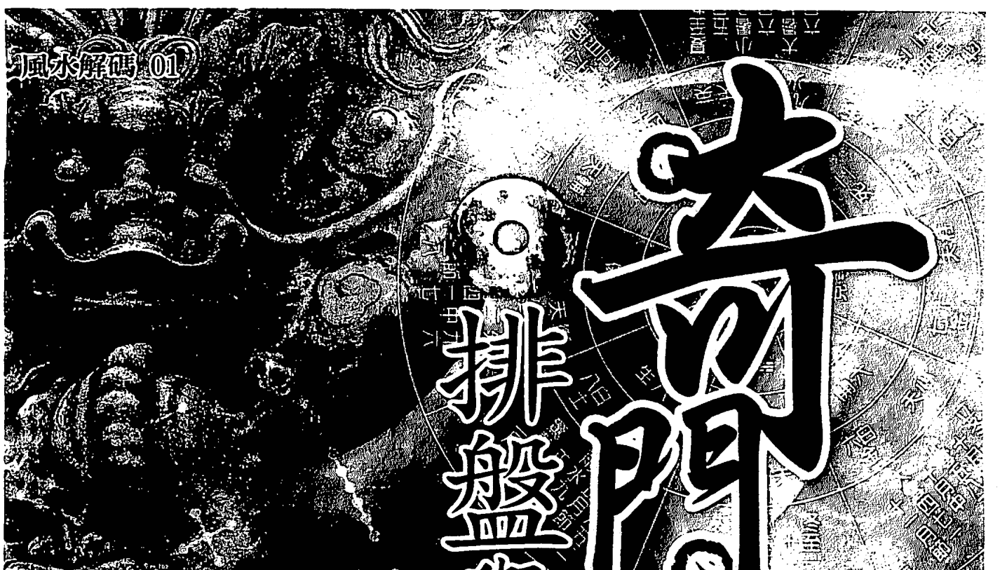

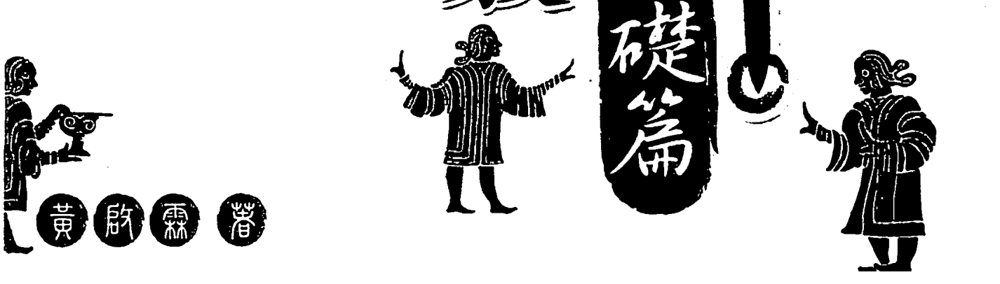

## 序言

人类从个体觅食而成群游牧，再定居农耕，这个由单数个体形成集落国家的变化过程中，必定遭遇各种大自然变动与外敌侵犯，使得「攻」与「防」的意识及行动因此萌芽。如何发展农耕使国家富庶？如何在外力环伺之下保卫国家并击败敌人？如何扩张地盘使国家更加强盛进步？无不关系「攻」、「防」。

古圣先贤长期不断观察「宇宙磁场」，配合「阴阳五行」研究逻辑得知：宇宙的「天时」与「八卦方位空间」，就是所谓天时、地利、人和的天地自然定律。而攻防致胜要诀，不外是进攻时选择「有利于我」的时辰八卦方位；若遇到「有利于他」的时辰方位时，则应保持「有利于我」的防守位置，或设法将「有利于他」转为「有利于我」的致胜契机。如黄帝发明「指南车」，在战斗中灵活运用有利于我、不利于他的时辰八卦方位，机动掌握优势，而于涿鹿之战击败强敌蚩尤。

黄帝根据天时、地利、人和与阴阳五行之磁场原理，始创原为4320局，再经宰相风后整修为1080局之遁甲时盘。从此，中国的朝代兴亡史，也可说是奇门遁甲的推演史。因为，各主要朝代兴革的关键人物，都具奇门遁甲造诣，如周朝姜子牙、汉朝张子房、三国诸葛孔明等，无一不是辅佐帝王开基建业的功臣，而明朝的刘伯温，则将遁甲之学发扬光大。

在古代，奇门遁甲之学不但被用于战斗争霸、扩张领域，在帝王治国的政治、建设、法律等方面，也是不可欠缺的重要宝典，但民间是禁学的，所以有「帝王学」之称。

在现代社会中，奇门遁甲的应用范围更是广泛，国家政治、军事、经济、外交，工商企业经营、财务投资借贷，以及求取功名、营造感情等的个人家庭及社会活动，都可用来转祸为福、趋吉避凶。

一般论命术，如紫微斗数或八字推命，功力高段的人，也可正确推断运势吉凶。不过，只能做到「知命而趋吉避凶」，但奇门遁甲却能做到「知命造运而退恶运」，因为它具有「大磁场造运」的积极作用，有「不让命运主宰自己」的攻击性，这才是遁甲之学的真正存在价值。若合并两者的功能性，则更得「知命又能造运」的上乘效果。

本全集之入门篇，系依清朝「古今图书集成」艺术典术数部奇门遁甲之「烟波钓叟歌」为全书架构，并以简易文字解说歌词，使读者明了遁甲各项要诀及其来源。后续则有「工具篇」，将遁甲时盘、日盘、月盘、遁甲专用历等，整编于一书，方便读者查阅。「阴遁篇」、「阳遁篇」除列出全部遁甲1080局阴阳时盘八方位及其吉凶格之外，并以「比分法」判断特定方位的吉凶，读者若有考试、做业务、谈判等之需要时，不必自己排算，就能立刻找出最好的时辰与方位，这是坊间前所未见的作法，将使遁甲书籍成为极简便之工具书，也将使奇门遁甲更能符合现代生活的实际应用。

## 第一章 从「烟波钓叟歌」谈起

### 烟波钓叟歌

阴阳逆顺妙难穷 二至还乡一九宫
若能了达阴阳理 天地都来一掌中
轩辕黄帝战蚩尤 涿鹿经年苦未休
偶梦天神授符诀 登坛致祭谨虔修
神龙负图出洛水 彩凤衔书碧云里
因命风后演成文 遁甲奇门从此始
一千八十当时制 太公删成七十二
逮于汉代张子房 一十八局为精艺
先须掌上排九宫 纵横十五在其中
次将八卦论八节 一气统三为正宗
阴阳二遁分顺逆 一气三元人莫测
五日都来换一元 接气起神为准的
认取九宫分九星 八门又逐九宫行
九星逢甲为直符 八门直使自分开
符上之门为直使 十时一位堪凭据
直符常遣加时干 直使顺逆遁宫去
六甲元号六仪名 三奇即是乙丙丁
阳遁顺仪奇逆布 阴遁逆仪奇顺行

吉门偶尔合三奇 值此虽云百事宜
更合从旁加检点 余宫不可有瑕疵
三奇得使诚堪使 六甲遇之非小补
乙逢犬马丙鼠猴 六丁玉女骑龙虎
又有三奇游六仪 号为玉女守门扉
若作阴私和合事 请君但向此中推
天三门兮地四户 问君此法如何处
太衡小吉与从魁 此是天门私出路
地户除危定与开 举事皆从此中去
六合太阴太常君 三辰元是地私门
更得奇门相照耀 出行百事总欣欣
太衡天马最为贵 卒然有难难逃避
但当乘取天马行 剑戟如山不足畏
三为生气五为死 胜在三分衰在五
能识避三避五时 造化真机须记取
就中伏吟最为凶 天蓬加着地天蓬
天蓬若到天英上 须知即是反吟宫
八门反复皆如此 生在生兮死在死
纵有吉宿得奇门 万事皆凶不堪使
六仪击刑何大凶 甲子直符愁向东
戌刑在未申刑虎 寅巳辰辰午刑午
三奇入墓好思推 甲日那堪见未宫
丙奇属火火墓戌 此时诸事不须为
更嫌六乙来临二 月奇临六亦同论

又时干入墓宫 课中时下忌相逢
戊戌壬辰兼丙戍癸未丁丑一同凶
五不遇时龙不精 号为日月损光明
时干来克日干上 甲日须知时忌庚
奇与门兮共太阴 三般难得总加临
若还得二亦为吉 举措行藏必遂心
更得直符直使利 兵家用事最为贵
常从此地击其术 百战百胜君须记
天乙之神所在宫 大将宜居击对冲
假令直符居离九 天英坐取击天蓬
甲乙丙丁戊阳时 神居天上要君知
坐击须凭天上奇 阴时地下亦如之
若见三奇在五阳 偏宜为客自高强
忽然逢着五阴位 又宜为主好裁详
直符前三六合位 太阴之神在前二
后一宫中为九天 后二之神为九地
九天之上好扬兵 九地潜藏可立营
伏兵但向太阴位 若逢六合利逃形
天地人分三遁名 天遁月精华盖临
地遁日精紫云蔽 人遁当知是太阴
生门六丙合六丁 此为天遁自分明
开门六乙合六己 地遁如斯而已矣
休门六丁共太阴 欲求人遁无过此
要知三遁何所宜 藏形遁迹斯为美

庚为太白丙荧惑 庚丙相加谁会得
六庚加丙白入癸 六丙加庚癸入白
白入癸兮贼即来 癸入白兮贼须减
丙为勃兮庚为格 格则不通勃乱逆
天丙加地干为勃 天庚加地癸为格
丙加天乙为勃符 天乙加丙为飞勃
庚加日干为伏干 日干加庚飞干格
加一宫兮战在野 同一宫兮战于国
庚加直符天乙伏 直符加庚天乙飞
庚加癸兮为大格 加己为刑最不宜
加壬之时为上格 又嫌岁月日时逢
更有一般奇格者 六庚谨勿加三奇
此时若也行兵去 定马只轮无返期
六癸加丁蛇天娇 六丁加癸雀入江
六乙加辛龙逃走 六辛加乙虎猖狂
请观四者是凶神 百事逢之莫措手
丙加甲兮鸟跌穴 甲加丙兮龙返首
只此二者是吉神 为事如意十八九
八门若遇开休生 诸事逢之总称情
伤宜捕获终须获 杜好遨遮及隐形
景上投书并破阵 惊能擒讼有声名
若问死门何所主 只宜吊死与行刑
蓬任冲辅禽阳星 英芮柱心阴宿名
辅禽心星为上吉 卫任小吉未全亨
大凶蓬芮不堪使 小凶英柱不精明
大凶无气变为吉 小凶无气一同之
吉宿更能逢旺相 万事万全功必成
若逢休囚并废没 劝君不必进前程
要识九星配五行 各随八卦考义经
坎蓬星水离英火 中宫坤艮土为营
乾兑为金震巽木 旺相休囚看重轻
与我同行即为相 我生之月诚为旺
废于父母休于财 囚于鬼兮真不妄
假令水宿号天蓬 相在初冬与仲冬
旺于正二休四五 其余做此自研究
急则从神缓从门 三五反复天道亨
十干加伏若加错 入库休囚吉事危
十精为使用为贵 起宫天乙用无遗
天目为客地为主 六甲推兮无差理
劝君莫失此玄机 洞微九宫扶明主
宫制其门不为迫 门制其宫是迫雄
天网四张无路走 一二网低有路踆
三至四宫行人墓 八九高强任西东
节气推移时候定 阴阳顺逆要精通
三元积数成六纪 天地未成有一理
请观歌里精微诀 非是贤人莫传与

### 一、奇门遁甲的历史渊源

> 〈歌词〉
> 轩辕黄帝战蚩尤，涿鹿经年苦未休；
> 偶梦天神授符诀，登坛致祭谨虔修；
> 神龙负图出洛水，彩凤衔书碧云里；
> 因命风后演成文，遁甲奇门从此始；
> 一千八十当时制，太公删成七十二；
> 逮于汉代张子房，一十八局为精艺；

〈歌词释义〉
「奇门遁甲」以其历史背景而言，与中国历代的盛衰兴亡，有不可分的关联性。
举凡各主要朝代兴革的关键人物，都精于奇门遁甲，并能取巧运用其妙，而把握必胜的成功机运。
相传轩辕黄帝偶然梦见天神授符，创始4320局奇门遁甲盘。又命宰相风后演绎成文，而制定奇门1080局盘，所以奇门遁甲以黄帝为始祖。黄帝与蚩尤对战于涿鹿时，运用此学，掌握时空的相对机制，及时运用「指南车」而居于优势方位，抓住先机，终于战胜蚩尤。
周代太公望吕尚（姜子牙），将风后制定的1080局奇门，依「易理」删成72局奇门变化。他辅佐周武王讨伐殷商纣王，所用奇门阵势变化莫测，有战必胜，灭殷纣王后，又统一诸国，建立周朝基础。
后有周朝迁都之议，更是以奇门的「地利方位」慎重其事。周朝之所以能维持900年长期执政，都归功于他能巧妙搭配奇门遁甲「天时」、「地利」、「人和」三才经营所致。

汉代的张良，又名张子房，遇到神秘人物「黄石公」，得以传承奇门遁甲。由于他才智过人，将吕尚的遁甲72局，再删节为阴阳遁18局。张良辅弼刘邦，与项羽相争，多次临危之际，都能以其卓越的奇门战略，一一化险为夷。最后迫败项羽于乌江，是辅佐刘邦开基的一大功臣。

三国时代，诸葛孔明对奇门遁甲造诣尤深，料事如神，善于运用致胜关键，在许多战役中，皆以奇门遁甲洞察天时，掌握地利与人和，而制敌致胜。诸葛孔明辅佐蜀汉刘备，成三国鼎立之局，刘备死后，又辅弼二世阿斗，能以弱势维持三国鼎立局面多时，是三国时代风靡一时的著名宰相军师。

明代刘伯温，更是将奇门遁甲之学发扬光大，有功于明朝隆盛。其玄妙预言，流传至今，后世之人运用无尽，景仰倍之。

### 二、奇门遁甲的原理

> 〈歌词〉
> 阴阳逆顺妙难穷

〈原文〉
夫阴阳者太极，静而生阴，动而生阳。易曰，无极之前阴含阳，有象之后阳含阴也……天地终始一十二万九千六百年为一元之数，分为子～亥十二宫，每宫有一万八百年为一会之数，天开于子，地阖于丑，人生于寅，闭物于戌，天数到戌则不复有人，天数到亥则周十二宫以为大数而天地混矣，终则复始，循环无穷，天地再造。故先有阴而后有阳也。逆顺者，冬至后阳爻升进，用阳遁顺行其生气，夏至后阴爻起发，用阴遁逆行其杀气。

### 〈歌詞釋義一〉

天地由無象的「無極」狀態，進而成 為生出萬象的中心——太極，太極含有「陰與陽」，為宇宙森羅萬象之「消長作 動，由無生有」的原點。太極無「時空」而靜時，是陰氣中含有陽氣；太極帶「時空」而有象作動時，則生陽氣。

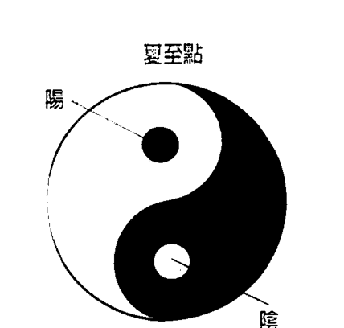

### 〈歌詞釋義二〉

根據邵子（邵康節）的重要著作——「皇極經世」中的計算方 法，地球人類生物，由生存到絕滅的一循環，共為129,600年，稱為「一元」。一元再分成子～亥十二宮，一宮稱為「一會」，一會共有10,800年：

- 子會丑會：為天開地闢之期，於此二會，混沌大地的「陽氣」始 發而有象，生物的生存環境條件，逐漸形成，特別是丑會 已有山川草木，是植物繁茂之期。
- 寅會卯會：眾生人類生殖的黎明期，進入卯會，更是靈長人類開 始掌握大地之期，此時人類信仰敬拜太陽神，為「天皇」 統治時代。
- 辰會：人類由小聚落成大聚落，而漸有組織化社會，公推老者、 賢者、聖者統治，為「地皇」統治時代。
- 巳會：屬於有力量之霸權者、征服者，即王者統治眾人之「人皇」 時代。人類相互鬥爭不斷。
- 午會：是陽氣最旺盛、戰亂不絕的火爆時代，也是火藥、武器、 科學技術發達的時代。全世界無論國內外，都容易陷入爭 奪霸權的戰亂期。此時也是陽盛陰衰期，男性的體型、力量、社会活动力，都优于女性，男性粗暴，女性温柔，社会形态有以男性为主体的倾向。现时世界所处的，正是本次元的午会，由帝舜第39年即西元前2217年开始进入，至今年（2005年）是午会的第4222年，因此午会还剩下6579年，才会进入下一个10,800年的未会。
- 未会：阳气渐次衰退，火气下降，地球上的战火熄灭，真正的和平时其来临。世界无霸权争夺，和平用途的科学技术突飞猛进，而社会生活形态也有大变革。阴气抬头的结果，使得女性体型性状与活动力，都与男性抗衡，是男女真正平等的时代。
- 申会酉会：此二会五行属金，人类科技已经发展到顶点，也许能掌握宇宙能源。不过，宇宙能源置换活动，也极有可能会超越极限，而失去宇宙自然大原则的平衡，以致酿成宇宙形态之重大变化，这并非地球生态之福，因盛极必衰。
- 戌会：阳土戌会时，太阳地球之相互营生关系，恐与现代产生极大差异，大自然失去平衡而发生的大爆发、大洪水、地壳变动等灾祸，都可能导致地球生存环境的大变动与破坏。
- 亥会：坏灭的地球，在亥会是一个全无生气的混沌世界。亥会过后，将再度轮回下一个129,600年的新次元。

## 第一章 从「烟波钓叟歌」谈起

### 〈歌词释义三〉

「烟波钓叟歌」中的阴阳逆顺，乃指「冬至」后阳爻升进，则以阳遁顺行其生气；而「夏至」后阴爻起发，则以阴遁逆行其杀气。所以，冬至后的遁甲阳遁盘（阳一局～阳九局）是在洛书九宫以时针顺行顺飞的排法，夏至后的阴遁盘（阴遁九局～阴遁一局），则以时针逆行逆飞的排盘法。

### 二至還鄉圖

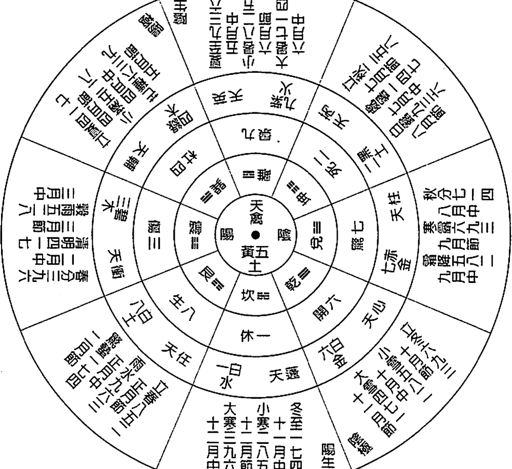

由圖中可得知，冬至在坎宮（一宮），夏至在離宮（九宮）

### 〈歌詞〉

二至還鄉一九宮

### 〈原文〉

「二至」者「冬至夏至」是也，一者坎宮，九者離宮也，「冬至」一陽生於子，故「冬至節」居一宮也。「夏至」一陰生於午，故「夏至節」居九宮也。……六陰極盛一陽來復，謂之冬至，六陽剝盡一陰始生，謂之夏至。

### 〈歌詞釋義〉

冬至起陽遁：乾宮「大雪節」為「十一月節」陰極，「子宮冬至」乃「十一月中氣」陽生。
夏至起陰遁：巽宮「芒種節」為「五月節」陽極，「午宮夏至」乃「五月中氣」陰生。

### 〈歌詞〉

若能了達陰陽理，天地都來一掌中：

### 〈原文〉

若能透徹天地陰陽之卦理及遁甲遁法之法則，一理、二氣、三才、四象、五行、六甲、七曜、八門、九星，皆在於掌握之中起也。

### 〈歌詞釋義〉

一理：天地由無極進而生宇宙森羅萬象之中心點「太極」，是無中生有的第一步，也是天地自然之理。
二氣：以太極為中心，有陰陽二氣，此二氣無窮循環。
三才：天、地、人為三才。
四象：太極進而生陰陽二氣，再進而成四象。四象為生成八卦的前一步，有老陽（火）、少陰（木）、少陽（金）、老陰（水）。
五行：宇宙森羅萬象，都以「木火土金水」五氣五要素而成立，謂之「五行」。因五行性質有相互不斷的「相生相剋」關係，而使萬物不斷輪迴它們的「盛衰消長」。
六甲：六十干支是十天干與十二地支搭配而成的六十組干支，其中以甲為首的干支有甲子、甲戌、甲申、甲午、甲辰、甲寅等六組，謂「六甲」。
七曜：七曜是太陽系的火星、水星、木星、金星、土星，再加上太陽（日）、月等，一共是「七星」。昔日用於曆法星期之周期。日本現在還使用星期一（月曜）、星期二（火曜）、星期三（水曜）、星期四（木曜）、星期五（金曜）、星期六（土曜）、星期天（日曜）。
八門：奇門遁甲盤五層中比較重要之八門層，有開門、休門、生門、傷門、杜門、景門、死門、驚門等八門。
九星：與八門同樣的，奇門遁甲盤五層中比較重要之九星層，有天蓬、天任、天衝、天輔、天禽、天英、天芮、天柱、天心等九星。

### 〈歌詞〉

次將八卦論八節，一行統三為正宗；

### 〈原文〉

天有八風以直八卦，地有八方以應八節，節有三氣，氣有三候，如是八節因之成二十四節氣，更乘之七二候備焉。

- 冬至一宮坎卦 立春八宮艮卦
- 春分三宮震卦 立夏四宮巽卦
- 夏至九宮離卦 立秋二宮坤卦
- 秋分七宮兌卦 立冬六宮乾卦

十一月建子乃「冬至氣」陰極陽生也，子為「天正」周以為歲首也，配「地雷復卦」。十二月建丑為「地正」商以為歲首也，配「地澤臨卦」。正月建寅為「人正」夏朝以為歲首也。
節者，立春、驚蟄、清明、立夏、芒種、小暑、立秋、白露、寒露、立冬、大雪、小寒也。
氣者，雨水、春分、穀雨、小滿、夏至、大暑、處暑、秋分、霜降、小雪、冬至、大寒也。
經云，冬至小寒及大寒，天地人元一二三。立春雨水併驚蟄，依「艮」順增八九一。春分清明併穀雨，但起「震」宮三四五。立夏小滿芒種氣，四五六兮列成排。夏至小暑及大暑，九八七兮遭退數。立秋處暑併白露，從二卻行於一九。秋分寒露及霜降，七六五兮依此向。立冬小雪併大雪，六五四兮依此訣。

### 〈原文釋義一〉「二分二至」、「八節」與「八卦」之關係

太陽在地球表面的照射，是在北緯23.5度的北回歸線，與南緯23.5度的南回歸線範圍內。由於地球也在自轉，所以在地球公轉一周的軌道中，太陽會直射（照射角為直角）赤道二次（春分點與秋分點）及北回歸線（夏至）和南回歸線（冬至）各一次。北半球如此，南半球亦如此，只是南半球冬夏相反。
所謂「二分」是指「春分、秋分」，也就是將一年的軌道公轉時間二等分。「二至」是「夏至、冬至」，亦即公轉軌道從另一角度二等分之。「二分二至」就是一年公轉軌道四等分的季節轉移。
當太陽由南向北移動而直射赤道的一刻，就是「春分點」，當日為「春分日」（陽曆3月21日前後）。當太陽由赤道繼續向北移動而直射北回歸線（最北）的一刻，就是「夏至點」，當日為「夏至日」（陽曆6月21日前後）。
當太陽由北開始南下，而第二次直射赤道的一刻，就是「秋分點」，當日為「秋分日」（陽曆9月23日前後）；當太陽由赤道繼續南下，而直射南回歸線（最南）的一刻為「冬至點」，當日為「冬至日」（陽曆12月22日前後）。以上都是以北半球為基準。
前述「二分二至」，各占黃道軌道一年360度的4等分（90度）範圍，也是一年四季的移動，又可表示東、南、西、北四正方位。
若再將「二分二至」的四範圍各二分，則可得各45度的八等分範圍，也即由「冬至點」的「正北」，依次分為東北、正東、東南、正南、西南、正西、西北、東北等八方位，各方位置同時還表示冬至、立春、春分、立夏、夏至、立秋、秋分、立冬等八季節的推移，各方位置依「洛書後天八卦」八方位宮套上其卦象，即得正北的「坎一」，順時針而行，為艮八、震三、巽四、離九、坤二、兌七、乾六等。

### 〈原文釋義二〉「二十四節氣」與「洛書後天八卦」及奇門遁局

地球一年的公轉軌道360度，今以春分點為0度，則「二至二分」的範圍分別是：「夏至點」在90度、「秋分點」在180度、「冬至點」在270度。
若將此「二至二分」的90度範圍再三等分，也就是360度公轉軌道分為12區塊，則更能詳細判別一年之間的氣候轉移狀況。此12區分點稱為「中氣」，名稱由春分0度起依次為：春分、穀雨、小滿、夏至、大暑、處暑、秋分、霜降、小雪、冬至、大寒、雨水。

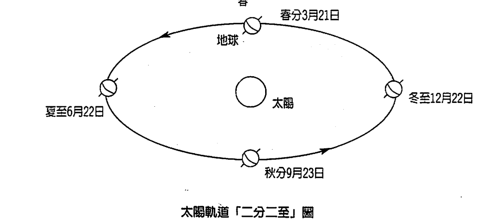

### 太陽軌道「二分二至」圖

此十二「中氣」的十二個二等分點，即為十二「節」，如：

- 「大寒中氣」與「雨水中氣」之中點為「立春節」，
- 「雨水中氣」與「春分中氣」之中點為「驚蟄節」，
- 「春分中氣」與「穀雨中氣」之中點為「清明節」，
- 「穀雨中氣」與「小滿中氣」之中點為「立夏節」，
- 「小滿中氣」與「夏至中氣」之中點為「芒種節」，
- 「夏至中氣」與「大暑中氣」之中點為「小暑節」，
- 「大暑中氣」與「處暑中氣」之中點為「立秋節」，
- 「處暑中氣」與「秋分中氣」之中點為「白露節」，
- 「秋分中氣」與「霜降中氣」之中點為「寒露節」，
- 「霜降中氣」與「小雪中氣」之中點為「立冬節」，
- 「小雪中氣」與「冬至中氣」之中點為「大雪節」，
- 「冬至中氣」與「大寒中氣」之中點為「小寒節」。

以上十二中氣與十二「節」，合稱為「二十四節氣」。一中氣或一節都各有十五日，一氣、一節合組為一個月，二十四節氣共有十二個月。因此，可用二十四節氣為年月的移行基準。如干支曆之正月以「立春節之交接時刻起算」，而立春節亦稱「正月節」，雨水中氣亦稱「正月中氣」。清明節是「三月節」，穀雨中氣是「三月中氣」等等。
而「一氣統三為正宗」的意思，是指後天八卦的每一卦（45度），可管轄三個節氣（一節一氣各15度），即：

- 坎一宮（正北45度）管「冬至、小寒、大寒」，
- 艮八宮（東北45度）管「立春、雨水、驚蟄」，
- 震三宮（正東45度）管「春分、清明、穀雨」，
- 巽四宮（東南45度）管「立夏、小滿、芒種」，
- 離九宮（正南45度）管「夏至、小暑、大暑」，
- 坤二宮（西南45度）管「立秋、處暑、白露」，
- 兌七宮（正西45度）管「秋分、寒露、霜降」，
- 乾六宮（西北45度）管「立冬、小雪、大雪」。

請參閱以下「太陽軌道分割二十四節氣圖」與「洛書八卦與八節關係圖」，即可得到完整概念。
從八卦與八節的關係來看：冬至一宮坎卦，立春八宮艮卦，春分三宮震卦，立夏四宮巽卦，夏至九宮離卦，立秋二宮坤卦，秋分七宮兌卦，立冬六宮乾卦。而以六十四卦搭配十二節二十四氣之寒暑消長的升降律動，辨明卦氣的流動，得出代表農曆十二個月份的「十二辟卦」如下：子——十一月地雷復卦䷗，丑——十二月地澤臨卦䷒，寅——正月地天泰卦䷊，卯——二月雷天大壯卦䷡，辰——三月澤天夬卦䷪，巳——四月乾為天卦䷀，午——五月天風姤卦䷫，未——六月天山遯卦䷠，申——七月天地否卦䷋，酉——八月風地觀卦䷓，戌——九月山地剝卦䷖，亥——十月坤為地䷁。

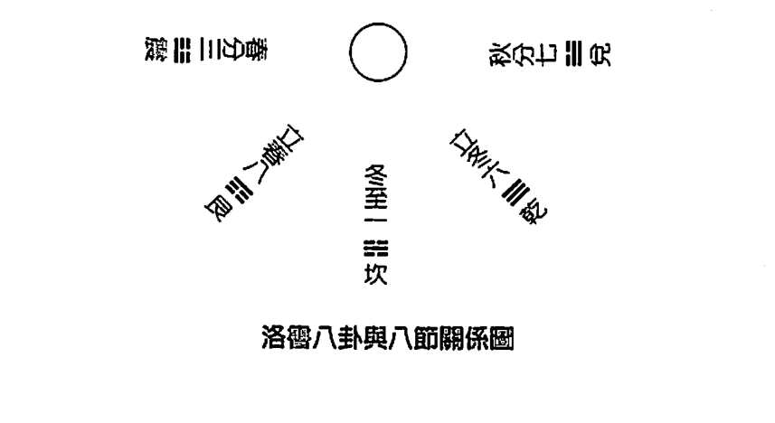

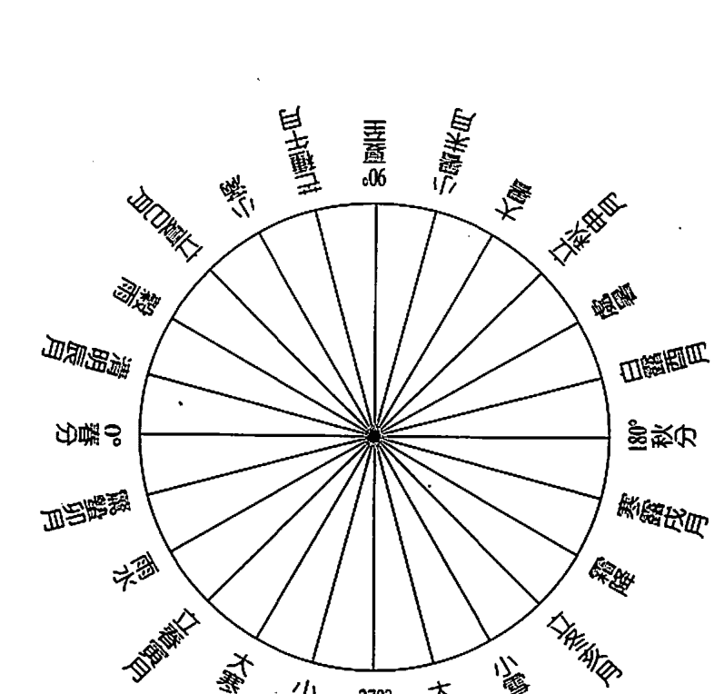

由上述可知，子月冬至的地雷復卦䷗，有一陽爻出現，是為「陽生」；而午月夏至的天風姤卦䷫，有一陰爻出現，是為「陰生」。

### 〈歌詞〉

陰陽二遁分順逆　一氣三元人莫測；
節氣推移時候定　陰陽順逆要精通；
三元積數成六紀　天地未成有一理；

### 〈歌詞釋義〉

前面提到的八卦中，因「坎一、艮八、震三、巽四」是陽遁，故其所管轄從「冬至」開始的十二節氣，都是陽遁配置。「離九、坤二、兑七、乾六」是陰遁，因此，所管轄「夏至」以後的十二節氣，都是陰遁配置。
冬至「上元陽遁一局」起，順遁順行；夏至「上元陰遁九局」起，逆遁逆行。
坎一宮所轄「冬至、小寒、大寒」三節氣，各十五日，因五日一元，所以都分為「上、中、下」三元。而第一節氣冬至的上元定局數，為陽遁一局，因其所在宮為「坎一宮」，且為第一節氣，故定局為「陽一局」。第二節氣小寒的上元順數，加一數為「二」數定局，即小寒節的上元為「陽遁二局」。第三節氣大寒上元，亦再順數加一數，為「三」數定局，即大寒中氣上元「陽遁三局」，至於各節氣之「中元」與「下元」的定局，亦有便捷法，後詳之。
再舉「艮八宮」所轄「立春、雨水、驚蟄」三節氣的「上元定局」為例：第一節氣「立春」的陽遁上元局數是取所在宮數「八」，故為「陽遁八局」。第二節氣「雨水」的陽遁上元局數，是將第一節氣的局數八，順數加一數，為「九」數定局，故雨水中氣的上元為「陽遁九局」。至於第三節氣「驚蟄」的上元局數，是第二節氣「雨水」的局數九順數加一，但遁局最高為九數，所以須由一數再輪起，因此，九加一數，為「一」數定局，即「陽遁一局」。
「離九宮」所轄「夏至、小暑、大暑」三節氣，其第一節氣「夏至」的定局，因是所在九宮的第一節氣，故其上元局數為陰遁九局（注意陰遁為逆數）。第二節氣「小暑」的定局，是第一節氣局數九的逆一數，為八數，即「陰遁八局」。第三節氣再減一數，所以「大暑」上元為「陰遁七局」。以此類推，坤二宮所管的「立秋、處暑、白露」，上元各為陰遁二局、陰遁一局、陰遁九局。
以上節氣取局數可參照前述「二至還鄉圖」的各「節氣名」下的三個數字亦可知。如冬至下之「一七四」三數字，分別代表陽一局、陽七局、陽四局之意。

### 〈歌詞〉

五日都來換一元，接氣超神為準的：

### 〈歌詞釋義一〉符頭與換局

將甲子～癸亥六十日干支的六十天，分成各十五天四組，則各組的第一天定為甲己日。即第一組之第一天為甲子日、第二組的第一天為己卯日、第三組的第一天為甲午日、第四組之第一天為己酉日，此四天稱之為「進神日」或謂「符頭」。也就是說，六十干支日的「甲己」日就是「符頭」。
「五日都來換一元」，是將六十日干支的四分之一各十五天，再分為上、中、下三元，每一元有五天，計六十時辰。此五天六十時辰輪完就換局，上元局五天、中元局五天、下元局五天，計十五天輪完，再輪到次一組十五天節氣的上、中、下三元，四組上、中、下三元輪完後，又從第一組（符頭甲子）輪起，如此週而復始。
符頭甲己日之「支」是「子午卯酉」者為上元，「寅申巳亥」者為中元，「辰戌丑未」者為下元。讀者參考以下排列即一目瞭然：

| 上元 | 中元 | 下元 |
| :--- | :--- | :--- |
| 甲子 乙丑 丙寅 丁卯 戊辰 | 己巳 庚午 辛未 壬申 癸酉 | 甲戌 乙亥 丙子 丁丑 戊寅 |
| 己卯 庚辰 辛巳 壬午 癸未 | 甲申 乙酉 丙戌 丁亥 戊子 | 己丑 庚寅 辛卯 壬辰 癸巳 |
| 甲午 乙未 丙申 丁酉 戊戌 | 己亥 庚子 辛丑 壬寅 癸卯 | 甲辰 乙巳 丙午 丁未 戊申 |
| 己酉 庚戌 辛亥 壬子 癸丑 | 甲寅 乙卯 丙辰 丁巳 戊午 | 己未 庚申 辛酉 壬戌 癸亥 |

由排列可知，各五日的一元之初日，必是「甲己日」，即換局日。而上、中、下三元共計十五日的第一日甲子、己卯、甲午、己酉（甲己日之日支為子午卯酉者）必為「符頭進神日」，是換局日而且也是節氣的交換點，所以是極為重要的日子。

### 《歌詞釋義二》奇門取局原理

### 陽遁歌
冬至驚蟄一七四 小寒二八五同推
春分大寒三九六 芒種六三九是真
穀雨小滿五二八 立春八五二相隨
立夏清明四一七 九六三從雨水期

### 陰遁歌
夏至白露九三六 小暑八二五重逢
秋分大暑七一四 立秋二五八流通
霜降小雪五八二 大雪四七一相同
處暑排來一四七 立冬寒露六九三

這兩首陰陽歌，將二十四節氣分為「陽遁陰遁」各十二節氣，冬至、小寒、大寒、立春、雨水、驚蟄、春分、清明、穀雨、立夏、小滿、芒種為「陽遁」；夏至、小暑、大暑、立秋、處暑、白露、秋分、寒露、霜降、立冬、小雪、大雪為「陰遁」。
「冬至驚蟄一七四」，是說冬至中氣與驚蟄節之各十五天上、中、下三元的「上元五天」都用「陽遁一局」，「中元五天」都用「陽遁七局」，「下元五天」都用「陽遁四局」。
再如「秋分大暑七一四」則謂秋分與大暑此二節氣的陰遁局數，同樣是上元陰遁七局、中元陰遁一局、下元是陰遁四局，其餘類推。
「二至還鄉圖」的二至二分及四立（八節）分居洛書八卦的首節，而其上元搭配洛書宮數，以冬至居坎一，夏至居離九，如前述。

### 遁甲時鑒定局表（數字表示局數，縱橫數字都有連帶變化）

| 陽遁(冬至後之十二節氣) | 宮位 | 節氣 | 時辰 | 上元 | 中元 | 下元 |
| :--- | :--- | :--- | :--- | :--- | :--- | :--- |
| 陽遁 | 坎一宮 | 冬至 | 甲子時 | 上元①局起 | 中元7局起 | 下元4局起 |
| 陽遁 | 坎一宮 | 小寒 | 甲子時 | 上元2局起 | 中元8局起 | 下元5局起 |
| 陽遁 | 坎一宮 | 大寒 | 甲子時 | 上元3局起 | 中元9局起 | 下元6局起 |
| 陽遁 | 艮八宮 | 立春 | 甲子時 | 上元⑧局起 | 中元5局起 | 下元2局起 |
| 陽遁 | 艮八宮 | 雨水 | 甲子時 | 上元9局起 | 中元6局起 | 下元3局起 |
| 陽遁 | 艮八宮 | 驚蟄 | 甲子時 | 上元1局起 | 中元7局起 | 下元4局起 |
| 陽遁 | 震三宮 | 春分 | 甲子時 | 上元③局起 | 中元9局起 | 下元6局起 |
| 陽遁 | 震三宮 | 清明 | 甲子時 | 上元4局起 | 中元1局起 | 下元7局起 |
| 陽遁 | 震三宮 | 穀雨 | 甲子時 | 上元5局起 | 中元2局起 | 下元8局起 |
| 陽遁 | 巽四宮 | 立夏 | 甲子時 | 上元④局起 | 中元1局起 | 下元7局起 |
| 陽遁 | 巽四宮 | 小滿 | 甲子時 | 上元5局起 | 中元2局起 | 下元8局起 |
| 陽遁 | 巽四宮 | 芒種 | 甲子時 | 上元6局起 | 中元3局起 | 下元9局起 |
| 陰遁 | 離九宮 | 夏至 | 甲子時 | 上元⑨局起 | 中元3局起 | 下元6局起 |
| 陰遁 | 離九宮 | 小暑 | 甲子時 | 上元8局起 | 中元2局起 | 下元5局起 |
| 陰遁 | 離九宮 | 大暑 | 甲子時 | 上元7局起 | 中元1局起 | 下元4局起 |
| 陰遁 | 坤二宮 | 立秋 | 甲子時 | 上元②局起 | 中元5局起 | 下元8局起 |
| 陰遁 | 坤二宮 | 處暑 | 甲子時 | 上元1局起 | 中元4局起 | 下元7局起 |
| 陰遁 | 坤二宮 | 白露 | 甲子時 | 上元9局起 | 中元3局起 | 下元6局起 |
| 陰遁 | 兌七宮 | 秋分 | 甲子時 | 上元⑦局起 | 中元1局起 | 下元4局起 |
| 陰遁 | 兌七宮 | 寒露 | 甲子時 | 上元6局起 | 中元9局起 | 下元3局起 |
| 陰遁 | 兌七宮 | 霜降 | 甲子時 | 上元5局起 | 中元8局起 | 下元2局起 |
| 陰遁 | 乾六宮 | 立冬 | 甲子時 | 上元⑥局起 | 中元9局起 | 下元3局起 |
| 陰遁 | 乾六宮 | 小雪 | 甲子時 | 上元5局起 | 中元8局起 | 下元2局起 |
| 陰遁 | 乾六宮 | 大雪 | 甲子時 | 上元4局起 | 中元7局起 | 下元1局起 |《歌词释义三》各节气上、中、下三元「便捷取局法」

阳遁：1—9数的顺数序列

| 冬至坎一宫 |
| :--- |
| 1 → 2 → 3 |
| 7 → 8 → 9 |
| 4 → 5 → 6 |

| 立春艮八宫 |
| :--- |
| 8 → 9 → 1 |
| 5 → 6 → 7 |
| 2 → 3 → 4 |

| 春分震三宫 |
| :--- |
| 3 → 4 → 5 |
| 9 → 1 → 2 |
| 6 → 7 → 8 |

| 立夏巽四宫 |
| :--- |
| 4 → 5 → 6 |
| 1 → 2 → 3 |
| 7 → 8 → 9 |

阴遁：9—1数的逆数序列

| 夏至离九宫 |
| :--- |
| 9 → 8 → 7 |
| 3 → 2 → 1 |
| 6 → 5 → 4 |

| 立秋坤二宫 |
| :--- |
| 2 → 1 → 9 |
| 5 → 4 → 3 |
| 8 → 7 → 6 |

| 秋分兑七宫 |
| :--- |
| 7 → 8 → 9 |
| 1 → 2 → 3 |
| 4 → 5 → 6 |

| 立冬乾六宫 |
| :--- |
| 6 → 5 → 4 |
| 9 → 8 → 7 |
| 3 → 2 → 1 |

表中横列的三个数字，是各八卦宫三节气的上元局数，纵列的三个数字，是各节气的上、中、下三元局数，九个数字中左上角的第一个数字，是该八卦宫第一节气的上元局数。

《歌词释义四》超神、正授、接气的置闰法

奇门遁甲的节气换局，以「符头日」为基准，而实际日历的一节或一气，不一定都是十五天，平均每个月（一节一气）多出10.5小时。若同时起算，则「符头」总比节气每个月早到10.5小时。

这种「符头」比节气先到的状况，称为「超神」。「超神」会随着时间的累积，造成愈大的差距，而必须在适当时候，调节「符头」与「节气」的差距，这种调节就叫做「置闰」。

每年的「大雪」或「芒种」期间，就要检查，若「超神」超过九天以上，就将「大雪」或「芒种」节气的上、中、下三元，重复闰用一次，使已经超前的「符头」因为这样「置闰」十五天，反而比「节气」落后几天。如此「节气」先到，而「符头」后到的状况，称为「接气」。

因置闰而落后的「接气」，再度以每月10.5小时的速度，渐渐缩短与日历上「节气」的差距，追成「符头」与「节气」同时到的状况，就是「正授」。

「正授」之后，「符头」渐渐超前，而成「超神」，此「超神」状况超越九天，则再「置闰」十五天，使比节气落后。而落后的「符头」，再度以每月10.5小时逐渐缩短与历上的节气差距，迎头追上与日历的节气同一天，即为「正授」，之后「符头」再超前日历上的节气。如此，超神、正授、接气的连续状况周而复始，就是所谓的「遁甲置闰法」。

以1998年（戊寅年）为例：

该年阳历6月21日（己亥日）为「夏至」，6月11日是「超芒种」，下元阳九局，6月16日为甲午日起，应可进入夏至局换遁，因为甲午日可为夏至节气的符头日及阴阳换遁日。但因与日历上的「夏至」6月21日只相差六天，故不必将芒种之上、中、下三元再闰一次，可以「超夏至」一直继续下去即可。

此「超神」继续到12月8日（己丑日）超大雪，下元阴一局，检查下一节气符头12月13日（甲午日），应不应该成为冬至节气的阴阳换遁或换局日。由于该日与日历上的冬至日，相差已有十天，因此必须「置闰」，所以这一天起再闰「大雪上、中、下三元一次」，由12月28日（己酉日）起换遁换局为冬至阳遁上、中、下三元。而12月28日因此比日历上的冬至12月22日晚了七天，所以冬至以后是「接气」。

## 第一章 从「烟波钓叟歌」谈起

### 1. 奇门遁甲与现代社会

奇门遁甲是研究天时、地利、人和之相互作用以及摄取运用，使有利于己方能稳操胜算的学术。其目的非常积极，而且带有趋吉避凶的功效。昔日多被用于军事政治，是帝王护身卫国的法宝，所以又称为「帝王之学」。

而奇门遁甲在现代社会的用途，更为广泛，因为每人每天都要面对社会的激烈竞争，不能战胜即被淘汰。若能知悉彼我双方的形势，而伺机进退且趋吉避凶，则必然可在激烈竞争中，立于不败之地。

优秀的企业家，时时刻刻都在预测未来之事，以使经营顺利进展。更重视天时、地利、人和的有效运用，使整体事业结构处于天衣无缝的有利局势。

### 2. 「命」与「运」

当某一个体如小家庭、聚落、集团、国家、民族或「人」等诞生之时，太阳必定一视同仁，给予诞生礼物，即依其生辰（年月日时）分别塑出与生俱来应有的基本景象，并暗示其人生的吉凶历程，在「吉凶」循环不断的「时空」中，施加趋吉避凶的能源置换力量。

人生都脱离不了「时空」的吉凶推移，在特定空间里（方位环境）遭遇的事象，依时间不同，而吉凶也不同。或在特定的时间里发生的事象，因空间方位的不同，吉凶也有异。我们置身转变不断的大自然里，如何摄取「天」即太阳能源，并调和此能源，以趋吉避凶，求得进取，这就是研究应用奇门遁甲造运法之目的。

我们以日常琐事为例：每天搭公车上班，但有些日子等车等很久，车子来了又好不容易才挤上，到了办公室，遇到的事都不顺畅，同事老在找麻烦，真是受罪。计程车司机一早开车出门，乘客下车立即补上，整天没有空车，生意真是不错。但却有的日子，从早到晚都载不到客，好不容易前面有人招手，又刚好遇到红灯，客人给别的车载走了，真是衰运的一天。

类似这种好运或坏运，如果能应用「奇门造运法」，正确取用「时空」的吉方行事，则坏运可能减少，而多趋吉运。

日常活动的时空，既有「吉方吉时」与「凶方凶时」之分，若未以「奇门造运」施法，则只能被该时辰行运的好坏左右。行运佳的，就能自动在吉时往吉方，而诸事顺畅；但行运不佳时，可能就会在凶时往凶方行事，而致诸事不成。

相命卜运的目的，在知命测运，命不佳并不可怕，因为那只是提示「命运不是上乘，有些欠缺，须加倍努力」，待人接物或处理事情，可能阻碍较多且辛苦了一点。不过，此时若能掌握「行运」的吉凶动向，善加利用「奇门造运法」趋吉避凶，则必有机会获得最后胜利，人生也过得比较有意义。最怕的是只知道命不好，不知道好运也会轮回而来，也可有努力向上的机会。这种宿命论者，只能忧郁度过毫无斗志的一生。

更有一些根本不知自己命运如何，而自以为是的人，在不如意时，是是非非都赖给长官、家人或周围的人身上，且怨天尤地，毫无自新奋发的志气，这种人终会失意落魄，自坏前途。生来好命的人应保持谦虚有礼、积善布施的美德。如果自满恃势，得意乱作，一旦行运衰败时，则既无阴德可补，更无外援之助，结果枉费天赋好命，运势一落千丈。

### 3. 「知命避凶运」是消极下策，「知命造吉运」才是积极上策

人常会遭遇不如意无法解决的事，在不知所措之时，只能寄託神佛保佑或请相士指点坏运何时会过去？好运何时会来？事情后果吉凶如何？何时有贵人相助等等。这是人之常情，无可厚非，因为诚心许愿，可获得心灵慰藉与某种期待。相士指点多少能有定心效果，但无法避免终须面对的现实。所以，只期待坏运转好，恐无济于事，积极「造运解厄」，才是正道。

比如国家的政治、军事、工商业的发展，以及个人在家庭、社会的活动等，若只消极被动而不去积极争取，或可维持平和恒安的局面，但不可能有辉煌的成就。这种避凶法门，不能算是上乘之策。

我们应知经过多次失败的痛楚磨练，而犹能往上爬，且终究站起的，才是真正的成功者。也只有这种努力不懈的人，才能得到神佛的保佑，相士的指点，才有意义。这样的人，有资格「识天命而论天命，识天时而论天时」，也知道如何运用地利、人和，使事情顺利进行。这种不畏艰苦地去「解厄取吉」，是积极性的造命趋吉避凶法则，避是守，造是攻，能掌握吉时，争取有利空间，就能攻守兼顾，开拓机运，是「知命而后造运」的上策。

在军事作战时，掌握「利于我」的时空与好格局，采取主动攻势，必能制胜无疑。反之，在「利于他」的时空下作战时，则应採守势，才能守得住，若採攻势，必无法得逞，反招败战。争取外交敦睦，也有「时空格局」的影响，若向「不利于我」时空的国家去争取邦交，努力会落空。同理，对个人日常诸事，如婚姻、事业、财运、健康、旅行等，都有「利我」的「主攻」，与「利他」的「守势」时空，可供选择。

### 4. 袁了凡「知命造运」的故事

这是命理界家喻户晓有关知命造运的故事：明代袁坤仪（又称黄坤仪）号「了凡」，初学医，在偶然的机会遇到「孔道人」，经端相应指点应弃医而读书，将来必金榜题名，甚至连可考上进士第几名、在何处任官、财路会有多少、命中无子息、五十三岁寿终等，都指出来了。

了凡依其言，弃医读书并参加科举，果然金榜题名。以后都依照高人指点诸事，一一应验。后于辞官归途遇「云谷禅师」，得到「命由心造，福由心生」的启蒙，参悟之后，立誓行「三千功」，而从此行运改变，孔道人所指点应会发生的景象不再。而如此造运之后，不但得一子，且活到七十四岁无疾而终。

了凡本来就有高中科举任官成财之「命」，孔道人指点的命格一点都没有错，这是了凡与生俱来应有的命格。后得云谷禅师开导「行运弹性」、「造运心机」，而能积善功以造运，使本来的好命，再加上行运努力，吉上加吉，是知命而又能造运的最佳范例。

### 5. 「出门取吉造运法」的运用（具体方法请见后面章节所述）

奇门遁甲时盘有每天十二时辰的吉凶方位，与吉凶格局的表示，除了可应用于前述诸事选择，也可用于每天的「出门取吉造运」。

每天第一次出家门时，向该时辰的最佳吉方（最好选有三奇门好格局的方位）行走三分钟以上，出门时辰若能选择黄道吉时更佳。因为这是当日初次与屋外大气（太阳能源）接触之时，选择奇门遁甲盘八卦八方位中最佳吉方，也就是「三奇门」、「吉格」之方位及时，行走沐浴太阳能源，当然会得天时的磁场感应。

初次出门所沐浴大气磁波感应（正阳之气）的好坏，会影响一天诸事顺畅与否。虽然可能影响日常小事，但这三分钟（最少三分钟，过后即可行走任意方向）的行走沐浴时间，对人的造命能源有充电蓄积效果，而且长期累积这种能源吉气，会有改运造运的作用，也可减轻当日的不顺调。

对于「命佳运吉」的，可持续其吉象，吉上加吉。命不佳的，也能使其行运转佳。健康不好的，长期实行此法后，体质气色都自然有所改善。

反之，每日初次出门时，若不留意八方位的吉凶，而误行凶方，以致沐浴到凶气，则当日诸事不顺，情绪也不好。每天上班的人出门，大约上午七～九点（辰时），然后再走去搭车，可能每日初出门的方位都相同，但每日这个时辰与同方位的八卦八方位的吉凶是不同的。所以，每日出门时，最好能先往该时辰的吉方行走几分钟，再往任意方向而去。这个动作虽是小小麻烦，但若能每日实行，则不仅能减少许多不如意事，还能诸事顺利。这比每年于正月初一，择良辰出门往寺庙取吉之法，效果好得多。

### 6. 天、地、人三才

「天」是天体，狭义是指太阳，是地球上诸生物、植物维持生存所不可缺之热能来源。太阳射出的磁波，对人类生理心性，影响至大。也就是说太阳能源支配着人类的盛衰消长。太阳能有「时空性」的变化，分别为四季之季节性变化、一年间的二十四节气变化、一天十二时辰的昼夜时刻变化等。

太阳能的「时空移行」，都依六十干支历表示（六十年干是六十年象、六十月干是六十月象、六十日干是六十日象、六十时干是六十时象）之变化。

奇门遁甲「阴阳遁局时盘」，亦以此干支历象构成，遁甲时盘的天盘与地盘的天干，就是表示太阳的「时空性变化」。

时盘的八方位天盘干，表示各该当时辰各方位的太阳能吉凶。时盘的八方位地盘干，表示各该当时辰所属节气一元（五日六十时辰）八方位的太阳能吉凶分布。此即所谓「天时」。

太阳能不单是人类维生的热源，人类的智慧还可依「质量不灭定律」将太阳热能置换成多种能源，有助科学技术之发展。甚至将人体之「意识念力」与「天体能磁波」合调，显现科学或一般常识还不可解的「意识潜能」。

「地」是大地、地球，是人类生息的地方。「地」是固定不动的，人类在地上移动、活动之所谓的「方向」，是指「相对性意识」之方向，因为是地上的人在移动，而不是地在移动。

「地」以固定的「地支」，表示遁甲时盘八方位之卦象（十二地支于遁甲盘分为 子、丑寅、卯、辰巳、午、未申、酉、戌亥的八方位），而一旦与具有相对性「时空」因素的天干天时互相配合，则会显示八方位之吉凶卦象。此所谓「地利」。

「人」就是生栖于地球大地的个人或众群团体、民族等人类的总称。人类具有灵性智慧，故可与天地并立为「天地人」。不但能抗禦天地不测之风云灾难，也能利用天地的能量资材，发展人类社会的文明科技。「人」在天与地之中间，运用其灵性智慧，将天地时空之有利能源，置换成为趋吉避凶之机运，进而获得造运之功，以经营有意义的人生。

遁甲的「天地人」理论，阐明了人类与奇门遁甲盘之天地玄妙互动，而产生造运立体动力，这刚巧与物理学的发电与电动理论「佛来明法则」（Fleming）右手（电动势）、左手（电流）之法则一致。右手拇指（导体方向）代表地利、食指（磁场方向）代表天时、中指（感应电动势方向）代表人智。左手拇指（动力方向）代表地利、食指（磁力线方向）代表天时、中指（电流方向）代表人智。

## 第二章 奇门遁甲盘之构成与排盘

奇门遁甲盘包括天盘地盘、九星盘、八门盘、八神盘等五层盘。也有的排六层盘，即加一层紫白九星盘。但此盘是「烟波钓叟歌」中没有记载的，不是奇门遁甲之正典，所以暂时不提。

-   洛书九宫有飞泊口诀如下：
中宫飞出乾 却与兑相连 艮离寻坎位 坤震迁居巽 巽复入中宫

上述口诀是根据「戴九履一，左三右七，二四为肩，六八为足」的洛书九宫图示而演排出来的。

「烟波钓叟歌」有「先须掌上排九宫，纵横十五在其中」的句子，意思是：先运算洛书于掌中，洛书九宫的纵横斜三宫数加总的和，都是十五。

九数是由中宫起五数，六数则飞入乾宫，七数飞入兑宫，八数飞入艮宫，九数飞入离宫，九数后之一数则飞入坎宫，二数坤宫，三数震宫，四数到巽宫，之后五数复飞入中宫。这是洛书九数从中宫起五数的「洛书九宫飞泊法」。

| 巽(4) | 离(9) | 坤(2) |
| :---: | :---: | :---: |
| 震(3) | 中(5) | 兑(7) |
| 艮(8) | 坎(1) | 乾(6) |

奇门遁甲的九宫飞法，不一定都从中宫起五数，一～九的每一数，都可能入中宫，而且不只是飞入数字。奇门遁甲地盘的「三奇六仪」，即「乙丙丁戊己庚辛壬癸」，各天干亦得飞入九宫。

地盘的「三奇六仪」、各天干的洛书九宫飞泊法，是阳遁顺数顺飞、阴遁逆数逆飞，比较烦杂。但只要练熟本节的飞泊宫程序，则能如意排盘。

以下是洛书九宫基本飞泊及一至九数各从中宫飞出的洛书九宫图示，很奇妙的，此与物理上的原子、中子、电子等的活动方向，是一致的：

### 一、地盘排盘法

〈歌词〉
阳遁顺仪奇逆布，阴遁逆仪奇顺行；

〈歌词释义〉
把地盘的三奇、六仪排布于九宫的方法是：
阳遁时，六仪（戊己庚辛壬癸）依序顺飞九宫，而三奇（乙丙丁）则依序逆飞九宫。阴遁时，六仪（戊己庚辛壬癸）依序逆飞九宫，而三奇（乙丙丁）则依序顺飞九宫。

我们举一个排盘例如下：

阳遁一局从戊宫起顺飞，戊宫在坎一，依次为己在坤二、庚在震三、辛在巽四、壬在中五、癸在乾六、丁在兑七、丙在艮八、乙在离九，此为按照一至九的顺序配布，故为顺飞。

阴遁九局从戊宫起逆飞，戊宫在离九，依次为己在艮八、庚在兑七、辛在乾六、壬在中五、癸在巽四、丁在震三、丙在坤二、乙在坎一，此为按照九至一的相反顺序配布，故为逆飞。

这个方法也有更简捷的方式：

先将三奇六仪的顺序设定为戊、己、庚、辛、壬、癸、丁、丙、乙，然后无论阴遁或阳遁，都先将排第一位的「戊」仪，佈于局数宫位，如一局（无论阳遁、阴遁），就将戊仪佈于一宫；若为阳遁三局或阴遁三局，就将「戊」佈于三宫。

阳遁则从「戊」宫起，依设定次序将六仪三奇顺飞佈入于九宫；

阴遁则从「戊」宫起，依设定次序将六仪三奇逆飞佈入于九宫。

阳遁地盘的阳遁一局到阳遁九局，共有九种变化；阴遁地盘也是阴遁一局到阴遁九局，共有九种变化。

### 阳遁地盘九宫图

| 辛(巽四) | 乙(离九) | 己(坤二) |
|----------|----------|----------|
| 庚(震三) | 壬(中五) | 丁(兑七) |
| 丙(艮八) | 戊(坎一) | 癸(乾六) |

### 阳遁一局

从一宫（坎）开始起戊，依次顺飞。

| 庚(巽四) | 丙(离九) | 戊(坤二) |
|----------|----------|----------|
| 己(震三) | 辛(中五) | 癸(兑七) |
| 丁(艮八) | 乙(坎一) | 壬(乾六) |

### 阳遁二局

从二宫（坤）开始起戊，依次顺飞。

| 己(巽四) | 丁(离九) | 乙(坤二) |
|----------|----------|----------|
| 戊(震三) | 庚(中五) | 壬(兑七) |
| 癸(艮八) | 丙(坎一) | 辛(乾六) |

### 阳遁三局

从三宫（震）开始起戊，依次顺飞。

| 戊(巽四) | 癸(离九) | 丙(坤二) |
|----------|----------|----------|
| 乙(震三) | 己(中五) | 辛(兑七) |
| 壬(艮八) | 丁(坎一) | 庚(乾六) |

### 阳遁四局

从四宫（巽）开始起戊，依次顺飞。

| 乙(巽四) | 壬(离九) | 丁(坤二) |
|----------|----------|----------|
| 丙(震三) | 戊(中五) | 庚(兑七) |
| 辛(艮八) | 癸(坎一) | 己(乾六) |

### 阳遁五局

从五宫（中）开始起戊，依次顺飞。

| 丙(巽四) | 辛(离九) | 癸(坤二) |
|----------|----------|----------|
| 丁(震三) | 乙(中五) | 己(兑七) |
| 庚(艮八) | 壬(坎一) | 戊(乾六) |

### 阳遁六局

从六宫（乾）开始起戊，依次顺飞。

| 丁(巽四) | 庚(离九) | 壬(坤二) |
|----------|----------|----------|
| 癸(震三) | 丙(中五) | 戊(兑七) |
| 己(艮八) | 辛(坎一) | 乙(乾六) |

### 阳遁七局

从七宫（兑）开始起戊，依次顺飞。

| 癸(巽四) | 己(离九) | 辛(坤二) |
|----------|----------|----------|
| 壬(震三) | 丁(中五) | 乙(兑七) |
| 戊(艮八) | 庚(坎一) | 丙(乾六) |

### 阳遁八局

从八宫（艮）开始起戊，依次顺飞。

| 壬(巽四) | 戊(离九) | 庚(坤二) |
|----------|----------|----------|
| 辛(震三) | 癸(中五) | 丙(兑七) |
| 乙(艮八) | 己(坎一) | 丁(乾六) |

### 阳遁九局

从九宫（离）开始起戊，依次顺飞。

### 阴遁地盘九宫图

| 丁 (巽四) | 己 (离九) | 乙 (坤二) |
| --- | --- | --- |
| 丙 (震三) | 癸 (中五) | 辛 (兑七) |
| 庚 (艮八) | 戊 (坎一) | 壬 (乾六) |

阴遁一局
从一宫（坎）开始起戊，依次逆飞。

| 丙 (巽四) | 庚 (离九) | 戊 (坤二) |
| --- | --- | --- |
| 乙 (震三) | 丁 (中五) | 壬 (兑七) |
| 辛 (艮八) | 己 (坎一) | 癸 (乾六) |

阴遁二局
从二宫（坤）开始起戊，依次逆飞。

| 乙 (巽四) | 辛 (离九) | 己 (坤二) |
| --- | --- | --- |
| 戊 (震三) | 丙 (中五) | 癸 (兑七) |
| 壬 (艮八) | 庚 (坎一) | 丁 (乾六) |

阴遁三局
从三宫（震）开始起戊，依次逆飞。

| 戊 (巽四) | 壬 (离九) | 庚 (坤二) |
| --- | --- | --- |
| 己 (震三) | 乙 (中五) | 丁 (兑七) |
| 癸 (艮八) | 辛 (坎一) | 丙 (乾六) |

阴遁四局
从四宫（巽）开始起戊，依次逆飞。

| 己 (巽四) | 癸 (离九) | 辛 (坤二) |
| --- | --- | --- |
| 庚 (震三) | 戊 (中五) | 丙 (兑七) |
| 丁 (艮八) | 壬 (坎一) | 乙 (乾六) |

阴遁五局
从五宫（中）开始起戊，依次逆飞。

| 庚 (巽四) | 丁 (离九) | 壬 (坤二) |
| --- | --- | --- |
| 辛 (震三) | 己 (中五) | 乙 (兑七) |
| 丙 (艮八) | 癸 (坎一) | 戊 (乾六) |

阴遁六局
从六宫（乾）开始起戊，依次逆飞。

| 辛 (巽四) | 丙 (离九) | 癸 (坤二) |
| --- | --- | --- |
| 壬 (震三) | 庚 (中五) | 戊 (兑七) |
| 乙 (艮八) | 丁 (坎一) | 己 (乾六) |

阴遁七局
从七宫（兑）开始起戊，依次逆飞。

| 壬 (巽四) | 乙 (离九) | 丁 (坤二) |
| --- | --- | --- |
| 癸 (震三) | 辛 (中五) | 己 (兑七) |
| 戊 (艮八) | 丙 (坎一) | 庚 (乾六) |

阴遁八局
从八宫（艮）开始起戊，依次逆飞。

| 癸 (巽四) | 戊 (离九) | 丙 (坤二) |
| --- | --- | --- |
| 丁 (震三) | 壬 (中五) | 庚 (兑七) |
| 己 (艮八) | 乙 (坎一) | 辛 (乾六) |

阴遁九局
从九宫（离）开始起戊，依次逆飞。

### 二、六甲、三奇、符首

〈歌词〉
六甲元号六仪名，三奇即是乙丙丁；

〈原文〉
甲乃太乙人君之象，为十干之首，常隐于六仪之下。故谓之遁甲。所畏者庚金能剋阳木，庚为七杀之仇也。
乙乃甲之妹，甲以乙妹妻庚，乙庚合而能救甲，故乙为一奇。
丙乃甲之子，丙阳火能硬剋庚阳金而救甲，故丙为二奇。
丁乃甲之女，丁火亦能剋庚而保甲，故丁为三奇。
六甲即天之贵神也，常隐于六仪之下，六仪者戊己庚辛壬癸也。甲子同六戊、甲戌同六己、甲申同六庚、甲午同六辛、甲辰同六壬、甲寅同六癸。三奇者经云：日乃木之华，乙木为日奇也。经云：正月日出于乙，故以乙为日奇。丁火南方离明之象，老人星凡形见于丁位，故以丁为星奇。

### 〈歌词释义一〉六甲、符首
因「甲」于奇门盘中，隐遁不见，而以六仪代理，也就是说，十天干之中，除甲、乙、丙、丁外，其余的戊、己、庚、辛、壬、癸之干，都可以代表「甲」，故谓「遁甲」，其中「戊」的地位同甲，显见被重视的程度。
六十甲子干支中，阳干对阳支，以甲为首者有六组，称作「六甲」。六甲各辖十干支一组，谓「一旬」，共称「六甲旬」。甲子旬戊仪、甲戌旬己仪、甲申旬庚仪、甲午旬辛仪、甲辰旬壬仪、甲寅旬癸仪，各代理之。

一旬以甲为旬首（或谓符首），所以也将代理各旬的六仪，称为旬首或符首。

以下为六甲旬的符首表：
甲子旬：甲子、乙丑、丙寅、丁卯、戊辰、己巳、庚午、辛未、壬申、癸酉，十组的符首为「戊」。
甲戌旬：甲戌、乙亥、丙子、丁丑、戊寅、己卯、庚辰、辛巳、壬午、癸未，十组的符首为「己」。
甲申旬：甲申、乙酉、丙戌、丁亥、戊子、己丑、庚寅、辛卯、壬辰、癸巳，十组的符首为「庚」。
甲午旬：甲午、乙未、丙申、丁酉、戊戌、己亥、庚子、辛丑、壬寅、癸卯，十组的符首为「辛」。
甲辰旬：甲辰、乙巳、丙午、丁未、戊申、己酉、庚戌、辛亥、壬子、癸丑，十组的符首为「壬」。
甲寅旬：甲寅、乙卯、丙辰、丁巳、戊午、己未、庚申、辛酉、壬戌、癸亥，十组的符首为「癸」。

符首是奇门排盘的主要因素，例如要排「戊申」时盘时，须要先知道戊申时是属于何旬，若属「甲辰旬」，则知符首是「壬」仪。
能背熟六十干支，要查六甲旬与符首并无困难。否则要查「符首表」，既不方便效率又不佳。另有一种敏捷屈指法，介绍如下：

+   1. 由十二地支盘上欲求干支的地支起甲干。
    2. 甲起一支一干逆数到欲求干支的干为止，所落地支位，即为所求旬支。

例：若要求时干支「戊申」所属的旬，则由十二地支盘的申位起逆行算，甲干申、乙干未、丙干午、丁干己、到戊干（辰位）就停止，可知所求旬支为「辰」，因此，时干支「戊申」是属于甲辰旬，符首为「壬」。

数到所求「戊甲」的戊干，是在十二地支盘的辰位，即知是「甲辰旬」，符首「壬」。

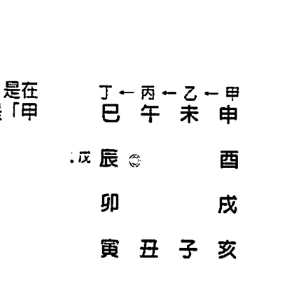

→由所求「戊甲」的甲位起逆行算甲、乙、丙……到戊。

例：若要求时干支「辛丑」所属的旬，则由十二地支盘的丑位起，逆行甲乙丙……到辛（午位）止，可知所求旬支为午，故为甲午旬，符首为「辛」。

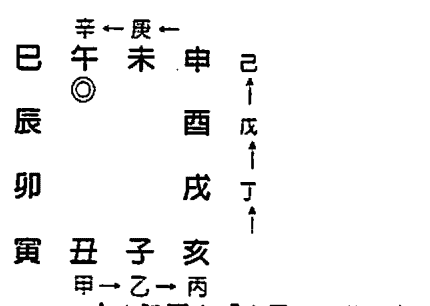

## 第二章 奇门遁甲盘之构成与排盘

### 〈歌词释义二〉三奇

三奇即乙、丙、丁：

+   - 乙奇本定位在正东（震），为日出之处，谓「天德」。
    - 丙奇本定位在正南（离），为阳火旺位，故称「天威」。
    - 丁奇本定位在正西（兑），为阴佑之星，谓之「玉女」。

### 三、九星、八门

〈歌词〉
认取九宫分九星，八门又逐九宫行；
要识九星配五行，各随八卦考羲经；
坎蓬星水离英火，中宫坤艮土为营；

### 〈歌词释义一〉九星
「九星」的基本配置，是固定配置为：天蓬一宫、天芮二宫、天衡三宫、天辅四宫、天禽五宫、天心六宫、天柱七宫、天任八宫、天英九宫，如此配置于洛书九宫。
其五行性卦象与同宫八卦相同，只是中五宫天禽星则具有「坤」卦象。九星宫转移他宫，也不变其基本宫位的本性，例如天蓬星的基本宫为坎一宫而具有坎卦本性，转移他宫后，仍保持坎象。

### 〈歌词释义二〉八门
「八门」在洛书九宫的基本配置为：坎一休门、艮八生门、震三伤门、巽四杜门、离九景门、坤二死门、兑七惊门、乾六开门、中五无门。
各门基本性质，同于其基本宫卦象，如休门的基本宫是坎一，即具有坎卦象，虽宫位移转于他宫，也不变。

### 〈歌词释义三〉九星、八门排盘与六仪三奇不同
九星与八门之排盘法，与「六仪三奇」之排盘法有所不同，前所提六仪三奇之排法是按洛书九宫阳遁顺飞、阴遁逆飞，而九星、八门各盘之配法，不论阴阳遁，都是依序顺推时针方向，而下一节的八神则是阳遁顺推时针方向，阴遁逆推时针方向。

## 第二章 奇门遁甲盘之构成与排盘

### 九星基本宫位

### 八门基本宫位

| 天辅 木 | 天英 火 | 天芮 土 |
| --- | --- | --- |
| 天衡 木 | 天禽 土 | 天柱 金 |
| 天任 土 | 天蓬 水 | 天心 金 |

| 四杜 木 | 九景 火 | 二死 土 |
| --- | --- | --- |
| 三伤 木 | 五中 土 | 七惊 金 |
| 八生 土 | 一休 水 | 六开 金 |

### 九星八卦宫位

### 八门八卦宫位

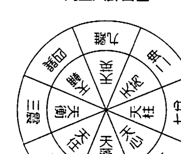

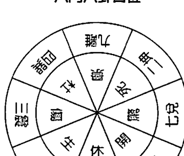

### 四、八神（八诈门）

> 〈歌词〉
直符前三六合位，太阴之神在前二：
后一宫中为九天，后二之神为九地：

〈歌词释义〉
这四句「烟波钓叟歌」中说的是八神（八诈门），八神配布以直符为基准，依次有：直符、腾蛇、太阴、六合、勾陈、朱雀、九地、九天。直符不如九星或八门有基本宫，其直符配于天盘直符宫，再依上述次序，阳遁顺时针、阴遁逆时针方向，一宫一神配进去。

阳遁顺推
| 六合 | 勾陈 | 朱雀 |
| :--- | :--- | :--- |
| 太阴 |  | 九地 |
| 螣蛇 | 直符 | 九天 |

阴遁逆推
| 朱雀 | 勾陈 | 六合 |
| :--- | :--- | :--- |
| 九地 |  | 太阴 |
| 九天 | 直符 | 螣蛇 |

### 五、直符、直使

> 《歌词》
九宫逢甲为直符，八门直使自分明：
符上之门为直使，十时一位堪凭据：
直符常遣加时干，直使逆顺遁宫去：

> 《歌词释义》
九宫乃洛书九宫，八卦宫为坎一、坤二、震三、巽四、中五、乾六、兑七、艮八、离九。地盘符首宫，其固定配置之九星，谓「九星直符」（简称直符）。
地盘符首宫，其固定配置之八门，称为「直使」，也是与地盘直符九星同宫的八门。地盘之奇仪配置，每五日变更一次。换言之，地盘是维持一局六十时辰（一元）的感应。
遁甲时盘的推演，虽以一日十二时辰为一单元（天盘），但直符、直使却依六甲旬之一旬十时辰为设定单位，在此一单位内，符首、直符、直使都相同，是随「旬」的变动而变动的。

## 第二章 奇门遁甲盘之构成与排盘

天盘的九星直符，常飞临地盘的时干宫（即天盘的符首宫）。
天盘直使八门的定位是将地盘直使的宫位数，置于十二支盘的旬支位，依阴阳遁之顺逆转盘，数到用时位置，所得数即天盘直使之宫位数。若符首、时干或其他奇仪落于「五中宫」时，一律须寄宿于坤二宫，至于为何必须寄宿坤二宫，请参见「五中的奇仪九星寄坤二宫之理由」一节。

### 六、天盘排盘法

地盘排成后，符首加在地盘的时干上，再以符首为起点，依地盘的排列顺序，在天盘上将三奇六仪顺推一圈。

### 《例一》：试排阳遁二局、壬申时的天地盘

1.  先排阳遁二局的地盘：
    由地盘的坤二宫起「戊」仪（第几局就从第几宫起戊仪），将六仪三奇「戊己庚辛壬癸丁丙乙」依序顺飞：坤二→震三→巽四→中五→乾六→兑七→艮八→离九→坎一等各宫。

2.  次排阳遁二局、壬申时的天盘：

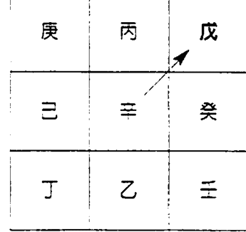

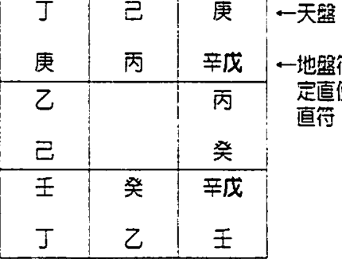

地盘 坤二宫起戊仪，顺飞九宫，五中宫的辛仪，寄宿于坤二宫。

天地盘 符首戊仪在地盘坤二宫，直使（八门）二死，直符（九星）天芮。

## 第二章 奇门遁甲盘之构成与排盘

壬申时属甲子旬，符首戊仪。将符首「戊」仪加在地盘的时干「壬」上，并以此「戊」为起点，依地盘奇仪次序，在天盘顺推地盘的奇仪一圈。

### 〈例二〉：试排阴遁九局、乙酉时的天地盘

1.  先排阴遁九局地盘：
    阴遁九局地盘的六仪三奇，由离九宫起戊仪，并依序将「戊己庚辛壬癸丁丙乙」逆飞：离九→艮八→兑七→乾六→中五→巽四→震三→坤二→坎一各宫。

2.  次排阴遁九局乙酉时天盘：
    乙酉时属于甲申旬符首庚仪。将庚仪加在地盘乙时干上，并以此庚仪为起点，依地盘奇仪次序顺推一圈，即为天盘。

地盘
| 癸 | 戊 | 丙 |
|---|---|---|
| 丁 | 壬 | 庚 |
| 己 | 乙 | 辛 |
离九宫起戊仪逆飞九宫，五中宫的壬仪寄宿于坤二宫。

天地盘
| 己癸 | 丁戊 | 癸壬丙 |
|---|---|---|
| 乙丁 | | 戊庚 |
| 辛己 | 庚乙 | 壬丙辛 |
甲申旬符首庚仪在地盘兑七宫，直使七惊，直符天柱。
←地盘符首定直使、直符

### 〈例三〉：试排阳遁六局、乙酉时的天地盘

1.  先排阳遁六局的地盘：
    阳遁六局的六仪三奇由乾六宫起戊仪，将「戊己庚辛壬癸丁丙乙」依序顺飞入乾六、兑七、艮八、离九、坎一、坤二、震三、巽四、五中等各宫，排列地盘。

2.  次排阳遁六局、乙酉时天盘：

## 第二章 奇门遁甲盘之构成与排盘

乙酉时属甲申旬，符首庚仪。因为时干乙落于五中宫而寄宿坤二宫与癸仪共处，所以，符首庚仪亦须加在坤二宫的乙癸上，并以庚为起点，依地盘奇仪次序，顺推天盘。

| 丙 | 辛 | 癸 |
|----|----|----|
| 丁 | 乙 | 己 |
| 庚 | 壬 | 戊 |

| 戊丙 | 壬辛 | 庚乙癸 |
|------|------|--------|
| 己丁 |      | 丁己   |
| 乙癸庚 | 辛壬 | 丙戊 |

地盘 乾六宫起戊仪顺飞九宫，五中宫的乙奇寄宿于坤二宫。 天地盘 甲申旬的符首庚仪，在地盘艮八宫，直使八生，直符天任。

### 〈例四〉：试排阴遁六局、庚戌时的天地盘

+   1.  先排阴遁六局的地盘：
    阴遁六局的六仪三奇由乾六宫起戊仪，将「戊己庚辛壬癸丁丙乙」等依序逆飞入乾六、五中、巽四、震三、坤二、坎一、离九、艮八、兑七等各宫，五中的己仪寄宿于坤二宫。

2.  次排阴遁六局、庚戌时的天盘：
    庚戌时属于甲辰旬，符首壬仪。将此符首壬仪加在庚时干上，此时与符首壬仪同于坤二宫寄宿的己仪，亦要同转，于是壬己二仪一起加到时干庚仪上。以此为起点，依地盘奇仪次序顺推一圈，完成天盘排列。

## 第二章 奇门遁甲盘之构成与排盘

| 庚 | 丁 | 壬 |
|---|---|---|
| 辛 | 己 | 乙 |
| 丙 | 癸 | 戊 |

地盘 乾六宫起戊仪逆飞九宫，五中宫己仪寄宿于坤二宫。

| 己壬 庚 | 乙 丁 | 戊 己壬 |
|---|---|---|
| 丁辛 |   | 癸乙 |
| 庚丙 | 辛癸 | 丙戊 |

天地盘 甲辰旬的符首壬仪在地盘坤二宫，直使二死，直符天芮。

### 〈例五〉：试排阴遁六局、丙子时的天地盘

+   1.  先排阴遁六局地盘：

将六仪三奇由乾六宫起「戊」仪，依序将「戊己庚辛壬癸丁丙乙」等奇仪逆飞入乾六、中五、巽四、震三、坤二、坎一、离九、艮八、兑七，排地盘。

+   2.  次排阴遁六局丙子时天盘：

丙子时属甲戌旬，符首己仪，将由五中宫寄宿于坤二宫的己仪（与壬仪同宿同行）加于地盘的时干丙奇上，并以己壬为起点，依地盘奇仪次序顺推一圈，即天盘。

| 庚 | 丁 | 壬 |
|---|---|---|
| 辛 | 己 | 乙 |
| 丙 | 癸 | 戊 |

地盘 乾六宫起戊仪逆飞九宫，己仪入五中寄宿坤二宫。

| 戊 庚 | 癸 丁 | 丙 己壬 |
|---|---|---|
| 乙 辛 |   | 辛 乙 |
| 己壬 丙 | 丁 癸 | 庚 戊 |

天地盘 甲戌旬的符首己仪入五中，寄宿坤二，直使五死，直符天禽。

### 七、论「遁甲天地盘」

「奇门遁甲盘」是将一年以「后天八卦」分为阴阳二遁（夏至阳极阴生，冬至阴极阳生）各九局，轮回不断。

+   - 属阳遁者，有坎、艮、震、巽四卦
    - 属阴遁者，有离、坤、兑、乾四卦

一年二十四节气，套入此八卦，则一卦可管三节，一节都是五日（六十时辰），为一元一局，各配有五日（六十时盘）。

+   - 阳遁有九局，一局六十时盘，计五百四十时盘。
    - 阴遁有九局，一局六十时盘，计五百四十时盘。

遁甲时盘是以洛书九宫为基本盘，将其各宫填入遁甲八门、九星、八神（八诈门）、奇仪天盘、奇仪地盘等五层要素。

### 1. 奇仪地盘

地盘以一元一局为单位，将乙丙丁三奇及戊己庚辛壬癸六仪，配布于洛书九宫。其配布法是以戊己庚辛壬癸丁丙乙之顺序，阳遁顺飞入洛书九宫数位，阴遁逆飞入洛书九宫数位。

此地盘奇仪，因为是以一元五日六十时辰为单位而配布的，也就是该一局六十时辰之间不变。

地盘一元六十时辰，即六十甲子时辰，又分为以六甲为首的六组各十时辰，称为「旬」。如甲子旬、甲戌旬、甲申旬、甲午旬、甲辰旬、甲寅旬。六甲首以天干奇仪之六仪代理之，称为「符首」，例如：戊（甲子旬）、己（甲戌旬）、庚（甲申旬）、辛（甲午旬）、壬（甲辰旬）、癸（甲寅旬）。地盘符首宫，就是八门直使、九星直符宫。

地盘奇仪的各干，表示五天中间（三分之一节）之太阳能量的影响。

### 2. 奇仪天盘

天盘奇仪的配布，是根据地盘奇仪的位置，找出该时辰的时干，并将该时辰所属之「符首」置于其上，以这「符首」位置为起点，依地盘奇仪之配置顺序，在地盘的各奇仪上，顺推天盘各奇仪，就是「天盘」。

天盘奇仪各干，表六十甲子时辰一时辰之太阳能量影响变化。

天盘之符首宫位，可谓该时辰的「甲尊行宫」，所以九星直符与八神（八诈门）直符都同宫。

天盘的奇仪，有其基本吉凶徵候，但单独作用薄弱，须与其他各遁甲盘要素互动后，此基本吉凶徵候即会加强或削弱。以下列举各基本吉凶意义：

+   - 符首宫：提高声望、功名、利益的作用。
    - 乙奇：求安定、求贵、提高交情。
    - 丙奇：财气畅旺，求财有利。
    - 丁奇：智慧、人缘、感情、娱乐。
    - 戊仪：安定，增加信用，有财气，但比丙弱。
    - 己仪：有情感缘份，但与财无缘。
    - 庚仪：交际人缘不佳，无缘缘，坚忍。
    - 辛仪：宗教信仰，修道素养，财缘不佳。
    - 壬仪：有赌博性，竞争意识强。
    - 癸仪：适阴性非公开之事，保守性强。

### 3. 天盘与地盘互动所显示出的吉凶象意

从下表的对应中，可清楚看出天盘与地盘间的互动，所产生的吉凶意义：

## 第二章 奇门遁甲盘之构成与排盘

天盘\地盘 | 甲 | 乙 | 丙 | 丁 | 戊 | 己 | 庚 | 辛 | 壬 | 癸
--- | --- | --- | --- | --- | --- | --- | --- | --- | --- | ---
甲 | ○ | ○ | ○ | ○ | ○ | ○ | ○ | － | ○ | ○
乙 | ○ | ○ | ○ | ○ | ○ | － | － | × | ○ | ○
丙 | ○ | ○ | － | － | ○ | － | × | ○ | × | ○
丁 | ○ | － | ○ | － | ○ | － | × | × | ○ | ×
戊 | ○ | ○ | ○ | ○ | － | － | × | ○ | × | －
己 | ○ | － | × | × | － | － | × | ○ | × | －
庚 | ○ | × | × | × | × | × | × | × | × | ×
辛 | ○ | × | － | × | × | － | × | × | × | ×
壬 | ○ | ○ | × | ○ | ○ | × | × | － | × | ×
癸 | ○ | － | × | × | × | × | × | － | － | ×
备注 | 甲—丙 青龙返首 | 乙—辛 青龙逃走 | 丙—庚 荧惑入白 | 丙—甲 飞鸟跌穴 | 丁—癸 朱雀投江 | | 庚—丙 太白入荧惑 | 辛—乙 白虎猖狂 | | 癸—丁 腾蛇天矫

图示符号说明：吉「○」，吉凶参半「－」，凶「×」。

### 八、八门盘排盘法

八门随着时盘变化，所在宫位也变化，以下是排列八门的程序：
1.  直使宫：以地盘符首宫为基本宫的「八门」，即「直使」。以八门的基本宫数并称如一休、二死、三伤、四杜、六开、七惊、八生、九景，在转盘时较方便。如果地盘符首是落在「五中宫」，而寄宿于「坤二宫」的，八门也算是由基本宫的中五宫，而寄宿于坤二宫，所以，这个死门不称「二死」，而要称「五死」。转盘时，要以「五死」起算出来的直使宫数，才算正确。

## 第二章 奇門遁甲盤之構成與排盤

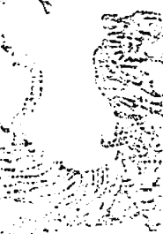

確。

2.轉盤：將直使置於十二地支盤上的「旬支」位置。順行十二地支盤，陽遁一二三四五六七八九順數，陰遁九八七六五四三二一逆數，一支一數，由置於「旬支」上的「八門數」，算到「用時支」為止。算到的數字，即直使的宮位數。

3. 由直使宮位為起點，依八門次序；休、生、傷、杜、景、死、驚、開，順時針方向推一圈，佈局於盤上。

### 〈例一〉：試排陽遁二局、壬申時的八門盤

1. 陽遁二局壬申時，屬甲子旬，地盤符首戊在坤二宮，所以直使八門為「二死」。

2. 轉盤：將「二死」置於十二地支盤的子位（即為甲子旬的旬支位），從二死的二數算起，陽遁順數順行算二三四五六七八九一到申位，得一數，表示壬申時的時支為一，即所求直使「二死」，是在坎一宮。

3. 由坎一宮以八門次序：死門、驚門、開門、休門、生門、傷門、杜門、景門，順時針方向一圈，佈局出來的就是陽遁二局壬申時的八門盤。

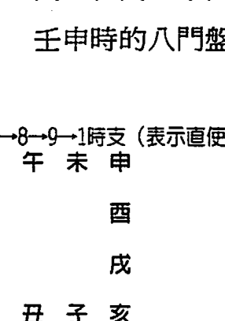

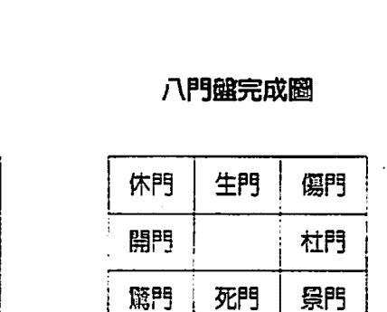

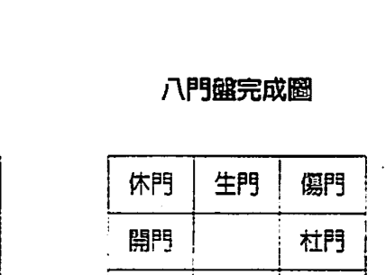

### 〈例二〉：試排陰遁九局、乙酉時的八門盤

-   1. 陰遁九局乙酉時屬甲申旬，地盤符首庚儀在兌七宮，故直使八門是「七驚」。

-   2. 轉盤：七驚置於十二地支盤的旬支「申」上，從七驚的七數，陰遁逆數順行申七、酉六，算到乙酉時的酉，得到六數，即直使「驚門」的宮位在乾六宮。

-   3. 再由乾六宮驚門起，驚門、開門、休門、生門、傷門、杜門、景門、死門等八門次序，順時針方向，佈完八門一圈，就是陰遁九局乙酉時的八門盤。

|   |   |   |
|---|---|---|
| 巳 | 午 | 未 |
| 辰 | 申↓7旬支 | 酉 6時支 |
| 卯 | 戌 |   |
| 寅 | 丑 | 子 |
|   |   | 亥 |

| 傷門 | 杜門 | 景門 |
|------|------|------|
| 生門 |      | 死門 |
| 休門 | 開門 | 驚門 |

### 〈例三〉：試排陽遁二局、戊戌時的八門盤

-   1. 陽遁二局戊戌時，屬甲午旬，符首「辛」，落於五中宮，要寄宿於坤二宮，由五宮寄宿於二宮的直使死門，並不是「二死」，而是「五死」。

-   2. 轉盤：將五死置於十二地支盤的甲午旬旬支的「午」位上，從五死的五數，順數順行，算到用時支戌位，六七八九，得到九數，即「五死」在離九宮。

-   3. 以離九宮死門為起點，按死門、驚門、開門、休門、生門、傷門、杜門、景門的次序，順時針方向排列。

|   |   |   |
|---|---|---|
| 巳 | 午 | 未 |
| 辰 | 申 | 酉 |
| 卯 | 戌 |   |
| 寅 | 丑 | 子 |
|   |   | 亥 |

5→6→7
旬支
時支戌↓9

| 直使五死宮 |   |
|------------|---|
|            | 離九 |
|            |   |
|            |   |

| 八门盘完成图 |   |   |
|--------------|---|---|
| 景门 | 死门 | 惊门 |
| 杜门 |      | 开门 |
| 伤门 | 生门 | 休门 |

### 〈例四〉：试排阴遁四局、戊申时的八门盘

-   1. 阴遁四局戊申时，属甲辰旬，地盘符首壬仪，落于离九宫，所以直使为「九景」。
2. 转盘：「九景」置于十二地支盘的辰上（甲辰旬的旬支）。并从九景的九数，阴遁逆数顺行，算到戊申时的「申」位，九八七六五，算到申位得五数，即直使九景在五中宫。此五中宫的直使九景，必须先寄宿于坤二宫。
3. 从坤二宫景门为起点，依八门次序顺排八门于各宫。即景门、死门、惊门、开门、休门、生门、伤门、杜门的次序，推排一圈，就是八门盘。

→7→6→5
8 巳 午 未 申 时支
↑
旬支9景 辰 酉
卯 戌
寅 丑 子 亥
到时支「申」得5即5宫须转入二宫则二宫为直使宫

|   |   | 景门 |
|---|---|------|
|   | 九景 |   |
|   |   |   |

| 八门盘完成图 |   |   |
|--------------|---|---|
| 伤门 | 杜门 | 景门 |
| 生门 |      | 死门 |
| 休门 | 开门 | 惊门 |

### 九、九星盤排盤法

「九星」為天蓬、天芮、天衝、天輔、天禽、天心、天柱、天任、天英，並按此配列次序。九星因用時的變化，而在時盤上的所在宮位，也會變動。

基本宮位為五中宮的「天禽」，常寄宿於坤二宮，與基本宮為坤二宮的天芮星同行。

遁甲盤的五要素：八門、天、地、九星、八神，以不入五中宮為原則。因為五中宮即「中央太極」，八卦方位的解釋，變成無意義。八門、八神之排列，一開始就不入五中宮，但奇儀、九星一旦配置於五中宮後，須再轉寄宿於坤二宮。至於為何一定要寄於坤二，而不寄他宮，其理由如下：

-   1. 五中宮為土宮，所以寄宿的宮也須土宮，故由坤二或艮八兩個土宮之中選一。以地支而言，艮八宮為丑位，是地支三會「亥子丑」的水會土氣，而坤二宮為未位，是地支三會「巳午未」的火會土氣，土剋水，火生土，顯然是後者的「未土」為旺。此原因之一。
2. 依後天八卦比較觀察「艮八」與「坤二」。艮八前面的「震三木」，會剋到「艮八土」，而艮八後面的「坎一水」，則是「艮八土」會剋到的，因此，被剋受傷，剋他又洩氣（消耗了本身的能量），所以，艮八是衰弱的。但坤二前面的「兌七金」，卻與坤二相生，坤二後面的「離九火」，也與坤二相生，坤二宮顯然是通關的旺宮，寄宿於此是很好的選擇。此原因之二。

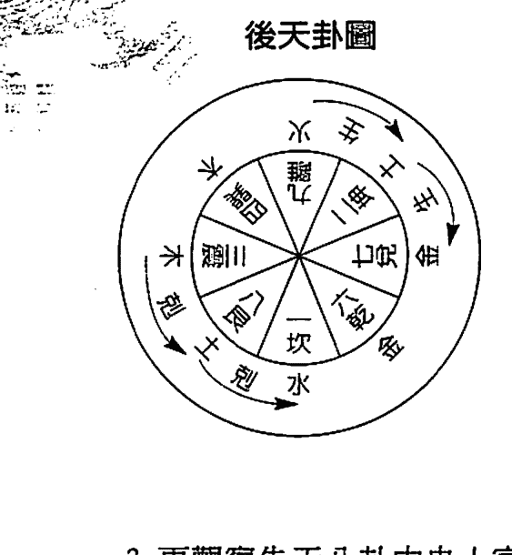

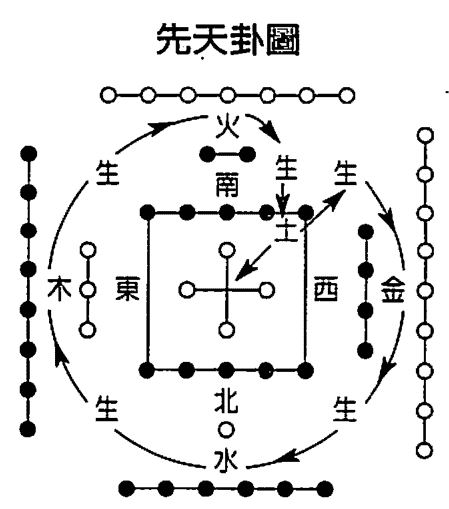

3. 再觀察先天八卦中央土宮的通行路徑，中央土宮→西金（土生金）→北水（金生水）→東木（水生木）→南火（木生火）→坤土宮。顯然是從坤二土宮為通路，而入五中土宮。

### 「九星盤」的排盤要領如下：

-   1. 先找出地盤的用時符首宮，以此宮為基本宮的九星，就是「九星直符」。
2. 將此九星直符，加於地盤時干宮（即天盤符首宮），即為天盤九星直符宮。
3. 以「天盤九星直符宮」為起點，依九星配列次序，無論陰遁、陽遁，都順推一圈。

> 「古今圖書集成」的奇門遁甲術數部，彙考二十二提到九星在九宮的，其順序為天蓬、天芮、天衝、天輔、天禽、天心、天柱、天任、天英，是以坎（一）、坤（二）、震（三）、巽（四）、中（五）、乾（六）、兌（七）、艮（八）、離（九）為次。

九星在八卦的方位，其順序為天蓬、天任、天衝、天輔、天英、天芮、天柱、天心，五宮天禽無位，寄在坤二宮與天芮同處，是以坎艮震巽離坤兌乾的次序。此即所謂八卦數方位，為順推排法（順時針次序）。

假如九星也要飛排，那麼轉來轉去，天禽就終始在五宮，不能寄坤二與天芮同處了。該書亦清楚列有天盤星圖，由此圖可見九星直符定位後，其他星是依時針方向順行排列，非用飛排。

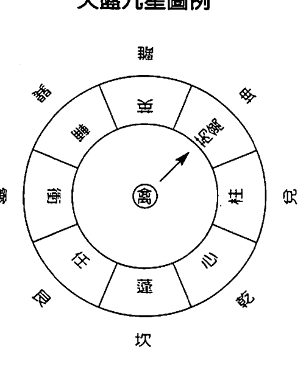

### 〈例一〉：試排陽遁四局、癸卯時的九星盤

1. 陽遁四局癸卯時，屬甲午旬，符首辛儀，在地盤兌七宮。以此為基本宮的天柱星，是「九星直符」。
2. 將天柱星加於地盤時干癸位所在的離九宮。
3. 由離九的直符天柱星為起點，依九星次序順推於各宮，天柱（離九）、天心（坤二）、天蓬（兌七）、天任（乾六）、天衝（坎一）、天輔（艮八）、天英（震三）、天禽天芮（巽四）。即完成九星盤配列。

| 戊 | 癸 | 丙 |
|---|---|---|
| 乙 | 己 | 辛 |
| 王 | 丁 | 庚 |

|   | 直符 天柱 |   |
|---|---|---|
|   |   |   |
|   |   |   |

| 天芮 天禽 | 天柱 | 天心 |
|---|---|---|
| 天英 |      | 天蓬 |
| 天輔 | 天衝 | 天任 |

因地盤符首在「辛」，位於七兌，是九星「天柱」基本宮，故以「天柱」為直符。

地盤用時干「癸」在離九，此乃直符天柱之所在宮位。

九星盤完成圖

### 《例二》試排陽遁四局、丁丑時的九星盤

1. 陽遁四局丁丑時，屬甲戌旬，符首己儀，於地盤五中宮，故九星直符為天禽星。地盤五中宮的符首「己」，也寄於坤二宮，與丙奇同宿同行；而直符天禽星，也要寄於坤二宮，與天芮星同宿同行。

2. 將直符天禽星，加於地盤時干丁奇的坎一宮。

3. 由坎一宮為起點，由直符天禽（天芮星同行），依九星次序順推，配成九星盤：天禽天芮（坎一）、天柱（艮八）、天心（震三）、天蓬（巽四）、天任（離九）、天衝（坤二）、天輔（兌七）、天英（乾六）。

| 戊 | 癸 | 丙 |
|---|---|---|
| 乙 | 己 | 辛 |
| 壬 | 丁 (用時干) | 庚 |

|   |   |   |
|---|---|---|
|   | 天禽 天芮 |   |
| ← |   |   |

| 天蓬 | 天任 | 天衝 |
|---|---|---|
| 天心 |      | 天輔 |
| 天柱 | 天禽 天芮 | 天英 |

地盤符首「己」，在五中宮，所以直符九星為「天禽」。直符「天禽」亦轉寄坤二與「天芮」共處，用時干為「丁」。

地盤的「用時干」丁，位於坎一，故「己」轉寄坤二與「丙」共處。天禽天芮居坎一，由此，依序順推九星。

九星盤完成圖

### 《例三》：陽遁二局、壬申時的九星盤

1. 陽遁二局壬申時，屬甲子旬，符首戊儀在地盤坤宮，所以，九星直符為天芮星。地盤五中宮的天禽星，也寄於坤二宮，與天芮星同宿同行。

2. 將直符天芮星，加於地盤時干壬的乾六宮，由此為起點，依九星次序順推：天芮天禽（乾六）、天柱（坎一）、天心（艮八）、天蓬（震三）、天任（巽四）、天衡（離九）、天輔（坤二）、天英（兌七）。

| 庚 | 丙 | 戊 |
|---|---|---|
| 己 | 辛 | 癸 |
| 丁 | 乙 | 壬 (用時干) |

地盤符首「戊」在坤二，故九星直符是基本宮坤二之天芮星。用時干為乾六「壬」。

|   |   |   |
|---|---|---|
|   |   |   |
|   | ← | 天芮 天禽 |
|   |   |   |

直符天芮，置於用時干「壬」，即乾六宮，與天禽同居。依九星次序順推九星盤。

| 天任 | 天衡 | 天輔 |
|---|---|---|
| 天蓬 |      | 天英 |
| 天心 | 天柱 | 天芮 天禽 |

九星盤完成圖

### 十、八神盤排盤法

八神又名「八詐門」，即以直符、騰蛇、太陰、六合、勾陳、朱雀、九地、九天等為序，但八神無基本固定宮位，冬至後陽遁是依序順推，夏至後陰遁是依序逆推。

「八神盤」的排盤要領如下：

-   1. 八神的直符神，加於地盤的時干宮位，即天盤符首宮位。
2. 以八神直符為起點，依八神次序，陽遁順推、陰遁逆推一圈。

### 〈例一〉：試排陽遁四局、丁未時的八神盤

-   1. 陽遁四局丁未時，是甲辰旬，符首為「壬」儀，地盤時干丁奇在坎一，故將「八神直符」置於坎一宮。
2. 因為是陽遁，故由坎一宮八神直符起，依序順推：艮八騰蛇、震三太陰、巽四六合、離九勾陳、坤二朱雀、兌七九地、乾六九天。

| 戊 | 癸 | 丙 |
|---|---|---|
| 乙 | 己 | 辛 |
| 壬 | 丁 (用時干) | 庚 |

| 六合 | 勾陳 | 朱雀 |
|---|---|---|
| 太陰 |      | 九地 |
| 騰蛇 | 直符 | 九天 |

陽四局地盤的「用時干」丁，在坎一，故坎一為八神直符宮，再由直符宮依八神次序順推（陽遁）。

### 〈例二〉：試排陽遁二局、壬申時的八神盤

-   1. 陽遁二局壬申時，是甲子旬，符首戊儀，其地盤時干壬儀在乾六宮，故將八神直符置於乾六宮。
2. 由乾六宮為起點，順時針方向：坎一騰蛇、艮八太陰、震三六合、巽四勾陳、離九朱雀、坤二九地、兌七九天等，順推一圈。

| 庚 | 丙 | 戊 |
|---|---|---|
| 己 | 辛 | 癸 |
| 丁 | 乙 | 壬 (用時干) |

| 勾陳 | 朱雀 | 九地 |
|---|---|---|
| 六合 |      | 九天 |
| 太陰 | 騰蛇 | 直符 |

陽二局地盤的「用時干」壬，在乾六，故乾六為八神直符宮。由乾六直符宮起，依序順推八神盤（陽遁）。

### 〈例三〉：試排陰遁二局、壬申時的八神盤

-   1. 陰遁二局壬申時，是甲子旬，符首戊儀，其地盤時干壬儀在兌七宮，故將八神直符置於兌七宮。
2. 由兌七宮為起點，逆時針方向：坤二騰蛇、離九太陰、巽四六合、震三勾陳、艮八朱雀、坎一九地、乾七九天等，順推一圈。

| 丙 | 庚 | 戊 |
|---|---|---|
| 乙 | 丁 | 壬 |
| 辛 | 己 | 癸 |

| 六合 | 太陰 | 騰蛇 |
|---|---|---|
| 勾陳 |      | 直符 |
| 朱雀 | 九地 | 九天 |

陰二局地盤的「用時干」壬，在兌七，故兌七為八神直符宮。由兌七八神直符宮起，依序逆推八神盤（陰遁）。

### 十一、奇門遁甲總盤

將上述諸例陽遁二局壬申時的天地盤、八門盤、九星盤、八神盤等歸納合起，成為「遁甲總盤」如下：

| 丁 | 己 | 庚 |
|---|---|---|
| 勾陳 休門 天任 | 朱雀 生門 天衝 | 九地 傷門 天輔 |
| 庚 | 丙 | 戊辛 |
| 乙 |      | 丙 |
| 六合 開門 天蓬 | 辛 | 九天 杜門 天英 |
| 己 |      | 癸 |
| 壬 | 癸 | 戊辛 |
| 太陰 驚門 天心 | 騰蛇 死門 天柱 | 直符 景門 天芮禽 |
| 丁 | 乙 | 壬 |

## 第三章 玉女守门、八门、九星、八神

### 一、玉女守门

> 〈歌词〉
> 又有三奇游六仪，号为玉女守门扉；
> 若作阴私和合事，诸君但向此中推；
> 〈歌词释义〉

玉女守门的意思，是指丁为玉女，而会天乙直使之门。所谓「三奇游六仪」中的三奇，并非乙丙丁三奇，而是三奇中之「丁」奇。

三元经曰：「三奇游六仪，利以宫廷宴会喜乐。择此时辰，行快乐轻调事，可得特效。如男女和合沟通、夫妻和谐、恢复情谊、相亲、人际交欢之集会等。」

丁奇亦是智慧学问之星，因此可于此时辰求学识、拜师讨教等，可得实效。

平时不易接近或谈合者，也可利用此时辰，必有效。

玉女守门是一种独立吉格，无论有无三奇，或直使八门并非开休生三吉门，也同样可成立。

「玉女守门」的构成如下：

遁甲时盘的直使八门宫，会合地盘丁奇的时辰，就是「玉女守门扉」。

例如：阳一局、甲子旬、符首戊，由坎一宫起发，丁奇即落于「兑七宫」。

甲子时 直使一休在坎一 乙丑时 直使一休在坤二
丙寅时 直使一休在震三 丁卯时 直使一休在巽四
戊辰时 直使一休在坤二 己巳时 直使一休在乾六
庚午时 直使一休在兑七 辛未时 直使一休在艮八
壬申时 直使一休在离九 癸酉时 直使一休在坎一

又如：阳一局、甲戌旬、符首己、在坤二宫起发，丁奇乃落「兑七宫」。

甲戌时 直使二死在坤二 乙亥时 直使二死在震三
丙子时 直使二死在乾六 己卯时 直使二死在兑七
庚辰时 直使二死在巽四 丁丑时 直使二死在坤二
戊寅时 直使二死在艮八 辛巳时 直使二死在离九
壬午时 直使二死在坎一 癸未时 直使二死在坤二

照以上类推，可得出阳遁一局六甲旬的「玉女守门扉」如下：

甲子戊「三奇游六仪」之时辰为「庚午时」，直使一休在兑七宫与地盘丁奇会合，甲戊己「三奇游六仪」之时辰为「己卯时」，直使二死在兑七宫与地盘丁奇会合，甲申庚「三奇游六仪」之时辰为「戊子时」，直使三伤在兑七宫与地盘丁奇会合，甲午辛「三奇游六仪」之时辰为「丁酉时」，直使四杜在兑七宫与地盘丁奇会合，甲辰壬「三奇游六仪」之时辰为「丙午时」，直使五死在兑七宫与地盘丁奇会合，甲寅癸「三奇游六仪」之时辰为「乙卯时」，直使六开在兑七宫与地盘丁起会合。

所以，阳一局的甲子旬（庚午时）、甲戌旬（己卯时）、甲申旬（戊子时）、甲午旬（丁酉时）、甲辰旬（丙午时）、甲寅旬（乙卯时）等，六甲旬的各旬十时辰，都有一时辰为「玉女守门扉」。不但阳一局如此，阳二局、阳三局、阳四局、阳五局、阳六局、阳七局、阳八局、阳九局，也都如此。而且，阴一局到阴九局，每局也都同样如此。

直使八门与地盘丁奇会合之方位，为「玉女守门扉」；直使八门与天盘丁奇会合之方位，则为「玉女守门方」。

「玉女守门扉」是男女和合、人事和谐、娱乐、交涉得利等的趋吉时辰；而「玉女守门方」，则是前者诸吉的有利方位，时辰也包括在内。

玉女守门会合的「直使八门」，若是开门、休门、生门等三吉门，即大吉。纵然会合的直使八门是死门、伤门、惊门、杜门等凶门，亦不会受其凶的影响。

### 玉女守门 图例 (1)

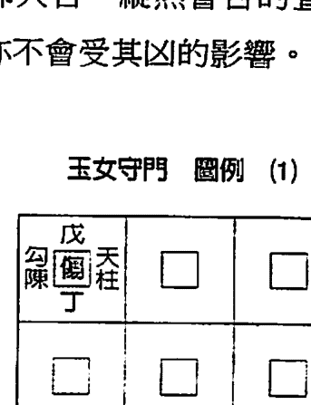

阳遁七局乙卯时 (直使三伤与丁奇会合)

### 玉女守门 图例 (2)

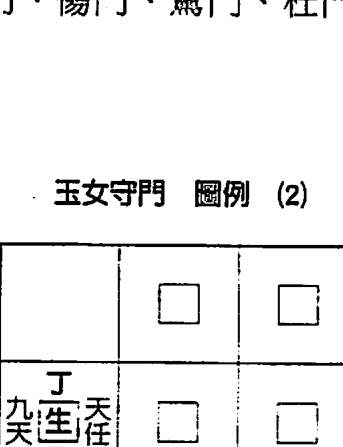

阳遁四局戊申时 (直使八生与丁奇会合)

### 二、「八門」命名的由來與吉凶作用

東主震動為「傷」，南主孕育為「景」，西主潔齊為「驚」，北主潛伏為「休」，天門由闔而「開」，鬼戶死而復「生」，地戶由開而「杜」，人門既成而「死」。

-   **1.休門：**
居「坎一」水宮，位北方「子」位，季節是冬天接春天之前。
水為萬物收斂，死機歸根，卻又是生氣發揚於外之兆。所以，此宮雖說是冬眠藏有沈沈死氣，但也是休息享受後，又「一陽復始」伺機欲動的潛伏期，故名「休門」。
休門具有返本還源，草木即將萌生的卦象，屬於上吉門。

-   **2.生門：**
居「艮八」土宮，位東北方「丑寅」的角落，為冬春交接期。
地闢於丑，而人生於寅，至此鬼戶死而復生，三陽開泰，陽迴氣轉，萬物欣欣向榮，故為「生門」，是上吉門。

-   **3.傷門：**
居「震三」木宮，位於東方「卯」的正位，季節是春分，為萬物快速生長之期。所以衝震力強，容易傷到對方。又因過於耗洩體精，而外華內虛，傷及根本，不能勝其勞，於是木不能擋住霜霧的寒意，因此定名為「傷門」，屬凶門。

-   **4.杜門：**
居「巽四」木宮，位於東南「辰巳」的角落，又稱為「地戶」，季節為春夏交接之期。地戶由「開」而「杜」，坎一至震三的陽春活力，至此已力盡，陽氣亢極，一陰將至，欲振乏力，欲收不得。事情遇阻，只能暂停伏藏以保后续之力。因此定名「杜门」，属小凶门。

### 5. 景门：

居「离九」火宫，位于南方的「午」是正位，属夏令之期。经杜门伏息之后，恢复为阳气全盛，火势强旺。只是阳数到此已是斜阳之气，仍掩盖不了万物将由壮旺入衰之兆。定名为「景门」，不全吉。但因利于文书之事，所以又属中吉门。

### 6. 死门：

居「坤二」土宫，位西南「未申」的角落，属于夏秋交接时期。死门又谓「人门」。

指草绿色变、木树落叶、百事入灭、人生既成而死（生老病死），是凶象，故名「死门」，属大凶门。此虽凶门，但若得三奇配合，对死刑、捕捉、猎牧等事，还称得上是吉，可顺天意而用之。好比昔日死囚处刑，大概都在秋期行之。

### 7. 惊门：

居「兑七」金宫，位于西方的「酉」正位，夕阳落日似旺，而实际上是肃杀，寒气将至，物数苍老肃然，欠生气。然而造化有好生之德，不会尽杀，虽属凶象，但对惊险之事如诉讼、捕捉人禽、博弈等，或能得益。定名「惊门」，属中凶门。

### 8. 开门：

居「乾六」金宫，位于西北「戌亥」的角落，属秋冬交接时期。天门由合而开，五谷收获，开仓收纳资财，经年的辛苦，至此大功告成。金门动而水生，是华生万物之门，故定名「开门」，属上吉门。

### 三、「八门」的用法

〈歌词〉

八门若遇开休生，诸事逢之总称情；
伤宜捕猎终须获，杜好邀遮及隐形；
景上投书并破阵，惊能擒讼有声名；
若问死门何所主，只宜吊死与行刑；

〈歌词释义〉

1. 开门：
属乾卦，旺气最旺，求地位、开张求利最适宜。凡是远行、求见贵人、求名声等，所向通达。不过，所谋诸事宜名正言顺，公事光明正大，才会百吉百泰，若为阴私之事，必被他人泄漏，反遭凶咎。

2. 休门：
属坎卦，一阳复始之初，旺气颇盛。宜治兵、上官（赴任）、转移、营造、修业、求和等，百事皆吉。用于休养生息、娱乐、求平安，效果最佳。

3. 生门：
人生于寅（寅为正月），气候至此，三阳开泰、万物皆生，天地好生之情，广及万物，百事百吉。生门最适合求财利、经营商业、营造、治病、嫁娶等，皆佳。

4. 伤门：
伤门若得三奇，宜捕捉盗贼、渔猎、博弈、索偿等，可得。尤用于索偿，效果佳。但若用于赴任、出行、嫁娶、行商、埋葬等，皆不利，大凶。

### 5. 杜门：

为躲藏形体的方位，宜避灾避难、潜藏隐伏、匿迹逃亡等，可得逞。杜门地户是最阴之门，须用于水、火之日、时，如壬癸亥子、丙丁巳午之时用之，可得吉效。若金、土之日、时，如庚辛申酉、戊己辰未丑戌之时用之，即不利。用于藏形以外之事都招不利。

### 6. 景门：

上书献策，选拔将士官员、寻亲、考试、文件诉状、见上司求功名地位，皆有利。若有三奇配合，可计谋行诈、破阵、火攻。考试受验尤有利。

### 7. 死门：

宜用于行刑、诛戮、吊问、送葬、打猎。因是大凶门，适用之事最少，除前项各事外，不宜用，因必招凶。

### 8. 惊门：

可用于捕捉盗贼、擒奸、斗讼、伏兵、博弈等，有效。其他皆凶，少用为妙。

### 四、开、休、生三吉门遇三奇

> 〈歌词〉
吉门偶尔合三奇，值此虽云百事宜；
更合从旁加检点，余宫不可有瑕疵；

### 〈歌词释义〉

若八门中的开、休、生三吉门，合乙、丙、丁三奇之一，就是百事大吉的「奇门」。但须查看其他各宫凶星有无影响，不可无视于一点瑕疵，就冒然认为全吉。

## 第三章 玉女守门、八门、九星、八神

### 五、九星的吉凶

> 〈歌词〉
辅禽心星为上吉，冲任小吉未全亨；
大凶蓬芮不堪使，小凶英柱不精明；

〈歌词释义〉
天辅、天禽、天心，为三大吉星。
天冲、天任，为二中吉星。
天蓬、天芮，为二大凶星，即使得奇门，亦不可用。
天英、天柱，为二中凶星，若得奇门，则凶兆减少，可用。

> 〈歌词〉
大凶无气变为吉，小凶无气一同之；

〈歌词释义〉
大凶星若得「旺相之气」，则变为小凶或平吉；
中凶星若得「旺相之气」，则变为平吉或中吉。

> 〈歌词〉
吉宿更能逢旺相，万事万全功必成；
若逢休囚并废没，劝君不必进前程；

〈歌词释义〉
凡是吉星也需要「旺相」之气，若遇「休囚废没」之气，亦不可用。上吉、中吉星，能得到「旺相」之势则大吉；无「旺相」之气，则中平；乘「死休」气，为凶。

### 《歌词》

乾兑为金震巽木，旺相休囚看重轻；
与我同行即为相，我生之月诚为旺；
废于父母休于财，囚于鬼兮真不妄；
假令水宿号天蓬，相在初冬与仲冬；
旺于正二休四五，其余做此自研穷；

### 《歌词释义》

九星的旺衰，依四季五行而定：
旺于我生之月、相于同类之月、死于父母之月（他生我）、囚于官鬼之月（他克我）、休废于妻财之月（我克他）。

### 九星旺相、囚休表

| 九星 | 天蓬 | 天芮禽任 | 天冲辅 | 天英 | 天柱心 |
| :--- | :--- | :--- | :--- | :--- | :--- |
| 五行 | 水 | 土 | 木 | 火 | 金 |
| 色 | 黑 | 黄 | 青 | 赤 | 白 |
| 旺月 | 寅卯 | 申酉 | 巳午 | 辰戌丑未 | 亥子 |
| 相月 | 亥子 | 辰戌丑未 | 寅卯 | 巳午 | 申酉 |
| 死月 | 申酉 | 巳午 | 亥子 | 寅卯 | 辰戌丑未 |
| 囚月 | 辰戌丑未 | 寅卯 | 申酉 | 亥子 | 巳午 |
| 休月 | 巳午 | 亥子 | 辰戌丑未 | 申酉 | 寅卯 |

### 六、九星的特性与用法

- 1. 天蓬星：
适合促进邦交、修筑城池，利主不利客。嫁娶皆凶、往此方向动作，会有火灾或斗争见血光。修营造室（营造）、埋葬都不适合。春夏用之为吉，秋冬用之最凶。
若得生门与乙丙奇，则万事较吉，可享昌荣。

- 2. 天芮星：
宜讲道、交结良友、从师修业、订约都吉。不可用兵、嫁娶、争讼、移徙远行、营造、造葬，为凶。秋冬用之为吉，春夏用之为凶。

- 3. 天冲星：
适宜报仇解怨、施恩交友。不宜嫁娶、远行、移徙、赴任、经商、营造。春夏用之吉、秋冬用之无功。

- 4. 天辅星：
嫁娶吉，利于多子多孙。移徙、远行、赴任，都良吉。营造、造葬，有利添福。春夏用之吉。

- 5. 天禽星：
移徙、嫁娶、赴任、经商、见贵人、远行、营造、造葬等，都吉利。四季能用。

- 6. 天心星：
适合医病拿药。利见君子，不利见小人。宜经商、嫁娶、远行、赴任、营造、祭祀祈福等，都吉。秋冬吉，春夏凶。

- 7. 天柱星：
宜嫁娶、营造、祭祀祈福。不宜移徙、赴任、经商。只适合秘密操练，不可出兵。旺相吉利的为亥、子、申、酉等月支或日支。

- 8. 天任星：
嫁娶利于多子孙、赴任吉利、见贵人、经商通财，都吉。移徙、营造凶。旺相吉期之月支或日支为申、酉、辰、戌、丑、未。

- 9. 天英星：
出入、远行佳、宴饮作乐有利。不宜嫁娶、移徙、赴任、营造、经商、祭祀祈福。旺相吉期为月支或日支辰、戌、丑、未、巳、午。

### 七、「八神」(八诈门)的吉凶与用法

> 〈歌词〉
九天之上好扬兵，九地潜藏可立营；
伏兵但向太阴位，若逢六合利逃形；

### 〈歌词释义〉

1. 直符：
是八神的领主、天乙贵神甲尊的代表，属阳火。此神所到之处，百恶消散，诸凶寂灭，是至吉之神。但最怕太白金星（庚）与入墓（阳火之墓在戌宫），会使吉处不吉，凶处更凶。利于求财利、求贵、赴任、营造、嫁娶等，百事皆吉。如遇开、休、生三吉门，则具有与奇门同等吉数，就算遇到死门等凶门，也能助其减凶。有急事宜从直符方出，则不会遇凶。

2. 腾蛇：
本性怪异，虚诈，属阴火。此神多虚伪，性柔而口毒。
此方代表有精神恍惚不吉、预定之事常变卦、口是心非、政令不通、诈骗长官雇主等现象。订约常被破坏，反而谈成废约。

3. 太阴：
为阴佑之神（阴性吉神），属阴金（辛）特性偏于隐匿、暧昧、欺蔽、妾小个性，利于相亲、嫁娶，做较具隐密性的事，则有效可行。若有急难，可往此方避难。

4. 六合：
护卫或和合之吉神，属阴木。是平安之方，可用于埋伏避难，提防不测。若能配合三奇、生门、杜门等，即最有效的避难方位。此和合之神，最适宜婚姻、作媒、和解、相亲、合作事业等，都有吉效。

5. 勾陈：
又名「白虎」，即庚金，为凶恶之神。专司杀伐、斗争、疾病、死葬的事情。假如遇到，容易引发纠纷、官非、人事不合等现象。

6. 朱雀：
奸邪奸盗之神，吉时就管资讯传输，凶时就变成引发是非、口舌、邪恶的南方火神，使容易落于私心造谣等之奸计暗害困境。

7. 九地：
性好静，是阴静的吉神，也是坚牢之神（略带凶性），属坤土。专管柔顺虚恭的事情，但也操生杀之权，会反吉反凶，最怕被克制，亦忌入墓。春夏得令吉强，秋冬失令减吉，反而出现暧昧、疾病、牢苦、死葬、忧郁等遭遇。有利于隐伏、暗中图谋、求取偏财。出兵不利，固守有利。

8. 九天：
性刚、急性子、活动力旺盛，是阳刚性的上吉之神，属乾金。若得吉门三奇，则万福聚集，纵使不得吉门三奇，亦不为凶。怕入墓而折损力量。有助求财（正财）、显扬威武，利于出击，不利守。

## 第四章 天辅时、德威时、五不遇时、天网四张

### 一、天辅时

> 三元经云：「天辅之时，有罪无疑，斧锁在前，天犹赦之，此时有罪皆能释。」

天辅时可说是「开恩天赦」的时辰，因为此时有天佑神助，所以，若要用奇门遁甲盘行事，可选择此时，更能提升效果。

- 甲己日（己巳时）、
- 乙庚日（甲申时）（孟甲）、
- 丙辛日（甲午时）（仲甲）、
- 丁壬日（甲辰日）（季甲）、
- 戊癸日（甲申日）（孟甲）

以上都是天辅时，除甲己日的己巳时以外，都是孟、仲、季的三甲（请参见后述之「三甲三甲合」一节）。

### 二、德威时

> 经曰：「六丙为威，六甲为德，利以为客，不利为主。」

德即代表甲，威即代表丙，德威时乃六甲时与六丙时的总称。甲时、丙时都是阳，是最旺盛的时辰，对各项行事都有利。所谓「利以为客」，即出于攻势，则胜利必至，事业经营、求财求利、远行，都能有成。如果遁甲局盘内有甲丙同宫，如飞鸟跌穴、青龙返首等吉格，更增吉；如果再得吉门、三奇，可说是天下无敌。

### 三、五不遇时

> <歌词>
五不遇时龙不精，号为日月损光明；
时干来克日干上，甲日须知时忌庚；

> <歌词释义>
如果是龙失精气、日月失光明的忌时，纵然有奇门，也是诸事不可行而百事皆凶。

五不遇时的构成原则是：时干克日干、阳干克阳干、阴干克阴干，因此：阳时干是庚金，而阳日干是甲木的话，就相克；阴时干是辛金，而阴日干是乙木的话，也相克，就是「五不遇时」。

五不遇时只论「时」的天干克「日」的天干，与日支、时支的阴阳五行是否相克无关。

因地支是随日干五鼠遁而来的，如甲日的庚时，依五鼠遁，一定是遁出庚午时，绝不会有庚子、庚寅、庚辰、庚申、庚戌等时辰。

「十日干」有十个五不遇时，十二地支时，除「戌时」与「亥时」没有五不遇时的顾虑外，其他十地支都会犯五不遇时，如以下所列：

| 甲（木）日－庚（金）午时 | 乙（木）日－辛（金）巳时 |
| 丙（火）日－壬（水）辰时 | 丁（火）日－癸（水）卯时 |
| 戊（土）日－甲（木）寅时 | 己（土）日－乙（木）丑时 |
| 庚（金）日－丙（火）子时 | 辛（金）日－丁（火）酉时 |
| 壬（水）日－戊（土）申时 | 癸（水）日－己（土）未时 |

### 周日起时速见表——五鼠遁（日找时）

| 时 | 日 | 甲己 | 乙庚 | 丙辛 | 丁壬 | 戊癸 |
| :--- | :--- | :--- | :--- | :--- | :--- | :--- |
| 11-1 | 子时 | 甲子 | 丙子 | 戊子 | 庚子 | 壬子 |
| 1-3 | 丑时 | 乙丑 | 丁丑 | 己丑 | 辛丑 | 癸丑 |
| 3-5 | 寅时 | 丙寅 | 戊寅 | 庚寅 | 壬寅 | 甲寅 |
| 5-7 | 卯时 | 丁卯 | 己卯 | 辛卯 | 癸卯 | 乙卯 |
| 7-9 | 辰时 | 戊辰 | 庚辰 | 壬辰 | 甲辰 | 丙辰 |
| 9-11 | 巳时 | 己巳 | 辛巳 | 癸巳 | 乙巳 | 丁巳 |
| 11-1 | 午时 | 庚午 | 壬午 | 甲午 | 丙午 | 戊午 |
| 1-3 | 未时 | 辛未 | 癸未 | 乙未 | 丁未 | 己未 |
| 3-5 | 申时 | 壬申 | 甲申 | 丙申 | 戊申 | 庚申 |
| 5-7 | 酉时 | 癸酉 | 乙酉 | 丁酉 | 己酉 | 辛酉 |
| 7-9 | 戌时 | 甲戌 | 丙戌 | 戊戌 | 庚戌 | 壬戌 |
| 9-11 | 亥时 | 乙亥 | 丁亥 | 己亥 | 辛亥 | 癸亥 |

「五鼠遁」是用在以日干找时干时支，其口诀如下：甲己起甲子，乙庚起丙子，丙辛起戊子，丁壬起庚子，戊癸起壬子。

### 周年起月速见表——五虎遁（年找月）

| 月 | 年 | 甲己 | 乙庚 | 丙辛 | 丁壬 | 戊癸 |
| :--- | :--- | :--- | :--- | :--- | :--- | :--- |
| 一月 | 寅 | 丙寅 | 戊寅 | 庚寅 | 壬寅 | 甲寅 |
| 二月 | 卯 | 丁卯 | 己卯 | 辛卯 | 癸卯 | 乙卯 |
| 三月 | 辰 | 戊辰 | 庚辰 | 壬辰 | 甲辰 | 丙辰 |
| 四月 | 巳 | 己巳 | 辛巳 | 癸巳 | 乙巳 | 丁巳 |
| 五月 | 午 | 庚午 | 壬午 | 甲午 | 丙午 | 戊午 |
| 六月 | 未 | 辛未 | 癸未 | 乙未 | 丁未 | 己未 |
| 七月 | 申 | 壬申 | 甲申 | 丙申 | 戊申 | 庚申 |
| 八月 | 酉 | 癸酉 | 乙酉 | 丁酉 | 己酉 | 辛酉 |
| 九月 | 戌 | 甲戌 | 丙戌 | 戊戌 | 庚戌 | 壬戌 |
| 十月 | 亥 | 乙亥 | 丁亥 | 己亥 | 辛亥 | 癸亥 |
| 十一月 | 子 | 丙子 | 戊子 | 庚子 | 壬子 | 甲子 |
| 十二月 | 丑 | 丁丑 | 己丑 | 辛丑 | 癸丑 | 乙丑 |

从年找月的「五虎遁」口诀如下：甲己起丙寅，乙庚起戊寅，丙辛起庚寅，丁壬起壬寅，戊癸起甲寅。

### 四、天网四张

> 〈歌词〉

天网四张无路走，一二网低有路跩；
三至四宫行入墓，八九高强任西东；

> 〈歌词释义〉

天网与癸丑、癸卯、癸巳、癸未、癸酉、癸亥等六癸时盘有关，这类六癸时盘的天盘「癸」的方位，即「天网四张」。

于天网四张的时辰出兵进攻、主动行事，一定会伤败破财，不会成就。这种利主不利客的时辰，并不是积极攻击争取的时机，反而应谨慎，采取守势，等待机会，尤其是往天盘癸之方向行事，最凶。

如果非得往此方向行事，则诸事不可积极争取，最好避过癸时，而等到甲时再行事。

想要脱出这张癸时天网，就要由此局盘的高数宫位方（六七八九宫）脱出，而且最好宫内有奇门以上的吉格，若只有三吉门的方位，还无力脱困。

天网四张 图例
阳二局 癸丑时盘

| 杜 | 景 | 癸死戊辛 |
| :--- | :--- | :--- |
| 伤 |  | 惊 |
| 生 | 休 | 开 |

天网四张 图例
阴三局 癸未时盘

| 杜 | 景 | 死 |
| :--- | :--- | :--- |
| 伤 |  | 惊 |
| 生 | 休 | 癸开丁 |

古书对天网四张的解说，烦杂又矛盾，其实，若遇到天网四张局盘时，只要注意以下要点即可：

- 1. 遇六癸时盘时，注意天盘癸的方位，在这个时辰，做一切事情都要谨慎。
- 2. 于此时辰或时盘的天盘癸方位行事，百事皆凶，有灾祸，身体受伤，有虫禽上身。
- 3. 天盘癸在六七八九高宫位则可脱出；天盘癸在一二三四低宫位，则不易脱出。

## 第五章 伏、伏吟、反吟

### 一、伏

- 1. 活盘（非基本宫）的八门宫，入其基本宫的五行同类宫时，谓「伏」。
- 2. 只有死门土（基本宫坤二）入其同类五行宫的「艮八」土宫，因土对土，所以不是「伏」。
- 3. 景门（基本宫离九宫）与休门（基本宫坎一宫），都没有五行同类宫。
- 4. 八门「伏」的状况无凶，反而强化吉意。

八门「伏」的状况如：开门的基本宫乾六（金宫），活盘开门进入兑七，五行同为金宫，为伏；惊门的基本宫兑七（金宫），活盘惊门进入乾六，五行同为金宫，为伏；伤门的基本宫震三（木宫），活盘伤门进入巽四，五行同为木宫，为伏；杜门的基本宫巽四（木宫），活盘杜门进入震三，五行同为木宫，为伏。

下图可说明八门「伏」的情况：

八门基本宫

| 杜木 | 景火 | 死土 |
| :--- | :--- | :--- |
| 伤木 |  | 惊金 |
| 生土 | 休水 | 开金 |

伏：活盘八门进入同类宫

| 伤木 |  |  |
| :--- | :--- | :--- |
| 杜木 |  | 开金 |
|  |  | 惊金 |

### 二、伏吟

### 〈歌词〉

> 就中伏吟最为凶，天蓬加著地天蓬；八门反复皆如此，生在生兮死在死。

### 〈歌词释义〉

「伏吟」是指奇门活盘的八门、九星、奇仪天地盘，与原来的固定基本盘完全相同。没变化表示没生气，故凶。八门不动谓「八门伏吟」，九星不动谓「九星伏吟」，奇仪不动谓「奇仪伏吟」，三者皆伏吟谓「满盘伏吟」。

### 满盘伏吟 图例
**阳八局 甲寅时盘**

| 单元格1 | 单元格2 | 单元格3 |
| :--- | :--- | :--- |
| 癸 直符 杜 天辅 癸 | 己 腾蛇 景 天英 己 | 丁辛 太阴 死 天芮禽 丁辛 |
| 壬 九天 伤 天冲 壬 | | 乙 六合 惊 天柱 乙 |
| 戊 九地 生 戊 | 庚 朱雀 休 天蓬 庚 | 丙 朱雀 开 天心 丙 |

### 八门伏吟 图例
**阴五局 庚子时盘**

| 单元格1 | 单元格2 | 单元格3 |
| :--- | :--- | :--- |
| 丙 九天 杜 天柱 己 | 乙 九地 景 天心 癸 | 壬 朱雀 死 天蓬 戊辛 |
| 戊辛 直符 伤 天芮 庚 | | 丁 勾陈 惊 天任 丙 |
| 癸 腾蛇 生 天英 丁 | 丁 太阴 休 天辅 壬 | 庚 六合 开 天冲 乙 |

由以上图例看得出来，例如八门八卦基本宫不变，就是八门伏吟。歌中所谓天蓬加天蓬，是九星伏吟的意思，因为这是九星伏吟。

中，最凶恶之方，难免有丧服、损兵折将、伤人口、破财之虑。
「奇仪伏吟」是指天盘甲子戊加地盘甲子戊。
凡是伏吟都为损伤人口、遗失损财的凶兆，只宜收敛财货。
天蓬加天蓬、死门加死门、庚加庚的方位最凶。
凡是六甲时的时盘，都是八门、九星、奇仪满盘伏吟。

### 三、反吟

> 〈歌词〉

> 天蓬若到天英上，须知即是反吟宫；
纵有吉宿得奇门，万事皆凶不堪使；

> 〈歌词释义〉

- 1. 奇仪反吟：
天盘与地盘对冲，谓之「反吟」。如天盘乙在离九，而地盘乙在坎一。

- 2. 九星反吟：
如天蓬（基本宫是坎一）在离九宫，天英（基本宫是离九）在坎一宫。

- 3. 八门反吟：
开门乾六宫（基本宫）临于巽四宫，杜门巽四宫（基本宫）临乾六宫。

以上各个反吟时辰，不利举兵动众，求财无利，嫁娶不成。不过，九星反吟、奇仪反吟若得奇门即无害，但八门反吟虽得奇门，亦不可用。

### 八門反吟圖例

### 陽八局 戊申時盤

### 九星奇儀反吟圖例

### 陽三局 乙卯時盤

| 己 太陰 開門 天英 癸 | 辛丁 六合 休門 丙禽 己 | 乙 勾陳 生門 天柱 辛丁 |
| :--- | :--- | :--- |
| 癸 螣蛇 驚門 天輔 壬 |  | 丙 朱雀 傷門 天心 乙 |
| 壬 直符 死門 天衝 戊 | 戊 九天 景門 天任 庚 | 庚 九地 杜門 天蓬 丙 |

| 辛 休門 天心 己 | 丙 生門 天蓬 丁 | 癸 傷門 天任 乙庚 |
| :--- | :--- | :--- |
| 壬 開門 天柱 戊 |  | 戊 杜門 天衝 壬 |
| 乙庚 驚門 芮禽 癸 | 丁 死門 天英 丙 | 戊 景門 天輔 辛 |

## 第六章 遁甲局盘中的「吉格」

### 一、「飛鳥跌穴」與「青龍返首」

> 〈歌詞〉
丙加甲兮鳥跌穴，甲加丙兮龍返首；
只此二者是吉神，為事如意十八九；

> 〈歌詞釋義〉

- 1. 飛鳥跌穴：
天盤丙加地盤符首，即「飛鳥跌穴」。這是好格局，求財求利，可得貴人之助而暢順。相親、訂婚、營造、動土埋葬等都大吉無疑。宮內的八門，若是開、休、生三吉門，當然大吉；縱然遇到死門、傷門等凶門，亦為中吉。不過，若傷門用於索債，則有吉效。

- 2. 青龍返首：
天盤符首加地盤丙奇，即「青龍返首」，與「飛鳥跌穴」同樣是好格局，出兵、營造、見貴人等，亦如飛鳥跌穴，百事皆吉。宮內雖無奇門亦中吉，遇吉門更好。

以上二吉格，都是陽氣旺盛，代表喜從天降吉意濃厚，利於見貴人，但有利君子，不利小人，亦即凡事最好公開，公開明朗則得吉，陰謀、秘密行事，則得凶。

### 飛鳥跌穴圖例（一）
陽一局·丙午時 符首壬

|  |  |  |
| :--- | :--- | :--- |
| 傷門 | 杜門 | 丙 勾陳 景門 天任 己壬 |
| 生門 |  | 死門 |
| 休門 | 開門 | 驚門 |

### 飛鳥跌穴圖例（二）
陰四局 丙寅時 符首戊

|  |  |  |
| :--- | :--- | :--- |
| 丙 勾陳 生門 天心 戊 | 傷門 | 杜門 |
| 休門 |  | 景門 |
| 開門 | 驚門 | 死門 |

### 青龍返首圖例（一）
陽三局 丙子時 符首己

|  |  |  |
| :--- | :--- | :--- |
| 開門 | 休門 | 生門 |
| 驚門 |  | 傷門 |
| 死門 | 己 直符 景門 天輔 丙 | 杜門 |

### 青龍返首圖例（二）
陰六局 丙寅時 符首戊

|  |  |  |
| :--- | :--- | :--- |
| 開門 | 休門 | 生門 |
| 驚門 |  | 傷門 |
| 戊 直符 死門 天心 丙 | 景門 | 杜門 |

## 第六章 遁甲局盘中的「吉格」

### 二、九遁

> 〈歌詞〉
天地人分三遁名，天遁月精華蓋臨；
地遁日精紫雲蔽，人遁當知是太陰；
生門六丙合六丁，此為天遁自分明；
開門六乙合六己，地遁如斯而已矣；
休門六丁共太陰，欲求人遁無過此；
要知三遁何所宜，藏形遁迹斯為美；
丙與生門臨九天，神通盡地布籌先；
乙與杜門臨九地，鬼遁倫營劫寨美；
休門合乙臨坎鄉，龍遁浮江水戰強；
生門合辛臨艮山，虎遁潛機把隘關；
六乙生門臨六辛，靈雲掩蔽默通神；
六乙休門臨巽位，順風喜悅事皆新；

※此十二句未記載於「煙波釣叟歌」的歌詞中。

〈歌詞釋義〉
九遁即天遁、地遁、人遁、雲遁、風遁、龍遁、虎遁、神遁、鬼遁等之統稱，為奇門遁甲吉格中，最吉格者。古書云：「若能精此九遁，則出幽入冥，神鬼不能與其能，有回天之力，有通靈之手，在良將可以戰勝攻取，在士庶可以趨吉避凶。須當心理會，精熟其法，萬舉萬全。」
九遁之中，天、地、人三遁的應用範圍尤廣，而且吉效比奇門三詐更高，特謂「三遁」。

### 1. 天遁
以下三種情況，是為「天遁」：
+ ①生門合天盤丙奇，地盤丁奇。
+ ②生門合天盤丙奇，地盤戊儀。
+ ③開門合天盤丙奇。

選擇天遁的時辰方位出兵進攻，則勝利的機率大，而且得勝後的稱霸期間長。天遁在三遁中，對錢財方面的吉運尤佳，經商、開帳、暢旺持續期間長；遠行、通商等目的容易達成。對提案獻策、遷徙轉學、學業精進、相親嫁娶、修道練武、祈願神佛等，百事都有吉效。以「天遁」作為諸事起發的時辰，則吉利影響長久。

**天遁圖例(一)**
陽九局 丙寅時 符首戊
| 傷門 壬 | 杜門 戊 | 景門 庚癸 |
| :--- | :--- | :--- |
| 生門 辛 | 開門 己 | 死門 丙 天英 |
| 休門 乙 | 驚門 丁 | 開門 丙· |

開門合天盤丙奇。

**天遁圖例(二)**
陽三局 壬申時 符首戊
| 休門 丙 | 生門 丁 | 傷門 戊 |
| :--- | :--- | :--- |
| 開門 壬 | 杜門 天衝 | 驚門 |
| 驚門 | 死門 | 景門 |

生門合天盤丙奇，地盤丁奇。

**天遁圖例(三)**
陰四局 丁丑時 符首己
| 生門 戊 | 傷門 | 杜門 己 |
| :--- | :--- | :--- |
| 休門 丁 | 驚門 | 死門 |
| 開門 | 驚門 | 死門 |

生門合天盤丙奇，地盤戊儀。

### 2. 地遁
「地遁」指的是開門合天盤乙奇，地盤己的情況。
採用「地遁」之時辰方位，可攻可守，退可隱形遁跡，逃亡成功。因此，適合埋伏、駐屯、築塞建城，進駐後可建府設縣，能成功長治。其他如建築、營造、開礦、修建墳墓、修行仙道等都可。

**地遁圖例(一)**
陽九局 乙未時 符首辛

開門合天盤乙，地盤己。

**地遁圖例(二)**
陰一局 壬申時 符首戊

開門合天盤乙，地盤己。

### 3. 人遁
「人遁」指以下二種情況：
+ ①休門合天盤丁奇，地盤丙奇。
+ ②休門合天盤丁奇，下臨太陰。

「人遁」重於人事和合，爭戰時可舉兵列陣，準備招兵買馬時，亦可勸和協議。
平時可化解仇恨、官司和解、見貴人、託人協助、推薦人才、對長官獻策易被採用、拓展公關、相親、戀愛、約會、求婚等。財運吉，交易可得利不虧。

**人遁圖例(一)**
陰三局 庚午時 符首戊
| 驚門 | 開門 | 丁 • 休門 己丙 |
| :--- | :--- | :--- |
| 死門 |  | 生門 |
| 驚門 | 戊 直符 杜門 天衝 庚 | 傷門 |

休門合天盤丁，地盤丙。

**人遁圖例(二)**
陽七局 丙子時 符首己
| 開門 | 死門 | 己 直符 驚門 天任 壬丙 |
| :--- | :--- | :--- |
| 杜門 |  | 開門 |
| 傷門 | 生門 | 丁 • 太陰 休門 乙 |

休門合天盤丁，下臨太陰。

## 第六章 遁甲局盘中的「吉格」

### 4. 雲遁
「雲遁」是指開、休、生三吉門，合天盤乙奇，地盤辛儀。
出往此方可藏形遁跡、遁藏埋伏，也可攻可守，攻時可以打遊擊。適合鼓舞士氣、充實軍備、策劃作戰。建營壘、造兵器、學道求仙、祈雨、進行人造雨等。
若是休門合天盤乙奇，地盤辛，臨艮八宮，則雲遁亦是「虎遁」；雲遁若臨巽四宮，則雲遁亦是「風遁」；雲遁若臨坎一宮、則雲遁亦是「龍遁」。

**雲遁圖例(一)**
陽二局 庚申時 符首癸

休門合天盤乙，地盤辛。

**雲遁圖例(二)**
陰三局 壬辰時 符首庚

開門合天盤乙，地盤辛。

### 5. 風遁
開、休、生三吉門，合天盤乙奇，臨於巽四宮，稱為「風遁」。
此方位可設壇祭風，以順風作戰。利用風勢，呼風佈陣，立旗豎幟，作文宣。或宣傳廣播、縱火火攻、放氣球、出帆、飛行等。
若風遁的地盤在辛，則風遁亦是「雲遁」；若八門是「開門」，地盤己，則亦是「地遁」。

**風遁圖例(一)** 陽二局 丁巳時 符首癸

| 乙 • 生門 庚 | 傷門 | 杜門 |
| :--- | :--- | :--- |
| 休門 |  | 景門 |
| 癸 直符 開門 天柱 丁 | 驚門 | 死門 |

生門合天盤乙奇，臨巽四宮。

**風遁圖例(二)** 陰三局 己卯時 符首己

| 乙 • 生門 乙 | 傷門 | 己丙 直符 杜門 丙禽 己丙 |
| :--- | :--- | :--- |
| 休門 |  | 景門 |
| 開門 | 驚門 | 死門 |

生門合天盤乙奇，臨巽四宮。

## 第六章 遁甲局盘中的「吉格」

### 6. 龍遁
開、休、生三吉門，合天盤乙奇，臨坎一宮，是為「龍遁」。
龍遁方位可祭龍神、祈願雨澤。也可進行水戰淹敵、渡河、開帆，或建造水壩堤防、修橋、鑿井、治水、捕魚等。
龍遁的地盤若有辛儀，則龍遁亦是「雲遁」，若八門為「開門」，地盤己，則亦是「地遁」。

**龍遁圖例(一)**
陽二局 戊戌時 符首辛

|  |  |  |
| :--- | :--- | :--- |
| 景門 | 死門 | 驚門 |
| 杜門 | 生門·乙 | 開門 |
| 傷門 | 生門·乙 | 休門 |

生門合天盤乙，臨坎一宮。

**龍遁圖例(二)**
陰七局 丙辰時 符首癸

|  |  |  |
| :--- | :--- | :--- |
| 景門 | 死門 | 驚門 |
| 杜門 | 生門·乙 | 開門 |
| 傷門 | 生門·丁 | 休門 |

生門合天盤乙奇，臨坎一宮。

### 7. 虎遁
休門合天盤乙奇，地盤辛，臨於艮八宮，是為「虎遁」。
此方位適合招安涉險、安營佈陣、設立關卡、虎威強勢、鎮壓暴動、鎮邪驅鬼，或是新官上任來個下馬威等。

**虎遁圖例(一)**
陽五局 壬辰時 符首庚

| 傷門 | 杜門 | 景門 |
| :--- | :--- | :--- |
| 生門 |  | 死門 |
| 乙 • 休門 | 開門 | 驚門 |

休門合天盤乙，地盤辛，臨艮八。

**虎遁圖例(二)**
陰二局 己亥時 符首辛

| 傷門 | 杜門 | 景門 |
| :--- | :--- | :--- |
| 生門 |  | 死門 |
| 乙 • 休門 | 辛 直符 開門 天任 | 驚門 |

休門合天盤乙，地盤辛，臨艮八。

## 第六章 遁甲局盘中的「吉格」

### 8. 神遁
生門合天盤丙奇，臨九天宮，即為「神遁」。
此方位可祭祈鬼神，運用法術、畫地佈籌，驅役鬼神、呼召風雷、攝魔制魅、招天兵天將制敵、攻敵。
現代則可用於雕刻神像（畫像）、祈求平安改運等。神遁的地盤若有丁儀或戊儀，則為「天遁」。

**神遁圖例(一)**
**陽六局 辛丑時 符首辛**

| 丙 ● | 辛 |  |
| :--- | :--- | :--- |
| 九天 生門 丙 | 直符 傷門 天英 辛 | 杜門 |
| 開門 | 景門 |  |
| 驚門 | 死門 |  |

**生門合天盤丙奇，臨九天。**

**神遁圖例(二)**
**陰一局 乙酉時 符首庚**

| 驚門 | 開門 | 庚 直符 天任 休門 乙癸 |
| :--- | :--- | :--- |
| 死門 |  | 丙 ● 九天 生門 |
| 景門 | 杜門 | 傷門 |

**生門合天盤丙奇，臨九天。**

### 9. 鬼遁
「鬼遁」指下列二種情況：
+ ①杜門合天盤乙，臨九地宮。
+ ②生門合天盤丁，臨九地宮。

鬼遁方位適合探察敵情、散佈謠言、愚弄敵人、詭詐文書、間諜活動可得逞。中元普渡拜拜，也能得吉效。

**鬼遁圖例(一)**
陽六局 丁卯時 符首戊

| 驚門 | 開門 | 休門 |
| :--- | :--- | :--- |
| 戊 直符 死門 天心 丁 |  | 生門 |
| 景門 | 癸乙 九地 杜門 | 傷門 |

**鬼遁圖例(二)**
陽五局 庚辰時 符首己

| 休門 | 九地 生門 | 傷門 |
| :--- | :--- | :--- |
| 開門 |  | 己 直符 杜門 天心 |
| 驚門 | 死門 | 景門 |

## 第六章 遁甲局盘中的「吉格」

### 三、三诈

### 〈歌詞〉
> 奇与门兮共太阴，三般难得总加临；
若还得二亦为吉，举措行藏必遂心；

### 〈歌詞釋義〉
「奇」與「門」，即為乙丙丁三奇，與開、休、生三吉門之謂。三奇、三吉門，為「三奇門」，再加太陰為上吉。
凡太陰、六合、九地同時臨助三奇門，則有十分利；只有奇門，而無三陰神（詐），為「有奇無陰」，得七分利；只有三吉門者，可得五分利。只有三吉門得50分，三奇門得70分，再加三陰神100分。
三詐與後面要介紹的「五假」，字面雖不雅，但兵不厭詐假，有言無，無言有，所以「三詐」即好格。

- 1. 真詐
三吉門合三奇，下臨太陰宮，是為「真詐」。
此方位適合施恩、隱遁求仙、經商、開戶、赴任、嫁娶、從師學藝、求神佛保佑平安等，有效用。

- 2. 重詐
三吉門合三奇，下臨九地宮，是為「重詐」。
此方位適合進人口、求財、拜官授爵、納財、收款、購入債券股票彩券、打勝仗受降等。

### 3. 休詐
三吉門合三奇，下臨六合宮，是為「休詐」。
適宜拿藥治病、驅邪之事全吉。此門對求藥、看醫、治病、養生等，佳吉。作媒相親、戀愛、和解和議、祈福求平安、求貴人等，能有吉效。

**真詐圖例**
陰四局 丙辰時 符首癸

| 死門 | 開門 | 天心 太陰 庚乙 |
| :--- | :--- | :--- |
| 景門 | 休門 |  |
| 杜門 | 傷門 | 天任 符 生門 丙 |

開門丙奇，加太陰。

**重詐圖例**
陽八局 己巳時 符首戊

| 生門 | 天任 符 開門 己 |
| :--- | :--- |
| 九地 天心 休門 壬 | 景門 |
| 開門 | 驚門 | 死門 |

休門丙奇，加九地。

**休詐圖例**
陽三局 己巳時盤 符首戊

| 天衝 符 開門 己 | 死門 | 驚門 |
| :--- | :--- | :--- |
| 杜門 |  | 六合 開門 丙禽 壬 |
| 驚門 | 生門 | 休門 |

驚門乙奇，加六合。

### 四、五假
所謂「五假」，指天假、地假、人假、神假、鬼假，亦為好格局，若用於特定適切事項，效用比奇門佳。
前一節的「三詐」，是有吉效的三吉門，三奇門，再加陰吉神的組合，得到吉上加吉的效用。而「五假」是八門的三吉門，已經被對方占去，我方只能利用剩下吉效薄弱的門或凶門如傷門、杜門、景門、死門、驚門，與八神、奇儀的巧妙組合，期望導引我方居於有利處境的方法。這也可說是敵方占盡優勢時的保守保身對策。
五假與三詐同樣是以無言有，有言無，大有言大無，大無言大有，賺騙敵方耳目而得勝算。

### 1. 天假
景門合乙丙丁三奇，下臨九天宮，稱作「天假」。
景門雖不算吉門，但陽旺中吉門，若再配合三奇及九天陽吉神，可提高景門的吉象。
這種組合能提高身分、面子，雖然事實上身分並不高，但會給人有身分高的印象。
「天假」於謁見貴人長官或地位高的人時，不會被看不起；應酬時，自己雖比他人身分地位都低，但並無自卑感；應試、接待、口試時，膽量比平常好，所以能得好結果。

**天假圖例(一)**
陽遁六局 甲子時 符首戊

景門合天盤丙，臨九天。

**天假圖例(二)**
陰遁七局 壬午時 符首己

景門合天盤丁，臨九天。

### 2. 人假
驚門合天盤壬，下臨九天宮，稱作「人假」。
可利用「人假」去捕獲逃亡之人，因「驚門」會使逃亡者恐慌、精神不安，而易被捕獲。人假不可惡用，尤其不可用於恐嚇、敲詐、惡意索償、金光黨詐騙等。

**人假圖例(一)**
陽遁三局 丁酉時 符首辛

| 壬· | 辛 |
| :--- | :--- | :--- |
| 九天 驚門 天柱 | 直符 開門 天心 | 休門 |
| 己 |  | 丁 |
| 死門 |  | 生門 |
| 景門 | 杜門 | 驚門 |

驚門天盤壬，臨九天。

**人假圖例(二)**
陰遁四局 丙寅時 符首戊

| 生門 | 傷門 | 杜門 |
| :--- | :--- | :--- |
| 休門 |  | 景門 |
| 開門 | 壬· 九天 驚門 天英 直符 死門 天輔 | 戊 |
| 辛 | 丙 |  |

驚門天盤壬，臨九天。

## 第六章 遁甲局盘中的「吉格」

### 3. 地假
杜門加天盤丁、己、癸三陰干，下臨太陰、九地或六合，稱作「地假」。
杜門加天盤丁、己、癸，下臨太陰的方位，可用於具機密性的隱匿身分，化裝從事情報行動，如間諜、偵探、市場調查等，有效。
杜門加天盤丁、己、癸，下臨九地的方位，是不願暴露身分，不願遇見人，陰遁隱蔽、潛伏避難的有效方位，行動行為不公開。
杜門加天盤丁、己、癸，下臨六合的方位，與前二項相同，適合隱蔽退避行動，但前二項有待機進攻或打游擊之意，本項則無攻打敵意，有為和合而避開的休戰意味。

**地假（太陰）圖例一**
陽六局 丙午時 符首壬

| 壬 |  | 丁· |
| 直符 生門 天蓬 | 傷門 | 太陰 杜門 天衝 |
| 丙 |  | 癸乙 |
| 休門 |  | 景門 |
| 開門 | 驚門 | 死門 |

杜門合天盤丁，臨太陰。

**地假（六合）圖例二**
陰三局 癸巳時 符首庚

| 己· |  |  |
| 六合 杜門 天芮 | 景門 | 死門 |
| 乙 |  |  |
| 傷門 |  | 庚 直符 驚門 天蓬 |
| 生門 | 休門 | 開門 |

杜門合天盤己，臨六合。

**地假（九地）圖例三**
陽七局 甲辰時 符首壬

| 丁· |  | 壬丙 |
| 九地 杜門 天輔 | 景門 | 直符 死門 天芮 |
| 丁 |  | 壬丙 |
| 傷門 |  | 驚門 |
| 生門 | 休門 | 開門 |

杜門合天盤丁，臨九地。

### 4. 神假

伤门合天盘丁、己、癸，下临九地宫，称作「神假」。

设神坛、祖先牌位、拜拜求神、祈福求安、葬仪、埋葬时用之，则不受阴煞之害。又可使讨债顺利，因为债务不还是阴谋诈欺，而伤门阳旺之气，可压制阴煞。其他如探病，亦适宜。

### 神假图例(一)

阳遁四局 癸巳时 符首庚

| 杜门 | 庚 直符 奏门 天心 | 死门 |
| :---: | :---: | :---: |
| 丙己 • 九地 伤门 丙禽 乙 | | 惊门 |
| 生门 | 休门 | 开门 |

伤门合天盘己，临九地。

### 神假图例(二)

阴遁六局 庚寅时 符首庚

| 庚 直符 休门 天辅 | 生门 | 壬己 • 九地 伤门 丙禽 壬己 |
| :---: | :---: | :---: |
| 开门 | | 杜门 |
| 惊门 | 死门 | 景门 |

伤门合天盘己，临九地。

### 5. 鬼假

死门合天盘丁、己、癸，下临九地宫，称作「鬼假」。

若与神假比较，神假是阳旺之杜门，而鬼假则是强阴之死门，其他天盘八神九地都相同。鬼假的效用是超渡亡魂、祭墓，可化解幽灵煞气，保自身平安。

### 鬼假图例(一)

阳遁一局 庚申时 符首癸

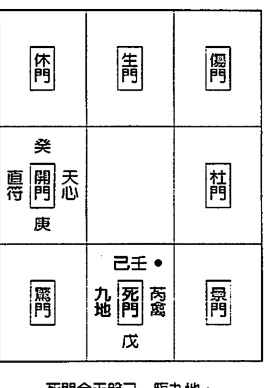

### 鬼假图例(二)

阴遁六局 乙未时 符首辛

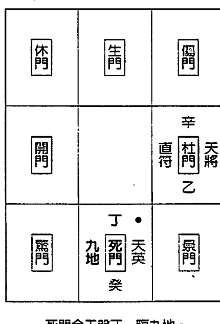

### 五、相佐、欢怡

### 1. 相佐

天盘符首，地盘三奇乙、丙、丁，宫内有九星直符及八神直符，称为「相佐」。

是与「青龙返首」同样吉利的大吉方位（若地盘丙则为青龙返首）。举凡求财求利、见贵人、嫁娶、营造、远行、经商等，都可用此方位，百事大吉。

### 2. 欢怡

天盘三奇乙、丙、丁，地盘符首，是为「欢怡」。若天盘丙，则为「飞鸟跌穴」。

于此方位，可心身爽快，百事进展顺利。

**相佐图例**
阴遁九局 壬午时 符首己

| | | 己· |
| :---: | :---: | :---: |
| 休门 | 生门 | 直符 伤门 天任 |
| | | 壬丙 |
| 开门 | | 杜门 |
| 惊门 | 歃门 | 景门 |

天盘符首，地盘丙。

**欢怡图例**
阳四局 癸酉时 符首戊

| 乙· | | |
| :---: | :---: | :---: |
| 九天 杜门 天冲 | 景门 | 歃门 |
| 戊 | | |
| 伤门 | | 惊门 |
| 生门 | 休门 | 开门 |

地盘符首，天盘乙奇。

## 第七章 遁甲局盘中的「凶格」

### 一、奇门遁甲四大凶格——青龙逃走、白虎猖狂、朱雀投江、腾蛇天矫

> **《歌词》**
> 六乙加辛龙逃走，六辛加乙虎猖狂：
> 六癸加丁蛇天矫，六丁加癸雀入江：
> 请观四者是凶神，百事逢之莫措手；
> **《歌词释义》**

-   **1. 青龙逃走**
    天盘乙，加地盘辛，是为「青龙逃走」。
    此方位会造成龙虎斗争、两败俱伤，发兵进击亦自伤，有失败、败退、损失等情况，百事皆凶。

-   **2. 白虎猖狂**
    天盘辛，加地盘乙，是为「白虎猖狂」。
    此方位主百事不吉，两败俱伤，攻守都不利。相亲、提亲都不成功；修造等事都遭白虎暴虐，大凶。商务经营，也有惊诈悲哀现象。

-   **3. 朱雀投江**
    天盘丁，加地盘癸，是为「朱雀投江」。
    丁朱雀跌入河水，阴火与阴水遭遇相克，丁火朱雀飞不起来，失去丁奇效能，会使口论、诉讼、刑狱等事情发生，凶意百出。
    「丁」亦代表文书，书类错误多，写论文、诉状不利。

-   **4. 螣蛇天矫**
    天盘癸，加地盘丁，是为「螣蛇天矫」。
    癸水是北方玄武龟蛇之精，「螣蛇」表示蛇昂首的恐怖情状；丁天矫，代表可爱玉女。阴水克阴火，百事不利，忧愁忧虑不断，恐慌虚惊。就算有吉门，亦难消除凶兆。

### 青龙逃走图例
阳遁七局 壬辰时 符首庚

| 死门 | 开门 | 直符 休门 天英 壬丙 |
| :---: | :---: | :---: |
| 死门 | （空） | 生门 |
| 惊门 | 杜门 辛 | 伤门 |

天盘乙，加地盘辛。

### 白虎猖狂图例
阴遁七局 丁未时 符首壬

| 生门 | 伤门 | 杜门 |
| :---: | :---: | :---: |
| 休门 | （空） | 景门 |
| 开门 直符 惊门 天任 乙 丁 | | 死门 |

天盘辛，加地盘乙。

### 朱雀投江图例
阴遁二局 乙酉时 符首庚

| 生门 | 伤门 | 杜门 |
| :---: | :---: | :---: |
| 休门 | （空） | 景门 丁 癸 |
| 开门 | 直符 惊门 天辅 乙 | 死门 |

天盘丁，加地盘癸。

### 螣蛇天矫图例
阴遁三局 壬辰时 符首庚

| 惊门 | 开门 | 休门 |
| :---: | :---: | :---: |
| 死门 | （空） | 生门 |
| 直符 景门 天芮 壬 | 杜门 | 伤门 丁 |

天盘癸，加地盘丁。

### 二、太白入荧惑、荧惑入太白

> **《歌词》**
> 庚为太白丙荧惑，庚丙相加谁会得；
> 六庚加丙白入荧，六丙加庚荧入白；
> 白入荧兮贼即来，荧入白兮贼须灭；

**《歌词释义》**
太白庚金，生于巳，禄于申，旺于酉，属金，号「太白」。
荧惑丙火，生于寅，禄于巳，旺于午，属火，号「荧惑」。
庚丙相加的话，即天盘庚加地盘丙，或天盘丙加地盘庚，术家谁能得到而且加以运用？火金同宫，乃祸乱之凶格。
天盘庚加地盘丙，即太白入荧惑（金入火），会受克制，此时应防贼来，防敌偷袭、防下克上、防反叛。
天盘丙加地盘庚，即荧惑入太白（火入金），火金同宫，相克，凶气横溢。宫内纵使有奇门，凶气仍强，所以此时之战应回避，不宜出击，宜防敌欺。

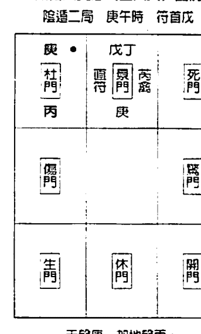

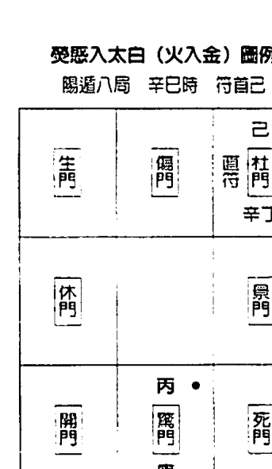

### 三、勃、格

> **《歌词》**
> 丙为勃兮庚为格，格则不通勃乱逆；
> 天丙加地干为勃，天庚加地癸为格；
> 丙加天乙为勃符，天乙加丙为飞勃；

### **《歌词释义》**

-   **1. 勃：**
    「勃」是丙火的代名词，有火势炽烈，以火力强势推开，颇有「武火」之意，如火灾、紊乱、兵火、逆乱等。文火则有温暖吉意。
    「勃」并不是凶格，但有事情成功后须谦虚，不可骄傲自大的告诫含意。
    丙为三奇之一，有特异功能，亦为「飞鸟跌穴，青龙返首」等二大吉格的主角，然却因其火气炽盛、个性暴燥，而不完美。
    乱世时，依「青龙返首，飞鸟跌穴」吉格立功，建国功臣易成骄生傲，若趋恶则乱纲纪、下克上，反为亡国灭国的逆臣。治国不忘乱，诸事成就之后，应切忌骄傲乱纪，这就是「勃」的真意。
    「勃」分为符勃、飞勃与时勃，都代表诸事紊乱、上下混乱、火灾祸乱。

    -   **①符勃：**
        天盘丙，地盘符首，称为「符勃」。此格形式与「飞鸟跌穴」相同，立功后的骄态，必须转为谨慎谦虚，才不会起事成灾。
    -   **②飞勃：**
        天盘符首，地盘丙，称为「飞勃」。此格形式与「青龙返首」相同，意义也相同。
    -   **③时勃：**
        天盘丙，地盘年、月、日、时的干，称为「时勃」。此格意义与前述二项相同。

### 符勃图例
阴六局 丙子时 符首己

| | | |
| :---: | :---: | :---: |
| 惊门 | 开门 | 丙 休门 • 己壬 |
| 死门 | | 生门 |
| 己壬 直符 景门 禽芮 丙 | 杜门 | 伤门 |

### 飞勃图例
阳四局 丙申时 符首辛

| | | |
| :---: | :---: | :---: |
| 死门 | 惊门 | 辛 • 直符 开门 天柱 丙己 |
| 景门 | | 休门 |
| 杜门 | 伤门 | 生门 |

天盘丙，地盘符首己。
天盘符首辛，地盘丙。

### 2. 格——十一庚格

### **《歌词》**
-   加一宫兮战在野，同一宫兮战于国；
-   庚加直符天乙伏，直符加庚天乙飞；
-   庚加癸兮为大格，加己为刑最不宜；
-   加壬之时为上格，又嫌岁月日时逢；
-   更有一般奇格者，六庚谨勿加三奇；
-   此时若也行兵去，匹马双轮无返期；

### **《歌词释义》**
「格」是庚金的代名词，庚金对「甲」尊的敌意激烈，阳金克阳木，损伤大。有庚金介入的地方，都有混乱、诸事不顺不通的情况。这种凶兆在遁甲盘中，以「格」的形式显现。

-   **①天乙伏宫格**
    天盘庚，地盘符首，称为「天乙伏宫」格。此格攻守都不利，动则败，对主客皆不利。
-   **②天乙飞宫格**
    天盘直符，地盘庚，称为「天乙飞宫」格。此格也对主客皆不利，攻守两败俱伤，宜固守，出将则被擒。
-   **③刑格**
    天盘庚，地盘己，称为「刑格」。代表名誉损失、财帛损失、疾病等潜伏性灾害，而且有后遗症。
-   **④战格**
    天盘庚，地盘庚，称为「战格」。代表斗争激烈，兄弟相争，官灾横祸，大凶。
-   **⑤上格**
    天盘庚，地盘壬，称为「上格」。指易遭牵制，百事不顺调，行军出战亦凶。
-   **⑥大格**
    天盘庚，地盘癸，称为「大格」。指不宜远行，易遭车祸，人财、产业破败。图谋不通，求人不在。
-   **⑦奇格**
    天盘庚，地盘乙、丙、丁三奇，称为「奇格」。地盘乙者，上克下，主动者虽不败，但亦不利，无好处。地盘丙、丁者，下克上，主动出击或旅游，都无法全身退回。
-   **⑧—⑪岁格、月朔格、日干格、时干格**
    天盘庚，地盘岁干、月干、日干、时干，代表于此岁、月、日、时行事，皆凶。

### 天乙伏宫格图例
阴遁三局 辛未时 符首戊

| 戊 辛 | | |
| :---: | :---: | :---: |
| 休门 直符 生门 天冲 | 伤门 | |
| 庚• 开门 戊 | 杜门 | |
| 惊门 | 死门 | 景门 |

天盘庚，地盘首符。

### 天乙飞宫格图例
阴遁三局 庚子时 符首辛

| 死门 | 惊门 | 开门 |
| :---: | :---: | :---: |
| 景门 | | 休门 |
| 杜门 | 直符 伤门 天英 庚 辛• | 生门 |

天盘直符，地盘庚。

### 刑格图例
阴遁九局 戊寅时 符首己

| 生门 | 己 直符 伤门 天任 | 杜门 |
| :---: | :---: | :---: |
| 休门 | | 景门 |
| 庚 开门 | 惊门 | 死门 |

天盘庚，地盘己。

### 战格图例
阴遁九局 甲申时 符首庚

| 杜门 | 景门 | 死门 |
| :---: | :---: | :---: |
| 伤门 | | 庚 直符 惊门 天柱 |
| 生门 | 休门 | 开门 |

天盘庚，地盘庚。

### 上格图例
阴遁六局 戊申时 符首壬

| 伤门 | 杜门 | 庚 景门 壬己 |
| :---: | :---: | :---: |
| 生门 | | 死门 |
| 休门 | 开门 | 壬己 直符 惊门 丙禽 戊 |

天盘庚，地盘壬。

### 大格图例
阴遁五局 癸巳时 符首庚

| 杜门 | 庚 直符 惊门 天衡 癸 | 死门 |
| :---: | :---: | :---: |
| 伤门 | | 惊门 |
| 生门 | 休门 | 开门 |

天盘庚，地盘癸。

### 奇格图例(一)
阳遁六局 壬午时 符首己

| 巽四宫 | 离九宫 | 坤二宫 |
| :---: | :---: | :---: |
| 惊门 | 开门 | 休门 |
| 丙+己 (直符 天英 死门) | | 庚+乙 (生门) |
| 景门 | 杜门 | 伤门 |

天盘庚，地盘乙。

### 奇格图例(二)
阴遁一局 庚戌时 符首壬

| 巽四宫 | 离九宫 | 坤二宫 |
| :---: | :---: | :---: |
| 庚+丁 (惊门) | 开门 | 休门 |
| 死门 | | 生门 |
| 壬+庚 (直符 天心 开门) | 杜门 | 伤门 |

天盘庚，地盘丁。

### 奇格图例(三)
阳遁二局 壬戌时 符首癸

| 巽四宫 | 离九宫 | 坤二宫 |
| :---: | :---: | :---: |
| 伤门 | 庚+丙 (杜门) | 景门 |
| 生门 | | 死门 |
| 休门 | 开门 | 壬+癸 (直符 天柱 惊门) |

天盘庚，地盘丙。

### 日干格图例
阴遁八局乙日 壬午时 符首己

| 巽四宫 | 离九宫 | 坤二宫 |
| :---: | :---: | :---: |
| 休门 | 庚+乙 (生门) | 伤门 |
| 开门 | | 杜门 |
| 惊门 | 死门 | 景门 |

天盘庚，地盘日干。

### 时干格图例
阳遁六局 乙酉时 符首庚

| 巽四宫 | 离九宫 | 坤二宫 |
| :---: | :---: | :---: |
| 休门 | 生门 | 庚+乙壬 (直符 伤门 天任) |
| 开门 | | 杜门 |
| 惊门 | 死门 | 景门 |

天盘庚，地盘时干。

### 四、六仪击刑

### **《歌词》**
> 六仪击刑何大凶，甲子直符愁向东；
> 戌刑在未申刑虎，寅巳辰辰午午刑午；

### **《歌词释义》**
六仪戊在震、己在坤、庚在艮、辛在离、壬在巽、癸在巽，是为「击刑」。六仪击刑，指「符首」受刑害，诸事如肘腋压力，易受阻碍，必须谨慎。
所谓「六仪之刑」，原出自地支三刑，即从子卯互刑、戌未三刑、申寅三刑、寅巳三刑、午午自刑、辰辰自刑等而来。

-   子卯互刑：甲子旬的符首「戊」在卯（震三宫），故被击刑，
-   戌未三刑：甲戌旬的符首「己」在未（坤二宫），故被击刑，
-   申寅三刑：甲申旬的符首「庚」在寅（艮八宫），故被击刑，
-   午午自刑：甲午旬的符首「辛」在午（离九宫），故被击刑，
-   辰辰自刑：甲辰旬的符首「壬」在辰（巽四宫），故被击刑，
-   寅巳三刑：甲寅旬的符首「癸」在巳（巽四宫），故被击刑。

**六仪击刑所在宫位（天盘）图例**

| 巽四 壬癸 | 离九 辛 | 坤二 己 |
| :---: | :---: | :---: |
| 震三 戊 | | |
| 艮八 庚 | | |

由以上得知，天盘的戊在震宫、己在坤宫、庚在艮宫、辛在离宫、壬在巽宫、癸在巽宫都是「六仪击刑」。

〈注〉：地支互刑、三刑、自刑，统称为「地支三刑」。

-   互刑指子与卯；
-   三刑指寅——巳——申与丑——戌——未；
-   自刑指辰对辰、午对午、酉对酉、亥对亥。

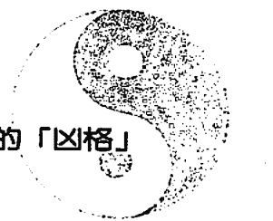

## 第八章 完整认识「三奇」

### 一、三奇得使

> **《歌词》**
> 三奇得使诚堪使，六甲遇之非小补；
> 乙逢犬马丙鼠猴，六丁玉女骑龙虎；

**《歌词释义》**
「乙马」即乙奇在午，离九宫。「逢犬」即乙奇在戌，乾六宫。
「丙鼠猴」即丙奇在子，坎一宫；与丙奇在申，坤二宫。
「六丁玉女」即丁奇，「骑龙虎」即在辰巽四宫；与寅艮八宫。
「三奇得使」即指乙奇得使、丙奇得使、丁奇得使等三者，因代表甲职，其职位提高，功能强化。「得使」各宫位如下：
天盘乙奇在戌宫（乾六）、午宫（离九），谓之「乙奇得使」；
天盘丙奇在子宫（坎一）、申宫（坤二），谓之「丙奇特使」；
天盘丁奇在寅宫（艮八）、辰宫（巽四），谓之「丁奇得使」。
三奇得使的职务功能，都比一般三奇强化，纵然不加「开休生」三吉门，亦能独立使用，加了三吉门，效能加强，吉上加吉。
通常有三奇而无奇门，是不成格的，不能发挥效能，但「三奇得使」则能。

### 二、三奇得使的效能

乙奇得使：通商求财、迁徙入宅、婚嫁缔盟等，吉力旺盛，不需吉门配合，亦吉兆。

丙奇得使：地位财利、名誉威权、阳气盛、诸事公开则得胜，忌阴谋，能独力获得，吉兆。

丁奇得使：和合协调、侦察间谍、潜藏避难、休暇旅游，皆得吉，能独力趋吉。

若有以下三种状况时，则不可视为得使，但如逢本旬直符加临，则可用：

-   乙奇得使加在「甲午辛」上，为「青龙逃走」；
-   丙奇得使加在「甲申庚」上，为「荧惑入太白」（火入金）；
-   丁奇得使加在「甲寅癸」上，为「朱雀投江」。

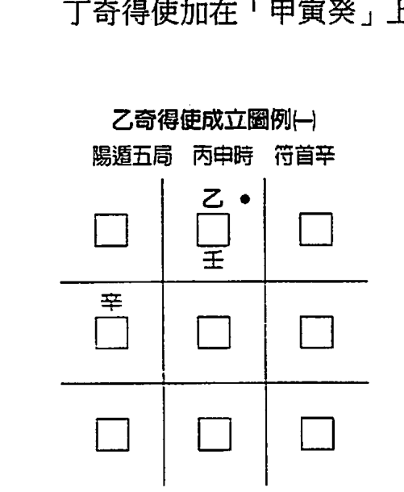

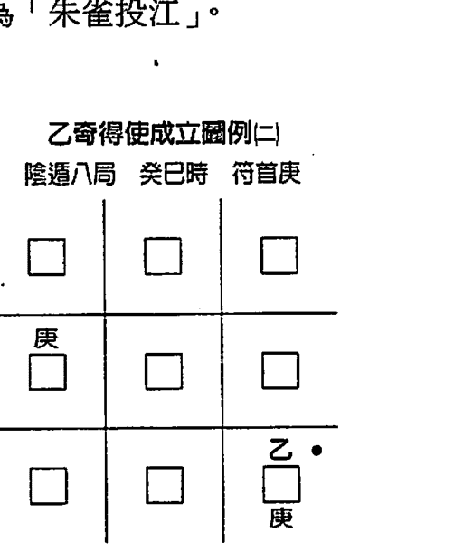

**乙奇得使不成立图例**
阴遁三局 乙丑时 符首戊

| 戊 □ | 乙 □·辛 | □ |
| :---: | :---: | :---: |
| □ | □ | □ |
| □ | □ | □ |

左图「乙奇得使」不成立，乙奇虽在离九的「乙奇得使」位，但因地盘「辛」而形成「青龙逃走」，所以「乙奇得使」不成立。

**丙奇得使成立图例(一)**
阳遁二局 丁卯时 符首戊

| □ | □ | □ |
| :---: | :---: | :---: |
| □ | □ | □ |
| 戊辛 □ | 丙 □·乙 | □ |

**丙奇得使成立图例(二)**
阳遁五局 壬寅时 符首辛

| □ | 辛 □ | 丙 □·丁戊 |
| :---: | :---: | :---: |
| □ | □ | □ |
| □ | □ | □ |

**丙奇得使不成立图例**
阴遁七局 戊午时 符首癸

| □ | □ | 丙 □·庚癸 |
| :---: | :---: | :---: |
| □ | □ | 庚癸 □ |
| □ | □ | □ |

丙奇虽在坤二的丙奇得使位，但因地盘「庚」而形成「荧惑入太白」，所以「丙奇得使」不成立。

丁奇虽在艮八的丁奇得使位，但因地盘「癸」而形成「朱雀投江」，所以「丁奇得使」不成立。

### 三、三奇升殿

乙、丙、丁各具有其生旺或禄位宫，入之则谓「升殿」。
乙奇升殿：指天盘乙奇，临震三宫，是乙之禄位，阴木临官。日出扶桑（震三宫为正东位），临有禄之乡，贵人升于乙卯正殿。
丙奇升殿：指天盘丙奇，到离九宫，是丙之旺位，阳火帝旺。月照瑞门，火旺之地，奇入本乡乃贵人升于丙午正殿。
丁奇升殿：指天盘丁奇，临兑七宫，是阴火长生之乡，丁见西方长生天神之位。「三奇升殿」之吉力，比「三奇得使」稍差，而且须与三吉门并用，才能发挥吉力。

**三奇升殿图例：**

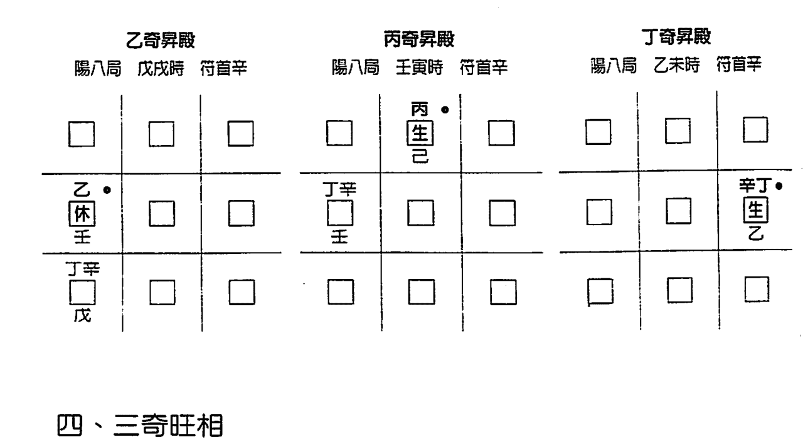

### 四、三奇旺相

乙、丙、丁三奇，入其五行相生的宫位，能强化吉效。
乙奇（五行木）：临巽（木）宫，是玉兔乘风，百事皆吉。临坎（水）宫，是玉兔饮泉，木入生乡。
丙奇（五行火）：临震（木）宫，是月入雷门，架柱、修门吉。临巽（木）宫，是火行风起，龙神助威，吉。
丁奇（五行火）：临巽（木）宫，是玉女留郎，大风成象。临离（火）宫，是乘龙万里，乘旺火炎。「三奇旺相」吉力与「三奇升殿」相似，须与三吉门配合用之。

**三奇旺相图例：**

**乙奇旺相**

| | | |
| :---: | :---: | :---: |
| 乙• 巽四 | | |
| | | |
| | 乙• 坎一 | |

**丙奇旺相**

| | | |
| :---: | :---: | :---: |
| 丙• 巽四 | | |
| 丙• 震三 | | |
| | | |

**丁奇旺相**

| | | |
| :---: | :---: | :---: |
| 丁• 巽四 | 丁• 离九 | |
| | | |
| | | |

### 五、三奇入墓

> **《歌词》**
> 三奇入墓好思推，甲日那堪见未宫：
> 丙奇属火火墓戌，此时诸事不须为：
> 更嫌六乙来临二，月奇临六亦同论：

**《歌词释义》**
三奇入墓为凶的结构，依据五行生旺理论，是阳生阴死、阳顺阴逆的原理。六乙日奇，下临乾六宫及坤二宫，六丙月奇，下临乾六宫，六丁星奇，下临艮八宫，都是「入墓」。三奇入墓会失去本来应有的特异效能，凶兆显露。凡是遇三奇入墓，纵然有奇门，也不可举兵，因为百事皆凶。

### 三奇入墓圖例

|  | 乙 坤二 |
| :--- | :--- |
| 丁 艮八 | 乙丙 乾六 | 甲木入墓未宮（陰支） 乙木陰干配陰支 乙（陰木）丙（陽火） 入墓於戌宮 |

丁奇入墓於丑

在此需要說明的是，所謂「依據五行生旺理論」，指的是「十二長生」的概念，也就是十天干（甲、乙、丙、丁、戊、己、庚、辛、壬、癸）的生旺死絕歷程，分為：長生、沐浴、冠帶、臨官、帝旺、衰、病、死、墓、絕、胎、養。我們只從字面上看，也可得知「墓」就如同人死入墓一般，乙丙丁三奇入了墓，當然無法發揮應有功力。

### 六、三奇受制

丙奇（火）、丁奇（火）入坎一宮（水），即為火入水池。乙奇（木）入乾六（金）宮，是為木入金鄉，以上都是三奇受制的狀況。

### 三奇受制圖例

|  |  |
| :--- | :--- |
| 丙丁 坎一 | 乙 乾六 | 水宮剋火 ↑ 金宮剋木 ↑ |

因為三奇之五行，受剋於宮位之五行，所以三奇應有之力量，難以發揮，是不吉不佳的結構，萬事不可進行。

### 七、三奇喜怒

1. 乙（木）奇者，日奇也：
    - 到乾：玉兔（乙奇即玉兔）入林（亥水生木，林為木之生地），上官赴任、遠行、修造，並吉。
    - 到坎：玉兔飲泉（坎水），木入生鄉，吉。
    - 到艮：玉兔步青（寅木），吉。
    - 到震：白兔遊宮（震木），造作、謁見、出行吉。
    - 到巽：玉兔乘風（八卦中的巽為風），百事吉。
    - 到離：白兔當陽（離火），宜作顯揚，合藥煉丹（要用到火），百事宜。
    - 到坤：玉兔暗昧（乙木剋坤土），玉兔入墓，用於上官、赴任、遠行、經商、移轉、修造等，立見災難。
    - 到兌：乙奇受制（乙木受制於兌金），事多不利。

2. 丙（火）奇者，月奇也：
    - 到乾：光明不全（火剋金），丙奇入墓，凶不可用。
    - 到坎：火入水池，丙奇受制，諸事凶。
    - 到艮：鳳入丹山（八卦中的艮為山），鳳凰坐林，丙火灼熱，吉。
    - 到震：月入雷門，修造修門，永吉。
    - 到巽：火行風起，龍神助威，所行皆吉。
    - 到離：帝旺之鄉（離是火最強的地方），丙火正殿，吉。
    - 到坤：子居母腹（十二長生中的胎位），德威收藏，吉。
    - 到兌：鳳凰折翅（丙火剋兌金），凶。

3. 丁（火）奇者，星奇也：
    - 到乾：火照天門（乾卦為天門），玉女遊天門，妙吉。
    - 到坎：朱雀（火鳥）投江（坎水），丁入壬癸鄉，威德收藏，須慎靜勿顯揚。
    - 到艮：玉女（丁奇即玉女）遊鬼門（艮為鬼門），丁奇入墓，凶。
    - 到震：玉女入雷門，興工修營有祥應，吉。
    - 到巽：玉女留郎（十二長生帝旺宮），大風成象（巽為風），吉。
    - 到離：乘龍萬里（丁火入火宮），為乘旺（十二長生的臨官為入財之位），但火炎能銷爍萬物，燥暴不常，不利做壞事。
    - 到坤：玉女遊地戶（丁火生坤土），吉。
    - 到兌：火死金旺（丁火到兌金）之鄉，能凶能吉。

## 第九章 天三門、地四戶、地私門

> 〈歌詞〉
天三門兮地四戶，問君此法如何處：
太衡小吉與從魁，此是天門私出路：
地戶陰危定與開，舉事皆從此中去：

> 〈歌詞釋義〉
奇門遁甲活盤的作動，都依天地盤「天干」的推移而變化。
天三門、地四戶、地四門，則專依「地支」的推移而作動。
可與遁甲活盤併用，而補強其趨吉避凶的效果。

### 一、月建、十二建神、月將、十二天將、十二次

1.  月建：
一年有十二節與十二中氣，計二十四節氣。
一個月一節一氣是以節為基準。年初正月的月支為「寅」，正月月干每年有變化，而正月月支則無變化，此月支即為「月建」。
正月月建寅、二月卯、三月辰、四月巳、五月午、六月未、七月申、八月酉、九月戌、十月亥、十一月子、十二月丑。

2.  十二建神：
黃曆中所列的建、除、滿、平、定、執、破、危、成、收、開、閉等「十二直」，即是十二建神。
十二建神是北斗七星劍尖（破軍星）所指方向變化的象兆。十二直各文字都有吉凶，用於「地四戶」。

3.  月將：
月建是根據「節」而順行的十二地支（正月立春節寅～十二月小寒節丑）。而月將則是與月建十二地支有「支合（指地支的六合）」關係的十二地支。
月將十二地支各有各的名稱，列示如下：
子－神后（與月建丑合）、丑－大吉（與月建子合）、寅－功曹（與月建亥合）、卯－太衝（與月建戌合）、辰－天罡（與月建酉合）、巳－太乙（與月建申合）、午－勝光（與月建未合）、未－小吉（與月建午合）、申－傳送（與月建巳合）、酉－從魁（與月建辰合）、戌－河魁（與月建卯合）、亥－登明（與月建寅合）。

4.  十二天將：
「十二天將」是貴人、騰蛇、朱雀、六合、勾陳、青龍、天空、白虎、太常、元武、太陰、天后。
此十二天將是六壬神課卜占法使用的神煞，在奇門遁甲並不討論其各種吉凶。只於「地私門」排盤時，利用六合、太陰、太常、三天將之位置而已。

5.  十二次：
木星軌道由西往東（與太陽軌道相反）一周十二年，一年為一次，一周即十二次。木星乃太歲，其十二次也有名稱，但因排盤不需要名稱，故省略之。

### 二、天三門

1.  天三門的排法：
    ①將「十二月將」以神后、大吉、功曹、太衝、天罡、太乙、勝光、小吉、傳送、從魁、河魁、登明等順序，加於時支，順數排列。逢太衝（卯）、小吉（未）、從魁（酉）三月將，其所落地支之位置，即為「天三門」。
    ②起「月將」要配合「授時曆」，先查看「太陽過宮」，該中氣是那十二支宮、月將名為何等。
例如，要找大寒到雨水間，某日時刻的天三門，則依「授時曆」得知「子宮月將」神后，將神后「子」加於用時上，依序順排十二月將，再看太衝（卯）小吉（未）從魁（酉）三月將，重合於盤上的那一個位置，則此三位置就是「天三門」。

2.  天三門圖示說明
第一層：最外層部分是中氣區間，如「自十一月冬至后，某日時刻日躔星紀之次，以大吉出將加用時」，說明這是冬至中氣到大寒中氣（中間有小寒節）的月將區域。
第二層：表示「月將所屬十二地支期間」，冬至到大寒期間屬「丑」。
第三層：表示所屬十二月將名，如神后、大吉、功曹……等。
最內層：表示太衝、小吉、從魁等天三門的宮位位置。

3.  天三門活盤
    1. 下圖是天三門所用之十二地支盤，內方角的十二地支，表示地支時辰及方位，稱為「地盤」。
    2. 「子午卯酉」表示正北、正南、正東、正西等四正位。四隅位有戌亥（西北）、丑寅（東北）、辰巳（東南）、未申（西南）。
這雖然是兩地支共占一方位，但無論是四正位或四隅位，每一方位都是45度角範圍，才符合八卦八方位。
12地支所代表的時辰如下：
    - 子一前日夜半23時～午前1時
    - 丑一午前1時～午前3時
    - 寅一午前3時～午前5時
    - 卯一午前5時～午前7時
    - 辰一午前7時～午前9時
    - 巳一午前9時～午前11時
    - 午一午前11時～午後13時
    - 未一午後13時～午後15時
    - 申一午後15時～午後17時
    - 酉一午後17時～午後19時
    - 戌一午後19時～午後21時
    - 亥一午後21時～午後23時
    ③天三門活盤以此十二地支地盤為內層，再加一外層為月將十二支轉移之用，此即月將天盤。欲求天三門的某日用事時刻地支，則加註「○」記號於活盤上的十二支地盤。
    ④其次，在「太陽過宮圖」看授時曆，查某日所屬的月將：如「丑大吉」、「子神后」等，並將此記入前項月將天盤與十二支地盤有「○」記號的地支相同位置上。
    ⑤由此為起點，依照十二支序列順行於十二支地盤，並於月將天盤記入諸月將與地支名，完成記入後之月將天盤的卯－太衝、未－小吉、酉－從魁，在十二支地盤的十二地支三方位，就是該用事時刻的天三門吉利方位。

4.  天三門排演舉例
〈試求1991年1月1日午前7到9時（辰時）的天三門〉：
    ①查該日所屬月將：1991年1月1日是庚年冬至到大寒，查看「授時曆」，可知月將是「丑大吉」。用事時刻是辰時，故於十二地支地盤的辰位記下「○」記號。並將月將「丑大吉」填記於地盤有「○」記號的「辰」相同位置的外層「月將天盤」上。
    ②以天盤「丑大吉」為起點，順推地盤十二支宮，記入其他月將名稱與地支，即如：在地盤「○」記號的「辰」相同位置的月將天盤記入「丑大吉」，並以此為起點，順行天盤並記入寅（功曹）、卯（太衝）、辰（天罡）、巳（太乙）、午（勝光）、未（小吉）、申（傳送）、酉（從魁）、戌（河魁）、亥（登明）、子（神后）等。
    ③「月將天盤」排完後，月將天盤之卯（太衝）、未（小吉）、酉（從魁）等三方位，即是「天三門」，各屬於十二支地盤的午、戌、子三位置。因此，可得出1991年1月1日午前7到9時的天三門吉方，在午（正南）、戌（西北）、子（正北）。

〈試求1990年12月24日午前8時頃（辰）之天三門〉：
    ①查該日所屬月將：1990年12月24日是庚年冬至到大寒，依「授時曆」查出月將是「丑大吉」（與前例相同）。
先在用事時刻十二地支地盤「辰」位加上「○」記號，再把月將「丑大吉」，記在與地盤「○」記號的「辰」相同位置的天盤「丑大吉」為起點順行十二支地盤，記入其他月將名與地支，即在地盤「○」處的「辰」同位的天盤上，記入「丑大吉」，依次寅（功曹）、卯（太衝）、辰（天罡）、巳（太乙）、午（勝光）、未（小吉）、申（傳送）、酉（從魁）、戌（河魁）、亥（登明）、子（神后）等。

| 太衝 | 天罡 | 太乙 | 勝光 | 小吉 | 傳送 | 從魁 |
| :---: | :---: | :---: | :---: | :---: | :---: | :---: |
| ●卯 | 辰 | 巳 | 午 | 未 | 申 | 酉 |
| 寅 | 丑 | 子 | 亥 |  |  |  |
|  |  |  | 亥 | 戌 | 酉● |  |
|  |  |  | 登明 | 河魁 | 從魁 |  |

    ③「月將天盤」排完後，天盤之卯（太衝）、未（小吉）、酉（從魁），即是「天三門」，各屬於十二地支地盤的午、戌、子三位置方位。
於是得出結論：1990年12月24日午前8時頃之天三門吉方位，是午位正南方、戌位西北方，與子位正北方。
從以上二例求天三門的結果，可知同一月將內，無關那一天，同時刻的天三門吉方，都相同。
而且月將名也不需要記憶，只要掌握「每月以中氣為準的月將地支」（亦可從月建推出其支合），與用事時刻的地支，由此推出天盤月將地支「卯未酉」的地盤十二支方位就是。

〈試求1991年5月1日已時的天三門〉：
    1. 先查月將：穀雨到小滿的中氣為「酉」（清明三月節、月建辰的支合是酉），因時刻是「巳」時，故於地盤「巳」加註「○」記號，並於其外層「月將天盤」記下月將「酉」。
    ②由月將「酉」為起點，將戌、亥、子、丑、寅、卯、辰、巳、午、未、申等，順推於天盤，並記下。可看出卯（地盤亥位）、未（地盤卯位）、酉（地盤巳位），即為天三門三吉方位的亥（西北）、卯（正東）、酉（東南）。

5.  天三門的效用
    1. 十二月將之太衝、小吉、從魁，等謂「天三門」，都是吉方位，適合公開正面的求財、求名、索債、業務繁昌等，也是適合避難的方位。
    2. 天三門能與奇門遁甲盤併用，如果同時刻在同方位的遁甲盤，也是吉方的話，即有補強吉氣的相乘效果。但限與「開休生景」等陽吉門併用有吉效，與「傷杜驚死」等陰門併用，則無作用。
    3. 天三門雖然能與遁甲盤併用而得吉效，但單獨使用，亦可顯現吉效。例如，急需得到吉方或緊急避難，無暇考慮奇門遁甲盤時，只要知道「月將與用時地支」，就可推出天三門來應用。

6.  天三門與奇門遁甲盤的併用
以前述1991年1月1日午前7到9時（辰）的天三門，併用同時刻的奇門遁甲盤為例，當日時的奇門遁甲時盤為陽遁七局，壬辰時盤：

### 陽遁七局 壬辰時盤
| 癸 | •丁 | 庚 |
| :---: | :---: | :---: |
| 九地 驚門 天衡 丁 | 九天 開門 天輔 庚 | 直符 休門 天英 壬丙 |
| 己 |  | 壬丙 |
| 朱雀 死門 天任 癸 |  | 騰蛇 生門 天禽 戊 |
| 辛 | •乙 | •戊 |
| 勾陳 景門 天遠 己 | 六合 杜門 天心 辛 | 太陰 傷門 天柱 乙 |

### 天三門盤
| 功曹 ↑寅 | 巳 | 午 | 未 | 申 |
| :---: | :---: | :---: | :---: | :---: |
| 大吉 丑 | 辰○ |  |  | 酉 |
| 神后 子 | 卯 |  |  | 戌 |
| 寅 | 丑 | 子 | 亥 | 亥 |
|  | 亥 戌 酉• 登明 河魁 從魁 |  |  | 勝光 •小吉 傳送 |
| 太衝 •卯 | 天罡 辰 | 太乙 巳 |  | 午 未 |

從上圖「奇門遁甲盤」與同日時的「天三門盤」之配套，可得結論如下：
    ①坤二宮：休門符首直符齊於一宮，地盤丙奇，形成「青龍返首」的相佐吉格；但「天庚地丙」，形成「金入火」的凶格，有瑕疵。吉格須扣分，吉象稍減。
    ②兌七宮：生門丙奇，地盤戊，形成「奇門」的天遁吉格。吉格吉象，有相乘效果。
    ③離九宮：開門丁奇，形成「奇門」的丁奇旺相，更有力，又見天三門加勢，大吉。
    ④其他：坎一杜門是「青龍逃走」，不吉。乾六傷門，雖是天三門，但無助力。艮八景門、巽四驚門是「朱雀投江」的惡格陰門，都無吉象作用。

### 三、地四户

### 1.地四户的效用
地四户的作用与天三门有阴阳对象之意义。天三门的吉作用，是公开公表的正面阳性作用；而地四户的吉作用，则是隐密性进行、阴谋用事、利于逃亡、有食福等的阴性作用。
地四户与天三门一样，使用十二地支盘，可与奇门遁甲盘并用，而强化趋吉作用。
    - 併用「休门」：娱乐、享乐、和解和合、秘事等有吉利作用。
    - 併用「杜门」：对逃难、隐匿效果更佳。
    - 併用「生门」：对诸事的隐密性效果更佳。
    - 併用「伤门」：行阴谋事，伤害对方，得成。

### 2.地四户的排法
    1. 地四户使用十二地支盘与「十二建神」，其顺序为建、除、满、平、定、执、破、危、成、收、开、闭。
    2. 将十二建神加在用时十二地支的外层天盘，如用时「子时」，则将十二建神的第一位「建」，加在地盘「子」位的外层天盘。再依序顺行排列十二建神于天盘层。
    3. 取十二建神中的「除定危开」四建神的相对应地盘方位，就是地四户方位。
下图是子时「地四户」的图示，与子时的十二地支排盘。

### 3.地四户排演举列
〈求用时「亥」地四户〉：
    ①将十二建神的第一「建」，置于十二地支地盘的「亥」位对应天盘位，再依序于天盘记入十二建神。
    ②取天盘建神的第2（除）、第5（定）、第8（危）、第11（开）的地盘十二支方位，就是地四户方位。
〈求用时「巳」地四户〉：
    ①将十二建神的第一「建」，置于十二地支地盘的「巳」位对应天盘位，再依序于天盘记入十二建神。
    ②取天盘十二建神的第2（除）、第5（定）、第8（危）、第11（开）的地盘十二支方位，就是地四户方位。

### 4.地四户的简捷排法
上述地四户的排法，是依照古书所述的排法，但经详查后，却可悟出简捷的排法：
即用时地支的次一地支（若用时子，次一地支是丑）的连带（有连带关系）四方地支方位，就是地四户方位。
例如，用时是子，则次一地支是丑，丑的连带四地支「丑未辰戌」四方位即地四户。若用时是亥，则亥的次一地支是子，而子的连带四地支四方位「子午卯酉」，就是四地户。
另有一法，是由用时数起十二建神的序列数字：2、5、8、11等四数的「地盘地支」位，就是四地户位。若用此法，则根本无需记忆十二建神。

### 四、地私门

> 〈歌词〉
六合太陰太常君，三辰元是地私門；
更得奇門相照耀，出門百事總欣欣；

> 〈歌词释义〉

### 1.地私门与其效能
地私门以十二天将：贵人、腾蛇、朱雀、六合、勾陈、青龙、天空、白虎、太常、玄武、太阴、天后等来排盘。而盘上的六合、太阴、太常所临的三位置，即「地私门」。
地私门有以日为基准的「日地私门」，及以时辰、月将为基准的「时地私门」。「日地私门」的效应是一天，「时地私门」效应是一个时辰；「时地私门」的效应虽短，但吉效较强。
阳贵时的六合、太阴、太常等三位，利于正面攻势破敌；阴贵时的此三位可避免正面攻击，以潜伏、游击攻法得战利。
其中，尤以六合方位，是最适合利用于「转战後退」之方位，也可与奇门配合，而得相乘吉效，百事欣欣。
现代社会对商务、求职、竞争竞技、劝诱等公开性诸事，可利用阳贵人方位；对私事、娱乐、和合、逃避等非公开性诸事，则利用阴贵人方位较佳。
前一节提到的天三门，只对阳事（公开性）的作用强，地四户只对阴事（非公开性）的作用强，而地私门则因有阳贵人、阴贵人的作用，故对阳事、阴事两者作用兼具。

### 2. 阳贵人、阴贵人的方位关系图与阴阳贵人表
以下有「阳时阳贵人顺行」与「阴时阴贵人逆行」的图示，四层圆形，分为各30度角的12等分，表示十二个月。
最外层表示太阳与木星的相对位置，也有表示天三门有关的「月将名」；第二层表示十二地支方位；第三层是十二天将的名称及以贵人为起点的阳顺阴逆序列；最内层是十二天将的六合、太常、太阴所临「地私门」宫位。
阳贵、阴贵之法，都是以「六合」为相对位置变化，而太常、太阴是合宫位置变化，可见六合的感应最特异，而太常、太阴合位的感应力，则比较弱。
「用事日支」或「用事时支」，皆有阴阳之分，对应「阳贵人、阴贵人表」，则日支以「亥～辰」日为阳，使用阳贵人；时支以「卯～申」时为阳，使用阳贵人。其他日支、时支，都是阴日、阴时，要利用阴贵人。如下图示：

阴阳贵人表

| 日干 | 阳贵 | 阴贵 |
| :--- | :--- | :--- |
| 甲 | 未 | 丑 |
| 乙 | 申 | 子 |
| 丙 | 酉 | 亥 |
| 丁 | 亥 | 酉 |
| 戊 | 丑 | 未 |
| 己 | 子 | 申 |
| 庚 | 丑 | 未 |
| 辛 | 寅 | 午 |
| 壬 | 卯 | 巳 |
| 癸 | 巳 | 卯 |## 第九章 天三門、地四戶、地私門

### 3. 「時」地私門

「時地私門」與「日地私門」的求法不同，須先與天三門一樣，將當天「月將地支」，依序排於地盤「用時地支」的天盤層。先定「用時地支」陰陽所屬，並查看「當日日干」的陰陽貴人的對照地支（須按照卯時到申時，使用「日干貴人表」的陽貴人；酉時到寅時，使用「日干貴人表」的陰貴人之原則）。

將陰陽貴人地支，指「貴人位」，置於天盤層上的「月將地支」位，如子合子、丑合丑、寅合寅。再由設在天盤層的貴人位為起點，陽時順推，陰時逆推。

推出貴人位起之第4（六合）、第9（太常）、第11（太陰）等三位置的地盤地支方位，就是所求「時地私門」。

### 〈試求1991年1月1日上午8時之時地私門〉

- 當日是庚午年，冬至到大寒期，月將地支「丑」，日干「支辛」未，上午8時是辰時，屬陽。故查陽貴人「日干辛」，得陽貴地支為「寅」。
- 將月將地支「丑」，配置於地盤用時辰的「天盤層」，以「丑」為起點，依十二地支順序，順行排列月將地支。
- 次把天盤月將十二地支「寅」位（即陽貴地支）為貴人起點，陽時順行推排於天盤。
- 取第4（地盤申）、第9（地盤丑）、第11（地盤卯），就是所求「時地私門」。

### 〈試求1990年12月24日上午8時之時地私門〉

- ①當日是庚午年，冬至到大寒期，月將地支「丑」，日干支「癸亥」，上午8時是辰時，屬陽。查陽貴人日干「癸」，得陽貴地支為「巳」。
- ②將月將地支「丑」，配於地盤用時「辰」的天盤層，由天盤「丑」為起點，依序順行排列月將地支。
- ③次將由天盤月將十二地支的「巳」位（即陽貴地支）為起點，陽時順行天盤。
- ④取第4、第9、第11位的地盤「亥辰午」方位就是。

### 4. 「日」地私門的排法

日地私門，其十二天將名不必記憶，只要記1位的貴人起點，取4、9、11等數的位置，就是「日地私門」。

### 〈試求丙寅日之地私門〉

- ①日支「寅」的陰陽所屬是陽，故用「陽貴人表」；日干「丙」所對應的陽貴是「酉」。
- ②在地盤酉位的天盤，置入陽貴人，以此為起點，順行配置：1酉（貴人）、2戌（騰蛇）、3亥（朱雀）、4子（六合）、5丑（勾陳）、6寅（青龍）、7卯（天空）、8辰（白虎）、9巳（太常）、10午（玄武）、11未（太陰）、12申（天后）。
- ③取4位「六合」、9位「太常」、11位「太陰」等三位置，就是「丙寅日」之地私門。

### 〈試求丁未日之地私門〉

- ①日支「未」的陰陽所屬是陰，故用「陰貴人表」；日干「丁」所對應的陰貴是「酉」。
- ②在地盤酉位的天盤，置陰貴人，以此為起點，逆行配置：1酉（貴人）、2申（騰蛇）、3未（朱雀）、4午（六合）、5巳（勾陳）、6辰（青龍）、7卯（天空）、8寅（白虎）、9丑（太常）、10子（玄武）、11亥（太陰）、12戌（天后）。
- ③取4位「六合」、9位「太常」、11位「太陰」，就是「丁未日」之地私門。

### 5. 地私門與奇門遁甲盤的併用

地私門能與遁甲時盤併用，而且更能發揮雙重吉效。如果無奇門或吉門來相併合，則其吉效須因用法而定。地私門的六合方位（第4位），於地私門三方位中，對吉象感應最特殊，對逃避逃難最有效。

以前述1991年1月1日上午8時的時地私門為例，當日是陽遁七局，辛未日，壬辰時，遁甲時盤如下圖：

### 陽遁七局 壬辰時盤
### 時地私門

|  |  |  |
| --- | --- | --- |
| 癸九地驚門天衡丁 | 丁九天開門天輔庚 | ●庚直符休門天英壬丙 |
| ●己朱雀死門天任癸 |  | 壬丙騰蛇生門芮高戊 |
| ●辛勾陳景門天蓬己 | 乙六合杜門天心辛 | 戊太陰傷門天柱乙 |

從時盤可看出，「坤二宮」休門與符首直符同宮，地盤丙與符首形成「青龍返首」，為吉格，雖有「金入火」凶格瑕疵，因加上地私門（六合），可柔和庚丙的凶，故大局仍然吉。像這樣六合地私門併用的效果，甚大（六合在地盤申，即坤二宮）。

再看「艮八宮」景門，雖不是奇門的上吉門，但因有地私門（太常）併入，而使得原為中吉門的景門，更加吉意。而併入「震三宮」的地私門（太陰），因主角八門為死門，宮內結構又不佳，所以無從發揮效力（9太常在地盤丑即艮八宮，11太陰在地盤卯即震三宮）。

### 五、太衝天馬、亭亭、白奸

### 〈歌詞〉

太衝天馬最爲貴，卒然有難難逃避；
但能乘取天馬行，劍戟如山不足畏；
更得直符直便利，兵家用事最爲貴；
常從此地擊其衝，百戰百勝君須記；

### 〈歌詞释義〉

### 1. 太衝天馬

太衝即天馬，天馬是強調太衝之活動力而附上的。太衝是本章「天三門」十二月將的「卯」位月將名。

天三門的太衝、小吉、從魁三門中，以「太衝」的效能最好。太衝天馬用於緊急避難時，縱使劍戟如山，也不足畏，能突破之。而且就算沒有奇門或吉門，單獨使用也有效，這效能是天三門的其他二門小吉、從魁，所不能及的。

同月、同時辰之天三門太衝天馬位，都相同。例如：

- 月建寅月（月將亥）一個月間之子時的太衝天馬位，都在辰（東南）。
- 月建寅月（月將亥）一個月間之丑時的太衝天馬位，都在巳（東南）。
- 月建寅月（月將亥）一個月間之寅時的太衝天馬位，都在午（正南）。
- 月建卯月（月將戌）一個月間之子時的太衝天馬位，都在巳（東南）。
- 月建卯月（月將戌）一個月間之丑時的太衝天馬位，都在午（正南）。
- 月建卯月（月將戌）一個月間之寅時的太衝天馬位，都在未（西南）。

以下類推。

### 2. 亭亭

「亭亭」是月將支加用時支，順數到月將子支的位置。月將子支位，名為「神后」。神后為天之貴神，兵法的「背亭亭擊對宮」，就是「背神后而擊其衝為勝」的意思。

亭亭之方，不單用於戰爭，亦可用於商場上的競爭，爭取市場、勸誘得勝等等。

### 3. 白奸

月將支加用時支，順推到「寅申巳亥」四支，其中的任何一支，與地盤十二支的「寅午戌」任何一支合致的方位，稱為「白奸」。

與天之貴神「神后」相反，白奸是「天之奸神」，所謂奸臣或君側之奸，指的就是這個。白奸常居於艮八東北、離九正南、乾六正北等三個方向。如果「亭亭」位於其對向，則攻之可得勝利，這就是「背亭亭擊白奸百戰百勝」之意義。三國時代，曹操常用此兵法得勝，使蜀漢著名軍師孔明感嘆。

神后在「寅申巳亥」時，白奸必然位於其衝，這就是神后擊白奸的佳期。

## 第十章 奇門三盤

为要达到吉时吉方趋吉避凶，以得行事目的之功效，必须实践奇门遁甲运用的行动术「奇门三盘」。

所谓奇门三盘者，有坐山盘、立向盘、坐盘等三种盘。其中，坐山盘与立向盘是往吉方移动行进，才会产生效能、故谓「动盘」；坐盘则是已进入目的地，与对方对峙时之方位角度关系。因只坐着不动，故谓「不动盘」。

坐山盘、立向盘、坐盘是指同一件事，从出动到与目的对象遭遇，以及获得行事目的之吉效为止的三个连续作动盘。所以，无论坐山盘、立向盘、坐盘，都是「该当时空」的奇门遁甲时盘，也就是使用连接时盘。

### 一、坐山盘

「坐山」有久滞不动之意，在同一地点续留八小时以上（如在家或办公）之后，为了特定目的而动身时的遁甲时盘，即「坐山盘」，坐山盘的起发方位最重要，例如，昨日回家后，一直滞留在家（滞留须八小时以上），而今日初次要行事出门时的时盘，即坐山盘。此时盘是以家为太极点，因滞留时间八小时，已形成坐山盘的太极。

坐山盘的吉凶咎吝，生乎在动。此种行动的第一次变化，往往是整个事情的吉凶与否关键所在。至于往何方向，则是对于特定用事有助益的时盘方向，如赴考则应找出该当时盘的「景门」或三奇门的方位所在，在出门后往那个方向行走约三到十分钟，即可沐浴「坐山盘考试潜能」的吉应。

假如平日並無特定行事，也可每日利用坐山盤的吉方出門，如散步運動買早點報紙等。這種每日利用坐山盤沐浴三奇門吉應，經年累月之後，對運勢之順暢或健康，必然有極好的影響。假如運勢低落的，也會有減少凶象而趨吉避凶的妙用。時運良吉的，更能產生吉上加吉之效。

凡某一事件的成敗關鍵，在於開動時的時空形態之吉凶，如果開始時取到吉，則往後較易趨吉。我國民間重視一年之始，若取元旦當天的吉時焚香開門，並往吉方出行，以求吉利。如壬午年元旦，取丑時焚香開門大吉，於「午時」出行往「正東財神方」得吉等等。這種風俗在東瀛日本亦頗盛行，往吉方寺廟拜神，祈求一年平安吉應。此法若應用於每日初次出門以求吉應，則比只在元旦當天作一次的效果，更實質具體。

每天上班的人，通常都會在同一時刻出家門，往同一方向行進。因為坐山盤的八方位隨時空而吉凶不一，所以日日的上班情緒都不同，遭遇亦有吉有凶。如果每天上班的初次出門，能考量坐山盤的吉方，設法改道幾分鐘，沐浴吉氣，則會因為一天的開始就已取吉，則辦事之情緒較佳，麻煩較少，所以日日是好日。

我們以計程車司機為例，每天初次開車出門營業時，先應用坐山盤，在吉時往吉方，行進幾分鐘，然後就可往任意方向。這動作雖簡單，但因已沐浴吉方吉氣，所以當天空跑比較少，生意可望獲得較佳業績。若無考量坐山盤，而從任意方向起發，則業績可能吉凶參半。

再以應考為例，要赴應試（升學、升等、就職考試等）的當天，如果須於上午七點出家門，或外宿他處，則先查當天的遁甲「辰時」時盤（即坐山盤），而出門目的是應考，所以查對考試有吉應的「景門」是何方位，若該時盤景門宮位的奇儀、星神等之搭配不太理想，亦可改擇開門、休門、生門的奇儀、星神搭配宮位的方向出門。因為開、休、生三吉門形成三奇門吉格，對考試亦有吉應，若景門宮位的搭配佳吉，則出門行進方位，應以景門為優先。

如景門在坎宮（正北方），則出門後須先向正北方向行走約三到十分鐘，一定要行走，不宜站著不動，坐車亦需要花到同樣時間。

通常行進路程一定有曲折，不可能始終一直線，但只要掌握在以出發點的家為坐山盤的太極中心點，由太極點所延伸出45度範圍的區域內行動，就有效。而且不單是應考當天，應從考試數天前，就開始每天初出門選擇吉時吉方之坐山盤的行動術，則能累積吉氣，對全程效果更有幫助。

### 考運坐山盤圖

圖為赴考當天早上，初次出門時的行動時刻遁甲盤。有利於考試的「景門」，若位於坐山盤的坎位正北方，出門後須直向正北方行走，以取景門的「考運吉氣」。行進時間無論徒步、搭車都須3-10分鐘。行進路線一定有曲折轉彎，只要不脫離正北方45度的景門範圍即可。

以上是坐山盤的實用例，坐山盤沐浴吉應目的既達，就可轉行任意方向，朝目的地行進。

### 二、立向盤

行進到達目的地點，為求「彼我之間有利於我」的位置，以對方所在方位為目標所立的遁甲時盤，稱作「立向盤」。

我們舉考試為例，立向盤即是坐山盤的延伸動作。前述應考坐山盤，已有三到十分鐘的吉氣沐浴，也就是坐山盤坎宮正北景門考運潛能初期吸收效果已達，但之後的行進路程，因未能一直保持向正北直線行進，到目的地附近，也許早已在「坎宮45度範圍」之外，而且時刻恐怕也脫離了當初坐山盤的時刻，因此，在進入目的地（應考地點如學校等）之前，須重新調整與目的地對照的位置，使考場方位成為「以我的位置為太極」的景門位置（即面對著考場方向）。

若時刻也已推移到下一時刻，先前的坐山盤已不是現時盤，則以新時盤為立向盤，再度調整以我的位置為新時盤的太極，新時盤的最佳考運宮位（從景門、開門、休門、生門中選擇），設定在我的相對位置（考場的位置）。例如，新時盤（即立向盤）的最佳考運宮位仍為坎宮（正北），則我（太極）的位置在正南，而考場位置在相對位置之正北方位，雙方相對距離大約200到300公尺。

立向盤相對位置設定後，在此位置（要以我的位置為中心向正北延伸45度角，可納入學校考場的位置）滯留約30分鐘，形成新太極，並沐浴立向盤吉氣。此時若有休息場所，亦可坐著。沐浴時間愈長愈好，而相對考場（學校校門或圍牆）位置之距離不必太靠近，以距離200到300公尺，以太極點（我的位置）延伸45度角延伸範圍內最理想。只要可望見校舍，就是隔一條街，甚至更遠，都無所謂。立向盤不須像坐山盤那般要行走，只要在相對考場站立或坐著都可。

經過約30分鐘形成太極，並沐浴吉氣後，就可向正北方進入考場。若應考時間不能耽誤，最短也須要15分鐘的滯留沐浴。立向盤會有一段行進目的地（考場）行進的移動動作，所以，坐山盤、立向盤都是動盤。

### 考運立向盤圖

到達考場附近時，要重新設立遁甲盤，稱為「立向盤」。如果此盤的景門吉方仍為正北方，則要調整自己停留之位置，使學校位於「我」的景門位，也就是在自己的正北方，要保持200～300公尺的距離。此相對距離愈遠，效果愈好。距離再短，也要能把學校整個視角納入景門45度範圍為佳。在此停留時間約需30分鐘，最短需15分鐘，愈久靈動力愈好。此時，站或坐均可，惟須面向考場。停留時間過後可入考場，再施坐盤法。

### 三、坐盤

坐盤是經過立向盤後，進入目的地與對方對峙談判特定事情時的相對位置角度關係，或進入考場教室裏的坐位方角，是坐著不要行進移動，所以稱為「坐盤」。因是要坐著處理事情、談判或寫考卷等。由於雙方已在目的地對立，所以要佔住吉方，才可得勝。注意是要佔住吉方，而不是往吉方行進移動。

坐盤與坐山盤或立向盤的不同點為：坐盤是「佔住有利於我的行事對談方位」，而坐山盤立向盤則是「向有利於我行事的方位」，行走沐浴吉氣。

我們再以應考為例說明坐盤（即上述應考立向盤之延伸）：以考場（教室）中心為太極，所形成的遁甲時盤是考運的坐盤，是應考的肉搏戰場，不單要貫注精神，全力發揮日常已準備的實力，更要佔住有吉應潛力的坐盤吉方，以討吉利。若以景門為吉方位，則景門方位可包括考場的裏外，而室內的景門位置，因考試坐位是指定的，不能自己選擇，但考場外圍的景門位置（如圖的陰影部分），則可於考試前後的休息時間佔住，以沐浴吉應。

### ## 考運坐盤圖

教室是「我」打敗考題的求勝之地，依教室中心形成的奇門遁甲盤就是「坐盤」。
坐盤的考運吉方景門，是我在考場應考時間內，隨時都要佔居的吉應方位。
因為奇門遁甲盤的八門方位，是隨時辰的變化而會有改變，所以須認清各時段的景門位於何方，並不一定與已經用過的坐山或立向盤的景門方位相同。
在入室應考前，或每節的休息時間，佔居教室周邊的景門方位，即必能得到考運的吉應。上圖係景門吉方在東南方的坐盤，則陰影部份的教室內外，就是有吉應而要佔住的範圍。

### ## 四、奇門三盤造運法之應用（以考試考運為例）

### ### 1. 坐山盤

於考試期間；每天起床後，從住宿地起初出門時辰的遁甲時盤，就是「坐山盤」。坐山時盤含有當該時刻的八門、九星、八神、天地奇儀（天盤、地盤）等五層的太陽磁場之吉凶八方位。「坐山盤」是居住同一場所八時辰以上，而形成太極之遁甲時盤。

坐山盤所要的吉方位，乃為「對目的行事有吉應」的時盤吉方位，如考試則景門為最吉。但若該時盤的景門所搭配的「星、神、天地奇儀」不理想，可能減低景門之吉象，則可改用三奇門(開休生三吉門加三奇)成吉格的方位，因為三奇門對百事都有吉應。

坐山盤吉方的磁場感應，會帶動一整天諸事順暢無阻，當然對應考亦有吉應。相反的，若此時不留心誤入凶方，而得了凶兆的磁場感應，則當天諸事不順，考試亦有凶的不利感應。縱使能遵守其後的立向盤、坐盤的吉方位，也無濟於事，當天的考試，可能會有意外惡果，因為不能得到好的磁場感應。

沐浴同一吉方之坐山盤磁場感應，須3到10分鐘之磁場感應才有效。若時間容許，則行進時間愈長愈好。吉應效果與沐浴時間的長短有關，與行進的距離及速度無關，所以，無論徒步或乘車，都一樣，需三到十分鐘。

因為「坐山盤」是動盤，所以須要行走才有效，否則就算面向吉方，但佇立不動的話，效果甚微。

坐山盤的吉方磁場沐浴行進時間完成後，就可以往任意方向走動，不必再拘泥行進方位的吉凶，直到要用「立向盤」的時候為止。

為強化讀者對立向盤的認識，我們再舉一例如下：

假如要從臺北到新竹「討債」，出臺北家門時，使用的坐山盤，就選擇對「討債」具有吉效的「傷門」方位行進。此「傷門」若有三奇、吉星、吉神等吉格搭配，則其吉應無疑。但若搭配不理想，則再視盤內的「開、休、生三吉門」是否有奇門或形成吉格，否則最好改天再擇時盤「傷門」有吉應出現時，才出發。出發時，先向坐山盤吉應方位行進三到十分鐘，然後可從車站或開車往任意方向去新竹。

### 2. 立向盤

到達目的地點附近後，以目的地方位為吉方而設定之彼我相對方 位的遁甲時盤，為「立向盤」。對同一目的行事而言，立向盤是坐山 盤的延伸。

有關考運的立向盤設定法，已於前面以應考為例的立向盤中詳 述，請讀者參照附圖。立向盤彼此的相對距離，愈長愈好，因為這樣 才能把向對方行進的時間拉長。

但對方的位置，一定要以「我」為太極點，延伸出的45度角範圍 內（景門範圍內）。

若能有效利用立向盤，即可得吉佳的方位磁場感應。以考試而 言，能得考神、文神的協力，而考官也是你的貴人。

相反的，若用錯方位，則吉神變凶神，也得不到文神的協助，看 到考卷立刻覺得頭痛麻煩，寫出來的答案錯誤百出，未能充分發揮平 常實力，甚至考官（監考員）在你的眼裡也顯得可怕。

立向盤應與考場或對方隔200到300公尺相對，不必在意校門或家 門的門向。因為立向是以對方的整個處所為對象，並不是以校門或對 方家門為方位。

立向盤的停留時間內，不必走動，站 著或坐著都無妨，但停留時間需30分鐘， 這是要形成立向盤的新太極，所必需用到 的時間，因此，停留時間愈長愈佳。但有 的時候不容許長留，最短也需15分鐘。

仍以前面往新竹討債的立向盤為例： 到新竹要進入對方居所前，須重新設定彼我相对位置为以「我」为太极，而对方为「伤门」位。因对方的位置不动，所以才须调整自己的相对位置，也就是由对方看来，我的位置在伤门对宫的「惊门」，并在此相对位置停留约30分钟。

### 3. 坐盘

应考的坐盘，即以考场(教室)的中心为太极的遁甲时盘，而座席须占住坐盘的「景门」范围内(坐盘附图阴影范围)，但考试座席是指定的，故考运坐盘的吉方，不易自由得到，只能利用各节中场休息时间，在教室外的吉方位置（坐盘附图阴影延伸区域）沐浴吉气而已。

时价坐盘图例

|   |   |   |
|---|---|---|
|   |   |   |
| 伤 我坐 | ◎ | 惊 他坐 |
|   |   |   |

坐盘太极

至于要从台北到新竹「讨债」的话，则须在立向盘停留30分钟过后，才可行向对方居处进入。以此室内中心为太极的时盘（若时辰已过则须要新时盘），占坐盘的「伤门」位，使对方居于「惊门」位，相对我，如此讨债方可成功。

以上奇门三盘，是举应考与讨债为例说明，其他如军事作战、劝诱、行銷保险商品、请见贵人、刑事追捕嫌犯、买卖交易、讨吉利等用之，都能得效果。奇门三盘行动术，可谓奇门遁甲之精华。

## 第十一章 奇门用事、出门缓急、五阳时五阴时、遁甲择日

### 一、奇门用事

#### 1.求财

财气最旺的八门是「生门」，奇仪是「丙奇」，生门加天盘丙奇的时辰方位，是最佳求财方位。若有预定的求财方向而无时刻的限制，则可选择时盘上的该预定求财方向，有生门、丙奇组合的时辰行动就可。若求财行动有时间限制，而目的方位仍无「生门丙奇」之最佳配置时，可求次佳奇门组合，如次佳的求财方位依次为八门的开门、休门，及次佳的奇仪依次为乙奇、丁奇、戊仪。
求财一定要有以上任意组合才能成功，只有八门无奇仪，或只有奇仪而无八门，都对求财目的没有足够吉力。
天盘或地盘有「庚仪」者，绝不能用于求财的目的方位，否则不但求财不成，更会招来纠纷。
生门、丙奇的组合，对求财目的尤具速效性。不过，平时虽无求财特定目的，常将此组合用于每日初次出门的坐山盘，久而久之，其累积的功效，也可使财运由衰弱转顺佳。而本来就有好财运者，更是吉上加吉。

#### 2.求贵、求人

谒贵人、请长上帮助为目的求见，最有效的配置为休门、天盘乙奇的组合。
次佳的八门依序为开门、生门，次佳奇仪依序为丁奇、丙奇、己仪、戊仪。己仪是六合，有意气投合、和气投缘等之作用。
若刻意选择用此配置，当然能得预定的求贵、求人帮助之效果；于日常非下意识使用，也容易遇到对自己有利、有帮助的人。

#### 3. 考试（应考）

对升学考试、职业考试、国家考试、升级、检定、著作、论文等有帮助的吉门，为八门中的景门与奇仪丁奇组合。其次为八门中的开门、生门，奇仪的乙奇、丙奇。
「景门」在八门中，虽与开、休、生三吉门，并列为中吉门，但对文学才气的吉应则最强。
丁奇亦然，对文书、文章、求学的吉应最大。
奇门遁甲的应考吉效，并不是使平常不努力或无实力的人，帮助其奇迹般地金榜题名。平常不努力用功，怠于准备应考的人，是求不到奇门考运潜能之吉应的。
奇门的考运吉应，在于临近考期而行运正陷于低潮者，能补其运缺而得趋吉避凶之有效作用。如果没有及时造运加工，则光凭学力优厚而运气差，则成绩必不理想。此外，还可有临场时的心情安定作用，因紧张、情绪不能镇定，甚至生理代谢汗湿者，必有定心效果，使能以平常心应考，可充分发挥长期努力之成果，而获得佳绩。

#### 4. 恋爱求婚

缘分、浪漫、情感投合、幸运等的整合，是本项成功的要件。能产生效果的不只是男女关系，还有平常不易求见的人，选此时也比较容易见得到。
最佳的八门为休门，其次为生门、开门；最佳的奇仪为丁奇，其次为乙奇、己仪、丙奇。己仪的作用如前述。
「休生开」三吉门加「丁奇」的组合，若八门是「直使」，则形成「玉女守门」格，对男女交际最有帮助，是男女和合的最高吉格。此格不会受该时盘其他组合有无瑕疵影响，是独立吉格。如果奇门组合又加临六合、太阴，则可增吉，加临「地私门」，亦有吉应。

#### 5.婚姻

结婚能成立的条件，除上述恋爱条件外，更须附带喜气、财气与相互扶助运。以开门、乙奇的组合最佳，次以生门与丁奇、丙奇为理想。「休门」对结婚并无吉应，反而会阻碍婚姻生活之顺调，因为「休门」有休断之意，但离婚诉讼官司，若利用「休门」则可成立。

#### 6.官司

用于官司，须依原告、被告、刑事、民事等诉讼内容，以及自身的利益立场而有异。

##### 〈刑事诉讼之原告〉：

- ①需要矫治事件之是非曲直时（因己方理直，要打倒对造时），可用开门加乙丙丁三奇。
- ②不管那一方理直，欲使对造紧张，以压倒对造为目的时，可用惊门加乙丙丁三奇。
- ③为索债(讨债)的刑事诉讼原告时，可用伤门加乙丙丁三奇。

##### 〈刑事诉讼之被告〉：

若为被告(被讨债)，想大事化小时，可用休门加乙丙丁三奇。

##### 〈民事诉讼之原告〉：

- ①索债官司的原告，以追求对造还债为目的时，可用伤门加乙丙丁三奇。
- ②还债以外的其他民事诉讼的原告，想求胜诉时，可用开门加乙丙丁三奇。

##### 〈民事诉讼之被告〉：

- ①民事诉讼的被告，自己理亏，想大事化小时，可用休门加乙丙丁三奇。
- ②自己为民事被告，想使原告的理亏、反驳、反诉求正时，可用开门加乙丙丁三奇。若要原告损害赔偿的反诉时，则用伤门加乙丙丁三奇。
- ③有关诉状、答辩书、证据书类等之提出时，可用景门加乙丙丁三奇。可使内容充实、无遗漏、能获取查阅检察官、法官的好感。

#### 7.开张、创业、赴任、就职

可用开门加乙丙丁三奇，时刻则配合「五阳时」为佳（有关五阳时的说明，请参考后述）。

#### 8.休闲、娱乐

用休门加丁奇，若能配合「玉女守门」、「地私门」更佳。有异性同伴者，可得目的效果。

#### 9.远行、旅行

用开门、休门、生门，加丙奇、丁奇。

#### 10.逃难、避难

用杜门、生门，加天盘丁己癸。紧急时可用太冲天马方，此方为独立格局，可单独使用。

#### 11.医疗

生门加乙丙丁三奇，加临天辅、天心更佳，可遇名医、好药方。

#### 12.迁移

用生门、休门、开门加乙丙丁三奇，若有生门最佳，因代表人旺、财旺。

#### 13. 祭祈、发愿

用休门、生门、开门之顺序，加乙丙丁三奇，若有神遁、神假等独立吉格，更佳。

#### 14. 选举

议员、委员、理监事等之选举，或带有竞争性之事，需要取先机、智慧、说服力、协力等，但不含动干戈、相杀、打斗等情况：

- 求先机：用生门加乙丙丁三奇、利客的五阳时。
- 台上演讲宣传：立向盘向景门、乙丙丁三奇方向、坐盘占据景门三奇方。
- 选举：可配合「玉女守门」方，求人缘（异性票会多）。亦可配合三诈、五假、地四户、地私门。

### 二、出门缓急

〈歌词〉

> 急则从神缓从门，三五反复天道亨；

〈歌词释义〉

> 三元经曰：「谓有事不假释时、三奇吉门当天乙所在宫及直符之神宫而去，谓之从神自然获吉。盖直符甲子常从六戊是为天门，事急则从天上六戊下去，事缓则何待时三奇吉门而去。」学遁甲的人，其行动常选吉方趋往，一般常法是事先选定目的方位及有吉格的日时，而等待时间一到，就去做。所谓「吉格」，是指吉门合三奇的奇门，或其他奇仪八门所配合而成的好格。「缓从门」的意思，即上述所谓，事先有充分时间的话，可详查吉门方位，之后缓缓待时而后行事。但有时事态紧急，无暇择时选吉，或临时目的方位不吉，则要从天乙神（直符）之宫或地盘直符宫出去。此即「急则从神」。「三五反复天道亨」的意思，则若用事方向的三吉门与五吉星(天辅、天禽、天心、天任、天衙)都被覆不见，而事情又紧迫，则可循天道，即向真北（北斗七星方向）深深呼吸之后，轻声唸三奇咒：「不得三奇吉门，但从三奇所临方出，百事吉。」然后行动就可。

### 三、五阳时、五阴时

〈歌词〉
甲乙丙丁戊阳时，神居天上要君知：
坐击须凭天上奇，阴时地下亦如之：
若见三奇在五阳，偏宜为客自高强：
忽然逢着五阴位，又宜为主好栽详：

〈歌词释义〉
甲位既尊，戊位同甲，乙丙丁三干取其德明，以日月星为三奇，所以，「甲乙丙丁戊」为五阳时，善神治事为吉也。
五阳时「利于为客」，当为客之时，利先举兵，高旗鸣鼓耀武，扬兵以决胜。五阳时的时间内得到「甲乙丙丁戊」五干，因善神治理，可以出军、征伐、远行、求财、赴任、移徙、嫁娶、起造、百事吉。立邦国、教化人民亦成。不过，此时若退却逃亡，则不可得成。
「己庚辛壬癸」五干时为五阴时，属「利于为主」之时，利于后举兵、等待敌动而后动，以决胜。五阴时的时间内，因恶神治事，不可见官、移徙、婚姻、出行、起造、百事不得举，只有逃亡可得。宜策划、密谋、备军、祈愿、祈福等。
三奇见五阳时，利为客，宜先举兵出击，得战胜；
三奇遇五阴时，利为主，宜后举兵待敌动而动，则可得胜。

### 四、遁甲择日

〈歌词〉

> 劝君莫失此玄机，洞彻九宫扶明主：

〈原文〉

宝日为上吉，谓干生支也，如甲午日甲木生午火是也。义日次吉，谓支生干也，如甲子日之类，甲木子水水生木也。和日为次吉谓干支比和也，如壬子日之类，壬水子水和同也。制日为中平，谓干克支也，如甲戌日之类，甲木戌土，木克土也。伐日为极凶，谓支克干也，如甲申日之类，甲木申金金克木也。

〈歌词释义〉

吉日、凶日之分别，可依日的干支生克行之，奇门用事能选择吉日、吉辰，即可吉上加吉：

- 1. 宝日：日干生日支，甲午、乙巳、丙辰、丙戌、丁丑、丁未、戊申、己酉、庚子、辛亥、壬寅、癸卯。
- 2. 义日：日支生日干，甲子、乙亥、丙寅、丁卯、戊午、己巳、庚辰、庚戌、辛丑、辛未、壬申、癸酉。
- 3. 和日：日干支同类，甲申、乙卯、丙午、丁巳、戊辰、戊戌、己丑、己未、庚申、辛酉、壬子、癸亥。
- 4. 制日：日干克日支，甲辰、甲戌、乙丑、乙未、丙申、丁酉、戊子、己亥、庚申、辛卯、壬午、癸巳。
- 5. 伐日：日支克日干，甲申、乙酉、丙子、丁亥、戊寅、己卯、庚午、辛巳、壬辰、壬戌、癸丑、癸未。

宝日是上吉日，义日、和日为中吉日，制日为中平日，伐日为凶日。通常择日只择上吉宝日行事，避开凶日伐日不用，其他义日、和日、制日，只供参考。

## 第十二章 三甲三甲合、遁甲开阖、时加三奇时加六仪

### 一、三甲三甲合

三甲（仲甲、孟甲、季甲）是甲子、甲寅、甲辰、甲午、甲申、甲戌之六甲时。

- 1. 仲甲时辰：
甲己日的「甲子时」、丙辛日的「甲午时」。
此二时辰，气（甲的吉应）在屋内、屋外的中间，也就是吉凶在门。此时，在屋内的主与屋外的客，吉凶不论上下。「主」攻出门是凶；「客」攻入门也是凶。先举用兵者败，所以说主客并凶，利于退后逃亡。仲甲之时，谋求进行之事，是不能得到期待之功效的。

- 2. 孟甲时辰：
乙庚日的「甲寅时」、戊癸日的「甲申时」。
此二时辰，阳气在内，阴气在外，利主不利客，利固守占藏，不利攻出。所以要等待时机，充实内部，是备战之期，有利守势。孟甲之时，谋求之事不要进行，待机充实较有利。

- 3. 季甲时辰：
丁壬日的「甲辰时」、甲己日的「甲戌时」。
此二时辰，阳气在外，阴气在内，利客不利主，积极攻势能得胜，百事吉。季甲之时，谋事可积极进行，会得到期待的功效。

而所谓「三甲合」，是指甲日、甲时、甲直符等三甲合一宫的意思。甲日的甲时，必定是甲子旬（甲子戊），所以，甲日、甲时盘、天盘符首落宫之宫位，为三甲合。三甲合虽为「盛旺之吉宫」，但亦犯「满盘伏吟」，因此，若非必要，勿用较为妥当。

阳遁一局 甲日甲子时

| 辛辛 | 乙乙 | 壬己壬己 |
|------|------|----------|
| 庚庚 | ↗壬  | 丁丁     |
| 丙丙 | 戊戊 | 癸癸     |

↑坎宫三甲合

阴遁三局 甲日甲子时

| 乙乙 | 辛辛 | 丙己丙己 |
|------|------|----------|
| 戊戊 | ↗丙  | 癸癸     |
| 壬壬 | 庚庚 | 丁丁     |

龟宫三甲合→

阳遁六局 甲日甲子时

| 丙丙 | 辛辛 | 乙癸乙癸 |
|------|------|----------|
| 丁丁 | ↗乙  | 己己     |
| 庚庚 | 癸癸 | 戊戊     |

乾宫三甲合↑

以上三图例，甲子时的符首为「戊」。符首即为甲，再加上日子与时间，共为「三甲」。

### 二、遁甲开、遁甲阖

〈歌词〉
六甲遇之非小补

〈歌词释义〉
六甲（六十甲子干支中，以甲为首的六组）即甲子、甲戌、甲申、甲午、甲辰、甲寅的六符首，因盘上的六甲以六甲旬首（六仪）为代理，而符首在天盘的情况，即为「时加六甲」。
所谓「六甲遇之」，即指：

- 1. 遁甲开：
六甲旬符首宫，加临「阳性九星」，称为「遁甲开」。
遁甲开是利客利攻之时，须取先机向外攻；百事以积极攻势得利。甲为青龙，利以远行，将兵客场致胜，闻忧无忧，报喜倍增，所以是「非小补」。

- 2. 遁甲阖：
六甲旬符首宫，加临「阴性九星」，称为「遁甲阖」。
遁甲阖是利主利守之时，此时不可妄动，须以保守避凶为上策。

〈歌词〉
蓬任冲辅禽阳星，英芮柱心阴宿名；

〈歌词释义〉
九星的阴阳，依九宫配布原位而定。以子午宫为界限，东方的1、8、3、4、与5中宫，为「阳星宫」，西方的9、2、7、6，为「阴星宫」。也就是天蓬星、天任星、天冲星、天辅星、天禽星、属阳性；天英星、天芮星、天柱星、天心星、属阴性。九星的特性与用法，请参考前述。

遁甲开图例

（此处应有一张图，描述从阳七局，甲己日，乙亥时的局盘中，乾六宫符首加临天任（阳星）的情形。）

从阳七局，甲己日，乙亥时的局盘中，曾看到乾六宫符首加临了天任（阳星），所以虽无吉门，也是中吉。

遁甲阖图例

（此处应有一张图，描述阴一局，丁壬日，丁未时的局盘中，巽四宫符首加临天心（阴星）的情形。）

阴一局，丁壬日，丁未时的局盘中，巽四宫符首加临了天心（阴星），有吉门，遁甲阖避开了凶气。

九星属性图例

（此处应有一张图，展示九星的阴阳属性。）

### 三、时加三奇

「时加三奇」是讨论时盘之「天盘三奇」方位的吉凶，也就是地盘符首、天盘有三奇。

#### 1. 时加六乙

〈原文〉
往来恍惚，与神俱出，时下得乙已为日奇，凡攻击行来者、逃亡者，宜从天上六乙出，为与日相随，恍惚如神……。

〈原文释义〉
六乙（乙丑、乙卯、乙巳、乙未、乙酉、乙亥）时盘，因六乙带有天德之吉，所以，最好从天盘乙奇的方向行事，因有日奇（天德之神）相随，精神情绪甚佳，百事吉利，亦有喜庆事。凡是迁移、上官赴任、经营生意、嫁娶，皆吉。而且将兵得胜，可获战功。为人君或作主管的人，宜施恩赏为佳，不可迁怒而作鞭斥之事。

时加六乙图例

| 癸辛 | 戊乙 | 丙壬己 |
|------|------|--------|
| 丁庚 | 壬   | 庚丁   |
| 壬己丙 | 乙戊 | 辛癸   |

从阳一局，甲己日，乙丑时的局盘中，可看出在坎宫有时加六乙，为「权怡」方位（天盘乙，地盘符首戊），是「反吟」（天盘乙在坎一，地盘乙在离九，对冲）。

#### 2. 时加六丙

〈原文〉
万兵莫往，王侯之象，时下得丙为月奇也，又为威火之象，伏兵不起，凡攻伐宜从天上六丙出……。

时加六丙图例

| 戊辛己 | 丙癸 | 乙戊辛 |
|--------|------|--------|
| 癸庚   | 戊   | 壬丙   |
| 己丁   | 庚壬 | 丁乙   |

从阴五局，丁壬日，丙午时的局盘中，可看出在离宫有时加六丙。

〈原文释义〉
六丙（丙子、丙寅、丙辰、丙午、丙申、丙戌）时盘，因六丙带有王侯烈火之象，也是明堂吉神，所以此时用事，逢忧不忧，闻喜则喜，诸事可放手一搏，百事吉。凡是赴任上官、做生意，都可得利。将兵可大胜，长官号令都能服从。

#### 3. 时加六丁

〈原文〉
出入幽冥，到老不刑，时下得丁为星奇又为玉女，宜安葬藏匿之事，若随星奇挟玉女，从天上六丁而兴，入太阴而藏，则敌人自不能见也……。

〈原文释义〉
六丁（丁丑、丁卯、丁巳、丁未、丁酉、丁亥）时盘，因六丁星奇为玉女之吉，出入暗处，而不受刑制。宜往天盘六丁的方向，去做安葬、藏匿之事。又往此方行事，因得人缘，可见贵人、嫁娶、经商，若用兵，主大胜。

时加六丁图例

| 壬庚 | 乙丙 | 丁辛戊 |
| :---: | :---: | :---: |
| 癸己 | 辛 ↗ | 己癸 |
| 辛戊丁 | 丙乙 | 庚壬 |

从阳二局，甲己日，丁卯时的局盘中，在坤宫有时加六丁，为值符方位，是反吟。

### 四、时加六仪

〈歌词〉
十干加伏若加错，入库休囚吉事危；

〈歌词释义〉
「时加六仪」是讨论时盘的天盘六仪方位吉凶，三奇六仪随时干配佈之际，须注意所居时方，是否犯有奇仪反伏吟、三奇入墓、九星休囚等凶象。如有犯错，则虽吉反凶。

#### 1. 时加六戊

〈原文〉乘龙万里，莫敢呵止；戊为天门，又为天武。
〈原文释义〉六戊（戊子、戊寅、戊辰、戊午、戊申、戊戌）时盘，因六戊乘龙万里，有不能阻止之势，而且戊为天武，是天门之方，所以此方诸事吉利，就算往这个方向去逃命，也能成功。这个「时与方位」，远行能得成就。深谋大事，无人阻止，为发号指令、诛恶、伐罪的好时机。

#### 2. 时加六己

〈原文〉如神所使，出被凶咎；己为地户，又为六合。
〈原文释义〉六己（己丑、己卯、己巳、己未、己酉、己亥）时盘，此方位适合作隐私密谋之事，不适合表彰暴露之事。因阴干配阴支，阴阴无阳，上官赴任、嫁娶、远行、营造等，皆凶。将兵皆弱，若强行行动，必招凶咎。只适合合作生意。

#### 3. 时加六庚

〈原文〉抱木而行，强有出者，必有斗争；庚为天狱。
〈原文释义〉六庚（庚子、庚寅、庚辰、庚午、庚申、庚戌）时盘，因为六庚又名「天狱」，往此方位会有斗争，百事凶。若强行主动，必遭凌辱，经商无利可得，上官赴任、嫁娶，皆凶。以维持守势，不勉强出手为宜。

#### 4. 时加六辛

〈原文〉
行逢死人，强有所作，殃罚缠身；辛为天庭。
〈原文释义〉
六辛（辛丑、辛卯、辛巳、辛未、辛酉、辛亥）时盘，因为六辛又名「天庭」，有殃罚缠身，所以，此时盘天盘辛的方位，不宜诉讼裁判、远行、婚姻、上官赴任、探病、经商等，诸事都会招不利。勉强出手会阵亡。

#### 5. 时加六壬

〈原文〉
为吏所禁，强有出入，非祸相临；壬为天牢，又有仇怨。
〈原文释义〉
六壬（壬子、壬寅、壬辰、壬午、壬申、壬戌）时盘，因为六壬又名「天牢」，此时盘天盘的壬方位，有刑吏呵责刑罚，所以，远行、上官赴任、探病、入院退院、迁移、婚姻、逃亡等诸事，会招凶，又招怨。此时此方位只适于刑狱管理、平反官司等。

#### 6. 时加六癸

〈原文〉
众人莫视，出门即死；癸为天藏。
〈原文释义〉
六癸（癸丑、癸卯、癸巳、癸未、癸酉、癸亥）时盘，因癸为「天藏」，与众人缘薄，人际关系凶，上官赴任、婚姻不宜，去探病、医病，反使病情加重，只适合修道隐遁。

### 時加六儀圖例

### 時加六戊

阳二局 戊癸日 戊午时

| 丙庚 | 戊◎丙 | 癸辛戊 |
|------|-------|--------|
| 庚己 | ↗辛 | 壬癸 |
| 己丁 | 丁乙 | 乙壬 |

### 時加六己

阳三局 甲己日 己巳时

| 戊己 | 己◎丁 | 丁庚乙 |
|------|-------|--------|
| 癸戊 | ↗庚 | 庚乙壬 |
| 丙癸 | 辛丙 | 壬辛 |

### 時加六庚

阴六局 乙庚日 庚辰时

| 己壬庚 | 乙丁 | 戊己壬 |
|--------|------|--------|
| 丁辛 | ↗己 | 癸乙 |
| 庚◎丙 | 辛壬 | 丙戊 |

### 時加六辛

阳九局 甲己日 辛未时

| 癸庚壬 | 丙戊 | 丁癸庚 |
|--------|------|--------|
| 戊辛 | ↗癸 | 己丙 |
| 壬乙 | 辛◎己 | 乙丁 |

### 時加六壬

阴一局 丁壬日 壬寅时

| 丙丁 | 丁己 | 己癸乙 |
|------|------|--------|
| 庚丙 | ↗癸 | 癸乙辛 |
| 戊庚 | 壬◎戊 | 辛壬 |

### 時加六癸

阳七局 丁壬日 癸卯时

| 己丁 | 癸◎庚 | 丁丙壬 |
|------|-------|--------|
| 辛癸 | ↗丙 | 庚戊 |
| 乙己 | 戊辛 | 丙壬乙 |

## 第十三章 奇門主客論

> > 太公曰：「凡主客動靜不定，變化莫測。故主客不動之象，或以先動為客、後動為主。或以動為客、靜為主。或先聲為客。或以天盤為客、地盤為主。」

諸事總有用訣。成敗勝負皆貴乎主賓之緊要也。如出兵動眾，以我為客，至彼地為主，或賊巢及賊所侵之城廓為主。或以陽為客、陰為主。或反客為主、反主為客。若選將求賢、招兵買馬、干謁訪友之類，是我為客，彼為主。

如有人來求我或通知我，而我未知，是彼為客，我為主。如在對陣或不在對敵，再又分主客也。或此時交鋒，若利客，宜先耀武揚威，放炮吶喊。若利主，惟宜偃旗息鼓，禁聲而敵，埋伏取勝。凡發兵須看賊巢遠近，如發兵時交戰，或不動時交鋒，不可以先動為客，到時而用可也。如此時主客不利，只宜固守。尚若急迫或被圍困，宜以計勝，或運籌，或量敵，或乘天馬，或書符念咒等類，亦可。

如國事，都、省、府、縣、鄉事，家宅、官訟、墳塋、求謀、名利、婚姻、行人、失脫、逃走、捕捉，即以天盤為主、地盤為客。事是多，不能細述。

天盤諸星生合地盤為上，地盤生合天盤次之。如客生主為稱意美萬進益多端。主生客為耗散遲延。守客皆和行藏皆遂。守剋客乃半實半虛，自敗虛花事為不果。客剋主則戰敗無成，求吉招凶。故善用奇門者，先分主客，然後再明占法。如此時利主，我即為主，此時利客，我即為客。或以進為客，不進為主。在我一心，不可執一，為客為主，任我可也。

### 一、「太公主客論」解析

奇門應用的成敗，首先要分清主客，何時、何種狀況是「主」或「客」，狀況頗多，「主客」不易分別。總之，遁甲的趨吉避凶、吉利凶衰，都依相對雙方如何行事動作而定。在何時、何種狀況下，採取主動進攻或被動防守，都應根據對自己有利的「主」或「客」之立場行事。在主、客都靜止不動時，或以先動為「客」，後動為「主」；或動為「客」，靜為「主」；或先發出聲音為「客」；或天盤為「客」，地盤為「主」。各種情況用事，都有要訣，不可只用單一條件來決定主客，還要看八門九星是否有利。

我出兵動眾進攻，是以我為「客」，被攻的地方或賊巢及城廓為「主」。或以陽為「客」，陰為「主」。或反客為主，反主為客。

如有人來求我，或通知我原本不知道的事，是彼為「客」，我為「主」。若對陣交鋒之時，是「利客」的，則應先耀武揚威，放炮吶喊；若是「利主」的，則宜偃旗息鼓、禁聲，以埋伏取勝。

進軍時，須看敵陣的遠近，若於「仲甲」不動時交戰，不可以先動為「客」，因此時對主客都不利，只宜固守，時辰過了再用。

此時，若形勢迫切或被圍困，應用計估量敵方實力，運籌帷幄，擊敵致勝。或乘天馬（太衝天馬），或寫符唸咒等，都可行。

如有國事、都省府縣鄉事、家宅、官訟、墓葬、求謀、名利、婚姻、行人、失脫、逃走捕捉等事，即以天盤為「主」，地盤為「客」。這些情況頗多，不能一一細述。

天盤生合地盤為上，地盤生合天盤次之。如「客生主」，是為稱意美滿，進益多端；「主生客」，是為耗散遲延。「主客」比和，則行藏皆遂。「主剋客」乃半實半虛，自敗虛花，事情沒結果。「客剋主」則戰敗無成，求吉凶。所以善用奇門的人，先分「主客」，然後再明占法。如果時辰是「利主」的，我即為「主」，或以不進為「主」；如果是「利客」的，我即「為客」，或以進為「客」。為「主」為「客」，都隨動靜及時辰而有變化，可任我一心取決，不須死板呆一。

### 二、「太公主客論」分類整理

### (一)以主動與被動等「人為作動」為「主」、「客」之法

- 1. 雙方靜止時，主客未定，先開始發動者，為「客」；被攻擊之一方（含本營城堡），為「主」。
- 2. 對立的雙方相對都在行進中，「主客」未定，先停止行進以等待對方的，為「主」。
- 3. 開會辯論時，在「利客」的時辰方位，先開始講話，提出主張的，意見被採納通過的機率大。後提出反論主張的，被採納通過的機率小。若於「利主」的時辰方位，則被採納的機率大小，剛好相反。
- 4. 在「利於為客」的時辰，可發動先制攻擊，放炮、搖旗呐喊等，採取主動攻勢可得勝利。在「利於為主」的時辰，先發動攻勢反而不利，此時可採取迂迴戰術，退避、伏兵、偃旗息鼓、禁聲而待，反而有利。
- 5. 若有人來求我，或來通知消息給我（包括信函），是對方為客，我為主。
- 6. 在不動時交鋒，不可以先動為客，如此時「主客」都不利的話，只宜固守。倘若急迫或被圍困，應以運籌計策取勝，或量敵、乘太衝天馬，或用符咒等，亦可。

### (二)利客、利主、或主客都不利的時辰 (請參見前章所述)

- 1. 五陽時、五陰時：
    - 甲乙丙丁戊時辰，為五陽時，是「利於為客」的時辰。
    - 己庚辛壬癸時辰，為五陰時，是「利於為主」的時辰。
- 2. 三甲（仲甲、孟甲、季甲）：
    - 仲甲時辰（甲子時、甲午時），是「主客都不利」的不動時。
    - 孟甲時辰（甲寅時、甲申時），是「利主不利客」的時辰。
    - 季甲時辰（甲辰時、甲戌時），是「利客不利主」的時辰。
- 3. 遁甲開、遁甲闔：
    - 遁甲開（符首宮加臨陽性九星），是「利客利攻」的時辰。
    - 遁甲闔（符首宮加臨陰性九星），是「利主利守」的時辰。
- 4. 太衝天馬：
    - 緊急避難時，往太衝天馬方，縱使劍戟如山，亦不足畏，能突破之。

### (三)以天盤為「主」、地盤為「客」之法

八門九星以定位宮（基本宮）地盤為「主」，活盤天盤為「客」。
凡國事、政治、家宅、訴訟、埋葬動土、求財求利、婚姻、捕捉、逃亡、家庭瑣事，均用之。

善用奇門的人，應先分清「主客」，再明白佔用方法。若此時利主，我即為主；此時「利客」，我即為客。或以「進」為客，「不進」為主，都在於「我」，不可執著一味為客或為主。該時辰利主，我即為主；若利客，我即為客，主客之分別，操之在我，並非一定不變。

主客既定，以天盤諸星「生」、「合」地盤為上；地盤諸星「生」、「合」天盤次之。客生主為稱意美滿，進益多端；主生客為耗散遲延；主客皆和，則向前行動或藏避都可；主剋客為虛實不定，徒勞無效；客剋主為諸事敗退失敗，求吉反招凶。

如為「我」攻敵，則我為客，天盤屬我，地盤屬他；如「敵」攻我，則敵為客，我為主，天盤屬他，地盤屬我。敵人生我，代表對我有益；我生敵人，代表對他有益。敵人剋我，代表對我有損，我剋敵人，則對他有損。

- 1. 遁甲利客——天盤九星為客，地盤九星為主：
    - 經曰：「天盤剋地盤，在四時旺相日時，有本方五色雲氣在其方來助，則客勝也。」
        - ①天蓬（水）加臨九宮（火），利為客。若在秋冬之月，壬、癸、亥、子日臨戰，有黑色（五行「水」的代表色）雲氣從北方來助戰，客大勝。
        - ②天柱（金）天心（金）加臨三、四宮（木），利為客。若在季夏或秋月，庚、辛、申、酉日臨戰，有白色（五行「金」的代表色）雲氣從西方來助戰、客大勝。
        - ③天任（土）天禽（土）天芮（土）加臨一宮（水），利為客。若在四季月（五行屬土）戊、己、辰、戌丑未日臨戰，有黃色雲氣從東北來助戰，客大勝。
        - ④天英（火）加臨七宮（金），利於為客。若春夏月，丙、丁、巳午日臨戰，有赤色（五行「火」的代表色）雲氣從南方來助戰，客大勝。
        - ⑤天輔（木）天衝（木），因不入五中宮，所以不提。

### 2. 遁甲利主——天盤九星為主，地盤九星為客：

> > 經白：「地盤剋天盤，在四時旺相日時，有各方五色雲氣從其方來助，則主勝也。」

- ①天英（火）加臨一宮（水），利為主。在秋冬月，壬、癸、亥、子日，有黑雲從正北（一宮居於北方）來助戰，主大勝。
- ②天任（土）、天禽（土）、天芮（土），加臨三、四宮（木），利為主。若春夏月，甲、乙、寅、卯日，有青雲（五行「木」的代表色）從東南（四宮）、正東（三宮）來助戰，主大勝。
- ③天蓬（水）加臨八、二宮（土），利於為主。若在四季月（土），戊、己、辰、戌、丑、未日，有黃色雲氣從東北（八宮）、西南（二宮）來助戰，主大勝。
- ④天輔（木）、天衝（木）加臨六、七宮（金），利於為主。若夏秋月，庚、辛、申、酉日，有白色雲氣從正西（七宮）及西北（六宮）來助戰，主大勝。
- ⑤天柱（金）、天心（金）加臨九宮（火），利於為主。若在春夏月，丙、丁、巳、午日，有赤色雲氣從正南（九宮）來助戰，主大勝。

### (四) 八門的吉凶與主客

〈歌詞〉
宮制其門不為迫，門制其宮是迫雄；

〈歌詞釋義〉
吉門被迫，則吉不成；凶門被迫，則凶事尤甚。宮制其門，是門迫；門制其宮，為宮迫。

- 1. 吉門被迫：
    - 吉門的五行，剋宮位的五行，就是吉門「宮迫」，則吉事不成功。例如，開門（金）臨三、四宮（木），休門（水）臨九宮（火），生門（土）臨一宮（水），景門（火）臨六、七宮（金）等情況。
- 2. 凶門被迫：
    - 凶門五行，剋宮位五行，就是凶門「宮迫」，則凶事更凶。例如，傷門（木）杜門（木）臨二、八宮（土），死門（土）臨一宮（水），驚門（金）臨三、四宮（木）等情況。
- 3. 八門的主客要領：
    - 宮生門，利客；門生宮，利主。
    - 門剋宮，利客；宮剋門，利主。
    - 門宮比和，主客均勢。

### (五) 天目、地耳與主客

> 〈歌詞〉
天目為客地為主，六甲推兮無差理；
勸君莫失此玄機，洞微九宮扶明主；

> 〈歌詞釋義〉
六甲旬中，六庚為「天目」、六戊為「地耳」。兩軍對峙之時，想要偷襲擊敵，應從六丁太陰位入襲，或從天目、地耳入侵，可人鬼不知，順利成功。若徹底瞭解此九宮玄機，必能百戰百勝，治國安邦。

六甲旬與天目地耳對照表

| 六甲旬 | 天目 | 地耳 |
|--------|------|------|
| 甲子旬 | 庚午時 | 戊辰時 |
| 甲戌旬 | 庚辰時 | 戊寅時 |
| 甲申旬 | 庚寅時 | 戊子時 |
| 甲午旬 | 庚子時 | 戊戌時 |
| 甲辰旬 | 庚戌時 | 戊申時 |
| 甲寅旬 | 庚申時 | 戊午時 |

## 第十四章 遊三避五、三勝宮、五不擊與避難急出之方位

### 一、遊三避五

> 〈歌词〉
三為生氣五為死，勝在三兮衰在五；
能識遊三避五時，造化真機須記取；

> 〈歌词释义〉
「遊三避五」是以「甲」為主體的時辰方位吉凶論。「三」為震三東方，屬日出之方，季節為春季，萬物欣欣向榮，所以稱「三」為生氣。「三」又是「甲」的本位，故以甲而言，臨於此震三宮，是吉、是遊樂的宮位，也是百事吉的方位。

冬至上元陽遁一局甲子之日，夜半甲子時至丙寅時，得三（直使加臨震宮），此時生氣宜舉百事（圖例一）。以日為單元，第三時辰五行數理是吉生氣。

至戊辰時得五中宮，此時害氣，五中宮有黃土入囚之象，生氣窒塞之凶宮，且受甲木之剋，故甲入五中宮為凶，而入五中宮必然須轉移借坤二死門宮，故五中宮對甲而言是凶。陰遁也是如此（圖例二）。

直使入三震宮遊三
陽一局 甲子日 丙寅時
直使休門 入三震宮

| 生 | 傷 | 杜 |
|---|---|---|
| 休 | | 景 |
| 開 | 驚 | 死 |

*圖例一*

重陽有重吉，是說大將（甲尊）在三宮；重陰有重凶，是說大將在七宮。三乃吉數，七乃凶位。兌七宮為日落之方，其氣肅殺，而且天干七數為庚（金），甲木受剋，所以是「七殺」。

直使入五中（二坤）避五
陽一局 甲子日 戊辰時
直使休門 入二坤宮

| 惊 | 开 | ◎直使休 |
| --- | --- | --- |
| 死 | / | 生 |
| 景 | 杜 | 伤 |

圖例二

直使直符旺衰圖
直使直符入震三為吉，入
五中移坤二為衰

|  | 符使衰宮 |
| --- | --- |
| 符使旺宮 |  |

圖例三

由以上可知，以甲為主體，在盤面上入三宮，是吉象，所以「喜遊三」。五數（宮）為凶，故須避五。七數亦凶。這個狀況在遁甲盤面顯出的是，直使、直符、符首入震三（陽木生氣宮）為吉，入五中轉移坤二宮者，為害，是氣衰的凶宮（圖例三）。

### 二、三勝宮

> 〈歌詞〉
天乙之神所在宮，大將宜居擊對衝；
假令直符居離九，天英坐取擊天蓬；

- 〈歌詞釋義〉
    - 1. 第一勝天乙宮：
        - 天上直符乘天乙宮，上將居之，用兵擊其衝，百勝也。陽遁即用天上直符居宮，陰遁即用地下直符所居宮，上將居之而擊其衝勝。
    - 2. 第二勝九天宮：
        - 陽遁天上直符後一為九天，陰遁地下直符前一為九天。我軍立九天之上，而擊其衝則敵人不敢當我之鋒。
    - 3. 第三勝生門宮：
        - 謂生門合三奇之吉宮，上將引兵從生門擊死門，百戰百勝。

根據古人的作戰經驗，舉兵獲勝的佈陣方法，可從三種角度切入，稱作「三勝宮」。三勝宮有二類：

### 〈第一類〉：

- 1. 背天乙宮擊其衝，指陽遁時由天盤符首宮，陰遁時由地盤符首宮，擊向對宮，可得勝。
- 2. 背九天宮擊其衝，指陽遁時九天宮在直符之後一宮，陰遁時九天在直符之前一宮，在九天擊向對宮，可得勝。
- 3. 背生門，合乙丙丁三奇之宮，擊其對宮死門，可百戰百勝。

以下為第一類之圖例：

#### 1.背天乙宮擊其衝

|
| ◎天乙 |
| ↓ |
| (對宮) |

#### 2.背九天宮擊其衝

|
| ◎九天 |
| ↘ |
| (對宮) |

#### 3.背生門合乙丙丁擊其衝

|
| 死 | ← | ◎生丁 |

#### 陽遁三局 甲己日 丁卯時盤 離九宮天乙（直符） 巽四宮九天 兌七宮生門

| 癸, ◎九天, 死門, 天蓬, 己 | ◎戊, 直符, 開門, 天衝, 丁 | 己, 螣蛇, 休門, 天輔, 乙丙 |
| --- | --- | --- |
| 丙, 九地, 死門, 天蓬 |  | ◎丁, 太陰, 生門, 天英, 壬 |
| 辛, 朱雀, 驚門, 天心, 癸 | 壬, 勾陳, 杜門, 天柱, 丙 | 乙庚, 六合, 傷門, 丙禽 |

### 〈第二類〉：

- 1. 背亭亭擊其衝，白奸不一定在亭亭之對宮，但若選白奸剛好在亭亭的對宮而擊之，可得勝。例如：神后在寅、申、巳、亥宮，對宮必有白奸，即可用之。這是曹操常用的必勝戰術。
- 2. 背月建、背太歲，而擊向對宮。
- 3. 背生門，而擊向死門。

以下為第二類之圖例：

右天三門排演圖例中，天盤「寅申巳亥」與地盤「寅午戌」的交合位是天盤「巳」地盤「戌」。也就是地盤的「乾宮」（地盤戊亥是乾宮）是「白奸」。此時天盤亭亭（神后）位在地盤「巳」巽宮，亭亭位（巽）恰巧與白奸位（乾）對衝。可選用背巽（東南方）擊乾（西北方），而百戰百勝。至於月將與時辰，也可在此天地盤上任意配合，例如：月將「亥」的辰時、月將「卯」的申時、月將「寅」的未時等。

#### 背亭亭（神后）擊其衝（白奸）

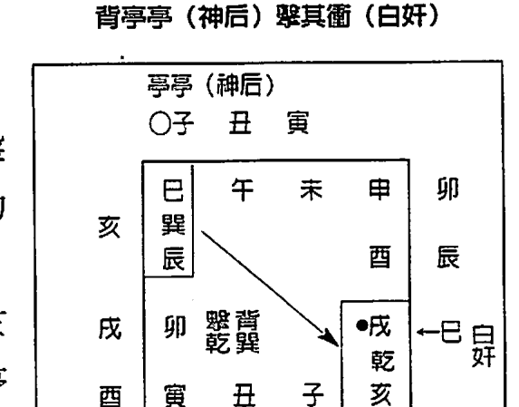

#### 背月建擊其衝

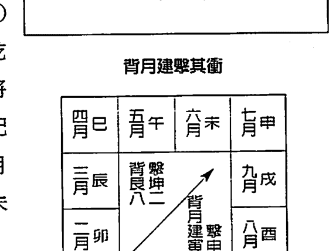

「月建」即一年十二個月，以十二地支表示者：

正月月建寅，二月月建卯，三月月建辰，四月月建巳，五月月建午，六月月建未，七月月建申，八月月建酉，九月月建戌，十月月建亥，十一月月建子，十二月月建丑。

如正月月建寅在「寅宮」，即東北艮宮，則於月建寅之月份攻敵時，可從艮宮東北方，擊其對衝的坤宮西南方，而得勝。其他類推。

**背太歲擊其衝**

| 巳年 | 午年 | 未年 | 申年 |
|------|------|------|------|
| 辰年 |      | 背子太歲午 | 酉年 |
| 卯年 | 擊背離坎九一 |      | 戌年 |
| 寅年 | 丑年 | 子年 | 亥年 |

「太歲」即年歲循環以十二地支表示者：子年太歲子，丑年太歲丑，寅年太歲寅等。如在子年期間要攻敵，則可從太歲子宫坎宮正北方，擊其對衝午宮（離宮），能得勝。

背生門，擊死門（如第一類之3），從遁甲活盤之「生門」，攻擊其對衝位「死門」，可致勝。

### 三、五不擊宮

有五不可擊，湯公謂曰：第一不擊天乙宮，二不擊九天宮，三不擊生門宮，四不擊九地宮，五不擊直使宮。

遁甲盤上有五種角度不可攻擊，否則易打敗戰，此為「五不擊宮」：不擊天乙宮（陽遁不擊天盤符首，陰遁不擊地盤符首）、不擊九天宮、不擊生門宮、不擊九地宮、不擊直使宮。

以上五宮位都是旺宮，不可攻擊，否則必招敗。但若由我軍佔據，則必雄勝。

### 五不擊宮圖例(一)

陽八局 丙辛日 辛卯時 (甲申旬)

- 不擊坤二天盤天乙宮
- 不擊離九九天宮
- 不擊巽四九地宮
- 不擊艮八直使宮
- 不擊震三生門宮

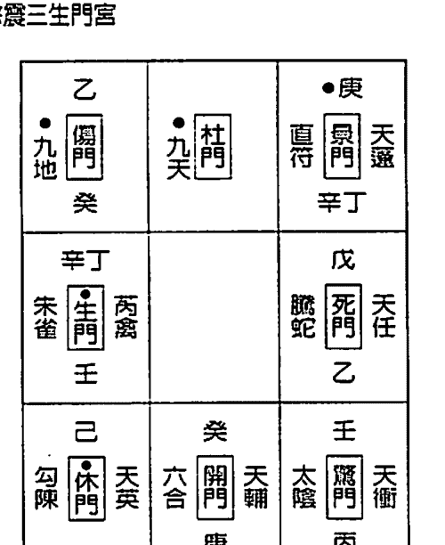

### 五不擊宮圖例(二)

陰七局 甲己日 丙寅時 (甲子旬)

- 不擊兌七地盤天乙宮
- 不擊坤二九天宮
- 不擊兌七九地宮
- 不擊坤二直使宮
- 不擊坎一生門宮

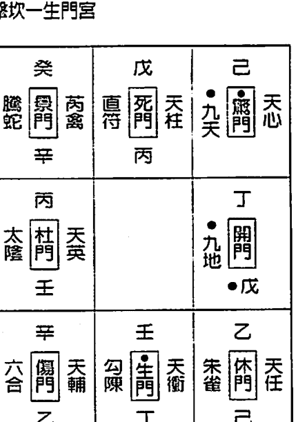

### 四、避難急出之方位

凡遇急而無奇門可用時，或無暇考慮奇門時，可選擇下列較易找出宮位去避難。此方位可與「出門緩急」互相配合使用：

- 1. 天盤符首所在宮的方位。
- 2. 地盤符首所在宮的方位。
- 3. 天盤三奇所在宮的方位。

## 第十五章 空亡論

十天干與十二地支的干支組，若以十天干為一單位的組合，則於十個組合之後，十二地支必剩餘二支出來，剩餘的二支，即謂「空亡」，而這二支，都是在旬支的之前二支」，例如：

- 甲子旬（甲子一癸酉），剩餘戌亥二支；
- 甲戌旬（甲戌一癸未），剩餘申酉二支；
- 甲申旬（甲申一癸巳），剩餘午未二支；
- 甲午旬（甲午一癸卯），剩餘辰巳二支；
- 甲辰旬（甲辰一癸丑），剩餘寅卯二支；
- 甲寅旬（甲寅一癸亥），剩餘子丑二支。

所以，以甲子旬來說，旬支「子」往前數二支，即為「戌亥」，就是空亡。又如甲辰旬，旬支「辰」之前二支為「寅卯」，即空亡。

空亡具有消失、空無的意義，其大原則為「吉遇空亡變無吉」、「凶遇空亡變無凶」。

個人生辰的「四柱八字」，所指的「空亡」，是看「日柱」屬於何旬，並取「旬支」的前二支為空亡。

截路、空亡的所在宮支為空亡，而此二支空亡中，一支為「真空亡」，另一支為「半空亡」。生辰日干為陽干的，則「陽支空亡」為真空亡，「陰支空亡」為半空亡。生辰日干為陰干的，則「陰支空亡」為真空亡，「陽支空亡」為半空亡。

真空亡的空作用比較強，半空亡的空作用減半。

空亡亦謂「天中殺」，是一種凶兆。雖具有空無的凶兆，但亦有消除凶兆的作用。不過，應依各個命式結構而作不同解釋，有的命式是需藉空亡來解除災厄的。命式中，若吉兆與空亡同在的話，須消除空亡，否則吉兆變無吉。命式中，若有凶兆與空亡同在的話，可藉空亡消除其凶兆。

無論如何，空亡有滅亡、消失、空無的凶意，所以，須提防命式中的凶兆。尤其對行運有實質影響的，例如，「申酉」空亡的，在申酉年、申酉月、申酉日、申酉時較不能期待諸事成就。而且，選擇此時去做喜慶事，比較會發生「是非後遺症」。

空亡的是非作用，以「時空亡」最強，次為「日空亡」、「月空亡」。例如，申酉空亡者，每日的申酉時，會有諸事較不暢順現象。

解消空亡的諸多方法中，以利用奇門法的效果，最具積極性。如命式的「時空亡」或「日空亡」，可利用該時日的奇門吉格坐山盤去做事，可破解空亡。又如果常常沐浴坐山盤的吉祥磁場，可自然解消月空亡、年空亡的不好影響。

此等解消法須常時施行，以其累積的力量才有作用，臨時抱佛腳的，效果較少。

## 第十六章 日家奇門（五符法）

### 一、什麼是「日家奇門」？

遁甲理論的特色，是以八卦為骨幹的節氣三元二至陰陽遁法。「五日都來換一元，接氣超神為準的」能使遁甲干支曆，與一般天文曆法的誤差，得到矯正，使遁甲時盤1080局盤，毫不遺漏「遁甲神機」的完整性，而發揮其精華。但若以此遁甲時盤之結構理論，直接應用於遁甲日盤，則欲使六十日干支符合「一氣三元」、「八卦八節」、「接氣、超神、置閏法」等，會有所窒礙矛盾。

再看有關遁甲的各種古書中，明確解說遁甲日盤的不多，而仿用時盤模式的遁甲日盤，至今爭議不少。若要併用時盤與日盤，兩者的天地盤等各層，一定會錯綜交義，重複矛盾，難於取捨。若因此而有誤釋，反而減失應有的效能。

後漢張良、三國諸葛孔明等，著有「奇門遁甲全書」、「遁甲金函玉鏡」，清朝陳夢雷著有「珍本奇門遁甲」，這些的遁甲日盤，都不用仿似「時盤定局」，而用「五符法」日盤。這種日盤不脫遁甲理論，而且著重實踐活用。

「日家奇門」定局的特徵，是夏至後、冬至後的陰陽遁，都各以六十干支日為單元，因之陰陽遁各是六十甲子干支日的三輪迴。這在前清「古今圖書集成」博物誌、藝術典的第七百十三卷、第七百十四卷集著中有提到。

遁甲時盤藏有「遁甲神機」，而日家奇門則具有「實踐機能」，兩者互用，可得相輔相成的功能。

### 二、日盤的結構

「日家奇門」以八門、九星及十二神等三層構成，與一般遁甲日盤使用天地盤不同。盤面最重要者是休門、生門、傷門、杜門、景門、死門、驚門、開門等八門，與時盤八門效用相同。

九星有太乙、攝提、軒轅、招搖、天符、青龍、咸池、太陰、天乙等諸星，相當於時盤的九星，但因日家奇門無天地盤奇儀，所以，九星的功能強化，而兼具時盤的九星與天地盤效能。

十二神有五符、天曹、地府、風伯、雨師、雷公、風雲、唐符、國印、天關、地鎖、天賊等，相當於時盤的八神。地盤八神以洛書九宮為宮位，十二神則以九宮的十二地支宮為宮位。

### 三、日盤八門排盤法

#### 1. 陽遁八門

八門次序為休門、生門、傷門、杜門、景門、死門、驚門、開門等。三日換一門，一卦管三天。

休門於洛書九宮的坎一開始，依次為坤二、震三、巽四、乾六、兌七、艮八、離九，三天換一宮排列，五中宮不用。其餘的七門，則隨休門依八門次序，以順時針方向，推排於洛書各宮。例如：

- 甲子、乙丑、丙寅三日，休門坎一，休門以後依序由艮八推排。
- 丁卯、戊辰、己巳三日，休門坤二，休門以後依序由兌七推排。
- 庚午、辛未、壬申三日，休門震三，休門以後依序由巽四推排。
- 癸酉、甲戌、乙亥三日，休門巽四，休門以後依序由離九推排。
- 丙子、丁丑、戊寅三日，休門乾六，休門以後依序由坎一推排。
- 己卯、庚辰、辛巳三日，休門兌七，休門以後依序由乾六推排。
- 壬午、癸未、甲申三日，休門艮八，休門以後依序由震三推排。
- 乙酉、丙戌、丁亥三日，休門離九，休門以後依序由坤二推排。
- 戊子、己丑、庚寅三日，休門坎一，休門以後依序由艮八推排。
- 辛卯、壬辰、癸巳三日，休門坤二，休門以後依序由兌七推排。
- 甲午、乙未、丙申三日，休門震三，休門以後依序由巽四推排。
- 丁酉、戊戌、己亥三日，休門巽四，休門以後依序由離九推排。
- 庚子、辛丑、壬寅三日，休門乾六，休門以後依序由坎一推排。
- 癸卯、甲辰、乙巳三日，休門兌七，休門以後依序由乾六推排。
- 丙午、丁未、戊申三日，休門艮八，休門以後依序由震三推排。
- 己酉、庚戌、辛亥三日，休門離九，休門以後依序由坤二推排。
- 壬子、癸丑、甲寅三日，休門坎一，休門以後依序由艮八推排。
- 乙卯、丙辰、丁巳三日，休門坤二，休門以後依序由兌七推排。
- 戊午、己未、庚申三日，休門震三，休門以後依序由巽四推排。
- 辛酉、壬戌、癸亥三日，休門巽四，休門以後依序由離九推排。

由以上排演可得知：

- 日地支「子午卯酉」日，為休門換宮位的第一日；
- 日地支「丑未辰戌」日，為休門換宮位的第二日；
- 日地支「寅申巳亥」日，為休門換宮位的第三日。

下表為三日一組的第一日「子午卯酉」要換休門宮的洛書九宮位。例如：

- 甲子日、戊子日、壬子日 的休門起於坎一宮，
- 丙子日、庚子日 的休門起於乾六宮，
- 甲午日、庚日、戊午日的休門起於震三宮，
- 壬午日、丙午日的休門起於艮八宮，以下類推。

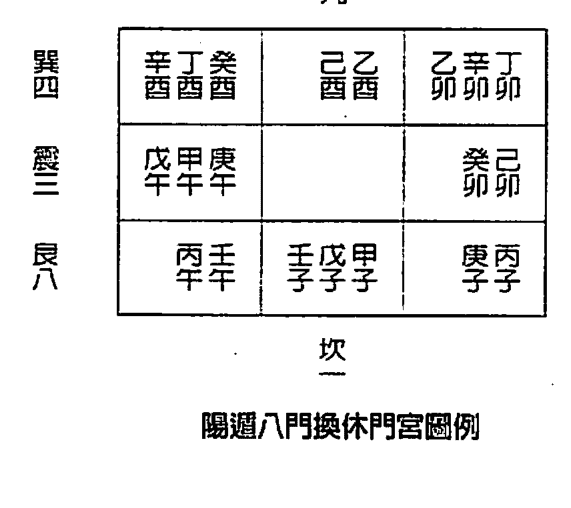
陽遁八門換休門宮圖例

#### 2. 陰遁八門

盤上由休門起的八門次序，每三日換一門、一卦管三天的原則，與陽遁八門相同。不過，休門在洛書九宮是由離宮起，按離九、艮八、兌七、乾六、巽四、震三、坤二、坎一的順序，三天換一宮。五中宮不用。其於的七門，則隨休門依八門次序，以順時針方向，推排於洛書各宮。例如：

- 甲子、乙丑、丙寅三日，休門離九，休門以後依序由坤二推排。
- 丁卯、戊辰、己巳三日，休門艮八，休門以後依序由震三推排。
- 庚午、辛未、壬申三日，休門兌七，休門以後依序由乾六推排。
- 癸酉、甲戌、乙亥三日，休門乾六，休門以後依序由坎一推排。
- 丙子、丁丑、戊寅三日，休門巽四，休門以後依序由離九推排。
- 己卯、庚辰、辛巳三日，休門震三，休門以後依序由巽四推排。
- 壬午、癸未、甲申三日，休門坤二，休門以後依序由兌七推排。
- 乙酉、丙戌、丁亥三日，休門坎一，休門以後依序由艮八推排。
- 戊子、己丑、庚寅三日，休門離九，休門以後依序由坤二推排。
- 辛卯、壬辰、癸巳三日，休門艮八，休門以後依序由震三推排。
- 甲午、乙未、丙申三日，休門兌七，休門以後依序由乾六推排。
- 丁酉、戊戌、己亥三日，休門乾六，休門以後依序由坎一推排。
- 庚子、辛丑、壬寅三日，休門巽四，休門以後依序由離九推排。
- 癸卯、甲辰、乙巳三日，休門震三，休門以後依序由巽四推排。
- 丙午、丁未、戊申三日，休門坤二，休門以後依序由兌七推排。
- 己酉、庚戌、辛亥三日，休門坎一，休門以後依序由艮八推排。
- 壬子、癸丑、甲寅三日，休門離九，休門以後依序由坤二推排。
- 乙卯、丙辰、丁巳三日，休門艮八，休門以後依序由震三推排。
- 戊午、己未、庚申三日，休門兌七，休門以後依序由乾六推排。
- 辛酉、壬戌、癸亥三日，休門乾六，休門以後依序由坎一推排。

- 日地支「子午卯酉」日，為休門換宮位的第一日；
- 日地支「丑未辰戌」日，為休門換宮位的第二日；
- 日地支「寅申巳亥」日，為休門換宮位的第三日。

下表為三日一組的第一日「子午卯酉」要換休門宮的洛書九宮位。例如：甲子日、戊子日、壬子日的休門起於離九宮，丙子日、庚子日的休門起於巽四宮，甲午日、庚日、戊午日的休門起於兌七宮，戊午日、丙午日的休門起於坤二宮，以下類推。

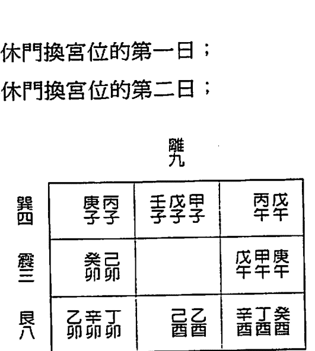

| 陽遁 | 一坎宮 | 二坤宮 | 三震宮 | 四巽宮 | 六乾宮 | 七兌宮 | 八艮宮 | 九離宮 |
|------|--------|--------|--------|--------|--------|--------|--------|--------|
| 甲子 乙丑 丙寅 | 丁卯 戊辰 己巳 | 庚午 辛未 壬申 | 癸酉 甲戌 乙亥 | 丙子 丁丑 戊申 | 己卯 庚辰 辛巳 | 壬午 癸未 甲申 | 乙酉 丙戌 丁亥 |
| 戊子 己丑 庚寅 | 辛卯 壬辰 癸巳 | 甲午 乙未 丙申 | 丁酉 戊戌 己亥 | 庚子 辛丑 壬寅 | 癸卯 甲辰 乙巳 | 丙午 丁未 戊申 | 己酉 庚戌 辛亥 |
| 壬子 癸丑 甲寅 | 乙卯 丙辰 丁巳 | 戊午 己未 庚申 | 辛酉 壬戌 癸亥 | | | | |
| 陰遁 | 九離宮 | 八艮宮 | 七兌宮 | 六乾宮 | 四巽宮 | 三震宮 | 二坤宮 | 一坎宮 |

### 四、日盤九星排盤法

#### 1. 陽遁九星

日盤九星依次為太乙、攝提、軒轅、招搖、天符、青龍、咸池、太陰、天乙。太乙宮以六甲旬的各初日宮設定其所在宮位，次一日順飛一宮移動。其他九星則以太乙為起頭，依洛書九宮八卦數陽遁次序，順飛排列，例如：

- 甲子旬的甲子日，太乙在艮八宮。
- 甲戌旬的甲戌日，太乙在離九宮。
- 甲申旬的甲申日，太乙在坎一宮。
- 甲午旬的甲午日，太乙在坤二宮。
- 甲辰旬的甲辰日，太乙在震三宮。
- 甲寅旬的甲寅日，太乙在巽四宮。

| | | |
| :---: | :---: | :---: |
| 甲辰旬 震三 | 五中 | 兌七 |
| 甲子旬 艮八 | 甲申旬 坎一 | 乾六 |
| | 甲戌旬 巽四 | 甲戌旬 離九 | 甲午旬 坤二 |
（註：此表格根據原文描述和圖例重構，原文表格格式有混亂處，已修正為對應關係。）

以上太乙宮設定後，太乙以後的九星，由太乙開始，依序順飛八卦數配置，例如：

甲子旬：艮八太乙、離九攝提、坎一軒轅、坤二招搖、震三天符、巽四青龍、五中咸池、乾六太陰、兌七天乙。如此九星剛好於一句飛滿九宮。

甲戌旬：太乙離九、坎一攝提、坤二軒轅、震三招搖、巽四天符、五中青龍、乾六咸池、兌七太陰、艮八天乙。如此九星剛好於一句飛滿九宮。

再來太乙則飛入坎一宮，引導甲申旬的九星飛排。其餘類推。

### 陽遁日盤九星飛排圖例(一)
陽遁，甲子旬，甲子日，太乙在艮八。

| 青龍 巽四 | 攝提 離九 | 招搖 坤二 |
|---|---|---|
| 天符 震三 | 咸池 五中 | 天乙 兌七 |
| 太乙 艮八 | 軒轅 坎一 | 太陰 乾六 |

### 陽遁日盤九星飛排圖例(二)
陽遁，甲戌旬，丁丑日，太乙在震三。

| 攝提 巽四 | 咸池 離九 | 天乙 坤二 |
|---|---|---|
| 太乙 震三 | 軒轅 五中 | 天符 兌七 |
| 青龍 艮八 | 太陰 坎一 | 招搖 乾六 |

#### 2. 陰遁九星

日盤陰遁九星的名稱次序，與陽遁相同。太乙宮以六甲旬的各初日宮設定其所在宮位，次一日逆飛一宮移動。其他九星以太乙為起頭，依洛書九宮八卦數陰遁次序，逆飛排列，例如：

甲子旬的甲子日，太乙在坤二宮。

甲戌旬的甲戌日，太乙在坎一宮。

甲申旬的甲申日，太乙在離九宮。

甲午旬的甲午日，太乙在艮八宮。

甲辰旬的甲辰日，太乙在兌七宮。

甲寅旬的甲寅日，太乙在乾六宮。

以上太乙宮設定後，太乙以後的九星，由太乙開始，依序逆飛八卦數，配置於諸宮，例如：

甲子旬：坤二太乙、坎一攝提、離九軒轅、艮八招搖、兌七天符、乾六青龍、五中咸池、巽四太陰、震三天乙，恰於一旬飛滿九宮。

### 陰遁日盤九星太乙設定圖例

| | | 甲申旬 離九 | 甲子旬 坤二 |
|---|---|---|---|
| | 巽四 | 五中 | 甲辰旬 兌七 |
| | 震三 | 甲戌旬 坎一 | 甲寅旬 乾六 |
| | 甲午旬 艮八 | | |

### 陰遁日盤九星飛排圖例
陰遁，甲子旬，甲子日，太乙在坤二。

| 太陰 巽四 | 軒轅 離九 | 太乙 坤二 |
|---|---|---|
| 天乙 震三 | 咸池 五中 | 天符 兌七 |
| 招搖 艮八 | 攝提 坎一 | 青龍 乾六 |

甲戌旬：坎一太乙、離九攝提、艮八軒轅、兌七招搖、乾六天符、五中青龍、巽四咸池、震三太陰、坤二天乙。如此九星剛好於一旬飛滿九宮。

再來太乙則飛入離九宮，引導甲戌旬的九星飛排。其餘類推。

### 日盤九星太乙宮位速見表
**（六十干支日太乙宮位（右上角數目為陽遁局數，左下角數目為陰遁局數））**

| 六甲旬 | 甲子旬 | 甲戌旬 | 甲申旬 | 甲午旬 | 甲辰旬 | 甲寅旬 |
| :--- | :---: | :---: | :---: | :---: | :---: | :---: |
| | 8 甲子 2 | 9 甲戌 1 | 1 甲申 9 | 2 甲午 8 | 3 甲辰 7 | 4 甲寅 6 |
| | 9 乙丑 1 | 1 乙亥 9 | 2 乙酉 8 | 3 乙未 7 | 4 乙巳 6 | 5 乙卯 5 |
| | 1 丙寅 9 | 2 丙子 8 | 3 丙戌 7 | 4 丙申 6 | 5 丙午 5 | 6 丙辰 4 |
| | 2 丁卯 8 | 3 丁丑 7 | 4 丁亥 6 | 5 丁酉 5 | 6 丁未 4 | 7 丁巳 3 |
| | 3 戊辰 7 | 4 戊寅 6 | 5 戊子 5 | 6 戊戌 4 | 7 戊申 3 | 8 戊午 2 |
| | 4 己巳 6 | 5 己卯 5 | 6 己丑 4 | 7 己亥 3 | 8 己酉 2 | 9 己未 1 |
| | 5 庚午 5 | 6 庚辰 4 | 7 庚寅 3 | 8 庚子 2 | 9 庚戌 1 | 1 庚申 9 |
| | 6 辛未 4 | 7 辛巳 3 | 8 辛卯 2 | 9 辛丑 1 | 1 辛亥 9 | 2 辛酉 8 |
| | 7 壬申 3 | 8 壬午 2 | 9 壬辰 1 | 1 壬寅 9 | 2 壬子 8 | 3 壬戌 7 |
| | 8 癸酉 2 | 9 癸未 1 | 1 癸巳 9 | 2 癸卯 8 | 3 癸丑 7 | 4 癸亥 6 |

### 五、日盤十二神排盤法

日盤第三層十二神之序列為五符、天曹、地府、風伯、雨師、雷公、風雲、唐符、國印、天關、地鎖、天賊。以五符為起頭，無論陰陽遁，都以時針方向順行十二支宮。所謂十二支宮，就是洛書九宮之「坎離震兌」四正方位，各為「子、午、卯、酉」各宮；四隅位之「艮巽坤乾」，為「丑寅、辰巳、未申、戌亥」各二宮所組成。十二神不入五中宮。

「五符」的所在宮，為日干的祿位，即指甲日寅宮、乙日卯宮、丙日巳宮、丁日午宮、戊日巳宮、己日午宮、庚日申宮、辛日酉宮、壬日亥宮、癸日子宮。

以下為十二神排盤圖例，讀者一看就明白：

### 甲日十二神

甲日祿位在寅宮，五符由寅宮起發，依序順時針推排十二支宮。

| | 四正位 | | |
|---|---|---|---|
| 辰巳 地府 風伯 | 午 雨師 | 未申 雷公 風雲 | 四隅位 |
| 卯 天曹 | | 酉 唐符 | 四正位 |
| 寅丑 五符 天賊 | 子 地鎖 | 亥戌 天關 國印 | 四隅位 |
| 四隅位 | 四正位 | 四正位 | 四隅位 |

### 乙日十二神

乙日祿位在卯宮，五符由卯宮起發，依序順時針推排十二支宮。

| | 四正位 | | |
|---|---|---|---|
| 辰巳 天曹 地府 | 午 風伯 | 未申 雨師 雷公 | 四隅位 |
| 卯 五符 | | 酉 風雲 | 四正位 |
| 寅丑 天賊 地鎖 | 子 天關 | 亥戌 國印 唐符 | 四隅位 |
| 四隅位 | 四正位 | 四正位 | 四隅位 |

### 日盤十二神宮位速見表

| 甲日寅祿 | 乙日卯祿 | 丙日巳祿 | 丁日午祿 | 戊日巳祿 | 己日午祿 | 庚日申祿 | 辛日酉祿 | 壬日亥祿 | 癸日子祿 |
| :--- | :--- | :--- | :--- | :--- | :--- | :--- | :--- | :--- | :--- |
| 五符寅 | 五符卯 | 五符巳 | 五符午 | 五符巳 | 五符午 | 五符申 | 五符酉 | 五符亥 | 五符子 |
| 天曹卯 | 天曹辰 | 天曹午 | 天曹未 | 天曹午 | 天曹未 | 天曹酉 | 天曹戌 | 天曹子 | 天曹丑 |
| 地府辰 | 地府巳 | 地府未 | 地府申 | 地府未 | 地府申 | 地府戌 | 地府亥 | 地府丑 | 地府寅 |
| 風伯巳 | 風伯午 | 風伯申 | 風伯酉 | 風伯申 | 風伯酉 | 風伯亥 | 風伯子 | 風伯寅 | 風伯卯 |
| 雨師午 | 雨師未 | 雨師酉 | 雨師戌 | 雨師酉 | 雨師戌 | 雨師子 | 雨師丑 | 雨師卯 | 雨師辰 |
| 雷公未 | 雷公申 | 雷公戌 | 雷公亥 | 雷公戌 | 雷公亥 | 雷公丑 | 雷公寅 | 雷公辰 | 雷公巳 |
| 風雲申 | 風雲酉 | 風雲亥 | 風雲子 | 風雲亥 | 風雲子 | 風雲寅 | 風雲卯 | 風雲巳 | 風雲午 |
| 唐符酉 | 唐符戌 | 唐符子 | 唐符丑 | 唐符子 | 唐符丑 | 唐符卯 | 唐符辰 | 唐符午 | 唐符未 |
| 國印戌 | 國印亥 | 國印丑 | 國印寅 | 國印丑 | 國印寅 | 國印辰 | 國印巳 | 國印未 | 國印申 |
| 天關亥 | 天關子 | 天關寅 | 天關卯 | 天關寅 | 天關卯 | 天關巳 | 天關午 | 天關申 | 天關酉 |
| 地鎖子 | 地鎖丑 | 地鎖卯 | 地鎖辰 | 地鎖卯 | 地鎖辰 | 地鎖午 | 地鎖未 | 地鎖酉 | 地鎖戌 |
| 天賊丑 | 天賊寅 | 天賊辰 | 天賊巳 | 天賊辰 | 天賊巳 | 天賊未 | 天賊申 | 天賊戌 | 天賊亥 |## 六、日盘排盘举例

试求1990年12月25日之日盘，冬至后，阳遁，甲子日”图例一：

1.  八门盘：依「休门宫位速见表」知休门在坎一宫。
    休一、生八、伤三、杜四、景九、死二、惊七、开六。
2.  九星盘：依「太乙宫位速见表」知太乙在艮八宫。
    洛书数顺飞，摄提九、轩辕一、招摇二、天符三、青龙四、咸池五、太阴六、天乙七。
3.  十二神盘：依「十二神速见表」知五符以降诸神，甲日五符在十二地支盘寅宫，依次天曹卯、地府辰、风伯巳、雨师午、雷公未、风云申、唐符酉、国印戌、天关亥、地锁子、天贼丑等。

试求1991年6月24日之日盘，夏至后，阴遁，乙丑日”图例二：

1.  八门盘：依「休门宫位速见表」知阴遁乙丑日的休门在离九宫，时针顺行休九、生二、伤七、杜六、景一、死八、惊三、开四等。
2.  九星盘：依「太乙宫位速见表」知所瞩甲子旬阴遁乙丑日太乙在坎一宫，故依九星序，阴遁逆数飞洛书九宫，太乙一、摄提九、轩辕八、招摇七、天符六、青龙五、咸池四、太阴三、天乙二。
3.  十二神盘：依「十二神宫位速见表」知乙日的五符禄位在卯。故由卯宫起顺时针方推（无分阴阳遁）五符卯、天曹辰、地府巳、风伯午、雨师未、雷公申、风云酉、唐符戌、国印亥、天关子、地锁丑、天贼寅。

### 〈試求2005年6月6日之日盤，夏至前，陽遁，辛酉日〉圖例三：

1.  如前面2例查出「陽遁辛酉日」之八門盤、九星盤、十二神盤的宮位排盤。
2.  另外有一便捷法是：
    以萬年曆檢查2005年之夏至為6月21日、丙子日，依「日盤陰陽換遁法」（參照後述）可知當年夏至陰遁換遁日是6月19日甲戌日，因此，所求6月6日辛酉日，仍屬陽遁。
3.  再查奇門遁甲局盤集「奇門遁甲日盤陽遁60局」之辛酉日的日盤就是。

### 〈試求2006年6月24日之日盤，夏至後，陰遁，甲申日〉圖例四：

1.  如前例查出「陰遁甲申日」之八門盤、九星盤、十二神盤的宮位排盤。
2.  或如第3例，查出2006年之夏至為6月21日辛巳日，依「日盤陰陽遁換遁法」可知當年夏至陰遁換遁日是6月19日己卯日起陰遁，故6月21日已是換陰遁後第二天。
3.  再查奇門遁甲局盤集「奇門遁甲日盤陰遁60局」之甲申日的日盤就是。

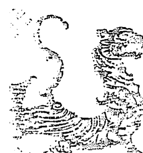

### 日盤排盤圖例(一) 1990年12月25日 冬至後 陽遁 甲子日

| 杜 | 景 | 死 |
|---|---|---|
| 青龍 | 攝提 | 招搖 |
| 地府 風伯 | 雨師 | 雷公 風雲 |

### 日盤排盤圖例(二) 1991年6月24日 夏至後 陰遁 乙丑日

| 開 | 休 | 生 |
|---|---|---|
| 咸池 | 攝提 | 天乙 |
| 天曹 地府 | 風伯 | 雨師 雷公 |

### 日盤排盤圖例(三) 2005年6月6日 夏至前 陽遁 辛酉日

| 休 | 生 | 傷 |
|---|---|---|
| 軒轅 | 太陰 | 太乙 |
| 唐符 國印 | 天關 | 地鎖 天賊 |

### 日盤排盤圖例(四) 2006年6月24日 夏至後 陰遁 甲申日

| 驚 | 開 | 休 |
|---|---|---|
| 青龍 | 太乙 | 太陰 |
| 地府 風伯 | 雨師 | 雷公 風雲 |

### 七、日盤的八門九星、十二神之吉凶與用法

### (一) 八門

八門用法與吉凶，可參考前面時盤部分解說，現再度補充詳述。

1.  **休門**：坎位卦象「一陽復始之初」，旺氣盛，草木值此而萌動，是返本還原之門，故吉。適宜見貴人、求地位名聲、和合、治兵、赴任、遷移、營造、娛樂、求平安等，萬事吉。旺於震宮，相於坎宮，生於乾宮，皆吉。但位居艮宮、坤宮，則會被土剋制。在巽宮為入墓。在離九宮，是反吟、宮迫。
2.  **生門**：在艮寅位，「天開於子，地闢於丑，人生於寅」，天氣至此，三陽開泰，從此萬物皆生，陽回氣轉，天地好生，廣及萬物，仁道生而至吉。最適宜上官赴任、營造、嫁娶、放牧、求財。位居乾宮，旺；位居離宮，吉。位居震宮，被木制，不利。位居巽宮，入墓，不利。位居坎宮，宮迫。
3.  **傷門**：傷門屬木，正值春分，精髓自內出，而發揚於外，以致根本洩得太過，便成了外華內虛，不勝其勞。二月中氣，甲木不能抵擋霜露之寒，故謂「傷」，為凶。不過，若傷門得三奇，則適合宜捕捉盜賊、逃亡、漁獵、索債、賭博等，為吉。但上官赴任、出行、嫁娶、買賣、營造、埋葬等皆大凶，不利。旺於春分、清明、穀雨。艮、坤宮，宮迫。位居乾、兌宮，被金剋制，不利。
4.  **杜門**：巽木茂盛之時、陽氣亢極，一陰將至，本性至此將力屈，想要收斂而不能收，想要生旺而力已盡，為求自保，留餘力伏藏，故谓「杜门」，属中凶。适合在藏形之方、躲灾避难、逃亡，则能得逞，余事皆不利。旺相期是立夏、小满、芒种。位居坤、艮土宫，宫迫。位居乾、兑宫，被金制剋，不利。
5.  **景門**：离宫值夏令之气是万物旺极将衰之时，与死门坤二相近，阳盛之气的天数已至，将有肃杀之气。虽主上明下亮之方，但不全吉。只利于文书之事，故属次吉门。适合景门的用事有上书献策、选拔雇用将兵人材、寻亲、考试、书状等有利。若得三奇协助，则大吉，可行诈、突围、火攻、破军、发令、封功、赏爵等。旺期是夏至、小暑、大暑。位居乾六、兑七宫，为宫迫。位居坎一宫，被水剋制，不利。
6.  **死門**：死门之凶，在于天地令行大肆肃杀之威，草柳色变，木逢落叶，故为大凶。若得三奇协助，可用于行刑、诛戮、吊死、送葬，打猎亦有收获。旺相期是立秋、处暑、白露。位居坎一宫，为宫迫。位居震三、巽四宫，被木剋制，不利。
7.  **惊门**：值八月秋令，气肃、物数苍老，本无生气，故为中凶。但天地存好生之心，不欲杀尽，所以虽凶，但若献诈、捕捉设网、伏兵、赌博等皆可用，而且有效，其余皆凶。旺相期是秋分、寒露、霜降。位居震三、巽四宫，为宫迫。位居离九火宫，被火剋制，不利。
8.  **開門**：乾宫开门，阳气颇旺，又属天门所以为上吉。适宜见贵人、求地位名声、开帐、远行、名利通达。凡有谋求，应名正言顺，公事公开从之，则百事百泰。但作阴私之事，则必被他人洩漏，反遭凶咎。位居乾、兑宫，相吉。位居坎一宫，金水相生，如母顾子，为吉。位居艮八，入墓。位居巽宫，入墓、宫迫。位居震三，宫迫。位居离九，金被剋制，不利。

### (二) 九星

1.  **太乙**：太乙水神，是大吉星。婚姻吉昌，出入无阻坦荡而行，谒见贤良、行兵，百事吉。太乙入中宫，遇阴人（女性之意）尤大吉，诸事尽欢欣，赌博钱财聚。
2.  **攝提**：攝提土神，大凶星。攝提所到之处便为凶，远行遇羁绊，求财嫁娶，万事不相宜。攝提方位主多灾，欲行此路定无吉。攝提守中宫，万事不相同，隐匿藏遁可、开口动作则伤身。
3.  **轩辕**：轩辕水神，小凶星。作事必牵缠，远行逢迟滞。轩辕入中宫，门内都不宁，赌博一定输钱，谋求百事定伤残。
4.  **招摇**：招摇木神，小凶神（吉凶不定）。口舌多、精神不安，出入多风雨。中宫坐招摇，阴人口舌迎，最好不要留在家中，否则易有口舌纷争。
5.  **天符**：天符土神，凶星。妇人遭谋害（女难之相），走失难寻觅，路途行人阻。天符入中宫，五鬼是天符，此宫大不宁，积粮尚有利，外出可避灾。
6.  **青龙**：青龙金神，大吉星。求事喜重重，利求财、佈阵进军、上官赴任、迁移，百事吉。尤与生门搭配，求财大吉。修造、嫁娶，五福齐来。中宫青龙，相生钱财旺，接贵安荣华，万事顺利。
7.  **咸池**：咸池金神，大凶星。远行多不利，赌博全输尽，求财空手归，不可行军攻敌。损失财物，又遭病袭。与死门合宫，为女难之相。中宫咸池恶名昭彰，百事不宜，此处只宜凿井，用事恐傷身。
8.  **太陰**：土神，吉星。此方百禍不能侵，求財皆得成，取用暗財可得，也可找到知己朋友。太陰入中宮，知者莫交鋒，雖有勝算握，未必占奇功。
9.  **天乙**：天乙火神，吉星，百事百利之方位。火可提高人和，促進人際關係，貴人多。適合休閒娛樂，又與財利酒食有關。天乙入中宮，宜見貴人，用事求謀總遂心，寄在中宮無所慮，嫁娶必定五福臨。

### （三）十二神

1.  **五符**：十二神的領頭，吉神。適宜遠行、買賣、婚姻、營造、上官赴任、葬儀等，皆吉。
2.  **天曹**：吉神。向長官提案、謀略、進行隱密性事情，得吉。
3.  **地府**：吉神。採主攻，不如維持守勢，較有穩定及方便性，舉行葬儀亦吉。
4.  **風伯**：凶神。會有精神不安、經常遭遇虛驚，易遺失物品。
5.  **雨師**：凶神。百事遇阻停滯，但適穿井、整治河川等。
6.  **雷公**：凶神。代表心思不定、煩憂多，或被詐欺。
7.  **風雲**：吉神。具臨機應變及機動性，適合謀劃奇襲。
8.  **唐符**：吉神。可採取正面攻擊，威力大。適合赴任、婚姻、營造等事，皆吉。
9.  **國印**：吉神。能得到天佑神助的吉利方位，有貴人，有財利，能掌握權力及權利。
10. **天關**：凶神。諸事阻礙多，病患災難亦多。
11. **地锁**：凶神。易遭埋伏失利，失物、失财的凶险多。
12. **天贼**：凶神。易逢盗难，易被诈欺、损伤。

### 八、日盘的超神、接气及换遁法

「日家奇门」一卦管三日，其日干支就是配排局盘的基準。所以，只要留意冬至与夏至的换遁即可。

日盘阴阳遁的换遁原则如下：

1.  若冬至、夏至当天的日干是「甲」，为「正授」，当天换遁。
2.  若冬至、夏至当天的日干是「甲乙丙丁戊」，即十干的前五干，是为「超神」，要由「节前之甲日」起换遁。
3.  若冬至、夏至当天的日干是「己庚辛壬癸」，即十干的后五干，是为「接气」，要由「节后之甲日」起换遁。

### 九、日盘出门择时法

日子有吉凶，依日干与日支的生剋关系，选择吉日与凶日：宝日（干生支）、义日（支生干）、和日（干支和）、制日（干剋支）、伐日（支剋干）。我们择日只要留意最吉利的「宝日」，与最凶的「伐日」，即可。这已在前面叙述过。

时辰亦有吉凶，以时辰的值时神是吉神或凶神而定。吉神当值之日或时，行事诸事顺调。凶神当值之日或时，行事诸事不顺。

出门行事要选择良辰吉日，以求行事顺调，是我国古来的民俗，命理专业者都用曆书或通书，不过，本节所提的，是人人可自行选用的一般择日法，依遁甲吉方行动再配合吉日良辰，就更能落实选吉避凶。

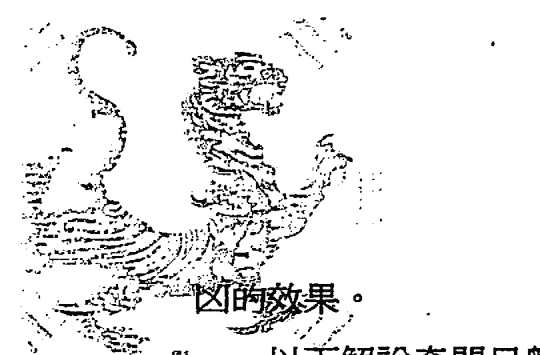

### 十、十二黃黑道吉凶神

黃黑道十二神以青龍為領頭，依次推排：青龍、明堂、天刑、朱雀、金匱、天德、白虎、玉堂、天牢、玄武、司命、勾陳。

子午之日，青龍由申時起發。卯酉之日，青龍由寅時起發。
寅申之日，青龍由子時起發。巳亥之日，青龍由午時起發。
辰戌之日，青龍由辰時起發。丑未之日，青龍由戌時起發。

例如「午」日：申時青龍，酉時明堂，戌時天刑，亥時朱雀，子時金匱，丑時天德，寅時白虎，卯時玉堂，辰時天牢，巳時玄武，午時司命，未時勾陳。
例如「辰」日：辰時青龍，巳時明堂，午時天刑，未時朱雀，申時金匱，酉時天德，戌時白虎，亥時玉堂，子時天牢，丑時玄武，寅時司命，卯時勾陳。

### 〈黃黑道十二神之吉凶如下〉：

黃道，一般屬吉神；黑道，一般屬凶神。
- 青龍黃道：是求財有利的半吉神，合天乙可為全吉。
- 明堂黃道：百事吉神。
- 天刑黑道：主官司的凶神，忌上官赴任（軍公教人員不利）、營造、遠行、移徙。
- 朱雀黑道：主官司的凶神，忌上官赴任（對軍公教人員不利）、營造、遠行、移徙。

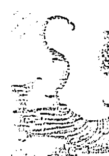

时盘吉格的吉兆，比日盘吉格强韧，但遇到「五不遇时」、「空亡」等情况，时盘则受控无力，日盘则比较具有弹性。

不过，时盘与日盘同时共用，则可相辅相成，互补长短，例如：同一时盘有好多个吉方位，不知取舍时，则可采用与日盘吉方相合的方位。而且，若遇到「五不遇时」、「空亡」等有时间的限制时，可不用时盘，只用日盘。

无论如何，还是应以优先使用时盘为原则。又时盘日盘共用时，于特定方位，不管时盘还是日盘，只要是「死门」，就得放弃使用这个方位。

### 十二、遁甲日盤「黃黑道十二吉凶時辰」速見表

（附：五不遇時、天乙貴人、空亡）

### 甲子日

| 時辰 | 黃黑道 | 吉 | 凶 |
|------|--------|-----|-----|
| 甲子時 | 金匱黃道 | 用兵以外，百事大吉。 | |
| 乙丑時 | 天德黃道、天乙貴人 | 百事用之，大吉。貴人加吉。 | |
| 丙寅時 | 白虎黑道 | 只宜用兵、祭祀、狩獵，其他諸事不吉。 | |
| 丁卯時 | 玉堂黃道 | 泥土不利，其他皆吉。 | |
| 戊辰時 | 天牢黑道 | 上官赴任、訴訟不吉，其他皆吉，可用。 | |
| 己巳時 | 玄武黑道 | 君子用事小吉，小人用事凶，忌訴訟、營造。 | |
| 庚午時 | 司命黃道、五不遇時 | 日間用之吉，夜間用之凶。諸事忌用。 | |
| 辛未時 | 勾陳黑道、天乙貴人 | 百事皆凶，不可用之。貴人加吉。 | |
| 壬申時 | 青龍黃道、空亡 | 半吉，會天乙貴人則全吉，可用。諸事審用。 | |
| 癸酉時 | 明堂黃道、空亡 | 百事用之，大吉。諸事審用。 | |
| 甲戌時 | 天刑黑道 | 只宜出兵，有勝算，忌赴任、訴訟、遷移、遠行。 | |
| 乙亥時 | 朱雀黑道 | 出兵有勝算，忌遠行、赴任、遷移、營造、訴訟。 | |

### 乙丑日

| 時辰 | 黃黑道 | 吉 | 凶 |
|------|--------|-----|-----|
| 丙子時 | 天刑黑道、天乙貴人 | 只宜出兵，有勝算，忌赴任、訴訟、遷移、遠行。貴人加吉。 | |
| 丁丑時 | 朱雀黑道 | 出兵有勝算，忌遠行、赴任、遷移、營造、訴訟。 | |
| 戊寅時 | 金匱黃道 | 用兵以外，百事大吉。 | |
| 己卯時 | 天德黃道 | 百事用之，大吉。 | |
| 庚辰時 | 白虎黑道 | 只宜用兵，祭祀、狩獵，其他諸事不吉。 | |
| 辛巳時 | 玉堂黃道、五不遇時 | 泥土不利，其他皆吉。諸事忌用。 | |
| 壬午時 | 天牢黑道、空亡 | 上官赴任、訴訟不吉，其他吉，可用。諸事審用。 | |
| 癸未時 | 玄武黑道、空亡 | 君子用事小吉，小人用事凶，忌訴訟、營造。諸事審用。 | |
| 甲申時 | 司命黃道、天乙貴人 | 日間用之吉，夜間用之凶。貴人加吉。 | |
| 乙酉時 | 勾陳黑道 | 百事皆凶，不可用之。 | |
| 丙戌時 | 青龍黃道 | 半吉，會天乙貴人則全吉，可用。 | |
| 丁亥時 | 明堂黃道 | 百事用之大吉。 | |

### 丙寅日

| 時辰 | 黃黑道 | 吉 | 凶 |
|------|--------|-----|-----|
| 戊子時 | 青龍黃道 | 半吉、會天乙貴人則全吉可用。 | |
| 己丑時 | 明堂黃道 | 百事用之大吉。 | |
| 庚寅時 | 天刑黑道 | 只宜出兵有勝算、忌赴任、訴訟、遷移、遠行。 | |
| 辛卯時 | 朱雀黑道 | 出兵有勝算、忌遠行、赴任、遷移、營造、訴訟。 | |
| 壬辰時 | 金匱黃道、空亡、五不遇時 | 用兵以外、百事大吉。諸事忌用。 | |
| 癸巳時 | 天德黃道、空亡 | 百事用之大吉。諸事審用。 | |
| 甲午時 | 白虎黑道 | 只宜用兵、祭祀、狩獵、其他諸事不吉。 | |
| 乙未時 | 玉堂黃道 | 泥土不利、其他皆吉。 | |
| 丙申時 | 天牢黑道 | 上官赴任、訴訟不吉、其他皆吉可用。 | |
| 丁酉時 | 玄武黑道、天乙貴人 | 君子用事吉、小人用事凶、忌訴訟、營造。貴人加吉。 | |
| 戊戌時 | 司命黃道 | 日間用之吉、夜間用之凶。 | |
| 己亥時 | 勾陳黑道、天乙貴人 | 百事皆凶、不可用之。貴人加吉。 | |

### 丁卯日

| 時辰 | 黃黑道 | 吉 | 凶 |
|------|--------|-----|-----|
| 庚子時 | 司命黃道 | 日間用之吉、夜間用之凶。 | |
| 辛丑時 | 勾陳黑道 | 百事皆凶、不可用之。 | |
| 壬寅時 | 青龍黃道、空亡 | 半吉、會天乙貴人則全吉可用。諸事審用。 | |
| 癸卯時 | 明堂黃道、五不遇時、空亡 | 百事用之大吉。諸事忌用。 | |
| 甲辰時 | 天刑黑道 | 只宜出兵有勝算、忌赴任、訴訟、遷移、遠行。 | |
| 乙巳時 | 朱雀黑道 | 出兵有勝算、忌遠行、赴任、遷移、營造、訴訟。 | |
| 丙午時 | 金匱黃道 | 用兵以外、百事大吉。 | |
| 丁未時 | 天德黃道 | 百事用之大吉。 | |
| 戊申時 | 白虎黑道 | 只宜用兵、祭祀、狩獵、其他諸事不吉。 | |
| 己酉時 | 玉堂黃道、天乙貴人 | 泥土不利、其他皆吉。貴人加吉。 | |
| 庚戌時 | 天牢黑道 | 上官赴任、訴訟不吉、其他皆吉可用。 | |
| 辛亥時 | 玄武黑道、天乙貴人 | 君子用事小吉、小人用事凶、忌訴訟、營造。貴人加吉。 | |

## 第十六章 日家奇门（五符法）

### 戊辰日

| 時辰 | 黃黑道 | 吉凶 |
|------|--------|------|
| 壬子時 | 天牢黑道、空亡 | 上官赴任、訴訟不吉，其他皆吉，可用。諸事審用。 |
| 癸丑時 | 玄武黑道、天乙貴人、空亡 | 君子用事小吉，小人用事凶、忌訴訟、營造。 |
| 甲寅時 | 司命黃道、五不遇時 | 日間用之吉，夜間用之凶。諸事忌用。 |
| 乙卯時 | 勾陳黑道 | 百事皆凶，不可用之。 |
| 丙辰時 | 青龍黃道 | 半吉，會天乙貴人則全吉，可用。 |
| 丁巳時 | 明堂黃道 | 百事用之，大吉。 |
| 戊午時 | 天刑黑道 | 只宜出兵，有勝算，忌赴任、訴訟、遷移、遠行。 |
| 己未時 | 朱雀黑道、天乙貴人 | 出兵有勝算，忌遠行、赴任、遷移、營造、訴訟。貴人加吉。 |
| 庚申時 | 金匱黃道 | 用兵以外，百事大吉。 |
| 辛酉時 | 天德黃道 | 百事用之，大吉。 |
| 壬戌時 | 白虎黑道 | 只宜用兵、祭祀、狩獵，其他諸事不吉。 |
| 癸亥時 | 玉堂黃道 | 泥土不利，其他皆吉。 |

### 己巳日

| 時辰 | 黃黑道 | 吉凶 |
|------|--------|------|
| 甲子時 | 白虎黑道、天乙貴人 | 只宜用兵、祭祀、狩獵，其他諸事不吉。貴人加吉。 |
| 乙丑時 | 玉堂黃道、五不遇時 | 泥土不利，其他皆吉。諸事忌用。 |
| 丙寅時 | 天牢黑道 | 上官赴任、訴訟不吉，其他皆吉可用。 |
| 丁卯時 | 玄武黑道 | 君子用事吉、小人用事凶、忌訴訟、營造。 |
| 戊辰時 | 司命黃道 | 日間用之吉、夜間用之凶。 |
| 己巳時 | 勾陳黑道 | 百事皆凶、不可用之。 |
| 庚午時 | 青龍黃道 | 半吉、會天乙貴人則全吉可用。 |
| 辛未時 | 明堂黃道 | 百事用之大吉。 |
| 壬申時 | 天刑黑道、天乙貴人、空亡 | 出兵有勝算、忌赴任、訴訟、遷移、遠行。 |
| 癸酉時 | 朱雀黑道、空亡 | 出兵有勝算、忌遠行、赴任、遷移、營造、訴訟。諸事審用。 |
| 甲戌時 | 金匱黃道 | 用兵以外、百事大吉。 |
| 乙亥時 | 天德黃道 | 百事用之大吉。 |

## 第十六章 日家奇门（五符法）

### 庚午日

| 时辰 | 黄黑道 | 吉 | 凶 |
|------|--------|----|----|
| 丙子时 | 金匮黄道、五不遇时 | 用兵以外、百事大吉。诸事忌用。 |  |
| 丁丑时 | 天德黄道、天乙贵人 | 百事用之大吉。贵人加吉。 |  |
| 戊寅时 | 白虎黑道 | 只宜用兵、祭祀、狩猎、其他诸事不吉。 |  |
| 己卯时 | 玉堂黄道 | 泥土不利、其他皆吉。 |  |
| 庚辰时 | 天牢黑道 | 上官赴任、诉讼不吉、其他皆吉可用。 |  |
| 辛巳时 | 玄武黑道 | 君子用事小吉、小人用事凶、忌诉讼、营造。 |  |
| 壬午时 | 司命黄道、空亡 | 日间用之吉、夜间用之凶。诸事审用。 |  |
| 癸未时 | 勾陈黑道、天乙贵人、空亡 | 百事皆凶、不可用之。 |  |
| 甲申时 | 青龙黄道 | 半吉、会天乙贵人则全吉可用。 |  |
| 乙酉时 | 明堂黄道 | 百事用之大吉。 |  |
| 丙戌时 | 天刑黑道 | 只宜出兵有胜算、忌赴任、诉讼、迁移、远行。 |  |
| 丁亥时 | 朱雀黑道 | 出兵有胜算、忌远行、赴任、迁移、营造、诉讼。 |  |

### 辛未日

| 时辰 | 黄黑道 | 吉 | 凶 |
|------|--------|----|----|
| 戊子时 | 天刑黑道 | 只宜出兵有胜算、忌赴任、诉讼、迁移、远行。 |  |
| 己丑时 | 朱雀黑道 | 出兵有胜算、忌远行、赴任、迁移、营造、诉讼。 |  |
| 庚寅时 | 金匮黄道、天乙贵人 | 用兵以外、百事大吉。贵人加吉。 |  |
| 辛卯时 | 天德黄道 | 百事用之大吉。 |  |
| 壬辰时 | 白虎黑道、空亡 | 只宜用兵、祭祀、狩猎、其他诸事不吉。诸事审用。 |  |
| 癸巳时 | 玉堂黄道、空亡 | 泥土不利、其他皆吉。诸事审用。 |  |
| 甲午时 | 天牢黑道、天乙贵人 | 上官赴任、诉讼不吉、其他皆吉可用。贵人加吉。 |  |
| 乙未时 | 玄武黑道 | 君子用事小吉、小人用事凶、忌诉讼、营造。 |  |
| 丙申时 | 司命黄道 | 日间用之吉、夜间用之凶。 |  |
| 丁酉时 | 勾陈黑道、五不遇时 | 百事皆凶、不可用之。诸事忌用。 |  |
| 戊戌时 | 青龙黄道 | 半吉、会天乙贵人则全吉可用。 |  |
| 己亥时 | 明堂黄道 | 百事用之大吉。 |  |

### 壬申日

| 时辰 | 黄黑道 | 吉 | 凶 |
|------|--------|----|----|
| 庚子时 | 青龙黄道 | 半吉、会天乙贵人则全吉可用。 | |
| 辛丑时 | 明堂黄道 | 百事用之大吉。 | |
| 壬寅时 | 天刑黑道、空亡 | 只宜出兵有胜算、忌赴任、诉讼、迁移、远行。诸事审用。 | |
| 癸卯时 | 朱雀黑道、天乙贵人、空亡 | 出兵有胜算、忌远行、赴任、迁移、营造、诉讼。 | |
| 甲辰时 | 金匮黄道 | 用兵以外、百事大吉。 | |
| 乙巳时 | 天德黄道、天乙贵人 | 百事用之大吉。贵人加吉。 | |
| 丙午时 | 白虎黑道 | 只宜用兵、祭祀、狩猎、其他诸事不吉。 | |
| 丁未时 | 玉堂黄道 | 泥土不利、其他皆吉。 | |
| 戊申时 | 天牢黑道、五不遇时 | 上官赴任、诉讼不吉、其他皆吉可用。诸事忌用。 | |
| 己酉时 | 玄武黑道 | 君子用事小吉、小人用事凶、忌诉讼、营造。 | |
| 庚戌时 | 司命黄道 | 日间用之吉、夜间用之凶。 | |
| 辛亥时 | 勾陈黑道 | 百事皆凶、不可用之。 | |

### 癸酉日

| 时辰 | 黄黑道 | 吉 | 凶 |
|------|--------|----|----|
| 壬子时 | 司命黄道、空亡 | 日间用之吉、夜间用之凶。诸事审用。 | |
| 癸丑时 | 勾陈黑道、空亡 | 百事皆凶、不可用之。诸事审用。 | |
| 甲寅时 | 青龙黄道 | 半吉、会天乙贵人则全吉可用。 | |
| 乙卯时 | 明堂黄道、天乙贵人 | 百事用之大吉。贵人加吉。 | |
| 丙辰时 | 天刑黑道 | 只宜出兵有胜算、忌赴任、诉讼、迁移、远行。 | |
| 丁巳时 | 朱雀黑道、天乙贵人 | 出兵有胜算、忌远行、赴任、迁移、营造、诉讼。贵人加吉。 | |
| 戊午时 | 金匮黄道 | 用兵以外、百事大吉。 | |
| 己未时 | 天德黄道、五不遇时 | 百事用之大吉。诸事忌用。 | |
| 庚申时 | 白虎黑道 | 只宜用兵、祭祀、狩猎、其他诸事不吉。 | |
| 辛酉时 | 玉堂黄道 | 泥土不利、其他皆吉。 | |
| 壬戌时 | 天牢黑道 | 上官赴任、诉讼不吉、其他皆吉可用。 | |
| 癸亥时 | 玄武黑道 | 君子用事小吉、小人用事凶、忌诉讼、营造。 | |

### 甲戌日

| 时辰 | 黄黑道 | 吉 | 凶 |
| :--- | :--- | :--- | :--- |
| 甲子时 | 天牢黑道 | 上官赴任、诉讼不吉、其他皆吉可用。 | |
| 乙丑时 | 玄武黑道、天乙贵人 | 君子用事小吉、小人用事凶、忌诉讼、营造。贵人加吉。 | |
| 丙寅时 | 司命黄道 | 日间用之吉、夜间用之凶。 | |
| 丁卯时 | 勾陈黑道 | 百事皆凶、不可用之。 | |
| 戊辰时 | 青龙黄道 | 半吉、会天乙贵人则全吉可用。 | |
| 己巳时 | 明堂黄道 | 百事用之大吉。 | |
| 庚午时 | 天刑黑道、五不遇时 | 只宜出兵有胜算、忌赴任、诉讼、迁移、远行。诸事忌用。 | |
| 辛未时 | 朱雀黑道、天乙贵人 | 出兵有胜算、忌远行、赴任、迁移、营造、诉讼。贵人加吉。 | |
| 壬申时 | 金匮黄道、空亡 | 用兵以外、百事大吉。诸事审用。 | |
| 癸酉时 | 天德黄道、空亡 | 百事用之大吉。诸事审用。 | |
| 甲戌时 | 白虎黑道 | 只宜用兵、祭祀、狩猎、其他诸事不吉。 | |
| 乙亥时 | 玉堂黄道 | 泥土不利、其他皆吉。 | |

### 乙亥日

| 时辰 | 黄黑道 | 吉 | 凶 |
| :--- | :--- | :--- | :--- |
| 丙子时 | 白虎黑道 | 只宜用兵、祭祀、狩猎、其他诸事不吉。 | |
| 丁丑时 | 玉堂黄道、天乙贵人 | 泥土不利、其他皆吉。贵人加吉。 | |
| 戊寅时 | 天牢黑道 | 上官赴任、诉讼不吉、其他皆吉可用。 | |
| 己卯时 | 玄武黑道 | 君子用事小吉、小人用事凶、忌诉讼、营造。 | |
| 庚辰时 | 司命黄道 | 日间用之吉、夜间用之凶。 | |
| 辛巳时 | 勾陈黑道、五不遇时 | 百事皆凶、不可用之。诸事忌用。 | |
| 壬午时 | 青龙黄道、空亡 | 半吉、会天乙贵人则全吉可用。 | |
| 癸未时 | 明堂黄道、空亡 | 百事用之大吉。诸事审用。 | |
| 甲申时 | 天刑黑道、天乙贵人 | 只宜出兵有胜算、忌赴任、诉讼、迁移、远行。贵人加吉。 | |
| 乙酉时 | 朱雀黑道 | 出兵有胜算、忌远行、赴任、迁移、营造、诉讼。 | |
| 丙戌时 | 金匮黄道 | 用兵以外、百事大吉。 | |
| 丁亥时 | 天德黄道 | 百事用之大吉。 | |

### 丙子日

| 时辰 | 黄黑道 | 吉 | 凶 |
|---|---|---|---|
| 戊子时 | 金匮黄道 | 用兵以外、百事大吉。 | |
| 己丑时 | 天德黄道 | 百事用之大吉。 | |
| 庚寅时 | 白虎黑道 | 只宜用兵、祭祀、狩猎、其他诸事不吉。 | |
| 辛卯时 | 玉堂黄道 | 泥土不利、其他皆吉。 | |
| 壬辰时 | 天牢黑道、空亡、五不遇时 | 上官赴任、诉讼不吉、其他皆吉可用。诸事忌用。 | |
| 癸巳时 | 玄武黑道、空亡 | 君子用事小吉、小人用事凶、忌诉讼、营造。诸事审用。 | |
| 甲午时 | 司命黄道 | 日间用之吉、夜间用之凶。 | |
| 乙未时 | 勾陈黑道 | 百事皆凶、不可用之。 | |
| 丙申时 | 青龙黄道 | 半吉、会天乙贵人则全吉可用。 | |
| 丁酉时 | 明堂黄道、天乙贵人 | 百事用之大吉。贵人加吉。 | |
| 戊戌时 | 天刑黑道 | 只宜出兵有胜算、忌赴任、诉讼、迁移、远行。 | |
| 己亥时 | 朱雀黑道、天乙贵人 | 出兵有胜算、忌远行、赴任、迁移、营造、诉讼。贵人加吉。 | |

### 丁丑日

| 时辰 | 黄黑道 | 吉 | 凶 |
|---|---|---|---|
| 庚子时 | 天刑黑道 | 只宜出兵有胜算、忌赴任、诉讼、迁移、远行。 | |
| 辛丑时 | 朱雀黑道 | 出兵有胜算、忌远行、赴任、迁移、营造、诉讼。 | |
| 壬寅时 | 金匮黄道、空亡 | 用兵以外、百事大吉。诸事审用。 | |
| 癸卯时 | 天德黄道、空亡、五不遇时 | 百事用之大吉。诸事忌用。 | |
| 甲辰时 | 白虎黑道 | 只宜用兵、祭祀、狩猎、其他诸事不吉。 | |
| 乙巳时 | 玉堂黄道 | 泥土不利、其他皆吉。 | |
| 丙午时 | 天牢黑道 | 上官赴任、诉讼不吉、其他皆吉可用。 | |
| 丁未时 | 玄武黑道 | 君子用事小吉、小人用事凶、忌诉讼、营造。 | |
| 戊申时 | 司命黄道 | 日间用之吉、夜间用之凶。 | |
| 己酉时 | 勾陈黑道、天乙贵人 | 百事皆凶、不可用之。贵人加吉。 | |
| 庚戌时 | 青龙黄道 | 半吉、会天乙贵人则全吉可用。 | |
| 辛亥时 | 明堂黄道、天乙贵人 | 百事用之大吉。贵人加吉。 | |

### 戊寅日

| 时辰 | 黄黑道 | 吉 | 凶 |
|---|---|---|---|
| 壬子时 | 青龙黄道、空亡 | 半吉、会天乙贵人则全吉可用。诸事审用。 | |
| 癸丑时 | 明堂黄道、天乙贵人、空亡 | 百事用之大吉。 | |
| 甲寅时 | 天刑黑道、五不遇时 | 只宜出兵有胜算、忌赴任、诉讼、迁移、远行。诸事忌用。 | |
| 乙卯时 | 朱雀黑道 | 出兵有胜算、忌远行、赴任、迁移、营造、诉讼。 | |
| 丙辰时 | 金匮黄道 | 用兵以外、百事大吉。 | |
| 丁巳时 | 天德黄道 | 百事用之大吉。 | |
| 戊午时 | 白虎黑道 | 只宜用兵、祭祀、狩猎、其他诸事不吉。 | |
| 己未时 | 玉堂黄道、天乙贵人 | 泥土不利、其他皆吉。贵人加吉。 | |
| 庚申时 | 天牢黑道 | 上官赴任、诉讼不吉、其他皆吉可用。 | |
| 辛酉时 | 玄武黑道 | 君子用事小吉、小人用事凶、忌诉讼、营造。 | |
| 壬戌时 | 司命黄道 | 日间用之吉、夜间用之凶。 | |
| 癸亥时 | 勾陈黑道 | 百事皆凶、不可用之。 | |

### 己卯日

| 时辰 | 黄黑道 | 吉 | 凶 |
|---|---|---|---|
| 甲子时 | 司命黄道、天乙贵人 | 日间用之吉、夜间用之凶。贵人加吉。 | |
| 乙丑时 | 勾陈黑道、五不遇时 | 百事皆凶、不可用之。诸事忌用。 | |
| 丙寅时 | 青龙黄道 | 半吉、会天乙贵人则全吉可用。 | |
| 丁卯时 | 明堂黄道 | 百事用之大吉。 | |
| 戊辰时 | 天刑黑道 | 只宜出兵有胜算、忌赴任、诉讼、迁移、远行。 | |
| 己巳时 | 朱雀黑道 | 出兵有胜算、忌远行、赴任、迁移、营造、诉讼。 | |
| 庚午时 | 金匮黄道 | 用兵以外、百事大吉。 | |
| 辛未时 | 天德黄道 | 百事用之大吉。 | |
| 壬申时 | 白虎黑道、天乙贵人、空亡 | 只宜用兵、祭祀、狩猎、其他诸事不吉。 | |
| 癸酉时 | 玉堂黄道、空亡 | 泥土不利、其他皆吉。诸事审用。 | |
| 甲戌时 | 天牢黑道 | 上官赴任、诉讼不吉、其他皆吉可用。 | |
| 乙亥时 | 玄武黑道 | 君子用事小吉、小人用事凶、忌诉讼、营造。 | |

### 庚辰日

| 时辰 | 黄黑道 | 吉凶 |
|------|--------|------|
| 丙子时 | 天牢黑道、五不遇时 | 上官赴任、诉讼不吉、其他皆吉可用。诸事忌用。 |
| 丁丑时 | 玄武黑道、天乙贵人 | 君子用事小吉、小人用事凶、忌诉讼、营造。贵人加吉。 |
| 戊寅时 | 司命黄道 | 日间用之吉、夜间用之凶。 |
| 己卯时 | 勾陈黑道 | 百事皆凶、不可用之。 |
| 庚辰时 | 青龙黄道 | 半吉、会天乙贵人则全吉可用。 |
| 辛巳时 | 明堂黄道 | 百事用之大吉。 |
| 壬午时 | 天刑黑道、空亡 | 只宜出兵有胜算、忌赴任、诉讼、迁移、远行。诸事审用。 |
| 癸未时 | 朱雀黑道、天乙贵人、空亡 | 出兵有胜算、忌远行、赴任、迁移、营造、诉讼。 |
| 甲申时 | 金匮黄道 | 用兵以外、百事大吉。 |
| 乙酉时 | 天德黄道 | 百事用之大吉。 |
| 丙戌时 | 白虎黑道 | 只宜用兵、祭祀、狩猎、其他诸事不吉。 |
| 丁亥时 | 玉堂黄道 | 泥土不利、其他皆吉。 |

### 辛巳日

| 时辰 | 黄黑道 | 吉凶 |
|------|--------|------|
| 戊子时 | 白虎黑道 | 只宜用兵、祭祀、狩猎、其他诸事不吉。 |
| 己丑时 | 玉堂黄道 | 泥土不利、其他皆吉。 |
| 庚寅时 | 天牢黑道、天乙贵人 | 上官赴任、诉讼不吉、其他皆吉可用。贵人加吉。 |
| 辛卯时 | 玄武黑道 | 君子用事小吉、小人用事凶、忌诉讼、营造。 |
| 壬辰时 | 司命黄道、空亡 | 日间用之吉、夜间用之凶。诸事审用。 |
| 癸巳时 | 勾陈黑道、空亡 | 百事皆凶、不可用之。诸事审用。 |
| 甲午时 | 青龙黄道、天乙贵人 | 半吉、会天乙贵人则全吉可用。贵人加吉。 |
| 乙未时 | 明堂黄道 | 百事用之大吉。 |
| 丙申时 | 天刑黑道 | 只宜出兵有胜算、忌赴任、诉讼、迁移、远行。 |
| 丁酉时 | 朱雀黑道、五不遇时 | 出兵有胜算、忌远行、赴任、迁移、营造、诉讼。诸事忌用。 |
| 戊戌时 | 金匮黄道 | 用兵以外、百事大吉。 |
| 己亥时 | 天德黄道 | 百事用之大吉。 |

### 癸未日

| 时辰 | 黄黑道 | 吉凶 |
|------|--------|------|
| 壬子时、癸丑时 | 天刑黑道、空亡 | 只宜出兵有酬祭、忌远行、赴任、嫁娶、修造、动土。诸事宜用。 |
| 甲寅时 | 金匮黄道 | 用兵以外、百事大吉。 |
| 乙卯时 | 天德黄道、天乙贵人 | 百事用之大吉。贵人助吉。 |
| 丙辰时 | 白虎黑道 | 只宜用兵、祭祀、祈福、禳祷、其他诸事不宜。诸事宜用。 |
| 丁巳时 | 玉堂黄道、天乙贵人 | 泥土不利、其他皆吉。贵人助吉。 |
| 戊午时 | 天牢黑道 | 上官赴任、诉讼不吉、其他皆吉可用。 |
| 己未时 | 玄武黑道、五不遇时 | 君子用事小吉、小人用事凶、忌祈福、禳祷。诸事宜用。 |
| 庚申时 | 司命黄道 | 日间用之吉、夜间用之凶。 |
| 辛酉时 | 勾陈黑道 | 百事皆凶、不可用之。 |
| 壬戌时 | 青龙黄道 | 半吉、会天乙贵人则全吉可用。诸事宜用。 |
| 癸亥时 | 明堂黄道 | 百事用之大吉。 |

### 壬午日

| 时辰 | 黄黑道 | 吉凶 |
|------|--------|------|
| 庚子时 | 金匮黄道 | 用兵以外、百事大吉。 |
| 辛丑时 | 天德黄道 | 百事用之大吉。 |
| 壬寅时 | 白虎黑道、空亡 | 只宜用兵、祭祀、祈福、禳祷、其他诸事不宜。诸事宜用。 |
| 癸卯时 | 玉堂黄道、天乙贵人、空亡 | 泥土不利、其他皆吉。 |
| 甲辰时 | 天牢黑道 | 上官赴任、诉讼不吉、其他皆吉可用。 |
| 乙巳时 | 玄武黑道、天乙贵人 | 君子用事小吉、小人用事凶、忌祈福、禳祷。贵人助吉。 |
| 丙午时 | 司命黄道 | 日间用之吉、夜间用之凶。 |
| 丁未时 | 勾陈黑道 | 百事皆凶、不可用之。 |
| 戊申时 | 青龙黄道、五不遇时 | 半吉、会天乙贵人则全吉可用。诸事宜用。 |
| 己酉时 | 明堂黄道 | 百事用之大吉。 |
| 庚戌时 | 天刑黑道 | 只宜出兵有酬祭、忌远行、赴任、嫁娶、修造、动土。诸事宜用。 |
| 辛亥时 | 朱雀黑道 | 出兵有酬祭、忌远行、赴任、嫁娶、修造、动土。诸事宜用。 |

### 甲申日

| 时辰 | 黄黑道 | 吉 | 凶 |
|---|---|---|---|
| 甲子时 | 青龙黄道 | 半吉、会天乙贵人则全吉可用。 | |
| 乙丑时 | 明堂黄道、天乙贵人 | 百事用之大吉。贵人加吉。 | |
| 丙寅时 | 天刑黑道 | 只宜出兵有胜算、忌赴任、诉讼、迁移、远行。 | |
| 丁卯时 | 朱雀黑道 | 出兵有胜算、忌远行、赴任、迁移、营造、诉讼。 | |
| 戊辰时 | 金匮黄道 | 用兵以外、百事大吉。 | |
| 己巳时 | 天德黄道 | 百事用之大吉。 | |
| 庚午时 | 白虎黑道、五不遇时 | 只宜用兵、祭祀、狩猎、其他诸事不吉。诸事忌用。 | |
| 辛未时 | 玉堂黄道、天乙贵人 | 泥土不利、其他皆吉。贵人加吉。 | |
| 壬申时 | 天牢黑道、空亡 | 上官赴任、诉讼不吉、其他皆吉可用。诸事审用。 | |
| 癸酉时 | 玄武黑道、空亡 | 君子用事小吉、小人用事凶、忌诉讼、营造。诸事审用。 | |
| 甲戌时 | 司命黄道 | 日间用之吉、夜间用之凶。 | |
| 乙亥时 | 勾陈黑道 | 百事皆凶、不可用之。 | |

### 乙酉日

| 时辰 | 黄黑道 | 吉 | 凶 |
|---|---|---|---|
| 丙子时 | 司命黄道、天乙贵人 | 日间用之吉、夜间用之凶。贵人加吉。 | |
| 丁丑时 | 勾陈黑道 | 百事皆凶、不可用之。 | |
| 戊寅时 | 青龙黄道 | 半吉、会天乙贵人则全吉可用。 | |
| 己卯时 | 明堂黄道 | 百事用之大吉。 | |
| 庚辰时 | 天刑黑道 | 只宜出兵有胜算、忌赴任、诉讼、迁移、远行。 | |
| 辛巳时 | 朱雀黑道、五不遇时 | 出兵有胜算、忌远行、赴任、迁移、营造、诉讼。诸事忌用。 | |
| 壬午时 | 金匮黄道、空亡 | 用兵以外、百事大吉。诸事审用。 | |
| 癸未时 | 天德黄道、空亡 | 百事用之大吉。诸事审用。 | |
| 甲申时 | 白虎黑道、天乙贵人 | 只宜用兵、祭祀、狩猎、其他诸事不吉。贵人加吉。 | |
| 乙酉时 | 玉堂黄道 | 泥土不利、其他皆吉。 | |
| 丙戌时 | 天牢黑道 | 上官赴任、诉讼不吉、其他皆吉可用。 | |
| 丁亥时 | 玄武黑道 | 君子用事小吉、小人用事凶、忌诉讼、营造。 | |

## 第十六章 日家奇門（五符法）

### 丙戌日

| 时辰 | 黄黑道 | 吉 | 凶 |
|------|--------|----|----|
| 戊子時 | 天牢黑道 | 上官赴任、訴訟不吉、其他皆吉可用。 | |
| 己丑時 | 玄武黑道 | 君子用事小吉、小人用事凶、忌訴訟、營造。 | |
| 庚寅時 | 司命黃道 | 日間用之吉、夜間用之凶。 | |
| 辛卯時 | 勾陳黑道 | 百事皆凶、不可用之。 | |
| 壬辰時 | 青龍黃道、空亡 | 半吉、會天乙貴人則全吉可用。諸事審用。 | |
| 癸巳時 | 明堂黃道、空亡 | 百事用之大吉。諸事審用。 | |
| 甲午時 | 天刑黑道、五不遇時 | 只宜出兵有勝算、忌赴任、訴訟、遷移、遠行。諸事忌用。 | |
| 乙未時 | 朱雀黑道 | 出兵有勝算、忌遠行、赴任、遷移、營造、訴訟。 | |
| 丙申時 | 金匱黃道 | 用兵以外、百事大吉。 | |
| 丁酉時 | 天德黃道、天乙貴人 | 百事用之大吉。貴人加吉。 | |
| 戊戌時 | 白虎黑道 | 只宜用兵、祭祀、狩獵、其他諸事不吉。 | |
| 己亥時 | 玉堂黃道、天乙貴人 | 泥土不利、其他皆吉。貴人加吉。 | |

### 丁亥日

| 时辰 | 黄黑道 | 吉 | 凶 |
|------|--------|----|----|
| 庚子時 | 白虎黑道 | 只宜用兵、祭祀、狩獵、其他諸事不吉。 | |
| 辛丑時 | 玉堂黃道 | 泥土不利、其他皆吉。 | |
| 壬寅時 | 天牢黑道、空亡 | 上官赴任、訴訟不吉、其他皆吉可用。諸事審用。 | |
| 癸卯時 | 玄武黑道、空亡、五不遇時 | 君子用事小吉、小人用事凶、忌訴訟、營造。諸事忌用。 | |
| 甲辰時 | 司命黃道 | 日間用之吉、夜間用之凶。 | |
| 乙巳時 | 勾陳黑道 | 百事皆凶、不可用之。 | |
| 丙午時 | 青龍黃道 | 半吉、會天乙貴人則全吉可用。 | |
| 丁未時 | 明堂黃道 | 百事用之大吉。 | |
| 戊申時 | 天刑黑道 | 只宜出兵有勝算、忌赴任、訴訟、遷移、遠行。 | |
| 己酉時 | 朱雀黑道、天乙貴人 | 出兵有勝算、忌遠行、赴任、遷移、營造、訴訟。貴人加吉。 | |
| 庚戌時 | 金匱黃道 | 用兵以外、百事大吉。諸事審用。 | |
| 辛亥時 | 天德黃道、天乙貴人 | 百事用之大吉。貴人加吉。 | |

### 戊子日

| 时辰 | 黄黑道 | 吉凶 |
| :--- | :--- | :--- |
| 壬子时 | 金匮黄道、空亡 | 用兵以外、百事大吉。诸事审用。 |
| 癸丑时 | 天德黄道、天乙贵人、空亡 | 百事用之大吉。 |
| 甲寅时 | 白虎黑道、五不遇时 | 只宜用兵、祭祀、狩猎、其他诸事不吉。诸事忌用。 |
| 乙卯时 | 玉堂黄道 | 泥土不利、其他皆吉。 |
| 丙辰时 | 天牢黑道 | 上官赴任、诉讼不吉、其他皆吉可用。 |
| 丁巳时 | 玄武黑道 | 君子用事小吉、小人用事凶、忌诉讼、营造。 |
| 戊午时 | 司命黄道 | 日间用之吉、夜间用之凶。 |
| 己未时 | 勾陈黑道、天乙贵人 | 百事皆凶、不可用之。贵人加吉。 |
| 庚申时 | 青龙黄道 | 半吉、会天乙贵人则全吉可用。 |
| 辛酉时 | 明堂黄道 | 百事用之大吉。 |
| 壬戌时 | 天刑黑道 | 只宜出兵有胜算、忌赴任、诉讼、迁移、远行。 |
| 癸亥时 | 朱雀黑道 | 出兵有胜算、忌远行、赴任、迁移、营造、诉讼。 |

### 己丑日

| 时辰 | 黄黑道 | 吉凶 |
| :--- | :--- | :--- |
| 甲子时 | 天刑黑道、天乙贵人 | 只宜出兵有胜算、忌赴任、诉讼、迁移、远行。贵人加吉。 |
| 乙丑时 | 朱雀黑道、五不遇时 | 出兵有胜算、忌远行、赴任、迁移、营造、诉讼。诸事忌用。 |
| 丙寅时 | 金匮黄道 | 用兵以外、百事大吉。 |
| 丁卯时 | 天德黄道 | 百事用之大吉。 |
| 戊辰时 | 白虎黑道 | 只宜用兵、祭祀、狩猎、其他诸事不吉。 |
| 己巳时 | 玉堂黄道 | 泥土不利、其他皆吉。 |
| 庚午时 | 天牢黑道 | 上官赴任、诉讼不吉、其他皆吉可用。 |
| 辛未时 | 玄武黑道 | 君子用事小吉、小人用事凶、忌诉讼、营造。 |
| 壬申时 | 司命黄道、天乙贵人、空亡 | 日间用之吉、夜间用之凶。 |
| 癸酉时 | 勾陈黑道、空亡 | 百事皆凶、不可用之。诸事审用。 |
| 甲戌时 | 青龙黄道 | 半吉、会天乙贵人则全吉可用。 |
| 乙亥时 | 明堂黄道 | 百事用之大吉。 |

### 庚寅日

| 时辰 | 黄黑道 | 吉 | 凶 |
| :--- | :--- | :--- | :--- |
| 丙子时 | 青龍黄道、五不遇时 | 半吉、会天乙贵人则全吉可用。诸事忌用。 | |
| 丁丑时 | 明堂黄道、天乙贵人 | 百事用之大吉。贵人加吉。 | |
| 戊寅时 | 天刑黑道 | 只宜出兵有胜算、忌赴任、诉讼、迁移、远行。 | |
| 己卯时 | 朱雀黑道 | 出兵有胜算、忌远行、赴任、迁移、营造、诉讼。 | |
| 庚辰时 | 金匮黄道 | 用兵以外、百事大吉。 | |
| 辛巳时 | 天德黄道 | 百事用之大吉。 | |
| 壬午时 | 白虎黑道、空亡 | 只宜用兵、祭祀、狩猎、其他诸事不吉。诸事审用。 | |
| 癸未时 | 玉堂黄道、天乙贵人、空亡 | 泥土不利、其他皆吉。 | |
| 甲申时 | 天牢黑道 | 上官赴任、诉讼不吉、其他皆吉可用。 | |
| 乙酉时 | 玄武黑道 | 君子用事小吉、小人用事凶、忌诉讼、营造。 | |
| 丙戌时 | 司命黄道 | 日间用之吉、夜间用之凶。 | |
| 丁亥时 | 勾陈黑道 | 百事皆凶、不可用之。 | |

### 辛卯日

| 时辰 | 黄黑道 | 吉 | 凶 |
| :--- | :--- | :--- | :--- |
| 戊子时 | 司命黄道 | 日间用之吉、夜间用之凶。 | |
| 己丑时 | 勾陈黑道 | 百事皆凶、不可用之。 | |
| 庚寅时 | 青龍黄道、天乙贵人 | 会天乙贵人则全吉可用。 | |
| 辛卯时 | 明堂黄道 | 百事用之大吉。 | |
| 壬辰时 | 天刑黑道、空亡 | 只宜出兵有胜算、忌赴任、诉讼、迁移、远行。诸事审用。 | |
| 癸巳时 | 朱雀黑道、空亡 | 出兵有胜算、忌远行、赴任、迁移、营造、诉讼。诸事审用。 | |
| 甲午时 | 金匮黄道、天乙贵人 | 用兵以外、百事大吉。贵人加吉。 | |
| 乙未时 | 天德黄道 | 百事用之大吉。 | |
| 丙申时 | 白虎黑道 | 只宜用兵、祭祀、狩猎、其他诸事不吉。 | |
| 丁酉时 | 玉堂黄道、五不遇时 | 泥土不利、其他皆吉。诸事忌用。 | |
| 戊戌时 | 天牢黑道 | 上官赴任、诉讼不吉、其他皆吉可用。 | |
| 己亥时 | 玄武黑道 | 君子用事小吉、小人用事凶、忌诉讼、营造。 | |

### 壬辰日

| 時辰 | 黃黑道 | 吉 | 凶 |
|------|--------|----|----|
| 庚子時 | 天牢黑道 | 上官赴任、訴訟不吉、其他皆吉可用。 | |
| 辛丑時 | 玄武黑道 | 君子用事小吉、小人用事凶、忌訴訟、營造。 | |
| 壬寅時 | 司命黃道、空亡 | 日間用之吉、夜間用之凶。諸事審用。 | |
| 癸卯時 | 勾陳黑道、天乙貴人、空亡 | 百事皆凶、不可用之。 | |
| 甲辰時 | 青龍黃道 | 半吉、會天乙貴人則全吉可用。 | |
| 乙巳時 | 明堂黃道、天乙貴人 | 百事用之大吉。貴人加吉。 | |
| 丙午時 | 天刑黑道 | 只宜出兵有勝算、忌赴任、訴訟、遷移、遠行。 | |
| 丁未時 | 朱雀黑道 | 出兵有勝算、忌遠行、赴任、遷移、營造、訴訟。 | |
| 戊申時 | 金匱黃道、五不遇時 | 用兵以外、百事大吉。諸事忌用。 | |
| 己酉時 | 天德黃道 | 百事用之大吉。 | |
| 庚戌時 | 白虎黑道 | 只宜用兵、祭祀、狩獵、其他諸事不吉。 | |
| 辛亥時 | 玉堂黃道 | 泥土不利、其他皆吉。 | |

### 癸巳日

| 時辰 | 黃黑道 | 吉 | 凶 |
|------|--------|----|----|
| 壬子時 | 白虎黑道、空亡 | 只宜用兵、祭祀、狩獵、其他諸事不吉。諸事審用。 | |
| 癸丑時 | 玉堂黃道、空亡 | 泥土不利、其他皆吉。諸事審用。 | |
| 甲寅時 | 天牢黑道 | 上官赴任、訴訟不吉、其他皆吉可用。 | |
| 乙卯時 | 玄武黑道、天乙貴人 | 君子用事小吉、小人用事凶、忌訴訟、營造。貴人加吉。 | |
| 丙辰時 | 司命黃道 | 日間用之吉、夜間用之凶。 | |
| 丁巳時 | 勾陳黑道、天乙貴人 | 百事皆凶、不可用之。貴人加吉。 | |
| 戊午時 | 青龍黃道 | 半吉、會天乙貴人則全吉可用。 | |
| 己未時 | 明堂黃道、五不遇時 | 百事用之大吉。諸事忌用。 | |
| 庚申時 | 天刑黑道 | 只宜出兵有勝算、忌赴任、訴訟、遷移、遠行。 | |
| 辛酉時 | 朱雀黑道 | 出兵有勝算、忌遠行、赴任、遷移、營造、訴訟。 | |
| 壬戌時 | 金匱黃道 | 用兵以外、百事大吉。 | |
| 癸亥時 | 天德黃道 | 百事用之大吉。 | |

### 甲午日

| 时辰 | 黄黑道 | 吉 | 凶 |
| :--- | :--- | :--- | :--- |
| 甲子时 | 金匮黄道 | 用兵以外、百事大吉。 | |
| 乙丑时 | 天德黄道、天乙贵人 | 百事用之大吉。贵人加吉。 | |
| 丙寅时 | 白虎黑道 | 只宜用兵、祭祀、狩猎、其他诸事不吉。 | |
| 丁卯时 | 玉堂黄道 | 泥土不利、其他皆吉。 | |
| 戊辰时 | 天牢黑道 | 上官赴任、诉讼不吉、其他皆吉可用。 | |
| 己巳时 | 玄武黑道 | 君子用事小吉、小人用事凶、忌诉讼、营造。 | |
| 庚午时 | 司命黄道、五不遇时 | 日间用之吉、夜间用之凶。诸事忌用。 | |
| 辛未时 | 勾陈黑道、天乙贵人 | 百事皆凶、不可用之。贵人加吉。 | |
| 壬申时 | 青龙黄道、空亡 | 半吉、会天乙贵人则全吉可用。诸事审用。 | |
| 癸酉时 | 明堂黄道、空亡 | 百事用之大吉。诸事审用。 | |
| 甲戌时 | 天刑黑道 | 只宜出兵有胜算、忌赴任、诉讼、迁移、远行。 | |
| 乙亥时 | 朱雀黑道 | 出兵有胜算、忌远行、赴任、迁移、营造、诉讼。 | |

### 乙未日

| 时辰 | 黄黑道 | 吉 | 凶 |
| :--- | :--- | :--- | :--- |
| 丙子时 | 天刑黑道、天乙贵人 | 只宜出兵有胜算、忌赴任、诉讼、迁移、远行。贵人加吉。 | |
| 丁丑时 | 朱雀黑道 | 出兵有胜算、忌远行、赴任、迁移、营造、诉讼。 | |
| 戊寅时 | 金匮黄道 | 用兵以外、百事大吉。 | |
| 己卯时 | 天德黄道 | 百事用之大吉。 | |
| 庚辰时 | 白虎黑道 | 只宜用兵、祭祀、狩猎、其他诸事不吉。 | |
| 辛巳时 | 玉堂黄道、五不遇时 | 泥土不利、其他皆吉。诸事忌用。 | |
| 壬午时 | 天牢黑道、空亡 | 上官赴任、诉讼不吉、其他皆吉可用。诸事审用。 | |
| 癸未时 | 玄武黑道、空亡 | 君子用事小吉、小人用事凶、忌诉讼、营造。诸事审用。 | |
| 甲申时 | 司命黄道、天乙贵人 | 日间用之吉、夜间用之凶。 | |
| 乙酉时 | 勾陈黑道 | 百事皆凶、不可用之。 | |
| 丙戌时 | 青龙黄道 | 半吉、会天乙贵人则全吉可用。 | |
| 丁亥时 | 明堂黄道 | 百事用之大吉。 | |

### 丙申日

| 時辰 | 黃黑道 | 吉 | 凶 |
| :--- | :--- | :--- | :--- |
| 戊子時 | 青龍黃道 | 半吉、會天乙貴人則全吉可用。 | |
| 己丑時 | 明堂黃道 | 百事用之大吉。 | |
| 庚寅時 | 天刑黑道 | 只宜出兵有勝算、忌赴任、訴訟、遷移、遠行。 | |
| 辛卯時 | 朱雀黑道 | 出兵有勝算、忌遠行、赴任、遷移、營造、訴訟。 | |
| 壬辰時 | 金匱黃道、空亡、五不遇時 | 用兵以外、百事大吉。諸事忌用。 | |
| 癸巳時 | 天德黃道、空亡 | 百事用之大吉。諸事審用。 | |
| 甲午時 | 白虎黑道 | 只宜用兵、祭祀、狩獵、其他諸事不吉。 | |
| 乙未時 | 玉堂黃道 | 泥土不利、其他皆吉。 | |
| 丙申時 | 天牢黑道 | 上官赴任、訴訟不吉、其他皆吉可用。 | |
| 丁酉時 | 玄武黑道、天乙貴人 | 君子用事小吉、小人用事凶、忌訴訟、營造。貴人加吉。 | |
| 戊戌時 | 司命黃道 | 日間用之吉、夜間用之凶。 | |
| 己亥時 | 勾陳黑道、天乙貴人 | 百事皆凶、不可用之。貴人加吉。 | |

### 丁酉日

| 時辰 | 黃黑道 | 吉 | 凶 |
| :--- | :--- | :--- | :--- |
| 庚子時 | 司命黃道 | 日間用之吉、夜間用之凶。 | |
| 辛丑時 | 勾陳黑道 | 百事皆凶、不可用之。 | |
| 壬寅時 | 青龍黃道、空亡 | 半吉、會天乙貴人則全吉可用。諸事審用。 | |
| 癸卯時 | 明堂黃道、空亡、五不遇時 | 百事用之大吉。諸事忌用。 | |
| 甲辰時 | 天刑黑道 | 只宜出兵有勝算、忌赴任、訴訟、遷移、遠行。 | |
| 乙巳時 | 朱雀黑道 | 出兵有勝算、忌遠行、赴任、遷移、營造、訴訟。 | |
| 丙午時 | 金匱黃道 | 用兵以外、百事大吉。 | |
| 丁未時 | 天德黃道 | 百事用之大吉。 | |
| 戊申時 | 白虎黑道 | 只宜用兵、祭祀、狩獵、其他諸事不吉。 | |
| 己酉時 | 玉堂黃道、天乙貴人 | 泥土不利、其他皆吉。貴人加吉。 | |
| 庚戌時 | 天牢黑道 | 上官赴任、訴訟不吉、其他皆吉可用。 | |
| 辛亥時 | 玄武黑道、天乙貴人 | 君子用事小吉、小人用事凶、忌訴訟、營造。貴人加吉。 | |

### 戊戌日

| 時辰 | 黃黑道 | 吉凶 |
| :--- | :--- | :--- |
| 壬子時 | 天牢黑道、空亡 | 上官赴任、訴訟不吉、其他皆吉可用。諸事審用。 |
| 癸丑時 | 玄武黑道、天乙貴人、空亡 | 君子用事小吉、小人用事凶、忌訴訟、營造。 |
| 甲寅時 | 司命黃道、五不遇時 | 日間用之吉、夜間用之凶。諸事忌用。 |
| 乙卯時 | 勾陳黑道 | 百事皆凶、不可用之。 |
| 丙辰時 | 青龍黃道 | 半吉、會天乙貴人則全吉可用。 |
| 丁巳時 | 明堂黃道 | 百事用之大吉。 |
| 戊午時 | 天刑黑道 | 只宜出兵有勝算、忌赴任、訴訟、遷移、遠行。 |
| 己未時 | 朱雀黑道、天乙貴人 | 出兵有勝算、忌遠行、赴任、遷移、營造、訴訟。貴人加吉。 |
| 庚申時 | 金匱黃道 | 用兵以外、百事大吉。 |
| 辛酉時 | 天德黃道 | 百事用之大吉。 |
| 壬戌時 | 白虎黑道 | 只宜用兵、祭祀、狩獵、其他諸事不吉。 |
| 癸亥時 | 玉堂黃道 | 泥土不利、其他皆吉。 |

### 己亥日

| 時辰 | 黃黑道 | 吉凶 |
| :--- | :--- | :--- |
| 甲子時 | 白虎黑道、天乙貴人 | 只宜用兵、祭祀、狩獵、其他諸事不吉。貴人加吉。 |
| 乙丑時 | 玉堂黃道、五不遇時 | 泥土不利、其他皆吉。諸事忌用。 |
| 丙寅時 | 天牢黑道 | 上官赴任、訴訟不吉、其他皆吉可用。 |
| 丁卯時 | 玄武黑道 | 君子用事小吉、小人用事凶、忌訴訟、營造。 |
| 戊辰時 | 司命黃道 | 日間用之吉、夜間用之凶。 |
| 己巳時 | 勾陳黑道 | 百事皆凶、不可用之。 |
| 庚午時 | 青龍黃道 | 半吉、會天乙貴人則全吉可用。 |
| 辛未時 | 明堂黃道 | 百事用之大吉。 |
| 壬申時 | 天刑黑道、天乙貴人、空亡 | 只宜出兵有勝算、忌赴任、訴訟、遷移、遠行。 |
| 癸酉時 | 朱雀黑道、空亡 | 出兵有勝算、忌遠行、赴任、遷移、營造、訴訟。諸事審用。 |
| 甲戌時 | 金匱黃道 | 用兵以外、百事大吉。 |
| 乙亥時 | 天德黃道 | 百事用之大吉。 |

### 庚子日

| 时辰 | 黄黑道 | 吉 | 凶 |
|------|--------|------|------|
| 丙子时 | 金匮黄道、五不遇时 | 用兵以外、百事大吉。诸事忌用。 | |
| 丁丑时 | 天德黄道、天乙贵人 | 百事用之大吉。贵人加吉。 | |
| 戊寅时 | 白虎黑道 | 只宜用兵、祭祀、狩猎、其他诸事不吉。 | |
| 己卯时 | 玉堂黄道 | 泥土不利、其他皆吉。 | |
| 庚辰时 | 天牢黑道 | 上官赴任、诉讼不吉、其他皆吉可用。 | |
| 辛巳时 | 玄武黑道 | 君子用事小吉、小人用事凶、忌诉讼、营造。 | |
| 壬午时 | 司命黄道、空亡 | 日间用之吉、夜间用之凶。诸事审用。 | |
| 癸未时 | 勾陈黑道、天乙贵人、空亡 | 百事皆凶、不可用之。 | |
| 甲申时 | 青龙黄道 | 半吉、会天乙贵人则全吉可用。 | |
| 乙酉时 | 明堂黄道 | 百事用之大吉。 | |
| 丙戌时 | 天刑黑道 | 只宜出兵有胜算、忌赴任、诉讼、迁移、远行。 | |
| 丁亥时 | 朱雀黑道 | 出兵有胜算、忌远行、赴任、迁移、营造、诉讼。 | |

### 辛丑日

| 时辰 | 黄黑道 | 吉 | 凶 |
|------|--------|------|------|
| 戊子时 | 天刑黑道 | 只宜出兵有胜算、忌赴任、诉讼、迁移、远行。 | |
| 己丑时 | 朱雀黑道 | 出兵有胜算、忌远行、赴任、迁移、营造、诉讼。 | |
| 庚寅时 | 金匮黄道、天乙贵人 | 用兵以外、百事大吉。贵人加吉。 | |
| 辛卯时 | 天德黄道 | 百事用之大吉。 | |
| 壬辰时 | 白虎黑道、空亡 | 只宜用兵、祭祀、狩猎、其他诸事不吉。诸事审用。 | |
| 癸巳时 | 玉堂黄道、空亡 | 泥土不利、其他皆吉。诸事审用。 | |
| 甲午时 | 天牢黑道、天乙贵人 | 上官赴任、诉讼不吉、其他皆吉可用。贵人加吉。 | |
| 乙未时 | 玄武黑道 | 君子用事小吉、小人用事凶、忌诉讼、营造。 | |
| 丙申时 | 司命黄道 | 日间用之吉、夜间用之凶。 | |
| 丁酉时 | 勾陈黑道、五不遇时 | 百事皆凶、不可用之。诸事忌用。 | |
| 戊戌时 | 青龙黄道 | 半吉、会天乙贵人则全吉可用。 | |
| 己亥时 | 明堂黄道 | 百事用之大吉。 | |

## 第十六章 日家奇门（五符法）

### 壬寅日

| 时辰 | 黄黑道 | 吉 | 凶 |
|------|--------|----|----|
| 庚子时 | 青龙黄道 | 半吉、会天乙贵人则全吉可用。 | |
| 辛丑时 | 明堂黄道 | 百事用之大吉。 | |
| 壬寅时 | 天刑黑道、空亡 | 只宜出兵有胜算、忌赴任、诉讼、迁移、远行。诸事审用。 | |
| 癸卯时 | 朱雀黑道、天乙贵人、空亡 | 出兵有胜算、忌远行、赴任、迁移、营造、诉讼。 | |
| 甲辰时 | 金匮黄道 | 用兵以外、百事大吉。 | |
| 乙巳时 | 天德黄道、天乙贵人 | 百事用之大吉。贵人加吉。 | |
| 丙午时 | 白虎黑道 | 只宜用兵、祭祀、狩猎、其他诸事不吉。 | |
| 丁未时 | 玉堂黄道 | 泥土不利、其他皆吉。 | |
| 戊申时 | 天牢黑道、五不遇时 | 上官赴任、诉讼不吉、其他皆吉可用。诸事忌用。 | |
| 己酉时 | 玄武黑道 | 君子用事小吉、小人用事凶、忌诉讼、营造。 | |
| 庚戌时 | 司命黄道 | 日间用之吉、夜间用之凶。 | |
| 辛亥时 | 勾陈黑道 | 百事皆凶、不可用之。 | |

### 癸卯日

| 时辰 | 黄黑道 | 吉 | 凶 |
|------|--------|----|----|
| 壬子时 | 司命黄道、空亡 | 日间用之吉、夜间用之凶。诸事审用。 | |
| 癸丑时 | 勾陈黑道、空亡 | 百事皆凶、不可用之。诸事审用。 | |
| 甲寅时 | 青龙黄道 | 半吉、会天乙贵人则全吉可用。 | |
| 乙卯时 | 明堂黄道、天乙贵人 | 百事用之大吉。贵人加吉。 | |
| 丙辰时 | 天刑黑道 | 只宜出兵有胜算、忌赴任、诉讼、迁移、远行。 | |
| 丁巳时 | 朱雀黑道、天乙贵人 | 出兵有胜算、忌远行、赴任、迁移、营造、诉讼。贵人加吉。 | |
| 戊午时 | 金匮黄道 | 用兵以外、百事大吉。 | |
| 己未时 | 天德黄道、五不遇时 | 百事用之大吉。诸事忌用。 | |
| 庚申时 | 白虎黑道 | 只宜用兵、祭祀、狩猎、其他诸事不吉。 | |
| 辛酉时 | 玉堂黄道 | 泥土不利、其他皆吉。 | |
| 壬戌时 | 天牢黑道 | 上官赴任、诉讼不吉、其他皆吉可用。 | |
| 癸亥时 | 玄武黑道 | 君子用事小吉、小人用事凶、忌诉讼、营造。 | |

### 甲辰日

| 时辰 | 黄黑道 | 吉 | 凶 |
|------|--------|----|----|
| 甲子时 | 天牢黑道 | 上官赴任、诉讼不吉、其他皆吉可用。 | |
| 乙丑时 | 玄武黑道、天乙贵人 | 君子用事小吉、小人用事凶、忌诉讼、营造。贵人加吉。 | |
| 丙寅时 | 司命黄道 | 日间用之吉 | 夜间用之凶。 |
| 丁卯时 | 勾陈黑道 | 百事皆凶、不可用之。 | |
| 戊辰时 | 青龙黄道 | 半吉、会天乙贵人则全吉可用。 | |
| 己巳时 | 明堂黄道 | 百事用之大吉。 | |
| 庚午时 | 天刑黑道、五不遇时 | 只宜出兵有胜算、忌赴任、诉讼、迁移、远行。诸事忌用。 | |
| 辛未时 | 朱雀黑道、天乙贵人 | 出兵有胜算、忌远行、赴任、迁移、营造、诉讼。贵人加吉。 | |
| 壬申时 | 金匮黄道、空亡 | 用兵以外、百事大吉。诸事审用。 | |
| 癸酉时 | 天德黄道、空亡 | 百事用之大吉。诸事审用。 | |
| 甲戌时 | 白虎黑道 | 只宜用兵、祭祀、狩猎、其他诸事不吉。 | |
| 乙亥时 | 玉堂黄道 | 泥土不利、其他皆吉。 | |

### 乙巳日

| 时辰 | 黄黑道 | 吉 | 凶 |
|------|--------|----|----|
| 丙子时 | 白虎黑道、天乙贵人 | 只宜用兵、祭祀、狩猎、其他诸事不吉。贵人加吉。 | |
| 丁丑时 | 玉堂黄道 | 泥土不利、其他皆吉。 | |
| 戊寅时 | 天牢黑道 | 上官赴任、诉讼不吉、其他皆吉可用。 | |
| 己卯时 | 玄武黑道 | 君子用事小吉、小人用事凶、忌诉讼、营造。 | |
| 庚辰时 | 司命黄道 | 日间用之吉、夜间用之凶。 | |
| 辛巳时 | 勾陈黑道、五不遇时 | 百事皆凶、不可用之。诸事忌用。 | |
| 壬午时 | 青龙黄道、空亡 | 半吉、会天乙贵人则全吉可用。诸事审用。 | |
| 癸未时 | 明堂黄道、空亡 | 百事用之大吉。诸事审用。 | |
| 甲申时 | 天刑黑道、天乙贵人 | 只宜出兵有胜算、忌赴任、诉讼、迁移、远行。贵人加吉。 | |
| 乙酉时 | 朱雀黑道 | 出兵有胜算、忌远行、赴任、迁移、营造、诉讼。 | |
| 丙戌时 | 金匮黄道 | 用兵以外、百事大吉。 | |
| 丁亥时 | 天德黄道 | 百事用之大吉。 | |

### 丙午日

| 时辰 | 黄黑道 | 吉 | 凶 |
|------|--------|-----|-----|
| 戊子时 | 金匮黄道 | 用兵以外、百事大吉。 | |
| 己丑时 | 天德黄道 | 百事用之大吉。 | |
| 庚寅时 | 白虎黑道 | 只宜用兵、祭祀、狩猎、其他诸事不吉。 | |
| 辛卯时 | 玉堂黄道 | 泥土不利、其他皆吉。 | |
| 壬辰时 | 天牢黑道、空亡、五不遇时 | 上官赴任、诉讼不吉、其他皆吉可用。诸事忌用。 | |
| 癸巳时 | 玄武黑道、空亡 | 君子用事小吉、小人用事凶、忌诉讼、营造。诸事审用。 | |
| 甲午时 | 司命黄道 | 日间用之吉、夜间用之凶。 | |
| 乙未时 | 勾陈黑道 | 百事皆凶、不可用之。 | |
| 丙申时 | 青龙黄道 | 半吉、会天乙贵人则全吉可用。 | |
| 丁酉时 | 明堂黄道、天乙贵人 | 百事用之大吉。贵人加吉。 | |
| 戊戌时 | 天刑黑道 | 只宜出兵有胜算、忌赴任、诉讼、迁移、远行。 | |
| 己亥时 | 朱雀黑道、天乙贵人 | 出兵有胜算、忌远行、赴任、迁移、营造、诉讼。贵人加吉。 | |

### 丁未日

| 时辰 | 黄黑道 | 吉 | 凶 |
|------|--------|-----|-----|
| 庚子时 | 天刑黑道 | 只宜出兵有胜算、忌赴任、诉讼、迁移、远行。 | |
| 辛丑时 | 朱雀黑道 | 出兵有胜算、忌远行、赴任、迁移、营造、诉讼。 | |
| 壬寅时 | 金匮黄道、空亡 | 用兵以外、百事大吉。诸事审用。 | |
| 癸卯时 | 天德黄道、空亡、五不遇时 | 百事用之大吉。诸事忌用。 | |
| 甲辰时 | 白虎黑道 | 只宜用兵、祭祀、狩猎、其他诸事不吉。 | |
| 乙巳时 | 玉堂黄道 | 泥土不利、其他皆吉。 | |
| 丙午时 | 天牢黑道 | 上官赴任、诉讼不吉、其他皆吉可用。 | |
| 丁未时 | 玄武黑道 | 君子用事小吉、小人用事凶、忌诉讼、营造。 | |
| 戊申时 | 司命黄道 | 日间用之吉、夜间用之凶。 | |
| 己酉时 | 勾陈黑道、天乙贵人 | 百事皆凶、不可用之。贵人加吉。 | |
| 庚戌时 | 青龙黄道 | 半吉、会天乙贵人则全吉可用。 | |
| 辛亥时 | 明堂黄道、天乙贵人 | 百事用之大吉。贵人加吉。 | |

### 戊申日

| 时辰 | 黄黑道 | 吉 | 凶 |
|------|--------|---|---|
| 壬子时 | 青龙黄道、空亡 | 半吉、会天乙贵人则全吉可用。诸事审用。 | |
| 癸丑时 | 明堂黄道、天乙贵人、空亡 | 百事用之大吉。 | |
| 甲寅时 | 天刑黑道、五不遇时 | 只宜出兵有胜算、忌赴任、诉讼、迁移、远行。诸事忌用。 | |
| 乙卯时 | 朱雀黑道 | 出兵有胜算、忌远行、赴任、迁移、营造、诉讼。 | |
| 丙辰时 | 金匮黄道 | 用兵以外、百事大吉。 | |
| 丁巳时 | 天德黄道 | 百事用之大吉。 | |
| 戊午时 | 白虎黑道 | 只宜用兵、祭祀、狩猎、其他诸事不吉。 | |
| 己未时 | 玉堂黄道、天乙贵人 | 泥土不利、其他皆吉。贵人加吉。 | |
| 庚申时 | 天牢黑道 | 上官赴任、诉讼不吉、其他皆吉可用。 | |
| 辛酉时 | 玄武黑道 | 君子用事小吉、小人用事凶、忌诉讼、营造。 | |
| 壬戌时 | 司命黄道 | 日间用之吉、夜间用之凶。 | |
| 癸亥时 | 勾陈黑道 | 百事皆凶、不可用之。 | |

### 己酉日

| 时辰 | 黄黑道 | 吉 | 凶 |
|------|--------|---|---|
| 甲子时 | 司命黄道、天乙贵人 | 日间用之吉、夜间用之凶。贵人加吉。 | |
| 乙丑时 | 勾陈黑道、五不遇时 | 百事皆凶、不可用之。诸事忌用。 | |
| 丙寅时 | 青龙黄道 | 半吉、会天乙贵人则全吉可用。 | |
| 丁卯时 | 明堂黄道 | 百事用之大吉。 | |
| 戊辰时 | 天刑黑道 | 只宜出兵有胜算、忌赴任、诉讼、迁移、远行。 | |
| 己巳时 | 朱雀黑道 | 出兵有胜算、忌远行、赴任、迁移、营造、诉讼。 | |
| 庚午时 | 金匮黄道 | 用兵以外、百事大吉。 | |
| 辛未时 | 天德黄道 | 百事用之大吉。 | |
| 壬申时 | 白虎黑道、天乙贵人、空亡 | 只宜用兵、祭祀、狩猎、其他诸事不吉。 | |
| 癸酉时 | 玉堂黄道、空亡 | 泥土不利、其他皆吉。诸事审用。 | |
| 甲戌时 | 天牢黑道 | 上官赴任、诉讼不吉、其他皆吉可用。 | |
| 乙亥时 | 玄武黑道 | 君子用事小吉、小人用事凶、忌诉讼、营造。 | |

### 庚戌日

| 时辰 | 黄黑道 | 吉 | 凶 |
|------|--------|---|---|
| 丙子时 | 天牢黑道 | 上官赴任、诉讼不吉、其他皆吉可用。 | |
| 丁丑时 | 玄武黑道、天乙贵人 | 君子用事小吉、小人用事凶、忌诉讼、营造。贵人加吉。 | |
| 戊寅时 | 司命黄道 | 日间用之吉、夜间用之凶。 | |
| 己卯时 | 勾陈黑道 | 百事皆凶、不可用之。 | |
| 庚辰时 | 青龙黄道 | 半吉、会天乙贵人则全吉可用。 | |
| 辛巳时 | 明堂黄道 | 百事用之大吉。 | |
| 壬午时 | 天刑黑道、空亡 | 只宜出兵有胜算、忌赴任、诉讼、迁移、远行。诸事审用。 | |
| 癸未时 | 朱雀黑道、天乙贵人、空亡 | 出兵有胜算、忌远行、赴任、迁移、营造、诉讼。 | |
| 甲申时 | 金匮黄道、五不遇时 | 用兵以外、百事大吉。诸事忌用。 | |
| 乙酉时 | 天德黄道 | 百事用之大吉。 | |
| 丙戌时 | 白虎黑道 | 只宜用兵、祭祀、狩猎、其他诸事不吉。 | |
| 丁亥时 | 玉堂黄道 | 泥土不利、其他皆吉。 | |

### 辛亥日

| 时辰 | 黄黑道 | 吉 | 凶 |
|------|--------|---|---|
| 戊子时 | 白虎黑道 | 只宜用兵、祭祀、狩猎、其他诸事不吉。 | |
| 己丑时 | 玉堂黄道 | 泥土不利、其他皆吉。 | |
| 庚寅时 | 天牢黑道、天乙贵人 | 上官赴任、诉讼不吉、其他皆吉可用。贵人加吉。 | |
| 辛卯时 | 玄武黑道 | 君子用事小吉、小人用事凶、忌诉讼、营造。 | |
| 壬辰时 | 司命黄道、空亡 | 日间用之吉、夜间用之凶。诸事审用。 | |
| 癸巳时 | 勾陈黑道、空亡 | 百事皆凶、不可用之。诸事审用。 | |
| 甲午时 | 青龙黄道、天乙贵人 | 会天乙贵人则全吉可用。 | |
| 乙未时 | 明堂黄道 | 百事用之大吉。 | |
| 丙申时 | 天刑黑道 | 只宜出兵有胜算、忌赴任、诉讼、迁移、远行。 | |
| 丁酉时 | 朱雀黑道、五不遇时 | 出兵有胜算、忌远行、赴任、迁移、营造、诉讼。诸事忌用。 | |
| 戊戌时 | 金匮黄道 | 用兵以外、百事大吉。 | |
| 己亥时 | 天德黄道 | 百事用之大吉。 | |

### 壬子日

| 时辰 | 黄黑道 | 吉 | 凶 |
| :--- | :--- | :--- | :--- |
| 庚子时 | 金匮黄道 | 用兵以外、百事大吉。 | |
| 辛丑时 | 天德黄道 | 百事用之大吉。 | |
| 壬寅时 | 白虎黑道、空亡 | 只宜用兵、祭祀、狩猎、其他诸事不吉。诸事审用。 | |
| 癸卯时 | 玉堂黄道、天乙贵人、空亡 | 泥土不利、其他皆吉。 | |
| 甲辰时 | 天牢黑道 | 上官赴任、诉讼不吉、其他皆吉可用。 | |
| 乙巳时 | 玄武黑道、天乙贵人 | 君子用事小吉、小人用事凶、忌诉讼、营造。贵人加吉。 | |
| 丙午时 | 司命黄道 | 日间用之吉、夜间用之凶。 | |
| 丁未时 | 勾陈黑道 | 百事皆凶、不可用之。 | |
| 戊申时 | 青龙黄道、五不遇时 | 半吉、会天乙贵人则全吉可用。诸事忌用。 | |
| 己酉时 | 明堂黄道 | 百事用之大吉。 | |
| 庚戌时 | 天刑黑道 | 只宜出兵有胜算、忌赴任、诉讼、迁移、远行。 | |
| 辛亥时 | 朱雀黑道 | 出兵有胜算、忌远行、赴任、迁移、营造、诉讼。 | |

### 癸丑日

| 时辰 | 黄黑道 | 吉 | 凶 |
| :--- | :--- | :--- | :--- |
| 壬子时 | 天刑黑道、空亡 | 只宜出兵有胜算、忌赴任、诉讼、迁移、远行。诸事审用。 | |
| 癸丑时 | 朱雀黑道、空亡 | 出兵有胜算、忌远行、赴任、迁移、营造、诉讼。诸事审用。 | |
| 甲寅时 | 金匮黄道 | 用兵以外、百事大吉。 | |
| 乙卯时 | 天德黄道、天乙贵人 | 百事用之大吉。贵人加吉。 | |
| 丙辰时 | 白虎黑道 | 只宜用兵、祭祀、狩猎、其他诸事不吉。 | |
| 丁巳时 | 玉堂黄道、天乙贵人 | 泥土不利、其他皆吉。贵人加吉。 | |
| 戊午时 | 天牢黑道 | 上官赴任、诉讼不吉、其他皆吉可用。 | |
| 己未时 | 玄武黑道、五不遇时 | 君子用事小吉、小人用事凶、忌诉讼、营造。诸事忌用。 | |
| 庚申时 | 司命黄道 | 日间用之吉、夜间用之凶。 | |
| 辛酉时 | 勾陈黑道 | 百事皆凶、不可用之。 | |
| 壬戌时 | 青龙黄道 | 半吉、会天乙贵人则全吉可用。 | |
| 癸亥时 | 明堂黄道 | 百事用之大吉。 | |

### 甲寅日

| 时辰 | 黄黑道 | 吉 | 凶 |
| :--- | :--- | :--- | :--- |
| 甲子时 | 青龙黄道 | 半吉、会天乙贵人则全吉可用。 | |
| 乙丑时 | 明堂黄道、天乙贵人 | 百事用之大吉。贵人加吉。 | |
| 丙寅时 | 天刑黑道 | 只宜出兵有胜算、忌赴任、诉讼、迁移、远行。 | |
| 丁卯时 | 朱雀黑道 | 出兵有胜算、忌远行、赴任、迁移、营造、诉讼。 | |
| 戊辰时 | 金匮黄道 | 用兵以外、百事大吉。 | |
| 己巳时 | 天德黄道 | 百事用之大吉。 | |
| 庚午时 | 白虎黑道、五不遇时 | 只宜用兵、祭祀、狩猎、其他诸事不吉。诸事忌用。 | |
| 辛未时 | 玉堂黄道、天乙贵人 | 泥土不利、其他皆吉。贵人加吉。 | |
| 壬申时 | 天牢黑道、空亡 | 上官赴任、诉讼不吉、其他皆吉可用。诸事审用。 | |
| 癸酉时 | 玄武黑道、空亡 | 君子用事小吉、小人用事凶、忌诉讼、营造。诸事审用。 | |
| 甲戌时 | 司命黄道 | 日间用之吉、夜间用之凶。 | |
| 乙亥时 | 勾陈黑道 | 百事皆凶、不可用之。 | |

### 乙卯日

| 时辰 | 黄黑道 | 吉 | 凶 |
| :--- | :--- | :--- | :--- |
| 丙子时 | 司命黄道、天乙贵人 | 日间用之吉、夜间用之凶。贵人加吉。 | |
| 丁丑时 | 勾陈黑道 | 百事皆凶、不可用之。 | |
| 戊寅时 | 青龙黄道 | 半吉、会天乙贵人则全吉可用。 | |
| 己卯时 | 明堂黄道 | 百事用之大吉。 | |
| 庚辰时 | 天刑黑道 | 只宜出兵有胜算、忌赴任、诉讼、迁移、远行。 | |
| 辛巳时 | 朱雀黑道、五不遇时 | 出兵有胜算、忌远行、赴任、迁移、营造、诉讼。诸事忌用。 | |
| 壬午时 | 金匮黄道、空亡 | 用兵以外、百事大吉。诸事审用。 | |
| 癸未时 | 天德黄道、空亡 | 百事用之大吉。诸事审用。 | |
| 甲申时 | 白虎黑道、天乙贵人 | 只宜用兵、祭祀、狩猎、其他诸事不吉。贵人加吉。 | |
| 乙酉时 | 玉堂黄道 | 泥土不利、其他皆吉。 | |
| 丙戌时 | 天牢黑道 | 上官赴任、诉讼不吉、其他皆吉可用。 | |
| 丁亥时 | 玄武黑道 | 君子用事小吉、小人用事凶、忌诉讼、营造。 | |

### 丙辰日

| 时辰 | 黄黑道 | 吉凶 |
|------|--------|------|
| 戊子时 | 天牢黑道 | 上官赴任、诉讼不吉、其他皆吉可用。 |
| 己丑时 | 玄武黑道 | 君子用事小吉、小人用事凶、忌诉讼、营造。 |
| 庚寅时 | 司命黄道 | 日间用之吉、夜间用之凶。 |
| 辛卯时 | 勾陈黑道 | 百事皆凶、不可用之。 |
| 壬辰时 | 青龙黄道、空亡、五不遇时 | 半吉、会天乙贵人则全吉可用。诸事忌用。 |
| 癸巳时 | 明堂黄道、空亡 | 百事用之大吉。诸事审用。 |
| 甲午时 | 天刑黑道 | 只宜出兵有胜算、忌赴任、诉讼、迁移、远行。 |
| 乙未时 | 朱雀黑道 | 出兵有胜算、忌远行、赴任、迁移、营造、诉讼。 |
| 丙申时 | 金匮黄道 | 用兵以外、百事大吉。 |
| 丁酉时 | 天德黄道、天乙贵人 | 百事用之大吉。贵人加吉。 |
| 戊戌时 | 白虎黑道 | 只宜用兵、祭祀、狩猎、其他诸事不吉。 |
| 己亥时 | 玉堂黄道、天乙贵人 | 泥土不利、其他皆吉。贵人加吉。 |

### 丁巳日

| 时辰 | 黄黑道 | 吉凶 |
|------|--------|------|
| 庚子时 | 白虎黑道 | 只宜用兵、祭祀、狩猎、其他诸事不吉。 |
| 辛丑时 | 玉堂黄道 | 泥土不利、其他皆吉。 |
| 壬寅时 | 天牢黑道、空亡 | 上官赴任、诉讼不吉、其他皆吉可用。诸事审用。 |
| 癸卯时 | 玄武黑道、空亡、五不遇时 | 君子用事小吉、小人用事凶、忌诉讼、营造。诸事忌用。 |
| 甲辰时 | 司命黄道 | 日间用之吉、夜间用之凶。 |
| 乙巳时 | 勾陈黑道 | 百事皆凶、不可用之。 |
| 丙午时 | 青龙黄道 | 半吉、会天乙贵人则全吉可用。 |
| 丁未时 | 明堂黄道 | 百事用之大吉。 |
| 戊申时 | 天刑黑道 | 只宜出兵有胜算、忌赴任、诉讼、迁移、远行。 |
| 己酉时 | 朱雀黑道、天乙贵人 | 出兵有胜算、忌远行、赴任、迁移、营造、诉讼。贵人加吉。 |
| 庚戌时 | 金匮黄道 | 用兵以外、百事大吉。 |
| 辛亥时 | 天德黄道、天乙贵人 | 百事用之大吉。贵人加吉。 |

### 戊午日

| 時辰 | 黃黑道 | 吉 | 凶 |
|---|---|---|---|
| 壬子時 | 金匱黃道、空亡 | 用兵以外、百事大吉。 | |
| 癸丑時 | 天德黃道、天乙貴人、空亡 | 百事用之大吉。 | |
| 甲寅時 | 白虎黑道、五不遇時 | 只宜用兵、祭祀、狩獵、其他諸事不吉。諸事忌用。 | |
| 乙卯時 | 玉堂黃道 | 泥土不利、其他皆吉。 | |
| 丙辰時 | 天牢黑道 | 上官赴任、訴訟不吉、其他皆吉可用。 | |
| 丁巳時 | 玄武黑道 | 君子用事小吉、小人用事凶、忌訴訟、營造。 | |
| 戊午時 | 司命黃道 | 日間用之吉、夜間用之凶。 | |
| 己未時 | 勾陳黑道、天乙貴人 | 百事皆凶、不可用之。貴人加吉。 | |
| 庚申時 | 青龍黃道 | 半吉、會天乙貴人則全吉可用。 | |
| 辛酉時 | 明堂黃道 | 百事用之大吉。 | |
| 壬戌時 | 天刑黑道 | 宜出兵有勝算、忌赴任、訴訟、遷移、遠行。 | |
| 癸亥時 | 朱雀黑道 | 出兵有勝算、忌遠行、赴任、遷移、營造、訴訟。 | |

### 己未日

| 時辰 | 黃黑道 | 吉 | 凶 |
|---|---|---|---|
| 甲子時 | 天刑黑道、天乙貴人 | 宜出兵有勝算、忌赴任、訴訟、遷移、遠行。貴人加吉。 | |
| 乙丑時 | 朱雀黑道、五不遇時 | 出兵有勝算、忌遠行、赴任、遷移、營造、訴訟。諸事忌用。 | |
| 丙寅時 | 金匱黃道 | 用兵以外、百事大吉。 | |
| 丁卯時 | 天德黃道 | 百事用之大吉。 | |
| 戊辰時 | 白虎黑道 | 只宜用兵、祭祀、狩獵、其他諸事不吉。 | |
| 己巳時 | 玉堂黃道 | 泥土不利、其他皆吉。 | |
| 庚午時 | 天牢黑道 | 上官赴任、訴訟不吉、其他皆吉可用。 | |
| 辛未時 | 玄武黑道 | 君子用事小吉、小人用事凶、忌訴訟、營造。 | |
| 壬申時 | 司命黃道、天乙貴人、空亡 | 日間用之吉、夜間用之凶。 | |
| 癸酉時 | 勾陳黑道、空亡 | 百事皆凶、不可用之。諸事審用。 | |
| 甲戌時 | 青龍黃道 | 半吉、會天乙貴人則全吉可用。 | |
| 乙亥時 | 明堂黃道 | 百事用之大吉。 | |

## 第十六章 日家奇门（五符法）

### 庚申日

| 時辰 | 黃黑道 | 吉 | 凶 |
|---|---|---|---|
| 丙子時 | 青龍黃道、五不遇時 | 半吉、會天乙貴人則全吉可用。諸事忌用。 | |
| 丁丑時 | 明堂黃道、天乙貴人 | 百事用之大吉。貴人加吉。 | |
| 戊寅時 | 天刑黑道 | 宜出兵有勝算、忌赴任、訴訟、遷移、遠行。 | |
| 己卯時 | 朱雀黑道 | 出兵有勝算、忌遠行、赴任、遷移、營造、訴訟。 | |
| 庚辰時 | 金匱黃道 | 用兵以外、百事大吉。 | |
| 辛巳時 | 天德黃道 | 百事用之大吉。 | |
| 壬午時 | 白虎黑道、空亡 | 只宜用兵、祭祀、狩獵、其他諸事不吉。諸事審用。 | |
| 癸未時 | 玉堂黃道、天乙貴人、空亡 | 泥土不利、其他皆吉。 | |
| 甲申時 | 天牢黑道 | 上官赴任、訴訟不吉、其他皆吉可用。 | |
| 乙酉時 | 玄武黑道 | 君子用事小吉、小人用事凶、忌訴訟、營造。 | |
| 丙戌時 | 司命黃道 | 日間用之吉、夜間用之凶。 | |
| 丁亥時 | 勾陳黑道 | 百事皆凶、不可用之。 | |

### 辛酉日

| 時辰 | 黃黑道 | 吉 | 凶 |
|---|---|---|---|
| 戊子時 | 司命黃道 | 日間用之吉、夜間用之凶。 | |
| 己丑時 | 勾陳黑道 | 百事皆凶、不可用之。 | |
| 庚寅時 | 青龍黃道、天乙貴人 | 半吉、會天乙貴人則全吉可用。貴人加吉。 | |
| 辛卯時 | 明堂黃道 | 百事用之大吉。 | |
| 壬辰時 | 天刑黑道、空亡 | 宜出兵有勝算、忌赴任、訴訟、遷移、遠行。諸事審用。 | |
| 癸巳時 | 朱雀黑道、空亡 | 出兵有勝算、忌遠行、赴任、遷移、營造、訴訟。諸事審用。 | |
| 甲午時 | 金匱黃道、天乙貴人 | 用兵以外、百事大吉。貴人加吉。 | |
| 乙未時 | 天德黃道 | 百事用之大吉。 | |
| 丙申時 | 白虎黑道 | 只宜用兵、祭祀、狩獵、其他諸事不吉。 | |
| 丁酉時 | 玉堂黃道、五不遇時 | 泥土不利、其他皆吉。諸事忌用。 | |
| 戊戌時 | 天牢黑道 | 上官赴任、訴訟不吉、其他皆吉可用。 | |
| 己亥時 | 玄武黑道 | 君子用事小吉、小人用事凶、忌訴訟、營造。 | |

### 壬戌日

| 時辰 | 黃黑道 | 吉凶 |
|---|---|---|
| 庚子時 | 天牢黑道 | 上官赴任、訴訟不吉、其他皆吉可用。 |
| 辛丑時 | 玄武黑道 | 君子用事小吉、小人用事凶、忌訴訟、營造。 |
| 壬寅時 | 司命黃道、空亡 | 日間用之吉、夜間用之凶。諸事審用。 |
| 癸卯時 | 勾陳黑道、天乙貴人、空亡 | 百事皆凶、不可用之。 |
| 甲辰時 | 青龍黃道 | 半吉、會天乙貴人則全吉可用。 |
| 乙巳時 | 明堂黃道、天乙貴人 | 百事用之大吉。貴人加吉。 |
| 丙午時 | 天刑黑道 | 宜出兵有勝算、忌赴任、訴訟、遷移、遠行。 |
| 丁未時 | 朱雀黑道 | 出兵有勝算、忌遠行、赴任、遷移、營造、訴訟。 |
| 戊申時 | 金匱黃道、五不遇時 | 用兵以外、百事大吉。諸事忌用。 |
| 己酉時 | 天德黃道 | 百事用之大吉。 |
| 庚戌時 | 白虎黑道 | 只宜用兵、祭祀、狩獵、其他諸事不吉。 |
| 辛亥時 | 玉堂黃道 | 泥土不利、其他皆吉。 |

### 癸亥日

| 時辰 | 黃黑道 | 吉凶 |
|---|---|---|
| 壬子時 | 白虎黑道、空亡 | 只宜用兵、祭祀、狩獵、其他諸事不吉。諸事審用。 |
| 癸丑時 | 玉堂黃道、空亡 | 泥土不利、其他皆吉。諸事審用。 |
| 甲寅時 | 天牢黑道 | 上官赴任、訴訟不吉、其他皆吉可用。 |
| 乙卯時 | 玄武黑道、天乙貴人 | 君子用事小吉、小人用事凶、忌訴訟、營造。貴人加吉。 |
| 丙辰時 | 司命黃道 | 日間用之吉、夜間用之凶。 |
| 丁巳時 | 勾陳黑道、天乙貴人 | 百事皆凶、不可用之。貴人加吉。 |
| 戊午時 | 青龍黃道 | 半吉、會天乙貴人則全吉可用。 |
| 己未時 | 明堂黃道、五不遇時 | 百事用之大吉。諸事忌用。 |
| 庚申時 | 天刑黑道 | 宜出兵有勝算、忌赴任、訴訟、遷移、遠行。 |
| 辛酉時 | 朱雀黑道 | 出兵有勝算、忌遠行、赴任、遷移、營造、訴訟。 |
| 壬戌時 | 金匱黃道 | 用兵以外、百事大吉。 |
| 癸亥時 | 天德黃道 | 百事用之大吉。 |

## 第十七章 遁甲年盘与遁甲月盘

### 一、遁甲定局

奇门遁甲定局法，分为年盘定局、月盘定局、日盘定局、时盘定局。之前讨论的时盘1,080局盘，与日家奇门之定局，有所不同，月盘与年盘亦各有异，例如，年盘与月盘是专用阴遁，不如时盘或日盘是阴阳遁兼用。

年盘与日家奇门，是以一年或一日为一局，时盘与月盘，则以十时辰或十个月为旬单位一局，两者有差别。但是六十干支三元之遁甲流程原理，则是共通的。

### 二、遁甲年盘

年盘专用阴遁，不使用阳遁。六十干支年为一元，有上元、中元、下元等三元，各六十年，共一百八十年为三元一轮回。一年一局，一元有六十局。

#### （一）年盘定局

- 1. 上元，由上元甲子年起阴遁一局：
  甲子年阴一局、乙丑年阴九局、丙寅年阴八局、丁卯年阴七局、戊辰年阴六局、己巳年阴五局、庚午年阴四局、辛未年阴三局、壬申年阴二局、癸酉年阴一局。

  以此类推，接下来的甲戌年阴九局到癸未年阴九局、甲申年阴八局到癸巳年阴八局、甲午年阴七局到癸卯年阴七局、甲辰年阴六局到癸丑年阴六局、甲寅年阴五局到癸亥年阴五局。如此上元六十局（甲子～癸亥）60年，到阴五局轮完，接下来要轮中元60局。上元六十年干支年是西元1864年（甲子）阴一局～西元1923年（癸亥）阴五局。

- 2. 中元，甲子年承接上元癸亥年的阴五局，而从阴四局开始：
  甲子年阴四局、乙丑年阴三局、丙寅年阴二局、丁卯年阴一局、戊辰年阴九局、己巳年阴八局、庚午年阴七局、辛未年阴六局、壬申年阴五局、癸酉年阴四局。
  也和上元的轮法一样，接着由甲戌年的阴三局到癸未年的阴三局、甲申年的阴二局到癸巳年的阴二局、甲午年的阴一局到癸卯年的阴一局、甲辰年的阴九局到癸丑年的阴九局、甲寅年的阴八局到癸亥年的阴八局。如此中元六十年干支甲子年西元1924年阴四局到癸亥年西元1983年阴八局轮完。

- 3. 下元，甲子年承接中元癸亥年的阴八局，而从阴七局开始：
  甲子年阴七局、乙丑年阴六局、丙寅年阴五局、丁卯年阴四局、戊辰年阴三局、己巳年阴二局、庚午年阴一局……，到癸亥年阴二局，下元六十年干支年轮完。从西元1984年（甲子）阴七局到西元2043年（癸亥）阴二局。

  而从西元2044年（甲子）开始，又从新的上中下三元180年的第一年阴遁一局轮起。

  以下的「年盘九宫起局表」，可查知要用的那一年的遁局，然后就可排遁甲年盘：

### 年盘九宫起局表

| 上元 | 中元 | 下元 | 年干支 |
|---|---|---|---|
| 一 | 四 | 七 | 甲子 癸酉 壬午 辛卯 庚子 己酉 戊午 |
| 九 | 三 | 六 | 乙丑 甲戌 癸未 壬辰 辛丑 庚戌 己未 |
| 八 | 二 | 五 | 丙寅 乙亥 甲申 癸巳 壬寅 辛亥 庚申 |
| 七 | 一 | 四 | 丁卯 丙子 乙酉 甲午 癸卯 壬子 辛酉 |
| 六 | 九 | 三 | 戊辰 丁丑 丙戌 乙未 甲辰 癸丑 壬戌 |
| 五 | 八 | 二 | 己巳 戊寅 丁亥 丙申 乙巳 甲申 癸亥 |
| 四 | 七 | 一 | 庚午 己卯 戊子 丁酉 丙午 乙卯 |
| 三 | 六 | 九 | 辛未 庚辰 己丑 戊戌 丁未 丙辰 |
| 二 | 五 | 八 | 壬申 辛巳 庚午 己亥 戊申 丁巳 |

  西元1864年起上元，西元1924年起中元，西元1984年起下元。

#### （二）年盘的排盘举例

##### 〈试排西元1997年的遁甲年盘〉：

由表查得1997年属下元的丁丑年（1984年以后的六十年是下元）阴遁三局甲戌旬，故此年盘以：阴遁三局、年干支丁丑、甲戌旬、符首「己」来排盘，如下图所示资料：下元，阴遁三局，丁丑年盘，甲戌「己」，地盘符首宫在坤二，直使死二，直符天芮。

- 1. 天盘符首「己」，置于乾六宫的地盘年干「丁」上。
- 2. 九星直符、八神直符，亦配置于乾六宫。
- 3. 转盘：于十二支盘的戌位（旬支）置直使二死的2。逆数顺推（旬支戌2、亥1、子9、年支丑8）到十二支盘的年支丑位，所得为8数，即直使宫为艮八宫。
- 4. 将直使八门的二死，置入艮八宫，并依时盘阴遁排法，填入八门、九星、八神。

##### 〈试排西元1961年的遁甲年盘〉：

由表查知1961年属中元的辛丑年（1924年以后的六十年是中元）阴遁三局甲午旬，故此年盘以：阴遁三局、年干支辛丑、甲午旬、符首「辛」来排盘，如右图所示资料：中元，阴遁三局，辛丑年盘，甲午「辛」，地盘符首宫离九，直使景九，直符天英。

- 1. 天盘符首「辛」，置于离九宫的地盘年干「辛」上。
- 2. 九星直符、八神直符，亦配置于离九宫。
- 3. 转盘：于十二支盘的午位（旬支），置直使景九之9数。逆数顺推（旬支午9、未8、申7、酉6、戌5、亥4、子3、年支丑2）到十二支盘的年支丑位，所得2数，即直使宫数。
- 4. 将直使八门九景置于坤二宫，并依时盘阴遁排法，填入八门、九星、八神。

| 乙 | 辛 | 己丙 |
| :---: | :---: | :---: |
| 腾蛇 伤门 天辅 乙 | 直符 杜门 天英 辛 | 九天 景门 丙禽 己丙 |
| 戊 | | 癸 |
| 太阴 生门 天冲 戊 | | 九地 死门 天柱 癸 |
| 壬 | 庚 | 丁 |
| 六合 休门 天任 壬 | 勾陈 开门 天蓬 庚 | 朱雀 惊门 天心 丁 |

1961年年盘图例
中元阴三局 辛丑年盘 符首辛

#### （三）年盘用法

年盘可用于一年间之遁甲方位吉凶判别，如用于建筑、置产、居住移转、安奉神佛（安神位）、风水家相、国政、经营计划等。不适用于日常诸事须速战速决的感应效果。

年盘表示的年度方位吉凶，与一般历书的年度方位吉凶，不一定相同。历书所载某年某一方为大凶，而该方位也许是奇门吉方，遇这种状况时，遁甲奇门可补正历书之凶，使大凶转化为小凶或小吉。换言之，历书之凶，会受「甲」之吉的影响，因此，遁甲年盘须与历书年盘共同参阅。

### 三、遁甲月盘

月盘仅用阴遁排盘，不用阳遁。

月盘与时盘同样，以十个月，一句为单位。而年盘、日家奇门，则以一年或一日为一局单位。

月盘以六十干支月（五年）为一元，上中下三元，共一百八十个月（十五年），而且要以六十干支年（上元、中元、下元各二十年，共六十年）为月盘定局之全部流程。换言之，六十干支年，分为四组各十五年，则其每组十五年，刚好的月盘上中下三元的一个排程，而上中下三元的四排程（六十年干支），才是月盘定局法的完整排程。

真正有效的排程，是第一组的十五年，各五年六十个月，为一元之上、中、下三元排程，其余第二、第三、第四组的上元阴一局、中元阴四局、下元阴七局，都分别可与第一组相同而共用。

以下是六十干支年月盘三元定局流程表：

上元阴一局 | 中元阴四局 | 下元阴七局
--- | --- | ---
甲子 乙丑 丙寅 丁卯 戊辰 | 己巳 庚午 辛未 壬申 癸酉 | 甲戌 乙亥 丙子 丁丑 戊寅
己卯 庚辰 辛巳 壬午 癸未 | 甲申 乙酉 丙戌 丁亥 戊子 | 己丑 庚寅 辛卯 壬辰 癸巳
甲午 乙未 丙申 丁酉 戊戌 | 己亥 庚子 辛丑 壬寅 癸卯 | 甲辰 乙巳 丙午 丁未 戊申
己酉 庚戌 辛亥 壬子 癸丑 | 甲寅 乙卯 丙辰 丁巳 戊午 | 己未 庚申 辛酉 壬戌 癸亥

上元一局由甲子、己卯、甲午、己酉开始各五年，中元四局由己巳、甲申、己亥、甲寅开始各五年，下元七局由甲戌、己丑、甲辰、己未开始各五年。

我们可明白看出，上元一局甲子~戊辰年、己卯~癸未年、甲午~戊戌年、己酉~癸丑年等四组，各五年的六十干支月（丙寅~乙丑月，即一至十二月）月盘，全用上元阴遁一局，各有十个月一旬的六甲旬活盘变化。

而中元四局己巳~癸酉年、甲申~戊子年、己亥~癸卯年、甲寅~戊午年等四组，各五年的六十干支月（丙寅~乙丑月）月盘，全用中元阴遁四局，各有十个月一旬的六甲旬活盘变化。

下元七局甲戌~戊寅年、己丑~癸巳年、甲辰~戊申年、己未~癸亥年等四组，也有各五年的六十干支月（丙寅~乙丑月）月盘，全用下元阴遁七局，各十个月一旬的六甲旬活盘变化。

- 所以，年干甲己之年，为月盘换局年。
- 年支子、午、卯、酉起的五年，为「上元阴一局」；
- 年支寅、申、巳、亥起的五年，为「中元阴四局」；
- 年支辰、戌、丑、未起的五年，为「下元阴七局」。
- 五年为一元的月盘，以六十干支月的每十个月一旬为单位：甲子旬（甲子～癸酉月）、甲戌旬（甲戌～癸未月）、甲申旬（甲申～癸巳月）、甲午旬（甲午～癸卯月）、甲辰旬（甲辰～癸丑月）、甲寅旬（甲寅～癸亥月）。

## （一）月盘定局

六十年间之月盘干支（十五年一组共四组）之第一组十五年180个月的上中下三元流程中：

上元阴一局五年（甲子～戊辰年）的六十干支月的流程，与六甲旬分布、符首轮流宫分别为：

- 第一年，甲子年十二个月盘：
  - 甲子旬，丙寅～癸酉月，符首「戊」，坎一宫。
  - 甲戌旬，甲戌～丁丑月，符首「己」，离九宫。
- 第二年，乙丑年十二个月盘：
  - 甲戌旬，戊寅～癸未月，符首「己」，离九宫。
  - 甲申旬，甲申～己丑月，符首「庚」，艮八宫。
- 第三年，丙寅年十二个月盘：
  - 甲申旬，庚寅～癸巳月，符首「庚」，艮八宫。
  - 甲午旬，甲午～辛丑月，符首「辛」，兑七宫。
- 第四年，丁卯年十二个月盘：
  - 甲午旬，壬寅～癸卯月，符首「辛」，兑七宫。
  - 甲辰旬，甲辰～癸丑月，符首「壬」，乾六宫。
- 第五年，戊辰年十二个月盘：
  - 甲寅旬，甲寅～癸亥月，符首「癸」，中五宫。
  - 甲子旬，甲子～乙丑月，符首「戊」，坎一宫。

（八卦宫是阴遁一局六甲旬符首所在宫位，坎一到五中轮流。）

## 中元阴四局（己巳～癸酉年）五年的六十干支月的流程与六甲旬分布、符首轮流宫分别为：

- 第一年，己巳年十二个月盘：
  - 甲子旬，丙寅～癸酉月，符首「戊」，巽四宫。
  - 甲戌旬，甲戌～丁丑月，符首「己」，震三宫。
- 第二年，庚午年十二个月盘：
  - 甲戌旬，戊寅～癸未月，符首「己」，震三宫。
  - 甲申旬，甲申～己丑月，符首「庚」，坤二宫。
- 第三年，辛未年十二个月盘：
  - 甲申旬，庚寅～癸巳月，符首「庚」，坤二宫。
  - 甲午旬，甲午～辛丑月，符首「辛」，坎一宫。
- 第四年，壬申年十二个月盘：
  - 甲午旬，壬寅～癸卯月，符首「辛」，坎一宫。
  - 甲辰旬，甲辰～癸丑月，符首「壬」，离九宫。
- 第五年，癸酉年十二个月盘：
  - 甲寅旬，甲寅～癸亥月，符首「癸」，艮八宫。
  - 甲子旬，甲子～乙丑月，符首「戊」，巽四宫。

（八卦宫是阴遁四局六甲旬符首所在宫位，巽四到艮八轮流。）

## 下元阴七局（甲戌～戊寅年）五年的六十干支月的流程与六甲旬分布、符首轮流宫分别为：

- 第一年，甲戌年十二个月盘：
  - 甲子旬，丙寅～癸酉月，符首「戊」，兑七宫。
  - 甲戌旬，甲戌～丁丑月，符首「己」，乾六宫。
- 第二年，乙亥年十二个月盘：
  - 甲戌旬，戊寅～癸未月，符首「己」，乾六宫。
  - 甲申旬，甲申～己丑月，符首「庚」，中五宫。
- 第三年，丙子年十二个月盘：
  - 甲申旬，庚寅～癸巳月，符首「庚」，中五宫。
  - 甲午旬，甲午～辛丑月，符首「辛」，巽四宫。
- 第四年，丁丑年十二个月盘：
  - 甲午旬，壬寅～癸卯月，符首「辛」，巽四宫。
  - 甲辰旬，甲辰～癸丑月，符首「壬」，震三宫。
- 第五年，戊寅年十二个月盘：
  - 甲寅旬，甲寅～癸亥月，符首「癸」，坤二宫。
  - 甲子旬，甲子～乙丑月，符首「戊」，兑七宫。

（八卦宫是阴遁七局六甲旬符首所在宫位，兑七到坤二轮流。）

## 第十七章 遁甲年盘与遁甲月盘

由上述第一组流程，得知月盘虽是以六十干支年（七百二十个月）为全部流程，事实上，其上、中、下三元的六甲旬变化，只是十五年三元（一百八十个月）的局盘流程，其他三组十五年是重复的。

第一组上元阴一局之五年（甲子～戊辰年）的六甲旬符首流程：戊坎一、己离九、庚艮八、辛兑七、壬乾六、癸中五，下接巽四。

第一组中元阴四局之五年（己巳～癸酉年）的六甲旬符首流程：戊巽四、己震三、庚坤二、辛坎一、壬离九、癸艮八，下接兑七。

第一组下元阴七局之五年（甲戌～戊寅年）的六甲旬符首流程：戊兑七、己乾六、庚中五、辛巽四、壬震三、癸坤二，下接坎一。

再看第二组的上元阴一局（己卯～癸未五年）、中元阴四局（甲申～戊子五年）、下元阴七局（己丑～癸巳五年）的「月干支」及局数推移，都与第一组的局数之流程推移相同。第二组如之，第三组、第四组亦如之。

换言之，上列「六十年干支与月盘三元定局排程」的四组各三元十五年定局流程中，第一组的三元十五年推移变化，可共用于第二、第三、第四组的相关局数及流程。前述月盘三元的流程表，直列的相关各年，及一年的十二个月盘亦相同，都可共用。

遁甲月盘的上元阴一局、中元阴四局、下元阴七局的遁局流程，与遁甲时盘的「处暑」节气之「阴遁一四七」三元遁局的盘面结构相同，只不过节气三元十五日干支，是以十五年干支取代、时辰干支以月干支取代而已。

遁甲的创制，当初是「天正」年初，所以甲子年有甲子月、甲子日、甲子时，月盘亦能整然排列，月干支、六甲旬等都不像现用二甲旬混杂。因为现今历法是汉朝太初历年「人正」，所以，甲己年正月是丙寅月，甲子乙丑月属于戊癸年。使得推演一年十二个月的干支月，定有二个六甲旬混杂。

## （二）月盘的排盘举例

月盘排盘与时盘阴遁排盘程序相同，而且其八门、九星、八神、天地奇仪等盘面结构，与时盘处暑节气三元阴局相同。

月盘地盘排定，符首位既定后，直使八门、九星直符、八神直符，亦得决定。直使八门于十二地支盘转盘，由旬支位逆数顺推转到月支位，可得八门宫数位，然后再依序推排八门。

天盘符首置于地盘月干上，依序推排天盘六仪三奇。九星直符置于地盘月干宫，再依序顺推九星盘。八神直符置于地盘月干宫，再依序顺推八神盘。

序逆推八神盘。

### <试排1998年农历九月盘>：

1998年农历九月为戊寅年壬戌月，依「六十干支年月盘定局流程表」，得知为下元阴遁七局，壬戌月，甲寅旬，符首「癸」。排盘所示资料如下：

下元阴遁七局壬戌月盘，甲寅旬「癸」，地盘符首坤二、直使二死、直符天芮。

1.  排地盘为戊7、己6、庚5、辛4、壬3、癸2、丁1、丙9、乙8。
2.  天盘符首「癸」，置于震三宫的地盘月干「壬」上，依地盘序排天盘。
3.  九星直符、八神直符、配置于震三宫，依序九星顺推、八神逆推入排入各宫。
4.  十二地支宫转盘，求直使八门宫位，直使「二死」由旬支「寅」，逆数顺推到月支「戌」，戌3即直使在震三宫。
5.  将八门直使死门置于震三，依八门次序顺推八门于各宫。

下元阴七局 壬戌月盘 符首癸

|      |        |        |
| :--- | :----- | :----- |
| 戊 九天 开门 天柱 辛 | 己 九地 开门 天心 丙 | 丁 朱雀 休门 天蓬 癸庚 |
| 癸庚 直符 死门 芮禽 壬 | ／ 庚 | 乙 勾陈 生门 天任 戊 |
| 丙 腾蛇 景门 天英 乙 | 辛 太阴 杜门 天辅 丁 | 壬 六合 伤门 天冲 己 |

### 《试排1990年农历十二月盘》

1990年农历十二月为庚午年己丑月，从「六十干支年月盘定局流程表」查出为中元阴遁四局，己丑月，甲申旬，符首「庚」，排盘所示资料如下：

中元阴四局 己丑月盘 符首庚

| 丁 (九天 生门 天柱 戊) | 丙 (九地 伤门 天心 壬) | 辛 (朱雀 杜门 天蓬 庚乙) |
| :--- | :--- | :--- |
| 庚乙 (九天 休门 芮禽 己) | (天乙) | 癸 (勾陈 景门 天任 丁) |
| 壬 (腾蛇 开门 天英 癸) | 戊 (太阴 惊门 天辅 辛) | 己 (六合 死门 天冲 丙) |

中元阴四局己丑月盘，甲申旬「庚」，地盘符首坤二、直使、二死、直符天芮。

1.  排地盘为戊4、己3、庚2、辛1、壬9、癸8、丁7、丙6、乙5。
2.  天盘符首「庚」，置于震三宫的地盘月干「己」上，依地盘序排天盘。
3.  九星直符、八神直符亦排于震三宫，并依序九星顺推、八神逆推，排入各宫。
4.  十二地支宫转盘，求直使八门宫位，将直使「二死」由旬支「申」位，逆数顺推到月支「丑」，丑得6数，即直使在乾六宫。
5.  将八门直使死门置于乾六宫，并依八门序列，顺推于各宫。

## 三月盘用法

月盘的吉凶感应，效力可持续一个月。若有远行、旅行在一星期以上时，可用之。五天内的，可用时盘，因地盘续效五日。其他行事期间是月单位时，也使用月盘。使用月盘期间的行动，仍然会有时盘、日盘的吉凶影响，故月盘应用于大范围、大方向的吉凶判断，而且要併用日盘、时盘，才是有效的遁甲盘使用法。

## 第十七章 遁甲年盘与遁甲月盘

## 年干与月干支关系表

| 月    | 寅       | 卯       | 辰       | 巳       | 午       | 未       | 申       | 酉       | 戌       | 亥       | 子       | 丑       |
| :---- | :------- | :------- | :------- | :------- | :------- | :------- | :------- | :------- | :------- | :------- | :------- | :------- |
| 节气年干 | 立春雨水 | 惊蛰春分 | 清明谷雨 | 立夏小满 | 芒种夏至 | 小暑大暑 | 立秋处暑 | 白露秋分 | 寒露霜降 | 立冬小雪 | 大雪冬至 | 小寒大寒 |
| 甲己  | 丙寅     | 丁卯     | 戊辰     | 己巳     | 庚午     | 辛未     | 壬申     | 癸酉     | 甲戌     | 乙亥     | 丙子     | 丁丑     |
| 乙庚  | 戊寅     | 己卯     | 庚辰     | 辛巳     | 壬午     | 癸未     | 甲申     | 乙酉     | 丙戌     | 丁亥     | 戊子     | 己丑     |
| 丙辛  | 庚寅     | 辛卯     | 壬辰     | 癸巳     | 甲午     | 乙未     | 丙申     | 丁酉     | 戊戌     | 己亥     | 庚子     | 辛丑     |
| 丁壬  | 壬寅     | 癸卯     | 甲辰     | 乙巳     | 丙午     | 丁未     | 戊申     | 己酉     | 庚戌     | 辛亥     | 壬子     | 癸丑     |
| 戊癸  | 甲寅     | 乙卯     | 丙辰     | 丁巳     | 戊午     | 己未     | 庚申     | 辛酉     | 壬戌     | 癸亥     | 甲子     | 乙丑     |

说明：甲己年干立春到雨水的月份为丙寅月，惊蛰到春分的月份为丁卯月，依此类推。

## 月干支所属六甲旬与「符首」速见表

| 旬   | 六十甲子干支（月干支）                                                                 | 符首 |
| :--- | :------------------------------------------------------------------------------------- | :--- |
| 甲子旬 | 甲子 乙丑 丙寅 丁卯 戊辰 己巳 庚午 辛未 壬申 癸酉                                       | 戊   |
| 甲戌旬 | 甲戌 乙亥 丙子 丁丑 戊寅 己卯 庚辰 辛巳 壬午 癸未                                       | 己   |
| 甲申旬 | 甲申 乙酉 丙戌 丁亥 戊子 己丑 庚寅 辛卯 壬辰 癸巳                                       | 庚   |
| 甲午旬 | 甲午 乙未 丙申 丁酉 戊戌 己亥 庚子 辛丑 壬寅 癸卯                                       | 辛   |
| 甲辰旬 | 甲辰 乙巳 丙午 丁未 戊申 己酉 庚戌 辛亥 壬子 癸丑                                       | 壬   |
| 甲寅旬 | 甲寅 乙卯 丙辰 丁巳 戊午 己未 庚申 辛酉 壬戌 癸亥                                       | 癸   |

说明：月干支从甲子到癸酉的十个月，符首都是「戊」，为甲子旬。其余依此类推。

## 第十八章 紫白九星的应用

### 一、「紫白星气学」的缘起

紫白星原用于堪舆择日，而不属于奇门遁甲正统，「烟波钓叟歌」中亦没有记载，但近来渐有学者纳入奇门范围。邻国的日本正盛行「紫白星气学」，并成为命卜主流，以年、月、日、时四盘的紫白飞星交叉，来论断命运。

这门学说，早在西元602年的隋朝时代（日本推古朝），朝鲜百济的高僧「观勒」，亲带「历本法」、「天文地理、遁甲方术」等，应聘前往日本观察国内诸要的地理方位，以为建都、营造古坟建筑佛阁等。后来因该学与堪舆学的吉凶缘起有关，而被应用于行事择吉，且渐渐成为一门占星术，称为「九星气学」。

### 二、紫白星与奇门的关联性

紫白九星着重于卦象定色吉凶，所以在奇门中，亦称「定色法」。与奇门年盘、月盘相互配合，判断定色之长期吉凶感应。又如日本之九星气学，用于判断行运吉凶的部分，则可与奇门日盘、时盘配合运用。

紫白星盘用于年盘、月盘，全用阴遁；用于日、时盘，则阴阳遁兼用。紫白星盘的年、月、日、时盘的排盘法，虽各有异，但吉凶象意是一致的。

### 三、紫白星盘的结构与各星吉凶

紫白星总共有九星，其名称如下：一白水星、二黑土星、三碧木星、四绿木星、五黄土星、六白金星、七赤金星、八白土星、九紫火星。

九星之数，即其在洛书九宫的本宫位数，如下图所示：

### 紫白星本宫位盘
五黄 中宫
| 四绿 | 九紫 | 二黑 |
| :---: | :---: | :---: |
| 凶 | 中吉 | 凶 |
| 三碧 | 五黄 | 七赤 |
| 凶 | 凶 | 凶 |
| 八白 | 一白 | 六白 |
| 吉 | 吉 | 吉 |

六白、一白、八白为三上吉星，合称为「北方三白」，与奇门开休生三吉门的宫位、吉意都相同。九紫为中吉星，洛书九宫之离九，为其本宫位，与奇门景门之宫位、吉意都相同。二黑、三碧、四绿、五黄、七赤等诸星不吉，尤其居于中宫、无八门定位的「五黄」，最凶。活盘的五黄，离开中宫进入他宫时，其所居宫方位称为「五黄杀」，而其对宫称为「暗剑杀」，都是凶方。

### 四、紫白九星阴阳遁布法

紫白星排盘与奇门排盘相似，都分阴阳遁。年盘、月盘只用逆令顺布法阴遁。日盘、时盘有阴阳遁，阴遁仍用「逆令顺布法」，而阳遁则用「顺令顺布法」。

### 紫白星活盘
| 五黄 | 一白 | 三碧 |
| :---: | :---: | :---: |
| 四绿 | 六白 | 八白 |
| 九紫 | 二黑 | 七赤 |

五黄入四宫（巽），为五黄杀；入对宫六宫（乾），为暗剑杀。

序数依各星的九星数，即一白、二黑、三碧、四绿、五黄、六白、七赤、八白、九紫。而排于洛书九宫时，无论阳遁或阴遁，都一律依此次序顺飞入九宫。

紫白九星排盘，都从五中宫开始顺飞，而由何起飞，则依年月日时盘的遁局推移而定。阴遁排盘时，进入起点五中宫的紫白序数是逆序数推入的，然后依中宫的数起依顺序飞入各宫，此乃「逆令顺布法」。阳遁排盘时，随遁局推移而进入中宫的紫白序数是顺数推入的，这就是与阴遁的不同点。其后依九星次序，顺数飞入九宫，这是阴阳遁都相同的。

例如（以日盘为例），1998年6月19日（丁酉日）是一白入中宫，20日戊戌日为二黑入中宫，21日己亥日，当天是夏至，须节气交接后换遁，为阴遁。因节气交接是亥时，所以，事实上夏至换遁是由22日庚子时起，21日己亥日还是行阳遁仍以阳遁推三碧于中宫。这是阳遁逐日顺数顺布的情况。6月22日子时起，行夏至阴遁，22日庚子日推九紫入中宫，23日辛丑日八白入中宫、24日壬寅日七赤入中宫、25日癸卯日六白入中宫，这是阴遁逐日逆数入中宫的情况。

设定五中宫的九星后，依此为起点，无论阴阳遁都一律随九星次序，顺布于九宫。阳遁顺数（推入中宫）顺布（依序顺飞），阴遁逆数（推入中宫）顺布（依序顺飞）之排法，年盘、月盘、日盘、时盘都相同。

### 五、紫白九星的排盘法

### 1.年盘

- 紫白年盘全用阴局遁法。奇门年盘起局表，同紫白九星值年表：
  - 自1864年起至1923年使用上元阴遁一局，
  - 自1924年起至1983年使用中元阴遁四局，
  - 自1984年起至2043年使用下元阴遁七局，
  - 2044年以后，再度由上元阴遁一局起，轮迴三元180年。

奇门年盘的局数，为紫白年盘的「中宫」，例如1998戊寅年的紫白年盘，依后面所附的「三元紫白九星值年表」，查出为下元阴遁二局，所以，此年之紫白年盘的中宫，为「二黑」。

以中五宫「二黑」为起点，将三碧六宫、四绿七宫、五黄八宫、六白九宫、七赤一宫、八白二宫、九紫三宫、一白四宫，飞布入宫。

### 三元紫白九星值年表

| 上元 | 中元 | 下元 | 年干支 |
| :--- | :--- | :--- | :--- |
| 一 | 四 | 七 | 甲子 癸酉 壬午 辛卯 庚子 己酉 戊午 |
| 九 | 三 | 六 | 乙丑 甲戌 癸未 壬辰 辛丑 庚戌 己未 |
| 八 | 二 | 五 | 丙寅 乙亥 甲申 癸巳 壬寅 辛亥 庚申 |
| 七 | 一 | 四 | 丁卯 丙子 乙酉 甲午 癸卯 壬子 辛酉 |
| 六 | 九 | 三 | 戊辰 丁丑 丙戌 乙未 甲辰 癸丑 壬戌 |
| 五 | 八 | 二 | 己巳 戊寅 丁亥 丙申 乙巳 申申 癸亥 |
| 四 | 七 | 一 | 庚午 己卯 戊子 丁酉 丙午 乙卯 |
| 三 | 六 | 九 | 辛未 庚辰 己丑 戊戌 丁未 丙辰 |
| 二 | 五 | 八 | 壬申 辛巳 庚午 己亥 戊申 丁巳 |

西1864年起上元，西1924年起中元，西1984年起下元

### 2. 月盘

依「紫白九星值月表」，可查出值月的中宫为何，例如1998年（戊寅年）农历七月（申月）月盘的中宫，依表查出寅年的七月（申），此月月盘的中宫是「五黄」。

以中宫「五黄」为起点，将六白六宫、七赤七宫、八白八宫、九紫九宫、一白一宫、二黑二宫、三碧三宫、四绿四宫，飞布入宫。

### 紫白九星值月表

| 月份\年支 | 子午卯酉年 | 辰戌丑未年 | 寅申巳亥年 |
| :--- | :--- | :--- | :--- |
| 正月 寅 | 八 白 | 五 黄 | 二 黑 |
| 二月 卯 | 七 赤 | 四 绿 | 一 白 |
| 三月 辰 | 六 白 | 三 碧 | 九 紫 |
| 四月 巳 | 五 黄 | 二 黑 | 八 白 |
| 五月 午 | 四 绿 | 一 白 | 七 赤 |
| 六月 未 | 三 碧 | 九 紫 | 六 白 |
| 七月 申 | 二 黑 | 八 白 | 五 黄 |
| 八月 酉 | 一 白 | 七 赤 | 四 绿 |
| 九月 戌 | 九 紫 | 六 白 | 三 碧 |
| 十月 亥 | 八 白 | 五 黄 | 二 黑 |
| 十一月子 | 七 赤 | 四 绿 | 一 白 |
| 十二月丑 | 六 白 | 三 碧 | 九 紫 |

### 3.日盘

依「六十甲子紫白九星值日表」，可查出值日中宫为何。一年360干支日，可分为六组60甲子日。每组也刚好四个节气，六组有二十四节气：

- 冬至～立春：四节气阳遁顺令顺布，甲子日起中宫主一白，至癸亥日中宫六白。
- 雨水～清明：四节气阳遁顺令顺布，甲子日起中宫主七赤，至癸亥日中宫三碧。
- 谷雨～芒种：四节气阳遁顺令顺布，甲子日起中宫主四绿，至癸亥日中宫九紫。
- 夏至～立秋：四节气阴遁逆令顺布、甲子日起中宫主九紫，至癸亥日中宫四绿。
- 处暑～寒露：四节气阴遁逆令顺布、甲子日起中宫主三碧，至癸亥日中宫七赤。
- 霜降～大雪：四节气阴遁逆令顺布、甲子日起中宫主六白，至癸亥日中宫一白。

例如，2003年阴历8月22甲午日之日盘，此日属白露节（处暑～寒露四节气组之甲午日），依「九星值日表」，查得日盘中宫为九紫。由五中宫起九紫，依序为六宫一白、七宫二黑、八宫三碧、九宫四绿、一宫五黄、二宫六白、三宫七赤、四宫八白，顺布于九宫。

### 紫白九星值日表

| 節干氣支 | 甲乙丙丁戊己庚辛壬癸甲乙丙丁戊己庚辛壬癸甲乙丙丁戊己庚辛壬癸 子丑寅卯辰巳午未申酉戌亥子丑寅卯辰巳午未申酉戌亥子丑寅卯辰巳 |
|----------|-----------------------------------------------------------------------------------------------------------------------|
| 冬至春至末 | 一二三四五六七八九一二三四五六七八九一二三四五六七八九一二三 白黑碧绿黄白赤白紫白黑碧绿黄白赤白紫白黑碧绿黄白赤白紫白黑碧 |
| 雨水明至末 | 七八九一二三四五六七八九一二三四五六七八九一二三四五六七八九 赤白紫白黑碧绿黄白赤白紫白黑碧绿黄白赤白紫白黑碧绿黄白赤白紫 |
| 谷雨种至末 | 四五六七八九一二三四五六七八九一二三四五六七八九一二三四五六 绿黄白赤白紫白黑碧绿黄白赤白紫白黑碧绿黄白赤白紫白黑碧绿黄白 |
| 夏至秋至末 | 九八七六五四三二一九八七六五四三二一九八七六五四三二一九八七 紫白赤白黄绿碧黑白紫白赤白黄绿碧黑白紫白赤白黄绿碧黑白紫白赤 |
| 处暑露至末 | 三二一九八七六五四三二一九八七六五四三二一九八七六五四三二一 碧黑白紫白赤白黄绿碧黑白紫白赤白黄绿碧黑白紫白赤白黄绿碧黑白 |
| 霜降至雪末 | 六五四三二一九八七六五四三二一九八七六五四三二一九八七九八七 紫白赤白黄绿碧黑白紫白赤白黄绿碧黑白紫白赤白黄绿碧黑白紫白赤 |
| 节干气支 | 甲乙丙丁戊己庚辛壬癸甲乙丙丁戊己庚辛壬癸甲乙丙丁戊己庚辛壬癸 午未申酉戌亥子丑寅卯辰巳午未申酉戌亥子丑寅卯辰巳午未申酉戌亥 |
| 冬至春至末 | 四五六七八九一二三四五六七八九一二三四五六七八九一二三四五六 绿黄白赤白紫白黑碧绿黄白赤白紫白黑碧绿黄白赤白紫白黑碧绿黄白 |
| 雨水明至末 | 一二三四五六七八九一二三四五六七八九一二三四五六七八九一二三 白黑碧绿黄白赤白紫白黑碧绿黄白赤白紫白黑碧绿黄白赤白紫白黑碧 |
| 谷雨种至末 | 七八九一二三四五六七八九一二三四五六七八九一二三四五六七八九 赤白紫白黑碧绿黄白赤白紫白黑碧绿黄白赤白紫白黑碧绿黄白赤白紫 |
| 夏至秋至末 | 六五四三二一九八七六五四三二一九八七六五四三二一九八七六五四 白黄绿碧黑白紫白赤白黄绿碧黑白紫白赤白黄绿碧黑白紫白赤白黄绿 |
| 处暑露至末 | 九八七六五四三二一九八七六五四三二一九八七六五四三二一九八七 紫白赤白黄绿碧黑白紫白赤白黄绿碧黑白紫白赤白黄绿碧黑白紫白赤 |
| 霜降至雪末 | 六五四三二一九八七六五四三二一九八七六五四三二一九八七六五四 白黄绿碧黑白紫白赤白黄绿碧黑白紫白赤白黄绿碧黑白紫白赤白黄绿 |

### 4. 時盤

依「冬至夏至後紫白九星值時表」，可查時盤中宮主。紫白時盤中宮的推法，要分冬至後陽遁順令與夏至後陰遁逆令：

+   - 仲日（日支子午卯酉），子時起一白至亥時三碧，順令。
- 季日（日支辰戌丑未），子時起四綠至亥時六白，順令。
- 孟日（日支寅申巳亥），子時起七赤至亥時九紫，順令。

+   - 仲日（日支子午卯酉），子時起九紫至亥時七赤，逆令。
- 季日（日支辰戌丑未），子時起六白至亥時四綠，逆令。
- 孟日（日支寅申巳亥），子時起三碧至亥時一白，逆令。

### 冬至後夏至後紫白九星值時表

|          | 日支/時支 | 子 | 丑 | 寅 | 卯 | 辰 | 巳 | 午 | 未 | 申 | 酉 | 戌 | 亥 |
|----------|------------|----|----|----|----|----|----|----|----|----|----|----|----|
| 冬至後   | 子午卯酉   | 1  | 2  | 3  | 4  | 5  | 6  | 7  | 8  | 9  | 1  | 2  | 3  |
| 冬至後   | 辰戌丑未   | 4  | 5  | 6  | 7  | 8  | 9  | 1  | 2  | 3  | 4  | 5  | 6  |
| 冬至後   | 寅申巳亥   | 7  | 8  | 9  | 1  | 2  | 3  | 4  | 5  | 6  | 7  | 8  | 9  |
| 夏至後   | 子午卯酉   | 9  | 8  | 7  | 6  | 5  | 4  | 3  | 2  | 1  | 9  | 8  | 7  |
| 夏至後   | 辰戌丑未   | 6  | 5  | 4  | 3  | 2  | 1  | 9  | 8  | 7  | 6  | 5  | 4  |
| 夏至後   | 寅申巳亥   | 3  | 2  | 1  | 9  | 8  | 7  | 6  | 5  | 4  | 3  | 2  | 1  |

表中數字就是中宮，如：1一白、2二黑、3三碧、4四綠、5五黃、6六白、7七赤、8八白、9九紫。

## 第十九章 真太陽時刻之商榷

地球有四季氣候變化及晝夜長短現象，都由於地球的自轉與公轉太陽時因兩者的相對位置，及太陽對地球的照射角度之差異所引起的。假如地球的公轉軌道面及自轉軸，都與太陽照射成垂直角度，則既無一年四季，亦無晝夜長短。然而，事實上地球自轉軌及公轉軌道與太陽照射形成66.5度（自轉軸傾斜23.5度），使得太陽對地球上某一定點的照射量產生變化，也是同一 定點的正午到正午的這段時間（24小時間），在一年之間，會稍微有時差的原因所在。

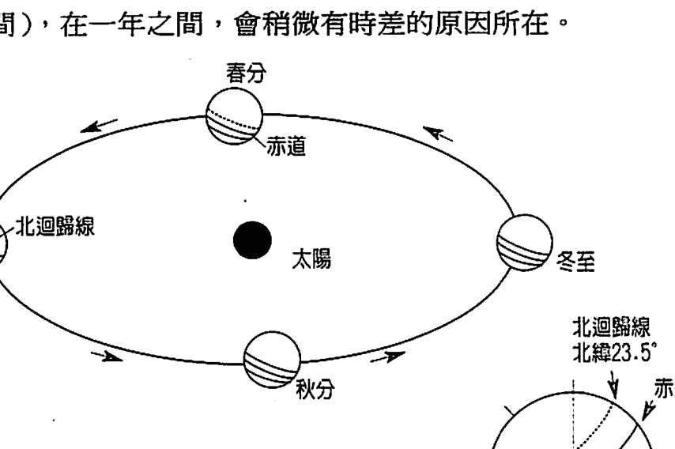

### 一、平均太陽時

### 1. 經度與緯度

為了標示地球表面某定點的位置方位，於是在地球表面上設定經度與緯度。

「經度」是用來表示地球上的東西方向，「緯度」是用來表示地球表面的南北方向。

以通過英國格林威治天文台的經線為經度0度，由此向左右各劃分180度，向右之180度為東經線，向左之180度為西經線。在赤道上的經度差，一度約111公里。東經西經180度同為一線，是謂「換日線」。

「緯度」則以赤道為0度，由向南北方向，各劃分90度。向北的北緯線到北極，為北緯90度，向南的南緯線到南極，為南緯90度。緯度一度的距離約111公里。

整個地球的空間，都包含在此經度與緯度的範圍內，而此範圍以外的地球表面，是不存在的。另外一個意義是，時間與空間是並行，而不是相對的。

### 2. 換日線

地球上用來決定變更太陽日子的界線，為「換日線」。假設太陽從東經180度起西移，而每1度的時差四分鐘，當太陽西移到經度0度格林威治線時，其正午時刻已慢了12小時。若再繼續西移到西經180度時，正好慢了24小時。因此，越過東經，過了180度時（乃西經180度），日子就要撥快或撥慢一日。例如，由西向東（台灣向美國等），當越過此線時，日期要撥慢一日。由東向西（美國向台灣），日期就要撥快一日。

### 3. 地域標準時

以太陽經過經度0度的時間算法，就是格林威治標準時，乃「世界標準時」。

這個在世界上統一的時刻，可用於國際間的大事、共同事項、天文氣象等。

另外，再在世界各地域，每相差經度15度分為一區，東西經共設有12個這種地域標準時刻地區。每一地域標準時刻相差一小時，每一經度四分鐘。

+   我國共屬五個地域標準時區：
- 長白標準時區（東9區）東經135度；
- 中原標準時區（東8區）東經120度；
- 隴蜀標準時區（東7區）東經105度；
- 回藏標準時區（東6區）東經90度；
- 崑崙標準時區（東5區）東經75度。

台灣屬於中原標準地區，此區所用的時間，稱作「中原標準時間」。在此區域內的日常作息或計時記錄，都統一以此時刻為準。日本的地域標準時區，是以東經135度的「東9區」（長白標準時區），比台灣用的中原標準時區快一小時。韓國為「東8區」，與中原標準時區相同。美國洛杉磯用「西8區」，紐約用「西5區」的區域標準時刻。

### 二、真正太陽時

以命理學而言，太陽時刻的能量與方位非常重要，而前述的平均太陽時，無法正確算出真正的太陽時刻方位與能量。所以，在探究命理時，時間的設定，須將平常用的鐘錶時間（平均太陽時與地域標準時）加以調整，使能符合真正的太陽時刻，如此才能使時空關係一致，而正確運用時空。

前面提到地球在太陽黃道軌道的公轉速度不均，而且自轉軸也有23.5度是傾斜角，因此，在公轉的一年當中，每天都有時差。

太陽在真正的午時，正射地球上某一定點的日子，也就是說地球自轉到達同一地點的時間正好是24時的日子，一年365日當中，只有四天。此種時差最多有達25分鐘者。

以地域標準時而言，一地域（緯度15度）最多可有時差30分鐘（緯度7.5度），若剛好在地域標準時區的緯度線上者，即無此時差。

### 1. 真太陽時差

### 真太陽時差圖

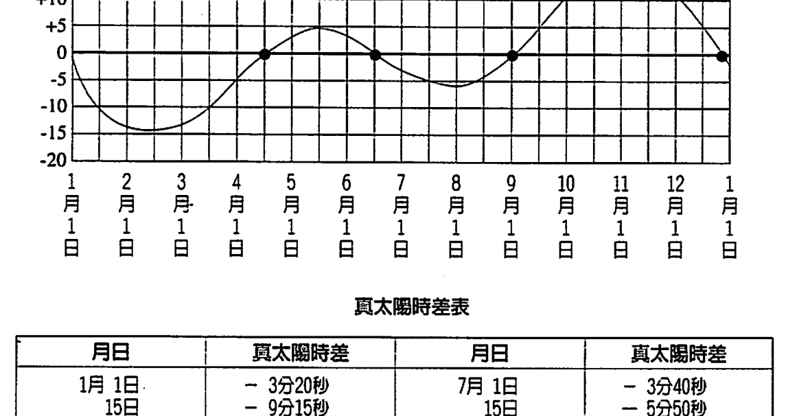

### 真太陽時差表

| 月日 | 真太陽時差 | 月日 | 真太陽時差 |
|------|------------|------|------------|
| 1月 1日 | - 3分20秒 | 7月 1日 | - 3分40秒 |
| 15日 | - 9分15秒 | 15日 | - 5分50秒 |
| 2月 1日 | -13分30秒 | 8月 1日 | - 6分20秒 |
| 15日 | -14分10秒 | 15日 | - 4分35秒 |
| 3月 1日 | -12分30秒 | 9月 1日 | - 0分15秒 |
| 15日 | - 9分10秒 | 15日 | + 5分00秒 |
| 4月 1日 | - 4分05秒 | 10月 1日 | +10分05秒 |
| 15日 | - 0分15秒 | 15日 | +14分05秒 |
| 5月 1日 | + 2分50秒 | 11月 1日 | +16分20秒 |
| 15日 | + 3分40秒 | 15日 | +15分30秒 |
| 6月 1日 | + 2分20秒 | 12月 1日 | +11分15秒 |
| 15日 | + 0分15秒 | 15日 | + 5分10秒 |

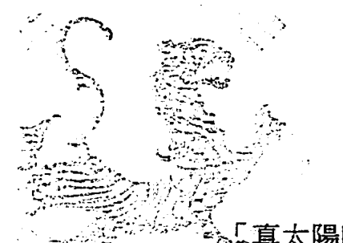

「真太陽時差圖」中的縱座標圖部分，表示時差的快慢，橫座標的部分，則表示陽曆時間之推位。

「＋」記號表示當日的太陽時刻，比平均太陽時刻早多少；「－」記號則表示當日的太陽時刻慢多少。圖中有0分的一條線，稱為「日中天真太陽正午時線」而時差曲線與此線相交的4天，表示無時差。此4天是陽曆4月15日、6月14日、9月1日與12月24日。

如果要查出陽曆元旦的真太陽時差，則可查一月一日的直線上與時差曲線相交點，為－13.5分（平均數），即當日的太陽時差，比平均太陽時差，慢了13.5分。

### 2. 真經度時差

台灣日常使用的中原標準時間，是東經120度的經度時刻，但此經度時刻的使用範圍，是東經112.5—127.5度區間，乃以東經120度為中心的左右7.5度範圍，一度有四分鐘時差，則此標準經度地區內，最多亦有30分鐘之經度時差。

台北位於東經121度31分，比東經120度的地域標準時偏東1度31分（1.5度），則比其所屬的中原標準時間早到4分鐘×1.5度＝6分鐘。所以，中原標準時間的正午12時，台北的鐘錶時間雖也是正午12時，但若把真經度時差也計算在內的話，則已是下午12時6分。

這種「真經度時差」，是恆久不變的地方性時差。下表為台灣各主要地區的真經度時差：

### 台灣各地經度與經度時差表

| 地點 | 東經度 | 經度時差 |
|------|--------|----------|
| 基隆 | 121度44分65秒 | +6分57秒 |
| 台北 | 121度30分30秒 | +6分02秒 |
| 桃園 | 121度18分 | +5分12秒 |
| 新竹 | 120度58分 | +3分52秒 |
| 台中 | 120度42分45秒 | +2分51秒 |
| 彰化 | 120度32分53秒 | +2分11秒 |
| 嘉義 | 120度26分13秒 | +1分45秒 |
| 台南 | 120度12分 | +0分48秒 |
| 高雄 | 120度12分40秒 | +1分07秒 |
| 屏東 | 120度26分30秒 | +1分48秒 |
| 台東 | 121度08分20秒 | +4分33秒 |
| 花蓮 | 121度36分 | +6分24秒 |
| 宜蘭 | 121度45分 | +7分 |

### 3. 標準太陽經度時

了解「真太陽時差」與「真經度時差」後，就可隨時求出某日某一地點的「真正太陽時刻」，亦即「標準太陽經度時」。公式如下：

> 鐘錶時刻＋－當日真太陽時差＋－真經度時差＝真正太陽時刻

例如：求台北五月一日午前10點15分的真正太陽時刻
5月1日的真太陽時差＝＋2分50秒（從真太陽時差表查得）
台北經度時差＝＋6分02秒（從區域經度時差表查得）
兩者合計乃真太陽時差＝＋8分52秒
台北鐘錶時刻午前10時15分＋（8分52秒）＝午前10時23分52秒即五月一日台北午前10點15分的真正太陽時刻，為午前10點23分52秒。
