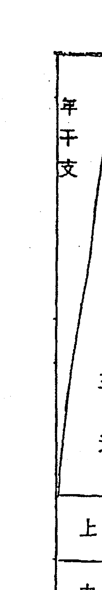
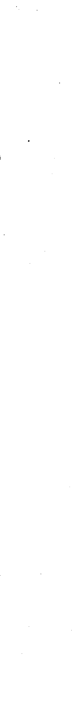

# 奇门遁甲天地全书

# 前言
「奇門天、地書」是中國奇門遁甲術之名著，亦即方位術中最高理論和應用法的書。日本人所說的方位家相就是氣學九星，而成爲氣學九星之主要部份，即爲「奇門遁甲術」。所謂奇門遁甲，就是在方位、家相、命理、占卜等方面，表現「十干、八門、九星、九宮、八神」這五種機能以利判斷或應用的占術。所以這裏所說的「九星」，和日本所說的九星不同。日本所用的九星，即爲遁甲術的九宮。因此，日本的氣學九星之占術，祇是奇門遁甲術的五種機能之一，亦即「九宮」這一部份而已。「九宮」盛行於日本，而且效果不錯，若是能併用遁甲術的其他四種方法，則效果定會更好。日本的氣學九星，原本只是九宮，因而判斷上或應用上總不夠準確或不大靈驗。所以，奇門遁甲術並非否定日本的氣學九星，只不過日本的氣學九星原本就屬於奇門遁甲術中的一部份。奇門遁甲術有五種機能，當然比只有一種機能的日本氣學九星更有豐富的內容，也許有些地方深奧難懂，但若能充分理解，則占卜吉凶的成效很精準，應用範圍廣大。

奇门遁甲术是中国占卜方面的珍贵宝典，也许为了现实性的占术关系，总是秘藏一些部份，无法窥其全貌，因而占卜的良书很少。其中，『奇门天书』、『奇门地书』『阳宅遁甲图』三本书，可算是优良的书。本书即是把前一二本公诸于世。我相信，阅读本书的人将会更加了解有关方位家相现实性的问题。
佐藤六龍

# 序文
三式之中，「六壬」是以占時爲機而不論述方位，故內容過於簡單。「太乙」使用元會、方位、天體等，又太複雜難懂。奇門遁甲術則兼具占時和方位，而不用元會、天體，因而既不複雜，又不過於簡單。

奇門遁甲術的書籍很多，其中以「奇門天書、奇門地書」的內容最好。天書專述立向，而地書是論述坐山方面，這兩本書就如車子的兩輪，缺一不可。

現在的術者，懂坐山盤的人很多，但懂立向盤的人並不多。

我自日本回國之際，正巧本書的評註大功告成，能送給喜愛占卜的人士，這是很高興的事。希望讀者愛惜本書，多加利用，如此才能避凶趨吉。
丁未年初春
張耀文 於東京

# 本書之使用法
「奇門遁甲術」是由「天書」和「地書」兩部分所組成。「天書」叫做方位盤的「立向盤」，也就是使用於動的方位。「地書」叫做方位盤的「座山盤」，使用於靜的方位。
奇門遁甲術在作盤時較為麻煩，但是一旦完成後，可以很快的了解吉與凶，所以讀者諸君對盤的作法，須充分了解始可。

天書和地書都是卷一的起例，相當於盤的作法，所以更要充分閱讀和了解，牢記作法。天書在年盤、月盤、日盤、時盤等方面，情況均不同，換言之，天書和地書的內容完全不一樣。

卷二則論述天書、地書的象意和方位現象。本書中，十干組合的「天地之吉凶」非常重要，幾乎所有的遁甲術，都是根據這部分而決定的。

卷三中的天書、地書，在於說明應用法。祗要懂了應用法，就知道怎樣使用方位。

# 天書 起例
## 遁甲之基本
### 「關於局數的問題」
局是奇門遁甲之最基礎部份，而要形成遁甲盤之前，必須先決定局。局分為陰局和陽局，而且兩者各有九個局，局的稱呼包含陰陽和局數，例如陰一局、陰二局、陽七局等。

#### 「卦位」
卦位有「乾、兌、離、震、巽、坎、艮、坤」等。

#### 「九宮」
九宮亦稱為氣。日本所使用的九氣或九星就是九宮。

#### 「九干」
九宮有「一白、二黑、三碧、四綠、五黃、六白、七赤、八白、九紫」等。
十干中去掉甲就是九干，亦即「乙、丙、丁、戊、己、庚、辛、壬、癸」的九項，其中「乙、丙、丁」稱為「三奇」，而「戊、己、庚、辛、壬、癸」稱為「六儀」。

依附于甲下面的干支而變為六儀，即如下：
- 甲子——戊。
- 甲戌——己。
- 甲申——庚。
- 甲午——辛。
- 甲辰——壬。
- 甲寅——癸。

由此可知，有些干支就依旬首而六儀才可决定，而且這時候的六儀就是「甲」的代用物。看下面的表就知道，例如辛巳的旬首为甲戌，而甲戌的六仪就是「己」。癸亥的旬首为甲寅，其六仪为癸，而癸就代用「甲」。

同樣的情况下，己亥的旬首为甲午，其六仪为辛，而辛代替甲；丁丑的旬首为甲戌，其六仪为己。甲午的話，辛為六儀。

| 六仪 | 旬首 | 干支 |
|---|---|---|
| 甲 | 甲子 | 乙丑 丙寅 丁卯 戊辰 己巳 庚午 辛未 壬申 癸酉 |
| 戊 | 甲戌 | 乙亥 丙子 丁丑 戊寅 己卯 庚辰 辛巳 壬午 癸未 |
| 己 | 甲申 | 乙酉 丙戌 丁亥 戊子 己丑 庚寅 辛卯 壬辰 癸巳 |
| 庚 | 甲午 | 乙未 丙申 丁酉 戊戌 己亥 庚子 辛丑 壬寅 癸卯 |

#### 「九星」
九星有『天蓬星、天芮星、天冲星、天辅星、天禽星、天心星、天柱星、天任星、天英星』。日本人使用的氣學之九星和這裡所說的九星完全不同。

#### 「八門」
八門為『休門、生門、傷門、杜門、景門、死門、驚門、開門』。

#### 「八神」
八神為『直符、塍蛇、太陰、六合、勾陳、朱雀、九地、九天』。

以上所述的都是遁甲術中的基本術語，因此研究遁甲的人士必須要有記憶。

### 地盤
地盤為定位之意，有些地盤依陰陽而情況不同，也有陰陽相同的地盤。如左圖所示，上為陽局的定位，下為陰局的定位。

| 癸 | 壬 | 辛 |
| --- | --- | --- |
| 甲寅 | 甲辰 | 甲午 |
| 乙卯 | 乙巳 | 乙未 |
| 丙辰 | 丙午 | 丙申 |
| 丁巳 | 丁未 | 丁酉 |
| 戊午 | 戊申 | 戊戌 |
| 己未 | 己酉 | 己亥 |
| 庚申 | 庚戌 | 庚子 |
| 辛酉 | 辛亥 | 辛丑 |
| 壬戌 | 壬子 | 壬寅 |
| 癸亥 | 癸丑 | 癸卯 |

對九星而言，陽局和陰局的定位是相同的。

| 杜 | 景 | 死 |
|---|---|---|
| 傷 |  | 驚 |
| 生 | 休 | 開 |

對八門而言，陽局和陰局的定位是相同的。

#### 陽局定位
| 辛 | 乙 | 己 |
|---|---|---|
| 庚 | 壬 | 丁 |
| 丙 | 戊 | 癸 |

#### 陰局定位
| 丁 | 己 | 乙 |
|---|---|---|
| 丙 | 癸 | 辛 |
| 庚 | 戊 | 壬 |

八神依阳局和阴局而言则定位不同，如左图所示。上面为阳局定位，下面为阴局定位。

#### 阳局定位
| 阴 | 合 | 陈 |
|---|---|---|
| 蛇 |   | 雀 |
| 符 | 天 | 地 |

| 辅 | 英 | 芮 |
|---|---|---|
| 冲 | 禽 | 柱 |
| 任 | 蓬 | 心 |

对九宫而言，阳局和阴局的定位是相同的。

#### 阴局定位
| 合 | 阴 | 蛇 |
|---|---|---|
| 陈 |   | 符 |
| 雀 | 地 | 天 |

## 九局的求法
要作成遁甲盤時，首先就要決定局。而依年、月、日、時等的盤，則局的求法就有所不同。

### 「年盤的求法」
若為年盤，則一年一局。全部是陰局而不使用陽局。

首先把上元的甲子年作為陰一局。陰局是陰遁（逆行），故乙丑年就變成陰九局，丙寅年就算作陰八局。如此依序的計算下去，則癸亥年就是陰五局，而中元的甲子年就是陰四局，如此繼續。

| 二 | 九 | 四 |
| 七 | 五 | 三 |
| 六 | 一 | 八 |

| 年干支 | 甲子 | 乙丑 | 丙寅 | 丁卯 | 戊辰 | 己巳 | 庚午 | 辛未 | 壬申 | 癸酉 | 甲戌 | 乙亥 | 丙子 |
| :--- | :--- | :--- | :--- | :--- | :--- | :--- | :--- | :--- | :--- | :--- | :--- | :--- | :--- |
| 上元 | 一 | 九 | 八 | 七 | 六 | 五 | 四 | 三 | 二 | 一 | 九 | 八 | 七 |
| 中元 | 四 | 三 | 二 | 一 | 九 | 八 | 七 | 六 | 五 | 四 | 三 | 二 | 一 |
| 下元 | 七 | 六 | 五 | 四 | 三 | 二 | 一 | 九 | 八 | 七 | 六 | 五 | 四 |

| 年干支 | 甲午 | 乙未 | 丙申 | 丁酉 | 戊戌 | 己亥 | 庚子 | 辛丑 | 壬寅 | 癸卯 | 甲辰 | 乙巳 | 丙午 |
| :--- | :--- | :--- | :--- | :--- | :--- | :--- | :--- | :--- | :--- | :--- | :--- | :--- | :--- |
| 上元 | 七 | 六 | 五 | 四 | 三 | 二 | 一 | 九 | 八 | 七 | 六 | 五 | 四 |
| 中元 | 一 | 九 | 八 | 七 | 六 | 五 | 四 | 三 | 二 | 一 | 九 | 八 | 七 |
| 下元 | 四 | 三 | 二 | 一 | 九 | 八 | 七 | 六 | 五 | 四 | 三 | 二 | 一 |

| 辛卯 | 庚寅 | 己丑 | 戊子 | 丁亥 | 丙戌 | 乙酉 | 甲申 | 癸未 | 壬午 | 辛巳 | 庚辰 | 己卯 | 戊寅 | 丁丑 |
| --- | --- | --- | --- | --- | --- | --- | --- | --- | --- | --- | --- | --- | --- | --- |
| 一 | 二 | 三 | 四 | 五 | 六 | 七 | 八 | 九 | 一 | 二 | 三 | 四 | 五 | 六 |
| 四 | 五 | 六 | 七 | 八 | 九 | 一 | 二 | 三 | 四 | 五 | 六 | 七 | 八 | 九 |
| 七 | 八 | 九 | 一 | 二 | 三 | 四 | 五 | 六 | 七 | 八 | 九 | 一 | 二 | 三 |

| 辛酉 | 庚申 | 己未 | 戊午 | 丁巳 | 丙辰 | 乙卯 | 甲寅 | 癸丑 | 壬子 | 辛亥 | 庚戌 | 己酉 | 戊申 | 丁未 |
| --- | --- | --- | --- | --- | --- | --- | --- | --- | --- | --- | --- | --- | --- | --- |
| 七 | 八 | 九 | 一 | 二 | 三 | 四 | 五 | 六 | 七 | 八 | 九 | 一 | 二 | 三 |
| 一 | 二 | 三 | 四 | 五 | 六 | 七 | 八 | 九 | 一 | 二 | 三 | 四 | 五 | 六 |
| 四 | 五 | 六 | 七 | 八 | 九 | 一 | 二 | 三 | 四 | 五 | 六 | 七 | 八 | 九 |

### 「月盤的求法」
若為月盤，則每十個月為一局，而且全部都是陰局而不使用陽局。這點和年盤的狀況相同。
從甲子年到癸亥年的六十年之間，共計有七百二十個月，而每十個月為一局，故在此六十年間，就有七十二局。從甲子年的丙寅月到乙亥月為陰局，接著從丙子月到翌年（乙丑年）的乙酉月就算作陰九局。

| 壬辰 | 癸巳 |
|---|---|
| 九 | 八 |
| 三 | 二 |
| 六 | 五 |

以這種方法計算、分局；相當的複雜，故乾脆分為上、中、下三元來計算較為簡單。
也就是說，甲子年到戊辰年，己卯年到癸未年、甲午年到戊戌年，己酉年到癸丑年等全部作為上元，而從丙寅月數起十個月的這一局就以陰一局開始，接著就是陰九局，再接下來的就是陰八局，如此般逆行。

| 壬戌 | 癸亥 |
|---|---|
| 六 | 五 |
| 九 | 八 |
| 三 | 二 |

從丙寅月數起十個月的這一局就以陰四局開始，接著就是陰三局，再接下來的就是陰二局，如此般逆行。

## 如此般逆行。

最後從甲戌年到戊寅年、己丑年到癸巳年、甲辰年到戊申年、己未年到癸亥年全部算作下元，而從丙寅月數起十個月的這一局就以陰七局開始，接著就是陰六局，再接下來的就是陰五局，

| 年干支 | 元 |
|--------|----|
| 甲乙丙丁戊子丑寅卯辰 | 上 |
| 己庚辛壬癸巳午未申酉 | 中 |
| 甲乙丙丁戊戌亥子丑寅 | 下 |
| 己庚辛壬癸卯辰巳午未 | 上 |
| 甲乙丙丁戊申酉戌亥子 | 中 |
| 己庚辛壬癸丑寅卯辰巳 | 下 |

| 年干支 | 元 |
|--------|----|
| 甲乙丙丁戊午未申酉戌 | 上 |
| 己庚辛壬癸亥子丑寅卯 | 中 |
| 甲乙丙丁戊辰巳午未申 | 下 |
| 己庚辛壬癸酉戌亥子丑 | 上 |
| 甲乙丙丁戊寅卯辰巳午 | 中 |
| 己庚辛壬癸未申酉戌亥 | 下 |

| 月干支 | 甲子 | 乙丑 | 丙寅 | 丁卯 | 戊辰 | 己巳 | 庚午 | 辛未 | 壬申 | 癸酉 | 甲戌 | 乙亥 | 丙子 | 丁丑 |
|---|---|---|---|---|---|---|---|---|---|---|---|---|---|---|
| 三元 | 上元 | 中元 | 下元 | 上元 | 中元 | 下元 | 上元 | 中元 | 下元 | 上元 | 中元 | 下元 | 上元 | 中元 |
| 一 | 五 | 八 | 二 | 九 | 三 | 六 | 一 | 四 | 七 | 一 | 四 | 七 | 九 | 三 |

| 月干支 | 甲午 | 乙未 | 丙申 | 丁酉 | 戊戌 | 己亥 | 庚子 | 辛丑 | 壬寅 | 癸卯 | 甲辰 | 乙巳 | 丙午 | 丁未 |
|---|---|---|---|---|---|---|---|---|---|---|---|---|---|---|
| 三元 | 上元 | 中元 | 下元 | 上元 | 中元 | 下元 | 上元 | 中元 | 下元 | 上元 | 中元 | 下元 | 上元 | 中元 |
| 八 | 二 | 五 | 七 | 一 | 四 | 六 | 九 | 三 | 六 | 九 | 三 | 七 | 一 | 四 |

| 壬辰 | 辛卯 | 庚寅 | 己丑 | 戊子 | 丁亥 | 丙戌 | 乙酉 | 甲申 | 癸未 | 壬午 | 辛巳 | 庚辰 | 己卯 | 戊寅 |
|---|---|---|---|---|---|---|---|---|---|---|---|---|---|---|
| 八 | 八 | 八 | 八 | 八 | 八 | 八 | 九 | 九 | 九 | 九 | 九 | 九 | 九 | 九 |
| 二 | 二 | 二 | 二 | 二 | 二 | 二 | 三 | 三 | 三 | 三 | 三 | 三 | 三 | 三 |
| 五 | 五 | 五 | 五 | 五 | 五 | 五 | 六 | 六 | 六 | 六 | 六 | 六 | 六 | 六 |

| 壬戌 | 辛酉 | 庚申 | 己未 | 戊午 | 丁巳 | 丙辰 | 乙卯 | 甲寅 | 癸丑 | 壬子 | 辛亥 | 庚戌 | 己酉 | 戊申 |
|---|---|---|---|---|---|---|---|---|---|---|---|---|---|---|
| 五 | 五 | 五 | 五 | 五 | 五 | 五 | 六 | 六 | 六 | 六 | 六 | 六 | 六 | 六 |
| 八 | 八 | 八 | 八 | 八 | 八 | 八 | 九 | 九 | 九 | 九 | 九 | 九 | 九 | 九 |
| 二 | 二 | 二 | 二 | 二 | 二 | 二 | 三 | 三 | 三 | 三 | 三 | 三 | 三 | 三 |

## 日盘的求法

如此般逆行。

如果使用前表，則月之局就可以簡易的算出來。先從年干支查清楚三元，接著再從三元和月干支中找出其月之局。

若為日盤，則分為陰局和陽局二局。一天一局而從最接近冬至的甲子為陽局開始，其甲子日為陽一局，乙丑日為陽二局，丙寅日為陽三局，如此是為陽遁（順行）。直到最靠近夏至的癸亥日終止，而接下來的甲子日就算作陰九局，乙丑日為陰八局，如此是為陰遁（逆行）。這時，不論癸亥日是那一局，反正最接近夏至的甲子日必定是陰九局。陰、陽各有一百八十以上的局，因此，算法十分麻煩，如果依照如下的方法就比較簡單。

把最接近冬至的甲子日作為陽一局，而接著的甲子日為陽七局，再接下來的甲子日為陽四局，如果再接下來尚有甲子日就算作陽一局。一般說來，第四次的甲子日就是最靠近夏至的甲子日，也就是陰九局，不過，有時並不完全是這樣。像這種例外的情形就不變而繼續從癸亥接下去。

然後最靠近夏至的甲子日就作為陰四局，而再接下去的甲子日作為陰三局，又一次的甲子日就作為陰六局。如果尚有甲子日而此甲子日並非最靠近冬至的甲子日時，那麼就和陽局的情形同。

| 日干支 | 壬申 | 辛未 | 庚午 | 己巳 | 戊辰 | 丁卯 | 丙寅 | 乙丑 | 甲子 |
| :---: | :---: | :---: | :---: | :---: | :---: | :---: | :---: | :---: | :---: |
| 三元 | 元上 | 元中 | 元下 | 元上 | 元中 | 元下 | 元上 | 元中 | 元下 |
| 阳遁 | 九 | 八 | 七 | 六 | 五 | 四 | 三 | 二 | 一 |
| | 六 | 五 | 四 | 三 | 二 | 一 | 九 | 八 | 七 |
| | 三 | 二 | 一 | 九 | 八 | 七 | 六 | 五 | 四 |
| 阴遁 | 一 | 二 | 三 | 四 | 五 | 六 | 七 | 八 | 九 |
| | 四 | 五 | 六 | 七 | 八 | 九 | 一 | 二 | 三 |
| | 七 | 八 | 九 | 一 | 二 | 三 | 四 | 五 | 六 |

| 日干支 | 壬寅 | 辛丑 | 庚子 | 己亥 | 戊戌 | 丁酉 | 丙申 | 乙未 | 甲午 |
| :---: | :---: | :---: | :---: | :---: | :---: | :---: | :---: | :---: | :---: |
| 三元 | 元上 | 元中 | 元下 | 元上 | 元中 | 元下 | 元上 | 元中 | 元下 |
| 阳遁 | 三 | 二 | 一 | 九 | 八 | 七 | 六 | 五 | 四 |
| | 九 | 八 | 七 | 六 | 五 | 四 | 三 | 二 | 一 |
| | 六 | 五 | 四 | 三 | 二 | 一 | 九 | 八 | 七 |
| 阴遁 | 七 | 八 | 九 | 一 | 二 | 三 | 四 | 五 | 六 |
| | 一 | 二 | 三 | 四 | 五 | 六 | 七 | 八 | 九 |
| | 四 | 五 | 六 | 七 | 八 | 九 | 一 | 二 | 三 |

| 甲申 | 癸未 | 壬午 | 辛巳 | 庚辰 | 己卯 | 戊寅 | 丁丑 | 丙子 | 乙亥 | 甲戌 | 癸酉 |
|---|---|---|---|---|---|---|---|---|---|---|---|
| 三 | 二 | 一 | 九 | 八 | 七 | 六 | 五 | 四 | 三 | 二 | 一 |
| 九 | 八 | 七 | 六 | 五 | 四 | 三 | 二 | 一 | 九 | 八 | 七 |
| 六 | 五 | 四 | 三 | 二 | 一 | 九 | 八 | 七 | 六 | 五 | 四 |
| 七 | 八 | 九 | 一 | 二 | 三 | 四 | 五 | 六 | 七 | 八 | 九 |
| 一 | 二 | 三 | 四 | 五 | 六 | 七 | 八 | 九 | 一 | 二 | 三 |
| 四 | 五 | 六 | 七 | 八 | 九 | 一 | 二 | 三 | 四 | 五 | 六 |

| 甲寅 | 癸丑 | 壬子 | 辛亥 | 庚戌 | 己酉 | 戊申 | 丁未 | 丙午 | 乙巳 | 甲辰 | 癸卯 |
|---|---|---|---|---|---|---|---|---|---|---|---|
| 六 | 五 | 四 | 三 | 二 | 一 | 九 | 八 | 七 | 六 | 五 | 四 |
| 三 | 二 | 一 | 九 | 八 | 七 | 六 | 五 | 四 | 三 | 二 | 一 |
| 九 | 八 | 七 | 六 | 五 | 四 | 三 | 二 | 一 | 九 | 八 | 七 |
| 四 | 五 | 六 | 七 | 八 | 九 | 一 | 二 | 三 | 四 | 五 | 六 |
| 七 | 八 | 九 | 一 | 二 | 三 | 四 | 五 | 六 | 七 | 八 | 九 |
| 一 | 二 | 三 | 四 | 五 | 六 | 七 | 八 | 九 | 一 | 二 | 三 |

| 癸巳 | 壬辰 | 辛卯 | 庚寅 | 己丑 | 戊子 | 丁亥 | 丙戌 | 乙酉 |
| :---: | :---: | :---: | :---: | :---: | :---: | :---: | :---: | :---: |
| 三 | 二 | 一 | 九 | 八 | 七 | 六 | 五 | 四 |
| 九 | 八 | 七 | 六 | 五 | 四 | 三 | 二 | 一 |
| 六 | 五 | 四 | 三 | 二 | 一 | 九 | 八 | 七 |
| 七 | 八 | 九 | 一 | 二 | 三 | 四 | 五 | 六 |
| 一 | 二 | 三 | 四 | 五 | 六 | 七 | 八 | 九 |
| 四 | 五 | 六 | 七 | 八 | 九 | 一 | 二 | 三 |

| 癸亥 | 壬戌 | 辛酉 | 庚申 | 己未 | 戊午 | 丁巳 | 丙辰 | 乙卯 |
| :---: | :---: | :---: | :---: | :---: | :---: | :---: | :---: | :---: |
| 六 | 五 | 四 | 三 | 二 | 一 | 九 | 八 | 七 |
| 三 | 二 | 一 | 九 | 八 | 七 | 六 | 五 | 四 |
| 九 | 八 | 七 | 六 | 五 | 四 | 三 | 二 | 一 |
| 四 | 五 | 六 | 七 | 八 | 九 | 一 | 二 | 三 |
| 七 | 八 | 九 | 一 | 二 | 三 | 四 | 五 | 六 |
| 一 | 二 | 三 | 四 | 五 | 六 | 七 | 八 | 九 |

## 时盘的求法

时盘每十個時辰（二十小時）為一局，故每五天就有六局，這就叫作一元。依節氣而言，起點就有所不同而是從最靠近節氣的甲子時開始。最靠近冬至的甲子時到癸酉時就為陽一局，而接下來的就是陽二局，再接下來的就是陽三局，如此而每十時辰（二十小時）就改變。也可以說，冬至是從陽一局開始。不過，從靠近小寒的甲子時就不依承上面而必定從陽二局開始。現將以上所述的要點整理如下：

- 冬至是從陽一局
- 大寒是從陽三局
- 雨水是從陽九局
- 春分是從陽三局
- 穀雨是從陽五局
- 小滿是從陽五局
- 夏至是從陰九局
- 大暑是從陰七局
- 處暑是從陰一局
- 小寒就從陽二局
- 立春就從陽八局
- 驚蟄就從陽一局
- 清明就從陽四局
- 立夏就從陽四局
- 芒種就從陽六局
- 小暑就從陰八局
- 立秋就從陰二局
- 白露就從陰九局

| 气节 | 冬至 | 小寒 | 大寒 | 立春 | 雨水 | 惊蛰 | 春分 | 清明 | 谷雨 | 立夏 |
|------|------|------|------|------|------|------|------|------|------|------|
| 三元 | 时干支 |      |      |      |      |      |      |      |      |      |
| 上元 | 甲子 | 乙丑 | 丙寅 | 丁卯 | 戊辰 | 己巳 | 庚午 | 辛未 | 壬申 | 癸酉 |
|      | 甲戌 | 乙亥 | 丙子 | 丁丑 | 戊寅 | 己卯 | 庚辰 | 辛巳 | 壬午 | 癸未 |
|      | 甲申 | 乙酉 | 丙戌 | 丁亥 | 戊子 | 己丑 | 庚寅 | 辛卯 | 壬辰 | 癸巳 |
|      | 甲午 | 乙未 | 丙申 | 丁酉 | 戊戌 | 己亥 | 庚子 | 辛丑 | 壬寅 | 癸卯 |
|      | 甲辰 | 乙巳 | 丙午 | 丁未 | 戊申 | 己酉 | 庚戌 | 辛亥 | 壬子 | 癸丑 |
|      | 甲寅 | 乙卯 | 丙辰 | 丁巳 | 戊午 | 己未 | 庚申 | 辛酉 | 壬戌 | 癸亥 |
| 中元 | 甲子 | 乙丑 | 丙寅 | 丁卯 | 戊辰 | 己巳 | 庚午 | 辛未 | 壬申 | 癸酉 |
|      | 甲戌 | 乙亥 | 丙子 | 丁丑 | 戊寅 | 己卯 | 庚辰 | 辛巳 | 壬午 | 癸未 |
|      | 甲申 | 乙酉 | 丙戌 | 丁亥 | 戊子 | 己丑 | 庚寅 | 辛卯 | 壬辰 | 癸巳 |
|      | 甲午 | 乙未 | 丙申 | 丁酉 | 戊戌 | 己亥 | 庚子 | 辛丑 | 壬寅 | 癸卯 |
|      | 甲辰 | 乙巳 | 丙午 | 丁未 | 戊申 | 己酉 | 庚戌 | 辛亥 | 壬子 | 癸丑 |
|      | 甲寅 | 乙卯 | 丙辰 | 丁巳 | 戊午 | 己未 | 庚申 | 辛酉 | 壬戌 | 癸亥 |
| 下元 | 甲子 | 乙丑 | 丙寅 | 丁卯 | 戊辰 | 己巳 | 庚午 | 辛未 | 壬申 | 癸酉 |
|      | 甲戌 | 乙亥 | 丙子 | 丁丑 | 戊寅 | 己卯 | 庚辰 | 辛巳 | 壬午 | 癸未 |
|      | 甲申 | 乙酉 | 丙戌 | 丁亥 | 戊子 | 己丑 | 庚寅 | 辛卯 | 壬辰 | 癸巳 |
|      | 甲午 | 乙未 | 丙申 | 丁酉 | 戊戌 | 己亥 | 庚子 | 辛丑 | 壬寅 | 癸卯 |
|      | 甲辰 | 乙巳 | 丙午 | 丁未 | 戊申 | 己酉 | 庚戌 | 辛亥 | 壬子 | 癸丑 |
|      | 甲寅 | 乙卯 | 丙辰 | 丁巳 | 戊午 | 己未 | 庚申 | 辛酉 | 壬戌 | 癸亥 |

| 小满 | 芒种 | 夏至 | 小暑 | 大暑 | 立秋 | 处暑 | 白露 | 秋分 | 寒露 | 霜降 | 立冬 | 小雪 | 大雪 |
|---|---|---|---|---|---|---|---|---|---|---|---|---|---|
| 五 | 六 | 九 | 八 | 七 | 二 | 一 | 九 | 七 | 六 | 五 | 六 | 五 | 四 |
| 六 | 七 | 八 | 七 | 六 | 一 | 九 | 八 | 六 | 五 | 四 | 五 | 四 | 三 |
| 七 | 八 | 七 | 六 | 五 | 九 | 八 | 七 | 五 | 四 | 三 | 四 | 三 | 二 |
| 八 | 九 | 六 | 五 | 四 | 八 | 七 | 六 | 四 | 三 | 二 | 三 | 二 | 一 |
| 九 | 一 | 五 | 四 | 三 | 七 | 六 | 五 | 三 | 二 | 一 | 二 | 一 | 九 |
| 一 | 二 | 四 | 三 | 二 | 六 | 五 | 四 | 二 | 一 | 九 | 一 | 九 | 八 |
| 二 | 三 | 三 | 二 | 一 | 五 | 四 | 三 | 一 | 九 | 八 | 九 | 八 | 七 |
| 三 | 四 | 二 | 一 | 九 | 四 | 三 | 二 | 九 | 八 | 七 | 八 | 七 | 六 |
| 四 | 五 | 五 | 四 | 三 | 二 | 一 | 九 | 七 | 六 | 五 | 六 | 五 | 四 |
| 五 | 六 | 四 | 三 | 二 | 一 | 九 | 八 | 六 | 五 | 四 | 五 | 四 | 三 |
| 六 | 七 | 七 | 六 | 五 | 九 | 八 | 七 | 五 | 四 | 三 | 四 | 三 | 二 |
| 七 | 八 | 六 | 五 | 四 | 八 | 七 | 六 | 四 | 三 | 二 | 三 | 二 | 一 |
| 八 | 九 | 五 | 四 | 三 | 七 | 六 | 五 | 三 | 二 | 一 | 二 | 一 | 九 |
| 九 | 一 | 四 | 三 | 二 | 六 | 五 | 四 | 二 | 一 | 九 | 一 | 九 | 八 |
| 一 | 二 | 三 | 二 | 一 | 五 | 四 | 三 | 一 | 九 | 八 | 九 | 八 | 七 |
| 二 | 三 | 二 | 一 | 九 | 四 | 三 | 二 | 九 | 八 | 七 | 八 | 七 | 六 |
| 三 | 四 | 五 | 四 | 三 | 二 | 一 | 九 | 七 | 六 | 五 | 六 | 五 | 四 |
| 四 | 五 | 四 | 三 | 二 | 一 | 九 | 八 | 六 | 五 | 四 | 五 | 四 | 三 |
| 五 | 六 | 七 | 六 | 五 | 九 | 八 | 七 | 五 | 四 | 三 | 四 | 三 | 二 |
| 六 | 七 | 六 | 五 | 四 | 八 | 七 | 六 | 四 | 三 | 二 | 三 | 二 | 一 |
| 七 | 八 | 九 | 八 | 七 | 六 | 五 | 四 | 三 | 二 | 一 | 二 | 一 | 九 |
| 八 | 九 | 一 | 九 | 八 | 七 | 六 | 五 | 四 | 三 | 二 | 一 | 九 | 八 |

秋分是從陰七局，寒露就從陰六局，霜降是從陰五局，立冬就從陰六局，小雪是從陰五局，大雪就從陰四局。

從一個節氣到下一個節氣有十五天，其中前五天為上元，中間五天為中元，最後五天為下元。

## 九千的求法

九千的配佈對年盤、月盤、日盤來說都是相同的，不過，在要明瞭配佈之前，首先要知道九千的順序。

九千的順序為「戊、己、庚、辛、壬、癸、丁、丙、乙」。故和四柱推命術等等的十干順序完全不同，這一點必須要弄清楚。

九千的配佈法如下：把「戊」放在相當於局數的卦位（定位）上面，然後再依序放入己、庚、辛、壬、癸、丁、丙、乙。

比如說，若為陽三局，就把戊放在三震，而己就放在四巽，庚放在五中，辛放在六乾，最後乙就放在二坤。若為陰六局，戊就放在六乾，乙就放在五中，庚放在四巽，辛放在三震，壬就放在二坤，癸放在一坎，丁放在八艮，丙放在七兌，乙放在六乾。

| 己 | 丁 | 乙 |
| 戊 | 庚 | 壬 |
| 癸 | 丙 | 辛 |

### 阳三局

| 辛 | 乙 | 己 |
| 庚 | 壬 | 丁 |
| 丙 | 戊 | 癸 |

### 阳一局

| 戊 | 癸 | 丙 |
| 乙 | 己 | 辛 |
| 壬 | 丁 | 庚 |

### 阳四局

| 庚 | 丙 | 戊 |
| 己 | 辛 | 癸 |
| 丁 | 乙 | 壬 |

### 阳二局

| 丁 | 庚 | 壬 |
| --- | --- | --- |
| 癸 | 丙 | 戊 |
| 己 | 辛 | 乙 |

### 阴七局

| 乙 | 壬 | 丁 |
| --- | --- | --- |
| 丙 | 戊 | 庚 |
| 辛 | 癸 | 己 |

### 阴五局

| 癸 | 己 | 辛 |
| --- | --- | --- |
| 壬 | 丁 | 乙 |
| 戊 | 庚 | 丙 |

### 阴八局

| 丙 | 辛 | 癸 |
| --- | --- | --- |
| 丁 | 乙 | 己 |
| 庚 | 壬 | 戊 |

### 阴六局

| 壬 | 乙 | 丁 |
| --- | --- | --- |
| 癸 | 辛 | 己 |
| 戊 | 丙 | 庚 |

### 阴八局

| 壬 | 戊 | 庚 |
| --- | --- | --- |
| 辛 | 癸 | 丙 |
| 乙 | 己 | 丁 |

### 阳九局

| 辛 | 丙 | 癸 |
| --- | --- | --- |
| 壬 | 庚 | 戊 |
| 乙 | 丁 | 己 |

### 阴二局

| 癸 | 戊 | 丙 |
| --- | --- | --- |
| 丁 | 壬 | 庚 |
| 己 | 乙 | 辛 |

### 阴九局

| 戊 | 壬 | 庚 |
| --- | --- | --- |
| 己 | 乙 | 丁 |
| 癸 | 辛 | 丙 |

阴四局

| 庚 | 丁 | 壬 |
| --- | --- | --- |
| 辛 | 己 | 乙 |
| 丙 | 癸 | 戊 |

阴六局

| 乙 | 辛 | 己 |
| --- | --- | --- |
| 戊 | 丙 | 癸 |
| 壬 | 庚 | 丁 |

阴三局

| 己 | 癸 | 辛 |
| --- | --- | --- |
| 庚 | 戊 | 丙 |
| 丁 | 壬 | 乙 |

阴五局

局数和干的配布图如下。放在二坤，癸放在一坎，丁放在九离，丙放在八艮，乙放在七兑。

| 丙 | 庚 | 戊 |
| --- | --- | --- |
| 乙 | 丁 | 壬 |
| 辛 | 己 | 癸 |

| 丁 | 己 | 乙 |
| --- | --- | --- |
| 丙 | 癸 | 辛 |
| 庚 | 戊 | 壬 |

## 天盘的作法如下：

- 第一……依局数而配置九干。
- 第二……从干支求旬首，而把旬首改为六仪。此六仪叫作天乙，也可以说就是甲。

## 天盘的求法

- 第三：……把甲放在干（若为年盘则年干，若为月盘则月干，若为日盘则日干，若为时盘则时干）的上面。
- 第四：……其他的干也当作甲，而像轮一般的回转着。

这样说明也许尚不够清楚，于此举例详解之。例如阳一局丙寅时的场合。

- 第一：……首先依局数而配置九干。因为是阳一局，故戊要放在一坎，而己就放在二坤，庚就放在三震。

| 己 | 乙 | 辛 |
| --- | --- | --- |
| 丁 | 壬 | 庚 |
| 癸 | 戊 | 丙 |

- 第二：……把代替甲的戊放在时干（也可以说是丙寅时的丙）的上面。
- 第一：……从干支求出旬首，因为干支是丙寅，故旬首是甲子，如果改为六仪就变成戊。

- 第四……其他的干也按照甲（也可说是戊）的作法而向左边一个错开。

| 庚 | 辛 | 乙 |
| --- | --- | --- |
| 丙 庚 | 壬 | 丁 己 |
| 戊 | 癸 | 丁 |

| 辛 | 乙 | 己 |
| --- | --- | --- |
| 庚 | 壬 | 丁 |
| 丙 | 戊 | 癸 |

换句话说，外侧为天盘。

| 庚 | 辛 | 乙 |
| --- | --- | --- |
| 辛 | 乙 | 己 |
| 丙 庚 | 壬 癸 | 丁 癸 |

再举一例吧。

| 戊 | 丙 |
| --- | --- |
| 壬 | 庚 |
| 乙 | 辛 |

以阴九局戊子时为例子来说明。首先九干的配置就如下图所示。

因为是戊子时，故旬首为甲申而六仪为庚。故把庚放在时干的戊。然后，外侧的干也向左错开二格，这就和庚的情形相同。

| 癸 |
| --- |
| 丁 |
| 己 |

产生的天盘如左图所示。

| 丙 | 庚 | 辛 |
| --- | --- | --- |
| 癸 | 戊 | 丙 |
| 戊 | 丁 | 壬 |

## 八门的求法

旬首或干（年干、月干、日干、时干）若在中宫，就将进入节气所示的方位之九干来代用旬首或干（年干、月干、日干、时干）。

八门就是“休门、生门、伤门、杜门、景门、死门、惊门、开门”。

八门的顺序如下，『休、生、伤、杜、景、死、惊、开』。这个顺序必须牢记在心。

八门的设定法，首先要求出年、月、日、时的干支之旬首。然后把旬首换成六仪，接着就要观察其六仪在此局中是那一个方位。接着再把直使加在旬首的上面，而按照阳顺阴逆的数法数到其年、月、日、时的干支，如此到了干的地方就是直使的位置。直使之位如果决定了，就要按照八门的顺序而以顺时针方向配置八门。

比如说，若为阳六局的戊申日，则干就依局而有如下的状况。

| 坎一壬 | 中五乙 |
| 坤二癸 | 乾六戊 |
| 震三丁 | 兑七己 |
| 巽四丙 | 艮八庚 |

首先，戊申的旬首为甲辰，因为甲辰为壬，故壬就在坎，结果相当于坎的定位之休门就是直使。然后就把直使的休门放在坎，因为甲辰为一坎，乙巳为二坤，丙午为三震，丁未为四巽，戊申为五中且是阳局，故要顺行。如此一来，休门就进入五中。可是，八门不能进入中位，故要依照如下的作法。年盘和月盘就不改变，亦即放在定位，而日盘和时盘就是把直使放在相当节气的方位上，例如冬至时就是坎，春分时就是震。

| 局 | 壬申 | 辛未 | 庚午 | 己巳 | 戊辰 | 丁卯 | 丙寅 | 乙丑 | 甲子 | 阴阳 |
| :-- | :--- | :--- | :--- | :--- | :--- | :--- | :--- | :--- | :--- | :--- |
| 一 | 休九 | 休八 | 休七 | 休六 | 休五 | 休四 | 休三 | 休二 | 休一 | 阳遁 |
| 二 | 死一 | 死九 | 死八 | 死七 | 死六 | 死五 | 死四 | 死三 | 死二 | 阳遁 |
| 三 | 伤二 | 伤一 | 伤九 | 伤八 | 伤七 | 伤六 | 伤五 | 伤四 | 伤三 | 阳遁 |
| 四 | 杜三 | 杜二 | 杜一 | 杜九 | 杜八 | 杜七 | 杜六 | 杜五 | 杜四 | 阳遁 |
| 五 | 死四 | 死三 | 死二 | 死一 | 死九 | 死八 | 死七 | 死六 | 死五 | 阳遁 |
| 六 | 开五 | 开四 | 开三 | 开二 | 开一 | 开九 | 开八 | 开七 | 开六 | 阳遁 |
| 七 | 惊六 | 惊五 | 惊四 | 惊三 | 惊二 | 惊一 | 惊九 | 惊八 | 惊七 | 阳遁 |
| 八 | 生七 | 生六 | 生五 | 生四 | 生三 | 生二 | 生一 | 生九 | 生八 | 阳遁 |
| 九 | 景八 | 景七 | 景六 | 景五 | 景四 | 景三 | 景二 | 景一 | 景九 | 阳遁 |
| 一 | 休二 | 休三 | 休四 | 休五 | 休六 | 休七 | 休八 | 休九 | 休一 | 阴遁 |
| 二 | 死三 | 死四 | 死五 | 死六 | 死七 | 死八 | 死九 | 死一 | 死二 | 阴遁 |
| 三 | 伤四 | 伤五 | 伤六 | 伤七 | 伤八 | 伤九 | 伤一 | 伤二 | 伤三 | 阴遁 |
| 四 | 杜五 | 杜六 | 杜七 | 杜八 | 杜九 | 杜一 | 杜二 | 杜三 | 杜四 | 阴遁 |
| 五 | 生六 | 生七 | 生八 | 生九 | 生一 | 生二 | 生三 | 生四 | 生五 | 阴遁 |
| 六 | 开七 | 开八 | 开九 | 开一 | 开二 | 开三 | 开四 | 开五 | 开六 | 阴遁 |
| 七 | 惊八 | 惊九 | 惊一 | 惊二 | 惊三 | 惊四 | 惊五 | 惊六 | 惊七 | 阴遁 |
| 八 | 生九 | 生一 | 生二 | 生三 | 生四 | 生五 | 生六 | 生七 | 生八 | 阴遁 |
| 九 | 景一 | 景二 | 景三 | 景四 | 景五 | 景六 | 景七 | 景八 | 景九 | 阴遁 |

| 甲申 | 癸未 | 壬午 | 辛巳 | 庚辰 | 己卯 | 戊寅 | 丁丑 | 丙子 | 乙亥 | 甲戌 | 癸酉 |
|------|------|------|------|------|------|------|------|------|------|------|------|
| 伤三 | 死二 | 死一 | 死九 | 死八 | 死七 | 死六 | 死五 | 死四 | 死三 | 死二 | 休一 |
| 杜四 | 伤三 | 伤二 | 伤一 | 伤九 | 伤八 | 伤七 | 伤六 | 伤五 | 伤四 | 伤三 | 死二 |
| 死五 | 杜四 | 杜三 | 杜二 | 杜一 | 杜九 | 杜八 | 杜七 | 杜六 | 杜五 | 杜四 | 伤三 |
| 开六 | 死五 | 死四 | 死三 | 死二 | 死一 | 死九 | 死八 | 死七 | 死六 | 死五 | 杜四 |
| 惊七 | 开六 | 开五 | 开四 | 开三 | 开二 | 开一 | 开九 | 开八 | 开七 | 开六 | 死五 |
| 生八 | 惊七 | 惊六 | 惊五 | 惊四 | 惊三 | 惊二 | 惊一 | 惊九 | 惊八 | 惊七 | 开六 |
| 景九 | 生八 | 生七 | 生六 | 生五 | 生四 | 生三 | 生二 | 生一 | 生九 | 生八 | 惊七 |
| 休一 | 景九 | 景八 | 景七 | 景六 | 景五 | 景四 | 景三 | 景二 | 景一 | 景九 | 生八 |
| 死二 | 休一 | 休九 | 休八 | 休七 | 休六 | 休五 | 休四 | 休三 | 休二 | 休一 | 景九 |
| 生八 | 景九 | 景一 | 景二 | 景三 | 景四 | 景五 | 景六 | 景七 | 景八 | 景九 | 休一 |
| 景九 | 休一 | 休二 | 休三 | 休四 | 休五 | 休六 | 休七 | 休八 | 休九 | 休一 | 死二 |
| 休一 | 死二 | 死三 | 死四 | 死五 | 死六 | 死七 | 死八 | 死九 | 死一 | 死二 | 伤三 |
| 死二 | 伤三 | 伤四 | 伤五 | 伤六 | 伤七 | 伤八 | 伤九 | 伤一 | 伤二 | 伤三 | 杜四 |
| 伤三 | 杜四 | 杜五 | 杜六 | 杜七 | 杜八 | 杜九 | 杜一 | 杜二 | 杜三 | 杜四 | 生五 |
| 杜四 | 生五 | 生六 | 生七 | 生八 | 生九 | 生一 | 生二 | 生三 | 生四 | 生五 | 开六 |
| 生五 | 开六 | 开七 | 开八 | 开九 | 开一 | 开二 | 开三 | 开四 | 开五 | 开六 | 惊七 |
| 开六 | 惊七 | 惊八 | 惊九 | 惊一 | 惊二 | 惊三 | 惊四 | 惊五 | 惊六 | 惊七 | 生八 |
| 惊七 | 生八 | 生九 | 生一 | 生二 | 生三 | 生四 | 生五 | 生六 | 生七 | 生八 | 景九 |

| 丙 | 乙 | 甲 | 癸 | 壬 | 辛 | 庚 | 己 | 戊 | 丁 | 丙 | 乙 |
|----|----|----|----|----|----|----|----|----|----|----|----|
| 申 | 未 | 午 | 巳 | 辰 | 卯 | 寅 | 丑 | 子 | 亥 | 戌 | 酉 |
| 杜六 | 杜五 | 杜四 | 伤三 | 伤二 | 伤一 | 伤九 | 伤八 | 伤七 | 伤六 | 伤五 | 伤四 |
| 死七 | 死六 | 死五 | 杜四 | 杜三 | 杜二 | 杜一 | 杜九 | 杜八 | 杜七 | 杜六 | 杜五 |
| 开八 | 开七 | 开六 | 死五 | 死四 | 死三 | 死二 | 死一 | 死九 | 死八 | 死七 | 死六 |
| 惊九 | 惊八 | 惊七 | 开六 | 开五 | 开四 | 开三 | 开二 | 开一 | 开九 | 开八 | 开七 |
| 生一 | 生九 | 生八 | 惊七 | 惊六 | 惊五 | 惊四 | 惊三 | 惊二 | 惊一 | 惊九 | 惊八 |
| 景二 | 景一 | 景九 | 生八 | 生七 | 生六 | 生五 | 生四 | 生三 | 生二 | 生一 | 生九 |
| 休三 | 休二 | 休一 | 景九 | 景八 | 景七 | 景六 | 景五 | 景四 | 景三 | 景二 | 景一 |
| 死四 | 死三 | 死二 | 休一 | 休九 | 休八 | 休七 | 休六 | 休五 | 休四 | 休三 | 休二 |
| 伤五 | 伤四 | 伤三 | 死二 | 死一 | 死九 | 死八 | 死七 | 死六 | 死五 | 死四 | 死三 |
| 惊五 | 惊六 | 惊七 | 生八 | 生九 | 生一 | 生二 | 生三 | 生四 | 生五 | 生六 | 生七 |
| 生六 | 生七 | 生八 | 景九 | 景一 | 景二 | 景三 | 景四 | 景五 | 景六 | 景七 | 景八 |
| 景七 | 景八 | 景九 | 休一 | 休二 | 休三 | 休四 | 休五 | 休六 | 休七 | 休八 | 休九 |
| 休八 | 休九 | 休一 | 死二 | 死三 | 死四 | 死五 | 死六 | 死七 | 死八 | 死九 | 死一 |
| 死九 | 死一 | 死二 | 伤三 | 伤四 | 伤五 | 伤六 | 伤七 | 伤八 | 伤九 | 伤一 | 伤二 |
| 伤一 | 伤二 | 伤三 | 杜四 | 杜五 | 杜六 | 杜七 | 杜八 | 杜九 | 杜一 | 杜二 | 杜三 |
| 杜二 | 杜三 | 杜四 | 生五 | 生六 | 生七 | 生八 | 生九 | 生一 | 生二 | 生三 | 生四 |
| 生三 | 生四 | 生五 | 开六 | 开七 | 开八 | 开九 | 开一 | 开二 | 开三 | 开四 | 开五 |
| 开四 | 开五 | 开六 | 惊七 | 惊八 | 惊九 | 惊一 | 惊二 | 惊三 | 惊四 | 惊五 | 惊六 |

| 戊申 | 丁未 | 丙午 | 乙巳 | 甲辰 | 癸卯 | 壬寅 | 辛丑 | 庚子 | 己亥 | 戊戌 | 丁酉 |
|---|---|---|---|---|---|---|---|---|---|---|---|
| 死九 | 死八 | 死七 | 死六 | 死五 | 杜四 | 杜三 | 杜二 | 杜一 | 杜九 | 杜八 | 杜七 |
| 开一 | 开九 | 开八 | 开七 | 开六 | 死五 | 死四 | 死三 | 死二 | 死一 | 死九 | 死八 |
| 惊二 | 惊一 | 惊九 | 惊八 | 惊七 | 开六 | 开五 | 开四 | 开三 | 开二 | 开一 | 开九 |
| 生三 | 生二 | 生一 | 生九 | 生八 | 惊七 | 惊六 | 惊五 | 惊四 | 惊三 | 惊二 | 惊一 |
| 景四 | 景三 | 景二 | 景一 | 景九 | 生八 | 生七 | 生六 | 生五 | 生四 | 生三 | 生二 |
| 休五 | 休四 | 休三 | 休二 | 休一 | 景九 | 景八 | 景七 | 景六 | 景五 | 景四 | 景三 |
| 死六 | 死五 | 死四 | 死三 | 死二 | 休一 | 休九 | 休八 | 休七 | 休六 | 休五 | 休四 |
| 伤七 | 伤六 | 伤五 | 伤四 | 伤三 | 死二 | 死一 | 死九 | 死八 | 死七 | 死六 | 死五 |
| 杜八 | 杜七 | 杜六 | 杜五 | 杜四 | 伤三 | 伤二 | 伤一 | 伤九 | 伤八 | 伤七 | 伤六 |
| 开二 | 开三 | 开四 | 开五 | 开六 | 惊七 | 惊八 | 惊九 | 惊一 | 惊二 | 惊三 | 惊四 |
| 惊三 | 惊四 | 惊五 | 惊六 | 惊七 | 生八 | 生九 | 生一 | 生二 | 生三 | 生四 | 生五 |
| 生四 | 生五 | 生六 | 生七 | 生八 | 景九 | 景一 | 景二 | 景三 | 景四 | 景五 | 景六 |
| 景五 | 景六 | 景七 | 景八 | 景九 | 休一 | 休二 | 休三 | 休四 | 休五 | 休六 | 休七 |
| 休六 | 休七 | 休八 | 休九 | 休一 | 死二 | 死三 | 死四 | 死五 | 死六 | 死七 | 死八 |
| 死七 | 死八 | 死九 | 死一 | 死二 | 伤三 | 伤四 | 伤五 | 伤六 | 伤七 | 伤八 | 伤九 |
| 伤八 | 伤九 | 伤一 | 伤二 | 伤三 | 杜四 | 杜五 | 杜六 | 杜七 | 杜八 | 杜九 | 杜一 |
| 杜九 | 杜一 | 杜二 | 杜三 | 杜四 | 生五 | 生六 | 生七 | 生八 | 生九 | 生一 | 生二 |
| 生一 | 生二 | 生三 | 生四 | 生五 | 开六 | 开七 | 开八 | 开九 | 开一 | 开二 | 开三 |

| 庚申 | 己未 | 戊午 | 丁巳 | 丙辰 | 乙卯 | 甲寅 | 癸丑 | 壬子 | 辛亥 | 庚戌 | 己酉 |
|------|------|------|------|------|------|------|------|------|------|------|------|
| 开三 | 开二 | 开一 | 开九 | 开八 | 开七 | 开六 | 死五 | 死四 | 死三 | 死二 | 死一 |
| 惊四 | 惊三 | 惊二 | 惊一 | 惊九 | 惊八 | 惊七 | 开六 | 开五 | 开四 | 开三 | 开二 |
| 生五 | 生四 | 生三 | 生二 | 生一 | 生九 | 生八 | 惊七 | 惊六 | 惊五 | 惊四 | 惊三 |
| 景六 | 景五 | 景四 | 景三 | 景二 | 景一 | 景九 | 生八 | 生七 | 生六 | 生五 | 生四 |
| 休七 | 休六 | 休五 | 休四 | 休三 | 休二 | 休一 | 景九 | 景八 | 景七 | 景六 | 景五 |
| 死八 | 死七 | 死六 | 死五 | 死四 | 死三 | 死二 | 休一 | 休九 | 休八 | 休七 | 休六 |
| 伤九 | 伤八 | 伤七 | 伤六 | 伤五 | 伤四 | 伤三 | 死二 | 死一 | 死九 | 死八 | 死七 |
| 杜一 | 杜九 | 杜八 | 杜七 | 杜六 | 杜五 | 杜四 | 伤三 | 伤二 | 伤一 | 伤九 | 伤八 |
| 死二 | 死一 | 死九 | 死八 | 死七 | 死六 | 死五 | 杜四 | 杜三 | 杜二 | 杜一 | 杜九 |
| 生八 | 生九 | 生一 | 生二 | 生三 | 生四 | 生五 | 开六 | 开七 | 开八 | 开九 | 开一 |
| 开九 | 开一 | 开二 | 开三 | 开四 | 开五 | 开六 | 惊七 | 惊八 | 惊九 | 惊一 | 惊二 |
| 惊一 | 惊二 | 惊三 | 惊四 | 惊五 | 惊六 | 惊七 | 生八 | 生九 | 生一 | 生二 | 生三 |
| 生二 | 生三 | 生四 | 生五 | 生六 | 生七 | 生八 | 景九 | 景一 | 景二 | 景三 | 景四 |
| 景三 | 景四 | 景五 | 景六 | 景七 | 景八 | 景九 | 休一 | 休二 | 休三 | 休四 | 休五 |
| 休四 | 休五 | 休六 | 休七 | 休八 | 休九 | 休一 | 死二 | 死三 | 死四 | 死五 | 死六 |
| 死五 | 死六 | 死七 | 死八 | 死九 | 死一 | 死二 | 伤三 | 伤四 | 伤五 | 伤六 | 伤七 |
| 伤六 | 伤七 | 伤八 | 伤九 | 伤一 | 伤二 | 伤三 | 杜四 | 杜五 | 杜六 | 杜七 | 杜八 |
| 杜七 | 杜八 | 杜九 | 杜一 | 杜二 | 杜三 | 杜四 | 生五 | 生六 | 生七 | 生八 | 生九 || 辛酉 | 壬戌 | 癸亥 |
| :--- | :--- | :--- |
| 四開 | 五開 | 六開 |
| 五驚 | 六驚 | 七驚 |
| 六生 | 七生 | 八生 |
| 七景 | 八景 | 九景 |
| 八休 | 九休 | 一休 |
| 九死 | 一死 | 二死 |
| 一傷 | 二傷 | 三傷 |
| 二杜 | 三杜 | 四杜 |
| 三死 | 四死 | 五死 |
| 四生 | 五生 | 六生 |
| 五開 | 六開 | 七開 |
| 六驚 | 七驚 | 八驚 |
| 七生 | 八生 | 九生 |
| 八景 | 九景 | 一景 |
| 九休 | 一休 | 二休 |
| 一死 | 二死 | 三死 |
| 二傷 | 三傷 | 四傷 |
| 三杜 | 四杜 | 五杜 |

## 九星的求法

死為坤，驚為兌，開為乾。也就是說，到這裏休門就進入坎，然後於左轉的狀況下生為艮，傷為震，杜為巽，景為禽。

九星的順序為「天蓬，天芮，天沖，天任，天輔，天禽，天心，天柱，天英」。其配佈方法就是先要求出年、月、日、時的干支之旬首。例如說乙丑的旬首為甲子。如果旬首已求出來，就把相當旬首的六儀找出來。例如甲戊為己，甲寅為癸等等。把六儀位置上的九星作為大直符而加在其年、月、日、時的天干地方。加上後就按照星的順序排列即可。

- 坎丙 坤丁 震癸 巽壬 離乙
- 中辛 乾庚 兌己 艮戊

配置如左：
例如說，要作成民國五十四年年盤時，首先要知道這是農曆的乙巳年，故就是陰八極，又干

| 辛庚丁丙 巳午未辰 | 癸壬辛庚己丁 丑寅卯辰巳巳 | 癸壬辛庚己戊 亥子丑寅卯辰 | 甲甲甲甲甲甲 戌申午辰寅子 | 日干支 生支九星 星九 | 遁 |
| :--- | :--- | :--- | :--- | :--- | :--- |
| 三 | 二 | 一 | | 天蓬 | 阳 |
| 四 | 三 | 二 | | 天芮 | 阳 |
| 五 | 四 | 三 | | 天冲 | 阳 |
| 六 | 五 | 四 | | 天辅 | 阳 |
| 七 | 六 | 五 | | 天禽 | 阳 |
| 八 | 七 | 六 | | 天心 | 阳 |
| 九 | 八 | 七 | | 天柱 | 阳 |
| 一 | 九 | 八 | | 天任 | 阳 |
| 二 | 一 | 九 | | 天英 | 阳 |
| 八 | 九 | 一 | | 天蓬 | 阴 |
| 九 | 一 | 二 | | 天芮 | 阴 |
| 一 | 二 | 三 | | 天冲 | 阴 |
| 二 | 三 | 四 | | 天辅 | 阴 |
| 三 | 四 | 五 | | 天禽 | 阴 |
| 四 | 五 | 六 | | 天心 | 阴 |
| 五 | 六 | 七 | | 天柱 | 阴 |
| 六 | 七 | 八 | | 天任 | 阴 |
| 七 | 八 | 九 | | 天英 | 阴 |

| 庚己戊丁丙乙 | 癸己戊丁丙乙 | 癸壬戊丁丙乙 | 癸壬辛丁丙乙 | 癸壬 |
| :--- | :--- | :--- | :--- | :--- |
| 申酉戌卯子酉 | 未未申丑戌未 | 酉申午亥申巳 | 巳午未酉午卯 | 卯辰 |
| 七 | 六 | 五 | 四 | |
| 八 | 七 | 六 | 五 | |
| 九 | 八 | 七 | 六 | |
| 一 | 九 | 八 | 七 | |
| 二 | 一 | 九 | 八 | |
| 三 | 二 | 一 | 九 | |
| 四 | 三 | 二 | 一 | |
| 五 | 四 | 三 | 二 | |
| 六 | 五 | 四 | 三 | |
| 四 | 五 | 六 | 七 | |
| 五 | 六 | 七 | 八 | |
| 六 | 七 | 八 | 九 | |
| 七 | 八 | 九 | 一 | |
| 八 | 九 | 一 | 二 | |
| 九 | 一 | 二 | 三 | |
| 一 | 二 | 三 | 四 | |
| 二 | 三 | 四 | 五 | |
| 三 | 四 | 五 | 六 | |

| 兑 | 乾 | 巽 | 震 | 坤 | 坎 | 符 |
| :--- | :--- | :--- | :--- | :--- | :--- | :--- |
| 乾 | 坎 | 离 | 巽 | 兑 | 艮 | 蛇 |
| 坎 | 艮 | 坤 | 离 | 乾 | 震 | 阴 |
| 艮 | 震 | 兑 | 坤 | 坎 | 巽 | 合 |
| 震 | 巽 | 乾 | 兑 | 艮 | 离 | 陈 |
| 巽 | 离 | 坎 | 乾 | 震 | 坤 | 雀 |
| 离 | 坤 | 艮 | 坎 | 巽 | 兑 | 地 |
| 坤 | 兑 | 震 | 艮 | 离 | 乾 | 天 |
| (阳遁) | | | | | | |
| 兑 | 乾 | 巽 | 震 | 坤 | 坎 | 符 |
| 乾 | 坎 | 离 | 巽 | 兑 | 艮 | 天 |
| 坎 | 艮 | 坤 | 离 | 乾 | 震 | 地 |
| 艮 | 震 | 兑 | 坤 | 坎 | 巽 | 雀 |
| 震 | 巽 | 乾 | 兑 | 艮 | 离 | 陈 |
| 巽 | 离 | 坎 | 乾 | 震 | 坤 | 合 |
| 离 | 坤 | 艮 | 坎 | 巽 | 兑 | 阴 |
| 坤 | 兑 | 震 | 艮 | 离 | 乾 | 蛇 |
| (阴遁) | | | | | | |

| 壬辛庚己戊乙 | 辛庚己戊丙 |
| :--- | :--- |
| 戊亥子丑寅丑 | 酉戌亥子寅 |
| 九 | 八 |
| 一 | 九 |
| 二 | 一 |
| 三 | 二 |
| 四 | 三 |
| 五 | 四 |
| 六 | 五 |
| 七 | 六 |
| 八 | 七 |
| 一 | 三 |
| 二 | 四 |
| 三 | 五 |
| 四 | 六 |
| 五 | 七 |
| 六 | 八 |
| 七 | 九 |
| 八 | 一 |
| 九 | 二 |

依局而把干定下来之后，就要求出干支的旬首。乙巳的旬首为甲辰，又甲辰就是六仪的壬。如果是在阴八局，则壬在巽，而且相当于巽的九星就是天辅星。于是天辅星就为大直符，而乙巳的乙就在九离，故把天辅星放在离，又把天禽配佈于坎，天心配佈于坤，天柱就配佈于震。

| 左列 | 右列 |
| :--- | :--- |
| 艮 | 离 |
| 震 | 坤 |
| 巽 | 兑 |
| 离 | 乾 |
| 坤 | 坎 |
| 兑 | 艮 |
| 乾 | 震 |
| 坎 | 巽 |
| 艮 | 离 |
| 震 | 坤 |
| 巽 | 兑 |
| 离 | 乾 |
| 坤 | 坎 |
| 兑 | 艮 |
| 乾 | 震 |
| 坎 | 巽 |

## 八神的求法

八神的配佈法是最简单的，也就是把直符加在年、月、日、时等等的干上面并又按照直符，腾蛇、太阴、六合、勾陈、朱雀、九地、九天的顺序，阳局就左转，阴局就右转的状态下配佈。如果大直符在五中就和八门相同，阳局从坤开始而阴局从艮开始。

## 九宫的求法

年盘的九宫就把和局同様的数之宫放在五中。例如阴八局的年就是八白进入五中，而九紫在六乾，一白在七兑，二黑在八艮的情况下配佈。八白进入五中的年就叫作八白之年，这种称呼法和日本气学的称呼法相同。又八白进入五中的月、日、时就各作八白月、八白日、八白时。这种称呼法也和氣學相同。月盤的九宮就把子年的寅月作為八白，而且一個月改變一次，而像卯月為七赤月，辰月為六白月的數法數下去。

- 子、午、卯、酉之年，就把八白月作為寅月而開始。
- 丑、未、辰、戌之年，就把五黃月作為寅月而開始。
- 寅、申、巳、亥之年，就把二黑月作為寅月而開始。

日盤的九宮就不論陰陽局而全部把相當局數的九宮放入五中。也就是說陰八局或陽八白的日就全部變成八白之日。

時盤依陰局或陽局而互不相同，若陽局則從子日時而以一白時開始，而丑時為二黑時，寅時為三碧時，如此每一時都順行。可是，若為陰局則從子日時而以九紫時開始，而丑時為八白，寅時為七赤時，如此每一時都要逆行。簡略整理如下。

### 若為陽局要（順行）

- 子、午、卯、酉日為一白時從子時開始。
- 丑、未、辰、戌日為四綠時從子時開始。
- 寅、申、巳、亥日為七赤時從子時開始。

| 时支/日支 | 子午卯酉 | 丑未辰戌 | 寅申巳亥 | 子午卯酉 | 丑未辰戌 | 寅申巳亥 |
| :--- | :--- | :--- | :--- | :--- | :--- | :--- |
| 子 | 一 | 四 | 七 | 一 | 四 | 七 |
| 丑 | 二 | 五 | 八 | 二 | 五 | 八 |
| 寅 | 三 | 六 | 九 | 三 | 六 | 九 |
| 卯 | 四 | 七 | 一 | 四 | 七 | 一 |
| 辰 | 五 | 八 | 二 | 五 | 八 | 二 |
| 巳 | 六 | 九 | 三 | 六 | 九 | 三 |
| 午 | 七 | 一 | 四 | 七 | 一 | 四 |
| 未 | 八 | 二 | 五 | 八 | 二 | 五 |
| 申 | 九 | 三 | 六 | 九 | 三 | 六 |
| 酉 | 一 | 四 | 七 | 一 | 四 | 七 |
| 戌 | 二 | 五 | 八 | 二 | 五 | 八 |
| 亥 | 三 | 六 | 九 | 三 | 六 | 九 |

### 若为阴局要（逆行）

子、午、卯、酉日为九紫时从子时开始。
丑、未、辰、戌日为六白时从子时开始。
寅、申、巳、亥日为三碧时从子时开始。

| 年支 / 月支 | 子午卯酉 | 丑未辰戌 | 寅申巳亥 |
| :--- | :--- | :--- | :--- |
| 寅 | 八 | 五 | 二 |
| 卯 | 七 | 四 | 一 |
| 辰 | 六 | 三 | 九 |
| 巳 | 五 | 二 | 八 |
| 午 | 四 | 一 | 七 |
| 未 | 三 | 九 | 六 |
| 申 | 二 | 八 | 五 |
| 酉 | 一 | 七 | 四 |
| 戌 | 九 | 六 | 三 |
| 亥 | 八 | 五 | 二 |
| 子 | 七 | 四 | 一 |
| 丑 | 六 | 三 | 九 |

# 天書卷二 基礎

## 奇儀的象意

- 「甲首的象意」
    - 天文——太陽。
    - 地理——高地、樹林。
    - 人物——貴族、國王、官吏。
    - 性情——威嚴、正直、愉快、獨斷、頑固、浪費。
    - 身體——胆、目、筋。
    - 物品——金、玉、寶石、王冠、青色之物。
    - 屋舍——宮殿、塔。
    - 飲食——酸的食物、美麗的食物。
    - 功名——藝術、事業。
- 「乙奇的象意」
    - 天文——太阴。
    - 地理——草原、花圃。
    - 人物——旅行者、皇后、船员。
    - 性情——敏感、想像、忍耐、依赖、软弱、利己。
    - 身体——肝、目、爪。
    - 物品——银、水银、遗失物、日用品、绿色之物。
    - 屋舍——食堂、集会所。
    - 饮食——涩味的食物、平凡的食物。
    - 功名——秘术、航海业。
- 「丙奇的象意」
    - 天文——木星。
    - 地理——旱地。
    - 人物——将军、敬祖、首相。
    - 性情——正义、慈悲、宽大、极端、虚荣、浅见。

「丁奇的象意」

- 身体：小肠、唇、脉。
- 物品：锌、锡、商品、药石、红色之物。
- 屋舍：裁判所、高楼大厦。
- 饮食：苦味的食物、水果。
- 功名：学术、政治。
- 天文：计星。
- 地理：踪迹、繁华街。
- 人物：司机、占卜者、史官。
- 性情：友好、进步、孤立、暴躁、叛逆。
- 身体：心、唇、气。
- 物品：铅、白金、剪刀、车辆、有色之物。
- 屋舍：图书馆、畜舍。
- 饮食：香味浓的食物、烤烧的食品。
- 功名：占星术、易卜之行业。

「戊仪的象意」

- 天文——水星。
- 地理——平原、堤防。
- 人物——大使、诗人、教师。
- 性情——机智、雄辩、顺应、狡猾、焦虑、伪造。
- 身体——胃、舌、肉。
- 物品——书籍、笔、墨、文具、黄色之物。
- 屋舍——学校、商店。
- 饮食——甜的食物、新鲜的食物。
- 功名——医术、商业。

「己仪的象意」

- 天文——金星。
- 地理——田地、平原。
- 人物——舞女、歌妓、闲居。
- 性情——温和、忠实、融通、优柔、怠惰、涩色。

「庚仪的象意」

- 天文——炁星。
- 地理——矿地、池。
- 人物——巫女、间谍、醉汉。
- 性情——敏感、多情、理想、疏忽、欺瞒、不安。
- 身体——大肠、鼻、皮。
- 物品——钢铁、神器、刀刃、白色之物。
- 屋舍——黄泉、幻境。
- 饮食——辣的食物、甘物。
- 功名——狩猎术、牧畜业。
- 身体——脾、舌、脂。
- 物品——衣服、戒指、橙色之物。
- 屋舍——闺房、剧场。
- 饮食——甜的食物、谷物。
- 功名——美术、剧。

「辛仪的象意」

- 天文——土星。
- 地理——荒废的土地、墓。
- 人物——农夫、木工、仙人。
- 性情——实际、持久、中庸、忧郁、苛刻、冷淡。
- 身体——肺、鼻、毛。
- 物品——农具之斧、铁槌、弓矢、透明之物。
- 屋舍——寺院、庙观。
- 饮食——辣味的食物、浸渍于酱油的食物。
- 功名——道术、武道。

「壬仪的象意」

- 天文——火星。
- 地理——战地、战场。
- 人物——兵士、盗贼、厨师。
- 性情——积极、勇敢、热烈、粗野、性急。

「癸仪的象意」

- 身体——膀胱、耳、骨。
- 物品——铁炮、灯烛、地雷、黑色之物。
- 屋舍——军营、监狱。
- 饮食——很咸的食物、炒过的食物。
- 功名——军队、屠杀业。
- 天文——罗星。
- 地理——黑暗的地方、黄泉。
- 人物——间谍、尸首、杀人者。
- 性情——始终、启发、活动、强制、阳奉阴违。
- 身体——肾、耳、发。
- 物品——冥纸、生死簿或记分册、棺材、紫色之物。
- 屋舍——洞穴、阴府。
- 饮食——淡色的食物、酱菜。
- 功名——警察、巡逻队。

八门的象意

休门的象意

- 天文——白云、甘露。
- 地理——市场、海洋。
- 人物——贵人、官吏、老人。
- 性情——机智、豪放、乐观。
- 身体——肾、耳、尿、骨。
- 物品——白色粉末、流动之物。
- 屋舍——茶店、凉亭。
- 饮食——酒、乳。
- 功名——经商。

生门的象意

- 天文——黄沙、飓风。
- 地理——草原、山岳。

「伤门的象意」

- 人物：新娘、管理盐物之官吏、婴儿。
- 性情：慷慨、反复无常、积极。
- 身体：胃、鼻涕、指甲。
- 物品：红色之物、新的物品。
- 屋舍：隐居、闺房。
- 饮食：蔬菜、水果。
- 功名：农业。
- 天文：青气、雷、电。
- 地理：狩猎地、森林。
- 人物：病人、医者、残废者。
- 性情：易怒、暴躁、粗野。
- 身体：肝、颤、脑、筋。
- 物品：青色之物、破裂之物。
- 屋舍：诊疗所、工场。

饮食——动物、家畜。
功名——医药。

「杜门的象意」

- 天文——紫色的虹、微风。
- 地理——兵营、沟。
- 人物——盗人、警察、少年。
- 性情——温柔、仔细、疑惑。
- 身体——肝、眉、泪、气。
- 物品——丝色之物、柔软之物。
- 屋舍——华丽的建筑物、旅馆。
- 饮食——马、鱼。
- 功名——渔猎。

「景门的象意」

- 天文——红日、晚霞。
- 地理——都、街道。
- 人物——美人、官吏、书生。
- 性情——正直、虚荣、热情。
- 身体——心、目、血、脉。
- 物品——紫色之物、漂亮之物。
- 屋舍——宫殿、妓院。
- 饮食——糕饼、年糕。
- 功名——国家试验。

「死门的象意」

- 天文——污染的空气、霜。
- 地理——墓地、荒野。
- 人物——囚人、狱吏、尸体。
- 性情——坚实、顽固、吝啬。
- 身体——脾、类、屎、肉。
- 物品——黑色之物、硬物。
- 屋舍——牢狱、葬仪社。
- 饮食——粉类、干物。
- 功名——警察。

「惊门的象意」

- 天文——黄色的雨、霹雳。
- 地理——断崖、洞穴。
- 人物——军人、武官、将军。
- 性情——胆小、虚伪、倔强。
- 身体——肺、口、唾、肤。
- 物品——红色之物、脆之物品。
- 屋舍——兵房、官衙。
- 饮食——天妇罗、烤烧之物。
- 功名——军人。

「闭门的象意」

- 天文——青霞、浓雾。
- 地理——田地、平原。

九星的象意

- 人物：仙人、天文台的员工、寺庙管理者。
- 性情：稳健、独断、威严。
- 身体：肠、额、汗、毛。
- 物品：黄色之物、药。
- 屋舍：庙、寺。
- 饮食：谷物、煮熟之物。
- 功名：仙佛。
- 天文——阴雨。
- 地理——江河、海洋。
- 人物——媚媚、船员。
- 性情——性格沈滞不爽的人。
- 身体——耳、肾脏、膀胱。

「天芮的象意」

- 物品——笠、伞、渔具、油漆。
- 屋舍——船、舟、餐厅或客厅。
- 饮食——酒、乳汁。
- 功名——盐务官。
- 天文——霖。

「天冲的象意」

- 地理——平原、田园。
- 人物——农夫、妊妇。
- 性情——固执忍耐。
- 身体——颊、任脉、肌肉。
- 物品——布匹、棋盘、空箱。
- 屋舍——乡下房舍、低矮的房子。
- 饮食——稻、麦、砂糖。
- 功名——农务官。

- 天文——雷、电。
- 地理——森林、果树园。
- 人物——经理、证人。
- 性情——口齿伶俐。
- 身体——颔、心房、三焦气穴。
- 物品——斧、铁槌、大鼓、钟、笛、铃。
- 屋舍——高台、高楼大厦。
- 饮食——水果、天妇罗。
- 功名——林务官。

「天辅的象意」

- 天文——虹。
- 地理——墓地、花坛。
- 人物——僧尼、木工。
- 性情——庄严又温顺。
- 身体——眉、肝脏、胆腑。
- 物品——针、线、笔、墨、信。

「天禽的象意」

- 饮食——蔬菜、面。
- 功名——户籍管理员。
- 天文——饭风。
- 地理——荒野、绝壁。
- 人物——凶手、盗贼。
- 性情——野蛮、粗暴。
- 身体——脑、血液。
- 物品——刀、枪、手榴弹、炸弹。
- 屋舍——损坏的建筑物、高塔。
- 饮食——腐败的食物、腐臭的鱼。

「天心的象意」

- 功名——司法官。
- 天文——晴天。
- 地理——大都市。
- 人物——大官、富商。
- 身体——额、督脉、骨骼。
- 物品——宝物、车辆、帽子。
- 屋舍——宫城、官衙。
- 饮食——肉干、骨。
- 功名——武官。

「天柱的象意」

- 天文——冰、霜。
- 地理——池、沼、湖泊。
- 人物——渔父、巫女。
- 性情——狡猾阴险。
- 身体——口、肺脏、大肠。
- 物品——锅、斧、碗、杯、桶。
- 屋舍——庙、讲堂。
- 饮食——供奉神佛之物、鸟类。

- 人物——商人、秀才。
- 地理——繁华街。
- 天文——烈日。

「天英的象意」

- 功名——牢狱官。
- 饮食——素食料理、脂肪。
- 屋舍——旅馆、仓库。
- 物品——桌子、椅子、棉被、毛毯、屏风。
- 身体——鼻、脾脏、胃腑。
- 性情——消极、退却。
- 人物——道士、仙人。
- 地理——山脉、峻峰。
- 天文——风沙。

「天任的象意」

- 功名——寺庙管理员。

八神的象意

「直符的象意」

- 天文——晴。
- 地理——草原、山岳。
- 人物——仙佛、贵人。
- 性情——气品高雅、态度安然。
- 身体——胃、鼻、涕、指甲。
- 物品——金银、印绶、宝物。
- 性情——忠良正直。
- 身体——目、心脏、小肠。
- 物品——灯烛、图画、镜。
- 屋舍——官衙、商店。
- 饮食——脏腑、海苔。
- 功名——图书馆管理员。

「腾蛇的象意」

- 屋舍——庙、寺、有钱的家庭。
- 饮食——蔬菜、水果。
- 功名——修道、官吏。
- 天文——太阳。
- 地理——墓地、荒野。
- 人物——仆人、下女、女。
- 性情——虚伪、狡诈。
- 身体——心、目、血、脉。
- 物品——籴、契约、钱。

「太阴的象意」

- 天文——月。
- 功名——开垦、繁殖。
- 饮食——粉、干物。
- 屋舍——妓院、茶店。
- 物品——籴、契约、钱。
- 身体——心、目、血、脉。
- 性情——虚伪、狡诈。
- 人物——仆人、下女、女。
- 地理——墓地、荒野。

- 地理——崖地、洞穴。
- 人物——隐士、文人。
- 性情——正直、慈爱。
- 身体——肺、口、唾、唇。
- 物品——雕刻、羽毛、字迹。
- 屋舍——书房、凉亭。
- 饮食——酒、乳。
- 功名——书道、艺术。

「六合的象意」

- 天文——雨。
- 地理——兵营、沟。
- 人物——木工、演艺人员。
- 性情——善良、温柔。
- 身体——肝、眉、泪、气。
- 物品——糕饼、舟、车、衣服。

屋舍——剧场、旅馆。
饮食——马、鱼。
功名——琴、锥。

「勾陈的象意」

- 天文——雷。
- 地理——狩猎地、森林。
- 人物——猎人、军人。
- 性情——猛烈、威势。
- 身体——胆、颤、脓、筋。
- 物品——刀剑、弓箭、斧、铁锁。
- 屋舍——牢狱、军队的事务所。
- 饮食——兽、畜。
- 功名——军队、警察。

「朱雀的象意」

- 天文——风。

「九地的象意」

- 物品——布匹、箱、桌子、椅。
- 身体——脾、类、尿、肉。
- 性情——吝啬、高雅。
- 人物——妊妇、农民。
- 地理——田地、平原。
- 天文——云。
- 功名——商人、企业家。
- 饮食——蛋、浸渍于酱油的食物。
- 屋舍——舟、店铺。
- 物品——帽子、石炭、油、盐。
- 身体——臂、耳、尿、骨。
- 性情——聪明、急燥。
- 人物——醉客、伶人。
- 地理——市场、海洋。

九宫的象意

屋舍——尼姑庵、银行。
饮食——地瓜、瓜。
功名——农业、畜牧。

「九天的象意」

- 天文——雾。
- 地理——都、街道。
- 人物——医卜者、老人。
- 性情——刚健、公平。
- 身体——肠、额、汗、毛。
- 物品——车辆、药石、灵符。
- 屋舍——寺、学校。
- 饮食——营养高的食物、贝。
- 功名——修道、宗教。

「一白的象意」

- 天文——雨。
- 地理——海洋、江湖、湿地。
- 人物——中男、术士、秀才、舟人。
- 性情——冷静、冷酷、放荡。
- 身体——肾脏、膀胱、血气、阴部。
- 禽兽——鱼、豚、悍马。
- 物品——瓶、茶杯、涂料、油。
- 屋舍——水阁、酒店、水上的建筑物。
- 饮食——茶、酒、咸味的食物。
- 事业——盐务官、航运业、渔业。

「二黑的象意」

- 天文——阴天。
- 地理——原野、田埂、平地。
- 人物——老母、孕妇、皇后、掷下人。

「三碧的象意」

- 天文——雷。
- 地理——繁华街、道路、森林。
- 人物——长男、太子、寺庙管理者、证人。
- 性情——急躁、虚伪、易怒之人。
- 身体——包络、三焦气穴、咽喉、手臂。
- 禽兽——鹭、蛙、壮马。
- 物品——枪、大炮、乐器、直形之物。

「四绿的象意」

- 天文——风。
- 地理——花园、港、草原。
- 人物——长女、医者、寡妇、介绍人。
- 性情——温和、不定、守德。
- 身体——肝脏、胆腑、须发、腋部。
- 禽兽——鸡、蛇、快马。
- 物品——针、线、钟摆、香味浓之物。
- 屋舍——诊疗所、银行、畜舍。
- 饮食——面、咸味之物。
- 事业——税官、介绍业、医者。

「五黄的象意」

- 屋舍——庙、道士修行之处所、佛教徒修行之处所。
- 饮食——水果、蔬菜、酸味。
- 事业——林务官、木工、茶叶商人。

- 天文——天灾。
- 地理——战伤、烧迹、墓地。
- 人物——魔王、盗贼、流浪汉、死人。
- 性情——阴险、残忍、凶恶。
- 身体——印堂、人中、脊柱、脑部。
- 禽兽——惊、象、老马。
- 物品——刀剑、毒药、废物。
- 屋舍——黄泉、阎罗殿、鬼居住之处所。
- 饮食——浸渍于酱油之物、腐烂之味道。
- 事业——司法官、刺客、屠杀业。

「六白的象意」

- 天文——晴。
- 地理——古城、古迹、高地。
- 人物——老父、黄帝、长者、贵人。
- 性情——刚健、武勇、果决。

「七赤的象意」

- 身体——督脉、骨骼、天庭、颈部。
- 禽兽——龙、狮、健马。
- 物品——金玉、镜、仙丹。
- 屋舍——瞭望台、高楼大厦、车站。
- 饮食——珍贵食品、辣味。
- 事业——军官、交通、事业。
- 天文——月。
- 地理——池、名胜、低矮的地方。
- 人物——少女、歌妓、巫女、伶人。
- 性情——多嘴、享乐、挫折。
- 身体——肺脏、大肠、肛门、口部。
- 禽兽——鹅、羊、幼马。
- 物品——钥、铃、桶、陷凹之物。
- 屋舍——客厅、祈祷坛、幽灵居住的场所。
- 饮食——乳类、辣味。
- 事业——翻译官、游乐业、娱乐业。

「八白的象意」

- 天文——雾。
- 地理——堤防、丘陵、山地。
- 人物——少男、囚犯、胖子、闲人。
- 性情——反逆、阻滞、勤俭。
- 身体——脾脏、胃腑、背腰、鼻部。
- 禽兽——鹤、犬、骏马。
- 物品——桌子、椅子、棉被、重的物品。
- 屋舍——大的门、石垣、旅馆。
- 饮食——糕饼、甜味的食物。
- 事业——巡逻业、开垦、钱庄。

「九紫的象意」

- 天文——太阳。

### 奇仪的吉凶

- 地理——繁华街、军营、旱地。
- 人物——排行中间之女、状元、仙佛、文人。
- 性情——聪明、热心、正义感。
- 身体——心脏、小肠、眼睛、耳部。
- 禽兽——鸡、豹、丽马。
- 物品——书籍、灯烛、有光泽之物。
- 屋舍——官衙、裁判所、学校。
- 饮食——肉干、苦味的食物。
- 事业——户籍管理员、修道、教鞭。

三奇六仪和天地的机密有密不可分的关系。其阴阳顺逆之理又相当的微妙。天盘为时干而地盘为甲的时候，有「开」的良好状态，也有「关」的恶劣状态。时干和甲的关系就是甲为天盘及时干为地盘的关系，也可以说是十分密切的上下关系。如果天盘为时干，地盘为旬首（甲的意思）的时候，又恰好和阳星（和八门没有成为伏吟或反吟的九星之意。关于伏吟或反吟，请参阅后章的格局）在一起时，那么万事必如意。如果是旬首（甲的意思）并且又和阴星（和八门成为伏吟或反吟的九星之意。关于伏吟或反吟，请参阅后章的格局）在一起时，那么万事必不顺利。

天盘为时干，地盘为乙的情况就叫作「往来恍惚，与神俱出」，这是非常好的关系。如果天盘为时干，地盘为乙时，是对来者攻击或自己要逃避的最好处境，理由是别人不会洞悉自己的行踪或计划。乙是日奇，也是天德。故万事皆好，将兵均利。因而所行进之处必定有功劳，如果是位于众人之上者会关怀体恤部属并会安慰部属，故对这种方位进行时绝不可以体罚部下。

天盘为时干，地盘为丙的情况就叫作「万兵莫往，壬侯之象」。由于这种场合得了月奇，又有威火之象，故对于攻击对方时是好机会。丙具有侯的象意，而且这种象意相强，故被认为是壬侯之象。

天盘为时干，地盘为丁的情况就叫作「出入幽冥，到老不刑」。这时丁为星奇，又是玉女的意思，故对于逃避或举行吉葬的最好处境，如果从天盘的丁进入，而又从太阴的方位出来时，那么绝无可能会被对方发现到。总之，丁是在吉方而对万事都吉利，例如若用兵必然获得大胜利。

天盘为时干，地盘为戊的情况就叫作「乘龙万里，莫敢阻止」。这时戊就成为天武，也可以说是从天戊出发，因此万事皆得顺利，虽显急躁然无论走到何处均无大碍，故若要进行讨伐恶人，只要发出号令必然马到成功，因而这是最好的方法。

可是如果天盘为时干而地盘为己时，这就叫作「神人所使，出被凶器」，这种情况就是己为地户，也是六合，故若要进行阴谋或私事时，这是最好的方位。但不可采取表面性的做事法，如果果只作了表面功夫，反招致凶险，如果进行战争而只作表面性的战斗时，只有徒灭自己的将兵而已。

天盘为时干，地盘为庚之情况就叫作「抱木而行，蚩尤不入，必有斗争」。因为这时的庚是天狱，故对万事皆凶，例如战争的时候，先动的一方必败无疑。

天盘为时干，地盘为辛的情况就叫作「行逢死人，殃罚缠身」。辛是天庭，对万事皆凶，故和前述的情形相同，只要先发动战争的那一方必定败北。

天盘为时干，地盘为壬的情况就叫作「为利所强，强有出入，非祸相临」。壬是天牢，故若在此时行事时，必定会制造仇方。例如会遭受警察的取缔，又如对发生战争或进行诉讼或处罚他人时，都是不吉利的方位。

天盘为时干，地盘为癸的情况就叫作「象人莫视，不知六癸，出门必死」。癸是天藏，意藏着这对于远走高飞的好方位，可是对于其他事情而言均不利。故从天盘的癸逃出来时是不会被别人发现到而十分安全。此方位是对于要处罚别人时的最好方位。

### 八门的吉凶

休门

休门的数是一，若使用本方位必定会变成富贵显者，而且子孙的运气会旺盛畅达，也会增加田圃。故对于祭祀祖先神佛，修理房子，盖新房屋，赴任新职或搬家等等都是很好的方位，不过，如果妇女为了生产而使用此方位时，就有难产的危险。此方位也是使人收入增加的方位。不过，要注意人在北方并且若在冬季使用时，反遭不利，除了这种状况之外，一切均属吉利，如果使用南方或北方的休门时，就会有人来提亲，如果在其他方面使用休门时，则六畜兴旺，当官者必定飞黄腾达。

生门

生门的数是八，若使用此方位，则一切的坏事都会转入地下而消逝无踪。如果有异性的朋友，就可以得到物质上的援助，因而会发财并且子孙也会蒙受其利而繁荣。使用本方位的人，会于三年之内生贵子，而且和远地的交易也会进展得很顺利。生门的方位对于婚姻、播种或进行土木## 「伤门」
伤门的数是三，使用本方位时，就会出现寅或卯的象意，利用伤门的方位来渔猎、寻找犯人、讨债还物等等时是一很好的方位。又对于赌博而言，也是很好的方法，可是若要打官司时，这是绝对不可以使用的方位，否则必会招致口舌之祸或遭遇死亡的惨重结果。如果因搬家或职业移到此方位时，则家畜会感染传染病，房子会遭到火灾，又会遭到盗难等等不吉利的事情。在其他方面会发生夫妻间的争吵、患眼病、中风、难产等等事情，也会发生被动物咬伤或被刀刃杀伤的事件。

#### 「杜门」
杜门的数是四，使用本方位时，就会发生凶恶的事。杜门在五行中是属于木，如果以寅或卯为定位倒无问题，可是其定位又正巧为巽，才会有凶意之义。使用本方位时，就等于进入了水门的水流般的状况，这也是暗示着万事行不通之兆，不过也有其好处，例如追捕恶人或抓盗贼或自己要远走高飞时，这就是个好方位，但是对于欲望而言，这是最不适合的方位，而对于自己要隐藏或逃亡时，这是很好的方位。如果在立向盘使用杜门时，很可能会遭受盗贼的侵入，而且也会惹起纷争而遭到刑罚，其他方面可能有失财、生病、有关电器或雷击等等的灾祸，如果到动物园欣赏动物时，要小心会有被动物咬伤的意外，同时，自己公司的仓库也会发生火灾等灾祸，总之，具有家运衰弱的象。

#### 「景门」
景门的数是九，使用本方位时，就会出现巳、午、寅、戊等等好的一面之意。如果派使者到此方位或对此方位写文章发表时，可以消弭一切的灾难。其他对于你所希望的事、房子的修筑、拜谒贵人、埋葬、访问、婚姻等等都可以使用此方位，如果你有建议或求名时，这是很好的方位，尤其对于考试或升学而言，这是最好的方位。

#### 「死门」
死门的数是二，使用这个方位时，只会见到坏事而不会见到好事，死门是和戊、己、坤、艮等等有关系的方位，对于渔猎或处罚而言，这是个好方位，又对于举行丧葬、死刑、埋葬等等也是好方位，除了这些以外，就没有一件是好事。如果在死门方位来盖房子或修理房子时，会使得家庭中的大小分子都处得不好，而且会有产厄意外。故这个方位最好少动为妙，如果稍动，只会招来坏事，例如动则会使在职者被撤职。

#### 「惊门」
惊门的数是七，使用此方位时，必定会发生令人恐惧的事。惊门是和庚、申、辛、酉有关的门，故使用这个方位时，就容易和别人打官司，而且容易被刑罚。

#### 「开门」
开门的数是六，使用此方位时，对于访问长辈、上司或谋利等事均很好，故利用此方位来盖房子或修房子，对于官吏必定会升官荣显，对于商人必定会发洋财，对于畜牧业者所饲养的牛马必定长的肥又壮。而养蜂者会因有很多的蜜产而发利，对一般人而言，会出现好的后代，亦即会因子弟而高兴。开门是属于金，故如果在庚年、辛年或秋天使用，就有用奴仆、田宅的象意，故对于畜牧业、商业等都会带来吉利。

## 九星的吉凶

### 「天蓬星」
对于春天和夏天而言，天蓬星的方位是很好的，可是对于秋天和冬天而言，就十分不利，故若要打官司时，应要特别注意季节。如果在凶门或反伏吟使用天蓬星，则在婚姻方面，夫妻中就会有一人先亡，在作官方面，则官途不顺且危险，其他在经商、埋葬、旅行等方面，均是不好的方位，不过，纵然是反伏吟，可是如果奇门（天地的干、八门）整齐时，则可以消灾而无恶事发生。

### 「天芮星」
天芮星的方位很适合于传授学问或交朋友，可是却是很不适合于对某件事作新企划或征伐恶者时的方位，例如在这个方位若要打击盗贼，反会遭受盗贼的攻击而遭不利，如果小孩去对付恶者时，必定会被恶者杀伤。又在凶门或伏吟使用天芮时，就会遭受刑罚，故利用天芮星不必考虑四季，而所产生的吉凶都是视门的状况而定，如果得到奇门（天地之干。八门）时，福气必大而显。

### 「天冲星」
天冲星的方位对于春季特别好，尤其适用于报仇，不论路途如何遥远，若要报仇必定威势显赫而成功，可是这个方位对于秋季或冬季却是不好的，只有对于春季或夏季才是有利的方位，如果在天冲星的方位经商、埋葬、修筑、婚姻等时，只会产生不利，也会有产厄的危险，故只有在春天才是使用天冲星的好时机。

### 「天禽星」
对于四季而言，天禽星的方位没有差别，一般说来，此方位不算是吉利的方位，不过也有其好处，例如欲强力的推动困难的事情或要建立奇功时，往往会有意想不到的收获，只是当使用这个方位时，必须要有智谋的配合始可。对于祭祀、神佛方面，这是个很好的方位，对于经商、婚姻、修筑等等方面，必须要有整齐的奇门（天地之干。八门）配合才可以使用此方位。

### 「天心星」
天心星的方位是个极好的方位，尤其最适合于宗教生活，也是对于作官、婚姻、搬家、埋葬、征伐、技术等等的好方位，无论春、夏、秋、冬，这个方位都是对君子有利的方位，可是对小人却是无利的方位。

### 「天柱星」
对于修筑而言，天柱星的方位是最好的，其他方面对于技术、婚姻、贮藏物品等等也很好，不过却不利于征伐，如果在此方位征伐，则必定有灾祸，其他方面关于创新的事业也最好不要在此方位。

### 「天任星」
天任星的方位对万事都很好，而且不必考虑四季即可使用。很适于埋葬、官途、拜谒、行商、祭祀、结婚、搬家等事，对于客人和主人来说，这个吉祥象意是属于主人这边的。

### 「天英星」
天英星的方位很适于娱乐、宴会、远行、埋葬、婚姻等等。不过对于官途却是不吉利的，其他方面也不适于建筑、祭祀、行商。如果赌博，对于主人不吉而对于来客则好。

## 天地的吉凶

### 「甲和地盘之十干」
- ○ 天盘为甲而地盘也为甲的情况就叫作「双木成林」，使用此方位时，威势强化而带来繁华富贵。
- ○ 天盘为甲而地盘为乙的情况就叫作「藤萝绊木」，使用此方位时，上司或长辈会提拔你而使你的事业基础更稳定。
- ○ 天盘为甲而地盘为丙的情况就叫作「青龙返首」，使用此方位时，可以化凶为吉，只要稍微动，大利就会接着来临。
- ○ 天盘为甲而地盘为丁的情况就叫作「乾柴烈火」，使用此方位时，会得到上司长辈的帮助，而你所谓愿之事也一定会得到采纳。
- × 天盘为甲而地盘为戊的情况就叫作「秃山孤木」，使用此方位时，你就会变得孤立无援的状态，也是一个人要对付多数人，结果终因孤掌难鸣而招致失败。
- ○ 天盘为甲而地盘为己的情况就叫作「根制松土」，使用此方位时，必定会得到好的协力者，因而能与你配合的好，因而事业欣欣向荣。
- × 天盘为甲而地盘为庚的情况就叫作「飞宫砍伐」，使用此方位时，一切都会从根本动摇而倒下来，就好像森林中的树木一棵棵的倒下而猴子匆忙惊慌又狼狈的从一棵树逃往另一棵树的状况那般。
- × 天盘为甲而地盘为辛的情况就叫作「木棍碎片」，使用此方位时，百害而无一利，此方位是对于静很好而对于动一切均不好的方位。
- × 天盘为甲而地盘为壬的情况就叫作「只帆漂洋」，使用此方位时，虽然有往处，可是却无归处，就好像流浪汉那般的有路无家，一辈子在流浪。
- ○ 天盘为甲而地盘为癸的情况就叫作「树根露水」，使用此方位时，同性质的人会相互帮助而可因此去灾而得安全。

### 「乙和地盘之十干」
- ○ 天盘为乙而地盘为甲的情况就叫作「锦上添花」，使用此方位时，会吉上加吉，喜上加喜。
- × 天盘为乙而地盘也为乙的情况就叫作「伏吟杂草」，使用此方位时，如果积极的前进推动就不好，应该要保守的坚守岗位来处事才好。
- ○ 天盘为乙而地盘为丙的情况就叫作「三奇顺遂」，使用此方位时，不但地位会升高，名声也会远播，可是对婚姻方面却不吉利，如果在婚姻上使用此方位，则结婚后夫妻必时常争吵不休而终致离婚。
- ○ 天盘为乙而地盘为丁的情况就叫作「三奇相佐」，使用此方位时，对文件方面很吉利，对其他事情也很吉利。
- ○ 天盘为乙而地盘为戊的情况就叫作「鲜花名瓶」，使用此方位时，对于观光旅行或婚姻等事均很吉利。
- ○ 天盘为乙而地盘为己的情况就叫作「日奇得使」，使用此方位时，就能以一制十，也能够以柔克刚。
- × 天盘为乙而地盘为庚的情况就叫作「日奇披刑」，使用此方位时，家庭中会为了财产的竞争相争夺而终发展到打官司的程度，因夫妻间的不和睦，丈夫和妻子各有私心而不融洽。
- × 天盘为乙而地盘为辛的情况就叫作「青龙逃走」，使用此方位时，你的仆人或仆人会悄悄带走你的珠宝财物，而所饲养的家畜会得到传染病或其他凶事。
- ○ 天盘为乙而地盘为壬的情况就叫作「荷叶莲花」，使用此方位时，男人有游历天下的好机会。
- × 天盘为乙而地盘为癸的情况就叫作「绿野朝露」，使用此方位时，只有三种情形是好的，一种是过着隐居生活，第二种是过着和尚或尼姑等宗教生活，第三种是过着流浪的生活，除此外，无论再作什么事都不会有所成就，也就是说这是不该使用的方位。

### 「丙和地盘之十干」
- ○ 天盘为丙而地盘为甲的情况就叫作「飞鸟跌穴」，使用此方位时，你所希望的或所请愿的都会达到目的，这也是不劳而获的方位。
- ○ 天盘为丙而地盘为乙的情况就叫作「艳阳丽花」，使用此方位时，无论公事、私事均很吉利，也就是内外均可获利的好方位。
- × 天盘为丙而地盘为丙的情况就叫作「伏吟洪光」，使用此方位时，就会有有勇无谋的状况而总是无理勉强的来推动事情，故只会招来损失而无益处。
- ○ 天盘为丙而地盘为丁的情况就叫作「三奇顺利」，使用此方位时，社会地位高的人就有大利，一般俗人也会有小利。
- ○ 天盘为丙而地盘为戊的情况就叫作「月奇得使」，使用此方位时，就会有利又有谋，因此必定会得利益。
- ○ 天盘为丙而地盘为己的情况就叫作「大地普照」，使用此方位时，若为吉门必有大利，若为凶门则可以逢凶化吉。
- × 天盘为丙而地盘为庚的情况就叫作「癸惑入白」，使用此方位时，门户必定会受到破坏而盗贼于得手后会安全的逃走。
- ○ 天盘为丙而地盘为辛的情况就叫作「日月相会」，使用此方位时，你的希望可以达成，不过家里若有病人时，一般是不适合使用辛，只有于天盘有丙的情况下，才可以例外性的使用。
- × 天盘为丙而地盘为壬的情况就叫作「江晖相映」，这个方位只有对求财时才有好处，而对其他事情反而会搞得错综复杂，最后就变得麻烦棘手的情况。
- × 天盘为丙而地盘为癸的情况就叫作「黑云遮日」，使用此方位时，一定会有人暗中设计恶计划，因此容易被人中伤或招来很多意外灾难。

### 「丁和地盘之十干」
- ○ 天盘为丁而地盘为甲的情况就叫作「青龙转光」，使用此方位时，官途上就会出现升官荣禄的好事，对于一般的人也是很吉利的。
- ○ 天盘为丁而地盘为乙的情况就叫作「烧田种作」，使用此方位时，官吏可以升官，而一般人如果买不动产时必定会发财。
- ○ 天盘为丁而地盘为丙的情况就叫作「嫦娥奔月」，使用此方位时，必定有升官或发财的吉利事，但也也许因升的快、发的快之关系，因而为人处事就十分骄傲，结果受人猜忌而危害了本身，对于这一点务必要小心注意，因此这个方位是个好方位而不是凶方位。
- ○ 天盘为丁而地盘为丁的情况就叫作「两火成炎」，使用此方位时，你所期待的文件必定会很快的到达，而你所希望的事情也会顺利的达成。
- ○ 天盘为丁而地盘为戊的情况就叫作「有火有炉」，使用此方位时，万事皆安然无恙，而且对于事务的处理技巧会更精进，因而会提高成功率。
- × 天盘为丁而地盘为己的情况就叫作「星曜勾陈」，使用此方位时，容易因男女间的关系而引起人家的报复，故时时刻刻都有遭受别人暗算的可能。
- ○ 天盘为丁而地盘为庚的情况就叫作「火炼真金」，使用此方位时，你所等待的文件或所等待的人物均会即刻到达。
- ○ 天盘为丁而地盘为辛的情况就叫作「烧毁珠玉」，使用此方位时，一般俗人会被强迫穿上樳褛衣着，作官者则会被降职减薪或撤职。
- ○ 天盘为丁而地盘为壬的情况就叫作「星奇得使」，使用此方位时，上司或长官会善加待你而提拔你，若和人打官司时，由于你的理由充足必会得胜。
- × 天盘为丁而地盘为癸的情况就叫作「朱雀投江」，使用此方位时，在文件上会发生批漏而导致错误，又和人打官司时必败无疑。

### 「戊和地盘之十干」
- × 天盘为戊而地盘为甲的情况就叫作「巨石压木」，使用此方位时，会发生令大家愤愤不平的事情，不论你如何解释，又不论你理由如何的正当，都不会受到对方的了解。
- ○ 天盘为戊而地盘为乙的情况就叫作「青龙合灵」，使用此方位时，若为吉门则有大吉，纵使为凶门也不会发生凶事。
- ○ 天盘为戊而地盘为丙的情况就叫作「日出东山」，使用此方位时，开始推行时比较困难，但逐渐转为顺利，尤其到最后会有更大的收获。
- ○ 天盘为戊而地盘为丁的情况就叫作「火烧赤壁」，使用此方位时，可以少胜多，以寡敌众，对所有的比赛胜负都会占优势。
- × 天盘为戊而地盘为戊的情况就叫作「伏吟峻山」，使用此方位时，事事皆不如意而进退两难。
- × 天盘为戊而地盘为己的情况就叫作「物以类聚」，使用此方位时，只会贪图安逸而不事劳动，故纵有堆积如山的财富也会被花光。
- × 天盘为戊而地盘为庚的情况就叫作「助纣为虐」，使用此方位时，纵使有好事，也不会再有第一次，相反的若有了一次坏事，那么坏事就会接踵而来。
- × 天盘为戊而地盘为辛的情况就叫作「反吟泄气」，使用此方位时，会招灾失财，为事有十之八九会失败。
- ○ 天盘为戊而地盘为壬的情况就叫作「山明水秀」，使用此方位时，有勇又有谋，一切困难均会迎刃而解。
- × 天盘为戊而地盘为癸的情况就叫作「岩石浸蚀」，使用此方位时，几无一成功，也不会有吉事出现，可是一旦遭遇凶门，则所得的凶事会更大，因而是很不好的方位。

### 「己和地盘之十干」
- × 天盘为己而地盘为甲的情况就叫作「永不发芽」，使用此方位时，会有许多挫折，不论如何等待也不会有成功的来临。
- ○ 天盘为己而地盘为乙的情况就叫作「柔情蜜意」，使用此方位时，会因为异性的事情而有喜事出现。
- × 天盘为己而地盘为丙的情况就叫作「火孛地户」，使用此方位时，男人会受到伤害，而女人会受到强暴。
- ○ 天盘为己而地盘为丁的情况就叫作「朱雀入墓」，使用此方位时，诉讼事件的最初进行是困难的，但后来终会得胜。
- ○ 天盘为己而地盘为戊的情况就叫作「大遇青龙」，使用此方位时，一切所希望的事会达到，而且上司会提拔你。
- × 天盘为己而地盘为己的情况就叫作「伏吟软弱」，使用此方位时，万事皆不如意，如果病人使用此方位则必死无疑。
- × 天盘为己而地盘为庚的情况就叫作「颠倒刑格」，使用此方位时，会发生诉讼事件或因为男女关系发生纠纷而受到灾难。
- × 天盘为己而地盘为辛的情况就叫作「湿泥污玉」，使用此方位时，会为了贪图一时的快乐而留下终身的遗憾。
- × 天盘为己而地盘为壬的情况就叫作「反吟浊水」，使用此方位时，男人会受到伤害而女性则有被夺取贞操的不幸。
- × 天盘为己而地盘为癸的情况就叫作「地刑玄武」，使用此方位时，好事会即刻被打断而出现坏事，如果病人使用此方位，则病情会急速恶化而死亡。

### 「庚和地盘之十干」
- × 天盘为庚而地盘为甲的情况就叫作「伏宫摧残」，使用此方位时，官吏会被撤职查办，经商者会亏本失财。
- × 天盘为庚而地盘为乙的情况就叫作「太白逢星」，使用此方位时，原本的好事会立即变成坏事，而且接连着会再发生坏事，如果继续动则情况更坏。
- × 天盘为庚而地盘为丙的情况就叫作「太白入荧」，使用此方位时，会遭到小偷之灾而失财。
- ○ 天盘为庚而地盘为丁的情况就叫作「亭亭之格」，使用此方位时，如果八门吉则会得吉，但如果八门凶则必有凶事。
- × 天盘为庚而地盘为戊的情况就叫作「有炉无火」，使用本方位时，若为少年少女则会变成不良少年，若为成人则会变成顽固不灵又不听人忠告的人。
- × 天盘为庚而地盘为己的情况就叫作「官符刑格」，使用本方位时，就会沉溺于酒色而自甘堕落，甚至有受到刑罚而致坐牢的机会。
- × 天盘为庚而地盘为庚的情况就叫作「伏吟战格」，使用本方位时，会犯法或遭受意外灾害，在家庭则兄弟阋墙常生纷争。
- × 天盘为庚而地盘为辛的情况就叫作「铁球碎玉」，使用本方位时，会发生交通事故。
- × 天盘为庚而地盘为壬的情况就叫作「耗败小格」，使用本方位时，会遭遇迷路之意或事物之处理出了差错。
- × 天盘为庚而地盘为癸的情况就叫作「反吟大格」，使用本方位时，事业会惨遭失败。

### 「辛和地盘之十干」
- × 天盘为辛而地盘为甲的情况就叫作「月下松影」，使用本方位时，会有更充实才能的机会，可是这种才能并不能得到别人的赏识，也就是怀才不遇的状况，因而而不是好的方位。
- × 天盘为辛而地盘为乙的情况就叫作「白虎猖狂」，使用本方位时，家庭中的重要人物会猝死，因而致使一家支离破碎，也就是家破人亡的凄惨状况。这也是容易发生意外事故的方位，对时盘则更不好。
- ○ 天盘为辛而地盘为丙的情况就叫作「干合孛师」，使用本方位时，可以获大利，不过也要注意这是会因为发财之故而易与他人打官司的方位，故己的为人处事更要留心。
- ○ 天盘为辛而地盘为丁的情况就叫作「弑神得奇」，使用本方位时，经商者会赚大钱，而因...
- × 天盘为辛而地盘为戊的情况就叫作「反吟被伤」，使用此方位时，在诉讼方面必输无疑且是越动越坏的方位。
- × 天盘为辛而地盘为己的情况就叫作「入狱自刑」，使用此方位时，在诉讼方面会输，又会因部下背叛而遭遇霉运。
- × 天盘为辛而地盘为庚的情况就叫作「白虎出力」，使用此方位时，必定会发生打斗刀伤的事故。
- × 天盘为辛而地盘为辛的情况就叫作「伏吟相克」，使用此方位时，就会丢开公事而专注私事，因而招来了人人的指责，这也是容易犯罪的方位。
- × 天盘为辛而地盘为壬的情况就叫作「寒塘月影」，使用本方位时，虽然外在美好；可哀的在却乏善可陈。
- × 天盘为辛而地盘为癸的情况就叫作「天牢华盖」，使用本方位时，虽然外在美好；可哀的在却乏善可陈。

### 「壬和地盘之十干」
- × 天盘为壬而地盘为甲的情况就叫作「浪中孤舟」，使用此方位时，内外不但有忧愁且又有而遭到损失。
- × 天盘为壬而地盘为乙的情况就叫作「逐水桃花」，使用此方位时，女性会变得淫荡，而男性则变得轻薄。
- × 天盘为壬而地盘为丙的情况就叫作「日落西海」，使用此方位时，会即刻出现小吉利的局面，但也只是昙花一现马上就会再转坏。
- ○ 天盘为壬而地盘为丁的情况就叫作「千合星奇」，使用此方位时，文件方面的事情会顺利的进行，又会得到长官的赏识和提拔。
- ○ 天盘为壬而地盘为戊的情况就叫作「小龙化龙」，使用此方位时，男性的事业会飞黄腾达，而女性则会遇到好的对象而结婚。
- × 天盘为壬而地盘为己的情况就叫作「反吟泥鳅」，使用此方位时，必定会发生大灾祸。如果诉讼则必败诉。
- × 天盘为壬而地盘为庚的情况就叫作「腾蛇相缠」，使用此方位时，纵使有吉门，也不会得到吉利。
- ○ 天盘为壬而地盘为辛的情况就叫作「淘洗珠玉」，使用此方位时，会因我方之理由通达而得胜诉。

### 癸和地盤之十干

- × 天盤為壬而地盤為壬的情況就叫作「伏吟地網」，使用此方位時，內外均會充滿著不安的狀態。
- × 天盤為壬而地盤為癸的情況就叫作「幼女奸淫」，使用此方位時，家庭中會發生醜聞，而會傳揚千里，這個方位是個會把一切的福轉為禍的方位。
- ○ 天盤為癸而地盤為甲的情況就叫作「楊柳甘露」，使用此方位時，雖處困境然會有貴人相助，雖處險境然會有救星出現。
- × 天盤為癸而地盤為乙時的情況就叫作「梨花春雨」，使用此方位時，夫婦中必有一人會遭死亡，縱使沒有死別之痛，也會慘遭離婚的下場。
- ○ 天盤為癸而地盤為丙的情況就叫作「華蓋孛師」，使用此方位時，貴人可得祿位，而俗人可以平安無事的過活。
- × 天盤為癸而地盤為丁的情況就叫作「臙蛇妖嬌」，使用此方位時，文件方面會出差錯，也會發生訴訟事件或火災等事。
- ○ 天盤為癸而地盤為戊的情況就叫作「天乙會合」，使用此方位時，會得到他人的幫助，也會出現婚姻喜事或招福進財等等的好事。
- × 天盤為癸而地盤為己的情況就叫作「華蓋地戶」，使用此方位時，會斷絕與親人間的音訊聯絡，而且男女間的問題紛爭也會層出不窮。
- × 天盤為癸而地盤為庚的情況就叫作「反吟沒白」，使用此方位時，老人就會變得頑固不通，少年男女就會變成不良分子。
- × 天盤為癸而地盤為辛的情況就叫作「陽衰陰盛」，使用此方位時，病人會死亡，訴訟也會慘敗。
- × 天盤為癸而地盤為壬的情況就叫作「沖天奔地」，使用此方位時，會因為用事急躁而招來失敗，如果利用此方位來結婚，則這個婚姻必會失敗而男女雙方均會嚐到離婚的苦果。
- × 天盤為癸而地盤為癸的情況就叫作「伏吟天羅」，使用此方位時，旅途中會和同伴分離，生病或訴訟中的人也均會得到凶的結果。

## 星門的吉凶

星門是以九星爲外卦，以八門爲內卦來作判斷。以上詳細說明了天盤之干和地盤之干的吉凶關係。除了有特別的例外，一般有「○印」的部分是表示吉利而可使用，有「×印」的部分是表示凶兆而不能使用。

直使所在的位置为内卦而直符所在的位置为外卦，将这种情况取作为内卦，使用方位的九星为外卦，八门为内卦，取这种状况作为变卦。现在把这一切全部写出如下：

- 天蓬星的休门为坎为水之卦，是小凶。
- 天蓬星的生门为水山蹇之卦，是大吉。
- 天蓬星的伤门为水雷屯之卦，是小凶。
- 天蓬星的杜门为水风井之卦，是小凶。
- 天蓬星的景门为水火既济之卦，是小凶。
- 天蓬星的死门为水地比之卦，是小凶。
- 天蓬星的惊门为水泽节之卦，是大吉。
- 天蓬星的开门为水天需之卦，是大吉。
- 天芮星的休门为地水师之卦，是大吉。
- 天芮星的生门为地山谦之卦，是小凶。
- 天芮星的伤门为地雷复之卦，是小凶。
- 天芮星的杜门为地风升之卦，是小凶。
- 天芮星的景门为地火明夷之卦，是小吉。
- 天芮星的死门为坤为地之卦，是大凶。
- 天芮星的惊门为地泽临之卦，是小凶。
- 天芮星的开门为地天泰之卦，是大吉。
- 天冲星的休门为雷水解之卦，是大吉。
- 天冲星的生门为雷山小过之卦，是大吉。
- 天冲星的伤门为震为雷之卦，是大凶。
- 天冲星的杜门为雷风恒之卦，是小凶。
- 天冲星的景门为雷火丰之卦，是小吉。
- 天冲星的惊门为雷泽归妹之卦，是大凶。
- 天冲星的开门为雷天大壮之卦，是大吉。
- 天辅星的休门为风水涣之卦，是大吉。
- 天辅星的生门为风山渐之卦，是大吉。
- 天辅星的伤门为风雷益之卦，是小凶。
- 天辅星的杜门为巽为风之卦，是大凶。
- 天辅星的景门为风火家人之卦，是小吉。
- 天辅星的死门为风地观之卦，是小凶。
- 天辅星的惊门为风泽中孚之卦，是小凶。
- 天辅星的开门为风天小畜之卦，是小凶。
- 天禽星的休门为坎为水之卦，是小凶。
- 天禽星的生门为艮为山之卦，是小凶。
- 天禽星的伤门为震为雷之卦，是大凶。
- 天禽星的杜门为巽为风之卦，是大凶。
- 天禽星的景门为离为火之卦，是小凶。
- 天禽星的死门为坤为地之卦，是大凶。
- 天禽星的惊门为兑为泽之卦，是大凶。
- 天禽星的开门为乾为天之卦，是小凶。
- 天心星的休门为天水讼之卦，是大吉。
- 天心星的生门为天山遯之卦，是大吉。
- 天心星的伤门为天雷无妄之卦，是小凶。
- 天心星的杜门为天风姤之卦，是大凶。
- 天心星的景门为天火同人之卦，是小吉。
- 天心星的死门为天地否之卦，是小凶。
- 天心星的惊门为天泽履之卦，是小凶。
- 天心星的开门为乾为天之卦，是小凶。
- 天柱星的休门为泽水困之卦，是大吉。
- 天柱星的生门为泽山咸之卦，是大吉。
- 天柱星的伤门为泽雷随之卦，是大凶。
- 天柱星的杜门为泽风大过之卦，是小凶。
- 天柱星的景门为泽火革之卦，是小吉。
- 天柱星的死门为泽地萃之卦，是小凶。
- 天柱星的惊门为兑为泽之卦，是大凶。
- 天柱星的开门为泽天夬之卦，是大吉。
- 天任星的休门为山水蒙之卦，是大吉。
- 天任星的生门为艮为山之卦，是小凶。
- 天任星的伤门为山雷颐之卦，是小凶。
- 天任星的杜门为山风蛊之卦，是小凶。
- 天任星的景门为山火贲之卦，是小吉。
- 天任星的死门为山地剥之卦，是大凶。
- 天任星的惊门为山泽损之卦，是小凶。
- 天任星的开门为山天大畜之卦，是大吉。
- 天英星的休门为火水未济之卦，是小凶。
- 天英星的生门为火山旅之卦，是大吉。
- 天英星的伤门为火雷噬嗑之卦，是小凶。
- 天英星的杜门为火风鼎之卦，是小凶。
- 天英星的景门为离为火之卦，是小凶。
- 天英星的死门为火地晋之卦，是小凶。
- 天英星的惊门为火泽睽之卦，是小凶。
- 天英星的开门为火天大有之卦，是大吉。

依照右列的判斷，是以本卦為因而以變卦為結果，因此判斷的重點要置於變卦。

## 宮神的吉凶

五黃或暗劍沒有在直符、太陰、六合、九地、九天的情況即為吉利，而在其他的場合則為凶。

## 天書卷三 應用

## 格局的決定方法

天盤為甲而地盤為丙的情況就叫作「青龍返首格」。這時的甲最好是甲子或甲戌。

天盤為丙而地盤為甲的情況就叫作「飛鳥跌穴格」。這時的甲也最好是甲子或甲戌。

天盤為丁而八門為直使的情況就叫作「玉女守門格」。這時的丁在地盤也可以，只不過效率較淡泊罷了。

天盤為乙而地盤為己的情況就叫作「日奇得使格」。有些書是寫著地盤為辛，但這是錯誤的。因為如此一來，就會變成「青龍逃走格」。

天盤為丙而地盤為戊的情況就叫作「月奇得使格」。有些書是寫著地盤為庚，但這是錯誤的。因為如此一來就變成「熒惑入白格」。

天盤為丁而地盤為壬的情況就叫作「星奇得使格」。有些書是寫著地盤為癸，但這是錯誤的。因為如此一來就變成「朱雀投江格」。

以上之三格（日奇得使、月奇得使、星奇得使）合起來稱之為「三奇得使格」。

天盤的乙在震的位置時，就叫作「日奇昇殿格」。

天盤的丙在離的位置時，就叫作「月奇昇殿格」。

天盤的丁在兌的位置時，就叫作「星奇昇殿格」。

以上之三格（日奇昇殿、月奇昇殿、星奇昇殿）合起來稱之為「三奇昇殿」。

八門和八神為吉利而三奇為凶的情況，就叫作「天詐」。

三奇和八神為吉而八門為凶的情況，就叫作「地詐」。

三奇和八門為吉而八神為凶的情況，就叫作「人詐」。

以上的三格（天詐、人詐、地詐）合起來稱之為「三詐」。

驚門和直符在同位置的情況，稱之為「神假」。

死門和太陰在同位置的情況，稱之為「鬼假」。

景門和九天在同位置的情況，稱之為「天假」。

杜門和九地在同位置的情況，稱之為「地假」。

傷門和六合在同位置的情況，稱之為「人假」。

以上的五格（神假、鬼假、天假、地假、人假）合起來稱之為「五假」。

天盤為丙而八神為九天，且又有生門的情況，就叫作「神遁格」。

天盤為丁而八神為九地，且又有開門的情況，就叫作「鬼遁格」。

天盤為丙而地盤為戊，且又有生門的情況，就叫作「天遁格」。

天盤為乙而地盤為己，且又有開門的情況，就叫作「地遁格」。

天盤為丁而八神為太陰，且又有休門的情況，就叫作「人遁格」。

天盤為乙而定位為乾，且又有休門的情況，就叫作「龍遁格」。

天盤為乙而定位為艮，且又有休門的情況，就叫作「虎遁格」。

天盤為乙而定位為巽，且又有生門的情況，就叫作「風遁格」。

天盤為乙而定位為坤，且又有開門的情況，就叫作「雲遁格」。

以上的神遁和鬼遁就叫作「二遁」。

天遁、地遁、人遁等三項就叫作「三遁」。

風遁、雲遁合稱為「四遁」，這些全部合稱為「九遁」。

- 天盤為乙而地盤為辛的情況，就叫作「青龍逃走格」。
- 天盤為丙而地盤為乙的情況，就叫作「白虎猖狂格」。
- 天盤為辛而地盤為乙的情況，就叫作「熒惑入白格」。
- 天盤為癸而地盤為丁的情況，就叫作「朱雀投江格」。
- 天盤為丁而地盤為癸的情況，就叫作「騰蛇妖嬌格」。

「六儀擊刑」的情況有如下六種：

- 天盤的戊在震。
- 天盤的己在坤。
- 天盤的庚在艮。
- 天盤的辛在離。
- 天盤的壬在巽。
- 天盤的癸在巽。

「五不遇時」的時間如下：

- 甲日庚時
- 乙日辛時
- 丙日壬時
- 丁日癸時
- 戊日甲時
- 己日乙時
- 庚日丙時
- 辛日丁時
- 壬日戊時
- 癸日己時

- 天盤為丙而地盤為庚的情況，就是「干悖格」。
- 天盤為庚而地盤為庚的情況，就是「飛干格」。
- 天盤為庚而地盤為庚的情況，就是「飛宮格」。
- 天盤為甲而地盤為甲的情況，就叫作「伏宮格」。
- 天盤為庚而地盤為甲的情況，就叫作「天羅格」。
- 天盤為癸而地盤為庚的情況，就叫作「地網格」。
- 天盤為壬而地盤為庚的情況，就叫作「刑格」。
- 天盤為庚而地盤為己的情況，就叫作「戰格」。
- 天盤為庚而地盤為庚的情況，就叫作「小格」。
- 天盤為庚而地盤為壬的情況，就叫作「大格」。
- 天盤為庚而地盤為癸的情況，就叫作「年格」。
- 天盤為庚而地盤為月干的情況，就叫作「月格」。
- 天盤為庚而地盤為日干的情況，就叫做「日格」。
- 天盤為庚而地盤為時干的情況，就叫做「時格」。

所謂「干墓」就是如下的情況。在乙未時，乙在坤的位置。在丙戌時，丙在乾的位置。在戊戌時，戊在乾的位置。在辛丑時，辛在艮的位置。在壬辰時，壬在巽的位置。

也有些書把「干墓」分為奇墓和時墓。

和干有關的事就是「伏吟」，亦即：

- 休门和天蓬星在同一位置。
- 生门和天任星在同一位置。
- 伤门和天冲星在同一位置。
- 杜门和天辅星在同一位置。

在有关干的方面就有如下之狀況，称之为「反吟」，亦即：

- 景门和天英星在同一位置。
- 死门和天芮星在同一位置。
- 惊门和天柱星在同一位置。
- 开门和天心星在同一位置。

- 天盘为戊，地盘为辛。
- 天盘为己，地盘为壬。
- 天盘为庚，地盘为癸。
- 天盘为辛，地盘为戊。
- 天盘为壬，地盘为己。
- 天盘为癸，地盘为庚。

九星和八门的关系中有如下的状况，就叫作「反吟」，亦即：

- 休门和天英星在同一位置。
- 生门和天芮星在同一位置。
- 伤门和天柱星在同一位置。
- 杜门和天心星在同一位置。
- 景门和天蓬星在同一位置。
- 死门和天任星在同一位置。
- 惊门和天冲星在同一位置。
- 开门和天辅星在同一位置。

以上所說的是二十四凶格。

## 奇門四十格的構成和作用（透派秘傳）

於此將四十格的意思和其作用列舉出來。這是從「透派大法」書中轉載的，這是因為原著中沒有這方面說明之故。

### 1. 吉格

#### 青龍返首

構成——天盤為甲而地盤為丙。

- ① 長輩上司會提拔你。
- ② 開始時，一切均很平淡，但後來會逐漸的發展。

### 2. 飛鳥跌穴

構成——天盤為丙而地盤為甲。

- ①不勞而有功。
- ②有天降予的好機會，不過也或許正因為這種關係，若是你稍不注意去抓住，這個好機會往往容易溜逝，而且不會再回到你身邊。

### 3. 三奇得使

乙奇得使
構成——天盤為乙而地盤為己。

- ①可以保持親愛和睦的狀態。
- ②對於精神和藝術方面均很吉利。

丙奇得使
構成——天盤為丙而地盤為戊。

- ①在財利金錢方面具有吉利作用，對於交際方面也很好。
- ②可以有力的將事情解決。

丁奇得使
構成——天盤為丁而地盤為壬。

- ①紛爭會消弭。
- ②對一切具有競爭性的事情是吉利，尤其是考試。

### 4. 三奇昇殿

乙奇昇殿
構成——天盤的乙進入震的狀況。

- ①更能強力的發揮乙的吉兆。
- ②如果地盤有庚時，可以緩和其凶意。

丙奇昇殿
構成——天盤的丙進入離的狀況。

- ①更能強力的發揮丙的吉兆。
- ②如果地盤有辛時，可以緩和其凶意。

丁奇昇殿
構成——天盤的丁進入兌的狀況。

- ①更能強力的發揮丁的吉兆。
- ②如果地盤有戊時，可以逢凶化吉。

### 5. 玉女守門

構成——天盤為丁而八門為直使。

- ①有男女間的喜事。
- ②對於精神和學問方面均很好。

### 6. 人遁

構成——天盤為丁而八門為休門，且八神為太陰。

- ①可得人和。
- ②可得一切之中和。

### 7. 天遁

構成——天盤為丙而地盤為戊，且八門為生門。

- ①財運良好。
- ②時間方面會有好機會的出現，而且這個機會會影響以後的生涯而帶來很好的結果。

### 8. 地遁

構成——天盤為乙而地盤為己，且八門為開門。

- ①在土地、建築、房產等方面會很吉利。
- ②有穩固的基礎。

### 9. 神遁

構成——天盤為丙而八門為生門，且八神為九天。

- 具有權威性，又會增強勢力。
- 會得到財運的恩惠。
- 會得到良好的環境。
- 由於周圍情勢會對我方形成有利的局面，因而能順利發展。

### 10. 鬼遁

構成——天盤為丁而八門為開門，且八神為九地。

- 為人處事的要領很好，故要領優於人情或權力。
- 在考試方面會有好結果。

### 11. 龍遁

構成——天盤為乙而且進入乾，或八門為開門。

- 有精神方面的喜悅。
- 會強力的發展。

### 12. 虎遁

構成——天盤為乙而且進入艮，或八門為生門。

- ①有精神方面的喜悅。
- ②良好的創意。

### 13. 風遁

構成——天盤為乙而且進入巽，且八門為生門。

- ①有精神方面的喜悅。
- ②處境很穩定。

### 14. 雲遁

構成——天盤為乙而且進入坤，又八門為吉門。

- ①有精神方面的喜悅。
- ②處境很穩定。

### 15. 年格

構成——天盤為庚而地盤為年干。

- ①年干為甲的情況，會發生生命危險的處境。
- ②年干為乙的情況，身體會遭受大損傷。
- ③年干為丙的情況，會遭受權力或暴力性的災禍。
- ④年干為丁的情況，會為了達成某件事而極受辛勞。
- ⑤年干為戊的情況，會被人欺騙而受損失。
- ⑥年干為己的情況，會沈溺於色情而招致大失敗。
- ⑦年干為庚的情況，會和別人發生激動的場面而與極親密的人反目成仇或斷決關係或死亡。
- ⑧年干為辛的情況，會喪失很重要的東西。
- ⑨年干為壬的情況，一定會和他人發生糾紛。
- ⑩年干為癸的情況，由於本身作錯，因而會從內逐漸傳播到外面，致使事態一天天的惡化。

> **凶格**

### 16. 月格

注意——年盤除了旬首進入中宮之外，就沒有年格。

構成——年盤爲庚而地盤爲月干。

作用——和年格相同。

### 17. 日格

構成——天盤爲庚而地盤爲日干。

作用——和年格相同。

注意

- ①年盤和月盤沒有日格。
- ②日盤只有旬首進入中宮時，才有日格。

### 18. 時格

構成——天盤爲庚而地盤爲時干。

作用——和年格相同。

注意

- ①只有在時盤才有時格。
- ②只有旬首進入中宮時，才有時格。

### 19. 刑格

構成——天盤爲庚而地盤爲己。

- ①會沈溺於色情，因而在事業上會失敗。
- ②會變成懶惰成性的人。

### 20. 戰格

構成——天盤和地盤都是庚的情況。

- ①會發生流血的激烈爭鬥。
- ②會發生與親人之間的生離死別事情。

### 21. 小格

構成——天盤爲庚而地盤爲壬。

- ①會發生紛爭。
- ②因遭受外人的剝奪，故身邊的財富會逐漸喪失。

### 22. 大格

構成——天盤爲庚而地盤爲癸。

- ①由於本身的錯誤，因而導致失敗。

### 23. 伏宮格

構成——天盤爲庚而地盤爲甲。

- ① 有生命的危險。
- ② 從此遭受一落千丈的命運，而不再有發展之日。

### 24. 飛宮格

構成——天盤爲甲而地盤爲庚。

- ① 有生命的危險。
- ② 過去所培育的成果會被根本的推翻，因而有大損失。

注意——此格就在於庚年、庚月、庚日、庚時。

### 25. 飛干格

構成——天盤爲干（年干、月干、日干、時干）而地盤爲庚。

- ① 干爲甲時，請參閱飛宮格之象。
- ② 干爲乙時，就具有和飛宮格相同的象意，不過程度略輕，不會出現有生命危險的情況。
- ③ 干爲丙時，事情復雜而又忙碌，因而幾乎沒有時間休息。
- ④ 干為丁時，會為了要達成一件事而辛苦的費了很多的心力氣力。
- ⑤ 干為戊時，會受到壞人的欺詐而遭受損失。
- ⑥ 干為己時，因沉溺於色情而會失敗。
- ⑦ 干為庚時，請參閱戰格之象。
- ⑧ 干為辛時，會喪失重要的物品。
- ⑨ 干為壬時，請參閱小格之象。
- ⑩ 干為癸時，請參閱大格之象。

### 26. 五不遇時

構成

- ①甲日的庚時
- ②乙日的辛時
- ③丙日的壬時
- ④丁日的癸時
- ⑤戊日的甲時

作用——請參閱「注盤奇門遁甲天書」。

注意

- ①像這種關係在年和月中，也會發生相同的凶事。
- ②月和日就沒有這種關係。
- ③雖然書上有登載戊日的甲時，可是凶的作用極為淡薄，可以說是毫無凶的作用。

### 27. 青龍逃走

構成——天盤為乙而地盤為辛。

- ①親人或得力助手會不再協助你。
- ②縱然是已得手的獵物，後來也會被溜失而去。

### 28. 白虎猖狂

構成——天盤為辛而地盤為乙。

- ①會發生傷害身體的事件。
- ②女性則會喪失貞操。

### 29. 熒惑入白

構成——天盤為丙而地盤為庚。

- ①每天都極忙碌。

### 30. 太白入癸

構成——天盤為庚而地盤為丙。

- ① 會遭小偷光顧。
- ② 會遭受權勢和權力的捉弄。

### 31. 朱雀投江

構成——天盤為丁而地盤為癸。

- ① 參加考試會不及格。
- ② 打官司則必輸無疑。

### 32. 螣蛇妖嬌

構成——天盤為癸而地盤為丁。

- ① 會遭受激烈的災難。
- ② 處境的困難就好像穿了潮濕的衣服那般。

### 33. 悖格

構成——天盤為丙而地盤為干（年干、月干、日干、時干）。

- ①上下的順序會發生紊亂。
- ②目中無人，會隨便的對長輩說些無禮的話或採取無禮的態度。

注意

- ①年盤只有在旬首進入中宮時，才有悖格。
- ②依丙在何干之上（年、月、日、時）而區別為年悖、月悖、日悖、時悖。
- ③時盤只有在旬首進入中宮時，才有時悖。
- ④日盤沒有時悖，而月盤沒有日悖或時悖，年盤則只有年悖而沒有任何其他悖格。

### 34. 天羅

構成——天盤為癸而地盤為干（年干、月干、日干、時干）。

注意——只有在旬首進入中宮時，此格才會成立。

- ①會發生令你煩惱的事，而且無法脫離困境。
- ②會觸犯法網。

### 35. 地網

構成——天盤為壬而地盤為干（年干、月干、日干、時干）。

作用——和天羅相同，不過其作用更為積極，且其後遺症不會殘留很久。

注意——和天罗的时候相同。

### 36. 伏吟 构成

- 1. 天盘和地盘为相同的九干。
- 2. 同定位的九星和八门在一起时。

作用——其九干、九星、八门等所含的象意会更为加强，因而优点会被减弱。

### 37. 反吟 构成

- 1. 天盘为戊而地盘为辛。
- 2. 天盘为己而地盘为壬。
- 3. 天盘为庚而地盘为癸。
- 4. 天盘为辛而地盘为戊。
- 5. 天盘为壬而地盘为己。
- 6. 天盘为癸而地盘为庚。
- 7. 定位互相相反的九星和八门在一起时。

### 38. 门迫

作用

- ① 各干、各星、各门的吉兆就被消灭。
- ② 各干、各星、各门的凶兆就被加强。

构成

- ① 景门进入兑。
- ② 休门进入离。
- ③ 生门进入坎。
- ④ 开门进入震。

### 39. 六仪击刑

构成

- ① 天盘的戊进入震。
- ② 时时遭受压迫感。
- ③ 天盘的丁进入乾。
- ② 天盘的丙进入乾。
- ① 天盘的乙进入坤。

作用

- ⑥ 天盘的癸进入巽。
- ⑤ 天盘的壬进入巽。
- ④ 天盘的辛进入离。
- ③ 天盘的庚进入艮。
- ② 天盘的己进入坤。

### 40. 奇基 墓格

构成

- ① 六仪的吉兆会消失。
- ② 六仪的凶兆会增强，而且会出现。

作用

- ① 三奇的吉兆会消失。
- ② 期望破灭，前途会完全无望。

## 时墓 构成

- ① 在乙未时，天盘的乙进入坤。
- ② 在丙戊时，天盘的丙进入乾。
- ③ 在戊戊时，天盘的戊进入乾。
- ④ 在辛丑时，天盘的辛进入艮。
- ⑤ 在壬辰时，天盘的壬进入巽。

## 作用

- ① 会出现九干的凶意。
- ② 灾难接踵而来。

根据四十格的吉方而列举出如下。

## 吉格的有效果之方位应用法

### 一、 婚姻

- 1. 盘——年盘、月盘。
- 2. 格——①地遁。②龙遁。③虎遁。④风遁。⑤云遁。⑥乙奇得使。

### 二、 生产

#### 安产的方位

- 1. 盘——月盘。
- 2. 格——①龙遁。②虎遁。③风遁。④云遁。

#### 男性的情况

- ①飞鸟跌穴。②青龙返首。③天遁。④神遁。⑤丙奇升殿。

#### 女性的情况

- ①玉女守门。②地遁。③人遁。④鬼遁。⑤丁奇升殿。

#### 妊娠的方位

- 1. 盘——月盘。
- 2. 格——与安产的方位相同。

### 三 治病

- 1. 盘——时盘。
- 2. 格——①天遁。②丙奇得使。

### 四 埋葬

- 1. 盘——时盘。
- 2. 格——没有甲的一切吉格。

### 五 就职

- 1. 盘——时盘。
- 2. 格——一切吉格。

### 六 交易

- 1. 盘——时盘。
- 2. 格——①飞鸟跌穴。②青龙返首。③天遁。④神遁。⑤丙奇得使。⑥丙奇升殿。

### 七 借贷

- 1. 盘——时盘。
- 2. 格——①飞鸟跌穴。②青龙返首。③天遁。④神遁。⑤丙奇得使。⑥丙奇升殿。

### 八 访问

- 1. 盘——时盘。
- 2. 格——①鬼遁。②人遁。③丁奇得使。

### 九 诉訟

一定胜诉的情况

- 1. 盘——年盘、月盘、日盘、时盘。
- 2. 格——①飞鸟跌穴。②青龙返首。③天遁。④神遁。⑤丙奇得使。⑥丙奇升殿。

### 十、捉贼

- 1. 盘——时盘。
- 2. 格——①玉女守门。②人遁。③鬼遁。④丁奇得使。⑤丁奇升殿。

### 十一 旅行

- 1. 盘——月盘、日盘、时盘。
- 2. 格——①天罗。②地网。③飞鸟跌穴。

### 十二 移转

- 1. 盘——年盘。
- 2. 格——一切吉格。

### 十三 建筑

- 1. 盘——年盘、月盘、日盘。
- 2. 格——一切吉格。

### 十四 购物

- 1. 盘——时盘。
- 2. 格——一切吉格。

### 十五 娱乐

- 1. 盘——时盘。

### 十六 试验

- 1. 盘——时盘。
- 2. 格——
①玉女守门。
②地遁。
③龙遁。
④虎遁。
⑤风遁。
⑥云遁。
⑦乙奇得使。

## 吉凶的决定方法

使用遁甲盘而要决定方位的吉凶时，首先就要确认天地、星门、宫神的吉凶。然后再依照如下的原则来判断整体方位的吉凶。如果天地和星门均吉，则此方位是大吉，可是若天地和星门均凶，则此方位必大凶。这时，与宫神之吉凶是无关的。

- 天地和宫神为吉而星门为凶时，结果是中吉。
- 星门和宫神为吉而天地为凶时，结果是中吉。
- 只有天地是吉而星门和宫神为凶时，结果是小凶。
- 只有星门是吉而天地和宫神为凶时，结果是小凶。
- 只有宫神是吉而天地和星门为凶时，结果是小凶。

故若遵照这些原则来判断，那么五黄杀暗剑杀的方位也就可以运用了。

## 卦课的判断

星门是以九星为外卦而以八门为内卦来判断。先将直使所在的位置作为内卦，再以直符所在的位置作为外卦。如此而把这一切作为本卦来使用。

接着再以所使用方位之九星作为外卦，又以所使用方位之八门作为内卦，如此而把这一切作为变卦来使用。

把本卦的作法用表来表示如下，先用左表找出本卦，然后再求出变卦。

| 直符 | 直使 |
| :--- | :--- |
| 坎 | 坎 |
| 艮 | 艮 |
| 震 | 震 |
| 巽 | 巽 |
| 离 | 离 |
| 坤 | 坤 |
| 兑 | 兑 |
| 乾 | 乾 |
| 坎 | 师 |
| 艮 | 谦 |
| 震 | 复 |
| 巽 | 升 |
| 离 | 明夷 |
| 坤 | 坤 |
| 兑 | 临 |
| 乾 | 泰 |
| 坎 | 坎 |
| 艮 | 蹇 |
| 震 | 屯 |
| 巽 | 井 |
| 离 | 既济 |
| 坤 | 比 |
| 兑 | 节 |
| 乾 | 需 |
| 坎 | 解 |
| 艮 | 小过 |
| 震 | 归妹 |
| 巽 | 恒 |
| 离 | 丰 |
| 坤 | 予 |
| 兑 | 师 |
| 乾 | 大壮 |

## 变卦之表如下。

| 丙 | 蓮 | 星/门 |
|---|---|---|
| 师 | 坎 | 休 |
| 谦 | 蹇 | 生 |
| 复 | 屯 | 伤 |
| 升 | 井 | 杜 |
| 明夷 | 既济 | 景 |
| 坤 | 比 | 死 |
| 临 | 节 | 惊 |
| 泰 | 需 | 开 |

| 离 | 艮 | 兑 | 乾 | 巽 |
|---|---|---|---|---|
| 未济 | 豫 | 困 | 讼 | 涣 |
| 旅 | 艮 | 咸 | 遯 | 渐 |
| 噬嗑 | 颐 | 随 | 无妄 | 益 |
| 鼎 | 蛊 | 大过 | 姤 | 巽 |
| 离 | 贲 | 革 | 同人 | 家人 |
| 晋 | 剥 | 萃 | 否 | 随 |
| 睽 | 损 | 兑 | 履 | 中孚 |
| 大有 | 大畜 | 泰 | 乾 | 小畜 |

求出本卦和变卦之后，接着就是纳甲的问题。纳甲的求法，首先就是要决定初爻的十二支。所谓初爻的十二支如下。

| 冲 | 辅 | 禽 | 心 | 柱 | 任 | 英 |
|----|----|----|----|----|----|----|
| 解 | 涣 | 坎 | 讼 | 困 | 豪 | 未济 |
| 小过 | 渐 | 艮 | 遯 | 咸 | 艮 | 旅 |
| 震 | 益 | 震 | 无妄 | 随 | 头 | 噬嗑 |
| 恒 | 巽 | 巽 | 姤 | 大过 | 蛊 | 鼎 |
| 丰 | 家人 | 离 | 同人 | 革 | 贲 | 离 |
| 予 | 观 | 坤 | 否 | 萃 | 剥 | 晋 |
| 归妹 | 中孚 | 兑 | 履 | 兑 | 损 | 睽 |
| 大壮 | 小畜 | 乾 | 乾 | 夬 | 大畜 | 大有 |

| 支位 | 离（中女） | 坎（中男） | 巽（长女） | 震（长男） |
|------|------------|------------|------------|------------|
| 上 | 巳 | 子 | 卯 | 戌 |
| 五 | 未 | 戌 | 巳 | 申 |
| 四 | 酉 | 申 | 未 | 午 |
| 三 | 亥 | 午 | 酉 | 辰 |
| 二 | 丑 | 辰 | 亥 | 寅 |
| 初 | 卯 | 寅 | 丑 | 子 |

艮（少男）为辰
兑（少女）为巳
乾（老父）为午
坤（老母）为未
初爻的十二支决定之后，就依如下的状况来配置。即，
阳卦（震、坎、艮、乾）要由下而上，阳支要顺行。
阴卦（巽、离、兑、坤）要由下而上，阴支要顺行。如下表所示。

| 四冲辛 雀燕癸 | 九任乙 陈阴戊 | 二蓬己 合休丙 |
| 三丙庚 地死丁 | 五壬 辅壬 | 七心丁 阴生庚 |
| 八柱丙 天景己 | 一英戊 符杜乙 | 六禽癸 蛇伤辛 |

例如丁未年午月己未日丑时之情况，盘就如左表所示。

| 艮（少男） | 兑（少女） | 乾（老父） | 坤（老母） |
| 寅 | 未 | 辰 | 酉 |
| 子 | 酉 | 寅 | 亥 |
| 戌 | 亥 | 子 | 丑 |
| 申 | 丑 | 戌 | 卯 |
| 午 | 卯 | 申 | 巳 |
| 辰 | 巳 | 午 | 未 |

使用艮的方位时，首先要明瞭直符和直使。因为是九局且旬首为戊，故可知直使为景门而直符为天英。因此本卦如下：
天英入坎为水，
景门入艮而山，
这就是山水蹇。
天柱和景门在艮中，故变卦为泽火革。

把这些卦相比较的情形如下，
从图上来看，即知初爻和四爻均在动。
故若为纳甲时，就使用本卦而观其动态。
看了本卦后，就知道内卦为艮，由上而下依序为申、午、辰。而外卦是坎，故由上而下依序为子、戊、辰。也就是说；

□□子
□□□戊
○□□申
□□□申
□□午
○□□辰
故可知申和辰在动。

如此决定纳甲后，接着就是要配合十二天将。所谓天将，就是贵人、螣蛇、朱雀、六合、勾陈、青龙、天空、白虎、太常、玄武、太阴、天后。

其方法是从卦的纳甲和用干（若为年盘则用年干，月盘亦用年干，若为日盘则用日干，时盘亦用日干）来求出，这对于判断而言是很重要的。

十二天将的决定方法是首先要将贵人求出。贵人有阳贵人和阴贵人。若为阳遁，就是阳贵人，若为阴遁，就是阴贵人，并依照左表来算出。

| 用干 | 阳贵 | 阴贵 |
|------|------|------|
| 甲 | 未 | 丑 |
| 乙 | 申 | 子 |
| 丙 | 酉 | 亥 |
| 丁 | 亥 | 酉 |
| 戊 | 丑 | 未 |
| 己 | 子 | 申 |
| 庚 | 丑 | 未 |
| 辛 | 寅 | 午 |
| 壬 | 卯 | 巳 |
| 癸 | 巳 | 卯 |

例如前面所说的例子，就是阴遁要使用阴贵人，故从日干的己和左列的表所算出来的贵人，就是申。

贵人的位置决定后，就可以决定十二天将。十二天将有顺将和逆将。

方位为坎、艮、震、巽的情况，就使用顺将。
方位为离、坤、兑、乾的情况，就使用逆将。

而逆将和顺将可从左列的一表求出来。

| 天将 | 贵人 | 蛇 | 雀 | 合 | 陈 | 龙 | 空 | 虎 |
| :--- | :--- | :--- | :--- | :--- | :--- | :--- | :--- | :--- |
| 顺 | 子 | 丑 | 寅 | 卯 | 辰 | 巳 | 午 | 未 |
| 顺 | 丑 | 寅 | 卯 | 辰 | 巳 | 午 | 未 | 申 |
| 顺 | 寅 | 卯 | 辰 | 巳 | 午 | 未 | 申 | 酉 |
| 顺 | 卯 | 辰 | 巳 | 午 | 未 | 申 | 酉 | 戌 |
| 顺 | 辰 | 巳 | 午 | 未 | 申 | 酉 | 戌 | 亥 |
| 顺 | 巳 | 午 | 未 | 申 | 酉 | 戌 | 亥 | 子 |
| 顺 | 午 | 未 | 申 | 酉 | 戌 | 亥 | 子 | 丑 |
| 顺 | 未 | 申 | 酉 | 戌 | 亥 | 子 | 丑 | 寅 |
| 顺 | 申 | 酉 | 戌 | 亥 | 子 | 丑 | 寅 | 卯 |
| 顺 | 酉 | 戌 | 亥 | 子 | 丑 | 寅 | 卯 | 辰 |
| 顺 | 戌 | 亥 | 子 | 丑 | 寅 | 卯 | 辰 | 巳 |
| 顺 | 亥 | 子 | 丑 | 寅 | 卯 | 辰 | 巳 | 午 |

| 逆虎 | 逆空 | 逆奄 | 逆陈 | 逆合 | 逆雀 | 逆蛇 | 天将（贵人） |
|------|------|------|------|------|------|------|--------------|
| 巳 | 午 | 未 | 申 | 酉 | 戌 | 亥 | 子 |
| 午 | 未 | 申 | 酉 | 戌 | 亥 | 子 | 丑 |
| 未 | 申 | 酉 | 戌 | 亥 | 子 | 丑 | 寅 |
| 申 | 酉 | 戌 | 亥 | 子 | 丑 | 寅 | 卯 |
| 酉 | 戌 | 亥 | 子 | 丑 | 寅 | 卯 | 辰 |
| 戌 | 亥 | 子 | 丑 | 寅 | 卯 | 辰 | 巳 |
| 亥 | 子 | 丑 | 寅 | 卯 | 辰 | 巳 | 午 |
| 子 | 丑 | 寅 | 卯 | 辰 | 巳 | 午 | 未 |
| 丑 | 寅 | 卯 | 辰 | 巳 | 午 | 未 | 申 |
| 寅 | 卯 | 辰 | 巳 | 午 | 未 | 申 | 酉 |
| 卯 | 辰 | 巳 | 午 | 未 | 申 | 酉 | 戌 |
| 辰 | 巳 | 午 | 未 | 申 | 酉 | 戌 | 亥 |

| 顺后 | 顺阴 | 顺武 | 顺常 |
|------|------|------|------|
| 亥 | 戌 | 酉 | 申 |
| 子 | 亥 | 戌 | 酉 |
| 丑 | 子 | 亥 | 戌 |
| 寅 | 丑 | 子 | 亥 |
| 卯 | 寅 | 丑 | 子 |
| 辰 | 卯 | 寅 | 丑 |
| 巳 | 辰 | 卯 | 寅 |
| 午 | 巳 | 辰 | 卯 |
| 未 | 午 | 巳 | 辰 |
| 申 | 未 | 午 | 巳 |
| 酉 | 申 | 未 | 午 |
| 戌 | 酉 | 申 | 未 |

例如前面所说的例子，因为使用艮之故，因而就是顺将，结果如下图所示。

| 逆 | 后 | 阴 | 武 | 常 |
|---|---|---|---|---|
| 丑 | 寅 | 卯 | 辰 | |
| 寅 | 卯 | 辰 | 巳 | |
| 卯 | 辰 | 巳 | 午 | |
| 辰 | 巳 | 午 | 未 | |
| 巳 | 午 | 未 | 申 | |
| 午 | 未 | 申 | 酉 | |
| 未 | 申 | 酉 | 戌 | |
| 申 | 酉 | 戌 | 亥 | |
| 酉 | 戌 | 亥 | 子 | |
| 戌 | 亥 | 子 | 丑 | |
| 亥 | 子 | 丑 | 寅 | |
| 子 | 丑 | 寅 | 卯 | |

- 勾陈 子
- 朱雀 戌
- ○贵人 申
- 太阴 午
- ○太常 辰

## 应期的决定方法

把干放在中央而来配置阳顺阴逆的盘即为应期。故应期盘和天盘之干相同的时候，就会发生方位的作用。

只要看了次页的应期盘之表和占例，就会明白了解。

十二天将决定之后，就要求出六亲。六亲就是兄弟、子孙、妻财、官鬼、父母等等。

这种状况就和易的判断作法相同，故可参阅占易之书。

## 应期盘表

### 丁

- 丙
- 辛
- 庚

| 癸 | 己 | 辛 |
| --- | --- | --- |
| 壬 | 丁 | 乙 |
| 戊 | 庚 | 丙 |

### 乙

阳遁

| 丙 | 辛 | 癸 |
| --- | --- | --- |
| 丁 | 乙 | 己 |
| 庚 | 壬 | 戊 |

### 戊

- 乙
- 壬
- 辛

| 乙 | 壬 | 丁 |
| --- | --- | --- |
| 丙 | 戊 | 庚 |
| 辛 | 癸 | 己 |

### 丙

| 丁 | 庚 | 壬 |
| --- | --- | --- |
| 癸 | 丙 | 戊 |
| 己 | 辛 | 乙 |

| 壬 | 戊 | 庚 |
| --- | --- | --- |
| 辛 | 癸 | 丙 |
| 乙 | 己 | 丁 |

| 庚 | 丙 | 戊 |
| --- | --- | --- |
| 己 | 辛 | 癸 |
| 丁 | 乙 | 壬 |

| 戊 | 癸 |
| --- | --- |
| 乙 | 己 |
| 壬 | 丁 |

| 辛 | 乙 | 己 |
| --- | --- | --- |
| 庚 | 壬 | 丁 |
| 丙 | 戊 | 癸 |

| 己 | 丁 |
| --- | --- |
| 戊 | 庚 |
| 癸 | 丙 |# 丁

### 乙

+   - 壬
- 乙
- 戊

| 丙 | 庚 | 戊 |
| --- | --- | --- |
| 乙 | 丁 | 壬 |
| 辛 | 己 | 癸 |

| 戊 | 壬 | 庚 |
| --- | --- | --- |
| 己 | 乙 | 丁 |
| 癸 | 辛 | 丙 |

陰遁

### 戊

### 丙

| 己 | 癸 | 辛 |
| --- | --- | --- |
| 庚 | 戊 | 丙 |
| 丁 | 壬 | 乙 |

| 乙 | 辛 | 己 |
| --- | --- | --- |
| 戊 | 丙 | 癸 |
| 壬 | 庚 | 丁 |

### 癸

| 丁 | 己 | 乙 |
| 丙 | 癸 | 辛 |
| 庚 | 戊 | 壬 |

### 辛

| 壬 | 乙 | 丁 |
| 癸 | 辛 | 己 |
| 戊 | 丙 | 庚 |

### 己

| 庚 | 丁 |
| 辛 | 己 |
| 丙 | 癸 |

### 壬

| 癸 | 戊 | 丙 |
| 丁 | 壬 | 庚 |
| 己 | 乙 | 辛 |

### 庚

| 辛 | 丙 |
| 壬 | 庚 |
| 乙 | 丁 |

# 附錄

## 奇門卜譜

## 辨方一——遷移（年盤一丙午年）

| 六 柱 乙 蛇 死 辛 | 二 冲 壬 符 病 丙 | 四 禽 辛 天 開 癸 |
| 五 心 丁 陰 景 壬 | 七 庚 任 庚 | 九 丙 地 休 戊 |
| 一 丙 己 合 杜 乙 | 三 戊 陳 傷 丁 | 八 癸 雀 生 己 |

的盤而為他作出如下的回答。 某君想要遷移到香港，因而到我這裡（原著作者張耀文先生）來問吉凶。於是我作了占卜用 從臺灣來看，香港是屬於坤的方向，而天地為辛和癸，故不動比動更好。而且開門又受到天禽的抑制，因而可知沒有吉門的作用。結果天地和星門都是惡劣的，雖然殘留的九天和四祿很良好，可是結果却無好事。 但是某君的妻子似乎不接受我這種說法，後來終於舉家都離臺赴港。到了丁未年的春季，香港發生了大暴亂，他們在這種不穩定的處境中無法應付困境，因而遭到大損失。戊申之年就是在應期盤上辛進入坤之時，結果和天盤的辛相同，我相信其必定遭受到永無翻身之地的大打擊。

## 辯方二——旅行（月盤——丙午年丙甲月）

| 丁庚 景陰 | 壬壬 合杜 | 戊壬 衛陳 |
| 丙丙 蛇死 | 乙乙 英 | 己生 雀 |
| 辛丙 符驚 | 癸辛 天開 | 己癸 地休 |

有一次佐佐木先生招待我到日本去演講奇門遁甲，這時於月盤上所出現的情況就如上圖表所示。我將在出發前看了月盤而作出如下的判斷。

從臺灣來看，日本是屬於艮的方向，而天地為己和癸。這是暗示著好事不能持續的象意，幸好休門和天沖可以解凶，所以並不會有遭遇大損失的狀況。可是九地有五黃，因而我判斷這次的旅行對我並沒有太大的好處。總而言之，大約只是能應付而已，因沒有太大的凶意，於是我就出發了。

我在日本各地講說時，並沒有發生什麼問題，可是到了壬寅月之後，問題就陸續的出現。首先是有人嫉妒我而在背地裏惡言中傷我，也有人偷取我的講義內容而以自己的名義來出版，如此類見凶兆開始出現，我認為至此再留下來也無用，因而於甲辰月我就坐船回臺灣。

壬寅月就是己正好進入艮，亦即相當於應期。

## 辯方三——購物（日盤——丁未年巳月癸酉日）

周先生開了一家古董店，他聽說有人出售名畫，因而想於艮方去買名畫。結果這幅名畫相當貴，约合新台幣一萬元（約日幣十萬元），於是就到我這裡來商量。問我是否可以買這幅名畫，因此我就作周先生要買名畫的日子之日盤而作出如下的回答。

| 三任乙 | 八輔戊 | 一心癸 |
| :--- | :--- | :--- |
| 天柱戊 | 符芮癸 | 蛇死丙 |
| 二柱壬 | 四己己 | 六丙丙 |
| 地傷乙 | 英己 | 陰禽辛 |
| 七沖丁 | 九禽庚 | 五蓬辛 |
| 雀生壬 | 陳休丁 | 合開庚 |

在艮的方位，天地成為丁和壬，這屬於星奇得使之格。天沖和星門都是表示著吉利，七赤的朱雀正好暗示著藝術的珍寶。在辛的日子，丁進入艮，故成為應期。依天沖和星門的作用來看，八日後這幅名畫可能以三倍的價格賣出去。

周先生抱著疑信參半的態度而採取了我的話，買下這幅名畫，價格是新台幣一萬五千元（約當時日幣十五萬元）。後來果然在辛巳日以四萬五千元（約日幣四十五萬元）賣出去，於是十分高興的立刻到我這裡來致謝。

## 辯方四——求財（時盤——丁未年巳月癸酉日未時）

| 己庚 五心雀 | 丁戊 三輔陳開 | 丙壬 七任合驚 |
|---|---|---|
| 乙丙 一芮生地 | 癸癸 八英 | 庚辛 六柱陰死 |
| 辛丁 九蓬天傷 | 壬己 四禽將杜 | 戊乙 二沖蛇景 |

陳先生是位很具有企業頭腦的人，其交易手腕很好，因為當時越南戰爭中的許多美軍時常利用休假日來到臺灣觀光遊玩，於是陳先生靈感一發而想要開家酒吧來賺錢。可是手上的資本却不夠，因而就去找他的哥哥商議借錢。未料其兄拒絕把錢借給他，所以陳先生著急到我這裏來商量，於是我就先作幾個時盤，再挑選出其中最好的時盤來觀察而作出如下的回答。

從他的住址來看，其兄所居住的地方是在西方。故在西成爲吉方的時間中去拜訪他，他就不會拒絕。因爲癸酉日的未時，就是天地成爲丙和乙，這就叫作三奇順遂，也可以說是求財的最好方位。天芮和星門就成爲反吟，可是又有九地和一白，由此來判斷，只要你提出詳細的內容和收益預定計劃讓令兄明白，相信他會心動而與之商議的。

事情原委，可是其兄依然猶豫著不敢冒然決定。這時就在其兄搖頭嘆息無法決定時，其嫂正好端茶出來，就隨手翻閱了那份計算表和聆聽陳先生的計劃而覺得很感興趣，就勸其丈夫把錢借給陳先生，因而其兄才答應把臺幣十萬元（約日幣一百萬元）借給陳先生。

## 造作——婚姻（月盘——丁酉年癸丑月）

陳家少爺因爲看上黃家小姐，於是請媒人來提親，可是一直沒有肯定性的結果。陳家家境富裕，因而黃家夫妻並不反對這門親事，反而心裏希望女兒會答應。可是不知黃家小姐究竟在考慮什麼，總是不作答覆而一再拖延。陳家的人終於按捺不住而到我這裏來找我商量，於是我作出如下的回答。

黃家小姐年紀輕而不懂得事情的好壞，這是事情難以進行的原因之一。不過黃家是在你家的北方。癸丑月的盤上之天地爲甲和癸，星門有休門和天芮，而宮神是二黑直符。甲和癸會互相幫助，故對男女間的關係會有吉利作用，雖然有癸，但是無甚妨礙，其他方面也有休門和直符。故在本月中把羅經埋在北方，也許一切事情均可順利進行。

| 辛 壬 | 庚 乙 | 丁 戊 |
|---|---|---|
| 三 冲 死 | 八 任 驚 | 七 柱 開 |
| 丙 丁 | 己 己 | 壬 癸 |
| 一 遊 陳 景 | 六 心 | 二 內 符 休 |
| 癸 庚 | 戊 辛 | 乙 丙 |
| 五 禽 杜 | 四 輔 地 傷 | 九 英 天 生 |

陳家就依照我的吩咐去作，而於戊午月到黃家去提親，很有趣的是這次陳家並沒有費很大力氣而黃家小姐就一口承諾。因爲戊午月正好是壬進入坎宮而成爲應期。因此陳、黃兩家就結成親家，於是大家都非常高興因而陳、黃兩家的老夫妻也一起到我這裏來道謝。

## 造作二——討債（時盤——丁未年午月乙未日丑時）

| 二 蓬 己 合 休 丙 | 九 任 乙 陳 輔 戊 | 四 辛 雀 癸 |
| 七 心 丁 陰 生 庚 | 五 壬 輔 壬 | 三 丙 庚 地 死 丁 |
| 六 禽 癸 蛇 傷 辛 | 一 英 戊 符 杜 乙 | 八 丙 己 天 景 己 |

從六壬來判斷，對方並不是沒有錢才不還你，而是此人縱使有錢也不想還你。依午月己未日丑時的盤來看，艮方是天地成為革之兆，又有八白九天。故在此時間作準備，而當應期的丙來臨

林先生住在臺北，是從事於金融方面的人，有一次他把三萬元借給住在艮方的人，後來對方並沒有如期還錢。雖然林先生催了好幾次，但是依然無法討回款項，因而深感苦惱，就到我這裏來找我商量，於是我為他作的回答如下。

顧客太多，於是就不好意思的把錢還給他，事實上，店老闆也是怕這債務糾紛被傳揚出去而去商店信用，因而才忍痛的將三萬元如數的還給林先生。

## 占斷——出航（時盤——乙巳年卯月辛巳日未時）

| 辛乙 符驚心 | 丁死 天輔壬 | 乙巳 地景任 |
| 丙壬 蛇開丙 | 庚庚 英五 | 戊丁 杜柱三 |
| 辛癸 陰休蓬 | 丙生 合禽一 | 癸傷 陳沖八 |

我首次去日本時，是打算買船票坐船去。於是我就按照船票上所印的出航日期和時間來占卜其吉凶。日本是於台灣的艮方之位，天地為己癸，依照這種情況來判斷，好事會停止，又對於病人，則是必死無疑的方位，也是地刑玄武之象。又有傷門的伏吟，也有勾陳。更不妙的是辛日未時，是五不遇時中的沉船時刻。我占卜出這種結果後，就很慌張的立刻帶著船票到船公司退票，雖然損失一些錢，但是我覺得非得如此作不可。於是我就改坐飛機去。後來從報紙上知道船於出航後的翌日丙午時，在沖繩附近發生火災而沉沒。當日報更仔細的報告情形，幸好人員全部救起而無死傷者。可是載在船上的貨物却全部隨船而沈入海中，損失慘重。

# 地書卷一 起例

## 坐山 年盤的求法

從上元的甲子年到癸亥年的六十年間，就從陽遁一局開始。
從中元的甲子年到癸亥年的六十年間，就從陽遁四局開始。
從下元的甲子年到癸亥年的六十年間，就從陽遁七局開始。
合計一百八十年，這就是當作一個循環週期，因此專用陽遁，不用陰遁。這是由於地球是向右轉，日和月相對，是向左轉，基於這個理由，所以祇用陽遁的順行。
二十年為一局，一元為三局，三元為九局。求法請詳閱下表。

## 坐山 月盤的求法

月盤是以五年間，也可說以六十個月為一局，祗使用陽遁。

+   - 上元的六十年間，有一、七、四、二、八、五、三、九、六、一、七、四，共有十二局。
- 中元的六十年間，有二、八、五、三、九、六、一、七、四、二、八、五，共有十二局。
- 下元的六十年間，有三、九、六、一、七、四、二、八、五、三、九、六，共有十二局。

茲將以上說明整理如左表，請詳閱利用。

| 甲甲 子子 | 甲甲 申申 | 甲甲 辰辰 |
| 乙乙 丑丑 | 乙乙 酉酉 | 乙乙 巳巳 |
| 丙丙 寅寅 | 丙丙 戌戌 | 丙丙 午午 |
| 丁丁 卯卯 | 丁丁 亥亥 | 丁丁 未未 |
| 戊戊 辰辰 | 戊戊 子子 | 戊戊 申申 |
| 己己 巳巳 | 己己 丑丑 | 己己 酉酉 |
| 庚庚 午午 | 庚庚 寅寅 | 庚庚 戌戌 |
| 辛辛 未未 | 辛辛 卯卯 | 辛辛 亥亥 |
| 壬壬 申申 | 壬壬 辰辰 | 壬壬 子子 |
| 癸癸 酉酉 | 癸癸 巳巳 | 癸癸 丑丑 |
| 一 | 二 | 三 |
| 四 | 五 | 六 |
| 七 | 八 | 九 |

| 己酉 | 甲辰 | 己亥 | 甲午 | 己丑 | 甲申 | 己卯 | 甲戌 | 己巳 | 甲子 |
|------|------|------|------|------|------|------|------|------|------|
| 庚戌 | 乙巳 | 庚子 | 乙未 | 庚寅 | 乙酉 | 庚辰 | 乙亥 | 庚午 | 乙丑 |
| 辛亥 | 丙午 | 辛丑 | 丙申 | 辛卯 | 丙戌 | 辛巳 | 丙子 | 辛未 | 丙寅 |
| 壬子 | 丁未 | 壬寅 | 丁酉 | 壬辰 | 丁亥 | 壬午 | 丁丑 | 壬申 | 丁卯 |
| 癸丑 | 戊申 | 癸卯 | 戊戌 | 癸巳 | 戊子 | 癸未 | 戊寅 | 癸酉 | 戊辰 |
| 一   | 六   | 九   | 三   | 五   | 八   | 二   | 四   | 七   | 一   |
| 二   | 四   | 七   | 一   | 六   | 九   | 三   | 五   | 八   | 二   |
| 三   | 五   | 八   | 二   | 四   | 七   | 一   | 六   | 九   | 三   |

## 坐山日盘的求法

最接近冬至的甲子日为上元，从阳遁一局开始。把其次出现的甲子日做为中元，从阳遁四局开始。再把第三次出现的甲子日做为下元，从阳遁七局开始。

最接近夏至的甲子日为上元，从阴遁九局开始。把其次出现的甲子日做为中元，从阴遁六局开始。再把第三次出现的甲子日做为下元，从阴遁三局开始。

二十日为一局，一元为三局，阳遁和阴遁各有九局。兹将以上说明整理如下表，请详阅利用。

|  |  |
|---|---|
| 己未 | 甲寅 |
| 庚申 | 乙卯 |
| 辛酉 | 丙辰 |
| 壬戌 | 丁巳 |
| 癸亥 | 戊午 |
| 四 | 七 |
| 五 | 八 |
| 六 | 九 |

| 日干支 | 甲子 | 甲戌 | 甲申 | 甲午 | 甲辰 | 甲寅 | 乙丑 | 乙亥 | 乙酉 | 乙未 | 乙巳 | 乙卯 | 丙寅 | 丙子 | 丙戌 | 丙申 | 丙午 | 丙辰 | 丁卯 | 丁丑 | 丁亥 | 丁酉 | 丁未 | 丁巳 | 戊辰 | 戊寅 | 戊子 | 戊戌 | 戊申 | 戊午 | 己巳 | 己卯 | 己丑 | 己亥 | 己酉 | 己未 | 庚午 | 庚辰 | 庚寅 | 庚子 | 庚戌 | 庚申 | 辛未 | 辛巳 | 辛卯 | 辛丑 | 辛亥 | 辛酉 | 壬申 | 壬午 | 壬辰 | 壬寅 | 壬子 | 壬戌 | 癸酉 | 癸未 | 癸巳 | 癸卯 | 癸丑 | 癸亥 |
|---|---|---|---|---|---|---|---|---|---|---|---|---|---|---|---|---|---|---|---|---|---|---|---|---|---|---|---|---|---|---|---|---|---|---|---|---|---|---|---|---|---|---|---|---|---|---|---|---|---|---|---|---|---|---|---|---|---|---|---|---|
| 阴阳遁及三元 | 阳上 | 阳中 | 阳下 | 阴上 | 阴中 | 阴下 |
|  | 一 | 四 | 七 | 九 | 六 | 三 |

## 坐山 时盘的求法

從最接近冬至的甲子日、甲午日、己卯日、己酉日開始，而以五日爲一局的狀況順行。全部是陽局，按照一、七、四、二、八、五、三、九、六、八、五、二、九、六、三、一、七、四、三、九、六、四、一、七、五、二、八、四、一、七、五、二、八、六、三、九的順序而行。上

述的部分雖已結束，但尚未達到陰遁的話，則需再加上九、六、三。

右爲陽遁，其次是從夏至順行，從陰遁開始。

從最接近夏至的甲子日、甲午日、己卯日、己酉日開始，而以五日爲一局的狀況逆行。全部是陰局，按照九、三、六、八、二、五、七、一、四、六、九、三、五、八、二、四、七、一、六、九、三、五、八、二、四、七、一的順序而行。上

述的部分雖已結束，但尚未達到陽遁的話，則需再加上一、四、七。

||甲申|甲午|甲辰|甲寅|
|---|---|---|---|---|
|乙酉|乙未|乙巳|乙卯|
|丙戌|丙申|丙午|丙辰|
|丁亥|丁酉|丁未|丁巳|
|戊子|戊戌|戊申|戊午|
|己丑|己亥|己酉|己未|
|庚寅|庚子|庚戌|庚申|
|辛卯|辛丑|辛亥|辛酉|
|壬辰|壬寅|壬子|壬戌|
|癸巳|癸卯|癸丑|癸亥|
|二|三|
|五|六|
|八|九|
|八|七|
|五|四|
|二|一|

如能牢記，則比看原表更迅速。整理如下表。
從甲子日開始時。

| 節氣\三元 | 冬至 | 小寒 | 大寒 | 立春 | 雨水 | 驚蟄 | 春分 | 清明 |
|---|---|---|---|---|---|---|---|---|
| 上 | 一 | 二 | 三 | 八 | 九 | 一 | 三 | 四 |
| 中 | 七 | 八 | 九 | 五 | 六 | 七 | 九 | 一 |
| 下 | 四 | 五 | 六 | 二 | 三 | 四 | 六 | 七 |

| 節氣\三元 | 穀雨 | 立夏 | 小滿 | 芒種 | 夏至 | 小暑 | 大暑 | 立秋 |
|---|---|---|---|---|---|---|---|---|
| 上 | 五 | 四 | 五 | 六 | 九 | 八 | 七 | 二 |
| 中 | 二 | 一 | 二 | 三 | 三 | 二 | 一 | 五 |
| 下 | 八 | 七 | 八 | 九 | 六 | 五 | 四 | 八 |

| 節氣\三元 | 處暑 | 白露 | 秋分 | 寒露 | 霜降 | 立冬 | 小雪 | 大雪 |
|---|---|---|---|---|---|---|---|---|
| 上 | 一 | 九 | 七 | 六 | 五 | 六 | 五 | 四 |
| 中 | 四 | 三 | 一 | 九 | 八 | 九 | 八 | 七 |
| 下 | 七 | 六 | 四 | 三 | 二 | 三 | 二 | 一 |

| 回數 | 陰陽 |
|---|---|
| 第一回 | 陽 |
| 第二回 | 遁 |
| 第三回 | 陰 |
| 第一回 | 陽 |
| 第二回 | 遁 |
| 第三回 | 陰 |

## 從甲午日開始時。

| 行标签 | 己未 | 甲寅 | 己酉 | 甲辰 | 己亥 | 甲午 | 己丑 | 甲申 | 己卯 | 甲戌 | 己巳 | 甲子 | 日干支 |
|-------|------|------|------|------|------|------|------|------|------|------|------|------|--------|
| 陰    | 二   | 五   | 八   | 六   | 九   | 三   | 五   | 八   | 二   | 四   | 七   | 一   |        |
| 陽    | 七   | 一   | 四   | 六   | 九   | 三   | 四   | 七   | 一   | 三   | 六   | 九   |        |
| 陰遁  | 九   | 三   | 六   | 八   | 二   | 五   | 七   | 一   | 四   | 八   | 二   | 五   |        |
| 陽遁  | 八   | 五   | 二   | 四   | 一   | 七   | 五   | 二   | 八   | 六   | 三   | 九   |        |
|       | 三   | 九   | 六   | 四   | 一   | 七   | 六   | 三   | 九   | 七   | 四   | 一   |        |
|       | 一   | 七   | 三   | 二   | 八   | 五   | 三   | 九   | 六   | 二   | 八   | 五   |        || 日干支 | 甲午 | 己亥 | 甲辰 | 己酉 | 甲寅 | 己未 | 甲子 | 己巳 | 甲戌 | 己卯 | 甲申 | 己丑 |
| :--- | :--- | :--- | :--- | :--- | :--- | :--- | :--- | :--- | :--- | :--- | :--- | :--- |
| 回数 | 第一回 | 第二回 | 第三回 | 第一回 | 第二回 | 第三回 |
| 乙未 | 庚子 | 乙巳 | 庚戌 | 乙卯 | 庚申 | 乙丑 | 庚午 | 乙亥 | 庚辰 | 乙酉 | 庚寅 | |
| 丙申 | 辛丑 | 丙午 | 辛亥 | 丙辰 | 辛酉 | 丙寅 | 辛未 | 丙子 | 辛巳 | 丙戌 | 辛卯 | |
| 丁酉 | 壬寅 | 丁未 | 壬子 | 丁巳 | 壬戌 | 丁卯 | 壬申 | 丁丑 | 壬午 | 丁亥 | 壬辰 | |
| 戊戌 | 癸卯 | 戊申 | 癸丑 | 戊午 | 癸亥 | 戊辰 | 癸酉 | 戊寅 | 癸未 | 戊子 | 癸巳 | |
| 一 | 七 | 四 | 二 | 八 | 五 | 三 | 九 | 六 | 二 | 八 | 五 | |
| 九 | 三 | 六 | 八 | 二 | 五 | 七 | 一 | 四 | 八 | 二 | 五 | |
| 七 | 一 | 四 | 六 | 九 | 三 | 四 | 七 | 一 | 三 | 六 | 九 | |
| 二 | 五 | 八 | 六 | 九 | 三 | 五 | 八 | 二 | 四 | 七 | 一 | |
| 八 | 五 | 二 | 四 | 一 | 七 | 五 | 二 | 八 | 六 | 三 | 九 | |
| 三 | 九 | 六 | 四 | 一 | 七 | 六 | 三 | 九 | 七 | 四 | 一 | |

從己卯日開始時。

| 回数   | 阴阳遁 | 甲子乙丑丙寅丁卯戊辰 | 己未庚申辛酉壬戌癸亥 | 甲寅乙卯丙辰丁巳戊午 | 己酉庚戌辛亥壬子癸丑 | 甲辰乙巳丙午丁未戊申 | 己亥庚子辛丑壬寅癸卯 | 甲午乙未丙申丁酉戊戌 | 己丑庚寅辛卯壬辰癸巳 | 甲申乙酉丙戌丁亥戊子 | 己卯庚辰辛巳壬午癸未 |
| :--- | :--- | :--- | :--- | :--- | :--- | :--- | :--- | :--- | :--- | :--- | :--- |
| 第一回 | 陽     | 八                   | 六                   | 九                   | 三                   | 五                   | 八                   | 二                   | 四                   | 七                   | 一                   |
| 第二回 | 遁     | 四                   | 六                   | 九                   | 三                   | 四                   | 七                   | 一                   | 三                   | 六                   | 九                   |
| 第三回 | 陰     | 六                   | 八                   | 二                   | 五                   | 七                   | 一                   | 四                   | 八                   | 二                   | 五                   |
| 第四回 | 遁     | 二                   | 四                   | 一                   | 七                   | 五                   | 二                   | 八                   | 六                   | 三                   | 九                   |
| 第五回 | 陰     | 六                   | 四                   | 一                   | 七                   | 六                   | 三                   | 九                   | 七                   | 四                   | 一                   |
| 第六回 | 遁     | 四                   | 二                   | 八                   | 五                   | 三                   | 九                   | 六                   | 二                   | 八                   | 五                   |

## 从己酉日开始时。

| 日干支               | 第一回 | 第二回 | 第三回 | 阳 | 阴 | 进 | 通 |
| :--- | :--- | :--- | :--- | :--- | :--- | :--- | :--- |
| 己酉 庚戌 辛亥 壬子 癸丑 | 九     | 一     | 五     |    |    |    |    |
| 甲寅 乙卯 丙辰 丁巳 戊午 | 二     | 六     | 九     |    |    |    |    |
| 己未 庚申 辛酉 壬戌 癸亥 | 七     | 三     | 六     |    |    |    |    |
| 甲子 乙丑 丙寅 丁卯 戊辰 | 四     | 八     | 二     |    |    |    |    |
| 己巳 庚午 辛未 壬申 癸酉 | 一     | 五     | 七     |    |    |    |    |
| 甲戌 乙亥 丙子 丁丑 戊寅 | 八     | 四     | 三     |    |    |    |    |
| 己卯 庚辰 辛巳 壬午 癸未 | 五     | 九     | 八     |    |    |    |    |
| 甲申 乙酉 丙戌 丁亥 戊子 | 二     | 六     | 一     |    |    |    |    |
| 己丑 庚寅 辛卯 壬辰 癸巳 | 九     | 三     | 四     |    |    |    |    |

| 甲戌乙亥丙子丁卯戊寅 | 二 |
| :--- | :--- |
|                      | 七 |
|                      | 九 |
|                      | 五 |
|                      | 三 |
|                      | 一 |

| 己巳庚午辛未壬申癸酉 | 五 |
| :--- | :--- |
|                      | 一 |
|                      | 三 |
|                      | 五 |
|                      | 七 |
|                      | 九 |

| 甲午 乙未 丙申 丁酉 戊戌 | 己亥 庚子 辛丑 壬寅 癸卯 | 甲辰 乙巳 丙午 丁未 戊申 |
| :--- | :--- | :--- |
| 八 | 五 | 二 |
| 四 | 一 | 七 |
| 六 | 三 | 九 |
| 二 | 五 | 八 |
| 六 | 九 | 三 |
| 四 | 七 | 一 |

- 陽遁的第一回，是從冬至附近開始。
- 陽遁的第二回，是從雨水附近開始。
- 陽遁的第三回，是從穀雨附近開始。
- 陰遁的第一回，是從夏至附近開始。
- 陰遁的第二回，是從處暑附近開始。
- 陰遁的第三回，是從霜降附近開始。

## 超接和置閏

若詳細解說「超接」，即為「超神」和「接氣」之意。在奇門遁甲術中，這是很重要的事。超就是超越之意，神就是日之意，所以「超神」，就是超越日子之意。

接就是连接之意，气就是节气之意，所以「接气」就是把日子连接起来之意。如果节气尚未到，但是最接近节气的甲子、甲午、己卯、己酉等日子先到时，那么这一天就是节气交替的日子，换言之，所欲使用的节气尚未来的状况，就叫做「超」。相反的，节气已经过去，但是最接近节气的甲子、甲午、己卯、己酉等日子还没到时，即使已经到了节气，局数也不改变，必须等到该日来临，换言之，还继续使用以前的节气的状况，就叫做「接」。

譬如，丙午年四月十三日（农历）为壬申日，又是立夏。但是，甲子日是四月五日，这个甲子日就成为最接近节气的甲己的四仲日，因此这是「超」。换言之，从节入九日前的甲子日，可視為立夏，同时阴遁的九局就開始。五天后的己巳日，就使用阴三局，这个理由是由于节气先改变，后来节气才出现，因此作用很快就出来了。

从以上的说明可知，「超神」就是节气还没到之前，最靠近节气的甲子、甲午、己卯、己酉等日子先到的现象，换言之，甲子时比节气更先到达。如果在上元，而且正月一日（农历）刚好为立春，这个时候，如果去年的十二月二十五日为甲子日，那么就应该把这个甲子日視為立春，因此，正月一日已经是中元，这种情形就叫做「超」。

所谓「接气」，就是甲子、甲午、己卯、己酉等日子尚未到之前，节气却先到的状况。这么一来，本来节气虽已到，但仍需视为前的节气。

譬如，正月一日（农历）为立春时，如果甲子日为正月五日，那么，从正月一日到正月四日，就视为大寒的下元，从五日才可视为立春。阴阳的一通，原本是直线进行，所以甲己的四仲日成为节气的分界线。甲乙的四仲日若来得太快时，往往节气尚未到，四仲日已然先到。但是甲乙的四仲日若来得迟时，往往节气已经来到，四仲日却迟迟未到。遇到这种情形，就要采取「超神接气」的方法。

甲己的四仲日尚未来临，但是节气已先到，那么，进入节气的日子开始，可把甲己的四仲日舍弃，放入前的节气部份内。甲己的四仲日已经来到，但是节气尚未来临，那么，虽然没有进入节气，也应该视成进入节气的状况。

如此一来，差异逐渐产生，到最后，就有大幅度的差异，为了调整之故，才有了闰的作法。闰的设定法，要放在大雪和芒种上。依「超接」所产生的偏差，也会逐渐增大，终于变成十一日或十三日程度，这时就要设定闰始可。

闰的设定法如下：十五天的芒種或大雪結束後，但最接近夏至或冬至的甲己的四仲日還未來臨，這時要設定閏。至於可以設定閏的地方，有下列兩種。過了芒種到夏至之間。過了大雪到冬至之間。其他的節氣，即使偏差有十日程度，也不設定閏。在其他節氣上，偏差八日、九日、十日的情形，是司空見慣的。

例如，康熙五十六年五月十三日丙寅日的夜子時初一刻，剛好是進入夏至的時間。但實際上三天前甲子日的陰遁就已經開始。由此可見，已經超過三天了。十一月二十日庚午日的寅正時，也是剛好進入冬至的時刻。如此一來，就可知甲午日是入節的日子，所以已經超過七天了。因此，五十七年五月二十四日壬申日卯時的初一刻才是夏至，但是到十六日才是甲子日，所以已經超過九天了。由此可知，閏必須設定於芒種之後。五月一日的己酉日為芒種的上局，六日為芒種的中局，十一日為芒種的下局。

從十六日的甲子開始，到二十四日的壬申日，就有九天，非常遙遠，因此，十六日的甲子日就不視為夏至的上局。又該如何才好？恰好把十六日的甲子日做為閏的芒種上局，而二十一日的己巳日，做為閏的芒種中期，二十六日的甲戌日就是芒種下局。直到六月一日的戊寅日，閏才結束。

到了六月二日的己卯，才是夏至的上局，這就是「接氣」。而康熙五十八年六月二十三日的立秋，甲己的四仲日剛好相當於節入，這種狀況就叫做「接氣」。立秋，甲己的四仲日剛好相當於節入，該日是陰遁二局，相當於上元。然而，到了七月九日的庚辰日，這一天是處暑，結果又超過一日。

所有的閏都是以三局而結束，從接氣才是正局，過了接氣，又逐漸變成「超神」，等到超過九日、十日、十一日程度時，又要開始訂定了。

## 節氣和卦的關係

- 坎卦從冬至開始，小寒和大寒都包括在內。
- 艮卦從立春開始，雨水和驚蟄都包括在內。
- 震卦從春分開始，清明和穀雨都包括在內。
- 巽卦從立夏開始，清明和芒種都包括在內。
- 離卦從夏至開始，清明和大暑都包括在內。
- 坤卦從立秋開始，清明和白露都包括在內。
- 兌卦從秋分開始，清明和霜降都包括在內。
- 乾卦從立冬開始，清明和大雪都包括在內。

## 時盤的三元

一元為五日，而且必須以甲或己之日為元的開始，這就叫做符頭。

- 符頭為子、午、卯、酉時，即為上元。
- 符頭為寅、申、巳、亥時，即為中元。
- 符頭為辰、戌、丑、未時，即為下元。

譬如，甲子日為上元時，那麼五日後的己巳日即為中元，又過了五日的甲戌日，即為下元。如此一來，上元又出現了。

## 三奇和六儀

乙、丙、丁，即稱之為「三奇」。戊、己、庚、辛、壬、癸，即稱之為「六儀」。依下面附帶甲的地支，而改成「六儀」，所以：戊就變成甲子，己就變成甲戌，庚就變成甲申，辛就變成甲午，壬就變成甲辰，癸就變成甲寅。

註：詳細內容請參閱「奇門遁甲天書評註」一書。

九星和八門（略）

註：詳細內容請參閱「奇門遁甲天書評註」一書。

九宮和八神（略）

註：詳細內容請參閱「奇門遁甲天書評註」一書。

陽遁和陰遁（略）

一八七

註：詳細內容請參閱「奇門遁甲天書評註」一書。直使和直使的取法（略）

註：詳細內容請參閱「奇門遁甲天書評註」一書。八門的作法（略）

註：詳細內容請參閱「奇門遁甲天書評註」一書。九星的決定法（略）

註：詳細內容請參閱「奇門遁甲天書評註」一書。八神的作法（略）

註：詳細內容請參閱「奇門遁甲天書評註」一書。

## 九宮的求法

年盤的九宮，把相當於局數的九宮放在中宮，祇使用陽而不用陰。

月盤的九宮則如下列狀態設定，而且全部使用順行，不用逆行。子、午、卯、酉年的寅月為三碧，卯月為四綠，辰月為五黃……依此情況順行。丑、未、辰、戌年的寅月為六白，卯月為七赤，辰月為八白……依此情況順行。寅、申、巳、亥年的寅月為九紫，卯月為一白，辰月為二黑……依此情況順行。

日盤的九宮，把相當於局數的九宮放在中宮，陽遁要依順的方向進行，但是陰遁要依逆方向進行。

時盤的九宮，在陽遁和在陰遁的狀況不一樣，換言之，陽遁為順行，陰遁要逆行。

陽遁的時候：子、午、卯、酉日的子時為一白，丑時為二黑……依此情況順行。丑、未、辰、戌日的子時為四綠，丑時為五黃……依此情況順行。

陰遁的時候：寅、申、巳、亥日的子時為七赤，丑時為八白……依此情況順行。子、午、卯、酉日的子时为九紫，丑时为八白……依此情况逆行。丑、未、辰、戌日的子时为六白，丑时为五黄……依此情况逆行。寅、申、巳、亥日的子时为三碧，丑时为二黑……依此情况逆行。

## 月的九宫表

| 月支 \ 年支 | 子午卯酉 | 丑未辰戌 | 寅申巳亥 |
| :--- | :--- | :--- | :--- |
| 寅 | 三 | 六 | 九 |
| 卯 | 四 | 七 | 一 |
| 辰 | 五 | 八 | 二 |
| 巳 | 六 | 九 | 三 |
| 午 | 七 | 一 | 四 |
| 未 | 八 | 二 | 五 |
| 申 | 九 | 三 | 六 |
| 酉 | 一 | 四 | 七 |
| 戌 | 二 | 五 | 八 |
| 亥 | 三 | 六 | 九 |
| 子 | 四 | 七 | 一 |
| 丑 | 五 | 八 | 二 |

## 日的九宫表(阳遁)

| 日支 \ 时支 | 子午卯酉 | 丑未辰戌 | 寅申巳亥 |
| :--- | :--- | :--- | :--- |
| 子 | 一 | 四 | 七 |
| 丑 | 二 | 五 | 八 |
| 寅 | 三 | 六 | 九 |
| 卯 | 四 | 七 | 一 |
| 辰 | 五 | 八 | 二 |
| 巳 | 六 | 九 | 三 |
| 午 | 七 | 一 | 四 |
| 未 | 八 | 二 | 五 |
| 申 | 九 | 三 | 六 |
| 酉 | 一 | 四 | 七 |
| 戌 | 二 | 五 | 八 |
| 亥 | 三 | 六 | 九 |

## 時的九宮表（陰遁）

| 时支 \ 日支 | 子午卯酉 | 丑未辰戌 | 寅申巳亥 |
| :--- | :--- | :--- | :--- |
| 子 | 九 | 四 | 七 |
| 丑 | 八 | 五 | 六 |
| 寅 | 七 | 六 | 九 |
| 卯 | 六 | 七 | 一 |
| 辰 | 五 | 八 | 二 |
| 巳 | 四 | 九 | 三 |
| 午 | 三 | 一 | 四 |
| 未 | 二 | 二 | 五 |
| 申 | 一 | 三 | 六 |
| 酉 | 九 | 四 | 七 |
| 戌 | 八 | 五 | 八 |
| 亥 | 七 | 六 | 九 |

## 天盤的求法（略）

| 日支 \ 時支 | 子 | 丑 | 寅 | 卯 | 辰 | 巳 | 午 | 未 | 申 | 酉 | 戌 | 亥 |
| :--- | :--- | :--- | :--- | :--- | :--- | :--- | :--- | :--- | :--- | :--- | :--- | :--- |
| 丑未辰戌 | 六 | 五 | 四 | 三 | 二 | 一 | 九 | 八 | 七 | 六 | 五 | 四 |
| 寅申巳亥 | 三 | 二 | 一 | 九 | 八 | 七 | 六 | 五 | 四 | 三 | 二 | 一 |
| 子午卯酉 | 九 | 八 | 七 | 六 | 五 | 四 | 三 | 二 | 一 | 九 | 八 | 七 |

註：詳細內容請參閱「奇門遁甲天書」。

# 地书卷二 基础

## 三奇和六仪的象意

### 甲的象意
本质——刚健而又积极性。
性格——为人率直，自信心极强，但不善于世故应酬。
色彩——青色。
味觉——酸味。
声音——不清朗。
体形——长方形。
活动——酝酿后才正式行动。
其他——得时机则成为栋梁，失去时机则成为废材。命运若被克，则变成腐败的无用东西，但是受环境的培育过于兴旺的话，却又漂泊居无定所。

### 乙的象意
本质——有润泽。
性格——习性乖僻，富有演技性的举止，会顺应世情。
色彩——碧绿色。
味觉——酸中带甜。
声音——具有美妙的声音。
体形——给人柔软无气无力的感觉。
活动——不论活动或不活动，情况均差不多。
其他——得时机则繁华，失去时机则变成枯材。

### 丙的象意
本质——清洁白。
性格——极烈性，又刚毅，自以为是，绝不谦让。
色彩——带紫的红色。
味觉——又苦又辣。
声音——很稳重的声音。
体形——结实有力。
活动——非常活泼。
其他——得时机则会发出光辉，失去时机则枯萎颓废，欲振乏力。虽然规模大，但没有永久性。如果和这种人作朋友的话，则成得力好友，但是这种人若与你成仇的话，那么他将会是令你恐惧的敌人。

### 丁的象意
本质——有谄媚的本质。
性格——很柔顺，但也有狡猾令人莫测高深之处。
色彩——淡红色。
味觉——爽快的味道。
声音——清脆宏亮。
体形——有副好看的外表。
活动——又简单又敏捷。
其他——得时机则任何事均迎刃而解，又能很快戳破对方的奸邪。失去时机则凡事忧愁不已，外表看来似乎为人十分随和，事实上这种人笑里藏刀，千万不可轻易接近。

### 戊的象意
本质——极烈性，又是非常无趣的人。
性格——对事相当执拗，绝不接受他人的强制压迫。
色彩——黄色。
味觉——甜中带涩。
声音——很有威严的音色。
体形——外表稳如泰山。
活动——粗枝大叶。
其他——得时机则有果敢豪气的举止，失去时机则显得懦怯，给人愚钝的感觉。

### 己的象意
本质——博识又厚重。
性格——为人率直，处事宽大，不拘泥于小事。
色彩——黄色。
味觉——又甜又涩。
音色——听起来很有魅力。
体形——外表文静。
活动——举止行动都合平安静斯文。
其他——得时机则成为万物的模范典型，失去时机则只顾自己。

### 庚的象意
本质——非常坚硬。
性格——做事急躁但有效，虽然也会和对方妥协，但是不能自我克制。这种人只想使他人屈服，而不愿受他人的控制。

### 辛的象意
本质——很敏锐的性质。
性格——刚中带柔。
色彩——白色。
味觉——又苦又辣的味道。
声音——有如嗓音般的声音。
体形——外表文雅安静。
活动——有耐久力。
其他——得时机则很有威势，失去时机则沮丧不已。一般来说，以秋天运势最强，能得势也。

### 壬的象意
本质——很有润泽。
性格——不正常，要别人和他共忧愁，却不愿别人和他共享乐。
色彩——黑色。
味觉——咸味。
声音——既沉重又会回响的声音。
体形——令人感到既圆滑又有活力。
活动——富有疏通性。
其他——得时机则施物给人，失去时机则变得阴森森的。

### 癸的象意
本质——稳重的本质。
性格——给人阴森森的感觉，但是本人却最憎恨邪恶。不爱多管闲事，也不善于识破奸邪。
色彩——黑色。
味觉——盐味。
声音——响亮。
体形——壮硕。
其他——得时机则富有变化的行为，失去时机则成为向人乞怜的人。

## 八门的象意
开门——对于征伐、求谋、就职、调贵人、考试、远行、婚姻、迁居、经商、建筑等均很吉利。但是在政治方面，总会徇以私情，因此不适合。
休门——有机会拜见天子。对于就职、谒贵人、赴任等的远行、婚姻、迁居、建筑等均很吉利。但是对于担任裁判或处刑等工作不适合。
生门——对于征伐、求谋、就职、谒贵人、赴任等的远行、婚姻、迁居等均很吉利。对埋葬或举行丧葬都不吉利。
伤门——对于捉犯人、渔猎、讨债、赌博、搬回商品等均很吉利。其他一切均不吉利。
杜门——对于土木、猎捕、逃亡等均很吉利。其他均不吉利。
景门——对于向上司或长官提出建议时，意见可被采纳，寻觅人才也很顺利。此外，谒贵人、就职、派遣使者、征伐、突袭、土木等均很吉利，其他一切均不吉利。
死门——只有对刑事、征伐、裁判、丧失等吉利，其他一切均不吉利。
惊门——捉盗贼或发动游行均很吉利，其他一切均不吉利。

## 八神的象意

### 直符
相当于中央的土行，也是贵人之神。虽然能养育万物，也有将才之命，不过最好不要做到太死板，略退一步较有利。人品清高，待人处事均很稳重。具有仙佛或尊贵之相，但若失去时机时，则和平常人一样。做为物的象意，则代表印绶、文章、金银、首饰、厮、丝、布、珍贵宝物、谷物、龟、牛等。做为妖怪的象意，则代表水牛妖或鱼精。做为事情的象意，若系旺相时，代表诏书、宴会、酒食，若系衰相时，代表丧哭泣、愁闷等凶事。做为形状来解释，则代表四角形，在数的方面，则代表一和八。

### 螣蛇
相当于南方的火行，也是虚耗之神。这种人多虚伪多奸诈，代表公吏、妇人之意。失去时机时，就是一般的常人，而变成奴婢、介绍人、老婆。做为物的象意，则代表有光辉的物、丑陋的物、偏歪的物、破损的物、花、梨、鱼、索、蛇等。做为事情的象意，则代表生产、婚姻、契约、文、货币等，具有缓冲三奇或吉门的吉兆作用。做为变化物的象意，则代表光、火、蜡烛、溺死之人等，会为了恶梦而烦恼不已。也有血液、口舌之祸及污染等的象意。

### 太阴
相当于西方的金行，也是阴佑之神。带给人护庇和吉祥，这种人心地正直，没有私心。性情和蔼可亲，又表示学者、谏官、岳母等。失去时机时，则沦为女婢或侍妾。做为物的象意，则代表雕刻品、金银、羽毛、清洁物、霜、雨、露、雪、冰、寺庙、字迹等。旺相时，则代表喜庆、恩泽、赦免、婚姻、生产等；若系衰相时，则代表淫乱、忧愁、疑心、诈欺、阴私、口舌、咒诅、哭泣、阴谋、密约、私通、私奔等。颜色代表白色，体形柔软感，在数的方面，则代表三和九。

### 六合
相当于东方的木行，也是护卫之神。代表雷或雨，也有在天空飞翔富有变化之意。为人居于贤者，喜爱音乐。这种人会过贵族式或隐居的生活。可是失去时机时，则变成工人、技艺、僧道、术士、医者、书道家等。

### 勾陈
相当于西方的金行，也是刚猛之神。管理兵乱或战斗，性格猛烈，很有威势。代表拥有权势的官吏、使者、侍卫、虎琢等。失去时机时，则沦为普通士兵、木工、丑妇、农夫、牧童、警察、屠夫、囚人、戴孝的人、病人等。做为物的象意，则代表金银、刀剑、财帛、树木果实、鱼、龟、蛟龙等。失去时机时，则代表铁、瓦、石、网等，也意味着水罢、狂风、雷、害人物等的变异。做为事情的象意，则代表诉讼、疾病、死伤、道路、受伤、不甘心、遗失等。颜色代表苍白色，形状代表锐利，在数的方面，则代表五和七。

### 朱雀
相当于北方的水行，也是奸恶之神。这种人的性格聪明又急躁，长于口才，不过做事时总是一再反复的做。代表文士、醉汉、孕妇等。失去时机时，则变成俳优、官吏、盗贼、娼妇、贾人。

### 九地
这是坤土之象，万物之母，也是阴晦之神。这种人性格柔顺，但很吝啬。有医生、卜者，肚子大的妇女、老妇、道姑、乡农、狱卒等的象意。做为物的象意，则代表牝牛、谷物、布、金沙石、云母、符录、药石、旧物等。做为事情的象意，则代表模棱两可、烦恼、疾病、入狱、黑暗、哭泣、死亡等。颜色代表黑色，形状是厚且有柄的东西，在数的方面，则代表四和九。

### 九天
这是乾金之象，万物之父，也是显扬之神。这种人性格刚健，却又莫测高深。管理君、父、官吏、僧道、老人、首脑者、干部等。做为物的象意，则代表马、金、玉、宝石、剑戟、刀砧、铁链、铃、镜、冰、铜、铁、水果、丝、竹、光、会发出光辉之物、可爱之物、会旋转之物、活动之物、声音很大之物等。做为事情的象意，则代表谋望、赌博、远行等。颜色代表红色和白色，形状为圆形，其实质坚硬，在数的方面，则代表一和六。

## 吉凶的决定法
把天盘的九干和地盘的九干组合起来，称之为「奇仪的配合」，把九星和八门组合起来，称之为「星门的配合」，把九宫和八神组合起来，称之为「宫神的配合」。奇仪的配合和星门的配合良好时，则为大吉。纵使宫神的配合不好，也不会影响大吉。星门的配合和宫神的配合良好，而奇仪的配合不好时，则属于吉利。奇仪的配合和宫神的配合良好，但是星门的配合不好时，则属于吉兆。只有星门的配合良好，但是奇仪的配合和宫神的配合不好时，则属于凶兆。只有奇仪的配合良好，但是星门的配合和宫神的配合不好时，则属于凶兆。只有宫神的配合良好，但是奇仪的配合和星门的配合不好时，则属于大凶。纵使宫神的配合良好，亦仍为大凶。

## 天地的配合（略）
注：详细内容请参阅「奇门遁甲天书评注」。

## 星门的配合
休、生、开的三吉门如果没有附带伏吟、反吟时，则为大吉。
休、生、开的三吉门如果附带伏吟、反吟时，则为凶。
景门如果没有附带伏吟和反吟时，则为吉利。
景门如果附带伏吟和反吟时，则为大凶。
伤、杜、死、惊等门如果没有伏吟或反吟时，则为凶。
伤、杜、死、惊等门如果有伏吟或反吟时，则为大凶。

## 宫神的配合
直符中如果没有五黄或暗剑时，则为大吉。
直符中如果有五黄或暗剑时，则为凶。
五黄或暗剑如果没有在太阴、六合、九地、九天时，则为吉利。
五黄或暗剑如果在太阴、六合、九地、九天时，则为凶。
螣蛇、勾陈、朱雀如果附带轻微的五黄或暗剑时，则为凶。
螣蛇、勾陈、朱雀如果附带五黄或暗剑时，则为大凶。

## 地书卷二 应用（一）

## 奇门妙秘
阴阳顺逆的奥妙难以探究彻底；会回归一至或一九之宫。假如深深领悟阴阳之理，则天地一切均会来到一掌之中。三才变化为三元，八卦分开成为八通之门。「三才」就是天、地、人之意。「三元」就是上、中、下之意。「遁」即为隐遁，换言之之六甲隐藏在六仪之下，因而才有遁甲之名称。在此使用神龟之数来论述，所以，八卦的所属状况如下：

| 方位 | 对应数字 |
| :--- | :--- |
| 左 | 三 |
| 右 | 七 |
| 上 | 九 |
| 下 | 一 |
| 肩 | 二和四 |
| 足 | 六和八 |
| 中央（腹） | 五 |

本遁依八卦而生，所以称之為八遁门。

一切星符均是依时干而转 直使常随天乙而行
『星符』就是九星之意。
『直使』就是八门之意。
『天乙』就是直符之意。
『时干』就是乙、丙、丁、戊、己、庚、辛、壬、癸之意。

依旬首而来决定直使的位置，例如顺的时候，则按照一、二、三、四、五、六、七、八、九的顺序而设定；逆的时候，则按照九、八、七、六、五、四、三、二、一的顺序而设定。

紧急神 缓慢神门 反履三五 宜于天道
遇到紧急，若无奇和门时，则使用女反闭之术，而以六仪代理三奇。
如果缓慢还来得急，亦应选择吉门。旺
> 经曰：『趋三避五，则巍然而独处』。此即靠向三吉门，避开五凶门之意。
换言之，即「祇要利用神机，则转凶为吉，而宜于天道」之意。譬如，虽有乙奇，但无吉门，则要唸乙奇的咒文。同样的，虽有丙、丁，但无吉门，则要唸丙、丁的咒文。如此一来，则可脱离凶门，百事趋吉。

天辅 冲 任 禽 心为吉 阳宿为冲 辅及蓬 任。 凡是阴星在坎宫，则称之为斗。凡是阳星在坎宫，则称之为开。九气的尽处，即为坎宫，亦即阴阳之根。占卜事物时，开为吉，斗为不吉。例如等待远方事情或人物的消息，若系开时，则有消息传来，或人会来；若系斗时，则无消息或人不来。

天纲四张走无路，阴阳顺逆妙无穷。「天纲」即为癸。癸的方位不乱动为吉利，对百事来说，祇有逃亡一事最吉利。从天盘的癸方出来时，此人即消失无踪。不过，天纲也有高低之分，例如从坎、坤、震、巽等逃出来时，则会进入低的地方，因此逃脱率较高。
但是，如果从乾、兑、艮、离等逃出来时，则会遭遇高的地方，无法越过去，所以会遭到刑厄。

## 奇门总要
阴阳顺逆的奥妙难以探究彻底，会回归二至或一九之宫。
假如深深领悟阴阳之理，则天地一切都会来到一掌之中。
三才变化成为三元，八卦分开成为八遁之门。
一切直符均是依时干而转，直使常随天乙而行。
六仪和六甲是同名，三奇则为乙、丙、丁。
三奇如果会了开、休、生，则为吉门，宜于出行。
万事从之无不利，懂其玄妙则得其灵。
直符之前三为六合之位，前二要记于太阴切。
以直符之后一为九天，以后二之宫为九地。
地应伏匿天为扬兵，应藏避六合和太阴。
急就神煞靠门，反覆三五，宜于天道。
以上难于得三奇之妙，不如得三奇之使。
虽可得使，尚未成精，五不遇时，可损光明。
用事要爱时克日，反、伏吟之格尚不全吉。
掩饰和逃亡应选时，占稽行人，信岂可丧失。
斗甲之三奇游六仪，犹如天乙之会合司阴私。
讨捕该用时下之克，行人之信息遇三奇。
若见六仪游于三奇之上，则六仪见五阳时。
兼之，向八门寻吉位，万事为开三，则万事吉利。
五阳在前，五阴在后，应知主客有盛衰。
阴后的五千君须记，若系加着六仪，则更无利。
六仪忽然加于二宫，将为击刑而先记。
六仪击行有三奇之墓，此时应惧惧击动。
太白入荧，则招来贼，荧入太白，则贼退去。
丙为悖或庚为格，则不通，悖为乱逆。庚加于日干为伏干，日干加于庚为飞干格。庚加于直符，则天乙伏，直符加于庚，则天乙飞。加于己为刑，亦是遁上之格，加于癸为路中疑，见疑之格。以加于壬为时为小格，嫌恶遭周年、月、日、时。处于此时最为不吉，凡是举动行师皆不利。丙加于甲，立即鸟跌穴，甲加于丙，为龙返首。辛加于乙，立即虎猖狂，乙加于辛，为龙逃走。丁加于癸，立即鸟投江，癸加于丁，为蛇妖娇。以符加于丙、丁为相位，以时加于六丁为守星。丙合乎戊、生为天遁，乙、己入开宫为地遁。休承受丁奇、太阴郎为人，天网四张有时癸加入。蓬加于景之上为返吟，伏吟时即蓬加于休。吉宿开则事不吉，凶宿开则事愈凶。天辅、冲、任、禽、心为吉，天蓬、天芮、英、柱为凶。
阴宿天心、英、柱、芮、阳星为冲、辅、禽、任、蓬。
天网四张则无走路，阴阳顺逆之妙无穷尽。
节气挂移则定时候，二至返于乡而一九之宫。
三元超接则游于六仪，八卦周流而普九宫。
若是深深了解阴阳之理，则天地的消长均在一掌之中。

- 二至：即冬至与夏至。
- 星符：大直符之意。
- 天乙：旬首。
- 三奇使：三奇得使之意。
- 时柱日：五不遇时之意。
- 开三：休门、生门、开门等的三吉门。
- 阴后五干：从己到癸的五干。
- 三宫：震之位。

阴阳和顺逆的奥妙，实际上很难彻底追究，不过到冬至或夏至时，总是从坎或离开始。
若能深深领悟阴阳之理，则对天地的变化能确实掌握。三才就会变化为三元，八卦则分为八门。大直符跟着十干而循环，直使则依句首而定。六仪和六甲本来就相同，三奇则为乙、丙、丁。万事皆按此理，领悟这种奥妙，则体验更多。「开、休、生」等如果在于三奇，即为吉方。在直符之前的三个地方，即为「六合」，在直符之前的两个地方，即为「太阴」。直符之后一个地方，即为「九天」，直符之后两个地方，即为「九地」。「九地、六合、太阴」等宜隐避，「九天」宜举兵。为了紧急，无法等待吉门时，则使用吉神，如果不急时，则宜使用吉门才好。「三奇」内若有吉门当然很好，不过成为「三奇得使」，亦系很好的方位。虽然成为「三奇得使」，但若非「五不遇时」时，则不能使用此方位。当欲进行事情时，如果时干克了日干，或是「反吟」或「伏吟」时，最为禁忌。所以，若要逃亡时，应该选择时间，如果要占卜旅人的吉凶时，若出现「反吟」或「伏吟」，或是时干克日干时，则可判断不会有消息传来。
「三奇」在「六仪」之上，且其「六仪」为句首时，则表示对私事吉利。欲速捕盗贼时，要选择天盘克地盘的时机，若欲占卜旅人的消息，则须在「三奇」的时机才好。如果「六仪」在「三奇」之上，则时间上要从甲到戊的时间才好。又，探索八门的吉门，若有「休、生、开」时，万事皆吉利。五阳就是「甲、乙、丙、丁、戊」，而且在前面；五阴则为「己、庚、辛、壬、癸」，而且在后面，如此，主客要有分别。特别要注意五阴之干，若有「六仪」时，则完全无利。戊在震位的状况，则称之为「击刑」。遇到「六仪击刑」或「三奇入墓」，这是完全不可动的方位。「太白入荧」表示贼来临的方位，「荧惑入白」表示贼脱离的方位。「悖格」即表示事物会紊乱，总之有庚之格，万事不顺利。庚在日干之上的状态，叫做「伏干」，相反的，日干在庚之上的状态，叫做「飞干」。庚在旬首之上的状态，叫做「伏宫」，相反的，旬首在庚之上的状态，叫做「飞宫」。天盘为庚，地盘为己，称之为「刑格」，而天盘为庚，地盘为癸，称之为「大格」。
天盘为庚，地盘为壬，称之为『小格』，而且这时对年、月、日、时的各盘都没有好处。这种情形最为不吉，既不可乱动，也不可出兵。天盘为丙，地盘为甲时，即为『飞鸟跌穴』，其逆则为『青龙返首』。天盘为辛，地盘为乙时，即为『白虎猖狂』，其逆则为『青龙逃走』。天盘为丁，地盘为癸时，即为『朱雀投江』，其逆则为『螣蛇妖娇』。甲在丙或丁之上，就叫做『相位』，时干在丁的状况，就叫做『守星』。丙在天盘，而地盘为戊，且有生门时，则变成『天遁』。乙在天盘，而地盘为己，且有开门时，则变成『地遁』。丁在天盘，而八神为阴，且有休门时，则变成『人遁』。『天网』，即为癸在时干之上的状态。天蓬在景门之上，就叫做『返吟』。天蓬在休门之上，就叫做『伏吟』。遇到『返吟』或『伏吟』时，即使为吉门，也不会得到吉利；而且若系凶门时，凶意必定更加强。九星之中，以『天辅、天冲、天任、天禽、天心』为吉星，而以『天蓬、天芮、天英、天柱』为凶星。九星之中，以「天辅、天冲、天任、天禽、天蓬」为阳星，而以「天心、天芮、天英、天柱、为阴星。相当于「天网」之格的方位时，即使想逃，也无法逃出去，这就是阴阳顺逆的奥妙之处，确实不易了解。依节气而局会改变数次，不过，到了冬至或夏至时，还是从一局或九局开始。依三元而有超神或接气，可是六仪仍跟着八卦，而布置于九宫。若能领悟以上所说的阴阳之理，那么，天地的讯息变化，自然清清楚楚。

## 秘诀总赋
天盘为甲，地盘为丙时，则属于「青龙返首」之格。天盘为丙，地盘为甲时，则属于「飞鸟跌穴」之格。此「青龙返首」和「飞鸟跌穴」之格，表示无论对任何事均发生好的作用，换言之，把人引至成功的一方。
如果身体受到损害，这是冒犯「青龙逃走」之格，即为天盘为乙，地盘为辛的情况。
如果财富受到损害，这是冒犯「白虎猖狂」之格，即为天盘为辛，地盘为乙的情况。
天盘为癸，地盘为丁时，则为「腾蛇妖娇」。
天盘为丁，地盘为癸时，则为「朱雀投江」。
天盘为丙，地盘为戊，且有生门时，则成为「天遁」，此系用兵的最好时机。
天盘为乙，地盘为己，且有开门时，则成为「地遁」，此系造墓的最好时机。
天盘为丁，八神为阴，且有休门时，则成为「人遁」，此系大兴土木最好时机。
「伏干格」即为天盘有庚仪，地盘有日干的情况。
「飞干格」即为天盘有日干，地盘有「庚仪」的情况。
天盘为庚，地盘为甲时，则为「伏宫格」。
天盘为甲，地盘为庚时，则为「飞宫格」。
天盘为庚，地盘为己时，则为「刑格」。
时干克日干，则称之为「五不遇时」，这时最易发生灾害，若丙在日干之上，则称之为「悖」

## 奇門總序

使用「三奇得使」之方位時，則萬事吉利。
使用「六儀擊刑」之方位時，則一切均凶。
天盤為庚，地盤為丙時，則盜賊會光顧。
天盤為丙，地盤為庚時，則盜賊會離去。
遭遇「天羅」或「地網」時，則進退兩難。
「直符」是由句首開始，故遇急難時，則要使用直符的方位，如此才能棄災得安全。
「太陰」對隱藏有好處，「六合」對妥協有好處。
「九天」時，應該要強力的行動，相反的，「九地」時，應處處保守來應付。
如果天盤和地盤為三奇，且八門中有吉門時，則如龍遇雲雨般，事事如意。
「六合」本是吉神，但若遇凶格時，則如猛虎添翼般，是最危險的處境。
總之，「休囚」和「刑擊」最為禁忌，必須把凶的要素完全去除，才能平安無事。
「反吟」和「伏吟」時，則會遭遇各種災禍。
「三奇」處在旺相時，則能得到富貴。
若遇「休門」或「開門」時，此即暗示有英雄幫助。
使用「三奇得使」之方位時，則萬事吉利。

守在「青龍返首」的方位時，則有甲或乙的吉兆。
守在「白虎猖狂」的方位時，則有庚或辛的凶兆。
守在「騰蛇妖嬌」的方位時，則有壬或癸的凶兆。
守在「朱雀投江」的方位時，則有丙或丁的凶兆。
守在「飛鳥跌穴」的方位時，則百事吉利，也能獲得貴人相助，此時不管方位如何，吉慶總是接踵而至。

陰陽二遁分順逆，也是一氣三元的狀態下入莫測。
五日皆來而換為一元，以接氣超神為準。
吉門又合於三奇，大概百事吉利。
其間或多凶吉，但不能以一篇盡精微。
三奇得使誠須取，而移於乙己、丙戊、丁壬。
又有三奇遊六儀，而以號為玉女守門時。

凡事宜陰私或為和合，祇求君向此中推動。
關於中，以伏吟為最凶，天蓬休門必帶窮困。

天蓬若在景門之上，須知此係反吟之宮。
假如凶宿無奇門，則萬事皆凶，不可用。
以六儀擊刑為大凶，甲子之直符向東引為愁。
戊之刑在未，而申在寅，皆是六儀五刑之宮。
三奇入墓，則須推詳，乙日豈能見未時。
丙、丁入火，則火之墓為戌，此時諸事不可為。
更厭六乙臨於二，丙、丁臨於六亦相同。
有時時干入墓中，而在課中時下忌相逢。
乙未壬辰和丙戌，辛丑皆來均為凶。
五不遇來臨最不精，猶如日月損光明。
時干到來在日干之上，須知甲日有時忌庚。
乙忌辛，丙忌壬，丁忌癸，又戊忌甲。
奇與囚忌為其太陰，三般總難來臨。
若是使得一則為日，學損與行藏可得遂心。
天乙人所在之宮，大將可直居，可擊對衝。

假如直符在離九，則坐取於天英，可擊天蓬。
甲、乙、丙、丁、戊為陽時，君須知此時神在天上。
坐擊可向天上之奇，因又如在地下，此兩者相同。
如果三奇在五陽，則主有方便，自身高強。
忽然遇著五陰之上，則可推詳便宜於客。
直符、九天利於陳兵，九地須靠伏藏。
伏兵祇向太陰之位，這時有六合，但形可逃。
天、地、人須分三遁而尋找，月精和華蓋臨於天道。
日精與紫薇遮地遁，須知人遁為太陰。
生門、六丙臨六戊，以此為天遁，則分明。
開門、六乙臨六己，以此為地遁。
休門、六丁合太陰，若知人遁時，請勿過之。
若要知何處宜於三遁，則以形藏和影隱為美。
以庚為太白，丙為熒惑，誰會得庚和丙的相加。
六庚加於丙為白入熒，六丙加於庚為熒入白。

若是白入熒，則賊來臨，若是熒入白，則賊逃逸。
以丙為勃時庚格格，亦即不通，勃為亂逆。
庚加於六甲為伏干，以甲加於六庚為飛干格。
庚加於直符為天乙伏，直伏加於庚為天乙飛。
加入一宮時在野戰，與一宮相同時在國中戰。
庚加於癸時為大格，庚加於己時為刑，不吉利。
加於壬時為小格，而格嫌移於歲、月、日、時。
又有一般之時格者，六庚須懔懼，勿加於三奇。
此局若是又行師，則匹馬隻輪無返期。
六癸加於丁為騰蛇妖嬌，六丁加於癸為朱雀投江。
六辛加於乙為白虎猖狂，六乙加於辛為青龍逃走。
丙加於甲為飛鳥跌穴，甲加於丙為青龍返首。
祗是此二者皆吉神，為事加吉有十之八九。
八門若是遇休、開、生，則諸事融合總稱情。
傷利於捕獵總可獲，杜利於逃避總可隐形。

景門為投書和破門，死門祇利於遊獵葬埋。
驚門利於捕捉和在公庭論是非。
蓬、任、沖、輔、禽、心星為大吉，而以沖、任為小吉，尚未亨通。
輔、禽、心星為大吉，而以沖、任為小吉，尚未亨通。
大凶為蓬，不可在芮相遇，小凶為英，柱在中宮。
若是吉宿遇旺相，則萬舉萬全功必成。

| 符号 | 含义 |
| :--- | :--- |
| 甲子直符 | 戊之意。 |
| 虎 | 寅。 |
| 臨二 | 入坤之意。 |
| 臨六 | 入乾之意。 |
| 月精 | 丙奇之意。 |
| 日精 | 乙奇之意。 |
| 華蓋 | 戊儀之意。 |
| 紫微 | 己儀之意。 |

陰陽的二遁分為順逆，而一個節氣分為三元，且難以推測。

五日為一元，但依接氣和超神，而多少有些差異。

雖有吉門，但亦須要三奇，這麼一來，大體上萬事吉利。

但，狀況雖如此，其中亦有反則性的吉凶，所以若欲詳細解說，則本書中的這一篇是無法講完的。

「三奇得使」確實有用，亦即乙己、丙戌、丁壬之意。

「三奇遊六儀」亦可稱之為「玉女守門」。

總之，凡有關隱私或和合之事，祇要守此方位，則不會有問題。

所有格之中最惡的即為「伏吟」，天蓬遭遇休門時，必定會窮困。

天蓬在景門的狀況，即為「反吟」。

如果凶星中沒有奇門，萬事一定凶，任何事都做不成。

「六儀擊刑」也是大凶，本來戊是不可進入震宮的。

例如甲戌之己進入未之坤，或甲申之庚進入寅之艮等，均屬於「六儀擊刑」。

「三奇入墓」也是惡的一種，例如：

乙入坤。丙入乾。丁入乾。

又，時干進入墓也不吉利，例如：

| 时干 | 墓库 |
| :--- | :--- |
| 乙未時 | 乙進入坤。 |
| 丙戌時 | 丙進入乾。 |
| 戊戌時 | 戊進入乾。 |
| 辛丑時 | 辛進入艮。 |
| 壬辰時 | 壬進入巽。 |

有以上這些狀況時，均為大凶之相。

「五不遇時」是惡格，亦即時干剋日干的狀態，例如：

| 日干 | 时干 |
| :--- | :--- |
| 甲日 | 庚時 |
| 乙日 | 辛時 |
| 丙日 | 壬時 |
| 丁日 | 癸時 |
| 戊日 | 甲時 |
| 己日 | 乙時 |
| 庚日 | 丙時 |
| 辛日 | 丁時 |
| 壬日 | 戊時 |
| 癸日 | 己時 |

三奇不好且遭遇太陰，則吉門之時就為吉。

總之，奇、門神都能出現很好的狀況很難，所以其中有兩個良好時，無論學問或做事均會如意。

祇要遵守句首的說明，那麼向對沖的方位挑戰，也絕不會輸。

例如，直符在離宮時，則從離位擊坎位，必定獲勝。

甲、乙、丙、丁、戊就叫做陽時，最喜愛「九天」。
己、庚、辛、壬、癸就叫做陰時，最喜愛「九地」。
「三奇」在陽時，則因對方面總是對主方有利。
「三奇」在陰時，則因對方面總是對客方有利。
「直符、九天」等利於進兵，「九地」時則因該按兵不動。
「太陰」對按兵不動最好，「六合」對退卻最好。
天、地、人，就叫做「三遁」，而「天遁」即為丙和戊的組合。
「地遁」是由乙和己組合而成，而「人遁」不決定地盤，但須要「太陰」，換言之：
八門是生門，而且天丙地戊時，即為「天遁」。
八門是開門，而且天乙地己時，即為「地遁」。
八門是休門，而且天丁太陰時，即為「人遁」。
那麼，「三遁」對何事好？答案則是對任何事均良好之格。
庚叫做太白，丙叫做熒惑，庚和丙在一起時，則變得凶惡無比。
天盤為庚，地盤為丙時，就叫做「太白入熒」，會遭遇賊難。

天盤為丙，地盤為庚時，就叫做「熒惑入白」，賊難以去除。
丙在日干之上，就叫做「悖格」，會引起亂逆。
庚在日干之上，就叫做「日格」，凡事不會有成就。

| 格局名稱 | 天盘 | 地盘 | 解释 |
| :--- | :--- | :--- | :--- |
| 伏宫 | 庚 | 甲 | 在自己宮內時，會發生很大的糾紛，甚至導致流血。 |
| 飛宮 | 甲 | 庚 | 在自己宮內時，會發生很大的糾紛，甚至導致流血。 |
| 伏干 | 庚 | 干 | 在自己宮內時，會發生很大的糾紛，甚至導致流血。 |
| 飛干 | 干 | 庚 | 在自己宮內時，會發生很大的糾紛，甚至導致流血。 |
| 大格 | 庚 | 癸 | 均具有惡的作用。 |
| 刑格 | 庚 | 己 | 均具有惡的作用。 |
| 小格 | 庚 | 壬 | 均具有惡的作用。 |
| 歲格 | 庚 | 年干 | 均屬於凶格。 |
| 月格 | 庚 | 月干 | 均屬於凶格。 |
| 日格 | 庚 | 日干 | 均屬於凶格。 |
| 時格 | 庚 | 時干 | 均屬於凶格。 |

尤其在「時格」之中，庚加於「三奇」之上，是最惡之格。
例如向此方位進兵時，必定全軍覆没，連匹馬隻船均無法回到故國。

| 格局名稱 | 天盘 | 地盘 | 吉凶 |
| :--- | :--- | :--- | :--- |
| 騰蛇妖嬌 | 癸 | 丁 | 凶格中的凶格。 |
| 朱雀投江 | 丁 | 癸 | 凶格中的凶格。 |
| 白虎猖狂 | 辛 | 乙 | 凶格中的凶格。 |
| 青龍逃走 | 乙 | 辛 | 凶格中的凶格。 |
| 飛鳥跌穴 | 丙 | 甲 | 非常好的吉格，无论做什么事，大概十之八九能获得成功。 |
| 青龍返首 | 甲 | 丙 | 非常好的吉格，无论做什么事，大概十之八九能获得成功。 |

八门之中，以「休、開、生」为大吉，对诸事均可使用。例如：
「傷門」对狩猎好，祇要出去狩猎，一定满载而归。
「杜門」对逃跑隐藏最有利。
「景門」对避暑或闘讼均有利。
「死門」祇有对狩猎和埋葬有利。
「驚門」對逮捕犯人或訴訟均吉利。

「蓬、任、沖、輔、禽」為陽星，「英、芮、柱、心」為陰星。
「輔、禽、心」為大吉，「沖、任」為小吉。
「蓬、芮」為大凶，「英、柱」為小凶。
雖是大凶，但不是盛旺時，則無大問題，例如雖是小凶，但很盛旺時，還是不吉利。
另一方面，是吉星且在旺相時，則事事如意，大吉大利。

據我所知，奇門遁甲的來歷如下：
古代黃帝和蚩尤大戰於涿鹿，獲得大勝，後來做夢看到天神賜符給他，因而命風后做了奇門，這就是奇門遁甲的開始。
帝堯命令大禹治水，而得到玄傳之文；這時取龜殼刻字，也是奇門遁甲。
漢朝張良把奇門分為十八局，因此參加戰爭時，都能獲得大勝。
蜀之孔明更是巧妙活用三奇，因此能幫助劉備建立西蜀。

奇門遁甲的方法如下，首先把九宮放在手掌上，放入的方法即是按照坎一、坤二、震三、巽四、中五、乾六、兌七、艮八、離九的順序。若從方位來說，坎是北，艮是東北，震是東，巽是東南，離是南，坤是西南，兌是西，乾是西北，中是中央。

其數無論如何相加，都會變成十五。八卦把一年分為八，又分為三元。

以甲日或己日做為符頭，又設定閏，而來調整局的差異。

符頭來得早，而節入遲到時，甲或己前依日子的情形，而使用「超神之法」。

節入來得早，而符頭遲到時，甲或己則依日子的情形，而使用「接氣之法」。

從戊按照九宮的順序，排列六儀，然後向逆方向佈置三奇。

子午線的東側，有從冬至開始的陽遁，而且經過坎、艮、震、巽，使局順行。從戊按照九宮的順序，排列六儀，然後向逆方向佈置三奇。

子午線的西側，有從夏至開始的陰遁，而且經過離、坤、兌、乾，使局逆行。從戊按照九宮的順序，排列六儀，然後向逆方向佈置三奇。

設定九星，才會知道八門的吉凶，如果天蓬為直符，設置於坎宮時，那麼接下來的佈置順序如下：

| 星宿 | 宫位 |
| :--- | :--- |
| 天芮 | 坤宮 |
| 天沖 | 震宮 |
| 天輔 | 巽宮 |
| 天禽 | 中宮 |
| 天心 | 兌宮 |
| 天任 | 艮宮 |
| 天英 | 離宮 |

## 八门的设置如下：

首先决定直使，而从直使开始设定。例如：开门为直使，而在乾宫时，则接下来就按照如下状况设置。

休门在坎宫，生门在艮宫，伤门在震宫，杜门在巽宫，景门在离宫，死门在坤宫，惊门在兑宫。

八神的直符则放在时干之处，而直使的求法，则从句首数到时干。

九星则和天盘的九干相同，但在一时的时候就不一样。地盘的九干，五日才动一次，这和天盘的不断移动不同。

天盘在地盘之上，对地盘有所作用。

地盘在天盘之下，直接管理吉凶。

天盘和地盘之干相同时，则成为九干的「伏吟」，这种状况对八门和九星的关系来说，也是相同的。

「景门」和「天蓬」相会时，就叫做「反吟」。在九干上叫做「反吟」的意思，就是改为做甲之后，有支冲的状况。

「反吟」或「伏吟」之方位，最好尽量避开。

若是吉门有三奇时，你所求的事情都会成功，但是若三奇进入墓中时，则一定不会成功。

吉门也有三奇，如果又有良好的八神，这种状况就叫做「三全奇吉」，这是非常好的方位，但是八神不好时，就叫做「二可」，仍算是吉方。
「六儀擊刑」是非常惡的方位，所以絕對不可使用。
天遁、地遁、人遁、神遁、鬼遁、龍遁、虎遁、風遁、雲遁等之「九遁」，均含有吉門，所以是應該多加使用的方位。
「開門」中也有「乙奇」和「己儀」的組合，只要不成爲「奇墓」或「門迫」時，即可叫做「地遁」。此時乙的日精會來到自己的紫薇之上，故成爲很好的方位。
「生門」中也有「丙奇」和「戊儀」的組合，只要不成爲「奇墓」或「門迫」時，即可叫做「天遁」。此時丙之月精會來到華蓋之上，故成爲很好的方位。
「休門」中也有「丁奇」和「太陰」的組合，叫做「人遁」。這是進兵的良守方位。
「丙奇、生門、九天」的組合，叫做「神遁」。
「丁奇、休門、九地」的組合，叫做「鬼遁」。
所謂「龍遁」，即爲天盤之乙爲乾位，而且會遇到「開門」的狀況。
所謂「虎遁」，即爲天盤之乙爲艮位，而且會遇到「生門」的狀況。
所謂「風遁」，即爲天盤之乙爲巽位，而且會遇到「開門」的狀況。
所謂「雲遁」，即爲天盤之乙爲坤位，而且會遇到「生門」的狀況。
「九遁」的名稱，就是傳於岳飛之家的秘法，使用之後即可了解，非常有效。
星有陰陽，門有開門。祇是「天禽」沒有位，因此要放在中宮。
「從三」和「避五」是應該要了解的事項，因為利和害，幾乎都根據此原則而定。

所謂「從三」如下：
坐在「旬首」而守備。
坐在「九天」而守備。
坐在「生門」而守備。
而且，干均須要三奇。

如果從立向的「生門」進擊，攻打坐在「死門」的敵軍，則可獲得大勝。

所謂「避五」如下：
不可攻打坐在「旬首」的敵方。
不可攻打坐在「生門」的敵方。
不可攻打坐在「九天」的敵方。
不可攻打坐在「九地」的敵方。
不可攻坐在「直使」的敵方。
如果冒犯這個原則，必定遭到大損失。

庚和癸是相當於刑的方位，所以向這個方位進攻，是最大禁忌。
戊和辛是相當於陰的方位，所以祇要守備這個方位，絕不會被敵人攻破。
己和壬是相當於陽的方位，這是對客人有利，對主人不利的方位。因此，是攻優於守的方位。

| 天盘为时干时 | 地盘为 | 名称或解释 |
| :--- | :--- | :--- |
| 丙 | 丙不是从时干产生，则一定会掀起不测的灾祸。 |
| 丁 | 玉女潜刑 | 最适合于隐藏的方位。 |
| 戊 | 乘龙万里 | 遭遇凶徒，但凶徒自行逃走的方位。 |
| 己 | 地户 | 最适合于隐私或做小偷的方位。 |
| 癸 | 天网 | 最适合于逃亡的方位。 |
| 庚 |  | 只要一上战场，将领会首先战死。 |
| 辛 |  | 只要一上战场，灾祸一定降临。 |
| 壬 | 天牢 | 会发生意外灾祸的方位。 |

甲是句首，所以由甲所構成的格也很多，如下：

天盤為甲，地盤為丙時，就叫做「青龍返首」，表示萬事都很順利，沒有阻礙的方位。

天盤為丙，地盤為甲時，就叫做「飛鳥跌穴」，靈活運用時，無論任何事均會成功的方位。

天盤為乙，地盤為辛時，就叫做「青龍逃走」，表示財與物全部喪失的方位。

天盤為辛，地盤為乙時，就叫做「白虎猖狂」，表示身體一定會受到損傷的方位。

天盤為丁，地盤為癸時，就叫做「朱雀投江」，表示會發生訴訟事件的方位。

天盤為癸，地盤為丁時，就叫做「騰蛇妖嬌」，表示會發生很多煩惱事情的方位。

天盤為庚，地盤為甲時，就叫做「伏宮格」，表示對主無利，對客有利的方位。

天盤為甲，地盤為庚時，就叫做「飛宮格」，表示謀議劣於作戰的方位。

如此一來，和庚組合的為凶首，因此才變成凶格。

外敵最容易從「伏宮格」攻進來，而且主將會戰敗。

在「飛宮格」會遭遇頑強抵抗，而且對方將領會戰敗。

若是「直使」遭遇地盤之庚時，就叫做「野戰」，這時不管軍隊如何精銳，都會打敗仗。

天盤為庚，地盤為丙時，就叫做「太白入熒」，表示盜賊一定會光臨的方位。

若是「直使」遭遇天盤之庚時，就叫做「同宮」，這時不管將軍如何有才能，都會敗北。

天盤為丙，地盤為庚時，就叫做「熒惑入白」，表示盜賊一定自行脫離的方位。

以上兩格對主、客均不利，所以應要依靠吉門，不可無理使用。
庚在天盤，地盤有癸時，就叫做「大格」。
庚在天盤，地盤有壬時，就叫做「小格」。
天盤為庚，地盤為己時，尚未打仗前，士兵在路上就死傷很多的方位。
天盤為庚，地盤為庚時，尚未打仗前，官兵在路上就遭遇大損傷的方位。
天盤為庚，地盤為年干時，就叫做「歲格」。
天盤為庚，地盤為月干時，就叫做「月格」。
天盤為庚，地盤為日干時，就叫做「飛干格」，表示客方會輸的方位。
天盤為庚，地盤為日干時，就叫做「伏干格」，表示主方會受傷的方位。
丙奇加於日干，就變成「五不遇時」，則眼光被朦蔽，一片黑暗。
天有「天沖、小吉、從魁」等三門，地有從月建所配佈的「除、定、危、開」，所以直符必定具有旬首，因此沒有吉門亦無關緊要。
直符之後一為「九天」，是適合於舉兵的好方位。
直符之後一為「九地」，是適合於埋伏的好方位。
直符之前二為「六合」，是適合於逃亡的好方位。
直符之前二為「太陰」，是適合於潛伏的好方位。

「三詐」的方位利於動，也是「休、生、開」等會遭遇「乙、丙、丁、九地、太陰」等之意。

「五假」之方位依動態而各有吉凶，也是「杜、死、驚、傷、景」等會遭遇「九地、太陰、乙、丙、丁、戊、己」等之意。

其他如「六戊不測」之術或「六甲陰符」之妙等，應該用心去體會，不是用文字可以表達的。

不過，有志於保國安民的人，必須懂這些才好。

嗚呼！把天地握於手中，把列宿放於心胸，使風雷順從其呼吸，使鬼神聽指揮而動，如此本著天府石室之秘傳，一定能把一切命運操在手中，獲得勝算。

如果又學習六壬和太乙，而三式均能了解時，你就能當人世間的活神仙了。

## 山向主客

太公曾經說過，主客的一切動靜沒有一定，極富變化。如果開始時主客均不動，這時就要看誰先動，先動者為客，後動者為主。也可以動的為客，以靜的為主。更能以先發聲的為客。最好的方法，即為：立向盤為客，坐山盤為主。

要占卜諸事的成敗勝負時，則占卜之前，要先決定主方和客方。若是出兵時，則以自己為客，以對方為主，也有把賊巢或受賊軍攻打的城堡當做主方，換言之把被動的一方做為主方。其他也有以陽為客，以陰為主的做法。

軍隊，或訪問朋友時，就是自己為客，對方為主。互相佈陣要打仗時，則那方為主那方為客就難以分辨，這時雙方先戰鬥，然後才來區別主客，例如某人向我求取某件事，或對自己發出某事的通知時，對方就是客，自己就是主。

若是盤對客有利，那麼應該採取主動，很有威勢的進行，並放爆竹大聲吶喊。

若是盤對主有利，那麼自己不要採取主動，乾脆隱逃，而靠伏兵來求勝。

凡是進兵時，必須先了解賊巢在遠方或在近處。雙方交戰時，我方不動，靠坐山來戰鬥時，這不是先動，就可視為客方。
遭遇敵人時，須視當時情況才可決定主客。如果盤對客不利時，應該要採取固守之法。
如果狀態緊急，或我軍被包圍時，祗好用計策來對付，其他活用盤，探查敵方的動靜，看天馬的方位，或靠符咒的作法，都是方法之一。
有關國、都、省、府、縣、鄉等的事情，家宅、訴訟、墳墓、求謀、名利、婚姻、旅人、遺失、逃走、捕捉等的時候，應該以立向盤為客，而以坐山盤為主。總之，事物很多，在此無法一一列述。
立向盤生了坐山盤時，這是最好，而坐山盤生了立向盤時，祗能算是次之。
客生主，則任何事均如意，利益亦多。
但主生客時，則任何事都不順利，消耗亦多，時間也浪費很多。
主和客調和時，則安全無恙。
主剋客時，則為半實半虛的狀態，因而自己會產生敗因，沒有好的結果。
客剋主時，戰鬥一定敗北，雖然求吉，但結果總是凶。

## 烟波钓叟

所以，善于活用奇门的人，总是先清楚地把主客分开，然后才占卜。时间和方位如果对主有利时，则我方须设法作主。时间和方位如果对客有利时，则我方须设法作客。有时要把进行的一方作为客，而把不进行的一方作为主，简言之，要视当时情况适当活动，如此活用才会有效，而且不可拘泥于一个原则。所以，何方为主何方为客，应该自行判断决定。

阴阳顺逆的奥妙难以探究彻底，会回归二至或九宫。假如深深领悟阴阳之理，则天地一切均能握于一掌之中。轩辕黄帝战蚩尤，经过涿鹿到现在还存在。有时看了天神授于符诀之梦，而登坛祭神于虔修。神龟负图出洛水，彩凤衔书在碧云中。于是命风后演成文，遁甲奇门由此始。

当时制一千八百，太公其时七十二。于汉代的张子房取，在一十八局才算精艺。先在掌中排九宫，纵横十五，图在其中。接着八卦分为八节，一气三元正宗。阴阳二遁分顺逆，一气三元之莫测。五日皆换一元，以接气超神为准的。九宫以甲为值符，八门直使自分以符上之门为值使，十时一易乃凭据。常以值符加于时干，值使顺逆遁至宫。六甲元号是六仪名，三奇即是乙、丙、丁。阳遁为顺仪，奇为逆布，阴遁是逆仪，奇是顺行。吉门偶而合三奇，万事开门万事吉。又从旁适合加检点，余宫亦不可有微疵。三奇得使诚可使，虽有六甲但无小补。乙在犬马时，丙为鼠猴，六丁玉女骑龙虎。

又有三奇游六仪，号之玉女守门扉。有关阴私和合事，君可向中推。天三门或地四户，问君如何处此法。天冲小吉和从魁，此乃是天门，是私出之路。地户为除、危、定和开，举事皆从中行。六合、太阴、太常之君，三辰本是地私之门。若有奇门照辉，则可骑驭行天马。如剑戟山也不足惧，以三为生气，以五为死亡。胜在三，里在五，游三避五时即可识。要记取造化之真机，其中伏反为最凶。天蓬加著于休门，休英本是反吟之宫。八门反吟皆如此，芮在生住在死。由此凶处得奇门，但万事皆凶不可使。六仪击刑何为大凶，祗愁甲子之直符向东。戊刑未上申刑寅，寅刑己，辰刑辰，午刑午。

三奇入墓宜于细推，甲与乙何堪入坤宫。丙丁属火，火墓在乾，此时行诸事皆不利。又有丙戊来而临于六，辛丑临八亦同时。有时时干入墓宫，最忌课中时下的相逢。戊戌、壬辰与乙未是为凶，六乾和四巽亦同凶。五不遇时龙不精，号之损日月光明。若是时干来克日干之上，应知甲日有时忌庚。奇和门和太阴的三般，均难得加临。若是又得二则为吉，此时举措和行藏必遂心。更得值符和值使则吉利，兵家用事的最贵时。常从此地击其冲，君须记百战就百胜。天乙之神所在之宫，利于大将击对冲。假令值符在离位，应坐取天英击天蓬。甲、乙、丙、丁、戊为阳事，神、人、天之上也报知君。坐而击之要靠天上之奇，阴时的地下亦相同。

若是三奇在五阳，偏宜为客才高强。忽然遇着五阳之位，利于为主可裁详。值符的前三为六合之位，太阴之神在前一。后一的宫中为九天，后二的神为九地。九天之上宜扬兵，九地可潜藏可立营。伏兵祇向太阴位，若遇六合宜逃形。天、地、人分为三遁之名，天遁是华盖临于月精。地遁是日精，则紫云遮，人遁须知是太阴。生门遇六丙，此系天遁自分明。休门有六丁和太阴，此系欲求人遁之时。要知三遁宜何事，须知藏形遁迹才是美。以庚为太白，以丙为荧，有庚有白，谁会相会。六庚加于丙为白入荧，六丙加于庚为荧入白。白入荧时贼必来，荧入白时贼自去。丙为悖，庚为格，格则不通，悖则乱逆。

丙加于日干为伏逆，日干加于丙为飞悖。庚加于日干为伏干，日干加于庚，在飞有格。加于一宫时，则战于野，同于一宫时，则战于国。庚加于值符为天乙伏，值符加于庚为天乙飞。庚加于癸为大格，己加于刑为最不吉。以加于壬之时为小格，又嫌会于年、月、日、时。又有一般的奇格者，六庚须谨勿加于三奇。此时，若是行兵，则匹马双轮无返期。六癸加于丁是腾蛇妖娇，六丁加于癸是雀投江。六乙加于辛是龙逃走，六辛加于乙为虎猖狂。四者皆见于凶神，虽有百事但勿措手。丙加于甲为鸟跌穴，甲加于丙为龙返首。此二者即是吉神，为事如意十之八九。八门若是遭遇开、生、休，则诸事行而皆趋惰。伤利于捕猎可获得，杜利于逃遁及隐形。

景上投书并破阵，惊宜堪擒纵而有声名。若是问死门所指何事，则祇利于吊死和行刑。蓬、任、冲、辅、禽、心星为上吉，而蓬、芮、英、柱不精明。以辅、禽、心星为上吉，而蓬、芮、英、柱不精明。蓬、任、冲、辅、禽、心为阳星，英、芮、柱、心为阴宿之名。若是无小凶气则变吉，若是没有大凶气却平平。吉宿堪在旺相，万举万全功必成。若遇休囚和废没，则劝君勿走前程。要知九星配五行，须求羲经在八卦。坎蓬为水星，离英为火，而中宫、坤、艮以土为营。乾、兑为金、震、巽之木，旺相休囚则看轻重。与我同行则为我，我生之月诚为旺。废于父母休于财，不忘休于鬼。假令水宿号为天蓬，在初冬和仲冬时相。在正、二为旺，在四、五为休，其余做之而研穷之。急依神机依门，三五反覆宜于天道。

十干加于符，若是加错，则入墓休囚，而吉事危。以斗精为使即最贵，起宫为天乙用之无道。以天目为客，地耳为主，若是以六甲推合，则无差理。陈君勿失此玄机，洞澈九星可辅明主。宫制其门时则不通，门制其宫时即迫。天网四张无走路，一、二有路踪在网底。从三至四宫难回避，八、九高张任西东。推移节气而定时候，阴阳顺逆要精通。以三元之积数为六纪，而天地未成有一理。歌里欲看真妙诀，除非不是真贤故勿与。

涿鹿——黄帝和蚩尤作战的地方。
风后——黄帝的大臣。
太公——即姜太公，也叫做吕尚，是周武王的军师。
一气统三——在一个节气中，在坐山就有三局。

符上——旬首的地方。
犬马——犬马就是戊和午，甲戊和甲午之意，也可说是己和辛之意。
鼠猴——鼠猴就是子和甲，甲子和甲申之意，也可说是戊和庚之意。
龙虎——龙虎就是辰和寅，甲辰和甲寅之意，也可说是壬和癸之意。
玉女——丁之意。
天三门——即天冲、小吉、从魁之意。
地四户——即除、危、定、开之意。
太常——九地之意。
阴时——时干成为己、庚、辛、壬、癸的时间。
偏宜——给予利之意。
吊死——赦刑之意。
阴阳和顺逆的奥妙很难探究，不过到了冬至或夏至时，则从坎或离开始。
如果能领悟此阴阳之理，则能掌握天地之运行。
轩辕黄帝和蚩尤在涿鹿作战时的战书，流传到现在。
黄帝看了天神授给他符诀之梦，因而登坛祭神，而且祈祷，赐给他某物。

此时，神龟从洛水出现，神龟的背部有图案，彩凤也从碧云里飞了出来，投下一书给黄帝。黄帝就把神龟背部的图案，和彩凤投下之书，合起来命风后记录流传下来，这就是变成奇门遁甲的开始。
刚作成奇门遁甲之时，总共有一千八百局，后来姜太公修正成七十二局。然而到了汉朝张良时，又再修正成十八局，因此流传到现在的就是十八局。
首先用手掌排列九宫，使纵横加起来均成十五的。接着，用八卦把二十四节气分为八，使每一区分都含有三个节气的。阴阳之遁各分为顺逆，而一个节气中，就含有三局。
其一局就有五日期间，而依超神接气来调整，不会远离节气的状况。从定位有九星，也有八门，如此就成立了星门的一组。
依旬首配入的状况，来决定直符，而直使也同样按照此种方法决定。换言之，以旬首配入的地方做为定位之九星或八门，就成为直符或直使，每十时就改变一次。
直符要配置于有时干的位，而直使从有旬首的位，到了有时干的这段间隔，就按照阳顺阴逆的状况配置。

甲依下面的十二支而成为六仪，三奇就是乙、丙、丁之意。
阳遁就按照顺序配置六仪，三奇就按照逆方向配置。
阴遁要把六仪逆行配置，而把三奇按照顺序配置。
吉门遇三奇时，就变成对万事吉利的方位。
调查其他条件，最理想的是没有其他缺点。
「三奇得使」是很好的，也就是三奇之下有六仪出现。
天盘为乙，地盘为己或辛时。
天盘为丙，地盘为戊或庚时。
天盘为丁，地盘为壬或癸时。
右列的这三种状态，就是「三奇得使」。
也有三奇游六仪的状态，一般都叫做「玉女守门」。
如果要进行隐私或和合之事，就要选择此方位。
天三门和地四户要如何区别使用？
天三门，即为「天冲、小吉、从魁」等。
地四户，即为「危、定、除、开」等。若欲成事时，就要使用此方位。

如果奇门均很整齐，又有「天马」时，则如同老虎添翼般。虽然剑或戟堆积如山，但若懂了「游三」和「避五」，则无须恐惧。
胜利的一方为三，衰退的一方为五，因此必须知道「游三」和「避五」的时间。
这些造化的真机，必须记住其中最凶的，即为「伏吟」和「反吟」。
天蓬加在休门之上，即称之为「伏吟」。天英加在休门之上，即称之为「反吟」。八门的反吟或伏吟，均为此种状况。
换言之，就是如下的各种状况：
- 天任在生门之上
- 天芮在生门之上
- 天芮在死门之上
- 天英在休门之上
这种状况很像凶门得了三奇，对于万事都是凶，所以是绝对不可使用的方位。
所谓「六仪击刑」，就是如下的各种状况：
- 甲子之戊在震

所谓「三奇入墓」，就是如下的各种状况：
- 乙进入坤宫
- 丙进入乾宫
- 丁进入乾宫
- 甲戊之己在坤
- 甲申之庚在艮
- 甲午之辛在离
- 甲辰之壬在巽
- 甲寅之癸在巽
以上均为恶方位
所谓「时墓」，就是如下的各种状况：
- 在乙未时乙进入坤
- 在丙戌时丙进入乾
- 在戊戌时戊进入乾
- 在辛丑时辛进艮
- 在壬辰时壬进艮
在以上的时间有这种方位时，即为凶方。
「五不遇时」就像龙失去眼睛般的时间，也可说是日月失光的状况。
这是时干克日干的时间，也就是如下的各种场合：
- 甲日之庚时、乙日之辛时、丙日之壬时、丁日之癸时、戊日之甲时
- 己日之乙时、庚日之丙时、辛日之丁时、壬日之戊时、癸日之己时
像「三奇、吉门、太阴」等吉神的状况，就是好条件有三个配合时，就会变成非常好的方位，但想如此配合很好，却相当困难。
所以，祇要其中两个并存，即非常难得，是很好的方位，这时事事如意，处处称心。
如果九星和八门的关系良好时，就是兵家所利用的最好方位之时。
如以上所述，即可知从此方位攻击对冲的方向时，一定百战百胜，所以必须好好记住。

己、庚、辛、壬、癸的时间就叫做阴时，如果和三奇在一起时，这是对主方非常好的方位。
直符之前三即为六合，直符的前二即为太阴。直符之后一即为九天，直符的后二即为九地。
- 「九天」最适合于举兵。
- 「九地」最适合于隐兵、扎营。
- 「太阴」最适合于伏兵。
- 「六合」最适合于退兵。
「天遁、地遁、人遁」合起来称之为三遁，这也是相当好的方位。
月精和华盖所组合的格，叫做「天遁」。日精和紫云所组合的格，叫做「地遁」。玉女和太阴所组合的格，叫做「人遁」。
换言之：
- 以生门和丙戊所组合的即为天遁。
- 以开门和乙己所组合的即为地遁。
- 以休门和丁阴所组合的即为人遁。

「三遁」对何事有利？最适合于隐藏灭迹。庚在天盘，丙在地盘时，就叫做「太白入荧」。丙在天盘，庚在地盘时，就叫做「荧惑入白」。在「太白入荧」的方位时，必有盗贼迅速来袭。在「荧惑入白」的方位时，必有盗贼迅速逃亡。丙也叫做悖，庚也叫做格，这两者均是和日干的组合状况，会出现各式各样的恶格。所谓「格」，即为事情不通。所谓「悖」，即为上下的秩序会紊乱。丙在天盘，日干在地盘时，就叫做「伏悖」。庚在天盘，日干在地盘时，就叫做「飞悖」。丙在地盘，日干在天盘时，就叫做「伏干」。庚在地盘，日干在天盘时，就叫做「飞干」。在一个宫里，祇要有此条件一个，则在野必定引起纷争。在一个宫里，祇要有此条件二个，则在国必定引起纷争。甲在天盘，庚在地盘时，就叫做「飞宫」。

- 庚在天盘，甲在地盘时，就叫做「伏宫」。
- 庚在天盘，己在地盘时，就叫做「刑格」。
- 庚在天盘，壬在地盘时，就叫做「小格」。
- 庚在天盘，癸在地盘时，就叫做「大格」。
- 庚在天盘，年干在地盘时，就叫做「岁格」。
- 庚在天盘，月干在地盘时，就叫做「月格」。
- 庚在天盘，日干在地盘时，就叫做「日格」。
- 庚在天盘，时干在地盘时，就叫做「时格」。
其他尚要注意的事项，就是绝对不可以把庚加在三奇之上。因为在这个时候出兵时，必定全军覆没无一生还。
- 丁在天盘，癸在地盘时，就叫做「腾蛇妖娇」。
- 丁在天盘，辛在地盘时，就叫做「朱雀投江」。
- 乙在天盘，辛在地盘时，就叫做「青龙逃走」。
- 辛在天盘，乙在地盘时，就叫做「白虎猖狂」。

以上四格局均是大凶，无论你做任何事均会失败。
丙在天盘，甲在地盘，就叫做「飞鸟跌穴」。
甲在天盘，丙在地盘，就叫做「青龙返首」。
以上二格局均属于大吉，所以无论做任何事十之八九均会成功。
在八门中使用「休、生、开」的三吉门时，任何事均会进行顺利。
- 伤门对一般均不吉利，祇对逮捕和狩猎吉利的方位。
- 杜门对一般均不吉利，祇对逃亡藏匿吉利的方位。
- 惊门对一般均不吉利，祇对逃亡藏匿吉利的方位。
- 死门对一般均不吉利，祇对死刑和刑罚吉利的方位。
- 景门对一般均不吉利，祇对投书和破阵吉利的方位。
其中蓬、任、冲、辅、禽等叫做阳星，英、芮、柱、心等叫做阴星。
吉星如果在旺相时，无论任何事一定会成功。
可是吉星碰到休囚时，则完全没有用。
把五行配于九星时，要从其定位的八卦来算，内容如下：

## 总法天机

把旬首加在时干上，如果天盘的位置有问题，而且成为入墓或休囚时，则不吉利。吉门成为直使最吉利，从旬首数到时干的方位，就是很好的吉方。以天目为客，以地耳为主，按照六甲来计算时，绝不会出差错。所以能够学习此术，是机会难逢的时机，懂了九星八门之后，即可辅助明主。即使定位克八门，也不会成为门迫。可是八门克定位时，就是「门迫」。如果「天网」存在时，则无逃跑之路，到了坎、坤一带还算吉利，但是到了震、巽时，就难以逃跑，到了艮、离时，则完全无法逃跑。依节气之推移，来决定时候，对阴阳之顺逆必须要精通。从三元就成为六纪，也可以说天地尚未形成之前，此理已经存在。看了歌中的要诀之后，不可随便教人，除非对方是位贤者。

巽的天辅为木，中宫的天禽为土，乾的天心为金，兑的天柱为金，艮的天任为土，离的天英为火
其中：
- 相当于兄弟的五行之月为相
- 相当于子孙的五行之月为旺
- 相当于妻财的五行之月为休
- 相当于官鬼的五行之月为囚
- 相当于父母的五行之月为废
例如，以天蓬为例说明之：
- 相为亥月和子月
- 旺为寅月和卯月
- 休为巳月和午月
- 废为申月和酉月
- 囚为辰、戌、丑、未之月
如果是急事，不能缓慢处理时，祗要选择二奇和八神即可，如果不急时，还是选择八门才好

要施行奇门时，首先观察天象，仔细而清楚地观看，用之在我的一心。
例如：
立向盘的地盘、八门、八神等为金。
坐山盘的地盘、八门、八神等为木。
此时，客是金，如此就会伤害木之主，所以若有战事，则对客方有利。
所以要进兵时，先放爆竹，在大声呐喊中威武地前进。这时，士气百倍，必定百战百胜。
可是求谋、拜谒、交易等最不喜爱相克，例如会发生破绽、败退、惊骇、烦恼等。
如果在旅行中，一定在半路上遭遇盗贼或小人。等人的话，对方会很快的来到，但是其他的事均不吉利。
若是金旺而木衰，则其凶意更加强。立向盘的金为衰、墓、死、绝，刚好坐山盘为木时，则没有得时机的金就无法克木，所以木为旺时，可说非常吉利。
但是坐山盘的木在衰、墓、绝时，则无法逃避其凶意。
例如：
坐山盘的地盘、八门、八神等为火。
立向盘的地盘、八门、八神等为木。
例如：
由于木会生火，所以战争对主方有利，若是想要求谋时，也会称心如意。
此时，立向盘的干就是上下均为木，而且在生或旺的地方，这种情况叫做贪生之木，反而伤害火，结果火逐渐消灭。
如果木为退气，或少的话，木会生火，结果主方得大利。
- 例如：
- 立向盘的地盘、八门、八神为土。
- 坐山盘的地盘、八门、八神为金。
此时，客会生主。
如果土太盛旺，或上下均为土时，虽然土会生金，可是土太多，会把金埋没起来，这就是意思必定遭遇伏兵。如果英雄遇此情况，必会失志，忠臣遇此情况，会遭遇不明不白的冤屈。
- 例如：
- 立向盘的地盘、八门、八神为木，
- 坐山盘的地盘、八门、八神为金。
此时，主会伤客，所以不要太过明显的进兵，应该用偷袭或奇袭战术，才会得胜。总之，想计划某件事情，总是不会成功，换言之有始无终。祗有求名、求功名、出行等才吉利。
例如：立向盘的地盘、八门、八神为金。坐山盘的地盘、八门、八神为土。此时，主会生客，应该很有威势的进兵才好，因为这是表示客兵会大胜。计划任何事都非常辛苦，消耗又厉害。

## 作用妙法

作用的妙法，完全操之在年、月、日、时的坐山盘。要仔细看九宫，先了解到底相当于什么格，然后就知道圣君、贤臣、孝子、慈孙、父母、妻妾、奴婢、戒邻等的事，结果就会知道成败。
- 年的坐山盘可看君主、父母等方面。
- 月的坐山盘可看臣宰、伯权等方面。
- 日的坐山盘可看兄弟、朋友等方面。
- 时的坐山盘可看妻妾、子女、士卒、奴婢等方面。

有年干的宫为吉格，而且奇仪、星门、宫神等也为良好时，则国泰民安，君臣父子均能福寿康宁。
有年干的宫为凶格，而且奇仪、星门、宫神等也良好时，则忠臣烈士忠心为国，万事如意。
有月干的宫为吉格，而且奇仪、星门、宫神等也良好时，则兄弟和睦相处，六亲之间十分融洽。
有月干的宫为凶格，而且奇仪、星门、宫神等也良好时，则妻子贤能，士卒精强，能得奴仆的全心协助。
有日干的宫为吉格，而且奇仪、星门、宫神等也良好时，则兄弟和睦相处，六亲之间十分融洽。
有日干的宫为凶格，而且奇仪、星门、宫神等也良好时，则妻子贤能，士卒精强，能得奴仆的全心协助。
有时干的宫为吉格，而且奇仪、星门、宫神等也良好时，则兄弟和睦相处，六亲之间十分融洽。
有时干的宫为凶格，而且奇仪、星门、宫神等也良好时，则妻子贤能，士卒精强，能得奴仆的全心协助。
总之，庚加在年干、月干、日干、时干之上，或相反的，年干、月干、日干、时干加在庚之上时，可从其干来判断吉凶。吉格时一切没有问题，可是凶格时却非常恶劣，换言之，和骨肉也处得不好，自己也会陷入困境。
譬如，阳遁九局乙或庚之日之丙子时，有青龙返首的吉格时，家中有喜事，朋友会来帮助你，你所求之事都会顺利达成。
如果要从年干、月干、日干来看青龙返首时，一定要靠年月日之盘，绝不可以简单的用时盘来占卜，否则所占卜的吉凶，就不准确。

### 临机应变

人是万物之灵，对诸事的反应，总是从一味性的动静中即可感觉到。换言之，从人事或器物的动态，即可感觉到兵家的胜负、人生的得失、万物的成败等。当然也可以应用于出兵方面。
也可从动象来判断出发、扎营、人事等的得失离合。
也可从产生器物的日子和时间来作盘，从当天来计算时，就会判断在那一天哪一个时间来出售，最為有利。此外，那一天的那一個時間來交戰，可以獲勝，那一天的那一個時間會遭遇伏兵，什麼時候可以得到勝利等，均可占卜出來。若想知道一個人的壽命和運勢時，就使用此人的生年月日和時間來作盤，加以觀察判斷，即可知道結婚、財運、子孫等。如果想占卜出物品破損的日子、品質的良惡、能維持多久等，就要從得到這個物品的日子和時間，或頭一次看到此物的時間來作盤，然後把這個物品的長度、形狀、五行的所屬等，配合於奇門遁甲，就可知道此物什麼時候會破損，得以事前獲知。在軍營中，聽到的，或有什麼動態，有什麼從未看過的物品，忽然聽到一句話的好壞，旗幟或大鼓的破損，鳥獸的動態，總之，發生了任何和平常不一樣的事情時，總是含有吉凶之兆。此外，人所講的話有幾聲，有幾字，大鼓鳴了幾次，樂器在遠方或近方鳴了幾次，這些動靜均可做為占卜的材料。自己心裏的某一動靜，如果加以靈活運用，也可以做為占卜之用。但是占卜了一事之後，不可再占卜其他事情。因為這樣做時，則無法下判斷，也不知道是吉是凶，占卜結果不能準確。譬如，一字、一點、一聲、一人或一匹動物等為子時。

那麼，在如此假定下，即可進行如下的作法。一就當做丑，三就當做寅，四就當做卯。

例如，甲或己之日之甲子時，以一當做子時，那麼：

- 第一次的子時就是丙子時，
- 第二次的子時就是戊子時，
- 第三次的子時就是庚子時，
- 第四次的子時就是壬子時，
- 第五次的子時就是甲子時，
- 如果有第六次時，因為子已使用完，所以：
- 第六次的子時就是乙丑時，
- 第七次的子時就是丁丑時，
- 第八次的子時就是己丑時，
- 第九次的子時就是辛丑時，
- 第十次的子時就是癸丑時，

按照此做法數下去時，不論成千上萬，均無問題。如果要出兵，則可以觀察領導者的本命和天子的本命，來判斷吉凶。

究竟是是否出兵？是否下埋伏？是否可以突袭？是否能悄悄潜入，再和外界聯絡？完全依一個人的本命而决定。

按照此种做法，軍隊作戰才不會有所失誤，而能節節推進。

## 遁甲神机

奇門遁甲從陰陽兩儀開始，所謂兩儀，即為：

- 陰儀為地盤
- 陽儀為天盤

知道陰陽後，還要了解天、人、地的三才，所謂三才，即為：

- 應期盤為天
- 立向盤為人
- 坐山盤為地

走行咒之字，而從星方告訴鬼神時，就有實感，而且判斷時會變得很敏銳。閱讀本書時，要好好檢討和考慮，然後適當的取捨，整理成便於自己使用的情況。

天盤為甲，地盤為丙，就叫做「青龍返首」。天盤為丙，地盤為甲，就叫做「飛鳥跌穴」。利用「青龍返首」之方位時，喜事輕易的來臨。利用「飛鳥跌穴」之方位時，無論做任何事都能獲得成功。天盤為乙，地盤為辛時，身體會遭到傷害，這種格局叫做「青龍逃走」。天盤為辛，地盤為乙時，財產會蒙受損失，這種格局叫做「白虎猖狂」。生門有天盤的丙和地盤的戊時，這就是「天遁」。開門有天盤的乙和地盤的己時，這就是「地遁」。 「伏干格」就是庚加在天盤，日干在地盤的狀況。 「飛干格」就是庚加在地盤，日干在天盤的狀況。 「伏宮格」就是甲在地盤的狀況。 「飛宮格」就是甲在天盤，庚在地盤的狀況。癸在天盤，丁在地盤，這就是「螣蛇妖嬌」。丁在天盤，癸在地盤，這就是「朱雀投江」。庚在天盤，己在地盤，這就是「刑格」。庚在天盤，癸在地盤，這就是「大格」。萬事凡是使用凶格時，一切都不能稱心如意。時干剋日干，就叫做「五不遇」，這時會發生災禍。丙奇加於日干，就叫做「悖格」，也會發生災禍。如果利用「三奇得使」之方位時，萬事均能如意。如果利用「六儀擊刑」之方位時，一切凶意均集中過來。庚在天盤，丙在地盤，就叫做「太白入熒」，暗示盜賊很快就會光顧。丙在天盤，庚在地盤，就叫做「火入金鄉」，暗示盜賊很快就會離去。 「地羅」的方位是凶方，所以不可前進。 「天網」的方位也是凶方，就算想逃也無法逃出去。八神的直符應該設置於句首之處，一旦遭遇急難時，就可以利用直符來避難。利用冬至和夏至的局之順逆，確實是很好的原理。陽局時要向左來數，陰局時要向右來數。所謂陽局，就是從冬至開始的十二節氣，在這個期間，直符的後一為九天，後二為九地，前三為六合，前二為太陰。

所謂陰局，就是從夏至開始的十一節氣，在這個期間，直符的前一為九天，前二為九地，前五為六合，前七為太陰。

要隱遁或潛伏時，「太陰」是很好的方位。要隱遁或謀讎時，「六合」是很好的方位。要想收兵、伏兵時，「九天」是很好的方位。

天地之理並不簡單，神機也是難以預測。如果讀者要計劃進行某事時，最好先仔細閱讀此賦，然後再進行，不但可以不迷不惑，而且進行順利。

本賦原本是刊登於「選宅三白之法」的詩，也是從「都天撼龍經八十一論」摘錄出來的。 「太乙、紫薇、九宮、八卦」是天地的骨髓，也是星斗的神機。八卦已經從本卦和元卦出了三個卦，而排出五變之卦，所以能夠判斷一切事情。推移五行時，對任何事均可應用上，可以解釋一切事情。以九星表示九宮，以八門表示八卦，這樣的話，上就補先天不全之化，下就幫助後土不及之功。

如此化危為安，促進吉祥，不但和五星的十二宮有聯繫，而且和二十八宿也有關。

所以，閱讀「都天撼龍經八十一論」時，能夠正確了解天地的綱緯，能探究得很深奧，接近根本。

看了本書後即可知道，首先說明八卦的定位，以及九宮。從六甲成為六儀，又從旬首直符和直使出來。

另外把旬首加在時干之上，讓它來指揮，又把奇儀依八卦所示的節氣來排列，使上下聯繫，內外反應。又以應期、立向、坐山的三盤來定吉凶，看八方。如果占卜結果是吉利的，那麼可以放心去進行任何事，如果占卜結果是凶，那麼任何事均不可進行。

「都天撼龍經八十一論」就是登載於「奇門天地書別冊」之內。

- 其一 都天八卦
- 其二 入地三元
- 其三 行軍三奇
- 其四 選宅三白
- 其五 循行太白之書
- 其六 入山撼龍之訣
- 其七 轉山移水九字元經
- 其八 建國安邦萬年金鏡
- 其九 入福救貧生仙產聖

利用以上九本之原理，來改變禍福，可說易如反掌，使人覺得貧富皆相同，何須強追求。

> 註：「奇門天地書別冊」是奇門遁甲術的最高奧義之書，在臺灣和香港，擁有本書的抄本之人很少。

如果這三盤均有好的奇門條件時，則如蛟龍得雲雨般，會產生很好的吉利作用。不過要注意這裏所說的六合，不是八神的六合，而是天盤、地盤、九星、八門、九宮、八神等六個要素併合之意。換言之：

天盤和地盤合起來成為奇儀之合，
九星和八門合起來成為星門之合，
九宮和八神合起來成為宮神之合，

若論方位，應避免休囚和刑擊，如果三奇出現於旺時，更須要選擇吉門。無論任何方位，門為吉時，還要看著三奇，這時，干本身不會相剋，又支不冲，即可。

祇有好條件，沒有惡條件，如此對萬事才是吉利，若有反吟或伏吟時，則一定有災難降臨。如果是三奇，而且是旺或相時，則有機會成就富貴。在八門，而且在開、休、生的狀態下，這是表示將來會成為英雄的方位。 「青龍返首」之格局，含有甲或乙之吉象。 「白虎猖狂」之格局，含有庚或辛之凶象。 「朱雀投江」之格局，含有丙或丁之凶象。 「飛鳥跌穴」之格局，無論做任何事都會順利。含有旬首的宮，不論在任何方位，均是吉利，也可以說是通元機，一切順利。如果更有好條件相疊時，則處事順利，增加吉利。如果文武官吏利用這種甲來修造，則一定會升官。如果一般平民利用這種甲來修造，則危險事情都會消失無蹤，而且還會獲得福氣。應用這個原則來建設省、市時，人民就會安泰。應用這個原則來建設縣、鎮時，一定能增收到大量的稅金。應用這個原則來蓋房子時，則能獲得福氣，而且居住於內的人身體健康精神愉快。應用這個原則來蓋寺廟時，神鬼均能安泰，絕不會有什麼不安寧或鬼神作祟的壞事。

其他如建設橋樑、車站、水井、道路等工程，都應該應用這個原則，來選擇吉格。不過往往有些人認為，祇要旬首好，其他均不必考慮，換言之，沒有考慮其他的惡條件，這等於不探究各家的運氣，也可以說冒犯空亡或禁殺，這是不對的。無論任何局，一定須要甲或三奇，祇要甲或三奇得到吉門的保護，才能維持千年的大計。若想在山裏營造祖先的墳墓時，一定須要三奇和吉門，如果選擇「青龍返首」、「飛鳥跌穴」時，好事就會接連出現，最需要迴避的，就是「白虎猖狂」、「騰蛇妖嬌」、「朱雀投江」等。格局上最重要的是戊或辛不能被摧毀，因為戊或辛被破壞時，一定會招來大凶。使用甲時，必定旗行列通過附近，掀起雷電風雲，結果地位為之高昇。使用「青龍返首」時，玉鱗伏藏，金魚在附近的水裏游泳。同時也能看到蛇或蜃，能聽到馬嘶雷鳴。換言之，像金銀光輝般的雷光不斷閃爍，旗幟或花的行列會通過。所以，在吉利的時間裏，附近也有好事，來幫助其格局的吉利。如此觀察剋應，再把盤頭併合一起加以考慮，則不會有意外的失敗。立向盤要有完全的吉方最好，所以要按順序選擇盤，來行萬事。如此使用奇門遁甲時，不但本身能得到吉利，同時也能承受天地之吉祥，定國安邦，民眾也得到利益。

奇門遁甲是從玉匱金縢（放在天上而且用漂亮緞帶細綁的寶箱）偷來的秘方，所以，這是聖皇家的重要寶物。

## 易數總斷

玉冊天元是至理，而分丁役甲是洛書之數。陰陽變化互為順逆，參伍錯綜又九宮。

道曰三才為天、地、人，龍、虎、風、雲及鬼神。生生甲附神位，八卦推行列八門。

一中的造化表天機，上可淩虛昇步而飛。中可測推趨避，藏神合朔占時期。出行、造葬為百利，今古幾時悉堪知。

一千八百軒轅制，子房十八局法。智慧通神又通微，四十八格難推致。

予今復古演成書，易數通微足精義。俗人不知可推詳，跬步登階而天衢長。天沖、天輔、天禽、天任、天心為最吉，若是三奇加互則發禎祥。直符和直使嫌沖擊，開、休、生門為上吉。大概要察候和節，奇門造葬合龍穴。開基、斬草及行商，動是用於作用占方向。勿測勿疑又勿反顧，若是至誠感應時，福則無疆。三奇得使誠可用，若是六甲配合則不在小補。乙為犬，戊為馬，丙為鼠、猴，六丁為玉女，而騎龍虎。又有三奇遊六儀，號之為玉女守門之時。甲子、己卯及庚午，丙午、丁酉、乙卯之期。宜於陰私和合，為事時要防後尾。五不遇時最要謹慎，號之為日月損明辰。時干來時剋日干之位，百事皆凶勿輕視。逆順之直符統七神，地宜於伏匿天為揚兵。

太陰、六合須迴避，蛇遠勾連為田土之爭。白虎為西方凶殺之神，玄武為盜賊而防征途。如遇六戊閉於天乙，急依神煞依門。天三門或地四戶，問君此法之局在何處？大沖、小吉和從魁，此乃天門私出之路。地戶為除、危、定和開，作事和勳用由此走。太陰、六合、太常之君，元是地私之三吉門。若是奇門合照應，則出門舉事總欣欣。太沖、天馬識為貴，若是有難可依此來躲避。然而騎天馬而行，雖虎、豹交馳，但終不遇。最吉為奇門加太陰，難得三般皆照臨。宮方得合又為美，舉措行藏必遂心。六戊加於六丙生門，做為三遁自分朋。六乙加於開門六丁，地遁也祇如此。太陰合於休門六丁，要知人遁不過之。

要知三遁宜百事，藏修與隱影為最美。乙奇為龍開和乾之羽，龍之名在天委。以六乙為虎逢生，虎遁降於山而在長棲。六乙加於巽而逢生，木氣生風而風遁之威。六乙加於坤而逢生，艮源為坤土而龍遁飛。生臨丙月在九天之上，於是神遁福世照。加之六丁開加於九地，以此為鬼遁而達幽機。刑擊之六儀為何太凶，直符所刑之處與時同。子刑卯、戊刑未，申刑虎，辰和午為自刑，而辰和午之宮。伏吟在時日之星，而蓬加於休之上，又加於休加於蓬。應當守己斂財貨，妄動和輕謀有害侵。在中返吟為子加午，最嫌有門符對伍。偏而宜於散恤而發倉廩，動眾興工是凶必阻。若是吉門吉宿加臨時，可免災星補福。宮剋門之害多在財，門制宮時宮鬼迫。吉門逼迫時宜於疾，凶門過迫時勿測凶。

以丙為悖逆以庚為格，而格即不通，悖為亂逆。丙加於日干及直符，則忤逆紀綱而不可飾。庚加於本歲、月、日、時，則名為干格而生災隙。六丙加於庚為熒入白，賊將去勢可獲。六庚加於丙為白入熒，賊信將來勢勿測。庚加於直符為天乙伏，直符加於庚為天乙飛。加於一宮時戰於行，刑於一宮時要防國防。庚加於癸則成大格，加於壬時以小格用。加於己為刑，則成道路之格，日干加於庚是以飛干推。又有一般時格，六庚慎而勿加三奇。此時，若是動而出行，則匹馬隻輪皆無返期。六癸加於丁為蛇妖嬌，憂惶之心事何時終。六丁加於癸為雀投江，奸頑訟罡而入公堂。六辛加於乙為虎猖狂，恐懼於損傷自身和親人。六乙加於辛為龍逃走，驚惶懼散財是否留下？

甲加於丙為龍回首，津津之悅意在於无朽。丙加於甲為鳥跌穴，百為舉動會成功。動用天盤占卜則知奇門，地盤為安靜而占卜，則得主之穴。詳細看星宮則知奇門，察其刑剋而決吉凶。分其日月知旺休之方，更辨其方的雲氣色。若是天蓬加於九宮，則旺相之月在秋、冬。喜逢於壬、癸、亥、子之日，而客之動在於北方之黑氣。若是天英遙遠的加於休地，則冬時北方反主利。奇門和星位則仿之來推測，人在時方則加仔細。從寅至午為五陽之時，合於甲、乙、丙、丁、戊。先與出行為客之勝，移造、姻宮及徒移。從未至亥為五陰之時，要尋於己、庚、辛、壬、癸之裡。宜於主的集謀、修備之用，更宜於營造和逃離。六甲為十干的宗主，上下交承而分開闔。陽星加於一為宮門之吉，陰星加於一時萬事皆凶。

在甲中孟宜於貞，仲宜於守，季加於宮守時吉序與。

作為與進往要葬天旬，墓穴與陰謀乘靜地。

若見三奇在五陽，則偏而宜於客且自高張。

若是三奇在五陰之上，則宜於為主而志往。

三奇的積蘊又妙又難言，陰逆為後占陽順為前。

每時可分初、中、末，值從總府而分後先。

乙德往來又恍又相似，但神逢酒饌而市財之源。

入宮、移娶皆宜於客，反而鞭刑和怒嘆要禁忌。

丙子之月奇為天威之吒，火氣銷金兵不起。

市買若是入宮則行可遊仙，問之無憂聞之則有喜。

六丁為玉女意指太陰之精，出入幽冥老而不刑。

吉於調請、入宮、商、娶，憂喜參半宜於私營。

六戊三門為凶又興起，雖在朱門萬里呵止。

大馬不鳴行客從，市買得財可否為走？

以己為六合起機謀，隱匿如神天有萬指。

出人官行宜於百為，驚逃時則去凶宜於小人。六庚加於時則貂五本，強出時則逢淩而入天獄。市買為道，亡之物有傷，百事宜於固守，以此為福。六辛出而逢則死屍排列，若是強出則在天庭罪縛身。忌問疾、官、商、婚娶，宜於自新而決又判罪刑。壬為天牢，若是強出則焦，反而邀遮為吉，宜於亡和逃。病人的進退留餘喘，百事蹙於官吏的仇讎。隱藏於癸則出入百憂煎，宜於病、逃亡和覓仙。遁跡隱形之，則人勿曉，病加沉重又纏綿。

玉册天元——天元就是天的元機，也是天地之理。天元分為金册、銀册、玉册，而其中的玉册就是奇門遁甲之義。此外，金册就是太乙，銀册就是小六壬。

分丁——丁就是三奇的代表，分丁常常分為三奇來觀察。

役甲——甲就是甲子戊、甲戌己、甲申庚、甲午辛、甲辰壬、甲寅癸等，也可說是六儀之意。

## 九宮

天地人—天遁、地遁、人遁等之意。

龍虎風雲—就是龍遁、虎遁、風遁、雲遁等之意。

鬼神—就是鬼遁和神遁。

開基斬草—開始建築之意。

散恤—救濟之意。

甲孟—就是甲寅和甲申，也是庚和癸之意。

甲仲—就是甲子和甲午，也是戊和辛之意。

加季—就是甲戌和甲辰，也是己和壬之意。

奇門遁甲事實上極為合理，按照洛書之數分別使用六儀和三奇。陰陽的變化上互相有順和逆，配置於九個位置。最吉利的是「天遁、地遁、人遁」等，其他如「龍遁、虎遁、風遁、雲遁、鬼遁、神遁」等也是非常之好格。

土所生的地方（有干的地方）和甲（旬首）所生的地方，放置直符而配佈的，就是八神，而八門就依八卦來排列。

天機出現於中宮的地方，依此即可了解不受方位支配的天下事。

此外，從中宮知道世局的遷移、避亂、觀察時期，才決定我身的進退。

對出行、建築、埋葬等使用遁甲就有利，但是自古到今，對這方面能理解的人並不多。

最初是黃帝制作了一千八百局，後來張良改為十八局。

使用本方法時，智慧通神，會感覺到四十八格局仍覺不足。

筆者從這方面來復古寫成本書，易數是通微精義的。

如果一般人也按照本方法去實行時，即使不懂其中理由，也能巧妙利用，因而發揮最大效果。

但是九星和八門最忌互沖（天英和休門等），所以把沒有受沖的開門、休門、生門列為最吉。

天沖、天輔、天禽、天任、天心等都是非常好之星，如果再有三奇時，則更佳。

乙的天盤配合甲戊己的地盤，乙的天盤配合甲午辛的地盤，丙的天盤配合甲子戊的地盤，丙的天盤配合甲申庚的地盤，丁的天盤配合甲辰壬的地盤，丁的天盤配合甲寅癸的地盤。 「三奇遊六儀」的吉格，也叫做「玉女守門」之時。

例如甲子時、己卯時、庚午時、丙午時、丁酉時、乙卯時等。這是應該可以暗地進行事情的時候，也是對和合、宮庭、宴樂等的好時機。

「三奇入墓」是不良之格，做事的話，開始時也許很順利，但是後來會逐漸變壞，而且還會發生很麻煩的事。

「五不遇時」也是不良之格，很像日月的光輝受到損毀一般。此格就是時干剋日干，所以百事均凶，對這種時間應該提高警覺，不可大意。

直符順逆的統率其他的七神，而九地宜於伏從，九天宜於舉兵。

太陰和六合宜於迴避，最好疏遠螣蛇一點，若是勾陳時，一定有國土上的紛爭。

白虎是西方的凶殺神，玄武有強力的盜賊，所以不適合舉兵征伐。

甲遇戊時，往往會損虧，如果緊急時，縱使沒有吉門，也要用吉神代理才好，所以不緊急時，儘量使用吉門才好。

在此說明天三門和地四戶。

天三門就是大沖、小吉、從魁等之意。

地四戶就是除、危、定、開等之意，無論做什麼事都應該由此處出發。

太陰、六合、大常（就是九地），也叫做地私三吉門。

如果再加上奇門，由此方位出發時，一定會有好事。

太沖和天馬都是好的方位，所以遭遇困難時，應該從這個地方來避難。

如果從天馬的方向進行時，絕不會危險，就算走過有很多老虎和豹的地方，也能安全而過。

最好的是太陰加上奇門，不過奇、門、神、宮等的好條件在方位時，無論做什麼事都會稱心如意。

祇要干、星、門、神、宮等的好條件在方位時，無論做什麼事都會稱心如意。

丙在天盤，戊在地盤，而且八門成為生門時，這就是吉方，叫做「天遁」。

乙在天盤，己在地盤，而且八門成為開門時，也是吉方，這就叫做「地遁」。

丁在天盤，休在八門，而且八神成為太陰時，也是吉方，這就叫做「人遁」。

以上所說的三種，就叫做「三遁」，對百事均吉利，其中「地遁」或「人遁」，對宗教生活或修業生活是很好的方位。

乙奇在天盤，方位為乾方，而且八門為開門，就叫做「龍遁」。乙奇在天盤，方位為艮方，而且八門為生門，就叫做「虎遁」。乙奇在天盤，方位為巽方，而且八門為生門，就叫做「風遁」。乙奇在天盤，方位為坤方，而且八門是開門，就叫做「雲遁」。丙奇在天盤，又有生門和九天時，就叫做「神遁」，這是福氣相當大的方位。丁奇在天盤，又有開門和九地時，就叫做「鬼遁」，這時人的頭腦就變得很靈活敏銳。

## 方位的關係

- 戊是甲子，子和卯就成為刑，因此最忌諱進入震。
- 己是甲戌，戌和未就成為刑，因此最忌諱進入坤。
- 庚是甲申，申和寅就成為刑，因此最忌諱進入艮。
- 辛是甲午，午和午就成為刑，因此最忌諱進入離。
- 壬是甲辰，辰和辰就成為刑，因此最忌諱進入巽。

> 「六儀擊刑」是凶格，當然是不好的，其理由是六儀上附帶於甲的下面之地支，會變成刑和方位的關係。

## 景門和天英在同樣的方位

此格祇對施捨方面好，其他均不好，最不吉的就是動土施工。但是，如果三奇或八神的關係良好時，就可避免災禍，此乃此格中最好的狀況。不過，一點福氣均無。

方位尅八門時，財富就會很快的耗盡。八門尅方位時，就叫做「鬼遁」，非常不吉利。吉門尅方位時，非生病不可。凶門尅方位時，各種不幸接連出現。丙在天盤，日干在地盤時，就叫做「悖格」，這時會破壞紀律，上下順序會紊亂。庚在天盤，日干在地盤時，就叫做「干格」，這時無論做任何事均不會成功，而且，說不定還會發生災禍。日干來到庚之下時當然不好，其他如年干、月干、時干等來到庚的下面時，也同樣是不吉。丙在天盤，庚在地盤時，就叫做「荧入白」，這時盜賊會逃避。庚在天盤，丙在地盤時，就叫做「白入荧」，這時盜賊會來光顧。庚在天盤，甲在地盤時，就叫做「伏宮格」，這是非常惡劣之格。

甲在天盤，庚在地盤時，就叫做「飛宮格」，這也是非常惡劣之格。

像這些格，容易掀起紛爭或戰鬥，如果又有刑時，情況就更惡劣，連國家都變成危險的方位。

癸在地盤，又加上天盤之庚時，就變成「大格」，這是很惡劣之格。

壬在地盤，又加上天盤之庚時，就變成「小格」，這是很惡劣之格。

己在地盤，又加上天盤之庚時，就變成「刑格」，這是很惡劣之格。

庚在地盤，而且上面有日干時，就變成「飛格」，這是很惡劣之格。

時干在地盤，又加上天盤之庚時，就變成「時格」，這是很惡劣之格。

此時，如果時干為三奇時，則變得更惡劣，例如向這個方位進兵時，一定會全軍覆沒。

癸在天盤，丁在地盤時，就叫做「騰蛇妖嬌」，這時一定會接二連三出現令你煩惱之事。

丁在天盤，癸在地盤時，就叫做「朱雀投江」，訴訟之事不絕。

辛在天盤，乙在地盤時，就叫做「白虎猖狂」，會發生傷害身體之事。

乙在天盤，辛在地盤時，就叫做「青龍逃走」，會散財。

甲在天盤，丙在地盤時，就叫做「青龍返首」，事事如意。

丙在天盤，甲在地盤時，就叫做「飛鳥跌穴」，無論做任何事，均可能會成功。

## 立向盤以動為前提條件，在占卜上支配客方。

坐山盤以不動為前提條件，在占卜上支配主方。所以要充分了解奇儀、星門、宮神的問題，然後才可以決定刑剋或吉凶。又依日月而了解旺的方位或休的方位，而且要觀察其方位的運行。

例如，天盤在離宮，那麼秋季或冬季就是旺相之月，所以壬、癸、亥、子之日，在北方的客就可得利。

好好調查研究奇儀、星門等，然後才來探究時間和方位的關係。

- 寅到午的時間是陽時，這時對甲、乙、丙、戊的方位，要動才有好處。
- 未到亥的時間是陰時，這時對己、庚、辛、壬、癸的方位，要動才有好處。
- 子到丑的時間是暗時，這時無論對任何方位，最好都不要動才吉利。

陽時對客方吉利，尤其對遷移、建築、婚姻等最吉利。

陰時對主方吉利，尤其對逃走、建築、祈禱等最吉利。

十干之中，宗主為甲，而上下的干支才有密切關係。

陽星在坎、艮、震、巽等時，大致屬於吉。

陰星在坎、艮、震、巽等時，大致屬於凶。

甲寅之癸，甲申之庚，就按照目前狀況繼續下去最吉利。甲子之戊或甲午之辛，就應該比現在的狀況更消極才吉利。甲戌之己或甲辰之壬，就應該比現在的狀況更積極才吉利。要積極性進行時，應該按照立向盤才好。要消極性保守時，應該按照坐山盤才好。三奇如果在甲、乙、丙、丁、戊等之上時，則對客之立向盤有大利。三奇如果在戊、己、庚、辛、壬等之上時，則對主之坐山盤有大利。三奇重疊時確實很有趣，陽遁相疊於順的三奇為吉利，而陰遁須重疊於逆的三奇才吉利。時有初刻、中刻、末刻，根據此種區別，其凶吉也各為不同。乙為日奇，如果得到此方位時，可暗地裏順利行動，不會被對方發覺。對祭祀、宴會、六財遷移、婚姻等很好，但是對鞭刑或處罰不好。丙為月奇，如果得到此方位時，可以平靖紛爭。對經商、宗歆等...躍的好消息，換言之，都沒有壞消息。丁為星奇，如果得到此方位時，舉止優雅而穩定，絕不會觸犯刑罰，不過對拜賜、婚姻等，則有喜中帶憂的傾向。

戊為甲子，如果得到此方位時，祇有離宮才屬於凶。其他的方位均吉利，例如和身分地位高貴的人做朋友，能獲得很大的財利。

己為甲戌，如果得到此方位時，就能獲得和八神之六合同樣的好處。例如為了某種情況需要隱藏時，這就是很好的方位，有關官衙之事也是吉利。總之，對普通人來說，這是很好的方位，但是對大人物而言，卻不是好方位。

庚為甲申，如果得到此方位時，若係時格，則會被強迫穿上濕衣，也可能會有牢獄之災。對經商的人來說，可能會在旅途中忽然倒下來，或者商品受到損失，所以是無論做任何事，都要謹慎保守的方位。

辛為甲午，如果得到此方位時，很可能遭遇人的死亡。也有和別人打官司的危險，對疾病、經商、婚姻等均不吉利，如果受到刑罰的判罪時，會得到不當的壞判決。

壬為甲辰，如果得到此方位時，無論做任何事，都會心慌惶，焦躁不安，不過此方位對逃亡、很吉利。其他若是病占，就是不吉利，若是官途，會發生許多令人不安之事。

癸為甲寅，如果得到此方位時，無論做任何事，都會發生令人心煩惱之事。若是病占，則意思死亡日期將屆臨，不過對逃亡和求道則很吉利。對隱藏吉利，對病占則如前所述，屬於不吉利。

# 地理卷四應用(二)

## 奇門命理

人取年干為命主　取時局為基準　取本命為題　然後才觀察九星宜於何事
和方位之占其他的，使用奇門遁甲來推命時，就要使用此人的生年月日和時間，做成奇門遁甲的坐山盤。從盤中找出出生年的干支，做為命主宮。由此命宮，即可看出此人一生的命運、壽夭、吉凶、禍福、妻財、子孫等。

> 註：和方位之占其他的，使用奇門遁甲來推命時，就使用這裏所說明的方法即可，若欲知道更詳細的判斷時，請參閱「飛星發秘」（陳信蒼著）

以正時推占重時位　以符為我以使為配。
這就是不知道此人的生年月日和時間，所採用的占卜方法。由於不知道生年月日和時間，所以使用此人走進來的時間來占卜，這是勉強應付的方法，所以準確度當然較差。利用此時間，先做成立向盤，來占卜此人之事，又以坐山盤來占卜住宅或子孫之事。有直符或直使的地方，就觀為事業、妻妾、官職、旅行等。尤其坐山盤，要注意不動的狀況，所以可視為住宅或子女。

> 註：前面所說的方法，登載於原文，但不是很完美的方法，盡量避免使用。

以生我之干為父母 以我生之干為子孫 比肩可視為兄弟 以剋我視為官祿兼疾 以我剋來分別妻位及財富 分別陰陽和宜忌 而十干之氣 本流於命敵 此外相逢有吉凶 合用奇儀而評消長

## 在門中看九宮的休旺

要占卜一個人的命運時，以年干為命主。這時要用正確的出生時刻來占卜，把時干放在中央，做成應期。然後，依日干和各宮的應期盤之干來比較。凡是生我之干就是父母，我生之干就是子女，和我比肩之干就是兄弟，剋我之干就是官祿、疾病，我所剋的部分就視為妻妾、財祿、奴僕等。各干之陰陽要區別，依此來看一個人的貴賤，至於吉凶，大半由八門支配。

> 註：要占卜一個人的命運時，就要看日干和應期盤。

在應期盤上，相當於此人生年之年干位置，就是命主宮。

在應期盤上，相當於此人生時之時干位置，就是身主宮。

日干和應期盤之干在同樣的五行，而且陰陽也相同時，就可視為兄弟宮（女性時就是姊妹）

日干和應期盤之干在同樣的五行，但是陰陽不相同時，就可視為姊弟宮（女性時就是兄弟）

日干在生了應期盤的方位上，而陰陽相同時，就是男兒宮（女性時就是女兒宮）。
日干在生了應期盤的方位上，而陰陽不同時，就是女兒宮（女性時就是男兒宮）。
日干在剋了應期盤的方位上，而陰陽相同時，就是財帛宮。
日干在剋了應期盤的方位上，而陰陽不同時，就是夫妻宮（女性時就是官祿宮）。
日干在被應期盤所剋的方位上，而陰陽相同時，就是疾厄宮。
日干在被應期盤所剋的方位上，而陰陽不同時，就是官祿宮（女性時就是夫妻宮）。
日干在被應期盤所生的方位上，而陰陽相同時，就是父親宮。
日干在被應期盤所生的方位上，而陰陽不同時，就是母親宮（女性時就是父親宮）。
日干在被應期盤所生的方位上，而陰陽不同時，就是母親宮（女性時就是父親宮）。
把以上所說的整理如下：
成為兄弟的就是兄弟宮和姊妹宮，
成為子孫的就是男兒宮和女兒宮，
成為妻財的就是財帛宮和夫妻宮（女性時就是財帛宮和官祿宮）。
成為官鬼的就是疾厄宮和官祿宮（女性時就是疾厄宮和夫妻宮）。
成為父母的就是父親宮和母親宮（女性時就是母親宮和父親宮）。

为了便于推命，则改写如下：

- 比肩为兄弟宫（女性时为姊妹宫）
- 劫财为姊妹宫（女性时为兄弟宫）
- 食神为男儿宫（女性时为女儿宫）
- 伤官为女儿宫（女性时为男儿宫）
- 偏财为财帛宫
- 正财为夫妻宫（女性时为官禄宫）
- 偏官为疾厄宫
- 正官为官禄宫（女性时为夫妻宫）
- 偏印为父亲宫（女性时为母亲宫）
- 正印为母亲宫（女性时为父亲宫）

例如，日干为甲的人，则情况如下：

- 应期盘相当于甲的方位，就是兄弟宫（女性时就是姊妹宫）。
- 应期盘相当于乙的方位，就是姊妹宫（女性时就是兄弟宫）。
- 应期盘相当于丙的方位，就是男儿宫（女性时就是女儿宫）。
- 应期盘相当于丁的方位，就是女儿宫（女性时就是男儿宫）。
- 应期盘相当于戊的方位，就是财帛宫。
- 应期盘相当于己的方位，就是夫妻宫（女性时就是官禄宫）。
- 应期盘相当于庚的方位，就是疾厄宫。
- 应期盘相当于辛的方位，就是官禄宫（女性时就是夫妻宫）。
- 应期盘相当于壬的方位，就是父亲宫（女性时就是母亲宫）。
- 应期盘相当于癸的方位，就是母亲宫（女性时就是父亲宫）。
- 父母休时親更切
- 兄弟爱心诚竭
- 子孫不合聚时兴藏
- 官禄安稳而病难灭
- 妻妾当成重似珍
- 财帛丰隆永不绝

休门管理休养和安和，所以可做如下之判断。
如果兄弟宫有休门时，则互相真诚的敬爱。
子女宫有休门时，则和子女之间相处不好，所以应该趁早把财产分给他们，各立门户较佳。
官禄宫有休门时，功名之道很早就能拓开，所以职位并无问题。

疾厄宮有休門時，具有隱藏的疾病，而且會拖得很久，不易治好。

夫妻宮有休門時，這對夫妻並非熱情如火，而且穩靜相敬如賓的夫妻。

財帛宮有休門時，雖然不能發意外之大財，但是細水長流，時常有些小收入。

註：休門進入命主宮時，這個人處事穩重而自然，人品高雅又端正。對任何事都不勉強去做，寧願等待時機，但是也不會努力去追求遠大的目標。

- 父母之生最為重，兄弟和順又多情
- 子嗣興旺又忠誠，官祿榮華不生疾
- 妻妾同和誠又貞，生平財物自甚亨

生門管理發生和安閒，所以可做如下之判斷：

- 父母宮有生門時，父母是富貴之人。
- 兄弟宮有生門時，兄弟和睦相處，感情濃厚。
- 子孫宮有生門時，到了子女這一代，家運更繁榮。
- 夫妻宮有生門時，是恩愛的夫妻，互相尊重貞操。
- 財帛宮有生門時，可以致富。
- 疾厄宮有生門時，身體很健壯，一輩子不易患病。

官禄宫有生门时，官位或职位会升到相当高的程度。

注：生门对任何宫都是良好的八门。所以生门在命主宫时，此人一定活泼又开朗。

- 父母在伤则似半萍 兄弟交谊淡而无惜
- 子嗣氣美多振發 官禄頗佳不成疾
- 妻妾有才德而調內洽 多欲财帛時用之辛勤

伤门支配伤，所以做了如下的判断。

- 伤门入父母宫时，得不到父母的寵爱。
- 伤门入兄弟宫时，兄弟情感淡薄。
- 伤门入子女宫时，可得到贤良的女性。
- 伤门入财帛宫时，须到远方去谋生，而且要到处奔波，才能得到一些成就。
- 伤门入夫妻宫时，會得到才德兼備的好配偶，换言之，就是得到贤内助。
- 伤门入疾厄宫时，经常罹患手脚的疾病。

伤门入官禄宫时，能掌權有大發展，但是同时也会受到别人的牵制。

注：在实占上，疾厄宫不会罹患大病，反而官禄宫较为不吉。

父母杜则难相会 兄弟不堪交往

子嗣欲得陰功 官祿很難 病可治 妻妾之性難調和 晚年將許財帛 杜門意思塞阻，所以做了如下的判斷。

- 杜門入父母宮時，一輩子要守成家業，沒有機會到外面發展，又由於從父母處得到的恩惠淡薄，所以祗有盡孝行的義務而已。
- 杜門入兄弟宮時，兄弟一輩子不和睦，情感淡薄，視同路人。
- 杜門入子女宮時，不會生育子女，即使生下來也活不了多久。
- 杜門入夫妻宮時，夫妻感情惡劣，原因在於配偶彼此性格不合之故。
- 財帛宮中有杜門時，年輕時候非常辛苦，直到晚年才能得到金錢的恩惠。
- 杜門入官祿宮時，仕途塞阻，不適合做事做官。
- 杜門入疾厄宮時，雖沒有大病或災難，但是對流行性疾病要特別當心。

> 註：杜門入命主宮時，性格上很難與人相處。

- 父母為景是假愛 兄弟似表面相待
- 子嗣生多但實少 早年有官祿和疾厄
- 妻妾初和而後怨 財物似虛華實竭

景門是祗有表面沒有實在的象意，所以做了如下的判斷：

景門入父母宮時，父母的虛榮心相當強烈，對子女祗有表面之愛。對社會上的表面功夫下得很多，比子女更為重要。

景門入兄弟宮時，兄弟的虛榮心很強，外表好看，却無實在的情感可言。

景門入子女宮時，雖然生了很多子女，但是能養活的並不多。

景門入夫妻宮時，配偶表面上是很聰明的，但是爲人驕傲，因此不能和睦相處。

景門入財帛宮時，祇是外表好看，事實上廚房內正在拉警報。

景門入疾厄宮時，從年輕時就發達，但是以後的浮沈盛衰的波動却很大。

註：實占上和前面所說的有些出入，祇有夫妻、財帛、疾厄等不好，其他部分可做良好的判斷。

## 斷。

- 父母在死則難濟
- 兄弟勿仲仁義
- 雖有子嗣却如無
- 官祿和疾厄是無氣
- 妾見剋將留存
- 財帛耗傷而聊聚

死門支配死亡和財短，所以做任何事皆不順利，做了如下的判斷：

- 死門入父母宮時，雙親之一會生病，而且臥病在床，最後難逃死亡的命運。
- 死門入兄弟宮時，兄弟感情不好，或者兄弟中有人夭折。
- 死門入子女宮時，會剋子女，否則子女就是很不孝順，換言之，雖然有子女，卻和無子女並無兩樣。
- 死門入夫妻宮時，會剋對方，因此一定要離婚後再婚，才會穩定。
- 死門入財帛宮時，鈔票留不住，一手收錢，一手散財。
- 死門入官祿宮時，功名無望，一輩子呆在故鄉沒有出息。
- 死門入疾厄宮時，會罹患重病，拖了一段時間，終告死亡。

註：死門的判斷就是如上所說的狀況。

父母在驚就難穩  兄弟兩兩而留心
子息才多但德少  官祿散遷並有疾
夫妻的位內不和  雖有財帛癡如無

驚門含有不安的意思，所以做了如下的判斷：

- 驚門入父母宮時，父母和子女之間不融洽。
- 驚門入兄弟宮時，兄弟互相嫉妬，互相傷害。
- 驚門入子女宮時，恃才而傲，對雙親不孝。
- 驚門入夫妻宮時，夫妻不和，家庭內多欺騙。
- 驚門入財帛宮時，沒有財富，雖時常有收入，但是往往入不敷出。
- 驚門入官祿宮時，雖然有地位，但是一直停在低的地位，縱使地位能提高，反而會招來危險。
- 驚門入疾厄宮時，會罹患疾病，要不然就有意外危險。

註：驚門的判斷就如上所說。

父母在開則性為萍 兄弟疏淡半為情

子孫多聰俊 官祿豐隆而疾不侵

妻妻多賢又多德 資財可聚但遭盜難

開門具有一切開放的象意，所以做了如下的判斷：

開門入父母宮時，父母的感情不誠實，祇是表面疼愛而已。

開門入兄弟宮時，兄弟之間沒有誠意，祇是表面上的交際來往，其實視同陌路。

開門入子女宮時，子女聰明俊秀，會出人頭地。

開門入夫妻宮時，性格正直又有決斷力，還可得到賢內助。

開門入財帛宮時，雖有金錢的收入，但是很難聚集，總是有多少花多少。

開門入官祿宮時，功名顯達，能爬上高地位。

開門入疾厄宮時，一生疾病少，身體健康。

註：實占上父母宮和兄弟宮常出現吉兆，而沒有前面所說的判斷。

直符天乙為多吉 蛇是古怪半虛花

太陰之謀算不全美 六合多權豈為偽

白虎是傷殘又多破損 玄武是心靈詭詐之準

九地晦暗不繁華 九天無情寧為假

這是八神入命宮時之判斷。

直符入命宮時，就是貴或富之命。性格正直，行為端正，會受到大家的尊敬。一生無凶，一切均為吉。

螣蛇入命宮時，性格和一般人不一樣，很特殊，因此難與別人交際。說話多欺詐，雖然有很大的抱負，但祇有虛名沒有內容，最後一事無成。

太陰入命宮時，這個人很會計算，做事極密，但是習性陰謀多詐，不能做大計劃。

六合入命宮時，性格比較溫和，但是善惡分不清楚，因此自己也可能會陷入不好之中。

白虎入命主宫時，這個人一定殘酷又無情，常常會受到傷害，一輩子坎坷。

玄武入命主宮時，就會犯了通姦或竊盜罪行。思想危險之人，所做的事都是圖謀不軌。

九地入命主宮時，此人十分平凡，不會引人注目，凡事得過且過，毫無計劃。

九天入命主宮，此人有誇大狂，一切都是表面功夫，事實上輕情義，也可說是完全不可靠的。

> 註：白虎就是勾陳之意，玄武就是朱雀。

採取格局占命宮
若是星為吉儀為安
則全生氣
若是精神得為我用
則格高而以元內之占為天
若是探究子 午 卯 酉之位
則一合一定不偏不倚
以五行全備為生氣
上下循環為轉旋
故以此為占之尊格
五行迫逆勿交連
旺氣最喜陽生陰
不堪陰氣之迫而相兼

占之性氣來自何處
以性觀旺相休囚

這是命主宮之格局，也是占卜一個人命運的方法。

最重要的是命主儀之奇墓沒有剋，九干不可以進入墓或擊刑。九星或八門不成為凶格，要相生才好。

## 生才好。

甲、乙、丙、丁、戊等受到直符、太陰、六合、九天等的幫忙，又成爲子、午、卯、酉之位置，而且時間在寅到午之間最吉利。
具有這種條件之人，一定很有才華，國家的資格考試一考即中，而有富貴之命。

> 註：若係命主宮時，就管理一個人的吉凶。

- 坐而爲青龍　屬而爲仁風
- 來而美格　故始多終多
- 螣蛇之性　虛戱而無誠
- 此誠此敗　多疑多吟
- 太陰之才　謀多爲多
- 剛柔爲其性　廉潔爲其德
- 六合是多情　心性如萍
- 男無慳吝　女有妖淫

白虎為金神　性急而不常
女即多傷　男即多刑
玄武為詭譎　穿窬和盜賊
性多奸詐　暗地籌畫

九地是濛濛　其質是多恭
幽隱又暗計　為毒為凶

九天是鏘鏘　其氣為揚揚
無私為曲　為暴為剛

和前面相同的，描述八神進入命主宮的情況。
青龍入命主宮時，這種人富仁義心，性格溫和。如果又有吉格寺前頁...人。

螣蛇入命主宮時，這種人虛榮心很強，祇注重外表，名不符實。一切行為舉止缺乏誠意，猜疑心強，所說的話都是無根無據，雖然成功的機會很多，但是失敗的次數也不少。

太陰入命主宮時，這種人喜怒無常，忽剛忽柔。性格上有一種獨特的潔癖性。

六合入命主宮時，臉上雖然充滿感情，但是內心並無堅定的意志。男人不會吝嗇，女人很可## 奇門卜理

直符入命主宮時，是正直而品性良好之人，因此會受到別人的尊敬，又富有慈悲心，做事穩重，而且是有始有終之人。

螣蛇入命主宮時，這是祇重外表之人，猜疑心很強，喜歡把所有事情誇大其辭，這種人很難相處，也不是好交際的對象。

太陰入命主宮時，這是很潔癖之人，氣位又高。但是有時採取很剛強的態度，偶而又變得很柔和。

六合入命宮時，這種人沒有一定的意見，又好色，情緒雖然很穩定，但是卻表現出搖擺不定的樣子。

勾陳入命宮時，祇追求眼前的小利，對事情一點都不往遠處考慮，因而常為了貪小而失大。

朱雀入命宮時這種人喜愛表面性的華麗，做事都很誇大，一點都沒有實際的內容，有時做出不通情理的行為。為了自己的名譽，不惜犧牲自己的骨肉。

白虎入命主宮時，性格非常激烈，是無情殘忍之人。殺伐之心很強，男人的話，容易遭到武器的傷害，女人也會受到各種原因的傷害。

玄武入命主宮時，是個多詐之人，滿不在乎做出不義行爲或偷別人的東西，又暗地裏謀害人家，可以說是相當危險之人。

九地入命主宮時，心裏沒有堅定的意志，可是人又多陰謀，時常會害人，然而有時候卻很有誠意。這種人的性格有些拖泥帶水及優柔寡斷，此外決斷力也很遲鈍。

九天入命主宮時，性格搖擺不定，外表上給人威壓的感覺，但是這種人心地率直，又沒有私心，就像日月般的光明開朗，絕不會暗地裏進行害人之事。威壓感很強，人率直，最討厭不乾脆的事情。

在九宮最喜天乙 螣蛇 白虎有疾厄

太陰諸宮都參加時 六合不絕或女之淫佚

玄武最喜疾和財 財埋於九天為大吉

九天之烈性所宜於何處 官祿和命宮真有益

這是八神和各宮之關係。

直符進入命主、父母、兄弟、子女之宮時，可以約束你的富貴。

螣蛇或白虎進入命主、疾厄宮時，一輩子都和疾病掙扎。

太陰是吉神，所以無論進入任何宮，都當做良好的情況來看待。

六合也是對任何一宮算吉利的作用，但祇對夫妻宮不好。例如會和異性產生糾紛，或鬧出難以收拾的桃色事件。

玄武則相反，對任何一宮均不好，祇對疾厄宮好，因而一生很少患病。此外，對財帛宮也有好處，換言之，財富很快聚集，成為一位大富翁。

九地對任何一宮均不好，尤其對疾厄宮而言，更是短命的暗示，祇對財帛宮好，會得到財富的恩惠，而且不會遭遇盜難。

九地對任何一宮也是不好，祇對官祿宮好，換言之，能功成名就，獲得顯達。對命主宮也好，可能有喜事。

+   註：前面所說的和實占上有些出入，應該修正如下：
- 直符和九天，對一切宮都吉利。
- 螣蛇和勾陳，對一切宮均不利。
- 太陰祇對財帛宮不好，對其他良好。
- 六合祇對夫妻宮不好，對其他良好。
- 九地祇對疾厄宮不好，對其他良好。
- 朱雀對疾厄、財帛、夫妻宮等良好，對其他均不好。

在宮中會合格時有忌宜 三遁不好而成中吉

甲丙 丙甲之諸位是尊 豈勝疾厄而為上格
金臨火位時財有耗 火臨金位時則成疾

塍蛇妖嬌皆為凶 朱雀投江為厄中之厄
小格 大格和入墓 天網舉刑與傷皆為禍

謀凶最喜疾厄宮 又有相同也有不同
塍蛇妖嬌生怪異 不堪疾厄為最凶

諸般美格皆喜之 這是要避疾厄之時

入命主宮時，此人祇能守成家業，一點都不會進步。
「青龍返首」或「飛鳥跌穴」，一般來說對各宮均有利，但祇對疾厄宮不好，一輩子患病困擾不已。

這是以格局來觀察的方法，也可說觀察什麼格局，在什麼宮位是吉，
「天遁、人遁、地遁」等，在格局上屬於大吉，可是祇對命主宮不適合。因為這「三遁」進入命主宮時，此人祇能守成家業，一點都不會進步。

「太白入熒」之格入命主宮時，一輩子做事不順利，做三件事損失三件事，所以一輩子貧窮。

「熒惑入白」之格入疾厄宮時，此人的呼吸系統會有毛病，成天受此疾病困擾不已。

「騰蛇妖嬌」之格入命主宮時，雖然做事很認真，可是沒有條理，因此總是搞得亂七八糟。

「朱雀投江」之格入命主宮時，此人是勞碌命，性格上有些神經質，也有牢獄的災禍。

「大格、小格、刑格、入墓、天羅、攀刑」等諸格，對諸宮均不好，但祇對疾厄宮良好，換言之，一輩子不易罹患疾病。

不過，「反吟」或「伏吟」等的話，定會患胃腸病，「騰蛇妖嬌」或「白虎猖狂」等，也是對疾厄宮不吉利。像這種格入疾厄宮時，會長久患病，更可能會患精神病，對生命有很大的威脅。

其他的美格，在疾厄宮就成為吉利。

### 註：對各宮最良好之格局如下：

+   - 命主宮的最吉格為「返首、跌穴、神遁、鬼遁」等。
- 父母宮的最吉格為「天遁、地遁、返首、天遁」等。
- 父母宮的最凶格為「飛宮、伏宮、飛干、伏干」等。
- 兄弟宮的最吉格為「龍遁、虎遁、風遁、雲遁」等。
- 兄弟宮的最凶格為「飛宮、伏宮、飛干、伏干」等。
- 子女宮的最吉格為「龍遁、虎遁、飛遁、雲遁」等。
- 子女宮的最凶格為「悖格、戰格、刑格、大格」等。
- 夫妻宮的最吉格為「守門、乙使、丁使、地遁」等。
- 夫妻宮的最凶格為「悖格、戰格、刑格、妖嬌」等。
- 財帛宮的最吉格為「悖格、戰格、刑格、大格」等。
- 財帛宮的最凶格為「返首、跌穴、天遁、神遁」等。
- 官祿宮的最吉格為「返首、天遁、神遁、丙使」等。
- 官祿宮的最凶格為「逃走、入白、入焚、大格」等。
- 疾厄宮的最吉格為「猖狂、妖嬌、投江、悖格」等。
- 疾厄宮的最凶格為「乙使、地遁、風遁、雲遁」等。
- 疾厄宮的最凶格為「反吟、伏吟、妖嬌、猖狂」等。

直符九星透於轅易，臨宮配卦占吉凶。又有門宮配卦之法，陰陽動靜互相質。卦中納甲而配宗轡，窮通壽夭排列於六位。世是命身是應，若是對局為吉位，則顯尊榮。大限陽升而陰則降，將是超命上而終於冬。小限的升沈於此相反，周而復始出身中。再調貴神和祿馬，刑沖破殺及三凶。這是觀察直符和直使進入的場所，而來作卦，判斷一個人命運的方法。直符進入之位置，就決定為元卦之外卦。如此所產生之元卦，就用來占卜自己之吉凶。此外：把進入各宮之九星決定為元卦的外卦。把進入各宮之八門決定為元卦的內卦。按照此種方法所產生的元卦，可以用來占卜各宮的吉凶。卦產生之後，就納甲而決定六親，觀察其生剋來判斷。

世爻叫做命，也是在各宮來推算本人之事。應爻叫做身，也是在各宮算對方命運時使用。大運依軌數而來取，首先看世爻之數（也可說第一世的話，就是一），然後把世爻的地支依五行之數而加上去，得到的數作為大運開始的年數。如果得到之數超過六時，必須除以六而從得到的餘數開始。一歲運時，要從初爻，二歲運時，要從二爻，而且以十年一運往上行運。此外，五年運的算法，要從初爻，而且以五年一運來開始。世爻為陽爻時，往上方進行。世爻為陰爻時，往下方進行。五年一運的關係，一運為一爻。所謂小運，就是一年一運，同樣的從世爻開始。其方法和五年運相同。除了六親之外，也要使用貴神或祿馬等之神煞。然後，決定刑沖破害相當於什麼爻，這樣依此來觀察窮通、壽夭、貧富、貴賤等。

> 註：改為卦來觀察的方法，按照透派式的作法時，則如下：九星的直符進入的位置為外卦。八門的直使進入的位置為內卦。如此一來，就產生卦。此元卦可做為一切判斷的基礎。接下來是：

+   - 以各宮之星為外卦。
- 以各宮之八門為內卦。

按照此方法，就產生之卦。所以依各宮，而元爻中的那一爻會動，就不一樣了。依此來決定各宮的吉凶。

大運的決定方法，和推命術相同，換言之以誕生時刻和節入的距離來決定。而且必須從世爻開始，而以每十年來進行。可是，大運的使用價值很小。

## 以下為大運的決定法。

+   - 第一運為母親宮
- 第二運為父親宮
- 第三運為兄弟宮
- 第四運為夫妻宮
- 第五運為財帛宮
- 第六運為官祿宮
- 第七運為男兒宮
- 第八運為疾厄宮
- 第九運為命主宮。

此種方法，比較簡單而且相當準確。

## 奇門宅理

> 請參閱《陽宅遁甲圖》。

## 奇門相理

> 請參閱《金面玉掌記》。
