# 奇门遁甲实用法

據古書云：『竊以奸詐生，妖怪出。黃帝時有蚩尤神作亂，當是之時，黃帝甚憂民之苦，遂戰蚩尤於涿鹿之野，流血百里，不能治之。黃帝於是齊戒，築壇祀天，方丘禮地。天乃降十干、十二支，帝乃將十干圓布像天形，十二支布象地形，始以干為天，支為地，合光仰職門放之，然後乃能治之。』

意思是說，古代黃帝和蚩尤大戰於涿鹿，獲得大勝，後來做夢看到天神賜符給他，因而命風后做了奇門，這就是奇門遁甲的開始。帝堯命令大禹治水，而得到玄傅之文，這時取龜殼刻字，即洛書也是奇門遁甲之九宮圖。九宮者，一白、二黑、三碧、四綠、五黃、六白、七赤、八白、九紫。

剛作成奇門遁甲之時，總共有一千八百局，後來姜太公修正成七十二局。到了漢朝張良時，又再修正成十八局，即為流傳到現在的，陽九局、陰九局合計十八局。而張良每次爭戰，皆能獲得大勝。而三國時代，蜀之孔明，更是巧妙活用三奇，因此能幫助劉備建立西蜀。

奇門遁甲之法，首先把九宮放在手掌上，放入的方法即是按照坎一、坤二、震三、巽四、中五、乾六、兌七、艮八、離九的順序。若從方位來說，坎是北，艮是東北，震是東，巽是東南，離是南，坤是西南，兌是西，乾是西北。

## 序文

奇門遁甲，可以說是中國最大的一門方位造福秘術學問。也可以說是世界上唯一以自己意識，配合時空因素，控制對方的神祕哲學，在古代中國它被稱之為帝王之學。其中奧祕是極端守密的，不得洩露於外人，如果一般人盜用偷學，經發現者必斬首勿論，可見影響人之大，怕遭惡人習得，為非作歹，深為帝王所忌也！

諸如八字命理學、紫微斗數等，乃是根據每個人的生辰時間排定的，借以分析研判一個人出生後的一生時運吉凶，具宿命的入世論。而奇門遁甲學說，則是無中生有，借時間與空間的組合，創造新的契機，非命中註定，是超越自我的出世論。

奇門遁甲，的功能是可以使自己如願以償的秘術學問，利用時間及方位的推算，讓我們在日常生活中，凡事處於有利的地位，有如「東方不敗」的氣勢，知命造命，知己知彼，百戰百勝。

奇門遁甲讓我們掌握職業升等與考試必勝，約會與愛情順心如意，生病求醫獲得最好的醫療照顧。掌握交易與理財最好時機，休閒購物快樂舒暢，凡事委託與交辦事宜能事半功倍，做一個神機妙算快樂的現代孔明。

## 序文

是东，巽是东南，离是南，坤是西南，兑是西，乾是西北，中是中央。

按照九宫的顺序，排列六仪，然后向逆方向布置三奇。子午线的东侧，有从冬至开始的阳遁，而且经过坎、艮、震、巽，使局顺行。从戊按照九宫的逆方向，排列六仪，然后依照顺序布置三奇。

设定九星，才知八门的吉凶，如果天蓬为直符，设置于坎宫时，那么接下来的布置顺序为：天芮在坤宫，天冲在震宫，天辅在巽宫，天禽在中宫，天心在兑宫，天任在艮宫，天英在离宫。

天地分二盘，上设九干。地盘的九干，五日才动一次，而天盘则不断移动。天盘在地盘之上，对地盘有所作用。地盘在天盘之下，直接管理吉凶。八门的设置，开门为直使，且在乾宫时，则休门在坎宫，生门在艮宫，伤门在震宫，杜门在巽宫，景门在离宫，死门在坤宫，惊门在兑宫。从九宫、九干、九星、八门、八神、天将等的不同组合，产生不同程度的吉凶法，借以创造有利契机，是奇门遁甲应用的精神。

本书系有，『奇门遁甲入门法』，介绍奇门遁甲排天地盘的方法，及奇门星宿的象形含意，格局吉凶法，是初学者必读的材料。『奇门遁甲实用学』乃是将奇门遁甲生活化，应用于日常生活中，作为实际应用的重点材料。『奇门遁甲天地诀』乃是集古今重要的应用方法及应事现象，也是跑江湖专业命理师的吃饭家伙，全部摘要集录。以上是初学到专业不可缺少的材料。

黄添福 谨识

## 第一章 基本常識與排盤法

### 第一節 奇門遁甲基本名稱說明

一、八卦與方位：
說明：卦位有乾、兌、離、震、巽、坎、艮、坤等。乾卦在西北方，兌卦在西方，離卦在南方，震卦在東方，巽卦在東南方，坎卦在北方，艮卦在東北方，坤卦在西南方等。

| 4 | 9 | 2 |
|---|---|---|
| 3 | 5 | 7 |
| 8 | 1 | 6 |

#### 二、九宫：

說明：九宫或稱九氣。九宫有一白、二黑、三碧、四綠、五黃、六白、七赤、八白、九紫等。坎為一白水，坤為二黑土，震為三碧木，巽為四綠木，中宮五黃土，乾為六白金，兌為七赤金，艮為八白土，離為九紫火。

#### 三、干支甲子：

說明：十天干，甲、乙、丙、丁、戊、己、庚、辛、壬、癸。十二地支，子、丑、寅、卯、辰、巳、午、未、申、酉、戌、亥。十天干配十二地支，可組合成六十個干支組合，稱之為六十甲子。

#### 四、奇門九干：

說明：十天干中，去掉甲就是九干。亦即乙、丙、丁、戊、己、庚、辛、壬、癸等九干。其中乙、丙、丁稱之為三奇，而戊、己、庚、辛、壬、癸稱之為大儀。

| 辛 | 乙 | 己 |
|----|----|----|
| 庚 | 壬 | 丁 |
| 丙 | 戊 | 癸 |

| 丁 | 己 | 乙 |
|----|----|----|
| 丙 | 癸 | 辛 |
| 庚 | 戊 | 壬 |

| 4 | 9 | 2 |
|---|---|---|
| 3 | 5 | 7 |
| 8 | 1 | 6 |

#### 五、六仪：

说明：戊、己、庚、辛、壬、癸称之为六仪。六十甲子中，十天干共来回轮了六次，每一次我们称之为一旬，共有六个旬，以甲为旬首。

- ▲甲子旬：甲子、乙丑、丙寅、丁卯、戊辰、己巳、庚午、辛未、壬申、癸酉
- ▲甲戌旬：甲戌、乙亥、丙子、丁丑、戊寅、己卯、庚辰、辛巳、壬午、癸未
- ▲甲申旬：甲申、乙酉、丙戌、丁亥、戊子、己丑、庚寅、辛卯、壬辰、癸巳
- ▲甲午旬：甲午、乙未、丙申、丁酉、戊戌、己亥、庚子、辛丑、壬寅、癸卯
- ▲甲辰旬：甲辰、乙巳、丙午、丁未、戊申、己酉、庚戌、辛亥、壬子、癸丑
- ▲甲寅旬：甲寅、乙卯、丙辰、丁巳、戊午、己未、庚申、辛酉、壬戌、癸亥

▲甲寅旬：甲寅、乙卯、丙辰、丁巳、戊午、己未、庚申、辛酉、壬戌、癸亥，共十组干支，而旬首甲则由六仪替代。故甲子旬首，六仪为戊。甲戌旬首，六仪为己。甲申旬首，六仪为庚。甲午旬首，六仪为辛。甲辰旬首，六仪为壬。甲寅旬首，六仪为癸。由此可知，六十甲子干支，都依旬首来决定六仪的。而六仪就是“甲”的代用物。例：丁丑的旬首为甲戌，而甲戌的六仪就是「己」。乙未的旬首为甲午，其六仪为辛，则辛就替代甲。又，壬申的旬首为甲子，其六仪为戊，则戊代替甲。庚寅的旬首为甲申，其六仪为庚。

#### 六、九星：

说明：九星共有，天蓬星、天芮星、天冲星、天辅星、天禽星、天心星、天柱星、天任星、天英星等。

| 天芮 | 天英 | 天辅 |
| 天柱 | 天禽 | 天冲 |
| 天心 | 天蓬 | 天任 |

| 4 | 9 | 2 |
| 3 | 5 | 7 |
| 8 | 1 | 6 |

#### 七、八门：

说明：八门者，休门、生门、伤门、杜门、景门、死门、惊门、开门。北方坎为休门，东北方艮为生门，东方震为伤门，东南方巽为杜门，南方离为景门，西南方坤为死门，西方兑为惊门，西北乾为开门。

八门阳局和阴局的定位相同

| 死门 | 景门 | 杜门 |
|------|------|------|
| 惊门 |      | 伤门 |
| 开门 | 休门 | 生门 |

#### 八、八神：

说明：八神者，直符、螣蛇、太阴、六合、勾陈、朱雀、九地、九天。

八神分阳局和阴局定位不同

| 勾陈 | 六合 | 太阴 |
|------|------|------|
| 朱雀 |      | 螣蛇 |
| 九地 | 九天 | 直符 |

| 螣蛇 | 太阴 | 六合 |
|------|------|------|
| 直符 |      | 勾陈 |
| 九天 | 九地 | 朱雀 |

| 4 | 9 | 2 |
|---|---|---|
| 3 | 5 | 7 |
| 8 | 1 | 6 |

#### 九、局與數：

說明：局者，為奇門遁甲之最基礎部份，而要形成遁甲盤之前，必須先決定局。局有分為陰局和陽局，而且兩者各分別有九個局，局的稱呼包含陰陽和局數。

阳一局
| 辛 | 乙 | 己 |
| 庚 | 壬 | 丁 |
| 丙 | 戊 | 癸 |

阳二局
| 庚 | 丙 | 戊 |
| 己 | 辛 | 癸 |
| 丁 | 乙 | 壬 |

阳二局
| 己 | 丁 | 乙 |
| 戊 | 庚 | 壬 |
| 癸 | 丙 | 辛 |

阳四局
| 戊 | 癸 | 丙 |
| 乙 | 己 | 辛 |
| 壬 | 丁 | 庚 |

4 9 2
3 5 7
8 1 6

| 丁 | 庚 | 壬 |
| 癸 | 丙 | 戊 |
| 己 | 辛 | 乙 |

| 癸 | 己 | 辛 |
| 壬 | 丁 | 乙 |
| 戊 | 庚 | 丙 |

| 4 | 9 | 2 |
| 3 | 5 | 7 |
| 8 | 1 | 6 |

| 乙 | 壬 | 丁 |
| 丙 | 戊 | 庚 |
| 辛 | 癸 | 己 |

| 丙 | 辛 | 癸 |
| 丁 | 乙 | 己 |
| 庚 | 壬 | 戊 |

阴二局
| 丙 | 庚 | 戊 |
| 乙 | 丁 | 壬 |
| 辛 | 己 | 癸 |

阴三局
| 乙 | 辛 | 己 |
| 戊 | 丙 | 癸 |
| 壬 | 庚 | 丁 |

九宫格
| 4 | 9 | 2 |
| 3 | 5 | 7 |
| 8 | 1 | 6 |

阳九局
| 壬 | 戊 | 庚 |
| 辛 | 癸 | 丙 |
| 乙 | 己 | 丁 |

阴一局
| 丁 | 己 | 乙 |
| 丙 | 癸 | 辛 |
| 庚 | 戊 | 壬 |

阴四局
| 戊 | 壬 | 庚 |
| 己 | 乙 | 丁 |
| 癸 | 辛 | 丙 |

阴五局
| 己 | 癸 | 辛 |
| 庚 | 戊 | 丙 |
| 丁 | 壬 | 乙 |

阴六局
| 庚 | 丁 | 壬 |
| 辛 | 己 | 乙 |
| 丙 | 癸 | 戊 |

阴七局
| 辛 | 丙 | 癸 |
| 壬 | 庚 | 戊 |
| 乙 | 丁 | 己 |

| 4 | 9 | 2 |
| 3 | 5 | 7 |
| 8 | 1 | 6 |

阴八局
| 壬 | 乙 | 丁 |
|---|---|---|
| 癸 | 辛 | 己 |
| 戊 | 丙 | 庚 |

阴九局
| 癸 | 戊 | 丙 |
|---|---|---|
| 丁 | 壬 | 庚 |
| 己 | 乙 | 辛 |

### 第二節 奇門遁甲地盤

一、地盤說明：

說明：地盤者，乃是定位之意。有些地盤依陰陽而情況不同，也有陰陽相同的地盤。九干依陽局或陰局而定位就不同。

- (1) 對八門而論，陽局和陰局的定位是相同。
- (2) 對九星而論，陽局和陰局的定位是相同。
- (3) 對九宮而論，陽局和陰局的定位是相同。
- (4) 對八神而論，陽局和陰局的定位是不相同。

上述為奇門遁甲術中的基本術名稱，及含義說明，凡要研究遁甲術的人士，必須要多了解和牢記才是。

#### 二、九局取法：

说明：要作成奇门遁甲盘时，首先就要决定局。有年、月、日、时等的盘，则局的求法就有所不同。

#### 三、年盘的求法：

说明：若为年盘，则一年一局。全部是阴局而不使用阳局。

- (1) 首先把上元的甲子年作为阴一局。阴局是阴遁（逆行），故乙丑年就变成阴九局，丙寅年就算作阴八局，如此依序的计算下去，则癸亥年就是阴五局。
- (2) 中元的甲子年就是阴四局，如此依序的计算下去，则癸亥年就是阴八局。
- (3) 下元的甲子年就是阴七局，如此依序的计算下去，则癸亥年就是阴二局。

| 年干支 | 三元（上元） | 三元（中元） | 三元（下元） |
|--------|--------------|--------------|--------------|
| 甲子   | 一           | 四           | 七           |
| 乙丑   | 二           | 五           | 八           |
| 丙寅   | 三           | 六           | 九           |
| 丁卯   | 四           | 七           | 一           |
| 戊辰   | 五           | 八           | 二           |
| 己巳   | 六           | 九           | 三           |
| 庚午   | 七           | 一           | 四           |
| 辛未   | 八           | 二           | 五           |
| 壬申   | 九           | 三           | 六           |
| 癸酉   | 一           | 四           | 七           |
| 甲戌   | 九           | 三           | 六           |
| 乙亥   | 八           | 二           | 五           |
| 丙子   | 七           | 一           | 四           |
| 丁丑   | 六           | 九           | 三           |
| 戊寅   | 五           | 八           | 二           |
| 己卯   | 四           | 七           | 一           |
| 庚辰   | 三           | 六           | 九           |
| 辛巳   | 二           | 五           | 八           |
| 壬午   | 一           | 四           | 七           |
| 癸未   | 九           | 三           | 六           |

| 4 | 9 | 2 |
| 3 | 5 | 7 |
| 8 | 1 | 6 |

## 奇门遁甲实用法

### 第一章基本常识与排盘法

| 年干支 | 甲辰 | 乙巳 | 丙午 | 丁未 | 戊申 | 己酉 | 庚戌 | 辛亥 | 壬子 | 癸丑 |
|--------|------|------|------|------|------|------|------|------|------|------|
| 三元   | 六   | 五   | 四   | 三   | 二   | 一   | 九   | 八   | 七   | 六   |
| 上元   | 六   | 五   | 四   | 三   | 二   | 一   | 九   | 八   | 七   | 六   |
| 中元   | 九   | 八   | 七   | 六   | 五   | 四   | 三   | 二   | 一   | 九   |
| 下元   | 三   | 二   | 一   | 九   | 八   | 七   | 六   | 五   | 四   | 三   |
| 年干支 | 甲寅 | 乙卯 | 丙辰 | 丁巳 | 戊午 | 己未 | 庚申 | 辛酉 | 壬戌 | 癸亥 |
| 三元   | 五   | 四   | 三   | 二   | 一   | 九   | 八   | 七   | 六   | 五   |
| 上元   | 五   | 四   | 三   | 二   | 一   | 九   | 八   | 七   | 六   | 五   |
| 中元   | 八   | 七   | 六   | 五   | 四   | 三   | 二   | 一   | 九   | 八   |
| 下元   | 二   | 一   | 九   | 八   | 七   | 六   | 五   | 四   | 三   | 二   |

| 4 | 9 | 2 |
|---|---|---|
| 3 | 5 | 7 |
| 8 | 1 | 6 |

| 年干支 | 甲申 | 乙酉 | 丙戌 | 丁亥 | 戊子 | 己丑 | 庚寅 | 辛卯 | 壬辰 | 癸巳 |
|--------|------|------|------|------|------|------|------|------|------|------|
| 三元   | 八   | 七   | 六   | 五   | 四   | 三   | 二   | 一   | 九   | 八   |
| 上元   | 八   | 七   | 六   | 五   | 四   | 三   | 二   | 一   | 九   | 八   |
| 中元   | 二   | 一   | 九   | 八   | 七   | 六   | 五   | 四   | 三   | 二   |
| 下元   | 五   | 四   | 三   | 二   | 一   | 九   | 八   | 七   | 六   | 五   |
| 年干支 | 甲午 | 乙未 | 丙申 | 丁酉 | 戊戌 | 己亥 | 庚子 | 辛丑 | 壬寅 | 癸卯 |
| 三元   | 七   | 六   | 五   | 四   | 三   | 二   | 一   | 九   | 八   | 七   |
| 上元   | 七   | 六   | 五   | 四   | 三   | 二   | 一   | 九   | 八   | 七   |
| 中元   | 一   | 九   | 八   | 七   | 六   | 五   | 四   | 三   | 二   | 一   |
| 下元   | 四   | 三   | 二   | 一   | 九   | 八   | 七   | 六   | 五   | 四   |

#### 四、月盘的求法：

说明：若为月盘，则每十个月为一局，而且全部都是阴局而不使用阳局。这点和年盘的状况相同。

从甲子年到癸亥年的六十年之间，共计有七百二十个月，而每十个月为一局，故在此六十年中，就有七十二局。从甲子年的丙寅月到乙亥月为阴一局，接着从丙子月到乙丑年的乙酉月就算作阴九局。
由于以这种方法计算，分局数相当的复杂，故干脆分为上、中、下三元来计算就比较简单了。

- 甲子年到戊辰年，己卯年到癸未年，甲午年到戊戌年，己酉年到癸丑年等，全部算为上元。而从丙寅月数起十个月的这局，就以阴一局开始，接着就是阴九局，如此般逆行下去。
- 己巳年到癸酉年，甲申年到戊子年，己亥年到癸卯年，甲寅年到戊午年等，全部算作中元。而从丙寅月数起十个月的这局，就以阴四局开始，接着就是阴二局，如此般的逆行下去。
- 甲戌年到戊寅年，己丑年到癸巳年，甲辰年到戊申年，己未年到癸亥年等，全部算作下元。而从丙寅月数起十个月的这局，就以阴七局开始，接着就是阴五局，如此般的逆行下去。
- 或可从年干支，查清楚三元局，接着再从三元和月干支中找出其月之局。

#### 奇门遁甲盘十二地支方位

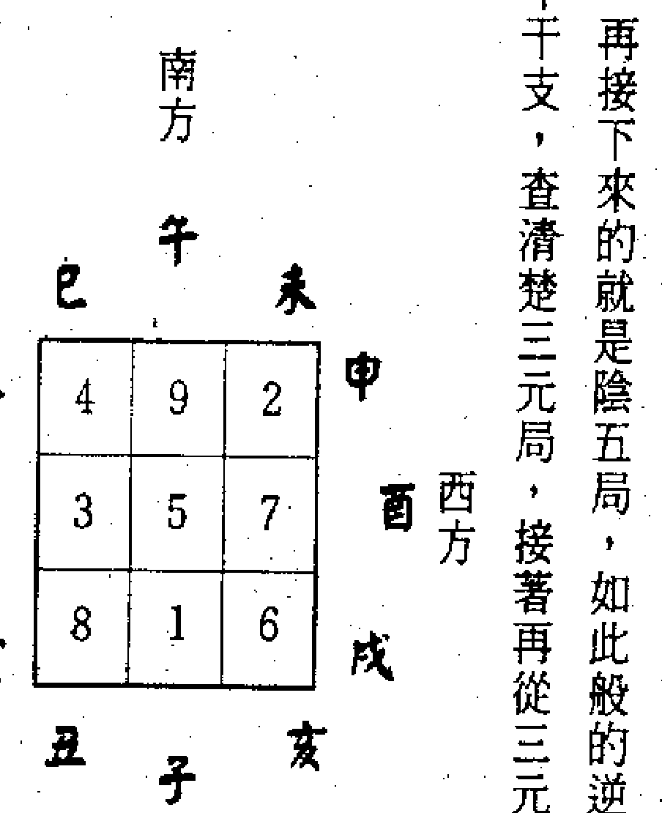

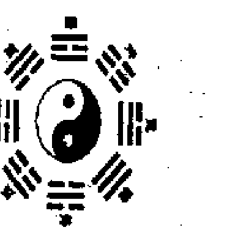

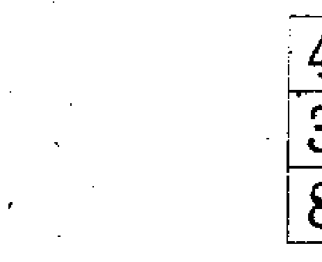

## 奇门遁甲实用法

### 第一章基本常识与排盘法

| 月干支三元 | 癸酉 | 壬申 | 辛未 | 庚午 | 己巳 | 戊辰 | 丁卯 | 丙寅 | 乙丑 | 甲子 |
|------------|------|------|------|------|------|------|------|------|------|------|
| 上元       | 一   | 一   | 一   | 一   | 一   | 一   | 一   | 一   | 五   | 五   |
| 中元       | 四   | 四   | 四   | 四   | 四   | 四   | 四   | 四   | 八   | 八   |
| 下元       | 七   | 七   | 七   | 七   | 七   | 七   | 七   | 七   | 二   | 二   |

| 月干支三元 | 癸未 | 壬午 | 辛巳 | 庚辰 | 己卯 | 戊寅 | 丁丑 | 丙子 | 乙亥 | 甲戌 |
|------------|------|------|------|------|------|------|------|------|------|------|
| 上元       | 九   | 九   | 九   | 九   | 九   | 九   | 九   | 九   | 一   | 一   |
| 中元       | 三   | 三   | 三   | 三   | 三   | 三   | 三   | 三   | 四   | 四   |
| 下元       | 六   | 六   | 六   | 六   | 六   | 六   | 六   | 六   | 七   | 七   |

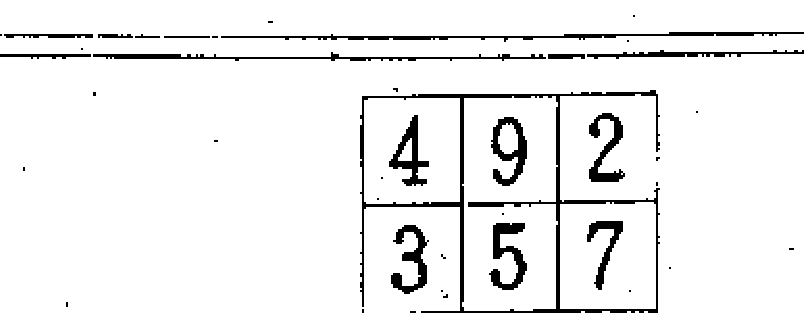

| 年干支 | 组合1 | 组合2 | 组合3 | 组合4 | 组合5 | 组合6 |
|--------|-------|-------|-------|-------|-------|-------|
|        | 甲子乙丑丙寅丁卯戊辰 | 己巳庚午辛未壬申癸酉 | 甲戌乙亥丙子丁丑戊寅 | 己卯庚辰辛巳壬午癸未 | 甲申乙酉丙戌丁亥戊子 | 己丑庚寅辛卯壬辰癸巳 |
| 三元   | 上元 | 中元 | 下元 | 上元 | 中元 | 下元 |

| 年干支 | 组合1 | 组合2 | 组合3 | 组合4 | 组合5 | 组合6 |
|--------|-------|-------|-------|-------|-------|-------|
|        | 甲午乙未丙申丁酉戊戌 | 己亥庚子辛丑壬寅癸卯 | 甲辰乙巳丙午丁未戊申 | 己酉庚戌辛亥壬子癸丑 | 甲寅乙卯丙辰丁巳戊午 | 己未庚申辛酉壬戌癸亥 |
| 三元   | 上元 | 中元 | 下元 | 上元 | 中元 | 下元 |

| 癸丑 | 壬子 | 辛亥 | 庚戌 | 己酉 | 戊申 | 丁未 | 丙午 | 乙巳 | 甲辰 | 月干支三元 |
|------|------|------|------|------|------|------|------|------|------|------------|
| 六   | 六   | 六   | 六   | 六   | 六   | 六   | 六   | 七   | 七   | 上元       |
| 九   | 九   | 九   | 九   | 九   | 九   | 九   | 九   | 一   | 一   | 中元       |
| 三   | 三   | 三   | 三   | 三   | 三   | 三   | 三   | 四   | 四   | 下元       |
|      |      |      |      |      |      |      |      |      |      |            |
| 癸亥 | 壬戌 | 辛酉 | 庚申 | 己未 | 戊午 | 丁巳 | 丙辰 | 乙卯 | 甲寅 | 月干支三元 |
| 五   | 五   | 五   | 五   | 五   | 五   | 五   | 五   | 六   | 六   | 上元       |
| 八   | 八   | 八   | 八   | 八   | 八   | 八   | 八   | 九   | 九   | 中元       |
| 二   | 二   | 二   | 二   | 二   | 二   | 二   | 二   | 三   | 三   | 下元       |

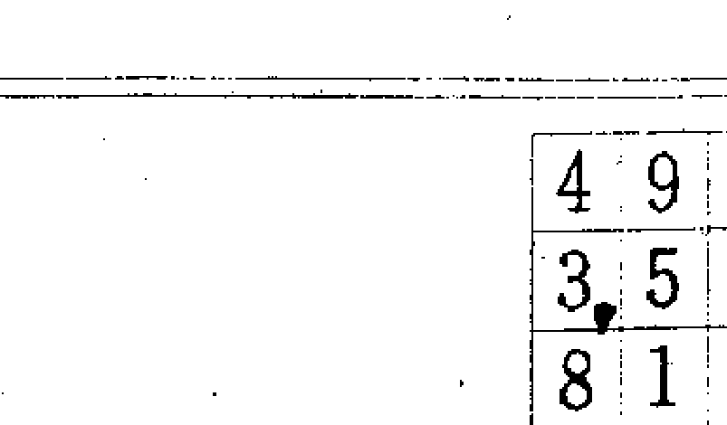

| 癸巳 | 壬辰 | 辛卯 | 庚寅 | 己丑 | 戊子 | 丁亥 | 丙戌 | 乙酉 | 甲申 | 月干支三元 |
|------|------|------|------|------|------|------|------|------|------|------------|
| 八   | 八   | 八   | 八   | 八   | 八   | 八   | 八   | 九   | 九   | 上元       |
| 二   | 二   | 二   | 二   | 二   | 二   | 二   | 二   | 三   | 三   | 中元       |
| 五   | 五   | 五   | 五   | 五   | 五   | 五   | 五   | 六   | 六   | 下元       |
|      |      |      |      |      |      |      |      |      |      |            |
| 癸卯 | 壬寅 | 辛丑 | 庚子 | 己亥 | 戊戌 | 丁酉 | 丙申 | 乙未 | 甲午 | 月干支三元 |
| 七   | 七   | 七   | 七   | 七   | 七   | 七   | 七   | 八   | 八   | 上元       |
| 一   | 一   | 一   | 一   | 一   | 一   | 一   | 一   | 二   | 二   | 中元       |
| 四   | 四   | 四   | 四   | 四   | 四   | 四   | 四   | 五   | 五   | 下元       |

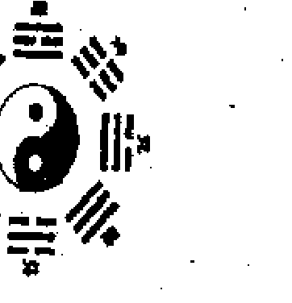

| 日干支 | 甲子 | 乙丑 | 丙寅 | 丁卯 | 戊辰 | 己巳 | 庚午 | 辛未 | 壬申 | 癸酉 |
| :--- | :--- | :--- | :--- | :--- | :--- | :--- | :--- | :--- | :--- | :--- |
| 阳遁上元 | 一 | 二 | 三 | 四 | 五 | 六 | 七 | 八 | 九 | 一 |
| 阳遁中元 | 七 | 八 | 九 | 一 | 二 | 三 | 四 | 五 | 六 | 七 |
| 阳遁下元 | 四 | 五 | 六 | 七 | 八 | 九 | 一 | 二 | 三 | 四 |
| 阴遁上元 | 九 | 八 | 七 | 六 | 五 | 四 | 三 | 二 | 一 | 九 |
| 阴遁中元 | 三 | 二 | 一 | 九 | 八 | 七 | 六 | 五 | 四 | 三 |
| 阴遁下元 | 六 | 七 | 八 | 九 | 一 | 二 | 三 | 四 | 五 | 六 |

| 日干支 | 甲戌 | 乙亥 | 丙子 | 丁丑 | 戊寅 | 己卯 | 庚辰 | 辛巳 | 壬午 | 癸未 |
| :--- | :--- | :--- | :--- | :--- | :--- | :--- | :--- | :--- | :--- | :--- |
| 阳遁上元 | 二 | 三 | 四 | 五 | 六 | 七 | 八 | 九 | 一 | 二 |
| 阳遁中元 | 八 | 九 | 一 | 二 | 三 | 四 | 五 | 六 | 七 | 八 |
| 阳遁下元 | 五 | 六 | 七 | 八 | 九 | 一 | 二 | 三 | 四 | 五 |
| 阴遁上元 | 八 | 七 | 六 | 五 | 四 | 三 | 二 | 一 | 九 | 八 |
| 阴遁中元 | 二 | 一 | 九 | 八 | 七 | 六 | 五 | 四 | 三 | 二 |
| 阴遁下元 | 五 | 六 | 七 | 八 | 九 | 一 | 二 | 三 | 四 | 五 |

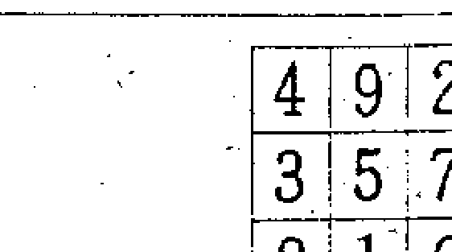

#### 五、日盘的求法：

说明：若为日盘，则分为阴局和阳局两种局。一天为一局，而从最接近冬至的甲子为阳局开始，其甲子日为阳一局，乙丑日为阳二局，丙寅日为阳三局，如此是为阳遁顺行。直到最靠近夏至的癸亥日终止，而接下来的甲子日就算作阴九局，乙丑日为阴八局，如此是为阴遁逆行。不论癸亥日是那一局，反正最接近夏至的甲子日必定是阴九局。凡阴、阳各有一百八十以上的局，因此，算法十分麻烦，故提供下列的方法就比较简单。

- 把最接近冬至的甲子日，当作阳一局，而接着的甲子日为阳七局，再接下来尚有甲子日者，就算作阳一局。
- 一般而言，第四次的甲子日就是最靠近夏至的甲子日，也就是阴九局。不过，有时并不完全是这样。像这种例外的情形就不变，而继续从癸亥接下去。然后在最靠近夏至的甲子日，就作为阴四局，而再接下去的甲子日作为阴三局，又再下一次的甲子日就作为阴六局。如果尚有甲子日，而此甲子日并非最靠近冬至的甲子日时，那么就和阳局的情形同样的从癸亥日接下去。

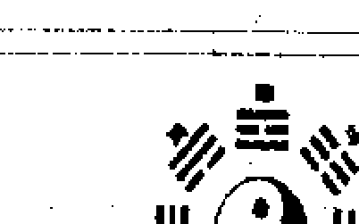

| 癸丑 | 壬子 | 辛亥 | 庚戌 | 己酉 | 戊申 | 丁未 | 丙午 | 乙巳 | 甲辰 | 日干支 | 三元 |
| :---: | :---: | :---: | :---: | :---: | :---: | :---: | :---: | :---: | :---: | :---: | :---: |
| 五 | 四 | 三 | 二 | 一 | 九 | 八 | 七 | 六 | 五 | 上元 | 阳遁 |
| 二 | 一 | 九 | 八 | 七 | 六 | 五 | 四 | 三 | 二 | 中元 | 阳遁 |
| 八 | 七 | 六 | 五 | 四 | 三 | 二 | 一 | 九 | 八 | 下元 | 阳遁 |
| 五 | 六 | 七 | 八 | 九 | 一 | 二 | 三 | 四 | 五 | 上元 | 阴遁 |
| 八 | 九 | 一 | 二 | 三 | 四 | 五 | 六 | 七 | 八 | 中元 | 阴遁 |
| 二 | 三 | 四 | 五 | 六 | 七 | 八 | 九 | 一 | 二 | 下元 | 阴遁 |
| --- | --- | --- | --- | --- | --- | --- | --- | --- | --- | --- | --- |
| 癸亥 | 壬戌 | 辛酉 | 庚申 | 己未 | 戊午 | 丁巳 | 丙辰 | 乙卯 | 甲寅 | 日干支 | 三元 |
| 六 | 五 | 四 | 三 | 二 | 一 | 九 | 八 | 七 | 六 | 上元 | 阳遁 |
| 三 | 二 | 一 | 九 | 八 | 七 | 六 | 五 | 四 | 三 | 中元 | 阳遁 |
| 九 | 八 | 七 | 六 | 五 | 四 | 三 | 二 | 一 | 九 | 下元 | 阳遁 |
| 四 | 五 | 六 | 七 | 八 | 九 | 一 | 二 | 三 | 四 | 上元 | 阴遁 |
| 七 | 八 | 九 | 一 | 二 | 三 | 四 | 五 | 六 | 七 | 中元 | 阴遁 |
| 一 | 二 | 三 | 四 | 五 | 六 | 七 | 八 | 九 | 一 | 下元 | 阴遁 |

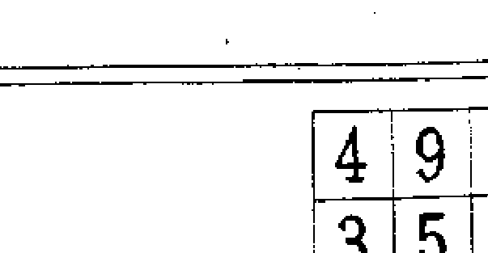

| 癸巳 | 壬辰 | 辛卯 | 庚寅 | 己丑 | 戊子 | 丁亥 | 丙戌 | 乙酉 | 甲申 | 日干支 | 三元 |
| :---: | :---: | :---: | :---: | :---: | :---: | :---: | :---: | :---: | :---: | :---: | :---: |
| 三 | 二 | 一 | 九 | 八 | 七 | 六 | 五 | 四 | 三 | 上元 | 阳遁 |
| 九 | 八 | 七 | 六 | 五 | 四 | 三 | 二 | 一 | 九 | 中元 | 阳遁 |
| 六 | 五 | 四 | 三 | 二 | 一 | 九 | 八 | 七 | 六 | 下元 | 阳遁 |
| 七 | 八 | 九 | 一 | 二 | 三 | 四 | 五 | 六 | 七 | 上元 | 阴遁 |
| 一 | 二 | 三 | 四 | 五 | 六 | 七 | 八 | 九 | 一 | 中元 | 阴遁 |
| 四 | 五 | 六 | 七 | 八 | 九 | 一 | 二 | 三 | 四 | 下元 | 阴遁 |
| --- | --- | --- | --- | --- | --- | --- | --- | --- | --- | --- | --- |
| 癸卯 | 壬寅 | 辛丑 | 庚子 | 己亥 | 戊戌 | 丁酉 | 丙申 | 乙未 | 甲午 | 日干支 | 三元 |
| 四 | 三 | 二 | 一 | 九 | 八 | 七 | 六 | 五 | 四 | 上元 | 阳遁 |
| 一 | 九 | 八 | 七 | 六 | 五 | 四 | 三 | 二 | 一 | 中元 | 阳遁 |
| 七 | 六 | 五 | 四 | 三 | 二 | 一 | 九 | 八 | 七 | 下元 | 阳遁 |
| 六 | 七 | 八 | 九 | 一 | 二 | 三 | 四 | 五 | 六 | 上元 | 阴遁 |
| 九 | 一 | 二 | 三 | 四 | 五 | 六 | 七 | 八 | 九 | 中元 | 阴遁 |
| 三 | 四 | 五 | 六 | 七 | 八 | 九 | 一 | 二 | 三 | 下元 | 阴遁 |# 奇门遁甲实用法
## 第一章 基本常识与排盘法

- △最靠近冬至的甲子时，是从阳一局。
- △最靠近小寒的甲子时，是从阳二局。
- △最靠近大寒的甲子时，是从阳三局。
- △最靠近雨水的甲子时，是从阳四局。
- △最靠近春分的甲子时，是从阳五局。
- △最靠近谷雨的甲子时，是从阳六局。
- △最靠近小满的甲子时，是从阳七局。
- △最靠近夏至的甲子时，是从阴九局。

从一个节气到下一个节气间，共有十五天。其中前五天为上元，中间五天为中元，最后五天为下元。

| 4 | 9 | 2 |
|---|---|---|
| 3 | 5 | 7 |
| 8 | 1 | 6 |

#### 六、时盘的求法：

说明：时盘每十个时辰，即二十小时，为一局。故每五天就有六局，这就叫作一元。依节气而言，起点就有所不同，我们从最靠近节气的甲子时开始。最靠近冬至的甲子时，到癸酉时就当作阳一局，而接下来的就是阳二局，再接下来的就是阳三局。如此每十个时辰，即二十小时就改变一次。也可以说，冬至是从阳一局开始。不过，从靠近小寒的甲子时，就不依上面，乃必定从阳二局开始。如下说明之：承上面，乃必定从阳二局开始。如下说明之：

- △最靠近冬至的甲子时，是从阳一局。
- △最靠近小寒的甲子时，是从阳二局。
- △最靠近大寒的甲子时，是从阳三局。
- △最靠近雨水的甲子时，是从阳四局。
- △最靠近春分的甲子时，是从阳五局。
- △最靠近谷雨的甲子时，是从阳六局。
- △最靠近小满的甲子时，是从阳七局。
- △最靠近夏至的甲子时，是从阴九局。
- △最靠近小暑的甲子时，是从阴八局。
- △最靠近大暑的甲子时，是从阴七局。
- △最靠近立秋的甲子时，是从阴六局。
- △最靠近处暑的甲子时，是从阴五局。
- △最靠近白露的甲子时，是从阴四局。
- △最靠近秋分的甲子时，是从阴三局。
- △最靠近寒露的甲子时，是从阴二局。
- △最靠近霜降的甲子时，是从阴一局。
- △最靠近立冬的甲子时，是从阴九局。
- △最靠近小雪的甲子时，是从阴八局。

# 奇门遁甲实用法
## 第一章 基本常识与排盘法

| 节气 | 谷雨 | 立夏 | 小满 | 芒种 | 夏至 | 小暑 | 大暑 | 立秋 | 时辰干支 |
|------|------|------|------|------|------|------|------|------|----------|
| 三元 |      |      |      |      |      |      |      |      |          |
| 上元 | 五   | 四   | 五   | 六   | 九   | 八   | 七   | 八   | 甲子 乙丑 丙寅 丁卯 戊辰 己巳 庚午 辛未 壬申 癸酉 |
| 上元 | 六   | 五   | 六   | 七   | 八   | 七   | 六   | 七   | 甲戌 乙亥 丙子 丁丑 戊寅 己卯 庚辰 辛巳 壬午 癸未 |
| 上元 | 七   | 六   | 七   | 八   | 七   | 六   | 五   | 六   | 甲申 乙酉 丙戌 丁亥 戊子 己丑 庚寅 辛卯 壬辰 癸巳 |
| 上元 | 八   | 七   | 八   | 九   | 六   | 五   | 四   | 五   | 甲午 乙未 丙申 丁酉 戊戌 己亥 庚子 辛丑 壬寅 癸卯 |
| 上元 | 九   | 八   | 九   | 一   | 五   | 四   | 三   | 四   | 甲辰 乙巳 丙午 丁未 戊申 己酉 庚戌 辛亥 壬子 癸丑 |
| 中元 | 一   | 九   | 一   | 二   | 四   | 三   | 二   | 三   | 甲寅 乙卯 丙辰 丁巳 戊午 己未 庚申 辛酉 壬戌 癸亥 |
| 中元 | 二   | 一   | 二   | 三   | 三   | 二   | 一   | 二   | 甲子 乙丑 丙寅 丁卯 戊辰 己巳 庚午 辛未 壬申 癸酉 |
| 中元 | 三   | 二   | 三   | 四   | 二   | 一   | 九   | 一   | 甲戌 乙亥 丙子 丁丑 戊寅 己卯 庚辰 辛巳 壬午 癸未 |
| 中元 | 四   | 三   | 四   | 五   | 一   | 九   | 八   | 九   | 甲申 乙酉 丙戌 丁亥 戊子 己丑 庚寅 辛卯 壬辰 癸巳 |
| 中元 | 五   | 四   | 五   | 六   | 九   | 八   | 七   | 八   | 甲午 乙未 丙申 丁酉 戊戌 己亥 庚子 辛丑 壬寅 癸卯 |
| 下元 | 六   | 五   | 六   | 七   | 八   | 七   | 六   | 七   | 甲辰 乙巳 丙午 丁未 戊申 己酉 庚戌 辛亥 壬子 癸丑 |
| 下元 | 七   | 六   | 七   | 八   | 七   | 六   | 五   | 六   | 甲寅 乙卯 丙辰 丁巳 戊午 己未 庚申 辛酉 壬戌 癸亥 |
| 下元 | 八   | 七   | 八   | 九   | 六   | 五   | 四   | 五   | 甲子 乙丑 丙寅 丁卯 戊辰 己巳 庚午 辛未 壬申 癸酉 |
| 下元 | 九   | 八   | 九   | 一   | 五   | 四   | 三   | 四   | 甲戌 乙亥 丙子 丁丑 戊寅 己卯 庚辰 辛巳 壬午 癸未 |
| 下元 | 一   | 九   | 一   | 二   | 四   | 三   | 二   | 三   | 甲申 乙酉 丙戌 丁亥 戊子 己丑 庚寅 辛卯 壬辰 癸巳 |

| 4 | 9 | 2 |
|---|---|---|
| 3 | 5 | 7 |
| 8 | 1 | 6 |

# 奇门遁甲实用法
## 第一章 基本常识与排盘法

| 节气 | 冬至 | 小寒 | 大寒 | 立春 | 雨水 | 惊蛰 | 春分 | 清明 | 时辰干支 |
|------|------|------|------|------|------|------|------|------|----------|
| 三元 |      |      |      |      |      |      |      |      |          |
| 上元 | 一   | 二   | 三   | 八   | 九   | 一   | 三   | 四   | 甲子 乙丑 丙寅 丁卯 戊辰 己巳 庚午 辛未 壬申 癸酉 |
| 上元 | 二   | 三   | 四   | 九   | 一   | 二   | 四   | 五   | 甲戌 乙亥 丙子 丁丑 戊寅 己卯 庚辰 辛巳 壬午 癸未 |
| 上元 | 三   | 四   | 五   | 一   | 二   | 三   | 五   | 六   | 甲申 乙酉 丙戌 丁亥 戊子 己丑 庚寅 辛卯 壬辰 癸巳 |
| 上元 | 四   | 五   | 六   | 二   | 三   | 四   | 六   | 七   | 甲午 乙未 丙申 丁酉 戊戌 己亥 庚子 辛丑 壬寅 癸卯 |
| 上元 | 五   | 六   | 七   | 三   | 四   | 五   | 七   | 八   | 甲辰 乙巳 丙午 丁未 戊申 己酉 庚戌 辛亥 壬子 癸丑 |
| 上元 | 六   | 七   | 八   | 四   | 五   | 六   | 八   | 九   | 甲寅 乙卯 丙辰 丁巳 戊午 己未 庚申 辛酉 壬戌 癸亥 |
| 中元 | 七   | 八   | 九   | 五   | 六   | 七   | 九   | 一   | 甲子 乙丑 丙寅 丁卯 戊辰 己巳 庚午 辛未 壬申 癸酉 |
| 中元 | 八   | 九   | 一   | 六   | 七   | 八   | 一   | 二   | 甲戌 乙亥 丙子 丁丑 戊寅 己卯 庚辰 辛巳 壬午 癸未 |
| 中元 | 九   | 一   | 二   | 七   | 八   | 九   | 二   | 三   | 甲申 乙酉 丙戌 丁亥 戊子 己丑 庚寅 辛卯 壬辰 癸巳 |
| 中元 | 一   | 二   | 三   | 八   | 九   | 一   | 三   | 四   | 甲午 乙未 丙申 丁酉 戊戌 己亥 庚子 辛丑 壬寅 癸卯 |
| 中元 | 二   | 三   | 四   | 九   | 一   | 二   | 四   | 五   | 甲辰 乙巳 丙午 丁未 戊申 己酉 庚戌 辛亥 壬子 癸丑 |
| 中元 | 三   | 四   | 五   | 一   | 二   | 三   | 五   | 六   | 甲寅 乙卯 丙辰 丁巳 戊午 己未 庚申 辛酉 壬戌 癸亥 |
| 下元 | 四   | 五   | 六   | 二   | 三   | 四   | 六   | 七   | 甲子 乙丑 丙寅 丁卯 戊辰 己巳 庚午 辛未 壬申 癸酉 |
| 下元 | 五   | 六   | 七   | 三   | 四   | 五   | 七   | 八   | 甲戌 乙亥 丙子 丁丑 戊寅 己卯 庚辰 辛巳 壬午 癸未 |
| 下元 | 六   | 七   | 八   | 四   | 五   | 六   | 八   | 九   | 甲申 乙酉 丙戌 丁亥 戊子 己丑 庚寅 辛卯 壬辰 癸巳 |
| 下元 | 七   | 八   | 九   | 五   | 六   | 七   | 九   | 一   | 甲午 乙未 丙申 丁酉 戊戌 己亥 庚子 辛丑 壬寅 癸卯 |
| 下元 | 八   | 九   | 一   | 六   | 七   | 八   | 一   | 二   | 甲辰 乙巳 丙午 丁未 戊申 己酉 庚戌 辛亥 壬子 癸丑 |

#### 七、九干的取法：

说明：九干的配置，对年盘、月盘、日盘来说都是相同的。不过，要明了配置法之前，首先要知道九干的顺序。

▲ 九干的顺序为，戊、己、庚、辛、壬、癸、丁、丙、乙。这和一般四柱推命学之十天干顺序完全不同，这一点必须多注意。

| 巽己 | 离丁 | 坤乙 |
|---|---|---|
| 震戊 | 中央庚 | 兑壬 |
| 艮癸 | 坎丙 | 乾辛 |

阳三局

| 4 | 9 | 2 |
|---|---|---|
| 3 | 5 | 7 |
| 8 | 1 | 6 |

廿四节气时辰干支表
| 元 | 大雪 | 小雪 | 立冬 | 霜降 | 寒露 | 秋分 | 白露 | 处暑 | 时辰干支 |
|---|---|---|---|---|---|---|---|---|---|
| 上元 | 四 | 五 | 六 | 五 | 六 | 七 | 九 | 一 | 癸壬辛庚己戊丁丙乙甲 酉申未午巳辰卯寅丑子 |
| 上元 | 三 | 四 | 五 | 四 | 五 | 六 | 八 | 九 | 癸壬辛庚己戊丁丙乙甲 未午巳辰卯寅丑子亥戌 |
| 上元 | 二 | 三 | 四 | 三 | 四 | 五 | 七 | 八 | 癸壬辛庚己戊丁丙乙甲 巳辰卯寅丑子亥戌酉申 |
| 上元 | 一 | 二 | 三 | 二 | 三 | 四 | 六 | 七 | 癸壬辛庚己戊丁丙乙甲 卯寅丑子亥戌酉申未午 |
| 上元 | 九 | 一 | 二 | 一 | 二 | 三 | 五 | 六 | 癸壬辛庚己戊丁丙乙甲 丑子亥戌酉申未午巳辰 |
| 上元 | 八 | 九 | 一 | 九 | 一 | 二 | 四 | 五 | 癸壬辛庚己戊丁丙乙甲 亥戌酉申未午巳辰卯寅 |
| 上元 | 七 | 八 | 九 | 八 | 九 | 一 | 三 | 四 | 癸壬辛庚己戊丁丙乙甲 酉申未午巳辰卯寅丑子 |
| 上元 | 六 | 七 | 八 | 七 | 八 | 九 | 二 | 三 | 癸壬辛庚己戊丁丙乙甲 未午巳辰卯寅丑子亥戌 |
| 上元 | 五 | 六 | 七 | 六 | 七 | 八 | 一 | 二 | 癸壬辛庚己戊丁丙乙甲 巳辰卯寅丑子亥戌酉申 |
| 中元 | 四 | 五 | 六 | 五 | 六 | 七 | 九 | 一 | 癸壬辛庚己戊丁丙乙甲 酉申未午巳辰卯寅丑子 |
| 中元 | 三 | 四 | 五 | 四 | 五 | 六 | 八 | 九 | 癸壬辛庚己戊丁丙乙甲 未午巳辰卯寅丑子亥戌 |
| 中元 | 二 | 三 | 四 | 三 | 四 | 五 | 七 | 八 | 癸壬辛庚己戊丁丙乙甲 巳辰卯寅丑子亥戌酉申 |
| 中元 | 一 | 二 | 三 | 二 | 三 | 四 | 六 | 七 | 癸壬辛庚己戊丁丙乙甲 卯寅丑子亥戌酉申未午 |
| 中元 | 九 | 一 | 二 | 一 | 二 | 三 | 五 | 六 | 癸壬辛庚己戊丁丙乙甲 丑子亥戌酉申未午巳辰 |
| 中元 | 八 | 九 | 一 | 九 | 一 | 二 | 四 | 五 | 癸壬辛庚己戊丁丙乙甲 亥戌酉申未午巳辰卯寅 |
| 中元 | 七 | 八 | 九 | 八 | 九 | 一 | 三 | 四 | 癸壬辛庚己戊丁丙乙甲 酉申未午巳辰卯寅丑子 |
| 中元 | 六 | 七 | 八 | 七 | 八 | 九 | 二 | 三 | 癸壬辛庚己戊丁丙乙甲 未午巳辰卯寅丑子亥戌 |
| 中元 | 五 | 六 | 七 | 六 | 七 | 八 | 一 | 二 | 癸壬辛庚己戊丁丙乙甲 巳辰卯寅丑子亥戌酉申 |
| 下元 | 四 | 五 | 六 | 五 | 六 | 七 | 九 | 一 | 癸壬辛庚己戊丁丙乙甲 酉申未午巳辰卯寅丑子 |
| 下元 | 三 | 四 | 五 | 四 | 五 | 六 | 八 | 九 | 癸壬辛庚己戊丁丙乙甲 未午巳辰卯寅丑子亥戌 |
| 下元 | 二 | 三 | 四 | 三 | 四 | 五 | 七 | 八 | 癸壬辛庚己戊丁丙乙甲 巳辰卯寅丑子亥戌酉申 |
| 下元 | 一 | 二 | 三 | 二 | 三 | 四 | 六 | 七 | 癸壬辛庚己戊丁丙乙甲 卯寅丑子亥戌酉申未午 |
| 下元 | 九 | 一 | 二 | 一 | 二 | 三 | 五 | 六 | 癸壬辛庚己戊丁丙乙甲 丑子亥戌酉申未午巳辰 |
| 下元 | 八 | 九 | 一 | 九 | 一 | 二 | 四 | 五 | 癸壬辛庚己戊丁丙乙甲 亥戌酉申未午巳辰卯寅 |
| 下元 | 七 | 八 | 九 | 八 | 九 | 一 | 三 | 四 | 癸壬辛庚己戊丁丙乙甲 酉申未午巳辰卯寅丑子 |
| 下元 | 六 | 七 | 八 | 七 | 八 | 九 | 二 | 三 | 癸壬辛庚己戊丁丙乙甲 未午巳辰卯寅丑子亥戌 |
| 下元 | 五 | 六 | 七 | 六 | 七 | 八 | 一 | 二 | 癸壬辛庚己戊丁丙乙甲 巳辰卯寅丑子亥戌酉申 |

## 第三节 奇门遁甲天盘

1. 先依各局数，而配置不同位的九干。
2. 从干支组求出旬首，而把旬首改为六仪。此六仪叫作天乙，也可以说是甲。
3. 把甲放在干上面。若是年盘则为年干，若是月盘则为月干，若是日盘则为日干，若是时盘则为时干。
4. 其他的干，也可当作甲，并且像旋转的飞星一般的回转着。
5. 旬首或干，即年干、月干、日干、时干等，若在中宫时，就将进入节气所示的方位之九干，拿来代用旬首或年干、月干、日干、时干。

例1：求阳一局，丙寅时的组合：
首先依局数而配置九干。因属阳一局，故戊干要放在坎宫位，而己干就放在坤宫位，庚就放在震宫位，辛就放在巽宫位，壬就放在中宫位，癸就放在乾宫位，丁就放在兑宫位，丙就放在艮宫位，乙就放在离宫位。

#### ▲九干的配置法

| 4 | 9 | 2 |
|---|---|---|
| 3 | 5 | 7 |
| 8 | 1 | 6 |

1. 把戊干放在相当于局数的卦位，即定位数上面。然后再依序放入己、庚、辛、壬、癸、丁、丙、乙。若为阳局，则要顺行。若为阴局，则要逆行。
2. 例：若为阳三局，就把戊干放在三震，而己干就放在四巽，庚干放在五中，辛干放在六乾，壬干放在七赤，癸干放在八艮，丁干放在九离，丙干放在一坎，乙干放在二坤。
3. 例：若为阴三局，戊干就放在三震，乙干就放在四巽，庚干放在一坎，辛干就放在九离，壬干放在八艮，癸干放在七赤，丁干放在六白，丙干放在二坤。

其他干的求法，也按照甲，即戊的作法，而向左边外侧一个个的错开回转置入。即艮宫位置入戊干，震宫位置入丙干，巽宫位置入庚干，离宫位置入辛干，坤宫位置入乙干，兑宫位置入己干，乾宫位置入丁干，坎宫位置入癸干。

那么外侧置入的干，即为天盘。

|   |   |   |
|---|---|---|
| 庚 | 辛 | 乙 |
| 丙 | 壬 | 丁 |
| 戊 | 癸 | 癸 |

| 4 | 9 | 2 |
|---|---|---|
| 3 | 5 | 7 |
| 8 | 1 | 6 |

(2) 从干支求出旬首，因为干支是丙寅，故旬首是甲子。如果改为六仪时，就变成戊。

(3) 接着，把代替甲的戊，放在时干上面，也可以说丙寅时的丙上面。即艮宫位置入戊干。

|   |   |   |
|---|---|---|
| 辛 | 乙 | 己 |
| 庚 | 壬 | 丁 |
| 戊 | 戊 | 癸 |

# 奇门遁甲实用法
## 第一章 基本常识与排盘法

| 4 | 9 | 2 |
|---|---|---|
| 3 | 5 | 7 |
| 8 | 1 | 6 |

例2：求阴九局，戊子时的组合：
(1) 首先依局数而配置九干。因属阴九局，故戊干要放在离宫位，而己干就放在艮宫位，庚就放在兑宫位，辛就放在乾宫位，壬就放在中宫位，癸就放在巽宫位，丁就放在震宫位，丙就放在坤宫位，乙就放在坎宫位。
(2) 从干支求出旬首，因为干支是戊子，故旬首是甲申。如果改为六仪时，就变成庚。

(3) 接着，把代替甲的庚，放在时干的戊上。即离宫位置入庚干。
(4) 其他干的求法，外侧的干也向左错开二格，这就和庚的情形相同。即艮宫位置入癸干，震宫位置入戊干，巽宫位置入丙干，离宫位置入庚干，坤宫位置入辛干，兑宫位置入乙干，乾宫位置入己干，坎宫位置入丁干。

### 第四节 八门的求法

说明：八门者，就是休门、生门、伤门、杜门、景门、死门、惊门、开门。这个顺序必须牢记在心。

八门的顺序如下：休、生、伤、杜、景、死、惊、开。北方坎为休门，东北方艮为生门，东方震为伤门，东南方巽为杜门，南方离为景门，西南方坤为死门，西方兑为惊门，西北方乾为开门。

八门的设置方法如下：

1.  首先要求出年、月、日、时的干支之旬首。
2.  把各旬首换成六仪，并要观察其六仪在此局中是那一个方位。
3.  接着把值使加在旬首的上面，而按照阳顺阴逆的数法，数到其年、月、日、时的干支，如此到了干方之所在处，就是值使的位置。
4.  值使的位置如果决定了，就可按照八门的顺序，而以顺时针方向配置八门。

例3：若为阳六局的戊申日组合：

1.  首先依局数而配置九干。因属阳六局，故戊干要放在乾宫位，而己干就放在兑宫位，庚就放在艮宫位，辛就放在离宫位，壬就放在坎宫位，癸就放在坤宫位，丁就放在震宫位，丙就放在巽宫位，乙就放在中宫位。
2.  从干支求出旬首，因为干支是戊申，故旬首是甲辰。如果改为六仪时，就变成壬。
3.  北方坎为休门，东北方艮为生门，东方震为伤门，东南方巽为杜门，南方离为景门，西南方坤为死门，西方兑为惊门，西北方乾为开门。

（接上页）南方离为景门，西南方坤为死门，西方兑为惊门，西北方乾为开门。

（4）戊申的旬首为甲辰，因六仪为壬，故壬就在坎。结果相当于坎的定位之休门就是值使。

| 4 | 9 | 2 |
|---|---|---|
| 3 | 5 | 7 |
| 8 | 1 | 6 |

| 死门 | 景门 | 杜门 |
|---|---|---|
| 惊门 | | 伤门 |
| 开门 | 休门 | 生门 |

（5）把值使的休门放在坎，因为甲辰为一坎，乙巳为二坤，丙午为三震，丁未为四巽，戊申为五中宫，且是阳局，故要顺行。如此则休门就进入五中。
（6）因为八门不能进入中宫位，故要依照如下的作法。年盘和月盘可以不改变，亦即放在定位。而日盘和时盘就把值使放在相当节气的方位上。如：冬至时就是坎，春分时就是震。
（7）因此，到这里的休门，就进入坎，然后于左转的状况下，生门为艮，伤门为震，杜门为巽，景门为离，死门为坤，惊门为兑，开门为乾。

| 4 | 9 | 2 |
|---|---|---|
| 3 | 5 | 7 |
| 8 | 1 | 6 |

| 丙杜门 | 辛景门 | 癸死门 |
|---|---|---|
| 丁伤门 | 乙 | 己惊门 |
| 庚生门 | 壬休门 | 戊开门 |

| 干支 | 甲戌 | 乙亥 | 丙子 | 丁丑 | 戊寅 | 己卯 | 庚辰 | 辛巳 | 壬午 | 癸未 |
| :--- | :--- | :--- | :--- | :--- | :--- | :--- | :--- | :--- | :--- | :--- |
| 局 | 阴阳 | 阴阳 | 阴阳 | 阴阳 | 阴阳 | 阴阳 | 阴阳 | 阴阳 | 阴阳 | 阴阳 |
| 阳遁 | 死二 | 死三 | 死四 | 死五 | 死六 | 死七 | 死八 | 死九 | 死一 | 死二 |
| | 伤三 | 伤四 | 伤五 | 伤六 | 伤七 | 伤八 | 伤九 | 伤一 | 伤二 | 伤三 |
| | 杜四 | 杜五 | 杜六 | 杜七 | 杜八 | 杜九 | 杜一 | 杜二 | 杜三 | 杜四 |
| | 死五 | 死六 | 死七 | 死八 | 死九 | 死一 | 死二 | 死三 | 死四 | 死五 |
| | 开六 | 开七 | 开八 | 开九 | 开一 | 开二 | 开三 | 开四 | 开五 | 开六 |
| | 惊七 | 惊八 | 惊九 | 惊一 | 惊二 | 惊三 | 惊四 | 惊五 | 惊六 | 惊七 |
| | 生八 | 生九 | 生一 | 生二 | 生三 | 生四 | 生五 | 生六 | 生七 | 生八 |
| | 景九 | 景一 | 景二 | 景三 | 景四 | 景五 | 景六 | 景七 | 景八 | 景九 |
| | 休一 | 休二 | 休三 | 休四 | 休五 | 休六 | 休七 | 休八 | 休九 | 休一 |
| 阴遁 | 景九 | 景一 | 景二 | 景三 | 景四 | 景五 | 景六 | 景七 | 景八 | 景九 |
| | 休一 | 休二 | 休三 | 休四 | 休五 | 休六 | 休七 | 休八 | 休九 | 休一 |
| | 死二 | 死三 | 死四 | 死五 | 死六 | 死七 | 死八 | 死九 | 死一 | 死二 |
| | 伤三 | 伤四 | 伤五 | 伤六 | 伤七 | 伤八 | 伤九 | 伤一 | 伤二 | 伤三 |
| | 杜四 | 杜五 | 杜六 | 杜七 | 杜八 | 杜九 | 杜一 | 杜二 | 杜三 | 杜四 |
| | 生五 | 生六 | 生七 | 生八 | 生九 | 生一 | 生二 | 生三 | 生四 | 生五 |
| | 开六 | 开七 | 开八 | 开九 | 开一 | 开二 | 开三 | 开四 | 开五 | 开六 |
| | 惊七 | 惊八 | 惊九 | 惊一 | 惊二 | 惊三 | 惊四 | 惊五 | 惊六 | 惊七 |
| | 生八 | 生九 | 生一 | 生二 | 生三 | 生四 | 生五 | 生六 | 生七 | 生八 |
| | 景九 | 景一 | 景二 | 景三 | 景四 | 景五 | 景六 | 景七 | 景八 | 景九 |

| 干支 | 甲子 | 乙丑 | 丙寅 | 丁卯 | 戊辰 | 己巳 | 庚午 | 辛未 | 壬申 | 癸酉 |
| :--- | :--- | :--- | :--- | :--- | :--- | :--- | :--- | :--- | :--- | :--- |
| 局 | 阴阳 | 阴阳 | 阴阳 | 阴阳 | 阴阳 | 阴阳 | 阴阳 | 阴阳 | 阴阳 | 阴阳 |
| 阳遁 | 休一 | 休二 | 休三 | 休四 | 休五 | 休六 | 休七 | 休八 | 休九 | 休一 |
| | 死二 | 死三 | 死四 | 死五 | 死六 | 死七 | 死八 | 死九 | 死一 | 死二 |
| | 伤三 | 伤四 | 伤五 | 伤六 | 伤七 | 伤八 | 伤九 | 伤一 | 伤二 | 伤三 |
| | 杜四 | 杜五 | 杜六 | 杜七 | 杜八 | 杜九 | 杜一 | 杜二 | 杜三 | 杜四 |
| | 死五 | 死六 | 死七 | 死八 | 死九 | 死一 | 死二 | 死三 | 死四 | 死五 |
| | 开六 | 开七 | 开八 | 开九 | 开一 | 开二 | 开三 | 开四 | 开五 | 开六 |
| | 惊七 | 惊八 | 惊九 | 惊一 | 惊二 | 惊三 | 惊四 | 惊五 | 惊六 | 惊七 |
| | 生八 | 生九 | 生一 | 生二 | 生三 | 生四 | 生五 | 生六 | 生七 | 生八 |
| | 景九 | 景一 | 景二 | 景三 | 景四 | 景五 | 景六 | 景七 | 景八 | 景九 |
| | 休一 | 休二 | 休三 | 休四 | 休五 | 休六 | 休七 | 休八 | 休九 | 休一 |
| 阴遁 | 死二 | 死三 | 死四 | 死五 | 死六 | 死七 | 死八 | 死九 | 死一 | 死二 |
| | 伤三 | 伤四 | 伤五 | 伤六 | 伤七 | 伤八 | 伤九 | 伤一 | 伤二 | 伤三 |
| | 杜四 | 杜五 | 杜六 | 杜七 | 杜八 | 杜九 | 杜一 | 杜二 | 杜三 | 杜四 |
| | 生五 | 生六 | 生七 | 生八 | 生九 | 生一 | 生二 | 生三 | 生四 | 生五 |
| | 开六 | 开七 | 开八 | 开九 | 开一 | 开二 | 开三 | 开四 | 开五 | 开六 |
| | 惊七 | 惊八 | 惊九 | 惊一 | 惊二 | 惊三 | 惊四 | 惊五 | 惊六 | 惊七 |
| | 生八 | 生九 | 生一 | 生二 | 生三 | 生四 | 生五 | 生六 | 生七 | 生八 |
| | 景九 | 景一 | 景二 | 景三 | 景四 | 景五 | 景六 | 景七 | 景八 | 景九 |

# 奇门遁甲实用法 第一章 基本常识与排盘法

| 干支 | 甲午 | 乙未 | 丙申 | 丁酉 | 戊戌 | 己亥 | 庚子 | 辛丑 | 壬寅 | 癸卯 |
|---|---|---|---|---|---|---|---|---|---|---|
| 局 | 杜四 | 杜五 | 杜六 | 杜七 | 杜八 | 杜九 | 杜一 | 杜二 | 杜三 | 杜四 |
| 阳遁 | 死五 | 死六 | 死七 | 死八 | 死九 | 死一 | 死二 | 死三 | 死四 | 死五 |
| 一 | 开六 | 开七 | 开八 | 开九 | 开一 | 开二 | 开三 | 开四 | 开五 | 开六 |
| 二 | 惊七 | 惊八 | 惊九 | 惊一 | 惊二 | 惊三 | 惊四 | 惊五 | 惊六 | 惊七 |
| 三 | 生八 | 生九 | 生一 | 生二 | 生三 | 生四 | 生五 | 生六 | 生七 | 生八 |
| 四 | 景九 | 景一 | 景二 | 景三 | 景四 | 景五 | 景六 | 景七 | 景八 | 景九 |
| 五 | 休一 | 休二 | 休三 | 休四 | 休五 | 休六 | 休七 | 休八 | 休九 | 休一 |
| 六 | 死二 | 死三 | 死四 | 死五 | 死六 | 死七 | 死八 | 死九 | 死一 | 死二 |
| 七 | 伤三 | 伤四 | 伤五 | 伤六 | 伤七 | 伤八 | 伤九 | 伤一 | 伤二 | 伤三 |
| 八 | 惊七 | 惊八 | 惊九 | 惊一 | 惊二 | 惊三 | 惊四 | 惊五 | 惊六 | 惊七 |
| 阴遁 | 生八 | 生九 | 生一 | 生二 | 生三 | 生四 | 生五 | 生六 | 生七 | 生八 |
| 一 | 景九 | 景一 | 景二 | 景三 | 景四 | 景五 | 景六 | 景七 | 景八 | 景九 |
| 二 | 休一 | 休二 | 休三 | 休四 | 休五 | 休六 | 休七 | 休八 | 休九 | 休一 |
| 三 | 死二 | 死三 | 死四 | 死五 | 死六 | 死七 | 死八 | 死九 | 死一 | 死二 |
| 四 | 伤三 | 伤四 | 伤五 | 伤六 | 伤七 | 伤八 | 伤九 | 伤一 | 伤二 | 伤三 |
| 五 | 杜四 | 杜五 | 杜六 | 杜七 | 杜八 | 杜九 | 杜一 | 杜二 | 杜三 | 杜四 |
| 六 | 生五 | 生六 | 生七 | 生八 | 生九 | 生一 | 生二 | 生三 | 生四 | 生五 |
| 七 | 开六 | 开七 | 开八 | 开九 | 开一 | 开二 | 开三 | 开四 | 开五 | 开六 |

# 奇门遁甲实用法 第二章 基本常识与排盘法

| 干支 | 甲申 | 乙酉 | 丙戌 | 丁亥 | 戊子 | 己丑 | 庚寅 | 辛卯 | 壬辰 | 癸巳 |
|---|---|---|---|---|---|---|---|---|---|---|
| 局 | 伤三 | 伤四 | 伤五 | 伤六 | 伤七 | 伤八 | 伤九 | 伤一 | 伤二 | 伤三 |
| 阳遁 | 杜四 | 杜五 | 杜六 | 杜七 | 杜八 | 杜九 | 杜一 | 杜二 | 杜三 | 杜四 |
| 一 | 死五 | 死六 | 死七 | 死八 | 死九 | 死一 | 死二 | 死三 | 死四 | 死五 |
| 二 | 开六 | 开七 | 开八 | 开九 | 开一 | 开二 | 开三 | 开四 | 开五 | 开六 |
| 三 | 惊七 | 惊八 | 惊九 | 惊一 | 惊二 | 惊三 | 惊四 | 惊五 | 惊六 | 惊七 |
| 四 | 生八 | 生九 | 生一 | 生二 | 生三 | 生四 | 生五 | 生六 | 生七 | 生八 |
| 五 | 景九 | 景一 | 景二 | 景三 | 景四 | 景五 | 景六 | 景七 | 景八 | 景九 |
| 六 | 休一 | 休二 | 休三 | 休四 | 休五 | 休六 | 休七 | 休八 | 休九 | 休一 |
| 七 | 死二 | 死三 | 死四 | 死五 | 死六 | 死七 | 死八 | 死九 | 死一 | 死二 |
| 八 | 生八 | 生九 | 生一 | 生二 | 生三 | 生四 | 生五 | 生六 | 生七 | 生八 |
| 阴遁 | 景九 | 景一 | 景二 | 景三 | 景四 | 景五 | 景六 | 景七 | 景八 | 景九 |
| 一 | 休一 | 休二 | 休三 | 休四 | 休五 | 休六 | 休七 | 休八 | 休九 | 休一 |
| 二 | 死二 | 死三 | 死四 | 死五 | 死六 | 死七 | 死八 | 死九 | 死一 | 死二 |
| 三 | 伤三 | 伤四 | 伤五 | 伤六 | 伤七 | 伤八 | 伤九 | 伤一 | 伤二 | 伤三 |
| 四 | 杜四 | 杜五 | 杜六 | 杜七 | 杜八 | 杜九 | 杜一 | 杜二 | 杜三 | 杜四 |
| 五 | 生五 | 生六 | 生七 | 生八 | 生九 | 生一 | 生二 | 生三 | 生四 | 生五 |
| 六 | 开六 | 开七 | 开八 | 开九 | 开一 | 开二 | 开三 | 开四 | 开五 | 开六 |
| 七 | 惊七 | 惊八 | 惊九 | 惊一 | 惊二 | 惊三 | 惊四 | 惊五 | 惊六 | 惊七 |

# 奇门遁甲实用法 第一章 基本常识与排盘法

| 干支 | 癸亥 | 壬戌 | 辛酉 | 庚申 | 己未 | 戊午 | 丁巳 | 丙辰 | 乙卯 | 甲寅 |
| :--- | :--- | :--- | :--- | :--- | :--- | :--- | :--- | :--- | :--- | :--- |
| 阳遁一 | 开六 | 开五 | 开四 | 开三 | 开二 | 开一 | 开九 | 开八 | 开七 | 开六 |
| | 惊七 | 惊六 | 惊五 | 惊四 | 惊三 | 惊二 | 惊一 | 惊九 | 惊八 | 惊七 |
| | 生八 | 生七 | 生六 | 生五 | 生四 | 生三 | 生二 | 生一 | 生九 | 生八 |
| | 景九 | 景八 | 景七 | 景六 | 景五 | 景四 | 景三 | 景二 | 景一 | 景九 |
| | 休一 | 休九 | 休八 | 休七 | 休六 | 休五 | 休四 | 休三 | 休二 | 休一 |
| | 死二 | 死一 | 死九 | 死八 | 死七 | 死六 | 死五 | 死四 | 死三 | 死二 |
| | 伤三 | 伤二 | 伤一 | 伤九 | 伤八 | 伤七 | 伤六 | 伤五 | 伤四 | 伤三 |
| | 杜四 | 杜三 | 杜二 | 杜一 | 杜九 | 杜八 | 杜七 | 杜六 | 杜五 | 杜四 |
| | 死五 | 死四 | 死三 | 死二 | 死一 | 死九 | 死八 | 死七 | 死六 | 死五 |
| 阴遁一 | 生五 | 生六 | 生七 | 生八 | 生九 | 生一 | 生二 | 生三 | 生四 | 生五 |
| | 开六 | 开七 | 开八 | 开九 | 开一 | 开二 | 开三 | 开四 | 开五 | 开六 |
| | 惊七 | 惊八 | 惊九 | 惊一 | 惊二 | 惊三 | 惊四 | 惊五 | 惊六 | 惊七 |
| | 生八 | 生九 | 生一 | 生二 | 生三 | 生四 | 生五 | 生六 | 生七 | 生八 |
| | 景九 | 景一 | 景二 | 景三 | 景四 | 景五 | 景六 | 景七 | 景八 | 景九 |
| | 休一 | 休二 | 休三 | 休四 | 休五 | 休六 | 休七 | 休八 | 休九 | 休一 |
| | 死二 | 死三 | 死四 | 死五 | 死六 | 死七 | 死八 | 死九 | 死一 | 死二 |
| | 伤三 | 伤四 | 伤五 | 伤六 | 伤七 | 伤八 | 伤九 | 伤一 | 伤二 | 伤三 |
| | 杜四 | 杜五 | 杜六 | 杜七 | 杜八 | 杜九 | 杜一 | 杜二 | 杜三 | 杜四 |

# 奇门遁甲实用法 第一章 基本常识与排盘法

| 干支 | 癸丑 | 壬子 | 辛亥 | 庚戌 | 己酉 | 戊申 | 丁未 | 丙午 | 乙巳 | 甲辰 |
| :--- | :--- | :--- | :--- | :--- | :--- | :--- | :--- | :--- | :--- | :--- |
| 阳遁一 | 死五 | 死四 | 死三 | 死二 | 死一 | 死九 | 死八 | 死七 | 死六 | 死五 |
| | 开六 | 开五 | 开四 | 开三 | 开二 | 开一 | 开九 | 开八 | 开七 | 开六 |
| | 惊七 | 惊六 | 惊五 | 惊四 | 惊三 | 惊二 | 惊一 | 惊九 | 惊八 | 惊七 |
| | 生八 | 生七 | 生六 | 生五 | 生四 | 生三 | 生二 | 生一 | 生九 | 生八 |
| | 景九 | 景八 | 景七 | 景六 | 景五 | 景四 | 景三 | 景二 | 景一 | 景九 |
| | 休一 | 休九 | 休八 | 休七 | 休六 | 休五 | 休四 | 休三 | 休二 | 休一 |
| | 死二 | 死一 | 死九 | 死八 | 死七 | 死六 | 死五 | 死四 | 死三 | 死二 |
| | 伤三 | 伤二 | 伤一 | 伤九 | 伤八 | 伤七 | 伤六 | 伤五 | 伤四 | 伤三 |
| | 杜四 | 杜三 | 杜二 | 杜一 | 杜九 | 杜八 | 杜七 | 杜六 | 杜五 | 杜四 |
| 阴遁一 | 开六 | 开七 | 开八 | 开九 | 开一 | 开二 | 开三 | 开四 | 开五 | 开六 |
| | 惊七 | 惊八 | 惊九 | 惊一 | 惊二 | 惊三 | 惊四 | 惊五 | 惊六 | 惊七 |
| | 生八 | 生九 | 生一 | 生二 | 生三 | 生四 | 生五 | 生六 | 生七 | 生八 |
| | 景九 | 景一 | 景二 | 景三 | 景四 | 景五 | 景六 | 景七 | 景八 | 景九 |
| | 休一 | 休二 | 休三 | 休四 | 休五 | 休六 | 休七 | 休八 | 休九 | 休一 |
| | 死二 | 死三 | 死四 | 死五 | 死六 | 死七 | 死八 | 死九 | 死一 | 死二 |
| | 伤三 | 伤四 | 伤五 | 伤六 | 伤七 | 伤八 | 伤九 | 伤一 | 伤二 | 伤三 |
| | 杜四 | 杜五 | 杜六 | 杜七 | 杜八 | 杜九 | 杜一 | 杜二 | 杜三 | 杜四 |
| | 生五 | 生六 | 生七 | 生八 | 生九 | 生一 | 生二 | 生三 | 生四 | 生五 |## 奇门遁甲实用法

### 第一章 基本常识与排盘法

| 阴阳遁 | 行号 | 干支 | 九星 |
| :--- | :--- | :--- | :--- |
| 阳遁 | 一 | 癸亥 壬子 辛丑 庚寅 己卯 戊辰 | 天蓬 |
| 阳遁 | 二 | 甲子 甲寅 甲辰 甲午 甲申 甲戌 | 天芮 |
| 阳遁 | 三 | 乙丑 乙卯 乙巳 乙未 乙酉 乙亥 | 天冲 |
| 阳遁 | 四 | 丙寅 丙辰 丙午 丙申 丙戌 丙子 | 天辅 |
| 阳遁 | 五 | 丁卯 丁巳 丁未 丁酉 丁亥 丁丑 | 天禽 |
| 阳遁 | 六 | 戊辰 戊午 戊申 戊戌 戊子 戊寅 | 天心 |
| 阳遁 | 七 | 己巳 己未 己酉 己亥 己丑 己卯 | 天柱 |
| 阳遁 | 八 | 庚午 庚申 庚戌 庚子 庚寅 庚辰 | 天任 |
| 阳遁 | 九 | 辛未 辛酉 辛亥 辛丑 辛卯 辛巳 | 天英 |
| 阴遁 | 一 | | 天蓬 |
| 阴遁 | 二 | | 天芮 |
| 阴遁 | 三 | | 天冲 |
| 阴遁 | 四 | | 天辅 |
| 阴遁 | 五 | | 天禽 |
| 阴遁 | 六 | | 天心 |
| 阴遁 | 七 | | 天柱 |
| 阴遁 | 八 | | 天任 |
| 阴遁 | 九 | | 天英 |

| 4 | 9 | 2 |
| :--- | :--- | :--- |
| 3 | 5 | 7 |
| 8 | 1 | 6 |

### 第五节 局盘的组合

#### 一、九星的求法

说明：九星的顺序为：天蓬，天芮、天冲、天任、天辅、天禽、天心、天柱、天英。

| 天辅 | 天英 | 天芮 |
| :--- | :--- | :--- |
| 天冲 | 天禽 | 天柱 |
| 天任 | 天蓬 | 天心 |

## 奇门遁甲实用法

### 第一章 基本常识与排盘法

| 阴阳遁 | 九星 | 干支 | 癸壬辛丁丙乙 卯午未酉午卯 | 癸壬戊丁丙乙 酉申午亥申巳 |
| :--- | :--- | :--- | :--- | :--- |
| 阳遁 | 天蓬 | | 四 | 五 |
| | 天芮 | | 五 | 六 |
| | 天冲 | | 六 | 七 |
| | 天辅 | | 七 | 八 |
| | 天禽 | | 八 | 九 |
| | 天心 | | 九 | 一 |
| | 天柱 | | 一 | 二 |
| | 天任 | | 二 | 三 |
| | 天英 | | 三 | 四 |
| 阴遁 | 天蓬 | | 七 | 六 |
| | 天芮 | | 八 | 七 |
| | 天冲 | | 九 | 八 |
| | 天辅 | | 一 | 九 |
| | 天禽 | | 二 | 一 |
| | 天心 | | 三 | 二 |
| | 天柱 | | 四 | 三 |
| | 天任 | | 五 | 四 |
| | 天英 | | 六 | 五 |

| 阴阳遁 | 九星 | 干支 | 癸壬辛庚己丁 巳寅卯辰巳巳 | 癸壬辛庚丁丙 卯辰巳午未辰 |
| :--- | :--- | :--- | :--- | :--- |
| 阳遁 | 天蓬 | | 二 | 三 |
| | 天芮 | | 三 | 四 |
| | 天冲 | | 四 | 五 |
| | 天辅 | | 五 | 六 |
| | 天禽 | | 六 | 七 |
| | 天心 | | 七 | 八 |
| | 天柱 | | 八 | 九 |
| | 天任 | | 九 | 一 |
| | 天英 | | 一 | 二 |
| 阴遁 | 天蓬 | | 九 | 八 |
| | 天芮 | | 一 | 九 |
| | 天冲 | | 二 | 一 |
| | 天辅 | | 三 | 二 |
| | 天禽 | | 四 | 三 |
| | 天心 | | 五 | 四 |
| | 天柱 | | 六 | 五 |
| | 天任 | | 七 | 六 |
| | 天英 | | 八 | 七 |

## 奇门遁甲实用法

### 第一章 基本常识与排盘法

| 壬辛庚己戊乙戌亥子丑寅丑 | 辛庚己戊丙乙酉戌亥子寅亥 | 干支九星 | 阴阳遁 |
| :--- | :--- | :--- | :--- |
| 九 | 八 | 天蓬 | 阳遁 |
| 一 | 九 | 天芮 |  |
| 二 | 一 | 天冲 |  |
| 三 | 二 | 天辅 |  |
| 四 | 三 | 天禽 |  |
| 五 | 四 | 天心 |  |
| 六 | 五 | 天柱 |  |
| 七 | 六 | 天任 |  |
| 八 | 七 | 天英 |  |
| 二 | 三 | 天蓬 | 阴遁 |
| 三 | 四 | 天芮 |  |
| 四 | 五 | 天冲 |  |
| 五 | 六 | 天辅 |  |
| 六 | 七 | 天禽 |  |
| 七 | 八 | 天心 |  |
| 八 | 九 | 天柱 |  |
| 九 | 一 | 天任 |  |
| 一 | 二 | 天英 |  |

| 庚己戊丁丙乙申酉戌卯子酉 | 癸己戊丁丙乙未未申丑戌未 | 干支九星 | 阴阳遁 |
| :--- | :--- | :--- | :--- |
| 七 | 六 | 天蓬 | 阳遁 |
| 八 | 七 | 天芮 |  |
| 九 | 八 | 天冲 |  |
| 一 | 九 | 天辅 |  |
| 二 | 一 | 天禽 |  |
| 三 | 二 | 天心 |  |
| 四 | 三 | 天柱 |  |
| 五 | 四 | 天任 |  |
| 六 | 五 | 天英 |  |
| 四 | 五 | 天蓬 | 阴遁 |
| 五 | 六 | 天芮 |  |
| 六 | 七 | 天冲 |  |
| 七 | 八 | 天辅 |  |
| 八 | 九 | 天禽 |  |
| 九 | 一 | 天心 |  |
| 一 | 二 | 天柱 |  |
| 二 | 三 | 天任 |  |
| 三 | 四 | 天英 |  |

# 奇門遁甲實用法

## 第一章 基本常識與排盤法

#### ▲九星配置法：

(1) 先要求出年、月、日、時的干支之旬首。如：丙寅的旬首為甲子。
(2) 當旬首求出後，接著把相當旬首的六儀找出來。如：甲戌六儀為己，甲辰為壬等。
(3) 把六儀位置上的九星，作為天直符而加在其年、月、日、時的天干地方。加上後就按照星的順序排列即可。

例4：中元乙巳年，求年盤：
(1) 首先查知乙巳年三元為八白，故就是陰八局。
(2) 九干的配置：
坤宮為丁，兌宮為己，乾宮為庚，
離宮為乙，中宮為辛，坎宮為丙，
巽宮為壬，震宮為癸，艮宮為戊。
(3) 依局而把干定下來之後，就要求出干支的旬首。乙巳的旬首為甲辰，又甲辰的六儀為壬。
(4) 北方坎為休門，東北方艮為生門，東方震為傷門，東南方巽為杜門，南方離為景門，西南方坤為死門，西方兌為驚門，西北方乾為休門。
(5) 九星者，天蓬，天芮、天沖、天任、天輔、天禽、天心、天柱、天英。
(6) 如果是在陰八局，那麼安排於巽的九星就是天輔星。
(7) 天輔星就為天直符，而乙巳的乙就在九離位，故把天輔星放在離位，又把天禽配置於坎，天心配置於坤，天柱就配置於震。

| 天丁坤 | 天乙輔離 | 天壬巽 |
| 天己芮兌 | 天辛英 | 天癸柱震 |
| 天庚蓬乾 | 天丙禽坎 | 天戊沖艮 |

| 4 | 9 | 2 |
| 3 | 5 | 7 |
| 8 | 1 | 6 |

| 符直 | 蛇膨 | 太陰 | 六合 | 陳勾 | 朱雀 | 地九 | 天九 |
| 坎 | 艮 | 兌 | 乾 | 巽 | 震 | 坤 | 坎 |
| 坤 | 震 | 乾 | 坎 | 離 | 巽 | 兌 | 艮 |
| 兌 | 巽 | 坎 | 艮 | 坤 | 離 | 乾 | 震 |
| 乾 | 離 | 艮 | 震 | 兌 | 坤 | 坎 | 巽 |
| 坎 | 坤 | 震 | 巽 | 乾 | 兌 | 艮 | 離 |
| 艮 | 兌 | 巽 | 離 | 坎 | 乾 | 震 | 坤 |
| 震 | 乾 | 離 | 坤 | 艮 | 坎 | 巽 | 兌 |
| 巽 | 坎 | 坤 | 兌 | 震 | 艮 | 離 | 乾 |

| 符直 | 天膨 | 太地 | 六雀 | 陳勾 | 朱合 | 陰九 | 蛇九 |
| 坎 | 艮 | 兌 | 乾 | 巽 | 震 | 坎 | 坎 |
| 坤 | 震 | 乾 | 坎 | 離 | 巽 | 兌 | 艮 |
| 兌 | 巽 | 坎 | 艮 | 坤 | 離 | 乾 | 震 |
| 乾 | 離 | 艮 | 震 | 兌 | 坤 | 坎 | 巽 |
| 坎 | 坤 | 震 | 巽 | 乾 | 兌 | 艮 | 離 |
| 艮 | 兌 | 巽 | 離 | 坎 | 乾 | 震 | 坤 |
| 震 | 乾 | 離 | 坤 | 艮 | 坎 | 巽 | 兌 |
| 巽 | 坎 | 坤 | 兌 | 震 | 艮 | 離 | 乾 |

# 奇門遁甲實用法

## 第一章 基本常識與排盤法

## 奇门遁甲实用法

### 第一章基本常识与排盘法

#### 三、九宫的求法

【年盘的九宫】：说明：就是把和局同样的数之宫放在五中。如阴八局的年，就是八白进入五中，而九紫在六乾，一白在七兑，二黑在八艮。八白进入五中的年，就叫作八白之年。

| 螣蛇 壬七 | 直符 乙三 | 九天 丁五 |
| 太阴 癸六 | 辛八 | 九地 己一 |
| 戊二 | 勾陈 丙四 | 朱雀 庚九 |

## 奇门遁甲实用法

### 第一章基本常识与排盘法

| 4 | 9 | 2 |
| 3 | 5 | 7 |
| 8 | 1 | 6 |

#### 二、八神的求法

八神的配法，是最简单的，也就是把直符加在年、月、日、时等的干上面，并按照直符、螣蛇、太阴、六合、勾陈、朱雀、九地、九天的顺序，阳局就左转，阴局就右转的状态下配佈。

▲如果天直符在五中就和八门相同，阳局从坤开始，而阴局从艮开始。

例：乙巳年阴八局

| 寅申巳亥 | 丑未辰戌 | 子午卯酉 | 年支 |
| :---: | :---: | :---: | :---: |
| 三 | 六 | 九 | 寅 |
| 二 | 五 | 八 | 卯 |
| 一 | 四 | 七 | 辰 |
| 九 | 三 | 六 | 巳 |
| 八 | 二 | 五 | 午 |
| 七 | 一 | 四 | 未 |
| 六 | 九 | 三 | 申 |
| 五 | 八 | 二 | 酉 |
| 四 | 七 | 一 | 戌 |
| 三 | 六 | 九 | 亥 |
| 二 | 五 | 八 | 子 |
| 一 | 四 | 七 | 丑 |

| 4 | 9 | 2 |
| :---: | :---: | :---: |
| 3 | 5 | 7 |
| 8 | 1 | 6 |

| 阴局 | | | 阳局 | | | 日支 |
| :---: | :---: | :---: | :---: | :---: | :---: | :---: |
| 寅申巳亥 | 丑未辰戌 | 子午卯酉 | 寅申巳亥 | 丑未辰戌 | 子午卯酉 | 时支 |
| 三 | 六 | 九 | 七 | 四 | 一 | 子 |
| 二 | 五 | 八 | 八 | 五 | 二 | 丑 |
| 一 | 四 | 七 | 九 | 六 | 三 | 寅 |
| 九 | 三 | 六 | 一 | 七 | 四 | 卯 |
| 八 | 二 | 五 | 二 | 八 | 五 | 辰 |
| 七 | 一 | 四 | 三 | 九 | 六 | 巳 |
| 六 | 九 | 三 | 四 | 一 | 七 | 午 |
| 五 | 八 | 二 | 五 | 二 | 八 | 未 |
| 四 | 七 | 一 | 六 | 三 | 九 | 申 |
| 三 | 六 | 九 | 七 | 四 | 一 | 酉 |
| 二 | 五 | 八 | 八 | 五 | 二 | 戌 |
| 一 | 四 | 七 | 九 | 六 | 三 | 亥 |

## 奇门遁甲实用法

### 第一章基本常识与排盘法

【时盘的九宫】：

说明：时盘依阴局或阳局而互不相同。

- (1) 若阳局则从子日子时而以一白时开始，而丑时为二黑时，寅时为三碧时，如此每一时都顺行。
- (2) 若阴局则从子日子时而以九紫时开始，而丑时为八白时，寅时为七赤时，如此每一时都要逆行。
- (3) 阳局要顺行：
  - ▲子、午、卯、酉日，为一时从子时开始。
  - ▲丑、未、辰、戌日，为四绿时从子时开始。
  - ▲寅、申、巳、亥日，为七赤时从子时开始。
- (4) 阴局要逆行：
  - ▲子、午、卯、酉日，为九紫时从子时开始。
  - ▲丑、未、辰、戌日，为六白时从子时开始。
  - ▲寅、申、巳、亥日，为三碧时从子时开始。

## 奇门遁甲实用法

### 第一章基本常识与排盘法

| 4 | 9 | 2 |
| 3 | 5 | 7 |
| 8 | 1 | 6 |

【月盘的九宫】：

说明：日盘的九宫，就不论阴阳局而全部把相当局数的九宫放入五中。也就是阴八局或阳八日的日子，就全部变成八白之日。

- ▲子、午、卯、酉之年，就把八白配置在寅月而开始。
- ▲丑、未、辰、戌之年，就把五黄配置在寅月而开始。
- ▲寅、申、巳、亥之年，就把二黑配置在寅月而开始。

## 第二章 奇门遁甲应用技巧

| 4 | 9 | 2 |
| :--- | :--- | :--- |
| 3 | 5 | 7 |
| 8 | 1 | 6 |

| 日干 钟点时间 | 甲己日 | 乙庚日 | 丙辛日 | 丁壬日 | 戊癸日 |
| :--- | :--- | :--- | :--- | :--- | :--- |
| 0时至1时 | 甲子 | 丙子 | 戊子 | 庚子 | 壬子 |
| 1时至3时 | 乙丑 | 丁丑 | 己丑 | 辛丑 | 癸丑 |
| 3时至5时 | 丙寅 | 戊寅 | 庚寅 | 壬寅 | 甲寅 |
| 5时至7时 | 丁卯 | 己卯 | 辛卯 | 癸卯 | 乙卯 |
| 7时至9时 | 戊辰 | 庚辰 | 壬辰 | 甲辰 | 丙辰 |
| 9时至11时 | 己巳 | 辛巳 | 癸巳 | 乙巳 | 丁巳 |
| 11时至13时 | 庚午 | 壬午 | 甲午 | 丙午 | 戊午 |
| 13时至15时 | 辛未 | 癸未 | 乙未 | 丁未 | 己未 |
| 15时至17时 | 壬申 | 甲申 | 丙申 | 戊申 | 庚申 |
| 17时至19时 | 癸酉 | 乙酉 | 丁酉 | 己酉 | 辛酉 |
| 19时至21时 | 甲戌 | 丙戌 | 戊戌 | 庚戌 | 壬戌 |
| 21时至23时 | 乙亥 | 丁亥 | 己亥 | 辛亥 | 癸亥 |
| 23时至24时 | 丙子 | 戊子 | 庚子 | 壬子 | 甲子 |
| 备注 (早子/夜子) | 早子: 壬子 | 早子: 庚子 | 早子: 戊子 | 早子: 丙子 | 早子: 甲子 |
| | 夜子: 甲子 | 夜子: 壬子 | 夜子: 庚子 | 夜子: 戊子 | 夜子: 丙子 |

# 奇門遁甲實用法

### 第二章 奇門遁甲應用技巧

奇門遁甲，可以達成各種立場所要獲得的希望及目的，因此，奇門遁甲具有無往而不利的力量。其功能特色乃在於使用的每一個瞬間中，都會出現一些獨特效果，使自己的意志及期望，能出人意料地通行無阻達成目的。奇門遁甲應用技巧得注意如下原則：

- ▲一、使用奇門遁甲，首先必須確認用途，決定使用目的。因為根據目的及分類不同，則奇門遁甲所賦予的暗示也有所不同，而且有些法則是衝突的。
- ▲二、奇門遁甲應用，要決定使用的盤。我們一般常用為日盤和時盤兩種。一般而言，因為日盤和時盤是完全不同的，所以一定要很明白的決定用那一種盤。大體而言，要推斷的事情是有關兩個小時以上的就要用日盤，是有關兩個小時以內的事情就用時盤。

| 4 | 9 | 2 |
| 3 | 5 | 7 |
| 8 | 1 | 6 |

# 奇門遁甲實用法

### 第二章 奇門遁甲應用技巧

屬西南、兌屬西，然後在所作出的立向盤上，根據那個方位角做記號，方便排盤論吉凶。總之，以自己現在的位置為中心，論四周方位。例如：目的是生意買賣，使用的是日盤，日子是一九九七年四月廿七日，庚子日，經推算為陽七局。一坎為辛，二坤為壬，三震為癸，四巽為丁，五中為丙，六乾為乙，七赤為戊，八艮為己，九離為庚。六儀為辛。如

- ▲四、在沒有決定方位和日時的情形下，因為可以自由地選擇方位，所以首先您用當時的日子或時辰來作盤，然後從本書所論述的吉凶例中，找出對自己有利的方位，向這方位進行本身想行動的事，即可無往不利了。

五、奇門遁甲應用時間的測定：(1) 奇門遁甲應用時間的測定，時間是以行為動機開始發動為基準。即當時想達成目的而出發的那一瞬間。例如：在台北市東區的一個人，要在下午三點鐘到板橋市的一家公司洽談生意買賣。交通條件考慮在內，這個人在下午一點鐘從台北市東區出發，那麼下午二點鐘就是奇門遁甲在作盤上所用的時間。使用奇門遁甲的時盤，是以兩個小時為單位輪流變換的。因此，如果事情延至三小時或四小時的話，則事情會受到不同暗示的影響。要很完美的發揮奇門遁甲的功效的話，應該盡可能在兩個小時之內完成事情。若事情發生將超過二小時以上的情形時，就必須採用日盤來判斷了！

(2) 奇門遁甲應用方位的測定：我們按照自己的目的，採用自己行動的方位，可是在實際情況裡，無論如何行動，其行為方向不太可能成一直線進行之情形是常有的。所以說，只要不在其他地點作長時間之逗留的話，是沒有關係的。如前例：從台北市東區向板橋市出發，卻可能非直線而繞道經由其他的地方。這種情形下，通常以最後向板橋市出發的地點和時間為基準。如果為了某事從台北市東區出發到板橋市，途中首先經過永和市，然後在中和市逗留，最後從中和市向板橋市行動，這最後出發的地點和時間乃是作盤的基準，就方位而言，雖然台北市東區到板橋市的方向是西南方，但是從中和市到板橋市其方位卻是西方。

- ▲六、假如約談事情的時候，在奇門遁甲應用上，如果對方所指定的時間和所指定的地點都是方位盤上所顯示的凶方，即壞的方位時，事情就不好辦了。因此，我們必須在奇門遁甲應用技巧上，把壞的方位改變為好的方位才是。

# 奇門遁甲實用法

### 第二章 奇門遁甲應用技巧

| 4 | 9 | 2 |
| 3 | 5 | 7 |
| 8 | 1 | 6 |## 第三章 掌握升等與考試秘招

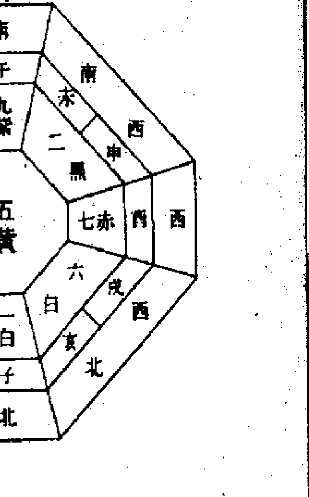

## 第二章 奇門遁甲應用技巧

| | | |
|---|---|---|
| 4 | 9 | 2 |
| 3 | 5 | 7 |
| 8 | 1 | 6 |

其辦法是，例如：我們拿從台北市東區出發到板橋市的情形來討論，以台北市東區為中心基準，到板橋市的方位是西南方，假如西南方剛好是兇方的話，就暫且先到別的地方去，這時就要研究一下先到永和市。

再以永和市為中心基準，排出究竟要從哪個方向走才是吉利方，我們就先到那個吉方的場所逗留一下就好了。倘若根據日之當時，立向盤所顯示知道西方才是吉方，於是我們知道要先到中和市，只要先到中和市逗留一些時間，然後向西方出發往板橋市就可以了。

如果是利用日盤以日為單位的吉方位時，只要在當日的前一天，在中和市停留過夜一天，隔日出發即可。如果是利用時盤以兩小時為單位時，只要在吉時前，先到中和市逗留一、兩個鐘頭，然後再向板橋市出發移動，這時它本來的兇意就完全消除了。

| 4 | 9 | 2 |
|---|---|---|
| 3 | 5 | 7 |
| 8 | 1 | 6 |

### 第一节 使用奇门遁甲盘之目的

- 本章在介绍使用奇门遁甲盘，帮助我们在入学考试，就业及职业升等考试，国家检定考试，公职人员普通考试，特等考试，专业技能考试等，发挥更大的实力及好运气，使考试及格能上榜录取。
- 使用奇门遁甲盘，可让想要通过严格而危险的入学考试，或职业考试有非常好的胜券效果。尤其是考试已经很有把握，但是最低录取标准太高，心里有压力担心考不上，最宜使用奇门遁甲盘。
- 对于入考场总是会怯场，而无法充分发挥实力者，或笔试非常有自信，而不擅于面试者，及个人实力条件不太充分，又必须参加考试的时候，使用奇门遁甲盘将可帮助化解危机。
- 一般考试，多半早已决定考场和时间，假如当时的考场对您是凶方的话，岂不是就不要参加考试了，那么请您放心，这是没问题的。假如从自己的家为中心来看，发觉考场和日时是凶方的时候，那么我们可以事先移居到考场是当地吉方的地方。也就是预先作出考试当天的奇门遁甲立向盘，核对哪个方位对参加考试最好，那么在考试的前一天，就住到此方位的地方最好。

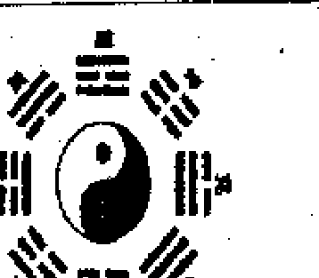

例如：考试当日的最吉方位是南方，您在考试的前一天就住到考场的北方，自然当天考试就向南方应试，必然胜券在握。

- 如果使用奇门遁甲盘之吉方，首先将使您头脑运转灵活，所默记的东西如泉涌般的答出来，回答应用问题的时候，能够发挥比平常还高的实力或效果。总之，会使人专心一念，充分发挥实力潜能，及临场的稳定感。
- 如果考试时间超过二个小时以上的情形，则要以日盘为主，时盘为辅来使用。

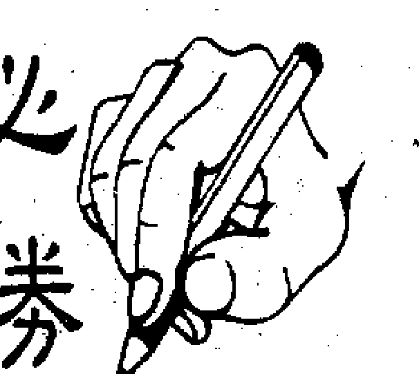

| 4 | 9 | 2 |
|---|---|---|
| 3 | 5 | 7 |
| 8 | 1 | 6 |

### 第二節 天地盤天干比對吉凶

- 1. 【吉】：天盤為甲，而地盤也為甲的情況，就叫作，雙木成林格。使用本方位的升等與考試，由於會產生很大的積極性，所以會稍稍有焦慮，但是一定能發揮實力。在有關政府所辦的考試，或入學考試將有很好的成績。
- 2. 【吉】：天盤為甲，而地盤為乙的情況，就叫作，藤蘿絆木格。使用本方位的升等與考試，考試本身的成績，也許沒有如自己所望的理想，但是由人際關係或長輩意外的提拔，將獲得良好結果。
- 3. 【吉】：天盤為甲，而地盤為丙的情況，就叫作，青龍返首格。使用本方位的升等與考試，可因禍得福，不怕有幾次的失敗，而臨考試的時候一定能夠得到好成績。在入學考試及職業考試中，可以得到最高的結果。
- 4. 【吉】：天盤為甲，而地盤為丁的情況，就叫作，乾柴烈火格。使用本方位的升等與考試，如您事先所猜想的題目，使您答題的時候，有如行雲流水一般，不管是政府，或入學考試及職業考試中，都必能獲致良好成績。

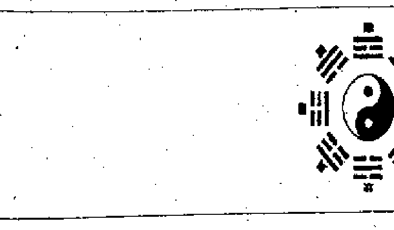

- 5. 【凶】：天盤為甲，而地盤也為甲的情況，就叫作，禿山孤木格。使用本方位的升等與考試，您將是孤軍奮鬥的，不管有多麼的努力，總是無法充分發揮本身應有的實力而造成遺憾。不論是公私立的考試，入學考試及職業考試中，總是無法達到如期的標準。
- 6. 【吉】：天盤為甲，而地盤為己的情況，就叫作，根制鬆土格。使用本方位的升等與考試，去參加考試，在試場裡和鄰座的人會成為好朋友，將帶給您輕鬆愉快的心情，而使您的考試非常順利。不論是入學考試，或職業考試，都可以獲得好的成績。
- 7. 【凶】：天盤為甲，而地盤為庚的情況，就叫作，飛宮砍伐格。使用本方位的升等與考試，去參加考試，以前所學所記的東西都想不起來。在入學考試及職業考試中，不但無法得到好成績，恐怕信心也被打擊而崩潰了！
- 8. 【凶】：天盤為甲，而地盤為辛的情況，就叫作，青龍折足格。使用本方位的升等與考試，說個明白一點，沒有及格的希望。參加入學考試及職業考試中，家離考場越遠越不可能及格。

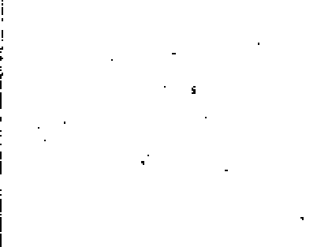

| 4 | 9 | 2 |
|---|---|---|
| 3 | 5 | 7 |
| 8 | 1 | 6 |

- 9. 【凶】：天盤為甲，而地盤為壬的情況，就叫作，青龍入天格。使用本方法的升等與考試，幾乎沒有及格希望。即使及格而進入公司或學校之後，結果也是糟糕的，最後導致退學或被解聘的命運。
- 10. 【吉】：天盤為甲，而地盤為癸的情況，就叫作，青龍華蓋格。使用本方法的升等與考試，雖然不能獲得如所期待的優良成績，但是恰好勉強可以進入學校讀書或公司上班。只要入學或進入公司後，努力終將可以成功的。

◎ 二、天盤乙和地盤之十干

- 1. 【吉】：天盤為乙，而地盤為甲的情況，就叫作，利陰害陽格。使用本方法的升等與考試，不但不會失敗，而且還可得極高的成績而獲及格。以這次的入學考試及職業考試中，及格是轉捩點，將有更大的喜慶之事等著您。不管公私立所舉辦的考試都可以去參加。
- 2. 【凶】：天盤為乙，而地盤為乙的情況，就叫作，日奇伏吟格。使用本方法的升等與考試，應該可靠的人事關係，無法給您助力。結果在入學考試及職業考試中，不但無法獲得好成績，因缺乏實力的弱點竟暴露出來。
- 3. 【吉】：天盤為乙，而地盤為丙的情況，就叫作，三奇順遂格。使用本方法的升等與考試，由於您抱有極大的自信，考試題目可以對答如流。在入學考試及職業考試中，雖然考試上獲得了好成績，入學或進入公司之後，經常可能由於朋友的事情而苦惱不已。
- 4. 【吉】：天盤為乙，而地盤為丁的情況，就叫作，三奇相佐格。使用本方法的升等與考試，可獲理想成績，解答輕鬆愉快，沒有像想像的那麼辛苦。因此在入學考試及職業考試中，或公家或私人所舉辦的考試都可獲好結果。
- 5. 【吉】：天盤為乙，而地盤為戊的情況，就叫作，鮮花名瓶格。使用本方法的升等與考試，可能會稍沒有自信，所以稍稍會使您慌張，但是利用您天生的推理能力和忍耐力，在入學考試及職業考試中，當可獲得好成績。
- 6. 【吉】：天盤為乙，而地盤為己的情況，就叫作，日奇得使格。使用本方法的升等與考試，您可以發揮應有的實力，在入學考試及職業考試中，不但不會失敗不會寫錯，且及格的可能性極高。
- 7. 【凶】：天盤為乙，而地盤為庚的情況，就叫作，日奇被刑格。使用本方位的升等與考試，常常是由於您的猶豫，在入學考試及職業考試中，這樣寫還是那樣寫，心神不定最後終於寫了錯誤的答案。因此成績將會很低。所以，不管是公私立的考試都不要抱有希望才是。
- 8. 【凶】：天盤為乙，而地盤為辛的情況，就叫作，青龍逃走格。使用本方位的升等與考試，您會被簡單得令人意外的問題所絆倒。在入學考試及職業考試中，結果很可能使您成績不理想，必須特別小心才是。
- 9. 【吉】：天盤為乙，而地盤為壬的情況，就叫作，日奇入地格。使用本方位的升等與考試，您會非常積極，但可能缺乏鎮定，不過在入學考試及職業考試中，只要您十分的小心，還是會合格的。
- 10. 【凶】：天盤為乙，而地盤為癸的情況，就叫作，綠野朝露格。使用本方位的升等與考試，很容易使您消極，由於自己內在的疑心病，在入學考試及職業考試中，不知不覺害怕遭受失敗，結果無法得很好的成績。

# 奇門遁甲實用法

### 第三章掌握升等與考試秘招

| 4 | 9 | 2 |
|---|---|---|
| 3 | 5 | 7 |
| 8 | 1 | 6 |

- 1. 【吉】：天盤為丙，而地盤為甲的情況，就叫作，飛鳥跌穴格。使用本方位的升等與考試，一點也不辛苦，回答題目有如泉湧一般。在入學考試及職業考試中，尤其是私人舉辦的考試，更是無往不利。
- 2. 【吉】：天盤為丙，而地盤為乙的情況，就叫作，日月並行格。使用本方位的升等與考試，不管是公家或私人所辦的考試，都可以有希望得到好成績，但是很討厭的是可能會稍走極端，所以在入學考試及職業考試中，儘可能把心情放輕鬆是非常重要的。
- 3. 【凶】：天盤為丙，而地盤為丙的情況，就叫作，伏吟無光格。使用本方位的升等與考試，確會使您很積極，但是缺乏仔細的思考，不適合參加入學考試及職業考試。很容易使您因此對考試失去自信，所以要特別小心才行。
- 4. 【吉】：天盤為丙，而地盤為丁的情況，就叫作，三奇順遂格。使用本方位的升等與考試，答起問題來很輕鬆愉快。因此在入學考試及職業考試中，當然會使您得到良好成績，但是粗心大意仍然是最大敵人。
- 5. 【吉】：天盤為丙，而地盤為戊的情況，就叫作，月奇得使格。使用本方位的升等與考試，常常是由於您的猶豫，在入學考試及職業考試中，這樣寫還是那樣寫，心神不定最後終於寫了錯誤的答案。因此成績將會很低。所以，不管是公私立的考試都不要抱有希望才是。
- 6. 【吉】：天盤為丙，而地盤為己的情況，就叫作，大地普照格。使用本方升等与考试，每一题都要仔细端详考虑再作答，经过如此慎重后，在入学考试及职业考试中，必可缔造良好成绩。尤其适合于私立学校或私人所举办的考试。
- 7. 【凶】：天盤為丙，而地盤為庚的情況，就叫作，熒惑入白格。使用本方升等与考试，不能希望有太好的成绩。因为在入学考试及职业考试中，自己知道的答案还没写完的时候，缴卷的铃就响了。犹豫不决是绝对禁止的。
- 8. 【吉】：天盤為丙，而地盤為辛的情況，就叫作，日月相會格。使用本方升等与考试，并不能希望有太高的成绩，虽然问题不算太难，但回答起来也不会太辛苦。在入学考试及职业考试中，只是在时间的把握和分配稍微有困难，而影响了成绩。

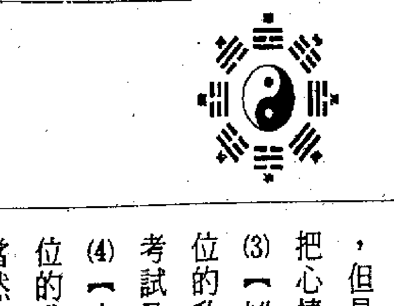

- 9. 【凶】：天盤為丙，而地盤為壬的情況，就叫作，江暉相映格。使用本方升等与考试，在考场很容易发生令您生气的事情，在入学考试及职业考试中，不特别小心您的举动时，甚至还会被别人连累，结果考得大失所望。
- 10. 【凶】：天盤為丙，而地盤為癸的情況，就叫作，華蓋李師格。使用本方升等与考试，在紧要关头会遇到障碍，在入学考试及职业考试中，考起来不痛快，成绩也不如理想。障碍并不只限于人为的障碍，也有自然的障碍发生。

### 第四節 天盤丁和地盤之十干

- 1. 【吉】：天盤為丁，而地盤為甲的情況，就叫作，青龍轉光格。使用本方升等与考试，问题比所担心还容易解答。不论公私立的考试都能缔造好成绩，尤其是公立学校的招考，或公家机关的职员招考，都可以有良好结果。
- 2. 【吉】：天盤為丁，而地盤為乙的情況，就叫作，耕田種作格。使用本方升等与考试，有希望考得相当好的成绩。但是要特别注意表达的方法，在入学考试及职业考试中，一定要避免让阅卷的人，不要错改您的答案，则结果必有好成绩。
- 3. 【吉】：天盤為丁，而地盤為丙的情況，就叫作，星隨月轉格。使用本方方法位的升等與考試，非常容易，但是本身可能有粗心而寫錯的地方，也會導致失敗。在入學考試及職業考試中，最好以謹慎而謙虛的心情，堅持到底才好。
- 4. 【吉】：天盤為丁，而地盤為丁的情況，就叫作，兩火成炎格。使用本方方法位的升等與考試，很可能會出現您最近所讀的題目。在入學考試及職業考試中，由於不會有從未見過的題目，所以只要鎮靜的應考，成績絕對很好。
- 5. 【吉】：天盤為丁，而地盤為戊的情況，就叫作，有火有爐格。使用本方方法位的升等與考試，您以前所準備的功課，可以毫無遺漏的發揮出來。在入學考試及職業考試中，只要您毫不猶豫地回答問題，必可合格。
- 6. 【凶】：天盤為丁，而地盤為己的情況，就叫作，火入勾陳格。使用本方方法位的升等與考試，可能會碰上很多預想不到的事情，在入學考試及職業考試中，尤其很容易發生和異性之間的問題，結果搞得不能參加或誤了考試，把大好前程都斷送掉了！
- 7. 【吉】：天盤為丁，而地盤為庚的情況，就叫作，火煉真金格。使用本方方法位的升等與考試，事情完全如意，可以發揮應有的實力。在入學考試及職業考試中，考試本身成績將相當理想。只要注意不要丟了東西，一切結果將很理想。
- 8. 【凶】：天盤為丁，而地盤為辛的情況，就叫作，朱雀入獄格。使用本方方法位的升等與考試，碰上困難的問題時，可能您厭煩了，甚至中途而廢，在入學考試及職業考試中，終無法獲得好成績，或題目沒有答完，要及格是很難的。
- 9. 【吉】：天盤為丁，而地盤為壬的情況，就叫作，星奇得使格。使用本方方法位的升等與考試，由於長輩對您親切照顧，得以輕鬆的心情應考。在入學考試及職業考試中，不任由一時情緒，鎮靜地作答，必可有好成績的。
- 10. 【凶】：天盤為丁，而地盤為癸的情況，就叫作，朱雀投江格。使用本方方法位的升等與考試，在入學考試及職業考試中，您會被簡單得令人意外的問題所絆倒，結果很可能使您成績不理想，必須特別小心才是。

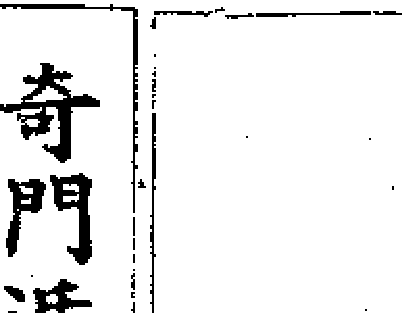

# 奇門遁甲實用法

### 第三章掌握升等與考試秘招

- 1. 【吉】：天盤為戊，而地盤為甲的情況，就叫作，巨石壓木格。使用本方的升等與考試，可以發揮比應有還要多的實力。在入學考試及職業考試中，無論怎麼困難的題目，只要好好應用以前所作過的題目，當可迎刃而解，獲得良好成績。
- 2. 【吉】：天盤為戊，而地盤為乙的情況，就叫作，青龍合璧格。使用本方的升等與考試，考題題目可能和預想的稍有不同，但是您卻可以在很快的時間之內解答出來。因此，在入學考試及職業考試中，只要不粗心大意的話，就會及格了！
- 3. 【吉】：天盤為戊，而地盤為丙的情況，就叫作，日出東山格。使用本方的升等與考試，初看之下似乎題目很困難，但是意外的是，您能夠對答如流。
- 4. 【凶】：天盤為戊，而地盤為戊的情況，就叫作，伏吟峻山格。使用本方的升等與考試，即使是您以往所熟悉的知識，十分之一也發揮不出來。因此，在入學考試及職業考試中，沒有希望得到好成績。雖然您很努力去作，及格的可能性還是很低。
- 5. 【凶】：天盤為戊，而地盤為己的情況，就叫作，物以類聚格。使用本方的升等與考試，即使是一些特別簡單的題目，由於您把它想錯了經常難以解釋。因此，不管是公家或私人所辦的考試，都不能得到如期的好成績。
- 6. 【凶】：天盤為戊，而地盤為庚的情況，就叫作，助紂為虐格。使用本方的升等與考試，初看之下似乎沒有什麼問題，但是由於粗心，很容易犯下錯誤。在入學考試及職業考試中，不好好注意是不行的。所以，不管是公私所辦的考試，都不要抱太大的希望。

| 4 | 9 | 2 |
|---|---|---|
| 3 | 5 | 7 |
| 8 | 1 | 6 |

- 7. 【凶】：天盤為戊，而地盤為辛的情況，就叫作，反吟洩氣格。使用本方的升等與考試，所出的問題幾乎都是些難以理解的問題，而把您困入窘境內。在入學考試及職業考試中，不但無法得到理想的成績，甚至自己的自信心都沒了！
- 8. 【吉】：天盤為戊，而地盤為壬的情況，就叫作，山明水秀格。使用本方的升等與考試，積極地應用您的腦筋，所以在入學考試及職業考試中，一定會有好成績。但是卻總有一些小挫折，尤其要注意一下身體的情況才好。
- 9. 【凶】：天盤為戊，而地盤為癸的情況，就叫作，岩石浸蝕格。使用本方的升等與考試，您總是不夠小心，而做出一些奇妙的解答。如果您不勤於再接再厲的話，在入學考試及職業考試中，雖然您自己以為會合格，結果相反的可能性卻很大。

### 第六節 天盤己和地盤之十干

- 1. 【凶】：天盤為己，而地盤為甲的情況，就叫作，永不發芽格。使用本方的升等與考試，會出現許多困難的題目，您將被難倒。如果不以相當的忍耐力，和相當的鎮靜來答題，在入學考試及職業考試中，將得不到好成績的。
- 2. 【吉】：天盤為己，而地盤為乙的情況，就叫作，柔情蜜意格。使用本方的升等與考試，可以發揮自己的實力而獲得合格，且考場的氣氛也會很好才對。在入學考試及職業考試中，自己小心一下，不要受周圍影響而分散注意力。
- 3. 【凶】：天盤為己，而地盤為丙的情況，就叫作，火孛地戶格。使用本方的升等與考試，很難發揮自己的實力。在入學考試及職業考試中，很可能會有猶疑不決的情形。如果過份積極的話，可能反而遭受失敗的命運。
- 4. 【吉】：天盤為己，而地盤為丁的情況，就叫作，朱雀入墓格。使用本方的升等與考試，起初會覺這種題目不好答，如何能及格？但是沈著地慢慢思考，結果您會發現題目不難，只要小心應對，就可以獲得合格。在入學考試及職業考試中，不要慌張，從容作答，必可獲得良好成績。

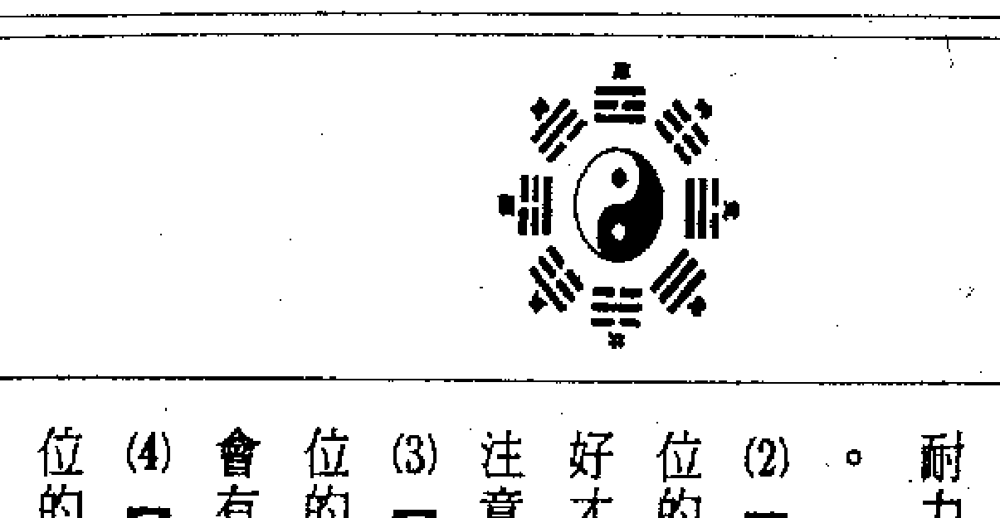

| 4 | 9 | 2 |
|---|---|---|
| 3 | 5 | 7 |
| 8 | 1 | 6 |

- 5. 【吉】：天盤為己，而地盤為戊的情況，就叫作，明堂入墓格。使用本方的升等與考試，只要您按照計畫準備，實力就能夠充分發揮。在入學考試及職業考試中，會有很好的成績，但是要注意不要因為小事而大意。
- 6. 【凶】：天盤為己，而地盤為己的情況，就叫作，地戶逢庚格。使用本方的升等與考試，您會感到心浮氣躁，而無法集中精神。在入學考試及職業考試中，很容易因為粗心而寫錯答案，結果導致失敗。
- 7. 【吉】：天盤為己，而地盤為庚的情況，就叫作，刑格返照格。使用本方的升等與考試，雖然您會遇到一些困難，但是只要您堅持不懈，最終能夠克服。在入學考試及職業考試中，成績會逐漸進步，獲得不錯的結果。
- 8. 【凶】：天盤為己，而地盤為辛的情況，就叫作，遊魂入墓格。使用本方的升等與考試，您會感到意志消沉，而無法發揮實力。在入學考試及職業考試中，很容易因為失誤而導致不及格，必須特別小心。
- 9. 【凶】：天盤為己，而地盤為壬的情況，就叫作，地網天羅格。使用本方的升等與考試，您會遇到很多障礙，而無法順利應考。在入學考試及職業考試中，成績會很不理想，甚至可能無法完成考試。
- 10. 【凶】：天盤為己，而地盤為癸的情況，就叫作，地刑玄武格。使用本方的升等與考試，您會感到頭腦混亂，而無法正確思考。在入學考試及職業考試中，很容易因為緊張而失誤，結果導致失敗。

#### ◎七、天盘庚和地盘之十干

(1)【凶】：天盘为庚，而地盘为甲的情况，就叫作：伏宫摧残格。使用本方位的升等与考试，您的身体状况不会太好，自己的实力无法发挥，而造成遗憾。在入学考试及职业考试中，虽然没有什么大不了的事情，但要想有好的成绩是不可能的。

(2)【吉】：天盘为庚，而地盘为乙的情况，就叫作：太白逢星格。使用本方位的升等与考试，虽然稍费事，但最后总有办法答得出来。在入学考试及职业考试中，虽然稍稍费事，但成绩将不会太差的。

(3)【凶】：天盘为庚，而地盘为丙的情况，就叫作：太白入荧格。使用本方位的升等与考试，会出现几题和自己的猜题稍有出入的题目，只要您不气馁不灰心，在入学考试及职业考试中，是可以及格的。

(4)【凶】：天盘为庚，而地盘为丁的情况，就叫作：亭亭之位格。使用本方位的升等与考试，您自以为能力超人一等，目空一切而招致失败的倾向。在入学考试及职业考试中，有自信的话，当然是好的，但是太过则不好了！

(5)【凶】：天盘为庚，而地盘为戊的情况，就叫作：无火格。使用本方位的升等与考试，最后总有办法答得出来。在入学考试及职业考试中，虽然稍费事，成绩将不会太差的。

(6)【凶】：天盘为庚，而地盘为己的情况，就叫作：官符刑害格。使用本方位的升等与考试，您会感觉到为何自己所猜想的问题都没有出来，尽是出些自己伤脑筋的问题。不管是公家或私人所办的考试，是得不到好成绩的。

(7)【凶】：天盘为庚，而地盘为庚的情况，就叫作：颠倒刑破格。使用本方位的升等与考试，您会感觉到为何自己所猜想的问题都没有出来，尽是出些自己伤脑筋的问题。不管是公家或私人所办的考试，是得不到好成绩的。

(8)【凶】：天盘为己，而地盘为辛的情况，就叫作：游魂入墓格。使用本方位的升等与考试，起初写起来非常顺利，可是到最重要的地方时，却出现了自己最伤脑筋的问题。在入学考试及职业考试中，虽然您已经尽了力，希望

(9)【凶】：天盘为己，而地盘为壬的情况，就叫作：反吟浊水格。使用本方位的升等与考试，才知道以前太懒惰，太不用功了，想想真后悔，要是那时再用功些就好了。在入学考试及职业考试中，成绩不好。

(10)【凶】：天盘为己，而地盘为癸的情况，就叫作：地刑玄武格。使用本方位的升等与考试，得到很好成绩的希望非常少，且实力差得很远，在入学考试及职业考试中，所猜测的问题也都没有出来。到那时才深切的知道自己没有这份能力。

(5)【吉】：天盘为己，而地盘为戊的情况，就叫作：犬遇青龙格。使用本方位的升等与考试，题目被您猜中的可能性很高，而且某些答案被灵机一动而突然想出，但是如果当天的身体状况不佳时，却也可能遭到失败命运。

(6)【凶】：天盘为己，而地盘为己的情况，就叫作：伏吟软弱格。使用本方位的升等与考试，您自认为可以解出的问题，拿起笔来时，都会突然写不出来。在入学考试及职业考试中，虽然努力却和及格无缘。

(7)【凶】：天盘为庚，而地盘为庚的情况，就叫作：颠倒刑破格。使用本方位的升等与考试，您会感觉到为何自己所猜想的问题都没有出来，尽是出些自己伤脑筋的问题。不管是公家或私人所办的考试，是得不到好成绩的。

(8)【凶】：天盘为己，而地盘为辛的情况，就叫作：游魂入墓格。使用本方位的升等与考试，起初写起来非常顺利，可是到最重要的地方时，却出现了自己最伤脑筋的问题。在入学考试及职业考试中，虽然您已经尽了力，希望

| 4 | 9 | 2 |
|---|---|---|
| 3 | 5 | 7 |
| 8 | 1 | 6 |

## 奇门遁甲实用法
## 第三章 掌握升等与考试秘招

+   (3)【凶】：天盘为庚，而地盘为丙的情况，就叫作：太白入荧格。使用本方位的升等与考试，会出现几题和自己的猜题稍有出入的题目，只要您不气馁不灰心，在入学考试及职业考试中，是可以及格的。
+   (4)【凶】：天盘为庚，而地盘为丁的情况，就叫作：亭亭之位格。使用本方位的升等与考试，您自以为能力超人一等，目空一切而招致失败的倾向。在入学考试及职业考试中，有自信的话，当然是好的，但是太过则不好了！
+   (5)【凶】：天盘为庚，而地盘为戊的情况，就叫作：无火格。使用本方位的升等与考试...
+   (6)【凶】：天盘为庚，而地盘为己的情况，就叫作：官符刑害格。使用本方位的升等与考试...
+   (7)【凶】：天盘为庚，而地盘为庚的情况，就叫作：伏吟战斗格。使用本方位的升等与考试...
+   (8)【凶】：天盘为庚，而地盘为辛的情况，就叫作：铁锁碎玉格。使用本方位的升等与考试...
+   (9)【凶】：天盘为庚，而地盘为壬的情况，就叫作：耗败小破格。使用本方位的升等与考试...

| 4 | 9 | 2 |
|---|---|---|
| 3 | 5 | 7 |
| 8 | 1 | 6 |

位的升等与考试，会出现几题和自己的猜题稍有出入的题目，只要您不气馁不灰心，在入学考试及职业考试中，是可以及格的。

考试及职业考试中，由于意外错误的地方很多，成绩必不好。

+   (4)【吉】：天盘为辛，而地盘为丁的情况，就叫作：狱神得奇格。使用本方位的升等与考试，您自己都想不到竟然会答得那么好。因此，在入学考试及职业考试中，合格是一定有希望的。但是绝对不能得意忘形，反而会在简单的地方疏忽了。
+   (5)【凶】：天盘为辛，而地盘为戊的情况，就叫作：反吟被伤格。使用本方位的升等与考试，胡乱作答是会自取灭亡的。在入学考试及职业考试中，碰到不懂的问题，不好好想一想是不行的。如果把它想得太容易了，最后结果当然是不好的。
+   (6)【凶】：天盘为辛，而地盘为己的情况，就叫作：入狱自刑格。使用本方位的升等与考试，不但无法发挥您平常努力的成绩，而且把以前堆积下来用功的自信都破坏了。不管入学考试及职业考试，或公私方面，都没有希望。
+   (7)【凶】：天盘为辛，而地盘为庚的情况，就叫作：白虎出力格。使用本方位的升等与考试...

| 4 | 9 | 2 |
|---|---|---|
| 3 | 5 | 7 |
| 8 | 1 | 6 |

#### ◎八、天盘辛和地盘之十干

+   (1)【凶】：天盘为辛，而地盘为甲的情况，就叫作：困龙被伤格。使用本方位的升等与考试，无法发挥您的实力，也没有希望获得理想的成绩。在入学考试及职业考试中，判断力比平日还要迟钝，不相当注意的话，是不可能及格的。
+   (2)【凶】：天盘为辛，而地盘为乙的情况，就叫作：白虎猖狂格。使用本方位的升等与考试，参加考试会有消极，而无法作干脆判断的倾向。在入学考试及职业考试中，回答题目不积极，是非常没有及格希望的。
+   (3)【凶】：天盘为辛，而地盘为丙的情况，就叫作：干合孛师格。使用本方位的升等与考试，有积极的影响力，但是它会反而造成错误的结果，在入学考试及职业考试中，不能在平静的心情下应考，在思考方面的题目有失败的倾向。在入学考试及职业考试中，尤其是一些应用问题，不好好注意的话，就不能及格了！

(1) 【凶】：天盘为壬，而地盘为甲的情况，就叫做：浪中孤舟格。使用本方位的升等与考试，如果过于慎重的话，恐怕反而会失败。在入学考试及职业考试中，最好尽可能以最短的时间内，想出来就写，但也不能得到好的成绩。

(2) 【凶】：天盘为壬，而地盘为乙的情况，就叫做：逐水桃花格。使用本方位的升等与考试，很不好的是，会不知不觉作答得很轻率。有时被周围的事情分散了注意力，以前会的问题，现在无法答出来。所以，不管是公私立的考试，希望都很渺茫。

(3) 【凶】：天盘为壬，而地盘为丙的情况，就叫做：日落西海格。使用本方位的升等与考试，起先还可以把题目答得很顺利，但是这种情形不能继续很久，渐渐就会碰到困难问题而不知所措。在入学考试及职业考试中，不可能获得好成绩。

(4) 【吉】：天盘为壬，而地盘为丁的情况，就叫做：干合格星奇格。使用本方位的升等与考试，出乎意料的答题非常顺利。因此在入学考试及职业考试中，有希望得到好成绩。只是不要在问题简单的地方反而作错就好了！

(0) 【凶】：天盘为癸，而地盘为辛的情况，就叫做：天牢华盖格。使用本方位的升等与考试，题目越浅您越想不起来。在入学考试及职业考试中，自己的实力无法发挥，有时还会把题目看错，结果没有录取的希望了！

(9) 【凶】：天盘为辛，而地盘为壬的情况，就叫做：凶蛇入狱格。使用本方位的升等与考试，您自己确信都写得很好，等出了考场之后才发现到处都写错了。所以，不管是入学考试及职业考试，或公私立所办的考试，都不会有好成绩。

(8) 【凶】：天盘为辛，而地盘为辛的情况，就叫做：伏吟相刻格。使用本方位的升等与考试，不太可能如意的回答题目，自认为自己一个人就可以胜任愉快，结果很容易犯意外的错误，甚至有时会妨碍到别人，千万要注意了！

(6)【凶】：天盘为癸，而地盘为己的情况，就叫作：华盖地户格。使用本方位的升等与考试，努力是够了，只是越到考试前，越是积极，效果却可能越糟糕。不论是公立私立的入学考试，及职业考试中，全无好成绩的。

(3)【吉】：天盘为丙的情况，就叫作：华盖朱师格。使用本方位的升等与考试，作答可以非常如意顺利。在入学考试及职业考试中，成绩也会意外的优越。遇到困难问题也不可怕，只要有信心，成绩自然就会很好。

(4)【凶】：天盘为癸，而地盘为丁的情况，就叫作：腾蛇妖娇格。使用本方位的升等与考试，不管公立私立的，不能得到好的成绩。尤其作一些简单得不像话的题目，总是犯了意想不到的错误，或遗漏了正确答案。

(5)【吉】：天盘为癸，而地盘为戊的情况，就叫作：天乙会合格。使用本方位的升等与考试，本身成绩不错，而且还会得到别人的援助，而能有好的结果。在入学考试及职业考试中，如果太过放心，却可能发生意外的错误，要注意了！

(9)【凶】：天盘为癸，而地盘为壬的情况，就叫作：冲天奔地格。使用本方位的升等与考试，您无论如何，也无法去除急著作答的焦躁，如此一来，在入学考试及职业考试中，一定招致失败。解答时一定要经过好好的考虑才行。

(7)【凶】：天盘为癸，而地盘为庚的情况，就叫作：反吟淡白格。使用本方位的升等与考试，总是无法避免偏见。因此，在入学考试及职业考试中，要有好成绩是不可能的。如果不好好守著中庸之道，是没有合格希望的。

(8)【凶】：天盘为癸，而地盘为辛的情况，就叫作：阳衰阴盛格。使用本方位的升等与考试，太过于积极的话，很可能招致想不到的恶果。在入学考试及职业考试中，作答时不能冷静的话，合格希望是渺茫的。不管公立私立都一样。

(10)【凶】：天盘为癸，而地盘为癸的情况，就叫作：伏吟天罗格。使用本方位的升等与考试，因为您身体的状况不佳，头脑反应迟钝，所以在入学考试及职业考试中，结果成绩一定是不好的。

(1)【吉】: 天盘为癸，而地盘为甲的情况，就叫作：杨柳甘露格。使用本方...

(2)【凶】: 天盘为癸，而地盘为乙的情况，就叫作：华盖蓬星格。使用本方...

#### ◎十、天盘癸和地盘之十干

(10)【凶】: 天盘为壬，而地盘为癸的情况，就叫作：幼女奸淫格。使用本方...

| 4 | 9 | 2 |
|---|---|---|
| 3 | 5 | 7 |
| 8 | 1 | 6 |

## 奇门遁甲实用法
## 第三章 掌握升等与考试秘招

(5)【吉】: 天盘为壬，而地盘为戊的情况，就叫作：小蛇化龙格。使用本方...

(6)【凶】: 天盘为壬，而地盘为己的情况，就叫作：反吟泥浆格。使用本方...

(7)【凶】: 天盘为壬，而地盘为庚的情况，就叫作：腾蛇相缠格。使用本方...

(8)【吉】: 天盘为壬，而地盘为辛的情况，就叫作：淘洗珠玉格。使用本方...

## 第四章 掌握约会与爱情秘招

| 4 | 9 | 2 |
|---|---|---|
| 3 | 5 | 7 |
| 8 | 1 | 6 |

### 第一节 使用奇门遁甲盘之目的

+   一、可以掌握对方的爱情。以恋爱为主，凡有关男女之间所引起的认识邂逅，相聚约会，及其他喜悦的事情等，全部都可以利用奇门遁甲盘。
+   二、总之，想在对象面前发挥最大的魅力时，或想使约会过得愉快，求婚想使他或她答应，及无论如何一定要抓住对方的心时，可以应用奇门遁甲盘。
+   三、所有和交往异性产生相关的各方面事，都可以使用奇门遁甲盘，使您走向有利的境地。但是，爱情是双方面的事，故必须要有双方认同才能成立，只有自己一个人是单恋，对方不知情或不快乐的话，就不能称为真恋爱了！
+   四、因为奇门遁甲可以掌握对方的动向，及生杀大权。所以尤其是在恋爱男女关系上，如果伤害了对方则绝非爱情的本意，故要诚心勿欺才是。
+   五、为了培养相互之间的感情和好印象，如果并用日盘和时盘其效果将会更加完美。尤其约会的时候，可以让男女相互之间过得更愉快，不只为自己好，也可以让对方更好。约会的时候，尽量以日盘为中心来应用，将可得到最大的效果。不过，所谓好的格局，就男性和女性而言，有时候是不一样的，所以要注意区分即可。
+   六、奇门遁甲盘吉利强化格，男女皆吉者：乙干见开门、休门，且天干乙如果在北或西北则效果更大。乙干见生门，且天干乙如果在东北则男方效果更大。
+   七、八门中，男性的开门，女性的休门，比较能够发挥自己本来的魅力。而八神中，朱雀表现和谐，对恋爱和相配最有效果。对于男人而言，螣蛇是好格，对女人太阴也是好格。
+   八、约会的时间超过二个小时以上的情形，则要以日盘为主，时盘为辅来使用。

### 第二节 天地盘天干比对吉凶

(1)【吉】：天盘为甲，而地盘也为甲的情况，就叫作：双木成林格。使用本方位的约会，无论什么事情都可以要求比较高的格调。能表现高度的才华，确确实实扣住对方的心。在这个时候，最好给予对方有诚实和高尚的好印象。

(2)【吉】：天盘为甲，而地盘为乙的情况，就叫作：藤萝绊木格。使用本方位的约会，将可以到达山盟海誓，海枯石烂不分的佳境。而且您的事情会受到上司、长辈和朋友的帮忙。

(3)【吉】：天盘为甲，而地盘为丙的情况，就叫作：青龙返首格。使用本方位的约会，您的温柔的体贴，将如愿地深深种在对方的心坎里，留下深刻的印象。但是尽管如此，如果您太过勉强，也会使对方不以为然或不知所措。

(4)【吉】：天盘为甲，而地盘为丁的情况，就叫作：乾柴烈火格。使用本方位的约会，对女人来说却只是小吉格。但是对女人而言却只是小吉格。对方位对男人而言是不吉格。对方位对女人来说却只是小吉格。

(5)【凶】：天盘为甲，而地盘为戊的情况，就叫作：秃山孤木格。使用本方位的约会，最必须注意的是要事先把对方了解得一清二楚，然后再想办法给对方好印象。如果不注意的话，您的想法将不能让对方觉得满意，很可能一切都成为泡影。

(6)【吉】：天盘为甲，而地盘为己的情况，就叫作：根制松土格。使用本方位的约会，很适合和对象一起去欣赏戏剧或音乐会。您对待对方的态度最好是诚实。因为如果想要表现您的机灵才华时，反而会引起对方的反感，恐怕带来了不良效果。故必须改变优柔寡断的态度，抑制急躁，很诚恳的去交往必吉。

(7)【凶】：天盘为甲，而地盘为庚的情况，就叫作：飞宫坎伐格。使用本方位的约会，能避免就避免。因为即使煞费苦心的诚意，也不能为对方所接纳，反而会招来厌烦。因为一切都会和您的希望相反，恋爱会造成破裂。

(8)【凶】：天盘为甲，而地盘为辛的情况，就叫作：青龙折足格。使用本方位的约会，只要在公园之类的地方，安静的交谈就好了，但是不适合作运动身体的活动，或说一些严重的决心及坦白话。一切都让它很自然而平静的一起度过。若讲一些严重的话，必遭不顺。

(9)【凶】：天盘为壬的情况，就叫作：青龙入天格。使用本方位的约会，由于个性积极且性急，因而容易对人起警戒心。所以您和对方相处的时候要尽可能保守一点，谨慎一点。不管如何的爱对方，在言行上若太过于表现热情，反而会觉得您的粗野，那就不好了！

(10)【吉】：天盘为甲，而地盘为癸的情况，就叫作：青龙华盖格。使用本方位的约会，由于你们的相互让步与妥协，相互之间将有信心而且要好。同时相互把对方的身心视为自身一般的相爱，是非常好的气氛。

#### ◎二、天盘乙和地盘之十干

(1)【吉】：天盘为乙，而地盘为甲的情况，就叫作：利阴害阳格。使用本方位的约会，您将会在快乐当中度过充满幸福的一天。譬如在餐厅里，一面听音乐，一面享受美味的餐点，两位的爱情，将由此而更加浓密深入。这是向对方追求温柔而稳定的爱情最佳方位。

(2)【凶】：天盘为乙，而地盘为乙的情况，就叫作：日奇伏吟格。使用本方位的约会，您不可以使用一切积极性的爱情欺骗手腕。只要照以前的样子，甚至行动宜稍微消极一点。相约的地点时间宜在老地方，叫同样的饮料或点心就好了。这个时候，您绝对不能向对方求爱，否则将会很不顺的。

(3)【吉】：天盘为乙，而地盘为丙的情况，就叫作：三奇顺遂格。使用本方位的约会，会有意料之外地愉快。但是回来后，或者第二天很容易有麻烦。而且这方位对男性好，可是对女性并不理想。如果这方位，有八门中的休门或生门，或开门的话，则这是对男女都好的吉格，名曰：云遁格。

(4)【吉】：天盘为乙，而地盘为丁的情况，就叫作：三奇佐格。使用本方位的约会，可以逛逛图书馆或书店，您们相互之间会有意想不到的发现，处处都有令人感动的新鲜事情。可以日记和情书来交换，会增加爱情浓度的。

## 奇门遁甲实用法
## 第四章 掌握约会与爱情秘招
#### ◎ 三、天盘丙和地盘之十干

如果本方位，有八门的休门、或生门、或者开门之一，对男女来说，都是吉格。

- (5)【吉】：天盘为乙，而地盘为戊的情况，就叫作，鲜花名瓶格。使用本方位的约会，适合在郊外的风景名胜地方散步畅谈心里面的话。可以用诚意和机智让对方留下深刻的印象，但不能表现得太过于柔弱。约会后，将会意料不到地获得对方的爱。
- (6)【吉】：天盘为乙，而地盘为己的情况，就叫作，日奇得使格。使用本方位的约会，两个人之间将情意绵绵，大大的享受这甜蜜的约会。只要您可以设计出来的任何约会计划都将可以获得成功，尤其约会计划中，是有关乎艺术方面的活动则更可收到最大的成功。如：观赏电影歌剧或画展之类的活动。
- (7)【凶】：天盘为乙，而地盘为庚的情况，就叫作，日奇被刑格。使用本方位的约会，由于相互之间都很任性随便，气氛将会不愉快，相聚毫无快乐可言。从这约会之后，两人之间的情感将会渐渐冷淡。如果两人尽量抑制自己的任性的话，还可以互相了解，重修旧好，但是毕竟还是留下一道裂痕。
- (8)【凶】：天盘为乙，而地盘为辛的情况，就叫作，青龙逃走格。使用本方位的约会，会将对方长久保有的信任和爱情，因为意外的事情而消失扫灭。由于双方一点也无法融洽，甚至可能很快造成离别的悲哀。
- (9)【吉】：天盘为乙，而地盘为壬的情况，就叫作，日奇入地格。使用本方位的约会，在表面上会过得很快乐、很平安，但是有可能由于意外和积极性而令您的对方吃惊。对男性而言是作休闲活动可以最快乐的方位。而对于女性来说，尽量发挥妳的积极性，妳的爱情方面可以更甜蜜。
- (10)【凶】：天盘为乙，而地盘为癸的情况，就叫作，绿野朝露格。使用本方位的约会，可以游寺庙或野外，在诸如此类的气氛情绪下，来想一想有关爱的事情。或者躲开都市的喧哗，到没有人的郊外，谈一谈两个人的将来也好。只是这个方位属普通的约会可以，深入交谈则会丝毫得不到一点乐趣，终将失败。

## 奇门遁甲实用法
## 第四章 掌握约会与爱情秘招

116 易中仙
117 易中仙

| 4 | 9 | 2 |
|---|---|---|
| 3 | 5 | 7 |
| 8 | 1 | 6 |

- (1)【吉】：天盘为丙，而地盘为甲的情况，就叫作，飞鸟跌穴格。使用本方
- (2)【吉】：天盘为丙，而地盘为乙的情况，就叫作，日月并行格。使用本方
- (3)【凶】：天盘为丙，而地盘为丙的情况，就叫作，伏吟无光格。使用本方
- (4)【吉】：天盘为丙，而地盘为丁的情况，就叫作，三奇顺遂格。使用本方

## 奇门遁甲实用法
## 第四章 掌握约会与爱情秘招

- (5)【吉】：天盘为丙，而地盘为戊的情况，就叫作，月奇得使格。使用本方
- (6)【吉】：天盘为丙，而地盘为己的情况，就叫作，大吉普照格。使用本方
- (7)【凶】：天盘为丙，而地盘为庚的情况，就叫作，癸惑入白格。使用本方
- (8)【吉】：天盘为丙，而地盘为辛的情况，就叫作，日月相会格。使用本方

## 第四章 掌握约会与爱情秘招

(2)【吉】：天盘为丁，而地盘为乙的情况，就叫作，耕田种作格。使用本方位的约会，有一种促进非常柔和的社交性影响力，将发出浓厚的爱苗。在这一瞬间，由于您机敏的处置，对方将对您寄以最大的信赖。由于敏锐的感受性选择，约会的场所和话题一定都会更好。

(3)【吉】：天盘为丁，而地盘为丙的情况，就叫作，星随月转格。使用本方位的约会，对方将会有意想不到表示爱意的行动，您自己也将快乐无比。但如果采取太过自大的态度时，可能对方会认为您傲慢。您一定要带给对方一种谦虚的印象，如此才会顺利。

(4)【吉】：天盘为丁，而地盘为丁的情况，就叫作，两火成炎格。使用本方位的约会，利用书信的策略一定使您的恋爱如愿以偿。只要把述说您真诚的心意之文诗书信，悄悄的亲手交给对方就好了。约会地点，可以绕一绕美术馆、图书馆、书店等，平常的话，去观赏电影或者戏剧也不错。但是要尽量去有学术气氛的地方最好。

(5)【吉】：天盘为丁，而地盘为戊的情况，就叫作，有火有炉格。使用本方位的约会，要有学问或艺术性的气氛的地方最好。

| 4 | 9 | 2 |
|---|---|---|
| 3 | 5 | 7 |
| 8 | 1 | 6 |

#### ◎ 四、天盘丁和地盘之十干

(1)【吉】：天盘为丁，而地盘为甲的情况，就叫作，青龙转光格。使用本方位的约会，要发挥自己高格调的举止，带给对方深刻的印象。如：去参观了画廊或美术展览之后，到高雅的餐厅去高谈阔论。但是这种情形下，必须选一位志趣相投的对象。总之，有关学术性或艺术性的话题或气氛，是使两人紧密地连结在一起的主要因素之一。

(9)【凶】：天盘为丙，而地盘为壬的情况，就叫作，江晖相映格。使用本方位的约会，由于意外总会引起不必要的麻烦，或对方会带来困扰。您自己又相当不冷静的话，不只对方，甚至第三者也会带来困扰，结果两人之间一切付之流水。

(10)【凶】：天盘为丙，而地盘为癸的情况，就叫作，华盖孛师格。使用本方位的约会，您们两人之间会有嫉妒的人存在，您在约对方之时就会有麻烦。万一约会成了，也会有意想不到的中伤和妨害。因此，您在和对方交谈的时候，很奇怪的总是谈得不太投机。

| 4 | 9 | 2 |
|---|---|---|
| 3 | 5 | 7 |
| 8 | 1 | 6 |

(9)【吉】：天盘为丁，而地盘为壬的情况，就叫作，星奇得使格。使用本方位的约会，意外的顺利和快乐为您培养浓厚的爱情。这个时候，您可以向对方坦诚的表明您的爱意和求爱。对方一定给您坦诚的答复，同时在约会后，将有双亲或上司的帮助，两人的未来是幸运的。

(10)【凶】：天盘为丁，而地盘为癸的情况，就叫作，朱雀投江格。使用本方位的约会，将有完全想不到的错误产生，很容易会伤了对方的心。但是若小心一点，不幸是有可能避免的。

#### 五、天盘戊和地盘之十干

(1)【凶】：天盘为戊，而地盘为甲的情况，就叫作，巨石压木格。使用本方位的约会，由于你们相互间的心意不能十分沟通，会有一些不愉快。这个时候，不要说任何不服气的话，去做做休闲活动，把气消一消。否则即使您全心全力来解释，也不能得到太大功效的。

(2)【吉】：天盘为戊，而地盘为乙的情况，就叫作，青龙合灵格。使用本方位的约会，只要您预先想好如何抓住对方的心，一定会有突然而意想不到的位的约会，您那经常都很妥当的举止和态度，一定能紧紧的抓住对方的心。

(6)【凶】：天盘为己，而地盘为己的情况，就叫作，火入勾陈格。使用本方位的约会，虽然会有暂时的快乐，但是可能发生意外的惊险。因为这约会一开始的时候，就必须和想不到的情敌做个解决。如果您的热情强烈到不管自身之危险的话，不论是要跟情敌争到底，或是要干什么事都要慎重考虑考虑考虑，否则多不顺利。

(7)【吉】：天盘为庚，而地盘为庚的情况，就叫作，火炼真金格。使用本方位的约会，依照您的诚意和努力情形而决定它的吉凶。因为这方位的暗示是半吉半凶的。因这方位有容易健忘和容易迟到的暗示，宜特别注意约会时间。

(8)【凶】：天盘为丁，而地盘为辛的情况，就叫作，朱雀入狱格。使用本方位的约会，应该紧紧记住祸从口出。您若漫不经心的说出过去回忆，将会引起对方的疑心。

## 第四章 掌握约会与爱情秘招

位的约会，由于自己怠惰态度，将使对方对你感到不满，加上您的态度漫不经心，将可能破坏了约会的计划。

- (7)【凶】：天盘为戊，而地盘为庚的情况，就叫作，助纣为虐格。使用本方的约会，由于您相当不小心，及为一点琐细小事，会和对方争吵而陷入不可收拾的状态。总之，起初所遭遇的是毫无所获的小失败，然后从此以后渐渐招来越来越大的失败。
- (8)【凶】：天盘为戊，而地盘为辛的情况，就叫作，反吟泄气格。使用本方的约会，所打算做的每一个约会活动，就对方而言都很不合适。相反的，不但相互间不愉快，也要破费得比预算的多。如果想要向对方表明您的爱意时，对方很简单的几句话，就会使您精神上蒙受莫大的打击。
- (9)【吉】：天盘为戊，而地盘为壬的情况，就叫作，山明水秀格。使用本方的约会，可促进积极性，使脑筋灵活，追求策略可获成功。约会的时候，如果要安静的谈一些心里的话，倒不如去享受一些运动或游戏，使两个人的心情开朗起来，整个约会将带来快乐喜悦。

## 第四章 掌握约会与爱情秘招

| 4 | 9 | 2 |
|---|---|---|
| 3 | 5 | 7 |
| 8 | 1 | 6 |

机会。对方一定带给您爱恋和幸运。总之，这将是一个平安无事的约会。

- (3)【吉】：天盘为戊，而地盘为丙的情况，就叫作，日出东山格。使用本方的约会，起初在精神上不能十分沟通洽，但是你们的心将慢慢解开，逐渐陷入浓浓的情爱，最后终将尝到甜蜜的爱果。男性而言，会采取完全积极的态度，表现感性个性。女性而言，如果保守消极的态度，也一定平顺无瑕。
- (4)【吉】：天盘为戊，而地盘为丁的情况，就叫作，火烧赤壁格。使用本方的约会，即使在追求对方时，情敌很多，一定要利用自己个性上的优点来扣住对方的心。为了使对方成为您的爱情俘虏，应该作详密的约会活动计划，然后经由追求策略并付之实行，自然可吉。
- (5)【凶】：天盘为戊，而地盘为戊的情况，就叫作，伏吟峻山格。使用本方的约会，在做所说而约定之事情的时候，总是会出错，而使对方伤心。而且，很容易误了约会的时间，甚至弄错了约好的地点。
- (6)【凶】：天盘为戊，而地盘为己的情况，就叫作，物以类聚格。使用本方的约会...

## 奇门遁甲实用法
## 第四章 掌握约会与爱情秘招
#### ○ 六、天盘己和地盘之十干

(1)【凶】：天盘为己，而地盘为甲的情况，就叫作，永不发芽格。使用本方位的约会，虽然几度采取攻势来吸引对方，而对方的反应虽然恰当，不过太死皮赖脸的要求，却反而会引起不愉快及反感。

(2)【吉】：天盘为己，而地盘为乙的情况，就叫作，柔情蜜意格。使用本方位的约会，会有意想不到的经过，对方将成为您爱情的俘虏，两个人之间萌发爱苗，共游令人神往的浪漫爱情世界。

(3)【凶】：天盘为己，而地盘为丙的情况，就叫作，火孛地户格。使用本方位的约会，男女都会遇到突发性的事情，很容易陷入进退维谷的窘境，千万要小心。男性而言，不但会和对方争吵，而且也要注意第三者的介入抢夺。女性而言，容易导致肉体失身的结果。

(10)【凶】：天盘为戊，而地盘为癸的情况，就叫作，岩石浸蚀格。使用本方位的约会，有时会很积极，但有时也很消极，态度上的优柔寡断将使对方不知所从。

## 奇门遁甲实用法
## 第四章 掌握约会与爱情秘招

(4)【吉】：天盘为己，而地盘为丁的情况，就叫作，朱雀入墓格。使用本方位的约会，可以表明您的心意，所提出的要求会达到目的。只是开始的时候会非常不如意，但是其好结果是指日可待的。

(5)【吉】：天盘为己，而地盘为戊的情况，就叫作，犬遇青龙格。使用本方位的约会，您的心情和对方格外的相通，在快乐的交谈当中展开了心灵的交流。双亲和上司将承认你们，在情感上，将由于意外的援助而得到保障。

(6)【凶】：天盘为己，而地盘为己的情况，就叫作，伏吟软弱格。使用本方位的约会，容易太大意，只为了追求自己的快乐，冲动之下可能陷入情欲的渊底。在举止方面，最好诚恳一点，小心一点才是。

(7)【凶】：天盘为己，而地盘为庚的情况，就叫作，颠倒刑破格。使用本方位的约会，如果对自己的言行，或举动不稍加注意的话，会因为芝麻小事而互相误会，甚至导致争吵起来。或因对方的些疏忽大意，而导致无法挽回的结果，所以应该断然的避免这次的约会。

(8)【凶】：天盘为己，而地盘为辛的情况，就叫作，游魂入墓格。使用本方位的约会，您的壹点点失策错误，将会招致对方的讨厌而造成不快。尤其要注意无意中的举动，会带给对方一个多情而用情不专的坏印象。

## 第四章 掌握约会与爱情秘招

(5)【凶】：天盘为庚，而地盘为戊的情况，就叫作，有炉无火格。使用本方位的约会，不知不觉间，那亲切而温柔的举动，将给对方一个新的看法和印象。因为这富于变化的约会活动必将成功。

(4)【吉】：天盘为庚，而地盘为丁的情况，就叫作，亭亭之位格。使用本方位的约会，不知不觉间，那亲切而温柔的举动，将给对方一个新的看法和印象。因为这富于变化的约会活动必将成功。

(3)【凶】：天盘为庚，而地盘为丙的情况，就叫作，太白入荧格。使用本方位的约会，一开始不是迟到，就是让对方等得不耐烦走了。即使已经在聚会了，不是忘了东西就是掉了东西。而且这一点都不快乐的约会，将有极大的破费及不顺。

(2)【凶】：天盘为庚，而地盘为乙的情况，就叫作，太白蓬星格。使用本方位的约会，不管以前是多么圆满的一对，在这次约会里面，两个人之间的情感一定逐渐冷淡。或约会当时到处会碰到不愉快的事情，自己也一定感觉到将被抛弃的苦恼和不安。

位的约会，双方熊熊的情火焚烧着情欲，在不知不觉的快乐中，会为对方献出肉体。结果将会留下无限的后悔，所以一定要小心壹点，绝对不能沈溺于一时的情欲与冲动。

的约会，即使两人过去的情感不错，但是这次约会却有着危险和不安。因为，不管你们去多么明朗而热闹的地方，两人的心意，总会留下不对劲的阴影。再加上由琐碎小事而引起口角，就是回家之后，那不愉快的气氛仍然存在。

(9)【凶】：天盘为己，而地盘为壬的情况，就叫作，反吟浊水格。使用本方位的约会，不能放松对自己的戒心，如果有些许的疏忽大意，男性而言，可能会由于口角而造成离别的悲哀。女性而言，很容易为情爱所误陷入一筹莫展的困境，要十分注意才是。

(10)【凶】：天盘为己，而地盘为癸的情况，就叫作，地刑玄武格。使用本方位的约会，即使两人过去的情感不错，但是这次约会却有着危险和不安。因为，不管你们去多么明朗而热闹的地方，两人的心意，总会留下不对劲的阴影。再加上由琐碎小事而引起口角，就是回家之后，那不愉快的气氛仍然存在。

## 第四章 掌握约会与爱情秘招

(1)【凶】：天盘为庚，而地盘为甲的情况，就叫作，伏宫摧残格。使用本方

| 4 | 9 | 2 |
|---|---|---|
| 3 | 5 | 7 |
| 8 | 1 | 6 |

(9)【凶】：天盘为庚，而地盘为壬的情况，就叫作，耗败小破格。使用本方的约会，由于态度上的优柔寡断，恐怕处处困恼了对方。即使特别想使约会更美好更快乐，但也可能也会迷失路线，而很难到达地点。或可能由于轻率的言行举动，而惹得对方勃然大怒。

(10)【凶】：天盘为庚，而地盘为癸的情况，就叫作，反吟大破格。使用本方的约会，因为相当的不小心，一个小动作或者一句话，可能使这次的约会成为最后的一次相聚。由于毫不在意的举动，恐怕将会切断交往好不容易培养的情感。

#### ◎ 八、天盘辛和地盘之十干

(1)【凶】：天盘为辛，而地盘为甲的情况，就叫作，困龙被伤格。使用本方的约会，您的头脑会变得灵活，能够发挥软硬自如的社交能力，但是这个当时并不能获至太大的成功。但如果您表现出和平常一样那么诚恳的言行举动，对方理当被您的魅力所感动。

(2)【凶】：天盘为辛，而地盘为乙的情况，就叫作，白虎猖狂格。使用本方

| 4 | 9 | 2 |
|---|---|---|
| 3 | 5 | 7 |
| 8 | 1 | 6 |

位的约会，强硬态度将深深伤害了对方的心。其理由不仅是因为爱好虚荣，且口头上的逞强使对方苦恼，或因为使用暴力的缘故。

(6)【凶】：天盘为庚，而地盘为己的情况，就叫作，官符刑害格。使用本方的约会，您如果不谨慎，完全只注意享乐方面，将导致无法挽救的地步。理由是自己在不知不觉中，太过放纵自己的冲动，陷入情欲的深渊而无法自拔。

(7)【凶】：天盘为庚，而地盘为庚的情况，就叫作，伏吟斗格。使用本方的约会，您那游移不定见异思迁，及处处讨好人家的态度，将完全失去效力，且对方对您的信赖感及爱情会失落。约会以后，将会因琐碎事而争吵，以及其他各种不愉快陆续不断的发生，令人无法平静。

(8)【凶】：天盘为庚，而地盘为辛的情况，就叫作，铁鸡碎玉格。使用本方的约会，很容易误了相约等候的时间，而且也会因为搞错了约会地点，而导致阴阳差错双方落空的结果。且很容易遇到意外的突发事件或灾难，所以要特别注意。如果不慎重的话，容易出事。

## 奇门遁甲实用法
## 第四章 掌握约会与爱情秘招

(3)【吉】：天盘为辛，而地盘为丙的情况，就叫作，干合李师格。使用本方位的约会，由于进行方式及活动本身可能要很奢侈。即使您自己非常省吃节用，对方在这时也会为您花钱。约会的场所适合去享受所有的运动。这还是不好的方位。

(4)【吉】：天盘为辛，而地盘为丁的情况，就叫作，狱神得奇格。使用本方位的约会，由于进行方式很好，将成为非常充实而值得纪念的约会，因此要有相当周密的约会活动计划，并付之实行，所有相关学术和艺术的计划都会成功。

(5)【凶】：天盘为辛，而地盘为戊的情况，就叫作，反吟被伤格。使用本方位的约会，您的所有言行会带给对方困惑，表达思慕之情会惹来厌烦，以后也不可能有二度相聚的机会了。总之，约会的每个地方每个时刻，对您而言都是不利，且不愉快，不会有任何成效的。

## 奇门遁甲实用法
## 第四章 掌握约会与爱情秘招

(6)【凶】：天盘为辛，而地盘为己的情况，就叫作，入狱自刑格。使用本方位的约会，所采取的每一个行动全部得到相反效果，对方对您完全失去信赖。即使您鼓起勇气来向对方求婚，她不但不会答应，而且还会讨厌您。

(7)【凶】：天盘为辛，而地盘为庚的情况，就叫作，白虎出力格。使用本方位的约会，应该注意突发的事故和麻烦，即使您按照约定的时间地点去等候，可是怎么等也等不到她，或因为交通陷于瘫痪，自己没有赶上时间。或是纵然相会了，却无论如何也不像往常一样的有默契。

(8)【凶】：天盘为辛，而地盘为辛的情况，就叫作，伏吟相克格。使用本方位的约会，自己只顾热中于自己的享乐，对方一点都得不到快乐。即使相互间交谈，也会因您的自大和尽是谈自己的事情的话，对方是讨厌透了。

(9)【凶】：天盘为辛，而地盘为壬的情况，就叫作，凶蛇入狱格。使用本方位的约会，看外表似乎是一次非常漂亮而畅快的约会，但事实上，谈好的话，未来都将成为乌有。尤其在这方位上的约会，最应该注意的事情是会出现意外的情敌。及要特别小心很容易发生被挑拨离间的麻烦。

## 第四章 掌握约会与爱情秘招

（3）【凶】：天盘为壬，而地盘为丙的情况，就叫作“日落西海格”。使用本方位的约会，起初您会准时到达约会地点，可以在有气氛的地方很快乐地畅谈。但是，随着时间的经过，你们亲密的交谈，渐渐会产生摩擦导致伤害了对方的心。尤其自己所喜欢的那些强迫性和自大的话，大大地困扰了对方。

（4）【吉】：天盘为壬，而地盘为丁的情况，就叫作“千合星奇格”。使用本方位的约会，可以利用信或散文来传达思慕的心意，确实地扣住对方的心。如不要用情书，不如将一些温柔亲切的信，和记述着您心灵的日记读给对方听，也是一个方法。此方位的约会有望获得双亲、长辈上司意外的帮助。

（5）【吉】：天盘为壬，而地盘为戊的情况，就叫作“小蛇化龙格”。使用本方位的约会，能发挥柔和的社交能力，大致上会有一个非常幸运的结果。由于您自己不但可得到人缘之惠，而且可以表现出适度的积极性和机智，给予对方非常好的印象。

（6）【凶】：天盘为壬，而地盘为己的情况，就叫作“反吟泥浆格”。使用本方位的约会，不是迟到就是弄错了地点，一开始就给人家一个坏印象。两个人之间无法快乐起来。再加上途中忘了东西，或掉了东西，真是灾情惨重。而在交谈当中，又发生意想不到的言论不当，很容易引起争吵不顺心。

（7）【凶】：天盘为壬，而地盘为庚的情况，就叫作“螣蛇相缠格”。使用本方位的约会，和对方接触的时候，什么都要淡泊明志，少作要求，才是使双方之间的交往顺利而快乐的好方法。否则向对方作勉强的要求，由于硬要强迫别人照您的意思做，将会惹来对方的讨厌。

（8）【吉】：天盘为壬，而地盘为辛的情况，就叫作“淘洗珠玉格”。使用本方位的约会，一切都将很顺利，完全按您的意志进行，所以这是个最适合提出要求的时候。因为这时您的个性具有适度的积极性，及附合中庸之道，可以很强烈而有力地扣住对方的芳心。

（9）【凶】：天盘为壬，而地盘为壬的情况，就叫作“伏吟地网格”。使用本方位的约会，您的态度会太过积极，反而会给对方觉得粗鲁而加以轻视您。能够的话，尽可能不要急着向对方求婚，才能安然无事。否则的话，可能会失去和对方再度约会的机会。

（10）【凶】：天盘为壬，而地盘为癸的情况，就叫作“幼女奸淫格”。使用本方位的约会，因为彼此非常相爱，因而很容易陷入热烈的情欲里，逾越了男女间的道德规范，犯了意想不到的错误，甚至失身或偷尝禁果。其结果是恶劣的，谣传以及毁谤将使一生英名扫地。而且尽管你们之间是多么的相爱，却很容易有第三者意外地介入破坏。

#### 十、天盘癸和地盘之十干

（1）【吉】：天盘为癸，而地盘为甲的情况，就叫作“杨柳甘露格”。使用本方位的约会，您意外的失言或失败，将可得到对方的宽恕或帮助。虽然您弄错了约会地点或者迟到，对方不但不会计较，而且会很温柔地安慰您。些许的失言或由于老实而导致错误，不但没有关系，反而成为加强两人爱情的另一种感受。

（2）【凶】：天盘为癸，而地盘为乙的情况，就叫作“华盖蓬星格”。使用本方位的约会，一点点的情感纠葛也会导致互相争吵的地步。如果不改掉这种强硬的脾气和态度，终将会搞成不可挽救的结果，令人叹惜而欲哭无泪。

（3）【吉】：天盘为癸，而地盘为丙的情况，就叫作“华盖李师格”。使用本方位的约会，两个人心灵相通，情感很快地水乳交融，可以享受一次美满的聚会。因为您那能够取得平衡而愉快的精神状态，及适当的行动表现，很漂亮地扣住了对方的芳心。

（4）【凶】：天盘为癸，而地盘为丁的情况，就叫作“腾蛇妖矫格”。使用本方位的约会，由于您常常事物判断错误，或者处置不当，而招来对方的讨厌。或者遭遇突发的意外事故，由于感情上的纠葛，两人争吵不已，可能发展到分手的地步。

（5）【吉】：天盘为癸，而地盘为戊的情况，就叫作“天乙会合格”。使用本方位的约会，不但其乐融融，而且由于这次机会，您将获得周围人士的帮助，一直到结婚为止。而且加上朋友和长辈的特别照顾，两人的爱情在周围人士的培养之下，渐渐扎实而开花结果。

（6）【凶】：天盘为癸，而地盘为己的情况，就叫作“华盖地户格”。使用本方位的约会，您的勉强要求和强迫，将使对方勃然大怒，甚至就失去了再度约会的机会。或者由于意想不到的发展情形，导致两人的关系恶劣到不可挽回的地步，到后来才后悔不已。

（7）【凶】：天盘为癸，而地盘为庚的情况，就叫作“反吟浸白格”。使用本方位的约会，您会很奇怪地焦躁起来，一点也不快乐，甚至无法平静下来。由于顽固和焦躁的举动，不但将伤害对方的心，她对您的爱情和信赖将全都没有了。

（8）【凶】：天盘为癸，而地盘为辛的情况，就叫作“阳衰阴盛格”。使用本方位的约会，将受到某种不可思议的压力袭击，因而一直没有快乐可言。当然在这种时候，示爱和求婚都是荒谬不智的。

（9）【凶】：天盘为癸，而地盘为壬的情况，就叫作“冲天奔地格”。使用本方位的约会，您的过度着急态度导致反效果，结果将约会结束得很糟糕。因此也要轻松而潇洒地对待她，那么才可得到确实的信赖。或在这约会的范围里，也有出现另一个爱人的暗示，造成气氛不对或不安。

（10）【凶】：天盘为癸，而地盘为癸的情况，就叫作“伏吟天罗格”。使用本方位的约会……由于自己的爱好来强迫对方，导致对方不悦的拒绝，因此自己要特别自重了。在这个约会时机里，也有可能是完全由对方所弄糟，也就是两个人正在谈话中，对方突然怒起而归，于是两人便分开了！

## 第五章 掌握求医与治病秘招

### 第一节 使用奇门遁甲盘之目的

一、本章介绍一个人生病的时候，如何找到好医生和适当的治疗，及对症下药，这时我们可使用奇门遁甲盘，帮助自己让疾病早日迅速康复。
二、当病情大到必须立刻动手术时，或找哪里的医生，对病情分析诊断病因总是暧昧不明，甚至误判病因时，使用奇门遁甲盘，可以解决这个问题。
三、无论是找什么医生，或吃什么药都无法改善的病情时，及想要找有能力有良心的医生，或药剂师接受适当治疗的时候，使用奇门遁甲盘，可以解决这个问题。尤其得了各种疑难症状时，可以无遗地发挥奇门遁甲奇异助愈功效。
四、门诊看病时，医师如果要您两、三天之后再去给他看时，您就以第二次看病那天的时盘找寻最好的时辰即可。万一当日没有恰当时辰时，就以日盘为断即可。
五、假若医生指定了看病时间，您在时盘上找不到最恰当时，就在当天日盘中，找出比较好的时辰去门诊。
六、看病门诊时，一般多使用时盘，要住院时，则使用日盘。而办理住院时，用入院的第一天日盘作判断。
七、看病门诊及治疗，如果时间超过一个小时以上的情形，则要以日盘为主，时盘为辅来使用。

### 第二节 天地盘天干比对吉凶

◎一、天盘甲和地盘之十干

（1）【吉】：天盘为甲，而地盘也为甲的情况，就叫作“双木成林格”。使用本方位的求医与治病的医院里，医生非常有良心，又大多有能力，可以安心接受治疗。又因为医生本身身体状况良好，所以其诊断确实又容易理解。
（2）【吉】：天盘为甲，而地盘为乙的情况，就叫作“藤萝纡木格”。使用本方位……
（3）【吉】：天盘为甲，而地盘为丙的情况，就叫作“青龙返首格”。使用本方位的求医与治病的医院里，所遇定是能力高强的医生。也许大多数是年轻的医生，但是按年龄的大小都有相当的实力，可以放心信任医生。
（4）【吉】：天盘为甲，而地盘为丁的情况，就叫作“乾柴烈火格”。使用本方位的求医与治病的医院里，您将接受活力充沛而有才能的医生诊治，诊疗等待的时间也不必太久，一切都很顺利。
（5）【凶】：天盘为甲，而地盘为戊的情况，就叫作“秃山孤木格”。使用本方位的求医与治病的医院里，无法把自己的病情向医生说明清楚。结果医师不能做确实的处置，最后也没有接受适当的治疗就回家了。
（6）【吉】：天盘为甲，而地盘为己的情况，就叫作“根制松土格”。使用本方位的求医与治病的医院里，医生和护士都非常亲切，以至於您可以在愉快的心情下，接受治疗。
（7）【凶】：天盘为庚的情况，就叫作“飞宫砍伐格”。使用本方位的求医与治病的医院里，医生本身的状况不好，心里面总担心着许多事，即使说中了您某些病状，但是很失望的对方一直没能把您治好。
（8）【凶】：天盘为辛的情况，就叫作“青龙折足格”。使用本方位的求医与治病的医院里，医生多多少少会给您不安。在治疗的当初也许情形还不错，但是后来恐怕会后悔。要去医院恐怕还不如在自己家里静养的好。
（9）【凶】：天盘为壬的情况，就叫作“青龙入天格”。使用本方位的求医与治病的医院里，医生对于病症的处置往往很离谱，即使您只是让他看看诊治一下，以轻松的心情去，但是很可能引起病情的恶化，而使您必须住院的地步。
（10）【吉】：天盘为癸的情况，就叫作“青龙华盖格”。使用本方位的求医与治病的医院里，很可能您所看的医生很喜欢轻松的聊天，您可以在愉快的心情下，接受治疗。由于您和医生很谈得来，心情轻松，医生的判断可以更正确。

#### 二、天盘乙和地盘之十干

（1）【吉】：天盘为乙，而地盘为甲的情况，就叫作“利阴害阳格”。使用本方位的求医与治病的医院里，医生都很充分实在，不须有怕被误诊的担心。可以听一些对病体有益的劝告，心情愉快满足地接受诊断和治疗。
（2）【凶】：天盘为乙，而地盘为乙的情况，就叫作“日奇伏吟格”。使用本方位的求医与治病的医院里，虽然有老资格的医生，但是却常常会碰到没有实力的医生，对病的处理不能很适当。因此，最好在自己家里静养找更好的时机再说。
（3）【吉】：天盘为乙，而地盘为丙的情况，就叫作“三奇顺遂格”。使用本方位的求医与治病的医院里，医生和护士都很有同情心和亲切，所以您儘可以老实的表示您所想事情。只是这里的医生比较敏感，所以您要注意自己的举止。
（4）【吉】：天盘为乙，而地盘为丁的情况，就叫作“三奇相佐格”。使用本方位的求医与治病的医院里，您还没有详细说明病情之前，医生很快的就帮您作适当的处置。稍严重的病，经医生一处理将可明显的改善而得以恢复。
（5）【吉】：天盘为乙，而地盘为戊的情况，就叫作“鲜花名瓶格”。使用本方位的求医与治病的医院里，您可以遇到有实力的医生，可以安心的接受治疗。只要您将自己现在的病情向医生详细说明，一定受到适当的治疗。
（6）【吉】：天盘为乙，而地盘为己的情况，就叫作“日奇得使格”。使用本方位的求医与治病的医院里，医生非常熟练，总是对您的病情有很深的认识，起先虽然会稍微感到被冷淡，但是您可以放心信任对方就是了！
（7）【凶】：天盘为乙，而地盘为庚的情况，就叫作“日奇被刑格”。使用本方位的求医与治病的医院里，医生对病人态度不好，甚至不听病人的说明就直下判断。还会发生金钱方面的麻烦。
（8）【凶】：天盘为乙，而地盘为辛的情况，就叫作“青龙逃走格”。使用本方位的求医与治病的医院里，医生和病人之间无法沟通得很好，医生也不能给病人适当的处置。严重的话，还有误诊的可能，所以暂时不要去看病才是。
（9）【凶】：天盘为乙，而地盘为壬的情况，就叫作“日奇入地格”。使用本方位的求医与治病的医院里，也许医院看起来建筑很有气派，但是医生方面却会有不妥当的地方。即使医生对您的病症作了详细的说明，但是恐怕不能给予您适当的处理。
（10）【吉】：天盘为乙，而地盘为癸的情况，就叫作“绿野朝露格”。使用本方位的求医与治病的医院里，医生让您初见之下似乎一无可取，但是您所遇到的将会是一位非常有实力的医生。因为他的处置很适当，您可以安心地信任他，其对病症的处置也会很恰当，您可以在很愉快的气氛下接受治疗。

◎三、天盘丙和地盘之十干

（1）【吉】：天盘为丙，而地盘为甲的情况，就叫作“飞鸟跌穴格”。使用本方位的求医与治病的医院里，医生和护士都会亲自亲切地对待病人，在不知不觉中，心情可以十分平静放松，而使得医疗得到很大的效果。
（2）【吉】：天盘为丙，而地盘为乙的情况，就叫作“日月并行格”。使用本方位的求医与治病的医院里，大多会遇到人格高尚的医生，您可以安心地信任他。
（3）【凶】：天盘为丙，而地盘为壬的情况，就叫作“伏吟无光格”。使用本方位的求医与治病的医院里，担任主治的医生本身的身体状况不好，您不能够接受到适当的治疗。而且可能会把重要的东西遗放在医院内，千万小心。
（4）【吉】：天盘为丙，而地盘为丁的情况，就叫作“三奇顺遂格”。使用本方位的求医与治病的医院里，医生对您的病情有深切的了解，只要您对医生很有礼貌，他会很愉快地和您交谈，如此可以安心地信赖医生给您的诊治。
（5）【吉】：天盘为丙，而地盘为戊的情况，就叫作“月奇得使格”。使用本方位的求医与治病的医院里，由于适当的治疗可使病体早日快速恢复。
（6）【吉】：天盘为丙，而地盘为己的情况，就叫作“大地普照格”。使用本方位的求医与治病的医院里，医生的性格很爽朗，在无意的言谈当中，使您忘记了生病的不安，且他对病症的处理也很高明。
（7）【凶】：天盘为丙，而地盘为庚的情况，就叫作“荧惑入白格”。使用本方位的求医与治病的医院里，医生和护士对病人都很不体贴，且医生对病情的……
（8）【吉】：天盘为丙，而地盘为辛的情况，就叫作“日月相会格”。使用本方位的求医与治病的医院里，病人会受到非常重视的处理，最适合长期的诊治或住院。医院的设备非常齐全而优秀，医生的手法也很高明，可安心去就医。
（9）【吉】：天盘为丙，而地盘为壬的情况，就叫作“江晖相映格”。使用本方位的求医与治病的医院里，一直到诊治需要相当的时间，从诊断开始之后，将非常顺利。但医生可能是个不很和蔼的人，所以要特别小心举动和说话。
（10）【凶】：天盘为丙，而地盘为癸的情况，就叫作“华盖孛师格”。使用本方位的求医与治病的医院里，不能遇到好医生，不但不能给您适当的治疗，倒霉的话，还可能误诊，有病情更恶化的危险。

◎四、天盘丁和地盘之十干

（1）【吉】：天盘为丁，而地盘为甲的情况，就叫作“青龙转光格”。使用本方位的求医与治病的医院里，您的病可以得到适当的处置，病情渐渐转好而恢复健康。医生对病理知识非常渊博，医院的气氛也很好。
（2）【吉】：天盘为丁，而地盘为乙的情况，就叫作“耕田种作格”。使用本方位的求医与治病的医院里，医生亲自且亲切来听病人的话，其对医学的态度非常认真，立即对病症也有适当的处置，病很快就能康复。
（3）【吉】：天盘为丁，而地盘为丙的情况，就叫作“星随月转格”。使用本方位的求医与治病的医院里，医生的诊断治疗不会有问题，对于病人也很能察颜观色，所以大可安心地接受诊治。
（4）【吉】：天盘为丁，而地盘为丁的情况，就叫作“两火成炎格”。使用本方位的求医与治病的医院里，可以遇到您所希望的医生。因为您和医生的思想很能沟通，大可以毫无顾忌地说出想讲的话，结果将是好的。
（5）【吉】：天盘为丁，而地盘为戊的情况，就叫作“有火有炉格”。使用本方位的求医与治病的医院里，医院的气氛很好，又清洁又安静，且能够使您很愉快地接受诊治。
（6）【凶】：天盘为丁，而地盘为己的情况，就叫作“火入勾陈格”。使用本方位的求医与治病的医院里，医生的医治很正确，病体的康复将意外的快速。
（7）【凶】：天盘为丁，而地盘为庚的情况，就叫作“火炼真金格”。使用本方位的求医与治病的医院里，医生很热心地努力处理您的病，但是病人忘了告诉医生重要的情况，恐怕不能治疗得十分彻底。
（8）【凶】：天盘为丁，而地盘为辛的情况，就叫作“朱雀入狱格”。使用本方位的求医与治病的医院里，医生没有实力，而且正好遇上医生身体情况最差的时候，故没有好结果。
（9）【吉】：天盘为丁，而地盘为壬的情况，就叫作“星奇得使格”。使用本方位的求医与治病的医院里，医生和护士都很有医德，医药设备也都非常充实。只要您把症状很确实地告诉医生，儘可放心地接受治疗，必可早愈。
（10）【凶】：天盘为丁，而地盘为癸的情况，就叫作“朱雀投江格”。使用本方位的求医与治病的医院里，病人与医生之间无法沟通，不能传达您的意思，医生对您格外好，但是护士对您却不太好，她对您很冷淡，讲话一不小心就会触怒了她，不能有太理想的结果。

◎五、天盘戊和地盘之十干

1.  【凶】：天盘为戊，而地盘为甲的情况，就叫作“巨石压木格”。使用本方位的求医与治病的医院里，设备不好，且您所看的医生非常顽固，对您的病状不亲自来加以了解，结果无法受到适当治疗。
2.  【吉】：天盘为戊，而地盘为乙的情况，就叫作“青龙合灵格”。使用本方位的求医与治病的医院里，能够受到有能力而熟练的医生来诊治，一切都将很好。在这方位是吉格，病情很快康复。
3.  【吉】：天盘为戊，而地盘为丙的情况，就叫作“日出东山格”。使用本方位的求医与治病的医院里，您将受到非常适当的治疗，医生对病情具有高明的见解，只要他动手，病体就很快会康复。
4.  【吉】：天盘为戊，而地盘为丁的情况，就叫作“火烧赤壁格”。使用本方位的求医与治病的医院里，您将迅速地受到很好的治疗。不但医生的能力可以发挥出来，连药的效果也非常好，短时间内病情将可康复。

# 奇門遁甲實用法

## 第五章掌握求醫與治病秘招

### ◎六、天盤己和地盤之十干

(1) 【凶】：天盤為己，而地盤為甲的情況，就叫作，永不發芽格。使用本方的求醫與治病的醫院裡，雖然可以遇到有能力的醫生，但是他不能發揮實力。也就是說，醫生和病人之間不能十分溝通。

(2) 【吉】：天盤為己，而地盤為乙的情況，就叫作，柔情蜜意格。使用本方的求醫與治病的醫院裡，不僅醫生有實力，護士的照顧也無微不至。您和醫生可以合作得很好，對病體的不安可以完全驅除，病體會早日康復。

(3) 【凶】：天盤為己，而地盤為丙的情況，就叫作，火李地戶格。使用本方的求醫與治病的醫院裡，醫生自己的身體情況很壞，且對病人的處置也不十分有益。即使很嚴重的手術，只要您信任這位醫生，將能得到很好的結果。

(4) 【凶】：天盤為戊，而地盤為癸的情況，就叫作，岩石浸蝕格。使用本方的求醫與治病的醫院裡，將等很久才能看到主治醫生，您和醫生之間也不能溝通得很好。結果只會帶給您不安，不能有任何效果的。

| 4 | 9 | 2 |
|---|---|---|
| 3 | 5 | 7 |
| 8 | 1 | 6 |

(5) 【凶】：天盤為戊，而地盤為戊的情況，就叫作，伏吟山格。使用本方的求醫與治病的醫院裡，沒機會受到適當的處理，醫生對您的病也不熱心，醫院的氣氛不佳，到處陰氣沈沈的。

(6) 【凶】：天盤為戊，而地盤為己的情況，就叫作，物以類聚格。使用本方的求醫與治病的醫院裡，不能遇到好醫生，醫生對您的病情也不能有正確的了解。因此，不能得到如期的好結果。

(7) 【凶】：天盤為戊，而地盤為庚的情況，就叫作，助紂為虐格。使用本方的求醫與治病的醫院裡，不能遇到有實力的醫生，醫院的氣氛也是陰森森的。結果也只有令您失望了。

(8) 【凶】：天盤為戊，而地盤為辛的情況，就叫作，反吟洩氣格。使用本方的求醫與治病的醫院裡，醫生本身的心情不佳，不能受到適當的治療，藥方面也不太有效果，且容易招致的不好結果。

(9) 【吉】：天盤為戊，而地盤為壬的情況，就叫作，山明水秀格。使用本方的求醫與治病的醫院裡，會遇到醫學方面很博學，很有實力的醫生，對您

(10) 【凶】：天盤為己，而地盤為壬的情況，就叫作，反吟濁水格。使用本方的求醫與治病的醫院裡，雖然非常有實力的醫生很多，倒霉的是偏偏遇上沒有實力的醫生來治您。結果會受到不適當的診治。

(11) 【凶】：天盤為己，而地盤為癸的情況，就叫作，地刑玄武格。使用本方的求醫與治病的醫院裡，將等很久才能看到主治醫生，您和醫生之間也不能溝通得很好。結果只會帶給您不安，不能有任何效果的。

(12) 【吉】：天盤為己，而地盤為丁的情況，就叫作，朱雀入墓格。使用本方的求醫與治病的醫院裡，不僅醫生有實力，護士的照顧也無微不至。您和醫生可以合作得很好，對病體的不安可以完全驅除，病體會早日康復。

(13) 【吉】：天盤為己，而地盤為戊的情況，就叫作，犬遇青龍格。使用本方的求醫與治病的醫院裡，會遇到醫學方面很博學，很有實力的醫生，對您很有幫助。

(14) 【凶】：天盤為己，而地盤為己的情況，就叫作，伏吟軟弱格。使用本方的求醫與治病的醫院裡，醫生自己的身體情況很壞，且對病人的處置也不十分有益。即使很嚴重的手術，只要您信任這位醫生，將能得到很好的結果。

(15) 【凶】：天盤為己，而地盤為庚的情況，就叫作，顛倒刑破格。使用本方的求醫與治病的醫院裡，醫生自己的身體情況很壞，且對病人的處置也不十分有益。即使很嚴重的手術，只要您信任這位醫生，將能得到很好的結果。

(16) 【凶】：天盤為己，而地盤為辛的情況，就叫作，游魂入墓格。使用本方的求醫與治病的醫院裡，不能遇到好醫生，醫生對您的病情也不能有正確的了解。因此，不能得到如期的好結果。

### ◎七、天盤庚和地盤之十干

(1) 【凶】：天盤為庚，而地盤為甲的情況，就叫作，伏宮摧殘格。使用本方的求醫與治病的醫院裡，醫生自己的身體情況很壞，且對病人的處置也不十分有益。即使很嚴重的手術，只要您信任這位醫生，將能得到很好的結果。

(2) 【凶】：天盤為庚，而地盤為乙的情況，就叫作，太白蓬星格。使用本方的求醫與治病的醫院裡，不能遇到有實力的醫生，醫院的氣氛也是陰森森的。結果也只有令您失望了。

(3) 【凶】：天盤為庚，而地盤為丙的情況，就叫作，亭亭之位格。使用本方的求醫與治病的醫院裡，醫生自己的身體情況很壞，且對病人的處置也不十分有益。即使很嚴重的手術，只要您信任這位醫生，將能得到很好的結果。

(4) 【凶】：天盤為庚，而地盤為丁的情況，就叫作，亭亭之位格。使用本方的求醫與治病的醫院裡，不能遇到有實力的醫生，醫院的氣氛也是陰森森的。結果也只有令您失望了。

(5) 【凶】：天盤為庚，而地盤為戊的情況，就叫作，亭亭之位格。使用本方的求醫與治病的醫院裡，醫生自己的身體情況很壞，且對病人的處置也不十分有益。即使很嚴重的手術，只要您信任這位醫生，將能得到很好的結果。

(6) 【凶】：天盤為庚，而地盤為己的情況，就叫作，亭亭之位格。使用本方的求醫與治病的醫院裡，不能遇到有實力的醫生，醫院的氣氛也是陰森森的。結果也只有令您失望了。

(7) 【凶】：天盤為庚，而地盤為庚的情況，就叫作，伏吟戰鬥格。使用本方的求醫與治病的醫院裡，醫生自己的身體情況很壞，且對病人的處置也不十分有益。即使很嚴重的手術，只要您信任這位醫生，將能得到很好的結果。

(8) 【凶】：天盤為庚，而地盤為辛的情況，就叫作，鐵鋸碎玉格。使用本方的求醫與治病的醫院裡，不能遇到有實力的醫生，醫院的氣氛也是陰森森的。結果也只有令您失望了。

(9) 【凶】：天盤為庚，而地盤為壬的情況，就叫作，耗敗小破格。使用本方的求醫與治病的醫院裡，醫生自己的身體情況很壞，且對病人的處置也不十分有益。即使很嚴重的手術，只要您信任這位醫生，將能得到很好的結果。

(10) 【凶】：天盤為庚，而地盤為癸的情況，就叫作，反吟大破格。使用本方的求醫與治病的醫院裡，不能遇到有實力的醫生，醫院的氣氛也是陰森森的。結果也只有令您失望了。

### 八、天盤辛和地盤之十干

(1) 【凶】：天盤為辛，而地盤為甲的情況，就叫作，困龍被傷格。使用本方的求醫與治病的醫院裡，不能遇到有實力的醫生，醫院的氣氛也是陰森森的。結果也只有令您失望了。

(2) 【凶】：天盤為辛，而地盤為乙的情況，就叫作，白虎猖狂格。使用本方的求醫與治病的醫院裡，醫生自己的身體情況很壞，且對病人的處置也不十分有益。即使很嚴重的手術，只要您信任這位醫生，將能得到很好的結果。

(3) 【凶】：天盤為辛，而地盤為丙的情況，就叫作，干合孛師格。使用本方的求醫與治病的醫院裡，不能遇到有實力的醫生，醫院的氣氛也是陰森森的。結果也只有令您失望了。

(4) 【吉】：天盤為辛，而地盤為丁的情況，就叫作，獄神得奇格。使用本方的求醫與治病的醫院裡，會遇到醫學方面很博學，很有實力的醫生，對您很有幫助。

(5) 【凶】：天盤為辛，而地盤為戊的情況，就叫作，反吟被傷格。使用本方的求醫與治病的醫院裡，醫生自己的身體情況很壞，且對病人的處置也不十分有益。即使很嚴重的手術，只要您信任這位醫生，將能得到很好的結果。

(6) 【凶】：天盤為辛，而地盤為己的情況，就叫作，入獄自刑格。使用本方的求醫與治病的醫院裡，不能遇到有實力的醫生，醫院的氣氛也是陰森森的。結果也只有令您失望了。

(7) 【凶】：天盤為辛，而地盤為庚的情況，就叫作，白虎出力格。使用本方的求醫與治病的醫院裡，醫生自己的身體情況很壞，且對病人的處置也不十分有益。即使很嚴重的手術，只要您信任這位醫生，將能得到很好的結果。

(8) 【凶】：天盤為辛，而地盤為辛的情況，就叫作，伏吟相剋格。使用本方的求醫與治病的醫院裡，不能遇到有實力的醫生，醫院的氣氛也是陰森森的。結果也只有令您失望了。

(9) 【凶】：天盤為辛，而地盤為壬的情況，就叫作，凶蛇入獄格。使用本方的求醫與治病的醫院裡，醫生自己的身體情況很壞，且對病人的處置也不十分有益。即使很嚴重的手術，只要您信任這位醫生，將能得到很好的結果。

(10) 【凶】：天盤為辛，而地盤為癸的情況，就叫作，天牢華蓋格。使用本方的求醫與治病的醫院裡，不能遇到有實力的醫生，醫院的氣氛也是陰森森的。結果也只有令您失望了。

### ◎九、天盤壬和地盤之十干

(1) 【凶】：天盤為壬，而地盤為甲的情況，就叫作，浪中孤舟格。使用本方位的求醫與治病的醫院裡，醫生的看法很不得要領，結果可能使病情惡化。

(2) 【凶】：天盤為壬，而地盤為乙的情況，就叫作，逐水桃花格。使用本方位的求醫與治病的醫院裡，可能遇到舉止輕浮說話不負責的醫生。而且護士也令人覺得不乾淨，醫院的氣氛也不是很好。

(3) 【凶】：天盤為壬，而地盤為丙的情況，就叫作，日落西海格。使用本方位的求醫與治病的醫院裡，醫生無法按照他的實力來醫治您。相反的，可能使您病情惡化，且不能對症下藥。

(4) 【吉】：天盤為壬，而地盤為丁的情況，就叫作，千合星奇格。使用本方位的求醫與治病的醫院裡，可遇上熟練的名醫，接受他迅速而正確的診治，加上藥效極佳，很快可恢復健康。

(5) 【吉】：天盤為壬，而地盤為戊的情況，就叫作，小蛇化龍格。使用本方位的求醫與治病的醫院裡，醫生之間的聯絡配合很密切，您將得到有效果的診治。只要您將病情向醫生說清楚，安心的接受治療，效果會很大的。

(6) 【凶】：天盤為壬，而地盤為己的情況，就叫作，反吟泥鰍格。使用本方位的求醫與治病的醫院裡，不但醫生的實力無法發揮，其身體狀況也不好，無望受到適當的診治。護士也不親切，藥方效果極差。

(7) 【凶】：天盤為壬，而地盤為庚的情況，就叫作，螣蛇相纏格。使用本方位的求醫與治病的醫院裡，沒有安靜的氣息，要安靜地接受診治是不可能的。且醫生的情況，及藥方的效果，設備方面等，都令人感到不安。

(8) 【吉】：天盤為壬，而地盤為辛的情況，就叫作，淘洗珠玉格。使用本方位的求醫與治病的醫院裡，您所遇的醫生態度非常冷淡，護士看來似乎比較親切卻沒有處理病人的能力，實在無法使病情好轉康復。

(9) 【凶】：天盤為壬，而地盤為壬的情況，就叫作，伏吟地綱格。使用本方位的求醫與治病的醫院裡，恰好遇上醫生身體最不好的時候，他的實力無法由於診治，反而造成誤診，招致不良的結果。

| 4 | 9 | 2 |
|---|---|---|
| 3 | 5 | 7 |
| 8 | 1 | 6 |

(10) 【凶】：天盤為壬，而地盤為癸的情況，就叫作，幼女姦淫格。使用本方的求醫與治病的醫院裡，雖然非常有實力的醫生很多，倒霉的是偏偏遇上沒有實力的醫生來治您。結果會受到不適當的診治。

#### ◎十、天盤癸和地盤之十干

(1) 【吉】：天盤為癸，而地盤為甲的情況，就叫作，楊柳甘露格。使用本方的求醫與治病的醫院裡，醫生的醫學修養是第一流的，可以受到很熱心的醫生來診治，且立即能夠給您適當的治療，藥方效果也很好。

(2) 【吉】：天盤為癸，而地盤為乙的情況，就叫作，華蓋蓬星格。使用本方的求醫與治病的醫院裡，您可以遇到對病理認識很深而且熟練的醫生，由於您很快的受到適當的診治，身體將逐漸康復。

(3) 【吉】：天盤為癸，而地盤為丙的情況，就叫作，華蓋孛師格。使用本方的求醫與治病的醫院裡，您可以遇到有才幹的好醫生。他對病人的病痛看得很仔細，可以很快接受適當的治療，身體將能很快康復。

(4) 【凶】：天盤為癸，而地盤為丁的情況，就叫作，騰蛇妖嬌格。使用本方的求醫與治病的醫院裡，很容易碰上優柔寡斷的醫生和護士。因此，很可能造成誤診，所以一定要把病情說明清楚才行。

(5) 【吉】：天盤為癸，而地盤為戊的情況，就叫作，天乙會合格。使用本方的求醫與治病的醫院裡，各個方面都能使您很安心的接受診治。只是在恢復健康期間，沒有恰當節制的話，可能不會完全根治，所以也要十分注意才是。

(6) 【凶】：天盤為癸，而地盤為己的情況，就叫作，華蓋地戶格。使用本方的求醫與治病的醫院裡，不能期望有太好的結果，儘管詳細的告訴醫生您的病情，可是他卻表示不清楚，既無法將病情傳達給醫生知道，在診治始終處於不安的狀態下。

(7) 【凶】：天盤為癸，而地盤為庚的情況，就叫作，反吟浸白格。使用本方的求醫與治病的醫院裡，雖然醫生很有實力，偏偏您卻遇上頑固的醫生，恐怕會受到不適當而強迫性的診治。

(8) 【凶】：天盤為癸，而地盤為辛的情況，就叫作，陽衰陰盛格。使用本方位的求醫與治病的醫院裡，設備不能像平常一般發揮功能，所以您的治療也無法充分實施。而且醫生間的聯繫不很密切，誤診誤醫的危險性很大。

(9) 【凶】：天盤為癸，而地盤為壬的情況，就叫作，沖天奔地格。使用本方位的求醫與治病的醫院裡，診斷您的醫生，其醫學認識和經驗都非常膚淺，並且缺乏同情心，加上藥效也不佳，要小心了！

(10) 【凶】：天盤為癸，而地盤為癸的情況，就叫作，伏吟天羅格。使用本方位的求醫與治病的醫院裡，雖然有比較多的高明醫生，但是就在您去就醫的時候，偏偏好醫生都不來，接受治療之後，病情有更加惡化的可能。

# 奇門遁甲實用法

## 第六章掌握交易與理財秘招

### 第一節 使用奇門遁甲盤之目的

-   一、本章是介紹如何使用奇門遁甲盤，讓我們在金錢處理上，都能按照自己的願望理想：將金錢交易達到最高理財使用境界。
-   二、使用奇門遁甲盤，可以幫助在我們無論如何也要借到錢的時候，或欠債到期無法籌到錢，想拜託對方多一些時間寬限之時，及各種損害賠償要請求或支付的時候，能得到意想不到的順利，並自然減少金錢支出。
-   三、使用奇門遁甲盤，可以幫助我們就各種契約合同的取得，和商品的推銷，使應用策略發揮最高效用的實用法。
-   四、假如金錢或生意交易的場所已經決定，而這方位對我們而言是個凶方時，使用奇門遁甲盤，也能技巧的轉敗為勝。
-   五、假如日盤上顯示我們的方位是凶方，完全沒有獲勝的可能時，我們就在此盤上選擇比對方更有利的時間來進行交易。但是因為它畢竟還是凶方，所以我們要振奮精神來面對這個局面，事情成功之後趕緊結束交易，速戰速決，拖則不利。
-   六、如果金錢交易事宜，辦理時間超過一個小時以上的情形，則要以日盤為主，時盤為輔來使用。

| 4 | 9 | 2 |
|---|---|---|
| 3 | 5 | 7 |
| 8 | 1 | 6 |

### 第二節 天地盤天干比對吉凶

#### ◎ 一、天盤甲和地盤之十干

(1) 【吉】：天盤為甲，而地盤也為甲的情況，就叫作，雙木成林格。使用本方位的交易與理財，會非常沉著，言行舉動上充滿了誠意，您將帶給對方好感，而使交易進行得很順利。尤其交易對手是長輩或有地位的人時，您將受到意外的關照而使事情得以解決。

(2) 【吉】：天盤為甲，而地盤為乙的情況，就叫作，藤蘿絆木格。使用本方位的交易與理財，能在最後總解決的交涉上特別能發揮效果。交涉的對方，您就很有率直地把他當做社會上有力的人，因而一定能獲得意外的助力，交易得以順利。能把對方看做人格端正的誠實人，進行交易才是成功的秘訣。

(3) 【吉】：天盤為甲，而地盤為丙的情況，就叫作，青龍返首格。使用本方位的交易與理財，是個非常有力的大吉方。尤其是在和金錢有關的交涉，或商業貿易，起初很難看出效果來，但是隨著時間的經過，效果將越來越大，最後終獲成功。

(4) 【吉】：天盤為甲，而地盤為丁的情況，就叫作，乾柴烈火格。使用本方位的交易與理財，在公文的手續以及和公家機關有關的交涉上，均可收到意想不到的成果。尤其是交涉的對方是社會上有地位的人，或者是您的長輩時，他不但會尊重您的意圖，而且你可以獲得有力的援助。

(5) 【凶】：天盤為甲，而地盤為戊的情況，就叫作，禿山孤木格。使用本方位的交易與理財，雖然您的計策很高明，交涉談話也應用得很巧妙，但是易得到反效果而招致失敗。最後能奏效的還是有誠意態度和熱忱的心。大致而言，對方的人數大多會是兩個人以上，您這邊最好也要選幾個有才能的人湊成，跟對方差不的人數才有利。

(6) 【吉】：天盤為甲，而地盤為己的情況，就叫作，根制松土格。使用本方位的交易與理財，最重要的是要能成為同心協力的人合作起來才行。起初您很難隨意地控制對方，慢慢一階段一階段的商談，交涉就能逐漸順利起來。不要過份緊張激進，一定要按步就班，有條不紊的態度來處理，必可順利。

(7) 【凶】：天盤為甲，而地盤為庚的情況，就叫作，飛宮砍伐格。使用本方的交易與理財，很容易完全立於不利的立場。縱然暫時性地事情有所解決，但是隨著時間的經過，會因意外事件而使整個事情完全崩潰。事情計劃必須重新打算，對交涉已不存希望了。

(8) 【凶】：天盤為甲，而地盤為辛的情況，就叫作，青龍折足格。使用本方的交易與理財，盡可能避免以大膽的態度來面對交涉事件，最重要還是以辦理尋常事務的態度來處理才好。不要很焦急地想把這次交涉完全解決妥當，只能把它當做交涉的第一階段來處理才對。如果太勉強，一定導致失敗。

(9) 【凶】：天盤為甲，而地盤為壬的情況，就叫作，青龍入天格。使用本方的交易與理財，雖然交涉對手的態度意外的熱心，但是他卻怎麼也不答應您最後的要求。總之，對方的態度很曖昧，事情交涉越扯越長，很容易就導致決裂。

(10) 【吉】：天盤為甲，而地盤為癸的情況，就叫作，青龍華蓋格。使用本方的交易與理財，由於您能發揮靈巧的社交能力，所以交涉活動可以很順利的展開。尤其交涉對手是異性的時候，事情更能夠在和諧的氣氛當中獲得結果。如果您和對方的交涉是第一次的話，和對方的交涉活動將繼續展開下去。而且和對方在生意之外將有更深的交情。

| 4 | 9 | 2 |
|---|---|---|
| 3 | 5 | 7 |
| 8 | 1 | 6 |

#### ◎二、天盤乙和地盤之十干

(1) 【吉】：天盤為乙，而地盤為甲的情況，就叫作，利陰害陽格。使用本方的交易與理財，即使您作出強迫性的要求，或所想的策略嫌勉強一些，對方也很能夠接受，而且商談很諧調。因此可安心而平靜地去進行交涉。尤其交涉對手如果是社會上的達官貴人，或者是在和公家機關打交道的時候，將獲得意外的幫助，事情得以順遂。

(2) 【吉】：天盤為乙，而地盤為乙的情況，就叫作，日奇伏吟格。使用本方的交易與理財，用於一般事務的正式交涉最有效果。然而計劃不能過大，要求也不能太勉強，否則不擔事情不能通過，甚至雙方會決裂。總之，絕對禁止各式各樣的花言巧語，一定要跟往常一樣，採取比較保守的態度才是。

(3) 【吉】：天盤為乙，而地盤為丙的情況，就叫作，三奇順遂格。使用本方的交易與理財，是個非常有力的大吉方。尤其是在和金錢有關的交涉，或商業貿易，起初很難看出效果來，但是隨著時間的經過，效果將越來越大，最後終獲成功。

(4) 【吉】：天盤為乙，而地盤為丁的情況，就叫作，三奇相佐格。使用本方的交易與理財，包括文書的交涉以及與公家機關有關的公文手續，尤其在簽訂契約交換書類的時候，不但進展順利，更會受到有地位的人的意外援助。大抵可以平安而順利的獲得結果。

(5) 【吉】：天盤為乙，而地盤為戊的情況，就叫作，鮮花名瓶格。使用本方的交易與理財，對於和觀光事業有關的交涉事件能夠產生效果。由於對計策的巧妙應用，自然會有好結果。但是必須要以誠實的態度，慎重的處置這次交易，必能獲得好的結果。

(6) 【吉】：天盤為乙，而地盤為己的情況，就叫作，日奇得使格。使用本方的交易與理財，能發揮以柔克剛的強力效果。在面臨交涉的時候，能發揮靈敏的社交性，相互間都覺得很親切而使交易順利的解決。在書類的手續方面，也能辦理得很順利，因此最適合契約的交換。

(7) 【凶】：天盤為乙，而地盤為庚的情況，就叫作，日奇被刑格。使用本方的交易與理財，如果不事先多注意的話，事情將一場糊塗，是個不可信賴的交易。尤其在金錢借貸方面，可能會發展成爭吵的局面。因此，保守一點，謹慎最要緊。商業交易會牽連對方的家庭事情，且無法協調得好。

(8) 【凶】：天盤為乙，而地盤為辛的情況，就叫作，青龍逃走格。使用本方的交易與理財，您所依靠的合作者或部下，可能會背叛。而且對於實際上在交易的物件，沒有充分的調查清楚，可能完全差錯。由於很容易遇上霸佔或詐欺之類的事情，在交易的時候一定要有充分的警戒心才是。

(9) 【吉】：天盤為乙，而地盤為壬的情況，就叫作，日奇入地格。使用本方的交易與理財，如能夠在餐桌上進行交涉的話，當可獲得意外的解決。要覺悟交涉時間會拉長，只有忍耐才行。總之，交涉結果的吉凶乃是視您款待對手的方法而定的，您要下定決心付出某種程度的金錢代價，才能成功。

(10) 【凶】：天盤為乙，而地盤為癸的情況，就叫作，綠野朝露格。使用本方的交易與理財，能發揮以柔克剛的強力效果。在面臨交涉的時候，能發揮靈敏的社交性，相互間都覺得很親切而使交易順利的解決。在書類的手續方面，也能辦理得很順利，因此最適合契約的交換。

# 奇门遁甲实用法
## 第六章 掌握交易与理财秘招

| 4 | 9 | 2 |
|---|---|---|
| 3 | 5 | 7 |
| 8 | 1 | 6 |

#### 三、天盘丙和地盘之十干

使用本方位的交易与理财，能够的话，最好不用为妙。因为无论您向交易的对方提出多好的条件，对方仍然会面无难色地拒绝您。交涉对方不但毫无兴趣，甚至自主地采取了冷淡的态度，所以会失败。因此，一定要用尽量使对方感到有温暖感的交涉方法。尤其是薪水阶级，这次的交易，上司对您的印象将越来越不好。

- (1)【吉】：天盘为丙，而地盘为甲的情况，就叫作飞鸟跌穴格。使用本方位的交易与理财，想向银行等金融机构贷款，或商业交易上，效果非常好。总之，这是无往而不利的最大吉方。在整个交易上，有稍微强迫性的要求也依然可以成功。
- (2)【吉】：天盘为丙，而地盘为乙的情况，就叫作日月并行格。使用本方位的交易与理财，不但在金钱方面非常融通，也可以发挥灵敏的社交手腕，使交涉顺利地展开。因此，商业交易可以在和睦的气氛中进展，而且获得意想不到的援助。
- (3)【凶】：天盘为丙，而地盘为丙的情况，就叫作伏吟无光格。使用本方位的交易与理财，由于交涉的态度过分的强硬，对手可能因此惊慌失措，反而失去信用，以致交易没有成功。因此，对交易货物要反复冷静地重新看清，比较不容易出错，如果任它自然地讨价还价地交涉，则很容易出错。
- (4)【吉】：天盘为丙，而地盘为丁的情况，就叫作三奇顺遂格。使用本方位的交易与理财，用于所有的商业交易上，可以有非常大的效果。尤其在金钱关系上非常良好，签订契约时的书类办理手续等，可以进行得非常顺利。
- (5)【吉】：天盘为丙，而地盘为戊的情况，就叫作月奇得使格。使用本方位的交易与理财，由于坚强的自信和决断力，很果断地处理交涉，所以交易必定成功。而且一面可以巧妙地应用策略，又可发挥柔软的外交手腕。所有的商业交易以及对金融机构的作业，必能达成最佳成果。
- (6)【吉】：天盘为丙，而地盘为己的情况，就叫作大地普照格。使用本方位的交易与理财，由于灵活应用积极性和消极性，交涉情况会有意想不到的进展。因为能应用适度，及实施巧妙的策略，对方必然有求必应。金融
- (7)【凶】：天盘为丙，而地盘为庚的情况，就叫作荧惑入白格。使用本方位的交易与理财，在交涉半途中，会杀出没想到的程咬金来，结果一切都错了。是个好事多磨的交易，急于交易，不但交涉将决裂，所依赖的人也将离弃您。
- (8)【吉】：天盘为丙，而地盘为辛的情况，就叫作日月相会格。使用本方位的交易与理财，双方相互间都能在和睦的气氛下谈生意，所以成功的可能性是很大的。即使起初不能很如意地传达您的意图，可是随着时间的经过，您的希望将受到尊重，尤其是在金融方面更有利。
- (9)【吉】：天盘为丙，而地盘为壬的情况，就叫作江晖相映格。使用本方位的交易与理财，在借款金融事件上，非常有效。只是这个时候，比较麻烦就是您要诚实地把自己的窘境说给对方了解。在商业交易方面，大致说来，必须配合对手，因此您会感到不满，但是结果却将获得更多的利益。
- (10)【凶】：天盘为丙，而地盘为癸的情况，就叫作华盖孛师格。使用本方位的交易与理财，在...自主地采取了冷淡的态度，所以会失败。因此，一定要用尽量使对方感到有温暖感的交涉方法。尤其是薪水阶级，这次的交易，上司对您的印象将越来越不好。

#### 四、天盘丁和地盘之十干

- (1)【吉】：天盘为丁，而地盘为甲的情况，就叫作青龙转光格。使用本方位的交易与理财，用于与公家机关相关事件，或者大宗的交易很有效果。尤其有关公文手续，或者合同书类的交换更容易成功。面临事情时，由于您发挥了适度的积极性和灵巧的社交能力，交易事件可在愉快而和睦的气氛中获得解决。交涉的时候，诚实和正确的礼节，是使这交易顺利进行的重要因素。
- (2)【吉】：天盘为丁，而地盘为乙的情况，就叫作耕田种作格。使用本方位的交易与理财，不动产交易方面，及其他的商业交易行为上，可以发挥绝大的效果。由于您灵巧的外交手腕，在不知不觉间，使对方接纳了您的要求关系也良好，在商业交易上，也能成功。
- (3)【吉】：天盘为丁，而地盘为丙的情况，就叫作星随月转格。使用本方的交易与理财，在资金的周转或书类的手续上，可以有急速的进展。在商业交易上，可发挥吉利效果。但是由于运气太好而太过自信，却可能招致意外的失败。最要紧的是一切都要小心自重。借大宗款项比借少数资金容易有好的结局。在交易的计划上，也可以有一些强硬的要求。
- (4)【吉】：天盘为丁，而地盘为丁的情况，就叫作两火成炎格。使用本方的交易与理财，用于有关大众传播的交易上，可以发挥效果。在商业交易，及公家机关的书类手续上，可以在愉快的心情下顺利地成立。尤其，交涉的对手是有学问，或有艺术修养的人时，你们可以谈得心花怒放。从此，以前不沟通的事也讲通了。
- (5)【吉】：天盘为丁，而地盘为戊的情况，就叫作有火有炉格。使用本方的交易与理财，随时的临机应变，可使您转危为安。尤其您那雄辩之才，向公家机关发出的申请，或书类上的手续等，也能顺利解决。由于这次的机会，薪水阶级者可获得升迁。
- (6)【凶】：天盘为丁，而地盘为己的情况，就叫作火入勾陈格。使用本方的交易与理财，由于本身太过顺利，使得态度松懈而容易陷入对手的控制。尤其交涉对手是异性的时候，对方会在谈话中，对您进行性的诱惑，非小心不可。您优柔寡断的态度，和柔弱的推销方法，很容易失败。所以，坚强自信和积极是必要的。
- (7)【吉】：天盘为丁，而地盘为庚的情况，就叫作火炼真金格。使用本方的交易与理财，一定要把计划做得很理想，那么在进行当中，您的交涉对手，自然而然对您的企划能力感到惊讶佩服。契约或合同能够毫无障碍，毫不踌躇地迅速签订成功，不久甚至您的社会地位也会有所改变的。
- (8)【凶】：天盘为丁，而地盘为辛的情况，就叫作朱雀入狱格。使用本方的交易与理财，交涉的对方，很容易对您有不应该有的怀疑，自然而然消极起来，本来应该解决的，结果没有解决。自己和对方相处的时候，也不由得富于机智的外交手腕，压倒性地左右了您的对手，对方将任您摆布。在商业交易的契约，及文书上的手续办理，可以顺利。
- (9)【吉】：天盘为丁，而地盘为壬的情况，就叫作星奇得使格。使用本方的交易与理财，对您非常有利。由于在意见交换的时候，双方都非常踊跃，最后您的计划将被充分的理解。对于公家机关的投标工作，具有异常的推进力量，必能使您获得成功。因为这是您最如意之时。
- (10)【凶】：天盘为丁，而地盘为癸的情况，就叫作朱雀投江格。使用本方的交易与理财，由于在签约的时候，容易产生文书上意外的错误，所以您要事先把合同书类准备得十分妥当。假若您在契约上，有很勉强的要求时，则签订工作绝无法成功。因此，要尽量保守一些，只要知道了对方的意思时，就可以早点结束这段交涉了。

#### 五、天盘戊和地盘之十干

- (1)【凶】：天盘为戊，而地盘为甲的情况，就叫作巨石压木格。使用本方的交易与理财，即使您尽了所有力量，把自己的计划向对方说明，想说服对方，可是对方却很难了解，而对您的态度完全冷淡。或者对方对您提出无理的要求，或到处挑剔，到最后自己在这交易当中，会自行放弃原计划。
- (2)【吉】：天盘为戊，而地盘为乙的情况，就叫作青龙合灵格。使用本方的交易与理财，本身的策略很高明，您在当时的适当处置，将使对方非常愉快。其结果，在一切的商业行为上，您将确实地掌握了对方的心意，困难的问题也都能获得解决。这时您要花点时间，很愉快地和对方进行谈话，这是成功的秘诀。
- (3)【吉】：天盘为戊，而地盘为丙的情况，就叫作日出东山格。使用本方的交易与理财，由于您坚强的自信心发挥了积极性，即使要求稍稍有些勉强，对手对您也会有相当的妥协与让步。在起先，对方没有表示非常理解，但是最后对方会提出妥协的意见。尤其在银行金融相关的工作进行中，将可以进展得很顺利。
- (4)【吉】：天盘为戊，而地盘为丁的情况，就叫作火烧赤壁格。使用本方的交易与理财，本身的策略很高明，您在当时的适当处置，将使对方非常愉快。其结果，在一切的商业行为上，您将确实地掌握了对方的心意，困难的问题也都能获得解决。这时您要花点时间，很愉快地和对方进行谈话，这是成功的秘诀。
- (5)【凶】：天盘为戊，而地盘为戊的情况，就叫作伏吟峻山格。使用本方位的交易与理财，由于您有着三寸不烂的弹簧舌，对方可能暂时听信于您。但是由于您这巧妙的计策，对方将会失去以前对您的信赖。进行交涉的时候，您稍稍有个犹豫不决，或焦虑不安的话，结果都将事与愿违的。
- (6)【凶】：天盘为戊，而地盘为己的情况，就叫作物以类聚格。使用本方位的交易与理财，由于您的保守谨慎，做事不积极，对方往往误会您是没有诚意的人。而且您当时那自弃的态度，会被对方觉得您没有责任及不诚实。结果本来是很好的计划也完全破坏，甚至您的社会地位也因此而丧失。
- (7)【凶】：天盘为戊，而地盘为庚的情况，就叫作助纣为虐格。使用本方位的交易与理财，虽然对方会突然高兴起来，但是那是暂时性，对方的快乐结果本来是很好的计划也完全破坏，甚至您的社会地位也因此而丧失。
- (8)【凶】：天盘为戊，而地盘为戊的情况，就叫作伏吟峻山格。使用本方位的交易与理财，因您的说明错误，当场处置错误，一开始就情况凄惨。而且您将在计划周密的交易对手前，遭受压倒性的打击。有关金融的作业或借款事，不但不能完成，甚至可能使您的信用完全失去。
- (9)【吉】：天盘为戊，而地盘为壬的情况，就叫作山明水秀格。使用本方位的交易与理财，您坚强的自信心，和强盛的活力将压倒对方，每一件事情都将进行得非常顺利。由于您的临机应变、处置适当，对方自然而然会被您牵着鼻子走。所希望的计划也得以实现。及使平常很困难的生意，也渐渐可以成功。
- (10)【凶】：天盘为戊，而地盘为癸的情况，就叫作岩石浸蚀格。使用本方位的交易与理财，不论您说明得多热心，对方总是无法了解您所说的事情。如果连很糟糕的计划都想蛮干下去的话，不但计划马上被看穿，而且只有落入对方的掌握中，无法成功的。
使用本方位的交易与理财，即使您的条件并没有计划中那般的有利，可是对方却意外地对您有所理解。尤其用于对公家机关的投标工作方面，不但结果良好而且将获得信用。在书类手续方面，也有效果。在商业交易的竞争中，具有强盛的必胜力。

#### 六、天盘己和地盘之十干

- (1)【凶】：天盘为己，而地盘为甲的情况，就叫作永不发芽格。使用本方位的交易与理财，起初会很热心，但是随着时间的经过，不管您用什么好态度来向对方表示，结局总是有头无尾的。如果用于商业交易，不但无法做出成果，而且连自己的社会地位都将发生危险的。
- (2)【吉】：天盘为己，而地盘为乙的情况，就叫作柔情蜜意格。使用本方位的交易与理财，将在双方和谐而愉快的气氛中，得以顺利的进展。尤其交涉对手是异性的时候，这种效果更加显著，甚至由于这次机会，在私人的交际方面，也会有所进展。不但商业交易中，特别有效，且可以发挥灵活的社交能力。
- (3)【凶】：天盘为己，而地盘为丙的情况，就叫作火孛地户格。使用本方位的交易与理财，您无意间的言行，会使交涉对手非常愤怒，很可能当场就拒绝您。在商业交易中，也常会发生由于说明不清楚而招致误会，或者由于书类证件不足而发生错误，结果一败涂地。或容易轻举妄动，失态而蒙受损失。
- (4)【吉】：天盘为己，而地盘为丁的情况，就叫作朱雀入墓格。使用本方位的交易与理财，起先对手不容易被说服，但是随着时间的经过，结果会获得相当好的成绩。尤其这件交易有其他的竞争者在场的时候，随着交涉的逐步进展，最后胜利将属于您所有，有关公家机关的投标工作，也将有所成果。
- (5)【吉】：天盘为己，而地盘为戊的情况，就叫作犬遇青龙格。使用本方位的交易与理财，您不但能发挥积极性，同时策略也很高明，对方完全进入您的掌握。但是在交易之前，您必须要先求助于有社会力量的人，由于他的支持，无论什么困难的交易，应该都能圆满解决。
- (6)【凶】：天盘为己，而地盘为己的情况，就叫作伏吟软弱格。使用本方位的交易与理财，您的交涉开展得很婉转灵活，但是由于您的怠惰和犹豫不决，完全得不到别人的信任。在谈生意的第一个阶段里，如果您请客，以酒食款待客人来进行交谈，那么双方意见的交换与沟通会非常圆满。但是用于其他正式交易的时候，则不但会毫无结果，以前所得的信用也将完全失去。
- (7)【凶】：天盘为己，而地盘为庚的情况，就叫作颠倒刑破格。使用本方的交易与理财，一切生意的竞争都一定会失败。所以在公家机关所举办的投标，绝对不要去参加。面临交涉，女性而言，要是对男人的诱惑不小心戒备的话，将会有多失败之恨。在这时，特别要认清楚这是谈生意，千万不要花言巧语，否则后悔都来不及。
- (8)【凶】：天盘为己，而地盘为辛的情况，就叫作游魂入墓格。使用本方的交易与理财，可能在酒家之类的地方，接受有女人和酒菜的招待，或者由您来招待别人，对男人而言，它虽说是生意却是令人快乐的事。可是不能不注意小心陷入意外的陷阱。如果对方不是一位官员的话，将会对您提出各种不当的要求。
- (9)【凶】：天盘为己，而地盘为壬的情况，就叫作反吟浊水格。使用本方的交易与理财，由于交通事故等原因，会误了约会的时间，或者双方都把约会地点弄错了，或一开始就事事不对劲。或者按照所约定的地点开始交涉，也会由于别人无聊的借口，而闹得大家不愉快。或者书类证件手续上有错误。
- (10)【凶】：天盘为己，而地盘为癸的情况，就叫作地刑玄武格。使用本方的交易与理财，可能您以前已经有交涉过几次的经验，但是总会遭受致命的打击。假如这次是首次交易，那么你们双方的意见交换不能协调，也不顺利，事情一点也无法解决。

#### 七、天盘庚和地盘之十干

| 4 | 9 | 2 |
|---|---|---|
| 3 | 5 | 7 |
| 8 | 1 | 6 |

- (1)【凶】：天盘为庚，而地盘为甲的情况，就叫作伏宫摧残格。使用本方的交易与理财，要特别记住有口是心非的现象。总之，如果不仔细把计划作相当思考，而做恰当之处置的话，您可能遭受欺骗而上当。不但一切交易将归失败，信用也失去，到最后甚至连生命也会发生危险的。
- (2)【凶】：天盘为庚，而地盘为乙的情况，就叫作太白蓬星格。使用本方的交易与理财，您所站的立场地位即便有利，但却不能得助，对方对您敬而远之，本来可以解决的事情也无法解决。在交谈时，你们双方的言语老是不沟通，结果也只有使交涉破裂而已。因您一切都不能够冷静的判断，所以处置的时候自然不顺。
- (3)【凶】：天盘为庚，而地盘为丙的情况，就叫作太白入荧格。使用本方的交易与理财，如果不在事先把对方调查清楚，仔细研究一番，到后来您一定会后悔。即使经过调查，您判断这人是可以信赖的之后，如果自己不小心，恐怕不知不觉中，您将会受到对方的控制，最后还是不能成功。在借款或金融相关作业上，完全无法成功。
- (4)【吉】：天盘为庚，而地盘为丁的情况，就叫作亭亭之位格。使用本方的交易与理财，对公家机关的申请，或书类的手段等事件有良性效果。尤其是有关学校或教育的交涉事件特别有力。但是在要解决较大的交易计划中，很不可能使对方理解您自己的立场，所以要以书类配合才是。
- (5)【凶】：天盘为庚，而地盘为戊的情况，就叫作有炉无火格。使用本方的交易与理财，你们相互之间，会突然怀疑起对方的内心，难免变成疑心生暗鬼的结果。自己由于进行了拙劣的策略，反而危及自己的地位，给予对方乘虚而入的机会。所有商业交易的事情，都不获得丝毫的成果。
- (6)【凶】：天盘为庚，而地盘为己的情况，就叫作官符刑害格。使用本方的交易与理财，您那怠慢不诚实的态度，将会触怒对方，使得以前所建立的信用将完全失去。在酒店里吃喝谈生意时，自甘堕落，在酒和女人的包围之下迷失了本性，忘记了要紧的交易事情，等到发觉的时候，一切已经不可挽回了。
使用本方的交易与理财，由于欲求过分，什么都想要，对方将觉得您很恶劣，因此您的信用将完全失去。有时候您骗人，有时您受骗，得不到片刻的安宁。如果您再不充分严守交易上的道德，后来您将蒙受莫大的损失。
- (7)【凶】：天盘为庚，而地盘为庚的情况，就叫作伏吟战斗格。使用本方的交易与理财，对事情如果没有相当慎重的处理，将产生意料不到的错误，你们相互之间意见会冲突。因此，这次计划如果是您自己的，一定要再重做。如果是大家共同进行的计划，由于彼此的利害冲突，会将事情弄糟。
- (8)【凶】：天盘为庚，而地盘为辛的情况，就叫作铁锾碎玉格。使用本方的交易与理财，对事情如果没有相当慎重的处理，将产生意料不到的错误，你们相互之间意见会冲突。因此，这次计划如果是您自己的，一定要再重做。如果是大家共同进行的计划，由于彼此的利害冲突，会将事情弄糟。

## 奇門遁甲實用法 第六章掌握交易與理財秘招

#### ◎八、天盤辛和地盤之十干
- 【凶】：天盘为辛，而地盘为甲的情况，就叫作，困龍被傷格。使用本方位的交易與理財，會使您富有積極性，而且也會使您的頭腦應變很快，對事情的處理很巧妙，可能會有短暫的成果。但是，希望卻只有一瞬間，不知不覺間一切都會歸於烏有。若想要取勝的話，就要儘可能早結束，才有機會。
- 【凶】：天盘为辛，而地盘为乙的情况，就叫作，白虎猖狂格。使用本方位的交易與理財，由於把交易計劃的重點，疏失而處置不當，以前努力的成果完全白費而歸失敗。這是一個容易引起誤會的交易，所以最要緊的，不但是要冷靜而且要緩和。尤其是在面臨交涉時，要防有意想不到的麻煩發生。
- 【吉】：天盘为辛，而地盘为丙的情况，就叫作，干合孛師格。使用本方位的交易與理財，所花費多少力量和努力，就可以獲得多少成果。因此，在相關銀行等金融事情的活動，或借款方面相當有利的。但不管是借款的場合，或是商業交易的場合，些微的麻煩是難以避免的，一定要注意才是。
- 【吉】：天盘为辛，而地盘为丁的情况，就叫作，獄神得奇格。使用本方位的交易與理財，最適合於現實合理的交易計劃，在和睦的氣氛下，交易可以順利的進展。尤其是向公家機關的各種申請，和文書類上的手續，可以毫無阻礙地得到解決。由於在所有的商業上，都有很大的效果，所以您可以利用您的靈感進行強而有力的交涉。

| 4 | 9 | 2 |
|---|---|---|
| 3 | 5 | 7 |
| 8 | 1 | 6 |

新考慮改進。由於您和對方意見經常相左導致爭吵，大有可能成功。所以，您一定要用冷靜而緩和的態度，來處理此事才行。
- 【凶】：天盘为庚，而地盘为壬的情况，就叫作，耗敗小破格。使用本方位的交易與理財，自己當時的處置會失敗，因為您面臨交涉的時候，沒有堅定的信念，對方將由於您的優柔寡斷，視您為不可信賴的人。因此，您恐怕會感到焦慮而缺乏沈靜的判斷，所以在這一點上面要特別小心。
- 【凶】：天盘为庚，而地盘为癸的情况，就叫作，反吟大破格。使用本方位的交易與理財，如果沒有相當仔細的，再三研究過交易計劃，不知不覺間會產生錯誤，受到對方欺騙，後悔莫及。可能從這次的交易開始，一切事業漸漸失敗，所以絕對不要衝動，等下次機會再來。

##### (1)【凶】：天盤壬和地盤之十干
就叫作，浪中孤舟格。使用本方位，自然會成功。

##### (9)【凶】：天盤為辛，而地盤為壬的情況
就叫作，凶蛇入獄格。使用本方位，您所得的利益將只是外表而已，外強中乾，很少實際利益。對方也是一樣，外觀都是很好看的，但是在社會裡卻是有名無實，任何事情將都毫無績效的。

##### (10)【凶】：天盤為辛，而地盤為癸的情況
就叫作，天牢華蓋格。使用本方位，完全受到對方意外策略的控制，而落入對方的圈套中，為了防止上當受騙，應當特別注意預先充分的調查對手，仔細研究交易計劃才是。您自己要充分培養堅強的自信心，和看穿對手的眼力，來對付這次交涉自然會成功。

| 4 | 9 | 2 |
|---|---|---|
| 3 | 5 | 7 |
| 8 | 1 | 6 |

- 【凶】：天盘为辛，而地盘为戊的情况，就叫作，反吟被傷格。使用本方位的交易與理財，凡事先如果採取保守消極的態度時，將越容易暴露弱點而為對方所乘。因此交涉的結果完全，和您的期望完全不一樣。最後，自己不是遭受莫大的損失，就是一切希望完全泡湯了！
- 【凶】：天盘为辛，而地盘为己的情况，就叫作，入獄自刑格。使用本方位的交易與理財，您的言行不一，終將自掘墳墓。而且所依賴的人，及幫手和部下也將背離離去，不但要遭到損害，您的社會地位也將失去。由於您的怠慢，將被對方的行動所操縱，最後終將眾叛親離。
- 【凶】：天盘为辛，而地盘为庚的情况，就叫作，白虎出力格。使用本方位的交易與理財，從一開始，您們相互之間的意見就不一致而互相爭吵，雖然您有很大的誠意，盡了最大的努力，對方完全不會採取您的意見。或者由於雙方的錯誤，互相推諉搪塞，發生令人不愉快的爭吵，最後終至失敗。
- 【凶】：天盘为辛，而地盘为辛的情况，就叫作，伏吟相剋格。使用本方位的交易與理財，由於自己的我行我素，不考慮對方的立場，終於沒人理您。

##### (1)【吉】：天盤為壬，而地盤為戊的情況
就叫作，小蛇化龍格。使用本方位的交易与理财，对向公家机关办理的事件，及证件书籍上的手续，有非常大的效力。而且将有您的长辈，和有地位的人来帮助您，不妨把他们当做您的智囊团，也不失为一个好办法。在一切有关商业交易的契约中，将能够获得利益，而且您的社会地位也将提升。

##### (2)【凶】：天盤為壬，而地盤為乙的情況
就叫作，逐水桃花格。使用本方位的交易与理财，您不得要领的举动，将引起别人的议论，交涉将在互相猜忌，及互相阴谋的气氛下进行。或是在酒家餐厅进行交易，您将自甘堕落，迷迷糊糊而导致本末倒置失败的结果。尤其在男女混杂的地方，要特别注意不要沈溺于色情的陷阱里，事情才能挽回。

##### (3)【凶】：天盤為壬，而地盤為丙的情況
就叫作，日落西海格。使用本方位的交易与理财，起初您能够表现自身的威严和积极性，由于您的策略使事情得以展开，但是这种情形并不会长久持续下去，最终将一切归于乌有。所以面临此事，最好速战速决，事事都要忍耐。

##### (4)【吉】：天盤為壬，而地盤為丁的情況
就叫作，干合格奇格。使用本方位的交易与理财，如果没有充分正视对手那种积极的举动，您会在不知不觉中，中了对手的圈套，其结果凄惨落魄。因此，您的计划意图将完全不受重视，一切归于失败。尤其必须要注意的是，您要小心不可因为事事性急，暴露了狐狸尾巴，而上了对方的当。

##### (5)【吉】：天盤為壬，而地盤為戊的情況
就叫作，小蛇化龙格。使用本方位的交易与理财，起初只是微不足道的交易，但是由于这次机会却可能促成一次可获大利的生意。由于有社会地位人士的援助和忠告，您将受惠于可成大事业的机会。但是这次的机会只是一瞬间而已，您必须把握良机才是。

##### (6)【凶】：天盤為壬，而地盤為己的情況
就叫作，反吟泥浆格。使用本方位的交易与理财，只会令您多焦躁，一切努力都要徒劳无功，不但惹来对方的厌烦，他也完全无法了解您的意思。因此，您越是勉强进行这交易，对方不但越逃避，而且对您的话根本充耳不闻。因此，您要彻底觉悟不要抱有任何成功的希望，尽快的在短短的时间内，赶紧把事情结束才是。

##### (7)【凶】：天盤為壬，而地盤為庚的情況
就叫作，腾蛇相缠格。使用本方位的交易与理财，如果有得失的打算，必会被弄得不安，如有这种情形，事情就不可能顺利，而且还会在不知不觉中被对方所欺骗。尤其，如果被卷入口舌是非，您将被误会为有恶意，而招致不可收拾的后果，所以要注意。

197 易中仙

196 易中仙

#### ◎十、天盤癸和地盤之十干

##### (1)【吉】
天盤為癸，而地盤為甲的情況，就叫作，楊柳甘露格。使用本方位交易與理財，由於周圍的援助和提拔，得以順利的進行。假如在這次的交易事件中，所站的地位對您不利時，為了把它解釋明白，可以拜託有地位的人，您一定可以得到比想像還要多的助力，而得以安然解決問題。而且也可以得到部屬，或異性愉快的相助。只要在溫和而快樂的氣氛下，問題都可以得到解決的。

##### (2)【凶】
天盤為癸，而地盤為乙的情況，就叫作，華蓋蓬星格。使用本方位的交易與理財，由於您自己本身不夠霸氣，不能讓對方充分理解您的意圖。即使他了解了您，對您也不是全面的信賴，更不會全部採用，只是把您的意思聽進去而已。因此，不要勉強說明您的生意計劃，倒不如在無關緊要的時機。其理由是您自己沒有預先把這次的交易計劃，和交涉的對手做充分的調查，而一味勉強去進行的緣故。還有可能由於幫助您的人不小心，向對手提出不恰當的要求所致。

##### (8)【吉】
天盤為壬，而地盤為辛的情況，就叫作，淘洗珠玉格。使用本方位的交易與理財，由於您具有適當的積極性和判斷力，不但能使對方對您具有好感，而且能夠使他受您控制。因此，在所有商業交易的場合裡，即使您不善於策略，只要表現最大的誠意，對方對您當會意外柔順的。

##### (9)【凶】
天盤為壬，而地盤為壬的情況，就叫作，伏吟地網格。使用本方位的交易與理財，您們相互之間都不知道如何進行交涉，事事都求之過急。總之，由於您對交易計劃和對手沒有仔細研究過，您們相互之間並不了解相互間的立場，結果必然功虧一簣。交涉時環境的舒適，和心情的舒暢，才是交易成功的要件。

##### (10)【凶】
天盤為壬，而地盤為癸的情況，就叫作，幼女姦淫格。使用本方位的交易與理財，縱然成功了，也會由於這次的成功，反而導致後來的大損失。由於您用急性來辦事，對方驚慌失措之下，事情反而無法慎重處理。對方不僅不了解您的意圖，反而對您產生畏懼而遠遠地躲開您。總之，盡量在一種舒暢而明快的氣氛當中，仔細去了解對手的心理才是。

(6)【凶】：天盘为癸，而地盘为己的情况，就叫作，华盖地户格。使用本方位的交易与理财，您不是没有预先把交易计划充分检讨过，就是自己误了约会的时间，结果常常因此使对方觉得您不诚实。如此对方对您的心情和信心都不稳定了，本来该解决的问题也会被破坏，导致以前所做的努力完全功亏一篑。交涉对象如果是异性时，应该防患对方的诱惑才是。

(7)【凶】：天盘为癸，而地盘为庚的情况，就叫作，反吟浸白格。使用本方位的交易与理财，您毫不通融地只顾强迫对方接受自己有利的条件，因此这次交涉将毫无进展。加上当时在所有事情的处理上都不得要领，很容易产生证件手续上的错误。所以一些商业交易，及借款等事件将全无效果。

(8)【凶】：天盘为癸，而地盘为辛的情况，就叫作，阳衰阴盛格。使用本方位的交易与理财，如果是从以前继续下来的事件，就因这次的交涉，情况会突然不理想起来。交涉一开始完全没有成绩，而您自己开始的时候，虽然充满了信心，也很努力地去进行交涉，但是对方似乎没有令人觉得有愉快之效果。

##### (3)【吉】
天盤為癸，而地盤為丙的情況，就叫作，華蓋孛師格。使用本方位的交易与理财，对于向银行等金融机构洽办小额融资的委托事件特别有效。还有，不管是怎样的商业交易，由于您灵巧的外交手腕，及适度的积极态度，不但可以获得成果，而且博得别人的信用。也可以求得社会上，有力人士的援助，社会地位得以提高，且生意顺利，在闲谈中，提出要求才好。

##### (4)【凶】
天盤為癸，而地盤為丁的情況，就叫作，騰蛇妖嬌格。使用本方位的交易与理财，您因不小心的言行举动，及轻浮的玩笑摧毁了对方的信心，本来可以解决的问题，却弄得无法解决。或由于证件上的错误，或其他种种不完备的因素，交易事件将会失败。和公家机关交往的事件，也由于别人不信赖您，将会中途受到挫折而失败。

##### (5)【吉】
天盤為癸，而地盤為戊的情況，就叫作，天乙會合格。使用本方位的交易与理财，将会有自己无法想到的收获和成效。部属或支持者的帮助自不必说，周围的情势将随着您的举止而展开。有关金融的融资委托，也有利。

(9)【凶】：天盘为癸，而地盘为壬的情况，就叫作，冲天奔地格。使用本方位的交易与理财，由于您想使交涉速成，没有充分仔细检讨交易计划，最后终于无法成功。而且由于您的部属没有按照您的意思行动，随便任性作为，使您无法很顺理成章地完成生意。这可能完全起自于内部的纷扰，才使您失去信用。

(10)【凶】：天盘为癸，而地盘为癸的情况，就叫作，伏吟天罗格。使用本方位的交易与理财，凶多吉少，自己总无法很如意地把真意传达给对方。也许对方稍微了解您的意思，他也会表现出不以为然的神情，而采取不合作的态度。尤其自己如果强行将会缺乏柔和，及融洽的气氛。

## 第七章掌握休閒與購物秘招

### 第一節 使用奇門遁甲盤之目的
一、本章在介紹使用奇門遁甲盤，幫忙我們在購買物品，參加室內外運動，及休閒活動中，如何得到最大收穫，及達成最高願望，使得假日過得更快樂而有意義。

二、利用奇門遁甲盤，可使得您與朋友、愛人、家人等出發去進行休閒活動時，大家都能精神飽滿，培養出快樂的氣氛來，在住宿的旅社或大飯店，可以得到較好的服務，且侍者態度也很親切，車票的購買與安排都很順利等。

三、去看電影或去餐廳吃飯的時候，使用奇門遁甲盤，觀賞電影心情愉快，而且可以吃得很愉快，時間過得很舒服有意思。

四、使用奇門遁甲盤，再去買東西的，如果採用吉和，那麼您就可以買到物超所值的好物品，尤其您在購買家庭電器類製品的時候，也能夠買到性質又好又耐用的物品。

五、購買物品，參加室內外運動，及休閒時間超過二個小時以上的情形，則要以日盤為主，時盤為輔來使用。但若超過一天以上，要用月盤為主，日盤為輔來使用。

| 4 | 9 | 2 |
|---|---|---|
| 3 | 5 | 7 |
| 8 | 1 | 6 |

#### ◎ 一、天地盤天干比對吉凶

##### (1)【吉】：天盤為甲，而地盤也為甲的情況
就叫作，雙木成林格。使用本方位的休閒活動，適合在一流的場所玩一些優雅的遊戲。平劇、現代劇、古典音樂演奏會都能使您愉快。戶外以高爾夫球之類的運動，可以令您享受到一種高雅的情趣。買東西時，您可以買到諸如寶石、珍貴金器之類，價錢高貴而且非常好的東西，且不會買到假貨。

##### (2)【吉】：天盤為甲，而地盤為乙的情況
就叫作，藤蘿紆木格。使用本方位的休閒活動，將充滿舒暢，在公園或花園裡散步都很好。路人對您也非常親切，充滿了人間的溫情。買東西時，可以很安全的買到非常高級的物品。

##### (3)【吉】：天盤為甲，而地盤為丙的情況
就叫作，青龍返首格。使用本方位的休閒活動，如果是個晴朗天氣的話，您可以和全家一起出動去野外玩，或者和愛人或好朋友去參加藝術家演奏會，能夠度過一個快樂的時光。購買物品，尤其在購買高級物品的時候，效果特別好。

##### (4)【吉】：天盤為甲，而地盤為丁的情況
就叫作，乾柴烈火格。使用本方位的休閒活動，到圖書館、或者博覽會場、美術館裡最好，可以增廣見聞，可以琢磨感受性。購買物品，在服裝類方面，您會遇上華美的衣物，適合購買一流的藝術品、學術性的書籍等一切文化物品。任何買到的東西，都將成為最喜愛的東西。

##### (5)【凶】：天盤為甲，而地盤為戊的情況
就叫作，禿山孤木格。使用本方位的休閒活動，自己很容易孤獨，只好自己安慰自己。如果是男性，將遇上品性惡劣的太妹而受騙。購買物品、食品，會買到不太新鮮而不好的食品，其他東西的購買也是一樣，以後都會後悔。

##### (6)【吉】：天盤爲甲，而地盤爲己的情況
就叫作，根制鬆土格。使用本方位的休閒活動，將充滿了歡笑和喜悅，心情愉快而身體舒爽。到哪裡去都會和您所喜歡的人同行，如：戲院、美術館、夜總會、廣闊的山野、旅行等。購買物品，在食品類方面，您可以買到味美可口的食品。其他如服裝、寢室裡的用具之類都能買到好的東西。

##### (7)【凶】：天盤爲甲，而地盤爲庚的情況
就叫作，飛宮砍伐格。使用本方位的休閒活動，很容易遇上意外事故，碰上有人找麻煩而吵起架來，搞得您精疲力竭。容易食物中毒或壞肚子，吃東西要特別小心了！購買東西時，不是店員的態度不好，就是店關門了。買到的東西，很可能會有壞掉的，或者是有瑕疵的東西。所以要特別小心了！

##### (8)【凶】：天盤爲甲，而地盤爲辛的情況
就叫作，青龍折足格。使用本方位的休閒活動，由於太隨便，可能會和一起來的朋友發生糾紛，特別要注意了！而且糾紛所留下的不愉快恐怕會一直到後來。購買物品，很容易碰上人家硬把有損壞的東西，或日用品推銷給您，或者買到一些到後來您看了會生厭的東西。

##### (9)【凶】：天盤為甲，而地盤為壬的情況
就叫作，青龍入天格。使用本方位的休閒活動，別人盡量是在您的周圍快樂，偏偏只有您孤獨著悶悶不樂。因此，很容易遇上有手好閒的人，或浪蕩的女人。購買物品或食物，會買鹹的食物或飲料，其他的東西都不愛買。購買物品，可以買到最高級的東西，而無所損。如神佛的器具、機械、寶石、珍貴金器、高級衣物等都可以買到特別好的東西。

##### (10)【吉】：天盤為甲，而地盤為癸的情況
就叫作，青龍華蓋格。使用本方位的休閒活動，如果和異性一起的話，將會非常投機而且玩得非常開心。如果是夏天到海邊，或游泳池去游泳，將可以玩得很好。平常去看看電影，或者郊外透透氣也很好。購買物品，適合專門性的東西，或儀器之類。買一般性的物品也不會買到壞的。

#### ◎二、天盤乙和地盤之十干

##### (1)【吉】：天盤為乙，而地盤為甲的情況
就叫作，利陰害陽格。使用本方位的休閒活動，如果和全家人或組成一夥人去玩的話，將會特別好玩。遊玩的場所，最適合在名勝古蹟散步，或者去欣賞大劇院、競技體育館之類。購買物品，如果和異性一起的話，將會玩得非常開心。如果是夏天到海邊，或游泳池去游泳，將可以玩得很好。平常去看看電影，或者郊外透透氣也很好。購買物品，適合專門性的東西，或儀器之類。買一般性的物品也不會買到壞的。

##### (2)【吉】：天盤為乙，而地盤為乙的情況
就叫作，日奇伏吟格。使用本方位的休閒活動，不適合於遠出，到附近的公園散步，或者及看看電影，逛逛書店就好了。購買物品，如果是要買日常使用的，或平常的日常用雜貨或者文具的話，那麼可以選到好東西。如果要買大宗的傢俱，高貴的寶石等高級物品，恐怕不容易買到滿意的東西。

##### (3)【吉】：天盤為乙，而地盤為丙的情況
就叫作，三奇順遂格。使用本方位的休閒活動，如果去屬於聽覺性享受的地方，可以過得很開心。如去聽聽各種演奏或歌唱，或者聽聽滑稽相聲故事，充實談話的話題也很好的。購買東西時，找一些設計新穎的收音機、音響設備，可以買到很中意的貨色。食品也可買到新鮮的東西。

##### (4)【吉】：天盤為乙，而地盤為丁的情況
就叫作，三奇相佐格。使用本方位的休閒活動，非常適合於諸如學術、藝術方面的高格調的玩樂。劇院、圖書館等都很適合。購買物品，可以買到高格調的藝術品，或者有益於心智的東西，諸如書籍、樂譜、樂器等。

| 4 | 9 | 2 |
|---|---|---|
| 3 | 5 | 7 |
| 8 | 1 | 6 |

## 第七章掌握休閒與購物秘招

【凶】：天盤為乙，而地盤為辛的情況，就叫作，青龍逃走格。使用本方位的休閒活動，由於很容易遇上事故，或者東西被偷，所以一定要特別小心。即使在餐廳吃東西，價錢會很高，可是東西味道卻不好，而且如果您多說一兩句不滿的話，還會挨人臭罵，總之這是個災情慘重的活動。購買東西時，人家會把賣剩下的壞東西賣給您。

【吉】：天盤為乙，而地盤為壬的情況，就叫作，日奇入地格。使用本方位的休閒活動，一定要小心注意，不能太過熱中於賭博，及自己偏好的遊戲。因為，太過於沈溺在這種不健康的玩樂中，將無法自拔而墮落。在這休閒活動上，無論玩什麼都會很好玩。購買東西時，適合買一些日用雜貨類，或柔軟舒適的衣物，可以選到好的東西。

【吉】：天盤為乙，而地盤為癸的情況，就叫作，綠野朝露格。使用本方位的休閒活動，以安靜的遊戲，比活動性的遊戲要恰當。不要去玩用體力的保齡球，可下棋其樂無窮，或去朝拜寺廟、教堂也很好。購買東西時，可以在不太顯露的角落找到意外的好東西。如古董藝品类等专门性的器具，將會買到喜歡的東西。

【吉】：天盤為乙，而地盤為戊的情況，就叫作，鮮花名瓶格。使用本方位的休閒活動，適合去名勝古蹟散散步，或而到郊外去徒步旅行。要注意活動場所盡量避免熱鬧繁華的地方，到氣氛幽雅的安靜地方才能非常舒暢。尤其不適合於作遊戲和比賽。購買物品時，可以買到設計精良，又安全可靠的東西。

【吉】：天盤為乙，而地盤為己的情況，就叫作，日奇得使格。使用本方位的休閒活動，即使您只有帶著一點錢，但是一定有人請客。男女感情會互相情濃如蜜，其樂融融。購買物品時，可以買到價廉物美的東西。

【凶】：天盤為乙，而地盤為庚的情況，就叫作，日奇被刑格。使用本方位的休閒活動，您的錢包將被偷走，否則就是和朋友同伴吵架。總之，將災情慘重，所以，交通安全方面也不能不注意。購買物品時，食物會買到不太好的。

#### 三、天盤丙和地盤之十干

- (1)【吉】：天盤為丙，而地盤為甲的情況，就叫作，飛鳥跌穴格。使用本方位的休閒活動，無論那一種都可以玩得很開心，尤其是有比賽勝負的事情，因為您只要稍微花一點腦力，或努力就可以收到很好的成績。休閒活動的場所，往往會選在高級而有氣氛的地方。購買東西時，可以買到全部都是第一流的好東西。買寶石之類，也可以買到絕對好的寶石物品。

- (2)【吉】：天盤為丙，而地盤為乙的情況，就叫作，日月並行格。使用本方位的休閒活動，人多人少皆可以玩得很愉快。尤其是玩一些和金錢有關的玩法，既可以趣味性的快樂，又可以獲得實際利益的喜悅。購買物品時，可以選到的貨色，不管是便宜的東西，或是昂貴的東西都好。在服裝衣物上，可以得到設計精美而且可靠耐用的衣物。

- (3)【凶】：天盤為丙，而地盤為丙的情況，就叫作，伏吟無光格。使用本方位的休閒活動，由於本身的任性和自大，使得同伴對您產生反感，所以不能十分愉快。在比賽勝負方面活動，雖然您充滿了自信，可是往往因為太草率輕敵，而遭致大敗。購買物品，在日用品方面可以選到好的東西，但是在貴重物品方面，買了之後將會後悔。

- (4)【吉】：天盤為丙，而地盤為丁的情況，就叫作，三奇順遂格。使用本方位的休閒活動，能夠在一個充滿友愛氣氛的場所，和朋友同事玩一玩比賽輸贏的活動，都會很愉快的。購買東西時，可以買到有學術性的好書，各種資料或參考書也都可以很容易找到，最適合買美麗的衣服，及美術品之類的東西。

- (5)【吉】：天盤為丙，而地盤為戊的情況，就叫作，月奇得使格。使用本方位的休閒活動，本身精神活潑，作事很熱心，因此身心愉快。可玩趣味性兼有實際益處的遊戲，效果特別顯著。購買食物食品中，尤其是魚類、蔬菜和水果更可以買到又新鮮又好的貨色。物品可以買到品質優良的運動器具，釣魚器材或遊戲類，及汽油之類的油料品。

- (6)【吉】：天盤為丙，而地盤為己的情況，就叫作，大地普照格。使用本方位的休閒活動，人多出去玩，比一個人去玩更能留下快樂美好的回憶。活動的地方，很可能會邂逅到異性，而且萌發愛苗，可以盡情的玩樂。觀賞舞蹈、戲劇、或音樂會等，都是可以提高美感的快樂方法。在吃東西方面，可以吃到高級的山珍海味。購買東西時，可以買到寶石、貴金屬、裝飾品及高級衣服等，雖然昂貴，但是買了以後還會特別喜歡它。

- (7)【凶】：天盤為丙，而地盤為庚的情況，就叫作，熒惑入白格。使用本方位的休閒活動，容易引起事故和爭論，所以還是避開才能確保安然無事。在比賽勝負方面之活動，將會失敗。和異性發生問題的時候，會動起暴力來。購買東西時，當場覺得是買到好東西，可是往往後來仔細一看，發現有缺點或壞東西。

- (8)【吉】：天盤為丙，而地盤為辛的情況，就叫作，日月相會格。使用本方位的休閒活動，可以到綠油油的山野、森林裡去踏青，或適合大家聚在一起演奏樂器，唱卡拉OK作樂。購買東西時，如果您能不受誇大廣告的欺騙的話，可以意外地買到好東西。服飾類可以選到高雅又流行的貨色。

- (9)【凶】：天盤為丙，而地盤為壬的情況，就叫作，華蓋逢師格。使用本方位的休閒活動，會遭到壞人和太妹的欺騙誘拐，搞到後來淒慘落魄一身。而且容易使您犯罪，所以最好小心方保無事。購物東西時，在大百貨公司和地下道容易迷失方向，導致和同伴或小孩子失散，要特別注意。購物時，店員也不和藹，買東西卻買不到喜歡的東西。

- (10)【凶】：天盤為丙，而地盤為癸的情況，就叫作，華蓋逢師格。使用本方位的休閒活動，會遭到壞人和太妹的欺騙誘拐，搞到後來淒慘落魄一身。而且容易使您犯罪，所以最好小心方保無事。購物東西時，在大百貨公司和地下道容易迷失方向，導致和同伴或小孩子失散，要特別注意。購物時，店員也不和藹，買東西卻買不到喜歡的東西。

#### 四、天盤丁和地盤之十干

- (1)【吉】：天盤為丁，而地盤為甲的情況，就叫作，青龍轉光格。使用本方位的休閒活動，接觸藝術性的東西，能充實您的活動。如：古典的民族舞，藝術店等。購物以家庭用品之類，可以遇到感覺不錯的東西。

- (2)【吉】：天盤為丁，而地盤為乙的情況，就叫作，耕田種作格。使用本方位的休閒活動，如果參加趣味性的創造製作活動，那麼不但可以提高您的審美能力和修養，而且能夠過得十分愉快。如去參加陶磁器製造展、景泰藍、針織編織等手藝的訓練班，您會很快樂的創造出令自己滿意的作品來。購買物品，可以找到品質優良的家庭用品，及電器、服飾類的好東西。

- (3)【吉】：天盤為丁，而地盤為丙的情況，就叫作，星隨月轉格。使用本方位的休閒活動，經常是充滿快樂和喜悅的，但是要注意千萬不要得意忘形，而暴露輕浮的舉動來。在高爾夫球、保齡球、網球、射擊、射箭等運動裡，可建立您的信心，磨練出好技術，發揮好的實力。購買物品時，可以買到非常喜歡而且品質很好的製品，或者新鮮的水果、魚類、書籍、植物、盆花、盆景之類的好東西。

- (4)【吉】：天盤為丁，而地盤為丁的情況，就叫作，兩火成炎格。使用本方位的休閒活動，舉辦相關於學術和藝術的事情，不但可以獲得無上的快樂，而且可以獲得很多的暗示和靈感，在各種展覽會、電影、戲劇、古蹟遊覽以及演講會等活動裡，效果特別顯著。購買東西時，若是買美術品、古董、書籍以及其他相關資料之類的東西，可以得到意想不到的啟示及好處。

- (5)【吉】：天盤為丁，而地盤為戊的情況，就叫作，有火有爐格。使用本方位的休閒活動，最要緊的是要很舒服爽快地，把白天的疲勞恢復起來。作住宿一夜的旅行，洗溫泉，唱卡拉OK是很好的事情。或者玩玩其他的輕鬆運動，享受一下如電影，或戲劇般的有趣而通俗的藝術也不錯。購買東西時，可以找到雖然質樸，但是卻很令您喜歡的東西。衣料、文具、家庭用品等都可以買到好東西。

- (6)【凶】：天盤為丁，而地盤為己的情況，就叫作，火入勾陳格。使用本方位的休閒活動，有異性同行，往往變成引起糾紛的原因。男性方面，會中美人計或仙人跳的當。女性而言，則會由於意外事件而失去貞操。所以，千萬不要接近無聊輕浮的人。購買東西時，如器具、陶器、魚類及油類等，都可以買到品質優良的東西...在運動器具、趣味性的物品玩具、書籍及機械之類的方面，可以買到品質優良的東西。即使稍微貴一點，買下來將來也會很有用的。

- (7)【吉】：天盤為丁，而地盤為庚的情況，就叫作，火煉真金格。使用本方位的休閒活動，只要不到處亂逛或東走西遊，在某一固定場所遊玩的話，就可以玩得很好。尤其到附近的公園或遊樂場所，可以玩得如同恢復孩童日子一般的美好。到博物館、百貨公司的展示會走走也不礙事。購買東西時，可以買到品質優良的東西...在運動器具、趣味性的物品玩具、書籍及機械之類的方面，可以買到品質優良的東西。即使稍微貴一點，買下來將來也會很有用的。

#### 五、天盤戊和地盤之十干

- (1)【吉】：天盤為戊，而地盤為乙的情況，就叫作，青龍合靈格。使用本方位的休閒活動，可以平安無事的過去。在遊戲或比賽裡，由於過份的焦慮，或者過份的得意，而不能締造非常良好的成績，但是勉強還可以。購買東西時，適合於買一些日需品，或者一般家庭用品之類的小東西。在您經常去的店裡，可以悠哉悠哉的挑選買到好東西。

- (2)【吉】：天盤為戊，而地盤為丙的情況，就叫作，日出東山格。使用本方位的休閒活動，起先並不會太快樂，但是隨後慢慢地玩得愉快。無論那一種遊戲都可以玩得入神，玩得忘我。運動或比賽勝負的活動，您會越勝越多。購買東西時，只要找一找新型的製品，流行的服裝和裝飾品之類的東西，可以買到喜歡的貨色。

- (3)【吉】：天盤為戊，而地盤為丁的情況，就叫作，火燒赤壁格。使用本方位的休閒活動，只要準備少數的錢，就可以享受很大的樂趣。除了可以到郊外運動之外，也可以玩撲克牌、圍棋、象棋等，您的對手對您的實力將大吃一驚。購買物品，最適合於購買學術性的書，或專門性的書、儀器等物品。

- (4)【凶】：天盤為戊，而地盤為庚的情況，就叫作，伏吟峻山格。使用本方位的休閒活動，會碰上入場票卷都賣光了，或客滿擠得亂七八糟的狀況，因此不會平靜也無法舒暢。相反的，疲倦感及情緒惡劣到極點。所以，在家裡靜靜地看看書，勤快地整修庭園，或者看電視會很好。購買東西時，在食物方面，糖果、餅乾類很好，書籍、文具之類也可以買到很好的東西。

- (5)【凶】：天盤為戊，而地盤為己的情況，就叫作，物以類聚格。使用本方位的休閒活動，由於自己喜歡放蕩，意志薄弱，有經常會跑出去喝酒，或受到壞的異性拐騙之傾向。不管是哪一類的活動，在金錢方面都會相當浪費，所以要特別注意用錢節制了！買東西時，如：陶器類、裝飾物、寢室用具等都可以買到好的。食品方面則可以買到味道鮮美的食物。

- (6)【凶】：天盤為戊，而地盤為庚的情況，就叫作，助紂為虐格。使用本方位的休閒活動，容易被醉漢纏上或者碰上車禍。在比賽勝負的活動上，總是全軍覆沒。在其他各種場合的休閒活動，一樣不愉快的事情層出不窮。購買東西時，因為很容易買到質地粗劣的東西，所以要特別注意。

- (7)【凶】：天盤為戊，而地盤為辛的情況，就叫作，反吟洩氣格。使用本方位的休閒活動，由於過度熱中於運動之類的事情，因而扭傷，受到筋肉上的痛苦。在金錢方面也容易浪費，所以要注意節省點。購買東西時，由於店員對您的態度不親切令您不愉快，但是只要能夠忍受下來，會意外的買到好東西。適合購買運動器具，或者堅固的東西。

- (8)【吉】：天盤為戊，而地盤為壬的情況，就叫作，山明水秀格。使用本方位的休閒活動，如：保齡球、撞球、網球或高爾夫球等，用來比賽每個人的技術，您可以玩得很開心，而且成績又會很好。購買東西時，如：溜冰鞋、高爾夫器具、保齡球，及所有休閒活動的用品，都可以買到品質優良的製品。但這個時候，不要選高級製品，應該選比較一般用的普及型製品為吉。

- (9)【凶】：天盤為戊，而地盤為癸的情況，就叫作，岩石浸蝕格。使用本方位的休閒活動，和別人比賽或競技時，雖然對手退卻了，可是因為您強迫性的挑戰，事情會因此鬧得很不愉快，千萬要注意。尤其，下棋或電視遊樂器這種勝敗非常明顯的遊戲應該禁止。購買東西時，可以買到如獵具或釣魚器...之類，能製造趣味與休閒愉快的東西。

#### 六、天盤己和地盤之十干

- (1)【凶】：天盤為己，而地盤為甲的情況，就叫作，永不發芽格。使用本方位的休閒活動，在所有以比賽技術為目的之運動裡，妳不但會失敗，而且不愉快的事情會層出不窮。購買東西時，可以買到好的服飾品，但有時也可能買到不良的產品。

- (2)【吉】：天盤為己，而地盤為乙的情況，就叫作，柔情蜜意格。使用本方位的休閒活動，如果和異性的朋友在一起時，不管妳到什麼地方，怎麼玩法，不但會非常愉快，而且兩人的之間的關係，可從朋友發展成為愛情。購買東西時，不但能夠買到設計非常好的衣服和裝飾品，而且將會成為一直很喜愛的紀念品。

- (3)【凶】：天盤為己，而地盤為丙的情況，就叫作，火孛地戶格。使用本方位的休閒活動，不管男女都很容易遇上意料不到的麻煩，能夠的話，避開活動才能保得無事。男性而言，一定要注意交通安全，及小心受傷。女性方面...可能受到意想不到的誘惑，而招來失身的厄運。購買東西時，如果買服飾品之類的東西，所買到的，外表上看來很好看，而實際卻買到不好的貨色。

- (4)【吉】：天盤為己，而地盤為丁的情況，就叫作，朱雀入墓格。使用本方位的休閒活動，適合帶異性朋友，到逛街散步，或者享受逛夜市的樂趣。或去看看有浪漫氣氛的電影或話劇、歌劇也很好。總之，可享受一些有情趣或休閒活動用品，及車用品等的好東西。

- (5)【吉】：天盤為己，而地盤為戊的情況，就叫作，犬遇青龍格。使用本方位的休閒活動，應該用於男女之間的交往，因為不但能發揮柔性的社交手腕，而且由於這次機會，將使您們兩人的關係更加親密。去欣賞電影、話劇、音樂演奏會等將使您特別愉快。購買東西時，不要一個人去，找個要好的朋友一起去比較方便，可以選到日用品、休閒活動用品以及服飾類的好東西。

- (6)【凶】：天盤為己，而地盤為己的情況，就叫作，伏吟軟弱格。使用本方位的休閒活動，由於怠惰的個性，及喜歡放蕩，整天盡是在酒店喝酒，唱卡拉OK，或嫖女人的地方游蕩，除了浪費光陰和金錢之外毫無所得。購買東西時，可以選到覺得很適合您買的東西，可是回家之後仔細看，盡是粗陋不堪的劣品。

- (7)【凶】：天盤為己，而地盤為庚的情況，就叫作，顛倒刑破格。使用本方位的休閒活動，如果是女性的話，將很容易被騙，所以一個人出去是很危險的。在帶有趣味性和實際利益的比賽裡，完全沒有勝的機會，而且會受無聊人的欺騙，而捲入犯罪事件內。購買東西時，食品會買到味道不好的，其他物品會買到沒有用，或者是損壞了的東西。

- (8)【凶】：天盤為己，而地盤為辛的情況，就叫作，游魂入墓格。使用本方位的休閒活動，由於只顧自己追求快樂，將帶給您的朋友或愛人困擾，只因為太過於熱中自己的遊戲，置別人的想法於不顧，將會後悔不已。購買東西時，在買的當時會很喜歡，後來才會發覺買到了糟貨。但是在木匠工具、工作服裝方面，會意外的買到好東西。

- (9)【凶】：天盤為己，而地盤為壬的情況，就叫作，反吟濁水格。使用本方位的休閒活動，由於怠惰的個性，及喜歡放蕩，整天盡是在酒店喝酒，唱卡拉OK，或嫖女人的地方游蕩，除了浪費光陰和金錢之外毫無所得。購買東西時，可以選到覺得很適合您買的東西，可是回家之後仔細看，盡是粗陋不堪的劣品。

# 奇門遁甲實用法

| 4 | 9 | 2 |
|---|---|---|
| 3 | 5 | 7 |
| 8 | 1 | 6 |

| 4 | 9 | 2 |
|---|---|---|
| 3 | 5 | 7 |
| 8 | 1 | 6 |

| 4 | 9 | 2 |
|---|---|---|
| 3 | 5 | 7 |
| 8 | 1 | 6 |

| 4 | 9 | 2 |
|---|---|---|
| 3 | 5 | 7 |
| 8 | 1 | 6 |

| 4 | 9 | 2 |
|---|---|---|
| 3 | 5 | 7 |
| 8 | 1 | 6 |

七、天盘庚和地盘之十干

（4）【吉】：天盘为庚，而地盘为丁的情况，就叫作亭亭之位格。使用本方位的休闲活动，可以和家人或年轻人结伴而行，您将精神丰沛，享受到充分的休闲乐趣。

（3）【凶】：天盘为庚，而地盘为丙的情况，就叫作太白入荧格。使用本方位的休闲活动，本想快乐一番，可是一去之下，不是找不到目的地，就是那个地方关门公休了。总之，一开始就不愉快，或和朋友在一起的时候，您一直要别人按照您的主张去做，结果双方意见不合，回家的时候，变成各走各的不愉快场面。购买东西时，往往买到的东西都是只有外观好看，内容不实在的东西。

（2）【凶】：天盘为庚，而地盘为乙的情况，就叫作太白蓬星格。使用本方位的休闲活动，心里期待要大玩特玩一番，和朋友们约好一起去，可是最后不是找不到要去的地方，就是那里乱七八糟，一塌糊涂，因而搞得精疲力竭。往往找不到您所想要的东西。

| 4 | 9 | 2 |
|---|---|---|
| 3 | 5 | 7 |
| 8 | 1 | 6 |

（10）【凶】：天盘为庚，而地盘为癸的情况，就叫作反吟大破格。使用本方位的休闲活动，即使暂时会很快乐，但是由于您对朋友的无意间举动，将引起口角。甚至越闹越僵，闹到不得不分手的地步。而且不论您和朋友有多么要好，在休闲活动之目的地时，就会莫名其妙地，为小事而不对劲起来，毫无快乐可言。购买东西时，除了购置佛龛、墓碑、避孕用具之类的东西外，您将会买到很多粗劣品。

（5）【凶】：天盘为庚，而地盘为戊的情况，就叫作炉无火格。使用本方位的休闲活动，顽固的言行举动，将带给您的同伴不愉快。到达目的地时，您才发觉气氛比想象中的要坏，服务生接客态度也比想象中要恶劣、不诚实，只有留下不痛快的记忆。购买东西时，店员没有礼貌而轻率的招待，使您联想买东西的兴趣都没了。

（6）【凶】：天盘为庚，而地盘为己的情况，就叫作官符刑害格。使用本方位的休闲活动，如果玩得乐不思蜀，得意忘形的话，将遇上意外的灾难。尤其在酒店，或卡拉OK餐厅等场所，沉溺在杯酒声歌中，头脑混沌，最易招致是非。如果是女性的话，将会被狡猾的男人所诱骗失身，而遗憾终生。购买东西时，要注意服饰类的东西，不仔细检查的话，会买到粗劣货品。

（7）【凶】：天盘为庚，而地盘为庚的情况，就叫作伏吟战斗格。使用本方位的休闲活动，由于自己东想要，西也想要地举着不定，使同行的朋友会觉得很讨厌。由于您无意中的举动，会和您的朋友或者当地的人发生口角，有时可能就产生伤害事件来，及交通事故，所以安全也要特别注意。购买东西时，除了买刀子类，带有刀口东西，或佛具以外，其他皆不宜。

（8）【凶】：天盘为庚，而地盘为辛的情况，就叫作铁锤碎玉格。使用本方位的休闲活动，很容易由于一点点的开玩笑而发生口角，或者容易发生车祸，所以要特别注意。在旅行时，也会误了车子的时间，或者迷失了道路，受了很大的挫折才到达目的地，结果也是搞得灾情惨重。购买东西时，会买到缺损的东西，或卖剩的东西，或旧的货色。

（9）【凶】：天盘为庚，而地盘为壬的情况，就叫作耗败小破格。使用本方位的休闲活动，所到之处，不是到处处休业关门就是找不到目的地，累了一天毫无所成。假如到达了目的地，也会由于手续的错误，或者所托之人不好，弄得一身不舒服。购买东西时，店员的态度马马虎虎，要东他拿西来给您看，不然就是您自己弄错了，给对方找麻烦。

（1）【凶】：天盘为庚，而地盘为甲的情况，就叫作伏宫摧残格。使用本方位的休闲活动，不但完全没有乐趣，而且会碰上车祸、受伤，有时还会被染上传染病，因此要小心了！购买东西时，店员的态度非常恶劣令人不痛快，轻率的言行将带给您的同伴不愉快，结果不能享受到充分的休闲乐趣。在男性而言，容易发生争论事故而吵架。女性而言，则容易受到意外的坏人所诱骗，千万要特别小心以免失身。购买东西时，会买到有缺损或已坏掉的东西。

八、天盘辛和地盘之十干

（1）【凶】：天盘为辛，而地盘为甲的情况，就叫作困龙被伤格。使用本方...

（2）【凶】：天盘为辛，而地盘为乙的情况，就叫作白虎猖狂格。使用本方...

（3）【吉】：天盘为辛，而地盘为丙的情况，就叫作干合格。使用本方...

（4）【吉】：天盘为辛，而地盘为丁的情况，就叫作狱神得奇格。使用本方...

（5）【凶】：天盘为辛，而地盘为戊的情况，就叫作反吟被伤格。使用本方...

| 4 | 9 | 2 |
| 3 | 5 | 7 |
| 8 | 1 | 6 |

（6）【凶】：天盘为辛，而地盘为己的情况，就叫作入狱自刑格。使用本方的休闲活动，在玩的地方会和一起来的朋友，或家人们意见不合，弄得非常不愉快。在比赛高低为目的之运动中，您不但一败涂地，而且会毫无乐趣。购买东西时，适合在廉价拍卖的地方找您所要的东西。

（7）【凶】：天盘为辛，而地盘为庚的情况，就叫作白虎出力格。使用本方的休闲活动，绝对避免去参加稍带危险性的活动，如打猎、国术、射箭、射击、开车等。因为不但不会好玩，而且容易遭到意外和伤害，同时也要注意不要和人争吵。购买东西时，在打猎用具、钓具、刀剑之类的东西方面，会有意外的收获。但是不能买高贵物品，会有损坏破裂现象。

（8）【凶】：天盘为辛，而地盘为辛的情况，就叫作伏吟相克格。使用本方的休闲活动，由于您只顾一个人玩得高兴，将带给同来的朋友或爱人很大的不便。如果去朝拜寺庙、教堂、名胜古迹的话，一定会不错。而射箭、射击或其他有关武术方面的运动，都会带给您愉快。只是和别人相处之间却不太如意。购买东西时，可买一些农具、木工的器具、或武术用的器具，都会买到好东西。

（9）【凶】：天盘为辛，而地盘为壬的情况，就叫作凶蛇入狱格。使用本方的休闲活动，看电影或戏剧，它们在宣传时非常夸大，看了结果却一点也不感动。去听演奏会也是一样，不但音响效果不好，演奏家和歌手也是一塌糊涂，不如在自己家里来得舒服。购买东西时，从它们外表看来都很中看，但是拿回家之后，您会发觉里面都是破的或不好的。

（10）【凶】：天盘为辛，而地盘为癸的情况，就叫作天牢华盖格。使用本方的休闲活动，不利于胜负非常明显的运动，或赌博游戏，如果参加这类活动，定遭惨败。但于扫墓或拜拜的场合却不碍事。购买东西时，会由于完全购买便宜货而吃亏，应该要特别注意防受骗。

奇门遁甲实用法

第七章掌握休闲与购物秘招

（1）【凶】：天盘为壬，而地盘为甲的情况，就叫作浪中孤舟格。使用本方的休闲活动，适合于到郊外去散步、玩棒球、高尔夫球等户外运动，或者参加赛球。但是您在目的场所时，会产生犹豫，或发生一点小问题，后来恐怕会若有所失，没有充实感。购买东西时，可以买到名牌的商品，尤其是竞技用的运动器具。

（2）【凶】：天盘为壬，而地盘为乙的情况，就叫作逐水桃花格。使用本方位的休闲活动，所到之处，多令人叹气，无法十分有充实感。到经常去的餐厅吃点心，或者看一般票价的电影，玩玩保龄球等，不会太过入迷的休闲活动比较好。购买东西时，注意可能会浪费在价钱不贵的日用品，及一些琐碎的东西上。

（3）【凶】：天盘为壬，而地盘为丙的情况，就叫作日落西海格。使用本方的休闲活动，有促进积极性的效能，对任何活动都会入迷，但是恐怕所到之处，多会卷入吵架或麻烦的事件中。如果不加小心自己，在轻率举动中，可能会发生刑事案件。如果要游玩的话，不要出郊外，宁可去走走热闹的商业区。购买东西时，可买水果、运动用具或药品都可以买到安全而可靠的。

（4）【吉】：天盘为壬，而地盘为丁的情况，就叫作干合格。使用本方的休闲活动，适合陪同异性或朋友，去看戏或去看美术展览。还可去保龄球馆、电影院等地方，您会获得舒畅的充实感。如果活动中，不坚持自己的意见或别人顶撞的话，您能充获得学术上的进益。购买东西时，如：车子、刀子、剪刀、菜刀等金属制品，或书籍之类，都可以买到好东西。

（5）【吉】：天盘为壬，而地盘为戊的情况，就叫作小蛇化龙格。使用本方的休闲活动，您可以在一个宽阔的场所，很活跃地玩乐一番。只要是像高尔夫球、棒球、游泳等可以呼吸大量新鲜空气的运动都很好。您积极而果敢的行动，会带来愉快心情。但是如果您强迫别人的话，别人却不会服您。购买东西时，买书籍、文具、柑橘等都可以买到好产品。

（6）【凶】：天盘为壬，而地盘为己的情况，就叫作反吟泥浆格。使用本方的休闲活动，不管您想要任意的去玩乐，或者想要捞一笔钱，总之，往往您会动歪脑筋，但是事情的发展也总是不如您意的。如果去郊外的话，应该早点回家。购买东西时，你相信自己的判断，当时觉得很喜欢，后来却总是后悔不已。

| 4 | 9 | 2 |
|---|---|---|
| 3 | 5 | 7 |
| 8 | 1 | 6 |

（7）【凶】：天盘为壬，而地盘为庚的情况，就叫作腾蛇相缠格。使用本方的休闲活动，自己会由于精神状态的不稳定，做一些勉强的事情，使您和周围的人之间，留下不愉快的记忆。还有赌博也不能使您受益，如果参加竞技的运动时，您的对手会对您产生强烈的憎恶感，没有快乐可言。购买东西时，会很浪费。所以一定要稍微控制花钱才是。

（8）【吉】：天盘为壬，而地盘为辛的情况，就叫作淘洗珠玉格。使用本方的休闲活动，在周密的计划断然付之实行的时候，往往会有意外的发展和乐事。尤其适合在山谷间散步或者去扫墓。运动方面，比较富有精神性的高尔夫球、保龄球、撞球都有很好的效果。购买东西时，买宝石、机械类的东西，可以买得很珍贵，实用的物品。

（9）【凶】：天盘为壬，而地盘为壬的情况，就叫作伏吟地网格。使用本方的休闲活动，不管是别人的邀请，或者是自己周密计划的休闲活动，都所得而使您烦躁不安，甚至可能遭遇意外的灾难。购买东西时，所想要买的商品，如果不买的话：最后您会买不到。

（10）【凶】：天盘为壬，而地盘为癸的情况，就叫作幼女奸淫格。使用本方的休闲活动，您会由于弄错时间，或弄错地点而心情焦躁。总之，结果将凄凉而暗淡，自己孤独的度过寂寞的一天。而且所到的地方，可能碰上意想不到的凶暴之人，使您非常不愉快。购买东西时，不能判断东西的品质，买到了不良商品，所以要特别注意了！

十、天盘癸和地盘之十干

（1）【吉】：天盘为癸，而地盘为甲的情况，就叫作杨柳甘露格。使用本方的休闲活动，可以得到比预期还要大的乐趣，最适合在第一流的大饭店，或夜总会等气氛优雅的地方吃东西。而且，您的朴素正直，很容易使人对您有很好的印象，即使为了应酬而做的运动或余兴娱乐节目，也将使您过得十分愉快。购买东西时，可买宝石之类的高价物品，必不会吃亏的。

（2）【吉】：天盘为癸，而地盘为乙的情况，就叫作华盖蓬星格。使用本方位的休闲活动，往往使您消极，可去看轻松的电影，或者做比较大众化的娱乐，就能过得很平安。有时，可能在您所到的地方，和萍水相逢的人结为好朋友。购买东西时，宜躲开豪华的物品，去买一些自己所感兴趣，而且价钱便宜的实用物品，您会买到好东西。

（3）【吉】：天盘为癸，而地盘为丙的情况，就叫作华盖孛师格。使用本方位的休闲活动，可以和异性朋友吃饭看电影，或者去远足，你们相互间的诚挚和体贴，会形成丰富的情感，使你们的关系更加亲密。在运动方面，可以度过一段快乐的时光，而活跃将使您获得胜利。购买东西时，最适合买豪华的物品，如宝石或昂贵的东西。

（4）【凶】：天盘为癸，而地盘为丁的情况，就叫作媵蛇妖娇格。使用本方位的休闲活动，因为自己的焦虑和大意，可能遭遇意外的障碍。不是为了勉强进行计划而造成车祸，就是与朋友出去，为了坚持自己的主张而发生吵架，演成分手的局面。购买东西时，可能买到中看不中用的东西。

（5）【吉】：天盘为癸，而地盘为戊的情况，就叫作天乙会合格。使用本方位的休闲活动，可以和爱人同游名胜古迹，或者成群结队地去远足、到牧场去走走，将可度过快乐的一天。充满自信的态度，使您的爱人和朋友对您有更深一层的信赖。购买东西时，可以得到好书，及品质最好的文具。

（6）【凶】：天盘为癸，而地盘为己的情况，就叫作华盖地户格。使用本方位的休闲活动，事情虽然可以进行得顺利，可是心理却不得安宁。玩玩运动虽然也很有兴趣，可是由于同行的人度量狭窄，会来阻扰您的游戏，令您感感到讨厌。购买东西时，衣服、寝室用具、戒指等类东西可以买到好的。

（7）【凶】：天盘为癸，而地盘为庚的情况，就叫作反吟浸白格。使用本方位的休闲活动，只有自己一个人在虚张声势，可是却免不了烦恼，一直没有充实感。即使具有活动性的运动，如果您不持有相当坚强的意志，也会中途而废的。购买东西时，由于硬要杀价，可能因此买到劣货，所以一定要冷静。

（8）【凶】：天盘为癸，而地盘为辛的情况，就叫作阳衰阴盛格。使用本方位的休闲活动，如果与异性或朋友在一起，您很容易产生怠惰心理，终于因为任人摆布，使原计划被中途破坏了。不要去运动或追求活动性的娱乐，最好一个人自己去踏青，或走古庙或教堂。购买东西时，自己想找的东西买不到，而到手的东西却虚有其表中看不中用。

（9）【凶】：天盘为癸，而地盘为壬的情况，就叫作冲天奔地格。使用本方... 购买东西时，由于您考虑的很少，绝对买不到好的东西。

（10）【凶】：天盘为癸，而地盘为癸的情况，就叫作伏吟天罗格。使用本方... 于您的休闲活动，不管您怎么稳定，或怎么冷静地安排，都无法快乐。而且由于一起同来的人恶意中伤，心情多郁闷寡欢。购买东西时，要特别注意别人会硬把坏的产品塞给您。

干支年紫白及男命卦表

| 西元 | 民国 | 紫白及男命卦 | 年干支 |
|------|------|--------------|--------|
| 1912 | 元   | 七赤兑卦西四命 | 壬子   |
| 1913 | 2    | 六白乾卦西四命 | 癸丑   |
| 1914 | 3    | 五黄坤卦西四命 | 甲寅   |
| 1915 | 4    | 四绿巽卦东四命 | 乙卯   |
| 1916 | 5    | 三碧震卦东四命 | 丙辰   |
| 1917 | 6    | 二黑坤卦西四命 | 丁巳   |
| 1918 | 7    | 一白坎卦东四命 | 戊午   |
| 1919 | 8    | 九紫离卦东四命 | 己未   |
| 1920 | 9    | 八白艮卦西四命 | 庚申   |
| 1921 | 10   | 七赤兑卦西四命 | 辛酉   |
| 1922 | 11   | 六白乾卦西四命 | 壬戌   |
| 1923 | 12   | 五黄坤卦西四命 | 癸亥   |
| 1924 | 13   | 四绿巽卦东四命 | 甲子   |
| 1925 | 14   | 三碧震卦东四命 | 乙丑   |
| 1926 | 15   | 二黑坤卦西四命 | 丙寅   |
| 1927 | 16   | 一白坎卦东四命 | 丁卯   |
| 1928 | 17   | 九紫离卦东四命 | 戊辰   |
| 1929 | 18   | 八白艮卦西四命 | 己巳   |
| 1930 | 19   | 七赤兑卦西四命 | 庚午   |
| 1931 | 20   | 六白乾卦西四命 | 辛未   |
| 1932 | 21   | 五黄坤卦西四命 | 壬申   |
| 1933 | 22   | 四绿巽卦东四命 | 癸酉   |
| 1934 | 23   | 三碧震卦东四命 | 甲戌   |
| 1935 | 24   | 二黑坤卦西四命 | 乙亥   |
| 1936 | 25   | 一白坎卦东四命 | 丙子   |

| 4 | 9 | 2 |
|---|---|---|
| 3 | 5 | 7 |
| 8 | 1 | 6 |

干支年紫白及男命卦表

| 西元 | 民国 | 紫白及男命卦 | 年干支 |
|------|------|----------------|--------|
| 1937 | 26   | 九紫离卦东四命 | 丁丑   |
| 1938 | 27   | 八白艮卦西四命 | 戊寅   |
| 1939 | 28   | 七赤兑卦西四命 | 己卯   |
| 1940 | 29   | 六白乾卦西四命 | 庚辰   |
| 1941 | 30   | 五黄坤卦西四命 | 辛巳   |
| 1942 | 31   | 四绿巽卦东四命 | 壬午   |
| 1943 | 32   | 三碧震卦东四命 | 癸未   |
| 1944 | 33   | 二黑坤卦西四命 | 甲申   |
| 1945 | 34   | 一白坎卦东四命 | 乙酉   |
| 1946 | 35   | 九紫离卦东四命 | 丙戌   |
| 1947 | 36   | 八白艮卦西四命 | 丁亥   |
| 1948 | 37   | 七赤兑卦西四命 | 戊子   |
| 1949 | 38   | 六白乾卦西四命 | 己丑   |
| 1950 | 39   | 五黄坤卦西四命 | 庚寅   |
| 1951 | 40   | 四绿巽卦东四命 | 辛卯   |
| 1952 | 41   | 三碧震卦东四命 | 壬辰   |
| 1953 | 42   | 二黑坤卦西四命 | 癸巳   |
| 1954 | 43   | 一白坎卦东四命 | 甲午   |
| 1955 | 44   | 九紫离卦东四命 | 乙未   |
| 1956 | 45   | 八白艮卦西四命 | 丙申   |
| 1957 | 46   | 七赤兑卦西四命 | 丁酉   |
| 1958 | 47   | 六白乾卦西四命 | 戊戌   |
| 1959 | 48   | 五黄坤卦西四命 | 己亥   |
| 1960 | 49   | 四绿巽卦东四命 | 庚子   |
| 1961 | 50   | 三碧震卦东四命 | 辛丑   |
| 1962 | 51   | 二黑坤卦西四命 | 壬寅   |
| 1963 | 52   | 一白坎卦东四命 | 癸卯   |
| 1964 | 53   | 九紫离卦东四命 | 甲辰   |
| 1965 | 54   | 八白艮卦西四命 | 乙巳   |
| 1966 | 55   | 七赤兑卦西四命 | 丙午   |
| 1967 | 56   | 六白乾卦西四命 | 丁未   |
| 1968 | 57   | 五黄坤卦西四命 | 戊申   |
| 1969 | 58   | 四绿巽卦东四命 | 己酉   |
| 1970 | 59   | 三碧震卦东四命 | 庚戌   |
| 1971 | 60   | 二黑坤卦西四命 | 辛亥   |
| 1972 | 61   | 一白坎卦东四命 | 壬子   |
| 1973 | 62   | 九紫离卦东四命 | 癸丑   |
| 1974 | 63   | 八白艮卦西四命 | 甲寅   |
| 1975 | 64   | 七赤兑卦西四命 | 乙卯   |
| 1976 | 65   | 六白乾卦西四命 | 丙辰   |
| 1977 | 66   | 五黄坤卦西四命 | 丁巳   |
| 1978 | 67   | 四绿巽卦东四命 | 戊午   |
| 1979 | 68   | 三碧震卦东四命 | 己未   |
| 1980 | 69   | 二黑坤卦西四命 | 庚申   |
| 1981 | 70   | 一白坎卦东四命 | 辛酉   |
| 1982 | 71   | 九紫离卦东四命 | 壬戌   |
| 1983 | 72   | 八白艮卦西四命 | 癸亥   |
| 1984 | 73   | 七赤兑卦西四命 | 甲子   |
| 1985 | 74   | 六白乾卦西四命 | 乙丑   |
| 1986 | 75   | 五黄坤卦西四命 | 丙寅   |## 八門剋應總訣

問曰：開門屬金，以天地肅殺之氣，萬物俱盡之時，何以謂吉？

衛仙答曰：開門之金，固是萬物殺盡之時，卻不知萬物殺盡而有復生。

開門屬乾，乾中有亥，乾納甲、壬，金動水生，水生而生萬物，故為滋萬物之初；又為天門，所以吉也。若得乙奇相合，又為「天遁」，得日精所蔽；與丙奇合，得月精所蔽；與丁奇合，得太陰所蔽；凡有謀為，宜名正言順，公事從之，而百吉百泰，若為陰私之事，必被他人洩漏，反遭凶咎。喜乾兌之宮，為相氣，入坎宮，為旺氣金水相生，如母顧子，所以為吉。出行四里或四十里，見豬鼠物，六十里，見貴人車馬，逢酒食事。艮宮入墓，震宮為迫，又為囚氣，巽宮反吟，離宮金被火剋不利。

## 干支年紫白及男命卦表

| 西元 | 民國 | 紫白及男命卦 | 年干支 |
| --- | --- | --- | --- |
| 1987 | 76 | 四綠巽卦東四命 | 丁卯 |
| 1988 | 77 | 三碧震卦東四命 | 戊辰 |
| 1989 | 78 | 二黑坤卦西四命 | 己巳 |
| 1990 | 79 | 一白坎卦東四命 | 庚午 |
| 1991 | 80 | 九紫離卦東四命 | 辛未 |
| 1992 | 81 | 八白艮卦西四命 | 壬申 |
| 1993 | 82 | 七赤兌卦西四命 | 癸酉 |
| 1994 | 83 | 六白乾卦西四命 | 甲戌 |
| 1995 | 84 | 五黃坤卦西四命 | 乙亥 |
| 1996 | 85 | 四綠巽卦東四命 | 丙子 |
| 1997 | 86 | 三碧震卦東四命 | 丁丑 |
| 1998 | 87 | 二黑坤卦西四命 | 戊寅 |
| 1999 | 88 | 一白坎卦東四命 | 己卯 |
| 2000 | 89 | 九紫離卦東四命 | 庚辰 |
| 2001 | 90 | 八白艮卦西四命 | 辛巳 |
| 2002 | 91 | 七赤兌卦西四命 | 壬午 |
| 2003 | 92 | 六白乾卦西四命 | 癸未 |
| 2004 | 93 | 五黃坤卦西四命 | 甲申 |
| 2005 | 94 | 四綠巽卦東四命 | 乙酉 |
| 2006 | 95 | 三碧震卦東四命 | 丙戌 |
| 2007 | 96 | 二黑坤卦西四命 | 丁亥 |
| 2008 | 97 | 一白坎卦東四命 | 戊子 |
| 2009 | 98 | 九紫離卦東四命 | 己丑 |
| 2010 | 99 | 八白艮卦西四命 | 庚寅 |
| 2011 | 100 | 七赤兌卦西四命 | 辛卯 |

# 奇門遁甲實用法

開門出者，三十里見貴人騎馬，吉。四十里見豬馬，有酒食，吉。乙奇臨，見貴人著紅衣，丙奇臨，見老人持杖，丁奇臨，見人執竹木等物為應，吉。

### 動應

- 開加開：六里、六十里，見貴人及門打者為應。
- 開加休：一里、十一里，逢四足畜物相鬥，婦人著白衣，及文人言功名事。
- 開加生：八里、十八里，逢陰人並四足物，或陽人言爭產財帛事。
- 開加傷：三里、十三里，逢婦人車馬，或僧道為應。
- 開加杜：四里、十四里，逢陽人急唱，或抱文書為應。
- 開加景：九里、十九里，逢貴人騎馬，或開土埋葬為應。
- 開加死：二里、十二里，逢老人啼哭，或開土埋葬為應。
- 開加驚：七里、十七里，逢兄妹同行為應。

### 靜應

- 開加開：主貴人、寶物、財喜。
- 開加休：主見貴人財喜，更主開張鋪店，貿易大利。
- 開加生：主見貴人，謀望、所求遂意。

# 奇門遁甲實用法

## 又歌云：

> 見官得理，作事欣然；見人得見，大利上官。求財必遂，病人易安；出行合伴，行人將還。貿易開張，移徙欣然；謁貴利濟，造作獲安。百事悉吉，無不洞然。

## 斷日：

開門加甲，財名俱得；加乙，小財可求；加丙，貴人印綬；加丁，遠信必至；加己，事緒不定；加庚，道路詞訟，謀為兩歧；加辛，陰人道路；加壬，遠行有失；加癸，陰人失財，小凶。

占命：金水命者吉利；土命平穩；火木二命主官司、疾病、破財，不利。

## 二、休门克应

休门最好聚资财，牛马猪羊自送来；
外日婚姻南方应，迁官进职坐京台；
定进羽音人产业，居家安庆永无灾。

> 問曰：休門屬水，無物不殺，霜雪之寒，純陰之氣，玄武之精，三光不照，鬼邪所居之宮，何以爲吉？

> 衝仙答曰：休門之水，固爲至陰之地，實系寶瓶宮，萬物以水爲生氣，而發揚於外，以水爲死氣，收斂歸根而藏精於丙，子者，乃一陽復始之初，草木值此而萌動，返本還源之門，所以吉也。

休門與丁奇合，下臨太陰，爲「人遁」，得星精所蔽，百事皆吉，旺於震宮，相於坎宮，生於乾兌宮，皆吉；坤艮中宮，被土剋制，巽宮入墓，離宮反吟，不利；宜謁貴，取和合，百事皆吉。出行五十里，見蛇鼠，水中黑色之物爲應。

### ● 靜應

- 休加休：求財、進人口、謁貴吉，朝見、上官、修造大利。

### ● 動應

- 休加休：一里或十一里，逢青衣夫婦歌唱爲應。
- 休加生：八里或十八里，逢婦人下黑土黃或皂衣公吏人。
- 休加傷：三里或十三里，逢匠人拿木棍或皂衣公吏人。
- 休加杜：四里或十四里，逢青衣婦人引孩童行唱。
- 休加景：九里或十九里，逢皂衣公吏人騎騾馬。
- 休加死：二里或十二里，逢孝服人哭泣，更有綠衣人相伴。
- 休加驚：七里或十七里，逢皂衣人打足，婦人引孩童。

休加生：主得陰人財物並幹貴，謀望雖遲應吉。
休加傷：主上官喜慶，求財不得，有親故分産，變動事不吉。
休加杜：主破財，失物難尋。
休加景：主求望文書，印信事不至，反招口舌，小凶。
休加死：主求文書印信官司事，或僧道遠行事不吉，占病凶。
休加驚：主損財招盜，並疾病驚恐事，破財不利。
休加開：主開張店肆及見貴、求財喜慶事，大吉。

# 奇門遁甲實用法

休加開：六里或十六里，逢人打架嘆氣，畜物鬥敵。

斷曰：休門加甲戊，財物和合；加乙，求謀重不得，求輕得；加丙，文書和合喜慶；加丁，百訟休息；加己，暗昧不寧；加庚，文書詞訟後和解；加辛，疾病遲愈、失物不得；加壬癸，陰人詞訟牽連。

占生命：木命者大利，金命者脫耗，土命者災疾，火命者大凶，丙丁戊己午辰戌丑未年月日時者不利。

## 三、生門剋應

生門臨着吉星辰，人財資旺各稱情；子丑年中三七月，牛羊鞍馬進門庭。
蠶絲綿帛皆豐足，朱紫兒郎在帝京；南方商信田土進，子孫祿位到公卿。

> 問曰：生門艮土，少陽之方，何以為至吉？
衛仙答曰：艮者寅位，天開子，地闢丑，人生於寅，天氣至此而三陽俱足開泰，從此而萬物皆生，陽迴氣轉，天地好生之情而廣及萬物，仁道生焉，所以為至吉之門。生門與乙奇合，下臨九地、為「地遁」，得日精所蔽，吉，與丙奇合，得月精所蔽，為「天遁」，與丁奇合，得星精所蔽，為「人遁」，百事大吉。

### 靜態

生門宜上官、修造、嫁娶、求財、收糴，皆大吉；出六十里，主見貴人車馬，吉。臨乾兌二宮為旺，中宮為相，坎宮為迫，震宮被木剋制，入巽宮入墓，皆不利。生於離宮，吉。

- 生加生：主遠行求財產吉。
- 生加傷：主親友變動、道路不吉。
- 生加杜：主陰謀、陰人破財不利。
- 生加景：主陰人小口不寧，及文書事後吉。
- 生加死：主田宅官司難救。
- 生加驚：主尊長財產詞訟及病遲瘥。
- 生加開：主見貴人求財大發。
- 生加休：主陰人處求望財利吉。

### 動態

生門出者，八里或十八里見貴人車馬，或公吏皂衣人。乙奇臨之，見兔或一鼠相咬。丙奇臨，見病人足或二人爭財吵鬧。丁奇臨，見漁獵人，此方大利，百事俱利。
生加生：八里或十八里，逢朱衣貴人。

# 奇門遁甲實用法

易中仙

# 奇門遁甲實用法

## 四、傷門剋應

生加休：一里或十一里，逢皂衣人及打錢人。
生加傷：三里或十三里，逢公吏人持棍，或培土栽樹。
生加杜：四里或十四里，逢人拿彩色物行唱并長嘆息者。
生加景：九里或十九里，逢貴人車馬多人相隨。
生加死：二里或十二里，逢孝服人哭泣。
生加驚：七里或十七里，逢人趕畜，及有人說詞訟事。
生加開：六里或十六里，逢貴人車馬並有蛇咬豬者。

占生命：火土金命者大利，水木命者不利，多厄難，更忌甲乙寅卯年月日時者不利。若壬癸命，主腫脹，凶。
占生門加甲戊，嫁娶、求財、謁貴皆吉，加乙，主陰人生產遲吉，加丙，主貴人印綬、婚姻書信喜事，加丁，主詞訟、婚姻、財利大吉，加己，主得貴人維持吉，加庚，主財產爭訟、破產亡失，不利；加辛，主官事疾病後吉，加壬，主遺失後得財，賊盜易獲，加癸，主婚姻不成，餘事皆吉。

傷門不可說，夫妻主災適；瘡病行不得，折損血財牲。
天災人枉死，經年有病人；商音信難得，餘事不堪陳。

問曰：傷門屬木，正值春分之時，嫩甲發生，當以吉看，反以凶論，請問其詳？

> 衡仙答曰：傷門之木，正值春分之際，津液自內而出，發揚於外，以致根本洩之太過，所謂以外華而內虛而不能勝其勞。況二月中，嫩甲不能當霜露之寒，因謂之傷，所以凶也。傷門得奇，惟且捕捉、逃亡、盜賊、漁獵、索債、賭戲等事則吉；若上官、出行、嫁娶、商賈、修造、埋葬皆不利，大凶。

- 傷加傷：主變動、遠行皆主折傷，凶。
- 傷加杜：主變動失脫、官司桎梏，百事凶。
- 傷加景：主文書印信口舌，動撓啾唧。
- 傷加死：主官司印凶，出行大忌，占病凶。
- 傷加驚：主親人疾病憂驚、媒伐不利，凶。
- 傷加開：主見貴人、開張有失走、變動之事，不利。
- 傷加休：主傷人變動或托人謀幹財名不利。

- 靜隱
出行、嫁娶、商賈、修造、埋葬皆不利，大凶。

# 奇門遁甲實用法

- 傷加甲戌：主失脫難獲。
- 傷加乙：主求謀不得，及防盜、失財。
- 傷加丙：主道路損失。
- 傷加丁：主音信不得。
- 傷加己：主財散人病。
- 傷加庚：主訟獄、被刑仗，凶。
- 傷加辛：主夫妻懷私、怨怼。
- 傷加壬：主因盜牽連。
- 傷加癸：訟獄被冤，有理難伸。

動應

- 傷門出者，三十里見人爭門，見漁或畜爭門敵，宜避之大吉。
- 傷加傷：三里或十三里，逢二車塞道爭行。
- 傷加杜：四里或十四里，逢公吏人及木匠伐樹，並婦人抱小兒過。
- 傷加景：九里或十九里，逢色衣人騎驟馬過。
- 傷加死：二里或十二里，逢埋葬及孝服人哭泣。

## 五、杜門剋應

杜門原是木，犯者災禍頻；亥卯未年月，遭入獄逃生。生死離別事，六畜也多瘟；跌打見膿血，禍害及子孫。

> 問曰：杜門陽木，夏令繁盛之時，本為旺氣，何以凶論？
衡仙答曰：杜門陽木，時值夏令，發生於外，而津液已洩陽氣亢極，一陰將至，木性至此而力屈，欲收斂而不能收斂，欲生旺而力已盡，又能不洩其力以實其子，而待陰伏藏其子於堅密之處，恐有傷於子，故謂之杜門小凶。杜門為藏形之方，唯宜躲災避難、塞穴捕捉則吉，餘事皆不利。

靜應

## 奇门遁甲实用法

- 杜加杜，主因父母疾病，田宅出脱事，凶。
- 杜加景：主文书印信阻隔，阳人小口疾病。
- 杜加死：主田宅文书失落，官司破财，小凶。
- 杜加惊：主门户内忧疑惊恐，并有词讼事。
- 杜加开：主见贵人官长，谋事主先破己财后吉。
- 杜加休：主求财有益。
- 杜加生：主阳人小口破财，及田宅求财不成。
- 杜加伤：主兄弟相争田产、破财。
- 杜加甲戌：主谋事不成，密谋求财得。
- 杜加乙：主宜暗求阳人财物，主不明至讼。
- 杜加丙：主文契遗失。
- 杜加丁：主阳人讼狱。
- 杜加己：主私谋害人、招非。
- 杜加庚，主因女人讼狱被刑。
- 杜加辛：主打伤人词讼，阳人小口凶。

## 奇门遁甲实用法

占身命：火命者发贵，水命者发富，木命者平稳，金命者疾病，土命者官司凶。若金年月日时，或土命年月日时者，不利。如逢水火年月日时者，吉。

杜门出：三十里逢少女同行歌唱，六十里逢恶人。乙奇临，见少妇著色衣，丙奇临，见火光烧屋或烽火之物；丁奇临，见人骑马带弓弩。

- 动应
- 杜加壬：主奸盗事，凶。
- 杜加癸：主百事皆阻，病者不食。
- 杜加杜：逢妇人引孩儿著绿衣四裹内。
- 杜加景：九裏或十九裏，逢孕妇著色衣或公吏人骑赤马。
- 杜加死：二裏或十二裏，逢丧服人哭泣。
- 杜加惊：七裏或十七裏，逢歌唱锣声或人言公讼事。
- 杜加开：六裹或十六裹，逢歌唱及犬咬猪。
- 杜加休：一裹或十一裹，逢唱戏或白衣人抱孩儿。
- 杜加生：八裹或十八裹，逢人扛钱或手拿食物并唱词。
- 杜加伤：三裹或十三裏，逢木匠拿木棍。

## 六、景门剋应

景门主血光，官符賣田莊，禍災應多有，子孫受苦殃。

外凶並惡死，六畜也見傷；生離與死別，占者須提防。

問曰：景門屬火，南方夏令，正值陽明之域，何以爲凶也？
衢仙答曰：景門夏令之氣，萬物壯旺將老之時，與死門坤宮相近，又爲陽之盛氣，天數至此，將有殺物之情，雖主上明下亮之方，亦不全吉，惟利文書之事，爲次吉。

景門用事，惟宜上書，獻策、奏對、選拔將士吉，餘者不利。坤艮及中宮吉：三四宫平之，一宮迫吟；六七宮迫宮大凶。若得三奇，又宜於行詐、破陣、火攻、號令封功、賞爵等事。

### 静应

- 景加景：主文狀未動，有預先見之意，內有小口憂患。
- 景加死：主官訟，因田宅事爭多啾唧。
- 景加驚：主陽人小口疾病，事凶。
- 景加開：主官人陛遷吉，求文印更吉。
- 景加休：主文書遺失，爭訟不休。
- 景加生：主陰人人生產大喜，更主求財旺利，行人皆吉。
- 景加傷：主姻親眷小口角，或嫌隙撓亂。
- 景加杜：主失脫文書，散財後平安。
- 景加甲戊：主因財產詞訟、遠行吉。
- 景加乙：主訟事不成。
- 景加丙：主文書急迫、火速不利。
- 景加丁：主因文書印狀招非。
- 景加己：主官事牽連。
- 景加庚：主訟人自訟。
- 景加辛：主陰人詞訟。
- 景加壬：主因賊牽連。
- 景加癸：主因奴婢致禍。
- 占身命：主火災，水命者大凶，金命者疾病，木命者中平，土命者富，若值金水年月日時者，不利。

# 奇門遁甲實用法

衢仙答曰：死門之凶，天地人令行，大肆肅殺之威，草柳色變，木逢葉落，故為凶象，若得奇相助，而弔死刑、捕捉、敗獵之事，有得吉者，順天之序而然也，不可棄。

棄之而不用，不知此門寧可用之？

### 靜應

- 死加死：主官司而留，印信無氣，凶。
- 死加驚：主因官司不給、憂疑患病，凶。
- 死加開：主見貴人、求印信、文書事，大利。
- 死加生：主要事求財得，占病，死者復生。
- 死加休：主求財事不吉，若問僧道求方吉。
- 死加傷：主被刑杖或退田產，凶。
- 死加杜：主破財、婦人風疾、腹腫。
- 死加景：主因文契、印信、財產事見官，先怒後喜，不凶。
- 死加乙：主求事不成。
- 死加丙：主信息憂疑。

# 奇門遁甲實用法

### 動應

- 景門出：三十里外，赤紋大蛇，七十里外，因水火失物，若強有作為，主殺家長及小口。
- 景加景：九里或十九里，逢人抱文書，更有火光驚恐。
- 景加死：二里或十二里，逢喪服人哭泣，色衣人騎馬。
- 景加驚：七里或十七里，逢爭訟門打宜避之。
- 景加開：六里或十六里，逢人成隊行，官人騎馬。
- 景加休：一里或十一里，逢女哭泣，與賣漁人並行。
- 景加生：八里或十八里，逢小兒趕牛，人背錢以袋裝之。
- 景加傷：三里或十三里，逢色衣女人坐車輿或乘騾馬。
- 景加杜：四里或十四里，逢老少婦領黑衣童子行。

## 七、死門剋應

元死之方最為凶，人命逢之禍不輕；

犯者年年財產退，更防孝服死人丁。

問曰：死門屬土，又系黑星，分夜之方，秋冬之氣，天地肅殺，自此而始彰，門凶星凶，當

## # 奇門遁甲實用法

死加丁：主老陽人疾病。
死加己：主病訟牽連不已，凶。
死加庚：主女人生產，子母俱凶。
死加辛：主盜賊，失脫難獲。
死加壬：主訟人自訟，自招非。
死加癸：主嫁娶、婦女事凶。

### 動應

死門出者，二十里逢病人、三十里逢孝服、血光事，雖有三奇亦不吉。丙奇臨，逢抱文書；乙奇臨，見喪葬祭物或紙絮物，丁奇臨，逢孝婦孝服哭泣。

- 死加死：二里或十二里，逢婦人哭泣，凶。
- 死加驚：七里或十七里，逢喪哭泣或死畜物類。
- 死加開：六里或十六里，逢開墳、哭泣、或畜門傷。
- 死加休：二里或十八里，逢青衣婦人哭泣。
- 死加生：八里或十八里，逢孝子拿生物大慟。
- 死加傷：三里或十三里，逢人抬棺櫬。

### 八、驚門剋應

驚門主爭訟，瘟疫死人丁；辰年並花月，非禍進門庭。
惟宜訟事、捕捉、博戲，吉；餘皆凶。

> > 問曰：驚門屬金，值八月秋令，萬物俱老，天地大示肅殺之威，亦可棄乎？
> 衛仙答曰：驚門氣肅，物數蒼老，本無生氣，固凶；但天地存好生之心，不欲殺盡，而生蒜麥，亦不得已而殺也，此門雖凶，若認詞、獻詐、捕捉、設疑，伏兵皆吉，亦不可棄。

### 靜應

- 驚加驚：主疾病憂慮驚疑。
- 驚加開：主憂疑官司驚恐，又主上見喜，不凶。
- 驚加休：主求財事或因口舌求財事遲，吉。

占身命。主词讼、官灾、口舌、血光之事，若值丙丁年月日时占者，亦不利。

惊门出者，三十里逢群鸟雀噪，六畜相斗，四十里见人争打则吉；若无，七十里必有折损之凶，不可前往。

惊加惊：七里或十七里，逢二女吵闹，傍人说打官司。

惊加开：六里或十六里，逢官吏役人争讼。

惊加休：一里或十一里，逢青衣妇人说官司。

惊加生：八里或十八里，逢女人引童子赶牛，小儿拿吃物。

惊加伤：三里或十三里，逢男女吵闹，打孩子，宜退回，若强打，主车折马死，凶。

惊加杜：四里或十四里，逢僧道同行或男女相商。

惊加景：九里或十九里，逢色衣妇人说官司。

惊加死：二里或十二里，逢女人哭泣及丧亡者。

惊加生：主因妇人生忧惊，或因求财生忧惊，皆吉。

惊加伤：主因商议同谋害人事泄惹讼，凶。

惊加杜：主因失脱破财，惊恐，不凶。

惊加景：主讼词不息及小口疾病，凶。

惊加死：主因宅中怪异而是非，凶。

惊加甲戊：主损财信阻。

惊加乙：主谋财不得。

惊加丙：主文书印信惊恐。

惊加丁：主词讼牵连。

惊加戊：主因田宅致讼。

惊加己：主恶犬伤人成讼。

惊加庚：主道路损折、贼盗，凶。

惊加辛：主女人成讼，凶。

惊加壬：主官司囚禁，病者大凶。

惊加癸：主被盗贼、失物不获。

## 九星值时克应吉凶

### 一、天蓬星

讼庭争竞遇天蓬，胜捷名威万里同；春夏用之皆为吉，秋冬用之半为凶。嫁娶送行皆不利，修造埋葬亦闭空；须得生门同丙乙，用之万事皆昌隆。

×值子时：主有鸡鸣犬吠，宿鸟闹林，或有鸟自北方争闹飞来，作用后缺唇人至，六十日后，应鸡生肉卵，主口舌官讼退财，凶。

△值丑时：主树倒伤人，有雷电大作及风雨为应，作用后七日内鸡生鸡卵、犬上房。百日内伤小口，白头老人作中，进田产，十年大旺，后主败退。

△值寅时：主青衣童子持花来，北方和尚裹衣至，又主女人来为应。作用后主有贼劫家财，六十日蛇入屋咬人，牛马死，伤人口，三年后进田宅。

△值卯时：主黄云四起，妇人拿铁器前来，大蛇过路为应。作用后半月有徵音人送财物来，六十日内女人被贼害破财，百日内得横财大发。

△值辰时：主东北树倒伤人，鼓声四起，女人著红衣至为应。作用后主鹊噪鸣绕屋，贼人盗财物，六十日内病脚人上门抵赖，三年内生贵子发福。

○值巳时：主驼背人著毛衣，女子携酒至，及师人来为应。作用后百日内大发横财，因武得官发达。

×值午时：主有人持刀上山，妇人领青衣童子至为应。作用后四十日家主死，六十日犬作人语，入屋作怪，风脚人行凶破财，三年发旺。

×值未时：主童子赶马牛至，鸳鸯自北方飞来，女人著红衣为应。作用后六十日贼人入屋劫掠财物，凶败。

×值申时：主有取水人并持伞盖至西方，小儿打水擂鼓叫喊为应。作用后二十日鸡窝内有蛇伤物，百日内少妇自缢，为淫欲起官司，凶败。

○值酉时：主有西方有鸟行来、群鸦飞鸣为应。作用后百日内生贵子，僧道作牙，进商音人财产大发。

○值戌时：主老人柱杖至，髯鬓人担箩筐至，西方雷雨至为应。作用后有白犬自来，八十日搭车器得横财发大富。

○值亥时：主小儿成群至，女人著孝服为应。作用后六十日因捉贼得钱榖，三年内卖药及符咒起家大发。

奇门遁甲实用法## 二、天芮星

天芮授道結交宜，行方行之最不吉；出行用事皆宜退，修造安坐禍難測。

△值子時：秋多用吉，春夏用凶。有飛禽戰驚，西方上火光二人相逐為應。作用後主貓犬瘋癲傷人惹官司事，六十日內女人自縊死，秋冬用之當進羽音財產發旺，及婦人喜事吉。

○值丑時：有鼓聲自西北方至，七日內主龜鰲自林中來，六十日主盜賊官司破財凶。

×值卯時：主女人著色衣送物及貴人騎馬來，二犬相咬，牛鳴為應。作用後六十日進東方人財產，犬傷小兒進血產，三年內婦人產難凶。

△值辰時：有東方樹倒傷人，鼓樂鳴，女人著紅衣至為應。鵲繞屋飛鳴，因賊破財，作用後六十日瘋腳人上門賴婚，後生貴子發旺。

# 奇門遁甲實用法

### 三、天衝星

天衝授道結交宜，行方行之最不吉；出行用事皆宜退，修造安坐禍難測。

△值巳時：有婦人少女同至為應。作用後四十日進絕戶人田契，一年因水大發財。

○值午時：有缺唇白衣人至，孕婦過為應。作用後六十日貓咬人，因買賣大發財，得東鄰產業大發。

×值未時：有捕獵人至，白衣僧道攔茶過為應。作用後七日有鳥鵲繞樹鳴噪，一年內動瘟疫、火燒屋蕩敗。

○值申時：主東方傘蓋人過，僧道、鬅鬙人至為應。主牛馬傷人、犬咬人，作用後一百日內進羽音人產業，一年內水牛入屋，野鳥進宅，家主疾病。

×值酉時：主有西方傘蓋人過，群鳥鳴飛為應。作用後百日內僧道作合，進商音人產財，生貴子發旺。

○值戌時：有老人扶杖至，西方雷雨，鬅鬙人擔物來為應。後有白犬自來，六十日拾軍馬器得橫財大發。

△值亥時：有小兒成群，婦人著孝服至為應。後六十日因賊得財，三年後因符水藥劑發財。

## 奇门遁甲实用法

修造埋葬皆不利，萬般作為且逡巡。
×值子時：主仙禽鳴噪鐘聲為應。作用後有生氣入宅，一年內田蠶倍收，新婦亡後因口舌得財。

○值丑時：主雲霧四合、小兒成隊及婦人至為應。作用後黑貓生白子，拾得古鏡發財，一年內得僧道田契生貴子。

△值寅時：主貴人乘轎馬及執金銀器至為應。作用後六十日進文契，六畜並琉璃器物入宅，母雞啼，家主有災，因口舌得財，乙己丁年生者發富貴。

×值卯時：主女人穿色衣送物，及貴人騎馬至，二犬嘶咬，又主牛鳴為應。作用後六十日進東方人產業，湯火傷小兒進財，三年內婦人產難凶。

×值辰時：有魚上樹、白虎出山，僧道成夥至為應。作用後四十日內拾得黃白之物，發橫財，七十日內家主有折傷之患。

○值巳時：主牛羊爭行，二女嘶罵，西方有鼓聲為應。作用後六十日內蛇咬雞、牛入屋，女人送文契，百日內生貴子大發。

○值午時：主東方人家起火，白衣人叫喊，山鳥鳴噪為應。作用後六十日內，拾古銅器物發財產。

### 四、天輔星

天輔之星遠行良，修造埋葬福綿長；
上官移徙皆吉利，喜溢人財百事昌。

○值子時：主西方人著紅衣大叫前來為應。作用後六十日進商音人財物，猴入室、寶瓶鳴，進人家田契。

○值丑時：有鼓聲響、小兒著孝衣、牛馬成群過、西北方人喊叫為應。作用後六十日內白羊入屋發橫財，六畜興旺。

○值申時：主南方白衣人騎馬過，吏卒爭鬥為應。作用後一百日內女人作牙、添進人口、發財產。

○值酉時：有遠方書信至、東方人家說狐狸、有人喊叫、婦人掌火為應。作用後三年內生貴子，橫發富貴。

×值戌時：西方有三五人來尋物，及師巫人對走為應。作用後六十日雞鳴上樹，遠信至、得外人財，一年內小兒被牛踏傷。

○值亥時：有跛足青衣人至、東方人家起火為應。作用後一百日內貓捕白鼠，一年內得財，進人家田契。

# 奇門遁甲實用法

+   ○值丑時：有人持刀殺人門叫，多犬吠為應。作用後兔子野雞入宅，六十日僧道送物來，東南有人送文契遠信至，一年內人口興旺，進人口，官祿大吉。
+   ○值寅時：有公吏人持鐵器至，及藝人送物來為應。六十日內進田契，十一年生貴子大發。
+   ○值卯時：有女人持傘至，師巫吹角聲為應。六十日內發財添丁，有生氣物，家旺財穀，因女人公事進田地財產。
+   ○值辰時：白羊與黃犬相鬥，賣菜人與賣油人相撞，白衣小兒啼哭，孕婦至為應。一年內生貴子，財谷大發。
+   ○值巳時：有二人相打，女人抱布衣，風四起，小兒啼哭為應。六十日進東方財產，鬼神運來大發。
+   ○值午時：僧道拿物，女人著紅衣過為應。六十日有貴人送異物，進四方金銀，一年內得寡婦財產大發。
+   ○值未時：主二畜相觸，有人攜皮毛至，僧道成群過為應。作用後西北方人爭財，百日內進財產文契。
+   ○值申時：有患足人攜酒至、三色衣人來，西北鼓聲鳴為應。作用後半年內蛇由井中出，白衣人送牛羊至，得婦人財發家。

### 五、天禽星

天禽遠行偏得利，坐賈行商皆稱意；投謁貴人俱益懷，修造埋葬都豐裕。
+   ○值子時：主有孕婦來，紫衣人至為應。作用後五十日有文人送物，三年內因武得官，二十年外財穀廣益，人丁千口，財旺。
+   ○值丑時：主孝婦拿錫器來，小兒拍掌吹哨打鼓喊叫為應。作用後田賭戲得財，或開窖得財，三年內得賊盜財發家致富。
+   ○值酉時：主遠方書信至，東方人言狐狸，或有人喊見為應，女人拿火至。後三年內生貴子，橫發財產。
+   ○值戌時：主有三五人來尋物，師巫對行為應。六十日雞上樹鳴，遠信至，得婦人財，小兒被牛傷，一年內驗之。
+   ○值亥時：主有跛足人至，青衣人來，東北方人家火光為應。作用後百日內貓捕白鼠，一年內進田產。

# 奇門遁甲實用法

天心求仙合藥當，商途客旅財祿昌；更將送葬皆吉利，萬事欣逢盡高強。

### 六、天心星

-   ○值寅時：主雞鳴犬吠、道人戴棕笠至為應。作用後進羽音人田契，人丁發旺。
-   ○值卯時：主有大風東起，禽鳥西叫，孕婦至為應。作用後半年內得橫財起家。
-   △值辰時：主九流人相爭鬥，東方烏鴉鳴為應，作用後六十日有僧道，及孤獨人送物來。
-   ○值巳時：主有白項鴉成群飛來，及師巫相打、貴人騎馬過為應。作用後七十日內，主婦人生貴子成家，田產大旺。
-   ○值午時：主有白衣人至，狗銜花、山雞鬥、風雨至為應。作用後有人自來，因賭戲公事得財，黑雞生白雛，田產發旺。
-   ○值未時：主有老年跛足人擔花過，或青衣人擲物至為應。作用後六十日內進羽音人鐵器發旺。
-   ○值申時：主空中飛鳥啼、師巫拿紙物來為應。作用後百日內女人拾珠翠歸，一年內生貴子起家。
-   ○值酉時：主西方起火、人家吵嚷、鼓聲喧鬧為應。作用後一年內，生貴子發旺。
-   ○值戌時：主東北方有鐘鼓聲，青衣童子攜籃至為應。作用後金十日內白鼠來，得寡婦財物發達。
-   △值亥時：主有西北方婦人笑聲大起，狂風折樹毀屋人喊叫為應，作用後百日內進鐵匠器物及僧道產。

## 奇门遁甲实用法

### 七、天柱星

△值巳時：主有人抱小儿至，紫衣人騎馬過、龜上樹為應。作用後半月內進遠方人財，跛足人作合進田契，六畜旺，女人治家，寡婦坐堂。

○值午時：主有風雨驟至，蛇橫路，女人著紅裙提酒至為應。作用後六十日內有跛足人送活物，五年內橫發財產。

×值未時：主有法術人拿空器過，白衣老人至為應。作用後得商音姓人文契田宅發富。

○值申時：主有僧道來，金鼓四鳴，百鳥齊噪，紅裙女人送酒為應。作用後二年內寡婦持家。

×值酉時：主僧尼道姑拿火自西南來，北方鐘鼓為應。作用後七十日內進馬牛、得官府財、遠信至。

○值戌時：主南方喊叫有賊，小兒牽牛至為應。作用後百日內生貴子，金雞石上鳴，無故犬吠，二年後中科第。

○值亥時：主雞鳴犬吠，老人著皮衣帽至，手拿鐵器為應。作用後七日內有遠人來借宿，遺下財物而去。

×值子時：主有風雨火從東方起，缺唇人至為應。作用後六十日內蛇犬咬人、刀刃傷人，見血光破財。

×值丑時：主有北方木匠拿斧，樹上生金花為應。作用後六十日進羽音人金銀器，三年內火災，主敗家產，出入弄蛇戲犬。

×值寅時：主牛馬喧，僧道拿傘蓋至，有雷雨，喜鵲噪為應。作用後主賊人牽連，官訟破財、女人小產死凶。

×值卯時：主有人伐樹，男人拿鼓，黃衣老人拿鋤鐮過為應。作用後六十日內，母雞犬上屋，一年內少婦死凶。

○值辰時：主有人自西方拿金器來為應。作用後七日內進陰人財物，三年內大發。

○值巳時：主有黑牛拉車豬上山，鐘鼓聲鳴為應。作用後二十日內進商音姓人財物，六十日內有女人下水，野物入宅，一年內生貴子，大發之兆。

## 奇门遁甲实用法

### 八、天任星

天任吉星皆通，祭祀求官嫁娶同，斩蛇移徙事，商贾造葬喜重重。
+   ○值丑时：主青衣妇人提酒至，西方鼓声为应。作用后半年内进异方财物，一年内鹦鹉入宅，因口舌得财，三年后猫犬相咬，主发科，吉。
+   ○值亥时：主西方有钟声、山下人喊叫为应，作用后百日内因救火得财，大利。
+   ○值戌时：主有女人抱白布物至，西北有鼓声为应。作用后东北方树打人喊叫，后六十日蛇蚁伤人，瘟疫死，大败，凶。
+   ○值申时：主有鹰捕鸟落地及青衣人携伞盖为应。作用后三年内天火焚宅，家业大败，凶。
+   ○值酉时：主东方有大小车连数十辆行为应。作用后七十日内得女人首饰发财。
+   ○值卯时：主有老人持杖至，喜鹊鸣噪为应。作用后七日内有人送铜铁器物，六十日内因女人得进六畜，赌博赢，官禄至，吉。
+   ○值辰时：主有白衣男女同行，或孕妇抱小儿为应。作用后有人送活物至，大吉。
+   ○值巳时：主有二犬相争、野人负柴薪、吏人拿伞过为应。作用后六十日得外方人财物，南方人送鱼至，一年内生贵子，发富贵，吉。
+   ○值午时：主西方有黄色禽鸟飞来，僧道与儒士同行为应。作用后四十日得贵人财宝，紫衣人进宅，生贵子，吉。
+   ○值未时：主有白鸟自西南方飞来，北方钟鼓声、风雨至为应。作用后七日，外女人送白衣物或白纸物来，主六畜兴旺。
+   ○值申时：主风雨陡至，人打鼓、僧道著黄衣为应。作用后七日内女人被火烧，荡败，凶。
+   ○值酉时：主僧道尼姑持火自西南方来，北方钟鼓为应。作用后七十日内得官员财物，进牛马、喜信至，大吉，钱财丰美，大利。
+   △值戌时：主有女人抱布来，西北方鼓声、北方树木伤人为应。作用后六十日内，蛇咬人凶，若有老人与小儿同至，即解祸为福。

# 奇門遁甲實用法

## 十干剋應捷法用時應

六甲：天德貴有餘，陽日青衣男人為應，三日內得祿吉。
六乙：僧道九流宜（名賢）天貴主高，陽日陽星為男貴人，陰日陰星主僧道為應，八日或八日主有光輝，喜事至吉。
六丙：飛龍見赤白（名威），天行，逢騎赤白馬人著青衣為應，七日或七十日進財寶文契。
六丁：玉女好客儀（名玉女），陽日大女人，陰日少女女為應，二七日進古器。
+   X值午時：主有人自南方來，著紅衣或騎馬持文書至為應。作用後六十日內被木石打死，及自縊、人命官司，凶。
+   X值未時：主有懷孕婦人過，西北鼓聲為應。作用後九十日內家主淹死，一年內瘟疫大敗。
+   X值申時：主有孕婦哭泣，西方鐘鼓聲，僧道拿物過為應。作用後七十日內大凶。
+   X值酉時：主西方有人吵鬧，鳥鵲鳴噪，白衣女人過為應。作用後主小口女人足疾，百日內因唇舌得財。
+   X值戌時：主女人持瓦器或鐵器，怒罵為應。作用後百日內瘟疫至，因詞訟破財。
+   X值亥時：主有女人掌火來為應。作用後主小口女人足疾，百日內因唇舌得財。

### 九、天英星

天英之星嫁娶凶，進行移徙不宜遷，上官商賈凶敗死，造作求財一場空。
+   X值子時：主有鐘聲自西北來，三五人掌火伐木為應。作用後一年內有殘疾人抵賴破家，三年內自刎，小兒因湯火災傷。
+   X值丑時：主東北方師巫僧道至，鑼聲鳴為應。作用後一月內火燒房屋，一年內犬作人言，百怪俱見，死亡大敗，凶。
+   X值寅時：主東方有兵馬來，及捕魚人持網過為應。作用後六十日內進寡婦田產，龍雷折屋凶。
+   ○值亥時：主西方人聲鳴，人拿火喊叫為應。作用後一年內因救火得財，大利。
+   ○值卯時：主有人提燈籠過，或持米來，雷鳴為應。作用後六十日內進女人財寶發家。
+   ○值辰時：主西北方女人攜物來，雞上樹為應。作用後七十日野物進宅，大發財產。
+   ○值巳時：主有人抱文書持傘蓋至，或抱錫磁器為應。作用後六十日內得異姓人財產，南方人送活物來，一年內生貴子發達。

# 奇門遁甲實用法

## 地支用事兆應

子時：見女人喫食或提擔酒食，銅鐵錫磁瓦器。
丑時：見皂衣人騎馬或貴人乘馬或公吏人。
寅時：見僧道或公吏人攜提棍杖。
卯時：見九流星卜或皂衣人四人手執杖。
辰時：見女子著青衣，手中必有所奪。
巳時：見漁人或魚鰲或赤身赤腳人擔提物。
午時：見提酒擔食人或女人合伴同行。
六戊：見挑擔財物人。
六己：見叫喚口舌人。
六庚：見女人著孝衣吉。
六辛：見小人買賣遲滯。
六壬：見空虛物。
六癸：見人持鐵器、出行求財吉。

# 奇門遁甲實用法

## 十干用事出門一里兆應

六甲：見孕婦手抱青黃物。
六乙：見君子、術士、僧道、九流。
六丙：見牽生氣擔物人。
六丁：見抱捧物人。
六戊：見旗鑰並鑼鼓（名天武），陽日羅鼓聲，陰日歌唱聲，年內進武人財。
六己：見黃衣並白衣（名地戶），陽日黃衣男人，陰日白衣女人，或一男一女並行為應，五十日有遠親至。
六庚：見喪服並兵吏（名天利），陽日陽星為兵吏，陰日陰星為孝服人應，四十九日內有文字官事。
六辛：見禽鳥並鴉飛（名天進），陽日陽星為白人，陰日陰星為飛鳥應，年內因口舌作牙得財。
六壬：見雷霆及雨雪（名天牢，主千里雷霆），陽日陽星皂衣人，陰日陰星白衣人應，年內進人口。
六癸：孕婦喜欣歸（名天藏），陽日陽星為漁獵人，陰日陰星為孕婦應，六十日得銅鏡。

## 奇门遁甲实用法

未时：见女人提担酒食果物。
申时：见带酒之人或来送物或问访与人同行。
酉时：见女人相依说话。
戌时：见青衣人或凶恶男女。
亥时：见青衣人、公诉人或手持孝服之物或寻物。

## 三奇到八宫剋应吉凶及喜怒

-   乙奇到乾：玉兔入林或玉兔入天门，吉。有人著黄衣至，或扛钱过为应，后六十日进商音人财产大发。
-   乙奇到坎：玉兔饮泉，吉。有人著白衣至，或有鼓声为应，后七日得财。
-   乙奇到艮：玉兔步青云，或玉兔步贵富，吉。有人著白衣至，或有物来，或用网裹鱼来为应，后一年内进人口，若有人送家禽来，大吉。
-   乙奇到震：玉兔游宫，乃日奇临有禄之乡吉。有渔猎至，并小儿二人同来为应，后七日内进财宝，若闻东方有产亡者大发。
-   乙奇到巽：玉兔乘风，乃日奇临神风之地，百事吉。有白衣人骑马过，或小儿作戏要为应，后三年内生贵子，进东方财产。若闻东方有产亡者大发。

## 奇门合应吉兆

-   乙会生门：路逢两鼠相斗及孝衣人、百鸟、风云微雨、车马来迎，破土、埋葬主子孙繁荣，科甲恩荣。
-   乙会休门：路逢牛马成群或扛抬物具，埋葬、竖造主子孙繁衍，世代官禄。
-   乙会开门：路逢执杖老人或哭泣红衣公吏，埋葬、竖造，主子孙富贵。
-   丙会休门：路逢患眼病脚人或相鬥打，埋葬、竖造，主子孙富贵，有鸟鸟风云白鹤应。
-   丙会开门：路逢持杖老人悲啼困苦，埋葬、竖造主子孙富贵。
-   丁会生门：路逢鹰犬田猎，埋葬、竖造主子孙繁荣，官禄不绝。

## 奇门遁甲实用法

-   乙奇到离：玉兔当阳，乃日奇玉女临生旺之宫，吉。有人著色衣为应，后三十日进横财，若闻东方有刀刃自杀者，必大发。
-   乙奇到坤：玉兔暗日或玉兔入墓，凶。有三五女人至为应，后七日进横财，六十日进文契，若闻南方有雷牛畜者大发。
-   乙奇到兑：乙奇受制或木入金乡，凶。有三五少妇至，或鸟鹊成群为应，后三日或三十日进角音人财大发，或生牛马者横发。
-   丙奇到乾：丙奇入墓，光明不全，凶。有披衣人至，或鸟鹊成群飞来为应，后月内进寡妇财产文契，若闻南方有生产者发旺。
-   丙奇到艮：凤入丹山或凤凰坐林，吉。有人著青衣至，小儿哭泣，或童子手拿铜铁器物为应，后七日内进财宝，周年内。
-   丙奇到坎：火入水池或丙奇受制，凶。有瞽目人至，及北方有鸟飞来为应，后百日或一年因水火生财大富。
-   丙奇到震：月入天门，吉。有武人持军器至，若春月有雷声或鼓声为应，后十日内外进古铜器，一年内生贵子，北方有龙雷震者必大发。
-   丙奇到巽：火行风起，龙神助威，百事吉。有鼓音歌乐为应，后七日有色衣人至，家招横财，若闻南方有火警者，必然横发。
-   丙奇到离：奇入本乡，乃贵人陛丙午正殿，吉。有黄色飞禽成队来为应，后一七日或六十日进坑壏田畺发旺。
-   丙奇到坤：子居母腹，为威德收藏，吉。有白衣人至，或鸟鹊在南方鸣为应，后二七日进南方人财物，或一年内进牛羊及绝户人财产大发，若闻东方有鼓声更吉。
-   丙奇到兑：凤凰折翅，凶。有人持杖并拿酒器及抱小儿为应，更有鼓乐之声，后七日进财，周年内进人财及坤艮二方财产，大发。
-   丁奇到乾：火照天门或玉女游天门，吉。有人持刀刃至，或牽馬過為應，後二七日內或七十日內動土得財大發。

# 奇門遁甲實用法

-   丁奇到兌：火死金旺之鄉，吉凶有之。有人抱文書印簿至，或趕牛羊鹿為應，後六十日內進田宅致富。
-   丁奇到坎：朱雀投江，或丁入壬癸鄉，威德收藏，宜靜。有人抱小兒來，南方雲雨至，黑禽自西方來為應，百日內有喜慶婚姻事，大吉。
-   丁奇到艮：玉女遊鬼門，丁奇入墓，凶。有人與小兒打狗為應，後七日或七十日內進黃黑色活物，半年內進人口及田契發旺。
-   丁奇到震：玉女入雷門，吉。有二女子著青衣至，或變夫婦至，或黑白禽自南方來為應，後七十日內進黃白活物大發。
-   丁奇到巽：玉女留神，為大風成象，吉。有小兒騎馬過南方，雲起北方下雨為應，後遇年人落水淹死，婦人產亡凶。
-   丁奇到離：乘龍萬里，為乘旺。有蹶足人或瞎眼人至，及小兒騎馬過為應，後九十日內因火生財發旺。
-   丁奇到坤：玉女遊地戶，吉。有女人著青衣至，與僧道同行，或黑牛拉車為應，後七十日內因水破財致敗。

## 奇門遁甲論盤

孫子兵法云：昔之善戰者，先為不可勝，以待敵之可勝。不可勝在己，可勝在敵。故善戰者，能為不可勝，不能使敵之可勝。故曰：勝可知而不可為。不可勝者，守也；可勝者，攻也。守則不足，攻則有餘。善守者，藏於九地之下，善攻者，動於九天之上，故能自保而全勝也。又云：凡先處戰地而待敵者佚，後處戰地而趨戰者勞。故善戰者，致人而不致於人。奇門遁甲其實是電氣學及磁場學的原理，因人體本身就有磁場及靜電，能支配此小磁場小太極者有太陽、九大行星、地球、月球等，其行跡軌道之變化影響著個身小太極之變化，因星球的自轉及公轉在九宮八卦裡有各種組合，這即是奇門遁甲的應用學理。奇門遁甲是明天時、地利，配合人和，以創造人間至真、至善、至美的奇蹟。也就是說本身立於天時、地利加上人和，把握優勢，爭取主動，動靜攻守可由奇門定之，故能致人而不致於人。天時未明則藏於九地之下，天時到臨則動於九天之上，使自己永遠立於不敗之地，故遇事能逢凶化吉，轉禍為福。簡單的說，奇門遁術能為本身創造更好的機會，進可攻、退可守，以達心想事成的目的。

「奇」就是三奇乙、丙、丁，乙奇又名日奇，丙奇又名月奇，丁奇又名星奇。
「門」就是八門，包括休門、生門、傷門、杜門、景門、驚門、死門、開門。休門為偽裝隱藏之地，生門為資源豐富、萬事吉利之地，傷門為資源短缺之地，杜門為偃武修文之地，景門為平坦向陽之地，死門為不能生存之地，驚門為驚險阻撓之地，開門為展開方便之地。故可知以休門、生門、開門三門最吉祥，景門次吉，餘四門代表各類凶意，故少取為妙。
「遁」就是隱避、隱藏不見之意，即遁於六儀之中。
「甲」為天干中首位，是天地間的第一太陽，是至尊之神。甲尊五行屬陽木，十天干中對它威脅最大的是庚，庚五行屬陽金、陽金剋陽木。《滴天髓》云：「庚金帶殺，剛健為最，得水而清，得火為銳，土潤則生，土乾則脆，能贏甲兄，輸於乙妹。」為了保護甲尊，依五行相生相剋的原理，就必須運用他干的力量除去庚金之害。甲尊首先用乙妹，五行屬陰木，嫁於庚金為妻，因為乙庚合而化金，五行木生火，火是木的子女，甲尊運用兒子陽火丙、女兒陰火丁來剋制庚金，此乃五行火能剋金之故，並以化解庚金對甲尊之威脅。
乙丙丁三奇保護甲尊的功勞最大，為甲尊最得力之助手。如此還是不安全，故隱藏於六儀之中，由六儀輪流代甲尊出面，甲藏隱於其中，可謂神龍見首不見尾，甲子旬遁於戊儀，甲戌旬遁於己儀，甲申旬遁於庚儀，甲午旬遁於辛儀，甲辰旬遁於壬儀，甲寅旬遁於癸儀，如此甲尊就安全無慮。

# 奇門遁甲實用法

八神為天將神名，是為九宮八卦之守護神，在奇門遁甲吉凶用事論斷上，有其重要的參考價值，其作用意義及其吉凶應驗如下：

## 宮神配合吉凶論斷

奇門遁甲的八神與九宮是同一組的，八神指：直符、騰蛇、太陰、六合、勾陳、朱雀、九地、九天八神。九宮星指：一白、二黑、三碧、四綠、五黃、六白、七赤、八白、九紫，這九種情形依節氣時刻的不同而有所改變，其飛動順序依固定路線而移動，原則上九宮星除五黃外，均能用，五黃煞為大凶之煞，其對宮稱為暗箭煞，亦是凶煞，奇門遁甲用事應盡量避開此凶煞。八神中直符、太陰、六合、九地、九天為五吉神，除五黃煞及暗箭煞外，其餘不論處於何宮皆論吉，螣蛇、勾陳、朱雀為三凶神，逢之皆論凶，逢五黃煞及暗箭煞則為大凶。

奇門遁甲方方位盤由：天盤奇儀、地盤奇儀、八門、九星、八神、九宮飛星組合而成。運用遁甲盤來決定方位吉凶共有天地、星門、宮神三種的配合。

- 奇儀的配合：將天盤九干與地盤九干配合，其吉凶請參「天地盤配合吉凶表」。
- 星門的配合：將九星與八門配合。其吉凶請參「星門配卦吉凶表」。休、生、開、景若附反吟、伏吟，則是大吉；休、生、開、景吉門若無附反吟、伏吟，則是凶。傷、死、杜、驚等凶門若附伏吟、反吟，則大凶。門亦不可剋宮，吉門剋宮，則吉事不成，凶門剋宮，則禍事連連。
- 宮神的配合：將九宮飛星與八神配合，其吉凶請參「宮神配合吉凶表」。直符、太陰、六合、九地、九天為五吉神，不論處於何宮，皆以吉論，若逢五黃或暗箭煞，則以凶論；螣蛇、勾陳、朱雀為三凶神，不論處於何宮，皆以凶論，若逢五黃或暗箭煞，則為大凶。

## 綜合論斷吉凶

天地與宮神是吉而星門是凶，以中吉論之。天地吉而星門與宮神是凶，則以小凶論之。星門吉而天地與宮神是凶，則以小凶論之。宮神吉而天地與星門是凶，則以小凶論之。

# 奇門遁甲實用法

| 宮/神 | 直符 | 螣蛇 | 太陰 | 六合 | 勾陳 | 朱雀 | 九地 | 九天 |
| :--- | :--- | :--- | :--- | :--- | :--- | :--- | :--- | :--- |
| 一白 | ○ | X | △ | △ | X | X | △ | △ |
| 二黑 | ○ | X | △ | △ | X | X | △ | △ |
| 三碧 | ○ | X | △ | △ | X | X | △ | △ |
| 四綠 | ○ | X | △ | △ | X | X | △ | △ |
| 五黃 | X | ● | X | X | ● | ● | X | X |
| 六白 | ○ | X | △ | △ | X | X | △ | △ |
| 七赤 | ○ | X | △ | △ | X | X | △ | △ |
| 八白 | ○ | X | △ | △ | X | X | △ | △ |
| 九紫 | ○ | X | △ | △ | X | X | △ | △ |
| 注 | ○為吉 | △為小吉 | X為小凶 | ●為大凶 |
| | 八神除不可坐五黃外，亦不可向五黃，名暗箭煞，亦凶。 |

九天：屬陽金，為威猛之神，性剛而好動，利名正言順之事，其執令而無阻，至吉之神。宜求正常事業，求正財為上，利攻不利守。

## 八神各論

直符：屬陽火，諸神之元首，所到之處，百惡消散，諸凶寂滅，為至吉之神。宜求職、上任、興訟、營造、求名。

螣蛇：屬陰火，為虛詐之神，其性陰沈怪異，為氣數窮盡之位，僅小求可得，宜嫁娶、謁貴、上任、求名，凡事操伏兵、機謀暗誘，其必可勝。

太陰：屬陰金，為庇蔭之神，其性好陰，為氣數窮盡之位，僅小求可得，宜嫁娶、謁貴、上任、求名，凡事操伏兵、機謀暗誘，其必可勝。

六合：屬陰木，為護衛之神，其神性平和，外剛內柔，宜嫁娶、交易、宴樂、隱跡等。

勾陳：屬陽土，為凶惡之神，其神性頑而口毒，專司驚恐怪異、火妖蠱之事，詞訟之事，易生是非損傷凶害，骨肉相殘，宜田產、詞訟之事。

朱雀：屬陰火，為是非之神，專司文明之機，掌奏口舌文書之繇，得地則文書印信有喜。主奸宄、口舌、作事盜賊劫掠、暗害破敗。

九地：屬陰土，為堅牢之神，其性奸靜，乃柔順虛恭之事，亦操生殺大權，半凶半吉之神。喪葬、忌入墓，春夏則生，秋冬則凶，利於隱伏，暗中圖謀，求取偏財，利守不利攻。

## 星门吉凶论断

奇門遁甲的八門和九星是同一組的，星門吉凶的論斷是以九星為外卦、八門為內卦，內卦外卦合成六爻卦，此六爻卦乃星門吉凶斷之真義。九星基本卦象為：天蓬為坎一、天芮為坤二、天衝為震三、天輔為巽四、天心為乾六、天柱為兌七、天任為艮八、天英為離九，天禽本位在中宮，遍遊各方，配卦隨其所遇：三元玄空派稱其為五黃煞，凶星勿用。八門基本卦象為：休門為坎一、生門為艮八、傷門為震三、杜門為巽四、景門為離九、死門為坤二、驚門為兌七、開門為乾六。星門組成之卦及其吉凶表如左：

| 门/星 | 天蓬一 | 天芮二 | 天衝三 | 天輔四 | 天心五 | 天柱六 | 天任七 | 天英八 | 天英九 |
|-------|--------|--------|--------|--------|--------|--------|--------|--------|--------|
| 休门一 | ×坎 | ○水师 | ○水解 | ○水涣 | ×水师 | ○水困 | ○水蒙 | ×火水未济 | ... |
| 生门八 | ○水蹇 | ×山谦 | ○山小过 | ○山渐 | ×山谦 | ○山咸 | ×艮 | ○山水蒙 | ... |
| 伤门三 | ×雷屯 | ×雷复 | ×震 | ×雷益 | ×雷复 | ●雷随 | ×雷颐 | ×火雷噬嗑 | ... |
| 杜门四 | ×水风井 | ×地风升 | ×巽 | ×风恒 | ×风升 | ●风姤 | ×风大过 | ×山风蛊 | ... |
| 景门九 | ●水火既济 | △地火明夷 | △火丰 | ○风火家人 | ●地火明夷 | △泽火革 | △山火贲 | ●离 | ... |
| 死门二 | ×水地比 | ●坤 | ×地豫 | ×地观 | ×坤 | ×地萃 | ×地剥 | ×火地晋 | ... |
| 惊门七 | ×水泽节 | ×地泽临 | ●泽归妹 | ×泽中孚 | ×地泽临 | ●兑 | ×泽履 | ×火泽睽 | ... |
| 开门六 | ○水天需 | ○地天泰 | △雷天大壮 | ×风天小畜 | ×地天泰 | ×乾 | ○泽天夬 | ○火天大有 | ... |
| 注：大吉○ 吉△ ×凶 ●大凶 |

注：大吉○ 吉△ ×凶 ●大凶

# 奇门遁甲实用法

九星为外卦，八门为内卦，配成一卦其吉凶则明矣！本卦代表事务之因，成卦代表事务之果，奇门遁甲吉凶判断以成卦之果为妙用。

八门歌诀在奇门遁甲书籍里非常多，笔者仅节录唐朝国师袁天罡、李淳风所撰之歌诀为用：

- **开门**出入者，求财见贵，百事大吉，见官得理，买卖称意。
- **休门**出入者，仕官高迁、求财买卖数倍，百事利益。
- **生门**出入者，万事大吉，求财谒见贵人称意，出军行师一胜十，大吉。
- **伤门**出入者，仕官高迁，求财买卖数倍，百事利益。
- **杜门**出行必有忧，战门遭伤血大流；求谋百事俱不遂，父南子北必为忧。
- **景门**行藏主有灾，求谋不遂亦难排；八千里中逢盗贼，出军大败入泉台。
- **死门**所作皆为凶，疾病相缠主血脓；战门死伤军大半，将军失令走无踪。
- **惊门**出入者，求财不遂，有血光之灾，又见惊恐，出军大凶。

> 《出行宝镜》八门事宜云：休门：宜求官、求财、谋营公私，百事皆吉。生门：宜救灾、治病、远行，凡事吉。

# 奇門遁甲實用法

- **景門**：宜取討負欠，訪故尋親。
- **死門**：宜漁獵。
- **傷門**：宜會客求財營利。
- **杜門**：宜避急難潛藏。
- **驚門**：宜捕捉、冤求失物。
- **開門**：宜出入求官、謁上賓，百事吉。
- **休門**：宜出貴人留，杜門藏身可免憂。
- **生門**：嫁娶遠行吉，驚門遇喜未必周。

諸葛武侯《行兵遁甲金函玉鏡》八門所宜云：

> 《推八門總訣》歌云：
> 休門出入貴人留，欲要藏身向杜遊。
> 求索酒食景門上，採獵筌埋死門投。
> 捕盜驚門十得九，買賣經商生上酬。

# 奇門遁甲實用法

- **開門**：宜求見貴人、經商、遠行、開市、婚娶，凡需公開進行之吉事均大吉大利，若僅謀一己之私則反招凶災。
- **休門**：代表安定平安，宜求財、婚嫁、聚合、修造、上任、拜師習藝、移徙、求平安、休閒娛樂，均大吉大利，但對喪葬造墳之事不利，故勿用。
- **生門**：宜上任、求謀、婚嫁、求財、謁貴、治病、入宅、營建修造，均大吉大利，但喪葬造墳之事不利，故勿用。
- **傷門**：有破壞的本質，宜賭博、捕捉、索債、漁獵，若吉事或善事皆不可用。
- **杜門**：凡事阻塞不順利，只宜隱蔽、潛藏、休養、逃亡。
- **景門**：代表華麗，宜向外謀求人際關係，上書、獻策、考試、面試、見故人、突圍破陣、社交、酒食、溝通、簽證，皆可用此門。不宜營建、修造、嫁娶。
- **死門**：代表停止、保守，與死有關者可逢凶化吉；行刑、捕獵、送葬、弔喪皆可用之。
- **驚門**：代表急躁、緊張、惶恐，宜與訟、設疑、掩捕盜賊、打官司，吉喜事不可用。

# 奇门遁甲实用法

九星之意义
九星原於洛书九宫、北斗九星相配而成，今节录其吉凶歌如下，作一完整之研究。
●天蓬星，又名子禽
天蓬主事宜秋冬，用讼安边春夏功。
冢聚俱亡移徙火，入宫险到门逢凶。
商贾埋葬可行否，相会奇门亦难通。
加土利水利客，相旺时方事可成。
又云：争议庭竞遇天蓬，战胜威名万里同。
加土利水利客，相旺时方事可成。
春夏用之皆大利，秋冬用此半为凶。
嫁娶远行皆不利，葬埋修造亦嫌空。
须得生门同丙乙，用之万事得昌荣。
●天芮星，又名子成
拜师结交两星宜，作事征行不必为。
得时，节气之得令与否来辨生旺。其如上表。

# 奇门遁甲实用法

| 节气 | 衰 | 旺 | 绝 | 胎 | 没 | 死 | 囚 | 休 | 废 |
|------|----|----|----|----|----|----|----|----|----|
| 立冬後 | 开 | 惊 | 死 | 景 | 杜 | 伤 | 生 | 休 | 开 |
| 秋分後 | 惊 | 开 | 惊 | 死 | 景 | 杜 | 伤 | 生 | 休 |
| 立秋後 | 死 | 惊 | 开 | 惊 | 死 | 景 | 杜 | 伤 | 生 |
| 夏至後 | 景 | 死 | 惊 | 开 | 惊 | 死 | 景 | 杜 | 伤 |
| 立夏後 | 杜 | 景 | 死 | 惊 | 开 | 惊 | 死 | 景 | 杜 |
| 春分後 | 伤 | 杜 | 景 | 死 | 惊 | 开 | 惊 | 死 | 景 |
| 立春後 | 生 | 伤 | 杜 | 景 | 死 | 惊 | 开 | 惊 | 死 |
| 冬至後 | 休 | 生 | 伤 | 杜 | 景 | 死 | 惊 | 开 | 惊 |

一般而论，八门以开休生三门大吉，景门次吉，以惊伤杜门为凶，死门为大凶。此乃一般的观点，若逢其他主客观之因素，其用神亦有调整之必要，八门是否生旺有力，遁甲行家均知晓，八门之得时与得地最重要。
得地：依八门所处宫位之五行相生合旺为吉，忌伏吟、反吟及宫门相克。
如开门乾六宫临震三宫、巽四宫，休门坎一宫临离九宫，生门艮八宫临坎一宫。以上均为吉门迫宫。
如伤门震三宫临坤二宫、艮八宫，死门坤二宫临坎一宫，惊门兑七临震三宫、巽四宫。以上均为凶门迫宫。若逢吉门迫宫，则吉事不成；凶门破宫，必有凶应。

# 奇門遁甲實用法

又云：天輔之星遠行良，葬埋起造福綿長，上官移徙皆吉利，喜溢人才萬事昌。

又云：天禽星，又名子公，爭戰滅凶用天禽，入官見貴賞有功，商賈嫁娶並遠謀，戊己辰戌丑未通。

又云：天心星，又名子囊，心宿醫病合藥吉，入官佈兵嫁娶宜，秦在秋冬春夏凶，利加君子小人危。

又云：天柱星，又名...，嫁娶墊葬皆宜利，凡事業福祿深。

又云：天輔星，又名子腳，遠行居官征戰贏，嫁娶增兒兩倍利，謁求移徒總稱情。

又云：天衝星，又名子翹，萬里威風膽氣雄，不利秋冬春夏勝，商賈移徙入官遜。

又云：天輔修身利葬筌，遠行居官征戰贏，嫁娶增兒兩倍利，謁求移徒總稱情。

# 奇門遁甲實用法

小凶：天柱、天英。
大凶：天蓬、天芮。

研究奇門遁甲，其吉凶之認定尚須考慮其衰旺與否。九星衰旺依四時而有轉化，大凶星若旺相，則凶轉小；小凶星若旺則中平，吉星若旺則吉無比，若無氣亦中平。

| 星五行 \ 月份 | 寅卯 木 | 巳午 火 | 申酉 金 | 亥子 水 | 辰戌丑未 土 |
| :--- | :--- | :--- | :--- | :--- | :--- |
| 天蓬 水 | 旺 | 休 | 死 | 相 | 囚 |
| 天任 禽芮 土 | 囚 | 死 | 旺 | 休 | 相 |
| 天輔 衡 木 | 相 | 旺 | 囚 | 死 | 休 |
| 天英 火 | 死 | 相 | 休 | 囚 | 旺 |
| 天柱 金 | 休 | 囚 | 相 | 旺 | 死 |

> 《三元經》云：九星休旺，謂九星各旺於我生月、相於同類月、死於生我月、囚於官鬼月、休於妻財月。亥子水、寅卯木、巳午火、申酉金、辰戌丑未土。金生水、水生木、木生火、火生土；木剋土、土剋水、水剋火、火剋金、金剋木；剋我為鬼，我剋為財，生我者父母，我生者子孫。
> 九星四時旺、相、休、囚表

# 奇門遁甲實用法

又云：天柱藏行謹守宜，不須商賈及謀為，嫁娶移徒營建凶，遠行從此見災危。
●天任星：又名子申
天任之宿是吉星，四時謀為皆可成，入官商賈祭祀吉，氣旺對敵定可贏。
又云：天任行事最亨通，安邦教民嫁娶同，求官除凶並移徙，商賈造葬喜重重。
●天英星：又名子然
上官應舉用天英，遠行飲宴一般同，嫁娶商賈並移徙，陰陽主客須分清。
又云：天英之星嫁娶凶，遠行移徙不宜逢，上官飲樂皆可用，商賈求財總是空。
九星吉凶依上歌訣可分：
上吉：天輔、天禽、天心。
次吉：天衡、天任。

## 奇儀天地盤吉凶剋應訣

| 天/地 | 甲 | 乙 | 丙 | 丁 | 戊 | 己 | 庚 | 辛 | 壬 | 癸 |
|---|---|---|---|---|---|---|---|---|---|---|
| 甲 | △ | △ | ○ | ○ | × | △ | × | × | ○ | ○ |
| 乙 | △ | △ | ○ | ○ | △ | △ | △ | × | △ | △ |
| 丙 | ○ | ○ | × | ○ | ○ | × | × | × | × | ○ |
| 丁 | ○ | ○ | ○ | ○ | ○ | △ | △ | △ | △ | × |
| 戊 | △ | △ | ○ | ○ | × | × | × | × | ○ | ○ |
| 己 | × | × | △ | △ | × | × | × | × | × | × |
| 庚 | × | △ | × | × | × | × | × | × | × | × |
| 辛 | × | × | × | × | × | × | ○ | × | × | × |
| 壬 | × | × | × | × | × | × | × | × | ○ | × |
| 癸 | △ | △ | × | × | △ | × | × | × | × | △ |

註：○吉 △半吉 ×凶

- 天盤甲
- △甲甲「雙木成林」，天地同干伏吟，凡事閉塞阻礙，安分靜守吉。
- △甲乙「青龍合靈」，逢八門吉則事吉，逢八門凶則事凶。
- ○甲丙「青龍返首」，大吉大利，逢凶化吉。逢迫墓擊刑者不吉。
- ○甲丁「青龍耀明」，謁見貴人求名求利吉。逢墓迫者招是非。
- △甲戊「天地伏剋」，凡事閉塞多阻，宜靜不宜動。
- ×甲己「貴人入獄」，公私皆不利，用之阻礙有凶。
- ×甲庚「值符飛宮」，吉事不成，凶事更凶。

## 九星作用宜忌

- 天蓬星：主殺人，宜爭訟，忌嫁娶、造葬、營建、移徙、遠行。春夏用之吉，秋冬凶。
- 天芮星：宜拜師習藝、訂契約，忌嫁娶、遠行、移徙、營建、造葬、爭訟。春夏用之凶，秋冬吉。
- 天衝星：宜執仇解怨、交際、施恩，忌嫁娶、遠行、移徙、營建、造葬、經商、上任。春夏吉，秋冬凶。
- 天輔星：宜嫁娶、造葬、營建、遠行、經商、行軍、上任、謁貴、通財。春夏用之最吉。
- 天禽星：宜謁貴、造葬、營建、遠行。
- 天心星：宜嫁娶、經商、醫病、上任、遠行、謁貴，利見君子，不利見小人。春夏用之凶，秋冬吉。
- 天柱星：宜遁跡隱形、祭祀，忌嫁娶、經商、遠行、上任、營建、祭祀、經商、求職。
- 天任星：宜祈福、造葬、嫁娶、謁貴、上任、營建、祭祀、經商、求職。
- 天英星：宜謁貴、上任、宴樂，忌嫁娶、移徙、經商。春夏用之吉，秋冬用之凶。

> 註：天禽星依九星歌訣則以吉星論，惟三元玄空派稱其為五黃煞，常以凶星論之。

# 奇門遁甲實用法

| 符号 | 天干地支 | 名称 | 描述 |
|------|----------|------|------|
| ○ | 丙甲 | 飛鳥跌穴 | 百事吉祥如意，可不勞而獲，心想事成。 |
| ○ | 丙乙 | 日月並行 | 謀公謀私皆吉，百事順暢。 |
| × | 丙丙 | 月奇孛師 | 月奇伏吟不吉，文書訴訟、破耗損失。 |
| ○ | 丙丁 | 三奇順遂 | 得吉門為天遁吉格，逢貴人利事，考試大吉。 |
| ○ | 丙戊 | 奇逢重生 | 吉從天降，有意外收穫。 |
| △ | 丙己 | 太孛入刑 | 遇文書不吉，逢吉門轉吉，逢凶門則凶。 |
| ○ | 丙庚 | 癸入太白 | 門戶遭盜賊入侵，損壞耗失，大凶。 |
| × | 丙辛 | 日月相会 | 謀事有成，病入漸癒。 |
| × | 丙壬 | 火入天羅 | 為客不利，徒勞無功，不宜訪友。 |
| × | 丙癸 | 華蓋孛師 | 小人陷害，災禍頻生。 |
| ● | 天盤丁 |  |  |
| ○ | 丁甲 | 青龍轉光 | 外官進級，鴻圖大展，求謀最宜。 |
| ○ | 丁乙 | 星奇日曜 | 人遁吉格，加官進祿，凡謀必願。 |
| ○ | 丁丙 | 星隨月轉 | 逢貴人越級高升，慎防樂極生悲。 |
| ○ | 丁丁 | 奇入太陰 | 最利文書傳送，逢事如意。 |

# 奇門遁甲實用法

| 符号 | 天干地支 | 名称 | 描述 |
|------|----------|------|------|
| × | 甲辛 | 青龍折足 | 金克木，逢吉門助可謀，逢凶門主招凶損財。 |
| × | 甲壬 | 龍入天牢 | 主公私事，陰陽皆不吉，犯凶。 |
| △ | 甲癸 | 青龍華蓋 | 水生木吉，門吉者應吉，門凶者不利。 |
| ● | 天盤乙 |  |  |
| △ | 乙甲 | 藤蘿絆木 | 利陰害陽，逢凶門則損財傷人。 |
| △ | 乙乙 | 日奇伏吟 | 不宜謁貴求名利，安分守己尚吉。 |
| ○ | 乙丙 | 奇儀相逢 | 逢吉星外官進級，逢凶星夫妻反目。 |
| ○ | 乙丁 | 奇儀相合 | 文書考試、百事用之大吉大利。 |
| △ | 乙戊 | 利陰害陽 | 門逢凶破，財破傷人。 |
| △ | 乙己 | 日奇得使 | 逢吉門為地遁大吉，逢凶門「日奇入霧」反為凶。 |
| × | 乙庚 | 日奇被刑 | 為財爭訟，夫妻不合懷私，用之必有凶應。 |
| × | 乙辛 | 青龍逃走 | 部屬子女反叛背離，六畜皆傷亡，大凶。 |
| × | 乙壬 | 日奇入地 | 長幼不分，官訟是非，尊卑不明。 |
| △ | 乙癸 | 華蓋逢星 | 遁跡藏形，宜修仙修道則吉。 |
| ● | 天盤丙 |  |  |

# 奇門遁甲實用法

## 天盤己

- △己甲「犬遇青龍」，門吉尚可為謀，門凶必多阻礙。
- △己乙「日入地戶」，宜遜跡隱藏，修道修仙，餘事平平。
- ×己丙「火孛地戶」，陽人以冤相害，陰人必致淫污。
- ×己丁「朱雀入墓」，文狀詞訟，先曲後直，遇阻化吉。
- △己戊「明堂從祿」，逢吉門可成，逢凶門所為不遂，枉費心機。
- ×己庚「刑格返名」，詞訟官非，先動者不利，婦人有謀害之情。
- ×己辛「遊魂入墓」，易遭家鬼為崇，陰邪事常生。
- ×己壬「地網高張」，年輕人因姦情遭傷，忌作陰傷和合之事。
- ×己癸「地刑玄武」，疾病垂危，詞訟有牢獄之災。

## 天盤庚

- ×庚甲「天乙伏宮」，百事不可謀，必有凶應。
- △庚乙「太白貪合」，主事百事凶，逢之則退守。
- △庚丙「太白入熒」，為客進利，為主破財，占賊必來。
- △庚丁「亭亭白妖」，因私暱起官司，門吉有救，凶門財乖。
- △庚戊「天獄同門」，諸事不利，謀事不成，注意詞訟。
- △庚己「官伏刑格」，因官司而被重刑，忌訴訟及官事。
- △庚庚「太白重刑」，患官災及橫禍，兄弟反目相殘。
- △庚辛「白虎干格」，遠行不利，車禍血光，意外之災。
- △庚壬「太白退位」，遠行迷路，男女音信不明。
- △庚癸「大格反吟」，行人不至，官司破財，生產母子皆傷。

## 天盤戊

- ×戊甲「地剋青龍」，凡事不順，不平難伸，守分為上。
- △戊乙「青龍入雲」，逢吉門則事吉，逢凶門則事凶。
- ○戊丙「青龍得明」，謀事必成，動作大吉，逢墓迫擊刑則轉凶。
- ○戊丁「青龍奇星」，謁貴求名求職大吉，逢墓迫則有凶兆。
- ×戊戊「青龍伏吟」，閉塞不吉，事有阻礙，靜守為吉。
- ×戊己「天門蒙塵」，貴人入獄，公事私事兩不利。
- ×戊庚「青龍恃勢」，遇吉事不吉，逢凶事更凶。
- ×戊辛「青龍相侵」，招災主敗，退財失權。

## 天盤乙

- ○乙戊「星奇乘龍」，逢貴人助，求官謀職皆遂。
- ×乙己「火入勾陳」，因婦人而招仇冤。
- ×乙庚「玉女刑殺」，文書不通，謀事無功而返。
- ×乙辛「朱雀入獄」，罪人釋囚，官人失位。
- ○乙壬「五神互合」，謁貴求職有成，訟獄得公平。
- ×乙癸「朱雀投江」，口舌官非，音信俱消，大凶。

## 天盤庚（續）

- △辛甲「困龍被傷」，官司破敗，宜靜不宜動，安福將至。
- ×辛乙「白虎猖狂」，家敗人亡，遠行多災，尊長不喜。
- ×辛丙「干合孛師」，熒惑出現，占不驗，占事必凶，因財起訟。
- ○辛丁「獄神得奇」，經傷得倍利，囚犯囚吉獲赦。
- ×辛戊「龍虎爭強」，訟事必敗，宜退宜守，動必有凶應。
- ×辛己「入獄自刑」，部屬背離，有冤難伸。
- ×辛庚「虎逢太白」，謀事百事凶，逢之則退守。
- ×辛辛「伏吟天庭」，易遭訟獄之災，自罹罪名。
- ×辛壬「天庭逢獄」，滋生男女關係，爭訟不息。
- ×辛癸「虎投羅網」，日月失明，遭逢小人暗算中傷而犯法禍。

## 天盤壬

- ○壬甲「小蛇化龍」，男人事業發達，女人生產順利。
- △壬乙「日入地戶」，女人柔順；男人不通情。
- ×壬丙「太陰伏奇」，官刑訟獄不斷，禍不單行。
- △壬丁「天牢伏獄」，文書牽連，男人易得上司提拔，女人產子順利。
- ○壬戊「蛇入天門」，男人事業順暢，女人產子順利。
- ×壬己「天地刑沖」，大禍將至；官訟敗訴，宜退守，動必凶。
- ×壬庚「太白擒蛇」，謀事皆不成，縱得奇門亦難有望。
- ×壬辛「白虎犯獄」，謀事不安，被人欺瞞生悲。
- ×壬壬「蛇入地羅」，外人糾纏；內事不詳，若得吉門可化解。
- ×壬癸「陰陽重地」，婦人家醜外揚，若門吉反獲吉。

## 天盤癸

- ○癸甲「天乙會合」，求財順遂，姻緣吉利，若門凶迫制則官非。
- △癸乙「華蓋逢日」，貴人進祿，常人平安。
- ○癸丙「華蓋孛師」，逢貴人喜事臨門，常人平安順利。
- ○癸丁「螣蛇夭矯」，文書官非，難逃火災之凶事，大凶。
- ○癸戊「青龍入地」，主進財，婚姻吉事美滿；逢凶門迫制不利。
- ○癸己「華蓋地戶」，男女交往音信阻礙，躲避災難為上。
- ×癸庚「太白入網」，訟事不利，自甘墜落。
- ×癸辛「網蓋天牢」，官訟敗訴，用之大凶。
- ×癸壬「天網覆獄」，嫁娶重婚，後嫁無子，不利嫁娶。
- ×癸癸「天網四張」，行人失音信，病訟皆傷敗。

## 易中仙出版社星相命理風水叢書目錄

- 梅花易數實用訣（新編本） 黃山道長著：220元
- 星命萬年曆（附姓名學字典） 黃文和著：220元
- 手相新論（面洋手相學） 黃東興著：280元
- 中國手相創意新論 黃東興著：290元
- 乾坤大挪移（白話易經） 黃山道長著：380元
- 簡易占卜財源滾滾 黃山道長著：180元
- 乾坤大挪移（精裝白話易經） 黃山道長著：500元
- 掌握先機情報得意 黃山道長著：180元
- 公寓大樓住家造福大法 黃文和著 二版：240元
- 透天厝住家造福大法 黃文和著：240元
- 機關辦公室造福大法 黃文和著：240元
- 商場店鋪造福大法 黃文和著：240元
- 生產工廠造福大法 黃文和著：240元
- 八字入門精解 許櫻滿著：240元

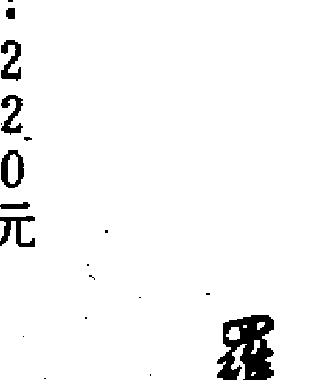

- 住家風水地運自己算 黃文和著：290元
- 嫁娶專業擇日寶鑑 陳仁福著：350元
- 八字流年實例論集（一） 朱原主著：250元
- 八字流年實例論集（二） 朱原主著：250元
- 八字流年實例論集（三） 朱原主著：250元
- 相學氣色大全 王景珍著：290元
- 人體相學 上册 王景珍著：250元
- 人體相學 下册 王景珍著：250元
- 鐵版神數解讀 朱老師著：480元
- 紫微斗數看論健康 黃寶輝著：220元
- 紫微斗數看論財富 黃寶輝著：220元
- 紫微斗數看論婚姻感情 黃寶輝著：220元
- 紫微斗數看個性思想 黃寶輝著：220元
- 神機妙算無師自通 黃添福著：300元
- 奇門遁甲入門法 黃添福著：250元
- 奇門遁甲實用法 黃添福著：250元
- 奇門遁甲天地訣 黃添福著：250元

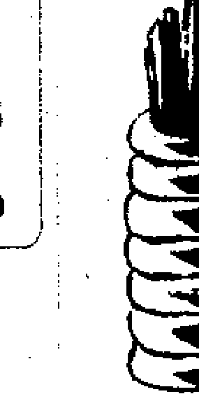

- 周易文王卦野鶴全書 黃文和著：240元
- 周易文王卦入門註解 黃文和著：240元
- 周易文王卦實例註解 黃文和著：250元
- 鐵版神數密法公開 朱原主編著：420元
- 算命神仙的萬年曆（附注音字典） 黃寶輝著：200元
- 姓名學洩天機（五） 程老師：290元
- 姓名學洩天機（四） 程老師：290元
- 姓名學洩天機（三） 程老師：290元
- 姓名學洩天機（二） 程老師：290元
- 姓名學洩天機（一） 程老師：290元
- 紫微斗數入門精論 黃寶輝著：250元
- 專業姓名學精解 黃文和著：250元
- 姓名學精解 黃文和著：250元
- 易經白話實用註解 黃寶輝著：350元
- 住家風水自己看 黃文和著 二版：290元
- 痣相白話精解 鈺城居士著：290元
- 人相白話精解 鈺城居士著：290元
- 八字實戰手冊 許櫻滿著：240元
- 八字用神手冊 許櫻滿著：240元

## 國家圖書館出版品預行編目資料

奇門遁甲實用訣 / 黃添福著. — 初版 —
台北縣深坑鄉 : 易仙道, 2002[民91]
面 ; 公分

ISBN 957-7970-09-8(平裝)
1.占卜
292.5
90022073

奇門遁甲實用法
作 者 : 黃添福
發行人 : 黃許櫻滿
出版者 : 易仙道出版社有限公司
社地址 : 台北縣深坑鄉北深路一段110巷25號三樓
編校者 : 黃文和 · 顏銀松 · 陳仁福 · 林振棋
總經銷 : 農學股份有限公司
經銷處 : 台北縣新店市寶橋路235巷6弄6號二樓
電 話 : 02-29178022
傳 真 : 02-29156275
登記證 : 行政院新聞局局版台業字第6569號
印刷廠 : 世和印製企業有限公司
出版日 : 2002年2月初版一刷
定 價 : 30.80元
ISBN 986-7970-09-8(平裝)
網 址 : http://www.nh.com.tw/
法律部 : 楊明江律師
有著作權 · 翻印必究
本書如有缺頁、破損、裝訂錯誤，請寄回本公司更換

# 奇門遁甲實用法

黃添福 著

趨吉避凶

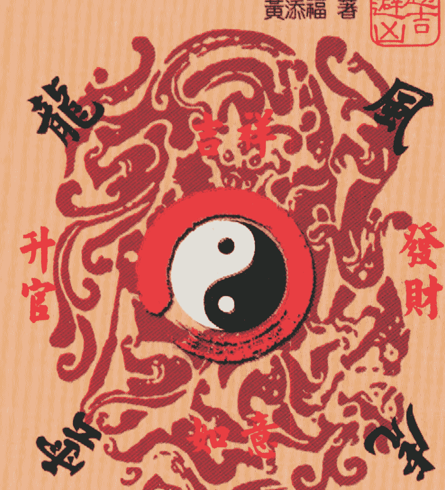

奇門推排會天地 吉門占好運用來