# 風水解碼02

「奇門遁甲」系列共四冊，分基礎篇、工具篇、陽遁篇、陰遁篇，其內容按各日各時辰完整解盤，為全書最大特色，也是創舉。

全台第一套完整揭露奇門遁甲「知命造運」訣竅，適用於各種大小考試、業務協商、開發生意、衝刺業績、外交軍事談判、出國、選舉，甚至戀愛求婚等各方面，教您如何在特定的時間與空間內，如何擷取「趨吉避凶」的能源置換力量，以達到致勝目的。

## 奇門遁甲

## 高俊波編集與萬用開局

## 工具篇

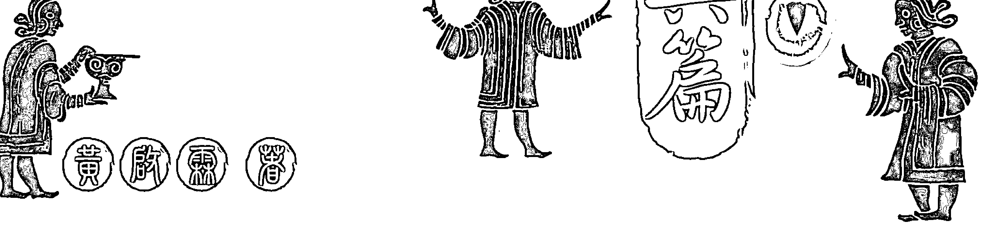

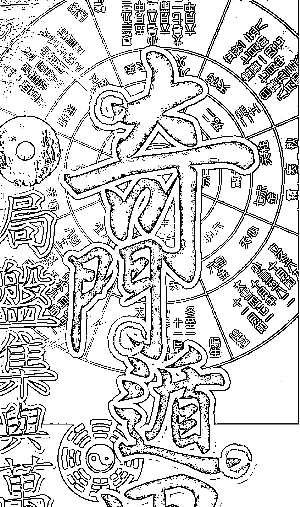

## 目錄

# 序言

## 奇門遁甲 陰陽遁時盤 1,080 局盤

- 陽遁一局 003
- 陽遁二局 015
- 陽遁三局 027
- 陽遁四局 039
- 陽遁五局 051
- 陽遁六局 063
- 陽遁七局 075
- 陽遁八局 087
- 陽遁九局 099
- 陰遁九局 111
- 陰遁八局 123
- 陰遁七局 135
- 陰遁六局 147
- 陰遁五局 159
- 陰遁四局 171
- 陰遁三局 183
- 陰遁二局 195
- 陰遁一局 207

# 奇門遁甲 日盤（五符法）陰陽遁 120 局盤…………… 219

- 陽遁六十局 甲子日～癸亥日………………… 221
- 陰遁六十局 甲子日～癸亥日………………… 243

# 遁甲月盤（上元一局 中元四局 下元七局）………… 265

- 月盤：上元 陰遁一局（丙寅～乙丑月干支 六十月盤）… 267
- 月盤：中元 陰遁四局（丙寅～乙丑月干支 六十月盤）… 279
- 月盤：下元 陰遁七局（丙寅～乙丑月干支 六十月盤）… 291

# 奇門遁甲 時盤專用曆…………………………… 303

# 奇門遁甲日盤（五符法）陰陽遁換遁日 (1990～2030 年)………………… 347

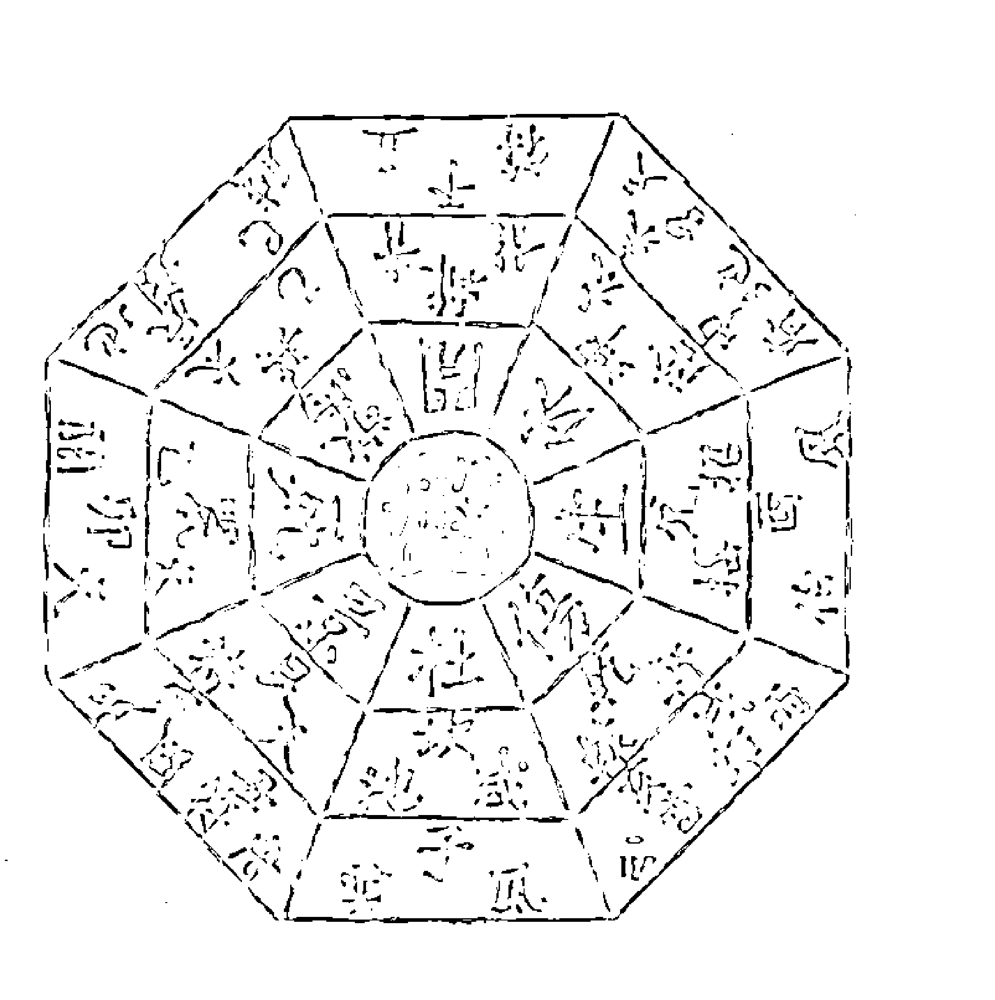

## 〈序言〉

人類從個體覓食而成群遊牧，再定居農耕，這個由單數個體形成集落國家的變化過程中，必定遭遇各種大自然變動與外敵侵犯，使得「攻」與「防」的意識及行動因此萌芽。如何發展農耕使國家富庶？如何在外力環伺之下保衛國家並擊敗敵人？如何擴張地盤使國家更加強盛進步？無不關係「攻」、「防」。

古聖先賢長期不斷觀察「宇宙磁場」，配合「陰陽五行」研究邏輯得知：宇宙的「天時」與「八卦方位空間」，就是所謂天時、地利、人和的天地自然定律。而攻防致勝要訣，不外是進攻時選擇「有利於我」的時辰八卦方位；若遇到「有利於他」的辰方時，則應保持「有利於我」的防守位置，或設法將「有利於他」轉為「有利於我」的致勝契機。如黃帝發明「指南車」，在戰鬥中靈活運用有利於我、不利於他的時辰八卦方位，機動掌握優勢，而於涿鹿之戰擊敗強敵蚩尤。

黃帝根據天時、地利、人和與陰陽五行之磁場原理，始創原為4320局，再經宰相風后整修為1080局之遁甲時盤。從此，中國的朝代興亡史，也可說是奇門遁甲的推演史。因為，各主要朝代興革的關鍵人物，都具奇門遁甲造詣，如周朝姜子牙、漢朝張子房、三國諸葛孔明等，無一不是輔佐帝王開基建業的功臣，而明朝的劉伯溫，則將遁甲之學發揚光大。

在古代，奇門遁甲之學不但被用於戰鬥爭霸、擴張領域，在帝王治國的政治、建設、法律等方面，也是不可或缺的重要寶典，但民間是禁學的，所以有「帝王學」之稱。

在現代社會中，奇門遁甲的應用範圍更是廣泛，國家政治、軍事、經濟、外交，工商企業經營、財務投資借貸，以及求取功名、營造感情等的個人家庭及社會活動，都可用來轉禍為福、趨吉避凶。

一般論命術，如紫微斗數或八字推命，功力高段的人，也可正確推斷運勢吉凶。不過，只能做到「知命而趨吉避凶」，但奇門遁甲卻能做到「知命造運而退惡運」，因為它具有「大氣磁場造運」的積極作用，有「不讓命運主宰自己」的攻擊性，這才是遁甲之學的真正存在價值。若合併兩者的功能性，則更得「知命又能造運」的上乘效果。

本全集之入門篇，係依清朝「古今圖書集成」藝術典術數部奇門遁甲之「煙波釣叟歌」為全書架構，並以簡易文字解說歌詞，使讀者明瞭遁甲各項要訣及其來源。後續則有「工具篇」，將遁甲時盤、日盤、月盤、遁甲專用曆等，整編於一書，方便讀者查閱。「陰遁篇」、「陽遁篇」除列出全部遁甲1080局陰陽時盤八方位及其吉凶格之外，並以「比分法」判斷特定方位的吉凶，讀者若有考試、做業務、談判等之需要時，不必自己排算，就能立刻找出最好的時辰與方位，這是坊間前所未見的作法，將使遁甲書籍成為極簡便之工具書，也將使奇門遁甲更能符合現代生活的實際應用。

## 【奇门遁甲】

### 阴阳遁时盘 1,080 局盘

阳遁一局～阳遁九局（甲子时～癸亥时）

阴遁九局～阴遁一局（甲子时～癸亥时）

| 阳一局 | 己壬 休门 六合 辛 巽四 东南 | 丁 生门 九地 乙 离九 正南 | 癸 伤门 九天 己壬 坤二 西南 |
| :--- | :--- | :--- | :--- |
| 丁卯时 | 乙 杜门 勾陈 庚 震三 正东 | 符首：戊 五中 | 戊 景门 直符 丁 兑七 正西 |
| 直使：天休门 | 辛 死门 太阴 丙 艮八 东北 | 庚 惊门 天乙 戊 坎一 正北 | 丙 开门 螣蛇 癸 乾六 西北 |
| 阳一局 | 己壬 休门 朱雀 辛 巽四 东南 | 丁 生门 九地 乙 离九 正南 | 癸 伤门 九天 己壬 坤二 西南 |
| 丁卯时 | 乙 杜门 勾陈 庚 震三 正东 | 符首：戊 五中 | 戊 景门 直符 丁 兑七 正西 |
| 直使：天休门 | 辛 死门 六合 丙 艮八 东北 | 庚 惊门 太阴 戊 坎一 正北 | 丙 开门 螣蛇 癸 乾六 西北 |

##### 遁甲時盤 陽遁一局

甲己日～戊癸日

甲子時～癸亥時 六十時盤

#### 遁甲时盘 阳遁一局

甲己日

阳一局 甲子时 直符：天蓬 直使：休

| 东南 (巽四) | 正南 (离九) | 西南 (坤二) |
| :--- | :--- | :--- |
| 辛 六合 杜 天辅 辛 | 乙 勾陈 景 天英 乙 | 己壬 朱雀 死 天芮禽 己壬 |
| 庚 太阴 伤 天衡 庚 | 戊 直符 休 天蓬 戊 | 丁 九地 惊 天柱 丁 |
| 丙 螣蛇 生 天任 丙 | 庚 天心 辛 | 癸 九天 开 天心 癸 |

甲己日

阳一局 丁卯时 直符：天蓬 直使：休

| 东南 (巽四) | 正南 (离九) | 西南 (坤二) |
| :--- | :--- | :--- |
| 己壬 朱雀 休 天芮禽 辛 | 丁 九地 生 天柱 乙 | 癸 九天 伤 天心 己壬 |
| 乙 勾陈 开 天英 庚 | 戊 直符 杜 天蓬 丁 | 庚 太阴 死 天衡 戊 |
| 辛 六合 惊 天辅 丙 | 丙 螣蛇 景 天任 癸 | 戊 天蓬 丁 |

甲己日

阳一局 乙丑时 直符：天蓬 直使：休

| 东南 (巽四) | 正南 (离九) | 西南 (坤二) |
| :--- | :--- | :--- |
| 癸 九天 惊 天心 辛 | 戊 直符 开 天蓬 乙 | 丙 螣蛇 休 天任 己壬 |
| 丁 九地 死 天柱 庚 | 庚 太阴 生 天衡 丁 | 勾陈 景 天英 戊 |
| 己壬 朱雀 景 天芮禽 丙 | 乙 勾陈 杜 天英 癸 | 辛 六合 伤 天辅 丙 |

甲己日

阳一局 戊辰时 直符：天蓬 直使：休

| 东南 (巽四) | 正南 (离九) | 西南 (坤二) |
| :--- | :--- | :--- |
| 辛 六合 惊 天辅 辛 | 乙 勾陈 开 天英 乙 | 己壬 朱雀 休 天芮禽 己壬 |
| 庚 太阴 死 天衡 庚 | 丁 九地 生 天柱 丁 | 戊 直符 杜 天蓬 戊 |
| 丙 螣蛇 景 天任 丙 | 庚 天心 戊 | 癸 九天 伤 天心 癸 |

甲己日

阳一局 丙寅时 直符：天蓬 直使：休

| 东南 (巽四) | 正南 (离九) | 西南 (坤二) |
| :--- | :--- | :--- |
| 庚 太阴 生 天衡 辛 | 辛 六合 伤 天辅 乙 | 乙 勾陈 杜 天英 己壬 |
| 丙 螣蛇 休 天任 庚 | 朱雀 景 天芮禽 丁 | 己壬 直符 开 天蓬 戊 |
| 戊 直符 开 天蓬 丙 | 癸 九天 惊 天心 癸 | 丁 九地 死 天柱 丁 |

甲己日

阳一局 己巳时 直符：天蓬 直使：休

| 东南 (巽四) | 正南 (离九) | 西南 (坤二) |
| :--- | :--- | :--- |
| 丁 九地 景 天柱 辛 | 癸 九天 死 天心 乙 | 戊 直符 惊 天蓬 己壬 |
| 己壬 朱雀 杜 天芮禽 庚 | 螣蛇 开 天任 丁 | 丙 勾陈 伤 天英 戊 |
| 乙 勾陈 伤 天英 丙 | 辛 六合 生 天辅 癸 | 庚 太阴 休 天衡 丙 |

##### 甲己日

| 阳二局 | 丙 天任 腾蛇 死 辛 巽四 东南 | 庚 天冲 太阴 惊 乙 离九 正南 | 辛 天辅 六合 开 己壬 坤二 西南 |
| :--- | :--- | :--- | :--- |
| 庚午时 | 戊 天蓬 直符 景 庚 震三 正东 | 五中 符首：戊 | 乙 天英 勾陈 休 丁 兑七 正西 |
| 直符：天蓬 直使：一休 | 癸 天心 九天 杜 丙 艮八 东北 | 丁 天柱 九地 伤 戊 坎一 正北 | 己壬 天芮禽 朱雀 生 癸 乾六 西北 |
| 阳二局 | 乙 天英 勾陈 杜 辛 巽四 东南 | 己壬 天芮禽 朱雀 景 乙 离九 正南 | 丁 天柱 九地 死 己壬 坤二 西南 |
| 癸酉时 | 辛 天辅 六合 伤 庚 震三 正东 | 五中 符首：戊 | 癸 天心 九天 惊 丁 兑七 正西 |
| 直符：天蓬 直使：一休 | 庚 天冲 太阴 生 丙 艮八 东北 | 丙 天任 腾蛇 休 戊 坎一 正北 | 戊 天蓬 直符 开 癸 乾六 西北 |
| 阳二局 | 戊 天蓬 直符 伤 辛 巽四 东南 | 丙 天任 腾蛇 杜 乙 离九 正南 | 庚 天冲 太阴 景 己壬 坤二 西南 |
| 辛未时 | 癸 天心 九天 生 庚 震三 正东 | 五中 符首：戊 | 辛 天辅 六合 死 丁 兑七 正西 |
| 直符：天蓬 直使：一休 | 丁 天柱 九地 休 丙 艮八 东北 | 己壬 天芮禽 朱雀 开 戊 坎一 正北 | 乙 天英 勾陈 惊 癸 乾六 西北 |
| 阳二局 | 辛 天辅 九地 杜 辛 巽四 东南 | 乙 天英 九天 景 乙 离九 正南 | 己壬 天芮禽 直符 死 己壬 坤二 西南 |
| 甲戌时 | 庚 天冲 朱雀 伤 庚 震三 正东 | 五中 符首：己 | 丁 天柱 腾蛇 惊 丁 兑七 正西 |
| 直符：天芮禽 直使：二死 | 丙 天任 勾陈 生 丙 艮八 东北 | 戊 天蓬 六合 休 戊 坎一 正北 | 癸 天心 太阴 开 癸 乾六 西北 |
| 阳二局 | 丁 天柱 九地 开 辛 巽四 东南 | 癸 天心 九天 休 乙 离九 正南 | 戊 天蓬 直符 生 己壬 坤二 西南 |
| 壬申时 | 己壬 天芮禽 朱雀 惊 庚 震三 正东 | 五中 符首：戊 | 丙 天任 腾蛇 伤 丁 兑七 正西 |
| 直符：天蓬 直使：一休 | 乙 天英 勾陈 死 丙 艮八 东北 | 辛 天辅 六合 景 戊 坎一 正北 | 庚 天冲 太阴 杜 癸 乾六 西北 |
| 阳二局 | 乙 天英 九天 惊 辛 巽四 东南 | 己壬 天芮禽 直符 开 乙 离九 正南 | 丁 天柱 腾蛇 休 己壬 坤二 西南 |
| 乙亥时 | 辅 九地 死 庚 震三 正东 | 五中 符首：己 | 癸 天心 太阴 生 丁 兑七 正西 |
| 直符：天芮禽 直使：二死 | 庚 天冲 朱雀 景 丙 艮八 东北 | 丙 天任 勾陈 杜 戊 坎一 正北 | 戊 天蓬 六合 伤 癸 乾六 西北 |

#### 遁甲时盘 阳遁一局

##### 乙庚日

丙子时 直符：天芮禽 直使：二死

| 阳一局 | 癸 太阴 死 辛 巽四 东南 | 戊 六合 惊 乙 离九 正南 | 丙 勾陈 开 己壬 坤二 西南 |
| :--- | :--- | :--- | :--- |
| 丙子时 | 丁 螣蛇 景 庚 震三 正东 | 符首：己 | 庚 朱雀 休 丁 兑七 正西 |
| 直符：天芮禽 直使：二死 | 己壬 直符 杜 丙 艮八 东北 | 乙 九天 伤 戊 坎一 正北 | 辛 九地 生 癸 乾六 西北 |

己卯时 直符：天芮禽 直使：二死

| 阳一局 | 辛 九地 伤 辛 巽四 东南 | 乙 九天 杜 乙 离九 正南 | 己壬 直符 景 己壬 坤二 西南 |
| :--- | :--- | :--- | :--- |
| 己卯时 | 庚 朱雀 生 庚 震三 正东 | 符首：己 | 丁 螣蛇 死 丁 兑七 正西 |
| 直符：天芮禽 直使：二死 | 丙 勾陈 休 丙 艮八 东北 | 戊 六合 开 戊 坎一 正北 | 癸 太阴 惊 癸 乾六 西北 |

丁丑时 直符：天芮禽 直使：二死

| 阳一局 | 庚 朱雀 杜 辛 巽四 东南 | 辛 九地 景 乙 离九 正南 | 乙 九天 死 己壬 坤二 西南 |
| :--- | :--- | :--- | :--- |
| 丁丑时 | 丙 勾陈 伤 庚 震三 正东 | 符首：己 | 己壬 直符 惊 丁 兑七 正西 |
| 直符：天芮禽 直使：二死 | 戊 六合 生 丙 艮八 东北 | 癸 太阴 休 戊 坎一 正北 | 丁 螣蛇 开 癸 乾六 西北 |

庚辰时 直符：天芮禽 直使：二死

| 阳一局 | 丁 螣蛇 开 辛 巽四 东南 | 癸 太阴 休 乙 离九 正南 | 戊 六合 生 己壬 坤二 西南 |
| :--- | :--- | :--- | :--- |
| 庚辰时 | 己壬 直符 惊 庚 震三 正东 | 符首：己 | 丙 勾陈 伤 丁 兑七 正西 |
| 直符：天芮禽 直使：二死 | 乙 九天 死 丙 艮八 东北 | 辛 九地 景 戊 坎一 正北 | 庚 朱雀 杜 癸 乾六 西北 |

戊寅时 直符：天芮禽 直使：二死

| 阳一局 | 戊 六合 生 辛 巽四 东南 | 丙 勾陈 伤 乙 离九 正南 | 庚 朱雀 杜 己壬 坤二 西南 |
| :--- | :--- | :--- | :--- |
| 戊寅时 | 癸 太阴 休 庚 震三 正东 | 符首：己 | 辛 九地 景 丁 兑七 正西 |
| 直符：天芮禽 直使：二死 | 丁 螣蛇 开 丙 艮八 东北 | 己壬 直符 惊 戊 坎一 正北 | 乙 九天 死 癸 乾六 西北 |

辛巳时 直符：天芮禽 直使：二死

| 阳一局 | 己壬 直符 景 辛 巽四 东南 | 丁 螣蛇 死 乙 离九 正南 | 癸 太阴 惊 己壬 坤二 西南 |
| :--- | :--- | :--- | :--- |
| 辛巳时 | 乙 九天 杜 庚 震三 正东 | 符首：己 | 戊 六合 开 丁 兑七 正西 |
| 直符：天芮禽 直使：二死 | 辛 九地 伤 丙 艮八 东北 | 庚 朱雀 生 戊 坎一 正北 | 丙 勾陈 休 癸 乾六 西北 |

##### 乙庚日

阳一局 壬午时 直符：天芮禽 直使：二死

| 辛 天辅 九地 休 巽四 东南 | 乙 天英 九天 生 离九 正南 | 己壬 天芮禽 直符 伤 坤二 西南 |
| :--- | :--- | :--- |
| 庚 天衡 朱雀 开 震三 正东 五中 符首：己 | 符首：己 | 丁 天柱 腾蛇 杜 兑七 正西 |
| 丙 天任 勾陈 凭 艮八 东北 | 戊 天蓬 六合 死 坎一 正北 | 癸 天心 太阴 景 乾六 西北 |

阳一局 乙酉时 直符：天衡 直使：三伤

| 丙 天任 九天 伤 巽四 东南 | 庚 天衡 直符 杜 离九 正南 | 辛 天辅 腾蛇 景 坤二 西南 |
| :--- | :--- | :--- |
| 戊 天蓬 九地 生 震三 正东 五中 | 符首：庚 | 乙 天英 太阴 死 兑七 正西 |
| 癸 天心 朱雀 休 艮八 东北 | 丁 天柱 勾陈 开 坎一 正北 | 己壬 天芮禽 六合 凭 乾六 西北 |

阳一局 癸未时 直符：天芮禽 直使：二死

| 丙 天任 勾陈 杜 巽四 东南 | 庚 天衡 朱雀 景 离九 正南 | 辛 天辅 九地 死 坤二 西南 |
| :--- | :--- | :--- |
| 戊 天蓬 六合 伤 震三 正东 五中 符首：己 | 乙 天英 九天 惊 兑七 正西 | 丁 天柱 腾蛇 休 坎一 正北 |
| 癸 天心 太阴 生 艮八 东北 | 己壬 天芮禽 直符 开 乾六 西北 |

阳一局 丙戌时 直符：天衡 直使：三伤

| 乙 天英 太阴 休 巽四 东南 | 己壬 天芮禽 六合 生 离九 正南 | 丁 天柱 勾陈 伤 坤二 西南 |
| :--- | :--- | :--- |
| 辛 天辅 腾蛇 开 震三 正东 五中 符首：庚 | 癸 天心 朱雀 杜 兑七 正西 | 庚 天衡 直符 惊 坎一 正北 |
| 丙 天任 九天 死 艮八 东北 | 戊 天蓬 九地 景 乾六 西北 |

阳一局 甲申时 直符：天衡 直使：三伤

| 辛 天辅 腾蛇 杜 巽四 东南 | 乙 天英 太阴 景 离九 正南 | 己壬 天芮禽 六合 死 坤二 西南 |
| :--- | :--- | :--- |
| 庚 天衡 直符 伤 震三 正东 五中 符首：庚 | 丁 天柱 勾陈 惊 兑七 正西 | 丙 天任 九天 生 坎一 正北 |
| 戊 天蓬 九地 休 艮八 东北 | 癸 天心 朱雀 开 乾六 西北 |

阳一局 丁亥时 直符：天衡 直使：三伤

| 癸 天心 朱雀 惊 巽四 东南 | 戊 天蓬 九地 开 离九 正南 | 丙 天任 九天 休 坤二 西南 |
| :--- | :--- | :--- |
| 丁 天柱 勾陈 死 震三 正东 五中 符首：庚 | 己壬 天芮禽 六合 景 兑七 正西 | 辛 天辅 腾蛇 伤 坎一 正北 |
| 庚 天衡 直符 生 艮八 东北 | 乙 天英 太阴 杜 乾六 西北 |# 遁甲时盘  阳遁一局

丙辛日

| 己壬 天芮禽 开 辛 巽四 东南 | 丁 天柱 休 乙 离九 正南 | 癸 天心 生 己壬 坤二 西南 |
| :--- | :--- | :--- |
| 乙 天英 惊 庚 震三 正东 | 五中 符首：庚 | 戊 天蓬 伤 丁 兑七 正西 |
| 辛 天辅 死 丙 艮八 东北 | 庚 天衡 景 戊 坎一 正北 | 丙 天任 杜 癸 乾六 西北 |

| 庚 天衡 死 辛 巽四 东南 | 辛 天辅 惊 乙 离九 正南 | 乙 天英 开 己壬 坤二 西南 |
| :--- | :--- | :--- |
| 丙 天任 景 庚 震三 正东 | 五中 符首：庚 | 己壬 天芮禽 休 丁 兑七 正西 |
| 戊 天蓬 杜 丙 艮八 东北 | 癸 天心 伤 戊 坎一 正北 | 丁 天柱 生 癸 乾六 西北 |

| 戊 天蓬 景 辛 巽四 东南 | 丙 天任 死 乙 离九 正南 | 庚 天衡 惊 己壬 坤二 西南 |
| :--- | :--- | :--- |
| 癸 天心 杜 庚 震三 正东 | 五中 符首：庚 | 辛 天辅 开 丁 兑七 正西 |
| 丁 天柱 伤 丙 艮八 东北 | 己壬 天芮禽 生 戊 坎一 正北 | 乙 天英 休 癸 乾六 西北 |

| 戊 天蓬 休 辛 巽四 东南 | 丙 天任 生 乙 离九 正南 | 庚 天衡 伤 己壬 坤二 西南 |
| :--- | :--- | :--- |
| 癸 天心 开 庚 震三 正东 | 五中 符首：庚 | 辛 天辅 杜 丁 兑七 正西 |
| 丁 天柱 惊 丙 艮八 东北 | 己壬 天芮禽 死 戊 坎一 正北 | 乙 天英 景 癸 乾六 西北 |

| 辛 天辅 生 辛 巽四 东南 | 乙 天英 伤 乙 离九 正南 | 己壬 天芮禽 杜 己壬 坤二 西南 |
| :--- | :--- | :--- |
| 庚 天衡 休 庚 震三 正东 | 五中 符首：庚 | 丁 天柱 景 丁 兑七 正西 |
| 丙 天任 开 丙 艮八 东北 | 戊 天蓬 惊 戊 坎一 正北 | 癸 天心 死 癸 乾六 西北 |

| 丁 天柱 杜 辛 巽四 东南 | 癸 天心 景 乙 离九 正南 | 戊 天蓬 死 己壬 坤二 西南 |
| :--- | :--- | :--- |
| 己壬 天芮禽 伤 庚 震三 正东 | 五中 符首：庚 | 丙 天任 惊 丁 兑七 正西 |
| 乙 天英 生 丙 艮八 东北 | 辛 天辅 休 戊 坎一 正北 | 庚 天衡 开 癸 乾六 西北 |

##### 丙 辛 日

阳遁一局 甲午时 直符:天辅 直使:四杜

| 宫位 | 天盘 | 地盘 | 八神 | 八门 | 九星 | 天干 | 方位 |
| :--- | :--- | :--- | :--- | :--- | :--- | :--- | :--- |
| 四 | 辛 | 辛 | 直符 | 杜 | 天辅 | 辛 | 巽四 东南 |
| 九 | 乙 | 乙 | 螣蛇 | 景 | 天英 | 乙 | 离九 正南 |
| 二 | 己壬 | 己壬 | 太阴 | 死 | 天芮禽 | 己壬 | 坤二 西南 |
| 三 | 庚 | 庚 | 九天 | 伤 | 天冲 | 庚 | 震三 正东 |
| 五中 | 符首：辛 | 符首：辛 | 符首：辛 | 符首：辛 | 符首：辛 | 符首：辛 | 五中 |
| 七 | 丁 | 丁 | 六合 | 惊 | 天柱 | 丁 | 兑七 正西 |
| 八 | 丙 | 丙 | 九地 | 生 | 天任 | 丙 | 艮八 东北 |
| 一 | 戊 | 戊 | 朱雀 | 休 | 天蓬 | 戊 | 坎一 正北 |
| 六 | 癸 | 癸 | 勾陈 | 开 | 天心 | 癸 | 乾六 西北 |

阳遁一局 乙未时 直符:天辅 直使:四杜

| 宫位 | 天盘 | 地盘 | 八神 | 八门 | 九星 | 天干 | 方位 |
| :--- | :--- | :--- | :--- | :--- | :--- | :--- | :--- |
| 四 | 庚 | 辛 | 九天 | 生 | 天冲 | 辛 | 巽四 东南 |
| 九 | 辛 | 乙 | 直符 | 伤 | 天辅 | 乙 | 离九 正南 |
| 二 | 乙 | 己壬 | 螣蛇 | 杜 | 天英 | 己壬 | 坤二 西南 |
| 三 | 丙 | 庚 | 九地 | 休 | 天任 | 庚 | 震三 正东 |
| 五中 | 符首：辛 | 符首：辛 | 符首：辛 | 符首：辛 | 符首：辛 | 符首：辛 | 五中 |
| 七 | 己壬 | 丁 | 太阴 | 景 | 天芮禽 | 丁 | 兑七 正西 |
| 八 | 戊 | 丙 | 朱雀 | 开 | 天蓬 | 丙 | 艮八 东北 |
| 一 | 癸 | 戊 | 勾陈 | 惊 | 天心 | 戊 | 坎一 正北 |
| 六 | 丁 | 癸 | 六合 | 死 | 天柱 | 癸 | 乾六 西北 |

阳遁一局 丙申时 直符:天辅 直使:四杜

| 宫位 | 天盘 | 地盘 | 八神 | 八门 | 九星 | 天干 | 方位 |
| :--- | :--- | :--- | :--- | :--- | :--- | :--- | :--- |
| 四 | 己壬 | 辛 | 太阴 | 开 | 天芮禽 | 辛 | 巽四 东南 |
| 九 | 丁 | 乙 | 六合 | 休 | 天柱 | 乙 | 离九 正南 |
| 二 | 癸 | 己壬 | 勾陈 | 生 | 天心 | 己壬 | 坤二 西南 |
| 三 | 乙 | 庚 | 螣蛇 | 惊 | 天英 | 庚 | 震三 正东 |
| 五中 | 符首：辛 | 符首：辛 | 符首：辛 | 符首：辛 | 符首：辛 | 符首：辛 | 五中 |
| 七 | 戊 | 丁 | 朱雀 | 伤 | 天蓬 | 丁 | 兑七 正西 |
| 八 | 辛 | 丙 | 直符 | 死 | 天辅 | 丙 | 艮八 东北 |
| 一 | 庚 | 戊 | 九天 | 景 | 天冲 | 戊 | 坎一 正北 |
| 六 | 丙 | 癸 | 九地 | 杜 | 天任 | 癸 | 乾六 西北 |

阳遁一局 丁酉时 直符:天辅 直使:四杜

| 宫位 | 天盘 | 地盘 | 八神 | 八门 | 九星 | 天干 | 方位 |
| :--- | :--- | :--- | :--- | :--- | :--- | :--- | :--- |
| 四 | 戊 | 辛 | 朱雀 | 休 | 天蓬 | 辛 | 巽四 东南 |
| 九 | 丙 | 乙 | 九地 | 生 | 天任 | 乙 | 离九 正南 |
| 二 | 庚 | 己壬 | 九天 | 伤 | 天冲 | 己壬 | 坤二 西南 |
| 三 | 癸 | 庚 | 勾陈 | 开 | 天心 | 庚 | 震三 正东 |
| 五中 | 符首：辛 | 符首：辛 | 符首：辛 | 符首：辛 | 符首：辛 | 符首：辛 | 五中 |
| 七 | 辛 | 丁 | 直符 | 杜 | 天辅 | 丁 | 兑七 正西 |
| 八 | 丁 | 丙 | 六合 | 惊 | 天柱 | 丙 | 艮八 东北 |
| 一 | 己壬 | 戊 | 太阴 | 死 | 天芮禽 | 戊 | 坎一 正北 |
| 六 | 乙 | 癸 | 螣蛇 | 景 | 天英 | 癸 | 乾六 西北 |

阳遁一局 戊戌时 直符:天辅 直使:四杜

| 宫位 | 天盘 | 地盘 | 八神 | 八门 | 九星 | 天干 | 方位 |
| :--- | :--- | :--- | :--- | :--- | :--- | :--- | :--- |
| 四 | 丁 | 辛 | 六合 | 死 | 天柱 | 辛 | 巽四 东南 |
| 九 | 癸 | 乙 | 勾陈 | 惊 | 天心 | 乙 | 离九 正南 |
| 二 | 戊 | 己壬 | 朱雀 | 开 | 天蓬 | 己壬 | 坤二 西南 |
| 三 | 己壬 | 庚 | 太阴 | 景 | 天芮禽 | 庚 | 震三 正东 |
| 五中 | 符首：辛 | 符首：辛 | 符首：辛 | 符首：辛 | 符首：辛 | 符首：辛 | 五中 |
| 七 | 丙 | 丁 | 九地 | 休 | 天任 | 丁 | 兑七 正西 |
| 八 | 乙 | 丙 | 螣蛇 | 杜 | 天英 | 丙 | 艮八 东北 |
| 一 | 辛 | 戊 | 直符 | 伤 | 天辅 | 戊 | 坎一 正北 |
| 六 | 庚 | 癸 | 九天 | 生 | 天冲 | 癸 | 乾六 西北 |

阳遁一局 己亥时 直符:天辅 直使:四杜

| 宫位 | 天盘 | 地盘 | 八神 | 八门 | 九星 | 天干 | 方位 |
| :--- | :--- | :--- | :--- | :--- | :--- | :--- | :--- |
| 四 | 丙 | 辛 | 九地 | 伤 | 天任 | 辛 | 巽四 东南 |
| 九 | 庚 | 乙 | 九天 | 杜 | 天冲 | 乙 | 离九 正南 |
| 二 | 辛 | 己壬 | 直符 | 景 | 天辅 | 己壬 | 坤二 西南 |
| 三 | 戊 | 庚 | 朱雀 | 生 | 天蓬 | 庚 | 震三 正东 |
| 五中 | 符首：辛 | 符首：辛 | 符首：辛 | 符首：辛 | 符首：辛 | 符首：辛 | 五中 |
| 七 | 乙 | 丁 | 螣蛇 | 死 | 天英 | 丁 | 兑七 正西 |
| 八 | 癸 | 丙 | 勾陈 | 休 | 天心 | 丙 | 艮8 东北 |
| 一 | 丁 | 戊 | 六合 | 开 | 天柱 | 戊 | 坎一 正北 |
| 六 | 己壬 | 癸 | 太阴 | 惊 | 天芮禽 | 癸 | 乾六 西北 |

#### 遁甲时盘 阳遁一局

##### 丁壬日

###### 庚子时

| 阳一局 | | | | | | 阳一局 | | | | | |
| :--- | :--- | :--- | :--- | :--- | :--- | :--- | :--- | :--- | :--- | :--- | :--- |
| 螣蛇 | 惊 | 辛 | 天英 | 太阴 | 开 | 乙 | 天芮禽 | 六合 | 休 | 己壬 | 天柱 |
| | | 巽四 | 东南 | | | 离九 | 正南 | | | 坤二 | 西南 |
| 辛直符 | 死 | 庚 | 天辅 | | 勾陈 | 生 | 丁 | 天心 | | | 符首：辛 |
| | | 震三 | 正东 | 五中 | | | 兑七 | 正西 | | | |
| 九天 | 景 | 丙 | 天冲 | 九地 | 杜 | 戊 | 天任 | 朱雀 | 伤 | 癸 | 天蓬 |
| | | 艮八 | 东北 | | | 坎一 | 正北 | | | 乾六 | 西北 |

###### 癸卯时

| 阳一局 | | | | | | 阳一局 | | | | | |
| :--- | :--- | :--- | :--- | :--- | :--- | :--- | :--- | :--- | :--- | :--- | :--- |
| 勾陈 | 杜 | 辛 | 天心 | 朱雀 | 景 | 乙 | 天蓬 | 九地 | 死 | 己壬 | 天任 |
| | | 巽四 | 东南 | | | 离九 | 正南 | | | 坤二 | 西南 |
| 六合 | 伤 | 庚 | 天柱 | | 九天 | 惊 | 丁 | 天冲 | | | 符首：辛 |
| | | 震三 | 正东 | 五中 | | | 兑七 | 正西 | | | |
| 太阴 | 生 | 丙 | 天芮禽 | 螣蛇 | 休 | 戊 | 天英 | 直符 | 开 | 癸 | 天辅 |
| | | 艮八 | 东北 | | | 坎一 | 正北 | | | 乾六 | 西北 |

###### 辛丑时

| 阳一局 | | | | | | 阳一局 | | | | | |
| :--- | :--- | :--- | :--- | :--- | :--- | :--- | :--- | :--- | :--- | :--- | :--- |
| 直符 | 生 | 辛 | 天辅 | 螣蛇 | 伤 | 乙 | 天英 | 太阴 | 杜 | 己壬 | 天芮禽 |
| | | 巽四 | 东南 | | | 离九 | 正南 | | | 坤二 | 西南 |
| 九天 | 休 | 庚 | 天冲 | | 六合 | 景 | 丁 | 天柱 | | | 符首：辛 |
| | | 震三 | 正东 | 五中 | | | 兑七 | 正西 | | | |
| 九地 | 开 | 丙 | 天任 | 朱雀 | 惊 | 戊 | 天蓬 | 勾陈 | 死 | 癸 | 天心 |
| | | 艮八 | 东北 | | | 坎一 | 正北 | | | 乾六 | 西北 |

###### 甲辰时

| 阳一局 | | | | | | 阳一局 | | | | | |
| :--- | :--- | :--- | :--- | :--- | :--- | :--- | :--- | :--- | :--- | :--- | :--- |
| 九地 | 杜 | 辛 | 天辅 | 九天 | 景 | 乙 | 天英 | 直符 | 死 | 己壬 | 天禽芮 |
| | | 巽四 | 东南 | | | 离九 | 正南 | | | 坤二 | 西南 |
| 朱雀 | 伤 | 庚 | 天冲 | | 螣蛇 | 惊 | 丁 | 天柱 | | | 符首：壬 |
| | | 震三 | 正东 | 五中 | | | 兑七 | 正西 | | | |
| 勾陈 | 生 | 丙 | 天任 | 六合 | 休 | 戊 | 天蓬 | 太阴 | 开 | 癸 | 天心 |
| | | 艮八 | 东北 | | | 坎一 | 正北 | | | 乾六 | 西北 |

###### 壬寅时

| 阳一局 | | | | | | 阳一局 | | | | | |
| :--- | :--- | :--- | :--- | :--- | :--- | :--- | :--- | :--- | :--- | :--- | :--- |
| 九地 | 景 | 丙 | 天任 | 九天 | 死 | 庚 | 天冲 | 直符 | 惊 | 辛 | 天辅 |
| | | 巽四 | 东南 | | | 离九 | 正南 | | | 坤二 | 西南 |
| 朱雀 | 杜 | 戊 | 天蓬 | | 螣蛇 | 开 | 乙 | 天英 | | | 符首：辛 |
| | | 震三 | 正东 | 五中 | | | 兑七 | 正西 | | | |
| 勾陈 | 伤 | 癸 | 天心 | 六合 | 生 | 丁 | 天柱 | 太阴 | 休 | 己壬 | 天芮禽 |
| | | 艮八 | 东北 | | | 坎一 | 正北 | | | 乾六 | 西北 |

###### 乙巳时

| 阳一局 | | | | | | 阳一局 | | | | | |
| :--- | :--- | :--- | :--- | :--- | :--- | :--- | :--- | :--- | :--- | :--- | :--- |
| 九天 | 生 | 辛 | 天英 | 直符 | 伤 | 乙 | 天禽芮 | 螣蛇 | 杜 | 己壬 | 天柱 |
| | | 巽四 | 东南 | | | 离九 | 正南 | | | 坤二 | 西南 |
| 九地 | 休 | 庚 | 天辅 | | 太阴 | 景 | 丁 | 天心 | | | 符首：壬 |
| | | 震三 | 正东 | 五中 | | | 兑七 | 正西 | | | |
| 朱雀 | 开 | 丙 | 天冲 | 勾陈 | 惊 | 戊 | 天任 | 六合 | 死 | 癸 | 天蓬 |
| | | 艮八 | 东北 | | | 坎一 | 正北 | | | 乾六 | 西北 |## 丁壬日

丙午时
阳一局
直符：天禽芮
直使：五死

| 宫位 | 天盘 | 八神 | 人盘（门） | 地盘 | 方位 |
|---|---|---|---|---|---|
| 四 | 癸 | 太阴 | 伤 | 辛 | 巽四 东南 |
| 九 | 戊 | 六合 | 杜 | 乙 | 离九 正南 |
| 二 | 丙 | 勾陈 | 景 | 己壬 | 坤二 西南 |
| 三 | 丁 | 螣蛇 | 生 | 庚 | 震三 正东 |
| 中五 | 庚 | 符首：壬 | | | 五中 |
| 七 | 庚 | 朱雀 | 死 | 丁 | 兑七 正西 |
| 八 | 己壬 | 直符 | 休 | 丙 | 艮八 东北 |
| 一 | 乙 | 九天 | 开 | 戊 | 坎一 正北 |
| 六 | 辛 | 九地 | 惊 | 癸 | 乾六 西北 |

己酉时
阳一局
直符：天禽芮
直使：五死

| 宫位 | 天盘 | 八神 | 人盘（门） | 地盘 | 方位 |
|---|---|---|---|---|---|
| 四 | 辛 | 九地 | 休 | 辛 | 巽四 东南 |
| 九 | 乙 | 九天 | 生 | 乙 | 离九 正南 |
| 二 | 己壬 | 直符 | 伤 | 己壬 | 坤二 西南 |
| 三 | 庚 | 朱雀 | 开 | 庚 | 震三 正东 |
| 中五 | 庚 | 符首：壬 | | | 五中 |
| 七 | 丁 | 螣蛇 | 杜 | 丁 | 兑七 正西 |
| 八 | 丙 | 勾陈 | 惊 | 丙 | 艮八 东北 |
| 一 | 戊 | 六合 | 死 | 戊 | 坎一 正北 |
| 六 | 癸 | 太阴 | 景 | 癸 | 乾六 西北 |

丁未时
阳一局
直符：天禽芮
直使：五死

| 宫位 | 天盘 | 八神 | 人盘（门） | 地盘 | 方位 |
|---|---|---|---|---|---|
| 四 | 庚 | 朱雀 | 开 | 辛 | 巽四 东南 |
| 九 | 辛 | 九地 | 休 | 乙 | 离九 正南 |
| 二 | 乙 | 九天 | 生 | 己壬 | 坤二 西南 |
| 三 | 丙 | 勾陈 | 惊 | 庚 | 震三 正东 |
| 中五 | 庚 | 符首：壬 | | | 五中 |
| 七 | 己壬 | 直符 | 伤 | 丁 | 兑七 正西 |
| 八 | 戊 | 六合 | 死 | 丙 | 艮八 东北 |
| 一 | 癸 | 太阴 | 景 | 戊 | 坎一 正北 |
| 六 | 丁 | 螣蛇 | 杜 | 癸 | 乾六 西北 |

庚戌时
阳一局
直符：天禽芮
直使：五死

| 宫位 | 天盘 | 八神 | 人盘（门） | 地盘 | 方位 |
|---|---|---|---|---|---|
| 四 | 丁 | 螣蛇 | 杜 | 辛 | 巽四 东南 |
| 九 | 癸 | 太阴 | 景 | 乙 | 离九 正南 |
| 二 | 戊 | 六合 | 死 | 己壬 | 坤二 西南 |
| 三 | 己壬 | 直符 | 伤 | 庚 | 震三 正东 |
| 中五 | 庚 | 符首：壬 | | | 五中 |
| 七 | 丙 | 勾陈 | 惊 | 丁 | 兑七 正西 |
| 八 | 乙 | 九天 | 生 | 丙 | 艮八 东北 |
| 一 | 辛 | 九地 | 休 | 戊 | 坎一 正北 |
| 六 | 庚 | 朱雀 | 开 | 癸 | 乾六 西北 |

戊申时
阳一局
直符：天禽芮
直使：五死

| 宫位 | 天盘 | 八神 | 人盘（门） | 地盘 | 方位 |
|---|---|---|---|---|---|
| 四 | 戊 | 六合 | 景 | 辛 | 巽四 东南 |
| 九 | 丙 | 勾陈 | 死 | 乙 | 离九 正南 |
| 二 | 庚 | 朱雀 | 惊 | 己壬 | 坤二 西南 |
| 三 | 癸 | 太阴 | 杜 | 庚 | 震三 正东 |
| 中五 | 庚 | 符首：壬 | | | 五中 |
| 七 | 辛 | 九地 | 开 | 丁 | 兑七 正西 |
| 八 | 丁 | 螣蛇 | 伤 | 丙 | 艮八 东北 |
| 一 | 己壬 | 直符 | 生 | 戊 | 坎一 正北 |
| 六 | 乙 | 九天 | 休 | 癸 | 乾六 西北 |

辛亥时
阳一局
直符：天禽芮
直使：五死

| 宫位 | 天盘 | 八神 | 人盘（门） | 地盘 | 方位 |
|---|---|---|---|---|---|
| 四 | 己壬 | 直符 | 惊 | 辛 | 巽四 东南 |
| 九 | 丁 | 螣蛇 | 开 | 乙 | 离九 正南 |
| 二 | 癸 | 太阴 | 休 | 己壬 | 坤二 西南 |
| 三 | 乙 | 九天 | 生 | 庚 | 震三 正东 |
| 中五 | 庚 | 符首：壬 | | | 五中 |
| 七 | 戊 | 六合 | 死 | 丁 | 兑七 正西 |
| 八 | 辛 | 九地 | 景 | 丙 | 艮八 东北 |
| 一 | 庚 | 朱雀 | 杜 | 戊 | 坎一 正北 |
| 六 | 丙 | 勾陈 | 伤 | 癸 | 乾六 西北 |

##### 遁甲時盤 陽遁一局

##### 戊癸日

阳一局 壬子时
直符：天禽芮 直使：五死

| | | |
|---|---|---|
| 辛 天辅 死 巽四 东南 | 乙 天英 惊 离九 正南 | 己壬 天禽芮 开 坤二 西南 |
| 庚 天衡 景 震三 正东 | 符首：壬 | 丁 天柱 休 兑七 正西 |
| 丙 天任 杜 艮八 东北 | 戊 天蓬 伤 坎一 正北 | 癸 天心 生 乾六 西北 |

阳一局 乙卯时
直符：天心 直使：六开

| | | |
|---|---|---|
| 丁 天柱 景 辛 巽四 东南 | 癸 天心 死 乙 离九 正南 | 戊 天蓬 惊 己壬 坤二 西南 |
| 己壬 天禽芮 杜 庚 震三 正东 | 符首：癸 | 丙 天任 开 丁 兑七 正西 |
| 乙 天英 伤 丙 艮八 东北 | 辛 天辅 生 戊 坎一 正北 | 庚 天衡 休 癸 乾六 西北 |

阳一局 癸丑时
直符：天禽芮 直使：五死

| | | |
|---|---|---|
| 丙 天任 杜 辛 巽四 东南 | 庚 天衡 景 乙 离九 正南 | 辛 天辅 死 己壬 坤二 西南 |
| 戊 天蓬 伤 庚 震三 正东 | 符首：壬 | 乙 天英 惊 丁 兑七 正西 |
| 癸 天心 生 丙 艮八 东北 | 丁 天柱 休 戊 坎一 正北 | 己壬 天禽芮 开 癸 乾六 西北 |

阳一局 丙辰时
直符：天心 直使：六开

| | | |
|---|---|---|
| 丙 天任 生 辛 巽四 东南 | 庚 天衡 伤 乙 离九 正南 | 辛 天辅 杜 己壬 坤二 西南 |
| 戊 天蓬 休 庚 震三 正东 | 符首：癸 | 乙 天英 景 丁 兑七 正西 |
| 癸 天心 开 丙 艮八 东北 | 丁 天柱 惊 戊 坎一 正北 | 己壬 天禽芮 死 癸 乾六 西北 |

阳一局 甲寅时
直符：天心 直使：六开

| | | |
|---|---|---|
| 辛 天辅 杜 辛 巽四 东南 | 乙 天英 景 乙 离九 正南 | 己壬 天禽芮 死 己壬 坤二 西南 |
| 庚 天衡 伤 庚 震三 正东 | 符首：癸 | 丁 天柱 惊 丁 兑七 正西 |
| 丙 天任 生 丙 艮八 东北 | 戊 天蓬 休 戊 坎一 正北 | 癸 天心 开 癸 乾六 西北 |

阳一局 丁巳时
直符：天心 直使：六开

| | | |
|---|---|---|
| 乙 天英 惊 辛 巽四 东南 | 己壬 天禽芮 开 乙 离九 正南 | 丁 天柱 休 己壬 坤二 西南 |
| 辛 天辅 死 庚 震三 正东 | 符首：癸 | 癸 天心 生 丁 兑七 正西 |
| 庚 天衡 景 丙 艮八 东北 | 丙 天任 杜 戊 坎一 正北 | 戊 天蓬 伤 癸 乾六 西北 |

##### 戊癸日

| 庚 六合 伤 天衡 辛 巽四 东南 | 辛 勾陈 杜 天辅 乙 离九 正南 | 乙 朱雀 景 天英 己壬 坤二 西南 |
|---|---|---|
| 丙 太阴 生 天任 庚 震三 正东 | 符首：癸 五中 | 己壬 天芮禽 丁 兑七 正西 |
| 戊 螣蛇 休 天蓬 丙 艮八 东北 | 癸 直符 开 天心 戊 坎一 正北 | 丁 九天 惊 天柱 癸 乾六 西北 |

| 癸 直符 开 天心 辛 巽四 东南 | 戊 螣蛇 休 天蓬 乙 离九 正南 | 丙 太阴 生 天任 己壬 坤二 西南 |
|---|---|---|
| 丁 九天 惊 天柱 庚 震三 正东 | 符首：癸 五中 | 庚 六合 伤 天衡 丁 兑七 正西 |
| 己壬 天芮禽 死 天芮禽 丙 艮八 东北 | 乙 朱雀 景 天英 戊 坎一 正北 | 辛 勾陈 杜 天辅 癸 乾六 西北 |

| 己壬 天芮禽 死 天芮禽 辛 巽四 东南 | 丁 九天 惊 天柱 乙 离九 正南 | 癸 直符 开 天心 己壬 坤二 西南 |
|---|---|---|
| 乙 朱雀 景 天英 庚 震三 正东 | 符首：癸 五中 | 戊 螣蛇 休 天蓬 丁 兑七 正西 |
| 辛 勾陈 杜 天辅 丙 艮八 东北 | 庚 六合 伤 天衡 戊 坎一 正北 | 丙 太阴 生 天任 癸 乾六 西北 |

| 戊 螣蛇 休 天蓬 辛 巽四 东南 | 丙 太阴 生 天任 乙 离九 正南 | 庚 六合 伤 天衡 己壬 坤二 西南 |
|---|---|---|
| 癸 直符 开 天心 庚 震三 正东 | 符首：癸 五中 | 辛 勾陈 杜 天辅 丁 兑七 正西 |
| 丁 九天 惊 天柱 丙 艮八 东北 | 己壬 天芮禽 死 天芮禽 戊 坎一 正北 | 乙 朱雀 景 天英 癸 乾六 西北 |

| 辛 勾陈 杜 天辅 辛 巽四 东南 | 乙 朱雀 景 天英 乙 离九 正南 | 己壬 天芮禽 死 天芮禽 己壬 坤二 西南 |
|---|---|---|
| 庚 六合 伤 天衡 庚 震三 正东 | 符首：癸 五中 | 丁 九天 惊 天柱 丁 兑七 正西 |
| 丙 太阴 生 天任 丙 艮八 东北 | 戊 螣蛇 休 天蓬 戊 坎一 正北 | 癸 直符 开 天心 癸 乾六 西北 |

#### 遁甲時盤 陽遁二局

……………………………………

甲己日～戊癸日

甲子时～癸亥时 六十时盘

##### 遁甲时盘 阳遁二局

##### 甲 己 日

阳二局
甲子时
直符：天芮禽 直使：二死

| 庚杜天辅 | 丙景天英 | 戊辛死天芮禽 |
| 己伤天衡 | 符首：戊 | 癸惊天柱 |
| 丁生天任 | 乙休天蓬 | 壬开天心 |

阳二局
丁卯时
直符：天芮禽 直使：二死

| 壬杜天心 | 乙景天蓬 | 丁死天任 |
| 癸伤天柱 | 符首：戊 | 己惊天衡 |
| 戊辛生天芮禽 | 丙休天英 | 庚开天辅 |

阳二局
乙丑时
直符：天芮禽 直使：二死

| 乙惊天蓬 | 丁开天任 | 己休天衡 |
| 壬死天心 | 符首：戊 | 庚生天辅 |
| 癸景天柱 | 戊辛杜天芮禽 | 丙伤天英 |

阳二局
戊辰时
直符：天芮禽 直使：二死

| 庚生天辅 | 丙伤天英 | 戊辛杜天芮禽 |
| 己休天衡 | 符首：戊 | 癸景天柱 |
| 丁开天任 | 乙惊天蓬 | 壬死天心 |

阳二局
丙寅时
直符：天芮禽 直使：二死

| 丙死天英 | 戊辛惊天芮禽 | 葵开天柱 |
| 庚景天辅 | 符首：戊 | 壬休天心 |
| 己杜天衡 | 丁伤天任 | 乙生天蓬 |

阳二局
己巳时
直符：天芮禽 直使：二死

| 葵伤天柱 | 壬杜天心 | 乙景天蓬 |
| 戊辛生天芮禽 | 符首：戊 | 丁死天任 |
| 丙休天英 | 庚开天辅 | 己惊天衡 |

##### 甲己日

| 天干 | 八神 | 八门 | 九星 | 地支/符首 | 宫位 |
|------|------|------|------|-----------|------|
| 戊辛 | 直符 | 开   | 天芮禽 | 庚        | 巽四 东南 |
| 丙   | 螣蛇 | 休   | 天柱 | 辰        | 离九 正南 |
| 壬   | 太阴 | 生   | 天心 | 戊辛      | 坤二 西南 |
| 丙   | 九天 | 惊   | 天英 | 己        | 震三 正东 |
| 乙   | 六合 | 伤   | 天蓬 | 符首：戊  | 兑七 正西 |
| 庚   | 九地 | 死   | 天辅 | 丁        | 艮八 东北 |
| 己   | 朱雀 | 景   | 天芮 | 乙        | 坎一 正北 |
| 丁   | 勾陈 | 杜   | 天任 | 壬        | 乾六 西北 |

| 天干 | 八神 | 八门 | 九星 | 地支/符首 | 宫位 |
|------|------|------|------|-----------|------|
| 己   | 朱雀 | 杜   | 天辅 | 庚        | 巽四 东南 |
| 庚   | 九地 | 景   | 天英 | 丙        | 离九 正南 |
| 丙   | 九天 | 死   | 天心 | 戊辛      | 坤二 西南 |
| 丁   | 勾陈 | 伤   | 天任 | 己        | 震三 正东 |
| 戊辛 | 直符 | 惊   | 天芮禽 | 符首：戊  | 兑七 正西 |
| 乙   | 六合 | 生   | 天蓬 | 丁        | 艮八 东北 |
| 壬   | 太阴 | 休   | 天心 | 乙        | 坎一 正北 |
| 癸   | 螣蛇 | 开   | 天柱 | 壬        | 乾六 西北 |

| 天干 | 八神 | 八门 | 九星 | 地支/符首 | 宫位 |
|------|------|------|------|-----------|------|
| 庚   | 九地 | 景   | 天辅 | 庚        | 巽四 东南 |
| 丙   | 九天 | 死   | 天英 | 丙        | 离九 正南 |
| 戊辛 | 直符 | 惊   | 天芮禽 | 戊辛      | 坤二 西南 |
| 己   | 朱雀 | 杜   | 天芮 | 己        | 震三 正东 |
| 癸   | 螣蛇 | 开   | 天柱 | 符首：戊  | 兑七 正西 |
| 丁   | 勾陈 | 伤   | 天任 | 丁        | 艮八 东北 |
| 乙   | 六合 | 生   | 天蓬 | 乙        | 坎一 正北 |
| 壬   | 太阴 | 休   | 天心 | 壬        | 乾六 西北 |

| 天干 | 八神 | 八门 | 九星 | 地支/符首 | 宫位 |
|------|------|------|------|-----------|------|
| 庚   | 螣蛇 | 杜   | 天辅 | 庚        | 巽四 东南 |
| 丙   | 太阴 | 景   | 天英 | 丙        | 离九 正南 |
| 戊辛 | 六合 | 死   | 天芮禽 | 戊辛      | 坤二 西南 |
| 己   | 直符 | 伤   | 天任 | 己        | 震三 正东 |
| 癸   | 勾陈 | 惊   | 天柱 | 符首：己  | 兑七 正西 |
| 丁   | 九天 | 生   | 天蓬 | 丁        | 艮八 东北 |
| 乙   | 九地 | 休   | 天心 | 乙        | 坎一 正北 |
| 壬   | 朱雀 | 开   | 天柱 | 壬        | 乾六 西北 |

| 天干 | 八神 | 八门 | 九星 | 地支/符首 | 宫位 |
|------|------|------|------|-----------|------|
| 丁   | 勾陈 | 休   | 天任 | 庚        | 巽四 东南 |
| 己   | 朱雀 | 生   | 天芮 | 丙        | 离九 正南 |
| 庚   | 九地 | 伤   | 天辅 | 戊辛      | 坤二 西南 |
| 乙   | 六合 | 开   | 天蓬 | 己        | 震三 正东 |
| 丙   | 九天 | 杜   | 天英 | 符首：戊  | 兑七 正西 |
| 壬   | 太阴 | 惊   | 天心 | 丁        | 艮八 东北 |
| 癸   | 螣蛇 | 死   | 天柱 | 乙        | 坎一 正北 |
| 戊辛 | 直符 | 景   | 天芮禽 | 壬        | 乾六 西北 |

| 天干 | 八神 | 八门 | 九星 | 地支/符首 | 宫位 |
|------|------|------|------|-----------|------|
| 戊辛 | 六合 | 伤   | 天芮禽 | 庚        | 巽四 东南 |
| 癸   | 勾陈 | 杜   | 天柱 | 丙        | 离九 正南 |
| 壬   | 朱雀 | 景   | 天心 | 戊辛      | 坤二 西南 |
| 丙   | 太阴 | 生   | 天英 | 己        | 震三 正东 |
| 乙   | 九地 | 死   | 天蓬 | 符首：己  | 兑七 正西 |
| 庚   | 螣蛇 | 休   | 天辅 | 丁        | 艮八 东北 |
| 己   | 直符 | 开   | 天芮 | 乙        | 坎一 正北 |
| 丁   | 九天 | 惊   | 天任 | 壬        | 乾六 西北 |# 遁甲時盤 陽遁二局

##### 乙庚日

陽二局 丙子時 直符：天衡 直使：三傷
丁 天任 庚 巽四 東南
己 天衡 丙 離九 正南
庚 天輔 戊辛 坤二 西南
九天 休 直符 生 騰蛇 傷
乙 天蓬 己 震三 正東
五中 丙 天英 癸 兌七 正西
九地 開 符首：己 太陰 杜
壬 天心 丁 艮八 東北
癸 天柱 乙 坎一 正北
戊辛 天芮禽 壬 乾六 西北
朱雀 驚 勾陳 死 合景

陽二局 己卯時 直符：天衡 直使：三傷
庚 天輔 庚 巽四 東南
丙 天英 丙 離九 正南
戊辛 天芮禽 戊辛 坤二 西南
騰蛇 景 太陰 死 合驚
己 天衡 己 震三 正東
五中 癸 天柱 癸 兌七 正西
直符 杜 勾陳 開 符首：己
丁 天任 丁 艮八 東北
乙 天蓬 乙 坎一 正北
壬 天心 壬 乾六 西北
九天 傷 九地 生 朱雀 休

陽二局 丁丑時 直符：天衡 直使：三傷
丙 天英 庚 巽四 東南
戊辛 天芮禽 丙 離九 正南
癸 天柱 戊辛 坤二 西南
太陰 驚 合開 勾陳 休
庚 天輔 己 震三 正東
五中 壬 天心 癸 兌七 正西
騰蛇 死 符首：己 朱雀 生
己 天衡 丁 艮八 東北
丁 天任 乙 坎一 正北
乙 天蓬 壬 乾六 西北
直符 景 九天 杜 九地 傷

陽二局 庚辰時 直符：天衡 直使：三傷
己 天衡 庚 巽四 東南
庚 天輔 丙 離九 正南
丙 天英 戊辛 坤二 西南
直符 生 騰蛇 傷 太陰 杜
丁 天任 丁 震三 正東
五中 戊辛 天芮禽 癸 兌七 正西
九天 休 符首：己 合景
乙 天蓬 乙 艮八 東北
壬 天心 壬 坎一 正北
癸 天柱 癸 乾六 西北
九地 開 朱雀 驚 勾陳 死

陽二局 戊寅時 直符：天衡 直使：三傷
乙 天蓬 庚 巽四 東南
丁 天任 丙 離九 正南
己 天衡 戊辛 坤二 西南
九地 開 九天 休 直符 生
壬 天心 己 震三 正東
五中 庚 天輔 癸 兌七 正西
朱雀 驚 符首：己 騰蛇 傷
癸 天柱 丁 艮八 東北
戊辛 天芮禽 乙 坎一 正北
丙 天英 壬 乾六 西北
勾陳 死 合景 太陰 杜

陽二局 辛巳時 直符：天衡 直使：三傷
乙 天蓬 庚 巽四 東南
丁 天任 丙 離九 正南
己 天衡 戊辛 坤二 西南
九地 死 九天 驚 直符 開
壬 天心 己 震三 正東
五中 庚 天輔 癸 兌七 正西
朱雀 景 符首：己 騰蛇 休
癸 天柱 丁 艮八 東北
戊辛 天芮禽 乙 坎一 正北
丙 天英 壬 乾六 西北
勾陳 杜 合傷 太陰 生

##### 乙庚日

| 陽二局 壬午時 直符：天冲 直使：傷門 | 癸 天柱 休 庚 巽四 東南 | 壬 天心 生 丙 離九 正南 | 乙 天蓬 傷 戊辛 坤二 西南 |
|---|---|---|---|
|  | 戊辛 天芮禽 開 己 震三 正東 | 符首：己 五中 | 丁 天任 杜 癸 兌七 正西 |
|  | 丙 天英 驚 丁 艮八 東北 | 庚 天輔 死 乙 坎一 正北 | 己 天衡 景 壬 乾六 西北 |

| 陽二局 乙酉時 直符：天輔 直使：杜門 | 癸 天柱 生 庚 巽四 東南 | 壬 天心 傷 丙 離九 正南 | 乙 天蓬 杜 戊辛 坤二 西南 |
|---|---|---|---|
|  | 戊辛 天芮禽 休 己 震三 正東 | 符首：庚 五中 | 丁 天任 景 癸 兌七 正西 |
|  | 丙 天英 開 丁 艮八 東北 | 庚 天輔 驚 乙 坎一 正北 | 己 天衡 死 壬 乾六 西北 |

| 陽二局 癸未時 直符：天冲 直使：傷門 | 壬 天心 杜 庚 巽四 東南 | 乙 天蓬 景 丙 離九 正南 | 丁 天任 死 戊辛 坤二 西南 |
|---|---|---|---|
|  | 癸 天柱 傷 己 震三 正東 | 符首：己 五中 | 己 天衡 驚 癸 兌七 正西 |
|  | 戊辛 天芮禽 生 丁 艮八 東北 | 丙 天英 休 乙 坎一 正北 | 庚 天輔 開 壬 乾六 西北 |

| 陽二局 丙戌時 直符：天輔 直使：杜門 | 己 天衡 開 庚 巽四 東南 | 庚 天輔 休 丙 離九 正南 | 丙 天英 生 戊辛 坤二 西南 |
|---|---|---|---|
|  | 丁 天任 驚 己 震三 正東 | 符首：庚 五中 | 戊辛 天芮禽 傷 癸 兌七 正西 |
|  | 乙 天蓬 死 丁 艮八 東北 | 壬 天心 景 乙 坎一 正北 | 癸 天柱 杜 壬 乾六 西北 |

| 陽二局 甲申時 直符：天輔 直使：杜門 | 庚 天輔 杜 庚 巽四 東南 | 丙 天英 景 丙 離九 正南 | 戊辛 天芮禽 死 戊辛 坤二 西南 |
|---|---|---|---|
|  | 己 天衡 傷 己 震三 正東 | 符首：庚 五中 | 癸 天柱 驚 癸 兌七 正西 |
|  | 丁 天任 生 丁 艮八 東北 | 乙 天蓬 休 乙 坎一 正北 | 壬 天心 開 壬 乾六 西北 |

| 陽二局 丁亥時 直符：天輔 直使：杜門 | 戊辛 天芮禽 休 庚 巽四 東南 | 癸 天柱 生 丙 離九 正南 | 壬 天心 傷 戊辛 坤二 西南 |
|---|---|---|---|
|  | 丙 天英 開 己 震三 正東 | 符首：庚 五中 | 乙 天蓬 杜 癸 兌七 正西 |
|  | 庚 天輔 驚 丁 艮八 東北 | 己 天衡 死 乙 坎一 正北 | 丁 天任 景 壬 乾六 西北 |

#### 遁甲時盤 陽遁二局

##### 丙辛日

戊子時
陽二局
直符：天輔 直使：四杜

| 丁 天任 九地 庚 巽四 東南 | 己 天衡 九天 丙 離九 正南 | 庚 天輔 直符 戊辛 坤二 西南 |
|---|---|---|
| 乙 天蓬 朱雀 己 震三 正東 | 符首：庚 五中 | 丙 天英 螣蛇 癸 兌七 正西 |
| 壬 天心 勾陳 丁 艮八 東北 | 癸 天柱 六合 乙 坎一 正北 | 戊辛 天芮禽 太陰 壬 乾六 西北 |

辛卯時
陽二局
直符：天輔 直使：四杜

| 丁 天任 九地 庚 巽四 東南 | 己 天衡 九天 丙 離九 正南 | 庚 天輔 直符 戊辛 坤二 西南 |
|---|---|---|
| 乙 天蓬 朱雀 己 震三 正東 | 符首：庚 五中 | 丙 天英 螣蛇 癸 兌七 正西 |
| 壬 天心 勾陳 丁 艮八 東北 | 癸 天柱 六合 乙 坎一 正北 | 戊辛 天芮禽 太陰 壬 乾六 西北 |

己丑時
陽二局
直符：天輔 直使：四杜

| 丙 天英 螣蛇 庚 巽四 東南 | 戊辛 天芮禽 太陰 丙 離九 正南 | 癸 天柱 六合 戊辛 坤二 西南 |
|---|---|---|
| 庚 天輔 直符 己 震三 正東 | 符首：庚 五中 | 壬 天心 勾陳 癸 兌七 正西 |
| 己 天衡 九天 丁 艮八 東北 | 丁 天任 九地 乙 坎一 正北 | 乙 天蓬 朱雀 壬 乾六 西北 |

壬辰時
陽二局
直符：天輔 直使：四杜

| 壬 天心 勾陳 庚 巽四 東南 | 乙 天蓬 朱雀 丙 離九 正南 | 丁 天任 九地 戊辛 坤二 西南 |
|---|---|---|
| 癸 天柱 六合 己 震三 正東 | 符首：庚 五中 | 己 天衡 九天 癸 兌七 正西 |
| 戊辛 天芮禽 太陰 丁 艮八 東北 | 丙 天英 螣蛇 乙 坎一 正北 | 庚 天輔 直符 壬 乾六 西北 |

庚寅時
陽二局
直符：天輔 直使：四杜

| 庚 天輔 直符 庚 巽四 東南 | 丙 天英 螣蛇 丙 離九 正南 | 戊辛 天芮禽 太陰 戊辛 坤二 西南 |
|---|---|---|
| 己 天衡 九天 己 震三 正東 | 符首：庚 五中 | 癸 天柱 六合 癸 兌七 正西 |
| 丁 天任 九地 丁 艮八 東北 | 乙 天蓬 朱雀 乙 坎一 正北 | 壬 天心 勾陳 壬 乾六 西北 |

癸巳時
陽二局
直符：天輔 直使：四杜

| 乙 天蓬 朱雀 庚 巽四 東南 | 丁 天任 九地 丙 離九 正南 | 己 天衡 九天 戊辛 坤二 西南 |
|---|---|---|
| 壬 天心 勾陳 己 震三 正東 | 符首：庚 五中 | 庚 天輔 直符 癸 兌七 正西 |
| 癸 天柱 六合 丁 艮八 東北 | 戊辛 天芮禽 太陰 乙 坎一 正北 | 丙 天英 螣蛇 壬 乾六 西北 |

##### 丙辛日

陽二局 甲午時 直符：天禽芮 直使：五死

| 九地 杜 天輔 庚 巽四 東南 | 九天 景 天英 丙 離九 正南 | 直符 死 天禽芮 戊辛 坤二 西南 |
|---|---|---|
| 朱雀 傷 天衡 己 震三 正東 | 符首：辛 五中 | 螣蛇 驚 天柱 癸 兌七 正西 |
| 勾陳 生 天任 丁 艮八 東北 | 六合 休 天蓬 乙 坎一 正北 | 太陰 開 天心 壬 乾六 西北 |

陽二局 丁酉時 直符：天禽芮 直使：五死

| 太陰 開 天心 庚 巽四 東南 | 六合 休 天蓬 丙 離九 正南 | 勾陳 生 天任 戊辛 坤二 西南 |
|---|---|---|
| 螣蛇 驚 天柱 己 震三 正東 | 符首：辛 五中 | 朱雀 傷 天衡 癸 兌七 正西 |
| 直符 死 天禽芮 丁 艮八 東北 | 九天 景 天英 乙 坎一 正北 | 九地 杜 天輔 壬 乾六 西北 |

陽二局 乙未時 直符：天禽芮 直使：五死

| 六合 生 天蓬 庚 巽四 東南 | 勾陳 傷 天任 丙 離九 正南 | 朱雀 杜 天衡 戊辛 坤二 西南 |
|---|---|---|
| 太陰 休 天心 己 震三 正東 | 符首：辛 五中 | 九地 景 天輔 癸 兌七 正西 |
| 螣蛇 開 天柱 丁 艮八 東北 | 直符 驚 天禽芮 乙 坎一 正北 | 九天 死 天英 壬 乾六 西北 |

陽二局 戊戌時 直符：天禽芮 直使：五死

| 九地 景 天輔 庚 巽四 東南 | 九天 死 天英 丙 離九 正南 | 直符 驚 天禽芮 戊辛 坤二 西南 |
|---|---|---|
| 朱雀 杜 天衡 己 震三 正東 | 符首：辛 五中 | 螣蛇 開 天柱 癸 兌七 正西 |
| 勾陳 傷 天任 丁 艮八 東北 | 六合 生 天蓬 乙 坎一 正北 | 太陰 休 天心 壬 乾六 西北 |

陽二局 丙申時 直符：天禽芮 直使：五死

| 九天 傷 天英 庚 巽四 東南 | 直符 杜 天禽芮 丙 離九 正南 | 螣蛇 景 天柱 戊辛 坤二 西南 |
|---|---|---|
| 九地 生 天輔 己 震三 正東 | 符首：辛 五中 | 太陰 死 天心 癸 兌七 正西 |
| 朱雀 休 天衡 丁 艮八 東北 | 勾陳 開 天任 乙 坎一 正北 | 六合 驚 天蓬 壬 乾六 西北 |

陽二局 己亥時 直符：天禽芮 直使：五死

| 螣蛇 休 天柱 庚 巽四 東南 | 太陰 生 天心 丙 離九 正南 | 六合 傷 天蓬 戊辛 坤二 西南 |
|---|---|---|
| 直符 開 天禽芮 己 震三 正東 | 符首：辛 五中 | 勾陳 杜 天任 癸 兌七 正西 |
| 九天 驚 天英 丁 艮八 東北 | 九地 死 天輔 乙 坎一 正北 | 朱雀 景 天衡 壬 乾六 西北 |

#### 遁甲時盤 陽遁二局

##### 丁壬日

陽二局 庚子時 直符：天禽芮 直使：五死

| 戊辛 杜 天禽芮 庚 巽四 東南 | 癸 景 天柱 丙 離九 正南 | 壬 死 天心 戊辛 坤二 西南 |
|---|---|---|
| 丙 傷 天英 己 震三 正東 | 符首：辛 | 乙 驚 天蓬 癸 兌七 正西 |
| 庚 生 天輔 丁 艮八 東北 | 己 休 天衡 乙 坎一 正北 | 丁 開 天任 壬 乾六 西北 |

陽二局 癸卯時 直符：天禽芮 直使：五死

| 己 杜 天衡 庚 巽四 東南 | 庚 景 天輔 丙 離九 正南 | 丙 死 天英 戊辛 坤二 西南 |
|---|---|---|
| 丁 傷 天任 己 震三 正東 | 符首：辛 | 戊辛 驚 天禽芮 癸 兌七 正西 |
| 乙 生 天蓬 丁 艮八 東北 | 壬 休 天心 乙 坎一 正北 | 癸 開 天柱 壬 乾六 西北 |

陽二局 辛丑時 直符：天禽芮 直使：五死

| 庚 驚 天輔 庚 巽四 東南 | 丙 開 天英 丙 離九 正南 | 戊辛 休 天禽芮 戊辛 坤二 西南 |
|---|---|---|
| 己 死 天衡 己 震三 正東 | 符首：辛 | 螣蛇 生 天柱 癸 兌七 正西 |
| 丁 景 天任 丁 艮八 東北 | 六合 杜 天蓬 乙 坎一 正北 | 太陰 傷 天心 壬 乾六 西北 |

陽二局 甲辰時 直符：天心 直使：六開

| 庚 杜 天輔 庚 巽四 東南 | 丙 景 天英 丙 離九 正南 | 戊辛 死 天芮禽 戊辛 坤二 西南 |
|---|---|---|
| 己 傷 天衡 己 震三 正東 | 符首：壬 | 九天 驚 天柱 癸 兌七 正西 |
| 太陰 生 天任 丁 艮八 東北 | 螣蛇 休 天蓬 乙 坎一 正北 | 直符 開 天心 壬 乾六 西北 |

陽二局 壬寅時 直符：天禽芮 直使：五死

| 勾陳 死 天任 庚 巽四 東南 | 朱雀 驚 天衡 丙 離九 正南 | 九地 開 天輔 戊辛 坤二 西南 |
|---|---|---|
| 六合 景 天蓬 己 震三 正東 | 符首：辛 | 九天 休 天英 癸 兌七 正西 |
| 太陰 杜 天心 丁 艮八 東北 | 螣蛇 傷 天柱 乙 坎一 正北 | 直符 生 天禽芮 壬 乾六 西北 |

陽二局 乙巳時 直符：天心 直使：六開

| 六合 景 天衡 庚 巽四 東南 | 勾陳 死 天輔 丙 離九 正南 | 朱雀 驚 天英 戊辛 坤二 西南 |
|---|---|---|
| 太陰 杜 天任 己 震三 正東 | 符首：壬 | 九地 開 天芮禽 癸 兌七 正西 |
| 螣蛇 傷 天蓬 丁 艮八 東北 | 直符 生 天心 乙 坎一 正北 | 九天 休 天柱 壬 乾六 西北 |

##### 丁壬日

陽遁三局 丙午時 直符：天心 直使：六合

| 九天 癸 生 庚 巽四 東南 | 直符 壬 傷 丙 離九 正南 | 螣蛇 乙 杜 戊辛 坤二 西南 |
|---|---|---|
| 九地 戊辛 休 己 震三 正東 | 符首：壬 | 太陰 丁 景 癸 兌七 正西 |
| 朱雀 丙 開 丁 艮八 東北 | 勾陳 庚 驚 乙 坎一 正北 | 六合 己 死 壬 乾六 西北 |

陽遁三局 己酉時 直符：天心 直使：六合

| 螣蛇 乙 死 庚 巽四 東南 | 太陰 丁 驚 丙 離九 正南 | 六合 己 開 戊辛 坤二 西南 |
|---|---|---|
| 直符 壬 景 己 震三 正東 | 符首：壬 | 勾陳 庚 休 癸 兌七 正西 |
| 九天 癸 杜 丁 艮八 東北 | 九地 戊辛 傷 乙 坎一 正北 | 朱雀 丙 生 壬 乾六 西北 |

陽遁三局 丁未時 直符：天心 直使：六合

| 太陰 丁 驚 庚 巽四 東南 | 六合 己 開 丙 離九 正南 | 勾陳 庚 休 戊辛 坤二 西南 |
|---|---|---|
| 螣蛇 乙 死 己 震三 正東 | 符首：壬 | 朱雀 丙 生 癸 兌七 正西 |
| 直符 壬 景 丁 艮八 東北 | 九天 癸 杜 乙 坎一 正北 | 九地 戊辛 傷 壬 乾六 西北 |

陽遁三局 庚戌時 直符：天心 直使：六合

| 直符 壬 休 庚 巽四 東南 | 螣蛇 乙 生 丙 離九 正南 | 太陰 丁 傷 戊辛 坤二 西南 |
|---|---|---|
| 九天 癸 開 己 震三 正東 | 符首：壬 | 六合 己 杜 癸 兌七 正西 |
| 九地 戊辛 驚 丁 艮八 東北 | 朱雀 丙 死 乙 坎一 正北 | 勾陳 庚 景 壬 乾六 西北 |

陽遁三局 戊申時 直符：天心 直使：六合

| 九地 戊辛 傷 庚 巽四 東南 | 九天 癸 杜 丙 離九 正南 | 直符 壬 景 戊辛 坤二 西南 |
|---|---|---|
| 朱雀 丙 生 己 震三 正東 | 符首：壬 | 螣蛇 乙 死 癸 兌七 正西 |
| 勾陳 庚 休 丁 艮八 東北 | 六合 己 開 乙 坎一 正北 | 太陰 丁 驚 壬 乾六 西北 |

陽遁三局 辛亥時 直符：天心 直使：六合

| 九地 戊辛 開 庚 巽四 東南 | 九天 癸 休 丙 離九 正南 | 直符 壬 生 戊辛 坤二 西南 |
|---|---|---|
| 朱雀 丙 驚 己 震三 正東 | 符首：壬 | 螣蛇 乙 傷 癸 兌七 正西 |
| 勾陳 庚 死 丁 艮八 東北 | 六合 己 景 乙 坎一 正北 | 太陰 丁 杜 壬 乾六 西北 |

#### 遁甲時盤 陽遁二局

##### 戊癸日

###### 壬子時

|  | 丙 天英 朱雀 驚 離九 正南 | 戊辛 天芮禽 九地 開 坤二 西南 |
| 庚 天輔 勾陳 死 巽四 東南 | 丙 天英 朱雀 驚 離九 正南 | 戊辛 天芮禽 九地 開 坤二 西南 |
| 己 天衡 六合 景 震三 正東 | 符首：壬 | 癸 天柱 九天 休 兌七 正西 |
| 壬 天心 直符 生 乾六 西北 | 壬 天心 直符 生 乾六 西南 |  |
| 丁 天任 太陰 杜 艮八 東北 | 乙 天蓬 螣蛇 傷 坎一 正北 | 壬 天心 直符 生 乾六 西北 |

直符：天心 直使：六儀開

###### 乙卯時

| 丁 天任 六合 休 巽四 東南 | 己 天衡 勾陳 生 離九 正南 | 庚 天輔 朱雀 傷 坤二 西南 |
| 乙 天蓬 太陰 開 震三 正東 | 符首：癸 | 丙 天英 九地 杜 兌七 正西 |
| 壬 天心 螣蛇 驚 乾六 西北 | 壬 天心 螣蛇 驚 乾六 西南 |  |
| 壬 天心 螣蛇 驚 艮八 東北 | 癸 天柱 直符 死 坎一 正北 | 戊辛 天芮禽 九天 景 乾六 西北 |

直符：天柱 直使：七驚

###### 陽二局

| 丙 天英 朱雀 杜 巽四 東南 | 戊辛 天芮禽 九地 景 離九 正南 | 癸 天柱 九天 死 坤二 西南 |
| 庚 天輔 勾陳 傷 震三 正東 | 符首：壬 | 壬 天心 直符 驚 兌七 正西 |
| 乙 天蓬 螣蛇 開 乾六 西北 | 乙 天蓬 螣蛇 開 乾六 西南 |  |
| 己 天衡 六合 生 艮八 東北 | 丁 天任 太陰 休 坎一 正北 | 壬 天心 直符 生 乾六 西北 |

直符：天心 直使：六儀開

###### 陽二局

| 戊辛 天芮禽 九天 死 巽四 東南 | 癸 天柱 直符 驚 離九 正南 | 壬 天心 螣蛇 開 坤二 西南 |
| 丙 天英 九地 景 震三 正東 | 符首：癸 | 乙 天蓬 太陰 休 兌七 正西 |
| 丙 天英 九地 景 乾六 西北 | 丙 天英 九地 景 乾六 西南 |  |
| 庚 天輔 朱雀 杜 艮八 東北 | 己 天衡 勾陳 傷 坎一 正北 | 丁 天任 六合 生 乾六 西北 |

直符：天柱 直使：七驚

###### 陽二局

| 庚 天輔 朱雀 杜 巽四 東南 | 丙 天英 九地 景 離九 正南 | 戊辛 天芮禽 九天 死 坤二 西南 |
| 己 天衡 勾陳 傷 震三 正東 | 符首：癸 | 癸 天柱 直符 驚 兌七 正西 |
| 乙 天蓬 螣蛇 開 乾六 西北 | 乙 天蓬 螣蛇 開 乾六 西南 |  |
| 丁 天任 六合 生 艮八 東北 | 乙 天蓬 太陰 休 坎一 正北 | 壬 天心 螣蛇 開 乾六 西北 |

直符：天柱 直使：七驚

###### 陽二局

| 乙 天蓬 太陰 生 巽四 東南 | 丁 天任 六合 傷 離九 正南 | 己 天衡 勾陳 杜 坤二 西南 |
| 壬 天心 螣蛇 休 震三 正東 | 符首：癸 | 庚 天輔 朱雀 景 兌七 正西 |
| 戊辛 天芮禽 九天 驚 乾六 西北 | 戊辛 天芮禽 九天 驚 乾六 西南 |  |
| 癸 天柱 直符 開 艮八 東北 | 戊辛 天芮禽 九天 驚 坎一 正北 | 丙 天英 九地 死 乾六 西北 |

直符：天柱 直使：七驚# 戊癸日

直符：天柱
直使：七惊
阳局

| 丙 九地 景 庚 巽四 东南 | 戊辛 九天 死 丙 离九 正南 | 癸 直符 惊 戊辛 坤二 西南 |
| :--- | :--- | :--- |
| 庚 朱雀 杜 己 震三 正东 | 符首：癸 五中 | 壬 腾蛇 开 癸 兑七 正西 |
| 己 勾陈 伤 丁 艮八 东北 | 丁 六合 生 乙 坎一 正北 | 乙 太阴 休 壬 乾六 西北 |

直符：天柱
直使：七惊
阳局

| 壬 腾蛇 开 庚 巽四 东南 | 乙 太阴 休 丙 离九 正南 | 丁 六合 生 戊辛 坤二 西南 |
| :--- | :--- | :--- |
| 癸 直符 惊 己 震三 正东 | 符首：癸 五中 | 己 勾陈 伤 癸 兑七 正西 |
| 戊辛 九天 死 丁 艮八 东北 | 丙 九地 景 乙 坎一 正北 | 庚 朱雀 杜 壬 乾六 西北 |

直符：天柱
直使：七惊
阳局

| 癸 直符 惊 庚 巽四 东南 | 壬 腾蛇 开 丙 离九 正南 | 乙 太阴 休 戊辛 坤二 西南 |
| :--- | :--- | :--- |
| 戊辛 九天 死 己 震三 正东 | 符首：癸 五中 | 丁 六合 生 癸 兑七 正西 |
| 丙 九地 景 丁 艮八 东北 | 庚 朱雀 杜 乙 坎一 正北 | 己 勾陈 伤 壬 乾六 西北 |

直符：天柱
直使：七惊
阳局

| 丙 九地 景 庚 巽四 东南 | 戊辛 九天 死 丙 离九 正南 | 癸 直符 惊 戊辛 坤二 西南 |
| :--- | :--- | :--- |
| 庚 朱雀 杜 己 震三 正东 | 符首：癸 五中 | 壬 腾蛇 开 癸 兑七 正西 |
| 己 勾陈 伤 丁 艮八 东北 | 丁 六合 生 乙 坎一 正北 | 乙 太阴 休 壬 乾六 西北 |

直符：天柱
直使：七惊
阳局

| 己 勾陈 伤 庚 巽四 东南 | 庚 朱雀 杜 丙 离九 正南 | 丙 九地 景 戊辛 坤二 西南 |
| :--- | :--- | :--- |
| 丁 六合 生 己 震三 正东 | 符首：癸 五中 | 戊辛 九天 死 癸 兑七 正西 |
| 乙 太阴 休 丁 艮八 东北 | 壬 腾蛇 开 乙 坎一 正北 | 癸 直符 惊 壬 乾六 西北 |

直符：天柱
直使：七惊
阳局

| 庚 朱雀 杜 庚 巽四 东南 | 丙 九地 景 丙 离九 正南 | 戊辛 九天 死 戊辛 坤二 西南 |
| :--- | :--- | :--- |
| 己 勾陈 伤 己 震三 正东 | 符首：癸 五中 | 癸 直符 惊 癸 兑七 正西 |
| 丁 六合 生 丁 艮八 东北 | 乙 太阴 休 乙 坎一 正北 | 壬 腾蛇 开 壬 乾六 西北 |

#### 遁甲時盤 陽遁三局

甲己日～戊癸日

甲子時～癸亥時　六十時盤

#### 遁甲時盤 陽遁三局

##### 甲己日

| 阳三局 | 己 天辅 螣蛇 杜 巽四 東南 | 丁 天英 太阴 景 離九 正南 | 乙庚 天芮禽 六合 死 坤二 西南 |
| :--- | :--- | :--- | :--- |
| 甲子時 直符：天衡 直使：三伤 | 戊 天衡 直符 伤 震三 正東 | 符首：戊 | 壬 天柱 勾陈 惊 兌七 正西 |
| | 癸 天任 九天 生 艮八 東北 | 丙 天蓬 九地 休 坎一 正北 | 辛 天心 朱雀 开 乾六 西北 |

| 阳三局 | 癸 天任 九天 惊 巽四 東南 | 戊 天衡 直符 开 離九 正南 | 己 天辅 螣蛇 休 坤二 西南 |
| :--- | :--- | :--- | :--- |
| 丁卯時 直符：天衡 直使：三伤 | 丙 天蓬 九地 死 震三 正東 | 符首：戊 | 丁 天英 太阴 生 兌七 正西 |
| | 辛 天心 朱雀 景 艮八 東北 | 壬 天柱 勾陈 杜 坎一 正北 | 乙庚 天芮禽 六合 伤 乾六 西北 |

| 阳三局 | 丙 天蓬 九地 伤 巽四 東南 | 癸 天任 九天 杜 離九 正南 | 戊 天衡 直符 景 坤二 西南 |
| :--- | :--- | :--- | :--- |
| 乙丑時 直符：天衡 直使：三伤 | 辛 天心 朱雀 生 震三 正東 | 符首：戊 | 己 天辅 螣蛇 死 兌七 正西 |
| | 壬 天柱 勾陈 休 艮八 東北 | 乙庚 天芮禽 六合 开 坎一 正北 | 丁 天英 太阴 惊 乾六 西北 |

| 阳三局 | 己 天辅 螣蛇 开 巽四 東南 | 丁 天英 太阴 休 離九 正南 | 乙庚 天芮禽 六合 生 坤二 西南 |
| :--- | :--- | :--- | :--- |
| 戊辰時 直符：天衡 直使：三伤 | 戊 天衡 直符 惊 震三 正東 | 符首：戊 | 壬 天柱 勾陈 伤 兌七 正西 |
| | 癸 天任 九天 死 艮八 東北 | 丙 天蓬 九地 景 坎一 正北 | 辛 天心 朱雀 杜 乾六 西北 |

| 阳三局 | 乙庚 天芮禽 六合 休 巽四 東南 | 壬 天柱 勾陈 生 離九 正南 | 辛 天心 朱雀 伤 坤二 西南 |
| :--- | :--- | :--- | :--- |
| 丙寅時 直符：天衡 直使：三伤 | 丁 天英 太阴 开 震三 正東 | 符首：戊 | 丙 天蓬 九地 杜 兌七 正西 |
| | 己 天辅 螣蛇 惊 艮八 東北 | 戊 天衡 直符 死 坎一 正北 | 癸 天任 九天 景 乾六 西北 |

| 阳三局 | 戊 天衡 直符 景 巽四 東南 | 己 天辅 螣蛇 死 離九 正南 | 丁 天英 太阴 惊 坤二 西南 |
| :--- | :--- | :--- | :--- |
| 己巳時 直符：天衡 直使：三伤 | 癸 天任 九天 杜 震三 正東 | 符首：戊 | 乙庚 天芮禽 六合 开 兌七 正西 |
| | 丙 天蓬 九地 伤 艮八 東北 | 辛 天心 朱雀 生 坎一 正北 | 壬 天柱 勾陈 休 乾六 西北 |

##### 甲己日

###### 庚午时
直符：天衡 直使：三伤

| 九地 丙 生 巽四 东南 | 九天 癸 伤 离九 正南 | 直符 戊 杜 坤二 西南 |
| :--- | :--- | :--- |
| 朱雀 辛 休 震三 正东 | 符首：戊 五中 | 螣蛇 己 景 兑七 正西 |
| 勾陈 壬 开 艮八 东北 | 六合 乙庚 惊 坎一 正北 | 太阴 丁 死 乾六 西北 |

###### 癸酉时
直符：天衡 直使：三伤

| 太阴 丁 杜 巽四 东南 | 六合 乙庚 景 离九 正南 | 勾陈 壬 死 坤二 西南 |
| :--- | :--- | :--- |
| 螣蛇 己 伤 震三 正东 | 符首：戊 五中 | 朱雀 辛 惊 兑七 正西 |
| 直符 戊 生 艮八 东北 | 九天 癸 休 坎一 正北 | 九地 丙 开 乾六 西北 |

###### 辛未时
直符：天衡 直使：三伤

| 勾陈 壬 死 艮八 东北 | 朱雀 辛 惊 离九 正南 | 九地 丙 开 坤二 西南 |
| :--- | :--- | :--- |
| 六合 乙庚 景 震三 正东 | 符首：戊 五中 | 九天 癸 休 兑七 正西 |
| 太阴 丁 杜 艮八 东北 | 螣蛇 己 伤 坎一 正北 | 直符 戊 生 乾六 西北 |

###### 甲戌时
直符：天辅 直使：四杜

| 直符 己 杜 巽四 东南 | 螣蛇 丁 景 离九 正南 | 太阴 乙庚 死 坤二 西南 |
| :--- | :--- | :--- |
| 九天 戊 伤 震三 正东 | 符首：己 五中 | 六合 壬 惊 兑七 正西 |
| 九地 癸 生 艮八 东北 | 朱雀 丙 休 坎一 正北 | 勾陈 辛 开 乾六 西北 |

###### 壬申时
直符：天衡 直使：三伤

| 朱雀 辛 休 震三 正东 | 九地 丙 生 离九 正南 | 九天 癸 伤 坤二 西南 |
| :--- | :--- | :--- |
| 勾陈 壬 开 震三 正东 | 符首：戊 五中 | 直符 戊 杜 兑七 正西 |
| 六合 乙庚 惊 艮八 东北 | 太阴 丁 死 坎一 正北 | 螣蛇 己 景 乾六 西北 |

###### 乙亥时
直符：天辅 直使：四杜

| 九地 癸 生 艮八 东北 | 九天 戊 伤 离九 正南 | 直符 己 杜 坤二 西南 |
| :--- | :--- | :--- |
| 朱雀 丙 休 震三 正东 | 符首：己 五中 | 螣蛇 丁 景 兑七 正西 |
| 勾陈 辛 开 艮八 东北 | 六合 壬 惊 坎一 正北 | 太阴 乙庚 死 乾六 西北 |

#### 遁甲時盤 陽遁三局

##### 乙庚日

###### 丙子時

| 宫位/方向 | 天干/地支 | 八门/九星/八神 | 说明 |
| :--- | :--- | :--- | :--- |
| 巽四/东南 | 壬/己 | 开门/天柱星/六合 | 直使：天辅 直符：天任 |
| 离九/正南 | 辛/丁 | 休门/天心星/勾陳 | |
| 坤二/西南 | 丙/乙庚 | 生门/天蓬星/朱雀 | |
| 震三/正东 | 乙庚/戊 | 惊门/天芮禽星/太陰 | 符首：己 |
| 兑七/正西 | 癸/壬 | 伤门/天任星/九地 | |
| 艮八/东北 | 丁/癸 | 死门/天英星/騰蛇 | 直使：天辅 直符：天任 |
| 坎一/正北 | 己/丙 | 景门/天辅星/直符 | |
| 乾六/西北 | 戊/辛 | 杜门/天衡星/九天 | |
| 中五宫 | | | 符首：己 |

###### 己卯時

| 宫位/方向 | 天干/地支 | 八门/九星/八神 | 说明 |
| :--- | :--- | :--- | :--- |
| 巽四/东南 | 己/己 | 伤门/天辅星/直符 | 直使：天辅 直符：天任 |
| 离九/正南 | 丁/丁 | 杜门/天英星/騰蛇 | |
| 坤二/西南 | 乙庚/乙庚 | 景门/天芮禽星/太陰 | |
| 震三/正东 | 戊/戊 | 生门/天衡星/九天 | 符首：己 |
| 兑七/正西 | 壬/壬 | 死门/天柱星/六合 | |
| 艮八/东北 | 癸/癸 | 休门/天任星/九地 | 直使：天辅 直符：天任 |
| 坎一/正北 | 丙/丙 | 开门/天蓬星/朱雀 | |
| 乾六/西北 | 辛/辛 | 惊门/天心星/勾陳 | |
| 中五宫 | | | 符首：己 |

###### 丁丑時

| 宫位/方向 | 天干/地支 | 八门/九星/八神 | 说明 |
| :--- | :--- | :--- | :--- |
| 巽四/东南 | 戊/己 | 休门/天衡星/九天 | 直使：天辅 直符：天任 |
| 离九/正南 | 己/丁 | 生门/天辅星/直符 | |
| 坤二/西南 | 丁/乙庚 | 伤门/天英星/騰蛇 | |
| 震三/正东 | 癸/戊 | 开门/天任星/九地 | 符首：己 |
| 兑七/正西 | 乙庚/壬 | 杜门/天芮禽星/太陰 | |
| 艮八/东北 | 丙/癸 | 惊门/天蓬星/朱雀 | 直使：天辅 直符：天任 |
| 坎一/正北 | 辛/丙 | 死门/天心星/勾陳 | |
| 乾六/西北 | 壬/辛 | 景门/天柱星/六合 | |
| 中五宫 | | | 符首：己 |

###### 庚辰時

| 宫位/方向 | 天干/地支 | 八门/九星/八神 | 说明 |
| :--- | :--- | :--- | :--- |
| 巽四/东南 | 癸/己 | 惊门/天任星/九地 | 直使：天辅 直符：天任 |
| 离九/正南 | 戊/丁 | 开门/天衡星/九天 | |
| 坤二/西南 | 己/乙庚 | 休门/天辅星/直符 | |
| 震三/正东 | 丙/戊 | 死门/天蓬星/朱雀 | 符首：己 |
| 兑七/正西 | 丁/壬 | 生门/天英星/騰蛇 | |
| 艮八/东北 | 辛/癸 | 景门/天心星/勾陳 | 直使：天辅 直符：天任 |
| 坎一/正北 | 壬/丙 | 杜门/天柱星/六合 | |
| 乾六/西北 | 乙庚/辛 | 伤门/天芮禽星/太陰 | |
| 中五宫 | | | 符首：己 |

###### 戊寅時

| 宫位/方向 | 天干/地支 | 八门/九星/八神 | 说明 |
| :--- | :--- | :--- | :--- |
| 巽四/东南 | 丁/己 | 死门/天英星/騰蛇 | 直使：天辅 直符：天任 |
| 离九/正南 | 乙庚/丁 | 惊门/天芮禽星/太陰 | |
| 坤二/西南 | 壬/乙庚 | 开门/天柱星/六合 | |
| 震三/正东 | 己/戊 | 景门/天辅星/直符 | 符首：己 |
| 兑七/正西 | 辛/壬 | 休门/天心星/勾陳 | |
| 艮八/东北 | 戊/癸 | 杜门/天衡星/九天 | 直使：天辅 直符：天任 |
| 坎一/正北 | 癸/丙 | 伤门/天任星/九地 | |
| 乾六/西北 | 丙/辛 | 生门/天蓬星/朱雀 | |
| 中五宫 | | | 符首：己 |

###### 辛巳時

| 宫位/方向 | 天干/地支 | 八门/九星/八神 | 说明 |
| :--- | :--- | :--- | :--- |
| 巽四/东南 | 辛/己 | 生门/天心星/勾陳 | 直使：天辅 直符：天任 |
| 离九/正南 | 丙/丁 | 伤门/天蓬星/朱雀 | |
| 坤二/西南 | 癸/乙庚 | 杜门/天任星/九地 | |
| 震三/正东 | 壬/戊 | 休门/天柱星/六合 | 符首：己 |
| 兑七/正西 | 戊/壬 | 景门/天衡星/九天 | |
| 艮八/东北 | 乙庚/癸 | 开门/天芮禽星/太陰 | 直使：天辅 直符：天任 |
| 坎一/正北 | 丁/丙 | 惊门/天英星/騰蛇 | |
| 乾六/西北 | 己/辛 | 死门/天辅星/直符 | |
| 中五宫 | | | 符首：己 |

##### 乙庚日

| 阳三局 | 丙 | 癸 | 戊 | 阳三局 | 己 | 丁 | 乙庚 |
| :--- | :--- | :--- | :--- | :--- | :--- | :--- | :--- |
| 壬午时 | 朱雀 景 己 巽四 东南 | 九地 死 丁 离九 正南 | 九天 惊 乙庚 坤二 西南 | 乙酉时 | 九地 生 己 巽四 东南 | 九天 伤 丁 离九 正南 | 直符 杜 乙庚 坤二 西南 |
| | 勾陈 杜 戊 震三 正东 | 符首：己 | 直符 开 壬 兑七 正西 | | 朱雀 休 戊 震三 正东 | 符首：庚 | 螣蛇 景 壬 兑七 正西 |
| 直使：天辅 直符：四杜 | 六合 伤 癸 艮八 东北 | 太阴 生 丙 坎一 正北 | 螣蛇 休 辛 乾六 西北 | 直使：天芮 直符：五死 | 勾陈 开 癸 艮八 东北 | 六合 惊 丙 坎一 正北 | 太阴 死 辛 乾六 西北 |

| 阳三局 | 乙庚 | 壬 | 辛 | 阳三局 | 丙 | 癸 | 戊 |
| :--- | :--- | :--- | :--- | :--- | :--- | :--- | :--- |
| 癸未时 | 太阴 杜 己 巽四 东南 | 六合 景 丁 离九 正南 | 勾陈 死 乙庚 坤二 西南 | 丙戌时 | 六合 伤 己 巽四 东南 | 勾陈 杜 丁 离九 正南 | 朱雀 景 乙庚 坤二 西南 |
| | 螣蛇 伤 戊 震三 正东 | 符首：己 | 朱雀 惊 壬 兑七 正西 | | 太阴 生 戊 震三 正东 | 符首：庚 | 九地 死 己 兑七 正西 |
| 直使：天辅 直符：四杜 | 直符 生 癸 艮八 东北 | 九天 休 丙 坎一 正北 | 九地 开 辛 乾六 西北 | 直使：天芮 直符：五死 | 螣蛇 休 癸 艮八 东北 | 直符 开 丙 坎一 正北 | 九天 惊 辛 乾六 西北 |

| 阳三局 | 己 | 丁 | 乙庚 | 阳三局 | 丁 | 乙庚 | 壬 |
| :--- | :--- | :--- | :--- | :--- | :--- | :--- | :--- |
| 甲申时 | 九地 杜 己 巽四 东南 | 九天 景 丁 离九 正南 | 直符 死 乙庚 坤二 西南 | 丁亥时 | 九天 开 己 巽四 东南 | 直符 休 丁 离九 正南 | 螣蛇 生 乙庚 坤二 西南 |
| | 朱雀 伤 戊 震三 正东 | 符首：庚 | 螣蛇 惊 壬 兑七 正西 | | 九地 惊 戊 震三 正东 | 符首：庚 | 太阴 伤 壬 兑七 正西 |
| 直使：天芮 直符：五死 | 勾陈 生 癸 艮八 东北 | 六合 休 丙 坎一 正北 | 太阴 开 辛 乾六 西北 | 直使：天芮 直符：五死 | 朱雀 死 癸 艮八 东北 | 勾陈 景 丙 坎一 正北 | 六合 杜 辛 乾六 西北 |

| 阳三局 | 己 | 丁 | 乙庚 | 阳三局 | 丁 | 乙庚 | 壬 |
| :--- | :--- | :--- | :--- | :--- | :--- | :--- | :--- |
| 壬午时 | 朱雀 景 己 巽四 东南 | 九地 死 丁 离九 正南 | 九天 惊 乙庚 坤二 西南 | 乙酉时 | 九地 生 己 巽四 东南 | 九天 伤 丁 离九 正南 | 直符 杜 乙庚 坤二 西南 |
| | 勾陈 杜 戊 震三 正东 | 符首：己 | 直符 开 壬 兑七 正西 | | 朱雀 休 戊 震三 正东 | 符首：庚 | 螣蛇 景 壬 兑七 正西 |
| 直使：天辅 直符：四杜 | 六合 伤 癸 艮八 东北 | 太阴 生 丙 坎一 正北 | 螣蛇 休 辛 乾六 西北 | 直使：天芮 直符：五死 | 勾陈 开 癸 艮八 东北 | 六合 惊 丙 坎一 正北 | 太阴 死 辛 乾六 西北 |

| 阳三局 | 乙庚 | 壬 | 辛 | 阳三局 | 丙 | 癸 | 戊 |
| :--- | :--- | :--- | :--- | :--- | :--- | :--- | :--- |
| 癸未时 | 太阴 杜 己 巽四 东南 | 六合 景 丁 离九 正南 | 勾陈 死 乙庚 坤二 西南 | 丙戌时 | 六合 伤 己 巽四 东南 | 勾陈 杜 丁 离九 正南 | 朱雀 景 乙庚 坤二 西南 |
| | 螣蛇 伤 戊 震三 正东 | 符首：己 | 朱雀 惊 壬 兑七 正西 | | 太阴 生 戊 震三 正东 | 符首：庚 | 九地 死 己 兑七 正西 |
| 直使：天辅 直符：四杜 | 直符 生 癸 艮八 东北 | 九天 休 丙 坎一 正北 | 九地 开 辛 乾六 西北 | 直使：天芮 直符：五死 | 螣蛇 休 癸 艮八 东北 | 直符 开 丙 坎一 正北 | 九天 惊 辛 乾六 西北 |

| 阳三局 | 己 | 丁 | 乙庚 | 阳三局 | 丁 | 乙庚 | 壬 |
| :--- | :--- | :--- | :--- | :--- | :--- | :--- | :--- |
| 甲申时 | 九地 杜 己 巽四 东南 | 九天 景 丁 离九 正南 | 直符 死 乙庚 坤二 西南 | 丁亥时 | 九天 开 己 巽四 东南 | 直符 休 丁 离九 正南 | 螣蛇 生 乙庚 坤二 西南 |
| | 朱雀 伤 戊 震三 正东 | 符首：庚 | 螣蛇 惊 壬 兑七 正西 | | 九地 惊 戊 震三 正东 | 符首：庚 | 太阴 伤 壬 兑七 正西 |
| 直使：天芮 直符：五死 | 勾陈 生 癸 艮八 东北 | 六合 休 丙 坎一 正北 | 太阴 开 辛 乾六 西北 | 直使：天芮 直符：五死 | 朱雀 死 癸 艮八 东北 | 勾陈 景 丙 坎一 正北 | 六合 杜 辛 乾六 西北 |

##### 遁甲时盘 阳遁三局

##### 丙辛日

| 壬 (景) 天柱 巽四 东南 | 辛 (死) 天心 离九 正南 | 丙 (惊) 天蓬 坤二 西南 |
|---|---|---|
| 乙庚 (杜) 天禽芮 震三 正东 | 符首：庚 五中 | 癸 (开) 天任 兑七 正西 |
| 丁 (伤) 天英 艮八 东北 | 己 (生) 天辅 坎一 正北 | 戊 (休) 天衡 乾六 西北 |

| 癸 (惊) 天任 巽四 东南 | 戊 (开) 天衡 离九 正南 | 己 (休) 天辅 坤二 西南 |
|---|---|---|
| 丙 (死) 天蓬 震三 正东 | 符首：庚 五中 | 丁 (生) 天英 兑七 正西 |
| 辛 (景) 天心 艮八 东北 | 壬 (杜) 天柱 坎一 正北 | 乙庚 (伤) 天禽芮 乾六 西北 |

| 乙庚 (休) 天禽芮 巽四 东南 | 壬 (生) 天柱 离九 正南 | 辛 (伤) 天心 坤二 西南 |
|---|---|---|
| 丁 (开) 天英 震三 正东 | 符首：庚 五中 | 丙 (杜) 天蓬 兑七 正西 |
| 己 (惊) 天辅 艮八 东北 | 戊 (死) 天衡 坎一 正北 | 癸 (景) 天任 乾六 西北 |

| 戊 (死) 天衡 巽四 东南 | 己 (惊) 天辅 离九 正南 | 丁 (开) 天英 坤二 西南 |
|---|---|---|
| 癸 (景) 天任 震三 正东 | 符首：庚 五中 | 乙庚 (休) 天禽芮 兑七 正西 |
| 丙 (杜) 天蓬 艮八 东北 | 辛 (伤) 天心 坎一 正北 | 壬 (生) 天柱 乾六 西北 |

| 己 (杜) 天辅 巽四 东南 | 丁 (景) 天英 离九 正南 | 乙庚 (死) 天禽芮 坤二 西南 |
|---|---|---|
| 戊 (伤) 天衡 震三 正东 | 符首：庚 五中 | 壬 (惊) 天柱 兑七 正西 |
| 癸 (生) 天任 艮八 东北 | 丙 (休) 天蓬 坎一 正北 | 辛 (开) 天心 乾六 西北 |

| 辛 (杜) 天心 巽四 东南 | 丙 (景) 天蓬 离九 正南 | 癸 (死) 天任 坤二 西南 |
|---|---|---|
| 壬 (伤) 天柱 震三 正东 | 符首：庚 五中 | 戊 (惊) 天衡 兑七 正西 |
| 乙庚 (生) 天禽芮 艮八 东北 | 丁 (休) 天英 坎一 正北 | 己 (开) 天辅 乾六 西北 |

##### 丙辛日

###### 甲午时

**直符：天心  直使：六开**

| | 阳三局 | | | 阳三局 | | |
| :--- | :--- | :--- | :--- | :--- | :--- | :--- |
| 勾陈 | 己杜天辅 | 朱雀 | 丁景天英 | 九地 | 乙庚死天芮禽 |
| | 巽四东南 | | 离九正南 | | 坤二西南 |
| 六合 | 戊伤天衡 | | 符首：辛 | 九天 | 壬惊天柱 |
| | 震三正东 | 五中 | | 兑七正西 |
| 太阴 | 癸生天任 | 螣蛇 | 丙休天蓬 | 直符 | 辛开天心 |
| | 艮八东北 | | 坎一正北 | | 乾六西北 |

###### 丁酉时

**直符：天心  直使：六开**

| | 阳三局 | | | 阳三局 | | |
| :--- | :--- | :--- | :--- | :--- | :--- | :--- |
| 九天 | 壬惊天柱 | 直符 | 辛开天心 | 螣蛇 | 丙休天蓬 |
| | 巽四东南 | | 离九正南 | | 坤二西南 |
| 九地 | 乙庚死天芮禽 | | 符首：辛 | 太阴 | 癸生天任 |
| | 震三正东 | 五中 | | 兑七正西 |
| 朱雀 | 丁景天英 | 勾陈 | 己杜天辅 | 六合 | 戊伤天衡 |
| | 艮八东北 | | 坎一正北 | | 乾六西北 |

###### 乙未时

**直符：天心  直使：六开**

| | 阳三局 | | | 阳三局 | | |
| :--- | :--- | :--- | :--- | :--- | :--- | :--- |
| 九地 | 乙庚景天芮禽 | 九天 | 壬死天柱 | 直符 | 辛惊天心 |
| | 巽四东南 | | 离九正南 | | 坤二西南 |
| 朱雀 | 丁杜天英 | | 符首：辛 | 螣蛇 | 丙开天蓬 |
| | 震三正东 | 五中 | | 兑七正西 |
| 勾陈 | 己伤天辅 | 六合 | 戊生天衡 | 太阴 | 癸休天任 |
| | 艮八东北 | | 坎一正北 | | 乾六西北 |

###### 戊戌时

**直符：天心  直使：六开**

| | 阳三局 | | | 阳三局 | | |
| :--- | :--- | :--- | :--- | :--- | :--- | :--- |
| 螣蛇 | 丙伤天蓬 | 太阴 | 癸杜天任 | 六合 | 戊景天衡 |
| | 巽四东南 | | 离九正南 | | 坤二西南 |
| 直符 | 辛生天心 | | 符首：辛 | 勾陈 | 己死天辅 |
| | 震三正东 | 五中 | | 兑七正西 |
| 九天 | 壬休天柱 | 九地 | 乙庚开天芮禽 | 朱雀 | 丁惊天英 |
| | 艮八东北 | | 坎一正北 | | 乾六西北 |

###### 丙申时

**直符：天心  直使：六开**

| | 阳三局 | | | 阳三局 | | |
| :--- | :--- | :--- | :--- | :--- | :--- | :--- |
| 六合 | 戊生天衡 | 勾陈 | 己伤天辅 | 朱雀 | 丁杜天英 |
| | 巽四东南 | | 离九正南 | | 坤二西南 |
| 太阴 | 癸休天任 | | 符首：辛 | 九地 | 乙庚景天芮禽 |
| | 震三正东 | 五中 | | 兑七正西 |
| 螣蛇 | 丙开天蓬 | 直符 | 辛惊天心 | 九天 | 壬死天柱 |
| | 艮八东北 | | 坎一正北 | | 乾六西北 |

###### 己亥时

**直符：天心  直使：六开**

| | 阳三局 | | | 阳三局 | | |
| :--- | :--- | :--- | :--- | :--- | :--- | :--- |
| 直符 | 辛死天心 | 螣蛇 | 丙惊天蓬 | 太阴 | 癸开天任 |
| | 巽四东南 | | 离九正南 | | 坤二西南 |
| 九天 | 壬景天柱 | | 符首：辛 | 六合 | 戊休天衡 |
| | 震三正东 | 五中 | | 兑七正西 |
| 九地 | 乙庚杜天芮禽 | 朱雀 | 丁伤天英 | 勾陈 | 己生天辅 |
| | 艮八东北 | | 坎一正北 | | 乾六西北 |

##### 遁甲时盘 阳遁三局

##### 丁壬日

| 左 | 中 | 右 |
| --- | --- | --- |
| 乙庚 天芮禽 九地 休 巽四 东南 | 壬 天柱 九天 生 离九 正南 | 辛 天心 直符 伤 坤二 西南 |
| 丁 天英 朱雀 开 震三 正东 | 五中 | 丙 天蓬 腾蛇 杜 兑七 正西 |
| 己 天辅 勾陈 惊 艮八 东北 | 戊 天衡 六合 死 坎一 正北 | 癸 天任 太阴 景 乾六 西北 |

| 左 | 中 | 右 |
| --- | --- | --- |
| 癸 天任 太阴 杜 巽四 东南 | 戊 天衡 六合 景 离九 正南 | 己 天辅 勾陈 死 坤二 西南 |
| 丙 天蓬 腾蛇 伤 震三 正东 | 五中 | 丁 天英 朱雀 惊 兑七 正西 |
| 辛 天心 直符 生 艮八 东北 | 壬 天柱 九天 休 坎一 正北 | 乙庚 天芮禽 九地 开 乾六 西北 |

| 左 | 中 | 右 |
| --- | --- | --- |
| 己 天辅 勾陈 开 巽四 东南 | 丁 天英 朱雀 休 离九 正南 | 乙庚 天芮禽 九地 生 坤二 西南 |
| 戊 天衡 六合 惊 震三 正东 | 五中 | 壬 天柱 九天 伤 兑七 正西 |
| 癸 天任 太阴 死 艮八 东北 | 丙 天蓬 腾蛇 景 坎一 正北 | 辛 天心 直符 杜 乾六 西北 |

| 左 | 中 | 右 |
| --- | --- | --- |
| 己 天辅 朱雀 杜 巽四 东南 | 丁 天英 九地 景 离九 正南 | 乙庚 天芮禽 九天 死 坤二 西南 |
| 戊 天衡 勾陈 伤 震三 正东 | 五中 | 壬 天柱 直符 惊 兑七 正西 |
| 癸 天任 六合 生 艮八 东北 | 丙 天蓬 太阴 休 坎一 正北 | 辛 天心 腾蛇 开 乾六 西北 |

| 左 | 中 | 右 |
| --- | --- | --- |
| 丁 天英 朱雀 死 巽四 东南 | 乙庚 天芮禽 九地 惊 离九 正南 | 壬 天柱 九天 开 坤二 西南 |
| 己 天辅 勾陈 景 震三 正东 | 五中 | 辛 天心 直符 休 兑七 正西 |
| 戊 天衡 六合 杜 艮八 东北 | 癸 天任 太阴 伤 坎一 正北 | 丙 天蓬 腾蛇 生 乾六 西北 |

| 左 | 中 | 右 |
| --- | --- | --- |
| 丁 天英 九地 休 巽四 东南 | 乙庚 天芮禽 九天 生 离九 正南 | 壬 天柱 直符 伤 坤二 西南 |
| 己 天辅 朱雀 开 震三 正东 | 五中 | 辛 天心 腾蛇 杜 兑七 正西 |
| 戊 天衡 勾陈 惊 艮八 东北 | 癸 天任 六合 死 坎一 正北 | 丙 天蓬 太阴 景 乾六 西北 |

###### 丙午时

| 阳三局 | 巽四 东南 | 离九 正南 | 坤二 西南 |
| :--- | :--- | :--- | :--- |
| 六合 | 癸 死 任 己 | 戊 惊 衡 丁 | 己 开 辅 乙庚 |
| 太阴 | 丙 景 蓬 戊 | （符首：壬） | 丁 休 英 壬 |
| 螣蛇 | 辛 杜 心 癸 | 壬 伤 柱 丙 | 乙庚 生 芮禽 辛 |
| 直符：天柱 直使：七惊 | 艮八 东北 | 坎一 正北 | 乾六 西北 |

###### 己酉时

| 阳三局 | 巽四 东南 | 离九 正南 | 坤二 西南 |
| :--- | :--- | :--- | :--- |
| 直符 | 壬 开 柱 己 | 辛 休 心 丁 | 丙 生 蓬 乙庚 |
| 九天 | 乙庚 惊 芮禽 戊 | （符首：壬） | 癸 伤 任 壬 |
| 九地 | 丁 死 英 癸 | 己 景 辅 丙 | 戊 杜 衡 辛 |
| 直符：天柱 直使：七惊 | 艮八 东北 | 坎一 正北 | 乾六 西北 |

###### 丁未时

| 阳三局 | 巽四 东南 | 离九 正南 | 坤二 西南 |
| :--- | :--- | :--- | :--- |
| 九天 | 乙庚 生 芮禽 己 | 壬 伤 柱 丁 | 辛 杜 心 乙庚 |
| 九地 | 丁 休 英 戊 | （符首：壬） | 丙 景 蓬 壬 |
| 朱雀 | 己 开 辅 癸 | 戊 惊 衡 丙 | 癸 死 任 辛 |
| 直符：天柱 直使：七惊 | 艮八 东北 | 坎一 正北 | 乾六 西北 |

###### 庚戌时

| 阳三局 | 巽四 东南 | 离九 正南 | 坤二 西南 |
| :--- | :--- | :--- | :--- |
| 九地 | 丁 惊 英 己 | 乙庚 开 芮禽 丁 | 壬 休 柱 乙庚 |
| 朱雀 | 己 死 辅 戊 | （符首：壬） | 辛 生 心 壬 |
| 勾陈 | 戊 景 衡 癸 | 癸 杜 任 丙 | 丙 伤 蓬 辛 |
| 直符：天柱 直使：七惊 | 艮八 东北 | 坎一 正北 | 乾六 西北 |

###### 戊申时

| 阳三局 | 巽四 东南 | 离九 正南 | 坤二 西南 |
| :--- | :--- | :--- | :--- |
| 螣蛇 | 辛 景 心 己 | 丙 死 蓬 丁 | 癸 惊 任 乙庚 |
| 直符 | 壬 杜 柱 戊 | （符首：壬） | 戊 开 衡 壬 |
| 九天 | 乙庚 伤 芮禽 癸 | 丁 生 英 丙 | 己 休 辅 辛 |
| 直符：天柱 直使：七惊 | 艮八 东北 | 坎一 正北 | 乾六 西北 |

###### 辛亥时

| 阳三局 | 巽四 东南 | 离九 正南 | 坤二 西南 |
| :--- | :--- | :--- | :--- |
| 勾陈 | 戊 景 衡 己 | 己 死 辅 丁 | 丁 惊 英 乙庚 |
| 六合 | 癸 杜 任 戊 | （符首：壬） | 乙庚 开 芮禽 壬 |
| 太阴 | 丙 伤 蓬 癸 | 辛 生 心 丙 | 壬 休 柱 辛 |
| 直符：天柱 直使：七惊 | 艮八 东北 | 坎一 正北 | 乾六 西北 |

##### 遁甲时盘 阳遁三局

##### 戊癸日

| 朱雀 己 伤 天辅 巽四 东南 | 九地 丁 杜 天英 离九 正南 | 九天 乙庚 景 天芮禽 坤二 西南 |
|---|---|---|
| 勾陈 戊 生 天衡 震三 正东 | 符首：壬 | 直符 壬 死 天柱 兑七 正西 |
| 六合 癸 休 天任 艮八 东北 | 太阴 丙 开 天蓬 坎一 正北 | 螣蛇 辛 惊 天心 乾六 西北 |

| 九地 己 休 天心 巽四 东南 | 九天 丁 生 天蓬 离九 正南 | 直符 乙庚 伤 天任 坤二 西南 |
|---|---|---|
| 朱雀 壬 开 天柱 震三 正东 | 符首：癸 | 螣蛇 戊 杜 天衡 兑七 正西 |
| 勾陈 乙庚 惊 天芮禽 艮八 东北 | 六合 丁 死 天英 坎一 正北 | 太阴 己 景 天辅 乾六 西北 |

| 太阴 丙 杜 天蓬 巽四 东南 | 六合 癸 景 天任 离九 正南 | 勾陈 戊 死 天衡 坤二 西南 |
|---|---|---|
| 螣蛇 辛 伤 天心 震三 正东 | 符首：壬 | 朱雀 乙庚 惊 天辅 兑七 正西 |
| 直符 壬 生 天柱 艮八 东北 | 九天 丙 休 天蓬 坎一 正北 | 九地 丁 开 天英 乾六 西北 |

| 六合 丁 景 天英 巽四 东南 | 勾陈 乙庚 死 天芮禽 离九 正南 | 朱雀 壬 惊 天柱 坤二 西南 |
|---|---|---|
| 太阴 己 杜 天辅 震三 正东 | 符首：癸 | 九地 辛 开 天心 兑七 正西 |
| 螣蛇 戊 伤 天衡 艮八 东北 | 直符 癸 生 天任 坎一 正北 | 九天 丙 休 天蓬 乾六 西北 |

| 太阴 己 杜 天辅 巽四 东南 | 六合 丁 景 天英 离九 正南 | 勾陈 乙庚 死 天芮禽 坤二 西南 |
|---|---|---|
| 螣蛇 戊 伤 天衡 震三 正东 | 符首：癸 | 朱雀 辛 惊 天心 兑七 正西 |
| 直符 癸 生 天任 艮八 东北 | 九天 丙 休 天蓬 坎一 正北 | 九地 壬 开 天柱 乾六 西北 |

| 九天 丙 开 天蓬 巽四 东南 | 直符 癸 休 天任 离九 正南 | 螣蛇 戊 生 天衡 坤二 西南 |
|---|---|---|
| 九地 辛 惊 天心 震三 正东 | 符首：癸 | 太阴 己 伤 天辅 兑七 正西 |
| 朱雀 壬 死 天柱 艮八 东北 | 勾陈 乙庚 景 天芮禽 坎一 正北 | 六合 丁 杜 天英 乾六 西北 |

#### 戊 癸 日

| 阳三局 | 戊 腾蛇 伤门 己 巽四 东南 | 己 太阴 杜门 丁 离九 正南 | 丁 六合 景门 乙庚 坤二 西南 | 阳三局 | 乙庚 勾陈 死门 己 巽四 东南 | 壬 朱雀 惊门 丁 离九 正南 | 辛 九地 开门 乙庚 坤二 西南 |
| :--- | :--- | :--- | :--- | :--- | :--- | :--- | :--- |
| 戊午时 | 癸 直符 生门 戊 震三 正东 | 五中 | 乙庚 勾陈 死门 壬 兑七 正西 | 辛酉时 | 丁 六合 景门 戊 震三 正东 | 五中 | 丙 九天 休门 壬 兑七 正西 |
| 直使：八天 生任 | 丙 九天 休门 癸 艮八 东北 | 辛 九地 开门 丙 坎一 正北 | 壬 朱雀 惊门 辛 乾六 西北 | 直使：八天 生任 | 己 太阴 杜门 癸 艮八 东北 | 戊 腾蛇 伤门 丙 坎一 正北 | 癸 直符 生门 辛 乾六 西北 |

| 阳三局 | 癸 直符 生门 己 巽四 东南 | 戊 腾蛇 伤门 丁 离九 正南 | 己 太阴 杜门 乙庚 坤二 西南 | 阳三局 | 壬 朱雀 惊门 己 巽四 东南 | 辛 九地 开门 丁 离九 正南 | 丙 九天 休门 乙庚 坤二 西南 |
| :--- | :--- | :--- | :--- | :--- | :--- | :--- | :--- |
| 己未时 | 丙 九天 休门 戊 震三 正东 | 五中 | 丁 六合 景门 壬 兑七 正西 | 壬戌时 | 乙庚 勾陈 死门 戊 震三 正东 | 五中 | 癸 直符 生门 壬 兑七 正西 |
| 直使：八天 生任 | 辛 九地 开门 癸 艮8 东北 | 壬 朱雀 惊门 丙 坎一 正北 | 乙庚 勾陈 死门 辛 乾六 西北 | 直使：八天 生任 | 丁 六合 景门 癸 艮八 东北 | 己 太阴 杜门 丙 坎一 正北 | 戊 腾蛇 伤门 辛 乾六 西北 |

| 阳三局 | 辛 九地 开门 己 巽四 东南 | 丙 九天 休门 丁 离九 正南 | 癸 直符 生门 乙庚 坤二 西南 | 阳三局 | 己 太阴 杜门 己 巽四 东南 | 丁 六合 景门 丁 离九 正南 | 乙庚 勾陈 死门 乙庚 坤二 西南 |
| :--- | :--- | :--- | :--- | :--- | :--- | :--- | :--- |
| 庚申时 | 壬 朱雀 惊门 戊 震三 正东 | 五中 | 戊 腾蛇 伤门 壬 兑七 正西 | 癸亥时 | 戊 腾蛇 伤门 戊 震三 正东 | 五中 | 壬 朱雀 惊门 壬 兑七 正西 |
| 直使：八天 生任 | 乙庚 勾陈 死门 癸 艮八 东北 | 丁 六合 景门 丙 坎一 正北 | 己 太阴 杜门 辛 乾六 西北 | 直使：八天 生任 | 癸 直符 生门 癸 艮八 东北 | 丙 九天 休门 丙 坎一 正北 | 辛 九地 开门 辛 乾六 西北 |

##### 遁甲時盤 陽遁四局

甲己日～戊癸日

甲子時～癸亥時 六十時盤

##### 甲己日

阳四局
甲子時
直符：天辅
直使：四杜

| 戊 天輔 杜 直符 戊 巽四 東南 | 癸 天英 景 騰蛇 癸 離九 正南 | 丙己 天芮禽 死 太陰 丙己 坤二 西南 |
| :--- | :--- | :--- |
| 乙 天衝 傷 九天 乙 震三 正東 | 符首：戊 五中 | 辛 天柱 驚 六合 辛 兌七 正西 |
| 壬 天任 生 九地 壬 艮八 東北 | 丁 天蓬 休 朱雀 丁 坎一 正北 | 庚 天心 開 勾陳 庚 乾六 西北 |

阳四局
乙丑時
直符：天辅
直使：四杜

| 癸 天英 生 騰蛇 戊 巽四 東南 | 丙己 天芮禽 傷 太陰 癸 離九 正南 | 辛 天柱 杜 六合 丙己 坤二 西南 |
| :--- | :--- | :--- |
| 戊 天輔 休 直符 乙 震三 正東 | 符首：戊 五中 | 庚 天心 景 勾陳 辛 兌七 正西 |
| 乙 天衝 開 九天 壬 艮八 東北 | 壬 天任 驚 九地 丁 坎一 正北 | 丁 天蓬 死 朱雀 庚 乾六 西北 |

阳四局
丙寅時
直符：天辅
直使：四杜

| 壬 天任 開 九地 戊 巽四 東南 | 乙 天衝 休 九天 癸 離九 正南 | 戊 天輔 生 直符 丙己 坤二 西南 |
| :--- | :--- | :--- |
| 丁 天蓬 驚 朱雀 乙 震三 正東 | 符首：戊 五中 | 癸 天英 傷 騰蛇 辛 兌七 正西 |
| 庚 天心 死 勾陳 壬 艮八 東北 | 辛 天柱 景 六合 丁 坎一 正北 | 丙己 天芮禽 杜 太陰 庚 乾六 西北 |

阳四局
丁卯時
直符：天辅
直使：四杜

| 辛 天柱 休 六合 戊 巽四 東南 | 庚 天心 生 勾陳 癸 離九 正南 | 丁 天蓬 傷 朱雀 丙己 坤二 西南 |
| :--- | :--- | :--- |
| 丙己 天芮禽 開 太陰 乙 震三 正東 | 符首：戊 五中 | 壬 天任 杜 九地 辛 兌七 正西 |
| 癸 天英 驚 騰蛇 壬 艮八 東北 | 戊 天輔 死 直符 丁 坎一 正北 | 乙 天衝 景 九天 庚 乾六 西北 |

阳四局
戊辰時
直符：天辅
直使：四杜

| 戊 天輔 死 直符 戊 巽四 東南 | 癸 天英 驚 騰蛇 癸 離九 正南 | 丙己 天芮禽 開 太陰 丙己 坤二 西南 |
| :--- | :--- | :--- |
| 乙 天衝 景 九天 乙 震三 正東 | 符首：戊 五中 | 辛 天柱 休 六合 辛 兌七 正西 |
| 壬 天任 杜 九地 壬 艮八 東北 | 丁 天蓬 傷 朱雀 丁 坎一 正北 | 庚 天心 生 勾陳 庚 乾六 西北 |

阳四局
己巳時
直符：天辅
直使：四杜

| 壬 天任 傷 九地 戊 巽四 東南 | 乙 天衝 杜 九天 癸 離九 正南 | 戊 天輔 景 直符 丙己 坤二 西南 |
| :--- | :--- | :--- |
| 丁 天蓬 生 朱雀 乙 震三 正東 | 符首：戊 五中 | 癸 天英 死 騰蛇 辛 兌七 正西 |
| 庚 天心 休 勾陳 壬 艮八 東北 | 辛 天柱 開 六合 丁 坎一 正北 | 丙己 天芮禽 驚 太陰 庚 乾六 西北 |

##### 甲己日

阳四局，庚午时，直符：天辅 直使：四杜

| 东南（巽四） | 正南（离九） | 西南（坤二） |
| :--- | :--- | :--- |
| 勾陈 庚 天心 惊 戊 巽四 东南 | 朱雀 丁 天蓬 开 癸 离九 正南 | 九地 壬 天任 休 丙己 坤二 西南 |
| 六合 辛 天柱 死 乙 震三 正东 | 符首：戊 | 九天 乙 天衡 生 辛 兑七 正西 |
| 太阴 丙己 天禽芮 景 壬 艮八 东北 | 螣蛇 癸 天英 杜 丁 坎一 正北 | 直符 戊 天辅 伤 庚 乾六 西北 |

阳四局，癸酉时，直符：天辅 直使：四杜

| 东南（巽四） | 正南（离九） | 西南（坤二） |
| :--- | :--- | :--- |
| 九天 乙 天衡 杜 戊 巽四 东南 | 直符 戊 天辅 景 癸 离九 正南 | 螣蛇 癸 天英 死 丙己 坤二 西南 |
| 九地 壬 天任 伤 乙 震三 正东 | 符首：戊 | 太阴 丙己 天禽芮 惊 辛 兑七 正西 |
| 朱雀 丁 天蓬 生 壬 艮八 东北 | 勾陈 庚 天心 休 丁 坎一 正北 | 六合 辛 天柱 开 庚 乾六 西北 |

阳四局，辛未时，直符：天辅 直使：四杜

| 东南（巽四） | 正南（离九） | 西南（坤二） |
| :--- | :--- | :--- |
| 朱雀 丁 天蓬 生 戊 巽四 东南 | 九地 壬 天任 伤 癸 离九 正南 | 九天 乙 天衡 杜 丙己 坤二 西南 |
| 勾陈 庚 天心 休 乙 震三 正东 | 符首：戊 | 直符 戊 天辅 景 辛 兑七 正西 |
| 六合 辛 天柱 开 壬 艮八 东北 | 太阴 丙己 天禽芮 惊 丁 坎一 正北 | 螣蛇 癸 天英 死 庚 乾六 西北 |

阳四局，甲戌时，直符：天禽芮 直使：五死

| 东南（巽四） | 正南（离九） | 西南（坤二） |
| :--- | :--- | :--- |
| 九地 戊 天辅 杜 戊 巽四 东南 | 九天 癸 天英 景 癸 离九 正南 | 直符 丙己 天禽芮 死 丙己 坤二 西南 |
| 朱雀 乙 天衡 伤 乙 震三 正东 | 符首：己 | 螣蛇 辛 天柱 惊 辛 兑七 正西 |
| 勾陈 壬 天任 生 壬 艮八 东北 | 六合 丁 天蓬 休 丁 坎一 正北 | 太阴 庚 天心 开 庚 乾六 西北 |

阳四局，壬申时，直符：天辅 直使：四杜

| 东南（巽四） | 正南（离九） | 西南（坤二） |
| :--- | :--- | :--- |
| 太阴 丙己 天禽芮 景 戊 巽四 东南 | 六合 辛 天柱 死 癸 离九 正南 | 勾陈 庚 天心 惊 丙己 坤二 西南 |
| 螣蛇 癸 天英 杜 乙 震三 正东 | 符首：戊 | 朱雀 丁 天蓬 开 辛 兑七 正西 |
| 直符 戊 天辅 伤 壬 艮八 东北 | 九天 乙 天衡 生 丁 坎一 正北 | 九地 壬 天任 休 庚 乾六 西北 |

阳四局，乙亥时，直符：天禽芮 直使：五死

| 东南（巽四） | 正南（离九） | 西南（坤二） |
| :--- | :--- | :--- |
| 螣蛇 辛 天柱 生 戊 巽四 东南 | 太阴 庚 天心 伤 癸 离九 正南 | 六合 丁 天蓬 杜 丙己 坤二 西南 |
| 直符 丙己 天禽芮 休 乙 震三 正东 | 符首：己 | 勾陈 壬 天任 景 辛 兑七 正西 |
| 九天 癸 天英 开 壬 艮8 东北 | 九地 戊 天辅 惊 丁 坎一 正北 | 朱雀 乙 天衡 死 庚 乾六 西北 |

| 阳四局 | 戊 九地 伤 巽四 东南 | 癸 九天 杜 离九 正南 | 丙己 直符 景 坤二 西南 |
| :--- | :--- | :--- | :--- |
| 丙子时 直使：天芮 直符：五死 | 乙 朱雀 生 震三 正东 | 辛 螣蛇 死 兑七 正西 | 壬 勾陈 休 艮八 东北 |
| | 丁 六合 开 坎一 正北 | 庚 太阴 惊 乾六 西北 | |

| 阳四局 | 戊 九地 休 巽四 东南 | 癸 九天 生 离九 正南 | 丙己 直符 伤 坤二 西南 |
| :--- | :--- | :--- | :--- |
| 己卯时 直使：天芮 直符：五死 | 乙 朱雀 开 震三 正东 | 辛 螣蛇 杜 兑七 正西 | 壬 勾陈 惊 艮八 东北 |
| | 丁 六合 死 坎一 正北 | 庚 太阴 景 乾6 西北 | |

| 阳四局 | 丁 六合 开 巽四 东南 | 壬 勾陈 休 离九 正南 | 乙 朱雀 生 坤二 西南 |
| :--- | :--- | :--- | :--- |
| 丁丑时 直使：天芮 直符：五死 | 庚 太阴 惊 震三 正东 | 戊 九地 伤 兑七 正西 | 丙己 直符 景 艮八 东北 |
| | 辛 螣蛇 死 坎一 正北 | 癸 九天 杜 乾6 西北 | |

| 阳四局 | 壬 勾陈 杜 巽四 东南 | 乙 朱雀 景 离九 正南 | 戊 九地 死 坤二 西南 |
| :--- | :--- | :--- | :--- |
| 庚辰时 直使：天芮 直符：五死 | 丁 六合 伤 震三 正东 | 癸 九天 惊 兑七 正西 | 庚 太阴 生 艮八 东北 |
| | 丙己 直符 开 坎一 正北 | 辛 螣蛇 休 乾6 西北 | |

| 阳四局 | 丙己 直符 景 巽四 东南 | 辛 螣蛇 死 离九 正南 | 庚 太阴 惊 坤二 西南 |
| :--- | :--- | :--- | :--- |
| 戊寅时 直使：天芮 直符：五死 | 癸 九天 杜 震三 正东 | 丁 六合 开 兑七 正西 | 壬 勾陈 休 艮八 东北 |
| | 戊 九地 伤 坎一 正北 | 乙 朱雀 生 乾6 西北 | |

| 阳四局 | 乙 朱雀 惊 巽四 东南 | 戊 九地 开 离九 正南 | 癸 九天 休 坤二 西南 |
| :--- | :--- | :--- | :--- |
| 辛巳时 直使：天芮 直符：五死 | 壬 勾陈 死 震三 正东 | 丙己 直符 生 兑七 正西 | 丁 六合 景 艮8 东北 |
| | 庚 太阴 杜 坎一 正北 | 辛 螣蛇 伤 乾6 西北 | |

##### 乙庚日

###### 壬午时 阳四局

直使：天禽芮 直符：五死

| 巽四 (东南) | 离九 (正南) | 坤二 (西南) |
| :--- | :--- | :--- |
| 太阴 死门 天心星 戊 巽四 东南 | 六合 惊门 天蓬星 癸 离九 正南 | 勾陈 开门 天任星 丙己 坤二 西南 |
| 螰蛇 景门 天柱星 乙 震三 正东 | 符首：己 五中 | 朱雀 休门 天衡星 辛 兑七 正西 |
| 直符 杜门 天禽芮 壬 艮八 东北 | 九天 伤门 天英星 丁 坎一 正北 | 九地 生门 天辅星 庚 乾六 西北 |

###### 乙酉时 阳四局

直使：天心 直符：六阴

| 巽四 (东南) | 离九 (正南) | 坤二 (西南) |
| :--- | :--- | :--- |
| 螰蛇 景门 天蓬星 戊 巽四 东南 | 太阴 死门 天任星 癸 离九 正南 | 六合 惊门 天衡星 丙己 坤二 西南 |
| 直符 杜门 天心星 乙 震三 正东 | 符首：庚 五中 | 勾陈 开门 天辅星 辛 兑七 正西 |
| 九天 伤门 天柱星 壬 艮八 东北 | 九地 生门 天禽芮 丁 坎一 正北 | 朱雀 休门 天英星 庚 乾六 西北 |

###### 癸未时 阳四局

直使：天禽芮 直符：五死

| 巽四 (东南) | 离九 (正南) | 坤二 (西南) |
| :--- | :--- | :--- |
| 九天 杜门 天英星 戊 巽四 东南 | 直符 景门 天禽芮 癸 离九 正南 | 螰蛇 死门 天柱星 丙己 坤二 西南 |
| 九地 伤门 天辅星 乙 震三 正东 | 符首：己 五中 | 太阴 惊门 天心星 辛 兑七 正西 |
| 朱雀 生门 天衡星 壬 艮八 东北 | 勾陈 休门 天任星 丁 坎一 正北 | 六合 开门 天蓬星 庚 乾六 西北 |

###### 丙戌时 阳四局

直使：天心 直符：六开

| 巽四 (东南) | 离九 (正南) | 坤二 (西南) |
| :--- | :--- | :--- |
| 九地 生门 天禽芮 戊 巽四 东南 | 九天 伤门 天柱星 癸 离九 正南 | 直符 杜门 天心星 丙己 坤二 西南 |
| 朱雀 休门 天英星 乙 震三 正东 | 符首：庚 五中 | 螰蛇 景门 天蓬星 辛 兑七 正西 |
| 勾陈 开门 天辅星 壬 艮八 东北 | 六合 惊门 天衡星 丁 坎一 正北 | 太阴 死门 天任星 庚 乾六 西北 |

###### 甲申时 阳四局

直使：天心 直符：六开

| 巽四 (东南) | 离九 (正南) | 坤二 (西南) |
| :--- | :--- | :--- |
| 勾陈 杜门 天辅星 戊 巽四 东南 | 朱雀 景门 天英星 癸 离九 正南 | 九地 死门 天禽芮 丙己 坤二 西南 |
| 六合 伤门 天衡星 乙 震三 正东 | 符首：庚 五中 | 九天 惊门 天柱星 辛 兑七 正西 |
| 太阴 生门 天任星 壬 艮八 东北 | 螰蛇 休门 天蓬星 丁 坎一 正北 | 直符 开门 天心星 庚 乾六 西北 |

###### 丁亥时 阳四局

直使：天心 直符：六开

| 巽四 (东南) | 离九 (正南) | 坤二 (西南) |
| :--- | :--- | :--- |
| 六合 惊门 天衡星 戊 巽四 东南 | 勾陈 开门 天辅星 癸 离九 正南 | 朱雀 休门 天英星 丙己 坤二 西南 |
| 太阴 死门 天任星 乙 震三 正东 | 符首：庚 五中 | 九地 生门 天禽芮 辛 兑七 正西 |
| 螰蛇 景门 天蓬星 壬 艮八 东北 | 直符 杜门 天心星 丁 坎一 正北 | 九天 伤门 天柱星 庚 乾六 西北 |# 遁甲时盘 阳遁四局

##### 丙辛日

##### 戊子时
直符：天心 直使：六开

阳四局

| 庚 (天心) | 丁 (天蓬) | 壬 (天任) |
| :---: | :---: | :---: |
| 直符 傷 戊 巽四 東南 | 螣蛇 杜 癸 離九 正南 | 太陰 景 丙己 坤二 西南 |
| 辛 (天柱) | (符首：庚) | 乙 (天衝) |
| 九天 生 乙 震三 正東 | 五中 | 六合 死 辛 兌七 正西 |
| 丙己 (天芮禽) | 癸 (天英) | 戊 (天輔) |
| 九地 休 壬 艮八 東北 | 朱雀 開 丁 坎一 正北 | 勾陳 驚 庚 乾六 西北 |

##### 辛卯时
直符：天心 直使：六开

阳四局

| 癸 (天英) | 丙己 (天芮禽) | 辛 (天柱) |
| :---: | :---: | :---: |
| 朱雀 開 戊 巽四 東南 | 九地 休 癸 離九 正南 | 九天 生 丙己 坤二 西南 |
| 戊 (天輔) | (符首：庚) | 庚 (天心) |
| 勾陳 驚 乙 震三 正東 | 五中 | 直符 傷 辛 兌七 正西 |
| 乙 (天衝) | 壬 (天任) | 丁 (天蓬) |
| 六合 死 壬 艮八 東北 | 太陰 景 丁 坎一 正北 | 螣蛇 杜 庚 乾六 西北 |

##### 己丑时
直符：天心 直使：六开

阳四局

| 丙己 (天芮禽) | 辛 (天柱) | 庚 (天心) |
| :---: | :---: | :---: |
| 九地 死 戊 巽四 東南 | 九天 驚 癸 離九 正南 | 直符 開 丙己 坤二 西南 |
| 癸 (天英) | (符首：庚) | 丁 (天蓬) |
| 朱雀 景 乙 震三 正東 | 五中 | 螣蛇 休 辛 兌七 正西 |
| 戊 (天輔) | 乙 (天衝) | 壬 (天任) |
| 勾陳 杜 壬 艮八 東北 | 六合 傷 丁 坎一 正北 | 太陰 生 庚 乾六 西北 |

##### 壬辰时
直符：天心 直使：六开

阳四局

| 壬 (天任) | 乙 (天衝) | 戊 (天輔) |
| :---: | :---: | :---: |
| 太陰 死 戊 巽四 東南 | 六合 驚 癸 離九 正南 | 勾陳 開 丙己 坤二 西南 |
| 丁 (天蓬) | (符首：庚) | 癸 (天英) |
| 螣蛇 景 乙 震三 正東 | 五中 | 朱雀 休 辛 兌七 正西 |
| 庚 (天心) | 辛 (天柱) | 丙己 (天芮禽) |
| 直符 杜 壬 艮八 東北 | 九天 傷 丁 坎一 正北 | 九地 生 庚 乾六 西北 |

##### 庚寅时
直符：天心 直使：六开

阳四局

| 戊 (天輔) | 癸 (天英) | 丙己 (天芮禽) |
| :---: | :---: | :---: |
| 勾陳 休 戊 巽四 東南 | 朱雀 生 癸 離九 正南 | 九地 傷 丙己 坤二 西南 |
| 乙 (天衝) | (符首：庚) | 辛 (天柱) |
| 六合 開 乙 震三 正東 | 五中 | 九天 杜 辛 兌七 正西 |
| 壬 (天任) | 丁 (天蓬) | 庚 (天心) |
| 太陰 驚 壬 艮八 東北 | 螣蛇 死 丁 坎一 正北 | 直符 景 庚 乾六 西北 |

##### 癸巳时
直符：天心 直使：六开

阳四局

| 辛 (天柱) | 庚 (天心) | 丁 (天蓬) |
| :---: | :---: | :---: |
| 九天 杜 戊 巽四 東南 | 直符 景 癸 離九 正南 | 螣蛇 死 丙己 坤二 西南 |
| 丙己 (天芮禽) | (符首：庚) | 壬 (天任) |
| 九地 傷 乙 震三 正東 | 五中 | 太陰 驚 辛 兌七 正西 |
| 癸 (天英) | 戊 (天輔) | 乙 (天衝) |
| 朱雀 生 壬 艮八 東北 | 勾陳 休 丁 坎一 正北 | 六合 開 庚 乾六 西北 |

##### 丙辛日

阳四局

九宫格排盘表格，内容包含：杜、景、死、伤、惊、休、生、开、死等门，以及戊、癸、丙己、乙、辛、壬、丁、庚等天干，天辅、天英、天芮禽、天冲、天柱、天任、天蓬、天心等星宿，巽四、离九、坤二、震三、兑七、艮八、坎一、乾六等宫位，东南、正南、西南、正东、正西、东北、正北、西北等方位。

甲午时
直符：天柱
直使：七煞

阳四局

九宫格排盘表格，内容包含：生、伤、杜、休、景、惊、死等门，以及壬、乙、戊、丁、癸、丙己、庚、辛等天干，天任、天冲、天辅、天蓬、天英、天芮禽、天心、天柱等星宿，巽四、离九、坤二、震三、兑七、艮八、坎一、乾六等宫位，东南、正南、西南、正东、正西、东北、正北、西北等方位。

丁酉时
直符：天柱
直使：七煞

阳四局

九宫格排盘表格，内容包含：休、生、伤、开、杜、惊、死等门，以及庚、丁、壬、辛、乙、丙己、癸、戊等天干，天心、天蓬、天任、天柱、天冲、天芮禽、天英、天辅等星宿，巽四、离九、坤二、震三、兑七、艮八、坎一、乾六等宫位，东南、正南、西南、正东、正西、东北、正北、西北等方位。

乙未时
直符：天柱
直使：七煞

阳四局

九宫格排盘表格，内容包含：景、死、惊、杜、开、生、休等门，以及辛、庚、丁、丙己、壬、癸、戊、乙等天干，天柱、天心、天蓬、天芮禽、天任、天英、天辅、天冲等星宿，巽四、离九、坤二、震三、兑七、艮八、坎一、乾六等宫位，东南、正南、西南、正东、正西、东北、正北、西北等方位。

戊戌时
直符：天柱
直使：七煞

阳四局

九宫格排盘表格，内容包含：死、惊、开、景、休、杜、生等门，以及癸、丙己、辛、戊、庚、乙、壬、丁等天干，天英、天芮禽、天柱、天辅、天心、天冲、天任、天蓬等星宿，巽四、离九、坤二、震三、兑七、艮八、坎一、乾六等宫位，东南、正南、西南、正东、正西、东北、正北、西北等方位。

丙申时
直符：天柱
直使：七煞

阳四局

九宫格排盘表格，内容包含：开、休、生、惊、死、伤、杜等门，以及癸、丙己、辛、戊、庚、乙、壬、丁等天干，天英、天芮禽、天柱、天辅、天心、天冲、天任、天蓬等星宿，巽四、离九、坤二、震三、兑七、艮八、坎一、乾六等宫位，东南、正南、西南、正东、正西、东北、正北、西北等方位。

己亥时
直符：天柱
直使：七煞

##### 丁壬日

| 乙 天衡 戊 巽四 東南 勾陳 驚 | 戊 天輔 癸 離九 正南 朱雀 開 | 癸 天英 丙己 坤二 西南 九地 休 |
| 壬 天任 乙 震三 正東 六合 死 | (符首：辛) 五中 | 丙己 天芮禽 辛 兌七 正西 九天 生 |
| 丁 天蓬 壬 艮八 東北 太陰 景 | 庚 天心 丁 坎一 正北 螣蛇 杜 | 辛 天柱 庚 乾六 西北 直符 傷 |
| 直使：天柱 直符：七驚 | 庚子時 | |

| 丙己 天芮禽 戊 巽四 東南 九天 杜 | 辛 天柱 癸 離九 正南 直符 景 | 庚 天心 丙己 坤二 西南 螣蛇 死 |
| 癸 天英 乙 震三 正東 九地 傷 | (符首：辛) 五中 | 丁 天蓬 辛 兌七 正西 太陰 驚 |
| 戊 天輔 壬 艮八 東北 朱雀 生 | 乙 天衡 丁 坎一 正北 勾陳 休 | 壬 天任 庚 乾六 西北 六合 開 |
| 直使：天柱 直符：七驚 | 癸卯時 | |

| 戊 天輔 戊 巽四 東南 朱雀 景 | 癸 天英 癸 離九 正南 九地 死 | 丙己 天芮禽 丙己 坤二 西南 九天 驚 |
| 乙 天衡 乙 震三 正東 勾陳 杜 | (符首：辛) 五中 | 辛 天柱 辛 兌七 正西 直符 開 |
| 壬 天任 壬 艮八 東北 六合 傷 | 丁 天蓬 丁 坎一 正北 太陰 生 | 庚 天心 庚 乾六 西北 螣蛇 休 |
| 直使：天柱 直符：七驚 | 辛丑時 | |

| 戊 天輔 戊 巽四 東南 太陰 杜 | 癸 天英 癸 離九 正南 六合 景 | 丙己 天芮禽 丙己 坤二 西南 勾陳 死 |
| 乙 天衡 乙 震三 正東 螣蛇 傷 | (符首：壬) 五中 | 辛 天柱 辛 兌七 正西 朱雀 驚 |
| 壬 天任 壬 艮八 東北 直符 生 | 丁 天蓬 丁 坎一 正北 九天 休 | 庚 天心 庚 乾六 西北 九地 開 |
| 直使：天任 直符：八生 | 甲辰時 | |

| 丁 天蓬 戊 巽四 東南 太陰 傷 | 壬 天任 癸 離九 正南 六合 杜 | 乙 天衡 丙己 坤二 西南 勾陳 景 |
| 庚 天心 乙 震三 正東 螣蛇 生 | (符首：辛) 五中 | 戊 天輔 辛 兌七 正西 朱雀 死 |
| 辛 天柱 壬 艮八 東北 直符 休 | 丙己 天芮禽 丁 坎一 正北 九天 開 | 癸 天英 庚 乾六 西北 九地 驚 |
| 直使：天柱 直符：七驚 | 壬寅時 | |

| 乙 天衡 戊 巽四 東南 螣蛇 休 | 戊 天輔 癸 離九 正南 太陰 生 | 癸 天英 丙己 坤二 西南 六合 傷 |
| 壬 天任 乙 震三 正東 直符 開 | (符首：壬) 五中 | 丙己 天芮禽 辛 兌七 正西 勾陳 杜 |
| 丁 天蓬 壬 艮八 東北 九天 驚 | 庚 天心 丁 坎一 正北 九地 死 | 辛 天柱 庚 乾六 西北 朱雀 景 |
| 直使：天任 直符：八生 | 乙巳時 | |

##### 丁壬日

| 庚 九地 景 天心 戊 巽四 東南 | 丁 九天 死 天蓬 癸 離九 正南 | 壬 直符 驚 天任 丙己 坤二 西南 |
| 辛 朱雀 杜 天柱 乙 震三 正東 | 符首：壬 五中 | 乙 螣蛇 開 天衡 辛 兌七 正西 |
| 丙己 勾陳 傷 天芮禽 壬 艮八 東北 | 癸 六合 生 天英 丁 坎一 正北 | 戊 太陰 休 天輔 庚 乾六 西北 |

| 庚 九地 生 天心 戊 巽四 東南 | 丁 九天 傷 天蓬 癸 離九 正南 | 壬 直符 杜 天任 丙己 坤二 西南 |
| 辛 朱雀 休 天柱 乙 震三 正東 | 符首：壬 五中 | 乙 螣蛇 景 天衡 辛 兌七 正西 |
| 丙己 勾陳 開 天芮禽 壬 艮八 東北 | 癸 六合 驚 天英 丁 坎一 正北 | 戊 太陰 死 天輔 庚 乾六 西北 |

###### 丁未时
| 癸 六合 開 天英 戊 巽四 東南 | 丙己 勾陳 休 天芮禽 癸 離九 正南 | 辛 朱雀 生 天柱 丙己 坤二 西南 |
| 戊 太陰 驚 天輔 乙 震三 正東 | 符首：壬 五中 | 庚 九地 傷 天心 辛 兌七 正西 |
| 乙 螣蛇 死 天衡 壬 艮八 東北 | 壬 直符 景 天任 丁 坎一 正北 | 丁 九天 杜 天蓬 庚 乾六 西北 |

###### 戊申时
| 壬 直符 傷 天任 戊 巽四 東南 | 乙 螣蛇 杜 天衡 癸 離九 正南 | 戊 太陰 景 天輔 丙己 坤二 西南 |
| 丁 九天 生 天蓬 乙 震三 正東 | 符首：壬 五中 | 癸 六合 死 天英 辛 兌七 正西 |
| 庚 九地 休 天心 壬 艮八 東北 | 辛 朱雀 開 天柱 丁 坎一 正北 | 丙己 勾陳 驚 天芮禽 庚 乾六 西北 |

###### 庚戌时
| 丙己 勾陳 開 天芮禽 戊 巽四 東南 | 辛 朱雀 休 天柱 癸 離九 正南 | 庚 九地 生 天心 丙己 坤二 西南 |
| 癸 六合 驚 天英 乙 震三 正東 | 符首：壬 五中 | 丁 九天 傷 天蓬 辛 兌七 正西 |
| 戊 太陰 死 天輔 壬 艮八 東北 | 乙 螣蛇 景 天衡 丁 坎一 正北 | 壬 直符 杜 天任 庚 乾六 西北 |

###### 辛亥时
| 辛 朱雀 死 天柱 戊 巽四 東南 | 庚 九地 驚 天心 癸 離九 正南 | 丁 九天 開 天蓬 丙己 坤二 西南 |
| 丙己 勾陳 景 天芮禽 乙 震三 正東 | 符首：壬 五中 | 壬 直符 休 天任 辛 兌七 正西 |
| 癸 六合 杜 天英 壬 艮八 東北 | 戊 太陰 傷 天輔 丁 坎一 正北 | 乙 螣蛇 生 天衡 庚 乾六 西北 |

#### 遁甲时盘 阳遁四局

##### 戊癸日

| 阳四局 | 戊 天輔 太陰 巽四 東南 | 癸 天英 六合 離九 正南 | 丙己 天芮禽 勾陳 坤二 西南 |
| --- | --- | --- | --- |
| 壬子时 直符:天任 直使:八生 | 乙 天衡 螣蛇 震三 正東 | 符首:壬 | 辛 天柱 朱雀 兌七 正西 |
|  | 壬 天任 直符 艮八 東北 | 丁 天蓬 九天 坎一 正北 | 庚 天心 九地 乾六 西北 |

| 阳四局 | 丙己 天芮禽 螣蛇 巽四 東南 | 辛 天柱 太陰 離九 正南 | 庚 天心 六合 坤二 西南 |
| --- | --- | --- | --- |
| 乙卯时 直符:天英 直使:九景 | 癸 天英 直符 震三 正東 | 符首:癸 | 丁 天蓬 勾陳 兌七 正西 |
|  | 戊 天輔 九天 艮八 東北 | 乙 天衡 九地 坎一 正北 | 壬 天任 朱雀 乾六 西北 |

| 阳四局 | 丁 天蓬 九天 巽四 東南 | 壬 天任 直符 離九 正南 | 乙 天衡 螣蛇 坤二 西南 |
| --- | --- | --- | --- |
| 癸丑时 直符:天任 直使:八生 | 庚 天心 九地 震三 正東 | 符首:壬 | 戊 天輔 太陰 兌七 正西 |
|  | 辛 天柱 朱雀 艮八 東北 | 丙己 天芮禽 勾陳 坎一 正北 | 癸 天英 六合 乾六 西北 |

| 阳四局 | 乙 天衡 九地 巽四 東南 | 戊 天輔 九天 離九 正南 | 癸 天英 直符 坤二 西南 |
| --- | --- | --- | --- |
| 丙辰时 直符:天英 直使:九景 | 壬 天任 朱雀 震三 正東 | 符首:癸 | 丙己 天芮禽 螣蛇 兌七 正西 |
|  | 丁 天蓬 勾陳 艮八 東北 | 庚 天心 六合 坎一 正北 | 辛 天柱 太陰 乾六 西北 |

| 阳四局 | 戊 天輔 九天 巽四 東南 | 癸 天英 直符 離九 正南 | 丙己 天芮禽 螣蛇 坤二 西南 |
| --- | --- | --- | --- |
| 甲寅时 直符:天英 直使:九景 | 乙 天衡 九地 震三 正東 | 符首:癸 | 辛 天柱 太陰 兌七 正西 |
|  | 壬 天任 朱雀 艮八 東北 | 丁 天蓬 勾陳 坎一 正北 | 庚 天心 六合 乾六 西北 |

| 阳四局 | 庚 天心 六合 巽四 東南 | 丁 天蓬 勾陳 離九 正南 | 壬 天任 朱雀 坤二 西南 |
| --- | --- | --- | --- |
| 丁巳时 直符:天英 直使:九景 | 辛 天柱 太陰 震三 正東 | 符首:癸 | 乙 天衡 九地 兌七 正西 |
|  | 丙己 天芮禽 螣蛇 艮八 東北 | 癸 天英 直符 坎一 正北 | 戊 天輔 九天 乾六 西北 |

##### 戊癸日

| 阳四局 戊午时 | 直符 景 天英 戊 巽四 东南 | 螣蛇 死 天芮禽 癸 離九 正南 | 太陰 驚 天柱 丙己 坤二 西南 |
|---|---|---|
| 九天 杜 天輔 乙 震三 正東 符首：癸 | 六合 開 天心 辛 兌七 正西 | 直符 景 天英 丙己 坤二 西南 |
| 九地 傷 天衡 壬 艮八 東北 | 朱雀 生 天任 丁 坎一 正北 | 勾陳 休 天蓬 庚 乾六 西北 |

| 阳四局 辛酉时 | 朱雀 生 天任 戊 巽四 東南 | 九地 傷 天衡 癸 離九 正南 | 九天 杜 天輔 丙己 坤二 西南 |
|---|---|---|
| 勾陳 休 天蓬 乙 震三 正東 | 直符 景 天英 辛 兌七 正西 | 六合 開 天心 丁 坎一 正北 |
| 太陰 驚 天柱 庚 乾六 西北 | 螣蛇 死 天芮禽 丙己 坤二 西南 | 朱雀 生 天任 壬 艮八 東北 |

| 阳四局 己未时 | 九地 傷 天衡 戊 巽四 東南 | 九天 杜 天輔 癸 離九 正南 | 直符 景 天英 丙己 坤二 西南 |
|---|---|---|
| 朱雀 生 天任 乙 震三 正東 符首：癸 | 螣蛇 死 天芮禽 辛 兌七 正西 | 勾陳 休 天蓬 丁 坎一 正北 |
| 六合 開 天心 庚 乾六 西北 | 太陰 驚 天柱 丙己 坤二 西南 | 九地 傷 天衡 壬 艮八 東北 |

| 阳四局 壬戌时 | 太陰 驚 天柱 戊 巽四 東南 | 六合 開 天心 癸 離九 正南 | 勾陳 休 天蓬 丙己 坤二 西南 |
|---|---|---|
| 螣蛇 死 天芮禽 乙 震三 正東 | 朱雀 生 天任 辛 兌七 正西 | 直符 景 天英 丁 坎一 正北 |
| 九天 杜 天輔 庚 乾六 西北 | 九地 傷 天衡 丙己 坤二 西南 | 太陰 驚 天柱 壬 艮八 東北 |

| 阳四局 庚申时 | 勾陳 休 天蓬 戊 巽四 東南 | 朱雀 生 天任 癸 離九 正南 | 九地 傷 天衡 丙己 坤二 西南 |
|---|---|---|
| 六合 開 天心 乙 震三 正東 符首：癸 | 九天 杜 天輔 辛 兌七 正西 | 太陰 驚 天柱 丁 坎一 正北 |
| 太陰 驚 天柱 庚 乾六 西北 | 螣蛇 死 天芮禽 丙己 坤二 西南 | 直符 景 天英 壬 艮八 東北 |

| 阳四局 癸亥时 | 九天 杜 天輔 戊 巽四 東南 | 直符 景 天英 癸 離九 正南 | 螣蛇 死 天芮禽 丙己 坤二 西南 |
|---|---|---|
| 九地 傷 天衡 乙 震三 正東 | 太陰 驚 天柱 辛 兌七 正西 | 朱雀 生 天任 丁 坎一 正北 |
| 朱雀 生 天任 庚 乾六 西北 | 勾陳 休 天蓬 丙己 坤二 西南 | 六合 開 天心 壬 艮八 東北 |# 遁甲時盤　陽遁五局

甲己日～戊癸日

甲子時～癸亥時　六十時盤

##### 甲己日

甲子時

| 甲子時 | | |
|---|---|---|
| 九地乙杜天輔，乙巽四東南 | 九天壬景天英，壬離九正南 | 直符丁戊死天禽芮，丁戊坤二西南 |
| 朱雀丙傷天衡，丙震三正東 | 符首：戊 | 騰蛇庚驚天柱，庚兌七正西 |
| 勾陳辛生天任，辛艮八東北 | 六合癸休天蓬，癸坎一正北 | 太陰己開天心，己乾六西北 |

乙丑時

| 乙丑時 | | |
|---|---|---|
| 直符丁戊生天禽芮，乙巽四東南 | 騰蛇庚傷天柱，壬離九正南 | 太陰己杜天心，丁戊坤二西南 |
| 九天壬休天英，丙震三正東 | 符首：戊 | 六合癸景天蓬，庚兌七正西 |
| 九地乙開天輔，辛艮八東北 | 朱雀丙驚天衡，癸坎一正北 | 勾陳辛死天任，己乾六西北 |

丙寅時

| 丙寅時 | | |
|---|---|---|
| 騰蛇庚傷天柱，乙巽四東南 | 太陰己杜天心，壬離九正南 | 六合癸景天蓬，丁戊坤二西南 |
| 直符丁戊生天禽芮，丙震三正東 | 符首：戊 | 勾陳辛死天任，庚兌七正西 |
| 九天壬休天英，辛艮八東北 | 九地乙開天輔，癸坎一正北 | 朱雀丙驚天衡，己乾六西北 |

丁卯時

| 丁卯時 | | |
|---|---|---|
| 九地乙開天輔，乙巽四東南 | 九天壬休天英，壬離九正南 | 直符丁戊生天禽芮，丁戊坤二西南 |
| 朱雀丙驚天衡，丙震三正東 | 符首：戊 | 騰蛇庚傷天柱，庚兌七正西 |
| 勾陳辛死天任，辛艮八東北 | 六合癸景天蓬，癸坎一正北 | 太陰己杜天心，己乾六西北 |

戊辰時

| 戊辰時 | | |
|---|---|---|
| 九地乙景天輔，乙巽四東南 | 九天壬死天英，壬離九正南 | 直符丁戊驚天禽芮，丁戊坤二西南 |
| 朱雀丙杜天衡，丙震三正東 | 符首：戊 | 騰蛇庚開天柱，庚兌七正西 |
| 勾陳辛傷天任，辛艮八東北 | 六合癸生天蓬，癸坎一正北 | 太陰己休天心，己乾六西北 |

己巳時

| 己巳時 | | |
|---|---|---|
| 勾陳辛休天任，乙巽四東南 | 朱雀丙生天衡，壬離九正南 | 九地乙傷天輔，丁戊坤二西南 |
| 六合癸開天蓬，丙震三正東 | 符首：戊 | 九天壬杜天英，庚兌七正西 |
| 太陰己驚天心，辛艮八東北 | 騰蛇庚死天柱，癸坎一正北 | 直符丁戊景天禽芮，己乾六西北 |

##### 甲 己 日

陽五局庚午時直符：天禽芮直使：五死

| 方位/宫位 | 天盘 | 地盘 | 门 | 星 | 神 | 方位 | 干支 |
|---|---|---|---|---|---|---|---|
| 东南 (巽四) | 丙 | 乙 | 杜 | 天衡 | 朱雀 | 東南 | 乙 |
| 正南 (离九) | 乙 | 壬 | 景 | 天輔 | 九地 | 正南 | 壬 |
| 西南 (坤二) | 壬 | 丁戊 | 死 | 天英 | 九天 | 西南 | 丁戊 |
| 正东 (震三) | 辛 | 丙 | 傷 | 天任 | 勾陳 | 正東 | 丙 |
| 中央 (五中) | | | | | | 五中 | 符首: 戊 |
| 正西 (兑七) | 丁戊 | 庚 | 驚 | 天禽芮 | 直符 | 正西 | 庚 |
| 东北 (艮八) | 癸 | 辛 | 生 | 天蓬 | 六合 | 東北 | 辛 |
| 正北 (坎一) | 己 | 癸 | 休 | 天心 | 太陰 | 正北 | 癸 |
| 西北 (乾六) | 庚 | 己 | 開 | 天柱 | 騰蛇 | 西北 | 己 |

陽五局癸酉時直符：天禽芮直使：五死

| 方位/宫位 | 天盘 | 地盘 | 门 | 星 | 神 | 方位 | 干支 |
|---|---|---|---|---|---|---|---|
| 东南 (巽四) | 癸 | 乙 | 杜 | 天蓬 | 六合 | 東南 | 乙 |
| 正南 (离九) | 辛 | 壬 | 景 | 天任 | 勾陳 | 正南 | 壬 |
| 西南 (坤二) | 丙 | 丁戊 | 死 | 天衡 | 朱雀 | 西南 | 丁戊 |
| 正东 (震三) | 己 | 丙 | 傷 | 天心 | 太陰 | 正東 | 丙 |
| 中央 (五中) | | | | | | 五中 | 符首: 戊 |
| 正西 (兑七) | 乙 | 庚 | 驚 | 天輔 | 九地 | 正西 | 庚 |
| 东北 (艮八) | 庚 | 辛 | 生 | 天柱 | 騰蛇 | 東北 | 辛 |
| 正北 (坎一) | 丁戊 | 癸 | 休 | 天禽芮 | 直符 | 正北 | 癸 |
| 西北 (乾六) | 壬 | 己 | 開 | 天英 | 九天 | 西北 | 己 |

陽五局辛未時直符：天禽芮直使：五死

| 方位/宫位 | 天盘 | 地盘 | 门 | 星 | 神 | 方位 | 干支 |
|---|---|---|---|---|---|---|---|
| 东南 (巽四) | 己 | 乙 | 驚 | 天心 | 太陰 | 東南 | 乙 |
| 正南 (离九) | 癸 | 壬 | 開 | 天蓬 | 六合 | 正南 | 壬 |
| 西南 (坤二) | 辛 | 丁戊 | 休 | 天任 | 勾陳 | 西南 | 丁戊 |
| 正东 (震三) | 庚 | 丙 | 死 | 天柱 | 騰蛇 | 正東 | 丙 |
| 中央 (五中) | | | | | | 五中 | 符首: 戊 |
| 正西 (兑七) | 丙 | 庚 | 生 | 天衡 | 朱雀 | 正西 | 庚 |
| 东北 (艮八) | 丁戊 | 辛 | 景 | 天禽芮 | 直符 | 東北 | 辛 |
| 正北 (坎一) | 壬 | 癸 | 杜 | 天英 | 九天 | 正北 | 癸 |
| 西北 (乾六) | 乙 | 己 | 傷 | 天輔 | 九地 | 西北 | 己 |

陽五局甲戌時直符：天心直使：六開

| 方位/宫位 | 天盘 | 地盘 | 门 | 星 | 神 | 方位 | 干支 |
|---|---|---|---|---|---|---|---|
| 东南 (巽四) | 乙 | 乙 | 杜 | 天輔 | 九地 | 東南 | 乙 |
| 正南 (离九) | 壬 | 壬 | 景 | 天英 | 九天 | 正南 | 壬 |
| 西南 (坤二) | 丁戊 | 丁戊 | 死 | 天禽芮 | 直符 | 西南 | 丁戊 |
| 正东 (震三) | 丙 | 丙 | 傷 | 天衡 | 朱雀 | 正東 | 丙 |
| 中央 (五中) | | | | | | 五中 | 符首: 己 |
| 正西 (兑七) | 庚 | 庚 | 驚 | 天柱 | 騰蛇 | 正西 | 庚 |
| 东北 (艮八) | 辛 | 辛 | 生 | 天任 | 勾陳 | 東北 | 辛 |
| 正北 (坎一) | 癸 | 癸 | 休 | 天蓬 | 六合 | 正北 | 癸 |
| 西北 (乾六) | 己 | 己 | 開 | 天心 | 太陰 | 西北 | 己 |

陽五局壬申時直符：天禽芮直使：五死

| 方位/宫位 | 天盘 | 地盘 | 门 | 星 | 神 | 方位 | 干支 |
|---|---|---|---|---|---|---|---|
| 东南 (巽四) | 壬 | 乙 | 死 | 天英 | 九天 | 東南 | 乙 |
| 正南 (离九) | 丁戊 | 壬 | 驚 | 天禽芮 | 直符 | 正南 | 壬 |
| 西南 (坤二) | 庚 | 丁戊 | 開 | 天柱 | 騰蛇 | 西南 | 丁戊 |
| 正东 (震三) | 乙 | 丙 | 景 | 天輔 | 九地 | 正東 | 丙 |
| 中央 (五中) | | | | | | 五中 | 符首: 戊 |
| 正西 (兑七) | 己 | 庚 | 休 | 天心 | 太陰 | 正西 | 庚 |
| 东北 (艮八) | 丙 | 辛 | 杜 | 天衡 | 朱雀 | 東北 | 辛 |
| 正北 (坎一) | 辛 | 癸 | 傷 | 天任 | 勾陳 | 正北 | 癸 |
| 西北 (乾六) | 癸 | 己 | 生 | 天蓬 | 六合 | 西北 | 己 |

陽五局乙亥時直符：天心直使：六開

| 方位/宫位 | 天盘 | 地盘 | 门 | 星 | 神 | 方位 | 干支 |
|---|---|---|---|---|---|---|---|
| 东南 (巽四) | 己 | 乙 | 景 | 天心 | 直符 | 東南 | 乙 |
| 正南 (离九) | 癸 | 壬 | 死 | 天蓬 | 騰蛇 | 正南 | 壬 |
| 西南 (坤二) | 辛 | 丁戊 | 驚 | 天任 | 太陰 | 西南 | 丁戊 |
| 正东 (震三) | 庚 | 丙 | 杜 | 天柱 | 九天 | 正東 | 丙 |
| 中央 (五中) | | | | | | 五中 | 符首: 己 |
| 正西 (兑七) | 丙 | 庚 | 開 | 天衡 | 朱雀 | 正西 | 庚 |
| 东北 (艮八) | 丁戊 | 辛 | 傷 | 天禽芮 | 騰蛇 | 東北 | 辛 |
| 正北 (坎一) | 壬 | 癸 | 生 | 天英 | 九天 | 正北 | 癸 |
| 西北 (乾六) | 乙 | 己 | 休 | 天輔 | 九地 | 西北 | 己 |

###### 遁甲時盤 陽遁五局

##### 乙庚日

陽五局丙子時直使：天心 直符：天心

| 阳五局 丙子时 直使：天心 直符：天心 | 癸 天蓬 螣蛇 生 巽四 東南 | 辛 天任 太阴 伤 离九 正南 | 丙 天衡 六合 杜 坤二 西南 |
|---|---|---|---|
|  | 己 天心 直符 休 震三 正东 | 五中 符首：己 | 乙 天辅 勾陈 景 庚 兑七 正西 |
|  | 庚 天柱 九天 开 艮八 東北 | 丁戊 天芮禽 九地 惊 坎一 正北 | 壬 天英 朱雀 死 乾六 西北 |

陽五局己卯時直使：天心 直符：天心

| 阳五局 己卯时 直使：天心 直符：天心 | 乙 天辅 勾陈 死 巽四 東南 | 壬 天英 朱雀 惊 离九 正南 | 丁戊 天芮禽 九地 开 坤二 西南 |
|---|---|---|---|
|  | 丙 天衡 六合 景 震三 正东 | 五中 符首：己 | 庚 天柱 九天 休 兑七 正西 |
|  | 辛 天任 太阴 杜 艮八 東北 | 癸 天蓬 螣蛇 伤 坎一 正北 | 己 天心 直符 生 乾六 西北 |

陽五局辛巳時直使：天心 直符：天心

| 阳五局 辛巳时 直使：天心 直符：天心 | 壬 天英 朱雀 休 巽四 東南 | 丁戊 天芮禽 九地 生 离九 正南 | 庚 天柱 九天 伤 坤二 西南 |
|---|---|---|---|
|  | 乙 天辅 勾陈 开 震三 正东 | 五中 符首：己 | 己 天心 直符 杜 兑七 正西 |
|  | 丙 天衡 六合 惊 艮八 東北 | 辛 天任 太阴 死 坎一 正北 | 癸 天蓬 螣蛇 景 乾六 西北 |

陽五局丁丑時直使：天心 直符：天心

| 阳五局 丁丑时 直使：天心 直符：天心 | 丁戊 天芮禽 九地 惊 巽四 東南 | 庚 天柱 九天 开 离九 正南 | 己 天心 直符 休 坤二 西南 |
|---|---|---|---|
|  | 壬 天英 朱雀 死 震三 正东 | 五中 符首：己 | 癸 天蓬 螣蛇 生 兑七 正西 |
|  | 乙 天辅 勾陈 景 艮八 東北 | 丙 天衡 六合 杜 坎一 正北 | 辛 天任 太阴 伤 乾六 西北 |

陽五局庚辰時直使：天心 直符：天心

| 阳五局 庚辰时 直使：天心 直符：天心 | 乙 天辅 勾陈 开 巽四 東南 | 壬 天英 朱雀 休 离九 正南 | 己 天心 直符 杜 坤二 西南 |
|---|---|---|---|
|  | 丙 天衡 六合 惊 震三 正东 | 五中 符首：己 | 辛 天任 太阴 死 兑七 正西 |
|  | 丁戊 天芮禽 九地 景 艮八 東北 | 庚 天柱 九天 伤 坎一 正北 | 癸 天蓬 螣蛇 生 乾六 西北 |

陽五局戊寅時直使：天心 直符：天心

| 阳五局 戊寅时 直使：天心 直符：天心 | 丁戊 天芮禽 九地 伤 巽四 東南 | 庚 天柱 九天 杜 离九 正南 | 己 天心 直符 景 坤二 西南 |
|---|---|---|---|
|  | 壬 天英 朱雀 生 震三 正东 | 五中 符首：己 | 癸 天蓬 螣蛇 死 兑七 正西 |
|  | 乙 天辅 勾陈 休 艮八 東北 | 丙 天衡 六合 开 坎一 正北 | 辛 天任 太阴 惊 乾六 西北 |

##### 乙庚日

陽五局壬午時直符：天心直使：六開

| 陽五局 壬午時 直符：天心 直使：六開 | 庚 天柱 九天 死 乙 巽四 東南 | 己 天心 直符 驚 壬 離九 正南 | 癸 天蓬 螣蛇 開 丁戊 坤二 西南 |
|---|---|---|---|
|  | 丁戊 天芮禽 九地 景 丙 震三 正東 | 符首：己 五中 | 辛 天任 太陰 休 庚 兌七 正西 |
|  | 壬 天英 朱雀 杜 辛 艮八 東北 | 乙 天輔 勾陳 傷 癸 坎一 正北 | 丙 天衝 六合 生 己 乾六 西北 |

陽五局乙酉時直符：天柱直使：七驚

| 陽五局 乙酉時 直符：天柱 直使：七驚 | 庚 天柱 直符 休 乙 巽四 東南 | 己 天心 螣蛇 生 壬 離九 正南 | 癸 天蓬 太陰 傷 丁戊 坤二 西南 |
|---|---|---|---|
|  | 丁戊 天芮禽 九天 開 丙 震三 正東 | 符首：庚 五中 | 辛 天任 六合 杜 庚 兌七 正西 |
|  | 壬 天英 九地 驚 辛 艮八 東北 | 乙 天輔 朱雀 死 癸 坎一 正北 | 丙 天衝 勾陳 景 己 乾六 西北 |

陽五局癸未時直符：天心直使：六開

| 陽五局 癸未時 直符：天心 直使：六開 | 丙 天衡 六合 杜 乙 巽四 東南 | 乙 天輔 勾陳 景 壬 離九 正南 | 壬 天英 朱雀 死 丁戊 坤二 西南 |
|---|---|---|---|
|  | 辛 天任 太陰 傷 丙 震三 正東 | 符首：己 五中 | 丁戊 天芮禽 九地 驚 庚 兌七 正西 |
|  | 癸 天蓬 螣蛇 生 辛 艮八 東北 | 己 天心 直符 休 癸 坎一 正北 | 庚 天柱 九天 開 己 乾六 西北 |

陽五局丙戌時直符：天柱直使：七驚

| 陽五局 丙戌時 直符：天柱 直使：七驚 | 己 天心 螣蛇 死 乙 巽四 東南 | 癸 天蓬 太陰 驚 壬 離九 正南 | 辛 天任 六合 開 丁戊 坤二 西南 |
|---|---|---|---|
|  | 庚 天柱 直符 景 丙 震三 正東 | 符首：庚 五中 | 丙 天衡 勾陳 休 庚 兌七 正西 |
|  | 丁戊 天芮禽 九天 杜 辛 艮八 東北 | 壬 天英 九地 傷 癸 坎一 正北 | 乙 天輔 朱雀 生 己 乾六 西北 |

陽五局甲申時直符：天柱直使：七驚

| 陽五局 甲申時 直符：天柱 直使：七驚 | 乙 天輔 朱雀 杜 乙 巽四 東南 | 壬 天英 九地 景 壬 離九 正南 | 丁戊 天芮禽 九天 死 丁戊 坤二 西南 |
|---|---|---|---|
|  | 丙 天衡 勾陳 傷 丙 震三 正東 | 符首：庚 五中 | 庚 天柱 直符 驚 庚 兌七 正西 |
|  | 辛 天任 六合 生 辛 艮八 東北 | 癸 天蓬 太陰 休 癸 坎一 正北 | 己 天心 螣蛇 開 己 乾六 西北 |

陽五局丁亥時直符：天柱直使：七驚

| 陽五局 丁亥時 直符：天柱 直使：七驚 | 壬 天英 九地 生 乙 巽四 東南 | 丁戊 天芮禽 九天 傷 壬 離九 正南 | 庚 天柱 直符 杜 丁戊 坤二 西南 |
|---|---|---|---|
|  | 乙 天輔 朱雀 休 丙 震三 正東 | 符首：庚 五中 | 己 天心 螣蛇 景 庚 兌七 正西 |
|  | 丙 天衡 勾陳 開 辛 艮八 東北 | 辛 天任 六合 驚 癸 坎一 正北 | 癸 天蓬 太陰 死 己 乾六 西北 |

###### 遁甲时盘 阳遁五局

##### 丙 辛 日

陽五局戊子時直符：天柱直使：七驚

| 陽五局 戊子時 直符：天柱 直使：七驚 | 九地 景 死 天柱 | 乙 巽四 壬 离九 丁戊 坤二 | 東南 正南 西南 | 朱雀 杜 符首：庚 | 丙 震三 正东 五中 兑七 正西 | 勾陈 伤 六合 生 太阴 休 | 辛 艮八 坎一 己 乾六 | 东北 正北 西北 |
|---|---|---|---|---|---|---|---|---|

陽五局己丑時直符：天柱直使：七驚

| 陽五局 己丑時 直符：天柱 直使：七驚 | 勾陈 开 朱雀 休 九地 生 | 乙 巽四 壬 离九 丁戊 坤二 | 東南 正南 西南 | 六合 惊 符首：九天 庚 | 丙 震三 正东 五中 兑七 正西 | 太阴 死 腾蛇 景 直符 杜 | 辛 艮八 坎一 癸 乾六 | 东北 正北 西北 |
|---|---|---|---|---|---|---|---|---|

陽五局庚寅時直符：天柱直使：七驚

| 陽五局 庚寅時 直符：天柱 直使：七驚 | 朱雀 惊 九地 开 九天 休 | 乙 巽四 壬 离九 丁戊 坤二 | 東南 正南 西南 | 勾陈 死 符首：庚 | 丙 震三 正东 五中 兑七 正西 | 六合 景 太阴 杜 腾蛇 伤 | 辛 艮八 癸 坎一 己 乾六 | 东北 正北 西北 |
|---|---|---|---|---|---|---|---|---|

陽五局辛卯時直符：天柱直使：七驚

| 陽五局 辛卯時 直符：天柱 直使：七驚 | 太阴 景 六合 死 勾陈 惊 | 乙 巽四 壬 离九 丁戊 坤二 | 東南 正南 西南 | 腾蛇 杜 符首：庚 | 丙 震三 正东 五中 兑七 正西 | 直符 伤 九天 生 九地 休 | 辛 艮八 癸 坎一 己 乾六 | 东北 正北 西北 |
|---|---|---|---|---|---|---|---|---|

陽五局壬辰時直符：天柱直使：七驚

| 陽五局 壬辰時 直符：天柱 直使：七驚 | 九天 伤 直符 杜 腾蛇 景 | 乙 巽四 壬 离九 丁戊 坤二 | 東南 正南 西南 | 九地 生 符首：庚 | 丙 震三 正东 五中 兑七 正西 | 朱雀 休 勾陈 开 六合 惊 | 辛 艮八 坎一 己 乾六 | 东北 正北 西北 |
|---|---|---|---|---|---|---|---|---|

陽五局癸巳時直符：天柱直使：七驚

| 陽五局 癸巳時 直符：天柱 直使：七驚 | 六合 杜 勾陈 景 朱雀 死 | 乙 巽四 壬 离九 丁戊 坤二 | 東南 正南 西南 | 太阴 伤 符首：九地 庚 | 丙 震三 正东 五中 兑七 正西 | 腾蛇 生 直符 休 九天 开 | 己 艮八 坎一 丁戊 乾六 | 东北 正北 西北 |
|---|---|---|---|---|---|---|---|---|## 丙辛日

阳五局
甲午时
直符：天任 直使：八生

九宫格内容：
东南(巽四)：乙/乙 太阴 天辅 杜
正南(离九)：壬/壬 六合 天英 景
西南(坤二)：丁戊/丁戊 勾陈 天芮禽 死
正东(震三)：丙/丙 螣蛇 天衡 伤
中五：符首：辛
正西(兑七)：庚/庚 朱雀 天柱 惊
东北(艮八)：辛/辛 直符 天任 生
正北(坎一)：癸/癸 九天 天蓬 休
西北(乾六)：己/己 九地 天心 开

阳五局
丁酉时
直符：天任 直使：八生

九宫格内容：
东南(巽四)：乙/乙 九地 天心 开
正南(离九)：壬/壬 九天 天蓬 休
西南(坤二)：丁戊/丁戊 直符 天任 生
正东(震三)：丙/丙 朱雀 天柱 惊
中五：符首：辛
正西(兑七)：庚/庚 螣蛇 天衡 伤
东北(艮八)：辛/辛 勾陈 天芮禽 死
正北(坎一)：癸/癸 六合 天英 景
西北(乾六)：己/己 太阴 天辅 杜

阳五局
乙未时
直符：天任 直使：八生

九宫格内容：
东南(巽四)：乙/乙 直符 天任 休
正南(离九)：壬/壬 螣蛇 天衡 生
西南(坤二)：丁戊/丁戊 太阴 天辅 伤
正东(震三)：丙/丙 九天 天蓬 开
中五：符首：辛
正西(兑七)：庚/庚 六合 天英 杜
东北(艮八)：辛/辛 九地 天心 惊
正北(坎一)：癸/癸 朱雀 天柱 死
西北(乾六)：己/己 勾陈 天芮禽 景

阳五局
戊戌时
直符：天任 直使：八生

九宫格内容：
东南(巽四)：乙/乙 九地 天心 伤
正南(离九)：壬/壬 九天 天蓬 杜
西南(坤二)：丁戊/丁戊 直符 天任 景
正东(震三)：丙/丙 朱雀 天柱 生
中五：符首：辛
正西(兑七)：庚/庚 螣蛇 天衡 死
东北(艮八)：辛/辛 勾陈 天芮禽 休
正北(坎一)：癸/癸 六合 天英 开
西北(乾六)：己/己 太阴 天辅 惊

阳五局
丙申时
直符：天任 直使：八生

九宫格内容：
东南(巽四)：乙/乙 太阴 天辅 景
正南(离九)：壬/壬 六合 天英 死
西南(坤二)：丁戊/丁戊 勾陈 天芮禽 惊
正东(震三)：丙/丙 螣蛇 天衡 杜
中五：符首：辛
正西(兑七)：庚/庚 朱雀 天柱 休
东北(艮八)：辛/辛 直符 天任 开
正北(坎一)：癸/癸 九天 天蓬 伤
西北(乾六)：己/己 九地 天心 生

阳五局
己亥时
直符：天任 直使：八生

九宫格内容：
东南(巽四)：乙/乙 太阴 天辅 开
正南(离九)：壬/壬 螣蛇 天衡 惊
西南(坤二)：丁戊/丁戊 直符 天任 死
正东(震三)：丙/丙 朱雀 天柱 杜
中五：符首：辛
正西(兑七)：庚/庚 勾陈 天芮禽 生
东北(艮八)：辛/辛 九地 天心 休
正北(坎一)：癸/癸 六合 天英 开
西北(乾六)：己/己 九天 天蓬 景

###### 遁甲时盘 阳遁五局

##### 丁壬日

| | | |
|---|---|---|
| 庚 朱雀 開 乙 巽四 東南 | 己 九地 休 壬 離九 正南 | 癸 九天 生 丁戊 坤二 西南 |
| 丁戊 勾陳 驚 丙 震三 正東 | 符首：辛 | 辛 直符 傷 庚 兌七 正西 |
| 壬 六合 死 辛 艮八 東北 | 乙 太陰 景 癸 坎一 正北 | 丙 騰蛇 杜 己 乾六 西北 |

| | | |
|---|---|---|
| 壬 六合 杜 乙 巽四 東南 | 丁戊 勾陳 景 壬 離九 正南 | 庚 朱雀 死 丁戊 坤二 西南 |
| 乙 太陰 傷 丙 震三 正東 | 符首：辛 | 己 九地 驚 庚 兌七 正西 |
| 丙 騰蛇 生 辛 艮八 東北 | 辛 直符 休 癸 坎一 正北 | 癸 九天 開 己 乾六 西北 |

| | | |
|---|---|---|
| 乙 太陰 死 乙 巽四 東南 | 壬 六合 驚 壬 離九 正南 | 丁戊 勾陳 開 丁戊 坤二 西南 |
| 丙 騰蛇 景 丙 震三 正東 | 符首：辛 | 庚 朱雀 休 庚 兌七 正西 |
| 辛 直符 杜 辛 艮八 東北 | 癸 九天 傷 癸 坎一 正北 | 己 九地 生 己 乾六 西北 |

| | | |
|---|---|---|
| 乙 九天 杜 乙 巽四 東南 | 壬 直符 景 壬 離九 正南 | 丁戊 騰蛇 死 丁戊 坤二 西南 |
| 丙 九地 傷 丙 震三 正東 | 符首：壬 | 庚 太陰 驚 庚 兌七 正西 |
| 辛 朱雀 生 辛 艮八 東北 | 癸 勾陳 休 癸 坎一 正北 | 己 六合 開 己 乾六 西北 |

| | | |
|---|---|---|
| 癸 九天 驚 乙 巽四 東南 | 辛 直符 開 壬 離九 正南 | 丙 騰蛇 休 丁戊 坤二 西南 |
| 己 九地 死 丙 震三 正東 | 符首：辛 | 乙 太陰 生 庚 兌七 正西 |
| 庚 朱雀 景 辛 艮八 東北 | 丁戊 勾陳 杜 癸 坎一 正北 | 壬 六合 傷 己 乾六 西北 |

| | | |
|---|---|---|
| 壬 直符 開 乙 巽四 東南 | 丁戊 騰蛇 休 壬 離九 正南 | 庚 太陰 生 丁戊 坤二 西南 |
| 乙 九天 驚 丙 震三 正東 | 符首：壬 | 己 六合 傷 庚 兌七 正西 |
| 丙 九地 死 辛 艮八 東北 | 辛 朱雀 景 癸 坎一 正北 | 癸 勾陳 杜 己 乾六 西北 |

##### 丁壬日

阳五局 丙午时 直符：天英 直使：九景

| 东南(巽四) | 正南(离九) | 西南(坤二) |
|---|---|---|
| 乙 丁戊 天芮禽 伤 东南 | 壬 庚 天柱 杜 正南 | 丁戊 己 天心 景 西南 |

| 正东(震三) | 中五 | 正西(兑七) |
|---|---|---|
| 丙 壬 天英 生 正东 | 符首：壬 五中 | 庚 癸 天蓬 死 正西 |

| 东北(艮八) | 正北(坎一) | 西北(乾六) |
|---|---|---|
| 辛 乙 天辅 休 东北 | 癸 丙 天衡 开 正北 | 己 辛 天任 惊 西北 |

阳五局 己酉时 直符：天英 直使：九景

| 东南(巽四) | 正南(离九) | 西南(坤二) |
|---|---|---|
| 乙 癸 天蓬 伤 东南 | 壬 辛 天任 杜 正南 | 丁戊 丙 天衡 景 西南 |

| 正东(震三) | 中五 | 正西(兑七) |
|---|---|---|
| 丙 己 天心 生 正东 | 符首：壬 五中 | 庚 乙 天辅 死 正西 |

| 东北(艮八) | 正北(坎一) | 西北(乾六) |
|---|---|---|
| 辛 庚 天柱 休 东北 | 癸 丁戊 天芮禽 开 正北 | 己 壬 天英 惊 西北 |

阳五局 丁未时 直符：天英 直使：九景

| 东南(巽四) | 正南(离九) | 西南(坤二) |
|---|---|---|
| 乙 丙 天衡 死 东南 | 壬 乙 天辅 惊 正南 | 丁戊 壬 天英 开 西南 |

| 正东(震三) | 中五 | 正西(兑七) |
|---|---|---|
| 丙 辛 天任 景 正东 | 符首：壬 五中 | 庚 丁戊 天芮禽 休 正西 |

| 东北(艮八) | 正北(坎一) | 西北(乾六) |
|---|---|---|
| 辛 癸 天蓬 杜 东北 | 癸 己 天心 伤 正北 | 己 庚 天柱 生 西北 |

阳五局 庚戌时 直符：天英 直使：九景

| 东南(巽四) | 正南(离九) | 西南(坤二) |
|---|---|---|
| 乙 辛 天任 休 东南 | 壬 丙 天衡 生 正南 | 丁戊 乙 天辅 伤 西南 |

| 正东(震三) | 中五 | 正西(兑七) |
|---|---|---|
| 丙 癸 天蓬 开 正东 | 符首：壬 五中 | 庚 壬 天英 杜 正西 |

| 东北(艮八) | 正北(坎一) | 西北(乾六) |
|---|---|---|
| 辛 己 天心 惊 东北 | 癸 庚 天柱 死 正北 | 己 丁戊 天芮禽 景 西北 |

阳五局 戊申时 直符：天英 直使：九景

| 东南(巽四) | 正南(离九) | 西南(坤二) |
|---|---|---|
| 乙 丙 天衡 景 东南 | 壬 乙 天辅 死 正南 | 丁戊 壬 天英 惊 西南 |

| 正东(震三) | 中五 | 正西(兑七) |
|---|---|---|
| 丙 辛 天任 杜 正东 | 符首：壬 五中 | 庚 丁戊 天芮禽 开 正西 |

| 东北(艮八) | 正北(坎一) | 西北(乾六) |
|---|---|---|
| 辛 癸 天蓬 伤 东北 | 癸 己 天心 生 正北 | 己 庚 天柱 休 西北 |

阳五局 辛亥时 直符：天英 直使：九景

| 东南(巽四) | 正南(离九) | 西南(坤二) |
|---|---|---|
| 乙 庚 天柱 生 东南 | 壬 己 天心 伤 正南 | 丁戊 癸 天蓬 杜 西南 |

| 正东(震三) | 中五 | 正西(兑七) |
|---|---|---|
| 丙 丁戊 天芮禽 休 正东 | 符首：壬 五中 | 庚 辛 天任 惊 正西 |

| 东北(艮八) | 正北(坎一) | 西北(乾六) |
|---|---|---|
| 辛 壬 天英 开 东北 | 癸 乙 天辅 惊 正北 | 己 丙 天衡 死 西北 |

###### 遁甲時盤 陽遁五局

##### 戊癸日

**壬子時**
陽五局
直符：天英
直使：九景

| | | |
|---|---|---|
| 乙 九天 驚 乙 巽四 東南 | 壬 直符 開 壬 離九 正南 | 丁戊 騰蛇 休 丁戊 坤二 西南 |
| 丙 九地 死 丙 震三 正東 | 符首：壬 五中 | 庚 太陰 生 庚 兌七 正西 |
| 辛 朱雀 景 辛 艮八 東北 | 癸 勾陳 杜 癸 坎一 正北 | 己 六合 傷 己 乾六 西北 |

**乙卯時**
陽五局
直符：天蓬
直使：一休

| | | |
|---|---|---|
| 癸 直符 驚 乙 巽四 東南 | 辛 騰蛇 開 壬 離九 正南 | 丙 太陰 休 丁戊 坤二 西南 |
| 己 九天 死 丙 震三 正東 | 符首：癸 五中 | 乙 六合 生 庚 兌七 正西 |
| 庚 九地 景 辛 艮八 東北 | 丁戊 朱雀 杜 癸 坎一 正北 | 壬 勾陳 傷 己 乾六 西北 |

**癸丑時**
陽五局
直符：天英
直使：九景

| | | |
|---|---|---|
| 己 六合 杜 乙 巽四 東南 | 癸 勾陳 景 壬 離九 正南 | 辛 朱雀 死 丁戊 坤二 西南 |
| 庚 太陰 傷 丙 震三 正東 | 符首：壬 五中 | 丙 九地 驚 庚 兌七 正西 |
| 丁戊 騰蛇 生 辛 艮八 東北 | 壬 直符 休 癸 坎一 正北 | 乙 九天 開 己 乾六 西北 |

**丙辰時**
陽五局
直符：天蓬
直使：一休

| | | |
|---|---|---|
| 辛 騰蛇 生 乙 巽四 東南 | 丙 太陰 傷 壬 離九 正南 | 乙 六合 杜 丁戊 坤二 西南 |
| 癸 直符 休 丙 震三 正東 | 符首：癸 五中 | 壬 勾陳 景 庚 兌七 正西 |
| 己 九天 開 辛 艮八 東北 | 庚 九地 驚 癸 坎一 正北 | 丁戊 朱雀 死 己 乾六 西北 |

**甲寅時**
陽五局
直符：天蓬
直使：一休

| | | |
|---|---|---|
| 乙 六合 杜 乙 巽四 東南 | 壬 勾陳 景 壬 離九 正南 | 丁戊 朱雀 死 丁戊 坤二 西南 |
| 丙 太陰 傷 丙 震三 正東 | 符首：癸 五中 | 庚 九地 驚 庚 兌七 正西 |
| 辛 騰蛇 生 辛 艮八 東北 | 癸 直符 休 癸 坎一 正北 | 己 九天 開 己 乾六 西北 |

**丁巳時**
陽五局
直符：天蓬
直使：一休

| | | |
|---|---|---|
| 庚 九地 休 乙 巽四 東南 | 己 九天 生 壬 離九 正南 | 癸 直符 傷 丁戊 坤二 西南 |
| 丁戊 朱雀 開 丙 震三 正東 | 符首：癸 五中 | 辛 騰蛇 杜 庚 兌七 正西 |
| 壬 勾陳 驚 辛 艮八 東北 | 乙 六合 死 癸 坎一 正北 | 丙 太陰 景 己 乾六 西北 |

##### 戊癸日

阳五局 戊午时

| | | |
|---|---|---|
| 东南(巽四) | 正南(离九) | 西南(坤二) |
| 乙 庚 九地 惊 天柱 东南 | 壬 己 九天 开 天心 正南 | 丁戊 癸 直符 休 天蓬 西南 |
| 正东(震三) | 中五 | 正西(兑七) |
| 丙 丁戊 朱雀 死 天芮禽 正东 | 符首：癸 五中 | 庚 辛 螣蛇 生 天任 正西 |
| 东北(艮八) | 正北(坎一) | 西北(乾六) |
| 辛 壬 勾陈 景 天英 东北 | 癸 乙 六合 杜 天辅 正北 | 己 丙 太阴 伤 天冲 西北 |

阳五局 辛酉时

| | | |
|---|---|---|
| 东南(巽四) | 正南(离九) | 西南(坤二) |
| 乙 丙 太阴 伤 天冲 东南 | 壬 乙 六合 杜 天辅 正南 | 丁戊 壬 勾陈 景 天英 西南 |
| 正东(震三) | 中五 | 正西(兑七) |
| 丙 辛 螣蛇 生 天任 正东 | 符首：癸 五中 | 庚 丁戊 朱雀 死 天芮禽 正西 |
| 东北(艮八) | 正北(坎一) | 西北(乾六) |
| 辛 癸 直符 休 天蓬 东北 | 癸 己 九天 开 天心 正北 | 己 庚 九地 惊 天柱 西北 |

阳五局 己未时

| | | |
|---|---|---|
| 东南(巽四) | 正南(离九) | 西南(坤二) |
| 乙 壬 勾陈 景 天英 东南 | 壬 丁戊 朱雀 死 天芮禽 正南 | 丁戊 庚 九地 惊 天柱 西南 |
| 正东(震三) | 中五 | 正西(兑七) |
| 丙 乙 六合 杜 天辅 正东 | 符首：癸 五中 | 庚 己 九天 开 天心 正西 |
| 东北(艮八) | 正北(坎一) | 西北(乾六) |
| 辛 丙 太阴 伤 天冲 东北 | 癸 辛 螣蛇 生 天任 正北 | 己 癸 直符 休 天蓬 西北 |

阳五局 壬戌时

| | | |
|---|---|---|
| 东南(巽四) | 正南(离九) | 西南(坤二) |
| 乙 己 九天 开 天心 东南 | 壬 癸 直符 休 天蓬 正南 | 丁戊 辛 螣蛇 生 天任 西南 |
| 正东(震三) | 中五 | 正西(兑七) |
| 丙 庚 九地 惊 天柱 正东 | 符首：癸 五中 | 庚 丁戊 朱雀 死 天芮禽 正西 |
| 东北(艮八) | 正北(坎一) | 西北(乾六) |
| 辛 丙 太阴 伤 天冲 东北 | 癸 壬 勾陈 景 天英 正北 | 己 乙 六合 杜 天辅 西北 |

阳五局 庚申时

| | | |
|---|---|---|
| 东南(巽四) | 正南(离九) | 西南(坤二) |
| 乙 丁戊 朱雀 死 天芮禽 东南 | 壬 庚 九地 惊 天柱 正南 | 丁戊 己 九天 开 天心 西南 |
| 正东(震三) | 中五 | 正西(兑七) |
| 丙 壬 勾陈 景 天英 正东 | 符首：癸 五中 | 庚 乙 直符 休 天蓬 正西 |
| 东北(艮八) | 正北(坎一) | 西北(乾六) |
| 辛 丙 太阴 伤 天冲 东北 | 癸 辛 螣蛇 生 天任 正北 | 己 癸 六合 杜 天辅 西北 |

阳五局 癸亥时

| | | |
|---|---|---|
| 东南(巽四) | 正南(离九) | 西南(坤二) |
| 乙 乙 六合 杜 天辅 东南 | 壬 壬 勾陈 景 天英 正南 | 丁戊 丁戊 朱雀 死 天芮禽 西南 |
| 正东(震三) | 中五 | 正西(兑七) |
| 丙 丙 太阴 伤 天冲 正东 | 符首：癸 五中 | 庚 庚 九地 惊 天柱 正西 |
| 东北(艮八) | 正北(坎一) | 西北(乾六) |
| 辛 辛 螣蛇 生 天任 东北 | 癸 癸 直符 休 天蓬 正北 | 己 己 九天 开 天心 西北 |

#### 遁甲時盤 陽遁六局

甲己日～戊癸日

甲子時～癸亥時 六十時盤

##### 甲己日

**甲子時**
直符：天心 直使：六開

| 巽四 東南 | 離九 正南 | 坤二 西南 |
| :--- | :--- | :--- |
| 勾陳 天輔 丙 杜 | 朱雀 天英 辛 景 | 九地 天芮禽 癸乙 死 |
| **震三 正東** | **五中** | **兌七 正西** |
| 六合 天衝 丁 傷 | 符首：戊 | 九天 天柱 己 驚 |
| **艮八 東北** | **坎一 正北** | **乾六 西北** |
| 太陰 天任 庚 生 | 騰蛇 天蓬 壬 休 | 直符 天心 戊 開 |

**丁卯時**
直符：天心 直使：六開

| 巽四 東南 | 離九 正南 | 坤二 西南 |
| :--- | :--- | :--- |
| 騰蛇 天蓬 壬 驚 | 太陰 天任 庚 開 | 六合 天衝 丁 休 |
| **震三 正東** | **五中** | **兌七 正西** |
| 直符 天心 戊 死 | 符首：戊 | 勾陳 天輔 丙 生 |
| **艮八 東北** | **坎一 正北** | **乾六 西北** |
| 九天 天柱 己 景 | 九地 天芮禽 癸乙 杜 | 朱雀 天英 辛 傷 |

**乙丑時**
直符：天心 直使：六開

| 巽四 東南 | 離九 正南 | 坤二 西南 |
| :--- | :--- | :--- |
| 九地 天芮禽 癸乙 景 | 九天 天柱 己 死 | 直符 天心 戊 驚 |
| **震三 正東** | **五中** | **兌七 正西** |
| 朱雀 天英 辛 杜 | 符首：戊 | 騰蛇 天蓬 壬 開 |
| **艮八 東北** | **坎一 正北** | **乾六 西北** |
| 勾陳 天輔 丙 傷 | 六合 天衝 丁 生 | 太陰 天任 庚 休 |

**戊辰時**
直符：天心 直使：六開

| 巽四 東南 | 離九 正南 | 坤二 西南 |
| :--- | :--- | :--- |
| 勾陳 天輔 丙 傷 | 朱雀 天英 辛 杜 | 九地 天芮禽 癸乙 景 |
| **震三 正東** | **五中** | **兌七 正西** |
| 六合 天衝 丁 生 | 符首：戊 | 九天 天柱 己 死 |
| **艮八 東北** | **坎一 正北** | **乾六 西北** |
| 太陰 天任 庚 休 | 騰蛇 天蓬 壬 開 | 直符 天心 戊 驚 |

**丙寅時**
直符：天心 直使：六開

| 巽四 東南 | 離九 正南 | 坤二 西南 |
| :--- | :--- | :--- |
| 直符 天心 戊 生 | 騰蛇 天蓬 壬 傷 | 太陰 天任 庚 杜 |
| **震三 正東** | **五中** | **兌七 正西** |
| 九天 天柱 己 休 | 符首：戊 | 六合 天衝 丁 景 |
| **艮八 東北** | **坎一 正北** | **乾六 西北** |
| 九地 天芮禽 癸乙 開 | 朱雀 天英 辛 驚 | 勾陳 天輔 丙 死 |

**己巳時**
直符：天心 直使：六開

| 巽四 東南 | 離九 正南 | 坤二 西南 |
| :--- | :--- | :--- |
| 朱雀 天英 辛 死 | 九地 天芮禽 癸乙 驚 | 九天 天柱 己 開 |
| **震三 正東** | **五中** | **兌七 正西** |
| 勾陳 天輔 丙 景 | 符首：戊 | 直符 天心 戊 休 |
| **艮八 東北** | **坎一 正北** | **乾六 西北** |
| 六合 天衝 丁 杜 | 太陰 天任 庚 傷 | 騰蛇 天蓬 壬 生 |

##### 甲己日

#### 庚午時
| 方位 | 天盘 | 地盘 | 八神 | 九星 | 八门 | 备注 |
| :--- | :--- | :--- | :--- | :--- | :--- | :--- |
| 东南 | 庚 | 丙 | 太阴 | 天任 | 休 | 巽四 |
| 正南 | 丁 | 辛 | 六合 | 天冲 | 生 | 离九 |
| 西南 | 丙 | 癸乙 | 勾陈 | 天辅 | 伤 | 坤二 |
| 正东 | 壬 | 丁 | 螣蛇 | 天蓬 | 开 | 震三 |
| 中央 | | | | 符首：戊 | | 五中 |
| 正西 | 辛 | 己 | 朱雀 | 天英 | 杜 | 兑七 |
| 东北 | 戊 | 庚 | 直符 | 天心 | 惊 | 艮八 |
| 正北 | 己 | 壬 | 九天 | 天柱 | 死 | 坎一 |
| 西北 | 癸乙 | 戊 | 九地 | 天芮禽 | 景 | 乾六 |

#### 癸酉時
| 方位 | 天盘 | 地盘 | 八神 | 九星 | 八门 | 备注 |
| :--- | :--- | :--- | :--- | :--- | :--- | :--- |
| 东南 | 癸乙 | 丙 | 九地 | 天芮禽 | 杜 | 巽四 |
| 正南 | 己 | 辛 | 九天 | 天柱 | 景 | 离九 |
| 西南 | 戊 | 癸乙 | 直符 | 天心 | 死 | 坤二 |
| 正东 | 辛 | 丁 | 朱雀 | 天英 | 伤 | 震三 |
| 中央 | | | | 符首：戊 | | 五中 |
| 正西 | 壬 | 己 | 螣蛇 | 天蓬 | 惊 | 兑七 |
| 东北 | 丙 | 庚 | 勾陈 | 天辅 | 生 | 艮八 |
| 正北 | 丁 | 壬 | 六合 | 天冲 | 休 | 坎一 |
| 西北 | 庚 | 戊 | 太阴 | 天任 | 开 | 乾六 |

#### 辛未時
| 方位 | 天盘 | 地盘 | 八神 | 九星 | 八门 | 备注 |
| :--- | :--- | :--- | :--- | :--- | :--- | :--- |
| 东南 | 己 | 丙 | 九天 | 天柱 | 闭 | 巽四 |
| 正南 | 戊 | 辛 | 直符 | 天心 | 休 | 离九 |
| 西南 | 壬 | 癸乙 | 螣蛇 | 天蓬 | 生 | 坤二 |
| 正东 | 癸乙 | 丁 | 九地 | 天芮禽 | 惊 | 震三 |
| 中央 | | | | 符首：戊 | | 五中 |
| 正西 | 庚 | 己 | 太阴 | 天任 | 伤 | 兑七 |
| 东北 | 辛 | 庚 | 朱雀 | 天英 | 死 | 艮八 |
| 正北 | 丙 | 壬 | 勾陈 | 天辅 | 景 | 坎一 |
| 西北 | 丁 | 戊 | 六合 | 天冲 | 杜 | 乾六 |

#### 甲戌時
| 方位 | 天盘 | 地盘 | 八神 | 九星 | 八门 | 备注 |
| :--- | :--- | :--- | :--- | :--- | :--- | :--- |
| 东南 | 丙 | 丙 | 朱雀 | 天辅 | 杜 | 巽四 |
| 正南 | 辛 | 辛 | 九地 | 天英 | 景 | 离九 |
| 西南 | 癸乙 | 癸乙 | 九天 | 天芮禽 | 死 | 坤二 |
| 正东 | 丁 | 丁 | 勾陈 | 天冲 | 伤 | 震三 |
| 中央 | | | | 符首：己 | | 五中 |
| 正西 | 己 | 己 | 直符 | 天柱 | 惊 | 兑七 |
| 东北 | 庚 | 庚 | 六合 | 天任 | 生 | 艮八 |
| 正北 | 壬 | 壬 | 太阴 | 天蓬 | 休 | 坎一 |
| 西北 | 戊 | 戊 | 螣蛇 | 天心 | 开 | 乾六 |

#### 壬申時
| 方位 | 天盘 | 地盘 | 八神 | 九星 | 八门 | 备注 |
| :--- | :--- | :--- | :--- | :--- | :--- | :--- |
| 东南 | 丁 | 丙 | 六合 | 天冲 | 死 | 巽四 |
| 正南 | 丙 | 辛 | 勾陈 | 天辅 | 惊 | 离九 |
| 西南 | 辛 | 癸乙 | 朱雀 | 天英 | 闭 | 坤二 |
| 正东 | 庚 | 丁 | 太阴 | 天任 | 景 | 震三 |
| 中央 | | | | 符首：戊 | | 五中 |
| 正西 | 癸乙 | 己 | 九地 | 天芮禽 | 休 | 兑七 |
| 东北 | 壬 | 庚 | 螣蛇 | 天蓬 | 杜 | 艮八 |
| 正北 | 戊 | 壬 | 直符 | 天心 | 伤 | 坎一 |
| 西北 | 己 | 戊 | 九天 | 天柱 | 生 | 乾六 |

#### 乙亥時
| 方位 | 天盘 | 地盘 | 八神 | 九星 | 八门 | 备注 |
| :--- | :--- | :--- | :--- | :--- | :--- | :--- |
| 东南 | 辛 | 丙 | 九地 | 天英 | 休 | 巽四 |
| 正南 | 癸乙 | 辛 | 九天 | 天芮禽 | 生 | 离九 |
| 西南 | 己 | 癸乙 | 直符 | 天柱 | 伤 | 坤二 |
| 正东 | 丙 | 丁 | 朱雀 | 天辅 | 闭 | 震三 |
| 中央 | | | | 符首：己 | | 五中 |
| 正西 | 戊 | 己 | 螣蛇 | 天心 | 杜 | 兑七 |
| 东北 | 丁 | 庚 | 勾陈 | 天冲 | 惊 | 艮八 |
| 正北 | 庚 | 壬 | 六合 | 天任 | 死 | 坎一 |
| 西北 | 壬 | 戊 | 太阴 | 天蓬 | 景 | 乾六 |

陽六局 丙子時
直符：天柱 直使：七驚

| 巽四 東南 | 離九 正南 | 坤二 西南 |
| :--- | :--- | :--- |
| 直符 死 丙 | 騰蛇 驚 辛 | 太陰 開 癸乙 |
| **震三 正東** | **五中** | **兌七 正西** |
| 九天 景 丁 | 符首：己 | 六合 休 己 |
| **艮八 東北** | **坎一 正北** | **乾六 西北** |
| 九地 杜 庚 | 朱雀 傷 壬 | 勾陳 生 戊 |

陽六局 己卯時
直符：天柱 直使：七驚

| 巽四 東南 | 離九 正南 | 坤二 西南 |
| :--- | :--- | :--- |
| 朱雀 開 丙 | 九地 休 辛 | 九天 生 癸乙 |
| **震三 正東** | **五中** | **兌七 正西** |
| 勾陳 驚 丁 | 符首：己 | 直符 傷 己 |
| **艮八 東北** | **坎一 正北** | **乾六 西北** |
| 六合 死 庚 | 太陰 景 壬 | 騰蛇 杜 戊 |

陽六局 丁丑時
直符：天柱 直使：七驚

| 巽四 東南 | 離九 正南 | 坤二 西南 |
| :--- | :--- | :--- |
| 騰蛇 生 丙 | 太陰 傷 辛 | 六合 杜 癸乙 |
| **震三 正東** | **五中** | **兌七 正西** |
| 直符 休 丁 | 符首：己 | 勾陳 景 己 |
| **艮八 東北** | **坎一 正北** | **乾六 西北** |
| 九天 開 庚 | 九地 驚 壬 | 朱雀 死 戊 |

陽六局 庚辰時
直符：天柱 直使：七驚

| 巽四 東南 | 離九 正南 | 坤二 西南 |
| :--- | :--- | :--- |
| 太陰 驚 丙 | 六合 開 辛 | 勾陳 休 癸乙 |
| **震三 正東** | **五中** | **兌七 正西** |
| 騰蛇 死 丁 | 符首：己 | 朱雀 生 己 |
| **艮八 東北** | **坎一 正北** | **乾六 西北** |
| 直符 景 庚 | 九天 杜 壬 | 九地 傷 戊 |

陽六局 戊寅時
直符：天柱 直使：七驚

| 巽四 東南 | 離九 正南 | 坤二 西南 |
| :--- | :--- | :--- |
| 勾陳 景 丙 | 朱雀 死 辛 | 九地 驚 癸乙 |
| **震三 正東** | **五中** | **兌七 正西** |
| 六合 杜 丁 | 符首：己 | 九天 開 己 |
| **艮八 東北** | **坎一 正北** | **乾六 西北** |
| 太陰 傷 庚 | 騰蛇 生 壬 | 直符 休 戊 |

陽六局 辛巳時
直符：天柱 直使：七驚

| 巽四 東南 | 離九 正南 | 坤二 西南 |
| :--- | :--- | :--- |
| 九天 景 丙 | 直符 死 辛 | 騰蛇 驚 癸乙 |
| **震三 正東** | **五中** | **兌七 正西** |
| 九地 杜 丁 | 符首：己 | 太陰 開 己 |
| **艮八 東北** | **坎一 正北** | **乾六 西北** |
| 朱雀 傷 庚 | 勾陳 生 壬 | 六合 休 戊 |

##### 乙庚日

陽六局 壬午時
直符：天柱 直使：驚

| 宮位 | 天盘 | 地盘 | 八门 | 九星 | 八神 | 方位 |
| :--- | :--- | :--- | :--- | :--- | :--- | :--- |
| 四 | 庚 | 丙 | 傷 | 天任 | 六合 | 巽四 東南 |
| 九 | 丁 | 辛 | 杜 | 天衝 | 勾陳 | 離九 正南 |
| 二 | 丙 | 癸乙 | 景 | 天輔 | 朱雀 | 坤二 西南 |
| 三 | 壬 | 丁 | 生 | 天蓬 | 太陰 | 震三 正東 |
| 中 | | | | | 符首：己 | 五中 |
| 七 | 辛 | 己 | 死 | 天英 | 九地 | 兌七 正西 |
| 八 | 戊 | 庚 | 休 | 天心 | 螣蛇 | 艮八 東北 |
| 一 | 己 | 壬 | 開 | 天柱 | 直符 | 坎一 正北 |
| 六 | 癸乙 | 戊 | 驚 | 天芮禽 | 九天 | 乾六 西北 |

陽六局 乙酉時
直符：天任 直使：生

| 宮位 | 天盘 | 地盘 | 八门 | 九星 | 八神 | 方位 |
| :--- | :--- | :--- | :--- | :--- | :--- | :--- |
| 四 | 戊 | 丙 | 休 | 天心 | 九地 | 巽四 東南 |
| 九 | 壬 | 辛 | 生 | 天蓬 | 九天 | 離九 正南 |
| 二 | 庚 | 癸乙 | 傷 | 天任 | 直符 | 坤二 西南 |
| 三 | 己 | 丁 | 開 | 天柱 | 朱雀 | 震三 正東 |
| 中 | | | | | 符首：庚 | 五中 |
| 七 | 丁 | 己 | 杜 | 天衝 | 螣蛇 | 兌七 正西 |
| 八 | 癸乙 | 庚 | 驚 | 天芮禽 | 勾陳 | 艮八 東北 |
| 一 | 辛 | 壬 | 死 | 天英 | 六合 | 坎一 正北 |
| 六 | 丙 | 戊 | 景 | 天輔 | 太陰 | 乾六 西北 |

陽六局 癸未時
直符：天柱 直使：驚

| 宮位 | 天盘 | 地盘 | 八门 | 九星 | 八神 | 方位 |
| :--- | :--- | :--- | :--- | :--- | :--- | :--- |
| 四 | 辛 | 丙 | 杜 | 天英 | 九地 | 巽四 東南 |
| 九 | 癸乙 | 辛 | 景 | 天芮禽 | 九天 | 離九 正南 |
| 二 | 己 | 癸乙 | 死 | 天柱 | 直符 | 坤二 西南 |
| 三 | 丙 | 丁 | 傷 | 天輔 | 朱雀 | 震三 正東 |
| 中 | | | | | 符首：己 | 五中 |
| 七 | 戊 | 己 | 驚 | 天心 | 螣蛇 | 兌七 正西 |
| 八 | 丁 | 庚 | 生 | 天衝 | 勾陳 | 艮八 東北 |
| 一 | 庚 | 壬 | 休 | 天任 | 六合 | 坎一 正北 |
| 六 | 壬 | 戊 | 開 | 天蓬 | 太陰 | 乾六 西北 |

陽六局 丙戌時
直符：天任 直使：生

| 宮位 | 天盘 | 地盘 | 八门 | 九星 | 八神 | 方位 |
| :--- | :--- | :--- | :--- | :--- | :--- | :--- |
| 四 | 庚 | 丙 | 景 | 天任 | 直符 | 巽四 東南 |
| 九 | 丁 | 辛 | 死 | 天衝 | 螣蛇 | 離九 正南 |
| 二 | 丙 | 癸乙 | 驚 | 天輔 | 太陰 | 坤二 西南 |
| 三 | 壬 | 丁 | 杜 | 天蓬 | 九天 | 震三 正東 |
| 中 | | | | | 符首：庚 | 五中 |
| 七 | 辛 | 己 | 開 | 天英 | 六合 | 兌七 正西 |
| 八 | 戊 | 庚 | 傷 | 天心 | 九地 | 艮八 東北 |
| 一 | 己 | 壬 | 生 | 天柱 | 朱雀 | 坎一 正北 |
| 六 | 癸乙 | 戊 | 休 | 天芮禽 | 勾陳 | 乾六 西北 |

陽六局 甲申時
直符：天任 直使：生

| 宮位 | 天盘 | 地盘 | 八门 | 九星 | 八神 | 方位 |
| :--- | :--- | :--- | :--- | :--- | :--- | :--- |
| 四 | 丙 | 丙 | 杜 | 天輔 | 太陰 | 巽四 東南 |
| 九 | 辛 | 辛 | 景 | 天英 | 六合 | 離九 正南 |
| 二 | 癸乙 | 癸乙 | 死 | 天芮禽 | 勾陳 | 坤二 西南 |
| 三 | 丁 | 丁 | 傷 | 天衝 | 螣蛇 | 震三 正東 |
| 中 | | | | | 符首：庚 | 五中 |
| 七 | 己 | 己 | 驚 | 天柱 | 朱雀 | 兌七 正西 |
| 八 | 庚 | 庚 | 生 | 天任 | 直符 | 艮八 東北 |
| 一 | 壬 | 壬 | 休 | 天蓬 | 九天 | 坎一 正北 |
| 六 | 戊 | 戊 | 開 | 天心 | 九地 | 乾六 西北 |

陽六局 丁亥時
直符：天任 直使：生

| 宮位 | 天盘 | 地盘 | 八门 | 九星 | 八神 | 方位 |
| :--- | :--- | :--- | :--- | :--- | :--- | :--- |
| 四 | 丁 | 丙 | 開 | 天衝 | 螣蛇 | 巽四 東南 |
| 九 | 丙 | 辛 | 休 | 天輔 | 太陰 | 離九 正南 |
| 二 | 辛 | 癸乙 | 生 | 天英 | 六合 | 坤二 西南 |
| 三 | 庚 | 丁 | 驚 | 天任 | 直符 | 震三 正東 |
| 中 | | | | | 符首：庚 | 五中 |
| 七 | 癸乙 | 己 | 傷 | 天芮禽 | 勾陳 | 兌七 正西 |
| 八 | 壬 | 庚 | 死 | 天蓬 | 九天 | 艮八 東北 |
| 一 | 戊 | 壬 | 景 | 天心 | 九地 | 坎一 正北 |
| 六 | 己 | 戊 | 杜 | 天柱 | 朱雀 | 乾六 西北 |

#### 遁甲時盤 陽遁六局

##### 丙 辛 日

**陽六局 戊子時**
直使：天任 直符：八生

| 巽四 東南 | 離九 正南 | 坤二 西南 |
| :--- | :--- | :--- |
| 勾陳 天芮禽 癸乙 傷 丙 | 朱雀 天柱 己 杜 辛 | 九地 天心 戊 景 癸乙 |
| **震三 正東** | **五中** | **兌七 正西** |
| 六合 天英 辛 生 丁 | 符首：庚 | 九天 天蓬 壬 死 己 |
| **艮八 東北** | **坎一 正北** | **乾六 西北** |
| 太陰 天輔 丙 休 庚 | 騰蛇 天衡 丁 開 壬 | 直符 天任 庚 驚 戊 |

**陽六局 辛卯時**
直使：天任 直符：八生

| 巽四 東南 | 離九 正南 | 坤二 西南 |
| :--- | :--- | :--- |
| 九天 天蓬 壬 死 丙 | 直符 天任 庚 驚 辛 | 騰蛇 天衡 丁 開 癸乙 |
| **震三 正東** | **五中** | **兌七 正西** |
| 九地 天心 戊 景 丁 | 符首：庚 | 太陰 天輔 丙 休 己 |
| **艮八 東北** | **坎一 正北** | **乾六 西北** |
| 朱雀 天柱 己 杜 庚 | 勾陳 天芮禽 癸乙 傷 壬 | 六合 天英 辛 生 戊 |

**陽六局 己丑時**
直使：天任 直符：八生

| 巽四 東南 | 離九 正南 | 坤二 西南 |
| :--- | :--- | :--- |
| 朱雀 天柱 己 生 丙 | 九地 天心 戊 傷 辛 | 九天 天蓬 壬 杜 癸乙 |
| **震三 正東** | **五中** | **兌七 正西** |
| 勾陳 天芮禽 癸乙 休 丁 | 符首：庚 | 直符 天任 庚 景 己 |
| **艮八 東北** | **坎一 正北** | **乾六 西北** |
| 六合 天英 辛 開 庚 | 太陰 天輔 丙 驚 壬 | 騰蛇 天衡 丁 死 戊 |

**陽六局 壬辰時**
直使：天任 直符：八生

| 巽四 東南 | 離九 正南 | 坤二 西南 |
| :--- | :--- | :--- |
| 六合 天英 辛 驚 丙 | 勾陳 天芮禽 癸乙 開 辛 | 朱雀 天柱 己 休 癸乙 |
| **震三 正東** | **五中** | **兌七 正西** |
| 太陰 天輔 丙 死 丁 | 符首：庚 | 九地 天心 戊 生 己 |
| **艮八 東北** | **坎一 正北** | **乾六 西北** |
| 騰蛇 天衡 丁 景 庚 | 直符 天任 庚 杜 壬 | 九天 天蓬 壬 傷 戊 |

**陽六局 庚寅時**
直使：天任 直符：八生

| 巽四 東南 | 離九 正南 | 坤二 西南 |
| :--- | :--- | :--- |
| 太陰 天輔 丙 開 丙 | 六合 天英 辛 休 辛 | 勾陳 天芮禽 癸乙 生 癸乙 |
| **震三 正東** | **五中** | **兌七 正西** |
| 騰蛇 天衡 丁 驚 丁 | 符首：庚 | 朱雀 天柱 己 傷 己 |
| **艮八 東北** | **坎一 正北** | **乾六 西北** |
| 直符 天任 庚 死 庚 | 九天 天蓬 壬 景 壬 | 九地 天心 戊 杜 戊 |

**陽六局 癸巳時**
直使：天任 直符：八生

| 巽四 東南 | 離九 正南 | 坤二 西南 |
| :--- | :--- | :--- |
| 九地 天心 戊 杜 丙 | 九天 天蓬 壬 景 辛 | 直符 天任 庚 死 癸乙 |
| **震三 正東** | **五中** | **兌七 正西** |
| 朱雀 天柱 己 傷 丁 | 符首：庚 | 騰蛇 天衡 丁 驚 己 |
| **艮八 東北** | **坎一 正北** | **乾六 西北** |
| 勾陳 天芮禽 癸乙 生 庚 | 六合 天英 辛 休 壬 | 太陰 天輔 丙 開 戊 |

##### 丙 辛 日

直符：天英
直使：九景

| 宫位 | 天盘 | 地盘 | 八神 | 九星 | 八门 | 天干 | 方位 |
| :--- | :--- | :--- | :--- | :--- | :--- | :--- | :--- |
| 巽四 | 丙 | 丙 | 九天 | 天辅 | 杜 | 丙 | 東南 |
| 離九 | 辛 | 辛 | 直符 | 天英 | 景 | 辛 | 正南 |
| 坤二 | 癸乙 | 癸乙 | 騰蛇 | 天芮禽 | 死 | 癸乙 | 西南 |
| 震三 | 丁 | 丁 | 九地 | 天衝 | 傷 | 丁 | 正東 |
| 中五 | 符首：辛 | 辛 | | | | | 五中 |
| 兌七 | 己 | 己 | 太陰 | 天柱 | 驚 | 己 | 正西 |
| 艮八 | 庚 | 庚 | 朱雀 | 天任 | 生 | 庚 | 東北 |
| 坎一 | 壬 | 壬 | 勾陳 | 天蓬 | 休 | 壬 | 正北 |
| 乾六 | 戊 | 戊 | 六合 | 天心 | 開 | 戊 | 西北 |

直符：天英
直使：九景

| 宫位 | 天盘 | 地盘 | 八神 | 九星 | 八门 | 天干 | 方位 |
| :--- | :--- | :--- | :--- | :--- | :--- | :--- | :--- |
| 巽四 | 癸乙 | 丙 | 騰蛇 | 天芮禽 | 死 | 癸乙 | 東南 |
| 離九 | 己 | 辛 | 太陰 | 天柱 | 驚 | 辛 | 正南 |
| 坤二 | 戊 | 癸乙 | 六合 | 天心 | 開 | 癸乙 | 西南 |
| 震三 | 辛 | 丁 | 直符 | 天英 | 景 | 丁 | 正東 |
| 中五 | 符首：辛 | 辛 | | | | | 五中 |
| 兌七 | 壬 | 己 | 勾陳 | 天蓬 | 休 | 己 | 正西 |
| 艮八 | 丙 | 庚 | 九天 | 天辅 | 杜 | 庚 | 東北 |
| 坎一 | 丁 | 壬 | 九地 | 天衝 | 傷 | 壬 | 正北 |
| 乾六 | 庚 | 戊 | 朱雀 | 天任 | 生 | 戊 | 西北 |

直符：天英
直使：九景

| 宫位 | 天盘 | 地盘 | 八神 | 九星 | 八门 | 天干 | 方位 |
| :--- | :--- | :--- | :--- | :--- | :--- | :--- | :--- |
| 巽四 | 丁 | 丙 | 九地 | 天衝 | 開 | 丙 | 東南 |
| 離九 | 丙 | 辛 | 九天 | 天辅 | 休 | 辛 | 正南 |
| 坤二 | 辛 | 癸乙 | 直符 | 天英 | 生 | 癸乙 | 西南 |
| 震三 | 庚 | 丁 | 朱雀 | 天任 | 驚 | 丁 | 正東 |
| 中五 | 符首：辛 | 辛 | | | | | 五中 |
| 兌七 | 癸乙 | 己 | 騰蛇 | 天芮禽 | 傷 | 己 | 正西 |
| 艮八 | 壬 | 庚 | 勾陳 | 天蓬 | 死 | 庚 | 東北 |
| 坎一 | 戊 | 壬 | 六合 | 天心 | 景 | 壬 | 正北 |
| 乾六 | 己 | 戊 | 太陰 | 天柱 | 杜 | 戊 | 西北 |

直符：天英
直使：九景

| 宫位 | 天盘 | 地盘 | 八神 | 九星 | 八门 | 天干 | 方位 |
| :--- | :--- | :--- | :--- | :--- | :--- | :--- | :--- |
| 巽四 | 壬 | 丙 | 勾陳 | 天蓬 | 景 | 丙 | 東南 |
| 離九 | 庚 | 辛 | 朱雀 | 天任 | 死 | 辛 | 正南 |
| 坤二 | 丁 | 癸乙 | 九地 | 天衝 | 驚 | 癸乙 | 西南 |
| 震三 | 戊 | 丁 | 六合 | 天心 | 杜 | 丁 | 正東 |
| 中五 | 符首：辛 | 辛 | | | | | 五中 |
| 兌七 | 丙 | 己 | 九天 | 天辅 | 開 | 己 | 正西 |
| 艮八 | 己 | 庚 | 太陰 | 天柱 | 傷 | 庚 | 東北 |
| 坎一 | 癸乙 | 壬 | 騰蛇 | 天芮禽 | 生 | 壬 | 正北 |
| 乾六 | 辛 | 戊 | 直符 | 天英 | 休 | 戊 | 西北 |

直符：天英
直使：九景

| 宫位 | 天盘 | 地盘 | 八神 | 九星 | 八门 | 天干 | 方位 |
| :--- | :--- | :--- | :--- | :--- | :--- | :--- | :--- |
| 巽四 | 辛 | 丙 | 直符 | 天英 | 傷 | 丙 | 東南 |
| 離九 | 癸乙 | 辛 | 騰蛇 | 天芮禽 | 杜 | 辛 | 正南 |
| 坤二 | 己 | 癸乙 | 太陰 | 天柱 | 景 | 癸乙 | 西南 |
| 震三 | 丙 | 丁 | 九天 | 天辅 | 生 | 丁 | 正東 |
| 中五 | 符首：辛 | 辛 | | | | | 五中 |
| 兌七 | 戊 | 己 | 六合 | 天心 | 死 | 己 | 正西 |
| 艮八 | 丁 | 庚 | 九地 | 天衝 | 休 | 庚 | 東北 |
| 坎一 | 庚 | 壬 | 朱雀 | 天任 | 開 | 壬 | 正北 |
| 乾六 | 壬 | 戊 | 勾陳 | 天蓬 | 驚 | 戊 | 西北 |

直符：天英
直使：九景

| 宫位 | 天盘 | 地盘 | 八神 | 九星 | 八门 | 天干 | 方位 |
| :--- | :--- | :--- | :--- | :--- | :--- | :--- | :--- |
| 巽四 | 庚 | 丙 | 朱雀 | 天任 | 傷 | 丙 | 東南 |
| 離九 | 丁 | 辛 | 九地 | 天衝 | 杜 | 辛 | 正南 |
| 坤二 | 丙 | 癸乙 | 九天 | 天辅 | 景 | 癸乙 | 西南 |
| 震三 | 壬 | 丁 | 勾陳 | 天蓬 | 生 | 丁 | 正東 |
| 中五 | 符首：辛 | 辛 | | | | | 五中 |
| 兌七 | 辛 | 己 | 直符 | 天英 | 死 | 己 | 正西 |
| 艮八 | 戊 | 庚 | 六合 | 天心 | 休 | 庚 | 東北 |
| 坎一 | 己 | 壬 | 太陰 | 天柱 | 開 | 壬 | 正北 |
| 乾六 | 癸乙 | 戊 | 騰蛇 | 天芮禽 | 驚 | 戊 | 西北 |

##### 丁壬日

| 格1 | 格2 | 格3 |
| --- | --- | --- |
| 己 休 天柱 太阴 丙 巽四 東南 | 戊 生 天心 六合 辛 离九 正南 | 壬 伤 天蓬 勾陈 癸乙 坤二 西南 |
| 癸乙 开 天芮禽 螣蛇 丁 震三 正東 | 符首：辛 五中 | 庚 杜 天任 朱雀 己 兑七 正西 |
| 直符：天英 直使：九景 辛 惊 天英 直符 庚 艮八 東北 | 丙 死 天辅 九地 壬 坎一 正北 | 丁 景 天衡 九地 戊 乾六 西北 |

| 格1 | 格2 | 格3 |
| --- | --- | --- |
| 丁 杜 天衡 九地 丙 巽四 東南 | 丙 景 天辅 九天 辛 离九 正南 | 辛 死 天英 直符 癸乙 坤二 西南 |
| 庚 伤 天任 朱雀 丁 震三 正東 | 符首：辛 五中 | 癸乙 惊 天芮禽 螣蛇 己 兑七 正西 |
| 直符：天英 直使：九景 壬 生 天蓬 勾陈 庚 艮八 東北 | 戊 休 天心 六合 壬 坎一 正北 | 己 开 天柱 太阴 戊 乾六 西北 |

| 格1 | 格2 | 格3 |
| --- | --- | --- |
| 丙 生 天辅 九天 丙 巽四 東南 | 辛 伤 天英 直符 辛 离九 正南 | 癸乙 杜 天芮禽 螣蛇 癸乙 坤二 西南 |
| 丁 休 天衡 九地 丁 震三 正東 | 符首：辛 五中 | 己 景 天柱 太阴 己 兑七 正西 |
| 直符：天英 直使：九景 庚 开 天任 朱雀 庚 艮八 東北 | 壬 惊 天蓬 勾陈 壬 坎一 正北 | 戊 死 天心 六合 戊 乾六 西北 |

| 格1 | 格2 | 格3 |
| --- | --- | --- |
| 丙 杜 天辅 六合 丙 巽四 東南 | 辛 景 天英 勾陈 辛 离九 正南 | 癸乙 死 天芮禽 朱雀 癸乙 坤二 西南 |
| 丁 伤 天衡 太阴 丁 震三 正東 | 符首：壬 五中 | 己 惊 天柱 九地 己 兑七 正西 |
| 直符：天蓬 直使：一休 庚 生 天任 螣蛇 庚 艮八 東北 | 壬 休 天蓬 直符 壬 坎一 正北 | 戊 开 天心 九天 戊 乾六 西北 |

| 格1 | 格2 | 格3 |
| --- | --- | --- |
| 戊 惊 天心 六合 丙 巽四 東南 | 壬 开 天蓬 勾陈 辛 离九 正南 | 庚 休 天任 朱雀 癸乙 坤二 西南 |
| 己 死 天柱 太阴 丁 震三 正東 | 符首：辛 五中 | 丁 生 天衡 九地 己 兑七 正西 |
| 直符：天英 直使：九景 癸乙 景 天芮禽 螣蛇 庚 艮八 東北 | 辛 杜 天英 直符 壬 坎一 正北 | 丙 伤 天辅 九天 戊 乾六 西北 |

| 格1 | 格2 | 格3 |
| --- | --- | --- |
| 己 惊 天柱 九地 丙 巽四 東南 | 戊 开 天心 九天 辛 离九 正南 | 壬 休 天蓬 直符 癸乙 坤二 西南 |
| 癸乙 死 天芮禽 朱雀 丁 震三 正東 | 符首：壬 五中 | 庚 生 天任 螣蛇 己 兑七 正西 |
| 直符：天蓬 直使：一休 辛 景 天英 勾陈 庚 艮八 東北 | 丙 杜 天辅 六合 壬 坎一 正北 | 丁 伤 天衡 太阴 戊 乾六 西北 |

###### 丙午时 阳遁六局

直符：天蓬
直使：休

| 宫位 | 天盘 | 地盘 | 八神 | 九星 | 八门 | 天干 | 方位 |
| :--- | :--- | :--- | :--- | :--- | :--- | :--- | :--- |
| 巽四宫 (东南) | 丙 | 壬 | 直符 | 天蓬 | 生 | 丙 | 东南 |
| 离九宫 (正南) | 辛 | 庚 | 螣蛇 | 天任 | 伤 | 辛 | 正南 |
| 坤二宫 (西南) | 癸乙 | 丁 | 太阴 | 天冲 | 杜 | 癸乙 | 西南 |
| 震三宫 (正东) | 丁 | 戊 | 九天 | 天心 | 休 | 丁 | 正东 |
| 中五宫 | 符首：壬 | | | | | | 五中 |
| 兑七宫 (正西) | 己 | 丙 | 六合 | 天辅 | 景 | 己 | 正西 |
| 艮八宫 (东北) | 庚 | 己 | 九地 | 天柱 | 开 | 庚 | 东北 |
| 坎一宫 (正北) | 壬 | 癸乙 | 朱雀 | 天芮禽 | 惊 | 壬 | 正北 |
| 乾六宫 (西北) | 戊 | 辛 | 勾陈 | 天英 | 死 | 戊 | 西北 |

###### 己酉时 阳遁六局

直符：天蓬
直使：休

| 宫位 | 天盘 | 地盘 | 八神 | 九星 | 八门 | 天干 | 方位 |
| :--- | :--- | :--- | :--- | :--- | :--- | :--- | :--- |
| 巽四宫 (东南) | 丙 | 癸乙 | 朱雀 | 天芮禽 | 景 | 丙 | 东南 |
| 离九宫 (正南) | 辛 | 己 | 九地 | 天柱 | 死 | 辛 | 正南 |
| 坤二宫 (西南) | 癸乙 | 戊 | 九天 | 天心 | 惊 | 癸乙 | 西南 |
| 震三宫 (正东) | 丁 | 辛 | 勾陈 | 天英 | 杜 | 丁 | 正东 |
| 中五宫 | 符首：壬 | | | | | | 五中 |
| 兑七宫 (正西) | 己 | 壬 | 直符 | 天蓬 | 开 | 己 | 正西 |
| 艮八宫 (东北) | 庚 | 丙 | 六合 | 天辅 | 伤 | 庚 | 东北 |
| 坎一宫 (正北) | 壬 | 丁 | 太阴 | 天冲 | 生 | 壬 | 正北 |
| 乾六宫 (西北) | 戊 | 庚 | 螣蛇 | 天任 | 休 | 戊 | 西北 |

###### 丁未时 阳遁六局

直符：天蓬
直使：休

| 宫位 | 天盘 | 地盘 | 八神 | 九星 | 八门 | 天干 | 方位 |
| :--- | :--- | :--- | :--- | :--- | :--- | :--- | :--- |
| 巽四宫 (东南) | 丙 | 庚 | 螣蛇 | 天任 | 休 | 丙 | 东南 |
| 离九宫 (正南) | 辛 | 丁 | 太阴 | 天冲 | 生 | 辛 | 正南 |
| 坤二宫 (西南) | 癸乙 | 丙 | 六合 | 天辅 | 伤 | 癸乙 | 西南 |
| 震三宫 (正东) | 丁 | 壬 | 直符 | 天蓬 | 开 | 丁 | 正东 |
| 中五宫 | 符首：壬 | | | | | | 五中 |
| 兑七宫 (正西) | 己 | 辛 | 勾陈 | 天英 | 杜 | 己 | 正西 |
| 艮八宫 (东北) | 庚 | 戊 | 九天 | 天心 | 惊 | 庚 | 东北 |
| 坎一宫 (正北) | 壬 | 己 | 九地 | 天柱 | 死 | 壬 | 正北 |
| 乾六宫 (西北) | 戊 | 癸乙 | 朱雀 | 天芮禽 | 景 | 戊 | 西北 |

###### 庚戌时 阳遁六局

直符：天蓬
直使：休

| 宫位 | 天盘 | 地盘 | 八神 | 九星 | 八门 | 天干 | 方位 |
| :--- | :--- | :--- | :--- | :--- | :--- | :--- | :--- |
| 巽四宫 (东南) | 丙 | 丁 | 太阴 | 天冲 | 死 | 丙 | 东南 |
| 离九宫 (正南) | 辛 | 丙 | 六合 | 天辅 | 惊 | 辛 | 正南 |
| 坤二宫 (西南) | 癸乙 | 辛 | 勾陈 | 天英 | 开 | 癸乙 | 西南 |
| 震三宫 (正东) | 丁 | 庚 | 螣蛇 | 天任 | 景 | 丁 | 正东 |
| 中五宫 | 符首：壬 | | | | | | 五中 |
| 兑七宫 (正西) | 己 | 癸乙 | 朱雀 | 天芮禽 | 休 | 己 | 正西 |
| 艮八宫 (东北) | 庚 | 壬 | 直符 | 天蓬 | 杜 | 庚 | 东北 |
| 坎一宫 (正北) | 壬 | 戊 | 九天 | 天心 | 伤 | 壬 | 正北 |
| 乾六宫 (西北) | 戊 | 己 | 九地 | 天柱 | 生 | 戊 | 西北 |

###### 戊申时 阳遁六局

直符：天蓬
直使：休

| 宫位 | 天盘 | 地盘 | 八神 | 九星 | 八门 | 天干 | 方位 |
| :--- | :--- | :--- | :--- | :--- | :--- | :--- | :--- |
| 巽四宫 (东南) | 丙 | 辛 | 勾陈 | 天英 | 惊 | 丙 | 东南 |
| 离九宫 (正南) | 辛 | 癸乙 | 朱雀 | 天芮禽 | 开 | 辛 | 正南 |
| 坤二宫 (西南) | 癸乙 | 己 | 九地 | 天柱 | 休 | 癸乙 | 西南 |
| 震三宫 (正东) | 丁 | 丙 | 六合 | 天辅 | 死 | 丁 | 正东 |
| 中五宫 | 符首：壬 | | | | | | 五中 |
| 兑七宫 (正西) | 己 | 戊 | 九天 | 天心 | 生 | 己 | 正西 |
| 艮八宫 (东北) | 庚 | 丁 | 太阴 | 天冲 | 杜 | 庚 | 东北 |
| 坎一宫 (正北) | 壬 | 庚 | 螣蛇 | 天任 | 伤 | 壬 | 正北 |
| 乾六宫 (西北) | 戊 | 壬 | 直符 | 天蓬 | 景 | 戊 | 西北 |

###### 辛亥时 阳遁六局

直符：天蓬
直使：休

| 宫位 | 天盘 | 地盘 | 八神 | 九星 | 八门 | 天干 | 方位 |
| :--- | :--- | :--- | :--- | :--- | :--- | :--- | :--- |
| 巽四宫 (东南) | 丙 | 戊 | 九天 | 天心 | 伤 | 丙 | 东南 |
| 离九宫 (正南) | 辛 | 壬 | 直符 | 天蓬 | 杜 | 辛 | 正南 |
| 坤二宫 (西南) | 癸乙 | 庚 | 螣蛇 | 天任 | 景 | 癸乙 | 西南 |
| 震三宫 (正东) | 丁 | 己 | 九地 | 天柱 | 生 | 丁 | 正东 |
| 中五宫 | 符首：壬 | | | | | | 五中 |
| 兑七宫 (正西) | 己 | 丁 | 太阴 | 天冲 | 死 | 己 | 正西 |
| 艮八宫 (东北) | 庚 | 癸乙 | 朱雀 | 天芮禽 | 休 | 庚 | 东北 |
| 坎一宫 (正北) | 壬 | 辛 | 勾陈 | 天英 | 开 | 壬 | 正北 |
| 乾六宫 (西北) | 戊 | 丙 | 六合 | 天辅 | 惊 | 戊 | 西北 |

###### 壬子時 陽六局

直符：天蓬
直使：休

| 宫位 | 天盘 | 地盘 | 八神 | 九星 | 八门 | 天干 | 方位 |
| :--- | :--- | :--- | :--- | :--- | :--- | :--- | :--- |
| 巽四 | 丙 | 丙 | 六合 | 天辅 | 開 | 丙 | 東南 |
| 離九 | 辛 | 辛 | 勾陳 | 天英 | 休 | 辛 | 正南 |
| 坤二 | 癸乙 | 癸乙 | 朱雀 | 天芮禽 | 生 | 癸乙 | 西南 |
| 震三 | 丁 | 丁 | 太陰 | 天衝 | 驚 | 丁 | 正東 |
| 中五 | 符首：壬 | | | | | | 五中 |
| 兌七 | 己 | 己 | 九地 | 天柱 | 傷 | 己 | 正西 |
| 艮八 | 庚 | 庚 | 螣蛇 | 天任 | 死 | 庚 | 東北 |
| 坎一 | 壬 | 壬 | 直符 | 天蓬 | 景 | 壬 | 正北 |
| 乾六 | 戊 | 戊 | 九天 | 天心 | 杜 | 戊 | 西北 |

###### 乙卯時 陽六局

直符：天芮禽
直使：死

| 宫位 | 天盘 | 地盘 | 八神 | 九星 | 八门 | 天干 | 方位 |
| :--- | :--- | :--- | :--- | :--- | :--- | :--- | :--- |
| 巽四 | 丙 | 丙 | 九地 | 天辅 | 驚 | 丙 | 東南 |
| 離九 | 辛 | 辛 | 九天 | 天英 | 開 | 辛 | 正南 |
| 坤二 | 癸乙 | 癸乙 | 直符 | 天芮禽 | 休 | 癸乙 | 西南 |
| 震三 | 丁 | 丁 | 朱雀 | 天衝 | 死 | 丁 | 正東 |
| 中五 | 符首：癸 | | | | | | 五中 |
| 兌七 | 己 | 己 | 螣蛇 | 天柱 | 生 | 己 | 正西 |
| 艮八 | 庚 | 庚 | 勾陳 | 天任 | 景 | 庚 | 東北 |
| 坎一 | 壬 | 壬 | 六合 | 天蓬 | 杜 | 壬 | 正北 |
| 乾六 | 戊 | 戊 | 太陰 | 天心 | 傷 | 戊 | 西北 |

###### 癸丑時 陽六局

直符：天蓬
直使：休

| 宫位 | 天盘 | 地盘 | 八神 | 九星 | 八门 | 天干 | 方位 |
| :--- | :--- | :--- | :--- | :--- | :--- | :--- | :--- |
| 巽四 | 己 | 丙 | 九地 | 天柱 | 杜 | 丙 | 東南 |
| 離九 | 戊 | 辛 | 九天 | 天心 | 景 | 辛 | 正南 |
| 坤二 | 壬 | 癸乙 | 直符 | 天蓬 | 死 | 癸乙 | 西南 |
| 震三 | 癸乙 | 丁 | 朱雀 | 天芮禽 | 傷 | 丁 | 正東 |
| 中五 | 符首：壬 | | | | | | 五中 |
| 兌七 | 庚 | 己 | 螣蛇 | 天任 | 驚 | 己 | 正西 |
| 艮八 | 辛 | 庚 | 勾陳 | 天英 | 生 | 庚 | 東北 |
| 坎一 | 丙 | 壬 | 六合 | 天辅 | 休 | 壬 | 正北 |
| 乾六 | 丁 | 戊 | 太陰 | 天衝 | 開 | 戊 | 西北 |

###### 丙辰時 陽六局

直符：天芮禽
直使：死

| 宫位 | 天盘 | 地盘 | 八神 | 九星 | 八门 | 天干 | 方位 |
| :--- | :--- | :--- | :--- | :--- | :--- | :--- | :--- |
| 巽四 | 癸乙 | 丙 | 直符 | 天芮禽 | 死 | 丙 | 東南 |
| 離九 | 己 | 辛 | 螣蛇 | 天柱 | 驚 | 辛 | 正南 |
| 坤二 | 戊 | 癸乙 | 太陰 | 天心 | 開 | 癸乙 | 西南 |
| 震三 | 辛 | 丁 | 九天 | 天英 | 景 | 丁 | 正東 |
| 中五 | 符首：癸 | | | | | | 五中 |
| 兌七 | 壬 | 己 | 六合 | 天蓬 | 休 | 己 | 正西 |
| 艮八 | 丙 | 庚 | 九地 | 天辅 | 杜 | 庚 | 東北 |
| 坎一 | 丁 | 壬 | 朱雀 | 天衝 | 傷 | 壬 | 正北 |
| 乾六 | 庚 | 戊 | 勾陳 | 天任 | 生 | 戊 | 西北 |

###### 甲寅時 陽六局

直符：天芮禽
直使：死

| 宫位 | 天盘 | 地盘 | 八神 | 九星 | 八门 | 天干 | 方位 |
| :--- | :--- | :--- | :--- | :--- | :--- | :--- | :--- |
| 巽四 | 丙 | 丙 | 九地 | 天辅 | 杜 | 丙 | 東南 |
| 離九 | 辛 | 辛 | 九天 | 天英 | 景 | 辛 | 正南 |
| 坤二 | 癸乙 | 癸乙 | 直符 | 天芮禽 | 死 | 癸乙 | 西南 |
| 震三 | 丁 | 丁 | 朱雀 | 天衝 | 傷 | 丁 | 正東 |
| 中五 | 符首：癸 | | | | | | 五中 |
| 兌七 | 己 | 己 | 螣蛇 | 天柱 | 驚 | 己 | 正西 |
| 艮八 | 庚 | 庚 | 勾陳 | 天任 | 生 | 庚 | 東北 |
| 坎一 | 壬 | 壬 | 六合 | 天蓬 | 休 | 壬 | 正北 |
| 乾六 | 戊 | 戊 | 太陰 | 天心 | 開 | 戊 | 西北 |

###### 丁巳時 陽六局

直符：天芮禽
直使：死

| 宫位 | 天盘 | 地盘 | 八神 | 九星 | 八门 | 天干 | 方位 |
| :--- | :--- | :--- | :--- | :--- | :--- | :--- | :--- |
| 巽四 | 己 | 丙 | 螣蛇 | 天柱 | 杜 | 丙 | 東南 |
| 離九 | 戊 | 辛 | 太陰 | 天心 | 景 | 辛 | 正南 |
| 坤二 | 壬 | 癸乙 | 六合 | 天蓬 | 死 | 癸乙 | 西南 |
| 震三 | 癸乙 | 丁 | 直符 | 天芮禽 | 傷 | 丁 | 正東 |
| 中五 | 符首：癸 | | | | | | 五中 |
| 兌七 | 庚 | 己 | 勾陳 | 天任 | 驚 | 己 | 正西 |
| 艮八 | 辛 | 庚 | 九天 | 天英 | 生 | 庚 | 東北 |
| 坎一 | 丙 | 壬 | 九地 | 天辅 | 休 | 壬 | 正北 |
| 乾六 | 丁 | 戊 | 朱雀 | 天衝 | 開 | 戊 | 西北 |## 戊 癸 日

###### 阳遁六局 戊午时 直符：天芮禽 直使：二死
| 方位 | 天盘 (天干/九星) | 地盘 (天干/方位) | 八神 |
| :--- | :--- | :--- | :--- |
| 東南 (巽四) | 庚 / 天任 | 丙 | 勾陳 |
| 正南 (離九) | 丁 / 天冲 | 辛 | 朱雀 |
| 西南 (坤二) | 丙 / 天輔 | 癸乙 | 九地 |
| 正東 (震三) | 壬 / 天蓬 | 丁 | 六合 |
| 中央 (五中) | (符首：癸) | | |
| 正西 (兌七) | 辛 / 天英 | 己 | 九天 |
| 東北 (艮八) | 戊 / 天心 | 庚 | 太陰 |
| 正北 (坎一) | 己 / 天柱 | 壬 | 螣蛇 |
| 西北 (乾六) | 癸乙 / 天芮禽 | 戊 | 直符 |

###### 阳遁六局 辛酉时 直符：天芮禽 直使：二死
| 方位 | 天盘 (天干/九星) | 地盘 (天干/方位) | 八神 |
| :--- | :--- | :--- | :--- |
| 東南 (巽四) | 辛 / 天英 | 丙 | 九天 |
| 正南 (離九) | 癸乙 / 天芮禽 | 辛 | 直符 |
| 西南 (坤二) | 己 / 天柱 | 癸乙 | 螣蛇 |
| 正東 (震三) | 丙 / 天輔 | 丁 | 九地 |
| 中央 (五中) | (符首：癸) | | |
| 正西 (兌七) | 戊 / 天心 | 己 | 太陰 |
| 東北 (艮八) | 丁 / 天冲 | 庚 | 朱雀 |
| 正北 (坎一) | 庚 / 天任 | 壬 | 勾陳 |
| 西北 (乾六) | 壬 / 天蓬 | 戊 | 六合 |

###### 阳遁六局 己未时 直符：天芮禽 直使：二死
| 方位 | 天盘 (天干/九星) | 地盘 (天干/方位) | 八神 |
| :--- | :--- | :--- | :--- |
| 東南 (巽四) | 丁 / 天冲 | 丙 | 朱雀 |
| 正南 (離九) | 丙 / 天輔 | 辛 | 九地 |
| 西南 (坤二) | 辛 / 天英 | 癸乙 | 九天 |
| 正東 (震三) | 庚 / 天任 | 丁 | 勾陳 |
| 中央 (五中) | (符首：癸) | | |
| 正西 (兌七) | 癸乙 / 天芮禽 | 己 | 直符 |
| 東北 (艮八) | 壬 / 天蓬 | 庚 | 六合 |
| 正北 (坎一) | 戊 / 天心 | 壬 | 太陰 |
| 西北 (乾六) | 己 / 天柱 | 戊 | 螣蛇 |

###### 阳遁六局 壬戌时 直符：天芮禽 直使：二死
| 方位 | 天盘 (天干/九星) | 地盘 (天干/方位) | 八神 |
| :--- | :--- | :--- | :--- |
| 東南 (巽四) | 壬 / 天蓬 | 丙 | 六合 |
| 正南 (離九) | 庚 / 天任 | 辛 | 勾陳 |
| 西南 (坤二) | 丁 / 天冲 | 癸乙 | 朱雀 |
| 正東 (震三) | 戊 / 天心 | 丁 | 太陰 |
| 中央 (五中) | (符首：癸) | | |
| 正西 (兌七) | 丙 / 天輔 | 己 | 九地 |
| 東北 (艮八) | 己 / 天柱 | 庚 | 螣蛇 |
| 正北 (坎一) | 癸乙 / 天芮禽 | 壬 | 直符 |
| 西北 (乾六) | 辛 / 天英 | 戊 | 九天 |

###### 阳遁六局 庚申时 直符：天芮禽 直使：二死
| 方位 | 天盘 (天干/九星) | 地盘 (天干/方位) | 八神 |
| :--- | :--- | :--- | :--- |
| 東南 (巽四) | 戊 / 天心 | 丙 | 太陰 |
| 正南 (離九) | 壬 / 天蓬 | 辛 | 六合 |
| 西南 (坤二) | 庚 / 天任 | 癸乙 | 勾陳 |
| 正東 (震三) | 己 / 天柱 | 丁 | 螣蛇 |
| 中央 (五中) | (符首：癸) | | |
| 正西 (兌七) | 丁 / 天冲 | 己 | 朱雀 |
| 東北 (艮八) | 癸乙 / 天芮禽 | 庚 | 直符 |
| 正北 (坎一) | 辛 / 天英 | 壬 | 九天 |
| 西北 (乾六) | 丙 / 天輔 | 戊 | 九地 |

###### 阳遁六局 癸亥时 直符：天芮禽 直使：二死
| 方位 | 天盘 (天干/九星) | 地盘 (天干/方位) | 八神 |
| :--- | :--- | :--- | :--- |
| 東南 (巽四) | 丙 / 天輔 | 丙 | 九地 |
| 正南 (離九) | 辛 / 天英 | 辛 | 九天 |
| 西南 (坤二) | 癸乙 / 天芮禽 | 癸乙 | 直符 |
| 正東 (震三) | 丁 / 天冲 | 丁 | 朱雀 |
| 中央 (五中) | (符首：癸) | | |
| 正西 (兌七) | 己 / 天柱 | 己 | 螣蛇 |
| 東北 (艮八) | 庚 / 天任 | 庚 | 勾陳 |
| 正北 (坎一) | 壬 / 天蓬 | 壬 | 六合 |
| 西北 (乾六) | 戊 / 天心 | 戊 | 太陰 |

##### 遁甲时盘 陽遁七局

甲己日～戊癸日

甲子時～癸亥時　六十時盤

#### 遁甲時盤 陽遁七局

##### 甲己日

陽七局
甲子時
直符:天柱
直使:七驚

| | 東南 (巽四) | 正南 (離九) | 西南 (坤二) |
| :--- | :--- | :--- | :--- |
| **天盘/门/星/地盘/宫位** | 丁, 杜, 天輔, 丁 | 庚, 景, 天英, 庚 | 壬丙, 死, 天芮禽, 壬丙 |
| **天盘/门/星/地盘/宫位** | 癸, 傷, 天冲, 癸 | 符首:戊, 五中 | 戊, 惊, 天柱, 戊 |
| **天盘/门/星/地盘/宫位** | 己, 生, 天任, 己 | 辛, 休, 天蓬, 辛 | 乙, 開, 天心, 乙 |

陽七局
丁卯時
直符:天柱
直使:七驚

| | 東南 (巽四) | 正南 (離九) | 西南 (坤二) |
| :--- | :--- | :--- | :--- |
| **天盘/门/星/地盘/宫位** | 戊, 生, 天柱, 丁 | 乙, 傷, 天心, 庚 | 辛, 杜, 天蓬, 壬丙 |
| **天盘/门/星/地盘/宫位** | 壬丙, 休, 天芮禽, 癸 | 符首:戊, 五中 | 己, 景, 天任, 戊 |
| **天盘/门/星/地盘/宫位** | 庚, 開, 天英, 己 | 丁, 惊, 天輔, 辛 | 癸, 死, 天冲, 乙 |

陽七局
乙丑時
直符:天柱
直使:七驚

| | 東南 (巽四) | 正南 (離九) | 西南 (坤二) |
| :--- | :--- | :--- | :--- |
| **天盘/门/星/地盘/宫位** | 癸, 休, 天冲, 丁 | 丁, 生, 天輔, 庚 | 庚, 傷, 天英, 壬丙 |
| **天盘/门/星/地盘/宫位** | 己, 開, 天任, 癸 | 符首:戊, 五中 | 壬丙, 杜, 天芮禽, 戊 |
| **天盘/门/星/地盘/宫位** | 辛, 惊, 天蓬, 己 | 乙, 死, 天心, 辛 | 戊, 景, 天柱, 乙 |

陽七局
戊辰時
直符:天柱
直使:七驚

| | 東南 (巽四) | 正南 (離九) | 西南 (坤二) |
| :--- | :--- | :--- | :--- |
| **天盘/门/星/地盘/宫位** | 丁, 景, 天輔, 丁 | 庚, 死, 天英, 庚 | 壬丙, 惊, 天芮禽, 壬丙 |
| **天盘/门/星/地盘/宫位** | 癸, 杜, 天冲, 癸 | 符首:戊, 五中 | 戊, 開, 天柱, 戊 |
| **天盘/门/星/地盘/宫位** | 己, 傷, 天任, 己 | 辛, 生, 天蓬, 辛 | 乙, 休, 天心, 乙 |

陽七局
丙寅時
直符:天柱
直使:七驚

| | 東南 (巽四) | 正南 (離九) | 西南 (坤二) |
| :--- | :--- | :--- | :--- |
| **天盘/门/星/地盘/宫位** | 庚, 死, 天英, 丁 | 壬丙, 惊, 天芮禽, 庚 | 戊, 開, 天柱, 壬丙 |
| **天盘/门/星/地盘/宫位** | 丁, 景, 天輔, 癸 | 符首:戊, 五中 | 乙, 休, 天心, 戊 |
| **天盘/门/星/地盘/宫位** | 癸, 杜, 天冲, 己 | 己, 傷, 天任, 辛 | 辛, 生, 天蓬, 乙 |

陽七局
己巳時
直符:天柱
直使:七驚

| | 東南 (巽四) | 正南 (離九) | 西南 (坤二) |
| :--- | :--- | :--- | :--- |
| **天盘/门/星/地盘/宫位** | 辛, 開, 天蓬, 丁 | 己, 休, 天任, 庚 | 癸, 生, 天冲, 壬丙 |
| **天盘/门/星/地盘/宫位** | 乙, 惊, 天心, 癸 | 符首:戊, 五中 | 丁, 傷, 天輔, 戊 |
| **天盘/门/星/地盘/宫位** | 戊, 死, 天柱, 己 | 壬丙, 景, 天芮禽, 辛 | 庚, 杜, 天英, 乙 |

##### 甲己日

陽七局
庚午时
直符：天柱
直使：七驚

| | 東南 (巽四) | 正南 (離九) | 西南 (坤二) |
| :--- | :--- | :--- | :--- |
| **天盘/门/神/地盘/宫位** | 壬丙, 天芮禽, 九地, [惊], 丁 | 戊, 天柱, 直符, [开], 庚 | 乙, 天心, 螣蛇, [休], 壬丙 |
| **天盘/门/神/地盘/宫位** | 庚, 天英, 九地, [死], 癸 | 符首：戊, 五中 | 辛, 天蓬, 太阴, [生], 戊 |
| **天盘/门/神/地盘/宫位** | 丁, 天輔, 朱雀, [景], 己 | 癸, 天芮, 勾陈, [杜], 辛 | 己, 天任, 六合, [伤], 乙 |

陽七局
癸酉时
直符：天柱
直使：七驚

| | 東南 (巽四) | 正南 (離九) | 西南 (坤二) |
| :--- | :--- | :--- | :--- |
| **天盘/门/神/地盘/宫位** | 乙, 天心, 螣蛇, [杜], 丁 | 辛, 天蓬, 太阴, [景], 庚 | 己, 天任, 六合, [死], 壬丙 |
| **天盘/门/神/地盘/宫位** | 戊, 天柱, 直符, [伤], 癸 | 符首：戊, 五中 | 癸, 天芮, 勾陈, [惊], 戊 |
| **天盘/门/神/地盘/宫位** | 壬丙, 天芮禽, 九天, [生], 己 | 庚, 天英, 九地, [休], 辛 | 丁, 天輔, 朱雀, [开], 乙 |

陽七局
辛未时
直符：天柱
直使：七驚

| | 東南 (巽四) | 正南 (離九) | 西南 (坤二) |
| :--- | :--- | :--- | :--- |
| **天盘/门/神/地盘/宫位** | 己, 天任, 六合, [景], 丁 | 癸, 天芮, 勾陈, [死], 庚 | 丁, 天輔, 朱雀, [惊], 壬丙 |
| **天盘/门/神/地盘/宫位** | 辛, 天蓬, 太阴, [杜], 癸 | 符首：戊, 五中 | 庚, 天英, 九地, [开], 戊 |
| **天盘/门/神/地盘/宫位** | 乙, 天心, 螣蛇, [伤], 己 | 戊, 天柱, 直符, [生], 辛 | 壬丙, 天芮禽, 九天, [休], 乙 |

陽七局
甲戌时
直符：天任
直使：八生

| | 東南 (巽四) | 正南 (離九) | 西南 (坤二) |
| :--- | :--- | :--- | :--- |
| **天盘/门/神/地盘/宫位** | 丁, 天輔, 太阴, [杜], 丁 | 庚, 天英, 六合, [景], 庚 | 壬丙, 天芮禽, 勾陈, [死], 壬丙 |
| **天盘/门/神/地盘/宫位** | 癸, 天冲, 螣蛇, [伤], 癸 | 符首：己, 五中 | 戊, 天柱, 朱雀, [惊], 戊 |
| **天盘/门/神/地盘/宫位** | 己, 天任, 直符, [生], 己 | 辛, 天蓬, 九天, [休], 辛 | 乙, 天心, 九地, [开], 乙 |

陽七局
壬申时
直符：天柱
直使：七驚

| | 東南 (巽四) | 正南 (離九) | 西南 (坤二) |
| :--- | :--- | :--- | :--- |
| **天盘/门/神/地盘/宫位** | 庚, 天英, 九地, [伤], 丁 | 壬丙, 天芮禽, 九天, [杜], 庚 | 戊, 天柱, 直符, [景], 壬丙 |
| **天盘/门/神/地盘/宫位** | 丁, 天輔, 朱雀, [生], 癸 | 符首：戊, 五中 | 乙, 天心, 螣蛇, [死], 戊 |
| **天盘/门/神/地盘/宫位** | 壬丙, 天芮禽, 勾陈, [休], 丁 | 戊, 天柱, 朱雀, [生], 庚 | 乙, 天心, 九地, [伤], 壬丙 |

陽七局
乙亥时
直符：天任
直使：八生

| | 東南 (巽四) | 正南 (離九) | 西南 (坤二) |
| :--- | :--- | :--- | :--- |
| **天盘/门/神/地盘/宫位** | 壬丙, 天芮禽, 勾陈, [休], 丁 | 戊, 天柱, 朱雀, [生], 庚 | 乙, 天心, 九地, [伤], 壬丙 |
| **天盘/门/神/地盘/宫位** | 庚, 天英, 六合, [开], 癸 | 符首：己, 五中 | 辛, 天蓬, 九天, [杜], 戊 |
| **天盘/门/神/地盘/宫位** | 丁, 天輔, 太阴, [景], 己 | 癸, 天冲, 勾陈, [死], 辛 | 己, 天任, 直符, [伤], 乙 |

##### 遁甲时盘 阳遁七局

##### 乙庚日

陽七局
丙子时
直符：天任
直使：八生

| | 東南 (巽四) | 正南 (離九) | 西南 (坤二) |
| :--- | :--- | :--- | :--- |
| **天盘/门/神/地盘** | 乙, 天心, 九地, 丁 | 辛, 天蓬, 九天, 庚 | 己, 天任, 直符, 壬丙 |
| **天盘/门/神/地盘** | 戊, 天柱, 朱雀, 癸 | 五中, 符首：己 | 癸, 天冲, 螣蛇, 戊 |
| **天盘/门/神/地盘** | 壬丙, 天芮禽, 勾陈, 己 | 庚, 天英, 六合, 辛 | 丁, 天輔, 太阴, 乙 |

陽七局
丁丑时
直符：天任
直使：八生

| | 東南 (巽四) | 正南 (離九) | 西南 (坤二) |
| :--- | :--- | :--- | :--- |
| **天盘/门/神/地盘** | 己, 天任, 直符, 丁 | 癸, 天冲, 螣蛇, 庚 | 丁, 天輔, 太阴, 壬丙 |
| **天盘/门/神/地盘** | 辛, 天蓬, 九天, 癸 | 五中, 符首：己 | 庚, 天英, 六合, 戊 |
| **天盘/门/神/地盘** | 乙, 天心, 九地, 己 | 戊, 天柱, 朱雀, 辛 | 壬丙, 天芮禽, 勾陈, 乙 |

陽七局
戊寅时
直符：天任
直使：八生

| | 東南 (巽四) | 正南 (離九) | 西南 (坤二) |
| :--- | :--- | :--- | :--- |
| **天盘/门/神/地盘** | 戊, 天柱, 朱雀, 丁 | 乙, 天心, 九地, 庚 | 辛, 天蓬, 九天, 壬丙 |
| **天盘/门/神/地盘** | 壬丙, 天芮禽, 勾陈, 癸 | 五中, 符首：己 | 己, 天任, 直符, 戊 |
| **天盘/门/神/地盘** | 庚, 天英, 六合, 己 | 丁, 天輔, 太阴, 辛 | 癸, 天冲, 螣蛇, 乙 |

陽七局
己卯时
直符：天任
直使：八生

| | 東南 (巽四) | 正南 (離九) | 西南 (坤二) |
| :--- | :--- | :--- | :--- |
| **天盘/门/神/地盘** | 丁, 天輔, 太阴, 丁 | 庚, 天英, 六合, 庚 | 壬丙, 天芮禽, 勾陈, 壬丙 |
| **天盘/门/神/地盘** | 癸, 天冲, 螣蛇, 癸 | 五中, 符首：己 | 戊, 天柱, 朱雀, 戊 |
| **天盘/门/神/地盘** | 己, 天任, 直符, 己 | 辛, 天蓬, 九天, 辛 | 乙, 天心, 九地, 乙 |

陽七局
庚辰时
直符：天任
直使：八生

| | 東南 (巽四) | 正南 (離九) | 西南 (坤二) |
| :--- | :--- | :--- | :--- |
| **天盘/门/神/地盘** | 辛, 天蓬, 九天, 丁 | 己, 天任, 直符, 庚 | 癸, 天冲, 螣蛇, 壬丙 |
| **天盘/门/神/地盘** | 乙, 天心, 九地, 癸 | 五中, 符首：己 | 丁, 天輔, 太阴, 戊 |
| **天盘/门/神/地盘** | 戊, 天柱, 朱雀, 己 | 壬丙, 天芮禽, 勾陈, 辛 | 庚, 天英, 六合, 乙 |

陽七局
辛巳时
直符：天任
直使：八生

| | 東南 (巽四) | 正南 (離九) | 西南 (坤二) |
| :--- | :--- | :--- | :--- |
| **天盘/门/神/地盘** | 庚, 天英, 六合, 丁 | 壬丙, 天芮禽, 勾陈, 庚 | 戊, 天柱, 朱雀, 壬丙 |
| **天盘/门/神/地盘** | 丁, 天輔, 太阴, 癸 | 五中, 符首：己 | 乙, 天心, 九地, 戊 |
| **天盘/门/神/地盘** | 癸, 天冲, 螣蛇, 己 | 己, 天任, 直符, 辛 | 辛, 天蓬, 九天, 乙 |

##### 乙庚日

陽七局
壬午時
直符:天任 直使:八生

| | 東南 (巽四) | 正南 (離九) | 西南 (坤二) |
| :--- | :--- | :--- | :--- |
| **天盘/星/地盘/门(神)** | 乙 天心 丁 驚 (九地) | 辛 天蓬 庚 開 (九天) | 己 天任 壬丙 休 (直符) |
| **天盘/星/地盘/门(神)** | 戊 天柱 癸 死 (朱雀) | 符首:己 | 癸 天冲 戊 生 (騰蛇) |
| **天盘/星/地盘/门(神)** | 壬丙 天芮禽 己 景 (勾陳) | 庚 天英 辛 杜 (六合) | 丁 天輔 乙 傷 (太陰) |

陽七局
癸未時
直符:天任 直使:八生

| | 東南 (巽四) | 正南 (離九) | 西南 (坤二) |
| :--- | :--- | :--- | :--- |
| **天盘/星/地盘/门(神)** | 癸 天衡 丁 杜 (騰蛇) | 丁 天輔 庚 景 (太陰) | 庚 天英 壬丙 死 (六合) |
| **天盘/星/地盘/门(神)** | 己 天任 癸 傷 (直符) | 符首:己 | 壬丙 天芮禽 戊 驚 (勾陳) |
| **天盘/星/地盘/门(神)** | 辛 天蓬 己 生 (九天) | 乙 天心 辛 休 (九地) | 戊 天柱 乙 開 (朱雀) |

陽七局
乙酉時
直符:天英 直使:九景

| | 東南 (巽四) | 正南 (離九) | 西南 (坤二) |
| :--- | :--- | :--- | :--- |
| **天盘/星/地盘/门(神)** | 辛 天蓬 丁 開 (勾陳) | 己 天任 庚 休 (朱雀) | 癸 天衡 壬丙 生 (九地) |
| **天盘/星/地盘/门(神)** | 乙 天心 癸 驚 (六合) | 符首:庚 | 丁 天輔 戊 傷 (九天) |
| **天盘/星/地盘/门(神)** | 戊 天柱 己 死 (太陰) | 壬丙 天芮禽 辛 景 (騰蛇) | 庚 天英 乙 杜 (直符) |

陽七局
丙戌時
直符:天英 直使:九景

| | 東南 (巽四) | 正南 (離九) | 西南 (坤二) |
| :--- | :--- | :--- | :--- |
| **天盘/星/地盘/门(神)** | 癸 天衡 丁 傷 (九地) | 丁 天輔 庚 杜 (九天) | 庚 天英 壬丙 景 (直符) |
| **天盘/星/地盘/门(神)** | 己 天任 癸 生 (朱雀) | 符首:庚 | 壬丙 天芮禽 戊 死 (騰蛇) |
| **天盘/星/地盘/门(神)** | 辛 天蓬 己 休 (勾陳) | 乙 天心 辛 開 (六合) | 戊 天柱 乙 驚 (太陰) |

陽七局
甲申時
直符:天英 直使:九景

| | 東南 (巽四) | 正南 (離九) | 西南 (坤二) |
| :--- | :--- | :--- | :--- |
| **天盘/星/地盘/门(神)** | 丁 天輔 丁 杜 (九天) | 庚 天英 庚 景 (直符) | 壬丙 天芮禽 壬丙 死 (騰蛇) |
| **天盘/星/地盘/门(神)** | 癸 天衡 癸 傷 (九地) | 符首:庚 | 戊 天柱 戊 驚 (太陰) |
| **天盘/星/地盘/门(神)** | 己 天任 己 生 (朱雀) | 辛 天蓬 辛 休 (勾陳) | 乙 天心 乙 開 (六合) |

陽七局
丁亥時
直符:天英 直使:九景

| | 東南 (巽四) | 正南 (離九) | 西南 (坤二) |
| :--- | :--- | :--- | :--- |
| **天盘/星/地盘/门(神)** | 庚 天英 丁 死 (直符) | 壬丙 天芮禽 庚 驚 (騰蛇) | 戊 天柱 壬丙 開 (太陰) |
| **天盘/星/地盘/门(神)** | 丁 天輔 癸 景 (九天) | 符首:庚 | 乙 天心 戊 休 (六合) |
| **天盘/星/地盘/门(神)** | 癸 天衡 己 杜 (九地) | 己 天任 辛 傷 (朱雀) | 辛 天蓬 乙 生 (勾陳) |

##### 丙辛日

陽七局
壬子時
直符:天任 直使:八生

| | 東南 (巽四) | 正南 (離九) | 西南 (坤二) |
| :--- | :--- | :--- | :--- |
| **天盘/门/神** | 己 天任 朱雀 景 | 癸 天衡 九地 死 | 丁 天輔 九天 驚 |
| **天盘/门/神** | 乙 天心 六合 生 | 辛 天蓬 勾陳 傷 | 己 天任 朱雀 杜 |

## # 遁甲時盤 陽遁七局

戊子時

| | 東南 (巽四) | 正南 (離九) | 西南 (坤二) |
| :--- | :--- | :--- | :--- |
| **天盘/地盘/神** | 丁 巽四 東南 | 庚 離九 正南 | 壬丙 坤二 西南 |
| **天盘/门/神** | 辛 天蓬 勾陳 | 庚 天英 符首：庚 | 壬丙 天芮禽 騰蛇 |
| **天盘/门/神** | 乙 天心 六合 | 太陰 天柱 | 天柱 太陰 |

己丑時

| | 東南 (巽四) | 正南 (離九) | 西南 (坤二) |
| :--- | :--- | :--- | :--- |
| **天盘/门/神** | 戊 天柱 太陰 | 乙 天心 六合 | 辛 天蓬 勾陳 |
| **天盘/门/神** | 壬丙 天芮禽 騰蛇 | 符首：庚 朱雀 死 天任 | 天任 朱雀 死 |
| **天盘/星/神** | 庚 天英 直符 | 丁 天輔 九天 | 癸 天衝 九地 |

庚寅時

| | 東南 (巽四) | 正南 (離九) | 西南 (坤二) |
| :--- | :--- | :--- | :--- |
| **天盘/星/神** | 丁 天輔 九天 | 庚 天英 直符 | 壬丙 天芮禽 騰蛇 |
| **天盘/星/神** | 癸 天衝 九地 | 太陰 天柱 | 天柱 太陰 |
| **天盘/星/神** | 己 天任 朱雀 | 辛 天蓬 勾陳 | 乙 天心 六合 |

辛卯時

| | 東南 (巽四) | 正南 (離九) | 西南 (坤二) |
| :--- | :--- | :--- | :--- |
| **天盘/地盘/神** | 丁 巽四 東南 | 庚 離九 正南 | 壬丙 坤二 西南 |
| **天盘/门/神** | 戊 天柱 太陰 | 符首：庚 九地 景 天衝 | 癸 天衝 九地 |
| **天盘/门/神** | 壬丙 天芮禽 騰蛇 | 天英 直符 | 丁 天輔 九天 |

壬辰時

| | 東南 (巽四) | 正南 (離九) | 西南 (坤二) |
| :--- | :--- | :--- | :--- |
| **天盘/星/神** | 癸 天衝 九地 | 丁 天輔 九天 | 庚 天英 直符 |
| **天盘/星/神** | 己 天任 朱雀 | 符首：庚 騰蛇 生 天芮禽 | 壬丙 天芮禽 騰蛇 |
| **天盘/门/神** | 辛 天蓬 勾陳 | 乙 天心 六合 | 太陰 天柱 |

癸巳時

| | 東南 (巽四) | 正南 (離九) | 西南 (坤二) |
| :--- | :--- | :--- | :--- |
| **天盘/星/神** | 壬丙 天芮禽 騰蛇 | 太陰 天柱 | 乙 天心 六合 |
| **天盘/星/神** | 庚 天英 直符 | 符首：庚 勾陳 死 天蓬 | 辛 天蓬 勾陳 |
| **天盘/星/神** | 丁 天輔 九天 | 癸 天衝 九地 | 己 天任 朱雀 |# 丙辛日

| 阳七局 | 丁 六合 杜 天辅 丁 巽四 東南 | 庚 勾陳 景 天英 庚 離九 正南 | 壬丙 朱雀 死 天芮禽 壬丙 坤二 西南 |
| --- | --- | --- | --- |
| 甲午時 直使：一休 直符：天蓬 | 癸 太陰 傷 天衝 癸 震三 正東 | 符首：辛 五中 | 戊 九地 驚 天柱 戊 兌七 正西 |
| 己 騰蛇 生 天任 己 艮八 東北 | 辛 直符 休 天蓬 辛 坎一 正北 | 乙 九天 開 天心 乙 乾六 西北 |

| 阳七局 | 辛 直符 休 天蓬 丁 巽四 東南 | 己 騰蛇 生 天任 庚 離九 正南 | 癸 太陰 傷 天衝 壬丙 坤二 西南 |
| --- | --- | --- | --- |
| 丁酉時 直使：一休 直符：天蓬 | 乙 九天 開 天心 癸 震三 正東 | 符首：辛 五中 | 丁 六合 杜 天輔 戊 兌七 正西 |
| 戊 九地 驚 天柱 己 艮八 東北 | 壬丙 朱雀 死 天芮禽 辛 坎一 正北 | 庚 勾陳 景 天英 乙 乾六 西北 |

| 阳七局 | 庚 勾陳 驚 天英 丁 巽四 東南 | 壬丙 朱雀 開 天芮禽 庚 離九 正南 | 戊 九地 休 天柱 壬丙 坤二 西南 |
| --- | --- | --- | --- |
| 乙未時 直使：一休 直符：天蓬 | 丁 六合 死 天輔 癸 震三 正東 | 符首：辛 五中 | 乙 九天 生 天心 戊 兌七 正西 |
| 癸 太陰 景 天衝 己 艮八 東北 | 己 騰蛇 杜 天任 辛 坎一 正北 | 辛 直符 傷 天蓬 乙 乾六 西北 |

| 阳七局 | 壬丙 朱雀 驚 天芮禽 丁 巽四 東南 | 戊 九地 開 天柱 庚 離九 正南 | 乙 九天 休 天心 壬丙 坤二 西南 |
| --- | --- | --- | --- |
| 戊戌時 直使：一休 直符：天蓬 | 庚 勾陳 死 天英 癸 震三 正東 | 符首：辛 五中 | 辛 直符 生 天蓬 戊 兌七 正西 |
| 丁 六合 景 天輔 己 艮八 東北 | 癸 太陰 杜 天衝 辛 坎一 正北 | 己 騰蛇 傷 天任 乙 乾六 西北 |

| 阳七局 | 戊 九地 生 天柱 丁 巽四 東南 | 乙 九天 傷 天心 庚 離九 正南 | 辛 直符 杜 天蓬 壬丙 坤二 西南 |
| --- | --- | --- | --- |
| 丙申時 直使：一休 直符：天蓬 | 壬丙 朱雀 休 天芮禽 癸 震三 正東 | 符首：辛 五中 | 己 騰蛇 景 天任 戊 兌七 正西 |
| 庚 勾陳 開 天英 己 艮八 東北 | 丁 六合 驚 天輔 辛 坎一 正北 | 癸 太陰 死 天衡 乙 乾六 西北 |

| 阳七局 | 癸 太陰 景 天衡 丁 巽四 東南 | 丁 六合 死 天輔 庚 離九 正南 | 庚 勾陳 驚 天英 壬丙 坤二 西南 |
| --- | --- | --- | --- |
| 己亥時 直使：一休 直符：天蓬 | 己 騰蛇 杜 天任 癸 震三 正東 | 符首：辛 五中 | 壬丙 朱雀 開 天芮禽 戊 兌七 正西 |
| 辛 直符 傷 天蓬 己 艮八 東北 | 乙 九天 生 天心 辛 坎一 正北 | 戊 九地 休 天柱 乙 乾六 西北 |

#### 遁甲時盤 陽遁七局

##### 丁 壬 日

| 陽七局 | 乙 九天 死 天心 丁 巽四 東南 | 辛 直符 驚 天蓬 庚 離九 正南 | 己 騰蛇 開 天任 壬丙 坤二 西南 |
| --- | --- | --- | --- |
| 庚子時 | 戊 九地 景 天柱 癸 震三 正東 五中 | 辛 天芮禽 符首：辛 | 癸 太陰 休 天衝 戊 兌七 正西 |
| 直符：天蓬 直使：一休 | 壬丙 朱雀 杜 天芮禽 己 艮八 東北 | 庚 勾陳 傷 天英 辛 坎一 正北 | 丁 六合 生 天輔 乙 乾六 西北 |

| 陽七局 | 己 騰蛇 杜 天任 丁 巽四 東南 | 癸 太陰 景 天衝 庚 離九 正南 | 丁 六合 死 天輔 壬丙 坤二 西南 |
| --- | --- | --- | --- |
| 癸卯時 | 辛 直符 傷 天蓬 癸 震三 正東 五中 | 庚 勾陳 驚 天英 戊 兌七 正西 | 天英 符首：辛 |
| 直符：天蓬 直使：一休 | 乙 九天 生 天心 己 艮八 東北 | 戊 九地 休 天柱 辛 坎一 正北 | 壬丙 朱雀 開 天芮禽 乙 乾六 西北 |

| 陽七局 | 丁 六合 傷 天輔 丁 巽四 東南 | 庚 勾陳 杜 天英 庚 離九 正南 | 壬丙 朱雀 景 天芮禽 壬丙 坤二 西南 |
| --- | --- | --- | --- |
| 辛丑時 | 癸 太陰 生 天衝 癸 震三 正東 五中 | 辛 天芮禽 符首：辛 | 戊 九地 死 天柱 戊 兌七 正西 |
| 直符：天蓬 直使：一休 | 己 騰蛇 休 天任 己 艮八 東北 | 辛 直符 開 天蓬 辛 坎一 正北 | 乙 九天 驚 天心 乙 乾六 西北 |

| 陽七局 | 丁 九地 杜 天輔 丁 巽四 東南 | 庚 九天 景 天英 庚 離九 正南 | 壬丙 直符 死 天芮禽 壬丙 坤二 西南 |
| --- | --- | --- | --- |
| 甲辰時 | 癸 朱雀 傷 天衝 癸 震三 正東 五中 | 壬 天柱 符首：壬 | 戊 騰蛇 驚 天柱 戊 兌七 正西 |
| 直符：天芮禽 直使：二死 | 己 勾陳 生 天任 己 艮八 東北 | 辛 六合 休 天蓬 辛 坎一 正北 | 乙 太陰 開 天心 乙 乾六 西北 |

| 陽七局 | 戊 九地 開 天柱 丁 巽四 東南 | 乙 九天 休 天心 庚 離九 正南 | 辛 直符 生 天蓬 壬丙 坤二 西南 |
| --- | --- | --- | --- |
| 壬寅時 | 壬丙 朱雀 驚 天芮禽 癸 震三 正東 五中 | 辛 天芮禽 符首：辛 | 己 騰蛇 傷 天任 戊 兌七 正西 |
| 直符：天蓬 直使：一休 | 庚 勾陳 死 天英 己 艮八 東北 | 丁 六合 景 天輔 辛 坎一 正北 | 癸 太陰 杜 天衝 乙 乾六 西北 |

| 陽七局 | 己 勾陳 驚 天任 丁 巽四 東南 | 癸 朱雀 開 天衝 庚 離九 正南 | 丁 九地 休 天輔 壬丙 坤二 西南 |
| --- | --- | --- | --- |
| 乙巳時 | 辛 六合 死 天蓬 癸 震三 正東 五中 | 壬 天英 符首：壬 | 庚 九天 生 天英 戊 兌七 正西 |
| 直符：天芮禽 直使：二死 | 乙 太陰 景 天心 己 艮八 東北 | 戊 騰蛇 杜 天柱 辛 坎一 正北 | 壬丙 直符 傷 天芮禽 乙 乾六 西北 |

##### 丁 壬 日

阳七局
丙午时
直符：天芮禽
直使：二死

| 巽四（东南） | 离九（正南） | 坤二（西南） |
| --- | --- | --- |
| 丁（死门，天辅，九地） | 庚（惊门，天英，九天） | 壬丙（开门，天芮禽，直符） |
| 癸（景门，天衡，朱雀） | 符首：壬 | 戊（休门，天柱，騰蛇） |
| 己（杜门，天任，勾陈） | 辛（伤门，天蓬，六合） | 乙（生门，天心，太阴） |

阳七局
己酉时
直符：天芮禽
直使：二死

| 巽四（东南） | 离九（正南） | 坤二（西南） |
| --- | --- | --- |
| 乙（伤门，天心，太阴） | 辛（杜门，天蓬，六合） | 己（景门，天任，勾陈） |
| 戊（生门，天柱，騰蛇） | 符首：壬 | 癸（死门，天衡，朱雀） |
| 壬丙（休门，天芮禽，直符） | 庚（开门，天英，九天） | 丁（惊门，天辅，九地） |

阳七局
丁未时
直符：天芮禽
直使：二死

| 巽四（东南） | 离九（正南） | 坤二（西南） |
| --- | --- | --- |
| 壬丙（杜门，天芮禽，直符） | 戊（景门，天柱，騰蛇） | 乙（死门，天心，太阴） |
| 庚（伤门，天英，九天） | 符首：壬 | 辛（惊门，天蓬，六合） |
| 丁（生门，天辅，九地） | 癸（休门，天衡，朱雀） | 己（开门，天任，勾陈） |

阳七局
庚戌时
直符：天芮禽
直使：二死

| 巽四（东南） | 离九（正南） | 坤二（西南） |
| --- | --- | --- |
| 庚（开门，天英，九天） | 壬丙（休门，天芮禽，直符） | 戊（生门，天柱，騰蛇） |
| 丁（惊门，天辅，九地） | 符首：壬 | 乙（伤门，天心，太阴） |
| 癸（死门，天衡，朱雀） | 己（景门，天任，勾陈） | 辛（杜门，天蓬，六合） |

阳七局
戊申时
直符：天芮禽
直使：二死

| 巽四（东南） | 离九（正南） | 坤二（西南） |
| --- | --- | --- |
| 癸（生门，天衡，朱雀） | 丁（伤门，天辅，九地） | 庚（杜门，天英，九天） |
| 己（休门，天任，勾陈） | 符首：壬 | 壬丙（景门，天芮禽，直符） |
| 辛（开门，天蓬，六合） | 乙（惊门，天心，太阴） | 戊（死门，天柱，騰蛇） |

阳七局
辛亥时
直符：天芮禽
直使：二死

| 巽四（东南） | 离九（正南） | 坤二（西南） |
| --- | --- | --- |
| 辛（景门，天蓬，六合） | 己（死门，天任，勾陈） | 癸（惊门，天衡，朱雀） |
| 乙（杜门，天心，太阴） | 符首：壬 | 丁（开门，天辅，九地） |
| 戊（伤门，天柱，騰蛇） | 壬丙（生门，天芮禽，直符） | 庚（休门，天英，九天） |

#### 遁甲時盤 陽遁七局

##### 戊癸日

| 阳七局 | 丁 九地 休 天辅 巽四 东南 | 庚 九天 生 天英 离九 正南 | 壬丙 直符 伤 天芮禽 坤二 西南 |
| --- | --- | --- | --- |
| 壬子时 | 朱雀 开 天衡 震三 正东 | 符首: 壬 螣蛇 杜 天柱 兑七 正西 | |
| 直符: 天芮禽 直使: 二死 | 勾陈 惊 天任 艮八 东北 | 六合 死 天蓬 坎一 正北 | 太阴 景 天心 乾六 西北 |

| 阳七局 | 戊 勾陈 伤 天柱 巽四 东南 | 乙 朱雀 杜 天心 离九 正南 | 辛 九地 景 天蓬 坤二 西南 |
| --- | --- | --- | --- |
| 乙卯时 | 壬丙 六合 生 天芮禽 震三 正东 | 符首: 癸 九天 死 天任 兑七 正西 | |
| 直符: 天冲 直使: 三伤 | 太阴 休 天英 艮八 东北 | 螣蛇 开 天辅 坎一 正北 | 直符 惊 天衡 乾六 西北 |

| 阳七局 | 戊 螣蛇 杜 天柱 巽四 东南 | 乙 太阴 景 天心 离九 正南 | 辛 六合 死 天蓬 坤二 西南 |
| --- | --- | --- | --- |
| 癸丑时 | 壬丙 直符 伤 天芮禽 震三 正东 | 符首: 壬 勾陈 惊 天任 兑七 正西 | |
| 直符: 天芮禽 直使: 二死 | 九天 生 天英 艮八 东北 | 九地 休 天辅 坎一 正北 | 朱雀 开 天衡 乾六 西北 |

| 阳七局 | 辛 九地 休 天蓬 巽四 东南 | 己 九天 生 天任 离九 正南 | 癸 直符 伤 天衡 坤二 西南 |
| --- | --- | --- | --- |
| 丙辰时 | 乙 朱雀 开 天心 震三 正东 | 符首: 癸 螣蛇 杜 天辅 兑七 正西 | |
| 直符: 天冲 直使: 三伤 | 勾陈 惊 天柱 艮八 东北 | 六合 死 天芮禽 坎一 正北 | 太阴 景 天英 乾六 西北 |

| 阳七局 | 丁 螣蛇 杜 天辅 巽四 东南 | 庚 太阴 景 天英 离九 正南 | 壬丙 六合 死 天芮禽 坤二 西南 |
| --- | --- | --- | --- |
| 甲寅时 | 癸 直符 伤 天衡 震三 正东 | 符首: 癸 勾陈 惊 天柱 兑七 正西 | |
| 直符: 天冲 直使: 三伤 | 九天 生 天任 艮八 东北 | 九地 休 天蓬 坎一 正北 | 朱雀 开 天心 乾六 西北 |

| 阳七局 | 癸 直符 惊 天衡 巽四 东南 | 丁 螣蛇 开 天辅 离九 正南 | 庚 太阴 休 天英 坤二 西南 |
| --- | --- | --- | --- |
| 丁巳时 | 己 九天 死 天任 震三 正东 | 符首: 癸 六合 生 天芮禽 兑七 正西 | |
| 直符: 天冲 直使: 三伤 | 九地 景 天蓬 艮八 东北 | 朱雀 杜 天心 坎一 正北 | 勾陈 伤 天柱 乾六 西北 |

#### 戊 癸 日

阳七局
直符：天衡 直使：三伤
九宫格：
上排（东南·正南·西南）：乙（天心） 辛（天蓬） 己（天任）
中排（正东·正中·正西）：戊（天柱） 符（首：癸） 癸（天衡）
下排（东北·正北·西北）：壬丙（天芮） 庚（天英） 丁（天辅）

阳七局
直符：天衡 直使：三伤
九宫格：
上排（东南·正南·西南）：庚（天英） 壬丙（天芮） 戊（天柱）
中排（正东·正中·正西）：丁（天辅） 符（首：癸） 乙（天心）
下排（东北·正北·西北）：癸（天衡） 辛（天蓬） 己（天任）

阳七局
直符：天衡 直使：三伤
九宫格：
上排（东南·正南·西南）：己（天任） 癸（天衡） 丁（天辅）
中排（正东·正中·正西）：辛（天蓬） 符（首：癸） 庚（天英）
下排（东北·正北·西北）：乙（天心） 戊（天柱） 壬丙（天芮）

阳七局
直符：天衡 直使：三伤
九宫格：
上排（东南·正南·西南）：壬丙（天芮） 戊（天柱） 乙（天心）
中排（正东·正中·正西）：丁（天辅） 符（首：癸） 辛（天蓬）
下排（东北·正北·西北）：己（天任） 庚（天英） 壬丙（天芮）

阳七局
直符：天衡 直使：三伤
九宫格：
上排（东南·正南·西南）：辛（天蓬） 己（天任） 癸（天衡）
中排（正东·正中·正西）：乙（天心） 符（首：癸） 丁（天辅）
下排（东北·正北·西北）：戊（天柱） 壬丙（天芮） 庚（天英）

阳七局
直符：天衡 直使：三伤
九宫格：
上排（东南·正南·西南）：丁（天辅） 庚（天英） 壬丙（天芮）
中排（正东·正中·正西）：癸（天衡） 符（首：癸） 戊（天柱）
下排（东北·正北·西北）：己（天任） 辛（天蓬） 乙（天心）

##### 遁甲時盤 陽遁八局

---

甲己日～戊癸日

甲子時～癸亥時 六十時盤

| 巽四東南 | 離九正南 | 坤二西南 |
| :--- | :--- | :--- |
| 太陰 杜 天輔 癸 巽四東南 | 六合 景 天英 己 離九正南 | 勾陳 死 天芮禽 辛丁 坤二西南 |
| 騰蛇 傷 天衡 壬 震三正東 | 符首：戊 | 朱雀 驚 天柱 乙 兌七正西 |
| 直符 生 天任 戊 艮八東北 | 九天 休 天蓬 庚 坎一正北 | 九地 開 天心 丙 乾六西北 |

| 巽四東南 | 離九正南 | 坤二西南 |
| :--- | :--- | :--- |
| 九地 開 天心 丙 巽四東南 | 九天 休 天蓬 庚 離九正南 | 直符 生 天任 戊 坤二西南 |
| 朱雀 驚 天柱 乙 震三正東 | 符首：戊 | 騰蛇 傷 天衡 壬 兌七正西 |
| 勾陳 死 天芮禽 辛丁 艮八東北 | 六合 景 天英 己 坎一正北 | 太陰 杜 天輔 丙 乾六西北 |

| 巽四東南 | 離九正南 | 坤二西南 |
| :--- | :--- | :--- |
| 朱雀 休 天柱 乙 巽四東南 | 九地 生 天心 丙 離九正南 | 九天 傷 天蓬 庚 坤二西南 |
| 勾陳 開 天芮禽 辛丁 震三正東 | 符首：戊 | 直符 杜 天任 戊 兌七正西 |
| 六合 驚 天英 己 艮八東北 | 太陰 死 天輔 癸 坎一正北 | 騰蛇 景 天衡 壬 乾六西北 |

| 巽四東南 | 離九正南 | 坤二西南 |
| :--- | :--- | :--- |
| 太陰 傷 天輔 癸 巽四東南 | 六合 杜 天英 己 離九正南 | 勾陳 景 天芮禽 辛丁 坤二西南 |
| 騰蛇 生 天衡 壬 震三正東 | 符首：戊 | 朱雀 死 天柱 乙 兌七正西 |
| 直符 休 天任 戊 艮八東北 | 九天 開 天蓬 庚 坎一正北 | 九地 驚 天心 丙 乾六西北 |

| 巽四東南 | 離九正南 | 坤二西南 |
| :--- | :--- | :--- |
| 勾陳 景 天芮禽 辛丁 巽四東南 | 朱雀 死 天柱 乙 離九正南 | 九地 驚 天心 丙 坤二西南 |
| 六合 杜 天英 己 震三正東 | 符首：戊 | 九天 開 天蓬 庚 兌七正西 |
| 太陰 傷 天輔 癸 艮八東北 | 騰蛇 生 天衡 壬 坎一正北 | 直符 休 天任 戊 乾六西北 |

| 巽四東南 | 離九正南 | 坤二西南 |
| :--- | :--- | :--- |
| 九天 生 天蓬 庚 巽四東南 | 直符 傷 天任 戊 離九正南 | 騰蛇 杜 天衡 壬 坤二西南 |
| 九地 休 天心 丙 震三正東 | 符首：戊 | 太陰 景 天輔 癸 兌七正西 |
| 朱雀 開 天柱 乙 艮八東北 | 勾陳 驚 天芮禽 辛丁 坎一正北 | 六合 死 天英 己 乾六西北 |## 甲己日

阳八局
庚午时
直使：天任 直符：天任

| 己 六合 开 癸 巽四 东南 | 辛丁 勾陈 休 己 离九 正南 | 乙 朱雀 生 辛丁 坤二 西南 |
| --- | --- | --- |
| 癸 太阴 惊 壬 震三 正东 | 符首：戊 | 丙 九地 伤 乙 兑七 正西 |
| 壬 螣蛇 死 戊 艮八 东北 | 戊 直符 景 庚 坎一 正北 | 庚 九天 杜 丙 乾六 西北 |

阳八局
癸酉时
直使：天任 直符：天任

| 戊 直符 杜 癸 巽四 东南 | 壬 螣蛇 景 己 离九 正南 | 癸 太阴 死 辛丁 坤二 西南 |
| --- | --- | --- |
| 庚 九天 伤 壬 震三 正东 | 符首：戊 | 己 六合 惊 乙 兑七 正西 |
| 丙 九地 生 戊 艮八 东北 | 乙 朱雀 休 庚 坎一 正北 | 辛丁 勾陈 开 丙 乾六 西北 |

阳八局
辛未时
直使：天任 直符：天任

| 丙 九地 死 癸 巽四 东南 | 庚 九天 惊 己 离九 正南 | 戊 直符 开 辛丁 坤二 西南 |
| --- | --- | --- |
| 乙 朱雀 景 壬 震三 正东 | 符首：戊 | 壬 螣蛇 休 乙 兑七 正西 |
| 辛丁 勾陈 杜 戊 艮八 东北 | 己 六合 伤 庚 坎一 正北 | 癸 太阴 生 丙 乾六 西北 |

阳八局
甲戌时
直使：天英 直符：天英

| 癸 太阴 杜 癸 巽四 东南 | 己 六合 景 己 离九 正南 | 辛丁 螣蛇 死 辛丁 坤二 西南 |
| --- | --- | --- |
| 壬 九地 伤 壬 震三 正东 | 符首：己 | 乙 太阴 惊 乙 兑七 正西 |
| 戊 朱雀 生 戊 艮八 东北 | 庚 勾陈 休 庚 坎一 正北 | 丙 六合 开 丙 乾六 西北 |

阳八局
壬申时
直使：天任 直符：天任

| 壬 螣蛇 惊 癸 巽四 东南 | 癸 太阴 开 己 离九 正南 | 己 六合 休 辛丁 坤二 西南 |
| --- | --- | --- |
| 戊 直符 死 壬 震三 正东 | 符首：戊 | 辛丁 勾陈 生 乙 兑七 正西 |
| 庚 九天 景 戊 艮八 东北 | 丙 九地 杜 庚 坎一 正北 | 乙 朱雀 伤 丙 乾六 西北 |

阳八局
乙亥时
直使：天英 直符：天英

| 戊 朱雀 开 癸 巽四 东南 | 壬 九地 休 己 离九 正南 | 癸 九天 生 辛丁 坤二 西南 |
| --- | --- | --- |
| 庚 勾陈 惊 壬 震三 正东 | 符首：己 | 己 直符 伤 乙 兑七 正西 |
| 丙 六合 死 戊 艮八 东北 | 乙 太阴 景 庚 坎一 正北 | 辛丁 螣蛇 杜 丙 乾六 西北 |

##### 遁甲時盤 陽遁八局

##### 乙庚日

| 勾陈 庚 杜 天蓬 癸 巽四 东南 | 朱雀 戊 杜 天任 己 離九 正南 | 九地 壬 景 天衡 辛丁 坤二 西南 |
| --- | --- | --- |
| 六合 丙 生 天心 壬 震三 正東 | 符首：己 五中 | 九天 癸 死 天輔 乙 兌七 正西 |
| 太陰 乙 休 天柱 戊 艮八 東北 | 騰蛇 辛丁 開 天芮禽 庚 坎一 正北 | 直符 己 驚 天英 丙 乾六 西北 |

| 九天 癸 伤 天辅 癸 巽四 东南 | 直符 己 杜 天英 己 離九 正南 | 騰蛇 辛丁 景 天芮禽 辛丁 坤二 西南 |
| --- | --- | --- |
| 九地 壬 生 天衡 壬 震三 正東 | 符首：己 五中 | 太陰 乙 死 天柱 乙 兌七 正西 |
| 朱雀 戊 休 天任 戊 艮八 東北 | 勾陈 庚 開 天蓬 庚 坎一 正北 | 六合 丙 惊 天心 丙 乾六 西北 |

| 九地 壬 死 天衡 癸 巽四 东南 | 九天 癸 惊 天辅 己 離九 正南 | 直符 己 開 天英 辛丁 坤二 西南 |
| --- | --- | --- |
| 朱雀 戊 景 天任 壬 震三 正東 | 騰蛇 辛丁 休 天芮禽 乙 兌七 正西 | 符首：己 五中 |
| 勾陈 庚 杜 天蓬 戊 艮八 東北 | 六合 丙 伤 天心 庚 坎一 正北 | 太陰 乙 生 天柱 丙 乾六 西北 |

| 太陰 乙 景 天柱 癸 巽四 东南 | 六合 丙 死 天心 己 離九 正南 | 勾陈 庚 惊 天蓬 辛丁 坤二 西南 |
| --- | --- | --- |
| 騰蛇 辛丁 杜 天芮禽 壬 震三 正東 | 符首：己 五中 | 朱雀 戊 開 天任 乙 兌七 正西 |
| 直符 己 伤 天英 戊 艮八 東北 | 九天 癸 生 天辅 庚 坎一 正北 | 九地 壬 休 天衡 丙 乾六 西北 |

| 六合 丙 休 天心 癸 巽四 东南 | 勾陈 庚 生 天蓬 己 離九 正南 | 朱雀 戊 伤 天任 辛丁 坤二 西南 |
| --- | --- | --- |
| 太陰 乙 開 天柱 壬 震三 正東 | 符首：己 五中 | 九地 壬 杜 天衡 乙 兌七 正西 |
| 騰蛇 辛丁 惊 天芮禽 戊 艮八 東北 | 直符 己 死 天英 庚 坎一 正北 | 九天 癸 景 天辅 丙 乾六 西北 |

| 九地 壬 生 天衡 癸 巽四 东南 | 九天 癸 伤 天辅 己 離九 正南 | 直符 己 杜 天英 辛丁 坤二 西南 |
| --- | --- | --- |
| 朱雀 戊 休 天任 壬 震三 正東 | 符首：己 五中 | 騰蛇 辛丁 景 天芮禽 乙 兌七 正西 |
| 勾陈 庚 開 天蓬 戊 艮八 東北 | 六合 丙 惊 天心 庚 坎一 正北 | 太陰 乙 死 天柱 丙 乾六 西北 |

##### 乙庚日

阳八局 壬午时
直符：天英
直使：九景

| 宫1（巽四 東南） | 宫2（離九 正南） | 宫3（坤二 西南） |
| --- | --- | --- |
| 天盘：辛丁 八神：螣蛇 八门：驚 地盘：癸 九星：天芮禽 | 天盘：乙 八神：太陰 八门：開 地盘：己 九星：天柱 | 天盘：丙 八神：六合 八门：休 地盘：辛丁 九星：天心 |
| 宫4（震三 正東） | 宫5（五中） | 宫6（兌七 正西） |
| 天盘：己 八神：直符 八门：死 地盘：壬 九星：天英 | 符首：己 | 天盘：庚 八神：勾陳 八门：生 地盘：乙 九星：天蓬 |
| 宫7（艮八 東北） | 宫8（坎一 正北） | 宫9（乾六 西北） |
| 天盘：癸 八神：九天 八门：景 地盘：戊 九星：天輔 | 天盘：壬 八神：九地 八门：杜 地盘：庚 九星：天衡 | 天盘：戊 八神：朱雀 八门：傷 地盘：丙 九星：天任 |

阳八局 乙酉时
直符：天蓬
直使：一休

| 宫1（巽四 東南） | 宫2（離九 正南） | 宫3（坤二 西南） |
| --- | --- | --- |
| 天盘：辛丁 八神：朱雀 八门：驚 地盘：癸 九星：天芮禽 | 天盘：乙 八神：九地 八门：開 地盘：己 九星：天柱 | 天盘：丙 八神：九天 八门：休 地盘：辛丁 九星：天心 |
| 宫4（震三 正東） | 宫5（五中） | 宫6（兌七 正西） |
| 天盘：己 八神：勾陳 八门：死 地盘：壬 九星：天英 | 符首：庚 | 天盘：庚 八神：直符 八门：生 地盘：乙 九星：天蓬 |
| 宫7（艮八 東北） | 宫8（坎一 正北） | 宫9（乾六 西北） |
| 天盘：癸 八神：六合 八门：景 地盘：戊 九星：天輔 | 天盘：壬 八神：太陰 八门：杜 地盘：庚 九星：天衡 | 天盘：戊 八神：螣蛇 八门：傷 地盘：丙 九星：天任 |

阳八局 癸未时
直符：天英
直使：九景

| 宫1（巽四 東南） | 宫2（離九 正南） | 宫3（坤二 西南） |
| --- | --- | --- |
| 天盘：己 八神：直符 八门：杜 地盘：癸 九星：天英 | 天盘：辛丁 八神：螣蛇 八门：景 地盘：己 九星：天芮禽 | 天盘：乙 八神：太陰 八门：死 地盘：辛丁 九星：天柱 |
| 宫4（震三 正東） | 宫5（五中） | 宫6（兌七 正西） |
| 天盘：癸 八神：九天 八门：傷 地盘：壬 九星：天輔 | 符首：己 | 天盘：丙 八神：六合 八门：驚 地盘：乙 九星：天心 |
| 宫7（艮八 東北） | 宫8（坎一 正北） | 宫9（乾六 西北） |
| 天盘：壬 八神：九地 八门：生 地盘：戊 九星：天衡 | 天盘：戊 八神：朱雀 八门：休 地盘：庚 九星：天任 | 天盘：庚 八神：勾陳 八门：開 地盘：丙 九星：天蓬 |

阳八局 丙戌时
直符：天蓬
直使：一休

| 宫1（巽四 東南） | 宫2（離九 正南） | 宫3（坤二 西南） |
| --- | --- | --- |
| 天盘：己 八神：勾陳 八门：生 地盘：癸 九星：天英 | 天盘：辛丁 八神：朱雀 八门：傷 地盘：己 九星：天芮禽 | 天盘：乙 八神：九地 八门：杜 地盘：辛丁 九星：天柱 |
| 宫4（震三 正東） | 宫5（五中） | 宫6（兌七 正西） |
| 天盘：癸 八神：六合 八门：休 地盘：壬 九星：天輔 | 符首：庚 | 天盘：丙 八神：九天 八门：景 地盘：乙 九星：天心 |
| 宫7（艮八 東北） | 宫8（坎一 正北） | 宫9（乾六 西北） |
| 天盘：壬 八神：太陰 八门：開 地盘：戊 九星：天衡 | 天盘：戊 八神：螣蛇 八门：驚 地盘：庚 九星：天任 | 天盘：庚 八神：直符 八门：死 地盘：丙 九星：天蓬 |

阳八局 甲申时
直符：天蓬
直使：一休

| 宫1（巽四 東南） | 宫2（離九 正南） | 宫3（坤二 西南） |
| --- | --- | --- |
| 天盘：癸 八神：六合 八门：杜 地盘：癸 九星：天輔 | 天盘：己 八神：勾陳 八门：景 地盘：己 九星：天英 | 天盘：辛丁 八神：朱雀 八门：死 地盘：辛丁 九星：天芮禽 |
| 宫4（震三 正東） | 宫5（五中） | 宫6（兌七 正西） |
| 天盘：壬 八神：太陰 八门：傷 地盘：壬 九星：天衡 | 符首：庚 | 天盘：乙 八神：九地 八门：驚 地盘：乙 九星：天柱 |
| 宫7（艮八 東北） | 宫8（坎一 正北） | 宫9（乾六 西北） |
| 天盘：戊 八神：螣蛇 八门：生 地盘：戊 九星：天任 | 天盘：庚 八神：直符 八门：休 地盘：庚 九星：天蓬 | 天盘：丙 八神：九天 八门：開 地盘：丙 九星：天心 |

阳八局 丁亥时
直符：天蓬
直使：一休

| 宫1（巽四 東南） | 宫2（離九 正南） | 宫3（坤二 西南） |
| --- | --- | --- |
| 天盘：乙 八神：九地 八门：休 地盘：癸 九星：天柱 | 天盘：丙 八神：九天 八门：生 地盘：己 九星：天心 | 天盘：庚 八神：直符 八门：傷 地盘：辛丁 九星：天蓬 |
| 宫4（震三 正東） | 宫5（五中） | 宫6（兌七 正西） |
| 天盘：辛丁 八神：朱雀 八门：開 地盘：壬 九星：天芮禽 | 符首：庚 | 天盘：戊 八神：螣蛇 八门：杜 地盘：乙 九星：天任 |
| 宫7（艮八 東北） | 宫8（坎一 正北） | 宫9（乾六 西北） |
| 天盘：己 八神：勾陳 八门：驚 地盘：戊 九星：天英 | 天盘：癸 八神：六合 八门：死 地盘：庚 九星：天輔 | 天盘：壬 八神：太陰 八门：景 地盘：丙 九星：天衡 |

##### 遁甲時盤 陽遁八局

##### 丙 辛 日

阳八局
戊子时
直符：天蓬
直使：休

| | 天衝 太陰 驚 癸 巽四 東南 | 天輔 六合 開 己 離九 正南 | 天英 勾陳 休 辛丁 坤二 西南 |
| --- | --- | --- | --- |
| 戊 天任 螣蛇 死 壬 震三 東南 | 符首：庚 五中 | 辛丁 天芮禽 朱雀 生 乙 兌七 正西 |
| 庚 天蓬 直符 景 戊 艮八 東北 | 丙 天心 九天 杜 庚 坎一 正北 | 乙 天柱 九地 傷 丙 乾六 西北 |

阳八局
辛卯时
直符：天蓬
直使：休

| | 天柱 九地 傷 癸 巽四 東南 | 天心 九天 杜 己 離九 正南 | 天蓬 直符 景 辛丁 坤二 西南 |
| --- | --- | --- | --- |
| 辛丁 天芮禽 朱雀 生 壬 震三 東南 | 符首：庚 五中 | 戊 天任 螣蛇 死 乙 兌七 正西 |
| 己 天英 勾陳 休 戊 艮8 東北 | 癸 天輔 六合 開 庚 坎一 正北 | 壬 天衝 太陰 驚 丙 乾六 西北 |

阳八局
己丑时
直符：天蓬
直使：休

| | 天心 九天 景 癸 巽四 東南 | 天蓬 直符 死 己 離九 正南 | 天任 螣蛇 驚 辛丁 坤二 西南 |
| --- | --- | --- | --- |
| 天柱 九地 杜 壬 震三 東南 | 符首：庚 五中 | 天衝 太陰 開 乙 兌七 正西 |
| 天芮禽 朱雀 傷 戊 艮八 東北 | 天英 勾陳 生 庚 坎一 正北 | 天輔 六合 休 丙 乾六 西北 |

阳八局
壬辰时
直符：天蓬
直使：休

| | 天任 螣蛇 開 癸 巽四 東南 | 天衝 太陰 休 己 離九 正南 | 天輔 六合 生 辛丁 坤二 西南 |
| --- | --- | --- | --- |
| 天蓬 直符 驚 壬 震三 東南 | 符首：庚 五中 | 天英 勾陳 傷 乙 兌七 正西 |
| 天心 九天 死 戊 艮八 東北 | 天柱 九地 景 庚 坎一 正北 | 天芮禽 朱雀 杜 丙 乾六 西北 |

阳八局
庚寅时
直符：天蓬
直使：休

| | 天輔 六合 死 癸 巽四 東南 | 天英 勾陳 驚 己 離九 正南 | 天芮禽 朱雀 開 辛丁 坤二 西南 |
| --- | --- | --- | --- |
| 天衝 太陰 景 壬 震三 東南 | 符首：庚 五中 | 天柱 九地 休 乙 兌七 正西 |
| 天任 螣蛇 杜 戊 艮八 東北 | 天蓬 直符 傷 庚 坎一 正北 | 天心 九天 生 丙 乾六 西北 |

阳八局
癸巳时
直符：天蓬
直使：休

| | 天蓬 直符 杜 癸 巽四 東南 | 天任 螣蛇 景 己 離九 正南 | 天衝 太陰 死 辛丁 坤二 西南 |
| --- | --- | --- | --- |
| 天心 九天 傷 壬 震三 東南 | 符首：庚 五中 | 天輔 六合 驚 乙 兌七 正西 |
| 天柱 九地 生 戊 艮八 東北 | 天芮禽 朱雀 休 庚 坎一 正北 | 天英 勾陳 開 丙 乾六 西北 |

##### 丙辛日

阳八局
甲午时
直符:天芮禽
直使:死

| 东南 | 正南 | 西南 |
| --- | --- | --- |
| 杜 九地 天辅 癸 巽四 | 景 九天 天英 己 离九 | 死 直符 天芮禽 辛丁 坤二 |
| 正东 | 五中 | 正西 |
| 伤 朱雀 天衡 壬 震三 | 空 | 惊 螣蛇 天柱 乙 兑七 |
| 东北 | 正北 | 西北 |
| 生 勾陈 天任 戊 艮八 | 休 六合 天蓬 庚 坎一 | 开 太阴 天心 丙 乾六 |

阳八局
丁酉时
直符:天芮禽
直使:死

| 东南 | 正南 | 西南 |
| --- | --- | --- |
| 杜 九地 天辅 癸 巽四 | 景 九天 天英 己 离九 | 死 直符 天芮禽 辛丁 坤二 |
| 正东 | 五中 | 正西 |
| 伤 朱雀 天衡 壬 震三 | 空 | 惊 螣蛇 天柱 乙 兑七 |
| 东北 | 正北 | 西北 |
| 生 勾陈 天任 戊 艮八 | 休 六合 天蓬 庚 坎一 | 开 太阴 天心 丙 乾六 |

阳八局
乙未时
直符:天芮禽
直使:死

| 东南 | 正南 | 西南 |
| --- | --- | --- |
| 惊 朱雀 天衡 壬 巽四 | 开 九地 天辅 癸 离九 | 休 九天 天英 辛丁 坤二 |
| 正东 | 五中 | 正西 |
| 死 勾陈 天任 戊 震三 | 生 直符 天芮禽 乙 兑七 | 伤 螣蛇 天柱 乙 兑七 |
| 东北 | 正北 | 西北 |
| 景 六合 天蓬 庚 艮八 | 杜 太阴 天心 丙 坎一 | 惊 螣蛇 天柱 乙 乾六 |

阳八局
戊戌时
直符:天芮禽
直使:死

| 东南 | 正南 | 西南 |
| --- | --- | --- |
| 生 太阴 天心 癸 巽四 | 伤 六合 天蓬 己 离九 | 杜 勾陈 天任 辛丁 坤二 |
| 正东 | 五中 | 正西 |
| 休 螣蛇 天柱 壬 震三 | 景 朱雀 天衡 乙 兑七 | 开 直符 天芮禽 乙 兑七 |
| 东北 | 正北 | 西北 |
| 惊 九地 天辅 戊 艮八 | 死 九天 天英 庚 坎一 | 杜 勾陈 天任 丙 乾六 |

阳八局
丙申时
直符:天芮禽
直使:死

| 东南 | 正南 | 西南 |
| --- | --- | --- |
| 死 勾陈 天任 癸 巽四 | 惊 朱雀 天衡 己 离九 | 开 九地 天辅 辛丁 坤二 |
| 正东 | 五中 | 正西 |
| 景 六合 天蓬 壬 震三 | 休 九天 天英 乙 兑七 | 生 直符 天芮禽 乙 兑七 |
| 东北 | 正北 | 西北 |
| 杜 太阴 天心 戊 艮八 | 伤 螣蛇 天柱 庚 坎一 | 生 直符 天芮禽 丙 乾六 |

阳八局
己亥时
直符:天芮禽
直使:死

| 东南 | 正南 | 西南 |
| --- | --- | --- |
| 伤 九天 天英 癸 巽四 | 杜 直符 天芮禽 己 离九 | 惊 螣蛇 天柱 辛丁 坤二 |
| 正东 | 五中 | 正西 |
| 生 九地 天辅 壬 震三 | 死 太阴 天心 乙 兑七 | 休 朱雀 天衡 乙 兑七 |
| 东北 | 正北 | 西北 |
| 休 朱雀 天衡 戊 艮八 | 开 勾陈 天任 庚 坎一 | 惊 六合 天蓬 丙 乾六 |

##### 遁甲時盤 陽遁八局

##### 丁壬日

###### 庚子時

直符：天芮禽，直使：二死

| 阳八局 | | |
| --- | --- | --- |
| 庚 六合 開 天蓬 癸 巽四 東南 | 戊 勾陳 休 天任 己 離九 正南 | 壬 朱雀 生 天衡 辛丁 坤二 西南 |
| 丙 太陰 驚 天心 壬 震三 正東 | 符首：辛 | 癸 九地 傷 天輔 乙 兌七 正西 |
| 乙 騰蛇 死 天柱 戊 艮八 東北 | 辛丁 直符 景 天芮禽 庚 坎一 正北 | 己 九天 杜 天英 丙 乾六 西北 |

| 阴八局 | | |
| --- | --- | --- |
| 辛丁 直符 杜 天芮禽 癸 巽四 東南 | 乙 騰蛇 景 天柱 己 離九 正南 | 丙 太陰 死 天心 辛丁 坤二 西南 |
| 己 九天 傷 天英 壬 震三 正東 | 符首：辛 | 庚 六合 驚 天蓬 乙 兌七 正西 |
| 癸 九地 生 天輔 戊 艮八 東北 | 壬 朱雀 休 天衡 庚 坎一 正北 | 戊 勾陳 開 天任 丙 乾六 西北 |

###### 癸卯時

直符：天芮禽，直使：二死

###### 辛丑時

直符：天芮禽，直使：二死

| 阳八局 | | |
| --- | --- | --- |
| 癸 九地 景 天輔 癸 巽四 東南 | 己 九天 死 天英 己 離九 正南 | 辛丁 直符 驚 天芮禽 辛丁 坤二 西南 |
| 壬 朱雀 杜 天衡 壬 震三 正東 | 符首：辛 | 乙 騰蛇 開 天柱 乙 兌七 正西 |
| 戊 勾陳 傷 天任 戊 艮八 東北 | 庚 六合 生 天蓬 庚 坎一 正北 | 丙 太陰 休 天心 丙 乾六 西北 |

| 阴八局 | | |
| --- | --- | --- |
| 癸 騰蛇 杜 天輔 癸 巽四 東南 | 己 太陰 景 天英 己 離九 正南 | 辛丁 六合 死 天芮禽 辛丁 坤二 西南 |
| 壬 直符 傷 天衡 壬 震三 正東 | 符首：壬 | 乙 勾陳 驚 天柱 乙 兌七 正西 |
| 戊 九天 生 天任 戊 艮八 東北 | 庚 九地 休 天蓬 庚 坎一 正北 | 丙 朱雀 開 天心 丙 乾六 西北 |

###### 甲辰時

直符：天衡，直使：三傷

###### 壬寅時

直符：天芮禽，直使：二死

| 阳八局 | | |
| --- | --- | --- |
| 乙 騰蛇 休 天柱 癸 巽四 東南 | 丙 太陰 生 天心 己 離九 正南 | 庚 六合 傷 天蓬 辛丁 坤二 西南 |
| 辛丁 直符 開 天芮禽 壬 震三 正東 | 符首：辛 | 戊 勾陳 杜 天任 乙 兌七 正西 |
| 己 九天 驚 天英 戊 艮八 東北 | 癸 九地 死 天輔 庚 坎一 正北 | 壬 朱雀 景 天衡 丙 乾六 西北 |

| 阴八局 | | |
| --- | --- | --- |
| 丙 朱雀 傷 天心 癸 巽四 東南 | 庚 九地 杜 天蓬 己 離九 正南 | 戊 九天 景 天任 辛丁 坤二 西南 |
| 乙 勾陳 生 天柱 壬 震三 正東 | 符首：壬 | 壬 直符 死 天衡 乙 兌七 正西 |
| 辛丁 六合 休 天芮禽 戊 艮八 東北 | 己 太陰 開 天英 庚 坎一 正北 | 癸 騰蛇 驚 天輔 丙 乾六 西北 |

###### 乙巳時

直符：天衡，直使：三傷# 丁 壬 日

阳八局 丙午时
直符：天衡 直使：三伤

| 勾陈 休 天柱 癸 巽四 東南 | 朱雀 生 天心 己 離九 正南 | 九地 伤 天蓬 辛丁 坤二 西南 |
| :--- | :--- | :--- |
| 六合 开 天芮禽 壬 震三 東 | 符首：壬 | 九天 杜 天任 乙 兌七 正西 |
| 太阴 惊 天英 戊 艮八 東北 | 螣蛇 死 天辅 庚 坎一 正北 | 直符 景 天衡 丙 乾六 西北 |

阳八局 己酉时
直符：天衡 直使：三伤

| 九天 景 天任 癸 巽四 東南 | 直符 死 天衡 己 離九 正南 | 螣蛇 惊 天辅 辛丁 坤二 西南 |
| :--- | :--- | :--- |
| 九地 杜 天蓬 壬 震三 東 | 符首：壬 | 太阴 开 天英 乙 兌七 正西 |
| 朱雀 伤 天心 戊 艮八 東北 | 勾陈 生 天柱 庚 坎一 正北 | 六合 休 天芮禽 丙 乾六 西北 |

阳八局 丁未时
直符：天衡 直使：三伤

| 九地 惊 天蓬 癸 巽四 東南 | 九天 开 天任 己 離九 正南 | 直符 休 天衡 辛丁 坤二 西南 |
| :--- | :--- | :--- |
| 朱雀 死 天心 壬 震三 東 | 符首：壬 | 螣蛇 生 天辅 乙 兌七 正西 |
| 勾陈 景 天柱 戊 艮八 東北 | 六合 杜 天芮禽 庚 坎一 正北 | 太阴 伤 天英 丙 乾六 西北 |

阳八局 庚戌时
直符：天衡 直使：三伤

| 六合 生 天芮禽 癸 巽四 東南 | 勾陈 伤 天柱 己 離九 正南 | 朱雀 杜 天心 辛丁 坤二 西南 |
| :--- | :--- | :--- |
| 太阴 休 天英 壬 震三 東 | 符首：壬 | 九地 景 天蓬 乙 兌七 正西 |
| 螣蛇 开 天辅 戊 艮八 東北 | 直符 惊 天衡 庚 坎一 正北 | 九天 死 天任 丙 乾六 西北 |

阳八局 戊申时
直符：天衡 直使：三伤

| 太阴 开 天英 癸 巽四 東南 | 六合 休 天芮禽 己 離九 正南 | 勾陈 生 天柱 辛丁 坤二 西南 |
| :--- | :--- | :--- |
| 螣蛇 惊 天辅 壬 震三 東 | 符首：壬 | 朱雀 伤 天心 乙 兌七 正西 |
| 直符 死 天衡 戊 艮八 東北 | 九天 景 天任 庚 坎一 正北 | 九地 杜 天蓬 丙 乾六 西北 |

阳八局 辛亥时
直符：天衡 直使：三伤

| 九地 死 天蓬 癸 巽四 東南 | 九天 惊 天任 己 離九 正南 | 直符 开 天衡 辛丁 坤二 西南 |
| :--- | :--- | :--- |
| 朱雀 景 天心 壬 震三 東 | 符首：壬 | 螣蛇 休 天辅 乙 兌七 正西 |
| 勾陈 杜 天柱 戊 艮八 東北 | 六合 伤 天芮禽 庚 坎一 正北 | 太阴 生 天英 丙 乾六 西北 |

#### 遁甲时盘 阳遁八局

##### 戊癸日

壬子时
直符：天衡
直使：三伤

| 庚 (天蓬) | 戊 (天任) | 壬 (天衡) |
| :--- | :--- | :--- |
| 朱雀 生(巽四) | 九地 伤(离九) | 九天 杜(坤二) |
| 癸 | 己 | 辛丁 |
| 勾陈 休(震三) | 太阴 景(五中) | 直符 死(兑七) |
| 壬 | 癸 | 辛丁 |
| 六合 惊(艮八) | 螣蛇 开(坎一) | 九地 伤(乾六) |
| 戊 | 庚 | 丙 |
| 九天 生(东北) | 朱雀 死(正北) | 直符 开(西北) |

乙卯时
直符：天輔
直使：四杜

| 庚 (天蓬) | 戊 (天任) | 壬 (天衡) |
| :--- | :--- | :--- |
| 朱雀 生(巽四) | 九地 伤(离九) | 九天 杜(坤二) |
| 癸 | 己 | 辛丁 |
| 勾陈 休(震三) | 太阴 景(五中) | 直符 死(兑七) |
| 壬 | 癸 | 辛丁 |
| 六合 惊(艮八) | 螣蛇 开(坎一) | 九地 伤(乾六) |
| 戊 | 庚 | 丙 |
| 九天 生(东北) | 朱雀 死(正北) | 直符 开(西北) |

癸丑时
直符：天衡
直使：三伤

| 壬 (天衡) | 癸 (天輔) | 己 (天英) |
| :--- | :--- | :--- |
| 直符 杜(巽四) | 螣蛇 景(离九) | 太阴 死(坤二) |
| 癸 | 己 | 辛丁 |
| 九天 伤(震三) | 九地 惊(五中) | 六合 开(兑七) |
| 壬 | 壬 | 乙 |
| 九地 生(艮八) | 朱雀 休(坎一) | 勾陈 开(乾六) |
| 戊 | 庚 | 丙 |

丙辰时
直符：天輔
直使：四杜

| 丙 (天心) | 庚 (天蓬) | 戊 (天任) |
| :--- | :--- | :--- |
| 勾陈 开(巽四) | 朱雀 休(离九) | 九地 生(坤二) |
| 癸 | 己 | 辛丁 |
| 六合 惊(震三) | 直符 死(五中) | 九天 伤(兑七) |
| 壬 | 辛丁 | 癸 |
| 太阴 死(艮八) | 螣蛇 景(坎一) | 直符 杜(乾六) |
| 戊 | 庚 | 丙 |

甲寅时
直符：天輔
直使：四杜

| 癸 (天輔) | 己 (天英) | 辛丁 (天芮禽) |
| :--- | :--- | :--- |
| 直符 杜(巽四) | 螣蛇 景(离九) | 太阴 死(坤二) |
| 壬 | 乙 | 乙 |
| 九天 伤(震三) | 六合 惊(五中) | 直符 开(兑七) |
| 壬 | 壬 | 乙 |
| 九地 生(艮八) | 朱雀 休(坎一) | 勾陈 开(乾六) |
| 戊 | 庚 | 丙 |

丁巳时
直符：天輔
直使：四杜

| 戊 (天任) | 壬 (天衡) | 癸 (天輔) |
| :--- | :--- | :--- |
| 九地 休(巽四) | 九天 生(离九) | 直符 伤(坤二) |
| 癸 | 己 | 辛丁 |
| 朱雀 开(震三) | 太阴 惊(五中) | 螣蛇 杜(兑七) |
| 壬 | 乙 | 辛丁 |
| 勾陈 惊(艮八) | 六合 死(坎一) | 直符 景(乾六) |
| 丙 | 乙 | 丙 |

##### 戊癸日

阳八局 戊午时
直符：天辅
直使：四杜

| | 戊 九地 生 癸 巽四 东南 | 壬 九天 伤 己 离九 正南 | 癸 直符 杜 辛丁 坤二 西南 |
| :--- | :--- | :--- | :--- |
| 庚 朱雀 休 壬 震三 正东 | 符首：癸 | 己 螣蛇 景 乙 兑七 正西 |
| 丙 勾陈 开 戊 艮八 东北 | 乙 六合 惊 庚 坎一 正北 | 辛丁 太阴 死 丙 乾六 西北 |

阳八局 辛酉时
直符：天辅
直使：四杜

| | 壬 九天 伤 癸 巽四 东南 | 癸 直符 杜 己 离九 正南 | 己 螣蛇 景 辛丁 坤二 西南 |
| :--- | :--- | :--- | :--- |
| 戊 九地 生 壬 震三 正东 | 符首：癸 | 辛丁 太阴 死 乙 兑七 正西 |
| 庚 朱雀 休 戊 艮八 东北 | 丙 勾陈 开 庚 坎一 正北 | 乙 六合 惊 丙 乾六 西北 |

阳八局 己未时
直符：天辅
直使：四杜

| | 己 螣蛇 景 癸 巽四 东南 | 辛丁 太阴 死 己 离九 正南 | 乙 六合 惊 辛丁 坤二 西南 |
| :--- | :--- | :--- | :--- |
| 癸 直符 杜 壬 震三 正东 | 符首：癸 | 丙 勾陈 开 乙 兑七 正西 |
| 壬 九天 伤 戊 艮八 东北 | 戊 九地 生 庚 坎一 正北 | 庚 朱雀 休 丙 乾六 西北 |

阳八局 壬戌时
直符：天辅
直使：四杜

| | 乙 六合 惊 癸 巽四 东南 | 丙 勾陈 开 己 离九 正南 | 庚 朱雀 休 辛丁 坤二 西南 |
| :--- | :--- | :--- | :--- |
| 辛丁 太阴 死 壬 震三 正东 | 符首：癸 | 戊 九地 生 乙 兑七 正西 |
| 己 螣蛇 景 戊 艮八 东北 | 癸 直符 杜 庚 坎一 正北 | 壬 九天 伤 丙 乾六 西北 |

阳八局 庚申时
直符：天辅
直使：四杜

| | 癸 直符 杜 癸 巽四 东南 | 己 螣蛇 景 己 离九 正南 | 辛丁 太阴 死 辛丁 坤二 西南 |
| :--- | :--- | :--- | :--- |
| 壬 九天 伤 壬 震三 正东 | 符首：癸 | 乙 六合 惊 乙 兑七 正西 |
| 戊 九地 生 戊 艮八 东北 | 庚 朱雀 休 庚 坎一 正北 | 丙 勾陈 开 丙 乾六 西北 |

阳八局 癸亥时
直符：天辅
直使：四杜

#### 遁甲時盤 陽遁九局

甲己日～戊癸日

甲子時～癸亥時　六十時盤

#### 遁甲時盤 陽遁九局

##### 甲己日

甲子時 陽九局 直符：天英 直使：九景

| | 壬 | 戊 | 庚癸 |
| :--- | :--- | :--- | :--- |
| 九天 | 杜 | 景 | 死 |
| 壬 巽四 東南 | 戊 離九 正南 | 庚癸 坤二 西南 |
| 辛 | 丙 | 丁 |
| 九地 傷 | 太陰 驚 | 六合 開 |
| 辛 震三 東 | 丙 兌七 正西 | 丁 乾六 西北 |
| 乙 | 己 | 丁 |
| 朱雀 生 | 勾陳 休 | 六合 開 |
| 乙 艮八 東北 | 己 坎一 正北 | 丁 乾六 西北 |

丁卯時 陽九局 直符：天英 直使：九景

| | 己 | 乙 | 辛 |
| :--- | :--- | :--- | :--- |
| 勾陳 | 死 | 驚 | 開 |
| 壬 巽四 東南 | 戊 離九 正南 | 庚癸 坤二 西南 |
| 丁 | 壬 | 庚癸 |
| 六合 景 | 九天 休 | 太陰 杜 |
| 辛 震三 東 | 丙 兌七 正西 | 丁 乾六 西北 |
| 丙 | 庚癸 | 戊 |
| 太陰 杜 | 腾蛇 傷 | 直符 生 |
| 乙 艮八 東北 | 己 坎一 正北 | 丁 乾六 西北 |

乙丑時 陽九局 直符：天英 直使：九景

| | 丙 | 丁 | 己 |
| :--- | :--- | :--- | :--- |
| 太陰 | 開 | 休 | 生 |
| 壬 巽四 東南 | 戊 離九 正南 | 庚癸 坤二 西南 |
| 庚癸 | 乙 | 丙 |
| 腾蛇 驚 | 朱雀 傷 | 勾陳 生 |
| 辛 震三 東 | 丙 兌七 正西 | 丁 乾六 西北 |
| 戊 | 壬 | 辛 |
| 直符 死 | 九天 景 | 九地 杜 |
| 乙 艮八 東北 | 己 坎一 正北 | 丁 乾六 西北 |

戊辰時 陽九局 直符：天英 直使：九景

| | 壬 | 戊 | 庚癸 |
| :--- | :--- | :--- | :--- |
| 九天 | 景 | 死 | 驚 |
| 壬 巽四 東南 | 戊 離九 正南 | 庚癸 坤二 西南 |
| 辛 | 丙 | 丙 |
| 九地 杜 | 太陰 開 | 直符 生 |
| 辛 震三 東 | 丙 兌七 正西 | 丁 乾六 西北 |
| 乙 | 己 | 丁 |
| 朱雀 傷 | 勾陳 生 | 六合 休 |
| 乙 艮八 東北 | 己 坎一 正北 | 丁 乾六 西北 |

丙寅時 陽九局 直符：天英 直使：九景

| | 乙 | 辛 | 壬 |
| :--- | :--- | :--- | :--- |
| 朱雀 | 傷 | 杜 | 景 |
| 壬 巽四 東南 | 戊 離九 正南 | 庚癸 坤二 西南 |
| 己 | 戊 | 丙 |
| 勾陳 生 | 直符 死 | 太陰 開 |
| 辛 震三 東 | 丙 兌七 正西 | 丁 乾六 西北 |
| 丁 | 丙 | 庚癸 |
| 六合 休 | 太陰 開 | 腾蛇 驚 |
| 乙 艮八 東北 | 己 坎一 正北 | 丁 乾六 西北 |

己巳時 陽九局 直符：天英 直使：九景

| | 丁 | 己 | 乙 |
| :--- | :--- | :--- | :--- |
| 六合 | 傷 | 杜 | 景 |
| 壬 巽四 東南 | 戊 離九 正南 | 庚癸 坤二 西南 |
| 丙 | 戊 | 辛 |
| 太陰 生 | 九地 死 | 直符 開 |
| 辛 震三 東 | 丙 兌七 正西 | 丁 乾六 西北 |
| 庚癸 | 戊 | 壬 |
| 腾蛇 休 | 直符 開 | 九天 驚 |
| 乙 艮八 東北 | 己 坎一 正北 | 丁 乾六 西北 |

##### 甲己日

阳九局 庚午时
直使：天英
直符：天英

| | 辛 休 天辅 | 壬 生 天英 | 戊 伤 天芮 |
| :--- | :--- | :--- | :--- |
| 九地 壬 巽四 东南 | 九天 戊 离九 正南 | 直符 庚癸 坤二 西南 |
| 乙 开 天任 | 符首：戊 | 庚癸 杜 天芮 |
| 朱雀 辛 震三 正东 | 五中 | 螣蛇 丙 兑七 正西 |
| 己 惊 天蓬 | 丁 死 天心 | 丙 景 天柱 |
| 勾陈 乙 艮八 东北 | 六合 己 坎一 正北 | 太阴 丁 乾六 西北 |

阳九局 癸酉时
直使：天英
直符：天英

| | 辛 杜 天辅 | 壬 景 天英 | 戊 死 天芮 |
| :--- | :--- | :--- | :--- |
| 九地 壬 巽四 东南 | 九天 戊 离九 正南 | 直符 庚癸 坤二 西南 |
| 乙 伤 天任 | 符首：戊 | 庚癸 惊 天芮 |
| 朱雀 辛 震三 正东 | 五中 | 螣蛇 丙 兑七 正西 |
| 己 生 天蓬 | 丁 休 天心 | 丙 开 天柱 |
| 勾陈 乙 艮八 东北 | 六合 己 坎一 正北 | 太阴 丁 乾六 西北 |

阳九局 辛未时
直使：天英
直符：天英

| | 庚癸 生 天芮 | 丙 伤 天柱 | 丁 杜 天心 |
| :--- | :--- | :--- | :--- |
| 螣蛇 壬 巽四 东南 | 太阴 戊 离九 正南 | 六合 庚癸 坤二 西南 |
| 戊 休 天英 | 符首：戊 | 己 景 天蓬 |
| 直符 辛 震三 正东 | 五中 | 勾陈 丙 兑七 正西 |
| 壬 开 天辅 | 辛 惊 天冲 | 乙 死 天任 |
| 九天 乙 艮八 东北 | 九地 己 坎一 正北 | 朱雀 丁 乾六 西北 |

阳九局 甲戌时
直使：天蓬
直符：天蓬

| | 壬 杜 天辅 | 戊 景 天英 | 庚癸 死 天芮 |
| :--- | :--- | :--- | :--- |
| 六合 壬 巽四 东南 | 勾陈 戊 离九 正南 | 朱雀 庚癸 坤二 西南 |
| 辛 伤 天冲 | 符首：己 | 丙 惊 天柱 |
| 太阴 辛 震三 正东 | 五中 | 九地 丙 兑七 正西 |
| 乙 生 天任 | 己 休 天蓬 | 丁 开 天心 |
| 螣蛇 乙 艮八 东北 | 直符 己 坎一 正北 | 九天 丁 乾六 西北 |

阳九局 壬申时
直使：天英
直符：天英

| | 戊 惊 天英 | 庚癸 开 天芮 | 丙 休 天柱 |
| :--- | :--- | :--- | :--- |
| 直符 壬 巽四 东南 | 螣蛇 戊 离九 正南 | 太阴 庚癸 坤二 西南 |
| 壬 死 天辅 | 符首：戊 | 丁 生 天心 |
| 九天 辛 震三 正东 | 五中 | 六合 丙 兑七 正西 |
| 辛 景 天冲 | 乙 杜 天任 | 己 伤 天蓬 |
| 九地 乙 艮八 东北 | 朱雀 己 坎一 正北 | 勾陈 丁 乾六 西北 |

阳九局 乙亥时
直使：天蓬
直符：天蓬

| | 辛 惊 天冲 | 壬 开 天辅 | 戊 休 天英 |
| :--- | :--- | :--- | :--- |
| 太阴 壬 巽四 东南 | 六合 戊 离九 正南 | 勾陈 庚癸 坤二 西南 |
| 乙 死 天任 | 符首：己 | 庚癸 生 天芮 |
| 螣蛇 辛 震三 正东 | 五中 | 朱雀 丙 兑七 正西 |
| 己 景 天蓬 | 丁 杜 天心 | 丙 伤 天柱 |
| 直符 乙 艮八 东北 | 九天 己 坎一 正北 | 九地 丁 乾六 西北 |

#### 遁甲时盘 阳遁九局

乙庚日

阳九局 丙子时
直符：天蓬 直使：休

| 第一列 | 第二列 | 第三列 |
| :--- | :--- | :--- |
| 庚癸 朱雀 生 天芮禽 壬 巽四 东南 | 丙 九地 伤 天柱 戊 离九 正南 | 丁 九天 杜 天心 庚癸 坤二 西南 |
| 戊 勾陈 休 天英 辛 震三 正东 | 符首：己 五中 | 己 直符 景 天蓬 丙 兑七 正西 |
| 壬 六合 开 天辅 乙 艮八 东北 | 辛 太阴 惊 天衡 己 坎一 正北 | 乙 腾蛇 死 天任 丁 乾六 西北 |

阳九局 丁丑时
直符：天蓬 直使：休

| 第一列 | 第二列 | 第三列 |
| :--- | :--- | :--- |
| 戊 勾陈 休 天英 壬 巽四 东南 | 庚癸 朱雀 生 天芮禽 戊 离九 正南 | 丙 九地 伤 天柱 庚癸 坤二 西南 |
| 壬 六合 开 天辅 辛 震三 正东 | 符首：己 五中 | 丁 九天 杜 天心 丙 兑七 正西 |
| 辛 太阴 惊 天衡 乙 艮八 东北 | 乙 腾蛇 死 天任 己 坎一 正北 | 己 直符 景 天蓬 丁 乾六 西北 |

阳九局 戊寅时
直符：天蓬 直使：休

| 第一列 | 第二列 | 第三列 |
| :--- | :--- | :--- |
| 丁 九天 杜 天心 壬 巽四 东南 | 己 直符 景 天蓬 戊 离九 正南 | 乙 腾蛇 死 天任 庚癸 坤二 西南 |
| 丙 九地 伤 天柱 辛 震三 正东 | 符首：己 五中 | 辛 太阴 生 天衡 丙 兑七 正西 |
| 庚癸 朱雀 惊 天芮禽 乙 艮八 东北 | 戊 勾陈 杜 天英 己 坎一 正北 | 壬 六合 伤 天辅 丁 乾六 西北 |

阳九局 己卯时
直符：天蓬 直使：休

| 第一列 | 第二列 | 第三列 |
| :--- | :--- | :--- |
| 壬 六合 景 天辅 壬 巽四 东南 | 戊 勾陈 死 天英 戊 离九 正南 | 庚癸 朱雀 惊 天芮禽 庚癸 坤二 西南 |
| 辛 太阴 杜 天衡 辛 震三 正东 | 符首：己 五中 | 丙 九地 开 天柱 丙 兑七 正西 |
| 乙 腾蛇 伤 天任 乙 艮八 东北 | 己 直符 生 天蓬 己 坎一 正北 | 丁 九天 休 天心 丁 乾六 西北 |

阳九局 庚辰时
直符：天蓬 直使：休

| 第一列 | 第二列 | 第三列 |
| :--- | :--- | :--- |
| 丙 九地 死 天柱 壬 巽四 东南 | 丁 九天 惊 天心 戊 离九 正南 | 己 直符 开 天蓬 庚癸 坤二 西南 |
| 庚癸 朱雀 景 天芮禽 辛 震三 正东 | 符首：己 五中 | 乙 腾蛇 休 天任 丙 兑七 正西 |
| 戊 勾陈 杜 天英 乙 艮八 东北 | 壬 六合 伤 天辅 己 坎一 正北 | 辛 太阴 生 天衡 丁 乾六 西北 |

阳九局 辛巳时
直符：天蓬 直使：休

| 第一列 | 第二列 | 第三列 |
| :--- | :--- | :--- |
| 乙 腾蛇 伤 天任 壬 巽四 东南 | 辛 太阴 杜 天衡 戊 离九 正南 | 壬 六合 景 天辅 庚癸 坤二 西南 |
| 己 直符 生 天蓬 辛 震三 正东 | 符首：己 五中 | 戊 勾陈 死 天英 丙 兑七 正西 |
| 丁 九天 休 天心 乙 艮八 东北 | 丙 九地 开 天柱 己 坎一 正北 | 庚癸 朱雀 惊 天芮禽 丁 乾六 西北 |

##### 乙庚日

阳九局
壬午时
直符：天蓬 直使：一休

| 己 直符 壬 巽四 东南 | 乙 螣蛇 戊 离九 正南 | 辛 太阴 庚癸 坤二 西南 |
| :--- | :--- | :--- |
| 丁 九天 辛 震三 正东 | 符首：己 五中 | 壬 六合 丙 兑七 正西 |
| 丙 九地 乙 艮八 东北 | 庚癸 朱雀 己 坎一 正北 | 戊 勾陈 丁 乾六 西北 |

阳九局
乙酉时
直符：天芮禽 直使：二死

| 丁 太阴 壬 巽四 东南 | 己 六合 戊 离九 正南 | 乙 勾陈 庚癸 坤二 西南 |
| :--- | :--- | :--- |
| 丙 螣蛇 辛 震三 正东 | 符首：庚 五中 | 辛 朱雀 丙 兑七 正西 |
| 庚癸 直符 乙 艮八 东北 | 戊 九天 己 坎一 正北 | 壬 九地 丁 乾六 西北 |

阳九局
癸未时
直符：天蓬 直使：一休

| 丙 九地 壬 巽四 东南 | 丁 九天 戊 离九 正南 | 己 直符 庚癸 坤二 西南 |
| :--- | :--- | :--- |
| 庚癸 朱雀 辛 震三 正东 | 符首：己 五中 | 乙 螣蛇 丙 兑七 正西 |
| 戊 勾陈 乙 艮八 东北 | 壬 六合 己 坎一 正北 | 辛 太阴 丁 乾六 西北 |

阳九局
丙戌时
直符：天芮禽 直使：二死

| 辛 朱雀 壬 巽四 东南 | 壬 九地 戊 离九 正南 | 戊 九天 庚癸 坤二 西南 |
| :--- | :--- | :--- |
| 乙 勾陈 辛 震三 正东 | 符首：庚 五中 | 庚癸 直符 丙 兑七 正西 |
| 己 六合 乙 艮八 东北 | 丁 太阴 己 坎一 正北 | 丙 螣蛇 丁 乾六 西北 |

阳九局
甲申时
直符：天芮禽 直使：二死

| 壬 九地 壬 巽四 东南 | 戊 九天 戊 离九 正南 | 庚癸 直符 庚癸 坤二 西南 |
| :--- | :--- | :--- |
| 辛 朱雀 辛 震三 正东 | 符首：庚 五中 | 丙 螣蛇 丙 兑七 正西 |
| 乙 勾陈 乙 艮八 东北 | 己 六合 己 坎一 正北 | 丁 太阴 丁 乾六 西北 |

阳九局
丁亥时
直符：天芮禽 直使：二死

| 乙 勾陈 壬 巽四 东南 | 辛 朱雀 戊 离九 正南 | 壬 九地 庚癸 坤二 西南 |
| :--- | :--- | :--- |
| 己 六合 辛 震三 正东 | 符首：庚 五中 | 戊 九天 丙 兑七 正西 |
| 丁 太阴 乙 艮八 东北 | 丙 螣蛇 己 坎一 正北 | 庚癸 直符 丁 乾六 西北 |

#### 遁甲时盘 阳遁九局

##### 丙辛日

阳九局
戊子时
直符：天芮禽 直使：二死

| 九天 生 天英 壬 巽四 东南 | 直符 伤 天芮禽 戊 离九 正南 | 螣蛇 杜 天柱 庚癸 坤二 西南 |
| :--- | :--- | :--- |
| 九地 休 天辅 辛 震三 正东 | 符首：庚 五中 | 太阴 景 天心 丙 兑七 正西 |
| 朱雀 开 天冲 乙 艮八 东北 | 勾陈 惊 天任 己 坎一 正北 | 六合 死 天蓬 丁 乾六 西北 |

阳九局
己丑时
直符：天芮禽 直使：二死

| 六合 伤 天蓬 壬 巽四 东南 | 勾陈 杜 天任 戊 离九 正南 | 朱雀 景 天冲 庚癸 坤二 西南 |
| :--- | :--- | :--- |
| 太阴 生 天心 辛 震三 正东 | 符首：庚 五中 | 九地 死 天辅 丙 兑七 正西 |
| 螣蛇 休 天柱 乙 艮八 东北 | 直符 开 天芮禽 己 坎一 正北 | 九天 惊 天英 丁 乾六 西北 |

阳九局
庚寅时
直符：天芮禽 直使：二死

| 九地 开 天辅 壬 巽四 东南 | 九天 休 天英 戊 离九 正南 | 直符 生 天芮禽 庚癸 坤二 西南 |
| :--- | :--- | :--- |
| 朱雀 惊 天冲 辛 震三 正东 | 符首：庚 五中 | 螣蛇 伤 天柱 丙 兑七 正西 |
| 勾陈 死 天任 乙 艮八 东北 | 六合 景 天蓬 己 坎一 正北 | 太阴 杜 天心 丁 乾六 西北 |

阳九局
辛卯时
直符：天芮禽 直使：二死

| 螣蛇 景 天柱 壬 巽四 东南 | 太阴 死 天心 戊 离九 正南 | 六合 惊 天蓬 庚癸 坤二 西南 |
| :--- | :--- | :--- |
| 直符 杜 天芮禽 辛 震三 正东 | 符首：庚 五中 | 勾陈 开 天任 丙 兑七 正西 |
| 九天 伤 天英 乙 艮八 东北 | 九地 生 天辅 己 坎一 正北 | 朱雀 休 天冲 丁 乾六 西北 |

阳九局
壬辰时
直符：天芮禽 直使：二死

| 直符 休 天芮禽 壬 巽四 东南 | 螣蛇 生 天柱 戊 离九 正南 | 太阴 伤 天心 庚癸 坤二 西南 |
| :--- | :--- | :--- |
| 九天 开 天英 辛 震三 正东 | 符首：庚 五中 | 六合 杜 天蓬 丙 兑七 正西 |
| 九地 惊 天辅 乙 艮八 东北 | 朱雀 死 天冲 己 坎一 正北 | 勾陈 景 天任 丁 乾六 西北 |

阳九局
癸巳时
直符：天芮禽 直使：二死

| 九地 杜 天辅 壬 巽四 东南 | 九天 景 天英 戊 离九 正南 | 直符 死 天芮禽 庚癸 坤二 西南 |
| :--- | :--- | :--- |
| 朱雀 伤 天冲 辛 震三 正东 | 符首：庚 五中 | 螣蛇 惊 天柱 丙 兑七 正西 |
| 勾陈 生 天任 乙 艮八 东北 | 六合 休 天蓬 己 坎一 正北 | 太阴 开 天心 丁 乾六 西北 |

##### 丙辛日

阳九局
直符：天芮
直使：三伤

| 巽四 東南 | 離九 正南 | 坤二 西南 |
| :--- | :--- | :--- |
| 壬 天輔 杜 騰蛇 | 戊 天英 景 太陰 | 庚癸 天芮禽 死 六合 |
| 辛 天衝 傷 直符 | 五中 符首：辛 | 丙 天柱 驚 勾陳 |
| 艮八 東北 生 九天 | 坎一 正北 休 九地 | 乾六 西北 開 朱雀 |

甲午時

陽九局
直符：天芮
直使：三傷

| 巽四 東南 | 離九 正南 | 坤二 西南 |
| :--- | :--- | :--- |
| 丙 天柱 驚 勾陳 | 丁 天心 開 朱雀 | 己 天蓬 休 九地 |
| 庚癸 天芮禽 死 六合 | 五中 符首：辛 | 乙 天任 生 九天 |
| 艮八 東北 傷 直符 | 坎一 正北 景 太陰 | 乾六 西北 杜 騰蛇 |

丁酉時

陽九局
直符：天芮
直使：三傷

| 巽四 東南 | 離九 正南 | 坤二 西南 |
| :--- | :--- | :--- |
| 戊 天英 傷 太陰 | 庚癸 天芮禽 杜 六合 | 丙 天柱 景 勾陳 |
| 壬 天輔 生 騰蛇 | 五中 符首：辛 | 丁 天心 死 朱雀 |
| 艮八 東北 休 直符 | 坎一 正北 開 九天 | 乾六 西北 驚 九地 |

乙未時

陽九局
直符：天芮
直使：三傷

| 巽四 東南 | 離九 正南 | 坤二 西南 |
| :--- | :--- | :--- |
| 乙 天任 開 九天 | 辛 天衡 休 直符 | 壬 天輔 生 騰蛇 |
| 己 天蓬 驚 九地 | 五中 符首：辛 | 戊 天英 傷 太陰 |
| 艮八 東北 死 朱雀 | 坎一 正北 景 勾陳 | 乾六 西北 杜 六合 |

戊戌時

陽九局
直符：天芮
直使：三傷

| 巽四 東南 | 離九 正南 | 坤二 西南 |
| :--- | :--- | :--- |
| 丁 天心 休 朱雀 | 己 天蓬 生 九地 | 乙 天任 傷 九天 |
| 丙 天柱 開 勾陳 | 五中 符首：辛 | 辛 天衡 杜 直符 |
| 艮八 東北 驚 六合 | 坎一 正北 死 太陰 | 乾六 西北 景 騰蛇 |

丙申時

陽九局
直符：天芮
直使：三傷

| 巽四 東南 | 離九 正南 | 坤二 西南 |
| :--- | :--- | :--- |
| 庚癸 天芮禽 景 六合 | 丙 天柱 死 勾陳 | 丁 天心 驚 朱雀 |
| 戊 天英 杜 太陰 | 五中 符首：辛 | 己 天蓬 開 九地 |
| 艮八 東北 傷 騰蛇 | 坎一 正北 生 直符 | 乾六 西北 休 九天 |

己亥時

#### 遁甲時盤 陽遁九局

##### 丁壬日

庚子時
直符:天衡 直使:三傷

| 九地 己 生 天蓬 壬 巽四 東南 | 九天 乙 傷 天任 戊 離九 正南 | 直符 辛 杜 天衡 庚癸 坤二 西南 |
| :--- | :--- | :--- |
| 朱雀 丁 休 天心 辛 震三 正東 | 符首:辛 | 螣蛇 壬 景 天輔 丙 兌七 正西 |
| 勾陳 丙 開 天柱 乙 艮八 東北 | 六合 庚癸 驚 天芮禽 己 坎一 正北 | 太陰 戊 死 天英 丁 乾六 西北 |

癸卯時
直符:天衡 直使:三傷

| 九地 己 杜 天蓬 壬 巽四 東南 | 九天 乙 景 天任 戊 離九 正南 | 直符 辛 死 天衡 庚癸 坤二 西南 |
| :--- | :--- | :--- |
| 朱雀 丁 傷 天心 辛 震三 正東 | 符首:辛 | 螣蛇 壬 驚 天輔 丙 兌七 正西 |
| 勾陳 丙 生 天柱 乙 艮八 東北 | 六合 庚癸 休 天芮禽 己 坎一 正北 | 太陰 戊 開 天英 丁 乾六 西北 |

辛丑時
直符:天衡 直使:三傷

| 螣蛇 壬 死 天輔 壬 巽四 東南 | 太陰 戊 驚 天英 戊 離九 正南 | 六合 庚癸 開 天芮禽 庚癸 坤二 西南 |
| :--- | :--- | :--- |
| 直符 辛 景 天衡 辛 震三 正東 | 符首:辛 | 勾陳 丙 休 天柱 丙 兌七 正西 |
| 九天 乙 杜 天任 乙 艮八 東北 | 九地 己 傷 天蓬 己 坎一 正北 | 朱雀 丁 生 天心 丁 乾六 西北 |

甲辰時
直符:天輔 直使:四杜

| 直符 壬 杜 天輔 壬 巽四 東南 | 螣蛇 戊 景 天英 戊 離九 正南 | 太陰 庚癸 死 天芮禽 庚癸 坤二 西南 |
| :--- | :--- | :--- |
| 九天 辛 傷 天衡 辛 震三 正東 | 符首:壬 | 六合 丙 驚 天柱 丙 兌七 正西 |
| 九地 乙 生 天任 乙 艮八 東北 | 朱雀 己 休 天蓬 己 坎一 正北 | 勾陳 丁 開 天心 丁 乾六 西北 |

壬寅時
直符:天衡 直使:三傷

| 直符 辛 休 天衡 壬 巽四 東南 | 螣蛇 壬 生 天輔 戊 離九 正南 | 太陰 戊 傷 天英 庚癸 坤二 西南 |
| :--- | :--- | :--- |
| 九天 乙 開 天任 辛 震三 正東 | 符首:辛 | 六合 庚癸 杜 天芮禽 丙 兌七 正西 |
| 九地 己 驚 天蓬 乙 艮八 東北 | 朱雀 丁 死 天心 己 坎一 正北 | 勾陳 丙 景 天柱 丁 乾六 西北 |

乙巳時
直符:天輔 直使:四杜

| 太陰 庚癸 生 天芮禽 壬 巽四 東南 | 六合 丙 傷 天柱 戊 離九 正南 | 勾陳 丁 杜 天心 庚癸 坤二 西南 |
| :--- | :--- | :--- |
| 螣蛇 戊 休 天英 辛 震三 正東 | 符首:壬 | 朱雀 己 景 天蓬 丙 兌七 正西 |
| 直符 壬 開 天輔 乙 艮八 東北 | 九天 辛 驚 天衡 己 坎一 正北 | 九地 乙 死 天任 丁 乾六 西北 |

##### 丁壬日

阳九局
丙午时
直符: 天辅
直使: 四杜

| 宫位 | 天盘 | 人盘 | 地盘 | 方位 |
| :--- | :--- | :--- | :--- | :--- |
| 东南 | 朱雀 | 开 | 天蓬 | 巽四 |
| 正南 | 九地 | 休 | 天任 | 离九 |
| 西南 | 九天 | 生 | 天衡 | 坤二 |
| 正东 | 勾陈 | 惊 | 天心 | 震三 |
| 中宫 | 符首: 壬 | | | 五中 |
| 正西 | 直符 | 伤 | 天辅 | 兑七 |
| 东北 | 六合 | 死 | 天柱 | 艮八 |
| 正北 | 太阴 | 景 | 天芮禽 | 坎一 |
| 西北 | 螣蛇 | 杜 | 天英 | 乾六 |

阳九局
己酉时
直符: 天辅
直使: 四杜

| 宫位 | 天盘 | 人盘 | 地盘 | 方位 |
| :--- | :--- | :--- | :--- | :--- |
| 东南 | 六合 | 伤 | 天柱 | 巽四 |
| 正南 | 勾陈 | 杜 | 天心 | 离九 |
| 西南 | 朱雀 | 景 | 天蓬 | 坤二 |
| 正东 | 太阴 | 生 | 天芮禽 | 震三 |
| 中宫 | 符首: 壬 | | | 五中 |
| 正西 | 九地 | 死 | 天任 | 兑七 |
| 东北 | 螣蛇 | 休 | 天英 | 艮八 |
| 正北 | 直符 | 开 | 天辅 | 坎一 |
| 西北 | 九天 | 惊 | 天衡 | 乾六 |

阳九局
丁未时
直符: 天辅
直使: 四杜

| 宫位 | 天盘 | 人盘 | 地盘 | 方位 |
| :--- | :--- | :--- | :--- | :--- |
| 东南 | 勾陈 | 休 | 天心 | 巽四 |
| 正南 | 朱雀 | 生 | 天蓬 | 离九 |
| 西南 | 九地 | 伤 | 天任 | 坤二 |
| 正东 | 六合 | 开 | 天柱 | 震三 |
| 中宫 | 符首: 壬 | | | 五中 |
| 正西 | 九天 | 杜 | 天衡 | 兑七 |
| 东北 | 太阴 | 惊 | 天芮禽 | 艮八 |
| 正北 | 螣蛇 | 死 | 天英 | 坎一 |
| 西北 | 直符 | 景 | 天辅 | 乾六 |

阳九局
庚戌时
直符: 天辅
直使: 四杜

| 宫位 | 天盘 | 人盘 | 地盘 | 方位 |
| :--- | :--- | :--- | :--- | :--- |
| 东南 | 九地 | 惊 | 天任 | 巽四 |
| 正南 | 九天 | 开 | 天衡 | 离九 |
| 西南 | 直符 | 休 | 天辅 | 坤二 |
| 正东 | 朱雀 | 死 | 天蓬 | 震三 |
| 中宫 | 符首: 壬 | | | 五中 |
| 正西 | 螣蛇 | 生 | 天英 | 兑七 |
| 东北 | 勾陈 | 景 | 天心 | 艮八 |
| 正北 | 六合 | 杜 | 天柱 | 坎一 |
| 西北 | 太阴 | 伤 | 天芮禽 | 乾六 |

阳九局
戊申时
直符: 天辅
直使: 四杜

| 宫位 | 天盘 | 人盘 | 地盘 | 方位 |
| :--- | :--- | :--- | :--- | :--- |
| 东南 | 九天 | 死 | 天衡 | 巽四 |
| 正南 | 直符 | 惊 | 天辅 | 离九 |
| 西南 | 螣蛇 | 开 | 天英 | 坤二 |
| 正东 | 九地 | 景 | 天任 | 震三 |
| 中宫 | 符首: 壬 | | | 五中 |
| 正西 | 太阴 | 休 | 天芮禽 | 兑七 |
| 东北 | 朱雀 | 杜 | 天蓬 | 艮八 |
| 正北 | 勾陈 | 伤 | 天心 | 坎一 |
| 西北 | 六合 | 生 | 天柱 | 乾六 |

阳九局
辛亥时
直符: 天辅
直使: 四杜

| 宫位 | 天盘 | 人盘 | 地盘 | 方位 |
| :--- | :--- | :--- | :--- | :--- |
| 东南 | 螣蛇 | 生 | 天英 | 巽四 |
| 正南 | 太阴 | 伤 | 天芮禽 | 离九 |
| 西南 | 六合 | 杜 | 天柱 | 坤二 |
| 正东 | 直符 | 休 | 天辅 | 震三 |
| 中宫 | 符首: 壬 | | | 五中 |
| 正西 | 勾陈 | 景 | 天心 | 兑七 |
| 东北 | 九天 | 开 | 天衡 | 艮八 |
| 正北 | 九地 | 惊 | 天任 | 坎一 |
| 西北 | 朱雀 | 死 | 天蓬 | 乾六 |

#### 遁甲时盘 阳遁九局

戊癸日

甲寅时
直符:天辅
直使:杜

| | 东南(巽四) | 正南(离九) | 西南(坤二) |
| :--- | :--- | :--- | :--- |
| 九天 | 辛 杜(天衡)震三 正东 | 符首:壬 | 六合 丙 开(天柱)兑七 正西 |
| 九地 | 乙 伤(天任)艮八 东北 | 朱雀 己 生(天蓬)坎一 正北 | 勾陈 丁 休(天心)乾六 西北 |

乙卯时
直符:天禽芮
直使:死

| | 东南(巽四) | 正南(离九) | 西南(坤二) |
| :--- | :--- | :--- | :--- |
| 螣蛇 | 丙 休(天柱)震三 正东 | 符首:癸 | 朱雀 辛 景(天衡)兑七 正西 |
| 直符 | 庚癸 开(天禽芮)艮八 东北 | 九天 戊 惊(天英)坎一 正北 | 九地 壬 死(天辅)乾六 西北 |

癸丑时
直符:天辅
直使:杜

| | 东南(巽四) | 正南(离九) | 西南(坤二) |
| :--- | :--- | :--- | :--- |
| 朱雀 | 己 伤(天蓬)震三 正东 | 符首:壬 | 螣蛇 戊 惊(天英)兑七 正西 |
| 勾陈 | 丁 生(天心)艮八 东北 | 六合 丙 休(天柱)坎一 正北 | 太阴 庚癸 开(天禽芮)乾六 西北 |

丙辰时
直符:天禽芮
直使:死

| | 东南(巽四) | 正南(离九) | 西南(坤二) |
| :--- | :--- | :--- | :--- |
| 勾陈 | 乙 生(天任)震三 正东 | 符首:癸 | 直符 庚癸 死(天禽芮)兑七 正西 |
| 六合 | 己 休(天蓬)艮八 东北 | 太阴 丁 开(天心)坎一 正北 | 螣蛇 丙 惊(天柱)乾六 西北 |

丁巳时
直符:天禽芮
直使:死

| | 东南(巽四) | 正南(离九) | 西南(坤二) |
| :--- | :--- | :--- | :--- |
| 六合 | 己 惊(天蓬)震三 正东 | 符首:癸 | 九天 辛 伤(天衡)兑七 正西 |
| 太阴 | 丁 死(天心)艮八 东北 | 螣蛇 丙 景(天柱)坎一 正北 | 直符 庚癸 杜(天禽芮)乾六 西北 |

##### 戊癸日

##### 阳九局
直符：天芮星 直使：死门

巽四宫 东南：壬、九天、景、天英
离九宫 正南：庚癸、直符、死、天芮
坤二宫 西南：丙、螣蛇、惊、天柱
震三宫 正东：壬、九地、杜、天辅
中宫 五：符首：癸
兑七宫 正西：丁、太阴、开、天心
艮八宫 东北：辛、朱雀、伤、天衡
坎一宫 正北：乙、勾陈、生、天任
乾六宫 西北：己、六合、休、天蓬

##### 阳九局
直符：天芮星 直使：死门

巽四宫 东南：丙、螣蛇、惊、天柱
离九宫 正南：丁、太阴、开、天心
坤二宫 西南：己、六合、休、天蓬
震三宫 正东：庚癸、直符、死、天芮
中宫 五：符首：癸
兑七宫 正西：乙、勾陈、生、天任
艮八宫 东北：戊、九天、景、天英
坎一宫 正北：壬、九地、杜、天辅
乾六宫 西北：辛、朱雀、伤、天衡

##### 阳九局
直符：天芮星 直使：死门

巽四宫 东南：己、六合、休、天蓬
离九宫 正南：乙、勾陈、生、天任
坤二宫 西南：辛、朱雀、伤、天衡
震三宫 正东：丁、太阴、开、天心
中宫 五：符首：癸
兑七宫 正西：壬、九地、杜、天辅
艮八宫 东北：丙、螣蛇、惊、天柱
坎一宫 正北：庚癸、直符、死、天芮
乾六宫 西北：戊、九天、景、天英

##### 阳九局
直符：天芮星 直使：死门

巽四宫 东南：庚癸、直符、死、天芮
离九宫 正南：丙、螣蛇、惊、天柱
坤二宫 西南：丁、太阴、开、天心
震三宫 正东：戊、九天、景、天英
中宫 五：符首：癸
兑七宫 正西：己、六合、休、天蓬
艮八宫 东北：壬、九地、杜、天辅
坎一宫 正北：辛、朱雀、伤、天衡
乾六宫 西北：乙、勾陈、生、天任

##### 阳九局
直符：天芮星 直使：死门

巽四宫 东南：壬、九地、杜、天辅
离九宫 正南：戊、九天、景、天英
坤二宫 西南：庚癸、直符、死、天芮
震三宫 正东：辛、朱雀、伤、天衡
中宫 五：符首：癸
兑七宫 正西：丙、螣蛇、惊、天柱
艮八宫 东北：乙、勾陈、生、天任
坎一宫 正北：己、六合、休、天蓬
乾六宫 西北：丁、太阴、开、天心

##### 阳九局
直符：天芮星 直使：死门

巽四宫 东南：壬、九地、杜、天辅
离九宫 正南：戊、九天、景、天英
坤二宫 西南：庚癸、直符、死、天芮
震三宫 正东：辛、朱雀、伤、天衡
中宫 五：符首：癸
兑七宫 正西：丙、螣蛇、惊、天柱
艮八宫 东北：乙、勾陈、生、天任
坎一宫 正北：己、六合、休、天蓬
乾六宫 西北：丁、太阴、开、天心

#### 遁甲時盤 陰遁九局

##### 甲 己 日

| 陰九局 | 1天輔 杜 騰蛇 癸 巽四 東南 | 2天英 景 直符 戊 離九 正南 | 3天芮禽 死 九天 丙壬 坤二 西南 |
|---|---|---|---|
| 甲子時 直符：天英 直使：九景 | 4天衝 傷 太陰 丁 震三 正東 | 5中 符首：戊 | 6天柱 驚 九地 庚 兌七 正西 |
| | 7天任 生 六合 己 艮八 東北 | 8天蓬 休 勾陳 乙 坎一 正北 | 9天心 開 朱雀 辛 乾六 西北 |

| 陰九局 | 1天芮禽 休 九天 丙壬 巽四 東南 | 2天柱 生 九地 庚 離九 正南 | 3天心 傷 朱雀 辛 坤二 西南 |
|---|---|---|---|
| 丁卯時 直符：天英 直使：九景 | 4天英 開 直符 戊 震三 正東 | 5中 符首：戊 | 6天蓬 杜 勾陳 乙 兌七 正西 |
| | 7天輔 驚 騰蛇 癸 艮八 東北 | 8天衝 死 太陰 丁 坎一 正北 | 9天任 景 六合 己 乾六 西北 |

| 陰九局 | 1天心 驚 朱雀 癸 巽四 東南 | 2天蓬 開 勾陳 戊 離九 正南 | 3天任 休 六合 丙壬 坤二 西南 |
|---|---|---|---|
| 乙丑時 直符：天英 直使：九景 | 4天柱 死 九地 庚 震三 正東 | 5中 符首：戊 | 6天衝 生 太陰 丁 兌七 正西 |
| | 7天芮禽 景 九天 丙壬 艮八 東北 | 8天英 杜 直符 戊 坎一 正北 | 9天輔 傷 騰蛇 辛 乾六 西北 |

| 陰九局 | 1天輔 傷 騰蛇 癸 巽四 東南 | 2天英 杜 直符 戊 離九 正南 | 3天芮禽 景 九天 丙壬 坤二 西南 |
|---|---|---|---|
| 戊辰時 直符：天英 直使：九景 | 4天衝 生 太陰 丁 震三 正東 | 5中 符首：戊 | 6天柱 死 九地 庚 兌七 正西 |
| | 7天任 休 六合 己 艮八 東北 | 8天蓬 開 勾陳 乙 坎一 正北 | 9天心 驚 朱雀 辛 乾六 西北 |

| 陰九局 | 1天衝 生 太陰 丁 巽四 東南 | 2天輔 傷 騰蛇 癸 離九 正南 | 3天英 杜 直符 戊 坤二 西南 |
|---|---|---|---|
| 丙寅時 直符：天英 直使：九景 | 4天任 休 六合 己 震三 正東 | 5中 符首：戊 | 6天芮禽 景 九天 丙壬 兌七 正西 |
| | 7天蓬 開 勾陳 乙 艮八 東北 | 8天心 驚 朱雀 辛 坎一 正北 | 9天柱 死 九地 庚 乾六 西北 |

| 陰九局 | 1天柱 景 九地 庚 巽四 東南 | 2天心 死 朱雀 辛 離九 正南 | 3天蓬 驚 勾陳 乙 坤二 西南 |
|---|---|---|---|
| 己巳時 直符：天英 直使：九景 | 4天芮禽 杜 九天 丙壬 震三 正東 | 5中 符首：戊 | 6天任 開 六合 己 兌七 正西 |
| | 7天英 傷 直符 戊 艮八 東北 | 8天輔 生 騰蛇 癸 坎一 正北 | 9天衝 休 太陰 丁 乾六 西北 |

##### 甲己日

| 巽四 東南：己 天任 死 六合 癸 | 離九 正南：丁 天衡 惊 太阴 戊 | 坤二 西南：癸 天輔 開 螣蛇 丙壬 |
|---|---|---|
| 震三 正東：乙 天蓬 景 勾陈 丁 | 中五 符首：戊 | 兌七 正西：戊 天英 休 直符 庚 |
| 艮八 東北：辛 天心 杜 朱雀 己 | 坎一 正北：庚 天柱 傷 九地 乙 | 乾六 西北：丙壬 天芮禽 生 九天 辛 |

| 巽四 東南：戊 天英 杜 直符 癸 | 離九 正南：丙壬 天芮禽 景 九天 戊 | 坤二 西南：庚 天柱 死 九地 丙壬 |
|---|---|---|
| 震三 正東：癸 天輔 傷 螣蛇 丁 | 中五 符首：戊 | 兌七 正西：辛 天心 惊 朱雀 庚 |
| 艮八 東北：丁 天衡 生 太阴 己 | 坎一 正北：己 天任 休 六合 乙 | 乾六 西北：乙 天蓬 開 勾陈 辛 |

| 巽四 東南：乙 天蓬 傷 勾陈 癸 | 離九 正南：己 天任 杜 六合 戊 | 坤二 西南：丁 天衡 景 太阴 丙壬 |
|---|---|---|
| 震三 正東：辛 天心 生 朱雀 丁 | 中五 符首：戊 | 兌七 正西：癸 天輔 死 螣蛇 庚 |
| 艮八 東北：庚 天柱 休 九地 己 | 坎一 正北：丙壬 天芮禽 開 九天 乙 | 乾六 西北：戊 天英 惊 直符 辛 |

| 巽四 東南：癸 天輔 杜 九地 癸 | 離九 正南：戊 天英 景 朱雀 戊 | 坤二 西南：丙壬 天芮禽 死 勾陈 丙壬 |
|---|---|---|
| 震三 正東：丁 天衡 傷 九天 丁 | 中五 符首：己 | 兌七 正西：庚 天柱 惊 六合 庚 |
| 艮八 東北：己 天任 生 直符 己 | 坎一 正北：乙 天蓬 休 螣蛇 乙 | 乾六 西北：辛 天心 開 太阴 辛 |

| 巽四 東南：丁 天衡 開 太阴 癸 | 離九 正南：癸 天輔 休 螣蛇 戊 | 坤二 西南：戊 天英 生 直符 丙壬 |
|---|---|---|
| 震三 正東：己 天任 惊 六合 丁 | 中五 符首：戊 | 兌七 正西：丙壬 天芮禽 傷 九天 庚 |
| 艮八 東北：乙 天蓬 死 勾陈 己 | 坎一 正北：辛 天心 景 朱雀 乙 | 乾六 西北：庚 天柱 杜 九地 辛 |

| 巽四 東南：戊 天英 惊 朱雀 癸 | 離九 正南：丙壬 天芮禽 開 勾陈 戊 | 坤二 西南：庚 天柱 休 六合 丙壬 |
|---|---|---|
| 震三 正東：癸 天輔 死 九地 丁 | 中五 符首：己 | 兌七 正西：辛 天心 生 太阴 庚 |
| 艮八 東北：丁 天衡 景 九天 己 | 坎一 正北：己 天任 杜 直符 乙 | 乾六 西北：乙 天蓬 傷 螣蛇 辛 |

##### 遁甲时盘 阴遁九局

##### 乙庚日

阴九局 丙子时
直符：天任 直使：八生

| 巽四 東南：辛 天心 死 太阴 癸 | 離九 正南：乙 天蓬 驚 騰蛇 戊 | 坤二 西南：己 天任 開 直符 丙壬 |
|---|---|---|
| 震三 正東：庚 天柱 景 六合 丁 | 中五 符首：己 | 兌七 正西：丁 天衡 休 九天 庚 |
| 艮八 東北：丙壬 天芮禽 杜 勾陳 己 | 坎一 正北：戊 天英 傷 朱雀 乙 | 乾六 西北：癸 天輔 生 九地 辛 |

阴九局 己卯时
直符：天任 直使：八生

| 巽四 東南：癸 天輔 傷 九地 癸 | 離九 正南：戊 天英 杜 朱雀 戊 | 坤二 西南：丙壬 天芮禽 景 勾陳 丙壬 |
|---|---|---|
| 震三 正東：丁 天衡 生 九天 丁 | 中五 符首：己 | 兌七 正西：庚 天柱 死 六合 庚 |
| 艮八 東北：己 天任 休 直符 己 | 坎一 正北：乙 天蓬 開 騰蛇 乙 | 乾六 西北：辛 天心 驚 太阴 辛 |

阴九局 丁丑时
直符：天任 直使：八生

| 巽四 東南：丁 天衡 開 九天 癸 | 離九 正南：癸 天輔 休 九地 戊 | 坤二 西南：戊 天英 生 朱雀 丙壬 |
|---|---|---|
| 震三 正東：己 天任 驚 直符 丁 | 中五 符首：己 | 兌七 正西：丙壬 天芮禽 傷 勾陳 庚 |
| 艮八 東北：乙 天蓬 死 騰蛇 己 | 坎一 正北：辛 天心 景 太阴 乙 | 乾六 西北：庚 天柱 杜 六合 辛 |

阴九局 庚辰时
直符：天任 直使：八生

| 巽四 東南：庚 天柱 開 六合 癸 | 離九 正南：辛 天心 休 太阴 戊 | 坤二 西南：乙 天蓬 生 騰蛇 丙壬 |
|---|---|---|
| 震三 正東：丙壬 天芮禽 驚 勾陳 丁 | 中五 符首：己 | 兌七 正西：己 天任 傷 直符 庚 |
| 艮八 東北：戊 天英 死 朱雀 己 | 坎一 正北：癸 天輔 景 九地 乙 | 乾六 西北：丁 天衡 杜 九天 辛 |

阴九局 戊寅时
直符：天任 直使：八生

| 巽四 東南：乙 天蓬 生 騰蛇 癸 | 離九 正南：己 天任 傷 直符 戊 | 坤二 西南：丁 天衡 杜 九天 丙壬 |
|---|---|---|
| 震三 正東：辛 天心 休 太阴 丁 | 中五 符首：己 | 兌七 正西：癸 天輔 景 九地 庚 |
| 艮八 東北：庚 天柱 開 六合 己 | 坎一 正北：丙壬 天芮禽 驚 勾陳 乙 | 乾六 西北：戊 天英 死 朱雀 辛 |

阴九局 辛巳时
直符：天任 直使：八生

| 巽四 東南：丙壬 天芮禽 景 勾陳 癸 | 離九 正南：庚 天柱 死 六合 戊 | 坤二 西南：辛 天心 驚 太阴 丙壬 |
|---|---|---|
| 震三 正東：戊 天英 杜 朱雀 丁 | 中五 符首：己 | 兌七 正西：乙 天蓬 開 騰蛇 庚 |
| 艮八 東北：癸 天輔 傷 九地 己 | 坎一 正北：丁 天衡 生 九天 乙 | 乾六 西北：己 天任 休 直符 辛 |

##### 乙庚日

###### 壬午时 奇门排盘
**直符：天任 | 直使：八生**
| 巽四东南 | 离九正南 | 坤二西南 |
| --- | --- | --- |
| 辛 太阴 天心 休门 癸 | 乙 螣蛇 天蓬 生门 戊 | 己 直符 天任 伤门 丙壬 |
| 震三正东 | 中五 | 兑七正西 |
| 庚 六合 天柱 开门 丁 | 符首：己 | 丁 九天 天衡 杜门 庚 |
| 艮八东北 | 坎一正北 | 乾六西北 |
| 丙壬 勾陈 天芮禽 惊门 己 | 戊 朱雀 天英 死门 乙 | 癸 九地 天辅 景门 辛 |

###### 乙酉时 奇门排盘
**直符：天柱 | 直使：七惊**
| 巽四东南 | 离九正南 | 坤二西南 |
| --- | --- | --- |
| 己 朱雀 天任 伤门 癸 | 丁 勾陈 天衡 杜门 戊 | 癸 六合 天辅 景门 丙壬 |
| 震三正东 | 中五 | 兑七正西 |
| 乙 九地 天蓬 生门 丁 | 符首：庚 | 戊 太阴 天英 死门 庚 |
| 艮八东北 | 坎一正北 | 乾六西北 |
| 辛 九天 天心 开门 己 | 庚 直符 天柱 惊门 乙 | 丙壬 螣蛇 天芮禽 惊门 辛 |

###### 癸未时 奇门排盘
**直符：天任 | 直使：八生**
| 巽四东南 | 离九正南 | 坤二西南 |
| --- | --- | --- |
| 己 直符 天任 杜门 癸 | 丁 九天 天衡 景门 戊 | 癸 九地 天辅 死门 丙壬 |
| 震三正东 | 中五 | 兑七正西 |
| 乙 螣蛇 天蓬 伤门 丁 | 符首：己 | 戊 朱雀 天英 惊门 庚 |
| 艮八东北 | 坎一正北 | 乾六西北 |
| 辛 太阴 天心 生门 己 | 庚 六合 天柱 休门 乙 | 丙壬 勾陈 天芮禽 开门 辛 |

###### 丙戌时 奇门排盘
**直符：天柱 | 直使：七惊**
| 巽四东南 | 离九正南 | 坤二西南 |
| --- | --- | --- |
| 戊 太阴 天英 景门 癸 | 丙壬 螣蛇 天芮禽 死门 戊 | 庚 直符 天柱 惊门 丙壬 |
| 震三正东 | 中五 | 兑七正西 |
| 癸 六合 天辅 杜门 丁 | 符首：庚 | 辛 九天 天心 开门 庚 |
| 艮八东北 | 坎一正北 | 乾六西北 |
| 丁 勾陈 天衡 伤门 己 | 己 朱雀 天任 生门 乙 | 乙 九地 天蓬 休门 辛 |

###### 甲申时 奇门排盘
**直符：天柱 | 直使：七惊**
| 巽四东南 | 离九正南 | 坤二西南 |
| --- | --- | --- |
| 癸 六合 天辅 杜门 癸 | 戊 太阴 天英 景门 戊 | 丙壬 螣蛇 天芮禽 死门 丙壬 |
| 震三正东 | 中五 | 兑七正西 |
| 丁 勾陈 天衡 伤门 丁 | 符首：庚 | 庚 直符 天柱 惊门 庚 |
| 艮八东北 | 坎一正北 | 乾六西北 |
| 己 朱雀 天任 生门 己 | 乙 九地 天蓬 休门 乙 | 辛 九天 天心 开门 辛 |

###### 丁亥时 奇门排盘
**直符：天柱 | 直使：七惊**
| 巽四东南 | 离九正南 | 坤二西南 |
| --- | --- | --- |
| 辛 九天 天心 惊门 癸 | 乙 九地 天蓬 开门 戊 | 己 朱雀 天任 休门 丙壬 |
| 震三正东 | 中五 | 兑七正西 |
| 庚 直符 天柱 死门 丁 | 符首：庚 | 丁 勾陈 天衡 生门 庚 |
| 艮八东北 | 坎一正北 | 乾六西北 |
| 丙壬 螣蛇 天芮禽 景门 己 | 戊 太阴 天英 杜门 乙 | 癸 六合 天辅 伤门 辛 |

##### 遁甲时盘 阴遁九局

##### 丙辛日

**时辰：戊子时**
**直符直使：天柱、七惊**
**局数：阴九局**

| 丙壬 天芮 | 庚 天柱 | 辛 天心 |
|--------------|------------|------------|
| 戊 天英   | （空）     | 乙 天蓬 |
| 癸 天辅   | 丁 天芮 | 己 天任 |

**方向**：
东南（巽四）、正南（离九）、西南（坤二）
正东（震三）、正西（兑七）
东北（艮八）、正北（坎一）、西北（乾六）

**时辰：辛卯时**
**直符直使：天柱、七惊**
**局数：阴九局**

| 丁 天心 | 癸 天辅 | 戊 天英 |
|------------|------------|------------|
| 己 天任 | （空）     | 丙壬 天芮 |
| 乙 天蓬 | 辛 天心 | 庚 天柱 |

**方向**：
东南（巽四）、正南（离九）、西南（坤二）
正东（震三）、正西（兑七）
东北（艮八）、正北（坎一）、西北（乾六）

**时辰：己丑时**
**直符直使：天柱、七惊**
**局数：阴九局**

| 乙 天蓬 | 己 天任 | 丁 天心 |
|------------|------------|------------|
| 辛 天心 | （空）     | 丙壬 天芮 |
| 庚 天柱 | 戊 天英 | 癸 天辅 |

**方向**：
东南（巽四）、正南（离九）、西南（坤二）
正东（震三）、正西（兑七）
东北（艮八）、正北（坎一）、西北（乾六）

**时辰：壬辰时**
**直符直使：天柱、七惊**
**局数：阴九局**

| 戊 天英 | 丙壬 天芮 | 庚 天柱 |
|------------|--------------|------------|
| 癸 天辅 | （空）       | 辛 天心 |
| 丁 天心 | 乙 天蓬   | 己 天任 |

**方向**：
东南（巽四）、正南（离九）、西南（坤二）
正东（震三）、正西（兑七）
东北（艮八）、正北（坎一）、西北（乾六）

**时辰：庚寅时**
**直符直使：天柱、七惊**
**局数：阴九局**

| 癸 天辅 | 戊 天英 | 丙壬 天芮 |
|------------|------------|--------------|
| 丁 天心 | （空）     | 庚 天柱   |
| 己 天任 | 乙 天蓬 | 辛 天心   |

**方向**：
东南（巽四）、正南（离九）、西南（坤二）
正东（震三）、正西（兑七）
东北（艮八）、正北（坎一）、西北（乾六）

**时辰：癸巳时**
**直符直使：天柱、七惊**
**局数：阴九局**

| 庚 天柱 | 辛 天心 | 乙 天蓬 |
|------------|------------|------------|
| 丙壬 天芮 | （空）     | 己 天任 |
| 戊 天英 | 癸 天辅 | 丁 天心 |

**方向**：
东南（巽四）、正南（离九）、西南（坤二）
正东（震三）、正西（兑七）
东北（艮八）、正北（坎一）、西北（乾六）## 丙辛日
阴九局
甲午时
直符：天心
直使：六开

杜 天辅 勾陈 癸 巽四 东南
景 天英 六合 戊 离九 正南
死 天芮禽 太阴 丙壬 坤二 西南
伤 天冲 朱雀 丁 震三 正东
五中 符首：辛
惊 天柱 腾蛇 庚 兑七 正西
生 天任 九地 己 艮八 东北
休 天蓬 九天 乙 坎一 正北
开 天心 直符 辛 乾六 西北

阴九局
丁酉时
直符：天心
直使：六开

休 天蓬 九天 癸 巽四 东南
生 天任 九地 戊 离九 正南
伤 天冲 朱雀 丙壬 坤二 西南
开 天心 直符 丁 震三 正东
五中 符首：辛
杜 天辅 勾陈 庚 兑七 正西
惊 天柱 腾蛇 己 艮八 东北
死 天芮禽 太阴 乙 坎一 正北
景 天英 六合 辛 乾六 西北

阴九局
乙未时
直符：天心
直使：六开

死 天冲 朱雀 丁 巽四 东南
惊 天辅 勾陈 癸 离九 正南
开 天英 六合 戊 坤二 西南
景 天任 九地 己 震三 正东
五中 符首：辛
休 天芮禽 太阴 丙壬 兑七 正西
杜 天蓬 九天 乙 坎一 正北
伤 天心 直符 辛 乾六 西北
生 天柱 腾蛇 庚 艮八 东北

阴九局
戊戌时
直符：天心
直使：六开

死 天柱 腾蛇 庚 巽四 东南
惊 天心 直符 辛 离九 正南
开 天蓬 九天 乙 坤二 西南
景 天芮禽 太阴 丙壬 震三 正东
五中 符首：辛
休 天任 九地 己 兑七 正西
杜 天英 六合 戊 坎一 正北
伤 天辅 勾陈 癸 乾六 西北
生 天冲 朱雀 丁 艮八 东北

阴九局
丙申时
直符：天心
直使：六开

开 天芮禽 太阴 丙壬 巽四 东南
休 天柱 腾蛇 庚 离九 正南
生 天心 直符 辛 坤二 西南
惊 天英 六合 戊 震三 正东
五中 符首：辛
杜 天冲 朱雀 丁 兑七 正西
死 天辅 勾陈 癸 坎一 正北
景 天任 九地 己 乾六 西北
伤 天蓬 九天 乙 艮八 东北

阴九局
己亥时
直符：天心
直使：六开

伤 天任 九地 己 巽四 东南
杜 天冲 朱雀 戊 离九 正南
景 天辅 勾陈 癸 坤二 西南
生 天蓬 九天 乙 震三 正东
五中 符首：辛
死 天英 六合 丙壬 兑七 正西
休 天心 直符 辛 坎一 正北
开 天柱 腾蛇 庚 乾六 西北
惊 天芮禽 太阴 丁 艮八 东北

##### 遁甲時盤
##### 阴遁九局
##### 丁壬日

| 戊 六合 惊 天英 癸 巽四 东南 | 丙壬 太阴 开 天芮禽 戊 离九 正南 | 庚 螣蛇 休 天柱 丙壬 坤二 西南 |
|---|---|---|
| 癸 勾陈 死 天辅 丁 震三 正东 | 五中 符首：辛 | 辛 直符 生 天心 庚 兑七 正西 |
| 丁 朱雀 景 天冲 己 艮八 东北 | 己 九地 杜 天任 乙 坎一 正北 | 乙 九天 伤 天蓬 辛 乾六 西北 |

| 辛 直符 杜 天心 癸 巽四 东南 | 乙 九天 景 天蓬 戊 离九 正南 | 己 九地 死 天任 丙壬 坤二 西南 |
|---|---|---|
| 庚 螣蛇 伤 天柱 丁 震三 正东 | 五中 符首：辛 | 丁 朱雀 惊 天冲 庚 兑七 正西 |
| 丙壬 太阴 生 天芮禽 己 艮八 东北 | 戊 六合 休 天英 乙 坎一 正北 | 癸 勾陈 开 天辅 辛 乾六 西北 |

| 癸 勾陈 生 天辅 癸 巽四 东南 | 戊 六合 伤 天英 戊 离九 正南 | 丙壬 太阴 杜 天芮禽 丙壬 坤二 西南 |
|---|---|---|
| 丁 朱雀 休 天冲 丁 震三 正东 | 五中 符首：辛 | 庚 螣蛇 景 天柱 庚 兑七 正西 |
| 己 九地 开 天任 己 艮八 东北 | 乙 九天 惊 天蓬 乙 坎一 正北 | 辛 直符 死 天心 辛 乾六 西北 |

| 癸 太阴 杜 天辅 癸 巽四 东南 | 戊 螣蛇 景 天英 戊 离九 正南 | 丙壬 直符 死 天芮禽 丙壬 坤二 西南 |
|---|---|---|
| 丁 六合 伤 天冲 丁 震三 正东 | 五中 符首：壬 | 庚 九天 惊 天柱 庚 兑七 正西 |
| 己 勾陈 生 天任 己 艮八 东北 | 乙 朱雀 休 天蓬 乙 坎一 正北 | 辛 九地 开 天心 辛 乾六 西北 |

| 丙壬 太阴 景 天芮禽 癸 巽四 东南 | 庚 螣蛇 死 天柱 戊 离九 正南 | 辛 直符 惊 天心 丙壬 坤二 西南 |
|---|---|---|
| 戊 六合 杜 天英 丁 震三 正东 | 五中 符首：辛 | 乙 九天 开 天蓬 庚 兑七 正西 |
| 癸 勾陈 伤 天辅 己 艮八 东北 | 丁 朱雀 生 天冲 乙 坎一 正北 | 己 九地 休 天任 辛 乾六 西北 |

| 乙 朱雀 死 天蓬 癸 巽四 东南 | 己 勾陈 惊 天任 戊 离九 正南 | 丁 六合 开 天冲 丙壬 坤二 西南 |
|---|---|---|
| 辛 九地 景 天心 丁 震三 正东 | 五中 符首：壬 | 癸 太阴 休 天辅 庚 兑七 正西 |
| 庚 九天 杜 天柱 己 艮八 东北 | 丙壬 直符 伤 天芮禽 乙 坎一 正北 | 戊 螣蛇 生 天英 辛 乾六 西北 |

庚子时 直符：天心 直使：六开
阴九局

阴九局
辛丑时 直符：天心 直使：六开
阴九局

阴九局
壬寅时 直符：天心 直使：六开
阴九局

阴九局
癸卯时 直符：天心 直使：六开
阴九局

阴九局
甲辰时 直符：天禽芮 直使：五死
阴九局

阴九局
乙巳时 直符：天禽芮 直使：五死

##### 丁壬日
阴九局

| 庚 辛 乙 | 庚 辛 乙 | 庚 辛 乙 |
|---|---|---|
| 九天 杜 天柱 | 九地 景 天心 | 朱雀 死 天蓬 |
| 癸 巽四 东南 | 戊 离九 正南 | 丙壬 坤二 西南 |
| 丙壬 直符 伤 天禽芮 | 己 勾陈 惊 天任 | 符首：壬 |
| 丁 震三 正东 五中 | 庚 兑七 正西 | 庚 兑七 正西 |
| 戊 螣蛇 生 天英 | 癸 太阴 休 天辅 | 丁 六合 开 天冲 |
| 己 艮八 东北 | 乙 坎一 正北 | 辛 乾六 西北 |

阴九局

| 辛 乙 己 | 辛 乙 己 | 辛 乙 己 |
|---|---|---|
| 九地 景 天心 | 朱雀 死 天蓬 | 勾陈 惊 天任 |
| 癸 巽四 东南 | 戊 离九 正南 | 丙壬 坤二 西南 |
| 庚 九天 杜 天柱 | 符首：壬 | 丁 六合 开 天冲 |
| 丁 震三 正东 五中 | 庚 兑七 正西 | 庚 兑七 正西 |
| 丙壬 直符 伤 天禽芮 | 戊 螣蛇 生 天英 | 癸 太阴 休 天辅 |
| 己 艮八 东北 | 乙 坎一 正北 | 辛 乾六 西北 |

丙午时
直符：天芮星
直使：五死

己酉时
直符：天芮星
直使：五死

丁未时
直符：天芮星
直使：五死

庚戌时
直符：天芮星
直使：五死

戊申时
直符：天芮星
直使：五死

辛亥时
直符：天芮星
直使：五死

| 庚 辛 乙 | 庚 辛 乙 | 庚 辛 乙 |
|---|---|---|
| 九天 杜 天柱 | 九地 景 天心 | 朱雀 死 天蓬 |
| 癸 巽四 东南 | 戊 离九 正南 | 丙壬 坤二 西南 |
| 丙壬 直符 伤 天禽芮 | 己 勾陈 惊 天任 | 符首：壬 |
| 丁 震三 正东 五中 | 庚 兑七 正西 | 庚 兑七 正西 |
| 戊 螣蛇 生 天英 | 癸 太阴 休 天辅 | 丁 六合 开 天冲 |
| 己 艮八 东北 | 乙 坎一 正北 | 辛 乾六 西北 |

| 辛 乙 己 | 辛 乙 己 | 辛 乙 己 |
|---|---|---|
| 九地 景 天心 | 朱雀 死 天蓬 | 勾陈 惊 天任 |
| 癸 巽四 东南 | 戊 离九 正南 | 丙壬 坤二 西南 |
| 庚 九天 杜 天柱 | 符首：壬 | 丁 六合 开 天冲 |
| 丁 震三 正东 五中 | 庚 兑七 正西 | 庚 兑七 正西 |
| 丙壬 直符 伤 天禽芮 | 戊 螣蛇 生 天英 | 癸 太阴 休 天辅 |
| 己 艮八 东北 | 乙 坎一 正北 | 辛 乾六 西北 |

| 庚 辛 乙 | 庚 辛 乙 | 庚 辛 乙 |
|---|---|---|
| 九天 杜 天柱 | 九地 景 天心 | 朱雀 死 天蓬 |
| 癸 巽四 东南 | 戊 离九 正南 | 丙壬 坤二 西南 |
| 丙壬 直符 伤 天禽芮 | 己 勾陈 惊 天任 | 符首：壬 |
| 丁 震三 正东 五中 | 庚 兑七 正西 | 庚 兑七 正西 |
| 戊 螣蛇 生 天英 | 癸 太阴 休 天辅 | 丁 六合 开 天冲 |
| 己 艮八 东北 | 乙 坎一 正北 | 辛 乾六 西北 |

| 辛 乙 己 | 辛 乙 己 | 辛 乙 己 |
|---|---|---|
| 九地 景 天心 | 朱雀 死 天蓬 | 勾陈 惊 天任 |
| 癸 巽四 东南 | 戊 离九 正南 | 丙壬 坤二 西南 |
| 庚 九天 杜 天柱 | 符首：壬 | 丁 六合 开 天冲 |
| 丁 震三 正东 五中 | 庚 兑七 正西 | 庚 兑七 正西 |
| 丙壬 直符 伤 天禽芮 | 戊 螣蛇 生 天英 | 癸 太阴 休 天辅 |
| 己 艮八 东北 | 乙 坎一 正北 | 辛 乾六 西北 |

##### 遁甲时盘 阴遁九局
##### 戊癸日
###### 壬子时 阴九局
直符：天禽芮 直使：五死

| 宫位 | 天干 | 八神 | 九星/八门 | 方位宫位 |
| :--- | :--- | :--- | :--- | :--- |
| 巽四 东南 | 癸 | 太阴 | 天辅 生 | 癸 巽四 |
| 离九 正南 | 戊 | 螣蛇 | 天英 伤 | 戊 离九 |
| 坤二 西南 | 丙壬 | 直符 | 天禽芮 杜 | 丙壬 坤二 |
| 震三 正东 | 丁 | 六合 | 天冲 休 | 丁 震三 |
| 五中 | 无 | 符首：壬 | 无 | 无 |
| 兑七 正西 | 庚 | 九天 | 天柱 景 | 庚 兑七 |
| 艮八 东北 | 己 | 勾陈 | 天任 开 | 己 艮八 |
| 坎一 正北 | 乙 | 朱雀 | 天蓬 惊 | 乙 坎一 |
| 乾六 西北 | 辛 | 九地 | 天心 死 | 辛 乾六 |

###### 乙卯时 阴九局
直符：天辅 直使：四杜

| 宫位 | 天干 | 八神 | 九星/八门 | 方位宫位 |
| :--- | :--- | :--- | :--- | :--- |
| 巽四 东南 | 庚 | 朱雀 | 天柱 景 | 癸 巽四 |
| 离九 正南 | 辛 | 勾陈 | 天心 死 | 戊 离九 |
| 坤二 西南 | 乙 | 六合 | 天蓬 惊 | 丙壬 坤二 |
| 震三 正东 | 丙壬 | 九地 | 天禽芮 杜 | 丁 震三 |
| 五中 | 无 | 符首：癸 | 无 | 无 |
| 兑七 正西 | 己 | 太阴 | 天任 开 | 庚 兑七 |
| 艮八 东北 | 戊 | 九天 | 天英 伤 | 己 艮八 |
| 坎一 正北 | 癸 | 直符 | 天辅 生 | 乙 坎一 |
| 乾六 西北 | 丁 | 螣蛇 | 天冲 休 | 辛 乾六 |

###### 癸丑时 阴九局
直符：天禽芮 直使：五死

| 宫位 | 天干 | 八神 | 九星/八门 | 方位宫位 |
| :--- | :--- | :--- | :--- | :--- |
| 巽四 东南 | 丙壬 | 直符 | 天禽芮 杜 | 癸 巽四 |
| 离九 正南 | 庚 | 九天 | 天柱 景 | 戊 离九 |
| 坤二 西南 | 辛 | 九地 | 天心 死 | 丙壬 坤二 |
| 震三 正东 | 戊 | 螣蛇 | 天英 伤 | 丁 震三 |
| 五中 | 无 | 符首：壬 | 无 | 无 |
| 兑七 正西 | 乙 | 朱雀 | 天蓬 惊 | 庚 兑七 |
| 艮八 东北 | 癸 | 太阴 | 天辅 生 | 己 艮八 |
| 坎一 正北 | 丁 | 六合 | 天冲 休 | 乙 坎一 |
| 乾六 西北 | 己 | 勾陈 | 天任 开 | 辛 乾六 |

###### 丙辰时 阴九局
直符：天辅 直使：四杜

| 宫位 | 天干 | 八神 | 九星/八门 | 方位宫位 |
| :--- | :--- | :--- | :--- | :--- |
| 巽四 东南 | 己 | 太阴 | 天任 生 | 癸 巽四 |
| 离九 正南 | 丁 | 螣蛇 | 天冲 伤 | 戊 离九 |
| 坤二 西南 | 癸 | 直符 | 天辅 杜 | 丙壬 坤二 |
| 震三 正东 | 乙 | 六合 | 天蓬 休 | 丁 震三 |
| 五中 | 无 | 符首：癸 | 无 | 无 |
| 兑七 正西 | 戊 | 九天 | 天英 景 | 庚 兑七 |
| 艮八 东北 | 辛 | 勾陈 | 天心 开 | 己 艮八 |
| 坎一 正北 | 庚 | 朱雀 | 天柱 惊 | 乙 坎一 |
| 乾六 西北 | 丙壬 | 九地 | 天禽芮 死 | 辛 乾六 |

###### 甲寅时 阴九局
直符：天辅 直使：四杜

| 宫位 | 天干 | 八神 | 九星/八门 | 方位宫位 |
| :--- | :--- | :--- | :--- | :--- |
| 巽四 东南 | 癸 | 直符 | 天辅 杜 | 癸 巽四 |
| 离九 正南 | 戊 | 九天 | 天英 景 | 戊 离九 |
| 坤二 西南 | 丙壬 | 九地 | 天禽芮 死 | 丙壬 坤二 |
| 震三 正东 | 丁 | 螣蛇 | 天冲 伤 | 丁 震三 |
| 五中 | 无 | 符首：癸 | 无 | 无 |
| 兑七 正西 | 庚 | 朱雀 | 天柱 惊 | 庚 兑七 |
| 艮八 东北 | 己 | 太阴 | 天任 生 | 己 艮八 |
| 坎一 正北 | 乙 | 六合 | 天蓬 休 | 乙 坎一 |
| 乾六 西北 | 辛 | 勾陈 | 天心 开 | 辛 乾六 |

###### 丁巳时 阴九局
直符：天辅 直使：四杜

| 宫位 | 天干 | 八神 | 九星/八门 | 方位宫位 |
| :--- | :--- | :--- | :--- | :--- |
| 巽四 东南 | 戊 | 九天 | 天英 惊 | 癸 巽四 |
| 离九 正南 | 丙壬 | 九地 | 天禽芮 开 | 戊 离九 |
| 坤二 西南 | 庚 | 朱雀 | 天柱 休 | 丙壬 坤二 |
| 震三 正东 | 癸 | 直符 | 天辅 死 | 丁 震三 |
| 五中 | 无 | 符首：癸 | 无 | 无 |
| 兑七 正西 | 辛 | 勾陈 | 天心 生 | 庚 兑七 |
| 艮八 东北 | 丁 | 螣蛇 | 天冲 景 | 己 艮八 |
| 坎一 正北 | 己 | 太阴 | 天任 杜 | 乙 坎一 |
| 乾六 西北 | 乙 | 六合 | 天蓬 伤 | 辛 乾六 |

##### 戊癸日
戊午时 直符：天辅 直使：四杜

| 巽四 (东南) | 离九 (正南) | 坤二 (西南) |
|-------------|-------------|-------------|
| 丁 螣蛇 伤 天辅 | 癸 直符 杜 天英 | 戊 九天 景 天英 |
| 震三 (正东) | 五中 | 兑七 (正西) |
| 己 太阴 生 天任 | 符首：癸 | 丙壬 九地 死 天芮禽 |
| 艮八 (东北) | 坎一 (正北) | 乾六 (西北) |
| 乙 六合 休 天蓬 | 辛 勾陈 开 天心 | 庚 朱雀 惊 天柱 |

辛酉时 直符：天辅 直使：四杜

| 巽四 (东南) | 离九 (正南) | 坤二 (西南) |
|-------------|-------------|-------------|
| 辛 勾陈 开 天心 | 乙 六合 休 天蓬 | 己 太阴 生 天任 |
| 震三 (正东) | 五中 | 兑七 (正西) |
| 庚 朱雀 惊 天柱 | 符首：癸 | 丁 螣蛇 伤 天辅 |
| 艮八 (东北) | 坎一 (正北) | 乾六 (西北) |
| 丙壬 九地 死 天芮禽 | 戊 九天 景 天英 | 癸 直符 杜 天英 |

己未时 直符：天辅 直使：四杜

| 巽四 (东南) | 离九 (正南) | 坤二 (西南) |
|-------------|-------------|-------------|
| 丙壬 九地 死 天芮禽 | 庚 朱雀 惊 天柱 | 辛 勾陈 开 天心 |
| 震三 (正东) | 五中 | 兑七 (正西) |
| 戊 九天 景 天英 | 符首：癸 | 乙 六合 休 天蓬 |
| 艮八 (东北) | 坎一 (正北) | 乾六 (西北) |
| 癸 直符 杜 天英 | 丁 螣蛇 伤 天辅 | 己 太阴 生 天任 |

壬戌时 直符：天辅 直使：四杜

| 巽四 (东南) | 离九 (正南) | 坤二 (西南) |
|-------------|-------------|-------------|
| 己 太阴 生 天任 | 丁 螣蛇 伤 天辅 | 癸 直符 杜 天英 |
| 震三 (正东) | 五中 | 兑七 (正西) |
| 乙 六合 休 天蓬 | 符首：癸 | 戊 九天 景 天英 |
| 艮八 (东北) | 坎一 (正北) | 乾六 (西北) |
| 辛 勾陈 开 天心 | 庚 朱雀 惊 天柱 | 丙壬 九地 死 天芮禽 |

庚申时 直符：天辅 直使：四杜

| 巽四 (东南) | 离九 (正南) | 坤二 (西南) |
|-------------|-------------|-------------|
| 乙 六合 休 天蓬 | 己 太阴 生 天任 | 丁 螣蛇 伤 天辅 |
| 震三 (正东) | 五中 | 兑七 (正西) |
| 辛 勾陈 开 天心 | 符首：癸 | 癸 直符 杜 天英 |
| 艮八 (东北) | 坎一 (正北) | 乾六 (西北) |
| 庚 朱雀 惊 天柱 | 丙壬 九地 死 天芮禽 | 戊 九天 景 天英 |

癸亥时 直符：天辅 直使：四杜

| 巽四 (东南) | 离九 (正南) | 坤二 (西南) |
|-------------|-------------|-------------|
| 癸 直符 杜 天英 | 戊 九天 景 天英 | 丙壬 九地 死 天芮禽 |
| 震三 (正东) | 五中 | 兑七 (正西) |
| 丁 螣蛇 伤 天辅 | 符首：癸 | 庚 朱雀 惊 天柱 |
| 艮八 (东北) | 坎一 (正北) | 乾六 (西北) |
| 己 太阴 生 天任 | 乙 六合 休 天蓬 | 辛 勾陈 开 天心 |

##### 遁甲時盤 陰遁八局
甲己日～戊癸日
甲子时～癸亥时 六十時盤

##### 遁甲時盤 陰遁八局

##### 甲 己 日

陰八局
甲子時
直符:天任 直使:天任

| 巽四 東南 | 離九 正南 | 坤二 西南 |
|---|---|---|
| 壬 杜 天輔 九地 | 乙 景 天英 朱雀 | 丁辛 死 天芮禽 勾陳 |
| 震三 正東 | 五中 | 兌七 正西 |
| 癸 傷 天冲 九天 | 符首:戊 | 己 驚 天柱 六合 |
| 艮八 東北 | 坎一 正北 | 乾六 西北 |
| 戊 生 天任 直符 | 丙 休 天蓬 螣蛇 | 庚 開 天心 太陰 |

陰八局
乙丑時
直符:天任 直使:天任

| 巽四 東南 | 離九 正南 | 坤二 西南 |
|---|---|---|
| 丙 驚 天蓬 螣蛇 壬 | 戊 開 天任 直符 乙 | 癸 休 天冲 九天 丁辛 |
| 震三 正東 | 五中 | 兌七 正西 |
| 庚 死 天心 太陰 癸 | 符首:戊 | 壬 生 天輔 九地 己 |
| 艮八 東北 | 坎一 正北 | 乾六 西北 |
| 己 驚 天柱 六合 戊 | 丁辛 杜 天芮禽 勾陳 丙 | 乙 傷 天英 朱雀 庚 |

陰八局
丙寅時
直符:天任 直使:天任

| 巽四 東南 | 離九 正南 | 坤二 西南 |
|---|---|---|
| 乙 死 天英 朱雀 壬 | 丁辛 驚 天芮禽 勾陳 乙 | 己 開 天柱 六合 丁辛 |
| 震三 正東 | 五中 | 兌七 正西 |
| 壬 景 天輔 九地 癸 | 符首:戊 | 庚 休 天心 太陰 己 |
| 艮八 東北 | 坎一 正北 | 乾六 西北 |
| 癸 杜 天冲 九天 戊 | 戊 傷 天任 直符 丙 | 丙 生 天蓬 螣蛇 庚 |

陰八局
丁卯時
直符:天任 直使:天任

| 巽四 東南 | 離九 正南 | 坤二 西南 |
|---|---|---|
| 庚 開 天心 太陰 壬 | 丙 休 天蓬 螣蛇 乙 | 戊 生 天任 直符 丁辛 |
| 震三 正東 | 五中 | 兌七 正西 |
| 己 驚 天柱 六合 癸 | 符首:戊 | 癸 傷 天冲 九天 己 |
| 艮八 東北 | 坎一 正北 | 乾六 西北 |
| 丁辛 死 天芮禽 勾陳 戊 | 乙 景 天英 朱雀 丙 | 壬 杜 天輔 九地 庚 |

陰八局
戊辰時
直符:天任 直使:天任

| 巽四 東南 | 離九 正南 | 坤二 西南 |
|---|---|---|
| 壬 生 天輔 九地 壬 | 乙 傷 天英 朱雀 乙 | 丁辛 杜 天芮禽 勾陳 丁辛 |
| 震三 正東 | 五中 | 兌七 正西 |
| 癸 休 天冲 九天 癸 | 符首:戊 | 己 驚 天柱 六合 己 |
| 艮八 東北 | 坎一 正北 | 乾六 西北 |
| 戊 開 天任 直符 戊 | 丙 驚 天蓬 螣蛇 丙 | 庚 死 天心 太陰 庚 |

陰八局
己巳時
直符:天任 直使:天任

| 巽四 東南 | 離九 正南 | 坤二 西南 |
|---|---|---|
| 己 傷 天柱 六合 壬 | 庚 杜 天心 太陰 乙 | 丙 景 天蓬 螣蛇 丁辛 |
| 震三 正東 | 五中 | 兌七 正西 |
| 丁辛 生 天芮禽 勾陳 癸 | 符首:戊 | 戊 死 天任 直符 己 |
| 艮八 東北 | 坎一 正北 | 乾六 西北 |
| 乙 休 天英 朱雀 戊 | 壬 開 天輔 九地 丙 | 癸 驚 天冲 九天 庚 |

##### 甲 己 日

| 陰八局 | 丁辛 勾陳 開 天芮禽 壬 巽四 東南 | 己 六合 休 天柱 乙 離九 正南 | 庚 太陰 生 天心 丁辛 坤二 西南 |
|---|---|---|---|
| **庚午時** 直符：天任 直使：八生 | 朱雀 乙 驚 天英 癸 震三 正東 五中 | 符首：戊 天蓬 丙 傷 螣蛇 己 兌七 正西 | |
| | 九地 壬 死 天輔 戊 艮八 東北 | 九天 癸 景 天冲 丙 坎一 正北 | 直符 杜 天任 庚 乾六 西北 |

| 陰八局 | 癸 九天 杜 天冲 壬 巽四 東南 | 壬 九地 景 天輔 乙 離九 正南 | 乙 朱雀 死 天英 丁辛 坤二 西南 |
|---|---|---|---|
| **癸酉時** 直符：天任 直使：八生 | 戊 天任 傷 癸 震三 正東 五中 | 符首：戊 勾陳 驚 天芮禽 己 兌七 正西 | |
| | 丙 螣蛇 生 天蓬 戊 艮八 東北 | 庚 太陰 休 天心 丙 坎一 正北 | 己 六合 開 天柱 庚 乾六 西北 |

| 陰八局 | 庚 太陰 景 天心 壬 巽四 東南 | 丙 螣蛇 死 天蓬 乙 離九 正南 | 戊 直符 驚 天任 丁辛 坤二 西南 |
|---|---|---|---|
| **辛未時** 直符：天任 直使：八生 | 己 六合 杜 天柱 癸 震三 正東 五中 | 符首：戊 九天 癸 閉 天冲 己 兌七 正西 | |
| | 丁辛 勾陳 傷 天芮禽 戊 艮八 東北 | 乙 朱雀 生 天英 丙 坎一 正北 | 壬 九地 休 天輔 庚 乾六 西北 |

| 陰八局 | 壬 六合 杜 天輔 壬 巽四 東南 | 乙 太陰 景 天英 乙 離九 正南 | 丁辛 螣蛇 死 天芮禽 丁辛 坤二 西南 |
|---|---|---|---|
| **甲戌時** 直符：天柱 直使：七驚 | 癸 勾陳 傷 天冲 癸 震三 正東 五中 | 符首：己 天柱 驚 己 直符 兌七 正西 | |
| | 戊 天任 傷 天任 戊 艮八 東北 | 丙 九地 休 天蓬 丙 坎一 正北 | 庚 九天 開 天心 庚 乾六 西北 |

| 陰八局 | 戊 直符 休 天任 壬 巽四 東南 | 癸 九天 生 天冲 乙 離九 正南 | 壬 九地 傷 天輔 丁辛 坤二 西南 |
|---|---|---|---|
| **壬申時** 直符：天任 直使：八生 | 丙 螣蛇 開 天蓬 癸 震三 正東 五中 | 符首：戊 朱雀 杜 天英 己 兌七 正西 | |
| | 庚 太陰 驚 天心 戊 艮八 東北 | 己 六合 死 天柱 丙 坎一 正北 | 丁辛 勾陳 景 天芮禽 庚 乾六 西北 |

| 陰八局 | 丁辛 螣蛇 傷 天芮禽 壬 巽四 東南 | 己 直符 杜 天柱 乙 離九 正南 | 庚 九天 景 天心 丁辛 坤二 西南 |
|---|---|---|---|
| **乙亥時** 直符：天柱 直使：七驚 | 乙 太陰 生 天英 癸 震三 正東 五中 | 符首：己 九地 死 天蓬 己 兌七 正西 | |
| | 壬 六合 休 天輔 戊 艮八 東北 | 癸 勾陳 開 天冲 丙 坎一 正北 | 戊 朱雀 驚 天任 庚 乾六 西北 |

##### 遁甲時盤 陰遁八局

###### 乙 庚 日

陰八局
丙子時
直符:天柱 直使:七驚

| 巽四 東南 | 離九 正南 | 坤二 西南 |
|---|---|---|
| 朱雀 景 戊 天任 壬 | 勾陳 癸 死 天冲 乙 | 六合 壬 驚 天輔 丁辛 |
| 震三 正東 | 五中 | 兌七 正西 |
| 九地 杜 丙 天蓬 癸 | 符首:己 | 太陰 乙 開 天英 己 |
| 艮八 東北 | 坎一 正北 | 乾六 西北 |
| 九天 傷 庚 天心 戊 | 直符 己 生 天柱 丙 | 螣蛇 丁辛 休 天芮禽 庚 |

陰八局
己卯時
直符:天柱 直使:七驚

| 巽四 東南 | 離九 正南 | 坤二 西南 |
|---|---|---|
| 六合 景 壬 天輔 壬 | 太陰 乙 死 天英 乙 | 螣蛇 丁辛 驚 天芮禽 丁辛 |
| 震三 正東 | 五中 | 兌七 正西 |
| 勾陳 癸 杜 天冲 癸 | 符首:己 | 直符 己 開 天柱 己 |
| 艮八 東北 | 坎一 正北 | 乾六 西北 |
| 朱雀 戊 傷 天任 戊 | 九地 丙 生 天蓬 丙 | 九天 庚 休 天心 庚 |

陰八局
丁丑時
直符:天柱 直使:七驚

| 巽四 東南 | 離九 正南 | 坤二 西南 |
|---|---|---|
| 太陰 乙 驚 天英 壬 | 螣蛇 丁辛 開 天芮禽 乙 | 直符 己 休 天柱 丁辛 |
| 震三 正東 | 五中 | 兌七 正西 |
| 六合 壬 死 天輔 癸 | 符首:己 | 九天 庚 生 天心 己 |
| 艮八 東北 | 坎一 正北 | 乾六 西北 |
| 勾陳 癸 景 天冲 戊 | 朱雀 戊 杜 天任 丙 | 九地 丙 傷 天蓬 庚 |

陰八局
庚辰時
直符:天柱 直使:七驚

| 巽四 東南 | 離九 正南 | 坤二 西南 |
|---|---|---|
| 勾陳 癸 生 天冲 壬 | 六合 壬 傷 天輔 乙 | 太陰 乙 杜 天英 丁辛 |
| 震三 正東 | 五中 | 兌七 正西 |
| 朱雀 戊 休 天任 癸 | 符首:己 | 螣蛇 丁辛 景 天芮禽 己 |
| 艮八 東北 | 坎一 正北 | 乾六 西北 |
| 九地 丙 開 天蓬 戊 | 九天 庚 驚 天心 丙 | 直符 己 死 天柱 庚 |

陰八局
戊寅時
直符:天柱 直使:七驚

| 巽四 東南 | 離九 正南 | 坤二 西南 |
|---|---|---|
| 九地 丙 開 天蓬 壬 | 朱雀 戊 休 天任 乙 | 勾陳 癸 生 天冲 丁辛 |
| 震三 正東 | 五中 | 兌七 正西 |
| 九天 庚 驚 天心 癸 | 符首:己 | 六合 壬 傷 天輔 己 |
| 艮八 東北 | 坎一 正北 | 乾六 西北 |
| 直符 己 死 天柱 戊 | 螣蛇 丁辛 景 天芮禽 丙 | 太陰 乙 杜 天英 庚 |

陰八局
辛巳時
直符:天柱 直使:七驚

| 巽四 東南 | 離九 正南 | 坤二 西南 |
|---|---|---|
| 太陰 乙 死 天英 壬 | 螣蛇 丁辛 驚 天芮禽 乙 | 直符 己 開 天柱 丁辛 |
| 震三 正東 | 五中 | 兌七 正西 |
| 六合 壬 景 天輔 癸 | 符首:己 | 九天 庚 休 天心 己 |
| 艮八 東北 | 坎一 正北 | 乾六 西北 |
| 勾陳 癸 杜 天冲 戊 | 朱雀 戊 傷 天任 丙 | 九地 丙 生 天蓬 庚 |

##### 乙庚日

阴八局 | 己 天柱 直符 休 壬 巽四 東南 | 庚 天心 九天 生 乙 離九 正南 | 丙 天蓬 九地 伤 丁辛 坤二 西南
---|---|---|---
壬午时 | 丁辛 天芮禽 螣蛇 闇 癸 震三 正東 符首：己 | （空） | 戊 天任 朱雀 杜 己 兌七 正西
直使：天心 直符：天柱 | 乙 天英 太阴 惊 戊 艮八 東北 | 壬 天辅 六合 死 丙 坎一 正北 | 癸 天冲 勾陈 景 庚 乾六 西北

阴八局 | 己 天柱 螣蛇 死 壬 巽四 東南 | 庚 天心 直符 惊 乙 離九 正南 | 丙 天蓬 九天 闇 丁辛 坤二 西南
---|---|---|---
乙酉时 | 丁辛 天芮禽 太阴 景 癸 震三 正東 符首：庚 | （空） | 戊 天任 九地 休 己 兌七 正西
直使：天心 直符：天心 | 乙 天英 六合 杜 戊 艮八 東北 | 壬 天辅 勾陈 伤 丙 坎一 正北 | 癸 天冲 朱雀 生 庚 乾六 西北

阴八局 | 庚 天心 九天 杜 壬 巽四 東南 | 丙 天蓬 九地 景 乙 離九 正南 | 戊 天任 朱雀 死 丁辛 坤二 西南
---|---|---|---
癸未时 | 己 天柱 直符 伤 癸 震三 正東 符首：己 | （空） | 癸 天冲 勾陈 惊 己 兌七 正西
直使：天心 直符：天柱 | 丁辛 天芮禽 螣蛇 生 戊 艮八 東北 | 乙 天英 太阴 休 丙 坎一 正北 | 壬 天辅 六合 闇 庚 乾六 西北

阴八局 | 癸 天冲 朱雀 闇 壬 巽四 東南 | 壬 天辅 勾陈 休 乙 離九 正南 | 乙 天英 六合 生 丁辛 坤二 西南
---|---|---|---
丙戌时 | 戊 天任 九地 惊 癸 震三 正東 符首：庚 | （空） | 丁辛 天芮禽 太阴 伤 己 兌七 正西
直使：天心 直符：天心 | 丙 天蓬 九天 死 戊 艮八 東北 | 庚 天心 直符 景 丙 坎一 正北 | 己 天柱 螣蛇 杜 庚 乾六 西北

阴八局 | 壬 天辅 勾陈 杜 壬 巽四 東南 | 乙 天英 六合 景 乙 離九 正南 | 丁辛 天芮禽 太阴 死 丁辛 坤二 西南
---|---|---|---
甲申时 | 癸 天冲 朱雀 伤 癸 震三 正東 符首：庚 | （空） | 己 天柱 螣蛇 惊 己 兌七 正西
直使：天心 直符：天心 | 戊 天任 九地 生 戊 艮八 東北 | 丙 天蓬 九天 休 丙 坎一 正北 | 庚 天心 直符 闇 庚 乾六 西北

阴八局 | 丁辛 天芮禽 太阴 休 壬 巽四 東南 | 己 天柱 螣蛇 生 乙 離九 正南 | 庚 天心 直符 伤 丁辛 坤二 西南
---|---|---|---
丁亥时 | 乙 天英 六合 闇 癸 震三 正東 符首：庚 | （空） | 丙 天蓬 九天 杜 己 兌七 正西
直使：天心 直符：天心 | 壬 天辅 勾陈 惊 戊 艮八 東北 | 癸 天冲 朱雀 死 丙 坎一 正北 | 戊 天任 九地 景 庚 乾六 西北

##### 遁甲時盤　陰遁八局

##### 丙辛日

陰八局
直符：天心
直使：六開

| 巽四 東南 | 離九 正南 | 坤二 西南 |
|---|---|---|
| 戊 天任 九地 死 | 癸 天冲 朱雀 驚 | 壬 天輔 勾陳 開 |
| 丙 天蓬 九天 景 | 庚 符首 直使：天心 直符：六開 | 乙 天英 六合 休 |
| 庚 天心 直符 杜 | 己 天柱 螣蛇 傷 | 丁辛 天芮禽 太陰 生 |

陰八局
直符：天心
直使：六開

| 巽四 東南 | 離九 正南 | 坤二 西南 |
|---|---|---|
| 乙 天英 六合 傷 | 丁辛 天芮禽 太陰 杜 | 己 天柱 螣蛇 景 |
| 壬 天輔 勾陳 生 | 庚 符首 直使：天心 直符：六開 | 丙 天蓬 九天 死 |
| 癸 天冲 朱雀 休 | 戊 天任 九地 開 | 丁辛 天芮禽 太陰 驚 |

陰八局
直符：天心
直使：六開

| 巽四 東南 | 離九 正南 | 坤二 西南 |
|---|---|---|
| 壬 天輔 勾陳 驚 | 乙 天英 六合 開 | 丁辛 天芮禽 太陰 休 |
| 癸 天冲 朱雀 死 | 庚 符首 直使：天心 直符：六開 | 己 天柱 螣蛇 生 |
| 戊 天任 九地 景 | 丙 天蓬 九天 杜 | 庚 天心 直符 傷 |

陰八局
直符：天心
直使：六開

| 巽四 東南 | 離九 正南 | 坤二 西南 |
|---|---|---|
| 丁辛 天芮禽 太陰 生 | 己 天柱 螣蛇 傷 | 庚 天心 直符 杜 |
| 乙 天英 六合 休 | 庚 符首 直使：天心 直符：六開 | 丙 天蓬 九天 景 |
| 壬 天輔 勾陳 開 | 癸 天冲 朱雀 驚 | 戊 天任 九地 死 |

陰八局
直符：天心
直使：六開

| 巽四 東南 | 離九 正南 | 坤二 西南 |
|---|---|---|
| 庚 天心 直符 景 | 丙 天蓬 九天 死 | 戊 天任 九地 驚 |
| 己 天柱 螣蛇 杜 | 庚 符首 直使：天心 直符：六開 | 癸 天冲 朱雀 開 |
| 丁辛 天芮禽 太陰 傷 | 乙 天英 六合 生 | 壬 天輔 勾陳 休 |

陰八局
直符：天心
直使：六開

| 巽四 東南 | 離九 正南 | 坤二 西南 |
|---|---|---|
| 丙 天蓬 九天 杜 | 戊 天任 九地 景 | 癸 天冲 朱雀 死 |
| 庚 天心 直符 傷 | 庚 符首 直使：天心 直符：六開 | 壬 天輔 勾陳 驚 |
| 己 天柱 螣蛇 生 | 丁辛 天芮禽 太陰 休 | 乙 天英 六合 開 |

##### 丙 辛 日

| 壬 太阴 杜 天辅 壬 巽四 东南 | 乙 螣蛇 景 天英 乙 离九 正南 | 丁辛 直符 死 天禽芮 丁辛 坤二 西南 |
| :--- | :--- | :--- |
| 癸 六合 伤 天衡 癸 震三 正东 | 符首：辛 | 己 九天 惊 天柱 己 兑七 正西 |
| 戊 勾陈 生 天任 戊 艮八 东北 | 丙 朱雀 休 天蓬 丙 坎一 正北 | 庚 九地 开 天心 庚 乾六 西北 |

| 乙 螣蛇 死 天英 壬 巽四 东南 | 丁辛 直符 惊 天禽芮 乙 离九 正南 | 己 九天 开 天柱 丁辛 坤二 西南 |
| :--- | :--- | :--- |
| 壬 太阴 景 天辅 符首：辛 | 庚 九地 休 天心 己 兑七 正西 | |
| 癸 六合 杜 天衡 戊 勾陈 伤 天任 | 丙 朱雀 生 天蓬 庚 乾六 西北 | |

| 丙 朱雀 惊 天蓬 壬 巽四 东南 | 戊 勾陈 开 天任 乙 离九 正南 | 癸 六合 休 天衡 丁辛 坤二 西南 |
| :--- | :--- | :--- |
| 庚 九地 死 天心 符首：辛 | 壬 太阴 生 天辅 己 兑七 正西 | |
| 己 九天 景 天柱 丁辛 杜 天禽芮 | 丙 朱雀 伤 天蓬 庚 乾六 西北 | |

| 壬 太阴 杜 天辅 壬 巽四 东南 | 乙 螣蛇 景 天英 乙 离九 正南 | 丁辛 直符 死 天禽芮 丁辛 坤二 西南 |
| :--- | :--- | :--- |
| 癸 六合 伤 天衡 符首：辛 | 己 九天 惊 天柱 己 兑七 正西 | |
| 戊 勾陈 生 天任 戊 艮八 东北 | 丙 朱雀 休 天蓬 丙 坎一 正北 | 庚 九地 开 天心 庚 乾六 西北 |

| 庚 九地 休 天心 壬 巽四 东南 | 丙 朱雀 生 天蓬 乙 离九 正南 | 戊 勾陈 伤 天任 丁辛 坤二 西南 |
| :--- | :--- | :--- |
| 己 九天 开 天柱 符首：辛 | 癸 六合 杜 天衡 己 兑七 正西 | |
| 丁辛 直符 惊 天禽芮 乙 螣蛇 死 天英 | 壬 太阴 景 天辅 庚 乾六 西北 | |

| 癸 六合 景 天衡 壬 巽四 东南 | 壬 太阴 死 天辅 乙 离九 正南 | 乙 螣蛇 惊 天英 丁辛 坤二 西南 |
| :--- | :--- | :--- |
| 戊 勾陈 杜 天任 符首：辛 | 丁辛 直符 开 天禽芮 己 兑七 正西 | |
| 丙 朱雀 伤 天蓬 庚 九地 生 天心 | 己 九天 休 天柱 庚 乾六 西北 | |

##### 丁 壬 日

##### 遁甲时盘 阴遁八局

庚子时
直符：天禽芮
直使：五死

| 宫位 | 巽四 (东南) | 离九 (正南) | 坤二 (西南) |
| :--- | :--- | :--- | :--- |
| **天盘干** | 戊 | 癸 | 壬 |
| **地盘干** | 壬 | 乙 | 丁辛 |
| **八神** | 勾陈 | 六合 | 太阴 |
| **九星** | 天任 | 天衡 | 天辅 |
| **八门** | 休 | 生 | 开 |
| **宫位** | 巽四 东南 | 离九 正南 | 坤二 西南 |
| **天盘干** | 丙 | (无) | 乙 |
| **地盘干** | 癸 | (无) | 己 |
| **八神** | 朱雀 | 符首：辛 | 螣蛇 |
| **九星** | 天蓬 | (无) | 天英 |
| **八门** | 惊 | (无) | 伤 |
| **宫位** | 震三 正东 | 五中 | 兑七 正西 |
| **天盘干** | 庚 | 己 | 丁辛 |
| **地盘干** | 戊 | 丙 | 庚 |
| **八神** | 九地 | 九天 | 直符 |
| **九星** | 天心 | 天柱 | 天禽芮 |
| **八门** | 死 | 景 | 杜 |
| **宫位** | 艮八 东北 | 坎一 正北 | 乾六 西北 |

癸卯时
直符：天禽芮
直使：五死

| 宫位 | 巽四 (东南) | 离九 (正南) | 坤二 (西南) |
| :--- | :--- | :--- | :--- |
| **天盘干** | 己 | 庚 | 丙 |
| **地盘干** | 壬 | 乙 | 丁辛 |
| **八神** | 九天 | 九地 | 朱雀 |
| **九星** | 天柱 | 天心 | 天蓬 |
| **八门** | 杜 | 景 | 死 |
| **宫位** | 巽四 东南 | 离九 正南 | 坤二 西南 |
| **天盘干** | 丁辛 | (无) | 戊 |
| **地盘干** | 癸 | (无) | 己 |
| **八神** | 直符 | 符首：辛 | 勾陈 |
| **九星** | 天禽芮 | (无) | 天任 |
| **八门** | 伤 | (无) | 惊 |
| **宫位** | 震三 正东 | 五中 | 兑七 正西 |
| **天盘干** | 乙 | 壬 | 癸 |
| **地盘干** | 戊 | 丙 | 庚 |
| **八神** | 螣蛇 | 太阴 | 六合 |
| **九星** | 天英 | 天辅 | 天衡 |
| **八门** | 生 | 休 | 开 |
| **宫位** | 艮八 东北 | 坎一 正北 | 乾六 西北 |

辛丑时
直符：天禽芮
直使：五死

| 宫位 | 巽四 (东南) | 离九 (正南) | 坤二 (西南) |
| :--- | :--- | :--- | :--- |
| **天盘干** | 壬 | 乙 | 丁辛 |
| **地盘干** | 壬 | 乙 | 丁辛 |
| **八神** | 太阴 | 螣蛇 | 直符 |
| **九星** | 天辅 | 天英 | 天禽芮 |
| **八门** | 伤 | 杜 | 景 |
| **宫位** | 巽四 东南 | 离九 正南 | 坤二 西南 |
| **天盘干** | 癸 | (无) | 己 |
| **地盘干** | 癸 | (无) | 己 |
| **八神** | 六合 | 符首：辛 | 九天 |
| **九星** | 天衡 | (无) | 天柱 |
| **八门** | 生 | (无) | 死 |
| **宫位** | 震三 正东 | 五中 | 兑七 正西 |
| **天盘干** | 戊 | 丙 | 庚 |
| **地盘干** | 戊 | 丙 | 庚 |
| **八神** | 勾陈 | 朱雀 | 九地 |
| **九星** | 天任 | 天蓬 | 天心 |
| **八门** | 休 | 开 | 惊 |
| **宫位** | 艮八 东北 | 坎一 正北 | 乾六 西北 |

甲辰时
直符：天辅
直使：四杜

| 宫位 | 巽四 (东南) | 离九 (正南) | 坤二 (西南) |
| :--- | :--- | :--- | :--- |
| **天盘干** | 壬 | 乙 | 丁辛 |
| **地盘干** | 壬 | 乙 | 丁辛 |
| **八神** | 直符 | 九天 | 九地 |
| **九星** | 天辅 | 天英 | 天禽芮 |
| **八门** | 杜 | 景 | 死 |
| **宫位** | 巽四 东南 | 离九 正南 | 坤二 西南 |
| **天盘干** | 癸 | (无) | 己 |
| **地盘干** | 癸 | (无) | 己 |
| **八神** | 螣蛇 | 符首：壬 | 朱雀 |
| **九星** | 天衡 | (无) | 天柱 |
| **八门** | 伤 | (无) | 惊 |
| **宫位** | 震三 正东 | 五中 | 兑七 正西 |
| **天盘干** | 戊 | 丙 | 庚 |
| **地盘干** | 戊 | 丙 | 庚 |
| **八神** | 太阴 | 六合 | 勾陈 |
| **九星** | 天任 | 天蓬 | 天心 |
| **八门** | 生 | 休 | 开 |
| **宫位** | 艮八 东北 | 坎一 正北 | 乾六 西北 |

壬寅时
直符：天禽芮
直使：五死

| 宫位 | 巽四 (东南) | 离九 (正南) | 坤二 (西南) |
| :--- | :--- | :--- | :--- |
| **天盘干** | 丁辛 | 己 | 庚 |
| **地盘干** | 壬 | 乙 | 丁辛 |
| **八神** | 直符 | 九天 | 九地 |
| **九星** | 天禽芮 | 天柱 | 天心 |
| **八门** | 生 | 伤 | 杜 |
| **宫位** | 巽四 东南 | 离九 正南 | 坤二 西南 |
| **天盘干** | 乙 | (无) | 丙 |
| **地盘干** | 癸 | (无) | 己 |
| **八神** | 螣蛇 | 符首：辛 | 朱雀 |
| **九星** | 天英 | (无) | 天蓬 |
| **八门** | 休 | (无) | 景 |
| **宫位** | 震三 正东 | 五中 | 兑七 正西 |
| **天盘干** | 壬 | 癸 | 戊 |
| **地盘干** | 戊 | 丙 | 庚 |
| **八神** | 太阴 | 六合 | 勾陈 |
| **九星** | 天辅 | 天衡 | 天任 |
| **八门** | 开 | 惊 | 死 |
| **宫位** | 艮八 东北 | 坎一 正北 | 乾六 西北 |

乙巳时
直符：天辅
直使：四杜

| 宫位 | 巽四 (东南) | 离九 (正南) | 坤二 (西南) |
| :--- | :--- | :--- | :--- |
| **天盘干** | 癸 | 壬 | 乙 |
| **地盘干** | 壬 | 乙 | 丁辛 |
| **八神** | 螣蛇 | 直符 | 九天 |
| **九星** | 天衡 | 天辅 | 天英 |
| **八门** | 景 | 死 | 惊 |
| **宫位** | 巽四 东南 | 离九 正南 | 坤二 西南 |
| **天盘干** | 戊 | (无) | 丁辛 |
| **地盘干** | 癸 | (无) | 己 |
| **八神** | 太阴 | 符首：壬 | 九地 |
| **九星** | 天任 | (无) | 天禽芮 |
| **八门** | 杜 | (无) | 开 |
| **宫位** | 震三 正东 | 五中 | 兑七 正西 |
| **天盘干** | 丙 | 庚 | 己 |
| **地盘干** | 戊 | 丙 | 庚 |
| **八神** | 六合 | 勾陈 | 朱雀 |
| **九星** | 天蓬 | 天心 | 天柱 |
| **八门** | 伤 | 生 | 休 |
| **宫位** | 艮八 东北 | 坎一 正北 | 乾六 西北 |

##### 丁壬日

| 阴八局 | 丙午时 | 直符直使（四杜） | 阴八局 | 丙午时 | 直符直使（四杜） |
| :--- | :--- | :--- | :--- | :--- | :--- |
| 己（天柱） | 丁辛（天禽芮） | 壬（天柱） | 丙（天蓬） | 庚（天心） | 癸（天衡） |
| 朱雀 生 | 九地 休 | 九天 开 | 六合 死 | 勾陈 景 | 螣蛇 开 |
| 壬 巽四 东南 | 癸 震三 正东 | 戊 艮八 东北 | 壬 巽四 东南 | 乙 离九 正南 | 丁辛 坤二 西南 |
| 庚（天心） | 符首：壬（天任） | 螣蛇 景 | 丙（天蓬） | 符首：壬（天任） | 九地 杜 |
| 勾陈 伤 | 九天 景 | 九天 死 | 六合 杜 | 勾陈 景 | 九天 死 |
| 乙 离九 正南 | 丙 坎一 正北 | 丁辛 坤二 西南 | 乙 离九 正南 | 丙 坎一 正北 | 丁辛 坤二 西南 |
| 丙（天蓬） | 乙（天任） | 庚（天心） | 庚（天心） | 丙（天蓬） | 壬（天衡） |
| 六合 杜 | 太阴 景 | 九天 伤 | 勾陈 伤 | 六合 生 | 太阴 伤 |
| 丁辛 坤二 西南 | 己 兑七 正西 | 乾六 西北 | 壬 巽四 东南 | 乙 离九 正南 | 丁辛 坤二 西南 |
| 丁辛（天禽芮） | 壬（天柱） | 癸（天衡） | 己（天柱） | 丁辛（天禽芮） | 乙（天任） |
| 九地 休 | 直符 景 | 九天 开 | 朱雀 杜 | 九地 伤 | 九天 生 |
| 癸 震三 正东 | 丙 坎一 正北 | 乾六 西北 | 壬 巽四 东南 | 丙 坎一 正北 | 庚 乾六 西北 |
| 乙（天任） | 壬（天衡） | 癸（天衡） | 庚（天心） | 己（天柱） | 丁辛（天禽芮） |
| 九天 休 | 直符 开 | 九天 生 | 勾陈 景 | 朱雀 杜 | 九地 伤 |
| 戊 艮八 东北 | 丙 坎一 正北 | 乾六 西北 | 戊 艮八 东北 | 丙 坎一 正北 | 庚 乾六 西北 |
| 戊（天任） | 癸（天衡） | 壬（天衡） | 庚（天心） | 丙（天蓬） | 壬（天衡） |
| 太阴 景 | 螣蛇 开 | 直符 休 | 勾陈 伤 | 六合 生 | 太阴 伤 |
| 壬 巽四 东南 | 乙 离九 正南 | 丁辛 坤二 西南 | 壬 巽四 东南 | 乙 离九 正南 | 丁辛 坤二 西南 |
| 丙（天蓬） | 乙（天任） | 庚（天心） | 庚（天心） | 丙（天蓬） | 壬（天衡） |
| 六合 杜 | 太阴 景 | 九天 伤 | 勾陈 伤 | 六合 生 | 太阴 伤 |
| 丁辛 坤二 西南 | 己 兑七 正西 | 乾六 西北 | 壬 巽四 东南 | 乙 离九 正南 | 丁辛 坤二 西南 |
| 庚（天心） | 己（天柱） | 丁辛（天禽芮） | 庚（天心） | 己（天柱） | 丁辛（天禽芮） |
| 勾陈 景 | 朱雀 杜 | 九地 伤 | 勾陈 景 | 朱雀 杜 | 九地 伤 |
| 戊 艮八 东北 | 丙 坎一 正北 | 庚 乾六 西北 | 戊 艮八 东北 | 丙 坎一 正北 | 庚 乾六 西北 |
| 丁辛（天禽芮） | 己（天柱） | 庚（天心） | 戊（天任） | 癸（天衡） | 壬（天衡） |
| 九地 伤 | 朱雀 杜 | 勾陈 景 | 太阴 开 | 螣蛇 休 | 直符 生 |
| 壬 巽四 东南 | 乙 离九 正南 | 丁辛 坤二 西南 | 壬 巽四 东南 | 乙 离九 正南 | 丁辛 坤二 西南 |
| 乙（天任） | 丙（天蓬） | 壬（天衡） | 庚（天心） | 己（天柱） | 丁辛（天禽芮） |
| 九天 生 | 六合 杜 | 九天 休 | 勾陈 伤 | 朱雀 景 | 九地 杜 |
| 癸 震三 正东 | 丙 坎一 正北 | 乾六 西北 | 戊 艮八 东北 | 丙 坎一 正北 | 庚 乾六 西北 |
| 壬（天衡） | 癸（天衡） | 戊（天任） | 庚（天心） | 己（天柱） | 丁辛（天禽芮） |
| 直符 休 | 螣蛇 开 | 太阴 景 | 勾陈 伤 | 朱雀 景 | 九地 杜 |
| 戊 艮八 东北 | 丙 坎一 正北 | 乾六 西北 | 戊 艮八 东北 | 丙 坎一 正北 | 庚 乾六 西北 |

##### 遁甲时盘 阴遁八局

戊 癸 日

| 阴八局 | 壬子时 (直符: 天辅, 直使: 四杜) | 阴八局 | 乙卯时 (直符: 天冲, 直使: 三伤) |
| :--- | :--- | :--- | :--- |
| 壬 (直符) 天辅 东南 (生门) 癸 (螣蛇) 天冲 正东 (休门) 戊 (太阴) 天任 东北 (开门) | 乙 (九天) 天英 正南 (伤门) 丙 (六合) 天蓬 正北 (惊门) 丁辛 (九地) 天禽芮 西南 (杜门) | 戊 (螣蛇) 天任 东南 (休门) 丙 (太阴) 天蓬 正东 (开门) 庚 (六合) 天心 东北 (惊门) | 癸 (直符) 天衡 正南 (生门) 己 (勾陈) 天柱 正西 (死门) 丁辛 (朱雀) 天禽芮 西南 (景门) |
| 阴八局 | 癸丑时 (直符: 天辅, 直使: 四杜) | 阴八局 | 丙辰时 (直符: 天冲, 直使: 三伤) |
| :--- | :--- | :--- | :--- |
| 乙 (九天) 天英 东南 (杜门) 壬 (直符) 天辅 正东 (伤门) 癸 (螣蛇) 天衡 东北 (生门) | 丁辛 (九地) 天禽芮 正南 (景门) 戊 (太阴) 天任 正北 (休门) 丙 (六合) 天蓬 西北 (开门) | 丁辛 (朱雀) 天禽芮 东南 (死门) 乙 (九地) 天英 正南 (景门) 庚 (勾陈) 天柱 正西 (惊门) | 己 (六合) 天心 东南 (开门) 丙 (太阴) 天蓬 正北 (休门) 丁辛 (朱雀) 天禽芮 西南 (杜门) |
| 阴八局 | 甲寅时 (直符: 天冲, 直使: 三伤) | 阴八局 | 丁巳时 (直符: 天冲, 直使: 三伤) |
| :--- | :--- | :--- | :--- |
| 壬 (九天) 天辅 东南 (杜门) 癸 (直符) 天衡 正东 (伤门) 戊 (螣蛇) 天任 东北 (生门) | 乙 (九地) 天英 正南 (景门) 丙 (太阴) 天蓬 正北 (休门) 丁辛 (九地) 天禽芮 西南 (死门) | 丙 (太阴) 天蓬 东南 (生门) 庚 (六合) 天心 正东 (休门) 己 (勾陈) 天柱 东北 (开门) | 戊 (螣蛇) 天任 正南 (伤门) 癸 (直符) 天衡 正西 (杜门) 丁辛 (朱雀) 天禽芮 西南 (惊门) |

##### 戊癸日

阴八局 戊午时 直符：天衡 直使：三伤
| 乙 天英 九地 景 壬 巽四 东南 | 丁辛 天禽芮 朱雀 死 乙 离九 正南 | 己 天柱 勾陈 惊 丁辛 坤二 西南 |
| :--- | :--- | :--- |
| 壬 天辅 九天 杜 癸 震三 正东 | 五中 符首：癸 | 庚 天心 六合 开 己 兑七 正西 |
| 癸 天衡 直符 伤 戊 艮八 东北 | 戊 天任 螣蛇 生 丙 坎一 正北 | 丙 天蓬 太阴 休 庚 乾六 西北 |

阴八局 辛酉时 直符：天衡 直使：三伤
| 丙 天蓬 太阴 休 壬 巽四 东南 | 戊 天任 螣蛇 生 乙 离九 正南 | 癸 天衡 直符 伤 丁辛 坤二 西南 |
| :--- | :--- | :--- |
| 庚 天心 六合 开 癸 震三 正东 | 五中 符首：癸 | 壬 天辅 九天 杜 己 兑七 正西 |
| 己 天柱 勾陈 惊 戊 艮八 东北 | 丁辛 天禽芮 朱雀 死 丙 坎一 正北 | 乙 天英 九地 景 庚 乾六 西北 |

阴八局 己未时 直符：天衡 直使：三伤
| 庚 天心 六合 开 壬 巽四 东南 | 丙 天蓬 太阴 休 乙 离九 正南 | 戊 天任 螣蛇 生 丁辛 坤二 西南 |
| :--- | :--- | :--- |
| 己 天柱 勾陈 惊 癸 震三 正东 | 五中 符首：癸 | 癸 天衡 直符 伤 己 兑七 正西 |
| 丁辛 天禽芮 朱雀 死 戊 艮八 东北 | 乙 天英 九地 景 丙 坎一 正北 | 壬 天辅 九天 杜 庚 乾六 西北 |

阴八局 壬戌时 直符：天衡 直使：三伤
| 癸 天衡 直符 伤 壬 巽四 东南 | 壬 天辅 九天 杜 乙 离九 正南 | 乙 天英 九地 景 丁辛 坤二 西南 |
| :--- | :--- | :--- |
| 戊 天任 螣蛇 生 癸 震三 正东 | 五中 符首：癸 | 丁辛 天禽芮 朱雀 死 己 兑七 正西 |
| 丙 天蓬 太阴 休 戊 艮八 东北 | 庚 天心 六合 开 丙 坎一 正北 | 己 天柱 勾陈 惊 庚 乾六 西北 |

阴八局 庚申时 直符：天衡 直使：三伤
| 己 天柱 勾陈 惊 壬 巽四 东南 | 庚 天心 六合 开 乙 离九 正南 | 丙 天蓬 太阴 休 丁辛 坤二 西南 |
| :--- | :--- | :--- |
| 丁辛 天禽芮 朱雀 死 癸 震三 正东 | 五中 符首：癸 | 戊 天任 螣蛇 生 己 兑七 正西 |
| 乙 天英 九地 景 戊 艮八 东北 | 壬 天辅 九天 杜 丙 坎一 正北 | 癸 天衡 直符 伤 庚 乾六 西北 |

阴八局 癸亥时 直符：天衡 直使：三伤
| 壬 天辅 九天 杜 壬 巽四 东南 | 乙 天英 九地 景 乙 离九 正南 | 丁辛 天禽芮 朱雀 死 丁辛 坤二 西南 |
| :--- | :--- | :--- |
| 癸 天衡 直符 伤 癸 震三 正东 | 五中 符首：癸 | 己 天柱 勾陈 惊 己 兑七 正西 |
| 戊 天任 螣蛇 生 戊 艮八 东北 | 丙 天蓬 太阴 休 丙 坎一 正北 | 庚 天心 六合 开 庚 乾六 西北 |# 遁甲時盤 陰遁七局

甲己日～癸癸日

甲子時～癸亥時　六十時盤

##### 甲己日

陰七局
甲子時
直符：天柱
直使：驚

|   |   |   |
|---|---|---|
| 辛杜天輔 辛巽四東南 | 丙景天英 丙離九正南 | 癸庚死天芮禽 癸庚坤二西南 |
| 壬傷天衝 壬震三正東 | 符首：戊 五中 | 戊驚天柱 戊兌七正西 |
| 乙生天任 乙艮八東北 | 丁休天蓬 丁坎一正北 | 己開天心 己乾六西北 |

陰七局
丁卯時
直符：天柱
直使：驚

|   |   |   |
|---|---|---|
| 乙驚天任 乙巽四東南 | 壬開天衝 壬離九正南 | 辛休天輔 辛坤二西南 |
| 丁死天蓬 丁震三正東 | 符首：戊 五中 | 丙生天英 丙兌七正西 |
| 己景天心 己艮八東北 | 戊杜天柱 戊坎一正北 | 癸庚傷天芮禽 癸庚乾六西北 |

陰七局
乙丑時
直符：天柱
直使：驚

|   |   |   |
|---|---|---|
| 丁傷天蓬 丁巽四東南 | 乙杜天任 乙離九正南 | 壬景天衝 壬坤二西南 |
| 己生天心 己震三正東 | 符首：戊 五中 | 辛死天輔 辛兌七正西 |
| 戊休天柱 戊艮八東北 | 癸庚開天芮禽 癸庚坎一正北 | 丙驚天英 丙乾六西北 |

陰七局
戊辰時
直符：天柱
直使：驚

|   |   |   |
|---|---|---|
| 辛開天輔 辛巽四東南 | 丙休天英 丙離九正南 | 癸庚生天芮禽 癸庚坤二西南 |
| 壬驚天衝 壬震三正東 | 符首：戊 五中 | 戊傷天柱 戊兌七正西 |
| 乙死天任 乙艮八東北 | 丁景天蓬 丁坎一正北 | 己杜天心 己乾六西北 |

陰七局
丙寅時
直符：天柱
直使：驚

|   |   |   |
|---|---|---|
| 癸庚景天芮禽 癸庚巽四東南 | 戊死天柱 戊離九正南 | 己驚天心 己坤二西南 |
| 丙杜天英 丙震三正東 | 符首：戊 五中 | 丁開天蓬 丁兌七正西 |
| 辛傷天輔 辛艮八東北 | 壬生天衝 壬坎一正北 | 乙休天任 乙乾六西北 |

陰七局
己巳時
直符：天柱
直使：驚

|   |   |   |
|---|---|---|
| 壬景天衝 壬巽四東南 | 辛死天輔 辛離九正南 | 丙驚天英 丙坤二西南 |
| 乙杜天任 乙震三正東 | 符首：戊 五中 | 癸庚開天芮禽 癸庚兌七正西 |
| 丁傷天蓬 丁艮八東北 | 己生天心 己坎一正北 | 戊休天柱 戊乾六西北 |

#### 庚午時
陰七局
直符：天柱
直使：驚

|   |   |   |
|---|---|---|
| 丙太陰 生天英 辛巽四東南 | 癸庚螣蛇 傷天芮禽 丙離九正南 | 戊直符 杜天柱 癸庚坤二西南 |
| 辛六合 休天輔 壬震三正東 | 符首：戊 五中 | 己九天 景天心 戊兌七正西 |
| 壬勾陳 開天衝 乙艮八東北 | 乙朱雀 驚天任 丁坎一正北 | 丁九地 死天蓬 己乾六西北 |

#### 癸酉時
陰七局
直符：天柱
直使：驚

|   |   |   |
|---|---|---|
| 丙太陰 杜天英 辛巽四東南 | 癸庚螣蛇 景天芮禽 丙離九正南 | 戊直符 死天柱 癸庚坤二西南 |
| 辛六合 傷天輔 壬震三正東 | 符首：戊 五中 | 己九地 驚天心 戊兌七正西 |
| 壬勾陳 生天衝 乙艮八東北 | 乙朱雀 休天任 丁坎一正北 | 丁九天 開天蓬 己乾六西北 |

#### 辛未時
陰七局
直符：天柱
直使：驚

|   |   |   |
|---|---|---|
| 戊直符 死天柱 辛巽四東南 | 己九天 驚天心 丙離九正南 | 丁九地 開天蓬 癸庚坤二西南 |
| 癸庚螣蛇 景天芮禽 壬震三正東 | 符首：戊 五中 | 乙朱雀 休天任 戊兌七正西 |
| 丙太陰 杜天英 乙艮八東北 | 辛六合 傷天輔 丁坎一正北 | 壬勾陳 生天衝 己乾六西北 |

#### 甲戌時
陰七局
直符：天心
直使：開

|   |   |   |
|---|---|---|
| 辛勾陳 杜天輔 辛巽四東南 | 丙六合 景天英 丙離九正南 | 癸庚太陰 死天芮禽 癸庚坤二西南 |
| 壬朱雀 傷天衝 壬震三正東 | 符首：己 五中 | 戊螣蛇 驚天柱 戊兌七正西 |
| 乙九地 生天任 乙艮八東北 | 丁九天 休天蓬 丁坎一正北 | 己直符 開天心 己乾六西北 |

#### 壬申時
陰七局
直符：天柱
直使：驚

|   |   |   |
|---|---|---|
| 己九天 休天心 辛巽四東南 | 丁九地 生天蓬 丙離九正南 | 乙朱雀 傷天任 癸庚坤二西南 |
| 戊直符 開天柱 壬震三正東 | 符首：戊 五中 | 壬勾陳 杜天衡 戊兌七正西 |
| 癸庚螣蛇 驚天芮禽 乙艮八東北 | 丙太陰 死天英 丁坎一正北 | 辛六合 景天輔 己乾六西北 |

#### 乙亥時
陰七局
直符：天心
直使：開

|   |   |   |
|---|---|---|
| 乙九地 死天任 辛巽四東南 | 壬朱雀 驚天衡 丙離九正南 | 辛勾陳 開天輔 癸庚坤二西南 |
| 丁九天 景天蓬 壬震三正東 | 符首：己 五中 | 丙六合 休天英 戊兌七正西 |
| 己直符 杜天心 乙艮八東北 | 戊螣蛇 傷天柱 丁坎一正北 | 癸庚太陰 生天芮禽 己乾六西北 |

##### 乙庚日

陰七局 丙子時
直符：天心 直使：開

|   |   |   |
|---|---|---|
| 戊天柱 開 辛巽四東南 | 己天心 休 丙離九正南 | 丁天蓬 生 癸庚坤二西南 |
| 癸庚天芮禽 驚 壬震三正東 | 符首：己 五中 | 乙天任 傷 戊兌七正西 |
| 丙天英 死 乙艮八東北 | 辛天輔 景 丁坎一正北 | 壬天衡 杜 己乾六西北 |

陰七局 己卯時
直符：天心 直使：開

|   |   |   |
|---|---|---|
| 辛天輔 傷 辛巽四東南 | 丙天英 杜 丙離九正南 | 癸庚天芮禽 景 癸庚坤二西南 |
| 壬天衡 生 壬震三正東 | 符首：己 五中 | 乙天任 傷 戊兌七正西 |
| 乙天任 休 乙艮八東北 | 丁天蓬 開 丁坎一正北 | 己天心 驚 己乾六西北 |

陰七局 丁丑時
直符：天心 直使：開

|   |   |   |
|---|---|---|
| 壬天衡 休 辛巽四東南 | 辛天輔 生 丙離九正南 | 丙天英 傷 癸庚坤二西南 |
| 乙天任 開 壬震三正東 | 符首：己 五中 | 癸庚天芮禽 杜 戊兌七正西 |
| 丁天蓬 驚 乙艮八東北 | 己天心 死 丁坎一正北 | 戊天柱 景 己乾六西北 |

陰七局 庚辰時
直符：天心 直使：開

|   |   |   |
|---|---|---|
| 癸庚天芮禽 驚 辛巽四東南 | 戊天柱 開 丙離九正南 | 己天心 休 癸庚坤二西南 |
| 丙天英 死 壬震三正東 | 符首：己 五中 | 壬天衡 生 戊兌七正西 |
| 辛天輔 景 乙艮八東北 | 壬天衡 杜 丁坎一正北 | 乙天任 傷 己乾六西北 |

陰七局 戊寅時
直符：天心 直使：開

|   |   |   |
|---|---|---|
| 丙天英 死 辛巽四東南 | 癸庚天芮禽 驚 丙離九正南 | 戊天柱 開 癸庚坤二西南 |
| 辛天輔 景 壬震三正東 | 符首：己 五中 | 己天心 休 戊兌七正西 |
| 壬天衡 杜 乙艮八東北 | 乙天任 傷 丁坎一正北 | 丁天蓬 生 己乾六西北 |

陰七局 辛巳時
直符：天心 直使：開

|   |   |   |
|---|---|---|
| 己天心 生 辛巽四東南 | 丁天蓬 傷 丙離九正南 | 乙天任 杜 癸庚坤二西南 |
| 戊天柱 休 壬震三正東 | 符首：己 五中 | 癸庚天芮禽 開 戊兌七正西 |
| 癸庚天芮禽 開 乙艮八東北 | 丙天英 驚 丁坎一正北 | 辛天輔 死 己乾六西北 |

#### 壬午時
陰七局
直符：天心 直使：開

|   |   |   |
|---|---|---|
| 九天丁景門天蓬 辛巽四東南 | 九地乙死門天任 丙離九正南 | 朱雀壬驚門天衡 癸庚坤二西南 |
| 直符己杜門天心 壬震三正東 | 符首：己 五中 | 勾陳戊開門天輔 戊兌七正西 |
| 螣蛇戊傷門天柱 乙艮八東北 | 太陰癸庚生門天芮禽 丁坎一正北 | 六合丙休門天英 己乾六西北 |

#### 乙酉時
陰七局
直符：天禽芮 直使：死

|   |   |   |
|---|---|---|
| 九地己死門天心 辛巽四東南 | 朱雀丁驚門天蓬 丙離九正南 | 勾陳乙開門天任 癸庚坤二西南 |
| 九天戊景門天柱 壬震三正東 | 符首：庚 五中 | 六合庚休門天衡 戊兌七正西 |
| 直符癸庚杜門天禽芮 乙艮八東北 | 九天丙驚門天英 丁坎一正北 | 太陰辛生門天輔 己乾六西北 |

#### 癸未時
陰七局
直符：天心 直使：開

|   |   |   |
|---|---|---|
| 太陰癸庚杜門天禽芮 辛巽四東南 | 螣蛇戊景門天柱 丙離九正南 | 直符己死門天心 癸庚坤二西南 |
| 六合丙傷門天英 壬震三正東 | 符首：己 五中 | 九天庚休門天衡 戊兌七正西 |
| 勾陳辛生門天輔 乙艮八東北 | 太陰丁傷門天蓬 丁坎一正北 | 螣蛇丙開門天英 己乾六西北 |

#### 丙戌時
陰七局
直符：天禽芮 直使：死

|   |   |   |
|---|---|---|
| 螣蛇丙驚門天英 辛巽四東南 | 六合丙傷門天英 丙離九正南 | 九地庚開門天衡 癸庚坤二西南 |
| 直符己死門天心 壬震三正東 | 符首：庚 五中 | 九天乙休門天任 戊兌七正西 |
| 太陰辛杜門天輔 乙艮八東北 | 太陰辛死門天輔 丁坎一正北 | 直符丁杜門天蓬 己乾六西北 |

#### 甲申時
陰七局
直符：天禽芮 直使：死

|   |   |   |
|---|---|---|
| 六合丙傷門天英 辛巽四東南 | 九天庚驚門天衡 丙離九正南 | 九天乙休門天任 癸庚坤二西南 |
| 勾陳生門天輔 壬震三正東 | 符首：庚 五中 | 直符庚開門天禽芮 戊兌七正西 |
| 朱雀杜門天蓬 乙艮八東北 | 直符庚開門天禽芮 丁坎一正北 | 勾陳戊生門天柱 己乾六西北 |

#### 丁亥時
陰七局
直符：天禽芮 直使：死

|   |   |   |
|---|---|---|
| 朱雀丁杜門天蓬 辛巽四東南 | 九地己傷門天心 丙離九正南 | 勾陳乙開門天任 癸庚坤二西南 |
| 勾陳乙景門天任 壬震三正東 | 符首：庚 五中 | 直符庚休門天禽芮 戊兌七正西 |
| 六合壬死門天衡 乙艮八東北 | 太陰辛驚門天輔 丁坎一正北 | 太陰戊生門天柱 己乾六西北 |

###### 戊子時
陰七局
直符：天禽芮 直使：死

|   |   |   |
|---|---|---|
| 九天戊生門天柱 辛巽四東南 | 螣蛇丙開門天英 丙離九正南 | 九天戊生門天柱 癸庚坤二西南 |
| 直符庚休門天禽芮 壬震三正東 | 符首：庚 五中 | 九地己傷門天心 戊兌七正西 |
| 直符庚休門天禽芮 乙艮八東北 | 太陰辛驚門天輔 丁坎一正北 | 螣蛇丙開門天英 己乾六西北 |

##### 遁甲时盘 阴遁七局

丙辛日

| 神 | 天盘 | 星 | 门 | 地盘 | 位 | 神 | 天盘 | 星 | 门 | 地盘 | 位 |
| :--- | :--- | :--- | :--- | :--- | :--- | :--- | :--- | :--- | :--- | :--- | :--- |
| 六合 | 壬 | 天辅 | **休** | 辛 | 巽四 东南 | 直符 | 癸庚 | 天芮 | **伤** | 辛 | 巽四 东南 |
| 太阴 | 辛 | 天英 | **生** | 丙 | 离九 正南 | 九天 | 戊 | 天柱 | **杜** | 丙 | 离九 正南 |
| 螣蛇 | 丙 | 天任 | **伤** | 癸庚 | 坤二 西南 | 九地 | 己 | 天心 | **景** | 癸庚 | 坤二 西南 |
| 勾陈 | 乙 | 天任 | **开** | 壬 | 震三 正东 | 螣蛇 | 丙 | 天英 | **生** | 壬 | 震三 正东 |
| (中宫) | 符首：庚 | 五中 | | | | (中宫) | 符首：庚 | 五中 | | | |
| 直符 | 癸庚 | 天芮 | **杜** | 戊 | 兑七 正西 | 朱雀 | 丁 | 天蓬 | **死** | 戊 | 兑七 正西 |
| 朱雀 | 丁 | 天蓬 | **惊** | 乙 | 艮八 东北 | 太阴 | 辛 | 天辅 | **休** | 乙 | 艮八 东北 |
| 九地 | 己 | 天心 | **死** | 丁 | 坎一 正北 | 六合 | 壬 | 天衡 | **开** | 丁 | 坎一 正北 |
| 九天 | 戊 | 天柱 | **景** | 己 | 乾六 西北 | 勾陈 | 乙 | 天任 | **惊** | 己 | 乾六 西北 |

戊子时
直符：天芮 五死
直使：天芮 五死

| 神 | 天盘 | 星 | 门 | 地盘 | 位 | 神 | 天盘 | 星 | 门 | 地盘 | 位 |
| :--- | :--- | :--- | :--- | :--- | :--- | :--- | :--- | :--- | :--- | :--- | :--- |
| 勾陈 | 乙 | 天任 | **景** | 辛 | 巽四 东南 | 九天 | 戊 | 天柱 | **生** | 辛 | 巽四 东南 |
| 六合 | 壬 | 天衡 | **死** | 丙 | 离九 正南 | 九地 | 己 | 天心 | **伤** | 丙 | 离九 正南 |
| 太阴 | 辛 | 天辅 | **惊** | 癸庚 | 坤二 西南 | 朱雀 | 丁 | 天蓬 | **杜** | 癸庚 | 坤二 西南 |
| 朱雀 | 丁 | 天蓬 | **杜** | 壬 | 震三 正东 | 直符 | 癸庚 | 天芮 | **休** | 壬 | 震三 正东 |
| (中宫) | 符首：庚 | 五中 | | | | (中宫) | 符首：庚 | 五中 | | | |
| 螣蛇 | 丙 | 天英 | **开** | 戊 | 兑七 正西 | 勾陈 | 乙 | 天任 | **景** | 戊 | 兑七 正西 |
| 九地 | 己 | 天心 | **伤** | 乙 | 艮八 东北 | 螣蛇 | 丙 | 天英 | **开** | 乙 | 艮八 东北 |
| 九天 | 戊 | 天柱 | **生** | 丁 | 坎一 正北 | 太阴 | 辛 | 天辅 | **惊** | 丁 | 坎一 正北 |
| 直符 | 癸庚 | 天芮 | **休** | 己 | 乾六 西北 | 六合 | 壬 | 天衡 | **死** | 己 | 乾六 西北 |

己丑时
直符：天芮 五死
直使：天芮 五死

| 神 | 天盘 | 星 | 门 | 地盘 | 位 | 神 | 天盘 | 星 | 门 | 地盘 | 位 |
| :--- | :--- | :--- | :--- | :--- | :--- | :--- | :--- | :--- | :--- | :--- | :--- |
| 太阴 | 辛 | 天辅 | **开** | 辛 | 巽四 东南 | 太阴 | 辛 | 天辅 | **杜** | 辛 | 巽四 东南 |
| 螣蛇 | 丙 | 天英 | **休** | 丙 | 离九 正南 | 螣蛇 | 丙 | 天英 | **景** | 丙 | 离九 正南 |
| 直符 | 癸庚 | 天芮 | **生** | 癸庚 | 坤二 西南 | 直符 | 癸庚 | 天芮 | **死** | 癸庚 | 坤二 西南 |
| 六合 | 壬 | 天衡 | **惊** | 壬 | 震三 正东 | 六合 | 壬 | 天衡 | **伤** | 壬 | 震三 正东 |
| (中宫) | 符首：庚 | 五中 | | | | (中宫) | 符首：庚 | 五中 | | | |
| 九天 | 戊 | 天柱 | **伤** | 戊 | 兑七 正西 | 九天 | 戊 | 天柱 | **惊** | 戊 | 兑七 正西 |
| 勾陈 | 乙 | 天任 | **死** | 乙 | 艮八 东北 | 勾陈 | 乙 | 天任 | **生** | 乙 | 艮八 东北 |
| 朱雀 | 丁 | 天蓬 | **景** | 丁 | 坎一 正北 | 朱雀 | 丁 | 天蓬 | **休** | 丁 | 坎一 正北 |
| 九地 | 己 | 天心 | **杜** | 己 | 乾六 西北 | 九地 | 己 | 天心 | **开** | 己 | 乾六 西北 |

庚寅时
直符：天芮 五死
直使：天芮 五死

| 神 | 天盘 | 星 | 门 | 地盘 | 位 | 神 | 天盘 | 星 | 门 | 地盘 | 位 |
| :--- | :--- | :--- | :--- | :--- | :--- | :--- | :--- | :--- | :--- | :--- | :--- |
| 勾陈 | 乙 | 天任 | **景** | 辛 | 巽四 东南 | 九天 | 戊 | 天柱 | **生** | 辛 | 巽四 东南 |
| 六合 | 壬 | 天衡 | **死** | 丙 | 离九 正南 | 九地 | 己 | 天心 | **伤** | 丙 | 离九 正南 |
| 太阴 | 辛 | 天辅 | **惊** | 癸庚 | 坤二 西南 | 朱雀 | 丁 | 天蓬 | **杜** | 癸庚 | 坤二 西南 |
| 朱雀 | 丁 | 天蓬 | **杜** | 壬 | 震三 正东 | 直符 | 癸庚 | 天芮 | **休** | 壬 | 震三 正东 |
| (中宫) | 符首：庚 | 五中 | | | | (中宫) | 符首：庚 | 五中 | | | |
| 螣蛇 | 丙 | 天英 | **开** | 戊 | 兑七 正西 | 勾陈 | 乙 | 天任 | **景** | 戊 | 兑七 正西 |
| 九地 | 己 | 天心 | **伤** | 乙 | 艮八 东北 | 螣蛇 | 丙 | 天英 | **开** | 乙 | 艮八 东北 |
| 九天 | 戊 | 天柱 | **生** | 丁 | 坎一 正北 | 太阴 | 辛 | 天辅 | **惊** | 丁 | 坎一 正北 |
| 直符 | 癸庚 | 天芮 | **休** | 己 | 乾六 西北 | 六合 | 壬 | 天衡 | **死** | 己 | 乾六 西北 |

辛卯时
直符：天芮 五死
直使：天芮 五死

| 神 | 天盘 | 星 | 门 | 地盘 | 位 | 神 | 天盘 | 星 | 门 | 地盘 | 位 |
| :--- | :--- | :--- | :--- | :--- | :--- | :--- | :--- | :--- | :--- | :--- | :--- |
| 六合 | 壬 | 天辅 | **休** | 辛 | 巽四 东南 | 直符 | 癸庚 | 天芮 | **伤** | 辛 | 巽四 东南 |
| 太阴 | 辛 | 天英 | **生** | 丙 | 离九 正南 | 九天 | 戊 | 天柱 | **杜** | 丙 | 离九 正南 |
| 螣蛇 | 丙 | 天任 | **伤** | 癸庚 | 坤二 西南 | 九地 | 己 | 天心 | **景** | 癸庚 | 坤二 西南 |
| 勾陈 | 乙 | 天任 | **开** | 壬 | 震三 正东 | 螣蛇 | 丙 | 天英 | **生** | 壬 | 震三 正东 |
| (中宫) | 符首：庚 | 五中 | | | | (中宫) | 符首：庚 | 五中 | | | |
| 直符 | 癸庚 | 天芮 | **杜** | 戊 | 兑七 正西 | 朱雀 | 丁 | 天蓬 | **死** | 戊 | 兑七 正西 |
| 朱雀 | 丁 | 天蓬 | **惊** | 乙 | 艮八 东北 | 太阴 | 辛 | 天辅 | **休** | 乙 | 艮八 东北 |
| 九地 | 己 | 天心 | **死** | 丁 | 坎一 正北 | 六合 | 壬 | 天衡 | **开** | 丁 | 坎一 正北 |
| 九天 | 戊 | 天柱 | **景** | 己 | 乾六 西北 | 勾陈 | 乙 | 天任 | **惊** | 己 | 乾六 西北 |

壬辰时
直符：天芮 五死
直使：天芮 五死

| 神 | 天盘 | 星 | 门 | 地盘 | 位 | 神 | 天盘 | 星 | 门 | 地盘 | 位 |
| :--- | :--- | :--- | :--- | :--- | :--- | :--- | :--- | :--- | :--- | :--- | :--- |
| 太阴 | 辛 | 天辅 | **开** | 辛 | 巽四 东南 | 太阴 | 辛 | 天辅 | **杜** | 辛 | 巽四 东南 |
| 螣蛇 | 丙 | 天英 | **休** | 丙 | 离九 正南 | 螣蛇 | 丙 | 天英 | **景** | 丙 | 离九 正南 |
| 直符 | 癸庚 | 天芮 | **生** | 癸庚 | 坤二 西南 | 直符 | 癸庚 | 天芮 | **死** | 癸庚 | 坤二 西南 |
| 六合 | 壬 | 天衡 | **惊** | 壬 | 震三 正东 | 六合 | 壬 | 天衡 | **伤** | 壬 | 震三 正东 |
| (中宫) | 符首：庚 | 五中 | | | | (中宫) | 符首：庚 | 五中 | | | |
| 九天 | 戊 | 天柱 | **伤** | 戊 | 兑七 正西 | 九天 | 戊 | 天柱 | **惊** | 戊 | 兑七 正西 |
| 勾陈 | 乙 | 天任 | **死** | 乙 | 艮八 东北 | 勾陈 | 乙 | 天任 | **生** | 乙 | 艮八 东北 |
| 朱雀 | 丁 | 天蓬 | **景** | 丁 | 坎一 正北 | 朱雀 | 丁 | 天蓬 | **休** | 丁 | 坎一 正北 |
| 九地 | 己 | 天心 | **杜** | 己 | 乾六 西北 | 九地 | 己 | 天心 | **开** | 己 | 乾六 西北 |

癸巳时
直符：天芮 五死
直使：天芮 五死

##### 丙辛日

| 方位/宫 | 天盘 | 地盘 | 八神 | 九星 | 八门 | 备注 |
| :--- | :--- | :--- | :--- | :--- | :--- | :--- |
| 东南 (巽四) | 辛 | 辛 | 直符 | 天辅 | 杜 | 阴七局 甲午时 直符:天辅 直使:杜 |
| 正南 (离九) | 丙 | 丙 | 九天 | 天英 | 景 | |
| 西南 (坤二) | 癸庚 | 癸庚 | 九地 | 天芮禽 | 死 | |
| 正东 (震三) | 壬 | 壬 | 螣蛇 | 天衡 | 伤 | 符首:辛 |
| 中央 (五中) | | | | | | |
| 正西 (兑七) | 戊 | 戊 | 朱雀 | 天柱 | 惊 | |
| 东北 (艮八) | 乙 | 乙 | 太阴 | 天任 | 生 | |
| 正北 (坎一) | 丁 | 丁 | 六合 | 天蓬 | 休 | |
| 西北 (乾六) | 己 | 己 | 勾陈 | 天心 | 开 | |

| 方位/宫 | 天盘 | 地盘 | 八神 | 九星 | 八门 | 备注 |
| :--- | :--- | :--- | :--- | :--- | :--- | :--- |
| 东南 (巽四) | 戊 | 辛 | 朱雀 | 天柱 | 惊 | 阴七局 丁酉时 直符:天辅 直使:杜 |
| 正南 (离九) | 己 | 丙 | 勾陈 | 天心 | 开 | |
| 西南 (坤二) | 丁 | 癸庚 | 六合 | 天蓬 | 休 | |
| 正东 (震三) | 癸庚 | 壬 | 九地 | 天芮禽 | 死 | 符首:辛 |
| 中央 (五中) | | | | | | |
| 正西 (兑七) | 乙 | 戊 | 太阴 | 天任 | 生 | |
| 东北 (艮八) | 丙 | 乙 | 九天 | 天英 | 景 | |
| 正北 (坎一) | 辛 | 丁 | 直符 | 天辅 | 杜 | |
| 西北 (乾六) | 壬 | 己 | 螣蛇 | 天衡 | 伤 | |

| 方位/宫 | 天盘 | 地盘 | 八神 | 九星 | 八门 | 备注 |
| :--- | :--- | :--- | :--- | :--- | :--- | :--- |
| 东南 (巽四) | 癸庚 | 辛 | 九地 | 天芮禽 | 景 | 阴七局 乙未时 直符:天辅 直使:杜 |
| 正南 (离九) | 戊 | 丙 | 朱雀 | 天柱 | 死 | |
| 西南 (坤二) | 己 | 癸庚 | 勾陈 | 天心 | 惊 | |
| 正东 (震三) | 丙 | 壬 | 九天 | 天英 | 杜 | 符首:辛 |
| 中央 (五中) | | | | | | |
| 正西 (兑七) | 丁 | 戊 | 六合 | 天蓬 | 开 | |
| 东北 (艮八) | 辛 | 乙 | 直符 | 天辅 | 伤 | |
| 正北 (坎一) | 壬 | 丁 | 螣蛇 | 天衡 | 生 | |
| 西北 (乾六) | 乙 | 己 | 太阴 | 天任 | 休 | |

| 方位/宫 | 天盘 | 地盘 | 八神 | 九星 | 八门 | 备注 |
| :--- | :--- | :--- | :--- | :--- | :--- | :--- |
| 东南 (巽四) | 丁 | 辛 | 六合 | 天蓬 | 伤 | 阴七局 戊戌时 直符:天辅 直使:杜 |
| 正南 (离九) | 乙 | 丙 | 太阴 | 天任 | 杜 | |
| 西南 (坤二) | 壬 | 癸庚 | 螣蛇 | 天衡 | 景 | |
| 正东 (震三) | 己 | 壬 | 勾陈 | 天心 | 生 | 符首:辛 |
| 中央 (五中) | | | | | | |
| 正西 (兑七) | 辛 | 戊 | 直符 | 天辅 | 死 | |
| 东北 (艮八) | 戊 | 乙 | 朱雀 | 天柱 | 休 | |
| 正北 (坎一) | 癸庚 | 丁 | 九地 | 天芮禽 | 开 | |
| 西北 (乾六) | 丙 | 己 | 九天 | 天英 | 惊 | |

| 方位/宫 | 天盘 | 地盘 | 八神 | 九星 | 八门 | 备注 |
| :--- | :--- | :--- | :--- | :--- | :--- | :--- |
| 东南 (巽四) | 壬 | 辛 | 螣蛇 | 天衡 | 生 | 阴七局 丙申时 直符:天辅 直使:杜 |
| 正南 (离九) | 辛 | 丙 | 直符 | 天辅 | 伤 | |
| 西南 (坤二) | 丙 | 癸庚 | 九天 | 天英 | 杜 | |
| 正东 (震三) | 乙 | 壬 | 太阴 | 天任 | 休 | 符首:辛 |
| 中央 (五中) | | | | | | |
| 正西 (兑七) | 癸庚 | 戊 | 九地 | 天芮禽 | 景 | |
| 东北 (艮八) | 丁 | 乙 | 六合 | 天蓬 | 开 | |
| 正北 (坎一) | 己 | 丁 | 勾陈 | 天心 | 惊 | |
| 西北 (乾六) | 戊 | 己 | 朱雀 | 天柱 | 死 | |

| 方位/宫 | 天盘 | 地盘 | 八神 | 九星 | 八门 | 备注 |
| :--- | :--- | :--- | :--- | :--- | :--- | :--- |
| 东南 (巽四) | 己 | 辛 | 勾陈 | 天心 | 死 | 阴七局 己亥时 直符:天辅 直使:杜 |
| 正南 (离九) | 丁 | 丙 | 六合 | 天蓬 | 惊 | |
| 西南 (坤二) | 乙 | 癸庚 | 太阴 | 天任 | 开 | |
| 正东 (震三) | 戊 | 壬 | 朱雀 | 天柱 | 景 | 符首:辛 |
| 中央 (五中) | | | | | | |
| 正西 (兑七) | 壬 | 戊 | 螣蛇 | 天衡 | 休 | |
| 东北 (艮八) | 癸庚 | 乙 | 九地 | 天芮禽 | 杜 | |
| 正北 (坎一) | 丙 | 丁 | 九天 | 天英 | 伤 | |
| 西北 (乾六) | 辛 | 己 | 直符 | 天辅 | 生 | |

##### 遁甲时盘 阴遁七局

##### 丁 壬 日

| 列1 | 列2 | 列3 |
| :--- | :--- | :--- |
| 乙 太阴 休 天任 辛 巽四 东南 | 壬 螣蛇 生 天衡 丙 离九 正南 | 辛 直符 伤 天辅 癸庚 坤二 西南 |
| 丁 六合 开 天蓬 壬 震三 正东 | 五中 | 丙 九天 杜 天英 戊 兑七 正西 |
| 己 勾陈 惊 天心 乙 艮八 东北 | 戊 朱雀 死 天柱 丁 坎一 正北 | 癸庚 九地 景 天芮禽 己 乾六 西北 |

| 列1 | 列2 | 列3 |
| :--- | :--- | :--- |
| 乙 太阴 杜 天任 辛 巽四 东南 | 壬 螣蛇 景 天衡 丙 离九 正南 | 辛 直符 死 天辅 癸庚 坤二 西南 |
| 丁 六合 伤 天蓬 壬 震三 正东 | 五中 | 丙 九天 惊 天英 戊 兑七 正西 |
| 己 勾陈 生 天心 乙 艮八 东北 | 戊 朱雀 休 天柱 丁 坎一 正北 | 癸庚 九地 开 天芮禽 己 乾六 西北 |

| 列1 | 列2 | 列3 |
| :--- | :--- | :--- |
| 辛 直符 开 天辅 辛 巽四 东南 | 丙 九天 休 天英 丙 离九 正南 | 癸庚 九地 生 天芮禽 癸庚 坤二 西南 |
| 壬 螣蛇 惊 天衡 壬 震三 正东 | 五中 | 戊 朱雀 伤 天柱 戊 兑七 正西 |
| 乙 太阴 死 天任 乙 艮八 东北 | 丁 六合 景 天蓬 丁 坎一 正北 | 己 勾陈 杜 天心 己 乾六 西北 |

| 列1 | 列2 | 列3 |
| :--- | :--- | :--- |
| 辛 九天 杜 天辅 辛 巽四 东南 | 丙 九地 景 天英 丙 离九 正南 | 癸庚 朱雀 死 天芮禽 癸庚 坤二 西南 |
| 壬 直符 伤 天衡 壬 震三 正东 | 五中 | 戊 勾陈 惊 天柱 戊 兑七 正西 |
| 乙 螣蛇 生 天任 乙 艮八 东北 | 丁 太阴 休 天蓬 丁 坎一 正北 | 己 六合 开 天心 己 乾六 西北 |

| 列1 | 列2 | 列3 |
| :--- | :--- | :--- |
| 丙 九天 生 天英 辛 巽四 东南 | 癸庚 九地 伤 天芮禽 丙 离九 正南 | 戊 朱雀 杜 天柱 癸庚 坤二 西南 |
| 辛 直符 休 天辅 壬 震三 正东 | 五中 | 己 勾陈 景 天心 戊 兑七 正西 |
| 壬 螣蛇 开 天衡 乙 艮八 东北 | 乙 太阴 惊 天任 丁 坎一 正北 | 丁 六合 死 天蓬 己 乾六 西北 |

| 列1 | 列2 | 列3 |
| :--- | :--- | :--- |
| 丙 九地 休 天英 辛 巽四 东南 | 癸庚 朱雀 生 天芮禽 丙 离九 正南 | 戊 勾陈 伤 天柱 癸庚 坤二 西南 |
| 辛 九天 开 天辅 壬 震三 正东 | 五中 | 己 六合 杜 天心 戊 兑七 正西 |
| 壬 直符 惊 天衡 乙 艮八 东北 | 乙 螣蛇 死 天任 丁 坎一 正北 | 丁 太阴 景 天蓬 己 乾六 西北 |## 丁壬日

###### 阴七局
###### 丙午时
直使:天衡 直符:三伤

| 乙 天任 死 融蛇 辛 巽四 东南 | 壬 天衡 惊 直符 丙 离九 正南 | 辛 天辅 开 九天 癸庚 坤二 西南 |
| 丁 天蓬 景 太阴 壬 震三 正东 | 符首:壬 五中 | 丙 天英 休 九地 戊 兑七 正西 |
| 己 天心 杜 六合 乙 艮八 东北 | 戊 天柱 伤 勾陈 丁 坎一 正北 | 癸庚 天芮 生 朱雀 己 乾六 西北 |

###### 阴七局
###### 己酉时
直使:天衡 直符:三伤

| 戊 天柱 开 勾陈 辛 巽四 东南 | 己 天心 休 六合 丙 离九 正南 | 丁 天蓬 生 太阴 癸庚 坤二 西南 |
| 癸庚 天芮 惊 朱雀 壬 震三 正东 | 符首:壬 五中 | 乙 天任 伤 融蛇 戊 兑七 正西 |
| 丙 天英 死 九地 乙 艮八 东北 | 辛 天辅 景 九天 丁 坎一 正北 | 壬 天衡 杜 直符 己 乾六 西北 |

###### 阴七局
###### 丁未时
直使:天衡 直符:三伤

| 癸庚 天芮 生 朱雀 辛 巽四 东南 | 戊 天柱 伤 勾陈 丙 离九 正南 | 己 天心 杜 六合 癸庚 坤二 西南 |
| 丙 天英 休 九地 壬 震三 正东 | 符首:壬 五中 | 丁 天蓬 景 太阴 戊 兑七 正西 |
| 辛 天辅 开 九天 乙 艮八 东北 | 壬 天衡 惊 直符 丁 坎一 正北 | 乙 天任 死 融蛇 己 乾六 西北 |

###### 阴七局
###### 庚戌时
直使:天衡 直符:三伤

| 丁 天蓬 惊 太阴 辛 巽四 东南 | 乙 天任 开 融蛇 丙 离九 正南 | 壬 天衡 休 直符 癸庚 坤二 西南 |
| 己 天心 死 六合 壬 震三 正东 | 符首:壬 五中 | 辛 天辅 生 九天 戊 兑七 正西 |
| 戊 天柱 景 勾陈 乙 艮八 东北 | 癸庚 天芮 杜 朱雀 丁 坎一 正北 | 丙 天英 伤 九地 己 乾六 西北 |

###### 阴七局
###### 戊申时
直使:天衡 直符:三伤

| 己 天心 景 六合 辛 巽四 东南 | 丁 天蓬 死 太阴 丙 离九 正南 | 乙 天任 惊 融蛇 癸庚 坤二 西南 |
| 戊 天柱 杜 勾陈 壬 震三 正东 | 符首:壬 五中 | 壬 天衡 开 直符 戊 兑七 正西 |
| 癸庚 天芮 伤 朱雀 乙 艮八 东北 | 丙 天英 生 九地 丁 坎一 正北 | 辛 天辅 休 九天 己 乾六 西北 |

###### 阴七局
###### 辛亥时
直使:天衡 直符:三伤

| 壬 天衡 休 直符 辛 巽四 东南 | 辛 天辅 生 九天 丙 离九 正南 | 丙 天英 伤 九地 癸庚 坤二 西南 |
| 乙 天任 开 融蛇 壬 震三 正东 | 符首:壬 五中 | 癸庚 天芮 杜 朱雀 戊 兑七 正西 |
| 丁 天蓬 惊 太阴 乙 艮八 东北 | 己 天心 死 六合 丁 坎一 正北 | 戊 天柱 景 勾陈 己 乾六 西北 |

##### 遁甲时盘 阴遁七局

##### 戊癸日

| 辛 巽四 东南 天辅 伤（九地） | 丙 离九 正南 天英 杜（九天） | 癸庚 坤二 西南 天芮禽 景（朱雀） |
| --- | --- | --- |
| 壬 震三 正东 天冲 生（直符） | 五中，符首：壬 | 戊 兑七 正西 天柱 死（勾陈） |
| 艮八 东北 螣蛇 休 乙 | 坎一 正北 太阴 开 丁 | 乾六 西北 六合 惊 己 |

| 丁 巽四 东南 天辅 杜（太阴） | 乙 离九 正南 天任 景（螣蛇） | 壬 坤二 西南 天冲 死（直符） |
| --- | --- | --- |
| 己 震三 正东 天心 伤（六合） | 五中，符首：壬 | 辛 兑七 正西 天辅 惊（九天） |
| 戊 艮八 东北 天柱 生（勾陈） | 癸庚 坎一 正北 天芮禽 休（朱雀） | 丙 乾六 西北 天英 开（九地） |

| 辛 巽四 东南 天辅 杜（太阴） | 丙 离九 正南 天英 景（螣蛇） | 癸庚 坤二 西南 天芮禽 死（直符） |
| --- | --- | --- |
| 壬 震三 正东 天冲 伤（六合） | 五中，符首：癸 | 戊 兑七 正西 天柱 惊（九天） |
| 艮八 东北 勾陈 生 乙 | 坎一 正北 朱雀 休 丁 | 乾六 西北 九地 开 己 |

| 己 巽四 东南 天心 休（九地） | 丁 离九 正南 天蓬 生（朱雀） | 乙 坤二 西南 天任 伤（勾陈） |
| --- | --- | --- |
| 戊 震三 正东 天柱 开（九天） | 五中，符首：癸 | 壬 兑七 正西 天冲 杜（六合） |
| 癸庚 艮八 东北 天芮禽 惊（直符） | 丙 坎一 正北 天英 死（螣蛇） | 辛 乾六 西北 天辅 景（太阴） |

| 丙 巽四 东南 天英 杜（螣蛇） | 癸庚 离九 正南 天芮禽 景（直符） | 戊 坤二 西南 天柱 惊（九天） |
| --- | --- | --- |
| 辛 震三 正东 天辅 伤（太阴） | 五中，符首：癸 | 己 兑七 正西 天心 开（六合） |
| 壬 艮八 东北 天冲 生（勾陈） | 乙 坎一 正北 天任 休（朱雀） | 丁 乾六 西北 天蓬 死（九地） |

| 丁 巽四 东南 天蓬 杜（朱雀） | 乙 离九 正南 天任 景（勾陈） | 壬 坤二 西南 天冲 生（六合） |
| --- | --- | --- |
| 己 震三 正东 天心 惊（九地） | 五中，符首：癸 | 辛 兑七 正西 天辅 伤（太阴） |
| 戊 艮八 东北 天柱 死（九天） | 癸庚 坎一 正北 天芮禽 开（直符） | 丙 乾六 西北 天英 杜（螣蛇） |

##### 戊癸日

###### 阴七局
直符：天芮
直使：死门

###### 戊午时

| 巽四 东南 | 离九 正南 | 坤二 西南 |
| --- | --- | --- |
| 六合 壬 天芮 伤 辛 | 太阴 辛 天辅 杜 丙 | 螣蛇 丙 天英 景 癸庚 |
| 勾陈 乙 天任 生 壬 | 符首：癸 五中 | 直符 癸庚 天芮 死 戊 |
| 朱雀 丁 天蓬 休 乙 | 九地 己 天心 开 丁 | 九天 戊 天柱 惊 己 |
| 艮八 东北 | 坎一 正北 | 乾六 西北 |

###### 阴七局
直符：天芮
直使：死门

###### 辛酉时

| 巽四 东南 | 离九 正南 | 坤二 西南 |
| --- | --- | --- |
| 直符 癸庚 天芮 死 辛 | 九天 戊 天柱 惊 丙 | 九地 己 天心 开 癸庚 |
| 螣蛇 丙 天英 景 壬 | 符首：癸 五中 | 朱雀 丁 天蓬 休 戊 |
| 太阴 辛 天辅 杜 乙 | 六合 壬 天芮 伤 丁 | 勾陈 乙 天任 生 己 |
| 艮八 东北 | 坎一 正北 | 乾六 西北 |

###### 阴七局
直符：天芮
直使：死门

###### 己未时

| 巽四 东南 | 离九 正南 | 坤二 西南 |
| --- | --- | --- |
| 勾陈 乙 天任 生 辛 | 朱雀 壬 天芮 伤 丙 | 太阴 辛 天辅 杜 癸庚 |
| 朱雀 丁 天蓬 休 壬 | 符首：癸 五中 | 螣蛇 丙 天英 景 戊 |
| 九地 己 天心 开 乙 | 九天 戊 天柱 惊 丁 | 直符 癸庚 天芮 死 己 |
| 艮八 东北 | 坎一 正北 | 乾六 西北 |

###### 阴七局
直符：天芮
直使：死门

###### 壬戌时

| 巽四 东南 | 离九 正南 | 坤二 西南 |
| --- | --- | --- |
| 九天 戊 天柱 惊 辛 | 九地 己 天心 开 丙 | 朱雀 丁 天蓬 休 癸庚 |
| 直符 癸庚 天芮 死 壬 | 符首：癸 五中 | 勾陈 乙 天任 生 戊 |
| 螣蛇 丙 天英 景 乙 | 太阴 辛 天辅 杜 丁 | 六合 壬 天芮 伤 己 |
| 艮八 东北 | 坎一 正北 | 乾六 西北 |

###### 阴七局
直符：天芮
直使：死门

###### 庚申时

| 巽四 东南 | 离九 正南 | 坤二 西南 |
| --- | --- | --- |
| 太阴 辛 天辅 杜 辛 | 螣蛇 丙 天英 景 丙 | 直符 癸庚 天芮 死 癸庚 |
| 六合 壬 天芮 伤 壬 | 符首：癸 五中 | 九天 戊 天柱 惊 戊 |
| 勾陈 乙 天任 生 乙 | 朱雀 丁 天蓬 休 丁 | 九地 己 天心 开 己 |
| 艮八 东北 | 坎一 正北 | 乾六 西北 |

###### 阴七局
直符：天芮
直使：死门

###### 癸亥时

| 巽四 东南 | 离九 正南 | 坤二 西南 |
| --- | --- | --- |
| 太阴 辛 天辅 杜 辛 | 螣蛇 丙 天英 景 丙 | 直符 癸庚 天芮 死 癸庚 |
| 六合 壬 天芮 伤 壬 | 符首：癸 五中 | 九天 戊 天柱 惊 戊 |
| 勾陈 乙 天任 生 乙 | 朱雀 丁 天蓬 休 丁 | 九地 己 天心 开 己 |
| 艮八 东北 | 坎一 正北 | 乾六 西北 |

##### 遁甲时盘 阴遁六局

甲己日～戊癸日

甲子时～癸亥时 六十时盘

##### 遁甲时盘 阴遁六局

##### 甲己日

| 左侧标签 | 网格第一列 | 网格第二列 | 网格第三列 |
| --- | --- | --- | --- |
| 阴六局 | 庚 杜 天辅 庚 巽四 东南 | 丁 景 天英 丁 离九 正南 | 壬己 死 天芮禽 壬己 坤二 西南 |
| 甲子时 | 辛 伤 天冲 辛 震三 正东 | 符首：戊 五中 | 乙 惊 天柱 乙 兑七 正西 |
| 直使符：天心 | 丙 生 天任 丙 艮八 东北 | 癸 休 天蓬 癸 坎一 正北 | 戊 开 天心 戊 乾六 西北 |

| 左侧标签 | 网格第一列 | 网格第二列 | 网格第三列 |
| --- | --- | --- | --- |
| 阴六局 | 乙 休 天柱 庚 巽四 东南 | 戊 生 天心 丁 离九 正南 | 癸 伤 天蓬 壬己 坤二 西南 |
| 丁卯时 | 壬己 开 天芮禽 辛 震三 正东 | 符首：戊 五中 | 丙 杜 天任 乙 兑七 正西 |
| 直使符：天心 | 丁 惊 天英 丙 艮八 东北 | 庚 死 天辅 癸 坎一 正北 | 辛 景 天冲 戊 乾六 西北 |

| 左侧标签 | 网格第一列 | 网格第二列 | 网格第三列 |
| --- | --- | --- | --- |
| 阴六局 | 丁 死 天英 庚 巽四 东南 | 壬己 惊 天芮禽 丁 离九 正南 | 乙 开 天柱 壬己 坤二 西南 |
| 乙丑时 | 庚 景 天辅 辛 震三 正东 | 符首：戊 五中 | 戊 休 天心 乙 兑七 正西 |
| 直使符：天心 | 辛 杜 天冲 丙 艮八 东北 | 丙 伤 天任 癸 坎一 正北 | 癸 生 天蓬 戊 乾六 西北 |

| 左侧标签 | 网格第一列 | 网格第二列 | 网格第三列 |
| --- | --- | --- | --- |
| 阴六局 | 庚 死 天辅 庚 巽四 东南 | 丁 惊 天英 丁 离九 正南 | 壬己 开 天芮禽 壬己 坤二 西南 |
| 戊辰时 | 辛 景 天冲 辛 震三 正东 | 符首：戊 五中 | 乙 休 天柱 乙 兑七 正西 |
| 直使符：天心 | 丙 杜 天任 丙 艮八 东北 | 癸 伤 天蓬 癸 坎一 正北 | 戊 生 天心 戊 乾六 西北 |

| 左侧标签 | 网格第一列 | 网格第二列 | 网格第三列 |
| --- | --- | --- | --- |
| 阴六局 | 丙 开 天任 庚 巽四 东南 | 辛 休 天冲 丁 离九 正南 | 庚 生 天辅 壬己 坤二 西南 |
| 丙寅时 | 癸 惊 天蓬 辛 震三 正东 | 符首：戊 五中 | 丁 伤 天英 乙 兑七 正西 |
| 直使符：天心 | 戊 死 天心 丙 艮八 东北 | 乙 景 天柱 癸 坎一 正北 | 壬己 杜 天芮禽 戊 乾六 西北 |

| 左侧标签 | 网格第一列 | 网格第二列 | 网格第三列 |
| --- | --- | --- | --- |
| 阴六局 | 壬己 伤 天芮禽 庚 巽四 东南 | 乙 杜 天柱 丁 离九 正南 | 戊 景 天心 壬己 坤二 西南 |
| 己巳时 | 丁 生 天英 辛 震三 正东 | 符首：戊 五中 | 癸 死 天蓬 乙 兑七 正西 |
| 直使符：天心 | 庚 休 天辅 丙 艮八 东北 | 辛 开 天冲 癸 坎一 正北 | 丙 惊 天任 戊 乾六 西北 |

##### 甲己日

###### 庚午时

| 巽四 东南 | 离九 正南 | 坤二 西南 |
| --- | --- | --- |
| 直符 戊 天心 庚 | 九天 癸 天蓬 丁 | 九地 丙 天任 壬己 |
| 螣蛇 乙 天柱 辛 | 符首:戊 | 朱雀 辛 天冲 乙 |
| 太阴 壬己 天芮禽 丙 | 六合 丁 天英 癸 | 勾陈 庚 天辅 戊 |
| 艮八 东北 | 坎一 正北 | 乾六 西北 |

###### 癸酉时

| 巽四 东南 | 离九 正南 | 坤二 西南 |
| --- | --- | --- |
| 朱雀 杜 天冲 庚 | 勾陈 景 天辅 丁 | 六合 死 天英 壬己 |
| 九地 伤 天任 辛 | 符首:戊 | 太阴 惊 天芮禽 乙 |
| 九天 生 天蓬 癸 | 直符 休 天心 戊 | 螣蛇 开 天柱 戊 |
| 艮八 东北 | 坎一 正北 | 乾六 西北 |

###### 辛未时

| 巽四 东南 | 离九 正南 | 坤二 西南 |
| --- | --- | --- |
| 九天 生 天蓬 庚 | 九地 伤 天任 丁 | 朱雀 杜 天冲 壬己 |
| 直符 休 天心 辛 | 符首:戊 | 勾陈 景 天辅 乙 |
| 螣蛇 开 天柱 丙 | 太阴 惊 天芮禽 癸 | 六合 死 天英 戊 |
| 艮八 东北 | 坎一 正北 | 乾六 西北 |

###### 甲戌时

| 巽四 东南 | 离九 正南 | 坤二 西南 |
| --- | --- | --- |
| 太阴 杜 天辅 庚 | 螣蛇 景 天英 丁 | 直符 死 天禽芮 壬己 |
| 六合 伤 天冲 辛 | 符首:己 | 九天 惊 天柱 乙 |
| 勾陈 生 天任 丙 | 朱雀 休 天蓬 癸 | 九地 开 天心 戊 |
| 艮八 东北 | 坎一 正北 | 乾六 西北 |

###### 壬申时

| 巽四 东南 | 离九 正南 | 坤二 西南 |
| --- | --- | --- |
| 太阴 景 天芮禽 庚 | 螣蛇 死 天柱 丁 | 直符 惊 天心 壬己 |
| 六合 杜 天英 辛 | 符首:戊 | 九天 开 天蓬 乙 |
| 勾陈 伤 天辅 丙 | 朱雀 生 天冲 癸 | 九地 休 天任 戊 |
| 艮八 东北 | 坎一 正北 | 乾六 西北 |

###### 乙亥时

| 巽四 东南 | 离九 正南 | 坤二 西南 |
| --- | --- | --- |
| 六合 死 天冲 庚 | 太阴 惊 天辅 丁 | 螣蛇 开 天英 壬己 |
| 勾陈 景 天任 辛 | 符首:己 | 直符 休 天禽芮 乙 |
| 朱雀 杜 天蓬 丙 | 九地 伤 天心 癸 | 九天 生 天柱 戊 |
| 艮八 东北 | 坎一 正北 | 乾六 西北 |

##### 乙庚日

###### 丙子时
阴六局 直符：天禽芮 直使：五死

| 九地 戊 惊 天心 庚 巽四 东南 | 朱雀 癸 开 天蓬 丁 离九 正南 | 勾陈 丙 休 天任 壬己 坤二 西南 |
| --- | --- | --- |
| 九天 乙 死 天柱 辛 震三 正东 | 符首：己 五中 | 六合 辛 生 天冲 乙 兑七 正西 |
| 直符 壬己 景 天禽芮 丙 艮八 东北 | 螣蛇 丁 杜 天英 癸 坎一 正北 | 太阴 庚 伤 天辅 戊 乾六 西北 |

###### 己卯时
阴六局 直符：天禽芮 直使：五死

| 太阴 庚 景 天辅 庚 巽四 东南 | 螣蛇 丁 死 天英 丁 离九 正南 | 直符 壬己 惊 天禽芮 壬己 坤二 西南 |
| --- | --- | --- |
| 六合 辛 杜 天冲 辛 震三 正东 | 符首：己 五中 | 九天 乙 开 天柱 乙 兑七 正西 |
| 勾陈 丙 伤 天任 丙 艮八 东北 | 朱雀 癸 生 天蓬 癸 坎一 正北 | 九地 戊 休 天心 戊 乾六 西北 |

###### 丁丑时
阴六局 直符：天禽芮 直使：五死

| 螣蛇 丁 杜 天英 庚 巽四 东南 | 直符 壬己 景 天禽芮 丁 离九 正南 | 九天 乙 死 天柱 壬己 坤二 西南 |
| --- | --- | --- |
| 太阴 庚 伤 天辅 辛 震三 正东 | 符首：己 五中 | 九地 戊 惊 天心 乙 兑七 正西 |
| 六合 辛 生 天冲 丙 艮八 东北 | 勾陈 丙 休 天任 癸 坎一 正北 | 朱雀 癸 开 天蓬 戊 乾六 西北 |

###### 庚辰时
阴六局 直符：天禽芮 直使：五死

| 直符 壬己 开 天禽芮 庚 巽四 东南 | 九天 乙 休 天柱 丁 离九 正南 | 九地 戊 生 天心 壬己 坤二 西南 |
| --- | --- | --- |
| 螣蛇 丁 惊 天英 辛 震三 正东 | 符首：己 五中 | 朱雀 癸 伤 天蓬 乙 兑七 正西 |
| 太阴 庚 死 天辅 丙 艮八 东北 | 六合 辛 景 天冲 癸 坎一 正北 | 勾陈 丙 杜 天任 戊 乾六 西北 |

###### 戊寅时
阴六局 直符：天禽芮 直使：五死

| 勾陈 丙 休 天任 庚 巽四 东南 | 六合 辛 生 天冲 丁 离九 正南 | 太阴 庚 伤 天辅 壬己 坤二 西南 |
| --- | --- | --- |
| 朱雀 癸 开 天蓬 辛 震三 正东 | 符首：己 五中 | 螣蛇 丁 杜 天英 乙 兑七 正西 |
| 九地 戊 惊 天心 丙 艮八 东北 | 九天 乙 死 天柱 癸 坎一 正北 | 直符 壬己 景 天禽芮 戊 乾六 西北 |

###### 辛巳时
阴六局 直符：天禽芮 直使：五死

| 九天 乙 伤 天柱 庚 巽四 东南 | 九地 戊 杜 天心 丁 离九 正南 | 朱雀 癸 景 天蓬 壬己 坤二 西南 |
| --- | --- | --- |
| 直符 壬己 生 天禽芮 辛 震三 正东 | 符首：己 五中 | 勾陈 丙 死 天任 乙 兑七 正西 |
| 螣蛇 丁 休 天英 丙 艮八 东北 | 太阴 庚 开 天辅 癸 坎一 正北 | 六合 辛 惊 天冲 戊 乾六 西北 |## 乙庚日

| 巽四 东南 | 离九 正南 | 坤二 西南 |
| --- | --- | --- |
| 太阴 庚 生 天辅 庚 | 螣蛇 丁 伤 天英 丁 | 直符 壬己 杜 天禽芮 壬己 |
| 震三 正东 | 五中 | 兑七 正西 |
| 六合 辛 休 天冲 辛 | 符首：己 | 九天 乙 景 天柱 乙 |
| 艮八 东北 | 坎一 正北 | 乾六 西北 |
| 勾陈 丙 开 天任 丙 | 朱雀 癸 惊 天蓬 癸 | 九地 戊 死 天心 戊 |

| 巽四 东南 | 离九 正南 | 坤二 西南 |
| --- | --- | --- |
| 六合 癸 景 天蓬 庚 | 太阴 丙 死 天任 丁 | 螣蛇 辛 惊 天冲 壬己 |
| 震三 正东 | 五中 | 兑七 正西 |
| 勾陈 戊 杜 天心 辛 | 符首：庚 | 直符 庚 开 天辅 乙 |
| 艮八 东北 | 坎一 正北 | 乾六 西北 |
| 朱雀 乙 伤 天柱 丙 | 九地 壬己 生 天芮禽 癸 | 九天 丁 休 天英 戊 |

| 巽四 东南 | 离九 正南 | 坤二 西南 |
| --- | --- | --- |
| 朱雀 癸 杜 天蓬 庚 | 勾陈 丙 景 天任 丁 | 六合 辛 死 天冲 壬己 |
| 震三 正东 | 五中 | 兑七 正西 |
| 九地 戊 伤 天心 辛 | 符首：己 | 太阴 庚 惊 天辅 乙 |
| 艮八 东北 | 坎一 正北 | 乾六 西北 |
| 九天 乙 生 天柱 丙 | 直符 壬己 休 天禽芮 癸 | 螣蛇 丁 开 天英 戊 |

| 巽四 东南 | 离九 正南 | 坤二 西南 |
| --- | --- | --- |
| 九地 壬己 生 天芮禽 庚 | 朱雀 乙 伤 天柱 丁 | 勾陈 戊 杜 天心 壬己 |
| 震三 正东 | 五中 | 兑七 正西 |
| 九天 丁 休 天英 辛 | 符首：庚 | 六合 癸 景 天蓬 乙 |
| 艮八 东北 | 坎一 正北 | 乾六 西北 |
| 直符 庚 开 天辅 丙 | 螣蛇 辛 惊 天冲 癸 | 太阴 丙 死 天任 戊 |

| 巽四 东南 | 离九 正南 | 坤二 西南 |
| --- | --- | --- |
| 直符 庚 杜 天辅 庚 | 九天 丁 景 天英 丁 | 九地 壬己 死 天芮禽 壬己 |
| 震三 正东 | 五中 | 兑七 正西 |
| 螣蛇 辛 伤 天冲 辛 | 符首：庚 | 朱雀 乙 惊 天柱 乙 |
| 艮八 东北 | 坎一 正北 | 乾六 西北 |
| 太阴 丙 生 天任 丙 | 六合 癸 休 天蓬 癸 | 勾陈 戊 开 天心 戊 |

| 巽四 东南 | 离九 正南 | 坤二 西南 |
| --- | --- | --- |
| 螣蛇 辛 惊 天冲 庚 | 直符 庚 开 天辅 丁 | 九天 丁 休 天英 壬己 |
| 震三 正东 | 五中 | 兑七 正西 |
| 太阴 丙 死 天任 辛 | 符首：庚 | 九地 壬己 生 天芮禽 乙 |
| 艮八 东北 | 坎一 正北 | 乾六 西北 |
| 六合 癸 景 天蓬 丙 | 勾陈 戊 杜 天心 癸 | 朱雀 乙 伤 天柱 戊 |

##### 遁甲時盤 陰遁六局

##### 丙辛日

戊子时 阴六局 直符：天辅 直使：四杜

| 位置 | 天干 | 八神 | 门 | 九星 | 方位 |
|------|------|------|----|------|------|
| 巽四 | 戊 | 勾陈 | 伤 | 天心 | 东南 |
| 离九 | 癸 | 六合 | 杜 | 天蓬 | 正南 |
| 坤二 | 丙 | 太阴 | 景 | 天任 | 西南 |
| 震三 | 乙 | 朱雀 | 生 | 天柱 | 正东 |
| 中五 | 辛 | 螣蛇 | 死 | 天冲 | 五中 |
| 兑七 | 庚 | 直符 | 惊 | 天辅 | 正西 |
| 艮八 | 壬己 | 九地 | 休 | 天芮禽 | 东北 |
| 坎一 | 丁 | 九天 | 开 | 天英 | 正北 |
| 乾六 | 戊 | 勾陈 | 伤 | 天心 | 西北 |

己丑时 阴六局 直符：天辅 直使：四杜

| 位置 | 天干 | 八神 | 门 | 九星 | 方位 |
|------|------|------|----|------|------|
| 巽四 | 丙 | 太阴 | 死 | 天任 | 东南 |
| 离九 | 辛 | 螣蛇 | 惊 | 天冲 | 正南 |
| 坤二 | 庚 | 直符 | 开 | 天辅 | 西南 |
| 震三 | 癸 | 六合 | 景 | 天蓬 | 正东 |
| 中五 | 丁 | 九天 | 休 | 天英 | 五中 |
| 兑七 | 乙 | 朱雀 | 生 | 天柱 | 正西 |
| 艮八 | 戊 | 勾陈 | 杜 | 天心 | 东北 |
| 坎一 | 壬己 | 九地 | 伤 | 天芮禽 | 正北 |
| 乾六 | 辛 | 螣蛇 | 惊 | 天冲 | 西北 |

庚寅时 阴六局 直符：天辅 直使：四杜

| 位置 | 天干 | 八神 | 门 | 九星 | 方位 |
|------|------|------|----|------|------|
| 巽四 | 庚 | 直符 | 休 | 天辅 | 东南 |
| 离九 | 丁 | 九天 | 生 | 天英 | 正南 |
| 坤二 | 壬己 | 九地 | 伤 | 天芮禽 | 西南 |
| 震三 | 辛 | 螣蛇 | 开 | 天冲 | 正东 |
| 中五 | 乙 | 朱雀 | 杜 | 天柱 | 五中 |
| 兑七 | 壬己 | 九地 | 伤 | 天芮禽 | 正西 |
| 艮八 | 丙 | 太阴 | 惊 | 天任 | 东北 |
| 坎一 | 癸 | 六合 | 死 | 天蓬 | 正北 |
| 乾六 | 戊 | 勾陈 | 景 | 天心 | 西北 |

辛卯时 阴六局 直符：天辅 直使：四杜

| 位置 | 天干 | 八神 | 门 | 九星 | 方位 |
|------|------|------|----|------|------|
| 巽四 | 丁 | 九天 | 开 | 天英 | 东南 |
| 离九 | 壬己 | 九地 | 休 | 天芮禽 | 正南 |
| 坤二 | 乙 | 朱雀 | 生 | 天柱 | 西南 |
| 震三 | 庚 | 直符 | 惊 | 天辅 | 正东 |
| 中五 | 辛 | 螣蛇 | 死 | 天冲 | 五中 |
| 兑七 | 戊 | 勾陈 | 伤 | 天心 | 正西 |
| 艮八 | 辛 | 螣蛇 | 死 | 天冲 | 东北 |
| 坎一 | 丙 | 太阴 | 景 | 天任 | 正北 |
| 乾六 | 癸 | 六合 | 杜 | 天蓬 | 西北 |

壬辰时 阴六局 直符：天辅 直使：四杜

| 位置 | 天干 | 八神 | 门 | 九星 | 方位 |
|------|------|------|----|------|------|
| 巽四 | 丙 | 太阴 | 生 | 天任 | 东南 |
| 离九 | 辛 | 螣蛇 | 伤 | 天冲 | 正南 |
| 坤二 | 庚 | 直符 | 杜 | 天辅 | 西南 |
| 震三 | 癸 | 六合 | 休 | 天蓬 | 正东 |
| 中五 | 丁 | 九天 | 景 | 天英 | 五中 |
| 兑七 | 乙 | 朱雀 | 生 | 天柱 | 正西 |
| 艮八 | 戊 | 勾陈 | 开 | 天心 | 东北 |
| 坎一 | 壬己 | 九地 | 惊 | 天芮禽 | 正北 |
| 乾六 | 辛 | 螣蛇 | 死 | 天冲 | 西北 |

癸巳时 阴六局 直符：天辅 直使：四杜

| 位置 | 天干 | 八神 | 门 | 九星 | 方位 |
|------|------|------|----|------|------|
| 巽四 | 乙 | 朱雀 | 杜 | 天柱 | 东南 |
| 离九 | 戊 | 勾陈 | 景 | 天心 | 正南 |
| 坤二 | 癸 | 六合 | 死 | 天蓬 | 西南 |
| 震三 | 壬己 | 九地 | 伤 | 天芮禽 | 正东 |
| 中五 | 辛 | 螣蛇 | 惊 | 天冲 | 五中 |
| 兑七 | 丙 | 太阴 | 惊 | 天任 | 正西 |
| 艮八 | 丁 | 九天 | 生 | 天英 | 东北 |
| 坎一 | 庚 | 直符 | 休 | 天辅 | 正北 |
| 乾六 | 辛 | 螣蛇 | 开 | 天冲 | 西北 |

##### 丙辛日

阴六局 甲午时 直符：天冲 直使：天冲

| 巽四 东南 | 离九 正南 | 坤二 西南 |
| --- | --- | --- |
| 九天 杜 天辅 庚 | 九地 景 天英 丁 | 朱雀 死 天芮禽 壬己 |
| 震三 正东 | 五中 | 兑七 正西 |
| 直符 伤 天冲 辛 | 符首：辛 | 勾陈 惊 天柱 乙 |
| 艮八 东北 | 坎一 正北 | 乾六 西北 |
| 螣蛇 生 天任 丙 | 太阴 休 天蓬 癸 | 六合 开 天心 戊 |

阴六局 丁酉时 直符：天冲 直使：天冲

| 巽四 东南 | 离九 正南 | 坤二 西南 |
| --- | --- | --- |
| 螣蛇 生 天任 丙 | 直符 伤 天冲 辛 | 九天 杜 天辅 庚 |
| 震三 正东 | 五中 | 兑七 正西 |
| 太阴 休 天蓬 癸 | 符首：辛 | 九地 景 天英 乙 |
| 艮八 东北 | 坎一 正北 | 乾六 西北 |
| 六合 开 天心 戊 | 勾陈 惊 天柱 乙 | 朱雀 死 天芮禽 壬己 |

阴六局 乙未时 直符：天冲 直使：天冲

| 巽四 东南 | 离九 正南 | 坤二 西南 |
| --- | --- | --- |
| 六合 休 天心 戊 | 太阴 生 天蓬 丁 | 螣蛇 伤 天任 壬己 |
| 震三 正东 | 五中 | 兑七 正西 |
| 勾陈 开 天柱 乙 | 符首：辛 | 直符 杜 天冲 乙 |
| 艮八 东北 | 坎一 正北 | 乾六 西北 |
| 朱雀 惊 天芮禽 壬己 | 九地 死 天英 丁 | 九天 景 天辅 庚 |

阴六局 戊戌时 直符：天冲 直使：天冲

| 巽四 东南 | 离九 正南 | 坤二 西南 |
| --- | --- | --- |
| 勾陈 景 天柱 庚 | 六合 死 天心 丁 | 太阴 惊 天蓬 壬己 |
| 震三 正东 | 五中 | 兑七 正西 |
| 朱雀 杜 天芮禽 壬己 | 符首：辛 | 螣蛇 开 天任 乙 |
| 艮八 东北 | 坎一 正北 | 乾六 西北 |
| 九地 伤 天英 丁 | 九天 生 天辅 庚 | 直符 休 天冲 戊 |

阴六局 丙申时 直符：天冲 直使：天冲

| 巽四 东南 | 离九 正南 | 坤二 西南 |
| --- | --- | --- |
| 九地 死 天英 庚 | 朱雀 惊 天芮禽 丁 | 勾陈 开 天柱 壬己 |
| 震三 正东 | 五中 | 兑七 正西 |
| 九天 景 天辅 辛 | 符首：辛 | 六合 休 天心 乙 |
| 艮八 东北 | 坎一 正北 | 乾六 西北 |
| 直符 杜 天冲 丙 | 螣蛇 伤 天任 丁 | 太阴 生 天蓬 戊 |

阴六局 己亥时 直符：天冲 直使：天冲

| 巽四 东南 | 离九 正南 | 坤二 西南 |
| --- | --- | --- |
| 太阴 开 天蓬 庚 | 螣蛇 休 天任 丁 | 直符 生 天冲 壬己 |
| 震三 正东 | 五中 | 兑七 正西 |
| 六合 惊 天心 辛 | 符首：辛 | 九天 伤 天辅 乙 |
| 艮八 东北 | 坎一 正北 | 乾六 西北 |
| 勾陈 死 天柱 丙 | 朱雀 景 天芮禽 丁 | 九地 杜 天英 戊 |

##### 遁甲時盤 陰遁六局

##### 丁壬日

庚子时 阴六局 直符：天冲 直使：伤门

| 巽四 东南 | 离九 正南 | 坤二 西南 |
| :--- | :--- | :--- |
| 直符 惊门 庚 | 九地 开门 丁 | 九天 休门 壬己 |
| 震三 正东 | 五中 | 兑七 正西 |
| 螣蛇 死门 辛 | 符首：辛 | 朱雀 生门 乙 |
| 艮八 东北 | 坎一 正北 | 乾六 西北 |
| 太阴 景门 丙 | 六合 杜门 癸 | 勾陈 伤门 戊 |

癸卯时 阴六局 直符：天冲 直使：伤门

| 巽四 东南 | 离九 正南 | 坤二 西南 |
| :--- | :--- | :--- |
| 朱雀 杜门 庚 | 勾陈 景门 丁 | 六合 死门 壬己 |
| 震三 正东 | 五中 | 兑七 正西 |
| 九地 伤门 辛 | 符首：辛 | 太阴 惊门 乙 |
| 艮八 东北 | 坎一 正北 | 乾六 西北 |
| 九天 生门 丙 | 直符 休门 癸 | 螣蛇 开门 戊 |

辛丑时 阴六局 直符：天冲 直使：伤门

| 巽四 东南 | 离九 正南 | 坤二 西南 |
| :--- | :--- | :--- |
| 九天 休门 庚 | 九地 生门 丁 | 朱雀 伤门 壬己 |
| 震三 正东 | 五中 | 兑七 正西 |
| 直符 开们 辛 | 符首：辛 | 勾陈 杜门 乙 |
| 艮八 东北 | 坎一 正北 | 乾六 西北 |
| 螣蛇 惊门 丙 | 太阴 死门 癸 | 六合 景门 戊 |

甲辰时 阴六局 直符：天芮禽 直使：死门

| 巽四 东南 | 离九 正南 | 坤二 西南 |
| :--- | :--- | :--- |
| 太阴 杜门 庚 | 螣蛇 景门 丁 | 直符 死门 壬己 |
| 震三 正东 | 五中 | 兑七 正西 |
| 六合 伤门 辛 | 符首：壬 | 九天 惊门 乙 |
| 艮八 东北 | 坎一 正北 | 乾六 西北 |
| 勾陈 生门 丙 | 朱雀 休门 癸 | 九地 开门 戊 |

壬寅时 阴六局 直符：天冲 直使：伤门

| 巽四 东南 | 离九 正南 | 坤二 西南 |
| :--- | :--- | :--- |
| 太阴 伤门 庚 | 螣蛇 杜门 丁 | 直符 景门 壬己 |
| 震三 正东 | 五中 | 兑七 正西 |
| 六合 生门 辛 | 符首：辛 | 九天 死门 乙 |
| 艮八 东北 | 坎一 正北 | 乾六 西北 |
| 勾陈 休门 丙 | 朱雀 开们 癸 | 九地 惊门 戊 |

乙巳时 阴六局 直符：天芮禽 直使：死门

| 巽四 东南 | 离九 正南 | 坤二 西南 |
| :--- | :--- | :--- |
| 六合 休门 庚 | 太阴 生门 丁 | 螣蛇 伤门 壬己 |
| 震三 正东 | 五中 | 兑七 正西 |
| 勾陈 开们 辛 | 符首：壬 | 直符 杜门 乙 |
| 艮八 东北 | 坎一 正北 | 乾六 西北 |
| 朱雀 惊门 丙 | 九地 死门 癸 | 九天 景门 戊 |

##### 丁壬日

丙午时 阴六局 直符：天芮禽 直使：死门

| 巽四 东南 | 离九 正南 | 坤二 西南 |
| --- | --- | --- |
| 戊 九地 景 庚 | 癸 朱雀 死 丁 | 丙 勾陈 惊 壬己 |
| 震三 正东 | 五中 | 兑七 正西 |
| 乙 九天 杜 辛 | | 辛 六合 开 乙 |
| 艮八 东北 | 坎一 正北 | 乾六 西北 |
| 壬己 直符 伤 丙 | 丁 螣蛇 生 癸 | 庚 太阴 休 戊 |

己酉时 阴六局 直符：天芮禽 直使：死门

| 巽四 东南 | 离九 正南 | 坤二 西南 |
| --- | --- | --- |
| 庚 太阴 生 庚 | 丁 螣蛇 伤 丁 | 壬己 直符 杜 壬己 |
| 震三 正东 | 五中 | 兑七 正西 |
| 辛 六合 休 辛 | | 乙 九天 景 乙 |
| 艮八 东北 | 坎一 正北 | 乾六 西北 |
| 丙 勾陈 开 丙 | 朱雀 惊 癸 | 戊 九地 死 戊 |

丁未时 阴六局 直符：天芮禽 直使：死门

| 巽四 东南 | 离九 正南 | 坤二 西南 |
| --- | --- | --- |
| 丁 螣蛇 开 庚 | 壬己 直符 休 丁 | 乙 九天 生 壬己 |
| 震三 正东 | 五中 | 兑七 正西 |
| 庚 太阴 惊 辛 | | 戊 九地 伤 乙 |
| 艮八 东北 | 坎一 正北 | 乾六 西北 |
| 辛 六合 死 丙 | 丙 勾陈 景 癸 | 朱雀 杜 戊 |

庚戌时 阴六局 直符：天芮禽 直使：死门

| 巽四 东南 | 离九 正南 | 坤二 西南 |
| --- | --- | --- |
| 壬己 直符 杜 庚 | 乙 九天 景 丁 | 戊 九地 死 壬己 |
| 震三 正东 | 五中 | 兑七 正西 |
| 丁 螣蛇 伤 辛 | | 朱雀 惊 乙 |
| 艮八 东北 | 坎一 正北 | 乾六 西北 |
| 庚 太阴 生 丙 | 辛 六合 休 癸 | 丙 勾陈 开 戊 |

戊申时 阴六局 直符：天芮禽 直使：死门

| 巽四 东南 | 离九 正南 | 坤二 西南 |
| --- | --- | --- |
| 丙 勾陈 伤 庚 | 辛 六合 杜 丁 | 庚 太阴 景 壬己 |
| 震三 正东 | 五中 | 兑七 正西 |
| 朱雀 生 辛 | | 丁 螣蛇 死 乙 |
| 艮八 东北 | 坎一 正北 | 乾六 西北 |
| 戊 九地 休 丙 | 乙 九天 开 癸 | 壬己 直符 惊 戊 |

辛亥时 阴六局 直符：天芮禽 直使：死门

| 巽四 东南 | 离九 正南 | 坤二 西南 |
| --- | --- | --- |
| 乙 九天 死 庚 | 戊 九地 惊 丁 | 朱雀 开 壬己 |
| 震三 正东 | 五中 | 兑七 正西 |
| 壬己 直符 景 辛 | | 丙 勾陈 休 乙 |
| 艮八 东北 | 坎一 正北 | 乾六 西北 |
| 丁 螣蛇 杜 丙 | 庚 太阴 伤 癸 | 辛 六合 生 戊 |# 遁甲時盤 陰遁六局

| 壬子時 |
| :--- |
| 陰六局 直符：天芮禽 直使：二死 |
| **庚** 太陰 驚 天輔 庚 巽四 東南 | **丁** 騰蛇 開 天英 丁 離九 正南 | **壬己** 直符 休 天芮禽 壬己 坤二 西南 |
| **辛** 六合 死 天衝 辛 震三 正東 | 五中 符首：壬 | **乙** 九天 生 天柱 乙 兌七 正西 |
| **丙** 勾陳 景 天任 丙 艮八 東北 | **癸** 朱雀 杜 天蓬 癸 坎一 正北 | **戊** 九地 傷 天心 戊 乾六 西北 |

| 乙卯時 |
| :--- |
| 陰六局 直符：天蓬 直使：一休 |
| **壬己** 六合 開 天芮禽 庚 巽四 東南 | **乙** 太陰 休 天柱 丁 離九 正南 | **戊** 騰蛇 生 天心 壬己 坤二 西南 |
| **丁** 勾陳 驚 天英 辛 震三 正東 | 五中 符首：癸 | **癸** 直符 傷 天蓬 乙 兌七 正西 |
| **庚** 朱雀 死 天輔 丙 艮八 東北 | **辛** 九地 景 天衝 癸 坎一 正北 | **丙** 九天 杜 天任 戊 乾六 西北 |

| 癸丑時 |
| :--- |
| 陰六局 直符：天芮禽 直使：二死 |
| **癸** 朱雀 杜 天蓬 庚 巽四 東南 | **丙** 勾陳 景 天任 丁 離九 正南 | **辛** 六合 死 天衝 壬己 坤二 西南 |
| **戊** 九地 傷 天心 辛 震三 正東 | 五中 符首：壬 | **庚** 太陰 驚 天輔 乙 兌七 正西 |
| **乙** 九天 生 天柱 丙 艮八 東北 | **壬己** 直符 休 天芮禽 癸 坎一 正北 | **丁** 騰蛇 開 天英 戊 乾六 西北 |

| 丙辰時 |
| :--- |
| 陰六局 直符：天蓬 直使：一休 |
| **辛** 九地 傷 天衝 庚 巽四 東南 | **庚** 朱雀 杜 天輔 丁 離九 正南 | **丁** 勾陳 景 天英 壬己 坤二 西南 |
| **丙** 九天 生 天任 辛 震三 正東 | 五中 符首：癸 | **壬己** 六合 死 天芮禽 乙 兌七 正西 |
| **癸** 直符 休 天蓬 丙 艮八 東北 | **戊** 騰蛇 開 天心 癸 坎一 正北 | **乙** 太陰 驚 天柱 戊 乾六 西北 |

##### 戊癸日

- 阴六局
- 直符:天蓬 直使:一休

| 戊午时 | | |
|---|---|---|
| 丁 勾陳 景 庚 巽四 東南 | 壬己 六合 死 丁 離九 正南 | 乙 太陰 驚 壬己 坤二 西南 |
| 庚 朱雀 杜 辛 震三 正東 | 符首:癸 五中 | 戊 騰蛇 開 乙 兌七 正西 |
| 辛 九地 傷 丙 艮八 東北 | 丙 九天 生 癸 坎一 正北 | 癸 直符 休 戊 乾六 西北 |

- 阴六局
- 直符:天蓬 直使:一休

| 辛酉时 | | |
|---|---|---|
| 丙 九天 生 庚 巽四 東南 | 辛 九地 傷 丁 離九 正南 | 庚 朱雀 杜 壬己 坤二 西南 |
| 癸 直符 休 辛 震三 正東 | 符首:癸 五中 | 丁 勾陳 景 乙 兌七 正西 |
| 戊 騰蛇 開 丙 艮八 東北 | 乙 太陰 驚 癸 坎一 正北 | 壬己 六合 死 戊 乾六 西北 |

- 阴六局
- 直符:天蓬 直使:一休

| 己未時 | | |
|---|---|---|
| 乙 太陰 驚 庚 巽四 東南 | 戊 騰蛇 開 丁 離九 正南 | 癸 直符 休 壬己 坤二 西南 |
| 壬己 六合 死 辛 震三 正東 | 符首:癸 五中 | 丙 九天 生 乙 兌七 正西 |
| 丁 勾陳 景 丙 艮八 東北 | 庚 朱雀 杜 癸 坎一 正北 | 辛 九地 傷 戊 乾六 西北 |

- 阴六局
- 直符:天蓬 直使:一休

| 壬戌時 | | |
|---|---|---|
| 乙 太陰 驚 庚 巽四 東南 | 戊 騰蛇 開 丁 離九 正南 | 癸 直符 休 壬己 坤二 西南 |
| 壬己 六合 死 辛 震三 正東 | 符首:癸 五中 | 丙 九天 生 乙 兌七 正西 |
| 丁 勾陳 景 丙 艮八 東北 | 庚 朱雀 杜 癸 坎一 正北 | 辛 九地 傷 戊 乾六 西北 |

- 阴六局
- 直符:天蓬 直使:一休

| 庚申時 | | |
|---|---|---|
| 癸 直符 休 庚 巽四 東南 | 丙 九天 生 丁 離九 正南 | 辛 九地 傷 壬己 坤二 西南 |
| 戊 騰蛇 開 辛 震三 正東 | 符首:癸 五中 | 庚 朱雀 杜 乙 兌七 正西 |
| 乙 太陰 驚 丙 艮八 東北 | 壬己 六合 死 癸 坎一 正北 | 丁 勾陳 景 戊 乾六 西北 |

- 阴六局
- 直符:天蓬 直使:一休

| 癸亥時 | | |
|---|---|---|
| 庚 朱雀 杜 庚 巽四 東南 | 丁 勾陳 景 丁 離九 正南 | 壬己 六合 死 壬己 坤二 西南 |
| 辛 九地 傷 辛 震三 正東 | 符首:癸 五中 | 乙 太陰 驚 乙 兌七 正西 |
| 丙 九天 生 丙 艮八 東北 | 癸 直符 休 癸 坎一 正北 | 戊 騰蛇 開 戊 乾六 西北 |

#### 遁甲時盤 陰遁五局

甲己日～戊癸日

甲子時～癸亥時　六十時盤

#### 遁甲時盤 陰遁五局

##### 甲 己 日

| 陰五局 甲子時 直符：天禽芮 直使：五死 | 己 太陰 杜 天輔 己 巽四 東南 | 癸 騰蛇 景 天英 癸 離九 正南 | 辛戊 直符 死 天禽芮 辛戊 坤二 西南 | 陰五局 丁卯時 直符：天禽芮 直使：五死 | 乙 九地 杜 天心 己 巽四 東南 | 壬 朱雀 景 天蓬 癸 離九 正南 | 丁 勾陳 死 天任 辛戊 坤二 西南 |
| --- | --- | --- | --- | --- | --- | --- | --- |
| | 庚 六合 傷 天衡 庚 震三 正東 | | 符首：戊 九天 驚 天柱 丙 兌七 正西 | | 丙 九天 傷 天柱 庚 震三 正東 | | 符首：戊 六合 驚 天衡 丙 兌七 正西 |
| | 丁 勾陳 生 天任 丁 艮八 東北 | 壬 朱雀 休 天蓬 壬 坎一 正北 | 乙 九地 開 天心 乙 乾六 西北 | | 辛戊 直符 生 天禽芮 丁 艮八 東北 | 癸 騰蛇 休 天英 壬 坎一 正北 | 己 太陰 開 天輔 乙 乾六 西北 |

| 陰五局 乙丑時 直符：天禽芮 直使：五死 | 丁 勾陳 死 天任 己 巽四 東南 | 庚 六合 驚 天衡 癸 離九 正南 | 己 太陰 開 天輔 辛戊 坤二 西南 | 陰五局 戊辰時 直符：天禽芮 直使：五死 | 己 太陰 休 天輔 己 巽四 東南 | 癸 騰蛇 生 天英 癸 離九 正南 | 辛戊 直符 傷 天禽芮 辛戊 坤二 西南 |
| --- | --- | --- | --- | --- | --- | --- | --- |
| | 壬 朱雀 景 天蓬 庚 震三 正東 | | 符首：戊 騰蛇 休 天英 丙 兌七 正西 | | 庚 六合 開 天衡 庚 震三 正東 | | 符首：戊 九天 杜 天柱 丙 兌七 正西 |
| | 乙 九地 杜 天心 丁 艮八 東北 | 丙 九天 傷 天柱 壬 坎一 正北 | 辛戊 直符 生 天禽芮 乙 乾六 西北 | | 丁 勾陳 驚 天任 丁 艮八 東北 | 壬 朱雀 死 天蓬 壬 坎一 正北 | 乙 九地 景 天心 乙 乾六 西北 |

| 陰五局 丙寅時 直符：天禽芮 直使：五死 | 庚 六合 驚 天衡 己 巽四 東南 | 己 太陰 開 天輔 癸 離九 正南 | 癸 騰蛇 休 天英 辛戊 坤二 西南 | 陰五局 己巳時 直符：天禽芮 直使：五死 | 辛戊 直符 景 天禽芮 己 巽四 東南 | 丙 九天 死 天柱 癸 離九 正南 | 乙 九地 驚 天心 辛戊 坤二 西南 |
| --- | --- | --- | --- | --- | --- | --- | --- |
| | 丁 勾陳 死 天任 庚 震三 正東 | | 符首：戊 直符 生 天禽芮 丙 兌七 正西 | | 癸 騰蛇 杜 天英 庚 震三 正東 | | 符首：戊 朱雀 開 天蓬 丙 兌七 正西 |
| | 壬 朱雀 景 天蓬 丁 艮八 東北 | 乙 九地 杜 天心 壬 坎一 正北 | 丙 九天 傷 天柱 乙 乾六 西北 | | 己 太陰 傷 天輔 丁 艮八 東北 | 庚 六合 生 天衡 壬 坎一 正北 | 丁 勾陳 休 天任 乙 乾六 西北 |

##### 甲 己 日

| 左 | 右1 | 右2 | 右3 |
| --- | --- | --- | --- |
| 庚午時 | 阴五局 九天 丙 开 天柱 己 巽四 東南 | 乙 九地 休 天心 癸 離九 正南 | 壬 朱雀 生 天蓬 辛戊 坤二 西南 |
| 直符：天禽芮 | 辛戊 直符 驚 天禽芮 庚 震三 正東 | 丁 符首：戊 傷 天任 | 丙 兌七 正西 五中 |
| 直使：五死 | 癸 騰蛇 死 天英 丁 艮八 東北 | 己 太陰 景 天輔 壬 坎一 正北 | 庚 六合 杜 天衡 乙 乾六 西北 |

| 左 | 右1 | 右2 | 右3 |
| --- | --- | --- | --- |
| 辛未時 | 阴五局 太陰 傷 天輔 己 巽四 東南 | 癸 騰蛇 杜 天英 癸 離九 正南 | 辛戊 直符 景 天禽芮 辛戊 坤二 西南 |
| 直符：天禽芮 | 庚 六合 生 天衡 庚 震三 正東 | 丙 九天 死 天柱 丙 兌七 正西 五中 |
| 直使：五死 | 丁 勾陳 休 天任 丁 艮八 東北 | 壬 朱雀 開 天蓬 壬 坎一 正北 | 乙 九地 驚 天心 乙 乾六 西北 |

| 左 | 右1 | 右2 | 右3 |
| --- | --- | --- | --- |
| 癸酉時 | 阴五局 騰蛇 杜 天英 己 巽四 東南 | 辛戊 直符 景 天禽芮 癸 離九 正南 | 丙 九天 死 天柱 辛戊 坤二 西南 |
| 直符：天禽芮 | 己 太陰 傷 天輔 庚 震三 正東 | 丁 符首：戊 任 | 乙 天心 丙 兌七 正西 五中 |
| 直使：五死 | 庚 六合 生 天衡 丁 艮八 東北 | 壬 勾陳 休 天蓬 壬 坎一 正北 | 朱雀 開 乙 乾六 西北 |

| 左 | 右1 | 右2 | 右3 |
| --- | --- | --- | --- |
| 甲戌時 | 阴五局 直符 杜 天輔 己 巽四 東南 | 癸 九天 景 天英 癸 離九 正南 | 辛戊 九地 死 天芮禽 辛戊 坤二 西南 |
| 直符：天輔 | 庚 騰蛇 傷 天衡 庚 震三 正東 | 丙 朱雀 驚 天柱 丙 兌七 正西 五中 |
| 直使：四杜 | 丁 太陰 生 天任 丁 艮八 東北 | 壬 六合 休 天蓬 壬 坎一 正北 | 勾陳 開 天心 乙 乾六 西北 |

| 左 | 右1 | 右2 | 右3 |
| --- | --- | --- | --- |
| 壬申時 | 阴五局 朱雀 生 天蓬 己 巽四 東南 | 丁 勾陳 傷 天任 癸 離九 正南 | 庚 六合 杜 天衡 辛戊 坤二 西南 |
| 直符：天禽芮 | 乙 九地 休 天心 庚 震三 正東 | 太陰 景 天輔 符首：戊 丙 兌七 正西 五中 |
| 直使：五死 | 丙 九天 開 天柱 丁 艮八 東北 | 辛戊 直符 驚 天禽芮 壬 坎一 正北 | 螣蛇 死 天英 乙 乾六 西北 |

| 左 | 右1 | 右2 | 右3 |
| --- | --- | --- | --- |
| 乙亥時 | 阴五局 勾陳 景 天心 己 巽四 東南 | 癸 六合 死 天蓬 癸 離九 正南 | 丁 太陰 驚 天任 辛戊 坤二 西南 |
| 直符：天輔 | 丙 朱雀 杜 天柱 庚 震三 正東 | 螣蛇 開 天衡 符首：己 丙 兌七 正西 五中 |
| 直使：四杜 | 辛戊 九地 傷 天芮禽 丁 艮8 東北 | 癸 九天 生 天英 壬 坎一 正北 | 直符 休 天輔 乙 乾6 西北 |

#### 遁甲時盤 陰遁五局

##### 乙庚日

陰五局 丙子時 直使：天辅 直符：四杜  | 壬 六合 生 天蓬 己 巽四 東南 | 丁 太陰 傷 天任 癸 離九 正南 | 庚 螣蛇 杜 天衡 辛戊 坤二 西南 | | 乙 勾陳 休 天心 庚 震三 正東 | 符首：己 | 己 直符 景 天輔 丙 兌七 正西 | | 丙 朱雀 開 天柱 丁 艮八 東北 | 辛戊 九地 驚 天芮禽 壬 坎一 正北 | 癸 九天 死 天英 乙 乾六 西北 |

陰五局 己卯時 直使：天辅 直符：四杜  | 己 直符 死 天輔 己 巽四 東南 | 癸 九天 驚 天英 癸 離九 正南 | 辛戊 九地 開 天芮禽 辛戊 坤二 西南 | | 庚 螣蛇 景 天衡 庚 震三 正東 | 符首：己 | 丙 朱雀 休 天柱 丙 兌七 正西 | | 丁 太陰 杜 天任 丁 艮八 東北 | 壬 六合 傷 天蓬 壬 坎一 正北 | 乙 勾陳 生 天心 乙 乾六 西北 |

陰五局 丁丑時 直使：天辅 直符：四杜  | 辛戊 九地 驚 天芮禽 己 巽四 東南 | 丙 朱雀 開 天柱 癸 離9 正南 | 乙 勾陳 休 天心 辛戊 坤2 西南 | | 癸 九天 死 天英 庚 震3 正東 | 符首：己 | 壬 六合 生 天蓬 丙 兌7 正西 | | 己 直符 景 天輔 丁 艮8 東北 | 庚 螣蛇 杜 天衡 壬 坎1 正北 | 丁 太陰 傷 天任 乙 乾6 西北 |

陰五局 庚辰時 直使：天辅 直符：四杜  | 癸 九天 休 天英 己 巽四 東南 | 辛戊 九地 生 天芮禽 癸 離九 正南 | 丙 朱雀 傷 天柱 辛戊 坤二 西南 | | 己 直符 開 天輔 庚 震三 正東 | 符首：己 | 乙 勾陳 杜 天心 丙 兌七 正西 | | 庚 螣蛇 驚 天衡 丁 艮八 東北 | 丁 太陰 死 天任 壬 坎一 正北 | 壬 六合 景 天蓬 乙 乾六 西北 |

陰五局 戊寅時 直使：天辅 直符：四杜  | 丁 太陰 傷 天任 己 巽四 東南 | 庚 螣蛇 杜 天衡 癸 離九 正南 | 己 直符 景 天輔 辛戊 坤二 西南 | | 壬 六合 生 天蓬 庚 震三 正東 | 符首：己 | 癸 九天 死 天英 丙 兌七 正西 | | 乙 勾陳 休 天心 丁 艮八 東北 | 丙 朱雀 開 天柱 壬 坎一 正北 | 辛戊 九地 驚 天芮禽 乙 乾六 西北 |

陰五局 辛巳時 直使：天辅 直符：四杜  | 丁 太陰 開 天任 己 巽四 東南 | 庚 螣蛇 休 天衡 癸 離九 正南 | 己 直符 生 天輔 辛戊 坤二 西南 | | 壬 六合 驚 天蓬 庚 震三 正東 | 符首：己 | 癸 九天 傷 天英 丙 兌七 正西 | | 乙 勾陳 死 天心 丁 艮八 東北 | 丙 朱雀 景 天柱 壬 坎一 正北 | 辛戊 九地 杜 天芮禽 乙 乾六 西北 |

##### 乙庚日

陰五局
壬午時
直使：四杜 符：天輔

| | | |
|---|---|---|
| 丙 天柱 朱雀 生 己 巽四 東南 | 乙 天心 勾陳 傷 癸 離九 正南 | 壬 天蓬 六合 杜 辛戊 坤二 西南 |
| 辛戊 天芮禽 九地 休 庚 震三 正東 | 五中 符首：己 | 丁 天任 太陰 景 丙 兌七 正西 |
| 癸 天英 九天 開 丁 艮八 東北 | 己 天輔 直符 驚 壬 坎一 正北 | 庚 天衡 騰蛇 死 乙 乾六 西北 |

陰五局
乙酉時
直使：三傷 符：天衡

| | | |
|---|---|---|
| 丙 天柱 勾陳 休 己 巽四 東南 | 乙 天心 六合 生 癸 離九 正南 | 壬 天蓬 太陰 傷 辛戊 坤二 西南 |
| 辛戊 天芮禽 朱雀 開 庚 震三 正東 | 五中 符首：庚 | 丁 天任 騰蛇 杜 丙 兌七 正西 |
| 癸 天英 九地 驚 丁 艮八 東北 | 己 天輔 九天 死 壬 坎一 正北 | 庚 天衡 直符 景 乙 乾六 西北 |

陰五局
癸未時
直使：四杜 符：天輔

| | | |
|---|---|---|
| 庚 天衡 騰蛇 杜 己 巽四 東南 | 己 天輔 直符 景 癸 離九 正南 | 癸 天英 九天 死 辛戊 坤二 西南 |
| 丁 天任 太陰 傷 庚 震三 正東 | 五中 符首：己 | 辛戊 天芮禽 九地 驚 丙 兌七 正西 |
| 壬 天蓬 六合 生 丁 艮八 東北 | 乙 天心 勾陳 休 壬 坎一 正北 | 丙 天柱 朱雀 開 乙 乾六 西北 |

陰五局
丙戌時
直使：三傷 符：天衡

| | | |
|---|---|---|
| 乙 天心 六合 死 己 巽四 東南 | 壬 天蓬 太陰 驚 癸 離九 正南 | 丁 天任 騰蛇 開 辛戊 坤二 西南 |
| 丙 天柱 勾陳 景 庚 震三 正東 | 五中 符首：庚 | 庚 天衡 直符 休 丙 兌七 正西 |
| 辛戊 天芮禽 朱雀 杜 丁 艮八 東北 | 癸 天英 九地 傷 壬 坎一 正北 | 己 天輔 九天 生 乙 乾六 西北 |

陰五局
甲申時
直使：三傷 符：天衡

| | | |
|---|---|---|
| 己 天輔 九天 杜 己 巽四 東南 | 癸 天英 九地 景 癸 離九 正南 | 辛戊 天芮禽 朱雀 死 辛戊 坤二 西南 |
| 庚 天衡 直符 傷 庚 震三 正東 | 五中 符首：庚 | 丙 天柱 勾陳 驚 丙 兌七 正西 |
| 丁 天任 太陰 生 丁 艮八 東北 | 壬 天蓬 六合 休 壬 坎一 正北 | 乙 天心 騰蛇 開 乙 乾六 西北 |

陰五局
丁亥時
直使：三傷 符：天衡

| | | |
|---|---|---|
| 癸 天英 九地 生 己 巽四 東南 | 辛戊 天芮禽 朱雀 傷 癸 離九 正南 | 丙 天柱 勾陳 杜 辛戊 坤二 西南 |
| 己 天輔 九天 休 庚 震三 正東 | 五中 符首：庚 | 乙 天心 六合 景 丙 兌七 正西 |
| 庚 天衡 直符 開 丁 艮8 東北 | 丁 天任 騰蛇 驚 壬 坎1 正北 | 壬 天蓬 太陰 死 乙 乾6 西北 |## 遁甲時盤 陰遁五局

丙 辛 日

陰五局
戊子時
直使：天衡
直符：天衡

陰五局
辛卯時
直使：天衡
直符：天衡

陰五局
己丑時
直使：天衡
直符：天衡

陰五局
壬辰時
直使：天衡
直符：天衡

陰五局
庚寅時
直使：天衡
直符：天衡

陰五局
癸巳時
直使：天衡
直符：天衡

##### 丙辛日

阴五局
甲午时
直符：天芮禽
直使：二死

|  | 己 太阴 杜 天辅 巽四 东南 | 癸 螣蛇 景 天英 离九 正南 | 辛戊 直符 死 天芮禽 坤二 西南 |
|---|---|---|---|
| 庚 六合 伤 天冲 震三 正东 | 五中 符首：辛 | 丙 九天 惊 天柱 兑七 正西 |  |
| 丁 勾陈 生 天任 艮八 东北 | 壬 朱雀 休 天蓬 坎一 正北 | 乙 九地 开 天心 乾六 西北 |  |

阴五局
丁酉时
直符：天芮禽
直使：二死

|  | 乙 九地 开 天心 巽四 东南 | 壬 朱雀 休 天蓬 离九 正南 | 丁 勾陈 生 天任 坤二 西南 |
|---|---|---|---|
| 丙 九天 惊 天柱 震三 正东 | 五中 符首：辛 | 庚 六合 伤 天冲 兑七 正西 |  |
| 辛戊 直符 死 天芮禽 艮八 东北 | 癸 螣蛇 景 天英 坎一 正北 | 己 太阴 杜 天辅 乾六 西北 |  |

阴五局
乙未时
直符：天芮禽
直使：二死

|  | 丁 勾陈 休 天任 巽四 东南 | 庚 六合 生 天冲 离九 正南 | 己 太阴 伤 天辅 坤二 西南 |
|---|---|---|---|
| 壬 朱雀 开 天蓬 震三 正东 | 五中 符首：辛 | 癸 螣蛇 杜 天英 兑七 正西 |  |
| 乙 九地 惊 天心 艮八 东北 | 丙 九天 死 天柱 坎一 正北 | 辛戊 直符 景 天芮禽 乾六 西北 |  |

阴五局
戊戌时
直符：天芮禽
直使：二死

|  | 己 太阴 伤 天辅 巽四 东南 | 癸 螣蛇 杜 天英 离九 正南 | 辛戊 直符 景 天芮禽 坤二 西南 |
|---|---|---|---|
| 庚 六合 生 天冲 震三 正东 | 五中 符首：辛 | 丙 九天 死 天柱 兑七 正西 |  |
| 丁 勾陈 休 天任 艮八 东北 | 壬 朱雀 开 天蓬 坎一 正北 | 乙 九地 惊 天心 乾六 西北 |  |

阴五局
丙申时
直符：天芮禽
直使：二死

|  | 庚 六合 景 天冲 巽四 东南 | 己 太阴 死 天辅 离九 正南 | 癸 螣蛇 惊 天英 坤二 西南 |
|---|---|---|---|
| 丁 勾陈 杜 天任 震三 正东 | 五中 符首：辛 | 辛戊 直符 开 天芮禽 兑七 正西 |  |
| 壬 朱雀 伤 天蓬 艮八 东北 | 乙 九地 生 天心 坎一 正北 | 丙 九天 休 天柱 乾六 西北 |  |

阴五局
己亥时
直符：天芮禽
直使：二死

|  | 辛戊 直符 生 天芮禽 巽四 东南 | 丙 九天 伤 天柱 离九 正南 | 乙 九地 杜 天心 坤二 西南 |
|---|---|---|---|
| 癸 螣蛇 休 天英 震三 正东 | 五中 符首：辛 | 壬 朱雀 景 天蓬 兑七 正西 |  |
| 己 太阴 开 天辅 艮八 东北 | 庚 六合 惊 天冲 坎一 正北 | 丁 勾陈 死 天任 乾六 西北 |  |

##### 遁甲时盘 阴遁五局

##### 丁 壬 日

| | 天盘 | 地盘 | 方位 ||| 天盘 | 地盘 | 方位 ||| 天盘 | 地盘 | 方位 |
| :--- | :--- | :--- | :--- | :--- | :--- | :--- | :--- | :--- | :--- | :--- | :--- | :--- | :--- |
| 九天 | 丙 杜 | 天柱 | 巽四 | 东南 || 九地 | 乙 景 | 天心 | 离九 | 正南 || 朱雀 | 壬 死 | 天蓬 | 坤二 | 西南 |
| 直符 | 辛戊 伤 | 天芮禽 | 震三 | 正东 || 勾陈 | 丁 惊 | 天任 | 兑七 | 正西 || 九天 | 丙 景 | 天柱 | 坤二 | 西南 |
| 螾蛇 | 癸 生 | 天英 | 艮八 | 东北 || 太阴 | 己 休 | 天辅 | 坎一 | 正北 || 六合 | 庚 开 | 天衡 | 乾六 | 西北 |

庚子时
直符：天芮禽
直使：二死

| | 天盘 | 地盘 | 方位 ||| 天盘 | 地盘 | 方位 ||| 天盘 | 地盘 | 方位 |
| :--- | :--- | :--- | :--- | :--- | :--- | :--- | :--- | :--- | :--- | :--- | :--- | :--- | :--- |
| 螾蛇 | 癸 杜 | 天英 | 巽四 | 东南 || 直符 | 辛戊 景 | 天芮禽 | 离九 | 正南 || 九天 | 丙 死 | 天柱 | 坤二 | 西南 |
| 太阴 | 己 伤 | 天辅 | 震三 | 正东 || 九地 | 乙 惊 | 天心 | 兑七 | 正西 || 朱雀 | 壬 开 | 天蓬 | 坎一 | 正北 |
| 六合 | 庚 生 | 天衡 | 艮八 | 东北 || 勾陈 | 丁 休 | 天任 | 坎一 | 正北 || 朱雀 | 壬 开 | 天蓬 | 乾六 | 西北 |

癸卯时
直符：天芮禽
直使：二死

| | 天盘 | 地盘 | 方位 ||| 天盘 | 地盘 | 方位 ||| 天盘 | 地盘 | 方位 |
| :--- | :--- | :--- | :--- | :--- | :--- | :--- | :--- | :--- | :--- | :--- | :--- | :--- | :--- |
| 太阴 | 己 死 | 天辅 | 巽四 | 东南 || 螾蛇 | 癸 惊 | 天英 | 离九 | 正南 || 直符 | 辛戊 开 | 天芮禽 | 坤二 | 西南 |
| 六合 | 庚 景 | 天衡 | 震三 | 正东 || 九天 | 丙 休 | 天柱 | 兑七 | 正西 || 九地 | 乙 生 | 天心 | 乾六 | 西北 |
| 勾陈 | 丁 杜 | 天任 | 艮八 | 东北 || 朱雀 | 壬 伤 | 天蓬 | 坎一 | 正北 || 九地 | 乙 生 | 天心 | 乾六 | 西北 |

辛丑时
直符：天芮禽
直使：二死

| | 天盘 | 地盘 | 方位 ||| 天盘 | 地盘 | 方位 ||| 天盘 | 地盘 | 方位 |
| :--- | :--- | :--- | :--- | :--- | :--- | :--- | :--- | :--- | :--- | :--- | :--- | :--- | :--- |
| 朱雀 | 己 杜 | 天辅 | 巽四 | 东南 || 勾陈 | 癸 景 | 天英 | 离九 | 正南 || 六合 | 辛戊 死 | 天芮禽 | 坤二 | 西南 |
| 九地 | 庚 伤 | 天衡 | 震三 | 正东 || 太阴 | 丙 惊 | 天柱 | 兑七 | 正西 || 九天 | 壬 生 | 天蓬 | 艮八 | 东北 |
| 九天 | 丁 开 | 天任 | 艮八 | 东北 || 直符 | 壬 休 | 天蓬 | 坎一 | 正北 || 螾蛇 | 乙 开 | 天心 | 乾六 | 西北 |

甲辰时
直符：天蓬
直使：一休

| | 天盘 | 地盘 | 方位 ||| 天盘 | 地盘 | 方位 ||| 天盘 | 地盘 | 方位 |
| :--- | :--- | :--- | :--- | :--- | :--- | :--- | :--- | :--- | :--- | :--- | :--- | :--- | :--- |
| 朱雀 | 壬 惊 | 天蓬 | 巽四 | 东南 || 勾陈 | 丁 开 | 天任 | 离九 | 正南 || 六合 | 庚 休 | 天衡 | 坤二 | 西南 |
| 九地 | 乙 死 | 天心 | 震三 | 正东 || 太阴 | 己 生 | 天辅 | 兑七 | 正西 || 九天 | 丙 景 | 天柱 | 艮八 | 东北 |
| 直符 | 辛戊 杜 | 天芮禽 | 艮八 | 东北 || 螾蛇 | 癸 伤 | 天英 | 坎一 | 正北 || 螾蛇 | 癸 伤 | 天英 | 乾六 | 西北 |

壬寅时
直符：天芮禽
直使：二死

| | 天盘 | 地盘 | 方位 ||| 天盘 | 地盘 | 方位 ||| 天盘 | 地盘 | 方位 |
| :--- | :--- | :--- | :--- | :--- | :--- | :--- | :--- | :--- | :--- | :--- | :--- | :--- | :--- |
| 勾陈 | 癸 开 | 天英 | 巽四 | 东南 || 六合 | 辛戊 休 | 天芮禽 | 离九 | 正南 || 太阴 | 丙 生 | 天柱 | 坤二 | 西南 |
| 朱雀 | 己 惊 | 天辅 | 震三 | 正东 || 螾蛇 | 乙 伤 | 天心 | 兑七 | 正西 || 勾陈 | 丁 杜 | 天任 | 艮八 | 东北 |
| 九天 | 庚 死 | 天衡 | 艮八 | 东北 || 九天 | 壬 景 | 天蓬 | 坎一 | 正北 || 直符 | 辛戊 杜 | 天芮禽 | 乾六 | 西北 |

乙巳时
直符：天蓬
直使：一休

##### 丁壬日

###### 阴五局
**丙午时**
直符：天蓬 直使：一休

| 辛戊 六合 傷 巽四 東南 | 丙 太阴 杜 离九 正南 | 乙 螣蛇 景 坤二 西南 |
|---|---|---|
| 癸 勾陈 生 震三 正东 | 符首：壬 五中 | 壬 直符 死 兑七 正西 |
| 己 朱雀 休 艮八 東北 | 庚 九地 開 坎一 正北 | 丁 九天 驚 乾六 西北 |

###### 阴五局
**己酉时**
直符：天蓬 直使：一休

| 壬 直符 病 巽四 東南 | 丁 九天 开 离九 正南 | 庚 九地 休 坤二 西南 |
|---|---|---|
| 乙 螣蛇 死 震三 正东 | 符首：壬 五中 | 己 朱雀 生 兑七 正西 |
| 丙 太阴 景 艮八 東北 | 辛戊 六合 杜 坎一 正北 | 癸 勾陈 伤 乾六 西北 |

###### 阴五局
**丁未时**
直符：天蓬 直使：一休

| 庚 九地 死 巽四 東南 | 己 朱雀 惊 离九 正南 | 癸 勾陈 开 坤二 西南 |
|---|---|---|
| 丁 九天 景 震三 正东 | 符首：壬 五中 | 辛戊 六合 休 兑七 正西 |
| 壬 直符 杜 艮八 東北 | 乙 螣蛇 伤 坎一 正北 | 丙 太阴 生 乾六 西北 |

###### 阴五局
**庚戌时**
直符：天蓬 直使：一休

| 丁 九天 休 巽四 東南 | 庚 九地 生 离九 正南 | 己 朱雀 伤 坤二 西南 |
|---|---|---|
| 壬 直符 开 震三 正东 | 符首：壬 五中 | 癸 勾陈 杜 兑七 正西 |
| 乙 螣蛇 惊 艮八 東北 | 丙 太阴 死 坎一 正北 | 辛戊 六合 景 乾六 西北 |

###### 阴五局
**戊申时**
直符：天蓬 直使：一休

| 丙 太阴 景 巽四 東南 | 乙 螣蛇 死 离九 正南 | 壬 直符 惊 坤二 西南 |
|---|---|---|
| 辛戊 六合 杜 震三 正东 | 符首：壬 五中 | 丁 九天 开 兑七 正西 |
| 癸 勾陈 伤 艮八 東北 | 己 朱雀 生 坎一 正北 | 庚 九地 休 乾六 西北 |

###### 阴五局
**辛亥时**
直符：天蓬 直使：一休

| 丙 太阴 生 巽四 東南 | 乙 螣蛇 伤 离九 正南 | 壬 直符 杜 坤二 西南 |
|---|---|---|
| 辛戊 六合 休 震三 正东 | 符首：壬 五中 | 丁 九天 景 兑七 正西 |
| 癸 勾陈 開 艮八 東北 | 己 朱雀 驚 坎一 正北 | 庚 九地 死 乾六 西北 |

##### 戊癸日

阴五局
直符：天英
直使：九景

| 庚 太阴 己 巽四 東南 | 己 滕蛇 癸 離九 正南 | 癸 直符 辛戊 坤二 西南 |
|---|---|---|
| 丁 六合 庚 震三 正東 | (五中) | 辛戊 九天 丙 兌七 正西 |
| 壬 勾陳 丁 艮八 東北 | 乙 朱雀 壬 坎一 正北 | 丙 九地 乙 乾六 西北 |

戊午时

阴五局
直符：天英
直使：九景

| 庚 太阴 己 巽四 東南 | 己 滕蛇 癸 離九 正南 | 癸 直符 辛戊 坤二 西南 |
|---|---|---|
| 丁 六合 庚 震三 正東 | (五中) | 辛戊 九天 丙 兌七 正西 |
| 壬 勾陳 丁 艮八 東北 | 乙 朱雀 壬 坎一 正北 | 丙 九地 乙 乾六 西北 |

辛酉时

阴五局
直符：天英
直使：九景

| 癸 直符 己 巽四 東南 | 辛戊 九天 癸 離九 正南 | 丙 九地 辛戊 坤二 西南 |
|---|---|---|
| 己 滕蛇 庚 震三 正東 | (五中) | 乙 朱雀 丙 兌七 正西 |
| 庚 太阴 丁 艮八 東北 | 丁 六合 壬 坎一 正北 | 壬 勾陳 乙 乾六 西北 |

己未时

阴五局
直符：天英
直使：九景

| 乙 朱雀 己 巽四 東南 | 壬 勾陳 癸 離九 正南 | 丁 六合 辛戊 坤二 西南 |
|---|---|---|
| 丙 九地 庚 震三 正東 | (五中) | 庚 太阴 丙 兌七 正西 |
| 辛戊 九天 丁 艮八 東北 | 癸 直符 壬 坎一 正北 | 己 滕蛇 乙 乾六 西北 |

壬戌时

阴五局
直符：天英
直使：九景

| 辛戊 九天 己 巽四 東南 | 丙 九地 癸 離九 正南 | 乙 朱雀 辛戊 坤二 西南 |
|---|---|---|
| 癸 直符 庚 震三 正東 | (五中) | 壬 勾陳 丙 兌七 正西 |
| 己 滕蛇 丁 艮八 東北 | 庚 太阴 壬 坎一 正北 | 丁 六合 乙 乾六 西北 |

庚申时

阴五局
直符：天英
直使：九景

| 己 滕蛇 己 巽四 東南 | 癸 直符 癸 離九 正南 | 辛戊 九天 辛戊 坤二 西南 |
|---|---|---|
| 庚 太阴 庚 震三 正東 | (五中) | 丙 九地 丙 兌七 正西 |
| 丁 六合 丁 艮八 東北 | 壬 勾陳 壬 坎一 正北 | 乙 朱雀 乙 乾六 西北 |

癸亥时

##### 遁甲時盤 陰遁四局

甲己日～戊癸日

甲子時～癸亥時 六十時盤

##### 甲己日

| 甲子时 直符：天辅 直使：四杜 |  |  |
| --- | --- | --- |
| 陰四局 直符 杜 天輔 戊 巽四 東南 | 壬 九天 景 天英 壬 離九 正南 | 庚乙 九地 死 天芮禽 庚乙 坤二 西南 |
| 己 螣蛇 傷 天衝 己 震三 正東 | 符首：戊 | 丁 朱雀 驚 天柱 丁 兌七 正西 |
| 癸 太陰 生 天任 癸 艮八 東北 | 辛 六合 休 天蓬 辛 坎一 正北 | 丙 勾陳 開 天心 丙 乾六 西北 |

| 丁卯時 直符：天辅 直使：四杜 |  |  |
| --- | --- | --- |
| 陰四局 六合 驚 天蓬 戊 巽四 東南 | 癸 太陰 開 天任 壬 離九 正南 | 己 螣蛇 休 天衝 庚乙 坤二 西南 |
| 丙 勾陳 死 天心 己 震三 正東 | 符首：戊 | 戊 直符 生 天輔 丁 兌七 正西 |
| 丁 朱雀 景 天柱 癸 艮八 東北 | 庚乙 九地 杜 天芮禽 辛 坎一 正北 | 壬 九天 傷 天英 丙 乾六 西北 |

| 乙丑時 直符：天辅 直使：四杜 |  |  |
| --- | --- | --- |
| 陰四局 太陰 景 天任 戊 巽四 東南 | 螣蛇 死 天衝 壬 離九 正南 | 直符 驚 天輔 庚乙 坤二 西南 |
| 辛 六合 杜 天蓬 己 震三 正東 | 符首：戊 | 壬 九天 開 天英 丁 兌七 正西 |
| 丙 勾陳 傷 天心 癸 艮八 東北 | 丁 朱雀 生 天柱 辛 坎一 正北 | 庚乙 九地 休 天芮禽 丙 乾六 西北 |

| 戊辰時 直符：天辅 直使：四杜 |  |  |
| --- | --- | --- |
| 陰四局 直符 傷 天輔 戊 巽四 東南 | 九天 杜 天英 壬 離九 正南 | 九地 景 天芮禽 庚乙 坤二 西南 |
| 己 螣蛇 生 天衝 己 震三 正東 | 符首：戊 | 丁 朱雀 死 天柱 丁 兌七 正西 |
| 癸 太陰 休 天任 癸 艮八 東北 | 辛 六合 開 天蓬 辛 坎一 正北 | 丙 勾陳 驚 天心 丙 乾六 西北 |

| 丙寅時 直符：天辅 直使：四杜 |  |  |
| --- | --- | --- |
| 陰四局 勾陳 生 天心 戊 巽四 東南 | 辛 六合 傷 天蓬 壬 離九 正南 | 癸 太陰 杜 天任 庚乙 坤二 西南 |
| 丁 朱雀 休 天柱 己 震三 正東 | 符首：戊 | 己 螣蛇 景 天衝 丁 兌七 正西 |
| 庚乙 九地 開 天芮禽 癸 艮八 東北 | 壬 九天 驚 天英 辛 坎一 正北 | 戊 直符 死 天輔 丙 乾六 西北 |

| 己巳時 直符：天辅 直使：四杜 |  |  |
| --- | --- | --- |
| 陰四局 九天 死 天英 戊 巽四 東南 | 庚乙 九地 驚 天芮禽 壬 離九 正南 | 丁 朱雀 開 天柱 庚乙 坤二 西南 |
| 戊 直符 景 天輔 己 震三 正東 | 符首：戊 | 丙 勾陳 休 天心 丁 兌七 正西 |
| 己 螣蛇 杜 天衝 癸 艮八 東北 | 癸 太陰 傷 天任 辛 坎一 正北 | 辛 六合 生 天蓬 丙 乾六 西北 |

甲己日

| 巽四 东南 天任 太阴 休 戊 | 离九 正南 天辅 螣蛇 生 壬 | 坤二 西南 天芮 直符 伤 庚乙 |
|---|---|---|
| 震三 正东 天蓬 六合 开 己 | 五中 | 兑七 正西 天英 九天 杜 丁 |
| 艮八 东北 天心 勾陈 惊 癸 | 坎一 正北 天柱 朱雀 死 辛 | 乾六 西北 天禽 九地 景 丙 |

阴四局

庚午时

直符：天辅
直使：四杜

| 巽四 东南 天芮 九地 杜 戊 | 离九 正南 天禽 朱雀 景 壬 | 坤二 西南 天心 勾陈 死 庚乙 |
|---|---|---|
| 震三 正东 天英 九天 伤 己 | 五中 | 兑七 正西 天柱 六合 惊 丁 |
| 艮八 东北 天辅 直符 生 癸 | 坎一 正北 天冲 螣蛇 休 辛 | 乾六 西北 天任 太阴 开 丙 |

阴四局

癸酉时

直符：天辅
直使：四杜

| 巽四 东南 天柱 朱雀 开 戊 | 离九 正南 天心 勾陈 休 壬 | 坤二 西南 天蓬 六合 生 庚乙 |
|---|---|---|
| 震三 正东 天禽 九地 惊 己 | 五中 | 兑七 正西 天芮 直符 伤 丁 |
| 艮八 东北 天英 九天 死 癸 | 坎一 正北 天辅 螣蛇 景 辛 | 乾六 西北 天冲 太阴 杜 丙 |

阴四局

辛未时

直符：天辅
直使：四杜

| 巽四 东南 天辅 九天 杜 戊 | 离九 正南 天英 九地 景 壬 | 坤二 西南 天芮 朱雀 死 庚乙 |
|---|---|---|
| 震三 正东 天冲 直符 伤 己 | 五中 | 兑七 正西 天柱 勾陈 惊 丁 |
| 艮八 东北 天任 螣蛇 生 癸 | 坎一 正北 天蓬 太阴 休 辛 | 乾六 西北 天心 六合 开 丙 |

阴四局

甲戌时

直符：天冲
直使：三伤

| 巽四 东南 天冲 螣蛇 生 戊 | 离九 正南 天辅 直符 伤 壬 | 坤二 西南 天英 九天 杜 庚乙 |
|---|---|---|
| 震三 正东 天任 太阴 休 己 | 五中 | 兑七 正西 天禽 九地 景 丁 |
| 艮八 东北 天蓬 六合 开 癸 | 坎一 正北 天心 勾陈 惊 辛 | 乾六 西北 天柱 朱雀 死 丙 |

阴四局

壬申时

直符：天辅
直使：四杜

| 巽四 东南 天蓬 太阴 休 辛 | 离九 正南 天任 螣蛇 生 癸 | 坤二 西南 天冲 直符 伤 己 |
|---|---|---|
| 震三 正东 天心 六合 开 丙 | 五中 | 兑七 正西 天禽 九天 杜 丁 |
| 艮八 东北 天柱 勾陈 惊 庚乙 | 坎一 正北 天芮 朱雀 死 壬 | 乾六 西北 天英 九地 景 戊 |

阴四局

乙亥时

直符：天冲
直使：三伤# 乙庚日

###### 丙子時
直符：天衡 直使：三伤

| 丁 天柱 死 勾陳 戊 巽四 東南 | 丙 天心 惊 六合 壬 离九 正南 | 辛 天蓬 开 太阴 庚乙 坤二 西南 |
|-----------------------------|-----------------------------|-----------------------------|
| 庚乙 天芮禽 景 朱雀 己 震三 正东 | 符首：己 | 癸 天任 休 螣蛇 丁 兑七 正西 |
| 壬 天英 杜 九地 癸 艮八 東北 | 戊 天辅 伤 九天 辛 坎一 正北 | 己 天衡 生 直符 丙 乾六 西北 |

###### 丁丑時
直符：天衡 直使：三伤

| 丙 天心 生 六合 戊 巽四 東南 | 辛 天蓬 伤 太阴 壬 离九 正南 | 癸 天任 杜 螣蛇 庚乙 坤二 西南 |
|-----------------------------|-----------------------------|-----------------------------|
| 丁 天柱 休 勾陳 己 震三 正东 | 符首：己 | 己 天衡 景 直符 丁 兑七 正西 |
| 庚乙 天芮禽 开 朱雀 癸 艮八 東北 | 壬 天英 惊 九地 辛 坎一 正北 | 戊 天辅 死 九天 丙 乾六 西北 |

###### 戊寅時
直符：天衡 直使：三伤

| 己 天衡 景 直符 戊 巽四 東南 | 戊 天辅 死 九天 壬 离九 正南 | 壬 天英 惊 九地 庚乙 坤二 西南 |
|-----------------------------|-----------------------------|-----------------------------|
| 癸 天任 杜 螣蛇 己 震三 正东 | 符首：己 | 庚乙 天芮禽 开 朱雀 丁 兑七 正西 |
| 辛 天蓬 伤 太阴 癸 艮八 東北 | 丙 天心 生 六合 辛 坎一 正北 | 丁 天柱 休 勾陳 丙 乾六 西北 |

###### 己卯時
直符：天衡 直使：三伤

| 戊 天辅 开 九天 戊 巽四 東南 | 壬 天英 休 九地 壬 离九 正南 | 庚乙 天芮禽 生 朱雀 庚乙 坤二 西南 |
|-----------------------------|-----------------------------|-----------------------------|
| 己 天衡 惊 直符 己 震三 正东 | 符首：己 | 丁 天柱 伤 勾陳 丁 兑七 正西 |
| 癸 天任 死 螣蛇 癸 艮八 東北 | 辛 天蓬 景 太阴 辛 坎一 正北 | 丙 天心 杜 六合 丙 乾六 西北 |

###### 庚辰時
直符：天衡 直使：三伤

| 辛 天蓬 惊 太阴 戊 巽四 東南 | 癸 天任 开 螣蛇 壬 离九 正南 | 己 天衡 休 直符 庚乙 坤二 西南 |
|-----------------------------|-----------------------------|-----------------------------|
| 丙 天心 死 六合 己 震三 正东 | 符首：己 | 戊 天辅 生 九天 丁 兑七 正西 |
| 丁 天柱 景 勾陳 癸 艮八 東北 | 庚乙 天芮禽 杜 朱雀 辛 坎一 正北 | 壬 天英 伤 九地 丙 乾六 西北 |

###### 辛巳時
直符：天衡 直使：三伤

| 庚乙 天芮禽 休 朱雀 戊 巽四 東南 | 丁 天柱 生 勾陳 壬 离九 正南 | 丙 天心 伤 六合 庚乙 坤二 西南 |
|-----------------------------|-----------------------------|-----------------------------|
| 壬 天英 开 九地 己 震三 正东 | 符首：己 | 辛 天蓬 杜 太阴 丁 兑七 正西 |
| 戊 天辅 惊 九天 癸 艮八 東北 | 己 天衡 死 直符 辛 坎一 正北 | 癸 天任 景 螣蛇 丙 乾六 西北 |

##### 乙庚日

阴四局
壬午时
直符：天任 直使：伤
九宫排盘：
巽四宫（东南）：天任、伤门、癸、戊
离九宫（正南）：天衡、杜门、己、壬
坤二宫（西南）：天辅、景门、戊、庚乙
震三宫（正东）：天蓬、生门、辛、己
中五宫：符首：己
兑七宫（正西）：天英、死门、壬、丁
艮八宫（东北）：天心、休门、丙、癸
坎一宫（正北）：天柱、开门、丁、辛
乾六宫（西北）：天芮禽、驚门、庚乙、丙

阴四局
乙酉时
直符：天芮禽 直使：二死
九宫排盘：
巽四宫（东南）：天辅、休门、戊、戊
离九宫（正南）：天英、生门、壬、壬
坤二宫（西南）：天芮禽、伤门、庚乙、庚乙
震三宫（正东）：天衡、开门、己、己
中五宫：符首：庚
兑七宫（正西）：天柱、杜门、丁、丁
艮八宫（东北）：天任、驚门、癸、癸
坎一宫（正北）：天蓬、死门、辛、辛
乾六宫（西北）：天心、景门、丙、丙

阴四局
癸未时
直符：天任 直使：伤
九宫排盘：
巽四宫（东南）：天英、杜门、壬、戊
离九宫（正南）：天芮禽、景门、庚乙、壬
坤二宫（西南）：天柱、死门、丁、庚乙
震三宫（正东）：天辅、傷门、戊、己
中五宫：符首：己
兑七宫（正西）：天心、驚门、丙、丁
艮八宫（东北）：天衡、生门、己、癸
坎一宫（正北）：天任、休门、癸、辛
乾六宫（西北）：天蓬、開门、辛、丙

阴四局
丙戌时
直符：天芮禽 直使：二死
九宫排盘：
巽四宫（东南）：天任、景门、癸、戊
离九宫（正南）：天衡、死门、己、壬
坤二宫（西南）：天輔、驚门、戊、庚乙
震三宫（正东）：天蓬、杜门、辛、己
中五宫：符首：庚
兑七宫（正西）：天英、開门、壬、丁
艮八宫（东北）：天心、傷门、丙、癸
坎一宫（正北）：天柱、生门、丁、辛
乾六宫（西北）：天芮禽、休门、庚乙、丙

阴四局
甲申时
直符：天任 直使：伤
九宫排盘：
巽四宫（东南）：天辅、杜门、戊、戊
离九宫（正南）：天英、景门、壬、壬
坤二宫（西南）：天芮禽、死门、庚乙、庚乙
震三宫（正东）：天衡、傷门、己、己
中五宫：符首：庚
兑七宫（正西）：天柱、驚门、丁、丁
艮八宫（东北）：天任、生门、癸、癸
坎一宫（正北）：天蓬、休门、辛、辛
乾六宫（西北）：天心、開门、丙、丙

阴四局
丁亥时
直符：天芮禽 直使：二死
九宫排盘：
巽四宫（东南）：天衡、開门、己、戊
离九宫（正南）：天辅、休门、戊、壬
坤二宫（西南）：天英、生门、壬、庚乙
震三宫（正东）：天任、驚门、癸、己
中五宫：符首：庚
兑七宫（正西）：天芮禽、傷门、庚乙、丁
艮八宫（东北）：天蓬、死门、辛、癸
坎一宫（正北）：天心、景门、丙、辛
乾六宫（西北）：天柱、杜门、丁、丙

##### 丙辛日

##### 遁甲时盘 阴遁四局

###### 戊子時
直符：天芮禽
直使：二死

| 阴四局 | 庚乙 傷 天芮禽 戊 巽四 東南 | 丁 杜 天柱 壬 離九 正南 | 丙 景 天心 庚乙 坤二 西南 |
| :--- | :--- | :--- | :--- |
| | 壬 生 天英 己 震三 正東 | 符首：庚 | 辛 死 天蓬 丁 兌七 正西 |
| | 戊 休 天輔 癸 艮八 東北 | 己 開 天衡 辛 坎一 正北 | 癸 驚 天任 丙 乾六 西北 |

###### 辛卯時
直符：天芮禽
直使：二死

| 阴四局 | 辛 死 天蓬 戊 巽四 東南 | 癸 驚 天任 壬 離九 正南 | 己 開 天衡 庚乙 坤二 西南 |
| :--- | :--- | :--- | :--- |
| | 丙 景 天心 己 震三 正東 | 符首：庚 | 戊 休 天輔 丁 兌七 正西 |
| | 丁 杜 天柱 癸 艮八 東北 | 庚乙 傷 天芮禽 辛 坎一 正北 | 壬 生 天英 丙 乾六 西北 |

###### 己丑時
直符：天芮禽
直使：二死

| 阴四局 | 丁 生 天柱 戊 巽四 東南 | 丙 傷 天心 壬 離九 正南 | 辛 杜 天蓬 庚乙 坤二 西南 |
| :--- | :--- | :--- | :--- |
| | 庚乙 休 天芮禽 己 震三 正東 | 符首：庚 | 癸 景 天任 丁 兌七 正西 |
| | 壬 開 天英 癸 艮八 東北 | 戊 驚 天輔 辛 坎一 正北 | 己 死 天衡 丙 乾六 西北 |

###### 壬辰時
直符：天芮禽
直使：二死

| 阴四局 | 壬 驚 天英 戊 巽四 東南 | 庚乙 開 天芮禽 壬 離九 正南 | 丁 休 天柱 庚乙 坤二 西南 |
| :--- | :--- | :--- | :--- |
| | 戊 死 天輔 己 震三 正東 | 符首：庚 | 丙 生 天心 丁 兌七 正西 |
| | 己 景 天衡 癸 艮八 東北 | 癸 杜 天任 辛 坎一 正北 | 辛 傷 天蓬 丙 乾六 西北 |

###### 庚寅時
直符：天芮禽
直使：二死

| 阴四局 | 戊 杜 天輔 戊 巽四 東南 | 壬 景 天英 壬 離九 正南 | 庚乙 死 天芮禽 庚乙 坤二 西南 |
| :--- | :--- | :--- | :--- |
| | 己 傷 天衡 己 震三 正東 | 符首：庚 | 丁 驚 天柱 丁 兌七 正西 |
| | 癸 生 天任 癸 艮八 東北 | 辛 休 天蓬 辛 坎一 正北 | 丙 開 天心 丙 乾六 西北 |

###### 癸巳時
直符：天芮禽
直使：二死

| 阴四局 | 丙 杜 天心 戊 巽四 東南 | 辛 景 天蓬 壬 離九 正南 | 癸 死 天任 庚乙 坤二 西南 |
| :--- | :--- | :--- | :--- |
| | 丁 傷 天柱 己 震三 正東 | 符首：庚 | 己 驚 天衡 丁 兑七 正西 |
| | 庚乙 生 天芮禽 癸 艮八 東北 | 壬 休 天英 辛 坎一 正北 | 戊 開 天輔 丙 乾六 西北 |

##### 丙辛日

###### 甲午时
直符：天蓬 直使：一休

| 阴四局 | 朱雀 杜 戊 巽四 东南 | 勾陈 景 壬 离九 正南 | 六合 死 庚乙 坤二 西南 |
| :--- | :--- | :--- | :--- |

###### 丁酉时
直符：天蓬 直使：一休

| 阴四局 | 六合 死 庚乙 巽四 东南 | 太阴 惊 丁 离九 正南 | 螣蛇 开 丙 坤二 西南 |
| :--- | :--- | :--- | :--- |

###### 乙未时
直符：天蓬 直使：一休

| 阴四局 | 太阴 开 戊 巽四 东南 | 螣蛇 休 壬 离九 正南 | 直符 生 庚乙 坤二 西南 |
| :--- | :--- | :--- | :--- |

###### 戊戌时
直符：天蓬 直使：一休

| 阴四局 | 直符 景 辛 巽四 东南 | 九天 死 癸 离九 正南 | 九地 惊 己 坤二 西南 |
| :--- | :--- | :--- | :--- |

###### 丙申时
直符：天蓬 直使：一休

| 阴四局 | 勾陈 伤 壬 巽四 东南 | 六合 杜 庚乙 离九 正南 | 太阴 景 丁 坤二 西南 |
| :--- | :--- | :--- | :--- |

###### 己亥时
直符：天蓬 直使：一休

| 阴四局 | 九天 惊 癸 巽四 东南 | 九地 开 己 离九 正南 | 朱雀 休 戊 坤二 西南 |
| :--- | :--- | :--- | :--- |

##### 丁壬日

###### 庚子時
陰四局
直符：天蓬 直使：一休

| 太陰 休 天柱 戊 巽四 東南 | 騰蛇 生 天心 壬 離九 正南 | 直符 傷 天蓬 庚乙 坤二 西南 |
|--------------------------|--------------------------|----------------------------|
| 六合 開 天芮禽 己 震三 正東 | 符首：辛 | 九天 杜 天任 丁 兌七 正西 |
| 勾陳 驚 天英 癸 艮八 東北 | 朱雀 死 天輔 辛 坎一 正北 | 九地 景 天衡 丙 乾六 西北 |

###### 癸卯時
陰四局
直符：天蓬 直使：一休

| 九地 杜 天衡 戊 巽四 東南 | 朱雀 景 天輔 壬 離九 正南 | 勾陳 死 天英 庚乙 坤二 西南 |
|--------------------------|--------------------------|----------------------------|
| 九天 傷 天任 己 震三 正東 | 符首：辛 | 六合 驚 天芮禽 丁 兌七 正西 |
| 直符 生 天蓬 癸 艮八 東北 | 騰蛇 休 天心 辛 坎一 正北 | 太陰 開 天柱 丙 乾六 西北 |

###### 辛丑時
陰四局
直符：天蓬 直使：一休

| 朱雀 生 天輔 戊 巽四 東南 | 勾陳 傷 天英 壬 離九 正南 | 六合 杜 天芮禽 庚乙 坤二 西南 |
|--------------------------|--------------------------|------------------------------|
| 九地 休 天衡 己 震三 正東 | 符首：辛 | 太陰 景 天柱 丁 兌七 正西 |
| 九天 開 天任 癸 艮八 東北 | 直符 驚 天蓬 辛 坎一 正北 | 騰蛇 死 天心 丙 乾六 西北 |

###### 甲辰時
陰四局
直符：天英 直使：九景

| 螣蛇 杜 天輔 戊 巽四 東南 | 直符 景 天英 壬 離九 正南 | 九天 死 天芮禽 庚乙 坤二 西南 |
|--------------------------|--------------------------|------------------------------|
| 太陰 傷 天衡 己 震三 正東 | 符首：壬 | 九地 驚 天柱 丁 兌七 正西 |
| 六合 生 天任 癸 艮八 東北 | 勾陳 休 天蓬 辛 坎一 正北 | 朱雀 開 天心 丙 乾六 西北 |

###### 壬寅時
陰四局
直符：天蓬 直使：一休

| 螣蛇 驚 天心 戊 巽四 東南 | 直符 開 天蓬 壬 離九 正南 | 九天 休 天任 庚乙 坤二 西南 |
|--------------------------|--------------------------|----------------------------|
| 太陰 死 天柱 己 震三 正東 | 符首：辛 | 九地 生 天衡 丁 兌七 正西 |
| 六合 景 天芮禽 癸 艮八 東北 | 勾陳 杜 天英 辛 坎一 正北 | 朱雀 傷 天輔 丙 乾六 西北 |

###### 乙巳時
陰四局
直符：天英 直使：九景

| 太陰 驚 天衡 戊 巽四 東南 | 螣蛇 開 天輔 壬 離九 正南 | 直符 休 天英 庚乙 坤二 西南 |
|--------------------------|--------------------------|----------------------------|
| 六合 死 天任 己 震三 正東 | 符首：壬 | 九天 生 天芮禽 丁 兌七 正西 |
| 勾陳 景 天蓬 癸 艮八 東北 | 朱雀 杜 天心 辛 坎一 正北 | 九地 傷 天柱 丙 乾六 西北 |

##### 丁壬日

阴四局
丙午时
直符：天英 直使：九景

| 辛 生 天蓬 戊 巽四 东南 | 癸 伤 天任 壬 离九 正南 | 己 杜 天衡 庚乙 坤二 西南 |
|-------------------------|-------------------------|-------------------------|
| 丙 休 天心 己 震三 正东 | 符首：壬 五中 | 戊 景 天辅 丁 兑七 正西 |
| 丁 开 天柱 癸 艮八 东北 | 庚乙 惊 天芮禽 辛 坎一 正北 | 壬 死 天英 丙 乾六 西北 |

阴四局
丁未时
直符：天英 直使：九景

| 癸 休 天任 戊 巽四 东南 | 己 生 天衡 壬 离九 正南 | 戊 伤 天辅 庚乙 坤二 西南 |
|-------------------------|-------------------------|-------------------------|
| 辛 开 天蓬 己 震三 正东 | 符首：壬 五中 | 壬 杜 天英 丁 兑七 正西 |
| 丙 惊 天心 癸 艮八 东北 | 丁 死 天柱 辛 坎一 正北 | 庚乙 景 天芮禽 丙 乾六 西北 |

阴四局
戊申时
直符：天英 直使：九景

| 壬 伤 天英 戊 巽四 东南 | 庚乙 杜 天芮禽 壬 离九 正南 | 丁 景 天柱 庚乙 坤二 西南 |
|-------------------------|-------------------------|-------------------------|
| 戊 生 天辅 己 震三 正东 | 符首：壬 五中 | 丙 死 天心 丁 兑七 正西 |
| 己 休 天衡 癸 艮八 东北 | 癸 开 天任 辛 坎一 正北 | 辛 惊 天蓬 丙 乾六 西北 |

阴四局
己酉时
直符：天英 直使：九景

| 庚乙 景 天芮禽 戊 巽四 东南 | 丁 死 天柱 壬 离九 正南 | 丙 惊 天心 庚乙 坤二 西南 |
|-------------------------|-------------------------|-------------------------|
| 壬 杜 天英 己 震三 正东 | 符首：壬 五中 | 辛 开 天蓬 丁 兑七 正西 |
| 戊 伤 天辅 癸 艮八 东北 | 己 生 天衡 辛 坎一 正北 | 癸 休 天任 丙 乾六 西北 |

阴四局
庚戌时
直符：天英 直使：九景

| 己 死 天衡 戊 巽四 东南 | 戊 惊 天辅 壬 离九 正南 | 壬 开 天英 庚乙 坤二 西南 |
|-------------------------|-------------------------|-------------------------|
| 癸 景 天任 己 震三 正东 | 符首：壬 五中 | 庚乙 休 天芮禽 丁 兑七 正西 |
| 辛 杜 天蓬 癸 艮八 东北 | 丙 伤 天心 辛 坎一 正北 | 丁 生 天柱 丙 乾六 西北 |

阴四局
辛亥时
直符：天英 直使：九景

| 丙 伤 天心 戊 巽四 东南 | 辛 杜 天蓬 壬 离九 正南 | 癸 景 天任 庚乙 坤二 西南 |
|-------------------------|-------------------------|-------------------------|
| 丁 生 天柱 己 震三 正东 | 符首：壬 五中 | 己 死 天衡 丁 兑七 正西 |
| 庚乙 休 天芮禽 癸 艮八 东北 | 壬 开 天英 辛 坎一 正北 | 戊 惊 天辅 丙 乾六 西北 |

##### 遁甲时盘 阴遁四局

##### 戊癸日

###### 壬子时
直使：天英
直符：天英

| 阴四局 | 戊 腾蛇 天辅 开 巽四 东南 | 壬 直符 天英 休 离九 正南 | 庚乙 九天 天芮禽 生 坤二 西南 |
| :--- | :--- | :--- | :--- |
| | 己 太阴 天衡 惊 震三 正东 | 符首：壬 | 丁 九地 天柱 伤 兑七 正西 |
| | 癸 六合 天任 死 艮八 东北 | 辛 勾陈 天蓬 景 坎一 正北 | 丙 朱雀 天心 杜 乾六 西北 |

###### 乙卯时
直使：天任
直符：天任

| 阴四局 | 丙 太阴 天心 惊 巽四 东南 | 辛 腾蛇 天蓬 开 离九 正南 | 癸 直符 天任 休 坤二 西南 |
| :--- | :--- | :--- | :--- |
| | 丁 六合 天柱 死 震三 正东 | 符首：癸 | 己 九天 天衡 生 兑七 正西 |
| | 庚乙 勾陈 天芮禽 景 艮八 东北 | 壬 朱雀 天英 杜 坎一 正北 | 戊 九地 天辅 伤 乾六 西北 |

###### 癸丑时
直使：天英
直符：天英

| 阴四局 | 丁 九地 天柱 杜 巽四 东南 | 丙 朱雀 天心 景 离九 正南 | 辛 勾陈 天蓬 死 坤二 西南 |
| :--- | :--- | :--- | :--- |
| | 庚乙 九天 天芮禽 伤 震三 正东 | 符首：壬 | 癸 六合 天任 惊 兑七 正西 |
| | 壬 直符 天英 生 艮八 东北 | 戊 腾蛇 天辅 休 坎一 正北 | 己 太阴 天衡 开 乾六 西北 |

###### 丙辰时
直使：天任
直符：天任

| 阴四局 | 庚乙 勾陈 天芮禽 死 巽四 东南 | 丁 六合 天柱 惊 离九 正南 | 丙 太阴 天心 开 坤二 西南 |
| :--- | :--- | :--- | :--- |
| | 壬 朱雀 天英 景 震三 正东 | 符首：癸 | 辛 腾蛇 天蓬 休 兑七 正西 |
| | 戊 九地 天辅 杜 艮八 东北 | 己 九天 天衡 伤 坎一 正北 | 癸 直符 天任 生 乾六 西北 |

###### 甲寅时
直使：天任
直符：天任

| 阴四局 | 戊 九地 天辅 杜 巽四 东南 | 壬 朱雀 天英 景 离九 正南 | 庚乙 勾陈 天芮禽 死 坤二 西南 |
| :--- | :--- | :--- | :--- |
| | 己 九天 天衡 伤 震三 正东 | 符首：癸 | 丁 六合 天柱 惊 兑七 正西 |
| | 癸 直符 天任 生 艮八 东北 | 辛 腾蛇 天蓬 休 坎一 正北 | 丙 太阴 天心 开 乾六 西北 |

###### 丁巳时
直使：天任
直符：天任

| 阴四局 | 丁 六合 天柱 开 巽四 东南 | 丙 太阴 天心 休 离九 正南 | 辛 腾蛇 天蓬 生 坤二 西南 |
| :--- | :--- | :--- | :--- |
| | 庚乙 勾陈 天芮禽 惊 震三 正东 | 符首：癸 | 癸 直符 天任 伤 兑七 正西 |
| | 壬 朱雀 天英 死 艮八 东北 | 戊 九地 天辅 景 坎一 正北 | 己 九天 天衡 杜 乾六 西北 |## 戊癸日

| 戊午时 | 己未时 | 庚申时 | 辛酉时 | 壬戌时 | 癸亥时 |
|---|---|---|---|---|---|
| 阴四局 直使:八生 直符:天任 | 阴四局 直使:八生 直符:天任 | 阴四局 直使:八生 直符:天任 | 阴四局 直使:八生 直符:天任 | 阴四局 直使:八生 直符:天任 | 阴四局 直使:八生 直符:天任 |
| 艮八 东北 | 艮八 东北 | 艮八 东北 | 艮八 东北 | 艮八 东北 | 艮八 东北 |

##### 遁甲時盤 陰遁三局

............................
甲己日～戊癸日
甲子時～癸亥時 六十時盤

##### 遁甲時盤 陰遁三局

##### 甲 己 日

| 乙 天輔 | 辛 天英 | 己丙 天芮禽 |
| 杜 | 景 | 死 |
| 巽四 東南 | 離九 正南 | 坤二 西南 |

| 癸 天柱 | 丁 天心 | 庚 天蓬 |
| 生 | 傷 | 杜 |
| 巽四 東南 | 離九 正南 | 坤二 西南 |

| 戊 天衡 | 乙 天輔 | 辛 天英 |
| 休 | 生 | 傷 |
| 巽四 東南 | 離九 正南 | 坤二 西南 |

| 乙 天輔 | 辛 天英 | 己丙 天芮禽 |
| 景 | 死 | 驚 |
| 巽四 東南 | 離九 正南 | 坤二 西南 |

| 庚 天蓬 | 壬 天任 | 戊 天衡 |
| 死 | 驚 | 開 |
| 巽四 東南 | 離九 正南 | 坤二 西南 |

| 庚 天蓬 | 壬 天任 | 戊 天衡 |
| 開 | 休 | 生 |
| 巽四 東南 | 離九 正南 | 坤二 西南 |

##### 甲己日

| 阴三局 庚午时 直符：天衡 直使：天衡 | 己丙 惊 天芮禽 巽四 东南 | 癸 开 天柱 离九 正南 | 丁 休 天心 坤二 西南 |
| --- | --- | --- | --- |
|  | 辛 死 天英 震三 正东 | 符首：戊 （中宫） | 庚 生 天蓬 兑七 正西 |
|  | 乙 景 天辅 艮八 东北 | 杜 天衡 坎一 正北 | 壬 伤 天任 乾六 西北 |

| 阴三局 癸酉时 直符：天芮禽 直使：天芮禽 | 丁 杜 天心 巽四 东南 | 庚 景 天蓬 离九 正南 | 壬 死 天任 坤二 西南 |
| --- | --- | --- | --- |
|  | 癸 伤 天柱 震三 正东 | 符首：戊 （中宫） | 戊 惊 天衡 兑七 正西 |
|  | 己丙 生 天芮禽 艮八 东北 | 辛 休 天英 坎一 正北 | 乙 开 天辅 乾六 西北 |

| 阴三局 辛未时 直符：天衡 直使：天衡 | 壬 休 天任 巽四 东南 | 戊 生 天衡 离九 正南 | 乙 伤 天辅 坤二 西南 |
| --- | --- | --- | --- |
|  | 庚 开 天蓬 震三 正东 | 符首：戊 （中宫） | 辛 杜 天英 兑七 正西 |
|  | 丁 惊 天心 艮八 东北 | 癸 死 天柱 坎一 正北 | 己丙 景 天芮禽 乾六 西北 |

| 阴三局 甲戌时 直符：天芮禽 直使：天芮禽 | 乙 杜 天辅 巽四 东南 | 辛 景 天英 离九 正南 | 己丙 死 天芮禽 坤二 西南 |
| --- | --- | --- | --- |
|  | 戊 伤 天衡 震三 正东 | 符首：己 （中宫） | 癸 惊 天柱 兑七 正西 |
|  | 壬 生 天任 艮八 东北 | 庚 休 天蓬 坎一 正北 | 丁 开 天心 乾六 西北 |

| 阴三局 壬申时 直符：天衡 直使：天衡 | 辛 伤 天英 巽四 东南 | 己丙 杜 天芮禽 离九 正南 | 癸 景 天柱 坤二 西南 |
| --- | --- | --- | --- |
|  | 乙 生 天辅 震三 正东 | 符首：戊 （中宫） | 丁 死 天心 兑七 正西 |
|  | 戊 休 天衡 艮8 东北 | 壬 开 天任 坎一 正北 | 庚 惊 天蓬 乾六 西北 |

| 阴三局 乙亥时 直符：天芮禽 直使：天芮禽 | 己丙 休 天芮禽 巽四 东南 | 癸 生 天柱 离九 正南 | 丁 伤 天心 坤二 西南 |
| --- | --- | --- | --- |
|  | 辛 开 天英 震三 正东 | 符首：己 （中宫） | 庚 杜 天蓬 兑七 正西 |
|  | 乙 惊 天辅 艮八 东北 | 戊 死 天衡 坎一 正北 | 壬 景 天任 乾六 西北 |

##### 遁甲時盤 陰遁三局

##### 乙庚日

阴三局 丙子时 直符：天芮禽 直使：二死

| 乙 景 天辅 螣蛇 | 辛 死 天英 直符 | 己丙 惊 天芮禽 |
| 戊 杜 天衝 六合 | 符首：己 | 癸 开 天柱 九天 |
| 壬 伤 天任 勾陈 | 庚 生 天蓬 朱雀 | 丁 休 天心 九地 |

阴三局 己卯时 直符：天芮禽 直使：二死

| 乙 生 天辅 螣蛇 | 辛 伤 天英 直符 | 己丙 杜 天芮禽 |
| 戊 休 天衝 六合 | 符首：己 | 癸 景 天柱 九天 |
| 壬 开 天任 勾陈 | 庚 惊 天蓬 朱雀 | 丁 死 天心 九地 |

阴三局 丁丑时 直符：天芮禽 直使：二死

| 壬 开 天任 勾陈 | 戊 休 天衝 六合 | 乙 生 天辅 太阴 |
| 庚 惊 天蓬 朱雀 | 符首：己 | 辛 伤 天英 螣蛇 |
| 丁 死 天心 九地 | 癸 景 天柱 九天 | 己丙 杜 天芮禽 直符 |

阴三局 庚辰时 直符：天芮禽 直使：二死

| 庚 杜 天蓬 朱雀 | 壬 景 天任 勾陈 | 戊 死 天衝 六合 |
| 丁 伤 天心 九地 | 符首：己 | 乙 惊 天辅 太阴 |
| 癸 生 天柱 九天 | 己丙 休 天芮禽 直符 | 辛 开 天英 螣蛇 |

阴三局 戊寅时 直符：天芮禽 直使：二死

| 癸 伤 天柱 九天 | 丁 杜 天心 九地 | 庚 景 天蓬 朱雀 |
| 己丙 生 天芮禽 直符 | 符首：己 | 壬 死 天任 勾陈 |
| 辛 休 天英 螣蛇 | 乙 开 天辅 太阴 | 戊 惊 天衝 六合 |

阴三局 辛巳时 直符：天芮禽 直使：二死

| 辛 死 天英 螣蛇 | 己丙 惊 天芮禽 直符 | 癸 开 天柱 九天 |
| 乙 景 天辅 太阴 | 符首：己 | 丁 休 天心 九地 |
| 戊 杜 天衝 六合 | 壬 伤 天任 勾陈 | 庚 生 天蓬 朱雀 |

##### 乙庚日

| 阴三局 九地 | 丁 天心 惊 乙 巽四 东南 | 庚 天蓬 开 辛 离九 正南 | 壬 天任 休 己丙 坤二 西南 |

| 阴三局 直符 | 庚 天蓬 开 乙 巽四 东南 | 壬 天任 休 辛 离九 正南 | 戊 天衡 生 己丙 坤二 西南 |

| 阴三局 六合 | 戊 天衡 杜 乙 巽四 东南 | 乙 天辅 景 辛 离九 正南 | 辛 天英 死 己丙 坤二 西南 |

| 阴三局 太阴 | 癸 天柱 伤 乙 巽四 东南 | 丁 天心 杜 辛 离九 正南 | 庚 天蓬 景 己丙 坤二 西南 |

| 阴三局 朱雀 | 乙 天辅 杜 乙 巽四 东南 | 辛 天英 景 辛 离九 正南 | 己丙 天芮禽 死 己丙 坤二 西南 |

| 阴三局 勾陈 | 辛 天英 死 乙 巽四 东南 | 己丙 天芮禽 惊 辛 离九 正南 | 癸 天柱 开 己丙 坤二 西南 |

##### 遁甲时盘 阴遁三局

##### 丙 辛 日

**戊子时**

| 左列 | 中列 | 右列 |
|------|------|------|
| 壬 景 天任 乙 巽四 东南 | 戊 死 天衡 辛 离九 正南 | 乙 惊 天辅 己丙 坤二 西南 |
| 庚 杜 天蓬 戊 震三 正东 | 五中 符首:庚 | 辛 开 天英 癸 兑七 正西 |
| 丁 伤 天心 壬 艮八 东北 | 癸 生 天柱 庚 坎一 正北 | 己丙 休 天芮禽 丁 乾六 西北 |

直符:天蓬 直使:一休蓬

**辛卯时**

| 左列 | 中列 | 右列 |
|------|------|------|
| 丁 生 天心 乙 巽四 东南 | 庚 伤 天蓬 辛 离九 正南 | 壬 杜 天任 己丙 坤二 西南 |
| 癸 休 天柱 戊 震三 正东 | 五中 符首:庚 | 戊 景 天衡 癸 兑七 正西 |
| 己丙 开 天芮禽 壬 艮八 东北 | 辛 惊 天英 庚 坎一 正北 | 乙 死 天辅 丁 乾六 西北 |

直符:天蓬 直使:一休蓬

**己丑时**

| 左列 | 中列 | 右列 |
|------|------|------|
| 癸 惊 天柱 乙 巽四 东南 | 丁 开 天心 辛 离九 正南 | 庚 休 天蓬 己丙 坤二 西南 |
| 己丙 死 天芮禽 戊 震三 正东 | 五中 符首:庚 | 壬 生 天任 癸 兑七 正西 |
| 辛 景 天英 壬 艮8 东北 | 乙 杜 天辅 庚 坎一 正北 | 戊 伤 天衡 丁 乾6 西北 |

直符:天蓬 直使:一休蓬

**壬辰时**

| 左列 | 中列 | 右列 |
|------|------|------|
| 戊 惊 天衡 乙 巽四 东南 | 乙 开 天辅 辛 离九 正南 | 辛 休 天英 己丙 坤二 西南 |
| 壬 死 天任 戊 震三 正东 | 五中 符首:庚 | 己丙 生 天芮禽 癸 兑七 正西 |
| 庚 景 天蓬 壬 艮8 东北 | 丁 杜 天心 庚 坎一 正北 | 癸 伤 天柱 丁 乾6 西北 |

直符:天蓬 直使:一休蓬

**庚寅时**

| 左列 | 中列 | 右列 |
|------|------|------|
| 乙 休 天辅 乙 巽四 东南 | 辛 生 天英 辛 离九 正南 | 己丙 伤 天芮禽 己丙 坤二 西南 |
| 戊 开 天衡 戊 震三 正东 | 五中 符首:庚 | 癸 杜 天柱 癸 兑七 正西 |
| 壬 惊 天任 壬 艮8 东北 | 庚 死 天蓬 庚 坎一 正北 | 丁 景 天心 丁 乾6 西北 |

直符:天蓬 直使:一休蓬

**癸巳时**

| 左列 | 中列 | 右列 |
|------|------|------|
| 己丙 杜 天芮禽 乙 巽四 东南 | 癸 景 天柱 辛 离九 正南 | 丁 死 天心 己丙 坤二 西南 |
| 辛 伤 天英 戊 震三 正东 | 五中 符首:庚 | 庚 惊 天蓬 癸 兑七 正西 |
| 乙 生 天辅 壬 艮8 东北 | 戊 休 天衡 庚 坎一 正北 | 壬 开 天任 丁 乾6 西北 |

直符:天蓬 直使:一休蓬

##### 丙 辛 日

甲午时
直符：天英
直使：九天 景英

| 阴三局 螣蛇 杜 天辅 乙 巽四 东南 | 阴二局 直符 景 天英 辛 离九 正南 | 阴二局 九天 死 天芮禽 己丙 坤二 西南 |
| --- | --- | --- |
| 太阴 伤 天衝 戊 震三 正东 | 符首：辛  | 九地 惊 天柱 癸 兑七 正西 |
| 六合 生 天任 壬 艮八 东北 | 勾陈 休 天蓬 庚 坎一 正北 | 朱雀 开 天心 丁 乾六 西北 |

丁酉时
直符：天英
直使：九天 景英

| 阴二局 勾陈 休 天蓬 乙 巽四 东南 | 阴二局 六合 生 天任 辛 离九 正南 | 阴二局 太阴 伤 天衝 己丙 坤二 西南 |
| --- | --- | --- |
| 朱雀 开 天心 戊 震三 正东 | 符首：辛  | 螣蛇 杜 天辅 癸 兑七 正西 |
| 九地 惊 天柱 壬 艮八 东北 | 九天 死 天芮禽 庚 坎一 正北 | 直符 景 天英 丁 乾六 西北 |

乙未时
直符：天英
直使：九天 景英

| 阴二局 直符 惊 天英 乙 巽四 东南 | 阴二局 九天 开 天芮禽 辛 离九 正南 | 阴二局 九地 休 天柱 己丙 坤二 西南 |
| --- | --- | --- |
| 螣蛇 死 天辅 戊 震三 正东 | 符首：辛  | 朱雀 生 天心 丁 兑七 正西 |
| 太阴 景 天衝 壬 艮八 东北 | 六合 杜 天任 庚 坎一 正北 | 勾陈 伤 天蓬 丁 乾六 西北 |

戊戌时
直符：天英
直使：九天 景英

| 阴二局 九天 伤 天芮禽 己丙 巽四 东南 | 阴二局 九地 杜 天柱 辛 离九 正南 | 阴二局 朱雀 景 天心 丁 坤二 西南 |
| --- | --- | --- |
| 直符 生 天英 戊 震三 正东 | 符首：辛  | 勾陈 死 天蓬 庚 兑七 正西 |
| 螣蛇 休 天辅 壬 艮八 东北 | 太阴 开 天衝 庚 坎一 正北 | 六合 惊 天任 丁 乾六 西北 |

丙申时
直符：天英
直使：九天 景英

| 阴二局 太阴 生 天衝 乙 巽四 东南 | 阴二局 螣蛇 伤 天辅 辛 离九 正南 | 阴二局 直符 杜 天英 己丙 坤二 西南 |
| --- | --- | --- |
| 六合 休 天任 戊 震三 正东 | 符首：辛  | 九天 景 天芮禽 癸 兑七 正西 |
| 勾陈 开 天蓬 壬 艮八 东北 | 朱雀 惊 天心 庚 坎一 正北 | 九地 死 天柱 丁 乾六 西北 |

己亥时
直符：天英
直使：九天 景英

| 阴二局 太阴 景 天衝 乙 巽四 东南 | 阴二局 螣蛇 死 天辅 辛 离九 正南 | 阴二局 直符 惊 天英 己丙 坤二 西南 |
| --- | --- | --- |
| 六合 杜 天任 戊 震三 正东 | 符首：辛  | 九天 开 天芮禽 癸 兑七 正西 |
| 勾陈 伤 天蓬 壬 艮八 东北 | 朱雀 生 天心 庚 坎一 正北 | 九地 休 天柱 丁 乾六 西北 |

阴三局 丁 天心 庚 天蓬 壬 天任
朱雀 死 勾陈 惊 六合 开
乙 己丙
巽四 东南 离九 正南 坤二 西南
九地 景 天柱 符首：辛 太阴 休 天衡
癸 戊
震三 正东 五中 兑七 正西
九天 杜 天芮禽 直符 伤 天英 螣蛇 生 天辅
己丙 壬 庚 丁
艮八 东北 坎一 正北 乾六 西北

阴三局 壬 天任 戊 天衡 乙 天辅
六合 杜 太阴 景 螣蛇 死
乙 辛 己丙
巽四 东南 离九 正南 坤二 西南
勾陈 伤 天蓬 符首：辛 直符 惊 天英
庚 癸
震三 正东 五中 兑七 正西
朱雀 生 天心 九地 休 天柱 九天 开 天芮禽
丁 壬 庚 己丙
艮八 东北 坎一 正北 乾六 西北

阴三局 乙 天辅 辛 天英 己丙 天芮禽
螣蛇 伤 直符 杜 九天 景
乙 辛 己丙
巽四 东南 离九 正南 坤二 西南
太阴 生 天衡 符首：辛 九地 死 天柱
戊 癸
震三 正东 五中 兑七 正西
六合 休 天任 勾陈 开 天蓬 朱雀 惊 天心
壬 庚 丁
艮八 东北 坎一 正北 乾六 西北

阴三局 乙 天辅 辛 天英 己丙 天芮禽
九地 杜 朱雀 景 勾陈 死
乙 辛 己丙
巽四 东南 离九 正南 坤二 西南
九天 伤 天衡 符首：壬 六合 惊 天柱
戊 癸
震三 正东 五中 兑七 正西
直符 生 天任 螣蛇 休 天蓬 太阴 开 天心
壬 庚 丁
艮八 东北 坎一 正北 乾六 西北

阴三局 癸 天柱 丁 天心 庚 天蓬
九地 开 朱雀 休 勾陈 生
乙 辛 己丙
巽四 东南 离九 正南 坤二 西南
九天 惊 天芮禽 符首：辛 六合 伤 天任
戊 癸
震三 正东 五中 兑七 正西
直符 死 天英 螣蛇 景 天辅 太阴 杜 天衡
辛 乙 庚 戊 丁
艮八 东北 坎一 正北 乾六 西北

阴三局 壬 天任 戊 天衡 乙 天辅
直符 惊 九天 开 九地 休
乙 辛 己丙
巽四 东南 离九 正南 坤二 西南
螣蛇 死 天蓬 符首：壬 朱雀 生 天英
庚 癸
震三 正东 五中 兑七 正西
太阴 景 天心 六合 杜 天柱 勾陈 伤 天芮禽
丁 壬 庚 己丙
艮八 东北 坎一 正北 乾六 西北# 丁壬日

阴三局 丙午时 直使符：八天 生任

| 丁 死 天心 | 庚 惊 天蓬 | 壬 开 天任 |
| :--- | :--- | :--- |
| 癸 景 天柱 | 符首：壬 | 戊 休 天衝 |
| 己丙 杜 天芮禽 | 辛 伤 天英 | 乙 生 天辅 |

阴三局 己酉时 直使符：八天 生任

| 丁 伤 天心 | 庚 杜 天蓬 | 壬 景 天任 |
| :--- | :--- | :--- |
| 癸 生 天柱 | 符首：壬 | 戊 死 天衝 |
| 己丙 休 天芮禽 | 辛 开 天英 | 乙 惊 天辅 |

阴三局 丁未时 直使符：八天 生任

| 己丙 开 天芮禽 | 癸 休 天柱 | 丁 生 天心 |
| :--- | :--- | :--- |
| 辛 惊 天英 | 符首：壬 | 庚 伤 天蓬 |
| 乙 死 天辅 | 戊 景 天衝 | 壬 杜 天任 |

阴三局 庚戌时 直使符：八天 生任

| 辛 开 天英 | 己丙 休 天芮禽 | 癸 生 天柱 |
| :--- | :--- | :--- |
| 乙 惊 天辅 | 符首：壬 | 丁 伤 天心 |
| 戊 死 天衝 | 壬 景 天任 | 庚 杜 天蓬 |

阴三局 戊申时 直使符：八天 生任

| 戊 生 天衝 | 乙 伤 天辅 | 辛 杜 天英 |
| :--- | :--- | :--- |
| 壬 休 天任 | 符首：壬 | 己丙 景 天芮禽 |
| 庚 开 天蓬 | 丁 惊 天心 | 癸 死 天柱 |

阴三局 辛亥时 直使符：八天 生任

| 庚 景 天蓬 | 壬 死 天任 | 戊 惊 天衝 |
| :--- | :--- | :--- |
| 丁 杜 天心 | 符首：壬 | 乙 开 天辅 |
| 癸 伤 天柱 | 己丙 生 天芮禽 | 辛 休 天英 |

##### 戊癸日

###### 壬子时 阴三局 直符：天任 直使：八门

| 巽四东南 | 离九正南 | 坤二西南 |
| :---: | :---: | :---: |
| 乙 九地 休门 天辅星 | 辛 朱雀 生门 天英星 | 己丙 勾陈 伤门 天芮禽星 |
| 震三正东 | 五中 | 兑七正西 |
| 戊 九天 开门 天冲星 | 符首：壬 | 癸 六合 杜门 天柱星 |
| 艮八东北 | 坎一正北 | 乾六西北 |
| 壬 直符 惊门 天任星 | 庚 螣蛇 死门 天蓬星 | 丁 太阴 景门 天心星 |

###### 乙卯时 阴三局 直符：天柱 直使：七门

| 巽四东南 | 离九正南 | 坤二西南 |
| :---: | :---: | :---: |
| 癸 直符 伤门 天柱星 | 丁 九天 杜门 天心星 | 庚 九地 景门 天蓬星 |
| 震三正东 | 五中 | 兑七正西 |
| 己丙 螣蛇 生门 天芮禽星 | 符首：癸 | 壬 朱雀 死门 天任星 |
| 艮八东北 | 坎一正北 | 乾六西北 |
| 辛 太阴 休门 天英星 | 乙 六合 开门 天辅星 | 戊 勾陈 惊门 天冲星 |

###### 癸丑时 阴三局 直符：天任 直使：八门

| 巽四东南 | 离九正南 | 坤二西南 |
| :---: | :---: | :---: |
| 癸 六合 杜门 天柱星 | 丁 太阴 景门 天心星 | 庚 螣蛇 死门 天蓬星 |
| 震三正东 | 五中 | 兑七正西 |
| 己丙 勾陈 伤门 天芮禽星 | 符首：壬 | 壬 直符 惊门 天任星 |
| 艮八东北 | 坎一正北 | 乾六西北 |
| 辛 朱雀 生门 天英星 | 乙 九地 休门 天辅星 | 戊 九天 开门 天冲星 |

###### 丙辰时 阴三局 直符：天柱 直使：七门

| 巽四东南 | 离九正南 | 坤二西南 |
| :---: | :---: | :---: |
| 辛 太阴 景门 天英星 | 己丙 螣蛇 死门 天芮禽星 | 癸 直符 惊门 天柱星 |
| 震三正东 | 五中 | 兑七正西 |
| 乙 六合 杜门 天辅星 | 符首：癸 | 丁 九天 开门 天心星 |
| 艮八东北 | 坎一正北 | 乾六西北 |
| 戊 勾陈 伤门 天冲星 | 壬 朱雀 生门 天任星 | 庚 九地 休门 天蓬星 |

###### 甲寅时 阴三局 直符：天柱 直使：七门

| 巽四东南 | 离九正南 | 坤二西南 |
| :---: | :---: | :---: |
| 乙 六合 杜门 天辅星 | 辛 太阴 景门 天英星 | 己丙 螣蛇 死门 天芮禽星 |
| 震三正东 | 五中 | 兑七正西 |
| 戊 勾陈 伤门 天冲星 | 符首：癸 | 癸 直符 惊门 天柱星 |
| 艮八东北 | 坎一正北 | 乾六西北 |
| 壬 朱雀 生门 天任星 | 庚 九地 休门 天蓬星 | 丁 九天 开门 天心星 |

###### 丁巳时 阴三局 直符：天柱 直使：七门

| 巽四东南 | 离九正南 | 坤二西南 |
| :---: | :---: | :---: |
| 戊 勾陈 惊门 天冲星 | 乙 六合 开门 天辅星 | 辛 太阴 休门 天英星 |
| 震三正东 | 五中 | 兑七正西 |
| 壬 朱雀 死门 天任星 | 符首：癸 | 己丙 螣蛇 生门 天芮禽星 |
| 艮八东北 | 坎一正北 | 乾六西北 |
| 庚 九地 景门 天蓬星 | 丁 九天 杜门 天心星 | 癸 直符 伤门 天柱星 |

##### 戊癸日

| 宫位 | 天盘 | 地盘 | 神 | 星 | 门 | 方位 |
| :--- | :--- | :--- | :--- | :--- | :--- | :--- |
| 巽四 | 丁 | 乙 | 九天 | 天心 | 开 | 东南 |
| 离九 | 庚 | 辛 | 九地 | 天蓬 | 休 | 正南 |
| 坤二 | 壬 | 己丙 | 朱雀 | 天任 | 生 | 西南 |
| 震三 | 癸 | 戊 | 直符 | 天柱 | 惊 | 正东 |
| 中五 | | | | | | 五中 |
| 兑七 | 戊 | 癸 | 勾陈 | 天冲 | 伤 | 正西 |
| 艮八 | 己丙 | 壬 | 螣蛇 | 天芮禽 | 死 | 东北 |
| 坎一 | 辛 | 庚 | 太阴 | 天英 | 景 | 正北 |
| 乾六 | 乙 | 丁 | 六合 | 天辅 | 杜 | 西北 |

| 宫位 | 天盘 | 地盘 | 神 | 星 | 门 | 方位 |
| :--- | :--- | :--- | :--- | :--- | :--- | :--- |
| 巽四 | 己丙 | 乙 | 螣蛇 | 天芮禽 | 死 | 东南 |
| 离九 | 癸 | 辛 | 直符 | 天柱 | 惊 | 正南 |
| 坤二 | 丁 | 己丙 | 九天 | 天心 | 开 | 西南 |
| 震三 | 辛 | 戊 | 太阴 | 天英 | 景 | 正东 |
| 中五 | | | | | | 五中 |
| 兑七 | 庚 | 癸 | 九地 | 天蓬 | 休 | 正西 |
| 艮八 | 乙 | 壬 | 六合 | 天辅 | 杜 | 东北 |
| 坎一 | 戊 | 庚 | 勾陈 | 天冲 | 伤 | 正北 |
| 乾六 | 壬 | 丁 | 朱雀 | 天任 | 生 | 西北 |

| 宫位 | 天盘 | 地盘 | 神 | 星 | 门 | 方位 |
| :--- | :--- | :--- | :--- | :--- | :--- | :--- |
| 巽四 | 辛 | 乙 | 太阴 | 天英 | 景 | 东南 |
| 离九 | 己丙 | 辛 | 螣蛇 | 天芮禽 | 死 | 正南 |
| 坤二 | 癸 | 己丙 | 直符 | 天柱 | 惊 | 西南 |
| 震三 | 乙 | 戊 | 六合 | 天辅 | 杜 | 正东 |
| 中五 | | | | | | 五中 |
| 兑七 | 丁 | 癸 | 九天 | 天心 | 开 | 正西 |
| 艮八 | 戊 | 壬 | 勾陈 | 天冲 | 伤 | 东北 |
| 坎一 | 壬 | 庚 | 朱雀 | 天任 | 生 | 正北 |
| 乾六 | 庚 | 丁 | 九地 | 天蓬 | 休 | 西北 |

| 宫位 | 天盘 | 地盘 | 神 | 星 | 门 | 方位 |
| :--- | :--- | :--- | :--- | :--- | :--- | :--- |
| 巽四 | 庚 | 乙 | 九地 | 天蓬 | 休 | 东南 |
| 离九 | 壬 | 辛 | 朱雀 | 天任 | 生 | 正南 |
| 坤二 | 戊 | 己丙 | 勾陈 | 天冲 | 伤 | 西南 |
| 震三 | 丁 | 戊 | 九天 | 天心 | 开 | 正东 |
| 中五 | | | | | | 五中 |
| 兑七 | 乙 | 癸 | 六合 | 天辅 | 杜 | 正西 |
| 艮八 | 癸 | 壬 | 直符 | 天柱 | 惊 | 东北 |
| 坎一 | 己丙 | 庚 | 螣蛇 | 天芮禽 | 死 | 正北 |
| 乾六 | 辛 | 丁 | 太阴 | 天英 | 景 | 西北 |

| 宫位 | 天盘 | 地盘 | 神 | 星 | 门 | 方位 |
| :--- | :--- | :--- | :--- | :--- | :--- | :--- |
| 巽四 | 壬 | 乙 | 朱雀 | 天任 | 生 | 东南 |
| 离九 | 戊 | 辛 | 勾陈 | 天冲 | 伤 | 正南 |
| 坤二 | 乙 | 己丙 | 六合 | 天辅 | 杜 | 西南 |
| 震三 | 庚 | 戊 | 九地 | 天蓬 | 休 | 正东 |
| 中五 | | | | | | 五中 |
| 兑七 | 辛 | 癸 | 太阴 | 天英 | 景 | 正西 |
| 艮八 | 丁 | 壬 | 九天 | 天心 | 开 | 东北 |
| 坎一 | 癸 | 庚 | 直符 | 天柱 | 惊 | 正北 |
| 乾六 | 己丙 | 丁 | 螣蛇 | 天芮禽 | 死 | 西北 |

| 宫位 | 天盘 | 地盘 | 神 | 星 | 门 | 方位 |
| :--- | :--- | :--- | :--- | :--- | :--- | :--- |
| 巽四 | 乙 | 乙 | 六合 | 天辅 | 杜 | 东南 |
| 离九 | 辛 | 辛 | 太阴 | 天英 | 景 | 正南 |
| 坤二 | 己丙 | 己丙 | 螣蛇 | 天芮禽 | 死 | 西南 |
| 震三 | 戊 | 戊 | 勾陈 | 天冲 | 伤 | 正东 |
| 中五 | | | | | | 五中 |
| 兑七 | 癸 | 癸 | 直符 | 天柱 | 惊 | 正西 |
| 艮八 | 壬 | 壬 | 朱雀 | 天任 | 生 | 东北 |
| 坎一 | 庚 | 庚 | 九地 | 天蓬 | 休 | 正北 |
| 乾六 | 丁 | 丁 | 九天 | 天心 | 开 | 西北 |

##### 遁甲時盤 陰遁二局

##### 甲己日～戊癸日

##### 甲子時～癸亥時　六十時盤

##### 甲己日

阴二局 甲子时 直符：天芮禽 直使：二死禽

太阴 丙 杜门 天辅
巽四 东南

螣蛇 景门 天英
庚 离九 正南

直符 死门 天芮禽
戊丁 坤二 西南

六合 伤门 天冲
乙 震三 正东

五中

符首：戊

九天 惊门 天柱
壬 兑七 正西

勾陈 生门 天任
辛 艮八 东北

朱雀 休门 天蓬
己 坎一 正北

九地 开门 天心
癸 乾六 西北

阴二局 乙丑时 直符：天芮禽 直使：二死禽

九天 休门 天柱
丙 巽四 东南

九地 生门 天心
庚 离九 正南

朱雀 伤门 天蓬
戊丁 坤二 西南

直符 开门 天芮禽
乙 震三 正东

五中

符首：戊

勾陈 杜门 天任
辛 兑七 正西

螣蛇 惊门 天英
己 坎一 正北

太阴 死门 天辅
癸 乾六 西北

阴二局 丙寅时 直符：天芮禽 直使：二死禽

直符 景门 天芮禽
丙 巽四 东南

九天 死门 天柱
庚 离九 正南

九地 惊门 天心
癸 坤二 西南

螣蛇 杜门 天英
乙 震三 正东

五中

符首：戊

朱雀 开门 天蓬
壬 兑七 正西

太阴 伤门 天辅
辛 坎一 正北

六合 生门 天冲
己 乾六 西北

勾陈 休门 天任

阴二局 丁卯时 直符：天芮禽 直使：二死禽

太阴 开门 天辅
丙 巽四 东南

螣蛇 休门 天英
庚 离九 正南

直符 生门 天芮禽
戊丁 坤二 西南

六合 惊门 天冲
乙 震三 正东

五中

符首：戊

九天 伤门 天柱
壬 兑七 正西

勾陈 死门 天任
辛 艮八 东北

朱雀 景门 天蓬
己 坎一 正北

九地 杜门 天心
癸 乾六 西北

阴二局 戊辰时 直符：天芮禽 直使：二死禽

太阴 伤门 天辅
丙 巽四 东南

螣蛇 杜门 天英
庚 离九 正南

直符 景门 天芮禽
戊丁 坤二 西南

六合 生门 天冲
乙 震三 正东

五中

符首：戊

九天 死门 天柱
壬 兑七 正西

勾陈 休门 天任
辛 艮八 东北

朱雀 开门 天蓬
己 坎一 正北

九地 惊门 天心
癸 乾六 西北

阴二局 己巳时 直符：天芮禽 直使：二死禽

朱雀 生门 天蓬
丙 巽四 东南

勾陈 伤门 天任
庚 离九 正南

六合 杜门 天冲
戊丁 坤二 西南

九地 休门 天心
乙 震三 正东

五中

符首：戊

太阴 景门 天辅
壬 兑七 正西

九天 开门 天柱
辛 艮八 东北

直符 惊门 天芮禽
己 坎一 正北

螣蛇 死门 天英
癸 乾六 西北

##### 甲己日

| 巽四 东南 | 离九 正南 | 坤二 西南 |
| :--- | :--- | :--- |
| 庚 天英 杜门 螣蛇 丙 | 戊丁 天芮禽 景门 直符 庚 | 壬 天柱 死门 九天 戊丁 |
| **震三 正东** | **五中** | **兑七 正西** |
| 丙 天辅 伤门 太阴 乙 | 符首：戊 | 癸 天心 惊门 九地 壬 |
| **艮八 东北** | **坎一 正北** | **乾六 西北** |
| 乙 天冲 生门 六合 辛 | 辛 天任 休门 勾陈 己 | 己 天蓬 开门 朱雀 癸 |

| 巽四 东南 | 离九 正南 | 坤二 西南 |
| :--- | :--- | :--- |
| 辛 天任 杜门 勾陈 丙 | 乙 天冲 景门 六合 庚 | 丙 天辅 死门 太阴 戊丁 |
| **震三 正东** | **五中** | **兑七 正西** |
| 己 天蓬 伤门 朱雀 乙 | 符首：戊 | 庚 天英 惊门 螣蛇 壬 |
| **艮八 东北** | **坎一 正北** | **乾六 西北** |
| 癸 天心 生门 九地 辛 | 壬 天柱 休门 九天 己 | 戊丁 天芮禽 开门 直符 癸 |

| 巽四 东南 | 离九 正南 | 坤二 西南 |
| :--- | :--- | :--- |
| 癸 天心 死门 九地 丙 | 己 天蓬 惊门 朱雀 庚 | 辛 天任 开门 勾陈 戊丁 |
| **震三 正东** | **五中** | **兑七 正西** |
| 壬 天柱 景门 九天 乙 | 符首：戊 | 乙 天冲 休门 六合 壬 |
| **艮八 东北** | **坎一 正北** | **乾六 西北** |
| 戊丁 天芮禽 杜门 直符 辛 | 庚 天英 伤门 螣蛇 己 | 丙 天辅 生门 太阴 癸 |

| 巽四 东南 | 离九 正南 | 坤二 西南 |
| :--- | :--- | :--- |
| 丙 天辅 杜门 朱雀 丙 | 庚 天英 景门 勾陈 庚 | 戊丁 天芮禽 死门 六合 戊丁 |
| **震三 正东** | **五中** | **兑七 正西** |
| 乙 天冲 伤门 九地 乙 | 符首：己 | 壬 天柱 惊门 太阴 壬 |
| **艮八 东北** | **坎一 正北** | **乾六 西北** |
| 辛 天任 生门 九天 辛 | 己 天蓬 休门 直符 己 | 癸 天心 开门 螣蛇 癸 |

| 巽四 东南 | 离九 正南 | 坤二 西南 |
| :--- | :--- | :--- |
| 乙 天冲 惊门 六合 丙 | 丙 天辅 开门 太阴 庚 | 庚 天英 休门 螣蛇 戊丁 |
| **震三 正东** | **五中** | **兑七 正西** |
| 辛 天任 死门 勾陈 乙 | 符首：戊 | 戊丁 天芮禽 生门 直符 壬 |
| **艮八 东北** | **坎一 正北** | **乾六 西北** |
| 己 天蓬 景门 朱雀 辛 | 癸 天心 杜门 九地 己 | 壬 天柱 伤门 九天 癸 |

| 巽四 东南 | 离九 正南 | 坤二 西南 |
| :--- | :--- | :--- |
| 辛 天任 开门 九天 丙 | 乙 天冲 休门 九地 庚 | 丙 天辅 生门 朱雀 戊丁 |
| **震三 正东** | **五中** | **兑七 正西** |
| 己 天蓬 惊门 直符 乙 | 符首：己 | 庚 天英 伤门 勾陈 壬 |
| **艮八 东北** | **坎一 正北** | **乾六 西北** |
| 癸 天心 死门 螣蛇 辛 | 壬 天柱 景门 太阴 己 | 戊丁 天芮禽 杜门 六合 癸 |

##### 遁甲時盤 陰遁二局

##### 乙庚日

###### 丙子时 直符：天蓬 直使：一休 阴二局

| 巽四 东南 | 离九 正南 | 坤二 西南 |
| :--- | :--- | :--- |
| 己 直符 伤 天蓬 丙 | 辛 九天 杜 天任 庚 | 乙 九地 景 天冲 戊丁 |
| **震三 正东** | **五中** | **兑七 正西** |
| 癸 螣蛇 生 天心 乙 | 符首：己 | 丙 朱雀 死 天辅 壬 |
| **艮八 东北** | **坎一 正北** | **乾六 西北** |
| 壬 太阴 休 天柱 辛 | 戊丁 六合 开 天芮禽 己 | 庚 勾陈 惊 天英 癸 |

###### 己卯时 直符：天蓬 直使：一休 阴二局

| 巽四 东南 | 离九 正南 | 坤二 西南 |
| :--- | :--- | :--- |
| 丙 朱雀 惊 天辅 丙 | 庚 勾陈 开 天英 庚 | 戊丁 六合 休 天芮禽 戊丁 |
| **震三 正东** | **五中** | **兑七 正西** |
| 乙 九地 死 天冲 乙 | 符首：己 | 壬 太阴 生 天柱 壬 |
| **艮八 东北** | **坎一 正北** | **乾六 西北** |
| 辛 九天 景 天任 辛 | 己 直符 杜 天蓬 己 | 癸 螣蛇 伤 天心 癸 |

###### 丁丑时 直符：天蓬 直使：一休 阴二局

| 巽四 东南 | 离九 正南 | 坤二 西南 |
| :--- | :--- | :--- |
| 壬 太阴 死 天柱 丙 | 癸 螣蛇 惊 天心 庚 | 己 直符 开 天蓬 戊丁 |
| **震三 正东** | **五中** | **兑七 正西** |
| 戊丁 六合 景 天芮禽 乙 | 符首：己 | 辛 九天 休 天任 壬 |
| **艮八 东北** | **坎一 正北** | **乾六 西北** |
| 庚 勾陈 杜 天英 辛 | 丙 朱雀 伤 天辅 己 | 乙 九地 生 天冲 癸 |

###### 庚辰时 直符：天蓬 直使：一休 阴二局

| 巽四 东南 | 离九 正南 | 坤二 西南 |
| :--- | :--- | :--- |
| 癸 螣蛇 休 天心 丙 | 己 直符 生 天蓬 庚 | 辛 九天 伤 天任 戊丁 |
| **震三 正东** | **五中** | **兑七 正西** |
| 壬 太阴 开 天柱 乙 | 符首：己 | 乙 九地 杜 天冲 壬 |
| **艮八 东北** | **坎一 正北** | **乾六 西北** |
| 戊丁 六合 惊 天芮禽 辛 | 庚 勾陈 死 天英 己 | 丙 朱雀 景 天辅 癸 |

###### 戊寅时 直符：天蓬 直使：一休 阴二局

| 巽四 东南 | 离九 正南 | 坤二 西南 |
| :--- | :--- | :--- |
| 壬 太阴 景 天柱 丙 | 癸 螣蛇 死 天心 庚 | 己 直符 惊 天蓬 戊丁 |
| **震三 正东** | **五中** | **兑七 正西** |
| 戊丁 六合 杜 天芮禽 乙 | 符首：己 | 辛 九天 开 天任 壬 |
| **艮八 东北** | **坎一 正北** | **乾六 西北** |
| 庚 勾陈 伤 天英 辛 | 丙 朱雀 生 天辅 己 | 乙 九地 休 天冲 癸 |

###### 辛巳时 直符：天蓬 直使：一休 阴二局

| 巽四 东南 | 离九 正南 | 坤二 西南 |
| :--- | :--- | :--- |
| 乙 九地 生 天冲 丙 | 丙 朱雀 伤 天辅 庚 | 庚 勾陈 杜 天英 戊丁 |
| **震三 正东** | **五中** | **兑七 正西** |
| 辛 九天 休 天任 乙 | 符首：己 | 戊丁 六合 景 天芮禽 壬 |
| **艮八 东北** | **坎一 正北** | **乾六 西北** |
| 己 直符 开 天蓬 辛 | 癸 螣蛇 惊 天心 己 | 壬 太阴 死 天柱 癸 |## 乙庚日

阴二局 壬午时
直符：天蓬 直使：休

|   |   |   |
|---|---|---|
| 戊丁 天芮禽 | 壬 天柱 | 癸 天心 |
| 庚 天英 | 符首：己 | 天柱 |
| 丙 天辅 | 乙 天冲 | 辛 天任 |

阴二局 乙酉时
直符：天英 直使：景

|   |   |   |
|---|---|---|
| 戊丁 天芮禽 | 壬 天柱 | 癸 天心 |
| 庚 天英 | 符首：庚 | 天柱 |
| 丙 天辅 | 乙 天冲 | 辛 天任 |

阴二局 癸未时
直符：天蓬 直使：休

|   |   |   |
|---|---|---|
| 庚 天英 | 戊丁 天芮禽 | 壬 天柱 |
| 丙 天辅 | 符首：己 | 天心 |
| 乙 天冲 | 辛 天任 | 己 天蓬 |

阴二局 丙戌时
直符：天英 直使：景

|   |   |   |
|---|---|---|
| 庚 天英 | 戊丁 天芮禽 | 壬 天柱 |
| 丙 天辅 | 符首：庚 | 天心 |
| 乙 天冲 | 辛 天任 | 己 天蓬 |

阴二局 甲申时
直符：天英 直使：景

|   |   |   |
|---|---|---|
| 丙 天辅 | 庚 天英 | 戊丁 天芮禽 |
| 乙 天冲 | 符首：庚 | 天柱 |
| 辛 天任 | 己 天蓬 | 癸 天心 |

阴二局 丁亥时
直符：天英 直使：景

|   |   |   |
|---|---|---|
| 乙 天冲 | 丙 天辅 | 庚 天英 |
| 辛 天任 | 符首：庚 | 戊丁 天芮禽 |
| 己 天蓬 | 癸 天心 | 壬 天柱 |

##### 遁甲時盤 陰遁二局

##### 丙辛日

|   | 乙 太陰 丙 巽四 東南 | 丙 騰蛇 庚 離九 正南 | 庚 直符 戊丁 坤二 西南 |
|---|---|---|---|
| 辛 六合 乙 震三 正東 | 五中 | 戊丁 九天 壬 兌七 正西 |
| 己 勾陳 辛 艮八 東北 | 癸 朱雀 己 坎一 正北 | 壬 九地 癸 乾六 西北 |
直符：天英
直使：九景

|   | 壬 九地 丙 巽四 東南 | 癸 朱雀 庚 離九 正南 | 己 勾陳 戊丁 坤二 西南 |
|---|---|---|---|
| 戊丁 九天 乙 震三 正東 | 五中 | 辛 六合 壬 兌七 正西 |
| 庚 直符 辛 艮八 東北 | 丙 騰蛇 己 坎一 正北 | 乙 太陰 癸 乾六 西北 |
直符：天英
直使：九景

| 癸 朱雀 丙 巽四 東南 | 己 勾陳 庚 離九 正南 | 辛 六合 戊丁 坤二 西南 |
|---|---|---|
| 壬 九地 乙 震三 正東 | 五中 | 乙 太陰 壬 兌七 正西 |
| 戊丁 九天 辛 艮八 東北 | 庚 直符 己 坎一 正北 | 丙 騰蛇 癸 乾六 西北 |
直符：天英
直使：九景

| 辛 六合 丙 巽四 東南 | 乙 太陰 庚 離九 正南 | 丙 騰蛇 戊丁 坤二 西南 |
|---|---|---|
| 己 勾陳 乙 震三 正東 | 五中 | 庚 直符 壬 兌七 正西 |
| 癸 朱雀 辛 艮八 東北 | 壬 九地 己 坎一 正北 | 戊丁 九天 癸 乾六 西北 |
直符：天英
直使：九景

| 丙 騰蛇 丙 巽四 東南 | 庚 直符 庚 離九 正南 | 戊丁 九天 戊丁 坤二 西南 |
|---|---|---|
| 乙 太陰 乙 震三 正東 | 五中 | 壬 九地 壬 兌七 正西 |
| 辛 六合 辛 艮八 東北 | 己 勾陳 己 坎一 正北 | 癸 朱雀 癸 乾六 西北 |
直符：天英
直使：九景

| 己 勾陳 丙 巽四 東南 | 辛 六合 庚 離九 正南 | 乙 太陰 戊丁 坤二 西南 |
|---|---|---|
| 癸 朱雀 乙 震三 正東 | 五中 | 丙 騰蛇 壬 兌七 正西 |
| 壬 九地 辛 艮八 東北 | 戊丁 九天 己 坎一 正北 | 庚 直符 癸 乾六 西北 |
直符：天英
直使：九景

##### 丙辛日

###### 甲午时 阴遁二局
直使：八门 直符：天任

|   |   |   |
|---|---|---|
| 丙 天辅 杜 | 庚 天英 景 | 戊丁 天芮禽 死 |
| 乙 天冲 伤 | 壬 天柱 惊 | 辛 天任 生 |
| 己 天蓬 休 | 癸 天心 开 | |

###### 丁酉时 阴遁二局
直使：八门 直符：天任

|   |   |   |
|---|---|---|
| 癸 天心 开 | 己 天蓬 休 | 辛 天任 生 |
| 壬 天柱 惊 | 庚 天英 景 | 乙 天冲 伤 |
| 戊丁 天芮禽 死 | 丙 天辅 杜 | |

###### 乙未时 阴遁二局
直使：八门 直符：天任

|   |   |   |
|---|---|---|
| 乙 天冲 惊 | 丙 天辅 开 | 庚 天英 休 |
| 辛 天任 死 | 戊丁 天芮禽 生 | 壬 天柱 伤 |
| 己 天蓬 景 | 癸 天心 杜 | |

###### 戊戌时 阴遁二局
直使：八门 直符：天任

|   |   |   |
|---|---|---|
| 癸 天心 生 | 己 天蓬 伤 | 辛 天任 杜 |
| 壬 天柱 休 | 庚 天英 惊 | 乙 天冲 景 |
| 戊丁 天芮禽 开 | 丙 天辅 死 | |

###### 丙申时 阴遁二局
直使：八门 直符：天任

|   |   |   |
|---|---|---|
| 辛 天任 死 | 乙 天冲 惊 | 丙 天辅 开 |
| 己 天蓬 景 | 癸 天心 杜 | 壬 天柱 伤 |
| 戊丁 天芮禽 生 | 庚 天英 休 | |

###### 己亥时 阴遁二局
直使：八门 直符：天任

|   |   |   |
|---|---|---|
| 庚 天英 伤 | 戊丁 天芮禽 杜 | 壬 天柱 景 |
| 丙 天辅 生 | 乙 天冲 开 | 辛 天任 惊 |
| 癸 天心 死 | 己 天蓬 休 | |

##### 遁甲时盘 阴遁二局

##### 丁壬日

###### 庚子时 阴二局
直符：天任 直使：八开

| 天盘 | 地盘 | 神盘 | 门盘 | 宫位 | 方位 |
| :---: | :---: | :---: | :---: | :---: | :---: |
| 己 | 丙 | 螣蛇 | 開 | 巽四 | 東南 |
| 辛 | 庚 | 直符 | 休 | 離九 | 正南 |
| 乙 | 戊丁 | 九天 | 生 | 坤二 | 西南 |
| 癸 | 乙 | 太陰 | 驚 | 震三 | 正東 | 五中 | 符首：辛 |
| 丙 | 壬 | 九地 | 傷 | 兌七 | 正西 |
| 壬 | 辛 | 六合 | 死 | 艮八 | 東北 |
| 戊丁 | 己 | 勾陳 | 景 | 坎一 | 正北 |
| 庚 | 癸 | 朱雀 | 杜 | 乾六 | 西北 |

###### 癸卯时 阴二局
直符：天任 直使：八开

| 天盘 | 地盘 | 神盘 | 门盘 | 宫位 | 方位 |
| :---: | :---: | :---: | :---: | :---: | :---: |
| 戊丁 | 丙 | 勾陳 | 杜 | 巽四 | 東南 |
| 壬 | 庚 | 六合 | 景 | 離九 | 正南 |
| 癸 | 戊丁 | 太陰 | 死 | 坤二 | 西南 |
| 庚 | 乙 | 朱雀 | 傷 | 震三 | 正東 | 五中 | 符首：辛 |
| 丙 | 壬 | 九地 | 生 | 兌七 | 正西 |
| 乙 | 己 | 九天 | 休 | 坎一 | 正北 |
| 辛 | 癸 | 直符 | 開 | 乾六 | 西北 |

###### 辛丑时 阴二局
直符：天任 直使：八开

| 天盘 | 地盘 | 神盘 | 门盘 | 宫位 | 方位 |
| :---: | :---: | :---: | :---: | :---: | :---: |
| 丙 | 丙 | 九地 | 景 | 巽四 | 東南 |
| 庚 | 庚 | 朱雀 | 死 | 離九 | 正南 |
| 戊丁 | 戊丁 | 勾陳 | 驚 | 坤二 | 西南 |
| 乙 | 乙 | 九天 | 杜 | 震三 | 正東 | 五中 | 符首：辛 |
| 壬 | 壬 | 六合 | 開 | 兌七 | 正西 |
| 辛 | 辛 | 直符 | 傷 | 艮八 | 東北 |
| 己 | 己 | 螣蛇 | 生 | 坎一 | 正北 |
| 癸 | 癸 | 太陰 | 休 | 乾六 | 西北 |

###### 甲辰时 阴二局
直符：天柱 直使：七惊

| 天盘 | 地盘 | 神盘 | 门盘 | 宫位 | 方位 |
| :---: | :---: | :---: | :---: | :---: | :---: |
| 丙 | 丙 | 六合 | 杜 | 巽四 | 東南 |
| 庚 | 庚 | 太陰 | 景 | 離九 | 正南 |
| 戊丁 | 戊丁 | 螣蛇 | 死 | 坤二 | 西南 |
| 乙 | 乙 | 勾陳 | 傷 | 震三 | 正東 | 五中 | 符首：壬 |
| 壬 | 壬 | 直符 | 驚 | 兌七 | 正西 |
| 辛 | 辛 | 朱雀 | 生 | 艮八 | 東北 |
| 己 | 己 | 九地 | 休 | 坎一 | 正北 |
| 癸 | 癸 | 九天 | 開 | 乾六 | 西北 |

###### 壬寅时 阴二局
直符：天任 直使：八开

| 天盘 | 地盘 | 神盘 | 门盘 | 宫位 | 方位 |
| :---: | :---: | :---: | :---: | :---: | :---: |
| 壬 | 丙 | 六合 | 休 | 巽四 | 東南 |
| 癸 | 庚 | 太陰 | 生 | 離九 | 正南 |
| 己 | 戊丁 | 螣蛇 | 傷 | 坤二 | 西南 |
| 戊丁 | 乙 | 勾陳 | 開 | 震三 | 正東 | 五中 | 符首：辛 |
| 辛 | 壬 | 直符 | 杜 | 兌七 | 正西 |
| 庚 | 辛 | 朱雀 | 驚 | 艮八 | 東北 |
| 丙 | 己 | 九地 | 死 | 坎一 | 正北 |
| 乙 | 癸 | 九天 | 景 | 乾六 | 西北 |

###### 乙巳时 阴二局
直符：天柱 直使：七惊

| 天盘 | 地盘 | 神盘 | 门盘 | 宫位 | 方位 |
| :---: | :---: | :---: | :---: | :---: | :---: |
| 癸 | 丙 | 九天 | 傷 | 巽四 | 東南 |
| 己 | 庚 | 九地 | 杜 | 離九 | 正南 |
| 辛 | 戊丁 | 朱雀 | 景 | 坤二 | 西南 |
| 壬 | 乙 | 直符 | 生 | 震三 | 正東 | 五中 | 符首：壬 |
| 乙 | 壬 | 勾陳 | 死 | 兌七 | 正西 |
| 戊丁 | 辛 | 螣蛇 | 休 | 艮八 | 東北 |
| 庚 | 己 | 太陰 | 開 | 坎一 | 正北 |
| 丙 | 癸 | 六合 | 驚 | 乾六 | 西北 |

##### 丁壬日

###### 丙午时 阴三局
直符: 天柱 直使: 七惊

| 神兽 | 天干 | 卦位 | 方位 | 神兽 | 天干 | 卦位 | 方位 | 神兽 | 天干 | 卦位 | 方位 |
| :--- | :--- | :--- | :--- | :--- | :--- | :--- | :--- | :--- | :--- | :--- | :--- |
| 直符 | 壬 | 巽四 | 东南 | 九天 | 癸 | 离九 | 正南 | 九地 | 己 | 坤二 | 西南 |
| 螣蛇 | 戊丁 | 震三 | 正东 | (符首：壬) | 辛 | 兑七 | 正西 | 太阴 | 庚 | 艮八 | 东北 |
| 太阴 | 庚 | 艮八 | 东北 | 六合 | 丙 | 坎一 | 正北 | 勾陈 | 乙 | 乾六 | 西北 |

###### 己酉时 阴三局
直符: 天柱 直使: 七惊

| 神兽 | 天干 | 卦位 | 方位 | 神兽 | 天干 | 卦位 | 方位 | 神兽 | 天干 | 卦位 | 方位 |
| :--- | :--- | :--- | :--- | :--- | :--- | :--- | :--- | :--- | :--- | :--- | :--- |
| 朱雀 | 辛 | 巽四 | 东南 | 勾陈 | 乙 | 离九 | 正南 | 六合 | 丙 | 坤二 | 西南 |
| 九地 | 己 | 震三 | 正东 | (符首：壬) | 太阴 | 兑七 | 正西 | 九天 | 癸 | 艮八 | 东北 |
| 九天 | 癸 | 艮八 | 东北 | 直符 | 壬 | 坎一 | 正北 | 螣蛇 | 戊丁 | 乾六 | 西北 |

###### 丁未时 阴二局
直符: 天柱 直使: 七惊

| 神兽 | 天干 | 卦位 | 方位 | 神兽 | 天干 | 卦位 | 方位 | 神兽 | 天干 | 卦位 | 方位 |
| :--- | :--- | :--- | :--- | :--- | :--- | :--- | :--- | :--- | :--- | :--- | :--- |
| 太阴 | 庚 | 巽四 | 东南 | 螣蛇 | 戊丁 | 离九 | 正南 | 直符 | 壬 | 坤二 | 西南 |
| 六合 | 丙 | 震三 | 正东 | (符首：壬) | 九天 | 兑七 | 正西 | 勾陈 | 乙 | 艮八 | 东北 |
| 勾陈 | 乙 | 艮八 | 东北 | 朱雀 | 辛 | 坎一 | 正北 | 九地 | 己 | 乾六 | 西北 |

###### 庚戌时 阴二局
直符: 天柱 直使: 七惊

| 神兽 | 天干 | 卦位 | 方位 | 神兽 | 天干 | 卦位 | 方位 | 神兽 | 天干 | 卦位 | 方位 |
| :--- | :--- | :--- | :--- | :--- | :--- | :--- | :--- | :--- | :--- | :--- | :--- |
| 螣蛇 | 戊丁 | 巽四 | 东南 | 直符 | 壬 | 离九 | 正南 | 九天 | 癸 | 坤二 | 西南 |
| 太阴 | 庚 | 震三 | 正东 | (符首：壬) | 九地 | 兑七 | 正西 | 九天 | 己 | 艮八 | 东北 |
| 六合 | 丙 | 艮八 | 东北 | 勾陈 | 乙 | 坎一 | 正北 | 朱雀 | 辛 | 乾六 | 西北 |

###### 戊申时 阴二局
直符: 天柱 直使: 七惊

| 神兽 | 天干 | 卦位 | 方位 | 神兽 | 天干 | 卦位 | 方位 | 神兽 | 天干 | 卦位 | 方位 |
| :--- | :--- | :--- | :--- | :--- | :--- | :--- | :--- | :--- | :--- | :--- | :--- |
| 太阴 | 庚 | 巽四 | 东南 | 螣蛇 | 戊丁 | 离九 | 正南 | 直符 | 壬 | 坤二 | 西南 |
| 六合 | 丙 | 震三 | 正东 | (符首：壬) | 九天 | 兑七 | 正西 | 勾陈 | 乙 | 艮八 | 东北 |
| 勾陈 | 乙 | 艮八 | 东北 | 朱雀 | 辛 | 坎一 | 正北 | 九地 | 己 | 乾六 | 西北 |

###### 辛亥时 阴二局
直符: 天柱 直使: 七惊

| 神兽 | 天干 | 卦位 | 方位 | 神兽 | 天干 | 卦位 | 方位 | 神兽 | 天干 | 卦位 | 方位 |
| :--- | :--- | :--- | :--- | :--- | :--- | :--- | :--- | :--- | :--- | :--- | :--- |
| 九地 | 己 | 巽四 | 东南 | 朱雀 | 辛 | 离九 | 正南 | 勾陈 | 乙 | 坤二 | 西南 |
| 九天 | 癸 | 震三 | 正东 | (符首：壬) | 六合 | 兑七 | 正西 | 九天 | 丙 | 艮八 | 东北 |
| 直符 | 壬 | 艮八 | 东北 | 螣蛇 | 戊丁 | 坎一 | 正北 | 太阴 | 庚 | 乾六 | 西北 |

##### 遁甲时盘 阴遁二局

##### 戊癸日

|   | 丙 六合 休 天辅 丙 巽四 东南 | 庚 太阴 生 天英 庚 离九 正南 | 戊丁 腾蛇 伤 天芮禽 戊丁 坤二 西南 |
|---|---|---|---|
| 乙 勾陈 开 天冲 乙 震三 正东 | 五中 | 壬 直符 杜 天柱 壬 兑七 正西 |
| 辛 朱雀 惊 天任 辛 艮八 东北 | 己 九地 死 天蓬 己 坎一 正北 | 癸 九天 景 天心 癸 乾六 西北 |

###### 壬子时 阴二局
直符：天柱 直使：七惊

|   | 己 九天 死 天蓬 丙 巽四 东南 | 辛 九地 惊 天任 庚 离九 正南 | 乙 朱雀 开 天冲 戊丁 坤二 西南 |
|---|---|---|---|
| 癸 直符 景 天心 乙 震三 正东 | 五中 | 丙 勾陈 休 天辅 壬 兑七 正西 |
| 壬 腾蛇 杜 天柱 辛 艮八 东北 | 戊丁 太阴 伤 天芮禽 己 坎一 正北 | 庚 六合 生 天英 癸 乾六 西北 |

###### 乙卯时 阴二局
直符：天心 直使：六开

|   | 乙 勾陈 杜 天冲 丙 巽四 东南 | 丙 六合 景 天辅 庚 离九 正南 | 庚 太阴 死 天英 戊丁 坤二 西南 |
|---|---|---|---|
| 辛 朱雀 伤 天任 乙 震三 正东 | 五中 | 戊丁 腾蛇 惊 天芮禽 壬 兑七 正西 |
| 己 九地 生 天蓬 辛 艮八 东北 | 癸 九天 休 天心 己 坎一 正北 | 壬 直符 开 天柱 癸 乾六 西北 |

###### 癸丑时 阴二局
直符：天柱 直使：七惊

|   | 癸 直符 开 天心 丙 巽四 东南 | 己 九天 休 天蓬 庚 离九 正南 | 辛 九地 生 天任 戊丁 坤二 西南 |
|---|---|---|---|
| 壬 腾蛇 惊 天柱 乙 震三 正东 | 五中 | 乙 朱雀 伤 天冲 壬 兑七 正西 |
| 戊丁 太阴 死 天芮禽 辛 艮八 东北 | 庚 六合 景 天英 己 坎一 正北 | 丙 勾陈 杜 天辅 癸 乾六 西北 |

###### 丙辰时 阴二局
直符：天心 直使：六开

|   | 丙 勾陈 杜 天辅 丙 巽四 东南 | 庚 六合 景 天英 庚 离九 正南 | 戊丁 太阴 死 天芮禽 戊丁 坤二 西南 |
|---|---|---|---|
| 乙 朱雀 伤 天冲 乙 震三 正东 | 五中 | 壬 腾蛇 惊 天柱 壬 兑七 正西 |
| 辛 九地 生 天任 辛 艮八 东北 | 己 九天 休 天蓬 己 坎一 正北 | 癸 直符 开 天心 癸 乾六 西北 |

###### 甲寅时 阴二局
直符：天心 直使：六开

|   | 戊丁 太阴 休 天芮禽 丙 巽四 东南 | 壬 腾蛇 生 天柱 庚 离九 正南 | 癸 直符 伤 天心 戊丁 坤二 西南 |
|---|---|---|---|
| 庚 六合 开 天英 乙 震三 正东 | 五中 | 己 九天 杜 天蓬 壬 兑七 正西 |
| 丙 勾陈 惊 天辅 辛 艮八 东北 | 乙 朱雀 死 天冲 己 坎一 正北 | 辛 九地 景 天任 癸 乾六 西北 |

###### 丁巳时 阴二局
直符：天心 直使：六开

|   |   |   |
|---|---|---|
| 丙 勾陈 杜 天辅 丙 巽四 东南 | 庚 六合 景 天英 庚 离九 正南 | 戊丁 太阴 死 天芮禽 戊丁 坤二 西南 |
| 乙 朱雀 伤 天冲 乙 震三 正东 | 五中 | 壬 腾蛇 惊 天柱 壬 兑七 正西 |
| 辛 九地 生 天任 辛 艮八 东北 | 己 九天 休 天蓬 己 坎一 正北 | 癸 直符 开 天心 癸 乾六 西北 |

##### 戊癸日

###### 戊午时 阴二局
直符：天心 直使：六开

| 左上 | 正上 | 右上 |
|---|---|---|
| 太阴 死 天芮禽 丙 巽四 东南 | 壬 腾蛇 惊 天柱 庚 离九 正南 | 癸 直符 开 天心 戊丁 坤二 西南 |
| 左中 | 中中 | 右中 |
| 庚 六合 景 天英 乙 震三 正东 | 符首：癸 五中 | 己 九天 休 天蓬 壬 兑七 正西 |
| 左下 | 正下 | 右下 |
| 丙 勾陈 杜 天辅 辛 艮八 东北 | 乙 朱雀 伤 天冲 己 坎一 正北 | 辛 九地 生 天任 癸 乾六 西北 |

###### 辛酉时 阴二局
直符：天心 直使：六开

| 左上 | 正上 | 右上 |
|---|---|---|
| 辛 九地 生 天任 丙 巽四 东南 | 乙 朱雀 伤 天冲 庚 离九 正南 | 丙 勾陈 杜 天辅 戊丁 坤二 西南 |
| 左中 | 中中 | 右中 |
| 己 九天 休 天蓬 乙 震三 正东 | 符首：癸 五中 | 庚 六合 景 天英 壬 兑七 正西 |
| 左下 | 正下 | 右下 |
| 癸 直符 开 天心 辛 艮八 东北 | 壬 腾蛇 惊 天柱 己 坎一 正北 | 戊丁 太阴 死 天芮禽 癸 乾六 西北 |

###### 己未时 阴二局
直符：天心 直使：六开

| 左上 | 正上 | 右上 |
|---|---|---|
| 乙 朱雀 伤 天冲 丙 巽四 东南 | 丙 勾陈 杜 天辅 庚 离九 正南 | 庚 六合 景 天英 戊丁 坤二 西南 |
| 左中 | 中中 | 右中 |
| 辛 九地 生 天任 乙 震三 正东 | 符首：癸 五中 | 戊丁 太阴 死 天芮禽 壬 兑七 正西 |
| 左下 | 正下 | 右下 |
| 己 九天 休 天蓬 辛 艮八 东北 | 癸 直符 开 天心 己 坎一 正北 | 壬 腾蛇 惊 天柱 癸 乾六 西北 |

###### 壬戌时 阴二局
直符：天心 直使：六开

| 左上 | 正上 | 右上 |
|---|---|---|
| 庚 六合 景 天英 丙 巽四 东南 | 戊丁 太阴 死 天芮禽 庚 离九 正南 | 壬 腾蛇 惊 天柱 戊丁 坤二 西南 |
| 左中 | 中中 | 右中 |
| 丙 勾陈 杜 天辅 乙 震三 正东 | 符首：癸 五中 | 癸 直符 开 天心 壬 兑七 正西 |
| 左下 | 正下 | 右下 |
| 乙 朱雀 伤 天冲 辛 艮八 东北 | 辛 九地 生 天任 己 坎一 正北 | 己 九天 休 天蓬 癸 乾六 西北 |

###### 庚申时 阴二局
直符：天心 直使：六开

| 左上 | 正上 | 右上 |
|---|---|---|
| 壬 腾蛇 惊 天柱 丙 巽四 东南 | 癸 直符 开 天心 庚 离九 正南 | 己 九天 休 天蓬 戊丁 坤二 西南 |
| 左中 | 中中 | 右中 |
| 戊丁 太阴 死 天芮禽 乙 震三 正东 | 符首：癸 五中 | 辛 九地 生 天任 壬 兑七 正西 |
| 左下 | 正下 | 右下 |
| 庚 六合 景 天英 辛 艮八 东北 | 丙 勾陈 杜 天辅 己 坎一 正北 | 乙 朱雀 伤 天冲 癸 乾六 西北 |

###### 癸亥时 阴二局
直符：天心 直使：六开

| 左上 | 正上 | 右上 |
|---|---|---|
| 丙 勾陈 杜 天辅 丙 巽四 东南 | 庚 六合 景 天英 庚 离九 正南 | 戊丁 太阴 死 天芮禽 戊丁 坤二 西南 |
| 左中 | 中中 | 右中 |
| 乙 朱雀 伤 天冲 乙 震三 正东 | 符首：癸 五中 | 壬 腾蛇 惊 天柱 壬 兑七 正西 |
| 左下 | 正下 | 右下 |
| 辛 九地 生 天任 辛 艮八 东北 | 己 九天 休 天蓬 己 坎一 正北 | 癸 直符 开 天心 癸 乾六 西北 |## 遁甲時盤 陰遁一局

甲己日～戊癸日

甲子時～癸亥時　六十時盤

##### 甲己日

| 陰二局 | 丁 朱雀 杜 天輔 丁巽四 東南 | 己 勾陳 景 天英 己離九 正南 | 乙癸 六合 死 天芮禽 乙癸坤二 西南 |
| :--- | :--- | :--- | :--- |
| 甲子時 直使：一休 直符：天蓬 | 丙 九地 傷 天衡 丙震三 正東 | 符首：戊 五中 | 辛 太陰 驚 天柱 辛兌七 正西 |
| | 庚 九天 生 天任 庚艮八 東北 | 戊 直符 休 天蓬 戊坎一 正北 | 壬 螣蛇 開 天心 壬乾六 西北 |

| 陰二局 | 戊 直符 死 天蓬 丁巽四 東南 | 庚 九天 驚 天任 己離九 正南 | 丙 九地 開 天衡 乙癸坤二 西南 |
| :--- | :--- | :--- | :--- |
| 丁卯時 直使：一休 直符：天蓬 | 壬 螣蛇 景 天心 丙震三 正東 | 符首：戊 五中 | 丁 朱雀 休 天輔 辛兌七 正西 |
| | 辛 太陰 杜 天柱 庚艮八 東北 | 乙癸 六合 傷 天芮禽 戊坎一 正北 | 己 勾陳 生 天英 壬乾六 西北 |

| 陰二局 | 辛 太陰 開 天柱 丁巽四 東南 | 壬 螣蛇 休 天心 己離九 正南 | 戊 直符 生 天蓬 乙癸坤二 西南 |
| :--- | :--- | :--- | :--- |
| 乙丑時 直使：一休 直符：天蓬 | 乙癸 六合 驚 天芮禽 丙震三 正東 | 符首：戊 五中 | 庚 九天 傷 天任 辛兌七 正西 |
| | 己 勾陳 死 天英 庚艮八 東北 | 丁 朱雀 景 天輔 戊坎一 正北 | 丙 九地 杜 天衡 壬乾六 西北 |

| 陰二局 | 丁 朱雀 景 天輔 丁巽四 東南 | 己 勾陳 死 天英 己離九 正南 | 乙癸 六合 驚 天芮禽 乙癸坤二 西南 |
| :--- | :--- | :--- | :--- |
| 戊辰時 直使：一休 直符：天蓬 | 丙 九地 杜 天衡 丙震三 正東 | 符首：戊 五中 | 辛 太陰 開 天柱 辛兌七 正西 |
| | 庚 九天 傷 天任 庚艮八 東北 | 戊 直符 生 天蓬 戊坎一 正北 | 壬 螣蛇 休 天心 壬乾六 西北 |

| 陰二局 | 庚 九天 傷 天任 丁巽四 東南 | 丙 九地 杜 天衡 己離九 正南 | 丁 朱雀 景 天輔 乙癸坤二 西南 |
| :--- | :--- | :--- | :--- |
| 丙寅時 直使：一休 直符：天蓬 | 戊 直符 生 天蓬 丙震三 正東 | 符首：戊 五中 | 己 勾陳 死 天英 辛兌七 正西 |
| | 壬 螣蛇 休 天心 庚艮八 東北 | 辛 太陰 開 天柱 戊坎一 正北 | 乙癸 六合 驚 天芮禽 壬乾六 西北 |

| 陰二局 | 壬 螣蛇 驚 天心 丁巽四 東南 | 戊 直符 開 天蓬 己離九 正南 | 庚 九天 休 天任 乙癸坤二 西南 |
| :--- | :--- | :--- | :--- |
| 巳巳時 直使：一休 直符：天蓬 | 辛 太陰 死 天柱 丙震三 正東 | 符首：戊 五中 | 丙 九地 生 天衡 辛兌七 正西 |
| | 乙癸 六合 景 天芮禽 庚艮八 東北 | 己 勾陳 杜 天英 戊坎一 正北 | 丁 朱雀 傷 天輔 壬乾六 西北 |

##### 甲己日

陰一局
庚午時
直符：天蓬
直使：休

| 丙 | 丁 | 己 |
| :--- | :--- | :--- |
| 九地 休 天衡 巽四 東南 | 朱雀 生 天辅 離九 正南 | 勾陈 傷 天英 坤二 西南 |
| 庚 九天 開 天任 震三 正東 | 符首：戊 | 乙癸 六合 杜 天芮禽 兌七 正西 |
| 戊 直符 惊 天蓬 艮八 東北 | 壬 膝蛇 死 天心 坎一 正北 | 辛 太陰 景 天柱 乾六 西北 |

陰一局
癸酉時
直符：天蓬
直使：休

| 辛 | 壬 | 戊 |
| :--- | :--- | :--- |
| 太陰 杜 天柱 巽四 東南 | 膝蛇 景 天心 離九 正南 | 直符 死 天蓬 坤二 西南 |
| 乙癸 六合 傷 天芮禽 震三 正東 | 符首：戊 | 庚 九天 驚 天任 兌七 正西 |
| 己 勾陈 生 天英 艮八 東北 | 丁 朱雀 休 天辅 坎一 正北 | 丙 九地 開 天衡 乾六 西北 |

陰一局
辛未時
直符：天蓬
直使：休

| 乙癸 | 辛 | 壬 |
| :--- | :--- | :--- |
| 六合 生 天芮禽 巽四 東南 | 太陰 傷 天柱 離九 正南 | 膝蛇 杜 天心 坤二 西南 |
| 己 勾陈 休 天英 震三 正東 | 符首：戊 | 直符 景 天蓬 兌七 正西 |
| 丁 朱雀 開 天辅 艮八 東北 | 丙 九地 驚 天衡 坎一 正北 | 庚 九天 死 天任 乾六 西北 |

陰一局
甲戌時
直符：天英
直使：九景

| 丁 | 己 | 乙癸 |
| :--- | :--- | :--- |
| 膝蛇 杜 天辅 巽四 東南 | 直符 景 天英 離九 正南 | 九天 死 天芮禽 坤二 西南 |
| 丙 太陰 傷 天衡 震三 正東 | 符首：己 | 九地 驚 天柱 兌七 正西 |
| 庚 六合 生 天任 艮八 東北 | 戊 勾陈 休 天蓬 坎一 正北 | 壬 朱雀 開 天心 乾六 西北 |

陰一局
壬申時
直符：天蓬
直使：休

| 己 | 乙癸 | 辛 |
| :--- | :--- | :--- |
| 勾陈 驚 天英 巽四 東南 | 六合 開 天芮禽 離九 正南 | 太陰 休 天柱 坤二 西南 |
| 丁 朱雀 死 天辅 震三 正東 | 符首：戊 | 膝蛇 生 天心 兌七 正西 |
| 丙 九地 景 天衡 艮八 東北 | 庚 九天 杜 天任 坎一 正北 | 直符 傷 天蓬 乾六 西北 |

陰一局
乙亥時
直符：天英
直使：九景

| 丙 | 丁 | 己 |
| :--- | :--- | :--- |
| 太陰 驚 天衡 巽四 東南 | 膝蛇 開 天辅 離九 正南 | 直符 休 天英 坤二 西南 |
| 庚 六合 死 天任 震三 正東 | 符首：己 | 九天 生 天芮禽 兌七 正西 |
| 戊 勾陈 景 天蓬 艮八 東北 | 壬 朱雀 杜 天心 坎一 正北 | 九地 傷 天柱 乾六 西北 |

##### 遁甲時盤 陰遁一局

##### 乙庚日

陰二局
丙子時
直符：天英 直使：九天

| 乙癸 | 辛 | 壬 |
| :--- | :--- | :--- |
| 九天 生 天任 丁 巽四 東南 | 九地 傷 天衡 己 離九 正南 | 朱雀 杜 天輔 乙癸 坤二 西南 |
| 勾陳 景 天英 丙 震三 正東 | 符首：戊 天蓬 五中 | 太陰 驚 天柱 戊 兌七 正西 |
| 六合 死 天芮禽 庚 艮八 東北 | 九地 休 天心 辛 坎一 正北 | 朱雀 開 天蓬 壬 乾六 西北 |

陰二局
己卯時
直符：天英 直使：九天

| 丁 | 己 | 乙癸 |
| :--- | :--- | :--- |
| 騰蛇 景 天輔 丁 巽四 東南 | 直符 死 天英 己 離九 正南 | 九天 驚 天任 乙癸 坤二 西南 |
| 太陰 杜 天柱 丙 震三 正東 | 符首：戊 天蓬 五中 | 六合 傷 天芮禽 辛 兌七 正西 |
| 朱雀 休 天心 庚 艮八 東北 | 九地 開 天衡 壬 坎一 正北 | 勾陳 生 天蓬 戊 乾六 西北 |

陰二局
丁丑時
直符：天英 直使：九天

| 己 | 乙癸 | 辛 |
| :--- | :--- | :--- |
| 直符 休 天英 丁 巽四 東南 | 九天 生 天任 己 離九 正南 | 九地 傷 天衡 乙癸 坤二 西南 |
| 騰蛇 開 天輔 丙 震三 正東 | 符首：戊 天蓬 五中 | 太陰 驚 天柱 辛 兌七 正西 |
| 六合 死 天芮禽 庚 艮八 東北 | 朱雀 景 天心 壬 坎一 正北 | 勾陳 杜 天英 戊 乾六 西北 |

陰二局
庚辰時
直符：天英 直使：九天

| 辛 | 壬 | 戊 |
| :--- | :--- | :--- |
| 九地 死 天衡 丁 巽四 東南 | 朱雀 驚 天輔 己 離九 正南 | 勾陳 開 天英 乙癸 坤二 西南 |
| 九天 景 天任 丙 震三 正東 | 符首：戊 天蓬 五中 | 六合 休 天芮禽 辛 兌七 正西 |
| 太陰 生 天柱 庚 艮八 東北 | 九地 開 天心 壬 坎一 正北 | 騰蛇 杜 天蓬 戊 乾六 西北 |

陰二局
戊寅時
直符：天英 直使：九天

| 壬 | 戊 | 庚 |
| :--- | :--- | :--- |
| 朱雀 傷 天輔 丁 巽四 東南 | 勾陳 杜 天英 己 離九 正南 | 六合 景 天任 乙癸 坤二 西南 |
| 九地 生 天衡 丙 震三 正東 | 符首：戊 天蓬 五中 | 太陰 死 天柱 辛 兌七 正西 |
| 騰蛇 驚 天心 庚 艮八 東北 | 朱雀 休 天蓬 壬 坎一 正北 | 勾陳 開 天芮禽 戊 乾六 西北 |

陰二局
辛巳時
直符：天英 直使：九天

| 庚 | 丙 | 丁 |
| :--- | :--- | :--- |
| 六合 傷 天任 丁 巽四 東南 | 太陰 杜 天柱 己 離九 正南 | 騰蛇 景 天輔 乙癸 坤二 西南 |
| 勾陳 生 天英 丙 震三 正東 | 符首：戊 天蓬 五中 | 直符 死 天心 辛 兌七 正西 |
| 朱雀 驚 天衡 庚 艮八 東北 | 九地 景 天芮禽 壬 坎一 正北 | 九天 開 天蓬 戊 乾六 西北 |

##### 乙庚日

陰二局
壬午時
直符：天英 直使：九景

| 陰二局 | 戊 天蓬 九地 生 丁 巽四 東南 | 庚 天任 朱雀 傷 己 離九 正南 | 丙 天衡 勾陳 杜 乙癸 坤二 西南 |
| :--- | :--- | :--- | :--- |
| 壬午時 | 壬 天心 九天 驚 丙 震三 正東 | 符首：己 五中 | 丁 天輔 合 傷 辛 兌七 正西 |
| 直符：天英 直使：九景 | 辛 天柱 直符 死 庚 艮八 東北 | 乙癸 天芮禽 螣蛇 景 戊 坎一 正北 | 己 天英 太陰 杜 壬 乾六 西北 |

陰二局
癸未時
直符：天英 直使：九景

| 陰二局 | 丙 天衡 勾陳 杜 丁 巽四 東南 | 丁 天輔 合 景 己 離九 正南 | 己 天英 太陰 死 乙癸 坤二 西南 |
| :--- | :--- | :--- | :--- |
| 癸未時 | 庚 天任 朱雀 傷 丙 震三 正東 | 符首：己 五中 | 乙癸 天芮禽 螣蛇 驚 辛 兌七 正西 |
| 直符：天英 直使：九景 | 戊 天蓬 九地 生 庚 艮八 東北 | 壬 天心 九天 休 戊 坎一 正北 | 辛 天柱 直符 開 壬 乾六 西北 |

陰二局
甲申時
直符：天任 直使：八生

| 陰二局 | 丁 天輔 合 杜 丁 巽四 東南 | 己 天英 太陰 景 己 離九 正南 | 乙癸 天芮禽 螣蛇 死 乙癸 坤二 西南 |
| :--- | :--- | :--- | :--- |
| 甲申時 | 丙 天衡 勾陳 傷 丙 震三 正東 | 符首：庚 五中 | 辛 天柱 直符 驚 辛 兌七 正西 |
| 直符：天任 直使：八生 | 庚 天任 九天 生 庚 艮八 東北 | 戊 天蓬 九地 休 戊 坎一 正北 | 壬 天心 朱雀 開 壬 乾六 西北 |

陰二局
乙酉時
直符：天任 直使：八生

| 陰二局 | 壬 天心 九天 驚 丁 巽四 東南 | 戊 天蓬 九地 開 己 離九 正南 | 庚 天任 朱雀 休 乙癸 坤二 西南 |
| :--- | :--- | :--- | :--- |
| 乙酉時 | 辛 天柱 直符 死 丙 震三 正東 | 符首：庚 五中 | 丙 天衡 勾陳 生 辛 兌七 正西 |
| 直符：天任 直使：八生 | 乙癸 天芮禽 螣蛇 景 庚 艮八 東北 | 己 天英 太陰 杜 戊 坎一 正北 | 丁 天輔 合 傷 壬 乾六 西北 |

陰二局
丙戌時
直符：天任 直使：八生

| 陰二局 | 丙 天衡 勾陳 死 丁 巽四 東南 | 丁 天輔 合 驚 己 離九 正南 | 己 天英 太陰 開 乙癸 坤二 西南 |
| :--- | :--- | :--- | :--- |
| 丙戌時 | 庚 天任 朱雀 景 丙 震三 正東 | 符首：庚 五中 | 乙癸 天芮禽 螣蛇 休 辛 兌七 正西 |
| 直符：天任 直使：八生 | 戊 天蓬 九地 杜 庚 艮八 東北 | 壬 天心 九天 傷 戊 坎一 正北 | 辛 天柱 直符 生 壬 乾六 西北 |

陰二局
丁亥時
直符：天任 直使：八生

| 陰二局 | 庚 天任 朱雀 開 丁 巽四 東南 | 丙 天衡 勾陳 休 己 離九 正南 | 丁 天輔 合 生 乙癸 坤二 西南 |
| :--- | :--- | :--- | :--- |
| 丁亥時 | 戊 天蓬 九地 驚 丙 震三 正東 | 符首：庚 五中 | 己 天英 太陰 傷 辛 兌七 正西 |
| 直符：天任 直使：八生 | 壬 天心 九天 死 庚 艮八 東北 | 辛 天柱 直符 景 戊 坎一 正北 | 乙癸 天芮禽 螣蛇 杜 壬 乾六 西北 |

##### 遁甲時盤 陰遁一局

##### 丙辛日

陰一局
戊子時
| 己 生 天英 | 乙癸 傷 天芮禽 | 辛 杜 天柱 |
| 丁 休 天輔 | 符首：庚 天心 | 壬 景 天任 |
| 丙 開 天衡 | 直符 驚 天蓬 | 死 天任 |

陰一局
己丑時
| 戊 傷 天蓬 | 庚 杜 天任 | 丙 景 天衡 |
| 壬 生 天心 | 符首：庚 天輔 | 丁 死 天英 |
| 辛 休 天柱 | 乙癸 開 天芮禽 | 己 驚 天蓬 |

陰一局
庚寅時
| 丁 開 天輔 | 己 休 天英 | 乙癸 生 天芮禽 |
| 丙 驚 天衡 | 符首：庚 天柱 | 辛 傷 天蓬 |
| 庚 死 天任 | 壬 杜 天心 | 戊 景 天蓬 |

陰一局
辛卯時
| 辛 景 天柱 | 壬 死 天心 | 戊 驚 天蓬 |
| 乙癸 杜 天芮禽 | 符首：庚 天任 | 庚 開 天任 |
| 己 傷 天英 | 丁 生 天輔 | 丙 休 天衡 |

陰一局
壬辰時
| 乙癸 休 天芮禽 | 辛 生 天柱 | 壬 傷 天心 |
| 己 開 天英 | 符首：庚 天蓬 | 戊 杜 天蓬 |
| 丁 驚 天輔 | 丙 死 天衡 | 庚 景 天任 |

陰一局
癸巳時
| 壬 杜 天心 | 戊 景 天蓬 | 庚 死 天任 |
| 辛 傷 天柱 | 符首：庚 天衡 | 丙 驚 天衡 |
| 乙癸 生 天芮禽 | 己 休 天英 | 丁 開 天輔 |

##### 丙辛日

陰二局
甲午時
直符：天柱 直使：七驚

| 陰二局 | 丁 朱雀 杜 天輔 丁 巽四 東南 | 己 勾陳 景 天英 己 離九 正南 | 乙癸 六合 死 天芮禽 乙癸 坤二 西南 |
| :--- | :--- | :--- | :--- |
| 甲午時 | 丙 九地 傷 天衡 丙 震三 正東 | 符首：辛 天柱 五中 | 庚 九天 生 天任 庚 艮八 東北 |
| 直符：天柱 直使：七驚 | 戊 直符 休 天蓬 戊 坎一 正北 | 壬 螣蛇 開 天心 壬 乾六 西北 | |

陰二局
丁酉時
直符：天柱 直使：七驚

| 陰二局 | 辛 直符 開 天柱 丁 巽四 東南 | 壬 九天 休 天心 己 離九 正南 | 戊 九地 生 天蓬 乙癸 坤二 西南 |
| :--- | :--- | :--- | :--- |
| 丁酉時 | 乙癸 螣蛇 驚 天芮禽 丙 震三 正東 | 符首：辛 朱雀 景 天任 五中 | 己 太陰 死 天英 庚 艮八 東北 |
| 直符：天柱 直使：七驚 | 丁 六合 杜 天輔 戊 坎一 正北 | 丙 勾陳 傷 天衡 壬 乾六 西北 | |

陰二局
乙未時
直符：天柱 直使：七驚

| 陰二局 | 己 太陰 死 天英 丁 巽四 東南 | 乙癸 螣蛇 驚 天芮禽 己 離九 正南 | 辛 直符 開 天柱 乙癸 坤二 西南 |
| :--- | :--- | :--- | :--- |
| 乙未時 | 丁 六合 杜 天輔 丙 震三 正東 | 符首：辛 九天 休 天心 五中 | 丙 勾陳 傷 天衡 庚 艮8 東北 |
| 直符：天柱 直使：七驚 | 庚 九天 生 天任 戊 坎一 正北 | 戊 九地 景 天蓬 壬 乾六 西北 | |

陰二局
戊戌時
直符：天柱 直使：七驚

| 陰二局 | 庚 九天 生 天任 丁 巽四 東南 | 丙 勾陳 傷 天衡 己 離九 正南 | 丁 六合 杜 天輔 乙癸 坤二 西南 |
| :--- | :--- | :--- | :--- |
| 戊戌時 | 戊 九地 景 天蓬 丙 震三 正東 | 符首：辛 太陰 死 天英 五中 | 壬 九天 驚 天心 庚 艮8 東北 |
| 直符：天柱 直使：七驚 | 辛 直符 開 天柱 戊 坎一 正北 | 乙癸 螣蛇 休 天芮禽 壬 乾六 西北 | |

陰二局
丙申時
直符：天柱 直使：七驚

| 陰二局 | 壬 九天 休 天心 丁 巽四 東南 | 戊 九地 生 天蓬 己 離九 正南 | 庚 九天 傷 天任 乙癸 坤二 西南 |
| :--- | :--- | :--- | :--- |
| 丙申時 | 辛 直符 開 天柱 丙 震三 正東 | 符首：辛 勾陳 杜 天衡 五中 | 乙癸 螣蛇 驚 天芮禽 庚 艮8 東北 |
| 直符：天柱 直使：七驚 | 己 太陰 死 天英 戊 坎一 正北 | 丁 六合 景 天輔 壬 乾6 西北 | |

陰二局
己亥時
直符：天柱 直使：七驚

| 陰二局 | 乙癸 螣蛇 驚 天芮禽 丁 巽四 東南 | 辛 直符 開 天柱 己 離九 正南 | 壬 九天 休 天心 乙癸 坤二 西南 |
| :--- | :--- | :--- | :--- |
| 己亥時 | 己 太陰 死 天英 丙 震三 正東 | 符首：辛 九地 景 天蓬 五中 | 丁 六合 杜 天輔 庚 艮8 東北 |
| 直符：天柱 直使：七驚 | 丙 勾陳 傷 天衡 戊 坎一 正北 | 庚 九天 生 天任 壬 乾6 西北 | |

##### 遁甲時盤 陰遁一局

##### 丁壬日

| 陰二局 | 戊 天蓬 九地 生 丁 巽四 東南 | 庚 天任 朱雀 傷 己 離九 正南 | 丙 天衝 勾陳 杜 乙癸 坤二 西南 |
| :--- | :--- | :--- | :--- |
| 庚子時 直符：天柱 直使：七驚 | 壬 天心 九天 驚 丙 震三 正東 | 符首：辛 五中 | 丁 天輔 合 傷 辛 兌七 正西 |
| | 辛 天柱 直符 死 庚 艮八 東北 | 乙癸 天芮禽 螣蛇 景 戊 坎一 正北 | 己 天英 太陰 杜 壬 乾六 西北 |

| 陰二局 | 丁 天輔 合 死 丁 巽四 東南 | 己 天英 太陰 驚 己 離九 正南 | 乙癸 天芮禽 螣蛇 開 乙癸 坤二 西南 |
| :--- | :--- | :--- | :--- |
| 辛丑時 直符：天柱 直使：七驚 | 丙 天衝 勾陳 景 丙 震三 正東 | 符首：辛 五中 | 辛 天柱 直符 休 辛 兌七 正西 |
| | 庚 天任 朱雀 杜 庚 艮八 東北 | 戊 天蓬 九地 傷 戊 坎一 正北 | 壬 天心 九天 生 壬 乾六 西北 |

| 陰二局 | 丙 天衝 勾陳 休 丁 巽四 東南 | 丁 天輔 合 生 己 離九 正南 | 己 天英 太陰 傷 乙癸 坤二 西南 |
| :--- | :--- | :--- | :--- |
| 壬寅時 直符：天柱 直使：七驚 | 庚 天任 朱雀 開 丙 震三 正東 | 符首：辛 五中 | 乙癸 天芮禽 螣蛇 杜 辛 兌七 正西 |
| | 戊 天蓬 九地 驚 庚 艮八 東北 | 壬 天心 九天 死 戊 坎一 正北 | 辛 天柱 直符 景 壬 乾六 西北 |

| 陰二局 | 己 天英 太陰 杜 丁 巽四 東南 | 乙癸 天芮禽 螣蛇 景 己 離九 正南 | 辛 天柱 直符 死 乙癸 坤二 西南 |
| :--- | :--- | :--- | :--- |
| 癸卯時 直符：天柱 直使：七驚 | 丁 天輔 合 傷 丙 震三 正東 | 符首：辛 五中 | 壬 天心 九天 驚 辛 兌七 正西 |
| | 丙 天衝 勾陳 生 庚 艮八 東北 | 庚 天任 朱雀 休 戊 坎一 正北 | 戊 天蓬 九地 開 壬 乾六 西北 |

| 陰二局 | 丁 天輔 勾陳 杜 丁 巽四 東南 | 己 天英 六合 景 己 離九 正南 | 乙癸 天芮禽 太陰 死 乙癸 坤二 西南 |
| :--- | :--- | :--- | :--- |
| 甲辰時 直符：天心 直使：六開 | 丙 天衝 朱雀 傷 丙 震三 正東 | 符首：壬 五中 | 辛 天柱 螣蛇 驚 辛 兌七 正西 |
| | 庚 天任 九地 生 庚 艮八 東北 | 戊 天蓬 九天 休 戊 坎一 正北 | 壬 天心 直符 開 壬 乾六 西北 |

| 陰二局 | 乙癸 天芮禽 太陰 死 丁 巽四 東南 | 辛 天柱 螣蛇 驚 己 離九 正南 | 壬 天心 直符 開 乙癸 坤二 西南 |
| :--- | :--- | :--- | :--- |
| 乙巳時 直符：天心 直使：六開 | 己 天英 六合 景 丙 震三 正東 | 符首：壬 五中 | 戊 天蓬 九天 休 辛 兌7 正西 |
| | 丁 天輔 勾陳 杜 庚 艮8 東北 | 丙 天衝 朱雀 傷 戊 坎1 正北 | 庚 天任 九地 生 壬 乾6 西北 |## 丁壬日

###### 阴二局 丙午时 直符：天心 直使：六开门
九宫格排盘，包含天盘（戊、庚、丙等）、地盘（丁、己、乙癸等）、八神（直符、腾蛇、太阴等）、九星（天蓬、天任、天冲等）、八门（开、休、生等）及方位（东南、正南、西南等）。

###### 阴二局 己酉时 直符：天心 直使：六开门
九宫格排盘，包含天盘（辛、壬、戊等）、地盘（丁、己、乙癸等）、八神（腾蛇、直符、九地等）、九星（天柱、天心、天蓬等）、八门（伤、杜、景等）及方位（东南、正南、西南等）。

###### 阴二局 丁未时 直符：天心 直使：六开门
九宫格排盘，包含天盘（壬、戊、庚等）、地盘（丁、己、乙癸等）、八神（直符、九天、九地等）、九星（天心、天蓬、天任等）、八门（休、生、伤等）及方位（东南、正南、西南等）。

###### 阴二局 庚戌时 直符：天心 直使：六开门
九宫格排盘，包含天盘（庚、丙、丁等）、地盘（丁、己、乙癸等）、八神（九地、朱雀、勾陈等）、九星（天任、天冲、天辅等）、八门（惊、开、休等）及方位（东南、正南、西南等）。

###### 阴二局 戊申时 直符：天心 直使：六开门
九宫格排盘，包含天盘（丙、丁、己等）、地盘（丁、己、乙癸等）、八神（朱雀、勾陈、六合等）、九星（天冲、天辅、天英等）、八门（死、惊、开等）及方位（东南、正南、西南等）。

###### 阴二局 辛亥时 直符：天心 直使：六开门
九宫格排盘，包含天盘（己、乙癸、辛等）、地盘（丁、己、乙癸等）、八神（六合、太阴、腾蛇等）、九星（天英、天芮、天柱等）、八门（生、伤、杜等）及方位（东南、正南、西南等）。

##### 遁甲时盘 阴遁一局

##### 戊癸日

###### 阴二局 壬子时 直符：天心 直使：六开
| 丁, 天辅, 勾陈, 景, 巽四, 东南 | 己, 天英, 六合, 死, 离九, 正南 | 乙癸, 天芮禽, 太阴, 惊, 坤二, 西南 |
| :--- | :--- | :--- |
| 丙, 天衡, 朱雀, 杜, 震三, 正东 | 符首：壬 | 辛, 天柱, 螣蛇, 开, 兑七, 正西 |
| 庚, 天任, 九地, 伤, 艮八, 东北 | 戊, 天蓬, 九天, 生, 坎一, 正北 | 壬, 天心, 直符, 休, 乾六, 西北 |

###### 阴二局 乙卯时 直符：天禽芮 直使：五死
| 丁, 天辅, 太阴, 死, 巽四, 东南 | 己, 天英, 螣蛇, 惊, 离九, 正南 | 乙癸, 天禽芮, 直符, 开, 坤二, 西南 |
| :--- | :--- | :--- |
| 丙, 天衡, 六合, 景, 震三, 正东 | 符首：癸 | 辛, 天柱, 九天, 休, 兑七, 正西 |
| 庚, 天任, 勾陈, 杜, 艮八, 东北 | 戊, 天蓬, 朱雀, 伤, 坎一, 正北 | 壬, 天心, 九地, 生, 乾六, 西北 |

###### 阴二局 癸丑时 直符：天心 直使：六开
| 乙癸, 天芮禽, 太阴, 杜, 巽四, 东南 | 辛, 天柱, 螣蛇, 景, 离九, 正南 | 壬, 天心, 直符, 死, 坤二, 西南 |
| :--- | :--- | :--- |
| 己, 天英, 六合, 伤, 震三, 正东 | 符首：壬 | 戊, 天蓬, 九天, 惊, 兑七, 正西 |
| 丁, 天辅, 勾陈, 生, 艮八, 东北 | 丙, 天衡, 朱雀, 休, 坎一, 正北 | 庚, 天任, 九地, 开, 乾六, 西北 |

###### 阴二局 丙辰时 直符：天禽芮 直使：五死
| 辛, 天柱, 九天, 惊, 巽四, 东南 | 壬, 天心, 九地, 开, 离九, 正南 | 戊, 天蓬, 朱雀, 休, 坤二, 西南 |
| :--- | :--- | :--- |
| 乙癸, 天禽芮, 直符, 死, 震三, 正东 | 符首：癸 | 庚, 天任, 勾陈, 生, 兑七, 正西 |
| 己, 天英, 螣蛇, 景, 艮八, 东北 | 丁, 天辅, 太阴, 杜, 坎一, 正北 | 丙, 天衡, 六合, 伤, 乾六, 西北 |

###### 阴二局 甲寅时 直符：天禽芮 直使：五死
| 丁, 天辅, 太阴, 杜, 巽四, 东南 | 己, 天英, 螣蛇, 景, 离九, 正南 | 乙癸, 天芮禽, 直符, 死, 坤二, 西南 |
| :--- | :--- | :--- |
| 丙, 天衡, 六合, 伤, 震三, 正东 | 符首：癸 | 辛, 天柱, 九天, 惊, 兑七, 正西 |
| 庚, 天任, 勾陈, 生, 艮八, 东北 | 戊, 天蓬, 朱雀, 休, 坎一, 正北 | 壬, 天心, 九地, 开, 乾六, 西北 |

###### 阴二局 丁巳时 直符：天禽芮 直使：五死
| 乙癸, 天禽芮, 直符, 杜, 巽四, 东南 | 辛, 天柱, 九天, 景, 离九, 正南 | 壬, 天心, 九地, 死, 坤二, 西南 |
| :--- | :--- | :--- |
| 己, 天英, 螣蛇, 伤, 震三, 正东 | 符首：癸 | 戊, 天蓬, 朱雀, 惊, 兑七, 正西 |
| 丁, 天辅, 太阴, 生, 艮八, 东北 | 丙, 天衡, 六合, 休, 坎一, 正北 | 庚, 天任, 勾陈, 开, 乾六, 西北 |

##### 戊癸日

###### 阴二局 戊午时 直符：天禽芮 直使：五死
| 方位 | 门 | 神 | 星 | 天盘 | 地盘 |
| :--- | :--- | :--- | :--- | :--- | :--- |
| 巽四 | 东南 | 杜门 | 太阴 | 天辅 | 丁 |
| 离九 | 正南 | 景门 | 螣蛇 | 天英 | 己 |
| 坤二 | 西南 | 死门 | 直符 | 天禽芮 | 乙癸 |
| 震三 | 正东 | 伤门 | 九地 | 天冲 | 丙 | 五中 符首：癸 |
| 兑七 | 正西 | 惊门 | 九天 | 天柱 | 辛 |
| 艮八 | 东北 | 生门 | 勾陈 | 天任 | 庚 |
| 坎一 | 正北 | 休门 | 朱雀 | 天蓬 | 戊 |
| 乾六 | 西北 | 开门 | 太阴 | 天心 | 壬 |

###### 阴二局 辛酉时 直符：天禽芮 直使：五死
| 方位 | 门 | 神 | 星 | 天盘 | 地盘 |
| :--- | :--- | :--- | :--- | :--- | :--- |
| 巽四 | 东南 | 伤门 | 六合 | 天冲 | 丁 |
| 离九 | 正南 | 杜门 | 太阴 | 天辅 | 己 |
| 坤二 | 西南 | 景门 | 螣蛇 | 天英 | 乙癸 |
| 震三 | 正东 | 生门 | 勾陈 | 天任 | 丙 | 五中 符首：癸 |
| 兑七 | 正西 | 死门 | 直符 | 天禽芮 | 辛 |
| 艮八 | 东北 | 休门 | 朱雀 | 天蓬 | 戊 |
| 坎一 | 正北 | 开门 | 九地 | 天心 | 壬 |
| 乾六 | 西北 | 惊门 | 九天 | 天柱 | 庚 |

###### 阴二局 己未时 直符：天禽芮 直使：五死
| 方位 | 门 | 神 | 星 | 天盘 | 地盘 |
| :--- | :--- | :--- | :--- | :--- | :--- |
| 巽四 | 东南 | 景门 | 螣蛇 | 天英 | 丁 |
| 离九 | 正南 | 死门 | 直符 | 天禽芮 | 己 |
| 坤二 | 西南 | 惊门 | 九天 | 天柱 | 乙癸 |
| 震三 | 正东 | 杜门 | 太阴 | 天辅 | 丙 | 五中 符首：癸 |
| 兑七 | 正西 | 开门 | 九地 | 天心 | 辛 |
| 艮八 | 东北 | 伤门 | 六合 | 天冲 | 庚 |
| 坎一 | 正北 | 生门 | 勾陈 | 天任 | 戊 |
| 乾六 | 西北 | 休门 | 朱雀 | 天蓬 | 壬 |

###### 阴二局 壬戌时 直符：天禽芮 直使：五死
| 方位 | 门 | 神 | 星 | 天盘 | 地盘 |
| :--- | :--- | :--- | :--- | :--- | :--- |
| 巽四 | 东南 | 生门 | 勾陈 | 天任 | 丁 |
| 离九 | 正南 | 伤门 | 六合 | 天冲 | 己 |
| 坤二 | 西南 | 杜门 | 太阴 | 天辅 | 乙癸 |
| 震三 | 正东 | 休门 | 朱雀 | 天蓬 | 丙 | 五中 符首：癸 |
| 兑七 | 正西 | 景门 | 螣蛇 | 天英 | 辛 |
| 艮八 | 东北 | 开门 | 九地 | 天心 | 戊 |
| 坎一 | 正北 | 惊门 | 九天 | 天柱 | 壬 |
| 乾六 | 西北 | 死门 | 直符 | 天禽芮 | 庚 |

###### 阴二局 庚申时 直符：天禽芮 直使：五死
| 方位 | 门 | 神 | 星 | 天盘 | 地盘 |
| :--- | :--- | :--- | :--- | :--- | :--- |
| 巽四 | 东南 | 开门 | 九地 | 天心 | 丁 |
| 离九 | 正南 | 休门 | 朱雀 | 天蓬 | 己 |
| 坤二 | 西南 | 生门 | 勾陈 | 天任 | 乙癸 |
| 震三 | 正东 | 惊门 | 九天 | 天柱 | 丙 | 五中 符首：癸 |
| 兑七 | 正西 | 伤门 | 六合 | 天冲 | 辛 |
| 艮八 | 东北 | 死门 | 直符 | 天禽芮 | 庚 |
| 坎一 | 正北 | 景门 | 螣蛇 | 天英 | 戊 |
| 乾六 | 西北 | 杜门 | 太阴 | 天辅 | 壬 |

###### 阴二局 癸亥时 直符：天禽芮 直使：五死
| 方位 | 门 | 神 | 星 | 天盘 | 地盘 |
| :--- | :--- | :--- | :--- | :--- | :--- |
| 巽四 | 东南 | 杜门 | 太阴 | 天辅 | 丁 |
| 离九 | 正南 | 景门 | 螣蛇 | 天英 | 己 |
| 坤二 | 西南 | 死门 | 直符 | 天禽芮 | 乙癸 |
| 震三 | 正东 | 伤门 | 六合 | 天冲 | 丙 | 五中 符首：癸 |
| 兑七 | 正西 | 惊门 | 九天 | 天柱 | 辛 |
| 艮八 | 东北 | 生门 | 勾陈 | 天任 | 庚 |
| 坎一 | 正北 | 休门 | 朱雀 | 天蓬 | 戊 |
| 乾六 | 西北 | 开门 | 九地 | 天心 | 壬 |

## 奇门遁甲

## 日盘 (五符法)

## 阴阳遁 120 局盘

## 奇门遁甲日盘（五符法）

## 阳遁六十局

甲子日～癸亥日

### 奇门遁甲日盘（五符法）阳遁六十局 甲子日~癸亥日

甲子日 艮方生门吉

| 方位 | 门 | 神煞 | 解释 |
| :--- | :--- | :--- | :--- |
| 中宫 | 咸池 | 金神大凶星、咸池名恶杀，凿井以外，用事恐伤身不宜。 |
| 乾 | 开 | 太阴 | 百祸侵不得、诸事遇贤良、求财百事皆得成。 |
| 坎 | 休 | 轩辕 | 百事谋为艰难、行事必缱绻、远行途阻滞。 |
| 艮 | 生 | 太乙 | 吉曜百事亨、求财得利多、远行无阻滞。 |
| 震 | 伤 | 天符 | 须防有是非、遇妇人谋害、渔猎索偿成。 |
| 巽 | 杜 | 青龙 | 茶酒留住客、隐伏逃避成、谋事不遂心。 |
| 离 | 景 | 摄提 | 百事多坎坷、远行灾难多、恶人贼盗逢。 |
| 坤 | 死 | 招摇 | 出门事不成、恐慌怪梦怕、只适捕猎事。 |
| 兑 | 惊 | 天乙 | 虽有吉曜扶、求谋仍难成、出行防伤病、唯能捕贼盗。 |

乙丑日 艮方生门吉

| 方位 | 门 | 神煞 | 解释 |
| :--- | :--- | :--- | :--- |
| 中宫 | 青龙 | 金神大吉星，相生钱财旺，接贵安荣华，万事事相同。 |
| 乾 | 开 | 咸池 | 求财赌博空手回、病患灾厄临、远行多不利。 |
| 坎 | 休 | 摄提 | 远行必不利、财路耗损失、婚姻不如意。 |
| 艮 | 生 | 天乙 | 人缘人事佳、财利亦见旺、万事从心享。 |
| 震 | 伤 | 招摇 | 谋事恐慌多、出入有阻害、阴人口舌迎。 |
| 巽 | 杜 | 天符 | 行人塞路行、走失难搜寻、逃走避难成。 |
| 离 | 景 | 太乙 | 谒故寻亲吉、行文百事吉、远行无阻滞。 |
| 坤 | 死 | 轩辕 | 行事必牵缠、远行必阻滞、只能猎渔事。 |
| 兑 | 惊 | 太阴 | 误词献诈伏兵成、知交得觅寻、余事谨慎莫轻行。 |

丙寅日 坎方休门吉

| 方位 | 门 | 神煞 | 解释 |
| :--- | :--- | :--- | :--- |
| 中宫 | 天符 | 土神凶星，五鬼是天符，积粮尚有利，切忌有灾途。 |
| 乾 | 开 | 青龙 | 青龙喜重重，遇人逢酒肉、赌博求财得不空。 |
| 坎 | 休 | 太乙 | 出门无阻滞、百事见兴旺、婚姻大吉昌。 |
| 艮 | 生 | 太阴 | 百事灾不侵、求财皆成就、贵人自来寻。 |
| 震 | 伤 | 轩辕 | 远行防血光、行事必牵缠、求财亦不利。 |
| 巽 | 杜 | 招摇 | 出入多闭塞、阴人口舌迎、避难尚有路、恐慌事难成。 |
| 离 | 景 | 天乙 | 相会娶嫁百事吉、求财谋事亦易成。 |
| 坤 | 死 | 摄提 | 此路无吉利、老妇哭悲啼、打猎捉鱼可得利。 |
| 兑 | 惊 | 咸池 | 出行多不利、损财失物又患病、只宜捕捉盗贼。 |

丁卯日 离方开门吉

中宫 招摇 木神小凶星，阴人口舌迎，白梦多恐慌，屋响釜自鸣。

| 方位 | 门 | 星 | 描述 |
| :--- | :--- | :--- | :--- |
| 乾 | 伤 | 天符 | 须防有是非、遇妇人谋害、渔猎索债成。 |
| 坎 | 杜 | 天乙 | 吉星百事顺、求财娶嫁皆有喜、阴伏避难亦得成。 |
| 艮 | 景 | 咸池 | 远行多不利、求财空手归、出入不安、损失又患病。 |
| 震 | 死 | 摄提 | 此路无吉利、老妇哭悲啼、打猎捉鱼可得利。 |
| 巽 | 惊 | 轩辕 | 行事必牵缠、损财又伤身、远行阻滞又遇恐惧事。 |
| 离 | 开 | 太阴 | 百祸侵不得、诸事遇贤良、求财百事皆得成。 |
| 坤 | 休 | 太乙 | 出门无阻滞、百事见兴旺、婚姻大吉昌。 |
| 兑 | 生 | 青龙 | 求事喜重重、遇人逢酒肉、钱财利路通。 |

戊辰日 坤方休门吉

中宫 轩辕 水神小凶星，门内都不宁，赌博定输钱，百事谋为定伤残。

| 方位 | 门 | 星 | 描述 |
| :--- | :--- | :--- | :--- |
| 乾 | 伤 | 招摇 | 谋事恐慌多、出入有阻害、阴人口舌迎。 |
| 坎 | 杜 | 太阴 | 百事喜相成、藏身无烦恼、知交可寻得。 |
| 艮 | 景 | 青龙 | 远行多不利、求财空手归、出入不安、损失又患病。 |
| 震 | 死 | 太乙 | 谋事可有贵人助、谒贵求良较难成、捕鱼打猎有收获。 |
| 巽 | 惊 | 摄提 | 出行遇惊惧、官司凶连绵、百事必迟疑。 |
| 离 | 开 | 咸池 | 求财赌博空手回、病患灾厄临、远行多不利。 |
| 坤 | 休 | 天乙 | 人际人和通、休闲酒食悦、谋事财利旺。 |
| 兑 | 生 | 天符 | 路途行人阻、有阴人妨害、走失难寻得、口论官司凶。 |

己巳日 离方开门吉

中宫 摄提 土神大凶星，万事不相适同，隐匿藏遁可，言动则伤身。

| 方位 | 门 | 星 | 描述 |
| :--- | :--- | :--- | :--- |
| 乾 | 伤 | 轩辕 | 远行防血光、行事必牵缠、求财亦不利。 |
| 坎 | 杜 | 咸池 | 远行多不利、求财反败失、灾厄病患多。 |
| 艮 | 景 | 天符 | 出门路途有阻害、又须防女难之相。 |
| 震 | 死 | 天乙 | 求谋不堪论、远行逢灾厄、吊死行刑可、拿捕鱼猎亦可行。 |
| 巽 | 惊 | 太乙 | 虽得吉曜助、出行事难失魂虚惊、只宜捕贼盗。 |
| 离 | 开 | 青龙 | 青龙喜重重，遇人逢酒肉、赌博求财得不空。 |
| 坤 | 休 | 太阴 | 求财谒贵钦、婚姻定情吉、百时灾不侵。 |
| 兑 | 生 | 招摇 | 出入事难成、阴人口舌迎、情绪多不宁。 |

## 奇门遁甲日盘（五符法）阳遁六十局 甲子日～癸亥日

庚午日 震方休门吉

中宫 太乙 水神大吉星，遇阴人尤吉，诸事尽欢欣，赌博钱财愁聚。

| 方位 | 门 | 神 | 描述 |
| :--- | :--- | :--- | :--- |
| 乾 | 死 | 摄提 | 此路无吉利、老妇哭悲啼、打猎捉鱼可得利。 |
| 坎 | 惊 | 青龙 | 赌博可见喜、其他吉事未必通、伏兵捕捉亦成。 |
| 艮 | 开 | 招摇 | 出入免招殃、先难后得成、妇人口舌迎。 |
| 震 | 休 | 太阴 | 求财谒贵钦、婚姻定情吉、百事灾不侵。 |
| 巽 | 生 | 天乙 | 人缘人事佳、财利亦见旺、万事从心享。 |
| 离 | 伤 | 天符 | 须防有是非、遇妇人谋害、渔猎索债成。 |
| 坤 | 杜 | 咸池 | 远行多不利、求财反败失、灾厄病患多。 |
| 兑 | 景 | 轩辕 | 诸事谋为难、常须防火灾、亦要防盗难。 |

辛未日 巽方生门吉

中宫 天乙 火星吉神，宜见贵人，用事，求谋，嫁娶，总遂心。

| 方位 | 门 | 神 | 描述 |
| :--- | :--- | :--- | :--- |
| 乾 | 死 | 太乙 | 谋事可有贵人助、谒贵求良较难成、捕鱼打猎有收获。 |
| 坎 | 惊 | 天符 | 走失难见寻、更有妇人谋、官司口舌定不利。 |
| 艮 | 开 | 轩辕 | 求谋事必缠、远行防阻滞、求财定不利。 |
| 震 | 休 | 咸池 | 嫁娶尚称吉、求财空手回、损失加病患。 |
| 巽 | 生 | 太阴 | 百事灾不侵、求财皆成就、贵人自来寻。 |
| 离 | 伤 | 招摇 | 谋事恐慌多、出入有阻害、阴人口舌迎。 |
| 坤 | 杜 | 青龙 | 茶酒留住客、隐伏逃避成、谋事不遂心。 |
| 兑 | 景 | 摄提 | 百事多坎坷、远行灾难多、恶人贼盗逢。 |

壬申日 震方休门吉

中宫 太阴 土神吉星，知者莫交锋，虽有胜算握，未必占奇功。

| 方位 | 门 | 神 | 描述 |
| :--- | :--- | :--- | :--- |
| 乾 | 死 | 天乙 | 求谋不堪论、远行逢灾厄、吊死行刑可、拿捕鱼猎亦可行。 |
| 坎 | 惊 | 招摇 | 恐慌怪梦怕、阴人口舌迎、百事多不安、官司病伤缠。 |
| 艮 | 开 | 摄提 | 百事必迟滞、喜事变凶事、远行必迟滞。 |
| 震 | 休 | 青龙 | 谋事尽相通、赴任贵人助、求利求财旺。 |
| 巽 | 生 | 咸池 | 远行多不利、赌博空手归、失财又患病。 |
| 离 | 伤 | 轩辕 | 远行防血光、行事必牵缠、求财亦不利。 |
| 坤 | 杜 | 天符 | 行人塞路行、走失难搜寻、逃走避难成。 |
| 兑 | 景 | 太乙 | 谒故寻亲吉、行文百事吉、远行无阻滞。 |

### 癸酉日 巽方休门吉 中宫 咸池 金神大凶星，咸池名恶杀，鑿井以外，用事恐伤身不宜。

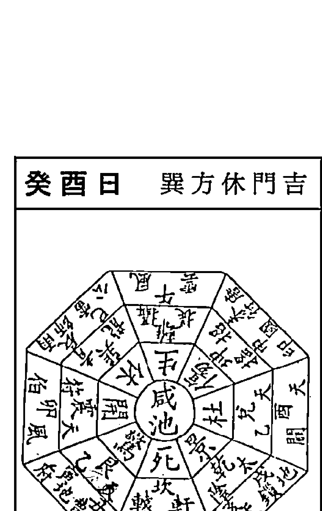

| 卦象 | 门 | 星 | 描述 |
| --- | --- | --- | --- |
| 乾 | 景 | 太阴 | 出门皆会吉、嫁娶行商成、谋求财利甚称佳。 |
| 坎 | 死 | 轩辕 | 行事必牵缠、远行必阻滞、只能獵渔事。 |
| 艮 | 驚 | 太乙 | 虽得吉曜助、出行事难失魂虚惊、只宜捕贼盗。 |
| 震 | 开 | 天符 | 远行见贵贤、须防妇人谋、走失难寻得。 |
| 巽 | 休 | 青龙 | 谋事尽相通、赴任贵人助、求利求财旺。 |
| 離 | 生 | 攝提 | 百事皆难成、远行多不利、财路皆不顺。 |
| 坤 | 傷 | 招摇 | 谋事恐慌多、出入有阻害、阴人口舌迎。 |
| 兌 | 杜 | 天乙 | 吉星百事顺、求财娶嫁皆有喜、阴伏避难得成。 |

## 甲戌日 離方生门吉 中宫 青龍 金神大吉星，相生錢财旺，接贵安荣華，萬事事相同。

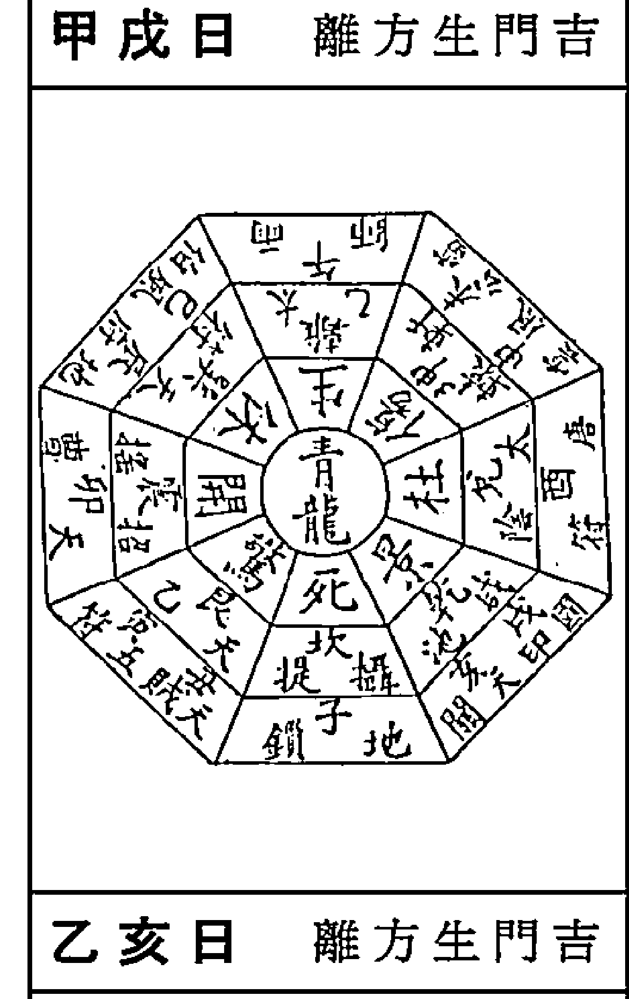

| 卦象 | 门 | 星 | 描述 |
| --- | --- | --- | --- |
| 乾 | 景 | 咸池 | 远行多不利、求财空手归、出入不安、损失又患病。 |
| 坎 | 死 | 攝提 | 此路无吉利、老婦哭悲啼、打獵捉鱼可得利。 |
| 艮 | 驚 | 天乙 | 虽有吉曜扶、求谋仍难成、出行防伤病、唯能捕贼盗。 |
| 震 | 开 | 招摇 | 出入免招殃、先难后得成、婦人口舌迎。 |
| 巽 | 休 | 天符 | 须防女难相、路途有人阻、走失难寻见。 |
| 離 | 生 | 太乙 | 吉曜百事亨、求财得利多、远行无阻滞。 |
| 坤 | 傷 | 轩辕 | 远行防血光、行事必牵缠、求财亦不利。 |
| 兌 | 杜 | 太阴 | 百事喜相成、藏身无烦恼、知交可寻得。 |

### 乙亥日 離方生门吉 中宫 天符 土神凶星，五鬼是天符，積糧倘有利，切忌有災途。

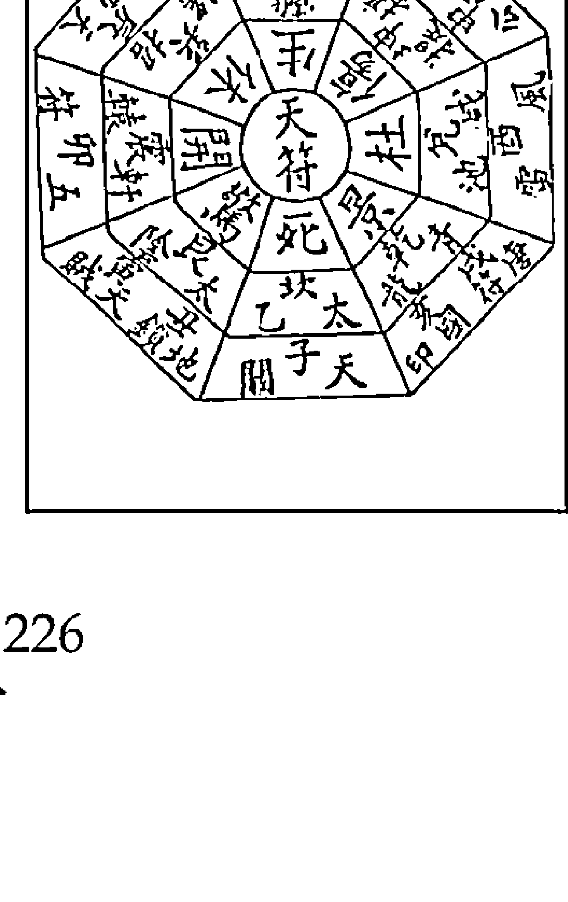

| 卦象 | 门 | 星 | 描述 |
| --- | --- | --- | --- |
| 乾 | 景 | 青龙 | 远行多不利、求财空手归、出入不安、损失又患病。 |
| 坎 | 死 | 太乙 | 谋事可有贵人助、谒贵求良较难成、捕渔打猎有收穫。 |
| 艮 | 驚 | 太阴 | 誤詞獻詐伏兵成、知交得覓尋、餘事謹慎莫輕行。 |
| 震 | 开 | 轩辕 | 求谋事必缠、远行防阻滞、求财定不利。 |
| 巽 | 休 | 招摇 | 吉宿见贵人、出入笑喜重、行事须考量、诸事尚称意。 |
| 離 | 生 | 天乙 | 人缘人事佳、财利亦见旺、万事从心亨。 |
| 坤 | 傷 | 攝提 | 求财多不利、远行防血光、诸事不如意。 |
| 兌 | 杜 | 咸池 | 远行多不利、求财反败失、灾厄病患多。 |

## 奇門遁甲日盤（五符法）陽遁六十局 甲子日～癸亥日

### 丙子日 坎方生門吉

中宫 招搖 木神小凶星，陰人口舌過，白夢多恐慌，屋響釜自鳴。

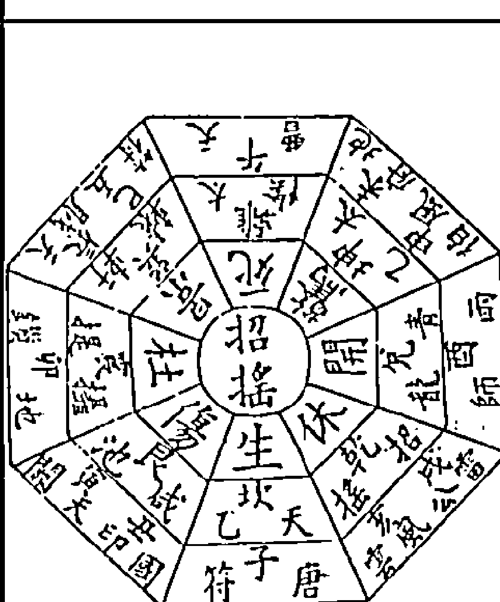

| 卦位 | 门 | 星 | 吉凶描述 |
|---|---|---|---|
| 乾 | 休 | 天符 | 須防女難相、路途有人阻、走失難尋見。 |
| 坎 | 生 | 天乙 | 人緣人事佳、財利亦見旺、萬事從心享。 |
| 艮 | 傷 | 咸池 | 求財多不利、遠行見血光、凶神惡殺是非多。 |
| 震 | 杜 | 攝提 | 路必不通、事必遲疑、多災坎珂。 |
| 巽 | 景 | 軒轅 | 諸事謀為難、常須防火災、亦要防盜難。 |
| 離 | 死 | 太陰 | 知已能得尋、他事少得成、吊死行刑捕獵可。 |
| 坤 | 驚 | 太乙 | 雖得吉曜助、出行事難失魂虛驚、只宜捕賊盜。 |
| 兌 | 開 | 青龍 | 青龍喜重重，遇人逢酒肉、賭博求財得不空。 |

### 丁丑日 坎方生門吉

中宫 軒轅 水神小凶星，門內都不寧，賭博定輸錢，百事謀為定傷殘。

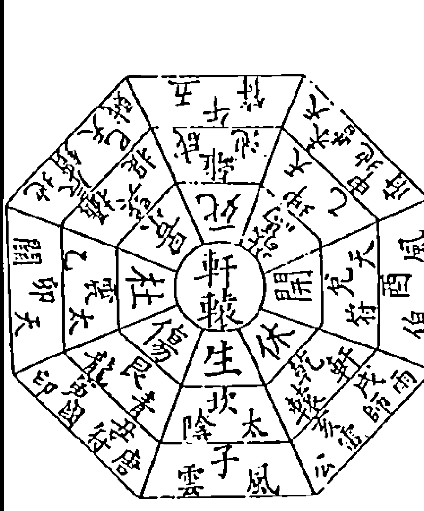

| 卦位 | 门 | 星 | 吉凶描述 |
|---|---|---|---|
| 乾 | 休 | 招搖 | 吉宿見貴人、出入笑喜重、行事須考量、諸事尚稱意。 |
| 坎 | 生 | 太陰 | 百事災不侵、求財皆成就、貴人自來尋。 |
| 艮 | 傷 | 青龍 | 求財索債成、捕獵亦可獲、他事是非多。 |
| 震 | 杜 | 太乙 | 百事多得成、避難藏匿得安寧。 |
| 巽 | 景 | 攝提 | 百事多坎坷、遠行災難多、惡人賊盗逢。 |
| 離 | 死 | 咸池 | 損財病患來、又得防止陰女難、只適打獵捕漁。 |
| 坤 | 驚 | 天乙 | 雖有吉曜扶、求謀仍難成、出行防伤病、唯能捕賊盗。 |
| 兌 | 開 | 天符 | 遠行見貴賢、須防婦人謀、走失難尋得。 |

### 戊寅日 坎方生門吉

中宫 攝提 土神大凶星，萬事不相通，隱匿藏遁可，言動則傷身。

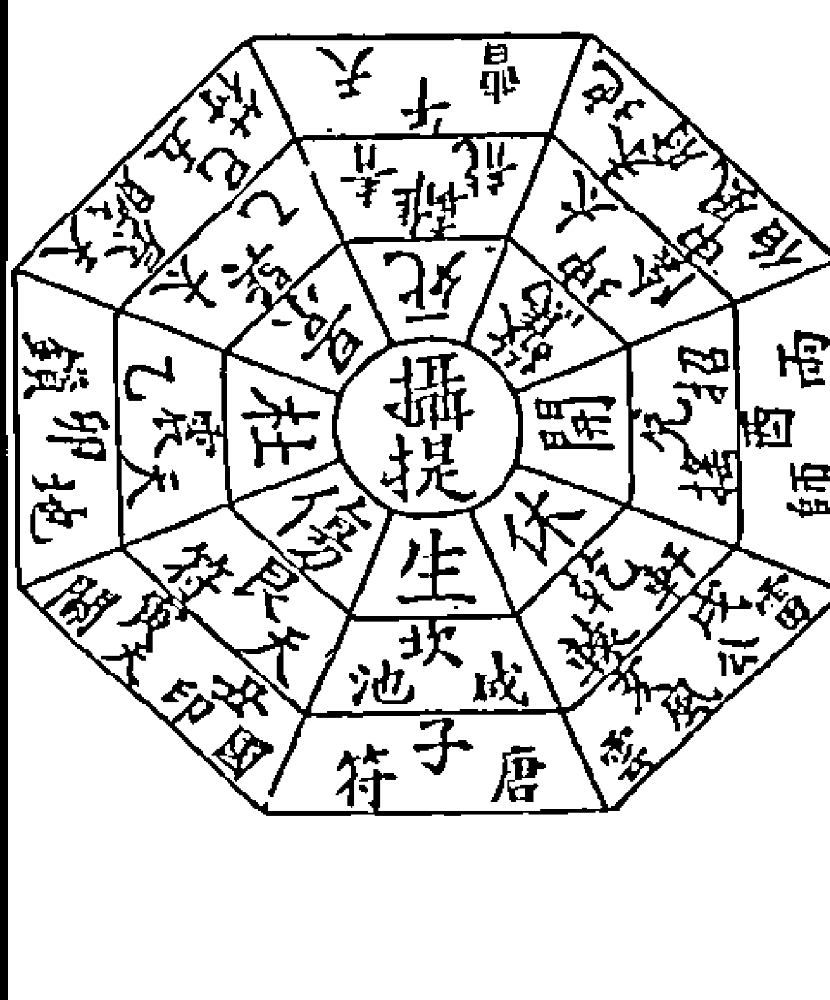

| 卦位 | 门 | 星 | 吉凶描述 |
|---|---|---|---|
| 乾 | 休 | 軒轅 | 百事謀為艱難、行事必纏緩、遠行途阻滯。 |
| 坎 | 生 | 咸池 | 遠行多不利、賭博空手歸、失財又患病。 |
| 艮 | 傷 | 天符 | 須防有是非、遇婦人謀害、漁獵索債成。 |
| 震 | 杜 | 天乙 | 吉星百事順、求財娶嫁皆有喜、陰伏避難亦得成。 |
| 巽 | 景 | 太乙 | 謁故尋親吉、行文百事吉、遠行無阻滯。 |
| 離 | 死 | 青龍 | 適於捕打漁獵、吊死行刑亦可、其他吉事不堪言。 |
| 坤 | 驚 | 太陰 | 誤詞獻詐伏兵成、知交得覓尋、餘事謹慎莫輕行。 |
| 兌 | 開 | 招搖 | 出入免招殃、先難後得成、婦人口舌過。 |

### 己卯日 兌方休門吉

中宮 太乙 水神大吉星，遇陰人尤吉，婚姻出入謁貴，諸事盡歡欣。

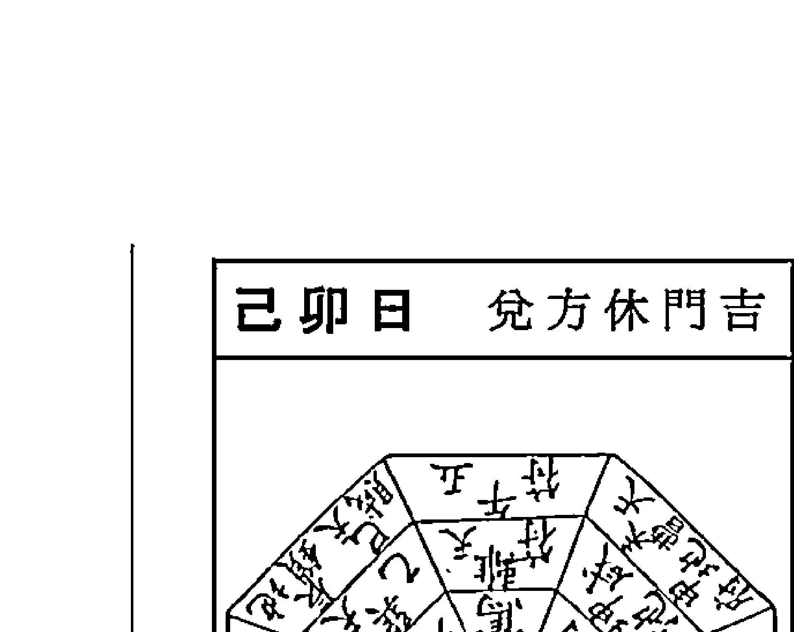

| 方位 | 门 | 神 | 描述 |
|---|---|---|---|
| 乾 | 生 | 攝提 | 百事皆難成、遠行多不利、財路皆不順。 |
| 坎 | 傷 | 青龍 | 求財索債成、捕獵亦可獲、他事是非多。 |
| 艮 | 杜 | 招搖 | 出入多閉塞、陰人口舌迎、避難尚有路、恐惶事難成。 |
| 震 | 景 | 太陰 | 門路皆不通、遠行路難走、行事必纏滯。 |
| 巽 | 死 | 天乙 | 求謀不堪論、遠行逢災厄、吊死行刑可、拿捕魚獵亦可行。 |
| 離 | 驚 | 天符 | 走失難覓尋、更有婦人謀、官司口舌定不利。 |
| 坤 | 開 | 咸池 | 求財賭博空手回、病患災厄臨、遠行多不利。 |
| 兌 | 休 | 軒轅 | 百事謀為艱難、行事必纏緩、遠行途阻滯。 |

### 庚辰日 乾方生門吉

中宮 天乙 火星吉神，宜見貴人，用事，求謀，嫁娶，總遂心。

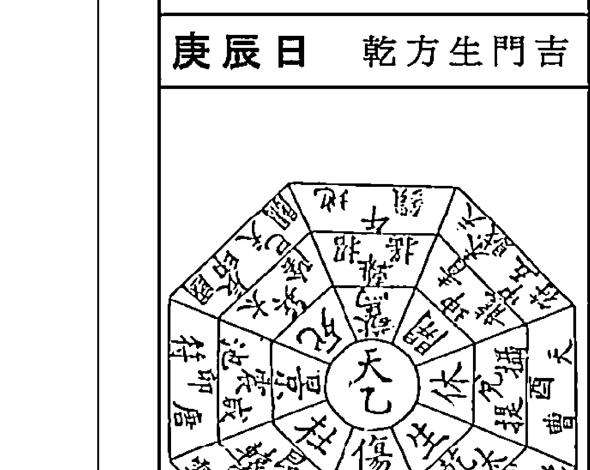

| 方位 | 门 | 神 | 描述 |
|---|---|---|---|
| 乾 | 生 | 太乙 | 吉曜百事亨、求財得利多、遠行無阻滯。 |
| 坎 | 傷 | 天符 | 須防有是非、遇婦人謀害、漁獵索債成。 |
| 艮 | 杜 | 軒轅 | 門路皆不通、遠行路難走、行事必纏滯。 |
| 震 | 景 | 咸池 | 遠行多不利、求財空手歸、出入不安、損失又患病。 |
| 巽 | 死 | 太陰 | 知己能得尋、他事少得成、吊死行刑捕獵可。 |
| 離 | 驚 | 招搖 | 恐慌怪夢怕、陰人口舌迎、百事多不安、官司病傷纏。 |
| 坤 | 開 | 青龍 | 青龍喜重重，遇人逢酒肉、賭博求財得不空。 |
| 兌 | 休 | 攝提 | 遠行必不利、財路耗損失、婚姻不如意。 |

### 辛巳日 兌方休門吉

中宮 太陰 土神吉星，知者莫交鋒，雖有勝算握，未必占奇功。

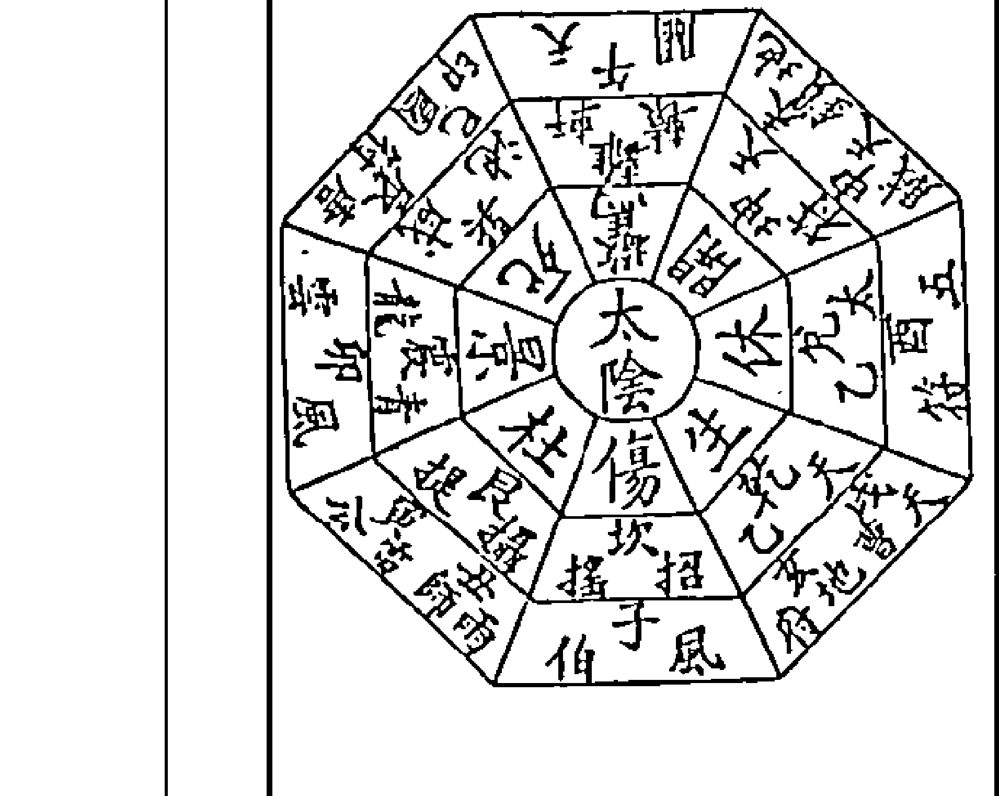

| 方位 | 门 | 神 | 描述 |
|---|---|---|---|
| 乾 | 生 | 天乙 | 人緣人事佳、財利亦見旺、萬事從心享。 |
| 坎 | 傷 | 招搖 | 謀事恐慌多、出入有阻害、陰人口舌迎。 |
| 艮 | 杜 | 攝提 | 路必不通、事必遲疑、多災坎坷。 |
| 震 | 景 | 青龍 | 遠行多不利、求財空手歸、出入不安、損失又患病。 |
| 巽 | 死 | 咸池 | 損財病患來、又得防止陰女難、只適打獵捕漁。 |
| 離 | 驚 | 軒轅 | 行事必牽纏、損財又傷身、遠行阻滯又遇恐懼事。 |
| 坤 | 開 | 天符 | 遠行見貴賢、須防婦人謀、走失難尋得。 |
| 兌 | 休 | 太乙 | 出門無阻滯、百事見興旺、婚姻大吉昌。 |

## 奇門遁甲日盤（五符法）陽遁六十局 甲子日～癸亥日

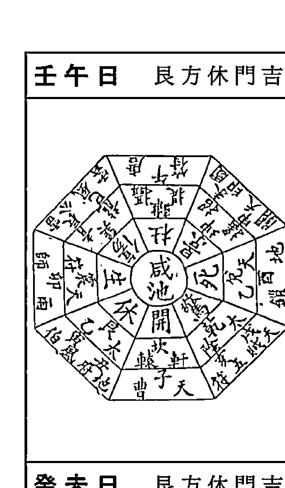

| 方位 | 門與神 | 吉凶描述 |
| :--- | :--- | :--- |
| 乾 | 驚 太陰 | 誤詞獻詐伏兵成、知交得覓尋、餘事謹慎莫輕行。 |
| 坎 | 開 軒轅 | 求謀事必纏、遠行防阻滯、求財定不利。 |
| 艮 | 休 太乙 | 出門無阻滯、百事見興旺、婚姻大吉昌。 |
| 震 | 生 天符 | 路途行人阻、有陰人妨害、走失難尋得、口論官司凶。 |
| 巽 | 傷 青龍 | 求財索債成、捕獵亦可獲、他事是非多。 |
| 離 | 杜 攝提 | 路必不通、事必遲疑、多災坎坷。 |
| 坤 | 景 招搖 | 出外賊盜逢、白夢多恐慌、又得防陰人口舌事。 |
| 兌 | 死 天乙 | 求謀不堪論、遠行逢災厄、吊死行刑可、拿捕魚獵亦可行。 |

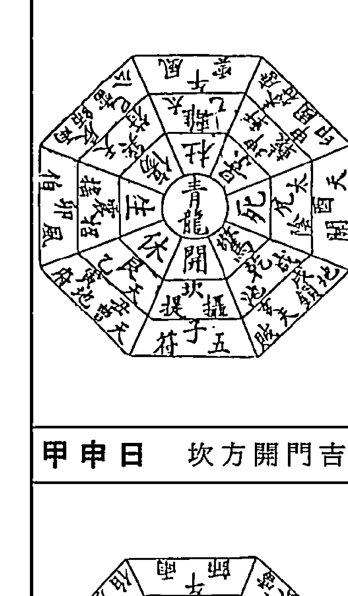

| 方位 | 門與神 | 吉凶描述 |
| :--- | :--- | :--- |
| 乾 | 驚 咸池 | 出行多不利、損財失物又患病、只宜捕捉盜賊。 |
| 坎 | 開 攝提 | 百事必遲滯、喜事變凶事、遠行必遲滯。 |
| 艮 | 休 天乙 | 人際人和通、休閒酒食悅、謀事財利旺。 |
| 震 | 生 招搖 | 出入事難成、陰人口舌迎、情緒多不寧。 |
| 巽 | 傷 天符 | 須防有是非、遇婦人謀害、漁獵索債成。 |
| 離 | 杜 太乙 | 百事多得成、避難藏匿得安寧。 |
| 坤 | 景 軒轅 | 諸事謀為難、常須防火災、亦要防盜難。 |
| 兌 | 死 太陰 | 知己能得尋、他事少得成、吊死行刑捕獵可。 |

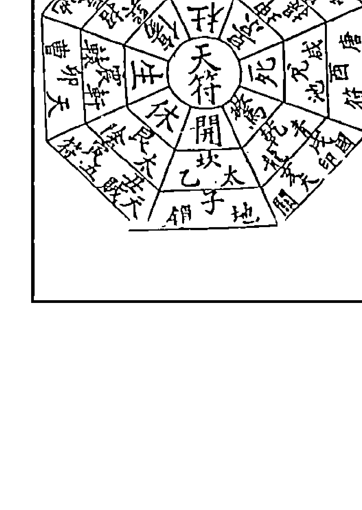

| 方位 | 門與神 | 吉凶描述 |
| :--- | :--- | :--- |
| 乾 | 驚 青龍 | 賭博可見喜、其他吉事未必通、伏兵捕捉亦成。 |
| 坎 | 開 太乙 | 謁貴可得扶、行事遇賢良、婚姻大吉祥、遠行無阻滯。 |
| 艮 | 休 太陰 | 求財謁貴欽、婚姻定情吉、百事災不侵。 |
| 震 | 生 軒轅 | 萬事尚稱可、行事防牽纏、遠行亡阻滯。 |
| 巽 | 傷 招搖 | 謀事恐慌多、出入有阻害、陰人口舌迎。 |
| 離 | 杜 天乙 | 吉星百事順、求財娶嫁皆有喜、陰伏避難亦得成。 |
| 坤 | 景 攝提 | 百事多坎坷、遠行災難多、惡人賊盜逢。 |
| 兌 | 死 咸池 | 損財病患來、又得防止陰女難、只適打獵捕漁。 |

### 乙酉日 離方休門吉

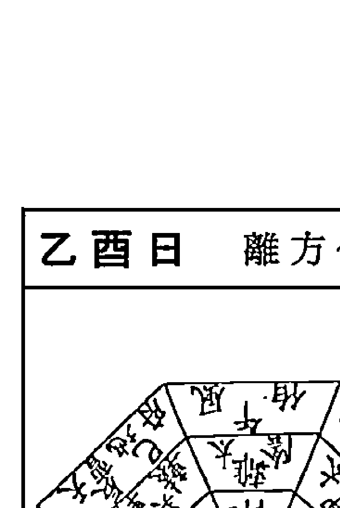

| 方位 | 门神 | 描述 |
| --- | --- | --- |
| 中宫 | 招摇 | 木神小凶星，陰人口舌迎，白夢多恐慌，屋響釜自鳴。 |
| 乾 | 杜 天符 | 行人塞路行、走失難搜尋、逃走避難成。 |
| 坎 | 景 天乙 | 相會娶嫁百事吉、求財謀事亦易成。 |
| 艮 | 死 咸池 | 損財病患來、又得防止陰女難、只適打獵捕漁。 |
| 震 | 驚 攝提 | 出行遇驚懼、官司凶連綿、百事必遲疑。 |
| 巽 | 開 軒轅 | 求謀事必纏、遠行防阻滯、求財定不利。 |
| 離 | 休 太陰 | 求財謁貴欽、婚姻定情吉、百事災不侵。 |
| 坤 | 生 太乙 | 吉曜百事亨、求財得利多、遠行無阻滯。 |
| 兌 | 傷 青龍 | 求財索債成、捕獵亦可獲、他事是非多。 |

### 丙戌日 坤方生門吉

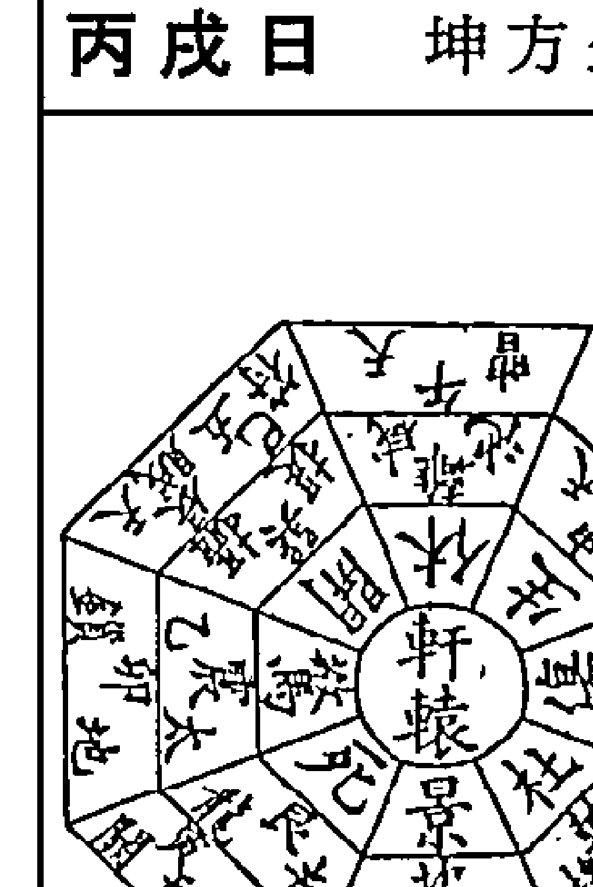

| 方位 | 门神 | 描述 |
| --- | --- | --- |
| 中宫 | 轩辕 | 水神小凶星，門內都不寧，賭博定輸錢，百事謀爲定傷殘。 |
| 乾 | 杜 招摇 | 出入多閉塞、陰人口舌迎、避難尚有路、恐慌事難成。 |
| 坎 | 景 太陰 | 出門皆會吉、嫁娶行商成、謀求財利甚稱佳。 |
| 艮 | 死 青龍 | 適於捕打漁獵、弔死行刑亦可、其他吉事不堪言。 |
| 震 | 驚 太乙 | 雖得吉曜助、出行事難失魂虛驚、只宜捕賊盗。 |
| 巽 | 開 攝提 | 百事必遲滯、喜事變凶事、遠行必遲滯。 |
| 離 | 休 咸池 | 嫁娶尚稱吉、求財空手回、損失加病患。 |
| 坤 | 生 天乙 | 人緣人事佳、財利亦見旺、萬事從心享。 |
| 兌 | 傷 天符 | 須防有是非、遇婦人謀害、漁獵索債成。 |

### 丁亥日 離方休門吉

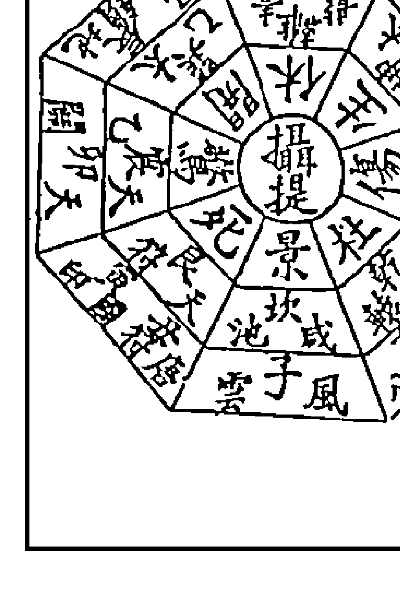

| 方位 | 门神 | 描述 |
| --- | --- | --- |
| 中宫 | 攝提 | 土神大凶星，萬事不相通，隱匿藏遁可，言動則傷身。 |
| 乾 | 杜 軒轅 | 門路皆不通、遠行路難走、行事必纏滯。 |
| 坎 | 景 咸池 | 遠行多不利、求財空手歸、出入不安、損失又患病。 |
| 艮 | 死 天符 | 出門有災難、更有婦人謀、官非又口舌、只適打獵事。 |
| 震 | 驚 天乙 | 雖有吉曜扶、求謀仍難成、出行防傷病、唯能捕賊盗。 |
| 巽 | 開 太乙 | 謁貴可得扶、行事遇賢良、婚姻大吉祥、遠行無阻滯。 |
| 離 | 休 青龍 | 謀事盡相通、赴任貴人助、求利求財旺。 |
| 坤 | 生 太陰 | 百事災不侵、求財皆成就、貴人自來尋。 |
| 兌 | 傷 招摇 | 謀事恐慌多、出入有阻害、陰人口舌迎。 |

### 奇門遁甲日盤（五符法）陽遁六十局 甲子日~癸亥日

| 日期与吉方 | 八门图 | 各方位吉凶描述 |
| :--- | :--- | :--- |
| **戊子日** 坎方休門吉 | [八门图] | **中宮** 太乙 水神大吉星，遇陰人尤吉，婚姻出入謁貴，諸事盡歡欣。 **乾** 開 攝提 百事必遲滯、喜事變凶事、遠行必遲滯。 **坎** 休 青龍 謀事盡相通、赴任貴人助、求利求財旺。 **艮** 生 招搖 出入事難成、陰人口舌迎、情緒多不寧。 **震** 傷 太陰 百禍不能侵、牽債必得成、喜事不全吉。 **巽** 杜 天乙 吉星百事順、求財娶嫁皆有喜、陰伏避難亦得成。 **離** 景 天符 出門路途有阻害、又須防女難之相。 **坤** 死 咸池 損財病患來、又得防止陰女難、只適打獵捕漁。 **兇** 驚 軒轅 行事必牽纏、損財又傷身、遠行阻滯又遇恐懼事。 |
| **己丑日** 乾方開門吉 | [八门图] | **中宮** 天乙 火星吉神，宜見貴人，用事，求謀，嫁娶，總遂心。 **乾** 開 太乙 謁貴可得扶、行事遇賢良、婚姻大吉祥、遠行無阻滯。 **坎** 休 天符 須防女難相、路途有人阻、走失難尋見。 **艮** 生 軒轅 萬事尚稱可、行事防牽纏、遠行亡阻滯。 **震** 傷 咸池 求財多不利、遠行見血光、凶神惡殺是非多。 **巽** 杜 太陰 百事喜相成、藏身無煩惱、知交可尋得。 **離** 景 招搖 出外賊盜逢、白夢多恐慌、又得防陰人口舌事。 **坤** 死 青龍 適於捕打漁獵、吊死行刑亦可、其他吉事不堪言。 **兇** 驚 攝提 出行遇驚懼、官司凶連綿、百事必遲疑。 |
| **庚寅日** 乾方開門吉 | [八门图] | **中宮** 太陰 土神吉星，知者莫交鋒、雖有勝算握，未必占奇功。 **乾** 開 天乙 求財皆和順、求謀百事成、茶酒自來迎。 **坎** 休 招搖 吉宿見貴人、出入笑喜重、行事須考量、諸事尚稱意。 **艮** 生 攝提 百事皆難成、遠行多不利、財路皆不順。 **震** 傷 青龍 求財索債成、捕獵亦可獲、他事是非多。 **巽** 杜 咸池 遠行多不利、求財反敗失、災厄病患多。 **離** 景 軒轅 諸事謀為難、常須防火災、亦要防盜難。 **坤** 死 天符 出門有災難、更有婦人謀、官非又口舌、只適打獵事。 **兇** 驚 太乙 雖得吉曜助、出行事難失魂虛驚、只宜捕賊盜。 |

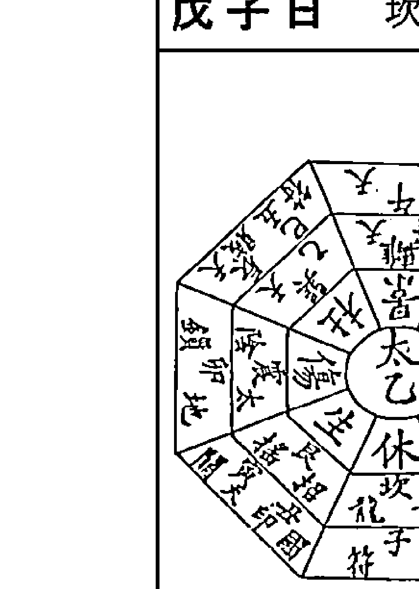

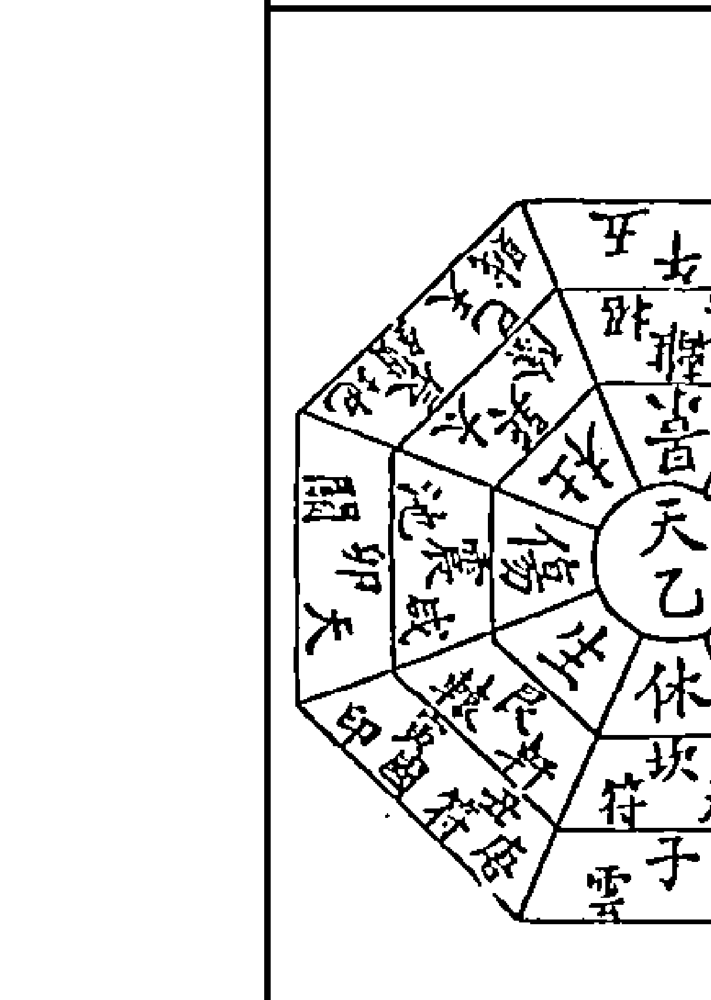

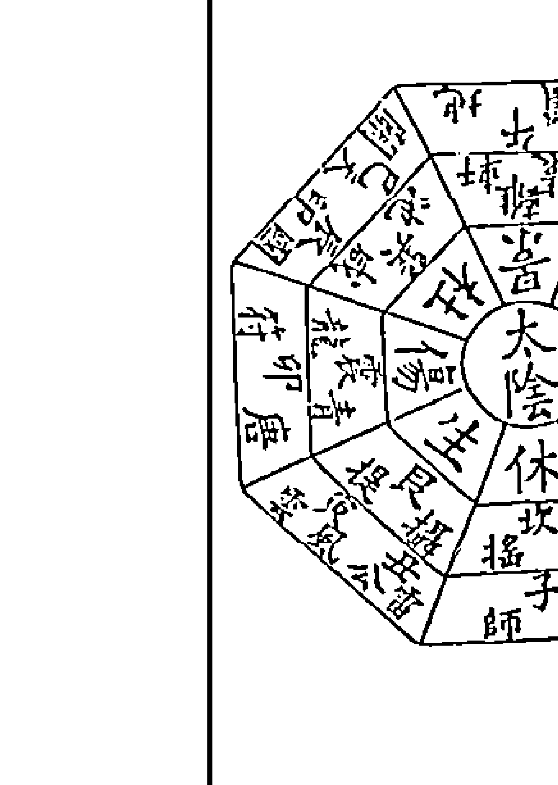

### 辛卯日 兌方生門吉

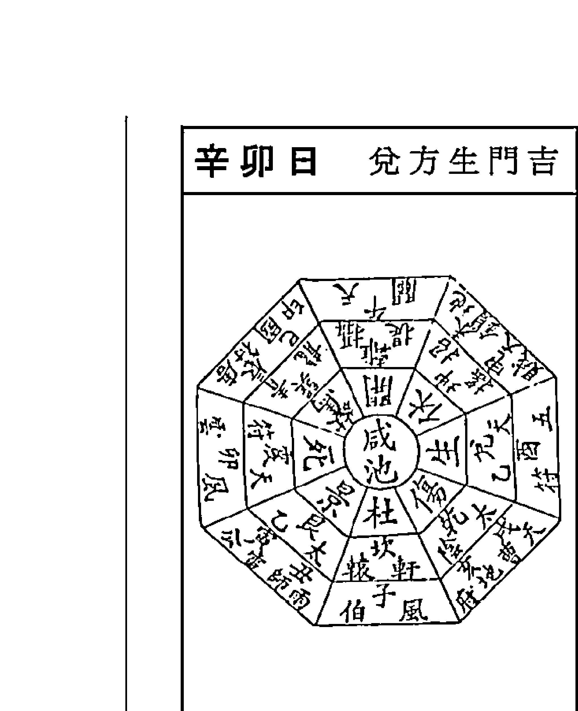

| 方位 | 门 | 星 | 描述 |
| --- | --- | --- | --- |
| 中宫 | 咸池 | 金神大凶星，咸池名惡殺，鑿井以外，用事恐傷身不宜。 |
| 乾 | 傷 | 太陰 | 百禍不能侵、牽債必得成、喜事不全吉。 |
| 坎 | 杜 | 軒轅 | 門路皆不通、遠行路難走、行事必纏滯。 |
| 艮 | 景 | 太乙 | 謁故尋親吉、行文百事吉、遠行無阻滯。 |
| 震 | 死 | 天符 | 出門有災難、更有婦人謀、官非又口舌、只適打獵事。 |
| 巽 | 驚 | 青龍 | 賭博可見喜、其他吉事未必通、伏兵捕捉亦成。 |
| 離 | 開 | 攝提 | 百事必遲滯、喜事變凶事、遠行必遲滯。 |
| 坤 | 休 | 招搖 | 吉宿見貴人、出入笑喜重、行事須考量、諸事尚稱意。 |
| 兌 | 生 | 天乙 | 人緣人事佳、財利亦見旺、萬事從心享。 |

### 壬辰日 離方開門吉

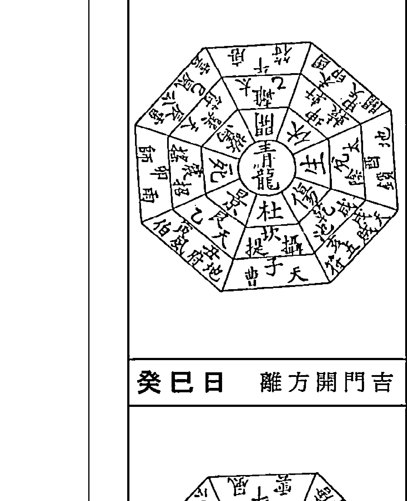

| 方位 | 门 | 星 | 描述 |
| --- | --- | --- | --- |
| 中宫 | 青龍 | 金神大吉星，相生錢財旺，接貴安榮華，萬事事相同。 |
| 乾 | 傷 | 咸池 | 求財多不利、遠行見血光、凶神惡殺是非多。 |
| 坎 | 杜 | 攝提 | 路必不通、事必遲疑、多災坎坷。 |
| 艮 | 景 | 天乙 | 相會娶嫁百事吉、求財謀事亦易成。 |
| 震 | 死 | 招搖 | 出門事不成、恐慌怪夢怕、只適捕獵事。 |
| 巽 | 驚 | 天符 | 走失難見尋、更有婦人謀、官司口舌定不利。 |
| 離 | 開 | 太乙 | 謁貴可得扶、行事遇賢良、婚姻大吉祥、遠行無阻滯。 |
| 坤 | 休 | 軒轅 | 百事謀為艱難、行事必纏緩、遠行途阻滯。 |
| 兌 | 生 | 太陰 | 百事災不侵、求財皆成就、貴人自來尋。 |

### 癸巳日 離方開門吉

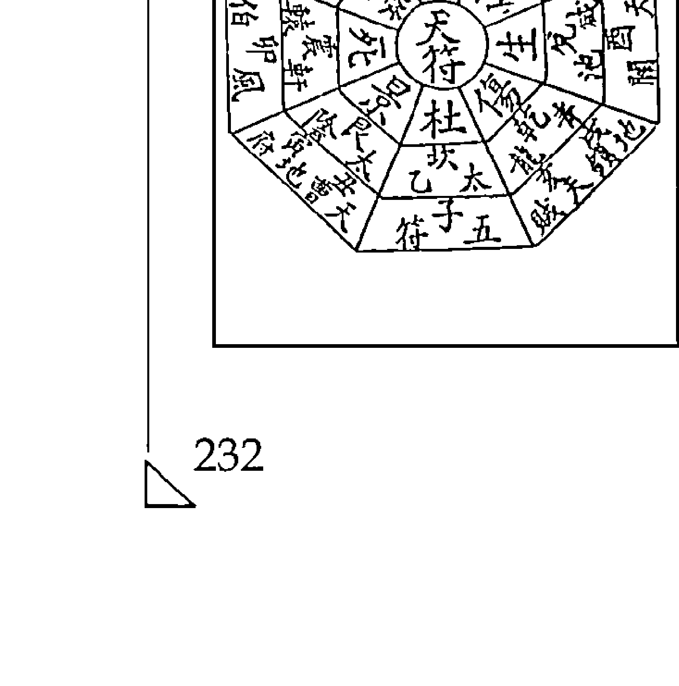

| 方位 | 门 | 星 | 描述 |
| --- | --- | --- | --- |
| 中宫 | 天符 | 土神凶星，五鬼是天符，積糧尚有利，切忌有災途。 |
| 乾 | 傷 | 青龍 | 求財索債成、捕獵亦可獲、他事是非多。 |
| 坎 | 杜 | 太乙 | 百事多得成、避難藏匿得安寧。 |
| 艮 | 景 | 太陰 | 出門皆會吉、嫁娶行商成、謀求財利甚稱佳。 |
| 震 | 死 | 軒轅 | 行事必牽纏、遠行必阻滯、只能獵漁事。 |
| 巽 | 驚 | 招搖 | 恐慌怪夢怕、陰人口舌迎、百事多不安、官司病傷纏。 |
| 離 | 開 | 天乙 | 求財皆和順、求謀百事成、茶酒自來迎。 |
| 坤 | 休 | 攝提 | 遠行必不利、財路耗損失、婚姻不如意。 |
| 兌 | 生 | 咸池 | 遠行多不利、賭博空手歸、失財又患病。 |

## 奇門遁甲日盤（五符法）陽遁六十局 甲子日～癸亥日

### 甲午日 艮方開門吉

中宮 招搖 水神大吉星，遇陰人尤吉，諸事尽歡欣，賭博錢財愁聚。

| 方位 | 門 | 神 | 吉凶描述 |
|---|---|---|---|
| 乾 | 死 | 天符 | 出門有災難、更有婦人謀、官非又口舌、只通打獵事。 |
| 坎 | 驚 | 天乙 | 雖有吉曜扶、求謀仍難成、出行防傷病、唯能捕賊盜。 |
| 艮 | 開 | 咸池 | 求財賭博空手回、病患災厄臨、遠行多不利。 |
| 震 | 休 | 攝提 | 遠行必不利、財路耗損失、婚姻不如意。 |
| 巽 | 生 | 軒轅 | 萬事尚稱可、行事防牽纏、遠行亡阻滯。 |
| 離 | 傷 | 太陰 | 百禍不能侵、牽債必得成、喜事不全吉。 |
| 坤 | 杜 | 太乙 | 百事多得成、避難藏匿得安寧。 |
| 兌 | 景 | 青龍 | 遠行多不利、求財空手歸、出入不安、損失又患病。 |

### 乙未日 震方休門吉

中宮 軒轅 水神小凶星，門內都不寧，賭博定輸錢，百事謀爲定傷殘。

| 方位 | 門 | 神 | 吉凶描述 |
|---|---|---|---|
| 乾 | 死 | 招搖 | 出門事不成、恐慌怪夢怕、只通捕獵事。 |
| 坎 | 驚 | 太陰 | 誤詞獻詐伏兵成、知交得見尋、餘事謹慎莫輕行。 |
| 艮 | 開 | 青龍 | 青龍喜重重，遇人逢酒肉、賭博求財得不空。 |
| 震 | 休 | 太乙 | 出門無阻滯、百事見興旺、婚姻大吉昌。 |
| 巽 | 生 | 攝提 | 百事皆難成、遠行多不利、財路皆不順。 |
| 離 | 傷 | 咸池 | 求財多不利、遠行見血光、凶神惡殺是非多。 |
| 坤 | 杜 | 天乙 | 吉星百事順、求財娶嫁皆有喜、陰伏避難亦得成。 |
| 兌 | 景 | 天符 | 出門路途有阻害、又須防女難之相。 |

### 丙申日 巽方生門吉

中宮 攝提 土神大凶星，萬事不相通，隱匿藏遁可，言動則傷身。

| 方位 | 門 | 神 | 吉凶描述 |
|---|---|---|---|
| 乾 | 死 | 軒轅 | 行事必牽纏、遠行必阻滯、只能獵漁事。 |
| 坎 | 驚 | 咸池 | 出行多不利、損財失物又患病、只宜捕捉盜賊。 |
| 艮 | 開 | 天符 | 遠行見貴賢、須防婦人謀、走失難尋得。 |
| 震 | 休 | 天乙 | 人際人和通、休閒酒食悅、謀事財利旺。 |
| 巽 | 生 | 太乙 | 吉曜百事亨、求財得利多、遠行無阻滯。 |
| 離 | 傷 | 青龍 | 求財索債成、捕獵亦可獲、他事是非多。 |
| 坤 | 杜 | 太陰 | 百事喜相成、藏身無煩惱、知交可尋得。 |
| 兌 | 景 | 招搖 | 出外賊盜逢、白夢多恐慌、又得防陰人口舌事。 |

### 丁酉日 離方生門吉

| 方位 | 門 | 神 | 吉凶描述 |
|---|---|---|---|
| 中宮 | 太乙 | 水神大吉星 | 遇陰人尤吉，諸事尽歡欣，賭博錢財愁聚。 |
| 乾 | 景 | 攝提 | 百事多坎坷、遠行災難多、惡人賊盜逢。 |
| 坎 | 死 | 青龍 | 適於捕打漁獵、吊死行刑亦可、其他吉事不堪言。 |
| 艮 | 驚 | 招搖 | 恐慌怪夢怕、陰人口舌迎、百事多不安、官司病傷纏。 |
| 震 | 開 | 太陰 | 百禍侵不得、諸事遇賢良、求財百事皆得成。 |
| 巽 | 休 | 天乙 | 人際人和通、休閒酒食悅、謀事財利旺。 |
| 離 | 生 | 天符 | 路途行人阻、有陰人妨害、走失難尋得、口論官司凶。 |
| 坤 | 傷 | 咸池 | 求財多不利、遠行見血光、凶神惡殺是非多。 |
| 兌 | 杜 | 軒轅 | 門路皆不通、遠行路難走、行事必纏滯。 |

### 戊戌日 巽方休門吉

| 方位 | 門 | 神 | 吉凶描述 |
|---|---|---|---|
| 中宮 | 天乙 | 火星吉神 | 宜見貴人，用事，求謀，嫁娶，總遂心。 |
| 乾 | 景 | 太乙 | 謁故尋親吉、行文百事吉、遠行無阻滯。 |
| 坎 | 死 | 天符 | 出門有災難、更有婦人謀、官非又口舌、只適打獵事。 |
| 艮 | 驚 | 軒轅 | 行事必牽纏、損財又傷身、遠行阻滯又遇恐懼事。 |
| 震 | 開 | 咸池 | 求財賭博空手回、病患災厄臨、遠行多不利。 |
| 巽 | 休 | 太陰 | 求財謁貴欽、婚姻定情吉、百事災不侵。 |
| 離 | 生 | 招搖 | 出入事難成、陰人口舌迎、情緒多不寧。 |
| 坤 | 傷 | 青龍 | 求財索債成、捕獵亦可獲、他事是非多。 |
| 兌 | 杜 | 攝提 | 路必不通、事必遲疑、多災坎坷。 |

### 己亥日 震方開門吉

| 方位 | 門 | 神 | 吉凶描述 |
|---|---|---|---|
| 中宮 | 太陰 | 土神吉星 | 知者莫交鋒、雖有勝算握、未必占奇功。 |
| 乾 | 景 | 天乙 | 相會娶嫁百事吉、求財謀事亦易成。 |
| 坎 | 死 | 招搖 | 出門事不成、恐慌怪夢怕、只適捕獵事。 |
| 艮 | 驚 | 攝提 | 出行遇驚懼、官司凶連綿、百事必遲疑。 |
| 震 | 開 | 青龍 | 青龍喜重重，遇人逢酒肉、賭博求財得不空。 |
| 巽 | 休 | 咸池 | 嫁娶尚稱吉、求財空手回、損失加病患。 |
| 離 | 生 | 軒轅 | 萬事尚稱可、行事防牽纏、遠行亡阻滯。 |
| 坤 | 傷 | 天符 | 須防有是非、遇婦人謀害、漁獵索債成。 |
| 兌 | 杜 | 太乙 | 百事多得成、避難藏匿得安寧。 |

## 奇門遁甲日盤（五符法）陽遁六十局 甲子日～癸亥日

### 庚子日 乾方休門吉

中宮 咸池 金神大凶星，咸池名惡殺，鑿井以外，用事恐傷身不宜。

| 方位 | 門 | 神 | 吉凶描述 |
|---|---|---|---|
| 乾 | 休 | 太陰 | 求財謁貴欽、婚姻定情吉、百事災不侵。 |
| 坎 | 生 | 軒轅 | 萬事尚稱可、行事防牽纏、遠行無阻滯。 |
| 艮 | 傷 | 太乙 | 索債可得收、漁獵亦能成、他事憂慮多。 |
| 震 | 杜 | 天符 | 行人塞路行、走失難搜尋、逃走避難成。 |
| 巽 | 景 | 青龍 | 遠行多不利、求財空手歸、出入不安、損失又患病。 |
| 離 | 死 | 攝提 | 此路無吉利、老婦哭悲啼、打獵捉魚可得利。 |
| 坤 | 驚 | 招搖 | 恐慌怪夢怕、陰人口舌迎、百事多不安、官司病傷纏。 |
| 兌 | 開 | 天乙 | 求財皆和順、求謀百事成、茶酒自來迎。 |

### 辛丑日 兌方開門吉

中宮 青龍 金神大吉星，相生錢財旺，接貴安榮華，萬事事相同。

| 方位 | 門 | 神 | 吉凶描述 |
|---|---|---|---|
| 乾 | 休 | 咸池 | 嫁娶尚稱吉、求財空手回、損失加病患。 |
| 坎 | 生 | 攝提 | 百事皆難成、遠行多不利、財路皆不順。 |
| 艮 | 傷 | 天乙 | 謹慎用事則可遂、謀事多稱心、索債漁獵亦得成。 |
| 震 | 杜 | 招搖 | 出入多閉塞、陰人口舌迎、避難尚有路、恐慌事難成。 |
| 巽 | 景 | 天符 | 出門路途有阻害、又須防女難之相。 |
| 離 | 死 | 太乙 | 謀事可有貴人助、謁貴求良較難成、捕漁打獵有收穫。 |
| 坤 | 驚 | 軒轅 | 行事必牽纏、損財又傷身、遠行阻滯又遇恐懼事。 |
| 兌 | 開 | 太陰 | 百禍侵不得、諸事遇賢良、求財百事皆得成。 |

### 壬寅日 坎方生門吉

中宮 天符 土神凶星，五鬼是天符，積糧尚有利，切忌有災途。

| 方位 | 門 | 神 | 吉凶描述 |
|---|---|---|---|
| 乾 | 休 | 青龍 | 謀事盡相通、赴任貴人助、求利求財旺。 |
| 坎 | 生 | 太乙 | 吉曜百事亨、求財得利多、遠行無阻滯。 |
| 艮 | 傷 | 太陰 | 百禍不能侵、牽債必得成、喜事不全吉。 |
| 震 | 杜 | 軒轅 | 門路皆不通、遠行路難走、行事必纏滯。 |
| 巽 | 景 | 招搖 | 出外賊盜逢、白夢多恐慌、又得防陰人口舌事。 |
| 離 | 死 | 天乙 | 謀事不堪論、遠行逢災厄、弔死行刑可、拿捕魚獵亦可行。 |
| 坤 | 驚 | 攝提 | 出行遇驚懼、官司凶連綿、百事必遲疑。 |
| 兌 | 開 | 咸池 | 求財賭博空手回、病患災厄臨、遠行多不利。 |

### 癸卯日 坤方開門吉

| 方位 | 門 | 神 | 吉凶描述 |
|---|---|---|---|
| 中宮 |  | 招搖 | 木神小凶星，陰人口舌迎，白夢多恐慌，屋響釜自鳴。 |
| 乾 | 生 | 天符 | 路途行人阻、有陰人妨害、走失難尋得、口論官司凶。 |
| 坎 | 傷 | 天乙 | 謹慎用事則可遂、謀事多稱心、索債漁獵亦得成。 |
| 艮 | 杜 | 咸池 | 遠行多不利、求財反敗失、災厄病患多。 |
| 震 | 景 | 攝提 | 百事多坎坷、遠行災難多、惡人賊盜逢。 |
| 巽 | 死 | 軒轅 | 行事必牽纏、遠行必阻滯、只能獵漁事。 |
| 離 | 驚 | 太陰 | 誤詞獻詐伏兵成、知交得覓尋、餘事謹慎莫輕行。 |
| 坤 | 開 | 太乙 | 謁貴可得扶、行事遇賢良、婚姻大吉祥、遠行無阻滯。 |
| 兌 | 休 | 青龍 | 謀事盡相通、赴任貴人助、求利求財旺。 |

### 甲辰日 兌方休門吉

| 方位 | 門 | 神 | 吉凶描述 |
|---|---|---|---|
| 中宮 |  | 軒轅 | 水神小凶星，門內都不寧，賭博定輸錢，百事謀爲定傷殘。 |
| 乾 | 生 | 招搖 | 出入事難成、陰人口舌迎、情緒多不寧。 |
| 坎 | 傷 | 太陰 | 百禍不能侵、牽債必得成、喜事不全吉。 |
| 艮 | 杜 | 青龍 | 茶酒留住客、隱伏逃避成、謀事不遂心。 |
| 震 | 景 | 太乙 | 謁故尋親吉、行文百事吉、遠行無阻滯。 |
| 巽 | 死 | 攝提 | 此路無吉利、老婦哭悲啼、打獵捉魚可得利。 |
| 離 | 驚 | 咸池 | 出行多不利、損財失物又患病、只宜捕捉盜賊。 |
| 坤 | 開 | 天乙 | 求財皆和順、求謀百事成、茶酒自來迎。 |
| 兌 | 休 | 天符 | 須防女難相、路途有人阻、走失難尋見。 |

### 乙巳日 坤方開門吉

| 方位 | 門 | 神 | 吉凶描述 |
|---|---|---|---|
| 中宮 |  | 攝提 | 土神大凶星，萬事不相通，隱匿藏遁可，言動則傷身。 |
| 乾 | 生 | 軒轅 | 萬事尚稱可、行事防牽纏、遠行亡阻滯。 |
| 坎 | 傷 | 咸池 | 求財多不利、遠行見血光、凶神惡煞是非多。 |
| 艮 | 杜 | 天符 | 行人塞路行、走失難搜尋、逃走避難成。 |
| 震 | 景 | 天乙 | 相會娶嫁百事吉、求財謀事亦易成。 |
| 巽 | 死 | 太乙 | 謀事可有貴人助、謁貴求良較難成、捕漁打獵有收穫。 |
| 離 | 驚 | 青龍 | 賭博可見喜、其他吉事未必通、伏兵捕捉亦成。 |
| 坤 | 開 | 太陰 | 百禍侵不得、諸事遇賢良、求財百事皆得成。 |
| 兌 | 休 | 招搖 | 吉宿見貴人、出入笑喜重、行事須考量、諸事尚稱意。 |

## 奇門遁甲日盤（五符法）陽遁六十局 甲子日～癸亥日

### 丙午日 坎方開門吉

中宮 太乙 水神大吉星，遇險人尤吉，諸事尽歡欣，賭博錢財恐聚。

| 方位 | 門 | 神 | 吉凶描述 |
|---|---|---|---|
| 乾 | 驚 | 攝提 | 出行遇驚懼、官司凶連綿、百事必遲疑。 |
| 坎 | 開 | 青龍 | 青龍喜重重，遇人逢酒肉、賭博求財得不空。 |
| 艮 | 休 | 招搖 | 吉宿見貴人、出入笑喜重、行事須考量、諸事尚稱意。 |
| 震 | 生 | 太陰 | 百事災不侵、求財皆成就、貴人自來尋。 |
| 巽 | 傷 | 天乙 | 謹慎用事則可遂、謀事多稱心、索債漁獵亦得成。 |
| 離 | 杜 | 天符 | 行人塞路行、走失難搜尋、逃走避難成。 |
| 坤 | 景 | 咸池 | 遠行多不利、求財空手歸、出入不安、損失又患病。 |
| 兌 | 死 | 軒轅 | 行事必牽纏、遠行必阻滯、只能獵漁事。 |

### 丁未日 艮方休門吉

中宮 天乙 火星吉神，宜見貴人，用事，求謀，嫁娶，總遂心。

| 方位 | 門 | 神 | 吉凶描述 |
|---|---|---|---|
| 乾 | 驚 | 太乙 | 雖得吉曜助、出行事難失魂虛驚、只宜捕賊盜。 |
| 坎 | 開 | 天符 | 遠行見貴賢、須防婦人謀、走失難尋得。 |
| 艮 | 休 | 軒轅 | 百事謀為艱難、行事必纏緩、遠行途阻滯。 |
| 震 | 生 | 咸池 | 遠行多不利、賭博空手歸、失財又患病。 |
| 巽 | 傷 | 太陰 | 百禍不能侵、牽債必得成、喜事不全吉。 |
| 離 | 杜 | 招搖 | 出入多閉塞、陰人口舌迎、避難尚有路、恐慌事難成。 |
| 坤 | 景 | 青龍 | 遠行多不利、求財空手歸、出入不安、損失又患病。 |
| 兌 | 死 | 攝提 | 此路無吉利、老婦哭悲啼、打獵捉魚可得利。 |

### 戊申日 震方生門吉

中宮 太陰 土神吉星，知者莫交鋒，雖有勝算握，未必占奇功。

| 方位 | 門 | 神 | 吉凶描述 |
|---|---|---|---|
| 乾 | 驚 | 天乙 | 雖有吉曜扶、求謀仍難成、出行防傷病、唯能捕賊盜。 |
| 坎 | 開 | 招搖 | 出入免招殃、先難後得成、婦人口舌迎。 |
| 艮 | 休 | 攝提 | 遠行必不利、財路耗損失、婚姻不如意。 |
| 震 | 生 | 青龍 | 求事喜重重、遇人逢酒肉、錢財利路通。 |
| 巽 | 傷 | 咸池 | 求財多不利、遠行見血光、凶神惡煞是非多。 |
| 離 | 杜 | 軒轅 | 門路皆不通、遠行路難走、行事必纏滯。 |
| 坤 | 景 | 天符 | 出門路途有阻害、又須防女難之相。 |
| 兌 | 死 | 太乙 | 謀事可有貴人助、謁貴求良較難成、捕漁打獵有收穫。 |

### 己酉日 巽方開門吉

| 方位 | 門 | 神 | 吉凶描述 |
|---|---|---|---|
| 中宮 |  | 咸池 | 金神大凶星，咸池名惡殺，鑿井以外，用事恐傷身不宜。 |
| 乾 | 杜 | 太陰 | 百事喜相成、藏身無煩惱、知交可尋得。 |
| 坎 | 景 | 軒轅 | 諸事謀為難、常須防火災、亦要防盜難。 |
| 艮 | 死 | 太乙 | 謀事可有貴人助、謁貴求良較難成、捕漁打獵有收穫。 |
| 震 | 驚 | 天符 | 走失難覓尋、更有婦人謀、官司口舌定不利。 |
| 巽 | 開 | 青龍 | 青龍喜重重，遇人逢酒肉、賭博求財得不空。 |
| 離 | 休 | 攝提 | 遠行必不利、財路耗損失、婚姻不如意。 |
| 坤 | 生 | 招搖 | 出入事難成、陰人口舌迎、情緒多不寧。 |
| 兌 | 傷 | 天乙 | 謹慎用事則可遂、謀事多稱心、索債漁獵亦得成。 |

### 庚戌日 離方休門吉

| 方位 | 門 | 神 | 吉凶描述 |
|---|---|---|---|
| 中宮 |  | 青龍 | 金神大吉星，相生錢財旺，接貴安榮華，萬事事相同。 |
| 乾 | 杜 | 咸池 | 遠行多不利、求財反敗失、災厄病患多。 |
| 坎 | 景 | 攝提 | 百事多坎坷、遠行災難多、惡人賊盜逢。 |
| 艮 | 死 | 天乙 | 求謀不堪論、遠行逢災厄、弔死行刑可、拿捕魚獵亦可行。 |
| 震 | 驚 | 招搖 | 恐慌怪夢怕、陰人口舌迎、百事多不安、官司病傷纏。 |
| 巽 | 開 | 天符 | 遠行見貴賢、須防婦人謀、走失難尋得。 |
| 離 | 休 | 太乙 | 出門無阻滯、百事見興旺、婚姻大吉昌。 |
| 坤 | 生 | 軒轅 | 萬事尚稱可、行事防牽纏、遠行亡阻滯。 |
| 兌 | 傷 | 太陰 | 百禍不能侵、牽債必得成、喜事不全吉。 |

### 辛亥日 離方休門吉

| 方位 | 門 | 神 | 吉凶描述 |
|---|---|---|---|
| 中宮 |  | 天符 | 土神凶星，五鬼是天符，積糧尚有利，切忌有災途。 |
| 乾 | 杜 | 青龍 | 茶酒留住客、隱伏逃避成、謀事不遂心。 |
| 坎 | 景 | 太乙 | 謁故尋親吉、行文百事吉、遠行無阻滯。 |
| 艮 | 死 | 太陰 | 知己能得尋、他事少得成、弔死行刑捕獵可。 |
| 震 | 驚 | 軒轅 | 行事必牽纏、損財又傷身、遠行阻滯又遇恐懼事。 |
| 巽 | 開 | 招搖 | 出入免招殃、先難後得成、婦人口舌迎。 |
| 離 | 休 | 天乙 | 人際人和通、休閒酒食悅、謀事財利旺。 |
| 坤 | 生 | 攝提 | 百事皆難成、遠行多不利、財路皆不順。 |
| 兌 | 傷 | 咸池 | 求財多不利、遠行見血光、凶神惡煞是非多。 |

## 奇门遁甲日盘（五符法）阳遁六十局 甲子日～癸亥日

###### 壬子日 坎方休门吉

| 方位 | 门 | 神煞 | 描述 |
| :--- | :--- | :--- | :--- |
| 中宫 |  | 招摇 | 木神小凶星，阴人口舌迎，白梦多恐慌，屋响釜自鸣。 |
| 乾 | 开 | 天符 | 远行见贵贤、须防妇人谋、走失难得。 |
| 坎 | 休 | 天乙 | 人际人和通、休闲酒食悦、谋事财利旺。 |
| 艮 | 生 | 咸池 | 远行多不利、赌博空手归、失财又患病。 |
| 震 | 伤 | 摄提 | 求财多不利、远行防血光、诸事不如意。 |
| 巽 | 杜 | 轩辕 | 门路皆不通、远行路难走、行事必缠滞。 |
| 离 | 景 | 太阴 | 出门皆会吉、嫁娶行商成、谋求财利甚称佳。 |
| 坤 | 死 | 太乙 | 谋事可有贵人助、谒贵求良较难成、捕鱼打猎有收获。 |
| 兑 | 惊 | 青龙 | 赌博可见喜、其他吉事未必通、伏兵捕捉亦成。 |

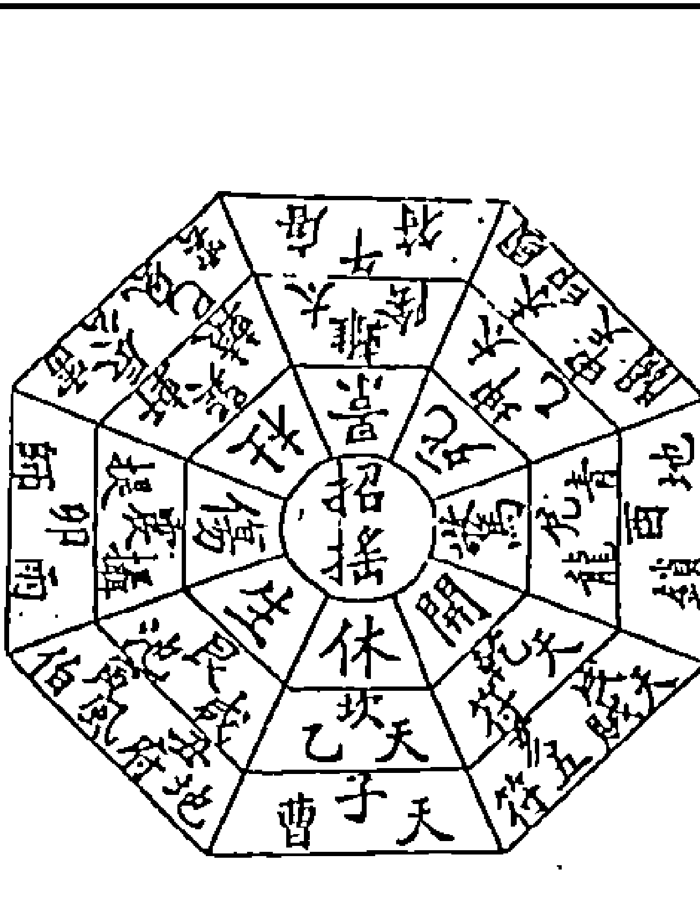

###### 癸丑日 坎方休门吉

| 方位 | 门 | 神煞 | 描述 |
| :--- | :--- | :--- | :--- |
| 中宫 |  | 轩辕 | 水神小凶星，门内都不宁，赌博定输钱，百事谋为定伤残。 |
| 乾 | 开 | 招摇 | 出入免招殃、先难后得成、妇人口舌迎。 |
| 坎 | 休 | 太阴 | 求财谒贵钦、婚姻定情吉、百事灾不侵。 |
| 艮 | 生 | 青龙 | 求事喜重重、遇人逢酒肉、钱财利路通。 |
| 震 | 伤 | 太乙 | 索债可得收、渔猎亦能成、他事忧虑多。 |
| 巽 | 杜 | 摄提 | 路必不通、事必迟疑、多灾坎坷。 |
| 离 | 景 | 咸池 | 远行多不利、求财空手归、出入不安、损失又患病。 |
| 坤 | 死 | 天乙 | 求谋不堪论、远行逢灾厄、吊死行刑可、拿捕鱼猎亦可行。 |
| 兑 | 惊 | 天符 | 走失难觅寻、更有妇人谋、官司口舌定不利。 |

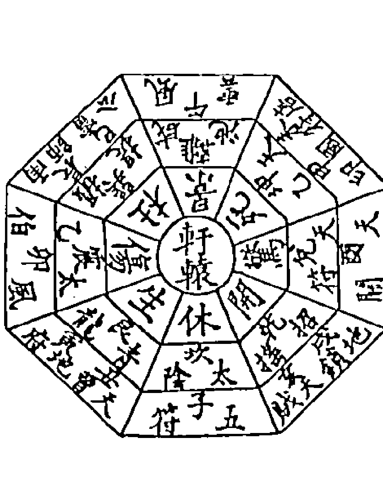

###### 甲寅日 艮方生门吉

| 方位 | 门 | 神煞 | 描述 |
| :--- | :--- | :--- | :--- |
| 中宫 |  | 摄提 | 土神大凶星，万事不相通同，隐匿藏遁可，言动则伤身。 |
| 乾 | 开 | 轩辕 | 求谋事必缠、远行防阻滞、求财定不利。 |
| 坎 | 休 | 咸池 | 百祸侵不得、诸事遇贤良、求财百事皆得成。 |
| 艮 | 生 | 天符 | 路途行人阻、有阴人妨害、走失难得、口论官司凶。 |
| 震 | 伤 | 天乙 | 谨慎用事则可遂、谋事多称心、索债渔猎亦得成。 |
| 巽 | 杜 | 太乙 | 百事多得成、避难藏匿得安宁。 |
| 离 | 景 | 青龙 | 远行多不利、求财空手归、出入不安、损失又患病。 |
| 坤 | 死 | 太阴 | 知己能得寻、他事少得成、吊死行刑捕猎可。 |
| 兑 | 惊 | 招摇 | 恐慌怪梦怕、阴人口舌迎、百事多不安、官司病伤缠。 |

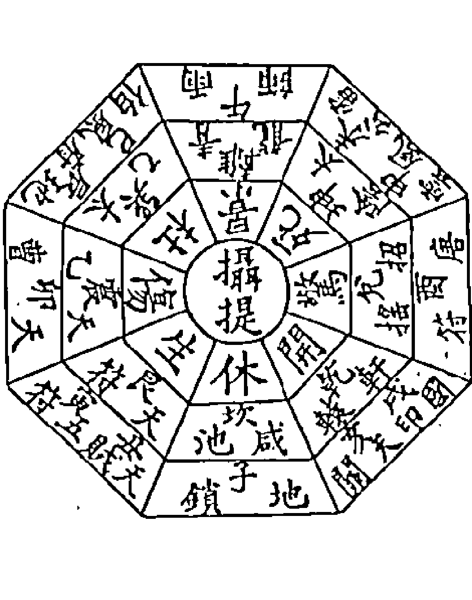

###### 乙卯日 兌方生門吉

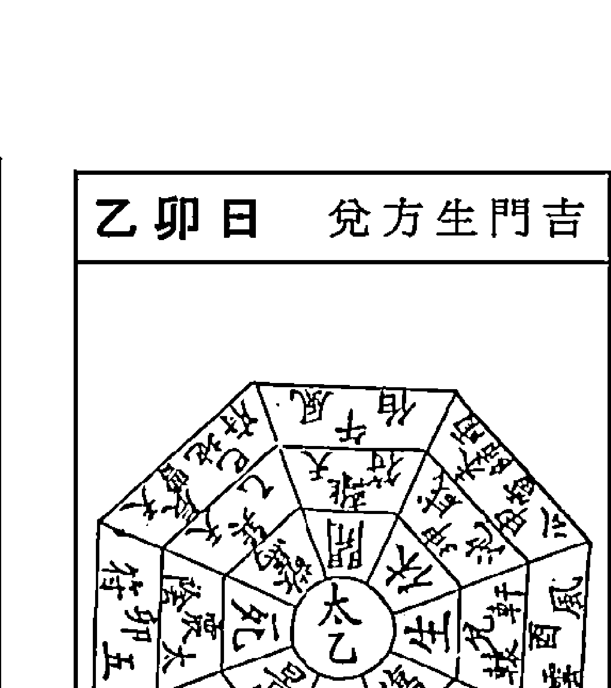

| 方位 | 门 | 星宿 | 描述 |
| --- | --- | --- | --- |
| 中宫 |  | 太乙 | 水神大吉星，遇陰人尤吉，諸事盡歡欣，賭博錢財愁聚。 |
| 乾 | 傷 | 攝提 | 求財多不利、遠行防血光、諸事不如意。 |
| 坎 | 杜 | 青龍 | 茶酒留住客、隱伏逃避成、謀事不遂心。 |
| 艮 | 景 | 招搖 | 出外賊盜逢、白夢多恐慌、又得防陰人口舌事。 |
| 震 | 死 | 太陰 | 知己能得尋、他事少得成、吊死行刑捕獵可。 |
| 巽 | 驚 | 天乙 | 雖有吉曜扶、求謀仍難成、出行防傷病、唯能捕賊盜。 |
| 離 | 開 | 天符 | 遠行見貴賢、須防婦人謀、走失難尋得。 |
| 坤 | 休 | 咸池 | 嫁娶尚稱吉、求財空手回、損失加病患。 |
| 兌 | 生 | 軒轅 | 萬事尚稱可、行事防牽纏、遠行亡阻滯。 |

###### 丙辰日 坤方休門吉

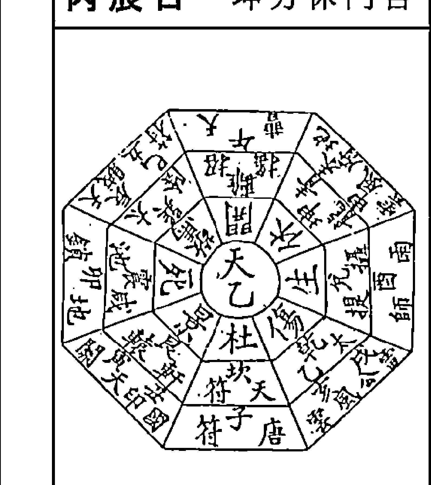

| 方位 | 门 | 星宿 | 描述 |
| --- | --- | --- | --- |
| 中宫 |  | 天乙 | 火星吉神，宜見貴人，用事，求謀，嫁娶，總遂心。 |
| 乾 | 傷 | 太乙 | 索債可得收、漁獵亦能成、他事憂慮多。 |
| 坎 | 杜 | 天符 | 行人塞路行、走失難搜尋、逃走避難成。 |
| 艮 | 景 | 軒轅 | 諸事謀為難、常須防火災、亦要防盜難。 |
| 震 | 死 | 咸池 | 損財病患來、又得防止陰女難、只適打獵捕漁。 |
| 巽 | 驚 | 太陰 | 誤詞獻詐伏兵成、知交得覓尋、餘事謹慎莫輕行。 |
| 離 | 開 | 招搖 | 出入免招殃、先難後得成、婦人口舌迎。 |
| 坤 | 休 | 青龍 | 謀事盡相通、赴任貴人助、求利求財旺。 |
| 兌 | 生 | 攝提 | 百事皆難成、遠行多不利、財路皆不順。 |

###### 丁巳日 兌方生門吉

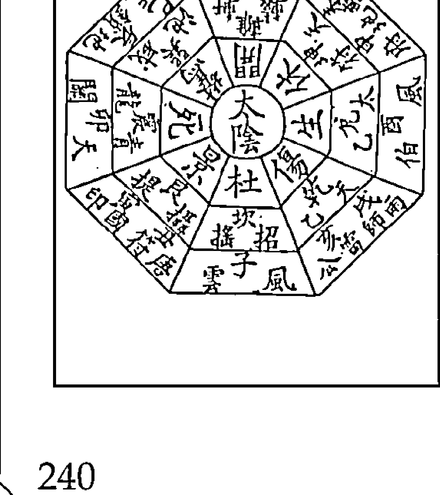

| 方位 | 门 | 星宿 | 描述 |
| --- | --- | --- | --- |
| 中宫 |  | 太陰 | 土神吉星，知者莫交鋒、雖有勝算握，未必占奇功。 |
| 乾 | 傷 | 天乙 | 謹慎用事則可遂、謀事多稱心、索債漁獵亦得成。 |
| 坎 | 杜 | 招搖 | 出入多閉塞、陰人口舌迎、避難尚有路、恐慌事難成。 |
| 艮 | 景 | 攝提 | 百事多坎坷、遠行災難多、惡人賊盜逢。 |
| 震 | 死 | 青龍 | 適於捕打漁獵、吊死行刑亦可、其他吉事不堪言。 |
| 巽 | 驚 | 咸池 | 出行多不利、損財失物又患病、只宜捕捉盜賊。 |
| 離 | 開 | 軒轅 | 求謀事必纏、遠行防阻滯、求財定不利。 |
| 坤 | 休 | 天符 | 須防女難相、路途有人阻、走失難尋見。 |
| 兌 | 生 | 太乙 | 吉曜百事亨、求財得利多、遠行無阻滯。 |

###### 戊午日 巽方生门吉

中宫 咸池 金神大凶星，咸池名恶杀，凿井以外，用事恐伤身不宜。

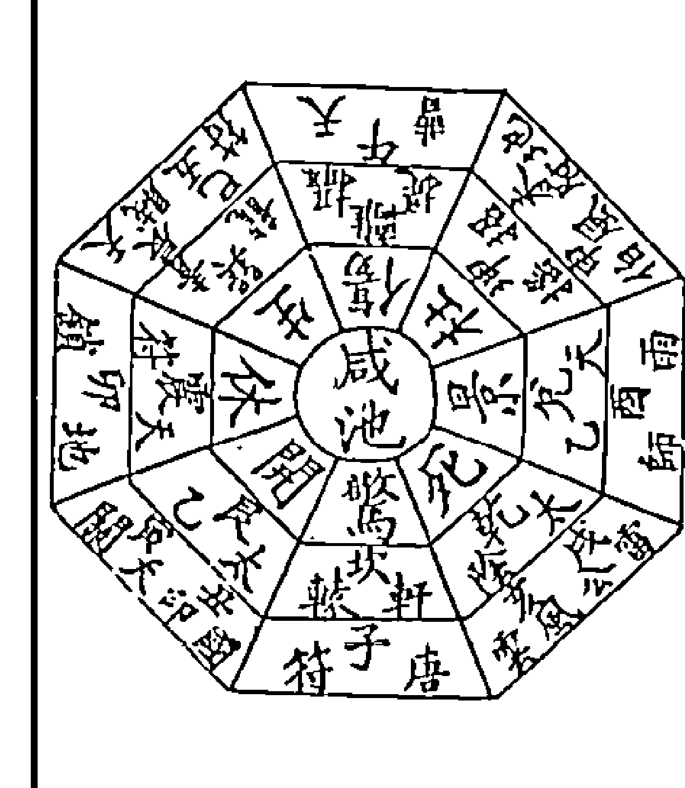

| 方位 | 状态 | 神煞 | 断语 |
|---|---|---|---|
| 乾 | 死 | 太阴 | 知己能得寻、他事少得成、吊死行刑捕猎可。 |
| 坎 | 惊 | 轩辕 | 行事必牵缠、损财又伤身、远行阻滞又遇恐惧事。 |
| 艮 | 开 | 太乙 | 谒贵可得扶、行事遇贤良、婚姻大吉祥、远行无阻滞。 |
| 震 | 休 | 天符 | 须防女难相、路途有人阻、走失难寻见。 |
| 巽 | 生 | 青龙 | 求事喜重重、遇人逢酒肉、钱财利路通。 |
| 离 | 伤 | 摄提 | 求财多不利、远行防血光、诸事不如意。 |
| 坤 | 杜 | 招摇 | 出入多闭塞、阴人口舌迎、避难尚有路、恐慌事难成。 |
| 兑 | 景 | 天乙 | 相会娶嫁百事吉、求财谋事亦易成。 |

###### 己未日 艮方开门吉

中宫 青龙 金神大吉星，相生钱财旺，接贵安荣华，万事事相同。

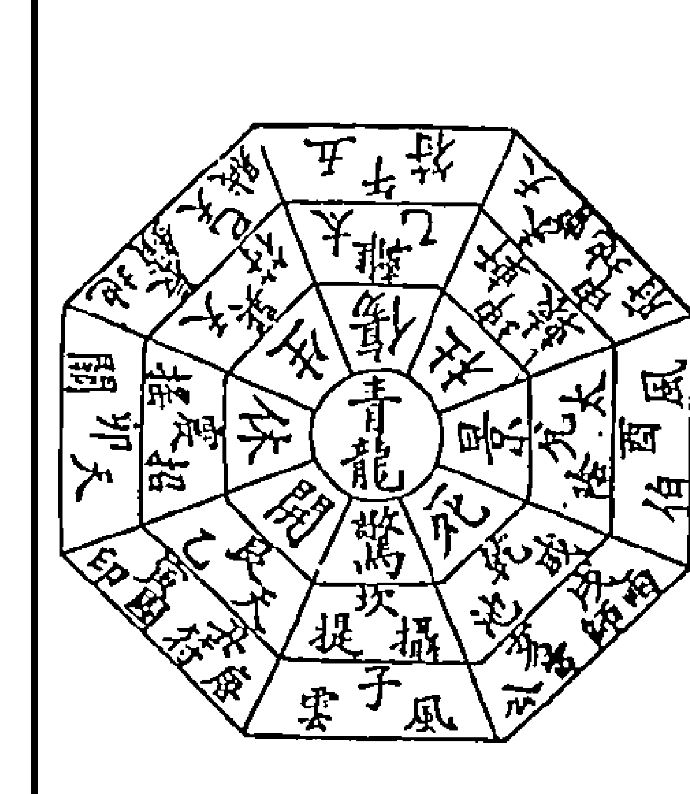

| 方位 | 状态 | 神煞 | 断语 |
|---|---|---|---|
| 乾 | 死 | 咸池 | 损财病患来、又得防止阴女难、只适打猎捕鱼。 |
| 坎 | 惊 | 摄提 | 出行遇恐惧、官司凶连绵、百事必迟疑。 |
| 艮 | 开 | 天乙 | 求财皆和顺、求谋百事成、茶酒自来迎。 |
| 震 | 休 | 招摇 | 吉宿见贵人、出入笑喜重、行事须考量、诸事尚称意。 |
| 巽 | 生 | 天符 | 路途行人阻、有阴人妨害、走失难寻得、口论官司凶。 |
| 离 | 伤 | 太乙 | 索债可得收、渔猎亦能成、他事忧虑多。 |
| 坤 | 杜 | 轩辕 | 门路皆不通、远行路难走、行事必缠滞。 |
| 兑 | 景 | 太阴 | 出门皆会吉、嫁娶行商成、谋求财利甚称佳。 |

###### 庚申日 艮方开门吉

中宫 天符 土神凶星，五鬼是天符，积粮尚有利，切忌有灾途。

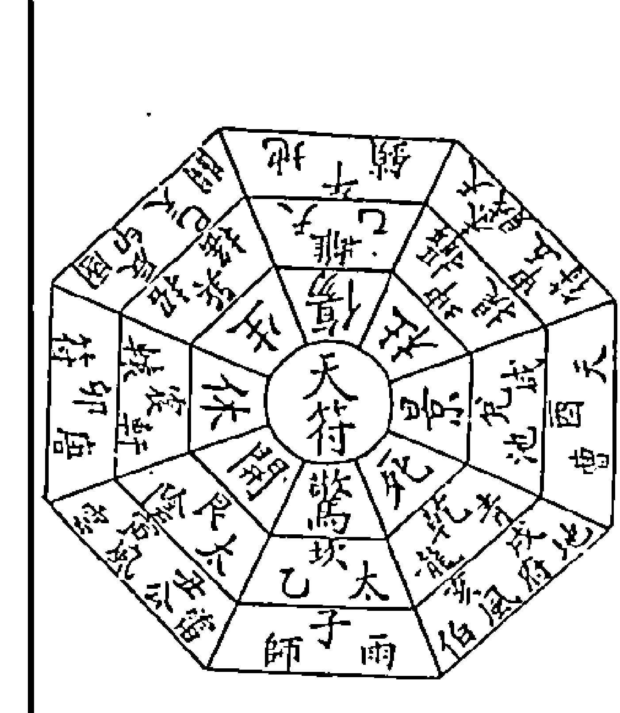

| 方位 | 状态 | 神煞 | 断语 |
|---|---|---|---|
| 乾 | 死 | 青龙 | 适于捕打渔猎、吊死行刑亦可、其他吉事不堪言。 |
| 坎 | 惊 | 太乙 | 虽得吉曜助、出行事难失魂虚惊、只宜捕贼盗。 |
| 艮 | 开 | 太阴 | 百祸侵不得、诸事遇贤良、求财百事皆得成。 |
| 震 | 休 | 轩辕 | 百事会牵缠、凶事稍得缓、远行途阻滞。 |
| 巽 | 生 | 招摇 | 出入事难成、阴人口舌迎、情绪多不宁。 |
| 离 | 伤 | 天乙 | 谨慎用事则可遂、谋事多称心、索债渔猎亦得成。 |
| 坤 | 杜 | 摄提 | 路必不通、事必迟疑、多灾坎坷。 |
| 兑 | 景 | 咸池 | 远行多不利、求财空手归、出入不安、损失又患病。 |

###### 辛酉日 巽方休门吉

中宫 招摇 木神小凶星，阴人口舌迎，白梦多恐慌，屋响釜自鸣。

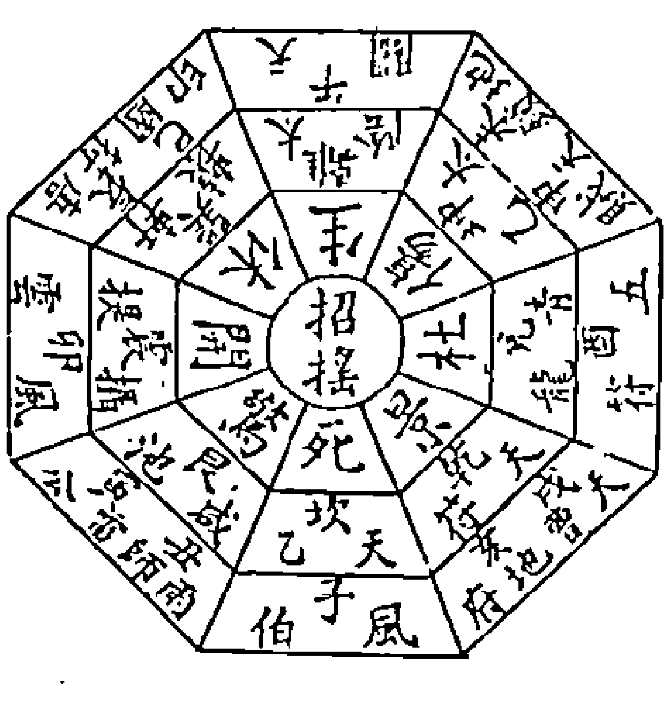

| 方位 | 门 | 星 | 描述 |
|------|-------|------|------|
| 乾 | 景 | 天符 | 出门路途有阻害、又须防女难之相。 |
| 坎 | 死 | 天乙 | 求谋不堪论、远行逢灾厄、吊死行刑可、拿捕鱼猎亦可行。 |
| 艮 | 惊 | 咸池 | 出行多不利、损财失物又患病、只宜捕捉盗贼。 |
| 震 | 开 | 摄提 | 百事必迟滞、喜事变凶事、远行必迟滞。 |
| 巽 | 休 | 轩辕 | 百事会牵缠、凶事稍得缓、远行途阻滞。 |
| 离 | 生 | 太阴 | 百事灾不侵、求财皆成就、贵人自来寻。 |
| 坤 | 伤 | 太乙 | 索债可得收、渔猎亦能成、他事忧虑多。 |
| 兑 | 杜 | 青龙 | 茶酒留住客、隐伏逃避成、谋事不遂心。 |

###### 壬戌日 震方开门吉

中宫 轩辕 水神小凶星，门内都不宁，赌博定输钱，百事谋为定伤残。

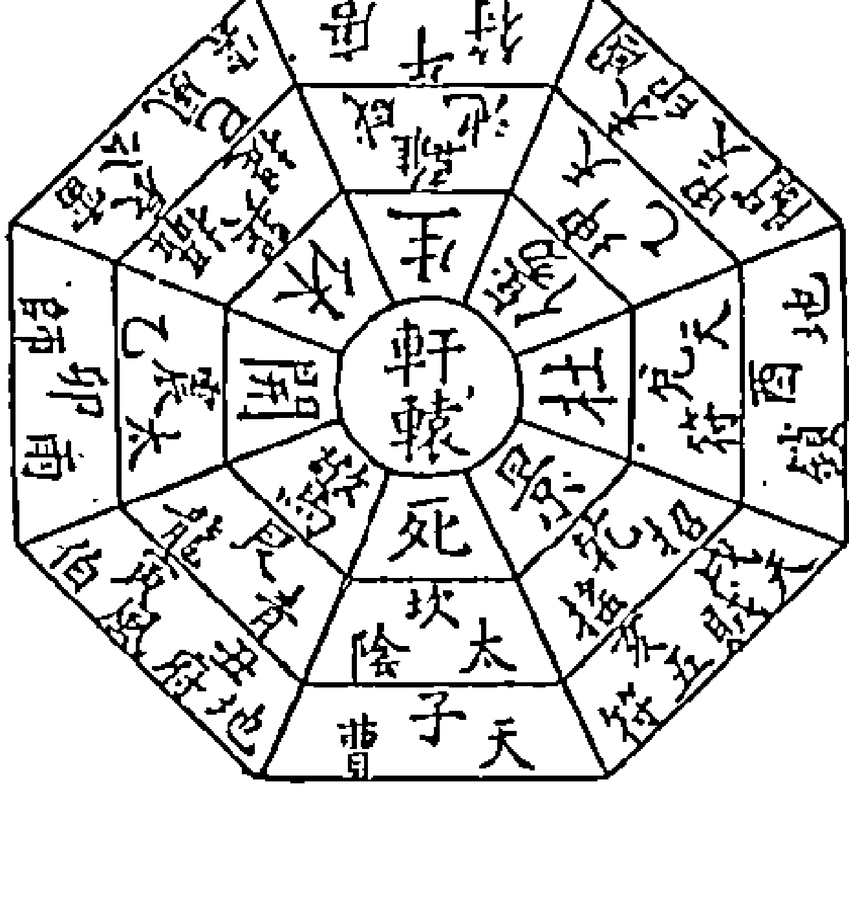

| 方位 | 门 | 星 | 描述 |
|------|-------|------|------|
| 乾 | 景 | 招摇 | 出外贼盗逢、白梦多恐慌、又得防阴人口舌事。 |
| 坎 | 死 | 太阴 | 知己能得寻、他事少得成、吊死行刑捕猎可。 |
| 艮 | 惊 | 青龙 | 赌博可见喜、其他吉事未必通、伏兵捕捉亦成。 |
| 震 | 开 | 太乙 | 谒贵可得扶、行事遇贤良、婚姻大吉祥、远行无阻滞。 |
| 巽 | 休 | 摄提 | 远行必不利、财路耗损失、婚姻不如意。 |
| 离 | 生 | 咸池 | 远行多不利、赌博空手归、失财又患病。 |
| 坤 | 伤 | 天乙 | 谨慎用事则可遂、谋事多称心、索债渔猎亦得成。 |
| 兑 | 杜 | 天符 | 行人塞路行、走失难搜寻、逃走避难成。 |

###### 癸亥日 巽方休门吉

中宫 摄提 土神大凶星，万事不相通，隐匿藏遁可，言动则伤身。

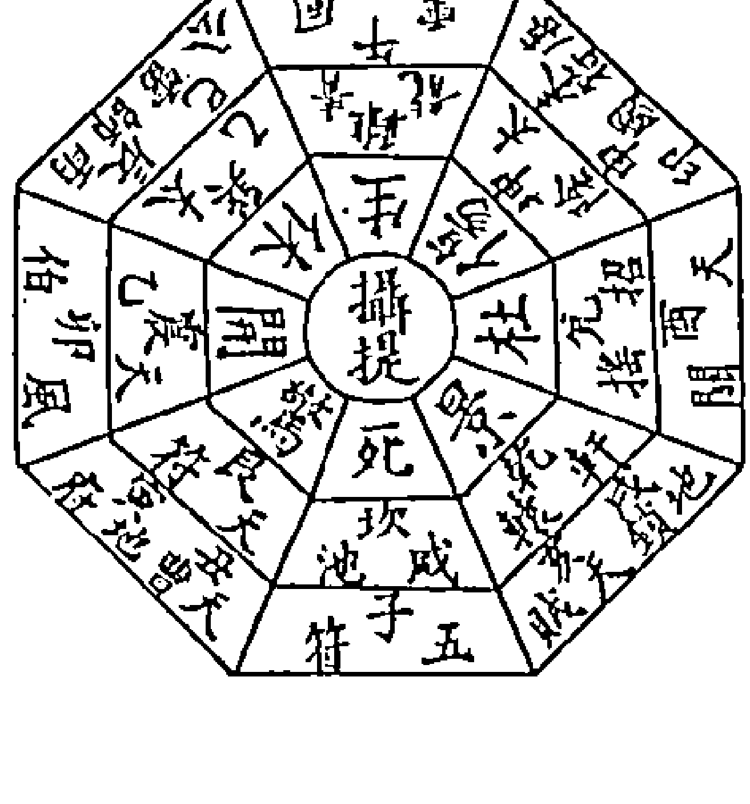

| 方位 | 门 | 星 | 描述 |
|------|-------|------|------|
| 乾 | 景 | 轩辕 | 诸事谋为难、常须防火灾、亦要防盗难。 |
| 坎 | 死 | 咸池 | 损财病患来、又得防止阴女难、只适打猎捕渔。 |
| 艮 | 惊 | 天符 | 走失难觅寻、更有妇人谋、官司口舌定不利。 |
| 震 | 开 | 天乙 | 求财皆和顺、求谋百事成、茶酒自来迎。 |
| 巽 | 休 | 太乙 | 出门无阻滞、百事见兴旺、婚姻大吉昌。 |
| 离 | 生 | 青龙 | 求事喜重重、遇人逢酒肉、钱财利路通。 |
| 坤 | 伤 | 太阴 | 百祸不能侵、索债必得成、喜事不全吉。 |
| 兑 | 杜 | 招摇 | 出入多闭塞、阴人口舌迎、避难尚有路、恐慌事难成。 |

## 奇門遁甲日盤（五符法）

### 陰遁六十局

甲子日～癸亥日

### 奇門遁甲日盤（五符法）陰遁六十局 甲子日～癸亥日

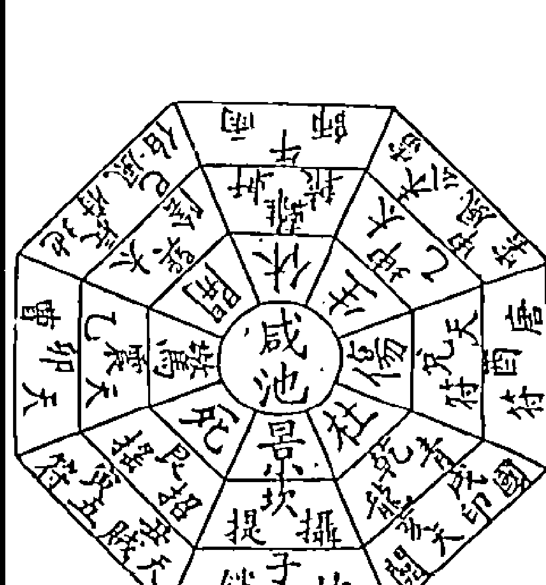

###### 甲子日 坤方生門吉

| 方位 | 门 | 神 | 解 |
| :--- | :--- | :--- | :--- |
| 中宮 |  | 咸池 | 金神大凶星，咸池名惡殺，凿井以外，用事恐傷身不宜。 |
| 乾 | 杜 | 青龍 | 茶酒留住客、隱伏逃避成、謀事不遂心。 |
| 坎 | 景 | 攝提 | 百事多坎坷、遠行災難多、惡人賊盜逢。 |
| 艮 | 死 | 招搖 | 出門事不成、恐慌怪夢怕、只適捕獵事。 |
| 震 | 驚 | 天乙 | 雖有吉曜扶、求謀仍難成、出行防傷病、唯能捕賊盜。 |
| 巽 | 開 | 太陰 | 百禍侵不得、謀事不空回、求財定可得。 |
| 離 | 休 | 軒轅 | 百事謀為艱難、行事必纏緩、遠行途阻滯。 |
| 坤 | 生 | 太乙 | 吉曜百事亨、求財得利多、遠行無阻滯。 |
| 兌 | 傷 | 天符 | 須防有是非、遇婦人謀害、漁獵索債成。 |

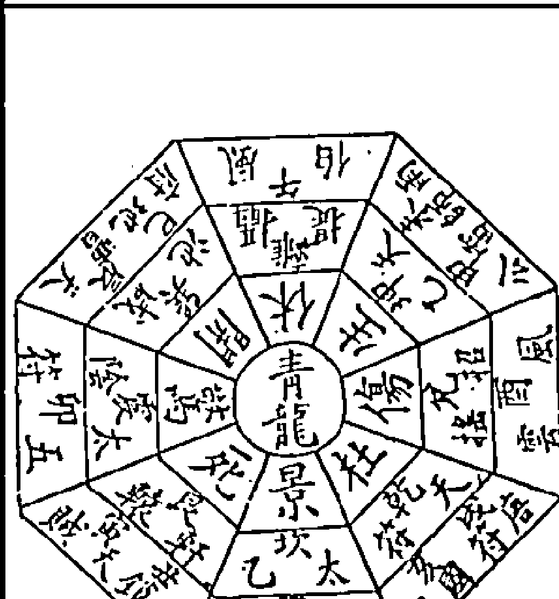

###### 乙丑日 坤方生門吉

| 方位 | 门 | 神 | 解 |
| :--- | :--- | :--- | :--- |
| 中宮 |  | 青龍 | 金神大吉星，相生錢財旺，接貴安榮華，萬事事相同。 |
| 乾 | 杜 | 天符 | 行人塞路行、走失難搜尋、逃走避難成。 |
| 坎 | 景 | 太乙 | 謁故尋親吉、行文百事吉、遠行無阻滯。 |
| 艮 | 死 | 軒轅 | 行事必牽纏、遠行必阻滯、只能獵漁事。 |
| 震 | 驚 | 太陰 | 誤詞獻詐伏兵成、知交得覓尋、餘事謹慎莫輕行。 |
| 巽 | 開 | 咸池 | 求財賭博空手回、病患災厄臨、遠行多不利。 |
| 離 | 休 | 攝提 | 遠行必不利、財路耗損失、婚姻不如意。 |
| 坤 | 生 | 天乙 | 人緣人事佳、財利亦見旺、萬事從心享。 |
| 兌 | 傷 | 招搖 | 謀事恐慌多、出入有阻害、陰人口舌迎。 |

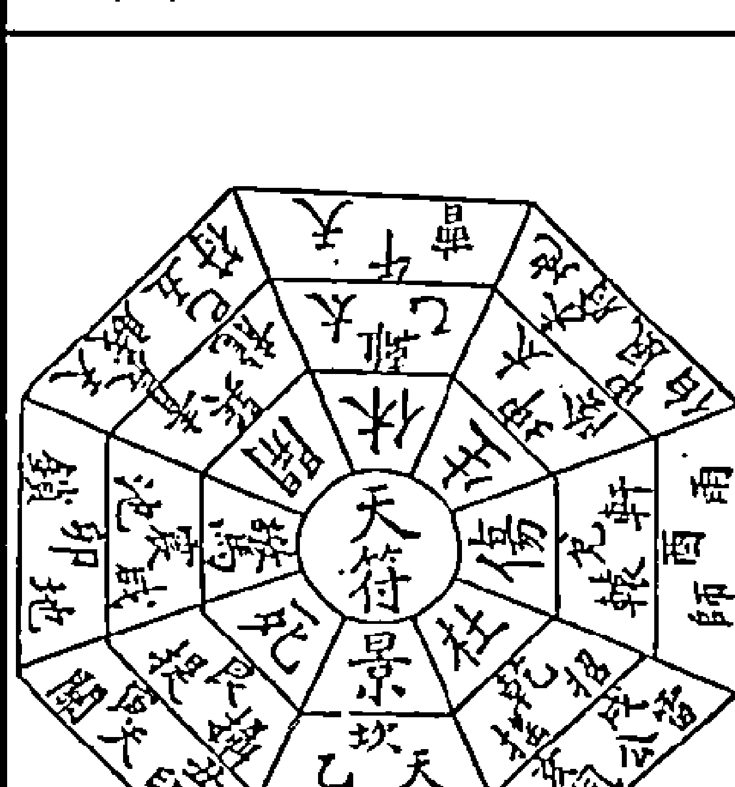

###### 丙寅日 坤方生門吉

| 方位 | 门 | 神 | 解 |
| :--- | :--- | :--- | :--- |
| 中宮 |  | 天符 | 土神凶星，五鬼是天符，積糧尚有利，切忌有災途。 |
| 乾 | 杜 | 招搖 | 出入多閉塞、陰人口舌迎、避難尚有路、恐慌事難成。 |
| 坎 | 景 | 天乙 | 相會娶嫁百事吉、求財謀事亦易成。 |
| 艮 | 死 | 攝提 | 此路無吉利、老婦哭悲啼、打獵捉魚可得利。 |
| 震 | 驚 | 咸池 | 出行多不利、損財失物又患病、只宜捕捉盜賊。 |
| 巽 | 開 | 青龍 | 青龍喜重重，遇人逢酒肉、賭博求財得不空。 |
| 離 | 休 | 太乙 | 出門無阻滯、百事見興旺、婚姻大吉昌。 |
| 坤 | 生 | 太陰 | 百事災不侵、求財皆成就、貴人自來尋。 |
| 兌 | 傷 | 軒轅 | 遠行防血光、行事必牽纏、求財亦不利。 |

###### 丁卯日 坎方開門吉

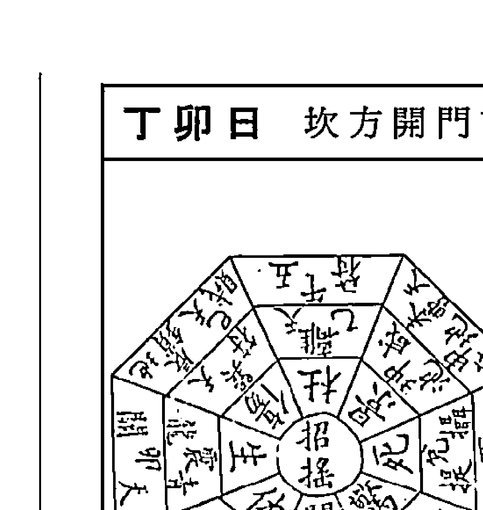

| 方位 | 神煞 | 描述 |
|------|------|------|
| 中宫 | 招摇 | 木神小凶星，阴人口舌迎，白梦多恐慌，屋响釜自鸣。 |
| 乾 | 惊 | 轩辕 | 行事必牵缠、损财又伤身、远行阻滞又遇恐惧事。 |
| 坎 | 开 | 太阴 | 百祸侵不得、谋事不空回、求财定可得。 |
| 艮 | 休 | 太乙 | 出门无阻滞、百事见兴旺、婚姻大吉昌。 |
| 震 | 生 | 青龙 | 求事喜重重、遇人逢酒肉、钱财利路通。 |
| 巽 | 伤 | 天符 | 须防有是非、遇妇人谋害、渔猎索债成。 |
| 离 | 杜 | 天乙 | 吉星百事顺、求财娶嫁皆有喜、阴伏避难亦得成。 |
| 坤 | 景 | 咸池 | 远行多不利、求财空手归、出入不安、损失又患病。 |
| 兑 | 死 | 摄提 | 此路无吉利、老妇哭悲啼、打猎捉鱼可得利。 |

###### 戊辰日 艮方休門吉

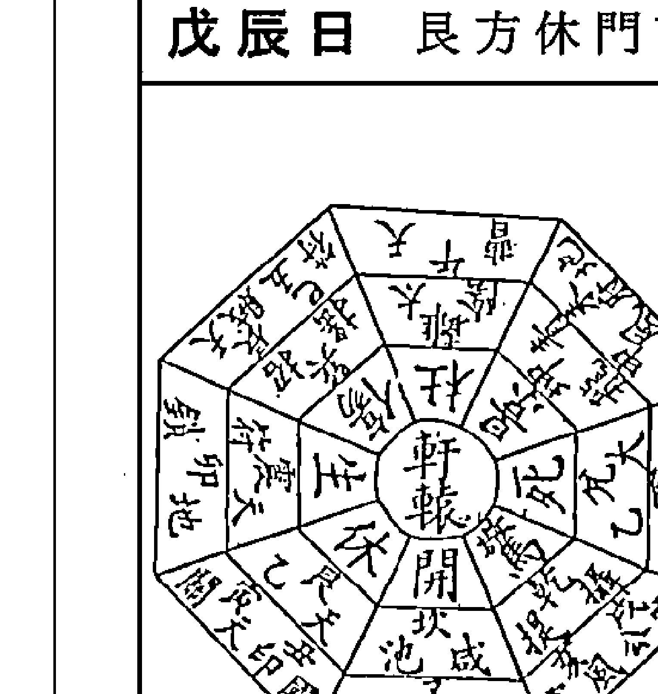

| 方位 | 神煞 | 描述 |
|------|------|------|
| 中宫 | 轩辕 | 水神小凶星，门内都不宁，赌博定输钱，百事谋为定伤残。 |
| 乾 | 惊 | 摄提 | 出行遇惊惧、官司凶连绵、百事必迟疑。 |
| 坎 | 开 | 咸池 | 求财赌博空手回、病患灾厄临、远行多不利。 |
| 艮 | 休 | 天乙 | 人际人和通、休闲酒食悦、谋事财利旺。 |
| 震 | 生 | 天符 | 路途行人阻、有阴人妨害、走失难得寻、口论官司凶。 |
| 巽 | 伤 | 招摇 | 谋事恐慌多、出入有阻害、阴人口舌迎。 |
| 离 | 杜 | 太阴 | 百事喜相成、藏身无烦恼、知交可寻得。 |
| 坤 | 景 | 青龙 | 远行多不利、求财空手归、出入不安、损失又患病。 |
| 兑 | 死 | 太乙 | 谋事可有贵人助、谒贵求良较难成、捕鱼打猎有收获。 |

###### 己巳日 坎方開門吉

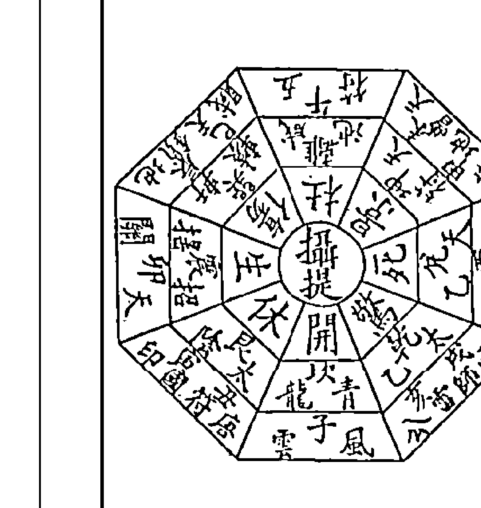

| 方位 | 神煞 | 描述 |
|------|------|------|
| 中宫 | 摄提 | 土神大凶星，万事不相通，隐匿藏遁可，言动则伤身。 |
| 乾 | 惊 | 太乙 | 虽得吉曜助、出行事难失魂虚惊、只宜捕贼盗。 |
| 坎 | 开 | 青龙 | 青龙喜重重，遇人逢酒肉、赌博求财得不空。 |
| 艮 | 休 | 太阴 | 求财谒贵钦、婚姻定情吉、百事灾不侵。 |
| 震 | 生 | 招摇 | 出入事难成、阴人口舌迎、情绪多不宁。 |
| 巽 | 伤 | 轩辕 | 远行防血光、行事必牵缠、求财亦不利。 |
| 离 | 杜 | 咸池 | 远行多不利、求财反败失、灾厄病患多。 |
| 坤 | 景 | 天符 | 出门路途有阻害、又须防女难之相。 |
| 兑 | 死 | 天乙 | 求谋不堪论、远行逢灾厄、吊死行刑可、拿捕鱼猎亦可行。 |

### 奇门遁甲日盘（五符法）阴遁六十局 甲子日～癸亥日

### 庚午日 兑方休门吉

| 卦位 | 门 | 神 | 描述 |
|------|----|----|------|
| 中宫 | 太乙 | 水神大吉星 | 遇险人尤吉，诸事尽欢欣，赌博钱财恐聚。 |
| 乾 | 生 | 天乙 | 人缘人事佳、财利亦见旺、万事从心享。 |
| 坎 | 伤 | 天符 | 须防有是非、遇妇人谋害、渔猎索债成。 |
| 艮 | 杜 | 咸池 | 远行多不利、求财反败失、灾厄病患多。 |
| 震 | 景 | 轩辕 | 诸事谋为难、常须防火灾、亦要防盗难。 |
| 巽 | 死 | 摄提 | 此路无吉利、老妇哭悲啼、打猪捉鱼可得利。 |
| 离 | 惊 | 青龙 | 赌博可见喜、其他吉事未必通、伏兵捕捉亦成。 |
| 坤 | 开 | 招摇 | 出入免招殃、先难后得成、妇人口舌迎。 |
| 兑 | 休 | 太阴 | 求财谒贵欷、婚姻定情吉、百时不灾侵。 |

### 辛未日 乾方生门吉

| 卦位 | 门 | 神 | 描述 |
|------|----|----|------|
| 中宫 | 天乙 | 火星吉神 | 宜见贵人，用事，求谋，嫁娶，总遂心。 |
| 乾 | 生 | 太阴 | 百事灾不侵、求财皆成就、贵人自来寻。 |
| 坎 | 伤 | 招摇 | 谋事恐慌多、出入有阻害、阴人口舌迎。 |
| 艮 | 杜 | 青龙 | 茶酒留住客、隐伏逃避成、谋事不遂心。 |
| 震 | 景 | 摄提 | 百事多坎坷、远行灾难多、恶人贼盗逢。 |
| 巽 | 死 | 太乙 | 谋事可有贵人助、谒贵求良较难成、捕鱼打猪有收获。 |
| 离 | 惊 | 天符 | 走失难觅寻、更有妇人谋、官司口舌定不利。 |
| 坤 | 开 | 轩辕 | 求谋事必缠、远行防阻滞、求财定不利。 |
| 兑 | 休 | 咸池 | 嫁娶尚称吉、求财空手回、损失加病患。 |

### 壬申日 乾方生门吉

| 卦位 | 门 | 神 | 描述 |
|------|----|----|------|
| 中宫 | 太阴 | 土神吉星 | 知者莫交锋、虽有胜算握，未必占奇功。 |
| 乾 | 生 | 咸池 | 远行多不利、赌博空手归、失财又患病。 |
| 坎 | 伤 | 轩辕 | 远行防血光、行事必牵缠、求财亦不利。 |
| 艮 | 杜 | 天符 | 行人塞路行、走失难搜寻、逃走避难成。 |
| 震 | 景 | 太乙 | 谒故寻亲吉、行文百事吉、远行无阻滞。 |
| 巽 | 死 | 天乙 | 求谋不堪论、远行逢灾厄、吊死行刑可、拿捕鱼猎亦可。 |
| 离 | 惊 | 招摇 | 恐慌怪梦怕、阴人口舌迎、百事多不安、官司病伤缠。 |
| 坤 | 开 | 摄提 | 百事必迟滞、喜事变凶事、远行必迟滞。 |
| 兑 | 休 | 青龙 | 谋事尽相通、赴任贵人助、求利求财旺。 |

### 癸酉日 乾方休门吉

中宫 咸池 金神大凶星，咸池名恶煞，凿井以外，用事恐伤身不宜。

| 方位 | 门 | 星神 | 吉凶描述 |
| :--- | :--- | :--- | :--- |
| 乾 | 休 | 青龙 | 谋事尽相通、赴任贵人助、求利求财旺。 |
| 坎 | 生 | 摄提 | 百事皆难成、远行多不利、财路皆不顺。 |
| 艮 | 伤 | 招摇 | 谋事恐慌多、出入有阻害、阴人口舌迎。 |
| 震 | 杜 | 天乙 | 吉星百事顺、求财娶嫁皆有喜、阴伏避难亦得成。 |
| 巽 | 景 | 太阴 | 门路皆不通、远行路难走、行事必缠滞。 |
| 离 | 死 | 轩辕 | 行事必牵缠、远行必阻滞、只能猎渔事。 |
| 坤 | 惊 | 太乙 | 误词献诈伏兵成、知交得觅寻、余事谨慎莫轻行。 |
| 兑 | 开 | 天符 | 远行见贵贤、须防妇人谋、走失难寻得。 |

### 甲戌日 坎方生门吉

中宫 青龙 金神大吉星，相生钱财旺，接贵安荣华，万事事相同。

| 方位 | 门 | 星神 | 吉凶描述 |
| :--- | :--- | :--- | :--- |
| 乾 | 休 | 天符 | 须防女难相、路途有人阻、走失难寻见。 |
| 坎 | 生 | 太乙 | 吉曜百事亨、求财得利多、远行无阻滞。 |
| 艮 | 伤 | 轩辕 | 远行防血光、行事必牵缠、求财亦不利。 |
| 震 | 杜 | 太阴 | 百事喜相成、藏身无烦恼、知交可寻得。 |
| 巽 | 景 | 咸池 | 远行多不利、求财空手归、出入不安、损失又患病。 |
| 离 | 死 | 摄提 | 此路无吉利、老妇哭悲啼、打猎捉鱼可得利。 |
| 坤 | 惊 | 天乙 | 虽有吉曜扶、求谋仍难成、出行防伤病、唯能捕贼盗。 |
| 兑 | 开 | 招摇 | 出入免招殃、先难后得成、妇人口舌迎。 |

### 乙亥日 坎方生门吉

中宫 天符 土神凶星，五鬼是天符，积粮尚有利，切忌有灾途。

| 方位 | 门 | 星神 | 吉凶描述 |
| :--- | :--- | :--- | :--- |
| 乾 | 休 | 招摇 | 吉宿见贵人、出入笑喜重、行事须考量、诸事尚称意。 |
| 坎 | 生 | 天乙 | 人缘人事佳、财利亦见旺、万事从心享。 |
| 艮 | 伤 | 摄提 | 求财多不利、远行防血光、诸事不如意。 |
| 震 | 杜 | 咸池 | 远行多不利、求财反败失、灾厄病患多。 |
| 巽 | 景 | 青龙 | 远行多不利、求财空手归、出入不安、损失又患病。 |
| 离 | 死 | 太乙 | 谋事可有贵人助、谒贵求艮较难成、捕鱼打猎有收获。 |
| 坤 | 惊 | 太阴 | 误词献诈伏兵成、知交得觅寻、余事谨慎莫轻行。 |
| 兑 | 开 | 轩辕 | 求谋事必缠、远行防阻滞、求财定不利。 |

### 丙子日 离方生门吉

中宫 招摇 木神小凶星，阴人口舌迎，白萝多恐慌，屋响釜自鸣。

| 方位 | 门 | 星 | 描述 |
|------|----|----|------|
| 乾 | 景 | 轩辕 | 诸事谋为难、常须防火灾、亦要防盗难。 |
| 坎 | 死 | 太阴 | 知己能得寻、他事少得成、吊死行刑捕猎可。 |
| 艮 | 惊 | 太乙 | 虽得吉曜助、出行事难失魂虚惊、只宜捕贼盗。 |
| 震 | 开 | 青龙 | 青龙喜重重，遇人逢酒肉、赌博求财得不空。 |
| 巽 | 休 | 天符 | 须防女难相、路途有人阻、走失难寻见。 |
| 离 | 生 | 天乙 | 人缘人事佳、财利亦见旺、万事从心享。 |
| 坤 | 伤 | 咸池 | 求财多不利、远行见血光、凶神恶杀是非多。 |
| 兑 | 杜 | 摄提 | 路必不通、事必迟疑、多灾坎坷。 |

### 丁丑日 离方生门吉

中宫 轩辕 水神小凶星，门内都不宁，赌博定输钱，百事谋为定伤残。

| 方位 | 门 | 星 | 描述 |
|------|----|----|------|
| 乾 | 景 | 摄提 | 百事多坎坷、远行灾难多、恶人贼盗逢。 |
| 坎 | 死 | 咸池 | 损财病患来、又得防止阴女难、只适打猎捕渔。 |
| 艮 | 惊 | 天乙 | 虽有吉曜扶、求谋仍难成、出行防伤病、唯能捕贼盗。 |
| 震 | 开 | 天符 | 远行见贵贤、须防妇人谋、走失难得寻。 |
| 巽 | 休 | 招摇 | 吉宿见贵人、出入笑喜重、行事须考量、诸事尚称意。 |
| 离 | 生 | 太阴 | 百事灾不侵、求财皆成就、贵人自来寻。 |
| 坤 | 伤 | 青龙 | 求财索债成、捕猎亦可获、他事是非多。 |
| 兑 | 杜 | 太乙 | 百事多得成、避难藏匿得安宁。 |

### 戊寅日 离方生门吉

中宫 摄提 土神大凶星，万事不相同，隐匿藏遁可，言动则伤身。

| 方位 | 门 | 星 | 描述 |
|------|----|----|------|
| 乾 | 景 | 太乙 | 谒故寻亲吉、行文百事吉、远行无阻滞。 |
| 坎 | 死 | 青龙 | 适于捕打渔猎、吊死行刑亦可、其他吉事不堪言。 |
| 艮 | 惊 | 太阴 | 误词献诈伏兵成、知交得觅寻、余事谨慎莫轻行。 |
| 震 | 开 | 招摇 | 出入免招殃、先难后得成、妇人口舌迎。 |
| 巽 | 休 | 轩辕 | 门路皆不通、远行路难走、行事必缠滞。 |
| 离 | 生 | 咸池 | 远行多不利、赌博空手归、失财又患病。 |
| 坤 | 伤 | 天符 | 须防有是非、遇妇人谋害、渔猎索债成。 |
| 兑 | 杜 | 天乙 | 吉星百事顺、求财娶嫁皆有喜、阴伏避难亦得成。 |

### 己卯日 震方休门吉

| 方位 | 门 | 神 | 吉凶描述 |
|---|---|---|---|
| 中宫 | | 太乙 | 神大吉星，遇阴人尤吉，诸事尽欢欣，赌博钱财愁聚。 |
| 乾 | 死 | 天乙 | 求谋不堪论，远行逢灾厄，吊死行刑可，拿捕鱼猎亦可行。 |
| 坎 | 惊 | 天符 | 走失难觅寻，更有妇人谋，官司口舌定不利。 |
| 艮 | 开 | 咸池 | 求财赌博空手回，病患灾厄临，远行多不利。 |
| 震 | 休 | 轩辕 | 百事牵缠，凶事稍得缓，远行途阻滞。 |
| 巽 | 生 | 摄提 | 百事皆难成，远行多不利，财路皆不顺。 |
| 离 | 伤 | 青龙 | 求财索债成，捕猎亦可获，他事是非多。 |
| 坤 | 杜 | 招摇 | 出入多闭塞，阴人口舌迎，避难尚有路，恐惶事难成。 |
| 兑 | 景 | 太阴 | 门路皆不通，远行路难走，行事必缠滞。 |

### 庚辰日 巽方生门吉

| 方位 | 门 | 神 | 吉凶描述 |
|---|---|---|---|
| 中宫 | | 天乙 | 火星吉神，宜见贵人，用事，求谋，嫁娶，总遂心。 |
| 乾 | 死 | 太阴 | 知己能得寻，他事少得成，吊死行刑捕猎可。 |
| 坎 | 惊 | 招摇 | 恐惶怪梦怕，阴人口舌迎，百事多不安，官司病伤缠。 |
| 艮 | 开 | 青龙 | 青龙喜重重，遇人逢酒肉，赌博求财得不空。 |
| 震 | 休 | 摄提 | 远行必不利，财路耗损失，婚姻不如意。 |
| 巽 | 生 | 太乙 | 吉曜百事亨，求财得利多，远行无阻滞。 |
| 离 | 伤 | 天符 | 须防有是非，遇妇人谋害，渔猎索债成。 |
| 坤 | 杜 | 轩辕 | 门路皆不通，远行路难走，行事必缠滞。 |
| 兑 | 景 | 咸池 | 远行多不利，求财空手归，出入不安，损失又患病。 |

### 辛巳日 震方休门吉

| 方位 | 门 | 神 | 吉凶描述 |
|---|---|---|---|
| 中宫 | | 太阴 | 土神吉星，知者莫交锋，虽有胜算握，未必占奇功。 |
| 乾 | 死 | 咸池 | 损财病患来，又得防止阴女难，只适打猎捕鱼。 |
| 坎 | 惊 | 轩辕 | 行事必牵缠，损财又伤身，远行阻滞又遇恐惶事。 |
| 艮 | 开 | 天符 | 远行见贵贤，须防妇人谋，走失难寻得。 |
| 震 | 休 | 太乙 | 出门无阻滞，百事见兴旺，婚姻大吉昌。 |
| 巽 | 生 | 天乙 | 人缘人事佳，财利亦见旺，万事从心享。 |
| 离 | 伤 | 招摇 | 谋事恐惶多，出入有阻害，阴人口舌迎。 |
| 坤 | 杜 | 摄提 | 路必不通，事必迟疑，多灾坎坷。 |
| 兑 | 景 | 青龙 | 远行多不利，求财空手归，出入不安，损失又患病。 |

### 奇门遁甲日盘（五符法）阴遁六十局 甲子日～癸亥日

| 方位 | 门 | 星 | 描述 |
|---|---|---|---|
| **中宫** | | 咸池 | 金神大凶星，咸池名恶煞，凿井以外，用事恐伤身不宜。 |
| 乾 | 伤 | 青龙 | 求财索债成、捕猎亦可获、他事是非多。 |
| 坎 | 杜 | 摄提 | 路必不通、事必迟疑、多灾坎坷。 |
| 艮 | 景 | 招摇 | 出外贼盗逢、白梦多恐慌、又得防阴人口舌事。 |
| 震 | 死 | 天乙 | 求谋不堪论、远行逢灾厄、吊死行刑可、拿捕鱼猎亦可行。 |
| 巽 | 惊 | 太阴 | 误词献诈伏兵成、知交得觅寻、余事谨慎莫轻行。 |
| 离 | 开 | 轩辕 | 求谋事必缠、远行防阻滞、求财定不利。 |
| 坤 | 休 | 太乙 | 出门无阻滞、百事见兴旺、婚姻大吉昌。 |
| 兑 | 生 | 天符 | 路途行人阻、有阴人妨害、走失难寻得、口论官司凶。 |

| 方位 | 门 | 星 | 描述 |
|---|---|---|---|
| **中宫** | | 青龙 | 金神大吉星，相生钱财旺，接贵安荣华，万事事相同。 |
| 乾 | 伤 | 天符 | 须防有是非、遇妇人谋害、渔猎索债成。 |
| 坎 | 杜 | 太乙 | 百事多得成、避难藏匿得安宁。 |
| 艮 | 景 | 轩辕 | 诸事谋为难、常须防火灾、亦要防盗难。 |
| 震 | 死 | 太阴 | 知己能得寻、他事少得成、吊死行刑捕猎可。 |
| 巽 | 惊 | 咸池 | 出行多不利、损财失物又患病、只宜捕捉盗贼。 |
| 离 | 开 | 摄提 | 百事必迟滞、喜事变凶事、远行必迟滞。 |
| 坤 | 休 | 天乙 | 人际人和通、休闲酒食悦、谋事财利旺。 |
| 兑 | 生 | 招摇 | 出入事难成、阴人口舌迎、情绪多不宁。 |

| 方位 | 门 | 星 | 描述 |
|---|---|---|---|
| **中宫** | | 天符 | 土神凶星，五鬼是天符，积粮尚有利，切忌有灾途。 |
| 乾 | 伤 | 招摇 | 谋事恐慌多、出入有阻害、阴人口舌迎。 |
| 坎 | 杜 | 天乙 | 吉星百事顺、求财娶嫁皆有喜、阴伏避难亦得成。 |
| 艮 | 景 | 摄提 | 百事多坎坷、远行灾难多、恶人贼盗逢。 |
| 震 | 死 | 咸池 | 损财病患来、又得防止阴女难、只适打猎捕渔。 |
| 巽 | 惊 | 青龙 | 赌博可见喜、其他吉事未必通、伏兵捕捉亦成。 |
| 离 | 开 | 太乙 | 谒贵可得扶、行事遇贤良、婚姻大吉祥、远行无阻滞。 |
| 坤 | 休 | 太阴 | 求财谒贵钦、婚姻定情吉、百事灾不侵。 |
| 兑 | 生 | 轩辕 | 万事尚称可、行事防牵缠、远行亡阻滞。 |

### 乙酉日 坎方休门吉

| 方位 | 门 | 星曜 | 吉凶描述 |
| :--- | :--- | :--- | :--- |
| 中宫 | 招摇 | 木神小凶星 | 阴人口舌迎，白萝多恐慌，屋响釜自鸣。 |
| 乾 | 开 | 轩辕 | 求谋事必缠、远行防阻滞、求财定不利。 |
| 坎 | 休 | 太阴 | 求财谒贵钦、婚姻定情吉、百事灾不侵。 |
| 艮 | 生 | 太乙 | 吉曜百事亨、求财得利多、远行无阻滞。 |
| 震 | 伤 | 青龙 | 求财索债成、捕获亦可获、他事是非多。 |
| 巽 | 杜 | 天符 | 行人塞路行、走失难搜寻、逃走避难成。 |
| 离 | 景 | 天乙 | 相会娶嫁百事吉、求财谋事亦易成。 |
| 坤 | 死 | 咸池 | 出门有灾难、更有妇人谋、官非又口舌、只适打猎事。 |
| 兑 | 惊 | 摄提 | 出行遇惊惶、官司凶连绵、百事必迟疑。 |

### 丙戌日 艮方生门吉

| 方位 | 门 | 星曜 | 吉凶描述 |
| :--- | :--- | :--- | :--- |
| 中宫 | 轩辕 | 水神小凶星 | 门内都不宁，赌博定输钱，百事谋为定伤残。 |
| 乾 | 开 | 摄提 | 百事必迟滞、喜事变凶事、远行必迟滞。 |
| 坎 | 休 | 咸池 | 嫁娶尚称吉、求财空手回、损失加病患。 |
| 艮 | 生 | 天乙 | 人缘人事佳、财利亦见旺、万事从心享。 |
| 震 | 伤 | 天符 | 须防有是非、遇妇人谋害、渔获索债成。 |
| 巽 | 杜 | 招摇 | 出入多闭塞、阴人口舌迎、避难尚有路、恐慌事难成。 |
| 离 | 景 | 太阴 | 门路皆不通、远行路难走、行事必缠滞。 |
| 坤 | 死 | 青龙 | 适于捕打渔猎、吊死行刑亦可、其他吉事不堪言。 |
| 兑 | 惊 | 太乙 | 虽得吉曜助、出行事难失魂虚惊、只宜捕贼盗。 |

### 丁亥日 坎方休门吉

| 方位 | 门 | 星曜 | 吉凶描述 |
| :--- | :--- | :--- | :--- |
| 中宫 | 摄提 | 土神大凶星 | 万事不相通，隐匿藏通可，言动则伤身。 |
| 乾 | 开 | 太乙 | 谒贵可得扶、行事遇贤良、婚姻大吉祥、远行无阻滞。 |
| 坎 | 休 | 青龙 | 谋事尽相通、赴任贵人助、求利求财旺。 |
| 艮 | 生 | 太阴 | 百事灾不侵、求财皆成就、贵人自来寻。 |
| 震 | 伤 | 招摇 | 谋事恐慌多、出入有阻害、阴人口舌迎。 |
| 巽 | 杜 | 轩辕 | 门路皆不通、远行路难走、行事必缠滞。 |
| 离 | 景 | 咸池 | 远行多不利、求财空手归、出入不安、损失又患病。 |
| 坤 | 死 | 天符 | 出门有灾难、更有妇人谋、官非又口舌、只适打猎事。 |
| 兑 | 惊 | 天乙 | 虽有吉曜扶、求谋仍难成、出行防伤病、唯能捕贼盗。 |

### 奇门遁甲日盘（五符法）阴遁六十局 甲子日～癸亥日

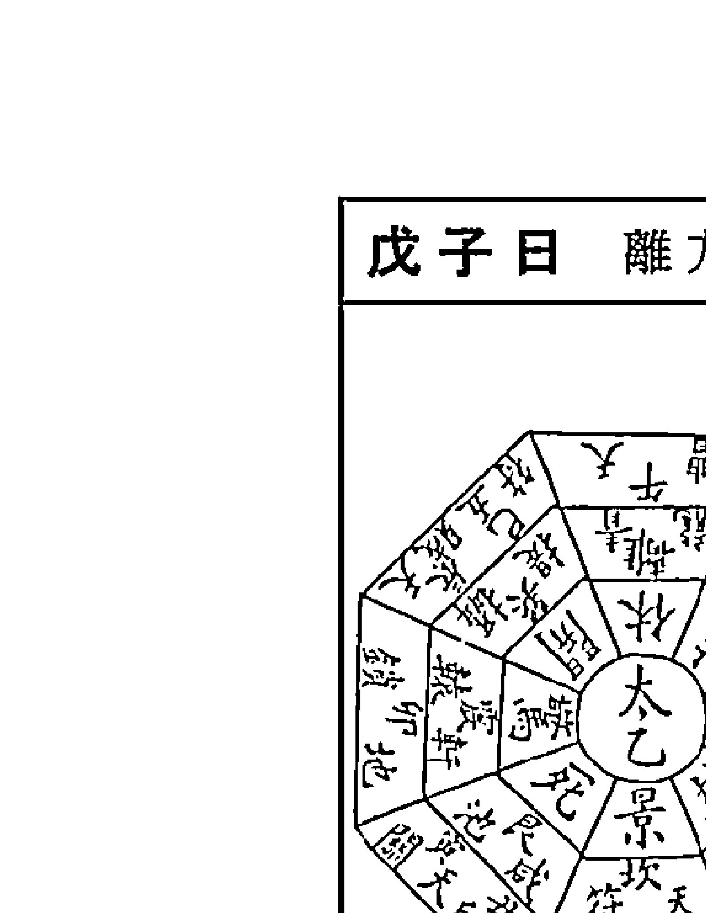

| 方向 | 门 | 神 | 描述 |
|------|----|----|------|
| 中宫 |  | 太乙 | 水神大吉星，遇阴人尤吉，诸事尽欢欣，赌博钱财愁聚。 |
| 乾 | 杜 | 天乙 | 吉星百事顺、求财娶嫁皆有喜、阴伏避难亦得成。 |
| 坎 | 景 | 天符 | 出门路途有阻害、又须防女难之相。 |
| 艮 | 死 | 咸池 | 损财病患来、又得防止阴女难、只适打猎捕鱼。 |
| 震 | 惊 | 轩辕 | 行事必牵缠、损财又伤身、远行阻滞又遇恐惧事。 |
| 巽 | 开 | 摄提 | 百事必迟滞、喜事变凶事、远行必迟滞。 |
| 离 | 休 | 青龙 | 谋事尽相通、赴任贵人助、求利求财旺。 |
| 坤 | 生 | 招摇 | 出入事难成、阴人口舌迎、情绪多不宁。 |
| 兑 | 伤 | 太阴 | 百祸不能侵、牵债必得成、喜事不全吉。 |

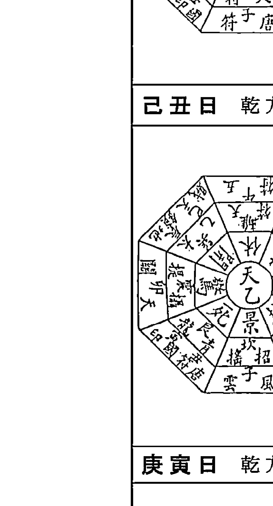

| 方向 | 门 | 神 | 描述 |
|------|----|----|------|
| 中宫 |  | 天乙 | 火星吉神，宜见贵人，用事，求谋，嫁娶，总遂心。 |
| 乾 | 杜 | 太阴 | 百事喜相成、藏身无烦恼、知交可寻得。 |
| 坎 | 景 | 招摇 | 出外贼盗逢、白梦多恐慌、又得防阴人口舌事。 |
| 艮 | 死 | 青龙 | 适于捕打渔猎、吊死行刑亦可、其他吉事不堪言。 |
| 震 | 惊 | 摄提 | 出行遇惊惧、官司凶连绵、百事必迟疑。 |
| 巽 | 开 | 太乙 | 谒贵可得扶、行事遇贤良、婚姻大吉祥、远行无阻滞。 |
| 离 | 休 | 天符 | 须防女难相、路途有人阻、走失难寻见。 |
| 坤 | 生 | 轩辕 | 万事尚称可、行事防牵缠、远行亡阻滞。 |
| 兑 | 伤 | 咸池 | 求财多不利、远行见血光、凶神恶杀是非多。 |

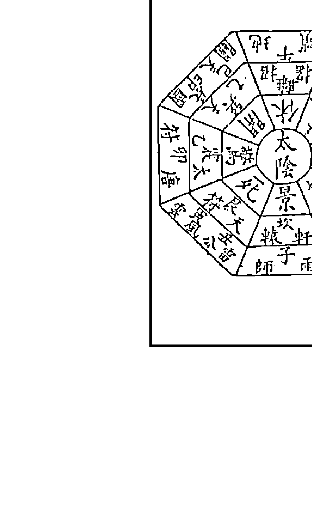

| 方向 | 门 | 神 | 描述 |
|------|----|----|------|
| 中宫 |  | 太阴 | 土神吉星，知者莫交锋，虽有胜算握，未必占奇功。 |
| 乾 | 杜 | 咸池 | 远行多不利、求财反败失、灾厄病患多。 |
| 坎 | 景 | 轩辕 | 诸事谋为难、常须防火灾、亦要防盗难。 |
| 艮 | 死 | 天符 | 出门有灾难、更有妇人谋、官非又口舌、只适打猎事。 |
| 震 | 惊 | 太乙 | 虽得吉曜助、出行事难失魂虚惊、只宜捕贼盗。 |
| 巽 | 开 | 天乙 | 求财皆和顺、求谋百事成、茶酒自来迎。 |
| 离 | 休 | 招摇 | 吉宿见贵人、出入笑喜重、行事须考量、诸事尚称意。 |
| 坤 | 生 | 摄提 | 出入事难成、阴人口舌迎、情绪多不宁。 |
| 兑 | 伤 | 青龙 | 求财索债成、捕猎亦可获、他事是非多。 |

### 辛卯日 震方生门吉

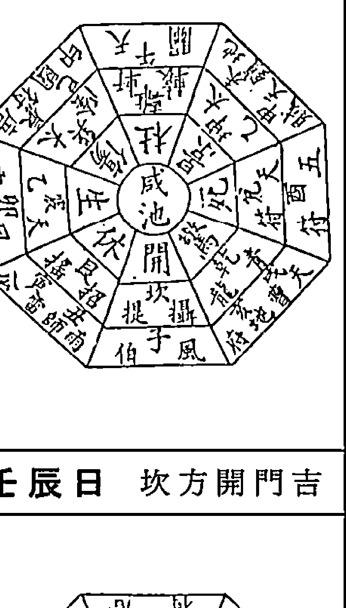

| 方位 | 门 | 星与描述 |
|------|----|----------|
| 中宫 | 咸池 | 金神大凶星，咸池名恶杀，凿井以外，用事恐伤身不宜。 |
| 乾 | 惊 | 青龙 赌博可见喜、其他吉事未必通、伏兵捕捉亦成。 |
| 坎 | 开 | 摄提 百事必迟滞、喜事变凶事、远行必迟滞。 |
| 艮 | 休 | 招摇 吉宿见贵人、出入笑喜重、行事须考量、诸事尚称意。 |
| 震 | 生 | 天乙 人缘人事佳、财利亦见旺、万事从心享。 |
| 巽 | 伤 | 太阴 百祸不能侵、牵债必得成、喜事不全吉。 |
| 离 | 杜 | 轩辕 门路皆不通、远行路难走、行事必缠滞。 |
| 坤 | 景 | 太乙 谒故寻亲吉、行文百事吉、远行无阻滞。 |
| 兑 | 死 | 天符 出门有灾难、更有妇人谋、官非又口舌、只适打猎事。 |

### 壬辰日 坎方开门吉

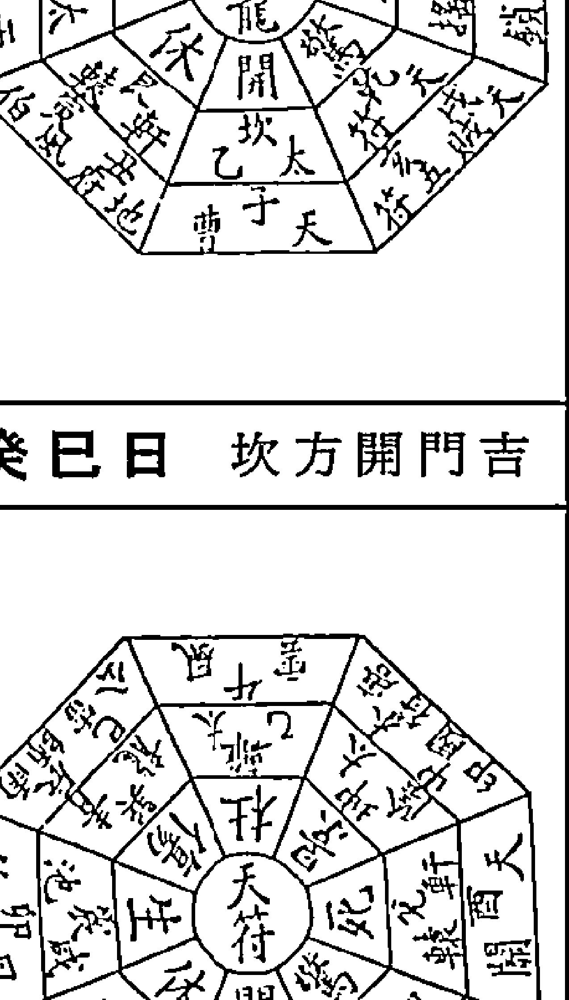

| 方位 | 门 | 星与描述 |
|------|----|----------|
| 中宫 | 青龙 | 金神大吉星，相生钱财旺，接贵安荣华，万事事相同。 |
| 乾 | 惊 | 天符 走失难觅寻、更有妇人谋、官司口舌定不利。 |
| 坎 | 开 | 太乙 谒贵可得扶、行事遇贤良、婚姻大吉祥、远行无阻滞。 |
| 艮 | 休 | 轩辕 百事谋为艰难、行事必缠缓、远行途阻滞。 |
| 震 | 生 | 太阴 百事灾不侵、求财皆成就、贵人自来寻。 |
| 巽 | 伤 | 咸池 求财多不利、远行见血光、凶神恶杀是非多。 |
| 离 | 杜 | 摄提 路必不通、事必迟疑、多灾坎坷。 |
| 坤 | 景 | 天乙 相会娶嫁百事吉、求财谋事亦易成。 |
| 兑 | 死 | 招摇 出门事不成、恐慌怪梦怕、只适捕猎事。 |

### 癸巳日 坎方开门吉

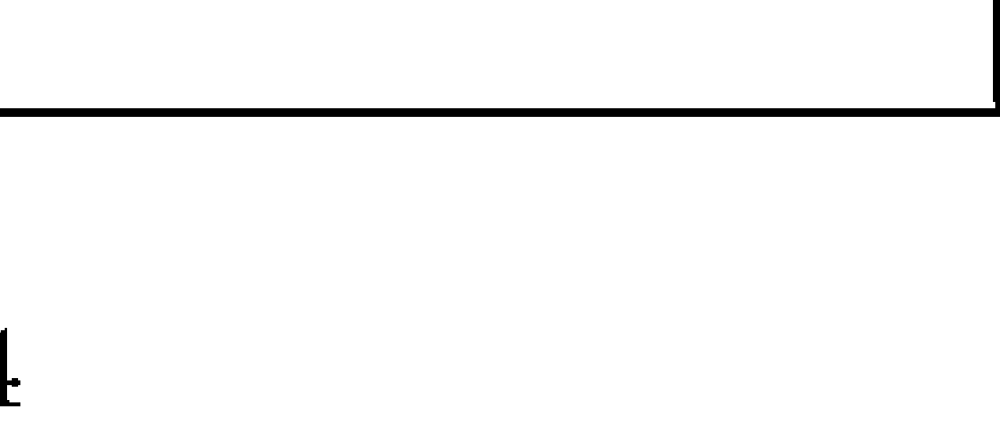

| 方位 | 门 | 星与描述 |
|------|----|----------|
| 中宫 | 天符 | 土神凶星，五鬼是天符，积粮尚有利，切忌有灾途。 |
| 乾 | 惊 | 招摇 恐慌怪梦怕、阴人口舌迎、百事多不安、官司病伤缠。 |
| 坎 | 开 | 天乙 求财皆和顺、求谋百事成、茶酒自来迎。 |
| 艮 | 休 | 摄提 远行必不利、财路耗损失、婚姻不如意。 |
| 震 | 生 | 咸池 远行多不利、赌博空手归、失财又患病。 |
| 巽 | 伤 | 青龙 求财索债成、捕猎亦可获、他事是非多。 |
| 离 | 杜 | 太乙 百事多得成、避难藏匿得安宁。 |
| 坤 | 景 | 太阴 门路皆不通、远行路难走、行事必缠滞。 |
| 兑 | 死 | 轩辕 行事必牵缠、远行必阻滞、只能猎渔事。 |

### 奇门遁甲日盘（五符法）阴遁六十局 甲子日～癸亥日

###### 甲午日 乾方生门吉

中宫 招摇 木神小凶星，阴人口舌迎，白梦多恐慌，屋响釜自鸣。

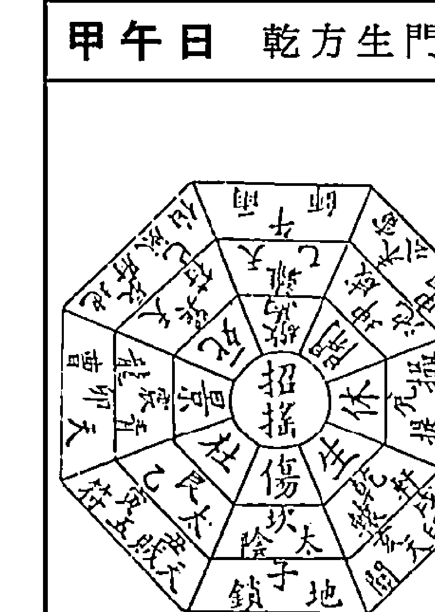

| 方位 | 门 | 神 | 描述 |
|------|----|----|------|
| 乾 | 生 | 轩辕 | 万事尚称可、行事防牵缠、远行亡阻滞。 |
| 坎 | 伤 | 太阴 | 百祸不能侵、牵债必得成、喜事不全吉。 |
| 艮 | 杜 | 太乙 | 百事多得成、避难藏匿得安宁。 |
| 震 | 景 | 青龙 | 远行多不利、求财空手归、出入不安、损失又患病。 |
| 巽 | 死 | 天符 | 出门有灾难、更有妇人谋、官非又口舌、只适打猎事。 |
| 离 | 惊 | 天乙 | 虽有吉曜扶、求谋仍难成、出行防伤病、唯能捕贼盗。 |
| 坤 | 开 | 咸池 | 求财赌博空手回、病患灾厄临、远行多不利。 |
| 兑 | 休 | 摄提 | 远行必不利、财路耗损失、婚姻不如意。 |

###### 乙未日 兑方休门吉

中宫 轩辕 水神小凶星，门内都不宁，赌博定输钱，百事谋为定伤残。

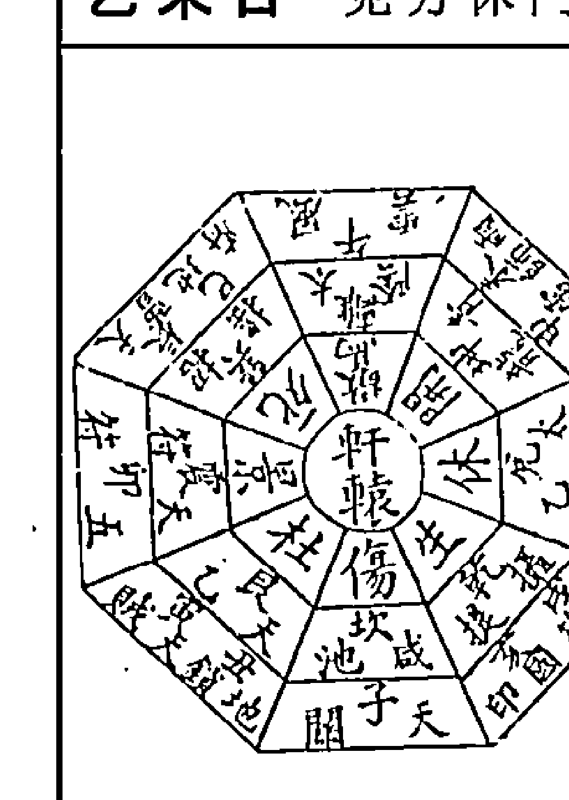

| 方位 | 门 | 神 | 描述 |
|------|----|----|------|
| 乾 | 生 | 摄提 | 百事皆难成、远行多不利、财路皆不顺。 |
| 坎 | 伤 | 咸池 | 求财多不利、远行见血光、凶神恶杀是非多。 |
| 艮 | 杜 | 天乙 | 吉星百事顺、求财娶嫁皆有喜、阴伏避难亦得成。 |
| 震 | 景 | 天符 | 出门路途有阻害、又须防女难之相。 |
| 巽 | 死 | 招摇 | 出门事不成、恐慌怪梦怕、只适捕猎事。 |
| 离 | 惊 | 太阴 | 误词献诈伏兵成、知交得觅寻、余事谨慎莫轻行。 |
| 坤 | 开 | 青龙 | 青龙喜重重，遇人逢酒肉、赌博求财得不空。 |
| 兑 | 休 | 太乙 | 出门无阻滞、百事见兴旺、婚姻大吉昌。 |

###### 丙申日 乾方生门吉

中宫 摄提 土神大凶星，万事不相通，隐匿藏遁可，言动则伤身。

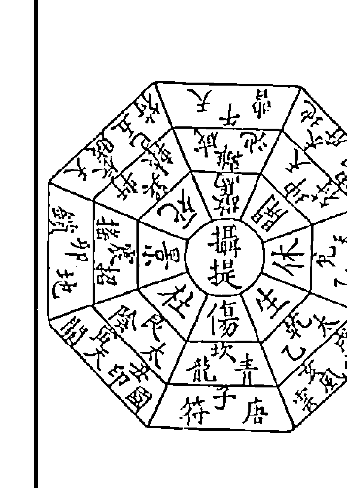

| 方位 | 门 | 神 | 描述 |
|------|----|----|------|
| 乾 | 生 | 太乙 | 吉曜百事亨、求财得利多、远行无阻滞。 |
| 坎 | 伤 | 青龙 | 求财索债成、捕猎亦可获、他事是非多。 |
| 艮 | 杜 | 太阴 | 百事喜相成、藏身无烦恼、知交可寻得。 |
| 震 | 景 | 招摇 | 出外贼盗逢、白梦多恐慌、又得防阴人口舌事。 |
| 巽 | 死 | 轩辕 | 行事必牵缠、远行必阻滞、只能猎渔事。 |
| 离 | 惊 | 咸池 | 出行多不利、损财失物又患病、只宜捕捉盗贼。 |
| 坤 | 开 | 天符 | 远行见贵贤、须防妇人谋、走失难寻得。 |
| 兑 | 休 | 天乙 | 人际人和通、休闲酒食悦、谋事财利旺。 |

### 丁酉日 兑方开门吉

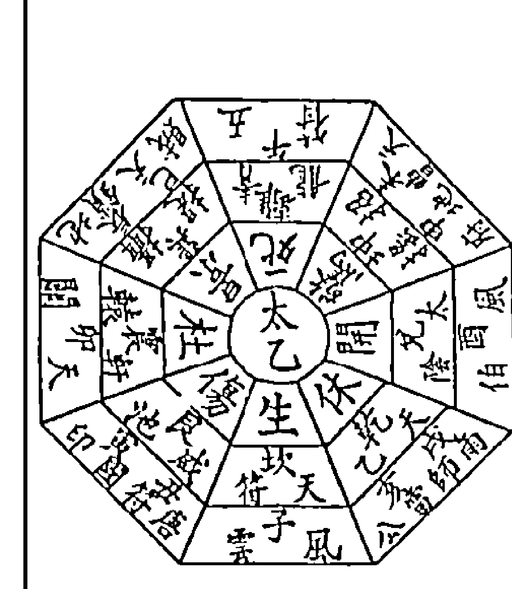

| 方位 | 门 | 神煞 | 吉凶描述 |
|---|---|---|---|
| 中宫 |  | 太乙 | 水神大吉星，遇阴人尤吉，诸事尽欢欣，赌博钱财愁聚。 |
| 乾 | 休 | 天乙 | 人际人和通、休闲酒食悦、谋事财利旺。 |
| 坎 | 生 | 天符 | 路途行人阻、有阴人妨害、走失难寻得、口论官司凶。 |
| 艮 | 伤 | 咸池 | 求财多不利、远行见血光、凶神恶煞是非多。 |
| 震 | 杜 | 轩辕 | 门路皆不通、远行路难走、行事必缠滞。 |
| 巽 | 景 | 摄提 | 百事多坎坷、远行灾难多、恶人贼盗逢。 |
| 离 | 死 | 青龙 | 适于捕打渔猎、吊死行刑亦可、其他吉事不堪言。 |
| 坤 | 惊 | 招摇 | 恐慌怪梦怕、阴人口舌迎、百事多不安、官司病伤缠。 |
| 兑 | 开 | 太阴 | 百祸侵不得、谋事不空回、求财定可得。 |

### 戊戌日 乾方休门吉

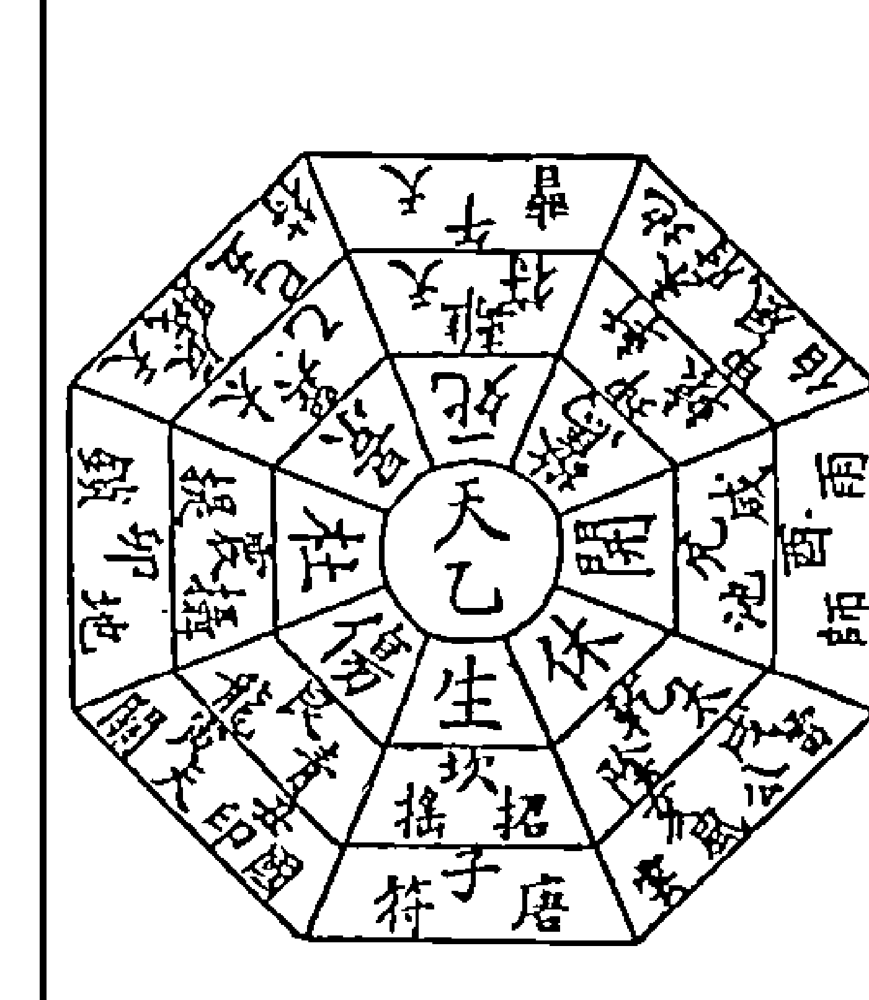

| 方位 | 门 | 神煞 | 吉凶描述 |
|---|---|---|---|
| 中宫 |  | 天乙 | 火星吉神，宜见贵人，用事，求谋，嫁娶，总遂心。 |
| 乾 | 休 | 太阴 | 求财谒贵钦、婚姻定情吉、百事灾不侵。 |
| 坎 | 生 | 招摇 | 出人事难成、阴人口舌迎、情绪多不宁。 |
| 艮 | 伤 | 青龙 | 求财索债成、捕猎亦可获、他事是非多。 |
| 震 | 杜 | 摄提 | 路必不通、事必迟疑、多灾坎坷。 |
| 巽 | 景 | 太乙 | 谒故寻亲吉、行文百事吉、远行无阻滞。 |
| 离 | 死 | 天符 | 出门有灾难、更有妇人谋、官非又口舌、只适打猎事。 |
| 坤 | 惊 | 轩辕 | 行事必牵缠、损财又伤身、远行阻滞又遇恐惧事。 |
| 兑 | 开 | 咸池 | 求财赌博空手回、病患灾厄临、远行多不利。 |

### 己亥日 兑方开门吉

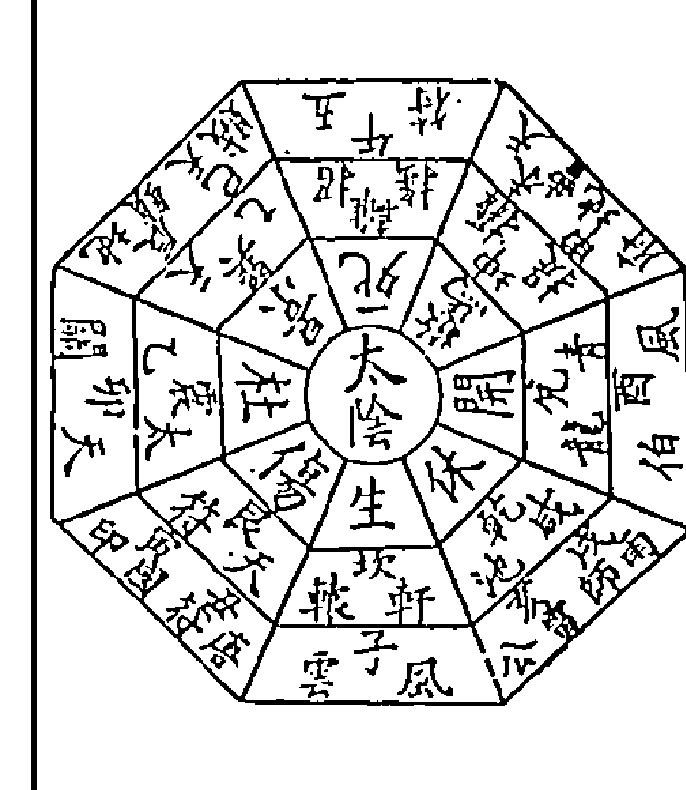

| 方位 | 门 | 神煞 | 吉凶描述 |
|---|---|---|---|
| 中宫 |  | 太阴 | 土神吉星，知者莫交锋、虽有胜算握，未必占奇功。 |
| 乾 | 休 | 咸池 | 嫁娶尚称吉、求财空手回、损失加病患。 |
| 坎 | 生 | 轩辕 | 万事尚称可、行事防牵缠、远行亡阻滞。 |
| 艮 | 伤 | 天符 | 须防有是非、遇妇人谋害、渔猎索债成。 |
| 震 | 杜 | 太乙 | 百事多得成、避难藏匿得安宁。 |
| 巽 | 景 | 天乙 | 相会娶嫁百事吉、求财谋事亦易成。 |
| 离 | 死 | 招摇 | 出门事不成、恐慌怪梦怕、只适捕猎事。 |
| 坤 | 惊 | 摄提 | 出行遇惊惧、官司凶连绵、百事必迟疑。 |
| 兑 | 开 | 青龙 | 青龙喜重重，遇人逢酒肉、赌博求财得不空。 |

### 奇门遁甲日盘（五符法）阴遁六十局 甲子日～癸亥日

###### 庚子日 巽方休门吉

中宫 咸池 金神大凶星，咸池名恶杀，凿井以外，用事恐伤身不宜。

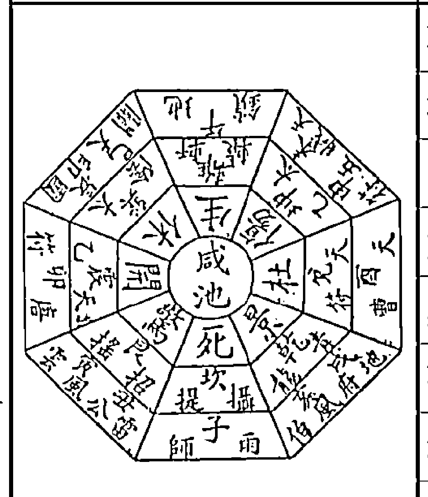

| 宫位 | 吉凶 | 神煞 | 说明 |
| :--- | :--- | :--- | :--- |
| 乾 | 景 | 青龙 | 远行多不利、求财空手归、出入不安、损失又患病。 |
| 坎 | 死 | 摄提 | 此路无吉利、老妇哭悲啼、打捉鱼可得利。 |
| 艮 | 惊 | 招摇 | 恐慌怪梦怕、阴人口舌迎、百事多不安、官司病伤缠。 |
| 震 | 开 | 天乙 | 求财皆和顺、求谋百事成、茶酒自来迎。 |
| 巽 | 休 | 太阴 | 求财谒贵钦、婚姻定情吉、百事灾不侵。 |
| 离 | 生 | 轩辕 | 万事尚称可、行事防牵缠、远行亡阻滞。 |
| 坤 | 伤 | 太乙 | 索债可得收、渔猎亦能成、他事忧虑多。 |
| 兑 | 杜 | 天符 | 行人塞路行、走失难搜寻、逃走避难成。 |

###### 辛丑日 震方开门吉

中宫 青龙 金神大吉星，相生钱财旺，接贵安荣华，万事事相同。

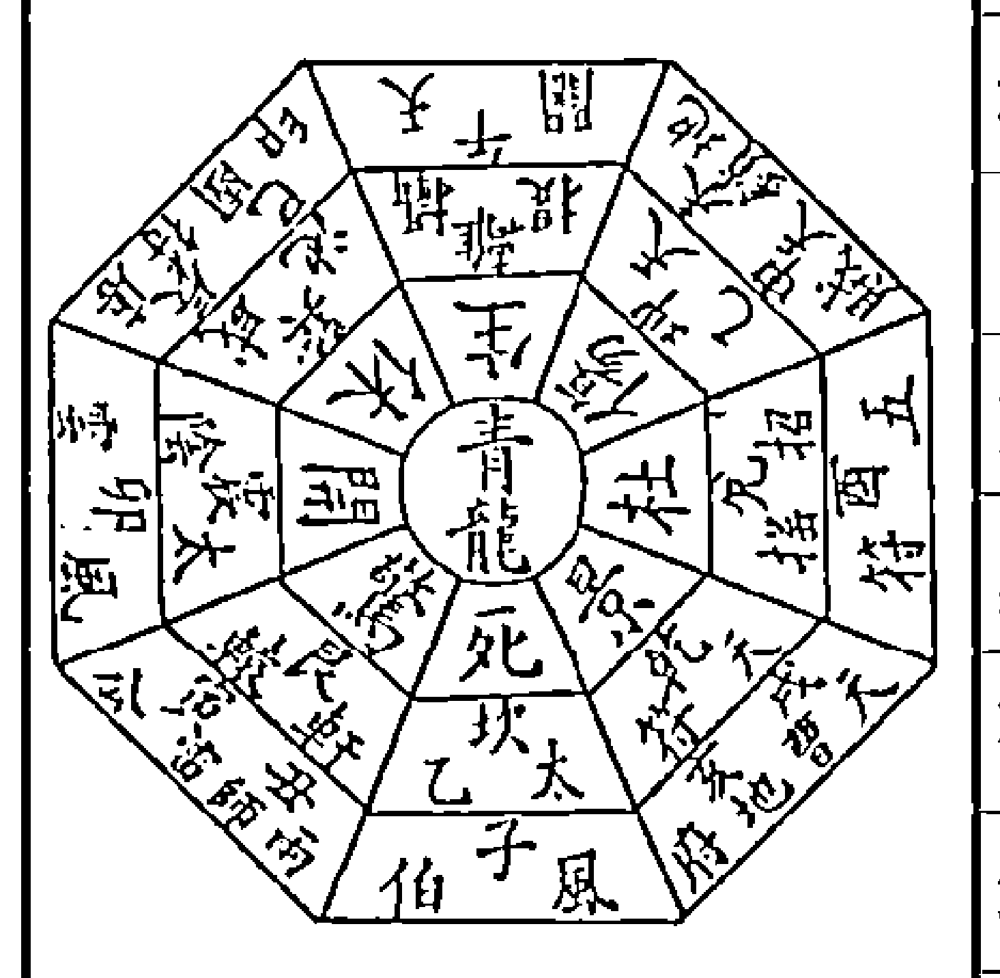

| 宫位 | 吉凶 | 神煞 | 说明 |
| :--- | :--- | :--- | :--- |
| 乾 | 景 | 天符 | 出门路途有阻害、又须防女难之相。 |
| 坎 | 死 | 太乙 | 谋事可有贵人助、谒贵求良较难成、捕鱼打有收获。 |
| 艮 | 惊 | 轩辕 | 行事必牵缠、损财又伤身、远行阻滞又遇恐惧事。 |
| 震 | 开 | 太阴 | 百祸侵不得、诸事遇贤良、求财百事皆得成。 |
| 巽 | 休 | 咸池 | 嫁娶尚称吉、求财空手回、损失加病患。 |
| 离 | 生 | 摄提 | 百事皆难成、远行多不利、财路皆不顺。 |
| 坤 | 伤 | 天乙 | 谨慎用事则可遂、谋事多称心、索债渔猎亦得成。 |
| 兑 | 杜 | 招摇 | 出入多闭塞、阴人口舌迎、避难尚有路、恐慌事难成。 |

###### 壬寅日 巽方休门吉

中宫 天符 土神凶星，五鬼是天符，积粮尚有利，切忌有灾途。

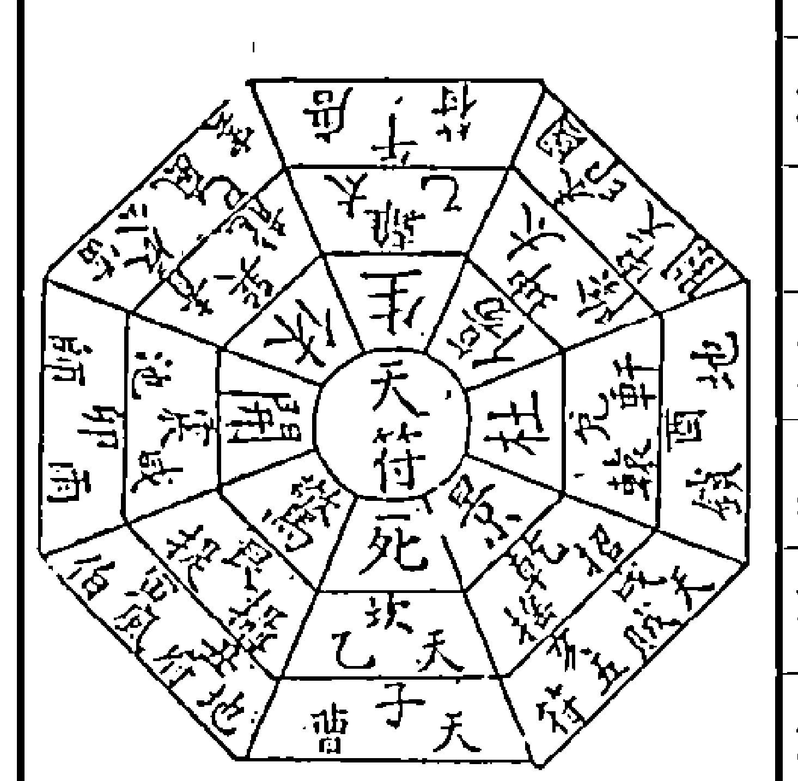

| 宫位 | 吉凶 | 神煞 | 说明 |
| :--- | :--- | :--- | :--- |
| 乾 | 景 | 招摇 | 出外贼盗逢、白梦多恐慌、又得防阴人口舌事。 |
| 坎 | 死 | 天乙 | 求谋不堪论、远行逢灾厄、吊死行刑可、拿捕鱼猎亦可行。 |
| 艮 | 惊 | 摄提 | 出行遇惊惶、官司凶连绵、百事必迟疑。 |
| 震 | 开 | 咸池 | 求财赌博空手回、病患灾厄临、远行多不利。 |
| 巽 | 休 | 青龙 | 谋事尽相通、赴任贵人助、求利求财旺。 |
| 离 | 生 | 太乙 | 吉曜百事亨、求财得利多、远行无阻滞。 |
| 坤 | 伤 | 太阴 | 百祸不能侵、牵债必得成、喜事不全吉。 |
| 兑 | 杜 | 轩辕 | 门路皆不通、远行路难走、行事必缠滞。 |

### 癸卯日 艮方开门吉

中宫 招摇 木神小凶星，阴人口舌迍，白梦多恐慌，屋响釜自鸣。

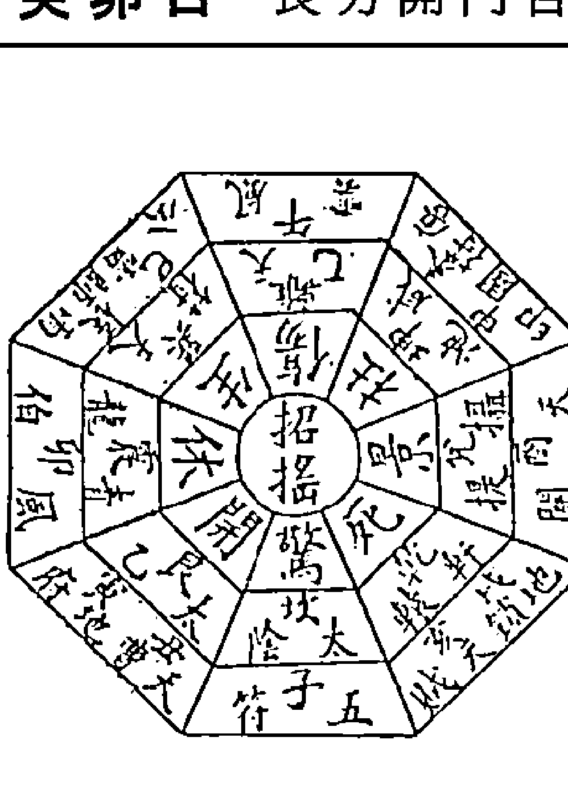

| 方位 | 门 | 神 | 解释 |
|---|---|---|---|
| 乾 | 死 | 轩辕 | 行事必牵缠、远行必阻滞、只能猎渔事。 |
| 坎 | 惊 | 太阴 | 误词献诈伏兵成、知交得觅寻、余事谨慎莫轻行。 |
| 艮 | 开 | 太乙 | 谒贵可得扶、行事遇贤良、婚姻大吉祥、远行无阻滞。 |
| 震 | 休 | 青龙 | 谋事尽相通、赴任贵人助、求利求财旺。 |
| 巽 | 生 | 天符 | 路途行人阻、有阴人妨害、走失难寻得、口论官司凶。 |
| 离 | 伤 | 天乙 | 谨慎用事则可遂、谋事多称心、索债渔猎亦得成。 |
| 坤 | 杜 | 咸池 | 远行多不利、求财反败失、灾厄病患多。 |
| 兑 | 景 | 摄提 | 百事多坎坷、远行灾难多、恶人贼盗逢。 |

### 甲辰日 艮方开门吉

中宫 轩辕 水神小凶星，门内都不宁，赌博定输钱，百事谋为定伤残。

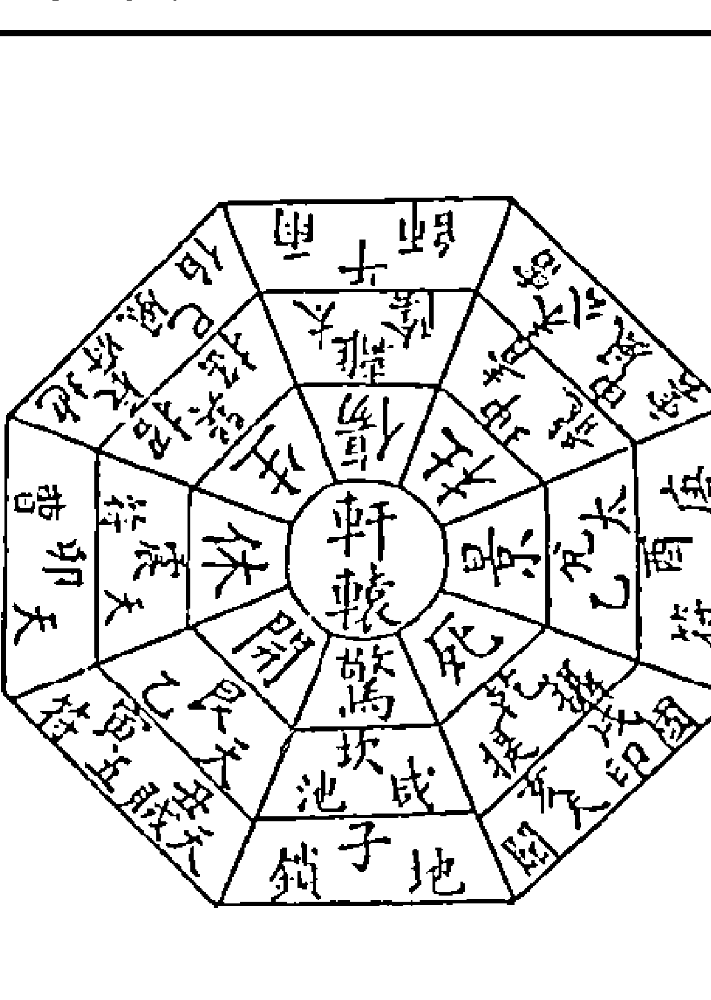

| 方位 | 门 | 神 | 解释 |
|---|---|---|---|
| 乾 | 死 | 摄提 | 此路无吉利、老妇哭悲啼、打猎捉鱼可得利。 |
| 坎 | 惊 | 咸池 | 出行多不利、损财失物又患病、只宜捕捉盗贼。 |
| 艮 | 开 | 天乙 | 求财皆和顺、求谋百事成、茶酒自来迎。 |
| 震 | 休 | 天符 | 须防女难相、路途有人阻、走失难寻见。 |
| 巽 | 生 | 招摇 | 出入事难成、阴人口舌迍、情绪多不宁。 |
| 离 | 伤 | 太阴 | 百祸不能侵、索债必得成、喜事不全吉。 |
| 坤 | 杜 | 青龙 | 茶酒留住客、隐伏逃避成、谋事不遂心。 |
| 兑 | 景 | 太乙 | 谒故寻亲吉、行文百事吉、远行无阻滞。 |

### 乙巳日 艮方开门吉

中宫 摄提 土神大凶星，万事不相通，隐匿藏遁可，言动则伤身。

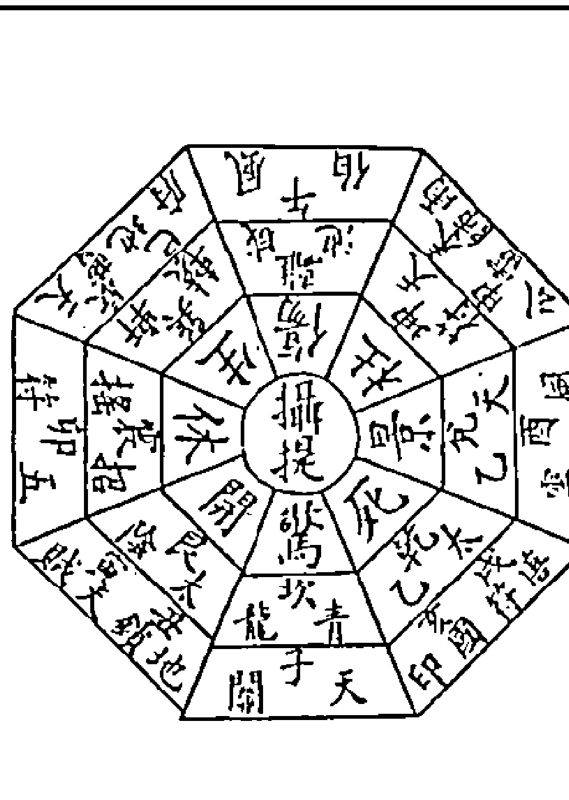

| 方位 | 门 | 神 | 解释 |
|---|---|---|---|
| 乾 | 死 | 太乙 | 谋事可有贵人助、谒贵求良较难成、捕渔打猎有收获。 |
| 坎 | 惊 | 青龙 | 赌博可见喜、其他吉事未必通、伏兵捕捉亦成。 |
| 艮 | 开 | 太阴 | 百祸侵不得、诸事遇贤良、求财百事皆得成。 |
| 震 | 休 | 招摇 | 吉宿见贵人、出入笑喜重、行事须考量、诸事尚称意。 |
| 巽 | 生 | 轩辕 | 万事尚称可、行事防牵缠、远行亡阻滞。 |
| 离 | 伤 | 咸池 | 求财多不利、远行见血光、凶神恶杀是非多。 |
| 坤 | 杜 | 天符 | 行人塞路行、走失难搜寻、逃走避难成。 |
| 兑 | 景 | 天乙 | 相会娶嫁百事吉、求财谋事亦易成。 |

### 奇门遁甲日盘（五符法）阴遁六十局 甲子日～癸亥日

###### 丙午日 兑方生门吉

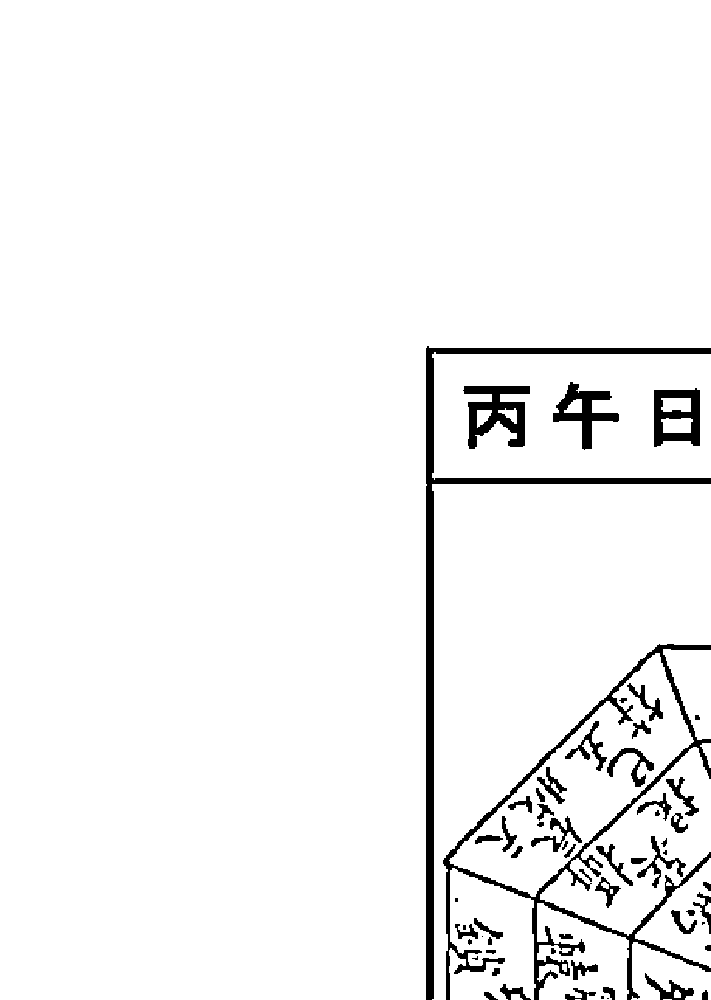

| 方位 | 门 | 神 | 吉凶描述 |
|------|----|----|----------|
| 中宫 | | 太乙 | 水神大吉星，遇险人尤吉，诸事尽欢欣，赌博钱财愁聚。 |
| 乾 | 伤 | 天乙 | 谨慎用事则可遂、谋事多称心、索债渔猎亦得成。 |
| 坎 | 杜 | 天符 | 行人塞路行、走失难搜寻、逃走避难成。 |
| 艮 | 景 | 咸池 | 远行多不利、求财空手归、出入不安、损失又患病。 |
| 震 | 死 | 轩辕 | 行事必牵缠、远行必阻滞、只能猎渔事。 |
| 巽 | 惊 | 摄提 | 出行遇惊惧、官司凶连绵、百事必迟疑。 |
| 离 | 开 | 青龙 | 青龙喜重重，遇人逢酒肉、赌博求财得不空。 |
| 坤 | 休 | 招摇 | 吉宿见贵人、出入笑喜重、行事须考量、诸事尚称意。 |
| 兑 | 生 | 太阴 | 百事灾不侵、求财皆成就、贵人自来寻。 |

###### 丁未日 离方开门吉

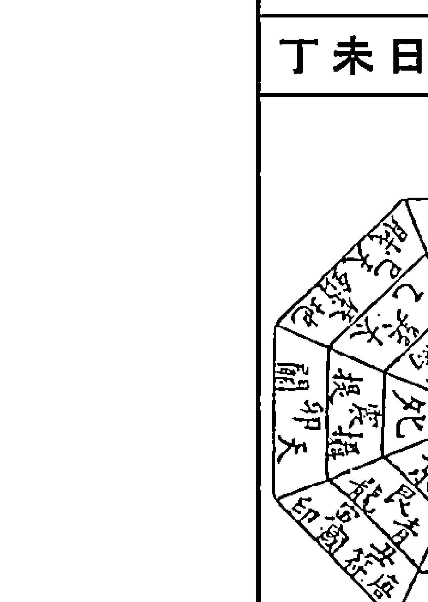

| 方位 | 门 | 神 | 吉凶描述 |
|------|----|----|----------|
| 中宫 | | 天乙 | 火星吉神，宜见贵人，用事，求谋，嫁娶，总遂心。 |
| 乾 | 伤 | 太阴 | 百祸不能侵、牵债必得成、喜事不全吉。 |
| 坎 | 杜 | 招摇 | 出入多闭塞、阴人口舌迎、避难尚有路、恐慌事难成。 |
| 艮 | 景 | 青龙 | 远行多不利、求财空手归、出入不安、损失又患病。 |
| 震 | 死 | 摄提 | 此路无吉利、老妇哭悲啼、打猎捉鱼可得利。 |
| 巽 | 惊 | 太乙 | 虽得吉曜助、出行事难失魂虚惊、只宜捕贼盗。 |
| 离 | 开 | 天符 | 远行见贵贤、须防妇人谋、走失难寻得。 |
| 坤 | 休 | 轩辕 | 百事谋为艰难、行事必缠缓、远行途阻滞。 |
| 兑 | 生 | 咸池 | 远行多不利、赌博空手归、失财又患病。 |

###### 戊申日 兑方生门吉

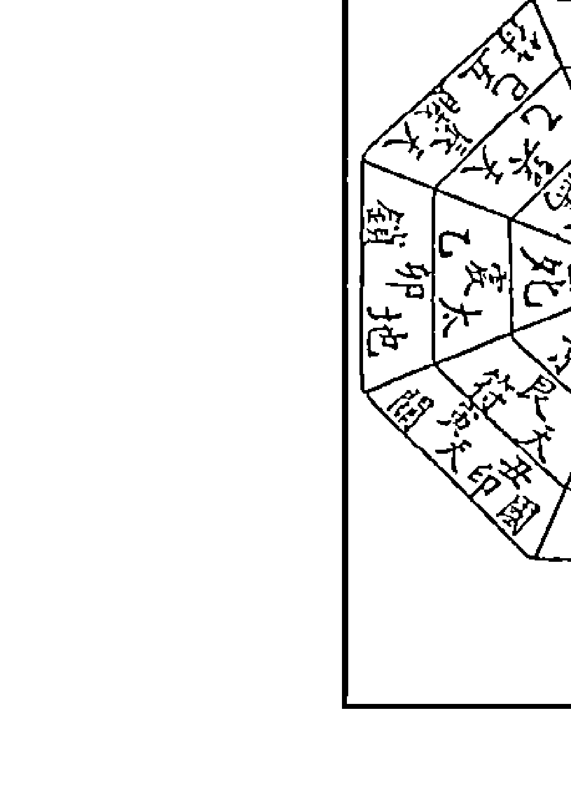

| 方位 | 门 | 神 | 吉凶描述 |
|------|----|----|----------|
| 中宫 | | 太阴 | 土神吉星，知者莫交锋、虽有胜算握，未必占奇功。 |
| 乾 | 伤 | 咸池 | 求财多不利、远行见血光、凶神恶煞是非多。 |
| 坎 | 杜 | 轩辕 | 门路皆不通、远行路难走、行事必缠滞。 |
| 艮 | 景 | 天符 | 出门路途有阻害、又须防女难之相。 |
| 震 | 死 | 太乙 | 谋事可有贵人助、谒贵求良较难成、捕鱼打猎有收获。 |
| 巽 | 惊 | 天乙 | 虽有吉曜扶、求谋仍难成、出行防伤病、唯能捕贼盗。 |
| 离 | 开 | 招摇 | 出入免招殃、先难后得成、妇人口舌迎。 |
| 坤 | 休 | 摄提 | 远行必不利、财路耗损失、婚姻不如意。 |
| 兑 | 生 | 青龙 | 求事喜重重、遇人逢酒肉、钱财利路通。 |

###### 己酉日 乾方开门吉

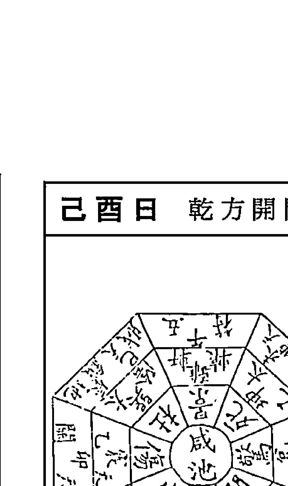

| 宫位 | 门 | 星 | 描述 |
|------|----|----|------|
| 中宫 | | 咸池 | 金神大凶星，咸池名恶杀，凿井以外，用事恐伤身不宜。 |
| 乾 | 开 | 青龙 | 青龙喜重重，遇人逢酒肉、赌博求财得不空。 |
| 坎 | 休 | 攝提 | 遠行必不利、財路耗損失、婚姻不如意。 |
| 艮 | 生 | 招摇 | 出入事難成、陰人口舌迎、情緒多不寧。 |
| 震 | 傷 | 天乙 | 謹慎用事則可遂、謀事多稱心、索債漁獵亦得成。 |
| 巽 | 杜 | 太陰 | 百事喜相成、藏身無煩惱、知交可尋得。 |
| 離 | 景 | 軒轅 | 諸事謀為難、常須防火災、亦要防盜難。 |
| 坤 | 死 | 太乙 | 謀事可有貴人助、謁貴求良較難成、捕漁打獵有收穫。 |
| 兌 | 驚 | 天符 | 走失難見尋、更有婦人謀、官司口舌定不利。 |

###### 庚戌日 坎方休门吉

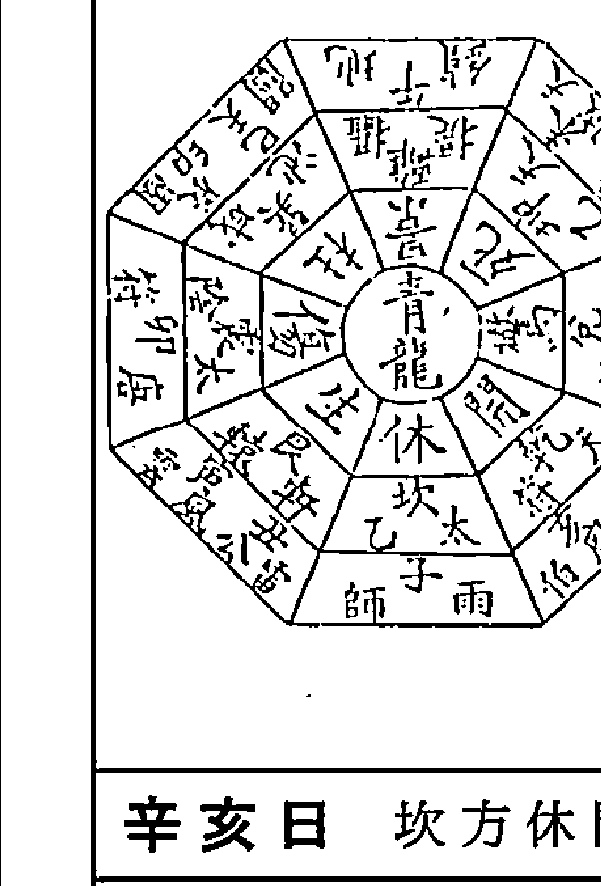

| 宫位 | 门 | 星 | 描述 |
|------|----|----|------|
| 中宫 | | 青龙 | 金神大吉星，相生錢財旺，接貴安榮華，萬事事相同。 |
| 乾 | 开 | 天符 | 遠行見貴賢、須防婦人謀、走失難尋得。 |
| 坎 | 休 | 太乙 | 出門無阻滯、百事見興旺、婚姻大吉昌。 |
| 艮 | 生 | 軒轅 | 萬事尚稱可、行事防牽纏、遠行亡阻滯。 |
| 震 | 傷 | 太陰 | 百禍不能侵、牽債必得成、喜事不全吉。 |
| 巽 | 杜 | 咸池 | 遠行多不利、求財反敗失、災厄病患多。 |
| 離 | 景 | 攝提 | 百事多坎坷、遠行災難多、惡人賊盗逢。 |
| 坤 | 死 | 天乙 | 求謀不堪論、遠行逢災厄、弔死行刑可、拿捕魚獵亦可行。 |
| 兌 | 驚 | 招摇 | 恐慌怪夢怕、陰人口舌迎、百事多不安、官司病傷纏。 |

###### 辛亥日 坎方休门吉

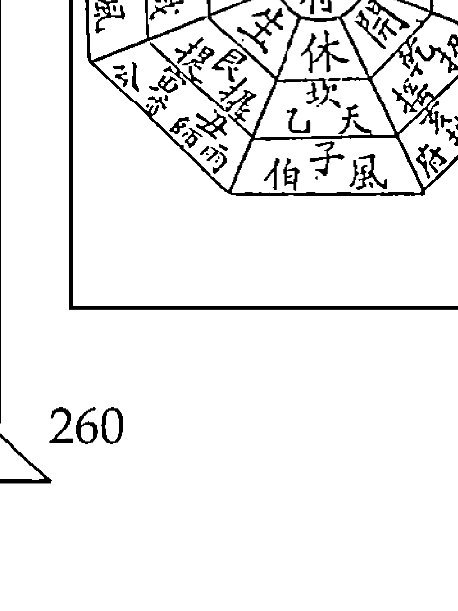

| 宫位 | 门 | 星 | 描述 |
|------|----|----|------|
| 中宫 | | 天符 | 土神凶星，五鬼是天符，積糧尚有利，切忌有災途。 |
| 乾 | 开 | 招摇 | 出入免招殃、先難後得成、婦人口舌迎。 |
| 坎 | 休 | 天乙 | 人際人和通、休閒酒食悦、謀事財利旺。 |
| 艮 | 生 | 攝提 | 百事皆難成、遠行多不利、財路皆不順。 |
| 震 | 傷 | 咸池 | 求財多不利、遠行見血光、凶神惡殺是非多。 |
| 巽 | 杜 | 青龍 | 茶酒留住客、隱伏逃避成、謀事不遂心。 |
| 離 | 景 | 太乙 | 謁故尋親吉、行文親吉、行文百事吉、遠行無阻滯。 |
| 坤 | 死 | 太陰 | 知己能得尋、他事少得成、弔死行刑捕獵可。 |
| 兌 | 驚 | 軒轅 | 行事必牽纏、損財又傷身、遠行阻滯又遇恐懼事。 |

###### 壬子日 離方休門吉

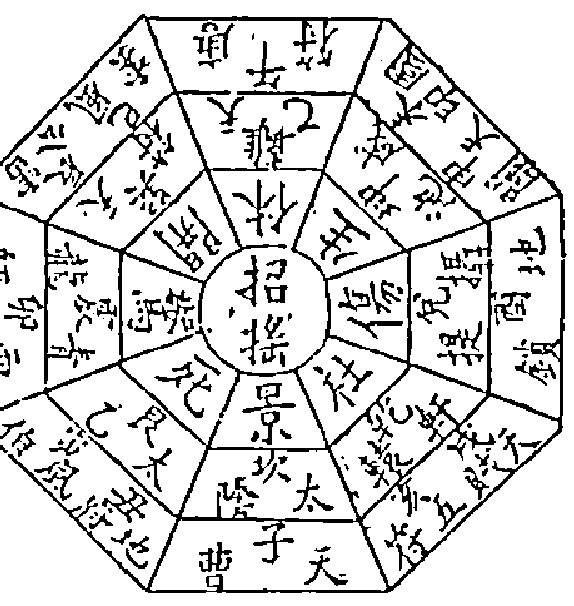

| 宮位 | 神 | 星 | 說明 |
|---|---|---|---|
| 中宮 | 招搖 | 木神小凶星 | 陰人口舌迎，白夢多恐慌，屋響釜自鳴。 |
| 乾 | 杜 | 軒轅 | 門路皆不通、遠行路難走、行事必纏滯。 |
| 坎 | 景 | 太陰 | 出門皆會吉、嫁娶行商成、謀求財利甚稱佳。 |
| 艮 | 死 | 太乙 | 謀事可有貴人助、謁貴求良較難成、捕漁打獵有收穫。 |
| 震 | 驚 | 青龍 | 賭博可見喜、其他吉事未必通、伏兵捕捉亦成。 |
| 巽 | 開 | 天符 | 遠行見貴賢、須防婦人謀、走失難尋得。 |
| 離 | 休 | 天乙 | 人際人和通、休閒酒食悅、謀事財利旺。 |
| 坤 | 生 | 咸池 | 遠行多不利、賭博空手歸、失財又患病。 |
| 兌 | 傷 | 攝提 | 求財多不利、遠行防血光、諸事不如意。 |

###### 癸丑日 離方休門吉

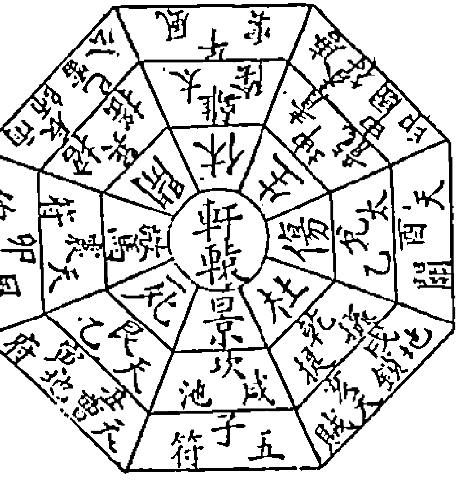

| 宮位 | 神 | 星 | 說明 |
|---|---|---|---|
| 中宮 | 軒轅 | 水神小凶星 | 門內都不寧，賭博定輸錢，百事謀為定傷殘。 |
| 乾 | 杜 | 攝提 | 路必不通、事必遲疑、多災坎坷。 |
| 坎 | 景 | 咸池 | 遠行多不利、求財空手歸、出入不安、損失又患病。 |
| 艮 | 死 | 天乙 | 求謀不堪論、遠行逢災厄、吊死行刑可、拿捕魚獵亦可行。 |
| 震 | 驚 | 天符 | 走失難覓尋、更有婦人謀、官司口舌定不利。 |
| 巽 | 開 | 招搖 | 出入免招殃、先難後得成、婦人口舌迎。 |
| 離 | 休 | 太陰 | 求財謁貴欽、婚姻定情吉、百事災不侵。 |
| 坤 | 生 | 青龍 | 求事喜重重、遇人逢酒肉、錢財利路通。 |
| 兌 | 傷 | 太乙 | 索債可得收、漁獵亦能成、他事憂慮多。 |

###### 甲寅日 坤方生門吉

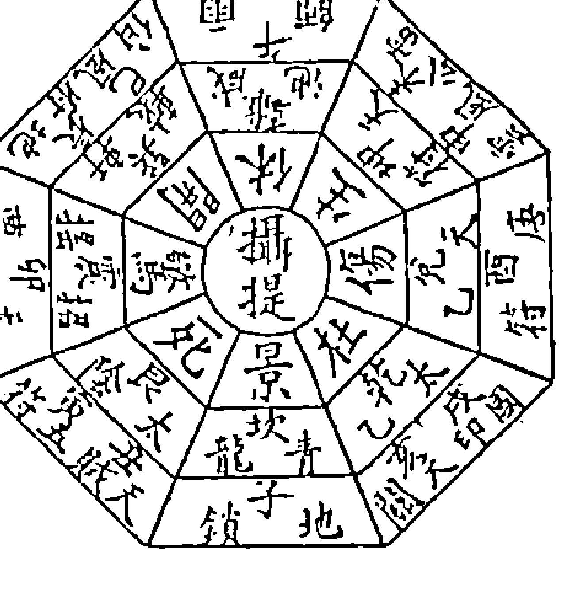

| 宮位 | 神 | 星 | 說明 |
|---|---|---|---|
| 中宮 | 攝提 | 土神大凶星 | 萬事不相通同，隱匿藏遁可，言動則傷身。 |
| 乾 | 杜 | 太乙 | 百事多得成、避難藏匿得安寧。 |
| 坎 | 景 | 青龍 | 遠行多不利、求財空手歸、出入不安、損失又患病。 |
| 艮 | 死 | 太陰 | 知己能得尋、他事少得成、弔死行刑捕獵可。 |
| 震 | 驚 | 招搖 | 恐慌怪夢怕、陰人口舌迎、百事多不安、官司病傷纏。 |
| 巽 | 開 | 軒轅 | 求謀事必纏、遠行防阻滯、求財定不利。 |
| 離 | 休 | 咸池 | 百禍侵不得、諸事遇賢良、求財百事皆得成。 |
| 坤 | 生 | 天符 | 路途行人阻、有陰人妨害、走失難尋得、口論官司凶。 |
| 兌 | 傷 | 天乙 | 謹慎用事則可遂、謀事多稱心、索債漁獵亦得成。 |

###### 乙卯日 震方生门吉

中宫 太乙 水神大吉星，遇阴人尤吉，诸事尽欢欣，赌博钱财恐聚。

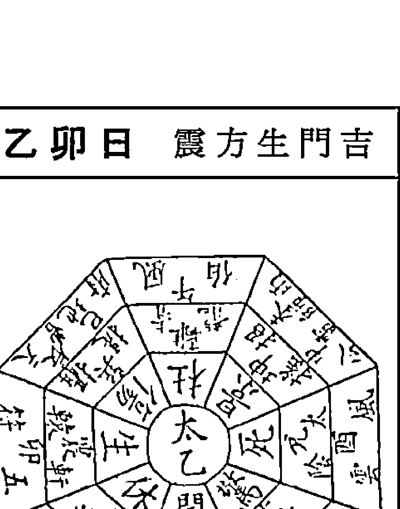

| 方位 | 门 | 星曜 | 吉凶 |
| :--- | :--- | :--- | :--- |
| 乾 | 惊 | 天乙 | 虽有吉曜扶、求谋仍难成、出行防伤病、唯能捕贼盗。 |
| 坎 | 开 | 天符 | 远行见贵贤、须防妇人谋、走失难寻得。 |
| 艮 | 休 | 咸池 | 嫁娶尚称吉、求财空手回、损失加病患。 |
| 震 | 生 | 轩辕 | 万事尚称可、行事防牵缠、远行亡阻滞。 |
| 巽 | 伤 | 摄提 | 求财多不利、远行防血光、诸事不如意。 |
| 离 | 杜 | 青龙 | 茶酒留住客、隐伏逃避成、谋事不遂心。 |
| 坤 | 景 | 招摇 | 出外贼盗逢、白梦多恐慌、又得防阴人口舌事。 |
| 兑 | 死 | 太阴 | 知己能得寻、他事少得成、吊死行刑捕猎可。 |

###### 丙辰日 艮方休门吉

中宫 天乙 火星吉神，宜见贵人，用事，求谋，嫁娶，总遂心。

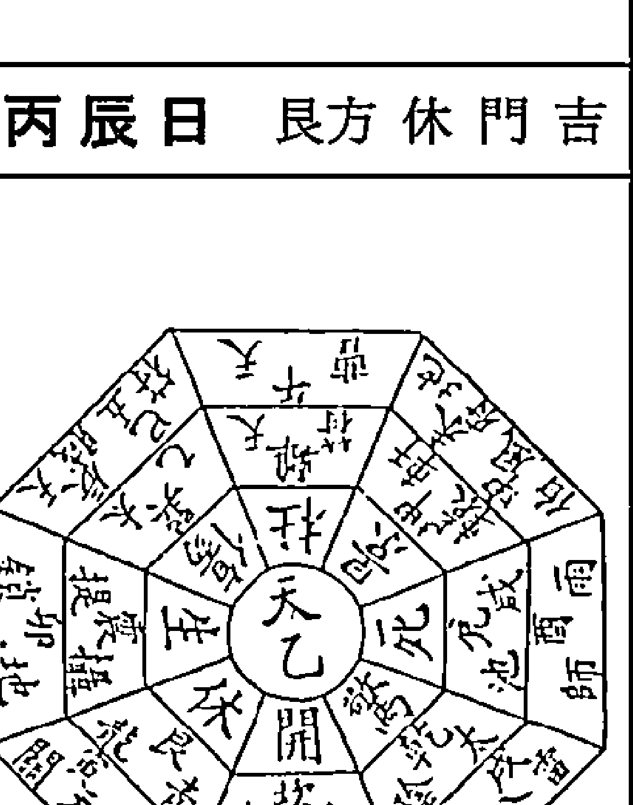

| 方位 | 门 | 星曜 | 吉凶 |
| :--- | :--- | :--- | :--- |
| 乾 | 惊 | 太阴 | 误词献诈伏兵成、知交得觅寻、余事谨慎莫轻行。 |
| 坎 | 开 | 招摇 | 出入免招殃、先难后得成、妇人口舌迎。 |
| 艮 | 休 | 青龙 | 谋事尽相通、赴任贵人助、求利求财旺。 |
| 震 | 生 | 摄提 | 百事皆难成、远行多不利、财路皆不顺。 |
| 巽 | 伤 | 太乙 | 索债可得收、渔猎亦能成、他事忧虑多。 |
| 离 | 杜 | 天符 | 行人塞路行、走失难搜寻、逃走避难成。 |
| 坤 | 景 | 轩辕 | 诸事谋为难、常须防火灾、亦要防盗难。 |
| 兑 | 死 | 咸池 | 损财病患来、又得防止阴女难、只适打猎捕鱼。 |

###### 丁巳日 震方生门吉

中宫 太阴 土神吉星，知者莫交锋、虽有胜算握，未必占奇功。

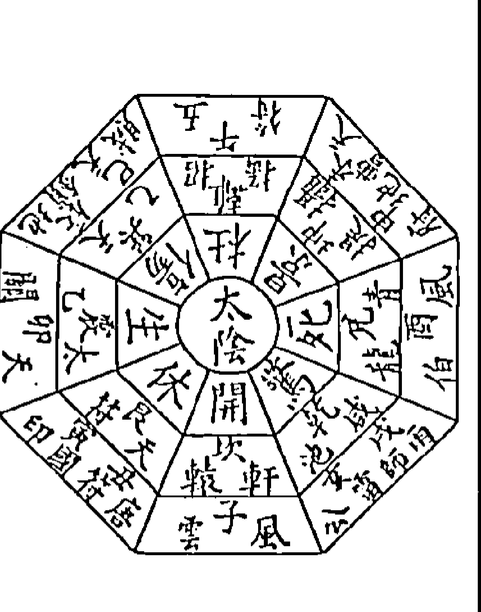

| 方位 | 门 | 星曜 | 吉凶 |
| :--- | :--- | :--- | :--- |
| 乾 | 惊 | 咸池 | 出行多不利、损财失物又患病、只宜捕捉盗贼。 |
| 坎 | 开 | 轩辕 | 求谋事必缠、远行防阻滞、求财定不利。 |
| 艮 | 休 | 天符 | 须防女难相、路途有人阻、走失难寻见。 |
| 震 | 生 | 太乙 | 吉曜百事亨、求财得利多、远行无阻滞。 |
| 巽 | 伤 | 天乙 | 谨慎用事则可遂、谋事多称心、索债渔猎亦得成。 |
| 离 | 杜 | 招摇 | 出入多闭塞、阴人口舌迎、避难尚有路、恐慌事难成。 |
| 坤 | 景 | 摄提 | 百事多坎坷、远行灾难多、恶人贼盗逢。 |
| 兑 | 死 | 青龙 | 适于捕打渔猎、吊死行刑亦可、其他吉事不堪言。 |

###### 戊午日 乾方生门吉

中宫 咸池 金神大凶星，咸池名恶杀，凿井以外，用事恐伤身不宜。

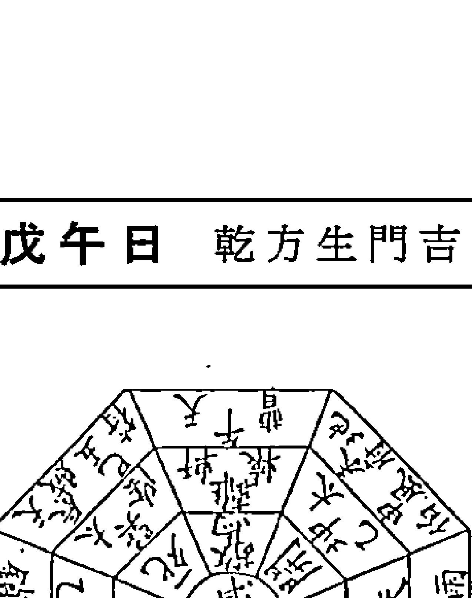

| 宫位 | 门 | 符 | 吉凶 |
|------|----|----|------|
| 乾 | 生 | 青龙 | 求事喜重重、遇人逢酒肉、钱财利路通。 |
| 坎 | 伤 | 摄提 | 求财多不利、远行防血光、诸事不如意。 |
| 艮 | 杜 | 招摇 | 出入多闭塞、阴人口舌迎、避难尚有路、恐惶事难成。 |
| 震 | 景 | 天乙 | 相会娶嫁百事吉、求财谋事亦易成。 |
| 巽 | 死 | 太阴 | 知己能得寻、他事少得成、吊死行刑捕猎可。 |
| 离 | 惊 | 轩辕 | 行事必牵缠、损财又伤身、远行阻滞又遇恐惶事。 |
| 坤 | 开 | 太乙 | 谒贵可得扶、行事遇贤良、婚姻大吉祥、远行无阻滞。 |
| 兑 | 休 | 天符 | 须防女难相、路途有人阻、走失难寻觅。 |

###### 己未日 坤方开门吉

中宫 青龙 金神大吉星，相生钱才旺，接贵安荣华，万事事相同。

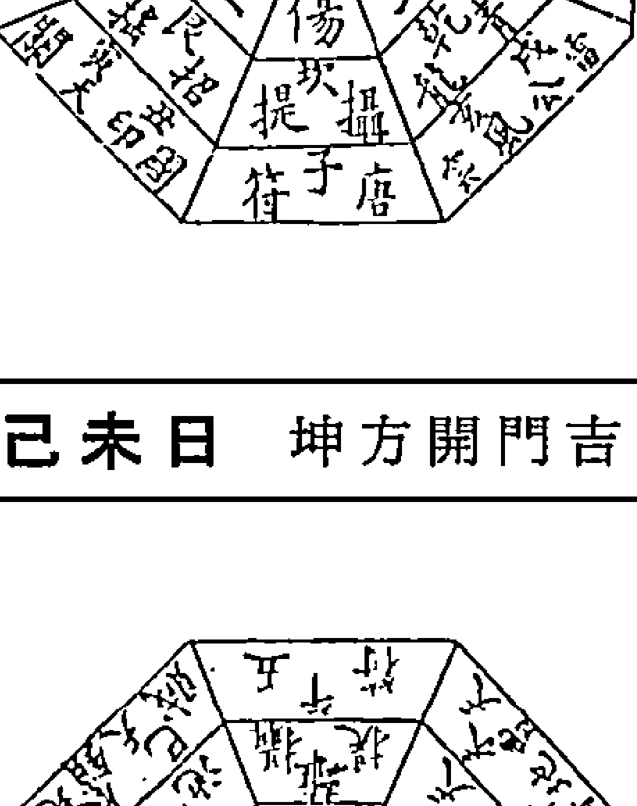

| 宫位 | 门 | 符 | 吉凶 |
|------|----|----|------|
| 乾 | 生 | 天符 | 路途行人阻、有阴人妨害、走失难寻得、口论官司凶。 |
| 坎 | 伤 | 太乙 | 索债可得收、渔猎亦能成、他事忧处多。 |
| 艮 | 杜 | 轩辕 | 门路皆不通、远行路难走、行事必缠滞。 |
| 震 | 景 | 太阴 | 出门皆会吉、嫁娶行商成、谋求财利甚称佳。 |
| 巽 | 死 | 咸池 | 损财病患来、又得防止阴女难、只适打猎捕鱼。 |
| 离 | 惊 | 摄提 | 出行遇惊惶、官司凶连绵、百事必迟疑。 |
| 坤 | 开 | 天乙 | 求财皆和顺、求谋百事成、茶酒自来迎。 |
| 兑 | 休 | 招摇 | 吉宿见贵人、出入笑喜重、行事须考量、诸事尚称意。 |

###### 庚申日 坤方开门吉

中宫 天符 土神凶星，五鬼是天符，积粮尚有利，切忌有灾途。

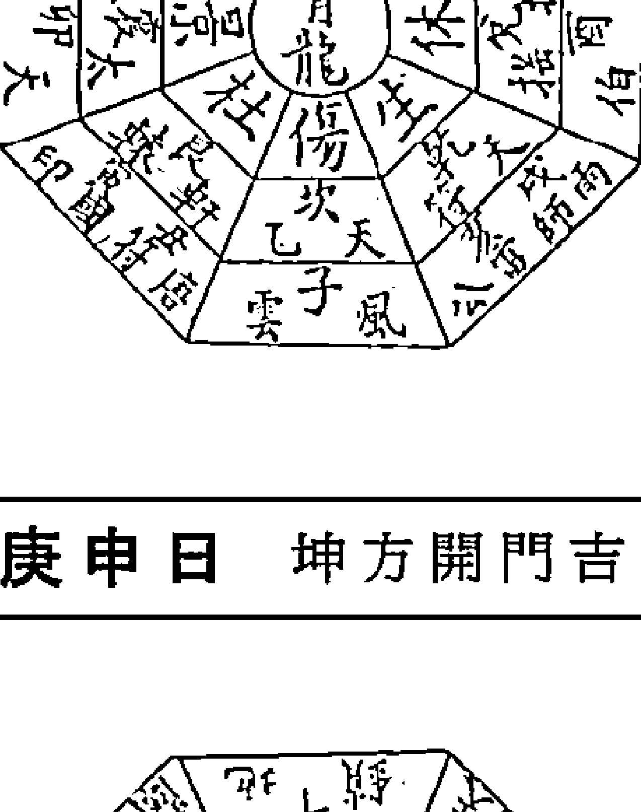

| 宫位 | 门 | 符 | 吉凶 |
|------|----|----|------|
| 乾 | 生 | 招摇 | 出入事难成、阴人口舌迎、情绪多不宁。 |
| 坎 | 伤 | 天乙 | 谨慎用事则可遂、谋事多称心、索债渔猎亦得成。 |
| 艮 | 杜 | 摄提 | 路必不通、事必迟疑、多灾坎坷。 |
| 震 | 景 | 咸池 | 远行多不利、求财空手归、出入不安、损失又患病。 |
| 巽 | 死 | 青龙 | 适于捕打渔猎、吊死行刑亦可、其他吉事不堪言。 |
| 离 | 惊 | 太乙 | 虽得吉曜助、出行事难失魂虚惊、只宜捕贼盗。 |
| 坤 | 开 | 太阴 | 百祸侵不得、诸事遇贤良、求财百事皆得成。 |
| 兑 | 休 | 轩辕 | 百事会牵缠、凶事稍得缓、远行途阻滞。 |

###### 辛酉日 坎方生门吉

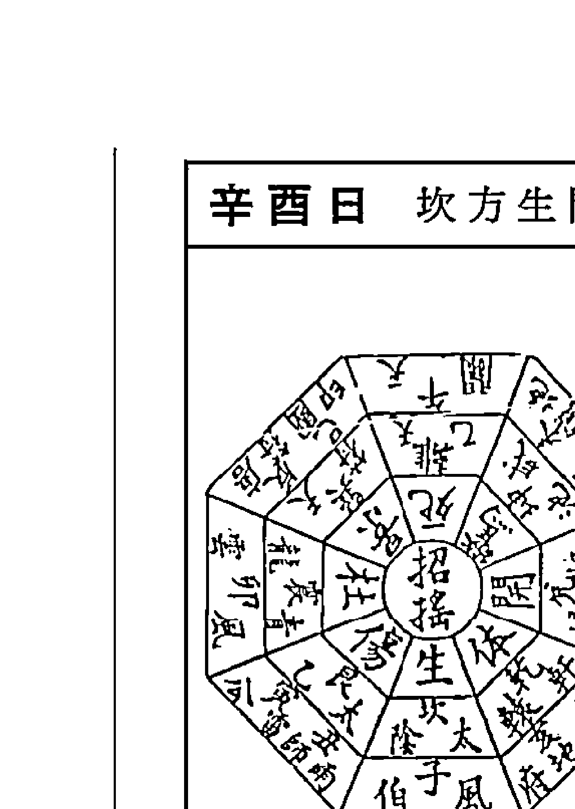

| 卦象 | 门 | 星 | 解释 |
|------|----|----|------|
| 中宫 | | 招摇 | 木神小凶星，阴人口舌迎，白梦多恐慌，屋响釜自鸣。 |
| 乾 | 休 | 轩辕 | 百事谋为艰难、行事必缠缓、远行途阻滞。 |
| 坎 | 生 | 太阴 | 百事灾不侵、求财皆成就、贵人自来寻。 |
| 艮 | 伤 | 太乙 | 索债可得收、渔猎亦能成、他事忧虑多。 |
| 震 | 杜 | 青龙 | 茶酒留住客、隐伏逃避成、谋事不遂心。 |
| 巽 | 景 | 天符 | 出门路途有阻害、又须防女难之相。 |
| 离 | 死 | 天乙 | 求谋不堪论、远行逢灾厄、吊死行刑可、拿捕鱼猎亦可行。 |
| 坤 | 惊 | 咸池 | 出行多不利、损财失物又患病、只宜捕捉盗贼。 |
| 兑 | 开 | 摄提 | 百事必迟滞、喜事变凶事、远行必迟滞。 |

###### 壬戌日 兑方开门吉

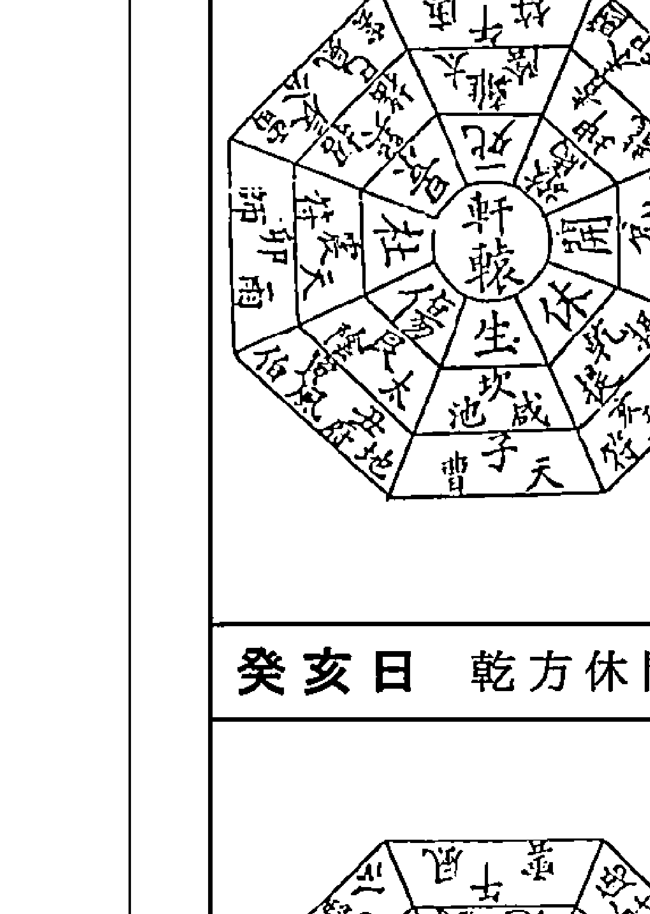

| 卦象 | 门 | 星 | 解释 |
|------|----|----|------|
| 中宫 | | 轩辕 | 水神小凶星，门内都不宁，赌博定输钱，百事谋为定伤残。 |
| 乾 | 休 | 摄提 | 远行必不利、财路耗损失、婚姻不如意。 |
| 坎 | 生 | 咸池 | 远行多不利、赌博空手归、失财又患病。 |
| 艮 | 伤 | 天乙 | 谨慎用事则可遂、谋事多称心、索债渔猎亦得成。 |
| 震 | 杜 | 天符 | 行人塞路行、走失难搜寻、逃走避难成。 |
| 巽 | 景 | 招摇 | 出外贼盗逢、白梦多恐慌、又得防阴人口舌事。 |
| 离 | 死 | 太阴 | 知己能得寻、他事少得成、吊死行刑捕猎可。 |
| 坤 | 惊 | 青龙 | 赌博可见喜、其他吉事未必通、伏兵捕捉亦成。 |
| 兑 | 开 | 太乙 | 谒贵可得扶、行事遇贤良、婚姻大吉祥、远行无阻滞。 |

###### 癸亥日 乾方休门吉

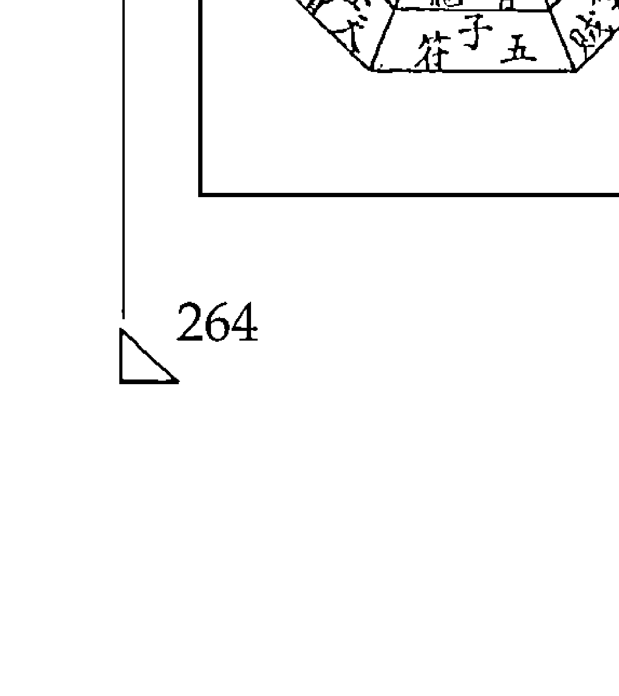

| 卦象 | 门 | 星 | 解释 |
|------|----|----|------|
| 中宫 | | 摄提 | 土神大凶星，万事不相通，隐匿藏遁可，言动则伤身。 |
| 乾 | 休 | 太乙 | 出门无阻滞、百事见兴旺、婚姻大吉昌。 |
| 坎 | 生 | 青龙 | 求事喜重重、遇人逢酒肉、钱财利路通。 |
| 艮 | 伤 | 太阴 | 百祸不能侵、索债必得成、喜事不全吉。 |
| 震 | 杜 | 招摇 | 出入多闭塞、阴人口舌迎、避难尚有路、恐慌事难成。 |
| 巽 | 景 | 轩辕 | 诸事谋为难、常须防火灾、亦要防盗难。 |
| 离 | 死 | 咸池 | 损财病患来、又得防止阴女难、只适打猎捕鱼。 |
| 坤 | 惊 | 天符 | 走失难觅寻、更有妇人谋、官司口舌定不利。 |
| 兑 | 开 | 天乙 | 求财皆和顺、求谋百事成、茶酒自来迎。 |

## 奇門遁甲

## 遁甲月盘

- 月盘：上元  阴遁一局
- 月盘：中元  阴遁四局
- 月盘：下元  阴遁七局

| 甲子旬 | 丙寅月 | 直符：天芮 |
|---|---|---|
| 阴一局 | 巽四东南 | 离九正南 |
| 直符 | 天芮 | 坤二西南 |
| 直使：死门 | 坎一正北 | 兑七正西 |
| 坤 | 九地 | 天任 |
| 天芮 | 生 | 蓬 |
| 艮八东北 | 坎一正北 | 兑七正西 |
| 乙癸 | 丁 | 丙 |
| 九天 | 天芮 | 九地 |
| 坤二西南 | 巽四东南 | 离九正南 |
| 巽四东南 | 离九正南 | 乾六西北 |
| 丙 | 乙癸 | 辛 |
| 天芮 | 九地 | 天任 |
| 九地 | 坤二西南 | 乾六西北 |
| 天任 | 生 | 蓬 |
| 艮八东北 | 坎一正北 | 兑七正西 |

| 阴二局 | 甲子旬 | 丙寅月 | 直符：天蓬 |
|---|---|---|---|
| 直符 | 天蓬 | 休门 | 直使：休门 |
| 庚 | 丙 | 丁 | 乙癸 |
| 九天 | 天任 | 九地 | 天冲 |
| 生 | 杜 | 景 | 乙癸 |
| 巽四东南 | 离九正南 | 坤二西南 | 兑七正西 |
| 戊 | 己 | 辛 | 乙癸 |
| 天蓬 | 九地 | 天任 | 天冲 |
| 震三正东 | 离九正南 | 坤二西南 | 兑七正西 |
| 壬 | 辛 | 乙癸 | 壬 |
| 天心 | 天柱 | 天任 | 天蓬 |
| 艮八东北 | 坎一正北 | 乾六西北 | 兑七正西 |

| 阴三局 | 甲子旬 | 丙寅月 | 直符：天任 |
|---|---|---|---|
| 直符 | 天任 | 生门 | 直使：生门 |
| 己 | 乙癸 | 辛 | 乙癸 |
| 天英 | 天任 | 天蓬 | 天心 |
| 坤二西南 | 乾六西北 | 坎一正北 | 艮八东北 |
| 庚 | 天任 | 生 | 天心 |
| 九天 | 艮八东北 | 坎一正北 | 兑七正西 |

## 月盘：上元 阴遁一局

丙寅～乙丑 60 月干支 六十月盘

- （甲子 己卯 甲午 己酉 各年共用）
- （乙丑 庚辰 乙未 庚戌 各年共用）
- （丙寅 辛巳 丙申 辛亥 各年共用）
- （丁卯 壬午 丁酉 壬子 各年共用）
- （戊辰 癸未 戊戌 癸丑 各年共用）

## 月盘：上元 阴遁一局

### 上元 阴一局 （甲子 己卯 甲午 己酉 各年）

阴一局 甲子旬 丙寅月 直符：天蓬 直使：休门
| 巽四 東南 | 離九 正南 | 坤二 西南 |
| :--- | :--- | :--- |
| 庚 丁 傷 天任 九天 | 丙 己 杜 天衡 九地 | 丁 乙癸 景 天輔 朱雀 |
| 震三 正東 五中 |  | 兌七 正西 |
| 戊 丙 生 天蓬 直符 |  | 己 辛 死 天英 勾陳 |
| 艮八 東北 | 坎一 正北 | 乾六 西北 |
| 壬 庚 休 天心 螣蛇 | 辛 戊 開 天柱 太陰 | 乙癸 壬 驚 天芮禽 六合 |

阴一局 甲子旬 己巳月 直符：天蓬 直使：休门
| 巽四 東南 | 離九 正南 | 坤二 西南 |
| :--- | :--- | :--- |
| 壬 丁 驚 天心 螣蛇 | 戊 己 開 天蓬 直符 | 庚 乙癸 休 天任 九天 |
| 震三 正東 五中 |  | 兌七 正西 |
| 辛 丙 死 天柱 太陰 |  | 丙 辛 生 天衡 九地 |
| 艮八 東北 | 坎一 正北 | 乾六 西北 |
| 乙癸 庚 景 天芮禽 六合 | 己 戊 杜 天英 勾陳 | 丁 壬 傷 天輔 朱雀 |

阴一局 甲子旬 丁卯月 直符：天蓬 直使：休门
| 巽四 東南 | 離九 正南 | 坤二 西南 |
| :--- | :--- | :--- |
| 戊 丁 死 天蓬 直符 | 庚 己 驚 天任 九天 | 丙 乙癸 開 天衡 九地 |
| 震三 正東 五中 |  | 兌七 正西 |
| 壬 丙 景 天心 螣蛇 |  | 丁 辛 休 天輔 朱雀 |
| 艮八 東北 | 坎一 正北 | 乾六 西北 |
| 辛 庚 杜 天柱 太陰 | 乙癸 戊 傷 天芮禽 六合 | 己 壬 生 天英 勾陳 |

阴一局 甲子旬 庚午月 直符：天蓬 直使：休门
| 巽四 東南 | 離九 正南 | 坤二 西南 |
| :--- | :--- | :--- |
| 丙 丁 休 天衡 九地 | 丁 己 生 天輔 朱雀 | 己 乙癸 傷 天英 勾陳 |
| 震三 正東 五中 |  | 兌七 正西 |
| 庚 丙 開 天任 九天 |  | 乙癸 辛 杜 天芮禽 六合 |
| 艮八 東北 | 坎一 正北 | 乾六 西北 |
| 戊 庚 驚 天蓬 直符 | 壬 戊 死 天心 螣蛇 | 辛 壬 景 天柱 太陰 |

阴一局 甲子旬 戊辰月 直符：天蓬 直使：休门
| 巽四 東南 | 離九 正南 | 坤二 西南 |
| :--- | :--- | :--- |
| 丁 丁 景 天輔 朱雀 | 己 己 死 天英 勾陳 | 乙癸 乙癸 驚 天芮禽 六合 |
| 震三 正東 五中 |  | 兌七 正西 |
| 丙 丙 杜 天衡 九地 |  | 辛 辛 開 天柱 太陰 |
| 艮八 東北 | 坎一 正北 | 乾六 西北 |
| 庚 庚 傷 天任 九天 | 戊 戊 生 天蓬 直符 | 壬 壬 休 天心 螣蛇 |

阴一局 甲子旬 辛未月 直符：天蓬 直使：休门
| 巽四 東南 | 離九 正南 | 坤二 西南 |
| :--- | :--- | :--- |
| 乙癸 丁 生 天芮禽 六合 | 辛 己 傷 天柱 太陰 | 壬 乙癸 杜 天心 螣蛇 |
| 震三 正東 五中 |  | 兌七 正西 |
| 己 丙 休 天英 勾陳 |  | 戊 辛 景 天蓬 直符 |
| 艮八 東北 | 坎一 正北 | 乾六 西北 |
| 丁 庚 開 天輔 朱雀 | 丙 戊 驚 天衡 九地 | 庚 壬 死 天任 九天 |

### 上元 阴一局 （甲子 己卯 甲午 己酉 各年）

阴一局 甲子旬 壬申月 直符：天蓬 直使：休门

| 巽四 東南 | 離九 正南 | 坤二 西南 |
|-----------|-----------|-----------|
| 己 天英 勾陈 丁 | 乙癸 天芮禽 六合 己 | 辛 天柱 太陰 乙癸 |
| 震三 正東 | 五中 | 兑七 正西 |
| 丁 天輔 朱雀 丙 | 符首：戊 | 壬 天心 螣蛇 辛 |
| 艮八 東北 | 坎一 正北 | 乾六 西北 |
| 丙 天衡 九地 庚 | 庚 天任 九天 戊 | 戊 天蓬 直符 壬 |

阴一局 甲戌旬 乙亥月 直符：天英 直使：景门

| 巽四 東南 | 離九 正南 | 坤二 西南 |
|-----------|-----------|-----------|
| 丙 天衡 太陰 丁 | 丁 天輔 螣蛇 己 | 己 天英 直符 乙癸 |
| 震三 正東 | 五中 | 兑七 正西 |
| 庚 天任 六合 丙 | 符首：己 | 乙癸 天芮禽 九天 辛 |
| 艮八 東北 | 坎一 正北 | 乾六 西北 |
| 戊 天蓬 勾陳 庚 | 壬 天心 朱雀 戊 | 辛 天柱 九地 壬 |

阴二局 甲子旬 癸酉月 直符：天蓬 直使：休门

| 巽四 東南 | 離九 正南 | 坤二 西南 |
|-----------|-----------|-----------|
| 辛 天柱 太陰 丁 | 壬 天心 螣蛇 己 | 戊 天蓬 直符 乙癸 |
| 震三 正東 | 五中 | 兑七 正西 |
| 乙癸 天芮禽 六合 丙 | 符首：戊 | 庚 天任 九天 辛 |
| 艮八 東北 | 坎一 正北 | 乾六 西北 |
| 己 天英 勾陳 庚 | 丁 天輔 朱雀 戊 | 丙 天衡 九地 壬 |

阴二局 甲戌旬 丙子月 直符：天英 直使：景门

| 巽四 東南 | 離九 正南 | 坤二 西南 |
|-----------|-----------|-----------|
| 乙癸 天芮禽 九天 丁 | 辛 天柱 九地 己 | 壬 天心 朱雀 乙癸 |
| 震三 正東 | 五中 | 兑七 正西 |
| 己 天英 直符 丙 | 符首：己 | 戊 天蓬 勾陳 辛 |
| 艮八 東北 | 坎一 正北 | 乾六 西北 |
| 丁 天輔 螣蛇 庚 | 丙 天衡 太陰 戊 | 庚 天任 六合 壬 |

阴三局 甲戌旬 甲戌月 直符：天蓬 直使：休门

| 巽四 東南 | 離九 正南 | 坤二 西南 |
|-----------|-----------|-----------|
| 丁 天輔 螣蛇 丁 | 己 天英 直符 己 | 乙癸 天芮禽 九天 乙癸 |
| 震三 正東 | 五中 | 兑七 正西 |
| 丙 天衡 太陰 丙 | 符首：己 | 辛 天柱 九地 辛 |
| 艮八 東北 | 坎一 正北 | 乾六 西北 |
| 庚 天任 六合 庚 | 戊 天蓬 勾陳 戊 | 壬 天心 朱雀 壬 |

阴三局 甲戌旬 丁丑月 直符：天英 直使：景门

| 巽四 東南 | 離九 正南 | 坤二 西南 |
|-----------|-----------|-----------|
| 己 天英 直符 丁 | 乙癸 天芮禽 九天 己 | 辛 天柱 九地 乙癸 |
| 震三 正東 | 五中 | 兑七 正西 |
| 丁 天輔 螣蛇 丙 | 符首：己 | 壬 天心 朱雀 辛 |
| 艮八 東北 | 坎一 正北 | 乾六 西北 |
| 丙 天衡 太陰 庚 | 庚 天任 六合 戊 | 戊 天蓬 勾陳 壬 |

## 月盘：上元 阴遁一局

上元 阴一局 （乙丑 庚辰 乙未 庚戌 各年）

| 阴一局 | 壬 天心 朱雀 傷 丁 巽四 東南 | 戊 天蓬 勾陳 杜 己 離九 正南 | 庚 天任 六合 景 乙癸 坤二 西南 |
|---|---|---|---|
| 甲戌旬 戊寅月 直符：天英 直使：景门 | 辛 天柱 九地 生 丙 震三 正東 五中 | 符首：己 | 丙 天衝 太陰 死 辛 兌七 正西 |
| 乙癸 天芮禽 九天 休 庚 艮八 東北 | 己 天英 直符 開 戊 坎一 正北 | 丁 天輔 螣蛇 驚 壬 乾六 西北 |

| 阴一局 | 庚 天任 六合 傷 丁 巽四 東南 | 丙 天衝 太陰 杜 己 離九 正南 | 丁 天輔 螣蛇 景 乙癸 坤二 西南 |
|---|---|---|---|
| 甲戌旬 辛巳月 直符：天英 直使：景门 | 戊 天蓬 勾陳 生 丙 震三 正東 五中 | 符首：己 | 己 天英 直符 死 辛 兌七 正西 |
| 壬 天心 朱雀 休 庚 艮八 東北 | 辛 天柱 九地 開 戊 坎一 正北 | 乙癸 天芮禽 九天 驚 壬 乾六 西北 |

| 阴一局 | 丁 天輔 螣蛇 景 丁 巽四 東南 | 己 天英 直符 死 己 離九 正南 | 乙癸 天芮禽 九天 驚 乙癸 坤二 西南 |
|---|---|---|---|
| 甲戌旬 己卯月 直符：天英 直使：景门 | 丙 天衝 太陰 杜 丙 震三 正東 五中 | 符首：己 | 辛 天柱 九地 開 辛 兌七 正西 |
| 庚 天任 六合 傷 庚 艮八 東北 | 戊 天蓬 勾陳 生 戊 坎一 正北 | 壬 天心 朱雀 休 壬 乾六 西北 |

| 阴一局 | 戊 天蓬 勾陳 開 丁 巽四 東南 | 庚 天任 六合 休 己 離九 正南 | 丙 天衝 太陰 生 乙癸 坤二 西南 |
|---|---|---|---|
| 甲戌旬 壬午月 直符：天英 直使：景门 | 壬 天心 朱雀 驚 丙 震三 正東 五中 | 符首：己 | 丁 天輔 螣蛇 傷 辛 兌七 正西 |
| 辛 天柱 九地 死 庚 艮八 東北 | 乙癸 天芮禽 九天 景 戊 坎一 正北 | 己 天英 直符 杜 壬 乾六 西北 |

| 阴一局 | 辛 天柱 九地 死 丁 巽四 東南 | 壬 天心 朱雀 驚 己 離九 正南 | 戊 天蓬 勾陳 開 乙癸 坤二 西南 |
|---|---|---|---|
| 甲戌旬 庚辰月 直符：天英 直使：景门 | 乙癸 天芮禽 九天 景 丙 震三 正東 五中 | 符首：己 | 庚 天任 六合 休 辛 兌七 正西 |
| 己 天英 直符 杜 庚 艮八 東北 | 丁 天輔 螣蛇 傷 戊 坎一 正北 | 丙 天衝 太陰 生 壬 乾六 西北 |

| 阴一局 | 丙 天衝 太陰 杜 丁 巽四 東南 | 丁 天輔 螣蛇 景 己 離九 正南 | 己 天英 直符 死 乙癸 坤二 西南 |
|---|---|---|---|
| 甲戌旬 癸未月 直符：天英 直使：景门 | 庚 天任 六合 傷 丙 震三 正東 五中 | 符首：己 | 乙癸 天芮禽 九天 驚 辛 兌七 正西 |
| 戊 天蓬 勾陳 生 庚 艮八 東北 | 壬 天心 朱雀 休 戊 坎一 正北 | 辛 天柱 九地 開 壬 乾六 西北 |

### 上元 阴一局 （乙丑 庚辰 乙未 庚戌 各年）

阴一局
甲申旬
甲申月
直符：天任
直使：生门

| 左列 | 中列 | 右列 |
|------|------|------|
| 丁 九地 杜 天辅 丁 巽四 東南 | 己 朱雀 景 天英 己 離九 正南 | 乙癸 勾陳 死 天芮禽 乙癸 坤二 西南 |
| 丙 九天 傷 天衝 丙 震三 正東 | 符首：庚 五中 | 辛 六合 驚 天柱 辛 兌七 正西 |
| 庚 直符 生 天任 庚 艮八 東北 | 戊 螣蛇 休 天蓬 戊 坎一 正北 | 壬 太陰 開 天心 壬 乾六 西北 |

阴一局
甲申旬
丁亥月
直符：天任
直使：生门

| 左列 | 中列 | 右列 |
|------|------|------|
| 庚 直符 開 天任 丁 巽四 東南 | 丙 九天 休 天衡 己 離九 正南 | 丁 九地 生 天辅 乙癸 坤二 西南 |
| 戊 螣蛇 驚 天蓬 丙 震三 正東 | 符首：庚 五中 | 己 朱雀 傷 天英 辛 兌七 正西 |
| 壬 太陰 死 天心 庚 艮八 東北 | 辛 六合 景 天柱 戊 坎一 正北 | 乙癸 勾陳 杜 天芮禽 壬 乾六 西北 |

阴一局
甲申旬
乙酉月
直符：天任
直使：生门

| 左列 | 中列 | 右列 |
|------|------|------|
| 壬 太陰 驚 天心 丁 巽四 東南 | 戊 螣蛇 開 天蓬 己 離九 正南 | 庚 直符 休 天任 乙癸 坤二 西南 |
| 辛 六合 死 天柱 丙 震三 正東 | 符首：庚 五中 | 丙 九天 生 天衡 辛 兌七 正西 |
| 乙癸 勾陳 景 天芮禽 庚 艮八 東北 | 己 朱雀 杜 天英 戊 坎一 正北 | 丁 九地 傷 天辅 壬 乾六 西北 |

阴一局
甲申旬
戊子月
直符：天任
直使：生门

| 左列 | 中列 | 右列 |
|------|------|------|
| 己 朱雀 生 天英 丁 巽四 東南 | 乙癸 勾陳 傷 天芮禽 己 離九 正南 | 辛 六合 杜 天柱 乙癸 坤二 西南 |
| 丁 九地 休 天辅 丙 震三 正東 | 符首：庚 五中 | 壬 太陰 景 天心 辛 兌七 正西 |
| 丙 九天 開 天衡 庚 艮八 東北 | 庚 直符 驚 天任 戊 坎一 正北 | 戊 螣蛇 死 天蓬 壬 乾六 西北 |

阴一局
甲申旬
丙戌月
直符：天任
直使：生门

| 左列 | 中列 | 右列 |
|------|------|------|
| 丙 九天 死 天衡 丁 巽四 東南 | 丁 九地 驚 天辅 己 離九 正南 | 己 朱雀 開 天英 乙癸 坤二 西南 |
| 庚 直符 景 天任 丙 震三 正東 | 符首：庚 五中 | 乙癸 勾陳 休 天芮禽 辛 兌七 正西 |
| 戊 螣蛇 杜 天蓬 庚 艮八 東北 | 壬 太陰 傷 天心 戊 坎一 正北 | 辛 六合 生 天柱 壬 乾六 西北 |

阴一局
甲申旬
己丑月
直符：天任
直使：生门

| 左列 | 中列 | 右列 |
|------|------|------|
| 戊 螣蛇 傷 天蓬 丁 巽四 東南 | 庚 直符 杜 天任 己 離九 正南 | 丙 九天 景 天衡 乙癸 坤二 西南 |
| 壬 太陰 生 天心 丙 震三 正東 | 符首：庚 五中 | 丁 九地 死 天辅 辛 兌七 正西 |
| 辛 六合 休 天柱 庚 艮八 東北 | 乙癸 勾陳 開 天芮禽 戊 坎一 正北 | 己 朱雀 驚 天英 壬 乾六 西北 |# 月盘：上元 阴遁一局

上元 阴一局 （丙寅 辛巳 丙申 辛亥 各年）

|  |  |  |  |  |  |  |  |  |
|---|---|---|---|---|---|---|---|---|
| 阴一局 | 九地 | 丁 | 天辅 | 丁 | 巽四 | 东南 | 朱雀 | 己 |
| 甲申旬 |  | 天衡 | 开 |  |  |  |  | 天英 |
| 庚寅月 | 九天 | 丙 | 休 | 己 | 离九 | 正南 | 勾陈 | 乙癸 |
| 直符：天任 |  | 震三 | 正东 |  |  |  |  | 天芮禽 |
| 直使：天任 |  |  |  |  |  |  |  | 乙癸 |
|  | 直符 | 庚 | 天任 | 螣蛇 | 戊 | 天蓬 | 太阴 | 壬 |
|  |  | 艮八 | 东北 | 坎一 | 正北 | 乾六 | 西北 | 天心 |
|  |  |  |  |  |  |  |  | 丁 |
|  |  |  |  |  |  |  |  | 巽四 |
|  |  |  |  |  |  |  |  | 东南 |

|  |  |  |  |  |  |  |  |  |
|---|---|---|---|---|---|---|---|---|
| 阴一局 | 太阴 | 壬 | 天心 | 螣蛇 | 戊 | 天蓬 | 直符 | 庚 |
| 甲申旬 |  | 杜 | 景 |  |  |  |  | 天任 |
| 癸巳月 |  | 丁 | 巽四 | 东南 | 己 | 离九 | 正南 | 乙癸 |
|  | 六合 | 辛 | 天柱 | 符首：庚 | 丙 | 天衡 | 九天 | 天芮禽 |
|  |  |  | 伤 |  | 震三 | 正东 |  | 辛 |
| 直符：天任 |  | 丙 |  |  |  |  |  | 兑七 |
| 直使：天任 | 勾陈 | 乙癸 | 天芮禽 | 朱雀 | 己 | 天英 | 九地 | 丁 |
|  |  | 艮八 | 东北 | 坎一 | 正北 | 乾六 | 西北 | 天辅 |
|  |  |  |  |  |  |  |  | 壬 |

|  |  |  |  |  |  |  |  |  |
|---|---|---|---|---|---|---|---|---|
| 阴一局 | 六合 | 辛 | 天柱 | 太阴 | 壬 | 天心 | 螣蛇 | 戊 |
| 甲申旬 |  | 景 | 死 |  |  |  |  | 天蓬 |
| 辛卯月 | 丁 | 巽四 | 东南 | 己 | 离九 | 正南 | 乙癸 | 坤二 |
|  | 勾陈 | 乙癸 | 天芮禽 | 直符 | 庚 | 天任 | 符首：庚 | 辛 |
|  |  | 杜 |  | 开 |  | 兑七 | 正西 | 天柱 |
| 直符：天任 | 丙 | 震三 | 正东 |  |  |  |  | 丙 |
| 直使：天任 | 朱雀 | 己 | 天英 | 九地 | 丁 | 天辅 | 九天 | 天衡 |
|  |  | 艮八 | 东北 | 坎一 | 正北 | 乾六 | 西北 | 休 |

|  |  |  |  |  |  |  |  |  |
|---|---|---|---|---|---|---|---|---|
| 阴一局 | 六合 | 丁 | 天辅 | 太阴 | 己 | 天英 | 螣蛇 | 乙癸 |
| 甲午旬 |  | 杜 | 景 |  |  |  |  | 天芮禽 |
| 甲午月 | 丁 | 巽四 | 东南 | 己 | 离九 | 正南 | 乙癸 | 坤二 |
|  | 勾陈 | 丙 | 天衡 | 符首：辛 | 辛 | 天柱 | 直符 | 天心 |
|  |  | 伤 |  | 震三 | 正东 |  |  | 辛 |
| 直符：天柱 |  | 丙 |  |  |  |  |  | 兑七 |
| 直使：天柱 | 朱雀 | 庚 | 天任 | 九地 | 戊 | 天蓬 | 九天 | 壬 |
|  |  | 艮八 | 东北 | 坎一 | 正北 | 乾六 | 西北 | 天心 |
|  |  |  |  |  |  |  |  | 壬 |

|  |  |  |  |  |  |  |  |  |
|---|---|---|---|---|---|---|---|---|
| 阴一局 | 勾陈 | 乙癸 | 天芮禽 | 六合 | 辛 | 天柱 | 太阴 | 壬 |
| 甲申旬 |  | 休 | 生 |  |  |  |  | 天心 |
| 壬辰月 | 丁 | 巽四 | 东南 | 己 | 离九 | 正南 | 乙癸 | 坤二 |
|  | 朱雀 | 己 | 天英 | 符首：庚 | 螣蛇 | 戊 | 天蓬 | 辛 |
|  |  | 开 |  | 震三 | 正东 |  |  | 天衡 |
| 直符：天任 | 丙 |  |  |  |  |  |  | 丙 |
| 直使：天任 | 九地 | 丁 | 天辅 | 九天 | 丙 | 天衡 | 直符 | 庚 |
|  |  | 艮八 | 东北 | 坎一 | 正北 | 乾六 | 西北 | 天任 |
|  |  |  |  |  |  |  |  | 壬 |

|  |  |  |  |  |  |  |  |  |
|---|---|---|---|---|---|---|---|---|
| 阴一局 | 太阴 | 己 | 天英 | 螣蛇 | 乙癸 | 天芮禽 | 直符 | 辛 |
| 甲午旬 |  | 伤 | 杜 |  |  |  |  | 天柱 |
| 乙未月 | 丁 | 巽四 | 东南 | 己 | 离九 | 正南 | 乙癸 | 坤二 |
|  | 六合 | 丁 | 天辅 | 符首：辛 | 九天 | 壬 | 天心 | 天心 |
|  |  | 生 |  | 震三 | 正东 |  |  | 辛 |
| 直符：天柱 | 丙 |  |  |  |  |  |  | 壬 |
| 直使：天柱 | 勾陈 | 丙 | 天衡 | 朱雀 | 庚 | 天任 | 九地 | 戊 |
|  |  | 艮八 | 东北 | 坎一 | 正北 | 乾六 | 西北 | 天蓬 |
|  |  |  |  |  |  |  |  | 壬 |

阴一局 甲午旬 丙申月 直符：天柱 直使：七惊

| 神 | 星/门 | 天干 | 地支/宫位 | 方向 | 神 | 星/门 | 天干 | 地支/宫位 | 方向 | 神 | 星/门 | 天干 | 地支/宫位 | 方向 |
|---|---|---|---|---|---|---|---|---|---|---|---|---|---|---|
| 九天 | 景门 | 壬 | 天心 | 丁 巽四 东南 | 九地 | 死门 | 戊 | 天蓬 | 己 离九 正南 | 朱雀 | 惊门 | 庚 | 天任 | 乙癸 坤二 西南 |
| 直符 | 杜门 | 辛 | 天柱 | 丙 震三 正东 | 符首：辛 | | | 五中 | | 勾陈 | 开门 | 丙 | 天冲 | 辛 兑七 正西 |
| 螣蛇 | 伤门 | 乙癸 | 天芮禽 | 庚 艮八 东北 | 太阴 | 生门 | 己 | 天英 | 戊 坎一 正北 | 六合 | 休门 | 丁 | 天辅 | 壬 乾六 西北 |

阴一局 甲午旬 己亥月 直符：天柱 直使：七惊

| 神 | 星/门 | 天干 | 地支/宫位 | 方向 | 神 | 星/门 | 天干 | 地支/宫位 | 方向 | 神 | 星/门 | 天干 | 地支/宫位 | 方向 |
|---|---|---|---|---|---|---|---|---|---|---|---|---|---|---|
| 螣蛇 | 景门 | 乙癸 | 天芮禽 | 丁 巽四 东南 | 直符 | 死门 | 辛 | 天柱 | 己 离九 正南 | 九天 | 惊门 | 壬 | 天心 | 乙癸 坤二 西南 |
| 太阴 | 杜门 | 己 | 天英 | 丙 震三 正东 | 符首：辛 | | | 五中 | | 九地 | 开门 | 戊 | 天蓬 | 辛 兑七 正西 |
| 六合 | 伤门 | 丁 | 天辅 | 庚 艮八 东北 | 勾陈 | 生门 | 丙 | 天冲 | 戊 坎一 正北 | 朱雀 | 休门 | 庚 | 天任 | 壬 乾六 西北 |

阴一局 甲午旬 丁酉月 直符：天柱 直使：七惊

| 神 | 星/门 | 天干 | 地支/宫位 | 方向 | 神 | 星/门 | 天干 | 地支/宫位 | 方向 | 神 | 星/门 | 天干 | 地支/宫位 | 方向 |
|---|---|---|---|---|---|---|---|---|---|---|---|---|---|---|
| 直符 | 惊门 | 辛 | 天柱 | 丁 巽四 东南 | 九天 | 开门 | 壬 | 天心 | 己 离九 正南 | 九地 | 休门 | 戊 | 天蓬 | 乙癸 坤二 西南 |
| 螣蛇 | 死门 | 乙癸 | 天芮禽 | 丙 震三 正东 | 符首：辛 | | | 五中 | | 朱雀 | 生门 | 庚 | 天任 | 辛 兑七 正西 |
| 太阴 | 景门 | 己 | 天英 | 庚 艮八 东北 | 六合 | 杜门 | 丁 | 天辅 | 戊 坎一 正北 | 勾陈 | 伤门 | 丙 | 天冲 | 壬 乾六 西北 |

阴一局 甲午旬 庚子月 直符：天柱 直使：七惊

| 神 | 星/门 | 天干 | 地支/宫位 | 方向 | 神 | 星/门 | 天干 | 地支/宫位 | 方向 | 神 | 星/门 | 天干 | 地支/宫位 | 方向 |
|---|---|---|---|---|---|---|---|---|---|---|---|---|---|---|
| 九地 | 生门 | 戊 | 天蓬 | 丁 巽四 东南 | 朱雀 | 伤门 | 庚 | 天任 | 己 离九 正南 | 勾陈 | 杜门 | 丙 | 天冲 | 乙癸 坤二 西南 |
| 九天 | 休门 | 壬 | 天心 | 丙 震三 正东 | 符首：辛 | | | 五中 | | 六合 | 景门 | 丁 | 天辅 | 辛 兑七 正西 |
| 直符 | 开门 | 辛 | 天柱 | 庚 艮八 东北 | 螣蛇 | 惊门 | 乙癸 | 天芮禽 | 戊 坎一 正北 | 太阴 | 死门 | 己 | 天英 | 壬 乾六 西北 |

阴一局 甲午旬 戊戌月 直符：天柱 直使：七惊

| 神 | 星/门 | 天干 | 地支/宫位 | 方向 | 神 | 星/门 | 天干 | 地支/宫位 | 方向 | 神 | 星/门 | 天干 | 地支/宫位 | 方向 |
|---|---|---|---|---|---|---|---|---|---|---|---|---|---|---|
| 朱雀 | 开门 | 庚 | 天任 | 丁 巽四 东南 | 勾陈 | 休门 | 丙 | 天冲 | 己 离九 正南 | 六合 | 生门 | 丁 | 天辅 | 乙癸 坤二 西南 |
| 九地 | 惊门 | 戊 | 天蓬 | 丙 震三 正东 | 符首：辛 | | | 五中 | | 太阴 | 伤门 | 己 | 天英 | 辛 兑七 正西 |
| 九天 | 死门 | 壬 | 天心 | 庚 艮八 东北 | 直符 | 景门 | 辛 | 天柱 | 戊 坎一 正北 | 螣蛇 | 杜门 | 乙癸 | 天芮禽 | 壬 乾六 西北 |

阴一局 甲午旬 辛丑月 直符：天柱 直使：七惊

| 神 | 星/门 | 天干 | 地支/宫位 | 方向 | 神 | 星/门 | 天干 | 地支/宫位 | 方向 | 神 | 星/门 | 天干 | 地支/宫位 | 方向 |
|---|---|---|---|---|---|---|---|---|---|---|---|---|---|---|
| 六合 | 死门 | 丁 | 天辅 | 丁 巽四 东南 | 太阴 | 惊门 | 己 | 天英 | 己 离九 正南 | 螣蛇 | 开门 | 乙癸 | 天芮禽 | 乙癸 坤二 西南 |
| 勾陈 | 景门 | 丙 | 天冲 | 丙 震三 正东 | 符首：辛 | | | 五中 | | 直符 | 休门 | 辛 | 天柱 | 辛 兑七 正西 |
| 朱雀 | 杜门 | 庚 | 天任 | 庚 艮八 东北 | 九地 | 伤门 | 戊 | 天蓬 | 戊 坎一 正北 | 九天 | 生门 | 壬 | 天心 | 壬 乾六 西北 |

## 月盘：上元 阴遁一局

上元 阴一局 (丁卯 壬午 丁酉 壬子 各年)

阴一局 甲午旬 壬寅月 直符：天柱 直使：惊柱

|  |  |  |  |  |  |
|---|---|---|---|---|---|
| 丙 | 勾陈 | 休 | 天冲 | 丁 | 巽四 东南 |
| 丁 | 六合 | 生 | 天辅 | 己 | 离九 正南 |
| 乙癸 | 太阴 | 伤 | 天英 | 坤二 | 西南 |
| 庚 | 朱雀 | 开 | 天任 | 丙 | 震三 正东 |
| 符首：辛 |  |  |  |  |  |
| 乙癸 | 螣蛇 | 杜 | 天芮禽 | 辛 | 兑七 正西 |
| 戊 | 九地 | 惊 | 天蓬 | 庚 | 艮八 东北 |
| 壬 | 九天 | 死 | 天心 | 戊 | 坎一 正北 |
| 辛 | 直符 | 景 | 天柱 | 壬 | 乾六 西北 |

阴一局 甲辰旬 乙巳月 直符：天心 直使：开

|  |  |  |  |  |  |
|---|---|---|---|---|---|
| 乙癸 | 太阴 | 死 | 天芮禽 | 丁 | 巽四 东南 |
| 辛 | 螣蛇 | 惊 | 天柱 | 己 | 离九 正南 |
| 壬 | 直符 | 开 | 天心 | 乙癸 | 坤二 西南 |
| 己 | 六合 | 景 | 天英 | 丙 | 震三 正东 |
| 符首：壬 |  |  |  |  |  |
| 戊 | 九天 | 休 | 天蓬 | 辛 | 兑七 正西 |
| 丁 | 勾陈 | 杜 | 天辅 | 庚 | 艮八 东北 |
| 丙 | 朱雀 | 伤 | 天冲 | 戊 | 坎一 正北 |
| 庚 | 九地 | 生 | 天任 | 壬 | 乾六 西北 |

阴一局 甲午旬 癸卯月 直符：天柱 直使：惊柱

|  |  |  |  |  |  |
|---|---|---|---|---|---|
| 己 | 太阴 | 杜 | 天英 | 丁 | 巽四 东南 |
| 乙癸 | 螣蛇 | 景 | 天芮禽 | 己 | 离九 正南 |
| 辛 | 直符 | 死 | 天柱 | 乙癸 | 坤二 西南 |
| 丁 | 六合 | 伤 | 天辅 | 丙 | 震三 正东 |
| 符首：辛 |  |  |  |  |  |
| 壬 | 九天 | 惊 | 天心 | 辛 | 兑七 正西 |
| 丙 | 勾陈 | 生 | 天冲 | 庚 | 艮八 东北 |
| 庚 | 朱雀 | 休 | 天任 | 戊 | 坎一 正北 |
| 戊 | 九地 | 开 | 天蓬 | 壬 | 乾六 西北 |

阴一局 甲辰旬 丙午月 直符：天心 直使：开

|  |  |  |  |  |  |
|---|---|---|---|---|---|
| 戊 | 九天 | 开 | 天蓬 | 丁 | 巽四 东南 |
| 庚 | 九地 | 休 | 天任 | 己 | 离九 正南 |
| 丙 | 朱雀 | 生 | 天冲 | 乙癸 | 坤二 西南 |
| 壬 | 直符 | 惊 | 天心 | 丙 | 震三 正东 |
| 符首：壬 |  |  |  |  |  |
| 丁 | 勾陈 | 伤 | 天辅 | 辛 | 兑七 正西 |
| 乙癸 | 螣蛇 | 死 | 天芮禽 | 庚 | 艮八 东北 |
| 己 | 六合 | 景 | 天英 | 戊 | 坎一 正北 |
| 辛 | 太阴 | 杜 | 天柱 | 壬 | 乾六 西北 |

阴一局 甲辰旬 甲辰月 直符：天心 直使：开

|  |  |  |  |  |  |
|---|---|---|---|---|---|
| 丁 | 勾陈 | 杜 | 天辅 | 丁 | 巽四 东南 |
| 己 | 六合 | 景 | 天英 | 己 | 离九 正南 |
| 乙癸 | 太阴 | 死 | 天芮禽 | 乙癸 | 坤二 西南 |
| 丙 | 朱雀 | 伤 | 天冲 | 丙 | 震三 正东 |
| 符首：壬 |  |  |  |  |  |
| 辛 | 螣蛇 | 惊 | 天柱 | 辛 | 兑七 正西 |
| 庚 | 九地 | 生 | 天任 | 庚 | 艮八 东北 |
| 戊 | 九天 | 休 | 天蓬 | 戊 | 坎一 正北 |
| 壬 | 直符 | 开 | 天心 | 壬 | 乾六 西北 |

阴一局 甲辰旬 丁未月 直符：天心 直使：开

|  |  |  |  |  |  |
|---|---|---|---|---|---|
| 壬 | 直符 | 休 | 天心 | 丁 | 巽四 东南 |
| 戊 | 九天 | 生 | 天蓬 | 己 | 离九 正南 |
| 庚 | 九地 | 伤 | 天任 | 乙癸 | 坤二 西南 |
| 辛 | 螣蛇 | 开 | 天柱 | 丙 | 震三 正东 |
| 符首：壬 |  |  |  |  |  |
| 丙 | 朱雀 | 杜 | 天冲 | 辛 | 兑七 正西 |
| 乙癸 | 太阴 | 惊 | 天芮禽 | 庚 | 艮八 东北 |
| 己 | 六合 | 死 | 天英 | 戊 | 坎一 正北 |
| 丁 | 勾陈 | 景 | 天辅 | 壬 | 乾六 西北 |

上元 阴一局 （丁卯 壬午 丁酉 壬子 各年）

阴一局 甲辰旬 戊申月 直符：天心 直使：六开

|  | 丙 丁 己 |
|---|---|
| 朱雀 死 天衡 勾陈 惊 天辅 六合 开 天英 | 巽四 东南 离九 正南 坤二 西南 |
| 九地 景 天任 符首：壬 太阴 休 天芮禽 辛 | 震三 正东 五中 兑七 正西 |
| 九天 杜 天蓬 直符 伤 天心 螣蛇 生 天柱 | 艮八 东北 坎一 正北 乾六 西北 |

阴一局 甲辰旬 辛亥月 直符：天心 直使：六开

| 己 乙癸 辛 |
|---|
| 六合 生 天英 太阴 伤 天芮禽 螣蛇 杜 天柱 | 巽四 东南 离九 正南 坤二 西南 |
| 勾陈 休 天辅 符首：壬 直符 景 天心 辛 | 震三 正东 五中 兑七 正西 |
| 朱雀 开 天衡 九地 惊 天任 九天 死 天蓬 | 艮八 东北 坎一 正北 乾六 西北 |

阴一局 甲辰旬 己酉月 直符：天心 直使：六开

| 辛 壬 戊 |
|---|
| 螣蛇 伤 天柱 直符 杜 天心 九天 景 天蓬 | 巽四 东南 离九 正南 坤二 西南 |
| 太阴 生 天芮禽 符首：壬 九地 死 天任 辛 | 震三 正东 五中 兑七 正西 |
| 六合 休 天英 勾陈 开 天辅 朱雀 惊 天衡 | 艮八 东北 坎一 正北 乾六 西北 |

阴一局 甲辰旬 壬子月 直符：天心 直使：六开

| 丁 己 乙癸 |
|---|
| 勾陈 景 天辅 六合 死 天英 太阴 惊 天芮禽 | 巽四 东南 离九 正南 坤二 西南 |
| 朱雀 杜 天衡 符首：壬 螣蛇 开 天柱 辛 | 震三 正东 五中 兑七 正西 |
| 九地 伤 天任 九天 生 天蓬 直符 休 天心 | 艮八 东北 坎一 正北 乾六 西北 |

阴一局 甲辰旬 庚戌月 直符：天心 直使：六开

| 庚 丙 丁 |
|---|
| 九地 惊 天任 朱雀 开 天衡 勾陈 休 天辅 | 巽四 东南 离九 正南 坤二 西南 |
| 九天 死 天蓬 符首：壬 六合 生 天英 辛 | 震三 正东 五中 兑七 正西 |
| 直符 景 天心 螣蛇 杜 天柱 太阴 伤 天芮禽 | 艮八 东北 坎一 正北 乾六 西北 |

阴一局 甲辰旬 癸丑月 直符：天心 直使：六开

| 乙癸 辛 壬 |
|---|
| 太阴 杜 天芮禽 螣蛇 景 天柱 直符 死 天心 | 巽四 东南 离九 正南 坤二 西南 |
| 六合 伤 天英 符首：壬 九天 惊 天蓬 辛 | 震三 正东 五中 兑七 正西 |
| 勾陈 生 天辅 朱雀 休 天衡 九地 开 天任 | 艮八 东北 坎一 正北 乾六 西北 |

## 月盘：上元 阴遁一局

### 上元 阴一局 （戊辰 癸未 戊戌 癸丑 各年）

阴一局
甲寅旬
甲寅月
直符：天芮 死门
直使：五死

| 方位 | 东南（巽四） | 正南（离九） | 西南（坤二） |
|---|---|---|---|
| 太阴 | 丁 杜门 天辅星 | 己 景门 天英星 | 乙癸 死门 天禽星 |
| 六合 | 丙 伤门 天冲星 | 符首：癸 | 辛 惊门 天柱星 |
| 勾陈 | 庚 生门 天任星 | 朱雀 戊 休门 天蓬星 | 九地 壬 开门 天心星 |

阴一局
甲寅旬
丁巳月
直符：天芮 死门
直使：五死

| 方位 | 东南（巽四） | 正南（离九） | 西南（坤二） |
|---|---|---|---|
| 太阴 | 丁 杜门 天辅星 | 己 景门 天英星 | 乙癸 死门 天禽星 |
| 六合 | 丙 伤门 天冲星 | 符首：癸 | 辛 惊门 天柱星 |
| 勾陈 | 庚 生门 天任星 | 朱雀 戊 休门 天蓬星 | 九地 壬 开门 天心星 |

阴一局
甲寅旬
乙卯月
直符：天芮 死门
直使：五死

| 方位 | 东南（巽四） | 正南（离九） | 西南（坤二） |
|---|---|---|---|
| 太阴 | 丁 死门 天辅星 | 己 惊门 天英星 | 乙癸 开门 天禽星 |
| 六合 | 丙 景门 天冲星 | 符首：癸 | 辛 休门 天柱星 |
| 勾陈 | 庚 杜门 天任星 | 朱雀 戊 伤门 天蓬星 | 九地 壬 生门 天心星 |

阴一局
甲寅旬
戊午月
直符：天芮 死门
直使：五死

| 方位 | 东南（巽四） | 正南（离九） | 西南（坤二） |
|---|---|---|---|
| 太阴 | 丁 惊门 天辅星 | 己 开门 天英星 | 乙癸 休门 天禽星 |
| 六合 | 丙 杜门 天冲星 | 符首：癸 | 辛 生门 天柱星 |
| 勾陈 | 庚 景门 天任星 | 朱雀 戊 死门 天蓬星 | 九地 壬 伤门 天心星 |

阴一局
甲寅旬
丙辰月
直符：天芮 死门
直使：五死

| 方位 | 东南（巽四） | 正南（离九） | 西南（坤二） |
|---|---|---|---|
| 太阴 | 丁 伤门 天辅星 | 己 生门 天英星 | 乙癸 景门 天禽星 |
| 六合 | 丙 死门 天冲星 | 符首：癸 | 辛 杜门 天柱星 |
| 勾陈 | 庚 开门 天任星 | 朱雀 戊 惊门 天蓬星 | 九地 壬 休门 天心星 |

阴一局
甲寅旬
己未月
直符：天芮 死门
直使：五死

| 方位 | 东南（巽四） | 正南（离九） | 西南（坤二） |
|---|---|---|---|
| 太阴 | 丁 生门 天辅星 | 己 景门 天英星 | 乙癸 死门 天禽星 |
| 六合 | 丙 休门 天冲星 | 符首：癸 | 辛 开门 天柱星 |
| 勾陈 | 庚 惊门 天任星 | 朱雀 戊 杜门 天蓬星 | 九地 壬 伤门 天心星 |## 上元 阴一局（戊辰 癸未 戊戌 癸丑 各年）

| 区域 | 内容描述 |
|------|----------|
| 左上 | 阴一局，甲寅旬，庚申月，直符：天芮，直使：死门，包含天干、门、星、方向等信息，如壬 开 天心、戊 休 天蓬、庚 生 天任等 |
| 右上 | 阴一局，甲寅旬，癸亥月，直符：天芮，直使：死门，包含类似信息，如丁 杜 天辅、己 景 天英、乙癸 死 天禽等 |
| 左中 | 阴一局，甲寅旬，辛酉月，直符：天芮，直使：死门，包含信息如丙 伤 天冲、丁 杜 天辅、己 景 天英等 |
| 右中 | 阴一局，甲子旬，甲子月，直符：天蓬，直使：休门，包含信息如丁 杜 天辅、己 景 天英、乙癸 死 天禽等 |
| 左下 | 阴一局，甲寅旬，壬戌月，直符：天芮，直使：死门，包含信息如庚 生 天任、丙 伤 天冲、丁 杜 天辅等 |
| 右下 | 阴一局，甲子旬，乙丑月，直符：天蓬，直使：休门，包含信息如辛 开 天柱、壬 休 天心、戊 生 天蓬等 |

注：表格内容基于奇门遁甲，每个区域包含多个单元格，显示天干、门、星、方向及直符直使信息。由于内容复杂，以上为简化描述。

### 月盘：中元 阴遁四局

丙寅～乙丑 60 月干支 六十月盘

*   （己巳 甲申 己亥 甲寅 各年共用）
*   （庚午 乙酉 庚子 乙卯 各年共用）
*   （辛未 丙戌 辛丑 丙辰 各年共用）
*   （壬申 丁亥 壬寅 丁巳 各年共用）
*   （癸酉 戊子 癸卯 戊午 各年共用）

### 中元 阴四局（己巳 甲申 己亥 甲寅 各年）

| 阴四局 甲子旬 丙寅月 直使：杜门 直符：天辅 | 丙 勾陈 生 天心 戊 巽四 东南 | 辛 六合 伤 天蓬 壬 离九 正南 | 癸 太阴 杜 天任 庚乙 坤二 西南 |
|---|---|---|---|
| | 丁 朱雀 休 天柱 己 震三 正东 | 符首：戊 | 己 腾蛇 景 天衡 丁 兑七 正西 |
| | 庚乙 九地 开 天芮禽 癸 艮八 东北 | 壬 九天 惊 天英 辛 坎一 正北 | 戊 直符 死 天辅 丙 乾六 西北 |

| 阴四局 甲子旬 己巳月 直使：杜门 直符：天辅 | 壬 九天 死 天英 戊 巽四 东南 | 庚乙 九地 惊 天芮禽 壬 离九 正南 | 丁 朱雀 开 天柱 庚乙 坤二 西南 |
|---|---|---|---|
| | 戊 直符 景 天辅 己 震三 正东 | 符首：戊 | 丙 勾陈 休 天心 丁 兑七 正西 |
| | 己 腾蛇 杜 天衡 癸 艮八 东北 | 癸 太阴 伤 天任 辛 坎一 正北 | 辛 六合 生 天蓬 丙 乾六 西北 |

| 阴四局 甲子旬 丁卯月 直使：杜门 直符：天辅 | 辛 六合 惊 天蓬 戊 巽四 东南 | 癸 太阴 开 天任 壬 离九 正南 | 己 腾蛇 休 天衡 庚乙 坤二 西南 |
|---|---|---|---|
| | 丙 勾陈 死 天心 己 震三 正东 | 符首：戊 | 戊 直符 生 天辅 丁 兑七 正西 |
| | 丁 朱雀 景 天柱 癸 艮八 东北 | 庚乙 九地 杜 天芮禽 辛 坎一 正北 | 壬 九天 伤 天英 丙 乾六 西北 |

| 阴四局 甲子旬 庚午月 直使：杜门 直符：天辅 | 癸 太阴 休 天任 戊 巽四 东南 | 己 腾蛇 生 天衡 壬 离九 正南 | 戊 直符 伤 天辅 庚乙 坤二 西南 |
|---|---|---|---|
| | 辛 六合 开 天蓬 己 震三 正东 | 符首：戊 | 壬 九天 杜 天英 丁 兑七 正西 |
| | 丙 勾陈 惊 天心 癸 艮八 东北 | 丁 朱雀 死 天柱 辛 坎一 正北 | 庚乙 九地 景 天芮禽 丙 乾六 西北 |

| 阴四局 甲子旬 戊辰月 直使：杜门 直符：天辅 | 戊 直符 伤 天辅 戊 巽四 东南 | 壬 九天 杜 天英 壬 离九 正南 | 庚乙 九地 景 天芮禽 庚乙 坤二 西南 |
|---|---|---|---|
| | 己 腾蛇 生 天衡 己 震三 正东 | 符首：戊 | 丁 朱雀 死 天柱 丁 兑七 正西 |
| | 癸 太阴 休 天任 癸 艮八 东北 | 辛 六合 开 天蓬 辛 坎一 正北 | 丙 勾陈 惊 天心 丙 乾六 西北 |

| 阴四局 甲子旬 辛未月 直使：杜门 直符：天辅 | 丁 朱雀 开 天柱 戊 巽四 东南 | 丙 勾陈 休 天心 壬 离九 正南 | 辛 六合 生 天蓬 庚乙 坤二 西南 |
|---|---|---|---|
| | 庚乙 九地 惊 天芮禽 己 震三 正东 | 符首：戊 | 癸 太阴 伤 天任 丁 兑七 正西 |
| | 壬 九天 死 天英 癸 艮八 东北 | 戊 直符 景 天辅 辛 坎一 正北 | 己 腾蛇 杜 天衡 丙 乾六 西北 |

### 中元阴四局（己巳 甲申 己亥 甲寅 各年）

阴四局
甲子旬
壬申月
直符：天辅
直使：杜门

九宫布局：
- 巽四宫（东南）：天辅星、杜门、己、螣蛇
- 离九宫（正南）：天英星、伤门、戊、直符
- 坤二宫（西南）：天芮禽星、死门、庚乙、九地
- 震三宫（正东）：天任星、休门、癸、太阴
- 中五宫（寄坤二宫）：符首：戊
- 兑七宫（正西）：天柱星、惊门、丁、九天
- 艮八宫（东北）：天蓬星、开门、辛、六合
- 坎一宫（正北）：天心星、惊门、丙、勾陈
- 乾六宫（西北）：天芮禽星、死门、丙、朱雀

阴四局
甲戌旬
乙亥月
直符：天衡
直使：伤门

九宫布局：
- 巽四宫（东南）：天蓬星、休门、戊、太阴
- 离九宫（正南）：天任星、生门、壬、螣蛇
- 坤二宫（西南）：天衡星、伤门、庚乙、直符
- 震三宫（正东）：天心星、开门、己、六合
- 中五宫（寄坤二宫）：符首：己
- 兑七宫（正西）：天辅星、杜门、丁、九天
- 艮八宫（东北）：天柱星、惊门、癸、勾陈
- 坎一宫（正北）：天芮禽星、死门、辛、朱雀
- 乾六宫（西北）：天英星、景门、丙、九地

阴四局
甲子旬
癸酉月
直符：天辅
直使：杜门

九宫布局：
- 巽四宫（东南）：天芮禽星、死门、戊、九地
- 离九宫（正南）：天柱星、景门、壬、朱雀
- 坤二宫（西南）：天心星、死门、庚乙、勾陈
- 震三宫（正东）：天英星、伤门、己、九天
- 中五宫（寄坤二宫）：符首：戊
- 兑七宫（正西）：天蓬星、惊门、丁、六合
- 艮八宫（东北）：天辅星、生门、癸、直符
- 坎一宫（正北）：天衡星、休门、辛、螣蛇
- 乾六宫（西北）：天任星、开门、丙、太阴

阴四局
甲戌旬
丙子月
直符：天衡
直使：伤门

九宫布局：
- 巽四宫（东南）：天柱星、死门、戊、勾陈
- 离九宫（正南）：天心星、惊门、壬、六合
- 坤二宫（西南）：天蓬星、开门、庚乙、太阴
- 震三宫（正东）：天芮禽星、景门、己、朱雀
- 中五宫（寄坤二宫）：符首：己
- 兑七宫（正西）：天任星、休门、丁、螣蛇
- 艮八宫（东北）：天英星、杜门、癸、九地
- 坎一宫（正北）：天衡星、伤门、辛、九天
- 乾六宫（西北）：天辅星、生门、丙、直符

阴四局
甲戌旬
甲戌月
直符：天衡
直使：伤门

九宫布局：
- 巽四宫（东南）：天辅星、杜门、戊、九天
- 离九宫（正南）：天英星、景门、壬、九地
- 坤二宫（西南）：天芮禽星、死门、庚乙、朱雀
- 震三宫（正东）：天衡星、伤门、己、直符
- 中五宫（寄坤二宫）：符首：己
- 兑七宫（正西）：天柱星、惊门、丁、勾陈
- 艮八宫（东北）：天任星、生门、癸、螣蛇
- 坎一宫（正北）：天蓬星、休门、辛、太阴
- 乾六宫（西北）：天心星、开门、丙、六合

阴四局
甲戌旬
丁丑月
直符：天衡
直使：伤门

九宫布局：
- 巽四宫（东南）：天心星、生门、戊、六合
- 离九宫（正南）：天蓬星、伤门、壬、太阴
- 坤二宫（西南）：天任星、杜门、庚乙、螣蛇
- 震三宫（正东）：天柱星、休门、己、勾陈
- 中五宫（寄坤二宫）：符首：己
- 兑七宫（正西）：天衡星、景门、丁、直符
- 艮八宫（东北）：天芮禽星、开门、癸、朱雀
- 坎一宫（正北）：天英星、惊门、辛、九地
- 乾六宫（西北）：天辅星、死门、丙、九天

### 月盘：中元 阴遁四局

### 中元 阴四局（庚午 乙酉 庚子 乙卯 各年）

阴四局
甲戌旬 戊寅月
直符：天辅 直使：杜门
- 巽四 东南：己 天辅 杜
- 离九 正南：戊 天英 休
- 坤二 西南：壬 天芮 死
- 震三 正东：癸 天任 生
- 中五宫：符首：己
- 正西：庚乙 天蓬 开
- 艮八 东北：辛 天心 惊
- 坎一 正北：丙 天柱 伤
- 乾六 西北：丁 天禽 死
- （再次列出）巽四 东南：戊 天辅 杜

阴四局
甲戌旬 辛巳月
直符：天任 直使：生门
- 巽四 东南：庚乙 天蓬 开
- 离九 正南：丁 天禽 死
- 坤二 西南：丙 天心 惊
- 震三 正东：壬 天英 休
- 中五宫：符首：己
- 正西：辛 天柱 伤
- 艮八 东北：癸 天任 生
- 坎一 正北：戊 天辅 杜
- 乾六 西北：己 天芮 死
- （再次列出）巽四 东南：庚乙 天蓬 开

阴四局
甲戌旬 己卯月
直符：天英 直使：休门
- 巽四 东南：戊 天辅 杜
- 离九 正南：壬 天英 休
- 坤二 西南：庚乙 天蓬 开
- 震三 正东：己 天芮 死
- 中五宫：符首：己
- 正西：丁 天禽 死
- 艮八 东北：癸 天任 生
- 坎一 正北：辛 天柱 伤
- 乾六 西北：丙 天心 惊
- （再次列出）巽四 东南：戊 天辅 杜

阴四局
甲戌旬 壬午月
直符：天芮 直使：死门
- 巽四 东南：癸 天任 生
- 离九 正南：己 天芮 死
- 坤二 西南：戊 天辅 杜
- 震三 正东：辛 天柱 伤
- 中五宫：符首：己
- 正西：壬 天英 休
- 艮八 东北：庚乙 天蓬 开
- 坎一 正北：丙 天心 惊
- 乾六 西北：丁 天禽 死
- （再次列出）巽四 东南：癸 天任 生

阴四局
甲戌旬 庚辰月
直符：天蓬 直使：开门
- 巽四 东南：辛 天柱 伤
- 离九 正南：癸 天任 生
- 坤二 西南：己 天芮 死
- 震三 正东：丙 天心 惊
- 中五宫：符首：己
- 正西：丁 天禽 死
- 艮八 东北：庚乙 天蓬 开
- 坎一 正北：壬 天英 休
- 乾六 西北：戊 天辅 杜
- （再次列出）巽四 东南：辛 天柱 伤

阴四局
甲戌旬 癸未月
直符：天心 直使：惊门
- 巽四 东南：壬 天英 休
- 离九 正南：庚乙 天蓬 开
- 坤二 西南：丁 天禽 死
- 震三 正东：戊 天辅 杜
- 中五宫：符首：己
- 正西：丙 天心 惊
- 艮八 东北：癸 天任 生
- 坎一 正北：辛 天柱 伤
- 乾六 西北：己 天芮 死
- （再次列出）巽四 东南：壬 天英 休

### 中元 阴四局（庚午 乙酉 庚子 乙卯 各年）

###### 甲申月
|  | 阴四局 |  |  |  |  |
| --- | --- | --- | --- | --- | --- |
|  | **太阴** | 戊 杜 天辅 | **螣蛇** | 壬 景 天英 | **直符** | 庚乙 死 天芮禽 |
| 甲申月 |  | 己 伤 天衡 | 符首：庚 | 丁 惊 天柱 |  |  |
| 直使：死门 直符：天芮禽 | **勾陈** | 癸 生 天任 | **朱雀** | 辛 休 天蓬 | **九地** | 丙 开 天心 |
|  |  | 艮八 东北 |  | 坎一 正北 |  | 乾六 西北 |
|  |  | 戊 巽四 东南 |  | 壬 离九 正南 |  | 庚乙 坤二 西南 |

###### 丁亥月
|  | 阴四局 |  |  |  |  |
| --- | --- | --- | --- | --- | --- |
|  | **六合** | 己 开 天衡 | **太阴** | 戊 休 天辅 | **螣蛇** | 壬 生 天英 |
| 甲申月 |  | 癸 惊 天任 | 符首：庚 | 庚乙 伤 天芮禽 |  |  |
| 直使：死门 直符：天芮禽 | **勾陈** | 己 惊 天衡 | **九天** | 庚乙 伤 天芮禽 |  |  |
|  |  | 艮八 东北 |  | 坎一 正北 |  | 乾六 西北 |
|  |  | 戊 巽四 东南 |  | 壬 离九 正南 |  | 庚乙 坤二 西南 |

###### 乙酉月
|  | 阴四局 |  |  |  |  |
| --- | --- | --- | --- | --- | --- |
|  | **太阴** | 戊 休 天辅 | **螣蛇** | 壬 生 天英 | **直符** | 庚乙 伤 天芮禽 |
| 甲申月 |  | 己 开 天衡 | 符首：庚 | 丁 杜 天柱 |  |  |
| 乙酉月 | **勾陈** | 癸 惊 天任 | **朱雀** | 辛 死 天蓬 | **九地** | 丙 景 天心 |
|  |  | 艮八 东北 |  | 坎一 正北 |  | 乾六 西北 |
|  |  | 戊 巽四 东南 |  | 壬 离九 正南 |  | 庚乙 坤二 西南 |

###### 戊子月
|  | 阴四局 |  |  |  |  |
| --- | --- | --- | --- | --- | --- |
|  | **直符** | 庚乙 伤 天芮禽 | **九天** | 丁 杜 天柱 | **九地** | 丙 景 天心 |
| 甲申月 |  | 壬 生 天英 | 符首：庚 | 辛 死 天蓬 |  |  |
| 戊子月 | **太阴** | 戊 休 天辅 | **六合** | 己 开 天衡 | **勾陈** | 癸 惊 天任 |
|  |  | 艮八 东北 |  | 坎一 正北 |  | 乾六 西北 |
|  |  | 戊 巽四 东南 |  | 壬 离九 正南 |  | 庚乙 坤二 西南 |

###### 丙戌月
|  | 阴四局 |  |  |  |  |
| --- | --- | --- | --- | --- | --- |
|  | **勾陈** | 癸 景 天任 | **六合** | 己 死 天衡 | **太阴** | 戊 惊 天辅 |
| 甲申月 |  | 辛 杜 天蓬 | 符首：庚 | 壬 开 天英 |  |  |
| 丙戌月 | **朱雀** | 己 杜 天蓬 | **九地** | 丁 生 天柱 | **直符** | 庚乙 休 天芮禽 |
|  |  | 艮八 东北 |  | 坎一 正北 |  | 乾六 西北 |
|  |  | 戊 巽四 东南 |  | 壬 离九 正南 |  | 庚乙 坤二 西南 |

###### 己丑月
|  | 阴四局 |  |  |  |  |
| --- | --- | --- | --- | --- | --- |
|  | **九天** | 丁 生 天柱 | **九地** | 丙 伤 天心 | **朱雀** | 辛 杜 天蓬 |
| 甲申月 |  | 庚乙 休 天芮禽 | 符首：庚 | 癸 景 天任 |  |  |
| 己丑月 | **直符** | 庚乙 休 天芮禽 | **勾陈** | 癸 景 天任 |  |  |
|  |  | 艮八 东北 |  | 坎一 正北 |  | 乾六 西北 |
|  |  | 戊 巽四 东南 |  | 壬 离九 正南 |  | 庚乙 坤二 西南 |# 月盘：中元 阴遁四局

## 中元 阴四局 （辛未 丙戌 辛丑 丙辰 各年）

| 阴四局 甲申旬 庚寅月 | 巽四 东南 (杜门，天辅星，太阴，戊) | 离九 正南 (景门，天英星，螣蛇，壬) | 坤二 西南 (死门，天芮星，直符，庚乙) |
| :--- | :--- | :--- | :--- |
| | 震三 正东 (伤门，天冲星，六合，己) | 中五 (寄坤二) | 兑七 正西 (惊门，天柱星，九天，丁) |
| | 艮八 东北 (生门，天任星，勾陈，癸) | 坎一 正北 (休门，天蓬星，朱雀，辛) | 乾六 西北 (开门，天心星，九地，丙) |
| 直使：天芮禽 直符：二死 | | | |

| 阴四局 甲申旬 癸巳月 | 巽四 东南 (杜门，天心星，九地，戊) | 离九 正南 (景门，天蓬星，朱雀，辛) | 坤二 西南 (死门，天任星，勾陈，癸) |
| :--- | :--- | :--- | :--- |
| | 震三 正东 (伤门，天柱星，九天，丁) | 中五 (寄坤二) | 兑七 正西 (惊门，天冲星，六合，己) |
| | 艮八 东北 (生门，天芮星，直符，庚乙) | 坎一 正北 (休门，天英星，螣蛇，壬) | 乾六 西北 (开门，天辅星，太阴，丙) |
| 直使：天芮禽 直符：二死 | | | |

| 阴四局 甲申旬 辛卯月 | 巽四 东南 (死门，天蓬星，朱雀，辛) | 离九 正南 (惊门，天任星，勾陈，癸) | 坤二 西南 (开门，天冲星，六合，己) |
| :--- | :--- | :--- | :--- |
| | 震三 正东 (景门，天心星，九地，丙) | 中五 (寄坤二) | 兑七 正西 (休门，天辅星，太阴，戊) |
| | 艮八 东北 (杜门，天柱星，九天，丁) | 坎一 正北 (伤门，天芮星，直符，庚乙) | 乾六 西北 (生门，天英星，螣蛇，壬) |
| 直使：天芮禽 直符：二死 | | | |

| 阴四局 甲午旬 甲午月 | 巽四 东南 (杜门，天辅星，朱雀，戊) | 离九 正南 (景门，天英星，勾陈，壬) | 坤二 西南 (死门，天芮星，六合，庚乙) |
| :--- | :--- | :--- | :--- |
| | 震三 正东 (伤门，天冲星，九地，己) | 中五 (寄坤二) | 兑七 正西 (惊门，天柱星，太阴，丁) |
| | 艮八 东北 (生门，天任星，九天，癸) | 坎一 正北 (休门，天蓬星，直符，辛) | 乾六 西北 (开门，天心星，螣蛇，丙) |
| 直使：天蓬 直符：一休 | | | |

| 阴四局 甲申旬 壬辰月 | 巽四 东南 (惊门，天英星，螣蛇，壬) | 离九 正南 (开门，天芮星，直符，庚乙) | 坤二 西南 (休门，天柱星，九天，丁) |
| :--- | :--- | :--- | :--- |
| | 震三 正东 (死门，天辅星，太阴，戊) | 中五 (寄坤二) | 兑七 正西 (生门，天心星，九地，丙) |
| | 艮八 东北 (景门，天冲星，六合，己) | 坎一 正北 (杜门，天任星，勾陈，癸) | 乾六 西北 (伤门，天蓬星，朱雀，辛) |
| 直使：天芮禽 直符：二死 | | | |

| 阴四局 甲午旬 乙未月 | 巽四 东南 (开门，天柱星，太阴，丁) | 离九 正南 (休门，天心星，螣蛇，壬) | 坤二 西南 (生门，天蓬星，直符，辛) |
| :--- | :--- | :--- | :--- |
| | 震三 正东 (惊门，天冲星，六合，庚乙) | 中五 (寄坤二) | 兑七 正西 (伤门，天任星，九天，丁) |
| | 艮八 东北 (死门，天英星，勾陈，癸) | 坎一 正北 (景门，天辅星，朱雀，戊) | 乾六 西北 (杜门，天冲星，九地，己) |
| 直使：天蓬 直符：一休 | | | |

## 中元 阴四局 （辛未 丙戌 辛丑 丙辰 各年）

阴四局 甲午旬 丙申月 直使：休 直符：天蓬
| 巽四 (东南) | 离九 (正南) | 坤二 (西南) |
| :--- | :--- | :--- |
| 九地 休 癸 天辅 | 九天 开 辛 天任 | 直符 惊 丙 天蓬 |
| 朱雀 生 己 天心 | （中五） | 螣蛇 死 丁 天英 |
| 勾陈 伤 戊 天芮 | 六合 杜 壬 天禽 | 太阴 景 庚乙 天柱 |

阴四局 甲午旬 己亥月 直使：休 直符：天蓬
| 巽四 (东南) | 离九 (正南) | 坤二 (西南) |
| :--- | :--- | :--- |
| 九地 休 癸 天辅 | 九天 开 辛 天任 | 直符 惊 丙 天蓬 |
| 直符 死 己 天禽 | （中五） | 朱雀 生 壬 天英 |
| 螣蛇 景 丙 天心 | 太阴 杜 丁 天柱 | 六合 伤 庚乙 天芮 |

阴四局 甲午旬 丁酉月 直使：休 直符：天蓬
| 巽四 (东南) | 离九 (正南) | 坤二 (西南) |
| :--- | :--- | :--- |
| 六合 死 戊 天芮 | 太阴 惊 壬 天禽 | 螣蛇 开 庚乙 天心 |
| 勾陈 景 己 天英 | （中五） | 直符 休 辛 天蓬 |
| 朱雀 杜 癸 天辅 | 九地 伤 丁 天任 | 九天 生 丙 天柱 |

阴四局 甲午旬 庚子月 直使：休 直符：天蓬
| 巽四 (东南) | 离九 (正南) | 坤二 (西南) |
| :--- | :--- | :--- |
| 太阴 休 戊 天柱 | 螣蛇 生 壬 天心 | 直符 伤 辛 天蓬 |
| 六合 开 己 天芮 | （中五） | 九天 杜 丁 天任 |
| 勾陈 惊 癸 天英 | 朱雀 死 丙 天辅 | 九地 景 庚乙 天禽 |

阴四局 甲午旬 戊戌月 直使：休 直符：天蓬
| 巽四 (东南) | 离九 (正南) | 坤二 (西南) |
| :--- | :--- | :--- |
| 直符 景 辛 天蓬 | 九天 死 壬 天任 | 九地 惊 庚乙 天禽 |
| 螣蛇 杜 丙 天心 | （中五） | 朱雀 开 戊 天辅 |
| 太阴 伤 丁 天柱 | 六合 生 庚乙 天芮 | 勾陈 休 壬 天英 |

阴四局 甲午旬 辛丑月 直使：休 直符：天蓬
| 巽四 (东南) | 离九 (正南) | 坤二 (西南) |
| :--- | :--- | :--- |
| 朱雀 生 戊 天辅 | 勾陈 伤 壬 天英 | 六合 杜 庚乙 天芮 |
| 九地 休 己 天任 | （中五） | 太阴 景 丁 天柱 |
| 九天 开 癸 天蓬 | 直符 惊 辛 天蓬 | 螣蛇 死 丙 天心 |

## 中元 阴四局 (壬申 丁亥 壬寅 丁巳 各年)

阴四局 甲午旬 壬寅月 直使：天蓬 直符：天英

| 阴四局 | 丙 死 天心 螣蛇 戊 巽四 东南 | 辛 休 天蓬 直符 壬 离九 正南 | 癸 休 天任 九天 庚乙 坤二 西南 |
| :--- | :--- | :--- | :--- |
| 甲午旬 | 丁 死 天柱 太阴 己 震三 正东 | 符首：辛 | 己 生 天冲 九地 丁 兑七 正西 |
| 壬寅月 | 庚乙 景 天芮禽 六合 癸 艮八 东北 | 壬 杜 天英 勾陈 辛 坎一 正北 | 戊 伤 天辅 朱雀 丙 乾六 西北 |

阴四局 甲辰旬 乙巳月 直使：天英 直符：天蓬

| 阴四局 | 己 惊 天冲 太阴 戊 巽四 东南 | 戊 休 天辅 螣蛇 壬 离九 正南 | 壬 休 天英 直符 庚乙 坤二 西南 |
| :--- | :--- | :--- | :--- |
| 甲辰旬 | 癸 死 天任 六合 己 震三 正东 | 符首：壬 | 庚乙 生 天芮禽 九天 丁 兑七 正西 |
| 乙巳月 | 辛 景 天蓬 勾陈 癸 艮八 东北 | 丙 杜 天心 朱雀 辛 坎一 正北 | 丁 伤 天柱 九地 丙 乾六 西北 |

阴四局 甲午旬 癸卯月 直使：天蓬 直符：天英

| 阴四局 | 己 杜 天冲 九地 戊 巽四 东南 | 戊 景 天辅 朱雀 壬 离九 正南 | 壬 死 天英 勾陈 庚乙 坤二 西南 |
| :--- | :--- | :--- | :--- |
| 甲午旬 | 癸 伤 天任 九天 己 震三 正东 | 符首：辛 | 庚乙 惊 天芮禽 六合 丁 兑七 正西 |
| 癸卯月 | 辛 生 天蓬 直符 癸 艮八 东北 | 丙 休 天心 螣蛇 辛 坎一 正北 | 丁 开 天柱 太阴 丙 乾六 西北 |

阴四局 甲辰旬 丙午月 直使：天英 直符：天蓬

| 阴四局 | 辛 生 天蓬 勾陈 戊 巽四 东南 | 癸 伤 天任 六合 壬 离九 正南 | 己 杜 天冲 太阴 庚乙 坤二 西南 |
| :--- | :--- | :--- | :--- |
| 甲辰旬 | 丙 休 天心 朱雀 己 震三 正东 | 符首：壬 | 戊 景 天辅 螣蛇 丁 兑七 正西 |
| 丙午月 | 丁 开 天柱 九地 癸 艮八 东北 | 庚乙 惊 天芮禽 九天 辛 坎一 正北 | 壬 死 天英 直符 丙 乾六 西北 |

阴四局 甲辰旬 甲辰月 直使：天英 直符：天蓬

| 阴四局 | 戊 杜 天辅 螣蛇 戊 巽四 东南 | 壬 景 天英 直符 壬 离九 正南 | 庚乙 死 天芮禽 九天 庚乙 坤二 西南 |
| :--- | :--- | :--- | :--- |
| 甲辰旬 | 己 伤 天冲 太阴 己 震三 正东 | 符首：壬 | 丁 惊 天柱 九地 丁 兑七 正西 |
| 甲辰月 | 癸 生 天任 六合 癸 艮八 东北 | 辛 休 天蓬 勾陈 辛 坎一 正北 | 丙 开 天心 朱雀 丙 乾六 西北 |

阴四局 甲辰旬 丁未月 直使：天英 直符：天蓬

| 阴四局 | 癸 休 天任 六合 戊 巽四 东南 | 己 生 天冲 太阴 壬 离九 正南 | 戊 伤 天辅 螣蛇 庚乙 坤二 西南 |
| :--- | :--- | :--- | :--- |
| 甲辰旬 | 辛 开 天蓬 勾陈 己 震三 正东 | 符首：壬 | 壬 杜 天英 直符 丁 兑七 正西 |
| 丁未月 | 丙 惊 天心 朱雀 癸 艮八 东北 | 丁 死 天柱 九地 辛 坎一 正北 | 庚乙 景 天芮禽 九天 丙 乾六 西北 |

## 中元 阴四局 （壬申 丁亥 壬寅 丁巳 各年）

阴四局 甲辰旬 戊申月

| | 巽四 东南 | 离九 正南 | 坤二 西南 |
| :--- | :--- | :--- | :--- |
| **壬** | 伤 天辅 戊 | | |
| **庚乙** | | 杜 天芮 | |
| **丁** | | | 景 天柱 |
| **丙** | 伤 天心 戊 | | |
| **辛** | 杜 天蓬 勾陈 | | |
| **癸** | | | 景 天任 六合 庚乙 |
| **戊** | 生 天辅 | | |
| **五中** | | 符首：壬 朱雀 死 天心 丁 | |
| **壬** | | | 死 天心 丁 兑七 正西 |
| **己** | 休 天冲 六合 癸 艮八 东北 | | |
| **辛** | | 开 天任 勾陈 | |
| **丙** | | | 惊 天蓬 艮八 东北 |
| **庚乙** | | 休 天芮 直符 | |
| **壬** | | 开 天英 螣蛇 | |

阴四局 甲辰旬 辛亥月

| | 巽四 东南 | 离九 正南 | 坤二 西南 |
| :--- | :--- | :--- | :--- |
| **丙** | 伤 天心 戊 | | |
| **辛** | 杜 天蓬 勾陈 | | |
| **癸** | | | 景 天任 六合 庚乙 |
| **己** | | | 死 天冲 太阴 丁 兑七 正西 |
| **壬** | | | 死 天心 丁 兑七 正西 |
| **戊** | 生 天辅 | | |
| **丁** | | 生 天柱 震三 正东 | |
| **五中** | | 符首：壬 太阴 死 天心 丁 | |
| **辛** | | | 死 天蓬 勾陈 |
| **丙** | | | 死 天蓬 勾陈 |
| **壬** | | | 死 天心 丁 兑七 正西 |
| **己** | 休 天冲 六合 癸 艮八 东北 | | |
| **庚乙** | | 休 天芮 直符 | |
| **壬** | | 开 天英 螣蛇 | |
| **丙** | | | 惊 天蓬 艮八 东北 |

阴四局 甲辰旬 己酉月

| | 巽四 东南 | 离九 正南 | 坤二 西南 |
| :--- | :--- | :--- | :--- |
| **庚乙** | 景 天芮 戊 | | |
| **丁** | | 死 天柱 震三 正东 | |
| **丙** | | | 惊 天心 庚乙 |
| **戊** | 开 天辅 | | |
| **壬** | | 休 天英 | |
| **庚乙** | | | 生 天芮 |
| **壬** | | 杜 天英 震三 正东 | |
| **五中** | | 符首：壬 勾陈 开 天蓬 丁 | |
| **辛** | | | 开 天蓬 勾陈 |
| **丁** | | | 开 天蓬 勾陈 |
| **庚乙** | | | 开 天蓬 勾陈 |
| **壬** | | 开 天英 螣蛇 | |
| **戊** | 伤 天辅 螣蛇 癸 艮八 东北 | | |
| **己** | | 生 天冲 太阴 癸 艮八 东北 | |
| **癸** | | | 休 天任 六合 丙 乾六 西北 |
| **庚乙** | | 休 天芮 直符 | |
| **壬** | | 开 天英 螣蛇 | |
| **丙** | | | 惊 天蓬 艮八 东北 |

阴四局 甲辰旬 壬子月

| | 巽四 东南 | 离九 正南 | 坤二 西南 |
| :--- | :--- | :--- | :--- |
| **戊** | 开 天辅 螣蛇 戊 | | |
| **壬** | | | 休 天英 直符 庚乙 |
| **庚乙** | | | 生 天芮 六合 |
| **己** | | | 惊 天冲 太阴 丁 兑七 正西 |
| **丁** | | | 伤 天柱 九地 丁 兑七 正西 |
| **丙** | | | 惊 天心 朱雀 丙 乾六 西北 |
| **己** | 惊 天冲 太阴 戊 | | |
| **五中** | | 符首：壬 太阴 死 天心 丁 | |
| **辛** | | | 死 天蓬 勾陈 |
| **丙** | | | 死 天蓬 勾陈 |
| **壬** | | | 死 天心 丁 兑七 正西 |
| **戊** | 生 天辅 | | |
| **癸** | | | 死 天任 六合 癸 艮八 东北 |
| **辛** | | | 景 天蓬 勾陈 庚乙 |
| **丙** | | | 杜 天心 朱雀 丙 乾六 西北 |
| **庚乙** | | 休 天芮 直符 | |
| **壬** | | 开 天英 螣蛇 | |
| **丙** | | | 惊 天蓬 艮八 东北 |

阴四局 甲辰旬 庚戌月

| | 巽四 东南 | 离九 正南 | 坤二 西南 |
| :--- | :--- | :--- | :--- |
| **己** | 死 天冲 太阴 戊 | | |
| **戊** | | | 惊 天辅 螣蛇 庚乙 |
| **壬** | | | 开 天英 直符 庚乙 |
| **癸** | | 景 天任 六合 己 震三 正东 | |
| **丙** | | 伤 天心 朱雀 辛 坎一 正北 | |
| **丁** | | | 生 天柱 九地 丙 乾六 西北 |
| **辛** | | | 杜 天蓬 勾陈 庚乙 |
| **五中** | | 符首：壬 九天 休 天芮 丁 | |
| **丁** | | | 休 天芮 九地 丁 兑七 正西 |
| **丙** | | | 休 天心 朱雀 丙 乾六 西北 |
| **壬** | | | 休 天英 直符 庚乙 |
| **己** | | | 休 天冲 太阴 丁 兑七 正西 |
| **辛** | | 杜 天蓬 勾陈 艮八 东北 | |
| **丙** | | 伤 天心 朱雀 坎一 正北 | |
| **丁** | | | 生 天柱 九地 丙 乾六 西北 |
| **庚乙** | | 休 天芮 直符 | |
| **壬** | | 开 天英 螣蛇 | |
| **丙** | | | 惊 天蓬 艮八 东北 |

阴四局 甲辰旬 癸丑月

| | 巽四 东南 | 离九 正南 | 坤二 西南 |
| :--- | :--- | :--- | :--- |
| **丁** | | | 杜 天柱 九地 庚乙 |
| **丙** | | | 景 天心 朱雀 庚乙 |
| **辛** | | | 死 天蓬 勾陈 庚乙 |
| **庚乙** | | 伤 天芮 九天 己 震三 正东 | |
| **壬** | | | 生 天英 直符 庚乙 |
| **己** | | | 惊 天冲 太阴 丁 兑七 正西 |
| **辛** | | | 杜 天蓬 勾陈 庚乙 |
| **五中** | | 符首：壬 六合 伤 天任 丁 | |
| **丁** | | | 休 天芮 九地 丁 兑七 正西 |
| **丙** | | | 休 天心 朱雀 丙 乾六 西北 |
| **壬** | | | 休 天英 直符 庚乙 |
| **己** | | | 休 天冲 太阴 丁 兑七 正西 |
| **壬** | | 生 天英 直符 辛 坎一 正北 | |
| **戊** | | | 休 天辅 螣蛇 丙 乾六 西北 |
| **己** | | | 惊 天冲 太阴 丙 乾六 西北 |
| **庚乙** | | 休 天芮 直符 | |
| **壬** | | 开 天英 螣蛇 | |
| **丙** | | | 惊 天蓬 艮八 东北 |

## 中元 阴四局 （癸酉 戊子 癸卯 戊午 各年）

阴四局 甲寅旬 甲寅月 直使：天任 直符：天任
| 巽四 东南 | 离九 正南 | 坤二 西南 |
| :--- | :--- | :--- |
| 戊 九地 杜 天辅 | 壬 朱雀 景 天英 | 庚乙 勾陈 死 天芮禽 |
| 己 九天 伤 天冲 | | 丁 六合 惊 天柱 |
| 癸 直符 生 天任 | 辛 螣蛇 休 天蓬 | 丙 太阴 开 天心 |

阴四局 甲寅旬 丁巳月 直使：天任 直符：天任
| 巽四 东南 | 离九 正南 | 坤二 西南 |
| :--- | :--- | :--- |
| 丁 六合 开 天柱 | 丙 太阴 休 天心 | 辛 螣蛇 生 天蓬 |
| 庚乙 勾陈 惊 天芮禽 | | 癸 直符 伤 天任 |
| 壬 朱雀 死 天英 | 戊 九地 景 天辅 | 己 九天 杜 天冲 |

阴四局 甲寅旬 乙卯月 直使：天任 直符：天任
| 巽四 东南 | 离九 正南 | 坤二 西南 |
| :--- | :--- | :--- |
| 丙 太阴 惊 天心 | 辛 螣蛇 开 天蓬 | 癸 直符 休 天任 |
| 丁 六合 死 天柱 | | 己 九天 生 天冲 |
| 庚乙 勾陈 景 天芮禽 | 壬 朱雀 杜 天英 | 戊 九地 伤 天辅 |

阴四局 甲寅旬 戊午月 直使：天任 直符：天任
| 巽四 东南 | 离九 正南 | 坤二 西南 |
| :--- | :--- | :--- |
| 癸 直符 生 天任 | 己 九天 伤 天冲 | 戊 九地 杜 天辅 |
| 辛 螣蛇 休 天蓬 | | 壬 朱雀 景 天英 |
| 丙 太阴 开 天心 | 丁 六合 惊 天柱 | 庚乙 勾陈 死 天芮禽 |

阴四局 甲寅旬 丙辰月 直使：天任 直符：天任
| 巽四 东南 | 离九 正南 | 坤二 西南 |
| :--- | :--- | :--- |
| 庚乙 勾陈 死 天芮禽 | 丁 六合 惊 天柱 | 丙 太阴 开 天心 |
| 壬 朱雀 景 天英 | | 辛 螣蛇 休 天蓬 |
| 戊 九地 杜 天辅 | 己 九天 伤 天冲 | 癸 直符 生 天任 |

阴四局 甲寅旬 己未月 直使：天任 直符：天任
| 巽四 东南 | 离九 正南 | 坤二 西南 |
| :--- | :--- | :--- |
| 己 九天 伤 天冲 | 戊 九地 杜 天辅 | 壬 朱雀 景 天英 |
| 癸 直符 生 天任 | | 庚乙 勾陈 死 天芮禽 |
| 辛 螣蛇 休 天蓬 | 丙 太阴 开 天心 | 丁 六合 惊 天柱 |

## 中元 阴四局 （癸酉 戊子 癸卯 戊午 各年）

阴四局

| 巽四 东南 | 离九 正南 | 坤二 西南 |
| :--- | :--- | :--- |
| 丙 太阴 开 天心 | 戊 九地 杜 天辅 | |
| 辛 螣蛇 休 天蓬 | 壬 朱雀 景 天英 | |
| 癸 直符 生 天任 | 庚乙 勾陈 死 天芮禽 | |## 月盘：下元 阴遁七局

丙寅～乙丑 60 月干支 六十月盘

- （甲戌 己丑 甲辰 己未 各年共用）
- （乙亥 庚寅 乙巳 庚申 各年共用）
- （丙子 辛卯 丙午 辛酉 各年共用）
- （丁丑 壬辰 丁未 壬戌 各年共用）
- （戊寅 癸巳 戊申 癸亥 各年共用）

## 月盘：下元 阴遁七局

下元 阴遁七局（甲戌 己丑 甲辰 己未 各年）

阴遁七局排盘表，对应甲子旬、丙寅月，直符天柱，直使惊。九宫格局包含天干、八神、九星、八门等信息。

阴遁七局排盘表，对应甲子旬、己巳月，直符天柱，直使惊。九宫格局包含天干、八神、九星、八门等信息。

阴遁七局排盘表，对应甲子旬、丁卯月，直符天柱，直使惊。九宫格局包含天干、八神、九星、八门等信息。

阴遁七局排盘表，对应甲子旬、庚午月，直符天柱，直使惊。九宫格局包含天干、八神、九星、八门等信息。

阴遁七局排盘表，对应甲子旬、戊辰月，直符天柱，直使惊。九宫格局包含天干、八神、九星、八门等信息。

阴遁七局排盘表，对应甲子旬、辛未月，直符天柱，直使惊。九宫格局包含天干、八神、九星、八门等信息。

###### 下元 阴七局 （甲戊 己丑 甲辰 己未 各年）

阴七局
甲子旬
壬申月
直符：天柱
直使：七惊

己九天 休天心 辛
巽四 东南

丁九地 生天蓬 丙
离九 正南

乙朱雀 伤天任 癸庚
坤二 西南

戊直符 开天柱 壬
震三 正东
五中

壬勾陈 杜天衡 戊
兑七 正西

癸庚腾蛇 惊天芮禽 乙
艮八 东北

丙太阴 死天英 丁
坎一 正北

辛六合 景天辅 己
乾六 西北

阴七局
甲戌旬
乙亥月
直符：天心
直使：六开

乙九地 死天任 辛
巽四 东南

壬朱雀 惊天衡 丙
离九 正南

辛勾陈 开天辅 癸庚
坤二 西南

丁九天 景天蓬 壬
震三 正东
五中

丙六合 休天英 戊
兑七 正西

己直符 杜天心 乙
艮八 东北

戊腾蛇 伤天柱 丁
坎一 正北

癸庚太阴 生天芮禽 己
乾六 西北

阴七局
甲子旬
癸酉月
直符：天柱
直使：七惊

丙太阴 杜天英 辛
巽四 东南

癸庚腾蛇 景天芮禽 丙
离九 正南

戊直符 死天柱 癸庚
坤二 西南

辛六合 伤天辅 壬
震三 正东
五中

己九天 惊天心 戊
兑七 正西

壬勾陈 生天衡 乙
艮八 东北

乙朱雀 休天任 丁
坎一 正北

丁九地 开天蓬 己
乾六 西北

阴七局
甲戌旬
丙子月
直符：天心
直使：六开

戊腾蛇 开天柱 辛
巽四 东南

己直符 休天心 丙
离九 正南

丁九天 生天蓬 癸庚
坤二 西南

癸庚太阴 惊天芮禽 壬
震三 正东
五中

丙六合 死天英 戊
兑七 正西

壬勾陈 景天辅 乙
艮八 东北

辛九地 伤天任 丁
坎一 正北

乙朱雀 杜天衡 己
乾六 西北

阴七局
甲戌旬
甲戌月
直符：天心
直使：六开

辛勾陈 杜天辅 辛
巽四 东南

丙六合 景天英 丙
离九 正南

癸庚太阴 死天芮禽 癸庚
坤二 西南

壬朱雀 伤天衡 壬
震三 正东
五中

戊腾蛇 惊天柱 戊
兑七 正西

乙九地 生天任 乙
艮八 东北

丁九天 休天蓬 丁
坎一 正北

己直符 开天心 己
乾六 西北

阴七局
甲戌旬
丁丑月
直符：天心
直使：六开

壬朱雀 休天衡 辛
巽四 东南

辛勾陈 生天辅 丙
离九 正南

丙六合 伤天英 癸庚
坤二 西南

乙九地 开天任 壬
震三 正东
五中

癸庚太阴 杜天芮禽 戊
兑七 正西

丁九天 惊天蓬 乙
艮八 东北

己直符 死天心 丁
坎一 正北

戊腾蛇 景天柱 己
乾六 西北

## 月盘：下元 阴遁七局

###### 下元 阴七局 (乙亥 庚寅 乙巳 庚申 各年)

阴七局 甲戌旬 戊寅月
直符：天心 直使：六开

| 六合 | 太阴 | 螣蛇 |
|---|---|---|
| 丙 死 天英 辛 巽四 东南 | 癸庚 惊 天芮禽 丙 离九 正南 | 戊 开 天柱 癸庚 坤二 西南 |
| 勾陈 辛 景 天辅 壬 震三 正东 | 符首：己 五中 | 直符 己 休 天心 戊 兑七 正西 |
| 朱雀 壬 杜 天衡 乙 艮八 东北 | 九地 乙 伤 天任 丁 坎一 正北 | 九天 丁 生 天蓬 己 乾六 西北 |

阴七局 甲戌旬 辛巳月
直符：天心 直使：六开

| 直符 | 九天 | 九地 |
|---|---|---|
| 己 生 天心 辛 巽四 东南 | 丁 伤 天蓬 丙 离九 正南 | 杜 天任 癸庚 坤二 西南 |
| 螣蛇 戊 休 天柱 壬 震三 正东 | 符首：己 五中 | 朱雀 壬 景 天衡 戊 兑七 正西 |
| 太阴 癸庚 开 天芮禽 乙 艮八 东北 | 六合 丙 惊 天英 丁 坎一 正北 | 勾陈 辛 死 天辅 己 乾六 西北 |

阴七局 甲戌旬 己卯月
直符：天心 直使：六开

| 勾陈 | 六合 | 太阴 |
|---|---|---|
| 辛 伤 天辅 辛 巽四 东南 | 丙 杜 天英 丙 离九 正南 | 癸庚 景 天芮禽 癸庚 坤二 西南 |
| 朱雀 壬 生 天衡 壬 震三 正东 | 符首：己 五中 | 螣蛇 戊 死 天柱 戊 兑七 正西 |
| 九地 乙 休 天任 乙 艮八 东北 | 九天 丁 开 天蓬 丁 坎一 正北 | 直符 己 惊 天心 己 乾六 西北 |

阴七局 甲戌旬 壬午月
直符：天心 直使：六开

| 九天 | 九地 | 朱雀 |
|---|---|---|
| 丁 景 天蓬 辛 巽四 东南 | 乙 死 天任 丙 离九 正南 | 壬 惊 天衡 癸庚 坤二 西南 |
| 直符 己 杜 天心 壬 震三 正东 | 符首：己 五中 | 勾陈 辛 开 天辅 戊 兑七 正西 |
| 螣蛇 戊 伤 天柱 乙 艮八 东北 | 太阴 癸庚 生 天芮禽 丁 坎一 正北 | 六合 丙 休 天英 己 乾六 西北 |

阴七局 甲戌旬 庚辰月
直符：天心 直使：六开

| 太阴 | 螣蛇 | 直符 |
|---|---|---|
| 癸庚 惊 天芮禽 辛 巽四 东南 | 戊 开 天柱 丙 离九 正南 | 己 休 天心 癸庚 坤二 西南 |
| 六合 丙 死 天英 壬 震三 正东 | 符首：己 五中 | 九天 丁 生 天蓬 戊 兑七 正西 |
| 勾陈 辛 景 天辅 乙 艮八 东北 | 朱雀 壬 杜 天衡 丁 坎一 正北 | 九地 乙 伤 天任 己 乾六 西北 |

阴七局 甲戌旬 癸未月
直符：天心 直使：六开

| 太阴 | 螣蛇 | 直符 |
|---|---|---|
| 癸庚 杜 天芮禽 辛 巽四 东南 | 戊 景 天柱 丙 离九 正南 | 己 死 天心 癸庚 坤二 西南 |
| 六合 丙 伤 天英 壬 震三 正东 | 符首：己 五中 | 九天 丁 惊 天蓬 戊 兑七 正西 |
| 勾陈 辛 生 天辅 乙 艮八 东北 | 朱雀 壬 休 天衡 丁 坎一 正北 | 九地 乙 开 天任 己 乾六 西北 |

###### 下元 阴七局 （乙亥 庚寅 乙巳 庚申 各年）

阴七局 甲申旬 甲申月 直使：天禽芮 直符：五死

| | 辛 天辅 太阴 杜 辛 巽四 东南 | 丙 天英 螣蛇 景 丙 离九 正南 | 癸庚 天禽芮 直符 死 癸庚 坤二 西南 |
|---|---|---|---|
| 六合 | 壬 天冲 伤 壬 震三 正东 | 五中 符首：庚 | 戊 天柱 九天 惊 戊 兑七 正西 |
| 勾陈 | 乙 天任 生 乙 艮八 东北 | 朱雀 丁 天蓬 休 丁 坎一 正北 | 九地 己 天心 开 己 乾六 西北 |

阴七局 甲申旬 丁亥月 直使：天禽芮 直符：五死

| | 丁 天蓬 朱雀 杜 辛 巽四 东南 | 乙 天任 勾陈 景 丙 离九 正南 | 壬 天冲 六合 死 癸庚 坤二 西南 |
|---|---|---|---|
| 九地 | 己 天心 伤 壬 震三 正东 | 五中 符首：庚 | 辛 天辅 太阴 惊 戊 兑七 正西 |
| 九天 | 戊 天柱 生 乙 艮八 东北 | 直符 癸庚 天禽芮 休 丁 坎一 正北 | 螣蛇 丙 天英 开 己 乾六 西北 |

阴七局 甲申旬 乙酉月 直使：天禽芮 直符：五死

| | 己 天心 九地 死 辛 巽四 东南 | 丁 天蓬 朱雀 惊 丙 离九 正南 | 乙 天任 勾陈 开 癸庚 坤二 西南 |
|---|---|---|---|
| 九天 | 戊 天柱 景 壬 震三 正东 | 五中 符首：庚 | 壬 天冲 六合 休 戊 兑七 正西 |
| 直符 | 癸庚 天禽芮 杜 乙 艮八 东北 | 螣蛇 丙 天英 伤 丁 坎一 正北 | 太阴 辛 天辅 生 己 乾六 西北 |

阴七局 甲申旬 戊子月 直使：天禽芮 直符：五死

| | 壬 天冲 六合 休 辛 巽四 东南 | 辛 天辅 太阴 生 丙 离九 正南 | 丙 天英 螣蛇 伤 癸庚 坤二 西南 |
|---|---|---|---|
| 勾陈 | 乙 天任 开 壬 震三 正东 | 五中 符首：庚 | 癸庚 天禽芮 直符 杜 戊 兑七 正西 |
| 朱雀 | 丁 天蓬 惊 乙 艮八 东北 | 九地 己 天心 死 丁 坎一 正北 | 九天 戊 天柱 景 己 乾六 西北 |

阴七局 甲申旬 丙戌月 直使：天禽芮 直符：五死

| | 丙 天英 螣蛇 惊 辛 巽四 东南 | 癸庚 天禽芮 直符 开 丙 离九 正南 | 戊 天柱 九天 休 癸庚 坤二 西南 |
|---|---|---|---|
| 太阴 | 辛 天辅 死 壬 震三 正东 | 五中 符首：庚 | 己 天心 九地 生 戊 兑七 正西 |
| 六合 | 壬 天冲 景 乙 艮八 东北 | 勾陈 乙 天任 杜 丁 坎一 正北 | 朱雀 丁 天蓬 伤 己 乾六 西北 |

阴七局 甲申旬 己丑月 直使：天禽芮 直符：五死

| | 乙 天任 勾陈 景 辛 巽四 东南 | 壬 天冲 六合 死 丙 离九 正南 | 辛 天辅 太阴 惊 癸庚 坤二 西南 |
|---|---|---|---|
| 朱雀 | 丁 天蓬 杜 壬 震三 正东 | 五中 符首：庚 | 丙 天英 螣蛇 开 戊 兑七 正西 |
| 九地 | 己 天心 伤 乙 艮八 东北 | 九天 戊 天柱 生 丁 坎一 正北 | 直符 癸庚 天禽芮 休 己 乾六 西北 |

## 月盘：下元 阴遁七局

###### 下元 阴七局 （丙子 辛卯 丙午 辛酉 各年）

| 太阴 辛 天辅 杜 | 螣蛇 丙 天英 景 | 直符 癸庚 天禽芮 死 |
|---|---|---|
| 六合 壬 天冲 伤 | 符首：庚 | 九天 戊 天柱 惊 |
| 勾陈 乙 天任 生 | 朱雀 丁 天蓬 休 | 九地 己 天心 开 |

| 太阴 辛 天辅 开 | 螣蛇 丙 天英 休 | 直符 癸庚 天禽芮 生 |
|---|---|---|
| 六合 壬 天冲 惊 | 符首：庚 | 九天 戊 天柱 伤 |
| 勾陈 乙 天任 死 | 朱雀 丁 天蓬 景 | 九地 己 天心 杜 |

| 太阴 辛 天辅 杜 | 九天 丙 天英 景 | 九地 癸庚 天禽芮 死 |
|---|---|---|
| 螣蛇 壬 天冲 伤 | 符首：辛 | 朱雀 戊 天柱 惊 |
| 太阴 乙 天任 生 | 六合 丁 天蓬 休 | 勾陈 己 天心 开 |

| 直符 癸庚 天禽芮 伤 | 九天 戊 天柱 杜 | 九地 己 天心 景 |
|---|---|---|
| 螣蛇 丙 天英 生 | 符首：庚 | 朱雀 丁 天蓬 死 |
| 太阴 辛 天辅 休 | 六合 壬 天冲 开 | 勾陈 乙 天任 惊 |

| 九地 癸庚 天禽芮 景 | 朱雀 戊 天柱 死 | 勾陈 己 天心 惊 |
|---|---|---|
| 九天 丙 天英 杜 | 符首：辛 | 六合 丁 天蓬 开 |
| 螣蛇 壬 天冲 伤 | 太阴 乙 天任 生 | 直符 辛 天辅 休 |

| 九天 戊 天柱 生 | 九地 己 天心 伤 | 朱雀 丁 天蓬 杜 |
|---|---|---|
| 直符 癸庚 天禽芮 休 | 符首：庚 | 勾陈 乙 天任 景 |
| 螣蛇 丙 天英 开 | 太阴 辛 天辅 惊 | 六合 壬 天冲 死 |

###### 下元 阴七局 （丙子 辛卯 丙午 辛酉各年）

阴七局 甲午旬 丙申月 直符：天辅 直使：四杜

| | 壬 生 天衡 辛 巽四 东南 | 辛 伤 天辅 丙 离九 正南 | 丙 杜 天英 癸庚 坤二 西南 |
|---|---|---|---|
| | 乙 休 天任 壬 震三 正东 五中 | 符首：辛 | 癸庚 景 天芮禽 戊 兑七 正西 |
| | 丁 开 天蓬 乙 艮八 东北 | 己 惊 天心 丁 坎一 正北 | 戊 死 天柱 己 乾六 西北 |

阴七局 甲午旬 己亥月 直符：天辅 直使：四杜

| | 己 死 天心 辛 巽四 东南 | 丁 惊 天蓬 丙 离九 正南 | 乙 开 天任 癸庚 坤二 西南 |
|---|---|---|---|
| | 戊 景 天柱 壬 震三 正东 五中 | 符首：辛 | 壬 休 天衡 戊 兑七 正西 |
| | 癸庚 杜 天芮禽 乙 艮八 东北 | 丙 伤 天英 丁 坎一 正北 | 辛 生 天辅 己 乾六 西北 |

阴七局 甲午旬 丁酉月 直符：天辅 直使：四杜

| | 戊 惊 天柱 辛 巽四 东南 | 己 开 天心 丙 离九 正南 | 丁 休 天蓬 癸庚 坤二 西南 |
|---|---|---|---|
| | 癸庚 死 天芮禽 壬 震三 正东 五中 | 符首：辛 | 乙 生 天任 戊 兑七 正西 |
| | 丙 景 天英 乙 艮八 东北 | 辛 杜 天辅 丁 坎一 正北 | 壬 伤 天衡 己 乾六 西北 |

阴七局 甲午旬 庚子月 直符：天辅 直使：四杜

| | 乙 休 天任 辛 巽四 东南 | 壬 生 天衡 丙 离九 正南 | 辛 伤 天辅 癸庚 坤二 西南 |
|---|---|---|---|
| | 丁 开 天蓬 壬 震三 正东 五中 | 符首：辛 | 丙 杜 天英 戊 兑七 正西 |
| | 己 惊 天心 乙 艮八 东北 | 戊 死 天柱 丁 坎一 正北 | 癸庚 景 天芮禽 己 乾六 西北 |

阴七局 甲午旬 戊戌月 直符：天辅 直使：四杜

| | 丁 伤 天蓬 辛 巽四 东南 | 乙 杜 天任 丙 离九 正南 | 壬 景 天衡 癸庚 坤二 西南 |
|---|---|---|---|
| | 己 生 天心 壬 震三 正东 五中 | 符首：辛 | 辛 死 天辅 戊 兑七 正西 |
| | 戊 休 天柱 乙 艮八 东北 | 癸庚 开 天芮禽 丁 坎一 正北 | 丙 惊 天英 己 乾六 西北 |

阴七局 甲午旬 辛丑月 直符：天辅 直使：四杜

| | 辛 开 天辅 辛 巽四 东南 | 丙 休 天英 丙 离九 正南 | 癸庚 生 天芮禽 癸庚 坤二 西南 |
|---|---|---|---|
| | 壬 惊 天衡 壬 震三 正东 五中 | 符首：辛 | 戊 伤 天柱 戊 兑七 正西 |
| | 乙 死 天任 乙 艮八 东北 | 丁 景 天蓬 丁 坎一 正北 | 己 杜 天心 己 乾六 西北 |

### 下元 阴七局（丁丑 壬辰 丁未 壬戌 各年）

阴七局 甲午旬 壬寅月 直符：天辅 直使：四柱

| | 丙 生 九天 辛 巽四 东南 | 癸庚 伤 九地 丙 离九 正南 | 戊 杜 朱雀 癸庚 坤二 西南 |
|---|---|---|---|
| | 辛 休 直符 壬 震三 正东 | 符首：辛 勾陈 | 己 景 天心 戊 兑七 正西 |
| | 壬 开 螣蛇 乙 艮八 东北 | 乙 惊 太阴 丁 坎一 正北 | 丁 死 六合 己 乾六 西北 |

阴七局 甲辰旬 乙巳月 直符：天衡 直使：三柱

| | 丙 休 九地 辛 巽四 东南 | 癸庚 生 朱雀 丙 离九 正南 | 戊 伤 勾陈 癸庚 坤二 西南 |
|---|---|---|---|
| | 辛 开 九天 壬 震三 正东 | 符首：壬 六合 | 己 杜 天心 戊 兑七 正西 |
| | 壬 惊 直符 乙 艮八 东北 | 乙 死 螣蛇 丁 坎一 正北 | 丁 景 太阴 己 乾六 西北 |

阴七局 甲午旬 癸卯月 直符：天辅 直使：四柱

| | 乙 杜 太阴 辛 巽四 东南 | 壬 景 螣蛇 丙 离九 正南 | 辛 死 直符 癸庚 坤二 西南 |
|---|---|---|---|
| | 丁 伤 六合 壬 震三 正东 | 符首：辛 九天 | 丙 惊 天英 戊 兑七 正西 |
| | 己 生 勾陈 乙 艮八 东北 | 戊 休 朱雀 丁 坎一 正北 | 癸庚 开 九地 己 乾六 西北 |

阴七局 甲辰旬 丙午月 直符：天衡 直使：三柱

| | 乙 死 螣蛇 辛 巽四 东南 | 壬 惊 直符 丙 离九 正南 | 辛 开 九天 癸庚 坤二 西南 |
|---|---|---|---|
| | 丁 景 太阴 壬 震三 正东 | 符首：壬 九地 | 丙 休 天英 戊 兑七 正西 |
| | 己 杜 六合 乙 艮八 东北 | 戊 伤 勾陈 丁 坎一 正北 | 癸庚 生 朱雀 己 乾六 西北 |

阴七局 甲辰旬 甲辰月 直符：天衡 直使：三柱

| | 辛 杜 九天 辛 巽四 东南 | 丙 景 九地 丙 离九 正南 | 癸庚 死 朱雀 癸庚 坤二 西南 |
|---|---|---|---|
| | 壬 伤 直符 壬 震三 正东 | 符首：壬 勾陈 | 戊 惊 天柱 戊 兑七 正西 |
| | 乙 生 螣蛇 乙 艮八 东北 | 丁 休 太阴 丁 坎一 正北 | 己 开 六合 己 乾六 西北 |

阴七局 甲辰旬 丁未月 直符：天衡 直使：三柱

| | 癸庚 生 朱雀 辛 巽四 东南 | 戊 伤 勾陈 丙 离九 正南 | 己 杜 六合 癸庚 坤二 西南 |
|---|---|---|---|
| | 丙 休 九地 壬 震三 正东 | 符首：壬 太阴 | 丁 景 天蓬 戊 兑七 正西 |
| | 辛 开 九天 乙 艮八 东北 | 壬 惊 直符 丁 坎一 正北 | 乙 死 螣蛇 己 乾六 西北 |

| 戊 巽四 東南 | 壬 離九 正南 | 庚乙 坤二 西南 |
|---|---|---|
| 丁 六合 天柱 己 震三 正東 | 符首：癸 五中 | 己 九天 天芮 丁 兌七 正西 |
| 庚乙 勾陈 天芮禽 癸 艮八 東北 | 壬 朱雀 景 天英 辛 坎一 正北 | 戊 九地 杜 天辅 丙 乾六 西北 |

| 戊 巽四 東南 | 壬 離九 正南 | 庚乙 坤二 西南 |
|---|---|---|
| 己 九天 天芮 己 震三 正東 | 符首：癸 五中 | 丁 六合 天柱 丁 兌七 正西 |
| 癸 天任 天任 癸 艮八 東北 | 辛 騰蛇 休 天蓬 辛 坎一 正北 | 丙 太阴 開 天心 丙 乾六 西北 |

| 壬 朱雀 景 天英 | 庚乙 勾陈 死 天芮禽 | 丁 六合 驚 天柱 |
|---|---|---|
| 戊 九地 杜 天辅 | 符首：癸 五中 | 丙 太阴 開 天心 |
| 己 九天 傷 天芮 癸 艮八 東北 | 癸 天任 天任 辛 坎一 正北 | 辛 騰蛇 休 天蓬 丙 乾六 西北 |

| 戊 直符 杜 天辅 | 壬 九天 景 天英 | 庚乙 九地 死 天芮禽 |
|---|---|---|
| 己 騰蛇 傷 天芮 己 震三 正東 | 符首：戊 五中 | 丁 朱雀 驚 天柱 丁 兌七 正西 |
| 癸 太阴 天任 癸 艮八 東北 | 辛 六合 休 天蓬 辛 坎一 正北 | 丙 勾陈 開 天心 丙 乾六 西北 |

| 辛 騰蛇 休 天蓬 | 癸 天任 生 天任 | 己 九天 傷 天芮 |
|---|---|---|
| 戊 太阴 開 天心 | 符首：癸 五中 | 庚乙 九地 杜 天辅 |
| 丁 六合 驚 天柱 癸 艮八 東北 | 庚乙 勾陈 死 天芮禽 辛 坎一 正北 | 壬 朱雀 景 天英 丙 乾六 西北 |

| 癸 太阴 景 天任 | 己 騰蛇 死 天芮 | 戊 直符 杜 天辅 |
|---|---|---|
| 辛 六合 杜 天蓬 己 震三 正東 | 符首：戊 五中 | 壬 九天 開 天英 丁 兌七 正西 |
| 丙 勾陈 傷 天心 癸 艮八 東北 | 丁 朱雀 生 天柱 辛 坎一 正北 | 庚乙 九地 休 天芮禽 丙 乾六 西北 |

## 下元 阴七局 （丁丑 壬辰 丁未 壬戌 各年）

| 阴七局 甲辰旬 戊申月 直符:天衡 直使:三伤 | 己 六合 景 天心 辛 巽四 东南 | 丁 太阴 死 天蓬 丙 离九 正南 | 乙 腾蛇 惊 天任 癸庚 坤二 西南 |
| --- | --- | --- | --- |
| 戊 勾陈 杜 天柱 壬 震三 正东 | 符首：壬 五中 | 壬 直符 开 天衡 戊 兑七 正西 |
| 癸庚 朱雀 伤 天芮禽 乙 艮八 东北 | 丙 九地 生 天英 丁 坎一 正北 | 辛 九天 休 天辅 己 乾六 西北 |

| 阴七局 甲辰旬 辛亥月 直符:天衡 直使:三伤 | 壬 直符 休 天衡 辛 巽四 东南 | 辛 九天 生 天辅 丙 离九 正南 | 丙 九地 伤 天英 癸庚 坤二 西南 |
| --- | --- | --- | --- |
| 乙 腾蛇 开 天任 壬 震三 正东 | 符首：壬 五中 | 癸庚 朱雀 杜 天芮禽 戊 兑七 正西 |
| 丁 太阴 惊 天蓬 乙 艮八 东北 | 己 六合 死 天心 丁 坎一 正北 | 戊 勾陈 景 天柱 己 乾六 西北 |

| 阴七局 甲辰旬 己酉月 直符:天衡 直使:三伤 | 戊 勾陈 开 天柱 辛 巽四 东南 | 己 六合 休 天心 丙 离九 正南 | 丁 太阴 生 天蓬 癸庚 坤二 西南 |
| --- | --- | --- | --- |
| 癸庚 朱雀 惊 天芮禽 壬 震三 正东 | 符首：壬 五中 | 乙 腾蛇 伤 天任 戊 兑七 正西 |
| 丙 九地 死 天英 乙 艮八 东北 | 辛 九天 景 天辅 丁 坎一 正北 | 壬 直符 杜 天衡 己 乾六 西北 |

| 阴七局 甲辰旬 壬子月 直符:天衡 直使:三伤 | 辛 九天 伤 天辅 辛 巽四 东南 | 丙 九地 杜 天英 丙 离九 正南 | 癸庚 朱雀 景 天芮禽 癸庚 坤二 西南 |
| --- | --- | --- | --- |
| 壬 直符 生 天衡 壬 震三 正东 | 符首：壬 五中 | 戊 勾陈 死 天柱 戊 兑七 正西 |
| 乙 腾蛇 休 天任 乙 艮八 东北 | 丁 太阴 开 天蓬 丁 坎一 正北 | 己 六合 惊 天心 己 乾六 西北 |

| 阴七局 甲辰旬 庚戌月 直符:天衡 直使:三伤 | 丁 太阴 惊 天蓬 辛 巽四 东南 | 乙 腾蛇 开 天任 丙 离九 正南 | 壬 直符 休 天衡 癸庚 坤二 西南 |
| --- | --- | --- | --- |
| 己 六合 死 天心 壬 震三 正东 | 符首：壬 五中 | 辛 九天 生 天辅 戊 兑七 正西 |
| 戊 勾陈 景 天柱 乙 艮八 东北 | 癸庚 朱雀 杜 天芮禽 丁 坎一 正北 | 丙 九地 伤 天英 己 乾六 西北 |

| 阴七局 甲辰旬 癸丑月 直符:天衡 直使:三伤 | 丁 太阴 杜 天蓬 辛 巽四 东南 | 乙 腾蛇 景 天任 丙 离九 正南 | 壬 直符 死 天衡 癸庚 坤二 西南 |
| --- | --- | --- | --- |
| 己 六合 伤 天心 壬 震三 正东 | 符首：壬 五中 | 辛 九天 惊 天辅 戊 兑七 正西 |
| 戊 勾陈 生 天柱 乙 艮八 东北 | 癸庚 朱雀 休 天芮禽 丁 坎一 正北 | 丙 九地 开 天英 己 乾六 西北 |

## 月盘：下元 阴遁七局

下元 阴七局 （戊寅 癸巳 戊申 癸亥 各年）

| 宫位/方位 | 天干 | 八门 | 九星 | 八神 | 宫位/方位 | 天干 | 八门 | 九星 | 八神 |
| :--- | :--- | :--- | :--- | :--- | :--- | :--- | :--- | :--- | :--- |
| 辛 (巽四 東南) | 杜 | 天輔 | 太陰 | 壬 (震三 正東) | 傷 | 天衝 | 六合 |
| 丙 (離九 正南) | 景 | 天英 | 螣蛇 | 符首：癸 | 戊 (兌七 正西) | 驚 | 天柱 | 九天 |
| 癸庚 (坤二 西南) | 死 | 天芮禽 | 直符 | 乙 (艮八 東北) | 生 | 天任 | 勾陳 |
| 丁 (坎一 正北) | 休 | 天蓬 | 朱雀 | 己 (乾六 西北) | 開 | 天心 | 九地 |

| 宫位/方位 | 天干 | 八门 | 九星 | 八神 | 宫位/方位 | 天干 | 八门 | 九星 | 八神 |
| :--- | :--- | :--- | :--- | :--- | :--- | :--- | :--- | :--- | :--- |
| 丁 (巽四 東南) | 開 | 天蓬 | 朱雀 | 壬 (震三 正東) | 驚 | 天心 | 九地 |
| 乙 (離九 正南) | 休 | 天任 | 勾陳 | 符首：癸 | 辛 (兌七 正西) | 傷 | 天輔 | 太陰 |
| 壬 (坤二 西南) | 生 | 天衝 | 六合 | 戊 (艮八 東北) | 死 | 天柱 | 九天 |
| 己 (坎一 正北) | 驚 | 天心 | 九地 | 丙 (乾六 西北) | 景 | 天英 | 螣蛇 |

| 宫位/方位 | 天干 | 八门 | 九星 | 八神 | 宫位/方位 | 天干 | 八门 | 九星 | 八神 |
| :--- | :--- | :--- | :--- | :--- | :--- | :--- | :--- | :--- | :--- |
| 己 (巽四 東南) | 休 | 天心 | 九地 | 壬 (震三 正東) | 開 | 天柱 | 九天 |
| 丁 (離九 正南) | 生 | 天蓬 | 朱雀 | 符首：癸 | 壬 (兌七 正西) | 杜 | 天衝 | 六合 |
| 乙 (坤二 西南) | 傷 | 天任 | 勾陳 | 癸庚 (艮八 東北) | 驚 | 天芮禽 | 直符 |
| 丙 (坎一 正北) | 死 | 天英 | 螣蛇 | 辛 (乾六 西北) | 景 | 天輔 | 太陰 |

| 宫位/方位 | 天干 | 八门 | 九星 | 八神 | 宫位/方位 | 天干 | 八门 | 九星 | 八神 |
| :--- | :--- | :--- | :--- | :--- | :--- | :--- | :--- | :--- | :--- |
| 壬 (巽四 東南) | 傷 | 天衝 | 六合 | 壬 (震三 正東) | 生 | 天任 | 勾陳 |
| 辛 (離九 正南) | 杜 | 天輔 | 太陰 | 符首：癸 | 癸庚 (兌七 正西) | 死 | 天芮禽 | 直符 |
| 乙 (坤二 西南) | 景 | 天英 | 螣蛇 | 丁 (艮八 東北) | 休 | 天蓬 | 朱雀 |
| 己 (坎一 正北) | 開 | 天心 | 九地 | 戊 (乾六 西北) | 驚 | 天柱 | 九天 |

| 宫位/方位 | 天干 | 八门 | 九星 | 八神 | 宫位/方位 | 天干 | 八门 | 九星 | 八神 |
| :--- | :--- | :--- | :--- | :--- | :--- | :--- | :--- | :--- | :--- |
| 丙 (巽四 東南) | 景 | 天英 | 螣蛇 | 辛 (震三 正東) | 杜 | 天輔 | 太陰 |
| 癸庚 (離九 正南) | 死 | 天芮禽 | 直符 | 符首：癸 | 戊 (兌七 正西) | 驚 | 天柱 | 九天 |
| 辛 (坤二 西南) | 杜 | 天輔 | 太陰 | 壬 (艮八 東北) | 傷 | 天衝 | 六合 |
| 乙 (坎一 正北) | 生 | 天任 | 勾陳 | 丁 (乾六 西北) | 休 | 天蓬 | 朱雀 |

| 宫位/方位 | 天干 | 八门 | 九星 | 八神 | 宫位/方位 | 天干 | 八门 | 九星 | 八神 |
| :--- | :--- | :--- | :--- | :--- | :--- | :--- | :--- | :--- | :--- |
| 乙 (巽四 東南) | 生 | 天任 | 勾陳 | 壬 (震三 正東) | 傷 | 天衝 | 六合 |
| 壬 (離九 正南) | 傷 | 天衝 | 六合 | 符首：癸 | 辛 (兌七 正西) | 杜 | 天輔 | 太陰 |
| 丙 (坤二 西南) | 景 | 天英 | 螣蛇 | 己 (艮八 東北) | 開 | 天心 | 九地 |
| 戊 (坎一 正北) | 驚 | 天柱 | 九天 | 癸庚 (乾六 西北) | 死 | 天芮禽 | 直符 |

## 下元 阴七局 （戊寅 癸巳 戊申 癸亥 各年）

阴七局
甲寅旬
庚申月
直使: 天芮禽
直符: 天芮禽

| 辛 (杜, 天辅) 巽四 東南 | 丙 (景, 天英) 離九 正南 | 癸庚 (死, 天芮禽) 坤二 西南 |
| 壬 (傷, 天衝) 震三 正東 | 五中 | 戊 (驚, 天柱) 兌七 正西 |
| 乙 (生, 天任) 艮八 東北 | 丁 (休, 天蓬) 坎一 正北 | 己 (開, 天心) 乾六 西北 |

阴七局
甲寅旬
癸亥月
直使: 天芮禽
直符: 天芮禽

| 辛 (杜, 天輔) 巽四 東南 | 丙 (景, 天英) 離九 正南 | 癸庚 (死, 天芮禽) 坤二 西南 |
| 壬 (傷, 天衝) 震三 正東 | 五中 | 戊 (驚, 天柱) 兌七 正西 |
| 乙 (生, 天任) 艮八 東北 | 丁 (休, 天蓬) 坎一 正北 | 己 (開, 天心) 乾六 西北 |

阴七局
甲寅旬
辛酉月
直使: 天芮禽
直符: 天芮禽

| 癸庚 (死, 天芮禽) 巽四 東南 | 戊 (驚, 天柱) 離九 正南 | 己 (開, 天心) 坤二 西南 |
| 丙 (景, 天英) 震三 正東 | 五中 | 丁 (休, 天蓬) 兌七 正西 |
| 辛 (杜, 天輔) 艮八 東北 | 壬 (傷, 天衝) 坎一 正北 | 乙 (生, 天任) 乾六 西北 |

阴七局
甲子旬
甲子月
直使: 天柱
直符: 天柱

| 辛 (杜, 天輔) 巽四 東南 | 丙 (景, 天英) 離九 正南 | 癸庚 (死, 天芮禽) 坤二 西南 |
| 壬 (傷, 天衝) 震三 正東 | 五中 | 戊 (驚, 天柱) 兌七 正西 |
| 乙 (生, 天任) 艮八 東北 | 丁 (休, 天蓬) 坎一 正北 | 己 (開, 天心) 乾六 西北 |

阴七局
甲寅旬
壬戌月
直使: 天芮禽
直符: 天芮禽

| 戊 (驚, 天柱) 巽四 東南 | 己 (開, 天心) 離九 正南 | 丁 (休, 天蓬) 坤二 西南 |
| 癸庚 (死, 天芮禽) 震三 正東 | 五中 | 乙 (生, 天任) 兌七 正西 |
| 丙 (景, 天英) 艮八 東北 | 辛 (杜, 天輔) 坎一 正北 | 壬 (傷, 天衝) 乾六 西北 |

阴七局
甲子旬
乙丑月
直使: 天柱
直符: 天柱

| 丁 (傷, 天蓬) 巽四 東南 | 乙 (杜, 天任) 離九 正南 | 壬 (景, 天衝) 坤二 西南 |
| 己 (生, 天心) 震三 正東 | 五中 | 辛 (死, 天輔) 兌七 正西 |
| 戊 (休, 天柱) 艮八 東北 | 癸庚 (開, 天芮禽) 坎一 正北 | 丙 (驚, 天英) 乾六 西北 |

## ～～～～～～～【奇門遁甲】～～～～～～～

## 時盤專用曆

1984～2025年

### 1984 歲次 甲子年

1月 1/6 小寒 1/21 大寒
1日甲午 超小寒 陽二局
6日己亥 超小寒 陽八局
11日甲辰 超小寒 陽五局
16日己酉 超大寒 陽三局
21日甲寅 超大寒 陽九局
26日己巳 超大寒 陽六局
31日甲子 超立春 陽八局

2月 2/4 立春 2/19 雨水
5日己巳 超立春 陽五局
10日甲戌 超立春 陽二局
15日己卯 超雨水 陽九局
20日甲申 超雨水 陽六局
25日己丑 超雨水 陽三局

3月 3/5 驚蟄 3/20 春分
1日甲午 超驚蟄 陽一局
6日己亥 超驚蟄 陽七局
11日甲辰 超驚蟄 陽四局
16日己酉 超春分 陽三局
21日甲寅 超春分 陽九局
26日己未 超春分 陽六局
31日甲子 超清明 陽四局

4月 4/4 清明 4/20 穀雨
5日己巳 超清明 陽一局
10日甲戌 超清明 陽七局
15日己卯 超穀雨 陽五局
20日甲申 超穀雨 陽二局
25日己丑 超穀雨 陽八局
30日甲午 超立夏 陽四局

5月 5/5 立夏 5/21 小滿
5日己亥 超立夏 陽一局
10日甲辰 超立夏 陽七局
15日己酉 超小滿 陽五局
20日甲寅 超小滿 陽二局
25日己未 超小滿 陽八局
30日甲子 超芒種 陽六局

6月 6/5 芒種 6/21 夏至
4日己巳 超芒種 陽三局
9日甲戌 超芒種 陽九局
14日己卯 超夏至 陰九局
19日甲申 超夏至 陰三局
24日己丑 超夏至 陰六局
29日甲午 超小暑 陰八局

7月 7/7 小暑 7/22 大暑
4日己亥 超小暑 陰二局
9日甲辰 超小暑 陰五局
14日己酉 超大暑 陰七局
19日甲寅 超大暑 陰一局
24日己未 超大暑 陰四局
29日甲子 超立秋 陰二局

8月 8/7 立秋 8/23 處暑
3日己巳 超立秋 陰五局
8日甲戌 超立秋 陰八局
13日己卯 超處暑 陰一局
18日甲申 超處暑 陰四局
23日己丑 超處暑 陰七局
28日甲午 超白露 陰九局

9月 9/7 白露 9/23 秋分
2日己亥 超白露 陰三局
7日甲辰 超白露 陰六局
12日己酉 超秋分 陰七局
17日甲寅 超秋分 陰一局
22日己未 超秋分 陰四局
27日甲子 超寒露 陰六局

10月 10/8 寒露 10/23 霜降
2日己巳 超寒露 陰九局
7日甲戌 超寒露 陰三局
12日己卯 超霜降 陰五局
17日甲申 超霜降 陰八局
22日己丑 超霜降 陰二局
27日甲午 超立冬 陰六局

11月 11/7 立冬 11/22 小雪
1日己亥 超立冬 陰九局
6日甲辰 超立冬 陰三局
11日己酉 超小雪 陰五局
16日甲寅 超小雪 陰八局
21日己未 超小雪 陰二局
26日甲子 超大雪 陰四局

12月 12/7 大雪 12/22 冬至
1日己巳 超大雪 陰七局
6日甲戌 超大雪 陰一局
11日己卯 超大雪 陰四局
16日甲申 超大雪 陰七局
21日己卯 超大雪 陰一局
26日甲午 接冬至 陽一局
31日己亥 接冬至 陽七局

### 1985 歲次 乙丑年

| 日期 | 干支 | 节气 | 局数 |
| :--- | :--- | :--- | :--- |
| 5日 | 甲辰 | 接冬至 | 陽四局 |
| 10日 | 己酉 | 接小寒 | 陽二局 |
| 15日 | 甲寅 | 接小寒 | 陽八局 |
| 20日 | 己未 | 接小寒 | 陽五局 |
| 25日 | 甲子 | 接大寒 | 陽三局 |
| 30日 | 己巳 | 接大寒 | 陽九局 |

| 日期 | 干支 | 节气 | 局数 |
| :--- | :--- | :--- | :--- |
| 4日 | 甲戌 | 接大寒 | 陽六局 |
| 9日 | 己卯 | 接立春 | 陽八局 |
| 14日 | 甲申 | 接立春 | 陽五局 |
| 19日 | 己丑 | 接立春 | 陽二局 |
| 24日 | 甲午 | 接雨水 | 陽九局 |
| 31日 | 己巳 | 接春分 | 陽九局 |

| 日期 | 干支 | 节气 | 局数 |
| :--- | :--- | :--- | :--- |
| 1日 | 己亥 | 接雨水 | 陽六局 |
| 6日 | 甲辰 | 接雨水 | 陽三局 |
| 11日 | 己酉 | 接驚蟄 | 陽一局 |
| 16日 | 甲寅 | 接驚蟄 | 陽七局 |
| 21日 | 己未 | 接驚蟄 | 陽四局 |
| 26日 | 甲子 | 接春分 | 陽三局 |
| 31日 | 己巳 | 接春分 | 陽九局 |

| 日期 | 干支 | 节气 | 局数 |
| :--- | :--- | :--- | :--- |
| 5日 | 甲戌 | 接春分 | 陽六局 |
| 10日 | 己卯 | 接清明 | 陽四局 |
| 15日 | 甲申 | 接清明 | 陽一局 |
| 20日 | 己丑 | 接清明 | 陽七局 |
| 25日 | 甲午 | 接穀雨 | 陽五局 |
| 30日 | 己未 | 接穀雨 | 陽二局 |

| 日期 | 干支 | 节气 | 局数 |
| :--- | :--- | :--- | :--- |
| 5日 | 甲辰 | 接穀雨 | 陽八局 |
| 10日 | 己酉 | 接立夏 | 陽四局 |
| 15日 | 甲寅 | 接立夏 | 陽一局 |
| 20日 | 己未 | 接立夏 | 陽七局 |
| 25日 | 甲子 | 接小滿 | 陽五局 |
| 30日 | 己巳 | 接小滿 | 陽二局 |

| 日期 | 干支 | 节气 | 局数 |
| :--- | :--- | :--- | :--- |
| 4日 | 甲戌 | 接小滿 | 陽八局 |
| 9日 | 己卯 | 接芒種 | 陽六局 |
| 14日 | 甲申 | 接芒種 | 陽三局 |
| 19日 | 己丑 | 接芒種 | 陽九局 |
| 24日 | 甲午 | 接夏至 | 陰九局 |
| 29日 | 己亥 | 接夏至 | 陰三局 |

| 日期 | 干支 | 节气 | 局数 |
| :--- | :--- | :--- | :--- |
| 4日 | 甲辰 | 接夏至 | 陰六局 |
| 9日 | 己酉 | 接小暑 | 陰八局 |
| 14日 | 甲寅 | 接小暑 | 陰二局 |
| 19日 | 己未 | 接小暑 | 陰五局 |
| 24日 | 甲子 | 接大暑 | 陰七局 |
| 29日 | 己巳 | 接大暑 | 陰一局 |

| 日期 | 干支 | 节气 | 局数 |
| :--- | :--- | :--- | :--- |
| 3日 | 甲戌 | 接大暑 | 陰四局 |
| 8日 | 己卯 | 接立秋 | 陰二局 |
| 13日 | 甲申 | 接立秋 | 陰五局 |
| 18日 | 己丑 | 接立秋 | 陰八局 |
| 23日 | 甲午 | 正處暑 | 陰一局 |
| 28日 | 己亥 | 正處暑 | 陰四局 |

| 日期 | 干支 | 节气 | 局数 |
| :--- | :--- | :--- | :--- |
| 2日 | 甲辰 | 正處暑 | 陰七局 |
| 7日 | 己酉 | 超白露 | 陰九局 |
| 12日 | 甲寅 | 超白露 | 陰三局 |
| 17日 | 己未 | 超白露 | 陰六局 |
| 22日 | 甲子 | 超秋分 | 陰七局 |
| 26日 | 己巳 | 接秋分 | 陰一局 |

| 日期 | 干支 | 节气 | 局数 |
| :--- | :--- | :--- | :--- |
| 2日 | 甲戌 | 超秋分 | 陰四局 |
| 7日 | 己卯 | 超寒露 | 陰六局 |
| 12日 | 甲申 | 超寒露 | 陰九局 |
| 17日 | 己丑 | 超寒露 | 陰三局 |
| 22日 | 甲午 | 超霜降 | 陰五局 |
| 27日 | 己亥 | 超霜降 | 陰八局 |

| 日期 | 干支 | 节气 | 局数 |
| :--- | :--- | :--- | :--- |
| 1日 | 甲辰 | 超霜降 | 陰二局 |
| 6日 | 己酉 | 超立冬 | 陰六局 |
| 11日 | 甲寅 | 超立冬 | 陰九局 |
| 16日 | 己未 | 超立冬 | 陰三局 |
| 21日 | 甲子 | 超小雪 | 陰五局 |
| 26日 | 己巳 | 超小雪 | 陰八局 |

| 日期 | 干支 | 节气 | 局数 |
| :--- | :--- | :--- | :--- |
| 1日 | 甲戌 | 超小雪 | 陰二局 |
| 6日 | 己卯 | 超大雪 | 陰四局 |
| 11日 | 甲申 | 超大雪 | 陰七局 |
| 16日 | 己丑 | 超大雪 | 陰一局 |
| 21日 | 甲午 | 超冬至 | 陽一局 |
| 26日 | 己亥 | 超冬至 | 陽七局 |
| 31日 | 甲辰 | 超冬至 | 陽四局 |## 奇門遁甲 時盤專用曆

#### 1986 歲次 丙寅年

| 月份与节气 | 对应日期、干支、节气与局数 | 月份与节气 | 对应日期、干支、节气与局数 | 月份与节气 | 对应日期、干支、节气与局数 |
| :--- | :--- | :--- | :--- | :--- | :--- |
| **1月** 1/5 小寒 1/20 大寒 | 5日己酉 正小寒 陽二局 10日甲寅 正小寒 陽八局 15日己未 正小寒 陽五局 20日甲子 正大寒 陽三局 25日己巳 正大寒 陽九局 30日甲戌 正大寒 陽六局 | **2月** 2/4 立春 2/19 雨水 | 4日己巳 正立春 陽八局 9日甲申 正立春 陽五局 14日己丑 正立春 陽二局 19日甲午 正雨水 陽九局 24日己亥 正雨水 陽六局 | **3月** 3/6 驚蟄 3/21 春分 | 1日甲辰 正雨水 陽三局 6日己酉 正驚蟄 陽一局 11日甲寅 正驚蟄 陽七局 16日己未 正驚蟄 陽四局 21日甲子 正春分 陽三局 26日己巳 正春分 陽九局 31日甲戌 正春分 陽六局 |
| **4月** 4/5 清明 4/20 穀雨 | 5日己卯 正清明 陽四局 10日甲申 正清明 陽一局 15日己丑 正清明 陽七局 20日甲午 正穀雨 陽五局 25日己亥 正穀雨 陽二局 30日甲辰 正穀雨 陽八局 | **5月** 5/6 立夏 5/21 小滿 | 5日己酉 超立夏 陽四局 10日甲寅 超立夏 陽一局 15日己未 超立夏 陽七局 20日甲子 超小滿 陽五局 25日己巳 超小滿 陽二局 30日甲戌 超小滿 陽八局 | **6月** 6/6 芒種 6/21 夏至 | 4日己卯 超芒種 陽六局 9日甲申 超芒種 陽三局 14日己丑 超芒種 陽九局 19日甲午 超夏至 陰九局 24日己亥 超夏至 陰三局 29日甲辰 超夏至 陰六局 |
| **7月** 7/7 小暑 7/23 大暑 | 4日己酉 超小暑 陰八局 9日甲寅 超小暑 陰二局 14日己未 超小暑 陰五局 19日甲子 超大暑 陰七局 24日己巳 超大暑 陰一局 29日甲戌 超大暑 陰四局 | **8月** 8/8 立秋 8/23 處暑 | 3日己卯 超立秋 陰二局 8日甲申 超立秋 陰五局 13日己丑 超立秋 陰八局 18日甲午 超處暑 陰一局 23日己亥 超處暑 陰四局 28日甲辰 超處暑 陰七局 | **9月** 9/8 白露 9/23 秋分 | 2日己酉 超白露 陰九局 7日甲寅 超白露 陰三局 12日己未 超白露 陰六局 17日甲子 超秋分 陰七局 22日己巳 超秋分 陰一局 27日甲戌 超秋分 陰四局 |
| **10月** 10/8 寒露 10/24 霜降 | 2日己卯 超寒露 陰六局 7日甲申 超寒露 陰九局 12日己丑 超寒露 陰三局 17日甲午 超霜降 陰五局 22日己亥 超霜降 陰八局 27日甲辰 超霜降 陰二局 | **11月** 11/8 立冬 11/22 小雪 | 1日己酉 超立冬 陰六局 6日甲寅 超立冬 陰九局 11日己未 超立冬 陰三局 16日甲子 超小雪 陰五局 21日己巳 超小雪 陰八局 26日甲戌 超小雪 陰二局 | **12月** 12/7 大雪 12/22 冬至 | 1日己卯 超大雪 陰四局 6日甲申 超大雪 陰七局 11日己丑 超大雪 陰一局 16日甲午 超冬至 陽一局 21日己亥 超冬至 陽七局 26日甲辰 超冬至 陽四局 31日己酉 超小寒 陽二局 |

#### 1987 歲次 丁卯年

月份 | 日期 | 节气 | 局数
---|---|---|---
1月 | 5日甲寅 | 超小寒 | 陽八局
1月 | 10日己未 | 超小寒 | 陽五局
1月 | 15日甲子 | 超大寒 | 陽三局
1月 | 20日己巳 | 超大寒 | 陽九局
1月 | 25日甲戌 | 超大寒 | 陽六局
1月 | 30日己卯 | 超立春 | 陽八局
2月 | 4日甲申 | 超立春 | 陽五局
2月 | 9日己丑 | 超立春 | 陽二局
2月 | 14日甲午 | 超雨水 | 陽九局
2月 | 19日己亥 | 超雨水 | 陽六局
2月 | 24日甲辰 | 超雨水 | 陽三局
3月 | 1日己酉 | 超驚蟄 | 陽一局
3月 | 6日甲寅 | 超驚蟄 | 陽七局
3月 | 11日己未 | 超驚蟄 | 陽四局
3月 | 16日甲子 | 超春分 | 陽三局
3月 | 21日己巳 | 超春分 | 陽九局
3月 | 26日甲戌 | 超春分 | 陽六局
3月 | 31日己卯 | 超清明 | 陽四局
4月 | 5日甲申 | 超清明 | 陽一局
4月 | 10日己丑 | 超清明 | 陽七局
4月 | 15日甲午 | 超穀雨 | 陽五局
4月 | 20日己亥 | 超穀雨 | 陽二局
4月 | 25日甲辰 | 超穀雨 | 陽八局
4月 | 30日己酉 | 超立夏 | 陽四局
5月 | 5日甲寅 | 超立夏 | 陽一局
5月 | 10日己未 | 超立夏 | 陽七局
5月 | 15日甲子 | 超小滿 | 陽五局
5月 | 20日己巳 | 超小滿 | 陽二局
5月 | 25日甲戌 | 超小滿 | 陽八局
5月 | 30日己卯 | 超芒種 | 陽六局
6月 | 4日甲申 | 超芒種 | 陽三局
6月 | 9日己丑 | 超芒種 | 陽九局
6月 | 14日甲午 | 闰芒種 | 陽六局
6月 | 19日己亥 | 闰芒種 | 陽三局
6月 | 24日甲辰 | 闰芒種 | 陽九局
6月 | 29日己酉 | 接夏至 | 陰九局
7月 | 4日甲寅 | 接夏至 | 陰三局
7月 | 9日己未 | 接夏至 | 陰六局
7月 | 14日甲子 | 接小暑 | 陰八局
7月 | 19日己巳 | 接小暑 | 陰二局
7月 | 24日甲戌 | 接小暑 | 陰五局
7月 | 29日己卯 | 接大暑 | 陰七局
8月 | 3日甲申 | 接大暑 | 陰一局
8月 | 8日己丑 | 接大暑 | 陰四局
8月 | 13日甲午 | 接立秋 | 陰二局
8月 | 18日己亥 | 接立秋 | 陰五局
8月 | 23日甲辰 | 接立秋 | 陰八局
8月 | 28日己酉 | 接處暑 | 陰一局
9月 | 2日甲寅 | 接處暑 | 陰四局
9月 | 7日己未 | 接處暑 | 陰七局
9月 | 12日甲子 | 接白露 | 陰九局
9月 | 17日己巳 | 接白露 | 陰三局
9月 | 22日甲戌 | 接白露 | 陰六局
9月 | 27日己卯 | 接秋分 | 陰七局
10月 | 2日甲申 | 接秋分 | 陰一局
10月 | 7日己丑 | 接秋分 | 陰四局
10月 | 12日甲午 | 接寒露 | 陰六局
10月 | 17日己亥 | 接寒露 | 陰九局
10月 | 22日甲辰 | 接寒露 | 陰三局
10月 | 27日己酉 | 接霜降 | 陰五局
11月 | 1日甲寅 | 接霜降 | 陰八局
11月 | 6日己未 | 接霜降 | 陰二局
11月 | 11日甲子 | 接立冬 | 陰六局
11月 | 16日己巳 | 接立冬 | 陰九局
11月 | 21日甲戌 | 接立冬 | 陰三局
11月 | 26日己卯 | 接小雪 | 陰五局
12月 | 1日甲申 | 接小雪 | 陰八局
12月 | 6日己丑 | 接小雪 | 陰二局
12月 | 11日甲午 | 接大雪 | 陰四局
12月 | 16日己亥 | 接大雪 | 陰七局
12月 | 21日甲辰 | 接大雪 | 陰一局
12月 | 26日己酉 | 接冬至 | 陽一局
12月 | 31日甲寅 | 接冬至 | 陽七局

#### 1988 歲次 戊辰年

##### 1-3月

| 月份与节气 | 对应日期、干支、节气与局数 |
| :--- | :--- |
| **1月** 1/6 小寒 1/21 大寒 | 5日己未 接冬至 陽四局 10日甲子 接小寒 陽二局 15日己巳 接小寒 陽八局 20日甲戌 接小寒 陽五局 25日己卯 接大寒 陽三局 30日甲申 接大寒 陽九局 |
| **2月** 2/4 立春 2/18 雨水 | 4日己丑 接大寒 陽六局 9日甲午 接立春 陽八局 14日己亥 接立春 陽五局 19日甲辰 接立春 陽二局 24日己酉 接雨水 陽九局 29日甲寅 接雨水 陽六局 |
| **3月** 3/5 驚蟄 3/21 春分 | 5日己未 接雨水 陽三局 10日甲子 接驚蟄 陽一局 15日己巳 接驚蟄 陽七局 20日甲戌 接驚蟄 陽四局 25日己卯 接春分 陽三局 30日甲申 接春分 陽九局 |

##### 4-6月

| 月份与节气 | 对应日期、干支、节气与局数 |
| :--- | :--- |
| **4月** 4/4 清明 4/20 毂雨 | 4日己丑 接春分 陽六局 9日甲午 接清明 陽四局 14日己亥 接清明 陽一局 19日甲辰 接清明 陽七局 24日己酉 接毂雨 陽五局 29日甲寅 接毂雨 陽二局 |
| **5月** 5/6 立夏 5/21 小满 | 4日己未 接毂雨 陽八局 9日甲子 接立夏 陽四局 14日己巳 接立夏 陽一局 19日甲戌 接立夏 陽七局 24日己卯 接小满 陽五局 29日甲申 接小满 陽二局 |
| **6月** 6/5 芒種 6/21 夏至 | 3日己丑 接小满 陽八局 8日甲午 接芒種 陽六局 13日己亥 接芒種 陽三局 18日甲辰 接芒種 陽九局 23日己酉 接夏至 陰九局 28日甲寅 接夏至 陰三局 |

##### 7-9月

| 月份与节气 | 对应日期、干支、节气与局数 |
| :--- | :--- |
| **7月** 7/7 小暑 7/23 大暑 | 3日己未 接夏至 陰六局 8日甲子 接小暑 陰八局 13日己巳 接小暑 陰二局 18日甲戌 接小暑 陰五局 23日己卯 接大暑 陰七局 28日甲申 接大暑 陰一局 |
| **8月** 8/7 立秋 8/24 處暑 | 2日己丑 接大暑 陰四局 7日甲午 正立秋 陰二局 12日己亥 正立秋 陰五局 17日甲辰 正立秋 陰八局 22日己酉 超處暑 陰一局 27日甲寅 接處暑 陰四局 |
| **9月** 9/7 白露 9/23 秋分 | 1日己未 超處暑 陰七局 6日甲子 超白露 陰九局 11日己巳 超白露 陰三局 16日甲戌 超白露 陰六局 21日己卯 超秋分 陰七局 26日甲申 超秋分 陰一局 |

##### 10-12月

| 月份与节气 | 对应日期、干支、节气与局数 |
| :--- | :--- |
| **10月** 10/9 寒露 10/24 霜降 | 1日己丑 超秋分 陰四局 6日甲午 超寒露 陰六局 11日己亥 超寒露 陰九局 16日甲辰 超寒露 陰三局 21日己酉 超霜降 陰五局 26日甲寅 超霜降 陰八局 31日己未 超霜降 陰二局 |
| **11月** 11/8 立冬 11/23 小雪 | 5日甲子 超立冬 陰六局 10日己巳 超立冬 陰九局 15日甲戌 超立冬 陰三局 20日己卯 超小雪 陰五局 25日甲申 超小雪 陰八局 30日己丑 超小雪 陰二局 |
| **12月** 12/7 大雪 12/22 冬至 | 5日甲午 超大雪 陰四局 10日己亥 超大雪 陰七局 15日甲辰 超大雪 陰一局 20日己酉 超冬至 陽一局 25日甲寅 超冬至 陽七局 30日己未 超冬至 陽四局 |

#### 1989 歲次 己巳年

##### 1-3月

| 月份与节气 | 对应日期、干支、节气与局数 |
| :--- | :--- |
| **1月** 1/5 小寒 1/20 大寒 | 4日甲子 超小寒 陽二局 9日己巳 超小寒 陽八局 14日甲戌 超小寒 陽五局 19日己卯 超大寒 陽三局 24日甲申 超大寒 陽九局 29日己丑 超大寒 陽六局 |
| **2月** 2/4 立春 2/19 雨水 | 3日甲午 超立春 陽八局 8日己亥 超立春 陽五局 13日甲辰 超立春 陽二局 18日己酉 超雨水 陽九局 23日甲寅 超雨水 陽六局 28日己未 超雨水 陽三局 |
| **3月** 3/5 驚蟄 3/20 春分 | 5日甲子 超驚蟄 陽一局 10日己巳 超驚蟄 陽七局 15日甲戌 超驚蟄 陽四局 20日己卯 超春分 陽三局 25日甲申 超春分 陽九局 30日己丑 超春分 陽六局 |

##### 4-6月

| 月份与节气 | 对应日期、干支、节气与局数 |
| :--- | :--- |
| **4月** 4/5 清明 4/20 穀雨 | 4日甲午 超清明 陽四局 9日己亥 超清明 陽一局 14日甲辰 超清明 陽七局 19日己酉 超穀雨 陽五局 24日甲寅 超穀雨 陽二局 29日己未 超穀雨 陽八局 |
| **5月** 5/5 立夏 5/21 小满 | 4日甲子 超立夏 陽四局 9日己巳 超立夏 陽一局 14日甲戌 超立夏 陽七局 19日己卯 超小满 陽五局 24日甲申 超小满 陽二局 29日己丑 超小满 陽八局 |
| **6月** 6/6 芒種 6/21 夏至 | 3日甲午 超芒種 陽六局 8日己亥 超芒種 陽三局 13日甲辰 超芒種 陽九局 18日己酉 超夏至 陰九局 23日甲寅 超夏至 陰三局 28日己未 超夏至 陰六局 |

##### 7-9月

| 月份与节气 | 对应日期、干支、节气与局数 |
| :--- | :--- |
| **7月** 7/7 小暑 7/23 大暑 | 3日甲子 超小暑 陰八局 8日己巳 超小暑 陰二局 13日甲戌 超小暑 陰五局 18日己卯 超大暑 陰七局 23日甲申 超大暑 陰一局 28日己丑 超大暑 陰四局 |
| **8月** 8/7 立秋 8/23 處暑 | 2日甲午 超立秋 陰二局 7日己亥 超立秋 陰五局 12日甲辰 超立秋 陰八局 17日己酉 超處暑 陰一局 22日甲寅 超處暑 陰四局 27日己未 超處暑 陰七局 |
| **9月** 9/8 白露 9/23 秋分 | 1日甲子 超白露 陰九局 6日己巳 超白露 陰三局 11日甲戌 超白露 陰六局 16日己卯 超秋分 陰七局 21日甲申 超秋分 陰一局 26日己丑 超秋分 陰四局 |

##### 10-12月

| 月份与节气 | 对应日期、干支、节气与局数 |
| :--- | :--- |
| **10月** 10/8 寒露 10/23 霜降 | 1日甲午 超寒露 陰六局 6日己亥 超寒露 陰九局 11日甲辰 超寒露 陰三局 16日己亥 超霜降 陰五局 21日甲寅 超霜降 陰八局 26日己酉 超霜降 陰二局 31日甲子 超立冬 陰六局 |
| **11月** 11/7 立冬 11/22 小雪 | 5日己巳 超立冬 陰九局 10日甲戌 超立冬 陰三局 15日己卯 超小雪 陰五局 20日甲申 超小雪 陰八局 25日己丑 超小雪 陰二局 30日甲午 超大雪 陰四局 |
| **12月** 12/7 大雪 12/22 冬至 | 5日己亥 超大雪 陰七局 10日甲辰 超大雪 陰一局 15日己酉 超冬至 陽一局 20日甲寅 超冬至 陽七局 25日己未 超冬至 陽四局 30日甲子 超小寒 陽二局 |

## 奇門遁甲 時盤專用曆

### 1990 岁次 庚午年

##### 1-3月

| 月份与节气 | 对应日期、干支、节气与局数 |
| :--- | :--- |
| **1月** 1/5 小寒 1/20 大寒 | 4日己巳 超小寒 陽八局 9日甲戌 超小寒 陽五局 14日己卯 超大寒 陽三局 19日甲申 超大寒 陽九局 24日己丑 超大寒 陽六局 29日甲午 超立春 陽八局 |
| **2月** 2/4 立春 2/19 雨水 | 3日己亥 超立春 陽五局 8日甲辰 超立春 陽二局 13日己酉 超雨水 陽九局 18日甲寅 超雨水 陽六局 23日己未 超雨水 陽三局 28日甲子 超驚蟄 陽一局 |
| **3月** 3/6 驚蟄 3/21 春分 | 5日己巳 超驚蟄 陽七局 10日甲戌 超驚蟄 陽四局 15日己卯 超春分 陽三局 20日甲申 超春分 陽九局 25日己丑 超春分 陽六局 30日甲午 超清明 陽四局 |

##### 4-6月

| 月份与节气 | 对应日期、干支、节气与局数 |
| :--- | :--- |
| **4月** 4/5 清明 4/20 穀雨 | 4日己亥 超清明 陽一局 9日甲辰 超清明 陽七局 14日己酉 超穀雨 陽五局 19日甲寅 超穀雨 陽二局 24日己未 超穀雨 陽八局 29日甲子 超立夏 陽四局 |
| **5月** 5/6 立夏 5/21 小滿 | 4日己巳 超立夏 陽一局 9日甲戌 超立夏 陽七局 14日己卯 超小滿 陽五局 19日甲申 超小滿 陽二局 24日己丑 超小滿 陽八局 29日甲午 超芒種 陽六局 |
| **6月** 6/6 芒種 6/22 夏至 | 3日己亥 超芒種 陽三局 8日甲辰 超芒種 陽九局 13日己酉 閏芒種 陽六局 18日甲寅 閏芒種 陽三局 23日己未 閏芒種 陽九局 28日甲子 接夏至 陰九局 |

##### 7-9月

| 月份与节气 | 对应日期、干支、节气与局数 |
| :--- | :--- |
| **7月** 7/7 小暑 7/23 大暑 | 3日己巳 接夏至 陰三局 8日甲戌 接夏至 陰六局 13日己卯 接小暑 陰八局 18日甲申 接小暑 陰二局 23日己丑 接小暑 陰五局 28日甲午 接大暑 陰七局 |
| **8月** 8/8 立秋 8/23 處暑 | 2日己亥 接大暑 陰一局 7日甲辰 接大暑 陰四局 12日己酉 接立秋 陰二局 17日甲寅 接立秋 陰五局 22日己未 接立秋 陰八局 27日甲子 接處暑 陰一局 |
| **9月** 9/8 白露 9/23 秋分 | 1日己巳 接處暑 陰四局 6日甲戌 接處暑 陰七局 11日己卯 接白露 陰九局 16日甲申 接白露 陰三局 21日己丑 接白露 陰六局 26日甲午 接秋分 陰七局 |

##### 10-12月

| 月份与节气 | 对应日期、干支、节气与局数 |
| :--- | :--- |
| **10月** 10/8 寒露 10/24 霜降 | 1日己亥 接秋分 陰一局 6日甲辰 接秋分 陰四局 11日己酉 接寒露 陰六局 16日甲寅 接寒露 陰九局 21日己未 接寒露 陰三局 26日甲子 接霜降 陰五局 31日己巳 接霜降 陰八局 |
| **11月** 11/8 立冬 11/22 小雪 | 5日甲戌 接霜降 陰二局 10日己卯 接立冬 陰六局 15日甲申 接立冬 陰九局 20日己丑 接立冬 陰三局 25日甲午 接小雪 陰五局 30日己亥 接小雪 陰八局 |
| **12月** 12/7 大雪 12/22 冬至 | 5日甲辰 接小雪 陰二局 10日己酉 接大雪 陰四局 15日甲寅 接大雪 陰七局 20日己未 接大雪 陰一局 25日甲子 接冬至 陽一局 30日己巳 接冬至 陽七局 |

### 1991 歲次 辛未年

| 1月 1/6 小寒 1/20 大寒 | 2月 2/4 立春 2/19 雨水 | 3月 3/6 驚蟄 3/20 春分 |
| --- | --- | --- |
| 4日甲戌 接冬至 陽四局 9日己卯 接小寒 陽二局 14日甲申 接小寒 陽八局 19日己丑 接小寒 陽五局 24日甲午 接大寒 陽三局 29日己亥 接大寒 陽九局 | 3日甲辰 接大寒 陽六局 8日己酉 接立春 陽八局 13日甲寅 接立春 陽五局 18日己未 接立春 陽二局 23日甲子 接雨水 陽九局 28日己巳 接雨水 陽六局 | 5日甲戌 接雨水 陽三局 10日己卯 接驚蟄 陽一局 15日甲申 接驚蟄 陽七局 20日己丑 接驚蟄 陽四局 25日甲午 接春分 陽三局 30日己亥 接春分 陽九局 |

| 4月 4/5 清明 4/20 穀雨 | 5月 5/6 立夏 5/21 小满 | 6月 6/6 芒種 6/22 夏至 |
| --- | --- | --- |
| 4日甲辰 接春分 陽六局 9日己酉 接清明 陽四局 14日甲寅 接清明 陽一局 19日己未 接清明 陽七局 24日甲子 接穀雨 陽五局 29日己巳 接穀雨 陽二局 | 4日甲戌 接穀雨 陽八局 9日己卯 接立夏 陽四局 14日甲申 接立夏 陽一局 19日己丑 接立夏 陽七局 24日甲午 接小满 陽五局 29日己亥 接小满 陽二局 | 3日甲辰 接小满 陽八局 8日己酉 接芒種 陽六局 13日甲寅 接芒種 陽三局 18日己未 接芒種 陽九局 23日甲子 接夏至 陰九局 28日己巳 接夏至 陰三局 |

| 7月 7/7 小暑 7/23 大暑 | 8月 8/8 立秋 8/23 處暑 | 9月 9/8 白露 9/23 秋分 |
| --- | --- | --- |
| 3日甲戌 接夏至 陰六局 8日己卯 接小暑 陰八局 13日甲申 接小暑 陰二局 18日己丑 接小暑 陰五局 23日甲午 正大暑 陰七局 28日己亥 接大暑 陰一局 | 2日甲辰 正大暑 陰四局 7日己酉 正立秋 陰二局 12日甲寅 超立秋 陰五局 17日己未 超立秋 陰八局 22日甲子 超處暑 陰一局 27日己巳 超處暑 陰四局 | 1日甲戌 超處暑 陰七局 6日己卯 超白露 陰九局 11日甲申 超白露 陰三局 16日己丑 超白露 陰六局 21日甲午 超秋分 陰七局 26日己亥 超秋分 陰一局 |

| 10月 10/9 寒露 10/24 霜降 | 11月 11/8 立冬 11/23 小雪 | 12月 12/8 大雪 12/22 冬至 |
| --- | --- | --- |
| 1日甲辰 超秋分 陰四局 6日己酉 超寒露 陰六局 11日甲寅 超寒露 陰九局 16日己未 超寒露 陰三局 21日甲子 超霜降 陰五局 26日己巳 超霜降 陰八局 31日甲戌 超霜降 陰二局 | 5日己卯 超立冬 陰六局 10日甲申 超立冬 陰九局 15日己丑 超立冬 陰三局 20日甲午 超小雪 陰五局 25日己亥 超小雪 陰八局 30日甲辰 超小雪 陰二局 | 5日己酉 超大雪 陰四局 10日甲寅 超大雪 陰七局 15日己未 超大雪 陰一局 20日甲子 超冬至 陽一局 25日己巳 超冬至 陽七局 30日甲戌 超冬至 陽四局 |

### 1992 歲次 壬申年

| 1月 1/6 小寒 1/21 大寒 | | |
| --- | --- | --- |
| 4日己卯 | 超小寒 | 陽二局 |
| 9日甲申 | 超小寒 | 陽八局 |
| 14日己丑 | 超小寒 | 陽五局 |
| 19日甲午 | 超大寒 | 陽三局 |
| 24日己亥 | 超大寒 | 陽九局 |
| 29日甲辰 | 超大寒 | 陽六局 |

| 2月 2/4 立春 2/19 雨水 | | |
| --- | --- | --- |
| 3日己酉 | 超立春 | 陽八局 |
| 8日甲寅 | 超立春 | 陽五局 |
| 13日己未 | 超立春 | 陽二局 |
| 18日甲子 | 超雨水 | 陽九局 |
| 23日己巳 | 超雨水 | 陽六局 |
| 28日甲戌 | 超雨水 | 陽三局 |

| 3月 3/5 驚蟄 3/20 春分 | | |
| --- | --- | --- |
| 4日己卯 | 超驚蟄 | 陽一局 |
| 9日甲申 | 超驚蟄 | 陽七局 |
| 14日己丑 | 超驚蟄 | 陽四局 |
| 19日甲午 | 超春分 | 陽三局 |
| 24日己亥 | 超春分 | 陽九局 |
| 29日甲辰 | 超春分 | 陽六局 |

| 4月 4/4 清明 4/20 穀雨 | | |
| --- | --- | --- |
| 3日己酉 | 超清明 | 陽四局 |
| 8日甲寅 | 超清明 | 陽一局 |
| 13日己未 | 超清明 | 陽七局 |
| 18日甲子 | 超穀雨 | 陽五局 |
| 23日己巳 | 超穀雨 | 陽二局 |
| 28日甲戌 | 超穀雨 | 陽八局 |

| 5月 5/6 立夏 5/21 小滿 | | |
| --- | --- | --- |
| 3日己卯 | 超立夏 | 陽四局 |
| 8日甲申 | 超立夏 | 陽一局 |
| 13日己丑 | 超立夏 | 陽七局 |
| 18日甲午 | 超小滿 | 陽五局 |
| 23日己亥 | 超小滿 | 陽二局 |
| 28日甲辰 | 超小滿 | 陽八局 |

| 6月 6/5 芒種 6/21 夏至 | | |
| --- | --- | --- |
| 2日己酉 | 超芒種 | 陽六局 |
| 7日甲寅 | 超芒種 | 陽三局 |
| 12日己未 | 超芒種 | 陽九局 |
| 17日甲子 | 超夏至 | 陰九局 |
| 22日己巳 | 超夏至 | 陰三局 |
| 27日甲戌 | 超夏至 | 陰六局 |

| 7月 7/7 小暑 7/22 大暑 | | |
| --- | --- | --- |
| 2日己卯 | 超小暑 | 陰八局 |
| 7日甲申 | 超小暑 | 陰二局 |
| 12日己丑 | 超小暑 | 陰五局 |
| 17日甲午 | 超大暑 | 陰七局 |
| 22日己亥 | 超大暑 | 陰一局 |
| 27日甲辰 | 超大暑 | 陰四局 |

| 8月 8/7 立秋 8/23 處暑 | | |
| --- | --- | --- |
| 1日己酉 | 超立秋 | 陰二局 |
| 6日甲寅 | 超立秋 | 陰五局 |
| 11日己未 | 超立秋 | 陰八局 |
| 16日甲子 | 超處暑 | 陰一局 |
| 21日己巳 | 超處暑 | 陰四局 |
| 26日甲戌 | 超處暑 | 陰七局 |
| 31日己卯 | 超白露 | 陰九局 |

| 9月 9/7 白露 9/23 秋分 | | |
| --- | --- | --- |
| 5日甲申 | 超白露 | 陰三局 |
| 10日己丑 | 超白露 | 陰六局 |
| 15日甲午 | 超秋分 | 陰七局 |
| 20日己亥 | 超秋分 | 陰一局 |
| 25日甲辰 | 超秋分 | 陰四局 |
| 30日己酉 | 超寒露 | 陰六局 |

| 10月 10/8 寒露 10/23 霜降 | | |
| --- | --- | --- |
| 5日甲寅 | 超寒露 | 陰九局 |
| 10日己未 | 超寒露 | 陰三局 |
| 15日甲子 | 超霜降 | 陰五局 |
| 20日己巳 | 超霜降 | 陰八局 |
| 25日甲戌 | 超霜降 | 陰二局 |
| 30日己卯 | 超立冬 | 陰六局 |

| 11月 11/7 立冬 11/22 小雪 | | |
| --- | --- | --- |
| 4日甲申 | 超立冬 | 陰九局 |
| 9日己丑 | 超立冬 | 陰三局 |
| 14日甲午 | 超小雪 | 陰五局 |
| 19日己亥 | 超小雪 | 陰八局 |
| 24日甲辰 | 超小雪 | 陰二局 |
| 29日己酉 | 超大雪 | 陰四局 |

| 12月 12/7 大雪 12/21 冬至 | | |
| --- | --- | --- |
| 4日甲寅 | 超大雪 | 陰七局 |
| 9日己未 | 超大雪 | 陰一局 |
| 14日甲子 | 超冬至 | 陽一局 |
| 19日己巳 | 超冬至 | 陽七局 |
| 24日甲戌 | 超冬至 | 陽四局 |
| 29日己卯 | 超小寒 | 陽二局 |

### 1993 歲次 癸酉年

| 1月 1/5 小寒 1/20 大寒 | 2月 2/4 立春 2/18 雨水 | 3月 3/5 驚蟄 3/20 春分 |
| --- | --- | --- |
| 3日甲申 超小寒 陽八局 | 2日甲寅 超立春 陽五局 | 4日甲申 超驚蟄 陽七局 |
| 8日己丑 超小寒 陽五局 | 7日己未 超立春 陽二局 | 9日己丑 超驚蟄 陽四局 |
| 13日甲午 超大寒 陽三局 | 12日甲子 超雨水 陽九局 | 14日甲午 超春分 陽二局 |
| 18日己亥 超大寒 陽九局 | 17日己巳 超雨水 陽六局 | 19日己亥 超春分 陽八局 |
| 23日甲辰 超大寒 陽六局 | 22日甲戌 超雨水 陽三局 | 24日甲辰 超春分 陽五局 |
| 28日己酉 超立春 陽八局 | 27日己卯 超驚蟄 陽一局 | 29日己酉 超清明 陽四局 |

| 4月 4/5 清明 4/20 穀雨 | 5月 5/5 立夏 5/21 小满 | 6月 6/8 芒種 6/21 夏至 |
| --- | --- | --- |
| 3日甲寅 超清明 陽一局 | 3日甲申 超立夏 陽一局 | 2日甲寅 超芒種 陽三局 |
| 8日己未 超清明 陽七局 | 8日己丑 超立夏 陽七局 | 7日己未 超芒種 陽九局 |
| 13日甲子 超穀雨 陽五局 | 13日甲午 超小满 陽五局 | 12日甲子 接芒種 陽六局 |
| 18日己巳 超穀雨 陽二局 | 18日己亥 超小满 陽二局 | 17日己巳 接芒種 陽三局 |
| 23日甲戌 超穀雨 陽八局 | 23日甲辰 超小满 陽八局 | 22日甲戌 接芒種 陽九局 |
| 28日己卯 超立夏 陽四局 | 28日己酉 超芒種 陽六局 | 27日己卯 接夏至 陰九局 |

| 7月 7/7 小暑 7/23 大暑 | 8月 8/7 立秋 8/23 處暑 | 9月 9/8 白露 9/23 秋分 |
| --- | --- | --- |
| 2日甲申 接夏至 陰三局 | 1日甲寅 接大暑 陰一局 | 5日己丑 接處暑 陰七局 |
| 7日己丑 接夏至 陰六局 | 6日己未 接大暑 陰四局 | 10日甲午 接白露 陰九局 |
| 12日甲午 接小暑 陰八局 | 11日甲子 接立秋 陰二局 | 15日己亥 接白露 陰三局 |
| 17日己亥 接小暑 陰二局 | 16日己巳 接立秋 陰五局 | 20日甲辰 接白露 陰六局 |
| 22日甲辰 接小暑 陰五局 | 21日甲戌 接立秋 陰八局 | 25日己酉 接秋分 陰七局 |
| 27日己酉 接大暑 陰七局 | 26日己卯 接處暑 陰一局 | 30日甲寅 接秋分 陰一局 |

| 10月 10/8 寒露 10/23 霜降 | 11月 11/7 立冬 11/22 小雪 | 12月 12/7 大雪 12/22 冬至 |
| --- | --- | --- |
| 5日己未 接秋分 陰四局 | 4日己丑 接霜降 陰二局 | 4日己未 接小雪 陰二局 |
| 10日甲子 接寒露 陰六局 | 9日甲午 接立冬 陰六局 | 9日甲子 接大雪 陰四局 |
| 15日己巳 接寒露 陰九局 | 14日己亥 接立冬 陰九局 | 14日己巳 接大雪 陰七局 |
| 20日甲戌 接寒露 陰三局 | 19日甲辰 接立冬 陰三局 | 19日甲戌 接大雪 陰一局 |
| 25日己卯 接霜降 陰五局 | 24日己酉 接小雪 陰五局 | 24日己卯 接冬至 陽一局 |
| 30日甲申 接霜降 陰八局 | 29日甲寅 接小雪 陰八局 | 29日甲申 接冬至 陽七局 |

## 奇門遁甲 時盤專用曆

### 1994 歲次甲戌年

| 1月 1/5小寒 1/20大寒 | 2月 2/4立春 2/19雨水 | 3月 3/6驚蟄 3/21春分 |
| --- | --- | --- |
| 3日己丑 接冬至 陽四局 | 2日己未 接大寒 陽六局 | 4日己丑 接雨水 陽三局 |
| 8日甲午 接小寒 陽二局 | 7日甲子 接立春 陽八局 | 9日甲午 接驚蟄 陽一局 |
| 13日己亥 接小寒 陽八局 | 12日己巳 接立春 陽五局 | 14日己亥 接驚蟄 陽七局 |
| 18日甲辰 接小寒 陽五局 | 17日甲戌 接立春 陽二局 | 19日甲辰 接驚蟄 陽四局 |
| 23日己酉 接大寒 陽三局 | 22日己卯 接雨水 陽九局 | 24日己酉 接春分 陽三局 |
| 28日甲寅 接大寒 陽九局 | 27日甲申 接雨水 陽六局 | 29日甲寅 接春分 陽九局 |

| 4月 4/5清明 4/20穀雨 | 5月 5/6立夏 5/21小滿 | 6月 6/6芒種 6/21夏至 |
| --- | --- | --- |
| 3日己未 接春分 陽六局 | 3日己丑 接穀雨 陽八局 | 2日己未 接小滿 陽八局 |
| 8日甲子 接清明 陽四局 | 8日甲午 接立夏 陽四局 | 7日甲子 接芒種 陽六局 |
| 13日己巳 接清明 陽一局 | 13日己亥 接立夏 陽一局 | 12日己巳 接芒種 陽三局 |
| 18日甲戌 接清明 陽七局 | 18日甲辰 接立夏 陽七局 | 17日甲戌 接芒種 陽九局 |
| 23日己卯 接穀雨 陽五局 | 23日己酉 接小滿 陽五局 | 22日己卯 接夏至 陰九局 |
| 28日甲申 接穀雨 陽二局 | 28日甲寅 接小滿 陽二局 | 27日甲申 接夏至 陰三局 |

| 7月 7/7小暑 7/23大暑 | 8月 8/8立秋 8/23處暑 | 9月 9/8白露 9/23秋分 |
| --- | --- | --- |
| 2日己丑 接夏至 陰六局 | 1日己未 超大暑 陰四局 | 5日甲午 超白露 陰九局 |
| 7日甲午 正小暑 陰八局 | 6日甲子 超立秋 陰二局 | 10日己亥 超白露 陰三局 |
| 12日己亥 正小暑 陰二局 | 11日己巳 超立秋 陰五局 | 15日甲辰 超白露 陰六局 |
| 17日甲辰 正小暑 陰五局 | 16日甲戌 超立秋 陰八局 | 20日己酉 超秋分 陰七局 |
| 22日己酉 超大暑 陰七局 | 21日己卯 超處暑 陰一局 | 25日甲寅 超秋分 陰一局 |
| 27日甲寅 超大暑 陰一局 | 26日甲申 超處暑 陰四局 | 30日己未 超秋分 陰四局 |
| 31日己丑 超處暑 陰七局 | | |

| 10月 10/8寒露 10/23霜降 | 11月 11/8立冬 11/22小雪 | 12月 12/7大雪 12/22冬至 |
| --- | --- | --- |
| 5日甲子 超寒露 陰六局 | 4日甲午 超立冬 陰六局 | 4日甲子 超大雪 陰四局 |
| 10日己巳 超寒露 陰九局 | 9日己亥 超立冬 陰九局 | 9日己巳 超大雪 陰七局 |
| 15日甲戌 超寒露 陰三局 | 14日甲辰 超立冬 陰三局 | 14日甲戌 超大雪 陰一局 |
| 20日己卯 超霜降 陰五局 | 19日己酉 超小雪 陰五局 | 19日己卯 超冬至 陽一局 |
| 25日甲申 超霜降 陰八局 | 24日甲寅 超小雪 陰八局 | 24日甲申 超冬至 陽七局 |
| 30日己丑 超霜降 陰二局 | 29日己未 超小雪 陰二局 | 29日己丑 超冬至 陽四局 |

### 1995 歲次 乙亥年

| 1月 1/6 小寒 1/20 大寒 | 2月 2/4 立春 2/19 雨水 | 3月 3/6 驚蟄 3/21 春分 |
| --- | --- | --- |
| 3日甲午 超小寒 陽二局 | 2日甲子 超立春 陽八局 | 4日甲午 超驚蟄 陽一局 |
| 8日己亥 超小寒 陽八局 | 7日己巳 超立春 陽五局 | 9日己亥 超驚蟄 陽七局 |
| 13日甲辰 超小寒 陽五局 | 12日甲戌 超立春 陽三局 | 14日甲辰 超驚蟄 陽四局 |
| 18日己酉 超大寒 陽三局 | 17日己卯 超雨水 陽九局 | 19日己酉 超春分 陽三局 |
| 23日甲寅 超大寒 陽九局 | 22日甲申 超雨水 陽六局 | 24日甲寅 超春分 陽九局 |
| 28日己未 超大寒 陽六局 | 27日己丑 超雨水 陽三局 | 29日己未 超春分 陽六局 |

| 4月 4/5 清明 4/20 穀雨 | 5月 5/6 立夏 5/21 小滿 | 6月 6/6 芒種 6/22 夏至 |
| --- | --- | --- |
| 3日甲子 超清明 陽四局 | 3日甲午 超立夏 陽四局 | 2日甲子 超芒種 陽六局 |
| 8日己巳 超清明 陽一局 | 8日己亥 超立夏 陽一局 | 7日己巳 超芒種 陽三局 |
| 13日甲戌 超清明 陽七局 | 13日甲辰 超立夏 陽七局 | 12日甲戌 超芒種 陽九局 |
| 18日己卯 超穀雨 陽五局 | 18日己酉 超小滿 陽五局 | 17日己卯 超夏至 陰九局 |
| 23日甲申 超穀雨 陽二局 | 23日甲寅 超小滿 陽二局 | 22日甲申 超夏至 陰三局 |
| 28日己丑 超穀雨 陽八局 | 28日己未 超小滿 陽八局 | 27日己丑 超夏至 陰六局 |

| 7月 7/7 小暑 7/23 大暑 | 8月 8/8 立秋 8/22 處暑 | 9月 9/8 白露 9/23 秋分 |
| --- | --- | --- |
| 2日甲午 超小暑 陰八局 | 1日甲子 超立秋 陰二局 | 5日己亥 超白露 陰三局 |
| 7日己亥 超小暑 陰二局 | 6日己巳 超立秋 陰五局 | 10日甲辰 超白露 陰六局 |
| 12日甲辰 超小暑 陰五局 | 11日甲戌 超立秋 陰八局 | 15日己酉 超秋分 陰七局 |
| 17日己酉 超大暑 陰七局 | 16日己卯 超處暑 陰一局 | 20日甲寅 超秋分 陰一局 |
| 22日甲寅 超大暑 陰一局 | 21日甲申 超處暑 陰四局 | 25日己未 超秋分 陰四局 |
| 27日己未 超大暑 陰四局 | 26日己丑 超處暑 陰七局 | 30日甲子 超寒露 陰六局 |
| | 31日甲午 超白露 陰九局 | |

| 10月 10/9 寒露 10/23 霜降 | 11月 11/8 立冬 11/23 小雪 | 12月 12/7 大雪 12/22 冬至 |
| --- | --- | --- |
| 5日己巳 超寒露 陰九局 | 4日己亥 超立冬 陰九局 | 4日己巳 超大雪 陰七局 |
| 10日甲戌 超寒露 陰三局 | 9日甲辰 超立冬 陰三局 | 9日甲戌 超大雪 陰一局 |
| 15日己卯 超霜降 陰五局 | 14日己酉 超小雪 陰五局 | 14日己卯 超冬至 陽一局 |
| 20日甲申 超霜降 陰八局 | 19日甲寅 超小雪 陰八局 | 19日甲申 超冬至 陽七局 |
| 25日己丑 超霜降 陰二局 | 24日己未 超小雪 陰二局 | 24日己丑 超冬至 陽四局 |
| 30日甲午 超立冬 陰六局 | 29日甲子 超大雪 陰四局 | 29日甲午 超小寒 陽二局 |# 1996岁次丙子年

| 1月 1/6小寒 1/21大寒 | 2月 2/4立春 2/19雨水 | 3月 3/5惊蛰 3/20春分 | 4月 4/4清明 4/20谷雨 | 5月 5/5立夏 5/21小满 | 6月 6/5芒种 6/21夏至 | 7月 7/7小暑 7/22大暑 | 8月 8/7立秋 8/23处暑 | 9月 9/7白露 9/23秋分 | 10月 10/8寒露 10/23霜降 | 11月 11/7立冬 11/22小雪 | 12月 12/7大雪 12/22冬至 |
| :--- | :--- | :--- | :--- | :--- | :--- | :--- | :--- | :--- | :--- | :--- | :--- |
| 3日己亥超小寒阳八局 | 2日己巳超立春阳五局 | 3日己亥超惊蛰阳七局 | 2日己巳超清明阳五局 | 2日己亥超立夏阳一局 | 1日己巳超芒种阳三局 | 1日己亥接夏至阴三局 | 5日甲戌接大暑阴四局 | 4日甲辰接处暑阴七局 | 4日甲戌接秋分阴四局 | 3日甲辰接霜降阴二局 | 3日甲戌接小雪阴二局 |
| 8日甲辰超小寒阳五局 | 7日甲戌超立春阳二局 | 8日甲辰超惊蛰阳四局 | 7日甲戌超清明阳二局 | 7日甲辰超立夏阳七局 | 6日甲戌超芒种阳九局 | 6日甲辰接夏至阴六局 | 10日己卯接立秋阴二局 | 9日己酉接白露阴九局 | 9日己卯接寒露阴六局 | 8日己酉接立冬阴六局 | 8日己卯接大雪阴四局 |
| 13日己酉超大寒阳三局 | 12日己卯超雨水阳九局 | 13日己酉超春分阳三局 | 12日己卯超谷雨阳五局 | 12日己酉超小满阳五局 | 11日己卯闰芒种阳六局 | 11日己酉接小暑阴八局 | 15日甲申接立秋阴五局 | 14日甲寅接白露阴三局 | 14日甲申接寒露阴九局 | 13日甲寅接立冬阴九局 | 13日甲申接大雪阴七局 |
| 18日甲寅超大寒阳九局 | 17日甲申超雨水阳六局 | 18日甲寅超春分阳九局 | 17日甲申超谷雨阳二局 | 17日甲寅超小满阳二局 | 16日甲申闰芒种阳三局 | 16日甲寅接小暑阴二局 | 20日己丑接立秋阴八局 | 19日己未接白露阴六局 | 19日己丑接寒露阴三局 | 18日己未接立冬阴三局 | 18日己丑接大雪阴一局 |
| 23日己未超大寒阳六局 | 22日己丑超雨水阳三局 | 23日己未超春分阳六局 | 22日己丑超谷雨阳八局 | 22日己未超小满阳八局 | 21日己丑闰芒种阳九局 | 21日己未接小暑阴五局 | 25日甲午接处暑阴一局 | 24日甲子接秋分阴七局 | 24日甲午接霜降阴五局 | 23日甲子接小雪阴五局 | 23日甲午接冬至阳一局 |
| 28日甲子超立春阳八局 | 27日甲午超惊蛰阳一局 | 28日甲子超清明阳八局 | 27日甲午超立夏阳四局 | 27日甲子超芒种阳六局 | 26日甲午接夏至阴九局 | 26日甲子接大暑阴七局 | 30日己亥接处暑阴四局 | 29日己巳接秋分阴一局 | 29日己亥接霜降阴八局 | 28日己巳接小雪阴八局 | 28日己亥接冬至阳七局 |
| | | | | | | 31日己巳接大暑阴一局 | | | | | |

## 1997岁次丁丑年

| 月份 | 节气与日期 | 干支与日期 | 对接节气 | 阴阳局 | 月份 | 节气与日期 | 干支与日期 | 对接节气 | 阴阳局 | 月份 | 节气与日期 | 干支与日期 | 对接节气 | 阴阳局 |
| :--- | :--- | :--- | :--- | :--- | :--- | :--- | :--- | :--- | :--- | :--- | :--- | :--- | :--- | :--- |
| **1月** | 1/6小寒 1/20大寒 | 2日甲辰 7日己酉 12日甲寅 17日己未 22日甲子 27日己巳 | 接冬至 接小寒 接小寒 接小寒 接大寒 接大寒 | 阳四局 阳二局 阳八局 阳五局 阳三局 阳九局 | **2月** | 2/4立春 2/18雨水 | 1日甲戌 6日己卯 11日甲申 16日己丑 21日甲午 26日己亥 | 接大寒 接立春 接立春 接立春 接雨水 接雨水 | 阳六局 阳八局 阳五局 阳二局 阳九局 阳六局 | **3月** | 3/5惊蛰 3/20春分 | 3日甲辰 8日己酉 13日甲寅 18日己未 23日甲子 28日己巳 | 接雨水 接惊蛰 接惊蛰 接惊蛰 接春分 接春分 | 阳三局 阳一局 阳七局 阳四局 阳三局 阳九局 |
| **4月** | 4/5清明 4/19谷雨 | 2日甲戌 7日己卯 12日甲申 17日己丑 22日甲午 27日己亥 | 接春分 接清明 接清明 接清明 接谷雨 接谷雨 | 阳六局 阳四局 阳一局 阳七局 阳五局 阳二局 | **5月** | 5/5立夏 5/21小满 | 2日甲辰 7日己酉 12日甲寅 17日己未 22日甲子 27日己巳 | 接谷雨 接立夏 接立夏 接立夏 接小满 接小满 | 阳八局 阳四局 阳一局 阳七局 阳五局 阳二局 | **6月** | 6/5芒种 6/21夏至 | 1日甲戌 6日己卯 11日甲申 16日己丑 21日甲午 26日己亥 | 接小满 接芒种 接芒种 接芒种 正夏至 正夏至 | 阳八局 阳六局 阳三局 阳九局 阴九局 阴三局 |
| **7月** | 7/7小暑 7/23大暑 | 1日甲辰 6日己酉 11日甲寅 16日己未 21日甲子 26日己巳 31日甲戌 | 正夏至 超小暑 超小暑 超小暑 超大暑 超大暑 超大暑 | 阴六局 阴八局 阴二局 阴五局 阴七局 阴一局 阴四局 | **8月** | 8/7立秋 8/23处暑 | 5日己卯 10日甲申 15日己丑 20日甲午 25日己亥 30日甲辰 | 超立秋 超立秋 超立秋 超处暑 超处暑 超处暑 | 阴二局 阴五局 阴八局 阴一局 阴四局 阴七局 | **9月** | 9/7白露 9/23秋分 | 4日己酉 9日甲寅 14日己未 19日甲子 24日己巳 29日甲戌 | 超白露 超白露 超白露 超秋分 超秋分 超秋分 | 阴九局 阴三局 阴六局 阴七局 阴一局 阴四局 |
| **10月** | 10/8寒露 10/23霜降 | 4日己卯 9日甲申 14日己丑 19日甲午 24日己亥 29日甲辰 | 超寒露 超寒露 超寒露 超霜降 超霜降 超霜降 | 阴六局 阴九局 阴三局 阴五局 阴八局 阴二局 | **11月** | 11/7立冬 11/22小雪 | 3日己酉 8日甲寅 13日己未 18日甲子 23日己巳 28日甲戌 | 超立冬 超立冬 超立冬 超小雪 超小雪 超小雪 | 阴六局 阴九局 阴三局 阴五局 阴八局 阴二局 | **12月** | 12/7大雪 12/22冬至 | 3日己卯 8日甲申 13日己丑 18日甲午 23日己亥 28日甲辰 | 超大雪 超大雪 超大雪 超冬至 超冬至 超冬至 | 阴四局 阴七局 阴一局 阳一局 阳七局 阳四局 |

## 奇门遁甲时盘专用历

## 1998岁次戊寅年

| 1月 1/5小寒 1/20大寒 | 2月 2/4立春 2/19雨水 | 3月 3/6惊蛰 3/21春分 |
| :--- | :--- | :--- |
| 2日己酉超小寒阳二局 | 1日己卯超立春阳八局 | 3日己酉超惊蛰阳一局 |
| 7日甲寅超小寒阳八局 | 6日甲申超立春阳五局 | 8日甲寅超惊蛰阳七局 |
| 12日己未超小寒阳五局 | 11日己丑超立春阳二局 | 13日己未超惊蛰阳四局 |
| 17日甲子超大寒阳三局 | 16日甲午超雨水阳九局 | 18日甲子超春分阳三局 |
| 22日己巳超大寒阳九局 | 21日己亥超雨水阳六局 | 23日己巳超春分阳九局 |
| 27日甲戌超大寒阳六局 | 26日甲辰超雨水阳三局 | 28日甲戌超春分阳六局 |

| 4月 4/5清明 4/20谷雨 | 5月 5/6立夏 5/21小满 | 6月 6/6芒种 6/21夏至 |
| :--- | :--- | :--- |
| 2日己卯超清明阳四局 | 2日己酉超立夏阳四局 | 1日己卯超芒种阳六局 |
| 7日甲申超清明阳一局 | 7日甲寅超立夏阳一局 | 6日甲申超芒种阳三局 |
| 12日己丑超清明阳七局 | 12日己未超立夏阳七局 | 11日己丑超芒种阳九局 |
| 17日甲午超谷雨阳五局 | 17日甲子超小满阳五局 | 16日甲午超夏至阴九局 |
| 22日己亥超谷雨阳二局 | 22日己巳超小满阳二局 | 21日己亥超夏至阴三局 |
| 27日甲辰超谷雨阳八局 | 27日甲戌超小满阳八局 | 26日甲辰超夏至阴六局 |

| 7月 7/7小暑 7/23大暑 | 8月 8/8立秋 8/23处暑 | 9月 9/8白露 9/23秋分 |
| :--- | :--- | :--- |
| 1日己酉超小暑阴八局 | 5日甲申超立秋阴五局 | 4日甲寅超白露阴三局 |
| 6日甲寅超小暑阴二局 | 10日己丑超立秋阴八局 | 9日己未超白露阴六局 |
| 11日己未超小暑阴五局 | 15日甲午超处暑阴一局 | 14日甲子超秋分阴七局 |
| 16日甲子超大暑阴七局 | 20日己亥超处暑阴四局 | 19日己巳超秋分阴一局 |
| 21日己巳超大暑阴一局 | 25日甲辰超处暑阴七局 | 24日甲戌超秋分阴四局 |
| 26日甲戌超大暑阴四局 | 30日己酉超白露阴九局 | 29日己卯超寒露阴六局 |
| 31日己卯超立秋阴二局 | | |

| 10月 10/8寒露 10/23霜降 | 11月 11/8立冬 11/22小雪 | 12月 12/7大雪 12/22冬至 |
| :--- | :--- | :--- |
| 4日甲申超寒露阴九局 | 3日甲寅超立冬阴九局 | 3日甲申超大雪阴七局 |
| 9日己丑超寒露阴三局 | 8日己未超立冬阴三局 | 8日己丑超大雪阴一局 |
| 14日甲午超霜降阴五局 | 13日甲子超小雪阴五局 | 13日甲午闰大雪阴四局 |
| 19日己亥超霜降阴八局 | 18日己巳超小雪阴八局 | 18日己亥闰大雪阴七局 |
| 24日甲辰超霜降阴二局 | 23日甲戌超小雪阴二局 | 23日甲辰闰大雪阴一局 |
| 29日己酉超立冬阴六局 | 28日己卯超大雪阴四局 | 28日己酉接冬至阳一局 |

## 1999岁次己卯年

| 月份 | 日期 | 干支 | 节气 | 局数 |
| :--- | :--- | :--- | :--- | :--- |
| 1月 | 2日 | 甲寅 | 接冬至 | 阳七局 |
| 1月 | 7日 | 己未 | 接冬至 | 阳四局 |
| 1月 | 12日 | 甲子 | 接小寒 | 阳二局 |
| 1月 | 17日 | 己巳 | 接小寒 | 阳八局 |
| 1月 | 22日 | 甲戌 | 接小寒 | 阳五局 |
| 1月 | 27日 | 己卯 | 接大寒 | 阳三局 |
| 2月 | 1日 | 甲申 | 接大寒 | 阳九局 |
| 2月 | 6日 | 己丑 | 接大寒 | 阳六局 |
| 2月 | 11日 | 甲午 | 接立春 | 阳八局 |
| 2月 | 16日 | 己亥 | 接立春 | 阳五局 |
| 2月 | 21日 | 甲辰 | 接立春 | 阳二局 |
| 2月 | 26日 | 己酉 | 接雨水 | 阳九局 |
| 3月 | 3日 | 甲寅 | 接雨水 | 阳六局 |
| 3月 | 8日 | 己未 | 接雨水 | 阳三局 |
| 3月 | 13日 | 甲子 | 接惊蛰 | 阳一局 |
| 3月 | 18日 | 己巳 | 接惊蛰 | 阳七局 |
| 3月 | 23日 | 甲戌 | 接惊蛰 | 阳四局 |
| 3月 | 28日 | 己卯 | 接春分 | 阳三局 |
| 4月 | 2日 | 甲申 | 接春分 | 阳九局 |
| 4月 | 7日 | 己丑 | 接春分 | 阳六局 |
| 4月 | 12日 | 甲午 | 接清明 | 阳四局 |
| 4月 | 17日 | 己亥 | 接清明 | 阳一局 |
| 4月 | 22日 | 甲辰 | 接清明 | 阳七局 |
| 4月 | 27日 | 己酉 | 接谷雨 | 阳五局 |
| 5月 | 2日 | 甲寅 | 接谷雨 | 阳二局 |
| 5月 | 7日 | 己未 | 接谷雨 | 阳八局 |
| 5月 | 12日 | 甲子 | 接立夏 | 阳四局 |
| 5月 | 17日 | 己巳 | 接立夏 | 阳一局 |
| 5月 | 22日 | 甲戌 | 接立夏 | 阳七局 |
| 5月 | 27日 | 己卯 | 接小满 | 阳五局 |
| 6月 | 1日 | 甲申 | 接小满 | 阳二局 |
| 6月 | 6日 | 己丑 | 接小满 | 阳八局 |
| 6月 | 11日 | 甲午 | 接芒种 | 阳六局 |
| 6月 | 16日 | 己亥 | 接芒种 | 阳三局 |
| 6月 | 21日 | 甲辰 | 接芒种 | 阳九局 |
| 6月 | 26日 | 己酉 | 接夏至 | 阴九局 |
| 7月 | 1日 | 甲寅 | 接夏至 | 阴三局 |
| 7月 | 6日 | 己未 | 接夏至 | 阴六局 |
| 7月 | 11日 | 甲子 | 接小暑 | 阴八局 |
| 7月 | 16日 | 己巳 | 接小暑 | 阴二局 |
| 7月 | 21日 | 甲戌 | 接小暑 | 阴五局 |
| 7月 | 26日 | 己卯 | 接大暑 | 阴七局 |
| 7月 | 31日 | 甲申 | 接大暑 | 阴一局 |
| 8月 | 5日 | 己丑 | 接大暑 | 阴四局 |
| 8月 | 10日 | 甲午 | 接立秋 | 阴二局 |
| 8月 | 15日 | 己亥 | 接立秋 | 阴五局 |
| 8月 | 20日 | 甲辰 | 接立秋 | 阴八局 |
| 8月 | 25日 | 己酉 | 接处暑 | 阴一局 |
| 8月 | 30日 | 甲寅 | 接处暑 | 阴四局 |
| 9月 | 4日 | 己未 | 接处暑 | 阴七局 |
| 9月 | 9日 | 甲子 | 接白露 | 阴九局 |
| 9月 | 14日 | 己巳 | 接白露 | 阴三局 |
| 9月 | 19日 | 甲戌 | 接白露 | 阴六局 |
| 9月 | 24日 | 己卯 | 接秋分 | 阴七局 |
| 9月 | 29日 | 甲申 | 接秋分 | 阴一局 |
| 10月 | 4日 | 己丑 | 接秋分 | 阴四局 |
| 10月 | 9日 | 甲午 | 正寒露 | 阴六局 |
| 10月 | 14日 | 己亥 | 正寒露 | 阴九局 |
| 10月 | 19日 | 甲辰 | 正寒露 | 阴三局 |
| 10月 | 24日 | 己酉 | 正霜降 | 阴五局 |
| 10月 | 29日 | 甲寅 | 正霜降 | 阴八局 |
| 11月 | 3日 | 己未 | 正霜降 | 阴二局 |
| 11月 | 8日 | 甲子 | 正立冬 | 阴六局 |
| 11月 | 13日 | 己巳 | 正立冬 | 阴九局 |
| 11月 | 18日 | 甲戌 | 正立冬 | 阴三局 |
| 11月 | 23日 | 己卯 | 正小雪 | 阴五局 |
| 11月 | 28日 | 甲申 | 正小雪 | 阴八局 |
| 12月 | 3日 | 己酉 | 正小雪 | 阴二局 |
| 12月 | 8日 | 甲午 | 正大雪 | 阴四局 |
| 12月 | 13日 | 己亥 | 正大雪 | 阴七局 |
| 12月 | 18日 | 甲辰 | 正大雪 | 阴一局 |
| 12月 | 23日 | 己酉 | 接冬至 | 阳一局 |
| 12月 | 28日 | 甲寅 | 接冬至 | 阳七局 |

## 奇门遁甲时盘专用历

## 2000岁次庚辰年

| 日期 | 节气 | 局数 |
| :--- | :--- | :--- |
| **1月 1/6小寒 1/21大寒** | | |
| 2日己未 | 接冬至 | 阳四局 |
| 7日甲子 | 接小寒 | 阳二局 |
| 12日己巳 | 接小寒 | 阳八局 |
| 17日甲戌 | 接小寒 | 阳五局 |
| 22日己卯 | 接大寒 | 阳三局 |
| 27日甲申 | 接大寒 | 阳九局 |

| 日期 | 节气 | 局数 |
| :--- | :--- | :--- |
| **2月 2/3立春 2/19雨水** | | |
| 1日己丑 | 接大寒 | 阳六局 |
| 6日甲午 | 接立春 | 阳八局 |
| 11日己亥 | 接立春 | 阳五局 |
| 16日甲辰 | 接立春 | 阳二局 |
| 21日己酉 | 接雨水 | 阳九局 |
| 26日甲寅 | 接雨水 | 阳三局 |

| 日期 | 节气 | 局数 |
| :--- | :--- | :--- |
| **3月 3/5惊蛰 3/20春分** | | |
| 2日己未 | 接雨水 | 阳六局 |
| 7日甲子 | 接惊蛰 | 阳一局 |
| 12日己巳 | 接惊蛰 | 阳七局 |
| 17日甲戌 | 接惊蛰 | 阳四局 |
| 22日己卯 | 接春分 | 阳三局 |
| 27日甲申 | 接春分 | 阳九局 |

| 日期 | 节气 | 局数 |
| :--- | :--- | :--- |
| **4月 4/4清明 4/20谷雨** | | |
| 1日己丑 | 接春分 | 阳六局 |
| 6日甲午 | 接清明 | 阳四局 |
| 11日己亥 | 接清明 | 阳一局 |
| 16日甲辰 | 接清明 | 阳七局 |
| 21日己酉 | 接谷雨 | 阳五局 |
| 26日甲寅 | 接谷雨 | 阳二局 |

| 日期 | 节气 | 局数 |
| :--- | :--- | :--- |
| **5月 5/5立夏 5/21小满** | | |
| 1日己未 | 接谷雨 | 阳八局 |
| 6日甲子 | 接立夏 | 阳四局 |
| 11日己巳 | 接立夏 | 阳一局 |
| 16日甲戌 | 接立夏 | 阳七局 |
| 21日己卯 | 接小满 | 阳五局 |
| 26日甲申 | 接小满 | 阳二局 |
| 31日己丑 | 接小满 | 阳八局 |

| 日期 | 节气 | 局数 |
| :--- | :--- | :--- |
| **6月 6/5芒种 6/21夏至** | | |
| 5日甲午 | 正芒种 | 阳六局 |
| 10日己亥 | 正芒种 | 阳三局 |
| 15日甲辰 | 正芒种 | 阳九局 |
| 20日己酉 | 超夏至 | 阴九局 |
| 25日甲寅 | 超夏至 | 阴三局 |
| 30日己未 | 超夏至 | 阴六局 |

| 日期 | 节气 | 局数 |
| :--- | :--- | :--- |
| **7月 7/7小暑 7/22大暑** | | |
| 5日甲子 | 超小暑 | 阴八局 |
| 10日己巳 | 超小暑 | 阴二局 |
| 15日甲戌 | 超小暑 | 阴五局 |
| 20日己卯 | 超大暑 | 阴七局 |
| 25日甲申 | 超大暑 | 阴一局 |
| 30日己丑 | 超大暑 | 阴四局 |

| 日期 | 节气 | 局数 |
| :--- | :--- | :--- |
| **8月 8/7立秋 8/23处暑** | | |
| 4日甲午 | 超立秋 | 阴二局 |
| 9日己亥 | 超立秋 | 阴五局 |
| 14日甲辰 | 超立秋 | 阴八局 |
| 19日己酉 | 超处暑 | 阴一局 |
| 24日甲寅 | 超处暑 | 阴四局 |
| 29日己未 | 超处暑 | 阴七局 |

| 日期 | 节气 | 局数 |
| :--- | :--- | :--- |
| **9月 9/7白露 9/23秋分** | | |
| 3日甲子 | 超白露 | 阴九局 |
| 8日己巳 | 超白露 | 阴三局 |
| 13日甲戌 | 超白露 | 阴六局 |
| 18日己卯 | 超秋分 | 阴一局 |
| 23日甲申 | 超秋分 | 阴七局 |
| 28日己丑 | 超秋分 | 阴四局 |

| 日期 | 节气 | 局数 |
| :--- | :--- | :--- |
| **10月 10/8寒露 10/23霜降** | | |
| 3日甲午 | 超寒露 | 阴六局 |
| 8日己亥 | 超寒露 | 阴九局 |
| 13日甲辰 | 超寒露 | 阴三局 |
| 18日己酉 | 超霜降 | 阴五局 |
| 23日甲寅 | 超霜降 | 阴八局 |
| 28日己未 | 超霜降 | 阴二局 |

| 日期 | 节气 | 局数 |
| :--- | :--- | :--- |
| **11月 11/7立冬 11/22小雪** | | |
| 2日甲子 | 超立冬 | 阴六局 |
| 7日己巳 | 超立冬 | 阴九局 |
| 12日甲戌 | 超立冬 | 阴三局 |
| 17日己卯 | 超小雪 | 阴五局 |
| 22日甲申 | 超小雪 | 阴八局 |
| 27日己丑 | 超小雪 | 阴二局 |

| 日期 | 节气 | 局数 |
| :--- | :--- | :--- |
| **12月 12/7大雪 12/21冬至** | | |
| 2日甲午 | 超大雪 | 阴四局 |
| 7日己亥 | 超大雪 | 阴七局 |
| 12日甲辰 | 超大雪 | 阴一局 |
| 17日己酉 | 超冬至 | 阳一局 |
| 22日甲寅 | 超冬至 | 阳七局 |
| 27日己未 | 超冬至 | 阳四局 |## 2001 歲次 辛巳年

| 1月 1/5 小寒 1/20 大寒 | 2月 2/4 立春 2/18 雨水 | 3月 3/5 驚蟄 3/20 春分 |
|-------------------------|-------------------------|-------------------------|
| 1日甲子 超小寒 陽二局 | 5日己亥 超立春 陽五局 | 2日甲子 超驚蟄 陽一局 |
| 6日己巳 超小寒 陽八局 | 10日甲辰 超立春 陽二局 | 7日己巳 超驚蟄 陽七局 |
| 11日甲戌 超小寒 陽五局 | 15日己酉 超雨水 陽九局 | 12日甲戌 超驚蟄 陽四局 |
| 16日己卯 超大寒 陽三局 | 20日甲寅 超雨水 陽六局 | 17日己卯 超春分 陽三局 |
| 21日甲申 超大寒 陽九局 | 25日己未 超雨水 陽三局 | 22日甲申 超春分 陽九局 |
| 26日己丑 超大寒 陽六局 |                         | 27日己丑 超春分 陽六局 |
| 31日甲午 超立春 陽八局 |                         |                         |
| 4月 4/5 清明 4/20 穀雨 | 5月 5/5 立夏 5/21 小滿 | 6月 6/5 芒種 6/21 夏至 |
| 1日甲午 超清明 陽四局 | 1日甲子 超立夏 陽四局 | 5日己亥 超芒種 陽三局 |
| 6日己亥 超清明 陽一局 | 6日己巳 超立夏 陽一局 | 10日甲辰 超芒種 陽九局 |
| 11日甲辰 超清明 陽七局 | 11日甲戌 超立夏 陽七局 | 15日己酉 超夏至 陰九局 |
| 16日己酉 超穀雨 陽五局 | 16日己卯 超小滿 陽五局 | 20日甲寅 超夏至 陰三局 |
| 21日甲寅 超穀雨 陽二局 | 21日甲申 超小滿 陽二局 | 25日己未 超夏至 陰六局 |
| 26日己未 超穀雨 陽八局 | 26日己亥 超小滿 陽八局 | 30日甲子 超小暑 陰八局 |
|                         | 31日甲午 超芒種 陽六局 |                         |
| 7月 7/7 小暑 7/23 大暑 | 8月 8/7 立秋 8/23 處暑 | 9月 9/7 白露 9/23 秋分 |
| 5日己巳 超小暑 陰二局 | 4日己亥 超立秋 陰五局 | 3日己巳 超白露 陰三局 |
| 10日甲戌 超小暑 陰五局 | 9日甲辰 超立秋 陰八局 | 8日甲戌 超白露 陰六局 |
| 15日己卯 超大暑 陰七局 | 14日己酉 超處暑 陰一局 | 13日己卯 超秋分 陰七局 |
| 20日甲申 超大暑 陰一局 | 19日甲寅 超處暑 陰四局 | 18日甲申 超秋分 陰一局 |
| 25日己丑 超大暑 陰四局 | 24日己未 超處暑 陰七局 | 23日己丑 超秋分 陰四局 |
| 30日甲午 超立秋 陰二局 | 29日甲子 超白露 陰九局 | 28日甲午 超寒露 陰六局 |
| 10月 10/8 寒露 10/23 霜降 | 11月 11/7 立冬 11/22 小雪 | 12月 12/7 大雪 12/22 冬至 |
| 3日己亥 超寒露 陰九局 | 2日己巳 超立冬 陰九局 | 2日己亥 超大雪 陰七局 |
| 8日甲辰 超寒露 陰三局 | 7日甲戌 超立冬 陰三局 | 7日甲辰 超大雪 陰一局 |
| 13日己酉 超霜降 陰五局 | 12日己卯 超小雪 陰五局 | 12日己酉 闰大雪 陰四局 |
| 18日甲寅 超霜降 陰八局 | 17日甲申 超小雪 陰八局 | 17日甲寅 闰大雪 陰七局 |
| 23日己未 超霜降 陰二局 | 22日己丑 超小雪 陰二局 | 22日己未 闰大雪 陰一局 |
| 28日甲子 超立冬 陰六局 | 27日甲午 超大雪 陰四局 | 27日甲子 接冬至 陽一局 |

## 奇门遁甲 时盘专用历

### 2002 岁次 壬午年

| 1月 1/5 小寒 1/20 大寒 | 2月 2/4 立春 2/19 雨水 | 3月 3/6 驚蟄 3/21 春分 |
| --- | --- | --- |
| 1日己巳 接冬至 陽七局 | 5日甲辰 接大寒 陽六局 | 2日己巳 接雨水 陽六局 |
| 6日甲戌 接冬至 陽四局 | 10日己酉 接立春 陽八局 | 7日甲戌 接雨水 陽三局 |
| 11日己卯 接小寒 陽二局 | 15日甲寅 接立春 陽五局 | 12日己卯 接驚蟄 陽一局 |
| 16日甲申 接小寒 陽八局 | 20日己未 接立春 陽二局 | 17日甲申 接驚蟄 陽七局 |
| 21日己丑 接小寒 陽五局 | 25日甲子 接雨水 陽九局 | 22日己丑 接驚蟄 陽四局 |
| 26日甲午 接大寒 陽三局 |  | 27日甲午 接春分 陽三局 |
| 31日己亥 接大寒 陽九局 |  |  |
| 4月 4/5 清明 4/20 穀雨 | 5月 5/6 立夏 5/21 小滿 | 6月 6/6 芒種 6/21 夏至 |
| 1日己亥 接春分 陽九局 | 1日己巳 接穀雨 陽二局 | 5日甲辰 接小滿 陽八局 |
| 6日甲辰 接春分 陽六局 | 6日甲戌 接穀雨 陽八局 | 10日己酉 接芒種 陽六局 |
| 11日己酉 接清明 陽四局 | 11日己卯 接立夏 陽四局 | 15日甲寅 接芒種 陽三局 |
| 16日甲寅 接清明 陽一局 | 16日甲申 接立夏 陽一局 | 20日己未 接芒種 陽九局 |
| 21日己未 接清明 陽七局 | 21日己丑 接立夏 陽七局 | 25日甲子 接夏至 陰九局 |
| 26日甲子 接穀雨 陽五局 | 26日甲午 接小滿 陽五局 | 30日己巳 接夏至 陰三局 |
|  | 31日己亥 接小滿 陽二局 |  |
| 7月 7/7 小暑 7/23 大暑 | 8月 8/8 立秋 8/23 處暑 | 9月 9/8 白露 9/23 秋分 |
| 5日甲戌 接夏至 陰六局 | 4日甲辰 接大暑 陰四局 | 3日甲戌 接處暑 陰七局 |
| 10日己卯 接小暑 陰八局 | 9日己酉 接立秋 陰二局 | 8日己卯 正白露 陰九局 |
| 15日甲申 接小暑 陰二局 | 14日甲寅 接立秋 陰五局 | 13日甲申 正白露 陰三局 |
| 20日己丑 接小暑 陰五局 | 19日己未 接立秋 陰八局 | 18日己丑 正白露 陰六局 |
| 25日甲午 接大暑 陰七局 | 24日甲子 接處暑 陰一局 | 23日甲午 正秋分 陰七局 |
| 30日己亥 接大暑 陰一局 | 29日己巳 接處暑 陰四局 | 28日己亥 正秋分 陰一局 |
| 10月 10/8 寒露 10/23 霜降 | 11月 11/7 立冬 11/22 小雪 | 12月 12/7 大雪 12/22 冬至 |
| 3日甲辰 正秋分 陰四局 | 2日甲戌 正霜降 陰二局 | 2日甲辰 正小雪 陰二局 |
| 8日己酉 正寒露 陰六局 | 7日己巳 正立冬 陰六局 | 7日己酉 正大雪 陰四局 |
| 13日甲寅 正寒露 陰九局 | 12日甲申 正立冬 陰九局 | 12日甲寅 正大雪 陰七局 |
| 18日己未 正寒露 陰三局 | 17日己卯 正立冬 陰三局 | 17日己未 正大雪 陰一局 |
| 23日甲子 正霜降 陰五局 | 22日甲午 正小雪 陰五局 | 22日甲子 正冬至 陽一局 |
| 28日己巳 正霜降 陰八局 | 27日己亥 正小雪 陰八局 | 27日己巳 正冬至 陽七局 |

### 2003 歲次 癸未年

| 月份 | 日期 | 节气 | 局数 |
|------|------|------|------|
| 1月 | 1日甲戌 | 正冬至 | 陽四局 |
| 1月 | 6日己卯 | 正小寒 | 陽二局 |
| 1月 | 11日甲申 | 正小寒 | 陽八局 |
| 1月 | 16日己丑 | 正小寒 | 陽五局 |
| 1月 | 21日甲午 | 接大寒 | 陽三局 |
| 1月 | 26日己亥 | 接大寒 | 陽九局 |
| 1月 | 31日甲辰 | 接大寒 | 陽六局 |
| 2月 | 5日己酉 | 接立春 | 陽八局 |
| 2月 | 10日甲寅 | 接立春 | 陽五局 |
| 2月 | 15日己未 | 接立春 | 陽二局 |
| 2月 | 20日甲子 | 接雨水 | 陽九局 |
| 2月 | 25日己巳 | 接雨水 | 陽六局 |
| 3月 | 2日甲戌 | 接雨水 | 陽三局 |
| 3月 | 7日己卯 | 接驚蟄 | 陽一局 |
| 3月 | 12日甲申 | 接驚蟄 | 陽七局 |
| 3月 | 17日己丑 | 接驚蟄 | 陽四局 |
| 3月 | 22日甲午 | 接春分 | 陽三局 |
| 3月 | 27日己亥 | 接春分 | 陽九局 |
| 4月 | 1日甲辰 | 接春分 | 陽六局 |
| 4月 | 6日己酉 | 接清明 | 陽四局 |
| 4月 | 11日甲寅 | 接清明 | 陽一局 |
| 4月 | 16日己未 | 接清明 | 陽七局 |
| 4月 | 21日甲子 | 接穀雨 | 陽五局 |
| 4月 | 26日己巳 | 接穀雨 | 陽二局 |
| 5月 | 1日甲戌 | 接穀雨 | 陽八局 |
| 5月 | 6日己卯 | 正立夏 | 陽四局 |
| 5月 | 11日甲申 | 正立夏 | 陽一局 |
| 5月 | 16日己丑 | 正立夏 | 陽七局 |
| 5月 | 21日甲午 | 正小滿 | 陽五局 |
| 5月 | 26日己亥 | 正小滿 | 陽二局 |
| 5月 | 31日甲辰 | 正小滿 | 陽八局 |
| 6月 | 5日己酉 | 超芒種 | 陽六局 |
| 6月 | 10日甲寅 | 超芒種 | 陽三局 |
| 6月 | 15日己未 | 超芒種 | 陽九局 |
| 6月 | 29日甲子 | 超夏至 | 陰九局 |
| 6月 | 25日己巳 | 超夏至 | 陰三局 |
| 6月 | 30日甲戌 | 超夏至 | 陰六局 |
| 7月 | 5日己卯 | 超小暑 | 陰八局 |
| 7月 | 10日甲申 | 超小暑 | 陰二局 |
| 7月 | 15日己丑 | 超小暑 | 陰五局 |
| 7月 | 20日甲午 | 超大暑 | 陰七局 |
| 7月 | 25日己亥 | 超大暑 | 陰一局 |
| 7月 | 30日甲辰 | 超大暑 | 陰四局 |
| 8月 | 4日己酉 | 超立秋 | 陰二局 |
| 8月 | 9日甲寅 | 超立秋 | 陰五局 |
| 8月 | 14日己未 | 超立秋 | 陰八局 |
| 8月 | 19日甲子 | 超處暑 | 陰一局 |
| 8月 | 24日己巳 | 超處暑 | 陰四局 |
| 8月 | 29日甲戌 | 超處暑 | 陰七局 |
| 9月 | 3日己卯 | 超白露 | 陰九局 |
| 9月 | 8日甲申 | 超白露 | 陰三局 |
| 9月 | 13日己丑 | 超白露 | 陰六局 |
| 9月 | 18日甲午 | 超秋分 | 陰七局 |
| 9月 | 23日己亥 | 超秋分 | 陰一局 |
| 9月 | 28日甲辰 | 超秋分 | 陰四局 |
| 10月 | 3日己酉 | 超寒露 | 陰六局 |
| 10月 | 8日甲寅 | 超寒露 | 陰九局 |
| 10月 | 13日己未 | 超寒露 | 陰三局 |
| 10月 | 18日甲子 | 超霜降 | 陰五局 |
| 10月 | 23日己巳 | 超霜降 | 陰八局 |
| 10月 | 28日甲戌 | 超霜降 | 陰二局 |
| 11月 | 2日己卯 | 超立冬 | 陰六局 |
| 11月 | 7日甲申 | 超立冬 | 陰九局 |
| 11月 | 12日己丑 | 超立冬 | 陰三局 |
| 11月 | 17日甲午 | 超小雪 | 陰五局 |
| 11月 | 22日己亥 | 超小雪 | 陰八局 |
| 11月 | 27日甲辰 | 超小雪 | 陰二局 |
| 12月 | 2日己酉 | 超大雪 | 陰四局 |
| 12月 | 7日甲寅 | 超大雪 | 陰七局 |
| 12月 | 12日己未 | 超大雪 | 陰一局 |
| 12月 | 17日甲子 | 超冬至 | 陽一局 |
| 12月 | 22日己巳 | 超冬至 | 陽七局 |
| 12月 | 27日甲戌 | 超冬至 | 陽四局 |

## 奇門遁甲 時盤專用曆

### 2004 歲次 甲申年

##### 部分1: 1月-3月

| 1月 1/6 小寒 1/21 大寒 | 2月 2/4 立春 2/19 雨水 | 3月 3/5 驚蟄 3/20 春分 |
| :--- | :--- | :--- |
| 1日己卯 超小寒 陽二局 | 5日甲寅 超立春 陽五局 | 1日己卯 超驚蟄 陽一局 |
| 6日甲申 超小寒 陽八局 | 10日己未 超立春 陽二局 | 6日甲申 超驚蟄 陽七局 |
| 11日己丑 超小寒 陽五局 | 15日甲子 超雨水 陽九局 | 11日己丑 超驚蟄 陽四局 |
| 16日甲午 超大寒 陽三局 | 20日己巳 超雨水 陽六局 | 16日甲午 超春分 陽三局 |
| 21日己亥 超大寒 陽九局 | 25日甲戌 超雨水 陽三局 | 21日己亥 超春分 陽九局 |
| 26日甲辰 超大寒 陽六局 |  | 26日甲辰 超春分 陽六局 |
| 31日己酉 超立春 陽八局 |  | 31日己酉 超清明 陽四局 |

##### 部分2: 4月-6月

| 4月 4/4 清明 4/20 穀雨 | 5月 5/5 立夏 5/21 小滿 | 6月 6/5 芒種 6/21 夏至 |
| :--- | :--- | :--- |
| 5日甲寅 超清明 陽一局 | 5日甲申 超立夏 陽一局 | 4日甲寅 超芒種 陽三局 |
| 10日己未 超清明 陽七局 | 10日己丑 超立夏 陽七局 | 9日己未 超芒種 陽九局 |
| 15日甲子 超穀雨 陽五局 | 15日甲午 超小滿 陽五局 | 14日甲子 超夏至 陰九局 |
| 20日己巳 超穀雨 陽二局 | 20日己亥 超小滿 陽二局 | 19日己巳 超夏至 陰三局 |
| 25日甲戌 超穀雨 陽八局 | 25日甲辰 超小滿 陽八局 | 24日甲戌 超夏至 陰六局 |
| 30日己卯 超立夏 陽四局 | 30日己酉 超芒種 陽六局 | 29日己卯 超小暑 陰八局 |

##### 部分3: 7月-9月

| 7月 7/7 小暑 7/22 大暑 | 8月 8/7 立秋 8/23 處暑 | 9月 9/7 白露 9/23 秋分 |
| :--- | :--- | :--- |
| 4日甲申 超小暑 陰二局 | 3日甲寅 超立秋 陰五局 | 2日甲申 超白露 陰三局 |
| 9日己丑 超小暑 陰五局 | 8日己未 超立秋 陰八局 | 7日己丑 超白露 陰六局 |
| 14日甲午 超大暑 陰七局 | 13日甲子 超處暑 陰一局 | 12日甲午 超秋分 陰七局 |
| 19日己亥 超大暑 陰一局 | 18日己巳 超處暑 陰四局 | 17日己亥 超秋分 陰一局 |
| 24日甲辰 超大暑 陰四局 | 23日甲戌 超處暑 陰七局 | 22日甲辰 超秋分 陰四局 |
| 29日己酉 超立秋 陰二局 | 28日己卯 超白露 陰九局 | 27日己酉 超寒露 陰六局 |

### 部分4: 10月-12月

| 10月 10/8 寒露 10/23 霜降 | 11月 11/7 立冬 11/22 小雪 | 12月 12/6 大雪 12/21 冬至 |
| :--- | :--- | :--- |
| 2日甲寅 超寒露 陰九局 | 1日甲申 超立冬 陰九局 | 1日甲寅 超大雪 陰七局 |
| 7日己未 超寒露 陰三局 | 6日己丑 超立冬 陰三局 | 6日己未 超大雪 陰一局 |
| 12日甲子 超霜降 陰五局 | 11日甲午 超小雪 陰五局 | 11日甲子 闰大雪 陰四局 |
| 17日己巳 超霜降 陰八局 | 16日己亥 超小雪 陰八局 | 16日己巳 闰大雪 陰七局 |
| 22日甲戌 超霜降 陰二局 | 21日甲辰 超小雪 陰二局 | 21日甲戌 闰大雪 陰一局 |
| 27日己卯 超立冬 陰六局 | 26日己酉 超大雪 陰四局 | 26日己卯 接冬至 陽一局 |
|  |  | 31日甲申 接冬至 陽七局 |

### 2005 歲次 乙酉年

| 1月 1/5 小寒 1/20 大寒 | 2月 2/4 立春 2/18 雨水 | 3月 3/5 驚蟄 3/20 春分 | 4月 4/5 清明 4/20 穀雨 | 5月 5/5 立夏 5/21 小滿 | 6月 6/5 芒種 6/21 夏至 | 7月 7/7 小暑 7/23 大暑 | 8月 8/7 立秋 8/23 處暑 | 9月 9/7 白露 9/23 秋分 | 10月 10/8 寒露 10/23 霜降 | 11月 11/7 立冬 11/22 小雪 | 12月 12/7 大雪 12/22 冬至 |
| --- | --- | --- | --- | --- | --- | --- | --- | --- | --- | --- | --- |
| 5日己丑 接冬至 陽四局 | 4日己未 接大寒 陽六局 | 1日甲申 接雨水 陽六局 | 5日己未 接春分 陽六局 | 5日己丑 接穀雨 陽八局 | 4日己未 接小滿 陽八局 | 4日己丑 接夏至 陰六局 | 3日己未 接大暑 陰四局 | 2日己丑 正處暑 陰七局 | 2日己未 超秋分 陰四局 | 1日己丑 超霜降 陰二局 | 1日己未 超小雪 陰二局 |
| 10日甲午 接小寒 陽二局 | 9日甲子 接立春 陽八局 | 6日己丑 接雨水 陽三局 | 10日甲子 接清明 陽四局 | 10日甲午 接立夏 陽四局 | 9日甲子 接芒種 陽六局 | 9日甲午 接小暑 陰八局 | 8日甲子 接立秋 陰二局 | 7日甲午 正白露 陰九局 | 7日甲子 超寒露 陰六局 | 6日甲午 超立冬 陰六局 | 6日甲子 超大雪 陰四局 |
| 15日己亥 接小寒 陽八局 | 14日己巳 接立春 陽五局 | 11日甲午 接驚蟄 陽一局 | 15日己巳 接清明 陽一局 | 15日己亥 接立夏 陽一局 | 14日己巳 接芒種 陽三局 | 14日己亥 接小暑 陰二局 | 13日己巳 接立秋 陰五局 | 12日己亥 正白露 陰三局 | 12日己巳 超寒露 陰九局 | 11日己亥 超立冬 陰九局 | 11日己巳 超大雪 陰七局 |
| 20日甲辰 接小寒 陽五局 | 19日甲戌 接立春 陽二局 | 16日己亥 接驚蟄 陽七局 | 20日甲戌 接清明 陽七局 | 20日甲辰 接立夏 陽七局 | 19日甲戌 接芒種 陽九局 | 19日甲辰 接小暑 陰五局 | 18日甲戌 接立秋 陰八局 | 17日甲辰 正白露 陰六局 | 17日甲戌 超寒露 陰三局 | 16日甲辰 超立冬 陰三局 | 16日甲戌 超大雪 陰一局 |
| 25日己酉 接大寒 陽三局 | 24日己卯 接雨水 陽九局 | 21日甲辰 接驚蟄 陽四局 | 25日己卯 接穀雨 陽五局 | 25日己酉 接小滿 陽五局 | 24日己卯 接夏至 陰九局 | 24日己酉 接大暑 陰七局 | 23日己卯 正處暑 陰一局 | 22日己酉 超秋分 陰九局 | 22日己卯 超霜降 陰五局 | 21日己酉 超小雪 陰五局 | 21日己卯 超冬至 陽一局 |
| 30日甲寅 接大寒 陽九局 |  | 26日己酉 接春分 陽三局 | 30日甲申 接穀雨 陽二局 | 30日甲寅 接小滿 陽二局 | 29日甲申 接夏至 陰三局 | 29日甲寅 接大暑 陰一局 | 28日甲申 正處暑 陰四局 | 27日甲寅 超秋分 陰一局 | 27日甲申 超霜降 陰八局 | 26日甲寅 超小雪 陰八局 | 26日甲申 超冬至 陽七局 |
|  |  | 31日甲寅 接春分 陽九局 |  |  |  |  |  |  |  |  | 31日己丑 超冬至 陽四局 |# 2006 岁次 丙戌年
| 1月 1/5 小寒 1/20 大寒 | 2月 2/4 立春 2/19 雨水 | 3月 3/6 惊蛰 3/21 春分 |
| :--- | :--- | :--- |
| 5日甲午 正小寒 阳二局 | 4日甲子 正立春 阳八局 | 1日己丑 正雨水 阳三局 |
| 10日己亥 正小寒 阳八局 | 9日己巳 正立春 阳五局 | 6日甲午 正惊蛰 阳一局 |
| 15日甲辰 正小寒 阳五局 | 14日甲戌 正立春 阳二局 | 11日己亥 正惊蛰 阳七局 |
| 20日己酉 正大寒 阳三局 | 19日己卯 正雨水 阳九局 | 16日甲辰 正惊蛰 阳四局 |
| 25日甲寅 正大寒 阳九局 | 24日甲申 正雨水 阳六局 | 21日己酉 正春分 阳三局 |
| 30日己未 正大寒 阳六局 | | 26日甲寅 正春分 阳九局 |
| | | 31日己未 正春分 阳六局 |
| 4月 4/5 清明 4/23 谷雨 | 5月 5/5 立夏 5/21 小满 | 6月 6/6 芒种 6/21 夏至 |
| 5日甲子 正清明 阳四局 | 5日甲午 正立夏 阳四局 | 4日甲子 超芒种 阳六局 |
| 10日己巳 正清明 阳一局 | 10日己亥 正立夏 阳一局 | 9日己巳 超芒种 阳三局 |
| 15日甲戌 正清明 阳七局 | 15日甲辰 正立夏 阳七局 | 14日甲戌 超芒种 阳九局 |
| 20日己卯 正谷雨 阳五局 | 20日己酉 超小满 阳五局 | 19日己卯 超夏至 阴九局 |
| 25日甲申 正谷雨 阳二局 | 25日甲寅 超小满 阳二局 | 24日甲申 超夏至 阴三局 |
| 30日己丑 正谷雨 阳八局 | 30日己未 超小满 阳八局 | 29日己丑 超夏至 阴六局 |
| 7月 7/7 小暑 7/23 大暑 | 8月 8/8 立秋 8/23 处暑 | 9月 9/8 白露 9/23 秋分 |
| 4日甲午 超小暑 阴八局 | 3日甲子 超立秋 阴二局 | 2日甲午 超白露 阴九局 |
| 9日己亥 超小暑 阴二局 | 8日己巳 超立秋 阴五局 | 7日己亥 超白露 阴三局 |
| 14日甲辰 超小暑 阴五局 | 13日甲戌 超立秋 阴八局 | 12日甲辰 超白露 阴六局 |
| 19日己酉 超大暑 阴七局 | 18日己卯 超处暑 阴一局 | 17日己酉 超秋分 阴七局 |
| 24日甲寅 超大暑 阴一局 | 23日甲申 超处暑 阴四局 | 22日甲寅 超秋分 阴一局 |
| 29日己未 超大暑 阴四局 | 28日己丑 超处暑 阴七局 | 27日己未 超秋分 阴四局 |
| 10月 10/8 寒露 10/23 霜降 | 11月 11/7 立冬 11/22 小雪 | 12月 12/7 大雪 12/22 冬至 |
| 2日甲子 超寒露 阴六局 | 1日甲午 超立冬 阴六局 | 1日甲子 超大雪 阴四局 |
| 7日己巳 超寒露 阴九局 | 6日己亥 超立冬 阴九局 | 6日己巳 超大雪 阴七局 |
| 12日甲戌 超寒露 阴三局 | 11日甲辰 超立冬 阴三局 | 11日甲戌 超大雪 阴一局 |
| 17日己卯 超霜降 阴五局 | 16日己酉 超小雪 阴五局 | 16日己卯 超冬至 阳一局 |
| 22日甲申 超霜降 阴八局 | 21日甲寅 超小雪 阴八局 | 21日甲申 超冬至 阳七局 |
| 27日己丑 超霜降 阴二局 | 26日己未 超小雪 阴二局 | 26日己丑 超冬至 阳四局 |
| | | 31日甲午 超小寒 阳二局 |

## 2007 岁次 丁亥年
| 1月 1/6 小寒 1/20 大寒 | 2月 2/4 立春 2/19 雨水 | 3月 3/6 惊蛰 3/21 春分 |
| :--- | :--- | :--- |
| 5日己亥 超小寒 阳八局 | 4日己巳 超立春 阳五局 | 1日甲午 超惊蛰 阳一局 |
| 10日甲辰 超小寒 阳五局 | 9日甲戌 超立春 阳二局 | 6日己亥 超惊蛰 阳七局 |
| 15日己酉 超大寒 阳三局 | 14日己卯 超雨水 阳九局 | 11日甲辰 超惊蛰 阳四局 |
| 20日甲寅 超大寒 阳九局 | 19日甲申 超雨水 阳六局 | 16日己酉 超春分 阳三局 |
| 25日己未 超大寒 阳六局 | 24日己丑 超雨水 阳三局 | 21日甲寅 超春分 阳九局 |
| 30日甲子 超立春 阳八局 | | 26日己未 超春分 阳六局 |
| | | 31日甲子 超清明 阳四局 |
| 4月 4/5 清明 4/20 谷雨 | 5月 5/6 立夏 5/21 小满 | 6月 6/6 芒种 6/22 夏至 |
| 5日己巳 超清明 阳一局 | 5日己亥 超立夏 阳一局 | 4日己巳 超芒种 阳三局 |
| 10日甲戌 超清明 阳七局 | 10日甲辰 超立夏 阳七局 | 9日甲戌 超芒种 阳九局 |
| 15日己卯 超谷雨 阳五局 | 15日己酉 超小满 阳五局 | 14日己巳 闰芒种 阳六局 |
| 20日甲申 超谷雨 阳二局 | 20日甲寅 超小满 阳二局 | 19日甲申 闰芒种 阳三局 |
| 25日己丑 超谷雨 阳八局 | 25日己未 超小满 阳八局 | 24日己丑 闰芒种 阳九局 |
| 30日甲午 超立夏 阳四局 | 30日甲子 超芒种 阳六局 | 29日甲午 接夏至 阴九局 |
| 7月 7/7 小暑 7/23 大暑 | 8月 8/8 立秋 8/23 处暑 | 9月 9/8 白露 9/23 秋分 |
| 4日己亥 接夏至 阴三局 | 3日己巳 接大暑 阴一局 | 2日己亥 接处暑 阴四局 |
| 9日甲辰 接夏至 阴六局 | 8日甲戌 接大暑 阴四局 | 7日甲辰 接处暑 阴七局 |
| 14日己酉 接小暑 阴八局 | 13日己卯 接立秋 阴二局 | 12日己酉 接白露 阴九局 |
| 19日甲寅 接小暑 阴二局 | 18日甲申 接立秋 阴五局 | 17日甲寅 接白露 阴三局 |
| 24日己未 接小暑 阴五局 | 23日己丑 接立秋 阴八局 | 22日己未 接白露 阴六局 |
| 29日甲子 接大暑 阴七局 | 28日甲午 接处暑 阴一局 | 27日甲子 接秋分 阴七局 |
| 10月 10/9 寒露 10/24 霜降 | 11月 11/8 立冬 11/23 小雪 | 12月 12/7 大雪 12/22 冬至 |
| 2日己巳 接秋分 阴一局 | 1日己亥 接霜降 阴八局 | 1日己巳 接小雪 阴八局 |
| 7日甲戌 接秋分 阴四局 | 6日甲辰 接霜降 阴二局 | 6日甲戌 接小雪 阴二局 |
| 12日己卯 接寒露 阴六局 | 11日己酉 接立冬 阴六局 | 11日己卯 接大雪 阴四局 |
| 17日甲申 接寒露 阴九局 | 16日甲寅 接立冬 阴九局 | 16日甲申 接大雪 阴七局 |
| 22日己丑 接寒露 阴三局 | 21日己未 接立冬 阴三局 | 21日己丑 接大雪 阴一局 |
| 27日甲午 接霜降 阴五局 | 26日甲子 接小雪 阴五局 | 26日甲午 接冬至 阳一局 |
| | | 31日己亥 接冬至 阳七局 |

## 2008 岁次 戊子年
| 1月 1/6 小寒 1/21 大寒 | 2月 2/4 立春 2/19 雨水 | 3月 3/5 惊蛰 3/20 春分 |
| :--- | :--- | :--- |
| 5日甲辰 接冬至 阳四局 | 4日甲戌 接大寒 阳六局 | 5日甲辰 接雨水 阳三局 |
| 10日己酉 接小寒 阳二局 | 9日己卯 接立春 阳八局 | 10日己酉 接惊蛰 阳一局 |
| 15日甲寅 接小寒 阳八局 | 14日甲申 接立春 阳五局 | 15日甲寅 接惊蛰 阳七局 |
| 20日己未 接小寒 阳五局 | 19日己丑 接立春 阳二局 | 20日己未 接惊蛰 阳四局 |
| 25日甲子 接大寒 阳三局 | 24日甲午 接雨水 阳九局 | 25日甲子 接春分 阳三局 |
| 30日己巳 接大寒 阳九局 | 29日己亥 接雨水 阳六局 | 30日己巳 接春分 阳九局 |
| 4月 4/4 清明 4/20 谷雨 | 5月 5/5 立夏 5/21 小满 | 6月 6/6 芒种 6/22 夏至 |
| 4日甲戌 接春分 阳六局 | 4日甲辰 接谷雨 阳八局 | 3日甲戌 接小满 阳八局 |
| 9日己卯 接清明 阳四局 | 9日己酉 接立夏 阳四局 | 8日己卯 接芒种 阳六局 |
| 14日甲申 接清明 阳一局 | 14日甲寅 接立夏 阳一局 | 13日甲申 接芒种 阳三局 |
| 19日己丑 接清明 阳七局 | 19日己未 接立夏 阳七局 | 18日己丑 接芒种 阳九局 |
| 24日甲午 接谷雨 阳五局 | 24日甲子 接小满 阳五局 | 23日甲午 接夏至 阴九局 |
| 29日己亥 接谷雨 阳二局 | 29日己巳 接小满 阳二局 | 28日己亥 接夏至 阴三局 |
| 7月 7/7 小暑 7/22 大暑 | 8月 8/7 立秋 8/23 处暑 | 9月 9/7 白露 9/22 秋分 |
| 3日甲辰 接夏至 阴六局 | 2日甲戌 接大暑 阴四局 | 1日甲辰 接处暑 阴七局 |
| 8日己酉 接小暑 阴八局 | 7日己卯 接立秋 阴二局 | 6日己酉 接白露 阴九局 |
| 13日甲寅 接小暑 阴二局 | 12日甲申 接立秋 阴五局 | 11日甲寅 接白露 阴三局 |
| 18日己未 接小暑 阴五局 | 17日己丑 接立秋 阴八局 | 16日己未 接白露 阴六局 |
| 23日甲子 接大暑 阴七局 | 22日甲午 接处暑 阴一局 | 21日甲子 接秋分 阴七局 |
| 28日己巳 接大暑 阴一局 | 27日己亥 接处暑 阴四局 | 26日己巳 接秋分 阴一局 |
| 10月 10/8 寒露 10/23 霜降 | 11月 11/7 立冬 11/22 小雪 | 12月 12/7 大雪 12/21 冬至 |
| 1日甲戌 接秋分 阴四局 | 5日己酉 超立冬 阴六局 | 5日己卯 超大雪 阴四局 |
| 6日己卯 超寒露 阴六局 | 10日甲寅 超立冬 阴九局 | 10日甲申 超大雪 阴七局 |
| 11日甲申 超寒露 阴九局 | 15日己未 超立冬 阴三局 | 15日己丑 超大雪 阴一局 |
| 16日己丑 超寒露 阴三局 | 20日甲子 超小雪 阴五局 | 20日甲午 超冬至 阳一局 |
| 21日甲午 超霜降 阴五局 | 25日己巳 超小雪 阴八局 | 25日己亥 超冬至 阳七局 |
| 26日己亥 超霜降 阴八局 | 30日甲戌 超小雪 阴二局 | 30日甲辰 超冬至 阳四局 |
| 31日甲辰 超霜降 阴二局 | | |

## 2009 岁次 己丑年
| 1月 1/6 小寒 1/21 大寒 | 2月 2/4 立春 2/19 雨水 | 3月 3/5 惊蛰 3/20 春分 |
| :--- | :--- | :--- |
| 4日己酉 超小寒 阳二局 | 3日己卯 超立春 阳八局 | 5日己酉 正惊蛰 阳一局 |
| 9日甲寅 超小寒 阳八局 | 8日甲申 超立春 阳五局 | 10日甲寅 正惊蛰 阳七局 |
| 14日己未 超小寒 阳五局 | 13日己丑 超立春 阳二局 | 15日己未 正惊蛰 阳四局 |
| 19日甲子 超大寒 阳三局 | 18日甲午 正雨水 阳九局 | 20日甲子 正春分 阳三局 |
| 24日己巳 超大寒 阳九局 | 23日己亥 正雨水 阳六局 | 25日己巳 正春分 阳九局 |
| 29日甲戌 超大寒 阳六局 | 28日甲辰 正雨水 阳三局 | 30日甲戌 正春分 阳六局 |
| 4月 4/4 清明 4/20 谷雨 | 5月 5/5 立夏 5/21 小满 | 6月 6/5 芒种 6/21 夏至 |
| 4日己卯 正清明 阳四局 | 4日己酉 超立夏 阳四局 | 3日己卯 超芒种 阳六局 |
| 9日甲申 正清明 阳一局 | 9日甲寅 超立夏 阳一局 | 8日甲申 超芒种 阳三局 |
| 14日己丑 正清明 阳七局 | 14日己未 超立夏 阳七局 | 13日己丑 超芒种 阳九局 |
| 19日甲午 超谷雨 阳五局 | 19日甲子 超小满 阳五局 | 18日甲午 超夏至 阴九局 |
| 24日己亥 超谷雨 阳二局 | 24日己巳 超小满 阳二局 | 23日己巳 超夏至 阴三局 |
| 29日甲辰 超谷雨 阳八局 | 29日甲戌 超小满 阳八局 | 28日甲辰 超夏至 阴六局 |
| 7月 7/7 小暑 7/22 大暑 | 8月 8/7 立秋 8/23 处暑 | 9月 9/7 白露 9/22 秋分 |
| 3日己酉 超小暑 阴八局 | 2日己卯 超立秋 阴二局 | 1日己酉 超白露 阴九局 |
| 8日甲寅 超小暑 阴二局 | 7日甲申 超立秋 阴五局 | 6日甲寅 超白露 阴三局 |
| 13日己未 超小暑 阴五局 | 12日己丑 超立秋 阴八局 | 11日己未 超白露 阴六局 |
| 18日甲子 超大暑 阴七局 | 17日甲午 超处暑 阴一局 | 16日甲子 超秋分 阴七局 |
| 23日己巳 超大暑 阴一局 | 22日己亥 超处暑 阴四局 | 21日己巳 超秋分 阴一局 |
| 28日甲戌 超大暑 阴四局 | 27日甲辰 超处暑 阴七局 | 26日甲戌 超秋分 阴四局 |
| 10月 10/8 寒露 10/23 霜降 | 11月 11/7 立冬 11/22 小雪 | 12月 12/7 大雪 12/22 冬至 |
| 1日己卯 超寒露 阴六局 | 5日甲寅 超立冬 阴九局 | 5日甲申 超大雪 阴七局 |
| 6日甲申 超寒露 阴九局 | 10日己未 超立冬 阴三局 | 10日己丑 超大雪 阴一局 |
| 11日己丑 超寒露 阴三局 | 15日甲子 超小雪 阴五局 | 15日甲午 超冬至 阳一局 |
| 16日甲午 超霜降 阴五局 | 20日己巳 超小雪 阴八局 | 20日己亥 超冬至 阳七局 |
| 21日己亥 超霜降 阴八局 | 25日甲戌 超小雪 阴二局 | 25日甲辰 超冬至 阳四局 |
| 26日甲辰 超霜降 阴二局 | 30日己卯 超大雪 阴四局 | 30日己酉 超小寒 阳二局 |
| 31日己酉 超立冬 阴六局 | | |

## 2010 岁次 庚寅年
| 1月 1/5 小寒 1/20 大寒 | 2月 2/4 立春 2/19 雨水 | 3月 3/6 惊蛰 3/21 春分 |
| :--- | :--- | :--- |
| 4日甲寅 超小寒 阳八局 | 3日甲申 超立春 阳五局 | 5日甲寅 超惊蛰 阳七局 |
| 9日己未 超小寒 阳五局 | 8日己丑 超立春 阳二局 | 10日己未 超惊蛰 阳四局 |
| 14日甲子 超大寒 阳三局 | 13日甲午 超雨水 阳九局 | 15日甲子 超春分 阳三局 |
| 19日己巳 超大寒 阳九局 | 18日己亥 超雨水 阳六局 | 20日己巳 超春分 阳九局 |
| 24日甲戌 超大寒 阳六局 | 23日甲辰 彻雨水 阳三局 | 25日甲戌 超春分 阳六局 |
| 29日己卯 超立春 阳八局 | 28日己酉 超惊蛰 阳一局 | 30日己卯 超清明 阳四局 |
| 4月 4/5 清明 4/20 谷雨 | 5月 5/5 立夏 5/21 小满 | 6月 6/6 芒种 6/21 夏至 |
| 4日甲申 超清明 阳一局 | 4日甲寅 超立夏 阳一局 | 3日甲申 超芒种 阳三局 |
| 9日己丑 超清明 阳七局 | 9日己未 超立夏 阳七局 | 8日己丑 超芒种 阳九局 |
| 14日甲午 超谷雨 阳五局 | 14日甲子 超小满 阳五局 | 13日甲午 闰芒种 阳六局 |
| 19日己亥 超谷雨 阳二局 | 19日己巳 超小满 阳二局 | 18日己亥 闰芒种 阳三局 |
| 24日甲辰 超谷雨 阳八局 | 24日甲戌 超小满 阳八局 | 23日甲辰 闰芒种 阳九局 |
| 29日己酉 超立夏 阳四局 | 29日己卯 超芒种 阳六局 | 28日己酉 接夏至 阴九局 |
| 7月 7/7 小暑 7/23 大暑 | 8月 8/7 立秋 8/23 处暑 | 9月 9/8 白露 9/23 秋分 |
| 3日甲寅 接夏至 阴三局 | 2日甲申 接大暑 阴一局 | 1日甲寅 接处暑 阴四局 |
| 8日己未 接夏至 阴六局 | 7日己丑 接大暑 阴四局 | 6日己未 接处暑 阴七局 |
| 13日甲子 接小暑 阴八局 | 12日甲午 接立秋 阴二局 | 11日甲子 接白露 阴九局 |
| 18日己巳 接小暑 阴二局 | 17日己亥 接立秋 阴五局 | 16日己巳 接白露 阴三局 |
| 23日甲戌 接小暑 阴五局 | 22日甲辰 接立秋 阴八局 | 21日甲戌 接白露 阴六局 |
| 28日己卯 接大暑 阴七局 | 27日己酉 接处暑 阴一局 | 26日己卯 接秋分 阴七局 |
| 10月 10/8 寒露 10/23 霜降 | 11月 11/7 立冬 11/22 小雪 | 12月 12/7 大雪 12/22 冬至 |
| 1日甲申 接秋分 阴一局 | 5日己酉 接霜降 阴二局 | 5日己丑 接小雪 阴五局 |
| 6日己丑 接秋分 阴四局 | 10日甲子 接立冬 阴一局 | 10日甲午 接大雪 阴四局 |
| 11日甲午 接寒露 阴六局 | 15日己巳 接立冬 阴七局 | 15日己亥 接大雪 阴七局 |
| 16日己亥 接寒露 阴九局 | 20日甲戌 接立冬 阴四局 | 20日甲辰 接大雪 阴一局 |
| 21日甲辰 接寒露 阴三局 | 25日己卯 接小雪 阴二局 | 25日己酉 接冬至 阳一局 |
| 26日己酉 接霜降 阴五局 | 30日甲申 接小雪 阴八局 | 30日甲寅 接冬至 阳七局 |
| 31日甲寅 接霜降 阴八局 | | |

## 2011 岁次 辛卯年
| 月份 (节气) | 日期 | 对应节气 | 局数 | 月份 (节气) | 日期 | 对应节气 | 局数 | 月份 (节气) | 日期 | 对应节气 | 局数 |
| :--- | :--- | :--- | :--- | :--- | :--- | :--- | :--- | :--- | :--- | :--- | :--- |
| **1月** 1/6小寒 1/20大寒 | 4日己未 | 接冬至 | 阳四局 | **2月** 2/4立春 2/19雨水 | 3日己丑 | 接大寒 | 阳六局 | **3月** 3/6惊蛰 3/21春分 | 5日己未 | 接雨水 | 阳三局 |
| | 9日甲子 | 接小寒 | 阳二局 | | 8日甲午 | 接立春 | 阳八局 | | 10日甲子 | 接惊蛰 | 阳一局 |
| | 14日己巳 | 接小寒 | 阳八局 | | 13日己亥 | 接立春 | 阳五局 | | 15日己巳 | 接惊蛰 | 阳七局 |
| | 19日甲戌 | 接小寒 | 阳五局 | | 18日甲辰 | 接立春 | 阳二局 | | 20日甲戌 | 接惊蛰 | 阳四局 |
| | 24日己卯 | 接大寒 | 阳三局 | | 23日己酉 | 接雨水 | 阳九局 | | 25日己卯 | 接春分 | 阳三局 |
| | 29日甲申 | 接大寒 | 阳九局 | | 28日甲寅 | 接雨水 | 阳六局 | | 30日甲申 | 接春分 | 阳九局 |
| **4月** 4/5清明 4/20谷雨 | 4日己丑 | 接春分 | 阳六局 | **5月** 5/6立夏 5/21小满 | 4日己未 | 接谷雨 | 阳八局 | **6月** 6/6芒种 6/22夏至 | 3日己未 | 接小满 | 阳八局 |
| | 9日甲午 | 接清明 | 阳四局 | | 9日甲子 | 接立夏 | 阳四局 | | 8日甲午 | 接芒种 | 阳六局 |
| | 14日己亥 | 接清明 | 阳一局 | | 14日己巳 | 接立夏 | 阳一局 | | 13日己亥 | 接芒种 | 阳三局 |
| | 19日甲辰 | 接清明 | 阳七局 | | 19日甲戌 | 接立夏 | 阳七局 | | 18日甲辰 | 接芒种 | 阳九局 |
| | 24日己酉 | 接谷雨 | 阳五局 | | 24日己卯 | 接小满 | 阳五局 | | 23日己酉 | 接夏至 | 阴九局 |
| | 29日甲寅 | 接谷雨 | 阳二局 | | 29日甲申 | 接小满 | 阳二局 | | 28日甲寅 | 接夏至 | 阴三局 |
| **7月** 7/7小暑 7/23大暑 | 3日己未 | 接夏至 | 阴六局 | **8月** 8/8立秋 8/23处暑 | 2日己丑 | 正大暑 | 阴四局 | **9月** 9/8白露 9/23秋分 | 1日己未 | 超处暑 | 阴七局 |
| | 8日甲子 | 接小暑 | 阴八局 | | 7日甲午 | 超立秋 | 阴二局 | | 6日甲子 | 超白露 | 阴九局 |
| | 13日己巳 | 接小暑 | 阴二局 | | 12日己亥 | 超立秋 | 阴五局 | | 11日己巳 | 超白露 | 阴三局 |
| | 18日甲戌 | 接小暑 | 阴五局 | | 17日甲辰 | 超立秋 | 阴八局 | | 16日甲戌 | 超白露 | 阴六局 |
| | 23日己卯 | 正大暑 | 阴七局 | | 22日己酉 | 超处暑 | 阴一局 | | 21日己卯 | 超秋分 | 阴七局 |
| | 28日甲申 | 正大暑 | 阴一局 | | 27日甲寅 | 超处暑 | 阴四局 | | 26日甲申 | 超秋分 | 阴一局 |
| **10月** 10/9寒露 10/24霜降 | 1日己丑 | 超秋分 | 阴四局 | **11月** 11/8立冬 11/23小雪 | 5日甲子 | 超立冬 | 阴六局 | **12月** 12/7大雪 12/22冬至 | 5日甲午 | 超大雪 | 阴四局 |
| | 6日甲午 | 超寒露 | 阴六局 | | 10日己巳 | 超立冬 | 阴九局 | | 10日己亥 | 超大雪 | 阴七局 |
| | 11日己亥 | 超寒露 | 阴九局 | | 15日甲戌 | 超立冬 | 阴三局 | | 15日甲辰 | 超大雪 | 阴一局 |
| | 16日甲辰 | 超寒露 | 阴三局 | | 20日己卯 | 超小雪 | 阴五局 | | 20日己酉 | 超冬至 | 阳一局 |
| | 21日己酉 | 超霜降 | 阴五局 | | 25日甲申 | 超小雪 | 阴八局 | | 25日甲寅 | 超冬至 | 阳七局 |
| | 26日甲寅 | 超霜降 | 阴八局 | | 30日己丑 | 超小雪 | 阴二局 | | 30日己未 | 超冬至 | 阳四局 |
| | 31日己未 | 超霜降 | 阴二局 | | | | | | | | |## 2012 岁次 壬辰年

| 1月 1/6 小寒 1/21 大寒 | 2月 2/4 立春 2/19 雨水 | 3月 3/5 惊蛰 3/20 春分 |
| :--- | :--- | :--- |
| 4日甲子 超小寒 阳二局 | 3日甲午 超立春 阳八局 | 4日甲子 超惊蛰 阳一局 |
| 9日己巳 超小寒 阳八局 | 8日己亥 超立春 阳五局 | 9日己巳 超惊蛰 阳七局 |
| 14日甲戌 超小寒 阳五局 | 13日甲辰 超立春 阳二局 | 14日甲戌 超惊蛰 阳四局 |
| 19日乙卯 超大寒 阳三局 | 18日己酉 超雨水 阳九局 | 19日己卯 超春分 阳三局 |
| 24日甲申 超大寒 阳九局 | 23日甲寅 超雨水 阳六局 | 24日甲申 超春分 阳九局 |
| 29日己丑 超大寒 阳六局 | 28日己未 超雨水 阳三局 | 29日己丑 超春分 阳六局 |

| 4月 4/4 清明 4/20 谷雨 | 5月 5/5 立夏 5/20 小满 | 6月 6/5 芒种 6/21 夏至 |
| :--- | :--- | :--- |
| 3日甲午 超清明 阳四局 | 3日甲子 超立夏 阳四局 | 2日甲午 超芒种 阳六局 |
| 8日己亥 超清明 阳一局 | 8日己巳 超立夏 阳一局 | 7日己亥 超芒种 阳三局 |
| 13日甲辰 超清明 阳七局 | 13日甲戌 超立夏 阳七局 | 12日甲辰 超芒种 阳九局 |
| 18日己酉 超谷雨 阳五局 | 18日己卯 超小满 阳五局 | 17日己酉 超夏至 阴九局 |
| 23日甲寅 超谷雨 阳二局 | 23日甲申 超小满 阳二局 | 22日甲寅 超夏至 阴三局 |
| 28日己未 超谷雨 阳八局 | 28日己丑 超小满 阳八局 | 27日己未 超夏至 阴六局 |

| 7月 7/7 小暑 7/22 大暑 | 8月 8/7 立秋 8/23 处暑 | 9月 9/7 白露 9/22 秋分 |
| :--- | :--- | :--- |
| 2日甲子 超小暑 阴八局 | 1日甲午 超立秋 阴二局 | 5日己巳 超白露 阴三局 |
| 7日己巳 超小暑 阴二局 | 6日己亥 超立秋 阴五局 | 10日甲戌 超白露 阴六局 |
| 12日甲戌 超小暑 阴五局 | 11日甲辰 超立秋 阴八局 | 15日己卯 超秋分 阴七局 |
| 17日己卯 超大暑 阴七局 | 16日己酉 超处暑 阴一局 | 20日甲申 超秋分 阴一局 |
| 22日甲申 超大暑 阴一局 | 21日甲寅 超处暑 阴四局 | 25日己丑 超秋分 阴四局 |
| 27日己丑 超大暑 阴四局 | 26日己未 超处暑 阴七局 | 30日甲午 超寒露 阴六局 |
| | 31日甲子 超白露 阴九局 | |

| 10月 10/8 寒露 10/23 霜降 | 11月 11/7 立冬 11/22 小雪 | 12月 12/7 大雪 12/21 冬至 |
| :--- | :--- | :--- |
| 5日己亥 超寒露 九局 | 4日己巳 超立冬 九局 | 4日己亥 超大雪 阴七局 |
| 10日甲辰 超寒露 三局 | 9日甲戌 超立冬 三局 | 9日甲辰 超大雪 阴一局 |
| 15日己酉 超霜降 五局 | 14日己卯 超小雪 五局 | 14日己酉 超冬至 阳一局 |
| 20日甲寅 超霜降 八局 | 19日甲申 超小雪 八局 | 19日甲寅 超冬至 阳七局 |
| 25日己未 超霜降 二局 | 24日己丑 超小雪 二局 | 24日己未 超冬至 阳四局 |
| 30日甲子 超立冬 六局 | 29日甲午 超大雪 四局 | 29日甲子 超小寒 阳二局 |

### 2013 歲次 癸巳年

| 1月 1/5小寒 1/20大寒 | 2月 2/4立春 2/18雨水 | 3月 3/5惊蛰 3/20春分 |
| :--- | :--- | :--- |
| 3日己巳 超小寒 陽八局 | 2日己亥 超立春 陽五局 | 4日己巳 超惊蛰 陽七局 |
| 8日甲戌 超小寒 陽五局 | 7日甲辰 超立春 陽二局 | 9日甲戌 超惊蛰 陽四局 |
| 13日己卯 超大寒 陽三局 | 12日己酉 超雨水 陽九局 | 14日己卯 超春分 陽三局 |
| 18日甲申 超大寒 陽九局 | 17日甲寅 超雨水 陽六局 | 19日甲申 超春分 陽九局 |
| 23日己丑 超大寒 陽六局 | 22日己未 超雨水 陽三局 | 24日己丑 超春分 陽六局 |
| 28日甲午 超立春 陽八局 | 27日甲子 超惊蛰 陽一局 | 29日甲午 超清明 陽四局 |

| 4月 4/4清明 4/20谷雨 | 5月 5/5立夏 5/21小满 | 6月 6/5芒种 6/21夏至 |
| :--- | :--- | :--- |
| 3日己亥 超清明 陽一局 | 3日己巳 超立夏 陽一局 | 2日己亥 超芒种 陽三局 |
| 8日甲辰 超清明 陽七局 | 8日甲戌 超立夏 陽七局 | 7日甲辰 超芒种 陽九局 |
| 13日己酉 超谷雨 陽五局 | 13日己卯 超小满 陽五局 | 12日己酉 闰芒种 陽六局 |
| 18日甲寅 超谷雨 陽二局 | 18日甲申 超小满 陽二局 | 17日甲寅 闰芒种 陽三局 |
| 23日己未 超谷雨 陽八局 | 23日己丑 超小满 陽八局 | 22日己未 闰芒种 陽九局 |
| 28日甲子 超立夏 陽四局 | 28日甲午 超芒种 陽六局 | 27日甲子 接夏至 陰九局 |

| 7月 7/7小暑 7/22大暑 | 8月 8/7立秋 8/23处暑 | 9月 9/7白露 9/23秋分 |
| :--- | :--- | :--- |
| 2日己巳 接夏至 陰三局 | 1日己亥 接大暑 陰一局 | 5日甲戌 接处暑 陰七局 |
| 7日甲戌 接夏至 陰六局 | 6日甲辰 接大暑 陰四局 | 10日己卯 接白露 陰九局 |
| 12日己卯 接小暑 陰八局 | 11日己酉 接立秋 陰二局 | 15日甲申 接白露 陰三局 |
| 17日甲申 接小暑 陰二局 | 16日甲寅 接立秋 陰五局 | 20日己丑 接白露 陰六局 |
| 22日己丑 接小暑 陰五局 | 21日己未 接立秋 陰八局 | 25日甲午 接秋分 陰七局 |
| 27日甲午 接大暑 陰七局 | 26日甲子 接处暑 陰一局 | 30日己亥 接秋分 陰一局 |
| | 31日己巳 接处暑 陰四局 | |

| 10月 10/8寒露 10/23霜降 | 11月 11/7立冬 11/22小雪 | 12月 12/7大雪 12/22冬至 |
| :--- | :--- | :--- |
| 5日甲辰 接秋分 陰四局 | 4日甲戌 接霜降 陰二局 | 4日甲辰 接小雪 陰二局 |
| 10日己酉 接寒露 陰六局 | 9日己卯 接立冬 陰六局 | 9日己酉 超大雪 陰四局 |
| 15日甲寅 接寒露 陰九局 | 14日甲申 接立冬 陰九局 | 14日甲寅 超大雪 陰七局 |
| 20日己未 接寒露 陰三局 | 19日己丑 接立冬 陰三局 | 19日己未 超大雪 陰一局 |
| 25日甲子 接霜降 陰五局 | 24日甲午 接小雪 陰五局 | 24日甲子 超冬至 陽一局 |
| 30日己巳 接霜降 陰八局 | 29日己亥 接小雪 陰八局 | 29日己巳 超冬至 陽七局 |

### 2014 歲次 甲午年

| 1月 1/5 小寒 1/20 大寒 | 2月 2/4 立春 2/19 雨水 | 3月 3/6 驚蟄 3/21 春分 |
| :--- | :--- | :--- |
| 3日甲戌 超冬至 陽四局 | 2日甲辰 超大寒 陽六局 | 4日甲戌 超雨水 陽三局 |
| 8日己卯 超小寒 陽二局 | 7日己酉 超立春 陽八局 | 9日己卯 超驚蟄 陽一局 |
| 13日甲申 超小寒 陽八局 | 12日甲寅 超立春 陽五局 | 14日甲申 超驚蟄 陽七局 |
| 18日己丑 超小寒 陽五局 | 17日己未 超立春 陽二局 | 19日己丑 超驚蟄 陽四局 |
| 23日甲午 超大寒 陽三局 | 22日甲子 超雨水 陽九局 | 24日甲午 超春分 陽三局 |
| 28日己亥 超大寒 陽九局 | 27日己巳 超雨水 陽六局 | 29日己亥 超春分 陽九局 |

| 4月 4/5 清明 4/20 穀雨 | 5月 5/6 立夏 5/21 小滿 | 6月 6/6 芒種 6/22 夏至 |
| :--- | :--- | :--- |
| 3日甲辰 超春分 陽六局 | 3日甲戌 超穀雨 陽八局 | 2日甲辰 超小滿 陽八局 |
| 8日己酉 超清明 陽四局 | 8日己卯 超立夏 陽四局 | 7日己酉 超芒種 陽六局 |
| 13日甲寅 超清明 陽一局 | 13日甲申 超立夏 陽一局 | 12日甲寅 超芒種 陽三局 |
| 18日己未 超清明 陽七局 | 18日己丑 超立夏 陽七局 | 17日己未 超芒種 陽九局 |
| 23日甲子 超穀雨 陽五局 | 23日甲午 超小滿 陽五局 | 22日甲子 正夏至 陰九局 |
| 28日己巳 超穀雨 陽二局 | 28日己亥 超小滿 陽二局 | 27日己巳 正夏至 陰三局 |

| 7月 7/7 小暑 7/23 大暑 | 8月 8/8 立秋 8/23 處暑 | 9月 9/8 白露 9/23 秋分 |
| :--- | :--- | :--- |
| 2日甲戌 正夏至 陰六局 | 1日甲辰 超大暑 陰四局 | 5日己卯 超白露 陰九局 |
| 7日己卯 正小暑 陰八局 | 6日己丑 超立秋 陰二局 | 10日甲申 超白露 陰三局 |
| 12日甲申 正小暑 陰二局 | 11日甲寅 超立秋 陰五局 | 15日己丑 超白露 陰六局 |
| 17日己丑 正小暑 陰五局 | 16日己未 超立秋 陰八局 | 20日甲午 超秋分 陰七局 |
| 22日甲午 超大暑 陰七局 | 21日甲子 超處暑 陰一局 | 25日己亥 超秋分 陰一局 |
| 27日己亥 超大暑 陰一局 | 26日己巳 超處暑 陰四局 | 30日甲辰 超秋分 陰四局 |
| | 31日甲戌 超處暑 陰七局 | |

| 10月 10/8 寒露 10/24 霜降 | 11月 11/8 立冬 11/22 小雪 | 12月 12/7 大雪 12/22 冬至 |
| :--- | :--- | :--- |
| 5日己酉 超寒露 陰六局 | 4日己卯 超立冬 陰六局 | 4日己酉 超大雪 陰四局 |
| 10日甲寅 超寒露 陰九局 | 9日甲申 超立冬 陰九局 | 9日甲寅 超大雪 陰七局 |
| 15日己未 超寒露 陰三局 | 14日己丑 超立冬 陰三局 | 14日己未 超大雪 陰一局 |
| 20日甲子 超霜降 陰五局 | 19日甲午 超小雪 陰五局 | 19日甲子 超冬至 陽一局 |
| 25日己巳 超霜降 陰八局 | 24日己亥 超小雪 陰八局 | 24日己巳 超冬至 陽七局 |
| 30日甲戌 超霜降 陰二局 | 29日甲辰 超小雪 陰二局 | 29日甲戌 超冬至 陽四局 |

### 2015 歲次 乙未年

| 1月 1/6 小寒 1/20 大寒 | 2月 2/4 立春 2/19 雨水 | 3月 3/6 驚蟄 3/21 春分 |
| :--- | :--- | :--- |
| 3日己卯 超小寒 陽二局 | 2日己酉 超立春 陽八局 | 4日己卯 超驚蟄 陽一局 |
| 8日甲申 超小寒 陽八局 | 7日甲寅 超立春 陽五局 | 9日甲申 超驚蟄 陽七局 |
| 13日己丑 超小寒 陽五局 | 12日己未 超立春 陽二局 | 14日己丑 超驚蟄 陽四局 |
| 18日甲午 超大寒 陽三局 | 17日甲子 超雨水 陽九局 | 19日甲午 超春分 陽三局 |
| 23日己亥 超大寒 陽九局 | 22日己巳 超雨水 陽六局 | 24日己亥 超春分 陽九局 |
| 28日甲辰 超大寒 陽六局 | 27日甲戌 超雨水 陽三局 | 29日甲辰 超春分 陽六局 |

| 4月 4/5 清明 4/20 穀雨 | 5月 5/6 立夏 5/21 小滿 | 6月 6/6 芒種 6/22 夏至 |
| :--- | :--- | :--- |
| 3日己酉 超清明 陽四局 | 3日己卯 超立夏 陽四局 | 2日己酉 超芒種 陽六局 |
| 8日甲寅 超清明 陽一局 | 8日甲申 超立夏 陽一局 | 7日甲寅 超芒種 陽三局 |
| 13日己未 超清明 陽七局 | 13日己丑 超立夏 陽七局 | 12日己未 超芒種 陽九局 |
| 18日甲子 超穀雨 陽五局 | 18日甲午 超小滿 陽五局 | 17日甲子 超夏至 陰九局 |
| 23日己巳 超穀雨 陽二局 | 23日己亥 超小滿 陽二局 | 22日己巳 超夏至 陰三局 |
| 28日甲戌 超穀雨 陽八局 | 28日甲辰 超小滿 陽八局 | 27日甲戌 超夏至 陰六局 |

| 7月 7/7 小暑 7/23 大暑 | 8月 8/8 立秋 8/23 處暑 | 9月 9/8 白露 9/23 秋分 |
| :--- | :--- | :--- |
| 2日己卯 超小暑 陰八局 | 1日己酉 超立秋 陰二局 | 5日甲申 超白露 陰三局 |
| 7日甲申 超小暑 陰二局 | 6日甲寅 超立秋 陰五局 | 10日己丑 超白露 陰六局 |
| 12日己丑 超小暑 陰五局 | 11日己未 超立秋 陰八局 | 15日甲午 超秋分 陰七局 |
| 17日甲午 超大暑 陰七局 | 16日甲子 超處暑 陰一局 | 20日己亥 超秋分 陰一局 |
| 22日己亥 超大暑 陰一局 | 21日己巳 超處暑 陰四局 | 25日甲辰 超秋分 陰四局 |
| 27日甲辰 超大暑 陰四局 | 26日甲戌 超處暑 陰七局 | 30日己酉 超寒露 陰六局 |
| | 31日己卯 超白露 陰九局 | |

| 10月 10/8 寒露 10/24 霜降 | 11月 11/8 立冬 11/22 小雪 | 12月 12/7 大雪 12/22 冬至 |
| :--- | :--- | :--- |
| 5日甲寅 超寒露 陰九局 | 4日甲申 超立冬 陰九局 | 4日甲寅 超大雪 陰七局 |
| 10日己未 超寒露 陰三局 | 9日己丑 超立冬 陰三局 | 9日己未 超大雪 陰一局 |
| 15日甲子 超霜降 陰五局 | 14日甲午 超小雪 陰五局 | 14日甲子 閏大雪 陰四局 |
| 20日己巳 超霜降 陰八局 | 19日己亥 超小雪 陰八局 | 19日己巳 閏大雪 陰七局 |
| 25日甲戌 超霜降 陰二局 | 24日甲辰 超小雪 陰二局 | 24日甲戌 閏大雪 陰一局 |
| 30日己卯 超立冬 陰六局 | 29日己酉 超大雪 陰四局 | 29日己卯 接冬至 陽一局 |

### 2016 岁次 丙申年

| 1月 1/6小寒 1/20大寒 | 2月 2/4立春 2/19雨水 | 3月 3/5惊蛰 3/20春分 |
| :--- | :--- | :--- |
| 3日甲申 接冬至 阳七局 | 2日甲寅 接大寒 阳九局 | 3日甲申 接雨水 阳六局 |
| 8日己丑 接冬至 阳四局 | 7日己未 接大寒 阳六局 | 8日己丑 接雨水 阳三局 |
| 13日甲午 接小寒 阳二局 | 12日甲子 接立春 阳八局 | 13日甲午 接惊蛰 阳一局 |
| 18日己亥 接小寒 阳八局 | 17日己巳 接立春 阳五局 | 18日己亥 接惊蛰 阳七局 |
| 23日甲辰 接小寒 阳五局 | 22日甲戌 接立春 阳二局 | 23日甲辰 接惊蛰 阳四局 |
| 28日己酉 接大寒 阳三局 | 27日己卯 接雨水 阳九局 | 28日己酉 接春分 阳三局 |

| 4月 4/4清明 4/19谷雨 | 5月 5/5立夏 5/20小满 | 6月 6/5芒种 6/21夏至 |
| :--- | :--- | :--- |
| 2日甲寅 接春分 阳九局 | 2日甲申 接谷雨 阳二局 | 1日甲寅 接小满 阳二局 |
| 7日己未 接春分 阳六局 | 7日己丑 接谷雨 阳八局 | 6日己未 超小满 阳八局 |
| 12日甲子 接清明 阳四局 | 12日甲午 接立夏 阳四局 | 11日甲子 接芒种 阳六局 |
| 17日己巳 接清明 阳一局 | 17日己亥 接立夏 阳一局 | 16日己巳 接芒种 阳三局 |
| 22日甲戌 接清明 阳七局 | 22日甲辰 接立夏 阳七局 | 21日甲戌 接芒种 阳九局 |
| 27日己卯 接谷雨 阳五局 | 27日己酉 接小满 阳五局 | 26日己卯 接夏至 阴九局 |

| 7月 7/7小暑 7/22大暑 | 8月 8/7立秋 8/23处暑 | 9月 9/7白露 9/22秋分 |
| :--- | :--- | :--- |
| 1日甲申 接夏至 阴三局 | 5日己未 接大暑 阴四局 | 4日己丑 接处暑 阴七局 |
| 6日己丑 接夏至 阴六局 | 10日甲子 接立秋 阴二局 | 9日甲午 接白露 阴九局 |
| 11日甲午 接小暑 阴八局 | 15日己巳 接立秋 阴五局 | 14日己亥 接白露 阴三局 |
| 16日己亥 接小暑 阴二局 | 20日甲戌 接立秋 阴八局 | 19日甲辰 接白露 阴六局 |
| 21日甲辰 接小暑 阴五局 | 25日己卯 接处暑 阴一局 | 24日己酉 接秋分 阴七局 |
| 26日己酉 接大暑 阴七局 | 30日甲申 接处暑 阴四局 | 29日甲寅 接秋分 阴一局 |
| 31日甲寅 接大暑 阴一局 | | |

| 10月 10/8寒露 10/23霜降 | 11月 11/7立冬 11/22小雪 | 12月 12/7大雪 12/21冬至 |
| :--- | :--- | :--- |
| 4日己未 接秋分 阴四局 | 3日己丑 接霜降 阴二局 | 3日己未 接小雪 阴二局 |
| 9日甲子 接寒露 阴六局 | 8日甲午 接立冬 阴六局 | 8日甲子 接大雪 阴四局 |
| 14日己巳 接寒露 阴九局 | 13日己亥 接立冬 阴九局 | 13日己巳 接大雪 阴七局 |
| 19日甲戌 接寒露 阴三局 | 18日甲辰 接立冬 阴三局 | 18日甲戌 接大雪 阴一局 |
| 24日己卯 接霜降 阴五局 | 23日己酉 接小雪 阴五局 | 23日己卯 接冬至 阳一局 |
| 29日甲申 接霜降 阴八局 | 28日甲寅 接小雪 阴八局 | 28日甲申 接冬至 阳七局 |

## 2017 歲次 丁酉年

| 1月 1/5 小寒 1/20 大寒 |
| :--- |
| 2日己丑 接冬至 陽四局 |
| 7日甲午 接小寒 陽二局 |
| 12日己亥 接小寒 陽八局 |
| 17日甲辰 接小寒 陽五局 |
| 22日己酉 接大寒 陽三局 |
| 27日甲寅 接大寒 陽九局 |

| 2月 2/3 立春 2/18 雨水 |
| :--- |
| 1日己未 接大寒 陽六局 |
| 6日甲子 接立春 陽八局 |
| 11日己巳 接立春 陽五局 |
| 16日甲戌 接立春 陽二局 |
| 21日己卯 接雨水 陽九局 |
| 26日甲申 接雨水 陽六局 |

| 3月 3/5 驚蟄 3/20 春分 |
| :--- |
| 3日己丑 接雨水 陽三局 |
| 8日甲午 接驚蟄 陽一局 |
| 13日己亥 接驚蟄 陽七局 |
| 18日甲辰 接驚蟄 陽四局 |
| 23日己酉 接春分 陽三局 |
| 28日甲寅 接春分 陽九局 |

| 4月 4/4 清明 4/20 穀雨 |
| :--- |
| 2日己未 接春分 陽六局 |
| 7日甲子 接清明 陽四局 |
| 12日己巳 接清明 陽一局 |
| 17日甲戌 接清明 陽七局 |
| 22日己卯 接穀雨 陽五局 |
| 27日甲申 接穀雨 陽二局 |

| 5月 5/5 立夏 5/21 小滿 |
| :--- |
| 2日己丑 接穀雨 陽八局 |
| 7日甲午 接立夏 陽四局 |
| 12日己亥 接立夏 陽一局 |
| 17日甲辰 接立夏 陽七局 |
| 22日己酉 接小滿 陽五局 |
| 27日甲寅 接小滿 陽二局 |

| 6月 6/5 芒種 6/21 夏至 |
| :--- |
| 1日己未 接小滿 陽八局 |
| 6日甲子 接芒種 陽六局 |
| 11日己巳 接芒種 陽三局 |
| 16日甲戌 接芒種 陽九局 |
| 21日己卯 正夏至 陰九局 |
| 26日甲申 正夏至 陰三局 |

| 7月 7/7 小暑 7/22 大暑 |
| :--- |
| 1日己丑 正夏至 陰六局 |
| 6日甲午 超小暑 陰八局 |
| 11日己亥 超小暑 陰二局 |
| 16日甲辰 超小暑 陰五局 |
| 21日己酉 超大暑 陰七局 |
| 26日甲寅 超大暑 陰一局 |
| 31日己未 超大暑 陰四局 |

| 8月 8/7 立秋 8/23 處暑 |
| :--- |
| 5日甲子 超立秋 陰二局 |
| 10日己巳 超立秋 陰五局 |
| 15日甲戌 超立秋 陰八局 |
| 20日己卯 超處暑 陰一局 |
| 25日甲申 超處暑 陰四局 |
| 30日己丑 超處暑 陰七局 |

| 9月 9/7 白露 9/23 秋分 |
| :--- |
| 4日甲午 超白露 陰九局 |
| 9日己亥 超白露 陰三局 |
| 14日甲辰 超白露 陰六局 |
| 19日己酉 超秋分 陰七局 |
| 24日甲寅 超秋分 陰一局 |
| 29日己未 超秋分 陰四局 |

| 10月 10/8 寒露 10/23 霜降 |
| :--- |
| 4日甲子 超寒露 陰六局 |
| 9日己巳 超寒露 陰九局 |
| 14日甲戌 超寒露 陰三局 |
| 19日己卯 超霜降 陰五局 |
| 24日甲申 超霜降 陰八局 |
| 29日己丑 超霜降 陰二局 |

| 11月 11/7 立冬 11/22 小雪 |
| :--- |
| 3日甲午 超立冬 陰六局 |
| 8日己亥 超立冬 陰九局 |
| 13日甲辰 超立冬 陰三局 |
| 18日己酉 超小雪 陰五局 |
| 23日甲寅 超小雪 陰八局 |
| 28日己未 超小雪 陰二局 |

| 12月 12/7 大雪 12/22 冬至 |
| :--- |
| 3日甲子 超大雪 陰四局 |
| 8日己巳 超大雪 陰七局 |
| 13日甲戌 超大雪 陰一局 |
| 18日己卯 超冬至 陽一局 |
| 23日甲申 超冬至 陽七局 |
| 28日己丑 超冬至 陽四局 |

## 奇門遁甲 時盤專用曆

## 2018 歲次 戊戌年

| 1月 1/5 小寒 1/20 大寒 | 2月 2/4 立春 2/19 雨水 | 3月 3/5 驚蟄 3/21 春分 |
|---|---|---|
| 2日甲午 超小寒 陽二局 | 1日甲子 超立春 陽八局 | 3日甲午 超驚蟄 陽一局 |
| 7日己亥 超小寒 陽八局 | 6日己巳 超立春 陽五局 | 8日己亥 超驚蟄 陽七局 |
| 12日甲辰 超小寒 陽五局 | 11日甲戌 超立春 陽二局 | 13日甲辰 超驚蟄 陽四局 |
| 17日己酉 超大寒 陽三局 | 16日己卯 超雨水 陽九局 | 18日己酉 超春分 陽三局 |
| 22日甲寅 超大寒 陽九局 | 21日甲申 超雨水 陽六局 | 23日甲寅 超春分 陽九局 |
| 27日己丑 超大寒 陽六局 | 26日己丑 超雨水 陽三局 | 28日己未 超春分 陽六局 |

| 4月 4/5 清明 4/20 谷雨 | 5月 5/5 立夏 5/21 小满 | 6月 6/6 芒种 6/21 夏至 |
|---|---|---|
| 2日甲子 超清明 陽四局 | 2日甲午 超立夏 陽四局 | 1日甲子 超芒种 陽六局 |
| 7日己巳 超清明 陽一局 | 7日己亥 超立夏 陽一局 | 6日己巳 超芒种 陽三局 |
| 12日甲戌 超清明 陽七局 | 12日甲辰 超立夏 陽七局 | 11日甲戌 超芒种 陽九局 |
| 17日己卯 超谷雨 陽五局 | 17日己酉 超小满 陽五局 | 16日己卯 超夏至 陰九局 |
| 22日甲申 超谷雨 陽二局 | 22日甲寅 超小满 陽二局 | 21日甲申 超夏至 陰三局 |
| 27日己丑 超谷雨 陽八局 | 27日己未 超小满 陽八局 | 26日己丑 超夏至 陰六局 |

| 7月 7/7 小暑 7/23 大暑 | 8月 8/7 立秋 8/23 处暑 | 9月 9/8 白露 9/23 秋分 |
|---|---|---|
| 1日甲午 超小暑 陰八局 | 5日己巳 超立秋 陰五局 | 4日己亥 超白露 陰三局 |
| 6日己亥 超小暑 陰二局 | 10日甲戌 超立秋 陰八局 | 9日甲辰 超白露 陰六局 |
| 11日甲辰 超小暑 陰五局 | 15日己卯 超处暑 陰一局 | 14日己酉 超秋分 陰七局 |
| 16日己酉 超大暑 陰七局 | 20日甲申 超处暑 陰四局 | 19日甲寅 超秋分 陰一局 |
| 21日甲寅 超大暑 陰一局 | 25日己丑 超处暑 陰七局 | 24日己未 超秋分 陰四局 |
| 26日己未 超大暑 陰四局 | 30日甲午 超白露 陰九局 | 29日甲子 超寒露 陰六局 |
| 31日甲子 超立秋 陰二局 | | |

| 10月 10/8 寒露 10/23 霜降 | 11月 11/7 立冬 11/22 小雪 | 12月 12/7 大雪 12/22 冬至 |
|---|---|---|
| 4日己巳 超寒露 陰九局 | 3日己亥 超立冬 陰九局 | 3日己巳 超大雪 陰七局 |
| 9日甲戌 超寒露 陰三局 | 8日甲辰 超立冬 陰三局 | 8日甲戌 超大雪 陰一局 |
| 14日己卯 超霜降 陰五局 | 13日己酉 超小雪 陰五局 | 13日己卯 闰大雪 陰四局 |
| 19日甲申 超霜降 陰八局 | 18日甲寅 超小雪 陰八局 | 18日甲申 闰大雪 陰七局 |
| 24日己丑 超霜降 陰二局 | 23日己未 超小雪 陰二局 | 23日己丑 闰大雪 陰一局 |
| 29日甲午 超立冬 陰六局 | 28日甲子 超大雪 陰四局 | 28日甲午 接冬至 陽一局 |

## 2019 崴次 己亥年

| 1月 1/5 小寒 1/20 大寒 | 2月 2/4 立春 2/19 雨水 | 3月 3/6 驚蟄 3/21 春分 |
|---|---|---|
| 2日己亥 接冬至 阳七局 | 1日己巳 接大寒 阳九局 | 3日己亥 接雨水 阳六局 |
| 7日甲辰 接冬至 阳四局 | 6日甲戌 接大寒 阳六局 | 8日甲辰 接雨水 阳三局 |
| 12日己酉 接小寒 阳二局 | 11日己卯 接立春 阳八局 | 13日己酉 接驚蟄 阳一局 |
| 17日甲寅 接小寒 阳八局 | 16日甲申 接立春 阳五局 | 18日甲寅 接驚蟄 阳七局 |
| 22日己未 接小寒 阳五局 | 21日己丑 接立春 阳二局 | 23日己未 接驚蟄 阳四局 |
| 27日甲子 接大寒 阳三局 | 26日甲午 接雨水 阳九局 | 28日甲子 接春分 阳三局 |

| 4月 4/5 清明 4/20 穀雨 | 5月 5/6 立夏 5/21 小满 | 6月 6/6 芒種 6/21 夏至 |
|---|---|---|
| 2日己巳 接春分 阳九局 | 2日己亥 接穀雨 阳二局 | 1日己巳 接小满 阳二局 |
| 7日甲戌 接春分 阳六局 | 7日甲辰 接穀雨 阳八局 | 6日甲戌 接小满 阳八局 |
| 12日己卯 接清明 阳四局 | 12日己酉 接立夏 阳四局 | 11日己卯 接芒種 阳六局 |
| 17日甲申 接清明 阳一局 | 17日甲寅 接立夏 阳一局 | 16日甲申 接芒種 阳三局 |
| 22日己丑 接清明 阳七局 | 22日己未 接立夏 阳七局 | 21日己丑 接芒種 阳九局 |
| 27日甲午 接穀雨 阳五局 | 27日甲子 接小满 阳五局 | 26日甲午 接夏至 阴九局 |

| 7月 7/7 小暑 7/23 大暑 | 8月 8/8 立秋 8/23 处暑 | 9月 9/8 白露 9/23 秋分 |
|---|---|---|
| 1日己亥 接夏至 阴三局 | 5日甲戌 接大暑 阴四局 | 4日甲辰 接处暑 阴七局 |
| 6日甲辰 接夏至 阴三局 | 10日己卯 接立秋 阴二局 | 9日己酉 接白露 阴九局 |
| 11日己酉 接小暑 阴八局 | 15日甲申 接立秋 阴五局 | 14日甲寅 接白露 阴三局 |
| 16日甲寅 接小暑 阴二局 | 20日己未 接立秋 阴八局 | 19日己未 接白露 阴六局 |
| 21日己未 接小暑 阴五局 | 25日甲午 接处暑 阴一局 | 24日甲子 接秋分 阴七局 |
| 26日甲子 接大暑 阴七局 | 30日己亥 接处暑 阴四局 | 29日己巳 接秋分 阴一局 |
| 31日己巳 接大暑 阴一局 | | |

| 10月 10/8 寒露 10/24 霜降 | 11月 11/8 立冬 11/22 小雪 | 12月 12/7 大雪 12/22 冬至 |
|---|---|---|
| 4日甲戌 接秋分 阴四局 | 3日甲辰 正霜降 阴二局 | 3日甲戌 超小雪 阴二局 |
| 9日己卯 接寒露 阴六局 | 8日己酉 正立冬 阴六局 | 8日己卯 超大雪 阴四局 |
| 14日甲申 接寒露 阴九局 | 13日甲寅 正立冬 阴九局 | 13日甲申 超大雪 阴七局 |
| 19日己丑 接寒露 阴三局 | 18日己未 正立冬 阴三局 | 18日己丑 超大雪 阴一局 |
| 24日甲午 正霜降 阴五局 | 23日甲子 超小雪 阴五局 | 23日甲午 超冬至 阳一局 |
| 29日己亥 正霜降 阴八局 | 28日己巳 超小雪 阴八局 | 28日己亥 超冬至 阳七局 |

## 2020 歲次 庚子年

| 1月 1/6 小寒 1/20 大寒 | 2月 2/4 立春 2/19 雨水 | 3月 3/5 驚蟄 3/20 春分 |
|---|---|---|
| 2日甲辰 超冬至 陽四局 | 1日甲戌 超大寒 陽六局 | 2日甲辰 超雨水 陽三局 |
| 7日己酉 超小寒 陽二局 | 6日己卯 超立春 陽八局 | 7日己酉 超驚蟄 陽一局 |
| 12日甲寅 超小寒 陽八局 | 11日甲申 超立春 陽五局 | 12日甲寅 超驚蟄 陽七局 |
| 17日己未 超小寒 陽五局 | 16日己丑 超立春 陽二局 | 17日己未 超驚蟄 陽四局 |
| 22日甲子 超大寒 陽三局 | 21日甲午 超雨水 陽九局 | 22日甲子 超春分 陽三局 |
| 27日己巳 超大寒 陽九局 | 26日己亥 超雨水 陽六局 | 27日己巳 超春分 陽九局 |

| 4月 4/4 清明 4/19 谷雨 | 5月 5/5 立夏 5/20 小满 | 6月 6/5 芒种 6/21 夏至 |
|---|---|---|
| 1日甲戌 超春分 陽六局 | 1日甲辰 超谷雨 陽八局 | 5日己卯 正芒种 陽六局 |
| 6日己卯 超清明 陽四局 | 6日己酉 超立夏 陽四局 | 10日甲申 正芒种 陽三局 |
| 11日甲申 超清明 陽一局 | 11日甲寅 超立夏 陽一局 | 15日己丑 正芒种 陽九局 |
| 16日己丑 超清明 陽七局 | 16日己未 超立夏 陽七局 | 20日甲午 超夏至 陰九局 |
| 21日甲午 超谷雨 陽五局 | 21日甲子 超小满 陽五局 | 25日己亥 超夏至 陰三局 |
| 26日己亥 超谷雨 陽二局 | 26日己巳 超小满 陽二局 | 30日甲辰 超夏至 陰六局 |
| | 31日甲戌 超小满 陽八局 | |

| 7月 7/6 小暑 7/22 大暑 | 8月 8/7 立秋 8/22 处暑 | 9月 9/7 白露 9/22 秋分 |
|---|---|---|
| 5日己酉 超小暑 陰八局 | 4日己卯 超立秋 陰二局 | 3日己酉 超白露 陰九局 |
| 10日甲寅 超小暑 陰二局 | 9日甲申 超立秋 陰五局 | 8日甲寅 超白露 陰三局 |
| 15日己未 超小暑 陰五局 | 14日己丑 超立秋 陰八局 | 13日己未 超白露 陰六局 |
| 20日甲子 超大暑 陰七局 | 19日甲午 超处暑 陰一局 | 18日甲子 超秋分 陰七局 |
| 25日己巳 超大暑 陰一局 | 24日己亥 超处暑 陰四局 | 23日己巳 超秋分 陰一局 |
| 30日甲戌 超大暑 陰四局 | 29日甲辰 超处暑 陰七局 | 28日甲戌 超秋分 陰四局 |

| 10月 10/8 寒露 10/23 霜降 | 11月 11/7 立冬 11/22 小雪 | 12月 12/7 大雪 12/21 冬至 |
|---|---|---|
| 3日己卯 超寒露 陰六局 | 2日己酉 超立冬 陰六局 | 2日己卯 超大雪 陰四局 |
| 8日甲申 超寒露 陰九局 | 7日甲寅 超立冬 陰九局 | 7日甲申 超大雪 陰七局 |
| 13日己丑 超寒露 陰三局 | 12日己未 超立冬 陰三局 | 12日己丑 超大雪 陰一局 |
| 18日甲午 超霜降 陰五局 | 17日甲子 超小雪 陰五局 | 17日甲午 超冬至 陽一局 |
| 23日己亥 超霜降 陰八局 | 22日己巳 超小雪 陰八局 | 22日己亥 超冬至 陽七局 |
| 28日甲辰 超霜降 陰二局 | 27日甲戌 超小雪 陰二局 | 27日甲辰 超冬至 陽四局 |

## 2021 歲次 辛丑年

| 1月  1/5 小寒  1/20 大寒 | 2月  2/3 立春  2/18 雨水 | 3月  3/5 驚蟄 3/20 春分 |
|---|---|---|
| **1日己酉**  超小寒  陽二局 | **5日甲申**  超立春  陽五局 | **2日己酉**  超驚蟄  陽一局 |
| **6日甲申**  超小寒  陽八局 | **10日己丑**  超立春  陽二局 | **7日甲寅**  超驚蟄  陽七局 |
| **11日己未**  超小寒  陽五局 | **15日甲午**  超雨水  陽九局 | **12日己未**  超驚蟄  陽四局 |
| **16日甲子**  超大寒  陽三局 | **20日己亥**  超雨水  陽六局 | **17日甲子**  超春分  陽三局 |
| **21日己巳**  超大寒  陽九局 | **25日甲辰**  超雨水  陽三局 | **22日己巳**  超春分  陽九局 |
| **26日甲戌**  超大寒  陽六局 | | **27日甲戌**  超春分  陽六局 |
| **31日己卯**  超立春  陽八局 | | |

| **4月  4/4 清明  4/20 谷雨** | **5月  5/5 立夏  5/21 小满** | **6月  6/5 芒种  6/21 夏至** |
|---|---|---|
| **1日己卯**  超清明  陽四局 | **1日己酉**  超立夏  陽四局 | **5日甲申**  超芒种  陽三局 |
| **6日甲申**  超清明  陽一局 | **6日甲寅**  超立夏  陽一局 | **10日己丑**  超芒种  陽九局 |
| **11日己丑**  超清明  陽七局 | **11日己未**  超立夏  陽七局 | **15日甲午**  超夏至  陰九局 |
| **16日甲午**  超谷雨  陽五局 | **16日甲子**  超小满  陽五局 | **20日己亥**  超夏至  陰三局 |
| **21日己亥**  超谷雨  陽二局 | **21日己巳**  超小满  陽二局 | **25日甲辰**  超夏至  陰六局 |
| **26日甲辰**  超谷雨  陽八局 | **26日甲戌**  超小满  陽八局 | **30日己酉**  超小暑  陰八局 |
| | **31日己卯**  超芒种  陽六局 | |

| **7月  7/7 小暑 7/22 大暑** | **8月  8/7 立秋  8/23 处暑** | **9月  9/7 白露 9/23 秋分** |
|---|---|---|
| **5日甲寅**  超小暑  陰二局 | **4日甲申**  超立秋  陰五局 | **3日甲寅**  超白露  陰三局 |
| **10日己未**  超小暑  陰五局 | **9日己丑**  超立秋  陰八局 | **8日己未**  超白露  陰六局 |
| **15日甲子**  超大暑  陰七局 | **14日甲午**  超处暑  陰一局 | **13日甲子**  超秋分  陰七局 |
| **20日己巳**  超大暑  陰一局 | **19日己亥**  超处暑  陰四局 | **18日己巳**  超秋分  陰一局 |
| **25日甲戌**  超大暑  陰四局 | **24日甲辰**  超处暑  陰七局 | **23日甲戌**  超秋分  陰四局 |
| **30日己卯**  超立秋  陰二局 | **29日己酉**  超白露  陰九局 | **28日己卯**  超寒露  陰六局 |

| **10月 10/8 寒露 10/23 霜降** | **11月 11/7 立冬 11/22 小雪** | **12月 12/7 大雪 12/22 冬至** |
|---|---|---|
| **3日甲申**  超寒露  陰九局 | **2日甲寅**  超立冬  陰九局 | **2日甲申**  超大雪  陰七局 |
| **8日己丑**  超寒露  陰三局 | **7日己未**  超立冬  陰三局 | **7日己丑**  超大雪  陰一局 |
| **13日甲午**  超霜降  陰五局 | **12日甲子**  超小雪  陰五局 | **12日甲午**  闰大雪  陰四局 |
| **18日己亥**  超霜降  陰八局 | **17日己巳**  超小雪  陰八局 | **17日己亥**  闰大雪  陰七局 |
| **23日甲辰**  超霜降  陰二局 | **22日甲戌**  超小雪  陰二局 | **22日甲辰**  闰大雪  陰一局 |
| **28日己酉**  超立冬  陰六局 | **27日己卯**  超大雪  陰四局 | **27日己酉**  接冬至  陽一局 |

| 月份及节气 | 日期 | 干支 | 接的节气 | 局数 | 月份及节气 | 日期 | 干支 | 接的节气 | 局数 | 月份及节气 | 日期 | 干支 | 接的节气 | 局数 |
| --- | --- | --- | --- | --- | --- | --- | --- | --- | --- | --- | --- | --- | --- | --- |
| 1月 1/5 小寒 1/20 大寒 | 1日 | 甲寅 | 接冬至 | 阳七局 | 2月 2/4 立春 2/19 雨水 | 5日 | 己丑 | 接大寒 | 阳六局 | 3月 3/5 驚蟄 3/20 春分 | 2日 | 甲寅 | 接雨水 | 阳六局 |
|  | 6日 | 己未 | 接冬至 | 阳四局 |  | 10日 | 甲午 | 接立春 | 阳八局 |  | 7日 | 己未 | 接雨水 | 阳三局 |
|  | 11日 | 甲子 | 接小寒 | 阳二局 |  | 15日 | 己亥 | 接立春 | 阳五局 |  | 12日 | 甲子 | 接驚蟄 | 阳一局 |
|  | 16日 | 己巳 | 接小寒 | 阳八局 |  | 20日 | 甲辰 | 接立春 | 阳二局 |  | 17日 | 己巳 | 接驚蟄 | 阳七局 |
|  | 21日 | 甲戌 | 接小寒 | 阳五局 |  | 25日 | 己酉 | 接雨水 | 阳九局 |  | 22日 | 甲戌 | 接驚蟄 | 阳四局 |
|  | 26日 | 己卯 | 接大寒 | 阳三局 |  |  |  |  |  |  | 27日 | 己卯 | 接春分 | 阳三局 |
|  | 31日 | 甲申 | 接大寒 | 阳九局 |  |  |  |  |  |  |  |  |  |  |
| 4月 4/5 清明 4/20 穀雨 | 1日 | 甲申 | 接春分 | 阳九局 | 5月 5/5 立夏 5/21 小滿 | 1日 | 甲寅 | 接穀雨 | 阳二局 | 6月 6/6 芒種 6/21 夏至 | 5日 | 己丑 | 接小滿 | 阳八局 |
|  | 6日 | 己丑 | 接春分 | 阳六局 |  | 6日 | 己未 | 接穀雨 | 阳八局 |  | 10日 | 甲午 | 接芒種 | 阳六局 |
|  | 11日 | 甲午 | 接清明 | 阳四局 |  | 11日 | 甲子 | 接立夏 | 阳四局 |  | 15日 | 己亥 | 接芒種 | 阳三局 |
|  | 16日 | 己亥 | 接清明 | 阳一局 |  | 16日 | 己巳 | 接立夏 | 阳一局 |  | 20日 | 甲辰 | 接芒種 | 阳九局 |
|  | 21日 | 甲辰 | 接清明 | 阳七局 |  | 21日 | 甲戌 | 接立夏 | 阳七局 |  | 25日 | 己酉 | 接夏至 | 阴九局 |
|  | 26日 | 己酉 | 接穀雨 | 阳五局 |  | 26日 | 己卯 | 接小滿 | 阳五局 |  | 30日 | 甲寅 | 接夏至 | 阴三局 |
|  |  |  |  |  |  | 31日 | 甲申 | 接小滿 | 阳二局 |  |  |  |  |  |
| 7月 7/7 小暑 7/23 大暑 | 5日 | 己未 | 接夏至 | 阴六局 | 8月 8/7 立秋 8/23 處暑 | 4日 | 己丑 | 接大暑 | 阴四局 | 9月 9/7 白露 9/23 秋分 | 3日 | 己未 | 接處暑 | 阴七局 |
|  | 10日 | 甲子 | 接小暑 | 阴八局 |  | 9日 | 甲午 | 接立秋 | 阴二局 |  | 8日 | 甲子 | 接白露 | 阴九局 |
|  | 15日 | 己巳 | 接小暑 | 阴二局 |  | 14日 | 己亥 | 接立秋 | 阴五局 |  | 13日 | 己巳 | 接白露 | 阴三局 |
|  | 20日 | 甲戌 | 接小暑 | 阴五局 |  | 19日 | 甲辰 | 接立秋 | 阴八局 |  | 18日 | 甲戌 | 接白露 | 阴六局 |
|  | 25日 | 己卯 | 接大暑 | 阴七局 |  | 24日 | 己酉 | 接處暑 | 阴一局 |  | 23日 | 己卯 | 正秋分 | 阴七局 |
|  | 30日 | 甲申 | 接大暑 | 阴一局 |  | 29日 | 甲寅 | 接處暑 | 阴四局 |  | 28日 | 甲申 | 正秋分 | 阴一局 |
| 10月 10/8 寒露 10/23 霜降 | 3日 | 己丑 | 正秋分 | 阴四局 | 11月 11/7 立冬 11/22 小雪 | 2日 | 己未 | 正霜降 | 阴二局 | 12月 12/7 大雪 12/22 冬至 | 2日 | 己丑 | 正小雪 | 阴二局 |
|  | 8日 | 甲午 | 正寒露 | 阴六局 |  | 7日 | 甲子 | 正立冬 | 阴六局 |  | 7日 | 甲午 | 正大雪 | 阴四局 |
|  | 13日 | 己亥 | 正寒露 | 阴九局 |  | 12日 | 己巳 | 正立冬 | 阴九局 |  | 12日 | 己亥 | 正大雪 | 阴七局 |
|  | 18日 | 甲辰 | 正寒露 | 阴三局 |  | 17日 | 甲戌 | 正立冬 | 阴三局 |  | 17日 | 甲辰 | 正大雪 | 阴一局 |
|  | 23日 | 己酉 | 正霜降 | 阴五局 |  | 22日 | 己卯 | 正小雪 | 阴五局 |  | 22日 | 己酉 | 正冬至 | 阳一局 |
|  | 28日 | 甲寅 | 正霜降 | 阴八局 |  | 27日 | 甲申 | 正小雪 | 阴八局 |  | 27日 | 甲寅 | 正冬至 | 阳七局 |

## 奇门遁甲 时盘专用历

### 2023 岁次 癸卯年

| 月份与节气 | 日期/干支 | 超接/局数 | 月份与节气 | 日期/干支 | 超接/局数 | 月份与节气 | 日期/干支 | 超接/局数 |
| :--- | :--- | :--- | :--- | :--- | :--- | :--- | :--- | :--- |
| **1月** 1/5 小寒 1/20 大寒 | 1日 己未 | 正冬至 陽四局 | **2月** 2/4 立春 2/19 雨水 | 5日 甲午 | 超立春 陽八局 | **3月** 3/6 惊蛰 3/21 春分 | 2日 己未 | 超雨水 陽三局 |
| | 6日 甲子 | 超小寒 陽二局 | | 10日 己亥 | 超立春 陽五局 | | 7日 甲子 | 超惊蛰 陽一局 |
| | 11日 己巳 | 超小寒 陽八局 | | 15日 甲辰 | 超立春 陽二局 | | 12日 己巳 | 超惊蛰 陽七局 |
| | 16日 甲戌 | 超小寒 陽五局 | | 20日 己酉 | 超雨水 陽九局 | | 17日 甲戌 | 超惊蛰 陽四局 |
| | 21日 己卯 | 超大寒 陽三局 | | 25日 甲寅 | 超雨水 陽六局 | | 22日 己卯 | 超春分 陽三局 |
| | 26日 甲申 | 超大寒 陽九局 | | | | | 27日 甲申 | 超春分 陽九局 |
| | 31日 己丑 | 超大寒 陽六局 | | | | | | |
| **4月** 4/5 清明 4/20 谷雨 | 1日 己丑 | 超春分 陽六局 | **5月** 5/6 立夏 5/21 小满 | 1日 己未 | 超谷雨 陽八局 | **6月** 6/6 芒种 6/21 夏至 | 5日 甲午 | 超芒种 陽六局 |
| | 6日 甲午 | 超清明 陽四局 | | 6日 甲子 | 正立夏 陽四局 | | 10日 己亥 | 超芒种 陽三局 |
| | 11日 己亥 | 超清明 陽一局 | | 11日 己巳 | 正立夏 陽一局 | | 15日 甲辰 | 超芒种 陽九局 |
| | 16日 甲辰 | 超清明 陽七局 | | 16日 甲戌 | 正立夏 陽七局 | | 20日 己酉 | 超夏至 陰九局 |
| | 21日 己酉 | 超谷雨 陽五局 | | 21日 己卯 | 正小满 陽五局 | | 25日 甲寅 | 超夏至 陰三局 |
| | 26日 甲寅 | 超谷雨 陽二局 | | 26日 甲申 | 正小满 陽二局 | | 30日 己未 | 超夏至 陰六局 |
| | | | | 31日 己丑 | 正小满 陽八局 | | | |
| **7月** 7/7 小暑 7/23 大暑 | 5日 甲子 | 超小暑 陰八局 | **8月** 8/8 立秋 8/23 处暑 | 4日 甲午 | 超立秋 陰二局 | **9月** 9/8 白露 9/23 秋分 | 3日 甲子 | 超白露 陰九局 |
| | 10日 己巳 | 超小暑 陰二局 | | 9日 己亥 | 超立秋 陰五局 | | 8日 己巳 | 超白露 陰三局 |
| | 15日 甲戌 | 超小暑 陰五局 | | 14日 甲辰 | 超立秋 陰八局 | | 13日 甲戌 | 超白露 陰六局 |
| | 20日 己卯 | 超大暑 陰七局 | | 19日 己酉 | 超处暑 陰一局 | | 18日 己卯 | 超秋分 陰七局 |
| | 25日 甲申 | 超大暑 陰一局 | | 24日 甲寅 | 超处暑 陰四局 | | 23日 甲申 | 超秋分 陰一局 |
| | 30日 己丑 | 超大暑 陰四局 | | 29日 己未 | 超处暑 陰七局 | | 28日 己丑 | 超秋分 陰四局 |
| **10月** 10/8 寒露 10/24 霜降 | 3日 甲午 | 超寒露 陰六局 | **11月** 11/8 立冬 11/22 小雪 | 2日 甲子 | 超立冬 陰六局 | **12月** 12/7 大雪 12/22 冬至 | 2日 甲午 | 超大雪 陰四局 |
| | 8日 己亥 | 超寒露 陰九局 | | 7日 己巳 | 超立冬 陰九局 | | 7日 己亥 | 超大雪 陰七局 |
| | 13日 甲辰 | 超寒露 陰三局 | | 12日 甲戌 | 超立冬 陰三局 | | 12日 甲辰 | 超大雪 陰一局 |
| | 18日 己酉 | 超霜降 陰五局 | | 17日 己卯 | 超小雪 陰五局 | | 17日 己酉 | 超冬至 陽一局 |
| | 23日 甲寅 | 超霜降 陰八局 | | 22日 甲申 | 超小雪 陰八局 | | 22日 甲寅 | 超冬至 陽四局 |
| | 28日 己未 | 超霜降 陰二局 | | 27日 己丑 | 超小雪 陰二局 | | 27日 己未 | 超冬至 陽七局 |

### 2024 岁次 甲辰年

| 月份与节气 | 日期/干支 | 超接/局数 | 月份与节气 | 日期/干支 | 超接/局数 | 月份与节气 | 日期/干支 | 超接/局数 |
| :--- | :--- | :--- | :--- | :--- | :--- | :--- | :--- | :--- |
| **1月** 1/6 小寒 1/20 大寒 | 1日 甲子 | 超小寒 陽二局 | **2月** 2/4 立春 2/19 雨水 | 5日 己亥 | 超立春 陽五局 | **3月** 3/5 惊蛰 3/20 春分 | 1日 甲子 | 超惊蛰 陽一局 |
| | 6日 己巳 | 超小寒 陽八局 | | 10日 甲辰 | 超立春 陽二局 | | 6日 己巳 | 超惊蛰 陽七局 |
| | 11日 甲戌 | 超小寒 陽五局 | | 15日 己酉 | 超雨水 陽九局 | | 11日 甲戌 | 超惊蛰 陽四局 |
| | 16日 己卯 | 超大寒 陽三局 | | 20日 甲寅 | 超雨水 陽六局 | | 16日 己卯 | 超春分 陽三局 |
| | 21日 甲申 | 超大寒 陽九局 | | 25日 己未 | 超雨水 陽三局 | | 21日 甲申 | 超春分 陽九局 |
| | 26日 己丑 | 超大寒 陽六局 | | | | | 26日 己丑 | 超春分 陽六局 |
| | 31日 甲午 | 超立春 陽八局 | | | | | 31日 甲午 | 超清明 陽四局 |
| **4月** 4/4 清明 4/19 谷雨 | 5日 己亥 | 超清明 陽一局 | **5月** 5/5 立夏 5/20 小满 | 5日 己巳 | 超立夏 陽一局 | **6月** 6/5 芒种 6/21 夏至 | 4日 己亥 | 超芒种 陽三局 |
| | 10日 甲辰 | 超清明 陽七局 | | 10日 甲戌 | 超立夏 陽七局 | | 9日 甲辰 | 超芒种 陽九局 |
| | 15日 己酉 | 超谷雨 陽五局 | | 15日 己卯 | 超小满 陽五局 | | 14日 己酉 | 超夏至 陰九局 |
| | 20日 甲寅 | 超谷雨 陽二局 | | 20日 甲申 | 超小满 陽二局 | | 19日 甲寅 | 超夏至 陰三局 |
| | 25日 己未 | 超谷雨 陽八局 | | 25日 己丑 | 超小满 陽八局 | | 24日 己未 | 超夏至 陰六局 |
| | 30日 甲子 | 超立夏 陽四局 | | 30日 甲午 | 超芒种 陽六局 | | 29日 甲子 | 超小暑 陰八局 |
| **7月** 7/6 小暑 7/22 大暑 | 4日 己巳 | 超小暑 陰二局 | **8月** 8/7 立秋 8/22 处暑 | 3日 己亥 | 超立秋 陰五局 | **9月** 9/7 白露 9/22 秋分 | 2日 己巳 | 超白露 陰三局 |
| | 9日 甲戌 | 超小暑 陰五局 | | 8日 甲辰 | 超立秋 陰八局 | | 7日 甲戌 | 超白露 陰六局 |
| | 14日 己卯 | 超大暑 陰七局 | | 13日 己酉 | 超处暑 陰一局 | | 12日 己卯 | 超秋分 陰七局 |
| | 19日 甲申 | 超大暑 陰一局 | | 18日 甲寅 | 超处暑 陰四局 | | 17日 甲申 | 超秋分 陰一局 |
| | 24日 己丑 | 超大暑 陰四局 | | 23日 己未 | 超处暑 陰七局 | | 22日 己丑 | 超秋分 陰四局 |
| | 29日 甲午 | 超立秋 陰二局 | | 28日 甲子 | 超白露 陰九局 | | 27日 甲午 | 超寒露 陰六局 |
| **10月** 10/8 寒露 10/23 霜降 | 2日 己亥 | 超寒露 陰九局 | **11月** 11/7 立冬 11/22 小雪 | 1日 己巳 | 超立秋 陰九局 | **12月** 12/6 大雪 12/21 冬至 | 1日 己亥 | 超大雪 陰七局 |
| | 7日 甲辰 | 超寒露 陰三局 | | 6日 甲戌 | 超立秋 陰三局 | | 6日 甲辰 | 超大雪 陰一局 |
| | 12日 己酉 | 超霜降 陰五局 | | 11日 己卯 | 超小雪 陰五局 | | 11日 己酉 | 超大雪 陰四局 |
| | 17日 甲寅 | 超霜降 陰八局 | | 16日 甲申 | 超小雪 陰八局 | | 16日 甲寅 | 超大雪 陰七局 |
| | 22日 己未 | 超霜降 陰二局 | | 21日 己丑 | 超小雪 陰二局 | | 21日 己未 | 超大雪 陰一局 |
| | 27日 甲子 | 超立秋 陰六局 | | 26日 甲午 | 超大雪 陰四局 | | 26日 甲子 | 接冬至 陽一局 |
| | | | | | | | 31日 己巳 | 接冬至 陽七局 |

### 2025 岁次 乙巳年

| 月份与节气 | 日期/干支 | 超接/局数 | 月份与节气 | 日期/干支 | 超接/局数 | 月份与节气 | 日期/干支 | 超接/局数 |
| :--- | :--- | :--- | :--- | :--- | :--- | :--- | :--- | :--- |
| **1月** 1/5 小寒 1/20 大寒 | 5日 甲戌 | 接冬至 陽四局 | **2月** 2/3 立春 2/18 雨水 | 4日 甲辰 | 接大寒 陽六局 | **3月** 3/5 惊蛰 3/20 春分 | 1日 己巳 | 接雨水 陽六局 |
| | 10日 己卯 | 接小寒 陽二局 | | 9日 己酉 | 接立春 陽八局 | | 6日 甲戌 | 接雨水 陽三局 |
| | 15日 甲申 | 接小寒 陽八局 | | 14日 甲寅 | 接立春 陽五局 | | 11日 己卯 | 接惊蛰 陽一局 |
| | 20日 己丑 | 接小寒 陽五局 | | 19日 己未 | 接立春 陽二局 | | 16日 甲申 | 接惊蛰 陽七局 |
| | 25日 甲午 | 接大寒 陽三局 | | 24日 甲子 | 接雨水 陽九局 | | 21日 己丑 | 接惊蛰 陽四局 |
| | 30日 己亥 | 接大寒 陽九局 | | | | | 26日 甲午 | 接春分 陽三局 |
| | | | | | | | 31日 己亥 | 接春分 陽九局 |
| **4月** 4/4 清明 4/20 谷雨 | 5日 甲辰 | 接春分 陽六局 | **5月** 5/5 立夏 5/21 小满 | 5日 甲戌 | 接谷雨 陽八局 | **6月** 6/5 芒种 6/21 夏至 | 4日 甲辰 | 接小满 陽八局 |
| | 10日 己酉 | 接清明 陽四局 | | 10日 己卯 | 接立夏 陽四局 | | 9日 己酉 | 接芒种 陽六局 |
| | 15日 甲寅 | 接清明 陽一局 | | 15日 甲申 | 接立夏 陽一局 | | 14日 甲寅 | 接芒种 陽三局 |
| | 20日 己未 | 接清明 陽七局 | | 20日 己丑 | 接立夏 陽七局 | | 19日 己未 | 接芒种 陽九局 |
| | 25日 甲子 | 接谷雨 陽五局 | | 25日 甲午 | 接小满 陽五局 | | 24日 甲子 | 接夏至 陰九局 |
| | 30日 己巳 | 接谷雨 陽二局 | | 30日 己亥 | 接小满 陽二局 | | 29日 己巳 | 接夏至 陰三局 |
| **7月** 7/7 小暑 7/22 大暑 | 4日 甲戌 | 接夏至 陰六局 | **8月** 8/7 立秋 8/23 处暑 | 3日 甲辰 | 接大暑 陰四局 | **9月** 9/7 白露 9/23 秋分 | 2日 甲戌 | 正处暑 陰七局 |
| | 9日 己卯 | 接小暑 陰八局 | | 8日 己酉 | 接立秋 陰二局 | | 7日 己卯 | 正白露 陰九局 |
| | 14日 甲申 | 接小暑 陰二局 | | 13日 甲寅 | 接立秋 陰五局 | | 12日 甲申 | 正白露 陰三局 |
| | 19日 己丑 | 接小暑 陰五局 | | 18日 己未 | 接立秋 陰八局 | | 17日 己丑 | 正白露 陰六局 |
| | 24日 甲午 | 接大暑 陰七局 | | 23日 甲子 | 正处暑 陰一局 | | 22日 甲午 | 接秋分 陰七局 |
| | 29日 己亥 | 接大暑 陰一局 | | 28日 己巳 | 正处暑 陰四局 | | 27日 己亥 | 接秋分 陰一局 |
| **10月** 10/8 寒露 10/23 霜降 | 2日 甲辰 | 接秋分 陰四局 | **11月** 11/7 立冬 11/22 小雪 | 1日 甲戌 | 超霜降 陰二局 | **12月** 12/7 大雪 12/21 冬至 | 1日 甲辰 | 超小雪 陰二局 |
| | 7日 己酉 | 超寒露 陰六局 | | 6日 己卯 | 超立冬 陰六局 | | 6日 己酉 | 超大雪 陰四局 |
| | 12日 甲寅 | 超寒露 陰九局 | | 11日 甲申 | 超立冬 陰九局 | | 11日 甲寅 | 超大雪 陰七局 |
| | 17日 己丑 | 超寒露 陰三局 | | 16日 己丑 | 超立冬 陰三局 | | 16日 己未 | 超大雪 陰一局 |
| | 22日 甲子 | 超霜降 陰五局 | | 21日 甲午 | 超小雪 陰五局 | | 21日 甲子 | 正冬至 陽一局 |
| | 27日 己巳 | 超霜降 陰八局 | | 26日 己亥 | 超小雪 陰八局 | | 26日 己巳 | 正冬至 陽七局 |
| | | | | | | | 31日 甲戌 | 正冬至 陽四局 |

~~~~~~~~~~【奇门遁甲】~~~~~~~~~~

日盘 (五符法) 阴阳遁 换遁日

1990 ～ 2030 年

## 日盘（五符法）阴阳遁 换遁日 1990～2030年

### 遁甲日盘 冬至 夏至 阴阳遁 换遁日

| 年份 | 节气与遁 | 类型 | 日期 | 干支日 |
| :--- | :--- | :--- | :--- | :--- |
| 1990（庚午年） | 冬至 阳遁 | 起始日 | 去年12月20 | 甲寅日 |
| | | 终止日 | 今年 6月17 | 癸丑日 |
| | 夏至 阴遁 | 起始日 | 今年 6月18 | 甲寅日 |
| | | 终止日 | 今年12月24 | 癸亥日 |
| 1991（辛未年） | 冬至 阳遁 | 起始日 | 去年12月25 | 甲子日 |
| | | 终止日 | 今年 6月22 | 癸亥日 |
| | 夏至 阴遁 | 起始日 | 今年 6月23 | 甲子日 |
| | | 终止日 | 今年12月19 | 癸酉日 |
| 1992（壬申年） | 冬至 阳遁 | 起始日 | 去年12月20 | 甲子日 |
| | | 终止日 | 今年 6月16 | 癸亥日 |
| | 夏至 阴遁 | 起始日 | 今年 6月17 | 甲子日 |
| | | 终止日 | 今年12月23 | 癸酉日 |
| 1993（癸酉年） | 冬至 阳遁 | 起始日 | 去年12月24 | 甲戌日 |
| | | 终止日 | 今年 6月21 | 癸酉日 |
| | 夏至 阴遁 | 起始日 | 今年 6月22 | 甲戌日 |
| | | 终止日 | 今年12月18 | 癸酉日 |
| 1994（甲戌年） | 冬至 阳遁 | 起始日 | 去年12月19 | 甲戌日 |
| | | 终止日 | 今年 6月16 | 癸酉日 |
| | 夏至 阴遁 | 起始日 | 今年 6月17 | 甲戌日 |
| | | 终止日 | 今年12月23 | 癸未日 |
| 1995（乙亥年） | 冬至 阳遁 | 起始日 | 去年12月24 | 甲申日 |
| | | 终止日 | 今年 6月21 | 癸未日 |
| | 夏至 阴遁 | 起始日 | 今年 6月22 | 甲戌日 |
| | | 终止日 | 今年12月18 | 癸未日 |

### 1996 (丙子年)

| 节气 | 遁类型 | 日期类型 | 日期 | 天干地支 |
| :--- | :--- | :--- | :--- | :--- |
| 冬至 | 阳遁 | 起始日 | 去年12月19 | 甲申日 |
| 冬至 | 阳遁 | 终止日 | 今年6月25 | 癸巳日 |
| 夏至 | 阴遁 | 起始日 | 今年6月26 | 甲午日 |
| 夏至 | 阴遁 | 终止日 | 今年12月22 | 癸巳日 |

### 1997 (丁丑年)

| 节气 | 遁类型 | 日期类型 | 日期 | 天干地支 |
| :--- | :--- | :--- | :--- | :--- |
| 冬至 | 阳遁 | 起始日 | 去年12月23 | 甲午日 |
| 冬至 | 阳遁 | 终止日 | 今年6月20 | 癸巳日 |
| 夏至 | 阴遁 | 起始日 | 今年6月21 | 甲午日 |
| 夏至 | 阴遁 | 终止日 | 今年12月17 | 癸巳日 |

### 1998 (戊寅年)

| 节气 | 遁类型 | 日期类型 | 日期 | 天干地支 |
| :--- | :--- | :--- | :--- | :--- |
| 冬至 | 阳遁 | 起始日 | 去年12月18 | 甲午日 |
| 冬至 | 阳遁 | 终止日 | 今年6月20 | 癸卯日 |
| 夏至 | 阴遁 | 起始日 | 今年6月21 | 甲辰日 |
| 夏至 | 阴遁 | 终止日 | 今年12月22 | 癸卯日 |

### 1999 (己卯年)

| 节气 | 遁类型 | 日期类型 | 日期 | 天干地支 |
| :--- | :--- | :--- | :--- | :--- |
| 冬至 | 阳遁 | 起始日 | 去年12月23 | 甲辰日 |
| 冬至 | 阳遁 | 终止日 | 今年6月21 | 癸卯日 |
| 夏至 | 阴遁 | 起始日 | 今年6月22 | 甲辰日 |
| 夏至 | 阴遁 | 终止日 | 今年12月17 | 癸卯日 |

### 2000 (庚辰年)

| 节气 | 遁类型 | 日期类型 | 日期 | 天干地支 |
| :--- | :--- | :--- | :--- | :--- |
| 冬至 | 阳遁 | 起始日 | 去年12月18 | 甲辰日 |
| 冬至 | 阳遁 | 终止日 | 今年6月24 | 癸丑日 |
| 夏至 | 阴遁 | 起始日 | 今年6月25 | 甲寅日 |
| 夏至 | 阴遁 | 终止日 | 今年12月21 | 癸丑日 |

### 2001 (辛巳年)

| 节气 | 遁类型 | 日期类型 | 日期 | 天干地支 |
| :--- | :--- | :--- | :--- | :--- |
| 冬至 | 阳遁 | 起始日 | 去年12月22 | 甲寅日 |
| 冬至 | 阳遁 | 终止日 | 今年6月19 | 癸丑日 |
| 夏至 | 阴遁 | 起始日 | 今年6月20 | 甲寅日 |
| 夏至 | 阴遁 | 终止日 | 今年12月26 | 癸亥日 |

### 2002 (壬午年)

- 冬至 阳遁: 起始日 去年12月27 甲子日, 终止日 今年6月24 癸亥日
- 夏至 阴遁: 起始日 今年6月25 甲子日, 终止日 今年12月21 癸亥日

### 2003 (癸未年)

- 冬至 阳遁: 起始日 去年12月22 甲子日, 终止日 今年6月19 癸亥日
- 夏至 阴遁: 起始日 今年6月20 甲子日, 终止日 今年12月26 癸酉日

### 2004 (甲申年)

- 冬至 阳遁: 起始日 去年12月27 甲子日, 终止日 今年6月23 癸酉日
- 夏至 阴遁: 起始日 今年6月25 甲戌日, 终止日 今年12月20 癸酉日

### 2005 (乙酉年)

- 冬至 阳遁: 起始日 去年12月21 甲戌日, 终止日 今年6月18 癸酉日
- 夏至 阴遁: 起始日 今年6月19 甲戌日, 终止日 今年12月25 癸未日

### 2006 (丙戌年)

- 冬至 阳遁: 起始日 去年12月26 甲申日, 终止日 今年6月23 癸未日
- 夏至 阴遁: 起始日 今年6月24 甲申日, 终止日 今年12月20 癸未日

### 2007 (丁亥年)

- 冬至 阳遁: 起始日 去年12月21 甲申日, 终止日 今年6月18 癸未日
- 夏至 阴遁: 起始日 今年6月19 甲申日, 终止日 今年12月25 癸巳日| 年份 | 节气 | 类型 | 起始/终止 | 日期 | 天干地支 |
|------|------|------|-----------|------|----------|
| 2008 (戊子年) | 冬至 | 阳遁 | 起始日 | 去年12月26日 | 甲午日 |
| | | | 终止日 | 今年6月22日 | 癸巳日 |
| | 夏至 | 阴遁 | 起始日 | 今年6月23日 | 甲午日 |
| | | | 终止日 | 今年12月19日 | 癸巳日 |
| 2009 (己丑年) | 冬至 | 阳遁 | 起始日 | 去年12月20日 | 甲午日 |
| | | | 终止日 | 今年6月17日 | 癸巳日 |
| | 夏至 | 阴遁 | 起始日 | 今年6月18日 | 甲午日 |
| | | | 终止日 | 今年12月24日 | 癸卯日 |
| 2010 (庚寅年) | 冬至 | 阳遁 | 起始日 | 去年12月25日 | 甲辰日 |
| | | | 终止日 | 今年6月22日 | 癸卯日 |
| | 夏至 | 阴遁 | 起始日 | 今年6月23日 | 甲辰日 |
| | | | 终止日 | 今年12月19日 | 癸卯日 |
| 2011 (辛卯年) | 冬至 | 阳遁 | 起始日 | 去年12月20日 | 甲辰日 |
| | | | 终止日 | 今年6月17日 | 癸卯日 |
| | 夏至 | 阴遁 | 起始日 | 今年6月18日 | 甲辰日 |
| | | | 终止日 | 今年12月24日 | 癸丑日 |
| 2012 (壬辰年) | 冬至 | 阳遁 | 起始日 | 去年12月25日 | 甲寅日 |
| | | | 终止日 | 今年6月21日 | 癸丑日 |
| | 夏至 | 阴遁 | 起始日 | 今年6月22日 | 甲寅日 |
| | | | 终止日 | 今年12月18日 | 癸丑日 |
| 2013 (癸巳年) | 冬至 | 阳遁 | 起始日 | 去年12月19日 | 甲寅日 |
| | | | 终止日 | 今年6月16日 | 癸丑日 |
| | 夏至 | 阴遁 | 起始日 | 今年6月17日 | 甲申日 |
| | | | 终止日 | 今年12月23日 | 癸亥日 |

## 日盤（五符法）陰陽遁 換遁日 1990～2030年

- 2014 (甲午年)
  - 冬至 阳遁
    - 起始日: 去年12月24日 甲子日
    - 终止日: 今年6月21日 癸亥日
  - 夏至 阴遁
    - 起始日: 今年6月22日 甲子日
    - 终止日: 今年12月18日 癸亥日
- 2015 (乙未年)
  - 冬至 阳遁
    - 起始日: 去年12月19日 甲子日
    - 终止日: 今年6月26日 癸酉日
  - 夏至 阴遁
    - 起始日: 今年6月27日 甲戌日
    - 终止日: 今年12月23日 癸酉日
- 2016 (丙申年)
  - 冬至 阳遁
    - 起始日: 去年12月24日 甲戌日
    - 终止日: 今年6月20日 癸酉日
  - 夏至 阴遁
    - 起始日: 今年6月21日 甲戌日
    - 终止日: 今年12月17日 癸酉日
- 2017 (丁酉年)
  - 冬至 阳遁
    - 起始日: 去年12月18日 甲戌日
    - 终止日: 今年6月25日 癸未日
  - 夏至 阴遁
    - 起始日: 今年6月26日 甲申日
    - 终止日: 今年12月22日 癸丑日
- 2018 (戊戌年)
  - 冬至 阳遁
    - 起始日: 去年12月23日 甲申日
    - 终止日: 今年6月20日 癸未日
  - 夏至 阴遁
    - 起始日: 今年6月21日 甲申日
    - 终止日: 今年12月17日 癸未日
- 2019 (己亥年)
  - 冬至 阳遁
    - 起始日: 去年12月18日 甲申日
    - 终止日: 今年6月25日 癸巳日
  - 夏至 阴遁
    - 起始日: 今年6月26日 甲午日
    - 终止日: 今年12月22日 癸巳日

| 年份 | 冬至 陽遁 起始日 | 冬至 陽遁 終止日 | 夏至 陰遁 起始日 | 夏至 陰遁 終止日 |
| :--- | :--- | :--- | :--- | :--- |
| 2020 (庚子年) | 去年12月23日 甲午日 | 今年 6月19日 癸巳日 | 今年 6月20日 甲午日 | 今年12月16日 癸巳日 |
| 2021 (辛丑年) | 去年12月17日 甲午日 | 今年 6月24日 癸卯日 | 今年 6月25日 甲辰日 | 今年12月21日 癸卯日 |
| 2022 (壬寅年) | 去年12月22日 甲辰日 | 今年 6月19日 癸卯日 | 今年 6月20日 甲辰日 | 今年12月26日 癸丑日 |
| 2023 (癸卯年) | 去年12月27日 甲寅日 | 今年 6月24日 癸丑日 | 今年 6月25日 甲寅日 | 今年12月21日 癸未日 |
| 2024 (甲辰年) | 去年12月22日 甲寅日 | 今年 6月18日 癸丑日 | 今年 6月19日 甲寅日 | 今年12月25日 癸亥日 |
| 2025 (乙巳年) | 去年12月26日 甲子日 | 今年 6月23日 癸亥日 | 今年 6月24日 甲子日 | 今年12月20日 癸亥日 |

## 日盤（五符法）陰陽遁 換遁日 1990～2030 年

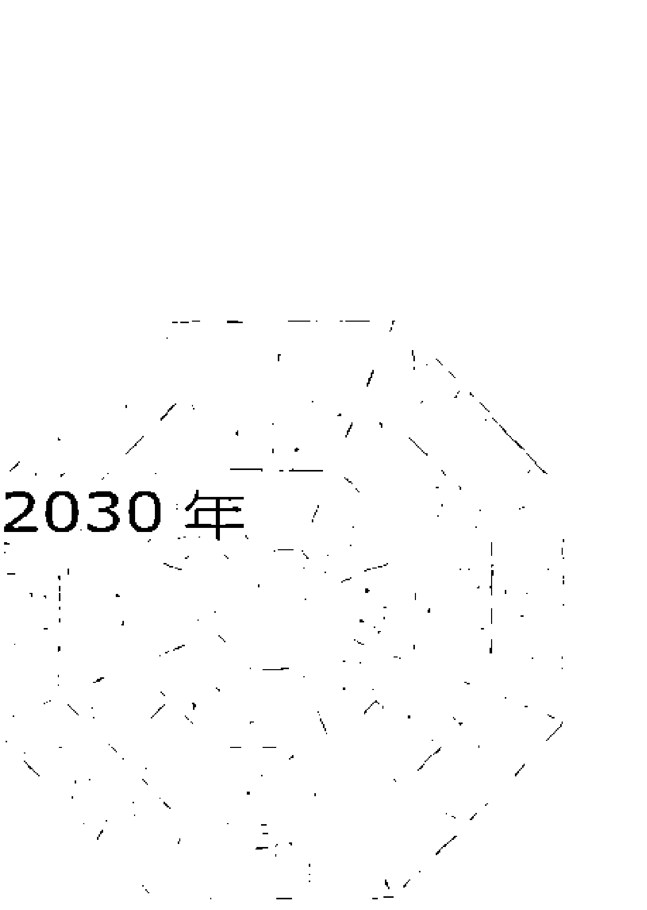

| 年份 | 节气 | 遁类型 | 类型 | 日期 | 干支日 |
|------|------|--------|------|------|--------|
| 2026 (丙午年) | 冬至 | 阳遁 | 起始日 | 去年12月21日 | 甲子日 |
| 2026 (丙午年) | 冬至 | 阳遁 | 终止日 | 今年6月18日 | 癸亥日 |
| 2026 (丙午年) | 夏至 | 阴遁 | 起始日 | 今年6月19日 | 甲子日 |
| 2026 (丙午年) | 夏至 | 阴遁 | 终止日 | 今年12月25日 | 癸酉日 |
| 2027 (丁未年) | 冬至 | 阳遁 | 起始日 | 去年12月26日 | 甲戌日 |
| 2027 (丁未年) | 冬至 | 阳遁 | 终止日 | 今年6月23日 | 癸酉日 |
| 2027 (丁未年) | 夏至 | 阴遁 | 起始日 | 今年6月24日 | 甲戌日 |
| 2027 (丁未年) | 夏至 | 阴遁 | 终止日 | 今年12月20日 | 癸酉日 |
| 2028 (戊申年) | 冬至 | 阳遁 | 起始日 | 去年12月21日 | 甲戌日 |
| 2028 (戊申年) | 冬至 | 阳遁 | 终止日 | 今年6月17日 | 癸酉日 |
| 2028 (戊申年) | 夏至 | 阴遁 | 起始日 | 今年6月18日 | 甲戌日 |
| 2028 (戊申年) | 夏至 | 阴遁 | 终止日 | 今年12月19日 | 癸未日 |
| 2029 (己酉年) | 冬至 | 阳遁 | 起始日 | 去年12月20日 | 甲申日 |
| 2029 (己酉年) | 冬至 | 阳遁 | 终止日 | 今年6月17日 | 癸未日 |
| 2029 (己酉年) | 夏至 | 阴遁 | 起始日 | 今年6月18日 | 甲申日 |
| 2029 (己酉年) | 夏至 | 阴遁 | 终止日 | 今年12月24日 | 癸巳日 |
| 2030 (庚戌年) | 冬至 | 阳遁 | 起始日 | 去年12月25日 | 甲午日 |
| 2030 (庚戌年) | 冬至 | 阳遁 | 终止日 | 今年6月22日 | 癸巳日 |
| 2030 (庚戌年) | 夏至 | 阴遁 | 起始日 | 今年6月23日 | 甲午日 |
| 2030 (庚戌年) | 夏至 | 阴遁 | 终止日 | 今年12月19日 | 癸巳日 |

## 國家圖書館出版品預行編目資料

> 奇門遁甲【工具篇】：局盤集與萬用曆 /黃啟霖 作. -- 一版. -- 臺北縣新店市 : 大堯文化, 2007.11
368面 : 19X26公分. -- (風水解碼 : 2)
ISBN 978-986-6792-27-4 (平裝)

1. 奇門遁甲

292.5
96021164

## 風水解碼 02

## 奇門遁甲【工具篇】---局盤集與萬用曆

作　者／黃啟霖
封面設計／阿飛工作室
發 行 人／李錫敏
出　版／大堯文化
地　址／新北市新店區新潭路一段102-10號
電　話／(02) 2911-9906
傳　真／(02) 8919-3501
製版印刷／東豪印刷事業有限公司
出版日期／2013年11月
定　價／400元

版權所有・翻印必究
如有缺頁、誤裝，請寄回更換，謝謝。