## 术数汇要

◎ 遁甲著

## 奇门遁甲

北京理工大学出版社

## 奇门遁甲应用初探
修订版
遁甲著
北京理工大学出版社

## 图书在版编目（CIP）数据
奇门遁甲应用初探/遁甲著.—北京：北京理工大学出版社，（术数汇要）
2006.12
ISBN 978-7-5640-1260-9
Ⅰ.奇… Ⅱ.①遁… ②李… Ⅲ.民俗文化-研究-中国-当代 Ⅳ.B.211
中国版本图书馆CIP数据核字（2006）第299889号

## 奇门遁甲应用初探
作者：遁甲
责任编辑：任逸超
封面设计：五星设计
出版：北京理工大学出版社
社址：北京中关村南大街5号
邮编：100045
经销：全国新华书店
印刷：新乡市天印印务有限公司
开本：700×1030 1/16
字数：1,800千字
印张：26
印数：1-3000册
版次：2009年4月第2版 2009年4月第1次印刷
书号：ISBN 978-7-5640-1260-9
定价：48.00元
（版权所有 翻印必究·印装有误 负责调换）

## 作者简介
2005年参加面授班时作者与张志春老师合影

## 作者简介
遁甲（孙小忠），辛亥年生，陕西宝鸡人。1994年在工作之余开始研易。曾涉猎六爻、命理、六壬、玄空。后有感于奇门遁甲模型在体现时空方面的立体性、直观性、准确性、又可指导人们以此时空模型充分发挥人的主观能动性，从而让人明天时、晓地利、知人和。故将研易之精力逐渐集中于对奇门遁甲的研习之上，立志于专项！

2005年参加了当代奇门宗师张志春老师举办的“奇门遁甲高级学术面授班”，后又得民间易学资深学者薛邓林（麟野山人）老师的指引，从而受益匪匪浅！

在穷《易》之理同时，又大胆实践，以学论术，以术证学。曾先后在国内几家知名易学网站奇门遁甲版担任版主、超级版主。近年来，将自己以往所悟之心及实践之实例，整理归纳编辑成《奇门遁甲应用初探》一书。

- 现为：中国易学院培训部副主任　宝鸡市周易研究会会员
- 中国易学院网址：http://www.zgyxy.com.cn/
- 个人博客：http://blog.sina.com.cn/dunjiaboke
- E-mail：dunjia@126.com
- 联系地址：陕西省宝鸡市金台区福临堡路21号
- 邮编：721001
- 联系电话：0917-2868315 13571180644

## 序一
（尹锋）

遁甲之学，由来已久，号称“帝王之术”。传为轩辕黄帝战蚩尤于涿鹿，梦天神授其符诀，经风后演绎成文，传于后世，后又经吕尚、张良删繁就简，成现行之文。历史上的诸葛武侯、刘伯温用其术佐主而取天下，更是被传为佳话。以上诸说有些方面虽无可考证，但可显其学在史上之尊贵。

奇门遁甲是易学体系的重要组成部分，乃我古代先贤认识世界和改造世界的智慧结晶，是反应天地人生变化规律、决断吉凶，防患于未然的一门预测科学，它将时间、空间、数理相互融合，运用十干、八门、九星、九宫、八卦多种机能，组合为天、地、人三盘，以其阴阳顺逆，五行消长之理，推断吉凶。上层象天而置九星，其奇仪而一时一易，象天之旋转；中层象人，以开八门，时时易位，象人事变化之多端；下层象地，以分八卦，而置九宫，地盘九星与奇仪五日方移，法地道之贞静。将天时、地理、人事三者之间的关系，巧妙的运用于三盘之中，并把所测事物的信息输入相关的时间与空间之中，作出合乎情理的推演，反馈出事物的兴衰和人事的吉凶。

遁甲之学虽源于古代军事上的运筹帷幄、排兵布阵，但其中包含有天文、地理、数学、农学、民俗、经济、军事等多方面的知识，是中华传统文化的经典，也是易术里面层次最高的决策学。其时空数理是古人综合模拟天道、地道、人道的宇宙系统模型，即反映未来世界趋势的一种造型，从宏观上看，它力求全面探讨天、地、人三才之道，在特殊环境下依照一定的推理依据，输入系统，判断或预测出事物的发展前景，进而选择最佳行动方案，体现了周易变易思维的应用，蕴藏了古人探索宇宙自然的经验，并教给人类适变、知变、应变的方法。不但启示事物发生的微妙契机，而且指引人们临机应变，避凶趋吉。因而不是消极的占卜，而是积极的处世智慧、生活指南。正如《周易·系辞》中所云：“《易》之为书也，广大悉备，有天道焉，有地道焉，有人道焉。”“易与天地准，故能弥纶天地之道。”

孙小忠先生乃易界之精英，零七年得机缘与之相识而成同道挚友，见其思维敏捷，通三式之学，对遁甲之研究尤为精深，今将多年之心荟萃成集，结成大作，公诸同好。著述中“观其会通”、“钩深致远”，见解精微，条理明晰，闪烁着真知灼见，所收案例中有许多是在网上为人排忧解难、答疑释惑的实践探索，和盘托出，其真实性可想而知。值此小忠君大作《奇门遁甲应用初探》出版之际，不揣浅陋，聊缀数语，以之为序，四海同仁识之。

尹锋 2008 年仲春于古长安

（尹锋，甘肃山丹县人。1964 年出生于风水世家，传至本人已历五代，受祖上熏陶，潜心研易二十余年，发表论文多篇。上世纪九十年代起师从当代易学大家费秉勋教授，广泛涉猎易学典籍。后有缘得到易学大家俞长江教授，胡京国教授、刘一恒先生、成汝善先生等人的指导。论文多次获奖，在 2007 年哈尔滨举行的“第十回世界易经大会”上被授予“世界著名易学专家”荣誉称号。2004 年出版专著《掌上奇门》（国际友人出版社）。即将出版的专著有《斗转星移——解开奇门遁甲之谜》《中国风水学原理》。现任中国易学院副院长兼秘书长）

## 序二
（薛邓林）

八运交进，术数之学，再度升温。而三式之学，诸多玄奥遗诀，亦应运现世。数年之间，三式学者有如过江之鲫，著作更是汗牛充栋，令人目不暇接。奇门之学，本于洛书九宫，此运尤其大放异彩，一改昔日资料匮乏，习者寡薄，精通者凤毛麟角之局面，而是百家争鸣，不断有珍贵的、难得一见的资料、诀窍问世，而学者也辐射到社会的各个层面，且精此术者亦日渐增多，曾一度被视为“帝王之学”的奇门遁甲，如今已深入民间，得到广泛的应用。此乃时运使然也。

然近年问世奇门之作，虽不乏精妙之作，以继往贤之学，存将亡之数，传湮没之术，对奇门的普及以及繁荣发展起到了良好的推动作用，但多数著作，则是哗众取宠，夸夸其谈，东拼西凑，剽窃抄袭，一知半解，毫无真知灼见。且内容杂乱无章，令学者云里雾里，无所适从，更甚者扰乱视听，惑人耳目，未能入门精进反倒迷失方向。纵观近年问世之奇门著作，能将理论用诸实践，进而在实践中验证、探索、总结理论者少之又少。而奇门之学要深入民间，得到社会的认同，其首务就需要得到实践的印证。目前奇门之学，门类众多，方法各异，各显神通，大多数奇门学者都把目光停留在理论的吸收鉴别上，却未能度过实践这一必经之路，往往莫衷一是，疑窦丛生。能贯通诸家，并在实践中心境不迷，有所建树者则寥若晨星。而孙君（网名遁甲），却正是这样一颗尤其夺目明亮的晨星。

我和孙君是在网上认识的。之前，曾有一个门人谈起过他，并对其极力赞赏，言其谦和务实、德易兼济，在众多易学论坛上鹤立鸡群，理论实战均为出众。后来我逐渐与孙君相知相识，其胸襟、气度、才艺、学识令我耳目一新，尤其叹服。在今日世道沉沦、铜臭弥漫、大道隐晦、学风浮躁的社会里，能认识这样谦和谨慎、淡薄务实的学者实属有幸！经过多次交流探讨，我对孙君其人有了一个全面立体的认识。他习易多年，涉猎诸术，谦虚谨慎，求真务实，坦诚豪爽，知无不言，言无不尽，没有丝毫的恃才自傲、孤芳独赏心理，这种精神在目前易界是不多见的。更为难得的是，遁甲还有一颗无私奉献的心，不遗余力的游走于各大易学网站、论坛，无偿的为人答疑解惑，指点迷津，以此作为自己证诸学理，提高实战综合水平的一种有效方法，在一个个生动真实的实践案例面前，他能够总结经验，吸取教训，见贤思齐，取长补短，深化渗透，这也是他能迅速的茁壮成长，不断突破，学术实力愈加精湛并且得到大家的赞誉与肯定的主要原因。

“易乃济世之道，非谋利之具”是我“济贤易斋”门人必尊的宗旨。而孙君“涉猎诸术、专攻奇门”，将自己所学无私地奉献社会，在诸多的赞誉声中保持清净淡泊的学者风范，以“名缰利锁重如枷，闲云野鹤自逍遥”作为自己的座右铭，这也使得我们“同声相应，同气相求”，成为君子之交。不时地交流探讨，取长补短，共同进步。其网上的很多实例，在为人解惑的同时也将推断的思路技巧详细的写出，给了大家很多的启发与指导作用，这在目前奇门实战资料中是很难得的，每一例都是一堂生动翔实的奇门课，对每一个奇门爱好者来说，都能从中获得启发，有较高的学术价值。

近年来奇门遁甲之学，门派、学理、运作机制、推断方法不断涌现，五花八门花样百出，令学者无所适从。而遁甲兄，不论是奇门古籍，还是近年公诸于世的一些奇门学理、运筹、推断方法，均有所耳闻涉猎，并且经过了自己消化吸收、实证、总结、归纳之后，形成了自己独到的一套“大道至简”“深入浅出”的风格理论，在实践推理的时候思路清晰、重点明朗，很值得大家效仿借鉴。

虽然经历了生活、事业上的沧桑巨变，但是在易学的研究上，遁甲仍然能一如既往、遇挫不惊，不为所扰，并在人生的低谷中，将自己几年来研究实践的案例归纳、整理成册，其中内容不仅是自己几年来的心路历程，也见证了遁甲在易学研究、学习的道路上不断迈进、勇于探索、日趋完善、锲而不舍的精神。《奇门遁甲应用初探》一书中的实例部分在易友内部交流分享之后，得到了大家的极力称赞！笔者承蒙孙君之信任，有幸在第一时间里拜读其作，确实感慨颇多！现在的奇门应用著作虽不乏其精，然而精中之实、精中之良者则并不多见！而此书可为当今奇门研究著作中的一朵奇葩，风格独到，适为目前所缺。正是基于此点，大家纷纷建议能将此作付梓出版，与天下易友共享。这不仅是孙君自己多年心血付出之结晶，也是易界众生之福！在众多易友的关心、支持、鼓励、期待下，《奇门遁甲应用初探》几易其稿，终于问世了！而我也应孙君之邀，虽拙笔钝墨，亦欣然为之作序。佳作拜读之后，感慨颇多，其中几个鲜明的特点尤其珍贵：

1. 该书乃是孙君近几年来的心得随笔，以自己在奇门学习成长过程中的所学所感为源泉，配以实践运用经验总结，从奇门的起源及机理、运作机制，组成因子，推演规律，应用法门着手，博古通今，将自己的所学所悟公诸于世，对于大家认识奇门，领略其科学性与实用价值有很大的帮助，相信很多奇门爱好者从中能够解开自己心中的疑团，对于奇门遁甲有全新的认知与感悟。

本书前面的部分对于奇门功用、运作机理、多视角立体运用等，继承发扬，论述精辟，并无私地公布了自己一些珍贵心得法则、感悟，尤其难得，对于大家立体全面的认识奇门遁甲极有帮助。笔录案例部分，收录了自己日常生活中将奇门之学用于自己或他人指导决策的成功案例，分析周到，论证严密，有很高的借鉴价值。网测案例部分则为遁甲平日奔走于网上各大论坛，为众易友预测指点的实例收集，真实具体，推断公正客观，内容涉及到目前大众关心的各个层面，有工作、事业、感情、婚姻、风水、疾病等等，这些案例在各网站论坛上都得到了反馈，深得求测者的好评，从这些案例中，我们可以看出遁甲严谨的治学精神、精湛的应用水平、以及坦诚谦逊的学者风范。

2. 世无神仙，占无百验。目前市面的讲述易学实例的书籍，基本上都经过后期加工而成，大多扬长避短，将易学预测等同神话，没有一本书中能正视、剖析自己的不足与漏失。而遁甲所收集整理的这些案例，都能做到原汁原味，特别是网络测例，全部保持网上原貌，未作任何修饰。对于自己推断的思路，反馈的结果都原原本本的收录进来，对于某些细节方面的误差，也原样展现给读者。这在目前问世奇门乃至易学实例书籍中尚属首例。这能让大家从案例中身临其境地体会领悟一些奇门应用技巧，并且有自己的思维拓展空间，没有俗书牵着读者的思路走的弊端。能让大家对于易学、奇门预测的准确性、实用性、真实性有一个理性客观的认识。

3. 现今奇门学术界百家争鸣，一些新的派系、理论、方法不断涌现，虽然不乏精奥问世，乃学术界之福，但跳梁小丑亦混杂其中，致使奇门学术真伪混杂，某些学者深受其惑，难以从中分辨真伪。而孙君《奇门遁甲应用初探》一书，能够理论联系自己实践，深入浅出，从立体全面的角度认识、剖析奇门，阐奇门真义，宣古今秘理，既是入门之佳作，亦是精进之良籍，学术价值与实用价值兼具。书中的多个案例，生动详实，可以窥见作者占断之时，能够保持冷静的心态，思路清晰，比类取象，触类旁通，通过式盘象理，直见事物本质。“以我观物者，情也；以物观物者，性也”，很多奇门爱好者理论扎实，但是在实际应用的时候却思路混乱，疑窦丛生，在判断上往往感觉似是而非，含混不明，主要就是自我主观先入为主，未能以客观平静的心态来分析奇门式盘，以天地自然之道来深度其中的象理，从而类比断验于人事；或是由于理论混杂，平时掌握了多种奇门派别或推演判断方法，而在运用的时候却不知道孰是孰非，自我矛盾，就像电脑里同类程序装多了冲突一样，临事不知所措，受困于局中，未能窥见事物本性。而《奇门遁甲应用初探》一书，足可为存有上述问题的奇门爱好者突破瓶颈的《易筋经》，只要能够熟读品味此书，细心揣摩，反思借鉴，以身临其境的视角，领会作者的思路视角，再对比与自己的观念与见解，并举一反三，将自己以往所学所用取长补短，进行有机的梳理整合，相信不管是理论认识还是实用技巧方法上，都能有所启发，有所突破的。《奇门遁甲应用初探》一书，不仅能让读者得到“鱼”，对于有心的读者，相信更能得到宝贵的“渔”。

“宝剑锋从磨砺出，梅花香自苦寒来”，孙君能取得今天的成绩，这与他的不耻下问，谦虚好学，博闻强记，淡薄无争是分不开的。在当今世道不古，物欲横流的功利社会里，能保持一颗清净淡薄，不骄不躁的心去求学证道，不为世俗所染的，为数不多也！奇门之学，虽然目前已有很多诀窍陆续公诸于世，但是尚有很多心法秘诀仍是口传心授，未见笔之于书，就是现行面世的一些珍贵资料、口诀，仍须实证以贯通之，而很多现代奇门学者，好高骛远，脱离实践，以致被诸多的奇门书籍所误，迷失方向，邯郸学步，画虎不成反类其犬。相比之下，孙君书中的实例，能够以古诀正统为主，理论鲜明，吸收归纳借鉴旁支时学，融汇一炉，大而化之，从而大道至简，由浅入深，将纷纭复杂的现代社会人事现象，用奇门模型生动合理的推理演绎出来，真正体现了中国哲学传统文化的独特价值与非凡魅力，乃是奇门应用之佳作典范。从《奇门遁甲应用初探》中，我们既可以领略奇门遁甲的博大精深，同时也是认识奇门、应用奇门的一把好钥匙。期望这样的著作以后能不断涌现，也希望孙君能再接再厉，在易学的研究应用上再度突破，百尺竿头更进一步！

21 世纪是网络时代，网络也成了大家学习交流的重要工具，《奇门遁甲应用初探》一书中的网测案例部分，将自己网上的很多实践案例原原本本的奉献给读者，并详细地将推理的思路、技巧写出来，其问世，也是顺应社会发展的迫切需要与必然产物。这对于我们以后在网上学习、交流、实践提供了先例，可资借鉴，同时也填补了这方面的空白。《奇门遁甲应用初探》不仅见证了作者自己的成长历程，也必将是一块肥沃的土壤，让更多的奇门爱好者从中吸取养料，茁壮成长，脱颖而出。

易学乃中华文化之源头活水，也是吾中华民族五千年历史的沉淀累积。这是中华民族独有的文化财富，也是实现我中华民族伟大复兴，屹立世界、强族强种的精神食粮、智慧源泉、民族之魂，当为每一个国人所重视！而奇门之学，曾一度被古代贤才良将用于趋避筹划、纵横捭阖、用兵破阵，运筹于帷幄之中，决胜于千里之外，更属中华文化的瑰宝奇葩，术数中之上品、珍品。然因国人秘而不宣之流弊，使得真诀一直隐讳不显，故需要我们今人不断实践挖掘、探讨总结，众人拾柴，集思广益，大力发扬，早日破其迷雾，以求福人福己，御人自保，国富民强！

岁在戊子暮春薛邓林（麟野山人）于云南曲靖济贤易斋

（薛邓林，字逸宇，号麟野山人。云南曲靖人。自幼喜好易学及传统文化，涉猎精研多种术数，以易贯穿，融会贯通，以去伪存真，古为今用。立志弘扬光复，以无愧华夏子孙。平生淡薄名利，与世无争，潜心求学证道，远离尘嚣。毕生研易，穷经证术，旁征博引，博古通今，于多年浸淫，长期探索，反复求证中略有心得。以明天地之道，穷理尽性。提倡德易兼修，以证“易乃济世之道，非谋利之具”！现为中国易学院建筑风水专家委员会委员）

## 前言
《奇门遁甲应用初探》一书，是笔者在原书稿《遁甲案例集》的基础上，应正式出版要求，在前面添加了基础内容部分。同时，针对目前奇门遁甲研究者，只侧重于对奇门预测部分的研究，而对奇门遁甲在古代军事上的运筹帷幄与日常生活中的趋避选择部分多轻视、忽略这一现象，在书中的第四章《奇门遁甲的应用》中，笔者根据古人留下的文献资料，结合近代几个著名战役，如红军长征中“强渡大渡河、飞夺泸定桥，”解放战争中“百万雄师渡长江”等，以奇门遁甲在古代军事上的应用原则，做了探讨性的论述。日常生活中的趋避选择，仍以前人的相关例证文献，也举例进行了探索性阐述。旨在以此“抛砖引玉”，引起研究者对奇门遁甲之最初立式原则，应用核心，进行研究开发。而不至于其精华沉默、湮没、失传！从而更能完整地继承先辈之智慧，传承先辈之心血！

案例部分收录了笔者近年来对奇门遁甲在预测方面大胆实践的部分成功案例和个别失误案例。因个别分类预测，笔者实践不多，未存有完整记录案例，故未对案例做详细分类。其中整理出笔者亲自笔测，又有完整记录的案例四十九例。2006 年 8 月自接触网络后，又在几家易学网站进行实践，收集网络预测有反馈的案例五十例，共计九十九例，其中都有详细的分析思路。对某些案例判断失误之处也以原始记录照样刊出，自己能找出原因的做了事后分析，找不出原因的留给大家去探讨。网络预测的案例是保持原貌从论坛复制下来的，为了给大家一个真实性，故未做任何改动。

就这些实践过的案例而言，也算是笔者在这十几年中，学《易》的一些微不足道心得吧！由于《易》博大精深，非几年就能窥得其奥。奇门遁甲又为最精深之学科之一，其自古就在众多的数术门类里，占有很高的声望。惜其派别不一，方法各异，在某些关键问题上古人也各持己见。

# 奇门遁甲应用初探修订版

再加近年新的门派出现，更使初学者无所适从，不知应从何门而入。《奇门遁甲应用初探》一书，主要以正统转盘时家奇门为主，来做探讨性论述的。因笔者易学水平有限，其中某些分析、论述观点只是个人的片面之见，不当、甚至错误之处也就在所难免，还望各位师友、同道批评斧正！

遁甲（孙小忠）遁甲戊子岁初于陕西宝鸡


## 目录

- 序一 …………………… 3
- 序二 …………………… 5
- 前言 …………………… 10

# 上篇 基础部分

- 第一章 奇门遁甲的起源与含义 ………… 1
  - 第一节：奇门遁甲的起源 ……………… 1
  - 第二节：奇门遁甲的含义 ……………… 2
- 第二章 奇门遁甲的结构 ………………… 10
  - 第一节：地盘后天八卦 ……………… 10
  - 第二节：人盘八门 …………………… 19
  - 第三节：天盘九星 …………………… 29
  - 第四节：神盘八神 …………………… 32
  - 第五节：天干地支 …………………… 33
- 第三章 奇门遁甲的演局程序 …………… 44
  - 第一节：定时 ………………………… 44
  - 第二节：定局 ………………………… 44
  - 第三节：推演 ………………………… 47
  - 第四节：奇门遁甲所体现出时空的立体性与科学性 …… 54

# 中篇 应用部分

- 第四章 奇门遁甲的应用 ………………… 56
  - 第一节：军事上的运筹帷幄 ………… 56
    - (一) 《烟波钓叟赋》直解 …… 57
    - (二) 论主客 …… 98
    - (三) 遁甲神机赋 …… 99
    - (四) 刘伯温奇门遁甲总序 …… 101
    - (五) 总法天机（前篇） …… 103
    - (六) 作用妙法（后篇） …… 104
    - (七) 临机变用 …… 105
    - (八) 奇门主用精微赋 …… 106
    - (九) 奇门遁甲吉凶格局 …… 107
    - (十) 案例探讨 …… 122
  - 第二节：日常生活的趋避选择 …… 138
    - (一) 趋避方法概论 …… 143
    - (二) 八门详解 …… 145
    - (三) 案例研讨 …… 146
    - (四) 方法提示 …… 153
  - 第三节：奇门预测 …… 155
    - (一) 分析判断的思路 …… 155
    - (二) 应期的判断 …… 165
    - (三) 分类占断方法 …… 166
  - 第四节：奇门遁甲法术 …… 218

## 下篇 遁甲案例部分

- 第五章 笔录案例 …… 221
  - 实例一：祖坟丑山未 风水吉不吉 …… 221
  - 实例二：迎接检查团 何时才出现 …… 222
  - 实例三：空缺之职位 能否有机会 …… 223
  - 实例四：职位终未得 院长却退位 …… 226
  - 实例五：骗人不骗人 试后下结论 …… 227
  - 实例六：拜访道长前 掌上起局看 …… 229

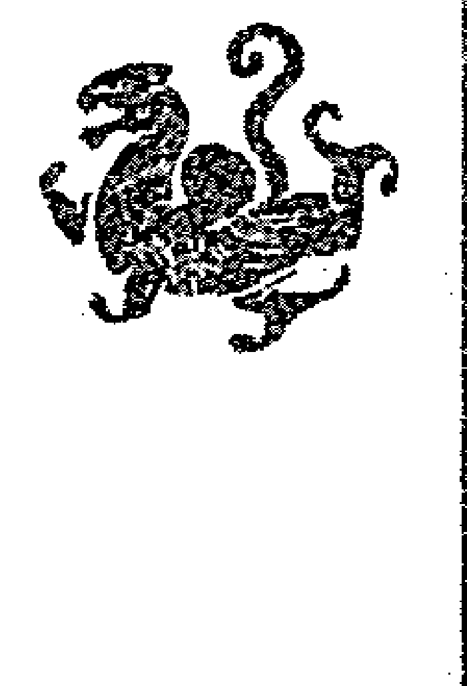

- 实例七：论坛突关闭 何时能开启 ...................... 230
- 实例八：小偷已西去 车辆难追回 ...................... 232
- 实例九：带走共三人 其中一女性 ...................... 233
- 实例十：来电说要来 演局观不来 ...................... 234
- 实例十一：新疆在西北 可查乾宫位 ...................... 235
- 实例十二：修路需资金 善款何处寻 ...................... 237
- 实例十三：景门在坤宫 五百二十分 ...................... 238
- 实例十四：震宫龙折足 此事须谨慎 ...................... 239
- 实例十五：原告生被告 最终私下了 ...................... 240
- 实例十六：芮死遇玄武 须防暗疾生 ...................... 242
- 实例十七：病在何部位 手术是否需 ...................... 246
- 实例十八：酒桌断诸位 查看座方位 ...................... 248
- 实例十九：值使庚同宫 调查是肯定 ...................... 250
- 实例二十：高道测兄运 二老走一人 ...................... 251
- 实例二十一：景门龙返首 文章得保存 ...................... 253
- 实例二十二：整理出此例 怀念已故友 ...................... 254
- 实例二十三：今年虽延续 明年恐关闭 ...................... 256
- 实例二十四：开门逢白虎 失业已来临 ...................... 257
- 实例二十五：忽略生死门 错断人病情 ...................... 258
- 实例二十六：座宫断二位 不信不由你 ...................... 260
- 实例二十七：大局全伏吟 计划未实行 ...................... 263
- 实例二十八：心动测行人 空亡凶祸伏 ...................... 264
- 实例二十九：天芮逢马星 病情已变凶 ...................... 266
- 实例三十：学术报告会 会有多少人 ...................... 268
- 实例三十一：月干飞宫马星逢 朋友不会被判刑 ...................... 269
- 实例三十二：妻妹问工作 能否干长久 ...................... 270
- 实例三十三：其实并不神 天芮坎宫逢 ...................... 271
- 实例三十四：婚姻皆为缘 无缘怎能成 ...................... 272
- 实例三十五：有缘来相聚 无缘必离去 ...................... 274
- 实例三十六：家中常起火 不知是何因 ...................... 275

# 中国古代术数汇要

# 奇门遁甲应用初探

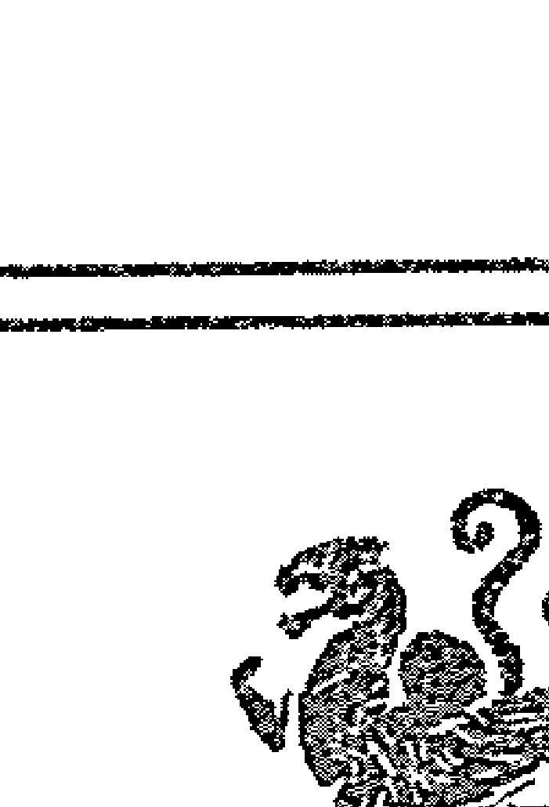

- 实例三十七 观辛金之象 物失而复得 ......................................... 277
- 实例三十八：投资二百万 最终落空宫 ......................................... 279
- 实例三十九：何去又何存 人生难选择 ......................................... 280
- 实例四十：值符冲时干 离开是必然 ......................................... 285
- 实例四十一：男孩为虚象，女孩才为真......................................... 286
- 实例四十二：白虎猖狂格 伤灾真来临 ......................................... 287
- 实例四十三：就地以实践 现场就表演 ......................................... 288
- 实例四十四：总统大选举 课中午临贵 ......................................... 290
- 实例四十五：明天要外出 是否天有雨 ......................................... 291
- 实例四十六：伏吟不宜动 动则必不顺 ......................................... 292
- 实例四十七：六壬测天时 奇门问行人 ......................................... 293
- 实例四十八：突然兴趣来 验证往年月 ......................................... 296
- 实例四十九：提前演奇门 做到心有数 ......................................... 298
- 第六章 网测案例.......................................................... 302
  - 网络案例 1：遁甲老师，感情上最重要的一次抉择：她能成为我的妻子吗？ ............... 302
  - 网络案例 2：一位朋友求测官运如何，各位易友请看看 ...... 304
  - 网络案例 3：有劳遁甲大师批一批此女的命运 ................. 306
  - 网络案例 4：占学易之前程 ................................... 307
  - 网络案例 5：恳请斑竹指点：问问这个项目能不能干？ ......... 309
  - 网络案例 6：请各位老师帮忙看看朋友工地上是最近怎么了，在线等。 ................. 310
  - 网络案例 7：请看看这两栋房子怎样？ ....................... 310
  - 网络案例 8：再请遁甲版主看看 ............................. 312
  - 网络案例 9：请遁甲大师预测本人何时能还清债务 ............. 313
  - 网络案例 10：有请遁甲斑主 ............................... 314
  - 网络案例 11：有急事请求一测 ............................. 315
  - 网络案例 12：恭请遁甲老师帮忙看下 ....................... 316
  - 网络案例 13：武汉办分公司能有前途否？ ................... 317
  - 网络案例 14：大师看我如参加公务员考试，能否考中？ ....... 319

# # 中国古代术数汇要

# # 奇门遁甲应用初探

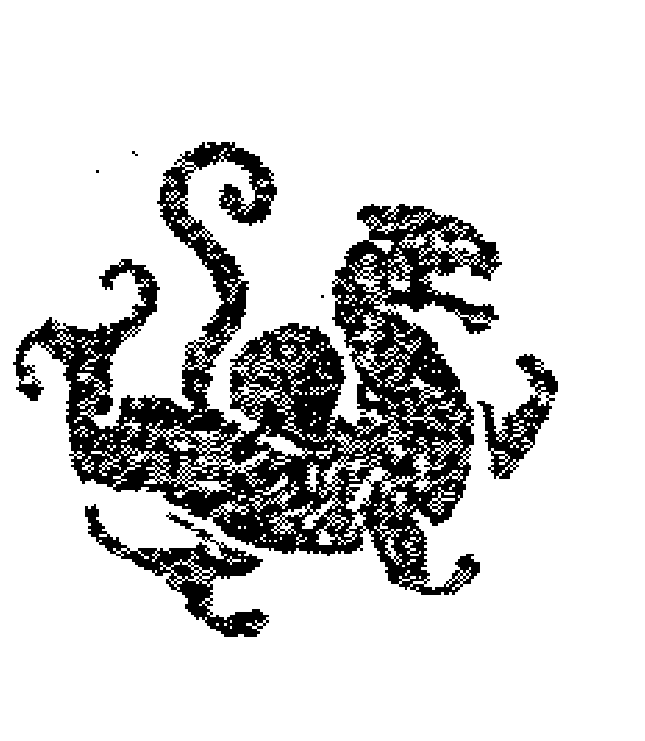

- 网络案例15：遁甲大师算得准，请再帮我看 ………… 320
- 网络案例16：能否用奇门分析一下我的姻缘？ ………… 321
- 网络案例17：麻烦帮我测测我适合从事什么工作？ ………… 322
- 网络案例18：请遁甲兄看看，今早家中发生何事？谢谢。 …… 324
- 网络案例19：请遁甲版主看看事情是否可行？ ………… 325
- 网络案例20：请求帮助，看看事业和财运！ ………… 326
- 网络案例21：测这个人对我有没有帮助（现在和将来） …… 329
- 网络案例22：测这件事今天找他，能否答应，能否办成。 …… 329
- 网络案例23：请遁甲老师给解解 ………… 330
- 网络案例24：恳请版主指点出路 ………… 331
- 网络案例25：[求助] 请薛老师和遁甲老师指点出路 ………… 332
- 网络案例26：看背部左肋疼痛？起一局，测背部左肋疼痛。 ………… 334
- 网络案例27：测学易情况突然心动想一测学易情况。年命丙 ………… 335
- 网络案例28：今天我摧一笔借款，看有没有结果？ ………… 337
- 网络案例29：请问这两个不同的网名是否是同一个人？ ………… 337
- 网络案例30：[求助] 恳请版主测我父亲的墓地选在哪儿好？ ………… 349
- 网络案例31：请老师们看看，自己想开个关于儿童消费的店如何？ 诚谢 ………… 340
- 网络案例32：这个店最后能不能开起来 ………… 341
- 网络案例33：小女愁嫁，大师相助啊 ………… 342
- 网络案例34：替朋友问的，看他离婚何时能办下来？ ………… 343
- 网络案例35：测朋友离婚何时开庭，今年能办下来吗？ ………… 344
- 网络案例36：再发一帖，请遁甲大师看我朋友离婚何时能开庭？ 信息是否跟上一帖一样？ ………… 345
- 网络案例37：遁甲大师，这个盘有点不妥啊 ………… 346
- 网络案例38：我也发一帖，看跟现在的男朋友关系怎样，什么时候能结婚？ ………… 348

- 网络案例 39：问遁甲：工作何时有着落，定反馈！谢谢！ ... 349
- 网络案例 40：问何时扭转当前工作中被压制的局面！ ... 350
- 网络案例 41：我和他的关系还会有改变吗？会变成怎样？ ... 350
- 网络案例 42：求测朋友投资煤矿的效益会如何？谢谢！ ... 351
- 网络案例 43：恭请遁甲大师指点。不胜感激！ ... 352
- 网络案例 44：【必反馈】请钦差大臣、遁甲等版主帮忙 ... 353
- 网络案例 45：请版主大师和路过的易友大师帮我看看，谢谢！ ... 355
- 网络案例 46 请遁甲老师看看，谢谢 ... 356
- 网络案例 47：各位大师帮我看看 ... 357
- 网络案例 48：网测两则相似案例 ... 358
- 网络案例 49：〔讨论〕刚刚看到一博客上有记录，这个时间有人问：华南虎照片之真假？ ... 362
- 网络案例 50：QQ 测例 ... 363
- 附录：案例三则 ... 369
- 第七章：随笔 ... 376
  - 论奇门遁甲定局法 ... 376
  - 论置闰与拆补 ... 379
  - 论奇门遁甲演局法 ... 380
  - 论奇门遁甲预测与奇门遁甲趋避选择 ... 384
  - 途遇恶人趋避法 ... 385
  - 论奇门遁甲的本质 ... 385
  - 论奇门与企业预测 ... 387
  - 太乙初探 ... 388
  - 掌上推干支 ... 391
  - 后记 ... 393

# 上篇 基础部分

## 第一章 奇门遁甲的起源与含义

### 第一节 奇门遁甲的起源

古人基本上都把奇门遁甲传说为是在上古时期，黄帝与蚩尤在涿鹿相战，天神九天玄女传与黄帝符箓诀，黄帝登坛祭拜，后洛水有神龟伏图而出，彩凤衔书而降，黄帝根据这些，命大臣风后演成了一千八十局。后经姜太公删繁就简成为七十二局，到了汉代张子房时，又一次改进则成为阳遁九局、阴遁九局、共为一十八局。当然，这只是古人对奇门遁甲起源与发展的论述而已。奇门遁甲的真正起源时期，现代的有些学者根据历史文献资料考证，认为目前最早也只能定在东汉时期。

奇门遁甲自诞生以来，就被兵家所用，以后逐步转化到人们日常生活中的趋避选择和预测方面。

奇门遁甲总体分数理奇门与法术奇门；转盘奇门与飞盘奇门。具体可分为年家奇门、月家奇门、日家奇门、时家奇门。在这四家奇门遁甲中，应用最广泛，最精确的还是时家奇门。所以古人留传下来的奇门书籍大多都是讲述时家奇门的。

在古传三式中，只有奇门遁甲的定局、起局，自古方法就不一，各式各样。再加上近年来所出现的新的起局方法，使奇门遁甲更加复杂，且真伪难辨，从而给初学者造成困惑，不知所从。本书将以古传正统之数理，转盘时家奇门遁甲为主，对奇门遁甲的起局、定局、演局、做详细的论述。同时，对奇门遁甲在军事上的应用，与人们日常生活中的趋避选择，做探讨性的论述。也对法术奇门略作简介（因为法术奇门终究也是奇门遁甲中的一部分内容）。

现在的奇门遁甲学者，基本上将其研究的侧重点，放在了奇门遁甲的预测上，而对于奇门遁甲在古代军事上的运筹帷幄、日常生活中的趋避选择，这些重要地方却一直被忽略，从而以此“抛砖引玉”，希望能引起研究者对奇门遁甲的原始功能深入研究开发！而不至于使其精华部分湮没！

### 第二节 奇门遁甲的含义

对于奇门大家都知道它代表乙、丙、丁、三奇；开、休、生、伤、杜、景、死、惊八门。（凡用事所在之宫逢乙、丙、丁与开、休、生、古人称为得奇门。）而对于“遁甲”则认知不一。那么奇门与遁甲两者有何区别？之间又有何关系？先看古人的解释：

古籍《奇门一得》认为：“夫甲为天干之首，坐禄于地支寅宫，乃东方青帝之尊，化生万物，功莫大焉者。甲之对宫曰庚，庚者阳金之精，西方太白之象，其性险毒，专掌杀伐之威权，乃小人之类也！甲畏之甚，且至于遁矣。然则有奚而曰奇门？盖甲虽畏庚金而遁去，上帝好生恶杀，五行之中虽仰金，独使之无余气，而其凶杀之流毒则尤有可畏者，故甲又用乙妹嫁庚妻以和合之，用丙丁子孙克庚金，为官煞以制伏之，出生入死，各有其门，使不知何吉何凶，则从何而趋，又从何而避。所谓三奇者，乙丙丁也，乙为日奇，阳之精也；丙为月奇，阴之精也；丁为星奇，阴之曜也，昼则日丽于天，夜则日西沉，而月代之以明，月弦亏而星继之以明，三光照临下土，无微不烛，可以知人事之吉凶，起死而回生者也。”

这段话说明，甲为十天干之首，庚金为甲的七杀，因庚为阳金，甲为阳木，同性相克为杀。甲为了避免与庚的正面相战，一是遁于六仪之下：甲子遁戊，甲戌遁己，甲申遁庚，甲午遁辛，甲辰遁壬，甲寅遁癸。二是再利用乙丙丁三奇去牵制庚金。先用乙奇与庚婚配（因乙与甲同属木，甲为阳，乙为阴，甲乙就为比肩关系兄弟关系，异性相见就为兄妹），这样一来，就化敌为友。三是用丙火去克制庚金（甲木生丙火，我生者为子孙，甲丙同为阳，丙就象征甲的儿子），丙为阳火，又为天威，这样丙火就有力量与庚金相抵抗；四是用丁奇去牵制庚金（丁为阴，为甲所生，就象征丁为甲的女儿）。丁为玉女，少女，用“美人计，以柔克刚”，自然就可以化解庚与甲之间的直接冲突，从而化敌为友，保全甲不被伤害。

故宫珍藏本《御定奇门宝鉴》一书对“遁甲”的解释：

六仪遁六甲者，六甲统六仪，仪用而甲不用也。其仪维何？干有十而宫惟九，甲不入宫则奇仪无首，甲若居宫则奇仪缺位。是以甲统其仪，用仪之用以为用，而不自用也。假令甲以奇仪分布九宫，顺则仪在前、奇在后，逆则仪在后、奇在前。今举顺布以类其余。如布冬至第一局。先布三奇于后、乙居九、丙居八、丁居七，次布六仪于前，戊居一、己居二、庚居三、辛居四、壬居五、癸居六，此奇本局之定位也。一局为一元，一元统五日，五日统六十时，六十时分六甲，六甲统六仪，自甲至癸，一宫一干，遍历九宫，为终一甲。六历九宫、为终一元。一元终又起首甲为第二局。本局甲子起一宫、顺遁九宫，至癸酉仍归一宫。则首甲所监之九干，终于一戊之本局，定位居一。甲子十干始于一而终于一。甲子与戊同宫，是戊遁甲子，故统曰甲子戊。甲戌续癸酉起二宫，宫遁一干至癸未，仍归二宫。二为己本局之定位，是甲戌与己同宫，统曰甲戌己。甲申续癸未起三宫，宫遁一干至癸巳，仍归三宫。三为庚本局之定位，是庚遁甲申，故统曰甲申庚。甲午续癸巳起四宫，宫遁一干至癸卯，仍归四宫。四为辛本局之定位，是甲午与辛同宫，故曰辛遁甲午，而统曰甲午辛。甲辰续癸卯起五宫，宫遁一干至癸丑，仍归五宫。五为壬本局之定位，是甲辰与壬同宫，故曰壬遁甲辰，而统曰甲辰壬。甲寅续癸丑起六宫，宫遁一干至癸亥，仍归六宫。六为癸本局之定位，故曰癸遁甲寅，而统曰甲寅癸。举此一局，而局局如是。布此一元，而元元如是。故甲子戊、甲戌己、甲申庚、甲午辛、甲辰壬、甲寅癸，旬首之甲。莫不统仪以遁，则仪用即甲用。故曰用仪之用以为用，而不自用也。六甲统仪不统奇者，仪为庚之党羽，奇为甲之心腹也。奇仪分布九宫，六甲又遁诸干于九宫者。备星门之为符使，所为遁宫也。


中国古代术数汇要

奇门遁甲应用初探

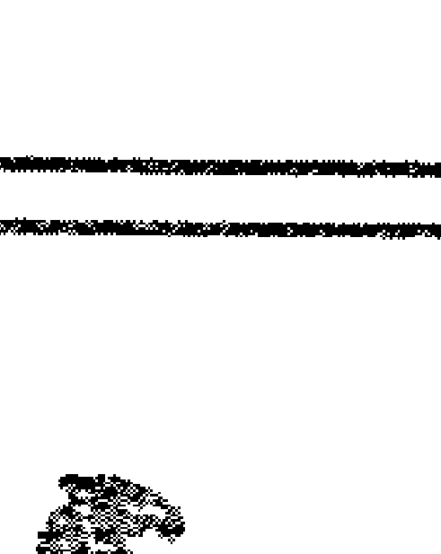## 奇门遁甲应用初探修订版

通过以上象征性的分析，我们发现乙、丙、丁三奇都是在为甲服务，三奇为甲的守护神。根据这些象意，不难看出奇门遁甲中以“尊甲”为要，和“甲”的重要位置与“乙、丙、丁”三奇的主要作用。

简单的来讲所谓的“奇门”就是指：“乙、丙、丁、与开、休、生、伤、杜、景、死、惊八门”；“遁”就是隐藏，伏而不现，“遁甲”就是将六甲（实为六十甲子）隐于六仪下随其行，而不显露，露面的只是六仪，甲子遁戊，甲戌遁己，甲申遁庚，甲午遁辛，甲辰遁壬，甲寅遁癸。这样六甲虽遁于六仪下。但还得依靠“奇门”，就如《奇门一得》所说：“出生入死，各有其门，使不知何吉何凶，则从何而趋，又从何而避”。再通过门的掩护更是“庚”对“甲”的行动无法琢磨。那么奇门也为遁甲的隐身之所，也就说明“奇门”也是为“遁甲”服务的。“遁甲”无门，则不能发挥“遁甲”的性能，“奇门”无“遁甲”，则“奇门”为无用之地，“奇门”与“遁甲”本为一体，两者不可分离。分离则失奇门遁甲的本质。

> 今民间易学资深学者薛邓林老师在他的《三式奥秘大破译之二——遁甲之起源揭密》一文中对“遁甲”的真正含义做了深入的探讨和详细的论述，其见解颇有独到之处，相信大家读后对遁甲会有一个全新的认识，今将其重要部分引用如下，供大家参考研究：

- 1、奇门遁甲：奇是三奇，门是八门、遁是由表及里，九宫飞步，甲是六十甲子，而非六甲值符（俗论为六甲遁于六仪），是研究三奇八门与六十甲子（或六甲值符）在九宫中的外在与实质的联系的学问。
- 2、奇门遁甲：这里的遁甲是六十甲子在九宫中的飞步及标记性的问题。

其实现在在世传的奇门书籍，关于奇门遁甲含义的解释，都是拘泥于甲遁六仪或三奇救甲的观念，这其实只是奇门的表象，没有导出奇门遁甲的真正实质所在。实际上“遁甲”乃是奇门遁甲学说的一大重点所在，遗憾的是，今人研究的奇门遁甲只是停留在奇门与“甲”遁六仪表面上，而忽视了遁甲的实质是将六十甲子分布九宫，从中演绎天地之气运，而以三奇六仪作为六十甲子的运化标记，实际上是六十甲子隐遁于三奇六仪之下，而不是六甲隐遁于六十甲子（六仪）之下，观念正好反了。

为何要“遁甲”呢？这是很多奇门学者最困惑的问题，自古至今，实无一人道破。

## 第一章 奇门遁甲的起源与含义

要明白这个问题，首先要从天干地支谈起。什么是天干？天干即是天体对于地球的影响、干扰力。什么是地支？地支就是地球方位的分支，也有人认为是地球内部的一种支持力。作为具有天、地、人三种因素的奇门式盘模型。其以洛书九宫为地盘象征地球，内还有十二地支，地支不仅表示方位，同时也表示时序。而地球上消长进退流行的“气”是如何产生的呢？乃是由于地球的自转与公转，而受到其它天体的影响作用。那么怎么样来描述、模拟这种地球的四时变化气运情况？古人很聪明，考虑到对地球上的“气”产生影响的是“天”，因此就将天干分配到洛书九宫中去，从而模拟地球受天的影响，而产生的气流消长变化情况，这样就必须将十天干分配到九宫当中去，因此问题也就出来了。十干分布九宫，必然有一干分配不下，怎么办呢？古人因此想到了“遁”。须隐藏其一，才能分配均匀。那应该隐藏那一干呢？并且要合理的将“时”与“空”相对应。在“时”的分配上，是以60甲子来纪时的。在“空”的分配上，地球五日一候，十干对应八卦九宫，必须相应五日一变。而五日正好是60个时辰，六十甲子循环一周。而天干有十，每隔十个时辰天体循环一周。故将时空协调起来，将5天的60个时辰，天干每循环一周定为一旬。在5天里，将每一旬（天干循环一周）的时段对应到八卦九宫中，由此宫的天干统领，亦即轮值之意。再把十干中多的一干分配隐遁到各旬对应的九宫中之天干之下，这样不就解决问题了吗？由于每旬的开头都是甲，甲又为十干之首，恰好与各旬统领之干的意义相同，故非遁“甲”莫属了。

这样十干分配九宫的问题就解决了。接着就需要考虑在每一旬中，甲应该遁到何干之下呢？由于洛书九宫分布八方，以中宫为立极点，也是地球上气运流行，阴阳消长的枢纽所在。且中宫为太极，皇极居中，临制八方，乃阴阳相交相尽相止复相生之处。乃玄牝之门，万物所由生也。这样先将十干配以数：甲1、乙2、丙3、丁4、戊5、己6、庚7、辛8、壬9、癸10。在将十干之数与九宫之数对应分布，如下：

| | | |
| :---: | :---: | :---: |
| 丁4 | 壬9 | 乙2 |
| 丙3 | 戊5 | 庚7 |
| 辛8 | 癸10 | 己6 |
| 甲1 | | |

再将60甲子从洛书九宫之中宫开始逐宫顺布（为何不逆布？因时间不会倒流之故），每时移一宫。则甲子入中，中即为5即戊，故甲子旬甲隐于戊下，乙丑到6宫，丙寅到7宫……到甲戌时落于6宫，6为己，故甲戌旬甲隐于己下，乙亥到7宫，丙子到8宫……甲申到7，7为庚，故甲申旬甲隐于庚下，这样继续顺步下去，得甲午到8宫，隐于辛，甲辰到9宫隐于壬，甲寅到1宫隐于癸。如图：

### 甲子至甲戌时九宫飞步图

| | | |
| :---: | :---: | :---: |
| 壬申 | 戊辰 | 庚午 |
| 辛未 | 甲子<br>癸酉<br>戊 | 丙寅 |
| 丁卯 | 己巳 | 乙丑<br>甲戌<br>己 |

### 六十甲子排布九宫旬首对应天干图

| | | |
| :---: | :---: | :---: |
| | 甲辰<br>壬 | 丁 |
| 丙 | 甲子<br>戊 | 甲申<br>庚 |
| 甲午<br>辛 | 甲寅<br>癸<br>甲 | 甲戌<br>己 |

这样就可确定六仪。由于六仪是一旬一换，十时一易，故气运变化较大，吉凶较不稳定。相比较之下，乙丙丁三干由于不受旬内寄宫（遁甲）之影响，气流较稳定。故古人将其称之为三奇，并以日、月、星名之。此理自遁甲创立以来，实无一人道破。

那么阴阳十八遁又是如何飞步奇仪的呢？原来这是为了将时间与空间

## 第一章 奇门遁甲的起源与含义

相对应。5 天为一局，1 局 60 个时辰，分为六旬。甲子时为六旬之首，甲子遁于戊下，故戊即为阴阳 1 局之首。那么要如何放到洛书九宫中去顺逆飞步呢？古人确定为，用阴阳几局，就将 60 甲子从此局数对应的洛书地盘数开始顺逆飞步。例如阳遁 1 局，地盘对应的是坎 1 宫，那么就将甲子时从坎 1 宫开始依九宫顺序顺行飞步。这样甲子时（遁戊）就在 1 宫，到甲戌旬时，旬首甲戌在 2 宫（己），甲申旬时，甲申在 3 宫（庚）……甲寅旬时，旬首甲寅在 6 宫（癸）。

又转到另一轮甲子旬时，则局数已经改变，此时则又要将甲子旬首戊从对应局数的地盘宫位重新开始，将 1 局 6 旬之 60 甲子排步九宫。这就是阴阳遁 18 局的排布依据，余局仿此。充分体现了时（60 甲子）空（洛书九宫）的对待流行情况，这与 5 日 1 候的自然规律极其吻合。这种排法精细反映了在 1 年 72 候的每一候中，60 个时辰里气有不同的变化情况。而且每一候的气流变化不尽相同，共有阴阳各九局（随着地球公转而阴阳半年一易）18 种流行变化。

时家奇门其实是将 1 局的 60 甲子飞步到九宫中去的，只是这种演步后，将六甲旬首的位置以地盘六仪来作为标记，此六仪的位置情况实际就反映了 60 甲子排布九宫时的相应位置。这也正是“遁甲”的由来。这种将 60 甲子暗藏分布在九宫中的排法，很多奇门学者都不知道。故特此说明，学者可自行演练，即知“遁甲”之真意。

奇门的八卦九宫中包含了每一元中 60 甲子排布在内，此为奇门之一大隐秘，也是奇门的奥秘所在，历代视为不传之秘，今人多数不知。此暗藏的 60 甲子实为奇门推吉凶、断祸福、定应期的秘法之一，为道家之秘传，历代知之者不多。比如丙申年生人，或丙申年月日时，因丙申属甲午旬，甲午寄于辛，丙申为甲午后二位，则丙申隐藏于癸仪之下。观天地二盘之癸，即可推年命，察往来年月日时之吉凶。此为奇门秘中之秘，为防不屑鼠辈盗用，今特宣泄一二，望得者宝之，抱持济世之心，用于正途。其中尚有很多高级用法，日后等有机缘之时在作专文公布。

经过上文的介绍，可能很多人还有另外一个疑问，为何要将天盘九星在其地盘上的奇仪携带到天盘位置加临地盘奇仪分析？这是因为，最早的奇门是以飞盘推演，九星地盘位置上的奇仪分布，反映了九星（这里指

## 第二章 奇门遁甲模型的结构

地盘九星）所对应位置、方向上的天体影响力情况（地盘奇仪的分布，不仅反映了地球的气运情况，也同时反映了某一方位的天体影响作用力）。当观察星球随地球的气流变化而对地球的影响关系时，同时也必须考虑到其实际方位（地盘九星）位置上与其它天体的影响制约联系情况，这样才更符合实际的宇宙状态。九星是虚拟的星座，天干（奇仪）则是天体（某一位置的总能量）的影响力量。虽然九星、天干都是虚拟的，但正是如此，它们更具模糊性、科学性、合理性，而不致流于机械性的弊端。

上面说的是飞盘奇门，那么现在多数人用的活盘奇门其天盘奇仪可有合理性否？其实更具合理性。活盘奇门中天盘奇仪反映了九星所在位置自身受到其它天体的影响力，同时它与天盘九星结合，更反映了九星与地球、天体与九星、天体与地球多者之间的错综复杂的联系，它更具有拟真性。活盘奇门确实是古人一个划时代的改进，它将奇门的模拟性变得更加立体化、精细化。

以上从奇仪、九星、飞活盘揭示了奇门的神秘面纱，对于奇门中的八门、八神等，古来较少争议，也并未有什么过多的奥秘可言，故这里不作讨论。此外尚有“值符随时干，值使随时宫”的奇门推排原理，限于篇幅，在此留给读者自行研究。只要对本文以上所介绍的奇门创立原理有所理解，则自然可以明了。相信此奇门遁甲创立、起源奥秘的破译，将会对大家日后在奇门的研究、继承中有一个全新的认知。对奇门的用途也会有一个全新的定位。本文虽为一己之见，但旨在弘扬传统，探根寻源，以为今人在三式的研究中略尽绵薄之力。文中疏漏、失当、谬误之处在所难免，但愿能够抛砖引玉，以求同好先进指正同探。若诸位有更为合理之解释，敬请赐教，本人感激不尽。

根据薛老师的论述，笔者现将“六十甲子排布九宫旬首对应天干图”下列如下：

| 坤 (西南) | 艮 (东北) | 兑 (西) |
| :--- | :--- | :--- |
| 壬申 辛巳 庚寅<br>己亥 戊申 丁巳<br>**乙** | 戊辰 丁丑 丙戌<br>乙未 癸丑 壬戌<br>**甲辰 壬** | 庚午 己卯 戊子<br>丁酉 丙午 乙卯<br>**丁** |
| 辛未 庚辰 己丑<br>戊戌 丁未 丙辰<br>**丙** | 癸酉 壬午 辛卯<br>庚子 己酉 戊午<br>**甲子 戊** | 丙寅 乙亥 癸巳<br>壬寅 辛亥 庚申<br>**甲申 庚** |
| 丁卯 丙子 乙酉<br>癸卯 壬子 辛酉<br>**甲午 辛** | 己巳 戊寅 丁亥<br>丙申 乙巳 癸亥<br>**甲寅 癸** | 乙丑 癸未 壬辰<br>辛丑 庚戌 己未<br>**甲戌 己** |

从此图中，大家就可以很直观的看出“遁甲”的由来。

## 第二章 奇门遁甲模型的结构

奇门遁甲共由四层构成。
第一层：地盘以洛书、后天八卦为框架。
第二层：人盘以八门为代表。
第三层：天盘以九星为象征。
第四层：神盘以八神来显示宇宙中一种神秘场能。

- 第一层：地盘以洛书、后天八卦为框架。
- 第二层：人盘以八门为代表。
- 第三层：天盘以九星为象征。
- 第四层：神盘以八神来显示宇宙中一种神秘场能。

奇门遁甲模型将天、地、人、神、有机地结合起来，形成一个天、地、人、三才一体的“天人合一”宇宙时空浓缩模型图。根据效仿天体运转，将时间与空间的变化演象，让人们从而来明天时，晓地利，知人事。因此最能直观立体表达：天时、地利、人和者，唯奇门遁甲。

### 第一节 地盘 洛书、后天八卦

奇门遁甲以洛书、后天八卦为地盘为九宫。依次来代表地理方位，代表时序。如图：

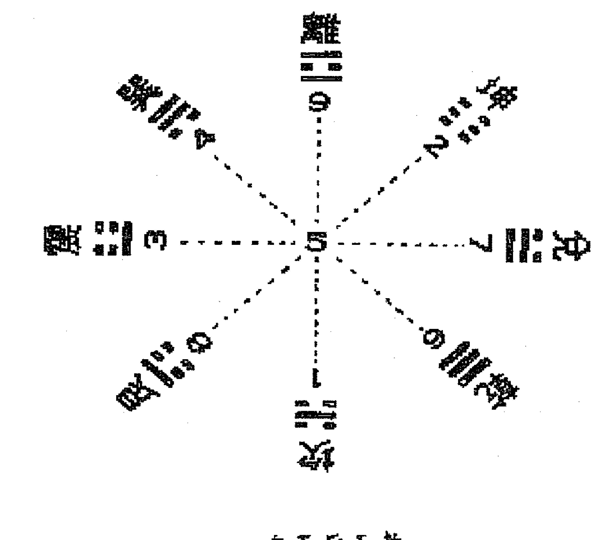

## 第二章 奇门遁甲模型的结构

八卦万物类象：

**乾卦：**

- [天时]：天、冰、雹、霰
- [地理]：西北方、京都、大郡、神胜之地、高贵之所
- [人物]：父、大人、老人、长者、宦官、名人、公门人、国家主席、总统、总经理、公务员。
- [人事]：刚健勇武、果决、多动少静
- [身体]：首、骨、肺
- [时序]：秋、九十月之交、戌亥年月之时。
- [动物]：马、天鹅、狮子、象
- [静物]：金玉、宝珠、圆物、木果、刚物、冠、镜
- [屋舍]：公厕、楼台、高堂、大厦、驿宿、西北向之居
- [家宅]：秋占宅兴隆、夏占有祸、冬占冷落、春占吉利
- [婚姻]：贵官之眷、有声名之家、秋占宜成、冬夏不利
- [饮食]：珍味、多骨、果、诸物之首、圆物、辛辣之物
- [求名]：有名、武职、掌权、驿官、宜向西北之任
- [谋望]：利公门、宜动中有财、夏不成、冬多谋少遂
- [交易]：宜金、玉珍宝珠贵货，易成，夏占不利
- [出行]：利于出行，宜人京师，利西北之行，夏占不利
- [谒见]：利见大人，有德行之人，宜见贵官，可见
- [疾病]：头面之疾，肺疾、筋骨疾、上焦疾、夏占不安
- [官讼]：利讼，有贵人助，秋占得胜，夏占失理
- [坟墓]：宜西北，宜乾山气脉，宜天穴，宜高，秋占出贵，夏占大凶
- [方道]：西北
- [五色]：大赤色、玄色
- [姓字]：带金旁姓名者、行位：一、四、九
- [数目]：先天一、后天六、五行：四、九
- [五味]：辛、辣

## 中国古代术数汇要

## 奇门遁甲应用初探

## 奇门遁甲应用初探修订版

**坤卦：**

- [天时]：阴云、雾气、冰霜
- [地理]：田野、乡村、平地、西南方
- [人物]：老母、农夫、乡人、众人、老妇人、大腹人
- [人事]：吝啬、柔顺、懦弱、众多、小人
- [身体]：腹脾、肉、胃
- [时序]：未申年月日时。
- [静物]：方物、柔物、布帛、丝绵、五谷、舆斧、瓦器
- [动物]：牛、百兽、牝马
- [屋舍]：西南方、村店、男舍、矮屋、土阶、仓库
- [家宅]：安稳、多阴气、春占宅舍不安
- [饮食]：牛肉、土中之物、甘味、野味、五谷之味、芋笋之物、腹脏之物
- [婚姻]：利于婚姻，宜田产之家、乡村之家，或寡妇之家，春占不利
- [生产]：易产，春难产，有损或不利于母，坐宜西南方
- [求名]：有名、宜西南方、农官守土之职、春占虚
- [交易]：宜利交易、宜田土交易、宜五谷利、贱货、重物、布帛、静中有财、春占不利
- [求利]：有利，宜土中之利，贱货重物之利、静中得财，春占无财，多中取利
- [谋望]：利求谋，邻里求谋，静中求谋，春占少遂，或谋于妇人
- [出行]：可行、宜西南行、宜乡里行、宜陆行，春不宜
- [谒见]：可见，利见乡人，宜见亲朋或阴人，春不宜见
- [疾病]：腹疾、脾胃之疾、饮食停滞，从而食不化
- [官讼]：理顺、得众情、讼当解散
- [坟墓]：宜向西南之穴、平阳之地、近田野、宜低葬，春不可葬
- [姓字]：带土姓人、行位：八、五、十。
- [数目]：先天八、后天二、五行：五、十。
- [方道]：西南
- [五味]：甘
- [五色]：黄、黑

## 第二章 奇门遁甲模型的结构

**震卦:**

- [天时]：雷
- [地理]：东方、闹市、大途、竹木林、草木茂盛之所
- [身体]：足、肝、发、声音
- [人物]：长男
- [人事]：起动、怒、虚惊、鼓动噪、多动少静
- [时序]：春二月、卯年月日时
- [静物]：木竹、苇、乐器（竹木）、花草繁鲜之物、核
- [动物]：龙、蛇、百虫、马鸣
- [屋舍]：东向之居、山林之处、楼阁
- [家宅]：宅中不时有虚惊，春冬吉，秋占不利
- [饮食]：啼、山林野味、鲜肉、果酸味、菜蔬、鲤鱼
- [婚姻]：可、有成、声名之家、得长男之婚，秋占不利
- [求利]：山林竹木之财、动处求财，或茶货之利
- [求名]：有名、宜东方之任、施号发令之职、掌刑狱之官、竹茶木税课之任、或闹市市货之职
- [生产]：虚惊、胎动不安、头胎必生男，坐宜向东，秋不吉
- [疾病]：足疾、肝经之疾、惊恐不安
- [谋望]：可旺、可求，宜动中谋，秋占不遂
- [交易]：利于成交，秋占难成，动而可成，山林、木竹茶货之利
- [官讼]：健讼、有虚惊、行移取甚反复
- [谒见]：可见、在宜山林之人，利见宜有声名之人
- [出行]：宜行，利东方、利山林之人，秋占不宜行、但恐虚惊
- [坟墓]：利于东向、山林中穴，秋不利
- [姓字]：带木姓人、行位：四、八、三
- [数目]：先天四、后天三、五行：三、八
- [方道]：东
- [五味]：甘、酸味
- [五色]：黑青、绿碧

**巽卦:**

- [天时]：风
- [地理]：东南方之地、草木茂秀之所、花果菜园
- [人物]：长女、秀士、寡妇之人、山林仙道之人、僧道
- [人事]：柔和、不定、鼓舞、利市三倍、进退不果
- [身体]：肱、股、气、风疾
- [时序]：春夏之交、辰巳月日时。
- [静物]：木香、绳、直物、长物、竹木、工巧之器、臬、鸡毛、帆、扇
- [动物]：鸡、百禽、山林中之禽、虫、蛇
- [屋舍]：东南向之居、寺观楼台、山林之居
- [家宅]：安稳利市，春占吉，秋占不安
- [饮食]：鸡肉、山林之味、蔬果酸味
- [婚姻]：可成、宜长女之婚，秋占不利
- [生产]：易生、头胎产女、秋占损胎、宜向东南坐
- [求名]：有名、宜文职有风宪之力、宜为风宪、宜茶果竹木税货之职、宜东南之任
- [求利]：有利三倍、宜山之利、竹货木货之利，秋不利
- [交易]：可成、进退不一、交易之利、山林交易、山林木茶之利
- [谋望]：可谋望、有财可成，秋占多谋少遂
- [出行]：可行，有出入之利，宜向东南行，秋占不利
- [谒见]：可见，利见山林之人，利见文人秀士
- [疾病]：股肱之疾、风疾、肠疾、中风、寒邪气疾
- [姓字]：草木旁姓氏、行位：五、三、八
- [官讼]：宜和、恐遭风宪之责
- [坟墓]：宜东方向、山林之穴、多树木、秋占不利
- [数目]：先天五、后天四、五行：三、八
- [方道]：东南
- [五味]：酸味
- [五色]：青绿、碧洁白

**坎卦:**

- [天时]：月、雨、雪、露、霜、水
- [地理]：北方、江湖、溪涧、泉井、卑湿之地、沟渎、池沼、有水之处
- [人物]：中男、江湖之人、舟人、资贼、匪## 第二章 奇门遁甲模型的结构

- 「人事」：险陷卑下，外示以柔，内序以利，漂泊不成，随波逐流
- 「身体」：耳、血、肾
- 「时序」：冬十一月、子年月日
- 「物」：水带子、带核之物，弓轮、矮柔之物，酒器、水具、工栋、丛棘、藜、桎梏、盐、酒
- 「动物」：猪、鱼、水中之物、狐、水族
- 「屋舍」：向北之居、近水、水阁、江楼、酒器、宅中湿地之处
- 「饮食」：猪肉、酒、冷味、海味、羹汤、酸味、宿食、鱼、带血、有带核之物、水中之物、多骨之物
- 「家宅」：不安、暗昧、防盗、匪
- 「婚姻」：利中男之婚，宜北方之婚，不利成婚，不可在辰戌丑未月婚
- 「生产」：难产有险，宜次胎，男，中男，辰戌丑未月有损，宜北向
- 「求名」：艰难，恐有灾险，宜北方之任，鱼盐河泊之职，酒兼醋
- 「求利」：有财防失，宜水边财，恐有失险，宜鱼盐酒货之利，防遗失，防盗
- 「交易」：不利成交，恐防失陷，宜水边交易，宜鱼盐货，酒之交易，或点水人之交易
- 「谋望」：不宜谋望，不能成就、秋冬占可谋
- 「出行」：不宜远行，宜涉舟，宜北方之行，防盗匪；恐遇险阻溺之事
- 「谒见」：难见，宜见江湖之人，或有水旁姓氏之人
- 「疾病」：耳痛、心疾、感染、肾疾、胃冷、水泻、涸冷之疾、血病
- 「官讼」：有阴险，有失因讼，失陷
- 「坟墓」：宜北向之穴、近水傍之墓、不利葬
- 「姓字」：点水旁之姓氏
- 「数目」：先天六、后天一、五行：一、六
- 「方道」：北方
- 「五味」：咸、酸
- 「五色」：黑

## 离卦：

- 「天时」：日、电、虹、霓、霞
- 「地理」：南方、干亢之地，窖、炉冶之所，刚燥之地，其地向阳
- 「人物」：中女、文人、大腹、目疾人、甲胄之士
- 「人事」：文化之所，聪明才学，相见虚心，书事，美丽
- 「身体」：目、心、上焦
- 「时序」：夏五月，午火年月日时。
- 「静物」：火、书、文、甲骨、干戈、槁衣、干燥之物
- 「动物」：雉、龟、鳖、蚌、蟹
- 「屋舍」：南舍之居，阳明之宅、明窗、虚室
- 「家宅」：安稳、平善、冬占不安，克体主火灾
- 「饮食」：雉肉、煎炒、烧炙之物、干脯之体、熟肉
- 「婚姻」：不成、利中女之婚，夏占可成，冬占不利
- 「生产」：易生，产中女，冬占有损，坐宜向南
- 「求名」：有名，宜南方之职，文官之任，宜炉冶场之职
- 「求利」：有财宜南方求，有文书之财，冬占有失
- 「谋望」：可谋望，宜文书之事
- 「交易」：可成，宜有文书之交易
- 「出行」：可行，宜动向南方，就文书之行，冬占不宜行，不宜行舟
- 「谒见」：可见南方人，冬占不顺，秋见文书考案才士
- 「官讼」：易散，文书动，词讼明辨
- 「疾病」：目疾、心疾、上焦病，夏占伏暑，时疫
- 「坟墓」：南向之墓，无树林之山，阳穴。夏占出文人，冬不利
- 「姓字」：带次或立人旁士姓氏，行位：三、二、七
- 「数目」：先天三、后天九、五行：二、七
- 「方道」：南
- 「五色」：赤、紫、红
- 「五味」：苦

## 艮卦：

- 「天时」：云、雾、山岚
- 「地理」：山径路，近山城，丘陵、坟墓，东北方，门阙
- 「人物」：少男、闲人、山中人、童子
- 「人事」：阻隔、守静，进退不决，反背，止住，不见
- 「身体」：手指、骨、鼻、背
- 「时序」：冬春之月、丑寅年月日时。
- 「静物」：土石、瓜果、黄物、土中之物、闾寺、木生之物、藤生之瓜
- 「动物」：虎、狗、鼠、百兽、黔喙之物、狐
- 「家宅」：安稳，诸事有阻，家人不睦，春占不安
- 「屋舍」：东北方之居，山居近石，近路之宅
- 「饮食」：土中物味，诸兽之肉，墓畔竹笋之属；野味
- 「婚姻」：阻隔难成，成亦迟，利少男之婚，宜对乡里婚，春占不利
- 「求名」：阻隔无名，宜东北方之任，宜土官山城之职。
- 「生产」：难生，有险阻之厄，宜向东北，春占有损
- 「交易」：难成，有山林田土之交易，春占有失
- 「谋望」：阻隔难成，进退不决
- 「出行」：不宜远行，有阻，宜近陆行
- 「谒见」：不可见，有阻，宜见山林之人
- 「疾病」：手指之疾，胃脾之疾
- 「官讼」：贵人阻滞，官讼未解，牵联不决
- 「坟墓」：东北之穴，山中之穴，近路旁有石，春占不利
- 「数目」：先天七、后天八、五行：五、十
- 「方道」：东北方
- 「五色」：黄
- 「五味」：甘

## 兑卦：

- 「天时」：雨泽、新月、星
- 「地理」：泽、水际、缺池、废井，山崩破裂之地
- 「人物」：少女、妾、歌妓、伶人、译人、巫师、奴仆婢
- 「人事」：喜悦、口舌、谗毁、谤说、饮食
- 「身体」：舌、口喉、肺、痰、涎
- 「时序」：秋八月，酉年月日时。
- 「静物」：金刀、金类、乐器、废物、缺器之物，带口之物，毁折之物
- 「动物」：羊、泽中之物
- 「屋舍」：西向之居，近泽之居，败墙壁宅，户有损
- 「家宅」：不安，防口舌，秋占喜悦，夏占家宅有祸
- 「饮食」：羊肉、泽中之物、宿味、辛辣之物味
- 「婚姻」：不成，秋占可成，有喜，主成婚之吉，利婚少女，夏占不利
- 「生产」：不利，恐损胎或生女，夏占不利，宜坐向西
- 「求名」：难成，因名有损，利西之任，宜刑官，武职，伶官，译官
- 「求利」：无利有损，主口舌，秋占有财喜，夏占不利
- 「谋望」：成之难，谋中有损，秋占有喜，夏占不遂
- 「出行」：不宜远行，防口舌，宜西行，秋占有利行
- 「交易」：难有利，防口舌，有竞争，秋占有交易之财，夏占不利
- 「谒见」：利行西方，见有咒诅
- 「疾病」：口舌、咽喉之疾，气逆喘疾，饮食不餐
- 「坟墓」：宜西向，防穴中有水，近泽之墓，或葬废穴，夏占不宜
- 「官讼」：争讼不已，曲直未决，因讼有损，防刑，秋占为体得理胜
- 「姓字」：带口带金字旁姓氏、行位：二、四、九
- 「数目」：先天二、后天七、五行：四、九
- 「方道」：西方
- 「五色」：白
- 「五味」：辛辣

地盘九宫在预测六亲时，父可看乾宫，母可看坤宫，长男大哥老大可看震宫，中男二哥老二可看坎宫；少男小弟老小可看艮宫；长女大姐可看巽宫，中女二姐可看离宫，少女小妹可看兑宫。

预测人体时：离为头，巽为右肩，坤为左肩，震为右肋，兑为左肋，艮为右腿，乾为左腿，坎为生殖系统部位，中宫为腹部，身体的中心部位。这种分析法是以面对面去认知一个人，如肝胆就在人体的右面，与震木相对应，而非在左面，此法符合人体的本身结构。现在有人以其“背面”来看，不符合要了解一个人、认知一个人必须要站在他的对面，面对面接触，才能看清其真实面目，而非从后面去看，不符合自然之理、人之常情！

### 第二节 人盘八门

八门在奇门遁甲中象征人盘。门为人活动出入的关口，故以开、休、生、伤、杜、景、死、惊，代表八个不同的方位。人的趋向与人事的得失，在奇门遁甲中，八门占着很重要的因素，大致以开、休、生三吉门为最吉。《烟波钓叟赋》云：“八门若遇开休生，诸事逢之总称情”。五总龟云：“得门不得奇，可用，得奇不得门不可用”。但这种观点，只是总体来讲而已。但在实际应用中，必须还要结合，旺相休囚，门迫，三奇入墓等细节来最后定夺。也要根据事情的不同性质，择取不同性质的门。如：死丧、埋葬、就不能用生门，只能用死门，讨债，打猎用伤门。总之，要依所用事情的性质，来取用符合此事性质的八门。违背事物本身与八门性质的相悖，则吉事不成甚至变凶。这就要求对八门的象意一定要了解透彻，下面具体说一下八门的象意：

- **1、开门：** 为显扬之门，乾宫之使，其星六白，天心属金。乾者，健也，乾为天行健而不息，因对宫巽木受克而杜绝，造化终无闭绝之理，闭则复开，故谓之开门。开者，辟也，主旺于秋，庚辛申酉年月日时，将兵客胜，被围突出伏匿避难。来此门者，主封赐、进献、求请、谒取、吉庆等事；出此门者，或六里六十里有人执持酒食牵牛骑马，或紫衣阴人，或四十里遇相识之人应之。

应用：宜求财、谒贵、上官、赴任、求名、应举、远行、商贾、嫁娶、造葬、移徙、开门、放水、导泉、穿井、行兵、辟地、开疆拓土，所向通达。开门驭八宫之气，以镇乾也。经云：“开门乾道利元亨，将兵远出震威声，凡百所谋无不吉，万里扬名获利行。”

预测：代表工作、官职，文官、单位、工厂、企业、公司、店铺、柜台、门面，在测诉讼中代表法官，在测汽车中可代表发动机，在测航天中，可代表飞机等。一般情况下，还可代表事情的开始、公开，人的开拓精神、开朗外向的性格等等。

静应：

- 开加开：主贵人定物财喜。
- 开加休：主见贵人财喜及开张铺店，贸易大吉。
- 开加生：主见贵人，谋望所求遂意。
- 开加伤：主变动、更改、移徙，事皆不吉。
- 开加杜：主失脱，刊印书契小凶。
- 开加景：主见贵人，因文书事不利。
- 开加死：主官司惊忧，先忧后喜。
- 开加惊：主百事不利。
- 开加戊：财名俱得。
- 开加乙：小财可求。
- 开加丙：贵人印绶。
- 开加丁：远信心至。
- 开加己：事绪不定。
- 开加庚：道路词讼，谋为两歧。
- 开加辛：阴人道路。
- 开加壬：远得有失。
- 开加癸：阴人入财小凶。

动应：

- 开加开：六里、六十里见贵人及打斗者为应。
- 开加休：一里、十一里，逢四足畜物相斗，妇人着皂衣及文人言功名事。
- 开加生：八里、十八里，逢阴人并四足物，或阳人言争产财帛事。
- 开加伤：三里、十三里，逢妇人车马，随人弄火。
- 开加杜：四里、十四里，逢阳人急唱，或僧道为应。
- 开加景：九里、十九里，逢贵人骑马坐车，或拿文书为应。
- 开加死：二里、十二里，逢老人啼哭，或开土埋葬为应。
- 开加惊：七里、十七里，逢兄妹同行为应。

- **2、休门：** 为阴气之位，坎宫之使，其星为一白，天蓬属水，坎者，陷也，居五行之首而生物，不敢与离火相敌，故曰休门。休者，美也，主冬，旺于壬子癸亥年月日时方，出此门者，无往不宜；来此门者，主有吉庆之事。出此门者，行二十里，见长吏大人或引猪羊车马等人及见跛足人，行三五十里，见蛇属水中等物。

应用：宜上表章、选将、兴师、安营、上官、赴任、谒贵、应举、迁移、嫁娶、求财、远行、商贾、修造、竖柱、安息、休兵，凡举百事，皆宜休门，驭二宫之气，以镇坎也。经云：“休门坎德万事宁，出师大利出门行，三奇之下引兵出，神道昭彰效助灵。”

预测：代表公门人、坐办公室的人、迎来送往的人，事务工作者，休闲人，离休、退休人员、修心养性者、休门也主退缩、停止、在测婚姻中可代表婚姻、家庭，出行乘船可代表水路。一般情况下可代表事情的休止，一个人善于处理上下左右的关系，性格闲散，或贪玩，懒惰等等。

静应：

- 休加休：求财、进人口、谒贵吉，朝见、上官、修造、大利。
- 休加生：主得阴人财物。干贵谋望，虽迟应吉。
- 休加伤：主上官、吉庆，求财不得。有亲故分产。变动事不吉。
- 休加杜：主破财，失物难寻。
- 休加景：主求望文书印信事不至，反招口舌小凶。
- 休加死：主求文书印信官司事，或僧道，远行事，不吉，占病凶。
- 休加惊：主损财、招非并疾病、惊恐事。
- 休加开：主开张店肆及见贵、求财、喜庆事，大吉。
- 休加戊：财物和合。
- 休加乙：求谋重，不得；求轻，可得。
- 休加丙：文书和合喜庆。
- 休加丁：百讼休歇。
- 休加己：暗昧不宁。
- 休加庚：文书词讼先结后解。
- 休加辛：疾病退愈，失物不得。
- 休加壬：阴人词讼牵连。
- 休加癸：阴人词讼牵连。

动应：

- 休加休：一里或十一里，逢青衣夫妻歌唱为应。
- 休加生：八里或十八里，逢妇人下黑土黄土或皂衣公吏人。
- 休加伤：三里或十三里，逢匠人拿木棍或皂衣公吏人。
- 休加杜：四里或十四里，逢青衣妇人拉或抱孩童边走边唱。
- 休加景：九里或十九里，逢皂衣公吏人骑骡马或乘车。
- 休加死：二里或十二里，逢孝服人哭泣，更有绿衣人相伴。
- 休加惊：七里或十七里，逢皂衣人打足，妇人拉、抱孩童。
- 休加开：六里或十六里，逢人打架叹气，畜物争斗。

- **3、生门：** 为通泰之门，艮宫之使，其星八白，天任属土。艮者，止也，天地生物之化育，不能终止，终止则复生，生而不息，故谓之生门。

生者，育也，主旺于四季，戊己辰戌丑未年月日时，将兵从生门引兵而击死，百战百胜。来此门者，主进献、归投、吉庆等事；出此门者，行八里见贵人乘马或遇公司官吏之人应之。

应用：宜兴兵、发令、上官、赴任、造葬、婚姻、入宅、归伙、求财、博戏、应举、求名、远行、商贾、交易、经营、修方，凡举百事所向，皆得。生门驭三宫之气，以镇艮也。经云：“生门仁德阳气生，惟宜百事好经营，上书献贡奇门吉，所向之星甚协情。”

预测：代表房屋、土地、钱物，银行，财务，在测财中可代表财运、产业、资产、房屋、阳宅、生意、利息、利润等，在测病中用神临生门，代表身体没问题，或可起死回生。一般情况下，可代表活着的人，有生气的人，性格生龙活虎的人，或从事农业、种植业、养殖业的人等等。

静应：

- 生加生：主远得、求财吉。
- 生加伤：主亲友变动，道路不吉。
- 生加杜：主阴谋，阴人破财，不利。
- 生加景：主阴人、小口不宁及文书事后吉。
- 生加死：主田宅官司，病主难救。
- 生加惊：主尊长财产、词讼，病迟愈，吉。
- 生加开：主见贵人，求财大发。
- 生加休：主阴人处求望财利吉。
- 生加戊：嫁娶、求财、谒贵皆吉。
- 生加乙：主阴人生产迟吉。
- 生加丙：主贵人印绶、婚姻、书信喜事。
- 生加丁：主词讼、婚姻、财利大吉。
- 生加己：主得贵人维持吉。
- 生加庚：主财产争讼破产，不利。
- 生加辛：主官事、疾病后吉。
- 生加壬：主遗失财后得，盗贼易获。
- 生加癸：主婚姻不成，余事皆吉。

动应：

- 生加生：八里或十八里，逢朱衣贵人。
- 生加休：一里或十一里，逢皂衣人及扛钱人。
- 生加伤：三里或十三里，逢公吏人持棍，或培土栽树。
- 生加杜：四里或十四里，逢人拿彩色物品边走边唱并长叹息人。
- 生加景：九里或十九里，逢贵人车马多人相随。
- 生加死：二里或十二里，逢孝服人哭泣。
- 生加惊：七里或十七里，逢人赶畜，及有人讲诉讼事情。
- 生加开：六里或十六里，逢贵车马并有蛇咬猪者。

- **4、伤门：** 为六害之门，震宫之使，其星三碧，天冲属木，震者，动也，动而受兑金之克，故曰伤门。伤者，损也，主旺于春，甲乙寅卯年月日时，将兵出战，士卒恐怖，只宜固守。来此门者，主有凶恶争斗、损害等事；出此门者，三十里或三里见损伤之物或争斗、血光之人或扭猪、产妇、犬吠、牛鸣、小人交争应之。

应用：宜捕捉、征伐、索债、博戏、求神、筌鱼蹄兔、收货、兴讼，伤门驭四宫之气，以镇震也。经云：“伤门震位恐惊危，万里闻声人惧威，将兵出战多忧虑，涉猎丛中得获归。”

预测：代表公安刑警、讨债人、竞争对手、代表汽车、船只、司机、代表伤心、伤灾、伤害、受伤者、身体受伤部位、伤门在震宫也主变动。

静应：

- 伤加伤：主变动、远得折伤，凶。
- 伤加杜：主变动、失脱、官司桎梏，百事皆凶。
- 伤加景：主文书印信、口舌，动挠啾唧。
- 伤加死：主官司印信凶，出行大忌，点病凶。
- 伤加惊：主亲人疾病忧惧，媒伐不利，凶。
- 伤加开：主贵人开张有走失变动之事，不利。
- 伤加休：主阳人变动，或托人谋干财名不利。
- 伤加生：主房产，种植事业，凶。
- 伤加戊：主失脱难获。
- 伤加乙：主求谋不得，反防盗失财。
- 伤加丙：主道路损失。
- 伤加丁：主音信不实。
- 伤加己：主财散人死。
- 伤加庚：主讼狱被刑杖，凶。
- 伤加辛：主夫妻怀私恣怨。
- 伤加壬：主因盗牵连。
- 伤加癸：讼狱被冤，有理难伸。

动应：

- 伤加伤：三里或十三里，逢二车堵塞道路争行。
- 伤加杜：四里或十四里，逢公吏人及木匠伐树，并有妇人抱小儿经过。
- 伤加景：九里或十九里，逢色衣人骑骡马坐车经过。
- 伤加死：二里或十二里，逢埋葬及孝服人哭泣。
- 伤加惊：七里或十七里，逢人争斗及赶牲畜，并有妇人与少女同行。
- 伤加开：六里或十六里，逢人拆墙安门解板或二猪相咬。
- 伤加休：一里或十一里，逢老妇与少男同行。
- 伤加生：八里或十八里，逢人伐树或培土。

- **5、杜门：** 为闭塞之门，巽宫之使，其星四绿，天辅属木，巽者，入也，受乾金对宫之克，敛迹退藏以避之，故曰杜门。杜者，绝也，主旺于甲乙寅卯年月日时，将兵不宜出战，只宜固守及邀截、隐匿。来此门者，主抑塞耗失忘命追寻之事；出此门者，四十里或四里，见修筑、惊惶之事，或见凶恶之人，或暴风急雨应之。

应用：宜隐伏、讨逆、诛戮凶暴、判决、刑狱、填塞坑坎、邀截道路，不利兴兵征伐，宜坚壁固守，凡举百事俱凶。杜门驭九宫之气，以镇巽也。经云：“杜门之下阴气蒙，误行其下妄西东，不宜举兵征战事，只宜固守待时通。”

预测：代表武官、军警单位、保密单位，代表躲藏之处，代表闭塞不通、血栓、梗塞、中风，代表性格内向，代表技术人员，杜门临巽宫主经络、主风、主气，因而也可代表修练之人、闭关者，深山修真者、测运气逢杜门多时运不通。

静应：

- 杜加杜：主因父母疾病，田宅出脱，事凶。
- 杜加景：主文书印信阻隔，阳人小口疾病。
- 杜加死：主田宅文书失落，官司破财，小凶。
- 杜加惊：主门户内忧疑惊恐，并有词讼事。
- 杜加开：主见贵人官长，谋事主先破己财后吉。
- 杜加休：主求财有益。
- 杜加生：主阳人小口破财及田宅，求财不成。
- 杜加伤：主兄弟相争田产，破财。
- 杜加戊：主谋事不成，密处求财得。
- 杜加乙：主宜暗求阳人财物，得主不明至讼。
- 杜加丙：主文契遗失。
- 杜加丁：主阳人入狱。
- 杜加己：主私害人招非。
- 杜加庚：主因女人讼狱被刑。
- 杜加辛：主打伤人，词讼阳人小口凶。
- 杜加壬：主奸盗事，凶。
- 杜加癸：主百事皆阻，病者不食。

动应：

- 杜加杜：四里或十四里，逢妇人引孩子童着绿衣。
- 杜加景：九里或十九里，逢孕妇着色衣或公吏人骑赤马或坐红车。
- 杜加死：二里或十二里，逢丧服人哭泣。
- 杜加惊：七里或十七里，逢人唱歌、锣声或有人讲公讼事。
- 杜加开：六里或十六里，逢人唱歌及狗咬猪。
- 杜加休：一里或十一里，逢唱戏或皂衣人抱孩童。
- 杜加生：八里或十八里，逢人扛钱或手拿食物并唱歌。
- 杜加伤：三里或十三里，逢木匠拿着木棍。

- **6、景门：** 为进奏之门，离宫之使，其星九紫，天英属火。离者，丽也，因对坎水涵太阳日精，重明丽于天中，化生万物之故，故谓之景门。景者，大也，主旺于丙丁巳午年月日时，将兵量敌而进，破围突阵不凶。来此门者，主上书、索债、争婚、论讼等事，出此门者，或九十里九里见惊恐盗贼火光失物，或有风雨疾病中途逢劫，或见蛇火，或见罪人应之。

应用：宜求贤、访士、上书、献策、受道、学业、觅职、求官。景门驭一宫之气，以镇离也。经云：“景门离九正当阳，上书献策出其方，突阵破围进士卒，于是随之道不祥。”

# 奇门遁甲应用初探修订版

预测：代表光明、风景、图画、计划、规划、技术指导、文章、考卷、文书、合同、起诉书、状纸、消息、信息、口舌，还可代表宴席、酒店、饮酒、酒量，代表火器、枪支、流血、血光、火光、火灾，出行代表旱路、道路等。

#### 静应

- 景加景：主文状未动有预先见之意，内有小口忧患。
- 景加死：主官讼，因田宅事争竞啾唧。
- 景加惊：主阳人小口疾病事凶。
- 景加开：主官人升迁，吉；求文印更吉。
- 景加休：主文书遗失，争讼不休。
- 景加生：主阴人生产大喜，更主求财旺利，行人皆吉。
- 景加伤：主姻亲和着小口口舌。
- 景加杜：主失脱文书，散财后平。
- 景加戊：主因财产词讼。远行吉。
- 景加乙：主讼事不成。
- 景加丙：主文书急迫火速不利。
- 景加丁：主因文书印状招非。
- 景加己：主官事牵连。
- 景加庚：主讼人自讼。
- 景加辛：主阴人词讼。
- 景加壬：主因贼牵连。
- 景加癸：主因奴婢刑。

#### 动应

- 景加景：九里或十九里，逢人抱文书，更有火光惊恐。
- 景加死：二里或十二里，逢孝服人哭泣，色衣人骑马或坐车。
- 景加惊：七里或十七里，逢争讼争斗，宜避之。
- 景加开：六里或十六里，逢人成队行走，官人骑马。
- 景加休：一里或十一里，逢女人哭泣，与卖鱼人并行。
- 景加生：八里或十八里，逢小儿赶牛，人背钱以袋和箱装之。
- 景加伤：三里或十三里，逢色衣女人坐车或乘骡马。
- 景加杜：四里或十四里，逢老少女领黑衣童孩行。

7、死门：为刑戮之门，坤宫之使，其星为二黑，天芮属土，坤者，顺也，因与艮土对待复生，有生则有死，故曰死门。死者，终也，主旺于四季，辰丑未戌戊己年年月日时，将兵对敌，背生击死则获大胜。来此门者，报仇、行间、设伏、争斗，主有凶恶等事，宜谨防之。出此门者，行三五十里，牛骡骑犊血光死伤或逢丧葬之事，二十里见哭泣或疾病皂衣人或枷锁重囚应之。
应用：宜启攒、安葬、攻城、行刑、诛戮、射猎、筌鱼、网兽、开田、修路、塞水、填基，余事不宜。出师失律，损将折兵，经曰：“死门坤道更得灵，误行其下定无魂，只有送犯临兹吉，若为他事不堪论。”
预测：在测工作中可代表屠户、猎户、行刑之人、吊丧之人、救死扶伤的医务人员，从地理上可代表地皮、地基、坟墓、阴宅，一般情况还可代表死人、死尸、死肉、坏组织、疤痕、锁，或性格死气沉沉，死板固执，或心里不痛快，生闷气或事业不顺利，处于低潮，受困状态等等，死门也可代表痴呆、傻子。

#### 静应

- 死加死：主官而留，印信无气，凶。
- 死加惊：主因官司不给，忧疑患病，凶。
- 死加开：主见贵人，求印信文书事大利。
- 死加休：主求财物事不吉，若问生道求方吉。
- 死加生：主丧事，求财得，占病死者复生。
- 死加伤：主官事动而被刑杖，凶。
- 死加杜：主破财，妇人风疾，腹肿。
- 死加景：主因文契印信财产事见官，先怒后喜，不凶。
- 死加戊：主作伪财。
- 死加乙：主求事不成。
- 死加丙：主信息忧疑。
- 死加丁：主老阳人疾病。
- 死加己：主病讼牵连不已，凶。
- 死加庚：主女人生产，母子俱凶。
- 死加辛：主盗贼失脱难获。
- 死加壬：主讼人自讼自招。
- 死加癸：主嫁娶事凶。

#### 动应

- 死加死：二里或十二里逢妇人哭泣，凶。
- 死加惊：七里或十七里，逢丧哭泣或死畜物类。
- 死加开：六里或十六里，逢开坟、哭泣或是见畜类争斗。
- 死加休：一里或十一里，逢青衣妇人哭泣。
- 死加生：八里或十八里，逢孝子拿生物大恸。
- 死加伤：三里或十三里，逢人抬棺材。
- 死加杜：四里或十四里，逢埋葬及纸扎彩色物。
- 死加景：九里或十九里，逢重孝人哭泣，退吉进凶。

8、惊门：惊门为奸谋之门，兑宫之使，其星七赤，天柱属金。兑者，悦也，因对震宫而感动，故谓之惊门。惊者，骇也，主旺于秋，庚辛申酉年月日时。将兵主士卒有惊伤、败亡、攻劫之虞。来此门者，主惊走、失逃、诡诈、虚惊，凶逆之事；出此门者，行七里见大惊小怪之事，或阴人、道路阻隔、车伤马骤、鸦鸣、雀噪应之。
应用：宜捕捉盗贼、斗讼、恐惑乱众，虚诈诡谲、攻击伏兵，利于西方，凡百举事，忧祸随之。惊门驭六宫之气，以镇兑也。经云：“惊门出入心不安，明中说事审其端，宜获奸人谋异事，顺天掩捕不为难。”
预测：代表官司、诉讼、口舌是非，律师，也可代表外交官、教师、歌星、言官，纪检、监察部门工作人员等，还可代表受惊、惊慌、惊恐不安、担惊受怕等状态。惊门在兑宫也主毁折、残缺。

#### 静应

- 惊加惊：主疾病、忧疑、惊疑。
- 惊加开：主忧疑、官司、惊恐，又主上见喜，不凶。
- 惊加休：主求财事或因口舌求财事迟吉。
- 惊加生：主因妇人生忧惊，或因求财生忧惊，皆吉。
- 惊加伤：主因商议同谋害人，事泄惹讼，凶。
- 惊加杜：主因失脱破财惊恐，不凶。
- 惊加景：主词讼不息，小口疾病，凶。
- 惊加死：主因宅中怪异而生是非，凶。
- 惊加戊：主损财，信阻。
- 惊加乙：主谋财不得。
- 惊加丙：主文书印信惊恐。
- 惊加丁：主词讼牵连。
- 惊加己：主恶犬伤人成讼。
- 惊加庚：主道路损折、贼盗，凶。
- 惊加辛：主女人成讼，凶。
- 惊加壬：主官司囚禁，病者大凶。
- 惊加癸：主被盗，失物难获。

#### 动应

- 惊加惊：七里或十七里，逢二女吵闹，傍人说打官司事。
- 惊加开：六里或十六里，逢官吏役人争讼。
- 惊加休：一里或十一里，逢青衣妇人说官司。
- 惊加生：八里或十八里，逢女人引孩童赶牛，小儿拿吃的东西。
- 惊加伤：三里或十三里，逢男女吵闹，打孩子，宜退不宜进，若强进有车折马死，凶。
- 惊加杜：四里或十四里，逢僧道同行或男女相商。
- 惊加景：九里或十九里，逢色衣妇人说官司。
- 惊加死：二里或十二里，逢女人哭泣及丧亡事情。

#### 八门路应

- 休门：三十里逢阴人，身着黄蓝及碧青。
- 生门：十五里逢官吏，贵人着皂紫衣襟。
- 伤门：三十里逢争讼，凶人着紫血光腥。
- 杜门：四十里男女辈，绢褐随人从路行。
- 景门：三十里鸦噪鸣，官府相从六畜悖。
- 死门：二十里逢疾病，黄皂衣人宴会行。
- 惊门：七里里逢险阻，车马桥梁见失惊。
- 开门：二十里阴人至，贵人乘马紫衣巾。

# 第二章 奇门遁甲模型的结构

### 第三节 天盘九星

九星为北斗星群。天蓬（贪狼）、天芮（巨门）、天冲（摇光）、天辅（开阳）、天禽（玉衡）、天心（天权）、天柱（天机）、天任（天璇）、天英（天枢）。
我们现在能肉眼看到的北斗星只有七个，摇光、开阳、玉衡、天权、天机、天璇、天枢，另两颗随着天体的运转，斗转星移，慢慢地隐去。
北斗道家称谓天罡，对于北斗七星自古以来，道家对其特别重视。如道家的踏罡布斗，其实也是一种天人合一的方法。
奇门遁甲中的九星象征天时，在主客的区分上以天盘九星为客，地盘九星为主。下面具体说下九星的象意。
天蓬：天蓬星宜安守边寨、修筑城池、屯兵固守、开穴造葬、移徙，主火灾、营造、损胎孕、争斗、见血光、上任、多盗贼，春夏吉，秋冬不利，又为贪狼星也，与北方一宫坎卦相对应。歌云：“讼庭争竟遇天蓬，胜捷名威万里同。春夏用之皆为吉，秋冬用之半为凶。嫁娶远行皆不利，修造埋葬亦间空。须得生门同丙乙，用之万事皆昌隆。”天蓬为水贼，所入之宫不宜嫁娶、营造、搬迁等，但如遇生门并合丙奇、丁奇，则可用无妨。春夏可用，秋冬助水之势，不可用。
天任：宜安邦、建邑、选将、出兵、婚嫁、上官、商贾、求谋、造葬、修方、应试、求名、谒贵，四时吉，又为左辅星，与东北八宫艮卦相对应，诗曰：“天任吉星事皆通，祭祀求官嫁娶同。斩绝妖蛇移徙事，商贾造葬喜重重”。天任为富室，求官、嫁娶、迁徙、经商，诸事皆吉。百事皆吉，四时皆宜。
天冲：宜选将、出师、交锋、战阵、报仇、捕贼、探围、射猎，余事不利，春夏吉，又为禄存星，与东方三宫震卦相对应。诗曰：“嫁娶安营产女惊，出行移徙有灾难。修造葬埋皆不利，万般作为且逡巡”。天冲为雷神、天帝、武士，宜出军报仇雪耻，征伐交战，鸣金击鼓，摇旗呐喊。不宜嫁娶、修造、迁徙、经商。有慈心造化助人为乐之德，并与农事活动有关。
天辅：宜选将、求贤、交锋、破阵、得地千里、造葬、婚姻、娶嫁、应举求名、商贾交易、修道、设教、移徙、营建，春夏吉，又为文曲星，与东南四宫巽卦相对应。诗曰：“天辅之星远行良，修造埋葬福绵长。上官移徙皆吉利，喜溢人财百事昌”。天辅为草为民，宜远行、起造、移徙、婚娶、埋葬、请客。特别利于升学考官，发展文化教育事业。
天禽：中宫土也，主旺于四季辰戌丑未年月日时，将兵交锋，大战报捷，开疆展土，四时皆利，自有百灵相助，宜祭祀、求福、除邪、祛凶、赏功、封爵、上官、赴任、选举、求名、移徙、竖柱、修造、求财、交易、宴会、上书、献册、入官、伏罪、谒贵。经云：“天禽之宿是廉贞，万事为之福自臻，大将出师先报捷，封疆化雨及斯民。”加三四宫利为客，一宫利为主，四季吉，又名廉贞星，与中央五宫相对应。天禽远行偏得利，坐贾行商皆称意。投谒贵人俱益怀，修造埋葬都丰裕。天禽代表中宫，是遁甲元帅值符所在之地。为巫为工，宜远行、做生意、埋葬、修造、见贵。天禽星临宫，百事皆宜，四时皆吉。
天英：宜面君、谒贵、上书、献册、干求、升擢、宴会，余事不宜。夏吉，又为右弼星，与南方九宫离卦相对应。天英之星居离宫之位，烈火炎炎，性躁易暴，虽如日中天，大放光明，但和血光之灾有关。嫁娶凶，诗曰：“远行移徒不宜逢，上官商贾凶败死，造作求财一場空。”天英为炉火为残患，宜于谋划献策、面君谒贵，不宜求财考官。
天芮：宜屯兵、固守、训练士卒、受业、修道、交易、田产、安葬、招贤、结友、驱邪、治病，四时皆吉，又为巨门星也，与西南方二宫坤卦相对应。诗曰：“天芮授道结交宜，行方值之最不吉。出行用事皆宜退，修造安坟祸难测。贼盗惊惶忧小口，更有官事被官责。纵得奇门从此位，求其吉事皆虚伪。”天芮为教师、朋友，故宜受道结交友，受业师长、屯兵固守，不宜用兵交战。不宜嫁娶、迁徙、诉讼、营造，即使得奇门，也难为吉。天芮为土星，秋冬用之吉，春夏用之凶。
天柱：宜固守、屯兵、修筑莹垒、训练士卒、赡养锐气、修造、祭祀、隐迹、埋形，余事不宜，秋冬吉，又为破军星，与西方七宫兑卦相对应。诗曰：“天柱藏形谨守宜，不须远行及营为，商贾百事皆不利，动作立刻见凶危。”天柱当金秋肃杀之气，喜杀好战，与惊恐怪异、破坏毁折有关。为隐士，宜隐迹固守，不宜出行谋事，一切所为皆不吉。宜于训练士卒、屯兵固守，不宜出战交兵、经商远行，强行则车破马伤、士卒败亡、破财折本，意久伤灾。
天心：宜选将、出师、扬威、布阵、捣巢、破敌、展土、开边、求仙、访道、合药、治病、入官、见贵、求名、移徙、商贾、远行、营建，秋冬吉，春夏凶，又为武曲星，与西北方六宫乾卦相对应。诗曰：“天心求仙合药当，商途客旅财禄昌。主将迁葬皆吉利，万事欣逢尽高强”。天心星与乾卦相对应，因为乾为天、为父，故此心长于心计，和领导才能、军事指挥、医疗疾病有关，故天心为高道、为名医，宜治病服药、练气功、经商、迁徙、埋葬。秋冬吉，春夏凶。

### 第四节 神盘 宇宙中一种神秘的力量

神盘古人也称做八诈盘。六爻纳甲里有六神、六壬有十二神、奇门则有八神。八神之所以称做“神”，是古人以此来代表宇宙天地之中存在着一种目前还无法真正认识到的神秘场能，这种“看不见”的“炁”对人有着重要的影响。八神的象意如下：
值符：禀东方木，为天乙之神，诸神之首，所到之处，百恶消散，但忌庚金七杀。在物品中代表高档货物、真品、精品、名品。在单位人事上代表领导、一把手。值符还可作为顶头上司、监考官、裁判、原告、放债人、银行、行情，在战争时可代表守方等。事急可从值符所进临之方出，这就是所谓“急则从神”的说法。
螣蛇：虚诈之神，此门多出怪异、恍惚不明之事，须得奇门会合之方，则不忌。禀南方火，为虚诈之神。性柔而口毒，司惊恐怪异之事。出螣蛇之方主精神恍惚、恶梦惊悸，如果问病可能是受惊吓，夜多噩梦，又可能被疾病困扰，久治不愈。另外，当预测一个的喜好时，如果此人上乘螣蛇的话，则表示他可能对神秘文化感兴趣，或是信仰佛道，或喜欢易学文化等等。
太阴：阴佑之神，可以履符禁敌、闭戊藏兵，有急难宜从此方避之，可免其患。可以密谋策划、避难。用神如果上乘太阴的话，表示可能有贵人暗中相助，或暗中策划。
六合：护卫之神，可以埋伏、提防不测，人有急难，宜从此方而隐之，可免其患。六合之方宜婚娶、避害。六合代表中介人、婚姻、经纪人、行人走失方向、逃犯等。
白虎（勾陈）：禀西方之金，为凶恶刚猛之神。性好杀，司兵戈、争斗、杀伐、病死、交通事故等。勾陈之方须防敌方偷袭。得奇门无忌。白虎下隐有勾陈，勾陈具有地户己土性质，己土长生在酉，故隐于白虎之下。另外，如果用神临吉星、吉门、吉格，而又上乘白虎的话，则可以作为吉神来用，表示此人长得白，性格刚烈，有威严，有能力等。
玄武（朱雀）：禀北方水，为奸谗小盗之神。性好阴谋贼害，司盗贼逃亡口舌之事。玄武下隐有朱雀，朱雀原来属南方火神，但北方玄武子水之位，正是丙火怀胎之地，故朱雀隐于玄武之下，朱雀之方须提防奸细盗贼。得奇门则无妨。玄武主男女暧昧之事（包括偷情），如果用玄武来代表物品，则可能是腐烂变质或假冒伪劣商品；如果来代表人的话，则此人可能喜欢暗中行事，或是贪污盗窃犯、行贿受贿，或是拈花惹草、风流放荡之人。但如果用神临吉星、吉门、吉格而却上乘玄武的话，则表示此人除有原则性以外，还具有头脑灵活的一面，处理事情必然会上下有情，内外称意。玄武主要是用来代表小偷小摸、小贪污犯的用神符号。
九地：坚固之神，可以屯兵、固守、保障城池，孙子曰：善守者，藏于九地之下也。坤土之象，具有坤土的性质，有厚载之德，故为万物之母。为坚牢之神，时间很长的意思，性柔好静，滋生万物。九地之方，可以屯兵固守、坐地经商、搞房地产、播种养殖。
九天：威悍之神，可以扬兵、布阵、呐喊摇旗，孙子曰：善攻者，动于九天之上也。乾金之象，为天为父，万物之父。古人称为威悍之神，性格刚强好动。九天之方，可以扬兵布阵、行军打仗、坐飞机。用神上乘九天吉神，可以主动出击，大展宏图。

### 第五节 十天干

在奇门遁甲中，因甲遁于六仪之下，实际只有九天干，十天干以戊、己、庚、辛、壬、癸、丁、丙、乙为次序。在确定的用局地盘九宫中，阳遁顺布，阴遁逆布。地盘与天盘的奇仪相加相遇，则代表天地之气相交后产生的另一种气场变化。
十天干的象意：
甲：阳木，为青龙，为天福神（王文卿）。阳阴二遁，凡事遇之皆为上吉。补遗、远行、谒见贵人、求官、商贾吉，战利客，不宜嫁娶、移徙。阳星吉，阴星不利。伏吟不忌，闻事不实。甲遁于六仪之下，显示甲为至尊至贵之神，预测中代表领导、上司、权威之人、贵人。
戊：阳土，为天门，为天武神（司马羊）。利远行、用兵，不宜上官、商贾。此时闻吉实、凶虚。预测中代表投资的资本、钱财、银行、会计、阳宅、地产、土地、陶瓷品，人体代表胃。
己：阴土，为地户，为明堂神（纪游卿）。宜上官、迁调，利阴私、密图。此时闻吉虚，凶实。预测中代表垃圾、一切肮脏的东西、库房、坟墓、阴沟、下水道、私欲、贪婪。人体代表脾。
庚：阳金，为白虎，为天狱神（郭阳之）。诸事不宜，兵惟固守。在预测中代表仇人、临天蓬为黑社会、敌方、凶犯、丈夫、男朋友、刀、剑、大道、阻力、压力，人体代表大肠。
辛：阴金，为天庭，又为天庖神（高子强）。行军主胜，上官先吉后凶，诸事不宜，闻忧喜平平。在预测中代表冶金、轧钢厂、炼钢厂、有色金属、耳环、项链、戒指、珠宝、玉器，也代表犯过错误的人、罪人，人体代表肺，辛也主颗粒之物。
壬：阳水，壬为天牢神（王禄卿）。诸事不宜，闻忧喜俱虚。在预测中代表牢狱、壬主水、水主动、饮水机、河、水管、湖泊、人员流动的地方、车站、人才市场，人体代表肾脏、眼睛、痣。
癸：阴水，癸为天藏（爱子强），又为天网。诸事不宜，只宜隐迹埋名、求仙。丁己癸三干临六合宫，宜逃亡；临太阴宫，宜伏藏；临九地，宜屯守。此乃善用癸者，克天网之咎，此时闻事并虚。在预测中代表困境、牢狱、下水道、脏水、池子、井，人体代表肾脏系统，癸可代表现在的网络。
丁：阴火，丁星奇，为玉女，又为太阴（天女神季游卿），三奇中最灵者。宜入市、逃亡、隐匿，不宜用兵。此时闻忧虚，喜实。为玉女。预测中代表少女、婚姻中代表男方的第三者、情人、丁字路、十字路口、针、刺、钥匙、蜡烛、打火机、香火、代表眼睛、手术刀、文章、文字、证件、签证，人体代表心脏。
丙：阳火，为月奇，天威神（杜仲卿）。吉星临之，无库墓、无受制，可用。此时闻喜实，闻忧虚。预测中代表丙火是阳干，乙奇是阴干，丙火是太阳之火、暴烈之火、中午之火，太阳正好到中午的火，太阳是万物的生杀权柄，战争中代表火炮、导弹、重型武器，测人临丙不怒而威。婚姻方面则代表女方的第三者、情人、丙为乱子、炎症、发烧、电视机、电脑、摄像机、复印机、音箱，人体代表小肠。
乙：阴木，乙日奇，天德神（龙文卿）。宜移徙、上官、交易，不宜行威。此时闻事不实。预测中代表妻子、女朋友、中药、医生、花草、椅桌、拐弯处，人体代表胆、肩。

#### 十干克应

戊加戊：甲甲比肩，名为伏吟，遇此，凡事不利，道路闭塞，以守为好。
戊加乙：甲乙会合，因此甲乙均位于东方青龙之位，所以青龙和会，门吉事也吉，门凶事也凶。
戊加丙：因青龙甲木生助丙火，故为青龙返首，为事所谋，大吉大利。若逢迫墓击刑，吉事成凶。
戊加丁：因甲木青龙生助丁火，故为青龙耀明，宜见上级领导、贵人、求功名，为事吉利，若值墓迫，招惹是非。
戊加己：因为戊为戊土之墓，故为贵人入狱，公私皆不利。
戊加庚：因值符甲最怕庚金克杀，故为值符飞宫，吉事不吉，凶事更凶，求财没利益，测病也主凶。同时，甲庚相冲，飞宫也主换地方。
戊加辛：因辛金克甲木，子午相冲，故为青龙折足，吉门有生助，尚能谋事，若逢凶门，主招灾、失财或有足疾、折伤。
戊加壬：因壬为天牢，甲为青龙，故为青龙入天牢，凡阴阳事皆不吉利。
戊加癸：因甲为青龙，癸为天网，又为华盖，故为青华盖，又戊癸相合，故逢吉门为吉，可招福临门，逢凶门者事多不利，为凶。
乙加戊：乙木克戊土，为阴害阳门（因为戊为阳为天门），利于阴人、阴事，不利阳人、阳事，门吉尚可谋为，门凶、门迫则破财伤人。
乙加乙：乙乙比肩，为日奇伏吟，不宜见上层领导、贵人，不宜求名求利，只宜安分守己为吉。
乙加丙：乙木生丙火，为奇仪顺遂，吉星迁官晋职，凶星夫妻反目离别。
乙加丁：为奇仪相佐，最利文书、考试，百事可为。
乙加己：因戊为乙木之墓，故为日奇入墓，被土暗昧，门凶事必凶，得生、开二吉门为地遁。
乙加庚：庚金克刑乙木，故为日奇被刑，为争讼财产，夫妻怀有私意。
乙加辛：乙为青龙，辛为白虎，乙木被刑金冲克而逃，故为青龙逃走，人亡财破，奴仆拐带，六畜皆伤。测婚为女逃男。
乙加壬：为日奇入地，尊卑悖乱，官讼是非，有人谋害之事。
乙加癸：为华盖逢星，遁迹修道，隐匿藏形，躲灾避难为吉。
丙加戊：甲为丙火之母，丙火回到母亲身边，好似飞鸟归巢，故名鸟跌穴，百事吉，事业可为，可谋大事。
丙加乙：为日月并行，公谋私为皆为吉。
丙加丙：为月奇悖师，文书逼迫，破耗遗失，主单据票证不明遗失。
丙加丁：为星奇朱雀，贵人文书吉利，常人平静安乐，得三吉门为天遁。
丙加己：因丙火入戊墓，故为火悖入刑，囚人刑杖，文书不行，吉门得吉，凶门转凶。
丙加庚：为荧入太白，门户破败，盗贼耗失，事业亦凶。
丙加辛：因丙辛相合，故为谋事能成，为疾病人不凶。
丙加壬：为火入天罗，壬水冲克丙火，故为客不利，是非颇多。
丙加癸：为华盖悖师，阴人害事，灾祸频生。
丁加戊：为青龙转光，官人升迁，常人威昌。
丁加乙：为人遁吉格，贵人加官晋爵，常人婚姻财帛有喜。
丁加丙：为星随月转，贵人越级高升，常人乐里生悲，要忍，不然因小的不忍而引起大的不幸。

## 第二章 奇门遁甲模型的结构

丁加丁：为星奇入太阴，文书证件即至，喜事从心，万事如意。

丁加己：因戊为火库，己为勾陈，故为火入勾陈，奸私仇冤，事因女人。

丁加庚：丁为文书，庚为阻隔之神，故为文书阻隔，行人必归。

丁加辛：为朱雀入狱，罪人释囚，官人失位。

丁加壬：因丁壬相合，故主贵人恩诏，讼狱公平，测婚多为苟合。

丁加癸：癸水冲克丁火，为朱雀投江，文书口舌是非，经官动府，词讼不利，音信沉溺不到。

己加戊：因戊为犬，甲为龙，故为犬遇青龙，门吉为谋事遂望意，上人见官；若门凶，枉费心机。

己加乙：因戊为乙木之墓，己又为地户，故名墓神不明，地户逢星，宜遁迹隐形为利。

己加丙：为火悖地户，男人冤冤相害，女人必致淫污。

己加丁：因戊为火墓，故名为朱雀入墓，文书词讼，先曲后直。

己加己：名为地户逢鬼，病者发凶或必死，百事不遂，暂不谋为，谋为则凶。

己加庚：名为刑格返名，词讼先动者不利，如临阴星则有谋害之情。

己加辛：名为游魂入墓，易遭阴邪鬼魅作祟。

己加壬：名为地网高张，狡童佚女，奸情伤杀，凶。

己加癸：名为地刑玄武，男女疾病垂危，有囚狱词讼之灾。

庚加戊：庚金克甲木，谓天乙伏宫，百事不可谋，大凶。

庚加乙：为太白逢星，退吉进凶，谋为不利。

庚加丙：为太白入荧，测贼盗时，看贼人来不来，太白入荧，贼定要来，为客进利，为主破财。

庚加丁：名为亭亭之格，因私匿或男女关系起官司是非，门吉有救，门凶事必凶。

庚加己：名为官符刑格，主有官司口舌，因官讼被判刑，住牢狱更凶。

庚加庚：名为太白同宫，又名战格，官灾横祸，兄弟或同辈朋友相冲撞，不利为事。

庚加辛：名为白虎干格，不宜远行，远行车折马伤，求财更为大凶。

庚加壬：为上格，壬水主流动，庚为阻隔之神，故远行道路迷失，男女音讯阻隔。

庚加癸：名为大格，因寅申相冲克，庚为道路，故多主车祸，行人不至，官事不止，生育母子俱伤，大凶。

辛加戊：辛金克甲木，子午又相冲，故为囚龙被伤，主官司破财，屈抑守分尚可，妄动则带来祸殃。

辛加乙：辛金克乙木，故名为白虎猖狂，家败人亡，远行多灾殃，测婚离散，主因男人。

辛加丙：名为合悖师，门吉则事吉，门凶则事凶，测事易因财物致讼。

辛加丁：辛为狱神，丁为星奇，故名为狱神得奇，经商求财获利倍增，囚人逢天赦释免。

辛加己：辛为罪人，戊为午火之库，故名为入狱自刑，奴仆背主，有苦诉讼难伸。

辛加庚：名为白虎出力，刀刃相交，主客相残，逊让退步稍可，强进血溅衣衫。

辛加辛：因午午为自刑，故名为伏吟天庭，公废私就，讼狱自罹罪名。

辛加壬：因壬为凶蛇，辛为牢狱，故名为凶蛇入狱，两男争女，讼狱不息，先动失理。

辛加癸：因辛为天牢，癸为华盖，故名为天牢华盖，日月失明，误入天网，动止乘张。

壬加戊：因壬为小蛇，甲为青龙，故名为小蛇化龙，男人发达，女人产婴童。

壬加乙：名为小蛇得势，女人柔顺，男人通达，测孕育生子，禄马光华。

壬加丙：名为水蛇入火，因壬丙相冲克，故主官灾刑禁，络绎不绝。

壬加丁：因丁壬相合，故名干合蛇刑，文书牵连，贵人匆匆，男吉女凶。

壬加己：因辰戌相冲，故名为反吟蛇刑，主官讼败诉，大祸将至，顺守可吉，妄动必凶。

壬加庚：因庚为太白，壬为蛇，故名为太白擒蛇，刑狱公平，立剖邪正。

壬加辛：因辛金入辰水之墓，故名为腾蛇相缠，纵得吉门，亦不能安宁，若有谋望，被人欺瞒。

壬加壬：名为蛇入地罗，外人缠绕，内事索索，吉门吉星，庶免蹉跎。

壬加癸：名为幼女奸淫，主有家丑外扬之事发生，门吉星凶，易反福为祸。

癸加戊：戊癸相合，名为天乙会合，吉门宜求财，婚姻喜美，吉人赞助成合。若门凶迫制，反祸官非。

癸加乙：名为华盖逢星，贵人禄位，常人平安。门吉则吉，门凶则凶。

癸加丙：名为华盖悖师，贵贱逢之皆不利，唯上人见喜。

癸加丁：因癸水冲克丁火，丁火烧灼癸水，故名为腾蛇天矫，文书官司，火焚也逃不掉。

癸加己：名为华盖地户，男女测之，音信皆阻，此格躲灾避难方为吉。

癸加庚：名为太白入网，主以暴力争讼，自罹罪责。

癸加辛：名主网盖天牢，主官司败诉，死罪难逃，测病亦大凶。

癸加壬：因癸壬均为水蛇，故名为复见腾蛇，主嫁娶重婚，后嫁无子，不保年华。

癸加癸：名为天网四张，主行人失伴，病讼皆伤。

#### 三奇到宫

1、乾宫

六乙到乾，名为“玉兔入天门”，吉。

六丙到乾，名为“天成天权”，凶。

六丁到乾，名为“火到天门”，吉。

2、坎宫

六乙到坎，名为“玉兔投泉”，吉。

六丙到坎，名为“丙火烧壬”，吉，主胜。

六丁到坎，名为“朱雀投江”，凶。

3、艮宫

六乙到艮，名为“玉兔步贵宫”，吉。

六丙到艮，名为“凤入丹山”，吉。

六丁到艮，名为“玉女乘云”，吉。

4、震宫

六乙到震，名为“日出扶桑”，吉。

六丙到震，名为“月入雷门”，吉。

六丁到震，名为“最明”，吉。

5、巽宫

六乙到巽，名为“玉兔乘风”，吉。

六丙到巽，名为“火起风行”，又名“神龙助威”，吉。

六丁到巽，名为“美女留神”，吉。

6、离宫

六乙到离，名为“玉兔当阳”，吉。

六丙到离，名为“月照端门”，吉。

六丁到离，名为“乘龙万里”，吉。

7、坤宫

六乙到坤，名为“玉兔入坤中”，吉。

六丙到坤，名为“子居母舍”，吉。

六丁到坤，名为“玉女游地户”，吉。

8、兑宫

六乙到兑，名为“玉女受制”，平平。

六丙到兑，名为“凤凰折翅”，凶。

六丁到兑，平平。

#### 三奇静应

日奇到乾，有黄衣人至，或缠钱之人来应。

月奇到乾，有披衣人至，或飞鸟成双来应。

星奇到乾，有执刀斧，或牵角畜之人来应。

日奇到坎，有皂衣人，或鼓吹音乐声来应。

月奇到坎，有执杖人，或黄白鸟西北来应。

星奇到坎，有抱小儿人南来，或黑云飞起来应。

日奇到艮，有青衣人，或提铁器之人来应。

月奇到艮，有青衣人，或网罟鱼鸟之物来应。

星奇到艮，有文书纸笔，或小儿铁器来应。

月奇到震，有网罟卖鱼，或游猎小儿来应。

星奇到震，有女人成双南来，或飞禽来应。

日奇到巽，有白衣赤马，或小儿戏打来应。

月奇到巽，有乐声，或喝诺，或南方惊事来应。

星奇到巽，有小儿乘牛，或南方黑云来应。

日奇到离，有病眼、病脚，或小儿骑牛来应。

月奇到离，有黄黑飞禽成群，或单飞来应。

星奇到离，有青衣人，或青鸟成群飞来应。

日奇到坤，有裹白披孝，或四方擂鼓声来应。

月奇到坤，有青衣人鸟鹊南北，或鼓声来应。

星奇到坤，有皂衣人，或担水黑禽飞来应。

日奇到兑，有女人三五，或鸟声飞鸣来应。

月奇到兑，有执杖人东来，或小儿鸣声来应。

星奇到兑，有文书纸笔，或打鱼黄禽来应。

#### 三奇临宫吉凶格

乙为日奇，到震为日出扶桑，有禄之乡，又贵人升殿，吉，又云升殿归，行兵奏凯，万事皆合。
临兑为白兔游宫，又为玉女藏威，凡事迟得吉，退隐安稳，行兵主客大败。
临巽为金乌乘风，又玉女降神，凡百事皆吉，战斗必得胜。离为金乌，当阳吉，又长生之乡，凡百事皆显阳。
临坤为金乌损日，凶，又为玉女入墓，凡百事暗昧，有为必阻逆。
临乾为金乌入林，受制，凶，又为玉女朝天，百事大吉，军令宏宣。
临坎为金乌饮泉，吉，又为玉女旺乡，父母之地，凡事皆吉昌。
临艮为金乌步青云，吉，为玉女升堂，帝旺之所，凡事安康。
丙为月奇，临离、为火旺之地，又为贵人升殿，吉，又为临帝旺之宫，登台命将，凡百事皆吉也。
临震为月入雷门，吉，又为奇临雷霆之乡，父母之邦，事是贞嘉。
临巽为火行风起，吉，又为临有禄之乡，火入风门，此得吉之助也。
临坤为子活母腹，吉，又为子孙之宫，威德收藏，凡事皆益，主事迟缓。
临兑为玉兔折足，又为阳入阴宫，和合之象，诸事可暗图也，亦主迟缓。
临乾为奇神入墓，凡事迟阻，只宜暗图。临艮为玉兔入舟，又为凤入舟山，长生之位，平敌凯还，万事大吉。临坎为火入水池，凶，水火相克，凡事主损伤也。丁奇时，下临丁，出幽入冥，至老无刑，临险不惊。丁为玉女，三奇之中，此星最灵，凡隐匿、逃亡、绝迹，当从天上六丁方出入，人皆不见，故曰出幽入冥，吉。临兑为天乙贵人升丁酉之殿，又为长生之方，火德流辉，无晦而光明也。临震为光耀通明，吉，又为玉女入雷门，事事多妄惊，难于收拾也。临巽，玉女临帝旺之所，万事皆亨通也。临离为豪气乘旺，又为得禄之乡，百事逢之，利名显阳。临坤为玉女游地户，吉，凡事暗地图谋必胜。临乾为玉女游天门，吉，三奇斯为贵，其福利自得也。临艮为玉女游鬼门，凶，又为入墓，固守无忧，宜埋伏取胜。临坎为朱雀投江，凶，逢壬癸更甚，玉女收藏，宜于安静。

#### 三奇路应

- 乙奇遇生门，路逢雨鼠斗。
- 乙奇遇休门，路逢扛木人。
- 乙奇遇开门，路逢红衣及公吏人。
- 丙奇遇生门，路逢患眼或斗争。
- 丙奇遇休门，五十里鼓乐声。
- 丙奇遇开门，路逢执杖老人或哭泣死伤应。
- 丁奇遇生门，路逢鹰犬采猎人。
- 丁奇遇休门，路逢皂衣人。
- 丁奇遇开门，路逢执杖小儿。

#### 三奇会门克应

日奇会生门：宜上官赴任，应举、嫁娶、破土、立卷、安葬、竖柱、上梁，有白鸟、风云、微雨、车马来应，主子孙超盛富贵。月奇会休门：宜上官赴任，应举、嫁娶、破土、立卷、安葬、竖柱、上梁，有乌鸟、风云、白鹤应之，主子孙富贵。星奇会开门：宜上官、赴任、嫁娶、破土、立卷、安葬、竖柱、上梁、入宅，有大车乘小车，白云盖冢应之，子孙荣贵。

#### 三奇会使克应

- 乙奇会天蓬生门乙庚日时，雷霓现二鸟，应暮风一阵，应之大利。
- 丙奇会天芮休门甲己日时，鹤鹏二人乘马来应，大吉。
- 丁奇会天英开门戊癸日时，乌鸟白项雷鸣，大利。

#### 十干克应

时干克应有玄微，一一皆从时上推。
六甲贵人端正好。
甲为天福吉有余，阴日青衣妇人，阳日青衣男人，应三年内得天禄，大吉。

- 六乙僧道九流医。
乙为天贵，主高贤，阳为贵人，阴为僧道。
- 六丙飞龙见赤白。
丙为天威，行逢骑赤白马人着青衣来应。
- 六丁玉女好仪容。
丁为玉女，阴日女子物色，阳日大女人，二十七日有进古气。
- 六戊旗槍并锣鼓。
戊为天武，阳日锣鼓，阴日亲友歌乐，年年得武人财宝。
- 六己黄衣并白衣。
己为明堂，阳日黄衣人，年内得贵人；阴日白衣人，一男一女。
- 六庚丧服并兵吏。
庚为天刑，阳日见兵吏，阴日见孝子、白衣人，四十九日有贵人交字来应，主见斗打人。
- 六辛禽鸟并飞鸦。
辛为天禽，主飞禽，阳日白衣人，一年得财宝。
- 六壬雷霆雾霏雨。
壬为天牢，千里雷霆，阴日皂衣人，阳日白衣人、女抱瓶，主七十日内进人口。
- 六癸孕妇喜欣归。
癸为天藏，阳日捕鱼人，阴日孕妇归，六十日得铜镜。

## 第二章 奇门遁甲的演局程序

### 第一节 定时

要演成一个完整的奇门遁甲时空图，必须先要确定用事的时间（既事物产生、发动、问事、行动、出行、外应的时间等等），如2007年4月3日16：40分，有人来问事。查万年历2007年4月3日16：40分就为：丁亥年癸卯月（因未交清明节，故仍为卯月）丁卯日（根据日上起时法，丁壬庚子居就可推出16：40分为）戊申时。

### 第二节 定局

所谓的定局：就是根据在求测、用事的时间范围内，确定应该使用阳遁布局，还是阴遁布局以及所用的局数。这时就牵扯到很重要的几个环节：符头、节气、置闰、拆补。

1.  先谈节气，如图

奇门遁甲定局分阳遁与阴遁。冬至后阴气盛极而阳气渐生，阳长阴消，故冬至后一阳生，如用事时间在冬至节气后，夏至节前，都依阳遁来布局。夏至后阳气盛极而阴气渐生，阴气生阳气渐消，故夏至为一阴生，如用事的时间在夏至节后，冬至节以前，都以阴遁来布。

如上面的奇门遁甲用局表，每宫统领三个节气，一年二十四个节气正好分配到八宫。二十四节气的分布都是依时令与宫位相对应来排列的。冬至一阳生，那么古人为什么要规定冬至为一、七、四，小寒为什么要规定为二、八、五；大寒为什么要规定为：三、九、六？而不用其它数字组合？古人确定的依据在那里？其规律又是什么？

现在我们来仔细分析：坎宫后天数为一，地支为子，每年冬至的节气在十一月子月。冬至为一阳生，此时阳气上升，冬至之气与坎宫之时令相应。坎宫数为一，所以冬至的上元就从阳遁一局开始。那么中元为什么要用七？下元为什么要用四？中元为什么不用二、三、六……下元为什么不用八、七、五……？先看下图：

| 冬至上元 | 冬至中元 | 冬至下元 |
|----------|----------|----------|
| 辛 己 0  | 0 庚 壬  | 戊 癸    |
| 庚 壬 0  | 癸 戊     | 己 辛    |
| 戊 癸    | 己 辛     | 壬 庚    |

奇门遁甲布六仪（六甲）以戊、己、庚、辛、壬、癸、丁、丙、乙为顺序，阳遁依宫数顺着飞宫（地盘不转，要依宫数飞九宫）如冬至上元：依戊一、己二、庚三、辛四、壬五、癸六，此为六仪落宫。（因三奇不遁甲，故未写三奇落宫位置，我们在这里是研究定局的规律，而非正式演局，请大家注意）通过以上分布，我们发现癸为尾，飞乾六宫，六仪（实则为六十甲子）分布完毕，接下来的中元则仍以戊（重新分布六十甲子）为头在上次（上元）癸的下一宫0紧跟着癸后面一宫七宫来飞布，戊七，己八，庚九，辛一，壬二，癸三。下元戊又跟在癸后面在四宫飞布：戊四、己五、庚六、辛七、壬八、癸九，这样冬至三元飞布完毕。其余的大家可以自行依次类推，阴遁也一样，只是逆飞九宫而已。

从以上飞布结果发现，每个节气上、中、下、三元的用局数都是有其规律的。规律依六仪落宫为基准点，中元、下元所用的局数是：依据上元六仪癸（癸亥）的最后落宫，而中元、下元戊（甲子）则紧跟其癸（癸亥）上次的落宫之后进行分布，从而决定了中元，下元该用的局数。不难看出，如阳遁：冬至之气则从一宫之坎开始，通于兑宫之七，再通于巽宫之四，也就是说，冬至之气贯通于坎、兑、巽三宫，此为一气相连。

> 薛邓林老师云：“若能知三局气之变易往来，天地交媾化生之通窍，则始能详查八方九宫之气，趋生避死矣！”

查节气用表就可知道，在阳遁中以一、七、四组合的用局数三元，只会出一、七、四；四、一、七，而不会出现阴遁中的一、四、七；七、一、四等用局数字组合，同样在阴遁定局中，三元也不会出现：一、七、四；四、一、七阳遁三元用局数组合，别的大家依次类推。另外，坎1宫三个节气上元的排列顺序为：冬至上元一，小寒上元二，大寒上元三、艮8宫三个节气上元：立春上元八，雨水上元九，惊蛰上元一、震3宫三个节气上元：春分上元三，清明上元四，谷雨上元五……阴遁从离9宫开始：夏至上元九：小暑上元八，大暑上元七……这也是一定的规律。阳遁每个宫中的三个节气，第一个节气的上元所用数，必是该宫的宫位数，其他二个节气的上元，依头一个节气上元数，按阳顺一、二、三、四、五、六、七、八、九的顺序排列；阴遁依九、八、七、六、五、四、三、二、一的顺序排列，从以上分析：我们发现古人留给我们后人的宝贵文化遗产，都有其严密性逻辑性，有章可循，有法可依、有理有据。明白了这些规律，则奇门遁甲定局法之真伪则自显矣！何必争哉？

2.  置闰法与拆补法

置闰法以甲、己符头为主，甲、己符头在节气前面到的古人称作“超神”，甲、己符头在节气后面迟到的古人称作“接气”，甲、己符头与节气同一日到的，古人称作“正授”。当符头超过节气九天时就要重新再用一次此节气的上、中、下三元，但此必须要在芒种与大雪的两个节气内实行，此法就为置闰法了。

拆补：依节气为主，根据交节气的时间来确定用局，再依此日所领的符头确定上、中、下三元。

如依2004年9月1日为例，查万年历9月1日为癸未日，它在处暑节气内，查癸未日由己卯符头带领。甲、己符头临子、午、卯、酉、者为上元；临寅、申、巳、亥、的为中元；临辰、戌、丑、未、的为下元。此符头己地支临卯就为上元，处暑在夏至后用阴遁，以拆补法此日在处暑节气内，处暑三元为一、四、七、就应用处暑上元阴遁一局。而置闰法则，虽白露在9月7日申时才交节，而白露上元的符头己卯却在8月28日提前已到，此为超神，提前使用白露节气的上元，那么依置闰法来定局，2004年9月1日则应用白露上元阴遁九局。

在这里置闰与拆补法的用局就有差别了。拆补2004年9月1日用阴遁一局，置闰2004年9月1日用阴遁九局，同一天两者局数不一，推演出来的特定时空状况就不一样了。到底那种定局法符合自然法则，与真正的宇宙时空才能相对应上，这是难题，自古以来学者对两种定局法都持不同的看法，各自有各自的道理。明池本理曾经就此问题提出“不知超接置闰之法，止接成局，以择奇门日时，盖缘上局反作下局，颠倒错乱，俱无应验，一旦以为不足信，则是起例不明，置闰无法，非局不验真择焉！不精故也”。池本理之说或许有些片面，但还是在强调置闰法的重要性。那么关于置闰与拆补那个更合理些？笔者将在后面做专题论述。

### 第三节 演局

演局：就是根据所用时间，对已定的局数来进行，天盘、地盘、人盘、神盘、的推演过程，从而完成一个完整的奇门遁甲时空模拟图。举例：如2005年11月24日14：17分小杨之妻给我打电话说，小杨突然“离去”，让她百思不得其解，问家里（风水）是否有问题，根据以上问事时间起局。

- 第一步、查万年历，将问事时间转换成干支：
2005年11月24日14：17分就为：乙酉年丁亥月壬子日丁未时。
- 第二步、依据节气与上、中、下三元的规律，来确定问事时间该用阳遁，阴遁及应用的局数。
查万年历11月24日在夏至后，根据奇门遁甲定局原则，冬至后用阳遁，夏至后用阴遁。确定11月24日应为阴遁。查11月22日未时交小雪节气，11月24日在小雪节内，再查24日壬子日是由己酉符头统领，依奇门遁甲定局规律，凡甲、己符头地支逢、子、午、卯、酉者为上元。

> “不知超接置闰之法，止接成局，以择奇门日时，盖缘上局反作下局，颠倒错乱，俱无应验，一旦以为不足信，则是起例不明，置闰无法，非局不验真择焉！不精故也”。

## 奇门遁甲应用初探修订版

逢寅、申、巳、亥者为中元；逢辰、戌、丑、未者为下元。那么2005年11月24日就应用：小雪上元阴遁五局（可查奇门遁甲用局表）。

## 第三步：按照戊、己、庚、辛、壬、癸、丁、丙、乙这个永远固定不变的顺序，将六仪三奇飞布在九宫格里（几局就从几宫起戊）。（如图1）

| 己4 | 癸9 | 辛2 |
| 庚3 | 戊5 | 丙7 |
| 丁8 | 壬1 | 乙6 |

（图1）

阴遁五局就从中5宫起戊5、己4、庚3、辛2、壬1、癸9、丁8、丙7、乙6（阴遁以九宫之数以9、8、7、6、5、4……逆飞；阳遁按1、2、3、4、5……顺飞九宫）

## 第四步：找出问事时辰的旬首（统领此时辰的六甲）

丁未时的旬首：此可在掌上起，以未上起甲，逆行逢丁止，丁落辰上，那么丁未时的旬首就为：甲辰。

## 第五步：在地盘上找出此时辰的旬首（值班的六甲）所在的宫位。

此地盘宫中的星就是值符、门就是值使（如图2）

| 己 天辅 4杜门 | 癸 天英 景门9 | 辛 天芮 死门2 |
| 庚 天冲 3伤门 | 戊 5 | 丙 天柱 惊门7 |
| 丁 天任 8生门 | 壬 天蓬符 1休门使 | 乙 天心 开门6 |

（图2）

已知丁未时的旬首为甲辰壬，现甲辰壬落坎一宫，那么坎宫原地盘的天蓬星就为值符，休门就为值使。

## 第六步：根据“值符随时干”的规律，将值符九星加到问事的时干上，此九星原地盘上的六仪、三奇也随值符一起加时干上，其他六仪九星随后依次顺行旋转各宫（如图3）

| 庚 | 己 | 癸 |
| :--- | :--- | :--- |
| 天冲 | 天辅 | 天英 |
| 4 巳 | 癸 9 | 戊辛 2 |
| | | |
| 丁 | 戊 | 戊辛 |
| 天任 | 5 | 天芮禽 |
| 3 庚 | | 丙 7 |
| | | |
| 壬 | 乙 | 丙 |
| 天蓬 | 天心 | 天柱 |
| 8 丁 时干 | 1 壬 | 乙 6 |

（图3）

问事的时干为丁未，那么就将值符天蓬星与地盘的壬一起加到时干所在的艮8宫，壬、蓬到8；丁、任到3；庚、冲到4；己、辅到9；癸、英到2；戊、芮禽（因中五寄于坤二宫，所以中五星天禽与戊就同寄于坤，现天盘转动后随之一同到7宫）到7；丙、柱到6；乙、心到1。如上图。

## 第七步：根据“值使随时宫”的规律，将值使门加到此问事时，时支所在的宫内，其它七门依开、休、生、伤、杜、景、死、惊的固定顺序旋转八宫（八门不入中宫）。（如图4）

| 庚 天冲 | 己 天辅 | 癸 天英 |
| :--- | :--- | :--- |
| 己 死门 | 癸 惊门 | 戊辛 开门 |
| 4 | 9 巳 | 2 |
| | | |
| 丁 天任 | 戊 | 戊辛 天芮 |
| 庚 景门 | 5 | 丙 休门 |
| 3 | | 7 未 |
| | | |
| 壬 天蓬 | 天心 乙 | 丙 天柱 |
| 丁 杜门 | 伤门 壬 | 乙 生门 |
| 8 午 | 1 辰 | 6 |

（图4）

休门为值使，丁未时的旬首为甲辰壬，现甲辰壬在坎宫，也就是说甲辰时在坎宫，那么从坎宫起做辰时算起，阴遁逆飞九宫（注意这个“飞”字，这里所谓的飞是指依阴遁以9、8、7、6……顺序寻，阳顺以1、2、3、4……的次序按照洛书地盘九宫的宫数来寻，而不是以外围旋转一周，切记，切记，这就定值使落宫与其它不同的重要环节）甲辰时在坎，乙巳时在离9、丙午时在艮8、丁未时在兑7、这样丁未时值使就飞到兑7宫了。将值使休门加到兑宫，其它七门按固定的顺序依八卦外围旋转一周，休兑7、生乾6、伤坎1、杜艮8、景震3、死坤4、惊离9、开坤2，人盘完成。

如上图

## 第八步：根据八神以值符、螣蛇、太阴、六合、白虎、玄武、九地、九天的顺序，将神盘值符加到天盘值符上（这也就是人们所说的“小值符对大值符”）以阳遁顺绕八宫，阴遁逆绕八宫，这样一个完整的奇门遁甲局象就推演完成了。（如图5）

乙酉年丁亥月壬子日丁未时，小雪上元阴遁五局，值符天蓬落八宫，值使休门落七宫

| 九地 | 玄武 | 白虎 |
|---|---|---|
| 死门 庚 | 惊门 己 | 开门 癸 |
| 天冲 己 | 天辅 癸 | 天英 辛 |
| 九天 | | 六合 |
| 景门 丁 | | 戊 休门 辛 |
| 天任 庚 | 戊 | 禽 天芮 丙 |
| 值符 | 螣蛇 | 太阴 |
| 杜门 壬 | 伤门 乙 | 生门 丙 |
| 天蓬 丁 | 天心 壬 | 天柱 乙 |

（图5）

根据以上八个步骤的推演：有几个要点切记：

1.  布地盘时，六仪三奇是依九宫的宫数按阳遁顺“飞”，阴遁逆“飞”，再用图表示：如阳遁四局布地盘

| 戊 | 癸 | 丙 |
|---|---|---|
| 乙 | 己 | 辛 |
| 壬 | 丁 | 庚 |

2.  值使随时宫：值使门所在宫的六仪必定是时干的旬首，以此旬首的地支从本宫起、阳遁顺飞，阴遁逆飞，飞到所用时辰的宫位就是值使的位置，然后其它七门以固定的顺序旋转八宫

以上所举例为阴遁演局法，阳遁仍按上面八卦步骤进行，只是在布地盘六仪三奇时顺飞九宫。确定值使门落宫时，顺飞九宫。神盘八神顺行绕八宫。

举例，2006年6月3日8：30分，我下夜班刚回家，妻对我说她的钻戒刚才洗衣服时，掉池子被水冲下水道去了。因下水管道都有弯头处，说不定还会被卡在那里，根据此时间我立即起局。

1.  查万年历2006年6月3日8：30分：丙子年癸巳月癸亥日丙辰时。
2.  查万年历6月3日在夏至后，冬至前，应用阴遁。
3.  5月30日己未日小满，6月3日癸亥在己未符头统领的最后一天内，己未为下元。6月3日就为阴遁、小满下元8局，以戊为头在艮8宫起，逆飞布六仪三奇。
4.  丙辰时的旬首为甲寅。
5.  甲寅癸在地盘巽四宫，癸宫所对的天辅星就为值符，癸宫所对应的杜门就为值使。（如图6）

| 癸4 杜门使 天辅符 | 己9 天英 景门 | 辛2 天芮 死门 |
| 壬3 天冲 伤门 | 丁5 天禽 | 乙7 天柱 惊门 |
| 戊8 天任 生门 | 庚1 天蓬 休门 | 丙6 天心 开门 |

（图6）

6.  将值符天辅加在地盘时干所在的乾六宫、六仪癸也随之，其他依次：辅、癸到乾六、英、己到坎一、辛（丁）、芮（禽）到艮八、柱、乙到震三、丙、心到巽四、庚、蓬到离九、戊、任到坤二、冲、壬到兑七、天盘六仪三奇九星分布完毕。（如图7）

| 天心 | 天蓬 | 天任 |
| 丙 | 庚 | 戊 |
| 4癸 | 己9 | 丁辛2 |
| 天柱 | 丁 | 天冲 |
| 乙 | 5 | 壬 |
| 3壬 | | 7乙 |
| 天禽芮 | 天英 | 天辅 |
| 丁辛 | 己 | 癸 |
| 戊8 | 1庚 | 6丙 |

7.  丙辰时的地盘旬首甲寅癸在巽四宫。从巽宫顺飞九宫寻值使落宫、寅时在4、卯时中5、辰时乾6，这样杜门值使辰时就在乾六宫、其它七门、杜6、景1、死8、惊3、开4、休9、生2、伤7，人盘八门分布完毕。（如图8）

| 天心 开门 | 天蓬 休门 | 天任 生门 |
| 丙 | 庚 | 戊 |
| 4癸 寅 | 己9 | 丁辛2 |
| 天柱 惊门 | 丁 | 天冲 伤门 |
| 乙 | 5卯 | 壬 |
| 3壬 | | 乙7 |
| 天禽芮 死门 | 天英 景门 | 天辅 杜门 |
| 丁辛 | 己 | 癸 |
| 8戊 | 1庚 | 丙辰6 |

8.  神盘值符对天盘值符，天盘值符在乾六宫，值符6、螣蛇1、太阴8、六合3、白虎4、玄武9、九地2、九天7、此时2006年6月3日8：30分阳遁八局的奇门遁甲局推演完成。（如图9）
丙戌年癸巳月癸亥日丙辰时，阳遁八局

值符天辅落六宫，值使杜门落六宫

| 白虎 | 玄武 | 九地 |
| 开门 丙<br>天心 癸 | 休门 庚<br>天蓬 己 | 生门 戊<br>天任 辛 |
| 六合 | | 九天 |
| 惊门 乙<br>天柱 壬 | 丁 | 伤门 壬<br>天冲 乙 |
| 太阴 | 螣蛇 | 值符 |
| 丁 死门 辛<br>禽 天芮 戊 | 景门 己<br>天英 庚 | 杜门 癸<br>天辅 丙 |

（图9）

#### 排盘要点：

1.  冬至后用阳遁、夏至后用阴遁
2.  五天一元，一个节气为上、中、下三元，共十五天。以甲、己符头，甲、己符下临子、午、卯、酉为上元，临寅、申、巳、亥为中元，临辰、戌、丑、未为下元。
3.  六仪三奇的顺序为戊、己、庚、辛、壬、癸、丁、丙、乙不变，在布地盘里，依九宫数按阳遁顺飞，阴遁逆飞。
4.  九星的顺序为天蓬、天任、天冲、天辅、天英、天芮（天禽）、天柱、天心、来绕八宫旋转一周。（本书主要讲的是转盘奇门法）
5.  值符、值使十个时辰换一宫，因六甲每一旬管辖10个时辰，满十个时辰后进入下一旬，如甲子旬，他管辖甲子、乙丑、丙寅、丁卯、戊辰、己巳、庚午、辛未、壬申、癸酉这十个时辰；下来进入甲戌旬所管辖的范围，甲戌、乙亥、丙子、丁丑、戊寅、己卯、庚辰、辛巳、壬午、癸未这十个时辰；接下来进入甲申旬、甲午旬、甲辰旬、甲寅旬，以此类推。每一旬策辖10个时辰，六甲旬共管辖60个小时，5日60个时辰演算完后，就要换局了。这就是“五日都来换一元”。
6.  转盘奇门的中五寄在坤二宫，在排地盘时当三奇六仪入中宫时，就将其写寄于坤二宫，这样天禽星永远与天芮星同宫。

> 排盘口诀：先观二至分顺逆，次查节气定三元；
> 再审旬首取符使，值符常遣加时干；
> 神符伴值阴阳行，至此天盘已布完；
> 再布人盘理当然，趋避选方在人盘；

## 第四节 奇门遁甲所体现出时空的立体性与科学性

##### 1. 立体性

当一个奇门遁甲演局完成后我们发现，奇门遁甲将一年二十四节气，天干，地支分布到九宫中，以九宫八卦来代表地理方位与时序（各宫原所含的地支，可以代表以往或将来），以八门来代表人立足于地球之上，活动所出入的各个门，以九星天上的某些星群代表天时，以“神盘”代表对人或事物有着重要影响的八种神秘力量（此力量或气场目前人们还没有认识到），以地盘天干与天盘天干的相加来代表天地之气相交后所形成的另一种场能。

奇门遁甲将天、地、人、神（神秘力量）有机地结合到一块，再将具体的用事时间输入后，天地人神的变化都非常立体的显示出，在某一个特定的时空状态下，天体的运行所形成“炁场”对地球上的某一个方位，对人们的活动都存在着那些场能的影响，从而让人明天时，晓地理，知人事，依此选择有利的时空点，充分发挥人的主观能动性，顺从天道的变化规律，天人合一、人与自然的统一和谐，以达趋吉避凶之彼岸。以奇门遁甲所体现出来的仿真式宇宙模拟时空来趋避选择，除忌五不遇时外，别的日、时都可以科学辩证的态度，因时、因地取用，从而打破了以往某些择日门类，只凭“神煞”就认为某一日、某一时、或吉或凶的“公式、机械”化择取模式。万事万物的产生与发展，都离不开“时间”、“空间”两大要素。再凶的日子、时辰里不一定八个方位都凶，总有可用之地理环境，所谓同一个时辰则有“东边日出，西边雨”之时空差异。万事都是相对而言，没有绝对的。以奇门遁甲模型来认识时空、来利用时空，则比其它择取门类更直观，更具选择性，故《五总龟》云：“择日之法多端，惟奇门遁甲为上”。

##### 2. 科学性

清代大学士纪晓岚在《四库全书提要》说：“遁甲实乃《乾凿度》太乙行九宫之法也，于诸术数中，最有理致”。

现代学者王云朋先生在他的《奇门遁甲应用学》一书中，对奇门遁甲进行了客观而且非常科学的论述。此论述笔者认为，是目前研究者，对奇门遁甲模型的实质作出最全面最科学的解释。故本节将主要引用其作者的几个重点论述以供大家参考。

1.  第一步：后天八卦配洛书九宫
    将后天八卦分别配应洛书九宫，形成了奇门象数理模型的基本奠基，奇门模型也便因此首选具备了一定的时间意义和空间意义。不仅如此，而且因为八卦符号囊括了宇宙所有事物的属性及其变化，这便又使得奇门象数理模型容纳并模拟一切事物的存在和变化成为可能，从而并促使之进一步演变成了宇宙万物全息存在变化的缩影和方程式。
2.  第二步：九宫，八卦，九星，八门，八神的综合静态配置，用以模拟描述地球表面万物信息能量场，可姑且称之为“统一炁场的常态分布状况”。
3.  第三步：奇仪的九宫排列即阴阳十八局变化，用以进一步模拟描述“统一炁场”，在某一时间区域内更加具体的变化分布情况，亦可理解为“统一炁场”周期性变化规律和特点的说明。
    1.  一候5日是“统一炁场”运动，变化的一个相对稳定的基本周期。
    2.  “节”“气”是“统一炁场”运动变化更大范围的一个周期，它包括三候，即三个基本周期变化。
    3.  冬至和夏至节是“统一炁场”阴遁、阳遁变化的分界线，冬至以后，“统一炁场”变化属阳遁变化形式，夏至以后，则属阴遁变化形式。
    4.  奇仪的分布排列和日时干支的节律变化亦存在着一定的关系。
4.  第四步：以十二支辰的不同时辰变化为变量参数，在上述奇门地盘之上，按照一定的规律，重新排布奇仪、九星，如此便又形成了奇门遁甲所谓的“天盘”，它表示随日、时干支即宇宙统一时空的变化和九星值符的变化，在此时辰之内，“天”所发挥的功能对“统一炁场”的作用影响。
5.  第五步：以十二支辰的不同时辰变化为变量参数，在奇门地盘、天盘之上，按照一定的规则，重新排布八门，即形成了奇门遁甲所谓的“人盘”，它表示宇宙天地各要素作用于地球之后，在此时辰之内，所形成的不同方位空间，并直接关系影响人类活动利弊的“统一炁场”的具体分布情况。
6.  第六步：以十二支辰的不同时辰变化为变量参数，在奇门地盘、天盘、人盘之上，按一定规则重新排列八神，它代表象征某一种神秘的所谓“神”的力量对“统一炁场”的作用和影响。

# 中篇 应用部分

## 第四章 奇门遁甲的应用

严格的来说奇门遁甲在应用方面应包括四个方面：

- 一、军事上的运筹帷幄；
- 二、日常生活中的趋避选择；
- 三、奇门遁甲预测；
- 四、奇门遁甲法术。

笔者认为：奇门预测与奇门运筹、趋避选择、都为奇门遁甲的两个重要组成部分，两种方法应相互配合使用。通过预测可以对事物的发展方向、前景、做到心中有数，然后再结合筹划进行趋避选择，这样更能有效的发挥出人的主观能动性，变劣势于优势。

### 第一节 军事上的运筹帷幄

所谓军事上的运筹帷幄是指：依据奇门遁甲所体现的时空，选择有利的时间，有利的方位，出兵或伏击，以主客之关系来判断利于主动攻击，或是固守待敌。从而有效的利用天时，地理，以寡敌众，以弱胜强。

从先辈流传下来的奇门遁甲古籍就可看出，奇门遁甲在远古时期，一直为兵家所用，后来才逐步应用到人们日常生活当中。

> 永乐年间，秦台子登仕郎钦天监五官司历王巽在为宋杨维德撰的《遁甲符应经》重刊后序中说到：“圣人立法，可以出兵征伐，战胜克敌，遇寇捕贼，立营置阵，出天门入地户，隐踪藏形，无出其右也。至于民间日用，上官嫁娶，远行移徙，参贤谒贵，商贾求财，登科取索，射猎博戏，万事皆准，无有不验。上以利国，下以济民，实万世之良法也。

又如《奇门五总龟》序言讲到：“取其平处施于人间，以济日用。凡上官，起造，嫁娶，埋葬，出行，经商，一切有为，得开，休，生三门则用事吉，更有三奇临之，可用无疑。所谓平处以济日用者，只此而已。”

民国古泉州宝坻金蟾老人刘学孟在《五总龟》后论“奇门术之用法”一文中也讲到：“有谓奇门，原为行兵择吉之法，非为造葬，诸般择日而设，今概混用，实属可笑。其实，奇门因为行兵作战而发明，未尝不可用于造福。因其系天地之术数，适合自然，行兵即吉，自可用于其他方面”。金蟾老人还讲述了自己日常生活中，运用奇门遁甲为别人择吉的例子。

从以上文献可以说明，奇门遁甲完全可以为人们日常生活而服务。

要了解奇门遁甲在军事上的重要价值，就必须对古人留下的经典赋文有个全面而深刻的认识。今将奇门遁甲重要文献摘录：

#### （一）《烟波钓叟赋》直解

> 《烟波钓叟赋》直解
> 大宋侍郎同中书门下平章事赵普　撰歌
> 协赞军务兼都察院右都御史罗通　遁法
> 听军门取用阴阳官章贡后学池纪　解编

> 阴阳逆顺妙难穷，
> 夫阴阳者，太极静而生阴，动而生阳。《易》曰：无极之前，阴含阳也，有象之后，阳含阴也。所以孟子曰：“天时不如地利，地利不如人和。”天时谓时、日支干，孤虚旺相之属也。甲子旬中戌亥为孤，辰巳为虚，是以空亡为孤也，对宫为虚也。旺相，如东方木旺于卯之类；春属木，甲乙木生丙丁火相；金到这里衰，所以孤。孤者，无辅助之意。今说四废，然水为母，木为子，子实则母虚，水到此所以虚。此兵家用时日，有天德、月德方法也。

> 唐李靖用兵，精风角孤虚是也。其用非一，兵家八门遁甲逐时分休、生、伤、杜、景、死、惊、开方向。立太乙局，逐日分主客胜负，又出城布阵，逐时占，斗柄所指之方，乃向天罡，而皆鹤神也。又如六壬遁甲，以支加支。范蠡占岁，占兵、皆其属也。如周武王犯岁星以伐商，魏太祖以甲子日破慕容之类是也。战阵之法，背孤击虚则吉。此则好谋而图成，有周悉万全之计。天地始终，一十二万九千六百年为一元之数，分为十二宫，每宫有一万零八百年，为一会之数。天开于子，地辟于丑，人生于寅，闭物于戌。天数到戌，则不复有人矣！天数到亥，则周十二会，以为大数。而天地混矣！终则复始，循环无穷，天地再造，故先有阴而后有阳也。

> 逆顺者，吕望曰：“冬至已后，阳爻升进，用阳遁顺行其生气；夏至已后，阴爻起发，用阴遁逆行其杀气，玄妙微深，难穷其理也。”

### 阴阳动静图

### 二至还乡一九宫，

二至者，冬至、夏至是也。一者，坎宫；九者，离宫也。冬至一阳生于子，故冬至节居一宫也；夏至一阴生于午，故夏至节居九宫也。

> 天文志云：天形南高北下，日出高，故见入下，故不见大若张。盖四边垂下，半覆地上，坐在地下，日月旁行绕之。日近而见为昼，日远而不见为夜，冬日行地中深，故夜长而昼短，夏日行地中浅，故夜短而昼长。六阴极盛，一阳来复，谓之冬至；六阳剥尽，一阴始生，谓之夏至。

邵子曰：

> 冬至子之半，天心无改移；一阳初动处，万物未生时。
> 玄酒味初淡，大音声正希；此言如不信，更请问庖羲。

### 二至还乡图

### 阳顺仪 奇逆
甲子戊1 甲戌己2 甲申庚3 甲午辛4 甲辰壬5 甲寅癸6 丁奇7 丙奇8 乙奇9

### 阴逆仪 奇顺
甲子戊9 甲戌己8 甲申庚7 甲午辛6 甲辰壬5 甲寅癸4 乙奇1 丙奇2 丁奇3

### 阳遁歌：
- 冬至惊蛰一七四，小寒二八五同推；
- 春分大寒三九六，芒种六三九是真。
- 谷雨小满五二八，立春八五二相随；
- 立夏清明四一七，九六三从雨水期。

### 阴遁歌：
- 夏至白露九三六，小暑八二五重逢；
- 秋分大暑七一四，立秋二五八流通。
- 霜降小雪五八二，大雪四七一相同；
- 处暑排来一四七，立冬寒露六九三。

**阳遁式：** 冬至上侯（一）局图 中侯（七）局图 下侯（四）局图
**阴遁式：** 夏至上侯（九）局图 中侯（三）局图 下侯（六）局图

> 若能了达阴阳理 天地都来一掌中

理者，朱文公曰：未有天地之先，先有此理，能明遁法，一理、二气、三才、四象、五行、六甲、七曜、八门、九星、皆在于掌握之中起## 中国古代术数汇要
## 奇门遁甲应用初探

## 轩辕黄帝战蚩尤
黄帝姓公孙，又曰姬姓，讳轩辕，有熊国君少典子也。母见电光绕枢星，感而生帝于轩辕之丘，因名轩辕。阴阳激耀曰电。枢星，北斗第一星也。帝生而神灵，弱而能言，幼而徇齐，长而敦敏，成而聪明。是时神农世衰，诸侯相征伐，炎帝榆罔弗能征伐。于是轩辕习用干戈，以征不享，诸侯咸来宾从，炎帝榆罔侵陵，诸侯盖叛之，轩辕修德治兵，与炎帝榆罔，战于阪泉之野，克之。

## 涿鹿经今苦未休
涿鹿乃郡名，属北平，今涿州也。蚩尤姜姓，炎帝之裔也。好兵喜乱，作刀戟大弩，以暴虐天下。蚩尤钢铁额，其额坚如铜铁也，谙阴阳，能起昏雾迷军士，雾乃阴阳蒙昧之气。轩辕作指南车，上有四楼，四角刻木为龙，又刻仙人于上，车虽回转，手常指南，用子午盘针以定四方，与蚩尤战于涿鹿。遂擒蚩尤，戮于中冀，曰：绝辔之野，于是诸侯咸归轩辕，遂推代神农氏为天子，是为黄帝。

## 偶梦天神授符诀 登坛致祭谨虔修
黄帝梦大风吹，天下之尘垢皆去。又梦人执千钧之弩，驱羊万群。帝寐而叹曰：“风为号令，力政者也。土去而后在也。天下岂有风姓后名者哉？夫千钧之弩，异力也。马牛羊数万群，牧民为善者也。天下岂有姓力名牧者哉？”

> 《龙甲书》云：“黄帝致祭于天，有感。夜三更时分，忽见轩辕丘上，神光缭绕，天鼓大震。当召纪官同往视之，乃彩凤自天降，衔玉匣一端，长九寸按九宫，阔八寸按八卦。黄帝启匣视之，中有天篆文册，龙甲神章，一十八籍，命容成明正其字。乃知是除奸绝邪，灭叛安邦之书，帝遂喜。得天时以立丘山为土德王，命羲和占日，尚仪占月，车区占风，大挠探五行之情，占斗纲所建。于是始作甲子，容成造历，隶首算数，苍颉制字，伶伦制律，车区占星气，容成兼而总之。”

## 神龙负图出洛水 彩凤衔书碧云里
彩凤衔书，即上文龙甲神章也。龙负图者，乃伏羲时龙马负图。龙马者，天地之精，其为形也，马身龙鳞，故谓之龙马。高八尺五寸，长颈，骼上有翼，蹈水不没，圣人在位，负图同于孟河也。洛水者，乃洛书出于神。禹治水时，神龟负文呈瑞，而于背，九数。《春秋经》乃云：“河以通乾出天苞，洛以流坤吐地符，河龙图发，洛书龟感。河图有九篇，洛书有六篇。”轩辕时，未有此事，今云神龙负图出洛水者，总河图洛书而言也。洛虽未出书，而风后演教，与之暗合也。解下文。

黄帝龙图（龙甲河图）之命（天命也），遣风后演之而为遁甲。造式三层，以法三才。上层象天而置九星，中层象人以开八门，下层象地以分八卦，以镇八方。随冬夏二至，立阴阳二遁，一顺一逆，以布三奇六仪。风后因伏羲先天之卦。乾起于南，以序而生三子；坤起于北，以序而生三女。《系辞》曰：天尊地卑，乾坤定矣。盖乾南坤北，天地自然之定位。故乾父居南，阳气以生以降，而生物，故乾一索而生长男；震在东北，再索而生中男；坎居正西，三索而生少男。艮居西北，阳老归息于中宫也。坤母居北，阴气以升而生物，故坤一索而生长女；巽在西南，再索而生中女，离居正东，三索而生少女；兑居东南，阴老而归息于中宫也。天数以阳出阴入，出者自数多而出于数少也。入者自数少而入于数多也。盖天开于子，为天地之源，夫万物从微至著，始发于子上，为一。以生序行于西南巽上，而为二。行于正东、离上，而为三。行至东南、兑上，而为四。既而息于中宫，而为五。此阴数，自少顺行至多而为人也。夫阴极则阳生，既而生自，于中宫。逆西北艮上而为六，逆行正西坎上而为七，逆行东北震上而为八，逆行正南乾上而为九。天数以九八七六为顺，地数以一二三四为逆。今阳顺则阴逆，阳而成九宫，正合后天洛书之数也。

## 洛书
夫万法莫本出于河图。河图之数，天一生水，地六成之，居北；地二生火，天七成之，居南；天三生木，地八成之，居东；地四生金，天九成之，居西；天五生土，地十成之，居中。生数不可移，成数可移。天一之水，天三之木，天五之土，皆阳动所生，不待行为。故天一即居正北，合洛书之坎一。天三即居正东，合洛书之震三。天五即居中央，合洛书中五也。地二之火，地四之金，乃阴静之生也。阴者，女人之象，不能自立，必从夫而立焉。地二必偶，天一而成三。火有形而无质，其气虚，必加数补之。三三而得九，处于南方，而合离九之数也。故地四必偶，天三而成七，金有形有质矣，不须重之，即七数居西方，而合洛书兑七之数焉。生数不可移，但可以配偶，而各居于本方也。成数可移，天道左旋，拆河图南方，成数天七，补东南隅之空，加七七四十九数，以除五九四十五止，为四数，合洛书之巽四，故居东南焉。以河图北方之成数地六，补西北隅之空，加六六三十六数，合洛书之乾六，故居西北焉。以河图东方之成数地八，补东北维之空。加上八八六十四数，除六十不论，止用四数，加一倍，再加四算，乃二四数得八，合洛书艮八之数，故艮居东北也。以河图西方之成数天九，补西南维之空，加算九九八十一数，除八十不论，止用一数，加一倍，算得二数，合洛书坤二之数，故坤居西南也。然而东西方之成数，用加一倍算，南北不用加倍者，亦以东西之气，与南北之气不同。盖南极、北极、为天地之枢纽。天与七政，昼夜行而不息。此针之所以指南，有以见东西之气常动而实，南北之气少动而虚也。盖指南北之气抵极旋轴，不若东西气之升降轮转。南北之数不用加倍者，盖南北之有极也。

> 关子明曰：“河图，洛书相为表里，八卦，九章相为经纬”是也。又谓：“河图合洛书，先天合后天”者，此也。

龙马出于孟河，高八尺五寸，长颈，骼上有翼，旁有垂尾，圣人在位，天不爱道，地不爱宝，龙马出焉。尧沉壁于洛，玄龟负书出焉，背上赤文朱字。天赐禹书，神龟负文而出，列于背，有数，皆九。

## 河图
（此处插入图片）

## 第四章 奇门遁甲的应用
## 因命风后演成文 遁甲奇门从此始
帝得风后于海隅，登以为相，得力牧于大泽，进以为将。风后作兵法十三篇，《孤虚法》十二卷，始立遁甲一千八十局。遁者，隐也，幽隐之道；甲者仪也，实为值符，谓六甲六仪也。天乙之贵神也，常隐于六戊之下，盖取用兵机微之理，通于神明之德，故以遁甲为名也。奇者，乙丙丁为三奇也。门者，休、生、伤、杜、景、死、惊、开之八门，详见下文。

### 一千八十当时制
> 刘朴庵：“太玄作用，三元六甲，名台吉奇。”书云：“四千三百二十条，神仙节冗归简。”

盖节四千三百二十之繁，而归一千八十之简也。论古法：黄帝始创奇门，有四千三百二十条，乃一节管三元：上元、中元、下元各五日。三元共十五日，乃一百八十时也。每元管六十局，乃一元五日，足六十时，乃六十局奇也。三元计一百八十局。乃一节管三元，一元管五日，三元共十五日，五日六十时，十五日一百八十时，故有一百八十局也。一岁二十四节，计四千三百二十局。夫一岁二十四节。一节管三元，乃十五日，一百八十时，十节一千八百时，二十节乃三千六百时，其四节又该七百二十时，是一岁二十四节，共得四千三百二十时，故有四千三百二十局也。

风后又制奇门，为一千八十局，乃一节三元，为四十五局。风后约冗归于简也。夫一节管三元，一元十五局，管一百八十时，三元四十五局，此一节四十五局，二十节得九百局，其四节又得一百八十局，是共该一千八十局，一千八十个时也。由是观之，是风后又总黄帝四局，一局也。四个一千八十，共是四千三百二十局也。夫一岁三百六十日，每日一十二时，一百日该一千二百时，三百日则该三千六百个时，其六十日，又该七百二十个时，以七百二十总前三千六百个时，共得四千三百二十时，此硬例也。风后奇门，以八卦管八节，一节管三气，一气管三候，分天地人元，一候五日，七十二候、共三百六十日，乃撮四候，而共看六十时成一局，七十二候，共三百六十日，共成一十八局，共一千八十时，故立一千八十局。

### 太公删成七十二
至周时，有吕尚者，东海上人，穷困年老，渔钓至周。西伯将猎，卜之，曰：“非龙、非鹿、非熊、非罴、非虎、非貔，所获霸王之辅。”果遇吕尚于渭水之阳。太公谙兵法，善布奇门，删成一节三元，乃是一个七十二局也。

## 中国古代术数汇要
## 奇门遁甲应用初探

## 逮于汉代张子房一十八局为精艺
张良，字子房。彼有黄石公，知秦亡，汉之将兴，故以书授子房于邳圯，扶高祖得天下，封子房为留侯。子房删捷冬至十二节为阳九局，夏至十二节为阴九局，一岁计之十八局，此活局又捷径也。夫十八局、七十二局，皆不能越一千八十局矣。作硬局，则该一千八十局，作活局，则有七十二局。然一十八局之图虽简，而时则仍有一千八十也。是乃风后之法，则万世不易也。

先论风后，一节管三元，四十五局难看。解释予尝考之，四千三百二十者，乃一节管三元六十时，三元乃一百八十时，此硬数也。风后一千八十局，一节三元四十五，乃折算之，一元六十，三元该一百八十也。此一元四之一，该十五，四个十五乃六十也，三元该四十五也，乃是算数之说，夫一元该六十时，今只云十五时为局，则是撤去四十五时，焉有此理？其实乃是合取四节之元，而看十八局之一局也。如冬至上，惊蛰上，清明中，立夏中，此四候共看阳遁一局也。

## 先须堂上排九宫
坎一、坤二、震三、巽四、中五、乾六、兑七、艮八、离九，乃九宫也。天有九星，以镇九宫；地有九宫，以应九洲。其式托以灵龟洛书之数，戴九履一，左三右七，二四为肩，六八为足。中五宫者，土火之子，金之母，所寄理于西南坤位也。坎一白水居正北，坤二黑土居西南，震三碧木居正东，巽四绿木居东南，中五黄土居中宫，乾六白金居西北，兑七赤金居正西，艮八白土居东北，离九紫火居正南。

起例诗曰：
坎居一位是蓬休，芮死坤宫第二流。
更有冲伤并辅杜，震三巽四总为头。
禽星死五开心六，惊柱常从七兑游，
更有生任居艮八，九寻英景问离求。

纵横十五在其中。
洛书数：东三、南九、北一、西七、中五。
东直三宫：巽四、震三、艮八、共得十五数，
南北中三宫：离九、中五、坎一、共得十五数，
西直三宫：坤二、兑七、乾六、共得十五数，
南横三宫：巽四、离九、坤二、共得十五数，
东、西、中三宫：震三、中五、兑七、共得十五数，
北横三宫：艮八、坎一、乾六、共得十五数，
东北、中、西南宫：艮八、中五、坤二、共得十五数，
东南、中、西北纵三宫：巽四、中五、乾六、共得十五数，
直过合十五，纵过合十五，横过合十五，对过合十五，乃天地万世不易之数。

> 朱子曰：
吾观阴阳化，升降八纮中；前瞻既无始，后继哪有终。
至理谅斯存，万世与今同；谁云混沌死，幻语惊盲聋。

### 灵龟背数图
> 朱子曰：
昆仑大无外，磅礡下深广；阴阳无停机，寒暑互来往。
皇羲古圣神，妙契一俯仰；不待窥马图，人文已宣朗。
浑然一理贯，昭晰非象罔；珍重无极翁，为我重指掌。

## 次将八卦论八节
天有八风，以值八卦；地有八方，以应八节；节有三气，气有三侯。如是八节，以因之成二十四气，更乘之七十二侯备焉。

冬至一宫坎卦。立春八宫艮卦。
春分三宫震卦。立夏四宫巽卦。
夏至九宫离卦。立秋二宫坤卦。
秋分七宫兑卦。立冬六宫乾卦。

十一月建子，乃冬至气，阴极阳生也。子为天正，周以为岁首也，配地雷复卦；十二月建丑，为地正，商以为岁首也，配地泽临卦；正月建寅，为人正，夏以为岁首也，配地天泰卦乃三阳开泰也。自汉武帝以来，并用夏正建寅之月为岁首也。八节：立春、春分、立夏、夏至、立秋、秋分、立冬、冬至也。

## 一气统三为正宗
气者中气。雨水、春分、谷雨、小满、夏至、大暑、处暑、秋分、霜降、小雪、冬至、大寒也。

> 《经》云：冬至小寒及大寒，天地人元一二三；
立春雨水并惊蛰，依艮顺增八九一。
春分清明并谷雨，但起震宫三四五；
立夏小满芒种气，四五六兮列成行。
夏至小暑及大暑，九八七兮还退数；
立秋处暑并白露，从二却行于一九。
秋分寒露及霜降，七六五兮以此向；
立冬小雪并大雪，六五四兮以此诀。

统三者，一节分三元，即三侯。又曰：三者，三甲也。

上局仲甲，谓甲己之日，夜半子时乃甲子时；丙辛之日，日中甲午时是也。此时关格刑德在门，用兵先举者败，不可出人，利以逃亡，主客并凶。

中局孟甲，谓戊癸之日，平旦甲寅时；乙庚之日，晡时甲申是也。此时阳气在内，阴气在外，利藏兵固守，不可出师，利主不利客。

下局季甲，谓丁壬之日，食时甲辰；甲己之日，黄昏甲戌，此时阳气在外，阴气在内，利出兵动众，百事吉，利客不利主。

又云：六甲之日，夜半子二甲皆合，谓今日是甲值符，与时皆是甲，故名三甲合也。

## 阴阳二遁分顺逆 一气三元人莫测
冬至后用阳遁，顺飞于坎一宫起。如冬至上元阳一局，顺遁。甲子戊起于一宫，甲戌己二宫，甲申庚三宫，甲午辛四宫，甲辰壬五宫，甲寅癸六宫，丁奇七宫，丙奇八宫，乙奇九宫，乃仪顺奇逆也。
夏至后用阴遁，逆飞于离九宫起。如夏至上元阴九局，逆遁。甲子戊起于九宫，甲戌己八宫，甲申庚七宫，甲午辛六宫，甲辰壬五宫，甲寅癸四宫，丁奇三宫，丙奇二宫，乙奇一宫，乃逆仪顺奇也。九星为值符，八门为值使，有顺阳使，逆行阴，经术不显，隐伏之事也。一节分三元，子、午、卯、酉为上元，寅、申、巳、亥为中元，辰、戌、丑、未为下元。若不明三元，用奇不准，主有不测也。

起例诗曰：
甲己庚辛壬癸顺，阳仪丁丙乙逆行；
休门随君顺数去，甲子起时当仔细。
阴转六仪当逆推，乙丙丁奇顺而随；
门随始时同逆起，休门排位顺风吹。

## 五日都来换一元
甲子至戊辰五日为上元，己巳至癸酉五日为中元，
甲戌至戊寅五日为下元，己卯至癸未五日为上元，
甲申至戊子五日为中元，己丑至癸巳五日为下元，
甲午至戊戌五日为上元，己亥至癸卯五日为中元，
甲辰至戊申五日为下元，己酉至癸丑五日为上元，
甲寅至戊午五日为中元，己未至癸亥五日为下元。

## 接气超神为准的
超者，越过也；神者，进神也，甲子、己卯、甲午、己酉，乃进神，为符头。接，迎接着；气者，节气也。超神者，谓节气未到而甲子、己卯之符头先到谓之超；接气者，谓甲子、己卯之符头未到而节气先至，为之接。

引证：如淳祐六年丙午，前四月十三日壬申，交立夏节，而本月初五是甲子已到，即以立夏节用。立夏前九日矣，则合前初五日起，超在先。借用立夏上局奇。自初十日己巳，为立夏中局奇。自甲戌五日，用立夏下局奇。此乃先得奇，后交节为速，谓之超神，速者也。

又如淳祐七年丁未，二月二十三日，虽交清明节上局奇。然二十五日方是己酉，方用清明上局奇，此乃先交节而后得奇为接，故谓接气迟。至二十四日戊申，仍用春分下局，此是已交本节，而奇星尚用前节也。

又如其年六月二十八日己酉，交立秋节，正值节与日辰同到，其日即是立秋上局，谓之正授奇。凡换奇，皆甲子时换也。

须知闰奇之法，方能超接得真也。

积日以成闰月，积时以成闰奇，起接正授闰有法，分金定刻难明局，以五日一换，遇一节气，通换六局。凡一月节气，必三十日零五时二刻，以三十日分六局，以余五时二刻置闰。超神不过十日。遇芒种、大雪、超过九日，即置闰也。

假如丙戌年，五月初一日己卯至初九日丁亥巳刻，过九日于置闰，即用初一日己卯作芒种上超局，初六日甲申作芒种中局，十一日己丑作芒种下局。毕于此重用一局，作三奇闰法。以十六日甲午作芒种闰奇，此超神置闰之法也。二十四日已交夏至，是为置闰。借夏至七日，其五月小尽，至六月初二日己酉，方作夏至上局。初七日甲寅作夏至中局，十二日己未作夏至下局，以为接气奇也。闰奇之法，每遇芒种、大雪二节内，如是超过九日，即合置闰，以归每节气所余五时二刻也。盖奇以冬夏二至分顺逆，故于二至前置闰，以均其气，无不应也。但近世俗师，不知超接置闰之法，止接成局，以择奇门日时，盖缘上局反作下局，颠倒错乱，俱无应验，一旦以为不足信，则是起例不明，置闰无法，非局不验，真择焉不精故也。

## 认取九宫为九星
天蓬贪狼主坎一宫，属水。天芮巨门主坤二宫，属土。天冲禄存主震三宫，属木。天辅文曲主巽四宫，属木。天禽廉贞主中五宫，属土。天心武曲主乾六宫，属金。天柱破军主兑七宫，属金。天任左辅主艮八宫，属土。天英右弼主离九宫，属火。

## 八门又遂九宫行
九宫配八门永定例：
坎宫蓬星休门；艮宫任星生门；巽宫辅星杜门；坤宫芮星死门；离宫英星景门；兑宫柱星惊门；震宫冲星伤门；中宫禽星寄坤；乾宫心星开门。

## 九星逢甲为值符 八门值使自分明
如阳遁一局，甲子时起坎一宫，即以坎宫天蓬为值符，休门为值使。甲戌时起坤二宫，即天芮为值符，死门为值使。甲申时起震三宫，即以天冲为值符，伤门为值使。甲午时起巽四宫，即以天辅为值符，杜门为值使。甲辰时起中五宫，即以天禽为值符，配以死门为值使。甲寅时起乾六宫，即以天心为值符，开门为值使。余例仿此。

## 符上之门为值使 十时一位堪凭据
遁取时旬，甲头为值符。如阳遁一局，甲子在坎宫，天蓬为甲子时值符，则休门即为值使，管至癸酉十时住。甲戌在坤宫，天芮为本时值符，则死门即为值使，管至癸未十时住。又换甲申符头在震，天冲为本时值符，则伤门即为值使，管至癸巳十时住。又易甲午在巽，天辅为值符，则杜门为值使，管至癸卯十时住。又换甲辰在中宫，天禽为值符，则死门为值使，管至癸丑十时住。又易甲寅在乾宫，天心为值符，则开门为值使，管至癸亥十时住。阳遁一局六十时足，而又他局，余局仿此。阴遁同例以逆推。

## 值符常遣加时干
九星：蓬、任、冲、辅、英、芮、柱、心、禽也，为值符，常随时干。

假如冬至上元阳遁一局，图内乙庚日、丙子时，其图地甲申泊三宫，天冲管事，乙庚日申时，乃甲申时也，就是冲三值符，故此值符，常遣加时干也。

> 《奇仪总要歌》云：“星符每逐时干转，值使常随天乙奔。”

同此意也。永定阳遁顺仪逆奇，阴遁逆仪顺奇，皆主论也。

## 值使顺逆遁宫去
八门：休、生、伤、杜、景、死、惊、开 为值使也。原天盘上休在坎，生在艮，伤居震，乃三宫之定位也。假如冬至上元阳一局，图内乙庚日申时，就以伤门为值使，乃时干甲申居三宫也。阳遁顺飞，阴遁逆飞，故云值使逆顺遁宫去。

## 六甲元号六仪名
> 《符应经》云：“六甲者，天之贵神也，常隐于六仪之下。六仪者，戊、己、庚、辛、壬、癸也。”

甲子同六戊，甲戌同六己，甲申同六庚，甲午同六辛，甲辰同六壬，甲寅同六癸。

## 三奇即是乙丙丁
三奇者，按《经》云：“日乃木之华，阳之精所成，乙木为日奇也。”本理按《经》云：“正月日出于乙，故以乙为日奇。”丁火，南方离明之象，老人星，凡形见于丁位，故以丁为星奇。月照交到丙而下明，故以丙为月奇也。六乙属太阳，六丙属太阴，六丁属星曜，乃三光也。遁甲之法，以甲乃太乙人君之象，为十干之首，常隐六仪之下，故为之‘遁甲’。所畏者，庚金也。金能克甲木，庚为七煞之仇也。乙乃甲之妹，甲以乙妹妻庚，乙庚合而能救甲，故乙为一奇。丙乃甲之子，丙火能克庚金而救甲，故丙为二奇。丁乃甲之女，丁火亦能克庚金而救甲，故丁为三奇。

《经》云：“天上三奇乙丙丁”者，出于贵人之干德，游行十二支辰，以阳贵人顺行，先天坤卦起子，则乙德在丑，丙德在寅，丁德在卯，三干之德相联而无间断；以阴贵人逆行，后天坤卦起甲，则乙德在未，丙德在午，丁德在巳，三干之德相联亦无间断，余六仪贵人所涉或间天空，或间罗网。皆不相联，盖三奇能制凶煞者，以其出于贵人以干德为吉也。贵取坤卦者，以“黄中通理”也。甲位既尊，戊位、同甲，乙丙丁三干无间，而为三奇，取其德明，故以日月星为号，以其德能照临者也。故甲乙丙丁戊己庚辛壬癸，共成十干，而遁甲之名，实权舆于此矣。

## 奇门遁甲应用初探修订版

戊五阳时，善神治事，为吉也。

## 阳遁顺仪奇逆布 阴遁逆仪奇顺行

冬至后十二节，惟用阳遁顺布六仪，逆布三奇，星符亦随时干行。

假如冬至阳一局，图内坎上起甲子戊，坤上起甲戌己，震上起甲申庚，巽上起甲午辛。五中宫甲辰壬，乾上甲寅癸，兑上丁奇，艮上丙奇，离上乙奇，乃仪顺去，奇逆行也。夏至后十二节，唯用阴遁，逆布六仪，顺布三奇，星符亦随时干行。

假如夏至阴九局，图内离九宫起甲子戊，艮上甲戌己，兑上甲申庚，乾上甲午辛，五中宫甲辰壬，巽上甲寅癸，震上丁奇，坤上丙奇，坎上乙奇，乃仪逆奇顺行也。

## 吉门偶尔合三奇 值此须云百事宜

开、休、生、即北方之三白，为最吉。此三门合乙、丙、丁三奇，其中合得一位，其临之方乃三奇之妙，此时宜出兵征讨，发施号令，修造，埋葬，嫁娶，安社稷，化人民，百事大吉之兆。

> 《五总龟》云：“大抵要得开、休、生、三门，则用事为吉，更有三奇临之，可用无疑。如得门不得奇，亦可用，得奇不得门，终非吉。奇门俱不得，即凶，当以大小轻重程度等而用之。”

## 更合从傍加检点 余宫不可有微疵

如得开、休、生、三吉门，又上下盘三奇是也，此时此宫有奇门虽吉，然须检点三盘上所加，余七宫凶星所在，未可以此即为全吉。如合天地人三遁，鸟跌穴，龙反首，知三，天辅，玉女守门，三奇所及，游六仪，义和，制伏、欢怡等，故为吉也。

如合火入金，金入火，虎猖狂，龙逃走，雀入江，蛇天矫，避五，击刑，制损明，入墓，反伏吟，勃劫飞，天乙，天网，门迫之类，则为凶也。

## 三奇得使诚堪使

> 葛洪曰：“若得三奇得使，尤宜其良。”谓在六甲之上，自得所使之奇。甲戌、甲午乙为使，甲子、甲申丙为使，甲辰、甲寅丁为使。乙奇加甲戌甲午，丙奇加甲子甲申，丁奇加甲辰甲寅一是谓三奇得使，最为吉也。

假如阳遁三局，乙庚之日丁亥时，此时六乙日奇下临九宫甲午，是为乙奇得使。

## 第四章 奇门遁甲的应用

假如阴遁三局，丙辛日壬辰时，此时六乙日奇下临九宫甲午，是为乙奇得使。

又如阳遁五局，丙辛之日己亥时，此时丁奇下临四宫合甲辰，为丁奇得使也。

三奇得使。其法以天上甲子起，中间一宫而行，则乙奇到甲戌，丙奇到甲子，丁奇到甲寅，地下甲子起戊，地者，妇人之道，不能自立，必假夫而立，故甲戊假对宫甲辰上起甲，则乙奇在甲午，丙奇在甲申，丁奇在甲戌，或对冲，故奇甲辰也。

## 六甲遇之非小补

《经》曰：“时加六甲，一开一阖，上下交接。”又曰：“能知三甲，一开一阖；不知三甲，六甲尽阖。”六甲者，甲子、甲戌、甲申、甲午、甲辰、甲寅也。阳星加时为开，阳星：天蓬，天任。天冲，天辅，天禽；阴星加时为阖，阴星：天英，天芮，天柱。天心。六甲之时，阖时百事凶，开时宜战斗，往来百事吉。又曰：“甲为青龙，利以远行，将兵客胜，闻忧无，闻喜有，宜谒尊上，见贵人有喜，移徙、嫁娶百事吉，不可行遣怒及鞭杖事。”

假如阳遁九局，甲己之日黄昏，得天任阳星，加时为开，百事吉；若无奇门，合得此局，亦得次吉，乃小补云。

## 乙逢犬马丙鼠猴 六丁玉女骑龙虎

乙奇加甲午为马，加甲戌逢犬也；丙奇加甲子为鼠，加甲申为猴，丁奇加甲辰为龙，加甲寅为虎，谓三奇得使，最为吉也。《经》曰：“时加六乙，往来恍惚，与神俱出。”谓六乙为日奇，宜从天上六乙出。既随日奇，恍惚如神，人无见者，将兵客，闻忧无，闻喜有，行逢饮馔，移徙入宫，商贾嫁娶吉，不可行遣怒鞭杖嗔责事。

假令夏至上元阳一局，甲己之日，天蓬为值符，至乙丑时，六丁在九宫，以值符加时干。此时天上六乙下临一宫，出北方吉。

“时加六丙，莫来莫往。”此时候主厌伏兵灾。将兵闻忧无，闻喜有，入官得仙，商贾有利。丙为日奇，又为天威，丙火以销金，精兵不起。若攻伐者，从天上六丙出，既挟月奇，又乘天威，丙火相随，故曰：“厌伏兵灾。”

假令冬至下元阳四局，甲乙之日，平旦丙寅，此时六丙下临六宫，宜出西北方吉。

## 中国古代术数汇要

## 奇门遁甲应用初探

六丁为三奇之灵，凡出人、用兵战斗皆吉。故曰：“能知六丁，出幽人冥，至老不刑，刀虽临颈，犹安不惊。”六丁者，六甲之阴神。丁卯之神，字文伯；丁丑之神，字文孙；丁亥之神，字文公；丁酉之神，字文通，丁未之神；字来卿，丁巳之神，字巨卿。凡斗争、出人、往来，六丁之神常呼其名，所谓三奇之灵，六丁者，丁卯为甲子之阴故也。丁奇入宫，会甲辰、甲寅，乃六丁骑龙虎也，天盘六丁，加地盘甲寅甲辰是也。又曰：“时加六丁，出幽人冥。”又六丁为太阴，可以藏形；人皆不见，敌人不敢侵。将兵主胜，闻忧喜各半，可以请谒，利嫁娶及阴私事，入官、商贾吉。假令立春下三元阳遁二局，甲己之日夜半甲子时，日出丁卯时，此时六丁在东北，值符天芮加时干。即六甲下临二宫，出西南方吉。又有三奇游六仪 号为玉女守门扉。三奇游六仪者，乃天上三奇乙丙丁，地下三奇甲戊庚，游于甲子戊，甲戌己，甲申庚，甲午辛，甲辰壬，甲寅癸，此六仪也。《三元经》曰：“三奇游六仪，利以宫廷宴会、喜乐之事。”玉女守门时者，谓丁为玉女，而会天乙值使之门也。如阳遁一局，顺仪逆奇，地盘丁在兑，而以天乙值使休门加之。甲子时休门起坎，乙丑时休门到坤，丙寅时休门到震，丁卯时休门到巽，戊辰时休门到申，己巳时休门到乾，庚午时休门到兑，地盘丁奇兑上。故甲子旬庚午时，为玉女守门也。又按前数，辛未时休门到艮，壬申休门到离，癸酉休门到坎，值使十时一易。甲戌时以死门到坤为值使，乙亥时死门在震，丙子时死门在巽，丁丑时死门在中宫，戊寅时死门在乾，己卯时死门到兑，地盘丁奇兑上，故甲戌旬己卯时为玉女守门也。甲申时以伤门值使震宫、乙酉时伤门到巽，丙戌时伤门到中，丁亥时伤门到乾，戊子时伤门值使到兑，地盘丁奇兑上，故甲申旬戊子时为玉女守门也。又累累数至甲午时，以杜门值使在巽，乙未时杜门到五，丙申时杜门到乾，丁酉时杜门值使到兑，地盘丁奇兑上，故甲午旬以丁酉时为玉女守门时也。又累累数去到甲辰时，以死门值使到中宫，乙巳时死门到乾，丙午时死门值使到兑，地盘丁奇兑上，故甲辰旬丙午时为玉女守门时也。

## 第四章 奇门遁甲的应用

又累累数去到甲寅时，开门值使到乾，乙卯时开门值使到兑宫，地盘丁奇兑上，故甲寅旬乙卯时为玉女守门时也。

- 歌云：甲子用庚午，甲戌用己卯，甲申用戊子，
- 甲午用丁酉，甲辰用丙午，甲寅用乙卯。

甲子用庚午者，甲子同六戊，用五子元遁，戊癸逢壬子，起壬子七数而见戊字，故甲子用七数庚午也。

甲戌用己卯者，甲戌同六己，用五子元遁，甲己还加甲，起甲子六数而见己字，故甲戌用六数己卯也。

甲申用戊子者，甲申同六庚，用五子元遁，乙庚丙作初，起丙子五数而见庚字，故甲申用五数戊子也。

甲午用丁酉者，甲午同六辛，用五子元遁，丙辛生戊子，起戊子四数而见辛字，故甲午用四数丁酉也。

甲辰用丙午者，甲辰同六壬，用五子元遁，丁壬庚子居，起庚子三数而见壬字，故甲辰用三数丙午也。

甲寅用乙卯者，甲寅同六癸，用五子元遁，戊癸逢壬子，起壬子二数而见癸字，故甲寅用二数乙卯也。

> 若作阴私和合事 请君但向此中推。

《入式歌》云：“天乙会合和阴私。”所谓天乙会合，和阴私之事，要在三奇临六仪，与三奇吉门合太阴、太冲、从魁、小吉，加地四户，是谓福食，远行、出入皆吉。地四户者：除、定、危、开也。

假如正月建寅，卯上除、午上定、酉上危、子上开、更得三奇 临之大吉。二月则从卯上起建也。凡阴谋事，用太阴、太冲、小吉、从魁，加地四户而去，解见下文。

> 天三门兮地四户 问君此法何处。
大冲小吉与从魁 此是天门私出路。
地户除危定与开 举事皆从此中去。

天门有三，乃从魁、小吉、太冲三位也。起法以‘月将加本时，即寻从魁、小吉、太冲、为天三门也。起“月将”法，以授时历看，审查太阳过宫，方可选可。

地四户，以月建加本时，却查除、危、定、开在何处，是地四户者，与天三门同宫尤吉。

## 奇门遁甲应用初探修订版

## 地四户之图年月日时同加寻地四户

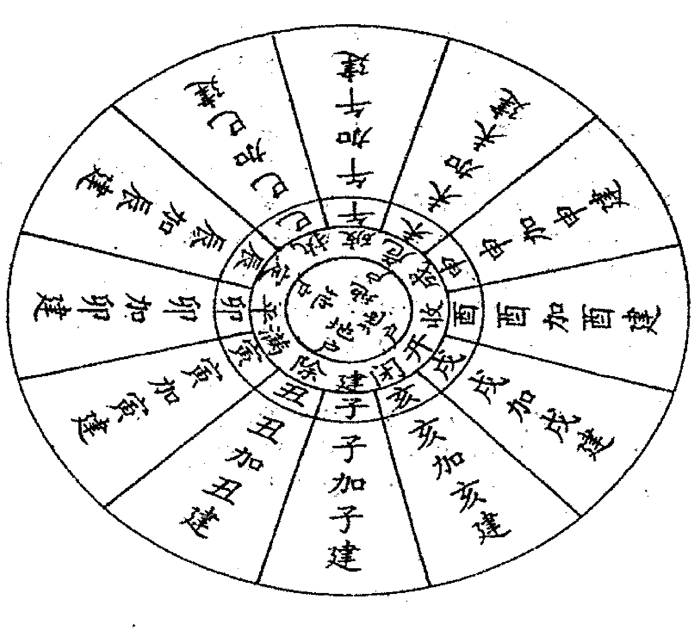

## 天三门图

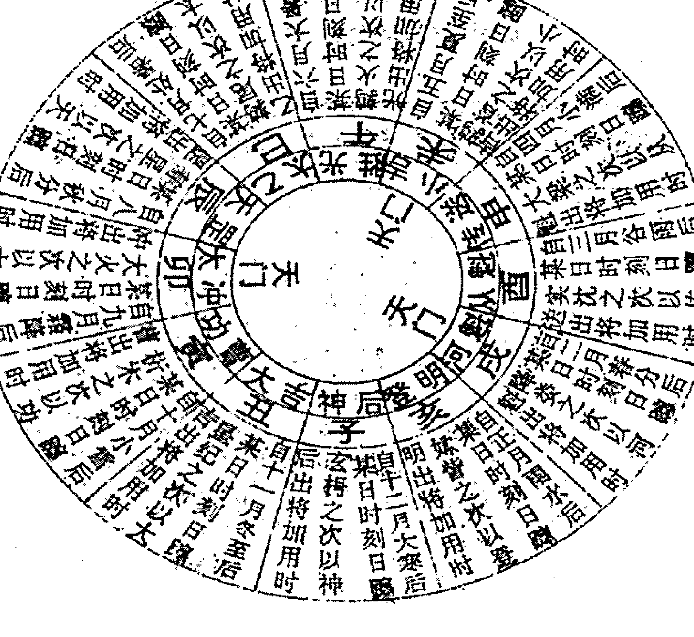

六合太阴太常君 三辰原是地私门
更得奇门相照耀 出门百事总欣欣
阳时利击，阴时宜陕。阳先举，阴后交。凡欲击者，为破而击之。陕者，密而去之。其败军宜向六合下走得出也。假如以六合、太阴、太常为三辰，依图推之，看在何方。

## 地私门阳贵人行之图

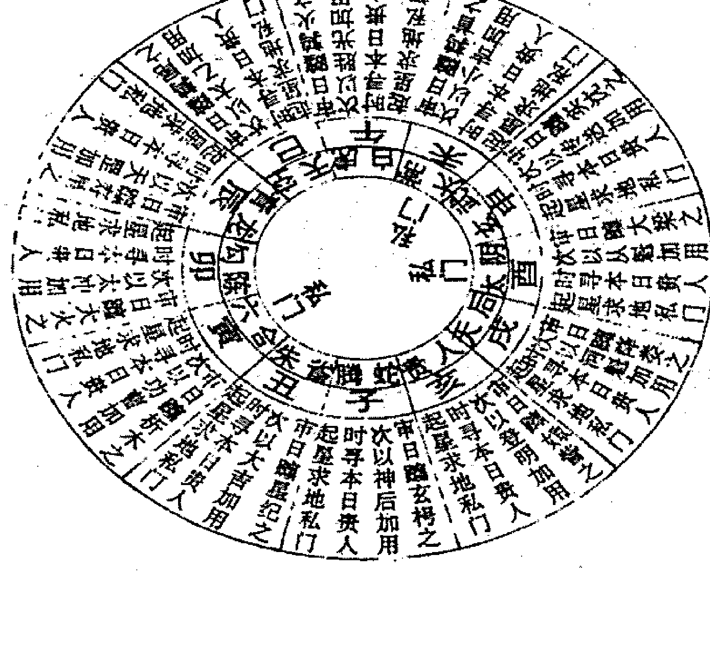

## 第四章 奇门遁甲的应用

## 地私门阴贵人逆行之图

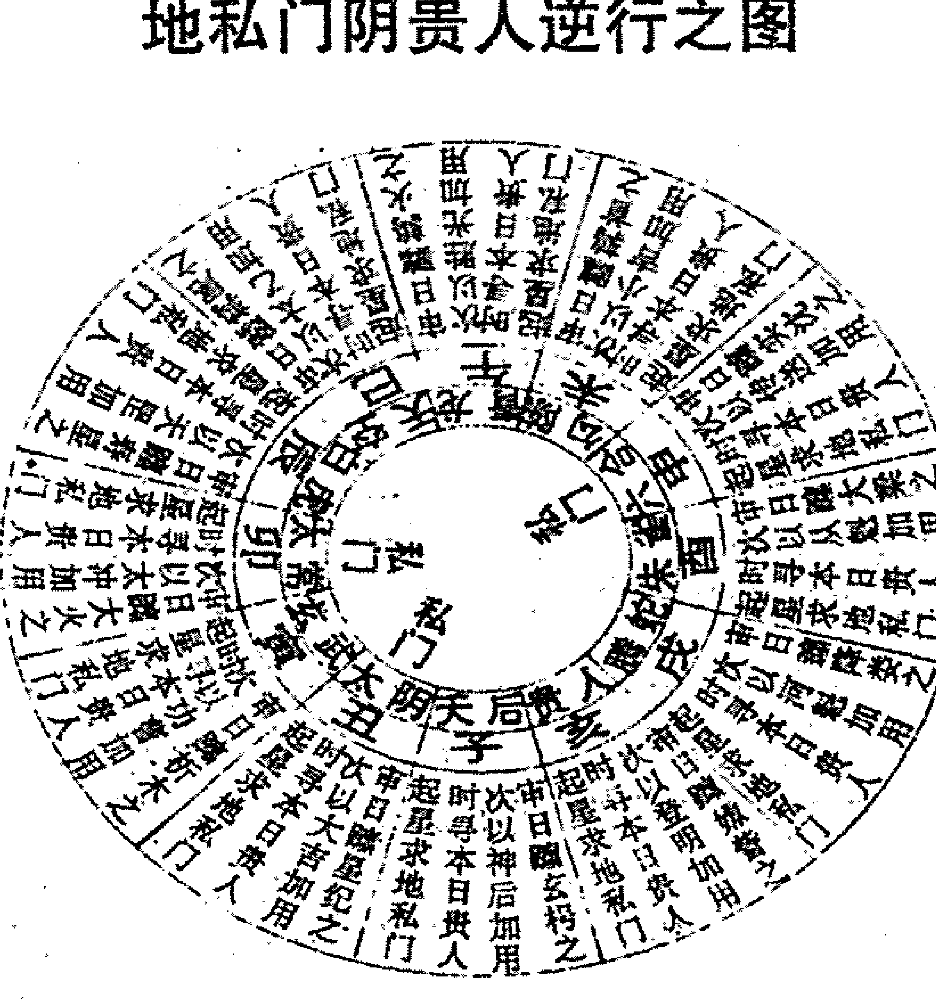

日支自亥至辰为阳，用阳贵人。阳贵人用上一字，自己至戌为阴，用阴贵人。阳贵人用下一字。

假如丁亥日，亥为阳，丙丁猪鸡位，则亥猪为阳日贵人，须用贵人加亥上顺数去，却看六合、太阴在何处，即是地私门。此只论日、不论时。然须得奇门，方可用。

一例：审太阳过宫，以月将加用时，顺寻本日贵人起星位，求地私门。

> 太冲天马最为贵 卒然有难难逃避
但当乘取天马行 剑戟如山不足畏。

天马即太冲也。审月将过宫。即以月将加用时，顺寻，看太冲在何方，即天马方也。

言遇紧急危难. 仓卒之间，难得奇门，但乘取天马而去，则虽剑戟如林，亦能避其祸也。

天月将（即太阳）以授时历，看审订太阳过宫，方可选用太冲天马方。

> 三为生气五为死 胜在三兮衰在五
能识游三避五时 造化真机须记取。

《三元经》曰：“天道不远，三五反复，知三避五，坦然独处。”三为生气，故游三也。五为害气，故避五也。三为威，五为武，盛于三，衰于五，足马双轮，无有返期。

假令：冬至上元阳遁一局，甲子之日夜半起甲子至平旦丙寅时得三，此时生气吉，宜举百事。至食时戊辰时得五，此时害气凶，百事不宜，故避五也，阴遁仿此。

> 一本云：值使加震宫，三为生，宜向之，二值使加中宫寄二宫为死，宜避之。

又云：重阳有重吉，谓天将在三宫，重阴有重凶，谓天将在七宫也，三乃数吉也，七乃位凶也。

## 就中伏吟为最凶 天蓬加着地天蓬。

九星伏吟，上盘天蓬加地盘天蓬，乃九星仍在本宫，不动谓之伏吟，孝服、损人口，值符伏吟，上盘甲子加地盘甲子，六仪准此。

> 汤谓云：甲子来加甲子为伏吟，不宜用兵，惟宜收敛货财。

凡六甲之时，门符皆是伏吟。

> 一本云：“天盘天蓬加地盘天蓬为伏吟，最凶。”余仿此。

假令冬至上元阳遁一局，甲己之日夜半起甲子时，天蓬值符加临一宫，时干在一宫，此名门符，皆伏吟也。

## 天蓬若到天英上 须知即是反吟宫。

九星反吟者，天盘一宫上蓬星加地盘九宫英星上为反吟，余八宫同此。值符反吟，谓上盘甲子加下盘甲午，上盘甲戌加下盘甲辰。遇奇门盖之，不见凶害，不然灾祸立至。

> 汤谓曰：“子来加午为反吟，此时不宜举兵动众，惟宜散恤仓库之事。”凡星符对冲皆反吟。假令冬至上元阳遁一局，甲己日乙丑时，六乙在九宫，以天上天蓬值符加临时干在九宫，即是值符反吟。

## 八门反复皆如此 生在生兮死在死

## 假令吉宿得奇门 万事皆凶不堪使。

生门在八宫，门不离宫，谓之伏吟。若生门移在对宫，谓之反吟。门若遇此，虽得奇，不可用。

假至冬至上元阳遁一局，甲己之日申时，休门在九宫，值使休门加之，即是值门反吟也。

## 六仪击刑何大凶 甲子值符愁向东

## 戊刑在未申刑虎 寅巳辰辰午刑午

六甲地支相刑与自刑也。如：甲子见卯，甲戌见未，甲申见寅，甲寅见巳，为相刑；甲辰见甲辰，甲午见甲午为自刑。葛洪曰：“六仪击刑者，谓六甲值符加所刑之地也。”甲子值符加卯，卯刑子也。甲戌值符加未，戌刑未也。甲申值符加寅，申刑寅也。甲午值符加午，午自刑也。甲辰值符加辰，辰自刑也。甲寅值符加巳，寅刑巳也。

> 郭璞论：“三合之刑，金刚火强，各刑本方，水流趋东，木落反本。”

> 王璋曰：“甲子值符加三宫，甲戌值符加二宫，甲申值符加八宫，甲午值符加九宫。甲辰值符加四宫。甲寅值符加四宫，皆为六仪击刑。”

假令冬至上元阳遁一局，甲己之日夜半起甲子为值符，至日出卯时.是六仪击刑也。至庚午时，以甲子值符加六庚于三宫，即六仪击刑时也。其时极凶，不可用事。

三奇入墓好思推 甲日那堪见未宫
丙奇属火火墓戌 此时诸事不须为
更兼天乙来临六 月奇临六亦同论

此乃乙丙奇临六宫在戌，谓之入墓，不但奇临之，遇丙日见戌字亦是。

> 王璋曰：“三奇人墓者，谓六乙日奇下临六宫，六丙月奇下临六宫，六丁星奇下临八宫，乙奇下临六宫亦是，是谓三奇人墓也。”

> 又云：“傍人入墓也。”

- ①天乙，即天盘乙奇

假如阴遁四局，丙辛日平旦庚寅时，六丙月奇下临六宫，是谓月奇入墓。凡遇三奇入墓，纵有奇门，不可举兵，百吉皆凶。

> 《经》云：三奇人墓何时辰，丙奇乾上乙临坤，
或遇乙奇居戌上，还加丁向丑中存。

丁乃阴火，死在寅，墓在丑也。

> 王璋曰：“丙丁奇人一宫，乃‘火人水池’。乙奇人六宫，乃‘木人金乡’。三奇受制，万事不可举也。”

本理按：五行生旺，论阳生阴死，丙火生于寅，丁火生于酉，阳顺阴逆，丁火生酉逆行，沐浴申，冠带未，临官午，帝旺巳，衰辰、病卯、死寅、基丑、绝子、胎亥、养戌，逢禄为临官，丙禄巳，巳乃丙火之临官。丁禄在午，午乃丁火之临官。丁墓在丑，艮八宫是墓，丁奇临八宫，是丁奇人墓，戌非也。此乃论阴阳之正理。

又如：甲木生于亥，未为库，乙木生于午，沐浴巳、冠带辰、临官卯、帝旺寅、衰丑、病子、死亥、墓戌，阴库不在未，在戌也，所以削去雷取之讹也。

又有时干入墓宫 课中时下忌相逢
戊戌壬辰兼丙戌 癸未丁丑一同凶

> 葛洪曰：“三奇者，谓丙戌时为月奇入墓之时。”又曰：“凡遇乙庚日、丁丑时，为丁奇入墓，黄昏是丙戌，故为月奇入墓。”

> 《三奇渊源》云：“六丁本火之精，化而成金，在震最明，生于丑，没于辰，前世名晓星者是也。”

> 又朱子断曰：“启明金星在西、日出则东见，即太白是也。故丁丑时亦为星奇入墓。”

丙戌时丙属阳火，火墓在戌。壬辰时壬属阳水，水墓在辰。
丁丑时丁属阴火，火墓在丑。癸未时癸属阴水，水墓在未。
戊戌时戊属阳土，土墓在戌。己丑时己属阴土，土墓在丑。
故戊己中央之土赖母而生，所以戊同丙火生于寅，己同丁火生于酉。
已上六时干辰入墓亦不可用。

五不遇时龙不精 号为日月损光明
时干来克日干上 甲日须知时忌庚。

> 葛洪曰：“五不遇时者，谓刚柔日相克而损其明，纵有奇门，不可行，百事凶。”

- 甲日庚午时，乙日辛巳时，
- 丙日壬辰时，丁日癸卯时，
- 戊日甲寅时，己日乙丑时，
- 庚日丙子时，辛日丁酉时，
- 壬日戊申时，癸日己未时。

此乃时干克日干，名为本主不和，极凶。旧选择书内差，载时支克日干，所以不准，今本理校正历府通书，悉皆改正刊行。

> 截例诗曰：时干克日有灾危，甲日从午逆数之；
若到戊亥便越过，百事不宜莫用之。

> 又起例曰：甲日怕庚己怕乙，乙辛庚丙最为殃。
丙壬丁怕癸时恶，辛丁壬愁戊不良。
戊畏甲兮君莫用，癸应嫌己莫相当。
五不遇时者，即时干克日干，阳干克阴干，阴干克阳干也。

## 第四章 奇门遁甲的应用

> 奇与门兮共太阴 三般难得总加临
若还得二亦为吉 举措行藏必遂心

阳遁值符前二宫为太阴，阴遁值符后二宫为太阴。谓奇门与太阴，三者不能皆同，若得二者亦吉，遇之可伏兵也。《古经》云：“择门，凡欲经求万事，宜休、开、生不合乙、丙、丁即吉。”又取阴门相助，谓之：“三诈。”凡太阴、六合、九地宫助奇者，全备。用之，有十分之利，若三门合三奇，无诈宫，谓之有奇无阴，得七分之利；若三门无奇，谓之有阴无奇，犯者不利，若三门合三奇，下临太阴宫，名曰：“真诈”。若三门合三奇，下临九地宫，名曰‘重诈’。若三门合三奇，下临六合宫，名曰：‘休诈’。以上诈门，嫁娶、远行、商贾，大吉利也。

- 真诈：宜施恩便，隐遁求仙。
- 重诈：宜进人口，取财，拜官，授爵。
- 休诈：宜合药，治疫、怯病、祈禳之事并吉。

若杜门合丁己癸，下临九地，名曰“地假”，宜潜伏，此三时加杜门者，可以藏形。

若杜门合丁己癸，下临太阴，利遣人间谍、探事。若杜门合丁己癸，下临六合宫，利逃亡。

若景门合乙丙丁，下临九天，名曰“天假”，乙为威德，丙为威武，丁为太阴，三奇之灵，宜乘利便. 进谒干求。

- 若伤门合丁己癸，下临九地，名曰“神假”，利葬埋。
- 若惊门合六合，下临九天宫，名曰“人假”，利捕逃亡。

若太白入荧惑，已在其下，必获已上五假，各取其宜，随事用之。

> 更得值符值便利 兵家用事最为贵
常从此地击其冲 百战百胜君须记。

王璋曰：“亭亭者，天之贵神，背而击其冲为胜，推之法，常以月将加时，神后下为亭亭所居也。”

假令五月用寅时将，小吉加寅，即神后临未，为亭亭之在未也。自奸者。天之奸神。合于亥巳，格于寅申，当合之时，俱背之，当格与不格，合与不合者，背亭亭向自奸。

推之法，以月将加用时，寅、午、戌、上见孟神，即是自奸之位，常行寅申巳亥，四孟位也。

假令正月将，登明加午时，则孟神临午，即白奸之在午也。

又如四月用巳时，以月将加巳，则孟神临寅，即白奸之在寅也。他仿此。

昔者曹操用兵行此法，百战百胜。

孟神者：即寅、申、己、亥、也。

天乙之神所在宫 太将宜居击对冲

假令值符居离九 天英坐取击天蓬

> 汤谓曰：“第一胜天乙宫，天上值符乘天乙宫，上将居之，用兵击其冲，百胜也。”按《万一诀》云：“若在阳遁，即用天上值符所居宫，若在阴遁，即用地下值符所居宫，上将居之而击其冲，胜。”

第二胜九天宫，阳遁天上值符后一为九天，阴遁地下值符前一为九天，我军立九天之上而击其冲，则敌人不敢当我之锋。

第三胜生门宫，谓生门合三奇之吉宫。上将引兵，从生门击死门。百战百胜。

> 又曰：“背亭亭向天门一胜，背月建二胜，背生击死三胜”大同小异也。

假令大寒上元阳三局，甲己日丁卯时，天上值符乘六丁，临九宫正南为天乙宫，为第一胜也，九天四宫东南第二胜也，生门与丁奇合七宫正西，第三胜也。

假令阴八局甲己之日平旦时，地下值符在八宫，东北天乙宫为第一胜也，九天在三宫正东第二胜，生门临六宫西北第三胜也。

有五不可击。汤谓曰：“第一不击天乙宫；二不击九天宫；三不击生门宫；四不击九地宫；五不击值使宫，以上皆不可击。”

假令阳八局丙辛日辛卯时，天乙在坤二富西南，生门在三宫正东，九地在四宫东南，值使在八宫东北，以上并不可击，我军居之必雄胜。

假令阴七局甲己之日丙寅时，天上值符临九宫正南，九天在二宫西南，生门在一宫正北，九地在七宫正西，值使在五宫寄二宫西南，以上不可击，我军居之必雄胜。

注云：上将居之，引兵而击其冲，百战百胜，

> 按《万一诀》云：“若在阳遁，即用天上值符所居之宫；若在阴遁，即用地下值符所居之宫，而击其冲，则百战百胜也。”

## 第四章 奇门遁甲的应用

甲乙丙丁戊阳时 神居天上要君知
坐击须凭天上奇 阴时地下亦如之

> 《三元经》曰：“五阳时利以为客，当为客之时，利先举兵，高旗鸣鼓，耀武扬威，以决胜，谓时下得甲、乙、丙、丁、戊，五干善神治事，可以出军征伐，远行求财，立邦国，化人民，临武事，入官，移徙，嫁娶，起造，百事皆吉，此时逃亡者不可得。”

故《经》云：“值使之行，一时一易，行阳时利以为客。”故曰：“得阳者飞而不止，阳五干在子午之东部生气也，故为利客先举。”

假令甲己之日夜半生甲子时，自甲子时至戊辰时，得甲、乙、丙、丁、戊，是五阳时，利为客先举，不拘阴阳二遁，如此例也。

又云：阳时神在天，宜用天盘。若在地，宜用地盘。
又云：五阳时在天上，即居天上值符之宫，而击其冲。

> 又《经》云：“天盘星克地盘星，在四时旺相日时，有本色气在其方，来助客胜。地盘星克天盘星，在四时旺相日时，有各方本色云气在其方，来助主胜。”

若见三奇在五阳 偏宜为客自高强
忽然逢着五阴位 又宜为主好载详

> 己庚辛壬癸五阴时。汤谓曰：“五阴时，利以为主之时，以后举兵，低旗衔枚，待敌而后动，以决胜。”谓时下己、庚、辛、壬、癸五干，恶神治事，不可拜宫、移徙，婚姻、出行、起造、举百事，逃亡可得，占宜画策密谋，集武备、祷祀、祈福。

> 《经》云：“值使之行，一时一易，行阴利以为主。”

故曰：“得阴者，伏而不起。阴五干阴在子午之西 部杀气也，故利主后动。”

假令甲己之日夜半生甲子，自己至百时，得己、庚、辛、壬、癸，是五阴时，利以为主，宜后举，不拘阴阳二遁，皆如此例。

值符前三六合位 太阴之神在前二
后一宫中为九天 后二之神为九地

太阴起例布星，随本时值符宫，螣蛇、太阴、六合、白虎、玄武、九地、九天。阳遁值符宫所到之宫，加活局值符，顺布星，阴遁值符宫所到之宫，加活局值符，逆布星。

本理曰：九天九地密通神，太阴六合定乾坤；## 第四章 奇门遁甲的应用

能知此诀备于我，肯把三门别立根。出向奇门分造化，人于心上起经纶；守攻城负凭于此，道不虚行只在人。九天之上好扬兵，九地潜藏可立营。伏兵但向太阴位，若逢六合利逃形。

本理按：孙子本义云：“九地者，幽隐之至深也。九天者，刚健之至极也。藏于九地，言守之至深，动于九天，言攻之至极也。九天乃天之杀伐之气，运在此方，亦可藉此气，扬兵威武。九地乃地之蒙晦之气，运在此方，亦可以藉此气，遮藏形迹，太阴之中，可以逃亡。”冬至后阳遁顺行，天上值符所临之宫，后一为九天，后二为九地，前二太阴，前三六合；夏至后阴遁逆行，天上值符所临之宫，前一九天，前二九地，后二太阴，后三六合。

假令阳遁上元一局，甲己之日丙寅时，天上值符临八宫，后一九天临一宫，后二九地临六宫，前二太阴临四宫，前三六合临九宫。

（图片：阳遁直符活局图）

（图片：阴遁直符活局图）

假令阴遁上元九局，甲己之日丙寅时，此时天上值符临二宫，即前一九天临七宫，前二九地临六宫，后二太阴临四宫，后三六合临三宫。

其法：甲上加值符，以四、三、六、七为吉，二、八、九、五为凶。

天地人分三遁名，天遁月精华盖临，地遁日精紫云蔽，人遁当知是太阴。

上盘六丙，中盘生门，下盘六丁，谓之“月华之蔽”。上盘六乙，中盘开门，下盘六己，谓之“日精之蔽”。上盘六丁，中盘休门，下盘太阴，谓之“星精之蔽”。

生门六丙合六丁，此为天遁自分明。

> 经曰：“天遁者，生门合六丙，月奇下临六丁为天遁，此时得月华之所蔽，故也。”

假如阳遁四局，乙庚之日，日入为乙酉时，天心为值符加时干，六乙开门为值使加时干，七宫即生门与丙月奇合，下临六丁于一宫，是天遁也。

假令阴遁六局，戊癸之日，日晡时，天蓬为值符加时干，六庚休门为值使加时干，四宫即生门与丙月奇合，临六丁于九宫，为天遁。

开门六乙合六己，地遁如斯而已矣。

> 《经》曰：“地遁者，开门与六乙日奇合，临地下六己，为地遁，此时得日精之蔽。”

假如阳遁一局丙辛之日，日出辛卯时，天冲为值符加时干六辛，伤门值使临一宫，日奇临六己为二宫，是地遁也。

休门六丁共太阴，欲求人遁无过此。

> 《经》曰：“人遁者，休门与六丁星奇合前二太阴，为人遁，此时得星精之蔽。”

假令阳遁七局乙庚之日，夜半丙子时，天任值符加时干六丙，生门加一宫，即休门与六丁星奇合前二太阴六宫，为人遁也。

要知三遁何所宜，藏形遁迹斯为美。

以上三遁，最宜隐遁，人莫能窥。盖三遁上盘，既挟日月星精之蔽庇，作而天遁，下盘合丁乃三奇之灵，又为六甲之阴，谓奇门相合，有如华盖之复体也。地遁下盘临六己，为六合之私门，又为地户，谓奇相临，有如紫云之盖体也。人遁下盘为太阴者，阴暗之相。孙子云：难知阴，盖阴晦不能观万象，谓奇门阴宫相合，有如阴云之降蔽也。

又三遁之时，凡用事、兴兵、施为、出入、经营、宫室，万事吉利。

- 云遁者：天上六乙合地下六辛，临开、休、生三吉门，为云遁也。
- 风遁者：天上六乙合开、休、生三门于巽宫，为风遁也。
- 龙遁者：乙奇合三吉开、休、生门于坎宫，为龙遁也（一云：乙奇合休门坎）。
- 虎遁者：天上六乙合地下六辛，临休门到艮宫，为虎遁也。
- 神遁者：天上六丙合九天生门也。
- 鬼遁者：六乙合九地于杜门也。
- 以上合天、地、人，名九遁，用奇者不可不知。

## 庚为太白丙荧惑，庚相丙相加谁会得

庚金生于巳，得禄、临官于申，旺于酉，乃西方金星，号太白星。丙火生于寅，得禄、巳旺于午，南方火德，号为荧惑星。谁字，即指庚丙而言，谓上盘之庚加会下盘之丙，或上盘之丙加会下盘之庚也。

### 六庚加丙白入荧

天庚加地丙，乃金入火乡而受克，凶。为对敌，宜防贼。

> 赤松子曰：“太白入荧，白五可破，南北恐有大祸。”
> 汤谓曰：“此时宜防贼来。”

假令清明上元，用阳遁四局甲己之日，日晡时为壬申时，此时六庚在八宫，得天辅值符，为六庚加临六丙于二宫，即太白入荧惑也。

### 六丙加庚荧入白

天丙加地庚，火入金乡，此时闻贼当退避。

> 赤松子云：“荧入白，太白上下相击，内往外灭，以谗贼陷。”
> 汤谓曰：“此时贼退。”又曰“二星相入凶气横，任得奇门慎勿行；此星若也移方去，金火之神是恶神。”

上盘丙加下盘庚也。

假令小满上元，用阳遁五局，丙辛之日黄昏时为戊戌时，此六戊在五宫，得天任值符为六丙，下临六庚于七宫，即荧惑入太白也。

> 《奇门大全》云：“丙加下庚也，此时战宜回避，不宜冲击，占贼来信必虚诈。”

> 诗曰：天上六庚加六丙，太白入荧贼欲来，天庚加地丙，乃金入火乡而受克。凶。乃对敌宜防贼来。
> 赤松子曰：“太白入荧，白五可破，南北亦有大祸。”
> 汤谓曰：“此时防贼来。”

假令夏至中元阴遁三局，乙庚之日平旦戊寅时，此时六庚在一宫，以天芮值符加时干于三宫，即六庚下临六丙于二宫，即太白入荧惑，又天心、天柱到离宫，亦是金入火乡也。

### 荧入白兮贼须灭

> 赤松子云：“荧入太白，上下相击，内往外灭，以诲贼陷。”
> 汤谓曰：“此时贼退。”又曰：“二星相入凶气横，任得奇门慎勿行。此星若也移方去，金火之神是恶神。”此时战斗，贼自恐，必退也。天盘六丙加地盘六庚是也。
> 又曰：“六丙若来加庚上，真贼逃避不为灾。”

假令阴遁六局，甲乙之日丙寅时，六丙在八宫，以天心值符加时干，即六丙下临六庚于四宫，此为荧惑入太白，占贼不来。天英、景门到七、六宫，亦是火入金乡。

### 丙为勃兮庚为格，格则不通勃乱逆

天丙加六庚为勃，天庚加地癸为格。汤谓曰：“六丙所加皆名勃。”勃者，乱也。谓天上六丙，临年、月、日、时之干，值符类同。六丙所加之义，凡举百事、用兵遇勃，主纲纪紊乱，凶也。经曰：“丙加值符为勃，火生焚大屋；移室且安然，独自闻愁哭。”又云：“庚加年月日时干，假尔为客不宜争；统兵领众避此时，唯有固守不宜行。”百事遇之，凶莫测也。

### 丙加天乙为值符，天乙加丙为飞勃

汤谓曰：“天上六丙加地下当年月日时干者勃。”勃者，乱也。天上六丙临年、月、日、时干，值符类同。六丙所加之义也，凡举事、用兵遇勃，“主纲纪紊乱也。”

### 庚加日干为伏干

天乙伏干格。《三元经》曰：“六庚为太白加日干，即为伏干格，此时主客斗伤皆不利。”又曰：“日干若遇六庚临，此名伏干格相侵，若是战斗皆不利，大都为主必遭擒。”

假如小满上元阳遁五局，甲己之日壬申时，六壬在九宫，即天柱为六庚。下临九宫，见今日甲午为天柱，六庚所加也，此为天乙伏干格。

### 日干加庚飞干格

歌云：日干及临庚，飞干格偏明：争战还不利，为客最平平。

> 《经》曰：“今日之干，加六庚飞干格。此时战斗，主、客两伤。”

假如小满上元阳遁五局，甲己日庚午时，此时甲子五官寄二宫，以值符天禽加时干六庚于七宫，即得六甲下临六庚于七宫，此名飞干格也。

### 加一宫兮战在野，同一宫兮战于国

庚加日干、日干加庚俱不利，如庚加一宫，或天盘庚，或地盘庚同一宫，皆主战不利。

天乙格六庚加天乙，凶战于野。六庚加天乙者，谓临天乙所居之宫也。

天乙太白格，谓天乙与六庚同宫，战于国凶；天乙与六庚同宫，谓天乙值符与六庚同行，加时干与太白格，利野斗；若值符加六庚，宜固守伏藏。凡遇诸格之时，用兵主客俱不利；占人在否，格则不在；占人来否，格则不来。

### 庚加值符天乙伏

诗云：庚加值符宫，伏干格为宗；交锋多不利，为客以成功。

> 《三元经》曰：“六庚加值符，名为天乙伏宫格，此时主客皆不利，战斗交兵气自衰，占见人不在，占来人不来。”
> 《奇门大全》曰：“上庚加下值符，此时主客皆不利。六庚加天乙值符，本宫为伏宫，此时不利用兵，宜野迎敌。”

假令立春下元阳二局，甲己日壬申时，此时六壬在六宫，以天上天芮为值符，加时干六壬于六宫，即得天辅，为六庚下临值符天芮于二宫，此名天乙伏宫格也。

### 值符加庚天乙飞

诗云：飞宫是何星，值符加六庚；两敌不堪争，为主似还赢。

《三元经》曰：“值符加六庚，名天乙飞宫格，此时主客皆不利。”

《奇门大全》云：“上盘值符加下庚，此时同前，遇天乙值符加六庚之上，此时固守，出门则大将遭擒。”

假令春分中元阳遁九局，甲己之日，日中庚午时，此时六庚在二宫，天阴为值符，以天上值符加时干庚于二宫，即得天英为值符，下临二宫见六庚，此天乙飞宫格。

### 庚加癸兮为大格

诗云：太白庚加癸，图谋未可通；求人终不见，端坐即还营。

汤谓曰：“六庚加癸，名曰大格时也。谓于上六庚临地下六癸。此时不可用，百事凶。逃亡亦不可得，求人即不在，反招其咎。大格不宜远行，车破马死，造作人财破散。”

假令秋分下元阴遁四局，立春中元阳遁五局，岁干在辛，以甲己之日，日时为妻男，占遗失，随其日月应兆获。

假令辛丑格，闻客先败，占宅，年为父母，月为兄弟，日为己身，年庚加甲子也，大凶。六庚加年、月、日、时于动有凶，时用事凶。

《奇门大全》云：六庚加今岁干，如庚子，宜行师。

《经》云：六庚当太岁之干，名曰岁格。此六庚加六壬谓之上格，一云，伏格，当此之时，并不下临六己于四宫，此名刑格也。

### 加壬之时为上格，又嫌年月日时逢

值符天冲加六丙于一宫，即得天禽为六庚三局。甲己日丙寅时，此时六庚在五宫寄二宫，以己求谋主失，并破财疾病。

假令大寒上元阳遁，逃亡，慎勿追之，反招凶咎。

《奇门大全》云：“六庚加六地下六己，此时出军，车破马伤，中道而止，士卒逃空。”

汤谓曰：“六庚加六己为刑格，谓天上六庚加六庚、加六己，赤地须主凶，若行车马，随军兵半路。宫此名大格也。”

### 加己为刑最不宜

时干六丙于六宫，即得天芮六庚下临六癸于八，甲己日丙寅时，此时...

（图片）

六庚在二宫，以值符天辅加入癸酉时，六庚在七宫，以值符天禽加六癸于一宫，即见天柱。六庚下临辛，岁干于八宫，此名为岁格也。

论月格，三元经云：六庚加月朔，格为凶时也。

假令立春上元阳遁八局，月朔干在甲己，甲己日丁卯时，此时六庚在一宫，以值符天任加六丁于五宫，即得天蓬为六庚下临，月朔干六己于九宫，此名月朔格也。

论日格，《经》曰：“六庚加当日日干，名曰日干格，此时大凶。”

假令小暑下元阴五局，日干在甲己，己日丙寅时。以天禽为值符，加时干六丙于七宫，即九庚在三宫，下临日干已于四宫，此名日干格。

时格，《经》曰：“六庚加本时干者为时格，亦名伏吟格。此时六庚在四宫，以值符天辅加时，不可举兵，用事大凶。”

假令小寒上元阳遁二局，丙辛日己丑时，六庚在四宫，以值符天辅，加时干六己于二宫，此为时格也。凡六庚为值符，其十时皆为时干格也。

> 更有一般奇格者，六庚谨勿加三奇。此时若也行兵去，匹马只轮无返期。

六庚加丙丁奇，天英景为下克上，先举者凶，无返朝；六庚加乙奇。冲、辅、伤、杜上克下，先举者胜，匹马只轮能敌万人。

### 六癸加丁蛇天矫

> 诗曰：六癸加六丁，天矫迷路程；惶恐难进步，端坐却不营。

六癸加六丁，六癸在天盘，六丁在地盘，为蛇首，反为雀，谓癸属水，为北方玄武龟蛇。丁属火，故癸加丁，为腾蛇天矫。

> 王璋曰：天上六癸加地下六丁，名腾蛇天矫，此时百事不利。

假如冬至下元阳遁四局，丙辛之日半夜生戊子时，此时六癸在九宫。以值符天心加时干六戊于四宫，即得天英为六癸下临六丁于一宫，是为腾蛇天矫也，虽有奇门临之，亦主虚惊不宁。

### 六丁加癸雀投江

丁属火为朱雀，癸属水，故丁加癸，为朱雀入江。

> 《奇门大全》云：“丁加癸主文书牵连，或失脱文书，占家有惊恐，怪异梦，用兵防奸。”
> 王璋曰：“天上六丁加地下六癸，名朱雀投江，此时百事皆凶。”
> 诗云：六丁加六癸，朱雀入水流；口舌犹未罢，官事使人愁。

（图片）

> 又曰：“或有诉讼，自陷刑狱，或闻火起，不必往救。”

假令夏至中元阴遁三局，甲己日壬申时，此时六丁在六宫，以值符天冲加时干六壬于八宫，即六丁下临六癸于七宫，是为朱雀投江也。

### 六乙加辛龙逃走

金为太白，乃白虎，木为青龙。金克木，为龙虎相残，凶。

诗云：青龙乙加辛，金木不相亲；神龙方也遁，恶煞不求嗔。

盖乙属木，为青龙，故乙加辛为青龙逃走。

> 王璋曰：“六乙加六辛，名青龙逃走，此时不宜举兵，主客反伤，用百事凶。”
> 《奇门大全》云：“六乙加辛，此时举兵动众，主失财遗亡破败。”
> 又云：“六乙加庚亦是。”

假令立秋上元阴遁二局，丙辛之日己亥时，六乙在三宫，以值符天任加时干六已于二宫，即六乙下临六辛于八宫，此是青龙逃走。

### 六辛加乙虎猖狂

赤松子云：“刀逢暗磨，疑如之何，彼欲见害，可阴可和”。“六辛加六乙，白虎也悲哀，若与干钱财，自己须防灾”。华盖属金为白虎，故辛加乙为白虎猖狂。

> 王璋曰：“天上六辛加地上六乙，名曰白虎猖狂，此时不宜举事，主客两伤，婚姻、修造大凶。”
> 《奇门大全》云：“举动出入战斗，必有惊诈。”

假令小暑中元阴遁二局，甲己之日壬申时，此时天芮值符加天盘六辛下临于三宫，原乙在三宫，是为白虎猖狂也。

请观四者是凶神，百事逢之莫措手。

夫天干阴阳和则吉，不和则凶，如阳干克阴干为合，如甲克己，即甲与己合。阴干克阳干为官星。如甲受辛克，即以辛为官。阳遇阳克，阴受阴克，皆为不和，乙、辛、丁、癸四干皆属阴克，其祸不赦，故不可用也。

### 丙加甲兮鸟跌穴

天盘丙加地盘甲子，乃飞鸟跌穴，大吉。

> 赤松子曰：“进飞得地，云龙聚会，君臣宴喜，举动皆利。”
> 王璋曰：“此时从生而击死，百战百胜定无疑。”
> 葛洪曰：“六丙加六甲，名飞鸟跌穴。阴阳二遁此时为百事利，出兵行营，举造葬埋大吉。”

假令大寒阳遁九局，甲己之日辛未时，此时六丙在七宫。以值符天英加时于六辛于三宫，即六丙下临六甲于九宫，此名飞鸟跌穴。解曰：丙加六甲在门上是也，利远行、出兵，百事吉，大人君子利，小人凶，从生击死，一敌万人。

### 甲加丙兮龙返首

天上甲子加地丙，名青龙返首。

> 葛洪曰：“此局吉，宜举百事。虽无吉门临局，亦可用事。阴阳二遁，此时可以出兵行营，举造利为，百事皆吉。若合奇门，最为良也。”

假令冬至上元阳一局，甲己之日丙寅时，六丙在八宫，以天上甲子天蓬值符加时干六丙于八宫，得天蓬为六甲，六丙在八宫之上，此名青龙返首。

解曰：六甲加丙在门上是也，利见大人，求名、举兵利客，扬威万里，出入利，此时从生击死，一敌万人。

### 只此二者是吉神，为事如意十八九

言前二局，飞鸟跌穴、青龙返首之大吉也。若得奇门，行兵出战大胜。求名遂意，求财益利，造葬、嫁娶，百事如意也。

- 六丁加六甲三奇吉。
- 六丁加六乙天气运吉。
- 六甲加六乙二龙相争凶；
- 六甲加六戊青龙受困凶；
- 六壬加六庚群虎入穴凶。

## 八门若遇开休生，诸事逢之总称情

## 伤宜捕猎终须获，杜好邀遮及隐形

- 开门，宜远征讨，见君求名，所向通达；
- 休门，宜和进万事，治兵习业，百事皆吉；
- 生门，宜见人营造，求财获宝；
- 伤门，宜渔猎讨债，行逢盗贼；
- 杜门，宜邀遮隐伏，诛伐凶逆，凡出去迷闷；
- 景门，宜主上书遣使，突阵破围；
- 死门，宜行刑诛戮，吊死送丧，行者遇病；
- 惊门，宜掩捕斗讼，攻击惊恐。

以上八门，内有开、休、生三门吉，宜出。其下若更合三奇，吉宿为上吉。五凶门不可出，其下宜避之。

## 蓬任冲辅禽阳星，英芮柱心阴宿名

昔黄帝命风后作太乙雷公式九宫法，以灵龟洛书之数而错一位。以一居乾，以八居坎，以三居艮，以四居震，以九居巽，以二居离，以七居坤，以六居兑。以八、三、四、九为阳宫。故蓬、任、冲、辅、配此四宫而属阳地。以二、七、六、一为阴位。故英、柱、心、配此四宫而属阴也。盖以艮燥、坤湿、巽暑、乾寒、震阳、兑阴、离火、坎水而分阴阳也。

### 释九星所主：

天蓬、天任、天冲、天辅、天禽五星属阳。
天英、天芮、天柱、天心四星属阴。

太乙书谓：太乙在阳宫，辽东不用兵，正以坎、艮、震、巽为阳宫，辽东艮地也。太乙在阴宫，蜀汉可全身。离、坤、兑、乾、为阴宫，蜀与汉中在西南及西方之地也。

## 辅禽心星为上吉，冲任小吉未全亨

## 大凶蓬芮不堪使，小凶英柱不精明

大益枢京，天辅武曲纪星，执庆刚星；天禽廉贞纲星，总承符允；天心文曲纽星。以上三位，乃北斗武曲、廉贞、文曲三吉星，为大吉也。疑华好化，天冲破军关星。

英明集华，天任星以上二星，乃北斗破军英明星，为次吉宿也。

阴袭大衍，天蓬隐光右弼星，阳琮孚庆，天芮洞明左辅星，乃左辅右弼星，为恶耀，大凶之宿。若得奇门，亦不可用。

照冲勋令，天英贪狼太星，通玄须变，天柱禄存真星，乃贪狼、禄存二星，半凶之星。得奇门亦可用。宗庙、洪范、五行、水城、专言贪狼为上吉，却不知贪狼为凶星也。《地理大全论》云：“狼、狼虎也，所以扫去宗庙不准。”

（图片）

## 大凶无气变为吉，小凶无气亦同之

> 《三元经》云：“时下得天辅、天禽、天心星为大吉。时下得天冲、天任为次吉；得天蓬、天芮为大凶；得天柱为小凶，天英亦为小凶。更以五行旺相言之。若大凶之星得旺相之气，则小凶，喜若小凶星得旺相之气，则中正。”

- 吉宿更能逢旺相，万举万全功必成。
- 若遇休囚并废没，劝君不必进前程。

凡吉宿，必要遇旺相。若遇休囚废没，亦不可用。

> 《经》曰：“若上吉次吉星，无旺相气则中平；乘旺相气则大吉，乘死休气则凶。以上详审用之。”

假令冬至时得天任吉宿，又乘旺气，则上吉也。

- 要识九星配五行，各随八卦考羲经。
- 坎蓬星水离英火，中宫坤艮土为营。
- 乾兑为金震巽木，旺相休囚看重轻。

以九星配五行，又随伏羲周易，后天文八卦而推之。

> 《金函宝鉴》云：“大哉乾坤交合体，父母生成之道。阴阳品配，定男女方位之居，银河转运乾坤定，上下交合，遂生六子。乾父交于坤母，一交而得长男震，二交而得长女巽，再交而得中女离，四交而得少女兑。以震兑为主，坎离为用，乾、坤、艮、巽、寄于四维。故乾位西北，坤位西南，艮司东北，巽司东南。震东兑西，离南坎北。乾刚兑柔为二金，震阳巽阴为二木。坤湿艮燥为二土。坎润下，离炎上，不可二也。夫金木形也，水火气也。形有差别，气无精粗。此或一或二之所以分也。凡在显者，则阳包阴，在海者，则阴包阳也。”

### 论九星吉凶所主：

- 天蓬：宜安抚边境，修筑城池。春夏左将大胜，秋冬凶，亡其士卒，利主不利客，嫁娶凶，移徙失火，争斗见血，入宫逢盗贼，修营宫室、商贾皆凶。
- 天柱：宜屯兵自固，隐迹埋形，将兵车破马伤，士卒败亡，不宜移徙、入宫、商贾。宜嫁娶、修造祭祀。
- 天心：宜疗病合药，将兵秋冬胜，得地千里，春夏不利。嫁娶，入官、筑室、祠祀、商贾，秋冬吉，春夏凶，利见君子，不利小人。
- 天冲：宜出报仇，春夏左将胜，秋冬无功，不宜嫁娶。移徙、入官...## 第四章 奇门遁甲的应用

筑室、祠祀、商贾。

-   天辅：宜蕴身守道，设教修理，将兵春夏胜，得地千里，嫁娶多子孙，移徙、商贾、入官、修营、春夏有喜。
-   天任：宜请谒通财，将兵四时吉，万神助之，敌人自降，嫁娶多子孙，入官吉，移徙、筑室凶。
-   天芮：宜崇尚受道、交纳朋友，受业师长吉，不可用兵，嫁娶、争讼、移徙、筑室、秋冬吉，春夏凶。
-   天禽：宜祭祀祈福，断灭群凶，将兵四时吉，百福助之，不战用谋，敌人畏服，赏功封爵，移徙、入宅、祠祀、商贾、嫁娶吉。
-   天英：宜出入远行，饮宴作乐，利嫁娶，不宜出兵，移徙、入官、筑室、祭祀、商贾。

假如冬至上元阳遁一局。甲己之日半夜生甲子。起一宫顺行，至丙寅时在三宫，时下得天冲宿值，宜出师报仇，春夏乘旺也。

假如夏至阴六局，中元阴遁一局，甲己之日壬申时。以甲子时起一宫，顺布奇，逆布六仪，则壬申时到乾，得天心宿值，宜疗病合药，将兵乘金旺气胜，掠地千里，春夏不利，秋吉。宜见君子，不利小人。

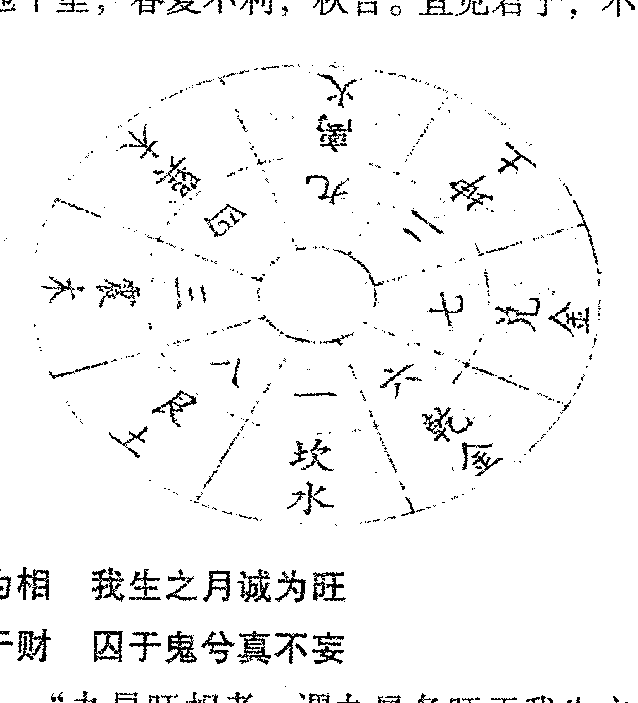

与我同行即为相 我生之月诚为旺
废于父母休于财 囚于鬼兮真不妄

> 《三元经》曰：“九星旺相者，谓九星各旺于我生之月，相为同类之月，死于生我之月，囚于官鬼之月，休于妻财之月。”

九星所属：天蓬水宿，天芮土宿，天冲木宿，天辅木宿，天禽土宿，天柱金宿，天任土宿，天英火宿。

## 中国古代术数汇要

## 奇门遁甲应用初探

假令水宿号天蓬 相在初冬与仲冬
旺于正二休四五 其余仿此自研究

天蓬（水宿）：相于亥子月，同类也〔俱属水〕旺于寅卯月，我生也〔水生木〕；废于申酉月，生我也（金生水）；休于巳午月，我克也〔水克火〕；囚于辰戌丑未月，克我也（土克水）。余仿此推。

## 急则从神缓从门 三五反复天道亨

> 《三元经》曰：“谓有事不暇择时，见三奇吉门，当天乙所在宫，及值符之神宫而去，谓之从神，自然获吉。盖值符甲子，常从六戊，是为天门，事急，则从天上六戊下去，事缓，即可待时三奇吉门而去。”

假令冬至阳遁一局，甲己之日丙寅时，此时天乙加六丙于八宫，值符在一宫，若有急事，可向东北天乙丁，及正北值符六戊下去，皆吉也。

又曰：神谓如甲子蓬星日，丙寅时，甲子六仪头。以甲子天蓬星，休加地盘六丙上，即从奇下出去，如事急欲出路，或在军阵中门又不通，只寻吉神丁去，事缓可以就吉门奇而往也。

三者，三奇也。五星吉，英、任、冲、辅、心也。或门凶无奇，又无吉星，反伏无处吉，事又急迫，则须向七斗下，默念三奇咒去。言不得三吉奇门，但从三奇所临方出百事吉，所谓吉则从神也。

阴阳二遁，有闭塞，八方皆无门可出，即依玉女去，凡甲子时、甲午时，在内利主；甲申时在门两损，甲辰，甲戌在外利客。

> 《符应经》曰：“若无奇出门，紧即依张良以筹加出天门地户而出也，吉利。”

## 十干加伏若加错 入库休囚吉事危

时加六戊，乘龙万里，莫敢呵止，六戊为天门，又为天武。宜以远行万里，百事吉。戊为天门，凶恶不起。当从天上六戊出，挟入天门。故曰：乘龙万里，凶恶不敢害，鸡不鸣，犬不吠，将兵客胜、问忧无，问喜有，利远行商贾，小人惊走亡命。

假令立春中元阳五局，甲己之日戊辰时，此时六戊在五宫寄坤二。值符加时干。即六戊临二宫。出西南吉。

时加六己，如神所使，不知六己，出必凶咎。己为六合，此时是为阴谋密秘之事，当从天上六己出，不宜商贾，显扬之事。隐藏如神所使，不知六己者，谓之显赫，必逢休咎。又为地户，独出独入，无有见者，将兵，闻喜无，闻忧有，利上官、嫁娶。小人利于亡命惊走。若古人，有逃亡、阴私之事。

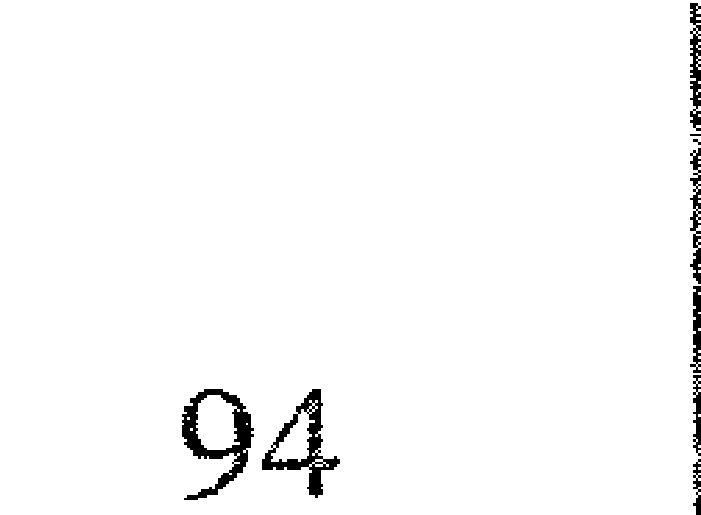

时加六庚，抱木而行，强有出者，必见争斗。谓庚为天狱，此时凶强，有出者必遇刑罪。故曰：能知六庚，不被五木，不知六庚，误使人狱。或被凌辱，将兵主胜，不利客，利屯营固守，闻忧有，闻喜无，商贾道死，物伤无利，入宫、嫁娶凶。六庚之时，唯宜固守，能知六庚之时，谓此时已下至六癸时，不宜出动。

时加六辛，行遇死人，强有出者，罪罚缠身。此时往来出入并凶，强有出入，斧鋣在前争，行为在累。故曰：能知六辛，所行往来，不知六辛，多被杻械。又辛为天庭，罪纲自缠。将兵主胜，不利客，可行刑，决罪人，不宜嫁娶、入官、商贾、问疾。

时加六壬，为吏所禁，强出入者，飞祸将临。此时不可远行，出入百事凶，强出必有牢狱。壬为天牢，怨仇所稽。将兵主胜，利伏藏邀遮，不宜入宫、移徙、嫁娶、逃亡，病者进退不死。

时加六癸，众人莫视，若不知六癸，出门见死。此时凶，不利出入，皆凶。宜隐遁求仙，亡命绝迹，当从天上六癸下，出入不见。故曰：众人莫视。又癸为天藏，利以伏匿逃亡。将兵主胜，问忧有，问喜无。不易出官、商贾、嫁娶、移徙、入室凶。疾病者重，遗亡不得。

三奇嫌入墓门，如泊墓宫三位有消停，门克下宫为障隔，时干克日干为损明，六仪受刑，天干支神犯上，更飞忌支辰及伏吟，出兵发令恐紧急，如若三奇，入墓休囚，及犯十干于伏吟等项，须吉反凶也。

## 十精为使用为贵 起宫天乙用无遗

> 葛洪曰：“逾出于五、士，归于九一者，为十也。要精于九一之，谓阳遁阳使，起一终于九，阴遁阴使，起九终于一。天乙值使起宫异，所谓直门相冲也。阴阳二遁，各有二使。”

假令冬至后，阳使起休门，阴使起景门。阳使起休门故曰：直门相冲，今知用遁，自冬至后一百八十二日之六十二分半，历子午之东部，阳气用事，唯阳遁阳使。夏至后一百八十二日六十二分半，历子午之西部，阴气用事，唯阴遁阴使。古经云：冬至后用阴使，夏至后用阳使，经述不显、隐伏之事也。是穷天地，侔造化，以通神明之德，以类万物之情，三光之回旋，四季之往复，一消一息，或升或降，而运之于无形，布之于无象，有所不见，以示后人，若能谙此理，用之为贵也。

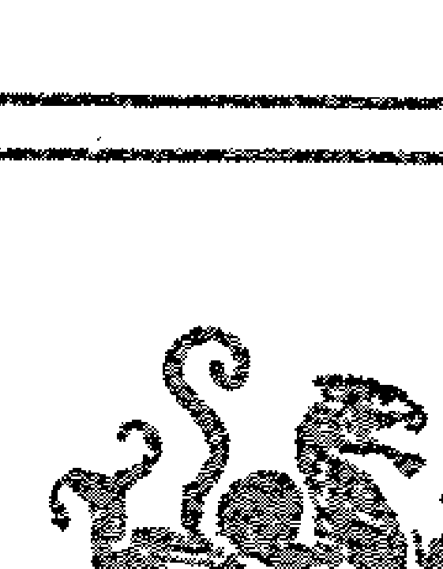

## 中国古代术数汇要

## 奇门遁甲应用初探


## 天目为客地为主 六甲推兮无差理
劝君莫失此玄机 洞彻九宫扶明主

卯为天目，酉为地耳，又有六甲旬中，天目地耳推者，出兵日也。宝日为上吉，谓干生支也。如甲午日，甲木生丙火是也。义日次吉，谓支生干也，如甲子日之类，甲木子水，水生木也。和日为次吉，谓干支比和也。如壬子日之类，壬水子水和同也。制日为中平，谓干克支也。如甲戌日之类，甲木戌土，木克土也。伐日为极凶，谓支克干也。如甲申日之类，甲木申金，金克木也。

> 《素书》云：“潜居抱道，以待其时，若能通于遁法，君不圣明，不能进扶直言；其国衰败，事不能行其政，隐身闲居，闪避衰乱之亡；抱养道德，以待兴盛之时，扶佐明主，名香万古，此乃时至而成功。不遇明君，隐迹埋名，守分闲居。若是强行，必受其累，亦无成功也。”

## 宫制其门不为迫 门制其宫是迫雄

> 《经》曰：“吉门被迫，则吉事不成。凶门被迫，则凶事尤甚。宫制其门是凶迫，门制其宫，是吉迫。门生宫为和，宫生门为义。”

假令开门临三宫，休门临九宫，生门临一宫，景门临七宫。为吉门被迫，则事不成。

假令伤门、杜门临二宫、八宫，死门临一宫、惊门临三、四宫，为凶门被迫，则为凶尤甚。

## 天网四张无路走 一二网低有路通
三至四宫行人墓 八九高强任西东

> 《三元经》曰：“天网四张，万物尽伤，此时不可举兵，为百事凶。”

> 又曰：“神有高下，必须知之，谓时得六癸之神，必有高下也。”

> 又曰：“但将天乙居何地。尺寸低而匍匐出，谓得癸时。神符高下，天乙在三四宫可出，若高遇之不可出，出必伤，若被客围，却从卯、未、酉三宫，看合门奇可破，出无妨。”

假令天乙在一宫，其神去地一尺，在二宫，去地二尺。皆天上六癸之下，即天乙所加之宫也。当此时，必须匍匐，而以右手肩两而前行，通过十步吉，若天网高三尺以上，可以消息避之，为天网过人，故准此，如天上六癸加一宫，即为一尺高也，五尺以上无碍矣。

> 万一诀曰：“天网四张时，谓时下得六癸也。癸酉、癸未、癸巳、癸卯、癸丑、癸亥，是为天网有高低者。若有急事，有此时不得行，当以高行而出。”

假令大暑下元，用阴遁四局乙庚之日，日出之时为己卯，此时天网六癸在八宫，以天任值符加于三宫，得天任为六癸，下临八宫，即天网高八尺矣，阳遁此例。

> 《奇门大全》云：“天网四张，动众、出兵忌逢。若遇急事，避难做法，一人独出，追兵至此，即自反伤。”

天网者，天上六癸之下是也，其神有高下，在坎高一尺，在坤二尺，震三尺，巽四尺。逾此者，本高不可出也。

如天上六癸值符，加地盘一、二、三、四宫，为尺寸低，即可扬声而去。若临六、七、八、九宫，为尺寸高，天网四张，不用也。时下得此百事凶。天网四张，此时万事不宜，如合奇门吉宿，亦不宜用。

如破阵欲取道出，宜两臂横负刀，则呼天辅之名，匍匐而出，则天网自败，无所伤矣。临六、七、八、九宫，其尺寸过人，犹不可用，将兵，虽当隐伏，若敌人来攻，当自溃败。

-   歌云：天网四张不可当，此时用事有灾殃。
若是有人独出者，立便身躯见血光。
虫禽尚自避于网，事忙匍匐出门墙。
假令立分丙辛日，时用禹中另四乡。
另曰：禹中，即癸巳时也。

节气推移时候定，阴阳顺逆要精通。
三元积数成六纪，天地未成有一理。
一年分四季，八节，二十四气，七十二候。
三元例：乃冬至、小寒及大寒。天地人元一二三已载前。一节统三为正宗，下纪乃地支一周十二数。六纪是地支六周得七十二数。

以一卦流三节为三元，则共成二十四气。以一节十五日分三候为三元，则共成七十二候。故云：“三元积数成六纪。”六纪乃七十二候之数也。凡一月，节在三候，气有三候。如正月立春节，十五日，则东风解冻，蛰虫始振，鱼涉负水，为三候也。雨水气，十五日，则獭祭鱼，候雁北，草木萌动，为三候也。

> 《奇门总要歌》云：“三元超遁游六甲，亦同此意。所以天地造化乃一定之理数也。”

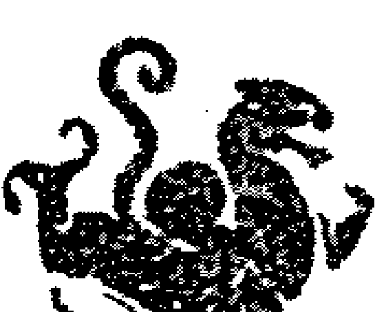

> 请观歌里精微诀，非是贤人莫传与

此歌中之语，句句如神，字字有妙。非是贤者，不可妄传，恐有小辈，得诀入诱小人，为害不浅。遁甲之文，黄帝之师，凤后留传太公，至于子房，晋朝盗乱，废子房于木枕中得此秘文，上有誓诫，曰：“不许传于不仁之人，若非其人，必受其殃，得其人而不传，亦受其殃。”晋尚书郭璞撰《青囊经》亦遍入《遁甲星奇》一篇于内，此文乃济世之宝，藏之如珍也。

弘治乙卯解至丁巳春月，重解至正德戊辰年春，方注解类编成册。幸贡后学池本理书。

#### （二）论主客

太公曰：凡主客动静不定，变化莫测，故主客不动之象，或以先动为客，后动为主，或以动为客，静为主，或以先声为客，或以天盘为客，地盘为主，诸事总有用诀，成败胜负，皆贵乎主以宾之紧要也。如出兵动众，以我为客，至彼地为主；或贼巢及贼所侵之城廓为主，或以阳为客，阴为主；或反客为主，反主为客。若选将求贤，招兵买马，干谒访友之类是我为客，彼为主。如有人来求我，或通知我，而我未知，是彼为客我为主。如在此对阵，或不在此对敌，再又分主客也。或此时交锋，若利客宜先耀武扬威，放炮呐喊，若利主，惟宜偃旗息鼓禁声而敌，埋伏取胜。

凡发兵，须看贼巢远近，如发兵时交战，或不同时交锋，不可以先动为客，待临敌取主客，到时而用之可也。如此时主客不利，只宜固守，倘若急迫，或被围困，宜以计胜，或运筹，或量敌，或乘天马，或书符念咒等类亦可。如国事都省，府县乡事，家宅官讼，坟茔，求谋名利，婚姻，行人，失脱，逃走，捕捉，即以地盘为主人，天盘为客人，事是多不能细述。大凡天盘诸星，生合地盘为上，地盘生合天盘次之，如客生主为称意美满，进益多端，主生客为耗散迟延必定自败。主客比和，行藏皆遂，主克客，乃半实半虚，自败虚花，事为不果，客克主，则战败无成，求吉皆凶。故善用奇门者，先分主客，然后再明占法。如此时利主，我即为主，此时利客，我即为客，或以进为客，不进为主，在我一心，不可执一，为客为主，任我可也。

主客关系在奇门遁甲的应用中很重要。对主客的正确分析，有利于对事物持有主动权，对一件事的决策起着重要的指导作用！故古人说：善于运用奇门的，先要明确主客的关系，然后再明预测的方法。严格的来说，除地盘代表主象外，天盘九星奇仪，人盘八门，八神，都代表客象。如去一个地方，以门为人为客，以所去之宫为主，如果宫克门，说明地方克人，对人不利，宫生门，则此地适合此人发展。门克宫，人能适应此地。门为人，宫为人所到之地，主客相生当然好了。

主客在具体判断时以：动为客，静为主；先动为客，后动为主；积极为客，消极为主；外为客，内为主；远为客，近为主；天盘九星奇仪为客；地盘九星奇仪为主；门为客，宫为主；时干为客，日干为主。反吟利客，伏吟利主；阳时利客，阴时利主。值符利客，九天利客，九地利主；太阴、六合主客皆利。在预测中如用神临：伤门利客，杜门利主，生门利客，死门利主，开门利客，休门主客皆利。惊门利客（惊门宜破阵，故利客）。

《统宗大全》中讲到：伏吟虽静，利主，但有时也宜动。要选取九天，值符、开门之宫，此三宫虽伏吟，但却利于动，利于客！在主客的关系上要根据时空具体分析，也不能墨守成规。

#### （三）遁甲神机赋

两仪主使，三才攸分，步咒摄斗，鬼神存局通乎妙旨。前修删简，灵文裁整，诸经要理

夫甲加丙兮龙回首，丙加甲兮鸟跌穴，回首则喜悦易遂，跌穴则显灼易成。身残毁兮乙遇辛而龙逃走，财虚耗兮辛遇乙而虎猖狂。癸见丁兮螣蛇天矫，丁见癸兮朱雀投江。生临丙戊，天遁用兵。开乙临巳，地遁安营。伏干格庚临日干，飞干格日干临庚。庚临值符伏宫格之名，值符临庚，飞宫格之位，大格庚临六癸，刑格庚临六己，按格所向吉凶，百事营为不喜。时干克日干，乃五不遇而灾生；丙奇临时干，名为悖逆而祸起；三奇得使，众喜皆臻；六仪击刑，百凶皆集；太白入荧贼即来，火入金乡贼即去；地罗遮障不宜前，天网四张无路走。值符宫同天乙位而取，如逢急难，宜从值符方而行。

二至顺逆，妙理玄微，阳符左为前数，阴符右为前寻。阳遁从冬至前一十二气，值符后一为九天，后二为九地，前三为六合，前二为太阴；阴遁从夏至前一十二气，值符前一为九天，前二为九地，前五为六合，七为太阴。太阴潜形而隐遁，六合遁身而谋议。九天之上扬威武，九地之下匿兵马；天地备兮难量，神机妙兮莫测，学者欲事有谋，存读斯赋无惑。

## 奇门遁甲应用初探

是书谓之《选宅三白之法》，出自《都天撼龙经》八十一论。太乙紫薇九总八卦者，天地之骨随，星斗之神机，八卦五变而及乎无穷，五行推移而应乎无尽。以九星为之九总，以八门为之八卦，上可补天地不全之化，下可助后王不及之功，扶危助吉，发端生祥，非同游一十二分之星图，又殊配二十八宿之格局。

是此书者，正天地之纲纪，明阴阳之经纬，幽深颐隐显达逆元，试看八卦门庭配列九宫，蹊向推迁，六甲驱使六仪，天乙值符星之运局，太乙值日使之指挥，奇以六仪，遇以八节，上下招摇，内外表应，三盘运局，八卦皆通，值其吉则万事堪为，值其凶则一分莫举。

其一曰：都天八卦，其二曰：入地三元，其三曰：行军三奇，其四曰：选宅三白，其五曰：循行太白之书，其六曰：入山撼龙之诀，其七曰：转山移水九字符经，其八曰：建国安邦万年金镜，其九曰：盖为九宫入福救贫生仙产圣，变祸福如反掌，使贫富似等闲。

倘三叠之遇奇门，若蛟龙之得云雨，见六合之逢合局，如虎狼之产羽翼，忌取休囚，防其击刑。如得奇星旺相，必须吉位门开，位位皆宜，门门皆吉，只要合得其要，仍须各论其时。干神不囚，支神不克，神藏煞没，方之万物皆和，反吟伏吟，定是千殃数集，奇逢旺相，是为富贵之谋，门逢开休，方协英雄之应运；青龙反首为甲乙之妙，详值白虎猖狂，见庚辛之凶祸；若值腾蛇夭矫，知壬癸之峥嵘；倘逢朱雀投江，管丙丁之妖怪；飞鸟跌穴，便云百事皆祥；贵人登坛，管取九宫皆庆；通元机而天地皆用，得妙用则触事咸亨。若为文武官僚修造，职位皆增，或与良民士庶休莹，扶危做福，建州府而民安物泰；兴县镇而富足租平；立宫室而福集人依；做庙宇而鬼安神妥；桥梁船驿，井灶路途，或诸余行事，在选择周详，或有太乙将军尽在拱手，任是九良七煞莫敢当头。

不问诸家运气，不超不开，犯者空亡禁杀。但求此局却要有奇，可保千年皆招百福，最勘动土破山，埋宗葬祖，务有奇星到座，门户得开。有龙山者，必求反首之青龙；有白虎者，大忌猖狂之白虎；有元武者，远其天矫腾蛇；有朱雀者，怕其投江朱雀；如斯迎避，用意配求。值飞鸟跌穴，则有异鸟宜雕彩禽坠羽鹰集，弃其亡鸟鹤鹭，返以鱅鱼仙鹤来鸣，彩鸾下集，四仲具全者吉，两头破损者凶。贵人登坛，必有旌旗相乘，雷电风云，印鸾文书，金章紫绶，得青龙反首之日时，当有鳞伏藏金鱼落穴，腾蛇屡化马骤雷轰光焰，金银幡花结彩来应，其时在助其吉，各有克应，合取山头，万无一失之虑，动有十全之吉。分其头绪，布其提纲，具列千端，修明万事，非但谋猷之逢吉，乃天地之献祥，助国安邦，济民利物，得之者，宜什袭于玉匮金滕，真所谓至圣皇家之重宝也。

此篇后部分主要讲奇门在地理方面的应用。不难看出，奇门遁甲在地理方面，必须和地理的形势相配合，如地理形势凶，再配奇门凶格，就为凶上加凶了。只要奇门与当时的地理形势相配得当，就会出现吉的征兆来，也就是所谓的“奇门克应”。

#### （四）刘伯温奇门遁甲总序

窃惟黄帝战蚩尤于琢鹿，梦天神授符，而命风后演就奇门，此遁甲所由始也。帝尧命大禹治水，得玄女传文，而因洛书画叙九畴，此遁甲所由著也。汉子房总局十八而成决胜之功，蜀孔明分列三奇而创艰难之业。先排九宫于掌上，而坎居一，坤居二，震居三，巽居四，中央五，乾六，兑七，艮八，离九，而造化见矣。次分八卦于盘中，而离位于南，坎位于北，震东，兑西，巽东南，坤西南，艮东北，乾西北，而方隅定矣。纵横十五，错叙三元；以八卦分八节，而节令以全；以一节统三气，而气候以备；逢甲己为符头，须闰奇而补局；符速节迟，看甲己临于何处，而用超神之法；节先符后，验日辰甲己何居，而行节气之方，子午东部为冬至后阳遁，历坎，艮，震，巽，仪顺行而奇逆布，由值符而顺飞于九宫也，子午西部为夏至后阴遁，历离，坤，兑，乾，奇顺市而仪逆行，由值符而逆飞于八卦也。认九宫安九星为值符，而吉凶以分。如坎宫，认天蓬为符，则天芮二，天冲三，天辅四，天禽五，天心六，天柱七，天任八，天英九也。配八卦立八门为值使，而休咎以判。如乾宫配开为使，则休门坎，生门艮、伤门震、杜门巽、景门离、死门坤、惊门兑也，移值符于时干，而时干住处值符之起首寓矣；寻值使于时支，而时支住处，值使之方向存矣。天盘九星共奇仪，而一时一易，象天之旋转，地盘九星与奇仪，而五日方移，法地道之贞静也，天盘临地，审吉凶之消长，地盘承天，断休咎之盈虚，天甲子临地甲子，是为伏吟，凡门符临本宫皆同此例，而不可用也。地天英逢天天蓬是为返吟，凡门加冲宫皆同此例，而避之可也。吉门临三奇，而所求皆遂，奇门入墓迫而所为无成。乙丙丁生休门，如合太阴之位，是谓三全，奇吉阴或有无，必审从背之力是谓二可，六仪击刑至恶，而不可使用，九遁合门至利而大可施为，开门合乙而加己位，不犯奇墓门迫名曰地遁，临紫薇而蔽以日精者也。月奇临丁而逢生门，不犯奇墓门迫号曰天遁，乘华盖而蔽以月精者也。休门与丁奇相合，太阴共地盘相临，斯为人遁，方可行师。丙奇同生门而合于九天，属于神星。丁奇遇休门而临于九地，通属于鬼龙，得月奇合休癸，而或临于坎，虎得乙奇临生门，而或出于艮；风遁则日开临于巽，云遁则月开合于坤，此九遁之例名，实兵家之秘。故用之何如，而验之无不应也。

夫星有阴阳，门有开阖，惟天禽则无定位，寄西南而属中宫，从三避五，为害为生，胜地有三，天上值符所临天乙，大将居之一也，值符后一为九天，我军居之二也，地生门而合三奇之宫，若引军而从生门击死，百战百胜三也；不击有五，天乙九天击之，必被其殃一与二也；生门九地犯之，必罹其害，三与四也；值符而临值使之位，如用兵突围催阵，将死军亡五也。孟甲刑门，难以出入，而宜隐迹；仲甲阳内，宜于坚守，而利于藏兵；四季甲时，阴内阳外，须分主客，始决雌雄。六乙为天德，出从而上，日奇之下，可决胜于末然之内。丙为天威，不得丙火销金之令，宜防败于不测；时临六丁，名为玉女潜刑，如隐伏而不见其象；时临六戊，号曰乘龙，万里逢凶徒而自灭其踪；六己为地户，宜阴私而用偷劫；六癸为天网，审高下而利逃亡；六庚而出战，咎将及于其师；六辛而行师，祸必及于其身；六壬为天牢而飞祸速至；六甲为时首，而应局斯灵；甲加丙为青龙，反首而动作无阻；丙加甲为飞鸟跌穴，而运用有成；乙加辛是青龙逃走，而财物废坠。辛加乙，是白虎猖狂，而身体毁伤；丁加癸为朱雀投江，而讼狱所由起也；癸加丁为螣蛇天矫，而忧惶之至；六庚加符为伏官格，不利其主而利其客；值符加庚为飞宫格，不贵于战而贵于谋；庚加值

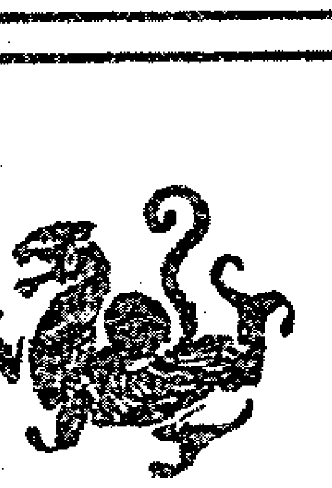

## 第四章 奇门遁甲的应用

符值太白格于天乙，外兵侵而主将必败；符加六庚太乙格于太白，强出兵而客将必阻。值使临庚，名为野战，兵虽精而主困也；庚加值使，名曰同宫，将虽挠而此挫也；庚加于丙，是为太白入荧惑而贼必来；丙加于庚，是为丙火入金乡，而贼必退也；此主客皆不利，莫倚奇门而强用也！天地大格，庚下加癸；天地小格，壬上加庚；庚加于己，士卒死于中途；己加于庚，将兵厄于危路；岁格则岁逢于庚，月格则庚加朔建，庚临日干为伏干格，而主人见伤。日干临庚，为飞宫格，而客将不胜。时干克日为五不遇，而定损其明；丙加日干名曰悖乱，而颠倒纪纲。天有三门，天冲，小吉，从魁；地有四户月建，除，危，开，定；值使相交，乃天乙之所在；值符临处，为天乙之行宫。其直符同乎天乙，有难宜弃门从神。后一为九天，二为九地，九天之上利以扬兵，九地之下利以埋伏，前三为六合，二为太阴，六合之中，逃亡是利；太阴之处潜伏斯宜。三诈之方，举动皆利，是休生开合乙丙丁，九地太阴而然也。五假之地，各有吉凶，是杜死惊伤景，合九地太阴，乙丙丁巳癸而致也。如六戊不测之术，六甲阴符之妙，此乃心悟，难以言传，有志于卫国安民，出将入相者，不可不知也！呜呼分天地于掌握，罗列宿于心胸，风雷从其呼吸，神鬼听其指挥，其天府石室之秘文，运筹决胜之神算乎？

此篇为刘伯温对奇门遁甲在应用方面的总体概括论述。“庚加于丙，是为太白入荧惑而贼必来；丙加于庚，是为丙火入金乡，而贼必退也；此主客皆不利，莫倚奇门而强用也”此段一再强调虽得“奇门”，但也需仔细分析格局、主客的吉凶，不一定得“奇门”就可用无疑！

#### （五）总法天机（前篇）

凡布演奇门，先观天象，后察细微，总在我一心之所用，不可不知也。如天盘九星奇仪八门属金，加于地盘诸星木上，是金为客来伤主，战利为客，行兵先举放炮呐喊，士卒精强，百战百胜。凡求谋请谒交易等事，破败惊忧，客舍暗昧，遭逢盗贼小人惟行人即至。若金旺木衰，其凶尤甚。如天盘金星在衰墓死绝之时，加于木，无气之金，不能克木。若木在主旺之时，则木星为吉。如木亦衰墓绝之时. 而凶终不能免矣。如天盘木星加于地盘火星，是为木能生火，战利为主，谋为一切等事皆如心意。如有重木临生旺之宫，谓之贪生之木，压火无光，火渐自灭。若木临退气之宫，或木少多火，如木生火，大利主兵。如天盘土，加于地盘金，是客来生主，若是土旺，或有重土，虽曰生金，而土重埋金，乃有暗兵埋伏，或英雄矢志，或忠烈受屈。如天盘木，加地盘金，乃主伤其客，宜偃旗息鼓禁声而敌大胜，凡有谋为事多破败，有始无终，惟求名显达，官事得失，出行吉利。如天盘金加地盘土，乃主生客，宜耀武扬威，征兵唱凯歌兵大胜，凡事谋为始终皆耗，劳碌劳力得后安妥。

此篇讲物极必反，吉中藏凶之理！如金在午月本身处死地，加巽宫，虽为金来克木，但金死绝就没能力克木。如木在得令之时，更不惧其金来克，反而金会因“木旺而使金缺”自己受伤受损。但最怕金在申酉年月日时来克木了，此时凶则难免。木旺生火当然为吉了，对方对自己有利之象，但，太多太旺的木，加在微弱的火上，则反而将火压灭。就如一个人对一个人过分的讨好时，就会让人感觉对方必有所图谋一样，此“生”的后面也许藏有一种企图。万事万物都不能超过极限，所以古人曾讲：“君子之交，应淡如水，水清则无鱼”。凡是我生者，必定耗我之精力、财力。“凡事谋为始终皆耗，劳碌劳力得后安妥”。就如我去求人与人来求我两者有很大的差别一样。但，做任何一件事情，都要通过自身的努力，辛勤的耕耘，而最后才可得到，此言先难后易之象！

#### （六）作用妙法（后篇）

妙用之法，全在年月日时四天干。详临九宫，合为吉凶等格，则知圣君，贤臣，孝子，慈孙，父母，妻妾，奴婢，戚邻，诸事成败可推详。年干为君，为父母，月干为臣宰，为伯叔，日干为兄弟、朋友，时干为妻妾，子女，士卒、奴婢，如天盘年干合吉格，门生宫，或上下相合者，主国泰民安，君臣父子福寿康宁。若年干合凶格，或被冲克，主四海兵戈，身心不宁，骨肉刑伤，灾厄忧惊。若月干得天盘相生，或合吉格，有忠臣烈士辅国安民，加官封爵，万事称心，君合凶格又被克，有奸臣专权休官罢职，六亲参商，贫苦奔波。若日干得天盘八门，生合吉格，主兄弟和睦，贵喜临门，身安友助，求谋遂心；若日干被克合凶格，主兄弟刑伤，六亲不合，身困招灾。若时干得天盘生合吉格，主妻子贤能，士卒精强，奴婢得力；倘合凶格被冲克，主子刑伤，父子不和，其卒自乱，奴婢欺主。凡六庚加于年月日时干上，或年月日时干如临六庚上，须看六庚加于何人干上，则知某人之吉凶。吉格尤吉，合凶格尤凶，骨肉不和，己身危困。假如阳遁三局，甲己日起丁卯时，时干在九宫离上，开门遁甲子戊，天冲一同临宫，惊门与庚在坤二宫，如己日为飞干格，主兄弟不和，朋友反目，身困招灾。又如阳遁九局，乙庚日起丙子时，得青龙返首吉格，主贵喜盈门，身安友助，求谋遂心，若看年干月干时干，须另起，不可即以此为准。

此篇主要讲以年月日时为用神，来分析六亲的情况。后面讲如果要看年干月干时干，必须另外再起局来做分析。笔者认为大不必要，往往一个局象完全可以分析出其他六亲的情况来。

#### （七）临机变用

人为万物之灵，感通诸事之应，在我一时之动静。取其人事器物以推兵家胜负，人生得失，物之成败。就于出师，或以动众发马立营，或为人事之得失离合，或器物所得之日时为始，逐日查算，利于何日时交锋得胜，何日时贼来，何方日时埋伏于何处，何日时成功奏凯。如欲知人之寿夭穷通，则取本命年月日处演布，而妻财子禄从可知矣。凡物之破损成败久暂，以所得之时日或方见之时，以及物长短方圆，成五行所属配合遁甲，则物器破损被益可预知矣。如军营凡有一见一闻，或遇移到斜蹲错落金鼓等项，或听言语善恶，或见旗鼓破损，或鸟兽来从何方，但一见一闻怪异之事，俱可为吉凶之兆。或听人言语几声几字，或金鼓不时乱鸣几声，或乐器不时远近响动几声，凡事物遇目一见皆可取占卜之，应在吾心一动，活泼变通，切忌不可取其一，又取其二，以致吉凶无所定也！如取其件或吉凶不准，再取别物占之，又不准是心未定，所以吉凶无验也！如遇一字、一点、一物、一声、一人、一兽即为子时，二为丑，三为寅，如甲己日遁起甲子时，若数有十三，即第一次，丙子时，若数多皆逢于时，即为第三次，第四次，五次，戊子、庚子、壬子，再数过多五子用尽，即作为乙丑、丁丑、己丑、辛丑、癸丑，如此千时，万时皆仿此。若出师须详看领军官，及大小头目，本命，天子，合吉凶等格，或可于征伐，或利于埋伏，或利于冲锋，或利于接应，总视其人利于行事者斟酌行之，则大小三军皆无误矣！

此篇主要讲灵活起局，灵活应用奇门。以据当时的情况，以外应，方向，数字，物品特性，以它们的象意落宫来分析。上面所说的“如遇一字、一点、一物、一声、一人、一兽即为子时，二为丑，三为寅”为变时法。在本时辰内，局不变只变时辰。也可以根据数的多少，配以宫数来分析。如来人报数为三，就可根据与三相应的宫位震宫来分析。如果数多，除九以余数配宫，也可根据所报之数，依据阳遁，阴遁的规定不变原则，来起阳遁三局，或阴遁三局。此法笔者曾应用过，也有一定的准确率。此方法一般在对多人进行详细预测时使用。《奇门统宗大全》中讲到：“奇门之法玄妙难知，如天之高而不穷。然天地间事事物物悉在其中，吉可趋凶可避。造化可以挽回。随问随答，不假思索。顺乎天而不杂以人，自然吉凶之验如响应，无所不灵。切勿以私心搜索玄奇，以涉于伪妄。六壬以射覆为先锋，奇门以克应为微妙，触机即发，物来顺应，凡有所遇恍惚之中，或用当下正时，或随便摄取一时布局推占，云医雨蒙，皆用此法，不必搜求时刻，只要静心理会，无有不验！”

预测推理时，除了要掌握一定的理论知识外，在实践推测时要“心静，以物观物，不可掺杂自己的某些主观意识”去分析，故邵子曰：“以物观物，性也；以我观物，情也；性公而明，情偏而暗，有我之境，以我观物，故物皆着我之色彩”。

#### （八）奇门主用精微赋

夫遁甲者，轩辕立法，风后演行。运九宫八卦之数，用三奇六仪之灵。八门各主吉凶，九星区分祸福。三光下照百福咸臻，六甲来临千祥骈集。蓬星六乙宜施恩赐赏加封，六丙明堂喜振武杨威发号。六丁玉女宜筑垒安营，六戊天门出师遣将，六己为地户修营疆界。六庚乃天刑宜决狱屯兵固守。六辛天庭宜杜塞判断潜形，六壬天狱出兵不利。六癸天藏宜隐遁。阳时利客扬威操鼓，阴时利主伏路衔枚。阳星开而百事可行，阴星阖而诸凶莫作。天蓬筑垒喜安边，天芮屯兵休进战。天冲天辅遣将成功，天柱天心出军欠利。英柱凶而不吉，天禽半吉多凶。开门得胜深征，生门强兵献策。休利出兵，景宜突阵。伤门患害喜索债，不可行军。杜塞不通宜保障，潜形遁迹。死门只许攻猎，惊上还宜进战。值符滕阴六虎玄天藏兵，九地扬兵九天滕蛇玄武。凶危六合太阴外避，九天生门天乙三胜地，谁敢相凌，符使天地生门五不遇时，孰能进战。宫克星而利主，星克宫而客胜。门制门害多凶，门义门和大利。入墓击刑而不吉，游仪得使必多亨。开三宜用，闭五非通。玉女守门喜宴乐于公庭，五不遇时忌凶忧而无用。天网四张，高低门式。天辅时逢凶化吉，咸德时遇难成恩。春不东伐，夏不南征，秋莫西攻，冬毋北战。太岁之方岂容冲犯，反吟伏吟进退多端，勃兮格兮忧惶不已，朱雀投江兮忌远征，滕蛇天矫兮防惊恐。虎猖狂兮伤残，龙逃走兮陷阵。鸟跌穴宜出阵，龙返首喜兴师。白入荧而盗来，火入金乡而贼去。六甲置阵用在日干，金方木直，而土圆水曲，丙丁而火熖。五音择将胜负先知，宫商角征羽音，金木水火土。火御水而被害，木筏金而返伤，我生他克此凶，我克他生彼败。天遁上策出兵，地遁屯军固守，人遁择士求贤，龙遁渡江水战，神遁祷术祈神，鬼遁偷营劫寨，虎遁拘安涉险，云遁噀甲助威，风遁歌谣作乐。通乎此者，良将握战胜之机，士庶神趋吉之用。熟加详玩，万举无差。

此篇实可称为“兵机赋”。

#### （九）奇门遁甲吉凶格局

以古籍《遁甲演义》所载为主

##### 天遁
歌曰：生门六丙合六丁，此为天遁自分明。经曰：上盘六丙，中盘生门，下盘六丁。生门合六丙，月奇下临，天上六丁，此时得月华之所蔽，亦不可犯奇、墓门迫。其气升，内应其心，外主其身。下注其心，名曰玄珠。能听而修者，升天有事，呼玉女神名，丁卯而出其神，随护咒曰：丁卯玉女护我，佑我，毋令伤我。视我者瞽，听我者反受其殃。咒毕行去，慎勿反顾其方，可以称王侯之权，利朝君王。醮谢苍穹，礼神求福，极利征战，使敌自伏，上书献策，求官进职，修身隐迹，剪恶除凶，市贾出行，百事俱吉，婚嫁入宅，往来此方，大吉。假如阳遁四局，乙庚之日，乙酉时，天心为值符，加时干六乙开门为值使，加时干七宫，即生门与月奇，六丙临六丁于一宫，是为天遁。阴遁六局，戊癸之日庚申时，天蓬为值符，加时干，六庚休门为值使，加时干四宫，即生门与月奇，六丙临六丁于九宫，是谓天遁。

##### 地遁
歌曰：开门六乙合六己，地遁如斯而已矣。经曰：上盘六乙，中盘开门，下盘六己。开门与六乙日奇临地下六己，此时得日精所蔽。其气黄，内应其脾，外应其形。任呼任用，又名黄婆金公，能修之者，南宫列仙，有事呼本旬玉女，依前法咒之大护其验。盖己为地户得日精，盖之其方，可以藏休，兵锐立寨，安营建府，造置仓库，筑垣墙，安坟开矿，修道求仙，逃亡绝迹，出阵攻城，全师捷胜，百事大吉。假如阳遁一局，丙辛之日辛卯时，天冲为值符，加时干六辛，伤门为值使，加临一宫，即日奇临六己于二宫，是为地遁。假如阴遁九局，夏至甲己日丙寅时，以甲子天英为值符加坤丙以景加七，其时开门，合天上乙奇临地盘六己于艮八宫，是为地遁。

##### 人遁
歌曰：休门六丁共太阴，欲求人遁无过此。经曰：上盘六丁，中盘休门，下盘太阴。休门与六丁星奇合，下临太阴之位，得星精所蔽，其气青黑，内应肾，外主耳目，名曰还阳丹。修之者在世长年，有事出门，呼本旬玉女如前咒之，其方可以择贤人，求猛将，隐形保身，通灵入梦，受道成功，说敌和仇，藏伏献策，谋结婚姻，添进人口，和合交易，利市十倍。天则随其所求，地则随其所视，人则随其令，保持全胜之玄机也。假如阳遁七局，乙庚日丙子时，天任为值符，加时干六丙于五宫。生门为值使，加临一宫。即休门与六丁星奇，下临值符，前二六宫。太阴中也。

假如阳遁上元一局，甲己日丙寅时，此时天上值符，临八宫，即后一九天临一宫，后二九地临六宫，前二太阴临四宫，前三六合临九宫。假如阴遁上元九局，甲己之日丙寅时，此时天上值符，临二宫，即前一九天临七宫，前二九地临六宫，后二太阴临四宫，后三六合临三宫，或欲出行者，于所向之方，呼其星辰之名，而行六十步，方左转入太阴中。

假如阳一局，甲己日丙寅时，六丙在八宫，以天上六甲，天蓬值符，加八宫，欲出东北方，呼其星辰之字，子禽行六十步，入太阴中，此时前二太阴临四宫，前三六合临九宫，左回入东南，及正南，皆太阴中也。凡出入用事，皆向六甲所在之方。呼其神名，五行相制，行六十步，左转入太阴中。甲子旬首神名王文卿。若登坛拜将，钦授兵符。运筹发令储粮，皆向其方，呼其神名。五行相制，行六十步，转入太阴中，则发握如神。甲戌旬首神名徐何，若开渠、治路、决河，呼之而行如前。甲午旬首神名灵光，安营置阵，巡狩战斗者呼之。甲申旬首神名盖薪，入草畋猎者呼之。甲辰旬首神名含章，求官拜将、临民赴任者呼之。甲寅旬首神名监兵，扬兵振武，行军者呼之。六甲内，管五行而动静无方，其五行而含胜，有相生相克。左手相天，右手法地，其神体好静。故书五行相制，运化之道，无不兼该。见贵求官，左手书天字。商贾兴贩，亲友嫁娶，书和字。入山捕猎，书狮字。部工居众，书强字。过河治水，书土字、戊字。游山入道，书龙字。以上三遁，最宜隐遁，人莫能窥。天遁下盘合六丁，乃三奇之最灵，又为六甲之阴，谓奇门相合，有如华盖之遮体也。地遁下盘临六己，为地之私门，又谓地户之阴，谓奇门相临，有如紫云之遮体也。人遁下盘临太阴，蒙昧之象。盖阴晦不能睹万物，谓奇门阴宫相合，如有阴云之遮蔽也。右三遁之时，凡用事，兴兵施为，出入修营宫室，万事吉利。

##### 神遁
歌曰：天上六丙临九天，再合生门神遁然。丙奇与生门下临九天之位，得神灵所蔽其方。可以祭神灵，用圣术画地，立筹，步凤，置造坛场，刻鬼神，摄魔昧，自有戚伏。更利攻虚、阴谋密计，玄妙开基，修建庙宇，塑画褙表神像，以应神候。

##### 鬼遁
歌曰：天上六乙合九地，临于杜门鬼遁取。丁奇与休门相合，下临九地之位，又曰：乙奇与开门相合，下临九地之位，得鬼神隐伏之蔽其方，可以探机，偷营劫寨，设伏攻虚，密伺动静，诡诈文书，超亡，荐孤拔寡，以候鬼应。

##### 风遁
歌曰：天上六乙合三门，下临巽宫风遁矣。又曰：丙奇与开门相合，下临巽宫不犯墓迫。得灵奇顺风爽帆之蔽。又曰：三吉门临地盘乙奇。又曰：开休生三门与六丁星奇相合，下临地下六己。又曰：辛仪与奇门下临六乙，其方可以默吸风云；喷噀旌旆。令众士沉吟听音。又丙奇开门相合，下临坤宫，更宜祷祭风伯雨师，敌垒战立旌旗，以候风应。云遁歌曰：天上六乙六辛，临三吉门云遁取。又曰：凡乙奇与开门合，下临坤宫不犯墓迫。得云之蔽。又曰：乙奇与开门合，下临六辛，其方可以默吸风云喷噀，甲胄音遥普遍，或记射雕为名，令士卒仰望，并及利求雨泽，助农稼，建立营造军器，以候云应。

##### 龙遁
歌曰：乙奇合休于坎宫，此为龙遁云从起。又曰：伏吟乙奇与休门相合，下临六癸，或在坎，得龙之蔽其方，可以祭龙神，祈雨泽，水战演敌，计量江面，把守河渡，教习水战，密运机谋，移舟转向，下船开江，造置水柜，祭祷鬼神，填堤塞河。修桥穿井，以应龙候。

##### 虎遁
歌曰：天上六乙合六辛，临休到艮虎遁门。又曰，乙奇与生门临六辛，得虎之蔽。一云；辛仪合生临艮宫方，可以招安，设伏邀击。计度要害，据险守御，建立山寨，措置关隘，防险修凿，以候虎应。

##### 三诈五假:

歌曰：奇与门兮共太阴，三般难得总加临。若还得二亦为吉，举措行藏必遂心。阳遁直符前二宫为太阴，阴遁直符后二宫为太阴。谓奇门与太阴三者不能皆得，若得二者，亦吉，遇之可伏兵也。

古经云：凡欲经求万事，宜休开生下合乙丙丁即吉。又取阴门相助，谓之三诈。凡太阴、六合、九地宫助奇门，全备用之，有十分之利。若三门合三奇无诈宫，谓之有奇无阴得七分之利。若三门合太阴无三奇，谓之有阴无奇，犯者不利。

- 若三门合三奇，下临太阴宫，名曰真诈。
- 若三门合三奇，下临九地宫，名曰重诈。
- 若三门合三奇，下临六合宫，名曰休诈。
- 真诈宜施恩隐遁求仙。
- 重诈宜进人口，取财拜官授爵。
- 休诈宜合药，治邪祈禳之事。
- 若杜门合丁己癸，下临九地，名曰地假，宜潜伏。此三时加杜门者，可以藏形隐神。
- 若杜门合丁己癸，下临六合宫，利逃亡。
- 若景门合乙丙丁，临九天，名曰天假，乙为威德，丙为威武，丁谓太阴，三奇之灵，宜陈利，便进谒。干求。
- 若伤门合丁己癸，下临九地，名曰神假，利埋葬。
- 若惊门合六壬，下临九天宫，名曰人假，利捕逃亡。
- 若杜门合丁己癸，下临太阴宫，利遣人间谍探事。
- 若死门合丁己癸，临九地，名曰鬼假，利超亡荐度。

##### 飞鸟跌穴
歌曰：丙加甲兮鸟跌穴。进飞得地，云龙聚会，君臣燕喜，举动皆宜。此时从生击死，一敌万人，百战百胜。不论阴阳二遁，此时出兵、行营、远游，百事俱吉。君子利，小人凶，所谓天盘丙奇加地盘本时甲旬头也。

假如大寒中元阳遁九局，甲己日辛未时，此时六丙在七宫，以值符，天英加时干六辛于三宫，得六丙下临六甲，于九宫戊上。此名为飞鸟跌穴。

假如大寒上局，阳三遁震宫，起甲子，甲己日丁卯时，天冲值符，加丁时干离上，即六丙下临六甲于三宫，此名飞鸟跌穴。

##### 青龙回首
歌曰：甲加丙兮龙回首。不问阴阳二遁，得此局，更合奇门上吉。虽无吉门，亦可用事，凡利见大人，举兵利客。扬威万里，从生击死，一敌万人，百事皆吉。

假如阳遁一局。甲己日丙寅时，值符甲子戊，与开门相合，加于八宫地丙之上，此为青龙返首也。

##### 玉女守门
歌曰：又有三奇游六仪。号为玉女守门扉。若作阴私和合事。请君但向此中推。三奇游六仪者，乃天上乙丙丁游于甲子戊甲戌己甲申庚，甲午辛，甲辰壬，甲寅癸，之六仪也。玉女守门者，谓丁为玉女，而会天乙，值使之门也。

如阳遁一局，甲己日庚午时，丁奇在兑，而庚午时亦在兑，休门值使加地丁七宫是也。故甲子用庚午，甲戌用己卯，甲申用戊子，甲午用丁酉，甲辰用丙午、甲寅用乙卯。

##### 三奇得使
歌曰：三奇得使诚堪使，六甲遇之非小补。乙马逢犬丙鼠猴，六丁玉女骑龙虎。甲戌甲午乙为使。甲子甲申丙为使，甲辰甲寅丁为使，其法甲木畏庚金，是以三奇所使，除去巳酉丑，而甲午甲戌拱乙未，且乙木生午墓戌故。乙为使也。火库于戌，而亥宫，甲木生丙火。是以甲子、甲申拱戌亥，而丙为使也。丁卯为甲子之阴，甲寅、甲辰拱之，故丁为使也。乙为使者，乙奇加甲戌、甲午丙为使者，丙奇加甲子、甲申也。丁为使者，丁奇加甲辰、甲寅也。此时最吉。

假令阳遁九局，甲己日庚午时，此时六乙日奇下临三宫，甲午是为乙奇得使。

假令阴遁三局，丙辛日壬辰时，此时乙奇在杜门，下临九宫。甲午辛亦为乙奇得使。

假令阳遁九局，乙庚日戊寅时，此时丁奇下临四宫，甲辰是为丁奇得使。

## 第四章 奇门遁甲的应用

使，但乙奇加甲午辛乃青龙逃走，丙奇加甲申庚上，乃荧入太白，丁奇加甲寅癸，乃朱雀投江。凡此三者，尚有微疵不吉。如遇本旬直符同临其上，方可用之而吉也。

##### 天显时格（又名天辅大吉时）

甲、己日的甲子时、甲戌时，乙、庚日的甲申时，丙、辛日的甲午时，丁、壬日的甲辰时，戊、癸日的甲寅时，一句话，值班的六甲大将透出之时，或与日干相合之时，虽然此时奇门格局也是伏吟，但不为凶，反而为吉。

这些时辰宜行兵、战斗、上官、参谒、求财、远行皆吉。有罪者也能逢赦免。

##### 青龙逃走

歌曰：六乙加辛龙逃走，金为太白乃白虎。木为青龙金克木，龙虎相战凶。王璋曰：此时不宜举兵，主客俱伤，百事凶。

《奇门大全》云：六乙加辛，此时举兵动众，主失财，遗亡破败。又曰：乙加庚亦是。假如立秋上元阴遁二局，丙辛日己亥时，六乙在三宫，以直符天任加时干六己于一宫，即六乙下临六辛于八宫，此时青龙走也。白虎猖狂歌曰：六辛加乙虎猖狂。赤松子云：刀逢暗磨，疑如之何。彼欲见害，无阴可和。六辛加六乙，白虎也。悲哀若与干钱财，自己须防灾。华盖属金为白虎，故辛加乙为白虎猖狂。

王璋曰：天上六辛加地下六乙，此时不宜举事，主客两伤，婚姻、修造大凶。假如小暑中，阴遁二局，甲己之日壬申时，此时天芮直符，加天盘六辛，下临于三宫，原乙在三宫，是为白虎猖狂也。

##### 朱雀入江

歌曰：六丁加癸雀入江。丁属火为朱雀，癸属水，故丁加癸朱雀入江。

> 《奇门大全》云：“丁加癸，主文书牵连，或失脱文书，占家宅有惊恐怪梦。用兵防”。

> 王璋曰：“天上六丁加地下六癸，名曰朱雀入江，使人百事皆凶。六丁加六癸，朱雀入水流，口舌犹未罢，官事使人愁。”

又曰：“或有诉讼，自陷刑狱，或闻火起，不必往救。”假如夏至中元阴遁三局，甲己日壬申时，此时六丁在六宫，以直符天冲加时干六壬于八宫，即六丁下临六癸于七宫，是为朱雀投江也。

### 奇门遁甲应用初探修订版

##### 腾蛇跃跷

歌曰：六癸加丁，蛇跃跷。六癸加六丁，跃跷迷路程，忧惶难进步，端坐却不宁。谓癸属水为北方玄武龟蛇，丁属火，故癸加丁为腾蛇跃跷。

王璋曰：天上六癸加地下六丁，名腾蛇跃跷，此时百事不利。

假令冬至下元阳遁四局，丙辛日戊子时，此时六癸在九宫，以直符天心加时干六戊于四宫，即得天英为六癸，下临六丁于一宫，是为腾蛇跃跷也。虽有奇门临，亦主虚惊不宁。

##### 大隔

歌曰：“庚加癸兮为大格。六庚如加癸，图谋未可通。求人终不见，端坐即还宫。”

汤谓曰：“六庚加癸名曰大格，时也，谓天上六庚临地下六癸，此时不可用，百事凶，遗亡亦不可得，求人即不在反招其咎。大格不宜远行，车破马死，造作人财破散也。”

假如秋分下元阴遁四局，甲己日丙寅时，此时六庚在二宫，以直符天辅加时干六丙于六宫，即得天丙六庚下临六癸于八宫，此名大格也。

##### 小隔并岁隔月隔日时隔

歌曰：加壬之时为小格，又兼岁月日时移。六庚加六壬谓之小格，一云伏格。当此之时，并不宜出师。论岁格：《三元经》云：六庚加当年太岁之干，名曰岁格。此时用事凶。

《奇门大全》云：六庚加今岁干，如甲子年庚加甲子也，大凶。六庚加年月日时干动，有凶隔，闻客先败。占家宅年为父母，月为兄弟，日为己身，时为妻妾。假令辛丑辛立春中元阳遁五局，岁午在辛，以甲己之日癸酉时，六庚在七官，以值符天禽加六癸于一宫，即见天柱六庚下临六辛岁干于八宫，此名为岁格也。

论月格：《三元经》曰：六庚加月朔格，为凶时也。假如立春上元阳遁八局，月朔干在甲己日丁卯时，此时六庚在一宫，以值符天任加六丁于五宫，即得天蓬为六庚，下临月朔干六己于九宫此名月朔格也。

论日格：《三元经》曰：六庚加当日日干为日干格，此时用事大凶。假如小暑下元阴遁五局，日干在甲己日丙寅时，以天禽为直符加时干六丙于七宫，即六庚在七宫下临六己于四宫，此名日干格。

论时格：《三元经》曰：六庚加本时干者，为时格，亦名伏吟格。假如小寒上元阳遁二局，丙辛日己丑时，六庚在四宫，以直符天辅加时干六己于三宫，此为时格也。凡六庚为直符，其十时皆为时干格也。

##### 刑隔

> > 歌曰：加己为刑最不宜。六庚加六己，赤地须千里。远行车马堕，军兵半路止。汤谓曰：六庚加六己为刑格，谓天上六庚加地下六己，此时出军，军破马死，中道而止，士卒逃亡，慎勿追之，反招凶咎。

> > 《奇门大全》云：六庚加六己，求谋主失名，破财疾病。假如大寒上元阳遁三局，甲己日丙寅时，此时六庚在五宫寄二宫，以直符天冲加时干六丙于一宫，即得天禽为六庚，下临六己于四宫，此名刑格也。巽巳同宫，巳刑申也。

##### 悖隔

> > 歌曰：丙为悖兮庚为格，格则不通悖乱逆。天丙加地庚为悖，天庚加地癸为格。天上六丙加年月日时之干直符类同。凡举百事，主纲纪紊乱。

> > 经曰：丙丁直为悖，火星焚大屋，移室且安。然独自闻愁哭。庚加年月日时干，假尔为客不宜争，统兵领众避此时，惟宜固守，不移行。以上悖格，如不得已运筹布局，反闭而去，变凶为吉也。凡遇六丙六庚之时，为直符加时干，则十时皆悖格也。

##### 荧入白

> > 歌曰：六丙加庚荧入白，荧入白兮贼须灭。天盘丙如地盘庚，是火入金乡，此时闻贼当退。假如小满上元用阳遁五局，丙辛之日戊戌时，此时六戊在五宫，以天任直符加时干六戊于五宫，得六丙下临六庚于七宫，即荧惑入太白也。

> > 《奇门大全》云：丙加下庚也，此时战宜回避，不宜冲击，占贼来，信必虚诈。赤松子云：荧惑入太白，上下相击剥。内往外灭，以谗贼陷。

诗曰：二星相入凶气横，任得奇门慎勿行。此星若也行兵去，金火之辰是恶神。

又曰：六丙来加六庚上，真贼逃避不为灾，假如阴六局，甲己日丙寅时，六丙在八宫，以直符天心加时干，即六丙下临六庚于四宫，此为荧惑入太白，占贼不来，天英天景门到七六宫，亦是火到金乡也。

##### 白入荧

歌曰：六庚加丙白入荧，白入荧兮贼即来。天盘庚加地盘丙，乃金入火乡。而受克凶，对敌宜防贼。假如清明上元用阳遁四局，甲己之日壬申时，此时六壬在八宫，以天辅直符加时干六壬于八宫，得天心为六庚加临六丙于二宫，即太白入荧惑也。

汤谓曰：庚为太白丙为荧惑，若此时对敌，宜防贼来。上盘六庚加下盘六丙是也。诗曰：天上六庚加六丙太白入荧贼欲来。假如夏至中元阴遁三局，乙庚日戊寅时，六庚在一宫，以天芮直符加时干于三宫，即六庚下临六丙于二宫，即太白入荧惑，又天心天柱到离宫，亦是金入火乡也。

##### 伏干格

歌曰：庚加干为伏干。天乙伏干格，《三元经》曰：六庚为太白加日干，即为伏干格。此时主客斗伤，皆不利。

诗曰：日干若遇六庚临，以此名为伏干侵，若是战斗须不利。大都为主必遭擒。假如小满上元阳五局，甲申日壬申时，六壬在九宫，即天柱为六庚，下临九宫，见今甲申，是为天柱六庚所加也。此为天乙伏干格。

##### 飞干格

歌曰：日干加庚飞干格、诗曰：日干及临庚飞干格，偏明争战还不利，为客最平平。

《三元经》曰：今日之干加六庚飞干格，此时战斗主客两伤。假如小满上元阳遁五局，甲己日庚午时，此时甲子在五官寄二宫。以直符天禽加时干六庚于七宫。即得日干六甲，下临六庚于七宫，此名飞干格也。

##### 伏宫格

歌曰：庚加直符天乙伏，一庚加直符宫，伏宫格为宗。交锋多不利，为客少成功。

> 《三元经》曰：六庚加直符，名为天乙伏宫格，此时客主皆不利。斗战交兵气自衰，占见人不在，占来人不来。

> 《奇门大全》曰：六庚加天乙直符，此时主客皆不利。假如立春下元阳遁二局，甲己日壬申时，此时六壬在六宫，以天上天芮为直符，加地下六壬，于六宫，即得天辅为六庚下临直符天芮于二，此名天乙伏宫格也。

##### 飞宫格

> 歌曰：直符加庚天乙飞。飞宫是何星？直符加六庚。两敌不堪争，为主似不赢。

> 《三元经》曰：直符加六庚，名天乙飞宫格。此时主客不利。

> 《奇门大全》云：此时固守，出则大将遭擒。假如春分中元阳遁九局，甲己之日日中庚午时，此时六庚在二宫，天英为直符，以天上直符加时干六庚于二宫，即得天英为直符，下临二宫，见六庚，此名天乙飞宫格也。

##### 六庚加宫六庚同宫格

> 歌曰：加一宫兮战在野，同一宫兮战于国。庚加日干，日干加庚，俱不利。如庚加一宫，或天盘庚，或地盘庚，同一宫，皆主战不利。天乙格谓六庚临天乙所居，地宫也，战于野，凶也。天乙太白格，谓天乙直符，与六庚同宫，而行战于国，凶也。加时与太白格，利野斗，若直使加六庚，宜固守，伏藏。凡遇诸格之时，用兵主客俱不利。占人在否格，则不在，占人来否格，则不来。

##### 三奇受制

> 王璋曰：乙奇临乾惊门庚辛囚死，乃木入金乡也。丙奇临坎休门壬癸囚死，乃火入水乡也。此谓三奇受制，万事不可举也。

##### 五不遇

> 歌曰：五不遇时龙不精，号为日月损光明。时干来克日干上，甲日须知时忌庚。

> 葛洪曰：五不遇时者，谓刚柔日相克，而损其明。纵有奇门不可行百事，凶。

甲日庚午时，乙日辛巳时，丙日壬辰时，丁日癸卯时，戊日甲寅时，己日乙丑时，庚日丙子时，辛日丁酉时，壬日戊申时，癸日己未时，乃时干克日干，阳克阳干，阴克阴干，名为主本不和，极凶。

##### 三奇入墓

> 歌曰：三奇入墓好思推，甲日那堪见未宫。丙奇属火火墓戌，此时诸事不须为。更兼六乙来临未，星奇临八亦同论。此乃乙丙丁奇临六宫在戌，谓之入墓，不但奇临之，遇丙日见戌时亦是。

> 王璋曰：三奇入墓者，谓六乙日奇下临二宫，六丙月奇到六宫，六丁星奇下临八宫。是谓三奇入墓也。假如阴遁四局，丙辛日庚寅时六丙月奇下临六宫，是谓月奇入墓。凡遇三奇入墓，纵有奇门，不可举兵，百事皆凶也。经云：三奇入墓何时辰，丙奇乾上乙临坤，或遇丙奇居戌上，还加丁向丑中存。

> 歌曰：又有时干入墓宫，课中时下忌相逢。戊戌壬辰兼丙戌，癸未丁丑己同凶。葛洪曰：三奇者，谓丙戌时，时为月奇入墓之时。

又曰：凡遇乙庚日丁丑时，为丁奇入墓，黄昏是丙戌时，故为月奇入墓之时，是为三奇入墓。

丙戌时丙属阳火，火墓在戌。壬辰时壬属阳水，水墓在辰。丁丑时丁属阴火，火墓在丑。癸未时癸属阴水，水墓在未。戊戌时戊属阳土，土墓在戌。己丑时己属阴土，土墓在丑。故戊己中央之土，赖母而生。盖以戊同丙火生于寅巳，同丁火生于酉，前六时干辰入墓，亦不可用。

##### 六仪击刑

> 歌曰：六仪击刑何太凶？甲子直符愁向东。戌刑在未申刑虎，寅巳辰午刑午。六甲地支相刑，与自刑也。如甲子见卯，甲戌见未，甲申见寅，甲寅见巳，为相刑。甲辰见甲辰；甲午见甲午为自刑。

> 葛洪曰：六仪击刑者，谓六甲直符加所刑之地也。甲子直符加卯，卯刑子也。甲戌直符加未，戌刑未也。甲申直符加寅，申刑寅也。甲午直符加午，午自刑也。甲辰直符加辰，辰自刑也。甲寅直符加巳，寅刑巳也。

> 王璋曰：甲子直符加三宫，甲戌直符加二宫，甲申直符加八宫，甲午直符加九宫，甲辰直符临四宫，甲寅直符临四宫，已上皆为六仪击刑。

郭璞论：三合之刑，金刚火强，各刑本方，水流趋东，木落返本。甲寅甲午甲戌火局，刑巳午未，南方；巳酉丑金局，刑申酉戌西方；甲申甲子甲辰水局，刑寅卯辰东方；亥卯未木局，刑亥子丑北方。假令冬至上元阳遁一局，甲己之夜半，甲子为直符。至日出卯时，是六仪击刑也。至庚午时，以甲子直符，加六庚于三宫，即六仪击刑时也。其时极凶，不可用事。

##### 伏吟格

歌曰：就中伏吟为最凶，天蓬加著地天蓬。九星伏吟上盘天蓬，加地盘天蓬，乃九星仍在本宫不动，谓之伏吟，主孝服，损人口。

汤谓云：甲子来加甲子，为伏吟，不宜用兵，惟宜收敛货财。凡六甲之时，门符皆是伏吟。假令冬至上元阳遁一局，甲己之夜半，生甲子时天蓬直符，加临一宫，时干在一宫，此名门符皆伏吟也。

##### 反吟格

歌曰：天蓬若到天英上，须知即是反吟宫。九星反吟者，天盘一宫上蓬星加地盘九宫，英星上为反吟，余八同宫。此直符反吟谓上盘甲子加下盘甲午，上盘甲戌加下盘甲辰，遇奇门盖之，不至凶害，不然灾祸立至。

汤谓曰：子来加午，为反吟。此时不利举兵，动众，惟宜散恤仓库之事。凡星符对冲皆反吟。假令冬至上元阳遁一局，甲己日乙丑时，六乙在九宫，以天上天蓬直符，加临时干在九宫，即是直符反吟，反吟伏吟，门若遇此，虽得奇不可用。

##### 门迫宫迫

歌曰：宫制其门不为迫，门制其宫是迫雄。《三元经》曰：吉门被迫则吉事不成，凶门被迫，则凶事尤甚。宫制其门是凶迫，门制其宫为吉迫，门生宫为和，宫生门为义。假令开门临三宫，休门临九宫，生门临一宫，景门临七宫，为吉门被迫，则事不成不吉也。假令伤门、杜门临二宫、八宫，死门临一宫，惊门临三、四宫，为凶门被迫，则为凶尤甚。

##### 天网四张格地网即壬临时干不赘

歌曰：天网四张无路走，一二网低有路踪。三至四宫行入墓，八九高强任西东。天网者，天上六癸所加之下是也。凡六癸之时，亦是如在一二三四宫，为尺寸低，在五六七八宫为尺寸高。遇之不可出，出必伤。若被客围，却从卯未酉三宫，看何门奇可破，出无妨。假令大暑下用阴遁四局，乙庚日己卯时，此时天上六癸在八宫，以天冲直符，加三宫得天任为六癸，下临八宫，天盘癸加地盘癸，即天网高八尺矣，阳遁此例也。

> >《奇门大全》云：天网四张，动众出兵，忌逢若急事，避难作法，一人独出，追兵至此，即自反伤。如天上六癸直符，加地上一二三四宫，为尺寸低，若临六七八九宫，为尺寸高，此时万事不宜，虽合奇门吉宿，亦不宜用。如破阵欲取道出行，宜两臂横负一刀，则呼天辅之名，匐闯而出，则天网自败，自无所伤矣。若临六七八九宫，其尺寸过人，尤不可用。将兵须当隐伏，若敌人来攻，当自溃败。天网四张不可当，此时用事有灾殃，若是有人强出者，立便身躯见血光。

> >歌曰：九天之上好扬兵，九地潜藏可立营。伏兵但向太阴位，若逢六合利逃形。《本义》云：九天者，刚健之至极也，九地者，幽隐之至深也。动于九天，故言攻之至极；藏于九地，故言守之至深。九天乃天之杀伐之气，遁在此方，亦可以藉此气扬兵耀武。九地乃地之蒙晦之气，遁在此方，亦可以藉此气遮藏形迹。

> >《法窍》云：“夫遁甲者，六甲之总管，阴阳风水诸书之总要，吉凶祸福之枢机，诸神恶煞不能为咎，乙丙丁日月星三奇能制服一切诸凶煞，三光齐到，土神得奇而永久，国得奇而太平，宅得奇而兴盛，茔得奇而旺相，上官赴任得奇而必迁升，奇门皆到，诸神拱手伏藏，若在南方，兼北利若居东地，造西宫一奇，若在山头坐，一切凶神尽伏藏。得奇不得门，可用，得门不得奇，不可用，奇门皆到，无不吉也。”（笔者注：此处与他书所言有别，一般书都云：“得奇不得门，不可用，得门，不得奇可用”是书记载有误？还是另有原因？留给聪明读者自己去参悟……）

从以上格局中，我们仔细研究就可发现，天遁中有丁奇，地遁中有六己，人遁中有太阴，诈格中有六合、太阴、九地。假格中有丁、己、癸。为什么古人注重这种组合呢？在奇门遁甲中，丁奇为玉女、又为六甲之阴神、也为太阴、可以隐身；己为地户也可隐藏、癸为天藏、逃亡可从此方出。九地、六合、太阴、更是伏藏隐身、逃亡之门户，这些的组合都以“私门”为要。这就说明这些遁法，都“借助”的是天地间的“朦晦”之气来用事，攻其不备，保存实力。所以《烟波钓叟赋》说：“要知三遁何所宜，藏形遁迹斯为美”。

但在《奇门遁甲秘笈全书》在“九遁变化法”中对格局的论述却与它书有异，如书中论述：开、休、生三吉门，天盘丙奇、下临地盘丁奇、或临地盘九地、太阴者、亦名天遁；开、休、生合乙奇，下临地盘六合九地太阴者，皆名地遁；开、休、生合三奇，下临地盘六合者，名人遁；五假：杜门合丁、己、癸，下临地盘九地宫者，名地假；景门合乙、丙、丁三奇，下临地盘九天宫者，名天假…… 三诈：开、休、生、合三奇，下临地盘太阴宫者，谓之真诈…

《秘笈全书》的这些遁法，均以下临地盘为主。我们都知道，奇门遁甲中的神盘在最上面一层，如以天盘八神为主的话，那么古人似乎应该论述为上乘天盘太阴，六合或上临神盘太阴、六合，而不应该论述为下临地盘太阴、六合，一上一下，则使格局、各宫、遁法起实质性的变化！

这也说明《秘笈全书》一书很有可能是以“地盘”八神为主的。还有前篇池本理在《烟波钓叟赋》“天地人”遁法注解中，也以下盘来解释。对于这些主要的遁法，读者如能细心体会，相信会有所发现。那么当今的奇门遁甲著名学者，刘广斌老师所用的地盘八神是否原因就在于此呢？

根据以上这些古经典文献资料，现将其重点归纳如下：

+   1：以阳时利客，宜主动出击。以阴时利主，宜固守待敌。
2：以天盘为客，宜出兵。以地盘为主，宜固守。
3：九天之上可以扬兵。九地伏兵安营。太阴伏兵埋伏。六合突围逃离。
4：三胜宫：居直符方击对宫。居九天方击对宫。居生门击死门宫。
5：五不击：不宜主动进攻直符所在之方，不宜主动进攻值使所在之方，不宜主动进攻九天所在之方，不宜主动进攻生门所在之方。不宜主动进攻九地所在之方。当以上方位被敌军所占据时，应避免与其正面交锋，应从侧面或后面偷袭。

#### （十）案例探讨

现根据古人以上所传下的方法，试对近代个别著名战役，以奇门遁甲在军事上的应用法则进行探讨！

一：强渡大渡河

1935年5月上旬，中央红军准备渡过大渡河。1935年5月24日晚，中央红军先头部队第一师第一团，经80多公里的急行军赶到大渡河右岸的安顺场。此地由川军2个连驻守，渡口有川军第二十四军第五旅第七团1个营筑堡防守。当晚，红一团由团政治委员黎林率第二营到渡口下游佯攻，团长杨得志率第一营冒雨分3路隐蔽接近安顺场，突然发起攻击，经20多分钟战斗，击溃川军2个连，占领了安顺场，并在渡口附近找到1只木船。安顺场一带大渡河宽100多米，水深流急，高山耸立。在红军到达之前，川军第五旅第七团1个营抢占了这一地区，正在构筑工事，凭险防守。情况对红军十分不利。

25日晨，红一团开始强渡大渡河。刘伯承、聂荣臻亲临前沿阵地指挥。红一团第一营营长孙继先从第二连挑选17名勇士组成渡河突击队，连长熊尚林任队长，由帅士高等4名当地船工摆渡。战前，先遣队首长亲自向领导交代任务，一起制定渡河方案，并强调这次渡河，关系全军成败，一定要战胜一切困难，完成任务，为全军打开一条通向胜利的道路。7时，强渡开始，岸上轻重武器同时开火，掩护突击队渡河。炮手赵章成两发迫击炮弹命中对岸碉堡。突击队冒着川军的密集枪弹和炮火，在激流中前进。快接近对岸时，川军向渡口反冲击，杨得志命令再打两炮，正中川军。十七勇士战胜了惊涛骇浪，冲过了敌人的重重火网，终于登上了对岸。敌人见红军冲上岸滩，便往下甩手榴弹。智能双全的勇士们，利用又高又陡的台阶死角作掩护，沿台阶向上猛烈冲杀。在右岸火力的支援下，勇士们击退了川军的反扑，控制了渡口，后续部队及时渡河增援，一举击溃川军1个营，巩固了渡河点。随后，红一军团第一师和干部团由此渡过了被国民党军视为不可逾越的天险大渡河。

根据以上文献1935年5月25日晨七时，红一团第一营营长孙继先从第二连挑选17名勇士组成渡河突击队，强渡开始。

公历时间：1935年5月25日7时

当日干支：乙亥 辛巳 辛丑 壬辰、当日旬空：辰巳（日）午未（时）

阳遁二局 值符天辅落六宫 值使杜门落三宫

| 玄武<br>死门 乙<br>天蓬 丙 | 九地<br>惊门 丁<br>天任 戊 | |
| --- | --- | --- |
| 白虎<br>景门 壬<br>天心 庚 | 六合<br>杜门 癸<br>天柱 己 | 九天<br>开门 己<br>天冲 癸 |
| 太阴<br>辛 伤门 戊<br>禽 天芮 丁 | 螣蛇<br>生门 丙<br>天英 乙 | 值符<br>休门 庚<br>天辅 壬 |

红军在强渡大渡河后，为了在很短的时间内将主力部队渡过河去，为了赢得时间，所以制定了飞夺泸定桥的计划。那么就可知道，当时红军强渡大渡河时，红军仍是从西岸向东岸强渡的。

根据这些分析，现在再试依奇门遁甲在军事上的应用原理来分析一下，当时强渡大渡河时的时空背景。

# 奇门遁甲应用初探修订版

如单以的发起时间来看，壬辰时阴时，利主不利客，好像对红军不利。但，局象九星反吟，反吟则利主动。

从方位分析：红军在西岸，开门逢九天，

> 九天之上好扬兵，动于九天之上，则敌人不敢挡我之锋芒，开门亦出师征伐

，红军冒着枪林弹雨，挥师对岸之象。东岸敌军六合逢杜门，

> 杜门六合亦逃隐，躲灾避难

。敌军纷纷逃亡之象。

五不击：九天之方不可攻击。红军正好居九天之上。敌军亦违背奇门遁甲在军事上的应用原则，而要想阻止红军强渡大渡河是很难的！

##### 二：飞夺泸定桥

1935 年 5 月 25 日，一方面军在安顺场强渡大渡河后，要用仅有的几只小船将几万红军渡过河去，最快也要一个月的时间。而国民党的追兵紧追不舍，形势十分严峻。当急之下，于 5 月 26 日上午，毛泽东、周恩来、朱德、王稼祥、林彪、聂荣臻、罗荣桓、罗瑞卿汇报后，当即作出了夺取泸定桥的决定。其部署是由刘伯承、聂荣臻率领红一军团一师和陈赓、宋任穷领导的干部团为右路军，由中央纵队及 1、3、5、9 军团为左路军夹河而上攻取泸定桥。左路军由王开湘、杨成武率领的红二师四团为前锋攻击前进，5 月 28 日，红四团接到红一军团命令：

> 王开湘、杨成武：军委来电，限左路军于明天夺取泸定桥，你们要用最高的行军速度和坚决机动的手段，去完成这一光荣的任务。你们要在此战斗中突破过去夺道州和五团夺鸭溪一天跑一百六十里的记录

。接令后红四团后昼夜兼行 240 华里山路，于 29 日晨出其不意的出现在泸定桥西岸并与敌军交火。

当时百余米的泸定桥已被敌人拆去了约八十余米的桥板，并以机枪、炮兵各一连于东桥头高地组成密集火力，严密地封锁着泸定桥桥面。中午，红四团在沙坝天主教堂内召开全团干部会议，进行战斗动员，组织了由连长廖大珠、指导员王海云率领的 23 名夺桥突击队。下午四点，23 名勇士身挂冲锋枪，背插马刀，腰缠十来颗手榴弹，冒着枪林弹雨，爬着光溜溜的铁索链向东桥头猛扑。三名战士在王友才的率领下，紧跟在后，背着枪，一手抱木板，一手抓着铁链，边前进边铺桥板。当勇士们爬到桥中间时，敌人在东桥头放起大火、妄图以烈火阻击红军夺桥。勇士们面对这突如其来的烈焰，高喊“同志们，这是胜利的最后关头，鼓足勇气，冲过去！莫怕火，冲呀！敌人垮了，冲呀！”廖大珠一跃而起踏上桥板，扑向东桥头，勇士们紧跟着也冲了上来，抽出马刀，与敌人展开白刃战。此时政委杨成武率领队伍冲过东桥头，打退了敌人的反扑，占领了泸定城，迅速扑灭了桥头大火。整个战斗仅用了两个小时，便奇绝惊险地飞夺了泸定桥，粉碎了蒋介石南追北堵欲把借助大渡河天险红军变成第二个石达开的美梦。泸定桥因此而成为中国共产党长征时期的重要里程碑，为实现具有重大历史意义的红一、二、四方面军会合，最后北上陕北结束长征奠定了坚实的基础，在中国革命史上写下了不朽的篇章。当时的地理图如下：

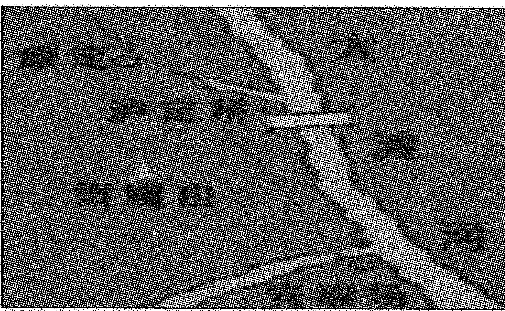

现根据以上文献记载的具体时间1935年5月29日下午四点，23名勇士身挂冲锋枪，背插马刀，腰缠十来颗手榴弹，冒着枪林弹雨，爬着光溜溜的铁索链向东桥头猛扑。现试依奇门遁甲在军事上的应用原理来分析，当时的时空背景。

- 公历时间：1935年5月29日16时
- 当日干支：乙亥 辛巳 乙巳 甲申、当日旬空：寅卯（日）午未（时）
- 阳遁八局 值符天蓬落一宫 值使休门落一宫

| 六合 | 白虎 | 玄武 |
| :--- | :--- | :--- |
| 杜门 癸 | 景门 己 | 丁 死门 辛 |
| 天辅 癸 | 天英 己 | 禽 天芮 辛 |
| --- | --- | --- |
| 太阴 | | 九地 |
| 伤门 壬 | | 惊门 乙 |
| 天冲 壬 | 丁 | 天柱 乙 |
| --- | --- | --- |
| 螣蛇 | 值符 | 九天 |
| 生门 戊 | 休门 庚 | 开门 丙 |
| 天任 戊 | 天蓬 庚 | 天心 丙 |

首先可看出发起总攻的时间为甲申时。乙、庚日甲申时为天辅时。天辅为天赦，有罪都可赦免之意，甲申时又为阳时之首，阳时利客宜主动进攻。看来天时对攻方还是有利的。

再从值符与庚敌我关系来分析，主动进攻者为庚，守着为值符，现值符与庚同宫，庚与值符同落坎宫临休门，坎休门皆为水，此象正与敌我双方战于河两岸、庚加庚为战格“兄弟雷同”正好相符。

当时红军在西岸，敌军在东岸。震宫东岸临伤门太阴，伏兵准备搏杀之象。但时值立夏，震宫位休气。

红军西岸临九地，书云：“九地潜藏可立营”，九地为坚固之神，此象征红军当时已兵集西岸，惊门同时也代表担心之象。时值立夏兑宫虽处死地，但九地为奇门遁甲应用于军事上五不击之方，红军正好处九地之上，对岸敌军反而正好击的是九地之方，敌军正违背了奇门遁甲用兵的原则。而红军的用兵之道，恰好与奇门遁甲在军事上的运筹帷幄原理基本吻合。

不难看出，红军在当时兵力，与地理均处劣势的情况下，抓住天时这一有利一面，最终赢得了夺取泸定桥的胜利！

## 三：淮海战役中几场大战役。（引自张志春老师的《奇门实例评析》第七集）

1：邱清泉于1948年11月13日上午9时，对我军阵地发起进攻。数十架轰炸机。一百余门重炮。一百余辆坦克瞬间将徐州东侧邓楼至团山一线四十里宽的地面变成一片火海。

公历时间：1948年11月13日9时这一仗敌我双方犬牙交错，打的十分惨烈，而且国共双方的南线主力在潘塘狭路相逢，打了个措手不及。我军为了避免硬碰硬，全线东撤，敌军所占潘塘未失，即向南京政府报喜，宣传什么：‘潘塘大捷“。但解黄百韬被围困的战略目标并未实现。

当日干支：戊子 癸亥 壬寅 乙巳
阴遁九局 值符天禽落一宫 值使门落四宫

| 玄武 | 白虎 | 六合 |
| 死门 乙 | 惊门 己 | 开门 丁 |
| 天蓬 癸 | 天任 戊 | 天冲 丙 |
| --- | --- | --- |
| 九地 |  | 太阴 |
| 景门 辛 | 壬 | 休门 癸 |
| 天心 丁 |  | 天辅 庚 |
| --- | --- | --- |
| 九天 | 值符 | 螣蛇 |
| 杜门 庚 壬 | 伤门 丙 | 生门 戊 |
| 天柱 己 禽 | 天芮 乙 | 天英 辛 |

2: 1948年11月19日上午10时，我军发起总攻，围歼被我军包围在碾庄的黄百韬兵团。到22日夜全部歼灭黄百韬兵团。黄百韬自杀身亡。

当日干支：戊子 癸亥 戊申 丁巳，阴遁三局 值符天柱落六宫 值使惊门落四宫

| 白虎 | 六合 | 太阴 |
| 惊门 戊 | 开门 乙 | 休门 辛 |
| 天冲 乙 | 天辅 辛 | 天英 己 |
| --- | --- | --- |
| 玄武 |  | 螣蛇 |
| 死门 壬 | 丙 | 生门 己 |
| 天任 戊 | 禽 | 天芮 癸 |
| --- | --- | --- |
| 九地 | 九天 | 值符 |
| 景门 庚 | 杜门 丁 | 伤门 癸 |
| 天蓬 壬 | 天心 庚 | 天柱 丁 |

3：1948年12月6日下午4点30分，我军发起对黄维兵团的总攻。12月16日黄维被俘。

公历时间：1948年12月6日16时，当日干支：戊子 癸亥 乙丑 甲申阴遁五局 值符天冲落三宫 值使伤门落三宫

| 九天 | 九地 | 玄武 |
|---|---|---|
| 杜门 己<br>天辅 己 | 景门 癸<br>天英 癸 | 戊 死门 辛<br>禽 天芮 辛 |
| 值符<br>伤门 庚<br>天冲 庚 | 戊 | 白虎<br>惊门 丙<br>天柱 丙 |
| 螣蛇<br>生门 丁<br>天任 丁 | 太阴<br>休门 壬<br>天蓬 壬 | 六合<br>开门 乙<br>天心 乙 |

张老师从值符与庚这一对立的矛盾和敌我双方关系这一角度，对以上三个战役进行了详细的分析。

现在我们再来仔细研究就会发现，第一例为乙巳时；第二例为丁巳时；第三例为甲申时。以上三例敌我双方发起总攻的时间都是五阳时。

> 《烟波钓叟赋》云：“甲乙丙丁戊阳时，神人天上报君知，坐击需凭天上奇。”

奇门遁甲在主客上以阳时利客，宜主动出击。此三例从时间上得到验证。

##### 四：百万雄师渡长江

1949年4月20日午夜，毛泽东，朱德向中国人民解放军发布了《向全国进军的命令》。在西起湖口，东至江阴的千里长江沿岸，千百万门大炮同时向对岸的国民党军队发起怒吼！几千只渡江船冒着枪林弹雨向南岸进发！根据以上时间，现以奇门遁甲试来分析，当时的时空状态。

公历时间：1949年4月20日23时

当日干支：己丑 戊辰 辛巳 戊子、当日旬空：申酉（日） 午未（时）

阳遁五局 值符天柱落五宫 值使惊门落二宫

| 九地<br>景门 壬<br>天英 乙 | 九天<br>戊<br>死门 丁<br>禽 天芮 壬 | 值符<br>惊门 庚<br>天柱 丁 |
| 玄武<br>杜门 乙<br>天辅 丙 | 戊 | 螣蛇<br>开门 己<br>天心 庚 |
| 白虎<br>伤门 丙<br>天冲 辛 | 六合<br>生门 辛<br>天任 癸 | 太阴<br>休门 癸<br>天蓬 己 |

我军踞江北，敌军踞江南。从奇门遁甲我们可看出，北方为生门天任，南方为死门天芮。

> > 古云：“宜坐生向死”为一胜法。我军踞生门击敌方之死门，生门临六合百万雄师之象，敌方虽临九天好扬兵，但此时死门在此，为溃败逃走之象！再从时辰上看，我们就不难发现“戊子”时为仍为阳时，阳时利客！宜先举兵！

是偶然？还是必然？

在解放战争中，毛泽东将战场重点选在东北，除了以当时的全国局势与军事战略思想出发外，是否还参考了其他因素？这现在不得而知。但就我国地理位置以奇门遁甲而言，东北居生门，生门在奇门遁甲中是一个很重要的位置，历来被兵家所重视。当时，国民党占领东北要地，要想控制大的局势，取得解放战争的控制权，必须占领东北生门，东北战场的胜负，将对解放全国来说起决定性的作用。所以毛泽东这位军事家，将深谋远虑的眼光投向东北这片土地。三大战役的胜利，彻底扭转了敌我双方的兵力悬殊，对以后整个解放战争起到了决定性的作用！那么不难看出，当年红军经过二万五千里长征，最后选择陕北（西北开门）都有其战略思想。二次世界大战中，日本帝国主义，就是从我国东北（生门）破门而入，以至于给中华民族带来了永远无法弥补的创伤！

对于以上几个战例，笔者只是站在学术角度，纯粹以古人流传下来的奇门遁甲，在军事上的应用原理进行事后试析的，重属个人片面之见，可能会有些牵强附会。不过笔者始终认为奇门遁甲中“时间，空间”乃奇门遁甲的主要灵魂所在。奇门遁甲者“时空”也！至于应用就取决于个人的功力深厚浅薄了！从近代几个著名战役来看，我军的用兵之道与古代号称“帝王之术”的奇门遁甲的兵家应用原则基本吻合。或许毛泽东这位伟大的革命军事家，本身对奇门遁甲的研究和应用非一般人所能及……

当然，这只是笔者个人之言。一场战争的胜利更多的还是，依靠军事家的战略思想，指挥才能，再根据当时的形势，全面考虑来决定的！

##### 五：二战日本偷袭珍珠港

1941年12月7日，当日清晨7时许，日本联合舰队袭击美国太平洋舰队基地珍珠港，183架飞机组成的首批攻击机群，向美军所在的珍珠港东南方太平洋舰队，发起猛烈袭击。一小时后，日军又出动191架袭击编队，实施了第二次的攻击。对日军的突然袭击，美军毫无戒备，造成了美军太平洋舰队损伤惨重局面。日军能轻而易举的偷袭成功，和当时蓄谋已久的计划谋略是分不开的。

今天笔者试从这一历史战例时间，依奇门遁甲分析当时这一偷袭时（东南方）的时空状态！

查万年历1941年12月7日为星期日。
干支：辛巳 庚子 己丑 戊辰 旬空：戌亥
阴遁一局 值符天蓬落一宫 值使休门落六宫

| 玄武 | 白虎 | 六合 |
| 景门 丁 | 死门 己 | 惊门 乙 |
| 天辅 丁 | 天英 己 | 禽 天芮 乙 |

先看当时的时辰“戊辰”时，古云：“甲乙丙丁戊阳时，神居天上须君知，坐击须凭天上奇”“戊辰时为阳时，利客，宜先举兵！再看东南方位巽宫当时的时空以天盘看（客方）：玄武，丁奇，景门，虚方。玄武利于隐私，预谋，偷盗，私下活动。古云：“玄武所在之方，须防敌兵窃营偷袭”说明此时空对于日军来说，正利于突然袭击，秘密偷袭。丁奇为星奇，古人也称丁奇为太阴，利用隐藏，隐身，而不宜被发现。对偷袭更为有利。此时“天上的星奇”就象征太平洋上日军的袭击机群。再来分析景门，《烟波钓叟赋》云：“景上投书并破阵”利于征战。

根据以上时空站在地盘来看（主方）就可看出：“天上玄武，贼兵，天上丁奇：敌机，炸弹，地上景门“火光冲天”地盘丁奇，“星星之光，一片火海”。巽宫为虚方，孤立无援。

日军在西北，腾蛇休门，预谋已久，天心，用尽心机。此时坐“孤击虚”古云“一女可敌十男”！

通过依奇门遁甲在军事上的应用原则来讲，当时的时空条件下对日军袭击美军舰队的确很有利。

注：此战例具体时间，参考了刘广斌老师的《刘氏神数实战案例》一书

##### 六：《御定奇门宝鉴》局象初探

丁壬日丁未时 阴遁一局

| | | |
|---|---|---|
| 值符<br>休门 壬<br>天心 丁 | 九天<br>生门 戊<br>天蓬 己 | 九地<br>伤门 庚<br>天任 乙 |
| 螣蛇<br>开门 辛<br>天柱 丙 | 癸 | 玄武<br>杜门 丙<br>天冲 辛 |
| 太阴<br>癸 惊门 乙<br>禽 天芮 庚 | 六合<br>死门 己<br>天英 戊 | 白虎<br>景门 丁<br>天辅 壬 |

断曰；符巽使震，比肩接迹前后相引。非以取财。则借径于材也。乃符则丁壬合。使则丙辛相化。其权术有过人者矣。然符则反吟自刑。使则腾蛇虚耗。是作伪心劳。而有齿焚身也。若能用之以正，则心逸日休。而一枝飞焰，直朗天门矣。

兵事；星门克宫。利于为客。但直符自刑，不利出兵。只宜休养士卒。顿聚粮草，以为后图。虚张兵试于正南，固守老营于巽地。西南东北皆有贼伏。上遇大格小格，误人必有损伤。

出行；无奇门，开下有丙，可向东行。然将遇腾蛇，符遇击刑，惊伤不免。

阳宅；可小修正南屋宇。闻锣鼓声应。

阴宅；卯山可西厝。有瘦妇与僧道同行应。

附占胜败：

+ 主兵胜，有伤残。
虚实：敌军未来
攻城：可说之来归
守城：宜备东门
天时：久雨不晴
地理：地与化命相生但有刑伤
人事：有武人升迁。中多冒功。
田禾：禾有灾
家宅：长上有灾，家多惊恐。
官禄：防参劾入狱。
应试：名落孙山。
求财：季月占可得
婚姻：宜换亲
胎产：难产，母子不保
疾病：金气克木宜清肺
捕获：贼隐不出，难获
失物：大叫呼则得
远信：无
鸦鸣：防有争斗
雀噪：防马逸

> 此《御定奇门宝鉴》一书为唐代徐道符所著，对奇门 1080 局象做了详细的解释。我个人认为此书历史久远，应该代表奇门遁甲之正宗文献！

对局象的分析上基本符合《烟波钓叟赋》之论。

就此局前半部分主要在奇门遁甲的应用方面。从此局的释意中我门可以看出，在主客上除了我们已知的：以大局伏吟反吟，阴阳时分主客外。古人还特别重视以符使落宫来分主客。

固守老营于巽地者《值符之位也》。西南东北皆有贼伏者《太阴，九地之伏兵位上逢庚也》。上遇大格小格，误人必有损伤。

在阴阳宅方面可看出古人阳宅重向，阴宅重坐。因阴宅以得地气为主，亡者才可安宁。阳宅以呐气为主，出入在门，门为呐气之关口。故阳宅以向为主。克应亦必不可忽视。

出行还是首重奇门。

甲己日戊辰时 阳遁七局

```
玄武        九地        九天
天辅 丁     天英 庚 禽   天芮 壬
景门 丁     死门 庚 丙   惊门 壬

白虎                  直符
天冲 癸                天柱 戊
杜门 癸          丙     开门 戊

六合        太阴        腾蛇
天任 己     天蓬 辛     天心 乙
伤门 己     生门 辛     休门 乙
```

《御定奇门宝鉴》对此局的解释今摘录如下：

兵事：宫生门。利客。但遇伏吟。不利出战。宜伏兵于北方，（太阴之方）以防贼自南来偷劫（九地下临庚）。别遣游兵。出西北抄掠粮食（奇门之方），遇敌既退。艮上可以别设疑兵（六合之方）。假借惑众。

阳宅：宜立乾门（奇门到向），古人阳宅大门与房屋的坐向多数是一致的

阴宅：宜乾山巽向（奇门到坐）

## 甲己日戊辰时 阴遁一局

### 局象详解

| 玄武 景门 丁 | 白虎 死门 己 | 六合 惊门 乙 |
| 九地 杜门 丙 | 癸 | 太阴 开门 辛 |
| 九天 伤门 庚 | 值符 生门 戊 | 螣蛇 休门 壬 |

> 《御定奇门宝鉴》对此局的解释今摘录如下：

兵事：符伏不宜出兵。阳星阳时宜先动。敌在东北扬兵耀武。即设重营于正东与正北老营。加敌而阵。不可直犯其锋。转战间，敌已在南。两营并力攻之，背生击死。胜后勿追。

出行：季月出正北，当遇贵人亓仗。秋月出正西。逢拄仗老妇。

+ 1. 符伏不宜出兵。阳星阳时先动——因值符代表我方。今大局九星伏吟，伏吟利主不宜采取主动。但今天蓬星为阳星守于本宫，时逢戊辰时又为五阳时，故静中有动，利动！
+ 2. 敌在东北扬兵耀武——庚为敌方今落艮宫，故说敌在东北。庚临九天。古云“九天之上好扬兵”九天为攻方，说明敌军占天时。伤门为搏杀，争斗。庚加庚又为战格。故敌占天时而摇旗呐喊！
+ 3. 即设重营于正东与正北老营——此时九地在震宫，古云“九地潜藏可立营”，九地为守方，伏方，杜门又为隐遁之门。丙又为天威。北方坎宫值符为我军所在生门又在此，故此时空条件下我军宜占东，北二方。此占据为地理要地。
+ 4. 加敌而阵。不可直犯其锋——我军布置在震坎宫两宫，敌军在艮宫。这样就将敌军夹在中间进行打击。但此时空条件下，我军万不可从正面来攻击敌军，古云五不击有“九天之方不可击，生门之方不可击”。
+ 5. 转战间，敌已在南——经两面夹击交战，敌军必势不及而逃退于离宫南。离宫白虎（勾陈）死门，敌军溃败之象！
+ 6. 两营并力攻之，背生击死。胜后勿追。——此时我军两营和一处，聚坎宫北方生门值符之方，打击对方死门所在。古云“坐生向死。背生击死，则百战百胜，庚得值符直使利，兵家用事最为贵！”大局伏吟，所以胜后勿追。
+ 7. 出行：季月出正北，当遇贵人亢仗——季月者辰戌丑未月。此时生门旺。生门为土。生门为财又为富贵之象，值符又为贵人，故如择正北而出当遇贵人！
+ 8. 秋月出正西。逢拄仗老妇——如在秋月金旺时出正西方，开门当令。开门在乾宫，乾为老年之人，今开门落兑宫，为老年妇人，逢拄仗者，天柱就有柱子和拐仗之象，开门和其相遇就为秋月出正西。逢拄仗老妇。

7，8，条为奇门克应。对于克应本人认为是：根据奇门遁甲模型所体现出某一特定时空条件下，天体运动所产生的必然结果。当然只有时空统一此象才会出现。否则只为空谈！克应也是检验所趋向的方位是否准确的一个关键所在！

##### 七：《遁甲元灵经》中记载：

### 1：方位出兵

如崇祯辛巳四月十八日，大寇数万掠莱芜吐子口安营，众乡绅举义兵拒之，未胜。夜使人问我出兵之策。时癸亥日亥时，在立夏下元，阳七局，是甲寅符头，至亥时得冲伤门为星，宜出东方，果如所言，夜大破之，余党悉平。要知九星各有所宜，不拘伏吟。

```
阳遁七局 值符天冲落三宫 值使伤门落三宫
```| 螣蛇 | 太阴 | 六合 |
| :--- | :--- | :--- |
| 杜门 丁 | 景门 庚 | 死门 壬 |
| 天辅 丁 | 天英 庚 | 天芮 壬 |
| 值符 | | 白虎 |
| 伤门 癸 | | 惊门 戊 |
| 天冲 癸 | 丙 | 天柱 戊 |
| 九天 | 九地 | 玄武 |
| 生门 己 | 休门 辛 | 开门 乙 |
| 天任 己 | 天蓬 辛 | 天心 乙 |

## 2：奇门克应

闰四月二十九日癸亥日丙辰时，在芒种下元，甲寅为符头，天禽为值符，死门为值使，皆到七宫，正西坤之神。余自城南向西走至半路，果见殡丧，是应候也。凡遭官讼，大忌出此门。

阳遁九局 值符天禽落七宫 值使死门落七宫

| 玄武 | 九地 | 九天 |
| :--- | :--- | :--- |
| 伤门 辛 | 杜门 壬 | 景门 戊 |
| 天冲 壬 | 天辅 戊 | 天英 庚 |
| 白虎 | | 值符 |
| 生门 乙 | | 死门 庚 |
| 天任 辛 | 癸 | 天芮 丙 |
| 六合 | 太阴 | 螣蛇 |
| 休门 己 | 开门 丁 | 惊门 丙 |
| 天蓬 乙 | 天心 己 | 天柱 丁 |

此为出行死门方之应验。

##### 八：《古例》占北方寺沟口可避兵否 - 张官德

咸丰辛酉年甲午月癸丑日壬戌时，时首甲寅，占北方寺沟口可避兵否。阴九局，天差门差。杜五辅五避五。时干乾相佐，休与日合三正东，乙下有丁，奇格地网。

咸丰辛酉年甲午月癸丑日壬戌时

阴遁九局 值符天辅落五宫 值使杜门落五宫

| 太阴 生门 己 天任 癸 | 螣蛇 伤门 丁 天冲 戊 | 值符 杜门 癸 天辅 丙 |
| :--- | :--- | :--- |
| 六合 休门 乙 天蓬 丁 | 壬 | 九天 景门 戊 天英 庚 |
| 白虎 开门 辛 天心 己 | 玄武 惊门 庚 天柱 乙 | 九地 壬 死门 丙 禽 天芮 辛 |

辅杜飞人死墓死门，又加时干，六庚加子，此方必有贼到，不可投。

案验：次年贼果到。

笔者今解：占北方寺沟口可避兵否？首先看坎宫此时空方位。我们发现坎宫正好逢庚，玄武为兵贼的符号飞临，惊门为人事，兵到则此地人民惊慌之情景。说明北方已有兵临，万不可避于此方。那么何方为趋吉之处呢？分析全盘就不难发现，西南坤宫临直符，杜门又在，经云：“急则从神（直符）杜门益躲藏，癸又为天藏，也亦隐形。”所以可选西南坤方避之则吉！

震宫虽奇门到又临诈格，但天蓬（盗星）落于此则亦非吉，诈者表面之虚象也，关键天蓬在此旺象，所以本人认为非吉方！

##### 九：《古例》占贼人入兴安否（清张官德）

同治癸亥年酉月秋分上元己卯日乙丑时，时首甲子，寓汉中西乡县占湖北省。

五不遇时，直符柱一，使惊门六，生与乙合三。

- 干支：癸亥 辛酉 己卯 乙丑 旬空：申酉（日）戌亥（时）
- 阴遁七局 值符天柱落一宫 值使惊门落六宫

| 玄武 | 白虎 | 六合 |
| :--- | :--- | :--- |
| 伤门 丙<br>天任 辛 | 杜门 壬<br>天冲 丁 | 景门 辛<br>天辅 癸 |
| 九地 | 庚 | 太阴 |
| 生门 乙<br>天蓬 壬 | | 死门 丁<br>天英 戊 |
| 九天 | 值符 | 螣蛇 |
| 休门 己<br>天心 丙 | 开门 戊 癸<br>天柱 乙 禽 | 惊门 庚<br>天芮 己 |

六庚飞入乾宫，为内四卦，楚省不能无贼。西北随州、德安、靳黄一带正在乾方，必遭贼害。六庚飞门当旺，幸乾为旬空，不能据城，六庚本家又有景门制之，汉口以东无妨。

案验：果如所断。

笔者今解：占贼以庚为用，庚落内盘则贼来，落外盘则不来。今庚落乾宫时值阴遁，乾为内说明贼今必来。乾为西北，此地必为贼到之所。贼来后之情景可以乾宫分析：螣蛇，惊门，刑格，此地一片惊慌之象。马星动于此宫，人们四处逃离。幸乾宫空亡，庚临马星，来而去之象，所以不能据城！汉口以东无妨者，生门九地所据之地也！（严格来讲，此例与上一例都为奇门预测范围）

以上的这些例子，都是笔者站在古代奇门遁甲应用在军事上这一观点进行分析探讨，其中难免掺杂有笔者个人之主观意识，甚至谬论，还望大家批评斧正！

## 第二节 日常生活中的趋避选择

趋避选择：根据奇门遁甲时空模型，来分析在某一特定时空状态下，天体的运行所形成的场能，对地球上万物的影响与利弊。从而依次来选取，所用事物本身的性质与特定时空的相应性，以达天时、地利、人和、之天人合一，从而来发挥人的主观能动性，趋吉避凶。

## ## 第四章 奇门遁甲的应用

> > 《烟波钓叟赋》云：“吉门偶尔合三奇。万事开三万事宜”

古云：“得门不得奇，可用。得奇不得门，不可用。奇门俱得吉无不利。”可见古人对门的重要性。古人以得“奇门”为上。

但古人大多只是很笼统地讲了一下趋避选择的方法，但有些细节性与关键性的地方则没明确交代后人。如今天的用事方不临吉门，临凶门怎么办？难道要等下一个时辰，或改天？那么这样岂非利用天时，则成等待天时了。有些事可等待，但有些事不容我们去等待，怎样才能变不利为有利？这些古人都没具体说明。先看民国时金蟾老人在《奇门五总龟》后说讲述他为别人用奇门遁甲择日的一段：

现代社会之中，奇门遁甲亦可应用于许多方面，最显著者，莫如商场如战场。

商场与考场，犹如战场也，除靠本身实力外，运气的因素亦非常重要。

有一商行，平日信誉极好，熟料去年生意极差，向吾述苦。云：以往电报发出既有定主，而今皆泥牛入海。吾以奇门之术，为其定发报之方位，其以吾之语，果获成功！因之，商业上如有交易谈判，或借款讨债等，如能运用奇门遁甲术，可获神奇的助力。

吾之友人袁先生，就职于银行，其精于奇门之术，每次出去招揽存款，都选择有利之时。皆获事半功倍之效。

有考生徐某，连考两年都名落孙山，其父母带我处为其相排。吾排后，令其下次考试时，择一家旅店，且提前进入，并为其算好赴考时间，由该旅店出发到考场，正好是吉方位。其第三年相考，果中榜矣！

## ## 再看古籍《遁甲元灵经》中的记载：

闰四月二十九日癸亥日丙辰时，在芒种下元，甲寅为符头，天禽为值符，死门为值使，皆到七宫，正西坤之神。余自城南向西走至半路，果见殡丧，是应候也。凡遭官讼，大忌出此门。

阳遁九局 值符天禽落七宫 值使死门落七宫

| 玄武<br>伤门 辛<br>天冲 壬 | 九地<br>杜门 壬<br>天辅 戊 | 九天<br>景门 戊<br>天英 庚 |
| :--- | :--- | :--- |
| 白虎<br>生门 乙<br>天任 辛 | 癸 | 值符<br>癸 死门 庚<br>禽 天芮 丙 |
| 六合<br>休门 己<br>天蓬 乙 | 太阴<br>开门 丁<br>天心 己 | 螣蛇<br>惊门 丙<br>天柱 丁 |

此例就为奇门遁甲中的克应。

## 《奇门法窍》例言几条重点摘录

奇门为天时节气之正宗，非他数可比，故辨方书采用之。若果明于超接置闰之法，推验吉凶，自有准的。每见坊本烟波钓叟歌诀，其间如寄四维拆补置闰各法均略而不详。今按奇门真授一书，逐条更正，似得节气时令之正，以备参考。

奇门为选择之津梁，趋避吉凶，攸关祸福，故演定阴阳九遁之格局以明其吉凶之测验。

奇门克应为吉凶之准的，今按诸家奇书备录以凭考验。

奇门占验类神皆本生克而定之故，不可执一而论而取用之，吉凶全在神而明之存乎其人耳。

奇门作用贵乎时方，必须较准真正方位方为合局，如吉格在正东震方，则应直向正东，若稍偏则非真正方位，毫厘之差，攸关祸福，不可不慎。

三诈为之隐宫，兵家用之，埋伏此方，无人知者，必须得奇门乃验。

九遁凡用事谋为，惟最忌奇墓刑迫。

五假，假其气以用事，若悖其气而用之则凶，尤忌迫墓。

## # 第四章 奇门遁甲的应用

## 中国古代术数汇要

龙鸟为上吉之格，凡百谋为无不吉利，其余格局，有耑宜之格，有宜此而不宜彼之格，宜详慎用之，不可牵强。

五不遇选择日时以此煞为最凶，纵有奇门，不能解救。

龙鸟格逢庚直符则应以凶论，然遇凶门则然，若遇休生开三吉门又逢旺相，仍以吉论，不必尽拘升殿游禄奇合论格，惟奇家最宜之格，须遇吉门用之尤验。

奇墓最宜详慎，如得使吉格，奇既入墓，即不得力，须察三奇旺相之宫，酌而用之。

丙加年月日时、庚加年月日并庚为直符之时，均为格，然不可盖以凶论，如遇休开生三吉门仍可酌用。

迫制、义和、门生宫、宫生门遇吉门则吉宫克门、门克宫虽遇吉门则吉事不吉，遇凶门则灾殃尤甚。

天三门、地四户、地私门、天罡方、天马方各法皆以月将起用，利为百事，更合吉门吉星尤为响应。

> > 笔者注：诈格、五假、在应用时必须符合其气更好，多应用于计谋之类事宜。如预测逢诈，假，也不一定就当全吉象来看，须仔细分析以防吉中藏凶。

从以上文献或许我们会领会到其中一些玄机！

现在对金蟾老人应用的例子用局象来解析：“有考生徐某，连考两年都名落孙山，其父母带我处为其相排。吾排后，令其下次考试时，择一家旅店，且提前进入，并为其算好赴考时间，由该旅店出发到考场，正好是吉方位。其第三年相考，果中榜矣！”

时间：2005年06月13日08时35分干支：乙酉 壬午 戊辰 丙辰

旬空：子丑阳遁六局 值符天芮落四宫 值使死门落四宫

## 奇门遁甲应用初探

| 值符 | 螣蛇 | 太阴 |
| :--- | :--- | :--- |
| 乙 死门 癸<br>禽 天芮 丙 | 惊门 己<br>天柱 辛 | 开门 戊<br>天心 癸 |
| 九天 | 乙 | 六合 |
| 景门 辛<br>天英 丁 | | 休门 壬<br>天蓬 己 |
| 九地 | 玄武 | 白虎 |
| 杜门 丙<br>天辅 庚 | 伤门 丁<br>天冲 壬 | 生门 庚<br>天任 戊 |

假如有考生要在 2005 年 6 月 13 日早 8：35 分进行高考考试。考试的场地在其考生家的南方，现在从他家到考场的位置来看，那天考试的时间南方逢腾蛇，惊门，己加辛“游魂人墓”，此时空对其考生不利，如那天直接从其家出发去参加考试，临场则会心神不定，得不到有力的发挥。那么怎样才能将这不利的时空变为有利的时空？这就需要时空转化法了。著名易学家，西北大学教授，中国易学院院长费秉勋老师早在他的《飞盘奇门遁甲》一书中讲到：“奇门遁甲的任何一个方位都是不固定的，而是游动的；不是绝对的，而是相对的。即以中央这个方位来说，同一时间它可能是地球上甚至宇宙中的任一点，随着中央的游动，其它八方也相应发生游动变化。如以洛阳为中央，西安为西为兑，郑州为东为震，但若以开封为中央，西安，洛阳，郑州都成西方为兑宫了。”这就说明奇门遁甲的方位是依人所处的地方为中心点，以此来确定八方的，当人的位置发生变化时，其方位也随人发生改变，方位变化，一切象也就发生了改变。为什么变换方位后，就有不同的结果呢？举一个简单的例子：有四个人在同一时间，从不同的方位出发，都在同一个地方中心点相聚，他们虽各自出发的方位不同，但目的地却一样，那么从西面出发的途中可能会遇到车祸，堵车之景象；而从东面出发的，途中可能会遇到举行婚礼的车队。同一时间，则方位吉凶不一。将时间与空间结合一起，这就是奇门遁甲了！继续分析上面的局，要改变不利的时空，先要找出有利的时空来，在奇门遁甲八门中，以景门为学业，学术方面，考试以景门为最佳。现在我们发现，

## 中国古代术数汇要

## 奇门遁甲应用初探

代表文学方面的用事门景门落震。景门得地盘生扶而旺，地盘又见三奇丁奇，八神上乘九天利于临场发挥。根据以上情况，可让考生在前天晚上在西方择一住处住下，第二天高考时间一到，直接从西方的住处进入东方的考场，则此时的考场正好在吉方，必能得到此时空的扶持，才能有效的发挥出自己的潜力来。不过有一点要清楚，虽说奇门遁甲的时空对人有一定的作用，但，人与事的自身也不可忽视。就如考试，如果一个人平时他不用功学习，学习成绩很差，到了考试时，就是再用奇门遁甲扶持也难有录取的可能，奇门遁甲也是有限量的，就如佛家常讲：“佛渡有缘人，无缘不渡，人要得救，必先自救，如人不能自救，即使佛菩萨现身也救不了”和这一个道理，所以要理性分析，客观对待，奇门遁甲只不过是让人尽量来利用天时和地理而已，不要夸大神化它的作用。

## ## （一）趋避方法概论

首先要明白，奇门遁甲在趋避选择方法上与奇门预测方法截然不同。在预测中特别注重日干，时干，用神之间的生克制化关系。而在趋避选择上则只注重时间与空间两大要素。古人早就说过：“奇门之占要分动静，静则只查直符，值使，时干的生克关系，而动则首重方位！”预测只所以要用日干者，是将问事人在局中定位，时干者，所问之事也！用神者，具体代表所问事物的相应象。然后根据生克制化来推理事物的发展方向。奇门遁甲的趋避选择，则是针对某一件事情而言，并非具体指某一个人。每一个人都受宇宙强大磁场与大气候的影响，无人可逃脱，我们不能拿别的门类方法来加以套用。要知道，易学的门类各有各的侧重点，各有各的擅长之处。就如我们研易之人，有的精于六爻，有的精于命理，有的精于奇门。用六爻来预测一个人一生的命运就不如命理学本身直观，用命理学来预测某一件事物的成败，则不如六爻准确，这就是差别。所以必须明白！所以趋避选择一般不用日干，时干。因为预测是一种静态的表现，而趋避选择是一种动态体现。动态就是要考虑当时行动那一刻，时空的各个方位状态，通过选择比较，择有利的时空点来用事。以所用事的性质与奇门遁甲所反映的时空如能相应则吉，否则反之。即使“奇门”到，如果不符合此时空的场能，也不为吉，“遁甲”则成无用之地。如埋葬用死门；就不能用生门，隐私之事就要用杜门，则不可用开门；用开门则为目标暴露。求财用生门；化解矛盾可用休门与天辅时；讨债用伤门；酒会，学术用景门，所以古人虽强调“奇门”到万事皆宜，但也只是教条化，要根据具体情况具体分析，也不是专用“奇门”。

在奇门遁甲的应用中，笔者认为：所谓的“遁”就是指：人在特定的时空中出没。“甲”就是指人事。奇门遁甲就是指：人在特定的时空中，借助“奇”与“门”或“某一格局”的场能来用事。

总之，只有所用之事能与奇门遁甲所体现出的，当时的时空所相应，则可真正发挥出：奇、门、遁、甲、的作用。

那么怎样才能应用奇门遁甲趋避选择呢？笔者认为，首先要对奇门遁甲的八门，九星，八神，吉凶格吃透。特别是八门，因八门为人盘，人活动出人的关口，门选错，就如去银行办事，却走进了饭店，回自己的家却敲错了别人的门。

> 当代易学资深学者，云南曲靖薛邓林（麟野山人）老师云：“人（人盘）载天覆地，于天盘之下，地盘之上，从天地相交之气中，可以知八方之生死衰旺。八门者，人事吉凶之用也，然奇门遁甲，九宫八方之气一定，但生死存亡则取决于人之动变。生门非生，死门非死，善趋避者，能将从天地六甲之气运中，妙布八门，则能扭转乾坤。六甲统于六仪，甲子遁于奇仪之下，若能察其时序，识其隐显，巧识九宫之遁，巧统八方之摄，则虽失三奇三吉之利，亦能巧用六甲，巡守八门，则吾死非死，彼生非生也！”研究奇门遁甲者若能明此理，悟此玄机，则奇门遁甲之本质尽矣！

## # 第四章 奇门遁甲的应用

#### （二）八门详释

> > 休门出人贵人留，欲要潜身向杜游；
> 求索酒食景门上，打猎萤埋死门投；
> 捕盗惊门十得九，买卖经商生上酬；
> 远行嫁娶开门吉，索债伤门十倍收。

除古人对八门的解释外，今人台湾学者林棕学在他的《奇门遁甲应用经典》一书中，对八门做了详细的解释，其很实用，对我们应用八门有很大的帮助。“八门者，人事吉凶之用也，推演奇门遁甲，九宫八方之气一定，但生死存亡则取决于人之动变……”读者请勿忽视。今引用如下：

1.  开门：上吉之门，主好的开始，突破重围，扫除困难，重新开始。创造开发，宜开市，动工，创业，出兵，求贵，求财。求事，求名，出外远行，开光点睛，剪彩，搬新家，新官上任，拜师学艺，求神，整修动土，所向通达，诸事皆宜。
2.  休门：上吉之门，主轻松，愉快，宜研究学习，共商事宜，演兵，点召，入营，消除压力，解除烦恼，化解纠纷，和解事情，祛除官司，求贵托人，购买消费，聚餐娱乐，休闲旅游，消灾改厄，养神治病等，可得处事轻松如意。
3.  生门：上吉之门，主生命旺盛，成长迅速，源源不断，生气蓬勃，宜求财求利，商贾买卖，求职求事，求贵，研究学习，婚姻嫁娶，移徒入宅，营造建筑，求医延寿，逃生，祭祀，祈富求子，法事画符等。生门乃八门中最旺之门，用运生门打仗，宜背生向死。往生门方求医可得顺利治疗。往生门方求财作生意，获利丰富，生意兴隆。出生门可避开凶煞，恶人，小人，平安如意。
4.  伤门：凶门。主伤害破坏。宜打猎捕鱼，寻仇，捉贼擒盗，索债打官司等。伤门具有杀伤利，非必要时不得轻易使用。如索债乃对付恶性倒债者，打官司时，乃是有意致使对方遭判重刑。
5.  杜门：凶门。主堵塞，阴暗，隐秘，宜潜逃，开秘密会议，避开仇人，闪避媒体，隐藏，传送秘密文件，埋伏跟踪，杜门有堵塞之作用，对于求财，求事，选行者不宜。但对于隐秘事件反而有利，不易被发现。往杜门去，即使遇到熟人也不易被注意到。
6.  景门：中吉之门，主华丽显现，受注意，凸出，虚张。宜演讲，考试，面试，上书，呈报，排场，表达，社交活动，选举，投诉，报案，提建议，华丽场合，提升地位等。用景门可提升注意力，吸引众人的目光，演讲会，卖场，考场，宴会上皆可使用。能提升知名度。扶助应考能力。
7.  死门：大凶之门，主阴气。停止，老化。死亡，不活跃，宜行刑诛戳，破土安葬。送葬扫墓，祭拜祖先。丧事做法。吊祭亡灵等。运用死门有避煞的效果。远离亡者或阴魂的纠缠，但死门不宜积极用事，不宜求财求医等。
8.  惊门：凶门。主紧张，急躁，情绪不稳定等。宜捕捉坏人，宣战警告，吓阻，打官司，恶作剧等。运用惊门能使对方有惊吓，味赤阻的作用，而不致于伤及对方。

八门生宫能提升奇门的功能。宫生八门能增强遁甲的效能。

## (三) 案例研讨

例一：（引自于：尹峰老师的《掌上奇门》一书）

94年农历八月二十四日晚，我到堂兄家串门聊天，堂弟尹智说，准备晚上十二点动身上军马三场（地名）拉油籽，我以出行之时推测说，这次出行不利，最好不要去。他说已与人约好了时间，不能更改。结果按时出行后，行了不到一公里路，车便出现故障，修好之后。走到马场又坏了，二十公里路，走了两天才返回，人受了不少罪，不但财没求到。反而破了财。今按出发时间起局分析！

## 第四章 奇门遁甲的应用

时间：1994年09月30日00时02分、干支：甲戌 癸酉 己未 甲子

旬空：戊亥，阴遁四局 值符天辅落四宫 值使杜门落四宫

| 值符<br>杜门 戊<br>天辅 戊 | 九天<br>景门 壬<br>天英 壬 | 九地<br>乙 死门 庚<br>禽 天芮 庚 |
| 螣蛇<br>伤门 己<br>天冲 己 | 乙 | 玄武<br>惊门 丁<br>天柱 丁 |
| 太阴<br>生门 癸<br>天任 癸 | 六合<br>休门 辛<br>天蓬 辛 | 白虎<br>开门 丙<br>天心 丙 |

（注：原局九星为飞宫排法，大家注意！）

原著分析如下：

- 1. 三盘伏吟，不动之象，动则招咎。
- 2. 所往之方在西南坤宫，死门伏吟，六庚加六庚为战格阻隔不顺之象。且天芮病符之星伏吟于西南，更为不吉。
- 3. 日干甲戌己与伤门在震宫伏吟，六己加六己为地户逢鬼之格，百事不遂。好在时干甲子戊落宫与日干相比合为吉。可减其凶之力。
- 4. 景门主道路，临离宫，壬加壬伏吟为蛇入地罗之格，外人缠绕，内事索索。好在与日干相生，亦可减其凶之力。
- 5. 生门为所求之财，落日支旬空之地，甲子戊落宫克之，无利可图。

以上为作者从预测角度去分析的结果。现在笔者站在时空这一角度来分析：

此局为动身时间局。为动态，这就是时间。西南为其所要去的目的地。这就是空间，方位。将时间和空间相结合就是时空了。人和时空融合后就会产生吉凶的结果了。这就是时空统一。如此时其人不去西南，而去西北，和当时的时空不一，其结果也就不同。再如其人不是子时去西南方位，假如亥时去西南方位，其结果也就不同。

一个是假如改变方位，不改变时间。一个是改变时间而不改变方位，两者的结果都会不同。也就是说只有时间和空间统一就会产生结果！现已知要去西南，就直接看奇门西南所在的方位坤宫。坤宫死门，为凶门，一般不可用。经上云：若问死门何所主，只宜吊死与行刑，出行不宜逢之。庚加庚为战格，出行车折马死，为凶。光从其方位看就不吉。所幸人没事也无大碍。

但奇门遁甲就是让人明确天时、地理、人和，在有利的时间，去有利的方位去办事，为主为客全在自己掌握！让人尽量去发挥人的主观能动性，提高办事效率。

## 例二：（引自于：尹峰老师的《掌上奇门》一书）

97年农历五月二十五日下午，堂弟尹刚到我家，说早晨十点与朋友王长生两人同骑一辆摩托车，从李桥乡楼庄村出发去办事，途中，在一急转弯处超一小四轮拖拉机时，与一大卡车相遇，危急之中，大卡车将摩托车车尾部擦上，将二人摔倒在地，摩托车车尾被撞坏。幸好人无伤灾，几乎酿成大祸，为了研究，我排出出发时间局。

公历时间：1997年6月29日10时、当日干支：丁丑 丙午 壬寅 乙巳 阴遁三局 值符天任落四宫 值使生门落七宫，当日旬空：辰巳（日） 寅卯（时）

| 值符<br>惊门 壬<br>天任 乙 | 九天<br>开门 戊<br>天辅 辛 | 九地<br>休门 乙<br>天心 己 |
| 螣蛇<br>死门 庚<br>天柱 戊 | 天英<br>丙 | 玄武<br>生门 辛<br>天芮 癸 |
| 太阴<br>景门 丁<br>天冲 壬 | 六合<br>杜门 癸<br>天禽 庚 禽 | 白虎<br>伤门 己<br>天蓬 丁 |

（注：原局九星为飞宫排法，大家注意！） 原著分析如下：

分析：

- 1. 所去之方在震宫，死门临震。天柱凶星克宫，庚加戊为天乙伏宫格，百事不可谋为，凶象重重。
- 2. 日干甲辰壬落巽宫，与出行之方比和为吉，巽宫又为值符，壬加乙小蛇日奇之格，女子柔顺，男子嗟叹。以上几方面吉利因素，可减凶之力。故人有惊无险。
- 3. 伤门为车，临乾宫，白虎天蓬凶星加临，伤门落宫又克所行之方，是车被撞坏的信息。

从以上两个出发时间实例我们可以看出，如以预测原则看日干和所去之方位都是比和，虽说人身安全都无大碍但毕竟还是不顺。奇门遁甲所体现的时空信息很明显。如果出发时择其日时，也许以上情况就不可能出现。这就是奇门遁甲时空转换。不光出行，在其他方面如商业谈判等，都可用奇门遁甲去为我们选择有利的时空点来辅助，时空具有不可忽视的作用存在。对人有利也有弊，主要在选择上了。

## 例三：（引自：尹锋老师的《掌上奇门》一书）

公历时间：1994年3月28日20时、当日干支：甲戌 丁卯 癸丑 壬戌
当日旬空：寅卯（日） 子丑（时）
阳遁三局 值符天任落七宫 值使生门落七宫

| 玄武 | 九地 | 九天 |
| :--- | :--- | :--- |
| 惊门 壬 | 开门 辛 | 休门 丙 |
| 天禽 己 | 天蓬 丁 | 天冲 乙 |
| 白虎 | | 值符 |
| 庚 死门 乙 | 天心 | 生门 癸 |
| 禽 天辅 戊 | 庚 | 天任 壬 |
| 六合 | 太阴 | 螣蛇 |
| 景门 丁 | 杜门 己 | 伤门 戊 |
| 天英 癸 | 天芮 丙 | 天柱 辛 |

（注：原局九星为飞宫排法，大家注意！）

原著分析如下：

笔者的两位长辈，定文叔与学文叔来我家与家父一块下棋，开盘对垒后，定文叔坐于西方兑宫，学文叔坐于东方震宫，几盘过后，学文叔连连败北。家父又与其对弈，亦三比一输给对方。论棋艺他们都在伯仲之间。究其原因，开棋时，生门居兑宫，又为值符值使之宫，死门居震，坐生击死之故。占生门者胜，居死门者败，这是古代先贤“时空合一”哲理的实践和体现。用于体育竞赛、军事战争领域，可提供可靠的选择依据。

从此例可看出，学文叔在此时空中占居生门，值符直使方，天时、地理、人和俱全。《烟波钓叟赋》云：天乙之神所在宫，大将宜居击对冲，更得值符值使利，兵家用事最为贵，常从此地击其冲，百战百胜君须记。三胜宫：坐生门击死门，此例就是对古人的奇门遁甲时空之应用法则的最好体现。

## 例四：请奇门版主及诸位高手

仙命是1936年丙子年的，是庚山甲向兼点寅申。水口又倒左，真正下葬时间是2006年腊月初八辰时或巳时，他是一个善良正直的人，辛苦了一生。现贴出下葬时的两个时间，望高手评断，指点！指点！

公历时间：2007年1月26日8时、当日干支：丙戌 辛丑 庚申 庚辰
当日旬空：子丑（日） 申酉（时）
阳遁六局 值符天柱落八宫 值使惊门落四宫

| 太阴 惊门 壬 天蓬 丙 | 六合 开门 庚 天任 辛 | 白虎 休门 丁 天冲 癸 |
|---------------------|---------------------|---------------------|
| 螣蛇 死门 戊 天心 丁 | 乙 | 玄武 生门 丙 天辅 己 |
| 值符 景门 己 乙 天柱 庚 | 九天 杜门 癸 禽 天芮 壬 | 九地 伤门 辛 天英 戊 |

公历时间：2007年1月26日10时、当日干支：丙戌 辛丑 庚申 辛巳
当日旬空：子丑（日） 申酉（时）

## 阳遁六局 值符天柱落九宫 值使惊门落五宫

| 九天 | 值符 | 螣蛇 |
|---|---|---|
| 乙 景门 癸 禽 天芮 丙 | 死门 己 天柱 辛 | 惊门 戊 天心 癸 |
| 九地 | | 太阴 |
| 杜门 辛 天英 丁 | 乙 | 开门 壬 天蓬 己 |
| 玄武 | 白虎 | 六合 |
| 伤门 丙 天辅 庚 | 生门 丁 天冲 壬 | 休门 庚 天任 戊 |

此为下葬之局，本人在此谈谈个人的看法。

奇门遁甲在应用上以时空为主，现分析那个时空点有利于下葬。先看辰时，已知坟墓为庚山甲向兼点寅申，仙命为丙子年。奇门遁甲在地理应用方面阴宅以坐山为主，亡者得地气之灵才可安。阳宅以向为主，因阳宅为纳气口，人们出入的关口，纳吉气则利。对于八神的应用，涉及地理时，笔者一律以地盘八神为主。因地理以地气为主，地气的感应速度相对也慢，像似静态似地象，故用地盘八神。而人事变化快，像似动态似天象，故在人事方面以天盘八神为主。现庚山在兑宫，此时兑宫之时空为生门丙奇天辅，奇门俱全。生门又生宫。八神值符守护。仙命丙又坐于庚山，和庚山融合。埋葬用的死门正好到向上，此时空非常利于对此仙命的下葬。仔细分析此不就是时空合一吗？有人会说埋葬应用死门，而现在座山却逢生门，兑宫又逢空亡，根本不可用。对于埋葬时，死门到底是以到向上为主，还是以到坐山为主？笔者将在下面方法提示中论述。至于空亡笔者初步认为：应遵循“阳与阳比，阴与阴比”，此时坤宫与兑宫都逢空亡，如以不分阴阳论的话，此时两宫都空亡不可用。下葬之时为“庚辰”时，辰为阳，甲戌旬“申酉”空，申也就是坤宫，与辰时相比同为阳，而酉所在的兑宫为阴，坤空而兑不空。所以笔者个人认为此时仍可用。

记得一易友言要拜访一位领导，用奇门遁甲来择日时，结果翻便了一星期的局象也没找出吉利的时间来。他说，在特定的方位里，这个星期都没有好组合。只有等下星期去了。我对他说，你这是等待天时，而非利用天时。如以此法来应用奇门遁甲，好多的机会都将失去。如是我用，今天就可去。朋友不解说，此方位凶怎能去。其实奇门盘为死盘，但人为活，人为太极，人活盘则活，人死盘则死。也可说盘随人转，也可说人随盘转。关键在于“人”对它的驾驭。奇门遁甲很活，正因为这样，为主为客才能在我一心，为我所用。奇门遁甲就是让人们认知天时，从而来利用天时。有些事情可等待天时，但有些事情则不容我们去坐等，如人不能变主动则再好机会也就会失去。

对奇门遁甲在应用方面一直是本人探索和研究的重点所在。无奈奇门自古就门派繁多，众说不一，各持己见。误传者又不少，想要真正探其真髓谈何容易？奇门遁甲在应用方面为奇门遁甲的核心所在，本人实践不多，还在探索当中，所以不敢轻易妄谈。

## 例五：恳请版主测我父亲的墓地选在哪儿好？

我父亲41年生，98年在东北老家病逝，现在全家都迁至广东落户，不知墓地是选在东北还是选在南方好？恳请大家帮忙测下，好尽下女儿的孝道。时间：2007年03月04日21时13：13、干支：丁亥 壬寅 丁酉 辛亥，阳遁九局 值符天辅落三宫 值使杜门落二宫，旬空：寅卯

| 螣蛇 | 太阴 | 六合 |
| :--- | :--- | :--- |
| 生门 戊 | 伤门 庚 | 杜门 丙 |
| 天英 壬 | 禽 天芮 戊 | 天柱 庚 |
| 值符 | | 白虎 |
| 休门 壬 | | 景门 丁 |
| 天辅 辛 | 癸 | 天心 丙 |
| 九天 | 九地 | 玄武 |
| 开门 辛 | 惊门 乙 | 死门 己 |
| 天冲 乙 | 天任 己 | 天蓬 丁 |

东北为好！为什么呢？
因其父仙命辛落于艮宫（东北）又与死门（坟墓）相生。
南方如何？当然不吉。
因南方格局不吉，又克死门落宫。

此例在论坛上的分歧很大，有些人认为南方较好。此楼主曾给我邮箱发信息说：说什么的都有，弄的他不知听谁的为好。我为什么要收入此案例，认为此案例很有研究价值。大家看局中仙命已与艮宫相融，艮宫又生死门，此为信息已合一，明矣！（注：此例属于奇门预测范围）。

再说，老一辈常讲叶落归根，这也是中华民族的传统思想，知道这也就无须问卜了。但现在有些人不管什么事都依赖预测，而且“戏占”者不少（这一点在网络上表现比较突出）而不从实际出发，这就是“迷信”了。易学预测只能是在遇到有些事时自己真不知进退，不知如何选择的情况下才可求助于易学的指导，但也不要太依赖预测的结果。

#### （四）方法提示

- 1、时空统一。
以置闰法为主来定局，时间的确定，必须要以本地时间为准，不能以北京时间来定。否则不验矣！（此条是针对奇门遁甲时空应用而言，奇门预测则不忌）

- 2、确定用事的正确方位。

- 3、根据事情的实际情况，日：可先选取天干生地支，或干支比合之日。如壬寅日，干生支；甲寅日干支比合。时：避开“五不遇时”，时干入墓；以主客之关系来选择阳时与阴时；六壬中的贵登天门，罡塞鬼户之时在奇门遁甲应用中，亦必首先考虑。

- 4、如所用的方位吉门不能到，事有急，可从神以天盘直符所在之方出。也可将人所处的方位进行调整，变动。从另一个角度去看。如今要去东面办事，东面临死门不吉，人则可提前去东面，趋东避西。因为，当你站在东面来看你要办事的方位话，这时就变成西方了，东面临死门，那么西面必是生门了。这就是有人声称的：“转化时空”法了。重点：必须要在办事前的半个小时去东方。假如：9：00时用事，则8：30分就要到东面，等巳时一到，就从东出发向西。这就是：“立太极，组场，时空转化”。

## 5、地理：

阴宅以坐山为主。八神不分阴阳遁，均以地盘八神为主（注意：只有地理以地盘八神为主，人事则以天盘八神为主）。尽量避白虎、玄武、腾蛇到座山，以亡者的仙命与山头生合为上。亡者要得地气之灵则安，“有生必有死，有死必有生，佛家常云：死者生也。”故宜座生向死，以死门到向，座山逢奇为主。阳宅以向为主，向在阳宅上来说为纳气口，而阴宅为死气，就如人死后不再呼吸一样，因而地狱无门，阴宅没有纳气口之说，故以死门、杜门到向为吉，死门到向与亡者之“死气”相应。古籍《御定奇门宝鉴》一书对局象的解释，以及港台的著作中，在阴宅上都以座生向死为要。

阳宅：以向为主，避八神白虎、腾蛇、玄武到向。宅主的年命要与向生合为上。向乃人出入之门、纳气口，吉凶生于动，所以向口非常重要，以“奇门”到为最佳。

> 《遁甲神机赋》中有一段就是对地理上的论述：“但求此局却要有奇可保，千年皆招百福，最勘动土破山埋宗葬祖，务有奇星到座，门户得开，有龙山者，必求反首之青龙，有白虎者，大忌猖狂之白虎，有元武者，远其夭矫腾蛇，有朱雀者，怕其投江朱雀，如斯迎避，用竟配求，值飞鸟跌穴，则有异鸟宜雕彩禽隧羽鹰隼弃其亡鸟，鹤鹭返以鳝鱼仙鹤来鸣彩鸾下集，四仲具全者吉，两头破坏者凶，贵人登坛，必有旌旗相乘，雷电风云印鸾文书，金章紫绶，得青龙反首之日时，当有鳞伏藏金鱼落穴，腾蛇屡化马骤，雷轰光焰，金银旛花结彩来应，其时在助其吉，各有克应，合取山头，万无一失之虑”。从这可以看出，奇门遁甲在地理上的应用，还必须要结合当时地理的形势、峦头、克应，才会万无一失。亦要考虑所用事之日，不能仅凭一时家局象，就可定吉凶，慎之！

- 6、商业：以“奇门”“吉格”为佳。如产品的推销，广告的宣传以“风遁”最佳。九遁都可用。

- 7、逃难，躲灾，以杜门所在之方去。

- 8、人的运气调整：以生门为主，开门亦可。以出生时间奇门遁甲盘为主，再配合年、月、日、时奇门方有效！

- 9、孤虚：以背孤击虚为要，阳日阳时用阳孤，阴日阴时用阴孤。配合四时旺气来用，若再遇奇门更佳。

- 10、天罡：以月将加时上寻辰，以辰所临之宫为用。（要配合“奇门”和旺气为要）。

举其几例，别的可以根据八门的象意自行取用，要活学活用，因事制宜，不能死搬硬套。如：神庙的建造，神像的开光，就不能用地盘八神，要必须用天盘八神。个别的情况下，三奇有时还要重于八门。总之，只要所用之事与奇门遁甲所体现的时空相应，则周围就会出现相应的象来，这也就是奇门中的“克应”。

### 第三节 奇门预测

从古到今，将奇门遁甲预测分析判断思路，通俗易懂公布于世的，唯当代奇门遁甲专家张志春老师。本段的分析判断思路将主要引用张老师的《神奇之门》一书中的一段内容：

#### （一）分析判断的思路

##### 一、奇门遁甲判断分析的根本思路

奇门断卦的诀窍，可用宋代大文学家苏轼的一首诗概括，这就是：“横看成岭竖成峰，远近高低皆不同；不识庐山真面目，只缘身在此山中。”我们要看清庐山真面目，必须从山中跳出来，坐上直升飞机，高屋建瓴，从上到下，从前到后，从左到右，从远到近，绕着庐山多转几圈，从不同角度，多侧面多层次地全面观察分析，才能得出正确结论。

第一是横看，这是主要的断卦原则。即无论是十天干作为用神，还是九星、八门、八神作为用神，主要是以它们落宫的五行属性进行横向的比较，看其生克关系。如日干克时干，指的是日干落宫克时干落宫；日干克病神，指的是日干落宫克天芮星落宫；开门克日干，指的是开门落宫克日干落宫；白虎克天蓬，指的是白虎落宫五行克天蓬星落宫五行；等等。

第二是竖看，这一般仅限于一个宫内的天、地、人、神四层之间。如天盘与地盘的关系，主要看九星与地盘五行属性上的生克，如天心星属金，落震3宫，则为天盘克地盘。八门与地盘宫的关系，如开门属金，落震3宫，则为门克宫，古人叫门迫或门被迫；如开门落离9宫，火克金，宫克门，叫门受制；如开门落坎1宫，则金生水，门生宫；开门落坤2宫，则土生金，宫生门。还有十天干落宫，除主要看天、地两盘形成的十干克应，看天盘天干或地盘天干落宫所处的状态，即长生、帝旺、死、墓、绝等以外，有时还看天盘天干与地盘天干的生克关系，还有六甲中的地支（甲子、甲戌、甲申、甲午、甲辰、甲寅中的子、戌、申、午、辰、寅）与地盘宫暗含的地支（坎宫的子、艮宫的丑等）之间的刑冲克害等。九星与八门之间也可以比较其生克关系，其中八神，一般不以其五行属性与地盘宫比较其生克关系。

第三是看远近、内外、快慢。阳遁以一、八、三、四宫为内、为近、为快，以九、二、七、六宫为外、为远、为慢；阴遁正好相反，即以九、二、七、六宫为内、为近、为快，以一、八、三、四宫为外、为远、为慢。另外，伏吟主迟，反吟主速。

第四是看高低旺衰。所谓高低，可以理解为高潮低潮，即旺相或休囚死废。

十天干的旺衰主要按十天干生旺死绝表（即寄生十二宫）来断，兼看月令。八门、九星的旺衰 则主要按月令、节气来断，同时考虑其落宫状态。其中九星的旺相休囚废与五行的旺相休囚死不同。

总之，必须横看、竖看、远看、近看、高看、低看，全盘看问题，才能提高准确率。实践证明，从不同角度，运用多重用神，多侧面多层次地看问题，其信息在多数情况下都是一致的、同步的。这种全面观察分析问题的方法，比起单独看星、单独看门或单独看日干、时干的方法，其准确率要高得多，提供的信息更加全面、丰富。

下面举例说明：

2005年11月24日14：27分，xx之妻打电话来，说xx的突然死亡，是否是家里的风水有问题。其夫年命：壬子

当日干支：乙酉 丁亥 壬子 丁未，当日旬空：寅卯（日） 寅卯（时）

阴遁五局 值符天蓬落八宫 值使休门落七宫

| 九地 | 玄武 | 白虎 |
| :--- | :--- | :--- |
| 死门 庚 | 惊门 己 | 开门 癸 |
| 天冲 己 | 天辅 癸 | 天英 辛 |
| 九天 | | 六合 |
| 景门 丁 | | 戊 休门 辛 |
| 天任 庚 | 戊 禽 天芮 丙 | |
| 值符 | 螣蛇 | 太阴 |
| 杜门 壬 | 伤门 乙 | 生门 丙 |
| 天蓬 丁 | 天心 壬 | 天柱 乙 |

1、日干为问事之人落艮宫，时干为所问之事落震宫。日干正好为其丈夫的年命壬，时干就为所问之事风水。现在时干落震宫属木，日干落艮宫为土，时干木来克土，事来克人，说明的确风水存在问题。

2、那么知道风水有问题，到底是阳宅还是阴宅？在奇门中阳宅以生门为代表，阴宅以死门为代表。先查生门，今生门落乾宫，临丙、乙奇，生门又生宫，说明阳宅没问题。

3、再查死门阴宅，死门落巽宫，受地盘木克，死门为祖坟，落宫就代表所处的地理环境，地克坟，书云：“死门落一、三、四宫不吉。”这就说明，其家的祖坟不得地气，地理环境不好。庚加己又为刑格，甲申庚落巽宫与地盘之支击刑，整个巽宫为凶相。未时的马星在巳，马星又动于巽，问今年是否动过祖坟，回答：没有。又问是否有路冲坟，回答她不清楚。

4、又可以己为坟，地盘己也正好在巽宫，死门加临，此象吻合。地盘己上临庚，庚多数情况下为凶神，那么庚在这里代表什么？如要具体分析出，的确很难，笔者功夫不到，只能对其说，夫家的祖坟周围环境不好。因其妻对夫家的祖坟不了解，所以当时也没法验证，以上就是竖看分析法。对某一个宫进行全面分析。

5、其夫的年命为壬子落艮宫，死门落巽宫正好来克其年命。艮为男，# 奇门遁甲应用初探修订版

又为少男。说明此祖坟对男人不利，特别是年轻男性。

xx 不但年纪轻轻的于 05 年 9 月突然去世，而且他的一个叔，也在其年二三月间在外地打工时，被石头砸到头上，当场死亡。xx34 岁，其叔大约 44 岁。

综合以上几条分析，说明其夫家的祖坟的确存在问题，告知赶快请人处理调整。

第二天，其婆婆打来电话对我说了祖坟的情况：早在以前，就有懂风水的人对他们说，此祖坟的风水不好，并且有高压线从坟上经过，坟下有一条大路，但此坟一直没动过。又问，他家与本村一家人不和，是否有人作祟，当时没有正面回答，只是告诉去坟上看看，有没有什么东西，或动过的痕迹，最后回复，没发现！

先根据其婆婆的讲述，再回过头来分析上面的奇门局：

1.  有高压线经过坟者，是否就是死门宫天盘的庚？
2.  下面有路，是否巽宫正临马星？
3.  是否有人作祟，是否庚就代表仇人，庚动于巽宫，天盘之己（阴土也可为阴宅）落离宫上乘玄武？

这些象所反映的是否真实存在….

最后据我所知，其家从远处请了一位地理高人，对祖坟与家宅都进行了调整处理！

以上就是分析判断的思路了。其中第 1 条与第 5 条就是横向分析法，第 4 条就是竖向分析法，当然每件事的用神不一，其分析方法也就不一。不能一概而论！

又如：一易友用奇门来选择电脑一例，此例刊登在我的博客上。

电脑已经普及了，我却还在由人来教才会使用。所以想买一台电脑，看好两个牌子的，不知道买哪个好？我想通过奇门帮助，今天 7 月 12 日早晨 8 点多又起局看了看，我判断电脑有质量问题，所以不敢买。无法确定哪个有问题？应该买哪个？也算是有名的牌子，我以后就不能买了吗？怎么解决这个问题呢？请各位老师多多指导。

回复 xx 道友：

当日干支：戊子 己未 癸丑 丙辰

# 第四章 奇门遁甲的应用

当日旬空：寅卯（日） 子丑（时）

阴遁八局 值符天冲落一宫 值使伤门落一宫

| 玄武<br>辛 死门 丁<br>禽 天芮 壬 | 白虎<br>惊门 己<br>天柱 乙 | 六合<br>开门 庚<br>天心 丁 |
| --- | --- | --- |
| 九地<br>景门 乙<br>天英 癸 |  | 太阴<br>休门 丙<br>天蓬 己 |
| 九天<br>杜门 壬<br>天辅 戊 | 值符<br>伤门 癸<br>天冲 丙 | 腾蛇<br>生门 戊<br>天任 庚 |

“我判断电脑有质量问题”，首先你的切入点是以丁奇为用神（也就是电脑）来判断的。

1.  电脑应以景门为用。今景门落震宫，宫来生门，景门又临乙奇，说明此电脑为知名品牌。质量不会存在问题。地盘日干癸和景门同宫。可见你曾多次去看过。
2.  时干也为买电脑之事，时干落兑宫来生日干，此事当然可成！时干逢天蓬临太阴，只能说明此电脑价格昂贵，或销售人员对你所报之价格亦非真实。
3.  以时干与甲子戊的落宫来看，此电脑的价格可能至少在六、七、千元。
4.  日干生景门，但日干空亡，你很想买，但却不知该选哪一个。原因就是你的切入点，给你造成了心里的困惑。（丁奇逢天芮病星，电脑有问题嘛）呵呵。
5.  预测的确可以帮助我们决心中之疑，指点“迷津”。（注意迷津二字）但不一定我们干什么事都首先要去预测一下，这样就背“道”而驰了。
6.  对于你所选的两个产品，你可将他们在局中定位。如坎宫为 xx 电脑。兑宫 xx 为电脑，也可以他们厂家所在的方位，配以奇门宫位。再根据他们的落宫就可看出他们各自的不同。然后选取其中之一。

# 奇门遁甲应用初探修订版

以上仅为个人见解，仅供参考！

老师好，我还是比较赞成丁奇为电脑，因为电脑首先是电，景门还主要是指画面，我认为电脑会有问题，不是真牌子，可能是拼装的，假牌子，而且质量不好。

回复 XX：丁为星奇，为阴火，弱电。如手机，打火机等以此为用无可非议。但大型的电器之类，我认为应以景门为用。

看见您为此写博文，意外！开心！以前说文盲，我是个电脑盲！我确实看过几次电脑，去看电脑时，销售人员介绍的话语，都被我一一反问。（因为我根本就听不懂他们说的是什么。）看着他们的表情，我感到恐惧和无地自容！电脑的价格是六千和七千元。如果您再仔细看，应能看出我目前的经济不好。这对我来说是一笔挺大的支出。不久，我将会离开现在的城市，电脑的保修和退换时间让我倍感压力。我打电话给朋友，建议买惠普和东芝品牌。可出钱的却是我这个电脑盲的大傻瓜！我用了半天时间就选订了两款电脑。没人理解我的难境。。。常观光您的博客，是因为道同，我的奇门差。我认为学应予以致用，用奇门来帮我选择哪个电脑更适合我。

朋友推荐了东芝 806 型和惠普 1282 型两个品牌。我用了半天时间选订了两款电脑。我很想买惠普电脑，因为说是国际大品牌！多年的经验和直觉还是让我感到有些犹豫不决。我希望奇门能给我一些目前无法获知的显示吧。7 月 12 日早晨 8 点多，我起局测试，意外发现丁奇落宫显示电脑有很大的质量问题，故而没买了。但又有些疑问，无法确定哪个有问题？应该买哪个？名牌的东西怎么会出现这样的问题呢？我百思不得其解，请其他易友为我来分忧。

回复 xx：

那我认为还是买东芝品牌比较好。为什么呢？

景门为电脑落震宫受生，乙奇在震为升殿，此电脑的性能因该不错，不会存在质量问题。震为东，正好也可代表东芝品牌，上乘九地，代表东芝这一品牌，为老牌名牌。地盘日干癸又与景门同宫，天盘日干在坎生震宫景门，这也说明你本身就倾向于“东芝”。

今天上午，我终于联系到我的奇门尊师，他肯定了我的看法：丁奇为

# 中国古代术数汇要

# 奇门遁甲应用初探

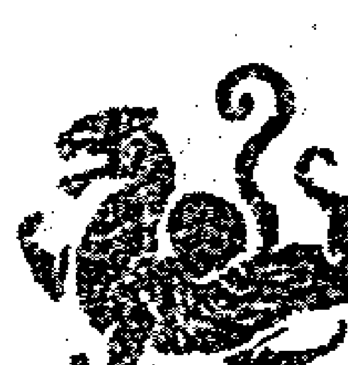

# 第四章 奇门遁甲的应用

用神，所选的电脑有问题。并补充道：玄武，是组装的伪劣产品！不能买。（我比较想买的是惠普电脑，因为它小巧。）

要在两个名牌电脑中选取一个，这是此例的问题与关键所在，最后的结论是“丁奇为用神，所选的电脑有问题。并补充道：玄武，是组装的伪劣产品！不能买。”那么难道你所选的这两个品牌都存在质量问题？这不符合逻辑的。

此例的重点首先是要将其两个品牌在局中定位，然后再来分析各自的状况。而不能单纯的只以丁奇来分析决定。即使以丁奇代表电脑有问题，那么这个丁奇代表的是东芝还是惠普？预测中凡遇到两个以上的同一类事物，我们必须要找出他们各自不同的“太极”点来。如：同一时辰内，有两个同年命人都来问相同的事体，这时就要依据他们坐落宫位，或让其报数等来方法，找出他们不同的太极点来作出分析判断，他们所处的宫位不同，各自所问的事情结果也就不同，你绝不能说他们所问的事情结果都一样。

俗话说：“起卦容易，断卦难”的确，在分析一个奇门局象时，首先要掌握基础知识。对九星，八门，八神各种分类判断方法熟记于心，在分析时，合理取舍，抓住重点，依据奇局所显示的象合理的解像，以五行生克来论事情的成败与利弊。在分析时，其人所来的方位，座落的方位，都有很重要的参考价值，不容忽略！如2006年11月6日21时与张大夫和其科室主任就餐。其主任座西北方位让他给我看看，根据当时其落宫有“飞宫格”我就断他工作要变动，结果应验。这要大胆实践，不断总结经验与心得，分析判断的水平就会逐渐提高。

下面谈谈笔者的分析思路：

九宫：代表地理方位。预测时可以根据来人所座所站的方位进行分析判断，这时问事人所处的宫位就可代表日干之落宫。定位法除用固定的方位外，也可用活太极定位法来定位。以我为中心，来人站在我的对面为离宫，左面为震，右面为兑，后面为坎。风水预测以九宫分析，则可具体分析出每个方位的吉凶，而不拘泥于，生门，死门，时干等用神。此三个用神只是从总体上来判断，阳宅，阴宅的吉凶，而要具体到某一个点，就要从九宫中去分析。

中国古代术数汇要

奇门遁甲应用初探


# 奇门遁甲应用初探修订版

# 先天、后天数：

|      |      |      |
| :--- | :--- | :--- |
| 兑2  | 乾1  | 巽5  |
| 巽4  | 离9  | 坤2  |
| 离3  | 5    | 坎6  |
| 震3  |      | 兑7  |
| 震4  | 坤8  | 艮7  |
| 艮8  | 坎1  | 乾6  |

判断数字，根据实际情况，结合旺相休囚，以先天数与后天数灵活取用。

九星值符：此时辰内值班的某一个星。其它八星都以它为头来排列。所以在它职权范围内，它的权力要大于其它八星。预测中多代表有权力，有职位之人，一般多代表正职。九星又代表天时，大气候，对某件大事情的预测古人说：“大事看星”，要看天时如何。

八门值使：此时辰内值班的某一个门。其它七门都以它为头来排列，所以在它职权范围内，它的权力要大于其它七门。故代表有权利，有职位之人，一般多代表副职。八门又代表人事，一件事情的成败值使门占很重要的地位。

神盘值符：神盘值符与天盘值符虽都在同一宫，但笔者认为他们各自对事件起的作用则不一样。神盘为“某种神秘力量”的代表，既然为“神”就有其“神奇”的作用，故《烟波钓叟赋》有：“急则从神”一说。神盘值符多数代表贵人、高贵、有价值、身份非常、奇迹、神助等。

日干：代表预测人。一切的事物分析都是围绕着日干为中心来展开的。

时干：为所问之事的总代表。

用神：为一个事物的具体代表。

马星：以时干取用，亥卯未马在巳，巽宫逢马星；申子辰马在寅，艮宫逢马星；巳酉丑马在亥，乾宫逢马星；寅午戌马在申，坤宫逢马星。马星为动态，凡用神逢马星多主动，变化。测工作逢之，多为工作调动，岗位调整等。

空亡：以时旬空亡为主。甲子旬中：戌亥空；甲戌旬中：申酉空；甲申旬中：午未空；甲午旬中：辰巳空；甲辰旬中：寅卯空；甲寅旬中：子丑空。六爻中对于空亡有：“旺不为空；动不为空；填实之时不为空之说”。但在奇门预测中，根据笔者经验，用神落空亡之地，多主事为虚象，难有结果。除非用神落宫得时令，又有马星动于此空，或有望。空亡在奇门遁甲应用中古人则称做：“孤虚”，用法与预测不同。

年命：为身之应，与日干同论。在一般情况下，只以日干为中心来分析，而不必再重年命。大的事情则年命要重于日干。年命者，命也！根基也！人生所求能否随心，须命中有之！预测中，对两人以上的判断，或别人来代占，生、死、功名、决策、等要以年命为重。

行年：指一个人所在虚岁数的干支：男命一岁起丙寅，二岁丁卯，三岁起戊辰……以此类推，六十甲子，周而复始。女命一岁起壬申，二岁起辛未，三岁起庚午……以此来推，逆转六十甲子，循环往复。六壬中的行年一般皆以地支论，而奇门遁甲中行年则以干落宫来论。以行年落宫来判断一个人的流年吉凶。（笔者判断流年多以年支所在之宫来分析，只以宫中的组合分析吉凶，而不太注重流年宫与日干，年命的生克关系）

# 第四章 奇门遁甲的应用

# 3：以日干与时干、用神之间的生克关系来分析某件事物的成败与弊

1.  以伏吟、反吟、天盘、地盘、九星来分析主客

首观所演之局，是否伏吟，反吟。伏吟利主，反吟利客。根据当时事情的性质来判断是积极进取，还是等待时机。除以八门，九星分主客外，还以天盘的干与地盘干分主客，有时门与宫也分主客，主客在奇门应用上很重要，所以古人才说：“奇门之占，先分主客，后再明占法。”特别是当今的经济时代，商业中的主客更显得重要。对于主客的具体分析，笔者将在后面专题论述。

2.  以日干、时干、用神落宫的旺衰，来分析自身和事物本身的情况。

分析日干落宫，时干，用神落宫的旺衰，宫中的组合，空亡不空亡。因为日干代表问事之人，一个人自身情况，喜旺，喜吉组合；忌衰，忌凶组合。旺则表明个人自身条件好，运气佳。衰则自身条件差，空亡无力。时干为所问之事，用神则为某一件事的具体代表，此两者的落宫组合代表着事物本身的利弊。

日干旺，又得时干，用神乘吉来生，则事物的发展对自己有利，往往谋事易成，或能达到自己的愿望，为与事物有缘之象。

日干虽旺，但时干，用神乘凶来克日干，则事物的发展对自己不利，往往所谋难就，或达不到预期目的，为与事物无缘之象。

日干旺乘吉，克时干、用神、则说明自身的能力强，对事物可持控制权，往往经过自身的努力，或依靠自身优越的条件最终也可实现自己的愿望，谋事可成，但费力而迟！为苦尽甘来之象！

日干衰弱，时干、用神旺相又乘白虎、死门等凶神来克，往往不但谋事不就，还需防意外之灾，此为灾来就身之象，还需注意！（正确的来讲，问事人的代表有时不一定是日干，如座宫，就不用日干了，日干是基本用神）。

# 4：以生日干、生用神宫；克制克日干、用神宫之宫；来寻求对某些不利于事物发展的因素进行解救！

这里主要指，就如医生诊断病情一样，先要分析出病源在何处，接下来就要寻求治病的方案，预测也一样，尽量也要寻求“治病”的方法。

但此条必须有一个重要的前提，首先确定事物的成败，利弊的比例，轻重。也就是说，事物虽有难度，但最终有成功的可能性，有利的因素要大于不利的因素，这是前提。要么，天下则无不成功之事，人也就不存在得失了！这就脱离了现实，违背“阴阳，相对论”，所以学习易学一定要辩证看问题。

如经过分析，事物对我有利可成。但，用神被其它克制，就要寻求对克制用神之宫进行解决，解救用神被克的不利一面。如，求官运，年干，直符，时干都来生日干或与日干比和，但，月干克日干，切有力，这就说明还有一部分的阻力来自于同事（月干），这就是病根所在。也就要化解月干对日干的克制。

如张志春老师在《神奇之门》一书中，出外求医一例中，根据奇门格局告诉求测者，不要去西安找胡万林看病，在本地东面，东南找医生看看，吃些中药就会好转，实际此人听取了张老师的建议，没去西安，在本地东南方找医生吃了些中药，病情真的好转了。这就是依据当时预测时，大局伏吟，病星在坤宫，所去之方，乾宫不克病星且临玄武。只有震巽两宫来克制病星天芮。伏吟不利客，不宜主动。这就是补救的方法。还有杜新会老师的案例中有不少这样的案例。大家自己去研究体会。以上笔者的思路只是大体的概括，在实际预测中要因地制宜，不能一概而论，易学预测无定法，很难有一个永远不变的死公式，各人所站的角度不同，分析的思路与方法就有差异，还望大家合理取舍，客观对待。

# ## (二) 应期的判断

奇门遁甲对应期的判断有一定的难度，多数都遵循《法窍》之法，今摘录如下：奇门一盘，星门生克，奇仪吉凶，固然是确定的，但是应验的年、月、日、时，事情的远近，或应年、月、或应时日，从星门奇仪衰旺而断，须神而明之，不可执泥。先定地支，后配天干，得干支的方法，只在正时确定。假如，甲子值符加离九宫，为子午相冲，子与丑合，应验应当在丑年、月、日、时；甲午值符加坎一宫，也是子午相冲，午与未合，必须应在未日；甲寅值符加坤二宫，为寅申相冲，寅与亥合，应验在亥日；甲申值符加艮八宫，也为寅申相冲，巳与申合，应在巳日；甲戌值符加巽四宫，为辰戌相冲，卯与戌合，应验在卯日；甲辰值符加乾六宫，也是辰戌相冲，辰与酉合，应验在酉日。这是值符相冲法，定支也是如此。甲戌值符加坤二宫，为戌刑未，卯与戌合，应验在卯日；甲子值符加震三宫，为子刑卯，子与丑合，应在亥日。这是值符相刑法，定支也是如此。值符落在旬空，必以出旬论断。假如甲子旬中空戌、亥，是加在乾六宫，必然应验在戌、亥日，因为戌、亥为重，阳与阳比，阴与阴比。这是旬空法，定支也是如此。如果既不冲，又不刑，又不空，论断时必须看天盘六仪所带的地支来定支，也照看冲合，逢冲以其合定支，逢合以其所冲定支。天盘所带的地支又不冲，又不合，以星、门生克来确定。生逢生日，克逢克日。应验有先后的分别，符应主先，使应主后。


# 奇门遁甲应用初探修订版

奇门在确定应期时，首先要仔细分析日干自身的状态与时干，用神的各自状态。再以用神与日干之间的生克、旺衰来确定事体的最后成败。总结如下：

1.  凡大局伏吟，主慢。用神落内盘（阳遁以1834为内，以9276为外），主近。
2.  凡大局反吟，主快。用神落外盘（阴遁以1834为外，以9276为内），主远。
3.  用神空亡，以出空，填实为期。
4.  用神休囚，以生、旺、值、时为期。
5.  用神入墓，以冲开墓库之时为期。
6.  用神逢冲，以逢合之时为期。
7.  用神逢合，以逢冲之时为期。
8.  用神逢刑，以逢合之时为期。
9.  以用神逢值之时为期。如用神落坤来生日干乾宫，则可断为未、申、年、月、日、时、为期。生逢生时，克逢克时为事成败之期。
10. 寻人，破案，类以庚格为期：凡庚加年、月、日、时、之上。分别为年格、月格、日格、时格。另外也可：阳日以庚下之干为期，阴日以庚上之干为期。时干逢阳星，以庚下之干为期，时干逢阴星，以庚上之干为期。
11. 以值使门，时干所落之宫，以其宫之洛书数来判断事情大概所需要的天数。

#### （三）分类占断方法

奇门在分析判断时，多以用神落宫法来横向分析。但，古人也有只以符使落宫来分析判断的。如《旨归》书中的案例，多数是以值符，值使落宫法来判断的。故在分类判断方法此节，将附录《遁甲元灵经》中的占断类别。一来此书中所载的判断门类比其它书较全面，二来此书也载有符使判断法，所以今附录以供大家参考研究。

# # 第四章 奇门遁甲的应用

# ## 1、天时

以九星代表天时，在预测天气时，兼看天干、八门、八神及其所落之宫的状态来定。

+   ①九星：天英星代表火神，主晴；天辅星代表风；天柱星代表雨；天蓬星为水神，也代表雨；天冲星代表雷；在冬季时，以天心星、天柱星代表霜雪。
+   ②八门：以景门主晴；开、伤二门主雷；休门主云雨；生门主风；杜门主电；惊门主虹霓。
+   ③十天干：甲、乙主风；丙、丁主火；戊、己主阴云；庚、辛主冰雪；壬、癸主雨。其中壬为大雨，癸为小雨。
+   ④在八神：以值符代表日和月；九天主晴；九地主雨；六合主风和日丽；白虎主风；玄武主雨；太阴主阴去霜雪；螣蛇主闪电虹霓，等等。
+   ⑤雨大小：天英星乘旺相，落于震三、巽四宫，或克日、时二干，主晴天。天辅星乘旺相，落于离九宫，或克所落之宫，或克日、时二干，则主风晴。天蓬星乘壬、癸二干，落于坎一宫、震三宫、兑七宫，或天柱星乘壬、癸二干落于坎一宫、震三宫、兑七宫时，主雨，如果乘壬干，主大雨，乘癸干，主小雨。如同时天英星、天辅星落宫天盘之干克地盘之干，则必然风雨雷电交加。如与值符近，则雨速，远则雨迟。天蓬星、天柱星乘壬癸二干落于坤二宫，主密云不雨。天蓬星、天柱星如果不乘壬癸水神，即使落于坎一宫、震三宫、兑七宫，也不会下雨。
    冬季，天心星、天柱星乘壬、癸到乾、兑二宫，主雪。
+   ⑥河水消涨：以天蓬星、休门为用神而判断。天蓬星、休门乘旺相之气而得三奇者，水虽涨，但不至于泛滥。天蓬星、休门乘旺相之气而值庚格，主河水壅塞泛滥高涨，如果乘甲辰壬并带有螣蛇，则洪水泛滥，肆虐为害。天蓬星、休门落于坤二宫、中五宫、艮八宫，水被土淹，洪水消退，或无洪水。天蓬星、休门不乘庚格与甲辰壬者，水虽旺发，不会决堤出岸为害。

# 附《遁甲元灵经》占法

> 天地风雨九遁间，端倪朕兆妙难言。
吉凶悔吝从生克，索隐钩深理自然。
六仪三奇分顺逆，八门九曜递循环。
如能穷此阴阳理，何问天仙与地仙。
二三五八多风雨，四九局中春日阳。
一六七防阴滞气，细推凶吉格中藏。
夏日炎天不若春，三四二七恐多惊。
不测雨声五六九，局中一八日晖生。
秋来坤艮日光移，乾兑巽宫风雨凄。
二三四九弥漫雨，坎若逢之闪电霓。
值符蓬芮不宜冬，霾雾阴云日不红。
五六三内多风雪，四七八局好天宫。
一遁乙丙加休门，天开霞彩悦人心。
秋有微风能透骨，冬来肃煞雨沉沉。
二遁乙丙在开门，春夕秋时多蔽刑。
夏日云霓多霁晴，腾蛇玄武半阴晴。
三遁四遁丙庚休，若逢夏令雨阵行。
逢秋掠地风声振，春日秋冬朗朗晴。
五遁丁癸加休门，春夏飞沙日渐昏。
冬景倏然成雨雪，秋虹电雹后开云。
六遁丙戌加乾宫，夏雨秋风春日红。
再逢惊柱临冬节，狂风飒飒雪飞空。
七遁辛加乙上艮，揭地掀天春夏中。
风雨互加秋令集，冬天开雾暖融融。
八九雪宫互六七，风雨龙虎一般同。
细详微理分凶吉，不遇门符应勿从。
天蓬飞入艮宫来，东北乌云一朵栽。
休使加临天任上，东方黄气满楼台。
生任加临在坎宫，黄云北上起穹窿。
苍云东北真华丽，禽芮加之分任同。
冲伤加艮在巽生，东北乌云带紫黄。
直北云霓皆缥缈，东南西方尽光芒。
艮宫杜辅值符临，烟雾腾腾紫气生。
东北方生云障腻，北方又有一轻清。
英景加临乾位上，西北云霞彩映红。
东白北黄青在此，值符克应量无穷。
芮禽若也到休门，北起红黄东淡云。
坤宫上有青蓝气，西北烟尘紫雾生。
惊柱值符临震地，霓云白上又加青。
夏天四下浮云起，骤雨狂风布阵惊。
心开巽上加值符，四处生云气障魔。
北雾南乌西紫霓，坤艮黄云上不多。
休蓬离上值符迫，黑色迷南气渐回。
西有青云冬淹水，北方红紫共徘徊。
值符震位加惊门，碧绿从西云翳青。
东白向云浑四散，巧应云在北方生。
坤艮宫中遇杜辅，蓝云翠绿四方多。
淡红在兑黄在巽，点点斑斑艮不差。
景加英兑起红光，白气淹淹东北方。
巽上浅黄加绿色，如逢生旺月华岗。
芮禽入震在冲伤，东起黄云兼白光。
南岭素缟带红色，西南西方黑苍苍。
惊居天辅素罗云，南有红光白带轻。
乾上青云常聚散，坤方黯淡雾沉沉。
相生相克观明色，旺相休囚辨得真。

## 占晴雨

此时遇阳门阳星飞临阳宫，又有火土星同宫，必定久晴。如阴星阴门合水金星及壬癸休门飞临阴宫，二局并合相生沐浴者，主大雨如注。若遇景门土宿飞临者，主雨时有时无，或日中下雨。如阴星阳门入于阴宫，或阴星阴门加于阳宫，主半阴半晴。若壬癸及甲子辰日时，天蓬、休门亦主有雨。若遇火土星，不逢水日时并沐浴者，无雨。若遇水星冲合，当有大雨。若论风、雷、雨、雪、闪电、星、月、云雾，详交节日时而可知也，内有口诀。（笔者注：此段为符使分析法）

## 占晴

占晴以天辅、天英为主，盖天辅为风伯，天英为火神也。云雨以风为散，以火为晴。如天辅、天英乘旺相，落于离九宫，或克日时二干，主晴。如天英乘旺相，落于三四宫，或克日时干者，亦主晴。玄武、白虎主雨风，以顶盘八贵神兼看，无不准验。其日期亦以火神、风伯所落宫分系何干定之。

## 占雨

占雨以天柱为雨师，天芮为闪电，天辅为风伯，天冲为雷祖，天蓬为水神、为云雾，壬癸二干亦水神也。天蓬游于坎兑震，乘壬癸游于坎兑震，或柱天冲乘壬癸二干游于坎兑震三宫，皆主雨也。又天辅、天英所落天上宫克地下宫，必然雷雨交作。又看天柱等所落宫得何干支，以定其日期。与值符近则雨速，远则雨迟。游于坤二宫主密云不雨，即游坎兑震不乘水神亦无雨也。

如未日子时天冲为值符，甲辰壬在二宫，上乘六壬，下临地盘天冲，亦有壬字，上下皆水木之神，壬子时干天柱七宫为值符主当日雨。如秋分兑上起甲，次第数到壬，七宫故曰天兑，为兑坤值符相连，故当日雨。

## 占雪

雪者，凝阴也，水而有寒气，乾兑二宫主之。或天心乘壬癸二干到兑，或柱乘壬癸二干到乾，皆主雪，各以落宫所得之干以定其期。

## 占岁时丰歉年遁中宫一星

一白居中半多雨雪霜露，五谷丰登，人民无灾，国泰民安。
二黑年交阴雨风烟雾，人口有灾，国家有患物，西南方主荒。
三碧年多风雷，物歉，东南熟，西北荒，民有风寒之灾，多盗贼。
四绿之年有雨水，江南熟，江北荒，人民有小灾。
五黄之年雨阳不时，人多瘟疫，荒熟各地不均。
六白年雨阳时若，国泰民安。
七赤年民遭旱煇，五谷不熟，西方荒，北方安，江南不利。
八白年雨水多，五谷熟，八方宁静，国泰民安。
九紫年风调雨顺，国泰民安，江南小旱。
若三白在巽、离、坤，南方熟；在干、坎、艮，北方丰；在震、兑、中宫，天下俱美。

## 占岁内丰歉

立春日某时交春，看九宫以分九州岛岛，见九州岛岛有何星、奇，即知之。坎一冀州，晋魏分；艮八兖州，韩郑分；震三青州，齐分；巽四徐州，鲁分；离九梁州，吴越分；坤二荆州，楚分；兑七梁益州，卫分；干六雍州，秦分；中五豫州，宋分。

天蓬所临之方，主瘟瘴春作，百姓流离；夏水漂没。奇、神救之减半。

天芮所临之方，奇、神加之人不为灾，七分收成。若加凶宿，人瘟物死，五谷不登。

天冲所临之方吉，奇加之五谷半丰，惟宜果实。春夏人物灾伤。

天辅所临之方，在吉处五谷大成，人民安乐。若加凶宿，主大风溢损伤。

天禽所临之方，在吉处者，主五谷大丰，人物蕃盛。若加凶宿，主长吏不宁，贵人移动，夏初瘟灾。

天心所临之方，有吉宿者，主秋禾熟，长吏贵人频受恩喜。凶星加之，春种离多，夏秋水涝。

天柱所临之方，在吉处半熟，人民瘟瘴。加凶宿，有蝗虎流火为灾，秋冬尤甚。若有三奇德有余庆。

天任所临之方，大有吉庆，奇神加之主生芝草祥瑞，及贵人在位。加凶处，五谷半熟，人离灾而无死。
天英所临之方，亦有祥瑞，得生旺地五谷熟，人民安庆。在克处或凶宿加临，主旱涸灾殃，春种夏枯。凡天乙所在之处，其岁事吉。

## 占田禾

凡占田禾，以休门合于木土之上为吉，更得三奇及干见合则有利。年景丰啬专看天任，如天任落艮震宫主年丰，再得青龙、六合、功曹、太冲，主四民乐业；若天任不落艮震二宫，主歉收，再以贵神月将分旱涝。天任所在有传送、天后主涝。又生门主麦，伤门主谷。看三奇、太常、功曹、贵人在生门宫则收麦，在伤门宫则收谷。占栽植死生，以天冲为花草，天辅为树木，各看所落之宫。旺相主生，休囚主死；生为生，克为死；吉格为生，凶格为死。旺相吉格生，草木茂盛；休囚凶格克，草木焦枯。吉凶相半，先后荣枯。壬癸戊己来生者为活，不生者死，又三为生五为死也。

## 又法占田禾

此时合生、休二门与乙丙丁，并六仪临长生、旺、禄之乡而合吉格，其年大熟。如合景、英、心、开，加于土木之宫，或门克宫，或上干克下干，必然无收。如木星克宫，多虫并风灾；如火星、金星克宫，多旱灾，或金风所伤；如水星多壬癸，或日时皆水，或阴星、阴门加于阴宫，必多雨水，连绵水灾；如诸星克制或生死二门宫者，其年未熟；如门克宫，或逢庚辛相制，虽收必有贼盗；若合凶格于命宫，如墓绝或朱雀者，因田生非破财官事。(笔者注：此段为符使分析法)

## 占蝗蝻

死、惊、杜、伤临日干则来，非此则不至。

## 占蚕利

此时得吉星，干支、门、宫相生，加临金木之宫而合吉格，下不克上者，有十分之利。若遇凶格、门迫加于金木宫，上下相克，是必无利。如合凶格得门生宫，或合吉格得门克宫，只有五分之利。

## 又法占蚕利

三奇、吉门、吉宿全于金木之宫为吉，须要不克上官及门为良。若吉门、星、奇皆不至金木宫，更克正宫星与门，收获寡。

## 工作

工作就业预测，包括毕业分配，求职就业，竞争上岗，晋升职务，官职升降，工作调动等。以开门代表文职工作及单位，以杜门代表武职工作及单位，以年干代表上级领导，以值符代表顶头上司，以月干代表同事，以日干代表求测之人，以时干代表下级或单位职工群众。

-   ① 日干或年命落宫旺相，又得吉门、吉格、吉神者，表示自身条件好，得天时地利，再得开门或杜门相生，则求职得官顺利；如果日干或年命克开门或杜门，经过努力，也能得工作或官职；如果自身不得天时地利，又受开门或杜门相克者，必然不能得到官职或工作。
-   ② 能否晋升职务：一看天时，二看地利，三看人和，四看自身条件和运气。自身条件好，又得年干、值符、开门相生者，必然能晋升，反之则不能晋升。
-   ③ 开门克用神，文官降调。杜门克用神，武官降职。反吟主调任，空亡必革职，入墓不但降罚，还会招来罪责。太岁或来克，上级领导不高兴；值符或来克，顶头上司不爱；月干来克，同事参劾；时干或来克，下属或是群众告你的状。
-   ④ 人品：以开门为官星，以其所临九星为人品。如开门上乘吉星为好官，凶星为恶人。临天辅星文雅，天任星慈祥，天心星正直，天禽星忠厚，天冲星风厉，天英星昏烈，天芮星贪毒，天柱星奸诈，天蓬星用大奸大恶之人。
-   ⑤ 转业、退伍：可以杜门官长，以日干为退伍之人。如果杜门生日干，主工作需要，领导有意留你，不准转业或退伍。如果杜门克日干，则准退。比和者，也准退。如果日干乘“青龙逃走”或“荧入太白”者，必退伍；如果乘“太白入荧”、“白虎猖狂”者，则不可准退。如果日干临“螣蛇天矫”，则可能有官司缠身，欲退不能。如果见“大格”或是“朱雀投江”的凶格，则可能会被革职。

中国古代术数汇要

奇门遁甲应用初探

## 附《遁甲元灵经》

### 占纳粟

以甲子戊为部司职，六丁为文书，时干为求名之人。必要六丁旺相来生时干，甲子戊生六丁则成而速。如甲子戊克时干宫，部司不准；克六丁宫，文书迟滞；时干克甲子戊，亦不成；克六丁，犯朱雀投江，亦主文书遗失。宫、门、星格吉易成，凶不成。

### 占升迁

凡占升迁，以开门决之。因开门为官，掌法印也。又看太岁、月建相生，如开门加生旺宫，再有三奇得生合吉门、吉格，必定升转。再遇太岁、月建乘吉神来相生，定然高擢帝庭。或有吉格而无旺相，有旺相而无吉格，或有旺相吉格而太岁、月建不来相生，亦不能升也。选亦同。

假如六己年大寒上元阳遁三局丙申日乙未时，开门在七宫。开门本属金，兑七亦属金，同类助我为相，又有奇日合之，又六己太岁乘天辅在离九宫来生兑七，主升无疑。又有看太岁落在何（原作卯）干，即以其干为所升之年月也。或以值符落宫占之，不用太岁者亦可。盖铨部升宫为值符之神也。

又如立春中元阳五局乙庚日丁巳时，开门到九宫，火来克之，为囚于鬼也，定升迁，并值符在坤有生金之象，本宫不旺亦无益也。

### 占上任吉凶

凡占上任后之吉凶，以上任之时所向之方为断。如衙门坐西朝东，即看东方所得之宫神断之；如向西即看西方所得之宫神断之；南北亦然。总看所得向之吉格，得格吉终于升迁；如不成吉格而星旺，主降谪；若休囚及废没者，主罢黜。若有凶格者，主有拿问；如返吟、伏吟、五不遇时及入墓、悖格、飞伏等格，不看方向，而知其不吉也。

假如阳遁一局丁壬日丙午时上任，衙门坐北朝南，此局六癸加地盘九宫杜门，无吉格，主降调。又如阳遁四局丁壬日癸卯时上任，衙门坐南朝北，天任加地盘丁合休门催官，白虎临向，主升迁。

### 占新任地方何如

当以天禽落宫为京师，其余为外地，以各宫六仪、三奇为分野。若遇甲戊同宫，阳日用甲，阴日用戊。如天蓬落宫上有开门，主有贼盗；有六庚主兵乱；如主旱涝不犯者，平安。各以本邦分野无任所分野定远近。

### 占历任归结

以本宫年干地盘为主，看天盘星门得吉格者，荣归；得吉格而别犯刑击飞伏悖格及本干宫有劫煞丧门刑克，主卒于官，不得善终。不成格而得奇星，主荣归；无奇星，主罢黜；有凶格主拿问。

### 占官员有故降罚

如开到鬼废休囚之方，或带击刑、入墓、迫制，为大不利。逢太岁伤之事于朝廷；月建伤之事起僚属；天乙伤之事谏臣；值使伤之事起御史；值符伤之事起抚镇。遇天网定被锁拿；天盘受下克，地盘受制，前后遇迫，定有按治。如得气，仅罚降；失令恐伤命。

### 占征召

凡山林隐逸及废黜已久，欲求征召者，太岁为皇恩，月建为铨部，日干为自己。要太岁、月建之星同生日干所乘之宫，又要日干所落之宫得好格局，主起官，反此不能。

### 占应差

进衙门应差，以开门为官长，以值使为己身。如开门宫生值使宫，又得三奇及旺相星，大吉。与长官宫相克，主凶。休囚亦为不吉。

### 占请假

以值符为尊长，天乙为卑小。值符落宫克天乙宫，天乙宫生值符宫，俱不准。假如值符生天乙宫，天乙克值符宫，定准假。两宫相比不准。

### 占领文迟速

以六丁与值使宫相生则速，如相克则迟。又看六丁在何宫相生，即以本宫支干定其日期。

## 经营

贸易求财，一般以日干为求测之人，以时干为财或货物；以甲子戊为资本，以生门为利息；以值符为货主，值使为购货之人；以六合为经纪人，月干为同行竞争者；以生门所临之星为财星；以值符和景门为行情；以时干和值使门落宫为经营项目；以开、休、生落宫为得财方向；以生门落宫为得财数量；以开门为店铺、门面，以生门为房屋，以死门为地皮；以值符为物主或银行，以值使为借贷人；以值符为银行或是放贷人，以天乙星（值符所落宫地盘之星，例如天辅星为值符，落坎宫，则地盘天蓬星为天乙星，因天辅星落于坎宫，则天乙星天蓬落于坤宫，其关系则为天乙星宫克值符宫）为贷款人或借款人；以值符为债主，以天乙为欠债人，以伤门为讨债人。
生门落旺宫，又得三奇、吉格者，则利大，相则平，休囚利微；如休囚又适凶格，无利赔本；甲子戊与生门落空亡，反吟、墓绝，再有凶格、凶神者，不仅不得财，反而会招惹是非。甲子戊和生门上乘吉星者事更吉，乘凶星则含有凶的成份。又可以地盘甲子戊上乘之干来判断得财数量。
得财时间：可以甲子戊与生门同落内盘为距离近、速度快，一内一外则迟，全在外则更迟、更远。如甲子戊与开门同宫，则得财迅速。又以地盘时干宫的地支定应期，为得财之年、月、日、时。伏吟，则以生门对冲之宫地支为应期。
① 交易求财
以日干为买主，时干为卖主，六合为经纪人、中介人。日干生时干利卖方；时干生日利买方；日干克时干，买主不要；时干克日干，卖主不卖；六合生日干，经纪人向者买主；六合生时干，经纪人向者卖主；六合人墓或空亡，必有奸诈欺骗之事；日干与时干比和，公平交易，也主成交；日干、时干有一空亡者，交易不成功。
② 投资求财
一般以甲子戊为资本，以生门为利息。生门落宫得奇和吉格、吉星，生甲子戊落宫吉，必获倍利；比和者得中利。生门宫克甲子戊宫，又得凶神凶格者，必赔本。甲子戊落宫生生门落宫，主添加资本仍可获利。生门落墓绝之地（指月令与生门的关系），再有凶神、凶格者，必然折本。
③ 买货求财
日干为买主，时干为货物。时干宫旺相得吉门吉格又上乘吉神者，为货的质量好；休囚不得三奇、吉门、吉格、吉神者，质量次；如果休囚，又临凶门、凶格者，上乘玄武者，必是假冒伪劣商品或是腐烂变质货物。时干生日干，不管好货孬货都有利。时干克日干者，或空亡、墓绝，则无利可图。日干生时干，为主动去买货；日干克时干者，也能买成。
④ 卖货求财
以值符为卖方，值使为买方。值使乘奇门吉格生值符或二者比和，可以卖出去。值符生值使，或二者相克，则卖不出去。又可以以日干为卖方，时干为货物；甲子戊为资本，生门为利息。日干生时干，为人恋货，不肯卖；时干生日干，为货恋人，卖不出去。日干克时干，虽想快速将货卖出去，介成交迟缓；时干克日干者，卖得快。卖货有利无利，只要时干宫（货物）生甲子戊或生门宫，则可利；时干宫不生甲子戊或生门宫，或者二者相克，则无利。时干宫乘凶神凶格来冲克日干宫者，必赔本。（坤二宫、艮八宫不遇反吟，则按比和来断；如果反吟则按照对冲来断）。
⑤ 买卖房地产
一般以生门为住宅，以死门为地皮，以值符为买房或卖房之人，生死二门乘三奇吉格，说明房屋和地皮好，如果生值符宫，对买主有利，买后可发达。如果生死二门不得吉格，说明房屋和地皮一般或质量差，如果生值符宫，则对卖主有利，卖后发达。如果二者比和，则主平安。如果生死二门休囚无力，又乘凶神凶格，说明房屋和地皮不好，如果二门宫来克值符宫，则主买后破家败财；如果值符来生此二门落宫，则必因此宅产而破败不利。又可以日干为买主或卖主，以生门为房屋，以死门为地皮，看其二者之间的生克关系。还可以日干为买主或是卖主，以时干为房屋或地皮，来看其二者之间的生克关系。
⑥ 开店求财
商场、门市部、酒店、旅馆、餐厅等，包括开办工厂等坐地经商预测，一般均以日干为求测之人，开门为其商场、门市部、工厂、酒店等的代表符号。开门乘旺相之气带三奇、吉星、吉格、吉神来生日干落宫者，为大吉大利；比和者次吉；如果开门入墓、空亡或反吟者，则未开者开不成，已开者可能停产或关门。开门落宫乘凶神凶格来冲克日干宫者，必然破耗折本。也可以日干为求测之人，以时干为店铺，看其二其的旺相休囚及其生克关系。又可以时干为顾客，乘吉门、吉格、吉神和旺相之气，又与开门相生，则顾客多；反之，则顾客少。
⑦ 合伙求财
一般以日干为我方，时干为合伙之人。时干乘奇门吉格来生日干宫者，对我方有利；日干宫生时干宫者，对他方有利；日干与时干比和者，公平；时干宫克日干宫对我不利；日干宫克时干宫者，对他不利。同时，生门宫生我则吉，反之，克我为凶。又可以地盘日干为我方，以上乘天盘之干为合伙之人。天盘之干生地盘日干者，对我方有利；地盘日干生天盘之干者，对他方有利；比和者公平；二者相克则不成，成则不顺利。
⑧ 贷款或借贷
以值符为款主或银行，以值使为借贷之人。值符生值使，或值使克值符，可以借到或贷到；如果值符克值使，或值使生值符，则借贷不成。值符与值使有一方空亡者，也主借贷不成。又可以所往之方的天盘星与地盘星之间的生克关系论之，天盘为动为客，为借贷之人；地盘为静为主，为款主或银行。地盘星生天盘星者，必借给或贷给；二者比和，虽然肯借贷，但必迟缓；二者相克主不借，反惹羞辱。如果天盘星所临干入地盘墓库者，则款主吝啬，不肯借。所去借贷之方，如果遇空亡，则说明款主无钱或人不在家，去了也借贷不成。
⑨ 放贷
值符为银行为放贷人，天乙星为借贷人，生门为利息。值符克天乙落宫吉，天乙克值符落宫凶。天乙生值符落宫吉，值符生天乙落宫凶。生门与天乙同克值符落宫，放出之款损失殆尽。生门与天乙同生值符落宫，本息全还。生门与天乙有一生一克值符宫者，借出之款不能全还或迟还。如果天乙落宫休囚无力，虽生值符宫，是无力偿还，结局是不全还或迟还。
⑩ 讨债
值符为放债之人，天乙星为欠债人，伤门为讨债人。伤门克天乙，讨债人实心实意去讨。天乙克伤门，彼此争斗不服。伤门与天乙同生值符，本息全能追回。伤门与天乙同克值符，本息不还。伤门生值符，克天乙，能讨回。伤门生天乙，克值符，讨不回。天乙旺相克伤门，虽有能力，但不还。天乙休囚生伤门，虽有心还，但却无力还，即使还款，也不能还全。如果天乙乘庚辛来克值符，必有经官之事。值符克天乙乘丁奇或景门落四宫（巽四宫杜门主执法机关）者，也有经官之事。甲子戊会开门落内盘者，其债速还。天乙乘天蓬或玄武，又克值符宫者，欠债人存心不还。

## 求学考试

凡求学考试，如果是考生本人求测，则以日干为考生本人；如果是父母求测子女的考试情况，则以时干为考生；同时，还可兼看考生的年命，以年命为用神。一般以天辅星为考试院，以值符为主考或监考官，以值使为副主考官或副监考官；以丁奇代表文章，以景门代表试卷；以年干代表录取的学校。

-   ① 考生情况：考生落宫旺相，得三奇、吉门、吉格者，又得天辅星、值符、年干相生者，定能考人理想学校（例如北大、清华）。考生落宫休囚无力，又不得三奇、吉门、吉格者，但得天辅星、值符、年干相生者，虽考试成绩不佳，但也能录取。如果考生落宫死绝人墓或空亡，又得凶门凶格者，又受天辅星、值符、年干相克者，定不能考上。
-   ② 文章：丁奇为考生文章、景门为试卷，二者落宫状态及与天辅星、值符、年干的生克关系，以此来判断考试答题的优劣及得分状况。
-   ③ 武试：即考武官，以值符为主考官，以天冲星为监考官，以日干或时干为考生，以甲戊己为弓，以甲申庚为箭，以伤门为马，以甲午辛为靶心，以景门为策论。日干或时旺相，甲申庚落宫克甲午辛落宫，或冲其## 奇门遁甲应用初探修订版

宫，皆为箭中靶心；再看景门旺相，与值符宫相生，则能考中，反此不中。还可看年命与值符、天冲星落宫的生克关系。

- 拜师学艺、入山访道：以天芮星为访道之人，以天辅星为传道之人，若天辅得吉门、吉格来生天芮者，必得高人传授。相比和者，空见人，不传道。相克者，不能见人，或不予传道。
- 还有投武：拜师学武艺者，以天冲星为武士，以值符为武师或教头。二者相生，主传授。彼此相克，不予传授。如果天冲星本身就是值符，则大吉也。遇反吟，伏吟则不吉。

## 附《遁甲元灵经》

### 占功名

若提学来临本府，以官为客，诸生为主；若学道坐于所考地方，以官为主，诸生为客。此时如主克客，是诸生为主则名或无阻；若官为主克客者，求名有阻难成。如主客相生、比合干支同契而合吉格，求名易成，文章合机；若生生官，求名虽成，必先图谋而利。若官克诸生合凶格，在于本命行年宫，或本命坐于死绝之宫，因求名招非灾祸，或因名破财。

### 又法占科名

三奇、吉门、吉星加于本人年干之上，不可犯奇墓、门克、刑迫可得，反此不得。

### 占岁考等第

凡占岁考等第高下，以天辅为文宗，日干为士子，六丁为文章。如六丁得旺方，兼天辅宫来生日干，又得三奇及开休生景四吉门，取为一等文章。旺，文宗生日干，不得三奇、吉门者，为二等文章。虽旺，而文宗不生日干，或文宗生日干而文章不旺，仅为三等文章。不旺，而文宗来克，幸有三奇、吉门者，为四等文章。不旺，文宗又来克日干，又在休囚宫，又无三奇、吉门者，定为五等。得死门及诸凶格者，定为六等不吉。

假如大暑中元阴遁一局，戊癸日辛酉时，天辅在二宫，六戊在八宫，星奇为文章在七宫乘旺气又与日干比，定是二等。又如秋分中元阴遁一局，丁亥日乙巳时，天辅六丁俱在八宫，文宗克日干，为三等。

### 占文宗

按临日斯以天辅为文宗。冬至自坎至巽为内，自离至乾为外；立夏自离至乾为内，自坎至巽为外。冬至后至四月为上半年，夏至后至十月为下半年。文星在内主上半年，在外主下半年。更以落的宫分并分野，以定日期，再详时事，以十二支配八卦法决之。

占科举、会试、中试，值符宫克日干宫，坐主不取。小考同看。

凡科举会试占，以日干（宫）为士子真才，值符（宫）为总裁，天乙为房师，六丁为文章。天乙宫克日干宫，房师不荐；六丁宫克日干宫，或日干宫克六丁宫，休囚废没，俱主题目大难，不能得意。如值符、天乙来生日干，六丁又得旺相，必中无疑，缺一不可。凡考童全。假如立秋上元阴遁二局，六庚日丙子时，日干在三宫，天蓬值符在四宫，与日干宫相比，六丁临八宫得生气，文章必不得意，座师虽受刑克，必力荐中矣。

### 占殿试甲第

凡占殿试，以太岁为主。太岁者，天子也。以月建为主考，日干为举子，景门为策论。如景门落在旺相宫，又得三奇并太岁来生日干者，为鼎甲。景门不得三奇，而得太岁、月建来生日干者，为二甲。不生日干，又无三奇者，为三甲。

假如六戊年正月立春日丙辛乙未时，阳遁八局，天芮为值符加七宫，死门为值使加三宫。丙为日干在六宫，戊为太岁在四宫，月建甲戌为主考，但不生日干，在三甲后矣。

又如戊年正月雨水上元阳遁九局六己日丁卯时，景门到三宫为旺方，上得星奇。己日日干在一宫，月建在乙宫生日干，但太岁不来生，仅得二甲。

### 占武举

甲申庚落宫、甲午辛的宫，或相冲，为箭中的。再看景门，得旺相又与值符相生，中缺一不当。看武艺以值符为主考，时干为举子，甲申庚为箭，甲午辛为的，景门为策论，专以甲可。

## 第四章 奇门遁甲的应用

##### 5、婚姻

预测婚姻恋爱一般以天盘的乙奇代表女方，天盘庚金代表男方。如果两者落宫相生比和，又逢吉门、吉格，则恋爱可成，婚姻美满。如果两宫相冲相克，则婚姻难成，或者夫妻关系出现了问题。并以六合为媒人，六合落宫生乙奇落宫，媒人偏向女方；六合落宫生庚金落宫，媒人偏向男方。

- 乙奇落宫所临的八门、九星、八神及格局，代表女方的性格、身材、长相及职业状态。庚金落宫所临的八门、九星、八神及格局，代表女方的性格、身材、长相及职业状态。
- 若为已婚者，可以用神相合之干为配偶的代表符号（例如日干为丙，则辛为其配偶），以他们二者落宫的生、克、刑、冲、合、害等状态，来判断他们婚姻的美满与吉凶程度。
- 如果预测成婚或离婚等事情，还可以分别看男、女双方的年命落宫情况，以此帮助判断他们之间恋爱或婚姻的结局如何。
- 第三者：在奇门遁甲中，以丁奇为妾室，在现代引伸为插足于男女双方的第三者女子，又以丙奇为插足男女双方的第三者男人。

> 附《遁甲元灵经》

### 又法占婚姻
如男家问婚姻，此时即以地盘诸星为男家。逢门生宫，或上干生下干合吉格，而干支日时逢生合，其婚必成。若门克宫，或上干克下干，或门迫相冲，必不能成。又如比和相，善言之即成。凡九星、六仪、三奇、八门在旺禄之时，主富贵之家；若衰墓逢生为渐发之家；旺而受克为时退之家。若论女相貌、人品，以八门、九星、地将推之。若逢生主人品清奇；逢克为不正或醰妇残婚之类。若女家问就以女为主，照前法反而推之。

### 占招赘

看合星，专以乙庚论之。如女求夫，谓之坐山招夫，当用天盘六庚宫来生地盘六乙宫。庚上得吉星，主夫性温良；得凶星主欺骗财物，或心性险。如男求女，谓之到踏门，宜地盘六乙宫生天盘六庚宫，亦主成。

##### 6、疾病

根据奇门遁甲的象、数、理模型，以奇门遁甲的九宫摹拟人体，以离九宫代表头部，巽四宫代表右臂，坤二宫代表左臂，震三宫代表右肋、右腰，兑七宫代表左肋、左腰，艮八宫代表右腿，乾六宫代表左腿，坎一宫代表泌尿生殖系统。

- 结合八卦五行属性，奇门遁甲的内盘外盘，又以离九宫在外代表头部、眼部、面部；离为火，在内代表心脏、心血管、脑血管等。坤二宫在外代表或耳、或臂、或手、人体肌肤；坤属土，在体内又主脾胃、食道、胰脏等消化系统。巽四宫在外代表左耳、左臂、头发；巽为木，主风，在体内又代表肝胆、血管、经络、气血等。震三宫在外代表左肋、左腰，震为足，又代表足部；震属木，在体内又代表肝胆、左肺等。兑七宫在外代表右肋、右腰，兑为口，故又代表嘴、舌头、牙齿等；兑属金，在体内又代表肺部、气管、或肺等。艮八宫在外代表右腿、右脚，艮为山，在面部又代表鼻子；艮属土，在外又代表肠胃消化等系统。乾六宫在外代表左腿、左脚，乾为天为首，又代表头部；乾属金，在体内又代表脊髓、筋骨、大肠。坎一宫在外代表男女外阴部，坎属水，在体内又代表肾脏、膀胱，内分泌系统。
- 预测疾病时以九星中的天芮星为疾病的主要代表符号，同时兼看八门中的死门、伤门、惊门、杜门、景门等，还要看天芮星所临的三奇六仪，以及上乘八神状况，据此来判断疾病的性质和部位，再根据奇门格局的吉凶，节气时令的旺相休囚以及与求测者本人的生克情况，综合判断疾病的轻重，发展态势及预后情况。
- 在疾病预测中，并以天心星和乙奇为医生和医药的代表符号，看其所落之宫与疾病星天芮落宫的生克关系，并以此来判断治疗的效果如

## 附《遁甲元灵经》

### 占疾病

以天芮为病神，以生死二门看。再审病者本命年干落宫，得生门不死，死门难愈。若年干休囚废没，再有凶星、凶格，大凶。即得其余六门，亦主缠绵。再以天芮废没之月为愈。斯如占父母病，或儿女同类病，得年干，时干入墓者大凶。又凶星、凶门加病人地盘年庚无救神亦凶。若凶星加奇门，上下二干相救，可死中求活；或三奇、吉门、吉格，更上下二干有合，虽不服药亦可愈。

### 占患眼疾

以离宫主之，离为目，看九宫得何吉星、吉格，则愈速；而凶则痊迟。若吉凶不分，则缠绵，亦不重。

### 占寿数

凡占寿数修短，以天冲、死门决之。盖天冲乃三宫之神，为生气也；又五为死气也。又以九十岁为率九宫，每宫十年，看天冲所落之宫远近以定其数。如天冲带旺相，一生无患；若休囚废没，一生常有坎坷。占者自天冲落宫数起。阳遁顺行九宫，阴遁逆行九宫，数至死门落宫止。将自己经过寿数除讫，以所得余岁论断。如年至三旬而得四数，则除三十尚有十年之寿，余仿此。

##### 7、怀孕分娩

#### ①判断胎儿性别

以坤宫天芮星为母亲，以天盘临坤宫之星为胎儿，阳星为男胎，阴星为女胎。其中天禽星临坤宫为双胞胎，又阳干为男儿，阴干为女儿。兼以坤宫所临之门为判断胎儿，阳门为男胎，阴门为女胎。又可以日干为母，以时干为子，以时阴阳和所临之星、门、宫来判断男女。还有可以以值符为产母，以六合或值使为胎儿来取用神。

#### ②判断胎位情况及分娩顺利与否

以坤宫为产室，天芮星为产母，天盘所临之星为胎儿。天芮克天盘之星者，主产速。天盘星生地盘星天芮者，子恋母腹，产迟。天盘星克地盘天芮者，为子克母，主母凶；地盘天芮克天盘星者，母克子，主子亡，但得旺相之气者，及奇门吉格者则不会有事。如果时干所临天盘星落地盘墓中，主子死母腹内。天地两盘如果乘凶门凶格者，母子俱凶尔。

又以坤宫所临之门为胎儿，产室克门，胎不安，门克坤宫，孕妇常病，如果伏吟，为子恋母腹，主胎稳而产迟。上乘白虎，则主产速。为什么？因为白虎为血光之神，门到坤宫或休囚入墓，可能是死胎。如果临三奇，则为吉利。

#### ③判断产期

以坤宫对冲之宫天盘所临的天干为应期。也可按阴日看庚上之干，阳日看庚下之干断应期的方法进行。

> 附《遁甲元灵经》

### 占胎孕

以坤宫为孕母，以宫上所得之门为胎，坤宫之天盘为产室。如天盘克门，子不存；坤宫克门，胎不安；门克坤宫，孕母长病；天盘克地盘，孕母不安。门属阳，男胎；属阴女胎。逢伏吟，子恋母腹，胎虽稳而难生。见白虎为血光神，其产应速。如伤杜门到宫，为入墓，必是死胎。或天盘为门宫二者之墓，不吉；为坤宫之墓，不利母；为门之墓，不利子。若有三奇，必得好子。

### 占生产

此时以宫奇仪为母，以天盘奇仪八门为子。天盘地干支临旺禄之宫，逢生者，子母全安。若上干及门克地盘奇仪，虑其子母有所亏。若地盘奇仪在得令之宫，虽则受克，亦且无害。如母克子，其产容易；子克母，产难。若子母无气而又受伤者，则子母难全。若子母比和，易产平安。若合吉格，产子极贵寿长；合凶格，寿天难养。要知何日将产，即看相冲生旺日时决之。阳星多产男，阴星众生女；阴阳相并而当双生。天下生人，同此一时，贵贱不同，详此时吉格、奇门在方向，宜对吉凶之格，则生此子贵贱可知，或再加父年庚多少，共算当生日时，遁演奇门，则知富贵修短矣。(笔者注：此段为符使分析法)

##### 8、出行

外出出行、出国旅游等，一般以日干落宫为出行之人，看你要去什么方向？这个方向如果有吉格、吉门、吉神、吉星等来生日干落宫，则为顺利；如果无吉格、吉门、吉神、吉星，但该方向地盘宫与日干落宫比和，也能外出。如果日干落宫得吉格、吉门、吉神、吉星，克所往方向之宫，也可出行。如果出行的方向得吉格、吉门、吉神、吉星，但却克日干落宫，虽然勉强可行，但必有不顺之事发生。如果所往之方遇凶门、凶格、凶神等，又来冲克日干落宫，则大凶。如果所往之方为时干空亡之地或为日干之墓地，也不利。如果日干或年命刑、墓、空亡出行方位之宫，也为不利。同时，也可兼看日干与时干的关系，以便帮助判断出行的利弊吉凶。

- 凡出行乘车：以景门所临之宫为道路，以伤门为车。遇“白入荧”凶格易遭盗贼，“逢荧入白”凶格则有可能碰上火灾，临天蓬、玄武可能被盗或丢失钱物。
- 外出乘船：以休门所落之宫为水路，以伤门为船只。如果遇青龙逃走或白虎猖狂凶格，可能遭遇风暴；如果碰上“朱雀投江、螣蛇天矫”凶格，则可能有沉船的危险。
如果坐飞机外出，以九天所临之宫为航线，以开门为飞机，看其临宫状态、格局如何，以定其利弊吉凶。
- 凡预测出发时间：一般先看日干和时干，如果日干和时干均在内盘，则行期近；如果日干和时干俱在外盘则行期远；日干和时干一内一外，也主行期远。一般以开门落宫地盘所临之干为具体出发时间。
- 未动身时预测外出归来之期：一般以出门之日的日干落宫下临地盘之干为归来日期。
- 预测行人在外吉凶：一般以用神及其年命落宫所临的星、门、宫、神及其格局吉凶来定。
- 预测行人归期，一般以庚格来判断。阴日以庚上之干为归期，阳日以庚下之干为归期。逢年格，年内必回；逢月格，月内可回；逢日格，当日即回；逢时格，本时辰内即归。不逢格，则不归。何谓不格？乙庚合，不为格；庚金入墓或空亡，不为格。
- 又以天蓬星、天芮星二者为代表行人的，行人在千里之外以天蓬星为用神，行人在千里以内用天芮星为用神，如果时干临天蓬星或是天芮星，则可能回来，时干就是归期；伏吟不回，反吟回；如果用神临三奇和三吉门，三奇六仪又正好是行人的年干，则马上可以回来；如果凶星凶门临行人年干，必有妨碍，不能回来。

> 附《遁甲元灵经》

### 占道途吉凶

以时干所落前一宫看之。如得天蓬为贼盗，乃时干所落宫前一宫，阳顺阴逆。即得天蓬，为贼盗，如无者不遇。再看时干所加本宫，得生旺相并得三奇吉门吉格者不妨。

### 占同伴善恶

凡途中遇人同伴，占以地盘时干为己身，看何星临之。如得禽心冲辅任为善人，得蓬芮英柱为恶人，再得旺相，而时干又居废没之地，主有侵害。时干旺相，凶星废没，亦不能害。如凶星有害，时干而得生休开及三奇吉门吉格，主被害中有救。若时干旺相而得刑格并一切凶格，虽有侵害亦无妨。

### 占店主善恶

看时干加宫所落之宫得何星宿以定善恶。看时干，若遇蓬芮（二大凶）英柱（二小凶）凶星，俱主恶人；遇辅禽心冲任吉星，俱主善人。如落宫克时干，主有侵害。若时干落宫有三奇、吉门、吉格者，虽有恶亦不敢害。如无吉格，但乘旺相，亦无害。如时干得休废没并凶星格者，当有侵害。

### 占出行

此时出行，欲得三奇六仪临于旺禄之宫，或行年合吉格而上下相生本日时，官贵禄马俱临，此时而去，逢贵人接引，财帛广进，求名亨达，且为皆顺。如本命行年并此时合凶格，门克宫，必多虚惊。如开门克宫，为贵人见贵之类。如逢凶格相冲相干墓之乡，出则不归。若遇壬癸，恐有水厄之忧。如遇辰戌，虑有牢狱之苦。（笔者注：此段为符使分析法）

### 占未出先定归期

看天蓬星落宫。如阳局，天蓬在内四宫，上半年回；在外四宫，下半年回。阴局亦然。冬至后自坎至巽为内，自离至乾为外；阴遁夏至后自离至乾为内，自坎至巽为外。又看所落何宫，即以本宫所得十二支位以定其期。

### 占登舟

以震三宫为船，以天盘所得之星为船户之善恶，得辅禽心三星上吉，任冲二星为中吉，芮英柱蓬为大凶，其船不可登。凡占水，看休门之下，见申酉为江河，见小吉为井，太冲为池塘。

占水陆以值使定之，不取坤宫者，死门也。

以坎为水路，艮为陆路，看值使落宫。如水陆二路有一生则吉，被克则不吉。又看休生二门所落之方，亦可出行。

如惊蛰中元阳七局甲己日丁卯时，惊门值使加坎宫，休门到震，生门到巽，为水木相生。

##### 9、行人走失

预测行人走失，如果以走失时间起局，一般以日干为用神，如果是按问测时间起局，一般以六亲关系取用神，如父母问测子女走失，以时干为用神，问测同辈人走失以月干为用神，问测老年人走失以年干为用神。同时，都还可以以人年命为用神。

- 行人走失去哪个方向了？以六合、用神、年命落宫代表其走失方向。如果走失之人是有意离家出或是潜逃，则以杜门落宫是其躲藏方向。
如果九星或八门反吟，或用神宫逢空亡，用神落宫的对冲之宫则可能是其走失之方。又以内盘、外盘分其远近，阳遁，用神落一八三四宫，则为内为近；九二七六宫为外为远。阴遁，用神落九二七六宫为内为近，落一八三四宫为外为远。
- 行人在外安危吉凶，则主要以用神落宫的格局来判断，如果用神旺相，又临三奇、吉门、吉格、吉神、吉星则平安无事；如果用神落宫得太岁、月干、日干或时干宫相生，则为有人帮助；如果用神休囚无力，又遇凶星、凶神、凶门、凶格或入墓、空亡、六仪击刑，则不吉或者是大凶。
- 行人走失，能否找回或是会自己回来，一般日干与时干同宫，或时干生日干，则容易找回或是会自己回来；日干生时干，日干克时干，或时干克日干，则不易归。用神旺相，又临开、休、生、杜四门者，不好找到；用神休囚，又临伤、景、死、惊四门者，则可能有消息，可以找到或自己回来。用神乘九地、太阴，可能有人将其藏匿；乘九天，远走高飞之象；乘玄武，是被人拐骗；乘螣蛇，有人盘查羁留；乘白虎，防止刑伤；乘值符、六合，在外安全无事。另外，伏吟局，人难回来；反吟局，则人必归。
- 行人归期，可以用神和值符定应期，旬空者，以填空之时或冲实之时为应期；逢冲者，以六合为应期；逢合者，以冲为应期。二可以庚格定应期，逢年格者年内归，月格月内可归，日格者当日能回，时格者，本时辰内归；阴日看庚上之干，阳日看庚下之干为应期；或者看时干，时干临阴星，则以庚上之干为应期，时干临阳星，则以庚下之干为应期。还可看马星，马星动或被冲动之时为应期。

## 附《遁甲元灵经》

### 占行人

以行人年命，看合当时局中干支为行人，以支宫为宅舍，以左右宫为来之迟速。如占东方之人，得西方即来，得北方不来，得南方在路。其归期以地方远近、旺相决之。如行人是甲子生，往南方，若遇以坎，即归；遇坤、兑、乾三方，将至；遇艮、震、巽三方，又向他方去了。遇克我之卦，必半路有阻，再看吉凶神煞、克我之宫以定安危。余类推。

又天蓬、天芮二星俱主行人，千里外者看天蓬，千里内者看天芮。得蓬芮者为来。又以时干为来期，伏吟不来，返吟为来。三奇合吉门于行人本命年干之上，即到。凶星凶门，其人必有妨碍。又年格年来，月格月来，日格日来，时格时来。一云各以落宫干支定其来期，又格则不来。

### 又法占行人

此时伏吟，行人身未动；返吟而且来速。若上干克下干，或门生宫克宫或庚加日干，行人即至。若上被克，或宫克门，行人不来。若日干加庚，行人不来。如上干在墓、衰宫，或门宫相克，行人来迟缓。若上干遇壬癸，临旺禄宫，又逢日时相生合吉之格，主有酒席相阻，或隔住无舟，或船水虚惊，或口舌、喜悦相阻。或上干在死绝之宫，或被克制及日时相犯，永为不来。切忌干支相冲在行人之行年干上者，或则死亡，或则囚禁。(笔者注：此段为符使分析法)

### 占远信

以六丁落宫为信，以时干落宫分内外来信之迟速。临内信速，外迟。六丁受制、休囚，轻则信迟，重则无信。天矫信速，投江无信。六丁带三奇合得有喜信，带击刑有凶信。庚格无信，投江在内亦无信。又景门临于本人所居之地信来甚速。如人在北方，占南方之信，一宫得景门，信即到。如人在南方，占北方之信，九宫得景门，信即到。余仿此。

### 在外占家中平安否

以日干为主，日干长生为处家。如甲日干则甲木长生在亥，亥寄于乾，看乾宫地盘中无凶星、凶格，主家中平安；有凶星、凶门、凶格者，主凶。须看克宫是何干，以日干六亲决之。年为父母，月为兄弟，时为妻子，即各以本宫所得论之。

### 占外人安否

先定方向，看其上下盘。得有三奇、吉门及诸吉格，外人平安。反此不安。

## 占回本乡

凡人久在他乡，难回故里。以本人天盘年命落宫，看其在内在外定之。如已在内界，即主回；落在外界，虽回心终得牵缠。如得吉星、吉门，回家平安；得凶星、凶门，回家有事。以地盘年命支干定其日期。

##### 10、失物被盗

- 钱财物丢失，一般以日干落宫为失主，以时干落宫为丢失之钱物。如果日、时同宫，为没有丢失，可以找到。如果时干落宫乘旺相之气来生日干落宫，也能找回。反吟者也主能找回。相反，则不易找回。时干落空亡、墓、绝之宫，也主难找回。
- 日干与时干同在内盘，则钱物丢在家中或近处；日干与时干同在外盘，则钱物丢在外边或远处；日干在内、时干在外，则丢失的钱物在外边；时干在内、日干在外，则丢在家中。
- 如果时干临玄武，则可能被人偷走或是自己忘记了；如果时干宫被玄武宫或天蓬星宫所克，则可能是被盗走了。玄武乘阳星是男人所为，乘阴星是女子所为；旺相有气为青壮年，休囚无力则为老年人。
- 丢失钱物找到时间，一般以时干生日干之日时为应期；或按庚格而断，阴干寻庚上，阳干寻庚下；入库者，以冲出之日时为应期。旬空者以填实之日时为应期。

## 附《遁甲元灵经》

### 占走失

凡占走失人口奴婢头畜应向何方，或寻未知得与不得，以时干为失主，六合为走失之物，但以落宫论之。以六合与时干所落之宫，分内外以远近为断。时干、六合俱在内四宫，为易寻；俱在外四宫，为难寻；若时干在外，六合在内，犹可寻。以六合所在之宫为方向，如得旺相之星，又得景死惊伤四门者，可得也。得九地、太阴，有人潜藏；得九天，应远走去；得玄武，被人盗去；得腾蛇，有人盘话羁么；得朱雀，即有信；得勾陈，仍落原地；得白虎、伤门，被人擒去；得太常、六合，有人收留；得九地，藏地窖中；得九天，远遁矣。陈，有内人相勾引而去。又看六庚年月日时。假如大寒中元阳九局乙庚日庚辰时，时干在震三宫，六合在坎一宫，为俱在内，又六合为坎宫，有人潜藏，主不失。

### 占失物

凡占失物金银财帛等事件，以甲子戊为财物。如见玄武，被人盗去；不见玄武，自己遗失。若玄武宫克青龙，青龙宫生玄武宫，定被盗去。又以六甲旬中空亡看之。如甲子戊落宫空亡，或自己遗失，或贼人盗去，俱不可复得。欲问失落何处，以甲子戊落宫方向定之。如在内四宫，为在宅中；在外四宫，主失落甚远。又以落宫卦位方向、体象断之。如艮为山，为少男，为东北；震宫为木，为长男、正东；巽宫为木，为长女，为东南；离宫为文，为中女，为正南；坤为地，为老母，为西南；兑为泽，为少女，为正西；乾为金，为老父，为西北；坎宫为水，为中男，为正北。欲问得期，以宫地盘决之、支干决之。如见玄武有盗者，以玄武落方定贼所在之方。阳星为男，阴星为女。又以玄武所落天盘、地盘支干决贼人衣包。

假如大暑中元阴遁一局戊癸日壬戌时，甲子戊到三宫，不见玄武，还是自己遗失，应东方。又不见空亡，以震卦体象找寻，逢卯日得之。但甲子戊到三宫为击刑，亦伤损也。一云玄武克青龙，及青龙克玄武，主自遗失。

### 又法占失物

此时天盘奇仪与地盘生合，或门生宫，失则必见，或自遗亡，或被亲友所藏。若门宫相克，上下相冲，物必难寻。如合凶格，或因失物而反招非破财。如门生宫合凶格，客又墓衰宫而相合，乃为自己家人所盗。如宫生门，干支相冲，乃外人所偷。如阳星相犯为男，阴星相犯为女，阴阳相并必男女知情。若阳星临墓宫，为女偷男藏；若阴墓为男偷女藏。逢旺气为少年人，逢衰气为老年人。寅为公门人，卯为犯过人，辰戌为兵卒人或好勇人，巳为手艺人或炉冶人，午为商旅人，申为邻近之人或知己人，未为同类人，酉为虚花人或多嘴人，亥子为江湖人或渔人、插冰人、或漂流。

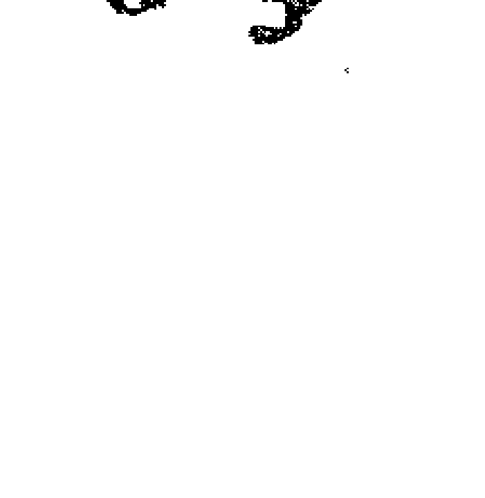

## 第四章 奇门遁甲的应用

人。又于天上干逢生为有根基人，逢克无根人，或上下相合为亲眷人。若逢门克宫或干支逢庚相克，再忌贼来。（笔者注：此段为符使分析法）

##### 11、刑事案件

1. 刑事犯罪包括偷盗、抢劫、流氓、杀人以及贪污受贿等经济犯罪。在奇门遁甲的预测中，一般性偷窃财物、流氓强奸、轻微经济犯罪，多以玄武为用神，抢劫杀人、奸情杀人，重大贪污受贿罪犯，多以天蓬星为用神；同时，甲午辛为罪人，凡是犯错误或犯罪之人，都还可以同时以甲午辛为用神，来帮助判断。
2. 罪犯特征：一般以用神落宫旺衰，结合所临星、门、神、三奇、六仪来判断其职业、长相、身高、性格等。天蓬星、玄武神临庚多为老奸巨猾的重大案犯，临辛多为惯犯或曾经被劳教过、关押过的，临壬、癸多为在外潜逃的罪犯。
3. 作案手段与工具：天蓬星、玄武神临伤门或伤门生天蓬星、玄武神，多为用车；临景门或景门生天蓬星、玄武神，多为使用枪支火器；临庚、辛或庚、辛生天蓬星、玄武神，多为使用尖刀、匕首等金属器械；临巽宫或螣蛇，多以绳索将人勒死或以手掐颈而致死人命；临甲、乙或伤、杜二门，也可能用木棍或木制器具将人打伤或致命。
4. 星门伏吟或用神落内盘，则可能是本地人或单位内部人员所为；星门反吟或用神落在外盘，则可能是外地人、外单位人或流窜作案的犯罪分子再次作案。罪犯逃跑、藏匿方向，一般以六合为逃犯，以杜门落宫为藏匿方向。以内盘、外盘、杜门所落宫数，来判断其远近。
5. 对于无名尸体：一般以死门来代表无名尸首。死门临甲子戊，可能是为钱财而被杀；临乙、庚、丁、壬或桃花者，多为奸情所杀；乘太阴、六合，多为隐私暧昧之事所杀。
6. 能否破案：一般以伤门、白虎、六仪中的庚和值使门为公安捕盗之人。公安捕盗之人落宫旺相，冲克罪犯落宫者，案件一定能破；相反则难以破案或是无法破案。星、门伏吟者难破，反吟则能破案或者案犯再次作案时可破。同时，有庚格，即庚下临年、月、日、时者，能破；无格者，不破或难破。另外，杜门逢庚、辛、壬、癸，或天盘六仪克地盘六仪，或

## 奇门遁甲应用初探

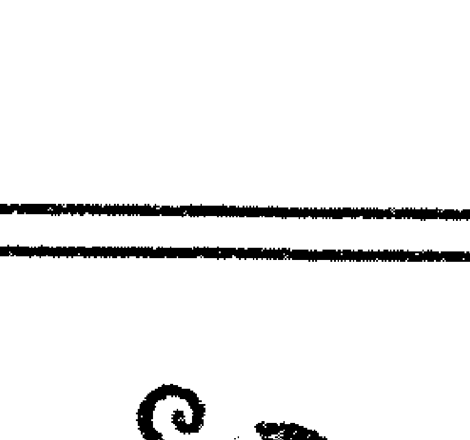

## 奇门遁甲应用初探修订版

是地盘六仪生天盘六仪，一般也能破案。
7. 破案时间：多以庚格而断。庚临年干，一般年内可破；庚临月干，月内可破；庚临日干，当日可破；庚临时格，本时辰内或表示较短时间内就能破案。如果一局中同时出现两个庚格，则表示该案一定能破，而且时间较短。具体破获时间，还可以结合阳日看庚下之干，阴日看庚上之干，或时干临阳星看庚下之干，时干临阴星看庚上之干等方法来判断。还可以按旬空出空、马星冲动，值使门落宫等方法来进行判断。
8. 另外，在奇门遁甲古籍中，还有“死门加壬，主讼人自讼”壬临坤宫凶犯自首的经验，也可供参考。

## 附《遁甲元灵经》

### 占捕亡人口逃走

凡占缉捕，以六合为逃人，以伤门为捕者。如六合宫生伤门宫，自归；克伤门宫，不获。伤门宫克六合宫，易获；生六合宫，不肯实心，必得贿赂；伤门与六合同宫，必有通，同欺蔽之意。又六癸为天网，在一二三四宫可获；五六七八九宫不可获。阴时可获，阳时不可获。又太白入荧同宫必获，又云值年月日时则可获。

### 占官差拿人获否补遗

以开门为官府，值使为差人，有事之人论年命。值使落宫空亡者，不得；加临本人年命者，其获速；其一内一外者，其获迟；值空亡不获。如甲子旬空戌亥，地盘得甲戌己或六宫也。

### 占捕捉逃走

此时六癸加于一二三四五宫，急赶必见；如临六七八九宫，或上干克下干，或门克宫，逃则无追。要知逃往何方，须从天上六癸所加之处追赶。如临一宫，往北方一里、十里或百里；二宫往西南方二里、二十里或二百里，余仿此。天上六癸为贼，为逃人，若加于旺方，为里一百；逢衰墓为十里；逢衰墓而受克者，为一里。若逢旺气、逢生，逃必难追。如此时宫地盘克六癸或六癸宫生此时宫，易见；若六癸与时宫比和，必易见；若六癸克时宫，或时宫克六癸宫，亦定难寻。

### 占捕盗补遗

捕盗有二义：大盗、窃盗。大盗天蓬主之，窃盗玄武主之。以伤门宫为捕人，时干宫为主人。伤门宫克玄武宫，易寻；时干宫克玄武宫，易捕。若伤门宫生玄武宫，不肯实心捕之；玄武来克时干，有伤主人之意；克伤门，有伤捕人之象。若伤门与天蓬同，再有时干克之，捕无不获。又以六庚与玄武同宫为大盗者；伤门与玄武同，虽有时干克之，亦主不获。盖捕者与窃盗均有通同之意。大抵六庚为敌、为盗，玄武为窃盗。如被盗，当以贼大小看天蓬、玄武宫占之。

##### 12、官司

凡预测官司诉讼，一般以值符为原告，以天乙（值符下临地盘之星）为被告，以开门为法官，以六合为证人和证据，以景门为诉状，以丁奇为传票，以惊门为律师。

1. 值符落宫旺相有气，又乘吉门、吉星、吉格者来克天乙落宫，原告胜。如果天乙落宫旺相有气，又乘吉门、吉星、吉格来克值符宫者，被告胜。如果二宫比和，则有可能合解。如果值符生天乙宫者，可能原告主动求和；如果天乙宫生值符宫，则可能被告主动求和。
2. 开门落宫既克值符宫，又克天乙宫者，法官铁面无私，公平审判。开门生值符，法官偏向原告；开门生天乙，法官偏向被告。如果开门入墓，则法官糊涂，审理不清，不明；开门落空亡，不予审理、受理；反吟局者，需换官来审理。
3. 起诉书是否会被法官受理，以景门为用神，代表起诉书。如果景门落宫旺相，又得三奇吉格，说明情词恳切，又不被开门宫冲克者，必会被受理。如果受开门宫冲克，则不予受理，如果景门落宫空亡，又乘玄武或腾蛇者，主所诉事情不实。如果六合宫逢空亡，则说明证据不够充分。
4. 预测是否会被判刑，以甲午辛为罪人，以壬为天牢，以癸为地网，甲午辛临壬、癸者，必有牢狱之灾；临三奇，特别是丁奇者，则可能无罪释放。再结合与开门落宫的生克关系，综合判断。

如果是犯罪分子本人或亲属预测，还可以日干或按六亲关系取用神，以辛为天狱，壬为地牢，癸为地网。如果用神落宫，下临辛，主被囚禁；临壬、癸者为误入天罗地网，待冲破之日可出。如果天盘壬、癸之干下临地盘辛者，为网罗盖头，主囚禁时间长。如果用神落空亡之宫，则不会被囚禁。

## 附《遁甲元灵经》

### 占词讼

凡争讼，有心中不平而先告人者，有被人告而求伸理者，须以开门为问官，值符为原告，天乙为被告，惊门为讼神。如开惊二门俱被克，被告败；俱克，原告败；一克原告，一克被告，则两家俱败。总以落宫决之。

又开门生原告，惊门克原告，或开克原告、惊生原告。如被告得生克者，亦然。以值符、天乙之旺相为胜，休因为败，亦以落宫决之。

### 占兴讼并呈状

以丁为状，朱雀为讼师，丁为朱雀。如朱雀落阳干之宫，或落宫与天狱庚相冲，又乘景门，其讼必兴。若朱雀落阴干之宫，其讼大起；临囚休废没之宫，讼即结而不兴。呈状以开门为官，景门为文状，开门宫生景门宫为吉，景门宫生开门宫不准，景克开准，克景不准。又景门落旺相宫则准，落休囚废没宫则不准。如旺相而生开门，可准；休囚废没克开门，不准。

### 占官事催提缓急

值符为官长，六丁为公文，值使为公差。如值符宫克天乙宫，六丁临于内地，其提缓。值符克天乙宫，值使临于内地，其提急。再有击刑则来意恶，有三奇则来意善。若相生则公差与官长见喜，相克则见怒。又看六庚为天狱，落休废易结；落旺相难结。一说六丁临外地缓，值使临外地急。

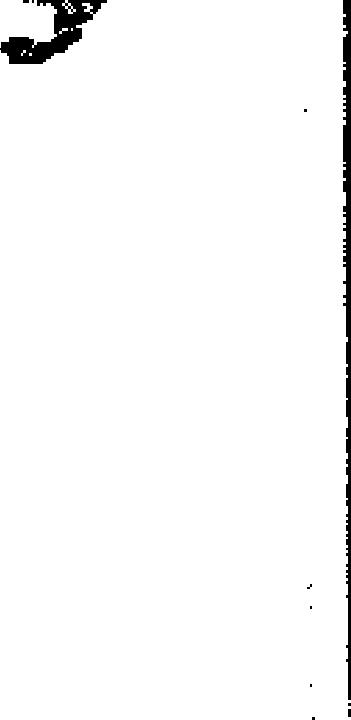

### 占刑狱重轻

以本人年命与日干落宫，星旺、门吉有三奇吉格者，官员降调，庚人罪轻。星不旺相、有三奇、吉门者，或三奇吉门得星旺相并吉门、吉格者，俱主罪轻，法及本身。如有三奇吉格、不得吉门与星旺相者，或星旺相而不得吉门、三奇，俱主罪轻。若星不旺相、门不吉、无三奇、格局凶者，主大凶。与日干年命再犯击刑者，有刑罚之苦。

### 占罪轻重

以开门为问官，以六辛为罪人，以六甲旬中六壬为天牢。如开门宫克地辛宫，辛上又有六壬临之，防有牢狱之灾；二者缺一，无害。再壬为天牢，甲辰旬中壬戌时，成为天牢；甲子旬中壬申时，即申为天牢。余仿此。若天盘上所克六壬之支，再得开生二门者吉。

### 占罪人开释

以地盘六辛为罪人，看得星何干，旺不旺。如上乘吉星、吉门、吉格，或克开门落宫，与开门宫相生相合者，其开释必速。不备者，少迟。若开门落宫克地六辛宫，再得休囚者，主牵缠又网低，则不开释；网高则开释。

### 占出狱

壬为牢狱，看所加地盘之干为罪人。必地盘之干克六壬所得之支，又得休开生三门者，即得出，以受克之支为日期。需得六丁时，或六丁落宫生罪人宫，干支又得三奇者，方出狱。

### 占官事牵连

以本日日干为有事之人，以庚为天狱，以辛为天庭，以壬为天牢。本人日干以地盘为主，庚辛壬三凶煞以天盘定之。如犯一煞，与地盘日干同宫，定有牵连；再逢刑击，定有刑罚。得天网，有枷锁临身，再有凶格等凶煞，连累甚重。若有三奇、吉门并吉格、吉星者，无碍，虽有牵连，不能成凶。若不犯庚辛壬，定不牵连。

### 占口舌官讼

此时遇门生宫合吉格，或上干生下干，或干在干得令之宫而克上干，或宫克门，因非讼而得理，有官贵人扶，得财。若地盘奇仪临衰墓宫，逢上干克下干，及门克宫而合凶格，则是非重，至财破忧惊。若逢心开生宫，贵人相扶。若逢英景生宫，有文书之力。若遇生死门生宫，田地房产之益。如前人门生宫，克宫之内推之。若诸星比和，或上生下、下生上，当宜和美。若逢死绝而被冲克，因讼破家陷命。(笔者注: 此段为符使分析法)

### 占被访吉凶

凡官吏、土豪被访，吉凶何如，单看本人年命日干本宫上有何星门临之。如星旺门吉，并有三奇吉格者，官民无恙。如不旺相而有三奇吉门并诸吉格者，或无三奇吉格而得吉门、星旺相者，或无吉门而星旺相临三奇、吉格者，官民俱主赃少罪轻。有三奇而门不吉、星不旺者，星旺而不得吉门、三奇及吉格者，或得三奇吉格而星不旺、门不吉者，罪重赃多，累及妻子。星不相、门不吉、格又凶、又无三奇，俱主伤门。若本命日干再犯击刑，必受刑罚。

### 占和事

以庚丙为两家相战之人，以甲为主和之人，盖以甲为天福又系十干之首，为两家福星。又必以甲子戊始可算，余甲不用。看甲所落宫，或同生两家，或同克两家，方为处事公平，则和成。若生一宫克一宫，必有偏向，不能和。又当看甲在旺相宫，而庚丙在休囚宫，彼亦不得不和。

##### 13、体育竞赛

体育竞赛预测，一般以值符为裁判，以日干或时干为运动员；如果主队与客队比赛，则须分主客，一般以地盘时干为主队，以天盘时干为客队，以其落宫的旺相休囚、格局好坏、生克关系来定输赢。同时以庚为器械，以辛为金牌，景门为技术指导，综合判断胜负得失。

##### 14、军事风云

奇门遁甲在古代主要就是用于军事预测，奇门遁甲来源于军事，用之于战争，但古籍中没有实例，只留下了一些预测经验。

1. 奇门遁甲中以六甲为元帅和主将，遁在六仪之下，而六甲最怕六庚来克（庚金克甲木，庚为甲之七煞），所以古人就以甲与庚这一对矛盾双方来代表战争的双方。一般以值符落宫为主，以六庚落宫为客。凡值符落宫克六庚落宫，则主胜，反之则客胜。又以旺相休囚论胜负，旺相者为胜，休囚者为负。凡战争用阵又以景、惊二门主之。经云“景门宜破阵”。又治乱之法，要看惊门。所以，如果主宫得景、惊二门，或是景、惊二门落宫与值符宫相生，则主胜；反之，则客胜。如果主、客所乘皆旺相，俱得二门，不相刑克，其力相等，则两相恐惧，不战而退。如果六庚为值符，则是主、客同宫，主客两家不分胜负。如果主、客相生，两家可能讲和。又，日干加庚，则主胜；庚加日干，则客胜，也可以日干为我方，以时干为敌方，来帮助判断胜负。
2. 预测军事情报和信息，以景为用神，景门落宫旺相得奇为实信，不得奇为诈信，空亡休因为谣言。
3. 预测作战计划部署，以值符为上级，开门为官长，庚为敌人。如果开门受庚和值符克制又休囚入墓而无吉星相助者，则表示计划部署不当，损失惨重，招致上级批评问罪。如果值符生开门，而且又克庚，则表示计划部署得当，旗开得胜，将会受到上级的嘉奖和提升。
4. 预测敌人来不来：以六庚为用神，六庚落在内四宫则来，落在外则不来，又“太白入荧”主敌人会来，“荧入太白”主贼去。如果贼已入城，看六庚在内四宫，为不去；在外四宫为去。又六庚落宫被地盘宫克，表示贼安营不稳，自惊而退。如果六庚克所落之宫，再乘玄武、天蓬或白虎，则必然大战一场，乘九天，大张声势，鸣鼓而进。乘九地，则会偃旗息鼓悄悄而来。庚下之干即为敌人的来去时间。
5. 预测攻城：以六庚为攻者，以天禽星为守城者。六庚乘旺相星，得开门加中五官，其城必破。又，地盘天禽星所乘之宫，得旺相及吉门者，其守将可擒。反之，守将必死。

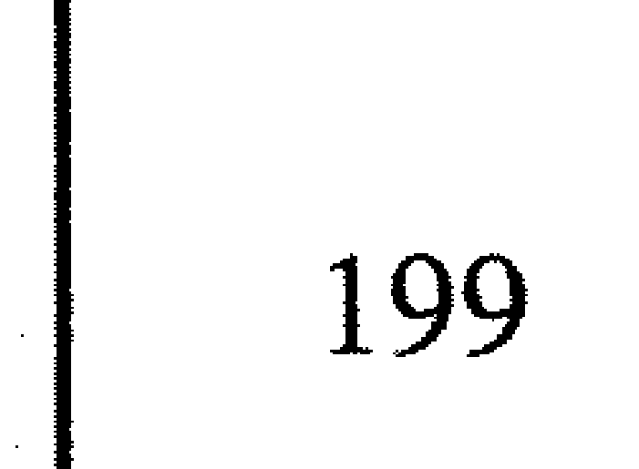

## 奇门遁甲应用初探修订版

6. 预测守城：以天禽星为守者，以天蓬星、六庚为攻城者。天禽星落宫得休、生、杜、景四门，又旺相，有六丙，其城不会被攻破。如果无吉门旺相，再犯开门，天蓬星乘六庚加入中宫，则不守。
7. 预测派遣（选将）何人为宜：从众将中找出年命之干被开门所冲者，即为应派之人。

## 附《遁甲元灵经》

### 占贼盗敌兵来去

凡占贼盗敌兵来去，先分界限。冬至以后，自坎至巽四宫为内，自离至乾四宫为外；夏至以后，自离至乾四宫为内，自坎至巽四宫为外。以六庚为敌人。敌人未至，六庚临外四宫；敌人已至，六庚临内四宫。如六庚所临之宫克六庚者，主敌人安营不稳，自惊而退；如六庚所落之宫再乘玄武、白虎、天蓬之神，主敌人来必大战；顶盘得九天则大张声势，鸣鼓而至；顶盘得九地则偃旗息鼓而来。如贼已入我境，看何日何时去，六庚在内四宫主不去，在外四宫则去。总以六甲所落之地盘干支看岁月日时，为来去之期。如太白入荧，虽去贼仍来，然在外界亦主不来；若荧入白，虽主贼去，总在内限，亦主不去。

### 占贼来否

此时天上奇仪星门克宫，贼得猖狂；如地盘坐于旺禄得令之宫，贼虽来而我以计胜。若我居失令，逢其相克，谨防所失；如我克他，贼虽见而无害；若上下诸星比和，干支相生，主不进不退，恐贼暗来，宜埋伏之。
(笔者注：此段为符使分析法)
又法以月将加正时，看天罡所在孟仲季，则知其来否。月将即正月雨水后登明亥将之类是也。

|  | 临孟 | 临仲 | 临季 | 来不来 | 不来 | 半路半来 | 全来 |
|---|---|---|---|---|---|---|---|
| 去不去： | 尚在 | 半去 | 全去 | 出不去 | 不出 | 半出 | 全出 |
| 战不战： | 来战 | 已战 | 欲战 | 罢不罢 | 已罢 | 欲罢 | 未罢 |
| 利不利： | 主利 | 两伤 | 利客 | 何道近 | 左道 | 中道 | 右道 |
| 兵被围： | 可待 | 相撞 | 急去 | 行不行 | 未行 | 欲行 | 已行 |

## 第四章 奇门遁甲的应用

### 占贼情虚实

凡占两家对敌，当定主客。以值符为主，以六庚为客，以所落之宫生克论虚实。如贼人会战和降等情未知虚实，看主客所落之宫。如庚落宫克值符落宫，则其情虚诈；如相生、相比，定是实情，来意不敢为恶。如伏吟，则以六庚本宫与值符本宫生克看之；如返吟，则来意反复不定。

### 占伏兵有无

凡占伏兵，当以干支、值符、值使，用巳申子卯决之。先看值使在何宫分之，又以月将加本时看值使上有子卯巳申，定有伏兵；再看旺相带刑，必有大战。如空亡、休废，虽来不战。如申巳子卯不在值使宫上，必定无伏兵。如值使宫有子卯申巳一字（一云值符，未知孰是，存疑）加在本时之干，贼在前；加在本时之支，贼在后。以月将加本时支干，相覆贼当在路之险处邀战。

假如大暑中元阴一局戊癸日戊午时，天禽为值符，死门为值使，俱加一宫，巳申子卯不在符宫上，定无伏兵。

### 占贼临境城可居否以干支分主客

以值符加时干为动为客，以值使加时支为静为主。如值符落宫克时支宫，再乘六庚、玄武，此地不可居；或值使落宫下克上，亦主不可居（即被本宫地盘克是也）。或值符宫与值使宫相生比和，可居；或相刑克（值符宫受克），敌来不能取胜，亦可居。或值使宫神相生、比和者，可居；犯门迫者不可居。

### 占攻城以六庚主之，太白兵象也，主攻者，天禽在中为受攻者

看六庚乘旺相，得开门加中五宫，其城可克；又看地盘天禽所落之宫，得旺相吉门者，其将守可擒得；休囚废没及凶门者，其守必死。

### 占守城以天禽为守，天蓬乘六庚为攻者

看天禽落宫，得生、休、景三门，得旺相又有六丙，其城可守。如无吉门旺相，并再犯天蓬，六庚加中宫，城不可守。

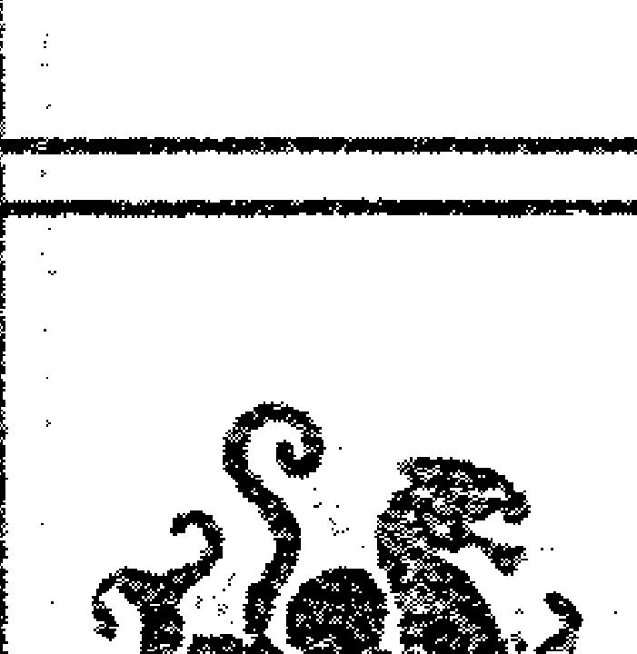

## 占援兵以生我克彼论之

凡被攻日久，以六庚开门为敌人，以六丙景门为守者，必天禽、六丙合生门，或在守者左右之宫，必有援兵，近而且速。若离禽宫远则迟。如六丙景门休囚受克制，援兵不至（亦无力援我）。如天蓬乘六庚败气，攻者不克，守者可守（以兵威在天禽故也）。

假如清明上元阳四局乙庚日丙子时，天禽值符加丙在坤，天英作援兵加离生禽，则火生土。六庚在干六宫，受天英之克，必援兵大张声势，有整兵慎战之意。攻者有缓攻畏敌之意，可守无虞。

## 占胜败占阵以景惊二门主之，曰景宜破阵，又曰乱之，要法视惊门

以值符落宫为主，以六庚落宫为客。如值符宫克庚宫，主胜；庚克值符宫，客胜。又旺相则胜，休囚则败。如值符宫得景门、惊门或二门与值符宫相生，主胜；庚宫得景惊二门，或二门与庚宫相生，客胜。如值符与主客相生，必来讲和；如值符与庚主客俱乘旺相，景门反相刑克，其势相等，两相恐惧，不战而退。若六庚为值符，即为主客同宫，不分胜败。又日干加庚，主胜；庚加日干，客胜。

## 占闻报虚实当以时干决其真伪

看甲乙壬癸四时，闻事皆虚，忧喜俱无；逢戊丙二时，闻忧则虚，闻喜则实；逢丁时，则忧无大忧，喜无大喜；逢己庚二时，闻喜则无，闻忧则实；逢六辛时，忧喜平二。

六壬以月将加时，看日辰与上神之生克。如相生为实信，相克主虚信。如朱雀、天空临时临辰尤不可信。

## 占来人善恶

六壬以月将加时，神后落处断之。寅申巳亥良人，子午卯酉商客，辰戌丑未，恶人奸细。

## 占使人探侦

两家对垒，久无动静，使人探其消息，既分主客，又当以值使决之。

如值使落宫生主宫，去则得力；克主宫生客宫，去必向彼；若克客宫，必探得的实。主生值符宫，虽泄主气亦吉；客生值使宫，克值使宫，虽泄客气亦主彼吉。值使宫自相克制，必不敢去，或途路有阻，旺则稍可，休囚大凶。

## 占行间其地

两国兵争，或应间谍行不以法占之，以值使为彼国，丙为自己，庚为所间之人。以月将加本时，看丙与值使所得何支相冲，则动；不冲，则不动。既已冲动，又看庚值使之乘星。庚旺间人无益；庚星克值使之星者，无益；相生者，无益。必值使乘星克庚乘星者，其术得行也。

## 占诈诱彼堕计中否

敌国相攻，兵不厌诈，以六丙为己，以六庚为敌，朱雀为谣言。必朱雀要落宫旺相得地，又要六丙落宫克六庚，或丙生六庚，其诈得行。如庚虽被丙克在旺相之乡，或生六丙不在休囚废没之地，主半疑半信。丙被庚克，或生六庚而不旺相者，其术能行。

如常人争讼私斗类，亦欲行诈诱之法者，日为自己，年为长辈，月为类，时为晚幼，其占法同。

## 占出兵领饷

出军讨贼，以天辅为饷司，天冲为将领，青龙为饷神。若天辅落宫克天冲宫，有饷不发；天冲克天辅，亦不吉。必两相生比者，发。又看青龙旺相，比、生天冲者，其饷必多；落休囚废没，其饷不足。

## 占行兵无水

欲知何处有水，以休门下定之。见申为江河，小吉为井，太冲为池塘（六壬以月将加时）。

## 占行兵迷路

凡行兵遇深山大林，暮夜迷路，以三定其去向。因三有生气，又为破军、天马之象，故云：趋三避五，八方无阻。或以天罡所落处行百步外自遇大路。

天罡加孟在左，加季向右，加仲中行，自得大路。六壬以月将加时。

## 释趋三避五

假令冬至上元阳一局甲己日夜半为甲子时，至平旦为丙寅时，得此三时为生气，和百事，故曰：趋三；至食时为戊辰时，此五时为害气，故凶宜避。

甲日丙辰时，丙火乃甲子孙，是日生时干，为生气，又合吉格，大利主；至戊辰时，甲木克戊土，而甲木主为戊土为官克于时，为死气，右上干克下干，门克宫，故大利客兵。

## 五符造天关，断鸦鹊鸣方吉凶，看此十二神将所主

凡出军、行道、住宅闻鸦鸣鹊噪者，看其从何方来，就占其吉凶而趋避之。

- 遇五符星方噪酉上癸：主人送信，诸事吉又宜驻兵动众、晋谒、求财。
- 遇天曹星方噪戌上甲：主行征往来出入吉一说外出平平，若战斗主气力弱。
- 遇地符星方噪亥上甲：主出征有神助，女人报信吉又主惊虚，三军忧失不宜，征战并罡魁煞入吊客。
- 遇风伯星方噪子上甲：宜出旧，远出、行兵必中虚诈又主出入忧惶，大风虚惊、暗昧、失物。
- 遇雷公星方噪丑上乙：不宜兴兵远出，必有二人报信又必有风雨、阴私、计谋、怪梦、惊忧。
- 遇雨师星方噪寅上丙戌：宜守，水战大吉又路逢阴雨或狂风骤雨。
- 遇风云星方噪卯上丙戌：主有钱财、吉庆，不宜先动兵又宜唤客迎宾，心不定。
- 遇唐符星方噪辰上丁己：主人送财伏兵大吉。又人马大胜，一可胜十，凡所营求无不吉利。
- 遇国印星方噪巳上丁己：主文书报信，出兵大胜又主有迁进、改除之事，无不吉。
- 遇天关星方噪午上丁巳：主门战，行兵大凶又路逢阻滞，因讼遗物，门讼征行凶。
- 遇地轴星方噪未上壬：主阴人恼乱杀之事又主人马不胜，值囚钱谷散失。
- 遇天贼星方噪申上壬：主口舌争竞，官司告事凶又路逢盗贼，暴风来处是贼方位。

每日定三门，遇五符、唐符、国印三位大吉，或出入等事不避凶杀，但得三位者，无不吉利，于禄上起五符、二天曹、三地符，照上式顺排至天贼止。

如甲禄在寅，乙卯，丙戊巳（一云戊禄辰），丁己午（一云己禄戌），庚禄申，辛酉，壬亥，癸子。天曹、地符宜守，风伯消息凶，雷公大凶，雨师忧贼至，天关宜追捕，天贼必占贼，遇地轴多逃遁，风云宜避。

##### 15、风水地理

预测地理环境，一般以日干为人，以时干为住宅。时干临三奇、吉门、吉星、吉神、吉格乘旺相气来生日干者，则为最佳住宅，此居住环境对人最为有利。如果时干不临三奇、吉门，但临吉星、吉神、吉格乘旺相气来生日干宫，也为较好住宅。如果时干所临之宫有吉有凶，则为一般住宅。如果时干临凶门、凶星、凶神、凶格，又来克日干宫者，自然就是大凶之宅了。具体吉凶，再根据星、门、宫等的生克关系来具体分析。

- ① 阳宅：一般以生门为房屋，以死门为地皮（宅基），再以其旺相休囚，与日干的生克关系来判断其优劣。又以值符为新宅，以值使为旧宅。
- ② 阴宅：一般以死门为用神，死门落宫地盘为死者，天盘为生者，吉神、吉星又得三奇，上下相生生者吉，凶神、凶星不得奇且上下相克者凶，天盘克地盘，对死者不利，地盘克天盘，对生者不利。再者，死门落坤二宫、中五宫、艮八宫、离九宫者为吉，落在乾六宫、兑七宫次吉，落在坎一宫、震三宫、巽四宫不吉。

## 附《遁甲元灵经》占地理法

地理有形皆有法，分门定局预能明。
相生圆活并长厚，相克浅斜尖狭轻。
天蓬方满带奇刑，天任高冈驿路深。
得遇奇门园径在，相逢凶格拟坟墩。
天冲树木多丛杂，天辅三义近阁亭。
天英窑灶兼枯涩，庙宇溪沟在芮禽。
天柱桥梁并曲径，园林寺观合天心。
休门淹水井泉多，道路桥梁生上过。
伤门闹市兼亭院，杜上斜沟曲涧波。
景上锦绣直罕见，四园土阜有山窝。
死门山野兼林木，葬有长堤对酒炉。
惊门灰堑兼污秽，开处通衢入画图。
时池高底多短长，且使符使总端详。
时旺相得加倍算，休囚失令照寻常。
门迫受伤因减半，路逢远近有规方。
辎铢瓦砾穿物色，更把天星合地详。
伤冲大小水兼三，四杜辅中五六纤。
休蓬一六数为先，生任排来七八间。
惟有景英三九数，芮禽死使二三连。
惊柱数中应二七，开心六九勿虚言。
休囚旺相从心豁，虽得千金莫浪传。
符加丙，生穿地，黄玄物色自新鲜。
加休土块深青紫，开若逢之见水津。
加惊壕堑疑坚石，加死多年骸骨深。
加景微尘兼灰土，杜门击瓮饬刑伤。
伤上一宫殊物异，远年朽木地煤坑。
丙加符甲在开门，地色红黄雾气腾。
休门有水多漂白，生上顽砖及古坟。
伤门枯木兼藤蔓，杜上禽毛气赤青。
景门板龟泥枯壑，死门布帛贱衣襟。
惊上锁匙尘铁索，旁边兼有石灰瓶。
丙丁如加天任宫，土中沙起色黄红。
冲星若也来相遇，蒲包草席有形踪。
辅星绳索有连钞，英上加之器是钞。
芮禽穿下多文墨，更有车辕与草茸。
天柱临之有贵物，非丝非帛拟钱筒。
天心奇物投嫌墓，堕坏钱财未落空。
天蓬沙石泥无实，如掘渊泉水溢冲。
丙已加生土色黄，如加伤位色如糖。
杜门碧绿还兼紫，景亦斑斑点血苍。
死门乱石兼磁器，土色玄红不是良。
惊门如镜有明亮，轻浮白色时开方。
休门色若污泥黑，再看天星辨隐藏。
丙加庚兮荧入白，八位移来有吉凶。
休门不可利言凶，蓬宫之宫非吉得。
如生怪石势嵯峨，加震穿寻多发积。
杜门铁索与香炉，加尸棺材有污骨。
惊门灰炉飞又沙，玩器巾杯开上集。
庚加丙上白入荧，开门加之不一同。
簒头器皿并钮扣，土色穿来定赤红。
休加土色如牲血，毁筋残杯在艮宫。
伤门狸洞兼蚯蚓，杜上青森亦草虫。
景门干燥如螺蚌，死上丝罗不尚空。
惊门枯井堆砖砾，此格由来多咎凶。
青龙逃走乙加辛，开遇乘龙拟宝珍。
休门吐血藏牲骨，生艮黔喙是羽鳞。
伤门遇遁多清洁，果核桃李在杜门。
景上蛤蜊兼骨梗，死门旺相小尸灵。
羊角如难惊上得，更兼蛋壳应如神。
辛加乙上号猖狂，生杜宫中仔细详。
七八局中如合此，回凶转吉不寻常。
辛加伤上土色青，地中蛇穴洞何深。
景门桥木并盔甲，黄土沙泥在死门。
惊门铁瓮多白色，刀柄枪头开位临。
休门驼物兼色骨，生杜门中地可钦。
癸加丁上蛇夭矫，若遇休门气渐消。
开门物贵形如朽，惊上川流水自滔。
死门畜骨兼牛角，景得奇门有滔滔。
杜门乐气兼古鼎，伤门有木鱼不敲。
生上一宫无外物，木梳毁折破磁梢。
朱雀投江丁加癸，如加死上古坟基。
惊和加水无泥溢，开上穿来旧石灰。
休门疑有头枯骨，生遇蓬之死犬猫。
伤门墬板无丁钉，杜有山林古石碑。
景门锦雉直文彩，土色红黄地穴奇。

## 占安葬迁改补遗

此时日合贵人、禄马，合山头神龙，生旺有气为主。如某龙旺于某季，在春夏秋冬二十四气之内，按阴阳二遁取用日时。合太阳照临向坐，若太阴、太阳映照更美。其乙、丙、丁、六仪不临墓绝之时，合于吉格，与亡命祭主山运分金，补泄得宜，水口相生相合，并门宫有奇，得死、景、生门到坐，余门到向相生，乃万全之吉也。

## 造宅三白占家宅歌

- 飞符入于鬼乡，看其休囚之类。
- 虎入门兮人散，雀带刑兮吏追。
- 勾刑门兮宅祸，虎害干兮人灾。
- 腾附蓬星为直战，小口惊忧；
- 武会任宿而当权，阴人邪孽。
- 六合天柱子女怨尤，太阴景英宠婢窃位。
- 九地庚辛为伏两，若遇惊伤而带刑害，暗中有损；
- 九天丙丁为飞蝶，若乘甲乙而逢克战，鬼怪须防。
- 朱雀再附丙丁，喧争聒耳；
- 玄武更加壬癸，宵小跳梁。
- 庚辛白虎得地而凶势愈张，
- 戊己勾陈刑冲而破败立见。
- 烧身之虎，先凶后吉；
- 入土之蛇，蛰后须伤。
- 返首兮画栋雕梁，跌穴兮藏龙聚气。
- 九遁则知拱获有情，得挟定然堂构森列。
- 守门在家清吉，游仪出外更良。
- 乙加辛门廓有损，辛加乙虎首房强。
- 癸加丁厨厕不利，丁加癸祟魅为殃。
- 伏干人宅俱不顺，飞干基址招殃。
- 伏宫人宅皆妨害，飞宫祸起萧墙。
- 大格小格邻家有冲射，刑格悖格眷属不安康。
- 白入荧防有怪异，荧入白火烛惊惶。
- 五不遇兮人有损，网罗布兮事怪张。
- 六仪击刑凶灾迭见，三奇入墓暗室幽房。
- 反吟不吉，伏吟不祥。

## 占家宅

此时遇门生宫，上干生合下支，乙丙丁、六仪临旺禄生宫，主宅舍清宁，人口平安，进益田产。如生门生宫有田产、布帛、五谷进益之利，如开门生宫有金玉、宝珍、财物贵人之益。详八门生克推之，若凶星、凶门克宫，地盘临衰墓而又受伤者，口舌、灾厄、狱病、小人、忧惊不免。如阳星被伤则阳人灾非，如阴星受克必阴口灾病。如阴阳皆被克则生阴人男子之忧。如乾为父、坤为母、震为长男之例，若其人本命在墓绝之宫，又被冲克，其实灾非病命绝，若有比和逢生为难中有救。（笔者注：此段为符使分析法）

## 占起造

此时门生宫，合吉格，三奇六仪加临禄旺、长生之宫，或日时遇贵人拱照，宅主与坐向相合，或天禽坐镇中宫，或太阳照映坐向，乃为完全吉庆，发禄非常。若有诸家恶星反为我制，则为我之用神，百无忌也。

## 占修宅舍

凡修宅，以生门为主，必得全吉日辰。地基上有又得生门为上，宜修造。如生门为天禽，此时在中宫，亦吉。若修方生门在其宫，忌宫门犯迫。阴宅同此。

## 占迁移以九星论之，以九宫分方向定可否

看迁移方上一宫，有三奇、吉门再得天禽星，四季皆吉；天辅星春夏大吉；天心星秋冬大吉；其余星皆不利。各以其来时占之，以定天乙也，即以所占时看何星为天乙定之亦同。

## 占分居以宫分支干照月定日期

坎离两宫为阴阳分位之始。自十一月至四月为阳，以坎艮震巽为内，离坤兑乾为外；自五月至十一月为阴，以乾兑离坤为内，以坎艮震巽为外。又以年为父母，月兄弟，日为己身，时为子息，按本局中支干推之。欲分兄弟，照日月支干看宫分内外。支干如在内外两处，为分居；一处为不分居。欲分子息，看日时支干可类推也。再以旺相休囚定吉凶。

##### 16、人生命运

其法先明戴九履一，细寻接气超神。八门配合九宫，九宫要带三奇。年月日时要旺相，八门九宫须推移。离宫头面，乾艮两足；肩耳在于坤巽，震兑左右胸襟。坎为阴肾，中为心腹。
年干父母，月干兄弟，日干本身，时干子女。推及妻妾，但看乙丁之落宫；若问夫君面首，庚丙二干定不移。要详细其强弱，好能决其荣枯。旺相得奇，且富且贵；死囚墓绝，极贱极贫。

格局要分轻重，命运验其得失。未布局先看孤虚旺相，即开口必辩天地乘时。太白入乾坤，父母早年沦没；若临兄弟宫位，手足竟是仇敌。日奇被刑，庄生嗟叹，时干逢之，邓通无儿。

生门产业，要得三奇。成败分于内外，生克决其得失。生门太白逢冲陷，背祖离乡之客；被冲克，售尽祖父旧园。生在外而身在内，必迁居而发富；身在外而生在内，纵有祖业亦难留。身生二宫俱在内，安享仆马之福；身生俱在外宫，远方创业之人。

日值孤时值虚，少年无依；时落孤，日落虚，老后孤独。命被冲克，乞食道路；日临墓绝，难释愁眉。

财官生旺，盖因飞鸟跌穴；鳌头独立，必得青龙返首。天辅旺相得奇门，文明翰苑。天冲旺相得奇仪，威镇边疆。天禽位镇中宫，得奇门，百官元首。英星右弼合吉格，鼎鼐元勋。天柱合式直言谏议。天心入垣医药最良。任为左辅，司农之职。天芮不可得地，逢奇门曹董之流。蓬星位镇北垣，得奇门叛君之贼。

开门有奇，应是文职。伤门得令，定系虎臣。生门得奇，石崇富足。景门合局，丹天文明。惊门入式，好辩之人。休门合奇，礼宾首长。杜门得地，保密军警。死门得奇，职在司刑。分布八门，星神奇仪。合局者，豪富豪贵。失局者，下等平人。开门、心星皆是金，稍有气，医卜星相；若值死囚，手艺辛勤。休门、天蓬同是水，稍有气，兵弁役吏；值死囚，军卒贼人。生门、天任是土宿，得地者，田地富足；若失时，庸工耕耘。伤门、天冲皆是木，稍有气兵役之首；值死休，马后相奔。杜门、天辅亦是木，稍有气，乃是寒儒，值墓绝，僧道山林。景门，天英为火宿，稍有气，行行威烈之表；全失局，冶炼劳碌之人。死门、天芮俱是土，稍有气，赵魏家长；值墓空，孤穷之人。惊门、天柱同属金，稍有气，幕宾教授；若失令，说唱巫祝之人。

八门辨别旺相，再论九星。天蓬乘时，边疆之将；失地利，军卒贼人。天任得地，田土仆马之富；受克，农圃辛苦之人。天冲有气者武贵，背时者车船江湖之流。天辅为文昌，得气者文雅仕官；失地利僧道画工。

天英火司南离，乘权者必主文明；背时者，贪暴昏庸。天芮本是黑星，得天时，性恶霸道；失天时，牧隶庸工。七赤天柱位镇西垣，有气者，舌辩当世；被冲克，优伎乐工，天心原是六白，得地者，才华国柱；若空墓，九流相寻。

青龙返首，鳌头独占。飞鸟跌穴，富贵成名。青龙转光，邑长县令。戊加丁奇，富贵荣耀。白虎猖狂，凶顽之辈。青龙逃走，懦弱之人，更主因妻成败，而且驼背驼身。朱雀投江，刀笔书吏。螣蛇夭矫，毒心小人。失时者目盲耳聩，乘气者火焚伤身。太白入荧者，进主先贫后富；荧入太白者，退主家业萧条。庚加戊，戊加庚，多成多败，此地不比他地。飞干伏干，此人不比他人。太白同宫，兄弟雷攻。太白逢星，妻室常病。星逢太白，惟薄丑声。大格者，萍迹四海。小格者，暂时清贫。

年月日时四格。即六亲而推去，看是何宫测验，而为悖戾无礼相从，推及父母兄弟妻子贤否，可以详明。

辛为天狱，壬为地牢，主低下之品，更主抑郁难伸。癸为天网，须看高低，高者化为华盖，可推贵格；低者天网缠身，寂寂孤贫，且忌玉女守门，妻随人行。乙丁妻子妾，看是谁亲谁疏。乙奇入墓，妻不生子，丁乙同宫，另续相亲。乙奇在上，妻妾和谐；丁在乙上，妾幸夫心。

诸格忌落宫亡，吉者减昌而苦者更苦。若临墓绝之地，无告穷民。八门推来最怕反吟，伏吟亦是凶神。五行配合斯理，取用在乎一心。余不尽言，惟应用者悟之。

## 附《遁甲元灵经》占寿数

凡占寿数修短，以天冲、死门决之。盖天冲乃三宫之神，为生气也；又五为死气也。又以九十岁为率九宫，每宫十年，看天冲所落之宫远近以定其数。如天冲带旺相，一生无患；若休囚废没，一生常有坎坷。占者自天冲落宫数起，阳遁顺行九宫，阴遁逆行九宫，数至死门落宫止。将自己经过寿数除讫，以所得余岁论断。如年至三旬而得四数，则除三十尚有十年之寿，余仿此。

##### 17 杂占

## 占来意

玉女守门得使奇，兼之三奇逢六仪。
此利阴私和合事，斯道通明宜秘之。
开休生位六丁来，占者婚姻不许猜。
更得阴私多妙事，不然好女自徘徊。
伤上玉女例言凶，衙役求医往向东。
妻妾必然是患病，更逢女子带奸雄。
杜门玉女不寻常，婢妾随逃在路旁。
走进前来问端的，令往南方是那方。
景门玉女事何明，女附男肩会有情。
更兼酒食多欢畅，和合阴私竟有成。
守门玉女在坤方，孀妇攀门望约郎。
占事必应妻妾病，一番愁绪一悲伤。
星奇玉女到惊门，口舌相争口舌深。
虽有阴亲何乐处，必须布置事多逃。
值符反首符开处，所问行人必定来。
惊门知有何音信，逆旅穷途坤死乖。
景上兵戈多斗杀，杜门祈祷福安排。
伤门捕猎应寻物，休与生门事事谐。
飞鸟跌穴利修方，移徙迁居其吉昌。
伤门死门俱不利，休生门位两修良。
丙奇临戊遇生门，天遁月精能蔽形。
国事功名从此数，陆迁天遁任游行。
乙奇临己多开门，地遁日精宜蔽形。
田财交易兼坟墓，家宅移来此位亨。
休门临丁号太阴，是为人遁得星精。

# 奇门遁甲应用初探修订版

中国古代术数汇要

奇门遁甲应用初探

> 合伙求财无外意，门遁三刑是病人。
神遁生门与丙奇，九天相合始相宜。
消灾保福皆能庇，精炼修丹任所行。
生门九地合丁奇，开门九天乙共之。
丙奇加在艮宫内，鬼遁名之吉可推。
迁官纳婿并六甲，其中从此辨高低。
龙遁休门合乙奇，如临坎位可施为。
造船应寻真的事，试问来人占验无。
虎遁乙奇合庚辛，无凶无吉在休门。
步武投戈应遇验，伤门访察事非轻。
休门开位乙奇辛，震上逢之云遁真。
乍雨乍晴天气改，异途事业得维新。
休生门同日奇来，巽上逢之风遁排。
招安讨检为决胜，捕捉逃亡彼既乖。
三奇会景合九天，天假祥和格自然。
忧处勿忧多喜信，全生避难事无惩。
丁已会合杜门中，更得三星天隐宫。
财货不愁连价卖，乃为地假妙无穷。
每事问来多得意，失物寻人无隐踪。
六个壬符合九天，惊门人假妙难言。
学艺门张皆获吉，如临门迫未为安。
丁已癸合在伤门，九地太阴六合真。
诸格遇之尽有益，如占病患不宜侵。
丁已癸合死门来，三隐宫中事可偕。
占问求财并合伙，以凶变吉必生财。
休开又与三奇得，临着太阴是真诈。
谋望人求获大功，彼此相生主胜吉。
休门开上会三奇，九地临之重诈宜。
参奇谒异能进步，行藏出入总无亏。
乙奇加己与加辛，得使三奇可问程。

# 第四章 奇门遁甲的应用

> 若问奴婢应纳宠，不然换一侧房人。
丙奇甲子甲庚申，吏役公差到我门。
继女继男多适意，填室来家喜气盈。
玉女得使骑龙虎，得龙偏房续后人。
天乙生门合九天，三胜三宫奇可言。
出门从此多生发，访友寻人遇路间。
天辅时藏有吉星，官司宜解罪宜深。
甲己日逢乙庚申，丙辛日下午临支。
丁壬从辰戊癸寅，赦有恩泽凶不成。
月将加时取太冲，太冲各处日奇逢。
此是机关天马诀，行人迁职竟成功。
有难急逃往此下，如山剑戟总无凶。
君家如欲行私情，须究天三地四门。
天三地四加时取，从魁小吉太冲临。
地四建除危定，合此时辰私路亨。
出行并得地私门，并照奇逢百事宁。
借问地私何处起，天乙贵人加贵人。
冬至顺行阳顺数，夏至逆数阴逆行。
六合太常太阴处，此是地私多吉星。
己上吉格时有八，决人来意细潜心。
青龙逃走乙加辛，失脱逃亡问可寻。
白虎猖狂辛加乙，官司户役可藏行。
朱雀投江丁问癸，鸡鸣飞怪意何深。
腾蛇天矫癸加丁，入门更移是病人。
丙加庚兮荧入白，交意之中口舌深。
庚丙太白入荧惑，盗贼蜂攒在那村。
庚加日上是伏干，承继招嗣意有成。
庚加天乙为伏宫，更改移居不一同。
再临门迫言身病，白手求财总是空，飞宫之格符加庚，凶险飞来一布惊。

# 奇门遁甲应用初探修订版

庚加六癸为大格，远望行人未转程。
庚加六壬为上格，六甲生男乾坤寻。
庚加六己为刑格，加景来人拟吉人。
丙临日干悖格是，新娶妻房是二婚。
庚加太岁为岁格，日月时中总忌庚。
天网四张时上癸，举止行藏必昧心。
此是奇门人髓诀，克己穷功应若神。

## 占渔猎

以伤门主之。甲戌己为犬，甲午辛为鹰，甲寅癸为网。如天盘星克伤门宫，得物；伤门克天盘星，不得物；天盘生伤门宫，得物走脱；伤门宫生天盘星，易得。上盘有甲戌，用犬；见甲午，用鹰；见甲寅，用网。若地盘休囚，天盘生旺，获物必多，反此不获。捕鱼用甲寅癸，落宫克伤门则亦易得。

## 占鸦鸣

凡见鸦鸣，急看景门。值符前一急迫来临，前二口舌，前三婚姻或急讲门庭，前四斗殴、财利相争。值符后一事涉女，后二之位期蔽淫欲奸萌，后三之位亡失衣物。更寻六丙下值何神：河魁在下，细细推寻，贵人有灾，六畜有伤；从魁在下，寡妇藏音，上有吉将，酒食邀迎；传送在下，人来觅物；小吉在下，妇人喜成；胜光在下，征召欢欣；太乙在下，大吏相寻；天罡在下，争斗讼亡；太冲在下，亲戚得遇；神后在下，事主奸淫；功曹在下，庆贺维吉；登明在下，索吏公文。听声通何方隅，吉门在吉，凶门在凶，宜出入远行、宴乐，不宜嫁娶、出兵、移徙、入官、商贾，寻室凶。

## 占雀噪

看朱雀所临方得何门、奇以决之。得开门又得奇，主亲朋至，或行人远来，或酒食；得休门又得奇，主喜事、喜信及婚姻事；得生门又得奇，主田宅、财物、喜事。不得三奇、吉门，及门迫、奇墓，俱主无所关系。更看景门临宫，有吉格有喜信，凶格凶信。

## 占犬吠、釜鸣、火笑、牝鸡鸣等类

当以时干所加下得何门星决之。如得三奇、吉星门、吉格者，为平安；如无奇、无门兼星凶、格凶者，主有祸事。若吉处多，凶处少，有祸无妨；若凶多吉少，定多凶险，终亦无碍。在内者为上半年，在外者为后半年，亦以八卦定期。

如阳二局甲己日庚午时，此六庚在四宫，得杜门，有天英凶星，又六庚加丙为太白入荧，主失亡被…。又星、门俱不吉，主有官事。

## 占梦兆

以时干为主，看上有何星、门加之。门星俱凶，而得三奇吉格，或无三奇吉格而星门俱吉者，其梦吉凶两无。如得星得门又得三奇吉格者，梦吉即吉，梦凶亦吉。不得星门及三奇吉格者，梦凶应凶，梦吉亦凶。若时是六甲旬中空亡，即属幻影，无所虑。

## 占四体动吉凶眼跳、耳热、唇蠕、肉跳

眼属肝，为木为震；耳属肾，为水为坎；唇属土，为坤；左臂属巽，右臂属坤，左腿属艮，右腿属乾，左肋属巽，右肋属震，背腹属中。如有跳动，以本方上得何奇、门、星格决之，得奇、门吉，不得奇、门平平，有凶格者不吉。

## 占人谋害

看庚甲二字，盖奇门尊甲避庚，以庚为仇人，以甲为本身，看落宫为主。庚金落宫克甲宫，有谋害；甲落宫克庚宫，不谋害。甲宫受击刑，有害；若旺相，虽击刑，不为害。庚害，上下二盘之星皆来克庚，及甲申庚作值符，不为害，彼自有急，不暇害人也。

# 第四节 奇门遁甲法术

笔者认为，所谓的奇门遁甲法术就是：根据奇门遁甲所体现的时空，选取在某一特定的时空下，通过一种特殊的方法程序，来与某种神秘的力量沟通。

法术奇门遁甲有它的神秘性存在，不是任何人都可学的，故笔者在这一节，将做简单论述，一笔带过。

《对山书屋墨余录》一书中记载清人利用奇门遁甲的故事，（其中所说的“六丁缩地法”在《秘篆遁甲天书》一书中也载有此法）此文献的真实性到底如何，谁也不知。不过，这是唯一记载“法术奇门”应用的资料，今将其原文摘录，大家可以将它当作神话故事来欣赏也未尝不可！

包立身，居绍兴诸暨之包村，世务农业，而习奇门遁甲术。能料敌之进退，虚实而制其命。咸丰辛酉（公元1861年），粤兵扰浙，包聚村人练兵筹饷，竟以一隅之地，当数十万方张之敌，屡挫凶锋，终不少屈。于是人始知其有异能。据其亲属冯仰山亲见所述，冯在村时，每辰起，见包必登高望气，既下，既令众曰，今日贼来某处，将攻我某方，当撤他防并御之，继而果然，屡试不爽。所练之勇，能御敌者三千余人，以五色旗，按五方，分五队，进退有常，临阵不乱。尝邀冯共了贼营，忽推冯倒，身亦伏地。方伏而震霆一声，炮子簇簇从上飞过。既免，谓冯曰，此炮在艮方，月神犯我村，当去之。冯见炮架前山，约远四五里，有贼守卫。私付如何得去？继见包脱帽散发，洗足仗剑，如道家布罡状，选三勇目，衣皂随行。包口喃喃诵咒，其行如飞。将及而遥见一贼忽扑地，余贼尽退，瞬息间炮已取归。约重四五百介，不知三人之力，何能胜任如此也。时方涉冬，天久不雨，包令众曰，久不与贼战，贼以谓我兵单怯敌，明日某时，当有大雨，贼守必息，可冲破其西营，虽不能大胜，亦可杀敌数百，获牲口器械，以挫其凶锋。乃预传令，何时出队，何时攻营，何时收队。明日果大雨，破贼一如所言。

包立身自己说：“余于二十年前，曾遇异人，授我秘册，虽非全籍，然上观天象，能知风云雷雨，时运变迁；下察地理，则可安营布阵，缩地驱山。而凡卜易算数之类，吉凶祸福，借可预决。前取贼炮，既六丁缩地法，故三人能得数十人之力，但我所学，不过显易数端，若能尽其底蕴，则此小丑，指日可除，何至于困于此耶？”

冯又问贼势至此，何日得平？包曰：“我曾观星象，兼占易数，浙江之贼，不久当灭，惟自占此村之吉凶，家族之安危，反不能了了，是岂学之不精耶？抑所谓马前易数，近易明而远难测邪？”

及包死，冯始知数有前定，故占不能明。

> 据《遁甲秘録》一书记载：
甲子戊具有：“常能移山塞海，缩地伸壤，走石飞沙，”之功。
甲戌己具有：“划地成江，拥土塞崖，凿沟填濠，攻城略地，设险塞隘，飞石扬砂”之功。
甲申庚具有：“飞刀串刃，破敌冲锋，其性好杀，贼遇无得生”之功。
甲午辛具有：“兴云做雨雾，迷惑敌人，搬运金银，资扶道力，临阵聚哨，折刀催锋，设仪张势，或骑赤马，令贼胆亡”之功。
甲辰壬具有：“翻江倒海，渡水如地，蹈城诱敌，架雾腾云，空中列阵，嘘纸成兵“之功。
甲寅癸具有：“纵火呼风，撼摇山岳，燔烧屯聚，刮散敌兵，拔木扬砂，空山做树，点水兴波，蔽身潜形，百剿到不损”之功。

#### 放雾法

其法用剑诀于净地画八阵，作法依立太阴之位，以剑于空书甲午讳号一道。面仰北斗持剑指斗口，右手聚惑诀。
咒曰：遁甲之神，天地屈伸，天气下降，地气升腾，阴阳互蚀，大障幕屏，交候唇祖，潜伏甲丁，一嘘万里，天地晦暝，急急如律令。
念毕吸斗口气一口入丹田，面向六合方呵击，用剑左旋绕之。少顷雾气自然弥漫天地。
若使自己不迷，画六仪讳于坐方门，左手仗剑，右手收幻诀，存祖气大吹一口，本方大雾净散，他方之雾依旧如常。

#### 水遁法

择江河有长流水旁，剑诀书八阵图用白纸黄笔砚36块石头于中。着法衣伏剑。取飞鸟跌穴之时 入开门就阵中，书水遁符一道于纸正中，四围按遁甲方位书六仪讳号。

念水遁咒：遁甲六仪与我为一 入火不焚入水不溺 共我升腾潜踪灭迹 急急如律令。六遍毕，焚水吞服。

入六合位，吸玄武气，三十六口咽下。出阵步斗一遍。

一日一次，行36次毕。右手剑诀向前水里号令既腾空而去。

他人但见人水而化。欲落下时手放诀既落平地。

以上两法我们先不去论它的神秘性，但我们发现“放雾法”立于太阴之位，面向六合方呵击，“水遁法”取飞鸟跌穴之时，入开门就阵中。它们均以时间和方位为主，这就说明奇门遁甲的本质就是对“时空”应用！望大家细读古书，而思之！

又如《遁甲秘箓》中记载的“隐蔽将星”之法与小说《三国演义》中诸葛亮病危，于五丈原禳星的情景非常的相似。看来罗贯中在小说《三国演义》中描写的诸葛亮“借东风、草船借箭、五丈原禳星”等，不一定是空穴来风。

# 下篇 遁甲案例部分

# 第五章 笔录案例

### 实例一：祖坟丑山未 风水吉不吉

2005年4月30日笔者来到石家庄准备参加由河北周易研究会举办的，第三期奇门遁甲高级面授班。下午报完名，大家没事闲聊，和我同宿舍的福建郑老师起了一奇门局拿来让我看他家的祖坟风水如何？时间为16：20！其坟的朝向为：丑山未向。

-   公历时间：2005年4月30日16时、乙酉 庚辰 甲申 壬申、当日旬空：午未（日）戌亥（时）
阳遁二局 值符天芮落六宫 值使死门落一宫

| 白虎 | 玄武 | 九地 |
| :--- | :--- | :--- |
| 休门 丁<br>天任 庚 | 生门 己<br>天冲 丙 | 伤门 庚<br>天辅 戊 |
| 六合 | 九天 |  |
| 开门 乙<br>天蓬 己 | 杜门 丙<br>天英 癸 | 辛 |
| 太阴 | 螣蛇 | 值符 |
| 惊门 壬<br>天心 丁 | 死门 癸<br>天柱 乙 | 辛 景门 戊<br>禽 天芮 壬 |

此坟左面空亡无物，前面有水。（答：对，左面逢空，前面正对一池塘）

你的财运近几年很差。事业总是半途而费。（这5年来财运一直很差，干啥啥不成）

此坟你近两年动过。（太对了。前年请一风水大师看过，就说左面不利，让我用砖将坟的左方磊起来。但还是不行）

当时的分析思路：

-   1. 以死门为坟墓，落坎宫门克宫不得地气，古云：死门落一、三、四、宫者不吉。
2. 死门为坟，宫中天盘见癸水，故断前面有水，实为一鱼塘。再者坎宫也为水，说明此坟所在之处必有水。
3. 乾宫空亡，乾为左，故断左面空空无物。
4. 戊又为财也落空亡之宫，说明不利财运。戊之地盘在坤宫，上临庚财运受阻。九地说明财运不好时间长。
5. 已知坟墓为丑山未向，马星动于丑宫坐山，故断此坟近两年动过。
6. 从此例可看出乾宫空亡，戊为财落于空地，很不利财运了。坤宫庚临，又加在戊上，辛为错误又在地盘，庚戊相会为飞宫格，此地不比他地，坤宫又为朝向，说明所立之向也有问题。

### 实例二：迎接检查团 何时才出现

集团通知：市法改委今天上午要来我公司检查。我们做好准备迎接检查团的到来。可已是10：35分还没见检查团来，领导问今天能来否？何时来？

公历时间：2006年8月16日10时、干支：丙戌 丙申 丁丑 乙巳、当日旬空：申酉（日） 寅卯（时）
阴遁八局 值符天辅落九宫 值使杜门落三

| 螣蛇 | 值符 | 九天 |
| 景门 癸 | 死门 壬 | 惊门 乙 |
| 天冲 壬 | 天辅 乙 | 天英 丁 |
| 太阴 | 辛 | 九地 |
| 杜门 戊 |  | 开门 丁 |
| 天任 癸 |  | 禽 天芮 己 |
| 六合 | 白虎 | 玄武 |
| 伤门 丙 | 生门 庚 | 休门 己 |
| 天蓬 戊 | 天心 丙 | 天柱 庚 |

分析：

-   1、检查团以值使门为主。今值使门为杜门正好代表执法部门。
2、杜门落震宫冲克日干和开门之落宫，和目前上面对我公司环保方面很不满意吻合。
3、但今天到底会不会来呢？看值使落宫虽冲克开门，但直使落空亡之地，虚象。戊与癸合有事绊住不会来。

据以上分析我对领导说，不但今天上午来不了，下午也来不了。
结果那天就没来。

### 实例三：空缺之职位 能否有机会

2006年1月5日15：32分。某医院脊椎科主治医生张大夫给我来电话，说他们科室因有一位副主任退休，现在本科室副主任之职位空缺。他问我看他这次有机会提升否？我让他过十几分钟后再来电话。

-   公历时间：2006年1月5日15时、干支：乙酉 己丑 甲午 壬申
当日旬空：辰巳（日） 戌亥（时）
阳遁二局 值符天芮落六宫 值使死门落一宫

| 白虎 | 玄武 | 九地 |
|---|---|---|
| 休门 丁 | 生门 己 | 伤门 庚 |
| 天任 庚 | 天冲 丙 | 天辅 戊 |
| 六合 | | 九天 |
| 开门 乙 | | 杜门 丙 |
| 天蓬 己 | 辛 | 天英 癸 |
| 太阴 | 螣蛇 | 值符 |
| 惊门 壬 | 死门 癸 | 景门 戊 |
| 天心 丁 | 天柱 乙 | 禽 天芮 壬 |

几分钟后张大夫就打电话过来，我对他说：你的顶头上司也就是你现在的科室领导对你大力支持，和你一条心。但你准备不足，运气稍差，目前也没主动活动。（值符为领导和日干同宫，但日干空亡）

“对！我的领导非常支持我，以目前的实际情况来看我的机会很大，也真就没活动。”

我说：“按照我国的实际情况，一般人事变动都是最高领导说了算。也就是你们的院长了。现在我看院长支持另一个人，这次的职位竞争共有三人”。（年干为最高领导，落震宫生离宫月干己，已为同行为竞争对手落离宫为3数。年干乙奇下又临已说明关系非一般）

“太对了！我现在知道就有三个人。那你能否看出院长支持的这个人是男还是女，我好心里有数？”

“那就以离宫看，离为中女，是女的吧？我回答。”（乙临临己，以己为主，天盘己飞到离宫，离为中女）

“那有可能了。因为三人中就有一个女的。此女的最近活动平凡。肯定是她了！你能否看出她有多大。或那年生的”？

我说：“这难度就大了，不过试试，全当探索研究了。月干为竞争者，她的落宫就代表了她的情况，看天盘干为己，那就是己年生人了，再根据离为中女不会年龄很大的，可否是69年己酉年生人”？

“哎呀！孙老师你这都能看出？不可能吧？我是71年的，那两个都是69年的。简直不可思议啊……”

听了此话，我心里也是一震，没想到信息都在局中，我就更加自信。

我又告诉他：“现在所测的情况和实际已吻合，那你要注意了，此女是你最大的威胁！因太岁直接生他的。”

“那你那我最终有没有机会？如果没有我也就不跑了？”这时张大夫着急的问我。

“有困难，但还是有机会的。因时干生日干，你的年命和日干都克开门，你只要争取就有机会的。现在虽时干旺来生你，但你自身空亡落宫休囚，时令对你不利，下半年身旺时对你有利”。

“那能有多大的希望呢”？

“70%，我答。”

“那我看就没希望了，张大夫泄气地说。”

我鼓励他说：“从局上看你不是一点机会都没有，还是有机会的。数虽有定数但人为的客观因素也是不可忽视的。我认为只要有一丝的希望你就不要放弃。”

“好，我听你的。那你指导一下我现在该怎样做？”

我说：“你亲自去找院长还不行的。〈那我让我主任去给院长说！张大夫插话说！〉让你主任去也不行，你可找个副院长去，让他帮你比较好。因你的年命日干都克年干，值符也克年干，所以说你本人和你主任都不宜，现在从局中找只有值使门落宫生年干，直使为副职，你的年命落宫生值使门，说明你现在只能找个副院长能和上面说上话或关系好的，可以让他在中间可通关。这就是策略了。”

“那我们院副院长几个，那到底该找那个？你和刚才一样再看看那年生的对我有利？”

我说：“这次恐怕就不灵了。还是以刚才的思路吧。值使门中天盘干为癸，那就癸年生人了，坎为中男是男的，或子年生人也行。”“不过有个副院长和我关系很好，对我也比较赏识。可她是女的，今年40多岁了，具体那年我也不知。你等等我打电话问一下……”一会张大夫给我说是64年1月的。我查万年历，64年1月还没立春，仍为63年癸卯命。回头看局真是惊人的吻合！

我最后对他说：“你就找她给你帮忙。”

以上所断不只是张大夫感到吃惊，就连我本人也感到奇门数理的神奇之处。看来一切的信息都在局中，就在于个人的提取了。通过多年的学习，我个人认为，不管学习任何一门学科都先要穷理，明理。理明则问题就会迎刃而解，只有明理后实践才有方向，才有目标，理不明何以为法？

明理后在应用中就要活变，不能持死法。所谓：“法无定法，无法似有法，有法似无法，心动皆为法，也就所谓的心法。”

此为第一次对张大夫所测之案例。但遗憾的是张大夫最终还是没能提升。

### 实例四：职位终未得 院长却退位

时间：2006年09月10日19时43分、干支：丙戌 丁酉 壬寅 庚戌
旬空：辰巳 寅卯
阴遁三局 值符天任落一宫 值使生门落二宫

| 玄武 | 白虎 | 六合 |
| :---: | :---: | :---: |
| 开门 辛 | 丙 休门 己 | 生门 癸 |
| 天英 乙 | 禽 天芮 辛 | 天柱 己 |
| 九地 |  | 太阴 |
| 惊门 乙 |  | 伤门 丁 |
| 天辅 戊 | 丙 | 天心 癸 |
| 九天 | 值符 | 螣蛇 |
| 死门 戊 | 景门 壬 | 杜门 庚 |
| 天冲 壬 | 天任 庚 | 天蓬 丁 |

此案例为昨晚为某医院张大夫预测之案例。我共为其测过五次，将其本身的变动和科室的正副主任变动基本都曾测准。唯独其升职之事到现在也没确定。现将我当时分析依据写出恭请大家指正！

问：“孙老师你将我几次工作变动，包括我们主任的变动都曾测准。你也曾说我有机会，但现在还没动静，你看我到底有机会否？”

答：“八门反吟应该快有消息了。但看来事情还有反复之象啊！日干落坎宫酉月坎宫旺，你有实力。但下临庚还是有阻力。不过上乘直符还是有贵人相助。同时值符也为领导之象意，现已和你同宫。”

问：“那问题出在什么地方？”

答：“时干为事，螣蛇，杜门，庚加丁在文书上有阻力。丁为月干临# 第五章 笔录案例

问：你看竞争者有能力否？
答：丁落宫旺，克开门临太阴有实力，人家也暗中活动很平凡。太岁克他我看院长不一定提他。
问：那我最终有希望没？
答：值符临你，你的上司还是支持你的，年命和开门同宫，又生太岁，结合上次的预测开门生日干，日干又生太岁。今天时干落宫又生日干还是有一定希望！
问：在何时？
答：子月日干得令，景门为调令生年命，11月。戌，亥月临杜门，庚加丁希望不大。
问：那我现在该怎么办？
答：八门反吟利客，不能坐等。你年命又与太岁和（丙与辛合），但甲子戊临空，戊为财，你应该知道怎么办……

最后张大夫又问：“你看我们院长怎样？”
我说：“丙下临辛，天芮加临，辛又落巽临开门，白虎猖狂。工作上问题太多，属独裁主义者。不过，我看他今年或再过两年就该休息了。”
“对！现在人人都说他迟早会犯错误下台，你说再有两年他该休息，2008 年他的任期就到了。”

遗憾！张大夫今年还是没有提升，院长 2006 年 12 月已退位。

### 实例五：骗人不骗人 试后下结论

2005 年 3 月 17 日 11：40 分。二哥的小车司机老袁对我说，你们兄弟俩经常拜访这个高人那个高人的，不知你们学这有准确率吗？我看多数是骗人，我不信，听了此话，二哥对我说：老三，你就用奇门给他测测，也让他转变一下对易文化偏见。我也正有此意，所以就立即动手。

公历时间：2005 年 3 月 17 日 11 时、干支：乙酉 己卯 庚子 壬午
当日旬空：辰巳（日） 申酉（时）
阳遁七局 值符天任落二宫 值使生门落七宫

# 中国古代术数汇要

# 奇门遁甲应用初探

# 奇门遁甲应用初探修订版

| 九地 | 九天 | 值符 |
| :--- | :--- | :--- |
| 惊门 乙 | 开门 辛 | 休门 己 |
| 天心 丁 | 天蓬 庚 | 天任 壬 |
| 玄武 |  | 螣蛇 |
| 死门 戊 |  | 生门 癸 |
| 天柱 癸 | 丙 | 天冲 戊 |
| 白虎 | 六合 | 太阴 |
| 景门 壬 | 杜门 庚 | 伤门 丁 |
| 天芮 己 | 天英 辛 | 天辅 乙 |

因我当时带有奇门盘，一边演局一边问：“你想测什么？”

老袁说：“你测一下我现在身上能装有多少钱？”

“戊为财落震宫旺，但子卯相刑，其老袁坐在我的北方，坎为1、6数，震为3、8数，结合实际情况我说多则300，少则160元”。

老袁说我也不知道有多少，掏出一数为326元。

又问：“那你看我母亲的病如何？”

答：“离为头辛加庚有脑血栓。”

“对”！

“天芮落艮宫，白虎景门加临，你母亲腿脚受过伤。”

“那你看是那年受的伤？”

“天芮落宫之时序为丑寅，我说97，98年。”

“你看在几月？”

我说：“申，未月冲动艮宫为期，也就是说在秋后。”

“对！对！是在秋上，我母亲不小心摔倒将脚弯骨折了，几个月都不能动，哎呀！你还真厉害……”

问：“你看我的老家房子的风水好不？”

“死门乘玄武在震宫，你家东面放有垃圾或不用之物。此地阴暗，潮湿，气场不好。出你家大门有一条斜马路，大门前不远处有一高大建筑物。”（因当时知此房坐北朝南，北方多数阳宅以南北为向）以离宫看，开门也正好在此宫，九天主高，辛庚为建筑物，有一斜路者，当时我因六壬金口诀中断风水之法，庚辛为斜道。

“是有一条马路为西南东北走向，门前不远有一舞台。”

“02年开门九天临宫你有出门远行之象。”
“不对，02年我没出去啊！一直在开出租车”
我补充道：“那03年你不干了，休息了”
“对！03年一年没开车”（因休门到来故）

最后老袁对我说：“你现在测我家中有多少存款？”
“测对了可要给我分些，我开玩笑说”。

首先根据老袁所在的地理条件，和近年来他们联盟村在我们宝鸡算是小康村了。家家户户都住上了新家属楼，原先的老房子多数都租出去，村上每年又给分钱，现在他们的生活都非常富裕！实际归实际但还要结合奇门将数子断出来。生门为利润，落兑宫，兑有2、7数，但兑宫一是休囚，二是空亡，我当时就取二数，20万我说。

“差不多”
这就不必深究了，因为人家有多少存款，不会给你说明的，此条全当开个玩笑而已。
从此后老袁对易经有了一个新的认识。

### 实例六：拜访道长前 掌上起局看

今下午下班（15：20分），我和同事小曾准备去长寿山拜访王道长。临行前小曾让我测一下看王道长在不在。我在手上起局分析后说，今下午王道长可能没在山上。小曾说，那你现在打个电话问问，正好证实一下就知道了。当我拿起手机时才发现手机没电，已自动关机。本想找出电话号码用小曾的手机，但手机因电量不足开机后又自动关机了。小曾说那咱们就走，正好去验证一下。我说，没在那不是白跑一趟？我家有他的名片，咱们回去给他先打个电话，如在咱们就去。回家找来号码我用小曾的手机拨通了道长的电话，道长说他现在正在市上开会，没在山上，我们也就没去成。

公历时间：2007年2月2日15时、当日干支：丙戊 辛丑 丁卯 戊申
当日旬空：戌亥（日）寅卯（时）
阳遁三局 值符天柱落三宫 值使惊门落二宫

# 中国古代术数汇要

# 奇门遁甲应用初探

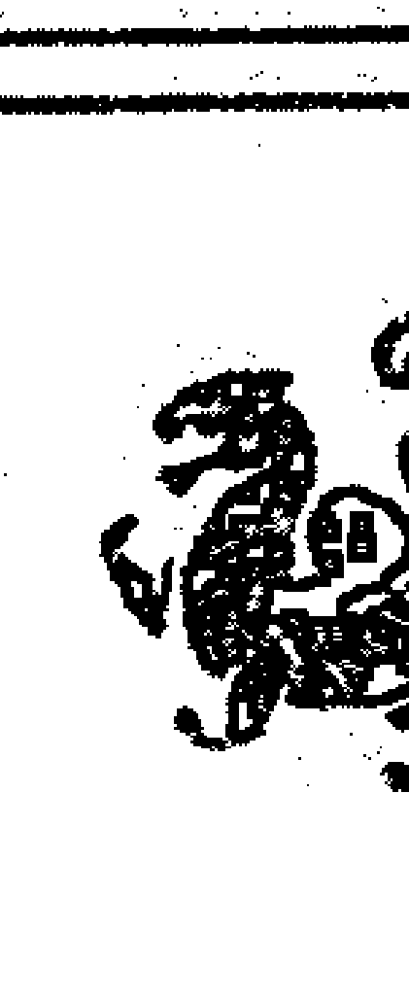

| | | |
|---|---|---|
| 螣蛇<br>景门 辛<br>天心 己 | 太阴<br>死门 丙<br>天蓬 丁 | 六合<br>惊门 癸<br>天任 乙 |
| 值符<br>杜门 壬<br>天柱 戊 | 庚 | 白虎<br>开门 戊<br>天冲 壬 |
| 九天<br>庚 伤门 乙<br>禽 天芮 癸 | 九地<br>生门 丁<br>天英 丙 | 玄武<br>休门 己<br>天辅 辛 |

分析：
1. 测访人以所去的方位为用，长寿山道观在我们的东北方，故以艮宫分析。
2. 以天盘之星为拜访者，下地盘之星为被访者。今天盘天芮为我和小曾，天芮为二数正好代表我二人。天盘星与地盘星比和则相见顺利。
3. 但现在艮宫空亡，伤门，九天，又逢马星，空亡为人不在之象，伤门九天马星为动象，说明王道长没在山上人外出了。
4. 大局九星，奇仪反吟，半途而废，去而空返之象。

### 实例七：论坛突关闭 何时能开启

下午看书，忽然想起“周易天地”论坛最近好几天突然无法打开网页。上午上网去试还是无法进入，不知何时才能恢复正常。心动就在笔记本上起局测之。

2007 年 1 月 31 日 16：45 分。公历时间：2007 年 1 月 31 日 16 时、当日干支：丙戌 辛丑 乙丑 甲申当日旬空：戌亥（日）午未（时）阳遁三局 值符天禽落五宫 值使门落五宫

# 第五章 笔录案例

| 九地 | 九天 | 值符 |
|---|---|---|
| 杜门 己 | 景门 丁 庚 | 死门 乙 |
| 天辅 己 | 天英 丁 禽 | 天芮 乙 |
| 玄武 | | 螣蛇 |
| 伤门 戊 | 庚 | 惊门 壬 |
| 天冲 戊 | | 天柱 壬 |
| 白虎 | 六合 | 太阴 |
| 生门 癸 | 休门 丙 | 开门 辛 |
| 天任 癸 | 天蓬 丙 | 天心 辛 |

分析：
1. 以时干为事体，落坤宫临死门，天芮星同宫，说明论坛最近有些问题。乙奇在此宫为维护人员，死门关闭，看来论坛正在维护。时干空亡还没维护就绪。什么时间可正常运作？
2. 癸在奇门中为天网，有现在的网络之象意，故可取癸为论坛网页，今癸落艮宫为沐浴，冠带之地，说明论坛正在重新调整，冠带为穿衣之象，也就说明很快就好。沐浴为洗礼之象，生门为新生，看来论坛将会以崭新的面目出现在易友面前。
3. 那么什么时间会开通呢？
癸临生门，又逢马星，艮宫之时序为丑寅，但今天上午我刚去过还不能打开，可能要在明日寅日正常运作。明日寅日正好为马星值日，马星动而冲实时干所在的坤宫，冲开坤宫中之死门。死去生来，看来明日（2月1日）周易天地论坛将会重新运作起来。

今遁甲笔记于此，以待验证！

以上是本人刚从案例笔记本上打印出下午之原始纪录。今晚看完电影去试论坛能打开否，没想到真给打开，看到公告才知论坛系统遭破坏。06年8月——07年1月好多数据都丢失。实在可惜！现在将此案例帖出，也许已成为事后诸葛，本人也不想多说什么，只是觉得从此案例上面的确可以看出某些信息来。供大家交流研究.

昨晚在网上看完“射雕英雄传”已是23：25分左右。在准备下线时我想去“周易天地”论坛看看，结果这次一去就点开论坛网页。进去看到管理员的公告才知论坛系统数据遭到灾难性的破坏。工作人员努力恢复，结果也只能恢复到 06 年 7 月 22 日以前的论坛数据。8 月分到现在的数据都已丢失，包括会员五千余人。因本人 06 年 8 月才接触网络，在我所注册的论坛中周易天地算是我在 8 月 21 日注册的最早一个，前段时间 22 号被周易天地麦站长任命为奇门遁甲版版主，但现在我的资料都已丢失，只好重新注册从学前班开始继续学习。新年新开始，遁甲相信在新的一年中我以及大家会有新的收获！

论坛的具体恢复时间我不太清楚，见公告发布的时间为 1 月 31 日 23：19 分。我注册也在 0 点左右才注册成功。

### 实例八：小偷已西去 车辆难追回

2004 年 4 月 15 日 22：45 时。姚殷毅打电话说朋友的三轮摩托车今下午 4 点多在楼下被小偷盗走了，让我给测测看能找回来否？我根据被盗时间和问事时间起局预测。此为事发局。

公历时间：2004 年 4 月 15 日 16 时、干支：甲申 戊辰 甲子 壬申
当日旬空：戌亥（日） 戌亥（时）
阳遁四局 值符天辅落八宫 值使杜门落三宫

| 太阴 | 六合 | 白虎 |
| :--- | :--- | :--- |
| 己 景门 丙 | 死门 辛 | 惊门 庚 |
| 禽 天芮 戊 | 天柱 癸 | 天心 丙 |
| 螣蛇 | | 玄武 |
| 杜门 癸 | | 开门 丁 |
| 天英 乙 | 己 | 天蓬 辛 |
| 值符 | 九天 | 九地 |
| 伤门 戊 | 生门 乙 | 休门 壬 |
| 天辅 壬 | 天冲 丁 | 天任 庚 |

我说：“小偷为两个人，偷车后逃往西方，现在不在市内，往西找，恐怕此车找不回来。”

玄武为小偷落兑宫为二数，故断二人作案。偷车后已出市内逃往西方者，玄武落外盘，又在兑宫所以断已向西逃去。
时干为所问之事，也为车落空亡之宫必无结果，说明找不回来！

公历时间：2004年4月15日22时、干支：甲申 戊辰 甲子 乙亥
当日旬空：戌亥（日）  申酉（时）
阳遁四局  值符天禽落三宫  值使门落六宫

| 螣蛇<br>生门 辛<br>天柱 戊 | 太阴<br>伤门 庚<br>天心 癸 | 六合<br>杜门 丁<br>天蓬 丙 |
|---|---|---|
| 值符<br>己 休门 丙<br>禽 天芮 乙 | | 白虎<br>景门 壬<br>天任 辛 |
| 九天<br>开门 癸<br>天英 壬 | 九地<br>惊门 戊<br>天辅 丁 | 玄武<br>死门 乙<br>天冲 庚 |

此问事局之时干临死门，伤门为车落离宫，庚加癸为大格。月干为朋友落坎宫虽克伤门宫，但辰月水囚离宫又逢进气，囚水难克旺气之火，也说明找不回来。

姚殷毅说他朋友下午将车放楼下，上楼去取东西，一会儿时间等他下来时车已不见了。他就赶忙追寻，有人说看见两个人骑着车向西去了，他一直追到福临堡也没追上。

最后据我所知，他的朋友在周边县区打听了一星期最后还是没有结果。只得另买了一辆新车。

### 实例九：带走共三人  其中一女性

05年6月17日19：50分，跟我学习奇门的同事小曾拿一起好的奇门局来问我。他说他朋友开的游戏厅星期三被执法人员查处。问我能否从此局看出：1：被带走几人？2：罚款多少？3：被带走的人几时被放回？此局如下：（此局为事发时间局）

# 奇门遁甲应用初探修订版

公历时间：2005年6月15日16时、干支：乙酉 壬午 庚午 甲申、当日旬空：戌亥（日） 午未（时）
阳遁三局 值符天禽落五宫 值使门落五宫

| 九地<br>杜门 己<br>天辅 己 | 九天<br>景门 丁<br>天英 丁 | 值符<br>庚 死门 乙<br>禽 天芮 乙 |
| 玄武<br>伤门 戊<br>天冲 戊 | 庚 | 螣蛇<br>惊门 壬<br>天柱 壬 |
| 白虎<br>生门 癸<br>天任 癸 | 六合<br>休门 丙<br>天蓬 丙 | 太阴<br>开门 辛<br>天心 辛 |

我分析片刻即答：
1. 被带走共三人，其中有一女性。
2. 罚款8千元。
3. 当晚戌时人被放回。

小曾当场证实说其本正确。但放回时间为18：30分。和我所测差半小时。问我从那里看出被带走的人中有一女性？我当时的分析思路如下：

1. 以时干为主。时干落坤宫，坤宫之数为2、5、8、10、但逢空亡。因午月坤宫旺，我当时取5数，空亡减半为2，5数故断有三人被带走。天芮星为阴星，又有乙奇同宫故断其中有一女性。
2. 罚款8000元者，因甲子戊落震宫，伤门为公安，克日干、时干，也克值符，值符就为老板本人。震宫3、8数故我断要罚8000元。
3. 戌时放回者。因甲午辛为犯错误之人，临开门为放回之象。
4. 何时回？开门落乾宫，乾宫的时序为戌亥，戌时门开为放回之象。但实际情况回来时为18：30分。遗憾断错！看来学无止境啊！

### 实例十：来电说要来 演局观不来

刚吃过中午饭，一杜先生打电话说下午要来我家有事要和我探讨。因我下午有事还得外出，根据其来电时间测看来不？

公历时间：2005 年 8 月 10 日 17 时、当日干支：乙酉 甲申 丙寅 丁酉、当日旬空：戌亥（日）　辰巳（时）
阴遁二局　值符天任落五宫　值使生门落五宫

| 太阴 | 螣蛇 | 值符 |
| :--- | :--- | :--- |
| 开门 癸 | 休门 己 | 生门 辛 |
| 天心 丙 | 天蓬 庚 | 天任 戊 |
| 六合 | 　 | 九天 |
| 惊门 壬 | 丁 | 伤门 乙 |
| 天柱 乙 | 　 | 天冲 壬 |
| 白虎 | 玄武 | 九地 |
| 丁 死门 戊 | 景门 庚 | 杜门 丙 |
| 禽 天芮 辛 | 天英 己 | 天辅 癸 |

分析：
以时干为来人，今时干落艮宫来生日干之落宫，看似来像。但时干入墓（丁入丑墓）死门加临，再加九星八门反吟恐改变计划不能来之象。
下午我去办事，按他所预约的时间回来在家等候，直到现在也没见那位杜先生露面。

### 实例十一：新疆在西北　可查乾宫位

2004年4月14日14时15分，某寺一僧人给我打电话，叫我去新疆发展。其言他曾学过易经，自出家后专修佛法，就慢慢放弃了对易经的研究。不过新疆伊犁有一朋友在那里专业搞预测，现已拥有百万资产。如我想去他带我去见李 xx，孙某，他们会帮我的。我告诉他我现在有工作。不一定能走的开，考虑后再答复。以其来电时间起奇门分析。

公历时间：2004年4月14日14时、当日干支：甲申 戊辰 癸亥 己未、当日旬空：子丑（日）　子丑（时）
阳遁七局　值符天冲落八宫　值使伤门落八宫

# 奇门遁甲应用初探修订版

| 太阴 | 六合 | 白虎 |
| 景门 庚 | 丙 死门 壬 | 惊门 戊 |
| 天英 丁 | 禽 天芮 庚 | 天柱 壬 |
| 螣蛇 |  | 玄武 |
| 杜门 丁 |  | 开门 乙 |
| 天辅 癸 | 丙 | 天心 戊 |
| 值符 | 九天 | 九地 |
| 伤门 癸 | 生门 己 | 休门 辛 |
| 天冲 己 | 天任 辛 | 天蓬 乙 |

分析：

xx 师年命：戊申，李 xx 年命癸卯，孙 xx 年命丁未，以日干为我，时干为所说之事，又以景门为消息综合判断。

1. 日干落宫克时干落宫，但日时空亡我不去之象，景门为消息落宫逢太阴，所说之情况有些言过其实。
2. 新疆在我们宝鸡西北方以乾宫看。乾宫休门虽吉，但天蓬坐守，格局白虎猖狂，我的年命又在此宫，看来不利去也。
3. 以各人的年命落宫来分析，我落乾宫，x 师落坤宫与我相生，孙某落震宫和我相克，李某落宫虽生我但为空生，去后 xx 师所介绍的两人不一定帮我。
4. 孙某落宫临天辅星，说明此人文化程度高，大学以上学历。丁加癸雀投江，此人视力不好必戴眼镜。杜门再逢雀投江此人运气不好，有官司临身。
5. 李某落空亡宫，天辅克其人，此人文化程度不高。
6. 再以主客分析。天盘时干为客，地盘之干为主。今天盘时干己生地盘之庚，利主。看来还是不去为好。

经过以上分析我最后告诉 xx 师说工作很忙暂时走不了，过段时间再说。

2004 年 10 月我与 xx 师初次见面。我将以上所测的笔录让他看，他说大部分准确，就是孙某戴眼镜此条错。从那以后 xx 师就成为了我学佛法的启蒙老师。我经常向他请教佛学知识。在以后的人生感悟中，xx 师对我的启示和教导很大。

### 实例十二：修路需资金 善款何处筹

今天上午我突然想起这两个多月了，没和师傅王道长联系了，就打电话给师傅。相互问候后，师傅说：“刚好！我准备想将通往道观这一点土路。打成水泥路，但现在还没资金，你就现在起局看我能否筹到些款来？”

时间：2006 年 11 月 08 日 10 时 45 分、干支：丙戌 己亥 辛丑 癸巳、旬空：辰巳 午未
阴遁九局 值符天柱落四宫 值使惊门落七宫

| 值符 | 九天 | 九地 |
| :--- | :--- | :--- |
| 杜门 庚 | 景门 辛 | 死门 乙 |
| 天柱 癸 | 天心 戊 | 天蓬 丙 |

我说：“八门伏吟，时干冲日干看来筹款有难度，暂时筹不够。”
师：“那在什么时候？”
答：“生门，甲子戊落艮宫，日干生之，可在东北方筹之。年底或明年初才能筹到。”

师：“现在有一人说他可给我介绍一个人，此人经常做些善事，金顶寺去年的扩建时他曾捐款4万，但不知人家现在给咱捐不？”
答：“六合为中介人，落坎宫冲克日干。恐怕此事将来不成。”

师：“有一居士他说只出一部分，他愿和别人合伙捐款。”
答：“此人肯定捐款，但他所捐不会超过一万的。只有几千而已”。（我以震宫分析的）

师：“对！那你看需要多少资金？”

答：“我对此修路一事不懂。这资金以离宫分析，因日干落离宫下临甲子戊，日干又去生艮宫的生门天盘戊，生者我所需要之数也，结合生门宫我说：“离为3、9数，但空而休囚。艮为4、7、8数需要6、7万。”

师：“此土路只有250米。去年曾让人作过预算，共需18000元。今年材料，工费都长了算下来的2万多”。

（昨天和师傅谈起修路一事，师傅说打算过完年二月间修，现在预算修路费用为6万3千多元。我问起那位去年给金顶寺捐款的人，是否答应给道观捐善款。师傅说没联系上，可能不会了！我祝愿师傅早日筹到善款，兴建道家圣地，弘扬我国道家文化。）

今年4月中旬我去长寿山，见路面已经在收尾了。师傅说现在找了一个包工头先垫资修的路，将来再慢慢还人家。

### 实例十三：景门在坤宫 五百二十分

06年6月26日20：30分，浙江师兄小蔡来电话说他的儿子已高考完毕。现在分数已公布，让我测测儿子考了多少分？填志愿那个方位为好？我说既然分数你已知道，还何必让我再测。又要给我考试了，报考志愿以实际出发就行！但他非让我测，无奈只有起局。

公历时间：2006年6月26日20时、干支：丙戌 甲午 丙戌 戊戌、当日旬空：午未（日） 辰巳（时）
阴遁三局  值符天英落三宫  值使景门落五宫

| 宫位1 | 宫位2 | 宫位3 |
| --- | --- | --- |
| 九天<br>丙 伤门 己<br>禽 天芮 乙 | 九地<br>杜门 癸<br>天柱 辛 | 玄武<br>景门 丁<br>天心 己 |
| 值符<br>生门 辛<br>天英 戊 | <br>丙 | 白虎<br>死门 庚<br>天蓬 癸 |
| 螣蛇<br>休门 乙<br>天辅 壬 | 太阴<br>开门 戊<br>天冲 庚 | 六合<br>惊门 壬<br>天任 丁 |

第五章 笔录案例

我说：“景门落坤宫，丁奇也落此宫，下又临丙奇太岁。坤宫午月旺，景门又生宫，坤为2、5、8、10数。你儿子考分为520分。”
“差不多，考了530分，那你看填那个方位的学校比较好？”
我说：“年命戊落坎宫，时干也在坎宫，北方院校。”〈此条到现在未见反馈，故不得而知〉

实例十四：震宫龙折足 此事须谨慎

2004年10月13日18：30分，一位姓张的朋友给我打电话说，有一朋友言他现在手头有装修工程，总造价几百万。工程在河南，预算手续等现在集全，想和他一起承接此项目，将来他们二人五五分成，他想和那人去一趟河南，不知此事是真是假，让我看看成否。

公历时间：2004年10月13日18时、当日干支：甲申 甲戌 乙丑 乙酉

当日旬空：戌亥（日） 午未（时）
阴遁六局 值符天辅落七宫 值使杜门落三宫

| 六合 | 太阴 | 螣蛇 |
| --- | --- | --- |
| 景门 癸 | 死门 丙 | 惊门 辛 |
| 天蓬 庚 | 天任 丁 | 天冲 壬 |
| 白虎 |  | 值符 |
| 杜门 戊 | 己 | 开门 庚 |
| 天心 辛 |  | 天辅 乙 |
| 玄武 | 九地 | 九天 |
| 伤门 乙 | 己 生门 壬 | 休门 丁 |
| 天柱 丙 | 禽 天芮 癸 | 天英 戊 |

- 1、日、时、星同宫，但玄武上乘。时干又为事体，说明此事有问题。
- 2、河南在宝鸡的东方可看震宫。今震宫杜门相逢，闭塞不通，如去则白跑一趟，承接不来。
- 3、甲子戊为资本落所去之宫，戊加辛为“青龙折足。”戊在震宫又为六仪击刑，投资亏本，不宜投资。
- 4、景门为手续，落巽宫逢天蓬，癸加庚冲刑，又克日时落宫，手续对你不利。

为了慎重期间我又以六壬参看：

财 戊 朱◎
财 戊辰 常◎
财 戊 朱◎

青 后 常 朱
丑 未 辰 戌
未 丑 戌 乙

合 勾 青 空
亥 子 丑 寅
朱戌     卯虎
蛇酉     辰常
申 未 午 巳
贵 后 阴 玄

- 1、四课三传皆才，毕法赋云：“传财太旺反财亏”日干寄辰，辰落空亡。为干本身落空，乙于戌月休囚，驿马旬空，看来这次连去都去不了。三传财俱落空陷之地，空中楼阁，何财之有？
- 2、以干为外事，干上之财空亡，以支为内，为本地，支上未为财却实，惜又为干之墓。最后我对这位姓张朋友说，河南你最好就不要去了，去也是白跑一趟，还不如在咱本地跑跑。

结果由于种种原因，最后还是没去成。

注：此六壬课我刚整理时才发现起课有误。以原始记录帖之，不必更改！

实例十五：原告生被告 最终私下了

我正在单位上班。红光钢铁集团易友陈某，给我打电话说，其妻在市上开一网吧。因房租费问题和房东发生口舌，房租费未按时交，现在房东以当初他们所签之合同协议为由，将他们起诉，要求赔偿违约金，今天律师来厂已找他，让我看看此事如何解决，会不会闹上法庭？

2005年11月10日18:05分。当日干支：乙酉 丁亥 戊戌 辛酉

当日旬空：辰巳（日） 子丑（时）

阴遁六局 值符天蓬落三宫 值使休门落三宫

| 九天<br>生门 丙<br>天任 庚 | 九地<br>伤门 辛<br>天冲 丁 | 玄武<br>杜门 庚<br>天辅 壬 |
| 值符<br>休门 癸<br>天蓬 辛 | 己 | 白虎<br>景门 丁<br>天英 乙 |
| 螣蛇<br>开门 戊<br>天心 丙 | 太阴<br>惊门 乙<br>天柱 癸 | 六合<br>己 死门 壬<br>禽 天芮 戊 |

我说：

- 1. 对方现在问你要一万四千元。(他要18000呢!)
- 2. 此事因你们自己的过失造成。(是)
- 3. 对方也不会真闹上法院的，想私下了结。(那你看能私了吗?)
- 4. 最终私下了结。(是吗? 那要给人家付多少钱呢? 他要的太不切合实际了……)
- 5. 最后你付人家5——8千元。(不能再少吗?)

06年元月11日下午我去上班，遇见陈某才知最后付了对方4千元私了。

分析依据：

- 1. 为什么说对方要14000呢？
  对方已起诉，律师今已来找他，当然对方为原告了，他为被告。今原告落震宫，生门为利润，落巽宫与原告比和为原告所要。生门上乘九天数目大，巽为四故我断人家现在要14000元。实则原告张口就要18000。
- 2. 为什么说此事为他们自己过失造成？
  陈为被告落离宫，天盘临辛主错误。甲午辛与离宫之午自刑，说明是自己太大意，没当一回事而造成。
- 3. 为什么说对方不会闹上法院？最终私下解决？
  值符为原告落震宫生被告之落宫，原告临休门也主退缩，有让步之意思。再者陈某为被告落宫逢辛加丁，有罪也能赦免，不为凶。
- 4. 为什么最终要付人家5——8千元？
  首先根据实际情况，不赔是不可能的，关键在于赔多少了，这是理，万事以理为先，抛理则预测废。
- 5. 甲子戊为资本与日干同宫，被告生之。这就是被告所愿出的。艮宫数为4、5、8、10。但艮宫空亡则减半，再说被告也不会给他很多的。故我当时断为多则8千，少则5千。实际最后付房东4千元此事才了结。

实例十六：芮死遇玄武 须防暗疾生

2005年2月18日16：15分，某集团职员李某来求测今年财运如何。年命：丁未。我对他说，你在企业上班，一个月的收入都基本是固定的，你又没做生意，财运有什么可测。他说自己近年来一直在研究彩票，感觉百万已离他不远了。我向他解释说，中彩票不是每个人都能中的，要有很大的福报和命里要有横财才可。他说让我最好研究测彩票。我对他说，我的福报浅没那福分，我也不会在那上面去浪费时间的。最后他还是非让我给他看看，无奈只好起局。当时分析了以下几条给他：1：今年你的运气不好，不但不能中彩票而且还要破财。2：今年上半年多不顺，下半年才能好转。3：你的身体不知如何？辰巳月防有潜在的病因。此人是来问财运的，没想到我尽说了些不好的事，此人临走时对我说，算卦这种事，信则有不信则无，我们厂陈某你也认识，他就说人的命天注定，我不太相信，人还是要靠自己的，这只能做个参考而已，此人不悦而去。

也许此人的那一段话对我来说也是一个教训，从那以后凡是对《易》持怀疑态度的人，让我预测时我都会拒绝。对于《易》从古到今人们都是“仁者见仁，智者见智”。各人都有各人的信仰和爱好，我们不能去强求任何一个人，再说我也不会去费神向他们解释的。青蛙有自己的小天地，飞鸟有它广阔的天空，对于《易》善用者用之就行了，一切皆随缘……

公历时间：2005年2月18日16时、当日干支：乙酉 戊寅 癸酉 庚申
当日旬空：戌亥（日）　子丑（时）
阳遁五局　值符天蓬落七宫　值使休门落七宫

| 玄武 | 九地 | 九天 |
| --- | --- | --- |
| 戊 死门 丁 | 惊门 庚 | 开门 己 |
| 禽 天芮 乙 | 天柱 壬 | 天心 丁 |
| 白虎 |  | 值符 |
| 景门 壬 |  | 休门 癸 |
| 天英 丙 | 戊 | 天蓬 庚 |
| 六合 | 太阴 | 螣蛇 |
| 杜门 乙 | 伤门 丙 | 生门 辛 |
| 天辅 辛 | 天冲 癸 | 天任 己 |

分析依据：
- 1. 为什么说他今年不顺，下半年才可好转？
  以日干为李某今落兑宫病地，庚临其下，癸加庚又为大格测人运气日干逢庚多不顺。休门虽为吉门但在此则为停止状态。天蓬破财之星相逢这些都是不顺的信息。生门为财落乾宫螣蛇相缠，辛加己“游魂入墓”易遭阴邪鬼祟为害，其财怎能安？时干为所问之事落离宫临惊门来克日干，惊门为惊吓，恐慌。日干宫逢格申寅又相冲，震宫景门道路有见白虎冲日干，进入卯月震宫当领冲克日干最凶，所以要防在道路发生伤灾之事。
- 2. 为什么说他上半年不顺，下半年才能好转？
  因从艮到离宫各宫之组合都不好，故说他上半年不顺。坤宫才见开门吉星，故下半年才可好转。
- 3. 为什么说他身体上有潜在的病因呢？
  此人年命丁落巽宫，上乘玄武，天芮病星关键逢死门，玄武为潜藏不明，说明可能有某种病因藏身，他不知道而已。

3月28日中午我刚下班回家，陈某（同他一个单位，两人是好朋友）给我打电话说李某住院了。见下例：

奇门遁甲应用初探修订版

2005年3月28日12：15分我刚下班回到家，电话就响起，一拿起就听对方：“小忠，你正月给xx咋测的呀？他现在住院了。我现在就在医院照顾他”。

我一听是易友陈某，我急忙问：“咋能住院？是什么病？要紧不？”

“我知道你的奇门厉害，你测测看是什么病，要紧不”？我问他，他反而让我来测。

“别开玩笑了，给我说说到底怎么回事呀”？我对他说。

“我说的是真的，你给看看，看完了我再给你具体说，这是个锻炼你的好机会啊。”

“也好，那我就试试…”

公历时间：2005年3月28日12时、当日干支：乙酉 己卯 辛亥 甲午

当日旬空：寅卯（日） 辰巳（时）

阳遁三局 值符天心落六宫 值使开门落六宫

| 白虎 | 玄武 | 九地 |
| --- | --- | --- |
| 杜门 己 | 景门 丁 庚 | 死门 乙 |
| 天辅 己 | 天英 丁 禽 | 天芮 乙 |
| **六合** | | **九天** |
| 伤门 戊 | 庚 | 惊门 壬 |
| 天冲 戊 | | 天柱 壬 |
| **太阴** | **螣蛇** | **值符** |
| 生门 癸 | 休门 丙 | 开门 辛 |
| 天任 癸 | 天蓬 丙 | 天心 辛 |

随手翻到奇门局象图对陈说：此病时间长了，病在腹部……我愣住了，因为此局显示测病甚凶。

“病情如何？”陈问。

“此病非一般之病，不好啊不好……”

“你说，没事，现在我一个人在病房外的”。

“我虽不敢确定，但决不是普通之疾。不可能是……吧？”

“你说。”

“此病要做手术，给他如动手术的话，那动手术之医生就是教授级了”

“你说病在腹部，基本对，他得的是睾丸癌。我震惊了……陈又说：“那你看动手术了没？”“如昨天没动，就在今天！”我回答。“前天已做过了”。“那手术效果如何？医生怎么说的？”我急忙问道。“医生说手术很成功，也发现的早，目前无事，但半年之内要定期复查。现在人担心的就是怕癌细胞扩散，你给仔细看看。”“他正月来我家让我给他测今年财运，我问他身体如何，他说身体很好的没什么，真没想到……现在从他的年命落宫来看不会有什么问题的，他知道自己得的是什么病不？”“知道！”“那现在关键是病人的心态很重要，你就要多劝劝他，给他做思想工作，再说我也知道李xx经常修行，念佛的，他不会有事的。”“不过他现在看起来思想上也没什么负担”陈说。“那就好，那就好！”

XX住了三个月医院，经过放化疗，病情基本已得到控制了。去年我在他们单位医院给小孩看病时碰到了他，他当时拿住我的手说：“小忠，你上次测的太准了，我二月份突然感觉不舒服就去医院了，没想到一住就是三个月时间，差点连命都没了，秋上才回厂里上班的。”我说：“这样的准确率，我宁愿不要。算的你都住院了。”此时我的心情难以言表……

“哎！也许是我命中该有这一劫吧！你看我以后还会有大难否？”xx叹口气问我。“不会了，大难已过！”

今年父亲住院期间，我在回来的车上也碰到了他，现在他的病情已彻底好了，我由衷的为他感到高兴！“钱财身外物，平安是真福”遁甲在这祝愿天下人个个平平安安，远离病魔纠缠。当时的分析依据：首先大局伏吟，说明病潜在的时间长了，自己没感觉到。因上例见玄武。

天芮为病星落坤宫，庚和死门同宫，多数占病不吉，凶病！坤在人体为胃或腹部，又因中宫寄在坤，中宫在人体就代表中心部位。所以我当时说病可能在腹部。虽有乙奇在但乙到坤则为墓地，奇的吉象被埋没，所以我断为不是一般病。
天芮为病落坤乙奇为中医医生和病星同宫，但入墓。天心为西医落乾宫逢开门来泄病，所以只有做手术。
时干为事体落乾宫逢开门，开门就有手术之象，天心为医生上乘值符说明做手术之医生有一定的身份。实际是从西安请来的教授为其做的。
占时为亥日，昨天为戌日，都是开门值日之时，故我说昨天没做的话就在今天。实际为酉日做的手术。
其人为丁未年生，年命丁到离旺，卯月离宫为逢生，年轻之人就需旺，旺则吉，年迈之人则相反。还有大局伏吟，也为无变化之象，故断以后不会有问题再出现的。

实例十七：病在何部位　是否需手术

父亲近几年来身体一直不好，05年曾三次住院治疗。期间医院查出父亲患有颈椎病，压迫神经。医生要求动手术治疗，当时我们考虑到父亲已七十，怕身体承受不了也就未做。但这一年来父亲的病情还似有些加重，为不忍父亲被病痛折磨，最近我们将父亲接下来住院治疗。如有必要的话就做手术。正巧父亲住进张大夫所在的科室，因我和张大夫也比较熟，他以前曾找我多次预测过，所以我对张大夫详细地说了说父亲现在情况，和我们的想法。张大夫说明天检查后再看能否做手术，看有没必要再说！我们表示同意。闲聊一阵后，张大夫突然提出让测测父亲的病这次能不能做手术否？病到底在什么部位？根据时间我起局试测。
公历时间：2007年3月13日17时、当日干支：丁亥 癸卯 丙午 丁酉，当日旬空：寅卯（日）辰巳（时），阳遁四局　值符天柱落一宫　值使惊门落一宫

| 六合 | 白虎 | 玄武 |
| :--- | :--- | :--- |
| 生门 壬 | 伤门 乙 | 杜门 戊 |
| 天任 戊 | 天冲 癸 | 天辅 丙 |
| 太阴 |  | 九地 |
| 休门 丁 |  | 景门 癸 |
| 天蓬 乙 | 己 | 天英 辛 |
| 螣蛇 | 值符 | 九天 |
| 开门 庚 | 惊门 辛 己 | 死门 丙 |
| 天心 壬 | 天柱 丁 | 禽 天芮 庚 |

- 1. 天芮为病落乾宫，乾为头，说明病主要在头部。
- 2. 乾宫死门、庚均为阻隔之神，说明有脑梗，和脑细胞坏死之状，乾为左，主要病灶在脑左侧。
- 3. 天芮落宫旺，说明病比较严重。
- 4. 开门为手术，天心为医生均落艮宫，但不克天芮之落宫。上乘螣蛇主变化，庚下临壬也变化，看来不可能做手术，也没必要做手术。
- 5. 以时干为事体落震宫逢休门，有退缩之意，手术可能要放弃。

第二天先给父亲做了颈部磁共振，片子出来看后是有问题，但不是主要问题所在。医生建议再做一个脑颅CT。第三天又做了脑颅CT，发现脑左侧基底节动脉梗塞，还有脑萎缩。通过会诊医生说没有做颈部手术的必要，主要是脑梗。建议星期一转到神经内科去治疗。

张大夫感叹预测的准确性，还拿出我当时的记录让他们以前的孙主任看。（此孙主任现在已调到别的科室，见《落宫断二位，不信不由你》一例）

这个星期一，我们又将父亲从脊椎科转到神经内科治疗。现在还在治疗中，昨晚我还在医院照顾父亲。

这是当时的真实记录。本人的预测案例都以实事求实为主，不经任何包装。这是本人研易之态度，错就是错，对就是对。本博客中就有我测错的案例，大家也可从我在论坛中回复的帖子中看出。易学本身就不能达到百分之百，何况我们研易之人？不过网测和“面测”还是有很大区别的。网测只根据求测者所提供的限量信息去推理，有些求测者甚至连性别都不告诉你，求测问题模糊，“戏占”者也有。而面测的信息多，有方位外应可参考，准确度也就高些，以上只是本人之见，信不信由你。

实例十八：酒桌断诸位 查看座方位

星期一父亲转到了神经内科。由于和张大夫也比较熟，在他们科室治疗期间，得到张大夫的精心关照。今天父亲转了科室我和大哥都在，为感谢张大夫，我提前给他打电话约其中午一起坐坐。和张大夫一起来的还有他们科室的现任尹主任和以前的孙主任，护士长，麻醉科主任共六人，加我们哥俩8人。由于我提前预定的包间有些小，最后又换到一个大一点的包间。以前的孙主任和麻醉科副主任我们都认识，（见落宫断二位，不信不由你案例。）客气几句后，大家分别落座。尹主任开口说：“听他们说你的奇门遁甲很厉害，你给看看我爱人的工作如何？”我说：“我这是雕虫小技，你们都是国家的栋梁。”“那里，那里，你这我可是亲身经历过了的，很神奇！看来还真有学问在里面的。”这时孙主任（现为科长）开口说道。“最近忙于父亲的病情，经常往你们医院跑，今天是什么日子我都忘了，晚上回去后我给你看看，将来告诉张大夫就是了。”我不好意思回答。晚上回到家，根据中午的时间和他们所坐的宫位进行了判断。

公历时间：2007年3月19日12时、当日干支：丁亥 癸卯 壬子 丙午

当日旬空：寅卯（日） 寅卯（时）

阳遁一局 值符天禽落八宫 值使门落七宫

|  |  |  |
| --- | --- | --- |
| 太阴<br>伤门 癸<br>天心 辛 | 六合<br>杜门 戊<br>天蓬 乙 | 白虎<br>景门 丙<br>天任 己 |
| 螣蛇<br>生门 丁<br>天柱 庚 | 壬 | 玄武<br>死门 庚<br>天冲 丁 |
| 值符<br>壬 休门 己<br>禽 天芮 丙 | 九天<br>开门 乙<br>天英 戊 | 九地<br>惊门 辛<br>天辅 癸 |

尹主任问爱人的工作首先根据外应，当时我定的208包间太小，后来统一换到大包间112房，此就为动态。观奇门局九星反吟也为动象。又可以乙奇为其爱人，今乙奇落坎宫正临开门工作，九天又为动象。时干为事落坤宫逢马星，时间在阴历的五六月。
于是我拨通张大夫的电话告诉他，你主任爱人的工作必动，时间在五六月，还有你们今天的个人情况都在此局中。
“那你说说看”王大夫很感兴趣的说。
我说：“根据外应咱们整体从208房转到112房，现在局象又九星反吟。动象很明。”
你们的尹主任坐在西方看兑宫，死门庚加临，他今年的运气不好！逢年格不顺，又和太岁落宫冲克，犯太岁。
孙主任坐西南坤宫逢马星也有动象，坤克开门，他对现在的工作可能不满意，还想动。
护士长坐坎宫开门临九天，她目前的工作很顺，运气也最好。但九天好像也要动啊！
麻醉科主任坐离宫杜门主技术，六合为多种技能融一身，实际此人有两个本科学历。
张大夫坐乾宫，乾宫不旺惊门天狱临天网，有官司口舌，也实际相符。（张大夫去年升职一事未成，还牵扯到一些麻烦，遗憾我当初未看到）
我最后说下半年你们医院可能要有大的人事变动。
以上有些信息待验！
前天我在外面，张大夫给我打电话说：“又验了，星期二尹主任爱人单位开会，就其爱人变动之事（其实是升职之事）在会上研究决定，定动在6月。（后其爱人在4月份工作是变动了，但没升职）孙科长昨晚给我说让你再给他测测工作还会不会动，他还是对现在的科室不太满意。由于昨晚时间太晚了，我没给你打电话，你现在给看看！”我说：“不用看了。那天中午他坐在马星位可能还要动的，你告诉他就行了”。（最后孙科长下半年还是又被调回原来的科室，尹主任刚来此科室没多长时间，由于孙科长的返回，他也又被调回原来的科室了。）

### 实例十九：值使庚同宫 调查是肯定

今天晚上，轮我在医院照看父亲。正巧张大夫今晚也值班，22：30分张大夫来到父亲新转的病房，问了问父亲最近的病情后我们就聊起来。因张大夫在中医方面有很深的造诣，也因“医易”同源，所以我们的话题就显得很多，很能谈得来。随后张大夫说他的同学（也在医院）现在牵扯一些纠纷，问我看会不会有事？

公历时间：2007年3月25日22时、当日干支：丁亥 癸卯 戊午 癸亥
当日旬空：子丑（日） 子丑（时）
阳遁九局 值符天禽落五宫 值使门落五宫

| 九地 杜门 壬 天辅 壬 | 九天 景门 戊 天英 戊 | 值符 死门 庚 天芮 庚 禽 |
| --- | --- | --- |
| 玄武 伤门 辛 天冲 辛 | 癸 | 螣蛇 惊门 丙 天柱 丙 |
| 白虎 生门 乙 天任 乙 | 六合 休门 己 天蓬 己 | 太阴 开门 丁 天心 丁 |

- 1. 值使门为调查机关，庚为被调查对象，现同宫。月干癸为同学同事也和值使门同宫，肯定会被牵扯的。
- 2. 癸为网在庚宫，说明此事牵扯的人很多。
- 3. 值符也在此宫会有领导被牵扯进去的。（对，现在已涉及到了）
- 4. 此事牵扯到3、4年的事！（3年）
- 5. 天芮在此，天芮为病星，是不是牵扯到医疗器械方面问题？（厉害）
- 6. 快则星期一二就会调查开了。总之下星期就会传他的。因值使门和庚落坤宫，未申日为期。

7：此事不会很快就结束，得一阵时间，因大局伏吟。张大夫昨天给我打电话说：昨天已调查了。孙科长已给院长要求重新回到我们的科室来，院长答应他了。但说现在还不行，过一两个月后再调整。我们现在的尹主任听他要回来，那他就可能也要回到原科室去了，他给我说他不想再回去，让我再问问你，如果孙科长回来看他能不能不动。我说，从那天的局象看，他今年运气不好，大局反吟，再加当时的外应，那既然孙主任要回来，他就肯定得动了。（孙科长在5月中旬被调回原来的科室了，此主任也被调回原科室。）

### 实例二十：高道测兄运 二老走一人

2005年3月21日21：40分，二哥给我打电话说父亲刚才在老家又晕倒了。二老今年身体都不是很好，特别是从去年父亲以往刚健的身体突然下滑。由于我们兄弟三人都在外面工作，也不能经常在父母的身边。每当我们回老家看到年迈的父母那憔悴的身影时，心中的滋味难以表达……

今年初，二哥曾让我们本地一位年已七旬的奇门高道隐者，给他测运时，高道说今年二老中要走一人，让我们注意。今晚父亲又晕倒，我心很是担心。根据二哥来电之时起局看父母今年之吉凶。

公历时间：2005年3月21日21时、当日干支：乙酉 己卯 甲辰 乙亥 当日旬空：寅卯（日） 申酉（时） 阳遁六局 值符天柱落五宫 值使惊门落八宫

| 九地 | 九天 | 值符 |
|------|------|------|
| 休门 辛<br>天英 丙 | 生门 癸<br>天芮 辛 | 伤门 己<br>天柱 癸 |
| 玄武 | （空） | 螣蛇 |
| 开门 丙<br>天辅 丁 | 乙 | 杜门 戊<br>天心 己 |
| 白虎 | 六合 | 太阴 |
| 惊门 丁<br>天冲 庚 | 死门 庚<br>天任 壬 | 景门 壬<br>天蓬 戊 |

起局一看，我深吸了一口凉气，发现正如隐者所说，我看父亲不会有大的问题，但对母亲则大不利。今年阴历六七月母亲可能要“走。”但从现在的实际情况来看，父亲的身体要比母亲差，母亲应该不会有事的。但局中所显的信息不利母之象很明，最后我将此信息告诉了二哥，二哥也以此局分析后也同意我的分析。我们现在能做的只有多回去，多陪陪父母了！

### 分析依据:

- 1. 为什么说今年下半年不利母，母亲可能要走？
测父母以年干为用，兼看坤（母）宫，乾（父）宫。今年干乙奇落离宫为死地，乙逢地盘辛为龙逃走，又上乘九天，年迈之人逢之则不利，此象为“走”象，生门为投胎之象。
又乙为阴干，为女性，说明是母亲。再看坤宫，今逢空亡，空者无象，虽值符上乘但空亡吉象消失。己又为阴土，坟墓。加于地盘年干乙上，此象甚凶。坤之时序为未、申月，故六七月对母不利。
母之年命（1937）丁丑，丁为星奇，落艮宫入墓，星则失去光芒，白虎凶神临命，命亦为凶。

- 2. 为什么分析父亲无大碍？
父36年丙子命，年命落震宫逢丁奇开门吉门，年命吉不会有大碍。
但乾宫为父，景门相逢又克宫，还是有不好的信息。太阴为隐藏，景门为血光之灾，说明也伏有对父不利的信息，年命为根，根稳则无大碍。
05年对我来说，是最多事的一年。母亲于申月甲午日未时离我们而去。十天后和我最要好的朋友小杨年仅33岁，于酉月甲辰日辰时，抛弃了他年轻的妻子，和就要即将出世的孩子，而撒手西游…
父亲又在10月间不小心昏倒，将腿髌骨摔裂，曾三次住院治疗。
在仅短短的十天中，我就失去了两个亲人，疼我爱我的母亲，知心之交的朋友小杨。悲哉！
今帖出此例，以怀念已离我远去两年的母亲。

### 实例二十一：景门龙返首 文章得保存

早上打开博客发现我的文章全无，从别的网页进入也是主页一片空白，试多次还是空无一物。我对妻说，这回完了，我的案例全部没了！因本人的好多案例都保存在此，就在最近才打算将我以往的预测案例重新整理，收藏到电脑中 D 盘加以保存。听别人说博客有时也会因系统故障而会将内容全部洗掉，现在我很担心我的文章是否也全部被系统清除。赶快起局分析，是我的电脑有问题还是博客系统出错。

公历时间：2007年4月15日9时、当日干支：丁亥 甲辰 己卯 己巳。
当日旬空：申酉（日） 戌亥（时）
阳遁四局 值符天辅落五宫 值使杜门落九宫

| 九地<br>伤门 壬<br>天任 戊 | 九天<br>杜门 乙<br>天冲 癸 | 值符<br>景门 戊<br>天辅 丙 |
| 玄武<br>生门 丁<br>天蓬 乙 | 己 | 螣蛇<br>死门 癸<br>天英 辛 |
| 白虎<br>休门 庚<br>天心 壬 | 六合<br>开门 辛 己<br>惊门 丙<br>天柱 丁 禽 天芮 庚 | 太阴 |

- 1. 以时干为事体，落乾宫又与日干同宫，惊门为惊恐，受惊吓，和我现在的心情很相符。天芮为病星，也为故障所在，太阴为不现隐藏现在我博客的主页就是不能出现一片空白。乾宫空亡无也！但宫中丙加庚为“贼必退”，说明此现象很快会消失，不会有事。
- 2. 又以癸为博客网络系统，（因癸为天网之意）死门腾蛇逢，癸下又临辛，说明是网络系统发生变化，而导致主页不能显示。
- 3. 那我的文章还是否在呢？以景门为我的日志文章，天辅为文也正好在此，值符上乘，戊加丙为“龙返首”返回之象，看来文章不会因此丢失。
最后，就在我准备发表此案例时，博客主页日志全正常出现，我的案例也得到完整的保存。

### 实例二十二：整理出此例 怀念已故友

2004年5月21日17：40分我在妻子的服装店中正忙，一位看上去文质彬彬又非常帅气的年轻男子来到店里问道：“请问孙先生在吗？”我回答：“我就是”。“我是咱xx集团钢材销售部的姓杨，是你厂王xx师傅介绍我来找你的，有事要麻烦你给我看看。”年轻人说，因店中当时人多不方便，我将其领到我家，起局排盘。

当日干支：甲申己巳庚子乙酉，当日旬空：辰巳（日） 午未（时）
阳遁二局 值符天辅落一宫 值使杜门落五行

| 六合 生门 癸 天柱 庚 | 白虎 伤门 壬 天心 丙 | 玄武 杜门 乙 天蓬 戊 |
|----------------------|----------------------|----------------------|
| 太阴 休门 戊 禽 天芮 己 | 辛 | 九地 景门 丁 天任 癸 |
| 螣蛇 开门 丙 天英 丁 | 值符 惊门 庚 天辅 乙 | 九天 死门 己 天冲 壬 |

起好局因其人不说要测何事，我只能以局分析。年命：壬子

> > 你现在有官司口舌之事，可能是钱财方面。（因日干临惊门，时干临玄武天蓬地盘见戊，时干克日干）

> > 现在集团有人告我的状，说我在工作中有问题

> > 日干为你落坎宫死地，惊门加临，时干落坤宫上乘玄武来克你，正是有人从中作梗对你不利！

> > 那你看此事对我影响大吗？

> > 影响肯定是有，小人占天时有力，你本人囚于时令无援。喜时干落空亡之地克力有限，说明对方小题大作。你上乘值符最终会有一位领导帮你。月干为同事落乾宫，乾也为头，有个同事有点职位他能替你说话。但九天马星落此宫，恐怕此人最近不在”！
> > “你说的太对了，此人原是我的上司，现在被调到攀枝花去了，我工作上有没有问题他最清楚。”
> > “时干逢空，又逢龙逃走，此事不会闹的很大，现在你要找你以前的上司，让他来证明你的清白。”
> > “我会不会被辞退？”
> > “年干和你同宫，日上值符，不会！不过，你现在坐东方震宫，逢休门要被暂停一段。开门克日干，你的工作岗位要变。”
> > “哦！”
> > “天辅文星临你，你是大学生？”
> > “大专”
> > “时干空亡，你现在还没小孩？”
> > “对”

第二天晚小杨给我打电话说我预测准确率为 99%！（这当然是不可能的，只是客气罢了）回去的第二天集团通知他去人事部报到，最后在家休息近一个月后，被调回原来之分公司上班。从这次的预测后，我和小杨结下善缘，后来才知他比我整小一岁，但和我同月同日生，实在难得！
因其对奇门遁甲的神奇预知能力，产生了浓厚的兴趣，以后一有闲余时间就来我家跟我学习奇门。小杨年轻好学，慧根不俗，在短期的时间中长进速快。我们每次一起品茶论道，推演奇门，不觉夕阳西沉，繁星满天......
惜，天嫉英才，小杨于乙酉年八月突然辞世而去，惜哉！见（心动测行人，空亡灾祸伏）一例。
埋葬那天，望着漆黑的棺木和灵前祭放着他生前喜爱的易学书籍… 脑海一次次闪烁着我们相处时的情景… 随着耳边传来其父母与其妻悲凄的呐喊… 泪水在不知不觉中已模糊了我的双眼…… 也从那一刻起小杨这个年轻的生命从此永远离开了我的视线………
他与我的缘分只渡过了 480 天，也许这就是人生的遗憾，这就是人生的无常，人生的无奈，人生的脆弱………

今整理出其初次与我结缘相识，所测之案例，以表对其怀念之情！

### 实例二十三：今年虽延续 明年恐关闭

2006年5月11日23:40分晚上一到单位，就听见同事们在纷纷议论：这回焦化厂彻底完了，今天宝鸡日报，华商报都已刊登出：市政府决定2006年底将关停焦化厂。也有人说，某单位将来接管我厂，总之说什么的都有。从这些话语中，顿时让人感觉到失业真的已经来临了。不过，从目前的大形势来看，国家对环保已很重视，凡是带有一定污染性的企业，以后都将难以生存下去。去年我市在创卫期间，国家环保部门曾多次来我厂检查，再加上周围的居民又多次上告，说我厂对周围环境污染太大，政府决定如我厂在环保治理方面仍无改善的话，2006年底将关停焦化厂。这对我们每一个职工来说将有可能面临彻底的失业，根据大家议论的时间，起局看年底我厂会不会真被关停。

公历时间：2006年5月11日23:40时
当日干支：丙戌 癸巳 庚子 丙子 旬空：辰巳（日） 申酉（时）
阳遁一局 值符天芮落八宫 值使死门落四宫

| 太阴 | 六合 | 白虎 |
| 死门 癸 | 惊门 戊 | 开门 丙 |
| 天心 辛 | 天蓬 乙 | 天任 己 |

分析：

- 1. 我厂能不能被关停主要看年干太岁和日干开门的关系。以日干为我厂，开门为单位，以年干为政府，以时干为事体。如年干克日干、开门，时干克日干、就说明有被关停的可能。
- 2、今日干落兑宫，开门落坤宫，开门生日干。年干太岁为丙，时干也为丙均落坤宫与开门同宫。时干为事体，此象正与实际情况吻合。年干不克开门反与开门同宫，时干为事体又逢空亡，事体空亡则此事落空，年底被关闭一事也就没结果。再加上九星反吟，事情会有反复、转机，年底就不会被关停。
- 3、但，此局也隐藏着不利的一面。开门为单位，上乘白虎逢空亡，日干为我们职工也落空亡之地，开门空亡不生日干，此为厂空，人空之象。
- 4、那么我为什么还认为2006年底关停不了呢？
此点关键在于今年太岁丙与开门同宫，虽是空亡，但终究与开门在一起。如2007年丁亥年，则太岁丁落震宫，临景门来克开门，冲日干，不难看出明年二月间政府将会正式下令关停。存疑……
后记：我单位于2007年4月8日被政府正式下令关停见下例。

### 实例二十四：开门逢白虎 失业已来临

2007年3月3日15：10分刚给一位朋友测完事情，15：40分我厂一领导给我打电话说让我看看我们厂今年何时关闭。去年我市争创全国卫生文明模范城市，对市区进行了严格的整理和规划。因我厂为重工企业，污染也就相对大些，现在人们的环保意识都已提高，周围的居民几年前就上告我厂，这次我市创卫创模，对我们来说是一个关口。上级环保局和地方环保曾多次来我厂突击检查，最后加上周围居民的上告，下令06年底将我厂关停。这对我们来说就面临失业！但最后考虑到年前如果关闭，人心不安，让大家先过个安稳年，年后关停。但年后什么时候被关停谁也不知，从现在的形式来看我们心里都很明白，失业将随时来临，关闭我厂已成定局！所以这位领导也很想知道到底什么时间关闭。我对他说，你是领导都不知到消息，我怎能晓得！他非要让我测测，刚好局就在眼前，就仔细分析起来。

当日干支：丁亥 壬寅 丙申 丙申
当日旬空：辰巳（日） 辰巳（时）
阳遁九局 值符天冲落七宫 值使伤门落五宫

| 玄武 | 九地 | 九天 |
| :--- | :--- | :--- |
| 休门 丁 | 生门 己 | 伤门 乙 |
| 天心 壬 | 天蓬 戊 | 天任 庚 |
| 白虎 | | 值符 |
| 开门 丙 | | 杜门 辛 |
| 天柱 辛 | 癸 | 天冲 丙 |
| 六合 | 太阴 | 螣蛇 |
| 惊门 庚 | 死门 戊 | 景门 壬 |
| 天芮 乙 | 天英 己 | 天辅 丁 |

- 1. 首先大局九星反吟主快，说明关停我厂不会太久了，失业已离我们很近了。
- 2. 时干日干和开门均落震宫，开门逼迫，白虎凶神上临，天柱又为破军星，和白虎在一起，就是破产，关闭之象。
- 3. 开门中丙与辛合，说明这个月不可能关，停合为绊住。
- 4. 根据实际关闭已成定局，只不过是在时间问题而已。所以只要看死门和休门就行了。休门为停止，休息，死门为结束，生机灭。
- 5. 现休门落巽宫，正好逢空亡，不是表明辰巳月就该休息了吗？

根据以上分析，我对他说，最多两个月时间，我们都将变成社会上的“闲人”了。看来重新谋生的时候真的离我们不远了……
我单位在 2007 年 4 月 18 日被政府下令停止生产。见《人生的抉择，何去何从？》一例。

### 实例二十五：忽略生死门 错断人病情

昨晚 18：30 分某医院张大夫给我打电话说，他们科室前几天给一个两岁七个月的小孩作了手术，但手术的效果不是很好。现在小孩的状态很差，问：此小孩会不会有生命危险？

公历时间：2006年11月2日18时、当日干支：丙戌 戊戌 乙未 乙酉
当日旬空：辰巳（日） 午未（时）
阴遁五局 值符天冲落六宫 值使伤门落二宫

| 白虎 休门 丙 天柱 己 | 六合 生门 乙 天心 癸 | 太阴 伤门 壬 天莲 辛 |
| 玄武 戊 开门 辛 禽 天芮 庚 |  | 螣蛇 杜门 丁 天任 丙 |
| 九地 惊门 癸 天英 丁 | 九天 死门 己 天辅 壬 | 值符 景门 庚 天冲 乙 |

现将我当时的分析结果写出，供大家研讨。

- 1、时干虽临生门但空亡，小孩现在很危险。年命庚落乾宫上乘值符又临马星，现在已转院。（答：对！转到本市有名的医院去了）小孩虽很危险但没生命之忧。〈我断错了，就在我给他说完后，张大夫就打电话问医院，回答小孩刚死不到一小时〉
- 2、现在仔细分析此局我个人认为当时忽视了死门的作用。时干虽临生门但空亡，离宫于月令休囚。死门落宫逢进气旺而冲克时干，此为致命的关键所在。结合年命逢马星也有走意。〈此为事后分析错断的原因仅为本人的看法，大家可发表不同的意见以作学术交流！〉

薛邓林老师对此例的分析如下：

此例的主旨为测小孩的生死，死门主死，关键是看小孩落宫与死门的生克关系。此局有以下几个要点：

- 1、时干、六合为小孩，受死门宫所克，大凶！
- 2、离宫休诈，测病、生死主凶。也主手术失败，生门空亡，则生机消失。
- 3、戊月离九宫、乙奇皆休囚入墓。
- 4、庚+乙，日格、时格。

### 实例二十六：座宫断二位 不信不由你

昨天中午张大夫给我打电话问那小孩的事。《见此小孩有生命危险吗?》说最新消息；对方的家长现在要求对尸体进行尸检，让我再分析此举动将来对他门医院会有多大的影响? 因在单位，星期一又较忙些。简单的给他讲了几条，让他下午3点后来电话再详谈。下午4点下班回到家，正在论坛上粘贴奇门资料，张大夫又打来电话叫我晚上一起座座，他的主任也想见我，到时再详谈。

晚8点我叫上跟我学奇门的小曾如约而至。张大夫和他孙副主任，还有位麻醉科的副主任已在包间就座。相互介绍认识后大家先是闲谈一阵，最后张大夫话归正题询问此事以后的发展局势。我让小曾起出午时的奇门局象，告诉他们以后该注意那些。菜上酒过三巡后，孙主任说：“孙老师！以前听小张说过你的，说你上此测我们院长今年底或明年初要离职的，现在已经有消息了，看来还真准的！现在你能不能给我测测？”这时张大夫将午时的格局拿给我，我说现在时空已变，要另起局的。很快我将亥时的奇门局起出。

公历时间：2006年11月6日21时、当日干支：丙戌 戊戌 己亥 乙亥
当日旬空：辰巳（日） 申酉（时）
阴遁八局 值符天柱落九宫 值使惊门落六宫

| 螣蛇<br>辛 伤门 丁<br>禽 天芮 壬 | 值符<br>杜门 己<br>天柱 乙 | 九天<br>景门 庚<br>天心 丁 |
|:---|:---|:---|
| 太阴<br>生门 乙<br>天英 癸 | <br>辛<br> | 九地<br>死门 丙<br>天蓬 己 |
| 六合<br>休门 壬<br>天辅 戊 | 白虎<br>开门 癸<br>天冲 丙 | 玄武<br>惊门 戊<br>天任 庚 |# 第五章 笔录案例

孙副主任坐在西北方，以乾宫分析。戊加庚为“飞宫格”，此地不比它地，有动象。再以日干为此主任落离宫受开门冲克。根据以上两条。我说：“你的工作将来必动。”

“那你看我动了好还是不好？”

“你现在是副职动了后为正职，因值符临你日干”。我答。

这时麻醉科的副主任问：“孙老师，你看他动到那里去了，上次听张大夫说你曾测他工作变动到二楼，现在他就在二楼。那你也给我这老兄看看他将来动几楼去”？

“那次是碰巧，这次就不灵了。”我说。

“没事！你说！你说！”

“日干落离宫，离为三，他将来可能要去三楼。你们三楼是什么科室”？我问。

只见两位主任相互看看没人吭声，我也不知发生了什么。

这时张大夫说：“你再看看我主任他爱人的情况如何”？

“让我的朋友给你看看，我可能喝得有些多，头有点晕。”我将格局交给了小曾。

小曾说：“你爱人是不是做生意的，生门临乙奇。”

“继续让孙老师说！”这时孙主任开口。

“日干为你，以相合之干为你的爱人，与己相合的就是甲值符了。今与你同宫，让我看她和你在同一个单位，也就是说她也在你们医院。杜门主技术，上乘值符你爱人有过人的技术，也有职位。”

“那你看她的工作会动否”？

“值符落宫受开门冲克，你爱人也要动，和你动的时间差不多，都在阴历11月”。

“她是变好了还是变坏了”？孙主任紧接着追问。

“临值符往上走。”

“孙老师！你测的真太准。”

麻醉科的副主任也跟着说：当你说他工作要动时，我就心里一怔！你又说他将来要去三楼，我们简直不相信你就根据这些能测的那么准！今天开眼界了。我老兄的工作就是要动的，前天领导刚找他谈过话，让他去教研室。而且就在三楼。他现在不知去好还是不去为好？以前老听张大夫说你测的很准，我们真还是半信半疑。今天才算真正的体会到了！

# 中国古代术数汇要

# 奇门遁甲应用初探

是啊！我们虽然都是大学本科，但对奇门遁甲却一点都不了解。看来真是很科学的，我爱人的工作也是要动的，现在有消息说，医院派她去我们新成立的分院妇产科当正主任。她现在就在我们医院妇产科，我们虽给人看病，但你们看病比我们简单而准确，孙主任有感而说。“张大夫说你今天上午给他说那小孩的病因，你能再说说吗？”孙主任突然问我。

我一听，现在这个场合不适合说某些敏感话题的，赶忙说：你们是医生，我不懂这些，外行！外行！

> “你说没事，这里没别人，我们想听听你的见解。”

看来真推不过去。 “这件事对你们是有影响，但你们的责任不大……”

> 为了转开话题，我对麻醉科主任说：“也给你简单看看，时间也不早了！”

麻醉科主任坐在我的旁边，为东北方艮宫。 我说：“你好学而且专业知识比较全面。但你对你目前的工作不是很满意。”（坐宫克开门）

> 问：“那你看我有动象否？”

> 答：“你暂时没动的信息。”（六合逢休门）

> 问：“麻烦你看看我爱人的情况。”

> 答：“你的爱人性格不好，易情绪化。”（与壬合者为丁，落巽宫上乘腾蛇故。）

> 问：“那你看她会变环境不？”

> 答：“丁落巽宫临马星，伤门有动的信息，但今年动不了，明年立夏后有望。”

“是的！他老想离开现在的岗位，我爱人是护士，她认为这种职业得不到人的理解，事又多又辛苦，一直想换工种。看来只有等明年了！我们的夫妻关系如何？”

> 答：“她发脾气时你让点她就行没事。”

我们搞预测的有些事只能点到为止。（从巽宫和艮宫去分析）

酒席结束后，走在路上他们还对今晚的预测还很感兴趣，都说以后好好坐坐，学习！学习！

从此例可看出，我们易经研究者在某些方面确实有不可忽视的一面，我们的某些建议可使人们在迷茫中找到一个停泊的港湾。让我们为同一个理想，同一个愿望而努力学习，只要你付出，就会有收获！

### 实例二十七：大局全伏吟 计划未实行

2005年6月1日11:45分，扶风一女士给我打电话说想往西安销售钢材，不知前景如何？

公历时间：2005年6月1日11时、当日干支：乙酉 辛巳 丙辰 甲午

当日旬空：子丑（日） 辰巳（时）

阳遁二局 值符天禽落五宫 值使门落五宫

| 九地 杜门 庚 天辅 庚 | 九天 景门 丙 天英 丙 | 值符 死门 戊 禽 天芮 戊 |
| 玄武 伤门 己 天冲 己 |  | 螣蛇 惊门 癸 天柱 癸 |
| 白虎 生门 丁 天任 丁 | 六合 休门 乙 天蓬 乙 | 太阴 开门 壬 天心 壬 |

-   1、首观大局八门九星伏吟，不宜主动进取。伏吟宜收敛财物，而不宜出售财物。
-   2、日干临九天，景门同宫，说明此计划远大，也主筹划时间长了。（对！一直想从宝鸡某集团拉些钢材去西安销售）
-   3、时干为事，今落坤宫逢死门，销路大门关闭难以打开市场。
-   4、日干生时干你很想干成此事。时干为货物，伏吟临死门主堆积。
-   5、日干生时干人恋货将来不好销售出去。
-   6、西安在宝鸡的东方，可看震宫。玄武伤门加临，西安的市场竞争很激烈，建议不动为好。

二月后反馈，经过对市场的调查取消此计划

### 实例二十八：心动测行人 空亡凶祸伏

2005年8月7日16：24分，我躺在床上看书，突然心动，想起了小杨……小杨大学生，为某集团钢材部销售职员。04年找我预测时认识，（见怀念故友一例）因其对奇门遁甲的神奇功能而产生了浓厚的兴趣，自那次后就跟我学习奇门遁甲，由于他的工作繁忙时间较少，但学习却很踏实，一年来长进也快。他每次从西安分公司回来，都要来我家。虽然他平常都对我很尊重，但我们年龄相仿，我当他为最好的朋友。这次他去西安一个多月了没回来，今天突然想起，就随手起了一局看小杨何日回来。

时间：2005年08月07日16时24分、干支：乙酉 甲申 癸亥 庚申
旬空：子丑 子丑 阴遁四局 值符天任落二宫 值使生门落二宫

| 太阴<br>开门 丙<br>天心 戊 | 螣蛇<br>休门 辛<br>天蓬 壬 | 值符<br>生门 癸<br>天任 庚 |
|----------------------------|----------------------------|----------------------------|
| 六合<br>惊门 丁<br>天柱 己 | 乙                         | 九天<br>伤门 己<br>天冲 丁 |
| 白虎<br>乙 死门 庚<br>禽 天芮 癸 | 玄武<br>景门 壬<br>天英 辛 | 九地<br>杜门 戊<br>天辅 丙 |

当时我分析他这一两天内就要回来的，具体在乙丑，丙寅日。但如这两天回来恐有凶灾发生。可能为车祸。分析完我很担心。希望他不要在这两天内回来。也希望我分析错误。

结果小杨9 10号没回来。直到8月26日下午《壬午》日来我这。看到他没事我就把此事没放在心上。说明我当时分析错了。因回来的时间差的太多。

可我作梦都没想到小杨于9月17日辰时突然因心肌梗塞去世！年仅33岁！一个年轻的生命就这样走了。我也从此失去了一个很投缘的好友。

# 第五章 笔录案例

朋友……
只恨自己学易不精，这样大的凶灾竟没发现。这件事发生后，每当别人问起，遁甲心里很内疚！很惭愧……
当时的分析思路如下：

-   1. 测小杨以时干为用神。（因我们虽是朋友，但在学习上我带他。他也常对我以师称之。）
-   2. 八门九星反吟测行人有归之象。时干落艮宫临马星，也为动象。可时干落宫逢死门，庚加癸又为大格，上乘白虎凶神，却不利远行。宫中组合太凶，可能代表有凶灾之事发生！空而出空应。所以我当时分析如丑、寅日出空回，反而有不好之事发生。

后来他那两天没回来，也就将此一信息忘掉了，没想到此凶灾之信息一直存在。

今将此案例帖出，望各位老师给予指点，遁甲期盼！此人年命：壬子

# 薛邓林老师分析如下：

此局的主旨是测“何日回来”，这是此局主要反映的问题。时干入墓又大局反吟，乙丑，丙寅只是出空，尚未能出墓，自然此二日是不能回来的。由于其他信息是次要的，在此局中虽然有所显示，但是应期并不是十分明显。这也是奇门格局在预测时的主次信息特征，以反映主要关心的为主，比较明显，其余的或有所显示，或没有显示，或显示比较模糊。此局的凶灾显示的较明显，但应期则不太明显，若以已知事实来强行解释则属牵强附会。但是还是有以下几点需要重视：

-   1. 庚落干临日格、六仪击刑，凶兆。
-   2. 死门乘白虎、天芮，秋季是白虎、天芮旺地，秋季有灾。
-   3. 天芮加白虎主病，庚+癸正是血栓（心肌梗塞）之象。
-   4. 为何凶灾没有及时发生，而是到9月17日才应，此有四：一是时干落外盘主慢；二是大局反吟主快，但星门小伏（九星与对应的门同宫为小伏）又主稍迟；三是甲申月天盘庚临死门但空亡，坤宫底盘庚临，又为申月建，上乘值符、临生门，当月不会应；四是应乙酉月者，1是乙与庚同宫，2是死门落艮宫，三合巳酉丑。故酉月应。

至于年命之说，由于此局主要是测行人，对应年命的参照意义不大，而事后若用年命来验证凶灾，那即使吻合，也失去了其意义，纯为事后诸

### 实例二十九：天芮逢马星 病情已变凶

公历时间：2006 年 8 月 22 日 7 时、当日干支：丙戌 丙申 癸未 丙辰
当日旬空：申酉（日） 子丑（时）
阴遁二局 值符天心落四宫 值使开门落四宫

| 值符 | 九天 | 九地 |
| :--- | :--- | :--- |
| 开门 癸 | 休门 己 | 生门 辛 |
| 天心 丙 | 天蓬 庚 | 天任 戊 |
| 螣蛇 | | 玄武 |
| 惊门 壬 | | 伤门 乙 |
| 天柱 乙 | 丁 | 天冲 壬 |
| 太阴 | 六合 | 白虎 |
| 丁 死门 戊 | 景门 庚 | 杜门 丙 |
| 禽 天芮 辛 | 天英 己 | 天辅 癸 |

上完夜班早上刚回到家，妻子说岳母一早打电话来说，岳父前天睡觉起来后，突然半边身子麻木，到昨天走路都比较困难。因岳父去年就感觉身体不舒服，年底脖子上长出了一个肿块，影响到半边脸疼。过完年来我这，去大医院作了手术。通过检查发现鼻腔内有癌细胞。但通过这几个月的化疗放疗，病情已得到控制。八月又做CT检查医生说鼻腔内已没癌细胞了，看到岳父比以前好转，我们也很高兴。但这次的病情和上次病有没有关系？吉凶如何？根据妻问我时间以奇门测之。年命：己丑

-   1. 八门反吟，病情反复之象。
-   2. 测岳父以年干为用，今丙落乾宫入墓不吉，杜门加临，又上乘白虎，杜门为闭塞不通，乾宫为人体之左边，正和岳父现在身体左面麻木失去知觉相吻合。
-   3. 地盘丙奇落巽宫为以前之状况，上临癸天网，值符为头，巽代表肩脖子，巽宫击刑为刑伤，开门为开刀手术，九星天心刚好为医生。克病所落之艮宫。当时手术做的很顺利。
-   4. 天芮病星落艮宫旺，天盘虽有丁奇，惜其入墓吉象消失。死门又加临和宫比和，更凶。八神太阴为隐藏，艮宫子午冲，有临马星，说明病情已转移到别处。
-   5. 岳父年命落离宫下临庚己加庚为刑格。休门虽为吉，但在这种组合下却非吉。何况八神九天飞临。年命落宫又克太岁落宫看来一切皆非吉兆。
-   6. 现只有天心落巽宫克天芮病宫，但巽宫于时令休囚，病星空亡又不受克，作用不大。
-   7. 天芮和死门空亡，腊月为关口。从以上分析，岳父之病恐已扩散......

又起六壬测之！年命：己丑，行年：癸亥
公历：2006年8月22日7时
干支：丙戌 丙申 癸未 丙辰
甲戌旬：申酉空
月将：七月午将

朱 合 勾 青
未 申 酉 戌
蛇午 亥空
贵巳 子虎
辰 卯 寅 丑
后 阴 玄 常
空 勾 贵 阴
亥 酉 巳 卯
酉 未 卯 癸
财 辛巳 贵
官 癸未 朱
父 酉 勾 ◎

以六壬看，四课都被上神所脱，身体虚弱之象。测岳父以父母为类神，酉为父又为病符，病为去年所得，这点非常吻合。今酉类神现于未传而空亡，乘勾陈凶将。类神空亡亦非吉象。行年亥上丑土官鬼乘太常加临，天盘行年亥落入空亡之地。年命上乘卯木幕贵虽克官鬼，但卯乘申金克力有限。财临驿马临干阴发用，传归支上，此象正为妻今早已赶回家去。课中天医，地医不现，病难治。对于六壬本人只略懂皮毛，还望高人指点为盼！

昨天我到医院陪岳父做检查。通过磁共振扫描发现癌细胞已扩散，我只有希望奇迹能在岳父身上出现……

岳父后于2006年酉月病逝。（现再看六壬课，类神酉金显于未传且空亡，酉月病逝的信息很明显。）

# 奇门遁甲应用初探修订版

### 实例三十：学术报告会  会有多少人

明天有位易学大师来我市作易学学术报告会。我前几天接到我市易经研究会陈女士之邀请，准备明天也去参加。突然心机一动，明天会去多少人呢？起局预测，将结果断语写好，明天以待验证。结果第二天参加人数和我预测之数基本差不多。会议结束后，我将此例交给了研究会的陈女士。

公历时间：2006年8月13日15时、当日干支：丙戌 丙申 甲戌 壬申
当日旬空：申酉（日） 戌亥（时）
阴遁八局 值符天任落四宫 值使生门落九宫

| 值符 休门 戊 天任 壬 | 九天 生门 癸 天冲 乙 | 九地 伤门 壬 天辅 丁 |
| :--- | :--- | :--- |
| 螣蛇 开门 丙 天蓬 癸 |  | 玄武 杜门 乙 天英 己 |
| 太阴 惊门 庚 天心 戊 | 六合 死门 己 辛 天柱 丙 | 白虎 景门 丁 禽 天芮 庚 |

当时我主要以时干来分析。

-   1. 因时干为事体也为参加大会的人员，今时干落坤宫申月坤宫当令，坤宫有2、5、8、10数。又根据我们本地的实际情况，我断为55人将参加。
-   2. 开门为大会，丙落其宫，丙为太岁，就可分析出将有三位领导到场。

结果我去后就留心数了数参加会议的人数为58人。大会开始时介绍有宣传部部长，和宗教局局长两人到场。

### 实例三十一：月干飞宫马星逢 朋友不会被判刑

2005年2月5日21：50分，朋友李某来电说，他的一位朋友今天被警察带走，问我此人会被判刑否？快要过年了，年前能否被放回？

当日干支：乙酉 戊寅 庚申 丁亥

旬空：子丑（日） 午未（时）

阳遁二局 值符天辅落八宫 值使杜门落七宫

| 太阴<br>辛 休门 戊<br>禽 天芮 庚 | 六合<br>生门 癸<br>天柱 丙 | 白虎<br>伤门 壬<br>天心 戊 |
| 螣蛇<br>开门 丙<br>天英 己 | 辛 | 玄武<br>杜门 乙<br>天蓬 癸 |
| 值符<br>惊门 庚<br>天辅 丁 | 九天<br>死门 己<br>天冲 乙 | 九地<br>景门 丁<br>天任 壬 |

-   1、辛为罪人和月干同宫，戊又为钱财，说明和钱财有关。辛入墓于辰被关押之象。
-   2、地盘辛上临壬为天牢，看似不吉，喜坤宫空亡，天牢为空。
开门和庚均不克月干和辛，六合又为证据落空亡之宫，证据不足，不会被判刑的。
-   3、月干落宫逢“飞宫格”又临马星，人被放回之象。

我说，你的朋友不会被判刑，关押一段时间就会放回。快者2天，慢者要过完年了。
春节后见到朋友李某，问起此事，才知年后被放回，具体时间我没记录有。

### 实例三十二：妻妹问工作 能否干长久

2004年2月25日20:10分，妻妹从深圳打电话来说，她现在应聘到一家公司上班，主要搞产品推销，问我此工作能干长久否？

当日干支：甲申 丙寅 甲戌、当日旬空：申酉（日） 申酉（时）
阳遁三局 值符天辅落四宫 值使杜门落四宫

| 值符<br>杜门 己<br>天辅 己 | 螣蛇<br>景门 丁<br>天英 丁 | 太阴<br>庚 死门 乙<br>禽 天芮 乙 |
| 九天<br>伤门 戊<br>天冲 戊 | 庚 | 六合<br>惊门 壬<br>天柱 壬 |
| 九地<br>生门 癸<br>天任 癸 | 玄武<br>休门 丙<br>天蓬 丙 | 白虎<br>开门 辛<br>天心 辛 |

我对她说：

-   1. 大局伏吟只益收敛财物。推销则不宜。
-   2. 日干为你落宫逢杜门，时干为产品也逢杜门，杜门闭塞不通，产品怎能推销出去？
-   3. 开门为工作冲克你日干落宫，此工作不适合你，恐怕干不了多久。
-   4. 年干为长辈落坤宫临死门，空亡又逢马星，太阴又上乘。我感觉今年你们家中可能不利长辈。时间在六七月，恐有老人要走。坤为老阴为女性。

结果妻妹在一星期后给我打电话说，产品不好推销，现在已离开那家公司。

# 第五章 笔录案例

岳母听我说家中今年将有事的消息后，曾多次打电话来问我。岳母说，你的外婆身体还好，就是你外公今年身体要差些。我说，六七月间防之。

后妻之外公于申月去世。

### 实例三十三：其实并不神 天芮坎宫逢

2004年5月10日9：30分，易友姚某给我打电话说，妹夫之母有病住院了，看是何病，有无危险？

当日干支：甲申 己巳 己丑 己巳、当日旬空：午未（日） 戌亥（时）

阳遁七局 值符天柱落八宫 值使惊门落三宫

| 太阴 | 六合 | 白虎 |
|---|---|---|
| 开门 辛 | 休门 己 | 生门 癸 |
| 天蓬 丁 | 天任 庚 | 天冲 壬 |
| 螣蛇 | | 玄武 |
| 惊门 乙 | | 伤门 丁 |
| 天心 癸 | 丙 | 天辅 戊 |
| 值符 | 九天 | 九地 |
| 死门 戊 丙 | 景门 壬 | 杜门 庚 |
| 天柱 己 禽 | 天芮 辛 | 天英 乙 |

我说，病在肾脏或泌尿系统。比较严重。现在医生只能减轻病情，却无法根治。此病来的快，申月为关口！

吃过中午饭，姚殷毅来我家，进门就说：“小孙，你还真神，你咋知道是肾病？

我说：天芮落坎，又上乘壬水，坎在人体就为肾脏、泌尿系统。今乙奇天心落宫不克天芮，故医生只能减轻病情却无法根治。八门反吟主快，直使惊门落震宫为3数，可断为三个月左右。前面已经决定病情已无法治疗，申月逢生门白虎又冲动死门，则就不吉，如病有治则不可这样断，一定要变通不可持死法。

姚某说妹夫之母身体一直很好，前一段时间感觉不舒服，就去医院检查，谁知一查竟然是尿毒症。医生说已到晚期了。现在住院只能靠透析维持生命。医生让家属准备后事，最多只能维持十几天了。

后于申月病故。

### 实例三十四：婚姻皆为缘 无缘怎能成

2005年2月20日17：50分。妻之妹从深圳打电话对我说有人给她介绍一男朋友，在上海，人家男方叫她过去见面，她也想去见个面，问我此事能成否？男年命：乙 女年命：戊。我当时以奇门结合六壬分析，将结果告诉了她，后所断俱验。

公历时间：2005年2月20日17时、当日干支：乙酉 戊寅 乙亥 乙酉，当日旬空：申酉（日） 午未（时），阳遁三局 值符天禽落二宫 值使门落六宫

| 九地 | 九天 | 值符 |
|---|---|---|
| 生门 己 | 伤门 丁 | 庚 杜门 乙 |
| 天辅 己 | 天英 丁 | 禽 天芮 乙 |
| 玄武 |  | 螣蛇 |
| 休门 戊 |  | 景门 壬 |
| 天冲 戊 | 庚 | 天柱 壬 |
| 白虎 | 六合 | 太阴 |
| 开门 癸 | 惊门 丙 | 死门 辛 |
| 天任 癸 | 天蓬 丙 | 天心 辛 |

2005年2月20日 17时50分
乙酉年 戊寅月 乙亥日 乙酉时
甲戌旬申酉空 月将：亥

官 申 贵◎
财 甲戌 阴◎
父 丙子 常

青 虎 贵 朱
卯 丑 申 午
丑 亥 午 乙

蛇 贵 后 阴
未 申 酉 戌
朱午 亥玄
合巳 子常
辰 卯 寅 丑
勾 青 空 虎

### 1: 奇门:

庚为男，乙为女，今乙庚同落坤宫。乙既为日干又为时干均落空亡之地，此婚怎能成。

男之年命乙落坤宫值符上乘，值符为有职位之人，说明此男为一管事人员。但空亡不拿实权。

天芮病星与其同宫，杜门又逢，说明此男身体某方面可能存在着疾病，小心被隐瞒。

女命戊落震克男之落宫，不成之象。

### 2: 六壬:

以干为男，支为女。干上午火脱泄日干，阴神又为病符做鬼且发用来克日干，亦说明此男有病在身，去年可能较严重。

干上午虽生支上丑，但午与丑相害，成之何益？

传中财官空陷，怎能结为夫妻？

通过以上分析，我告诉妻妹：“此男的很可能有某种疾病在身，你们无缘，请你三思而行！

结果她还是去了上海。在那里呆了十几天，就留意我对她说的话，真的发现那男的每天都在吃药，人看起来没精神病洋洋的，最后就借口离开了。

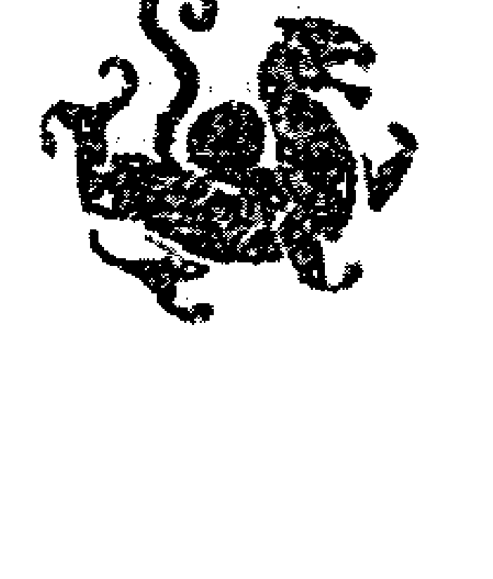

### 实例三十五：有缘来相聚 无缘必离去

2004年9月8日9：45分。小杨领一年轻男子前来我家。此男说，他原先自己谈了一个女朋友，但父母不同意，现又在本村给他介绍了一个女孩，这次双方的父母也都比较满意。以前的女友因得知父母给他介绍了别的女孩，前段时间主动提出和他分手。他现在很苦恼，问我该怎么办，最终和谁能有缘走到一起？男命：丁巳；先谈之女年命：癸亥；后介绍之女年命：壬戌

公历时间：2004年9月8日9时、当日干支：甲申 癸酉 庚寅 辛巳
当日旬空：午未（日）申酉（时）
阴遁六局 值符天禽落三宫 值使门落七宫

| 九天<br>伤门 乙<br>天柱 庚 | 九地<br>杜门 戊<br>天心 丁 | 玄武<br>景门 癸<br>天蓬 壬 |
| --- | --- | --- |
| 值符<br>己 生门 壬<br>禽 天芮 辛 | 己 | 白虎<br>死门 丙<br>天任 乙 |
| 螣蛇<br>休门 丁<br>天英 丙 | 太阴<br>开门 庚<br>天辅 癸 | 六合<br>惊门 辛<br>天冲 戊 |

我对他说：

- 1、以乙奇为当初所谈之女友，庚就为你。
- 2、今庚落坎宫生乙奇落宫，乙又下临庚，说明你对当初所谈之女还是以往情深，彼此心中都有对方。（是，我们的感情很好，就是我的父母不同意，现在她为了让我的父母不为我而不愉快，提出和我分手了，哎……）
- 3、后介绍之女以丁奇为用。（因其男先与当初之女恋爱在先，此女为中间介入，可看成第三者）今丁奇下临丙。丙又为第三者之男性，我

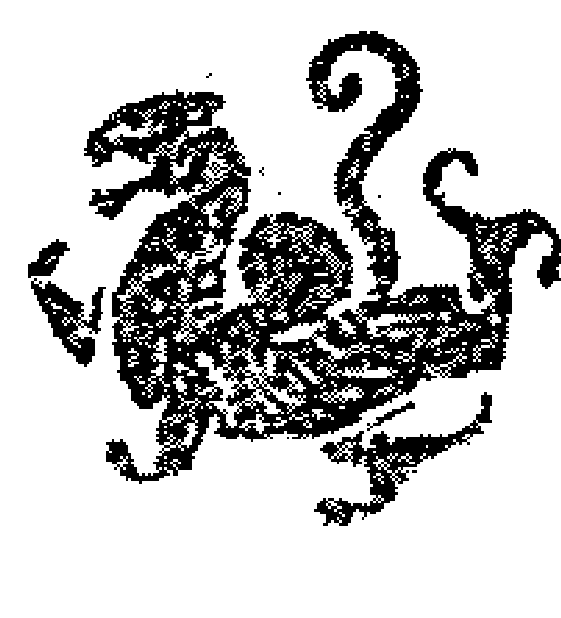

说此女，人家恐怕有男朋友。丁落宫克庚，人家也不愿意，你们俩在一起也没话说。（对！追求此女的人很多，她对我们的事的确也不同意，只是处于父母的压力才勉强和我接触。就象你说的，我们在一起真没话题可说，不知说些什么。）

- 4、再以三人的年命来分析，初认识的女命为癸亥落坤宫，你的年命落艮宫，落宫都为土，局不反吟做比和看。但癸落空地，说明现在她也心中有所顾虑。（也许是考虑我父母不同意我和她在一起的原因了）

- 5、后介绍之女命壬落震宫上乘值符，临生门，此女的家庭条件很不错，看起来很有钱。小杨这时开口问道：“孙师，您能看出是她将来有钱还是她家有钱？”我说根据此女的实际年龄，再加上震宫临天芮，天芮为病星，如果她的身体没什么问题的话，那她是不是还在上学？对！太对了！是在上学，而且上的还不是一般的学院。（后得知在美国上大学）那就应该是她家很有钱了。值符上乘非一般之家庭所能及。这时他们都笑了。我也不知对还是错，继续分析：

- 6、此女虽家庭条件好，但你们还是没缘。因此女的年命落宫和你年命相克，你还是选择当初的那个吧！因为你们有感情基础在，将来可能和你结婚的就是当初的那个而非现在这个。

2005 年春节，现在介绍的女友从美国回来后，双方还是分手了。4 月中旬，此男领着当初所谈的女友来到我家，说父母最终没办法还是同意了他们的婚事，最近就准备结婚。今天来让我给他们选一良辰吉日。最后在我为他们选定的日子里举行了庄严的婚礼。

小杨后来告诉我，给此男介绍的那个本村女的，她父亲为某集团董事长，此女现在在美国读书，因其女之父很是喜欢此男，想将来好好地培养他，但他的女儿人家也不愿意此男，双方父母没法，最后也只能随缘了。

## 第五章 笔录案例

### 实例三十六：家中常起火 不知是何因

公历时间：2006 年 12 月 2 日 16 时 、当日干支：丙戌 己亥 乙丑 甲申

当日旬空：戌亥（日） 午未（时）

### 阴遁五局 值符天冲落三宫 值使伤门落三宫

| 九天<br>杜门 己<br>天辅 己 | 九地<br>景门 癸<br>天英 癸 禽 | 玄武<br>死门 辛<br>天芮 辛 |
|---------------------------|------------------------------|---------------------------|
| 值符<br>伤门 庚<br>天冲 庚 | <br><br>戊                  | 白虎<br>惊门 丙<br>天柱 丙 |
| 螣蛇<br>生门 丁<br>天任 丁 | 太阴<br>休门 壬<br>天蓬 壬   | 六合<br>开门 乙<br>天心 乙 |

王道长应别人邀请，去给一家住户看风水。此家人我知道，因冬天此家客厅生有取暖炉，但不知为什么炉中的煤火，竟然会无缘无故的到处跑，还有家中放的东西，第二天也莫名其妙自己跑到别处去了，顿时搞的家里人心惶惶。主家还特意叫了些周围的邻居去家里帮他看是那里着火，可是大家都眼睁着看见一会这里冒烟，一会了那里着火，灭了这，那儿又着了。谁也没看清这些火源是怎么来的，一时见被人传的很邪乎。最后市里的有关部门来其家，提取了些东西去化验，也没见有什么结果。

主家也曾先后请了几位风水先生和巫师来“化解”但都作用不大。这天找到王道长，师傅去后看了看也没发现很特殊的地方。就让我用奇门看看问题出在那里了？

我说八门九星，六仪全伏吟，时间长了。其实去年已开始了，但没今年这样平凡。

生门为住宅。上乘螣蛇妖神，说明家中有阴性信息在作怪。丁火为阴火刚好和实际情况相吻合，着火的地方就象烟头烧过的一样。

生门宫正好临马星又和丁火同宫动，丁奇入墓，此阴火看不见。逢马星，不是一个地方着火了。

师傅问：那问题到底出在那里了？

我说：看死门了。因死门为地皮，地气。看他的地气是否有问题，今死门落坤宫也正好为地皮。天芮病星加临，地气有问题。辛再加临可能地下有死骨，玄武上乘阴气很重了。

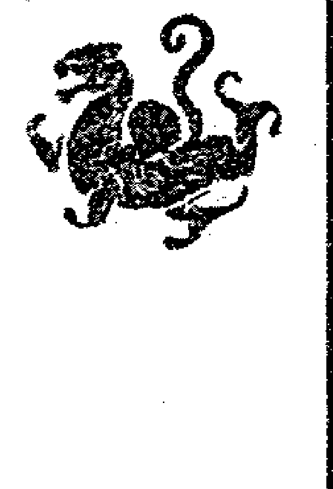

## 第五章 笔录案例

师：这个不知。
生门临马星冲死门问题就出在这里了。
我问：西南是否有废品，垃圾，不用的东西在那里？那地方太潮湿了，阳光少。
师：东北和西南都放有柴火。东北是柴房还是西南有个柴房我记不清了。有个柴房在那里的，里面放了好多东西。
师：我看问题也就在地气上，东北也有问题。
是。我答！
我对师说：这处理起来就麻烦了。因主家曾找多人看过，个人有个人的看法，也不知他们都在那些地方埋了些什么。处理起来很难。
师曰：就是，我明天给人家答复的，不行我就推掉算了。让人家另请高明。有些事要看缘分的，明天他来我干脆推辞掉。
第二天师对我说，他问主家了，主家说此房基地下好像没有坟墓，但以前是个污水处理的地方。
最后师还是推辞掉了，让主家另请高明。
（今年夏（07年），我和王道长又谈起此事，王道长说，经过主家询问村子的老人，才知此宅基原来就是个公坟场）

### 实例三十七：观辛金之象 物失而复得

2006年6月3日早，我下夜班刚回到家，妻沮丧着脸对我说，钻戒在洗衣服的时候，掉到水池可能被水冲走了。
当初我们结婚时，由于经济不宽裕，也未能给妻买什么特别的首饰送她，今年6月1日正好是我们结婚十周年，为了纪念这个特别的日子，前天特意去买了一个钻戒送给她，虽然现在送她好像迟了些，但作为我们结婚十周年的纪念品，却还是有着不同寻常的含义。听说钻戒被水冲走了，我赶紧过去帮她在衣服中找，看是否在衣服中，找了半天也没见。我突然想到，下水管都有弯头，说不定还会卡在楼下的弯头中没被冲走。妻说这么小点东西，咋能卡住，肯定被水冲走了。要么你看看……于是我转动奇门盘，发现戒子能找回来，没被水冲走，就卡在一个地方。分析完，我让妻暂时不要开水，下四楼敲开了王师的家门，拧动他家厨房的下水弯头处的丝扣，果然发现钻戒就卡在丝扣的盖中和一些杂物在一起。

当日干支：丙戌 癸巳 癸亥 丙辰、当日旬空：子丑（日）子丑（时）
阳遁八局  值符天辅落六宫  值使杜门落六宫

| 白虎 | 玄武 | 九地 |
| :---: | :---: | :---: |
| 开门 丙 | 休门 庚 | 生门 戊 |
| 天心 癸 | 天蓬 己 | 天任 辛 |
| 六合 |  | 九天 |
| 惊门 乙 | 丁 | 伤门 壬 |
| 天柱 壬 |  | 天冲 乙 |
| 太阴 | 螣蛇 | 值符 |
| 死门 辛 | 景门 己 | 杜门 癸 |
| 丁 禽 天芮 戊 | 天英 庚 | 天辅 丙 |

### 分析思路：

- 1：我为什么说钻戒可找回，没被水冲走？
首先观大局为八门九星反吟，测失物反吟有可回之象。（但也不一定还需结合其它类象来综合分析）。时干为失物落巽冲克日干落宫，再者临开门，如以时干之象来看，门开又冲克日干有被水冲走之象就难找回了。
但首饰为金属，在奇门上辛金为阴金，也为首饰之象。故我首选辛金为主要用神，时干只做参考。

- 2：为什么说钻戒被卡在某个地方？
今辛金落艮宫临胎养之地，关键临的门为死门，在这死门反不为凶了。因死门有停止，不通，不动，关闭之象，说明管道有堵塞之处钻戒卡在哪里，没被水冲走。如临开门反不宜，路路畅通，就有被水冲走之可能了。
艮宫虽空，但辰时马星动于艮宫，艮宫之辛正好又是我的年命，这不是显示要我动后，艮才可来生日干吗？如不动，就为名副其实的空生了，无用之生。最后八门反吟，失而复得。

### 实例三十八：投资二百万 最终落空宫

2006年2月15日17:50分，看着窗外我厂洗焦蒸汽冲天而上，突然想到厂从去年年底，为了响应国家环保规定，减少对环境的污染，集团通过组织专家对我厂的焦炉进行了考察，认为在原来的基础上可以进行改进。最后研究决定对我单位原焦炉进行改造，将原始的炼焦顶装煤改成侧装煤，还给几大生产车上装了硝烟除尘设备，这次的设备改造集团投资二百多万，如果运行成功，将会减少对环境的污染，我厂也有可能会长期生存下去。现在正是试行期阶段，从近期的试运行实际情况来看，设备经常出现故障，与原生产量相比，产量减少近半，再加上各班组的人员岗位变动，和个别岗位人员配比不当，职工们都有怨气，工作量增加了不少，但却没产生效益。以前在刚上设备的时候，车间的某一领导就曾问过我，说此项目会成功否？我那次测后认为此项目将不能正常运转，最终放弃，而且厂里的二位领导也将会受到牵连，(那次的案例没有保存)今想到这又一次测之。

公历时间：2006年2月15日17时、当日干支：丙戌 庚寅 乙亥 乙酉
当日旬空：申酉（日） 午未（时）
阳遁二局 值符天辅落一宫 值使杜门落五宫

| 六合<br>生门 癸<br>天柱 庚 | 白虎<br>伤门 壬<br>天心 丙 | 玄武<br>杜门 乙<br>天蓬 戊 |
| :--- | :--- | :--- |
| 太阴<br>辛 休门 戊<br>禽 天芮 己 | 辛 | 九地<br>景门 丁<br>天任 癸 |
| 螣蛇<br>开门 丙<br>天英 丁 | 值符<br>惊门 庚<br>天辅 乙 | 九天<br>死门 己<br>天冲 壬 |

- 1、以时干和值使门为所上的新项目。今时干乙落坤宫入墓，下临辛，说明这次上的项目为错误。时干入墓，事情不明朗，阻力大，逢杜门，闭塞不通，不能正常运行。

- 2、乙加辛为龙逃走，则说明此事将要放弃。天蓬在此，破财之象。时干，值使俱落空亡之地，最终落空。

- 3、地盘时干上临庚为阻隔之神，值符，惊门逢之，为领导下令停止之象也！

今笔录留此待验！

结果：由于设备和炉体的各方面原因，设备经常出现故障，不能正常运行，而且使产量大幅度下降，在运行二个多月后，上面通知停止。主管生产的车间领导被撤职，厂一领导被调离。二百多万的设备变成废铁一堆，到现在还放在那里。

### 实例三十九：何去又何存 人生难选择

我们单位 XXXX 制气有限责任公司，因响应国家环保政策，于4月18日被政府责令关停。

这对于我厂四百多名职工的以后生存问题，政府出台一套方案，由原就一直租赁我单位的我们本地一家民营企业 XX 集团托管，（在我厂关停前，我们宝焦仍为 XX 集团租赁）由 XX 集团负责安置我们。凡男年龄够50岁，女年龄够40岁可提前办理退休（内退），XX 对这些职工每月发放（退休费）1000元（不含三金）。剩下291人年轻的职工，由 XX 集团安置于“XX冶炼公司”。对于政府的安置方案，职工们绝大多数不赞同。

因 XX 在租赁我厂4年来，将以前我们的双休日改为单休日。每逢国家规定的法定节假日，仍照常上班，而且平常日工资是多少，过年过节仍旧，也没有加班费，对此大家都心有怨气，但“人在屋檐下，不得不低头！”

听说由 XX 来安置，职工们都不答应，于是向政府提出“一次性买断工龄”的建议。政府根据相关文件：国家正式职工一年工龄1629元乘于工龄数，86年以后的合同制职工是一年工龄1248元乘于工龄数，对此价格大家很难接受。这期间大家都自发集体去市政府上访，要求 XX 偿还租赁我厂四年来，所欠职工法定节假日，及加班费用。政府也责令有关部门开始清算。但就在清算刚结束，大家准备让 XX 补还每个人应得的费用时，XX 集团给我厂下通知：凡自愿要求上班的职工，可写申请去集团填表。折腾了一个来月的大伙们，有的已失去信心，生活的来源突断，给各个家庭的正常生活带来了影响。有的也怕以后失去工作，所以有些职工就开始报名。但以后的路到底是暂留待观、或买断、还是去 xx 上班、（以后的前景如何？会不会再出现今天的局面）谁的心里都没底。

5 月 17 日 17：50 分一同事给我打电话说起此事，他现在也不知应该怎样办，让我测测我们大家去 xx 这条路是吉是凶？现在对我们每一个职工来说，都是人生的一个转折点，以后的路该怎么走，关系到每个人，当然我也不例外。以前就有预测一下的想法，但这期间心总是难以平静，怕影响预测的准确性，也就一直没看，今天正好借此机会真的应该看看了。

公历时间：2007 年 5 月 17 日 17 时
当日干支：丁亥 乙巳 辛亥 丁酉
当日旬空：寅卯（日） 辰巳（时）
阳遁四局 值符天柱落一宫 值使惊门落一宫

| 六合 | 白虎 | 玄武 |
| :--- | :--- | :--- |
| 生门 壬 | 伤门 乙 | 杜门 戊 |
| 天任 戊 | 天冲 癸 | 天辅 丙 |
| 太阴 | | 九地 |
| 休门 丁 | | 景门 癸 |
| 天蓬 乙 | 己 | 天英 辛 |
| 螣蛇 | 值符 | 九天 |
| 开门 庚 | 惊门 辛 | 死门 丙 |
| 天心 壬 | 天柱 丁 | 禽 天芮 庚 |

以日干为我们职工，时干为事，以所去之方（东北）综合分析。

- 1: 日干落坎宫逢惊门，惊吓，害怕，担心。和现在大家的心情一样。
- 2: 符使虽同宫。惊门落坎，奇门演卦则为“泽水困”卦，和现在大家的情况很相符，辛加丁“讼神得奇，囚人逢赦免”困了这么久，现在去报名上班，就是“囚人逢赦免”之象，局象所显与实际情况的吻合不可思意！

### 奇门遁甲应用初探修订版

- 3: 去后如何呢？日下临丁，逢丁才可“赦免”。丁正好也为时干。查天盘时干飞到震宫，此宫中的信息就代表去后的情况了。今震宫逢吉门休门、丁、乙奇汇，又诈得太阴，奇门俱全。看似很不错。（XX集团近年来迅速发展，壮大，现在全国民营企业500强中排名在前20多位）但细看就发现此宫休门、丁奇、太阴、组成休诈格，在预测中对方如逢诈格说明就有问题，何况天蓬（贪狼）星在此，看来对方有某种可能存在。丁也为年干……

- 4: 日干生时干，多数人还是想去。

- 5: 我们所去的“XX冶炼公司”在县区，离我们市区大约30多公里。在我们的东北方位。

- 6: 今艮宫（东北）方在临开门，开门就是工厂、工作。开门人基于艮，腾蛇虚诈之神又上乘，艮宫奇门演卦为“天山遁”，还是有问题。

- 7: 开门克日干，地方克人。辛又为我的年命受去方所克，看来对我不利。

经过以上分析，我对同事说，我看对方有诈，有阴谋。不宜急动。

结果17日晚，我刚测完此事后19点去车间时，就已有十几人已写过申请了。领导问我考虑好了就写吧，人家都写了，我说不急，等几天再说。

到第二天18日已写申请人数多达160多人了。XX也在我厂贴出：考虑到原XXX职工，一直在焦化厂工作，对焦化各个岗位也比较熟悉，凡愿意去XX的人员将基本仍安置到XX焦化公司，XX焦化公司的员工将逐渐派往锌厂。

到19日，职工之间相互传言，已报名近200人了。对于观望还未写申请的人来说，此时的心情可想而知，人心慌慌，开始动摇，随大流……。

我此时还没写申请，原打算一次性买断，我还年轻，自己出去创创，现在也许就是一次机会，说不定出去后会创出一个不同于现在的小天地。有些事情，如果不去尝试，永远都不会有成功的机会！再说去那里上班，如真能分到焦化公司还可以，如果分到铅锌冶炼公司，谁都明白铅、锌对人体都有害处，那时后悔已晚矣！这也是原先多数人不愿意去的重要原因了！

但XX的承诺给了多数人的信心，大家纷纷报名，上午去厂里发现没报名的人只剩下六、七十人了，面对突然的巨大变化，听到随大流的话语，我的心也在动摇……

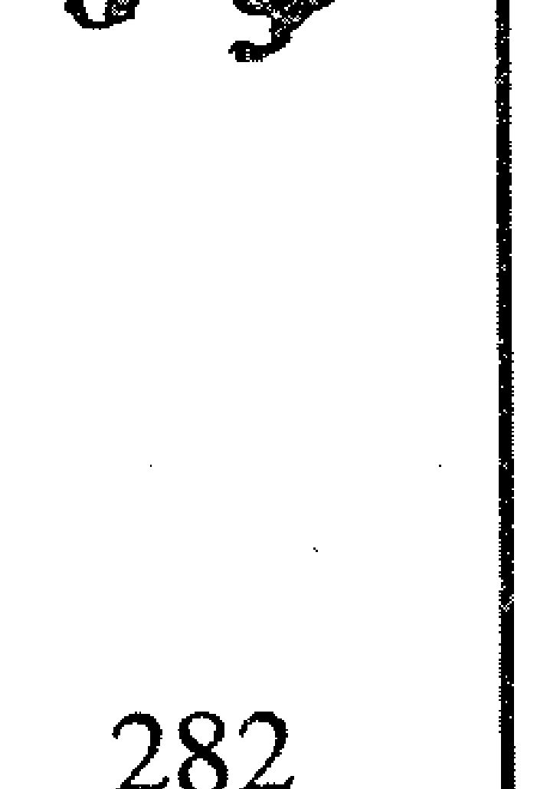

### 第五章 笔录案例

终于下午16时，我与另一个同事去集团报名。此时人事部的桌案上，申请已堆积如山，大约有一百六、七十人。在回来的路上，我的心仍然忐忑不安，因为前面的预测显示此事有诈。哎！既然报了名，也就不想了，等通知吧……

21日XX帖出了自愿要求上班的人员名单，去XX的114人，去XXXX铅锌矿的19人，去XX拉丝厂的8人，留厂处理遗留问题的33人（多为中干），也就是说报名的人共174人，还有117人没报名。

23日我们乘坐XX新为我们买的两辆大轿子车前往“XX冶炼公司”共去110人。上午由锌厂一名副总给我们讲锌、铅的工艺流程，下午上课，此副总在会上亲自对我们说，将来我们上来的大多数人以后都要分到锌厂。听了这话，大家震惊……诈格，腾蛇的信息终于显露出来了。当时我也没心思去听他讲了，心里也暗下决心，明天不再上来，坚决坚持买断！于是拿着笔在笔记本上乱画。突然心动：这会大家都明白将来要去锌厂的，不知明天大家都有什么想法？明天还会来这么多人吗？随手就在笔记本上起局……23日14：30分

公历时间：2007年5月23日14时
当日干支：丁亥 乙巳 丁巳 丁未
当日旬空：子丑（日） 寅卯（时）
阳遁二局 值符天心落八宫 值使开门落九宫

| 太阴 | 六合 | 白虎 |
|------|------|------|
| 死门 丁 | 惊门 己 | 开门 庚 |
| 天任 庚 | 天冲 丙 | 天辅 戊 |
| 螣蛇 |   | 玄武 |
| 景门 乙 |   | 休门 丙 |
| 天蓬 己 | 辛 | 天英 癸 |
| 值符 | 九天 | 九地 |
| 杜门 壬 | 伤门 癸 | 生门 戊 |
| 天心 丁 | 天柱 乙 | 禽 天芮 壬 |

> 注：今在网上排此局时，才发现我当时在笔记本上所起之局，八门全排错了。也许就是“神兆机于动”吧！但我当时所分析的结果却应验，The request was rejected because it was considered high risk

## 第五章 笔录案例

阳遁七局 值符天芮落九宫 值使死门落八宫

| 九天 开门 庚 丙 | 值符 休门 壬 | 腾蛇 生门 戊 |
|---|---|---|
| 天英 丁 禽 天芮 庚 |  | 天柱 壬 |
| 九地 惊门 丁 | 丙 | 太阴 伤门 乙 |
| 天辅 癸 |  | 天心 戊 |
| 玄武 死门 癸 | 白虎 景门 己 | 六合 杜门 辛 |
| 天冲 己 | 天任 辛 | 天蓬 乙 |

1、我当时指出他93年谈了一个女朋友，当时两人关系很好，最终没成而使自己伤心不已。

93年为癸酉年，以兑宫来看，乙奇为女朋友之象，太阴为隐私之事，伤门为伤心，结合其那时的年龄正为恋爱结婚之时断出。

2、96、95年因犯错误，有被限制人身自由之象。（实际为打群架，被公安部门关押一段时间）

其流年在乾宫，辛加乙为“白虎猖狂”辛有错误之象，杜门闭塞不通，受困之象，再结合“虎猖狂”断出。

3、97、98两年为最不顺，干什么事都不顺。（此两年开一酒店，无利赔本）

流年在艮，逢死门，天网。

4、2000年以后较顺，麻烦事少，特别去年04年游戏厅生意很好，财源广进。（很对，去年生意最好）

2000年逢开门九天，为创业之象，以后几年都逢三吉门，运气好转。
04年甲申年在坤宫，其年命遇生门又逢龙回首。

5、小曾这时提出：你看昨天他发生什么事？让其报数，其报56。除9余2以坤宫分析：

腾蛇麻烦、纠缠之象，生门为钱财，戊加壬“青龙人天牢”，戊为资金下临壬，壬为水有流动之象，将其象组合一起就为：外人纠缠，破财之事。

实际：昨天一客户因在游戏厅赌博，输的钱太多了，扬言要去有关部门告他，无奈只好退了一部分钱给人家。

### 实例四十九：提前演奇门 做到心有数

2006年2月9日21：10分，我和妻子谈起我们这地区，去年开始市政扩建，新福路和福氮大桥已建成。根据以后发展的形势来看，我们这里马路边的几十间门面房很有可能被拆除。因妻在此开有一个服装店，我们也曾问房主单位，回答说绝对不会拆除的。但我感觉被拆除的可能性还是大些，如真被拆除，那我们就得早做准备。妻让我起局看看，如真要拆除，就现在赶快转让出去。

公历时间：2006年2月9日21时、当日干支：丙戌 庚寅 己巳 乙亥、当日旬空：戌亥（日） 申酉（时）

阳遁五局 值符天心落四宫 值使开门落七宫

| 值符<br>景门 己<br>天心 乙 | 螣蛇<br>死门 癸<br>天蓬 壬 | 太阴<br>惊门 辛<br>天任 丁 |
|---|---|---|
| 九天<br>杜门 庚<br>天柱 丙 | 戊 | 六合<br>开门 丙<br>天冲 庚 |
| 九地<br>戊 伤门 丁<br>禽 天芮 辛 | 玄武<br>生门 壬<br>天英 癸 | 白虎<br>休门 乙<br>天辅 己 |

## 分析：

1、大局九星反吟，此就为天时、大气候所影响，反吟动象。以开门为这里的门面房，今开门空亡，不正是代表房子没有了吗？

2、时干为事体落乾宫冲克日干，日干落巽宫逢马星。这不就已表明让我们动吗？

分析完我对妻说，我看这里的房子绝对要被拆除，现在九星反吟，日干又逢马星，利客！我们还是早点将房子转让出去吧。妻说，如果真要拆，那谁还会接我们的房子呢？我说，其他人不一定知道，还是试试再说了。结果我们在3月份成功将此门面房转让了出去。事后别人问我，干的好好的，为什么转让不干了？我们回答准备转行！2007年4月份因宝福路扩宽，此处的门面房全部被拆除。

## 《奇门遁甲应用初探》修订版附加最新案例一则

### 家中有何事 壬遁来解迷

自本人的《奇门遁甲应用初探》一书在去年8月份出版后，接到不少热心读者的电话与手机短信。他们对书中某些观点表示赞同与认可，同时也对某些不足之处给予指正，在此向广大读者表示感谢！2008年10月17日10；34分，河南一位老先生给我打来电话，先是对我的书赞扬一番，后提出让我看看他家今年有什么事发生？象这类的考试，我现在几乎每天都遇到，而多数情况下，我都不去理会。但听老先生对奇门很感兴趣，并说要来学习。当然，人家既然要来跟你学习，就想知道你的水平到底如何呢？这种心情我很理解。为了打消他的疑虑，我只好起局分析，后将结果以手机短信发给他：“家中有人有伤亡之灾，为车祸。从而大破其财。”老先生收到我的结果后，立即打电话过来，泣不成声地在电话中告诉我：今年八月份的一天，他的大儿子和儿媳还有一个侄子开车在去儿媳娘家，在下午返回的路上与另一辆车相撞，不但他们三人身受重伤，同时也将别人撞成重伤，双方经过几个月的住院治疗，所幸没有生命危险，现伤势基本都已恢复。现在有关部门根据责任事故划分，他家要赔偿对方将近10万元的经济补偿。老先生也深明易理，可他的儿子却不信，他说他要将我发给他的信息保存下，到时一定让他儿子看看。
其实对此局的判断分析并不是我有多么的神，而是此局的信息非常明显。关键就在于，当你看到此信息时，敢不敢下结论。下面来分析此局。
先看奇门局
公历时间：2008年10月17日10时

当日干支: 戊子 壬戌 庚寅 辛巳、当日旬空: 午未（日） 申酉（时）

阴遁三局 值符天芮落九宫 值使死门落四宫

| 螣蛇 | 值符 | 九天 |
|---|---|---|
| 死门 辛 丙 | 惊门 己 | 开门 癸 |
| 天英 乙 禽 | 天芮 辛 | 天柱 己 |
| 太阴 |  | 九地 |
| 景门 乙 | 丙 | 休门 丁 |
| 天辅 戊 |  | 天心 癸 |
| 六合 | 白虎 | 玄武 |
| 杜门 戊 | 伤门 壬 | 生门 庚 |
| 天冲 壬 | 天任 庚 | 天蓬 丁 |

1. 首先分析时干，因时干为事体。今时干落巽宫逢死门，又组成“白虎猖狂”凶格，看到这些组合，就可以说明他必有不好的事。那么到底是什么事？死门，虎猖狂，均为伤亡之信息，再加上乘腾蛇，就说明有伤亡之事缠绕。
2. 因什么引起的呢？他问今年，就要看今年太岁所在宫，今年太岁为子，坎宫又逢伤门，白虎，又是伤灾的信息，伤门也主车辆，所以就可判断为车祸。
3. 还有马星动于乾宫，乾宫临生门，为财动。生门逢天蓬破财星，又上乘玄武，均为破财之象。生门落乾为1、4、9、6、7数。戌月乾宫正当令，可断破财数额为9数（此破财数，不是我当时断出的，是他最后告诉我的）。

### 再分析六壬课

公历: 2008年10月17日10时

节气: 10月23日9时16分霜降

干支: 戊子 壬戌 庚寅 辛巳

国际易经网 www.iqing.net线上排盘系统

旬空: 甲申旬午未空 月将: 九月辰将

```
合勾青空
辰巳午未
朱卯 申虎
蛇寅 酉常
丑子亥戌
贵后阴玄

后贵青空
子丑午未
丑寅未庚

子戊子 后
子丁亥 阴
父丙戌 玄
```

以六壬课来看：首先是蛇虎临门，家中为伤灾缠绕。三传脱耗日干，发用又为今年之真太岁来脱耗日干，今年破耗之象。初传子，中传亥，均为孩子之象，特别是中传亥遁丁鬼，此破耗之事正为儿子引起。

## 第六章：网测案例

1：遁甲老师，感情上最重要的一次抉择：她能成为我的妻子吗？

她是我高中时的小初恋，00年各奔东西，爱她，想她，等待她好多年了，06年她回来了，也参加工作了，大约06年5月份我追求她，她拒绝了，我们互相说了许多不好听的话，（其间追她前寻梦大师根据奇门断不成，很准）06年10月后，她联系暗示我，06年子月我重新追求她，开始有小小的一点进展，但我知她心中还有别人，在丑月终于再次闹僵了，双方话语更加难听，一个多月来，联系基本断绝，

我的出生时间是：阴历：81 年12 月22 日卯时 河南人，仍在出生地居住，她是83 年出生的。

时间：2007 年02 月26 日16 时36 分

干支：丁亥 壬寅 辛卯 丙申 旬空：辰巳

阳遁三局  值符天心落一宫  值使开门落八宫

| 六合<br>生门<br>戊 | 白虎<br>伤门<br>己 | 玄武<br>杜门<br>丁 |
|---|---|---|
| 太阴<br>休门<br>癸 | 天任<br>戊 | 九地<br>景门<br>乙 |
| 螣蛇<br>开门<br>丙 | 值符<br>惊门<br>辛 | 九天<br>死门<br>壬 |

必详细及时反馈到底!!!!

1：乙庚同宫，还是有缘分的。

2：但天芮星在此两人经常爱闹矛盾。壬临地盘每次闹矛盾你都首先离开。

3：你的年命为辛落坎宫，与下之丙合，丙刚好为时干也为对方，说明你很喜欢她。

4：惜丙落艮宫临马星动，克日干年命。艮宫之时序为丑、寅正好符合你们丑月闹僵。

5：对方年命为癸落震宫，癸与地盘之戊合，说明对方的确心中喜欢另有其人。戊之天盘落巽宫逢生门又六合上乘，人家的经济条件要比你好些。但空亡，仅是表面现象而已，此人比你要大些。

6：那你门是否还有机会呢？从年命来看你的年命生对方的年命，我看还是有机会的。你生人家就要主动去追求人家了。感情没有谁错谁对，只是你可能平时爱说而已，也许让她认为你爱唠叨。你的年命生对方之年命，对方又不克你，这就要看你自己了。俗云：“铁棒磨成针，功到自然成。”

7：再说对方虽然喜欢戊，但戊临六合落空地，她所喜欢的也不一定能和她结婚，这对你不是一个有利的条件吗？

8：乙庚同宫临景门，天芮，你们两人火气都很大，相互不能容让。

9：改改你们的习气将来对谁都好。我说了这么多，只能是参考，就当是我和你一次面对面的谈话罢了。但解决问题还在你本人，以后你们将会怎样发展就看你了！不要说我太罗嗦就行了。

谢谢大师详细断解，小弟无比的感激啊！

1：乙庚同宫，还是有缘分的。－－－－－－－－恩！是的啊！

2：但天芮星在此两人经常爱闹矛盾。壬临地盘每次闹矛盾你都首先离开！——对啊！差不多都是我先把话说到底的，特别是以前，不过，她的原因也很大。

3：你的年命为辛落坎宫，与下之丙合，丙刚好为时干也为对方，说明你很喜欢她。－－－－－－非常非常的喜欢！

4：惜丙落艮宫临马星动里克日干年命。艮宫之时序为丑寅正好符合你们丑月闹僵！
——唉！

5：对方年命为癸落震宫，癸与地盘之戊合，说明对方的确心中喜欢另有其人。戊之天盘落巽宫逢生门又六合上乘，人家的经济条件要比你好些！但空亡，仅是表面现象而已。此人比你要大些！

6: 那你门是否还有机会呢？从年命来看你的年命生对方的年命，我看还是有机会的。你生人家就要主动去追求人家了。感情没有谁错谁对，只是你可能平时爱说而已，也许让她认为你爱叨叨。——平时不爱说话啊，但闹矛盾主要就是我的话语引起的，给她以精神上的伤害吧，在追求她那个月时，我确实是语言攻势，而且不右分寸，心里不爽了，就揭了她的短，我是爱之深，心中也恨之恨，你的年命生对方之年命，对方又不克你，这就要看你自己了。俗云：“铁棒磨成针，功到自然成”
7: 再说对方虽然喜欢戌，但戌临六合落空地，她所喜欢的也不一定能和她结婚。这对你不是一个有利的条件吗？
8: 乙庚同宫临景门，天芮，你们两人火气都很大。相互不能容让！——非常对啊！！！双方火气都大，她似乎更厉害，
9: 改改你们的习气将来对谁都好！我说了这么多，只能是参考。就当是我和你一次面对面的谈话罢了。但解决问题还在你本人，以后你们将会怎样发展就看你了！不要说我太罗嗦就行了。

——不要说我太罗嗦就行了。千万别说这样的话啊，小弟急需师父您的帮助！我心里非常愿意为她付出，让她骂让她打就不会有任何不快，但我也是个自尊极强的人，我不能容忍她心里有别人。。。。
这也是我追求她反而势得其反的原因！！！！请大师继续！！！我和她能成吗???? 如果她能没有别人，接受我，一切都会好的。

2: 一位朋友求测官运如何，各位易友请看看公历时间：2007年2月13日10时当日干支：丁亥 壬寅 戊寅 丁巳 句空：申酉（日）子丑（时）阳遁二局 值符天柱落八宫 值使惊门落一宫

| 太阴<br>生门 乙<br>天蓬 庚 | 六合<br>伤门 丁<br>天任 丙 | 白虎<br>杜门 己<br>天冲 戊 |
|---|---|---|
| 螣蛇<br>休门 壬<br>天心 己 | 辛 | 玄武<br>景门 庚<br>天辅 癸 |
| 值符<br>开门 癸<br>天柱 丁 | 九天<br>惊门 戊<br>禽 天芮 乙 | 九地<br>死门 丙<br>天英 壬 |

1. 日干落空亡宫。天芮，辛同宫，自身存在某些方面的问题。
2. 值符为顶头上司落艮宫克日干，虽说空亡但克象还在。也就说明表面上看上司和他的关系好像不错，但实则上司对他有看法。
3. 太岁为最高领导，落宫与日干相冲克，和最高层没人事关系。
4. 时干为下属也和日干相冲克，下面对他有意见，不支持。
5. 开门为官职落空亡宫又入墓，升职无望！
6. 这次不能提升的原因主要是在自己本身平常的表现，因日干宫逢“虎猖狂。”惊门。

> 以下是引用遁甲在2007-2-14 12:37:00 的发言：
> 1. 日干落空亡宫。天芮，辛同宫，自身存在某些方面的问题。
> 2. 值符为顶头上司落艮宫克日干，虽说空亡但克象还在。也就说明表面上看上司和他的关系好像不错，但实则上司对他有看法。
> 3. 太岁为最高领导，落宫与日干相冲克，和最高层没人事关系。
> 4. 时干为下属也和日干相冲克，下面对他有意见，不支持。
> 5. 开门为官职落空亡宫又入墓，升职无望。
> 6. 这次不能提升的原因主要是在自己本身平常的表现，因日干宫逢“虎猖狂。”惊门。

求测者是遇到了一些是非，与上司的关系一般，较少沟通。目前的高层中是没有好的人事关系，下面的人不太听话，这次职位升迁有障碍。

现在想向外发展，求助于其他得力的人，望有所发展，因此占问开门空亡入墓，日干乘九天利客。

戊下临乙，天盘之乙飞巽宫，临生门太阴可考虑从商。

### 3：有劳遁甲大师批一批此女的命运

- 公历时间：1968年10月7日6时
- 当日干支：戊申 辛酉 庚戌 己卯
- 当日旬空：寅卯（日） 申酉（时）
- 阴遁七局 值符天心落六宫 值使开门落一宫

| 白虎 | 六合 | 太阴 |
|---|---|---|
| 伤门 辛 | 杜门 丙 | 庚 景门 癸 |
| 天辅 辛 | 天英 丙 | 禽 天芮 癸 |
| 玄武 |  | 螣蛇 |
| 生门 壬 |  | 死门 戊 |
| 天冲 壬 | 庚 | 天柱 戊 |
| 九地 | 九天 | 值符 |
| 休门 乙 | 开门 丁 | 惊门 己 |
| 天任 乙 | 天蓬 丁 | 天心 己 |

批八字要到四柱版块去的，你发错了！

用奇门神术也可以吧，此女出生于1968年10月7日北京时间6点45分，恳请预测，多谢了。

奇门测四柱是有难度的。再说我也没这方面的经验，不过我可以试试，就当一个学习的机会。当然，以下所测之结果仅为本人对奇门四柱的浅薄理解而矣！还望合理取舍。

1：直使落坎宫，被日干所克，直符落乾宫泄日干宫。大局九星伏吟，凡我克，我生者脱我之气也，说明命主一生付出多，得到的却少。

2：日干落坤宫天芮病星加临。庚加庚，癸加癸亦非吉格，太阴又上临。说明命主先天就代有多病，身体不佳之信息。日干病星落内盘，坤主脾胃，消化系统不好。但天芮也为学生，修道求学之人，景门又主文化说明命主是一个好学之人。年命落兑宫，死门加临，螣蛇飞来，命主对神秘文化也是有研究的。

3：庚落坤宫，坤宫空亡又临太阴，坤为母宫位，古云：庚落坤宫母早亡，或母之身体亦欠佳。

4：如以年干为父母，今年干为戊，戊为阳为父，与戊相合之干为癸，也正好落坤宫，母不是长寿之人。

5: 戊为父落兑临死门，乾为父上乘值符，天心，父非一般人，有职位。但已加己为〔地户逢鬼〕。

6: 月干为兄弟姐妹，今落巽宫兄弟姐妹四人左右，但有伤亡者。月干临马星，又来克日干，兄弟姐妹不是相隔远，就是关系欠佳。

7: 命主前20年大运在坤宫，又走空亡之地，根据申空未不空，命主10前有过大难，或离母。总之庚申，己未运非吉运。

8: 30岁走戊午运落离宫，逢六合，六合主婚姻，杜门，丙奇加临，夫妻有矛盾。

9: 以后走三吉门，运气必开，有晚福之人。

10: 开门为事业落外盘，乘九天，适合在外地发展，明年不错。

多谢遁甲大师！

> “命主一生付出多，得到的却少。身体不佳，好学之人，对神秘文化也有研究，10前有过大难，适合在外地发展，”说的很对。母亲健在，今年65岁，如何祈求多福长寿？

此女10年前离异后到大城市发展，目前还可以，“以后走三吉门，运气必开。有晚福之人。”不知还有哪些不顺，大师不妨再看看。

多谢反馈！用奇门测四柱，此例是我第一次预测，也没经验，重属当时的临场发挥。（但根据其反馈，准确率在80%左右，今特意帖出供大家交流！在这也顺便一块帖出当时命主给我邮箱所发的信息）：

标题：再次感谢您！
时间：2006-10-27 11:29
内容：昨晚又读了您对我命局的测算，80%都是对的，非常信服，为我这样一个素不相识的人浪费了您宝贵的时间。您年轻又谦虚好学，以后必大有作为，预祝您取得人生更大的成功！

### 4：占学易之前程

对此很感兴趣，想从四柱八字学起，占能否有所成就。请版主解惑。
男，1972年生。
公历时间：2006年9月21日18时
当日干支：丙戌 丁酉 癸丑 辛酉

当日旬空：寅卯（日） 子丑（时）

阴遁九局 值符天辅落六宫 值使杜门落六宫

| 白虎 开门 辛 天心 癸 | 六合 休门 乙 天蓬 戊 | 太阴 生门 己 天任 丙 |
|---|---|---|
| 玄武 惊门 庚 天柱 丁 |  | 螣蛇 伤门 丁 天冲 庚 |
| 九地 壬 死门 丙 禽 天芮 己 | 九天 景门 戊 天英 乙 | 值符 杜门 癸 天辅 辛 |

1. 日干落乾宫，又上乘直符天辅文星加临，看来你非一般之人。
2. 乾为头，直符为头，有身份。但日干临马星，又冲开门，八门九星反吟，近期工作要变动。
3. 日干临天辅与腾蛇比和，你和易文化还是有很深之缘。
4. 年命临天芮，死门，上乘九地说明你现在已打算死心踏地学习。
5. 螣蛇主神秘文化，丁奇又主文科，下临庚，庚又为阻力，瓶颈，当然刚开始学习这些都是避免不了的。
6. 天辅为老师，天芮为学生，你年命临天芮生天辅说明你是一个好学之人，同时也能虚心向他人请教。
7. 当然明师的指导亦是不可缺少的。日干临天辅，杜门主技术，直符为名望，你已有了这方面的信息。
8. 大局反吟，年命逢空，有反复，断断续续之象。也就是说学而停，停而学。八门九星反吟，就看你有没有时间。

学习任何一门学科，贵在要有一颗坚持不懈的恒心。只要你用心学习，两年之内必有成效。因日干落乾宫。

感谢遁甲版主，分析得好详细啊！

天易论坛的各位版主和易友水平都很高，
而且诲人不倦，都是我的明师。
到时请多多指教！

## 第六章 网测案例

### 中国古代术数汇要

### 5：恳请斑竹指点：问问这个项目能不能干？

遁甲老师能不能帮我看看这个项目能不能干？我看上了一个新项目，如果上这个项目话效益有没有现在这个好？非常非常地感谢！

公历时间：2006年8月28日11时、当日干支：丙戌 丙申 己丑 庚午

当日旬空：午未（日） 戌亥（时）

阴遁七局 值符天柱落五宫 值使惊门落一宫

| 太阴 | 螣蛇 | 值符 |
| --- | --- | --- |
| 生门 丙 | 伤门 癸 | 杜门 戊 |
| 天英 辛 | 禽 天芮 丙 | 天柱 癸 |
| 六合 | | 九天 |
| 休门 辛 | 庚 | 景门 己 |
| 天辅 壬 | | 天心 戊 |
| 白虎 | 玄武 | 九地 |
| 开门 壬 | 惊门 乙 | 死门 丁 |
| 天冲 乙 | 天任 丁 | 天蓬 己 |

### 奇门遁甲应用初探

- 1：从日干落宫可看出你已心动，准备承接此项目。主要是上司对此项目非常认可。
- 2：以值使门为此项目。外表看不错，但玄武，惊门加临暗藏将来有纠纷，或官司之事。
- 3：以时干为所问之事也代表此项目。离宫之组合，腾蛇，天芮，贼格。都说明此事有问题。时干克日干对你不利。
- 4、戊为资本，落坤宫乘值符，坤宫又于时令旺，说明投资数额大。80或120万。
- 5、生门为利润落巽宫克资本落宫无利润可言，建议放弃！

精彩！！！！！

......

（从日干落宫可看出你已心动，准备承接此项目。主要是上司对此项目非常认可。）非常正确。

（戊为资本，落坤宫乘值符，坤宫又于时令旺，说明投资数额大。80或120万。）正确。

### 奇门遁甲应用初探修订版

这是一个建筑材料项目，西北总代理投资数额大；我想换一个，请问遁甲老师我能干那个行业呢？再次感谢！

### 6：请各位老师帮忙看看，朋友工地上是怎么了，最近老出事，在线等，诚谢！

时间：2007年01月23日09时31分、干支：丙戌 辛丑 丁巳 乙巳 阳遁九局 值符天辅落八宫 值使杜门落五官

| 太阴 | 六合 | 白虎 |
| --- | --- | --- |
| 癸 生门 庚 | 伤门 丙 | 杜门 丁 |
| 禽 天芮 壬 | 天柱 戊 | 天心 庚 |
| 螣蛇 | | 玄武 |
| 休门 戊 | | 景门 己 |
| 天英 辛 | 癸 | 天蓬 丙 |
| 值符 | 九天 | 九地 |
| 开门 壬 | 惊门 辛 | 死门 乙 |
| 天辅 乙 | 天冲 己 | 天任 丁 |

- 1、时干临死门，见暗庚飞来，阴神见白虎，死门生宫更凶。
- 2、时干为下属，员工有刑伤事件发生。
- 3、月干为辛临惊门，官司口舌不断。
- 4、辛冲太岁，朋友犯太岁，运气不佳。
- 5、开门入墓空亡，工地现在是否被暂停？

是的，前期工地出事故，工人死亡二名，现还在出工，昨晚又被盗，不知问题出在哪里了，谢谢老师。

你的朋友运气不佳是一方面。但可能还存在风水方面的因素。

那现在还能否开工呢？他想在年前完工. 最近不会再出什么问题吧？

### 7：请看看这两栋房子怎样？

第一栋是10年新，第二栋是2年半年新。动念时间，2007年1月19日晚9：51 动念地点：美国路意斯威尔市。第一栋报数：47, 23, 6第二栋报数：5, 9, 34。我老公属龙，我属马. 谢谢

公历时间：2007年1月19日22时 当日干支：丙戌 辛丑 癸丑 癸亥 当日旬空：寅卯（日） 子丑（时）

阳遁二局 值符天柱落七宫 值使惊门落七宫

| 玄武<br>杜门 庚<br>天辅 庚 | 九地<br>景门 丙<br>天英 丙 | 九天<br>死门 戊<br>天芮 戊 |
| --- | --- | --- |
| 白虎<br>伤门 己<br>天冲 己 | 辛 | 值符<br>惊门 癸<br>天柱 癸 |
| 六合<br>生门 丁<br>天任 丁 | 太阴<br>休门 乙<br>天蓬 乙 | 螣蛇<br>开门 壬<br>天心 壬 |

- 1: 第一栋楼以坎宫为用。（第一栋是10年新）10除于9余1信息同步故取坎宫。休门乙奇加临上乘太阴，此房的风水还可以。就是光线不好，采光不行，显的房子有些阴暗。休门，空亡在此，说明此房可能不经常住。处于闲置状态。
- 2: 第二栋楼。以坤宫为用，（第二栋是2年半年新.）信息同步故取坤为用。九天主高大，看来你的这栋房子楼层较高，面地大。可惜死门，天芮，辛同宫，此房的气场不好，使人容易得病，对人身体有影响。
- 3: 因不知你们的具体年命，只能做简单分析。

多谢遁甲大师！
这两栋是我目前比较中意的房子。
这是我看過后的反馈：
第一栋，是不是闲置状态我不是太清楚，不过我去看的时候不象是没人住的. 显的房子有些阴暗 －－ 是有点这个问题. 因为屋主把楼下大部分的房间都漆成了深红色. 显暗. 这是房子的地形图，绿箭头指的是这栋的位置：
第二栋也是两层高的楼. 不过在哪条街上是最大，房子的地理位置也较高. 房主要卖房子的主要原因是因为家中老人得糖尿病，要回原住地，不得不卖房子. 我对第一栋比较感兴趣，麻烦遁甲大大再帮我看看. 具体出生年月我短信给你了。
看到预测后，在下单前不太放心，跟哪儿的朋友打听了一下. 她正好有个朋友住哪且和这栋房子一个朝向。果真如遁甲大师所测的结果一样。光线不好，采光不行，显的房子有些阴暗。

朋友跟我说，中国人都爱找坐北朝南的房子。而美国的房子大部份的活动空间都在屋后，坐北朝南的房子反到采光不好，应该买坐南朝北的才好。

太谢谢遁甲了，要不买了住进去才发现问题，急死都有份。

### 8：再请遁甲版主看看

上次你给我看过俩栋房子，其中有栋我比较喜欢。但你从卦中看出房子比较暗。我找朋友打听确实如此。这个我有反馈。我后来又看了不少别的房子，还是最喜欢这栋的结构。我又跑去看了一次，主要是不死心，想看看是不是是不是有办法改改颜色什么的。看来没指望。我想建一栋新房，这样一来可以根据自己的喜好来设计。我今天定了块地，麻烦遁甲版主看看怎么样？

地的编号是：29

- 1) 要求提供3个数字：3, 29, 6
- 2) 精确的生辰八字及性别出生地：1966 年 月 23 日，江西南昌
- 3) 动念的日期、时间和地点：2007 年 3 月 25 日晚上 9：55 分，美国路伊威耳市（LOUISVILLE）（夏时制时间已转换为非夏时制时间）；

多谢！

公历时间：2007 年 3 月 25 日 21 时

当日干支：丁亥 癸卯 戊午 癸亥

当日旬空：子丑（日） 子丑（时）

阳遁九局 值符天禽落五宫 值使门落五宫

| 九地 | 九天 | 值符 |
| --- | --- | --- |
| 杜门 壬<br>天辅 壬 | 景门 戊<br>天英 戊 | 死门 庚<br>禽 天芮 庚 |
| 玄武<br>伤门 辛<br>天冲 辛 | 癸 | 螣蛇<br>惊门 丙<br>天柱 丙 |
| 白虎<br>生门 乙<br>天任 乙 | 六合<br>休门 己<br>天蓬 己 | 太阴<br>开门 丁<br>天心 丁 |


死门为地皮落坤宫乘值符，地势虽高，但庚癸在，风水不是很好。

29 除9余2仍在坤宫信息一样。

上次你所说的第一栋楼，我认为只要将室内光线调整一下，还是不错的。

以上所说仅供参考！

多谢遁甲版主帮忙把关。我回掉那块地了。

选地时，我们主要是看图，觉得那块地的朝向比较好是朝南的。后院也比较平，后面有一片空着不会建房，这样跟别人的房子相隔就比较远。看过挂后，我们到现场又去看了，才发现原来后面空着的地方有俩个下水道出水汇聚口，虽说是下雨时用的，但还是会积水的。难怪会空着。卖地的跟我们说这地多平，后院多平多大，就没说因为是下水道出水汇聚口，汗一个。

再谢！

### 9：请遁甲大师预测本人何时能还清债务

文字烦请遁甲大师预测本人何时还清债务，转入正轨，本人年命为辛亥，[天若有情]鼻子一酸，开始叭嗒叭嗒掉眼泪了……

公历时间：2006年11月25日0时

当日干支：丙戌 己亥 戊午 壬子

当日旬空：子丑（日） 寅卯（时）

阴遁八局 值符天辅落四宫 值使杜门落五宫

| 值符 | 九天 | 九地 |
| --- | --- | --- |
| 生门 壬 | 伤门 乙 | 辛 杜门 丁 |
| 天辅 壬 | 天英 乙 | 禽 天芮 丁 |
| 螣蛇 | | 玄武 |
| 休门 癸 | | 景门 己 |
| 天冲 癸 | 辛 | 天柱 己 |
| 太阴 | 六合 | 白虎 |
| 开门 戊 | 惊门 丙 | 死门 庚 |
| 天任 戊 | 天蓬 丙 | 天心 庚 |

- 1、以时干为事也代表你所欠的债务。今时干落巽宫临生门上乘值符，巽宫与现时令旺，说明你所欠的债额数目不小，九星伏吟说明时间很长了。
- 2、至于何时才能还清债务要看你自己的能力。今日干落艮宫虽临开门，又戊加临马星同宫，说明你努力工作到处奔波。惜日干戊落空亡之地，收获不大。
- 3、生门为债务来克你日干，巨大的债额使你压力重重。
- 4、戊为资本，现只有等戊和日干旺相时，你可在事业上有所起色，也才有能力还清债务。08年太岁戊和你日干同宫，开门为工作事业，说明08年你的事业有质的飞跃。因戊本身就为财，相信那时你已无债一身轻了。奋斗吧！

[2楼] | Posted: 2006-11-25 15:53

多谢遁甲大师指点，您提到只有等戊和日干旺相时你可在事业上有所起色，也才有能力还清债务。再请烦劳您指点：如何早日解套，比方说某几天戊和日干旺相，咱们去买彩票，见笑了，请原谅我，本人太迫切了，请支招帮我，不胜感激。

### 10：有请遁甲斑主

问问婚姻以后幸福吗？女年命戊午，我的年命癸丑. 谢谢！

公历时间：2006-11-26 15:52:00
丙戌 己亥 己未 壬申 旬空：子丑（日）戌亥（时）。

阴遁二局 直符 天芮星 直使 死门

| 六合<br>天冲 乙<br>惊门 丙 | 太阴<br>天辅 丙<br>开门 庚 | 腾蛇<br>天英 庚<br>休门 戊 |
| --- | --- | --- |
| 白虎<br>天任 辛<br>死门 乙 | 丁 | 直符<br>禽 天芮 戊<br>丁 生门 壬 |
| 玄武<br>天蓬 己<br>景门 辛 | 九地<br>天心 癸<br>杜门 己 | 九天<br>天柱 壬<br>伤门 癸 |

- 1：乙为女，庚为男。乙落巽宫克庚之落宫，乙落宫临惊门，天冲星来克庚，说明女方平时爱唠叨，脾气不太好。
- 2: 你们年命落宫相生说明还是很恩爱的。
- 3: 平时的一些吵闹都是小事，你让着点她就没事的。因庚落宫临休门退让为益。年命为根相生，你们的婚姻基础好。
- 4: 不要有什么忧虑！有坚固的婚姻基础在，相信你们会幸福的！你说呢？

说的很正确，谢谢遁甲斑主。

### 11：有急事请求一测

我现在所在的公司出现了一些问题，请问公司能挺过来吗？如果能挺过来或不行，能否知道时间。

公历时间：2007年1月10日9时
当日干支：丙戌 辛丑 甲辰 己巳
旬空：寅卯（日）戌亥（时）
阳遁五局 值符天禽落六宫 值使门落一宫

| 白虎<br>休门 辛<br>天任 乙 | 玄武<br>生门 丙<br>天冲 壬 | 九地<br>伤门 乙<br>天辅 丁 |
| --- | --- | --- |
| 六合<br>开门 癸<br>天蓬 丙 | 戊 | 九天<br>杜门 壬<br>天英 庚 |
| 太阴<br>惊门 己<br>天心 辛 | 螣蛇<br>死门 庚 | 值符<br>景门 丁<br>天芮 己 |

- 1: 以开门为你所在之公司，上乘六合支持安博坛主所断“应该是一个股份制的公司”。
- 2: 天蓬和开门同宫，加上景门空亡，公司在管理上比较混乱。值符为公司领导，落空亡之宫，又临马星，且冲克开门，主要领导经常不在或已退位。
- 3: 直使门为副职，落坎宫生开门，现在管事的可能是副职了。死门螣蛇加临，庚又同宫，公司目前的状况让领导感到头疼。
- 4: 以甲子戊为资本，现在空亡，公司的周转资金都成问题。
- 5：开门下丙，丙又为今年太岁（06）。天盘之丙落离宫临生门，生门为利润，但上乘玄武，看来今年在利润方面多属虚假性。
- 6：今日干落兑宫和开门冲克，你本人都有打算离开之象！
- 7：戊为资金和丁同宫，丁为明年（07年）之太岁，冲克开门，07年将面临更大的困难。
- 8：前景不乐观。

奇准啊！07年不行的话，我就准备离开。谢谢大师

### 12：恭请遁甲老师帮忙看下

现在还是单身呢，没有女朋友！什么时候能摆脱这种局面呢？她又是什么情况？如何认识呢？
我出生时间是公历1982年1月20日。有劳您！
公历时间：2006年11月9日21时
当日干支：丙戌 己亥 壬寅 辛亥
当日旬空：辰巳（日）  寅卯（时）
阴遁九局  值符天禽落六宫  值使门落七宫

| 白虎 | 六合 | 太阴 |
| :--- | :--- | :--- |
| 伤门 己<br>天任 癸 | 杜门 丁<br>天冲 戊 | 景门 癸<br>天辅 丙 |
| 玄武 | | 螣蛇 |
| 生门 乙<br>天蓬 丁 | 壬 | 死门 戊<br>天英 庚 |
| 九地 | 九天 | 值符 |
| 休门 辛<br>天心 己 | 开门 庚 壬<br>天柱 乙 禽 | 惊门 丙<br>天芮 辛 |

- 1：测婚以乙庚为主，兼看六合落宫。今庚落坎宫地盘逢乙，开门九天加临，亦主动追求了。
- 2：庚和乙同宫，让我看你现在心中应该有一女孩。天盘之乙落震宫生门飞临，此女家庭条件好。震为木，人清秀漂亮。庚临开门九天去生乙，但乙空亡人家没表态。乙为女地盘丁奇加临，人家也可能有男朋友。
- 3：年命日干同为壬落乾宫，与日干相合之干为丁奇，也可代表未来之妻，落离宫上乘六合正在婚姻宫位。丁奇来源于震宫之地盘。六合落宫逢丁奇为明年太岁，乙奇地盘也为明年太岁，明年有婚姻的信息存在。庚落宫生乙奇之落宫，加油吧。虽乙现在逢空，但明年寅卯月就不为空。时干落外盘，日干落内盘，主慢！乙落震宫以东方为目标。
- 4：作为学术交流，相互学习，遁甲希望各位老师能将自己的分析依据，思路写出，这样方便大家相互学习！

非常感谢遁甲老师！

原来奇门这么神奇！佩服！将来有机会要学下！

测婚以乙庚为主，兼看六合落宫！今庚落坎宫地盘逢乙，开门九天加临，亦主动追求了！

> （曾经追求过，未遂，否则就不来这里了，呵呵！）

庚和乙同宫，让我看你现在心中应该有一女孩！天盘之乙落震宫生门飞临，此女家庭条件好！震为木，人清秀漂亮！庚临开门九天去生乙，但乙空亡人家没表态！乙为女地盘丁奇加临，人家可能有男朋友！

> （今年的确认识一个不错的女孩子，情况和您所说是一致的，只是自己感觉自己目前根本没有机会，她所过的应该是一种比较富裕的生活，我目前还没有这个实力，近几年都难有机会达到！而且她身边也不乏很多追求者！还有呢，我们的性格好像差好多吧！您看我们有机会吗？）

年命日干同为壬落乾宫，与日干相合之干为丁奇，也可代表未来之妻，落离宫上乘六合正在婚姻宫位。丁奇来源于震宫之地盘。六合落宫逢丁奇为明年太岁。乙奇地盘也为明年太岁。明年有婚姻的信息存在！庚落宫生乙奇之落宫，加油吧。

> （从八字上这两年也都应该有婚恋信息）

虽乙现在逢空，但明年寅卯月就不为空。时干落外盘，日干落内盘，主慢！乙落震宫以东方为目标！

> （可能卯月的机会大些，卯值临妻宫。东方为目标指的是她家在我家里的东方吗？）

再次感谢您！

### 13：武汉办分公司能有前途否……谢谢！

紧急计划去武汉（现在的北偏西方向）开分公司。能做出成就吗？谢谢版主。

公历时间：2006年11月12日21时

当日干支：丙戌 己亥 乙巳 丁亥

当日旬空：寅卯（日）  午未（时）

### 阴遁三局 值符天蓬落六宫 值使休门落七宫

| 白虎 | 六合 | 太阴 |
| :--- | :--- | :--- |
| 死门 辛<br>天英 乙 | 惊门 己<br>禽 天芮 辛 | 开门 癸<br>天柱 己 |
| **玄武** | | **滕蛇** |
| 景门 乙<br>天辅 戊 | 丙 | 休门 丁<br>天心 癸 |
| **九地** | **九天** | **值符** |
| 杜门 戊<br>天冲 壬 | 伤门 壬<br>天任 庚 | 生门 庚<br>天蓬 丁 |

开办新的分公司以开门为用神。日干克开门说明你很想办成此事。但前景如何呢？要全面分析。

- 1: 开门为将要所办的公司，今开门空亡说明不成，即使办成也不利。
- 2: 日干为你自己，或现在的所在公司。今日干乙落震宫临景门，景门主计划，策划，落宫旺说明计划远大有规模，但上乘玄武，计划有些疏忽。
- 3: 时干为所问之事，落兑宫和日干相冲，此事难度大，也主不成。休门、滕蛇、雀投江、最终可能会因意见不统一而放弃。
- 4: 企业的生存，在于利润的产生，没利润企业就不会存在下去。戊为投日的资本，生门为利润。生门生戊或日干，则利润可观。今戊落宫生生门，按常理再添加资金也可获利。但我认为重要的一点是生门为利润落宫和日干相克，对你或公司有何用？
- 5: 以所开办的方位来分析：西北以乾宫看，生门临之，值符也为市场行情，看起有利可图，但不宜此方克日干落宫，此为方向选错了。

以上分析只为个人之见解，仅供参考！

> QUOTE:
引用第4楼遁甲于2006-11-13 09:49发表的:
开办新的分公司以开门为用。日干克开门说明你很想办成此事。但前景如何呢？要全面分析。

1：开门为将要所办的公司，今开门空亡说明不成。即使办成也不利。——对，是有不少不利因素.

2：日干为你自己，或现在的所在公司。落震宫临景门，景门主计划，策划，落宫旺说明计划远大，有规模。但上乘玄武，计划有些疏忽。

3：时干为所问之事，落兑宫和日干相冲，此事难度大，也主不成。休门、腾蛇、雀投江、最终可能会因意见不统一而放弃！——奇门就是神呀. 前半小时股东就因意见不统一，有可能要放弃了.

感谢遁甲版主精彩详细论断. 谢谢!

### 14：大师看我如参加公务员考试，能否考中?

很想听听遁甲老师怎样说.

公历：2007年3月3日13时

干支：丁亥 壬寅 丙申 乙未

旬空：甲午旬：辰巳空 月将：正月亥将

| 朱 | 蛇 | 贵 | 后 |
| --- | --- | --- | --- |
| 酉 | 戌 | 亥 | 子 |
| 合申 | | 丑阴 | |
| 勾未 | | 寅玄 | |
| 午 | 已 | 辰 | 卯 |
| 青 | 空 | 虎 | 常 |
| 财丁酉 | 朱 ◎ | | |
| 子辛丑 | 阴 | | |
| 兄 巳 | 空 ◎ | | |

- 1. 日干上临酉为“亚魁”星考试喜见，酉又为幕贵临身，上乘朱雀为考试之类神。也和你现在所问的事甚是相符。
- 2. 但从表面来看，这些类神临于干上，似是吉象。惜，酉居陷空之地，吉象消失。发用又为自己的本命（酉），命落空亡之地。朱雀为考试之类神也随之落人空地。
- 3. 本命虽为幕贵人，空陷贵则不贵了！何况地盘命上逢丑墓加临。
- 4. 行年午上戌墓腾蛇缠绕，看来希望确实渺小啊！

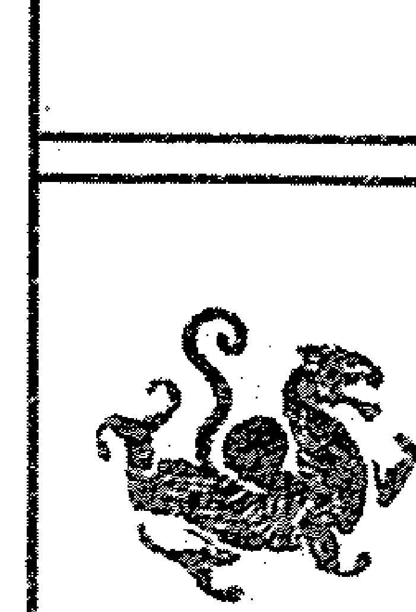## 第六章 网测案例

5：事在人为，争取吧！现在你的本命空陷，首先你自己的信心不足，这是缺点也是关键。

6：让你的本命（酉）填实，也许会有希望，祝你好运！

确实这样遁甲大师，我自己一点也没信心，本命酉填实是说要有信心吗？如果没希望今年就不考了吧。反馈，我没有报名参加，因为与自学考试冲突，另外也没太大的信心，谢谢各位的预测。

15：遁甲大师算得准，请再帮我看看。想再看一下明年会不会搬家。现在是租房子住，不知道明年会不会有变动而搬到另一个地方？谢谢！

公历时间：2006年9月22日16时
当日干支：丙戌 丁酉 甲寅 壬申
当日旬空：子丑（日） 戌亥（时）
阴遁三局 值符天冲落八宫 值使伤门落四宫

九地
伤门 辛 丙 杜门 己
天英 乙 禽 天芮 辛

九天
生门 乙
天辅 戊 丙

六合
死门 丁
天心 癸

值符
休门 戊
天冲 壬

螣蛇
开门 壬
天任 庚

太阴
惊门 庚
天蓬 丁

- 1：日干落宫与坤宫暗藏之支相冲。〔寅与申〕
- 2：马星落艮宫又对冲日干，必动之象。
- 3：住宅西面如放有神像，香火之类或电热器请移开。
- 4：日干逢景门，白虎，破军星03、04年本人有伤灾或手术。

反馈：“白虎，破军星03，04年本人有伤灾或手术”：03，04年是最糟糕的两年，身心都很疲倦。04年是有病灾，但不是伤，是荨麻疹，害得我痒了半年。也许是03年我做了一些事，让我躲过了伤灾这一关，大病小受。谢谢。大师的奇门真的是奇准啊。

### 16：能否用奇门分析一下我的姻缘？

公历时间：2006年9月12日13时
当日干支：丙戌 丁酉 甲辰 辛未
当日旬空：寅卯（日） 戌亥（时）
阴遁六局 值符天心落三宫 值使开门落八宫

| | | |
|---|---|---|
| 九天<br>生门 癸<br>天蓬 庚 | 九地<br>伤门 丙<br>天任 丁 | 玄武<br>杜门 辛<br>天冲 壬 |
| 值符<br>休门 戊<br>天心 辛 | 己 | 白虎<br>景门 庚<br>天辅 乙 |
| 螣蛇<br>开门 乙<br>天柱 丙 | 太阴<br>惊门 壬<br>禽 天芮 癸 | 六合<br>死门 丁<br>天英 戊 |

1976年生，男

- 1. 六合为婚姻落空亡之宫，又逢死门，可能你还没有婚姻。
- 2. 年命落离宫丙加丁，吉星天任加临，你心底善良，诚实任劳任怨。但伤门加临也许曾受过伤。丁为月干为兄弟落空亡之地，又逢死门，兄弟有伤。
- 3. 日干落坎宫壬癸相见，天芮病星加临，太阴为暗藏，注意身体！明年六合填实丁又为太岁婚姻出现。

反馈：“可能你还没有婚姻”：是的，我还没有结婚。“你心底善良，诚实任劳任怨”：说得很对。“也许曾受过伤”：可能说的是小的时候吧。“兄弟有伤”：哥哥在我出世前去世的。“太阴为暗藏，注意身体”：我四月份开始肚子和协肋痛，用中药调理了两个月，现在好多了。“明年六合填实丁又为太岁婚姻出现”：能知道几月份吗，女方会是什么样的。

## 奇门遁甲应用初探修订版

### 17、麻烦帮我测测，我适合从事什么工作？

公历时间：2006年9月23日23时
当日干支：丙戌 丁酉 丙辰 戊子
当日旬空：子丑（日） 午未（时）
阴遁一局 值符天任落一宫 值使生门落四宫

| 玄武<br>生门 己<br>天英 丁 | 白虎<br>伤门 乙<br>禽 天芮 己 | 六合<br>杜门 辛<br>天柱 乙 |
| 九地<br>休门 丁<br>天辅 丙 | 癸 | 太阴<br>景门 壬<br>天心 辛 |
| 九天<br>开门 丙<br>天冲 庚 | 值符<br>惊门 庚<br>天任 戊 | 螣蛇<br>死门 戊<br>天蓬 壬 |

我现在在我们镇里劳务市场中心上班，有时候上街发发传单，每周2周6上午有现场招聘会，我就在那守门，周一周5下午我就挂牌，做些既无聊又苦力的事情，想辞职了，但经理又不让，他说他会慢慢带我，带出我以后肯定是个有用的人，我总觉得我不适合做这份工作，让我的心情特别烦躁，急得想哭，我换了好几分工作，之前卖过彩票，我怕我在辞职，我爸爸会骂S我，说我做什么事都没恒心，可是不喜欢的工作，我真的没办法投入～～～大师，救救我吧！

- 1：你适合于营销，推销行业。因日干临九天，又临马星，必须要动。
保险适合我吗？可是我很容易心软，口才不太好，说服力也不强，数学能力也不是很行，04年的时候我做过半年，也做过两个客户的保单但结果都退了，后来因为实在是没信心，母亲也老反对我，后来就没做了，

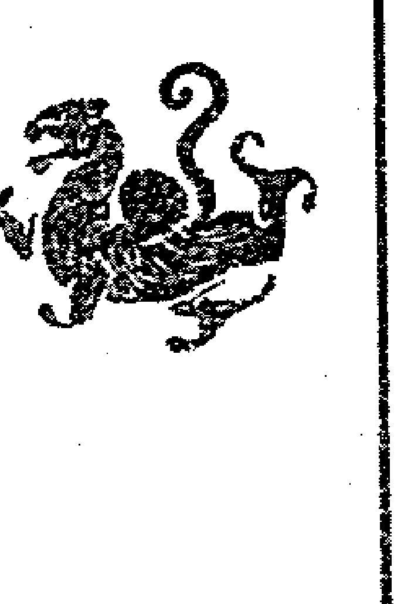

就05年的时候玩的很疯～也错过了一段感情，我现在很想从头再来，是否可以？是否能成功啊？谢谢大师！

- 2：若问保险看杜门，落空亡又和日干相冲，可能不行。
- 3：汽车销售倒可试试，因开门也为车和你同宫。
- 4：再这日干落外盘上乘九天，又临马星也可考虑去外地发展。
- 5：总之，只要你用心去做，一定会成功的。

公历：2006年9月23日23时
干支：丙戌 丁酉 丙辰 戊子 旬空：甲寅旬子丑空
月将：八月辰将

| 贵 | 后 | 阴 | 玄 |
| :--- | :--- | :--- | :--- |
| 酉 | 戌 | 亥 | 子 |
| 蛇申 | | | 丑常 |
| 朱未 | | | 寅虎 |
| 午 | 巳 | 辰 | 卯 |
| 合 | 勾 | 青 | 空 |
| 玄 | 蛇 | 常 | 贵 |
| 子 | 申 | 丑 | 酉 |
| 申 | 辰 | 酉 | 丙 |
| 财 | 辛酉 | 贵 | |
| 子 | 丑 | 常 | ◎ |
| 兄 | 丁巳 | 勾 | ⊙ |

以六壬来看，你现在的工作还算可以。有贵人在身边在帮你，他对你还是很器重的。贵人为属蛇，或属鸡之属相。

- 1：干支交车相合，又都为财星加临，现在的工作你不一定能放弃！
- 2：三传为事发展的动向，如动反而前面无路。三传看似合成财局，但中，未空陷，财局不成。还不如守日干上之财，建议暂时不亦动。
- 3：对重要之事的决策，壬、遁必须要将求测之人的年命输入盘内，进行分析。这里也提醒大家，对于重大事情的预测，最好能提供您的年命。当然采取自愿了！

哦！我今年虚岁24岁，属猪的，不是说属猪和属蛇的人是相冲的吗？一个女的是属牛的，另外个男的我就不清楚了～他们对我确实还不错

可惜我中午才看到你的信息，我上午已经辞职了，但是押金还没退回来

## 中国古代术数汇要

## 奇门遁甲应用初探

### 18：请遁甲兄看看，今早家中发生何事？谢谢。

公历时间：2006年10月2日12时
当日干支：丙戌 丁酉 甲子 庚午
当日旬空：戌亥（日） 戌亥（时）
阴遁七局 值符天柱落五宫 值使惊门落一宫

| 太阴 | 螣蛇 | 值符 |
|------|------|------|
| 生门 丙 庚 | 伤门 癸 | 杜门 戊 |
| 天英 辛 禽 | 天芮 丙 | 天柱 癸 |
| 六合 | | 九天 |
| 休门 辛 | | 景门 己 |
| 天辅 壬 | 庚 | 天心 戊 |
| 白虎 | 玄武 | 九地 |
| 开门 壬 | 惊门 乙 | 死门 丁 |
| 天冲 乙 | 天任 丁 | 天蓬 己 |

2006年10月2日 12时32分
丙戌年 丁酉月 甲子日 庚午时
甲子旬戌亥空 月将：辰

```
财 戊玄◎
官 壬申 虎◎
子 庚午 青
```

```
虎 玄 玄 后
申 戊 戊 子
戌 子 子 甲
```

```
朱 合 勾 青
卯 辰 巳 午
蛇寅 未空
贵丑 申虎
子 亥 戌 酉
后 阴 玄 常
```

## 第六章 网测案例

- 1. 以奇门分析：以时干为主，落离宫，庚加丙为贼格，上乘腾蛇，必有外事纠缠。
- 2. 伤门主争斗，癸下临丙，丙落巽有逢生门，与财有关也与女的有关。有失财事，但有惊无险。
- 3. 六壬以地支为家，支上玄武加临，且发用为玄武盗神，又为支上神，可能家中来贼。但玄武空亡，中陷空，未传子孙临青龙吉神，被人发现，虚惊一场。
- 4. 总之为麻烦事，绝不是好事。

有失财事，但有惊无险。(正确)。

是厨房失火，烧烂很多用具，幸亏邻居发现并采取好措施灭火，否则后果不堪设想。

时干庚落离宫临蛇是否也有火灾之象？谢谢。

多谢乐易兄及时反馈！

火灾的信息还是不太明显。遁甲在此请教高明，还望过路高人指点一二！

### 19：请遁甲版主看看事情是否可行？

因为母亲的风水问题，近来家庭成员一直有分歧，请帮忙看看我能不能说服其他家庭成员？

公历时间：2006年10月3日23时
当日干支：丙戌 丁酉 丙寅 戊子
当日旬空：戌亥（日） 午未（时）
阴遁七局 值符天禽落七宫 值使门落一宫

## 奇门遁甲应用初探修订版

| 六合 | 太阴 | 螣蛇 |
| :--- | :--- | :--- |
| 休门 壬 | 生门 辛 | 伤门 丙 |
| 天冲 辛 | 天辅 丙 | 天英 癸 |
| 白虎 | 庚（中宫） | 值符 |
| 开门 乙 | 禽 天芮 戊 | 杜门 癸 |
| 天任 壬 | 庚 |  |
| 玄武 | 九地 | 九天 |
| 惊门 丁 | 死门 己 | 景门 戊 |
| 天蓬 乙 | 天心 丁 | 天柱 己 |

- 1. 主要是兄弟之间意见不统一。因月干冲日干，大哥和小弟反对。
- 2. 总体来说此风水还算可以，但对财稍有影响。因死门落宫为迫，生门空陷。
- 3. 因你孤掌难鸣，要说服他们的确还不是很容易。因日干落空，又逢退气。
- 4. 只要有耐心最终会的，因日干生时干。关键在日之空亡，不要到最后连你自己都没信心了。

谢谢遁甲版主
此事主要是兄弟之间意见不统一，大哥反对，小弟同我一个立场。
现在问题出在父亲身上，他是固执的不行。大哥是个墙头草，哪边吹往哪边倒。
看看我能不能说服父亲。
年干和日干同宫，日干生乾宫，要有耐心去开导，最终会同意的！
先谢谢遁甲版主了
昨天开个家庭成员会，同父亲已谈过，父亲固执的不行
唉，又考虑他不能气着了，到时结果出来后再反馈吧。

### 20：请求帮助，看看事业和财运！

公历时间：2006年10月10日15时
当日干支：丙戌 戊戌 壬申 戊申
当日旬空：戌亥（日） 寅卯（时）
阴遁九局 值符天禽落九宫 值使门落一宫

## 第六章 网测案例

| 螣蛇 | 值符 | 九天 |
| :--- | :--- | :--- |
| 休门 戊 | 壬 生门 丙 | 伤门 庚 |
| 天英 癸 | 禽 天芮 戊 | 天柱 丙 |
| | | |
| 太阴 |  | 九地 |
| 开门 癸 |  | 杜门 辛 |
| 天辅 丁 | 壬 | 天心 庚 |
| | | |
| 六合 | 白虎 | 玄武 |
| 惊门 丁 | 死门 己 | 景门 乙 |
| 天冲 己 | 天任 乙 | 天蓬 辛 |

中国古代术数汇要

男 1977 年生

遁甲大师为何跳过我得，伤心，在下在此有理了，请帮帮我，有些急......

- 1: 还望谅解！因本版就我一人，大家所提的问题都要我一人来回复，我也有其它事要做，不一定每个问题都能回答。
- 2: 今年应该财运不错，但你没抓住机会。开门空亡克你年命，年命又空，你可能现在面临选择。

不错，我正是为此事烦恼，请问我选择变动还是不变呢？谢了大师

- 3: 能否给我说详细些，我好帮你！因你这局里吉信息还是多些。
- 4: 如若简单分析我认为现在不宜动，主要是你很想动。要不调整一下你的心态，或改变一下方式，试试！

我毕业后进了这家公司，在公司服役5年，做到区域总监，阴历7月(第一个)初，回总部开会，本以为要升，不想被降，被大老板直接降的，心中不能平静，历经2月后，目前自己选了个最低层的职位，调节自己，这时，有另一家实力相当的公司挖我过去做总监，待遇高于原公司，催了几次，再拖恐对我不利，目前公司给我计划换了几个岗位，我都没有答应，因为一不是总监，而是个部门经理，第二，不清楚大老板对我的态度。担心自己以后在此的发展。请大师帮我好好看看，万谢，新工作在东边偏南。

奇门遁甲应用初探


- 5: 日干与年干值符同宫，值符为顶头上司，年干可代表你的大老板与你同宫，应该还是很器重你的。月干为同事，时干为下属，落宫生你，同事间也没什么矛盾，那问题出在什么地方呢？

- 6: 看年干，落宫逢天芮病星，丙下临戊，生门有加临，阴神腾蛇，问题可能就出在钱财上。丙的地盘代表大老板的以前状况，落坤宫但庚飞来成为贼来格。庚为仇人，小人，说明有小人到老板前打你的小报告，老板才怀疑你在钱财方面有问题。从地盘庚可看出此小人之状况，遁甲学易不精，不敢明言……

- 7: 那么出现在这种局面是去是留？此为关键！我个人观点如下：
  - ①：天盘日干落宫下临地盘戊，地盘克天盘，在奇门上为主克客，利主！
  - ②：你说现在有家不错的公司叫你去，在东南看巽宫。现东南宫又为时干生你日干落宫，表面看似不错，但上乘腾蛇，阴神临太阴，恐所说的条件有不实之感。
  - ③：年命为丁落宫又被所去之方克，不利。
  - ④：太岁为现在你的老板，落宫生你年命，开门为工作虽空亡但终究生着你，我认为暂时不宜动。
  - ⑤：你可放出你要跳槽的消息，看看老板有何反应！

公历：2006年10月10日15时
干支：丙戌 戊戌 壬申 戊申
旬空：甲子旬戌亥空 月将：九月辰将

```
勾 合 朱 蛇
丑 寅 卯 辰
青子 巳贵
空亥 午后
戊 酉 申 未
虎 常 玄 阴
```

```
青 蛇 朱 阴
子 辰 卯 未
辰 申 未 壬
```

```
兄 甲子 青
父 壬申 玄
官 戊辰 蛇
```

六壬三传为龙变蛇，前进不利。

以上分析仅我为个人见解，因问题重大，牵扯你的前途利益，遁甲望你再访高人！谢谢！

万分感激遁甲老师，感动同时，更为感叹，分析的透彻而又精辟，深谢中……

## 中国古代术数汇要

### 21：测这个人对我有没有帮助（现在和将来） 生于1970年

公历时间：2006年10月10日16时
当日干支：丙戌 戊戌 壬申 戊申
当日旬空：戌亥（日） 寅卯（时）
阴遁九局 值符天禽落九宫 值使门落一宫

| 螣蛇 | 值符 | 九天 |
| :--- | :--- | :--- |
| 休门 戊 壬 | 生门 丙 | 伤门 庚 |
| 天英 癸 禽 | 天芮 戊 | 天柱 丙 |
| --- | --- | --- |
| 太阴 | | 九地 |
| 开门 癸 | | 杜门 辛 |
| 天辅 丁 壬 | | 天心 庚 |
| --- | --- | --- |
| 六合 | 白虎 | 玄武 |
| 惊门 丁 | 死门 己 | 景门 乙 |
| 天冲 己 | 天任 乙 | 天蓬 辛 |

## 奇门遁甲应用初探

- 1：有！（时干为对方生日干）。
是私人方面还是工作方面？现在帮助大，还是将来帮助大？
- 2：是私人方面。但我看此人可能要走。（因时干为戊为财，日干下又临戊，故为私事，此人年命为庚，落坤宫，逢九天伤门，庚下临壬为“移荡格”又受对宫之马冲，故可能要走。）

很对！最近就是要走。
以后还有可能帮助我吗？

### 22：测这件事今天找他，能否答应，能否办成。生于1970年

公历时间：2006年10月12日13时
当日干支：丙戌 戊戌 甲戌 辛未
当日旬空：申酉（日） 戌亥（时）
阴遁三局 值符天冲落九宫 值使伤门落五宫

| 螣蛇 | 值符 | 九天 |
| --- | --- | --- |
| 休门 壬 | 生门 戊 | 伤门 乙 |
| 天任 乙 | 天冲 辛 | 天辅 己 |
| 太阴 |  | 九地 |
| 开门 庚 |  | 杜门 辛 |
| 天蓬 戊 | 丙 | 天英 癸 |
| 六合 | 白虎 | 玄武 |
| 惊门 丁 | 死门 癸 丙 | 景门 己 |
| 天心 壬 | 天柱 庚 禽 | 天芮 丁 |

- 1. 日干临景门，下临丁奇为职称，证书方面事。
- 2. 时干落兑宫虽来生日干，但临杜门，暂时不会答应。

什么时候会答应？会办成吗？
这件事现在有个机会，错过了这个机会可能要等很长时间才能有机会。

反馈：没表态

### 23：请遁甲老师给解解

公历时间：2006年10月18日9时
当日干支：丙戌 戊戌 庚辰 辛巳
当日旬空：申酉（日） 申酉（时）
阴遁六局 值符天禽落三宫 值使门落七宫

| 九天 | 九地 | 玄武 |
| --- | --- | --- |
| 伤门 乙 | 杜门 戊 | 景门 癸 |
| 天柱 庚 | 天心 丁 | 天蓬 壬 |
| 值符 |  | 白虎 |
| 己 生门 壬 |  | 死门 丙 |
| 禽 天芮 辛 | 己 | 天任 乙 |
| 螣蛇 | 太阴 | 六合 |
| 休门 丁 | 开门 庚 | 惊门 辛 |
| 天英 丙 | 天辅 癸 | 天冲 戊 |

已经和男友分手一个月。想知道他现在是怎么想的？我们以后各自的生活

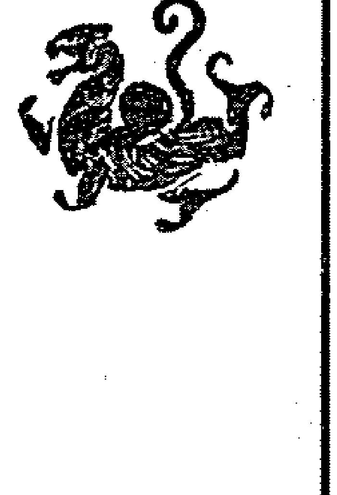

## 第六章 网测案例

- 1. 你的问题我已在国际易经科学研究院周易天地奇门论坛中已作回复。
- 2. 我始终认为你们还是有缘的。对于你在QQ上给我说的，我认为现在下结论还是有点早。
- 3. 其实现在这局和以前那局，虽时空变了，但所反映的信息还是没变的。现做简单分析：

  - ①: 庚为以前的男友，落坎宫来生乙奇。说明你们虽已分手，但他还是爱你的。
  - ②: 乙为女，也为你，落巽宫临伤门，上乘九天，你现在很伤心，内心还是很爱他的。
  - ③: 再从日时干分析。时干为对方，日干为自己，时干落乾宫临马星来生日干，也为对方还是喜欢你的。
  - ④: 那么分手的原因到底是什么？试着分析一下。丙为长辈，落兑宫克乙奇，看来主要的问题是出在长辈的身上，他们对你们的事持反对意见。
  - ⑤: 人生嘛！就是这样，没有悲欢离合，痴情的少男少女们，梁山泊与祝英台也就不复存在了！

愿：天下有情人皆成眷属！遁甲老师说话有水平。

### 24：恳请版主指点出路

考研结束，发挥不理想，看样子又没戏了。今年是第2次，唉。辞职以后，两年的功夫算是白费了。人过30，选择余地越来越小，精力也大不如前学习起来感到很累。这几年也实在不顺，不知何时才能有所转机，过上安定的生活。对未来已没有什么奢望，只希望自己早点在社会上立起来，这么大的人了，不想让父母再为我操心。麻烦版主给看看，今年考研如何？如果不行，明年是我最后一次考研。假如还是失利，我也认了。明年是我对自己命运的最后一次抗争。一直以来都在努力，却毫无起色，究竟何去何从，说实在的，我真的不知道如何是好。我的出路，到底在哪？

男，公历1974年2月24日早6点生于山东泰安，2007年1月25日19点26分于济南求测，报数3、6、7、谢谢了。

公历时间：2007年1月25日19时
当日干支：丙戌 辛丑 己未 甲戌

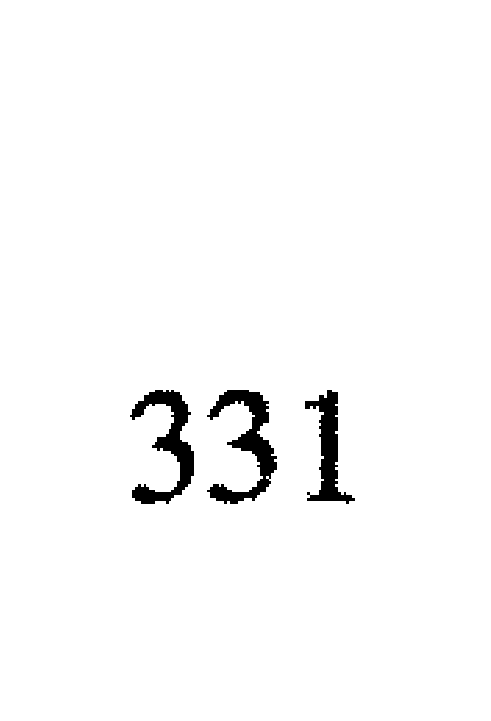

# 奇门遁甲应用初探修订版

当日旬空：子丑（日） 申酉（时）

阳遁六局 值符天柱落七宫 值使惊门落七宫

| 玄武<br>杜门 丙<br>天辅 丙 | 九地<br>景门 辛<br>天英 辛 | 九天<br>死门 乙<br>天芮 癸 |
| :---: | :---: | :---: |
| 白虎<br>伤门 丁<br>天冲 丁 | 乙 | 值符<br>惊门 己<br>天柱 己 |
| 六合<br>生门 庚<br>天任 庚 | 太阴<br>休门 壬<br>天蓬 壬 | 螣蛇<br>开门 戊<br>天心 戊 |

- 1. 八门九星伏吟，日、时虽同宫但落入空亡之地。
- 2. 景门伏于本宫又于时令休囚，丁落震宫冲克日干。
- 3. 天辅星为考试院落巽宫又临杜门，考研之门关闭，日干虽克天辅之落宫，无奈日干落空，无力克之。
- 4. 年命癸临死门逢空，看来这次考的确不理想！
- 5. 所报之数加为16除9后余7落兑宫，正为日干所落之处，惜又落空亡。

> 哎！“事事我曾努力，成败不在于我！”
希望我分析错误！

注：此例虽未见反馈，但我在整理案例时，发现此例与下例实为一人。

## 25：〔求助〕请薛老师和遁甲老师指点出路

我工作以来颇为不顺，到今天工作婚姻事业家庭一事无成，深感迷茫。我该怎么办？请老师请指点一二。
当然眼下最关心的还是明年考研。因为连续两年失利，而且年纪不小，几年来又一直没工作，我现在压力很大。我想明年还报名校，算我这辈子最后一次在学业上搏一把。听说奇门精华在于运筹，希望老师能对于我的复习提些具体办法和意见，因为我现在实在输不起了。可是眼下心里很烦看不进书，但是时间不等人。去年复习中最大的问题就是精力不集中，在学习上事半功倍，投入的精力和产出不成正比。现在的状况好像又要重蹈覆辙，我担心呀。请老师给支几招吧。老师费心了。再次感谢。
我的生辰 公历 1974 年 2 月 24 日早 6 时
时间：2007 年 04 月 14 日 01 时 21 分
旬空：寅卯
阳遁七局 值符天芮落三宫 值使死门落二宫

| 第一列 | 第二列 | 第三列 |
| :--- | :--- | :--- |
| 螣蛇<br>杜门 戊<br>天柱 丁 | 太阴<br>景门 乙<br>天心 庚 | 六合<br>死门 辛<br>天蓬 壬 |
| 值符<br>丙 伤门 壬<br>禽 天芮 癸 | 丙 | 白虎<br>惊门 己<br>天任 戊 |
| 九天<br>生门 庚<br>天英 己 | 九地<br>休门 丁<br>天辅 辛 | 玄武<br>开门 癸<br>天冲 乙 |

- 1. 有一定的阻碍，明年积极争取，成功的希望很大的。
- 2. 大局伏吟迟滞，呻吟，不顺，也主慢！有阻力！
- 3. 日干戊落巽宫为临冠，冠带之地事情虽然还不太明朗，但在向好的方向发展！
- 4. 戊下临丁为“青龙耀明”丁为星奇为希望，丁又为今年之太岁。从这些你自己的状况看，还是有一定的希望！“青龙耀明”之时只是时间没到。
- 5. 但日干上乘腾蛇，年命癸落乾宫临开门为工作，命逢马星冲日干之腾蛇，说明也因工作之事也未能稳定，使你自身心神不安。也就是说，驿马之心不能收，使你无法定心学习，导致日干逢杜门，在学业上有些地方就搞不通了！
- 6. 现在你要专心用功，发挥杜门的作用，杜门为隐藏，隐遁之门户。当然也不是说让你去“归隐”，以其象意就要有这种精神，精力都集中在学业上，去掉上面“腾蛇”不安之心，戊为明之太岁，下临丁才会“青龙耀明”也才会有希望。
- 7. 明年戊子，日干下之丁“希望”正落坎宫（明年的岁宫）逢天辅文星吉门来生你就如薛老师所说：“明年积极争取，成功的希望很大的”。

中国古代术数汇要

奇门遁甲应用初探


- 8. 年命落宫生坎宫，坎宫来生日干宫，如你报考的学校在北方的话会更好。
- 9. 丁奇落坎受制，辛为错误，你的文科还是稍有不足之处。
- 10. 用心去努力吧！相信你的付出将来是有回报的！

感谢两位老师及时回复，谢谢了。

我在其他论坛也请人测过，不过有些老师说我明年运气还不是很好，可能要到09年才行。所以感到很困惑，难道要连败三次才能成功吗？要那样，等我毕业都快四十了，人生一半已经过去，我的履历却是一片空白，悲哀啊。我不甘心啊。可是我也深深体会到命运流转身不由己。想想这几年的遭遇，运气低迷连预测都碰不到明师，花了不少冤枉钱，自己一直没停止努力却毫无转机。我也一直反躬自省，发觉自己诸多缺点毛病，慢慢改正弥补，心态渐渐平和不少。对于未来不敢奢望，只希望自己将来能在社会上拥有立足之地，挑起家庭和社会责任，在经历中活得明白些，少些遗憾和后悔。也希望有机会通过对中国传统术数得学习，开发自己得智慧，少犯些错误，毕竟，时光如水不可挽回，我已开始憔悴。

## 26: 看背部左肋疼痛？起一局，测背部左肋疼痛。

已痛了半个月，看了几次医生，不怎么有效。时好时坏。本命年丙寅。

干支：丙戌 辛丑 戊午 辛酉 旬空：子丑（日）子丑（时）

此局为阳遁九局 直符：天芮星 直使：死门

| 腾蛇 | 太阴 | 六合 |
| :--- | :--- | :--- |
| 天柱 丙<br>惊门 壬 | 天心 丁<br>开门 戊 | 天蓬 己<br>休门 庚 |
| 直符<br>禽 天芮 庚<br>癸 死门 辛 | 癸 | 白虎<br>天任 乙<br>生门 丙 |
| 九天<br>天英 戊<br>景门 乙 | 九地<br>天辅 壬<br>杜门 己 | 玄武<br>天冲 辛<br>伤门 丁 |

天芮落3宫，震为左肋，符合实际。
庚死同居3宫是否为的大凶？
天心居9宫受克，乙奇居7宫受克，看了医生还是反复痛，可以说没有什么疗效。
前几天才买了奇门书，看了几个小时，乱断。
有请遁甲斑竹精断！

“前几天才买了奇门书，看了几个小时”已能分析很不错嘛

- 1. 天芮为病落震宫，震在人体为左，震属木，木又为肝胆，天芮落宫受制，但旺于月令，最近还是疼的厉害。
- 2. 从大象看，天芮落宫受制，问题不大。死门、庚落其宫，均主阻隔不通，实为肝气不顺，宜舒肝理气。医云：痛者不通，通则不痛。
- 3. 辛上临庚，是否有时感觉气短？
- 4. 盘中乙奇落宫冲克病星，可在西方找中医治疗，先吃七付中药看看。

谢谢遁甲斑竹的精解！
左肋是痛的十分厉害，特别是晚上睡觉
气短，对！
我现在在外面工作，不想去看病。过几天回家。此局的找中医治疗。先吃七付中药看看，到家里是否还是一样可在西方找医生。
立春后寅月当令，天芮受制，是否疼痛会大有改善？
上乘直符是否也说明此病可愈，没什么大问题？
建议你还是早点治疗。虽无大碍，但有病就得及时就医治疗，这是理！

## 27: 测学易情况突然心动想一测学易情况。年命丙

有劳各位了
时间：2007年04月15日12时03分
干支：丁亥 甲辰 己卯 庚午 旬空：戌亥
阳遁四局 值符天辅落六宫 值使杜门落一宫

| 宫位 | 八神 | 八门 | 天干 | 九星 | 天干 |
| :--- | :--- | :--- | :--- | :--- | :--- |
| 巽四宫 | 白虎 | 惊门 | 庚 | 天心 | 戊 |
| 离九宫 | 玄武 | 开门 | 丁 | 天蓬 | 癸 |
| 坤二宫 | 九地 | 休门 | 壬 | 天任 | 丙 |
| 震三宫 | 六合 | 死门 | 辛 | 天柱 | 乙 |
| 中五宫 | | | 己 | | |
| 兑七宫 | 九天 | 生门 | 乙 | 天冲 | 辛 |
| 艮八宫 | 太阴 | 景门 | 丙 | 天芮 | 壬 |
| 坎一宫 | 螣蛇 | 杜门 | 癸 | 天英 | 丁 |
| 乾六宫 | 值符 | 伤门 | 戊 | 天辅 | 庚 |

- 1. 日干年命同落艮宫临天芮星，天芮落艮为相，亦修道！景门为文化，上乘太阴为神秘，看来你还是有修道研易之天赋，慧根不俗啊！
- 2. 但九星反吟，反复之象！年命下之壬天盘飞坤宫逢休门，九地上乘，看来你有一段时间没好好学习了，学学放放。
- 3. 时干为事体落宫逢庚来克日干，有些问题你自己还是搞不明白。
- 4. 现天辅星落乾宫空亡，逢飞宫格，天辅星为老师，你现在没师傅指导你或有师傅但却不在。
- 5. 今年虽太岁落离宫来生你，但岁宫临开门为工作，玄武上乘又逢天蓬，丁逢癸“雀投江”工作上还有是非口舌。
- 6. 明年太岁戊落乾，临天辅文星值符上乘，明年学术上会迅速长进，或明年会有缘遇一明师。
- 7. 从你的年命看，你有一定的修道研易之天赋在。

以下是引用遁甲在2007-4-16 0:13:16的发言：

> 日干年命同落艮宫临天芮星，天芮落艮为相，亦修道。景门为文化，上乘太阴为神秘，看来你还是有修道研易之天赋，慧根不俗啊！（（呵呵，有缘就好。只是晚辈愚钝））
>
> 但九星反吟，反复之象！年命下之壬天盘飞坤宫逢休门，九地上乘，看来你有一段时间没好好学习了，学学放放。（是的，没坚持）
>
> 时干为事体落宫逢庚来克日干，有些问题你自己还是搞不明白。（好多的问题不清楚）
>
> 现天辅星落乾宫空亡，逢飞宫格，天辅星为老师，你现在没师傅指导你或有师傅但却不在。（现实中没拜师）

今年虽太岁落离宫来生你，但岁宫临开门为工作，玄武上乘又逢天蓬，丁逢癸“雀投江”工作上还有是非口舌。（工作很不顺心）

明年太岁戊落乾，临天辅文星值符上乘，明年学术上会迅速长进，或明年会有缘遇一明师。（（希望如此吧））

从你的年命看，你有一定的修道研易之天赋在。（谢了，遁甲老哥）

## 28: 今天我摧一笔借款，看有没有结果？

今天我摧一笔借款。朋友说过年还。也就是在2007年2月17日前还。看从易学角度看朋友是否能讲诚信。到时定来反馈。

时间：2007年02月04日15时46分

干支：丁亥 壬寅 己巳 壬申

阳遁五局 值符天禽落九宫 值使死门落四宫

| 九天<br>死门 壬<br>天英 乙 | 值符<br>戊 惊门 丁<br>禽 天芮 壬 | 螣蛇<br>开门 庚<br>天柱 丁 |
| :--- | :--- | :--- |
| 九地<br>景门 乙<br>天辅 丙 | 戊 | 太阴<br>休门 己<br>天心 庚 |
| 玄武<br>杜门 丙<br>天冲 辛 | 白虎<br>伤门 辛<br>天任 癸 | 六合<br>生门 癸<br>天蓬 己 |

- 1. 以值符为主家，以天乙值符下临地盘之星为欠债之人，以伤门为讨债者。
- 2. 值符宫中之丁与天乙宫中之壬合，看来为过去的某些纠纷。
- 3. 伤门落宫生天乙之落宫，白虎又在坎宫，说明你已讨要过多回。
- 4. 今天乙所落巽宫来生值符，看似有还意。但死门临天乙，甲辰壬落宫又自刑，可理解为其在自己骗自己。目前他自身的经济状况也不好，生门落宫又空亡，恐怕现在他还没能力还。
- 5. 我认为此人过年前还的希望很渺小，可能要到明年立夏后了。

反馈：你真棒，过年前没有还款。至现在都没有还。在此谢谢！

## 29: 请问这两个不同的网名是否是同一个人？

今日和易友切磋，忽然想到一件事，我经常在论坛看到两个人，他们似乎形影相随，经常在三式版上看到两个人分别在壬遁论坛里发帖子，而且所发帖子质量很高。问朋友认识该2人否，朋友亦不知晓，但他怀疑他们是同一个人，心动起局，

公历时间：2006年12月23日18时

当日干支：丙戌庚子丙戌丁酉

当日旬空：午未（日）辰巳（时）

阳遁七局 值符天蓬落四宫 值使休门落四宫

| 值符<br>休门 辛<br>天蓬 丁 | 螣蛇<br>生门 己<br>天任 庚 | 太阴<br>伤门 癸<br>天冲 壬 |
| :--- | :--- | :--- |
| 九天<br>开门 乙<br>天心 癸 | 丙 | 六合<br>杜门 丁<br>天辅 戊 |
| 九地<br>惊门 戊<br>天柱 己 | 玄武<br>死门 壬<br>禽 天芮 辛 | 白虎<br>景门 庚<br>天英 乙 |

我的结论是：两个网名其实是同一个人，而且注册的研究大六壬的网名早，研究奇门遁甲的网名晚。

我的分析如下：用天地盘时干代表这两人，天盘丁 + 地盘甲子戊（正是研究奇门遁甲的那位易友），

六合杜门有多重秘密身份，地丁上见辛为错误，什么错误？看地盘辛，地辛上见壬，

正好也是研究大六壬的网名之意。

反馈：经过调查，这是两个不同的人。我的判断有误！

我对这局的分析不知错在哪儿，正确的方法论是怎么样，又该如何看？肯请诸位奇门爱好者不吝赐教！

对此类事我也没经验。两人是否同为一人，首先要将两人在局中定位，然后来判断是否是一个人的确很难。

个人看法：可将两人的网名输入局内在来分析。

- 1. 也可以主客关系来看，已知《注册的研究大六壬的网名早，研究奇门遁甲的网名晚》就用天盘时干为研究六壬的那位，今天盘时干落兑宫，临杜门、天辅星、杜门主技术，天辅有为文星，六合上乘，说明此人有相当的易学水平，六合为多门学科于一身，六合也有六壬的象意。
- 2. 以地盘时干为研究奇门的那位，今落巽宫上乘值符，吉门生宫易学水平也是很高的。值符也为甲所遁之处，和研究奇门遁甲的那位很是吻合。
- 3. 是否是同一人，看他们落宫的天干有无连带关系，落宫的相生相克来看。辛与戊不在对方的宫内出现，落宫又相克，可能不是同一人了。
- 4. 事后诸葛了，本人分析的很牵强，但贵在参与了！欢迎大家发表高见。

事后笔者才知，此例为一易友测笔者“遁甲”和“壬道”（网友）是否为一个人。

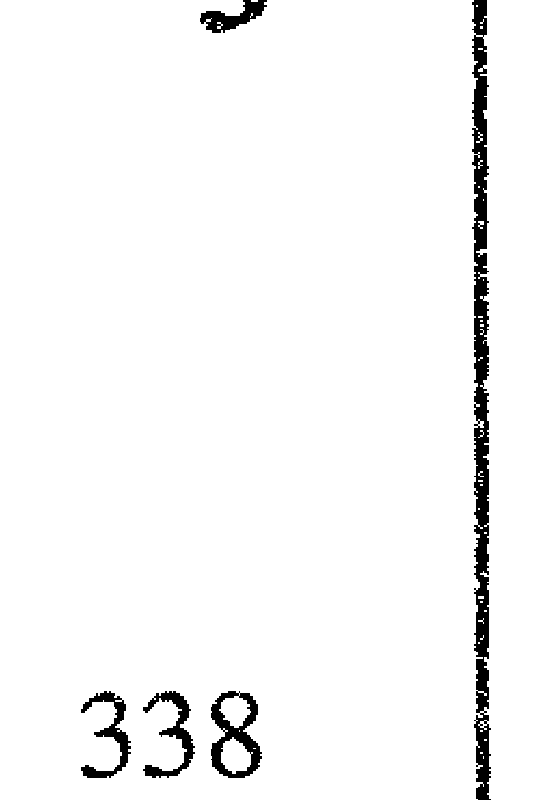

## 30：[求助] 恳请版主测我父亲的墓地选在哪儿好？

我父亲41年生，98年在东北老家病逝，现在全家都迁至广东落户，不知墓地是选在东北还是选在南方好. 恳请大家帮忙测下，好尽下女儿的孝道。

时间：2007年03月04日21时13：13
干支：丁亥 壬寅 丁酉 辛亥
旬空：寅卯
阳遁九局  值符天辅落三宫  值使杜门落二宫

| 螣蛇<br>生门 戊<br>天英 壬 | 太阴<br>癸 伤门 庚<br>禽 天芮 戊 | 六合<br>杜门 丙<br>天柱 庚 |
| :--- | :--- | :--- |
| 值符<br>休门 壬<br>天辅 辛 | 癸 | 白虎<br>景门 丁<br>天心 丙 |
| 九天<br>开门 辛<br>天冲 乙 | 九地<br>惊门 乙<br>天任 己 | 玄武<br>死门 己<br>天蓬 丁 |

东北为好！

- 1. 仙命辛落于艮宫与死门相生。
- 2. 南方格局不吉，又克死门落宫，不宜！

此例在论坛上的分岐很大，有些人认为南方较好，此楼主曾给我邮箱发信息说：说什么的都有，弄的他不知听谁的为好。我为什么要收入此案例？认为此案例很有研究价值。大家看局中仙命已与艮宫相融，艮宫又生死门，此为信息已合一明也。

## 31：请老师们看看，自己想开个关于儿童消费的店如何？诚谢

时间：2007年02月25日11时07分 丁亥年壬寅月庚寅日壬午时
雨水：下元 阳遁三局 值符天辅落七宫 值使杜门落三宫

| 玄武<br>景门 丙<br>天蓬 己 | 九地<br>死门 癸<br>天任 丁 | 九天<br>惊门 戊<br>天冲 乙 |
| :--- | :--- | :--- |
| 白虎<br>杜门 辛<br>天心 戊 | 庚 | 值符<br>开门 己<br>天辅 壬 |
| 六合<br>伤门 壬 庚<br>天柱 癸 禽 | 太阴<br>生门 乙<br>天芮 丙 | 螣蛇<br>休门 丁<br>天英 辛 |

- 1. 坐地经营开店，以开门为店面。今开门落宫生日干之落宫，看似不错。但开店最怕开门空亡入墓，今开门落兑宫空亡，春天木旺，兑宫休囚则不生日干，开门为真空，现在开为时过早。
- 2. 时干为所问之事，落艮宫于月令旺象来克日干，看来还是有不利的因素存在，时干上乘六合如合伙更则不利。
- 3. 就你日干本身落宫而言，你今年的财气还是不错的。为什么这样说呢？生门为财和你同宫，又的乙奇相照，下临丙奇相供。太阴又上乘，这些都是吉利的信息！庚虽在此，但下逢丙，则利客，为主得财。太阴上乘又临“真诈格”现在在筹划事情的具体运作方案。
- 4. 当然，开店就得投资，以戊为资本，生门为利润。现戊落坤上乘九天说明投资的数额还是挺大的。戊空亡部分资金还不到位，马星动于此宫最近正在筹备。
- 5. 戊落宫克生门，投资不宜！但日干本身就临生门奇到还是有财！
- 6. 现在关键的问题在于开门空亡，这是问题的关键所在。再加上时干临月令旺而克日干。我个人认为现在开店时机不成熟，或没有合适的门面房屋，暂时不宜开。
- 7. 日干落宫的组合为“真诈”太阴上乘，有暗财。

> 遁甲老师，真的是这样，我们现在正在筹备中，您看何时开为易呢？谢谢您！

## 32：这个店最后能不能开起来

- 出生年：1974
- 性别：女
- 所占事：这个店最后能不能开起来
- 公历时间：2007-5-1 14:52:00
- 干支：丁亥 甲辰 乙未 癸未
- 旬空：辰巳（日）申酉（时）
- 此局为阳遁五局 直符：天心星 直使：开门

| 六合<br>天冲 丙<br>杜门 乙 | 白虎<br>天辅 乙<br>景门 壬 | 玄武<br>天英 壬<br>死门 丁 |
| :--- | :--- | :--- |
| 太阴<br>天任 辛<br>伤门 丙 | （空） 戊 戊 | 九地<br>禽 天芮 丁<br>惊门 庚 |
| 腾蛇<br>天蓬 癸<br>生门 辛 | 直符<br>天心 己<br>休门 癸 | 九天<br>天柱 庚<br>开门 己 |

- 1. 日干落离宫逢进气旺而克开门之店落宫。说明你本人对开此店信心很足。
- 2. 时干为事落艮宫，日干生之，信息也第一条相同。但时干乘腾蛇癸为天网，说明此事现在有变化，有些不尽人意之处。
- 3. 日干下临壬，壬正好为月干，天盘之壬现飞到坤宫空亡。月干为朋友，说明现在有一朋友中途退出，或有些改变注意，举棋不定。壬下之丁有飞到兑宫和戊同宫，说明朋友的退出或未能参与进来，给开店投资金额带来了麻烦，导致现在资金短缺不足。
- 4. 从日干克开门来看，只要你再努力此店会开起来的。

多谢了，资金方面另外的朋友会不会帮？

## 33：小女愁嫁，大师相助啊
帮忙啊，什么时候能嫁出去……

公历：2007年2月16日1时
四柱：丙戌 辛丑 辛巳 己丑阳遁9局
值符天芮星落1宫 值使：死门落7宫
甲申旬：午未空 马星：亥

| 左列 | 玄 坤 | 白 ◎震 | 合 ◎坎 | 丁 |
| :--- | :--- | :--- | :--- | :--- |
| 庚癸 | 己 蓬<br>壬 伤 | 乙 任<br>戊 杜 | 辛 冲<br>庚癸 景 | |
| 地 艮 | | | 阴 巽 | 己 |
| 戊 | 丁 心<br>辛 生 | | 壬 辅<br>丙 死 | |
| 天 乾 | 符 兑 | 腾 离 | 乙 |
| 壬 | 丙 柱<br>乙 休 | 庚癸 芮<br>己 开 | 戊 英<br>丁 惊 | |
| | | | 马 | |

你所起的局为阴盘奇门，本人第一次接触。试断！

- 1. 时干见暗庚，上乘玄武，日干下又临庚。时干克日干，日干落空亡。现在你就有男朋友或以前出现过一个，不过他不一定是你的真命天子。
- 2. 与你相合的另一半丙落艮宫，艮宫之时序为丑寅。支持 tsh87 斑竹所断（庚寅年2010年就是出嫁之期！）

> 以下是引用遁甲在 2007-2-16 12:56:00 的发言：
> 你所起的局为阴盘奇门，本人第一次接触。试断！
> 
> 1：时干见暗庚，上乘玄武，日干下又临庚。时干克日干，日干落空亡。现在你就有男朋友或以前出现过一个。不过他不一定是你的真命天子。
> 
> 2：与你相合的另一半丙落艮宫。艮宫之时序为丑寅。支持 tsh87 斑竹所断（庚寅年2010年就是出嫁之期！）

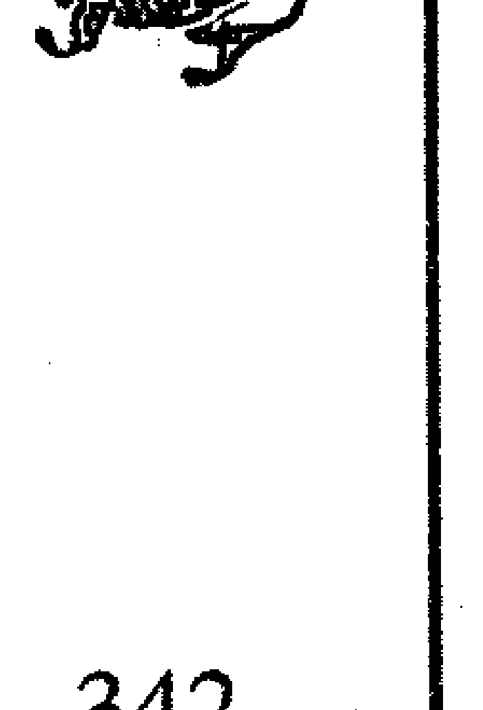第六章 网测案例

竹所断（庚寅年2010年就是出嫁之期！）
都好准哦……
谢谢大师……

34：替朋友问的，看他离婚何时能办下来？
公历时间：2006年9月22日19时、当日干支：丙戌 丁酉 甲寅 甲戌
当日旬空：子丑（日） 申酉（时）
阴遁三局 值符天芮落二宫 值使死门落二宫

| 太阴 | 螣蛇 | 值符 |
| --- | --- | --- |
| 杜门 乙 | 景门 辛 | 丙 死门 己 禽 天芮 己 |
| 天辅 乙 | 天英 辛 |  |
| 六合 |  | 九天 |
| 伤门 戊 |  | 惊门 癸 |
| 天冲 戊 | 丙 | 天柱 癸 |
| 白虎 | 玄武 | 九地 |
| 生门 壬 | 休门 庚 | 开门 丁 |
| 天任 壬 | 天蓬 庚 | 天心 丁 |

1. 乙为女，庚为男。庚落坎宫生乙之落宫。
2. 丁为朋友，与丁相合直壬为其爱人，壬落宫又生丁之落宫。
3. 六合主婚姻，与乙比合，庚又生之，怎能离婚？
4. 大局伏吟不动之象，时干为所问之事落空亡，离婚又从何谈起？
5. 庚为男临天蓬，又乘玄武，丁奇为第三者落乾宫生庚，为第三者的介人才是婚姻出现今之僵硬局面。
6. 我看离不了！

好，到时反馈，并非第三者的介入。今年3月份已起诉，只不过到现在还未开庭。
玉阶大师你同意遁甲大师的观点吗？离不了？
还是要离的。从你其它版面来看，离的信息占了大部分啊。
今年绝对离不了。遁甲！

公历：2006年9月22日19时
干支：丙戌 丁酉 甲寅 甲戌

奇门遁甲应用初探修订版

旬空：甲寅旬子丑空 月将：八月已将

| 青 | 空 | 虎 | 常 |
|----|----|----|----|
| 子 | 丑 | 寅 | 卯 |
| 勾亥 | | | 辰玄 |
| 合戌 | | | 已阴 |
| 酉 | 申 | 未 | 午 |
| 朱 | 蛇 | 贵 | 后 |
| 玄 | 朱 | 玄 | 朱 |
| 辰 | 西 | 辰 | 西 |
| 酉 | 寅 | 酉 | 甲 |
| 官 辛酉 | 朱 | | |

会六壬的朋友看看此婚能离否？
今翻页看到此课，因当时没分析，现在此简单分析。

- 1：干男，支女，今干支上皆酉金加临，都上乘朱雀，酉酉自刑。说明双方互不相让，经常吵闹不息。阴神为玄武，支为干支之财。主要在钱财方面。
- 2：能不能离婚，要看三传，因三传为事物发展的结果，今初，中财官相合，遁干又合，我看离不了。

多谢遁甲大师分析，有消息我会反馈给你。

35：测朋友离婚何时开庭，今年能办下来吗？
公历时间：2006年11月13日12时
当日干支：丙戌 己亥 丙午 甲午
当日旬空：寅卯（日） 辰巳（时）
阴遁三局 值符天英落九宫 值使景门落九宫

| 螣蛇 | 值符 | 九天 |
| :--- | :--- | :--- |
| 杜门 乙<br>天辅 乙 | 景门 辛 | 丙 禽<br>死门 己<br>天芮 己 |
| 太阴 | | 九地 |
| 伤门 戊<br>天冲 戊 | 丙 | 惊门 癸<br>天柱 癸 |
| 六合 | 白虎 | 玄武 |
| 生门 壬<br>天任 壬 | 休门 庚<br>天蓬 庚 | 开门 丁<br>天心 丁 |

此事原先我就测过的，虽时空变了，但现在的局和原先的局所反映的信息是一样的。(大局伏吟，还是没结果)
大师的意思是说不能开庭？现在已经从鉴定地方转到审理的法院了，正在等待。起卦怎么起，我都是点奇门遁甲排盘，再直接点确定，盘已经是定的。我觉的没我的主见在里面，我想问什么只能等发帖的时候写上，不知道我起盘对不对？

36：再发一帖，请遁甲大师看我朋友离婚何时能开庭？信息是否跟上一帖一样？

- 公历时间：2006年11月16日8时
- 当日干支：丙戌 己亥 己酉 戊辰
- 当日旬空：寅卯（日）戌亥（时）
- 阴遁六局 值符天心落六宫 值使开门落二宫

| 白虎 | 六合 | 太阴 |
| :--- | :--- | :--- |
| 死门 庚<br>天辅 庚 | 惊门 丁<br>天英 丁 | 己 禽<br>开门 壬<br>天芮 壬 |
| 玄武 | | 螣蛇 |
| 景门 辛<br>天冲 辛 | 己 | 休门 乙<br>天柱 乙 |
| 九地 | 九天 | 值符 |
| 杜门 丙<br>天任 丙 | 伤门 癸<br>天蓬 癸 | 生门 戊<br>天心 戊 |

时干空亡，九星伏吟，我看没结果的。
好吧，看事情发展吧
反馈：十二月四号开庭，
将最终的结果到时反馈上来。谢谢！

“我幸福”刚才去六爻版看到你的最近回复结果：《没有判离》为什么不给我这里回复？
哎，抱歉，一直想给回复的，只是太意料之外，看来中国还是权利好用．没判离！谢谢遁甲大师！

37：遁甲大师，这个盘有点不妥啊
公历时间：2006年9月12日13时
当日干支：丙戌 丁酉 甲辰 辛未
当日旬空：寅卯（日） 戌亥（时）
阴遁六局 值符天心落三宫 值使开门落八宫

| 九天 生门 癸 天蓬 庚 | 九地 伤门 丙 天任 丁 | 玄武 杜门 辛 天冲 壬 |
| --- | --- | --- |
| 值符 休门 戊 天心 辛 | 己 | 白虎 景门 庚 天辅 乙 |
| 螣蛇 开门 乙 天柱 丙 禽 | 太阴 惊门 壬 天芮 癸 | 六合 死门 丁 天英 戊 |

大师上次说我明年六合填实丁又为太岁婚姻出现！但我发觉这婚姻会有问题，好像有第三个人出现了，09年土月问题就会来了。请帮我看看是不是，有没有办法化解，谢谢！

1.  六合为婚姻现落空亡之地，又临死门，说明你婚姻不顺晚些！
2.  今年六合虽落戊宫为岁支宫，看似有婚姻之信息，岁干为丙下临丁奇，丁为女，说明你今年有过女朋友出现，但你日干和太岁丙相冲克，可能没有大的进展。
3.  明年为丁亥年，六合落乾宫又临太岁丁，丁又为日干相合之干，来生日干落宫，故我有此断！
4.  至于你担心的问题；乙为妻落艮宫下临丙，丙为女方的第三者。09年的流年宫刚到艮，所以你有此困扰。
5.  以我之见，已婚之人应重乙奇，如有此象必不好。但你现在还未婚，应先注重婚姻何时出现，这就要抓住六合，和日干之相和之干为主。
6.  你身为修行之人，要有一颗平常心去看待问题。

> 引用第1楼遁甲于2006-09-24 11:17发表的“”：
> 今年六合虽落戌宫为岁支宫，看似有婚姻之信息，岁干为丙下临丁奇，丁为女，说明你今年有过女朋友出现，但你日干和太岁丙相冲克，可能没有大的进展。
> 明年为丁亥年，六合落乾宫又临太岁丁，丁又为日干相合之干，来生日干落宫，故我有此断！

“今年有过女朋友出现，但你日干和太岁丙相冲克，可能没有大的进展。”
大师说得一点没错，她的确出现了，但进展不大，落花有意，流水无情。我已决心放弃这段缘了。很多人都说我和她能成，明年定能结婚。我也这么认为，但今天突然发觉这是个错觉，实际情况截然相反，她是个无底洞，她对我一点反应都没有。这两天就断了跟她的缘吧。明年的婚姻也许不成了。
明年会出现，是另一个，不是现在的她，“今年有过女朋友出现，但你日干和太岁丙相冲克，可能没有大的进展”。
遁甲大师是怎么看出我是修行人的？

> QUOTE:
> 引用第1楼遁甲于2006-09-24 11:17发表的“”：
> 六合为婚姻现落空亡之地，又临死门，说明你婚姻不顺晚些！
> 今年六合虽落戌宫为岁支宫，看似有婚姻之信息，岁干为丙下临丁奇，丁为女，说明你今年有过女朋友出现，但你日干和太岁丙相冲克，可能没有大的进展。
> 明年为丁亥年，六合落乾宫又临太岁丁，丁又为日干相合之干，来生日干落宫，故我有此断！

“你今年有过女朋友出现，但你日干和太岁丙相冲克，可能没有大的进展”

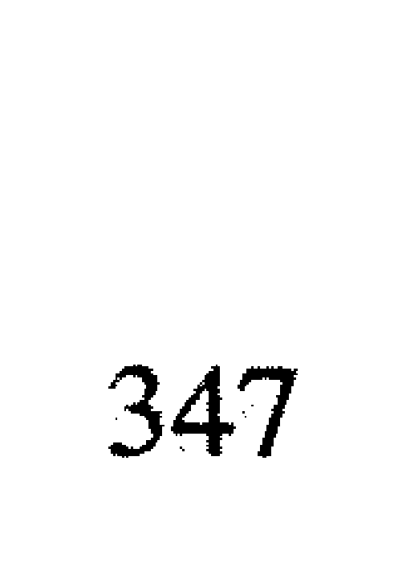

奇门遁甲应用初探修订版

遁甲大师真的厉害，昨天刚经历过，才知道这句话的意思。有时逆天而行，真是困难重重。

38：我也发一帖，看跟现在的男朋友关系怎样，什么时候能结婚？
公历时间：2006年11月8日10时
当日干支：丙戌 己亥 辛丑 癸巳
当日旬空：辰巳（日）  午未（时）
阴遁九局  值符天柱落四宫  值使惊门落七宫

| 值符 | 九天 | 九地 |
| :--- | :--- | :--- |
| 杜门 庚<br>天柱 癸 | 景门 辛<br>天心 戊 | 死门 乙<br>天蓬 丙 |
| **螣蛇**<br>壬 伤门 丙<br>禽 天芮 丁 | 壬 | **玄武**<br>惊门 己<br>天任 庚 |
| **太阴**<br>生门 戊<br>天英 己 | **六合**<br>休门 癸<br>天辅 乙 | **白虎**<br>开门 丁<br>天冲 辛 |

1.  大局八门伏吟，你们的关系一直处于平稳状态。
2.  庚为男友落宫临杜门，值符加临，与庚同宫。他很可能是军人而且有一定的职位，要不他有一定的技术在身。
3.  开门临马星冲他，本身庚加癸相冲。是军人明年就要转业。不是，工作也得变。
4.  庚男，乙女，今落宫庚来克乙，恐夫妻缘不够。
5.  时干为对方，日干为自己，时干冲克日干也不利。
6.  日干，乙奇均落空地，自己心里都没底。
以上所说仅供参考！

大师说的对，是军人，有点小职位。今年进级，进不上就转业，不过有人应该差不多能进上。他今年调到一个别的地方，想明年调回来，不知这样应不应你那句“不是，工作也得变”。
转不转业到时我会反馈给你的，现在他快要考试了。
夫妻缘不够吗？我们谈了2年多了，大师这么一说我心里真是没底。

某些事虽有定数，但定数里面还有变数。
如以与日干相合之干来看的话，丙与辛合，辛也可代表他的，辛落震宫生你日干落宫，这可能就是变数所在了。但日干还是空亡，就看你自己的努力了！
不要心里没底！如真是这样的话，那是遁甲的罪过了……
反馈：前段时间和男朋友分手了……

39：问遁甲：工作何时有着落，定反馈！谢谢！
要换工作，可公司一直不批，新工作还没有找到，求问，新工作何时有，老工作何时能辞掉！
公历时间：2006年12月11日11时
当日干支：丙戌 庚子 甲戌 庚午
当日旬空：申酉（日） 戌亥（时）
阴遁一局 值符天蓬落八宫 值使休门落四宫

| 九地<br>休门 丙<br>天冲 丁 | 玄武<br>生门 丁<br>天辅 己 | 白虎<br>伤门 己<br>天英 乙 |
| 九天<br>开门 庚<br>天任 丙 |  | 六合<br>癸 杜门 乙<br>禽 天芮 辛 |
| 值符<br>惊门 戊<br>天蓬 庚 | 螣蛇<br>死门 壬<br>天心 戊 | 太阴<br>景门 辛<br>天柱 壬 |

请问找工作往那方较好？

1.  日干临马星，时干临开门来克日干。你是想离开现在的工作地方。虽现在走不了，但开门克你，将来你最终还是要离开。
2.  开门落震宫明年春，有望辞职。
3.  从日干临马星，下临之乙为你想动去的地方。
4.  天盘乙落兑宫逢六合，临杜门，你想和别人合伙搞技术性的工作。但乙加辛为龙逃走，恐怕到时不会长久。
5.  若问将来找工作择何方？我认为择南方。因离宫临生门来生你日干。至于西面兑宫，日干虽生之但格局不好，分析如前。

大师分析的太对头了，多谢多谢！

40：问何时扭转当前工作中被压制的局面！
问何时扭转当前工作中被压制的局面！
时间：2006 年 08 月 16 日 10 时 50 分
干支：丙戌 丙申 丁丑 乙巳
旬空：午未 辰巳 申酉 寅卯
立秋：下元 乙巳时旬首为壬
阴遁八局 值符天辅落九宫 值使杜门落三宫

| 螣蛇 | 值符 | 九天 |
| :--- | :--- | :--- |
| 景门 癸 | 死门 壬 | 惊门 乙 |
| 天冲 壬 | 天辅 乙 | 天英 丁 |
| 太阴 |  | 九地 |
| 杜门 戊 | 辛 | 开门 丁 |
| 天任 癸 | 禽 天芮 己 |  |
| 六合 | 白虎 | 玄武 |
| 伤门 丙 | 生门 庚 | 休门 己 |
| 天蓬 戊 | 天心 丙 | 天柱 庚 |

1.  主要是顶头上司对你的压制. 他明年可能要被调走。
我是部门副职，是正职对我的压制！
2.  正职就是你的顶头上司，因你直接受人家管，此人脾气太犟，他认准之事别人是不会改变的。
非常对！

41：我和他的关系还会有改变吗？会变成怎样？
公历时间：2006 年 11 月 7 日 15 时
当日干支：丙戌 戊戌 庚子 甲申
当日旬空：辰巳（日） 午未（时）
阴遁八局 值符天心落六宫 值使开门落六宫

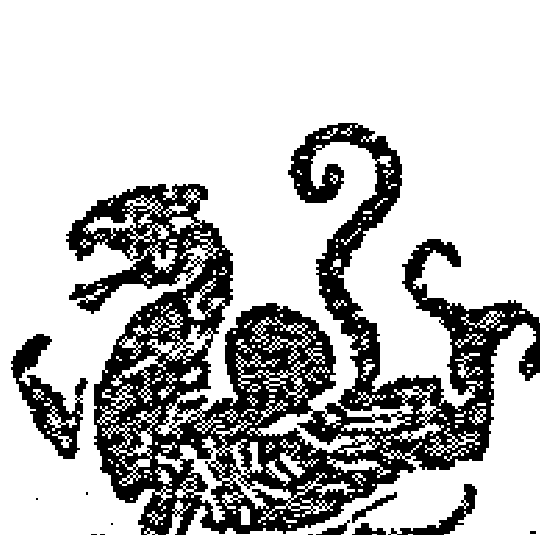

| 白虎 | 六合 | 太阴 |
|------|------|------|
| 杜门 壬 | 景门 乙 | 辛 死门 丁 |
| 天辅 壬 | 天英 乙 | 禽 天芮 丁 |

1.  景门空亡，丁奇空亡。你们好长时间都失去联系了。
2.  伏吟痛苦，也代表暂时不会有大的进展。
3.  乙空，和庚相克，你恨他只是表面上的恨。
4.  丁奇为信息，电话，落宫虽逢空，但马星和天马同时加临。又来生日干这两个月内可能会联系的。
5.  但你们终将无缘份在一起的。乙空你也不会嫁给他的。
6.  以时干看，此人事业很不错的。

> > 引用第1楼遁甲于2006-11-07 16:09发表的：
> > 景门空亡，丁奇空亡。你们好长时间都失去联系了！(对)
> > 伏吟痛苦。也代表暂时不会有大的进展！(哦)
> > 乙空，和庚相克你恨他只是表面上的恨。(我不恨他，就是有点生他的气)
> > 丁奇为信息，电话，落宫虽逢空，但马星和天马同时加临。又来生日干这两个月内可能会联系的。(逢空，又加临是什么意思?)
> > 但你们终将无缘份在一起的。(对)
> > 乙空你也不会嫁给他的。(对) 以时干看，此人事业很不错的。(对)
> > 那他现在还生我气不？他咋想的啊？

42：求测朋友投资煤矿的效益会如何？谢谢！
公历时间：2006年11月15日22时
当日干支：丙戌 己亥 戊申 癸亥
当日旬空：寅卯（日） 子丑（时）
阴遁三局 值符天柱落七宫 值使惊门落七宫

| 六合 | 太阴 | 螣蛇 |
|---|---|---|
| 杜门 乙 | 景门 辛 丙 | 死门 己 |
| 天辅 乙 | 天英 辛 禽 天芮 己 | |
| 白虎 | 值符 | |
| 伤门 戊 | 惊门 癸 | |
| 天冲 戊 丙 | 天柱 癸 | |
| 玄武 | 九地 | 九天 |
| 生门 壬 | 休门 庚 | 开门 丁 |
| 天任 壬 | 天蓬 庚 | 天心 丁 |

背景：我亲如兄弟的一个朋友（73年已婚）今年投资了一些钱到他熟人的煤矿，是只投资不管事的那种。据说今年还不错，不知道真假，还有他会不会被那矿主黑呢（害人之心不可有防人之心不可无）。明年效益又如何？谢谢版主费心。感谢！
今年的实际效益情况我年底会来反馈的。

1.  八门九星伏吟就不宜投资！
2.  甲子戊为资本，生门为利润，生门生甲子戊则有利。但甲子戊克生门利不大。今生门空亡，上乘玄武，利润从何而来？有也为虚象。
3.  己为月干落坤宫临死门螣蛇，你朋友受困之象。
4.  我认为没钱赚，却赔本。

谢谢遁甲版主热情认真的断局。感谢！朋友今年是很不顺。
为好心地遁甲版主祈福！

43：恭请遁甲大师指点。不胜感激！
背景：丁未年生人 已婚
近年事业运势，财运都很不好，事业蹉跎，逆水行舟中、危机重重。周围环境恶劣，很想抛弃烦恼外出创重新创业。计划是去北、南、东边有朋友地城市中选一个，所动念起局。大师给予指点，我是不是外出发展比在家好，那方更适应我。外出发展能成功否。问的问题挺多的，实在是焦虑不安……感激不尽！
公历时间：2006年11月9日17时
当日干支：丙戌 己亥 壬寅 己酉
当日旬空：辰巳（日）寅卯（时）

阴遁九局 值符天禽落八宫 值使门落九宫

| 九地 | 玄武 | 白虎 |
| 景门 辛 | 死门 乙 | 惊门 己 |
| 天心 癸 | 天蓬 戊 | 天任 丙 |
| 九天 | (壬) | 六合 |
| 杜门 庚 | | 开门 丁 |
| 天柱 丁 | | 天冲 庚 |
| 值符 | 螣蛇 | 太阴 |
| 壬 伤门 丙 | 生门 戊 | 休门 癸 |
| 禽 天芮 己 | 天英 乙 | 天辅 辛 |

1.  九星反吟，利客！动象甚明，亦主动进取。
2.  决策应重年命。年命落兑宫逢开门亦创业，上乘六合，适合合作，年命落内盘，不一定要去外地创业。
3.  从你所提供的方位看；
    ①: 东面空亡又和年命冲克，于你不利。
    ②: 南面死门乘玄武又克年命，也不利。
    ③: 北面临生门年命生之，生门也为财方，麻烦虽有但终为财地。
    ④: 明年二月有望外出。

谢谢遁甲大师先！
易真的太神奇了，前半月摇卦得到断语与您一样。也是内外地都可以，要去也是北方，也是说我明年会外出创业。
看来一切都是冥冥中的安排。

44: 【必反馈】请钦差大臣、遁甲等版主帮忙
女友身体出了问题，请各位高人帮忙，看了一年多医生 但还是没有治好 ，请看看是什么病？什么原因导致 如何治疗？
出生年：1984 性别：男 所占事：女友治病
公历时间：2007 - 10 - 24 13: 39: 00 干支：丁亥 庚戌 辛卯 乙未
旬空：午未（日）辰巳（时）此局为阴遁二局 直符：天任星 直使：

| 九天 | 九地 | 玄武 |
|------|------|------|
| 惊门 乙<br>天冲 丙 | 开门 丙<br>天辅 庚 | 休门 庚<br>天英 戊 |
| **值符**<br>死门 辛<br>天任 乙<br>丁 | **白虎**<br>丁<br>禽 天芮 壬 |
| 螣蛇 | 太阴 | 六合 |
| 景门 己<br>天蓬 辛 | 杜门 癸<br>天心 己 | 伤门 壬<br>天柱 癸 |

此病不是很好治。原因有如下几点：

1.  天芮为病落兑宫旺。
2.  乙奇，天心均不克病星。
3.  病宫逢生门，不但不能根治而且此病还在新生，在扩展。
4.  天芮落兑宫，兑又为口，说明次病和饮食也有一定的关系，所以在饮食上一定要注意。也许这也是病发展的根源所在。
5.  生门也为阳宅，现临白虎，天芮。生门又克乙之落宫，说明你女友的家宅风水多少还是存在些问题的。
6.  注意饮食，再从风水上查查，看看以后如何。

以下是引用遁甲在2007-10-26 23:28:00的发言：

此病不是很好治。原因有如下几点：

1.  天芮为病落兑宫旺。
2.  乙奇，天心均不克病星。
3.  病宫逢生门，不但不能根治而且此病还在新生，在扩展。
4.  天芮落兑宫，兑又为口，说明次病和饮食也有一定的关系，所以在饮食上一定要注意。也许这也是病发展的根源所在。
5.  生门也为阳宅，现临白虎，天芮。生门又克乙之落宫，说明你女友的家宅风水多少还是存在些问题的。
6.  注意饮食，再从风水上查查，看看以后如何！

感谢盾甲版主的预测，病从口入，我认为她这个病真是很麻烦，也是饮食的原因。
这个病在扩展，的确如是！

## 第六章 网测案例

还请版主多提意见。我看看她房间的风水再回复。

多谢大家一直以来的指导！

女友的身体好了很多，身上不长东西了，是让一个巫医治好的。

巫医认为：有肮脏的东西跟着女友，但不是一般贱物……其作法后第二天就没有了，后来再反复了一次。

我让她家里人按大快乐、遁甲版主的箴言行事，至今不吃药了，身体也不长东西了。

反馈如上！再次感谢！

45：请版主大师和路过的易友大师帮我看看，谢谢！！

占测：是否有工作调动之机？

公元：2007年10月20日21时24分

旬空：午未（日空）寅卯（时空）

寒露中元：阴遁九局 起局：拆补法 值符天禽落六宫 值使死门落七宫

| 巽四宫 | 离九宫 | 坤二宫 |
|---|---|---|
| 白虎<br>伤门己<br>天任癸 | 六合<br>杜门丁<br>天冲戊 | 太阴<br>景门癸<br>天辅丙 |
| 震三宫 | 中五宫 | 兑七宫 |
| 玄武<br>生门乙<br>天蓬丁 | 壬 | 螣蛇<br>死门戊<br>天英庚 |
| 艮八宫 | 坎一宫 | 乾六宫 |
| 九地<br>休门辛<br>天心己 | 九天<br>开门庚<br>天柱乙 | 值符<br>壬惊门丙<br>禽芮辛 |

1：首先日干冲克开门，这已说明你很想离开现在的工作环境，日干落离宫，这种想法在今年阴历五月间很是强烈。

2：那能否动呢？从开门乘九天又冲克日干来看，最终还是要动。

3：你要动的原因当然除了工作环境外，人际关系也是关键。日干冲克开门，开门中见月干庚，说明工作中老有小人从中作梗，给你的工作带来麻烦。

4：日干又克值符，对你的顶头上司你也有些看不惯，这些原因使你想赶快离开这。

5：十一月，也就是子月，开门得令，冲克你，那时你不走也不由你！

6：如若你问能否升职的话，你可能想争取的是副职的职位。

> 以下是引用遁甲在 2007-10-26 23:02:00 的发言：
> 1：首先日干冲克开门，这已说明你很想离开现在的工作环境，日干落离宫，这种想法在今年阴历五月间很是强烈。（完全正确，大师神！）
> 2：那能否动呢？从开门乘九天又冲克日干来看，最终还是要动。
> 3：你要动的原因当然除了工作环境外，人际关系也是关键。日干冲克开门，开门中见月干庚，说明工作中老有小人从中作梗，给你的工作带来麻烦。（说得很对很对）
> 4：日干又克值符，对你的顶头上司你也有看不惯。这些原因使你想赶快离开这。（是有那么一点看不惯）
> 5：十一月，也就是子月，开门得令，冲克你，那时你不走也不由你。（到时反馈）
> 6：如若你问能否升职的话，你可能想争取的是副职的职位。（不问升职，只问变动，谢大师）

万分感谢遁甲大师帮我看卦，实在是我的荣幸，过去之事说得很准，已反馈！！未来之事我 11 月底反馈，谢谢大师！

## 46 请遁甲老师看看，谢谢

出生年：性别：女 所占事：工作上出了点问题，会不会有很严重的后果

公历时间：2007 年 11 月 12 日 14:40 分
干支：丁亥 辛亥 庚戌 癸酉 当日旬空：寅卯（日）申酉（时）
此局为阴遁六局 直符：天芮星 直使：死门

| 玄武 | 白虎 | 六合 |
| :--- | :--- | :--- |
| 天蓬 癸 | 天任 丙 | 天冲 辛 |
| 杜门 庚 | 景门 丁 | 死门 壬 |
| 九地 | | 太阴 |
| 天心 戊 | | 天辅 庚 |
| 伤门 辛 | 己 | 惊门 乙 |
| 九天 | 直符 | 腾蛇 |
| 天柱 乙 | 禽 天芮 壬 | 天英 丁 |
| 生门 丙 | 己 休门 癸 | 开门 戊 |

1：从日干落宫逢惊门看，你现在很是担心，兑宫空亡心空荡荡的不知该怎么办！

2：以时干为事体来分析则时干癸落巽宫逢玄武，遇天蓬，那么工作的失误可能就是被别人在某些方面欺骗了，逢杜门人已逃走。

3：那么此事对你的影响到底有多大呢？先看直符，因直符为领导，看领导对这件事的态度如何。日干落兑宫生直符之坎宫，直符不克你日干，对领导做深刻的检讨与解释，相信领导会理解并原谅你的，再加上你和领导的人事关系以往还算不错，这件事对你的影响不是很大。

4：再以开门来分析，丁戊乘腾蛇，问题主要出现在票据和财务上了，开门为工作，和日干比和，开门工作不克日干，影响不是很大。

5：综合分析：这件事对你的影响肯定是有，但不是你想象的那么严重！

> 以下是引用遁甲在2007-11-13 8:55:00的发言：
> 1：从日干落宫逢惊门看，你现在很是担心，兑宫空亡心空荡荡的不知该怎么办！
> 2：以时干为事体来分析则时干癸落巽宫逢玄武，遇天蓬，那么工作的失误可能就是被别人在某些方面欺骗了，逢杜门人已逃走。（目前没有证据证明是有人故意这样做，但人都在的没逃走，或者遁甲老师的意思是此人已经逃脱责任了？）
> 3：那么此事对你的影响到底有多大呢？先看直符，因直符为领导看领导对这件事的态度如何。日干落兑宫生直符之坎宫，直符不克你日干，对领导做深刻的检讨与解释，相信领导会理解并原谅你的，再加上你和领导的人事关系以往还算不错，这件事对你的影响不是很大。
> 4：再以开门来分析，丁戊乘腾蛇，问题主要出现在票据和财务上了，开门为工作，和日干比和，开门工作不克日干，影响不是很大。
> 5：综合分析：这件事对你的影响肯定是有，但不是你想象的那么严重！

多谢遁甲老师。其他都对！！！！

## 47：各位大师帮我看看

出生年：1962 性别：女 所占事：外出办事

公历时间：2007 年 12 月 17 日 11:10 分
干支：丁亥 壬子 乙酉 壬午 当日旬空：申酉（时）
此局为阴遁七局 直符：天心星 直使：开门

| 九天 | 九地 | 玄武 |
|---|---|---|
| 景门 丁 | 死门 乙 | 惊门 壬 |
| 天蓬 辛 | 天任 丙 | 天冲 癸 |
| 值符 | | 白虎 |
| 杜门 己 | | 开门 辛 |
| 天心 壬 | 庚 | 天辅 戊 |
| 螣蛇 | 太阴 | 六合 |
| 伤门 戊 | 庚 生门 癸 | 休门 丙 |
| 天柱 乙 | 禽 天芮 丁 | 天英 己 |

1：乙下临丙，丙正落乾宫西北方，宫中逢六合。
2：时干临玄武，此次出行可能为私事。
3：时干空亡，这次的事情结果不明朗。

> 以下是引用遁甲在 2007-12-17 11:35:00 的发言：
> 1：乙下临丙，丙正落乾宫西北方，宫中逢六合。
> 2：时干临玄武，此次出行可能为私事。
> 3：时干空亡，这次的事情结果不明朗。
> 是私事，去给我儿子买笔记本，还顺便谈点生意。
> 信息反馈：遁甲大师说的可真对，我今天从哈市回来了，一点事也没办成。奇门遁甲排盘可是真神奇啊。

## 48：网测两则相似案例

1：某人因故被关押，其姐来问吉凶？会不会判刑？
1996 年 6 月 3 日 8 时 55 分
丙子年 癸巳月 辛未日 壬辰时
时空亡：甲申旬 午未空
节气：小满中元 阳遁 3 局（自选局数）
值符天禽星落7宫 值使死门落4宫

| \ | 酉合 | 戌勾 | 亥青 | / |
|---|---|---|---|---|
| 申<br>朱 | 玄武<br>死门 戊<br>天冲 己 | 九地<br>惊门 己<br>天辅 丁 | 九天<br>开门 丁<br>天英 乙 | 子<br>空 |
| 未<br>蛇 | 白虎<br>景门 癸<br>天任 戊 |  | 值符<br>庚 禽<br>休门 乙<br>天芮 壬 | 丑<br>虎 |
| 午<br>贵 | 六合<br>杜门 丙<br>天蓬 癸 | 太阴<br>伤门 辛<br>天心 丙 | 螣蛇<br>生门 壬<br>天柱 辛 | 寅<br>常 |
| / | 已后 | 辰阴 | 卯玄 | \ |

## 2：是否维持原判？

一审死刑判决后，被告人没有上诉，案件移送到省高级人民法院死刑复核。省高院认为事实不清、证据不足，将案件发回重审，**市中级人民法院重新审理后，改判死刑，缓期两年执行。

**市人民检察院接到一审重审判决后，认为被告人***犯罪情节特别恶劣，后果极其严重，且系累犯，有法定从重的情节，应判处死刑立即执行。据此，**市人民检察院提起抗诉。

经过两个多小时的庭审，审判长宣布休庭，案件将择期宣判。

- 2006年3月25日11时34分
- 丙戌年 辛卯月 癸丑日 戊午时
- 时空亡：甲寅旬 子丑空
- 节气：春分上元 阳遁3局
- 值符天任星落3宫 值使生门落3宫

中国古代术数汇要

奇门遁甲应用初探

|   | 酉勾 | 戊青 | 亥空 |   |
|---|---|---|---|---|
| 申合 | 騰蛇 傷門 戊 天沖 己 | 太陰 杜門 己 天輔 丁 | 六合 景門 丁 天英 乙 | 子虎 |
| 未朱 | 值符 生門 癸 天任 戊 |  | 白虎 庚死門 乙 禽 天芮 壬 | 丑常 |
| 午蛇 | 九天 休門 丙 天蓬 癸 | 九地 開門 辛 天心 丙 | 玄武 驚門 壬 天柱 辛 | 寅玄 |
|   | 已貴 | 辰后 | 卯陰 |   |

此两例曾发表在“周易天地”论坛上。当时感觉此两个例子很有代表性，很有研究价值就做了回复。当时我断第一例其弟不会被放出来会被判刑。第二例：仍然还会坚持原判执行死刑。最后网友将结果公布：
第一局被关押之人交了罚款后于甲午月壬辰日释放！
第二局被关之人在 2007 年 5 月 31 日被处死！新闻：http://www.cnhubei.com/200705/ca1350805.htm
第一例我判断错了。今在此对此两例做详细分析：

## 第一局 某人因故被关押，其姐来问吉凶？会不会判刑？

当时我主要依辛为主要用神，进行了判断。见地盘辛上临壬天牢，天盘辛下临丙逢合，所以就断出不来。事实证明这一结论错了。今作为学术研讨，笔者在此重新来分析：

1. 姐来问弟，先看兄弟之类神月干。癸为月干落震宫，下临地盘戊，天盘之戊飞巽宫上乘玄武盗神，说明其弟因钱财之事而触犯法律被关押。从地盘之月干逢天蓬也可看出。
2. 能否被放出来？地盘月干上临丙奇，见奇多为有贵人，有希望，奇迹，事不为凶。杜门正为被关押之象。但马星动于此宫，杜门逢动，有门开之意。
3. 依辛为犯错误之人，天盘辛落坎下临丙，丙辛合，被合则不为吉，坏事不宜逢之。（当时我就依此合认为不会放出）但细看就会发现：甲午辛落坎宫，与坎宫之地支子，子午相冲，破了甲午辛与丙之合。冲则动，有被放出的信息。
4. 再看地盘辛，上乘壬天牢，被关押之象。甲辰壬为牢，落乾宫又与乾宫之支戌相冲，辰戌冲天牢被冲开，生门得自由之象。

从以上分析，关键的地方：代表罪人的辛落坎逢冲而不被合。代表牢狱之灾的壬天牢，在乾宫也被冲开，而破天牢。这就是最后被放出来的关键所在。

## 第二局 是否维持原判？

此例的关键问题就是看罪犯会不会被改判，免去死刑。

现在分析：

1. 此局与上局的辛都落坎和乾宫，且上下相临都一样，此是两局的共同点，唯独门与神不一。省高院认为事实不清、证据不足，将案件发回重审，**市中级人民法院重新审理后，改判死刑，缓期两年执行。省高级人民法院以年干丙为代表，地方法院以月干代表。丙落艮宫克月干宫，正是上面让地方重审之象，但艮宫逢空，克坎宫无力，坎宫也空，空则不受其克。说明地方不会执行上面的决定。这是对其不利一点。
2. 省高院认为事实不清、证据不足，可看六合景门为证据，今六合景门都落坤宫，又不逢空亡玄武。马星动于此，证据宫克罪犯之辛落宫，说明证据确凿。对其不利第二点。
3. 能否改判免去死刑？就要看生门与死门。上例是辛临生门又冲克死门，而此例则是死门来生天盘之辛又与地盘辛比合。地盘辛克生门，天盘之辛虽生生门但空亡无力。只有死门死气来缠绕罪犯。为死象，说明最终还会被执行死刑！

此例的关键：六合为证据克罪犯。年干虽克月干但俱空亡，死门来生罪犯，而罪犯却克生门。辛落宫虽逢子冲但空亡无力冲开丙辛之合。

## 49：[讨论] 刚刚看到一博客上有记录，这个时间有人问：华南虎照片之真假？

公历时间：2007-11-18 15:19:00
干支：丁亥 辛亥 丙辰 丙申
当日旬空：子丑（日）辰巳（时）
此局为阴遁九局 直符：天心星 直使：开门

| 太阴<br>禽 天芮 丙<br>壬 开门 癸 | 腾蛇<br>天柱 庚<br>休门 戊 | 直符<br>天心 辛<br>生门 丙 |
|---|---|---|
| 六合<br>天英 戊<br>惊门 丁 | 壬 | 九天<br>天蓬 乙<br>伤门 庚 |
| 白虎<br>天辅 癸<br>死门 己 | 玄武<br>天冲 丁<br>景门 乙 | 九地<br>天任 己<br>杜门 辛 |

公历：2007年11月18日15时
干支：丁亥 辛亥 丙辰 丙申
旬空：甲寅旬子丑空 月将：十月卯将

```
蛇 朱 合 勾
子 丑 寅 卯
贵亥       辰青
后戌       巳空
酉 申 未 午
阴 玄 常 虎

虎 贵 常 蛇
午 亥 未 子
亥 辰 子 丙

兄 戊午 虎
子   丑 朱 ◎
财 庚申 玄 ⊙
```

以局而分析有不实之感。

1. 测照片之真假以景门看。今景门落坎为火如水乡，时冬水旺景门无气。
2. 再者景门又乘玄武，就更非真实之象了。
3. 时干为事体，虽临开门，公开此照片，但太阴上乘，还是存在些阴影。何况又落空亡？
4. 虎落艮宫动，而冲者正是对宫之生门（财也），但死门临虎，还是不实。

六壬之先锋门，申财现于末传，却乘玄武。发用就为虎动，惜虎乘午火落亥为绝地，午火受制。
天盘之寅为虎，又落未之墓地。三传传空，我看都是空谈，最后也没什么结果。
总之我认为此事非实。

## 50：QQ 测例

```
一片云 2007-11-03 10:53:35
哥在不？

遁甲 10:54:11
在

一片云 10:54:38
我一事想让你来看看，对方欠我的钱，何时能讨回来？

一片云 10:54:44
如没有时间就算了

遁甲 10:55:28
试试也好
```

时间：2007年11月03日10时49分
干支：丁亥 庚戌 辛丑 癸巳
旬空：午未
阴遁八局 值符天心落三宫 值使开门落六宫

| 九天 | 九地 | 玄武 |
|---|---|---|
| 杜门 丙 | 景门 戊 | 死门 癸 |
| 天蓬 壬 | 天任 乙 | 天冲 丁 |
| 值符 | | 白虎 |
| 伤门 庚 | | 惊门 壬 |
| 天心 癸 | 辛 | 天辅 己 |
| 螣蛇 | 太阴 | 六合 |
| 生门 己 辛 | 休门 丁 | 开门 乙 |
| 天柱 戊 禽 | 天芮 丙 | 天英 庚 |

遁甲 11:05:20
以此局来分析：
大局伏吟，伏吟主慢，事情进展没头绪。

遁甲 11:07:28
但伏吟利收敛财物，也利讨债。

遁甲 11:08:38
值符为你落震和伤门同宫。克天乙欠债人之坤宫。

遁甲 11:10:42
但你震宫庚加癸为大格，对方又临死门，说明你要债阻力很大，对方乘玄武死门，想赖账。

遁甲 11:12:26
再者对方空亡，值符克他不住，也说明你找不到人，或对方有意不见你，或人已不在。

遁甲 11:14:16
从欠债的数额来看。以艮和离来分析，为20万或18万左右。

一片云 11:14:19
分析得没有错，他没在同我在一个城市，我打他电话，电话他不接，又不就是关机，哥太厉害了，分析这么准确。

一片云 11:14:49
金额没有这么多。

遁甲 11:15:22
再以日时来分析。
那最少也在8万元。

一片云 11:15:35
对。

一片云 11:16:36
哥太厉害了，不过我还真有一点担心他是不是人已不在了。他67年的。

遁甲 11:17:11
日干为你落坎宫，上乘太阴，临休门，现在在重新调整思路，另作打算。

遁甲 11:19:28
时干落坤和天乙同宫，信息重合。坤克坎，想要讨回钱还是有难度。

一片云 11:19:51
我是想打官司了。

遁甲 11:20:39
如打官司则不太利。

遁甲 11:20:52
原因如下：

遁甲 11:21:10
1. 伏吟不宜主动。

遁甲 11:23:00
2. 日干临太阴，丁奇落坎入水乡受制。你在票据或文字手续方面有缺陷。

一片云 11:24:21
天啦！哥哥太棒了。的确票据中有一些缺陷。

遁甲 11:25:02
3. 开门为法官，克值符，更不利，关键六合为证据证人和开门同宫都克值符，这是你有苦难言之致命弱点啊。

遁甲 11:28:43
我认为暂时不要打官司，因子月水旺生震宫，震和伤门终究还是克天乙的。

一片云 11:29:09
那好的。

一片云 11:30:25
那现在用什么方法呢。这一事拖了快一年了。

遁甲 11:30:42
以奇门局象分析，现在能制天乙者只有震宫和巽了。

遁甲 11:31:02
可从此两宫想办法。

遁甲 11:32:24
以巽分析，丙临九天，丙为天威，九天之上好扬兵。

遁甲 11:33:06
巽宫又代天蓬星。

遁甲 11:33:41
这也是解决此事的方法之一。

遁甲 11:34:54
问题的关键是现在天乙空亡，对方又意躲避，克他不住。

一片云 11:35:27
是的。要不我到他单位找他去。

遁甲 11:36:13
现在天时不利。

遁甲 11:36:45
子月后或丑月方可。

一片云 11:37:25
子月是阳历，还是指阴历？

遁甲 11:37:38
阴历了。

一片云 11:40:08
那还要到三个月之后去了。

遁甲 11:40:50
建议，先不要打官司，再找对方讨要。
明年卯月后没结果再起诉。

一片云 11:41:39
好的。太谢谢了，哥这个案例我保存。

遁甲 11:42:01
不用谢！
今年春节前后她对我说，原先对方的电话还能打通，现在电话都已停机，人消失了！

## 《奇门遁甲应用初探》修订版附录最新网络案例一则：

## 看看孩子的病何时能好

此是我亲属家的孩子，得病具体时间是农历7月24日下午4点多，其症状是头疼、恶心呕吐、肚子疼。这应该符合您推断的结果。但在医院检查结果为慢性脑炎。可在医院治疗也无效果，没办法，亲属就把孩子转到一家私人医院治疗，但这几天也无甚效果。我们怀疑医院的诊断是错的，因为其一是用药不见好转，反而加重。其二是现在私家医院又诊断是中暑，但现在已经治疗一个星期了也不见好转，这说明两家医院都有可能没查清病因。

根据症状应该是饮食不当所致，为什么查不清病因？也许是选择治病的方向不对，所以希望大师给指导一有利方向，在下代表病人家属谢谢！

公历时间：2008年9月5日15时
当日干支：戊子 庚申 戊申 庚申
当日旬空：寅卯（日） 子丑（时）
阴遁七局 值符天芮落五宫 值使死门落五宫

## 第六章 网测案例

| 太阴 | 螣蛇 | 值符 |
|------|------|------|
| 杜门 辛 | 景门 丙 庚 | 死门 癸 |
| 天辅 辛 | 天英 丙 禽 | 天芮 癸 |

慢性脑炎的可能性现在也不能排除。

原因如下：

- 1. 时干，年命均临天芮病星又上乘值符，值符就有头意。
- 2. 在预测人体时，离宫代表人的头部，今离宫逢丙奇，但测病时，丙就有炎症之象意。

从局上看，大局伏吟，主慢，说明此病为慢性病。代表医药的乙奇，天心均不克天芮病星，说明药物目前不能对症。从天芮落坤宫旺，坤宫又旺于时令看，小孩的病不能拖，应赶快查清病因，及时对症治疗。今艮宫逢生门冲坤宫之死门，艮宫又临乙奇。你可在你们家东北，东面，找家正规医院，赶快将小孩的病因查清，以便对症治疗。最好不要去西南方就医。

> 以上所断仅供参考！

> 谢谢大师！

我已向亲属建议，按照遁甲大师提供的诊治方向去寻求医生治疗，届时我会及时向您们反馈。首先代表孩子的家长谢谢大师！！

孩子的身体现在已基本恢复正常，孩子的病是按照遁甲大师指导的方向，是一位民间医生（中医）给治好的。这位医生的诊断就是消化系统的疾病，至于头疼这位医生说可能是服用西药不当所致（孩子是在医院观察治疗的第三天才出现头疼症状，医院经过抽骨髓化验判断是脑炎）。现在虽然基本上好了，但医生说孩子的病不能根除，因为这个小孩本身脾胃就虚弱，告诉家长只有注意孩子的饮食、冷热就不会再有这样的疾病发生。由此可见大师的判断是多么地精准啊！

# 附录：案例三则

（小曾易友跟我学习奇门遁甲，虽其接触奇门时间并不长，但易学基础扎实。悟性非凡，思路活跃！虽窥入奇门一年半载，但部分案例却分析的颇为精彩！今选其三例附录于后，与同道共赏！）

### 实例1、余萍问要帐看能否要回？

时间：2006年11月10日20时40分、干支：丙戌 己亥 癸卯 壬戌
旬空：辰巳 子丑、阴遁九局 值符天辅落五宫 值使杜门落五宫

| 太阴 | 螣蛇 | 值符 |
|------|------|------|
| 生门 己 | 伤门 丁 | 杜门 癸 |
| 天任 癸 | 天冲 戊 | 天辅 丙 |
| --- | --- | --- |
| 六合 | | 九天 |
| 休门 乙 | 壬 | 景门 戊 |
| 天蓬 丁 | | 天英 庚 |
| --- | --- | --- |
| 白虎 | 玄武 | 九地 |
| 开门 辛 | 惊门 庚 | 壬 死门 丙 |
| 天心 己 | 天柱 乙 | 禽 天芮 辛 |

分析：

- 1、值符为债权人，天乙为债务人，值符落坤宫生天乙芮星所落乾宫，说明要帐有难度。杜门落坤宫为迫，自己没去要或方法不对；以值使门为事体，癸加丙华盖勃师，贵贱逢之不利。也说明其本人要帐方法不对；但伤门为要帐人克天乙芮星所落乾宫，又表示帐能要回。或者能要回一部分。
- 2、以时干为所问之事也代表此事。乾宫之组合，死门，天芮。壬加辛名为腾蛇相缠，纵得吉门亦不能安宁。若有谋望被人欺瞒、哄骗。都说明此事有问题。乾宫又见丙加辛，其地盘丙与值符债权人同宫，又表示债务人和债权人之间牵连有中间人或朋友。
- 3、如果，起诉法院是否受理呢？开门为法院落艮宫旬空，说明法院不受理。乾宫地盘辛飞落艮八宫，与开门为法院同宫，表示债权人在法院有朋友或有隶属关系。开门为法院落艮八宫生乾宫天乙债务人也表示法院会偏袒债务人；戊为资本，落兑宫乘玄武，亥月兑宫又于时令衰，说明投资数额本金不大2数。生门为利润为所欠数额，落巽宫为3、5、4、8数，亥月不旺应断3数。生门又为利润落巽宫被资本戊落宫克，说明无利润可言，建议调整追讨方案或换人追讨即可！

另外，卦主又问其朋友的婚姻大事分析如下：

- 1、月干己为其朋友，临天任落巽宫人瘦、老实、内向。己加癸名为地刑玄武，说明有牢狱官司之事。（反馈：正确。其朋友人瘦、老实、内向，目前打算打离婚官司。）
- 2、月干己临太阴主计划，临生门为钱财或房屋事计划。（反馈：正确。是为房屋之事，其朋友同其夫在北京有一套住房。）
- 3、是为房屋之事。那么，生门落巽宫为破，说明房是旧房，巽宫为四五八数房屋面积在四五十平方米左右。楼层为四楼。（反馈：楼层是四楼，面积五十八平方米。）生门又为钱财可断其价值为四十多万元。（反馈：正确）
- 4、测婚姻事，值符癸为其夫，临杜门为军警部门、临值符为干部是副职。（反馈：正确。其朋友之夫是一军警部门的副营级干部。）
- 5、月干己克值符癸其夫，说明其朋友对丈夫不满；其夫癸加丙出了乱子，办什么事出了乱子呢？六合、己克。说明是婚姻事，丁为情人生值符癸落宫，表示其有婚外情。（反馈：正确）

### 综合分析

值符落坤宫生天乙芮星所落乾宫，说明债权人比较被动要帐有一定难度；天乙芮星债务人所落乾宫，壬加辛名为腾蛇相缠，表示其有欺瞒、哄骗债权人的行为。上乘九地也主此次欠帐一事时间长。临死门表示此人铁了心不想还。另外，时干宫其地盘丙与值符同宫，又表示债务人和债权人之间牵连有中间人或朋友，使得要帐一事变得更为复杂有难度。如果，起诉法院开门法院落艮宫又旬空表示不受理。因此，只能调整追讨方案，建议换人追讨即可！

### 结果

余某讨帐心切，本人只身前往追讨欠帐无果。后经我几番谋划，第三次才要回三万多元钱，到目前为止再没有大的进展了。其所欠帐款为一项工程款（共欠帐30多万元），当时签合同的时候牵连有中间人。是以这个朋友的名义签的合同，但这个朋友不参与这项工程。然而债务人有心刁难，不想付款；同时，债务人正是某县城的一个执法部门的局长，和法院是隶属关系。所以，起诉法院当然是不会受理了。另外，其朋友的婚姻之事，也如上所说，其夫是一北京军警部门的副营级干部，因其有婚外情其朋友正与其夫闹离婚。由于，俩人都想要房产，所以，正在扯皮。

### 实例2、余萍问投标一事，问投标市政府新建工程能中否？

时间：2007年01月13日09时28分（星期六）、干支：丙戌 辛丑 丁未 乙巳、旬空：寅卯、小寒：下元 阳遁五局 值符天英落四宫 值使景门落一宫

| 值符 | 螣蛇 | 太阴 |
|---|---|---|
| 开门 壬 天英 乙 | 戊 休门 丁 禽 天芮 壬 | 生门 庚 天柱 丁 |
| 九天 | | 六合 |
| 惊门 乙 天辅 丙 | 戊 | 伤门 己 天心 庚 |
| 九地 | 玄武 | 白虎 |
| 死门 丙 天冲 辛 | 景门 辛 天任 癸 | 杜门 癸 天蓬 己 |

### 分析

- 1、时干乙为投标一事，乙落震宫为旺地；表示工程大。
- 2、时干乙落震宫为旺地，乙加丙奇仪顺遂，若遇吉星可以升官晋职，时干又生日干离宫，说明投标一事对余萍很有利。但是，时干乙旬空，八门反吟主投标一事有反复。
- 3、景门为标书落坎宫克日干离宫，说明余萍做的标书有问题。辛主错误倾向表示标书做的不好，临玄武说明有遗漏，八门反吟主有反复修改之事。
- 4、投标价格看离宫甲子戊，离宫主3、9数；丑月离宫休囚，工程大应断3数。3百万或者2百30万元左右。
- 5、景门为标书落坎宫克甲子戊、日干离宫，说明余萍做的标书有问题，戊为资本说明价格也不对（原为3百20万元）。离宫主3、9数，价格应往下降30万或者90万元左右。

### 综合分析

时干乙为投标一事，乙落震宫为旺地，乙加丙奇仪顺遂，若遇吉星可以升官晋职，时干又生日干离宫，说明投标一事对余萍很有利。但是，美中不足的是时干乙旬空，又八门反吟表示投标一事有反复。另外，投标要做标书，景门为标书落坎宫克日干离宫，说明余萍做的标书有问题。辛主错误倾向表示标书做的不好，临玄武说明有遗漏，八门反吟主有反复修改之事。从大局看八门反吟也表示投标一事反复。那么，什么时候出结果呢？时干乙为投标一事落震宫旬空，填实之日为应期。震宫为3、4数可断3、4月份。另外，值使为事情结果落震宫旬空卯月填实为应期，也说明3、4月份出结果。

### 结果

余萍做的标书确实有问题，星期天她来电话说：一是此标书反复修改了几次都感到不太满意，二是余萍没有及时更换旧营业执照需要换新的营业执照，三是投标一事在星期一早九点本应开标，但是，因有一家投标公司退出（共三家）星期一投标一事落空；何时再开标没有通知。此案例我曾请教过遁甲老师，他指出标书确实有问题，标底价格明显偏高，应该往下多降点价。经遁甲老师指点后我对此案例的分析更有信心。此后，为此投标一事我曾多次为其策划，虽然进展不是很顺利，期间还曾传出此标已被人从后门抢走的消息；但我多次为其策划也坚定了她的信心。虽然事有反复，但事态也逐渐向有利于余萍这边发展着。（后记：此标在今年四月份被余萍投中，标底230万元。）

### 实例3、测今日市长答应的事，国资委如何修改安置方案？

事由：今年4月18日根据国家宏观调控政策相关规定。宝鸡市焦化制气有限公司（简称宝焦）被突然关停。然而，关闭宝焦后，国资委对企业职工的安置办法，遭到全体职工的抵制。经过协调不果，4月19日全体职工集体上访；市长听取了职工代表的意见后，市长答应重新修改安置方案，并指示国资委领导加急办理。马上成立关闭宝焦工作协调领导小组。建议与职工代表共同修改安置方案。20日开会研究讨论决定安置方案，市长给我们承诺要让98%人都要满意！

时间：2007年04月19日20时26分
干支：丁亥 甲辰 癸未 壬戌
旬空：子丑 清明：上元 壬戌时旬首为癸
阳遁四局 值符天英落八宫 值使景门落八宫

| 太阴 | 六合 | 白虎 |
|---|---|---|
| 惊门 辛 | 开门 庚 | 休门 丁 |
| 天柱 戊 | 天心 癸 | 天蓬 丙 |
| 螣蛇 | | 玄武 |
| 己 死门 丙 | 己 | 生门 壬 |
| 禽 天芮 乙 | | 天任 辛 |
| 值符 | 九天 | 九地 |
| 景门 癸 | 杜门 戊 | 伤门 乙 |
| 天英 壬 | 天辅 丁 | 天冲 庚 |

### 分析

- 1. 时干壬为修改安置方案一事，壬加辛名为螣蛇相缠，纵得吉门亦不能安宁。若有谋望被人欺瞒、哄骗。上乘玄武也主此一事不实。临生门表示修改后的安置方案中，经济补偿办法或者表示修改后的安置方案有问题。
- 2. 日干癸为宝焦职工代表（全体职工）落八宫，临景门旬空，一是表示全体职工已经没了工作，二是表示全体职工没有计划。癸加壬名为复见螣蛇表示祸不得单行，命运备受折磨。
- 3. 值符为国资委领导，值使景门为国资协调领导小组，同落八宫临景门旬空，一是表示他们已经推翻了旧的方案，二是表示重新修改的安置方案没有实质性的变化。同时，也表示国资协调领导小组工作不到位，工作不积极主动，作风拖沓，不能或无法有效实施修改后的安置方案。癸加壬名为复见腾蛇表示安置方案还要修改。也就是说，修改后的安置方案职工代表通不过。
- 4. 丁为市长或政府，临马星、休门上乘白虎生时干，说明市长或政府只想快刀斩乱麻，迅速了决此事。
- 5. 戊为资本，临杜门旬空，表示重新修改后的安置方案中对自谋职业的职工，政府根据当地的实际情况，可向宝焦职工发放的一次性安置费不多。坎宫主一六数，以平均每人年工龄计，一年1000元至1600元。

另外，日干癸为宝焦职工代表（全体职工）落八宫克资本戊，表示对重新修改后的安置方案的钱数不认可。

### 综合分析

市长或政府只想快刀斩乱麻，迅速了决此事。但值符国资委领导及值使景门国资协调领导小组，同落八宫临景门旬空。表示他们的计划及协调工作不能够全部落实到位，重新制定的方案没有实质性的变化，没有妥善安排使用好破产财产，安置职工分配方案不合理。可向宝焦职工发放的一次性安置费太少。因此，这次会议最终的结局是重新制定的方案宝焦职工代表通不过。

### 结果

经过酝酿，宝鸡市政府对关闭工作方案进行了调整。2007年4月20日，宝鸡市政府成立关闭宝焦工作协调领导小组。在比照宝鸡市已关闭其他企业补偿标准的基础上，解除（终止）宝焦职工劳动关系的《经济补偿办法》出台。新工作组同宝焦职工代表进行了一次协调会议，对企业职工的安置办法作了一系列的变更。其中，政府可向宝焦自谋职业的职工发放的一次性安置费是：原全民所有制职工以平均每人年工龄计，一年工龄1629元乘于工龄数。86年以后的合同制职工是一年工龄1248元乘于工龄数。

但是，这次重新制定的《经济补偿办法》方案的出台，也没有得到职工的响应和支持。职工们认为，国资委计划处置企业土地使用权及其它所得，安置宝焦职工时资金处置不当，没有妥善安排使用好破产财产，安置职工分配方案仍不合理。最后，国资委协调领导小组没能协调好职工安置工作，4月21日全体职工又一次集体上访……

### 论奇门遁甲定局法

首先要明白：定局与演局是两个不同的概念。

所谓定局：就是要确定在某一特定时空条件下该用几局。（这里就牵扯到：置闰与拆补了，也是关键所在）

所谓起局：就是根据已确定的某一局来进行天盘，地盘，人盘，神盘的运转推演。

完成以上两个程序，展示在你面前的就是某一时空天体的运转模拟图了。根据这个模拟图再去寻找某一时空中天时，地理，人和，以及“神助”的利弊，从而选择最佳的时空点及出入口来实现“天人合一”的感应。真正达到“天人感应”“道法自然”“自然与人的和谐”。笔者认为这就是奇门遁甲的本质所在！

但遗憾的是奇门遁甲在定局与起局方法上自古各法不一，让人眼花缭乱，不知所从，而杂乱无章。在众多的局象面前，到底那个局象才能与天体同步？真正的时空状态只有一个，不可能出现两个，也就是说，在众多的奇门遁甲局象里面，只有一种才能真正与天体的运转模式相对应。反之，天人合一只能成为空谈！这点研究者不能不深思……

年家奇门，古人今人多以甲子分上中下三元，以60年一甲子为一元，三元共180年。全部用阴遁，上元60年用阴一局，中元60年用四局，下元60年用七局。三元只用：一、四、七三局。地盘在这60年中不变动，但值符随年干，直使随年支，天盘则每年在变。

月家奇门也以阴遁为主。多以5年60个月作为一元，其中以甲、己年干为符头，遇年支子午卯酉者为上元在坎一宫起戊，年支遇寅、申、巳、亥者，巽四宫起戊，年支遇辰、戌、丑、未者，兑七宫起戊。以月干之所属六甲旬头确定符使，值符随月干，直使随月支。（月家奇门的定局方法在这值得探讨一下，既然为月家奇门，那么在定上中下三元时，年支应该以“寅申巳亥”为上元，“子、午、卯、酉”为中元，“辰、戌、丑、未”为下元来定，因为每年四季之月的头一个月是以“寅、申、巳、亥”来开始的，寅、申、巳、亥为四孟，子、午、卯、酉为四仲，辰、戌、丑、未为四季，这样的话才与季节时令相对应，但不知古人以子、午、卯、酉来定的依据为何？）

日家奇门有两种起局法：一者为金函玉镜所载，阳遁60局，阴遁60局，以六十甲子来定局，一年为120局。九星与时家奇门的九星有区别，此局法历来被兵家所重视。为行兵打仗时的参考依据，二者：以最靠近冬至的甲子为上元，接下来的甲子日为中元，再接下来的甲子日为下元，阳遁上中下三元用一、七、四。阴遁以最靠近夏至的甲子日为上元，接下来的甲子日为中元；再接下来的甲子日为下元，上中下三元用九、三、六。但此方法也存在一定的矛盾，多数的情况下，冬、夏二至不能和甲子日相逢，有时甲子日超节气十几天，有时候又过十几天，在这种情况下，怎样才算是最靠近冬至或夏至的甲子为准呢？这些都没有一个明确的说法。而《法窍》的方法，则显得更合理些，其法以冬至后用阳遁，以冬至——雨水这60天为上元，雨水——谷雨60天为中元，谷雨——夏至60天为下元，阳遁三元用：一、七、四局。夏至后用阴遁。以夏至——处暑60天为上元，处暑——霜降60天为中元；霜降——冬至60天为下元，阴遁三元用：九、三、六局。一年二十四节气，阳遁统十二气，阴遁统十二气。（但此法却纯粹以节气为准，而不顾及甲子符头，也似有不妥之处..）

时家奇门冬至后为阳遁，夏至后为阴遁，以日逢甲、己为符头，看在何节气内，以支逢子、午、卯、酉者为上元；寅、申、巳、亥为中元；辰、戌、丑、未为下元，以五日为一元，共六十个时辰为一局。

以上诸法与时家奇门：“天盘九星共奇仪，而一时一易，象天之旋转，地盘九星与奇仪，而五日方移，法地道之贞静也，天盘临地，审吉凶之消长，地盘承天，断休咎之盈虚，”同理。

但见《奇门遁甲天地全书》和港台一些奇门著作中，定局之法则稍异。

如年家也用阴遁。则将上中下三元60年分开，以一年一局来定。此法等于每年用一局。60年中就有60局三元共180局。

月家奇门也用阴遁。则五年60个月为一元十个月为一局，三元共计18局。

日家则以最接近冬至的甲子日为上元起阳遁一局，下一个甲子为中元起七局。再下一个甲子日为下元起四局。一日一局三元共180局，阴遁则以最靠近夏至的甲子日起阴遁九局，下一个甲子日为中元三局，再下一个甲子日为下元六局。一日一局三元共180局。

时家则十个时辰为一局，5日就会有6局出现。

这样则每年，每月，每日，每时，天盘和地盘则同步运转变化，似有悖于“天盘九星共奇仪，而一时一易，象天之旋转，地盘九星与奇仪，而五日方移，法地道之贞静也”之理。奇门遁甲的定局方法颇多，到底那个与理相近？才合乎法度？古人所规定的如“冬至三元用一、七、四……等”是以什么为原理来确定的？

大家都知道奇门定局以戊、己、庚、辛、壬、癸、丁、丙、乙为顺序，以阳遁顺飞九宫，阴遁逆飞九宫。六甲遁于六仪之下，三奇为甲的守护神故三奇不遁甲。如冬至三元一七四，上元以戊入坎宫来顺飞九宫，有人要问为什么冬至要从一开始呢？为何不从别宫开始？因冬至的时序在坎宫，又为阳气上升之时，坎在九宫又为一数。故从一开始。戊飞坎一，己飞坤二，庚为震三，辛飞巽四，壬飞中五，癸飞乾六。此上元六甲六仪在盘中分布完毕。那么接下来中元戊紧跟着癸的后面再重新分布，戊飞兑七，己飞艮八，庚飞离九，辛飞坎一，壬飞坤二，癸飞震三，中元六甲六仪在盘中分布完毕，接下来下元仍以戊紧跟癸后，戊飞巽四，己飞中五，庚飞乾六，辛飞兑七，壬飞艮八，癸飞离九，这样三冬至三元六甲六仪分布完毕。大家可以看出，上元戊从一宫起，中元戊从七宫起，下元戊从四宫起，这就是为什么冬至要用“一、七、四”的原理，这也是奇门遁甲以六甲六仪落宫来定上、中、下三元应用几局的原理。别的大家都可以自行去推算。

# 第七章：随笔

那么再以此原理来推《奇门遁甲天地全书》里的定局方法，以上元甲子为阴遁一局开始，接下来一年一局甲子一，乙丑九。丙寅八，丁卯七……至癸亥年五上元结束。中元甲子从四开始至癸亥年为八结束。下元甲子则以七开始至癸亥二结束。我们不难看出此定局法逢甲子为“一、四、七”与以60年为一局的定局法上中下用“一、四、七”相同，不同的是此法将60年细分了。如以六甲六仪落宫之原理来看，似有相悖之处，存疑！

### 论置闰与拆补

古人在奇门遁甲定局上多用置闰法，甚至古人认为，只所以奇局不验，就是不得超接置闰之妙，而非奇门遁甲本身不验。但后来有的学者认为，置闰法必须要在芒种和大雪节气时，当符头超过九天时，必须重复试用本节气的三元，不符合自然法则，有人为因素。

拆补法严格按照节气来定局，虽相似与自然节气符合，但其却打破了上、中、下、三元的正常顺序。

为此，在此两者都有矛盾的情况下，茅山道人发明则以节气为主，只要节气到，就开始用此节气的上元，以此中元，下元。此虽没有符头与节气的错差，但此法却彻底弃去了以符头为主的定局规则。

观置闰法，则很明显是以符头为主来确定用局。而拆补法则以节气为主，兼重符头。那么到底是置闰正确还是拆补法符合自然运行的法规呢？

> 《御定奇门宝鉴》一书在（辨三氏奇门）时对古置闰法做了解释：“考古法以甲子、己卯、甲午、己酉为符头者，缘尊甲以制奇门，故立符以定元首也。是以符头为体，节气为用。非节气则不能入局，非符头则不能起元，故于二至之前，置闰引气，以归符头也”。

台湾著名学者秦瑞生在他的《时盘奇门预测学》一书中对置闰法从天文学背景做了论述，颇有独到的见解，并且符合宇宙自然法则。今摘录如下：

> “由于地球绕太阳公转一年约365.2422日，其公转轨道为椭圆形，当地球在远日点与近日点，其运转速度不同，若按“定气”即地球实际## 奇门遁甲应用初探修订版

运行之视太阳黄道经度360度，共24节气，每节气15度，其时间长度并非完全相同。如小暑至大暑15.702日，而小寒至大寒14.725日，并非刚好等于5日一元，15日三元，因此时间推移当会累积或减少，就产生符头与节气之差异，因此必须在一段时间后给予调整，持此看法的就是置闰派的定局法了。

这样看来，置闰法符合天体的运转自然规律，奇门遁甲中的置闰法，就如同闰年闰月一样。

> 《御定奇门宝鉴》所云：以符头为体，节气为用。非节气则不能入局，非符头则不能起元”此为关键所在！

### 论奇门遁甲演局法

奇门遁甲演局主要分：转盘与飞盘演局法两大体系。转盘（活盘）历来为皇家所重视，多重于军事上的运筹帷幄，现在有人也称为“宫廷派”。而飞盘奇门多流传于民间，侧重于人们日常生活中预测占验。转盘奇门在演局方法上一致，唯独飞盘奇门则演局方法各种各样，五花八门。奇门遁甲演局的混乱，主要在飞盘上。现在笔者列出自己目前所接触到的几种奇门遁甲演局方法，并做一说明与比较。至于那一种演局方法更合理些，留给大家自己去探讨，实践！

现在网络上的飞盘奇门排盘程序，均以《奇门归旨》之法为主。此法天盘九星，奇仪均以阳遁顺飞，阴遁逆飞九宫，而八门则增加一中门为九门，也以阳遁顺飞，阴遁逆飞九宫，八神加以太常而为九神，也以阳遁顺飞，阴遁逆飞九宫。（《奇门旨归》第三十八卷占验章，有作者占例二十五个，多数还都为兵占之案例，这在众多的奇门古籍中是很少见到的。这些史例对我们探索、洞悉古人的某些思路具有一定的参考价值，所以笔者准备对此书校对、编辑，希望到时能正式出版与大家见面）如图：

奇门遁甲应用初探

公历时间：2008年1月28日12时
当日干支：丁亥 癸丑 丁卯 丙午
当日旬空：戌亥（日） 寅卯（时）


## 第七章：随笔

| 六 蓬 丙<br>死<br>朱 巽 己 | 天 心 辛<br>惊<br>阴 离 丁 | 蛇 任 癸<br>景<br>勾 坤 乙 |
|---------------------------|---------------------------|---------------------------|
| 阴 英 丁<br>休<br>常 震 戊 | 勾 芮 乙<br>伤<br>地 中 庚 | 朱 辅 己<br>中<br>符 兑 壬 |
| 地 禽 庚<br>开<br>蛇 艮 癸 | 符 柱 壬<br>生<br>六 坎 丙 | 常 冲 戊<br>杜<br>天 乾 辛 |

《奇门法巧》一书则八门以阳遁顺飞，阴遁逆飞九宫，而八门不入中宫。八神以阳遁顺绕八宫旋转，阴遁以逆绕八卦旋转一周，八神的运转与转盘的八神一样。如图：

公历时间：2008年1月28日12时
当日干支：丁亥 癸丑 丁卯 丙午
当日旬空：戌亥（日） 寅卯（时）
阳遁三局 值符天柱落一宫 值使惊门落九宫

| 六合<br>死门 丙<br>天蓬 己 | 白虎<br>惊门 辛<br>天心 丁 | 玄武<br>景门 癸<br>天任 乙 |
|---------------------------|---------------------------|---------------------------|
| 太阴<br>休门 丁<br>天英 戊 | 乙<br>天芮<br>庚 | 九地<br>杜门 己<br>天辅 壬 |
| 螣蛇<br>开门 庚<br>天禽 癸 | 值符<br>生门 壬<br>天柱 丙 | 九天<br>伤门 戊<br>天冲 辛 |

《奇门遁甲天地书》则只有天盘九星阳遁顺飞，阴遁逆飞九宫，其他八门，八神，天盘六仪三奇均与转盘一样旋转，不同的只是九星的运转不一。如图：

公历时间：2008年1月28日12时

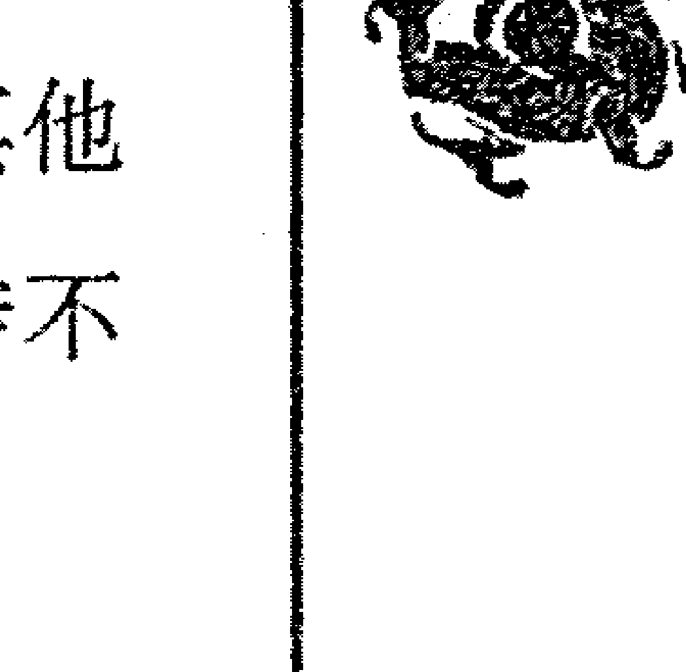

## 奇门遁甲应用初探修订版

当日干支：丁亥 癸丑 丁卯 丙午
当日旬空：戌亥（日） 寅卯（时）
阳遁三局 值符天柱落一宫 值使惊门落九宫

| 六合 | 白虎 | 玄武 |
| :--- | :--- | :--- |
| 死门 癸<br>天蓬 己 | 惊门 戊<br>天心 丁 | 开门 己<br>天任 乙 |
| 太阴 |   | 九地 |
| 景门 丙<br>天英 戊 | 天芮<br>庚 | 休门 丁<br>天辅 壬 |
| 螣蛇 | 值符 | 九天 |
| 杜门 辛<br>天禽 癸 | 伤门 壬<br>天柱 丙 | 生门 乙<br>禽 天冲 辛 |

手抄本《风后遗经》则天盘九星，三奇六仪，均以阳顺阴逆飞宫。而八门，八神均与转盘运行一样旋转。如图：
公历时间：2008年1月28日12时
当日干支：丁亥 癸丑 丁卯 丙午
当日旬空：戌亥（日）寅卯（时）
阳遁三局 值符天柱落一宫 值使惊门落九宫

| 六合 | 白虎 | 玄武 |
| :--- | :--- | :--- |
| 死门 丙<br>天蓬 己 | 惊门 辛<br>天心 丁 | 开门 癸<br>天任 乙 |
| 太阴 | 乙 | 九地 |
| 景门 丁<br>天英 戊 | 天芮<br>庚 | 休门 己<br>天辅 壬 |
| 螣蛇 | 值符 | 九天 |
| 杜门 庚<br>天禽 癸 | 伤门 壬<br>天柱 丙 | 生门 戊<br>禽 天冲 辛 |

传统的转盘如图：
公历时间：2008年1月28日12时
当日干支：丁亥 癸丑 丁卯 丙午
当日旬空：戊亥（日） 寅卯（时）

阳遁三局 值符天柱落一宫 值使惊门落九宫

| 六合<br>死门 癸<br>天任 己 | 白虎<br>惊门 戊<br>天冲 丁 | 玄武<br>开门 己<br>天辅 乙 |
|---------------------------|---------------------------|---------------------------|
| 太阴<br>景门 丙<br>天蓬 戊 | 庚 | 九地<br>休门 丁<br>天英 壬 |
| 螣蛇<br>杜门 辛<br>天心 癸 | 值符<br>伤门 壬<br>天柱 丙 禽 | 九天<br>生门 乙<br>天芮 辛 |

通过以上几种起局方法发现，飞盘与转盘最大的不同，是在于天盘九星的运行上了。飞盘所推演的局象，在体现时空反吟时，只能出现天盘八门、九星只在某一两个宫反吟，而不会出现全盘，八门、九星整体反吟的局面。《金函玉镜》日家奇门，飞宫小奇门的八门都以旋转为主。《旨归》将八门增一中门而为九门以此飞宫，从而中宫亦有门到。中宫为皇极，太极之位。在确定方位时，以所定之太极点与人所处之地为中心，依次中心点向四面八方扩展确定四面八方。对于奇门遁甲而言，中宫为移动的，并非固定不动的。中宫有门就如家中客厅中间再按一门，不符合自然之理！再者，八门飞宫，就违背了事物的相对论，有生就有死，生门与死门永远相对应；有开就有闭（杜）开门与杜门永远相对应，有水就有火，休门与景门永远相对应；有伤必有惊，伤门与惊门永远相对应。九神的飞宫也不符合《烟波钓叟赋》的：“值符前三六合位，太阴之神在前二；后一宫中为九天；后二之神为九地”之八神定位论。

《法巧》八门虽不入中宫、八神亦不飞九宫。但其在体现反吟时，八门、九星仍为某一两个宫出现，而非全盘。

《天地全书》八门旋转，九星飞宫，在体现天盘反吟时，九星也为某一两个宫出现反吟。

《风后遗经》与《天地全书》一样。

三式中，六壬式也有天盘反吟之课象。六壬式所体现的反吟为整个天盘统一发生对调。只有转盘奇门遁甲；在体现反吟时，八门、九星，有时六仪三奇、全盘体现，与六壬式相同。这就表示：在某一个时空内，天体的运行发生了相对的大变化，这也许就是为什么反吟之时利客，反吟为远，反吟宜乱中取胜的原因所在吧！

> 薛邓林老师云：“活盘奇门的天盘是三才分立，地盘反映的是地气的推移改易。天盘反映的是天道轮转。而人载天覆地，当随天盘之圆（休生伤杜景死惊开之序）入于地盘之方。其中就人事之不同，有摩与荡之异。摩乃‘刚柔相摩’。荡乃‘八卦相荡’……活盘人盘的用法，乃是基于天地动静之理，即以天道八方轮转之固定次序，象人坐地日行三千里，而摩荡于九宫八卦之中。象微寒暑燥湿于其中。其中摩为体，荡为用……天道随九星遵循18349276之序，地道随九宫遁甲123456789宫之序。”

笔者认为薛师此论，才真正道出了古人最初立式之旨！

对于这几种演局方法，在预测上都有自己的实践，也都有准确率。笔者认为，就奇门只用于预测而言，不是很注重起局的方式，和所得的局象。就如梅花易数中的随机起卦一样，以方位，数字，所得之卦象，与年月日时所起得的卦象，都可测准某一件事情。而在奇门遁甲方位，时空应用中，那么这些方法所演得的局象，是否能和当时宇宙的时空相对应？这就需要大家从大量实践中去加以验证，从而验证那一种演局方法更符合天体的自然运行规律，得到最后的肯定！笔者实践不多，只是从理论上谈一下个人的一点理解与认识，并非否定某一演局方法，也希望能借此抛砖引玉，早日能够将奇门之演局方法得到统一。

### 论奇门遁甲预测与奇门遁甲趋避选择

> 古人曾经说过：“奇门之占要分动静，静则只查直符，值使，时干的生克，动则专看方向”。

奇门预测和奇门应用是两种不同的体系。这就说明了这种方法完全不同，不能一概而论，静态预测：就是应用奇门数理模型对某一事物的发展规律和走向进行分析判断。动态：就是通过奇门时空数理模型，在特定的时间中，择出有利于某件事物发展的方位而加以应用。譬如：1. 方位已定而要推演出有利的时间段来！2. 时间已定而要推演出最佳的方位来！

预测重日干，时干，用神。只要符合冬至后用阳遁，夏至后用阴遁此两大阴阳之理，随机起局法也未尝不可。

而奇门应用首重时空。必须要以正统之法起局定局，这样才能和时空统一。因为奇门遁甲效仿天体的运转模式而来，有其天文学背景。故可以推演出某一时空中天体的气运变化，磁场的力量性质，和强弱分布。以此来指导人的行动方向，择其有利的时空点，和天地巨大的磁场所感应！人虽为万物之灵，但天体的运转每时每刻都在影响着每一个人！

### 途遇恶人趋避法

遥望人来未测详，神后加临孟是良。仲是商人季奸恶，欲逃正位去天罡。

解：一人路途如遇来人，想知此人善恶，既可在手上以月将加时看天盘神后子落在地盘何位，以天盘子下临之地支来分析此人善恶。子下临寅、申、巳、亥、为良人。子下临子、午、卯、酉、为商人。子下临辰、戌、丑、未、为恶人。

欲逃正位去天罡！

是恶人就要防范。以月将加时找天罡《辰》落于地盘何方。则我背于天罡方，恶人不敢近我。

此为时空应用法之一。此法虽为六壬中的法则，但也可配合奇门遁甲用于别处效果可能更佳，不要轻视！

### 论奇门遁甲的本质

古称奇门遁甲有“夺天地之造化之效”。今人对此术也有很高的评价，但从今天的研究方向来看，多数研究者侧重于预测部分。太乙以天时为要、六壬以人事为要、奇门以地理为要，三式虽都含有预测部分，但其侧重点却不同。奇门里面有遁甲，遁甲必须靠奇门，两者本为一体，不可分离，分离则有失奇门遁甲之本意。

我曾在“周易天地奇门遁甲论坛”发表过《论奇门预测与奇门应用》一帖。提出预测与应用是两种不同体系，用法有别。预测重日干，时干，用神。而应用，运筹重时空。如纯粹以预测之思路来探索奇门遁甲中的精髓，则离奇门遁甲的本质越来越远，失遁甲之本来面目。奇门遁甲中非常重要的九遁等格局为什么在预测中发挥不了它的作用？《烟波钓叟赋》到底在说什么……

如今的奇门遁甲已人为复杂化，只知有奇门，而不知有遁甲，两者分离！择日多以日干为人，时干为事，以时干来生日干则吉，反之则不可用。也有人在时空的应用上以年命和日干来决择。所用之方位要和日干，年命相生相比才可用，如真是这样，那所谓的“急则从神缓从门”就有其局限性了。如遇急事，明知值符在此方可利用，但却要看和日干年命的关系，相克就无法用此方位了。又去找和自己相生的方位来趋避。就如两军对阵，一方被敌方包围，明知面前就有一方位可突出重围，但却非得要用奇门遁甲来选择何方可出，当推演下来时，恐怕已全军覆没！

所以笔者认为真正的时空方位就更本无法用上。找日干是被预测之思路所束缚不明遁甲之意！如一场大的战争，不是考虑某一两个人的生存或胜负。而是全面来衡量整个战争的胜败。对战略要地，更是敌我双方必争之地，谁取得主动权就对谁有利。为主为客除了靠指挥者本身的军事才能外，就要利用天时、地利、人和了。《烟波钓叟赋云》云：九天之上好扬兵，九地潜藏可立营，伏兵但向太阴位，若逢六合利逃影。这就说明在某一特定的时空中，宇宙本身就存在着某一场能，而此场能恰好对于某些事情比较有利。古人特别注重对三吉门的运用：吉门偶尔合三奇。万事开三万事宜。如以现在的某些思路，那这些很重要的地方又能运用多少呢？能否真正的达到天人合一？怎样才能为主为客在我一心，任我可也？

有些人甚至认为即使所用之方临死门，只要来生日干年命就可用。笔者认为此论不妥。有些门、星、神、其本性就为凶，如来生日干，岂不为坏事主动来寻我，何益之有？又如阴宅择日，要看日干，时干之生克关系，又要看坐山朝向要吉，有的还要看死门宫中，天盘星与地盘星之关系。那么，如以死门为穴，那么坐山朝向在这里又代表什么？阴阳宅到底那个重向？那个重座？年命在什么情况下必看，什么情况下又不必看？

大道至简，在实际应用中如不抓主重点，则其用神就显的过多而难以掌握定向，又有其局限性。有些法则只适合于奇门静态预测类。动态应用是要考虑当时行动那时辰的时空状态。金函玉镜中的日家奇门没有十天干，又怎样将人来定位呢？笔者认为，只所以要找日干者，就是为了要将当事人在局中定位，时干者为所用之事体，依次来横向比较得出利弊。此法在奇门预测中无可争议，但在奇门遁甲时空应用中则不符合“遁甲”之意，更不符合奇门遁甲时空统一论。过于注重人自身的作用，而忽略宇宙本身强大的磁场。人在茫茫宇宙中只是一个“微尘”而已！世上的万事万物无不受到宇宙强大的磁场所影响。如大的自然灾害，局部战争，04年的海啸，一夜之间就可毁掉无数个生命和人们居住的环境。宇宙是一个大太极，人所居住的局部区域是个小太极，人本身又为一太极，大环境影响局部环境，局部环境则影响人，就如国运影响每一个人一样。人常说：“环境改变人。”奇门遁甲是效仿天体的运转模式而来，有其天文学背景。故依据此遁甲模式可以推演出某一时空中天体的气运变化，磁场的力量性质，和强弱分布，以此来指导人的行动方向，让人择其有利的时空点，去办有利的事情。人只要能和宇宙强大的磁场所感应，所融合，利用宇宙本身强大的磁场而为我所用，才能真正达到天人合一！与道合一！我认为此才是奇门遁甲之本质。
以上论调只为本人对奇门遁甲之浅薄认识，其中不当、谬论之处，还望大家批评斧正。

### 论奇门与企业预测

- 1. 以开门代表企业。以其落宫的旺、衰、空亡、格局等来分析一个企业的目前总体形式如何。
- 2. 以甲子戊为资本。以其落宫的组合来分析一个企业的固定资产和目前周转资金方面情况。
- 3. 以生门为利润，以其落宫组合与甲子戊落宫的生克来判断一个企业的赢利或亏损状况。
- 4. 以时干为产品，以其落宫来分析企业目前所生产或经营的产品质量状况。
- 5. 以景门为计划、方案、策略。
如以太极思维来细分析一个企业的内部情况，可将整个奇门局象看成一个企业。
- 1. 以值符为总经理，直使为副总经理。
- 2. 以年干为董事长或总裁。
- 3. 以月干为中层管理人员。又以月干为同行类竞争者。
- 4. 以日干为预测者本人，谁来预测就代表谁。
- 5. 以时干为下属员工，又以时干为产品。
- 6. 以开门为销售部门。或科研新产品开发部门。
- 7. 以休门为人事，供应，后勤部门。
- 8. 以生门为生产部门。
- 9. 以伤门为运输部门，或清欠办。
- 10. 以杜门为技术，或安全部门。
- 11. 以景门为宣传，策划部门。
- 12. 以甲子戊和生门为财务部门。
甲午辛和天芮星或玄武落在那个部门就说明那个部门目前存在问题，庚落在那个部门就说明此部门有阻力难以发展。当然还要根据其落宫的组合来分析。

### 太乙初探

如：戊子年，太乙积年数为 10155925 人纪元局数：壬子元第六纪 阳遁 37 局

主算：1 ［短数、无天地数］客算：7 ［短数、无天数］定算：7 ［短数、无天数］

太乙在六宫，客挟。文昌在武德，内辰迫。主大将一宫，外迫；主参将三宫发。始击内击太乙，客大将七宫内迫；客参将七宫外迫。此局主客俱不利，各宜固守。

太乙在六宫第一年理天，文昌加临太乙宫，或始击加临太乙宫，为掩，掩为阴盛阳衰，阳被阴掩，象日蚀。

主算，客算，定算均为无天之算数，太乙在理天之年，无天之算则天有变异。

值事门生门在六宫，伤门在一，杜门在八，景门在三，死门在四，惊门在九，开门在二，休门在七，太乙，天目在开休生三吉门下为三门不具。

太乙十二运卦有两种推算方法，今将两种推算所得的卦象均列出。

- 1. 根据《太乙统宗大全》清光绪二年丙子岁（公元1876年）太乙运行太乙十二运的第三运：阳晶守政运之：天雷无妄卦之初九爻。以此可推出戊子太乙行运到：阳晶守政运之：天雷无妄卦之九五爻第十二年。

### 天雷无妄

▅▅▅▅▅  
▅▅▅▅▅  
▅▅▅▅▅  
▅▅ ▅▅  
▅▅ ▅▅  
▅▅▅▅▅

- 2. 如以清人黄宗羲所用之方法根据公元1924年岁次甲子太乙运行第六运：造化天符之天泽履卦初九爻第25年。以此推出戊子年太乙行：造化天符之天泽履卦之九四爻第十三年。

### 天泽履

▅▅▅▅▅  
▅▅▅▅▅  
▅▅▅▅▅  
▅▅ ▅▅  
▅▅▅▅▅  
▅▅▅▅▅

太乙值年卦为火雷噬嗑初九爻动变火地晋：

巽宫：火雷噬嗑          乾宫：火地晋（游魂）

【本 卦】
▅▅▅▅▅  
▅▅ ▅▅  
▅▅▅▅▅  
▅▅ ▅▅  
▅▅ ▅▅  
▅▅▅▅▅ ○

【变 卦】
▅▅▅▅▅  
▅▅ ▅▅  
▅▅▅▅▅  
▅▅ ▅▅  
▅▅ ▅▅  
▅▅ ▅▅

### 掌上推干支

对于我们研易之人来说，万年历是必不可缺少的。特别是对每天的日干支要心知肚明。虽有日历可查，但我们也不可能将历书随身代在身边。有时长时间不用，或外出。碰到预测就无法得知今日为何干支，更别说定出奇门局来。本人以前就有此缺陷，在外有时遇到别人求测，还得打电话问别人，有失大雅！今将此法介绍给大家，愿与同道分享。

先明今年之元旦干支数如：2007年为乙未32、2008年庚子37、2009年丙午43、2010年辛亥48、2011年丙辰53

再明月份之加减数：不管何年此数不变。如图：

| 月份 | 一月 | 二月 | 三月 | 四月 | 五月 | 六月 | 七月 | 八月 | 九月 | 十月 | 十一月 | 十二月 |
| :--- | :--- | :--- | :--- | :--- | :--- | :--- | :--- | :--- | :--- | :--- | :--- | :--- |
| 加减数 | -1 | +30 | +58 | +29 | +59 | +30 | +0 | +31 | +2 | +32 | +3 | +33 |

| 甲子 1 | 乙丑 2 | 丙寅 3 | 丁卯 4 | 戊辰 5 | 己巳 6 | 庚午 7 | 辛未 8 | 壬申 9 | 癸酉 10 |
| 甲戌 11 | 乙亥 12 | 丙子 13 | 丁丑 14 | 戊寅 15 | 己卯 16 | 庚辰 17 | 辛巳 18 | 壬午 19 | 癸未 20 |
| 甲申 21 | 乙酉 22 | 丙戌 23 | 丁亥 24 | 戊子 25 | 己丑 26 | 庚寅 27 | 辛卯 28 | 壬辰 29 | 癸巳 30 |
| 甲午 31 | 乙未 32 | 丙申 33 | 丁酉 34 | 戊戌 35 | 己亥 36 | 庚子 37 | 辛丑 38 | 壬寅 39 | 癸卯 40 |
| 甲辰 41 | 乙巳 42 | 丙午 43 | 丁未 44 | 戊申 45 | 己酉 46 | 庚戌 47 | 辛亥 48 | 壬子 49 | 癸丑 50 |
| 甲寅 51 | 乙卯 52 | 丙辰 53 | 丁巳 54 | 戊午 55 | 己未 56 | 庚申 57 | 辛酉 58 | 壬戌 59 | 癸亥 60 |## 六十花甲顺序表

捷法：在左手掌子位起甲子为1 倒数之戊为甲戌11 再倒数甲申为21 甲午为31 甲辰41 甲寅51

公式：日元干支序数 = (元旦干支序数 + 月加减数 + 实际日数) - 60

举例：如推今日4月16日之干支。根据公式：(32 +29 +16) -60 = 17 (庚辰)

17 于掌中子位起甲子为1 倒数之戊位甲戌为11 至。再从戌上往前走，戌1亥2子3丑4寅5卯6辰7再配天干戊上甲 亥上乙 子上丙 丑上丁 寅上戊 卯上己 辰上庚，这样4月16日的干支就为：庚辰日。

手掌中只要记住六甲所在的位置和数就行！(六甲逆走)

知道了干支，则定局就迎刃而解了。

### 后记

望着已经定稿的《奇门遁甲应用初探》，回首以往的学易之路而感慨颇多...

记得是我刚走上工作岗位不久，那时还很年轻。除了上班外多数的闲暇时间都用在了与同事打牌，下棋上。虽早知叔父研究《易经》，本人也对此颇感兴趣。无奈叔父远在甘肃，常年工作在外，几年才回老家一次。苦于无人在身边亲自教导，书虽有，但不明其理，读《易》就像看天书，茫然不知所云。

壬申岁年底，祖母病重，春节叔父回到老家，我们相遇。记得他当时带有一本《断易天机》和《奇门法窍》两书。那年我和现在的妻子刚相识，但还不知我们以后是否有缘结合，于是就让叔父起卦分析。叔父以卦象断曰：“你们俩要走到一起，要克服很多的困难，但最终还是能成为夫妻。”所断有些内容颇为精准。自那后我就开始搜买《易》书，专心学易。但终究那时年轻，贪于玩乐，学而放之，难有持之以恒的精神。对于奇门遁甲之术，虽曾自制纸盘推演，也只知以“奇门”汇集之方为吉，而不知灵活变用之法，茫然徘徊不进。2000年在单位购买了自己的新居后，安心将业余的时间全部投入在了研易之上，“奇门遁甲”即为我多年来用心者之一！

因《易》者“道”也，非纯粹之技术学问，研易即可悟道、玩易又需修身，所以同时又兼读“三教”文集，几年来日复一日。在穷《易》之理同时，又在周围人群中大胆实践、摸索、积累、总结，近年来略心得。2005年机缘到来，又参加了当代奇门宗师张志春老师举办的“奇门高级学术面授班”从而受益良多！2006年接触网络后，又在几家知名易学论坛大胆实践。承蒙周易天地、明奇论坛、天易论坛和薛老师的国际易学文化交流中心给我提供了一个与同道相互交流学习和研易的平台，让我有一个发挥自己所好的环境！薛老师又在三式方面对笔者进行了指引，在此向天易论坛、周易天地、明奇论坛、薛邓林老师表示最诚挚的谢意！

本书在写作过程中，参考了有关著作与资料，在此向其作者表示衷心的感谢！

## 中国古代术数汇要

## 奇门遁甲应用初探


《奇门遁甲应用初探》能得以正式出版，承蒙河南郑州的李克强老师，李东杰网友，两位的大力支持！尹锋老师，薛邓林老师又在百忙中抽出时间为本书写序，在此特向他们致以崇高的敬意！

自去年8月份出版了本人的《奇门遁甲应用初探》一书后，接到全国各地一些读者的电话，手机短信与信函。大家对书中的某些观点给予了肯定与支持。同时也对书中存在的某些不足之处给予了指正。可以说每位读者、易友都是我的良师益友，在这里向热心的易友们表示衷心的感谢！同时对原书中的个别错误之处，给大家阅读时带来的不便也深表歉意！在这次的修订版中，笔者对原书中存在的不足之处，进行了细心的校对。但由于本人易学水平有限，难免仍存在一些错误与不足之处，仍望大家批评斧正！

己丑岁初夏 遁甲（孙小忠）于陕西宝鸡


### 参考书目

- 《神奇之门》 ..................................................... 张志春 著
- 《开悟之门》 ..................................................... 张志春 著
- 《奇门遁甲新述》 ............................................. 费秉勋 著
- 《飞盘奇门遁甲》 ............................................. 费秉勋 著
- 《奇门预测学》 ................................................. 刘广斌 著
- 《三式奥秘大破译》 ......................................... 薛邓林 (麟野山人)
- 《奇门遁甲现代实例精解》 ............................. 杜新会 著
- 《奇门与商战》 ................................................. 杜新会 著
- 《奇门遁甲解真》 ............................................. 石建国 著
- 《掌上奇门》 ..................................................... 尹锋 著
- 《斗转星移——揭开奇门遁甲之谜》 ............... 尹锋 著
- 《奇门遁甲应用学》 ......................................... 王云朋 著
- 《人生奥秘探析—四柱分析与奇门遁甲》 ......... 李万福 著
- 《奇门时盘预测学》 ......................................... 台湾 秦瑞生 著
- 《奇门遁甲秘笈全书》 ..................................... 诸葛亮 刘伯温 著
- 《奇门遁甲统宗大全》 ..................................... 诸葛亮 刘伯温 著
- 《遁甲演义》 ..................................................... 明 程道生 著
- 《奇门旨归》 ..................................................... 清 朱星源 著
- 《奇门一得》 ..................................................... 清 甘时霖 著
- 《奇门法窍》 ..................................................... 清 锡孟樨 著
- 《御定奇门宝鉴》 ............................................. 台湾版 唐. 徐道符 著
- 《遁甲玄文》 ..................................................... 手抄本
- 《遁甲秘箓》 ..................................................... 手抄本
- 《皇极经世书今说》 ......................................... 宋 邵康节原著 阎修篆 辑说