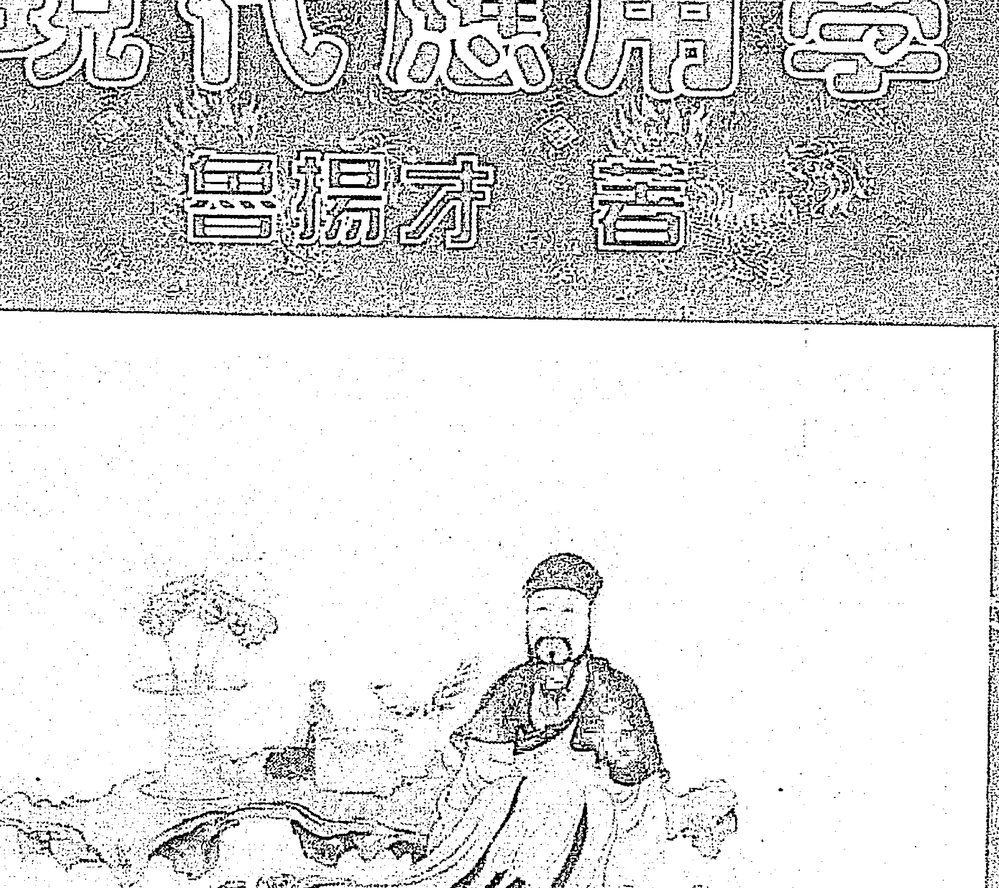
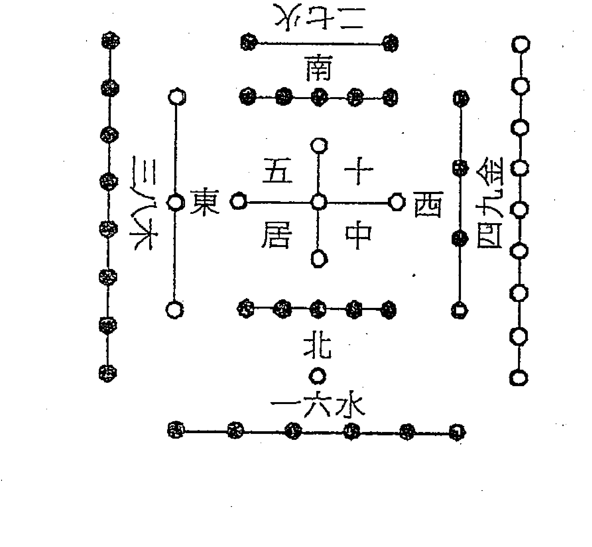
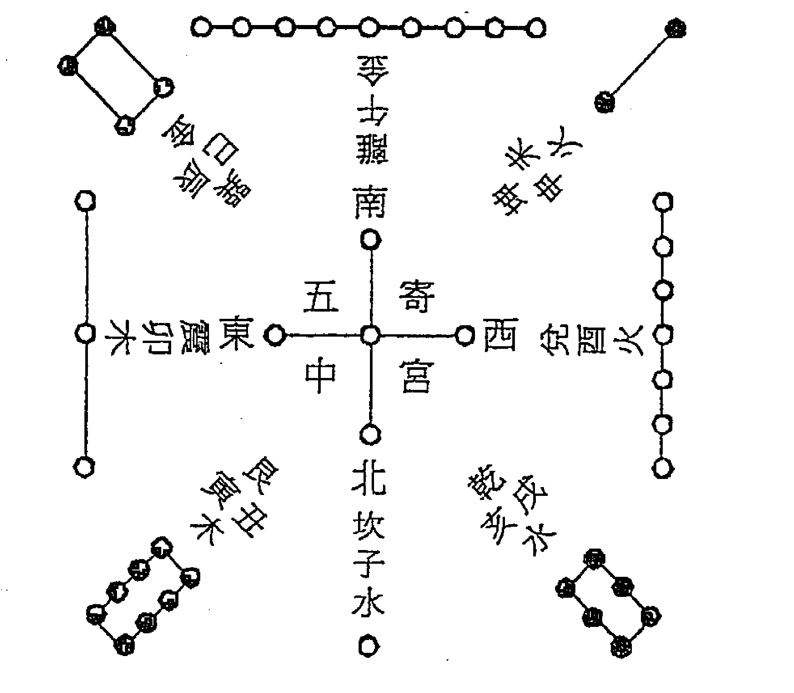
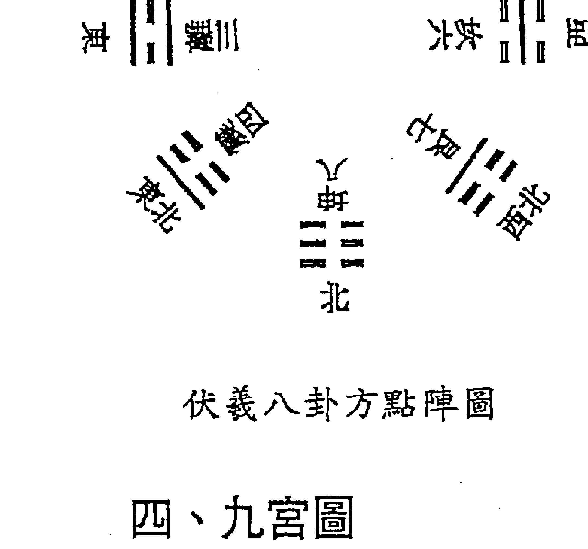
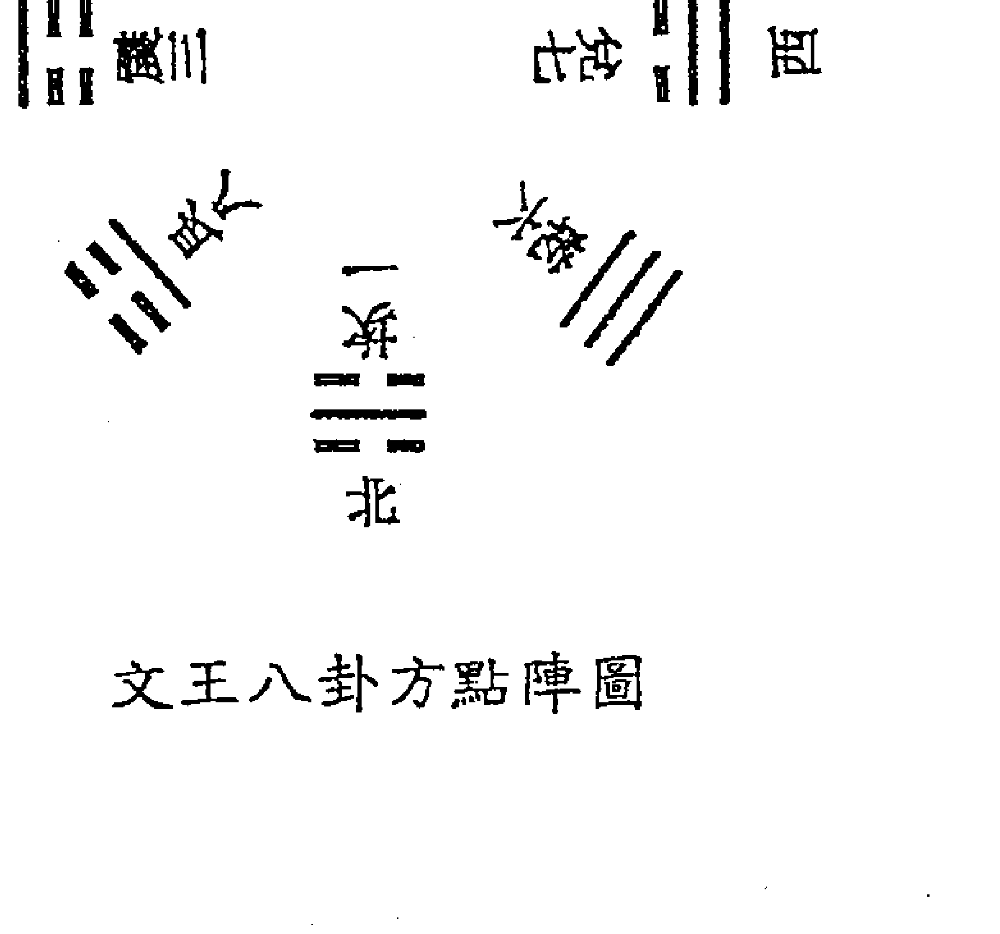

# 增廣賢文

再明一賢文



> 上大人孔乙己化三千七十士爾小生八九子佳作仁可知禮也

# 奇門遁甲

# 現代應用學

魯揚才著

中國哲學文化協進會出版

# 千秋歲

天旋地轉，紅塵五千年。抬望眼，縱橫連，絕唱一篇篇，風雨怎憑樣？揮手間，長虹起處雲漫漫。

九大洲江山，八門一線牽。奇儀舞，長袖掩，聽琴聲錚錚，遁甲無語彈。情深處，日月星神共依伴。

# 序

> 順時應運行遁甲，法天則地演奇門。
天地人和通無礙，興衰更替煥乾坤。

古人以四方為宇，古今為宙。奇門遁甲以橫論八方、縱論古今而在中國預測文化中獨領風騷，其神妙絕技得以淋漓盡致的發揮，其通達宇宙、經世致用的功用被歷代統治階級用於治國平天下，因此被尊為帝王之學，與太乙神數、大六壬並稱為中國數術易經最為高深的三式絕學。奇門遁甲源自軒轅黃帝得玄女陰符之術，命風後演就奇門，戰蚩尤於涿鹿之野，考星宿兮審方位，律天象兮奠山川，法混沌而立太極。大禹治水，得玄女傳文，以洛書而定九疇，遁甲由此而著稱於世。漢張良總局十八而成決勝之功；蜀孔明三分天下而創奇偉之業；而今現代數術易經學的一代宗師魯揚才先生上承古人神妙之心法，下應時空無常之轉換，觀天之道執天之行，察天地之時空流轉，審世間之人情變幻，斷萬物運化之行跡，定吉凶休咎之毫微。他數十年來躬身探索，闡幽發微，探究出奇門遁甲深藏千古的玄機妙法，並進一步將奇門秘傳絕技與現代社會實踐相結合，彙編成這本《奇門遁甲現代應用學》，力求以此造福社會，利益更多有緣人。

奇門遁甲以遁甲為靈機，以天地人和為綱領。那麼，何謂遁甲呢？《遁甲符應經·總序》說：古法遁者，隱也，幽隱之道；甲者，儀也，謂六甲六儀；甲為直符，天之貴神也，常隱於六儀之下，蓋用兵機，通神明之德，故以遁甲為名。遁甲之名亦經歷了時代的變遷，周秦時名「陰符」，漢魏時名「六甲」，晉唐宋元稱「遁甲」，明清以來謂之「奇門遁甲」。

奇門遁甲以八卦作「三盤」的定位式，天干順逆演佈，反映了時間和空間的走勢和微妙變換。奇門上盤象天，謂九星；中盤象人，謂八門；下盤象地，謂九宮。天地人三盤的剋應演變，間以三奇六儀的神機妙變彰顯出古人法天則地的智慧光芒。

# 觀天之道，執天之行

中國古代一切傳統學術，皆首重天道，奇門遁甲亦不例外。《遁甲大全》說：凡占吉凶，首重九星，以九星爲天盤，吉凶由天故也。《黃帝陰符經》說：天生天殺，道之理也。天執掌萬物生殺的權柄，生的權力在天，滅的權力也在天。以天道爲依據的數術系統一一奇門遁甲體系能夠「爱有奇器，是生萬象，八卦甲子，神機鬼藏，陰陽相勝之術昭昭乎進乎象矣」（《黃帝陰符經》）。天盤正如整個遁甲體系的啟動開關，一動則全盤動，不偏向於任何一方，「天之至私，用之至公」正是這個道理。「天之無恩而大恩生，迅雷烈風，莫不蠢然；至樂性餘，至靜則廉。」可見天道的運行動如「迅雷烈風」，靜如「純然處子」，雷（爲震卦代表天威，爲天干，爲陽，爲直符）風（爲巽卦代表命令，爲地支，爲陰，爲直使）動，而吉凶變，天地定矣。

《黃帝陰符經》說：「天有五賊，見之者昌；五賊在心，施行於天；宇宙在乎手，萬化生乎身。」三奇六儀，按照陰陽九局順逆演佈，則構成了萬物生化的契機。

# 立天之道，以定人也

《黃帝陰符經》說：「天性，人也；人心，機也；立天之道，以定人也。」人作爲天地萬物間最靈動的生命，上順天道，下應地機，自然成爲天地交通的樞紐。「人發殺機，天地反覆」，人盤若遭天地盤剋制而災禍至也。《遁甲大全》卷七有曰：「凡出行趨避者，首重八門。以八門爲人盤，吉凶由人自取故也。凡門剋宮吉，宮剋門凶，傷人、事故凶」。我們演奇門推遁甲，最終目的是爲了探究萬物興衰更替的規律和世事運行的軌跡，從而找出順應天地大道的前進方向。因此吉凶雖爲天註定，人依然有其機變的善巧和方便，趨吉避凶。

# 八卦甲子，神機鬼藏

《黃帝陰符經》說：「自然之道靜，故天地萬物生。天地之道浸，故陰陽勝陰陽，相推而變化順矣。」靜屬自然之道，以生萬物；動屬變化之道，以見天地之心。靜為體動為用，日月往來，陰陽推移，天地之變如若水之浸潤，無聲無息卻又無休無止，正所謂「天地密移，疇覺之哉」。奇門遁甲中地盤的相對靜止，雖不如天盤運轉之迅烈，卻也從另一方面折射出天地之道「浸」的幾微變化，體天地之撰，類萬物之情。

李鑒《神機制敵太白陰經》說：凡六甲為青龍，可以建福。六乙為蓬星，可以建德。六丙為明堂，可以出入。六丁為玉女，可以出奇。六戊為天門，可以往來。六己為地戶，可以伏藏。六庚為天獄。六辛天庭。六壬為天牢。六癸為天網，難以逃亡。此為地盤「八卦甲子，神機鬼藏」的闡微明義。

## 天人合發，萬變定基

《黃帝陰符經》說：「天發殺機，龍蛇起陸；人發殺機，天地反覆；天人合發，萬變定基。」事物發展初始順天應道、趨吉避凶「天發殺機，龍蛇起陸；人發殺機，天地反覆」就好像前進方向的調整，而不改變目標和結局，但是一旦「天人合發」，則必定出現一派變革之象，敵我雙方鬥爭較量的結果，必定是強者立，弱者滅。

那麼，面對註定的變革甚至凶災，人何以避禍呢？古人為我們道出了其中的奧妙：「性有巧拙，可以伏藏；九竅之邪，在乎三要，可以動靜。」《老子》曰：「吾之所以有大患者，為吾有身，及吾無身，吾有何患？」也就是說，避禍的關鍵在於遁法。《奇門秘訣總賦》說：「如遇急難，宜從直符方下而行。太陰潛形而隱跡，六合遁身而謀議。九天之上揚威武，九地之下匿兵馬」。這就是奇門遁甲的玄妙之處，上知天地運化之微，下明吉凶進退之法。《遁甲統宗》曰：「時下得乙者為日奇，凡攻擊、往來者，逃凶者，宜從天上六乙出，則恍惚如神，無人見者」。「從天上六丁而出，入太陰而藏，敵人自不能見也」。「凡攻伐，宜從天上六丙出，挾威火，故類王侯」。此即「急則從神緩從門」之說。古之聖人參天之變換，決己之進退，如老子過函穀關，張良隨赤松子遊之類，可謂聖賢知時也。

> 《奇门统宗》曰：「奇门占法，要分动静之用，静则只查直符直使时干，看其生克衰旺如何？动则专看方向，盖动机之先见者也」

奇门数理趋避之要，在于自为主客。即测得利为主者，则后动，是为后发制人；测得利为客者，则先动，是为先发制人。是以静为主，动为客。测得其机，则按机行事，动静可以由人。所谓「食其时，百骸理；动其机，万化安」。所以要掌握时机，纵他变化万端，也能得到平安，关键在一个「时」字上。而這正是奇門遁甲的精髓所在。

古人說「用局之法，變轉無窮」。本書有三大特點，一是融通了奇門遁甲、大六壬、周易納甲等多項數術絕學，意在神通、法通、道通，將中國古老數術文化的精髓展現給讀者。二是恩師心懷慈忍之悲願，首次向社會披露了奇門千年秘而不宣的獨有絕技——奇門遁甲八式七步法和奇門玄機圖。絕技的公佈，無疑為更多熱愛中國傳統文化的仁人志士搭建了一條通向數術寶藏的橋樑和捷徑。三是本書的編寫特別注重邏輯性和條理性，實例分析更加貼近現實生活，通俗易懂。

> 《奇门统宗·玄机赋》說：「(奇門)泄尽天机玄妙，当为圣主图功，虽得千金勿授，妄传小辈具戎，若将此法轻言，罪犯天诛不宥」

奇門遁甲歷來密而不傳，僅被少數人所掌握，就是因為「君子得之固躬，小人得之輕命（君子得此術可以趨吉避凶，保全自身；小人得此術則胡作非為，反致喪身）。在此，我們鄭重希懇各位有緣同道，珍惜這一稀有的「法」緣和「道」緣，並以此為契機，保護和傳承中國傳統文化的璀璨瑰寶，使她發揚光大。

恩師魯揚才先生作為一位博極易源、精勤不倦的智者，他嘔心瀝血於著書立說，成就非凡，在國內外數術界享有盛譽。他先後出版了《大六壬高級預測學》、《奇門遁甲高級預測學》、《太乙神數預測絕學》、《紫微斗數預測學》、《奇門堪輿學》、《鐵板神數應用學》、《奇門高級四柱預測學》、《奇門星相絕學》、《奇門穴道學》、《大六壬現代應用學》、《奇門高級四柱現代應用學》、《奇門風水現代應用學》、《周易納甲現代應用學》等十多本數術易經專著。

為了使中國傳統文化得以傳承和光大，恩師還花費了大量的心血培育了眾多中國數術易經學的棟樑和精英，陳紫微、清風、普光等座前弟子和嫡傳弟子個個身懷絕技，精通至少五種以上的易經數術絕學。

在參與本書的編寫和整理工作中，我們學到了奇門遁甲絕妙之絕技，領悟到了奇門遁甲神妙之心傳。當本書終於脫稿之際，我們感到自己又攀登了一座高峰。一般作者寫書都請社會或學術界名流作序，藉以提高著作的聲望。而恩師卻充滿信任地將這一重任託付給我們，希望以此托舉後輩。恩師對於弟子們的傾力提攜和無私奉獻令我們刻骨難忘，作爲跟隨恩師多年的弟子，我們只有秉承師志，矢志不渝地爲宏揚中國傳統文化而奮鬥，才能報答恩師教誨的深重恩情。

天高地遠，九星照宇環，八神指顧間，八門旋轉。人世間，無數事，了然無語談。遁甲演繹，六儀馳驅，三奇來斡旋。干戈化雲雨，彩虹常現，乾坤太平連年。

白雲　普啟

二零零五年八月十五日於河南安陽

# 目 錄

| 章節標題 | 頁碼 |
| :--- | :--- |
| 序 | 005 |

## 第一部分 基礎知識

| 章節標題 | 頁碼 |
| :--- | :--- |
| 第一章 陰陽五行與河圖洛書 | 017 |
| 第一節 陰陽五行 | 017 |
| 第二節 河圖洛書 | 018 |
| 第二章 天干地支及干支類神 | 020 |
| 第一節 天干及其類神 | 020 |
| 第二節 地支及其類神 | 024 |
| 第三章 八卦及其類神 | 030 |
| 第一節 八卦 | 030 |
| 第二節 八卦類神 | 032 |
| 第四章 九星、八神與八門 | 043 |
| 第一節 九星 | 043 |
| 第二節 八神 | 049 |
| 第三節 八門 | 052 |
| 第五章 奇門十二貴神與六壬十二貴神 | 060 |
| 第一節 奇門十二貴神 | 060 |
| 第二節 六壬十二貴神 | 062 |

## 第二部分 奇門預測及判斷方法

| 章節標題 | 頁碼 |
| :--- | :--- |
| 第六章 奇門預測的基本方法 | 069 |
| 第一節 奇門排局的方法 | 069 |
| 第二節 旺相休囚的判斷規則 | 072 |
| 第三節 預測時辰的判斷規則 | 075 |
| 第四節 基本判斷方法 | 076 |
| 第七章 天盤八門加地盤八門判斷法 | 079 |
| 第八章 八門加宮判斷法 | 085 |
| 第九章 三奇六儀格局判斷 | 093 |
| 第十章 主客判斷法 | 097 |
| 第一節 九星奇儀主客斷 | 097 |
| 第二節 門宮主客斷 | 099 |
| 第三節 日時主客斷 | 100 |
| 第四節 天地二盤主客斷 | 100 |
| 第十一章 奇門十二貴神判斷法 | 101 |
| 第十二章 應期判斷法 | 119 |
| 第一節 值符定應期法 | 119 |
| 第二節 奇門應期判斷 | 120 |
| 第十三章 玄機圖 | 121 |
| 第十四章 煙波釣叟賦 | 129 |

## 第三部分 基本判斷法則

| 章節標題 | 頁碼 |
| :--- | :--- |
| 第十五章 求財經營判斷規則 | 131 |
| 第十六章 工作就業判斷規則 | 136 |
| 第十七章 求學考試判斷規則 | 138 |
| 第十八章 人體疾病判斷規則 | 139 |
| 第十九章 戀愛婚姻判斷規則 | 140 |
| 第二十章 懷孕分娩判斷規則 | 141 |
| 第二十一章 出行出國判斷規則 | 142 |
| 第二十二章 天時氣象判斷規則 | 145 |
| 第二十五章 刑事案件判斷規則 | 148 |
| 第二十六章 官司訴訟判斷規則 | 150 |
| 第二十七章 行人走失判斷規則 | 152 |
| 第二十八章 體育競賽判斷規則 | 154 |

## 第四部分 判斷精要

| 章節標題 | 頁碼 |
| :--- | :--- |
| 第二十九章 判斷基本綱要 | 155 |
| 一、運用奇門遁甲分類規則進行演算的前提條件 | 155 |
| 二、奇門遁甲分類判斷的基本規則 | 155 |
| 三、運用奇門遁甲扭轉運氣（財運）的方法 | 156 |
| 四、基本概念 | 156 |
| 五、吉格 | 158 |
| 六、凶格 | 160 |
| 七、表外格局 | 162 |
| 第三十章 人生預測 | 163 |
| 第一節 概述 | 163 |
| 第二節 身命 | 165 |
| 第三節 壽命與年命 | 170 |
| 第三十一章 婚姻家庭 | 172 |
| 第一節 婚姻 | 172 |
| 第二節 胎產 | 176 |
| 第三節 分居 | 181 |
| 第三十二章 升學晉職 | 182 |
| 第一節 考試概述 | 182 |
| 第二節 升學考試 | 184 |
| 第三節 晉升職稱 | 186 |
| 第三十三章 仕途 | 187 |
| 第一節 概述 | 187 |
| 第二節 仕途細論 | 188 |
| 第三十四章 商業活動 | 193 |
| 第一節 求財概述 | 193 |
| 第二節 貿易 | 195 |
| 第三節 金融 | 198 |
| 第四節 財物糾紛 | 200 |
| 第五節 店鋪開張 | 200 |
| 第三十五章 企業 | 201 |
| 第一節 概述 | 201 |
| 第二節 企業運營 | 206 |
| 第三節 收益 | 209 |
| 第三十六章 農業種植 | 211 |
| 第一節 概述 | 211 |
| 第二節 種植 | 215 |
| 第三節 灌溉 | 216 |
| 第四節 蟲、漁、獵 | 216 |
| 第三十七章 丟失財物 | 218 |
| 第一節 失物 | 218 |
| 第二節 失盜 | 219 |
| 第三十八章 出行 | 220 |
| 第一節 概述 | 220 |
| 第二節 行人 | 224 |
| 第三十九章 官訟 | 229 |
| 第一節 概述 | 229 |
| 第二節 官訟詳察 | 233 |
| 第四十章 風水 | 236 |
| 第四十一章 疾病 |  |
| 第四十二章 其他 |  |

## 第五部分 運用實例

| 章節標題 |
| :--- |
| 第四十三章 奇門遁甲預測實例 |
| 第一節 股票預測 |
| 例一、測2004年8月17日滬市股票漲跌情況 |
| 例二、測2004年9月16日滬市股票漲跌 |
| 例三、測2004年9月27日滬市股票漲跌情況 |
| 例四、測2004年9月28日滬市股票情況 |
| 例五、測2004年9月29日滬市股票漲跌情況 |
| 例六、測2004年9月30日滬市股票漲跌情況 |
| 例七、測2004年10月8日滬市股票當日漲跌情況 |
| 例八、測2004年10月12日當日滬市股票漲跌情 |
| 例九、測2005年6月12日股市上證指數漲跌情況 |
| 例十、測2005年6月14日上證指數的變動情況 |
| 例十一、測2004年9月13日至17日的上證指數的走勢 |
| 例十二、測2004年9月20日至24日的上證走勢 |
| 第二節 求財經營預測 |
| 例一、測能否得到葉片粗拋業務 |
| 例二、測競爭業務合作能否得勝 |
| 例三、測能否在競爭業務取勝 |
| 例四、測談判合作情況 |
| 例五、投資加油站能否成功 |
| 例六、測足療店財運和將來的發展情況 |
| 例七、測房子何時能出租 |
| 例八、測茶葉店在春節前能不能轉租出去 |
| 例九、測與別人合作經營能否成功 |
| 例十、測投資社區是否有利 |

## 第三節 博彩討債預測

- 例一、測六合彩特獎號碼是多少 279
- 例二、測當天晚上六合彩的特獎號碼是多少 279
- 例三、測當天晚上"風采21選5"的號碼是什麼 280
- 例四、測賭錢結果如何 281
- 例五、測討債能否討回 283

## 第四節 工作預測

- 例一、測企業改制去留的結果 284
- 例二、測職務升遷 285
- 例三、測選擇畢業分配的方向 286
- 例四、測回饋的消息是否屬實 287
- 例五、測職務能否得到晉升 287
- 例六、測工作調動能否成功 288

## 第五節 出行預測

- 例一、測能否去成越南？是否順利 290
- 例二、測劉先生能否赴約 290
- 例三、測程女士何時從山東來 291
- 例四、測能不能買到返程車票 292
- 例五、測約見的時間及能否來 293
- 例六、測劉先生今天能不能到家 294

#### 第六節 災害疾病預測

- 例一、測重慶開縣井噴事故的原因、過程和結果 295
- 例二、測某廠董總工程師疾病 298
- 例三、測張女士父親的病情 299
- 例四、測某晚報報導的命案的結果 300

#### 第七節 其他雜項預測

- 例一、測油畫寄往新加坡能否安全到達 302
- 例二、測書何時能帶到 303
- 例三、測張小姐與日本人山村太郎先生能否訂成婚 303
- 例四、測王女士是否懷孕 304
- 例五、測李女士分娩情況 305
- 例六、測何時來電 306
- 例七、測 8 月 19 日天氣情況 307
- 例八、測當天的天氣是否適合曬糧食 307
- 例九、測中秋節晚上的天氣 308
- 例十、測李某會不會把孩子帶走自己撫養 309

# 第六部分 基礎理論

奇門遁甲的理論精髓是什麼 311

論四正宮與四維宮在奇門預測中的作用 318

奇門遁甲人事起點與終點的確定 324

九星與九宮在預測人事中的具體作用 332

九宮與八神的關係及作用 337

淺論奇門遁甲吉凶格局的運用 342

邏輯愈嚴密 預測愈準確——兼論預測學與邏輯學的關係 347

試論周易中的預測學體系 354

試論日干時干在奇門遁甲中的作用 366

初論奇門遁甲三奇六儀格局的作用 377

初論星相與奇門遁甲的關係 388

論奇門遁甲與河圖洛書的關係及作用 398

## 第一部分 基礎知識

### 第一章 陰陽五行與河圖洛書

#### 第一節 陰陽五行

## 何謂陰陽？

古人認爲世界上萬事萬物都能分成陰陽二性，認爲一切事物的形成、發展與變化，全在於陰陽兩氣的運動與轉換，而用陰陽是否保持平衡來解析一切現象形的生成或變化的原因。所以爲數術易學所採用，當作基本原理。

## 何謂五行？

五行學說在數術易學中處於一個十分重要的位置，是一個最基本的概念。

五行學說的實質，認爲世界是由水木火土金五種最基本的物質構成的，而宇宙中各種事物和現象的發展、變化都是不同屬性的物質不斷運動和互相作用的結果。

陰陽五行學說具有十分重要的哲學意義和現實意義，在我國乃至世界科學事業的發展中曾起過極大的推動作用，具有極高的科學價值，使用範圍也十分廣泛，是樸素的唯物主義和辯證法的基本學說。

## 那麼五行有什麼特性呢？

水具有寒冷向下的特性；木具有生髮條達的特性；火具有炎熱向上的特性；土具有長養化育的特性；金具有清靜肅殺的特性。

## 五行之間的相互關係又如何呢？

五行之間有兩個顯著的特點，即相生和相剋。

相生是指一種物質對另一種物質所起的促進、推動、滋生作用，如水生木，木生火，火生土，土生金，金生水。

相克是指一種物質對另一種物質所起的制約、壓制、阻礙作用，致使物質的運動不至於太過，從而達到物質之間的平衡，如水剋火，火剋金，金剋木，木剋土，土剋水。

相生相剋是存在於宇宙萬事萬物之間的一個普遍規律，是事物運動過程中不可分割的兩個方面。沒有生，就沒有事物的發生和成長。沒有剋，就不能維持事物在發展和演變過程中的協調和平衡。因此，沒有相生就沒有相剋，沒有相剋就沒有相生。生中有剋，剋中有生，相生相成，相反相成，共同推動和維持事物的正常有序地生長、發展和變化。

#### 第二節 河圖洛書

《系辭上傳》：「河出圖，洛出書，聖人則之」。圖書者，天地陰陽之象也。河即黃河，洛即洛水。相傳伏羲時有龍馬出於黃河，其背上有旋毛如星點，後一、六，前二、七，左三、八，右四、九，中五、十，稱作龍圖。到了夏禹治水時，有神龜出於洛水，其背上有裂紋，前九後一，左三右七，中五，前右二，前左四，後右六，後左八，其紋如字。圖即傳說中的龍馬身上圖像，書即傳說中的神龜背上紋象，後人以此繪出河圖洛書。河圖洛書中白點表示奇數爲陽，即天數；黑點表示偶數爲陰，即地數。見附圖。



## 洛書



河圖洛書中數的排列秩序嚴謹地描述天地的形態及大象。天為陽，地為陰，奇為陽，偶為陰，反映數組合的基本規律。天數相加為二十五，地數相加為三十，數有規律的排列組合、陰陽旋轉形成五行生剋制化，先天八卦、後天八卦也就由此而派生。

河圖口訣：
一與六共宗而居北，二與七為朋而居南，三與八同道而居東，四與九為友而居西，五與十相守而居中。

洛書口訣：
戴九履一，左三右七，二四為肩，六八為足，五居中央。

### 第二章 天干地支及干支類神

#### 第一節 天干及其類神

##### 一、天干

甲、乙、丙、丁、戊、己、庚、辛、壬、癸。

##### 二、天干之間的關係

###### 1．天干相生

甲乙木生丙丁火，丙丁火生戊己土，戊己土生庚辛金，庚辛金生壬癸水，壬癸水生甲乙木。

###### 2．天干沖剋

除戊、己中央土外，五行之間相剋，陽剋陽，陰剋陰為沖。

甲與庚相沖，乙與辛相沖，壬與丙相沖，癸與丁相沖。

###### 3．天干化合

甲與己化合成土，為中正之合。
乙與庚化合成金，為仁義之合。
丙與辛化合成水，為權威之合。
丁與壬化合成木，為淫逸之合。
戊與癸化合成火，為無情之合。

##### 三、六甲與三奇六儀

###### 1、六甲

甲子、甲戌、甲申、甲午、甲辰、甲寅。

六甲隐遁于六仪之后，对应关系如下表：

| 六甲 | 甲子 | 甲戌 | 甲申 | 甲午 | 甲辰 | 甲寅 |
| :--- | :--- | :--- | :--- | :--- | :--- | :--- |
| 六仪 | 戊 | 己 | 庚 | 辛 | 壬 | 癸 |

##### 四、天干类神

甲：为天福，宜行恩施惠，进德赏功。
五行属阳木，位居东方。
五味主酸，五色属青色。
五脏主胆，人体主头部。
得令为栋梁，失令为废材。
受克太过则无用，生旺太过则漂泊无依。
性格过于自负，不能娴于世故；其质劲健性直，体形长方。
在奇门中为首领，为主帅。多主革故鼎新，重谋别用，经常遁在六仪之下。

乙：为天德，宜施恩赏德，恤抚告。
五行属阴木，位居东方。
五味主酸甘、五色主碧或浅绿色。
五脏主肝，人体主脖项和肩。
得令则繁华茂盛，失令则枯萎。
性格柔顺，依附世情。
在奇门中为日奇，为医生、中药、女人、妻子。天盘乙奇为上衣颜色，地盘乙奇为下衣颜色。

丙：为天威，宜发号施令，以彰雄威。
五行属阳火，位居南方。
五味主苦辣，五色主紫赤色。
五脏主小肠，人体主肩或额。
得令则战果辉煌，失令则灰稿无力，能成大材但难持久，性格剛烈，工作清廉。
在奇門中爲月奇，爲有權威之人，爲婚姻的第三者男人。
乙丙所至，兇惡消藏。大抵利明不利暗，利正不利邪。

丁：爲太陰，又名玉女，宜靜居無憂。
五行屬陰火，位居南方。
五味主苦，五色主淡紅。
五臟主心，人體主胸和舌。
得令則洞察奸邪，失令則愁苦，呻吟。
性格溫和而有心計能變化能飛騰，形體秀麗清高。
在奇門中爲星奇，爲玉女、爲文科、婚姻中爲第三者女人、主執照、手續、電話、電，落艮八宮入屋爲停電。丁爲陰火，爲煙。
婚姻得之姦淫密成，病訟得之幽暗難伸，利暗不利明。

戊：爲天武，宜發號施令，行誅屠戮。
五行屬陽土，位居中方。
五色主深黃，五味主甘辛。
五臟主胃，人體主肋和鼻子。
得令則豪傑果敢，失令則愚笨癡呆。
性格剛烈暴躁，體形敦厚。
在奇門中爲天門，表示資本、錢財等。
戊爲隱遁之象，利於逃亡。

己：爲六合，又爲明堂，宜發明舊事，修疆理城，爲雲霧。
五行屬陰土，位居中方。
五色主淺黃，五味主甘辛。
五臟主脾，人體主腹部和面部。
得令則教化萬物，失令則潔身自好。
性格溫順，體質沉靜。
在奇門中爲地戶，表示墳墓等。
己爲六陽之首，宜於守靜。

庚：为天狱，又为天刑，宜决断刑狱，诛戳邪恶。
五行属阳金，位居西方。
五色主白，五味主辛辣。
五脏主大肠，人体主脐轮和筋，主痈，加临死门主恶性。
得令主专制，失令则失去雄威。
性格刚健锐利，体形长方。
在奇门中表示贼人、丈夫、仇人、公安干警等。

辛：为天庭，宜正法治囚，莫为吉事。
五行属阴金，位居西方。
五色主凄白，五味主苦辣。
五脏主肺，人体主胸部和股部。
得令则黄钟，失令则瓦缶。
性格忠诚爽柔，坚耐似玉，体形方正沉静。
在奇门中表示罪人或犯过错误的人。

庚辛肃杀之气，不宜动，动见死伤，惟占盗贼，渔利可获。

壬：为天牢，宜平讼决狱，吉事勿为。
五行属阳水，位居北方。
五色主深黑，五味主咸。
五脏主膀胱三焦，人体主小腿。
得令则济物利人，失令则妨贤害国。
性格柔而险，可共忧患，难以同乐。
在奇门中表示与流动有关的事物，如流水、石油等为飞驰。
壬者动之根，占者观其机而萌芽见。

癸：为天藏，又名天网，宜扬威责罚，积蓄收敛。
五行属阴水，位居北方。
五色主浅黑，五味主咸浊。
五脏主肾和心包，人体主足。
得令则，狐假虎威，失令则沉溺灰心，摇尾乞怜。
性格阴柔泄露。
在奇门中代表与女性、与性生活有关系的事物或人。癸为阴水为酒。
数之终，效天地以为静，可隐遁，可伏藏。

#### 第二節 地支及其類神

##### 一、地支

子、丑、寅、卯、辰、巳、午、未、申、酉、戌、亥。

##### 二、地支之間的相互關係

###### 1、地支相生

亥子水生寅卯木，寅卯木生巳午火，巳午火生辰戌丑未土，辰戌丑未土生申酉金，申酉金生亥子水。

###### 2、地支相剋

亥子水剋巳午水，巳午火剋申酉金，申酉金剋寅卯木，寅卯木剋辰戌丑未土，辰戌丑未土剋亥子水。

###### 3、地支相合

地支化合有三種：三會局、三合局、二合

(1) 三會局，如寅、卯、辰會東方木局，巳、午、未會南方火局，申、酉、戌會西方金局，亥、子、丑會北方水局。
(2) 三合局，即寅、午、戌合火局，巳、酉、丑合金局，申、子、辰合水局，亥、卯、未合木局。
(3) 二合，即子丑合土，寅亥合木，卯戌合火，辰酉合金，巳申合水，午未合土。合中相生者，越合越好，然寅亥合，雖亥水生寅木，然寅亥相破，即合中有破；合中相剋者，如子丑合，做事先好後壞。

###### 4、地支相刑

地支相刑為事多挫折，多疾病，多觸犯刑法和紀律。子卯相刑，為無禮之刑；寅刑巳，巳刑申，申刑寅，為恃勢之刑；丑刑未，未刑戌，戌刑丑，为无恩之刑；辰午酉亥为自刑。

###### 5、地支相冲

吉事逢冲不吉，凶事逢冲不凶。年月日相冲、早年受苦，地支乱冲、一生不幸、患疾病。月日时地支冲、多劳苦、破祖离家、女命娼妓。

子午相冲，一生不安定
卯酉相冲，爱友违背
辰戌相冲，男病弱、短命。女伤夫克子
巳亥相冲，爱管闲事
丑未相冲，做事多阻滞
寅申相冲，多情失败

###### 6、地支相害

地支相害为彼此有阻隔猜忌。气旺无制，会有凶灾，轻者破财，重伤人口。气弱受制，处休囚，又有相冲，则有动之象。测婚姻遇害，主有第三者。

子未相害，不利六亲。
丑午相害，损六亲。
寅巳相害，四肢残疾。
卯辰相害，损六亲。
申亥相害，身体伤残。
酉戌相害，聋哑、面部有伤痕。

###### 7、驿马

寅午戌驿马在申，亥卯未驿马在巳。
申子辰驿马在寅，巳酉丑驿马在亥。

###### 8、地支相破

子破酉、酉破子；
丑破辰、辰破丑；
寅破亥、亥破寅；
卯破午、午破卯；
巳破申、申破巳；
未破戌、戌破未。

##### 三、地支類神

子：五行屬陽水，位居北方。
在動物表示：燕子、蝙蝸牛、鼠；
在植物表示：地瓜、水蘿蔔、浮萍；
在場所表示：池塘、溝河、酒吧等與水有關的地方；
在人表示：婦女、小人、盜賊之類；
在事：遇吉神為聰明吉祥，遇凶神主淫佚。

丑：五行屬陰土，位居東北方。
在動物表示：牛、驢、騾子；
在物表示：斛鬥、鞋類、珍寶、首飾、鎖匙之類；
在場所表示：宮殿、禮堂、橋樑、桑園、墳墓；
在人表示：神佛、尊長、貴人；
在事：遇吉神吉格主喜慶、遷官晉職，遇凶神凶格主刑獄、漂泊、訴訟、是非口舌或疾病。

寅：五行屬陽木，位居東北方。
在動物表示：老虎、貓、豹子之類；
在物表示：財物、香爐、織機、文書、單據、發票、棺材之類；
在場所表示：橋樑、山林、苗圃；
在人表示：女婿、丈夫、貴人、清官、公門人；
在事：遇吉神主資訊、財帛、文書，遇凶神為官非、失財、疾病。

卯：五行屬陰木，位居東方。
在動物表示：兔子、蛐蛐；
在物表示：車輛、門窗、窗櫺、船之類；
在場所表示：道路、街道；
在人表示：婦女、盜賊、手工業者、兄弟；
在事：遇吉神主平安、穩定，公私分明，遇凶神官非口舌、有險。

辰：五行屬陽土，位居東南方。
在動物表示：蛟龍、蛇之類；
在物表示：灰盆、皮毛、缸瓎、瓷器、香紙；
在場所表示：土堰、麥地、墳墓、寺觀、高岡、土嶺；
在人表示：婦人、道人、僧人；
在事：遇吉神主醫生、藥物，遇凶神主屠夫、爭訟。

巳：五行屬陰火，位居東南方。
在動物表示：長蟲、螢火蟲、蟬、蜥蜴、蚯蚓；
在物表示：財物、香爐、織機、文書、單據、發票、棺材之類；
在場所表示：花果、磚瓦、瓷器、書畫、文字、灶、樂器、車騎、布帛之類；
在人表示：少女、少婦、乞丐、術士、廚夫、窯工、駕駛員；
在事：遇吉神主文書、信息，遇凶神主夢魘、疫病。

午：五行屬陽火，位居南方。
在動物表示：獐、鹿；
在物表示：衣服、旗旌、電器、音響、電視機、絲、繡、爐、櫃；
在場所表示：電影院、娛樂場所、會議室、大廳；
在人表示：使者、宮女、女秘書、騎馬人、僧人之類；
在事：遇吉神主文章、資訊，遇凶神爲口舌是非、驚疑。

未：五行屬陰土，位居西南方。
在動物表示：白頭翁、蝗蟲、鷹、羊之類；
在物表示：衣服、藥品、酒器、食物；
在場所表示：田野、牆垣、大院、墳墓；
在人表示：寡婦、巫師、老男人、老婦人、放羊人；
在事：遇吉神為酒食、宴會、喜慶之事，遇凶神凶格為官災、孝服、疾病。

申：五行屬陽金，位居西南方。
在動物表示：獅子、猿猴；
在物表示：汽車、火車、自行車、刀劍、金銀、鐵器類；
在場所表示：麥地、佛堂、神堂；
在人表示：行人、兵卒、郵使、商賈、屠戶、醫生；
在事：遇吉神主有喜訊、佳美之事，遇凶神則為破財、道路損失、疾病。

酉：五行屬陰金，位居西方。
在動物表示：鴿子、雞、鴨、鵝；
在物表示：刀劍、皮毛、爪骨、瓜果、首飾、金銀、石柱、口罩；
在場所表示：塔、山岡、門戶、街巷、倉庫、酒坊、石穴；
在人表示：陰貴人、少女、外妾、婦女、婢、妹、酒人、賭徒；
在事：遇吉神為清淡和會，遇凶神凶格主離別、疾患。

戌：五行屬陽土，位居西北方。
在動物表示：狗、驢、狼、豺、之類；
在植物表示：蕎麥、高梁、大豆類；
在物品表示：藥物、屍骨、鎖匙、鞋、軍器、鋤頭、禮服、瓦器；
在場所表示：寺觀、岡坡、墳墓、廁所、牢獄、山嶺；
在人表示：善人、長者、軍人、獵人、僧道之人；
在事：遇吉神主辦事順利，遇凶神為牢獄之災或爭鬥走失、虛詐不實。

亥：五行属阴水，位居西北方。
在动物表示：虾类、蟹类、鱼类、野猪；
在物表示：绸绢、笔墨、毛发、麻布；
在场所表示：仓库、寺院、楼台、厕所、湖海、江河；
在人表示：盗贼、罪人、酒鬼、赶猪人、雨师；
在事：遇吉神主求索、婚姻，遇凶神主争斗、难产。

### 第三章 八卦及其類神

#### 第一節 八卦

##### 一、八卦的由來

###### 1、先天八卦

八卦分先天八卦和後天八卦，伏羲以河圖陰偶陽奇，畫（--）爲陰，畫（—）爲陽，陰陽成，天地之象由此而定。伏羲象天察地，照天應地，悟得宇宙玄機。上爲天，下爲地，中爲人物，故畫卦以象三才，又以此復爲六，變化由是而生，兩儀成象、萬物都可化爲陰陽之象。故陽稱爲天，乾三連（☰）；稱陰爲地，坤六斷（☷），天地爲體，陰陽爲用；陽者陰之所生，故離卦火外陽內陰爲離中虛（☲）；陰爲陽所化，故坎象水外陰內陽爲坎中滿（☵），天地立而水火成、則陰陽體用大備。故在天則增風雷鼓以氣，以全陽之用。在地則置山澤以布其形，以完陰之體，八卦象成，此爲先天八卦。

###### 2、後天八卦

周文王以洛書演後天八卦。周文王取自然之用定八卦方位，南方爲火，離居九；北方爲水，坎居一；東方木主春升，陽氣初動，驚蟄者雷動，且木火明爆雷之象、震五行屬木，故震居其東；西方金水之鄉，山上水爲澤，澤氣通於天爲水之上源，兌五行屬金，故兌居西；春夏之交，陽氣盛動，故東南巽以鼓之；夏秋之變，濕土司令，故西南坤土居之；又因土主四季，故中宮以應四維；艮主山出爲土，故坤居西南而東北艮居以對八，助水以生木；乾天爲金，所以兌居正西，而乾居西北以隨之助金以生水。由此看出周文王是經大自然之道而立後天八卦。先天八卦則以天地爲體，水火爲用，互變成象。後天八卦以水火爲體，五行爲用，陰陽交變，生剋中組成後天卦象。

##### 二、八卦的符號及名稱
- 乾卦（☰）乾三連
- 兌卦（☱）兌上缺
- 離卦（☲）離中虛
- 震卦（☳）震仰盂
- 巽卦（☴）巽下斷
- 坎卦（☵）坎中滿
- 艮卦（☶）艮覆碗
- 坤卦（☷）坤六斷

##### 三、八卦的數
1. 先天八卦數
乾一、兌二、離三、震四、巽五、坎六、艮七、坤八。
2. 後天八卦數
坎一、坤二、震三、巽四、中五、乾六、兌七、艮八、離九。

附圖：



##### 四、九宮圖
九宮圖是以八卦組成九個宮，每宮居以卦象，它是排演奇門遁甲的基本圖形。九宮圖由四正宮、四維宮和中宮所組成。四正宮由離坎震兌四卦組成，四維宮由乾坤巽艮四卦組成，排演奇門遁局時，中五宮寄於坤宮。

| 巽4 | 離9 | 坤2 |
|:---:|:---:|:---:|
| 震3 | 中5 | 兌7 |
| 艮8 | 坎1 | 乾6 |

九宮圖最大的特點是九宮中的數位縱向、橫向、斜向相加其和均爲15。

###### 2、九宮的數
- 坎宮：1，6。
- 坤宮：2，5，10。
- 震宮：3，4，8。
- 巽宮：3，4，5，8。
- 中宮：2，5，10。
- 乾宮：1，4，6，9。
- 兌宮：2，7，4，9。
- 艮宮：8，7，5，10。
- 離宮：3，9，2，7。

#### 第二節 八卦類神

##### 一、乾卦
乾表示天，主動，表現爲天體、宇宙、天意、剛健。
在國家表示：國君、主席、總統。
在社會表示：名人、公門人、宦官。
在家庭表示：長輩人、老人、大人、父親。
在行業表示：金融系統、高科技產品。
在單位表示：掌權的最高層領導。
職業發展：天生的管理者、CEO（首席執行官）、職業經紀人。
在人表示：領導者（主要指從事行政領導）、金融家、為官、為老人（五十歲以上）。
在性格表示：
- (1) 優點，宜從政、有定力、判斷力和組織能力強，頭腦比較靈活，隨機應變，講義氣，自製力強。
- (2) 缺點，自我感覺良好，不和群，比較嚴肅，易獨斷專行，剛愎自用，清高，金氣太重，易犯官非。
在場所表示：形勝之地、高亢之所、京都、大城市。
在方位表示：西北方、南方、上方、高處。
在天象表示：冰、雹、霰。
在時間表示：秋季、農曆九月、十月、戌亥年、月、日、時。立冬至大雪四十五天。
在數表示：一（先天八卦數）、六（後天八卦數）、四、九（河洛數）。
在物表示：圓物、珠寶、冠、金玉、鏡、剛物、木果、鐘錶、古董、文物、帽子，植物表示小米、水果、瓜；金屬原材料，金屬製品。
性質：光滑。
在人體表示：頭、骨骼、右腿、肺、男性生殖器。
在五色表示：白色、玄色、大赤色。
在五味表示：辛、辣。
與企業形象、企業文化有關的卦象：
- (1) 主題：為天、為動、強、高大、寬廣、明亮、純淨。
- (2) 象意：真、善、喜、嚴肅、崇高。
- (3) 顏色：白、大赤、金黃、天藍。
- (4) 形狀：圓、環狀物。

##### 二、坤卦
坤表示大地、主靜，表現大地的包容、承受、潛在意識、柔順。
在國家表示：皇后、第一夫人。
在社會表示：眾人、鄉村人、懦弱之人、大腹人、小人。
在家庭表示：祖母、老母、後母、老婦人、母親。
在行業表示：土性、房地產、建築；紡織、服裝等柔軟的東西；坤爲肉，爲屠宰場，肉類加工、皮毛生意、農作物、農產品等；婦女行業；出版行業，網絡信息業，首飾加工業。
在單位表示：群眾、職工。
在人表示：大眾、普通百姓、老年女性(五十歲以上)，身體肥滿。
在性格表示：
- (1) 優點：誠實實在，比較務實，忍讓，柔順，溫柔，厚道，喜歡靜。
- (2) 缺點：保守退縮，對新事物欠敏感，吝嗇，陰氣重，易走極端。
- (3) 愛好：服裝，編織，裁剪，寫作，讀書，下棋打牌，集郵，逛商場。
在年齡表示：老婦人、年老女性。
在場所表示：大地、平地、鄉村、田野。
在方位表示：西南方、北方(先天八卦方位)。
在天象表示：陰雲、霧氣、冰霜。
在時間表示：農曆六、七月、未、申年、年、月、日、時，五行爲土(辰、戌、丑、未)之年、月、日、時，立秋至白露四十五天。
在數表示：二(後天八卦數)，八(先天八卦數)，五、十(五行屬土之數)。
在物表示：水泥、磚瓦、五穀、布帛、絲綿、柔物、土中之物、牛肉、食品、大車、鍋、婦女用品、書。
在人表示：爲腹、右肩(九宮位)、脾、胃、肌肉、女性生殖器。
在動物表示：牛、雌馬、貓、百獸。
在五色表示：黄色、黑色。
在五味表示：甘味、甜味。
与企业形象、企业文化有关的卦象：
- (1) 主题：为地、静、厚重、柔和、优美。
- (2) 象意：平、养、正直、勤劳、缓、折线。
- (3) 颜色：黄、黑。
- (4) 形状：方形、长方形、棱形。

##### 三、震卦
震为雷，为震动、奋起的性质和状态。
在国家表示：宰相、总理。
在家庭表示：长男。
在行业表示：蔬菜加工、与汽车有关的行业，娱乐行业。
在社会表示：警察、法官、军人、飞行员、列车员、社会活动家、舞蹈演员、足球爱好者、狂人、壮士、驾驶员、运动员、司法机关工作人员、声音响亮之人、长男（四十岁）左右。
在单位表示：当权的二把手。
在性格表示：
- (1) 优点：胆子大，实际操作能力强，善交际，反应快，办事干脆，豪爽，易交往。
- (2) 缺点：做事易张扬而不够稳重，武断，好动易急躁，欠深谋远虑，打架，大男子主义。
- (3) 爱好：体育，跳舞，音乐，登山，旅游，冒险。
在场地表示：工厂、广播电台、乐器店、游乐场、机场、发射场、车站、歌舞厅、闹市、战场、森林、草木茂盛之所。
在方位表示：东方、东北方、（先天八卦方位）。
在天象表示：雷雨、雷鸣、地震、火山喷发。
在时间表示：农历春二月，春分至谷雨四十五天，卯年、月、日、时。
在數表示：四（先天八卦數）、三（後天八卦數）、八（河洛數）。
在物表示：木、竹、蘆葦、樂器、蔬菜、鮮花、樹木、電話、飛機、汽車、火箭、鞭炮、鬧鐘、花草繁茂之物。蹄、肉、山林野味。運動器械、木制傢俱、與運動有關的東西。
在人體表示：足、肝膽、左肋。
在動物表示：龍、蛇、善鳴之馬、善鳴之鳥、百蟲、鯉魚。
在五色表示：青、綠、碧色。
在五味表示：酸。
與企業形象、企業文化有關的卦象。
- (1) 主題：為雷、快、激烈、奮進、積極、創新。
- (2) 象意：健、征服、勇氣。
- (3) 顏色：青、綠。
- (4) 形狀：向上、向外發展的、外虛內實、上實下虛，上大下小如倒三角形。

##### 四、巽卦
巽為風，為漂泊、自由、滲透、生髮的性質狀態。
在社會表示：科技人員、教師、僧尼、仙道之人、氣功師、練功者、商人、營業員、木材經營者、手藝人、能工巧匠、額頭寬的、頭髮細長而直的人、自由職業者、身體細高，聲音比較小，柔和。
在性格表示：
- (1) 優點：對事物反應敏捷，順從隨和，心細。
- (2) 缺點：壓抑，自私，唯我主義，神經緊張，性格偏內向，沉默悲觀，多愁善感，有才勞心，柔弱退讓，進退不果，被動，心胸狹窄，私心比較重，憂柔寡斷的人多欲，好用權謀。
- (3) 愛好：宗教，氣功，交際，手藝活兒。
在家庭表示：長女、大女兒。
行業：建材、木材、蔬菜加工。
在場所表示：郵局、管道、線路、隘路、過道、長廊、寺觀、草原、竹木、蘆葦蕩、升降機、傳送帶。
在方位表示：東南方、西南（先天八卦方位）。
在天象表示：颱風、颶風、龍捲風。
在時間表示：春夏之交、農曆三月、四月，辰、巳年、月、日、時，立夏至芒種四十五天。
在數表示：五（先天八卦數）、四（九宮數）、三、八（河洛數）。
在物表示：樹木、木材、木製品、纖維品、絲絨、繩子、麻、風扇、乾燥機、飛機、氣球、氣墊船、帆船、蚊香、木香、蘭花、中草藥、羽毛、枝葉、腰帶、海帶、下麵有口的器物、空調，冷熱設備、化妝品。
在人體表示：股、肱、膽、氣管血管、神經、左肩（九宮位）、練功之元氣。
在動物表示：雞、鴨、鵝、蝶、蜻蜓、蛇、蚯蚓、帶魚、鰻魚、鱔魚、斑馬。
在五色表示：綠色、藍色。
在五味表示：酸。
與企業形象、企業文化有關的卦象：
- (1) 主題：爲風、輕、細、柔和、時緩時慢、重複性。
- (2) 象意：飄動的、浮的、遊動的、（誘導）教、巧等。
- (3) 顏色：綠、藍。
- (4) 形狀：長形、條形、線形、向下向裏發展，外實內虛，上實下虛。

##### 五、坎卦
坎爲水，爲艱難、險阻的狀態。
在社會表示：江湖之人、漁民、盜賊、匪徒、數學家、醫生、律師、逃亡者、黑社會之人、詐騙犯、勞務人員、酒鬼、娼婦、自來水公司人員、工人。
在性格表示：
- (1) 優點：精明，藏而不露，善於審時度勢，聰明善謀，吃苦耐勞。
- (2) 缺點：交往時易封閉自己，陰澀曲折，行爲內伏深沉，力求不引人注目，城府深。
- (3) 愛好：收藏，游泳，開車兜風，飲酒，釣魚，冒險，發明，吸毒。
職業發展：偏門生意。
在家庭表示：中男、中年男子(三十歲左右)，中等身材、微瘦。
在行業表示：汽車，印刷，水產及與水有關的行業。
在場地表示：江河、湖、海、溝、渠、井、泉、下水道、窪地、酒店、冷飲店、浴室、澡堂、水族館、地宮、暗室、自來水公司、魚塘、飲食店、妓院。
在方位表示：北方、西方(先天八卦方位)。
在天象表示：雨、露、雷、霜。
在時間表示：農曆十一月、子年、月、日、時，冬至至大寒四十五天。
在數表示：一(後天八卦數)、六(先天八卦數)。
在物表示：油、酒、醬油、飲料、石油、藥品、水車、輪子、刑具、蒺藜、叢刺、帶核的果品、冷藏設備、浮萍、潛水艇、勞保用品、攝影器材、能源。
在人體表示：腎臟、膀胱、泌尿系統、生殖系統、血液、內分泌系統、耳、肛門。
在動物表示：豬、鼠、狐狸、水鳥、魚類、水中動物、美脊之馬、勞苦之馬、脊椎動物。
在五色表示：黑色、紫、白。
在五味表示：鹹味。
與企業形象、企業文化有關的卦象：
- (1) 主題：爲水，思想陰伏，爲流暢，曲，憂。
- (2) 象意：勤勞，嚴肅。
- (3) 顏色：黑、紫、白。
- (4) 形狀：流動的，動態感、有芯的、彎曲、輪形的。

##### 六、離卦
離爲火、爲日、爲光明、亮麗、閃動 的性質和狀態。
在社會表示：中間層次人物、美人、美容師、文人、作家、藝術家、演員、明星、革命家、軍人、畫家、編輯、偵察員、紀檢人員、知識份子、娛樂圈人。
在家庭表示：中女、中年婦女（三十歲左右）身體微胖，虛弱。
在性格表示：
- (1) 優點：開朗、明快、易激動、熱心、反應快、思維比較活躍、有內涵。
- (2) 缺點：愛面子、愛虛榮、講排場、輕信、有始無終、有勇無謀、意志不堅定，好大喜功，虛而不實。
- (3) 愛好：書法、繪畫、設計、創意、影視、電子、文學、喜歡修飾、講究儀錶，上網。
職業發展：天生思想家、哲人、文藝工作者、導演、演員。
在行業表示：電子、電器、通訊、燈具照明、廣告、影視等與電有關的行業；美容業，化妝品生意，財務管理、服裝設計、裝潢、信息諮詢等創意方面；兵器製造（離爲兵戈）；司法行業；藥品加工等。
在單位表示：中層幹部。
在場所表示：朝陽的場所、名勝古跡、聖地、教堂、華麗的街道、電影院、電視臺、畫院、圖書館、印刷廠、看板、電車站、冶煉廠、放射室。
在方位表示：南方、東方（先天八卦方位）。
在天象表示：晴天、熱天、酷暑、烈日、乾旱、虹霓、霞光。
在時間表示：夏天、農曆五月、午年、月、日、時，夏至至大暑四十五天。
在數表示：三（先天八卦數）、九（九宮數）二、七（五行火數）。
在物表示：字畫、美術品、報紙、刊物、圖書、雜誌、契約、文書、合同、書信、照相機、攝影機、錄像機、電視機、影印機、照明用具、廣告、獎狀、電報、連環畫、化妝品、火爐、打火機、火柴、燒烤物品、焊槍、霓虹燈、廚房用具、醫院。
在人體表示：眼、頭部、心臟、小腸。
在動物表示：野雞、孔雀、鳳凰、仙鶴、蝦、蟹、螺、貝類、鰲、龜、變色龍、螢火蟲。
在五色表示：紅色、赤色、花色（雜色）、紫色。
在五味表示：苦味。
與企業形象、企業文化有關的卦象：
- (1) 主題：爲火、熱情、光明、盛大、向上、噴發、感染力比較強的。
- (2) 象意：美麗、裝飾較多、蓬勃向上、文明。
- (3) 顏色：紅、花色。
- (4) 形狀：中柔、空大、外實內虛、隨和的、飛升、向上移動、網狀、圓形。

##### 七、艮卦
艮爲山、土、靜止和安定的性質狀態。
在社會表示：少年、兒童、土建人員、家教人員、官僚、貴族、繼承人、警衛、守門人、礦工、獄吏、石匠、儲蓄所人員、專業技術人員。
在家庭表示：少男、青少年（二十歲左右）身體結實。
在性格表示：
- (1) 優點：不卑不亢，和順忠誠樸實，條理分明，適應性強，勤勞，奮勉，獨立自主，不怕困難，不趨炎附勢，舉止大方，不好爭鬥，寬厚有信。
- (2) 缺點：易走極端，消極，保守，不靈活，執著，偏執，固執。
- (3) 愛好：信奉宗教，做木器活，手藝比較巧，喜歡動物，愛好拳擊，武術，冒險。
職業發展：實幹家。
在場所表示：山、山地、丘陵、高臺、堤壩、休息室、墳場、閣樓、房屋、監獄、公安機關、派出所、大樓、城牆、倉庫、宗廟、祠堂、礦山、採石場、銀行、儲藏室。
在方位表示：東北方、西北方（先天八卦方位）。
在天象表示：雲、霧、崗。
在時間表示：冬春之交、農曆十二月和正月，丑寅年、月、日、時，立春至驚蟄四十五天。
在數表示：七(先天八卦數)、八(九宮數)、五、十(五行土數)。
在物表示：岩石、山坡、土堆、墳墓、牆壁、門檻、階梯、臺階、門板、石磚、土坑、櫃檯、桌子、床。
在人體表示：鼻、背、手指、關節、左腿（九宮位）、腳趾、乳房、脾、胃、結腸。
在動物表示：狗、虎、鼠、狼、熊、牛、等有牙和有角的動物、昆蟲、爬蟲、家畜等有尾的動物。
在五色表示：黃色、棕色、咖啡色、白色。
在五味表示：甘、甜。
與企業形象、企業文化有關的卦象：
- (1) 主題：爲山、高、粗壯、冷靜、沉著、風格獨特(民間風味)。
- (2) 象意：光明、任性、個性較強、保守、獨立、標準、主觀。
- (3) 顏色：黃色、棕色、咖啡色、白色。
- (4) 形狀：堅硬不動，板塊狀，向下發展，上硬下軟，爲正三角形。

##### 八、兌卦
兌爲澤、爲魚，表示喜悦和言辭。
在社會表示：與嘴有關的職業，講師、教授、演說家、講解員、翻譯、巫師、占卜者、媒婆、傳達室人員、歌唱家、音樂家、相聲演員、娛樂場所人員、娼妓、牙科醫生、外科醫生、公關銷售人員領導助理等輔助性人員。
在家庭表示：少女、小女孩（二十歲左右）個子較矮、愛說話。
在性格表示：
- (1) 優點：樂觀主義，有頭腦，獨立性強，有自製力，灑脫好交友，能應對環境，判斷能力、語言表達能力比較強，外語比較好。
- (2) 缺點：易生口舌是非，易外露，自命不凡。
- (3) 愛好：美食家，喜歡唱歌、演講。
職業發展：公關能力強，「善為吏」。
行業：餐飲服務業，有色金屬加工、教育、環保、金融、信息媒介、諮詢、新聞等。
在場所表示：沼澤地、峽谷、窪地、湖泊、池塘、溜冰場、遊樂園、會議室、音樂廳、茶座、飯店、廢墟、舊屋、山口、洞穴、井。
在方位表示：西方、東南（先天八卦方位）。
在天象表示：潮濕天氣、氣壓低、露水、陰雨連綿。
在時間表示：農曆八月、酉年、月、日、時，秋分至霜降四十五天。
在數表示：二（先天數）、七（九宮數）、四、九（五行金數）。
在物表示：石榴、胡桃、飲食用具、帶口的器物、刀劍、剪刀、玩具、破損物品、垃圾箱、餐飲用具、金屬製品。
在人體表示：口、舌、牙齒、咽喉、肺、右肋（九宮位）、肛門。
在動物表示：羊、豹、猿猴、水鳥、兔子、沼澤動物、雞鴨。
在五色表示：白色、赤色。
在味表示：辛、辣。
與企業形象、企業文化有關的卦象。
- (1) 主題：為澤、歡樂、柔、單純、清亮。
- (2) 象意：親密、魅力、輕快。
- (3) 顏色：白色、赤色。
- (4) 形狀：凹、小、矮、緊密、上柔下剛、短。

### 第四章 九星、八神與八門

#### 第一節 九星
九星：天蓬星、天任星、天沖星、天輔星、天英星、天禽星、天芮星、天柱星、天心星。
- 四吉星：天心星、天任星、天禽星、天輔星
- 次吉星：天沖星
- 中平星：天英星
- 三凶星：天蓬星、天芮星、天柱星

九星代表天時，陽遁、陰遁均按順時針方向排列，九星順序不變。
九星有其五行屬性，與其所對應的宮的屬性一致，如坎宮屬水，與坎宮相對應的天蓬星也屬水，坤宮屬土，與坤宮相對應的天芮星也屬土，等等。
九星也有旺衰。對地球而言，九星在天上的位置相對固定，隨著天體的運轉和地球的自轉，九星對人事的影響會因時令的變換而有所不同，因此也就有了九星的旺衰。預測時，九星的旺衰以時令為主。其規律正如《煙波釣叟賦》所云：「與我同行即為相，我生之月誠為旺，廢於父母休於財，囚於鬼兮真不旺」。以天蓬星為例，天蓬星屬水，在亥子月為相氣，在寅卯月為旺氣，在申酉月為廢氣，在巳午月為休氣，在辰戌丑未月為囚氣。

##### 一、天蓬星
> > 星逢天蓬大智真，凶性顯露為盜人，喜陰害陽人難識，正成王侯霸業生。

###### 1、定義
天蓬星又稱貪狼星，與北方坎一宮相對應，為陽星，五行屬水。水當隆冬季節，寒冷陰暗，喜陰害陽是其本性。水宜有其歸宿，否則易氾濫成為災患，匯成洪流，勢不可擋。天蓬星為凶星，為盜星，也為做大...事的人。
天蓬星为财星，此星即有赚大钱的一面，也有破财的一面。

###### 2、类神
在人事表示：能做大事的人边疆大吏、大盗、抢劫犯、凶手。
在事表示：破财。
所利：安抚边境。

###### 3、旺衰
天蓬星属水，旺于春、相于冬、休于夏、囚于四季、废于秋。

###### 4、作用
天蓬星加临，须防盗贼，宜安抚边境，修筑城池，兴作土木，巩固堤防，屯兵固守，也有利于谋大事，但经商出行易获遇盗贼或破财、生病。天蓬星为盗贼的用神，也代表抢劫、杀人的罪犯。

##### 二、天任星
星逢天任左辅临，万物萌生事蠢蠢，
人民教化家国富，利益苍生人勤勤。

###### 1、定义
天任星又称左辅星，与东北艮八宫相对应，阳星，五行属土。土能生养万物，为万物之资，天任星肩负重任，能承担大任。

###### 2、类神
在人表示：厚道、实力型人。
所利：婚嫁、经商、见官贵、安民、亦指多子孙。

###### 3、旺衰
天任星属土，旺于秋、相于四季、休于冬、囚于春、废于夏。

###### 4、作用
天任星加临，选拔的人才为能力强能胜任之人，用人可以委以重任，做事可以完成任务，成就功名。宜立国邑，安人民，断决群凶，教化人民，入官见贵，经商嫁娶，开拓市场，百事皆宜，四时皆吉。

##### 三、天冲星

> 星逢天冲禄存存，行事莽撞性率真，
成敗本非意中事，慈心造化人人親。

###### 1、定义

天冲星又称禄存星，与东方震三宫相对应，阳星，五行属木。有慈心造化、乐于助人之德，做事快速办事干练，但行事莽撞，性急躁，与农事活动有关，吉利程度不如天心、天任、天辅三星，为次吉之星。

###### 2、类神

在人表示：武士、搞体育的好手。
在事表示：雷厉风行主快、征伐、争斗、竞争。
所利：施恩、交友、解怨、报仇、征伐战斗，宜春秋之月行事为吉，秋冬不宜。表示财务流动、变更，竞争。

###### 3、旺衰

天冲星居震三宫属木，旺于夏、相于春、休于四季、囚于秋、废于冬。

###### 4、作用

天冲星加临，宜选将出师，征战讨伐，冲锋陷阵，击鼓喊，捐赠慈善等。

##### 四、天辅星

> 星逢天辅文曲名，拜师求艺吉事成，
求学考官最有利，殷殷情意师道真。

###### 1、定义

天辅星又称文曲星，与东南巽四宫相对应，阳星，五行属木。天辅星与文化教育事业有关，为大吉之星。

###### 2、类神

在人表示：教师、导师、宰相、副职、漂亮华贵之物。
在事表示：辅佐。
所利：婚嫁、经商、教育、修道、设教。

###### 3、旺衰

天辅星居巽四宫属木，旺于夏、相于春、休于四季、囚于秋、废于冬。

###### 4、作用

天辅星加临，宜办学经商，兴办文教产业，有利于开课授徒，修造嫁娶，访友拜师，出行，特别有利于升学考官，发展文化教育事业。

##### 五、天英星

> 星逢天英豪气生，炎炎烈火性躁真，能放光明照环宇，亦让血光迷心灵。

###### 1、定义

天英星又称右弼星，与南方离九宫相对应，阴星，五行属火。居离宫之位，烈火炎炎，性躁易暴，虽然如日升中天，光明照耀环宇，但又与血光、火灾有关。为中平或小凶之星。

###### 2、类神

在人表示：性烈、仁义、忠诚之人。
在物表示：砖窑。
所利：饮宴作乐、举报、见官贵。

###### 3、旺衰

天英星居离九宫属火，旺于四季、相于夏、休于秋、囚于冬、废于春。

###### 4、作用

天英星加临，宜于经营策划，献计献策，面君谒贵，发展资讯产业。不宜求财考官，嫁娶迁徙等。

##### 六、天禽星

> 星逢天禽性纯真，雄才大略领群伦，是兮非兮皆可物，原来大道无言声。

###### 1、定义

天禽星又称廉贞星，与中五宫相对应，寄坤二宫，阳星，五行属土。土生万物，为领袖之星，心胸开阔，包容寰宇，为大吉之星。

###### 2、类神

在人表示：方正、修道之人；统帅、忠诚老实。
在物表示：婚嫁、经商。
所利：利见上级、入官结贵、赐爵赏功，祭祀求福，修造求财。

###### 3、旺衰

天禽星居中五宫属土，旺于秋、相于四季、休于冬、囚于春、废于夏。

###### 4、作用

天禽星加临，百事皆宜，四时皆吉。

##### 七、天芮星

> 星逢天芮巨门名，掌管是非职所禀，莫以病凶不可近，受业交友也心诚。

###### 1、定义

天芮星又称巨门星，与西南方坤二宫相对应，阴星，五行属土。为病星、为故障之星，为凶星，掌管是非，也为大单位，如政府机关等，为鱼龙混杂之地。为预测疾病的用神，也代表学生。

###### 2、类神

在人表示：学生、修女、病人。表示故障，疾病，事故。
在事物表示：疾病、佛龛、宗教场地、故障。
所利：交友、拜师、授道。
不宜：用兵嫁娶、争讼、迁徙、修造。

###### 3、旺衰

天芮星居坤二宫属土，旺于秋、相于四季、休于冬、囚于春、废于夏。

###### 4、作用

天芮星加临，适宜受业师长接受师长的教诲，交结朋友，屯兵固守，不利于用兵、嫁娶、争讼、迁徙修造等。如反吟，新病则愈；久病则死。

##### 八、天柱星

> > 星逢天柱号破军，喜杀好战留威名，
> 遇事固守防惊怪，破折毁损显性情。

-   **1. 定义**
    天柱星又称破军星，与西方兑七宫相对应，阴星，五行属金。喜杀好战，掌管司法、检察等刑名及惊恐怪异、破折毁损的职能，为凶星。
-   **2. 类神**
    在人表示：翻译人员、领袖。在事表示：凶灾、破败之事，表示语言、为破军之星、为说教、为有损失、为传播。所利：训练士兵、建造营垒。
-   **3. 旺衰**
    天柱星居兑七宫属金，旺于冬、相于秋、休于春、囚于夏、废于四季。
-   **4. 作用**
    天柱星加临，有利于打官司，审讯犯人；宜于修筑营垒，训练士卒，屯兵固守，不利于出战交兵、经商远行，强行则车马破损、士卒败亡、破财亏本，有意外的伤灾。上乘玄武主告密。

##### 九、天心星

> > 星逢天心武曲名，治军治财道义存，
> 疗伤医病本小技，为官为天心印心。

-   **1. 定义**
    天心星又称武曲星，与西北乾六宫相对应，阴星，五行属金。乾为天为首为父为领导，天心星是具有领导才能之星，能动能静，能指挥军事，掌财理财，也能治疗疾病，有心计，善长谋略正直，为大吉之星。
-   **2. 类神**
    在人表示：善心计之人、会计、医生、西药（乙奇为中药），利见君子，不利见小人。
    在物表示：圆形物，厂房扩建。
    所利：兴师动众、经商、婚嫁、求谋、医疗、见贵，医卜、星相、广告宣传。
-   **3. 旺衰**
    天心星居乾六宫属金，旺于冬、相于秋、休于春、囚于夏、废于四季。
-   **4. 作用**
    天心星加临，利于管理和治理军队，掌财理财，投资金融，投医治病等等。

## 第二节 八神

奇门预测中，神分别阴阳遁使用，根据八宫来布，共有八位，故称八神。八神的运行规律为阳遁顺行（顺时针）：值符、螣蛇、太阴、六合、勾陈、朱雀、九地、九天，阴遁逆行（逆时针）：值符、螣蛇、太阴、六合、白虎、玄武、九地、九天。

另有天盘八神和地盘八神的说法。天盘八神是随天盘九星运行的八神，地盘八神是随地盘九星运行的八神。可能根据实际情况因人使用。

##### 一、值符

> 值符天乙掌事权，生杀夺予命关连，
所到之处百恶散，天人共尊威名传。

值符，五行属土，为天乙之神，为八神上的掌事之神，具有东方青龙甲木的性质，为八神的领袖。值符所到之处，百恶消散，即使是最凶的恶煞太白庚金临于值符之下也凶性大减，难以作恶。在人事预测中，值符是指现值领导或到现场有直接处理权的人。

值符表示福佑、辅助、首领、领导、高级、高档、名画，表示气宇轩昂。

##### 二、螣蛇

> 螣蛇原来是火神，专司虚诈掌惊恐，
口舌毒辣人难担，虚中无实怪也真。

螣蛇，五行属火，具有南方火的性质，为虚诈之神，性格虚伪，口舌毒辣，专管火光惊疑，忧恐怪异，虚诈不实等事。

螣蛇为虚诈之神，属南方火，性柔而毒，专司惊恐怪异之事。表示光怪陆离、想入非非。表示狡诈，为交易狡诈、变化。物表示腐烂、变质。测失物表示自己遗忘。表示虚假、缠绕，表示信奉宗教，为预测。

##### 三、太阴

> 太阴本是荫护神，加临可知祖德存；
性喜阴匿暗昧事，密谋避难利伏兵。

太阴，五行属金，为荫护庇佑之神，具有西方阴金的性质，性喜阴匿暗昧。太阴所临之方，可以密谋策划，利于避难伏兵，主有人谋害、主困倦。

##### 四、六合

> 六合本是和合神，柔顺委曲人事通；
婚姻嫁娶喜事逢，谈判交易中介融。

六合，五行属木，为和合之神，性格柔顺，能通委曲，和合人事，专管婚姻交易中介之事，表示婚姻、喜庆、资讯、代理、中介、证据等。六合所临之方，利于谈判、交易、婚姻，也利逃亡、主逃犯。

##### 五、白虎

> 白虎原来是金神，披刑带煞凶斗狠，
掌风吹起世界暗，道路信息威权生。

白虎，五行属金，乃是西方金神，为执法神，又为风伯。性格凶猛好斗，专管行兵打仗、凶杀斗殴、疾病死伤、交通事故、行政执法、凶器孝服等，也掌管风。表示道路、有奇则平安、资讯、兵戈、威权、财帛、风等。为阴遁的用神。白虎也表示血光，为催产神、表示脾气急爆，决心大、有文化，主故障、主部队。

##### 六、勾陈

> 勾陈遇事好斗争，田土牵连官讼成。
官逢印绶也喜气，只是勾留心不宁。

勾陈，五行属土，具有地户己土的性质，为云神。性格好争讼，多蓄二心，专管田土、官讼、勾留、印绶等事。为阳遁中的用神。

##### 七、玄武

> 玄武原是小盗神，奸盗贼害耗散生，
聪明多智风云雨，盗财偷情蒙真性。

玄武，五行属水，为奸谗小盗之神（盗神），也为雨神，为纯阴之水，得北方至阴之气。性格爱偷喜盗，专管盗贼、逃亡、奸诈、女人私通等事，能言善辩，也管风云、雨水。为阴遁中的用神。表示盗贼、小人、军警、牢狱。逢辛为惯犯，玄武主道德败坏，为邪恶之神，为暧昧之神，主有外遇，主小人贪利告密，索要好处费。代表淫污，做事不当，奸淫之神，无礼，贪财，暧昧，玄武主虚假，主吹大话。

##### 八、朱雀

> 朱雀原来掌文神，文章印信财物损，
口舌火灾凶性显，道是真来无真性。

##### 九、九地

> 九地本是大地神，厚德载物性本纯，
柔顺安静无限意，滋生万物如母亲。

九地，五行属土，具有坤土的性质，为大地，有厚载之德，为万物之母，为坚牢之神，性格柔顺安静，滋生万物。九地加临之方，利于伏兵潜藏、固守、长久居住，也利于播种养殖。表示稳固，久远、厚重、囤积、迟缓、小人陷害、隐瞒，蓄谋已久。

##### 十、九天

> 九天本是老父神，为天为首无宁息，
行军扬兵斗武际，威捍之神谁人敌。

九天，五行属金，具有乾金的性质，为天为父，为威捍之神，性格刚健好动，自强不息。九天加临之方，可以扬兵布阵，行军打仗、坐飞机远行等。表示纷扬、激进、亢奋。主动，主走，表示事被炒得沸沸扬扬，有闹事之嫌。

## 第三节 八门

-   八门：开门、休门、生门、伤门、杜门、景门、死门、惊门。
-   三吉门：开门、休门、生门。
-   三凶门：死门、惊门、伤门。
-   中平门：杜门、景门。

八门在五行上各有所属，预测是通常以它们的五行属性、旺相休囚、落宫状态以及门与星、神、奇仪的生克关系来判断吉凶和定应期。

> 门克宫为迫或门迫，“吉门被迫吉不就，凶门被迫事更凶”，吉门克宫，吉事不成，凶门克宫，凶事更凶。

宫克门为制，“吉门受制吉不就，凶门受制凶不起”，吉门受宫克，吉事不成，凶门受宫克，凶事也就闹不起来了。

门生宫为和，宫生门为义。门宫相生，吉门事情好上加好，凶门凶事凶上加凶。

##### 一、开门

> 开门乾道道元亨，将兵远出震威声，
凡百所谋无不吉，万里扬名获利行。

###### （1）定义

开门为开张显扬之门，居西北乾宫，五行属金。乾为天，为父，为阳，为头，为首长。乾纳壬甲，乾宫有亥，亥中藏有壬甲，亥为甲木长生之地，也是壬水的临官（禄）之地，甲为天干之首，水为五行之首，故为开门。

###### （2）类神

在人物表示：父亲、上级、领导、法官。表示生发，蓬勃、文官、公务员、公职、领导。
在场地表示：工厂、公司、商店、都市、出版社、飞机、导弹、设备。
所利行事：利于求职，求财、开店、上任、赴官。开门空主官职，工作落空。
开门宫中上乘玄武，主法官糊涂，测开店，办公司开门空亡则大凶。开门，法官伏而不动，主没有履行职责。

###### （3）旺衰

开门属金，秋旺、四季（辰、戌、丑、未月）相、冬休、春囚、夏死。

###### （4）落宫状态

开门落乾宫为伏吟，落坎宫为次吉，落艮宫为入墓，落震宫为迫，落巽宫为反吟，落离宫为制，落坤宫为大吉，落兑宫为旺。

###### （5）作用

开门喻万物开始之意，为大吉大利之门。开门为工厂，为商店，为公司，为出版社，为飞机，为导弹，为机器设备，为阳，为男。逢开门则有利于经商生产，远行征战，开店出版，建筑装修，乔迁婚娶，考学参军，求医治病，等等。

##### 二、休门

> 休门坎德万事宁，出师大利利出行。
三奇来助智显扬，神道昭彰彰性灵。

###### (1) 定义

休门为休养生息之门，居北方坎宫，五行属水。坎为水，为中男，为冬季，为归藏，为一阳复始，万物回归休息，重新萌发，故名休门。

###### (2) 类神

在人物表示：机关科室人员、公务员。表示休闲、休养；事务工作者、公职人员、离退休干部。
在场地表示：休闲所、养老院、干休所、桑拿浴。
所利行事：婚姻、求财、娱乐、祭祀祖先神佛、修理房屋、搬家。

###### (3) 旺衰

休门属水，冬旺、秋相、春休、夏囚、四季死。

###### (4) 落宫状态

休门落坎宫为伏吟，落艮宫为制，落震宫为次吉，落巽宫为入墓，落离宫为迫为反吟，落坤宫为制，落兑宫为大吉，落乾宫也为大吉。

###### (5) 作用

休门也为吉利之门。为事情的休止，为休闲活动，为谈判，为退缩休止，为休假。逢休门有利于求见领导和贵人，上官赴任，迁徙嫁娶，建造经商，但不利于断狱行刑。休门伏吟表示破财伤人。

##### 三、生门

> 生门仁德阳气生，生生不息好经营，求财求利求生产，万事通达不操心。

###### (1) 定义

生门为通泰之门，居东北艮宫，五行属土。艮为山，为少男。立春之后，万物复苏，阳气渐盛，土生万物，故为生门。

###### (2) 类神

在物表示：房地产、养殖场。表示财源、财务人员、利润、老板、生意人、活着的人、房屋、桥。所利行事：求财、土木建筑、上官赴任、婚姻。

###### (3) 旺衰

生门属土，四季旺、夏相、秋休、冬囚、春死。

###### (4) 落宫状态

生门落艮宫为伏吟，落震宫为制，落巽宫为入墓，落离宫为大吉，落坤宫为反吟，落兑、乾二宫为次吉。

###### (5) 作用

生门也为大吉大利之门。生门为钱财，为利润，为利息，为股利股息，为生意，为女人生产，为经营，为创业，逢生门有利于求财，有利于从事第三产业（服务业），有利于置办产业，房地产经营、种植养殖、生意等，出行征战，嫁娶建造也为吉利，但不利于埋葬治丧。入墓表示近期遇到麻烦，或女人生产有凶险。

##### 四、伤门

> 伤门震位恐惊危，万里闻声人惧威。
将兵出战多忧虑，射猎丛中得获归。

###### (1) 定义

伤门为六害之门，居东方震宫，五行属木。春分之后，甲木临帝旺之乡，旺则易折。震为长子，为雷为动，动则易伤。甲子戊落震宫为子卯相刑，刑则受伤，故名伤门。

###### (2) 类神

在物表示：车辆、飞机表示受损，身体受伤部位、公安捕盗人员、竞争对手、讨债人、汽车、司机、船只。
在事表示：博弈、竞争、争吵、疾病、火灾、刀刃伤残搏击。
所利行事：讨债、赌博、渔猎、逃遁、不利官司。

###### （3）旺衰

伤门属木，春旺、冬相、夏休、四季囚、秋死。

###### （4）落宫状态

伤门落震宫主为伏吟，落巽宫为旺为比和，落离宫为泄气，落坤宫为入墓，落兑宫为反吟，落乾宫为制，落坎宫生旺为大凶，落艮宫为迫。

###### （5）作用

伤门为凶门。伤主车辆船只，为刑警，为公安，为搏击，为抓捕，为催讨。逢伤门有利于讨债，捕捉盗贼，渔猎，赌钱等，但不利于经商赴任，修造出行，嫁娶迁徙等。经商破财，出行易有灾。上乘玄武主执法人将钱据为己有，伤门克六合落宫主抓获，上乘九天利出击抓捕。

##### 五、杜门

> >杜门之下阴气蒙，误行其中忘西东，不宜举兵征战事，只宜固守待时通。

###### （1）定义

杜门为闭塞之门，居东南巽宫，五行属木。巽为东南，为木为风。天倾西北，地陷东南，东南为地户为杜塞为不通。巽为长女，受乾父冲克，又克坤母，与父母皆不和，故处事杜塞不利。故为杜门。

###### （2）类神

在事物表示：躲藏方位、闭塞、保密、防微杜渐、诸事谋不遂之兆。表示躲藏，闭塞不通、保密单位、军警、武官、中风、血栓、技术。
所利行事，躲灾避难、防洪筑堤。

###### （3）旺衰

杜门属木，春旺、冬相、夏休、四季囚、秋死。

###### （4）落宫状态

杜门落巽宫为伏吟，落离宫为泄气，落坤宫为入墓，落兑宫为制，落乾宫为反吟，落坎宫为受生，落艮宫为迫，落震宫为比和。

###### (5) 作用

杜门为小凶，也为中平之门。杜门主闭塞不通，为保密，为守口如瓶或拒不交待，为不愿交谈，为藏匿方向，为故意躲藏，为技术机密。在人事上表示武官、军队、警察、公安、安全人员或具有保密检察性质的单位。逢杜门有利于躲避隐藏，捕贼剿盗，防洪筑堤，判决隐狱等，余事皆不利。

##### 六、景门

> > 景门离九正当阳，上书献策出其方，
> 突阵破围进兵利，景中有景美名扬。

###### (1) 定义

景门为进奏之门，居南方离宫，五行属火。离为火，为南方，为夏日，为中女。南方气候温热，夏季阳光明媚，景色美丽。离为口女，克乾金老父，与丈夫坎水对冲，和合则恩爱美好，失合则难免祸殃，常有血光之灾。故为景门。

###### (2) 类神

在物表示：电影院、舞厅、闹市、学校、华丽的地方。表示战略、战术、宣传、广告、热闹、表面忙活、大学文凭、理科、电话、秀丽、规划、饮食、宴席、酒店、文章、抄写的材料、书稿、考卷、图画、收条、合同、电信行业、红光、容光、消息、枪支、火器、血光、录像机，乘白虎主故障，乘螣蛇主消息虚假，假凶信，属谣言。旺为真消息，临驿马星主消息传播。所利行事：发表文章、利于求名、考试升学、出谋划策、火攻杀戮、选士荐贤。

###### (3) 旺衰

景门属火，夏旺、春相、四季休、秋囚、冬死。

###### （4）落宫状态

景门落离宫为伏吟，落坤宫为生宫，落兑宫为迫，落乾宫为入墓，落坎宫为制，落艮宫为生宫，落震、巽二宫为生旺。

###### （5）作用

景门为小吉，也为中平之门。景门为书稿书信，为消息（旬空表示消息不实），为热闹，为表面热乎，为血光，为画卷，为火光，为爆炸、火药，为传播，为战略战术，为宣传广告。表示有大学文凭、理科、录取通知书、举报信、录相机、规划、合同、电信、电话、饮食、眼睛大、包、信封、证据等。

逢景门，有利于举办大型经贸或招商引资（宣传）活动、文艺演出、资讯传导，也有利于献计献策，荐贤选士，拜职遣使，作战利于火攻杀戮，但也须防口舌、血光、火灾等事发生。

##### 七、死门

> > 死门坤道更得灵，误行其中定无魂，
> 只有送死临刑吉，若为他事不堪提。

###### （1）定义

死门为刑戮，为归藏之门，居西南坤宫，五行属土。坤为地，为母，为库，为冬，为橐籥，为归藏，为死，万物有生有死，死后必有归宿，故为死门，为事情的结束。

###### （2）类神

在事表示：凶灾、坟地、死人、被害人、精神压力大、不愉快的事。表示迟滞、坟墓、地皮、疤痕、行刑之人、死尸、屠夫。
所主行事：刑戮、战争、吊死送丧、处罚。

###### （3）旺衰

死门属土，四季旺、夏相、秋休、冬囚、春死。

###### （4）落宫状态

死门落坤宫为伏吟，落兑、乾二宫为相生，落坎宫为迫大凶，落艮宫为反吟，落震宫为制，落巽宫为制为入墓，落景门为生旺大凶。

###### (5) 作用

死门为凶门，为死亡，为行刑，为事情的结束，逢空亡表示不起作用，有利于埋葬、窖藏、储备，吊丧送死，刑戮战争和捕猎杀牲，不利于喜事。死门在艮宫表示生气、恼火，为不愉快，为办不成事。

##### 八、惊门

> 惊门出入必不安，明中说事审其源，
宜获奸人谋异事，顺天追捕不为难。

###### (1) 定义

惊门为奸谋、忧伤之门，居西方兑位，五行属金。兑为泽，为秋，为缺，为金，为少女，为口舌，为官非，为惊恐，为震怒，金秋之季，寒气肃杀，草木面临凋敝，繁华之后萧条之象来临；少女无拘无束，易生口舌是非；官非、破损难免，惊恐忧虑，百感交集，故为惊门。

###### (2) 类神

在事物表示：律师、令人恐惧的事。表示恐慌、口舌是非、官司、诉讼、歌星、外交官、教师、雨师、带缺口之物。
所主行事：斗讼官司、蛊惑乱众、易受处罚。

###### (3) 旺衰

惊门属金，秋旺、四季相、冬休、春囚、夏死。

###### (4) 落宫状态

惊门落兑宫为伏吟，落乾宫为比和，落坎宫为泄气，落艮宫为入墓，落震宫为反吟为迫，落巽宫为迫，落离宫为制，落坤宫为受生。

###### (5) 作用

惊门为凶门，主惊恐忧伤，表示口舌、官非、创伤、虚惊等事，有利于打官司，辩论，掩捕盗贼，朗诵演说，蛊惑乱众，设疑伏兵，赌博游戏等。表示缺口之物，宫克门表示忧心忡忡，门克宫表示有凶。

## 第五章 奇门十二贵神与六壬十二贵神

### 第一节 奇门十二贵神

奇门十二贵神是六壬学原理与奇门遁甲学原理的融会贯通，是奇门遁甲学术的进一步发展。

### 一、奇门十二贵神的构成

奇门八神加上六壬预测学中的贵人、青龙、天后和天空四神，构成奇门十二贵神。即值符（贵人）、螣蛇、太阴、六合、白虎或勾陈、玄武或朱雀、九地、九天、青龙、太常、天后、天空。

奇门八神的定义前面已经叙及，而贵人、青龙、太常、天后和天空五神的定义以六壬学所作的定义为准。

### 二、奇门十二贵神的运用

#### （一）奇门八神的运用

奇门八神是遁甲的基本神，其运用根据前面章节所讲的内容，按照八神的基本定义来应用发挥。

-   1、排布
八神的排布遵循阳顺阴逆的规则，阳遁时，顺宫而布，阴遁时逆宫而布。
-   2、替换
阳遁时，使用值符、螣蛇、太阴、六合、勾陈、朱雀、九地、九天八神；阴遁时，使用值符、螣蛇、太阴、六合、白虎、玄武、九地、九天八神。也就是说阴阳遁转换之后，需要进行勾陈与白虎的替换，朱雀与玄武的替换。

#### （二）奇门十二贵神的运用

奇门预测使用的是九宫八卦阵图，八神与八宫（中宫寄坤二宫）相应，而奇门十二贵神与十二时辰或十二地支相应。但由于奇门预测只使用八个宫，在排演奇门布局时，必须把十二贵神对应成八对贵神才能使用。

#### 1、奇门十二贵神的对应关系

贵人、青龙、天后和天空四神与奇门八神中的值符、九天、九地、玄武或勾陈一一对应，形成一种特殊的连带关系，如下表所示：

| 值符 | 螣蛇 | 太阴 | 六合 | 勾陈 | 朱雀 | 九地 | 九天 |
| :---: | :---: | :---: | :---: | :---: | :---: | :---: | :---: |
| 贵人 | | | 太常 | 天空 | | 天后 | 青龙 |

注：勾陈与白虎、朱雀与玄武分别阴阳遁进行替换。

#### 2、奇门十二贵神的运用

奇门十二贵神的排布与八神的排布方法相同。

运用时应注意以下几点：

-   (1) 值符与贵人是紧密的对应关系，值符就是贵人，贵人就是值符。
(2) 九天与青龙、六合与太常、九地与天后、玄武或勾陈与天空在奇门预测时，不分阴阳遁，可分开单独使用，也可以合起来一并使用，所以它们之间的关系既是独立的关系，也是相互关联、形影相随的关系。
(3) 实际运用中，对应的贵神可以单看其中的一个，也可以同时看，具体根据事情的大小来定。如果看大的抽象的事情，如战争等，则以上面的九天、九地为准，因为上临九天可以出兵打仗，上临九地有利于埋伏打击敌人。测财时，上临九天，分析时以青龙为主，以九天为辅；青龙旺相表示财大财多，青龙休囚表示财小财少。测对方的财时，上临九天可以看出对方的财的来源有多大的范围，数量有多少；如果是销售，说明对方销售的范围很大，如果是广告，说明对方的影响力很强，影响范围很大。测人事时，上临九地时，分析时以天后为主，可以看出对方幕后的操纵之人的能量有多大。灵活运用十二贵神，可以及时变通，有利于知彼知己，达到百战百胜。
(4) 奇门十二贵神的作用与六壬十二贵神的作用相同。不管是六壬还是奇门遁甲，贵神的使用都是与地支结合在一起的。奇门预测中，地支代表时间，也代表宫的位置。随着时间的变化，十二贵神所落的宫的位置也随之变化，即一个时辰移一宫。不同的时辰，形成不同的神加临不同的宫，而反映出人事不同的发展状态。

### 第二节 六壬十二贵神

六壬十二贵神为贵人、螣蛇、朱雀、六合、勾陈、青龙、天空、白虎、太常、玄武、太阴和天后十二神。

### 一、贵人

贵人即为天乙贵人，为己丑土吉将。为十二贵神之主。降祥赐福，解险扶危。顺布者吉，逆布者凶。与所乘之神相比和者吉，相克者凶。贵人顺布又与日干相生，虽课传中见螣蛇勾陈等凶神也不为深害。若贵人逆布又克日干，虽课传中见六合青龙等吉神也不见得有大喜。

贵人得地则高贵，失地则低贱，故君子逢之则降福，小人得之反而生祸殃。贵人逢空落空（逢空者，所乘之神为空亡。落空者，指所临的地盘为空亡），表示当忧不忧，当喜而不喜。太岁作贵人，不入传也能救助，凡事可以得到贵人的助力，惟有不能将病治好。贵人为初传，若课体为富贵龙德则为升迁，求谋无不如意。

贵人有日夜之分，日测则夜贵显，而夜测则日贵显。而夜贵又称帘幕贵人，即偏藏在帘幕中，考试时测得帘幕贵人，与日干相生，必然中榜。如谋事两贵人同时入传，或一个居日上，一个居支上，必然分外得力。但日夜二贵人分别临卯酉叫做隔，而临子午叫做隔，只有甲日戊日有之，均主闭塞不通。

-   表示人事为贵官、尊长、俸禄、文章、首饰、珍宝、谷麻、牛、龟。
-   表示疾病则为寒热头晕。
-   表示颜色时则为黄色。
表示数为八。

##### 二、螣蛇

螣蛇为丁巳火凶将，表示火光惊疑，忧恐怪异等事。若与所乘神相生或比和则吉，反之则为空亡减半，披刑带煞，灾病立至。螣蛇乘旺神又相生者，表示胎产与婚姻之喜。螣蛇为阴私血光之神。若附血支、血忌带刑煞测胎必坠。测产即生。测怪异遇螣蛇乘旺神必为活物。乘死囚神必为死物或有声无形。测梦与怪异，先看螣蛇及其阴神，日干日支三传次之。螣蛇乘火神，临火乡即巳午，测时下见火，表示有火灾，也表示口舌官事。螣蛇为日财，而且神将旺相相生，测求财则大吉，反之则惊恐。螣蛇临日干日支，测进货必得下贱之物。

-   表示人事为文字、火光、血光、荧惑、小人、蛇蛟、豆黍。
-   表示病时为手足头目瘫肿见血。
-   表示颜色为紫色。
-   表示数为四。

##### 三、朱雀

朱雀为丙午火凶将，表示文章印信等事，得地则吉，失地则凶。又表示火灾词讼财物损失，牲畜灾伤等事。若所乘的神为旺相，而又披刑带煞则为受害已深，反之则浅。测公事遇朱雀逆布，而且刑克日干，必然被当官的责备。反之则无害。测考试以朱雀为用神，如所乘的神为岁、月建或为月将，或与岁月日相合，而且遇禄马及日德临生旺之乡，则必然中榜。若被刑克或落空亡，或临死绝之乡则试文必然不合格。朱雀乘火神，临火乡，测时又为火，必主火灾；若课体伏吟，神煞伏而不动，则可以避免。

-   正月乘酉，二月乘巳，三月乘丑，四月乘子，五月乘申，六月乘辰，七月乘卯，八月乘亥，九月乘未，十月乘午，十一月乘寅，十二月乘戌，为朱雀衔物，表示婚姻财物。
-   正月乘巳，二月乘辰，三月乘午，四月乘未，五月乘卯，六月乘申，七月乘寅，八月乘酉，九月乘丑，十月乘子，十一月乘戌，十二月乘亥，为朱雀开口，表示争斗口舌。
-   表示人事为疯妇、灾惑、小人、羽毛、文章、獐马、谷果。
-   表示病时为胸腹阴肿、呕血。
-   表示颜色为赤色。
-   表示数为九。

##### 四、六合

六合为乙卯木吉将，表示婚姻、信息、交易等事。得地则为和合之神，失地则为虚诈之神。六合顺布乘旺相而发用或入传定主婚姻胎产喜。若所乘神为死囚之气，而又刑克日干则为财物口舌或阴人缠扰。

-   表示人事为子孙、朋友、媒妁、牙侩、巧工、术士、竹木、兔、盐粟。
-   表示病为阴阳不调，心腹虚损。
-   表示颜色为青色。
-   表示数为六。

### 五、勾陈

勾陈为戊辰土凶将，表示战斗词讼等事。好争讼，蓄二心。勾留迟滞，枝节横生。若乘丧门吊客则为带孝之神，在官者以勾陈为印绶，旺则吉，衰则凶。

测讼事以勾陈为主，勾陈克日，冤屈不得伸。日克勾陈诉论最终得清白。勾陈乘巳午而且又带煞克者更凶。若勾陈克日，而勾陈又乘贵人生日则可以化凶为吉，但须本人行年不落空亡。测捕盗遇勾陈克日则为捕获。勾陈所乘之神克玄武所乘之神，也为捕获。勾陈所临之地克玄武所临之地为盗贼自败或自首。测宅墓则忌勾陈乘旺相气，临宅墓者表示安宁。若乘休囚气，又与宅墓刑克者表示不安。勾陈乘戌辰丑未，表示祸患绵连。正月乘巳，逆行十二支，表示疾病伤残。勾陈披刑带煞，灾祸即到。
表示人事为将军、兵卒、丑妇、狱吏、小虫、龙。
表示病则为脾虚。
表示颜色为黄色。
表示数为五。

### 六、青龙

青龙为甲寅木吉将，表示财帛谷米喜庆等事，得地则富贵荣华，失地则财物外耗。

测公事以青龙为喜神。若所乘之神，披刑带煞，而又克日干反主凶。测婚姻以青龙为夫，天后为妇。新妇入门，测得天后克青龙所乘之神，则表示克夫。测求财以青龙为主，乘旺相气，临旺相之乡，与日辰相生或与日辰作三合六合者吉。但需入传或临日辰上，否则龙居闲地仍然不得力。又所乘神生本命则为进财。克本命表示退财。测捕盗贼最忌青龙入传。因龙有见首不见尾之象。测行人遇青龙入传也为转往他处。

测病见青龙入传，其病必因酒食而得，或因房事而得。测官职，文职见青龙，武职见太常，与日干生合者吉。反此者则凶，青龙太常乘太岁入传必主迁转。凡青龙与凶煞合并，加日辰者，表示喜庆中有砍杀。孟月乘寅，仲月乘酉，季月乘戌叫青龙开眼，表示消灾降福。春乘丑，夏乘辰，秋乘辰，冬乘巳叫做青龙安卧，表示灾祸随临。

-   表示人事为贵官、富人、田主、夫、龙虎、豹、狸猫、雨。
-   表示疾病为肝病、痢疾。
-   表示颜色为碧色。
-   表示数为七。

##### 七、天空

天空为戊戌土凶将，位于天乙贵人的对方，有名而无实，而与空亡同类，表示虚伪诈巧等事。得天地之杂气，作人间狡诈之神。动则无利济之心，静则有妖毒之气。

测词讼，初传或末传乘天空则为讼解。测求财则为大忌。测婚姻遇天空为初传，或临日辰，其家必有孤寡之人，否则祖业凋零。测奴婢以天空为主，若所乘之神与日相生相合则吉，否则为逃亡。所乘之神为魁罡，奴和婢为不善良之辈。测考试遇天空为初传则吉。因天空为奏书之神。托人谋事遇天空发用或入传须防虚诈。天空乘辰戌丑未为天空关闭，可成小事，不可成大事。贵人顺布，所乘神旺相相生，表示奴婢同心，所乘神为日财又遇天喜，测求财表示依赖小人或僧道之助，又表示所获之财由虚诈而来。天空乘遁干壬癸又如甲子旬中乘申酉，甲戌旬中乘午未之类，则为天空下泪主有死亡。

-   表示人事为奴婢、丑妇、五谷、狼犬、金铁、空虚之物。
-   表示病则为气虚、下痢。
-   表示颜色为黄色。
-   表示数为五。

##### 八、白虎

白虎为庚申金凶将，表示刀剑血光，疾病死亡等事。得地则威猛，失地则狼狈。披刑带煞灾祸即至。白虎为威权之将，施大功，作大事最喜白虎。如初传或入传其功立成其事立就。测官也喜白虎而带刑煞则更佳，所谓不刑不发！测疾病最忌白虎。如所乘之神克日，或带煞克日，或斗魁乘白虎克日，克行年，或白虎克年命皆凶。白虎临空亡，或附日德，可以化凶为吉；但凶煞太重也不能救。测公事最忌白虎及螣蛇克日，因二者皆为血光之神。测墓宅视白虎临何方，可断其方向有岩石或神庙。测行人以白虎定之，乘初传则为行人到来，乘中传则为行人在途中，乘末传则为失约不来。白虎带丧门吊客，临支则为家中有丧服。测天时白虎为初传，则为有大风。正月乘申，二月乘寅，三月乘巳，四月乘亥，周而复始谓之白虎仰视，则为灾祸大作，乘巳午为白虎遭擒，则为灾祸潜消。

-   表示人事为病人、道路、麦、猿猴、虎、金刚。
-   表示病时为忡怔。
-   表示颜色为栗色。

##### 九、太常

太常为己未土吉将，为四时之喜神，表示宴会酒食衣冠文章等事。测官最喜太常。如初传末传见太常，而且遇天马驿马，所求必然遂心如意。传中见河魁太常时则为有两重印绶。而河魁为印，太常为绶。太常初传又临日辰为印绶星动之象，表示喜庆。若所乘之神旺相而与之相生，在官提升官职，平民则意为媒约、婚姻。所乘之神休囚，而与之相刑相克，则意为财帛不安，货物不定。春乘辰，夏乘酉，秋乘卯，冬乘巳，叫做太常被剥，表示百事销铄。

表示人事为武官、酒食、衣冠、麻、羊、雁。表示病时为四肢头腹不宁。表示颜色为黄色。表示数为八。

##### 十、玄武

玄武为癸亥水凶将，为北方至阴邪气。表示盗贼阴私走亡遗失等事。

测盗贼以玄武为主，玄武为阴神又叫盗神。若阴神上下比和，即可断为盗贼所匿之处。若上下相克，则须再看神之阴神，盗神所生之神为贼物藏匿之地。玄武所乘之神与盗神递生，或盗神乘吉将，则为难以捕获。玄武临日辰，须防盗财失泄。又表示小人暗算。玄武附日德，测走失人物，则为找到或自归。昴星课玄武临寅卯，则表示失脱。须防狱囚走失。玄武乘辰戌丑未叫做横截，则为有盗贼侵凌。

表示人事为盗贼、奸邪、小人、豆、猪。表示病为肾亏、血崩。表示颜色为褐色。表示数为四。

### 十一、太阴

太阴为辛酉金吉将，表示阴私蔽匿奸邪暗昧等事。得地则正直无私，失地则淫乱无耻。

测盗贼遇太阴入传，或临日辰表示难捕获。因太阴为天地之私门。测墓宅遇太阴入传，则其所临之方向，定会有佛寺或奇美景物。测婚姻遇太阴临日辰，乘酉亥未发用，其女必然不正。太阴临日长生克日则淫乱；测刑事遇太阴入传，与日相生宜自首。太阴乘申酉叫做拔剑，则为暗中陷害。

-   表示人事为兄弟、姐妹、小麦、鸡雏。
-   表示病为肺病、痨瘵。
-   表示颜色为白色。
-   表示数为六。

##### 十二、天后

天后为壬子水吉将，表示阴私暗味蔽匿等事，得地则高贵尊荣，失地则奸邪淫乱。

天后乘太岁临日干意为大赦。测公私兼顾之事与婚姻以天后为主。天后与日干相生，或与日干作三合六合者成，反之则不成，天后克日干，为女有意，而男不愿。日干克天后意为男有意而女不愿意。若课象吉，意为先有阻碍而后成。天后遇驿马，年命上见解神，意为离婚。天后之阴神乘玄武，意为暧昧不明。天后之阴神，乘白虎意为妻妾危险。天后乘天罡临行年意为坠胎。天后阴日乘申和阳日乘酉为淫乱。

-   表示人事为贵妇、妻妾、蝙蝠、鼠，稻豆。
-   表示病时为痢疾、腰痛。
-   表示颜色为黑色。
-   表示数为九。

## 第二部分 奇门预测及判断方法

## 第六章 奇门预测的基本方法

### 第一节 奇门排局的方法

-   1. 确立预测的内容或题目。
2. 确定预测时间年月日时的干支。
3. 确定预测的时间是在阴遁还是在阳遁之中。冬至至夏至阳遁，夏至到冬至为阴遁。
4. 推算出日子属24节气中的哪一个节气范围。
5. 根据日子的干支出所属的三元符头，也就是节气定三元。一年有24节气，每一节或气管三候，候即元。每个节气有上、中、下三元之分，一元管五天，每五天换一元，元在奇门遁甲中又叫局。即：
   - 上局：甲子、乙丑、丙寅、丁卯、戊辰。
   - 中局：己巳、庚午、辛未、壬申、癸酉。
   - 下局：甲戌、乙亥、丙子、丁丑、戊寅。
   - 上局：己卯、庚辰、辛巳、壬午、癸未。
   - 中局：甲申、乙酉、丙戌、丁亥、戊子。
   - 下局：己丑、庚寅、辛卯、壬辰、癸巳。
   - 上局：甲午、乙未、丙申、丁酉、戊戌。
   - 中局：己亥、庚子、辛丑、壬寅、癸卯。
   - 下局：甲辰、乙巳、丙午、丁未、戊申。
   - 上局：己酉、庚戌、辛亥、壬子、癸丑。
   - 中局：甲寅、乙卯、丙辰、丁巳、戊午。
   - 下局：己未、庚申、辛酉、壬戌、癸亥。
6. 根据日子所处的节气及符头确定日子属哪一局，即上局或中局或下局。
从下图表中可看出，冬至后一阳生，从冬至到夏至整个遁甲用的是阳遁，从夏至到冬至整个遁甲用的是阴遁。坎卦交的节气属冬至、小寒、大寒。从坎卦起经艮、震、巽卦为阳气上升，即为阳遁。从离卦为夏至开始经坤、兑、乾为阴气上升，即属阴遁。

图中冬至一七四表示，上元格为阴遁一局，中元用于阳遁七局，下元用于阳遁四局。阴遁也是这样，夏至九三六，上元用于阴遁九局。中元用阴遁三局，下元用阴遁六局。

##### 八卦九宫五行方位节气阳遁阴遁起局表

| 巽四宫 东南木<br>天辅<br>杜门<br>立夏417<br>小满528<br>芒种639 | 离九宫 南火<br>天英<br>景门<br>夏至936<br>小暑825<br>大暑714 | 坤二宫 西南土<br>天芮<br>死门<br>立秋258<br>处暑147<br>白露936 |
| 震三宫 东木<br>天冲<br>伤门<br>春分396<br>清明417<br>谷雨528 | 中宫 地<br>天禽<br>（寄二宫） | 兑七宫 西金<br>天柱<br>惊门<br>秋分714<br>寒露693<br>霜降582 |
| 艮八宫 东北土<br>天任<br>生门<br>立春852<br>雨水963<br>惊蛰174 | 坎一宫 北水<br>天蓬<br>休门<br>冬至174<br>小寒285<br>大寒396 | 乾六宫 西北金<br>天心<br>开门<br>立冬693<br>小雪582<br>大雪471 |

-   7、排出地盘上的三奇六仪
起哪一局就在哪一局上布三奇六仪，即戊己庚辛壬癸丁丙乙，顺宫或逆宫而排。

-   8、根据时辰干支的旬首遁干确定值符和值使。
根据时辰干支的旬首遁干确定值符和值使。时辰干支的旬首遁干在哪一宫，就以哪一宫的星和门作为值符和值使。其顺序是先明确时辰干支在哪一句；再找到旬首，确定旬首遁干；最后根据旬首遁干找到遁干落宫，宫中的星和门即为值符星和值使门。

|   | 1  | 2  | 3  | 4  | 5  | 6  | 7  | 8  | 9  | 10 |
|---|---|---|---|---|---|---|---|---|---|---|
| 1 | 甲子 | 乙丑 | 丙寅 | 丁卯 | 戊辰 | 己巳 | 庚午 | 辛未 | 壬申 | 癸酉 |
| 2 | 甲戌 | 乙亥 | 丙子 | 丁丑 | 戊寅 | 己卯 | 庚辰 | 辛巳 | 壬午 | 癸未 |
| 3 | 甲申 | 乙酉 | 丙戌 | 丁亥 | 戊子 | 己丑 | 庚寅 | 辛卯 | 壬辰 | 癸巳 |
| 4 | 甲午 | 乙未 | 丙申 | 丁酉 | 戊戌 | 己亥 | 庚子 | 辛丑 | 壬寅 | 癸卯 |
| 5 | 甲辰 | 乙巳 | 丙午 | 丁未 | 戊申 | 己酉 | 庚戌 | 辛亥 | 壬子 | 癸丑 |
| 6 | 甲寅 | 乙卯 | 丙辰 | 丁巳 | 戊午 | 己未 | 庚申 | 辛酉 | 壬戌 | 癸亥 |

即：甲子遁戊，甲戌遁己，甲申遁庚，甲午遁辛，甲辰遁壬，甲寅遁癸。

##### 9、确定用时值符所处的宫布九星。

九星，即蓬、任、冲、辅、英、芮、禽（寄二宫）、柱、心。根据时干落宫布九星，即时干在哪一宫，就把值符星移到哪一宫，其他星顺宫而排。

##### 10、布天盘三奇六仪。

天盘三奇六仪的排布方法有两种，一种是以天心星落宫布天盘三奇六仪的方法，另一种是以大值符星落宫布天盘三奇六仪的方法。

以天心星落宫布天盘三奇六仪时，天心星在哪一宫就从哪一宫开始布戊、己、庚、辛、壬、癸、丁、丙、乙，顺序遵循阳顺阴逆的规则。

以大值符星落宫布天盘三奇六仪时，大值符星落在哪一宫，就将时干旬首的遁干布入哪一宫，然后按照地盘三奇六仪顺时针落宫的顺序布天盘三奇六仪。

##### 11、确定用时值使门所处的宫布八门。

人盘休、生、伤、杜、景、死、惊、开八门是根据时辰所在旬首而确定。即以旬首遁干落宫数为起始，从旬首按阳顺阴逆的规则数到时支，数止宫到，再将值使门移到此宫，然后顺布八门。

##### 12、布八神

八神因阴阳遁的不同而略有不同。阳遁时八神为值符、螣蛇、太阴、六合、勾陈、朱雀、九地、九天。阴遁时八神为值符、螣蛇、太阴、六合、勾陈、朱雀、九地、九天。

小值符随大值符转，也就是大值符（九星中的值符星）在哪宫，小值符就放在哪一宫，然后阳遁按照顺时针、阴遁按照逆时针的顺序布八神。

### 第二节 旺相休囚的判断规则

##### 一、天干十二长生

天干十二长生表示天干在十二月或十二地支的旺衰情况，反映事物从生到死的规律。

###### （一）十二长生的意义

-   1、长生：表示万物萌发、初生，具有生机活力，破土而出，幼年时期。
2、沐浴：万物出生，首先承受大自然阳光雨露的洗涤，少年时期。
3、冠带：万物渐荣，步入青年时期，可以独立而生，可以穿带衣冠会客。
4、临官：万物生成，如人将出仕做官，步入壮年进入社会。
5、帝旺：万物成熟，如人盛壮，而立之年可以干大事业。
6、衰：万物形衰，旺极必衰，中年后期，形气开始衰退。
7、病：形、气俱弱，宛如老年，开始易染疾病。
8、死：形、气俱失，气数已尽终期，如人身无气而亡。
9、墓：又作库，万物成熟而藏于库，人死而入土。
10、绝：万物藏于地中，无迹象可以回生，无孕育转机之势而绝望。
11、胎：天地气交，孕育胚胎，重新发芽，如同人的胎儿。
12、养：万物在地中成形渐渐滋养起来，胎儿已成形待分娩，长生与养，相互循环不已，形成宇宙生生不息之态。

###### （二）天干十二长生表

| 天干十二宫 | 五阳干顺行 | 五阳干顺行 | 五阳干顺行 | 五阳干顺行 | 五阳干顺行 | 五阴干逆行 | 五阴干逆行 | 五阴干逆行 | 五阴干逆行 | 五阴干逆行 |
| :--- | :--- | :--- | :--- | :--- | :--- | :--- | :--- | :--- | :--- | :--- |
| 天干十二宫 | 甲 | 丙 | 戊 | 庚 | 壬 | 乙 | 丁 | 己 | 辛 | 癸 |
| 长生 | 亥 | 寅 | 寅 | 巳 | 申 | 午 | 酉 | 酉 | 子 | 卯 |
| 沐浴 | 子 | 卯 | 卯 | 午 | 酉 | 巳 | 申 | 申 | 亥 | 寅 |
| 冠带 | 丑 | 辰 | 辰 | 未 | 戌 | 辰 | 未 | 未 | 戌 | 丑 |
| 临官 | 寅 | 巳 | 巳 | 申 | 亥 | 卯 | 午 | 午 | 酉 | 子 |
| 帝旺 | 卯 | 午 | 午 | 酉 | 子 | 寅 | 巳 | 巳 | 申 | 亥 |
| 衰 | 辰 | 未 | 未 | 戌 | 丑 | 丑 | 辰 | 辰 | 未 | 戌 |
| 病 | 巳 | 申 | 申 | 亥 | 寅 | 子 | 卯 | 卯 | 午 | 酉 |
| 死 | 午 | 酉 | 酉 | 子 | 卯 | 亥 | 寅 | 寅 | 巳 | 申 |
| 墓 | 未 | 戌 | 戌 | 丑 | 辰 | 戌 | 丑 | 丑 | 辰 | 未 |
| 绝 | 申 | 亥 | 亥 | 寅 | 巳 | 酉 | 子 | 子 | 卯 | 午 |
| 胎 | 酉 | 子 | 子 | 卯 | 午 | 申 | 亥 | 亥 | 寅 | 巳 |
| 养 | 戌 | 丑 | 丑 | 辰 | 未 | 未 | 戌 | 戌 | 丑 | 辰 |

注：(1)地支与月份的关系是：正月建寅，二月建卯，三月建辰，四月建巳，五月建午，六月建未，七月建申，八月建酉，九月建戌，十月建亥，十一月建子，十二月建丑。(2) 十二月建，为我国通称的阴历，它是以北斗七星（即大熊星座）的斗柄摇光星所指的方位而立建的。斗柄随月建的推移而转动。北斗七星中，枢、璇、玑、权四星斗勺，玉冲、开阳、摇光三星为斗柄。

###### （三）天干的生旺死墓绝规律

甲木长生在亥，帝旺在卯，死在午，墓在未，绝在申；乙木长生在午，帝旺在寅，死在亥，墓在戌，绝在酉。丙火、戊土均长生在寅，帝旺在午，死在酉，墓在戌，绝在亥；丁火与己土长生在酉，帝旺在巳，死在寅，墓在丑，绝在子。庚金长生在巳，帝旺在酉，死在子，墓在丑，绝在寅；辛金长生在子，帝旺在申，死在巳，墓在辰，绝在卯。壬水长生在申，帝旺在子，死在卯，墓在辰，绝在巳；癸水逆行，长生在卯，帝旺在亥，死在申，墓在未，绝在午。辰戌丑未既为四库，又为四墓。

###### （四）入墓与入库的区别

十天干从月令上看处于旺相状态，如果落宫在墓地，就不叫入墓，而叫入库。入库表明它未死亡，只是暂时放进仓库，发挥不了作用，一旦库门打开或库被冲开，天干被冲出来仍然可以发挥作用。十天干在月令上处于休囚状态，这时落宫又进入墓地，就仿佛某事物已消亡而被埋进坟墓一样，此时才是真正的入墓。

##### 二、五行旺相休囚表

| 五行 | 旺 | 相 | 休 | 囚 | 死 |
| :--- | :--- | :--- | :--- | :--- | :--- |
| 木 | 春 | 冬 | 夏 | 四季 | 秋 |
| 火 | 夏 | 春 | 四季 | 秋 | 冬 |
| 金 | 秋 | 四季 | 冬 | 春 | 夏 |
| 水 | 冬 | 秋 | 春 | 夏 | 四季 |
| 土 | 四季 | 夏 | 秋 | 冬 | 春 |

注：四季指辰、戌、丑、未四个月，即季春、季夏、季秋、季冬。

##### 三、九星旺衰

| 状态\n月星 | 相 | 旺 | 废 | 休 | 囚 |
| :--- | :--- | :--- | :--- | :--- | :--- |
| 天蓬 | 亥子 | 寅卯 | 申酉 | 巳午 | 辰戌丑未 |
| 天任\n天芮\n天禽 | 辰戌丑未 | 申酉 | 巳午 | 亥子 | 寅卯 |
| 天辅\n天冲 | 寅卯 | 巳午 | 亥子 | 辰戌丑未 | 申酉 |
| 天英 | 巳午 | 辰戌丑未 | 寅卯 | 申酉 | 亥子 |
| 天柱\n天心 | 申酉 | 亥子 | 辰戌丑未 | 寅卯 | 巳午 |

## 第三节 预测时辰的判断规则

##### 一、五阳时与五阴时

在遁甲中，甲、乙、丙、丁、戊前五位为五阳时，己、庚、辛、壬、癸后五位为五阴时。

- 1、时辰遇五阳时，利客不利主，做事宜先动。五阳为喜神，出军征战，远行求财，迁涉起造，百事可为而得利，逃亡者不可得。
- 2、时辰遇五阴时，利主不利客，做事宜后动。五阴为恶神，举造百事，宜按兵不动，密谋策划，坐收渔利，逃亡者可得。

##### 二、干时辰出行诀

> 六甲出门最吉利，金马玉堂逢贵人。乘着六乙出门去，秃头公吏宜终身。执持弓弩遇骑射，盖为时乘六丙行。州官县宰相遇面，只为行时正六丁。若逢戊己出行去，两个妇人身着青。庚辛壬时最为恶，大凶无吉有灾祸。六癸出门逢骑射，多遇山林隐逸客。

## 第四节 基本判断方法

##### 一、总论

主要问题及事情看用神，原因和结果看类神，事情成败应期看太岁、旬空，看事情成败就看他们的宫与宫。

##### 二、奇门坐标判断法

- 1、横轴：即宫克宫，表示我与对方，或与相关方的关系结果。
- 2、纵轴：即本宫内星门神干及地盘的相生相克，表示我或相关方的性质状态。

##### 三、沉浮判断法

- 1、沉浮即人事发展的高潮低潮。
- 2、沉浮即看衰旺：
    A：以十二长生来断天干衰旺。
    B：以月令、节气来断八门、九星衰旺。

##### 四、太极分析判断法

阳遁为升：以一宫、八宫、三宫、四宫为内为近为快。以九宫、二宫、七宫、六宫为外为远为慢。阴遁为降：以九宫、二宫、七宫、六宫为内为近为快。以一宫、八宫、三宫、四宫为外为远为慢。

##### 五、伏吟与反吟

随着时空的变化，天盘的星、神、门及三奇六仪与地盘的星、神、门及三奇六仪一致时，如天辅星落巽四宫，伤门落在震三宫等，称为伏吟；相反处在对应的冲克位置时，如天蓬星落在离九宫，惊门落在震三宫等，为反吟。

伏吟为伏案呻吟或守旧待新状态，表示事物发展处在潜动的状态之中，速度缓慢，维持原有的形式或形式单一，有利于积蓄力量，为突变作准备。而反吟则为反复震荡或层层震惊之象，表示事物发展处在显动的状态之中，速度快速，形式多样，但反反复复，有利于故布疑阵，突然袭击，但容易耗散力量。

八门伏吟主软磨，不能吵闹。九星伏吟，伏吟利收敛钱财，利讨债。伏吟主顾客少。八门伏吟主做事迟缓，主时间长。八门、九星伏吟主生意不成。伏吟主内部相识，熟人作案。八门伏吟主人事出门不顺，旅游玩不好。八门、九星伏吟主婚散。

反吟主能破案，也主速度快。反吟主求财不得反亏本。生门遇反吟主半途而归。遇反吟则新病愈，旧病则凶。八门反吟主反悔。求财遇反吟主有宝难留，还会赔本。

##### 六、空亡

以时辰所在的旬判断空亡的地支及落空亡的宫：

- 甲子旬戌亥空亡，乾宫空亡；
- 甲戌旬申酉空亡，坤宫、兑宫空亡；
- 甲申旬午未空亡，离宫、坤宫空亡；
- 甲午旬辰巳空亡，巽宫空亡；
- 甲辰旬寅卯空亡，艮宫、震宫空亡；
- 甲寅旬子丑空亡，坎宫、艮宫空亡。

空亡表示事情处在不实、不成、不到时候、得不到帮助等等状态。空亡中藏有机，须细心体会。

##### 七、二十四节气的规律

“上半年来六、二十一，下半年来八、二十三，每月两气日期定，最多相差一二天。”阳历时间与二十四节气的对应比较稳定，一般错位只在1至2天，如冬至气，一般不是阳历的12月12日就是22日，夏至气不是6月21日就是22日，其它节气可以类推。

| 立夏5.6 | 夏至6.22 | 立秋8.8 |
| 小满5.21 | 小暑7.7 | 处暑8.23 |
| 芒种6.6 | 大暑7.23 | 白露9.8 |
| 春分3.21 |  | 秋分9.23 |
| 清明4.5 |  | 寒露10.8 |
| 谷雨4.21 |  | 霜降10.23 |
| 立春2.4 | 冬至12.21 | 立冬11.8 |
| 雨水2.19 | 小寒1.6 | 小雪11.23 |
| 惊蛰3.6 | 大寒1.21 | 大雪12.8 |

## 第七章 天盘八门加地盘八门判断法

##### 一、开门

- 开加开：贵人宝物财喜来，元亨利贞天地开。
- 开加休：谒贵见喜财大利，开店贸易乐开怀。
- 开加生：贵人相见谋望遂，开源之恩常惜珍。
- 开加伤：万事变动更动移，迁徙不断事不吉。
- 开加杜：人物宜逢失脱路，刊印书契小凶期。
- 开加景：景门荣耀见权贵，文书不利忧愁徊。
- 开加死：逢死官司惊忧患，先忧后喜把心宽。
- 开加惊：惊门奸谋利捕盗，余诸凡事皆不妙。
- 开加戊：财名俱得，志满意得。
- 开加乙：小财可得，大财难求。
- 开加丙：贵人印绶，富贵可期。
- 开加丁：远信必至，灵心已通。
- 开加己：事绪不定，须定心神。
- 开加庚：道路词讼，艰难谋为。
- 开加辛：阴人道路，不期而至。
- 开加壬：远行有失，慎防破财。
- 开加癸：阴人失财，小凶莫忧。

测命运以出生的年干为主要的用神，测人生大事也以年命的情况作参考。天盘年命主现状，地盘年命主原来。

测命，逢开门，金水命者吉利，土命平稳，火木命者主官司、疾病、破财，不利。

##### 二、休门

- 休加休：求财谒贵进人口，上任修造大吉利。
- 休加生：阴人财物无意得，谒贵谋望迟也吉。
- 休加伤：上官喜庆财难得，亲戚分产变动凶。
- 休加杜：破财本是意中事，失物难寻常挂心。
- 休加景：文书印信不能至，口舌是非招小凶。
- 休加死：文印官司不吉利，远行僧道占病凶。
- 休加惊：损财招非并疾病，惊恐怪异忧心重。
- 休加开：开张店铺求大利，见贵求财事事喜。
- 休加戊：财物合和，阖人休觅。
- 休加乙：求重不得，求轻如意。
- 休加丙：文书合和，喜庆吉利。
- 休加丁：百讼休歇，重开生机。
- 休加己：暗昧不宁，息事后吉。
- 休加庚：文书词讼，先结后解。
- 休加辛：疾病迟愈，失物不得。
- 休加壬、癸：阴人侵扰，词讼牵连。

测身命，逢休门，木命者大利，金命者脱耗，土命者灾疾，火命者大凶。丙丁戊己巳午辰戌丑未年月日时者不利。

##### 三、生门

- 生加生：远行事吉求财利，生机一片盎然意。
- 生加伤：亲友变动刑伤事，道路不吉财失利。
- 生加杜：阴谋图财事难料，阴人破财不可防。
- 生加景：文书事繁阴人扰，小口不宁后方吉。
- 生加死：田宅官司因财起，病重难救死临期。
- 生加惊：尊长财产词讼惊，测病迟愈还是吉。
- 生加开：开门求财见贵人，大发还须谨惕惕。
- 生加休：求财谋利阴人前，吉是福荫积如山。
- 生加戊：嫁娶求财，谒贵皆吉。
- 生加乙：阴人生产，神佑迟吉。
- 生加丙：贵人印绶，婚姻书喜。
- 生加丁：词讼得理，升官有喜。
- 生加己：贵人维持，勿妄为吉。
- 生加庚：财产争讼，破产不利。
- 生加辛：产妇无虑，疾病后吉。
- 生加壬：失财后得，盗贼易获。
- 生加癸：婚姻不成，余事皆吉。

测身命，逢生门，火土金命者大利，火木命者不利，多厄难，更忌甲乙寅卯年月日时者，不利。若壬癸命主肿胀，凶。

##### 四、伤门

- 伤加伤：伤加伤时莫变动，远行折伤祸不穷。
- 伤加杜：变动失脱官司至，桎梏难解事事凶。
- 伤加景：文书印信口舌事，惹是生非有灾殃。
- 伤加死：官司印信不吉利，出行占病处处凶。
- 伤加惊：常为亲人疾病忧，谋伐不利事成凶。
- 伤加开：见贵开张事不利，走失变动祸殃多。
- 伤加休：男人变动事依人，财名不利莫求全。
- 伤加生：房产经营难求利，种植事业也成凶。
- 伤加戊：失脱难获，财利难求。
- 伤加乙：求谋不得，更防贼盗。
- 伤加丙：道路行走，少动为宜。
- 伤加丁：音信不至，耐心希求。
- 伤加己：财散人病，菩萨可求。
- 伤加庚：讼狱刑杖，平地祸起。
- 伤加辛：夫妻怀私，恣怨难合。
- 伤加壬：盗贼牵连，牢狱难逃。
- 伤加癸：讼狱被冤，有理难伸。

测身命，逢伤门，水火木命者吉，金命者主病，土命者凶，官司刑杖。

##### 五、杜门

- 杜加杜：田宅出脱无救助，事因父母疾病起。
- 杜加景：文书印信有阻隔，男人小口病急医。
- 杜加死：田宅文书易失落，官司破财小凶多。
- 杜加惊：门户忧疑事惊恐，只因词讼无音讯。
- 杜加开：谒官见贵随人意，谋事破财后可吉。
- 杜加休：杜加休时求财利，公门之中隐消息。
- 杜加生：男人小口忧田宅，求财破财事无依。
- 杜加伤：兄弟本是同根生，争财破财手足殒。
- 杜加戊：谋事不成，秘求财得。
- 杜加乙：暗求阳财，不明致讼。
- 杜加丙：文契遗失，往事难追。
- 杜加丁：男人狱讼，坐守空房。
- 杜加己：阴私暗谋，害人招非。
- 杜加庚：因女致狱，刑伤无情。
- 杜加辛：伤人词讼，男儿有凶。
- 杜加壬：盗因奸起，事事成凶。
- 杜加癸：百事阻隔，病人不食。

测身命，逢杜门，火命者发贵，水命者发富，木命者平稳，金命者疾病，土命者官司凶。若金年月日时或土年月日时者不利，如逢水火年月日时者吉。

##### 六、景门

- 景加景：文状未动可先见，男人小口有忧患。
- 景加死：官讼未休争田宅，只缘无气麻烦来。
- 景加惊：官讼女人小口事，疾病相连凶无期。
- 景加开：官人升迁吉庆聚，若求文印吉更利。
- 景加休：文书遗失须细心，争讼不休因鬼生。
- 景加生：阴人生产大喜真，求财旺利行人欣。
- 景加伤：景加伤时遇姻亲，小口口舌莫系心。
- 景加杜：失脱文书难寻觅，败财之后事平平。
- 景加戊：因财致讼，远行吉昌。
- 景加乙：讼事不成，心宽也祥。
- 景加丙：文书急迫，过速无利。
- 景加丁：累累文书，印书招非。
- 景加己：官司牵连，事事心烦。
- 景加庚：讼人自讼，不打自招。
- 景加辛：妇人词讼，源自内心。
- 景加壬：因贼牵连，无妄心安。
- 景加癸：事因奴婢，受刑自哂。

测身命，逢景门，主火灾。水命者大凶，金命者疾病，木命者中平，土命者富。若值金水年月日时者不利。

##### 七、死门

- 死加死：官事连连人稽留，印信无气无人助。
- 死加惊：官司不结时太久，忧疑患病凶更凶。
- 死加开：死加开门见贵人，印信文书大利生。
- 死加休：求财谋事皆不利，但归僧道求方吉。
- 死加生：时有丧事求财得，占病死时而复生。
- 死加伤：官司动而披刑杖，伤筋动骨人堪伤。
- 死加杜：妇人风疾腹肿痛，破财不免消灾殃。
- 死加景：文契印信财产事，见官无礼怒后喜。
- 死加戊：伪财事伪，人真真求。
- 死加乙：求事不成，缘因死门。
- 死加丙：信息已现，忧疑难解。
- 死加丁：老阳人老，疾病匆匆。
- 死加己：病讼牵连，难有终时。
- 死加庚：女人生产，母子俱凶。
- 死加辛：盗贼休追，失脱难获。
- 死加壬：讼人自讼，不打自招。
- 死加癸：妇女事多，嫁娶不吉。

测身命，逢死门，主有孝服病死之凶。水木命并年月日时者大凶，其余平。

##### 八、惊门

- 惊加惊：疾病忧愁惊加惊，惊恐连连事虚生。
- 惊加开：官司相扰忧疑心，贵人相助不须惊。
- 惊加休：求财也或口舌事，从容面对因吉迟。
- 惊加生：妇人生产何须惊，事关求财惊忧吉。
- 惊加伤：同谋害人不问理，事泄惹讼难逃凶。
- 惊加杜：失脱破财无消息，惊恐连连事不凶。
- 惊加景：词讼不息身难安，小口疾病惊忧连。
- 惊加死：宅中怪异是非生，鬼魅作祟凶中凶。
- 惊加戊：惊起损财，信阻待来。
- 惊加乙：谋财不得，忧疑不免。
- 惊加丙：文书印信，事泄惊恐。
- 惊加丁：词讼牵连，神情相关。
- 惊加己：恶犬伤人，成讼无情。
- 惊加庚：道路损折，盗贼相侵。
- 惊加辛：女人成讼，还须明心。
- 惊加壬：官司囚禁，大凶同病。
- 惊加癸：遭盗事起，失物难寻。

测身命，逢惊门，主词讼，官灾口舌，血光之事。若丙丁年月日时者不利。

## 第八章 八门加宫判断法

八门加宫判断法是以宫为主，以门为客，通过门与宫的生克关系，以及门与星、神、奇仪等构成的格局来判断人事吉凶的方法。

##### 一、开门加宫吉凶判断

- 1、开加乾为乾卦，门、宫比和，如遇天心星也加临乾宫，为伏吟的格局，只是对访道求贤有利，而对收购粮食和货物、收集宝物、训练兵卒、埋伏防守等事不利。如果他星加临乾宫，得三奇等构成吉格，则万事大吉。构成凶格则万事皆凶。
- 2、开加坎为天水讼卦，门生宫，表示有贵有相扶，收获金银珠宝、牛马等财利，成名得利；如果构成吉格且得三奇则更加吉利，构成凶格则事情开始吉利，后来会有耗费和损失，吉事减半。
- 3、开加艮为天山遯卦，宫生门，为主事情会有耗费，如果有所作为，结果不利；为客，事情宜迟则有利。如果构成吉格且得三奇，则万事大吉，出兵可以大胜。遇凶格，则只宜固守。
- 4、开加震为天雷无妄卦，门克宫为门迫，出兵对为客一方有利，构成吉格且得三奇，则诸事大吉；构成凶格，只能固守。
- 5、开加巽为天风姤卦，门克宫为门迫，出兵对为客一方有利，如果天心星加临，对捣毁敌人的巢穴击破敌人有利，百战百胜，构成吉格且得三奇则更加有利。构成凶格，称为反吟，只是对赏赐士兵，迁移军营有利，其他事情都不利。
- 6、开加离为天火同人卦，宫克门为制，出兵对为主有利，求名和打官司吉利，构成吉格则更加有利；构成凶格，先动者强，但迟动者吉利。
- 7、开加坤为天地否卦，宫生门，出兵对客一方有利，为主则事情会有耗费和不利。构成吉格，则率兵作战能够胜利，其他事情也为吉利；构成凶格，事情迟动者吉利。
- 8、开加兑为天泽履卦，门、宫比和，出兵对主方和客方都有利。构成吉格且得三奇，作战则必定会大获全胜。构成凶格，作战则以计取胜，其他事情只有先动者有利，其余都凶，且有刑伤。

##### 二、休门加宫吉凶判断

- 9. 休加坎为坎卦，门、宫比和。如果遇天蓬星加临坎宫，为伏吟的格局，表示只是有利于开挖池塘养鱼、造酒、收购粮食、买鱼买盐，而且运动有利；作战宜固守，其他事情都不吉利。构成吉格且得三奇，事情运动者有利，构成凶格，万事皆凶。
- 10. 休加艮为水山蹇卦，宫克门为制，出兵利为主的一方，也有利于求名和官讼，得三奇构成吉格，作战胜利，事情先难后易；合成凶格，则作战宜固守，其他事情都不利。
- 11. 休加震为水雷屯卦，门生宫，出兵对为主的一方有利，合成吉格，则作战必胜，凡事都吉利；合成凶格，则作战宜固守，凡事都不利。
- 12. 休加巽为水风井卦，门生宫，出兵对主方有利，合成吉格，则作战会获得大胜，万事永远吉祥；合成凶格，事情半吉半凶，作战宜固守。
- 13. 休加离为水火既济卦，门克宫为迫，如果天蓬星也加临离宫为反吟，作战利客，为客一方会获得大胜，同时也对发饷赏赐士兵、开挖沟渠引水、挖井取水等事有利。如果合成凶格，凡事都不宜进行。合成吉格且得三奇，事情半吉半凶。
- 14. 休加坤为水地比卦，宫克门，出兵对为主的一方有利。如果合成三奇吉格，作战胜利而且吉利；合成凶格，凡事都凶。
- 15. 休加兑宫为水泽节卦，宫生门，作战利客一方，如果合成三奇吉格，凡事都有利，作战抓住战机能够胜利。合成凶格，凡事都凶。
- 16. 休加乾为水天需卦，宫生门，作战利客一方。凡事应先施仁报义，后得吉祥。如果得三奇吉格，作战能胜，凡事也有利；如果合成凶格，作战宜固守，其他事情不是太有利。

##### 三、生门加宫吉凶断

17、生加艮为艮卦，门与宫比和，如果逢天任星加临艮宫为伏吟，作战利于固守，只是有利于开田耕种、筑墙塞路、填井、收购货物和屯积粮食，其他事情都不利。如果他星加临艮宫，合成吉格，作战胜利，也吉利；如果合成凶格，应当让士兵养精蓄锐，因为格局为吉事成凶的凶格，不宜妄动。

18、生加震为山雷颐卦，宫克门为制，作战利主一方。如果合成三奇吉格，一人胜敌百人，求见都可以相遇；如果合成凶格，出战和固守都凶。

19、生加巽为山风蛊卦，宫克门为制，作战利主一方。如果合成三奇吉格，凡事都有利，作战也可获大胜。合成凶格，事情先吉后凶，最终还是要失败，用兵作战须防出现危险。

20、生加离为山火贲卦，宫生门，作战利客一方。应当施仁报义，用利益去诱惑对方，如果合成吉格且得三奇，敌人不战自退，让敌人改邪归正，凡事都可以如愿以偿；如果合成凶格，所作所为有损于自己，从而使事情有始无终。

21、生加坤为山地剥卦，门与宫比和，如果天任星也加临坤宫为反吟，只应发饷赏赐士兵，或者破土、蹦墙、拆屋。如果与他星三奇合成吉格，利主也利客，作战可大获全胜；合成凶格，不利于有所作为，作战宜固守。

22、生加兑宫为山泽损卦，为门生宫，作战利主一方。讨贼贼来求和，凡事多有收益；如果合成吉格且得三奇，万事亨通，心想事成，作战可获大胜；合成凶格，则凡事半吉，作战宜固守。

23、生加乾为山天大畜卦，门生宫，作战利主一方，作战有如神助，所作所为都有利。如果合成吉格且得三奇，更加吉利；合成凶格，吉事减半，集结士兵但不可有所举动。

24、生加坎为山水蒙卦，门克宫为迫，出兵利客，此时，事情先虚后实，应当先施仁报义，后以计取胜。合成吉格且得三奇，作战必大获全胜，凡事也大为有利；如逢凶格，吉事减半且后凶。

##### 四、伤门加宫吉凶断

25、伤加震为震卦，门与宫比和，如果天冲星也加临震宫为伏吟，宜于讨债求神、赌博游戏、收购货物、屯积粮食、捕捉盗贼、斩邪伐恶。如他星加临合成吉格，作战利主也利客；事成凶格，静守为上，不可有所企求。

26、伤加巽为雷风恒卦，门与宫比和，利主也利客。合成吉格，作战可大获全胜，凡事可以如愿；合成凶格，先吉后凶，做事应留有余地。

27、伤加离为雷火丰卦，门生宫，作战利主，不动干戈，敌人就会来投降，可以凯旋而归。合成吉格更加有利；合成凶格，先吉后凶，须防埋伏，凡事早为有利，迟为有惊有忧。

28、伤加坤为雷地豫卦，门克宫，伤门落坤宫为入墓，作战利主不利客。合成吉格，主方弱兵变强，百战百胜；合成凶格，是敌人利用入墓作成假像，此时不可作为，否则不利。

29、伤加兑为雷泽归妹卦，宫克门为制，如果天冲星也加临兑宫为反吟，只宜于发饷赏赐士兵，伐木销货。合成吉格，作战利主方；合成凶格，诸事不宜作为。

30、伤加乾为雷天大壮卦，宫克门为制，作战利主方。合成吉格作战能胜，凡事可以如愿；合成凶格，凡事无成，作战宜收敛士兵，迟动可以取胜。

31、伤加坎为雷水解卦，宫生门，作战利客方。合成吉格，先进攻的一方获胜，主动作为都可如愿；合成凶格，迟动为吉，但不可出战。

32、伤加艮为雷山小过卦，门克宫为迫，作战利客方。合成吉格，作战能胜，凡事也吉利；合成凶格，凡事大凶，事急应当重视防守。

##### 五、杜门加宫吉凶断

33、杜加巽为巽卦，门与宫比和，如果天辅星也加临巽宫为伏吟，宜于囤积粮食、收购货物、窖藏珍宝、逃避灾难、种植果木。如果他星合成吉格，作战利主也利客，利于暗中调兵遣将和暗中设计图谋；合成凶格，凡事都凶不可作为。

34、杜加离为风火家人卦，门生宫，作战利主，合成吉格，敌人闻风丧胆，主动来投降，凡事都能如愿；合成凶格，不利作战，后须防止敌人有伏兵，是先成后败的格局，诸事不宜作为。

35、杜加坤为风地观卦，门克宫，作战利客方，合成吉格，凡事半吉，作战先进攻者获胜；合成凶格，先胜后败，应当见好就收。

36、杜加兑为风泽中孚卦，宫克门为制，作战利主方。合成吉格，作战必大获全胜，谋事也吉利；合成凶格，百事成凶，兵精也一定会失败。

37、杜加乾为风天小畜卦，宫克门，如果天辅星也加临乾宫为反吟，宜于收兵回营，遣散人众，也利于逃遁、赏赐和网开一面。如果他星合成吉格，作战利主，敌人闻风丧胆、退避之时，可以乘机进剿，可以凯旋而归；合成凶格，则诸事不宜作为。

38、杜加坎为风水涣卦，宫生门，作战利客，合成吉格，作战能胜，凡事吉利；合成凶格，作战宜固守，谋划多是虚华不实，不能见效。

39、杜加艮为风山渐卦，门克宫，作战利客，合成吉格，作战能胜，凡事先难后易，利于坚持；合成凶格，作战一定会失败，不宜妄动。

40、杜加震为风雷益卦，门与宫比和，利主也利客。作战能胜，合成三奇吉格，更加吉利，凡事都有利；合成凶格，须防止敌人有诈，暗中埋伏，凡事成空。

##### 六、景门加宫吉凶断

41、景加离为离卦，门与宫比和，如果天英星也加临离宫为伏吟，宜于签订合约、策划谋略、献计献策、派遣使者突围，也有利于赏赐士卒，或投师学道，造炉炼丹，修灶等。如果他星加临，合成吉格，主客方都有利，有利于合作取胜，凡事都吉利；逢凶格，宜作战等待敌人进攻，不利于有所作为。

42、景加坤为火地晋卦，门生宫，作战利主方。合成吉格，利于劝邪归正，让人迷途知返，敌人会自动投降，凡事吉利；合成凶格，先吉后败，作战宜固守，不可轻动。

43、景加兑为火泽睽卦，门克宫，作战利客方。合成吉格，作战一定大获全胜，其他事情进展快的只能半吉，进展慢的则可吉利；合成凶格，始终都没有获胜的希望，作战只能固守。

44、景加乾为火天大有卦，门克宫，作战利客方。合成吉格，可以凯旋而归；合成凶格，作战则损兵卒，凡事不利。

45、景加坎为火水未济卦，宫克门，作战利主方。合成吉格，出战后动者获胜，凡事吉利；合成凶格，百事无成，固守为上，迟动者胜。如果天英星也加临坎宫为反吟，宜于遣散人众、赏赐、拆房拆灶。

46、景加艮为火山旅卦，门生宫，作战利主方，作战可以得利，凡是有利，合成吉格则更加有利；合成凶格吉减半。

47、景加震为火雷噬嗑，宫生门，作战利客方，合成吉格，率兵先攻一方获胜，其他事情则小有利益；合成凶格，作战只能固守，不宜进攻，凡事不可为。

48、景加巽为火风鼎卦，宫生门，作战利客方，合成吉格，作战先攻者胜，凡事应先施仁报义，迟动可以亨通；合成凶格，作战只能固守，百事不可为。

##### 七、死门加宫吉凶断

49、死加坤为坤卦，门与宫比和，如果天芮星也加临坤宫为伏吟，宜于耕种、建筑、修路、开荒、囤积粮食、防守。如果他星加临坤宫，合成吉格，利主也利客，主客双方以和为贵，凡事大吉大利。合成凶格，事不可谋，也不可动。

50、死加兑为地泽临卦，门生宫，作战利主，合成吉格，出兵后攻者获胜，凡事可获小利；合成凶格，要防止对方有阴谋，不可轻动，凡是先吉后忧。

51、死加乾为地天泰卦，门生宫，作战利主方。合成吉格，兵强马壮，作战可获胜，谋为也能够成功；合成凶格，作战宜固守，运动有利。

52、死加坎为地水师卦，门克宫，作战利客方。合成吉格，先攻才获胜；合成凶格，凡事皆凶，谋划也不能成功。

53、死加艮为地山谦卦，门与宫比和，如果天芮星也加临艮宫为伏吟，利于发饷赏赐兵卒，开井挖河。如果他星加临艮宫，利主也利客，作战以和为贵，凡事能成；合成凶格，凡事不利，难以成功，作战只能固守。

54、死加震为地雷复卦，宫克门为制，作战利主方。合成吉格，练兵强兵为上，后攻者获胜，凡事半吉。合成凶格，凡事无益，作战运动者胜。

55、死加巽为地风升卦，宫克门为制，作战利主方。合成吉格，为主一方可获大胜，谋为小吉；合成凶格，凡事皆凶。

56、死加离为地火明夷卦，宫生门，作战利客方。合成吉格，先攻者获胜，凡事吉迟；合成凶格，固守待敌，不可坐失良机，否则百事无成。

##### 八、惊门加宫吉凶断

57、惊加兑为兑卦，门与宫比和，利主也利客。如果天柱星也加临兑宫为伏吟，有利于捕捉盗贼，进货经营。如果他星加临兑宫，合成吉格，作战有计或计优者胜，凡事也大吉大利；合成凶格，作战只能固守，凡事不可妄动。

58、惊加乾为泽天夬卦，门与宫比和，作战利主也利客，合成吉格可获大胜，凡事昌盛，可以永远亨通；合成凶格，百事无成，作战只宜防守。

59、惊加坎为泽水困卦，门生宫，作战利主方。合成吉格，百战百胜，谋事也可通达。合成凶格，作战宜收兵回营，谨防奸细，百事无成，应耐心等待。

60、惊加艮为泽山咸卦，宫生门，作战利客方，合成吉格，利于用计，凡事应先施仁义，然后一定会大吉大利；逢凶格，应以强兵练兵为要，不可妄动，妄动则不利。

61、惊加震为泽雷随卦，门克宫，作战利客，合成吉格，有利于大张旗鼓，耀武扬威，百战百胜，凡事先难后吉；合成凶格，作战一定会大败，凡事则大吉。如果天柱星也加临震宫为反吟，遣散人众、赏赐、进入伐木。

62、惊加巽为泽风大过卦，门克宫，作战利客，合成吉格，可获大胜，凡事先难后吉利。合成凶格，凡事大凶，作战一定会大败。

63、惊加离为泽火革卦，宫克门，作战利主方。合成吉格，为主一方可大获全胜，凡事先难后有利。合成凶格，诸事不利。

64、惊加坤为泽地萃卦，宫生门，作战利客方。合成吉格，应当把握战机，方可取胜，凡事迟动者吉利。合成凶格，作战宜于固守，凡事皆凶。

## 第九章 三奇六仪格局判断法

甲甲：双木成林阻碍多，万事闭塞静守吉。青龙入地，养威蓄锐。

甲乙：门吉事吉人安乐，门凶事凶事休为。青龙入云，利见大人。

甲丙：青龙返首大吉利，墓迫击刑吉也凶。青龙旺格，分主客用。

甲丁：青龙耀明谒见贵，求名逐利真祥瑞。若值死墓，招是招非。

甲己：贵人入狱休见官，公私百事皆忧患。青龙相合，事有神助。

甲庚：值符飞宫甲遭克，吉事不吉凶更凶。休囚门制祸临身，得令之时有成就。（分主客）

甲辛：吉门生动可谋为，若逢凶门损失财。青龙折足，看门生克。

甲壬：三门合唱奏凯归，门制一切皆不利，青龙破狱，龙入天牢。

甲癸：青龙华盖以门定，门吉利客招福禄，青龙相和，门制多伤。

乙甲：屯篱绊木门凶迫，财破人伤慎勿做。甲入天门，门会合吉。

乙乙：日奇伏吟宜安分，谒贵求名空劳顿。合生则吉，合克则殃。

乙丙：奇顺星吉升官职，若遇凶星夫妻失。奇蔽明堂，暗后必娼。

乙丁：奇仪相佐文书吉，百事可为人喜气。奇旺利征，太阴利主。

乙己：日奇入墓被土昧，门凶必凶受欺累。月入地户，为客大利。

乙庚：日奇披刑争财产，夫妻怀私欠互谅。宫门相合，万事可为。

乙辛：青龙逃走奴婢跑，六畜伤亡子女失。门宫相生，永远吉祥。

乙壬：日奇入地长幼悖，官讼是非事虚张。凡为皆不实，吉门合利客。

乙癸：华盖逢星利修道，隐遁天涯四处避难消。

丙甲：不劳而获鸟跌穴，百事求谋皆为吉。奇门相生，利主兵征。

丙乙：日月并行百事皆吉，公私二利喜庆有期。出兵破敌，贼必投降。

丙丙：主客相伤月奇悖，诸事逆理战败累。

丙丁：三奇顺遂贵人利，文书吉庆常人静。三门合和，喜事欣欣。

丙己：火入刑囚事不成，奇神入墓事迟享。门吉则吉，门凶转凶。

丙庚：荧入太白宅破财，盗贼耗损战利客。诸事艰难，适宜守旧。

丙辛：奇神相合谋事成，病则不凶名利赢。

丙壬：火入天罗客不利，动静不宜是非多。求名讼喜，战主兵利。

丙癸：华盖悖师事暗昧，事宜迟则名利兴。奇逢华盖，阴小陷害。

丁甲：青龙转光官升迁，常人也吉凶不起。玉女乘龙，百事皆吉。

丁乙：加官进爵贵人喜，婚姻财喜谋事吉。玉女奇生，王室宠兴。

丁丙：星随月转越级生，主客皆利遂心成。奇门合明，门合太平。

丁丁：奇合重阴文书至，诸事可为慎勿惊，妇人牵绊内无助，三门若合暗计行。

丁己：火入勾陈阴私事，事因妇人谋不利。

丁庚：文书阻隔谋难就，强图反复行必归。玉女刑杀，强悖难为。

丁辛：朱雀入狱罪人失，官人失位莫言迟。玉女伏虎，诸事艰难。

丁壬：奇仪相合贵人辅，讼狱公平天下宁。乘龙游吉，万事俱吉。

丁癸：谋为不利书信失，家国有咎官事殃，朱雀投江，主客不利。

己甲：门吉为谋贵顺意，门凶小人枉心机。青龙明堂，万事吉祥。

己乙：乙入地户墓不明，事多暗味宜隐居。地户逢星，修道修仙。

己丙：男子被害女遭淫，地户埋光回首安。火悖地户，回首则解。

己丁：朱雀入墓宜缓谋，文状词讼曲后直。明堂贪生，客伏皆享。

己己：地户逢鬼事不遂，病者必死休谋为，占宜固守，灾祸不侵。

己庚：谋事祸来休举动，如临阴星谋害情。明堂杀格，固守安宁。

己辛：游魂入墓遭鬼魅，家冤作祟惊怪为。人鬼相侵，战利客兵。

己壬：地网高张奸情伤，狡童佚女淫非常。明堂被刑，固守则享。

己癸：地刑玄武病垂危，盗方词讼有官灾。玉堂天网，守旧为吉。

庚甲：太白伏宫宜养心，百事谋为可成凶。天乙伏吟，不可谋为。

庚乙：太白和合谋为吉，合作协助主客利。凶星遇和，夫妻情义。

庚丙：太白入荧利客得，若占盗贼须防舍。

庚丁：隐事私匿官非起，门吉有救顺人意。亭亭之格，固守无惊。

庚己：官司重刑事有阻，三门相合也非亨。官符刑格，官司口舌。

庚庚：官灾横祸慎言行，内外兄弟皆冲撞。太白重刑，凡事皆凶。

庚辛：远行车折马受伤，求财更凶莫妄为。太白重锋，凡事皆凶。

庚壬：远行走失易迷路，男女音信渺难通。金化水流，百事敛踪。

庚癸：远行行人讼立止，生产母子俱遭伤。太白中刑，直图反害。

辛甲：困龙被伤官司败，守分则安妄动灾。龙虎争强，谋求不遇。

辛乙：白虎猖狂家破亡，远行多灾车船伤。诸事不吉，婚散因男。

辛丙：因财致讼荧惑出，门吉事吉求谋益。若龙回首，凡为吉庆。

辛丁：经商财厚获倍利，凡事有惊囚逢赦。狱神得奇，白虎受伤。

辛己：入狱自刑讼难伸，奴仆背主暗受灾。虎坐明堂，费用后益。

辛庚：主客相残退让安，不退反强血溅衫。白虎出力，刀刃相折。

辛辛：谋望费心事自破，三门虽合不可战。讼狱有难，进退不果。

辛壬：两男争女讼不息，先动失理固守宁。凶蛇入狱，凡为不利。

辛癸：动止张惶入天纲，日月失明门克凶。天牢华盖，虎投罗网。

壬甲：小蛇化龙男发达，妇产婴童事多耗。青龙入狱，有始无终。

壬乙：女人柔顺男通达，测孕生子禄马踏。小蛇得势，犯空则凶。

壬丙：官灾刑禁凶相连，万事不吉蛇入宫。水蛇入火，得回首吉。

壬丁：文书牵连贵人谋，男吉女凶事暗拱。玉女合狱，诸事有阻。

壬己：破败刑凶休妄动，天地冲刑守无凶。天狱地户，官讼败诉。

壬庚：刑狱公平为难进，耗费不免迟生吉。太白擒蛇，立判邪正。

壬辛：若有谋望易遭瞒，纵有吉门也不安。螣蛇相缠，门制祸速。

壬壬：萧墙有祸事破败，动荡不安难谋就。天狱自刑，外事缠绕。

壬癸：幼女奸淫家丑闻，门吉星凶返福中。天狱天网，凡事莫为。

癸甲：婚姻助合求财喜，门凶迫制官非灾。青龙入地，尤宜私谋。

癸乙：贵人禄位战利主，常人平安迟也吉。华盖逢星，贵人进禄。

癸丙：上人见喜为后吉，贵贱逢之皆不利。华盖悖师，百事忧惊。

癸丁：文书官司蛇天矫，身宅俱怪遇火焚。三合相合，谋为半祥。

癸己：华盖地户音信阻，躲灾避难此方吉。求谋多败，吉门可为。

癸庚：谋事不成暴力讼，天网犯冲吉成空。太白入网，争讼难平。

癸辛：死罪难逃病讼败，门吉尤可门凶甚。网盖天牢，先为后益。

癸壬：嫁娶重婚动祸速，后嫁无子勿行军。天网逢狱，谋为祸速。

癸癸：凡事自败宜守旧，行人失伴病讼伤。天网高张，诸事不宜。

## 第十章 主客判断法

### 第一节 九星奇仪主客断

##### 一、基本概念

奇门预测中，以天盘九星奇仪为客，以地盘九星奇仪为主。分主客是奇门遁甲预测和决策的一个重要原则。而实际生活中，处处都充满了主客问题。在战场上是主动出击，还是以逸待劳；是大张旗鼓公开地挑战，还是偃旗息鼓暗地里偷袭。在商战中，是先发制人，还是后发制人。等等。

- 主，为静，为后动，为消极被动，为防守者，为近者，为内者。
- 客，为动，为先动，为积极主动，为进攻者，为远者，为外者。

##### 二、九星奇仪主客断法

九星奇仪主客断法是根据用神落宫的天盘九星奇仪与地盘九星奇仪的旺相休囚及生克关系来确定主客吉凶及利弊的方法。

###### （一）基本原理

1、用神所临的天盘九星奇仪与地盘九星奇仪五行一样，谓之比和，如金临金、火临火之类。
如果逢生旺之时，为主为客都有利，诸事皆吉，军兵奏凯。
如果临墓衰之时，诸事宜迟，宜埋伏暗巢，利为主。
如果在墓衰死绝之时，遇日干相生，谓之绝处逢生，利主，后为者吉。
如果在死墓之时，又被本日、时冲克，谓之无气，受伤绝灭，没有生气，为主为客最终都不利。
如果诸星逢旺相之时，即使被冲、克、制、害，最终也不为凶。
如果诸星逢旺相又逢生者，为喜上加喜；墓绝又受克者，为忧上加忧；衰墓逢生旺，为好渐来；旺而受克，为美景将退。

2、用神所临的地盘九星奇仪生天盘九星奇仪，是我生者，为子孙。凡事先难后获，如同父母养育子女一样，常怀忧惜之心，待子女成人之后，盼望好事日新，永远吉庆。为主者，宜施恩报德，选将求贤；凡事谋为，克己破费；逢合、吉格主好事但费财；如果遇天蓬星、休门、壬、癸等水神，主酒筵，湖海水面交易，或虚惊、水灾之厄；如果逢天任星、生门、天芮星、死门等土神，主田土、山岗、坟茔、死女，少男喜庆，但会有灾厄方面的耗费。

3、用神所临的天盘九星奇仪克地盘九星奇仪，为天克地，是克我者为官鬼。大利为主；为主凡事只宜守旧，不可强谋，否则破财，而且有始无终，这是因为天克地，对为主一方而言，是克我者，我处囚地所致。

4、用神所临的地盘九星奇仪克天盘九星奇仪，为地克天，乃我克者为财。行兵利主，求官求名，官讼捕猎均吉。但为主之事不利于后成，否则会有伤害，最终不会久远，是因为我克者为休的关系。

5、用神所临的天盘九星奇仪生地盘九星奇仪，生我者为父母。作战利主，可大获全胜；求谋、干谒、婚姻、商贾、营宅等事也大吉大利，但不可妄为，如果敬谨而行，定会永远吉庆，谓之生我者旺也。

###### （二）具体情况下的判断

1、用神所临的天盘九星奇仪属金，地盘九星奇仪属木，谓金克木，是客来伤主。此时，利客，利于进攻，先发制人。行兵先动，放炮呐喊，士卒精强，百战百胜；不利为主，对求谋、请益、交易等事不利，会出现败破忧惊，宅舍暗昧，遭逢小人、贼盗等情况；只有测行人即可到来。如果金旺木衰，为主其凶尤甚，金衰之时，灾凶稍可；如果金在衰墓死绝之时，是无气之金，则不能伤木；如果木在生旺之时，则为主也吉，如果木在衰墓死绝之宫，则为主灾凶终不能免。

2、用神所临的天盘九星奇仪属木，地盘九星奇仪属火，谓木能生火，是客来生主。此时，有利于为主。为主时一切谋为都能如愿以偿，百事大吉。如果有重木临生旺之宫，此为贪生之木，反压火光，火渐自灭；如果木临退气之宫，或木少火旺，则为枯木生火，大利主兵，宜暗自征讨，百事大吉。

3、用神所临的天盘九星奇仪属土，地盘九星奇仪属金，亦为客生主，如果是土旺或有重土，虽然生金，但由于土旺而金被土埋，表示有暗兵埋伏或贤士英豪失志，或忠烈受怨屈而无法伸冤。

4、用神所临的天盘九星奇仪属水，地盘九星奇仪属金，乃主伤客。利主，有利于偃旗息鼓，悄无声息，攻敌大胜；计划、谋划破绽较多、耗费也大，有始无终；惟宜求名显达，官事得理，出行为吉。

5、用神所临的天盘九星奇仪属金，地盘九星奇仪属土，乃主生客。利客，有利于耀武扬威，大张旗鼓地进攻；计划、谋划只有竭尽全力，始终劳碌、耗散和费力，才能安妥。

### 第二节 门宫主客断

奇门预测中，九星、八门的衰旺一般以时令为主来判断，九宫、三奇六仪的衰旺以方位为主来判断。

门宫主客断的方法，一般是以门为客，宫为主，通过门与宫的旺相休囚及生克关系来判断为主为客的吉凶和利弊。

如果八门与宫比和，为主为客皆和；门生宫，为客生主；宫克门，为主强客弱；门克宫，为客伤主；宫生门，为客强主弱。

如果天盘生地盘，或地盘克天盘，为主有利有益。如果地盘得生旺之时，逢冲剋而不为忧；如果地盘逢衰墓之时，又被冲剋，应当固守，诸事莫为。

如果生我在生旺之时，利于制人为胜；逢衰墓之时，不宜制人，否则招忧。逢旺之时，对帮助别人的人有益；逢衰墓之时，对帮助别人的人不利。逢旺气相生，则受生之人大吉，例如，我逢衰墓之宫，他旺而生我，是为大吉；如果我逢旺相之宫，他来生我，是为吉上加吉。

## 第三节 日时主客断

奇门预测，一般以日干为主为己身，以时干为客为用事。

日干临生旺得奇仪相生，吉星吉门照应，无刑冲破害，则为主者吉而有利；日干临克制之宫，无奇仪吉星相照，兼有刑冲破害者，则为主凶而不利，百事不能有成。

时干落生合之宫，奇仪吉格，吉星相照，则为客者吉；时干临克制之宫，无奇门吉宿，六仪刑冲破害，则为客凶，百事不能成。

## 第四节 天地二盘主客断

奇门预测一般以地盘为主，以天盘为客。

在实施决策的时候，须要详察旺衰，细辨生克，应当谨慎把握。如果地盘主临旺气逢生，为美为盛为新为繁华为鲜明；逢克，为耗为破为败为旧为歪为无色无用。

天盘克地盘，不利为主，一切谋为多是多非，忧惊不免。地盘克天盘，有利于为主，为主则作为有力，有始有终，百战百胜。

## 第十一章 奇门十二贵神判断法

奇门十二贵神判断法是根据奇门十二贵神所居十二地支的位置来分析判断人事吉凶及发展态势的方法。

总判断规则：

- 1、以判词为基点，以提示为线索，触类旁通而断。
- 2、以判词、论词的词义意而断。
- 3、以望词生义而断。
- 4、对判词进行拆词、分字，按意而断。
- 5、以判词的词意及引申来悟玄会意而断。

### 一、贵人

1、贵人居子曰解纷，解纷必嘱事于童仆。

解纷，为解除纷扰繁乱。子为夜半，为安居之神，只有解去纷扰才能心地坦然。贵人日理万机，事物繁多而芜杂，要解除纷扰，就必须叮嘱下属认真努力地去工作。

提示：遇到问题时，要保持头脑清晰，有条有理地处理好每一件事。

2、贵人居丑曰升堂，升堂宜投书于公府。

丑为贵人所居的本位，贵人居丑为升堂，升堂为有威严之象，不能自以为是。要想见政府要员，应当先办正规手续或向有关部门写信，必须光明正大，而后到办公的地方去见之。

提示：遇事有问题时，须到办公室找负责人交涉或用公文书信交涉。占投书进事，有贵人接引。

3、贵人居寅曰凭几，凭几谒见于家。

寅为功曹，为文书繁杂之象。贵人有闲空时或许会阅览一些典籍，此时去找贵人谈一些小事，直接到他家谈就行了，不必到办公室去谈。

提示：遇到一些小事时，可趁着领导或长辈空闲时，直接到他家面谈就成。

4、贵人居卯曰登车，登车宜诉词于路。

卯为车，古代为轩车（轩是古代一种有帷幕而前顶较高的车）。若不是遇到紧急的情况或麻烦的事情，不要轻易去找贵人。如果自己遇到冤屈或受到欺辱，不去陈诉于有一定地位的正直的人，冤案就得不到昭雪，人身安全就得不到保障，此时，可以在行车的路上拦车表达自己的怨情。

提示：要解决特殊的事情，必须采取非常行动。

5、贵人居巳、居午曰受贡，受贡兮君喜臣欢。

相生相成是事物的普遍规则。一般而言，进贡是贱事，也就是说，人不管多么尊贵，只要向某一方进贡就为下贱。然而君喜臣欢忘其授受之私，贡者受者都有不越度之象。

提示：进贡收礼，皆大欢喜，各得其所，贵人乘午多因赏识而迁官，或荐拔之事。

6、贵人居未曰列席，列席则有酒筵之娱。

未为夜贵，两个以上的贵人相会，必进高级饭店有宴会之娱。

提示：有参加酒席宴会的欢乐。

7、贵人居申曰移途，移途则有求干之荣。

申为传送，为道路之神。贵人外出时一路游山玩水，此时易获得方便，乘间而行必有殊荣，也能谋私。

提示：在情况发生变化的时候，要善于掌握时机，积极进取，必得殊荣。

8、贵人居酉曰入私室，入私室不遑宁处。

酉为日月出入之门，有私门之称。贵人豁达而在上致君则治身律己、主持公道，就要可以豁达，心胸坦荡。若趋过于私门，则律己不正，为正义所不容，必遭舆论的谴责，自己也不会安宁。

提示：说话做事要谨慎，江湖险恶，人言可畏。

9、贵人居亥曰还绛宫，又曰登天门，还绛宫坦然安居。

亥为夜深。六凶都已藏匿。螣蛇、朱雀之火而伏于水；勾陈天空之土伏于木；白虎之金伏于火；玄武之水伏于土。因亥为夜间，白天之纷扰者到此都坦然安居了。

提示：贵人坦然自若，或即将出行，或即将到来，诸杀被制，利于进取。

##### 二、螣蛇

- 1、螣蛇居子曰掩目，掩目则无患无忧。
  子水克螣蛇之巳火，因居夜间则有掩目之象。螣蛇盘伏栖息之时，凶焰无所施，则无患无忧，凡占凶事，均不能伤人，不过是一场虚惊。
  提示：虽有忧愁，但睁一只眼闭一只眼，也就过去了，故无多大忧患。

- 2、螣蛇居丑曰蟠龟，蟠龟则神消福善。
  丑中暗有禽星龟。蛇与龟交媾为离坎互济之象，那里还有祸心去加害于人呢，所以可以消祸、修善、得福。
  提示：互相纠缠，难分难解，祸福相依。

- 3、螣蛇居寅曰生角，居酉曰露齿，生角露齿福两途。
  螣蛇居寅，火得木生，荣旺之极而化为蛟龙，以此为基本之相，贪荣不祸是以谓福。螣蛇在酉则火制金，正是猖獭得志之地。况且金石之地无食物，而蛇肆毒贪婪求口腹之计，谓祸怎么会浅呢？所以遇到这种情况只有退藏躲避起来才是。
  提示：螣蛇在寅时，表示出某种事物非常旺盛，旺则得是为蛟龙，大利进取。衰则失时为蜥蜴，却易退藏；在酉时，表示某种事非常凶险。

- 4、螣蛇居巳曰乘雾，居午曰飞空，乘雾飞空休祥不辩。
  螣蛇居巳，以雾为隐，虽然毒，但眼睛却看不到身上，遇到这种情况，最好还是避开。虽然雾的作用使对方看不见而被迷住，但我却不会迷住。倘若误犯了它，谓它所咬住，则后悔莫及！螣蛇居午，以蛇飞空，谓化龙化蜃之气，彼有大志，在开始时有大的作为，一般不会毒人。但即使不毒，在我仍宜避开它，才不失为明智。
  提示：在做某件事时，要特别小心谨慎，不要被虚张声势所欺，宜不为所惑，小心不为过，以备不测。

- 5、螣蛇居未曰入林，入林兮锋不可砍。
  未为木墓，以土有木必成树林。在山脚下的丛林中，极易隐蔽，而隐蔽的洞穴也很深。虽然刀锋锐利也无法施展。所以螣蛇在此丛林中十分悠闲，也不会无辜攻击伤人。但是，既然知道林中有蛇还是不进去好。
  提示：面对灾祸虽不危及己身，但还是认真对待。

- 6、螣蛇居卯曰当门主伤人口，门户不和，或有血光之灾，居申曰冲剑，当门冲剑总是成灾。
  卯为日月之门，蛇当门而卧，出门者很容易被害。但有备则无患，得此者应「先发制人」，不待它咬来，便其不意地攻其不备将它制服。若一味瞎撞冒进，则必然被它咬伤。申为金刃之象，金刃为砍杀之物，为什么被咬住呢？因蛇属火，火克金，所以它得以猖獗，逞妖衔剑。遇到这种情况时，应退避三舍，远远离去。蛇虽凶，但不能持久，当妖气一消，那就用不着害怕了。
  提示：环境虽险恶，但若主动出击或销声匿迹就可化险为夷。

- 7、螣蛇居戌曰入冢，主灾难全消，居辰曰象龙，入冢而象龙并为释难。
  戌为火库墓地，有蛇入墓之象，彼深居而简出，当路过此地时不免小心，这和它屈曲盘绕在路旁不同。辰有龙之象，蛇为龙之随从，有变化之机。若入龙之穴，有随进化之义。而它贪求腾达必然热衷于此事，所以它虽为我之患，也不用忧虑，故可释难。
  提示：遇到问题的，与之交往的对方作一些解释工作。

- 8、螣蛇居亥曰坠水，坠水兮从心无患。
  当蛇在水中时则会随波逐流，以鱼虾为食，暂时没有横路毒人之欲。在我则任其往返周旋，岂不是从心所欲吗？

##### 三、朱雀

- 1、朱雀居子曰损羽，损羽也自伤难进。
  朱雀为丙午火，而加临水乡则有损羽之象，羽翼不全，飞翔难成。
  提示：遇文书之事，虽然有力却无气，而口舌词讼一类的事情却问题不大，占词讼无妨，灾祸自然消除，占考试却落榜，占文章不得意。占选举主落选。

- 2、朱雀居丑曰掩目，掩目也动静得昌。
  丑为北方多余的水气，可以制朱雀之火，有投江破头之喻。它既然目瞑而我则应有所作为，且为吉，无口舌之忧。
  提示：虽有忧愁，但动静适宜，有益无害。

- 3、朱雀居寅、居卯曰安巢，安巢兮迟滞沉溺。
  安巢寅卯二木皆为火生助之神，且有山林之象，鸟雀飞至山林垒巢做窝，育子贪荣。这里有口舌平息之义，应当高兴才是，而迟滞沉溺则是指遇到文书、奏章一类的事则不免被积压搁置，迟迟不得音信。
  提示：这句话指迟迟不动或有意拖延，不想早日解决。

- 4、朱雀居辰、居戌曰投网，投网兮乖错遗忘。
  辰戌为天罗地网，且戌为朱雀火库，而辰与戌对宫有丘墓之象，故为投网。朱雀之凶到此得不到飞扬，也是件高兴的事。而文书一类的事却被乖错遗忘。
  提示：寄出的公文、书信往往被束之高阁，得不到答复。

- 5、朱雀居巳曰昼翔，音信至都缘昼翔。
  巳未交午为白昼之象。朱雀到此最有生气。若遇凶事如占词讼，口舌，怪异等事主大凶。若占考试文章、选举等喜事，则吉。
  提示：书信往来频繁，喜忧参半。

- 6、朱雀居未曰临坟、居亥曰入水，临坟入水悲哀且在鸡窗。
  朱雀居未为有古墓垒巢之象，巳午未申俱在上面，有飞空而翱翔之义，为朱雀得势之时。所以口舌难宁，担心和忧愁在所难免。朱雀居亥时，为入水投江之象，这是很可喜的！凶神无气，但若遇到急事而写了有关证明、报告等，却未被采用或重视也是件悲哀叹息的事情。
  提示：要办的事情不能顺心遂意而悲叹。

- 7、朱雀居申曰励嘴、居午曰衔符，励嘴衔符怪异经官词讼。
  申为金，朱雀为火，火克金，这里有得志之处。但是骗嘴为口舌很厉害，故灾祸是难免的。朱雀居午为真朱雀，当有非常小的官司，这是常人平时所忧虑的事情，若读书人去参加高考则必会考中。
  提示：朱雀居申时，必有口舌之灾，居午时有喜也有忧。

- 8、朱雀居酉曰夜噪，官灾起盖因夜噪。
  火制酉金，非常得志，恶性大发，而且其性好乱，必生口舌。酉为门户，口舌入门，必然闹得很凶，只有有关部门干预才能解决。
  提示：口舌是非甚凶，灾难难免，若遇到考试、文章一类的事，往往获喜讯。

##### 四、六合

- 1、六合居子曰反目，反目无礼之事立。
  子与卯相刑为无礼之刑。一般发生事端皆由无礼引起恩德反怨，婚姻难成，夫妇不睦，以致彼此之间不和而反目。
  提示：办事不符合情理，而导致双方关系恶化。

- 2、六合居寅曰乘轩，居申曰结发，乘轩结发从媒姻而成欢。
  寅木为轩车之象故曰乘轩。申为庚，卯为乙，乙庚相合故曰结发。若按媒姻之言去做，则必有欢成之喜庆。
  提示：依从中间人的说和，则事必成而欢喜。

- 3、六合居辰曰违礼，居戌曰亡羞，违礼亡羞妄言而加罪。
  六合本属乙卯，卯辰为六害之一，故说违礼。若临戌则以自己的私门而就于戌，以六合苟求合和，会有亡羞之举。遇到这种情况，必因自己不检点而招来罪过。
  提示：言行不慎，易招致责难。故宜静，惟占婚主成。

- 4、六合居巳曰不谐，不谐惊悸。
  六合为木，入火乡则烟灭灰飞，不吉利的很。故必不协调而惊恐。
  提示：关系不和谐，吃力不讨好，而且担掠受怕。

- 5、六合居午曰升堂、居卯曰入室，升堂入室并为已就之占。
  午为离位，似为升堂，卯为六合之本位，似为入室。二者合于堂，合于室，表示已经取得的成就。
  提示：要办的事情往往能办成。

- 6、六合居未曰纳采，居丑曰庄严，纳采庄严总是欲成之例。
  未卯有相合之庆，木墓于未。而且为太常酒食，弔物之乡，似有纳采之喜。六合临丑为贵人之本垣，以地位低下的身份去见地位高贵的，装饰不得不严整，这样所求办的事则可大功告成。
  提示：要办的事情极易成功。

- 7、六合居酉曰私窜，私窜兮不明之囚地。
  卯酉为私门，而六合又为乙卯之属，以私并私，以门复门则有出入私门的逃窜之象。且六合之木而临从魁之金。木受金克故说囚地。重复阴私，故说不明，因而搞奸淫阴私者倒有利，搞正大光明者反遭殃。
  提示：双方处于不明不白，十分尴尬的境地，处事太死板，不会变通。

- 8、六合居亥曰待命，待命和同。
  亥为天门，我欲有成就，那么公私之事端就从天门之下而来，待命必成，故云和同。
  提示：整装待命，而后可成。百事皆吉。

### 五、勾陈

- 1、勾陈居丑曰受越，居子曰投机，受越投机被辱暗遭毒害。
  丑为贵人之乡，以争神入贵地，则受其逾越讼诉，而勾陈得肆故欺侮于人。若至子则受土克制，所以投其狂妄之机，尤可展布其奋忿之心。遇到这种情况也只好忍气吞声了。
  提示：投机取巧却冷不防遭攻击。

- 2、勾陈居寅曰遭囚，遭囚兮宜上书。
  勾陈遇寅为克制之方，故有遭囚之象。他方甚凶，而我得以上书告发，陈述其罪过，若不于此时制止，事后其还会气焰嚣张，为非作歹。
  提示：遭到囚禁时要设法上书，阐明事实真相。

- 3、勾陈居卯曰临门，临门兮家不和。

- 4、勾陈居辰曰升堂，升堂有狱吏以勾连。
  勾陈土戊辰入辰为升堂。而神主词讼、勾连。故至辰地，则有狱吏勾连之应而知机。君子生平无非礼之举，但因他人的不法行为而波及到自己。
  提示：当与对方发生业务联系时，其内部有职务低下的人员可以作沟通工作。

- 5、勾陈居巳曰捧印，捧印兮有封拜。
  巳为铸印之方，而勾陈为一印之模范。印铸而成，捧以奉上，则为封拜之象。
  提示：要受到封功加赏，君子遇此，提升必然快速。而常人见之，反为可忧。

- 6、勾陈居午曰反目，反目因他人而逆戾。
  午火生勾陈土，勾陈好词讼，而午火为真朱雀，故争讼很厉害，彼此都为反目相贼之神，谁肯相容谁呢？倘若是君子，则必被他人逆戾的余波所牵涉进去。
  提示：双方势均力敌，但因受第三者的挑拨离间而导致反目，关系破裂。

- 7、勾陈居未曰入驿、居戌曰下狱，入驿下狱往来词讼稽留。
  未为垣途，犹如驿道，故说入驿。戌为地网又说地狱。况且与勾陈之戌辰对相冲射，为下地狱之象。这怎会没有词讼之往来呢？
  提示：相互之间要发生口角，打官司一类的事儿，最好避开它。

- 8、勾陈居申曰趋户，居亥曰褰裳，趋户褰裳返复勾连改革。
  申的前面是酉户，立此可以入门，故说趋户。亥为夜静更阑，必起衣撩裳而憩息。申为坤地户，亥为乾天门。门户之前有凶神站立，君子到此应即刻返回，若抽身稍迟，则必被勾执住。
  提示：来回变动，缺乏标准。

- 9、勾陈居酉曰披刀，披刀兮身遭毒。
  酉金似为凶器，况且又为阴爻，肃杀气与勾陈戌辰生合为凶门之神。若持有此气，岂有善念哉？然而非理性的举动，为法律所不容。终将遭责罪。
  提示：遭到中伤、诽谤。

### 六、青龙

- 1、青龙居子曰入海，居亥曰游江，入海游江因动有非常之庆。
  青龙得水何吉不生？若有行动则有非常之喜庆。
  提示：浪迹江湖，潇洒自在，还会有非常高兴的事情值得庆贺，诸事吉庆，有舟船、财帛或婚姻妻妾怀孕之事。

- 2、青龙在寅曰乘云，居卯曰驱雷，乘云驱雷利以经营。
  寅为青龙之宫，有乘云出入之象，且云从于龙。卯为震卦，震为雷，龙为云雷，这不正是经营的好时机吗？故乘云驱雷而得以施展经营之道。
  提示：利于经营的好时机已经到来，大利经营、求亲、子孙欢庆或有征召。

- 3、青龙居辰曰飞天，飞天兮君子欲动。
  辰为龙庭且象天。戌亥子丑象地在下，辰巳午未象天在上，故说飞天。青龙吉神飞腾在上，是君子有为之时，这能不动么？
  提示：君子伺机而动，跃跃欲试。

- 4、青龙居午曰烧身、居巳曰掩目，烧身掩目因财有不测之忧。
  从青龙之木得水为喜，而见火为仇。巳上入蛇穴尤为不吉，故有掩目之象。午为南离真火，故说烧身。青龙有此不足，倘可赖之为财神，若谋求财物，则有莫测之忧！
  提示：因经济、才能一类的事而忧虑、发愁，若妻在妊娠中，虽有惊恐，也不足畏。

- 5、青龙居未曰在陆、居丑曰蟠泥，在陆蟠泥所谋未遂。
  未近南离之火，故为陆，丑近北坎之水，故为泥。龙飞于九天，潜于九渊，变化莫测。若失地也阻止其进用，蟠曲于泥，爬伏于陆，虽非失地，但有什么欲望也是难遂心的。
  提示：心里想要达到的目的不能兑现，诸事静者吉，动则有上身之灾。

- 6、青龙居申曰伤鳞、居酉曰摧角，伤鳞摧角宜平安静。
  申为阳金，酉为阴金。金能克木，故为青龙之甲寅木所深慎。这有退鳞折角之象，吉神遭难，怎能保佑我呢？只有安居守静为宜，不利进取，诸事忧愁，或有门讼之事。
  提示：损失严重，安静为善。

- 7、青龙居戌曰登魁，登魁兮小人争财。
  戌为河魁，以吉龙之吉神而入网罗之地，则为小人争财之象。因财之神落此，故致小人来争。
  提示：贪图私利的小人前来争财。

##### 七、天空

- 1、天空临子名为伏室又叫溺水。
  因数为阴方，受土之克，故主阴人有灾。又名溺水，主小人蹇塞，百事有忧。

- 2、天空临丑则为侍侧。
  仕官主提升，平民则防尊长欺诈搬弄事非。

- 3、天空临寅为被制。
  为公私口舌。

- 4、天空临卯为乘侮。
  木克土，主暴客相欺，或为花言巧语所骗。

- 5、天空临辰则为肆恶。
  诸事易受欺负，小事却主可成。

- 6、天空临巳则为受辱。
  为腹痛下痢，测谋略则为吉。

- 7、天空临午则为识字。
  火生土，诸事文明开朗，文学文章得意。

- 8、天空临未则为趋进。
  主欺诈进财。

- 9、天空临申则为鼓舌。
  金脱土气，其情虚伪难测，多凶兆。

- 10、天空临酉则为巧说。
  凡事主隐匿，巧言奸诈，也主奴婢走失、奸淫之事。

- 11、天空临戌则为居家。
  为百事俱虚。

- 12、天空临亥则为诬词。
  因天空土可制亥水，故主多陷于小人的圈套，或奸人的诡计。纵有小利，也会有遗失之事。

##### 八、白虎

- 1、白虎居子、居亥曰溺水，溺水音书不至。
  白虎喜山林，主道路，今溺陷于水，则道路不通。但也不凶，则没有什么不吉利的。故不要因道路不通，音讯不达而顾忌。
  提示：道路不通而导致音讯中断，但不足为患。

- 2、白虎居丑、居未曰在野，在野兮损坏牛羊。
  丑未为田野之象，白虎在此固然似无雄威，但丑为牛，未为羊则被虎所咬死吃掉，其凶难免呀！
  提示：财物受到损坏。

- 3、白虎居寅曰登山，登山掌生杀之权。
  白虎登山则威风凛凛，从政遇到这种情况，当有生杀之重柄在握，而常人则凶不可免。
  提示：从政的人要掌握实权，而普通百姓却有灾难。

- 4、白虎居卯、居酉曰临门，临门兮折伤人口。
  白虎守在卯酉之门，则一家人皆会惊恐不宁。若轻易出去而不加戒备的话。必被它咬伤，故说折伤人口。
  提示：身处险恶的环境里，则易遭灾殃。

- 5、白虎居辰曰噬人，噬人有害终不见乎休详。
  辰为田有尸，为虎吃尸，既说吃人，这怎会吉祥于人呢？遇到这种情形，只有避开为好。
  提示：主官灾，刑戮，夜间出外逢灾，至凶之象，发生血腥镇压，暴乱流血一类的事件。

- 6、白虎居午、居巳曰焚身，焚身祸害反昌。
  白虎为金，其血光丧凶之神被巳午焚烧，不能危及自己。
  提示：因祸得福塞翁失马。

- 7、白虎居申曰衔牒，衔牒无凶主可持之喜信。
  申为白虎之本宫，它贪恋其巢穴之荣华，而无肆噬之心，故有喜信可待。而衔牒为传送往来之神，为牒信之象。
  提示：尽管有困难，最终有喜讯。

- 8、白虎居戌曰落井，落井脱桎梏之殃。
  戌为地狱，吉神入则必凶，凶神入则凶焰更炽。但往返的路上无虎，则可脱掉桎梏，不被其害。
  提示：虽陷入困境，但终可起死回生，脱离危险，主受他人中伤，反祸为福。

##### 九、太常

- 1、太常居子曰遭枷，遭枷必俱决罚。
  水土值水乡崩陷之象。又子未六害以害而陷，则有枷锁之象，所以必值决罚。
  提示：受到惩治、法办，因酒食之事受罚。

- 2、太常居寅曰侧目，侧目须遭谗妄，有小人谗言，信用受损。
  寅木克制太常之土，有虎豹在山之势，而太常之何敢与之为敌呢？况且未羊逢虎受其制伏，敢怒而不敢言。也只有侧目而视罢了，倘若遭谗之诬陷之，则凶仍不可免。
  提示：遭到责备、中伤等，也只得哑巴吃黄莲有苦说不出。

##### 十、玄武

###### 1、玄武居子曰撒發，撒發有畏捕之心。
子為夜半，其睡未醒，而子鼠為虛驚之神。況且玄武賊神自多懷疑被驚，而夜起則有撒發之象，懷畏捕之心，不過虛驚罷了，不會受害。
提示：擔驚害怕，惶惶不可終日，主走失財物。

###### 2、玄武居丑曰升堂，升堂有幹求之意，有盜難，失物，詐騙等事，須注意。
丑為天乙貴人之位，主能制水。玄武不能行盜，以禮謁見，實懷有穿牆之心，故有所求，不以實對。
提示：竊賊有求於上級領導或某人，故拜見或去信時，表現得十分規矩有禮。

###### 3、玄武居寅曰入林，居寅兮入林難尋。
寅為山林之地，盜賊有所依憑，捕者難於追尋。
提示：盜賊難追尋或所要找的不見蹤影。

###### 4、玄武居卯曰窺戶，窺戶兮家有盜賊。
盜賊入門之象，宜嚴加防範。
提示：家裏或內部有盜賊或竊走錢財，或挑撥離間。

###### 5、玄武居辰曰失路，愁辰兮失路自製。
辰土能制玄武之水神，到此不是有失路之象麼？賊盜消亡之際，君於坦腹之時。
提示：愁雲被驅散，目標已明確，心情亦舒暢。

###### 6、玄武居巳曰反顾，反顾也虚惊悸。
已爲書方，非盜賊之利，縱使無人追逐，亦回過頭來觀瞧，這不正是虛驚嗎？
提示：瞻前顧後，虛驚一場，主有人舉進。

###### 7、玄武居午曰截路，居酉曰拔劍，截路拔劍賊懷惡攻之而反傷。
午爲天地之道路，故取象於截路。酉爲陰金劍鋒象，故說拔劍，賊至此猖獗已甚，若是去進攻則必被賊殺傷。
提示：賊方心狠手毒，而且勢力強大。若去進擊則必被他所害。

###### 8、玄武居未曰不成，不成敗於酒食之地。
未爲土，剋制玄武之水，所以欲盜不成，又未爲太常之家，酒食之地。必因貪酒而敗盜，這就容易被抓获，故君子歡慶，小人憂愁。
提示：因貪圖酒色，而偷盜不得成功。

###### 9、玄武居申曰折足、居戌曰遭囚，折足遭囚賊失勢擒之而可得。
申爲坤土制玄武之水，並且書方賊深怕有折足之象。此爲剛金軒賊，戌爲地獄，又土剋水，故說遭囚。二者賊勢失利：捕賊者擒之最易。
提示：賊方已勢單力薄，狼狽不堪。故擒之即來。

###### 10、玄武居亥曰伏藏，伏藏則隱於深邃之鄉。
亥爲夜方，又屬玄武之本位，則爲深邃之象，盜賊必難抓獲。
提示：盜賊隱藏於極爲秘密的地方，故很難抓獲。

##### 十一、太陰

###### 1、太陰居子曰垂簾，垂簾則妾婦相侮，嫉妒，爭端之事。
子爲正北方，端門問明垂簾，皆夜無見。所以妾婦居陰位提以肆虐，則有怠慢上級長輩之心，故欺侮之。這不過是一群小人別出心裁地搬弄是非而已。
提示：小人得志，無事生非，胡亂起哄。

###### 2、太陰居丑曰入內，入內則尊貴相蒙。
丑為鬥牛之墟，天乙貴人之位，至高貴的地位卻受陰影的蒙蔽，難以明瞭真相，亂來也就開始了。君子必須謹慎才是。
提示：欺上瞞下，隱瞞真相。

###### 3、太陰居寅曰跣足、居午曰脫巾，跣足脫巾財物文書暗動，或有榮升，恩賜之喜。
寅為早晨起來之時，有光腳丫之象。午為午休之時，必然有脫鞋帽的。但太陰之金能剋寅木為財。而午則為朱雀反制太陰，二者為財物文書暗動。
提示：暗中有財物文書一類的往來，如行賄辭呈等。

###### 4、太陰居卯曰微行、居申曰執政，微行執政偏宜君子之貞，諸事清正。
卯為私門，必袒裸之象。而人之能不微行塵？申為太陰之旺地，有得志行權執政之象。君子遇到此種情況，時當微行，若執政則宜謹守貞操。
提示：謹慎行事，執政要有節度。

###### 5、太陰居辰曰造庭，造庭兮宜備乘事。
辰為龍庭，且與酉合，而太陰之妖媚必與天罡相得，那有不爭寵而乘變呢？
提示：爭風吃醋，邀功求賞，太陰乘辰有名遭淫，有被污辱，勾連爭訟或婦人損胎，傷身之事。

###### 6、太陰居酉曰閉戶、居未曰觀書，閉戶觀書雅稱士人之政。
酉為太陰之本家，好靜，故閉戶。未乃離明之次舍，故有悠哉悠哉之象。二者皆安吉樣，然居未雖有書籍和婚姻之事，家庭安寧，卻有欺詐和破失之事發生。居酉，主奴婢疾病或出入有憂愁事。
提示：閉門讀書，逍遙自在。

###### 7、太陰居戌曰被察，被察兮當憂怪異。
太陰之辛酉與戌為六害之一，且河魁為刑獄之方，這不是欲掩飾其非，則愈加怪異麼？所以才憂慮。
提示：因掩飾其非而被察覺後，憂慮重重，或有婦女。小人的色情之事。

###### 8、太陰居亥曰裸形、居巳曰伏枕，裸形伏枕盜賊口舌憂驚。
亥為夜深就榻，有裸形之象。已則剋制太陰，心伏臥不起，爲有伏病臥枕之義。並主憂疑，口舌，賊盜。而已爲螣蛇，主口舌驚恐，亥爲玄武，主賊盜憂疑。
提示：賊盜口舌之事而驚恐憂疑，坐臥不安，凡事吉凶相反，喜會變憂，凶反生吉。

##### 十二、天后

###### 1、天后居子曰守閨、居亥曰治事，守閨治事動止多。
天后爲婦之象。壬子爲天后之本家，故象守閨閣。亥爲乾健，自強不息之地，有治事持家剋儉之義二者動止相宜，恰到好處。
提示：穩健、謹慎，動靜相宜。

###### 2、天后居丑曰偷窺、居未曰沐浴，驚懼驚惶緣爲偷窺沐浴。
天后之子與丑爲六合，有私匿之情，窺之恐人知，是以偷窺，但沒並宿故女人有婚姻之喜，男子有進宅之喜或有陰私。壬子水入之有沐浴之象，故怕人來。二者皆有懼疑之心，故說悚懼驚慌。
提示：含情脈脈，或惴惴不安地暗中偷看事態的發展和結局。指靜觀其變。

###### 3、天后居寅曰理髮、居申曰修容，優遊閒暇蓋因理髮修容。
早晨起來爲梳理頭髮之時，申時是容殘妝褪之時，故事理髮修容之義。而且水與木相生，故有優遊閒暇，樂其平和。
提示：梳妝打扮，悠然自得，男女互有交際，或有結婚之喜事。

###### 4、天后居巳曰裸體、居辰曰毀妝，裸體毀妝不悲哭而羞辱。
壬子遇巳有露暴之傷，爲刑剋之地，故說裸體。辰爲水之剋賊，天后至此則毀妝，形體裸露而見傷。毀妝容易，修飾卻難。這不是悲哭，羞辱之事嗎？
提示：有羞辱之悲災，或有奸淫之羞，或家中有陰人惡疾。

###### 5、天后居酉曰倚户、居卯曰临门，倚户临门好淫未足。
以污秽之神，而入卯酉之私门，不是淫奔之象麽？除奸淫之外，而正大之举反遭其殃。
提示：荒淫无度，或家有色欲奸邪之事。

###### 6、天后居戌曰褰帷、居午曰伏枕，褰帷伏枕非叹息而呻吟。
戌土剋水为病之象。丑戌为昏黑之时，有褰帷（撩起帐幕）之象有失物、官事、奸淫之事。午为午睡之时，故曰伏枕。二者皆卧睡不快，故说叹息、呻吟。这不是有病就是不顺心。
提示：坐卧不宁，或身体有病而呻吟，或心情愁闷而叹息。也指婚缘难成而伤心。

## 附：奇门十二贵神判断表

|       | 子   | 丑   | 寅   | 卯   | 辰   | 巳   | 午   | 未   | 申   | 酉   | 戌   | 亥   |
| ----- | ---- | ---- | ---- | ---- | ---- | ---- | ---- | ---- | ---- | ---- | ---- | ---- |
| 贵人  | 解纷 | 升堂 | 凭几 | 登车 | 入狱 | 受贡 | 受贡 | 列席 | 移途 | 入私室 | 入狱 | 还绛宫 |
| 螣蛇  | 掩目 | 蟠龟 | 生角 | 当门 | 象龙 | 乘雾 | 飞空 | 入林 | 衔剑 | 露齿 | 入冢 | 坠水 |
| 朱雀  | 损羽 | 掩目 | 安巢 | 安巢 | 投网 | 昼翔 | 衔符 | 临坟 | 鸣嘴 | 夜噪 | 投网 | 入水 |
| 六合  | 反目 | 庄严 | 乘轩 | 入室 | 违礼 | 不谐 | 开堂 | 纳采 | 结发 | 私窜 | 亡差 | 待命 |
| 勾陈  | 投机 | 受越 | 遭囚 | 临门 | 升堂 | 捧印 | 反目 | 入驿 | 趋户 | 披刃 | 下狱 | 褰裳 |
| 青龙  | 入海 | 蟠泥 | 乘云 | 驱雷 | 飞天 | 掩目 | 烧身 | 在陆 | 伤鳞 | 摧角 | 登魁 | 游江 |
| 天空  | 伏室 | 侍侧 | 被制 | 乘侮 | 肆恶 | 受辱 | 识字 | 趋进 | 鼓舌 | 巧说 | 居家 | 诬词 |
| 白虎  | 溺水 | 在野 | 登山 | 临门 | 噬人 | 焚身 | 焚身 | 在野 | 衔牒 | 临门 | 落井 | 溺水 |
| 太常  | 遭枷 | 受爵 | 侧目 | 遭冠 | 佩印 | 捧印 | 乘轩 | 捧觞 | 衔杯 | 券书 | 逆命 | 徵召 |
| 玄武  | 撇发 | 升堂 | 入林 | 窥户 | 失路 | 反顾 | 截路 | 不成 | 折足 | 拔剑 | 遭囚 | 伏藏 |
| 太阴  | 垂帘 | 入内 | 跣足 | 微行 | 造庭 | 伏枕 | 脱巾 | 观书 | 执政 | 闭户 | 被察 | 裸形 |
| 天后  | 守闺 | 偷窥 | 理发 | 日临 | 毁妆 | 裸形 | 伏枕 | 沐浴 | 修容 | 倚户 | 褰帷 | 治事 |

### 第十二章 應期判斷的方法

#### 第一節 值符定應期法
占時一定，奇門格局即可確定，其中的星門生剋、奇儀吉凶雖然也已確定，但究竟應於何年月日時呢？有的事情應期較遠，可以年月來斷，而有的事情應期較近，可以日時來斷，關鍵在於星門奇儀的衰旺。一般來說，先以地支確定應期，後以天干確定應期，其要點在於根據六甲值符來確定應期。具體方法有值符相沖法、值符相刑法等等。

-   **1、值符相沖法**
值符相沖法是在值符地支與落宮地支相沖的情況下，按照與值符相合的地支來確定應期的方法。假如甲子值符加臨離九宮，形成值符地支子與落宮即離宮地支午相沖的局面，由於子與丑合，應期即為丑年月日時。甲午值符加臨坎一宮，也形成子午相沖的局面，由於午與未合，應期應為未年月日時。甲寅值符加臨坤二宮，為寅申相沖，寅與亥合，應期在亥年月日時。甲申值符加臨艮八宮，亦為寅申相沖，巳與申合，應期在巳年月日時。甲戌值符加臨巽四宮，為辰戌相沖，卯與戌合，應期在卯年月日時。甲辰值符加臨乾六宮，亦為辰戌相沖，辰與酉合，應期在酉年月日時。

-   **2、值符相刑法**
值符相刑法是在值符地支與落宮地支相刑的情況下，按照與值符地支相合的地支來確定應期的方法。如甲戌值符加臨坤二宮，為戌刑未，卯與戌合，應期在卯年月日時。甲子值符加震三宮，為子卯刑，子與丑合，應期在丑年月日時。甲寅值符加巽四宮，為寅刑巳，寅與亥合，應期在亥年月日時。

-   **3、值符旬空法**
值符旬空法是當值符落宮旬空的時候，以出旬填實的時間來確定應期的方法。假如甲子旬中空戌亥，值符落在乾六宮，其應期必是戌亥日時，在戌為重，陽與陽比，陰與陰比，此旬空法。

##### 4、其他情況定應期法
在不沖、不刑、不空的情況下，根據天盤六儀所帶的地支，仍然根據沖合規律來確定應期。逢沖以相合的地支來確定應期，逢合以相沖的地支來確定應期。

天盤所帶的地支，不沖又不合的情況下，也以星門生剋來確定應期。生逢生日，剋逢剋日確定應期，其中有先後的分別，先以值符定應期，後以值使定應期。

#### 第二節 奇門應期判斷
-   1、沖墓爲應期。
-   2、馬星動爲應期。
-   3、時干所落宮數爲應期。
-   4、用神長生、旺相爲應期。
-   5、用神死、墓、絕爲應期。
-   6、值使門所臨之干爲應期，值使門所落宮數爲應期。
-   7、日支、時支三合六合爲應期，日支時支刑沖剋害爲應期。
-   8、庚格應期（庚臨年、月、日、時）：陰日看庚上之干，陽日看庚下之干爲應期；時干臨陰星，看庚上之干，時干臨陽星，看庚下之干。此格應期多數用於行人走失或破案。
-   9、用六甲值符定應期，刑、沖者以合爲應期，旬空者，以填實日爲應期。
-   10、以天盤六儀所帶地支看其沖合，逢合以沖定地支，逢沖以合定地支。
-   11、天盤所帶地支又不沖又不合，則以星門生剋來確定，生逢生日，剋逢剋日。
-   12、根據用神的旺衰長生墓絕，所處宮位是內盤外盤，格局是伏吟還是反吟來判斷應期的遠近、快慢，遠慢斷年月、近快斷日時。
-   13、先定地支，後配天干，以定應期的地支爲主，兼看天干定應期。
-   14、先以值符定應期，後以值使定應期。

## 第十三章 玄机图

##### 一、事物起源所处的状态

| 活\固 | 坎   | 艮   | 震   | 巽   | 离   | 坤   | 兑   | 乾   |
| ----- | ---- | ---- | ---- | ---- | ---- | ---- | ---- | ---- |
| 休门  | 安身 | 止水 | 泣曰 | 随俗 | 纳新 | 囚滞 | 受勋 | 有为 |
| 生门  | 反目 | 求和 | 心悸 | 落魄 | 恩释 | 争魁 | 救世 | 造物 |
| 伤门  | 贪得 | 冠带 | 有损 | 辟轮 | 名伤 | 险遇 | 被制 | 被困 |
| 杜门  | 暴得 | 捕获 | 求援 | 停留 | 脱逃 | 攻名 | 解说 | 妥协 |
| 景门  | 反目 | 挂帅 | 内哄 | 虚象 | 捧杯 | 家庆 | 讼词 | 脱物 |
| 死门  | 求生 | 兑换 | 冒险 | 物择 | 宴庆 | 安家 | 媒约 | 签和 |
| 惊门  | 舍弃 | 落荒 | 财惊 | 物惊 | 名损 | 巧遇 | 内悦 | 天释 |
| 开门  | 合悦 | 交流 | 承蒙 | 纳彩 | 物失 | 财收 | 协作 | 天赐 |
| 心星  | 安详 | 天赐 | 受宠 | 云翔 | 天婚 | 授权 | 挂帅 | 出征 |
| 蓬星  | 游江 | 靠岸 | 跋涉 | 入云 | 消踪 | 受阻 | 亡途 | 天释 |
| 任星  | 谋略 | 上任 | 攻关 | 提升 | 天喜 | 换职 | 演说 | 天权 |
| 冲星  | 奔波 | 反目 | 撞运 | 合谋 | 散席 | 创业 | 官伤 | 私奔 |
| 天辅  | 撒网 | 设卡 | 涉嫌 | 协助 | 放权 | 猎取 | 脱逃 | 入江 |
| 天英  | 反复 | 征途 | 乘轩 | 合约 | 喜宴 | 安定 | 掠财 | 添财 |
| 芮星  | 造物 | 扬帆 | 城阙 | 阻塞 | 列席 | 回庭 | 大可 | 合归 |
| 禽星  | 扬帆 | 上山 | 雷击 | 乘风 | 凯歌 | 落巢 | 口说 | 飞升 |
| 柱星  | 卧底 | 立标 | 反冲 | 迷失 | 充物 | 造庭 | 回程 | 推动 |
| 值符  | 解纷 | 升堂 | 征途 | 上书 | 授贡 | 改庭 | 答辩 | 开庭 |
| 腾蛇  | 休息 | 生角 | 家凶 | 化释 | 天成 | 途险 | 口释 | 速变 |
| 朱雀  | 安和 | 寻食 | 安巢 | 乘风 | 翔游 | 赴约 | 口舌 | 落网 |
| 六合  | 反目 | 媒书 | 合和 | 同同 | 聘招 | 结发 | 劝说 | 天成 |
| 勾陈  | 升堂 | 留连 | 词讼 | 投诉 | 散席 | 主谋 | 辩护 | 天囚 |
| 玄武  | 涉途 | 结盟 | 谋略 | 分藏 | 截路 | 落网 | 争讼 | 潜藏 |
| 白虎  | 溺水 | 上山 | 惊恐 | 传信 | 烧身 | 入田 | 争雄 | 下放 |
| 太阴  | 散财 | 赐物 | 偏得 | 回馈 | 遗物 | 藏闭 | 辩详 | 天就 |
| 九天  | 扬帆 | 随从 | 威仪 | 广告 | 受困 | 人和 | 号召 | 升天 |
| 九地  | 运舵 | 屯兵 | 冒险 | 偷袭 | 捧杯 | 固守 | 谋略 | 开放 |

##### 二、提示事物在發展中被某方面控制的狀態

| 活   | 值符 | 騰蛇 | 太陰 | 六合 | 白虎 | 玄武 | 九地 | 九天 | 勾陳 | 朱雀 |
| ---- | ---- | ---- | ---- | ---- | ---- | ---- | ---- | ---- | ---- | ---- |
| 休   | 休權 | 怪異 | 耗散 | 交換 | 減輕 | 丟失 | 坐息 | 安心 | 休窺 | 不安 |
| 生   | 執行 | 決議 | 存貯 | 媒介 | 兇猛 | 頑強 | 撥勢 | 稱雄 | 連合 | 分配 |
| 傷   | 失職 | 被察 | 竄通 | 解放 | 途險 | 失盜 | 損失 | 天損 | 起訴 | 分爭 |
| 杜   | 停職 | 察看 | 私有 | 交易 | 逢難 | 宅盜 | 杜絕 | 脫離 | 呐喊 | 困惑 |
| 景   | 回攏 | 財富 | 虛幻 | 背離 | 守取 | 失蹤 | 藍圖 | 夢境 | 封拜 | 升堂 |
| 死   | 執刑 | 決策 | 入宅 | 交易 | 途惡 | 失算 | 屯固 | 大釋 | 回生 | 爭鳴 |
| 驚   | 走險 | 恐怖 | 離合 | 不安 | 虛驚 | 財驚 | 震驚 | 驅使 | 夢遊 | 交流 |
| 開   | 開庭 | 爭脫 | 財散 | 交流 | 脫離 | 奔波 | 暢通 | 無阻 | 回落 | 紛飛 |
| 蓬   | 兇狠 | 遊戲 | 江湖 | 交合 | 險境 | 乘勢 | 困難 | 沖天 | 連系 | 疲軟 |
| 任   | 上任 | 走馬 | 移職 | 封任 | 搶險 | 截取 | 提升 | 冠帶 | 審理 | 解決 |
| 沖   | 移途 | 解脫 | 暴露 | 解散 | 遇難 | 擊退 | 破壞 | 飛升 | 脫離 | 救援 |
| 輔   | 職務 | 納稅 | 配合 | 合作 | 設計 | 落網 | 安家 | 增援 | 抗爭 | 團結 |
| 英   | 宴請 | 遊宮 | 虛詐 | 財移 | 虛驚 | 反目 | 家安 | 涉交 | 回顧 | 盼望 |
| 芮   | 聰明 | 懷疑 | 捍衛 | 落陷 | 征途 | 遇險 | 屯兵 | 出營 | 訴訟 | 事非 |
| 禽   | 提升 | 飛騰 | 陰藏 | 謀職 | 爭雄 | 落澤 | 投入 | 飛升 | 留連 | 合同 |
| 柱   | 停職 | 變幻 | 隱藏 | 停止 | 血光 | 盜取 | 設立 | 虛空 | 努力 | 魂飛 |
| 心   | 執掌 | 撥雲 | 謀私 | 結黨 | 霸權 | 失職 | 利益 | 提升 | 重審 | 安排 |

##### 三、揭示事物在發展過程中遇到的問題的交點狀態

|      | 蓬   | 任   | 沖   | 輔   | 英   | 芮   | 禽   | 柱   | 心   |
| ---- | ---- | ---- | ---- | ---- | ---- | ---- | ---- | ---- | ---- |
| 休   | 固守 | 復職 | 推動 | 補助 | 服務 | 困鎖 | 融合 | 停止 | 養性 |
| 生   | 被迫 | 複合 | 遇難 | 提升 | 宅興 | 救世 | 起步 | 下降 | 生動 |
| 傷   | 途傷 | 職傷 | 撞傷 | 補救 | 丟失 | 寄託 | 勤奮 | 虛空 | 傷心 |
| 杜   | 阻截 | 截路 | 阻止 | 輔助 | 反動 | 陷入 | 逃脫 | 停止 | 休息 |
| 景   | 下視 | 虛謀 | 散離 | 冠帶 | 拜堂 | 沐浴 | 更衣 | 觀察 | 禀報 |
| 死   | 離別 | 舊情 | 破除 | 分解 | 留錄 | 訂立 | 落巢 | 追尋 | 安靜 |
| 驚   | 搏擊 | 冒險 | 不實 | 傳送 | 離別 | 恐怖 | 天擊 | 怪異 | 虛驚 |
| 開   | 放流 | 掌權 | 碰撞 | 解決 | 慶祝 | 突圍 | 飛升 | 解脫 | 天喜 |## 四、揭示事物在發展過程受天地陰陽調控而偏離原來軌道狀態

|   | 甲 | 乙 | 丙 | 丁 | 戊 | 己 | 庚 | 辛 | 壬 | 癸 |
|---|---|---|---|---|---|---|---|---|---|---|
| 休 | 官息 | 私會 | 調濟 | 入官 | 喧鬧 | 制止 | 救助 | 安定 | 修養 | 修養 |
| 生 | 提升 | 冠帶 | 造就 | 擇選 | 生成 | 生成 | 耗散 | 耗散 | 得勢 | 成長 |
| 傷 | 愁事 | 內傷 | 解脫 | 化險 | 損失 | 損失 | 建築 | 建築 | 途難 | 落魄 |
| 杜 | 圍困 | 補充 | 交換 | 脫圍 | 制裁 | 阻隔 | 造物 | 安家 | 突圍 | 阻截 |
| 景 | 艷色 | 嘩眾 | 取寵 | 明確 | 暗示 | 財敗 | 報復 | 聲張 | 投水 | 落澤 |
| 死 | 求援 | 移途 | 救助 | 化解 | 家囚 | 比和 | 出征 | 傳遞 | 落魄 | 爭脫 |
| 驚 | 心悸 | 遇物 | 身危 | 平息 | 吵鬧 | 鬼祟 | 恐怖 | 物異 | 途驚 | 家驚 |
| 開 | 出巡 | 訪問 | 解放 | 補救 | 徵程 | 納彩 | 結盟 | 拜堂 | 高就 | 出行 |
| 蓬 | 截途 | 蒙蔽 | 落難 | 灰心 | 喪失 | 險遇 | 傳遞 | 造就 | 遠征 | 涉水 |
| 任 | 安排 | 治理 | 出徵 | 演釋 | 職責 | 責任 | 水準 | 謀略 | 收穫 | 收穫 |
| 沖 | 反映 | 情報 | 交流 | 出師 | 復仇 | 沖破 | 阻隔 | 利刀 | 踏浪 | 風波 |
| 輔 | 助理 | 主事 | 交流 | 請師 | 加強 | 增補 | 隨俗 | 造就 | 伯樂 | 相幫 |
| 英 | 虛情 | 假義 | 耗放 | 晃動 | 放映 | 放映 | 消失 | 屯入 | 迷程 | 沒落 |
| 芮 | 牢固 | 兇險 | 逢凶 | 脫險 | 謀事 | 打造 | 釋放 | 流放 | 倡狂 | 得勢 |
| 禽 | 休息 | 營造 | 飛升 | 轉化 | 赴約 | 巧合 | 傳遞 | 提拔 | 入水 | 化澤 |
| 柱 | 治理 | 順應 | 艱難 | 停留 | 標誌 | 指南 | 安家 | 確定 | 漂泊 | 圍困 |
| 心 | 執政 | 照應 | 治理 | 治理 | 出席 | 出席 | 飛騰 | 移勢 | 天就 | 天成 |

##### 五、提示事物的流動性

| 固活 | 休 | 生 | 傷 | 杜 | 景 | 死 | 驚 | 開 |
|------|----|----|----|----|----|----|----|----|
| 休 | 修養 | 生息 | 塗炭 | 落選 | 家和 | 停止 | 拔亂 | 調正 |
| 生 | 生息 | 休養 | 損失 | 回落 | 生氣 | 出營 | 冒險 | 開放 |
| 傷 | 治療 | 化劫 | 破損 | 連累 | 名傷 | 落難 | 擊刑 | 活動 |
| 杜 | 阻塞 | 截取 | 治療 | 停滯 | 取開 | 隔離 | 虛詐 | 解脫 |
| 景 | 反沖 | 聲明 | 敗俗 | 觀察 | 觀望 | 設立 | 計算 | 明白 |
| 死 | 不釋 | 求助 | 破損 | 停滯 | 明目 | 安心 | 困惑 | 大有 |
| 驚 | 夢驚 | 財驚 | 震驚 | 暗驚 | 吃驚 | 詫異 | 內驚 | 外驚 |
| 開 | 搞活 | 生動 | 衝擊 | 出逃 | 開放 | 利導 | 冒失 | 吉慶 |

##### 六、提示事物總起源處的不固定性

| 固活 | 蓬 | 任 | 沖 | 輔 | 英 | 芮 | 禽 | 柱 | 心 |
|------|----|----|----|----|----|----|----|----|----|
| 蓬 | 陷井 | 出行 | 冒險 | 同伙 | 交易 | 抗爭 | 飛升 | 暗礁 | 天釋 |
| 任 | 反目 | 出征 | 降職 | 扶弱 | 出席 | 放棄 | 提升 | 讀取 | 掌權 |
| 沖 | 反目 | 解體 | 衝動 | 出擊 | 解散 | 鞭策 | 自控 | 反擊 | 失權 |
| 輔 | 降職 | 提升 | 上訪 | 多事 | 義堂 | 結社 | 天空 | 阻塞 | 造就 |
| 英 | 反目 | 留連 | 解散 | 困難 | 影響 | 請客 | 飛遊 | 暴光 | 名譽 |
| 芮 | 鬥爭 | 破壞 | 損失 | 求援 | 家險 | 結髮 | 安巢 | 停止 | 冒失 |
| 禽 | 落難 | 遠征 | 損傷 | 治理 | 慶祝 | 歸順 | 飛翔 | 留戀 | 提升 |
| 柱 | 落水 | 阻止 | 反復 | 捕獲 | 爭鬥 | 象徵 | 保險 | 停止 | 提取 |
| 心 | 尋訪 | 賜權 | 明確 | 跟蹤 | 照顧 | 被害 | 生空 | 回程 | 執行 |

##### 七、提示对事物的直接管辖权

| \固\活 | 值符 | 腾蛇 | 太阴 | 六合 | 白虎 勾陈 | 玄武 朱雀 | 九天 | 九地 | 勾陈 | 朱雀 |
| :--- | :--- | :--- | :--- | :--- | :--- | :--- | :--- | :--- | :--- | :--- |
| 值符 | 执政 | 受贡 | 陷私 | 出席 | 除霸 | 陷害 | 提升 | 治理 | 勾连 | 文凭 |
| 腾蛇 | 草率 | 盘结 | 口舌 | 出游 | 斗争 | 结盟 | 飞升 | 伏行 | 无理 | 升天 |
| 太阴 | 安全 | 是非 | 家宅 | 天释 | 勾结 | 劫财 | 暴露 | 隐藏 | 散财 | 私有 |
| 六合 | 聚财 | 结拜 | 私奔 | 安营 | 遇险 | 出逃 | 天成 | 顺理 | 内哄 | 结拜 |
| 白虎 | 争夺 | 斗争 | 独霸 | 伤险 | 争雄 | 劫杀 | 天诛 | 地灭 | 回程 | 长鸣 |
| 玄武 | 虚伪 | 裸形 | 伏藏 | 出逃 | 打斗 | 同盟 | 积德 | 得势 | 争讼 | 截取 |
| 九天 | 指挥 | 虚诈 | 结私 | 交易 | 勘查 | 成迹 | 腾云 | 交合 | 起诉 | 奉书 |
| 九地 | 运筹 | 扬兵 | 私逃 | 计画 | 伏兵 | 遇凶 | 启蒙 | 安营 | 驻紫 | 封拜 |
| 勾陈 | 投诉 | 结拜 | 争财 | 同盟 | 撞碰 | 斗争 | 赤口 | 留连 | 空亡 | 送书 |
| 朱雀 | 联网 | 飞升 | 口舌 | 安剿 | 出击 | 休息 | 翔游 | 落网 | 劝书 | 天悦 |

##### 八、揭示事物在发展中起主导作用一方势力的状态

| \活\活 | 甲 | 乙 | 丙 | 丁 | 戊 | 己 | 庚 | 辛 | 壬 | 癸 |
| :--- | :--- | :--- | :--- | :--- | :--- | :--- | :--- | :--- | :--- | :--- |
| 值符 | 观察 | 上路 | 参与 | 谋事 | 成就 | 宣召 | 出庭 | 驱散 | 落险 | 回程 |
| 腾蛇 | 入林 | 坦露 | 飞腾 | 乘云 | 盘结 | 征途 | 凶相 | 毕露 | 入水 | 掩目 |
| 太阴 | 明目 | 伏藏 | 制裁 | 限定 | 约会 | 结盟 | 同党 | 合谋 | 隐藏 | 埋没 |
| 六合 | 结发 | 乘轩 | 拜堂 | 沐浴 | 更衣 | 挟带 | 云没 | 合约 | 交换 | 出行 |
| 白虎 | 威风 | 争雄 | 焚身 | 制裁 | 显示 | 虎啸 | 执政 | 配合 | 水困 | 水困 |
| 玄武 | 入林 | 上路 | 破坏 | 盗取 | 暴路 | 天困 | 入狱 | 坦言 | 入泽 | 守护 |
| 九地 | 治理 | 招兵 | 胜光 | 照耀 | 坚固 | 守护 | 造庭 | 紫营 | 轮陷 | 开路 |
| 九天 | 计谋 | 献策 | 比武 | 安良 | 招安 | 协助 | 涉途 | 合同 | 远征 | 发现 |
| 勾陈 | 升堂 | 云庭 | 受勋 | 奖励 | 诉讼 | 治事 | 传递 | 情报 | 勾连 | 斗争 |
| 朱雀 | 朝歌 | 落户 | 飞天 | 驾云 | 投入 | 投入 | 口事 | 怨恨 | 入海 | 入江 |

##### 九、提示事物在發展中受到外界阻力狀態

| 地/固 | 坎 | 艮 | 震 | 巽 | 離 | 坤 | 兑 | 乾 |
|-------|----|----|----|----|----|----|----|----|
| 甲 | 活躍 | 存儲 | 本庭 | 信息 | 不實 | 明白 | 請示 | 彙報 |
| 乙 | 晴空 | 出城 | 陰雲 | 傳遞 | 普光 | 天悅 | 說合 | 逆行 |
| 丙 | 輝映 | 山屏 | 仕程 | 驚天 | 冠帶 | 沐浴 | 休息 | 啟程 |
| 丁 | 交換 | 變向 | 能源 | 力量 | 充時 | 再進 | 大悅 | 興奮 |
| 戊 | 為財 | 爭寵 | 官剋 | 上訪 | 宴請 | 媒約 | 人合 | 天助 |
| 己 | 涉途 | 出征 | 告急 | 大勢 | 六合 | 爭進 | 解決 | 補助 |
| 庚 | 遠征 | 上山 | 放棄 | 得勢 | 被困 | 收穫 | 財喜 | 安祥 |
| 辛 | 揚帆 | 射獵 | 物得 | 報告 | 聚會 | 團圓 | 陰私 | 天藏 |
| 壬 | 得勢 | 失寵 | 轉移 | 征途 | 困就 | 被潛 | 下放 | 提升 |
| 癸 | 名流 | 上賢 | 助陣 | 說明 | 急需 | 身安 | 恐怖 | 天合 |

##### 十、提示事物在發展中能起到關鍵轉捩點的位置狀態

| 地/活 | 坎 | 艮 | 震 | 巽 | 離 | 坤 | 兑 | 乾 |
|-------|----|----|----|----|----|----|----|----|
| 甲 | 明目 | 仕途 | 驅雷 | 乘風 | 化解 | 誠志 | 號召 | 天緣 |
| 乙 | 舒遊 | 入門 | 安巢 | 信息 | 赴宴 | 育子 | 交合 | 飛天 |
| 丙 | 安全 | 旭日 | 東升 | 雲遊 | 勝光 | 普照 | 隨緣 | 歸誠 |
| 丁 | 交合 | 護衛 | 解難 | 翔雲 | 召安 | 家合 | 廣告 | 並進 |
| 戊 | 財力 | 播種 | 育苗 | 雲霧 | 舉杯 | 待程 | 請安 | 仁途 |
| 己 | 雙收 | 征財 | 抑制 | 阻塞 | 還願 | 赴約 | 合同 | 冒險 |
| 庚 | 安家 | 截取 | 爭雄 | 傳遞 | 困難 | 傳送 | 回庭 | 交差 |
| 辛 | 助賢 | 征途 | 提拔 | 交易 | 偷窺 | 守舊 | 家歡 | 天門 |
| 壬 | 伏藏 | 屏障 | 雲雨 | 風程 | 反目 | 散財 | 貴人 | 天成 |
| 癸 | 交歡 | 水貨 | 解決 | 送信 | 上訪 | 困惑 | 合約 | 升堂 |

##### 十一、利用玄机图分析判断的顺序步骤

###### （一）三奇六仪

地三奇六仪：是对事物未来结局趋势的一种延伸性的定位

天三奇六仪：是正在进行中的人事状态的一种变相的趋势

###### （二）顺序规则（以下八门为活动盘，简称「过程门」）

-   1、伤门：表示事情的开始、原由、萌芽。
-   2、杜门：表示事情的发展过程或进行过程。
-   3、景门：表示事情的公开化、明朗化，影响的程度。
-   4、死门：表示事情需要的调和、调整、运作、付出、方法、方案、步骤、计谋等。
-   5、惊门：表示事情的表面现象，说教、宣传、自信、高兴的程度。
-   6、开门：表示事情的需要妥协、让步、协作、结盟、结合、和合的程度。
-   7、休门：表示事情所需要付出能量的极限、后劲、力量、能力的多少。
-   8、生门：表示事情的最终结局、结果。

###### （三）看用神，你我他。

-   1、时干为我，日干为他（你）或日干为我，时干为他。
-   2、当课盘一定，时干落在哪一宫，再看过程门就知道事情发展到哪一步。随后看对应宫的过程门（即坎与离之类）对本过程门的影响程度。
-   3、如果是简单的事情，只看过程门3-4就行了。除结果必看外，你想知道事情或对方的情况就看哪个过程门。
-   4、如果是复杂的事情则通盘全看，这时每宫有两重意思。（1）过程门的宫表示与本宫（日干或时干）外在环境。（2）表示事情的进展状态。
-   5、隔位（宫）主导事与吉，或对宫看原由都是指事情发展过程中，周围的一切所表现出的状态，对本宫的影响。从中可看出哪一个环节上所遇到的問題及影響運程的快慢因素，由此可看出問題因素是否能解決，或者需要等待時機，趨吉避凶，減少一些不必要的付出或損耗。
-   6、許多事情的成敗取決於事情發展過程中關鍵點或銜接點流暢的程度。而其他預測方法只能預測事情的成敗的大概過程，不能顯示出事情成敗中的關鍵點或銜接點。而奇門遁甲則在這方面有獨到之處，她能化險為夷，出奇制勝，「轉危為安」。而許多人不能成就大業，或功虧一簣就是「因小失大」而抱恨終身。《三國演義》中大意失街亭就是典型的例子，街亭失去後，諸葛亮從此開始走下坡路。

### 第十四章  煙波釣叟賦

陰陽順逆妙難窮。二至還鄉一九宮。若能了達陰陽理。天地都來一掌中。軒轅黃帝戰蚩尤。涿鹿經年苦未休。偶夢天神授符訣。登壇致祭謹虔修。神龍負圖出洛水。彩鳳銜書碧雲裏。因命風後演成文。遁甲奇門從此始。一千八十當時制。太公刪成七十二。逮於漢代張子房。一十八局爲精藝。先須掌中排九宮。縱橫十五在其中。次將八卦論八節。一氣統三爲正宗。陰陽二遁分順逆。一氣三元人莫測。五日都來換一元。接氣超神爲準的。認取九宮分九星。八門又逐九星行。九宮逢甲爲值符。八門值使自分明。符上之門爲值使。十時一位堪憑據。值符常遺加時干。值使順逆遁宮去。六甲元號六儀名。三奇即是乙丙丁。陽遁順儀奇逆佈。陰遁逆儀奇順行。吉門偶爾合三奇。值此須雲百事宜。更合從旁加檢點。餘宮不可有微疵。三奇得使誠堪使。六甲遇之非小補。乙逢犬馬丙鼠猴。六丁玉女騎龍虎。又有三奇遊六儀。號爲玉女守門扉。若遇陰私和合事。諸君但向此中推。天三門兮地四戶。問君此法如何處。天沖小吉與從魁。此是天門私出路。地戶除危定與開。舉事皆從此中去。六合太陰太常君。三辰元是地私門。更得奇門相照耀。出門百事總欣欣。天沖天馬最爲貴。猝然有難難逃避。但能乘取天馬行。劍戟如山不足畏。三爲生氣五爲死。勝在三兮衰在五。能識遊三避五時。造化真機須記取。就中伏吟最爲凶。天蓬加著地天蓬。天蓬若到天英上。須知即是返吟宮。八門返伏皆如此。生在生兮死在死。縱有吉宿得奇門。萬事皆凶不堪使。六儀擊刑何太凶。甲子值符愁向東。戌刑在未申刑虎。寅巳辰辰午刑午。三奇入墓宜細推。甲日那堪相見未。丙奇屬火火墓戌。此時諸事不宜爲。更兼乙奇來臨六。丁奇臨八亦同論。又有時干入墓宮。課中時下忌相逢。戊戌壬辰與丙戌。癸未丁丑亦同凶。五不遇時龍不精。號爲日月損光明。時干來剋日干上。甲日須知時忌庚。奇與門兮共太陰。三般難得共加臨。若還得二亦爲吉。舉措行藏必遂心。更得值符值便利。兵家用事最爲貴。常從此地擊其沖。百戰百勝君須記。天乙之神所在宮。大將宜居擊對沖。假令值符居離九。天英坐取擊天蓬。甲乙丙丁戊陽時。神人天上報君知。坐擊須憑天上奇。陰時地下亦如此。若見三奇在五陽。偏宜爲客是高強。忽然逢著五陰位。又宜爲主好裁詳。值符前三六合位。太陰之神在前二。後一宮中爲九天。後二之神爲九地。九天之上好揚兵。九地潛藏可立營。伏兵但向太陰位。若逢六合利逃刑。天地人分三遁名。天遁月精華蓋臨。地遁日精紫雲祥。人遁當知是太陰。生門六丙合六丁。此爲天遁自分明。開門乙奇臨己位。此爲地遁自然臨。休門六丁共太陰。欲求人遁在此中。要知三遁何所宜。藏形遁跡斯爲美。庚爲太白丙熒惑。庚丙相加誰會得。六庚加丙白入熒。六丙加庚熒入白。白入熒兮賊即來。熒入白兮賊即去。丙爲悖兮庚爲格。格則不通悖亂逆。天丙加地庚爲悖，天庚加地癸爲格。丙加天乙爲悖符，天乙加丙爲正格。庚加日干爲伏干。日干加庚飛干格。加一宮兮戰於野。同一宮兮戰於國。庚加值符天乙伏。值符加庚天乙飛。庚加癸兮爲大格。加己爲刑最不宜。加壬之時爲上格。又兼歲月日時移。更有一般奇格者。六庚謹勿加三奇。此時若也行兵去。匹馬只輪無返期。六癸加丁蛇妖嬌。六丁加癸雀投江。六乙加辛龍逃走。六辛加乙虎猖狂。請觀四者是凶神。百事逢之莫措手。丙加甲兮鳥跌穴。甲加丙兮龍返首。只此二者是吉神。爲事如意十八九。八門若遇開休生。諸事逢之皆趁情。傷宜捕獵終須獲。杜好邀遮及隱形。景上投書並破陣。驚能擒賊有聲名。若問死門何所主。只宜吊死與行刑。蓬任沖輔禽陽星。英芮柱心陰宿名。輔禽心星爲上吉。沖任小吉未全亨。大凶蓬芮不堪使。小凶英柱不精明。大凶旺相爲小凶。小凶旺相爲中平。小凶無氣須防凶，大凶無氣淚淋淋。吉宿更能逢旺相。萬舉萬全功必成。若遇休囚並廢沒。勸君不必走前程。要識九星配五行。須求八卦考羲經。坎蓬水星離英火。中宮坤艮土爲營。乾兌爲金震巽木。旺相休囚看重輕。與我同行即爲相。我生之月誠爲旺。廢於父母休於財。囚於鬼兮真不妄。假令水宿號天蓬。相在初冬與仲冬。旺於正二休四五。其餘仿此自研窮。急從神兮緩從門。三五反復天道亨。十干加伏若加錯。入墓休囚吉事危。十精爲使最爲貴。起宮天乙用無遺。天目爲各地耳主。六甲推兮無差理。勸君莫失此玄機。洞澈九宮輔明主。宮制其門不爲迫。門制其宮是迫雄。天網四張無路走。一二網低有路蹤。三至四宮行入墓。八九高強任西東。節氣推移時候定。陰陽順逆要精通。三元積數成六紀。天地未成有一理。請觀歌裏真妙訣。非是賢人莫傳與。

## 第三部分 基本判斷法則

### 第十五章 求財經營判斷規則

##### 一、取用神規則

-   - 以日干爲求測之人，以時干爲財或貨物；
-   - 以月干爲同行競爭者，以六合爲仲介人或經紀人；
-   - 以時干和值使門落宮爲經營項目；
-   - 以值符和景門爲行情；
-   - 以開、休、生門落宮爲得財方向；
-   - 以生門所臨之星爲財星；
-   - 以甲子戊爲資本，以生門爲利息、利潤；
-   - 以生門落宮數爲得財數量；
-   - 以值符爲銀行或放貸人，以值使或天乙(值符下臨地盤之星，下同)爲借款人或貸款人；
-   - 以值符爲債主，天乙爲欠債人，以傷門爲討債人。

##### 二、財的賠賺及數量

甲子戊與生門落空亡、反吟、墓絕，再有凶格凶神者，不僅不得財，反會招惹是非。生門落休囚宮利微，又逢凶格，則無利賠本。生門落相宮則得平，落旺宮，又得奇，得吉格則利大。甲子戊和生門上乘吉星事更吉，乘凶星財吉中帶凶。以地盤甲子戊上乘之干來判斷得財數量。

##### 三、得財應期

以地盤時干宮的地支定應期，爲得財之年月日時。若伏吟，以生門所沖之宮地支爲應期。甲子戊與生門同落內盤爲距離近、速度快，一內一外則速度慢，全外則更慢。

##### 四、求财分类规则

###### 1. 开店求财

以日干为求测之人，以开门为工厂、商场、门市、酒店、旅馆的用神。

以日干为求测之人，以时干为店铺，看二者地旺相休囚及生克关系。

以时干为顾客，乘吉门吉格吉神和旺相之气，又与开门相生，则顾客多；反之，则顾客少。

开门乘旺相之气，带三奇、吉星、吉格、吉神来生日干落宫者，为大吉大利。

开门乘旺相之气，带三奇、吉星、吉格、吉神与日干落宫比和者，为次吉。

开门入墓、空亡或反吟者，则断未开店的开不成，已开店的有停产或关门不景气的象。

开门落宫乘凶神凶格来冲克日干宫，必破耗亏本或因开店而破财。

###### 2. 合伙求财

以地盘日干为我方，以上乘天盘之干为合伙人。

天盘之干生地盘日干者，对我方有利；否则对他方有利；比和者公平；二者相克则不成，成也不顺利。

以日干为我方，时干为合伙人。

时干乘奇门吉格来生日干宫者，对我方有利。

日干宫生时干宫者，对他方有利。

日干与时干比和者，主公平；时干宫克日干宫对我不利；日干宫克时干宫者，对他方不利。同时以生门与日干宫的关系来判断对我方是否有利，生门宫生我（日干）则吉，克我（日干）则不吉。

###### 3. 交易求财

日干代表买方，时干代表卖方，六合代表经纪人，中介人。

日干生时干利卖方；时干生日干利买方。

日干克时干买方不要；时干生日干卖方不卖。

日干与时干比和，公平交易，也表示成交。
日干、时干有一空亡，表示交易不成。
六合生日干，经纪人向买主一方；六合生时干，经纪人向卖主一方。
六合入墓或空亡，必有奸诈欺瞒之事。

##### 四、贷款或借钱

###### （1）以值符为物主或银行，以值使为借贷之人。
- 若值符生值使，或值使克值符，表示可以借到或贷到。
- 若值符克值使，或值使生值符，表示借贷不遂。
- 若值符或值使有一方空亡，则表示借贷不成。
###### （2）地盘为静为主，为物主或银行，天盘为动为客，为借贷之人。
- 借贷之方，若遇空亡，表示物主无钱或人不在，去了也借贷不成。
- 若天盘星所临之干入地盘墓库者，则表示物主吝啬不肯借。
- 若地盘星与天盘星相克，表示不借，并反惹羞辱。
- 若地盘星与天盘星比和，表示虽愿意借贷，然必迟疑。
- 若地盘星生天盘星者，必借给或贷给。

##### 五、放贷

以值符为银行或放贷人，以天乙（值符下临地盘之星）为借贷人，生门为利息。
若值符克天乙落宫为吉，天乙克值符落宫为凶。
若天乙生值符落宫为吉，值符生天乙落宫为凶。
若生门与天乙同克值符落宫，表示放出的贷款损失殆尽。
若生门与天乙同生值符落宫，表示贷款和贷款利息可以全额收回。
若生门与天乙有一生一克值符宫者，表示借出的钱款不能全额收回或逾期才能收回。
若天乙落宫生值符宫，然休囚无力，则表示借贷人无力偿还贷款，结果也是借出的钱款不能全额收回或逾期才能收回。

##### 六、讨债

以值符为放债之人，以天乙（值符下临地盘之星）为欠债人，以伤门为讨债人。

伤门克天乙，表示讨债人实心实意帮忙去讨债。
天乙克伤门，表示彼此争斗不服，讨债有阻。
伤门与天乙同生值符，表示能连本带利全部讨回。
伤门与天乙同克值符，表示本息都不能讨回。
伤门生值符而克天乙，表示能讨回。
伤门生天乙而克值符，表示讨不回。
天乙旺相克伤门，表示欠债人虽有能力但不愿意偿还。
天乙乘庚辛来克值符，则必有经官之事。
值符克天乙乘丁奇或景门落四宫，因四宫杜门为执法机关，故表示有经官之事。
天乙乘天蓬或玄武，又克值符宫，表示欠债人存心不还。
若甲子戊会开门落内盘者，表示其债速还。

##### 七、投资求财

以甲子戊为资本，以生门为利润或利息、股息等。
生门落宫得奇和吉格、吉星，生甲子戊落宫则吉，必获倍利。
生门落宫得奇和吉格、吉星，与甲子戊落宫比和，则获中利。
生门克甲子戊落宫，又得凶神凶格，则必赔本。
甲子戊落宫生生门落宫，表示添加资本仍可获利。
生门落墓绝之地（指月令与生门的关系），再有凶神凶格，则必然耗尽资本。

##### 八、买货求财

以日干为买主，以时干为货物。
日干生时干，表示买主主动去买。
日干克时干，表示也能买成。
时干生日干，表示好货孬货终有利。
时干克日干，或空亡、墓绝，表示无利。
时干宫旺相得吉门吉格又上乘吉神，表示货物品质好。
时干宫休囚不得吉门吉格吉神的，表示货物品质次。
时干宫休囚，临凶门凶格，又上乘玄武，表示货物必是腐烂变质或假冒伪劣产品。

##### 九、卖货求财

###### （1）以值符为卖方，值使为买方。
值使乘奇门吉格生值符或二者比和，表示可以卖出。
值符生值使，或二者相克，表示卖不出去。
###### （2）以日干为卖方，以时干为货物，甲子戊为资本，生门为利润。
日干生时干，表示卖方恋货，不肯卖。
时干生日干，表示货恋人，卖不出去。
日干克时干，表示想快速将货卖出去，然成交迟缓。
时干克日干，表示货卖得快。
时干宫生甲子戊或生门宫，表示可获利。
时干宫不生甲子戊或生门宫，或二者相克，则表示无利。
时干宫乘凶神凶格来冲克日干宫者，必赔本。
其中二、八宫不遇反吟，则按比和断；反吟，则按对冲断。

##### 十、买卖房地产求财

###### （1）以日干为买主或卖主，以时干为房屋或地皮，通过日干与时干的生克关系来判断吉凶及利益。
###### （2）以日干为买主或卖主，以生门为房屋，以死门为地皮，通过日干与生门或死门的生克关系来判断吉凶及利益。
###### （3）以生门为住宅，以死门为地皮，以值符为买房或卖房之人。
生死二门乘三奇吉格，表示房屋和地皮好，若生值符宫，对买主有利，买后可发达。
生死二门不得吉格，表示房屋和地皮一般或品质差，若生值符宫，则对卖主有利，卖后发达；如果二者比和，则主平安。
生死二门休囚无力，又乘凶神凶格，表示房屋和地皮不好；若二门宫来克值符宫，表示买后破家败财；若值符来生二门落宫，则必因宅产而破败不利。

### 第十六章 工作就业判断规则

##### 一、取用神规则

###### 1. 以年干代表上级领导，以值符代表顶头上司，以月干代表同事，以日干代表求测之人，以时干代表下级或职工。
###### 2. 以开门代表文职工作或单位，以杜门代表武职工作或单位。
###### 3. 以开门为官司星，所临九星为人品。

若开门乘吉星为好人、君子，乘凶星为恶人、小人。开门临天辅星为文质典雅，临天心星为正直善良，临天任星为慈祥仁厚，临天禽星为忠厚老实，临天蓬星为大恶狂徒，临天柱星为奸诈狡猾，临天芮星为贪婪阴毒，临天英星为昏庸刚烈，临天冲星为风厉诚信。

##### 二、判断规则

###### 1. 若年命或日干克杜门或开门，发挥其主观能动性，则可得到工作或官职；若自身不得天时地利，又受杜门或开门冲克，则得不到工作或官职。
###### 2. 若年命或日干落宫旺相，又得吉门吉格吉神，表示自身条件好，得天时地利，再得杜门或开门相生，则求职得官顺利。
###### 3. 若太岁克用神，则主上级领导不喜欢；值符克用神，则主顶头上司不爱；月干克用神，则主同事参劾；时干克用神，则主下犯上，群众告状。
###### 4. 若开门克用神，则主文官降调。杜门克用神；则主武官降职。反吟主调任，空亡必革职，入墓不但降罚，还会招来罪戾。
###### 5. 一看天时，二看地利，三看人和，四看自身条件和运气，自身条件好，又得年干、值符、开门相生，则必然能晋升，反之则不能。
###### 6. 杜门为官长，日干为退役之人。

- 若杜门生日干，则主领导有意留你或工作需要，不准转业或退役。
- 若杜门克日干，或比和，则主准退。
- 若日干乘青龙逃走或癸白入，则主退役。
- 若乘癸入白，则主虎倡狂，不可退。
- 若日干临螣蛇，则主官司缠身或欲退不能，见大格或朱雀投江凶格，则被辞职。

### 第十七章 求学考试判断规则

##### 一、求学考试

###### 1、取用神规则

若是考生本人求测，则以日干为考生。若是父母求测子女考学情况，则以时干为考生。同时还可以看考生的年命（出生之年的年干），以年命为用神。以天辅星为考试院，以值符为主考或监考官，以值使为副主考官或副监考官。

丁奇为考生文章，景门为试卷，以年干为录取学校。

###### 2、判断规则

考生落宫旺相，得三奇、吉门吉格，又得天辅星、值符、年干相生者，能考入理想学校。考生落宫旺相，得三奇、吉门吉格，克天辅星、值符、年干者，也能考入较好的学校。考生落宫休囚无力，又不得奇门吉格，但得天辅星、值符、年干相生者，虽考试成绩不佳，但也能录取。考生落宫死绝入墓或空亡，又得凶门凶格，又受天辅星、值符、年干相克者，定然考不上。

丁奇为考生文章、景门为试卷，二者落宫状态及与天辅星、值符、年干的生克关系，来判断考试答题的优劣及得分状况。

##### 二、拜师学艺、入山访道

以天芮星为访道求学之人，以天辅星为传道施教之人。若天辅得吉门吉格来生天芮者，必得高人传授；若相比和者，空见人，不传道；若相克者，不能见人或不传道。拜师学武艺者，以天冲为星为武士，以值符为武师或教头。若二者相生，主利；相克则不利。若天冲星是值符，则大利；遇反吟、伏吟则不利。

### 第十八章 人体疾病判断规则

##### 一、取用神规则

以天心星为医生，以乙奇为医药，天芮星为疾病。

##### 二、判断规则

根据天芮星落宫所临门、神、三奇六仪等的生克制化及所形成格局的情况来综合分析门、神、奇仪、节气时令等因素的影响，从而预测疾病的性质、部位、形成原因及发展势态。

根据天心星、乙奇的落宫与天芮星落宫的生克关系，来判断疾病的治疗效果及成败。

以九宫八卦代表人体的各个部位。具体内容如下：

- 离九宫表示头部、眼部、面部；离为火，表示心脏、心血管、脑血管等。
- 坤二宫代表右臂、右手、右耳、人体肌肤；坤为土，在体内代表脾胃、食道、胰脏等消化系统。
- 巽四宫表示左臂、头发、左耳；巽四宫为木主风，表示肝胆、血管、经络、气血等。
- 兑七宫表示右肋、右腰，兑为口，故又表示口、舌、牙齿等；兑为金，表示肺部、气管、右肺等。
- 震三宫表示左肋、左腰，震为动，故又表示足部；震为木，表示肝胆、左肺等。
- 艮八宫表示左腿、左脚，艮为山，在面部表示鼻子；艮为土，表示肠胃等消化系统。
- 乾六宫表示右腿、右脚，乾为天为首，又表示头部；乾为金，表示脊髓、筋骨、大肠等。
- 坎一宫表示男女外阴部；坎为水，表示肾脏、膀胱、内分泌系统等。

### 第十九章 恋爱婚姻判断规则

##### 一、取用神规则

以天盘乙奇为女方，天盘庚为男方，六合为媒人。

已婚者，以用神放入取用神规则中相合之干为配偶，以二者落宫的生克刑冲破害等状态，分别参看男女双方的年命落宫情况，来判断他们之间的关系及结局。

以丁奇为插足男女双方的第三者女人，以丙奇为插足男女双方的第三者男人。

##### 二、判断规则

若乙、庚落宫相生和比和，又逢吉门吉格，则表示恋爱可成，婚姻美满。

若乙、庚落宫相冲相克，则主婚事难成，或夫妻关系不谐。

六合落宫生乙奇落宫，表示媒人偏向女方。

六合落宫生庚落宫，表示媒人偏向男方。

乙奇或庚落宫所临门、星、神及格局，代表女方或男方的性格、身材、长相及职业状态等。

### 第二十章 怀孕分娩判断规则

##### 一、判断胎位情况及分娩是否顺利

以坤宫为产室，以天芮星为产母，以天盘所临之星为胎儿。
天芮星克天盘之星，主产速。
天盘星生地盘星天芮，主子恋母腹，产迟。
天盘星克地盘星天芮，为子克母，主母凶。
地盘天芮星克天盘星，主母克子，主子亡。
若得旺相之气及奇门吉格则不碍事。
时干所临天盘星落地盘墓，主子死母腹内。
天地两盘若乘凶门凶格者，主子母俱凶。
又以坤宫所临之门为胎儿。白虎为催产之神。
宫克门为产室克胎儿，胎不安。
门克坤宫，孕妇常病。
若为伏吟，主子恋母腹，胎主稳而产迟。上乘白虎主产速。
门到坤宫若休囚入墓，则多主死胎。若临三奇，则为吉利。

##### 二、判断胎儿性别

以坤宫天芮星为母亲，以天盘临坤宫之星为胎儿，阳星为男胎儿，阴星为女胎儿。
天禽星临坤宫为双生，阳干为男孩，阴干为女孩。
又以坤宫所临之门为胎儿，阳门为男胎，阴门为女胎。
又可以值符为产母，以六合或值使为胎儿来取用神进行判断。

##### 三、判断产期

以坤宫对冲之宫天盘所临之干为应期。
或按阴日看庚上之干，阳日看庚下之干等方法来断应期。

### 第二十一章 出行出国判断规则

##### 一、出行吉凶取用神规则

以日干落宫表示出行之人，看出行方向的落宫与日干之间的生克关系同时，可以兼看日干与时干的关系，来判断出行是否顺利及吉凶状况。来判断出行的利弊和吉凶。

##### 二、判断规则

###### 1、出行方向。
若出行方向落宫得吉门吉格，而克日干落宫，虽勉强可行，但必不顺。
若出行方向遇凶门凶格，又来冲克日干落宫，表示大凶，不利出行。
若出行方向为时干空亡之地或为日干墓地，表示困囿、蒙昧，不利出行。
日干或年命刑、墓、空亡，若出行方向落宫，则表示不利出行，易伤折。
若出行方向的落宫有吉门吉格来生日干落宫，表示吉出行畅通无碍顺利。
若出行方向的落宫无吉门吉格，然出行方向落宫与日干落宫比和，表示利出行。
若日干落宫得吉门吉格，克出行方向落宫，表示可以出行。

###### 2、出行乘车，以景门所临之宫为道路，以伤门为车。
若遇白入癸凶格易遭盗贼，逢癸入白凶格则多为遭火灾，临天蓬、玄武多为被盗或丢失钱物。

###### 3、出行乘船，以休门所落之宫表示水路，以伤门表示船只。
若遇乙加辛青龙逃走或辛加乙白虎猖狂凶格，则多不顺或遭遇风暴。
若碰上丁加癸朱雀投江、或癸加丁腾蛇夭矫凶格，多有沉溺或沿船的危险。

###### 4、坐飞机出行，以九天所临的宫为航线，以开门为飞机。根据九天落宫和开门落宫的生克关系来判断吉凶。

###### 5、以天蓬、天芮为行人，行人在千里之外以天蓬星为用神，行人在千里之内以天芮星为用神。

##### 三、预测出行时间

###### 1、日干和时干落宫在内、外盘的状况来判断行期。若日干和时干落宫均在内盘，则行期较近；若日干和时干落宫在外盘或一内一外，则主行期较远。以时干为出行之人，日干为受牵绊节制之人或事，以开门落宫所得之干为动身出行的行期。若日干落宫上下皆来克者，能行。若时干克日干，表示即行日干克制时干，不能行。若在犹豫不定的情况下，时干在外盘为去，时干在内盘为不去。

##### 四、预测行人在外吉凶

以日干为出行之人以用神及其年干落宫和所临的星、门、神、奇仪的旺衰及生克关系及所形成的格局来判断行人的吉凶。

##### 五、预测行人的归期

###### 1、天芮星为行人若时干临天蓬或天芮，则可归来，时干即为归期；若用神伏吟表示不能归来，反吟则归来；若用神临三奇或三吉门，三奇六仪又正好是行人的年干，则马上可以归来；若凶星凶门临行人年干，必有阻碍不能归来。

###### 2、以庚格来判断归期：
阴日以庚上之干为归期，阳日以庚下之干为归期。
若逢年格，年内必归；逢月格，月内归来；逢日格，当日即回；逢时格，本时辰内即回。
若不逢格则表示不归。不逢格如乙庚相合则不为格，庚金入墓或空亡，也不为格。

###### 3、以出门之日的日干落宫下临地盘之干为归来之期。

### 第二十二章 天时气象判断规则

##### 一、取用神

休门主云雨，生门主风，伤门、开门主雷，杜门主电，惊门主虹霓，景门主晴。

天蓬星为水神，主雨；天冲星为雷公，主雷霆；天辅星为风伯，主风；天心星、天柱星主雪；天英星为火神，主晴。

值符为日、月，九天主晴，九地主阴，六合主风和日丽，白虎主风，玄武主雨，太阴主阴云霜雪，腾蛇主闪电虹霓。

甲、乙主风，丙、丁主火，戊、己主阴云，庚、辛主冰雪，壬、癸主雨水。其中壬主大雨，癸主小雨。

##### 二、天气

天蓬星乘壬癸二干，游于坎震兑宫，或天柱星乘壬癸二干，游于坎震兑宫，主雨；同时，天冲星、天辅星落宫天盘之干克地盘之干，风雨雷电必然同时交作。与值符近，则雨速，远则雨迟。

天英星乘旺相，落震、巽宫，或克日、时二干，主晴天。

天辅星乘旺相，落离宫，或克所落之宫，或克日、时二干，主风晴。

天蓬星、天柱星乘壬癸二干游于坤宫，主密云不雨。但天蓬星、天柱星若不乘壬癸水神，即使游于坎震兑宫，也主不下雨。

冬月，天心天柱二星乘壬癸到乾兑二宫，主雪。

##### 三、水灾

以天蓬、休门为用神来判断洪水的消涨。

天蓬、休门乘旺相气且得三奇，水虽涨，但不至于泛滥。

天蓬、休门乘旺相气而得庚格，主河水壅塞泛滥涨满，若再乘甲辰壬带螣蛇，则主洪水肆虐为害。

天蓬、休门落于坤、中、艮宫，水被土克，表示洪水立消或无水。

### 第二十三章 风水判断规则

##### 一、阳宅

###### 1、取用神规则：
以日干为居住之人，以生门为房屋，以死门为宅基（地皮）；以值符为新宅，以值使为旧宅。
以日干为居住之人，以时干为住宅。

###### 2、判断规则：
若时干落宫临三奇吉门吉星吉神吉格乘旺相生日干，则表示住宅佳，居住环境对人最有利。
若时干不临三奇吉门，然临吉星吉神吉格乘旺相来生日干宫，也表示住宅较好。
若时干落宫的星、门、神、奇仪等有吉有凶，则表示为一般住宅。
若时干落宫临凶门凶神凶星凶格，又克日干落宫，则为大凶之宅。

##### 二、阴宅

###### 1、取用神规则：
以死门为用神，以死门落宫的地盘为死者，天盘为生者。

###### 2、判断规则：
死门落坤、中、艮、离宫为吉，落乾、兑宫次吉，落坎、震、巽宫不吉。
死门落宫天盘克地盘，对死者不利，地盘克天盘，对生者不利。
死门落宫得凶神凶星不得奇，且上下相克者凶。
死门落宫得吉星又得三奇，上下相生者吉。

### 第二十四章 钱物遗失判断规则

##### 一、取用神规则

以日干为失主，以时干为丢失之物，以玄武为小偷，以天蓬为大盗。

##### 二、判断规则

若时干临玄武，则多被人偷去或自己忘记。
若时干落宫被玄武或天蓬落宫所克，则表示多被人盗走。
若玄武盗贼情况以玄武或天蓬落宫旺相有气为青年人，否则为老年人。
若玄武或天蓬落宫的星为阳星，则盗贼为男，否则为女。

##### 三、钱物遗失的地点

时干在落宫内，日干在外盘，表示丢失在家中。
日干与时干落宫同在内盘，表示钱物丢失在家中或近处。
日干落宫在内盘、时干落宫在外盘，表示丢失在外面。
日干与时干落宫同在外盘，表示钱物丢失在外边或远处。

##### 四、钱物遗失能否找回

若日干、时干同宫，表示没有丢失，可以找回。
若时干落宫乘旺相之气来生日干落宫，表示能够找回。
若时干落空亡、墓、绝之宫，主难以找回。
反吟主能够找回，伏吟主不能找回。

##### 五、钱物找回的时间

以时干生日干之时为应期。
入墓库者，以冲出之日时为应期。
旬空者以出旬填实之日时为应期。
按庚格来判定，阴干寻庚上，阳干寻庚下。

## 二十五、刑事案件判断规则

##### 一、取用神规则

偷窃财物、轻微经济犯罪、流氓强奸，多以玄武为用神。
奸情杀人、抢劫杀人、重大贪污受贿罪犯，多以天蓬为用神。

##### 二、判断规则：

- 天蓬或玄武临庚多为老奸巨滑的重大案犯。
- 天蓬或玄武临辛多为惯犯或曾被劳教关押之人。
- 天蓬或玄武临壬、癸多为在逃罪犯。
- 星门伏吟或用神落内盘，多为单位内部或本地人所为。
- 星门反吟或用神落外盘，多为外单位人、外地人所为或流窜犯再次作案。

根据用神落宫的旺衰及所临星、门、神、奇仪来综合判断罪犯的职业、身高、长相、喜好、性格等特征。

##### 三、作案手段及藏匿、逃跑方向

- 以六合为逃犯，以杜门落宫为藏匿方向。
- 以六合落宫的内、外盘和六合、杜门所落宫数来判断罪犯的远近。
- 天蓬或玄武临伤门或伤门落宫生天蓬或玄武落宫为罪犯使用车辆作案。
- 天蓬或玄武临景门或景门落宫生天蓬或玄武落宫为罪犯使用枪支火器作案。
- 天蓬或玄武临庚、辛或庚辛落宫生天蓬或玄武落宫为罪犯使用刀具作案。
- 天蓬或玄武临巽宫或临腾蛇为罪犯使用绳索或掐颈作案。
- 天蓬或玄武临甲、乙或临伤杜二门为罪犯使用木制器械伤人作案。

##### 四、死亡原因

- 以死门代表死者或尸体。
- 死门临甲子戊，多为钱财而被杀。
- 死门乘太阴、六合，多为隐私暧昧之事而被杀。
- 死门临乙、庚、丁、壬或桃花，多为奸情而被杀。

##### 五、破案情况

- 以伤门、白虎、庚和值使门为公安或捕盗之人。
- 有庚格即庚临年、月、日、时为案子可破。
- 星门反吟则案件能破，或案犯再次作案时可破。
- 星门伏吟则案件难破。
- 公安或捕盗之人落宫旺相，并冲克罪犯落宫者，案件一定能破；否则案件难破或始终不能破。
- 杜门逢庚、辛、壬、癸，或天盘六仪克地盘六仪，或地盘六仪生天盘六仪，也能破案。

##### 六、破案应期

- 以旬空出空、马星动、值使门落宫等来判断破案的应期。
- 有庚格以庚加临的天干确定破案的应期。庚临年干，年内可破；庚临月干，月内可破；庚临日干，当日可破；庚临时干，本时辰内或较短的时间内可破。若一局中同时出现两个庚格，则该案一定能破，且时间较短。
- 阴日看庚上之干，阳日看庚下之干。
- 时干临阴星看庚上之干，时干临阳星看庚下之干。

### 第二十六章 官司诉讼判断规则

##### 一、用神规则

- 原告：小值符。
- 被告：天乙。天乙就是小值符所落宫，即固定盘上的星。
- 仲裁：开门。
- 证人证据：六合。
- 诉状：景门。
- 传票：丁奇。
- 律师：惊门。
- 罪犯：甲午辛。
- 六壬天牢，六癸地网，六辛天庭。
- 盗星：天蓬。

##### 二、判断规则

1. 小值符落宫旺相，有气，又乘吉门、吉星、吉格，克天乙落宫为原告胜。
2. 天乙落宫旺相，有气，又乘吉门、吉星、吉格，克小值符宫为被告胜。
3. 小值符落宫与天乙落宫比和，则官司可能和解。
4. 小值符落宫生天乙落宫，为原告主动求和。
5. 天乙落宫生小值符落宫，为被告主动求和。
6. 开门落宫既克小值符宫，又克天乙宫，表示法官铁面无私，公正审判。
7. 开门落宫生小值符落宫，法官偏向原告。
8. 开门落宫生天乙落宫，法官偏向被告。
9. 开门入墓，表示法官审案不清。
10. 开门空亡，表示不予审理。
11. 门反吟，表示换法官审理。
12. 景门落宫旺相，又得三奇吉格，表示状词合理。又不被开门落宫冲克，表示案件必被受理。反之，则不被受理。
13. 景门落宫空亡，玄武或腾蛇同宫，表示所诉事情虚诈。
14. 六合落宫逢空，表示证据不足。
15. 甲午辛临壬、癸者，必有牢狱之灾。临三奇特别是丁奇，为无罪释放。
16. 用神落宫，下临辛，主被囚禁；临壬、癸者，为误入天罗地网。
17. 天盘壬、癸，临地盘辛，为网罗蒙头，表示囚禁的时间长。
18. 用神落空亡之宫，则不会被囚禁。

### 第二十七章 行人走失判断规则

##### 一、取用神规则

1. 按走失时间预测，以日干为用神。
2. 按问测时间预测，以六亲关系取用神，如问测老年人走失，以年干为用神；问测同辈人走失，以月干为用神；如父母问子女走失，以时干为用神，还可兼看行人年命天干。

##### 二、判断规则

###### 1、看行人吉凶

以用神落宫的格局来判断，若用神休囚无力，又遇凶星、凶神、凶门、凶格或空亡、六仪击刑、入墓，则大凶。

###### 2、看行人走失方向

以六合落宫为走失方向。六合落宫是行人开始走失的方向，值符落宫、值使门落宫为其落脚点，最终找回或死亡的方向是用神（包括年命）落宫的方向。

若走失行人是有意潜逃，杜门落宫是躲藏的方向。

若九星或八门反吟，或用神宫逢空亡，用神落宫的对冲之宫是其走失之方。

###### 3、看行人远近

以内盘外盘分其远近。

阳遁，用神落宫在一八三四，则为内为近；以九二七六宫为外为远。

阴遁，则以九二七六宫为内为近，以一八三四宫为外为远。

###### 4、看行人能否找回或自归

- 日干与时干同宫，或时干生日干，则容易找回或自归；
- 日干生时干，日干克时干，或时干克日干，则不易归；
- 用神旺相，又临开、休、生、杜四门者，则不好找到；
- 用神休囚，又临伤、景、死、惊四门者，则有消息，可找到或处归；
- 用神乘值符、六合，则主人平安无事；
- 用神乘腾蛇，则主有人盘查羁留；
- 用神乘太阴，则主因私而避藏；
- 用神乘白虎，则主人防刑伤；
- 用神乘玄武，则主人被拐骗；
- 用神乘九地、太阴，主潜藏；
- 用神乘九天，则主远走高飞；
- 用神乘伏吟，则主人难归；
- 用神乘反吟，则主人必归。

###### 5、看行人归期

(1) 以用神和值符定应期。若旬空，以填空之时或冲合之时为应期；若逢冲者，以合为应期；若逢合者，以冲为应期。
(2) 以庚格定应期。若逢年格，则主年内归，逢月格，则主月内归，逢日格，则主当日归，逢时格，则主本时辰内归。阴日看庚上之干，阳日看庚下之干为应期。时干临阴星，则以庚上之干为应期，时干临阳星，则以庚下之干为应期。
(3) 以马星断应期。马星动或冲动马星之时为应期。

### 第二十八章 体育竞赛判断规则

##### 一、用神规则

- 主队：地盘日干或时干
- 客队：天盘日干或时干
- 运动员：日干或时干
- 裁判：值符
- 技术指导：景门
- 比赛器械：庚
- 金牌：辛

##### 二、判断规则

根据日干或时干落宫的旺相休囚、格局吉凶及相互生克关系来定输赢，同时兼看其他用神综合判断分析其结果。

## 第四部分 判断精要

### 第二十九章 基本纲要

奇门绝技领风骚，遁甲藏头人不照。
妙解风云晓万物，一片祥和空中飘。

人们对三国演义中诸葛亮巧借东风、火烧赤壁等神奇传说早已耳熟能详，却很少知道这些传说只是应用奇门遁甲的一些典型范例。在中国五千年古老文化的流转中，奇门遁甲以其通天达地之义理，顺应百变之精髓，察微洞细之机巧，抚昔追今之明达向人们展示了其绚丽多姿的风采。但演绎奇门遁甲的神奇绝妙并非易事，演绎者除了要有宽广的胸怀和坚强的意志之外，还必须具备坚实的基础。而奇门遁甲判断精要正是基础中的基础，是深入演习奇门遁甲的基石。

##### 一、运用奇门遁甲分类规则进行演算的前提条件

1. 熟知九星、值使（八门）、九宫、九神的基本定义、含义、五行属性及旺相休囚死的判断。
2. 明了各种术语的基本概念。
3. 熟知星、神、门、宫对应的事物具象别，从而选择判断的切入点。
4. 初学判断时应抓主事物的主干，切忌舍本求末，避重就轻。
5. 所判结果与事实不符时，勿妄自菲薄。可试从结果倒推根源，寻找正确的思维脉络，触类旁通，吃一堑长十智。

##### 二、奇门遁甲分类判断的基本规则

1. 以时干为自身：事物发展中以自身为主体时，时干为自身，日支为与之关联的对方，值符为贵人，值使为外界环境。
2. 以日干为自身：事物发展中以对方为主体，自身处在被动状态时，日干为自身，时干为对方，值符为贵人，值使为出路方向。
    * 事物涉及平等双方时：时干为主体，主动；日干为客体，被动。
3. 以值符为自身：事物发展涉及三方面以上的多角关系时，以值符为自身，日干为力量强于自身的一方，时干为力量低于自身的一方，值使是当权者意见倾向的方向。
4. 以值符落宫为自身：在与当权者发生矛盾时，以值符落宫为自身，值符为当权者，日干为当权者的手下，时干为中间的说客，值使为出路方向。

##### 三、运用奇门遁甲扭转运气（财运气）的方法

1. 时间：以起课时间为准，起课后十五天到十五个月内为调整时间，可随场变化。
2. 方向：以门盘调整为扭转方向。
3. 范围：公事以办公室为基点、私事（个人、财产、婚姻、家庭、事业、命运）以住宅为基点，直径十五米为范围，十五至三十分钟为调整时。
4. 方法：人有五行，不同的人对应不同克制的场，通过寻找与人相对应的生克场（门）、卦位进行调整。

##### 四、基本概念

1. 阳遁：冬至→夏至
    阴遁：夏至→冬至
2. 内四宫、外四宫

| | 外四宫 | 内四宫 |
|---|---|---|
| 阳遁 | 离、坤、兑、乾 | 坎、艮、震、巽 |
| 阴遁 | 坎、艮、震、巽 | 离、坤、兑、乾 |

3. 十精（九一精要）：阳遁、阳使起于一宫，终于九宫；阴遁、阴使起于九宫，终于一宫。
4. 宾日：日干生日支，为上吉之日。
    - 义日：日支生日干，为次吉之日。
    - 和日：日干之比和，为次吉之日。
    - 制日：日干克日支，为中平之日。
    - 伐日：日支克日干，为极凶之日。

###### 5. 旺相休囚废

####### 九星与所处月份的关系

| 属性 | 星 | 相（同类） | 旺（星生月） | 死（废）（月生星） | 休（星克月） | 囚（月克星） |
|------|------|----------|------------|------------------|------------|------------|
| 水   | 蓬   | 亥子     | 寅卯       | 申酉             | 巳午       | 辰戌丑未   |
| 土   | 任禽芮 | 辰戌丑未 | 申酉       | 巳午             | 亥子       | 寅卯       |
| 木   | 冲辅 | 寅卯     | 巳午       | 亥子             | 辰戌丑未   | 申酉       |
| 火   | 英   | 巳午     | 辰戌丑未   | 寅卯             | 申酉       | 亥子       |
| 金   | 柱心 | 申酉     | 亥子       | 辰戌丑未         | 寅卯       | 巳午       |

####### 神、门、宫与四季的关系

| 四季 | 旺（同类） | 相（季生我） | 休（我生季） | 囚（我克季） | 死（季克我） |
|------|------------|--------------|--------------|--------------|--------------|
| 春   | 木         | 火           | 水           | 金           | 土           |
| 夏   | 火         | 土           | 木           | 水           | 金           |
| 秋   | 金         | 水           | 土           | 火           | 木           |
| 冬   | 水         | 木           | 金           | 土           | 火           |
| 四季末 | 土         | 金           | 火           | 木           | 水           |

###### 6. 开合

开：天蓬、天任、天冲、天辅、天禽五个阳星加临时。

合：天英、天芮、天柱、天心四个阴星加临时。

###### 7. 天三门

月将加本时顺布，从魁(酉)、小吉(未)、太冲(卯)三位。如申将酉时，申在地盘酉位，顺数为传送（地盘酉）、从魁（地盘戌）……小吉（地盘申），从中找到从魁（地盘戌）、小吉（地盘申）、太冲（地盘辰）为天三门。

###### 8. 地四户

月建加本时顺布，除、危、定、开四位。如午月申时，午加在地盘申上为破，顺布依次为危（地盘酉）、成（地盘戌）、收（地盘亥）、开（地盘子）、闭（地盘丑）、建（地盘寅）、除（地盘卯）、满（地盘辰）、平（地盘巳）、定（地盘午）、执（地盘未），地盘上的酉、子、卯、午为地四户。

###### 9. 地私门

日支（不论时）或月将加用时阳顺阴逆布贵神，其中六合、太阴、太常为地私门。

###### 10. 太冲天马

月将加时顺寻太冲（卯将）的方位即为天马。

###### 11. 孤虚

- 孤境：旬空。
- 虚境：旬空的对冲位。

###### 12. 星的异名

- 黑星：天芮星。
- 七赤：天柱星。
- 六白：天心星。
- 太白金星：酉、昴星、启明星。

###### 13. 六仪异名

- 六辛：天庭。
- 六壬：天狱。
- 六癸：天网。

##### 五、吉格

1. 龙回首：又称青龙返首。天盘六戊加地盘六丙。百事吉。
2. 鸟跌穴：又称飞鸟跌穴。天盘丙加地盘戊。利谋事，出行大吉。
3. 天遁：天盘丙加人盘生门加地盘丁。利征战、申诉、隐匿，百事吉。
4. 地遁：天盘乙加人盘开门加地盘己。安营、隐匿、建筑、出行皆吉。
5. 人遁：神盘太阴加天盘丁奇加人盘休门。利藏匿。
6. 神遁：神盘九天加天盘乙奇加人盘生门。利宣传、谋略。
7. 鬼遁：九地加天盘乙奇加人盘杜门。利侦察、埋伏。
8. 龙遁：天盘乙奇加人盘休门加地盘坎宫。宜求财、祭财神，修桥，凿井。
9. 虎遁：地盘辛加人盘生门临艮宫。利于竞争。
10. 云遁：天盘六乙合六辛临三吉门。宜藏匿。
11. 风遁：开门、丙奇临巽宫。利行车、航船、飞行。
12. 三奇得使：天盘三奇加地盘值使门。甲戌、甲午旬乙为使，丙在甲子、甲申旬。百事皆宜。
13. 三奇游六仪：玉女守门。地盘乙奇、丙奇会天盘值使门，地盘丁奇会天盘值使门。宜阴私合和之事。
14. 三诈：
    - 真诈：三吉门合三奇临太阴。宜施恩、隐遁、求道。
    - 重诈：三吉门合三奇临九地。宜生子、求财、谋职、晋升。
    - 休诈：三吉门合三奇临六合。宜合葬、治病、祈福、消灾。
15. 五假：
    - 天假：景门合三奇临九天。宜求道、参悟玄机、学习预测术等。
    - 地假：杜门合丁己癸临九地、六合、太阴。利谋略。
    - 物假：伤门合丁己癸临六合。宜贸易、合约。
    - 人假：惊门合六壬临九天。宜拘捕逃犯，寻找失散之人。
    - 神假：又称鬼假。死门合丁己癸临九地。宜合作、求财。
16. 天辅时：甲己日为甲戌时；乙庚日为甲申时；丙辛日为甲午时；丁壬日为甲辰时；戊癸日为甲寅时。即使犯罪，也不会受到惩罚。
17. 三奇贵人升殿格
    - 贵人升于乙卯正殿：乙奇临震，为日出东方，有禄之乡。
    - 贵人升丙午正殿：丙奇到离，为日照端门，火旺之地。
    - 贵人升于丁酉本殿：丁奇到兑，为丁见西方天之神位。
18. 三奇上吉门格：三奇加上吉门。百事宜。
19. 交泰格：乙奇加丁，乙奇加丙。大吉。
20. 天遇昌气格：六丁加六乙。百事兴。
21. 三奇利合物：六丁加六甲。百事顺利。
22. 天显时格：甲己日甲子时，己巳日甲戌时，乙庚日甲申时，丙辛日甲午时，丁壬日甲辰时，戊癸日甲寅时。利外出求财，服刑获释。
23. 雀含花格：丙加乙。宜婚姻、合作之事。

##### 六、凶格

1. 龙逃走：又称青龙逃走。天盘乙奇加地盘辛，百事凶。
2. 虎倡狂：又称白虎猖狂。天盘六辛加地盘乙奇，灾事不断。
3. 蛇天矫：又称螣蛇天矫。天盘六癸加地盘丁，虚惊不宁。
4. 雀投江：又称朱雀投江。天盘六丁加地盘癸，口舌官事，百事凶。
5. 荧入白：天盘丙奇加地盘庚，火星为荧惑，金星为太白，宜避灾。
6. 白入荧：天盘庚加地盘丙奇，灾事甚重。
7. 大格：天盘庚加地盘癸，百事凶。
8. 小格：天盘庚加地盘壬，不宜行动。
9. 刑格：天盘庚加地盘己，所行皆凶。
10. 奇格：天盘庚加地盘三奇，来回无期。
    合格：天盘六庚加地盘乙奇，表示合约、协作。
    财格：天盘六庚加地盘丙奇，为白入荧格，主财来。
    破格：天盘六庚加地盘丁奇，庚受丁制，表示破财。
11. 天乙飞宫格：天盘值符加地盘庚，宜维持现状。
12. 天乙伏宫格：天盘加地盘值符宫，谨防周围人的暗算。
13. 岁格：天盘庚加年的天干，表示年内有难。
14. 月格：天盘庚加月的天干，表示月内有灾。
15. 日格：天盘庚加日的天干，表示日中有祸。
16. 时格：天盘庚加时的天干，表示阴差阳错。
17. 伏干：又称天乙伏干格，天盘庚加地盘时天干。
18. 飞干：天盘十天干加地盘庚，表示迅速出击，意外巧合。
    * 天盘庚加地盘三奇、六仪及六甲、值符，本来就是凶格，若再与用事日的天干相同就更凶。
19. 加一宫：天盘值使加地盘庚。
    同一宫：天盘值使加天盘庚。
20. 六仪击刑：天盘值符与所落地盘相刑。
    甲子值符加震三宫，子卯相刑。
    甲戌值符加坤二宫（未）、艮八宫（丑），未刑戌，戌刑丑。
    甲申值符加艮八宫（寅）、巽四宫（巳），巳刑申，申刑寅。
    甲寅值符加坤二宫（申）、巽四宫（巳）申刑寅，寅刑巳。
    甲午值符加离九宫（午），午午自刑。
    甲辰值符加巽四宫（辰），辰辰自刑。
21. 三奇入墓：（按十二长生排）甲墓在未，乙、丙墓在戌（乾六宫），丁墓在丑（艮八宫），故乙丙加乾六宫或丁加艮八宫，称为三奇入墓，极凶，百事不宜。
22. 伏悖：天盘值符加地盘丙（悖意为纲纪混乱）。
23. 飞悖：天盘丙加地盘值符宫。
24. 时干墓：时干自坐地支为时干的墓地（依天干寄生十二宫法）。
    六十时中：丁丑、癸未、丙戌、己丑、壬辰、戊戌六时为时干墓。
25. 五不遇时：从日干起数到第七位，该日干所在之时即为五不遇时。因其中隔五位天干，故为五不遇时。此格为时干克日干，阳克阳，阴克阴，所得为凶。
    甲日为庚午时，己日为乙丑、乙亥时。
    乙日为辛巳时，庚日为丙子、丙戌时。
    丙日为壬辰时，辛日为丁酉时。
    丁日为癸卯时，壬日为戊申时。
    戊日为甲寅时，癸日为己未时。
26. 宫迫：天盘、人盘、地盘宫位之间的克制关系。宫克门为制（克）：门克宫为迫，宫生门为义，门生宫为和，宫及门五行属性相同时为比。
27. 三奇受制：木入金乡，火入水乡，即三奇（天盘）受地盘克制。天盘乙奇临地盘乾、兑宫、开门、惊门。庚、辛临离宫。丙奇、丁奇临地盘坎宫、休门。壬、癸二仪临坤、艮宫均为受制。
28. 天网四张：时干加于地盘癸。万物尽伤。

##### 七、表外格局

1. 急则从神缓从门：神为天乙值符六戊所在的方位；门为三奇吉门所在的方位。紧急的事应到天乙、值符、六戊的方位去办；不急于完成的事可到三奇、吉门所在的方向办。
2. 趋三避五：三、五均指天干、地支、星、神、门、宫的顺序。古以三为吉，五为凶。三为盛气，五为衰气。三是以目前所在的时辰、日、月、年等为起点数至三的天干、地支、星、神、门、宫，是作事的良好时辰和方位。继续数至五的干、支、星、神、门、宫，是做事应避免的方向、时辰。
3. 天三门合地四户：天三门与地四户同在一宫尤吉，主天地之气贯通顺畅，诸事皆宜。
4. 地私门：地私门为战败者秘密出逃的方向，也为身处逆境时抽身解脱、避祸的方向和时机。
5. 太冲、天马：紧急危难之时，仓促间找不到合适的奇门，可取用天马方向走避，虽然险阻重重，也能安然避祸。
6. 六甲开合：六甲为青龙贵神。六甲开时，百事吉。利争斗、交往、远行、搬迁、嫁娶、谒见尊长、贵人，但忌谴责、发怒、惩罚部下。
    若无吉门之利，只得到这个局势，也算次吉，有小的补益；六甲合时，百事皆凶。

### 第三十章 人生预测

#### 第一节 概述

##### 一、基础知识

- 1. 熟知洛书的图式及原理。
戴九履一，左三右七，二四为肩，六八为足，五居中央。

| 巽四宫 (耳、肩) | 离九宫 (头面) | 坤二宫 (耳、肩) |
|---|---|---|
| 震三宫 (肝胆) | 中五宫 (心、腹) | 兑七宫 (肺) |
| 艮八宫 (下肢) | 坎一宫 (肾、会阴部，如男性生殖器官) | 乾六宫 (下肢) |

- 2. 把握超神接气的精微变换规律，结合九星、九神、值使（八门）、九宫、三奇及年、月、日、时的旺、相、休、囚、死等，推转天、神、人、地盘。
- 3. 判断
> 【规则】年干为父母，月干为兄弟，日干为自己，时干为儿女、妻妾。

##### 【判断精要】
未布局时先看旺相、孤虚（休、囚、死）在何处。断命时须分辨天盘、地盘所乘临的时干，得位还是失位。视乙奇、丁奇所落宫的强弱判断求测者命运的荣衰，得三奇旺相者既富且贵，逢囚、死、墓、绝则贫贱交加。

- 太白金星入乾、坤二宫：父母早亡。
- 太白金星入兄弟宫：兄弟反目成仇。
- 太白金星与生门逢冲和相陷：为背祖离乡、外出谋生之人。
- 太白金星被冲克：必卖光祖业。
- 年干被冲克：为乞丐。
- 日干入绝墓：忧愁难解。
日干于孤境，时干于虚境：少年丧父母，无依无靠。
日干于虚境，时干于孤境：老年失儿女，既鳏又独。
日奇被刑伤：命运艰难。
时干逢见日奇被刑伤：终生无子。
命遇飞鸟跌穴：产业兴旺发达。
命逢青龙返首：科考高中状元。
生门得三奇：必有产业。
各宫之间的生克决定产业的得失。
事业在内四宫则成，在外四宫则败。
生宫在外四宫，身宫在内四宫：迁居后必发达富有。
生宫在内四宫，身宫在外四宫：纵有祖业也难保全。
生宫、身宫都在外四宫：远方创业之人。
生宫、身宫都在内四宫：安享奴仆、车马之福。

##### 二、九星
天辅星入旺相之境又得奇门，可获得极高的学术成就及声望；失地为僧道、画匠。
天冲星入旺相之境：守边将领。
天禽星位居中五宫又得奇门：一个地区的首脑，官至极品。
天英星居震三宫，政府高级官员；居离宫并乘临权星为绅士；背时则为贪婪、残暴、昏庸之人。
天柱星居兑七宫：谏官（纪律检查委员会官员）；居西方并为旺相之气，为当世雄辩之才；逢冲、剋，为艺人、乐工。
天心星居离九宫：良医；得地则才华出众，为国家栋梁之才；若入空亡、墓库，则为沦落下贱之人。
天任星得地为一方之主，坐拥田地、仆人、车马之富；受剋则为文职官员或优雅闲散之士；居兑七宫为农业部门的主管。
天芮星位居不当又逢奇门为公、检、法的工作人员；得天时为性恶霸道之人；失天时为富人。
天蓬星乘时干为守边将领，失地则为士卒和贼人；居坎一宫又会奇门：背信弃义的小人。

##### 三、值使（八门）
- 遇星、神、奇仪合局，必为大富大贵之人；失局乃平民百姓。
- 开门逢三奇：文职官员。
- 伤门逢得令：军人。
- 生门得三奇：巨富。
- 景门合局：文人墨客，撰稿人。
- 惊门入式：辩论家，评论家，演说家。
- 死门得三奇：公、检、法的高级官员。
- 休门遇乾宫：晚年得官。
- 杜门逢三奇：世外高人。

##### 四、九星与值使（八门）的组合
先辨值使（八门）旺相，再论九星及组合。
- 开门与天心星居位失当：医生，算命先生或星相术士。死、囚则为辛劳的工匠。
- 生门、天任星属土，得地，地主。失地，雇农。
- 休门、天蓬星属木，相气则为士兵衙役。死、囚气则为验尸官、盗贼。
- 伤门、天冲星属木，相气，军官。休、死气，士兵。
- 杜门、天辅星属木，相气，穷书生。墓、绝，僧、道。
- 景门、天英星属火，相气，做大事之人。失局，平庸劳碌之人。

#### 第二节 身命

##### 一、九星（论人性情）
> 九星自古别性情，各随五行考曦经。
孤虚旺相及年命，逐一参看自灵通。

- 天蓬：须黑，勇猛，沉滞。
- 天任：矮跎，跛足，誒诈，巫师。
- 天冲：五表清奇，善辩奇伟。
- 天辅：清秀，文雅，和顺，能歌善舞。
- 天禽：端正求实，忠良正直。
- 天芮：黑矮肥胖，拘谨，固执，能忍耐。
- 天英：枣面青须，稀发麻斑，脱须。
- 天柱：高大魁梧，性情刚烈，暴躁残忍。
- 天心：阔面重腮，大耳，处事果断，雄辩之才。

#### ## 二、值符（八神，论人格调）
> 值符论人值使事，十干人物是性情。
九宫起源论来历，门户开合事业因。
岁月日时行年命，宫分泊落细推寻。
已过将来及时旺，子父财宫逐类分。
大凡直符泊空乡，生平事业甚乖张。
年命再值刑格墓，不值刑格事多欢。
其中有一失宫次，根苗花果分类香。

- 值符：藏而不露，蓄势待发，气概雄伟。
- 螣蛇：口舌虚惊，奸佞心毒，委曲婉转。
- 太阴：小人暗算，沉滞猥小，深谋远虑。
- 六合：亲朋招抚，和蔼慈祥，易感易动。
- 勾陈、白虎：事多磨折，果敢执拗，道路惊恐，凶勇成权。
- 朱雀、玄武：词讼是非，巧辩能文，奸险阻邪，宜防欺伪。
- 九地：宜防险阻，深机大度，阴险莫测。
- 九天：出谷迁向，轩昂大方，虚张声势。

##### 三、值使（八门，以论事之成败）
值使从来考作为，逢生乘旺始相宜。
倘值刑害兼格墓，所谋未许遂心期。
从旁检点年命上，次及四干门所依。
五凶三吉并空废，休咎其间另有机。

- 休门：利谒见、安葬，固执，蓄势待发。
- 生门：利经营、安葬，守时，鸣则惊人。
- 伤门：利捕猎、以利器为工具的行业，如屠宰、手术。
- 杜门：利遮拦、安分、隐匿秘密，洁身自好。
- 景门：利投书、谒见高官，文书、消息。
- 死门：防缢死、聚敛财货、伤亡之事。
- 惊门：利追捕、诉讼，声名震世，肃杀虚惊。
- 开门：利远行、谋略、建筑、到远方寻求发展。

##### 四、九宫（以论人之品行）
九宫起元考系派，会局得时多贵介。
逐类用神察旁宫，作术兴废数内载。

- 坎一宫：得令才名俱美，失令风流荡子。
- 坤二宫：得令富厚，失令挥金如土。
- 震三宫：得令足智多谋，失令有始无终。
- 巽四宫：节居申子辰，功成名就。气居巳酉丑，患得患失。
- 中五宫：节居四维土，光宗耀祖。气居亥卯未，四处避难。
- 乾六宫：节居寅午戌，金榜提名。气亥卯未，前途莫测。
- 兑七宫：得令威名服众，失令刑克险恶。
- 艮八宫：得令有路，失令行事有阻。
- 离九宫：得令清秀文墨，失令造作诡秘。

##### 五、干支
日干为身时干命，纳音之中运气定。
身无伤克是吉胎，纳音生扶事业成。
得地得时不刑伤，此君名堂人钦敬。
最怕身命值休囚，祖业于今都无剩。
纳音最虚身命基，做事多歧寿恐竟。

##### 六、十干（论六亲）
奇仪九处序六亲，各从起宫辨来因。
值符宫元时元旺，得符得时亨利贞。

- 甲：若父兄师高人君子。
- 乙：姑姐妹，僧道，艺人。
- 丙：儿、孙、舅，诗人墨客。
- 丁：女、孙，媒约。
- 戊：妻。
- 己：妻、婢、农人、泥瓦工。
- 庚：祖父、将帅。
- 辛：祖母、陶瓷、冶炼，工匠。
- 壬：母、说客、水手、搬运工。
- 癸：母、姨、参谋、博士。

##### 七、门户
须察奇仪分八卦，宫陷墓绝论亲因。
年命所欣三六会，算来自物自亨通。
荣贵看天门，富厚看地户。门户合阳宫、阳星得令，轩昂近贵。合阴宫、阴星失令，奸险小人。

##### 八、三甲
> 三门四户合阳开，年命逢之显者来。
如若失令值阴合，做事多见巧中来。
孟甲多慷慨，开主武魁，合主清瘦。
仲甲多潇洒，开主飘荡，合主刑害、僧道、艺人。
季甲多敦厚，开主刑冲，合主悭吝孤独。

##### 九、吉凶格
腾蛇含金忧口吻，忽然坠水生灾非。
太阴课体或承羞，六白临酉阴谋忌。
勾陈卯位公事忧，到艮申庚门毁嗔。
白虎惊柱，衔刀可畏；朱雀杜景，喧噪堪嫌；玄武居乾，不能终势。
九地杜己四季，庚辛旺秋，壬癸喜冬，此皆发达超群之主人。
至若甲得己而中正耿直，乙遇庚则刚柔相济，丙辛合而施威，丁见壬而阴媚，戊癸刚决，无缘瘦小。
八宫互合蔼吉人，各宫偏党，浅薄鄙劣。合中带刑，美中不足；凶空吉实，乐有余。从其相生，避其相克，年、月、日、时参究而得。
龙返首而事业顺美，鸟跌穴而声名显扬。
得遁才堪权变，逢诈自能周旋。
得使内外有助，守门出入亨通。
五假机缘迈众，三胜胆略过人。
天矫而作事虚惊，投江而文信遗失。
伏干出遗财物，飞干恃强自伤。
伏宫须防盗贼，飞宫事业消亡。
大隔小隔，谋为不顺；刑格悖格，祸自内生。
白入癸宜防外敌，癸入白仇敌自亡。
龙逃防身灾晦，虎狂恐扬乖张。
五不遇举动蹭蹬，罗网四张出入宜防。
六仪击刑凶灾个别，三奇入墓图谋不扬。
返吟伏吟多啾唧，吉凶门迫果非祥。
天马吉门临命上，策马生方永无殃。

##### 十、造化
- 1. 看其本命行年属何卦气，得令失令，以断其生命之吉凶。
- 2. 此看本日干支之纳音，时干支之纳音，生旺克制如何，以断其目前事业之兴衰。
- 3. 值符起元何宫？原属本宫何亲？今行何卦？旺相生克如何？其子入父宫，妾让妻位，从中斟酌，自得消息。
- 4. 再详值使，以定其眼前之作为，会合年命以观其变化之神妙，如父占子，则看儿舍；夫占妻，则论妻神。遂得所值之星，以察其心事人品。
- 5. 进一步详察门户开合，三甲阴阳自当得其玄妙矣。

#### 第三节 寿命与年命

##### 一、寿命
【规则】以天冲、天柱二星合死门远近以定之。
【判断精要】
男从天冲起顺布奇仪，女以天柱起逆布奇仪。看至死门相隔几宫，一宫十年起算，至死门几宫作寿几十年。余几十年外，再以一宫为一年，看零几岁是几岁，零数以四正宫只作一宫；唯四维四宫，一宫便作二宫，因四维及八支也。

##### 二、年命
【规则】以本人八字中的日干为主。以本人所乘之方，合天地正时与其年命所坐之方，合而推之。
【判断精要】
一般得奇门、吉格者吉，乘凶门、相克年命者凶，不克者亦凶。
本方得奇门、吉格者，其年命必吉。
年命落宫合奇门、吉格者，亦吉。
年命坐方俱合奇门、吉格，再乘旺相之气，必有奇遇、横发。
入地盘墓库者，表示昏晦。
落空亡者百事不成。
入死门者死死亡。
伤门者有病。
惊门者口舌、词讼。
景门者血光火灾。
杜门者犹疑。
开门者见贵。
生门者发财得喜。

### 第三十一章 婚姻家庭

#### 第一节 婚姻

##### 一、九星
九星分类识性情，亦如身命考原因。
已过将来论时令，贫富贵贱透玄灵。

- 天蓬：黑矮，暗疾。
- 天任：双胞胎中的一个，性孤僻，貌丑。
- 天冲：声音浑厚，身材修长。
- 天辅：家境殷实，才俊貌美，声音宏量，色赤、紫。
- 天英：英俊潇洒，声音宏亮，狡诈，善于随机应变。
- 天芮：斑点，膀大腰圆，色黄、黑。
- 天禽：端正，清秀。
- 天柱：身材清瘦，声音尖锐。
- 天心：平和、清丽而有作为。

##### 二、值符（八神）
男婚女嫁贵阴合，生旺相资登姻处。
蛇朱雀是媒妁，勾陈白虎破婚局。
地迟天速元诈虚，值符婚娶大机轴。

- 值符：主掌婚姻。
- 螣蛇：媒人。
- 太阴：女人的饰品，男人的服饰。
- 六合：聘礼。
- 勾陈、白虎：阻挠、刑克。
- 朱雀、玄武：口舌，奸诈，欺瞒，说合。
- 九地：凶悍刚烈的女性。
- 九天：轩昂男士，不问家事。

##### 三、值使（八门）
直使从来考查位，方位老少亦同征。
合方天作诚为吉，休囚空陷枉劳心。

- 休门：中男，迟钝，呆滞。
- 生门：少男，年龄悬殊。
- 伤门：长男，男方，变卦。
- 杜门：长女，发稀，女方失约。
- 景门：中女，虚诈。
- 死门：母、姑、婆，嚣张。
- 惊门：少女，残疾。
- 开门：父亲、年迈、嫁妆。

##### 四、九宫
起元水局多淫荡，得吉无刑真端相。
只嫌背时与孤虚，勉强成亲坎坷状。
起元火局疑虚诈，得吉男才女貌吉。
若是背时与刑基，婚娶不久而生疤。
起元木局主和局，清秀淑人君子流。
若值刑基囚空废，暗疾残伤不自由。
起元金局两和谐，得令无冲屏雀开。
若犯刑冲空废基，痨瘦黑肥都带来。

- 坎一宫：得令贤淑贞静；失令荡佚风尘。
- 坤二宫：得令敦厚；失令奸诈淫荡。
- 震三宫：得令丰采怡然；失令疤痣。
- 巽四宫：节居申子辰，发黑聪明；气居巳酉丑，肤黄刚毅。
- 中五宫：节居四维土，端正、纯朴；气居四库土，妖媚荡佚。
- 乾六宫：节居寅午戌，面有麻斑、色赤红；气居亥卯未，容貌清俊。
- 兑七宫：得令名门之后；失令刑克孤寡。
- 艮八宫：得令面秀红润；失令跛足。
- 离九宫：得令秀长、温顺；失令飘逸、夭折、残疾。

##### 五、干支
日干为男时干女，纳音生克从中取。
时日生合两和谐，化从变体有无理。
化父化鬼事难成，化子化财婚可许。
金水相伤贵时令，水火克济上下举。
大约休克事无妨，旺刑冲制非为美。
考取年命及类神，害门休劣辨大体。

##### 六、十干
三奇六仪判阴阳，男女情形别样妆。
奇不墓兮仪不击，正合旁合逐日详。

- 甲：男性户主。
- 乙：秀媚之媒人。
- 丙：急躁之媒人。
- 丁：柔顺之媒人。
- 戊：礼仪，排场。
- 己：敦厚之媒人。
- 庚：奸诈狡滑、贪婪之媒人。
- 辛：正直爽快之媒人。
- 壬：聪颖灵秀之媒人。
- 癸：阴险暧昧之媒人。

##### 七、门户
门户吉泰两相当，门凶户吉男不昌。
户凶门吉女不利，门户皆凶男女伤。
男家看天门，女家看地户。
门内落值符、九天、六合者男昌；户内有太阴、九地者女盛。

##### 八、三甲
孟甲逢门婚正宜，仲甲相依亦共推。
最忌囚兼刑格合，休废男女各分飞。
孟甲（甲寅、甲申）以长男、长女占，利于初婚。
仲甲（甲午、甲子）宜中男、中女占。
季甲（甲辰、甲戌）宜少男、少女占，利于再嫁。
阳开无刑，男家富丽；阴合无刑，女家壮丽。

##### 九、吉凶格
返首乘龙飞嫦，跌穴富贵之娘。
虎狂龙走，男女相伤；天遁人遁，百年好合。
三诈五假，过舍填房。
得使而惊妆耀目，守户而女掌男纲。
蛇天而妇女粗悍，投江而媒妁不良。
伏干飞干，多应刚悍；伏宫飞宫，彼此相当。
大格小格，守寡孤独；刑格悖格，男女暴强。
岁月格而公姑不利，时日格而夫妻不良。
入白入荧，各怀私意。
不遇兮有变，刑击兮性狂。
入墓罗网受屈，反伏门迫招殃。
男女年命乘生合，白发儿孙满画堂。

##### 十、婚姻细论
【规则】以六乙为女，六庚为男，取甲以乙妹娶庚之义也。六合为媒人。
【判断精要】
如乙庚二干落宫相生合则成，两相刑克则不成。
六合落宫生六乙落宫，媒向女家；六合落宫生六庚落宫，媒向男家。
六庚宫克六乙宫，女家畏而不嫁；六乙宫克六庚宫，男家嫌女而不娶。
六乙宫带击刑，主女性凶恶；带德合，女坚贞。六庚宫凶神，男性暴烈；带德合，天性温厚。
六乙宫、六庚宫相生、相比者，如期嫁娶；否则有迁延。
丙庚加年、月、日、时干，年、月、日、时干加庚丙，不独迁延，更有他咎。
女招夫，须天盘六庚宫生地盘六乙宫，庚上得吉星，主夫性温良，长久；否则不利。
男取妇，须地盘六乙宫生天盘六庚宫；否则不成。

#### 第二节 胎产

##### 一、九星
九星阴阳判胎孕，旺相休囚时日论。
胎逢死废孤与虚，起飞宫次五行门。
入墓逢生辨速迟，当令孕实产将近。
就中刑体可参详，入鬼入财与入印。
化空逢生产物客，化死作墓产忧门。
天蓬：水旺气。
天任：土旺气。
天冲：木旺气。
天辅：木旺气。
天英：火旺气。
天芮：土旺气。
天禽：土旺气。
天柱：金旺气。
天心：金旺气。

##### 二、值符（八神）
> 产母值符子六合，刑囚旺相吉凶诀。
蛇白催六是生期，地阴合六当出月。
推求时日两不伤，子母团圆不须说。
专看符元起何亲，轮飞之宫可生合。
吉凶男女细参详，阴阳奇门宫仪拨。

- 值符：胎母。
- 螣蛇：流产。
- 太阴：接生者，助产士。
- 六合：男女和合。
- 勾陈、白虎：产门，催产神。
- 朱雀、玄武：胞衣，恶露。
- 九地：胎神。
- 九天：产神。

##### 三、值使（八门）
> 值使推详狗与熊，门吉阳宫产豹龙。
阴门阴宫瑶池女，刑格空亡最忌逢。
宫制门兮多不育，门制宫兮略有惊。
若测胎产全吉利，宫马生旺天马。

- 休门：胎产迟稳，主生男。
- 生门：胎产顺利，主生男。
- 伤门：产母有惊，主生男。
- 杜门：防空产，主生女。
- 景门：胎安，产速，主生女。
- 死门：子母不利，主生女。
- 惊门：有损折之忧，主生女。
- 开门：利产，忌胎，主生男。

##### 四、九宫
- 坎一宫：本宫日时及甲午日寅时，主生男。
- 坤二宫：四维土阳，主生男。
- 震三宫：本宫日时或丑寅日时，生男。
- 巽四宫：节居申子辰，气居巳酉丑，否则有坎坷刑害。
- 中五宫：节气居土，生双胎。
- 乾六宫：节居寅午戌，气居亥卯未，男防虚惊，女怕休囚。
- 兑七宫：本宫日、时及辰、巳日亥时，生女。
- 艮八宫：四库土，阴，主生女。
- 离九宫：本局日时生，或酉日卯时、亥日巳时，生女。

##### 五、干支
日干为母时干子，纳音之中辨男女。
顺生利产逆生时，化合胎刑奇门取。
旺相休囚与孤虚，课元用神飞伏吟。
大象无疵是吉征，化父化鬼忧危体。
行年本命纳音祥，天喜生气方为举。

##### 六、十干
仪主母兮奇主男，生合刑囚逐类看。
胎养生死详时日，起元飞加上下探。

##### 七、门户
占断胎产有妙诀，门户阴阳甲开合。阳开问产尽亨通，阴合胎产吉不多。
地户无刑胎必稳，天门吉马产无忧。门户合阳星主生男，合阴星主生女。

##### 八、三甲
- 孟甲胎稳产迟疑，开男合女为催期。
- 仲甲胎悬孕将产，开合小产刑冲机。
- 季甲胎虚即产子，开合虎马定时期。
孟利初胎，仲利次胎，季利三胎。看年命落向何甲下。

##### 九、吉凶格
返首偏宜问孕，跌穴占产为祥。
白虎猖狂，产母似有惊险；青龙逃走，孕子恐有慌惶。
遁格虽多，吉利其中，尚有微疵；诈假本非凶格，胎产各有疑忌。
三奇得使，究仪神之阴阳可辨弄璋弄瓦；玉女守门，看宫次之主墓，遂知男吉女良。
蛇天矫而孕非祥遂忧稳婆作弊，雀投江而子之长年又兼小产须防。
伏干飞干，产母未免临危；飞宫伏宫，婴儿必定难当。
大格小格，子母平安无事；刑格悖格，胎前后不昌。
岁月格而胎重如山，时日格而坐草彷徨。
入白入癸，胎产应分迟速，而吉凶逐宫推算；返吟伏吟，胎产细辨星门，而返伏二项分详。
星移而不实，门反而临产有忧。若是星门皆反，虽产速而遇险。
不遇兮灾异，刑击兮凶殃。入墓罗网不利，男女年命不可忘。

#### ## 十、胎产细论

###### 1.胎产难易
【规则】以坤卦为主，坤上所得门为胎，天盘为产室。
【判断精要】产室克门，子不存；坤克上门，胎不安。门克坤宫，孕妇常病；天盘克地盘，胎妇不安。得门属阳为男，属阴为女。胎如伏吟，为子恋母腹，胎主稳而产难。见白虎为血光神，其产甚速。门到坤宫，若为入墓，必是死胎。天盘星为门宫二者之墓，不吉；为坤之墓，不利母，为门之墓，不利子。

###### 2.胎息男女
【规则】坤宫天芮为母，以天盘临坤之星为胎息。
【判断精要】阳星为男胎，阴星为女胎。唯天禽临坤为双生，阳干生男，阴干生女。

###### 3.分娩日期
【规则】坤宫为产室，天芮为产母，天盘所得之星为婴儿。
【判断精要】天芮克天盘之星者，主产速。天盘之星生地盘星天芮者，子恋母腹，产迟。天盘星克地盘星，主母凶。地盘星克天盘星，主子亡，若得旺相气及奇门吉格者方吉。如天盘星落地盘星库，子死母腹内。

#### 第三节 分居

坎离二宫为阴阳分位之始，如自十一月至四月尽为阳，以坎、艮、震、巽为内，离、坤、兑、乾为外。五月将至十月尽属阴，以离、坤、兑、乾为内，坎、艮、震、巽为外。

年为父母，月为兄弟，日为己身，时为子息。按本局中干支推之，如居两处为分居，一处为不分。以宫分支干照岁、月、日、时以定日期，以旺相休囚定吉凶。

### 第三十二章 升学晋职

#### 第一节 考试概述

> 一、九星
符星起伏忌孤虚，背时击刑总叹息。
入父入官要身旺，献策把书可升迁。

> 二、值符（贵神）
科试先须论值符，逢生合旺可进图。
朱白生身名高拔，勾蛇刑害卷糊涂。
年命日元九天位，皇都得意庆升途。

> 三、值使（八门）
值使论门有先后，开遇九天笔挥鲜。
杜临九地孙山外，景门临之不列前。
大约用门无刑格，旁类多吉副守边。

> 四、干支
日干原为应试人，时干却是主考临。
日支文章忌刑害，时支场屋所寄陈。
纳音之中去查取，等第优劣可详分。
旺相生合为吉兆，刑囚攻击总遭戳。
日生主文宜赂嘱，生文生日宜中君。
文章再与产文合，掷地金声姓氏芬。
惟忌时纳遥刑制，只恐类窄有遗论。
两支亦忌相刑害，伤惊涂抹要留心。

五、十干
奇仪用神怕刑格，飞伏宫次相推测。三奇凑聚年命间，来朝定作金榜客。

六、门户
将揭晓兮看天门，吉星生合步青云。初入闱兮看地户，得令生宫中举人。

七、三甲
三甲区分前后中，阳开星吉与生身。得此堪言名已备，只从甲位寄奇踪。

八、吉凶格
返首跌穴，无疵方得成名；虎狂龙走，有伤哪能进步。
天遁人遁，际会风云之客；虎遁龙遁，蟾宫折桂之人。
俱要填合年命用干，旁求公荐方得意。
门户忌伤符使，人元最怕休囚。
天马上乘朱雀，埋没已出天路。
天矫而文不入式，投江而卷或漏遗。
伏干飞干，只疑场屋生变；飞宫伏宫，又惧试后兴殃。
格隔进呈有阻，刑悖字号宜防。
营入白兮不第，白入营兮不扬。
不遇徒劳献策，击刑反惹惊惶。
入墓罗网，年命吉而可言中；返伏门迫，虽入式而未免遭殃。
天乙禄马乘吉时，来生年命自腾达。

#### 第二节 升学考试

一、概述
【规则】值符为主考官，月干为副考官。天乙、朱雀为文章、封卷官和阅卷官；景门、丁奇、日干为应试者。

【判断精要】值符落宫生日干落宫，且景门、丁奇落宫合吉格，或日干生值符均必高中。朱雀生景门、丁奇，主阅卷官极力推荐；否则，不受阅卷官推荐。丁奇、景门落宫克值符、月干之宫者，主文章虽好，主考官不喜欢；克朱雀落宫，不受推荐；乘凶格，主文章立意欠佳；若遇空亡或入墓，主文章不合规范；若乘玄武则文理错谬，字迹潦草，不能考中。日干落宫空亡，得值符、月干相生，主文章虽佳，榜上无名。值符、日干朱雀落空亡，主考官不欣赏文章；入墓也主考不上。值符、日干见天马、驿马及太冲者，更考不上。

二、中学升学考试
【规则】天辅星为考官，丁奇为试卷，日干为应试者。

【判断精要】丁奇得门生年命，日干、丁奇合吉门、吉格，被天辅生者，必被录取。年命、日干、丁奇合吉门、吉格，不被天辅生者，也被录取。丁奇、年命、日干不得吉门、吉格，但被天辅生者，主考官给予恩惠，不论考分高低，都会被录取。如伏吟、返吟入库，主考生抄录别人的旧文章；日干落空亡，试卷未答完；日干落惊门、伤门，主试卷被撕破；日干临休门，乘凶神、凶格，冲克年命、日干宫者，主试卷字迹潦草凌乱，上述情况均不会被录取。丁奇得旺相，并被天辅生，又得三奇及开、休、生、景四吉门者，为上吉。
丁奇旺相，被天辅生，不得三奇、吉门者，为大吉。
丁奇虽旺，但天辅不生，或天辅虽生，但丁奇不旺，为中吉。
丁奇不旺，天辅不生，幸得三奇、吉门者，为下吉。
丁奇不旺，又遭天辅克害，日干又逢休囚，又不得三奇、吉门，或得死门及诸凶格者凶。

三、大学升学考试
【规则】天乙值使为考官，值符为阅卷者或招生负责人，日干为考生，丁奇为试卷。
【判断精要】
值符克日干宫，招生负责人不录取。
值使克日干宫，考官对考生不利。
丁奇克日干宫，日干宫克丁奇，或丁奇休囚废没，主考题太难，成绩不理想。
值符、值使生日干宫，丁奇宫又得旺相，必被录取。缺一则很难被录取。

四、研究生入学考试
【规则】太岁为主考官，月建为副考官，日干为考生，景门或丁奇为试卷。
【判断精要】
岁干落宫生景门、丁奇落宫，再得吉门、吉格，或景门、丁奇落宫为旺相，上得三奇，又有太岁、月建生日干，必名列前茅。
岁干落宫生景门、丁奇落宫，不得吉门、吉格者，或景门、丁奇落宫为旺相，不得三奇，但有太岁、月建生日干，成绩中等。
岁干落宫不生景门、丁奇落宫，自乘旺相，成绩更次之。
岁干不生景门、丁奇落宫，且返吟入墓者，或景门、丁奇落宫为旺相，不得三奇，太岁、月建不生日干，未能考取。
景门、丁奇克岁干落宫，又有凶神相并，非但未被录取，反遭灾。

#### 第三节 晋升职称

【规则】日干为职称申请者，值符为主考，天乙为副考，景门为阅卷者。
【判断精要】：值符宫克日干宫、天乙宫克日干宫、景门宫克日干宫、日干宫克景门、景门休囚废没，俱主失意。值符、天乙生日干、景门，又得旺相，必得中榜。再遇三奇、吉门宿于本人年干之上者，大利。

### 第三十三章 仕途

#### 第一节 概述

- 一、门户
外转卖天门，内转卖地户。年命宫星遇门户，乘天德、天乙、天马者升，年命利悖格伏格，星与年命相伤者降。

- 二、三甲
孟甲主春选、秋选；仲甲主夏选；季甲主钦取、部取。吉星值开利推荐，凶星值合慎究参。

- 三、吉凶格
反首兮行取升耀，跌穴兮俸深岁深。
虎狂兮不利，龙走兮任所蹊跷。
得遁格利以除授，逢假局可以挂冠。
三诈利求奖荐，三胜喜实年命。
得使而上下欢悦，受门而地方称心。
三门四户切莫刑制符命，天马私门最忌勾白。
螣蛇夭矫而地方有变，投江而文案关心。
飞干伏干，在京科道之参罚；伏宫飞宫，任督抚之罪尤。
大隔小隔，士民怨而居任不满；刑格悖格，同僚不睦而官途多歧。
烧入白，宜防贼寇；白入烧，亦慎灾殃。
年月日时逢悖格，已过将来事可详。
五不遇兮难以调选，六仪刑兮网罗有伤。
入墓所任，居官不显；返吟门迫，地道不良。
行使休囚，未必终任；年命刑害，岂得还多。
大约元星旺相，又得日时相帮；年命逢恩值吉，天乙守照为祥。

#### 第二节 仕途细论

一、求官
【规则】年命日干为己身，开门落宫为所求得官。
【判断精要】
开门落宫生年命日干之宫，再得奇门、吉格，得官必速。
开门落宫不生年命日干之宫，或不得奇门、吉格，得官必迟。

二、求人引见领导
【规则】年命日干为己身，日干为引见之人，休门岁干为于见得领导。
【判断精要】
年命日干得岁干来生，再有三奇相夹者，主吉。又有休门落宫得奇仪相乘者，主引见，领导喜而宠之。
岁干不生年命日干之落宫，亦不相克制，而休门得奇来生年命日干之落宫者，亦吉。
岁干克年命日干，再入空亡、墓、废，并休门不得奇仪、吉格者，不利。

三、干部选拔
【规则】太岁为中央首脑，月建为人事部、组织部，日干为候选者。
【判断精要】
太岁、月建所乘之星同生日干所乘之星，日干落宫得吉格者，主为人事主管部门都满意的人选，否则不被提拔。

四、出任方向
【规则】开门落宫为出任方向。
【判断精要】
开门落于内四宫出任必近；落于外四宫出任必远。
地盘所带之干为出任方向。

开门见玄武主出任之地多匪盗；见白虎主出任之地斗伤；见朱雀主出任之地多刁钻诡辩之词讼；见螣蛇主出任之地多虚惊怪异之事；见太阴主出任之地多奸淫；见勾陈主出任之地多争夺田土之事；见值符、青龙、六合，主出任之地为礼仪淳朴之乡。

如向东，看东方得官神。以得吉格为主，主升迁；无吉格、星，又休囚废没者，为罢免之象。

凡遇凶格、伏吟、返吟、飞悖、伏干、五不遇时、入墓等格，均不利，不论方向。

五、任职之地周边环境
【规则】
开门落宫为任职之地，天禽为首都，余为外地，各宫六仪三奇上定分野，再以本邦分野定远近。甲戊同宫时，阳日用甲，阴日用戊。
【判断精要】
开门落宫上有天蓬主盗贼。
六庚向击兵乱为荒；丙壬相遇水涝旱灾；不犯此者自保安康。

六、为官吉凶
【规则】开门落宫为所在职位，值符落宫为上级监察部门。
【判断精要】
开门落宫受值符落宫克制，又值休囚废没，又无吉星、吉格，主被捉拿询问；逢旺相者，被免职；得吉星者被降级。
开门落宫受值符落宫克制反而相生者，无事。

七、为官品相
【规则】开门为官，九星为品，天干为分野。
【判断精要】
开门乘吉星为官清正有作为，乘凶星为无能贪官。
天辅主儒雅；天任主慈祥；天心主忠厚；天禽主正直；天冲主雷厉风行；天英主昏庸、暴躁；天芮主贪婪、好色；天柱主奸诈；天蓬主凶恶。

灵禽经
> 天辅文雅天任慈，天心忠厚正天禽。
厉风但凭冲到处，英星昏烈芮贪淫。
奸诡天柱蓬大恶，九星分布是精明。

天干分野歌
> 甲蛮海外乙东夷，丙楚丁岱江淮离。
戊己韩卫中河济，庚为秦地辛华期。
壬为燕赵并魏兮，常山在鬼不须疑。

八、在位政绩
【规则】开门为自己，值符为考察政绩的官员。
【判断精要】
开门受值符克，又逢休囚废没，不得吉星、吉格者，凶；旺相者，被罢职；得吉星者，受责备降职。
开门不受值符克，或被值符相生者无事。

九、上级对自己的态度
【规则】开门为上级领导，年干为长辈，时干为自己。
【判断精要】
时干被开门或年干克，或遭击刑，或逢凶格，主受责罚；逢凶格，但不受克，则无碍。
时干若为六甲时、或天辅时、或六丁时，虽被克制或逢凶格亦无碍。

十、升迁
【规则】以开门落宫（文官）、或杜门落宫（武官）判断任职日久后的升迁情况和日期。
【判断精要】
太岁生年命日干，必为一方之首脑；值符生年命日干，有上级保举；月建生年命日干及开门，有同事及下属拥戴。
开门或杜门加生、旺宫生年命日干，或再有三奇、德合、吉格者，主升迁；再遇太岁、月建乘吉生之，则高升甚速。
开门得旺相相生，升之必速；得门不得奇，亦升；得奇不得门，只加衔，不升。
开门或杜门乘吉格，但不旺相；或旺相，无吉格；或虽有旺相、吉格，但无太岁、月建生之，则为不升。

十一、调任及降职
【规则】开门落宫为文官、或杜门落宫为武官，开门或杜门受克为调任及降职。
【判断精要】
返吟主调任及降职；空亡必革职；入墓则被免职治罪。
太岁克开门或杜门天子不喜；值符克开门或杜门上级告状；月干克开门或杜门同事或下属告状。
开门或杜门见玄武，为盗案；白虎为命案；朱雀为信件、印章；螣蛇为延误；太阴罢职；六合、勾陈为贪酷。
开门或杜门乘旺相相生之宫，或得三奇、吉格，则无大碍。
开门或杜门临鬼、废、休囚之方；或带击刑、入墓、迫制、无权必遭降职；得吉星者，受责备降职。

十二、退休
【规则】年命日干为自己。
【判断精要】
年命日干于地盘上乘吉星、吉门、吉格者，大利。
本宫得吉格，余宫犯击刑、飞悖、伏格，及本干宫有劫杀、丧门、刑害者不利。
本命年干无吉格，但得三奇、吉门、吉星者，荣归；不得者，遭罢免；乘凶格者，凶。

### 第三十四章 商业活动

#### 第一节 求财概述

日元为人时元财，两支中间货物船。
纳音之中定市价，孤虚旺相着裁量。
日克时兮财可就，时克日兮恼心怀。
买货时支分贵贱，生合人元可买来。
卖货日支分休旺，最易生支又作财。
日纳如若克时纳，资汛生意此一回。
时纳如若克日纳，空费心机事不谐。
一切艺术图谋事，亦喜时生鬼化财。
大抵上下无刑害，始终如意不消猜。
索债取捕他受制，支纳生干可得来。

- 一、九星
符星喜旺制财星，财星空旺总劳神。
财星化鬼君休觅，鬼化为财白手获。
若还飞如比肩地，其间必定有分争。
财星若去投子舍，我到其方自获成。

- 二、值符（八神）
值符货物交易情，或生或旺休废刑。
卖货生旺宜售客，买货休囚当速成。
六合中人忌克休，勾如伤用必迟行。
玄朱伤人防失脱，又恐腐烂货不真。
九地生身宜堆积，九天生合卖遂心。
就使空拳去觅利，亦喜符旺又相生。

- 三、值使（八门）
值使求财出八方，门无伤克利偏安。
吉门更临生旺地，腰缠万贯可行藏。
若得用戸守财兮，坐贾行商不用忙。

- 四、九宫
起元分辨是何财，土宜布菽粟盐谐。
水土经商火窑冶，金为钱谷珠玉该。
时日会元乘生旺，此时端的遂心怀。
只有飞伏临何处，便察从何得将来。

- 五、十干(三奇六仪)
奇仪相兮子与财，子旺财生可遂怀。
最喜财库命临身，到手时日此中该。

- 六、门戸
门戸莫与财元劫，生助财宫方安贴。
符元更制门戸上，钱财多巽方门歇。

- 七、三甲
孟甲原宜去求财，仲甲半真遂心怀。
季甲欲求求未得，开合中间得失栽。

- 八、吉凶格
返首跌穴，垂手可得；虎狂龙走，相自逢迎。
得遁格机变而取，逢诈家设计以求。
得使而中人效力，守门而售卖偏宜。
三门四戸，最宜生合财神；天马私门，不宜到冲符命。
天矫而人情反复，投江而售卖不行。
伏宫飞宫，此地不比他地；伏干飞干，此人不比那人。
大小格难以觅利刑悖格趁早抽身 煎入白兮宜买货，白入煎兮卖称心。 不遇空费心力去刑此处难求 入墓罗网，纵见利而不得手；返伏门迫，虽怀抱而难入囊。 最要持纳符元三才、合式，不逢鬼劫则为祥。

- 九、求财细论
1. 以休囚论
【规则】以生门所落之宫为休，生门所乘之星为囚。
【判断精要】
囚生休，吉；休生囚，则不吉。
囚旺休衰，休虽克囚，不为大吉；休旺囚衰，囚虽克休，亦无大害。
一般看门所落宫，再看上、中、下三盘格局吉凶如何，吉门吉星所求如意；一有不吉，所求仅半；休囚不吉，所求全无。

2. 以财神、财方论
【规则】以甲子戊为财神，生门为财方。看二宫天盘落于何方，以二方生、克、比合验其得失。
【判断精要】：
阳遁时，天盘甲子戊与生门落于坎、艮、震、巽四宫，为内、为近、为速。再得奇门吉格者，得之必多；若得门不得奇，得奇不得门，得之不多。门奇俱不得，不落空亡、墓绝，不受地盘克制，得之必少。
甲子戊与生门落于一内一外，得财必迟。
二宫具在外，必求千里之财。
二宫落空亡、返吟、墓绝，再有凶神、凶格相并者，必不得财，反遭是非。

#### 第二节 贸易

一、以买、卖双方及经纪人论
【规则】值符甲子戊为卖方(我)，天乙值使为买方，六合为经纪人。
【判断精要】
值使落门乘奇门吉格，生值符所落宫，货可售出；二者比和，售货亦无碍；否则货不能售出，售则必有损失。
六合落宫生值使落宫，生值符甲子戊之宫者，经纪人偏向卖主。
六合入墓或落空亡之宫，必有奸诈欺骗之事，千万不可将货售出。

【规则】以日干落宫为我（卖主），时干落宫为对方（买主），六合为经纪人。
【判断精要】
日干生时干，买主得利；时干生日干，卖主得利。
日干克时干，买主不要；时干克日干，卖主不卖。
六合生日干，经纪人助买方获利。六合生时干，经纪人助卖方获利。
时干、日干落空且相比和者，两家公平交易，可成。
时干、日干有一落空亡者，交易不成。

二、以资本、利润论
遇占春夏旺天冲，禽宿当权秋与冲。
余星到处皆无利，若遇天蓬则大凶。

【规则】以甲子戊为资本，生门为利润。
【判断精要】
生门所落宫得奇门、吉格，生甲子戊所落宫，必获倍利；二宫比合，得中利。
生门克甲子戊所落宫，再乘凶神、凶格者，必亏本。
甲子戊所落宫生生门所落宫，则需追加资本，但仍可得利息。
生门落墓绝之地，再有凶神、凶格相乘者，必耗尽资本。
生门所落宫为旺相且得奇门、吉星、吉格，则买卖兴隆；不合则为平常；遇凶格则为不利。

三、以卖主、货物、资本、利息论
【规则】以日干落宫为卖主，时干落宫为货物，甲子戊落宫为资本，生门落宫为利息。
【判断精要】
日干落宫生时干落宫，卖主恋货不肯脱手；时干落宫生日干落宫，货物不易脱手。
时干落宫乘凶神、凶将，冲克日干宫者，主交易不顺利，且有亏损。
日干落宫克时干落宫者，虽急于卖货，但很长时间才能将货卖出；
时干落宫克日干落宫者，很快就可将货卖出。

四、以买主、货物论
【规则】日干落宫为买主，时干落宫为货物。
【判断精要】：
时干落宫乘旺、相之气，再得奇门、吉格，主物超所值。
时干落宫乘休、囚之气，且不得奇门、吉格，主物不及所值。
时干落宫生日干落宫，其货不拘好坏，均可获利。
时干落宫克日干落宫，或乘墓绝及空亡者，无利，不应购买。

五、合伙求财
【规则】以日干落宫为我，时干落宫为合夥人。
【判断精要】：
时干乘奇门吉格生日干者，合夥人对我有益。日干乘奇门吉格而生时干者，则我对合夥人有益。二宫比和者，主合夥公平，各无猜忌。
时干所落之宫乘凶神、凶格，克日干者，不利。
进一步以生门是否生我进行判断，则更加稳妥。

六、房地产交易
【规则】以值符为买主，生门为住宅，死门为土地。
【判断精要】
生、死二门乘三奇、吉格，生值符宫，主买后发达。
生、死二门不得吉格，生值符宫，中吉，主卖后发达。
生、死二门与值符比和，平安。
生、死二门乘休废之气，再有凶神、凶格克值符宫，主买后破败家业。
值符生生、死二门，主因宅产耗败不利。

七、利润
【规则】生门所落宫为利润。
【判断精要】
旺则利多，再看甲子戊所乘天干，断所获利润的数目。
相则利平。
休、囚则利微，
休、囚乘凶格则赔本。

#### 第三节 金融

一、借贷
【规则】求借方向的天盘上的星为借方，该星所落的地盘上的星为贷方。
【判断精要】
地盘宫生天盘星，可借到；比和者，虽能借到，但贷方迟疑；相克者，贷方不借，反受羞辱。
天盘所得干入地盘墓库者，贷方吝啬，不借；临空亡者，贷方实无，不必去借。

【规则】值符所落宫为贷方，值使所落宫为借方。
【判断精要】
值符所落宫生值使所落宫，或值使所落宫生值符所落宫，借贷必成。
值符所落宫克值使所落宫，或值使所落宫生值符所落宫，借贷不成。

二、放债
【规则】值符为财，值使为借债者，生门为债权人。
【判断精要】
（大）值符克值使则吉，值使克（大）值符则凶。
值使生值符吉，值符生值使凶。
生门与值使同克值符，其财已尽；同生值符，放债成功。
生门与值使一生一克，放债难以成功，或延迟。
值使、生门得休囚气，虽生值符，但无力，放债不成功。

【规则】六甲值符为债权人，（大）值符下临地盘的值使为借债人。
【判断精要】
地盘之星乘旺相之气，生天盘之星，借债必还。
地盘之星乘凶格，克天盘之星者，借债必不还。
地盘之星落空亡，借债人死亡，无法还债。
地盘之星临墓绝之宫，借债人赖账不还。

三、索债
【规则】生门为债权人，值使为欠债人，值符为所借财物。
【判断精要】
伤门克值使宫，借债人如数还钱；值使宫克伤门，彼此争斗不服。
伤门值使齐生值符，如数还钱；同克值符，欠债不还。
伤门生值符，克值使，如数还钱；伤门生值使，克值符，欠债不还。
值使克伤门，欠债人有钱也不还。
值使休囚，生伤门，欠债人有心却没钱还，或还不全。
值使乘庚、辛克值符，或值符克值使乘六丁，或景门加于四宫，需通过官方协调解决。

【规则】值使所落宫为欠债人，勾陈落宫为债权人所派遣的索债人。
【判断精要】
勾陈落宫克值使落宫，索债人真心索债。
值使落宫空亡克勾陈，索债人怕欠债人，并不真心索债。

### 第三十五章 企業

#### 第一節 概述

##### 一、九星

###### 1. 九星

九星旺方能取勝，休囚失地忌興師。
悖格飛伏皆難許，最羨吉宿得奇門。
天上風雷來助武，上下左右魁與鉞。
踏罡步鬥丁甲使，疑神疑鬼壯軍威。

###### 2. 人才特點

- 天蓬：進取，蓬勃向上，果敢。
- 天任：能擔大任，剋盡職守。
- 天沖：喜好在競爭、較量中前進。
- 天輔：柔順，儒雅，善解人意，足智多謀。
- 天禽：做事快捷，暴躁。
- 天芮：固執己見，堅持原則。
- 天英：守信用，仗義，厚道。
- 天柱：老成持重，有主見。
- 天心：思維活躍，能把握關鍵時機。

##### 二、值符（貴神）

###### 1. 貴神

值符占驗大將軍，本宮得吉立大勛。
三宮檢點無凶礙，左右沖戰逞將心。
再將年命來參取，不值刑沖無禍侵。
地天螣陰朱勾心，何者為仇何者親。
九地失刑防偷劫，九天害隔莫交兵。
時日勿與值符害，方位宜同值符生。

###### 2. 貴神具象

- 值符：總裁、董事長、總經理
- 螣蛇：總經理助理、秘書
- 太陰：財務部
- 六合：行政、人事部
- 勾陳、白虎：公共關係部
- 朱雀、玄武：上級工商、稅務管理部門
- 九地：物資保管、原料供應部門
- 九天：上級業務主管部門

##### 三、值使（八門）

###### 1. 值使

值使得令堪進取，地門有吉分正奇。
推詳主副年與命，臨吉門中是勝基。
倘使網羅並反伏，太公陰符不用之。

###### 2. 值使具象

- 休門：平穩發展、運營。
- 生門：新產品的開發設計、引進設備、修築廠房。
- 傷門：懲戒違規人員，紀律監察部門。
- 杜門：積累資金，周密規劃。
- 景門：瞭解、把握市場動態，進行策劃。
- 死門：罷免、辭退。
- 驚門：異軍突起，出奇制勝。
- 開門：同行交流。

##### 四、九宮

###### 1. 九宮

九宮起元考天時，地遁三方亦證推。
水火金木土個別，主將年命莫教違。
正局老營堪立寨，過局輜重可屯棲。
將來局位伏接剿，奇正分兵奏捷回。

###### 2. 九宮具象

- 坎一宮：智慧、把握商機方面的較量
- 坤二宮：處事穩重，三思而後行。
- 震三宮：與上級及同行間公共關係的周旋。
- 巽四宮：做事迅疾，可快速佔領市場，也可短時間內消聲匿跡。
- 中五宮：穩步發展，平穩過渡、轉產。
- 乾六宮：商業競爭中異軍突起的新銳。
- 兌七宮：金融部門。
- 艮八宮：市場業績平平的同行。
- 離九宮：市場銷售火爆的產品。

##### 五、干支

日干我軍時干敵，日制時兮戰必剋。
時干若或剋日干，號令三軍宜堅壁。
日干若受時干生，來將私意懷歸伏。
惟嫌壬癸作生神，須防詐降終無益。
時干若是脫日干，對壘之間閃間隙。
主客從來分時日，先起之兵即作客。
日支時支偏將論，生剋休囚如干陳。
兩家納引宜究檢，先後勝負援剿因。
辨出行居生旺氣，休囚刑剋君莫向。
天罡六壬玄妙道，煞刑人氣否大安。
明堂天德金匱較，太陰六合主明暗。

##### 六、十干（三奇六仪）

###### 1. 十干

奇偶各有所分属，最忌囚墓与刑格。
制甲之神喜休囚，辅甲之神怕孤隔。
甲所用神如伏仇，本营坏人须推测。
查其本局孤与虚，系何奇仪落其局。
分局既值孤虚宫，毕竟吉凶半准的。
天用落空与值刑，切忌临此遭损失。

###### 2. 十干具象

- 甲：总裁、董事长、总经理
- 乙：部门经理
- 丙：经理助理、秘书
- 丁：宣传、销售人员
- 戊：普通职工
- 己：会计、出纳、仓库保管
- 庚：竞争对手
- 辛：工商、税务、监督部门
- 壬：原料供应商
- 癸：高级管理及技术人员

##### 七、门户

阴六地天喜临，勾白朱玄忌照。
天马更坐天马，出行如乘飞骥。
门户忌迫墓格刑，欣逢遁假诈使来。
如若加临孤虚地，出军不利好逃兵。
倘逢天乙登天门，煞没神藏任取享。

##### 八、三甲

三甲詳分開合情，開宜興師合偃兵。
孟甲反伏背宜動，此從罡訣斷玄宗。
更有三甲玄加臨，遲中變速動中寧。
孟甲加仲宜哨探，加季上面好進征。
仲甲加孟始留心，加季宮中快起營。
季甲加孟權駐北，加仲之時防伏兵。
陽時喜逢上剋下，陰時剋上亦稱情。
孟甲：合陽星、陽氣在內，利主動；合陰星、陰氣在外，利守。
仲甲：合陽星、陽氣利於後來應戰；合陰星、陰氣在內，利守。
季甲：合陽星、陽氣在外地，利守；合陰星、陰氣在本地，利主動。

##### 九、論吉凶格

返首一戰成功，跌穴伏兵必勝。
天遁大開旗鼓，所戰必剋；地遁安置營壘，埋伏出奇兵。
人遁利偵探；神遁便陰謀；鬼遁偷竊可行。
龍遁祈禱大利；虎遁招討，威震遠方；風雲二遁，抽避為良。
三詐爭戰定勝，五假變陣成功。
三奇得使，偪使效力；三女守門，陰私可行。
三詁宮百戰皆捷，天輔時有罪可免。
天三門宜張招撫之旗，地四戶須置埋伏之卒。
地私門潛藏之路，天馬方逃難之鄉。
門吉星吉符吉，戰勝攻取均享。
乙加辛宜防敗北，辛加乙且勿圖謀。
癸加丁軍譁有變，丁加癸將撤生疑。
伏干當慮暴出之師，飛干恐墮敵人之計。
伏宮勁敵難禦，飛宮先鋒失機。
大隔怕遭劫掠，小隔須防伏兵。
刑格戰鬥半利，悖格乍起軍驚。
鳳格主管生變，月格偏將受傷。
日時格豈堪擺戰，五不遇且勿進征。
焚入白兮詐退而必返，白入焚兮竊寇而莫追。
網羅豈避坑陷，返伏卻忌交兵。
三奇入墓與刑制，副將援兵不協情。
六伏擊刑，戰雖利而有損，門空制迫，營雖固而防沖。

#### 第二節 企業運營

##### 一、市場競爭

【規則】值符落宮爲主，六庚落宮爲客，景門、驚門爲競爭狀態。

【判斷精要】
值符落宮剋六庚落宮，主勝；反之，爲客勝。
值符落宮旺相，主勝；休囚，爲主負。
值符落宮得驚、景二門，或景、驚二門與六庚落宮相生，則客勝。
值符落宮與六庚落宮相生或相比，必握手言和，或合作有誠意。
值符落宮與六庚落宮皆旺相，且不相剋制，其力相當，彼此畏懼，不戰而退。
六庚爲值符，則主客同宮，兩家不分勝負。
日干加庚，主勝；庚加日干，客勝。
如穀雨上元陽遁五局丙辛日壬辰時，天柱爲值符，上帶六庚，主二家不相勝負，自相避退。
六庚落宮剋值符落宮，對方缺乏誠意。
伏吟，以六庚與值符生剋斷之。返吟，對方雖有誠意，但反復無常。

【規則】六庚或天蓬爲攻者，天禽爲守者。
【判斷精要】
六庚乘旺相，得開門加中五宮，攻者勝。
地盤天禽所乘之宮，得旺相及吉門，戰則勝，反之則敗。
天禽落宮得休、生、開、景，又逢旺相，臨六丙，可保持其原有市場份額，在競爭中立於不敗之地。
天禽若無吉門、旺相，再逢天蓬乘六庚加中五宮，則不能保持其原有的市場佔有率，在競爭中失利。
天禽乘六庚，則競爭對手奈何我方不得。
六庚臨內四宮，為對手已展開爭奪市場的攻勢；臨外四宮，則尚未開始競爭。
六庚落宮剋六丙，則對方準備不充分，在競爭中被自然淘汰。
六庚剋落宮，再乘玄武、天蓬、白虎，則競爭勢必激烈；得九天，則競爭聲勢大；得九地，為暗中較量。

【規則】值使為主，丙為自身，庚為對手。

【判斷精要】
月將加本時，丙與值使所得支，相沖則動，不沖不動。
庚所乘星剋值使星，庚居旺相，值使居休囚，即使二者相生也無益；值使星剋庚所乘星，有利。

##### 二、市場訊息、商業情報

###### 1. 欺詐

【規則】六丙為己，六庚為對手，朱雀為謠言。（個人行詐，以日為己，年為長輩，月為同類，時為晚輩。）

【判斷精要】
朱雀落旺地，六丙落宮剋六庚落宮，或六庚落宮生六丙落宮，則被謠言所蠱惑，落入欺詐的圈套。
庚被丙剋，逢旺相，或六庚生六丙，不在休、囚、廢、沒之地主半信半疑。
丙被庚剋，或生六庚，不旺相，則謠言被識破，不會中計。

###### 2. 探聽消息

【規則】值符落宮爲主，六庚落宮爲客，值使落宮爲商業情報。

【判斷精要】
值使落宮生值符宮，可獲得對方商業情報；值使落宮剋值符宮，而生六庚落宮，則不利。
值使落宮剋六庚落宮，或值符落宮生值使落宮，或六庚落宮生值使落宮，吉。
值使宮自刑，不利；旺相，稍可；休囚，大凶。

###### 3. 資訊虛實

【規則】景門、朱雀爲資訊

【判斷精要】
景門乘旺氣，又得三奇者，資訊確實。
景門休囚，不得三奇而乘朱雀者，消息虛詐。
景門落空亡，入墓而帶朱雀者，乃道听涂说之言，或在悖加勾之詞，資訊更不可信。
甲乙壬癸四時，聞事並虛，憂喜俱無；逢戊丙，聞憂虛，聞喜實；逢六丁，憂無大憂，喜無喜；逢己庚，聞喜則無，聞憂實；逢六辛，憂喜平平。

##### 三、企業發展前景

【規則】以三奇定其方向，或從天罡所指方向。

【判斷精要】
月將加時：天罡在孟，追加資本；在仲，保持現有投資規模；在季，縮減目前投資規模。

##### 四、躲避糾紛

###### 1. 躲避內部糾紛

【規則】時干爲我，六辛爲經理，天蓬爲下屬公司，六庚爲職員。

【判斷精要】
六辛、天蓬、六庚剋時干不加內四宮，或加內四宮不剋時干，俱不必避。六辛、天蓬、六庚剋時干臨內四宮，或加時干則需避。

###### 2. 躲避競爭對手

【規則】六丙爲主，爲先動者；六庚爲客，爲後動者。

【判斷精要】
六庚落宮剋六丙落宮又臨內四宮當避。
六庚乘旺相之星加丙當避。
六庚落宮剋六丙落宮，但不臨內四宮；或臨內四宮，但不剋六丙落宮；或六庚乘休囚之星，加丙；或丙下臨六庚，凡事將退，俱不必避。

###### 3. 躲避方向

【規則】時干爲我，杜門、六丁、六癸、六合宮及太沖、生門所臨方。

【判斷精要】
杜門、六丁、六癸、六合宮及太沖、生門所臨方之一生時干，則吉，再遇三奇、吉星，則大吉。否則不利。

#### 第三節 收益

##### 一、固定收入

【規則】休門爲獎金，杜門爲津貼，生門爲補助，傷門爲撫卹金，開門爲工資，天沖爲總經理。

【判斷精要】
休、杜、生、傷、開門之落宮，何門生剋天沖得何財。
休、杜、生、傷、開門之落宮，俱在內四宮，財俱來；俱在外四宮，財不來。

##### 二、分紅

【規則】天輔爲會計，天沖爲總經理，青龍爲紅利。

【判斷精要】
天輔落宮剋天沖落宮，財不得；天沖落宮剋天輔落宮，不吉；二者相生、相比，財可得。
青龍旺相，與天沖相生或相比，得財多；落休囚廢沒，則財少。

##### 三、贊助

【規則】天禽爲我方，六丙、景門爲贊助方，六庚、開門爲競爭對手。

【判斷精要】
六丙、景門合生天禽，或在左、右宮，近期內可得贊助。
六丙、景門在離宮，贊助來自遠方，數量少，而且很長時間後才能得到。
六丙、景門休囚、受剋，則得不到贊助。

### 第三十六章 農業種植

#### 第一節 概述

##### 一、九星

###### 1. 九星

九星五行各分形，吉星得令有收成。
用神天星不生合，人力參差是非情。

###### 2. 九星具象

- 天蓬：芒稻、粘稻、水災。
- 天任：旱稻、旱穀、風暴。
- 天沖：高粱。
- 天輔：穀、粟、福神。
- 天禽：稼穡、屠宰。
- 天英：花穗。
- 天芮：豐收之神。
- 天柱：蟲災、旱災。
- 天心：籽粒。

##### 二、值符（貴神）

###### 1. 值符

值符六合怕刑傷，飛宮伏宮生旺強。
朱蛇玄白加臨處，休囚無氣忌倡狂。

###### 2. 值符具象

- 值符：農人、禾稼。
- 螣蛇：蝗蝻、蛀害。
- 太陰：籽粒。
- 六合：禾苗。
- 勾陳、白虎：牲畜的努力（或農業機械），災殃。
- 朱雀、玄武：穗頭、旱蝗、根淺水涝。
- 九地：田埂、堆積、收成。
- 九天：場院、栽插。

##### 三、值使（八門）

###### 1. 值使

值使東作與西成，門次條分優劣情。得令逢水無刑格，用神旺相細多能。

###### 2. 值使具象

- 休門：灌溉。
- 生門：春耕。
- 傷門：鋤草、鋤頭。
- 杜門：苗梗。
- 景門：花節。
- 死門：秋收、籽粒。
- 驚門：收割。
- 開門：抽心、放葉、探穗。

##### 四、九宮

###### 1. 九宮

九宮起元論所屬，旺相生合樹藝熟。時逢刑格與孤虛，反局古來宜種粟。

###### 2. 九宮具象

- 坎一宮：主菽，得令水勢大，中和水漿豐稔。
- 坤二宮：得令田禾好，四維土。
- 震三宮：主麻，失令防旱荒，中和花秀。
- 巽四宮：節居申子辰，作物早熟。氣居巳酉丑，顆粒飽滿。
- 中五宮：節五穀，氣屠宰。
- 乾六宮：節居寅午戌，果實華而不實。氣居亥卯未，果實形陋味。
- 兌七宮：主麥，得令豐收。失令有剋，防蟲荒。無剋，有收成。
- 艮八宮：四庫土，得令豐收，失令因旱災減產。
- 離九宮：主禾，得令豐收，失令雜草叢生。

##### 五、干支

日干農人時干田，納音牛力時籽兼。
時生日兮宜佃種，日剋時兮亦許全。
否則須防有災變，納音化合考先天。
課體之中怕金火，蟲荒焦旱查類銓。
土木二象宜取用，水象氾濫正堪嫌。
逐項搜看田種子，參詳時令仔細言。

##### 六、十干

###### 1. 十干

秧苗花粒隨幹分，四季天時亦繼陳。
主幹乘生無刑擊，佐使兼濟穀如雲。

###### 2. 十干具象

- 甲：秧、牲畜、勞力、農業機械、早稻。
- 乙：苗中尖。
- 丙：花豆。
- 丁：穗梲。
- 戊：黍、粟、棉、豆。
- 己：稻、穀、圍埂。
- 庚：大麥、蟲。
- 辛：小麥、籽粒、米苞。
- 壬：漿汁、晚稻。
- 癸：收成。

##### 七、門戶

栽插花秀看天門，耕耘收割看地戶。
陽開得令則豐收，陰合失令則歉收。
四季令星登門戶，無隔無刑谷麥富。
門吉戶凶秋實虛，戶吉門凶春作誤。

##### 八、三甲

三甲查分播種田，何開何合各爭先。
三吉三勝來湊合，如茹如雲寄陌阡。
孟甲宜早谷，仲甲宜中稻，季甲宜晚禾。陽開無刑不怕旱，陰合刑格須慮水。

##### 九、吉凶格

返首跌穴，皆為吉象，倘無刑剋與墓空，自然千倉充盈。
虎狂龍走，原作凶推，若遇震巽風雲，管教險後豐收。
地遁人遁吉無不利，三詐五詐權變合宜。
得使而本類皆豐，守門而本屬傷利。
三門四戶出作人息喜恩逢，天馬私門風車水槽怕刑剋。
蛇天矯為苗不秀，雀投江乃苗入倉。
伏干飛干，蝗蟲災異；伏宮飛宮，耕種遭殃。
大格小格，水災蟲變；刑格悖格，旱禍為殃。
年月日時逢悖格，五行消息斷災祥。
熒入白兮夏穀有損，白入熒兮秋來須防。
五不遇兮徒勞心力，六儀刑兮佃種相妨。
入墓與羅網，或因鄰界偏生隙；反伏及門迫，縱雖佃種卻心忙。
武侯賦此千金訣留為佃種細推詳。
再查來人行年命，或逢生旺與刑傷，如此會合類神取，判斷佃種驗非常。

#### 第二節 種植

##### 一、種植

【規則】天沖爲花神之主，天輔爲樹木之鄉。

【判斷精要】
天沖、天輔各自落宮得旺相者，生；得休囚者，死。天沖、天輔與各自落宮相生，則活；相剋，則死。天沖、天輔各自落宮遇吉格生，遇凶格死。天沖、天輔各自落宮旺相、相生、兼有吉格，主茂盛；休囚、受制兼有凶格，草木枯焦；吉凶相半者，先活後死，或先死後生。壬、癸、戊、己四干生天沖、天輔各自落宮者，活；不生者死。又得三爲生，得五爲死。十干入墓，五不遇時，庚丙悖格，俱不利。若值伏吟，陽星爲吉，陰性爲凶。

##### 二、稼禾

【規則】天任爲稼禾。

【判斷精要】
天任落震、艮，主豐，再得青龍、六合、功曹，主四民樂業。否則當年欠收，以貴神、月將分旱澇，如天任臨螣蛇、朱雀、天空、太乙，主旱；臨傳送、天後，主澇。

【規則】生門主麥，傷門主穀。

【判斷精要】
三奇、太常、功曹、貴人在生門則收麥，在傷門則收穀。

##### 三、佈種五穀

【規則】九星所乘之門斷之。開門、天心爲麥田；傷門、天沖爲稻穀；杜門、天輔爲麥穗、棉花；景門、天英爲高粱；休門、天蓬爲薺麥，又爲蒜。

【判斷精要】
九星及所乘之門乘旺相，得三奇、吉門者，大豐收。
九星及所乘之門乘旺相，不得三奇、吉門者，薄收。
九星及所乘之門被剋，或值空亡，或入墓而得凶格者，欠收，不必種。

#### 第三節 灌漑

##### 一、水渠

【規則】開門爲水渠。

【判斷精要】
開門乘旺相氣，而得三奇，主開挖有益，順利無害。
開門返吟、入墓，不宜挑挖，倘值太白凶格及甲辰壬者，後必有大害。

##### 二、水

【規則】休門之下見申酉爲江河，小吉爲井，太沖爲池塘，河水稍漲，以天蓬決之。

【判斷精要】
休門乘旺相氣，而得三奇者，水雖漲，不至氾濫。
休門乘旺相氣，而值庚格，主河水堵塞、氾濫、又漲。
甲辰壬帶螣蛇，主孽龍舞水爲害。
休門落於二、五、八宮，水被土宮，主立消，或無水。
休門不乘庚格與甲辰壬者，水雖旺發，亦不出岸。

#### 第四節 蟲、漁、獵

##### 一、蠶

三奇、吉門、吉星全於金木宮，吉。不剋上宮及門，爲良。吉門、星奇皆不至金木宮，而更剋正宮、星及門，爲無釐。

##### 二、蝗

死、傷、杜、驚門臨日干，主蝗來；否則不來。

##### 三、漁獵

【規則】傷門爲獵手或漁夫，甲午辛爲鷹，甲戌己爲犬，甲寅癸爲網。生剋論得失，旺相休囚論多寡。

【判斷精要】
天盤星剋傷門，得物；傷門剋天盤星，爲不得。
天盤生傷門宮，物走脫；傷門生天盤星，得。
上盤有甲戌，宜用犬；見午宜用鷹；見甲寅癸，宜用網。
地盤在休囚上盤生旺，多獲；否則少。
捕漁專用甲寅癸落宮，剋傷門，易得；無剋，寡得。

### 第三十七章 丢失财物

#### 第一节 失物

【规则】时干为失主，相应具象的门为失物。

【判断精要】
- 相应的门上所乘之星旺相，又乘六合，失物不可得；所乘之星休囚废，失物可得。
- 相应的门所临地盘为方向，天干为日期。
- 相应的门落空亡，则为迷失或被盗，都不能寻回。
- 相应的门乘九地、太阴，主有人潜藏。
- 相应的门所临九天，失物在外难寻（九天远走）。
- 相应的门乘玄武，则为被盗。不见玄武，为自己迷失。
- 相应的门乘腾蛇，主受到盘问。
- 相应的门乘朱雀，主有失物的消息。
- 相应的门乘勾陈，为监守自盗。
- 又看六庚，年格年获，月格月得，日时皆同。
- 六癸在内四宫（天网低），失物可得。

【规则】时干为失主，六合落宫为失物。

【判断精要】
- 以六合落宫与时干落宫在内、外四宫，而分远近。
- 时干、六合俱在内四宫，失物在宅内，易寻；俱在外四宫，失物在远方，难寻。六合在外四宫，时干在内四宫，失物难寻。
- 以六合所落宫为方向。
- 六合得旺相之星，又居开、休、生、杜四门，失物不可寻，否则可得。

【规则】日干落宫为失主，时干落宫为失物。

【判断精要】
待续。## 第二节 失盗

时干落宫旺相，生日干落宫，失物可得；返吟，亦可得。

时干落宫为空亡、墓地，失物不可得。

乾为金锁宝物，铜铁圆圈，又为帽缨、马。

坎为水晶、珍珠、笔墨、毛发细软之物，又为猪。

艮为山玉石器皿，蹬靴，又为牛、犬、猫。

震为车船木器，碧色衣服之物，又为驴、骡。

巽为丝绸缎布、细软之物，又为彩色细长、成队之物。

离为文明、图书、手卷、字画、印信、文券、彩禽、暖衣之物。

坤为铜铁鼓磬釜中空有声、象牙之物，又为牛羊。

兑为金银首饰，又为羊、鸡、飞禽。

还可以天蓬或玄武所临卦象断之。乾为老年男性；震为中年男性；坎为青年男性；艮为少年；坤为老年女性；巽为中年女性；离为青年女性；兑为少女。

天蓬或玄武在内四宫，为亲近之人，在外四宫为他人。

### 第三十八章 出行

#### 第一节 概述

- 一、概述
- 1. 值符（贵神）
出行道行宜生旺，六合所主同夥当。
勾陈白虎依程途，朱蛇文信口舌项。
玄武所主盗与奸，前后俱忌相利创。
地阴克制路多歧，九天生合宜去向。

- 2. 值使（八门）
出行值使最为重，加临无伤始堪用。
本门起自何卦中，飞临生合人趋奉。
其间用空与落空，反伏迫格及刑冲。
起程不得去无向，劝君另自奋门从。

- 3. 干支
日元为人时元地，人元剋地去向利。
时元如若剋人元，所往之方多不济。
时纳所藏是中途，不伤人元堪策骥。
若得再来生日元，未到地头先利益。
最忌截空与刑害，进退趑趄方另议。

- 4. 十干
奇仪所住六亲神，旅舍风尘亦同因。
图谋宜入财宫位，投托须临父舍恩。
忌入官乡及刑格，再据地方车折轮。

- 5. 吉凶格
a. 吉格事事俱吉，凶格事事俱凶。
b. 天矫防口舌，投江莫长驱。伏干飞干，途中前后有变；伏宫飞宫，早晚旅宿多殃。
c. 大隔小隔，舟车宜防；刑格悖格，盗劫斗伤。
d. 荧入白而火盗留意；白入荧而辎重提防。
e. 不遇何劳远去，击刑莫束行装。
f. 入墓罗网，切勿轻身险地；反伏门迫，进退受困，奔忙必求符使协，吉助元无碍起行。

##### 二、出行

【规则】日干落宫为出行谋事之人。

【判断精要】

1. 所往方向有吉门、吉格生日干落宫者，往必大利；或吉门、吉格不生日干，但与日干比和者，亦利；否则不利。
2. 所往方向有凶门、凶格冲克日干者，大凶。
3. 所往方向临空亡、入墓之方，或日干、年命刑墓、空亡方位，不利。

##### 三、行期

【规则】时干为出行之人，日干为牵缠节制之人，开门为动身出行之时。（前提：出行被牵缠不能摆脱，或被人节制不能自由，或犹豫不定。）

【判断精要】

1. 日干克时干，不能行。
2. 时干克日干，即行。
3. 日干宫上下皆来克者，得行。
4. 犹豫者，时干在外为去，在内为不去。
5. 以开门落宫所得之干定行期。

##### 四、出行水陆吉凶

【规则】休门为水路，景门为旱路。

【判断精要】

休门落宫合天地盘有三奇相乘者，水路吉；景门有三奇者，旱路吉。

行船忌青龙逃走、白虎倡狂凶格，主有风暴。

螣蛇天矫主凶灾，朱雀投江主沉溺。

景门为旱路，又以伤门为马，为车，忌太白入癸，主盗；癸入太白主火惊，玄武、天蓬主失盗。

水路忌惊门剋休门，恐伤船。

艮无水，利旱路。

休加景主泥泞难行，若二门入墓主关梁阻隔，行动艰难。

【规则】坎为水路，艮为陆路，值使落宫为行人。

【判断精要】

1. 坎或艮生值使落宫则吉，剋值使落宫则凶。
2. 值使落宫生休门或生门落宫亦可行。

##### 五、定归期

- 1. 出行前定归期
天蓬在内四宫，前半年回；在外四宫，后半年回。
天蓬落宫所得支为时限。

- 2. 已出行定归期
四维（丑、辰、未、戌）中何支是出行日干的长生之宫，该宫地盘之干即为归期。

- 3. 行人归期
【规则】行人年命专看庚格。阴日以庚下临之干主之，阳日以庚上所成干定之。

【判断精要】
年格年来，月格月来，时格时来，不格（乙庚为合，不为格，庚金入墓或临空亡，亦不为格。）不来。

【规则】行人年命为行人，地盘支干定日期。

【判断精要】
年命落宫为内四宫，主回。年命落宫为外四宫，虽有回乡之心，终牵缠难回。
年命得吉门、吉星，回家平安；得凶星、凶门，回家有事。

##### 六、道路吉凶

【规则】时干所落前一宫得天蓬为贼。

【判断精要】

1. 如时干所落前一宫不得天蓬，途中不会遇贼。
2. 时干所落宫得三奇、吉门、吉格及旺相者，途中平安，即使前一宫乘天蓬亦无妨。

##### 七、路遇同伴善恶

【规则】地盘时干为己身，其上天盘之星为同伴。

【判断精要】

得禽、心、冲、辅、任为吉人，得蓬、芮、英、柱为凶人。
凶星得旺相，时干居废没之地，主有侵害；时干旺相，凶星废没，不敢害；时干、凶星俱废没或旺相，亦不能加害于我。
凶星害时干，得休生开，并三奇、吉格者，主被害，中有生意。
时干旺相得刑格、凶格者，虽有侵害无妨。

##### 八、投宿旅店吉凶

【规则】时干为行人，其上天盘所得之星为旅店。

【判断精要】

时干落宫遇禽、心、冲、辅、任为吉，遇蓬、芮、英、柱为凶。
时干落宫遇三奇、吉门，并诸吉格者，虽有恶意而不敢害；无吉格，但乘旺相，亦无妨；若时干遇凶星、凶格及休囚废没者，主有侵害。

##### 九、船主善恶

【规则】震三宫为船，天盘上所得之星为船主。

【判断精要】

* 震宫所临之星为辅、禽、心为上吉。
* 震宫所临之星为冲、任为中吉。
* 震宫所临之星为蓬、芮、英、柱为大凶，船不可登。

##### 十、迁移

【规则】以九星九宫分定方向。

【判断精要】

迁移方有三奇、吉门，再得天禽，四季月（丑、辰、未、戌）皆吉；得天辅，春夏大利；得天心，秋冬不利；余星俱不利。
以求测人来时发占，看何星为天乙定之。

#### 第二节 行人

##### 一、概述

- 1. 九星
起元代问去何方，却将本局所推详。
议历过来搜父比，此宫此日合会乡。

- 2. 值符（贵神）
值符所推论行人，旺相逢生必称心。
休囚刑克岂得意，空亡在后想家门。
勾白朱蛇逢克至，多般迟滞是非生。
玄武太阴如生合，又疑阴小绊行程。
五马如投天与地，归鞭已拂岭头云。

- 3. 值使（八门）
值使断可断行踪，门合方来归意浓。
惟忌惊伤与杜死，刑格迫伏未回踪。
开休生景乘天忌，加临干符墓相逢。

- 4. 干支
推测行人来不来，只从十日细安排。
时元合生日元上，逢制日支车马回。
又喜时支作日马，日支合马归时下。
若使时马系日支，投墓支干定返期。
最忌截空与刑墓，死绝多应音信稀。
日音时纳去留人，纳音生合已登程。
时音来剋日干纳，行人飞骥在武陵。
干纳克制用时纳，纵欲动身又怕行。
更详临宫占驿马，三合时日察归情。

- 5. 十干
十干时兮所望亲，用神乘马始来临。
马阻关东归未得，马过山谷喜相寻。

- 6. 门户
门户要合符及开，时日驿马可搜寻。
要看家临何亲属，加合占人评来临。

- 7. 三甲
行人孟合未登程，仲甲开兮路宿云。
季甲值开人便到，本甲之上考门时。
喜时日干支门符坐马来马，又查行人类神、年命，相生、相合，而甲门内开而不闭，表示行人即将来到。

- 8. 吉凶格
返首跌穴，早已束装，其中迟速刑合参详。
虎狂兮羁留而不返，龙走兮蹭蹬不归乡。
遁格合时日两元，可以言到，诈假会白虎朱蛇，书信必来。
蛇天而道路灾疫，投江而归计彷徨。
飞干伏干，来者不善；伏宫飞宫，客有远忧。
大小格而迁延时日，刑悖格而彼此俱伤。
白入癸而行人将到，癸入白而书信皆亡。
不遇何须盼望，击刑有事相妨。
入墓无伤可云到宅；罗网相格莫断回乡。
反伏门迫，须分行人远近；若合驿马临官，反主去客登堂。

##### 二、行人

【规则】本人年命合当时局中干宫为行人，支宫为宅舍，左右为来之迟速。

【判断精要】

1. 如占东方人，得西方即来，得北方不来，得南方在路。其日期以地方远近、旺相决之。
2. 如行人甲子生，在南方。若入坤、兑、乾宫，将来；过坎，即至；入艮、震、巽三方，又向他方。前遇剋我之卦，半路有阻。再看吉凶、神煞，以定安危。

【规则】天蓬、天芮俱主行人，千裹外看天蓬，千里内看天芮。

【判断精要】

时下得蓬、芮为来，即以时干为来期。
伏吟不来返吟来。
三奇吉门全，于行人年干上，即到。
凶星凶门到干，必有妨碍不到。
年格年来，月格月来，日格日到，时格时回。
远看年月，近审日时。

##### 三、行人在外

【规则】行人年命日干决之。

【判断精要】

阳遁，本命年干落在坎、艮、震、巽，为内，为近；离、坤、兑、乾，为外，为远。阴遁本命年干落在离、坤、兑、乾，为内，为近。本命年干落四维者，甚远；落坤、艮者、极远；落于四正者不甚远。

* 年命日干落于休废，其人在外必不如意，非困即病。
* 年命日干落于墓库、空亡，再乘死绝之气，其人必不在。
* 年命日干乘旺相之气，再得奇门、吉格，行人在外发财如意。

##### 四、行人在外是否平安

【判断精要】先定行人方向，其方上下三盘得三奇、吉门及诸吉格者，平安；否则不平安。
行人目前所处方位，吉则吉，凶则凶。
以年干临处上下断之。
日干同断。

##### 五、行人家中眷属是否平安

【规则】日干为主（行人），日干长生处为家。（即以四维决之）
【判断精要】如甲木长生在亥，亥寄于乾，以乾宫为家。乾宫地盘上无凶星、凶格等加临，主家中平安。
有凶星、凶门、凶格者，看克制何干，以日干六亲决之。年为父母，月为兄弟，时为子孙。

##### 六、远人

【规则】值符为主，值使为客，各看落宫。
【判断精要】值符落宫与值使落宫相生，主客无关系；值使落宫克值符落宫，求有得；值符落宫克值使落宫，主求客，不遂。相比者可求。

甲落阳干为求财之事，丁落阳干为托嘱事，景落阳干为文书事。

##### 七、远信

【规则】六丁落宫为信，时干落宫内外为迟速。

【判断精要】

* 临外迟，临内速。
* 丁奇受制、休囚，轻则信迟；重则无信。
* 朱雀投江永无信。
* 蛇夭矫来迟。
* 六丁带三奇德合，有吉信；带击刑有凶信；凡入墓无信，庚格亦然。

【规则】景门为信。

【判断精要】

* 景门临外四宫，信迟；内四宫，信速。
* 景门带吉格，信吉；凶格，信凶。
* 门迫、投江，无信。
* 景门临行人所在方位，信速。如人在北方，占南方信，一宫得景门，主信到。

### 第三十九章 官讼

#### 第一节 概述

##### 一、九星

- 1. 九星
九星条条吉星生，吉星生合定称心。
凶星激伐宜刑杖，看临何干生何刑。
性空本宫居旺气，不犯凶星理自明。
若是孤星又囚弱，纵然审断不输赢。

- 2. 九星性质
* 天蓬：阴险星。
* 天任：迟滞星。
* 天冲：怒恶星。
* 天辅：恩赦星。
* 天英：喝散星。
* 天芮：贼吏星。
* 天禽：清官星。
* 天柱：斥责星。
* 天心：仁慈星。

##### 二、值符（贵神）

- 1. 值符
值符占讼作问官，符宫网毋酷与贪。
符伤日干看原告，符伤时干被高冤。
看其谁生谁受剋，两家胜负可分端。
官符入官中驳类，官符入爻结案堪。
符空入陷无准的，日下审豁未可原。
朱蛇遥剋文案驳，阴六来伤斥责喧。勾白制干差役恶，前项生和始为欢。地属有司作寇仇，时近衙门未可投。天系上司若生合，状投宪制可消愁。更查逐日阴阳贵，如甲戊庚牛羊类。帮扶生日得自由，大约用神无代制。行进起脱可遨游。

- 2. 值符具象
* 值符：负责审问的官员。
* 螣蛇：书记员。
* 太阴：执法者。
* 六合：公检法工作人员。
* 勾陈、白虎：押解人员，行刑人员。
* 朱雀、玄武：文案管理，律师。
* 九地：赃物。
* 九天：监督执法机构。

##### 三、值使（八门）

- 1. 值使
值使占事之起际，各以五行分断义。金木相交门毁嗔，土木上持田宅类。水火激搏奸盗情，旺相休囚孤谗议。吉迫先胜后必输，凶迫理直断作屈。必查两干本门机，旺胜衰兮不须赘。

- 2. 值使具象
* 休门：诉讼人与执法者关系一般。
* 生门：诉讼人贿赂嘱托执法者。
* 伤门：执法者叱责喝散诉讼人。
* 杜门：诉讼人蒙冤难以昭雪。
* 景门：证据被转移、撤换，送达传票。
* 死门：追缴赃物。
* 惊门：定罪虚惊。
* 开门：辩护有理。

##### 四、九宫

九宫论讼新旧情，旺则兴讼衰则停。
退临后气事已往，进临来气正当兴。
水元转土堪结案，木元转火讼又生。
本局还归本局定，此局当了莫生心。

##### 五、干支

日干原告时干被，日支时支干证类。
纳音所藏是问官，剋日伤时春妙文。
时日生合讼宜和，时日剋制胜负异。
两支相会证作奸，两支刑伤中正累。
日干如若伤时干，原告利口多恶意。
时支又或剋日支，诈证中人硬嘴利。
本时干支同伤日，案例如山真可畏。
只看纳音却如何，若要助仇拟状罪。
时日两家定高低，旺相休囚与死废。
旺气制囚可望赢，囚来剋旺空费气。
再看纳音脱何干，就时贿赂真得计。
更将年命纳音查，生合干纳方无虑。

##### 六、十干

奇仪子父与财官，年月日时十字参。
事迹须从六亲论，审理时日官父干。
亲怕刑兮干怕隔，休囚迟速可合观。鬼要空兮身要旺，父宜墓兮子当权。最吉恩曜临身命，纵然险危不到宫。甲生于亥，乙生于午，丙生于寅，丁生于酉，戊生于寅，己生于酉，庚生于巳，辛生于子，壬生于申，癸生于卯。

##### 七、门户

门户原分告与诉，告看门兮诉看户。门不伤干原告呈，户不伤干诉得利。门户若是总刑格，劝君莫进公门去。官父二主制门户，再伤年命恐囚系。原告看天门，办诉看地户。吉星同天乙生合年命及干符者，吉；凶星同勾陈、白虎生剋年命及符使者，凶。

##### 八、三甲

占讼孟甲事多忧，如逢仲甲便了休。季甲当符防罪责，开符理兮合生愁。若求用甲无刑害，官虽发怒亦当投。半开半合须择比，较合时日两干求。孟甲有惊，仲甲易散，季甲防险。开值吉星者胜，合值凶星者输。

##### 九、吉凶格

返首而原告欠利，跌穴而被告不祥虎狂龙走，公庭有伤。得遁贿赂可胜，诈假嘱託备良。三胜三吉，喜临年命得使而衙役效力，守门而阴小作殃。
三门四户，切记日干时干逢悖格，经年经月始消禳。
五不遇兮讼直而遭屈断，六仪刑兮类神恐有彷徨。
入墓罗网不宜占讼，反伏门迫翻案叠详。
符使休囚，虽讼而无益；年命受剋，见官而乖张。
大约初入官司，喜遇官鬼兴隆；久遭缠害，偏宜父鬼墓绝。
官父两干无剋制，管取喝散喜非常。

#### 第二节 官讼详察

##### 一、问罪轻重

【规则】甲午辛为罪人，开门为问官。

【判断精要】

* 开门落宫生甲午辛落宫，主问官怜悯，不加罪。
* 开门落宫与甲午辛落宫相比，罪必轻。
* 开门落宫与甲午辛落宫相冲剋及乘凶格，罪必重。
* 甲午辛落空得奇门吉格相救者，罪必赦免。

##### 二、囚禁

【规则】甲午为罪人，辛为天狱，壬为地牢，癸为天网。

【判断精要】

* 日干落宫下临甲午辛者，主囚禁；下临癸者，为误入天牢，待冲破之日必出。
* 天盘壬、癸下临地盘甲午辛者，为网罗蒙头，主囚禁。
* 天上星仪落地盘墓、库及壬、癸，终不出狱，竟做狱底之鬼。
* 甲午落空亡之宫，为空狱，不遭囚禁。

##### 三、官司

【规则】以甲辰壬塍蛇推之，值符宫为原告，乙奇落宫为被告。

【判断精要】

值符落宫下临甲辰壬腾蛇，主原告牵连多人。
乙奇落宫下临甲辰壬腾蛇相并者，主被告牵连多人。
开门落宫下临甲辰壬腾蛇者，主问官牵连多人。
甲辰壬腾蛇落空亡之宫，不牵连。
若见庚癸大格，纵牵连不妨。

##### 四、状词

【规则】景门、朱雀为状词，开门为官长。

【判断精要】

景、惊二门乘旺相之气，再有三奇、吉格，主情词恳切，不被开门冲剋者，为必准。

景、惊二门不得奇仪、吉格，再与开门冲剋者，主官嗔怒，不准；既准，反招罪责。

景、惊二门入墓，主情词不明，不准。
景、惊二门落空亡，主凭空捏词，不准。
开门入墓及落空亡者，官不动情，不准。

##### 五、被审查责问

【规则】以庚格断，值符落宫为原告，乙奇落宫为被告，六合为证人。

【判断精要】

庚金所乘之宫剋值符宫，主原告被责；剋乙奇落宫，被告被责；剋六合，证人被责。
庚金入墓或落空亡之宫，官恕不责。

##### 六、官嘱託

【规则】开门落宫为问官，值符落宫为原告，乙奇落宫为被告。

【判断精要】

值符落宫生开门落宫者，主原告暗中嘱託问官。
乙奇落宫生开门落宫者，主被告暗中嘱託问官。

##### 七、是否受理官司

【规则】开门落宫为问官，值符落宫为原告，乙奇落宫为被告，六合为证人。相生者得理，相剋者不得理。

【判断精要】

* 开门落宫生值符者，问官偏向原告。
* 开门落宫生乙奇者，问官偏向被告。
* 开门落宫生六合者，问官听从证人之言。
* 开门入墓，问官糊涂，审不明白。
* 开门落空亡，不审。
* 返吟，换问官重审。

##### 八、词讼

【规则】值符为原告，值符落宫为被告。

【判断精要】
值符剋值符落宫，原告胜；值符落宫剋值符，被告胜。

### 第四十章 风水

##### 一、九星

大概九星要纯粹，脱财变鬼定衰替。
吉坂吉星吉更多，凶助凶威凶可畏。
只在本星生木坟，飞伏两宫在主利。
欲查形势折换情，进退加临考星义。
旺相休囚逐一详，便知其形成于废。

* 天蓬：水形方尖。
* 天任：土形曲尖。
* 天冲：木形长斜。
* 天辅：木形秀丽。
* 天英：水形尖虚。
* 天芮：土形偏侧。
* 天禽：土形方正。
* 天柱：金形仰缺。
* 天心：金形门窝。

##### 二、值符（八神）

【规则】日干为人，时干为地；日干为山情，时干为走向。值符占地火势形，木火金土水类情。旺相休囚与孤虚，审时考宫可辨明。太阴穴情九地穴，明堂路案考朱蛇。向对屏障九天间，主山砂势玄白陈。用神不犯刑孤格，得合生合可安坟。

* 值符：山川、庙旁坟墓的龙脉、龙穴的走势及形态。
* 螣蛇：道路，堤岸，山脉走向。
* 太阴：随山林分布的龙穴。
* 六合：面向道路，位于村子里。
* 勾陈、白虎：沙丘内势拱对，外势砂穴。
* 朱雀、玄武：明堂，流水，山之龙脉。
* 九地：低洼地带。
* 九天：与对面的山形成照临之势。

##### 三、值使（八门）

值使分占山与向，其中转折多情况。
休囚飞旺可立坟，旺飞休废莫交创。
好将飞伏两参详，彼此无伤宜山向。
所忌煞曜时日逢，端的其山有此状。
更忌此使入此宫，宜速改迁方无恙。

* 休门：壬子癸黄泉在辰，忌戊辰日时。
* 生门：丑艮寅黄泉在寅，忌丙寅日时。
* 伤门：甲卯乙黄泉在申，忌庚申日时。
* 杜门：辰巽巳黄泉在酉，忌辛酉日时。
* 景门：丙午丁黄泉在亥，忌己亥日时。
* 死门：未坤申黄泉在卯，忌乙卯日时。
* 惊门：庚酉辛黄泉在巳，忌丁巳日时。
* 开门：戌乾亥黄泉在午，忌丙午日时。

##### 四、九宫

九宫起元元山祖，元局不孤为可许。
若有一局坠旬空，化气不真非为美。
即令全局总无伤，再将本局细参取。
起从何宫飞向何，穿田过峡须寻迩。
更看归居历几辰，详考变胎可脱体。
倘得节次入生乡，此是佳城天付与。
上局得令左偏宜，中无依中下右取。
应从节次别无情，得令失令因时举。

##### 五、干支

日干为人时干地，纳音所藏山向寄。
两干生合克迁葬，地克人兮不惬意。
日纳山情时纳向，山向无伤堪坟墓。
其中有一犯刑伤，酌分改山与迁向。
山向未可克地元，时师点向无真传。
若克人死亡者害，劝君另议向山看。
化合中间定龙神，化旺须真假囚困。
化气纳音相生合，得此衣紫与腰金。
若再符使乘健旺，终始迪吉可安坟。

##### 六、十干

十天查分所主间，莫教鬼克入关拦。
尤嫌坐临忌煞位，此地当年拟废间。
甲乙兴隆左脉威，制主须教林木芟。
庚辛眠卧无惊险，昂首冲空右脉残。
丙丁得令跳峰秀，一有瑕毗口舌关。
壬癸得元来脉厚，枯涩休囚后裔难。
戊己愿住胎息地，须要生煞入其间。
细查何干孤克缺，堪断其方缺残。 子父财官区以别，富贵儿孙一局颁。

- 甲：黄泉艮库在未，忌寅，水向忌亥流。
- 乙：黄泉巽库在戌，忌辰，水向忌丑流。
- 丙：黄泉巽库在戌，忌午，水向忌寅流。
- 丁：黄泉坤库在丑，忌未，水向忌寅流。
- 戊：居坎。
- 己：居离。
- 庚：黄泉坤库在丑，忌申，水向忌申流。
- 辛：黄泉乾库在辰，忌戌，水向忌辰流。
- 壬：黄泉乾库在辰，忌亥，水向忌巳流。
- 癸：黄泉艮库在未，忌丑，水向忌巳流。

##### 七、门户

门户休囚易得征，只看阴阳贵人星。 阳吉星临门发早，阴吉早临户后兴。 门吉户凶门渐替，户吉门凶先拂情。 若见门户全凶吉，终始如类说前程。 迎向朝对看天门，拥护过峡看地户，门贵合值符，天马、三吉门者吉，户贵合阴贵，九遁，五假者佳。

##### 八、三甲

三甲区分左右中，龙穴砂水定其宗。 开合就裹有微妙，用神得地得仙宫。 孟甲堪大势（主龙），仲甲看中势（主穴），季甲看右势（主河水），开忌无刑，合忌隔，内外开合前后测，全开沙水没收拦，全合不化欠利益。

##### 九、吉凶格

反首膝兮回龙顾祖，跌穴兮蛇入龙窝。虎狂兮须推右水反跳，龙走兮只怕左脉奔腾。遁格各有取用，地遁得之喜非喜，假格各有区别，鬼假逢之大吉利。

##### 十、阴宅

丧亡蛇为坟穴，为水口。勾陈为山，又为罗城。玄武为明堂，又为水流来去。朱雀为对山，左砂青龙，右砂白虎。年庚岁月即从时干起，六神祸福来情皆从日干定。六曜内三爻前三十年之过去，外三爻后三十年之吉凶。

### 第四十一章 疾病

##### 一、患病部位

【规则】以天芮所落宫断之，再以「戴九履一」法，判何病。

【判断精要】

| 地盘 | 相应部位 | 内部 | 内病 | 外部 | 外病 |
|------|----------|------|------|------|------|
| 离宫 | 头、眼 | 心脏 | 热症 | | |
| 坤宫 | 腹 | 胃 | 腹胀 | 肌肤、右肩、右耳 | 疮 |
| 兑宫 | 咽喉、肺胸膈 | | 咳嗽、气喘、音哑、吞咽困难 | 口齿、额角、右肋 | 痞 |
| 乾宫 | 腿、足、头 | 大肠、膀胱 | 便秘 | 腿、足 | 筋骨疼痛 |
| 坎宫 | | 小肠、丹田、肾气 | 寒疾、遗精、泄泻淋漓便秘、茶酒久宿腹痛 | 肾 | 阴虚、疮痒、疝气 |
| 艮宫 | | 脾 | 虚胀 | 腿、足 | 脚气、麻木、风湿疮 |
| 震宫 | | 肝胆 | 血虚、疟症、吐血、惊悸狂言、易醒 | 左肋 | 皮肤病、左股筋疾、盲、聋 |
| 巽宫 | | 胃口膏肓 | 胆病、中风不语、肝肺相伤、三焦虚炎、伤感风热喘急 | 左耳、左肩、左肋 | 手足浮热、肢无力、热症、瘫痪、抽搐 |

以天芮落宫所带之干验其寒热虚实，详审节气时令。

##### 二、病情

【规则】天芮落宫为病，以生死二门断之。

【判断精要】

天芮得生门者生，得死门者死。
天芮落乾、兑二宫为旺，不能治；落离宫、中五，其病缠绵；落震、巽二宫，病神受克，主不药而愈；落坎宫为休囚，病虽缠绵，犹可医治。
新病落空亡者生，久病落空亡者死。
日干带死囚之气，带凶神、凶格，或不得奇门者死。
天芮落宫乘凶神、凶格，日干虽得旺相气，而被天芮冲克年命者死。
患者出生之日的日干入墓者死。
死门加生门占病死者复生。

##### 三、请医生诊治

【规则】天心星或乙奇为医生。
【判断精要】
天心星或乙奇落宫乘奇门、吉格，或天心星、乙奇落宫乘旺相，不得奇门、吉格，均为良医。
天心星或乙奇落宫不乘旺相，不得奇门、吉格，为庸医。
若病神落宫克天心星或乙奇落宫，虽良医亦不能治。

##### 四、预后

【规则】天芮落宫为病。
【判断精要】
克天芮落宫之干支为愈期，如甲乙木克戊己土。

### 第四十二章 其他

##### 一、梦示吉凶

【规则】螣蛇所乘天盘门仪下临地盘之门仪。

【判断精要】
螣蛇所乘天盘门仪下临地盘之门仪合吉门、吉格者，吉；凶格者，凶。落地盘空亡、墓库，则无凶吉。

##### 二、禽鸟怪鸣

【规则】天禽星落宫下临地盘之天干。

【判断精要】
天禽落地盘得奇门、吉格者，吉；凶格者，凶。人、门配之，吉凶自验。

##### 三、虚惊怪异

【规则】螣蛇落宫及所乘星、门。

【判断精要】
螣蛇落宫为坎一宫：水怪、神怪；艮八宫：石怪；震三宫：木怪、狐狸；巽四宫：花妖、龙蛇；离九宫：火怪、鸟怪、龟蛇；坤二宫：老妇、牛羊怪、房屋、金灶怪；兑七宫：飞禽、羊怪、金银埋久作怪；乾六宫：神愿、猪羊犬首、铜铁器皿作怪。
若不得奇门、吉格，而乘凶格者，必致死亡、孝服、官司等凶事；落空亡者则无忧。

##### 四、逃难避灾

【规则】杜门方向为逃难避灾方向。

【判断精要】
杜门乘三奇主去阻隔；所乘天干为戊，主贵人潜避；庚，须抱木而行，方可免灾；辛为天狱，壬为地牢，必不能逃；杜门落地盘癸为天网之格，在坎、艮二宫可用三、四尺之木压之而逃；在乾、兑二宫可匍匐而过。
杜门在艮、离二宫，或高八、九尺，可挺身而行；同癸震巽二宫天网盈门不能逃脱；乾、兑二宫，木被金克，即使逃走亦被擒获，杜门若得三奇、吉格、落日干宫，则有救。

##### 五、访人

【规则】天盘所往之方为我，地盘之星为欲访之人。
【判断精要】
天盘、地盘比和者必得见；再得奇门、吉格，及天、地二盘所得之干相合者，访人得见，并有酒食。
天、地二盘若相克制，主猜忌不见。
天、地二盘入墓，彼在家不肯见。
地盘之星落空亡，彼实不在家。

##### 六、入山访道

【规则】天芮为访道之人，天辅为被访之道。
【判断精要】
天辅得奇门、吉格，生天芮，必得高人传授。
天辅、天芮相比和，空见人，不传道。
天辅、天芮相克，不能见人，唯推阳日得僧道传道，阴日得仙人传道。

##### 七、被访

【规则】天盘来人之方为客，地盘之星为我。
【判断精要】
天盘星得奇门生地盘为贵客，有益于我，可见。
天盘之星克地盘之星，再乘凶门、凶格者，为损我之人，不可见。

## 第五部分 运用实例

### 第四十三章 奇门遁甲预测实例

#### 第一节 股票预测

八式七步法是奇门遁甲绝学的精髓，仅用其中的三步就足以解决复杂的股票预测问题。本节的前八例是八式七步法的具体应用。

采用八式七步法进行股票预测，首先需要确定本宫，然后再取用神。其取舍规则如下：

- 1. 以时干落宫为本宫。
- 2. 以本宫中的星、门、干为我。
- 3. 星、门、干旺相时用相。
- 4. 如无相，而只有旺，其他休囚时则用旺。
- 5. 星、门、干都休囚时用干。
- 6. 比肩旺相为涨。
- 7. 比肩休囚时为跌。

##### 例一、测2004年8月17日沪市股票涨跌情况。

时间：2004年8月17日巳时。
干支：甲申年壬申月戊辰日丁巳时。

###### 1、确定遁局数

8月7日立秋，8月17日戊辰日在立秋节258上局，即阴遁二局，从坤二宫起戊，阴遁，按照阳顺阴逆的规则排布三奇六仪。

###### 2、排地盘三奇六仪

```
2 1 9 8 7 6 5 4 3
戊 己 庚 辛 壬 癸 丁 丙 乙
```

###### 3、确定值符星和值使门

时干支为丁巳，其旬首为甲寅，甲寅遁癸，癸在乾六宫，所以，值符星为天心星，值使为开门。

###### 4、布九星

以时干落宫确定值符星的落宫，然后根据蓬、任、冲、辅、英、芮（禽）、柱、心的顺序，按顺时针方向排布九星。

```
+   2（5） 7 6 1 8 3 4 9
心 蓬 任 冲 辅 英 芮（禽）柱
```

###### 5、布天盘三奇六仪

以天心星的落宫确定天盘三奇六仪中戊的落宫，然后按照阳顺阴逆的规则，排布天盘三奇六仪。

```
+   5 4 3 2 1 9 8 7 6
戊 己 庚 辛 壬 癸 丁 丙 乙
```

###### 6、布值使门

时干支丁巳的旬首为甲寅，甲寅的遁干癸在地盘落乾六宫，其数为6。以6为始，按阳顺阴逆的秩序，从旬首地支数至时支，所得的数即为值使的落宫数，然后按照休、生、伤、杜、景、死、惊、开的顺序和顺时针方向排布八门。

```
+   寅 卯 辰 巳
6 5 4 3
```

值使开门的落宫为震三宫：

```
+   3 4 9 2（5） 7 6 1 8
开 休 生 伤 杜 景 死 惊
```

###### 7、布八神（小值符）

八神（小值符）中的值符神跟随值符星（大值符），按照阳顺阴逆（时针）的顺序排布。

```
+   2（5） 9 4 3 8 1 6 7
值符 蛇 阴 合 虎 武 地 天
```

| 太阴 戊休己 芮丙 | 螣蛇 生癸 柱庚 | 值符 伤辛 丁心戊 |
| :--- | :--- | :--- |
| 六合 开庚 英乙 | | 九天 杜丙 蓬壬 |
| 白虎 惊丁 辅辛 | 玄武 死壬 冲己 | 九地 景乙 任癸 |

8、分析判断：
以时干丁为准。

- (1) 丁与壬 跌 开盘1354.382点
- (2) 丁与丙 跌 最低1344.813点
- (3) 丁与辛 涨 最高1364.409点
收盘1360.200点。
比例计算涨跌数以1340为基点数。

(1) 丁→2－1＝1
壬→1
1× 1＝1 即1→3，10→30。
(2) 丁→2－1＝1
丙→2－1＝1
1× 1＝1 即1→3，10→30。
(3) 丁→2－1＝1
辛→4× 2＝8
1× 8＝8 8＋2＝10 即10→30。
如(1)最多30，1340＋30＝1370

##### 例二、测2004年9月16日沪市股票涨跌。

时间：2004年9月16日巳时。

干支：甲申年癸酉月戊戌日丁巳时

###### 1、确定遁局
9月7日白露，戊戌日在白露节936中为上元9局，即阴遁九局。

###### 2、布地盘三奇六仪
```
9 8 7 6 5 4 3 2 1
戊 己 庚 辛 壬 癸 丁 丙 乙
```

###### 3、确定值符星和值使门
时干支丁已在甲寅旬，甲寅遁癸，癸在4宫，所以天辅星为值符，
杜门为值使。

###### 4、布九星

以时干为准，时干丁落3宫，所以从3宫起布九星。

```
+   3 4 9 2 (5) 7 6 1 8
辅 英 芮 (禽) 柱 心 蓬 任 冲
```

###### 5、布天盘三奇六仪

以天心星为准。

```
+   7 6 5 4 3 2 1 9 8
戊 己 庚 辛 壬 癸 丁 丙 乙
```

###### 6、布八门

以时辰丁巳为准，丁巳在甲寅旬，甲寅遁癸，癸在4宫。

```
+   寅 卯 辰 巳
4 3 2 1
```

由此，值使杜门落1宫

```
+   1 8 3 4 9 2 (5) 7 6
杜 景 惊 开 休 生 伤
```

###### 7、布八神

```
+   4 3 8 1 6 7 2 (5) 9
值符 膝蛇 太阴 六合 白虎 玄武 九地 九天
```

###### 8、分析判断

以时干丁落宫为本宫。申月，天任星属土为旺，以天任星为准。

| 值符 | 九天 | 九地 |
| :--- | :--- | :--- |
| 惊门辛 天英癸 | 庚开门丙 天芮戊 | 休门癸 壬天柱丙 |
| 膝蛇 | | 玄武 |
| 死门壬 天辅丁 | | 生门戊 天心庚 |
| 太阴 | 六合 | 白虎 |
| 景门乙 天冲己 | 杜丁 天任乙 | 伤门己 天蓬辛 |

- (1) 任与冲 跌 开盘1364.25
- (2) 任与英 涨 最高1377.99
- (3) 任与芮 涨 收盘1371.20

此例数的计算以1350点为基数，涨跌20个点。

- (1) 任→5×2=10
冲→3÷2=1.5
10×1.5=15→20 10←15→20

- (2) 任→5×2=10
英→2-1=1
10×1=10 即10→30

- (3) 任→5×2=10
芮→5×2=10
10×10=100 即100→120

##### 例三、测2004年9月27日沪市股票涨跌情况。

时间：2004年9月27日巳时。

干支：甲申年癸酉月己酉日己巳时。

###### 1、确定遁局数

9月23日秋分节气，己酉日在秋分714上局即阴遁七局。

###### 2、布天盘三奇六仪

| 7 | 6 | 5 | 4 | 3 | 2 | 1 | 9 | 8 |
| 戊 | 己 | 庚 | 辛 | 壬 | 癸 | 丁 | 丙 | 乙 |

###### 3、确定值符星和值使门

时干支旬首为甲子，甲子遁戊，戊落7宫，所以值符星为天柱星，值使惊门。

###### 4、布九星

以时干为准，时干在6宫，即从6宫开始布九星。

| 6 | 1 | 8 | 3 | 4 | 9 | 2 | 7 |
| 柱 | 心 | 蓬 | 任 | 冲 | 辅 | 英 | 芮(禽) |

###### 5、布地盘三奇六仪

以天心星为准。

```
+   1 9 8 7 6 5 4 3 2

+   戊 己 庚 辛 壬 癸 丁 丙 乙
```

###### 6、布八门

甲子遁戊，戊7宫。

```
+   子 丑 寅 卯 辰 巳

+   7 6 5 4 3 2
```

所以，惊门在2宫。

```
+   2 7 6 1 8 3 4 9

+   惊 开 休 生 伤 杜 景 死
```

###### 7、布八神

大值符在6宫。

```
+   6 7 2 9 4 3 8 1

+   值符 螣蛇 太阴 六合 白虎 玄武 九地 九天
```

| 白虎 景丁 冲辛 | 六合 死己 辅丙 | 太阴 惊乙 庚英癸 |
|---|---|---|
| 玄武 杜丙 任壬 |  | 螣蛇 癸开辛 芮戊 |
| 九地 伤庚 蓬乙 | 九天 生戊 心丁 | 值符 休壬 柱己 |

###### 8、分析判断

以日干为准。

- (1)己与乙庚癸 涨 开盘1452.51
- (2)己与壬 涨 最高1466.40
- (3)己与戊 跌 最低1419.31

收盘1427.40

此例以1440点为基数。

(1) 己→5÷2=2.5
    癸→1
    2.5×1=2.5→25 15←25→35

(2) 己→5÷2=2.5
    壬→1
    2.5×1=2.5→25 15←25→35

(3) 己→2.5
    戊→5÷2=2.5
    2.5×2.5=6.25→60 即40←60→80

##### 例四、测2004年9月28日沪市股票情况。

时间：2004年9月28日巳时
干支：甲申年癸酉月庚戌日辛巳时。

- 1、确定遁局数
庚戌日在秋分714上局，即阴遁七局。

- 2、布天盘三奇六仪
从7宫开始逆布三奇六仪。
```
7 6 5 4 3 2 1 9 8
戊 己 庚 辛 壬 癸 丁 丙 乙
```

- 3、确定值符星和值使门
时干支旬首甲戌遁己，己落6宫，所以值符为天心星，值使为开门。

- 4、布九星
以时干为准，时干辛在4宫，即从4宫开始布九星。
```
4 9 2 7 6 1 8 3
心 蓬 任 冲 辅 英 芮（禽）柱
```

- 5、天盘三奇六仪
以天心星为准。
```
4 3 2 1 9 8 7 6 5
戊 己 庚 辛 壬 癸 丁 丙 乙
```

- 6、布八门
以时辰为准，辛巳在甲戌旬，甲戌遁己，己在6宫。
```
戌 亥 子 丑 寅 卯 辰 巳
6 5 4 3 2 1 9 8
```
所以，开门落8宫。
```
8 3 4 9 2 7 6 1
开 休 生 伤 杜 景 死 惊
```

###### 7、布八神

大值符落4宫

```
4 3 8 1 6 7 2 9
值符 螣蛇 太阴 六合 白虎 玄武 九地 九天
```

| 值符 | 九天 | 九地 |
|---|---|---|
| 生戊 | 伤壬 | 杜庚 |
| 心辛 | 蓬丙 | 庚任癸 |
| 螣蛇 | 玄武 |
| 休己 | 景丁 |
| 杜壬 | 冲戊 |
| 太阴 | 六合 | 白虎 |
| 乙开癸 | 惊辛 | 死丙 |
| 芮乙 | 英丁 | 辅己 |

###### 8、分析判断

以天心星为准。

- (1) 心与冲 涨 开盘1430.22
- (2) 心与英 跌 最低1416.60
- (3) 心与辅 涨 最高1438.04

收盘1435.58

此例以1420点为基数。

(1) 心→4× 2 = 8
冲→3÷ 2 = 1.5
8× 1.5 = 20 10 ← 20 → 30

(2) 心→4× 2 = 8
英→2÷ 2 = 1
8× 1 = 8 8+2 = 10 5 ← 10 → 15

(3) 心→4× 2 = 8
辅→3÷ 2 = 1.5
8× 1.5 = 20 10 ← 20 → 40

##### 例五、测2004年9月29日沪市股票涨跌情况。

时间：2004年9月29日巳时。

干支：甲申年癸酉月辛亥日癸巳时。

###### 1、确定遁局数

9月23日为秋分，辛亥日在秋分714上局，即阴遁七局。

###### 2、布天盘三奇六仪

从7宫逆布三奇六仪。

```
+   7 6 5 4 3 2 1 9 8
戊 己 庚 辛 壬 癸 丁 丙 乙
```

###### 3、确定值符星和值使门

时干支为癸巳，旬首甲申遁庚，庚落5宫，所以值符为天禽星，值使为死门。

###### 4、布九星

以时干为准，时干癸落2宫。

```
+   2 7 6 1 8 3 4 9
芮(禽) 柱 心 蓬 任 衡 辅 英
```

###### 5、布天盘三奇六仪

以天心星为准，天心星在6宫。

```
+   6 5 4 3 2 1 9 8 7
戊 己 庚 辛 壬 癸 丁 丙 乙
```

###### 6、布八门

以时辰为准，癸巳在甲申旬。

```
+   申 酉 戌 亥 子 丑 寅 卯 辰 巳
5 3 4 2 1 9 8 7 6 5
```

所以死门落5宫。

```
+   5(2) 7 6 1 8 3 4 9
死 惊 开 休 生 伤 杜 景
```

###### 7、布八神

大值符落5宫，寄2宫。

```
+   2 9 4 3 8 1 6 7
值符 螣蛇 太阴 六合 白虎 玄武 九地 九天
```

| 太阴
杜庚
辅辛 | 腾蛇
景丁
英丙 | 值符
己死壬
庚芮癸 |
| 六合
伤辛
冲壬 |  | 九天
惊乙
柱戊 |
| 白虎
生丙
任乙 | 玄武
休癸
蓬丁 | 九地
开戊
心己 |

###### 8、分析判断

以时干癸为准。

- (1) 癸与丙 涨 开盘1436.7
- (2) 癸与庚 涨 最高1438.97
- (3) 癸与丁 跌 最低1417.82

收盘1420.00

此例以1420点为基数。

```
(1) 癸→1
丙→2－1＝1
1×1＝1  1←10→20

(2) 癸→1
庚→4×2＝8
1×8＝8  8+2＝10  10→20  1←10→20

(3) 癸→1
丁→2－1＝1
1×1＝1→10  1←10→20
```

##### 例六、测2004年9月30日沪市股票涨跌情况。

时间：2004年9月30日巳时。

干支：甲申年癸酉月壬子日乙巳时。

###### 1、确定遁局数

壬子日在秋分714上局，即阴遁七局。

###### 2、布地盘三奇六仪

```
+   7  6  5  4  3  2  1  9  8
戊 己 庚 辛 壬 癸 丁 丙 乙
```

###### 3、确定值符星和值使门

时干支乙已在甲辰旬，甲辰遁壬，壬落3宫，所以值符为天冲星，值使为伤门。

###### 4、佈九星

以時干爲準，乙在8宫。

8 3 4 9 2 7 6 1
冲 輔 英 芮（禽） 柱 心 蓬 任

###### 5、佈天盤三奇六儀

以天心星爲準。

7 6 5 4 3 2 1 9 8
戊 己 庚 辛 壬 癸 丁 丙 乙

###### 6、佈八門

時干支乙巳的旬首爲甲辰，甲辰遁壬，壬落3宫，其數爲3。

辰 巳
3 2

傷門落2宫。

2 7 6 1 8 3 4 9
傷 杜 景 死 驚 開 休 生

###### 7、佈八神

以大值符爲準。

8 1 6 7 2 9 4 3
值符 螣蛇 太陰 六合 白虎 玄武 九地 九天

| 九地 | 玄武 | 白虎 |
|---|---|---|
| 休辛<br>英辛 | 庚生丙<br>芮丙 | 傷癸<br>庚柱癸 |
| 九天 | | 六合 |
| 開壬<br>輔壬 | | 杜戊<br>心戊 |
| 值符 | 螣蛇 | 太陰 |
| 驚乙<br>沖乙 | 死丁<br>任丁 | 景己<br>蓬己 |

###### 8、分析判斷

以時干癸爲準。

(1) 乙與丁 跌 開盤1418.10
(2) 乙與戊 漲 最高1420.05
(3) 乙與庚 跌 最低1390.68
收盤1396.70

此例以1400點爲基數。

(1) 乙→3÷2＝1.5

丁→2÷2=1
1.5×1=1.5→15  10←15→20

+   (2) 乙→3÷2=1.5
戊→5÷2=2.5
1.5×2.5=2.75→3  10←30→40

+   (3) 乙→3÷2=1.5
庚→4×2=8
1.5×8=12→10  10→20

以下4至7步，读者可以根据文章及图表自己欣赏。

+   (4) 丁与庚，丁与癸。
(5) 戊与庚，戊与癸。
(6) 辛与癸，辛与庚。
(7) 辛与乙。

其中6至7步为国际市场对上海股市涨跌的影响。

##### 例七、测2004年10月8日沪市股票当日涨跌情况。

时间：2004年10月8日辰时。

干支：甲申年癸酉月庚申日庚辰时。

###### 1、确定遁局数

10月8日7时08分为寒露节，庚申日在寒露693的下局，即阴遁三局。

###### 2、佈天盘三奇六儀

| 3 | 2 | 1 | 9 | 8 | 7 | 6 | 5 | 4 |
|---|---|---|---|---|---|---|---|---|
| 戊 | 己 | 庚 | 辛 | 壬 | 癸 | 丁 | 丙 | 乙 |

###### 3、确定值符星和值使门

時干支庚辰所在的旬首为甲戌，甲戌遁己，落2宫，所以值符为天芮星，值使为死门。

###### 4、佈九星

以時干庚落宮始佈九星。

+   1 8 3 4 9 2 7 6
芮（禽） 柱 心 蓬 任 冲 輔 英

###### 5、佈地盤三奇六儀

以天心星爲準。

+   3 2 1 9 8 7 6 5 4
戊 己 庚 辛 壬 癸 丁 丙 乙

###### 6、佈八門

時干支旬首甲戌遁己，落2宫。

+   戌 亥 子 丑 寅 卯 辰
2 1 9 8 7 6 5

值使死門落5宫。

+   2 7 6 1 8 3 4 9
死 驚 開 休 生 傷 杜 景

###### 7、佈八神

大值符落1宫。

+   1 6 7 2 9 4 3 8
值符 騰蛇 太陰 六合 白虎 玄武 九地 九天

| 玄武 杜乙 蓬乙 | 白虎 景辛 任辛 | 六合 死己 丙沖己 |
|---|---|---|
| 九地 傷戊 心戊 | | 太陰 驚癸 輔癸 |
| 九天 生壬 柱壬 | 值符 丙休庚 芮庚 | 騰蛇 開丁 英丁 |

###### 8、分析判斷

以時干癸爲準。
（1）庚與壬 跌 開盤1395.00，最低1390.68（9月30日收盤1396）
（2）庚與乙 漲 最高1423.204
（3）庚與辛 漲 收盤1422.00
此例以1380點爲基數。
（1）庚→8×2=16

壬→6
16×6=96→100   50←100→150

+   (2) 庚→8×2=16
    乙→8÷2=4
    16×4=64→60   40←60→80

(3) 庚→8×2=16
    辛→7×2=14
    16×14=224→200→20

(4) 壬與辛

(5) 乙與辛

(4)、(5)兩步為其他股對股指的影響。

(6) 癸與辛：癸為政策，辛為股票股指，金生水，費力耗氣，即政策對股票的影響。

(7) 癸與庚：庚為我，為股民，費力耗氣。

##### 例八、測10月12日當日滬市股票漲跌情。

時間：2004年10月12日8時。
干支：甲申年癸酉月甲子日戊辰時。

###### 1、確定遁局數

10月8日為寒露，12日甲子日在寒露的上局，即陰遁六局。

###### 2、佈天盤三奇六儀

| 6 | 5 | 4 | 3 | 2 | 1 | 9 | 8 | 7 |
|---|---|---|---|---|---|---|---|---|
| 戊 | 己 | 庚 | 辛 | 壬 | 癸 | 丁 | 丙 | 乙 |

###### 3、確定值符星和值使門

時干支戊辰所在的旬首為甲子，甲子遁戊，落6宮，所以值符為天心星，值使為開門。

###### 4、佈九星

以時干支旬首遁干爲準，甲子遁戊，戊在6宫。

+   6 1 8 3 4 9 2 7
心 蓬 任 冲 輔 英 芮(禽) 柱

###### 5、佈地盤三奇六儀

+   6 5 4 3 2 1 9 8 7
戊 己 庚 辛 壬 癸 丁 丙 乙

###### 6、佈八門

時干支旬首甲子遁戊落6宫。

+   子 丑 寅 卯 辰
6 5 4 3 2

值使開門落2宫。

+   2 7 6 1 8 3 4 9
開 休 生 傷 杜 景 死 驚

###### 7、佈八神

以大值符爲準。

+   6 7 2 9 4 3 8 1
值符 螣蛇 太陰 六合 白虎 玄武 九地 九天

| 白虎 | 六合 | 太陰 |
| --- | --- | --- |
| 死庚<br>輔庚 | 驚丁<br>英丁 | 己開壬<br>己芮壬 |
| 玄武 |  | 螣蛇 |
| 景辛<br>冲辛 |  | 休乙<br>柱乙 |
| 九地 | 九天 | 值符 |
| 杜丙<br>任丙 | 傷癸<br>蓬癸 | 生戊<br>心戊 |

###### 8、分析判斷

以時干爲準。
（1）戊與辛 跌 開盤1410.61
（2）戊與丁 漲 最高1410.61
（3）戊與庚 跌 最低1380.69
收盤1384.00

此例以1390點爲基數。
（1）戊→ 10÷ 2 = 5
辛→ 7÷ 2 = 3.5

5 x 3.5 = 17.5→ 20    10←20→30

(2) 戊→10÷2=5
丁→6÷2=3
5×3=15 10←15→20

(3) 戊→10÷2=5
庚→8÷2=4
5×4=20 10←20→30

##### 例九、6月12日(周日)晚10时41分，测周一股市上证指数涨跌情况。

时间：2005年6月12日亥时。

干支：乙酉年壬午月丁卯日辛亥时，甲辰旬，寅卯空亡。

阳遁六局，值符：天蓬，值使：休门。

| 天 | 符 | 蛇 |
| :--- | :--- | :--- |
| 伤戊 心丙 | 杜癸 蓬辛 | 景丙 乙任癸 |
| 地 | | 阴 |
| 生乙 柱戊 | | 死辛 冲己 |
| 武 | 虎 | 合 |
| 己休壬 芮庚 | 开丁 英壬 | 惊庚 辅戊 |

分析判断：

+   1、时干辛为事体，落兑宫，自刑，临死门，辛加己为入狱自刑，奴仆背主，有苦难伸，股民长期陷入股市低迷之苦，欲求解脱，争抛股票而使股票价格下跌。

+   2、股票看景门，现落坤宫，为泄气，为跌，坤数二，为跌2个点或20个点左右。为什么断跌2个点或20个点呢？上证指数在1000点附近，下跌和上涨的阻力都非常大，猛跌200点，是绝对不可能的。

+   3、九星反吟，说明多空双方的较量较为激烈，股票指数上下波动，时涨时跌，最终还是下跌。

应证：6月13日，周一。上午九时，以1108.29点开盘，中午休息落1086.53点，降21.76点。下午开盘后即开始反弹，下午3时收于1106.29点，净降2点。

##### 例十、2005年6月14日8時31分，測當天股票上證指數的變動情況。

時間：2005年06月14日8時31分。

干支：乙酉年壬午月己巳日戊辰時，甲子旬，戌亥空亡。

陽遁三局 值符天沖星，值使傷門。

| 滕蛇 開門己 天輔己 | 太陰 休門丁 天英丁 | 六合 庚生門乙 庚天芮乙 |
| :--- | --- | :--- |
| 值符 驚門戊 天沖戊 | | 勾陳 傷門壬 天柱壬 |
| 九天 死門癸 天任癸 | 九地 景門丙 天蓬丙 | 朱雀 杜門辛 天心辛 |

分析判斷：
1、時幹戊為事體，落震三宮，戊加戊伏吟，不動之象。驚門落三宮，為門迫，反吟，長期「熊市」，股民驚疑不定，見漲就拋的心理較為明顯。值符臨三宮，天星伏吟，表示上面（指政府的上層）希望股票價格上漲，穩定人心。兩種心態，兩種勢力，沖撞較為激烈，致使股指上下波動。
2、測股票看景門，今景門落坎宮，為宮制，天蓬劫星，股價還是以跌為主，九地為堅牢之星，跌幅不會太大。坎宮數為1、6，所以最後股指下跌10點左右。

驗證：10時20分上網，網上出現《幾大部委聯合制定拯救股市計劃》，出臺所得稅等稅收優惠的相關規定，希望股價止跌上升。股標開盤後即開始下跌，上證指數當天起點為1106.29點，上升下跌，沖撞激烈，下午3時收於1093.46點，淨跌12.83點。

##### 例十一、測2004年9月13日至17日的上證指數的走勢。

時間：2004年9月10日17時37分。

干支：甲申年壬申年壬辰日己酉時，甲辰旬寅卯空亡。

陰遁六局，值符天芮星，值使死門。

| 太陰 | 螣蛇 | 值符 |
| :--- | :--- | :--- |
| 生門庚<br>天輔庚 | 傷門丁<br>天英丁 | 己杜門壬<br>己芮禽壬 |
| 六合<br>休門辛<br>天沖辛 | 九天<br>景門乙<br>天柱乙 | 白虎<br>開門丙<br>天任丙 |
| 玄武<br>驚門癸<br>天蓬癸 | 九地<br>死門戊<br>天心戊 |  |

###### 分析判斷：

1、以時干代表股指。
看各宮星門神宮與時干的關係來判斷股指的升跌情況。

###### 2、確定基數。

以9月11日收盤數1287.08為基數。

###### 3、確定影響股票指數的宮。

取 1287 ÷ 9 = 143，餘數為 0，故

以離九宮為起點，陰遁，逆數 5 宮預測 5 天的股票指數行情，即以 9、8、7、6、5 宮分別預測 9 月 13 日至 17 日的行情。

###### 4、分析漲跌。

週一（9 月 13 日）：9 宮，傷門主跌，天英主受傷，丁奇主支持，丁奇生時干宮，為上升前的下挫。

週二（9 月 14 日）：8 宮，白虎開門，威風凜凜，丙為明堂，天任主漲。

週三（9 月 15 日）：7 宮，景門主漲，九天飛漲，天柱為擎天柱，為漲。

週四（9 月 16 日）：6 宮，死門為絕，天心主救，甲子戊生金，為再次蓄勢，時干宮生乾6宮，主漲。

週五（9 月 17 日）：5 宮，杜門為受阻，然天禽（主力）、值符主漲，壬為日干、月干，表示主力的再次拉升。

###### 應證：

+   - 週一：上證指數收盤 1260.32，跌幅為 -2.08%。
- 週二：上證指數收盤 1300.36，漲幅為 3.18%。
- 週三：上證指數收盤 1355.23，漲幅為 4.22%。
- 週四：上證指數收盤 1371.20，漲幅為 1.18%。
- 週五：上證指數收盤 1414.70，漲幅為 3.17%。

##### 例十二、測2004年9月20日至24日的上證走勢。

時間：2004年9月19日6時45分。

干支：甲申年癸酉月辛丑日辛卯時，甲申旬午未空亡。

陰遁三局，值符天蓬星，值使休門。

| 騰蛇 | 值符 | 九天 |
| :--- | :--- | :--- |
| 生門戊<br>天心乙 | 傷門壬<br>天蓬辛 | 杜門庚<br>丙天任己 |
| 太陰<br>休門己<br>天柱戊 |  | 九地<br>景門丁<br>天沖癸 |
| 六合<br>乙開門癸<br>芮禽壬 | 白虎<br>驚門辛<br>天英庚 | 玄武<br>死門丙<br>天輔丁 |

分析判斷：

+   1、以時干代表股指。
看各宮星門神宮與時干的關係來判斷股指的升跌情況。

+   2、確定基數。
以9月17日收盤數1414.70為基數。

+   3、確定影響股票指數的宮。
取1287÷9=157→1，餘數為1，故以坎一宮為起點，陰遁逆數5宮，則為1、9、8、7、6。

+   4、分析漲跌。
週一（9月20日）：1宮，白虎驚門，延續已有走勢繼續上沖，天英主磨難，象主九霄龍吟驚天變。天三奇六儀為甲午辛，子午相沖，九星反吟，必有變格。庚為年干遁干生坎一宮水，一時不會陷落。主漲。
週二（9月21日）：9宮，九宮蓬空，傷門主陷落，值符蓬空虛詐不實，變數已生。主跌。
週三（9月22日）：8宮，天芮主陷落，開門爲出逃，六合表示挽留，然壬居艮八，丑辰互破，主跌。
週四（9月23日）：7宮，景門爲華麗之門，主升，天沖爲動，亦主升。丁忌癸網主出逃，九地主聚集升勢，故主漲。
週五（9月24日）：6宮，玄武居死門，八神易位，局勢已改，丙墓戌，太陽下山，血煞已落，主跌。但天輔和丁爲支持，故當日下行不會一次到位。

###### 應證：

+   - 週一：上證指數收盤1463.22，漲幅爲+3.43%。
- 週二：上證指數收盤1448.56，跌幅爲-1.00%。
- 週三：上證指數收盤1420.15，跌幅爲-1.96%。
- 週四：上證指數收盤1464.78，漲幅爲+3.14%。
- 週五：上證指數收盤1435.56，跌幅爲-1.99%。

#### 第二節 求財經營預測

例一：劉老闆是一位能幹的女強人，短短的幾年時間，她的個體小廠發展成了註冊資本1000多萬元的民營企業。此次她來求測能不能得到本地葉片廠的葉片粗拋業務。

預測方法：隨機撳數法。
時間：2005年8月22日21時15分。
用撳數法得數：5為辰，3為丙，13為子。
干支：乙酉年甲申月丙子日壬辰時，甲申旬午未空亡。
陰遁八局，值符天心星，值使開門。

| 值符<br>景門庚<br>天心壬 | 九天<br>死門丙<br>天蓬乙 | 九地<br>驚門戊<br>辛天任丁 |
|---|---|---|
| 騰蛇<br>杜門丙<br>天柱己 |  | 玄武<br>開門癸<br>天沖己 |
| 太陰<br>辛傷門丁<br>天芮戊 | 六合<br>生門乙<br>天英丙 | 白虎<br>休門壬<br>天輔庚 |

###### 分析判斷：

1、以日干代表劉老闆，以時干代表葉片廠。
日干丙落震三宮，時干壬落乾六宮，時干落宮剋日干落宮，說明葉片廠對劉老闆有意見。震宮杜門主與對方缺乏聯繫溝通，騰蛇主怪異，丙加己為火悖入刑，說明事情對劉老闆不利。

2、景門為策劃。
景門落巽宮，巽宮為值符宮，值符宮與日干比和，值符為貴人，說明劉老闆暗中有貴人相助，幫忙策劃。

3、六合主合作為交易。
六合落坎宮，申月金旺水相，形成乾生坎宮，坎宮生日干落宮，為化干戈為玉帛的吉象，對劉老闆有利，合作交易可以成功。

4、生門為財為利。
現生門落坎宮，坎數1，6，利潤數應為160萬元左右。但由於震宮申月處死地，劉老闆自身不旺，實際利潤數會少於160萬元。

應證：9月13日劉老闆打來電話說廠方已經簽約，而這筆生意劉老闆實際可賺140萬元。

例二：哈爾濱一家葉片廠是劉老闆的老的合作單位，雙方的合作一直很好，但隨著形勢的發展，近來也出現了競爭者。劉老闆求測與對方的競爭誰勝誰負？

預測方法：隨機撳數法。

時間：2005年9月12日。

用撳數法得數：11爲戊、6爲己、12爲亥。

干支：乙酉年乙酉月己亥日甲戌時，甲戌時申酉空亡。

陰遁三局，值符天芮星，值使死門。

|  |  |  |
| --- | --- | --- |
| 太陰<br>杜門乙<br>天輔乙 | 騰蛇<br>景門辛<br>天英辛 | 值符<br>丙死門己<br>丙天芮己 |
| 六合<br>傷門戊<br>天沖戊 |  | 九天<br>驚門癸<br>天柱癸 |
| 白虎<br>生門壬<br>天任壬 | 玄武<br>休門庚<br>天蓬庚 | 九地<br>開門丁<br>天心丁 |

分析判斷：

1、以日干代表劉老闆，以時干代表競爭方，以值符爲哈爾濱的葉片廠。

日干、時干和值符同落坤二宮，臨死門，說明競爭雙方處於相持狀態，星門奇儀均爲伏吟，雙方不能謀爲，爲惡習性競爭；而值符所代表的葉片廠，靜觀其變，因爲它才是競爭的受益者。

2、生門爲財利。

生門落艮宮，上臨白虎、壬加壬爲外事牽纏，內事索索，說明得財艱難。東北哈爾濱的位置，爲財的方向。天任爲吉星。

3、伏吟有利於劉老闆。

格局伏吟，主事情維持原狀，也就是說劉老闆原來是哈爾濱的葉片廠的合作者，這種狀況不會改變。因此，葉片廠會繼續與劉老闆合作。

4、以庚爲攻方爲競爭對手，以天禽星爲守方爲劉老闆。

庚落坎宮，酉月坎水爲相，但天蓬星爲廢爲凶，玄武爲欺騙，說明競爭對手不實在；天禽星落坤宮，雖然酉月坤爲休，但坤宮爲值符宮，天芮天禽星屬旺，屬得勢。坎屬水，坤屬土，土剋水，酉月水屬敗氣。因此，總體而言還是對劉老闆有利。

應證：9月13日，劉老闆來電說競爭取勝，繼續與葉片廠合作。原來競爭方是她以前的合作夥伴，關係一直很好，後來業務做大了，從劉老闆的廠裏出去獨立做，因此雙方成了競爭對手。競爭方顧及自己的實力和以前的關係，退出了競爭。

##### 例三：

+   （一）劉老闆能不能得到本地葉片廠的葉片粗拋業務？
（二）劉老闆與對方在哈爾濱葉片廠的粗拋業務競爭中誰勝誰負？

預測方法：排盤法。

時間：2005年8月22日21時15分。

干支：乙酉年甲申月戊寅日癸亥時，甲寅旬子丑空亡。

陰遁八局，值符天沖星，值使傷門。

| 九天<br>杜門壬<br>天輔壬 | 九地<br>景門乙<br>天英乙 | 玄武<br>辛死門丁<br>辛天芮丁 |
|---|---|---|
| 值符<br>傷門癸<br>天沖癸 | | 白虎<br>驚門己<br>天柱己 |
| 螣蛇<br>生門戊<br>天任戊 | 太陰<br>休門丙<br>天蓬丙 | 六合<br>開門庚<br>天心庚 |

分析判斷：
（一）劉老闆能不能得到本地葉片廠的葉片粗拋業務？
1、以日干代表劉老闆，以時干代表本地葉片廠。
日干戊落艮八宮，屬劉老闆，生門主財利屬利潤，天任星屬獲得加工任務，戊加戊為伏吟，屬靜守屬好。艮宮空亡，屬不到時候。螣蛇主怪異。
時干癸落震三宮，屬本地葉片廠，雖然時干宮剋日干宮，但震宮中癸加癸為天網四張，傷門表示處於困境之中。說明葉片廠也需要劉老闆的合作。震宮主動，天沖星為沖動，說明最終葉片廠會主動來合作。

###### 2、空亡中藏有玄機。

甲戌旬子丑空亡，即艮宮落空，出空的子、丑日，雙方可以簽訂合作協議。

應證：9月13日（子日），劉老闆打來電話，9月2日（丑日）葉片廠主動上門與劉老闆簽訂了合作協議。

##### （二）劉老闆與對方在哈爾濱葉片廠的粗拋業務競爭中誰勝誰負？

+   1、同行競爭以月干代表競爭方，以日干代表劉老闆，值符為哈爾濱葉片廠。

月干甲申庚為競爭方，落乾宮，日干戊代表劉老闆，落艮八宮的狀況，月干宮與日干宮相生，表明雙方原有關係不錯。

值符為哈爾濱葉片廠落震宮，值符宮剋日干宮，但月干宮也剋值符宮。值符宮剋日干宮，為順，因為是葉片廠把生意給劉老闆做；而月干宮剋值符宮為不順，因為競爭方是求葉片廠把生意給自己做。

+   2、星門奇儀伏吟有利於劉老闆。

劉老闆是葉片廠老的合作者，為主；競爭方是新的合作者，為客。伏吟利主不利客。

+   3、六合主合作，生門主利潤。

月干所落的乾六宮，庚加庚為太白同宮，又名戰格，官災橫禍，兄弟或同輩朋友相沖撞，不利為事。上臨六合，雖主合作，但庚為阻隔之神，說明合作不會成功。

日干為劉老闆落艮宮，戊又為資本，生門主利潤，表示最終獲利，得財者為劉老闆。

應證：劉老闆最終獲勝。

##### 例四：某投資諮詢公司副總經理廖女士去上海商談合作經營一事，臨行前求測談判合作情況。

時間：2005年9月6日16時55分。

干支：乙酉年甲申月癸巳日庚申时，甲寅旬子丑空亡。阴遁七局，值符天芮星，值使死门。

| 太阴 | 腾蛇 | 值符 |
| 杜门辛 | 景门丙 | 庚死门癸 |
| 天辅辛 | 天英丙 | 庚天芮癸 |

###### 分析判断：

- 1. 以日干为廖女士，以时干为合伙人。
  日干癸和时干庚同落坤宫，坤宫为值符宫，同时天禽星加临，说明谈判双方的职务较高，都是单位的领导。奇门十二贵神值符即为贵人，说明双方互为贵人，因此，合作经营对双方都有利。
- 2. 景门为谈判。
  景门落离宫，为伏吟，伏吟利于谈判。天英星加临，双方都具有特殊的才能，丙为月奇，丙加丙为将遇良才，腾蛇主虚，说明双方的合作为无中生有，以前没有，现在用谈判谈出来。
- 3. 六合为合作。
  六合落震宫，震为动，天冲星也主动，壬为流动的事物，壬加壬，说明双方都希望快点动起来。伤门说明双方都有过分的要求，伤门属木，申月处死地，说明有些要求虽然过分，但对双方而言，不是最为紧要的。

由于星门奇仪均伏吟，谈判还要再次进行，此次判断不会签订协定或合同。

验证：谈判双方都较愉快，都愿意合作，但当场并没有签订合作协议。

##### 例五：目前世界油价上涨，燕老板想投资百万开加油站，问会不会成功？

时间：2005年9月8日22时30分。

干支：乙酉年乙酉月乙未日丁亥时，甲申旬午未空亡。

阴遁九局，值符天柱星，值使惊门。

| 九天 | 九地 | 玄武 |
| :---: | :---: | :---: |
| 惊门辛 | 开门乙 | 休门己 |
| 天心癸 | 天蓬戊 | 壬天任丙 |
| 值符 |  | 白虎 |
| 死门庚 |  | 生门丁 |
| 天柱丁 |  | 天冲庚 |
| 螣蛇 | 太阴 | 六合 |
| 壬景门丙 | 杜门戊 | 伤门癸 |
| 天芮己 | 天英乙 | 天辅辛 |

###### 分析判断：

- 1、以日干为求测之人。
  日干乙落离宫，开门为投资开加油站，但开门落离宫为宫克门，不吉；乙加戊为阴害阳门，天蓬星为劫财之星，为不利求财，反而要破财。现离宫落空，空为不实，说明不会去落实。
- 2、生门为财为利。
  生门落兑宫，兑属金，酉月为旺，说明加油站为热门生意。但门生宫为泄气，上临白虎为艰难，天冲星为动为不由自主，地盘庚为阻隔，说明即使燕老板投资开了加油站也不赚钱。
- 3、戊为资本。
  戊落坎宫，坎宫数1，为投资百万，但杜门加临，为钱拿不出去，即无钱投资。

验证：燕老板后来碰上麻烦，需要赔钱解决问题，开加油站一事因此搁浅了。

##### 例六：郑老板问他所开的足疗店财运和将来的发展情况。

时间：2004年5月4日辰时。

干支：甲申年戊辰月癸未日丙辰时，甲寅旬子丑空亡。

阳遁五局，值符天蓬星，值使休门。

|              |              |              |
| ------------ | ------------ | ------------ |
| 腾蛇         | 太阴         | 六合         |
| 生门辛       | 伤门丙       | 杜门乙       |
| 天任乙       | 天冲壬       | 戊天英丁     |
| 值符         |              | 勾陈         |
| 休门癸       |              | 景门壬       |
| 天蓬丙       |              | 天英庚       |
| 九天         | 九地         | 朱雀         |
| 开门己       | 惊门庚       | 戊死门丁     |
| 天心辛       | 天柱癸       | 天芮己       |

###### 分析判断：

- 1、以时干为事体，为足疗室。时干丙落离宫得地气，但辰月为四季，火休，自身处在丧失信心的阶段。太阴加临，说明足疗室生意的性质为阴为暗，为多在晚上营业。丙加壬为水火冲克，天冲星加临，生意不稳定。伤门不利做生意和求财。
- 2、生门为财为利。日干癸为求测之人，生门为财为利，现生门落巽宫，与日干落宫比和本为有利，但生门受宫克为制，而且辛加乙为白虎猖狂凶格，腾蛇主虚惊怪异，说明赚不到钱。
- 3、开店求财，以开门为用神。开门入墓、空亡或反吟者，表示未开店者开不成，已开店者将要停产或关门。现开门落艮宫为入墓，而且落空亡；己加辛为游魂入墓，说明郑老板为足疗店的经营已经身心疲惫，也不想再干了。

验证：果然，郑老板的足疗店后来因生意不佳而关了门。

##### 例七：刘先生有一套房子想出租，他问何时能租出？

时间：2004年5月15日亥时。

干支：甲申年戊辰月甲午日乙亥时，甲戌旬申酉空亡。

阳遁四局，值符天芮星，值使死门。

| 腾蛇 生门辛 天柱戊 | 太阴 伤门庚 天心癸 | 六合 杜门丁 己天蓬丙 |
| ------------------ | ------------------ | -------------------- |
| 值符 丙休门己 天芮乙 |                    | 白虎 景门壬 天任辛  |
| 九天 开门癸 天英壬  | 九地 惊门戊 天辅丁  | 玄武 死门乙 天冲庚  |

###### 分析判断：

- 1. 以日干为人，时干为物为要出租的房屋。
  日干辛落巽宫，时干宫落乾宫，时干落宫克日干落宫，表示房屋能快速租出。
- 2. 时干下临庚，天盘庚落离宫，离宫属火，房屋可在火旺的巳、午月日租出。

验证：房屋在5月27日租出，时间为己巳月丙午日。

##### 例八：张老板问茶叶店在春节前能不能转租出去。

时间：2004年11月2日巳时。

干支：甲申年甲戌月乙酉日辛巳时，甲戌旬申酉空亡。

阴遁八局，值符天柱星，值使惊门。

| 太阴 死门乙 天英壬 | 腾蛇 辛惊门丁 天芮乙 | 值符 开门己 天柱丁 |
| ------------------ | -------------------- | ------------------ |
| 六合 景门壬 天辅癸 |                      | 九天 休门庚 天心己 |
| 白虎 杜门癸 天冲戊 | 玄武 伤门戊 天任丙   | 九地 生门丙 天蓬庚 |

###### 分析判断：

- 1. 日干为张老板，时干为茶叶店的房屋。
  日干乙落巽宫，时干辛落离宫，日干落宫生时干落宫，为人恋物。什么原因呢？对宫为生门，表示租金，对方所出的租金与张老板的期望值有差距。巽宫中，死门加临说明张老板目前状况不佳，办事效率不高，同时死门代表停止、停顿，也表示房屋暂租不出去。
- 2. 日干为出生方，时干为承租方，生门为租金。
  时干辛落离宫，腾蛇、惊门表示承租方目前尚犹豫不定，辛落宫克生门落宫，说明承租方犹豫不定的原因是租金太高。
- 3、时干辛主事体。
  辛落离宫，螣蛇加临，惊门，说明其中有惊恐怪异、虚诈不实之处，辛加乙为白虎倡狂，说明租赁双方难以达成一致意见。离为火，秋冬火处休囚死的状态，所以春节前茶叶店租不出去。

验证：张老板的茶叶店春节前没能租出去。

##### 例九：邵先生问他与别人合作经营能否成功？

时间：2004年7月14日下午3时30分。

干支：甲申年庚午月甲午日壬申时，甲子旬戌亥空亡。

阴遁八局，值符天任星，值使生门。

| 值符 | 九天 | 九地 |
| 休门戊 | 生门癸 | 伤门壬 |
| 天任壬 | 天冲乙 | 辛天辅丁 |
| 螣蛇 | 玄武 |  |
| 开门丙 | 杜门乙 |  |
| 天蓬癸 | 天英己 |  |
| 太阴 | 六合 | 白虎 |
| 惊门庚 | 死门己 | 辛景门丁 |
| 天心戌 | 天柱丙 | 天芮庚 |

###### 分析判断：

- 1、日干为求测之人。
  日干辛落乾宫，天禽星为领袖之星，说明邵先生找人合作经营，想作主导者，但夏季天禽星为废，说明邵目前状态不佳，只是心有余而力不足。景门为策略，为计划，为邵先生提出的合作事项，落空亡，说明事情不会有结果或者计划本身为空而不实，不可行。辛加庚为兄弟相争，不利合作。
- 2、合作经营以日干为我方，以时干为他方。
  时干壬落坤宫，表面上看时干宫生日干落宫，对我方有利，但一是对方伤门加临，不利求财经营，壬加辛为螣蛇相缠，壬加丁为干合蛇刑；二是日干宫落空亡，说明合作双主都不是真心诚意地合作。
- 3、生门为财为利。
  现生门落离宫，生时干宫，克日干宫，即使合作也是对我方不利。
- 4、六合为和合之神。
  六合落坎宫，天柱星为障碍为停止，死门表示没有进展。所以合作不能成功。

验证：由于邵先生的合作方不肯出资，合作未能成功。

##### 例十：王先生问投资某社区是否有利？

时间：2005年3月1日14时21分。

干支：乙酉年戊寅月甲申日辛未时，甲子旬戌亥空亡。

阳遁六局，值符天心星，值使开门。

| 九天 | 值符 | 腾蛇 |
| --- | --- | --- |
| 天门壬 | 休门戊 | 生门庚 |
| 天柱丙 | 天心辛 | 乙天蓬癸 |
| 九地 |  | 太阴 |
| 癸惊门辛 |  | 伤门丙 |
| 天芮丁 |  | 天任己 |
| 朱雀 | 勾陈 | 六合 |
| 死门乙 | 景门己 | 杜门丁 |
| 天英庚 | 天辅壬 | 天冲戊 |

###### 分析判断：

- 1、时干为事体。
  时干辛为事体，落震三宫，天芮星为土，九地也为地，说明王先生投资社区目标是社区的地产，辛加丁为狱神得奇，表示求财经营获倍利，说明投资社区有利可图。惊门说明王先生有疑虑。
- 2、日干为王先生。
  日干庚落坤宫，与生门落宫同宫，为比和，也说明投资社区为有利。
- 3、戊为资本。
  投资需要资本，戊为资本落离宫，值符星加临说明有上级领导或贵人支持，但休门落离宫，克宫为门迫，戊加辛为青龙折足，为存在赚了钱而拿不回钱的风险，为凶。八门反吟，说明事情有反复。
- 4、生门为利润。
  生门落坤宫，上临螣蛇主虚诈，天蓬为劫星，也说明赚了钱很难拿回来。

验证：王老板考虑再三，还是放弃了投资。

##### 例十一：陈先生代其同事李某求测开饭店能不能赚钱？

时间：2005年7月14日16时。

干支：乙酉年癸未月乙亥日壬申时，甲子旬戌亥空亡。

阴遁二局，值符天芮星，值使死门。

| 六合 | 太阴 | 膝蛇 |
| 惊门丁 | 开门己 | 休门乙 |
| 天冲丙 | 天辅庚 | 丁天英戊 |

###### 分析判断：

- 1. 月干为同事为朋友。
  月干癸落兑宫，兑为口为食为饭店，上临生门为开饭店求财。天芮星为值符星，说明朋友众多，值符加临为有贵人相助，具备了开饭店的条件。但癸加壬为复见腾蛇，辛加壬为囚蛇入狱，均为不吉之象。
- 2. 时干壬主事体。
  壬为水，未月处死地，说明事情难有进展，落乾宫为空亡，天柱星主停止，九天也为空，事情最终不成。对宫为原因，对宫六合加临，说明陈先生的朋友李某是与别人合伙开饭店，惊门表示对方有所怀疑，天冲星加临，六合逢天冲，合而逢冲，合作不能成功。
- 3. 戊为资本。
  开饭店需要投资，戊为资本。现戊落坎宫，坎在未月不旺，说明资本不足；戊加己为贵人入狱，公私皆不利；杜门为不通，九地为不动，说明资本不会投出，自然也就开不成饭店了。

验证：陈先生说：“你测的情况都对，李某开始热情很高，他朋友多，也有贵人相助，开饭店赚钱似乎不成问题。但原打算跟他开饭店的人想想又不肯了，李某一 个人开吧，钱又不够，最后也就作罢了。”

##### 例十二：某投资咨询公司的老总程先生去上海与一个北京的客户谈生意，临行前求测此次上海之行能不能谈成生意？

时间：2005年8月19日巳。

干支：乙酉年甲申月乙亥日日辛巳时 甲戌旬申酉空。

阴遁八局，值符天柱星，值使惊门。

| 六合 | 太阴 | 值符 |
| :--- | :--- | :--- |
| 死门乙<br>天英壬 | 辛惊门丁<br>天芮乙 | 开门己<br>辛天柱丁 |
| 白虎<br>景门壬<br>天辅癸 |  | 九天<br>休门庚<br>天心己 |
| 玄武<br>杜门癸<br>天冲戊 | 玄武<br>伤门戊<br>天任丙 | 九地<br>生门丙<br>天蓬庚 |

###### 分析判断：

- 1、时干主事体。
  时干辛落离宫，惊门本居兑位，兑为口，为谈判；惊门在申月为旺，有利于谈判，但惊门落离宫受宫制，谈判会受到初次见面的影响。天芮星为巨门，说明谈话的内容涉及面广；上临太阴，谈话的主要议题是策划，也就是程先生公司的生意。辛加乙为白虎猖狂，说明双方都有得意之处；丁加乙为吉利。天芮星也为病星，表示有缺点，有不到或不足之处；太阴表示双方各有自己的打算，虚的地方多。
- 2、日干为我为程先生，以时干辛为对方。
  日干乙落巽四宫，上临六合为和合之神，为谈判，天英星也主策划，但临死门为状态不佳，乙加壬为日奇入地，表示有本事难用得上。宫克门，表示有阻力，或不顺。
  时干辛落离宫，太阴为暗，天芮为病为问题为若痛或烦恼之事，惊门为忧为疑，辛加乙为白虎猖狂，说明对方有灾凶，需要程先生的帮助。
  日干落宫生时干落宫，说明程先生想做成这笔生意。
- 3、此次上海之行生意成还是不成？
  巽宫死门加乙，判词为“求事不成，缘因死门”，所以生意不会马上成功。

验证：晚上10时，程先生从上海归来，还挺满意的，生意虽然没有马上成功，但对方愿意互通信息，最关键的是对方对公司有了一定的了解，生意还有成功的希望。

##### 例十三：预测内容：刘女士问公司申请政府1000万元有专项资金，两个月内能否成功？

时间：2005年8月24日酉时

干支：乙酉年甲申月庚辰日乙酉时，甲申旬午未空。

阴遁一局，值符天任星，值使生门。

| 阴 | 蛇 | 符 |
|---|---|---|
| 惊壬 | 开戊 | 休庚 |
| 心丁 | 蓬己 | 癸任乙 |
| 合 |  | 天 |
| 死辛 |  | 生丙 |
| 柱丙 |  | 冲辛 |
| 虎 | 武 | 地 |
| 癸景乙 | 杜己 | 伤丁 |
| 芮庚 | 英戊 | 辅壬 |

###### 分析判断：

- 1. 时干乙主事体。现时干乙落艮八宫，景门为谈判，为申请；天芮星为巨门、白虎为权威，为发改委。乙加庚为合，为争财；癸加庚原主以暴力争讼，也说明争财。
- 2. 年干乙为太岁，为发改委，日干庚为公司为申请人。现年干落宫与日干落宫比和，说二者关系较好或有一定的关系。年干乙落艮宫，乙加庚、癸加庚都说明申请资金的争夺较为激烈；临景门，说明资金给谁要公开决定。日干庚落二宫，值符天任星加临说明公司有一定的实力，但临休门，又落空亡，说明公司信心不足，什么原因呢？对宫景门为材料，天芮星为病星，说明准备工作未到位，或某些条件不具备，或准备的材料有问题。
- 3. 生门为财利，为大家争夺的资金，现落兑七宫，临天冲星、九天也说明争夺较为激烈。甲申月为旺月，说明资金较多。日干庚落宫生生门宫，说明刘女士想得到资金。宫内值符天任，说明有上级领导帮助，但坤宫落空亡，说明领导的帮助到不了位。什么原因呢？戊为资本，为投入，现戊落的离九宫生年干宫，公司需要为此花费钱财。但离宫也是空亡，说明刘女士因为担心申请不到资金而不想为此花钱。

综合上述分析，刘女士最后还是得不到申请的资金。

验证：刘女士最后因为材料准备不足而放弃了申请。

##### 例十四：9月13日刘老板去新加坡谈生意，能不能谈成？

时间：2005年9月13日卯时。

干支：乙酉年乙酉月庚子日己卯时，甲戌旬申酉空亡。

阴遁三局，值符天芮星，值使死门。

| 太阴 生门庚 天辅乙 | 腾蛇 伤门丁 天英辛 | 值符 己杜门壬 丙天芮己 |
| :--- | :--- | :--- |
| 六合 休门辛 天冲戊 |  | 九天 景门乙 天柱癸 |
| 白虎 开门丙 天任壬 | 玄武 惊门癸 天蓬庚 | 九地 死门戊 天心丁 |

###### 分析判断：

- 1、谈生意以景门为用神。
  景门为谈判，酉月，景门处囚地，落兑宫为门迫，为凶格；上临九天说明刘老板去新加坡的目的是谈生意，但一是兑宫落空亡，二是天柱星为停为止，说明谈判谈不起来。
- 2、六合为合作。
  刘老板谈生意是与对方合作。现六合落震三宫，临休门，休门为休息，也说明暂时不能合作。
- 3、日干为刘老板，时干为对方。
  日干庚落巽宫，临生门是求财；时干己落坤宫，临杜门为阻隔为不通，为不能相见。谈生意如日干落宫与时干落宫相生比和，则可成，现日干落宫克时干落宫，说明生意不能谈成。

验证：刘老板回来说，对方人不在新加坡，生意没有谈成。

#### 第三节 博彩讨债预测

### 例一：六合彩是某市电视台的一项节目，每週定期举行。12月23日，测当天晚上的六合彩特奖号码是多少？

时间：2004年12月23日午时。

干支：甲申年丙子月丙子日甲午时。甲午旬辰巳空。

阳遁七局，值符天蓬星，值使休门。

| 六合<br>杜门丙<br>天辅丁 | 白虎<br>景门辛<br>天英庚 | 玄武<br>乙死门癸<br>丙天芮壬 |
| 太阴<br>伤门丁<br>天冲癸 |  | 九地<br>惊门己<br>天柱戊 |
| 腾蛇<br>生门庚<br>天任己 | 值符<br>休门壬<br>天蓬辛 | 九天<br>开门戊<br>天心乙 |

###### 分析判断：

以地盘中的值使门所在的宫为准。此课伏吟，值使休门落坎一宫，地盘休门所在的宫也为坎一宫。宫中天盘奇仪为壬，地盘奇仪为辛，休门，天蓬。

- 1、固定数
  辛：7 壬：6
  休门：1 天蓬：1 坎宫：1
- 2、组合数
  6+7=13；7+1=18；6+7+1=14。

预测结论：当天晚上六合彩特奖号码为01，06，07，13，14。

开奖验证：特奖号码为13。

### 例二：3月15日，测当天晚上六合彩的特奖号码是多少？

时间：2005年3月15日辰时

干支：乙酉年己卯月戊戌日丙辰时，甲寅旬子丑空。

阳遁一局，值符天心星，值使天门。

| 太阴 生门癸 天任辛 | 六合 伤门己 天冲乙 | 白虎 杜门辛 壬天辅己 |
| :--- | :--- | :--- |
| 螣蛇 休门壬 天蓬庚 |  | 玄武 景门乙 天英丁 |
| 值符 开门戊 天心丙 | 九天 惊门庚 天柱戊 | 九地 丁死门丙 天芮癸 |

###### 分析判断：

以地盘值使门所在的宫为准。值使为开门，地盘开门所在的宫为乾六宫。现乾六宫地盘奇仪为癸，天盘奇仪为丙、丁，死门加临，星为天芮、天禽。

- 1、固定数
  癸：5　丙：7
  丁：6　死：2
  天芮：2　天禽：2　乾宫：6
- 2、组合数
  - 2 + 2 = 4
  - 4 + 13 + 6 = 23
  - 4 + 13 + 5 = 22
  - 7 + 6 = 13
  - 5 + 2 = 7
  - 5 + 6 = 11

预测结论：当天晚上六合彩特奖号码为02，04，05，06，11，13，22，23。

开奖验证：特奖号码为23。

### 例三：“风采21选5”是某省电视台的一项节目。12月29日，测当天晚上“风采21选5”的号码是什么？

时间：2004年12月29日巳时。
干支：甲申年丙子月壬午日乙巳时，甲辰旬寅卯空。
阳遁一局，值符天禽星，值使死门。

| 九天 生门丁 天英辛 | 值符 丙伤门庚 天芮乙 | 螣蛇 杜门壬 壬天柱己 |
| --- | --- | --- |
| 九地 休门癸 天辅庚 |  | 太阴 景门戊 天心丁 |
| 玄武 开门己 天冲丙 | 白虎 惊门辛 天任戊 | 六合 死门乙 天蓬癸 |

###### 分析判断：

以地盘值使门所在的宫为准。
值使为死门，地盘死门所在的宫为
坤二宫。现坤二宫地盘奇仪为己、壬，
天盘奇仪为壬，杜门加临，星为天柱。

- 1、固定数
  - 己：9
  - 地盘壬：6
  - 天盘壬：6
  - 杜门：4
  - 天柱：7
  - 坤宫：2
- 2、组合数
  - 2+4=6
  - 6+6+7=19
  - 6+6=12
  - 6+7=13
  - 2+7+9=18

预测结论：当天晚上“风采21选5”的号码范围02，04，06，07，
09，12，13，18，19。

开奖验证：04，12，13，18，19。

##### 例四：秀丽的云顶是马来西亚著名的赌城。2005年6月28
日，我们来到位于最高峰的云顶娱乐城（GENTING）参观，看见
心惊动魄的赌场活动，同行的王某不禁心动想玩玩。其结果如
何呢？

- 时间：2005年6月28日下午6时27分。
  干支：乙酉年壬午月癸未日辛酉时，甲寅旬子丑空亡。
  阴遁九局，值符天辅星，值使杜门。

分析判斷：

- 时干辛为事体，落坎一宫，辛加乙为白虎猖狂，上临九天，九天为扬兵之地，天英，景门，正是英雄豪杰在赌场纷争的场面。
- 日干癸为王某。癸落艮八宫，艮为山，赌场正位于山顶。癸加己为华盖地户，音信皆阻，进入赌场，如同隔世。王某年命乙木，也落艮八宫，乙加己为日奇入墓，被土暗昧，也说明王要进入赌场，因为赌场闇暗如墓，且有门卫把守。九地，为地域广阔，死门为阻隔为不通，天芮原居坤宫，坤为众为人为众多。对王某来说，临死门也主不利，天芮星为病星为错误为失利，但星、门反吟主事有反复，反吟表示输了赢，赢了又输。
- 预测时间为酉时。酉为西方，为兑宫，上临天冲为天马，主动，此时王某神情较为激动，腾蛇为怪异，为五颜六色，也为动象，不利于马上去赌博。戌亥的本位为乾宫，值符加临，戌时进场有利。
- 伤门为赌神。伤门落兑宫，兑为西方，选择赌场内的西方位置有利。乾为西北，值符星加临，兑宫赌桌的西北方位位置也较为有利。

应证：

- (1) 酉时，我们未进赌场，而是去了其他场所，一路匆匆而行，到处都是五颜六色的，人数众多；
- (2) 戌时，我们又匆匆赶往赌场，结果还走错了一段路，折腾了好长时间才找到赌场。进场后，他换了250元马来西亚币（折人民币约600元），在圆形的赌场里（因为身上未带罗盘，在进场的时候看落日凭感觉），按预测所指选择兑宫位置的赌桌，站在乾宫的位置玩了起来。
- (3) 他先是适应，后来一直输，快要输完的时候，他发现本桌的兑位的人一直赢，换了人也赢（伤门），他就跟着兑位的人押，又扳回了本钱，而且还赢了100马币。这时，他收起本钱，把赢来的100马币押了上去（未跟人），结果全输掉。最后，他仍是未赢未输。

##### 例五：测某投资咨询公司董事人李先生准备次日去讨一笔陈年欠帐，问此次讨债能否讨回？

时间：2005年9月13日亥时。
干支：乙酉年乙酉月庚子日丁亥时，甲申旬午未空亡。
阴遁六局，值符天辅星，值使杜门。

| 螣蛇 | 值符 | 九天 |
| :---: | :---: | :---: |
| 惊门辛<br>天冲庚 | 开门庚<br>天辅丁 | 休门丁<br>己天英壬 |
| 太阴 | | 九地 |
| 死门丙<br>天任辛 | | 己生门壬<br>天芮乙 |
| 六合 | 白虎 | 玄武 |
| 景门癸<br>天蓬丙 | 杜门戊<br>天心癸 | 伤门乙<br>天柱戊 |

###### 分析判断：

- 以日干为求测之人。日干庚落离宫，离宫为值符宫，说明李先生为单位领导，天辅星为文化水准较高，开门为事业初创，也为准备去讨债，庚加丁为婷婷之格，说明李先生不善于讨债，或不好意思，为迫不得已。
- 时干为欠债之人。时干丁落坤宫，临休门表示不想还钱，天英星主火暴主蛮不讲理，九天为海阔天空为敷衍。奇门十二贵神九天对应青龙为财星，现坤宫落宫亡，说明欠债人目前也拿不出钱。
- 讨债以伤门为用神。伤门落乾宫，本月为旺相，但乾与时干落宫比和，说明讨债不会成功。

应证：李先生次日未能将钱讨回。

#### 第四节 工作预测

##### 例一：2004年，王先生所在的企业要改制，他也面临新的选择，是去是留？王先生想看看究竟。

时间：2004年9月14日20时45分。
干支：甲申年癸酉月丙申日戊戌时，甲午旬辰巳空亡。
阴遁九局，值符天心星，值使开门。

| 第一列 | 第二列 | 第三列 |
|--------|--------|--------|
| 腾蛇, 死门癸, 天柱癸 | 值符, 惊门戊, 天心戊 | 九天, 开门丙, 壬天蓬丙 |
| 太阴, 壬景门丁, 天芮丁 | 九地, 休门庚, 天任庚 | 玄武, 生门辛, 天冲辛 |
| 六合, 杜门己, 天英己 | 白虎, 伤门乙, 天辅乙 | |

###### 分析判断：

- 1. 时干为事体。时干戊落离宫，上临值符，天心星，均说明改制工作领导重视，人人关心。戊加戊为伏案呻吟，惊门为惊恐忧疑，企业职工最为担心的是自己的去留问题。但改革改制是大势所趋，是不能阻止的。
- 2. 日干为求测人。日干丙为求测的王先生，秋季火囚，企业改革改制之季，王先生也是身不由己；丙落坤宫为衰病之地，丙加丙为文书逼迫，需要他选择去向。但坤宫中，开门加临，开门为单位，与日干丙同宫，说明王先生的工作不会有变动。
- 3. 王先生为己酉年生人，年命为己。现已落艮宫，与开门落宫相冲，冲为动；但年命宫与开门落宫同属土，为比和，对王先生有利。宫中己加己，为地户逢鬼，百事不遂，谋为则凶，不宜谋为。

应证：王先生原来所在的企业改制，实行关闭，王先生被安排到新成立的股份公司，工作和办公地点都没有变动，只是隶属关系转到了股份公司。企业改制过程中，王先生始终静守待变，未有谋为。

##### 例二：刘先生是某省厅的副处级调研员，近年来一直为职务的事情操心较多，他所在的处新来的处长对他也比较关心。6月15日下午2点30分，他突然打来电话要求预测一下，具体内容未明说。

时间：2005年6月15日14时30分
干支：乙酉年壬午月庚午日癸未时，甲戌旬申酉空。
阳遁三局 值符天辅星，值使杜门。

| 太阴<br>庚杜门乙<br>天芮己 | 六合<br>景门壬<br>天柱丁 | 勾陈<br>死门辛<br>天心乙 |
| 螣蛇<br>伤门丁<br>天英 |  | 朱雀<br>死门辛<br>天心乙 |
| 值符<br>生门己<br>天辅癸 | 九天<br>休门戊<br>天冲丙 | 九地<br>开门癸<br>天任辛 |

###### 分析判断：

- 1. 时干癸为事体。癸落乾六宫，临开门，天任星，所问为职务升迁有关。但开门为伏吟，癸加辛为网盖天牢，又九地为坚固之神，均是不动之象。
- 2. 日干为求测之人。庚为日干，落五宫，寄四宫，天禽为领导，乙干为太岁，也为领导，与日干同宫，说明刘先生与领导有一定的关系，但临杜门，说明与领导之间信息不通。太阴临四宫，说明领导有心帮忙，但力量不到位（杜门）。庚加己为刑格，说明本人内心矛盾，是进是退，难以取舍。开门落宫克日干落宫，说明刘先生升不了。

应证：下午近5点，刘先生打来电话，说厅里有一个机会，准备安排一名副处级的干部去新疆工作，时间三年，作为条件把职务从副处级提至正处级，然后到新疆一个副省级城市任副局长（正处级）。刘先生所在的处长让他去试试，刘本身也想去，但去了之后，在初中读书的儿子就没人管了，因此有点两难。我告诉他目前一是升不了，二是去不了。他说这样就省心了。6月17日，刘先生打来电话，说结果已经出来了，是别人去，他自己去不成了。癸未时，申酉空，17日为壬申日，出空。

##### 例三：卢为外地人，在某交通技校读书，今年毕业，但所学的专业是路桥专业，工作比较难找。其舅托人帮他在西北方一县级市找工作，又托人帮他在东南方的某汽车配件厂找工作。现其舅要求预测外甥卢的工作往哪个方向去有利？

时间：2005年8月12日晚22时38分。
干支：乙酉年甲申月戊辰日癸亥时。甲寅旬子丑旬空。
阴遁二局，值符天心星，值使开门。

| 勾陈 | 六合 | 太阴 |
|------|------|------|
| 杜门庚<br>天辅丙 | 景门丁<br>天英庚 | 己死门壬<br>丁天芮戊 |
| 朱雀<br>伤门辛<br>天冲乙 | 螣蛇<br>惊门乙<br>天柱壬 |  |
| 九地<br>生门丙<br>天任辛 | 九天<br>休门癸<br>天蓬己 | 直符<br>开门戊<br>天心癸 |

###### 分析判断：

- 1. 时干癸主事体：时干癸落坎一宫，癸加己为华盖地户，音信皆阻，星门伏吟，空亡，说明事情暂未落实。
- 2. 乾宫为西北方向，临开门，为某县级市的单位，值符天心星加临，说明所托的人是有权力的人。伏吟说明有难度，时间较长。但戊加癸为青龙华盖，吉门事吉，另时干癸为卢，乾宫生时干所落的坎宫，说明对方有心帮忙，事情有望。西北方向的有利。
- 3. 巽宫为东南方向，临杜门，不通，勾陈，为勾连缓慢，事情难有进展。

应证：8月15日下午县级市方向回馈消息，说事情难度较大，多数企业已经改制，局长出面对方单位也不愿进人，但幸好有一家企业尚未改制，可以先以临时工的身份先进去工作，但要等很长的时间。东南方向的企业则一直没有时间去，好几次定好了时间准备去，每次都因事牵连未能去成。8月31日，终于去了东南方的企业，但因为专业相差太大，对方坚决表示不肯接收。

##### 例四：卢某的舅舅求测县级市方向回馈的消息是否属实？

时间：2005年8月15日晚19时35分。
干支：乙酉年甲申月辛未日戊戌时。甲午旬辰巳空亡。
阴遁五局，值符天芮星，值使死门。

| 太阴<br>伤门庚<br>天辅己 | 螣蛇<br>杜门丁<br>天英癸 | 天符<br>己景门壬<br>戊天芮辛 |
|---|---|---|
| 六合<br>生门辛<br>天冲庚 |  | 九天<br>死门乙<br>天柱丙 |
| 勾陈<br>休门丙<br>天任丁 | 朱雀<br>开门癸<br>天蓬壬 | 九地<br>惊门戊<br>天心乙 |

###### 分析判断：

消息是否属实？景门为消息，落坤宫，为值符星神的落宫，天芮星为病星，为难言之苦，说明对方真有难处，壬加辛为螣蛇相缠，表示欺瞒，消息不实。坤宫在申月为休，说明对方暂时也不会有消息来。

验证：时间过了一个月，对方仍然没有消息，托人打听，对方答复说等那家企业改制完成以后再说。

##### 例五：李先生是公司的总经理助理，问近期李先生能不能晋升为副总经理？

时间：2005年9月7日11时55分。
干支：乙酉年乙酉月甲午日庚午时，甲子旬戌亥空亡。
阴遁九局，值符天英星，值使景门。

| 六合<br>景门己<br>天任癸 | 太阴<br>死门丁<br>天冲戊 | 螣蛇<br>惊门癸<br>壬天辅丙 |
|---|---|---|
| 白虎<br>杜门乙<br>天蓬丁 |  | 值符<br>开门戊<br>天英庚 |
| 玄武<br>伤门辛<br>天心己 | 九地<br>生门庚<br>天柱乙 | 九天<br>壬休门丙<br>天芮辛 |

###### 分析判断：

- 1、以日干为求测之人。日干甲午辛落艮八宫，天心星加临，天心星原居乾宫，乾为首为官，说明李先生原有官职，但临伤门，伤门落艮宫为门迫，不利求官。伤门也主做事过头，辛为错误，说明李先生曾有过失，辛加己为入狱自刑，为奴仆主，玄武为欺蒙之神，均说明李先生为人上存在问题。
- 2、年干为领导。年干乙落震宫，杜门说明此人曾在部队干过，天蓬星为做大事的人，上临白虎为威严，乙加丁为奇仪相佐，说明领导能力强，在单位有威望。年干落宫克日干落宫，说明领导对李先生有意见。
- 3、开门为单位。开门落兑宫，酉月为旺，又为值符宫，说明单位效益好，是一个好单位。日干宫生开门落宫，说明李先生工作勤奋，想升迁。值符也为领导，为贵人，艮与兑为正合，说明李先生善于投其所好，双方意气相投。因此，在李先生升迁的问题上，单位领导意见不一。单位领导意见不一，说明李先生近期不能升迁。

应期：李先生两个月内未能升迁。

##### 例六：王先生求测工作调动能否成功？

时间：2004年11月1日戌时
干支：甲申年甲戌月甲申日甲戌时，甲戌旬申酉空亡。
阴遁八局，值符天柱星，值使惊门。

| 六合 | 太阴 | 螣蛇 |
| 杜门庚 | 景门丁 | 己死门壬 |
| 天辅壬 | 天英乙 | 辛丙禽丁 |
| 白虎 | 值符 |  |
| 伤门辛 | 惊门乙 |  |
| 天冲癸 | 天柱己 |  |
| 玄武 | 九地 | 九天 |
| 生门丙 | 休门癸 | 开门戊 |
| 天任戊 | 天蓬丙 | 天心庚 |

###### 分析判断：

- 1、日干为求测之人。日干甲申庚落巽宫，上临天辅说明此人有大学水准，临杜门说明为技术人员，六合为交易为中介为服务，庚加壬为移荡格，说明此人工作时常奔波。开门为单位，乾宫属金，天心星为武曲为财星，上临九天也为青龙，也主财，说明是金融单位。但开门落宫，冲克日干落宫，为不吉。戊加庚为甲庚相克相冲，为换地方，为工作调动。
- 2、值符为领导。值符落兑宫，兑为口，天柱星为破军星，说明领导作风凶狠，喜欢教训人，惊门主震怒。值符落宫克日干落宫，说明领导对王先生有意见，并且意见很大。为什么有这么大的意见呢？对宫辛为错误，伤门为不良影响，辛加癸为误入天网，动止乖张，说明王先生不小心冒犯了领导。巽宫杜门为与外界隔离，独自烦恼，庚加壬为内心矛盾，王先生因此而想调动工作。
- 3、时干为事体。时干甲戊己落坤二宫，临死门主迟缓，腾蛇为波折起伏，己加辛为游魂入墓，为难动，也主冤冤相报；门星伏吟，又落空亡，表示年内动不了。
- 4、何时能调成？庚为年干，为太岁，与日干同宫，说明王先生已经选择好了要去的单位，并且与要去的单位的领导关系较好，杜门表示目前为保密状态，对宫开门落乾宫，说明要去单位仍然是金融单位。什么时候能调成呢？空亡中藏有玄机。甲戌旬申酉空。明年为酉年，调动应在2005年的农历六、七月份。

应证：王先生大学本科毕业，为某金融单位技术资讯部经理，因无意中冒犯了单位领导，日子难过。想调工作，又经历了很多波折，起起落落，最终在2005年农历六月（乙酉年未月）调动成功。

#### 第五节 出行预测

##### 例一：邵先生问能否去成越南？是否顺利？

时间：2004年10月19日亥时。
干支：甲申年甲戌月辛未日己亥时，甲午旬辰巳空。
阴遁九局，值符天心星，值使开门。

| 九地<br>伤门己<br>天任癸 | 玄武<br>杜门<br>天冲戊 | 白虎<br>景门癸<br>壬天辅丙 |
|---|---|---|
| 九天<br>生门乙<br>天蓬丁 |  | 六合<br>死门戊<br>天英庚 |
| 值符<br>休门辛<br>天心己 | 膝蛇<br>开门庚<br>天柱乙 | 太阴<br>惊门丙<br>天芮辛 |

###### 分析判断：

- 1. 以日干为出行之人。日干辛落艮八宫，临休门为吉门，天心星为吉星，又为值符星，值符所到之处，百恶消散，谋事顺遂。甲戌月辛为冠带，为旺相；对宫为白虎，白虎主道路，对冲日干落宫，冲为动。所以，可以去成。
- 2. 越南在我国的西南方向，为坤二宫。方向宫与日干落宫比和，为出行吉利。天辅吉星加临，表示得到帮助；景门为出行之门，而且表示华丽、繁荣之象，所以出行一路顺利，心情愉快。

应证：邵先生如愿去了越南，而且旅途顺利愉快。

##### 例二：刘先生电话预测来谈生意，过了时间又没有来，故预测：刘先生能不能来？

时间：2004年1月29日未时。
干支：甲申年丙寅月丁未日丁未时，甲辰旬寅卯空亡。
阳遁六局，值符天蓬星，值使休门。

| 螣蛇<br>休门庚<br>天任丙 | 太阴<br>生门丁<br>天冲辛 | 六合<br>伤门丙<br>乙天辅癸 |
|---|---|---|
| 值符<br>开门壬<br>天蓬丁 |  | 勾陈<br>杜门辛<br>天英己 |
| 九天<br>惊门戊<br>天心庚 | 九地<br>死门己<br>天柱壬 | 朱雀<br>乙景门癸<br>天芮戊 |

###### 分析判断：

以时干丁为事体，为刘先生。时干丁落离宫，春天木旺火相，离宫也为火乡。生门为财，春天处休囚之地，财难求；天冲也为天马为动，说明丁先生为生意奔波，没有闲暇。天冲也为变动，为更改，约好的事有变动，说明刘先生当日不会来了。离宫丁加辛为朱雀入狱，朱雀为电话为资讯，说明也不会有电话来。

应证：刘先生当日未能来赴约。

##### 例三：预测内容：程女士何时从山东来？

时间：2005年8月16日酉时
干支：乙酉年甲申月壬申日己酉时，甲辰旬寅卯空。
阴遁五局，值符天蓬星，值使休门。

| 符<br>惊门乙<br>天蓬己 | 九天<br>开门辛<br>天任癸 | 九地<br>休门己<br>戊天冲辛 |
|---|---|---|
| 螣蛇<br>死门戊<br>天心庚 |  | 朱雀<br>生门癸<br>天辅丙 |
| 太阴<br>景门壬<br>天柱 | 六合<br>丙杜门庚<br>天芮壬 | 勾陈<br>伤门丁<br>天英乙 |

测行期，当出行被牵缠不能摆脱，或被人节制不能自由、或犹豫不定时，以时干为出行之人，日干为牵缠节制之人或事，开门为动身出行之时。

###### 分析判断：

- 1、时干己为出行之人。时干己落坤二宫，临休门，为身闲（休息或是休假），但己落二宫为六仪击刑，休门也为公门，说明程女士身闲心不闲，仍为公事或单位的事操劳，较为烦忙；天冲星加临为身不由己；己加辛为游魂入墓，说明身心疲倦。所为何事呢？日干为牵缠之人或事。日干壬落退八宫，艮为鬼户，空亡、太阴、柱星和景门，正是程女士所从事的事业，投资阴宅，建造灵塔。壬加丁，为干合蛇刑，正是文书牵连，贵人匆匆。
- 2、程女士从山东来，目的是与老师会面，所以以六合为用神。现六合落坎一宫，得宫生为旺，说明刘想与老师一会。但杜门为不通，为隐私，天芮为病，说明有难言之处。庚加壬为移荡格，表示刘内心又犹豫不定，丙加壬为是非颇多，难以取舍。以时干己（为出行之人）落宫看，天冲为欲动之象，九地为不动之象，休门为不想动，内心的矛盾较为鲜明。宫中己加戊为犬遇青龙，临休门为吉门，所以如果刘想来的话，是可以与老师会面的。
- 3、程女士何时能来？伤门为车，落乾宫受宫制，上临勾陈，说明仍有事勾连。测人行期，以开门落宫的天干为出行之日。现开门落离宫，天干为辛，最近的辛日是8月25日；离宫数为9，也说明程女士如果要来的话也在9天以后。

验证：刘女士于8月25日到，说所测的情况与她的情况一样，非常准。

##### 例四：陈先生去北京出差，在北京停留的时间有限，他想顺道去看他的朋友丁某，二人能不能见面？陈先生说好第三天回来，能不能买到返程车票？

时间：2005年9月3日20时08分。
干支：乙酉年甲申月庚寅日丙戌时，甲申旬午未空亡。
阴遁七局，值符天禽星，值使死门。

| 螣蛇 | 值符 | 九天 |
| :--- | :--- | :--- |
| 惊门辛<br>天英辛 | 庚开门丙<br>芮禽丙 | 休门癸<br>庚天柱癸 |
| 太阴 | | 九地 |
| 死门壬<br>天辅壬 | | 生门戊<br>天心戊 |
| 六合 | 白虎 | 玄武 |
| 景门乙<br>天冲乙 | 杜门丁<br>天任丁 | 伤门己<br>天蓬己 |

###### 分析判断：

- 1、陈先生能不能见到他的朋友丁某？日干庚为陈先生，时干丙为他的朋友丁某，现日干庚与时干丙同落离九宫，说明二人同在北京，本应能够见面，但甲申旬午未空亡，逢空则为不能见面。庚加丙为白入荧，说明陈先生已到北京，但丙加丙为伏吟，不为动，开门为单位，说明丁某是为单位的事而不能前来。天禽星为值符，说明二人均为各自单位的领导，领导事忙，不能前来一会，情有可原。天芮为交友，逢空亡，故两友不能相遇。
- 2、陈先生能不能买到返程车票？景门为合同文书为车票。景门落艮八宫，为长生之地，天盘景门加地盘生门为行人欣喜；六合为交易，说明能买到车票；天冲为天马为动，为回来之象。

验证：陈先生出差到北京，与朋友丁某约好见面，但因单位事忙而未能赴约；陈先生买到了第三天的回程车票，如期返回。

##### 例五：身在外地的施先生约好要过来，但过了约会的时间却未到，一是他来了没有？二是他何时能到？

时间：2005年9月11日15时30分。
干支：乙酉年乙酉月戊戌日庚申时，甲寅旬子丑空亡。
阴遁九局，值符天辅星，值使杜门。

| 六合 | 太陰 | 騰蛇 |
|------|------|------|
| 休門乙 | 生門辛 | 傷門己 |
| 天蓬癸 | 天任戊 | 壬天沖丙 |
| 白虎 |      | 值符 |
| 開門戊 |      | 杜門癸 |
| 天心丁 |      | 天輔庚 |
| 玄武 | 九地 | 九天 |
| 驚門壬 | 丙死門庚 | 景門丁 |
| 天柱己 | 芮禽乙 | 天英辛 |

###### 分析判斷：

1、施先生是否來了？

以日干戊爲施先生，日干戊落震三宮，開門爲打開門出行，震爲動爲行走爲出發，白虎爲道路，說明施先生已經來了。

施先生是朋友，以月干乙爲施先生，乙落巽宮，上臨六合也表示施先生已來赴約。

2、施先生何時能到？

傷門爲車，落坤二宮，天沖星說明是行進速度較快的車，騰蛇說明是一條長龍，爲火車。傷門落坤宮爲入墓，說明車出了問題，騰蛇爲怪異，中途因事停了下來。

日干戊落震宮，爲六儀擊刑，白虎爲道路，說明施先生在路途中，心中焦急；月干落宮乙加癸格局，爲隱遁爲無消息。

施先生何時能到？

傷門落坤宮，坤宮數爲2，爲晚點兩小時，說明施先生要晚到兩小時。

應證：施先生所乘的火車，分別在中途的兩個火車站被臨時停車而誤點約2小時，在17時15分到達。

例六：劉先生外出，計畫今天回家，其妻子求測劉先生今天能不能到家？

時間：2005年9月2日申時。

干支：乙酉年甲申月己丑日甲申時，甲申旬午未空亡。

| 九地 杜門庚 天輔丁 | 玄武 景門丁 天英己 | 白虎 己死門壬 癸天芮乙 |
| --- | --- | --- |
| 九天 傷門辛 天沖丙 | | 六合 驚門乙 天柱辛 |
| 值符 生門丙 天任庚 | 騰蛇 休門癸 天蓬戊 | 太陰 開門戌 天心壬 |

###### 分析判斷：

-   1、日干為妻子，與日干相合的干為劉先生。

日干為己，與己相合的甲為劉先生。甲申旬甲為甲申，甲申庚落巽宮，陰遁巽宮為外宮，說明劉先生在外地，杜門為信息不通為阻隔，星門伏吟主不動，表示今天不會回來。庚為甲申，申與辰相合，說明劉先生有事，當天動不了身。

###### 2、何時能回家？

逢合看沖，沖申者為寅，劉先生明天才會動身回家，而劉所在的城市離家需要兩天的路程，所以劉會在卯日到家。

應驗：劉先生於9月3日（庚寅）出發，9月4日（辛卯日）到家。

#### 第六節 災害疾病預測

例一：2003年12月23日夜，重慶開縣高橋鎮，川東氣礦羅家16H起鑽時，突然發生井噴事故，造成2413人死亡，4000多人受傷，疏散轉移6萬多人，9.3萬多人受災。現用奇門遁甲預測分析事故發生的原因、過程和結果。

-   時間：2003年12月23日辰時。
干支：癸未年乙丑月庚午日庚辰時，甲戌旬申酉空亡。
陽遁七局，值符天任星，值使生門。

| 九天 開門己 天蓬丁 | 值符 休門丁 天任庚 | 騰蛇 生門乙 丙天沖壬 |
| --- | --- | --- |
| 九地 驚門戊 天心癸 | | 太陰 傷門壬 天輔戊 |
| 勾陳 死門癸 天柱己 | 朱雀 庚景門丙 芮禽辛 | 六合 杜門辛 天英乙 |

###### 分析判斷：

-   1、因人事較複雜，以分析事件為主，所以以離宮門為事件起點（日時干落空）。

分析判斷按一至七宮七步法進行：

本宮休門，本應不急進而應以穩健為重，然天盤丁三奇到本宮。休門與死門，死門克休門，為貪圖便利，急進，不按規則走。事遇休門不急進，穩財留守得安全。然死門旺克休門，休門為死氣。死門旺表示官事爭鬥，休門死表示衰、病、死。

休門與開門，開門生休門，禍根種下。

> 「事遇開門無忌磨」，開門為開放活位之門，麻痺大意，不負責。

休門與景門，休門克景門，則凶顯，耗損洩氣，景門虛幻拖延。死門與景門，景門生死門為良機。死門主官事爭鬥死傷。又得景門生之，景門休主財事爭議，幻境不實。開門與景門，景門克開門，事態進一步惡化。杜門與景門，比肩劫財，凶顯。防微杜漸之門又遇虛幻，事不落實。杜門與休門，休門克杜門，禍成災就。

###### 2、以離宮星為焦點分析判斷：

本宮星為天任星，本應剛直勇猛，鐵面無私。天任星與天柱星，天任生天柱，洩氣耗損。天柱相主人事不進，有孤事不求人，漠然置之之義。天任土與天蓬水，天任克天蓬，禍根已埋。男遇蓬星需守門，守門意為把關要嚴。天任與芮禽，比肩劫財，凶顯。人遇芮星困境顯，更遇任星劫財斂。天柱與天芮禽，芮禽生天柱，有良機。禽星旺主國財洪昌，然芮旺有時實暗昧不明。天蓬與天芮禽，芮禽克天蓬，勢態進一步惡化。

> 「事遇蓬星不言忠，可買右賣交易成」。

天英與芮禽，天英生芮禽，二顯良機。

天英休氣主人事音信不回，指揮不到位。

天英火與天任土，天英生任星，禍成災就，最後可以控制。

###### 井噴事件始末：

2004年7月15日《楚天都市報》發表題中《重慶開審「12·23」特大井噴事故案》文章，對事件的全過程進行了披露。

2003年12月23日八時許，起鑽過程中，吳某在查看和補簽廿二日的班報時，發現該趟鑽具組合中的回壓閥被他人卸掉的嚴重違章行為後，作為井隊井控工作第一負責人，他本應按相關規章制度，發現問題立即整改，不能改應及時報告，以消除事故隱患，但吳某卻違反上述規定，沒有正確履行職責。

2003年12月23日19到20時，四川石油管理局川東鑽探公司鑽井十二隊副司鑽向一明，帶領四名工人在羅家16H進行鑽具起鑽操作中，在起了六鑽桿後才灌注鑽井液一次，致井內液壓力下降，違反了單位有關細則中「起鑽中嚴格按要求，每起三柱至五柱灌鑽井液一次」的規定（應驗分析中的第一步），鑽井液灌注不符規定造成溢流，是導致井噴的主要原因。

2003年12月23日14時至20時，錄井工肖女，在羅家16H井錄井房值班，18時40分至19時40分，錄井記錄已顯示有九柱鑽井液未灌注泥漿的嚴重違章行為，肖某未及時發現，之後，她發現了也未立即提出警告糾正，違反有關規定（以上應驗分析中的第二步）。

2003年12月23日22時04分，當羅家16井失控後，吳某身為井隊井控工作第一負責人，在組織井隊人員撤離井場後，違反規定，在事故現場物資條件具備的情況下，未安排專人監視井口噴勢情況，檢測空氣中硫化氫的含量，以致未能向一上級部門確定點火時機和實施點火，有效控制硫化氫有害氣體的進一步擴散提供相關資料和資料（以上應分析中的第三步）。

獲悉羅家16井失控的消息後，2003年12月24日零時許，川東鑽控公司副經理、總工程師、安全和井控總監、應急指揮中心主任吳某率隊由重慶區趕往事故現場組織搶險，當時未指示點火。（應驗第四步）。

24日凌晨，途中有人請示點火，但吳某未答應（應驗第五步）。24日10時30分，吳某到達離井噴現場五百米左右的高橋鎮，未前往事故井上查看情況（應驗第六步）。上午11時，他明知硫化氣中毒人員有已有死亡後，仍未做出點火正確措施，一直到14時許，才前往現場，勘驗後，決定點火。由於事先未制定點火方案，直到16時許點火成功（以上應驗第七步）。

27日上午，咆哮肆虐84個多小時的羅家16H井被壓井封堵。

這是我國石油行業類似事故傷亡人數最多的一次。2004年4月，中國石油天然氣集團總經理引咎辭職。吳某、王某、宋某，何某，吳某、肖某等六名被告人均以涉嫌重大責任事故罪被起訴，最終被判處三至七年有期徒刑。

##### 例二：為某廠董總工程師測疾病。

時間：2005年8月25日午時。
干支：乙酉年甲申月辛巳日甲午時，甲午旬辰巳空亡。
陰遁一局，值符天柱星，值使驚門。

| 六合<br>杜門丁<br>天輔丁 | 朱雀<br>景門己<br>天英己 | 騰蛇<br>癸死門乙<br>癸天芮乙 |
| 白虎<br>傷門丙<br>天沖丙 | | 值符<br>驚門辛<br>天柱辛 |
| 玄武<br>生門庚<br>天任庚 | 九地<br>休門戊<br>天蓬戊 | 九天<br>開門壬<br>天心壬 |

分析判斷：
1、天芮星為病星。
天芮星落坤宮，坤為腹為脾胃，為腹部有病，臨死門表示病情較為嚴重，癸加癸為天網四張，《煙波釣叟賦》云：「天網四張無路走」，乙為醫生，乙加乙為日奇伏吟，說明醫生也沒有辦法，只有歎息而已，騰蛇屬火，在人體表示血脈或血光，說明做過手術，不能解決問題。

2、以九宮格模擬人體。
艮宮屬土，在人體為腸胃，庚為凶星，庚加庚為太白同宮，為戰格，說明腸胃病嚴重，為癌症，生門說明癌細胞還在生長，玄武為隱瞞，他本人並不完全知情。白虎為凶星，落震三宮，甲申月為旺，傷門加臨，震宮為卯木之鄉，在人體為肝，說明肝上也有病。

-   3、以乙奇為醫藥、以天心星為醫生。

乙奇落坤宮，天心星落乾宮，均不剋疾病宮，說明醫生無能為力。

-   4、日干為求測之人。

日干辛落兌宮，兌宮為值符宮，說明領導非常關心，但辛加辛為自刑，說明他本人不想再治療了。

應證：董總病情嚴重，想回東北老家，廠方領導對此比較重視，同意了他本人的要求，目前已由家人陪同回東北老家去了。

##### 例三：張女士為父親測病。

時間：2005年9月9日辰時。

干支：乙酉年乙酉月丙申日壬辰時，甲申旬午未空亡。

陰遁九局，值符天柱星，值使驚門。

| 太陰<br>休門辛<br>天英癸 | 螣蛇<br>庚生門丙<br>天芮戊 | 值符<br>傷門癸<br>壬天柱丙 |
| 六合<br>開門壬<br>天輔丁 | 九天<br>杜門戊<br>天心庚 | 九地<br>景門己<br>天蓬辛 |
| 白虎<br>驚門乙<br>天沖己 | 玄武<br>死門丁<br>天任乙 | 九地<br>景門己<br>天蓬辛 |

###### 分析判斷：

-   1、年干為父。

年干乙落艮宮，驚門為驚疑為擔心，驚門原居兌宮，兌為口，是因為飲食而得的病。艮宮屬土，白虎為凶神，在病為吐為洩，來勢凶猛；對宮傷門居坤宮，傷門屬木，坤屬土，木剋土，說明腸胃有病有傷害，但酉月木不旺，不會有大問題。

-   2、天芮星為病星。

天芮落離宮，離為頭，生門加臨說明身體抵抗能力較強，騰蛇主驚疑，表示精神緊張。天芮星為凶星，屬土，秋季為旺，凶星旺相不為大害，及時治療不會有事。

###### 3、何時能愈？

離宮數9，九天左右可愈。
應證：張父9月8日凌晨開始急性瀉痢，一天瀉了四次，口腔出現潰瘍。用食療了幾次後止住了拉肚子，九天後基本痊癒。

##### 例四：某晚報報導，6月9日下午，一新村發生命案，一名中年婦女慘死在自己家。看到報導後，立即以報導的時間起盤。

時間：2005年6月9日下午5時。
干支：乙酉年壬午月甲子日癸酉時，甲子旬戌亥空亡。
陽遁六局，值符天心星，值使開門。

| 地 | 天 | 符 |
| :---: | :---: | :---: |
| 辛杜庚<br>芮丙 | 景丙<br>柱辛 | 死戊<br>乙心癸 |
| 武<br>傷己<br>英丁 | | 蛇<br>驚癸<br>蓬己 |
| 虎<br>生丁<br>輔庚 | 合<br>休乙<br>沖壬 | 陰<br>開壬<br>任戊 |

###### 分析判斷：

###### 1、時干癸為事體。

時干癸落兌七宮，兌為帶口的器物，為用刀殺人。天蓬為大盜為殺人犯，為劫財之星，說明殺人為財。騰蛇為凶神為狠毒，驚門主驚恐，癸加己，為華蓋地戶，說明殺人者兇狠毒辣，殺人後驚恐萬分，猖狂而逃，音信皆無。

###### 2、日干為當事人為死者。

日干甲子戊落二宮，臨死門，戊加癸，逢凶門事凶，上臨值符星，說明酉時公安人員已到達現場，人們關注，也說明人早已被殺死。死人以死門為用神，現伏吟不動也說明人早已死。

###### 3、杜門為隱藏之方。

杜門落巽宮，辛為罪犯，也落巽宮，說明殺人者已逃往東南方向的城市。巽宮數3、4、8，陽遁巽宮為內宮，距離約30至40公里或300至400公里遠的地方。罪犯為3至4人。

###### 4、案能不能破？

傷門、白虎、庚為公安為捕盜之人，分別落巽、震和艮宮，均不克案犯隱藏的巽宮，值使開門也為捕盜之人，落乾宮，沖克巽宮，但乾宮落空亡。難道案件破不了嗎？

巽宮辛為罪犯，臨杜門，為不通，辰為辛墓，墓為盡頭，說明罪犯逃不了；庚加丙為賊即來，說明案件能破，而且時間較快。

應證：6月14日該地的晚報報導，被殺的中年婦人家從事屠宰生意。3月9日中午家中聘請的3名年輕的外地幫工竟然為了搶劫錢財而乘其丈夫出差外地之機，連捅數十刀兇狠地將她殺死，結果僅劫得人民幣1000餘元。罪犯先逃至東南方向的蘇州（約40公里），後又逃至杭州（約400公里）。9月10日晚在車站遊蕩之時被當地警方抓獲。

#### 第七節 其他雜項預測

例一：5月24日，畫家楊先生將一批油畫寄往新加坡。6月2日楊先生打電話來問油畫是否會丟失？能不能安全到達？

時間：2003年6月2日晚上8時。

干支：癸未年戊午月丙午日戊戌時，甲午旬辰巳空。

陽遁八局，值符天芮星，值使門死門。

| 太陰<br>生門丙<br>天心癸 | 六合<br>傷門庚<br>天蓬己 | 白虎<br>杜門戊<br>丁天任辛 |
|---|---|---|
| 騰蛇<br>休門乙<br>天柱壬 | | 玄武<br>景門壬<br>天沖乙 |
| 值符<br>丁開門辛<br>天芮戊 | 九天<br>驚門己<br>天英庚 | 九地<br>死門癸<br>天輔丙 |

分析判斷：

-   1、時干戊為物為油畫。
時干戊為物為油畫，戊也為錢財，午月戊臨旺地，落坤宮也為旺，說明油畫值錢，所以楊先生比較擔心；但同時也說明油畫不會丟失，因為用神旺相物不失。
2、時干為事體。
現時干落坤宮，上臨白虎，主道路，說明油畫尚在郵寄途中，杜門為阻隔為不通，畫在途中，消息不能確定。
坤宮為西南，正是新加坡的方向，現戊落坤宮，說明油畫其實已經到了新加坡。
3、景門主消息。
現景門落兌宮，兌為口為言；午月，景門屬火為旺，天沖星說明信息將動。兌宮數為2、4、7、9，說明兩天，最多不超過四天，肯定會有消息。

應證：6月5日楊先生電話告知，6月3日新加坡來電，油畫已經收到。

例二：丈夫長期出差外地，作為妻子的陳女士心中一直掛念，她想知道丈夫的情況，同時前兩天丈夫托人帶回了幾本書，問書何時帶到？

時間：2005年8月29日戌時。

干支：乙酉年甲申月乙酉日丙戌時，甲申旬午未空亡。

陰遁四局，值符天芮星，值使死門。

| 白虎 景門壬 天任戌 | 六合 死門乙 天沖壬 | 太陰 驚門丁 乙天輔庚 |
| 玄武 杜門癸 天蓬己 | 螣蛇 開門己 天英丁 |  |
| 九地 傷門戊 天心癸 | 九天 生門丙 天柱辛 | 值符 辛休門庚 天芮丙 |

##### 分析判斷

-   1、日干為陳女士，與日干相合的干為陳夫。
日干為乙，與乙相合的干為庚，現庚落乾宮，乾為天為陽為動，休門為公門，所以陳夫工作較忙。天芮星為病星，庚為凶星，說明陳夫原身體不好，但值符為天乙之神，值符加臨之處百惡消散，太白庚金的凶性也會大減；庚加丙為客進利，陳夫在外地為客為有利，所以不用擔心。

2、時干為帶回的書。
時干丙落坎宮，坎宮數為1、6，六天內可到。
應證：陳夫在外地情況較好；書於9月2日到。

例三：經人介紹，張小姐與日本人山村太郎相識，幾度鴻雁傳書，二人感情加深。9月17日山村太郎先生飛來中國要與張小姐訂婚，張小姐半信半疑，求測能否訂成婚？

時間：2005年9月13日巳時。

干支：乙酉年乙酉月庚子日辛巳時，甲戌旬申酉空亡。

陰遁三局，值符天芮，值使死門。

| 騰蛇 死門辛 天英乙 | 值符 驚門丙 天芮辛 | 九天 開門癸 丙天柱己 |
| 太陰 景門壬 天輔戊 | | 九地 休門戊 天心癸 |
| 六合 杜門乙 天沖壬 | 白虎 傷門丁 天任庚 | 玄武 生門己 天蓬丁 |

###### 分析判斷：

1、以乙為女方，以庚為男方。
乙為張小姐，落艮宮，庚為日本人山村太郎，落離宮，離宮生艮宮，男方對女方追求女方，女方正好也想要出國，好事易成。

2、又六合為仲介為媒人。
六合落艮宮，與乙干同宮，說明仲介或媒人向著女方，有意促成這樣一件跨國姻緣。離宮生六合落宮，說明男方也願意聽從仲介的意見。

3、景門為合同為訂婚。
景門落震宮得宮生，太陰為蔭護之神，天輔也為吉星，也為成功之象。

應證：9月17日張小姐來電喜滋滋地說，訂婚成了。

##### 例四：王女士求測自己是否懷孕？

時間：2004年2月24日酉時。
干支：甲申年丁卯月癸酉日辛酉時，甲寅旬子丑空亡。
陽遁六局，值符天芮星，值使死門。

| 九天 景門辛 天英丙 | 值符 死門癸 天芮辛 | 騰蛇 驚門己 天柱癸 |
| 九地 杜門丙 天輔丁 | | 太陰 開門戊 天心己 |
| 朱雀 傷門丁 天沖庚 | 勾陳 生門庚 天任壬 | 六合 休門壬 天蓬戊 |

###### 分析判斷：

1、以日干為求測之人。
日干癸落離宮，宮內天芮星為想做母親的王女士，死門為胎盤。天芮星屬土，在二月處囚地，死門屬土也遭剋，癸加辛為網蓋天牢，為不能受孕。

2、何時能懷孕？
天芮星為母親，為值符星，當值，說明王女士可以懷孕。何時能懷孕呢？作為胎盤的死門臨旺月可以受孕。死門屬土，農曆四、五、六個月臨旺地，故斷其三個月內可以懷孕。

-   3、六合為胎兒。六合落乾宮，乾為陽，為男孩。

應證：王女士於農曆五、六月份懷孕，2005年3月10日生下一男嬰。

例五：做母親是年輕女人的榮耀，喜悅是少不了的，與之相伴的驚恐、擔心可能也不會少。李女士臨近生產，想知道生產的情況？

時間：2005年9月8日8時40分。

干支：乙酉年乙酉月乙未日庚辰時，甲戌旬申酉空亡。

陰遁九局，值符天任星，值使生門。

| 六合 | 太陰 | 螣蛇 |
| :--- | :--- | :--- |
| 開門庚 | 休門辛 | 生門乙 |
| 天柱癸 | 天心戊 | 壬天蓬丙 |
| 白虎 | | 值符 |
| 壬驚門丙 | | 傷門己 |
| 天芮丁 | | 天任庚 |
| 玄武 | 九地 | 九天 |
| 死門戊 | 景門癸 | 杜門丁 |
| 天英己 | 天輔乙 | 天沖辛 |

分析判斷：

-   1、日干為求測人為孕婦。日干乙落坤宮，坤宮為產室，生門主女人生產，天蓬星為產婆，現代為助產的醫生，乙奇也為醫生，均為即將生產之象。坤宮上臨騰蛇為虛驚，主血光，乙加壬為日奇入地，說明不能順產，乙加丙為奇儀順遂，說明不會有問題，為母子平安。

-   2、時干庚為事體。時干庚落巽宮，天柱星原落兌宮，兌為刀，開門、庚加癸大格均為開刀剖腹產之象。六合為產後縫合之象。

-   3、時干庚也為胎兒。時干庚落巽宮，巽為長女，說明所生的孩子是女孩。

###### 4、何時生產？

天芮為產母，落震三宮，上乘白虎，為催產神主快。巽宮地支為辰巳，胎兒在母腹中，逢沖則動，9月11日和12日為戌亥日，正與巽宮的辰巳相沖，為生產之日。巽宮數為4，也說明生產的時間不會超過4天。無庚格，乙未為陰日，庚上之干為己，更準確地講應是9月12己亥日。

應證：李女士9月12日剖腹產生下一女孩，手術過程較快而且順利。

##### 例六：17日下午4時50分家中突然停電，測何時來電？

時間：2005年8月17日16時50分。干支：乙酉年甲申月癸酉日庚申時，甲寅旬子丑空亡。陰遁五局，值符天英星，值使景門。

| 九天 | 九地 | 玄武 |
| 丁死門丙 | 驚門庚 | 開門戊 |
| 天芮己 | 天柱癸 | 戊天心辛 |
| 值符 | 白虎 |  |
| 景門乙 | 休門壬 |  |
| 天英庚 | 天蓬丙 |  |
| 騰蛇 | 太陰 | 六合 |
| 杜門辛 | 傷門己 | 生門癸 |
| 天輔丁 | 天沖壬 | 天任乙 |

###### 分析判斷：

-   1. 離為電。離宮庚加癸為大格，為刑為沖，為電流激蕩，能量對擊；天柱星為停止，驚門為驚為險，故引起停電。
2. 何時來電？景門、天英為火也為電，落震宮，為值符宮，為旺。震宮數為三，斷3小時內來電。

應證：18時50分不到來電。

## 例七：預測內容：測8月19日天氣情況。

時間：2005年8月17日亥時。

干支：乙酉年甲申月癸酉日癸亥時，甲寅旬子丑空。

陰遁五局，值符天英星，值使景門。

| 騰蛇 | 值符 | 九天 |
| :--- | :--- | :--- |
| 杜門己 | 景門癸 | 戊死門辛 |
| 天輔己 | 天英癸 | 戊天芮辛 |

###### 分析判斷：

- 1. 測天氣，天柱星爲雨師，天蓬星、壬、癸爲水神，天輔、白虎主風。
- 2. 天蓬、壬水水神齊集坎宮，白虎主風，七月金旺，爲有暴雨。

綜合上述分析，8月19日爲陰天，有暴雨，有大風。

應證：8月19日上午卯時下暴雨，其餘時間均爲陰天（九地：氣壓極低，雲層極爲厚重）。晚上遊太湖，風較大。

##### 例八：8月4日辰時，新疆剛剛天亮，測當天的天氣是否適合曬糧食？

時間：2005年8月4日辰時。

干支：乙酉年甲申月庚申日庚辰時，甲戌旬申酉空亡。

陰遁四局，值符天冲星，值使傷門。

| 九天 | 九地 | 玄武 |
| :--- | :--- | :--- |
| 驚門乙 | 開門辛 | 休門己 |
| 天蓬戊 | 天任壬 | 乙天沖庚 |
| **值符** |  | **白虎** |
| 死門戊 |  | 生門癸 |
| 天心己 |  | 天輔丁 |
| **騰蛇** | **太陰** | **六合** |
| 景門壬 | 丙杜門庚 | 傷門丁 |
| 天柱癸 | 天芮辛 | 天英丙 |

###### 分析判斷：

- 1. 時干爲事體。時干爲庚，甲申月金旺水相，庚落坎宮，坎宮屬水；上臨太陰，說明天氣爲深度陰天，丙辛化水；杜門爲不能出門；天芮星属土，测天气表示气压极低，云层厚，均表示有雨。
- 2. 天柱星为雨师。天柱星落艮宫，带壬、癸水神，也说明有雨。景门属火，螣蛇也属火，但螣蛇为虚实不一，说明雨为暴雨。

綜合上述分析，当天有雨，为暴雨，不能晒粮食。

应证：从早上10：00到下午5：00以前下了三次雨，均为暴雨。

##### 例九：9月18日是中国传统的中秋节，下午3时53分，朋友高小姐问，今天晚上的天气如何？能不能赏月？当时手上有一张2005年9月13日巳时测张小姐与日本人订婚的遁甲排盘，即以此盘作了预测。

干支：乙酉年乙酉月庚子日辛巳时，甲戌旬申酉空亡。

阴遁三局，值符天芮，值使死门。

| 螣蛇 | 值符 | 九天 |
| :--- | :--- | :--- |
| 死门辛 | 庚惊门丙 | 开门癸 |
| 天英乙 | 天芮辛 | 丙天柱己 |
| **太阴** |  | **九地** |
| 景门壬 |  | 休门戊 |
| 天辅戊 |  | 天心癸 |
| **六合** | **白虎** | **玄武** |
| 杜门乙 | 伤门丁 | 生门己 |
| 天冲壬 | 天任庚 | 天蓬丁 |

###### 分析判断：

- 1. 以申时定坤宫预测。下午3时53分是申时，即以坤宫的星门神及三奇六仪来进行分析。坤宫开门、九天加临应为天晴。但天柱为雨师，秋天为旺，带癸水，虽不至于下雨，但天阴；癸加己为华盖地户，也说明天阴。
- 2. 甲戌旬坤、兑二宫落空亡。九天属金主晴，秋季为旺，但坤、兑二宫落空亡，说明不晴，坤、兑对应申、酉时辰，戌宫不空，戌时天空会放晴，可以赏月；但由于天柱带癸水的缘故，空气中湿度较大。

应证：申时、酉时天阴，晚8时30分天空放明，一轮皓月当空，皎洁明亮；但四周半空以下，雾气混蒙，非常奇特。

##### 例十：近年来，李某运气不佳，丢了工作又离了婚，孩子养不起送给老爹代养。老爹是又恨又怜，恨的是儿子没有出息，怜的是孙子可怜，因此老人又是希望儿子李某能抚养孙子，又舍不得孙子离开。测李某会不会把孩子带走自己抚养？

时间：2005年8月14日巳時。

干支：乙酉年甲申月庚午日辛巳时，甲戌旬申酉空亡。

阴遁五局，值符天辅星，值使杜门。

| 太阴 | 螣蛇 | 值符 |
| :--- | :--- | :--- |
| 開門壬 | 休門乙 | 生門丁 |
| 天任己 | 天冲癸 | 戊天輔辛 |
| **六合** | **九天** |  |
| 驚門癸 | 傷門己 |  |
| 天蓬庚 | 天英丙 |  |
| **白虎** | **玄武** | **九地** |
| 死門戊 | 景門丙 | 辛杜門庚 |
| 天心丁 | 天柱壬 | 天芮乙 |

###### 分析判断：

- 1. 李某为兄弟为月干。月干甲申庚落乾宫，乾为西北方，杜门为不通消息或不相往来，为隐藏，九地为较大的地方，天芮星为人多的地方，说明李某将儿子送给老父就自己出去了，不管不问了。宫内辛加乙为白虎猖狂，庚加乙为太白逢星，谋为不利，说明李某出去谋职，混得并不好，所以也没有能力抚养自己的儿子。
- 2. 乾为父，时干辛为孙子。时干辛、日干庚均落乾宫，奇门十二贵神中九地对应天后，天后为母亲，说明一家的大小事全都由老父、老母作主、承担和操劳，天芮星，说明不堪重负，但又无可奈何。辛为孙子，天芮星也为学生，说明孙子在上学为学生，杜门为关闭，说明老父不想再管孙子的事了，他希望儿子能够抚养和教育自己的儿子。
- 3. 李某会不会带走自己的儿子呢？杜门落乾宫为反吟，也对冲，冲则为动，说明李某会将儿子带走。但由于月、日、时干齐集乾宫，说明老父承担全家生活的重任的情况不會改變。門反吟，人會去而復返，不是完全脫離關係。

應證：後來李某確來帶走了他的兒子，但前提是老父親承擔了孩子的學費和部分生活費。

# 第六部分 基礎理論

## 奇門遁甲的理論精髓是什麼

象義結合：

- 星神相通，八卦定蹤。
- 圓融中宮，一通九宮，變不離中。

宇宙萬事萬物紛紜複雜。在生生不息的宇宙大場中，各種物質能量始終處在不停的相互結合相互轉換、相互促進又相互制約的運動之中，使宇宙呈現出多姿多彩、絢麗斑斕的五彩畫面。作爲古老的東方三式之一，奇門遁甲流傳既廣且久，可以追溯到五千年前的黃帝時代。奇門遁甲所使用的九宮八卦是前人對宇宙整體盡善盡美的總體概括，但奇門遁甲如何把握人事過程，對人事發展起什麼樣的作用，如何幫助人們趨吉避凶、化凶爲吉，等等，歸根到底，奇門遁甲預測的理論精髓是什麼？把握了奇門預測的理論精髓，這些問題自動會迎刃而解。

奇門遁甲的理論精髓是象義。象義顧名思義，象爲大象，義爲義理。所謂象是指奇門遁甲的每一宮都是交織著天地人神四種象體的組合，他們把特定時空下的人事演繹的惟妙惟肖。義有意義的意思，特定的象一定有其特殊意義和作用，人們要想看懂這幅宇宙畫卷，必須具備與星門神宮溝通的能力，並且懷著一顆探究而不執著的貪婪之心。象義結合就事物的內因與外因的完美結合，宇宙中本沒有好壞之別，有的只是一種能量層次、境界的差別，奇門遁甲能夠把每一個層次的方方面面都展現，大到宇宙，小到分子，隨著時空的轉換其物質內部及其周圍的環境也在不斷改變。但在預測判斷時人們往往忽略事物本身所具備的場能。事物本身所具備的場量與時空場能，九宮場能相互結合，交換了產生物質的趨向與走勢，這種走勢在奇門遁甲預測中往往以象義的形式呈現出來。在天地人神四界的定義中，物質是不滅的，只是在不停地相互轉換，這種轉換外在爲象，內在爲義，象義結合共同呈現人事發展的規律。

一般而言，星門一定，一個人事的圖形就已經呈現在我們面前。三奇六儀是接通更大能量場的傳導線，所以三奇六儀所形成的格局能準確反映人事的性質與形態。九宮中有許多資訊，而每條信息所對應的人事的面都是各不相同的，星對應的是上面的主導，神是神界的限定，門是上界與人類溝通的狀態，同時門也是人事發展的關鍵，宮是地界的反應。通常九星八神先直接與九宮接通，然後九宮再通過門與人事接軌，產生作用力，其實這是一條從上到下的線，這條線可以把天地人更好地融合在一起，讓天地人的信息能量得以傳送與輪導。

星門神宮及三奇六儀等諸多因素所構成的場象，就象一幅幅山水畫，有近景也有遠景，有主體也有客體，距離不同，層次不同，產生的效果與影響力也不一樣。這種大象，有和諧與不和諧之別。各種因素相互依託、相互合作時必然產生一種和諧場合，人事必然一順百順，一通百通。各因素如果相互爭鬥，此起彼伏，互不買帳，甚至相互傷殘、相互抵毀，勢必形成一種壓抑、受挫、阻隔的場象，這時你去做事大都會不順、不通，除非你本身就是去傷害對方，如討債、爭鬥等。所以順天者昌，順就是順著宇宙，如順著此時此刻的信息狀態去辦事，去作為才有可能成功，蒼天固然有好生之德，但如果沒有爭戰與毀滅，就不可能創造和產生新生的事物，所以用一顆平常公正的心去看待信息能量的分佈，去指導人類的生活與修煉將會使人類更好的融進宇宙。

人與萬物來自於宇宙，生死存亡是一條不變的法則，為人不是消極的去順應宇宙，而是巧妙的借助宇宙的能量來改變和提升人事本體的層次，有效地、更好地借助時空和自然神奇的力量達到上升的目的。這種層次境界能量提升是專門對人類最大的貢獻。奇門遁甲中每一個資訊都有其特定的意義，她是在最大程度上將宇宙能量的資訊源全盤反應在演局之中，這樣做的目的是最大限度的保持宇宙原始的資訊能量的公正性、公開性。也許影響一個人一生的只是一件小事，一本書，一句話，而這件小事對這個人來說卻是一個極大的關鍵點。要改造或改變人事的運程，針對相應的個體找出相應的點位是至關重要的。如一個人的命盤是陽遁八局，那他的樞紐很可能在2宮，陰陽平衡為至善至美，2宮本身的格局是否好、是否旺相都是重要的影響因素。如果不好，还要看宫中的九星门神等，星凶还是门凶？等等，找出关键的点位，才能希求平衡。

那么什么是义呢？义是意义，象所呈现的义直接代表的是一种时空天体的思想意识。时空是具有灵性的，她是不同的能量相互作用的结果，可以说这种能量作用于具体的人事有点兴师动众，她完全可以操纵更大能量的分佈情况，对于宇宙来说地球是一个整体，心能越大沟通能量越多，用奇门遁甲预测首先自己必须具备超强的穿透力、探究力，而这些能量是常人所望尘莫及的，除非有高人的指点。象孕含宇宙的义理，人能看懂多少，看透多少，是由人与宇宙沟通的能力所决定的。人与人之间可以做到心心相印，人与宇宙之间也可以进行心与心的沟通。宇宙的心更博爱、宽广，奥妙无穷。在万事万物的生生不息的转变中，宇宙也在不断地寻找平衡，左顾右盼不断变幻，但宇宙万变不离其中。中就是中心点，从中心点发射出去再回到中心点，就象九宫中的中五宫一样。从立体思维的角度来看，人事的发展不是单维的，而是立体多维的，时间和空间都是各不相同的。人事从一个宫运行到另一个宫，总共运行九个宫，有一个气势形态的转变过程，在九宫转换的同时，各种因素也在不断地影响人事的进程，这就是人事的走势，而三奇六仪是九星之间能量发射的结果。天三奇六仪体现神的力，地三奇六仪体现星的力，人事发展将各种因素的影响在演局中一一展现出来。神与神之间的相互影响是通过天三奇六仪来传导的。甲遁在六仪之后，乙丙丁是相互帮辅的资讯能量，是宇宙总场的弼护程式。戊己是人事发展的高潮与转捩点，也是改变人事的起点所在。庚辛是事物萧杀、收敛的状态，这也是强弱相互斗争的过程，弱肉强食是人事不断壮大自身的时空点，如果你的能量大，不可多动，最好少动为妙。壬癸是天罗、天牢的地方，也是人事转换成另一种形态的原始状态。人事运动是生生不息而且是循环往复的。刚起步时也正是受制于人的时候，这时要在独善自身的同时，也要善于吸收外界的能源为壮大做准备。

象义是一条主线，通过象来了知义，就可以在九宫中任意调动能量場趨吉避凶。趨吉避凶是人們在研究術數易經的最初的要求，人們祈望天地能夠護佑自身，甚至在整個生命的歷程中，該動則動，該靜則靜，減少思慮，減少活動。靜不僅僅是指動作行為的靜，也指思想意識的靜，這是一般人所難以察知的。聽從宇宙的安排，不僅是行為上的順從，更重要的是思維上的順從。

遁甲九宫图是以中五宫为中心点所展开的画卷，任何人事都有一个中心点，通过中心点可以展示物质的内部构造。天盘一启动，中五宫的位置也就随着变动，这是机械运动的结果。天盘中五宫是人事的中心，可以说每件事都有各自的中心，反映人事的宫与天盘中五宫的关系直接反映了人事与中心点的关系，如果是相冲、相刑、相害的关系，那么人事最终的结果就不会好。甲是我方能量的中心点。星、门、神都有一个中心点。一般来说，人事的中心点以八门为主，门的状态是人事接通能量的枢纽。死门从字面上来看是死亡、毁灭之处，死处即生处，所以中五宫寄在坤二宫，但坤是养生万物的地方，为什么落在坤宫的门会是死门呢？生养万物能够受别的事情打扰吗？当然不能，而必须保持安静，保持静的目的是为了更好地生存。九星、八门也蕴藏着许多玄机。天禽为领袖之星，在死门的位置，表示一般信息根本无法与领导直接沟通，但时空一转门就转开了，这样的时空你可以遇见天禽领袖星，天禽星就可以帮助你促成事情，而事情的好坏可以通过天禽落宫与时干落宫来判知。所以死门是一个象，天禽也是一个象，天禽在死门就是一个特定的意义，它表明了天地时空的一种总体格局。这种格局不是一成不变的，一但改变就是一个机遇，但关键是你要知道这种机遇在何时何地发生。说穿了，机遇就是一种格局，遇到好的格局，再跟大场结合就可以一步登天。太乙神数比较容易看到大场的局象和走势，而奇门遁甲可以追踪大场，通过学习太乙神数、奇门遁甲，人们可以运用吉格、吉时、吉地来为自身造福。人在天地之中之所以成为天之骄子，就是人本身就具备直接沟通大场能量的功能。父母之心与孩子的心是割不断的，人与宇宙的联系也不可能中断。宇宙是个大熔炉，各种因素相互作用产生形形色色的具有不同存在状态的事物，而奇门遁甲会把大的或小的時空中的各種能量，分別展現在人類面前。

萬變不離其中，抓住奇門的九宮和甲子就可以掌握九星在運轉過程中對應方位的時空轉換。這種轉換每時每刻都在變換，只是差別微小人們難以察覺罷了。

地球的公轉表示她是宇宙的一份子，她的自轉又表明她自身的獨立性，而人事的發展也是如此，並不僅僅受外界的影響，自身也是一個重要因素。奇門遁甲之所以能把人事的形態和發展過程完整地展現出來，就是因爲她是宇宙的縮影。她所揭示的特定時空下人事應時而生的狀態趨勢是不可逆轉的，除非你有足夠的能量場和傳導能力。一般來說改變人事性質是不明智的，能夠體現你的能量場和傳導能力的高低的，不是改變人事的性質，而是調動時空場能改變人事的狀態。唯有如此才是明智的。

天三奇六儀與地三奇六儀的象義。天三奇六儀是地三奇六儀的主導線。天地格局形成後直接對應人事的表像信息。如乙加辛爲白虎猖狂，虎爲兇惡之神。兇惡之神猖狂，可以想像事物兇險的一面，至於哪一類兇險的事，是車禍、山崩，還是水災，就要看星門神的信息反映了。但虎猖狂就是一幅生動的畫面，畫面所要告訴人類的義理是此處危險，謹慎繞行。通過惟妙惟肖的象來告知人們，事物內在的機理，看似簡單，實則內涵深刻。但有時候白虎猖狂也會是一種表像，到底是真象還是表像就要看預測人的功力了。

象義在奇門遁甲玄機圖中表現的更加完整和充分。玄機圖，顧名思義玄機妙理深藏其中。天三奇六儀與地三奇六儀關係的象義在玄機圖中惟妙惟肖地表現出來。因此，要真正把握奇門遁甲的象義，須要對星門神宮有較爲客觀的理性認識，並能熟知她們各自的作用。

奇門遁甲中的象義是星門神宮等各種因素相互作用的結果，是資訊的傳導，是物質能量的轉換。星門神及三奇六儀的排演，是宇宙人類靈性思維最佳溝通的捷徑。

奇門遁甲預測人事的過程可分爲100多個步驟，每一個步驟都是人事的象義展現。象義展現的角度、方法需要用人的靈性去把握，但總的趨勢是不會改變的。目標點的明確有利於抓住人事內在的機因，因為任何外在事物的呈現最先是從因而起的，這個機因就是深度的探究，也即是操縱全局的關鍵樞紐。人的思維往往容易局限在時空裏，當預測人把信息能量放大，時間空間的距離拉的越大就越容易看出其要預測人事較完整的走向。人們的思維不能僅僅局限於面前的遁甲盤中，這個盤是活的，是有生命的，甚至是有感情的，在特定的時空與其對應時就產生特定的人事。如定應期，盤中顯示丁日為應期，那麽勢必在丁日會應驗某件事，日子與盤的關係會給人更多的啟發。思維擴展與提高要靠多方面的培養和訓練，沒有想像力和立體感的人很難學會預測，所以藝術和術數有相通的地方。不要去把任何一個人事局限在某一領域，這樣會扼殺人類的思維。思維方式的靈活多樣是展現人事多樣化的前提條件。星通神，神通門，門通人，八門主判天與地，八門的信息場表明本宮星神，三奇六儀所顯示的是人事生生不息，或瀕臨衰竭的狀態。又比如三奇六儀在每一個宮的狀態是不一樣的，戊到坤宮為長生狀態。不同事物的狀態是會相互影響的，如我今天去找朋友辦事，我精神狀態很好而她的不佳，兩個人遇到一起可以相互影響，如果我的能量大一些就能左右她的狀態，說幾句話就可以讓她按照我的想法去做事。相反如果我轉不動她，甚至她反而來影響我，說明他現在所具備的能量要大於我的能量。同樣的道理在每一個宮中星門神，天地三奇六儀都有各自的狀態。就像人一樣，有健康的，有生病的，有高興的，有悲傷的，她們聚集在一起產生一種混合的場能量，左右著事物不同的方面。如一件事情的主要性質由九星來定，八門表明九星能量開啟的程度，休、生、傷、杜、景、死、驚、開是門開啟的不同狀態，休是休整緩慢的信息交流。生門是源源不斷，微微開啟。死門是一種兇惡之象的象徵，也表明九星的狀態闡發的程度，如果死門對應的是凶星，因此大凶最好不動，若死門對吉星則表明事物兇險而內質祥瑞，渡過難關就會遇難吉祥。驚門說明是處於驚恐怪異之地，驚門所對應的九星表明九星驚恐產生的狀態。不同的門與星的結合代表事物的表像與內含是不盡相同的。所以說，門通人，八門是人事直接接通九星的進口。星通神，陰陽不測謂之神。值符為天乙贵人可以化解百难，使凶恶化为祥瑞，但神的运用与沟通不是那么简单的，因为他的变幻莫测主导的是人的潜意识，而潜意识又是不易被察觉的一个方面。有人受其影响深，有人受其影响浅，不同的格局神的效用力的发挥也是各不相同的。在天遁、地遁、人遁、风遁等遁局中，神发挥的作用不可替代，六合、太阴、值符这几个神可以将天地人神融合起来，形成一种特定的状态，这时人事发展就超出了五行的范畴，直接进入天地运行轨道；此时也是修炼的大好时机。风遁，开门丙奇临巽宫，巽为木，根据风遁格局的落宫接通场能，就能很好地接通木的能量，风云变幻莫测，利于与风雷沟通，接通特定的法力场。格局用在治病、调风水中，也是如此。能够接通格局的能量就可以一通百通，功效神奇而显著。

风雨变幻人间事，滋润万物细无声，能量运转变化现，飘飘荡荡逍遥真。奇门遁甲可以在人事预测中发挥重要作用，更是启迪人类智慧的金钥匙。自古以来，人们都在孜孜以求，不断探寻真理，数几千年来星门神宫用不同的方式方法传导着宇宙的法则，用各种方式方法启迪人类，帮助人们回归自然，奇门遁甲正是一部有形的天书，在使用和破译她的同时，人的智慧也在不断的提高。纷繁复杂不是目的，探求真象才是我们的目标。随着时空的转换，奇门遁甲经历风雨走到我们面前，我们拂去她身上远古的尘土，让她闪现在经济发达的现代社会中，发出夺目、耀眼的光环。传统文化越来越受到世人关注的今天，是中华民族重振雄风的历史时刻。我们相信在全体同道的共同努力下，奇门遁甲定会以更通俗、更易于接受的面目呈现在世人面前。

> 奇门遁甲千古传，生生不息象义连，
> 人神共和生造化，弼佑世人万万年。

## 论四正宫与四维宫在奇门预测中的作用

> 四維四正定場奇，吉凶成敗有歸依。人事原來有定數，門轉星移繞根基。

奇門遁甲自古以演繹宇宙萬事萬物的玄機而見長，多運用於戰爭、指導人類和平的進程等。可以說奇門遁甲所演繹和展示的往往是人事背後真正起主宰、掌握生死、勝負的玄機所在。通過奇門遁甲眾多符號的名稱、基本定義就可以看出其功用和價值。奇門遁甲是一門接通天地大場資訊能量，以人爲中心，充分利用天地人和的力量來綜合分析判斷不同時空所發生人事的內在規律的預測學。九宮代表地利，九星代表天時，八門代表人和，八神代表天地人綜合氣運的玄機化身，其中九宮是演繹一切玄機的根基點。奇門遁甲中一切信息的追蹤、展示、判斷和改變，最終必須立足於九宮，就如同人類生命一切活動都無法離開地球而生存一樣。所以九宮的確定是整個奇門遁甲盤旋轉變化的前提，只有明瞭九宮的基本定義、內涵和相互關係，才能真正把九宮中的星神門及三奇六儀演繹的淋漓盡致。

### 一、四維宮與四正宮的關係

九宮是中宮、四維宮和四正宮組成的。其中中五宮的星門神等寄居坤二宮。四維宮、四正宮是按洛書數定場，以後天八卦命名的八個宮。四正宮指的是居於北方的坎一宮、居於東方的震三宮、居於南方的離九宮和居於西方的兌七宮。四維宮指的是居於東北方的艮八宮、居於東南方的巽四宮、居於西南方的坤二宮和居於西北方的乾六宮。八宮卦數與中五宮數縱橫相加，均爲15，即洛書中的天地人合數，此數爲天定之數。天旋地轉，人心不變。這是奇門遁甲綜合洛書與八卦場能後對宇宙玄機的精妙演繹，是對人類多情的點化，使人們能更好地瞭解自然，適應自然，改變命運。

四維宮與四正宮是構成奇門遁甲盤中九宮固定盤的基本要素。四維宮在九宮中處於偏位，爲輔助位，對四正宮起到維護、護持、輔佐的相輔相承的作用。四維宮與四正宮按照後天八卦排列，構成先天八卦場轉化爲後天八卦場後的一種特定的格局，是天地旋轉衍生意類文明的起始。

四正宫在九宫中位居主位、正位，對應天心正中，按子午卯酉佈場，在四維宮的協調、輔助之下，完成宇宙時空場能對天地人神的全方位控場，也是奇門遁甲中歸位吉凶、定奪生死的原始座標。

-   (1) 四維宮與四正宮是共同構成九宮的基本要素。
-   (2) 四維宮與四正宮是按洛書與後天八卦的演變而排列組合而成的。
-   (3) 四維宮與四正宮均歸位於九宮中的中五宮，立體地放射和接收宇宙資訊。
-   (4) 四維宮與四正宮在陰陽遁中相互組合，共同構成太極旋轉，快速定位人事。
-   (5) 四維宮與四正宮奇偶相間，佈局嚴謹，明確提示了宇宙萬事萬物的內在結構和外在形式。
-   (6) 四維宮與四正宮是奇門遁甲盤中九星、八門、八神的運動發展變化的總場地。
-   (7) 四維宮與四正宮是三奇六儀得以行使其傳導信息、聯絡八方的總驛站。
-   (8) 四維宮與四正宮是最終完成五行生剋、陰陽定局的終結處。

### 二、四維宮與四正宮在奇門預測中的作用

##### 1、四維宮與四正宮在預測中起總體的定場作用。

河圖洛書與先、後天八卦共同演繹了宇宙由無極到太極的分化。無生有，一生二，二生三，三生萬物，是宇宙萬物生髮的規律。而四維宮與四正宮是建立在陰陽五行場能之上，有形展示宇宙規律的舞臺。奇門預測中，四維四正宮有形再現宇宙萬事萬物，進行快速定場。根據預測者所選定的時空點找到對應的節氣點，從而確定所測人事在陰遁或陽遁的局數，陰陽遁的確定已經從大體上將人事的發展態勢定局。當預測日子在坎艮震巽四宮範圍內時為陽遁，在離坤兌乾四宮時為陰遁。陰陽遁既是判斷人事開始分化時的定局，也是最終判定人事吉凶的歸結處。宇宙萬事萬物皆由此而生，由此而死。四維四正相轉，生生不息，這正是宇宙太極之道，是陰陽流轉造化萬物的真實寫照。而日干與時干落宮所構成的八八六十四卦更體現了四維四正宮的獨領風騷，高瞻遠矚，定場定局的功用與價值。

##### 2、四維四正宮在預測中起啟動天神人盤的作用。

九宮是按照宇宙時間與空間的基本座標劃定的區域場，二十四節氣、上中下三元及十二地支等暗含其中，構成了宇宙原始未分的先天固定場，而四維宮與四正宮則進一步細化了宇宙的時空場，使人事在茫茫天地間快速找到運動發展的本位對應點。有了四維與四正宮的奠基，則相對於九宮固定盤而隨時運轉變化的九星、八門、八神都得以啟動、歸位，分別找到屬於自己的演繹的空間舞臺。可以說沒有四維四正宮的確定，星神門則成了無家可歸的孤兒，只有漂蕩在洪荒的宇宙中無法歸位定基，發揮其作用和價值。不同的星神門都具有各自的特性與作用，但如果沒有四維四正宮的歸位和支撐，它們的作用均無法發揮，都會落入空亡無法啟用，也就是說星神門只有進入不同的宮才能發揮它們的功用和價值，其對人事所起的作用是隨宮性而定的。九星的旺相休囚，八門的制迫，八神的落宮隱顯，都是在四維四正宮的基礎上來定格，所以只要找到了原始的根據地，就有了溝通、傳導、改變天地間一切人事的基礎、前提和希望。

##### 3、四維四正宮在預測中起協調陰陽場能的作用。

當宇宙總場十字座標確定後，相應的四維場力便會自動隨四正場力旋轉歸位，從而達到協調、維護、穩定四正宮的作用，而對偏離正場正位元的人事信息，也是在四維四正大場的共同作用下找到改變的玄關點。這是協調陰陽場能的作用，只有到奇門遁甲預測的上乘才能完成，其本身已超越了預測範疇，此時可以直接接通河圖及先天八卦等法力場，踏罡佈門，扭轉乾坤，歸位萬物而返樸歸真。

##### 4、四維四正宮在預測中起劃分人事信息、快速分門別類的作用。

預測中對人事信息的細分是進一步展示、追蹤其運動變化軌跡的前提，如果不能很好地把握人事的分類，也就無從下手進行分析判斷。關於人事的分門別類在奇門遁甲中既是最基礎的，也是最難的。而四維四正宮的確定則讓預測者從紛繁複雜的萬事萬物中快速找到與之相應的落腳點。八卦的出現源於天地對人的點化與啟示，是人在仰觀天文、俯察地理時對天地萬物原始的分類和總結。而四維四正宮是宇宙萬事萬物分化的基礎，要最快最簡捷地歸納萬物、演繹萬物，必須由此快速掃描人事，使信息場能有具體的定向和定位。因為只有把人事放在一定的時間與空間中才有研究的價值和意義。如同八門九星八神中的陰陽五行，均是以四維四正八宮的場性來定性歸位的，這也是宇宙原始分化時的全息再現。

##### 5、四維四正宮在預測中起歸結天地信息起始的作用。

地三奇六儀的九宮排佈是宇宙時空演化人事在九宮中的起始點，由此引發九星、八門、八神的飛宮排佈。而天三奇六儀的排佈也是由地三奇六儀隨後引發、遙相呼應的，天地三奇六儀共同構成天地場中不同的吉凶格局。格局的形成註定了人事的吉凶成敗，而要想改變格局談何容易。但萬事萬物只要找到其發生的起始或原點就可以找到改變的法門，如同對症下藥一樣，奇門遁甲歷來以改變人事運動軌跡、化凶為吉、轉敗為勝而著稱。而其改變人事內在的玄關基點就在四維四正宮之中。頭即是尾是宇宙人事演化的規律，從九宮中生，在九宮中滅。人事的起始即已註定了它的最終結局。明白了四維四正宮的作用和價值，等於抓住了人事的命脈，數有先後，物有始終，卻都離不開九宮的奠基護場。找到了四維與四正宮也就有了成功的希望。

##### 6、四維四正宮在預測中起人事運程的驛站或落腳點的作用。

在預測中找到了人事的起始與終點，就等於成功了一半，但如果不能把運動的過程完整、清晰地展示出來，往往還是不能主宰人事的發展。成敗的關鍵往往在於人事運動的過程中體現。其調整、改變也多半是在此過程中進行，因為任何事情都有一個運動的過程。這個過程是承上启下，吉凶转化的关键。所以弄清人事运动的过程，再加起始与结局的定位，整个预测也就基本完成了。而这个过程表面上是通过三奇六仪的飞宫排布来完成的，但实际上却是四维四正宫在原始信息场中穿针引线形成的。离开了九宫，三奇六仪的排布也就无所皈依，而随奇仪落宫的星、门、神也因宫而各自发挥在人事运动过程中的不同的作用和价值。可以说人事经历的宫数、宫位的顺次排列能构架出了一个人事推进的立体空间隧道图，人只有抓住了宫的变化，并在宫的基础上自由发挥宫中星神门的功用，才能准确分析判断、调整人事过程中的起落沉浮。

##### 7、四维四正宫在预测中对人事的主客之间的强弱、盛衰、成败起裁判作用。
主客判断法是奇门遁甲预测的重要分析方法，主客判断法的使用因人而异，没有固定的模式，师承、经验及对人事的领悟不同都会影响对主客的确定。在预测中无论是主还是客，最终都要进入到各方力量的对比、关系的分析、结局的判断上，这时九星、八门、八神、格局再加上旺相休囚的多重因素排列组合，往往使人不能快速判定双方的关系、力量大小及最终结局而贻误战机，而沿着四维四正宫划定的时空区域就可以准确找出主客双方并快速分析判断主客双方的强弱、盛衰、成败。大道就在脚下，脚踏实地的结果往往是成功的前提与保障。所以面对九星、八门、八神交织的场能难分彼此时，只要回到四维四正宫中，根据宫的旺相休囚、生克制化等关系，便可以立判成败，在左顾右盼、纵横交错中立稳脚根，正定心神，决胜千里。

##### 8、四维四正宫在预测中起以点带面的基点作用。
奇门遁甲是一个立体多维的宇宙全息图。通过宫星门神及三奇六仪构架出整个宇宙时空中的各种能量和信息，根据各种能量间相互依存相互制约的关系，演绎人事发展过程，旋转生死、统串吉凶，化无形为有形，全方位、立体多维地分析判断人事发展的各个方面，使人能准确把握人事的全部外延和内涵，是勾勒人事运动全过程的运动模型。但这个运动模型也大大增加了预测者分析判断的难度，其困难就在于难以找到整个模型场的立足点，即座標原點。沒有原點的座標則無法描繪出人事運動發展的軌跡，更無法量化。在奇門遁甲諸多要素中，分析判斷人事的座標原點則成了玄中之玄、重中之重。千古傳承的奇門遁甲最注重根基的修煉與定位，這種由於時空旋轉而積累的場能是人事得以生生不息發展的前提與基石。而四維四正宮正是人事立足、發展的原始基點。離開了九宮的支撐一切都會成為鏡中花、水中月。所以人事的分析判斷的座標原點最終還是歸結到生我養我存我的天地時空之中，並以此為基點立體放射星門神的能量，全方位展示人事運動的過程，在錯綜複雜、千變萬化的人事場中，緊緊把握中心原點，鎖定目標，舉張綱目，在無涯無際的天地場中了生死、掌吉凶，達到無所不知、通天達地的境界。

## 奇門遁甲人事起點與終點的確定

奇門遁甲是星門神宮及三奇六儀立體旋轉的圖畫。九星代表天，九宮代表地，八門主導人事，八神為行權使者，三奇六儀運籌其間，共同主宰人事發生、發展的演變過程，揭示人事發展的演變規律，顯吉凶、昭禍福，給人以啟迪。但面對星門神與三奇六儀立體旋轉的遁甲九宮演局和千頭萬緒的人事變化，哪里是著眼點？如何理出頭緒？又如何提示人事發展的過程和終點呢？本文著重研究和探討奇門遁甲人事的起點和終點，提示其中的規律，為有緣人進入神聖的奇門遁甲殿堂提供導引方便。

### 一、人事的起點和終點

人事的起點和終點是奇門預測中的極為重要的環節，起點是著眼點，潛藏著人事的起因，也孕含著人事的發展趨勢，終點是結束點，是人事的終結和結果，是對預測時段內人事發展過程的反映、歸納和總結，也是人事將來發展的起點。

在奇門預測中，人事的起點和終點的確定具有十分重要的作用。

-   (一) 人事的起點是聯繫星門神宮及三奇六儀的紐帶。
星門神宮及三奇六儀是奇門預測的重要因素，沒有人事，星門神宮及三奇六儀不動，此時，星是星、門是門、神是神、宮是宮、三奇是三奇、六儀是六儀，各自獨立，互不相關，而人事一旦確定，星門神及三奇六儀隨機而循著特定的規律在九宮之間轉動，共同構成不同的格局，將人事運動過程及其形成原因、結果顯示其間，由此可知，人事起點和終點的確定是非常重要的。

-   (二) 人事起點和終點是星門神宮及三奇六儀作用發揮的著力點。
星代表天的因素，宮代表的因素，星門神宮及三奇六儀在人事起點確定的瞬間開始發揮作用，星門神宮及三奇六儀之間相互影響，共同作用，來推動或阻礙人事發展演變的進程。而人事的終點一到，星門神宮及三奇六儀各自收力，演繹人事運動的過程停止。

-   (三)除了星門神宮及三奇六儀外，時間的推移，季節的更替也是影響人事發展變化的不可忽視的因素。人事起點不明，終點不清，季節就毫無意義，何者為春，何者為秋，春夏秋冬的更替如同流水，由此可知，人事起點和終點的確定的意義重大，人事起點和終點一旦確定，季節的更替才有意義，適局才會顯現，星門神宮及三奇六儀作用的大小才有衡量的標準。

### 二、如何確定人事的起點

由於奇門預測影響人事的因素眾多，人事起點的確定方法各不相同，總體而言，人事起點確定的方法，與掌握奇門遁甲的人的水準的高低有密切的關係，與所測的人事也緊密相連，可以說影響人事的起點確定的因素也為數眾多。

##### （一）預測時辰是確定人事起點的重要方法

一元復始萬象更。無極之時無人事相應，時辰一旦確定，人事隨之而起，星門神及三奇六儀而隨之在九宮之中轉動，所以時辰是確定人事起點的一個重要方法。

-   1、時辰是演局的着手之處。
人事發展變化實際上是無始無終的，同時也是無吉無凶的，只有確定了特定的主體，才有吉凶可言，只有確定了時間區間，人事才有始有終，否則奇門預測就會失去意義。

-   2、奇門預測中，人們較為重視時辰。
既然時辰是人事的起點，那麼人們重視它是理所當然的，但什麼樣的時辰才是人事的起點呢？如一個人生了病，是他生病開始的時間，還是他看病的時間，或是他求測問病的時間？多數人認為是求測的時間，也有相當多的人認為是原生病的時間。如果以原生病的時間來確定人事的起點，但精確地確定原生病的時間有時候恐怕連醫生也無法做到。我們知道，每兩個小時是一個時辰，它既短暫而又漫長，要想真正確定原生病的時間幾乎是不可能的。如果以求測的時間看，有的人心中遲疑，憂慮的機會多，稍微等待等待，拖一拖時辰就變了，那麼究竟以什麼時間作爲人事的起點呢？

其實人事發生發展的時間是連續不斷且無始無終的，本門主張任一時刻都可以作爲確定人事起點的時間。從陰陽理論來看，人事循環往復、生生不息，全息體中的每一個環節，每一個細胞都是全體的代表。3、時辰一定，遁局即隨時間啟動，人事運動即有開端。更進一步講，天地時空都是人為劃定的區域，都是爲了預測或是爲了衡量人的吉凶禍福才割裂了時空的連續性。時辰一定，遁局即隨時間啟動，人事運動即有開端。

##### （二）日干是確定人事起點的又一種方法。

奇門預測用天干正如六壬預測用地支一樣的普遍，把握人事發展的脈絡，面對天旋地轉和紛繁複雜的人事，時辰是較爲原始的起點，以時辰確定人事的起點，如同陰陽生於太極，所顯露出來的都是人事信息的密碼或編碼，這些編碼所隱含的內容十分廣泛而且包羅萬象，此時我們如何從中理出頭緒，把握人事進一步發展的規律呢？我們必須找到另一個着眼點。人事起點確定的方法很多，而且並不是一成不變的，到了高級奇門遁甲水準，隨時隨地隨事隨人都可以隨意或按照奇門遁甲的神傳精髓所顯示的那樣去尋找和把握人事的起點，其中的規律肯定是有的，但對於初學者而言是很難摸得着其中的頭緒的。因此，日干確定人事的起點的方法對於初學者來說十分重要，而且方便實用。

日干是確定人事起點的最基本的方法之一。它是在特定的情況下，進入遁局時空的一把鑰匙，掌握了日干作爲人事起點的確定方法就是掌握了其中的關鍵，醫學上有一種切片的方法，實際上是借鑑了奇門預測提取信息的方法，是遁甲原理的進一步運用。

日干定人事起點，就是以日子的天干來尋找日干落宮，啓動人事的進程，然後綜合分析人事所處的最初狀態、影響因素，目前的情況，需要解決的最爲迫切的問題以及今後的發展趨勢等等。從中我們不難看出，不管遁甲演局所顯示的信息如何複雜，不管人事多麼紛繁，只要你找到了切入的關鍵點，遁甲預測就是真正的大道至簡至易。宇宙的規律、法則是最爲簡潔的，宇宙的規律和法則的表示用的不是文字，而是至簡至易的符號。作爲人類的始祖，伏羲用他的智慧畫出了先天八卦，周文王被囚姜時在先天八卦的基礎上推演出了後天八卦，不用文字僅用符號，所表達的意思無非是天地間的至真至簡的法則。文字重要不重要？非常重要。文字是我們學習久傳千古的中華古文化的工具，但文字又不重要，通過學習奇門遁甲我們可以看出，奇門遁甲所使用的文字都十分簡潔明瞭，在這裹，文字已經不是文字，而成了各種不同的符號，回到了它最爲原始的狀態，回到了人類始創文字的倉頡的那個時代。那個時代的文字的意義所孕藏的深意是至簡的法則，這些法則是我們進入天地時空的鑰匙，我們只有掌握了鑰匙，才能自由出入神聖的奇門遁甲的殿堂。

日干一定，陰陽已判，五行隨之而按照宇宙中原本就存在的法則運轉，從而左右或推動或阻礙人事的發展演變，由此我們可以通過日干落宮與時干落宮與人事預測的用神、類神等之間的關係，用季節的更替來衡量各種因素的力量，用所處的宮來衡量人事發展所具備的外部或基礎條件，通過星門神宮及三奇六儀本身的內含或這些符號所代表的原始意義來衡量人事發展的內在力量或影響因素，從中我們可以把握人事發展的規律、走向，從而達到掌吉凶、判生死、調命運、換乾坤的目的。

##### （三）以用神或類神確定人事起點的方法。

時辰一定，人事已現，雖然此時的人事尚處混蒙狀態，但人事已經發展，不可逆轉，除了用日干來確定人事的起點之外，其他的方法很多，而以用神、類神確定人事起點的方法較爲直接，也簡單易行。

以用神、類神確定人事起點的具體做法，是在進行奇門預測時根據求測人求測的主題，直接尋找用類或類神，然後按照用神或類神的落宮，進一步用旺相休囚死的規則、落宮位置、生剋制化的關係等來把握人事發展的進程。

以用神或類神確定人事起點的方法較爲直接，但預測人必須有堅實的基礎，在預測之前必須熟練掌握星門神宮及三奇六儀的意義和其他預測知識，掌握本書中所列出的各類人事的用神和類神，以便於在預測時能夠很快找出人事的用神或類神進行預測。實際上用神或類神雖然很多，但我們在學習時可以用擴展與歸宗的方法來把握。擴展，是先找到代表人事的星門神宮及三奇六儀，即找到最根本或最高一級的用神或類神，然後在此基礎上進行擴展，把它的面可以放得足夠寬廣，涵蓋宇宙萬物，此時我們的大腦就如同一個搜索引擎，實際上電腦也好，高智慧的機器也好，都是根據人腦的某一特點或特性設計和製造出來的。而歸宗法則正好相反，我們面對千頭萬緒的人事和縮影宇宙萬事萬物的遁甲盤，回溯源頭，用認祖歸宗的方法尋找人事的用神或類神。在現代社會中，每一個符號所包含的內容都較為廣泛，同時由於時空的差異，符號的內容有的作了界定，有的尚無界定，其原因是宇宙在生生不息的運轉，人事在不停地變遷，如果按照古人的方法去把握符號的內容，肯定不能適應現代社會的變化，很難將紛繁的現代社會中的人事與用神或類神去一一對應起來。而歸宗法即是將現代的人事進行分類，不斷地認祖歸宗，找到最大最根本的用神或類神，然後再進一步分析判斷人事的發展過程。

##### （四）隨機確定人事起點的方法。

時辰法、日干法、用神類神法都是較為規則的確定人事起點的方法，使用和掌握起來較為方便，主要是其中有規律可尋，是初學奇門遁甲預測者的一條捷徑。但人事發展的多樣性決定了很多情況下內在的規則不是顯而易見的，或不易於被人發現或把握，這時我們就要隨時隨機地確定人事的起點。

隨機確定人事起點的方法帶有神傳的性質。用時、用日、用宮、用星等等，都不一而定，隨時隨事隨機選用，其中包含的道理是顯而易見的。宇宙生生不息的運動決定了人事連續不斷地進行著，我們隨機插入選取其中的片斷作爲人事的起點，是一種高級而又省力的方法。它建立在一個假設之上。這個假設就是人事發展有起點有終點。實際上人事的連續性決定了人事的無始無終，無主體也無客體，主客、起點或終點、吉凶等等，一切的一切都是預測者在劃定的時空區域內，假設人事的起點和終點來尋找人事發展的規律和影響人事發展的因素而起的。

但要注意的是，隨機確定人事起點並不是胡亂確定一個因素來進行預測的，随机有其前提条件，这个前提条件就是遵循奇门预测的规则，精熟掌握奇门预测的各个要素，否则随机只能是一种不懂装懂、乱点鸳鸯谱，最后是自欺人罢了。需要说明的是随机预测确定人事起点的方法是奇门预测的高级方法，是具有奇门预测高级水准的人才能使用的一种方法，否则对使用者有害无益。

### 三、如何确定人事的终点

人事终点是人事结束终了之点，是相对于人事的起点而言的。前面我们讲过，人事发展具有连续性，但我们在预测时，人事如果没有终点，预测也就失去了意义。因此，从理论上讲，人事起点和终点都是在划定的时空范畴内来确定人事的起点和终点，是有条件的起点和终点。从实际情况来看，人们利用奇门预测的目的是趋吉避凶，而趋吉避凶必须有一个时间和空间区域，在特定的时间和空间内，人事有始有终。

人事的终点可以说既是起点又是终点，是对人事过去的总结，也是未来的始发。奇门预测是将实际而活生生的人事缩影在小小的九宫遁甲演局中，此时人事的发展就像是一部电影，电影无始无终地持续必定会偏离原来的主题，因此，划定人事的终点具有十分重要的意义。

-   1. 人事终点是人事发展的一个点。
-   2. 人事终点是星门神宫及三奇六仪等诸多因素相互作用的结果，它不是简单的戛然而止，而是具有时空惯性的延续。
-   3. 人事终点可以是静止的，也可以是一种动态的终结，如「但当乘驭天马行，剑戟如山不足畏」。
-   4. 人事终点外表是人事的停止、终结，隐含人事内在的矛盾演变正在进行。
-   5. 人事终点是单个人事预测的结束，是应验结果的结论，具有权威性和指导性，人事终点更具有现实意义。

自古以来，人们都有重视结果或有将结果看得高于一切的习惯，「成者王侯败者贼」，“一失足成千古恨”等都是人们重视结果大于人事成败的原因的真实写照。在文化昌明的现代社会裏，不重过程而孜孜以求人事的發展結果已經意義不大，特別是對掌握奇門遁甲預測術的人來說，借古通今，因勢利導，推動人事健康發展才更為重要，如果僅停留於人事的結果而不能自拔，無異於刻舟求劍，勢必被歷史的車輪所淘汰。

##### 那麼如何來確定人事的終點呢？

- (一) 依據人事的起點來確定終點。

利用奇門預測的目的來確定終點。對於常人而言，預測的目的無非是趨吉避凶，人事已起，人事發展的過程、脈絡走勢清晰，人事的終點順理而現。由此可知，人事的終點實際上是趨吉避凶的落腳點，通俗地講，吉，吉在何時；凶，凶應何處。在人為劃定的時空區域內，吉凶是人事起點之因，必然也是人事終點的歸結。

- (二) 以星門神宮及三奇六儀相互作用的矛盾確定人事的終點。

星門神宮及三奇六儀等因素相互生髮推動、相互制約阻礙，共同對人事發展起作用，這種作用所引發的矛盾具有不可調和性，隨著人事的發展，星門神宮及三奇六儀的力有大小，作用有高低，人事發展也因此有平靜有高潮的起落，以平靜或高潮來確定人事的終點是一種符合人事發展規律的方法。人事發展事無巨細，時空的連續性和廣泛性要求我們把握人事的起伏升落，這也是奇門遁甲預測人事的意義所在。

- (三) 以尋道問道為確定人事的終點。

奇門預測的最高目的是通過最為簡明的符號法則來讓人明瞭宇宙萬事萬物運行的道，讓人明是非、了生死，為最終回歸宇宙創造條件。人事無終也有終，人事有終亦無終。纏綿人事而不知其中的真意，必然是碌碌無為、空耗生命。進入神聖的奇學殿堂，並非為了紅塵中瑣碎的人事，人只有認識人事、了知人事、跳出人事，才能明瞭人事中所隱含的至真至簡的道的含義。

奇門遁甲已經存在了數千年，古往今來人事發生發展的演變規律都是奇門遁甲的再現，人們只有憑自己一顆真誠實信的心、一顆勤於學習探索的心去體會和掌握她，才能了知人事的真諦和宇宙的奧秘。

> 茫茫宇宙无涯际，芸芸人事何处期？
只缘此处可依凭，了然明心本无奇。

人也好，事也好，无始无终，有始有终，都是人事迴圈的一個瞬間，只有了然於心，才能隨意拈取起點和終點，在有限的人生，真正把握玄機、順應大道，用生死譜就輝映宇宙的篇章，把可悲可嘆的人事，留以啟迪後世，用至真至簡的符號，讓世人明瞭世事，了悟大道，返樸歸真，重返大自然。

## 九星與九宮在預測人事中的具體作用

奇門預測中，人事發展受多種因素影響，宮星門神及三奇六儀既是獨立的影響因素，同時它們之間的生剋制化關係也是人事發展的綜合決定因素，各種影響力量都不可忽視。但本文重點探討九星與九宮之間的相互關係及作用。

### 一、九星與九宮之間的關係

奇門預測中，九宮有兩個基本含義。其一是空間概念，是對地域的劃分，指的是北、東北、東、東南、南、西南、西、西北、中九個方位；其二是時間概念，是對時間的劃分，指的是子丑寅卯等十二個時間段，這十二個時間段可以是年月，也可以是日時。時間與空間交織在一起形成具體的時空概念，是人事發展演繹的舞臺。九宮以後天八卦來命名，坎一宮屬水居北方；艮八宮屬土居東北方；震三宮屬木居東方；巽四宮屬木居東南方；離九宮屬火居南方；坤二宮屬土居西南方，中五宮也屬土寄居坤二宮中；兌七宮屬金居西方；乾六宮屬金居西北方。

九星是影響人事的天的因素。九星對應九宮，天蓬居坎一宮屬水；天任居艮八宮屬土；天沖居震三宮屬木；天輔居巽四宮屬木；天英居離九宮屬火；天芮居坤二宮屬土，天禽對應中五宮，寄坤二宮也屬土；天柱居兌七宮屬金；天心居乾六宮屬金。

方位既定，五行亦分，九宮與九星之間的對應關係也就一目了然了。九星與九宮之間存在著相互依存相互制約的關係。

九宮是人事發展的起源和基礎，是環境和條件；九星是主導，是人事推進的主要力量。九宮是九星管轄的區域，是人事發展的時空範圍，而九星屬於上層建築的範疇，九星是人事發展的主導力量，是人事的主宰，它對九宮範圍內的人事進程起著決定性的領導作用。同時九宮作為人事的基礎或環境因素，也會反過來支持或制約九星作用的發揮。如天禽星為領袖之星，性質屬土，當它進入離宮時得宮生，此時天禽星的特性能夠得以發揮，表示人事有良好的群眾或外部環境，發展進程順利。

預測人事，說明所測的人為具有極強領導才能的人，所測的事可以得到領導的大力支持，此時還需要根據其他因素來判斷人事的發展水準、規模等。如果天禽星落震宮，為受宮剋制，說明群眾或環境基礎不好，此時天禽星的特性難以發揮，此時預測人事，說明所測的人狂妄自大，沒有群眾基礎或可能眾叛親離，所測的事得不到群眾的擁護，不具備快速發展的條件。由此可知，九星與九宮相生，九星的主導作用可以得到充分發揮，人事可以得到快速的推進；九星與九宮相剋，九星的作用難以得到發揮，人事發展受到條件的制約，進展緩慢或難以推進。

### 二、季節是衡量九星與九宮旺衰的標準

影響九星與九宮力量發揮的一個重要因素是季節。前面說過，九星與九宮都有各自不同的屬性，因此九星與九宮的旺衰同樣遵循五行旺衰的規則。不同的季節，九星、九宮所處的狀態不同，九星、九宮對人事發展的影響力度也是各不相同的。九星旺相時，吉星更吉，凶星減凶；九星休囚時，吉星無吉，凶星發凶。對於九宮而言，旺相時為旺宮，說明人事發展所具備的條件充分；休囚時為冷宮，不利於人事發展。

宮與星同旺相時，由於時空條件因素符合相對的人事發展要求，人事在內在和外在因素的催化和誘導作用下，團結一心，步調一致向前推進，在現有的格局基礎上，使人事發展具備了加速度，加快前進的步伐，使有限的能量充分調動起來，九星與九宮對人事的發展起推波助瀾作用。如秋季天禽星落乾宮，天禽星為旺，乾宮為旺，天禽星為領袖，乾為首，天禽星的作用可以得到充分的發揮，此時，人事發展所處的狀態順暢，同時宮的能量啟動，也有了極度的擴展，形成了有利於人事發展的良好環境和條件，人事的發展可以達到鼎盛階段。此時預測人事，所測的人是有權有勢的領導人，所測的事有領導支援，推進速度極為快速。如果春季天禽星落巽宮，天禽星處囚地，而落宮旺相剋星，說明領導者有名無實，所測的事難以推進。宮與星同衰時，人事推進速度緩慢，既缺乏推進的動力，也缺乏基礎條件和環境。一旺一衰時，說明人事發展缺乏足夠的條件或外部環境，或者沒有足夠的力量向前發展。

### 三、人事預測中九星與九宮的具體作用

人是奇門遁甲的靈魂，人事是奇門預測的核心，星也好，宮也好，宮星門神圍繞的是人事的變遷。人是世界的主宰，離開了人，一切都將失去意義。

由於奇門遁甲的發展經歷了漫長的階段，在九星與九宮的具體運用中，前人積累了無數經驗，人生活在宇宙之中，受星與宮的照應而生存，與宇宙的關係猶如子與父的關係，生生不息的宇宙養育和護佑了人類，而人類在宇宙中生存，應當明瞭人事的本源，應當知曉宇宙父母的慈愛和關懷，有一種感謝上蒼的心，有一個回歸父母懷抱的願望。人與宇宙之間存在著千絲萬縷的聯繫，與宮與星自然也不可能分離。人們的日常生活是以宮為物質基礎的，當人們的日常生活日積月累達到一定的限量時，剛好接受到護衛星向地球發射的信息源吻合時，就能啟動人類先天的根基而誘導其按照相應的軌跡運行。這時的宮與星的關係即開始對應運行，共同推動人事向前發展。

當人們的行為規範發生改變時，首先對應變化的是自身的根基的改變，這種改變是潛移默化的，是一個溶解滲透的過程。這時候宮與星的關係開始明顯表示出宮向星歸順和傾斜，當宮的基礎物質完全質變後，人事就完成了蛻變過程，以新的面貌出現，完全脫離了原來的軌道而運行在新的區域中。瞭解這種蛻變的過程是在基礎物質發生根本改變後順理成章地進行的，並不是人力所為，而是在千年來數術場的薰陶下進行的。

九星與九宮相生，人事發展順遂；而當九星與九宮相衝突時，人事承受二者衝突的力量，具體體現這種力，呈現出內沖外突的矛盾局面。圍繞人事這個中心，九星與九宮的具體作用如下：

- 1、宮是星的物質基礎，在星的牽制、默化下不斷地進行自身規模的調整。
- 2、星是宮的前提條件，由於星的引領，宮在被動地吸收、釋放和轉化自身的儲備能量，無條件地按照星的旨意行事。
- 3、宮及門發生衝突時，星的傾向能使人發生根本性的轉變。這時，星對宮的作用不僅是牽制，而且具有決定性。
- 4、在宮與神發生衝突時，九星則起著潤滑劑的作用，它負責調節兩者間的矛盾衝突，盡可能調解、緩和它們之間的摩擦，幫助人事平緩過度到平行、平和的運行狀態，這時九星的作用是調整結構，製造契機，達成協定，上行下效。
- 5、星及門發生衝突時，宮的能量物質的放射、調整，會不斷地損耗自己的儲備來應付由於星及門發生衝突而帶來的衝擊，同時吸收由於衝擊而產生的有效物質成份來補充自己的能量，達到新的平衡。當星及門的衝突結束時，宮也相應完成自身的調整。

幾千年的文化的積澱告訴我們，宇宙結構發生變化之時，同時對人類居住的地球也進行著能量的調整，正是由於這種調整改變，才使人類社會乃至宇宙才有了滄海桑田的變遷。我們在學習奇門遁甲時，如果不能明瞭這種天地人的互動轉換，是不可能達到精通的境界的。對預測的人事的性質本身缺乏系統的瞭解，知識面不廣；基本功不紮實；分析判斷只能就事論事；對預測的基本理論一知半解等等，都是學習奇門遁甲的障礙。更為重要的是學習奇門遁甲必須要有師承，奇門遁甲更重視心傳和神傳，沒有正宗的師承，要學習好奇門遁甲幾乎是不可能的。在人類社會的發展進程中，奇門遁甲始終伴隨著人類，奇門遁甲是人類智慧的結晶，是人類偉大力量的體現。奇門遁甲是宇宙規律的真實寫照。人們在認知規律的過程中，有時是盲目可笑的，有時也付出了慘痛的代價，但人們自始至終都處在不停的探索之中。

奇門遁甲中的宮星門神是一個整體，沒有誰能夠出來單打獨鬥，奇門預測涉及的關係眾多，星及門、星與神、星與宮、星與天地三奇六儀等等，是它們之間相互依存相互制約的關係影響和共同推動人事向前發展。總體而言，天時不如地利，地利不如人和，人和有賴天時地利。在奇門遁甲中，星類似於天時，宮類似於地利，神門類似於人和，這是把握人事的一個基本框架。瞭解了這個框架就可以較好地掌握人事發展的主流。任何人事的發生發展都離不開周圍環境的影響，即使內因具備，如外因不具，人事也難以推進，赤壁大戰周瑜為欠東風而口吐鮮血，險些喪命，後得諸葛亮相助才成為千古絕唱。所以立於人世，首要的是時刻保持清醒的頭腦，明白自己的根本基礎，對周圍的一切了然於心，找準自己的位置，量力而行確定自己的目標，才能百戰百勝。

現代社會的多樣性決定運用奇門遁甲的多樣性，預測符號是固定的，人事社會是變動的，符號的意義在現代社會中極其廣泛，對應的人事也是千變萬化的，同時符號所攜帶的信息量是巨大的，人事內在的關係也是複雜多變的。因此，學習奇門遁甲必須有偉大的心胸和足夠的定力，才能把握大局，得知人事發展的過程和結果，這也正是「學會奇門遁，能把天下論」的原因所在。

天旋地轉人事運，奇門遁甲示機玄。
無為無著靈性顯，心開心正法自然。

## 九宮與八神的關係及作用

九宮指地理方位，是奇門預測的時空區域，是八神發揮作用的場所，九宮八神共同作用特定的人事物，共同推動人事發展。

### 一、九宮是人事發展的舞臺和基礎

九宮既含有空間地域的含義，也含有時間區間的含義，是人事展現的舞臺，是人事發展的基礎和前提條件，九宮為人事的演變提供環境和基礎，為八神發揮作用提供外部環境，可以直接推動或阻礙八神發揮作用，對人事發展或行進起推波助瀾的或阻攔作用。

### 二、八神是人事發展的行權使者，是人事發展的直接推動力量，同時把握人事前進的方向。

八神是人事發展的行權使者，是人事發展的直接推動力量，同時在人事的發展過程中把握人事前進的方向。但八神權利的行使有特定的區域，這個區域既有時間的限制也有空間的限制，而這個區域就是九宮。八神力量的大小受時間即旺衰的影響，也受宮的制約。

八神有效地行使權利，可使人事發展以良好的循環方式向前不斷地進行，八神的監護作用表現在它對應的人事的根本特性上，有效地放大和加強人事的發展歷程不受外力磁場的干擾，雖然有時人為的因素也會改變和破壞八神的保護屏障，但八神最終會通過季節的轉換來達到自己的監控目的。有時八神也會配合九宮的地理方位，來行使自己的特權，以此來保證自己目的的實施和有效性。

### 三、九宮與八神之間的相互關係

一方面：
- (1) 九宮的方位使八神的行為有一個制約。
- (2) 九宮的五行與八神的五行可以相互調劑。
- (3) 九宮的基礎特性對應八神的特性而啓動八神能量放射。
- (4) 九宮為八神的運行提供了目標。
- (5) 九宮的物理性質如山川河流等影響八神的監控作用。
- (6) 九宮內在的能量放射導致八神本能作用發生改變。
- (7) 九宮與八神相會的契合點影響其相互間的作用。
- (8) 九宮是八神的秘密聯繫處，是改變事物的關鍵點，從九宮中可破譯此點，找到解決問題的鑰匙。
- (9) 九宮與八神相互作用時，無須過多的累贅牽拉，具有直接性，是直接的相互交汇、交融，共同推動或阻礙事物發生和發展。
- (10) 九宮與八神對人事演變所起的作用是同步驟進行的。
- (11) 九宮與八神對應不同事物時，它們的相互融合程度，決定事物的本質。
- (12) 九宮決定事物的表現形式或外因，八神主導事物的內在或內因。
- (13) 九宮與八神共同決定事物的發展前景和發展步驟。
- (14) 九宮對應八神時，可使八神不同側重點有效地實施。
- (15) 九宮是八神良好發揮監控事物進行作用的場所。
- (16) 九宮為八神的準備是環境風水學的依據。
- (17) 九宮使八神的風化作用提前發生。
- (18) 九宮可以讓八神的威力盡失而產生疏漏。
- (19) 九宮可以使八神屏障、得到暫時的休息。
- (20) 九宮決定八神的發揮程度。

另一方面：
- (1) 八神可使九宮得到不同的訊息源，而改變其原有的內在實質。
- (2) 八神可以通過對九宮發射作用而使事物發生根本的轉變。
- (3) 八神對九宮可以發揮其所長起到一定的調控作用。
- (4) 八神在領教九宮的反作用時會放射一定的能量物質來實施自我保護。
- (5) 八神對應九宮作用時，也會同時對事物進行積壓或排擠。
- (6) 八神對九宮的具體作用表現地五行屬性上。
- (7) 八神無意對九宮行使主權時，使九宮的特性得以泛濫。
- (8) 八神對九宮行使主權時，會暫時抑制九宮的特性。
- (9) 八神對應九宮時，可使人事朝積極向上的一面進行發展。
- (10) 八神與九宮同時作用事物時，以八神的屬性略占上風。
- (11) 八神對九宮作用時，是由八神的各自特性來決定的。
- (12) 八神對九宮的作用使人事的發展軌跡有了合理的變化。
- (13) 八神對應九宮時，可以使九宮對事物的支援力度加強。
- (14) 八神抑制九宮時，使九宮對人事的支持力度減弱。
- (15) 八神對九宮的作用有時是無限制的或不定性的。
- (16) 八神對九宮的作用決定人事的調控性和改變性。
- (17) 八神運行可使九宮對人事的基礎物質發生改變。
- (18) 八神對九宮的作用與時空點的聯繫密不可分。
- (19) 八神對應九宮時，可使九宮的物理特性發生改變。
- (20) 八神是宇宙時空場對應地理位置的調控。故對應九宮發生作用時，以八神的特性來分析對應九宮的關係。

### 四、九宮與八神的作用

##### 1、九宮為基礎，八神為監控。

人事的起點一定，人事的發展方向即可確定，如在測一個公司的發展狀況時，如在離九宮，而太陰居守，離屬火，而太陰屬金，太陰為蔭護之神，為有貴人暗中照護，但由於離宮屬火，剋太陰金，說明蔭護的力量受到外部環境的制約，蔭護力與制約力的大小需要根據季節來確定。

##### 2、八神對九宮基礎改變的影響力度。

八神對應九宮，由於各自的特性不同，八神具有改變人事基礎的能力。當八神與九宮的特性相符或基本同步時，八神與九宮的力量相互交融，能產生巨大的能動效應，而促使原來的基礎物質產生啟動推動人事快速向前發展，這時八神對九宮的作用是無可限量的，而季節的影響也不可忽視。

##### 3、八神對九宮的作用因天時的變化受到影響。

當八神的屬性與九宮的屬性發生相衝突或是無法進行交匯時，天時季節的作用是巨大的，當季節能彌補雙方的缺陷或不足時起到橋樑的作用時，則可以使八神與九宮的衝突得以緩解，而使人世能按照原有的運行軌道進行。當季節正好相助一方時，八神與九宮衝突加劇，使得矛盾進一步激化，就會導致人事提前結束或偏離原軌道運行。

##### 4、八神對九宮的最大激發作用。

八神對九宮作用的先決條件是二者之間性質與力量的完全融合和交匯，此時在季節的助力作用下八神與九宮對人事發展的作用發揮到極點。兩種力量同頻共振，人事的單一性和純潔性使兩種能量的激發達到高度的集中，一瞬間發揮出最大的亮點，使人世發展達到一個新的高潮，可以改變人事原有的面貌。

##### 5、八神與九宮共同協調人事發展。

當人事激化後，八神和九宮會根據季節的不同調整各自的能量輻射範圍和程度，來緩解人事的高速發展。首先是八神能夠減少對九宮的能量輻射，改變九宮的物質能量場力，以此來減輕對人世原有的影響力度，掌控已經形成的新的人事發展方向。其次是九宮自動調整原有的基礎物質，以適應人事發展產生的新的基礎，使新的人事發展不致於因沒有相應的基礎而失去了平衡。這時季節的變化尤為重要，如果不够使八神與九宮的改變得到有效的支持，就會產生曇花一現的格局，而這也正是有些事物在短暫的輝煌之後，迅速衰敗的真正原因。

### 五、季節對九宮的影響作用。

季節是星體運動對地球產生的一種有規律的影響力或作用力。對應九宮的方位不同，產生的作用也不盡相同。這與季節的自身性質有關，當季節與九宮性質相同時，有利於人事發展；而當性質不同時，產生相抗力，使人世發展受到阻礙，發揮相反的作用。具體而言：

- 1、季節可以改變當令宮的基礎物質作用。
- 2、季節可以幫助九宮使人事保持連續性。
- 3、季節可以促使九宮改變人事的運行軌跡。
- 4、季節可以維持九宮對人事支援力所需要的物質因素。
- 5、季節可以影響九宮原先對人事所儲備的能量基礎。
- 6、季節作用於九宮時可以改變人事發展的所需的物質基礎。
- 7、季節與九宮相互作用時，是人事發展進程的根本保障。
- 8、季節的更替是影響九宮的一個強有力的外在因素。

### 六、季節對八神的影響作用。

八神對人事行使主權，受季節影響較大。

- 1、季節使八神的特性更具有規範性。
- 2、季節約束八神對九宮的激化、調控作用。
- 3、季節與八神共同作用於九宮時，以季節為主流。
- 4、季節對八神的作用因時間的不同，而力度不同。
- 5、季節與八神同步運行時，對改變人事的運動方向具有絕對的保障作用。
- 6、季節對八神影響會改變九宮對人事發展的影響。
- 7、季節與八神共同作用時，可改變人事的主流方向。
- 8、季節對八神作用時，不會改變人事的發展方向。
- 9、季節對八神的影響具備先天性和後天性。
- 10、季節對八神作用時會受到反制約。

## 淺論奇門遁甲吉凶格局的運用

奇門遁甲在其數千年的實踐中形成了為數眾多的固定格局。這些格局的意義何在，在現代社會中是否還有使用價值，如何來運用等等，都是研究奇門遁甲必須回答的重要課題，對此本文想作一些基本的探討。

### 一、奇門遁甲的吉凶格局

奇門遁甲吉凶格局是對奇門遁甲實踐的總結，具體指的是星門神宮及三奇六儀等預測符號在遁甲演局中所構成的特定格局，如青龍返首、青龍逃走、天遁、地遁、人遁、鬼遁等。奇門格局為數眾多，但總體而言，可以分為吉格和凶格兩個大類。吉格如青龍返首、天遁、地遁等，凶格如白虎猖狂、六儀擊刑、朱雀投江等。

##### （一）吉凶格局的性質特徵。

- 1. 吉凶格局在分析判斷中起到一個調控事物、物隨人意的樞紐作用。
- 2. 格局並沒有好壞之分，利主還是利客需要預測者準確把握，而指導人們的行動，反主為客或反客為主都是隨時變通的權宜之計。
- 3. 格局起到關鍵點的調配分工的作用。
- 4. 格局在多種思路途徑中可找到最佳的選擇。
- 5. 格局是人事不停運動發展中不斷的隨星的能量大小而產生不同的軌跡效應。
- 6. 格局是所有有序規則因素中的不定因素的格式化，預測符號不同，形成的格局不同，應機也會隨之而改變。
- 7. 格局是人事發展到一定時空下的狀態主線。
- 8. 格局星門神宮及三奇門儀等各預測符號共同作用人事的結果的反映。

##### （二）預測時把握吉凶格局的要點。

預測時如出現吉格，所測人事的吉的一面可以肯定80%。但由於時空转及其他因素的影响，人事发展还存在很多的变数，更为重要的是预测要达到高度的准确性，80%的确定面显然是不够的。如天盘戊加地盘丙构成青龙返首吉格，出现青龙返首吉格是不是人事就一定会朝着吉的方向发展呢？星门神宫、戊丙旺衰等都是会对预测结果产生极为重要的影响因素，因此，在运用奇门吉凶格局时还需要综合考虑其他因素影响的力量，这是预测准确不可或缺的前提。

###### 预测时把握吉凶格局的要点如下：

- 1、星门神是人事发展的决定因素，运用吉凶格局时需要进一步分析星门神自身的性质和星门神之间的生克制化关系，来决定吉事是否成吉，凶事能否成凶。
- 2、落宫情况、旺相休囚的状态都是影响构成格局的星门神及三奇六仪力量大小的重要因素，运用吉凶格局预测时必须综合落宫和旺相休囚情况来权衡各符号影响人事发展的力量的大小，并由此去进一步判断人事的吉凶。
- 3、预测者能量的大小也是影响人事吉凶判断的因素，因此预测者有必要加强自身的修为，从容面对人事的发展，顺天应人，正确把握人事发展的进程。
- 4、特殊情况下预测者可以根据演局的具体情况，引导人事发展朝吉的方向发展。
- 5、伏吟和反吟是两个特殊的格局。此时，天地时空产生特殊的物质交流，进行特殊能量的转换。一般情况下人们都会认为，伏吟、反吟为伏而不动，动而有伤。然而阴阳太极其小无内，其大无外的道理，告诉我们其内其外每个时空点的阴阳都一样在转动，很显然，伏吟是一种新的力量积累的过程，是守旧待新之象，表面上看是伏案呻吟、现实不变的静象，实际上内里却隐藏着人事发展的动的本质，运动是绝对的，静止是相对的。而反吟是外表处在一种剧烈的震动或震荡之中，是一种身不由己、欲静难安的动象。反吟是对应的场能发生耗泄、冲撞，此时并不是它们之间对应的好与坏的问题，而是宫、神、门不同的场能在一定的能量交换对接后，达到更高层次的质的飞跃的一种方式，进一步的碰撞冲击是极为重要的玄关点。需要注意的是伏吟反吟是天地自然调整的特殊现象，人只能顺应其间，因势利导，把握人事发展的契机及时进行力量调整，为进步的人事发展创造先机。

##### （三）十二长生时的吉凶状况。

出现吉凶格局时，如何把握人事吉凶的度，是预测能否准确的关键。十二长生的旺衰是衡量吉凶的一个重要标准。十二长生的状态直接反映了人事承受祸福吉凶的底线，是在时间上调整吉凶需要把握的一个重要标准。一般情况下人们都认为预测学是一种工具，一种为人们提供趋吉避凶信息的狭隘的工具，而实际上预测学除了提供吉凶信息之外还可以更进一步地帮助人们实现化凶为吉、转祸为福的梦想。只有认识和顺应人事发展规律，改变命运才不会成为一句空话。

吉凶格局出现时，究竟是吉是凶，此时参看人的年命或日干所处的十二长生状态，也是快速判断吉凶的方法之一。年命或日干处在十二长生的旺地，则吉格更吉，凶格减凶；年命或日干处在十二长生的衰死墓绝之地，则吉格无吉，凶格更凶；年命或日干处在十二长生的胎养等地，则吉格少吉，凶格少凶。

### 二、吉凶格局在奇门预测中的作用

格局是前人预测经验的积累，是数千年来形成的预测格式，带有公式的性质，在现代社会的人事预测中仍然具有十分重要的意义，其作用主要表现在以下几个方面：

- 1、吉凶格局是连接天地时空场能的桥梁。
吉凶格局是由星门神宫及三奇六仪等符号所组成的固定格式。由于每一个符号都是一种宇宙能量的代表，而由不同的符号所组成的格局实际上都是不同的能量相互作用后再形成的一种新的能量组合，由于格局所落的宫不同，同时也会遇到不同的星门神等符号，而这些格局外的因素最终都会通过格局表现出来，而最终体现在人事运动上，在这里，吉凶格局所起的是一个桥梁的作用，它连接天地之间的各种场能，最后又把综合的力量作用于人事并推动人事向前发展。

##### 2、格局是快速预测人事的便捷通道。

奇门演局一定，人事开始进入具体的发展过程，格局由于它自身具有的简洁明了的特点，看见格局即可起到条件反射的作用，因此，特别是对于初学者而言，能够快速引导初学者进入预测的时空隧道，迅速得出预测结果。

##### 3、格局是快速领悟奇门预测实质的有效方式。

面对纷繁复杂的人事变化，奇门预测可以层层推进，步步深入地进行细致的演绎，把人事变化的每一个细节都演绎得淋漓尽致，如果不用格局，当然也可以通过星门神宫及三奇六仪等预测符号的性质和各符号之间生克制化的关系来推导出人事发展的过程和结果，但使用格局则可以更加快速和便捷，这对于学习奇门预测的人来说无疑可以提高学习的兴趣，为加深理解奇门预测的原理提供了可行的媒介。

##### 4、吉凶格局是把握人事运动规律通向改命运、化凶为吉等奇门高级预测的阶梯。

奇门预测的重点在于通过人事预测掌握宇宙万事万物运动发展的规律，顺天应人，因势利导，利用奇门遁甲所特有的功能创造条件为人类谋福利。而吉凶格局是人们认知人事发展规律的媒介，是预测者提高预测水准、快速把握人事发展规律，进入奇门预测高级行列的阶梯。

### 三、使用吉凶格局应该注意的几个问题

##### 1、吉凶格局划定人事的吉凶是有条件的。

宇宙无始无终决定了奇门遁甲演绎人事的无始无终和无吉无凶，奇门遁甲主客之分并没有对错之分，也没有吉凶之分。而吉凶格局所谓的吉凶是有条件的，利主时，对主而言是吉，对客而言则是凶；利客时，对客而言是吉，对主而言则是凶。因此，预测时，对于格局的吉凶需要进行客观的分析。

##### 2、辨证地看待吉凶格局。

既然吉凶格局是有条件的，我们就应当辨证地看待它。如丙加戊为鸟跌穴吉格，求财经营为进财进利，但测财物遗失则难寻，测人走失则可能已死，均应为凶。吉凶格局是古人的经验，出发点不同得出吉凶的结果不同，时空发生了变化，吉凶格局出现不同的吉凶结果，是不足为奇的。需要我们辩证地把握，认真对待预测的规则和时代变迁等问题。只有如此才能推进奇门遁甲学术研究向纵深发展。

- 3、奇门预测不能受吉凶格局的限制。
吉凶格局有其简明便捷的优点，但也存在不能全面反映人事发展影响因素的缺点，特别是在现代社会人事发展影响因素增多、情况更为复杂的情况下，利用奇门遁甲进行人事预测时，则应当直接从星门神宫及三奇六仪等符号本身的性质入手，通过各种符号自身力量的大小及其生克制化的关系来分析人事发展的具体情况，判断吉凶和祸福，而不能受吉凶格局的限制，陷入格局而不能自拔，否则难以提高预测水准。

## 逻辑愈严密 预测愈准确

### ——兼论预测学与逻辑学的关系

逻辑学是以推理为主要研究对象的学科，推理是从已知的命题推导出未知的命题的思维过程。很显然逻辑推理的过程就是逻辑思维的过程。现代科学之所以成为科学，都具有推理过程严谨的特点，因此，一个命题成立与否，是离不开逻辑推理的。在自然界和社会现实生活中，我们不难看出，事物发展的全过程实际上是一种严格遵循特定规律运行的过程，从客观上讲，任何事物的发生、发展的演变过程都具有规律性，而这种规律性从逻辑学的角度讲是一种逻辑关系，从人们认识事物的过程来看，事物发展的过程具有可推理性，也正是由于事物一环扣一环的发展演变，事物的运动过程才有了运动轨迹，才留下了可供人们追寻的踪迹。

##### 一、预测学与逻辑学的关系

在易学的发展过程中，预测学日臻完善的过程实际上也是人们运用逻辑思维日渐成熟的过程，预测学的演变不断进化了人类思维模式。从古到今，人类经历了数千年乃至上万年的演变过程，其间人类不断进化，人类社会不断发展，人类的思维方式也经历了翻天覆地的变化。人类思维方式的进步，从另一个角度提示了社会进化的深度和广度。人类社会的进化过程是人事运动不断向前发展的过程，它不以人的意志为转移，而时刻伴随人们左右的事物不断地更新变异，使得一个事物衍生或生化出另一个事物。正是事物的这种生化使得人们的思维方法也随之发生了根本的变化，也就是说人们的思维从简单的形象思维逐步向立体的逻辑思维过渡，逻辑思维更多地在具有开创性的领域得到了开拓性和持久性的运用，逻辑学也因此得到了长足的发展。那么，预测学与逻辑学究竟有什么样的关系呢？

预测学即传统的预测学是研究预测的学问。预测是借助预测符号提示人事运动过程和结果的活动。预测既可以是对过去人事活动的再现，也可以是对未来人事活动的推演。

也可以是对人事未来发展的展现。通过预测让人类了知人事的本来面目，达到明道知道的目的，为人类最终的返璞归真提供捷径。

逻辑学是研究逻辑思维的学问。逻辑思维是人类认识世界提示人事运动规律的一种特定的方法。逻辑思维从事物的性质和人事发展规律出发，推导人事的发展过程，是一种深层次的质的思维模式。

可以说，通过符号以点带面来提示特定时空人事运动轨迹的预测学与逻辑学是相互交织、相互促进的，二者之间具有十分密切难以割舍的关系。

- 其一，从预测学的机理来看，预测通过宫星门神或天干地支等特定的符号和符号本身具有的特性，以及符号之间所具有的生克制化关系来推算人事的运动方向和结果，这个过程是预测的过程，也是逻辑思维的过程。在这个过程中，人事逐步发展，逻辑思维层层推进，预测步步深入，不断深化预测的主题，人事发展的结果图穷匕现，严密的推理过程与准确的预测过程相互融合、密不可分。
- 其二，严密的逻辑思维准确地提示了人事发展的过程。符号、符号具有的特性、符号之间的生克制化关系，是进行逻辑推理的依据，符号按照特定的规律进行排布，所形成的顺序、特殊的格局在特定的时空中展示影响人事发展的因素和人事发展规律，推理和演绎的过程中，人事框架和发展过程清晰可见，预测者对人事的了解全面深入，人事发展的结果在逻辑思维和逻辑推理的过程中合情合理地得到了提示。
- 第三，预测和逻辑相辅相成，共同推动人类智慧向高层次高水准发展。预测所使用的符号是各具特点的信息物，在预测学数千年的发展过程中，随着符号的不断使用，符号所具有的信息量不断增加，符号与符号之间相互对应彼此作用所产生的影响人事发展的力也在随之变化，在人事发展的过程中，各种因素相互冲撞，不断变幻出新的焦点和产生新矛盾，使得人事的发展变化更加复杂而神秘莫测，必然增加了预测和逻辑推理的难度。与此同时，预测学和逻辑学也随之发展，不断适应时空扩大、人事进一步复杂化的现实，不断调整逻辑思维方法和预测方法，追踪和把握更加复杂的人事进程，仍然是借助预测学的符号和预测规

##### 二、遵循逻辑思维法则是准确预测的一条有效途径

人类的思维活动原理是人体的反映器官不停地向周围发射出扫描物质，通过外界信息对大脑皮层不断的刺激，使深层次的脑原细胞启动而对信息做出相应的判断，并根据大脑所积累的信息总量来跟踪回馈人事运动，有时候这种扫描是重复的或是无休止状态的，直到能够正确认识和判断人事及其发展进程为止。预测时，人的大脑皮层对人事做出反应的先决条件是无为的，在信息的接受过程中，脑精元细胞不断地分化出精元物质，而精元物质对宇宙间的物象进行搜寻时会自动出现灵感思维。灵感思维与接通先天基能场有着直接的关系。由此可知，人类世界的多样化决定了思维的多样化。思维有形象思维和抽象思维之分，也有层层推进的逻辑思维和直接获取宇宙信息的灵感思维之分。而预测思维是一种综合思维方式，它是通过事物发展的外在的形象，抽象出人事发展的内在规则，既可依据人事发展的规律层层推导出人事发展的结果，也可以直接凭灵感思维获取宇宙信息，指导人事朝着有益的方向发展。

逻辑思维是人们常用的一种思维方式。在现实生活中人们使用逻辑思维的深度不够，往往停留于单维、二维空间，最多是三维空间，很难超越时空回溯人事的过去或把握人事未来发展的进程。而由于预测本身具有的特性和机能，使得逻辑思维的职能作用得到了拓展，逻辑思维使用的广度和深度在惯性力的作用下实现了超越，逻辑思维的法则得到了进一步的充实和发展。在这里，很明显的是逻辑思维与预测思维相互影响相互作用，在演绎人事发展过程的同时自身也得到了完善，这是人类智慧的进步。

从预测思维与逻辑思维的关系来看，预测思维是一种无形思维，是逻辑思维的一种特殊的表现形式。利用预测思维，人们可实现后天承先天、后天返先天的梦想。预测思维与人类社会的不断发展有直接的联

紧。从预测的实际来看，预测思维方式既是高级的，也是低级的，预测是人类在无为而无不为的状态中作出的对人事外象的反应，而在预测反应过程中，逻辑思维始终处在一个极其重要的位置上。不管预测使用哪一种思维方式，但预测结果与人事发展本身必然存在因果关系或逻辑关系，因此，可以说逻辑思维是预测使用的一种特殊的基本方法或手段，而作为预测的基本方法或手段，逻辑思维是人类文明真正的象征。预测学中，逻辑思维具有特殊的作用，它是准确预测的有效途径。也只有在预测学的学习和实践过程中，不断提高自己的逻辑思维水准，才能达到准确预测的目的。

##### 三、传统的预测学最能体现逻辑思维的本质

奇门预测中，星门神宫及三奇六仪是宇宙各种力量代表的信息符号，这些符号按照宇宙运行规律和法则相互依存相互作用，共同演绎人事发展。掌握了符号的基本定义、相互关系及运行法则，必然能够知晓人与宇宙、人与自然、人与人、人与万事万物之间存在的各种关系，也必然知晓人事生死存亡的规律。由此我们可以看出，预测学所体现的正是逻辑思维的本质。

在利用符号推导人事发展的过程中，关键是人的思维方式。预测学不同于其他学科，它不能用简单相加的数学法则，也不能简单地等同于种豆得豆种瓜得瓜的自然法则，而是反复不断地由浅入深、由深返浅，在形象思维与抽象思维之间，在逻辑思维与灵感思维之间不断变换，自动追寻人事发展的进程，其中的主线就是逻辑思维。现实生活中，自我束缚使人显得苍白无力，局限于一个个环状的包围圈中不能自拔，失去了一个又一个发展机会。人与宇宙、人与自然、人与人、人与万事万物之间无休止的争斗、磨合，使得世界维系着某种平衡，而维系这种平衡的是人事同频共振、相互依存、相互制约的兴衰存亡的规律，这是人类赖以生存的基础。

逻辑思维存在于人类的思维活动之中，并占有主导地位。它使人类的生活空间变得有序而规律化。不同的预测学使用的符号不同，所提示

的人事运动规律是相同的，但由于出发点不同，符号所代表的含义不同，决定了它们所提示的人事运动规律的程度是各不相同的。而作为提示未知人事发展内在规律的有效方法的逻辑思维却得到了普遍的运用，可以说逻辑思维的运用与人的潜在意识有着割舍不断的联系。甲与丙，甲为阳木，丙为阳火，它们之间的关系是甲木生丙火，表示的是燃木生火的规律；丁与戊，丁为阴火，戊为阳土，它们之间存在的是火虚而土实的关系，火化土的过程是看不见的，但它们之间也照样存着一个特定的火生土的规律，预测上运用它们各自的特性同样可以得到我们想知道的结果。木生火、火化土既是预测思维，也是逻辑思维。预测的过程既是预测思维的运用，也是逻辑思维发挥作用的过程。逻辑思维的本质在预测学中得到了最好的体现。

##### 四、传统的预测学是逻辑思维的最高表现形式

预测学的推理方法是在人事发展的自身的规律上跟踪人事发展的信息，从符号的推导过程中得出未知人事的最终结局。由于历史的漫长而悠久，预测学在特定时空的表现形式越来越趋向于人性化。人类的发展历史告诉我们，由于人们的无知、盲目追求所谓的利益，使人类社会矛盾重重而险恶丛生，人类赖以生存的环境也渐趋恶劣。在恶劣的环境中，人们又居安思危，唯恐自己险遭不测，不断地寻求出路，预测学由此而生并不断地发展。预测方法的不断更新，宇宙中也形成了不断增强的预测场能。预测的过程中，随着人事的发展演变，在预测水准不断提高的同时，人们认识世界改造世界的思维方式日渐成熟，从简单的肢体语言到象、形、义俱全的方块文字的诞生和使用，都应证了人类社会的繁杂多变及人类思维、思想的变迁。作为一种特异的思维方式，逻辑思维在预测学中得到了充分的运用。可以说逻辑学与预测学相伴而生，又共同发展。预测学的发展离不开逻辑学，逻辑学也在预测学的发展完善过程中得到了进一步的提高和完善，因此，没有预测学的发展，逻辑思维就不可能得到进一步的提升，而预测学的每一次的进步和发展又带动了逻辑思维一次又一次进步和完善。传统的预测学是逻辑思维的

最高表现形式。人们不能只从表像上看问题，应该从人事发展的本质上把握人事发展变化的规律，而影响人事发展变化的因素除了天地造化之外，还有人力所为，这就是预测学符号为什么有多种意义的原因。预测最能使人信服的是除了天地人伦场之外，能够揽动人事变迁的还有人类的意识波，也即人类的思维方式。可以说，人类文明的发展与天体运行的轨迹导向有着直接的关联。在宇宙的变化过程中，星体运动发放出类星体的能量块冲击着地球的大气层，同时也把分解的各类物质信息残留在人类生存的环境中，这些物质信息或生成新的物质，或在特定的时空中随着光波作用直接渗透人的大脑皮层，诱使人类突发奇想，从而使人类的思维方式发生根本性的变化，产生质的飞跃。人类社会光彩纷呈，不断上演一幕幕悲喜剧。无形之中，人类受天体的影响日益加大，受自身思维的束缚也随之加深，而只有人类的智者才能利用预测符号和特异的逻辑思维截取天体中人事运动的信息，清晰展示人事发展变化的规律，为人类解除束缚重返自然提供了天梯。

##### 五、传统的预测学是最能体现人类智慧的一种有效方法

智慧是人类生存生活经验的积累。利用智慧，人类可以减轻很多负担，尤其是现代科学技术的发展，可以使人类从繁重的事务中解脱出来，但并不能使人类逃脱天灾人祸。人们总是在毫无提防和准备的情况下，承受着突如其来的灾难。面对困惑，人类一直在寻找能够提前预知灾难、预知未来和趋吉避凶的方法，从而形成了门类众多、方法独特的传统预测学。传统预测学的形成和运用，一直是以指导人类更好地生产和生活为前提。从古到今，利用预测学为人类造福的事例不胜枚举。从五千年前的黄帝时代以来，上至帝王将相，下至黎民百姓，预测学的运用极其广泛。大到治理国家，小到遗失寻物、婚姻嫁娶，预测学的踪迹随处可寻，可以说预测学是人类的良师益友，同时也由于预测学本身所具有的效用，更直接地体现了人类智慧，是人类智慧的结晶。
预测学之所以能在数千年甚至上万年的历史长河中长盛不衰，是因为它在人类生存和发展过程所显示的实用性和效益性所决定的。它在体

现人类智慧的同时，也提示了宇宙大道的内涵本质，人类可以借此寻觅到生命的最终归宿。

预测学所使用的符号从天体中来，经过形象化的处理可以折映出宇宙间人事发展变化的规律。符号将各种天体信息囊括其中，同时随着时间的更替和空间的转换，人事发展变化更趋复杂，符号对应人事的范围随之扩大，预测也因此加大了难度。这就要求学习预测学的人必须具备良好的自身素质、豁达的心胸，同时良好的师承也是一个必不可少的条件。当预测人陷入纷繁复杂的人事运动之中，往往容易迷失自己，此时良好的素质、豁达的心胸是预测者自我稳定的基本条件，而师承的场能则是保护预测者最好的屏障。其中师承极其重要，由于脉络承接的延续性而使得师承的场能深厚久远，师承的智慧沉淀也日益深厚，在付出同样代价和辛劳的情况下，师承可以起到事半功倍的效果。

在现代社会里，由于知识结构日新月异，人的认识水准不断提高，人的思维也在发生着根本的变化，从低维转而向多维的空间发展，这种发展与预测思维不谋而合。预测思维是立体多维的，人事从起点向终点按照一定的规律不断向前演绎推进，预测在人事发展的同时也在全方位地拓展，预测判知人事的张力得到了广泛而深入的延伸。因此，预测学的学习和实践，实际上是人类思维的反复运用的过程，人心所向，道之所属，在无为与有为之间，预测学循着宇宙能量信息符号的结合和分裂，演绎无数的悲欢离合的人事。其间，人类智慧得以不断的充实和提高，显示出无穷的力量。

> 宇宙大道行，为众心相随。世间苦与乐，化作一江水。

## 試論周易中的預測學體系

周易是揭示宇宙自然和人類社會發展變化及其規律的學說。從學說體系而言，周易包羅萬象，從天文地理，到人文、社會和自然科學等等，無所不包，無所不含，可以說，周易不僅是中國傳統文化最燦爛的瑰寶，也是世界文化最寶貴的精神財富。而在周易學說體系之中，預測學佔有極其重要的地位。周易中的預測學體系完備。研究和實踐周易中的預測學是認識和瞭解周易真正奧秘的唯一有效途徑，也是認識和瞭解宇宙自然和社會、人生的捷徑，對於構建和諧社會、和諧自然、和諧人生具有十分重要的指導意義。

人們對周易思想體系的認識是仁者見仁、智者見智。科技的飛速發展、物質的極大豐富難以阻止人類對於宇宙終極奧秘的探究和渴望，推動如此龐大而精密的社會之輪的力量在哪裡？周易的核心思想——太極八卦圖為人們揭開了謎底。諸如瑪雅文化的一度登峰造極旋即覆滅，人類總是在重複一個又一個輪迴，猶如太極的陰陽交替回轉。而只有真正體味周易的奧義並善巧地運用，才能夠在宇宙中自動歸位，主動把握自身的命運。

文王演周易，被稱為中國第一聖哲的孔子著《系辭》、《說卦》、《序卦》、《雜卦》等十翼進一步對周易作了豐富而精闢的闡釋，外延了周易的內涵，為周易數千年的傳承奠定了堅實的基礎，也為更多的學者接觸、體悟周易這一高遠深邃的世界文化精神產品提供了便利。周易思想是中國傳統文化的精神基石，涵蓋了整個中國傳統文化的思想領域，為數術預測體系的發源和成長提供了廣闊而深厚的沃土。

### 一、預測的目的

《周易·系辭》中說：「探賾索隱，鉤深致遠，以定天下之吉凶」，恰當地概括了人類預測的目的。世間幽隱深遠之情、吉凶未兆之事，人皆願勉然知之，卻又無從知悉。直到蓍成卦、龜成兆，聖人方能參透神道的幽密、未知的吉凶。「賾」為精深、深奧之意，「探賾索隱」即意為探尋宇宙的本源及變化精微。當我們預測感到四顧茫然、不知所措的時候，我們要穩住心神、從細微之處入手，在絲絲縷縷的信息線中尋找關鍵線索。鉤深才能致遠，遠即是對未來的把握與預知。「先天下之憂而憂」是一種站在立體周易圖中放眼世界的膽識和胸懷，這種膽識源自於對宇宙大道孜孜不倦的追求與努力。心若與宇宙相印，自然會接通天地的能量，從而能夠探賾索隱，鉤深致遠，終定天下之吉凶，這也是整個周易預測體系的目的和宗旨。天下何其大，個人何其小，但是只要融入大道中，就會發現無限寬廣的天地。生命匆匆而過，陰陽輪環不息，解讀宇宙的奧秘體察精微之玄妙。

### 二、預測的基礎知識

《周易·系辭》中關於預測基礎知識有諸多詳細的論述：

- 「在天成象，在地成形，變化見矣」；
- 「仰以觀天文，俯以察地理」；
- 「天垂象，見吉凶，聖人象之」；
- 「變化者，進退之象」；
- 「天地變化，聖人效之」；
- 「動靜有常，剛柔斷矣」；
- 「剛柔者，立本者也」；
- 「神而明之，存乎其人」；
- 「故神無方而易無體」……

概括地說，周易預測基礎知識包括的主要內容如下：

1. 知陰陽順逆，詳萬物類象，察卦屬何類，明卦起何處，從而決吉凶、知進退。
2. 變化者，進退之象也。在天為變，在地為化，知進退有度。吉凶乃進退之兆，剛柔為進退之法。
3. 爻變的幾微和爻序的順逆是判斷事物的基點，懂得每一卦的卦象，由形化象，由象生義，掌握陰陽、四象、八卦、六十四卦、三百八十四爻演變的規律。
4. 陰陽無方、通陰曉陽。
5. 神無方、易無體是融通周易預測的神傳要領。

陰陽相互運轉是周易六十四卦的核心思想，世事看似無常的往復交替，其實無非是陰陽盛衰輪轉的結果。因此只要真正把握了陰陽交替的規律，就能夠了知萬事萬物的興衰生滅。

類神的選擇。萬物類像是指八卦與人類社會生活的方方面面都有對應點，這一對應點的確立可以更加準確地定位預測信息點。類神的恰當選擇是精研周易至為重要的第一步。

把握爻變的幾微。幾者，隱微也。周易是通過每一爻的變化來詮釋事物發展的動因和軌跡的，爻變的隱微即是事物發生、發展的起點和轉捩點。準確地把握爻變的玄點就可以知悉甚至操控事物的發展，千變萬化系於一爻之中，陰陽福報全在剛柔之間。

乾陽為變，坤陰為化。也即物質在陰性時更容易轉化成為另外一種物質，而乾陽狀態下的物質只有通過改變外部形態生成新事物，其本質是無法改變的，就象斬木成器、琢璞為玉一樣。知陰而守陽，只有用心體悟陰陽流轉的規律，才能善巧地順應陰陽的轉變、調節陰陽平衡。

明卦起何處就是從陰陽到四象、八卦、六十四卦、乃至三百八十四爻，是一條非常清晰的陰陽流轉圖。找到這條線的切入點就可以追本溯源，準確地把握事物的脈絡軌跡。

### 三、預測法則

《周易·系辭》中關於預測法則有如下的論述：

> 「極數知來之謂占，通變之謂事，陰陽不測之謂神。」

> 「惟深也，故能通天下之志；惟幾也，故能成天下之務；惟神也，故不疾而速，不行而至。」

> 「以通神明之」。

> 「不可為典要，為變所適」。

> 「八卦相錯」。

> 「數往者順，知來者逆，是故易，逆數也」。

> 「神也者，妙萬物而為言者也。」

綜上所述，周易的預測法則可以概括以下幾點：

1. 窮極數理是了知事物本源的途徑。
2. 陰陽交替、迴圈不已是事物吉凶交變的根本規律。
3. 見機察微。機者，無心遇之，偶然觸之。神者，人工與天機相湊泊。機神即通感，機到神到。心神俱備，靈感神通。窮通究理是判斷事物吉凶質變的契機。
4. 否極泰來是把握陰陽逆轉的預測樞紐。
5. 通神明之德則無對錯、無上下，無遠近。
6. 法無定法，萬法心生，應機為適，靈活變通。
7. 八卦恆續相替，萬物交合變換。
8. 數往者順，知來者逆。欲知以往向後推，探究未來向前排。

「極數知來之謂占」是指根據事物目前狀況可以追尋事物質變前數量集聚的整個過程。「極」是窮盡的意思，任何探求到了某一種窮盡的境界即到了發生質變的時機點，把握這個點就可以暢遊天地人間，無所不知，無所不曉。整個社會乃至世界大場運轉時，在某一段特定的時空，宇宙將完成特殊的周轉過程，從而達到特定的宇宙平衡點。原有的平衡點不斷被打破，形成新的平衡點，宇宙就在這種循環往復的平衡——破壞——再平衡中陰陽交替、恆動運轉。

「否極泰來」概括了世事物極必反的發展規律，從而提示我們在預測中對於萬事的發展要隨機應化，不必執著於吉凶的任何一端。陰極必陽，陽極必陰，沒有恆久的吉，也沒有恆久的凶，時空的轉換、心性的調適、人情的冷暖、世事的變遷……無不左右著社會的發展與事件的結局。因此，作為預測者，既要深入事件的核心，通過幾微的變化把握事件發展的脈絡、尋找順應、調轉事物進展的靈機；又要跳出事件本身，以旁觀者的心態客觀審視事件的發生過程，尊重天地應變之道。

神明之德，無上下、方圓、左右、對錯。所謂陰陽不測謂之神，神是依性不依情的。順我者昌，逆我者亡。沒有絕對的正誤標準，只有人從自己本身利益出發而定義吉凶的兩個方面。神性隨著時空的變換，旺相時體現出「好」的一面，休囚時為「壞」的一面。所謂神明之德是乾陽中的天德。生養萬物由坤始，但其陽氣始終從乾陽之處承接而來。人法地，地法天，因爲其天有陽德施仁政於天下，故佔據高位。地爲承接之用，故取地位。

法無定法，唯變所適，周易的本義就是迴圈變換不息的至真至簡大道。萬事萬物並沒有千篇一律恆久不變的定式，隨順、應機構成了千變萬化的世間百態，而周易在道出世界陰陽隨轉的本質和基調的同時，又涵蓋了多姿多彩的萬千世界，真是妙不可言！

數往者順，知來者逆。在預測判斷中，以某個時空點爲參照點，從下往上數，也即從下往上變爻，推斷未來；從上往下變爻，追溯以往。正如一枝花，從土地中發芽，向上生長，直至花一樣的未來，最後結果；而如果要推究長成果實的原因就要從上向下、由莖至根地追蹤。往來法則是判斷法則中最實用的一條。

### 四、預測的方法

> 「聖人立象以盡意，設卦以盡情偽，系辭焉以盡其言，變而通之以盡利，鼓之舞之以盡神」
> 「仰則觀象於天，俯則觀法於地」；
> 「觀鳥獸之文，與地之宜，近取諸身，遠取諸物」……
> 「一闔一闢謂之變；往來不窮謂之通；」
> 「無有遠近幽深，遂知來物」
> 「知變化之道者，其知神之所為乎！」
> 「顯道神德行，是故可與酬酢，可與佑神矣」
> 「引而信之，觸類而長之。天下之能事畢矣。」
> 「觀其會通」
> 「變通配四時，陰陽之義配日月」
> 「成性存存，道義之門」

總的來說，預測方法可以概括為以下幾點：

1. 预测时神清气爽，心无杂念。
2. 乾坤定位，先定阴阳大场。
3. 九宫八卦是周易数术预测学体系中根本的根本。
4. 熟记爻辞、象义，预测者的心应与求测者的人事相应，根据万物的类象取义，从而能够从卦象、爻辞中读取精准的信息。由数定象，由象定形是从无形到有形的转变及预测的全过程。
5. 仰观天象、俯察地理即人与天、地的合和融通。天象为无形，地理为有形，无形化有形，有形现玄机。

首先，预测时预测者保持身心清净十分重要，预测者自身场越纯，所沟通到的信息就越准确。

在周易数术预测体系中，任何预测学都是从九宫八卦中演变而来的，因此奇门遁甲、大六壬、太乙神数都与九宫八卦有着密不可分的联系。天地盘一转，阴阳大场就已确定。而乾坤两个方位是至关重要的契合点，如阳场从乾到坤为顺序，阴场从坤到乾为头尾。天道左旋，地道右旋，象天法地是预测的第一步。

仰观天象说明苍天早把天下大象彰显于天空中，预测术实际上就是人与天沟通的手段与方式。八卦信息场中的爻辞、象义是周易预测体系中重要组成部分。万物类象，古人根据象情、象义写出爻辞，并用象义进一步解释爻辞。熟记这些基础知识对于预测时的判词有意想不到的好处。八卦是宇宙信息的全息投射，凡是自然界存在的事物都在八卦场中找到与之对应的卦象。八卦其大无外，其小无内，融通周易的预测者可以随心放大缩小八卦场能，使之与事物相互比较参用，从而推算出预测结果。

趋吉避凶是预测的目的之一，吉凶定则知进退，从另一个层面上即是刚与柔的巧妙运用。静为柔为阴，当测知某人有是非官鬼时，自身为弱势，就可以柔克刚，不动。这里所说的不动有两层含义：一是避开，稳住不动，任凭风吹雨打就是不应；二是祸已来，无法回避时，就保持自身的能量，打不还手，骂不还口，修习忍辱功德。所谓居其中央，避其锋芒。「中央」的意思就是无头无尾，没有对立面，让自己处于一种虚空的状态，从而更好地保全自身，使自己不受伤害。知吉凶明进退，也是体现周易预测积极的社会意义——指导人们的行为趋向的一个重要方面。

### 五、預測步驟

做任意一件事都有先後順序和步驟。以周易爲基礎進行預測也是這樣。《周易·系辭》中關於預測步驟有如下論述：

> 「八卦以象告，爻象以情言」

> 「象事知器，占事知來」

> 「幾者，動之微，吉之先見者也」

> 「夫易，章往而察來，而微現闡幽，開而當名。」

> 「變動以利言，吉凶以情遷」

> 「遠近相取而悔吝生」

周易的預測步驟如下：

1. 事物的外部因素所處方位、時空決定了事物所處的大場環境以及事物發展的總體結局。順應場向，動變用神而調整事物發展的方向。
2. 爻變則吉凶現，是非定。
3. 見幾微察。細心體察影響事物發展的玄機，就可以把握事物發展的軌跡和結局。
4. 追尋事物發展的本源。
5. 沖合定量，確定事物發展中矛盾雙方，衡量雙方力量的強弱。
6. 善巧靈活運用喜神、用神，可以幫扶弱勢，趨吉避凶。

周易預測的步驟是先根據時、象、義起出卦象。再根據此卦象的變卦、互卦、重卦等隨機可變性的理路分析其變因可能造成幾種結果。爻變，則卦變，吉凶現而進退知矣。因此，抓住爻變時陰陽氣機最本源的出處就可以把握事物嬗變的關鍵，從而探究出事物整體發展脈絡，推演進退策略，最終達到趨吉避凶的目的。如本卦爲震，與震對應爲巽，變其初爻，即爲坤。即震下一步的發展有二種可能，一種是巽方，一種是坤位。具體還要看其他條件限制。如卦氣的旺相休囚等變化，同時人世間六親眷屬的情思牽絆對事物發展的影響則通過「六親」體現出來。細微之處見乾坤，也即細微之處引吉凶，能夠掌握這一點即是預測學高手中的高手。所謂命在自身不在天，乃至理名言。命運的模式依據天道而來，只要順著這個道，而不偏離該軌道的界限，就可以適當加以調整與改變，有關改變的話題，將在以後的文章中加以論述。

### 六、預測技巧

運用周易預測學，不僅需要預測的心法，而且需要嫻熟的技巧。《周易・系辭》中對預測技巧的論述如下：

> 「爻象動乎內，吉凶見乎外」
> 「象也者，象也」
> 「因象制器」
> 「成象之謂乾」
> 「精義入坤，以致用也。」
> 「變通者，趣時也」
> 「天下何思何慮。天下同歸而殊途，一致而百慮」

周易的預測技巧如下：

1. 爻象的動靜、變化是事物吉凶的徵兆。
2. 因象制器，根據物象、卦象確定趨吉避凶的策略。
3. 旺相是反映事物能量狀態和發展急緩的尺規。
4. 把握內因、外因在事物發展中所起的作用，內因為主，為根本，外因為輔，為對應。
5. 外應作為判斷吉凶的重要依據。
6. 變通者，趣時也。善巧變通，調整事物發生發展軌跡的關鍵在於捕捉、把握時空的機遇。
7. 殊途同歸，由卦象入手，從不同角度的分析可以探究出事物發展的軌跡及終極目標。

預測事物時一旦卦爻確定，其大象、卦義就可一目了然。根據動爻所變結果作出快速判斷，從而分析陰陽禍福的變遷。要想知道其中細微的變化過程就要先確定哪一爻在動，陰陽之氣是從上到下，還是從下到上流動的，事物整個過程會經歷幾個轉折的關鍵環節，吉凶自然就會顯現出來，這就是「爻象動乎內，吉凶見乎外」的意思。卦象的制定本就源於萬物其自身的象體，現在再由卦象反推到物象上來，這種反復推演相互應證的方式也正是宇宙重演律的有力論證。周易預測中最簡便的方法就是依象取義定結果，使大腦的立體思維空間活躍起來，快速進入高能信息場，獲取有用的信息。也就是說八卦的圖像就是宇宙信息場的開啟器，據象開門定方位，請預測者進入信息場能中心，直接提取信息，而預測者自身的功能大小也直接影響到提取的信息的可用性與時效性。把握事物發展軌跡後就會為其後的「變通、趨時」奠定基礎，也才能最終把預測的功用從掌握命運推向改變命運的另一個高峰。

### 七、預測心法

《周易·系辭》中關於預測心法有如下的論述：

> 「易無思也，無為也，寂然不動，感而遂通天下之故。」
> 「聖人以此洗心，退藏於密，吉凶與民同患。神以知來，知以藏往」……

周易的預測心法如下：

1. 萬物類象，同頻共振。
2. 由起因知終點。
3. 不為外部環境所擾，直取本源。
4. 陰陽平衡為和，剋制應化為上，生機勃勃為平，洩氣耗散為下。
5. 陽以知來，陰以知往。陰陽氣機的興衰往來為事物發生發展的始動開關。
6. 無是無非方可通神，神已通則事既定。
7. 神變無方是周易的基本思想，也是預測體系的至高心法。

「神以知來，知以藏往」是指乾神知來，坤知藏往。「來」為「洗心」，「往」為「藏密」。聖人取七八九六數，知來而藏往，未來者屬於乾，已往者屬於坤，往來之間已經推演出事物的來龍去脈。六十四卦最終回歸八卦，八卦對應八個方位八個時空信息場，從而回歸四象的本源。這一原則引導預測者穩定心神，撥開事物虛假紛亂的外表，探究事物初始的發端。

「萬物類象，同源頻共振」的原理，可以直接從周圍的事物特徵中提取信息，把此信息分類、篩選、與相關事物聯繫後直接得出結果。具有這種高超預測技能的人已經到達了陰陽平衡的高深境界。普通人的心力是無法與之比擬的。萬物唯心造，吉凶禍福，是非恩怨的產生只因人心的主觀分別才會存在。無是無非心境平和時，通神則萬變定基。在五行生剋制化的氣機裏，想要使物體本身的能量得到快速提升，就要尋找相剋制的一方。當自身受到來自外界力量的剋制時，自身會產生相應的對抗力量來平衡，壓力越大，反作用力越大，一旦對方壓力鬆懈，自身的能量層次就如彈簧反彈一樣快速提升，這種借力打力的方法是最快的上升方式。不過剋制的壓力也不能過大，如果超過對方的所能承受的最低低限，則容易導致滅身。每次應以自身水準的20%～30%為極限，也即每次最低可以提高自身水準的20%～30%。

「神變無方」即法無定法。周易預測體系雖然有基本的推算方法、步驟和技巧，但是法無定法、萬法歸宗，判斷時不必拘泥於固定程式，應以心神直接溝通宇宙信息場能的本源，與事物本質相應，機巧地捕捉事物的精微變化，結果自然彰顯。這是周易的基本思想，也是預測體系的至高心法。

### 八、周易預測最高層次的標準

《周易·系辭》對預測高層次與最層次也分別作了論述。達到高層次預測層次的準則是：「知至至之，可與幾也。知終終之，可與存義也」。也就是說，把握了事物發展規律並坦然順其自然發展，便可深入到事物發展的深層核心，探究事物變化的幾微與實質；適時掌控事物發展的進程和分寸，需發則發，應止則止，則預測者已經懂得天地大道的奧理妙義了。

「感而遂通天下之故」是預測者長時間與宇宙溝通的反應，感應天地大場，繼而通達乾坤大道，觸發自動接受宇宙傳導的功能。這種潛能突出表現在對事物信息軌跡的把握與界定。其感通宇宙大場的原始動力來源於預測者心能的釋放和接收，心能場向的大小決定了預測者所能操控股能量的大小。因此不斷強化心能的訓練是保證準確把握時空信息傳遞的最好途徑。

概括來說，高層次預測的準則是：

1. 問什麼，答什麼，心無旁騖。
2. 對答與求測者理解程度相應，即對方理解到什麼程度，就講到什麼程度。
3. 思路清晰，條理分明。
4. 懂法則，可釋前因後果；知結果，即論天地大道。

達到最高預測層次的準則是：「君子終日乾乾」。乾為至陽，也為至德。如果說高層次是明大道，那麼最高層次就是合大道。體悟大道的聖人賢士因身心融入大道，自然順應大道，時時謹慎不離天地大場運行的軌道，以天德為守心，從地德為綱紀。融於大道，道本光明，身心無礙，極樂方現。

無思無義是周易預測學的最高境界，正如老子《道德經》開篇所說「道可道，非常道；名可名，非常名」。飄飄萬象生天意，如如不動明真諦。無思無維皆有為，有名有利皆無義。「無思無義」是預測高手必備的條件，也是最難把握的。

概括來說，周易預測的最高層次是：

1. 通曉宇宙變化規律。
2. 通曉人生變化規律。
3. 順應大道，法無定法，應心而生，因神相牽，隨順造化。

> 《周易·系辭》中說：「八卦而小成」，然而無形到有形，只是人類認識社會的發端，也是人類探究宇宙奧秘的起點。天為宇宙無形之根本，而地為天道有形之幻象，因此天人合一是人與宇宙最真切的和諧與融合（而非地人合一）。智巧者以象察地理而知人事，神會者以心應天機而通蒼穹。因此周易預測學從有形入手，破譯無形宇宙場能投照在大地的有形之象，以陰陽、六爻這些具體的符號折射出大千世界的萬有之象；然而隨著人類對宇宙本質的不斷體悟，人們用心就可以直接和無形的宇宙信息場能溝通，而無須借助表像，從而實現了無形到有形，有形到無形的環回，進而也完成了先天至後天、後天返先天的場向迴圈。這就是奇門大場無以比擬的高妙之處和決絕心法。因此我們說八卦是小成，它對於尚處在執著表像階段的人們起到一個啟發和點化的作用，是無形到有形的初始階段，也是奇門遁甲、大六壬、太乙神數這些高級預測學有形層面的理論基石。但是如果達到奇門最高預測層次時，神悟天開已能知，焉需八卦贅凡詞，有形返歸無形境，自是一番新天地。

周易作爲民族的瑰寶爲世界人類文明做出非凡的貢獻。讀易可以明心見性，接通智慧場，使人的身心不斷臻於完善。同時預測作爲周易學說中的重要組成部分，給人類帶來了對未來世界的美好憧憬與聯想。周易八卦是一個萬花筒。可以從簡到繁，演繹萬物；也可以從繁到簡，回歸無極。各取所需，各見所長，仁者見仁，智者見智，不可同一而論，願天下有志於周易預測學的研究者，開卷有益，志通天下。

## 試論日干時干在奇門遁甲中的作用

奇門遁甲是天地人合一的預測體系，它蘊含多維時空的信息場能，以日干、時干爲核心推演天地人盤，進而根據事物的相關性確定用神，分類提煉全方位信息，通過宮、星、門、神等諸多符號演繹人事變化，最終探究事物運行的規律，爲人事決策提供依據。

### 一、從法術奇門遁甲到數術奇門遁甲

在奇門遁甲多維時空的信息體系中，奇門大場無首無尾、無始無終、無邊無際、非有非非有，縹緲無涯非想天，玄奧有緣靈光現。在奇門能量場中，古往今來、天地四方的信息無不融通在信息場能之中，所以沒有過去、現在、未來，也沒有距離、沒有空間的轉換。正是：

> 妙義總在奇門中，慧心一念九州同。
> 縱橫滄海多少事，渾然忘機玉臨風。
> 陰陽欲辯無極轉，五行難分門中空。
> 人我無別心何憑，道法萬千了無蹤。

奇門遁甲的最高境界就是沒有境界，萬法立機萬法迷，無心無我解群疑。

既然奇門大場涵蓋了全時空的信息，沒有時間和空間的差異，爲什麼還要根據年份、節氣、日干、時干排佈奇門遁甲盤呢？這是因爲我們所說的奇門遁甲大場是指法術奇門遁甲的場能，它涵蓋了宇宙萬有的信息法體，而又終歸於宇心相融的虛無。只有心與宇宙合而爲一、具備與法術奇門遁甲大場相當能量的人才能體悟到法術奇門遁甲大場安泰和合的場能，而對於大多數普通人來說，自身具備的極其衰微的信息場能遠遠無法觸及法術奇門遁甲大場的場能。因此，在特定的時空場中，就會出現肩負使命的天人師，他們上能融心融智融宇宙，下能慈悲力擔衆難苦，縱已身受千錘煉，癡心不改報忠魂。作爲天人師，他們雖早已能隨心出入無有之境地，但仍爲利益有情衆生幻化有形，降臨世間，並根據人們現有的能量層次和理解程度，將無形的法術奇門遁甲場能轉化爲有形的數術奇門遁甲心法體系，儘量使之通俗易懂。即使如此，數術奇門遁甲的能量層次仍遠遠高於普通人群的水準，只有福德根基深厚的人才能夠有緣受到天人師的指引，步入奇門遁甲神聖而奇妙的殿堂。這就是爲什麼古往今來，能夠聽聞到奇門遁甲的人少之又少，而能夠與天人師心神合一，真正體悟法術奇門遁甲大場融通境界的人更是寥若晨星了。人的能量級別取決於累世的福德根基，能量級別不夠，就算走遍萬水千山今生也無緣訪到能夠真正引領自己的天人師。

那麼法術奇門遁甲既然亦靜亦動、非有非空地囊括了宇宙全時空場的多維信息，爲什麼轉化爲有形數術奇門遁甲時，要分別四季流轉、天地八方、吉凶悔吝呢？這是因爲貪戀人世並在六道中輪迴的衆生沒有以自心與宇宙真正融通，人心一旦主觀上與宇宙分別，就渺小如微微塵埃，將其目力所及的倏忽百年和名利恩怨作爲人生頭等大事。殊不知天上一日，人間百年，天地悠悠何其大，心念牽牽終有結。正是由於人胸懷狹小而心執、力微，天人師們才降低自己的身軀，相應人性之所及，針對地球和人類的特點，將日干、時干作爲提煉宇宙信息的核心源點和測算基點。

### 二、日干在奇門遁甲中的作用

> 日干一定樹玄機，環環相扣示靈犀。
> 妙理千峰坂道近，窮究奧義始稱奇。

- 日干是推演奇門遁甲最標準的太極單位
地球在浩渺的宇宙之中不過是一枚沙粒，但是承載着無數生靈的地球也自有其好生之德和運轉規律。俗話說坐地日行八萬里，也就是說地球自轉一個週期，正好晝夜往復形成一個陰陽交割的太極迴圈。而地球日行的軌道是天道，在數術中，天道以「干」表示，日行的天道就稱爲「日干」，因此說日干是推演奇門遁甲最標準的太極單位，從這個角度上說，每一個奇門遁甲盤就是一個太極場。這一太極單位運轉到不同時空場，就會折射出迥然不同的信息，從而演繹出無數人情冷暖和悲歡離合。

- 日干是人通過奇門遁甲實現人天合一的橋樑
佛說：「一沙一世界，一花一如來」。奇門遁甲大場其大無外，其小無內，日干所代表的太極單位亦是如此。天爲日之覆，地爲日之履，干爲天地之間的支柱，有了日干，就有了人與天地溝通的管道和橋樑，上知天文星斗移，下曉地理萬物生。我們可以站在某一日干的中心，以此爲圓心放射狀地向外透視宇宙的奧秘和人事發展軌跡；也可以日干爲外殼，向內層層深入探究事理的起因和精微變化；還可以此爲起點，步步跳轉、順藤摸瓜，線性跟蹤某一特定事物的來龍去脈。總之，人們通過日干排演出奇門遁甲盤，彷彿描繪出一幅全息信息圖，進而使人們徹悟宇宙玄理奧義，把握人生發展方向。古人說：「知己知彼，百戰不殆」，人只有了悟天道，才能順應天道，進而融通天道，最終真正達到人天合一的境界。所以我們說日干是人通過奇門遁甲實現人天合一的橋樑。

- 日干是奇門遁甲信息場的全息聚合體
日干濃縮和凝煉了奇門遁甲全方位的宇宙信息，並將這些信息有序地排列，使人們能夠快速而準確地尋找到相應的信息線索，從而得到預測結果。《周易》中說：「感而遂通」，這裏所說的「感」就是心靈與宇宙的相應，當人們內心清純，就某一件事與宇宙時空相應時，心有所感，感而通達，達則至神，神則融天，融則明道。人心有所感時，就會自動捕捉這一時空與事件本身最對應的信息場，這個信息場就是日干，而其中精微的信息團則是時干。這就可以解釋爲什麼預測時，會有幾件不同但結果接近的事件會在同一天甚至同一個時辰被諮詢。其原因與其說是殊途同歸，不如說是同氣相求、同頻共振、同場相應。這些外表看起來大相徑庭的事物在某一發展階段與其他事物存在相類似的信息核，當事物發展到關鍵環節（如某一天、時辰）特別是進退維谷的時候，不同場向的能量彼此激烈衝撞，發生劇烈的震盪，同時釋放出強大的信息場能，而與這些事件密切相關的人因自身存在與事件相同的頻率而受到信息場能的衝擊，以致心有所感，感而困惑，必極力探究，驗之以奇門遁甲，豁然開朗而遂通。所以，我們說日干是奇門遁甲信息場能的全息聚合體。

- 日干是奇門遁甲信息場的能量聚合體
因爲任何信息本身都具有不同的能量，聚集了奇門遁甲太極場能的日干自然成爲一個高能量的聚合體。這種能量聚合體不僅表現在信息的濃縮和匯聚方面，同時也表現在力量的主動性上。日干無吉凶，順者吉、逆者凶，只要順着日干昭示的方向行動，就會得到前進的動力，乘風破浪，揚帆遠行，吉人自有天相，凶亦無咎。而人如果在各種誘惑的驅使下，硬要貿然挺進或背道而馳，自然就會受到日干力量的沖撞而咎由自取，所謂天不損人人自損，自取滅亡休怨天。由此可見，日干是奇門遁甲信息場的能量聚合體，其力量體現在天道的指引之下，順天行道是人必將踏上的終極旅途。

- 日干是宇宙投照在世間的乾坤定位點
法於數術和陰陽，通理通義通和黃。
無動無靜隨心轉，飄飄蕩蕩神安祥。
老子說：「一生二，二生三，三生萬物」，其實指的是無形化有形，有形幻萬物，萬物燃萬念，念念俱消滅，描述的是物慾橫流、人心莫測、貪得無厭而又空忙一場的人道。而天道是萬物化虛有，陰陽亦無奇，太極本非數，無極亦無跡的清朗玄宮，玄宮在宇宙，玄宮亦在心。日干雖然涵蓋了宇宙全息的信息庫，但並不是把全部信息同時展現在人的眼前令人目不暇接、心神迷亂，而是通過人與天道（日干）的相應，提取其中最確切、最濃縮的信息精華，以日干爲軸心搭建多維信息時空體系，使人們能夠在浩如煙海的信息中迅速、便捷地捕捉到最精準的信息。所以我們說日干是宇宙投照在世間的乾坤定位點，能夠提煉奇門遁甲時空場的信息。

- 日干是奇門遁甲信息場能的智慧團
並不是所有信息團都能成爲智慧團，日干之所以是智慧團，是因爲日干不僅能夠凝練信息、聚集能量，更因爲日干有能動性，可以善巧方便地指引人世，小則趨吉避凶，大則治國安邦。雖然日干本無吉凶之別，但是人們內心主觀上求安康、逐名利的分別就產生了人我差異，並以利己爲吉，損己爲凶。當人們在某一日干得到不利於自己的結果時，可以順着日干的指引暫時退避休門，靜伏不動。一旦時空流轉，立刻按照新日干指引的方位跳轉至有利的方位，大展宏圖。這就是奇門遁甲改變命運最基本的方法。這一方法看似簡單，實則奧理無窮。判斷和決策者必須具備深厚的功力和福德根基，能夠心念純正，無執無著，徹悟玄機，與奇門遁甲大場融合無礙，才能通達宇宙場能，把握日干的時空點，順應日干的助力方向，借力打力，審時度勢，撥轉人生軌道。由此可見，時運縱難求，福得真人籌。迢迢通天道，蒼茫從何游？

- 日干是開啟奇門遁甲玄妙之門的鑰匙
奇門大場融通明達，暢然洞寂，唯有天人師方可出入無礙，普通人如何能夠直證法智，明心見性呢？天人師依照地球運行與人生壽數，爲人們度身打造了日干這把開啟宇宙玄奧之門的鑰匙，以契合生命的尺度和能量的空間範圍。因爲地行一日，不僅形成一個陰陽交合的太極，在太極旋轉過程中也吸納了宇宙全方位的信息能量，從而能夠建立多維時空信息體系。而一日的時間也是對應於人類生命長度的一個恰當的單位。可以這麼說，日干是天人師從浩渺宇宙中用心血凝煉成的一顆水晶球，這顆小巧而光芒四射的水晶球蘊涵了全部宇宙場能，有了這顆水晶球，福德根基深厚的人就能夠以此爲法鑰，終登祥宇慧心地。

- 日干是奇門遁甲判斷的基點之一
日干爲客、爲用、爲臣、爲卑。凡占事，以日干爲對方，時干爲我，分析日干與時干的刑沖剋害以及旺相休囚的力量對比，兼參門、星、神的影響，就可以對奇門遁甲盤作出最基本的判斷，這一點，將在時干部分作詳盡的論述。

- 日干是奇門遁甲的指南針
> 流動不居稱日干，陰陽定位法萬千。
> 秋風漸消春豔來，彤彤紅日照青天。
日干可以確定奇門遁甲的場向，動靜明暗，生剋發端，無不是由日干而啓。這句話有三層意思，第一層意思是指奇門遁甲的排盤規則以日干爲起點，確定陽陰遁局，引出時干導引全局；第二層意思是指日干可以凝聚並指導多維時空信息體系的建立；第三層意思是指日干可以指引人們趨吉避凶。由此可知日干是一個具有連貫作用的功能體系。

- 日干是奇門遁甲從無形過渡到有形的標誌
日干是奇門遁甲從無形法術奇門遁甲過渡到有形數術奇門遁甲的標誌，有着承上啓下的作用。既是宇宙垂憫衆生的法器，也是衆生直趨天界的捷徑。
> 縹緲無形現有形，日干天築福德基。
> 有形終還無形意，無心終登法慧梯。

### 三、時干在奇門遁甲中的作用

- 時干是奇門遁甲精準的信息點
如前所述，日干是宇宙信息團的一個太極單位，那麼時干是什麼呢？時干是宇宙全息信息團中的精微分子，它的存在更精準地定位出宇宙信息的時段、位置、狀態。
無形的法術奇門遁甲原本爲無極的虛空，信息場彼此有序排列、融合，沒有時間段、點以及空間之說，而天人師爲了隨順衆生能量層次和理解程度，便將心悟的天地大道轉換爲有形的數術奇門遁甲，凝練宇宙大場不同時空的信息團爲日干，在此基礎上以時干更精準地定位時空信息點。可以說，時干是太極陰陽交合中的一個足跡，正是因爲時干是太極陰陽場中的信息點，所受陰陽交合之氣最強烈，其所爆發的信息場能也最具衝擊力和震撼力。爲什麼這麼說呢？因爲萬事萬物都處在分久必合、合久必分的往復交變之中，沒有恆久不變的事物，就此引出量變到質變的過程。
量變可以說是一個相對靜止的變化過程，事物的本質雖然保存有相對靜止的原貌，但是能量的聚散始終在無聲無息地進行着。在事物發展階段中，量變佔相當長的時間，宛若流水靜無聲，匯聚大海波濤涌。當悄無聲息的能量聚散發展到一定程度時，原有能量平衡發生傾斜，勢必引動一次能量轉換，或爆發或吸納，從而發生質的飛躍。這種爆發就像宇宙白洞一樣，將自身能量瞬間向外釋放，導致周圍一切物體毀滅或遠離。原有高能量物質在質變中揚棄雜質，純煉自身場能，進而上升到更高境界，獲取新的能量平衡。用現實社會作比喻，就好像經商多年的巨賈通過某種途徑棄商從政，個人收入雖然暫時下降，但是從名譽、地位等方面獲得了新的平衡。表面上看是不可理解的轉型，實際上是能量集聚到一定程度以後不得不爲之的質變，因爲如果過多的能量長期積聚，沒有通過其他方式（如佈施、投資等）轉化，勢必引發滅頂的災難，就像洪水，如果善導入渠，則灌溉萬頃良田，如果熟視無睹，聽任發展，則如猛獸侵吞無數生靈。這就說明爲什麼常言道：「財大壓身」。一個人所能承受的財是有限的，具體能夠承受多少，還要看自身的福德根基。福德深厚的人所能承受的財就多，取財順利，財來無患；相反，福德根基淺薄的人所能承受的財就少，取財艱難，財多爲患。如同大海能蓄水，而對於水塘，一場暴雨可能氾濫成災。因此一個人在不斷修築自己福德根基的同時，還要明天道，懂得自己福德根基深淺，知道什麼時候應該靜守、什麼時候應該轉換場能，主動變革，以免財大壓身，自招禍患。另一方面，如果事物的量變表現爲耗散能量，同樣也將面臨一場變革，這種變革就像宇宙黑洞一樣，能夠吸納周圍一切物體的能量，使之重新達到一種新的能量平衡。
在此我們詳細論述了從質變到量變的全過程，那麼這些與時干有什麼關係呢？因爲事物越接近質變的瞬間，其所蘊涵的能量信息團就越精準，以時干進行預測其準確性和有效率就越高。預測的關鍵在於「應機」，不論是顯著的變動狀態還是靜若止水的量變狀態，信息只是存在，能量場相對內斂，很難讓人感應到。當事件發展到箭在弦上、蓄勢待發的時候，能量蓄積已經接近頂峯，能量張力達到最大，一觸即發，此時預測是最好的時機。因爲一旦時機成熟，能量場爆發，勢不可擋，時至此時，能量信息場雖然最準，但是吉凶已經天註定，全無預測從而趨吉避凶的意義了。因此，要想預測準確，把握預測時機非常重要，而這種預測時機的把握，關鍵在於用心感應事物變革前的最大能量張力。什麼是最大能量張力呢？最大能量張力是矛盾多方力量的角逐達到白熱化，而又尚未分清勝負時，多方力量彼此牽制形成的張力。這種能量張力彷彿火山爆發前的死寂，紅日噴薄而出前的黑暗，也彷彿海嘯前的暗流湧動。如何感應能量張力的狀態呢？修心乃第一要務，修心的過程就是修定力的過程，心定的寂然不動，必定能感受到場能的些微變化，從而捕捉最佳時機進行預測。我們以日干、時干排佈奇門遁甲盤就是為了從錯綜複雜的矛盾體形成的多維時空信息點，提煉出主要信息，像剝繭抽絲一樣理清事物發展脈絡。由此我們看到，預測時機對於預測結果多麼重要，而時干正是時空點的天道，因此我們說時干是奇門遁甲精準的信息點。

- 時干是奇門遁甲盤中最大能量張力點
前面我們已經提到奇門遁甲以日干爲軸心搭建了多維時空信息體系，如果想要從這個全息的信息庫中提取有價值的信息就要依靠時干。因爲事物只有發展到非常微妙的關鍵時刻，勝負莫測也即最大能量張力點時，這種蓄勢待發的信息場能才能觸動求測者的心弦，使他們產生撥開撲朔迷離的雲霧、獲知真相的慾望，前來問詢預測者。古人常說：「不問不卜」，就是這個道理。因爲不問說明矛盾的較量還沒有達到最大能量張力點，所釋放出的訊息和能量微乎其微，難以捕捉，空耗心力，測之無益。而如果事件的發展已經接近最大能量張力點，求測者心有所感而問詢，此時預測捕捉到的信息場就非常精準，這就是奇門遁甲推演時以問詢時間排盤的原因。

- 根據時干排佈奇門遁甲盤中的星、門、神
奇門遁甲盤的排佈就像射擊瞄準靶心一樣，一環套一環。外環是根據日干確定了排盤的局數，靶心則是根據時干排佈星門神。爲什麼用日干排佈時要按照陽順陰逆的法則，而用時干時不用分陰陽呢？因爲日干本身是陰陽和合的太極場，陽順陰逆是模仿天道，只有這樣才能通數理之奧妙，窮寰宇之精微。而時干是截取太極場中場能最突出的一個信息點，但就其在整個信息場的突顯位置來說，時干是屬陽的，因此排佈時不需要陽順陰逆，而只是順排。可以說，根據時干排佈星門神等後，整個奇門遁甲信息場的定格就完成了。

- 時干是奇門遁甲分析中的主體
時干爲我、爲君、爲尊、爲主、爲陽、爲男，時干自身的旺相休囚代表目前所具備的能量級別，時干與不同旺相休囚狀態下的日干、門、星、神所發生的五行生剋、刑沖剋害就是判斷事物發展最終結果的基本依據。就像一個國家，時干旺相代表國家強盛，國力雄厚，民心所向，如果日干剋制時干，代表敵國，敵國旺相，勢強必戰，兩軍交鋒，終至兩敗俱傷；若敵國休囚勢微，縱偶有犯境亦不足論。若日干生時干，或生時干之門、星、神，有如扶助我之大國，大國旺相，我國受到庇護，資源豐足；大國衰微，縱有心幫，亦力不從心。時干生日干、門、星、神，如我扶助之小國，我生之子孫不能簡單以耗散斷之，若小國休囚，國力薄弱，確實會耗散我之國力，然勢終無恆久，一旦我生之小國轉勢旺相，非但不會耗散我之國力，還會剋制犯我之敵國，使我免受侵擾。再者，時干剋之日干、門、星、神，猶如我將攻佔之疆土，對方強盛，我縱有攻佔之心亦無攻佔之益，圖耗國力，不如靜伏休門，厲兵秣馬，韜光養晦，相機而動，一俟對方勢衰，即從生門而起，一舉攻剋。由此可見，一國如此，一人一事亦復如是。陰陽交合，五行調衡，沒有永遠的盛衰，也沒有簡單的敵我，萬事萬物總是以各種形式彼此牽制、影響和互動着。分析奇門遁甲時，只要以時干、日干爲中心，逐條理清門、星、神的能量狀態和生剋關係，就能象走迷宮一樣，避重就輕，避實就虛，避敵就友，走出一條平安祥和的大道。當然，時空瞬息萬變，也許會遇到身逢絕境，無處可逃的情況，此時只有福基濟蒼生。這種情況的趨吉避凶方法已跳出了數術奇門遁甲的範疇，當有形的數術奇門遁甲場能不足以趨吉避凶時，就要有形歸無形，後天返先天，以法術奇門遁甲的融通之力，跳出陰陽五行的固定軌道，騰空遁世，隱大象於無形，息大音於無聲。當然這一點只有天人師才能做到，也只有福德根基深厚的人才能夠得到天人師的指點，跟隨他脫離險境。而福德根基淺薄的人即使有緣遇到天人師，內心也被無明所蒙蔽而不能生信，自然無力回天。

- 時干是可以凝聚奇門遁甲的時空點
時干有一種收斂的力量，能夠將處於最高能量張力的不同事物聚合到一起，就是所謂同氣相求，同頻共振。預測者經常會發現往往幾件迥然不同的事會趕到一個時間求測，而結果也非常接近，這就是時干的收斂作用。因爲同樣處在最大能量張力的事物會釋放出強大的信息場能，這種場能發展到某一個時空就會出現能量波峯，這個波峯被時干吸收到，就會出現類似這樣殊途同歸的情況。

- 時干是奇門遁甲趨吉避凶的善妙法門
經過奇門遁甲的層層推演，我們能夠基本瞭解事物當前狀態和未來走勢，但是預測最終目的在於改變。如果不能事先阻止不良事件發生，以福佑有緣人，那麼百分之百準確的預測結果也失去了意義。如何在預測準確的基礎上做到趨吉避凶呢？這就要利用時干，因爲既然時干定位到的信息場能爲不良場能，那麼轉換時干的場能就能起到吉凶調整的作用。有兩種方法，一種方法是傳統的數術奇門遁甲範疇，遇到不利的時空場靜伏，以待機而動。另一種方法屬於法術奇門遁甲範疇，有形返無形，任意調換時空場能於瞬間，撥轉事物的發展方向，改變結局。正所謂：
> 法定天地場，心能調乾坤。
> 神通時空道，融融宇宙魂。
由此可見，法術奇門遁甲是最高妙的，其轉換場能的善巧與迅速只有天人師才能做到。彈指撥轉千鈞力，風雨驟歇現霓虹。但是奇門遁甲本身是一個純陰場，這意味着天人師助人是在無形、無聲之中，因此受助者往往不能自知。比如夜行山路，行將墜崖，就已被天人師托舉而去，臨難者也許根本不知道自己曾經大難臨頭。有感於此，在此懇請諸位有緣衆生，珍惜自己平生遇到的每一次法緣，以虔誠恭敬的心感謝累世上師的加持和護佑。縱享安樂，亦不妄生輕慢之心，誠摯感念天地、師、友的托舉，盡己之力供養佈施，如此方能培福築基，縱欲命難，亦能感天動地，遇難呈祥。
作爲數術體系中的一門學科，雖然數術奇門遁甲也能夠小則指點人生，大則治國安邦，但這都不是奇門遁甲最終的目的。推演奇門遁甲的目的在於借數術奇門遁甲有形之舟楫，終登法術奇門遁甲無形之彼岸，明心見性身安祥，無掛無礙自流芳。可以說，數術奇門遁甲是引領我們快速提升自身能量層次的捷徑和階梯，對於能夠聽聞、研習奇門遁甲的有緣人來說，如果仍然執著於眼前點滴名利的得失，則錯失了透過吉凶表像體悟宇宙大道本質的寶貴機緣，應該放下有形的貪慾，感悟無形的妙理。
> 千金縱有還復失，萬貫如煙冥心熱。
> 如虹聲名誰知曉？空待虛利蒙真知。
人類對於名譽利養的追求正如阻礙身心飛騰的地心引力，使人難以自拔獲得解脫，因此，人應該面上掃開十層甲，眉目才無可憎；心中滌去數鬥塵，通體方覺明澈。
概括來說，有形的數術奇門遁甲只是無形數術奇門遁甲中的一部分，因此研習者不要執著於數理的推演以及吉凶斷驗的得失，而要探究真正融通於浩渺宇宙的天地大道。而真正的天地大道在於心悟宇宙的玄玄之境、融融之氣、無礙之神、朗朗乾坤。

## 初論奇門遁甲三奇六儀格局的作用

奇門遁甲演繹人事變化的過程中，三奇六儀隨天地盤旋轉會形成各式各樣的格局，這些格局是奇門遁甲判斷人事運動的一個依據。掌握和正確運用三奇六儀格局（以下簡稱格局），對提高奇門遁甲預測的準確率具有重要的現實意義。

格局是前人對奇門遁甲天地盤三奇六儀的組合及其產生的特定效應和經驗的總結。奇門遁甲的實踐告訴我們，格局使用所積累的經驗有其普遍性，也有片面性，因此，只有真正弄懂格局背後隱藏的玄機，才能讀懂奇門遁甲這本天書。奇門遁甲盤中的信息有成千上萬條，要從這些變幻莫測的信息網中迅速有效地提取對當前所測事物最具影響力的信息源，不是一朝一夕練就的功夫所能辦到的，所以自古以來奇門遁甲一直以一種神秘的姿態出現在數術易經的舞臺上，很多易學研究者對她是又敬又愛。敬是因爲其變化無常，靈驗非比尋常，愛是因爲其神奇傳說與功用，自古能熟練運用奇門遁甲的人都會在歷史上起過承前啓後的重要作用。在安邦定國、改朝換代過程中，奇門遁甲的身影若隱若現，讓許多研究奇門遁甲的有識之士如癡如醉，但也使很多人感到頭痛的是奇門遁甲的分析判斷思路，特別是對奇門遁甲格局的把握。奇門遁甲中的信息呈立體交叉型的網狀結構，類似於星相學中的天球。人在球中，扣一點而網皆動，你要找什麼，需要到特定的時空區域中去找。如果目標不明確，用神找不準，就很容易在這個立體的迷宮之中走失方向，失去自我。這也是奇門遁甲不易被大多數人掌握的原因之一。沒有傳承，沒有足夠的定力、信力、心力是不能輕易去觸弄奇門遁甲的。奇門遁甲場能的穿透力與反彈力是相等的，進入宇宙的中心大場需要有深厚的福德與道行，否則還是不要輕易邁入「迷宮」爲好。傳承其實是一種保護場，奇門遁甲場中吉格占少數，凶格占多數，如果沒有特定的法力保護場，預測者很容易被凶格的場能所轉，帶來更多的麻煩。這樣說，並不是爲了誇大奇門遁甲的玄妙和高深莫測，而是希望藉此增強有緣和有志於奇門遁甲的研究者的自己保護意識，正確處理傳承與研究和運用的關係，更好地將中華絕學傳揚於世界文明之林，造福於人類。

奇門遁甲天地盤三奇六儀可以組成81種格局，如戊加乙、戊加丙等。這些格局有吉有凶，吉有大吉、小吉和半吉之分，凶也有大凶、小凶和半凶之分。需要注意的是格局的吉凶需要結合奇門遁甲用神所臨的星門神宮等情況來綜合判斷。

在天為格，是天意的代表；在地成局，是天意在地的寫真。奇門遁甲格局是天地交融的結果，具有特定的內涵。奇門遁甲運用三奇六儀演局，為首為頭為統領的六甲隱遁在六儀之下，九與九迴圈輪轉形成81節，正應九九八十一難，是宇宙中的一種大的輪迴劫數。三奇乙丙丁居於天盤時，代表日月星，居於地盤時分別代表妻子、文書、官貴等。奇門遁甲的格局與紫微斗數的在斗在數不盡相同。相同的天干由於其所處的大場範圍不同，其根本的定義也不一樣。如丁加壬和壬加丁兩個格局，丁奇在天盤時為星奇，有逢凶不凶、遇難呈祥之功用。當丁奇在天盤時，表明特定時空下星奇向地球所發射的自身吉慶的能量場，這種場量全方位地在特定的區域不斷地輻射和傳播，即使遇壬（壬為天羅，是與獄訟相關的不吉利的六儀），其結果也是凡事有成，貴人輔助，訟獄公平，吉星高照，祥瑞常繞。而當壬加丁，丁奇在地盤時則情況又有所變化。壬為小蛇，故名干合蛇刑格。丁壬二合，壬水克丁火，丁奇在地盤不能發揮其最大的吉的作用，故而此格文書牽連，貴人匆匆，男吉女凶。之所以男吉女凶是因為壬為陽，在天盤丁奇則主男人有貴人相幫，而丁奇在地盤為陰為女，雖然自身本為吉星，但與壬蛇相合，其吉的作用不能發揮則凶不可免。在天在地的差異實際上是主客的差異。

一般而言，以地三奇六儀為主，五天一換；以天三奇六儀為客，一個時辰一換。而在具體的預測判斷中，以天三奇六儀為應事的主體，也即用神除星門神外，以天三奇六儀的天干尋找其相應的宮位，從而確定預測的主體，格局是主客之間的內在聯繫及表現形式。主客之間的內在聯繫包括相生相克、陰陽互比、互不比，以及他們各自之間神性的相互比對與參照等。如丁奇，在天盤時，就算遇到壬、癸、辛等不吉的六儀，丁奇的靈性場也能化凶成吉，此時吉凶的程度需要根據丁奇與地盤天干的相生相剋來確定。一般情況下，相生得到蔭庇場能大，吉的程度就高；相剋，得到的蔭庇場能小，吉的程度就小。如果丁奇在地盤，就算丁火生天盤之土，也是心有餘而力不足，地無法生天。天道是天生地為順，為氣流、氣機順暢的先決條件。其次是陰陽，在相同的狀態下，陰陽相遇要比純陰或純陽相遇更好，伏吟就是很好的例子。除丁加丁外，三奇六儀遇伏吟都不利妄動，就是乙奇、丙奇也不例外。而丙加丁，或丁加丙卻異常吉利，除丙丁為奇的原因之外，丙丁之間陰陽互補也是重要的原因，因此丙加丁無疑是錦上添花的好格局。而辛加庚、庚加壬則是凶格中陰陽互比的例子，庚為陽為凶星，辛為陰為監獄、罪人，兩凶星相遇自然不會有好的結果，但格局斷語為「白虎出力，主客相殘，刀刃濺血，遜讓可免。」說明遜讓退步稍可，強進則血濺衣衫，事情還有轉機的希望，格局告訴我們知道不好的時候，忍讓一下就過去了，此凶是可以避免的。而庚加壬，庚為阻隔，則遠行迷失道路，音信不通，只要行動就迷失道路，無法解救，要想免災只能在開始的時候不要妄動。辛加庚表明在事情的發展過程可以進行某種化解，而庚加壬則表示事情在開始的時候就不能動作，顯然二者是有區別的，壬加庚則更凶，原因是壬庚為凶儀，且壬庚同為陽干互不相讓；而辛加庚，雖然庚辛也均為凶儀，但陰陽可以緩和矛盾，減小凶性。庚加癸為大格表示大凶，主要是因為甲申庚與甲寅癸之間寅申相沖相刑而成為大凶之格，庚為道路，所以多主車禍、行人不至、官訟不息和母子俱傷等凶事。

凶星在地欲凶，吉星在天欲吉。吉凶轉化之間，事物來去之意不是由單個因素的作用來決定的，而對事物最終化於有形時空段的預測是各方面信息交錯、融合、變化的結果。全方位地反映信息因素的交錯及其相互作用而使事物發生質變的過程，是奇門遁甲預測術的一大特點。

在奇門遁甲格局作用人事的過程中，八門也積極參與事物的生剋制化，在很多情況下對人事發展起決定性的作用。格局雖有吉格，但事物發展也會不隨人願。吉格之吉必須有一定的前提，一定的條件，其吉的作用才能充分地展示出來。門吉事吉，門凶事凶，反映事物的雙重性和複雜性。如乙加戊為陰害陽門，戊為陽土為天門，乙為陰木，乙木剋戊土，利陰事陰人，不利陽事陽人；還要看門，門吉尚可謀爲，門凶門迫，則要破財傷人。己加戊爲犬遇青龍格，門吉謀事可以實現，門凶則枉費心機。這些格局體現了主客關係的吉凶，主要由門的吉凶來決定。戊加辛爲青龍折足格，吉門有生助，尚能謀事，若逢凶門，主招災或足疾折傷等。戊加癸爲青龍華蓋格，吉凶由門來定，逢吉門可爲吉，可招福臨門，逢凶門爲凶，事多不成。癸加戊爲天乙會合格，逢吉門爲吉，宜謀事求財，婚姻喜美，有吉人贊助，逢凶門或開宮迫制則反而招來禍害和官非。癸加乙爲華蓋逢星格，得吉門則貴人祿位，常人平安；凶門則凶，凶格遇吉門有救，遇凶門則凶。辛加丙爲干合悖師格，丙辛相合吉的程度減弱，逢吉門則事吉，門凶則事凶，若合作求財，容易因財致訟。丙加己爲火悖入刑格，逢吉門得吉，逢凶門得凶，主囚人刑障，文書不行。庚加丁爲亭亭之格，主因私匿或男女關係起官非，若門吉有救，門凶則事凶。綜上所述，當格局所顯示的事物處在吉凶轉換的時刻，門的吉凶可以直接決定事物的吉凶。當格局有一定吉的一面時，格局的內部存在著突變的基因，門的作用則至關重要。如己加戊，表面上陽土配陰土爲陰陽和合吉，但戊中隱藏著甲子，而甲直接剋己土，所以事物的裏層有著被剋制的機因存在，若門吉使己加戊呈現好的一面，若門凶則不利的一面就表露無遺，謀事則枉費心機。戊加辛也是甲子戊有可能受辛金所傷，但陰陽平衡故門吉有生助，還可以謀事。戊加癸爲天干二合，二合化成火，癸水剋火也隱藏著不利，需要根據門決定其吉凶。癸加戊也爲天干二合，但戊中藏甲子，癸水生甲木，甲木生二合火一片相生，吉慶異常，同時二合火生戊土也可剋癸水就形成凶象，所以逢吉門宜謀事求財，婚姻喜美，而逢凶門或開宮迫制則反而招來禍害和官非。

門的吉凶決定格局的吉凶表明，八門是星、神、奇儀、宮之間的信息能源的傳送樞紐，八個門表示八種不同的狀態，這八個狀態可以在關鍵時刻起到扭轉乾坤的作用。奇門遁甲是立體圖形，八門是對應人事的八個方位。奇門遁甲天地盤上下相生相剋表明能量的來源處，而八門則是約束能量的關口，所以無論是縱向或是橫向分析盤中的勢態，八門爲必不可少的重要參數。

格局中天干十二長生之氣的狀態，旺衰是生克力量的衡量，處在不同狀態的天干之間的生克，可以影響事物發展的進程，八門的五行也會參與其中，所以五行場就象一個大熔爐可以廣納百川，不斷地塑造出新生事物。在凶格當中，辛加丙為干合悖師格，丙奇為吉，但丙辛二合為水，水克丙火，相對減弱了丙火原有的氣勢，這時逢吉門則事吉，門凶則事凶，丙火克辛金克不動，相反二氣結合成水直接克丙火，為因財致訟，丙受克也表示官非之事。丙加己為火悖入刑，丙火入甲戌己墓，奇為吉，墓為凶，好壞參半，由門來決定吉凶。庚加丁為亭亭之格，也叫金屋藏嬌格，丁奇本為吉利，庚丁為陰陽相交，有吉的一面，但庚又為凶神，吉神克凶神參半，若丁火太旺則易起官司，門吉有救，門凶事凶。

在混沌的宇宙中，站在任何不相同的點上來觀察四周的環境，所得到的結果都不會相同，這就是橫看成嶺側成峰，高低遠近皆不同的妙趣之所在。宇宙的中心時空，站在什麼角度就有什麼樣的作用。在陰陽不斷的消長的時空之中，事物的發展有吉有凶，吉離開凶不成吉，凶離開吉不能為凶，吉凶之間可以相互轉換，如何來轉換？是問題的關鍵。順道而行，通過陰陽、主客位置的互換將凶格轉化為對自己有利的吉格是奇門遁甲預測特有的方法。具體而言，在轉機因素等條件具備的情況下，定奪主客、動靜、屈伸，轉換吉凶，從而達到迅速趨吉避凶是奇門遁甲預測的目的，也是人類智慧最充分的體現。奇儀格局是把握人物吉凶進而轉凶為吉的一個重要途徑。如庚加丙，天盤庚為動為進，地盤丙為主為靜為守，庚金入熒為賊來主動進攻，雖丙火克庚金，但日奇落地盤處於被動狀態，故此格宜客進，為主則破財。對於六甲來說，庚金為賊為凶，但若盤中對庚金有利，則可以將自身定為庚金主動去偷襲對方的陣地，則勢必起到事半功倍地效果，只有這樣，才能有效地抓住時空，做對我方有利之事。陰陽主客玄機大，正反反正兩面穿，莫問敵我明暗處，於我有利我變敵。又如癸加丙為華蓋悖師格，貴賤逢之皆不利，只有修養高超，能屈能伸善於因勢利導的上等人物才能變不利為有利，反怒爲喜。癸爲陰爲小人，小人在上，丙奇爲吉爲賢人在下，上下錯位，小人得志便猖狂，必定驕傲放肆。若丙奇能因勢利導，則能借癸之力，而丙火長生在寅，癸水可生寅木助丙火從長生之地徐徐生起，由此化掉癸水不利的一面。戊加庚爲值符飛宮格，甲子戊爲青龍吉神遇庚金受剋，此格吉事不吉，凶事不凶。只有甲飛離此宮，即換地方、換人可改變凶格，此地不若彼地。奇門遁甲八個宮位，每個宮位相應的時空場向都不一樣，轉換方向也是奇門遁甲中改變命運最基本的方法。在同一時空場下，選擇最有利於自身的區域去規劃和發展。所以，要想讓凶格的形勢變成有利於我方，必須從兩個方面著手改變，一是將動靜方互調，二是區域方位的調整，二者都是積極主動的方法。而消極的方法則是等待有利的時空來臨或利靜時則靜守不動，利動時大膽地出擊。在預測前已經將主方、客方劃分清楚，並且已經確認主客方不易變更的情況下才使用消極的方法。

格局的吉凶及闡（如迫制墓庫）、宮（如六儀擊刑）、星、神有著密切的聯繫。吉格，吉事遇門迫、入墓或擊刑則吉事成凶，凶事更凶。如戊加丙爲青龍返首格。凡求好事求財、求官求學出國等大吉大利，若遇門迫特別是凶門剋宮，或遇入墓如甲子戊落乾宮入戌墓，或遇擊刑，如在三宮，地盤甲子戊形成子卯刑，吉事變凶，凶事更凶。青龍返首，本來爲吉格，但如果落三宮，甲子中的子刑三宮的卯，爲內戰，天地首先交戰，大場爲相刑爲凶，其吉格的吉也就顯得微不足道了。這也說明了宮及闡的生剋、干與宮的關係是大場的關鍵，大環境好了，吉格吉的一面能顯示出來，否則吉格如同大風中的燭光，支撐不了多長時間。加丁爲青龍耀明吉格，利見上級領導、貴人，利於求取功名富貴，求官求名等大吉利，若遇丁奇入墓，如丁奇落艮八宮，入丑墓，或遇丁剋宮，不僅不吉利甚至招來是非。與上面一個例子相似，只是甲子戊比丁顯得更吉利一些，甲爲首與丁奇相生，丁奇又與戊相生，連環相生也敵不過門迫的力量，若地三奇丁奇入墓，則戊加丁的格局就更不太妙了。丁奇本爲天上星奇，落地盤上本來就受制約，再加上入墓，那麼丁奇的吉利就更無法顯示出來了，豈能談吉？這說明在奇門遁甲的預測判斷時，分格局的吉凶要綜合各方面的條件來判斷，如戊加丁，初看爲吉，還需要繼續看丁奇入墓了嗎？門的吉凶？門剋宮了嗎？戊與宮的關係？如果都爲吉或平才能判爲吉，否則，出現任何一個顯示兇的跡象都要權衡利弊再下斷語，萬不可一見格局就說吉，一見兇格就說兇，吉凶不能以格局一錘定音，還需要結合星門宮的相互關係比較參看才行。兇格若又遇到天盤三奇六儀的墓地，爲雪上加霜，縱得吉門也不吉。如庚加己爲官府刑格，主官訟被判刑，主牢獄更兇。己爲地戶、監獄，己對應地支爲丑爲庚的墓地，無論爲主爲客都不吉利，此時縱遇休、生、開三吉門也不爲吉。壬加辛，爲騰蛇相纏格，辛金入辰墓，甲辰墓中有壬水，而辛金的十二長生遇辰爲墓，壬又爲小蛇，入墓有蛇相纏爲兇上逢兇，此課即使有吉門也救不了。當天地間的大場呈現祥瑞的一面時候，吉門才起作用，若天地間的大場一兇再兇，遇上吉門也無吉利信息可傳送，等於沒用。如遇吉格有門迫入墓六儀擊刑等也不爲吉，遇吉門兇格爲兇上加兇，入墓更無藥可救。可見奇門遁甲的全方位信息演化的結果爲吉是多麼的不易，因爲它不是單一的信息反射區，所以，不受影響的吉祥真是鳳毛麟角。相比較而言，六壬的思路則相對單一，問財就看財，不會象奇門遁甲有立體交叉的多重信息網絡，令人眼花繚亂。

格局是揭示事物發展過程的一個重要環節，它對揭示事物的吉凶成敗起著舉足輕重的作用，道家講人法地、地法天、天法道、道法自然。人一切的吉凶成敗都是在接收了宇宙天體所發射的信息後自然產生的結果，這種結果的推測是根據天道而來的。在奇門遁甲中，天道就是星、門、神、儀之間的相互生剋，而天三奇六儀與地三奇六儀之間相互的關係可以直接影響到事物發展軌跡的偏轉度。在特定的時空中，每二個小時就有一圈時空軌跡，這個軌跡從不互相重疊，而是循著各自的軌跡在運轉，這種時空軌道的形成是不同的天體能量交匯作用產生的結果。奇門遁甲可以把這種交匯的過程原原本本地顯示出來，這種顯示說明了時空的可選擇性，有利的時空自然會給人們帶來幸福與吉利，而不利的時空場也一定會有許多不利的因子與災難的種子出現。要通過奇門預測術來趨於吉祥，首先要弄清天三奇六儀與地三奇六儀之間分門別類的種種格局的內涵，格局所反映事物起源的信息狀況，這種狀況經過八門與九星匯合共同作用於九宮，從而影響事物的發展方向。所以說格局是瞭解事物本質內含的一個重要的條件，特別是那些吉變凶，凶變吉的格局，好中隱壞，壞中隱好。雖然門吉可以化解格局凶的一面，但隨著時間的不斷變化，當時空走到吉門休囚時，其不好的一面仍然會慢慢地呈現出來了。世界變化快，因爲其內在因素本來就有兩面性，生死攸關的瞬間也許在很細微的一個環節就決定了一切，信息最終在九宮即方位中顯形，人類所看見的是特定時空下事物所顯露的外形而已，也就是說預測是階段性的產物，事物吉祥與否與開始生成的氣息狀態相關，所以在有利於發展的區域中配上吉格再配上吉門則辦事事半功倍，極易成功。

格局是對事物所處特定階段的形象化演義，如龍逃走格局測人的外形時，其人可能是駝背。龍逃走時弓著身子，非常形象地把當事人的外形表現出來。格局反映事物狀態，隱性的天三奇六儀與地三奇六儀隨著時空推移而不斷變幻方位，他們之間的關係直接影響在特定時空下宇宙中心場能物質的散發，進而左右事物的發展。

格局可以作爲天地場的媒介發揮傳導功用。天爲陽爲動，爲施爲者；地爲靜爲陰，爲承納者。在奇門遁甲大場中，天三奇六儀與地三奇六儀上下相轉形成了自身小的陰陽系統，而這個組合系統的完善與否直接影響到八神與星的組合，八神作爲陰陽交接的產生已經形成特定的性情行動模式，在九星的上方形成強大的信息波輻射，天三奇接納與傳導九星、九宮、八門的場能信息波，天三奇六儀作爲信息源的接受者無形中起到了承上啟下的作用，天三奇六儀配九星，地三奇六儀配八門，在九星與八門各自身邊配備一個天干是爲了讓縱軸的能量源源不斷地順利傳送到九宮八方中去。九宮猶如主戰場，而九星八神八門猶如軍隊後勤裝備。天三奇六儀、地三奇六儀猶如時空運輸軌道，軌道暢通與否，武器裝備精良與否直接關係到戰爭最後的結果。因此可以說，如果把無形信息當作候選人的話，他們都希望大顯身手，想在九宮這塊陣地上嶄露頭角，這時就有一個天時在約束它們，即季節、年份，同時也有人和的因素約束它們，即八門的五行與自身的生剋關係最後還有地利與九宮的關係。戰場既設在九宮，最終的結果與宮的關係占吉凶的比例自然要大一些，所謂天時不如地利，地利不如人和。八門在繼三奇六儀之後最終把能源傳輸給人世，留下各式各樣的事物發展軌跡。

每個星神都有其多方面的性質與狀態，粗分有吉凶之分，細分則可以分為八種狀態，因為宇宙分八方，而九星、八神對應八方，這八種性情的完備由八門來完成。八門的休、生、傷、杜、景、死、驚、開，就是將八種不同情況下的星神淋漓盡致地表現出來。如天輔在休門時表現為休養生息，天輔主文人、老師、知識份子一類人，若再遇休囚之氣則為僧道，逢開門遇休囚之時，為不得志的知識份子，而開門表明此人內心是想有所作，但自身的時空點錯位，沒有足夠的能量來放射傳播，所以會屢屢受挫，不得志。從天輔開門所落之宮，可以看出天輔所傳到宮中的能量級別，如落天輔所生之宮，為小有影響，地利接納了天輔的氣機，但其休囚為傳播不開。門與宮的關係表明天輔能量是否完全傳到宮，本就休囚再遇上門剋宮，或宮剋門，則其能量傳輸系統也有問題，就算是吉門也打折扣，所以說天輔雖為吉星，開門也是吉門，但並不明其吉的信息會得到充分地發揮與演繹，還要參看傳輸系統與天時、地利相互之間的關係才能確定。這種錯綜複雜的思路聽起來讓人摸不著邊，其實就象人體一樣，九星如五穀，人體吃進五穀，個人有所喜好、偏愛，將五穀的能量分佈全身需要靠人體的各個系統來完成，由消化系統、心血管系統等將養分供應給人體四肢百骸，保證身體自由活動。門如同消化系統把能量先消化再吸收傳送。而九宮相當於人體各個器官，不同的物質會對人體產生不同的作用，這些作用本無好壞的差別，但是人們人為地將對人有利的物質稱為營養，對人體有害的稱為毒物，就象萬事萬物本無吉凶之別，因為人以己為中心，自動將其區分為吉凶。另一套系統是直接從宇宙中獲取能量，猶如辟穀一樣，這種能量來自八神，與天地之氣運轉時產生的和合之氣，八神可以直接透過八門主宰人事，也有二條線在牽扯著人事，八神為先天原靈之氣，九星為後天五穀之氣，這兩條線同時作用於人時，神主神志心態，星主行為，主事物的發展軌跡，所以在遇急事時古人提出「急則從神、緩則從門」。神可以解救危難於萬一。九星、八門、九宮也是七情六欲的真實寫照，人立於世，需要顧慮和牽挂的太多，所以才如此複雜，如此難以理清，其實直走先天是最直接的、最簡單有效的方法，這種方法也是回歸宇宙的一條捷徑。

格局從星相學的角度上講是天體運動對人事產生的影響。天三奇六儀跟著九星，八門跟著地三奇六儀，《初論星相與奇門遁甲的關係》一文認為，九星來源於北斗，而北斗以外的許多星體也會影響北斗的運行，北斗為諸星之首，諸星也在或多或少地影響著北斗的運行與能量輻射。北斗的每顆星在宇宙中運轉的同時，也在接受著方方面面的信息能源，而天三奇六儀就是連接九星與銀河外星系的使者，必然受到銀河外其他星系的作用。天干是一種能量起落的狀態，地支則是區域的劃分，所以天三奇六儀表明天的狀態，地三奇六儀表明人的狀態。總而言之，氣的生起與旺盛當然為吉，氣的收斂與消亡當然為凶。所以從天的角度看天三奇六儀是天體氣機的狀態，地三奇六儀是人類氣機的狀態，兩種不同的範圍可以說明局部問題是一種趨勢，而天體的氣機就是星群或星座在某時空的瞬間能量的反應。在判斷人事上，天三奇六儀如天干，地三奇六儀如地支，人居於天地之間對天來說，人是接納者，只是人與地相比人直接接收會更少一點，有時要通過九宮大地再次傳送能量。要想快速判斷直接用八神與八門吉凶的關係進行判斷，這是最簡便有效的方法，人離不開神的指引，也擺脫不了神的生剋，順著神性去走正道會更利於發展。

格局是反應天地大場轉換的時空站，格局可以把時空的有利形勢無限擴大。格局判斷還需要考慮陰陽的因素。陰遇陽，陽在上，陰在下為順格，即使凶也不會凶到哪裡去，符合大道的規律即為有利。格局中天盤天干與地盤天干的相互對應比較真實地反映了宇宙千萬年來星體運行的變化規律，其大無外，其小無內。在兩個時辰內可找出相應的星體對應的模型，如果這種格局得天時地利則可以幫助人類直接打通宇宙中心能量庫的開關，只有奇門遁甲才能將修煉的人夢寐以求的時空點以如此完備的形式展現出來，而且奇門遁甲將方位與時空如此緊密結合，也是天地人紧密对应必不可少的条件之一。所以奇门遁甲在寻找最佳时空点上有着不可替代的地位，只有她才能如此清楚地反应整个宇宙星系的时空能量。人如果能借助奇门遁甲抓住时空，在特定的方向修炼，或选择阴阳宅，必定能够将有利的信息场能无限地延展，其影响也必定会是生生世世的。

无论何种预测，最终的目的都是造福人类。人类要想不断地完善自我，达到更高的境界，预测术是一条通天的捷径。通灵也就是通天之灵，望着星空中点点繁星，当我们嘲笑蚂蚁渺小时，也许整个地球也不过是宇宙中的一粒尘埃。如果说人离不开冥冥之中的神灵，那么神究竟是什么？是寺院的泥塑木雕还是在另一个时空中存在的生灵，人为什么要受他们的控制呢？这些问题我们将在以后的文章中一一为读者阐释。

奇门遁甲格局不能代表事物最终的吉凶，但至少是对事物发展过程中的一个点或面的诠释，这种诠释为我们更深层次地判断人事提供了便利，透过格局我们可以窥探奇门遁甲神秘的一面。在不久的将来，我们会将奇门遁甲更多的内涵与实质奉献给有缘人，让更多的人得到长久的利益，造福子孙万代，弥佑国家，实现人类康宁，这也是我们最大的心愿。

## 初论星相与奇门遁甲的关系

浩瀚的夜空，闪烁的群星宛如一个个精灵悬挂于其间，显得幽静而神秘；春夏秋冬，时空轮转，星光交错而发出耀眼的光芒。一个个星群，如同一幅幅美丽的画卷，一道道星光交汇成一首首优美的乐章。宇宙星系组成的天体排列组合就是星相。作为天的因素，星相对人类具有深远而广泛的影响。而奇门遁甲则是人天感应的信息源，奇门遁甲全方位地反映宇宙天体的运转方式及运动规律，为人类更好地与宇宙接轨提供了一个高层次的人天对话的平台。星相与奇门遁甲之间有着千丝万缕的联系，而北斗七星与奇门遁甲的联系则更为直接，也更为密切。

### 一、奇门星相学心法

奇门星相学是关于星相的学科。奇门星相学所探究的天体（如恒星、行星等星体）状态、运行方式等对人类的生产和生活都有极大的影响，因此显得十分重要。星体通常透过星光闪烁与地球上的生灵进行无形而又无声无息的交流。就时间而言，这种交流持续而长久，就空间而言，则是立体的全方位进行的。人作为生命个体存在于地球之上，其生命周期与星体相比，只不过是昙花一现，但其受宇宙星体的辐射是不可避免的，哪怕是最为简单的生命个体如花草，虫蚁等，它们同样会接受到来自不同层次、不同方位、不同级别的宇宙信息能量的辐射。宇宙中的各类星体都会不断地放射出不同类型的能量波辐射地球的每个角落，对人类和其他物质产生这样或那样的影响，并且这种影响范围的深度和广度会远远超过人们的想像。奇门遁甲推算人的生命运程，最为关键的是抓住人出生的时空点，并利用这个特定时空点中星体相对固定的位置勾画出时空天体图。此时的天体图与人体全息对应，随着时空的运转，各种因素与人的五行产生相生相克，伴随着人的生长、成熟、衰老，这种生克不会停止，直至最后的死亡。人天相互依存相互对应的过程也是奇门遁甲等一大批传统数术问世和发展的过程。人们的认识角度不同，使得每一种数术反映人天对应过程的形式和特征各不相同，太乙神数、

##### 【奇门遁甲现代应用学】

铁板神数等以数为主，周易、八卦等以阴阳为主，风水以地形为主，大六壬、四柱命理以天干地支为主，梅花易数以象形为主。但种类繁多的预测术所反映的内容是共同的，即为人天对应的过程。它们所揭示的问题是一致的：象可通融于天下，理可广纳于百川，任何事物之间都有着相通相融的交合点。掌握象理就可以将世间万物的来源及归宿了然于胸。大音希声，大象无形。奇门星相学正是大象无形的最好诠释。通过奇门星相学，人们可以了知世间万物的起源、生长、发展和转化的全过程，这就是全息对应，而奇门遁甲则进一步化无形为有形，利用名字符号彰显无形大象，使人与宇宙能够更好地全息对应，快速沟通。运筹帷幄，决胜千里就是人天共振的结果。

> > 大音希声，大象无形。

我国古代的天文学家对星相的记载与描述为人类发展作出了杰出的贡献。《史记》天官书对古代宫廷占星师所记载的天文景象与历史纪实一一进行了参照对比，其结果说明了人天相互感应的神奇与玄妙，令人叹为观止。而奇门遁甲则是连接人类与天体的接收传导系统，她在人类与天体之间起着不可忽视的传导交流作用，也是启发人类智慧的源泉和枢纽。奇门遁甲的每一个门都有其特定的含义，如开、休、生为三吉门，逢开门时，此时接通开门落宫的星的能量，人们就能够更快捷、更直接地接收九星的能量场能。人类的智慧就是这种星体能量的积累与升华的结晶，而能量的加持可以帮助人类快速达到增智开慧的目的。

> > 《史记》天官书

### 二、星相与奇门遁甲的对应关系

- 1、北斗七星与奇门遁甲的关系。

奇门遁甲源于北斗。北斗为帝车，运于中央，临制四方，分阴阳、建四时、均五行、定纲纪，为诸星之首。北斗七星分别是天枢、天璇、天玑、天权、玉衡、开阳、摇光，再加上相星、辅星就构成了北斗九星。奇门遁甲的九星分别是天蓬、天任、天冲、天辅、天英、天芮、天禽、天柱、天心。奇门遁甲九星与北斗九星名称各异，但它们之间却是相互对应的。如北斗七星中的第七颗星摇光主管江河湖海四渎。摇光星摇动、发光，天下则会有洪灾和海啸等与水相关的灾祸出现。奇门遁甲的天蓬星对应摇光星，属水而居于北方，凡是与水有关的事物都与天蓬星有着密切的联系，一般而言，天蓬旺相且上乘壬癸又克日干落宫则易有水灾发生。实际上，奇门遁甲就是星体在特定时空下的信息能量示意图，北斗七星的斗柄不停地变换方向转动而形成四季交替。在一年四季中北斗群星始终在北方的星空中指引着方向，所以北斗七星所起的作用是为时空定位。

北斗七星的方阵排列是一种形象示意，北斗七星构成勺的形状，弯曲部分表示接收和储藏，斗柄则表示方向，这种曲与直的配合使得北斗七星自身具有一吸一引的功效。北斗七星的天阵组合及转动直接影响地球信息能量的分布，斗柄指东则春，东方为万物生发之气，开始春暖花开，斗柄指南则夏，南方为炎热旺盛之气，开始变热，万物茂盛。斗柄指西则秋，西方为肃杀收敛之气，万物开始凋蔽，斗柄指北则冬，北方为蔽塞、寒冷、封冻之气，万物开始归藏，孕育生机。斗柄是地球的接收天线，它把接收到的信息能量再传送给地球，直接改变地球的环境状况，地球与北斗的相应绝不是偶然的。宇宙中本没有时空概念，时空实际上是宇宙星体不同的排列运转次序给地球表面发射的信息波的高低强弱不同所造成的影响。宇宙星体的排列顺序经过一个漫长的过程又会回归于原来的起点，正如太乙神数所记载的五星连珠一样，五星连珠为甲子年甲子月甲子日甲子时，是一个特定时空的起点，要再次回到这个起点，中间需要经历的时间跨度是极为漫长的。北斗七星斗柄的一次回圈转动只是表明一年中四季的更替，这种更替的时间区域由北斗来确定。如果北斗有一天不再转动了，地球将停留在同一个季节里，不再有四季。

北斗七星与奇门遁甲地盘有一种特殊的全息对应关系。即地盘十二支以子午为直线，子对应第一颗天枢星，丑亥对应第二颗天璇星，寅戌对应第三颗天玑星，卯酉对应第四颗天权星，辰申对第五颗玉衡星，巳未对第六颗开阳星，午对应摇光星。这种全息对应充分说明北斗星在天体中的位置，北斗星是能量源头的信息接纳所，其斗柄随着四季而旋转，说明斗柄是接收发射能量的天线，也就是说斗柄这个天线具有始终

保持与能量库相一致的特性，而门杓的四颗星，即文曲星是储存能量的地方。这种能量的储备、传导直接影响到地球人类的生活及社会发展的进程。而奇门遁甲只是把九星随时空的迁转状态表现出来，通过天干地支八门九星等符号来表明地球所处的位置，以及被预测者当前所处的状态。了解这种状态就可以指导被预测者个人的行为以及发展的方向。伟人之所以伟大，是因为他善于抓住有利的时空去实现自己伟大的志向和抱负。北斗七星相对应的区域和对应的人接收到它的场能，同时还需要特定的时空大场才有可能推出一个留名青史的人物。这里不得不顺便提一下堪舆学。堪天舆地，堪天正是对星体的勘察，舆地则是对地的应用，堪舆正是风水学的另一名称，奇门星相、奇门遁甲、奇门堪舆是从上到下的一条时空隧道，也就是经线，经线接通可以通天达地，呼风唤雨，纬线则是太乙神数，纬线接通可以横贯古今，穿越时空，在一个小小的十字之间，宇宙所有的信息全部融于其中，所以十字不是一个简单的字，他是宇宙的象征与缩影，也是生命的起源点与终结之处。

- 2、二十八宿与奇门遁甲的关系。

中国星相学研究的中心是三垣二十八宿。三垣为紫微垣、太微垣和天市垣，二十八宿为东方苍龙 -- 角亢氐房心尾箕，南方朱雀 -- 井鬼柳星张翼轸，西方白虎 -- 奎娄胃昴毕觜参，北方玄武 -- 斗牛女虚危室壁。西方天文学研究的范围则更加广泛，包括周天星群的88个星座，主要是黄道十二宫的十二个星座加上北天球29个星座和南天球47个星座。黄道十二宫的十二个星座为白羊座，金牛座，双子座，巨蟹座，狮子座，室女座，天秤座，天蝎座，人马座，摩羯座，宝瓶座和双鱼座。三垣是能量级别最高的三个宇宙星系集团，其能量主要是通过北斗向地球发射，而二十八宿则是护卫星宿，具体行使北斗的旨意而进行执政。北斗斗柄指东，东方苍龙七宿执政，春天来临；斗柄指南，南方朱雀七宿执政，夏季来临；斗柄指西，西方白虎七宿执政，秋季来临；斗柄指北，北方玄武七宿执政，冬季来临。而金木水火土日月七政分别随同二十八宿依次运行，二十八宿就像二十八个房间，七政依据各自的情况在二十八宿移位元，移位的快慢以及是否有外星侵凌是星相学预测判断的主要依据。奇门遁甲地盘表示周天二十八宿，其排列是固定的，对应地盘九宫。奇门遁甲的九星为飞入之星，为客，而宿星为主，如天蓬星飞到西方位，西方七位本来的二十八宿星为主，天蓬星为客，从中可以看出主客之间的关系。世间事物一般由两面所构成，即阴阳或主客，星与星之间的关系直接影响到双方事态的进程与发展方向。奇门哲学讲头即是尾，事物发展呈现出太极回圈的特点，开头就是结尾，把握这一特点对提高预测层次会有很大的帮助。

- 3、黄道与奇门遁甲的关系。

黄道是星相学中的重要概念，指的是太阳在天球上的周年运动轨迹，也就是地球公转轨道面在天球上的投影。黄道的辐射区域随着时间的推移而发生变化。黄道在风水和择日中的运用为人们所熟知。预测学中，太阳是吉祥的象征，代表阳，人们一般将太阳从山到向作为选择风水或择日的标准，之所以以太阳到山到向为起点举行重大活动，最主要的是借助黄道区域内太阳的“吉祥”来达到一帆风顺和大吉大利的目的。

- 4、五星与奇门遁甲的关系。

金木水火土五星运动于周天二十八宿之间，而奇门遁甲正是通过分析判断五行相生相克来预测人事的发展轨迹的。五星中的金星又叫太白金星，在奇门遁甲预测中有着举足轻重的位置。金星对应的天干是庚，在遁甲中凡庚所落之宫皆会有大小不等的灾变发生。这是因为金星本身带有极强的肃杀收敛之气，金星的特点在于它可以得生机之气，一一吸纳并转化为无形的能源来回馈给宇宙。因此，道家提出守庚申之日也就是这个意思。六十甲子中的庚申之日是人的精气神最容易外泄的时空点。此时人们若放纵身体而恣意妄为、寻欢作乐，则极易散失元神元气，对有形的身体造成极大的伤害。大六壬中的昴星课是以酉为主要依据的课式之一，昴星课有虎狼当道之象，大象很凶需要小心应对，不能盲目妄为；再者天下大乱之时，也是英雄将起之际。金星的作用不可小视，凡庚所落之处旺相，此地此时必有推陈出新的一番变革发生，避开的方法就是静守勿动。在法术奇门遁甲中庚的方位也是制敌的一招险棋，庚位的时空场有利于消灭有形的物质，但是如果不遵循天道而胆大妄为，则极易损人阴德，这也是奇门遁甲不传匪类的原因所在。五星中的四星木水火星分别与其自身的五行相对应，一般来说五星主运至少12年一换，这是气运的转换所形成的。天体运动的变换对地球的影响以相应的时空点为切换点来进行的，天干二合金木水火土的影响就是五星对地球表面事物的影响的体现。天干是奇门遁甲主要的信息来源，如果时空点是土运，那么戊、己即使不在四季也值旺相，表示其背后有强力的支撑，东山再起或发展前景是乐观的，暂时阻滞影响不了长远的进步。当你掌握了奇门星相特定星体的能量发射的状况时，你会对奇门遁甲有一个更深更广的认识。奇门遁甲描述的是特定时空点的能量分布及其发展趋势，每隔2个小时奇门遁甲就转换一局，信息能量会有规律地重新排布，这就为人们选择时空点提供了更加广泛的选择范围。特别是在开张、婚礼、剪彩、奠基等一系列重大事件的时间选择上，奇门遁甲具有全方位、立体地放大时空点，同时相应延长事物有效生命周期的能力和特点。一般而言，婚姻周期可以延长40-60年，公司可以延长百年以上。因此，奇门遁甲在择日上的应用具有广阔的前景，特别是在对能量级别较大事物的时空选定上具有不可替代的优势。

- 5、节气与奇门遁甲的关系。

奇门遁甲五天换一元，十五天换一节气，决定于气象原理。月亮平均的阴阳转换时间是十五天，而五天是气机转换的一个分段，三个五天分别代表天地人一个轮转。从阴阳的角度来看，一个阴阳轮回结束进入下一个阴阳轮回，如此循环往复、周而复始，构成一个周天图形--圆球体，无头无尾，中字混化。二十四节气三等分为八节，分别与一个地支相对应，这种天地人三才的轮回反映了道家三生万物的可信性。立春、立夏、立秋、立冬分别是春夏秋冬的起始点，也是太阳与地球距离长短的衡量的凭据。月有阴晴圆缺，人有悲欢离合，人总在阴阳轮回中转来转去。奇门遁甲阴阳的划分反映了天体能量一吸一收的过程。其实在阴阳之间就已经把事情的主线展露无疑。奇门遁甲对宇宙自然大象完美的描繪与诠释是无与伦比的，她所包含的智慧和能量绝对超越人们的想像。地球除了公转之外还在自转，每二个小时局数的切换是为了更好地与宇宙天体对应。人马座的后方是银河系的中心，那里是恒星孕育的基地，修行之人若能及时地沟通人马座的能量则可以将自己的层次境界提高到难以想像的高度，可以直接进入与宇宙融合的状态，并激发出各种潜能来圆满此生的修炼。只有具有大福报的人才能做到，一般人很难相信这种人天感应的效应，从而错过一次次机遇，最终只能在六道中上下翻滚，“自得其乐”。

- 6、星相与奇门遁甲八神的关系。

奇门遁甲的八神从星相的角度看则是对人类影响较大的天体星系群。地分八方，时分八节，八神则是周围天体时空区域的总体划分，如九天。九天绝不仅仅是代表对事物或地球影响的某一个星体，而是处于对应地球上空的星系总和的名称。九天之上好扬兵，是奇门遁甲判断的一句口诀，九天指大好的发展空间，扬兵是作为，时机已到，人们可以放手去作为。时令影响也至关重要，旺相休囚可以决定事情的大小、高低和进展快慢。玄武神对应宇宙中的黑洞星系，而黑洞星系群类似于人体细胞的吞噬细胞，不分好坏，吞噬细胞会将人体细胞逐渐吞噬。而玄武神就是黑洞星系的化身。宇宙中生灭不断，如果说生是从无形到有形，那么灭就是从有形到无形，生灭的迁转是宇宙的普遍规律。玄武是相对平静的煞神，不象白虎那样残暴、血腥，但玄武、白虎的存在则是宇宙自动平衡的一种方式。看似无情却有情。宇宙是人类最终的归宿，但人类体悟自然大道，最终归宿宇宙的过程是漫长的。人从宇宙中来，必然会回到宇宙中去，宇宙在孕育生灵的同时也在点化生灵，任何贪婪与执着所带来的只会是痛苦的轮转，而轮转的价值则在于等待超越的那一瞬间。浩瀚的星空扑朔迷离，人类应该展开翅膀去拥抱宇宙，去寻找和开发更加广阔的发展空间，但这种空间的开发在心中，需要用潜能开发来证明生命的价值。

### 三、星体的能量是智慧的源泉

奇门遁甲是吸收北斗星智慧的接受器。北斗的枢玑权四颗星构成人们熟知的文曲星。文曲星是大智慧的象征。文曲星智慧能量库的接通与否是直接影响人们智慧提升的重要原因。自古以来奇门遁甲是排兵布阵辅佐君王成就大业的最为有力的秘密武器，借助时空点运用奇门遁甲调动宇宙信息能量，可以达到扭转乾坤的作用。奇门遁甲是人天高度合一的预测术，通过奇门遁甲的学习和运用可以直接激发人们的灵性思维，达到直接与天体沟通的目的。同时随时可以得到星体强大能量团的补充与完善，使人体具备接收与发射能量的作用，因此奇门遁甲是人与星体沟通的一座无形的桥梁。在奇门遁甲的指导下，人体这个小宇宙能够随顺大宇宙的运行，同时借助宇宙天体星能场达到百战百胜的目的。

星相中星体的能量级别代表其对地球人类的影响程度。星体的亮度不同，级别也不尽相同，亮度级别越高其能量层次也越高，对人类的影响也越大。中国传统星相的三垣二十八星宿与西方天文学的88个星座形成差异的原因最主要的是在于中西方文化的思维方式差异，而接收宇宙星体能量的位置不一样也是形成差异的重要原因之一。正因为如此，同为研究星相学的两种学术采用不同的方式来诠释宇宙星相。三垣二十八宿与88个星座所涉及的星座是相同的，而对星空区域的划分方法是不同的，它们之间有共同点，也有不同点。二十八宿是划分周天的一种共同的标准。西方天文学对周天星座的划分有些类别类似于中国的紫微斗数对群星的归属与划分。而中国古代的观星是凌驾于星群组合的基点上对人事判断的信息的直接提取，与西方星座提取信息相比在难度上有所提高。这也是为什么中国古老的占星术没有广泛传开来的原因之一。通常掌握观星术的预测师负有特殊的使命，“天书”的解读需要极高的智慧。顺着宇宙的发展去推动历史的进程是宇宙骗子的行为，他们为人类的长足进步作出了杰出的贡献。无形化于有形就是奇门遁甲的问世。奇门遁甲九星、八门、八神、三奇六仪与各种层次信息的一一对应也是星相的缩影。因为在具体人事背后隐藏着各种信息的干扰，而对最终结果的把握就看起始点的对应处，也即是看星的摇动来判断特定内容和特定方位的人事将会受到波动及影响，但要找到具体的解决方法则要根据时空来破解宇宙之谜。古代君星不亮，观星师会劝皇帝多修仁政来化解天下的灾难。人天感应同时也是天人感应，宇宙本为一体，无你我之分，当你身心与宇宙相融，一点心力即可改变宇宙内在物质的运行。乍听起来似乎不可思议，但却是可行的事实。所以自古以来悟道者也是预测未来的大师。佛经就曾经对几千年后的事情进行过预言，这种预言就是人天感应的结果，而无论是有形的奇门遁甲、星相，还是无形的信息能量都是人类与宇宙信灵沟通的最佳途径，可以清晰地揭示人天感应的过程。但相比较而言，星相较奇门遁甲高一个层次，而奇门遁甲则可以帮助人们抓住和校正时空，是最佳的选择方法。

现代天文观测进一步表明，银河系有四条旋臂，最近一条旋臂距离银河中心约13000光年，而太阳附近有3条旋臂，它们分别是人马臂、猎户臂，英仙臂，太阳位于猎户臂的内侧。这些旋臂实质上就是河图洛书的来源，是奇门遁甲和风水学的重要依据，由于本文重点讲述北斗与奇门遁甲的关系，所以在这不多赘述。

奇门遁甲之甲为首为头，遁甲意为六甲隐遁。庚克甲，六甲隐遁的目的是为了避免受六庚的伤害，藏头更重要的是为了保护句首从而让其统领全局。庚类似于宇宙黑洞，有肃杀、砍伐、吸收的作用，而化解它的方法就是沟通乙奇日的能量，乙庚相合也就是用乙与庚的相合去化解庚金的煞气使甲免受其害。否则首领被伤，局部格局再好也难以使事物向有利的方向发展，或难以使好事长久。事物有生克，星体同时也有生克，相生则释放能量，相克则吸收能量，只有相互制约才能保证各种星体在其自身的轨道内各自运行互不相扰。人们总是以为有形为好，无形为不好，其实好坏高低不尽其然。无形包括计划、设计、沟通、返朴归真、灵感思维的大脑运作等，当无形更易进入高能量区域时，也许无形更适合事物发展的先机。八门表示九星的开启状态及九星对应人类所展现的形态。如果能遇难以遇见的人天配合一致的时空，并选择好的地利，人的修炼进程可大大缩短，再加上三奇六仪的配合，则可以快速提##

升修煉的境界。所以只有掌握中國古代傳統文化才有利於現實生活中的人類回歸自然和宇宙，從而創造更高的生命價值，擺脫掉五行的束縛，進入陰陽無極的運轉，才可以到達真正的極樂之地。
奇門遁甲和星相自古都是輔佐帝王成就霸業的秘密武器。民間瞭解其奧秘的人少之又少。時空走到今天，中國的數術文化在沉寂了多年之後以現代的方式進入民間，希望其在層次高低不同的人群中發揮各自不同的作用，在現實中指導人們的生活、學習、事業、修煉等，在眾多的領域發揮作用。凡是重視中國古代傳統文化不斷積累自身能量的人必將碩果累累，這是天體時空對他們的獎賞和回報。順天者昌，順為隨順，天為時空。隨順時空的人是有大智慧的人。「大智若愚」，在科技飛速發展的今天，能正視古人的智慧並納為己用的人實在不多。人們在注重其他類別的各種培訓的同時，卻忽略了對自身內在智慧的提升和心靈的洗滌，因此，無論你有多高的現代科學知識，如果不能接通宇宙這個最大最長久的能源庫，你始終會有能源危機的威脅。奇門遁甲與星相學骨肉相連，具體表現在對人事的判斷分析上和應用自身能量提升自己以達到步步高升的目的上，如果隨宇宙旋渦不斷地旋轉而失去自我，則很難明白宇宙大道，實現自我解放。明白宇宙大道的目的是解放自我，而奇門遁甲和星相學則是通往光明彼岸的捷徑。仁者見仁，智者見智；作為人類智慧結晶的科學，它們能給現代人帶來多少福音，需要視諸位同仁的緣份深淺而定，人們所處的地位的高低遠近不同，結果肯定會有差異。奇門星相遁甲通，真兮幻兮道無窮，生生死死何所懼，坦然無為入其中。宇宙生靈都在進行不同形式的修煉，其不同之處在於時間有長短，層次有高低。願我們對中華傳統文化的領悟能幫助更多可造化之才實現自己的人生夢想，推動社會向更高更好的方向發展，使人們早日走出迷茫的誤區，充滿生機和活力，去迎接明天的朝陽！

## 论奇门遁甲与河图洛书的关系及作用

> 数来数往数中求，河图洛书开源流。
一脉有情灵机现，奇门遁甲天地酬。

奇门遁甲的九宫模式来源于河图洛书。河图洛书是中国古代先哲用数的排列揭示天体运行规律的最初最真的描述。同声相应，同气相求。不同属性的金木水火土星体在各自的位置上不断的运行着。十种不同的阴阳五行所组成的排列规律，是对宇宙射线方向进行的定位，再现了物质内部结构的必然性，它是宇宙的源头。河图的五行数，又叫天地生成数。即天一生水，地六成之；天五生土，地十成之。天数为阳为奇，天数五个，即一、三、五、七、九，相加为二十五。地数为阴为偶，地数五个，即二、四、六、八、十，相加为三十。天数二十五，地数三十，天地二数相加，即天地数五十五。五十五加一等于五十六，五十六为天地人三才数。最后加上去的一数是无极之原始之母，任何事物包括阴阳都由此而来。

从河图的五行数之中不难看出，逢单数由天生，地来成之，逢双数，由地生，天来成之。天生地成、地生天成体现了同气相求的原理，同时也说明河图所包含的阴阳互根互用。阴阳和谐才是宇宙最美的画卷，他让人流连忘返，无拘无束，自由自在，超脱永远，是人们追求的极乐境界。一六为水而居北，二七为火而居南，三八为木而居东，四九为而金居西，是后天八卦水北、火南、木东、金西的真正起源之处。后天八卦为用，先天八卦为体。只有河图才能将天体本源的信息结构和人事运动法则演绎得如此完美。而奇门遁甲九宫的五行属性来自于先后天八卦对五行的定位，奇门遁甲与河图洛书有着千丝万缕的联系，因此，了解和掌握奇门遁甲与河图洛书之间的关系及作用，无论是对提高预测分析判断能力，还是对寻求星门神宫的内在规律，都有着极其重要的指导性意义。

### 一、先天八卦是奇门遁甲九宫的最基本要素

##### 【奇門遁甲現代應用學】

先天八卦是奇門遁甲九宮的最基本要素。在天成象，在地成形。奇門遁甲的內在規律與九宮有著息息相關的聯繫。九宮的劃分原本來自於先天八卦對宇宙洪荒的劃分，無論是時空場還是方位場，先天八卦都把它們分成九等份，由中五宮統率八方，運籌帷幄，決勝於千里之外。這種八方場能圖形決不僅僅是一個平面圖形，它是一個類似球型的立體圖形，用平面形式表示只是為了方便人們觀看，象徵天圓地方。天體時空就像原子、粒子一樣是圓形的，而奇門遁甲所揭示的正是在時空場能引導下所產生的能源分佈示意圖。九宮表示容納時空的區域性的地方，所以平面形式的奇門遁甲以九宮為基本要素，實際上奇門遁甲是立體多維的時空再現，時空在永遠不停息的轉動，它既是人們想像出來的模型圖也是確實存在的方點陣圖。時空概念的描述既抽象又具體，總讓人捉摸不透。奇門遁甲的一千零八十局，周而復始，可見時空是一種連續記憶型的近似於圓圈的輪轉，並對地球生物產生影響。其影響得力於地心的吸引力，這種吸引力將人死死地困在陰陽五行中，讓你永世難脫，這是人類的悲哀，也是其他生靈的悲哀，所以生命的輪轉沒有確切的意義，榮也好，辱也罷，成也好，敗也罷，只是一種階段性的好惡而已，對整體而言沒有什麼特別的意義。人類最終會走向何方？奇門遁甲盤中一一道明。我們認為奇門遁甲最大的現實意義莫過於能打開通達宇宙的星光大道，天時、地利、人和是多麼讓人夢寐以求的機遇點，上能通達天地為佛為神為道為聖，中能勝者為王，下可以萬事如意。這也是天體賜給人類的福音，就如丁奇一樣，丁奇為星奇，宇宙天體中有眾多的恆星星體，他們雖然沒有日月離得那麼近，但她的恩德卻時時圍繞在我們身邊，幫助我化憂解難，遇難呈祥。

在先天八卦中天地定位，乾在南而坤居北，南北定位陰陽相對。體現在奇門遁甲中則為九宮與一宮中的星及門，九宮中有天英星與景門，一宮中有天蓬與休門。天英星是一顆利於面聖的星，適宜獻書上冊，謁貴面君，求學考試等，餘事不宜。天英星之所以有這樣的特性是因為乾陽在此，天英星與君王同宮除了適合輔弼之事，更要小心謹慎才行。萬一有點差錯，貪功冒進，不是被貶入休門，就是被打入死門，俗語說伴君如伴虎，謹小慎微才能永保平安。景門故名思義，爲繁華榮耀之門，乾陽氣在此，有形物質必然豐富奢華，但此時只利於文書、考試、信息之類的事情，物極必反，當物質世界呈現空前的繁華，下一步勢必走向衰亡。所以在預測人事時遇景門，說明此事現在繁華似錦，但卻需要馬上收手，見好就收，才是上上之策。如果不能透過表像看本質，往往人心浮動，難有好的結果。一宮中有天蓬星，天蓬星有智慧，膽大妄爲，喜暗中行事，易成大盜，或爲邊疆大吏。天蓬星居先天坤的位置。坤爲陰爲地，與天蓬星的喜暗中行事的特性相符。乾陽爲君主，而坤陰則易爲陰暗爲反叛者或大盜，在天蓬星得地利、天時之時，乾陽願意收編，賊盜之人則可成爲邊疆大吏。一陽初生之地，休門居於此，休門爲休養生息之地，坤柔可涵養萬物，宜靜不宜動。就像母親在孕育新生命之時，細微之氣剛剛成形，需要極其安靜的環境促其生長。遇休門，主好事將成未成之機，切勿沖撞破害，需暗中保護，促其生長爲宜。綜上所述，先天八卦關於陰陽天地的定位系統對奇門遁甲星門的特性起著至關重要的指引作用。先天八卦數正是河圖之數的象衍，並且是以卦象的形式再現先天之數的玄機。

### 二、後天八卦是奇門遁甲對人事的直接表達

後天八卦是奇門遁甲對人事的直接表達。後天八卦的結構機理就如同地支一樣，是開花結果的地方，但卻不是根本所在。後天八卦是洛書的再現，戴九履一，左三右七，二四爲肩，六八爲足，數字兩兩相對沖，相加合十，也稱夫妻合十。十爲陰，爲後天之數。十全十美，十爲後天陰陽相合的結果，所以爲美。後天八卦把人類後天的六親、八方、四時全都融入其中。奇門遁甲的起局是根據節氣確定局數和陰陽遁，而二十四節氣就隱遁在九宮之中，每個宮有三個節氣，其中開頭的那個節氣的起局數即爲此宮的宮數，如坎宮的節氣是冬至、大寒和小寒，冬至的起局數爲174，起頭的是1，1就是坎宮之宮數。艮宮的節氣是立春、雨水、驚蟄，立春的起局數是852，開頭是8，8即是艮宮的宮數。由此可知，宮數是奇門遁甲起局之數。後天八卦的乾位、坎位、艮位爲三陽位，三阳开泰，开、生、休三门为人事的吉门。八门是人世间祸福位的代表，三个吉门即是一个很好的例证。一般而言，阳为吉，阴为凶。四个阳位有三个吉门，还有一个处在物极必反的交换点上，所以震位伤门为凶门。

### 三、先天与后天是分析奇门遁甲的基本思路

奇门遁甲是由天地人神多维时空构成的四方交叉的立体模型，其中的信息错综复杂，如果不从根源着手，研究奇门遁甲则很难从中理出一条清晰的思路。我们认为河图洛书是奇门遁甲的真正的源头，沿着奇门遁甲与河图洛书之间的渊源关系至少可以理出两条异常清晰的分析判断思路，其中一条是先天，一条是后天。先天对应的是星与神，后天对应的是门与宫，先后天的息息对应是揭示天地人相互依存相互运转的不可分割的联系。星作为能源的发射者，它的吉凶对事物起着决定性的作用。星的吉凶有其自身固有的本性，在参与九宫的各种因素来决定人事的主观意识、精神思想状态的同时，九星通过落宫来直接显示其星情的好坏，给人以启示。坏星得地可以干大事，伤不伤人或事物是另一回事，而九星的得地与否直接与后天八卦的五行属性有关。一宫属水，二宫、五宫、八宫属土，三、四宫属木，六宫、七宫属金。如病星天芮到一宫，天芮属土克坎宫水，为囚为不得利，表示疾病，虽缠绵但却可治。它只是表示土水相克之气不断交争，可治是指一旦天时到冬季，不利于天芮星土性时，病就可以治愈。同理，奇门遁甲中方位的确定也来源于后天八卦。当事物中心确定时，产生运动的结果是位置发生相对位移，这种位移持续不断地发生，直至最后。预测整体结果的目的是最终改变事物发展，但要改变必须具备两大条件要素，一是天时，二是地利。条件具备之后，需要人来完成改变的任务。当人与宇宙时空融合时是天之骄子，它有着不可战胜的力量。源于宇宙，用于人身，这才是人真正的使命与意义所在。人生百年，如梦一场，在这场梦中明白宇宙与人的位置与关系，也是一种幸事。人作为个体时与蝼蚁并无二样，然作为宇宙能量的传导者，非宇宙骄子莫属。人由天地而来，自然是他們的兒子，既是兒子，完成父母賦予的使命是合情合理的。而要完成這種傳遞任務的基礎就是要立足於九宮，因為天時的最佳時空點必定是八方中的一方，而找到這一方才是問題的關鍵。在奇門遁甲的格局中有許多很好的時空點如天遁、人遁、地遁等。每一種好的格局都是一個好的時空交接點。比如青龍返首格，龍返首表明有天龍降氣，落宮表明降氣的大致方向和範圍，有緣人可以面向此方接收這種絕佳之氣。如要更上一層樓，須在相應的地方找龍穴，通過龍穴來接收天之氣，則是更為高深的奇門遁甲實際應用學的體現了。

### 四、河圖的五行數是奇門遁甲數場運化的重要依據

河圖的五行數即天地生成數是奇門遁甲數場運化的重要依據。在奇門遁甲預測中經常會遇到數的運算與應驗。如測行人斷應期，測財斷財數，測人斷壽數，測股票中斷點數等等，其依據即是河圖五行數。河圖五行數是一種既簡易又準確的定數方法。如事體落三宮，就可斷其三或八數，要進一步知道數的等級或大小，則要看用神的旺相休囚，如3數，可以是30、300、3000、……等無限擴展下去。在宇宙星系中，星與星之間有距離，光以每秒30萬公里的速度往返於星體與星體之間，作為信息能量的使者光也有自身的速度，光的速度和數理表明了宇宙其大無外，其小無內，圓融無礙的特性。數位可以貫穿和包含整個宇宙的運動及轉變的全過程，數位所形成的特殊場能效應既能反應五行場也能反應陰陽太極場。在預測術中一般人溝通的是五行八卦場，只有極少數高人才能用陰陽場把事物發展變化的規律分析清楚。其原因有二，一是預測人的心性，即溝通點的起始高度不一樣，另一則是五行離地球越近，其場能場向比陰陽場要大得多，所以人們易於接通五行場。五行用得好可以直接到達無極的領域，五為中央，丹道學中稱為黃婆，為媒婆，所起的作用是媒介、傳導、共融和引導人們返樸歸真。五行場在奇門遁甲預測中的應用較為廣泛，以時干為中心時，星、門、神、宮與時干產生相生相剋，彼此牽制、制約和幫助，形成不同的格局，此時只要把握好時干這個中心，事物在當前時空的趨勢走向就能一目了然。其實這也是尋找事物基點與起點的一個過程，頭即是尾，找到起點，終點也就呈現出來了。終點的呈現對於已經發生的事情來說，意義並不大，它僅僅是顯示奇門遁甲的預測準確性。而對於更多更好地發揮奇門遁甲的指導作用則會產生一定的限制作用。也就是說使用奇門遁甲真正的意義，在於對未來進行指導與策劃，先卜先知、知己知彼、百戰百勝、運籌帷幄、決勝千里才是天地人三才合一的奇門遁甲預測術對人類最大最值得驕傲的貢獻。而當時干中心確定以後，人事發展的過程及結果基本已經確定；隨著時空的輪轉與推移，星門神宮及其旺相休囚死的狀態也在不斷地發生著變換，把握變換規律抓住有利時空的瞬間，是在有利時空的短時間範圍內取得決定性勝利的關鍵，此時對於個體智慧的積累與提升而言是一種難得的機遇；問題是有很多人在一旦預測準確之後就對未來失去了信心，認爲一切本爲天註定，隨即而被動地順從命運，喪失掉可以逆轉命運的機遇，由此而留下可悲可歎的遺憾。其實格局雖然已經確定，人作爲個體仍然具有可塑性、可調性，人事發展的運動軌跡是可以改變的，在隨波逐流和奮勇前進之間，人是有選擇的機會的。所以要想學好奇門遁甲預測術首先不能有聽天由命的思想。好的時空格局隔一段時間就會再現，關鍵在於你對奇門遁甲掌握的程度，想不想作自身命運的主人。

就像一個巨大的風車，當風車的葉片越接近於頂端之時也是向上跳躍最省力的時候。在沒有達接近最上端的時候，你就千萬不要亂動，因爲很有可能下面就是萬丈深淵。此時，爲了考驗你的心性，可能會出現種種誘惑，特別是在遇到景門的時候，金錢、美女、功名、利祿會不約而至，伸手即可輕而易舉地獲得。然而人間的富貴與吉慶是拖你入死門的罪魁禍首，把握不住就將進入下一個輪迴。

苦盡甘來，前面講到甘來，還差一個苦盡。苦盡是從震位物華正茂，萬物生長到了極致，爲了維護宇宙的平衡，出現了傷門，物傷其類，捕伐、砍獵，也是順天而行，爲的是清除雜草，保證主幹生長空間，是一種清場。因爲能到達乾位的事物並不多，清場的目的是爲了保證宇宙的秩序。宇宙秩序維持過後，萬物進入杜門，萬物經過傷門的洗滌開始閉塞自身，生怕災難降臨到自己身上。但對應的天上有天輔星的照耀，天輔為文曲星，上天通過文字等有形文化的傳送，將人的能量進一步加強，充分保證了下一步面君能力的提升與鞏固。由此可見，傷門為苦，景門為甘，杜門為中間等待的過程。進入景即為苦盡甘來，但景門之甘中卻隱藏著殺機，不成功便成仁。君王一喜上九天，觸怒龍顏貶為凡，生生生死死難出入，落入凡塵空自憐。二宮之中有死門，天芮、天禽星。為什麼天禽星寄於二宮，為什麼金木水火土在十二地支盤中寄在西南方？經過景門，萬物進入死亡之門，死亡之門有兩條路，一條是先天通向天禽星，一條是後天通天芮星。天禽星是中五宮的領袖星，也是躍級提升的真正的中心樞紐區域。天芮星是後天坤土的家園，也是進入下一個生靈輪迴的孕育基地。河圖的五行數是這個過程的反映，從3、8木到2、7火，再進入5、10土或4、9金。這是一個分水嶺，迴圈相生則層層上升。中間突然從火進入金的區域則為下降的分解區域的呈現，在正常的人事分析中，河圖的五行數是接通的先天定位數，這種數的確定，一眼就能看到所測事物當前所處的環境以及未來發展的區間還有多大。如在3、8的範圍中表示剛起步，還不成熟，有待於時空的考驗，成事比較遙遠；在2、7的範圍表示事物發展處於亢進狀態，前有險灘而不自知；在4、9的範圍內表示此人是處於分散、重新組合的狀態中，不可冒然前進；在5、10的範圍表示事物趨向不明的混沌狀態，但卻有提升的大好時機，特別對於能量的積累而言。所以說河圖五行數是人事場能基本預測的關鍵點，也是讀懂奇門遁甲的起步點。

### 五、洛書數是奇門遁甲對後天人事運行的模型範圍數

洛書數是奇門遁甲對後天人事運行的模型範圍數，也是驗證人天對應，人事對應的最有力的依據。數到場到力到，站在法術的角度講，後天洛書數是改變和推動人事進程的關點數。後天的混沌元始才能接通先天的河圖場即後天的圓融才得通達先天的無礙。站在5、10的角度沒有什麼是改變不了的，關鍵是如何進入5、10而不是2、8。5、10是中央土，2、8是生死之門。中央戊己土是造化之地，2、8生死門是輪轉之方。奇門遁甲對人事的判斷很注重對沖宮對本宮的影響，如果自身不好，對沖星宮有利自身的星門神的照應也能化解一些災難。因此看盤分析時不能獨立看一個宮內的格局，臨宮與對宮的影響也不可忽視。仔細留意你就會發現1靠著6，4依著9粘著7，3伴著8，河洛的生成數始終沒有退去他的身影。也即後天中藏著先天的基因，後天的數更接近於塵世間的走向，所以在測算財數、壽命等後天因素範圍時，洛書的加減乘除更接近於所測事物的本身。同時，玄空之中藏玄機指的是合十。對方若是旬空，宮中的星門神也是事物先天所欠缺的物質，要靠後天的時空場來補充才能完善。事物不可能盡善盡美，人的理想與願望總是美好的，但宇宙大道的運行卻是無情的。宇宙隨時在做適當的平衡調整，此消彼長，能量守恆。物質能量周流上下，迴圈不已，大到星系小到細胞，原子、電子、誇克等都處在不斷的運動變化之中。洛書把後天的風雨雷電山澤天地重新排列組合，形成了更適應人類生存的後天八卦圖形。天有天數，地有地數，人卻是一個變數，人們常說人天對應，但能夠真正與天地對應的又有多少人呢？不論與天對應，還是與地對應，全在人的心念之間。人與大地接近，更願意通過地來接受能量，很少能從天上直接獲取能量信息。天生地減，天吐地引，人只是天地陰陽相交瞬間的產物，但元靈的提升卻不是用後天的思維所能做得到的。奇門遁甲中星門的轉動引發天地盤的轉動，轉動產生能量，這種能量直接作用於人事。如休門數為1，若休門轉到開門6的位置，就能把後天、先天的水性發揮的淋漓盡致，但還要看時干能否得益於水的滋養，如時干為木、為水、為金都能受益。為木受水生則為有利，為水、為旺、為得勢，為金、為子孫旺，有後助，為有利，但若時干為火則災不可免。若再遇上天蓬星或遇壬、癸二干，即山洪暴發，海水氾濫，人力無法阻止。用這種思路分析，門的旺衰以宮為主，星的旺衰以時為主，神論區域憑好惡，三奇六儀的旺衰以十二長生落宮為主，他們同時作用於時干，產生正反兩面的作用力。而洪水所造成的傷亡數在後天數6左右。

### 六、先天八卦及五行數是人事運動的終結點

先天八卦及五行數是人事運動的終結點。數起數落數迴圈，啟動陰陽轉圈圈，銀河霄漢起天柱，一縷春光透心間。數從1到9迴圈不已，三奇六儀中的每個奇儀都對應一個數字場，當天地三奇六儀按宮數順逆飛轉於各宮時，人事的運轉軌跡也可以了然於胸。奇門遁甲的判斷分析方法多種多樣，但其中最能表達宇宙規律的確是有限的。現在社會上公開流傳的固定格式判斷容易把人的思維死死束縛住，因爲格局只是小陰陽的再現，而不是對總體趨勢的把握。省市只能代表國家的局部區域的情況，卻不能反映總體國情，透過局部看整體需要相當高的修爲，否則就算抓住一邊一角也無法窺探全貌。大事預測特別是在做決策的時候不注意全局通盤考慮問題，往往會把自身推向絕境。這種預測與瞎蒙沒有什麼區別，最終只會自亂陣腳，不知所以然。

前面提到後天八卦中隱含著先天的五行生成數，這種生成數的上下對應也是快速判斷人事運動終結的一種方法。如起點在生數，終點必在成數；如起點在成數，則始點在變數，這種變數陽遁時爲相生之數，陰遁時爲生他之數的成數。如中心點在6宮，則終點有可能有三個，分別是1宮，3宮，9宮，具體用哪一宮，按照上面的規律來定就可以了。

後天八卦是奇門遁甲星門神能源原始發放處。在宇宙中，歸根結底只有陰陽二氣的此消彼長，這是最原始也是最根本的本源。把握住陰陽二氣流轉的順序與途徑，可以通達萬事萬物的運動規律與模式。氣機分陰陽順逆，何以產生如此紛繁的花花世界？因爲有三生萬物。陰陽交和有兩種趨向，絕對平和對立時通向無極，陰陽相差時產生第三種物質，這種物質沒有純陰陽的氣機純淨，但卻是多姿多彩，物質間只要有陰陽就會產生置換，置換的結果就是萬物的衍化。所以現代出現許多雜交品種，場屬的混亂是物質太繁茂紊亂的表現。傷門這時會出來清理整頓大場，去雜留純，保持平衡平穩地向前發展。同樣星、門、神也是這樣產生的，只是她們的能量來源更高級而已。她們的能量是來源於星際之間的超陰場交換所產生的結果，相對於人類來說，她們可以主宰人類的興衰榮辱。而人最不思議的是心神，心神可以越過五行陰陽直接與神溝通，人如能作心的主人，就可以接通神的法力，改變一切的有形世界。既然萬物爲陰陽化生而來，如果直接補充、提取陰陽氣，就能改變物質。

現有的狀態。神的最高境界是陰陽不測，無處不在。人要達到這一點，就要拋掉所有的枷鎖，達到人神合一，方入此境。而神也是在九宮之間轉動，隨時轉換。這說明先後天八卦的主場的能動力無時無刻不在影響著九宮之內的星門神的發揮。

要想達到人神合一的境界，在清心寡欲的同時需要借助時空區域的力量完成瞬間的積累過程，使自己融於無限的能量中心，並自由穿梭。就過程而言等待和準備是漫長的，但它卻是每一位修行者所夢想的。讀懂她，可以對事業成功與修行求道起到事半功倍，而對無緣貪婪者也只有一竅不通的份了。

奇門遁甲與河圖洛書是轉動不息的宇宙賜與我們的禮物，其深厚的淵源，映襯出中國傳統文化的博大精深。中國位於世界的東方，也是萬物昌盛的地方，所以生機不斷，生命力非常旺盛。中國傳統文化超出國界，超越種族，不僅能造福國人，她的光芒如同初升的太陽必將會照耀到世界的每個角落，奇門遁甲是宇宙能源輻射給全世界人民最好的福澤恩賜，願天下有緣於奇門遁甲的蒼生盡得此利！

> 風花雪月時常見，星跡明悟蒼天，運化數成圖書現。一六點點，二七五十圓。年年物華秋時變，玲瓏理透其間，一九首尾又相見。三八雷起，奇門驚宇環。

## 命理叢書推薦

- 《皇極易數》 曹展碩 定價港幣128元
- 《皇極經書》 曹展碩 定價港幣128元
- 《皇極勾玄》 曹展碩 定價港幣128元
- 《皇極流年寶鑑》 曹展碩 定價港幣88元
- 《銅壺滴漏》 曹展碩 定價港幣128元
- 《算盤數秘解》 曹展碩 定價港幣80元
- 《命學範圍數》 曹展碩 定價港幣128元
- 《正宗鐵版神數》 曹展碩 定價港幣128元
- 《實用河洛理數》 曹展碩 定價港幣80元
- 《鐵版神數圖解》 曹展碩 定價港幣88元
- 《鐵版神數總論》 曹展碩 定價港幣128元
- 《鐵版批命實例》 曹展碩 定價港幣88元
- 《八字高級講義》 曹展碩 定價港幣88元
- 《鐵版神數應用學》 魯揚才 定價港幣140元
- 《紫微斗數學》 魯揚才 定價港幣100元
- 《中華納音預測學》 董鴻漸 定價港幣118元
- 《星命流年寶鑑》 楊振憲 定價港幣80元
- 《鬼谷測命秘術詳解》 陳 列 定價港幣80元
- 《斗數骨髓賦今解》 朱小師 定價港幣88元