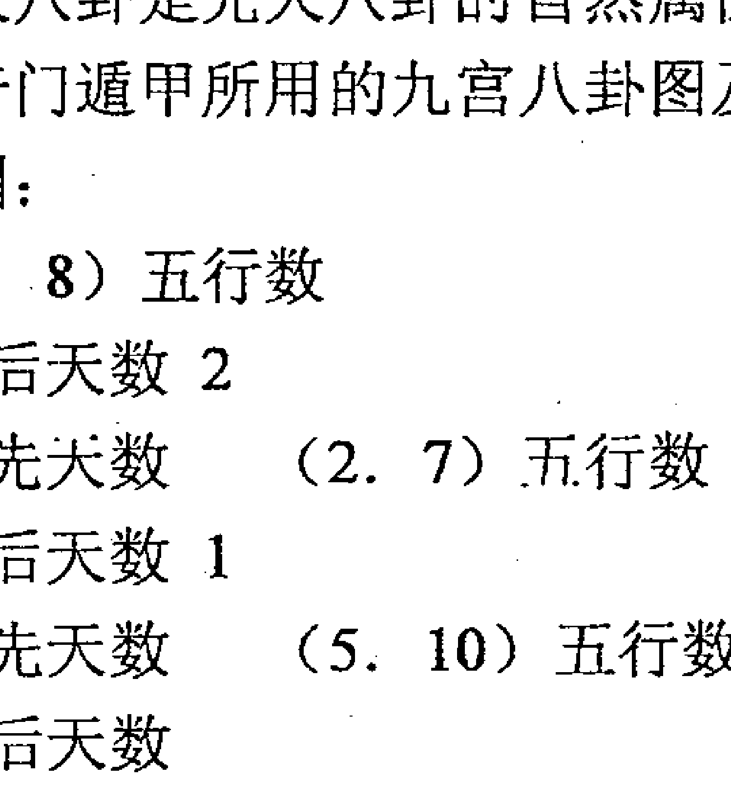
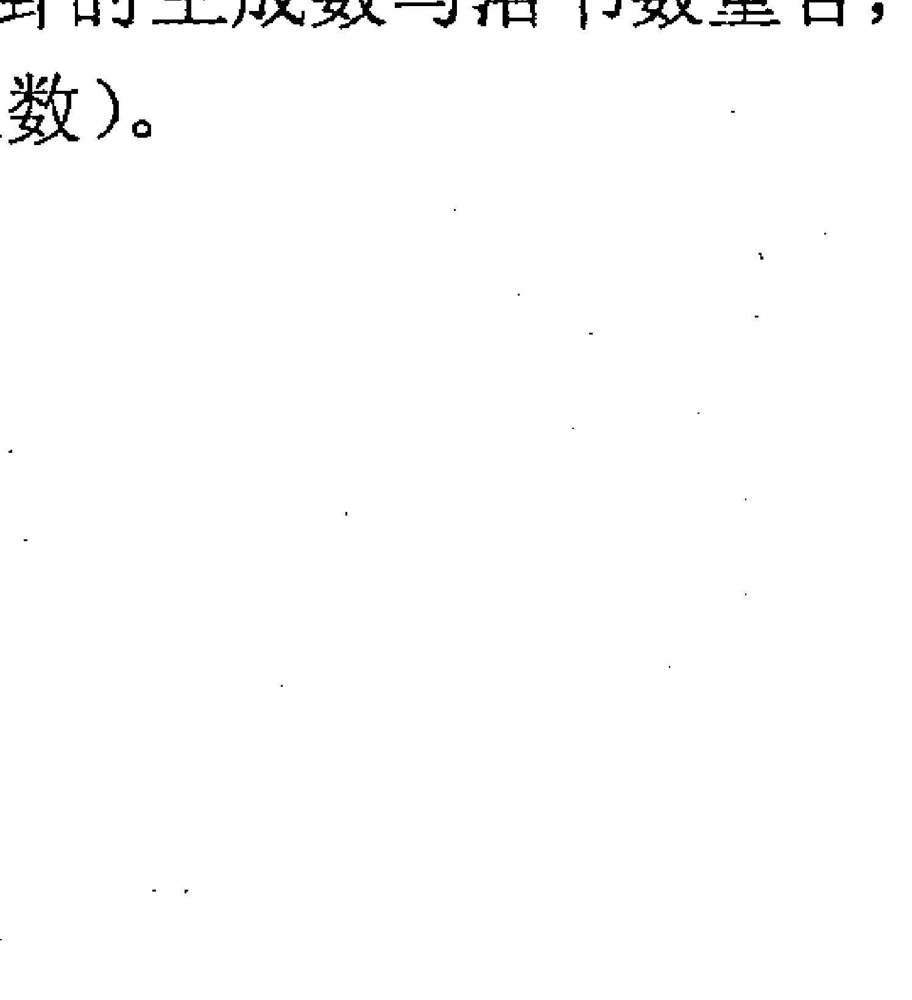
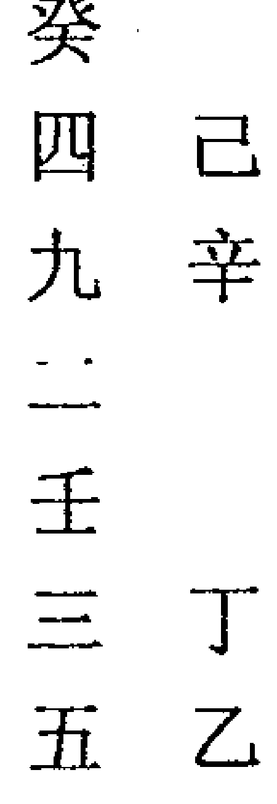

# 奇门遁甲现代应用技术

## 序言

清代学者纪晓岚在其《阅微草堂笔记》中记载了一个有关奇门遁甲的故事，开头我记得很深：

> “奇门遁甲之书，所在多有，然皆非真传，真传不过口诀数语，不著诸纸墨也。”

近几年来，易学之风波及海内外，掀起了学易的空前热潮，特别是被尊称为“帝王之学”的奇门遁甲，更是被研易者特加推崇，著书立说这更是层出不穷，纷纷应市。浏览书目，顿生新奇之感，然而阅读内容，却叫人啼笑皆非。记得一位奇门易友拿来一张奇门遁甲的格局让我看，说这个格局是作者的朋友，打电话要去拜访作者，作者不知朋友何意，特起局预测，让我分析一下，这个作者的朋友所为何事？当时日干是戊，我见地盘戊（地盘日干代表主，代表作者），上临天盘辛（天盘为客为朋友），组成了辛+戊困龙被伤的格局，戊土生辛金，戊为钱财为作者主人，生辛金，生朋友，必是朋友钱财方面受困找去向作者借钱，我将这个含义讲给易友听，他听完了。我问他，测错了吗？他说，你分析的完全正确，而作者没有测出，只是在书中说明朋友对他不利，后朋友来访的过程他写在书中，是为借钱而来。后来，我从他那里借到这本书翻了一次，觉得心中很不是滋味（当然不仅仅只是这本书），不是为作者的知识水平难受，而是为后学者难过，花了很长时间和精力去书中学习，学到的却是一些皮毛假东西，什么也没有学到，自己还不知道为什么？

你看人家写的书名、前言、自序都标榜自己乃仙家、正宗、祖传之学，再加上所谓名人的郑重推荐，那就正儿八经的成了真经，后学者又非真是行家，不敢评判人家的好与坏，不知哪些是真经、哪些是假货，标上了祖传秘籍就是宝贝，好像本事一下子长到了身上。

就现代社会的发展来看，易学的重要作用体现在对经济的指导与推动上。但光推车，没有真东西，推车还有何用？如果写书的目的仅仅是为了赚钱，拿来东拼西凑或沽名钓誉，玩弄词句，以显示名人地位，那就失去学易的意义。或许这些书家是遵从了老祖宗的遗训：

> “真经不在纸上传。”

然而，我觉得书的作用在于传播而不是传授，传播是让人了解而接受，传授是让人掌握而传播，掌握的人必须让想传播必须让人了解而接受，这样书的作用才得以发挥，依据这个理论得出这样一个结论：

> “如果你想掌握这门知识就不要死看书，如果你只是想了解这门知识，赶快买书吧。”

以上只是我个人的观点，权作看书前的调料，但目前人们却有一种错误的思想，以为名家大笔所著必有权威和可靠性，提起民间江湖预测之术，便嗤之以鼻做个帽子给你戴上，起个名字叫“封建迷信”。

我认为把易学称之为神秘文化是不对的。国内外一些知名易学者称易学在学而不在术，我也不敢苟同。我们的老祖宗在遣词造字上是非常讲究的，就拿易字上说，易上日下月，日月交替而成易，易的含义简单地说，就是日月的变化，日月变化影响了自然界是人类的发展，先贤们长期观察和总结日月的变化给人类的生产、生活及社会发展带来了什么样的影响，从而概括积累了一些能够指导人们生活行为的规律，孔夫子早就说过，“百姓用易而不知，”易学从来就不是凭空捏造的一门空洞无用纯粹抽象的哲学理论，它是指导人类社会发展及生活行为的一部经典。

写这部书的初衷，只是想让人们了解认识易学的真正功用，让后学者走进奇门，而不是在门外徘徊。书中大多部分理论及判断技巧均是本人多年实践中积累的一些经验。应用研究部分的例题是本人多年为人预测的一些记录，内容基本保持了真实性，为了让后学者能够明白地看懂，只好用这种写作形式，当然写作水平也实在不高，希望易学同道批评指正，但愿它是一部真经，后学者能从中得到一些传授而不仅仅只是了解。

## 上编基础知识部分

## 第一章 奇门遁甲的历史渊源及预测原理

奇门遁甲产生于什么时代？何时又被作为预测术？至今学术尚无定论。

> 宋代赵普所著《烟波钓叟歌》中提到：“轩辕皇帝战蚩尤，逐鹿中原苦未休，偶梦天神授符诀，登坛致祭谨虔修，神龙负图出洛水，彩凤衔书碧云里，因命风后演成文，遁甲奇门从此始。”

古今学者基本都以此为据追考奇门遁甲的源流。这段歌诀大意是说奇门遁甲是皇帝战蚩尤时在梦中得到的，这种说法显然是不可信，但奇门遁甲来源于古代战争中的排兵布阵是没错的。从易学符号如阴阳五行，天干、地支、河图、洛书及九宫八卦的成熟年代来看，奇门遁甲的创制时间在春秋战国时期的可能性很大。春秋战国时代，五霸争雄，七国并力连年大规模的战争不断，奇门遁甲正是适应了古代战争中排兵布阵的需要，这一点是学习奇门遁甲的关键所在，也就是说，奇门遁甲中的符号，最初只是作为军事术语来运用的，明白奇门遁甲预测符号的原意，学习奇门遁甲就变的很轻松。

相传皇帝命风后创立奇门遁甲时，共有四千三百二十局，后改良为一千零八十局，而太公姜尚因行军布阵的需要压缩为七十二局。汉代的张良得黄石公传授后，再次进行了改革成为现今使用的阴遁九局、阳遁九局，共十八局。奇门遁甲在历史的承传中，不断地改进完善，例如，奇门遁甲中的天盘九星，传说是汉代天文学家张衡运用遁甲术研究天体运行时完善到奇门遁甲中的，而人盘八门乃三国时期的诸葛孔明依据战争的需要将八卦衍生为八门，分布在九宫八卦内。《三国演义》还介绍了诸葛亮在彝陵鱼腹浦布下了石阵，分为开、休、生、伤、杜、景、死、惊八门既著名的《八阵图》。

奇门遁甲在历史的各个时期都有不同的称谓，周秦时期称为阴符经，三国后名为六甲，唐宋后又称为遁甲，明清以来才称为奇门遁甲，奇门遁甲分为两大派别：一是数理奇门，一是法术奇门，数理奇门就是先进的奇门预测术，分为年家、月家、日家、时家四种奇门，按推演的方法又分为排宫法和飞宫法（本书着重讲时家奇门、排宫法）法术奇门大多在道教，民间流传，融合道术，符咒等内容，至今仍有传承者，民间习者大多为人消灾解难，不愿公诸于世。

奇门遁甲将时空、数理相互融通，多维地，不同层次地整体展示万事万物存在的形式，包含了事物的特征及彼此间的相联性。它的基本格局反映了当时社会间的人事、生活、社会制度、及天文、地理、物候等方方面面。奇门遁甲源于感性思维，发展过程中综合运用了形象、以类取相的联想力，以及观物取象的直观思维，类聚群分的逻辑思维，极数通变的象数思维等方法。古人认为宇宙处在一个无极的状态之中，认知宇宙的方法是将它划出一块做为太极，地球是宇宙中的一个太极，中国又是地球上的一个太极。一个团体、家庭又是这个国家中的一个太极，人又是这个国家团体、家庭中的一个太极。做为人体来说，一个器官又是人体中的一个太极，同理，通过这个太极的变化也能反映出宇宙间大太极的变化。例如，人体的肝脏出现了问题，肝脏对人体来说就是个小太极，肝脏引起了整个身体（大太极）的不适，这就是小太极影响了大太极，同时大太极影响各个小太极。例如，一个人体的死亡，即使他的某些器官功能良好，但随着大太极的衰亡（人体）这个小太极（器官）也会随着衰亡，每个小太极之间也会彼此联系相互影响。例如，肝脏出现了问题就会影响到血液，血液有问题，心脏就出现了毛病。中医学认为一只耳朵、一只脚都能代表全身，通过摸压针刺耳朵或脚部的某些穴位就能治疗全身性的疾病，这就是古人天人合一的说法。宇宙万物，无论宏观、微观其大无外其小无内，物物一太极。怎样认知这个太极（地球、国家、人体、万事万物），划分太极为二，这样就产生了阴阳，任何事物和现象都具有阴阳两方面。例如白天、黑夜，冷暖，动静、大小、高低、男女、夫妻、雌雄、生死、内外、贵贱等等，再将阴阳划分下去，就产生了四象八卦，春夏秋冬，八方八门，天、地、人、神四层空间，八个方位，这个太极的时空就按宇宙的特定规则产生了，而奇门遁甲就是按九宫格式（即“井”字格）及特有的信息符号（天干、地支、星门、神）将太极的发生发展规律综合概括成为象、数、理模型，任何事物（太极）都能通过这个奇门遁甲主模型具体反映，而这些具体反映是通过奇门遁甲这个象数理模型中特有的信息符号（天干、地支、阴阳五行、星门奇仪）体现出来的，奇门遁甲象数理模型演变图：

无极-----太极-----阴阳-----四象-----八卦

任何一种事物或现象我们都可以把它看成是一个奇门遁甲的象、数、理模型（太极），其存在和变化的形式角度虽然不同，但它的发生发展及其变化过程是一致的，即都是严格地遵循大宇宙（大太极）的运行发展规则在其制约条件下进行变化发展。因此，古人说，天体是个大宇宙，人体是个小宇宙，天地是个大人身，人身是个小天地，作为小宇宙的人，必须遵循天体大宇宙运行的法则。这就是奇门遁甲的预测依据及其原理，也就是说奇门遁甲是大宇宙的反映模式，预测的方法就是以不变应万变，即相对的理论结构（象、数、理模型不变）应对人世间纷繁复杂的事物和现象（万变），就好比一个人学会了驾驶技术，汽车不同，道路也不相同，但可以使用相同的驾驶技术，驾驶不相同的汽车在不相同的道路上行驶。奇门遁甲将一切事物的成败归纳为五大因素，即天时、地利、人和、神助，格局组合，如奇门遁甲图例：

值符 巽四宫 | 螣蛇 离九宫 | 太阴 坤二宫
天辅星 乙 | 天英星 壬 | 天芮星 丁
杜门 乙 | 景门 壬 | 死门 丁

九天 震三宫 | 中五宫 | 六合 兑七宫
天冲星 丙 | 天禽星 戊 | 天柱星 庚
伤门 丙 | 死门 戊 | 惊门 庚

九地 艮八宫 | 玄武 坎一宫 | 白虎 乾六宫
天任星 辛 | 天蓬星 癸 | 天心星 己
生门 辛 | 休门 癸 | 开门 己

所谓天时是指天体运行对一切事物的影响，包括自然界的风雨雷电的变化，国家政策法规的约束，战争、自然灾害等等，均指天时，奇门遁甲中以九星代表天时。九星即天心星、天蓬星、天任星、天冲星、天辅星、天英星、天芮星、天禽星、天柱星。所谓地利是指周围的地理环境（如风水）生态环境，地球磁场对事物的影响，山川、河流、道路、交通、社会区域的结构，奇门遁甲中以九宫代表地利。九宫即乾、坎、艮、震、巽、离、坤、兑及中五宫。所谓人和，是指人际关系，民族种群的差别，伦理道德、民俗习惯等等，奇门遁甲中以八门代表人和，八门即开、休、生、伤、杜、景、死、惊这八门。所谓神助，是古人在天人感应中发现与九宫八卦具有相对应性质的八种神秘的自然力量，影响着事物的发生发展。奇门遁甲中以八神代表神助。八神是指值符（天乙贵人）、螣蛇、太阴、六合、白虎、玄武、九地、九天。所谓格局组合，即事物在发展过程中存在的微妙变化和变化过程，格局组合即奇门遁甲中天、地、人、神、星、门、奇、仪的组合结构，以十干克应，八门克应，星、门、奇、仪组合为代表。

奇门遁甲就是将这五种因素综合在象、数、理模型（太极）中运用奇门遁甲的语言信息符号展示事物发生发展过程及其结果，它使用主要语言信息符号就是阴阳五行、天干、地支、九宫、八卦及其特有的九星、八门、八神。要掌握奇门遁甲的推演方法及其判断技巧，首先要熟悉和掌握这些语言信息符号的含义。

## 第二章 奇门遁甲预测语言符号的特性及信息含义

### 第一节 阴阳五行的特性及信息含义

阴阳的本意有两种说法，一是指日月，日为太阳，月为太阴，合称为阴阳，一是指太阳的向背，向着太阳的一面为阳，背着太阳的一面为阴。阴阳之说早在夏代就已经形成，如八卦中阴爻阳爻的出现，古人长期观察自然界的事物和现象，发现任何事物和现象都具有相对立的两方面。如：动静、大小、冷暖、高低、粗细、内外、奇偶、雄雌、男女、生死等等。古人将积极、进取、活跃、刚健的一面称之为阳；将消极、退守、呆板、柔弱的一面称之为阴。如动为阳、静为阴；男为阳，女为阴；轻为阳，重为阴；雄为阳，雌为阴；奇为阳，偶为阴；上外为阳，下内为阴等等。又发现阴阳除了相对立的两个方面外，又存在着互根、消长和转化。阴阳互根即相互依存是指一切事物和现象中的对立两方面又都具有互相为用的内在联系，它们相互的存在是在对方的存在下为前提。例如，没有动就没有静，没有大就没有小，没有男就没有女，没有生就没有死，没有善就没有恶，没有刚就没有柔等等。阴阳消长是指一切事物和现象都在运动和变化之中，你强我弱，你增我减，此消彼长，如春夏秋冬，周而复始，寒来暑往，秋收冬藏。阴阳转化是指阴阳对立的双方在一定的条件下，彼此互相影响改变原有属性。例如，仇敌转化为朋友，由弱小转化为强壮，山川转变海洋，坏人变为好人，青年变为老人等等。

阴阳的对立、互根、消长、转化是一切事物发展的必然的规律。奇门遁甲预测的根本原理，就是对阴阳这种特性规律的把握和认知。阴阳做为一种信息符号，始终贯穿在奇门遁甲象数理模型中。例如奇门遁甲将夏至后所用之局称为阴遁，冬至后所用之局称为阳遁，又按阴阳将九宫八卦分为内盘和外盘，阴遁之局将九、二、七、六宫称内盘，代表事物现在发生的过程及结果。将一、八、三、四宫称为外盘，代表事物将来的发生过程及结果。阳遁之局正好相反，其他如星、门、奇、仪等也都按阴阳划分（后面将专门论述）。

阴阳这种特性具体体现在五行中，五行即金、木、水、火、土。五行的最初含义，是古人对自下而上的基础物质的状态及属性的直观认识，也就是说五行是人生日用不可缺少的五种物质。作为抽象的信息符号是后来才有的，为了提示事物和现象的变化规律，古人采用了此类取象的方法，把所有的事物和现象都归纳到这五大类即五行中去，而所有的事物和现象（包括人在内）的发展变化都是这五种不同的物质不断运动和相互作用的结果，这五种不同物质不断运动相互作用产生了我克、克我、我生、生我、比和的五种变化关系，这种变化关系是一个永恒的定律。如：

相生（我生、生我）:水生木，木生火、火生土，土生金，金生水。
相克（克我、我克）:金克木，木克土，土克水，水克火，火克金。
比和（同类）:金金相遇，水水相遇，木木相遇，火火相遇，土土相遇。

另外，由于五行力量大小的强弱变化，又出现了反的现象。例如，金旺火弱时，金反克火，土旺木弱时，土反克木，木旺金弱时，木反克金，如，金能克木，但以小刀伐大木，木不倒反坏其刀，水能克火但火旺时，水不能救火反助火势（如在媒中加适量的水，火会更旺），火能克金，但用炉火去炼钢铁之金不但不成，反被压灭，土能克水，但大的洪水却能冲垮堤岸，木能克土，但土多木埋。

我们将五行的这种定律称为五行的生克制化关系。五行的生克制化，是一切事物和现象之间的内外因果，不能单纯地理解为五种具体物质间的相互作用，而是将五行理解为五种未知的信息符号，通过这五种信息符号的变化规律，解读未知的信息。

五行力量的大小随时间及落宫的不同出现了旺、相、休、囚、死这五种状态，其运用口诀是：同行者为旺，生我者为相，克我者为死，我克者为囚，我生者为休。例如：木在春天为旺（因春天为木），夏天为休（夏为火，木生火，为我生为休）秋天为死（秋为金，金克木，克我者死)，冬天为相 (冬为水，水生木为生我者为相)。

五行旺相休囚死表：

| 旺 | 相 | 休 | 囚 | 死 |
| :--- | :--- | :--- | :--- | :--- |
| 春 木 | 火 | 水 | 金 | 土 |
| 夏 火 | 土 | 木 | 水 | 金 |
| 秋 金 | 水 | 土 | 火 | 木 |
| 冬 水 | 木 | 金 | 土 | 火 |
| 四季 土 | 金 | 火 | 木 | 水 |

五行因各自的属性不同，产生了不同的特性。如：

木曰曲直，能伸能曲之义，具有生发条达的特性。木主人物修长，眉清目秀，肤色青白，坐立身多倚侧，说话畅快，声调高。木主要性情仁慈，忠厚，理智，有主见，举止稳重端庄、潇洒。木所代表的职业大多为种植业、医药、文教、印刷、纸张、书籍、木材、园艺、司法、布匹纺织、装饰装潢等等。

火曰炎上，向上、炎热之义，具有发光、温暖，向上的特性。火主人面貌上尖下阔，肉多，印堂窄，眉浓鼻露，头尖脚大，背厚腹宽，多动少静，肤色红黄，话多语快。火主人性情活跃，开朗大方，作风严谨，有奋发精神，尊长爱幼，有创造力，爱打扮不畏艰辛等。火所代表的行业大多为美容化妆、照明灯饰、电子电器、易燃品、加油站、高温行业、消防、摄影化工等等。

土曰稼穑，为农作物播种、收获之义。土具有长养、化育的特性。土主人鼻子多肉，口方，头圆而阔，肤色黄白，眉淡不秀，声音重浊，多静少动，稳重得体，举止缓慢，话语迟钝。土主人性情守信忠义，心胸宽广，随和大度，敬神信佛，安静耐心。土所代表的行业大多为土地种植、养殖、矿产、房地产建筑、水泥、石器、丧葬、基础设施、建筑材料等等。

金曰从革、改革、变革之义。金具有清静收杀的特性。金主人皮肤白皙，眉目英俊，圆脸尖下颏，鼻直口正，说话清亮，骨肉匀称，多短发，胡须少。金主人性情果断仗义，多才多艺，好酒好吟，通情达理，重名声，善交际，重感情，好管事。金所代表的行业大多为金属器材、冶炼、金银首饰、珠宝、金融、铸造、钟表、钢铁、银行、汽车等。

水曰润下，湿润流动之义。水具有寒冷向下的特性。水主人皮肤黑细、圆脸、瘦肩、骨骼不壮，身体柔弱，眉清目秀，大眼睛，语调清和，阴阳顿挫。水主人性情胆大，聪明智慧，胸襟广阔，目光远大，学识俱佳，头脑灵活机智。水代表的行业大多为水产、餐饮、运输、娱乐界、渔业、水利、游泳、服务性行业等等。五行分类图如下：

| 五行 | 金 | 木 | 水 | 火 | 土 |
| :--- | :--- | :--- | :--- | :--- | :--- |
| 八卦 | 乾兑 | 震巽 | 坎 | 离 | 艮坤 |
| 五季 | 秋 | 春 | 冬 | 夏 | 季末 |
| 五方 | 西 | 东 | 北 | 南 | 中 |
| 五色 | 白 | 青 | 黑 | 红 | 黄 |
| 五数 | 4、9 | 3、8 | 1、6 | 2、7 | 5、10 |
| 五官 | 口 | 舌 | 耳 | 眼 | 鼻 |
| 五脏 | 肝 | 肾 | 心 | 脾 |  |
| 五味 | 辛 | 酸 | 咸 | 苦 | 甘 |
| 五常 | 义 | 仁 | 智 | 礼 | 信 |

奇门遁甲将阴阳五行的生克制化作为预测判断结果的主要依据。奇门遁甲的所有预测信息符号都是按阴阳五行的不同特性归类划分的，也就是说所有的预测信息符号含义的来源，都是来自阴阳五行。例如十天干中：

甲为阳为木；乙为阴为木；丙为阳为火；丁为阴为火；戊为阳为土；己为阴为土；庚为阳为## 第一节 天干的特性及其信息含义

天干在奇门遁甲中占据着十分重要的地位，有人将奇门遁甲称为天干学。天干的原始含义为树干，传说古人黄帝造屋之前，大多在树上搭建窝棚栖息，用以躲避毒蛇猛兽的侵袭。早晨人们醒来活动时，通过树干才能看到天空中的太阳。解放前中国的一些少数民族还保持着这样的建屋习惯，中国云南西双版纳的傣族民居依然为“干栏式”的吊脚建筑风格。

天干最早出现在甲骨文中，据说最初的用途是记录太阳的活动变化。太阳是地球上的万物之源，对地球上一切生物构成最直接的影响。天干作为信息语言符号，基本体现了阴阳五行的特性，但其内涵和外延更深入更广泛，涵概了万事万物。

甲为阳木，名为大林木，有参天之势，性坚质硬，栋梁之材。主人形体长方，皮肤青白，筋骨强健，国字脸，浓眉秀发，为人清洁，过于自负，不能娴于事故。奇门中称甲为天福为贵人，代表首领、主要领导人、大人物、将帅，隐遁于六仪之下。

乙为阴木，名为花草之木，有装扮人间之美，质软柔弱，情满人间。主人身材苗条，男子微驼身，皮肤白嫩，骨肉松弛，瘦长脸。为人性情柔顺，重情仁慈，爱打扮，依附世情。奇门中称乙为天德，为仁德之君。代表门奇、女人、妻子、象是人在爬、头发、眉毛、耳朵、舌头、大脑的神经、血管、肠子、肩膀、胳膊、脖子、肩、腿、脚、手、手指、弯曲的东西。乙落离宫为头、血管有毛病。为护士、肝脏、月亮、艺术品、男性生殖器、小孩、蚯蚓、胡子、画、神经、木制的桥、树木、木制的门窗、桌子、椅子、床柜、弯曲的河流、蔬菜、领带、输卵管、中药、中医、草地、花草、蝴蝶、蔬菜类的食品、多足的动物、长大的希望、歌女、水果、腰身、柔软的身材、茶叶等。

丙为阳火，名为太阳之火，有光明天地功，其性刚烈威严，果敢欺霸。主人体态丰满，圆脸，少胡须，短发，皮肤白里透红。为人性情刚烈勇猛，不怒自威，工作清廉，能成大材，但难持久。奇门中称丙为天威，有雄威之义，代表权威之人、婚姻中第三者男人、情夫、嫖客、月奇、病灶浮肿，炎症部位、手肿、牙龈肿。代表火、太阳、饼、圆形的、红色的、停、出乱子、红色的花朵、血液、发烧、丙加癸是酒鬼、红嘴唇、心脏血液、脚、男人、也代表女人、发烧友、发炎、窗、高处、炮火、圆脸、炉火、烧烤、烧伤、少男、强烈的希望、小肠、红绿灯、性感、眼镜、欲望、脾气大急躁、见光的地方、发热的东西、熊猫眼（眼肿的意思）、火焰、流鼻血、超短裙、太阳能等。

丁为阴火，名为灯烛之火，性质柔弱，有照亮万户之功，为人为己。主人秀丽清高，肤白粉嫩，发细而长，额宽颊尖。为人性情和顺而有心计，体贴人情，洞察奸邪。奇门中称丁为玉女太阴，代一星奇。婚姻中第三者女人、情妇、妓女、三陪女、红色，花、耳丁、火、烟、吸烟、灯光、女孩、打电话、小颗粒的东西、丁有丙的含义、男丁、男小鞭、癸加丁是性行为、眼睛、红嘴唇、血、血管、直、马上达成、希望、丁的希望最好（乙是弯曲实现，丙是出乱子实现）、高根鞋、画、樱桃、葡萄、肉丁、宫爆鸡丁、胸罩、针灸、扎针、手术刀、牙齿、牙医、香火、烧香、口子、有文化、脐、电子产品、幼儿、小孩、叮咬、盯人（一种动作，看得目不转睛）、路口、丁字路口、高处、瓜子脸、演员、辣椒、子弹、火山喷发等。

戊为阳土，名为大地山川之土，性高亢质硬而向阳，生育万物。主人形体敦厚，四方脸，皮肤黄白，身体多肉，胖子。为人性情果敢豪杰、刚烈暴躁、憨厚或愚笨痴呆、行动迟缓。奇门中称戊为天武为天门，代表资本、钱财、土地、脸、鼻子、胸、乳房、肠胃、脾、屁股、肌肉、肌肤、乙加戊落乾宫脚肥）性格忠厚、笨、大地、雾、矿石、大石头、水泥、矿产、（房檐上的草叫乙加戊）瓷器、玉器、横梁、屋梁、房子、地质学家、会计、建筑工人、建筑商、金融、黄金、金融机构、农场、城墙、高岗、墙面、桥、讲信用、有财源、经济好等。

己为阴土，为田园之土，有培木溶水之能，其性温质软，低洼向阴。主人形体单薄，瘦弱丑陋，忧愁之相，声音含糊重浊。为人性情静多动少，温顺沉静。奇门中称己为六合为明堂，代表坟地、阴沟、低洼之地、小肉、有戊的性质，嘴、耳坠、脑子、忠厚老实、朋友多、欲望、花花肠子、消化系统、乳头、身体、肚子、肛门、院落、阳台、肚脐附近、小个子、大便、肮脏、马桶、垃圾、地井下水道、坑道、地下室、菜园、低洼、盆地、饭、策划、打结、食物、面包、蛋糕、痘、肚脐眼、餐具、坟地、疤痕、弯曲的河流、幻想、杂乱、脾、水果、药丸等。

庚为阳金，名为剑戟之金，有刚健肃杀之力，其性刚质硬。主人形体瘦长，骨格健壮，长脸白皮肤，筋强骨健。为人性情刚健敏锐、有威严、坚忍不拔、能屈人而不屈于人。奇门遁甲中称庚为天狱为天刑，代表仇人、丈夫、公安干警、道路、皮毛、大肠、骨骼、肺、大腿骼、道路、阻隔、阻挡、技术、虎、军人、背、打斗、刀、武器、佛、高个子体态长方、钢键锐力、威严、盆腔、收费站、脊骨、关口、黑社会、车祸、石块、墙角、技术过硬、凶猛等。

辛为阴金，名为珠玉装饰之金，性软洁静。主人形体修长方正，皮肤白嫩，长脸凹腮，为人性情忠诚爽柔，温润秀气自尊但虚荣，意志稍不坚。奇门中称辛为天庭，代表罪人或犯过错误的人、错误、革命、变革、铁匠、工匠、白色、小石块、手表、斑点、刀具、电子产品、计算器、罪犯、肺、呼吸系统、看守所的狱警、金融界、五金制品、首饰、珠宝、首饰店、门窗、骨头、枪、武术、小路、腰、刑具、粮食、颗粒状的东西、诱惑。

壬为阳水，名为江河湖海之水，通天河而周流不息，性猛而不收，难以回头。主人皮肤稍黑，大眼睛，走路摇摆，长发秀眉，为人性情柔顺而阴险，勇敢多智，纵欲任性，可共忧患难以同乐。奇门中称壬为天牢，代表不稳定的事物、牢狱、流动的东西、装在是什么里就是什么东西、什么事情往回一想就是好事、变动、大水、自来水、热水器、瀑布、糊涂、迷糊、迷茫、柔性、智慧、动脉、血液、血管、流动的车、膀胱、风流、船、海边、码头、海港、海滩、海军、黑色的、怀孕、娱乐的地方、聚众、驾驶员、司机、运输行业、流动的云、门扇、养殖业、海产品、水上运动、鱼类、小孩、小偷、眼睛、演员、邮电行业、道路、鞋子、飘动等。

癸为阴水，名为雨露之水，性发生至静至弱，滋润万物。主人矮小黑丑，圆脸瘦肩，声调不高，为人性情阴柔怕事，多伤感，不能自主。奇门遁甲中称癸为天网，代表性及性生活有关之事、牢狱、小水、淋浴、饮料、咖啡、可乐、眼泪、哭泣、奶、尿尿、厕所、癸加辛水珠）汤粥、污水、眼睛（水汪汪的大眼睛）、湿度大的雾气、戊加癸是钱财都流了）洗浴用品、鞋子、头发、油类、鱼缸、下雨、子宫、足、女性用品、便池、鼻涕、蛋、黑色的发、黑色的眼睛、困难、足、静脉、血液、酒、癸加己酒鬼，丁加己烟鬼，在坎宫女人来例假了）色情、肾、神经系统、化妆品、小孩子、精液。

## 十天干基本类象分类图

| 天干 | 季节 | 方向 | 味道 | 颜色 | 脏腑 | 部位 |
| :--- | :--- | :--- | :--- | :--- | :--- | :--- |
| 甲 | 春 | 东 | 酸 | 青色 | 胆 | 头 |
| 乙 | 春 | | | 浅绿 | 肝 | 肩 |
| 丙 | 夏 | 南 | 苦 | 紫赤 | 小肠 | 额 |
| 丁 | 夏 | | | 淡红 | 心 | 胸眼 |
| 戊 | 四季 | 中央 | 甘 | 深黄 | 胃 | 肋鼻 |
| 己 | 四季 | | | 浅黄 | 脾 | 腹面 |
| 庚 | 秋 | 西 | 辛 | 白色 | 大肠 | 脐筋 |
| 辛 | 秋 | | | 浅白 | 肺 | 胸股 |
| 壬 | 冬 | 北 | 咸 | 深黑 | 膀胱 | 腿 |
| 癸 | 冬 | | | 浅黑 | 肾 | 足 |

根据阴阳五行之理，十天干也存在生克制化的关系如：

相生：甲木生丁火、乙木生丙火、丙火生己土、丁火生戊土、戊土生辛金、己土生庚金、庚金生癸水、辛金生壬水、壬水生乙木、癸水生甲木。

相克：甲木克戊土、乙木克己土、丙火克庚金、丁火克辛金、戊土克壬水、己土克癸水、庚金克甲木、辛金克乙木、壬水克丙火、癸水克丁火。

合化：甲己合化土、乙庚合化金、丙辛合化水、丁壬合化木、戊癸合化火。

十天干的生克制化体现了阴阳的对立、互根消长转化的过程。天干的相生都阴生阳、阳生阴。相克者是阳克阳、阴克阴。合化都阴阳合化，其中天干合化反映的是事物的消长与转化。如：

甲己合化土，甲木性仁慈为天干之首，己为阴土性宁静，有滋生万物之德，故甲己乃中正之合，甲己合主人相互尊敬，婚姻门当户对，相敬如宾，礼仪严谨之家。奇门测事多合作多方，重诚守信，正大光明。

乙庚合化金，乙木性柔仁慈，庚金性坚而不屈，故乙庚相合刚柔相济为仁义之合，乙庚合主人果敢有守，重情讲义。奇门测事多为异性相助，夫妻共勉，有刚有柔，测婚乙庚合化多为自由恋爱。

丙辛合化水，丙火性炽烈，辛金质柔而刃，丙辛合为权威之合，丙辛合主人仪表威严，人多畏惧。奇门测事主吉中藏凶，小有过失，测婚多为长辈、他人或媒妁撮合成姻。

丁壬合化木，壬水性寒冷，丁火自昧不明，故丁壬合为苟且淫荡之合，丁壬合主水多情易动，事无大志，不事高洁，风流好色，亲小人慢君子，好饮酒纵欲，有污家风。奇门测事多主狼狈为奸，苟且合作，测婚为苟合，图肉体快感而无真实情感。

戊癸合化火，戊土燥而质干，癸水性阴匿，戊为老丑之夫，癸为婆婆之妇，戊癸合化为老阳老阴之合，已无情义可言，故为无情之合，戊癸化合主人背信弃义，见利忘义。奇门测事多主不能长久，因财争执，测婚多为无情夫妻，双方各尽夫妻义务而已。

天干的力量大小即旺衰是以时间节令和所落宫位来表示的。古人以长生、沐浴、冠带、临官、帝旺、衰、病、死、墓、绝、胎、养来表示天干的旺衰，又按阴阳的特性规定了十天干的运行规则即阳顺阴逆，阳生阴死，阴生阳死。就是说甲、丙、戊、庚、壬五阳干顺时针运行；乙、丁、己、辛、癸五阴干逆时针运行。五阳干长生的时间和落宫就是五阴干死亡的时间和落宫，五阴干长生的时间和落宫就是五阳干死亡的时间和落宫。如奇门遁甲宫内十天干运行图：

| 天干状态 | 甲 | 丙 | 戊 | 庚 | 壬 | 乙 | 丁 | 己 | 辛 | 癸 |
| :--- | :--- | :--- | :--- | :--- | :--- | :--- | :--- | :--- | :--- | :--- |
| 长生 | 亥 | 寅 | 寅 | 巳 | 申 | 午 | 酉 | 酉 | 子 | 卯 |
| 沐浴 | 子 | 卯 | 卯 | 午 | 酉 | 巳 | 申 | 申 | 亥 | 寅 |
| 冠带 | 丑 | 辰 | 辰 | 未 | 戌 | 辰 | 未 | 未 | 戌 | 丑 |
| 临官 | 寅 | 巳 | 巳 | 申 | 亥 | 卯 | 午 | 午 | 酉 | 子 |
| 帝旺 | 卯 | 午 | 午 | 酉 | 子 | 寅 | 巳 | 巳 | 申 | 亥 |
| 衰 | 辰 | 未 | 未 | 戌 | 丑 | 丑 | 辰 | 辰 | 未 | 戌 |
| 病 | 巳 | 申 | 申 | 亥 | 寅 | 子 | 卯 | 卯 | 午 | 酉 |
| 死 | 午 | 酉 | 酉 | 子 | 卯 | 亥 | 寅 | 寅 | 巳 | 申 |
| 墓 | 未 | 戌 | 戌 | 丑 | 辰 | 戌 | 丑 | 丑 | 辰 | 未 |
| 绝 | 申 | 亥 | 亥 | 寅 | 巳 | 酉 | 子 | 子 | 卯 | 午 |
| 胎 | 酉 | 子 | 子 | 卯 | 午 | 申 | 亥 | 亥 | 寅 | 巳 |
| 养 | 戌 | 丑 | 丑 | 辰 | 未 | 未 | 戌 | 戌 | 丑 | 辰 |

口诀：甲亥乙午丙戊寅、庚巳辛子壬在申、丁己在酉癸卯寻。

甲为阳木长生在亥，沐浴在子，冠带在丑，临官在寅，帝旺在卯，衰在辰，病在巳，死在午（乙木长生在午），墓在未，绝在申，胎在酉，养在戌。

乙为阴木长生在午，沐浴在巳，冠带在辰，临官在卯，帝旺在寅，衰在丑，病在子，死在亥（甲木长生在亥），墓在戌，绝在酉，胎在申，养在未。

天干按火土同宫的原则即丙戊为阳火阳土，长生在寅，沐浴在卯，冠带在辰，临官在巳，帝旺在午，衰在未，病在申，死在酉（丁己长生在酉），墓在戌，绝在亥，胎在子，养在丑。

丁己为阴火阴土，长生在酉，沐浴在申，冠带在未，临官在午，帝旺在巳，衰在辰，病在卯，死在寅（丙戊长生在寅），墓在丑，绝在子，胎在亥，养在戌。

庚为阳金，长生在巳，沐浴在午，冠带在未，临官在申，帝旺在酉，衰在戌，病在亥，死在子（辛长生在子），墓在丑，绝在寅，胎在卯，养在辰。

辛为阴金，长生在子，沐浴在亥，冠带在戌，临官在酉，帝旺在申，衰在未，病在午，死在巳（庚长生在巳），墓在辰，绝在卯，胎在寅，养在未。

壬为阳水，长生在申，沐浴在酉，冠带在戌，临官在亥，帝旺在子，衰在丑，病在寅，死在卯（癸长生在卯），墓在辰，绝在巳，胎在午，养在未。

癸为阴水，长生在卯，沐浴在寅，冠带在丑，临官在子，帝旺在亥，衰在戌，病在酉，死在申（壬长生在申），墓在未，绝在午，胎在巳，养在辰。

从以上可知，辰、戌、丑、未为四墓，养之地又叫四库，有旺为库，衰为墓之说。子、午、卯、酉为五阴干长生之地，又为五阳干帝旺之地。寅、申、巳、亥为五阳干长生之地，又为五阴干帝旺之地。

十天干从生旺到衰死的全过程是一切事物发展变化的必然规律，如长生是事物的起点、始发阶段，表示新的机遇来临，气运开始上升。沐浴是沉迷，脆弱的阶段，表示事物面临诸多方面的影响，测运则命犯桃花，有情感外遇。冠带是事物逐渐形成的阶段，测事大多为初具规模，万事已备。临官是事物成熟阶段，表示事业开始兴旺、发达、控制能力、前景乐观、春风得意之时。帝旺是事物发展到鼎盛时期的标志，表示运气已达到了高峰，但老年人测运则有旺极而折之危，易有意外的灾祸来临。衰是事物衰老、退化的阶段，表示信心不足、体力不支、胆小怕事。病是事物易出现问题的阶段，测人大多为身体不佳、精神不好、体弱多病，测事为隐患已经存在，问题已经发生。死、墓、绝是事物衰死，无有生机的阶段。测运大多为落入低谷，难以自拔，无力回天、倒霉、走背运的时候。胎、养是休养生息之时，表示没有机遇，难以发奋，等待时机。

十天用于奇门遁甲中有前五阳、后五阴之说。古人认为时辰遇五阳干即甲、丙、戊、庚、壬时，利客不利主，做事宜先动。五阳干为喜用神出军征战，远行求财，迁徙起造，百事可为而得利，但逃亡者不可得。古人云：“得阳干者飞而不止，利客先举”。时辰遇五阴干即乙、丁、己、辛、癸时，利主不利客，做事宜后动。五阴干为恶神，行事须对方先行后再动可决胜，不可拜官谒贵、婚嫁出行、举造百事、应密谋策划、坐收渔人之利，逃亡者可得。古人云：“得阴干者为主，伏而不起则利。”古人还总结了出行时辰遇十天干的歌诀：

六甲出行最吉利，金马玉堂逢贵人。
乘着六乙出门去，秃头公吏宜终身。
持执弓弩遇骑射，盖为时乘六丙行。
州官县宰相遇面，只为行时正六丁。
若逢戊、己出行去，两个妇人身着青。
庚、辛、壬时最为恶，大凶无吉有灾祸。
六癸出行逢骑射，多遇山林隐逸客。

这段歌诀大体讲述的是古人出行的外应情况，与现今社会人们出行的情况是有差别。因古代的交通环境与现代社会的交通差距很大，一个时辰内现代社会里就会发生千万种事情，但依我个人的经验实证如果出行时遇庚时，出行大多会有阻隔之事，时遇六辛路上有遇死丧之事的可能。其它均无验证。

十天干在奇门遁甲的九宫格式内没有固定的位置。它们是依据奇门遁甲特有的编排规则，依节令、时辰的转换而不停的运动变化。

#### 第三节 地支的特性及其信息含义

从易学的符号语言发展看，十二地支的发明应晚于十天干。十二地支及属相的形成也是来源于古人对自然界的长期观察积累的经验。古人认为在天体的运行中，除了太阳外其次就是木星对地球的影响最大，古人称木星为太岁。木星围绕太阳运转每十二年一个轮回周期。由于它每年运行时与太阳、地球的角度不同从而形成了十二种不同的能量场，影响到了地球上十二种不同动物的生长、繁殖。这十二种动物便是子鼠、丑牛、寅虎、卯兔、辰龙、巳蛇、午马、未羊、申猴、酉鸡、戌狗、亥猪。传说龙这种动物并非是古人主观臆造出来的，而是确有存在。它的一半身体在空中，一半身体在海里，只是到后来地球上的环境不适应它的生存而灭绝了。

十二地支源于木星围绕太阳运转对地球的影响，形成十二种不同的能量场，从而产生了各种生克制化的关系，这也是易学描述推演自然规律及事物和现象的依据。

十二地支根据阴阳划分为子、寅、辰、午、申、戌为六阳；丑、卯、巳、未、酉、亥为六阴。依五行划分为寅卯木；辰戌丑未土；巳午火；申酉金；亥子水。根据五行的生克制化关系和十二支阴阳五行划分形成了生、克、冲、合、刑、害这六种关系。

相生：寅卯木生巳午火，巳午火生辰戌丑未土，辰戌丑未土生申酉金，申酉金生亥子水，亥子水生寅卯木。

相克：寅卯木克辰戌丑未土，辰戌丑未土克亥子水，亥子水克巳午火，巳午火克申酉金，申酉金克寅卯木。

相冲：子午相冲，丑未相冲，寅申相冲，卯酉相冲，辰戌相冲，巳亥相冲。相冲者有身心不安、出行、变化、财产耗散之象。

相合：子丑合化土，午未合化火，寅亥合化木，卯戌合化火，辰酉合金，巳申合化水。相合多贵人相助、婚姻喜美。

相刑：子卯为无礼之刑，寅巳申为无恩之刑，丑未戌为恃势之刑，辰午酉亥为自刑。自刑指辰辰，午午，酉酉，亥亥。并非辰午酉亥全为自刑。刑者，刑伤罚罪也，多主疾病刑伤之事。奇门遁甲格局内见刑多为大凶。

相刑在奇门遁甲中也叫六仪击刑，十天干落宫相刑如图：戊震己坤庚在艮，辛离壬癸皆在巽。

| 壬、癸 | 辛 | 己 |
| :--- | :--- | :--- |
| 戊 |  |  |
| 庚 |  |  |

相害：子未相害，丑午相害，寅巳相害，卯辰相害，申亥相害，酉戌相害。相害是受害、被害和严重相克之义。凡受害如气旺无制易出凶灾，轻者破财，重者损伤人口。如气弱受制处休囚又有相冲者，多为出行走动或工作调动、职业变化、环境变化、测婚遇害有第三者插足。另外地支相合中有三合、三会之说。三合指寅午戌相合化火，亥卯未相合化木，申子辰相合化水，巳酉丑相合化金。三会指寅卯辰三会东方木，巳午未三会南方火，申酉戌三会西方金，亥子丑三会北方水。十二地支在奇门遁甲的九宫格式内有固定不变的位置。奇门中用十二地支表示时间、空间方位。如图：

| 寅 | 卯 | 辰 | 巳 | 午 | 未 | 申 | 酉 | 戌 | 亥 | 子 | 丑 |
| :--- | :--- | :--- | :--- | :--- | :--- | :--- | :--- | :--- | :--- | :--- | :--- |
| 正月 | 二月 | 三月 | 四月 | 五月 | 六月 | 七月 | 八月 | 九月 | 十月 | 十一月 | 十二月 |
| 东北 | 正东 | 东南 | 东南 | 正南 | 西南 | 西南 | 正西 | 西北 | 西北 | 正北 | 东北 |

十二地支中子、午、卯、酉为四正。分别占东、西、南、北四方，即坎、震、离、兑四宫。其它每两地支占一宫，分别占在四隅（四维）宫，即艮、巽、坤、乾四宫。

十二地支表示时间为坎宫为子年、月、日、时。艮宫为丑、寅年、月、日、时……依此类推。表示方位如子在坎宫代表北方、有水的地方。未申在坤宫代表西南方、平原广阔地带等。

十二地支配月建分别为正月建寅，二月建卯，三月建辰，四月建巳，五月建午，六月建未，七月建申，八月建酉，九月建戌，十月建亥，十一月建子，十二月建丑。通常将一月寅月称为正月，在古代每年都以帝王在位时间计算月份，如商朝把丑作为一月，周朝又把子作为一月，秦始皇又把亥作为一月，夏朝把寅作为一月，直到汉武帝时才恢复了夏朝月份的排法，一直沿用到今天。寅为春天到来之义，古人说：“斗柄归寅万物春”。历代王朝把更改了月份的第一月叫正月，意为改正之义。

- 子时 23:00-1:00
- 丑时 1:00-3:00
- 寅时 3:00-5:00
- 卯时 5:00-7:00
- 辰时 7:00-9:00
- 巳时 9:00-11:00
- 午时 11:00-13:00
- 未时 13:00-15:00
- 申时 15:00-17:00
- 酉时 17:00-19:00
- 戌时 19:00-21:00
- 亥时 21:00-23:00

十二地支以子为首，五行为阳水，位居北方。主池塘、沟河、水井、水坑、低洼潮湿之地、厕所、下水道、洗澡间、水缸与水有关的场所。在人主妇女、盗贼、公务员、军警、少男、黑衣之人。动物主燕子、蝙蝠、蜗牛。植物为地瓜、水萝卜、浮萍。人体为膀胱、尿道、生殖器、阴部、精液、血液、耳朵、汗液。在事上遇吉神为聪明、吉祥。遇凶神主淫佚、鬼怪、血光。

丑为阴土，位居东北方，场所主桑园、桥梁、宫殿、礼堂、坟墓。在人主贵人、神佛、死尸、丑妇。动物为牛、驴骡。静物为首饰、珠宝、柜子、锁、钥匙、鞋子。人体为结肠、脾脏、子宫、阴茎、嘴唇、左脚、皮肤、足胫。在事上遇吉神主喜庆、迁官晋职。遇凶神主刑讼、争执、牢狱、鬼作人形作祟于阳宅。

寅为阳木，位居东北方，场所主山林、桥梁、花园、草坪。在人主丈夫、女婿、贵人、廉洁领导、清官、政府工作人员。动物为老虎、豹子、猫。静物主衣服、药材、布帛、花木、棺材、香炉、文书、财物。人体主胆、毛发、手掌、指甲、左腿。在事上遇吉神主文书、财帛、信息。遇凶神主失财、官非、疾病、阳宅木器声作怪。

卯为阴木，位居东方，场所主桥梁、道路、大街、小船。在人主手工业者、兄弟、妇女、姑娘、盗贼。动物为兔子、蛐蛐。静物为床、窗、船、车辆、梳子、吃物。人体为肝、神经、体毛、十指、目、大肠、肘部。在事上吉为车辆，顺利平安。凶为官司口舌、车船遇险、电线杆柱牌之煞。

辰为阳土，位居东南方，场所主山包、高岗土岭、坟墓、麦地、寺观。在人主医生、僧道之人、尼姑。动物为龙。静物为瓷器、药物、香纸、皮毛。人体为左肩、项、背、眉、大小肠、腰、直肠、胃。在事上吉为医药、医术精良。凶为官讼、争斗。

巳为阴火，居东南方，场所主热闹向阳之地，公共娱乐场所、砖厂、化工厂。在人主少女、乞丐、妇人。动物为蛇、蚯蚓、萤火虫。静物为文字、书画、砖瓦、瓷器、票证、文件、花果。人体为心、面部、口腔、咽喉、齿、唇、左肩、小肠、肛门。在事上吉为文书、信息、电话、票证。凶为疾病、惊梦、癔病。

午为阳火，居南方，场所主大厅、电影院、山岭、娱乐场、地下赌场。在人主骑马人、僧人、少妇、女秘书。动物为马，静物为电话、信息、手机、文章、电视机、书画、旌旗。人体为眼睛、额头、舌、肚脐。在事上为吉主文章、信息。见凶神为惊恐、口舌是非。

未为阴土，居西南方，场所主田地、大院、墙、坟墓、田野、砖厂、厨房。在人主老妇、放羊人、巫师神汉、寡妇。动物为羊、鹰、白头翁。静物为衣服、院、酒器、药品、食物。人体为脊椎、右肩、腹腔、手、口舌。在事见吉神酒食、宴请饮乐。凶为丧亡、官灾、病疰、家畜为怪。

申为阳金，居西南方，场所主神堂、佛堂、河水之发源、右道、麦地、钢厂。在人主男人、军人、公安、带枪的人、行人、恶人。动物为猿猴、狮子。静物主金银、铁器、汽车、飞机、刀剑、钞票、自行车、摩托车。人体主大肠、右胸、右臂、骨、肺、背。在事见吉神为神佛庇护，出行平安、有佳音。见凶神主疾病、破财伤灾。

酉为阴金，居西方，场所主停车场、平坦之地、跑道、大路、光滑之地。在人主妇女、少女、阴贵人、卖酒人。动物为鸡、鸽。静物为镜子、玻璃、宝剑、珠宝、首饰、洗衣机、瓜果、口罩、石柱。人体为右肋、手臂、缺唇、肺、颧骨。在事见吉神为清淡和会。凶神为疾患、离别。

戌为阳土，位居西北方，场所主山岭、高坡、寺庙、坟墓、厕所、牢狱。在人为男人、农民、长者、好人、信佛道之人。动物为狗、驴。静物为坛子、坚硬之物、不燥之物、变压器、砖瓦、瓷器、锁、药箱、钥匙、尸骨。人体为命门、右腿、膝、头、面、心、腹腔。在事见吉神主事顺利。凶神则虚诈不实、争执牢狱之灾。

亥为阴水，居西北方，场所主江河湖海、仓库、寺院、楼台。在人主小孩、赶猪人、掌鞋人、醉鬼、犯人。动物为猪、鱼虾类。静物为笔墨、布匹、毛皮、帐子、麻布。在人体为肾、膀胱、阴道、分泌物、肛门、右脚。在事见吉神婚姻吉利。见凶神主难产争斗之事。

### 第四节 六十甲子的特定结构

相传在公元前2697年，尧在位的时代，黄帝命大挠以干支纪年，定此年为黄帝元年。甲子为始元，往后每六十年为一甲子周期，俗称六十花甲子。从此以后人们就沿用六十甲子来记年、月、日、时。也就是说六十甲子是时间单位。干支历就是以六十甲子为时间单位。

六十甲子用来记录时间，有其一定的规律，六甲即甲子、甲戌、甲申、甲午、甲辰、甲寅作为十干之首组成六组十干，每组十干有十个干支组合。如：

- 一组：甲子、乙丑、丙寅、丁卯、戊辰、己巳、庚午、辛未、壬申、癸酉
- 二组：甲戌、乙亥、丙子、丁丑、戊寅、己卯、庚辰、辛巳、壬午、癸未
- 三组：甲申、乙酉、丙戌、丁亥、戊子、己丑、庚寅、辛卯、壬辰、癸巳
- 四组：甲午、乙未、丙申、丁酉、戊戌、己亥、庚子、辛丑、壬寅、癸卯
- 五组：甲辰、乙巳、丙午、丁未、戊申、己酉、庚戌、辛亥、壬子、癸丑
- 六组：甲寅、乙卯、丙辰、丁巳、戊午、己未、庚申、辛酉、壬戌、癸亥

这里有个规律：就是阳干和阳支组合、阴干和阴支组合。每一天干、地支都组合成六次。不同的干支即甲、丙、戊、庚、壬和子、寅、辰、午、申、戌六组阳支组合。甲分别与子、寅、辰、午、申、戌组合为六甲。丙分别与子、寅、辰、午、申、戌六组阳支组合为六丙，其它以此类推。乙、丁、己、辛、癸六组阴干分别和丑、卯、巳、未、酉、亥六组阴支组合，乙分别与丑、卯、巳、未、酉、亥六组阴支组合为六乙。丁分别与丑、卯、巳、未、酉、亥组合为六丁。其它以此类推。每一组的干支组合，为首的均为天干甲。因此奇门遁甲将天干甲作为元帅（甲子）、首领、大将，分别带领其它干支运转。奇门遁甲把每组十个干支作为一旬即十个时辰，六组干支共有六旬即六十个时辰。而六甲作为旬首分别在各自的干支组合中即十个时辰内值班。奇门遁甲将十个时辰内（即旬内）与旬首甲相对应的九星叫作值符星。相对应的八门叫作值使门。总的说就是值班领导。本旬内（十个时辰）所发生一切事物均由值符和值使控制和裁决，因此值符和值使在奇门遁甲中非常重要。它们所带代表的信息含义往往是旬内（十个时辰）所要发生的事情。

六十甲子用来记年、月、日、时分别有各自不同的规律。记年、月、日、均可在万年历中查找。例如：查 1997年8月8日为丁丑，己酉，甲寅，而每一天的时辰万年历上没有记录，因此我们着重讲解日上起时法。

> 日上起时法，古人又叫五子遁元法。因此六十甲子循环记时中，十二地支乘五等于六十，即每个地支用五次。每天从子时开始，共有五个不同天干的子时，歌诀如下：甲己还加甲，乙庚丙作初。丙辛从戊起，丁壬庚子居。戊癸何方发，壬子是真途。

例如：日天干是甲或己，子时起甲子，依次为甲子、乙丑、丙寅…依次下排。日天干是乙或庚，子时起丙子，依次为丁丑、戊寅、己卯…依次下排。日天干是丙或辛，子时起戊子、依次为己丑、庚寅、辛卯…依次下排。日天干为丁或壬，子时起庚子，依次为辛丑、壬寅、癸卯…依次下排。日天干为戊或癸，子时起壬子，依次为癸丑、甲寅、乙卯…依次下排。

```
举例：1997年8月8日辰时（7：00--9：00）
依万年历查1997年（丁丑）8月（己酉）8日（甲寅），根据五子遁元，甲寅日天干为甲，
口诀为甲己还加甲，即子时为甲子，丑时为乙丑，寅时为丙寅，卯时为丁卯，辰时为戊辰。
即：
1997年（丁丑）8月（己酉）8日（甲寅）辰时（戊辰）
```

记年、记月各种易学书籍中均有介绍。（因篇幅原因在此从略）读者可从其它易学书籍中学习。

六十甲子是以时间为主要特征的信息符号。奇门遁甲就是将六十甲子这一时间与九宫八卦的空间相结合，构成了一个融时空为一体（包括天、地、人、神在内），多维立体的动态宇宙思维模型，以提取问测时间信息为主，进行系统思维判断，从而达到预测万事万物，选择有利时空进行趋吉避凶的目的。

### 第五节 十二月令与二十四节气的关系

月令在信息预测中极为重要，主宰着奇门遁甲中、星、门、奇、仪的旺衰。月令以十二地支表示每个月的节气，一年共二十四个节气。分别为正月立春、雨水；二月惊蛰、春分；三月清明、谷雨；四月立夏、小满；五月芒种、夏至；六月小暑、大暑；七月立秋、处暑；八月白露、秋分；九月寒露、霜降；十月立冬、小雪；十一月大雪、冬至；十二月小寒、大寒。二十四节气是古人在生产生活实践中，根据太阳在黄道上的位置，将全年划分为24段。它是依据地球围绕太阳公转，把地球在公转轨道上每前进15° 作一个节气，对应地球上15天。古人在周朝和春秋时期用土圭测日影，把一年中土圭影子最长的一天也就是太阳在它的路线上，移到最南方的一天叫冬至。把土圭影子最短的一天也就是太阳在它的路线上，移到最北的一天叫夏至。把由冬至到夏至土圭影子不长不短的一天叫春分。把由夏至到冬至土圭影子不长不短的一天叫秋分。后来由于农业生产的需要，安排了立春、立夏、立秋、立冬四个节气，到秦汉时期增加到二十四节气。

### 月令配节气

- 寅月立春、雨水，卯月惊蛰、春分，辰月清明、谷雨；
- 巳月立夏、小满，午月芒种、夏至，未月小暑、大暑；
- 申月立秋、处暑，酉月白露、秋分，戌月寒露、霜降；
- 亥月立冬、小雪，子月大雪、冬至，丑月小寒、大寒。

奇门遁甲根据八卦九宫与时间的关系，按照每卦每宫都有三个节气对应，分布在（除中宫外）八宫八卦之中，正好是8×3=24个节气，又将每个节气分为三元,上元5天、中元5天、下元5天，用天干中甲、己作为三元的分界线。奇门遁甲称甲、己为符头。
奇门遁甲将二十四节气中十二节令即立春、惊蛰、清明、立夏、芒种、小暑、立秋、白露、寒露、立冬、大雪、小寒作为十二个月的分界线。例如2000年6月初三日，查万年历6月初三日在芒种、夏至的节气内应算作5月。故月令应为壬午，而不是6月癸未。而到了六月初八，就过了小暑的节令应将月令划到6月、癸未月。

从二十四节气的名称可以看出它含概了天文、气候、农业和物候等自然现象。如二分（春分、秋分）、二至（冬至、夏至）、四立（立春、立夏、立秋、立冬），反映的是四季的变化。如大暑、小暑、大寒、小寒，反映的是气温的变化。如惊蛰、清明、小满、芒种，反映的是物候的变化，其中有关气候、农业、物候的现象，多具有地方色彩。因我国在秦汉时期，人口比较集中在黄河流域，一年四季分明，变化也比较明显。另外在节令外还有一个数九的问题，九为阳数的标志。冬至开始阳气逐渐上升，阴气开始下降。此时，阴阳二气相互摩擦交合、激烈争执，阴阳二气为争夺统治地位进行九九八十一天的搏战。阳气在相互摩擦中逐渐取得统治地位。由于阴阳二气相互摩擦争执，气温处在一个激烈变化动荡、极不正常的情况下，各种生物（包括人）很难适应，这就是这一时期人口及各种生物死亡率最高的原因。夏至后阴气渐升与阳气相互交合摩擦也会出现这种现象。因此说任何一个新事物的诞生必须经历一个困难动荡艰险的历程。

### 第六节 河图、洛书及九宫八卦的信息含义

河图、洛书及八卦的创制时代大约在伏羲时代。传说伏羲为天下王时，一天黄河中跃出龙马背负图恰与伏羲仰观天文、俯察地理的万物万象的心得相结合。伏羲氏通过运用符号的形式将它记录下来，同时河图又是金、木、水、火、土五大行星出没的记录。如图：

- 火星（2、7）
- 木星（3、8）
- 土星（5、10）
- 金星（4、9）
- 水星（1、6）

如以年为例：水星十一月、六月黄昏时见于北方。木星三月、八月黄昏时见于东方。火星二月、七月黄昏时见于南方。金星四月、九月黄昏时见于西方。古人将其用歌诀记录：一、六共宗；二、七同道；三、八为朋；四、九为友；五、十同途。这是河图的五行数，实际也是天体运行的规律。大约在大禹时代，有神龟负图出于洛水（烟波钓叟歌中记载），龟背上的形态如同文字这就是洛书，但是据天文学家考证，所谓洛书实际上是古人对天空、星相的观察，是古人在晴朗的夜空以北极星为座标以斗柄所指九个方向最明亮的星为标志，画下来指导人们判定方位方向的符号。后来又发现它们对地球上的事物和现象又有制约和辅助的作用，也就是它们的能量场对地球上的事物和现象产生着影响。如图：

- 四辅
- 天纪
- 虎贲
- 河北
- 五帝座
- 华盖
- 七公
- 北极
- 天厨

天空中这九组星中北方的一颗叫北极星，奇门遁甲中以天蓬星为代表。南方九颗星叫天纪，奇门遁甲中以天英星为代表。东方的三颗星叫河北，奇门遁甲中以天冲星为代表。西方七颗星叫七公，奇门遁甲以天柱星为代表。东南的四颗星叫四辅，奇门遁甲以天辅为代表。西南的二颗星叫虎贲，奇门遁甲中以天芮星为代表。东北八颗星叫华盖，奇门遁甲中以天任星为代表。西北六颗星叫天厨，奇门遁甲中以天心星为代表。中央五颗星叫五帝座，奇门遁甲中以天禽星为代表。这样就产生了九个不同的空间方位，奇门遁甲称为九宫，也叫地盘。

经过夏、商、周各个朝代，根据河洛的体用关系及对易理的感悟，分别变化出《连山》、《归藏》和《周易》，这三易均以河洛原型为依据。古三易的卦符、卦名、卦序不同，但都有八经卦和64重卦，前二者已失传。

就周易而言，它是商朝末年，周文王被囚羑里所作。在周易中，文王以伏羲八卦为基础，变先天之体为后天之用，将对待之易推行为流行之易，也即后天八卦。如图：





后天八卦是先天八卦的自然属性发生作用的结果。后天八卦的生成数与洛书数重合，便形成了奇门遁甲所用的九宫八卦图及其含数（包括河图五行之数）。

- (3, 8) 五行数，4. 后天数
- 2, 5. 先天数，(2, 7) 五行数，9. 后天数
- 1, 3. 先天数，(5, 10) 五行数，2. 后天数
- 8. 先天数，(3, 8) 五行数
- 3. 后天数，4. 先天数
- （5, 10）五行数，（4, 9）五行数，7. 后天数
- 6, 2. 先天数，（5, 10）五行数，8. 后天数
- 4, 7. 先天数，（1, 6）五行数，1. 后天数
- 8, 6. 先天数，（4, 9）五行数，6. 后天数
- 7. 先天数

九宫八卦及河图五行的含数，就是奇门遁甲宇宙象、数、理模型中数的来源和依据。这些含数表示事物和现象中的量，在奇门遁甲预测中极为重要。

奇门遁甲以九宫八卦作为宇宙天人合一、立体全息思维模型的基础，洛书九宫代表九个不同的方位、空间、又是奇门遁甲地盘的依据，也是奇门九星的来源。而先、后天八卦则主生克。先天主生；后天主克。以人为主，用人的出生为界，出生前为先天，先赋予人类各种功能和指标，如智能、四肢健全与否、寿命体能、性情喜好等。后天期间由于客观条件（奇门遁甲以天地、人神、格局组合为代表）的制约影响，很难达到先赋予人类的各项机能的极限。如自然灾害、战争、疾病、营养、居住条件、工作环境等因素的制约。先后天的生克关系是万事万物的发生发展变化的主要表现形式，也就是说先后天八卦涵盖了万事万物的信息，奇门遁甲中它是作为一种象来体现。

### 八卦的信息含义

一、乾为天，为太阳。主宰万物、积极主动、遇事稳妥、不骄不躁、有威严、统帅决断之意，具有刚健的特性。

- 象意：圆、原始、向上、本源、高亢、核心、傲慢、精华、健全、创造性、活动、统帅、扩大、只争朝夕。
- 性情：刚健勇武、重情讲义、动而少静、威严豁达、正直勤勉、自尊高傲。
- 形态：高档的、精致完美的、大的、高的、坚硬的、圆滑的、趾高气扬的、金黄色的。
- 天时：天、冰、雹、霰。
- 地理：西北方、京都、大城市、形胜高亢之所、饭店、名胜古地、大会堂、广场、圣地、寺院、高级住宅、大厦、金属工厂、配件商店。
- 人物：主席、总统、一把手、主要领导人、总经理、老板、祖父、父亲、名流、专家、厂长。
- 动物：马、天鹅、狮子、大象。
- 静物：金玉珠宝、圆珠、木果、高档用品、金钱、钟表、圆形金属、帽子、神佛物品、首饰、飞机、高大物。
- 人体：头、面部、右腿、肺、骨骼、男性生殖器、胸部。
- 时间：秋天、九月十月之交。戌、亥年、月、日、时。
- 色彩：大赤色、玄色、金黄色、白色、强烈的颜色。
- 姓字排行：带金字傍者，在兄弟中排行老大、老四、老九。

二、坤为地，有生化万物之功。平稳发展、动静有序而安稳，具有潜意识及柔顺的特性。

- 象意：柔顺、平稳、包容含蓄、消极沉默、优柔寡断、懦弱迟缓、卑贱丑陋、逆来顺受、敬奉神佛。
- 性情：温厚柔顺、感情暧昧、守信诚实、卑贱狭小、多重性格、固执保守。
- 形态：柔软的、平常的、普通的、共用的、虚空的、包容的、黄色的、粉状的、平整的，数多的。
- 天时：阴天、雾气、冰霜。
- 地理：西南方、田野、乡村、大地、农村、民房、农贸市场、故乡、旷野、原籍、矮屋、下方、底层。
- 人物：母亲、妇人、农民、群众、房地产、农牧业经营者、老板娘、胖女人、大腹人、忠厚之人。
- 动物：牛、百兽、牝马。
- 静物：方柔之物、水泥、砖瓦、五谷、布帛、丝绵、土中之物、食品、大车、锅瓦、衣服、药品。
- 人体：腹、右肩、耳、胃、肌肉、女性生殖器、肠、消化器官。
- 时间：农历六月、七月。辰戌丑未年、月、日、时。
- 色彩：深黄、黑。
- 姓字排行：带土姓人，行位八、五、十、二。

三、震为雷，使万物运动、勇敢直前。具有震动、奋起、惊动的特性。

- 象意：奋进上升、躁动积极、妄动多动、性急冲动、可动性、兴起显现、影响大、迅速。
- 性情：易怒性急、多动少静、勤奋直爽、自尊心强、心烦意乱、倔强。
- 形态：振动的、激烈的、急躁的、华而不实的、有声有响的、高速的、勇敢的、竞争的、吃惊的。
- 天时：雷雨、雷鸣、地震、火山喷发。
- 地理：东方、树林、闹市、广播电台、歌舞厅、公安机关、军队、机场、战场、运动场、菜市场、停车场、乐器店、夜总会、花店、游乐场、公园。
- 人物：长男、长子、青年、名人、将帅、驾驶员、运动员、军人、飞行员、说大话的人、音乐家、易发怒的人、壮士、神经过敏的人、警察、法官、社会活动家。
- 动物：龙、蛇、百虫、鲤鱼、善鸣之马、昆虫。
- 静物：木竹、核、苇、乐器、鲜花、电话、飞机、汽车、火车、鞭炮、闹钟、 山林野味、音响、手机、裙、裤子。
- 人体：足、肝、发、声音、左肋。
- 时间：春二月。卯年、月、日、时。
- 色彩：青绿、碧色。
- 姓字排行：带木姓人，行位3、4、8。

四、巽为风，使万物消散，其好动而慢、进退无常。具有自由活动和渗透的特性。

- 象意：自由运动、流动徘徊、不稳定、渗透、忙碌奔波、轻浮、空虚、随声附和、基础不稳。
- 性情：进退不果、柔和谦虚、心情不定、虚情假意、没有主见、超俗世外、华而不实、反复不定、难以决断。
- 形态：基础差的、外实内虚的、外刚内柔的、轻俘的、忙碌的、波动的、神奇的。
- 天时：刮风、台风、飓风、龙卷风。
- 地理：东南方、草原、寺观楼台、山林之居、邮局、过道、长廊、升降机、传送带、工艺厂、码头、商店、各种管道处、电梯、通风道。
- 人物：长女、科技人员、教师、僧尼、仙道之人、商人、尼姑、狡猾者、优柔寡断者、文质彬彬、读书人、新闻人员、公关人员、能工巧匠、自由职业者。
- 动物：鸡、鸭、鹅、蝶、蜻蜓、蛇、蚯蚓、带鱼、鳝鱼。
- 静物：树木、木制品、纤维品、竹木品、香烟、水果、丝绳、药材、气艇、帆船、宣传品、各种票据、下面有口之物。
- 人体：股、眩、胆、气管、神经、左肩、耳、练功元气。
- 时间：春夏之交。辰巳年、月、日、时。
- 色彩：青绿、碧绿、洁白。
- 姓字排行：草木傍姓氏，行为四、五、三、八。

五、坎为水，有陷落之象，表示艰难，险阻的状态。具有曲折多变、永不止息的特性。
- 象意：心急好动、不规则形、仁慈义气、愁闷苦难、追求时尚、聪明智慧、外柔内刚、漂泊不定、沉沦隐伏。
- 性情：外柔内刚、随波逐流、善谋多智、多心计、城府深、善算计、奸诈。
- 形态：劳碌的、辛苦的、忍耐的、暗昧的、流动的、不成形状的、寒冷的、变化的。
- 天时：雨、雪、露、霜、水。
- 地理：北方、江河湖海、溪涧、泉、井、沟渠、洼地、下水道、鱼池、酒吧、消防队、妓院、洗头房、水库、地下室。
- 人物：中男、江湖之人、盗贼、匪人、娼妇、医生、逃亡者、黑社会人物、劳务打工人员、心理学家、酒鬼、诈骗犯、吸毒者。
- 动物：猪、鼠、水鸟、鱼类、水中动物
- 静物：液体、饮料、酒油、涂料、黑色物、冷藏设备、潜水艇、浮萍、轮子、船、墨水、带核果品。
- 人体：肾、膀胱、泌尿系统、生殖系统、血液、内分泌系统、耳、肛门。
- 时间：冬十一月。子年、月、日、时。
- 色彩：黑色、紫色。
- 姓字排行：点水傍姓字，排行一、六。

六、离为火，外刚内柔，其性好动而燥。具有光明、美丽、变化、迅速明快的特性。
- 象意：光明、文明、前进、上升、华丽鲜艳、光彩照人、显示轻俘、流行、时尚、枯燥、空虚、装饰、文章、文学、巧言聪明。
- 性情：重礼、爱美、喜装扮、虚心好学、知书达理、易冲动、性急暴燥、内心空虚。
- 形态：鲜艳的、明亮的、发光的、美丽的、可燃的、冒火的。
- 天时：晴天、热天、干旱、彩虹、光、闪电、云霞。
- 地理：南方、朝阳的场所、电影院、图书馆、印刷厂、冶炼厂、电视台、火车站、火山、教堂、华丽的街道、学校、电厂、广告牌。
- 人物：中女、文人、目疾人、中层干部、美人、美容师、作家、演员、画家、编辑、纪检人员、白领人员、艺术家、多情人、幻想者。
- 动物：雉、龟、蚌、蟹、鸟、孔雀、萤火虫、变色龙、硬虫壳
- 静物：报刊、图书、字画、文件、证件、电话、广告、打火机、手机、电动机、锅炉、玻璃门窗、电脑、电视、复印机、化妆品、电气焊工具、电子电器产品。
- 人体：眼睛、头部、血液、心脏。
- 时间：夏天、农历五月。午年、月、日、时。
- 色彩：红、赤、紫色、花色。
- 姓字排行：红、赤、紫、花色。

七、艮为土，为山、为止、为阻隔、艰难之意。具有静止和安定 的特性。
- 象意：静止、呆板、稳定、固守、慎重、等待、困难、迟滞、诚实守信、主观任性、沉着固执、终止独立。
- 性情：保守、固执、憨厚、稳重、诚实守信用、谨慎迟缓、安静笃实、任劳任怨。
- 形态：坚硬的、顽固的与腿脚有关的、向下发展的，上硬下软的、停止不前的、独立存在的。

静止的、保守的。
天时：云、雾、山峰。
地理：山径路、丘陵、坟墓、山地、高坡、堤坎、休息室、大楼、仓库、宗庙祠堂、矿山、采石场、监狱、派出所、银行、东北方。
人物：少男、山中人、童子、儿童、土建人员、宗教人员、警卫、矿工、贵族、法官、房地产商、犯人、保守者、学生、信徒。
动物：老虎、狗、鼠、狐、喜鹊、啄木鸟、爬虫、有尾动物。
静物：岩石、山坡、石碑、土坑、桌子、床、瓜果、木生之物、石刻、石块、门户、门坎、台阶、座位、屏风、墙壁。
人体：鼻子、背部、手指、关节、左腿、脚趾、乳房、脾胃、结肠。
时间：冬春之交。丑、寅年、月、日、时。
色彩：黄、棕、咖啡、棕黄。
姓字排行：土字旁姓氏、排行五、七、十、八。

## 八、兑为泽

为说，其性偏激好静，动而下沉，至喜反忧。具有言词喜悦向往的特性。
象意：口舌、笑骂、吵闹、雄辩、讲演、言谈、娱乐、歌唱、亲密、爱欲、魅力、上面开口、外软内坚。
性情：喜悦、口舌是非、拍马屁奉承、开朗、色情、亲热、温和、多愁善感、重情讲义、忧愁口馋。
形态：坚硬的、顽固的、与口舌有关的、说唱有关的、不动的、金黄色的、发光发亮的、昂贵的、光滑的、锋利的。
天时：潮湿的天气、气压低、露水、阴雨连绵、小雨。
地理：西方、沼泽地、峡谷、湖泊、池塘、滑冰场、游乐场、井坑、洞穴、咖啡馆、废品收购站、音乐厅、娱乐场、影剧院、公关部、会议室。
人物：少女、二奶、坐台小姐、歌手、话务员、小女孩、讲听教师、律师、讲解员、翻译、巫师、媒婆、神汉、导游、相声演员、性魅力者、经销人员、音乐家。
动物：羊、豹、貂、猿猴、水鸟、鸡、兔子、沼泽动物。
静物：金银首饰、乐器、带口之物、金属制品、破损物、垃圾箱、胡桃、石榴、刀剑、剪刀、手术刀、邮筒。
人体：口、舌、牙齿、咽喉、肺、右肋、肛门。
时间：秋天、八月。酉年、月、日、时。
色彩：白色、浅黄、金色、金黄色。
姓字排行：带口、金字旁姓氏，排行二、七。

## 第七节 奇门遁甲特有信息符号

奇门遁甲注重天、地、人、神时空全息信息展现，其中九星、八门、八神这三种信息符号是奇门中最具代表性的信息符号，也是奇门遁甲这一易学门类特有的信息符号。

## 一、九星的特性及信息含义

九星即天蓬星、天芮星、天冲星、天辅星、天禽星、天心星、天柱星、天任星、天英星，九星是由洛书九宫衍生出来的。它们也就具备了九宫八卦的某些阴阳五行特性。如图：

+   天蓬星 天任星 天冲星 天辅星 天英星 天芮星（天禽星） 天柱星 天心星
坎水 艮土 震木 巽木 离火 坤土（中土） 兑金 乾金

一般讲，天心、天任、天禽、天辅为四吉星，天冲次吉，天英星中平，天蓬、天芮、天柱为凶星。

> 古人有歌云：
蓬任冲辅禽阳星，英芮柱心阴宿名。
辅禽心星为上吉，冲任小吉未全亨。
大凶蓬芮不堪使，小凶英柱不精明。

##### 1、天蓬星

原名贪狼星，北斗七星把斗的那颗为水星，阳星。位居北方坎宫，坎水正当隆冬季节至寒至冷至暗，喜阴害阳。古人认为它和盗贼出没有关，因此称它为凶星、贼星。奇门遁甲中代表大盗抢劫犯、杀人犯、亦为破财星、贪淫好色之星。如《西游记》中的天蓬元帅其性胆大妄为、敢于冒险、喜欢暗中行事、行动，亦代表黑恶势力、黑社会。但天蓬星又是智慧之星（水主智）。在一定条件下，天蓬星也作为吉星，如镇守边关的大将、敢于作风险投资的大企业家、商人、作投机生意之人。古人云：“富贵险中求”。天蓬星具有好色的特点、聪明、水性、胆大妄为、带有水的性质、在环境里面代表蓬子、如果一个人的头发很蓬松、伞状的房子、带尖的房子、四面透风的房子、漏房、临水边的房子、色情的场所、英雄、醉酒、毛绒绒的、水井、异性之间的亲密行为、爱喝酒的人。
天蓬星临宫，宜修造家居、买房购物、兴作土木工程、余事不利，特别是经商、出行，如临凶格、凶门容易遭盗贼或破财生病。奇门中测人为胆大妄为、机智过人、皮肤黑、眼睛大，测事为风险投资、水产品、海上物品、贩毒走私、娱乐业、餐饮业、养殖业、不正当行业。

##### 2、天芮星

原名巨门星，为土星，阴星。因与八门中死门相对应。古人认为它和疾病有关，所以称为凶星、病星。奇门遁甲中代表疾病、怀孕母亲、产妇、学生、授业弟子、病人。其性阴险毒辣、贪婪无耻，相对吉的方面如测职业大多为医生、救死扶伤医疗机构、农民、一般群众、正在读书的学生等。
天芮星临宫，适宜授业师长、交纳朋友、固守、不宜嫁娶、口舌争讼、旅行出游、修造等。奇门中测人大多为身患疾病、精神不佳、身体素质较差、学生。测事为出现问题、毛病事态向坏的方向发展、质量不过关、存在缺陷等。在坤宫，所有土的信息它都具备。代表出现问题的地方，哪个宫落天芮星，哪个宫有问题。女性的信息。物体代表院落、天井和菩萨、医院、学校、结交朋友、走廊、庭院、村姑、大地、错误、病人、传授、桃园三结义，神佛以女性为主、书、土中之物、斑点、胖子。

##### 3、天冲星

原名禄存星，阳星，木星。古人认为它慈心造化，助人为乐之德，与农事活动有关，故将它称为吉星。但吉的程度较小，所以又叫次吉之星。奇门中多代表军人、武警部队、武术爱好者、拳击散打运动员、田径运动员等。又为炸药、雷管、子弹、性子急爆、说话直来直去、打老婆的信息、餐厅、大树、电线杆、飞机、大炮、直的东西、路笔直、开快车的人、会表演的人、冲动、泼辣的人、武器飞弹、雷电、木匠、螃蟹、运动员、兔子、灵活、跳跃、武术、军人、枪、武士。
天冲星临宫，宜于选将出师、鸣金击鼓、争取市场、开拓新事业、任人为贤、积极宣扬、主动采取行动。奇门中测人一般多为性子急、工作麻利、为人爽快、敢打敢冲、好出风头、不稳重、好冲动。测事多为欠考虑、不顾后果、一时冲动，也表示有冲劲、开拓型、办事不拖泥带水、雷厉风行、有勇气、积极进取。

##### 4、天辅星

原名文曲星，木星，阳星。古人认为它是天上的文曲星与文化教育事业有关，故称为大吉之事。奇门中多代表文化教育部门、师长、教师、学校、有文化之人。因此古人把大文豪称文曲星下界。
天辅星临宫，百事皆宜。求财、经商、出行、婚嫁、修造均吉，特别利于升学考试、发展文化教育事业。奇门中多代表为人文雅、谦虚、有修养、有文化、有风度、仁慈面善。测事多和谐、融洽、相互谦让、有君子之风。求学之人遇之则学业好，学业有成。代表柔弱、有母亲的胸怀，所有的问题都自己扛。二把手、爱帮助人、爱护、胸怀博大、捕头、哺养哺育、代表树木、花、草地、隔离带、保护你的、衣服、中医、中药、护士、避孕套、老师、教导员、辅助性工作、林荫道、蔬菜、帮助、风度、园艺、床、栅栏、爱护关爱、高等学府、果实、篱笆、龙卷风、毛发、谦虚、乳房、房子、护佑的作用、庄稼地等。

##### 5、天禽星

原名廉贞星，阳星，土星。土有生育万物之能，中宫是元帅甲子戊值符所在之地，故为大吉之星。天禽星有中央戊己土的性质，包容人事间万物，具有中和平稳，涵概万物万事之性。
天禽星临宫，百事可做，不分四季，四时皆吉。奇门中多为人忠诚讲信、稳重可靠，测事大多为贵人扶持、平和、公平、一派正气。

##### 6、天心星

原名武曲星，阴星，金星。古人认为它能动能静在乾宫，乾为天为父为首，有领导才能、有管理能力、是一个团体的中心人物、一个事物的中心、长于心计、与军事指挥、医疗治病、造化万物有关，故称为吉星。奇门中多代表领导、管理指挥人员、医生、医药、西医、参谋助手、医卜星相之人、做事缜密、有创造性、代表墙、影壁、玄关、僧人、神佛、蓝天、有心计、有责任心、搬家、除暴安良、会见、永结同心。遇到天心星可以主动进攻、考试、治疗疾病、证券投、做生意、汽车。
天心星临宫，利于求仙求药、治病救人、出行、求财、修造、婚嫁的大吉。奇门中测人多为聪明能干、精明有智、乐善好施、多攻于心计、阴柔细腻。测事为策划周密、进退自如、管理措施得当、能惩恶助善。

##### 7、天柱星

原名破军星，阴星，金星。古人认为它正当金秋肃杀之时，喜杀好战、与惊恐怪异、破坏毁折有关，故称为凶星。奇门中多代表检察官、纪检人员、职业军警、教师、律师、娱乐演艺人员、歌手、心直口快、中流砥柱、动嘴的职业。环境是柱子、树、柱状的东西、站着代表大腿、能说会道、属金、高大的建筑物、筷子、柱状的石头、能说的人、做教育工作的人、管状的东西、喇叭、唱歌的、电话、说评书的、塔、门楼。
天柱星临宫，不宜远行营谋，商贾行事多不利，有口舌凶危。奇门测人多口舌是非、能说会道、好斗争讼。相对吉的一面则为能言善辩、顶天立地、力挽狂澜。能支撑独当一面、敢于向传统旧环境旧势力挑战（据说毛泽东的日干临天柱星）。测事是为从中有人破坏、是非出现、不依传统处事、弃旧图新。

##### 8、天任星

原名左辅星，阳星，土星。古人认为土能生育万物，又值春天万物萌动之时，故为吉星。奇门中多代表农民、种植业者、驼背之人、怕妻子、老实人、任劳任怨、没本事。环境代表田地、台阶、踩踏的东西、丘岭、长寿、老头、老寿星、弹琴的、桥、大象、弯腰的动作、爬山、（下山是天冲）牛、伏案工作的、耷拉着、火鸡、洗耳恭听、谦虚的人、负重的人。
天任星临宫，宜安抚下属、断决群凶、教化群众部下、宜出行、见贵入谒、婚嫁商贾四时皆宜，百事可做。奇门中测人为忠厚老实、任劳任怨、怕老婆、辛苦劳碌之人。测事多与田地种植、房产土地有关、经商求财见天任星一般收获不大。因性温和忍让慈心、不会投机取巧，故不利于经商。

##### 9、天英星

原名右弼星，阴星，火星。古人认为它居南方离宫，烈火炎炎、性燥易爆、虽然如日中天、大放光明，但又和血光之灾有关，故为中性或小凶之星。奇门中多代表爆炸易燃物品、家用电器、与火有关的事物或物品。
天英星临宫，宜谋划献策、求朋交友、不宜求财求职、婚嫁出行、修造等事。奇门中测人多为脾气爆燥，但讲理、说话大声、脖粗脸红。测事多与血光有关、经商求财多与电器、火光、易燃物品有关、爆炸性的东西、美丽大方、性子急、红脸、花的信息、很夺人眼球的事物、英雄、火、打仗、明亮刺激的场所、刺激的东西、耀眼的东西、鸟类、电器、烟火、色彩重的、画、血光、花、一定给自己好的信息、爆炸的行为。

奇门中有大事看星的说法，因九星代表天时、大气候、大环境、大的因素，故测人测事首取九星。测人往往以九星的性质来判断其个性品行和性情。

九星的旺衰与五行十天干的旺衰不同。五行十天干的旺衰是根据地球上季节，气候的不同变化对万物万事造成的影响而确定的，而九星本无所谓旺衰，它是着眼于九星对地球上的万事万物影响而确定的，也就是着眼于九星与地盘九宫八盘八门及月令的变化而确定的。奇门遁甲歌诀《烟波钓叟歌》中说：

> > 要识九星配五行，名随八卦考羲经。
坎蓬星水英离火，中宫坤艮土为营。
乾兑为金震巽木，旺相休囚看重轻。
与我同行即为相，我生之月诚为旺。
废于父母休于财，囚于鬼兮真不妥。
假令水宿号天蓬，相在初冬与仲冬。
旺于正二休四五，其余仿此自研究。

总的讲九星的旺衰有两种情况：一是指落宫的状态，即九星与地盘九宫的关系。二是指在月令中的状态，即九星在特定时间内的状态。例如天蓬星属水落坎宫，坎为水与天蓬星比和，即歌中所说“与我同行”，即为相也就是次旺的状态。落震巽宫为天蓬水星生宫、震巽为木，即水生木。歌诀所说“我生之月诚为旺”即天蓬星最旺的状态。落乾兑宫为金生水，即生天蓬星为废的状态（废于父母）。落艮坤宫为土克水为囚的状态（囚于鬼兮），落离宫为水克火为休的状态（为休于财）。又例如：天蓬水星临亥子月为水旺，与天蓬星同行为水即为相的状态（与我同行即为相）。正月、二月为寅卯木，月正需要天蓬水星生木发挥作用，所以天蓬水星临正月二月为旺的状态（我生之月诚为旺）。四、五月火旺，天蓬水星克火，但地盘宫火旺不需要它起作用了，（休于财）它只好休息了。七、八月金旺、生天蓬水星，地盘宫和月令有能力生水。天蓬星只好作废，象废物一样没有用处（废于父母）。三、六、九、十二月为辰戌丑未土旺之月克制天蓬水星。天蓬水星被克制囚禁（囚于鬼兮），当然发挥不了任何吉凶作用。

九星旺衰表：

| 月令/状态 | 亥子月 | 辰戌丑未月 | 寅卯月 | 申酉月 | 巳午月 |
| :--- | :---: | :---: | :---: | :---: | :---: |
| 天蓬（水） | 相 | 囚 | 旺 | 废 | 休 |
| 天芮（土） | 相 | 囚 | 旺 | 废 | 休 |
| 天冲（木） | 相 | 囚 | 旺 | 废 | 休 |
| 天辅（木） | 相 | 囚 | 旺 | 废 | 休 |
| 天禽（土） | 相 | 囚 | 旺 | 废 | 休 |
| 天心（金） | 相 | 囚 | 旺 | 废 | 休 |
| 天柱（金） | 相 | 囚 | 旺 | 废 | 休 |
| 天任（土） | 相 | 囚 | 旺 | 废 | 休 |
| 天英（火） | 相 | 囚 | 旺 | 废 | 休 |

正因为九星的旺衰是着眼于地盘九宫的作用而言，所以它们与地上的五行十天干的旺衰不同。地上的万物五行有旺相休囚死五种状态，即有被克制而死的最严重的状态，而九星却叫旺相休囚废，即它们最多不起作用，而绝对不会死去，因九星在宇宙中运行恒古不变。地球上的节令、四季变化是不能致它们于死地的。奇门遁甲中九星的旺相休囚废一般以九宫为主，兼看月令，也就是说以九星落宫的状态为主，参考月令的变化。（这一点在预测中十分重要）。

## 二、八门的特性及信息含义

八门即开门、休门、生门、伤门、杜门、景门、死门、惊门。八门是由八卦衍生而来的，同样具有八卦的一些属性。同时八门又代表八个方向、八个区域。八门又反映了事物和现象，从生长到衰弱的变化过程，在奇门遁甲四盘（即天、地、人、神）中代表人和即人事这一事物因素。而所有的预测学都是把人这个主题作为研究对象，所以八门的作用在奇门遁甲中极为重要，特别是值使门（即值班的门）和用神所临之门基本上反映所求测的事物的信息含义。古人有歌诀云：

+   欲求市价出生方，捕捉须经死路强，
要问远行开户去，休门最好谒君王，
索债伤门多称意，杜门有事可潜藏，
捕捉惊门宜词讼，献策酒食出景乡。
见贵参官须用休，求财觅利乔生来，
避难求官开上去，伤门索债可相催，
寻人觅故须逢景，钓鱼猎射死门该，
擒贼捕盗伤门好，杜门走失不能回。

这就是说，如果求测生意、市价、财利之事，看生门所落宫位，该宫所代表的方向便是求财、经商之地。例如生门落乾宫，如求财则要向西北方，综合星神格局辨其优劣。要问埋葬、阴宅风水的优劣及钓鱼、打猎所往之方，便要看死门所落何宫。如果远行、出国、旅游、出差办事，用神临开门则一路顺畅无阻、求人办事、拜见上级领导即求谒贵人则看休门所落之宫对用神的影响，如临用神则所求有望。惊门临用神或所在之宫多惊恐怪异，是非官讼，杜门所落宫位之方是最好的躲灾避难的场所，但捉捕贼人却不宜。伤门方向适宜讨债、搏斗、捉贼、赌博，但伤门临用神也易出现伤灾车祸不吉之事。如果饮酒作乐、消遣、朋友聚会、商议谋划，最好到景门所落之宫的方位。这只是大致的比附，判断求测格局时则要相对来看。如出行的方位正好赶上死门时，也不一定非要死人，大多则为有不顺利、不愉快的事情发生、或办事不成功等等，要综合各种因素分析判断。

八门在地盘九宫中有与八卦相对应的固定位置如图：

+   杜门巽四   景门离九   死门坤二   伤门震三   中五
惊门兑七   生门艮八   休门坎一   开门乾六

##### 开门

位居西北乾宫，五行属金。乾为天门又为八卦之首，乾纳甲、壬，甲又为十干之首，乾位有亥水，为资生万物之初，又是甲木长生之地，有万物开始之意。古人称之为开门为大吉之门。在中国的历史中，几乎所有开国之君均从西北开门（乾位）创立基业。古代三国之诸葛亮孔明六出祁山，姜维九伐中原，近代毛泽东领导红军二万五千里长征到延安，均为夺取乾位（君王之位）开门。
开门利于坐地求财、开业经商、出行旅游、升学考试、婚嫁乔迁、建筑贸易、治病求医、庆典赏功、惩恶伐异、谋求大计、举事皆顺利通畅、官讼得理、寻人得见、利于求民求财、百事称心。
奇门遁甲中开门代表公门人、有公职之人、公司企业、厂矿、工作单位、文官、领导、创业者、店铺、门市、法院、法官、检察院、审判庭、出行为飞机、家宅为西北门路、开学典礼、开会、开工厂、名人、白领、暴露、创业、打开分离、开机、开商店、开店铺、开公司、舒展、开花、开放、张开、警察、开车、开船、开刀、开窗、做手术、开洞、开朗、开水、开心、开展工作、开始。

##### 休门

位居正北坎宫，五行属水。坎宫处冬月最寒冷之季，万物休息冬眠，又坎水乃资生万物之源。且坎水是一阳复始的起点，草木遇此萌动，故称为休门吉门。如历代帝王均建都于休门北京，解放后中国将首都定于北京，中国正北方休门之位不无道理。（旧中国千疮百孔，百业待兴，亦要休养生息）。
休门利于求见领导、谒见贵人、托人办事、上官赴任、嫁娶出行、经商建造，但不利于急进，不利行刑断狱。
奇门遁甲中休门代表休养生息的场所、贵人、有人相助、离退休人员、公职之人、事务工作者、轻闲之人、美容、美容器材、美容装饰、人流、人多的地方、睡觉休息、调试调理、修饰。求见领导选择在休门最好，追求时尚、工作轻闲、休闲、安静、休养、临水的场所、按摩、过度了就是懒散退废，（休门的美容是内部调理，景门的美容是外表涂抹）脑子、河流、水上运动、死亡、不动、娱乐场所、修理、夜晚、音乐会、电影院、月亮、火车、运输、漂亮的男子、安静的场所、休闲的服装。

##### 生门

位居东北艮宫，五属为土。艮是寅位，古人云“万物回春柄指寅”，天开子位，地辟丑位，人生寅位，天气至此，三阳开泰，万物复生。因此生门为最吉祥之门。三大战役的首战辽沈战役奠定了新中国的诞生，而辽沈战役正是从生门打响。
生门利于见官求官、求财经商、嫁娶迁移、出行旅游、修造建屋、利于搞房地产开发、种养殖业、田产交易。但不利于埋葬治丧、求问阴宅风水。用神、算命临生门财名双利、财运超脱。代表生长、生活、生长生活的强烈愿望、生孩子、钱的含义、利润、生产、动的含义、生机勃勃、哺育、生活的场所、房子、生活的空间、有人在的地方、希望、家庭美满、财力旺盛、勤恳、山的含义、乳汁。
奇门遁甲中生门代表生意人、经理、老板、有钱之人、财务人员、房屋建筑、利息利润、活着的人、土地田产、产业等。

##### 伤门

位居东方震宫，五行属木。为凶门。震卦主动，动则易伤又时值春分之时，嫩甲发生，精液外出，发至皮表，从而造成元气外泄太过所谓外华而内虚，极易受伤，故称为伤门为凶门。
伤门适宜捕捉、索债、赌博、戏耍、收敛财货、渔猎等。不宜出行、经商求财、修造建筑贸易、嫁娶。算命临伤门只求平安、守旧、出行易有伤灾。测事多有难投进程、多阻隔，凡吉利之事临伤门皆不可为。
奇门遁甲中伤门代表公安捕盗、讨债人、竞争对手、汽车船只、司机、驾驶员、身体受伤部位、砸伤、伤心、忧伤、伤感、伤灾、肿块、硬物、难度、阻隔、别人或他人受伤、公检法系统、军队、伤痕、捕猎、船、喜好运动、车祸、骑车人（摩托车）、打架、赌博、收购、挑逗、猎人、火车、斗牛、搏斗、木棒、疤痕、伤人的动物狼、乐器、勤奋、多动少静、容易对对方造成伤害、性子急、武器、凶器、运动员、逮捕证。

##### 杜门

位居东南巽宫，五行为木。杜有阻塞之意，因我国东南方为大海（古代以西安为中心），大陆到海边就杜塞不通，因此称之为杜门。
杜门为小凶之门亦为中平，适宜躲灾避难、捕盗、捉贼、防洪筑堤、学习技业、钻研科技。
杜门又为阻碍、停滞。测运多为事业有阻、困难重重。
奇门遁甲中杜门代表公检法、保安、部队服役之人、武官、军队、警察、退伍转业军人、具有保密性质的学位、技术人员、修炼之人、气功师、僧道。测病为中风、血栓。测人为性格内向、不爱言语。测出行闭塞不通。代表隐藏、摭盖、掩盖、堵、技术、温度、不爱说话、不情愿、不同意、技术性工作、公检法工作、不高兴、大坝、花草、武术、哑巴、绿地、行走不通、书包、伪装、太阳落山（万物渐渐隐藏在夜幕中）、化妆美容、隔离、面具、隐居、大雪遮盖了、技术性的学习性的隐蔽性的警察、僧道、修炼、血的脂肪。

##### 景门

位居南方离宫，五行属火。正值夏日景色怡人之时，又烈日难耐。南方一年四季草木繁茂，故古人将位居南方离宫之门称为景门。
景门多主血光、口舌、流血事件，但亦为小吉，宜建议献策、选用人才、获取信息、宣传、广告、探寻市场、扩大声名、饮酒游乐、朋友聚会。
奇门遁甲中景门所代表娱乐场所、繁华地带、电影、电视、电话、电子产品、手机、图画、文书、书籍、美容院、酒店、通信设施、起诉书、考卷，测人为漂亮爱说、能歌善舞、从事文艺之人。测事多与血光之灾和婚姻、饮乐有关、与火有关、发热的东西、晚霞、景色的东西、用眼看的东西、饱眼福的东西、刺眼睛、美丽的花、鲜艳的、辩论、景色、演戏、数码、花店、导演。

##### 死门

位居西南坤宫，五行属土。正值秋季来临，万物春种秋收，春生秋死，又死门与艮宫生门相对，故为死门。死门为凶门，不利吉事，只宜吊死送丧，刑杀征伐，捕猎杀牲。

奇门遁甲中死门代表死人、死尸、地皮、坟墓、疤痕、死肉、锁、屠户、行刑之人、救死扶伤等。测病临庚多为癌症、一切不动的东西、雕塑、大地、没人住的地方、活佛、宇宙、子弹、殡葬用品、木偶、死心眼、冷酷的。

惊门位居西方兑宫，五行属金。正当秋分，寒露霜降值时，金秋寒露肃杀，草木面临凋蔽，一片惊恐萧瑟之象，又兑为泽、为破损、为口舌是非，故名为惊门。

惊门主争讼、惊恐、担心、疑、创伤、官非口舌，忐忑不安之事，适宜斗讼官司掩捕盗贼、蛊惑乱众、设疑伏兵、赌博游戏，其余事不可为。

奇门遁甲中惊门代表官司口舌是非缠绕，诉讼律师，教师、歌星、唱歌、演说、播音员、音响、唱片、心惊肉跳、心律不齐、担心的事、说的、乐器、喊叫、惊讶、惊叫，吃惊打架，发声的器物、钟、打电话、纪检监察人员、专家、公安局、法院、教室、军警、冷酷、叫喊、狼嚎、喇叭、辩论、舌战、乐队。

八门以其五行所属在预测时常以它们的落宫情况及与所落之宫的五行生克和旺相休囚来定应期吉凶，另外古人把门在本宫不动叫做伏吟，门到对冲之宫叫做反吟。吟指调，反吟则指唱反调。把门克宫叫门迫，古歌云：吉门被迫吉不就，凶门被迫事更凶。实际就是说，吉门克宫，吉事不吉，凶门克宫，事情更凶。又云：吉门受克吉不就，凶门受克凶不起，就是说吉门受到地盘宫的制约吉的成分就会减弱，凶门受到地盘宫的制约，相对说凶的力量也会减弱，凶事也就闹不起来了。古人又将门生宫叫做和，宫生门叫作义。门宫相生对于吉门自然是好事情，但对于凶门如果受生，更旺相那就更凶了。所以不能认为相生就是好事，相克就不好，一定要具体情况具体分析，同时要结合时令季节论其旺相休囚。

## 三、八神的信息含义

奇门遁甲按九宫八卦即“井”字格的形式，将影响人类万事万物的因素分为天时、地利、人和、神助四个条件，又叫四盘。九星代表天盘即天时，八门代表人盘即人和，九宫代表地盘即地利，八神代表神盘即神助。八神即值符又叫天乙贵人；螣蛇；太阴；六合；白虎（下隐勾陈）；玄武（下隐朱雀）；九地；九天。奇门遁甲中的八神又叫八将、八诈门。是古人在天人感应中发现的与九宫八卦具有相对应性质的八种神秘的自然力量，现代有人叫作暗物质、信息波等，对事物的发生及过程结果有着一定的影响。

-   1. 值符是八神之首，又叫天乙贵人。古籍云：“天乙在前，太乙在后”。天乙指值符之神，[太乙指太乙神数]是最吉之神煞。由于它与地盘值班大将和天盘值班星球相对应，故叫值符。预测时一般代表领导、顶头上司、贵重高档物品、贵人相助、银行部门等。《奇门遁甲大全》云：“值符禀中央之土，为贵人之位，能育万物，大将利居其下，为人性清高而厚重，为仙佛、为尊贵，失令则为牙保媒医，于物为印绶、文章、金银首饰、丝麻布帛、珍宝、谷、鳖之类，变异则为水木之精，鳞鱼之怪。于事旺相则为吉庆、诏书、宴会、酒食，休囚则为哭泣、愁闷。为黄白，其形端方，其数八。”
-   2. 螣蛇为虚诈之神，具有南方火的性质，性格虚伪，口舌毒辣。专管惊恐怪异、虚华不实之事。测人主虚伪无有诚信，多猜疑善呻吟之辈或由有宗教如佛道仙的信仰。测病易反复转移或有精灵阴邪之物作怪。奇门遁甲大全云：“螣蛇禀南方之火，为虚耗之神，为人性虚伪而巧诈，为公吏为妇女，失令为市井人为奴婢牙婆，于物为光亮为丑陋为歪斜破损，为花梨为绳为蛇，其于事为胎产婚姻文契钱货，变异为光怪火烛惊疑为恶梦缠扰为污秽臭气之类。其色红白，其形虚幻。”代表火光的、变来变去的、心性不定、惊疑扰乱、花里胡哨、眼花了乱、加戊好打扮、小孩、美女、弯曲的东西、长城、徘徊的东西、烟火、烟雾、转来转去的东西、蜈蚣、灯光、幽灵、恶梦、龙、妖怪、精神有病的人、斑马、虚幻的东西、弯曲的小路、树干、花布、花纹、绳子、网状的衣服、网络、海岸线、彩绘、线、脑电波、演出、缠绕。
-   3. 太阴为荫护之神，具有西方阴金的性质。性格阴匿暗昧。太阴所临之方可密谋策划，避难藏兵，善作祯祥吉祥的好事。测人品质优良，正直慷慨，助人为乐，或过于自信或自私。测事件有忧愁，思虑之事。奇门遁甲大全云：“太阴禀西方之金为荫佑之神，为祯祥护持为人正直无私性为文人，失令为婢妾，为物为雕琢金银、羽毛精洁、阴霖露雨冰冻，佛寺，字迹，其于事旺相则为喜庆婚姻胎产。休囚则为淫乱犹疑、欺诈阴私、口舌诅咒、哭泣、暗谋密约、私通走失。其色白，其体柔，其数九”。代表隐藏、周密、有秩序、腋下、隐私的部位、哭泣的含义、暗暗的、雕刻、内衣、看不见的地方、欺诈、少女、收获、首饰、怀孕、阴宅，淫乱、诅咒、金属、当兵。
-   4、六合为护卫之神，具有东方木的性质。性格开朗平和，荐贤不妒，喜做好人说合之事，身份多为贤士、医生、教师文艺等，专管婚姻交易中介之事，六合所在之方利于谈判、交易、婚姻嫁娶。奇门遁甲大全云：“六合禀东方之木为护卫之神，能飞腾变化，为人好贤乐善，为贵族高隐。失令则为工巧技艺、僧道术士、医生书客，其于事旺相则为爵禄荣庆，婚姻和合、胎产，休囚则为娟女、口舌、争财、致疾、胆怯、同谋、求降、勾引。其色黄，其形光彩，其数六与七。”代表众多的、合作、人缘好的、慈善、小孩、能合上的、婚姻、小形的花草、娃娃、搞文字工作的、兔子、树林、花草、竹笋、胎儿、亲吻、怀孕、亲善力很强、母子关系、握手、拥抱、清纯、蔬菜、伞、魔术师、子孙、化妆品、白糖、盐。
-   5、白虎 [下隐勾陈] 为凶煞之神。具有西方金的性质。性格凶猛好斗，专管兴兵打仗、凶杀打斗、疾病死伤、交通事故等，测人性质威雄，有一定权力，讲义气，从事技术过硬的职业。测事多与公安捕盗、犯罪重病、凶伤孝服有关。奇门遁甲大全云：“白虎禀西方之金为刚猛之神，主兵戈战斗，为人性猛烈威、雄威、权官、使者、侍卫，失令则为军卒、丑妇、工匠、农夫、牧童、捕役、屠宰凶人、孝服病人、于物为金银、刀剑、财帛、鱼鳖蛟龙，失令则为朽铁、瓦石、网罗，变异则为水雹狂风、迅雷害物，于事为争讼、疾病、死伤、道路跌伤、流连、遗失。其色青白，其形锐利、其数七与五。”代表技术过硬的、威严的、白色的脸、姓白的名字、凶猛、骨骼、锁、大灰狼、刺猬、武器、石狮子、军人、一切能伤害人的、冰雹、车祸、疾病、仿生武器、女人、关口、恐怖的东西、爆炸、刀剑、石制品、口红(把男人战胜了)、武士、死亡。
-   6、玄武 [下隐朱雀] 为奸谗小盗之神，具有北方水的性质。性格爱偷[如偷情]喜盗，专管贼盗，逃亡、口舌之事，爱偷摸拐骗，阴谋诡计也好争斗。测人聪明多智、能言善辩、文艺人才，但也主诚信不高，爱说谎话，虚伪不实等。奇门遁甲大全云：“玄武禀北方之水为形戮奸谗之神，为人聪明而躁急巧辩而反复为文士、醉客、孕妇。失令则为牙伶、书吏、盗贼、娟妇、买渔人，于物为文章、印信、敕令、服物、鱼蛇、蛋、卤油、酒、伞、碳之类，变异则为妖魔鬼魅，于事则为谒官求望，失令则为口舌、玄武临六合，因怀孕打官司。啼哭、梦想、离别、惊恐、遗失、逃人、奸邪、色情。其色赤黑、其性缺、其数四九。”代表稀里糊涂、玄学、不明白、玄晕、黑暗、哭泣、鼠、有好色的信息、演员、会表演的人、玄天玄色、天的含义、偷情、暧昧、小孩、影子、胎儿、酒鬼、醉鬼、乞讨、怀孕、偷看、穿着少、图片、把事情说得很玄、不切实际很玄、胡说八道、演员表演、头晕。
-   7、九地为坚牢之神，具有坤土的性质。性格柔顺文静，厚德载物，有时过于自私消极，缺乏上进心，测人为医生、农民、老妇、卜卦之人等。奇门遁甲大全云：“九地坤土之象，万物之母为隐晦之神。为人性柔顺吝啬，为人像为大腹为医卜人为老妇、道姑、乡农、狱卒，于物为母牛为五谷、布帛、沙石、云物、符录、药饵、旧物，于事为模糊忧思、病患牢狱、暗昧哭泣、死伤，其色黑。其形厚有柄，其数八二。”代表稳定的、低洼、低矮的、玩固不化的、往下边走、腹部、真要饭的、阴暗的地下室、沉稳。
-   8、九天为威悍之神，具有乾金的性质。性格刚强好动，志向远大，有时好高骛远，不切实际。九天之方利于扬兵布阵、行军打仗、乘飞机出行。测人刚健，身份为长辈，官长有威望之人。奇门遁甲大全云：“九天乾金之象万物之父，为显扬之神、为人刚健、为君父、为官长为僧道、老人为首脑、骨肋，于物为马、为金玉宝石、剑戟、刀战、槌铃、钱、镜、寒水、铜铁、水果、丝竹、光亮玲珑、旋转活动、有声有足之物，于事为谋望、博弈、远行之类。其色赤白、其形园其质坚、其数 六。”代表不切实际、很高的地方、理想、思想境界高、天空、天上飞的东西、活泼可爱、宇宙、天涯海角、风车、屁股、贝壳、刚健的男人、高高的大厦、圆形的水果、跳跃的动作、空姐、天堂、理想高远。

八神的排列次序从值符到九天，无论顺逆，位置不变，其运行规律是阳顺阴逆即阳遁顺时针行，阴遁逆时针行，又分为天盘八神和地盘八神两种。随天盘九星运行的叫天盘八神，随地盘六甲值符运行的叫地盘八神。天盘八神每个时辰随天盘九星的值符星转动一次。地盘八神转动较慢，每十个时辰随旬首六甲值符转动一次。测风水及择日择吉常用地盘八神，测事测运常用天盘八神。

## 第三章 奇门遁甲的演局规律及其推演方法

奇门遁甲源于河图、洛书、阴阳五行及先后天八卦。实际上它是一门时空学，是教人如何利用时空达到完美的天时、地理、人和、神助，发挥人和事物的最大潜能，创造最佳机遇和时空的一门学问。奇门遁甲顾名思义，它是由奇、门、遁甲三部分构成。奇指十天干中的乙、丙、丁。门指八门即休、生、伤、杜、景、死、惊、开这八个由八卦衍生出来的八门。遁甲，甲为十干之首为首领，遁有隐藏之意，遁甲就是将甲作为首领隐藏在六仪之中[六仪指戊、己、庚、辛、壬、癸]，指挥六仪作战，在配合九星、八神、九宫排局，构成奇门遁甲天、地、人、神四盘。根据盘局的星、神、门、奇仪、格局的变化来占测人世间的一切事物的开始、过程、结果。依据其特有的理论为所测之事进行人为的指导、改善、调整，使其达到人为地效果。奇门遁甲有阴遁九局、阳遁九局共18种框架模型。按照冬至后用阳遁九局，夏至后用阴遁九局的原则，确定所测之事的用局。然后依据所测之事所处在的节气即测事时的时间在哪一个节气中并根据日干支的上、中、下三元，找出应用的局数即是用阴遁几局还是用阳遁几局，再根据天[九星]、地[九宫]、人[八盘]、神[八神]的运转规律综合叠加在一起，就形成了奇门遁甲的宇宙象、数、理全息预测模型。

### 第一节 奇门遁甲特有的模式结构--奇门遁甲阴阳18局与时辰六甲的特定关系

奇门遁甲阴阳18局按其特有规律分布在九宫八卦之内，九宫八卦主要特征为空间信息符号，六十甲子是以时间为主要特征的信息符号，奇门遁甲将二者巧妙地组合在一起，构成融时空为一体的包括天、地、人、神在内的多维立体的预测模型。六甲指甲子、甲戌、甲申、甲午、甲辰、甲寅即六十甲子的旬首，它们分别隐遁在戊[甲子]、己[甲戌]、庚[甲申]、辛[甲午]、壬[甲辰]、癸[甲寅]这六仪之中。因此，这六甲配六仪又叫做甲子戊、甲戌己、甲申庚、甲午辛、甲辰壬、甲寅癸，它们之间的次序规律是固定的，永远不变。即1甲子戊；2甲戌己；3甲申庚；4甲午辛；5甲辰壬；6甲寅癸，在配上三奇丁、丙、乙[逆布三奇顺布六仪]就正好分布在九宫之内。例如以阳遁一局和阴遁一局为例：

阳遁一局图例：

| 甲午辛 | 乙     | 甲戌己 |
| :----- | :----- | :----- |
| 甲申庚 | 甲辰壬 | 丁     |
| 丙     | 甲子戊 | 甲寅癸 |

阴遁一局图例：

| 丁     | 甲戌己 | 乙     |
| :----- | :----- | :----- |
| 丙     | 甲寅癸 | 甲午辛 |
| 甲申庚 | 甲子戊 | 甲辰壬 |

从这两个图例中可以看出，所谓遁甲几局就是甲子戊在几宫就是遁甲几局，无论阴遁还是阳遁，如甲子戊在三宫就叫阳遁三局或阴遁三局，甲子戊在二宫就叫阳遁二局或阴遁二局，其它依此类推。在阳遁中戊己庚辛壬癸丁丙乙按照从一宫到九宫的顺序顺排，而阴遁中戊己庚辛壬癸丁丙乙从九宫到一宫顺序逆排，但无论顺排逆排即阳遁还是阴遁，他们相邻的位置永远固定不变，如戊永远挨着己，己永远挨着庚……，乙永远挨着戊。由此得出一个结论，所谓阳遁就是从一宫到九宫按戊己庚辛壬癸丁丙乙这个顺序顺排，所谓阴遁就是从九宫到一宫按着戊己庚辛壬癸丁丙乙这个顺序逆排。再举阳遁三局和阴遁三局为例：

阳遁三局：

| 甲戌己 | 丁     | 乙     |
| :----- | :----- | :----- |
| 甲子戊 | 甲申庚 | 甲辰壬 |
| 甲寅癸 | 丙     | 甲午辛 |

1、阳遁三局，划出九宫格后按照阳遁顺排的原则将甲子戊排在震三宫［甲子戊在三宫就叫阳遁三局］甲戊己排在巽四宫，甲申庚排在中五宫，甲午辛排在乾六宫，甲辰壬排在兑七宫，甲寅癸排在艮八宫，丁在九宫，丙在一宫，乙在二宫，他们的顺序以甲子戊为首依次为3-4-5-6-7-8-9-1-2

阴遁三局：

| 乙     | 甲午辛 | 甲戌己 |
| :----- | :----- | :----- |
| 甲子戊 | 丙     | 甲寅癸 |
| 甲辰壬 | 甲申庚 | 丁     |

2、阴遁三局划出九宫格后按照阴遁逆排的原则将甲子戊排在震三宫，甲戊己排在坤二宫，甲申庚排在一宫，甲午辛排在九宫，甲辰壬排在八宫，甲寅癸排在七宫，丁在六宫，丙在五宫，乙在四宫。他们的顺序以甲子戊为首依次为3-2-1-9-8-7-6-5-4。

由此可知六甲隐遁在六仪之中再配上丁丙乙三奇按照顺逆的原则在九宫八卦中进行运转共形成了阴阳18种格局，这就是奇门遁甲中的地盘18种格局。

奇门遁甲实际上是来源于古代的军事战争，十天干的本身是代表军队上的将帅［甲子代表元帅，其他五甲代表五员大将］、奇兵［丁丙乙］军队［六仪即戊己庚辛壬癸］分别在九宫八卦内正转到转进行演练共形成18种阵式即18种格局。六十甲子的一个干支为一个时辰，共六十个时辰，由甲子戊带头在九宫内正好演练完一个阵式一个格局。即：
元帅甲子带领戊［甲子］、己［甲戌］、庚［甲申］、辛［甲午］、壬［甲辰］、癸［甲寅］、丁、丙、乙演练十个时辰：甲子时、乙丑时、丙寅时、丁卯时、戊辰时、己巳时、庚午时、辛未时、壬申时、癸酉时。
二将甲戌带领戊［甲子］、己［甲戌］、庚［甲申］、辛［甲午］、壬［甲辰］、癸［甲寅］、丁、丙、乙演练十个时辰：甲戌时、乙亥时、丙子时、丁丑时、戊寅时、己卯时、庚辰时、辛巳时、壬午时、癸未时。
三将甲申带领戊［甲子］、己［甲戌］、庚［甲申］、辛［甲午］、壬［甲辰］、癸［甲寅］、丁、丙、乙演练十个时辰：甲申时、乙酉时、丙戌时、丁亥时、戊子时、己丑时、庚寅时、辛卯时、壬辰时、癸巳时。
四将甲午带领戊［甲子］、己［甲戌］、庚［甲申］、辛［甲午］、壬［甲辰］、癸［甲寅］、丁、丙、乙演练十个时辰：甲午时、乙未时、丙申时、丁酉时、戊戌时、己亥时、庚子时、辛丑时、壬寅时、癸卯时。
五将甲辰带领戊［甲子］、己［甲戌］、庚［甲申］、辛［甲午］、壬［甲辰］、癸［甲寅］、丁、丙、乙演练十个时辰：甲辰时、乙巳时、丙午时、丁未时、戊申时、己酉时、庚戌时、辛亥时、壬子时、癸丑时。
六将甲寅带领戊［甲子］、己［甲戌］、庚［甲申］、辛［甲午］、壬［甲辰］、癸［甲寅］、丁、丙、乙演练十个时辰，甲寅时、乙卯时、丙辰时、丁巳时、戊午时、己未时、庚申时、辛酉时、壬戌时、癸亥时。
这样六甲大将每一甲大将值班十个时辰，六甲正好六十个时辰，与循环记时的六十甲子相一致。六甲和三奇在这六十个时辰中的宫次和顺序是固定不变的。例如：甲子始终隐藏在戊中永远挨着己，甲戌始终隐藏在己中永远挨着庚，甲申始终隐藏在庚中永远挨辛，依此类推。由于在六十个时辰中，三奇六仪所在宫次是固定不变的，所以就形成了一种阵式一种格局，奇门遁甲叫做一局。这里的一句是指十个时辰为一句而不是十天为一句。因为十家奇门是以时辰而定的。

## 二、奇门遁甲阴阳18局与二十四节气的特定关系

奇门遁甲将十天干作为将帅、奇兵、六支军队分别在九宫内正转、倒转进行演练，形成18种格局，按十天干每一干代表一个时辰，则六十甲子（六十个时辰）正好演练完一种阵式。一个时辰相当于现在的2小时，一天24个小时即十二个时辰，60÷12=5，这样就是5天演练完一局，奇门遁甲称这5天为一元。一个节气有15天，15÷5=3。也就是说一个节气正好演练完3个局，奇门遁甲把第一个5天叫做上元。第二个5天叫做中元，第三个5天叫做下元。一个节气有上、中、下三种格局，一年有24个节气，24×3=72即一年有72个格局，也就是说一年共使用阴阳遁局72局。

| 芒种 | 小满 | 立夏 | 夏至 | 小暑 | 大暑 | 立秋 | 处暑 | 白露 | 秋分 | 寒露 | 霜降 | 立冬 | 小雪 | 大雪 | 冬至 | 小寒 | 大寒 | 立春 | 雨水 | 惊蛰 | 春分 | 清明 | 谷雨 |
| :--- | :--- | :--- | :--- | :--- | :--- | :--- | :--- | :--- | :--- | :--- | :--- | :--- | :--- | :--- | :--- | :--- | :--- | :--- | :--- | :--- | :--- | :--- | :--- |
| 六三九 | 五四二 | 四三一 | 九三六 | 八二五 | 七一四 | 二九六 | 一八五 | 九七四 | 七六五 | 一九八 | 七六五 | 六五四 | 三二一 | 四三二 | 一七四 | 二八五 | 三九六 | 八九四 | 一九五 | 二八五 | 三一七 | 四二八 | 五三九 |
| 二一八 | 三二九 | 四三一 | 三二九 | 一九八 | 七六五 | 一九八 | 七六五 | 四三二 | 四三二 | 七六五 | 四三二 | 三二一 | 九八七 | 六五四 | 九八七 | 六五四 | 九八七 | 六五四 | 三二一 | 九八七 | 六五四 | 三二一 | 九八七 |

前面十二节令中讲过，奇门遁甲将九宫八卦与24节气作了巧妙的结合如图：

> 二十四节气歌：
> 春雨惊春清谷天，（立春、雨水、惊蛰、春分、清明、谷雨）
> 夏满芒夏暑相连，（立夏、小满、芒种、夏至、小暑、大署）
> 秋处露秋寒霜降，（立秋、处暑、白露、秋分、寒露、霜降）
> 冬雪雪冬小大寒，（立冬、小雪、大雪、冬至、小寒、大寒）
> 每月两节不变更，
> 最多相差一两天，
> 上半年来六二一，
> 下半年来八二三。

奇门遁甲根据冬至一阳生，夏至一阴生的原理，即冬至用阳遁，夏至用阴遁将九宫八卦对时间的关系作了调整，坎一宫对应冬至节开始，离九宫对应夏至节开始，形成了一卦一宫对应三个节气的等分格局。图表中的冬至一、七、四；小寒二、八、五；大寒三、九、六；指的是从冬至节开始的15天，分别用阳遁一局、七局、四局，小寒节的15天分别用阳遁的二局、八局、五局，大寒节的15天分别用阳遁的三局、九局、六局 依此类推。从夏至节开始用阴遁，夏至九、三、六；小暑八、二、五；大暑七、一、四；指的是夏至节后15天分别用阴遁的九局、三局、六局，小暑节开始分别用阴遁的八局、二局、五局 大暑节15天分别用阴遁的七局、一局、四局，依此类推。某气节的上中下三元即三个五天中分别用阳遁几局和阴遁几局是有依据和规律的，如阳遁北方坎一宫，从冬至节开始用阳遁一局，东北艮八宫从立春节开始用阳八局，东方震三宫从春分开始用阳三局，东南巽四宫从立夏开始用阳四局。又如阴遁南离九宫从夏至开始用阴九局，西南坤二宫从立秋开始用阴二局，西方兑七宫从秋分开始用阴七局，西北乾六宫从立冬开始用阴六局。也就是说八卦的几个宫位数对应着宫内第一个节气的上元局数，坎、艮、震、巽用阳遁；离、坤、兑、乾用阴遁。其二、四阳宫即坎、艮、震、巽所分别对应的第二个节气的三个节气按照阳遁顺排而定即坎一宫冬至上元用阳一局，第二个节气小寒上元用阳二局，第三个节气大寒上元用三局。其他三宫依此类推。（如图表）四阴宫即离、坤、兑、乾所分别对应的第二、三个节气正好相反，是按照阴遁逆排而定即离九宫夏至上元用阴九局，第二个节气小暑上元用阴遁八局，第三个节气大暑上元用阴遁七局，其他三宫依此类推。（如图表）这就是每个节气上元即每个节气前5天所用阳遁局和阴遁局的规律。

其二、每个节气的中元（中间5天）、下元（最后5天）的用局是山六旬一局即六十个时辰演练完奇门遁甲的一种格局的规律所决定的。所谓几局是由甲子戊在几宫而确定的。六甲分别值班十个时辰演练完一局，就是六甲分占六宫演练完一种格局。甲子戊如果在这个局中占一宫的话，到下一局他就轮到占七宫了，因为二、三、四、五、六宫分别被甲戊己、甲申庚、甲午辛、甲辰壬、甲寅癸这五甲占据着，到下一局甲子戊就要从七宫开始占位代班。这样局与局之间演练完一种格局在接着演练下一种格局中间正好隔5个宫位。例如冬至上元用阳一局，中元所用局数就要隔五个宫位（二、三、四、五、六）应用阳七局了，下元所用局数也要隔五个宫位（八、九、一、二、三）应用阳四局了。这样就形成了冬至一、七、四，其它依此类推。再例如，夏至上元用阴九局，中元所用局数就要逆数过五个宫，（因阴遁逆排即八、七、六、五、四）应用阴遁三局了，下元所用局也要逆数过五个宫位，（二、一、九、八、七）应用阴遁六局了。这样就形成了夏至九、三、六。其它依此类推。这样一年二十四节气上、中、下三元该用几局就清楚了。

## 三、奇门遁甲地盘１８局在日干支上、中、下三元用法

二十四节气中的每一个节气的上、中、下三元确定后，还要具体到每一天该用几局。这里也有规律可循，将六十甲子作为日干支符号和上中下三元对应起来，可排出以下格局规律：

| 上元5天 | 天干 | 甲 | 乙 | 丙 | 丁 | 戊 |
| :------ | :--- | :- | :- | :- | :- | :- |
|         | 地支 | 子 | 丑 | 寅 | 卯 | 辰 |
| **中元5天** | 天干 | 己 | 庚 | 辛 | 壬 | 癸 |
|         | 地支 | 巳 | 午 | 未 | 申 | 酉 |
| **下元5天** | 天干 | 甲 | 乙 | 丙 | 丁 | 戊 |
|         | 地支 | 戌 | 亥 | 子 | 丑 | 寅 |
|         | 天干 | 己 | 庚 | 辛 | 壬 | 癸 |
|         | 地支 | 卯 | 辰 | 巳 | 午 | 未 |
|         | 天干 | 甲 | 乙 | 丙 | 丁 | 戊 |
|         | 地支 | 申 | 酉 | 戌 | 亥 | 子 |
|         | 天干 | 己 | 庚 | 辛 | 壬 | 癸 |
|         | 地支 | 丑 | 寅 | 卯 | 辰 | 巳 |
|         | 天干 | 甲 | 乙 | 丙 | 丁 | 戊 |
|         | 地支 | 午 | 未 | 申 | 酉 | 戌 |
|         | 天干 | 己 | 庚 | 辛 | 壬 | 癸 |
|         | 地支 | 亥 | 子 | 丑 | 寅 | 卯 |
|         | 天干 | 甲 | 乙 | 丙 | 丁 | 戊 |
|         | 地支 | 辰 | 巳 | 午 | 未 | 申 |
|         | 天干 | 己 | 庚 | 辛 | 壬 | 癸 |
|         | 地支 | 酉 | 戌 | 亥 | 子 | 丑 |
|         | 天干 | 甲 | 乙 | 丙 | 丁 | 戊 |
|         | 地支 | 寅 | 卯 | 辰 | 巳 | 午 |
|         | 天干 | 己 | 庚 | 辛 | 壬 | 癸 |
|         | 地支 | 未 | 申 | 酉 | 戌 | 亥 |

从以上的表格中可以找出这样两条规律即：

-   1. 每一元的第一天的天干不是甲就是己，奇门遁甲将这个元头天干叫做符头，即符头不是甲就是己。

2、凡是上元第一天的地支总是子、午、卯、酉中的一个，中元第一天的地支总是寅、申、巳、亥中的一个，下元第一天的地支总是辰、戌、丑、未中的一个。奇门遁甲把子午卯酉称为四仲，把寅申巳亥称为四孟，把辰戌丑未称为四季。从五行寄生十二宫说，子午卯酉为帝旺，寅申巳亥为长生，辰戌丑未为四库。

也就是说日天干凡是甲、己者均为符头，凡是用局碰到甲、己日便要换局了。究竟用节气上、中、下三元中哪一局，就要用符头的地支去定。凡是符头地支是子、午、卯、酉者，均为上元的第一天即应用该节气的上元局数，凡是符头地支是寅、申、巳、亥者均为中元的第一天即应用该节气的中元局数，凡是符头地支是辰、戌、丑、未者均为下元的第一天即应用该节气的下元局数。换句话说，上元符头即上元第一天的日支均为甲子、甲午、己卯、己酉，中元符头即中元第一天的日支均为甲寅、甲申、己巳、己亥，下元的符头即下元的第一天日支均为甲辰、甲戌、己丑、己未。

如果在使用奇门遁甲局时，无论你哪一天起局，这一天的干支见到甲子、甲午、己酉、己卯就用该节中的上元，凡见起局日子的干支为甲寅、甲申、己巳、己亥就用该节气中的中元，凡见起局日子的干支为甲辰、甲戌、己丑、己未就用该节气的下元。知道了这个规律就可以根据每一天的干支来确定这一天属于该节气上、中、下三元中的哪一元，再根据节气就知道这一天该用奇门遁甲的哪一局了。例如，2004年5月28日起局，查万年历知道5月28日在小满这个节气中，小满节气的上元是五、中元是二、下元是八即小满五、二、八。28日为丁未日，往前数到符头日（甲日或己日）正好是甲辰日，根据辰、戌、丑、未用下元的原则，28日丁未日就应用小满下元阳遁八局了。再举一例，2003年12月25日起局，查万年历知道12月25日处在冬至这个节气中，冬至的上元为一、中元为七、下元为四即冬至一、七、四，25日为壬申日，往前数到符头日（甲日或己日）正好是己巳日，根据寅、申、巳、亥用中元的原则，25日壬申日应用冬至中元阳遁七局。查符头用掌法，见起局步骤一节。

## 四、超神、接气、置闰与拆补法

奇门遁甲每天所用局都是根据节气中上、中、下三元而确定的，而每个节气中的三元又都是根据节气确定的。奇门遁甲每个节气15天分别用上、中、下三元，一年二十四个节气即15×24=360天。而一年的实际时间及地球绕太阳运行的周期是365.2422天。二十四节气是按照地球绕太阳的周期的实际时间、度数制定的即每个节气平均15.2184天，不是正好15天。这样一来，每个节气的这一天并不能都与符头即上元的第一天的日支碰到一起，由此就出现了三种情况。

- 1. 交接节气的这一天正好碰到上元符头，即交接节气的这一天的日干支正好是甲子、甲午、己卯、己酉，奇门遁甲称这种情况为正授。但实际上这种情况并不多见。
- 2. 上元符头在节气的前面，奇门遁甲将这种情况称为超神。即超在节气神的前面，这种情况较多，例如2004年2月4日交接立春节应用阳遁八局（符头是己酉日）但是这一天的干支是癸丑，而不是符头己酉，即立春前的1月31日为符头己酉，也就是说从1月31日这天起就是立春上元了，按其原则应用阳遁八局，这就叫超神即符头在节气的前面。
- 3. 节气在前即交接时间在前面，而上元的符头却在后面了，这种情况叫做接气，一般置闰后才出现这种情况。所谓置闰，就是接着这个节气的下元的最后一天，再从上元第一天开始，把这个节气的上中下三元重复一遍，这样重复15天，本来是超神一下子就变成为接气即上元的符头跑到下一个节气的后边了。

但置闰也有一个规定，就是只有在芒种和大雪这两个节气时才能置闰。因为芒种在夏至前是阳遁的最后一个节气，大雪在冬至前是阴遁的最后一个节气。从冬至开始用阳遁从夏至后开始用阴遁，为把符头与节气尽量接近和一致，所以在改变阴阳遁之前把符头调整好，便于符头与节气不要相差得太远。如果在别的节气置闰就容易使阴阳遁混淆，把该用阳遁的时间搞到阴遁里去了，或将阴遁的时间搞到阳遁里去了。

根据地球自然运行的原理依据天、地、人、神时空的统一，奇门遁甲使用拆补局比较准确也符合宇宙的运行法则。拆补法仍然按上、中、下三元放在一个节气中，并且仍然采用日干支甲子、甲午、己酉、己卯为上元符头，甲寅、甲申、己巳、己亥为中元符头，甲辰、甲戌、己丑、己未为下元符头。但由于多数情况不是正授而是超神，所以从交接节气以后用上元，天数必然不是5天，这就叫拆，到下一个节气前用完下元后还有几天可以补上上元所缺的天数，这就叫补。也就是说多数情况下交接节气后用上元残局，用完下元又来补这个残局，就出现了残上---中---下---补上的局面。换句话说就是严格按照节气交接改换用局，但依然使用交接节气后日干支的符头，如2004年2月4日交接立春，日干支为癸丑，往前数到符头（甲日或己日）正好是己酉日，但己酉不在立春节气里面，仍在大寒节气里，这种情况确定立春上元用局仍然用己酉这个符头。根据符头为子、午、卯、酉用上元的原则，2月4日癸丑日应用阳遁八局。（立春八、五、二）

拆补法既把上中下三元放在一个节气中，又遵循六十甲子循环记日子、午、卯、酉为上元，寅、申、巳、亥为中元，辰、戌、丑、未为下元的规律。只要一进入交接时辰就用这个节气规定的奇门遁甲用局，这样就出现了残上---中元---下元---补上或残下---上元---中元---补下的局面，所以叫做拆补局。

## 第二节 天、地、人、神四盘运转及运行规律

地盘的运转规律是三奇六仪根据不同的时间在九宫八卦中排演的规律。是依据二十四节气中的上、中、下三元及日干所处的符头进行推演。

天盘即九星，前面的章节中已经讲过他是将天体运动对地球以及对地球上万事万物的影响。古人发现天体中的九个方向的九种天体正好与九宫八卦相对应并且它们运动所产生的能量对地球上的万事万物有着很重要的影响。从前面的内容知道，地盘是5天一变，也就是说在5天中地盘的格局是不变的，地是不变的。而天上的九星一直在运转。九星的运转规律是一个时辰换一个宫位，随时辰的天干而动（这一点要切记）时辰的天干在哪一宫，值班的星球就运转到哪一宫，其他的星球依次挨排运转，但次序是永远不变的，即天蓬星永远挨着天任星，天任星永远挨着天冲星，天冲星永远挨着天辅星，以此类推。

首先，根据预测的时辰干支，找出这个干支所处在哪一旬中，是甲子旬还是甲戌旬、甲申旬、甲午旬、甲辰旬、甲寅旬，例如现在的时辰在甲子旬中，就知道六甲之中是甲子戊在值班，甲子戊在几宫带班与它对应的天上九星之一就是值班的星球，奇门遁甲称这个带班的星球为值符。例如，2004年5月29日午时预测，把时间换成干支为甲申年、己巳月、戊申日、戊午时，5月29日即戊申日在小满节气中（小满五、二、八），从戊申日往前数到符头日（甲日或己日）正好是甲辰日，根据辰、戌、丑、未用下元的原则，戊申日应用阳遁八局。

如图：

干支：甲申 己巳 戊申 戊午
当前旬空：寅卯(日空) 子丑(时空)
小满下元：阳遁八局 起局：拆补法
值符天辅落八宫 值使杜门落八宫

| 太阴 | 六合 | 白虎 |
|---|---|---|
| 丁死门辛 | 惊门乙 | 开门丙 |
| 禽芮癸 | 天柱己 | 天心辛 |
| 巽四宫 | 离九宫 | 坤二宫 |
| 螣蛇 | | 玄武 |
| 景门己 | | 休门庚 |
| 天英壬 | 丁 | 天蓬乙 |
| 震三宫 | 中五宫 | 兑七宫 |
| 值符 | 九天 | 九地 |
| 杜门癸 | 伤门壬 | 生门戊 |
| 天辅戊 | 天冲庚 | 天任丙 |
| 艮八宫 | 坎一宫 | 乾六宫 |

地盘排出后再找出戊午时处在哪一旬中，从戊午时往前数到六甲旬首（丁巳---丙辰---乙卯---甲寅）正好是甲寅旬。从地盘上可以看到甲寅（癸）在巽四宫，巽四宫所在的天辅星就是甲寅旬中值班的星球即值符星。值符星运转的规律是随时辰的天干，现在是戊午时，戊在哪一宫，值符星天辅星和甲寅癸就到哪一宫了，现在戊在艮八宫，也就是说值符星天辅星和甲寅癸就转到艮八宫，其他星球带着本宫的三奇六仪按着固定的挨排顺序同时转动，如图（转动后的天盘与地盘情况）：

- 甲午辛
- 甲寅癸
- 天芮四 乙
- 甲戌己
- 天柱九 丙
- 甲午辛
- 天心二
- 甲戌己
- 甲辰壬
- 天英三 甲午辛
- 五 甲申庚
- 乙
- 天蓬七
- 甲寅癸
- 甲子戊
- 天辅八 甲辰壬
- 甲申庚
- 天冲一 甲子戊
- 丙
- 天任六

需要说明的是奇门遁甲的中五宫在一般的情况下均寄在坤二宫，也就是说中五宫中的九星天禽星和所在的三奇六仪在运转时随坤二宫的天芮星及其三奇六仪运转，只有在预测终身四柱命局时才有阳遁寄生在艮八宫阴遁寄生在坤二宫的说法。如在己未时预测，值符星天辅星和旬首甲寅癸就转到时干己所落的离九宫了，其他九星天盘以及所带的三奇六仪依次按顺序挨排，如果庚申时预测，同样道理，值符星天辅星及旬首甲寅癸就转到时干庚所在的坎一宫去了，依此类推。

人盘实际就是讲八门，休、生、伤、杜、景、死、惊、开这八个门。人盘八门的运转规律是随时辰的地支宫位运行的，即按照阳遁顺行阴遁逆行的原则随时辰的地支和九宫的顺序运转，也是一个时辰换一个宫位。

首先，找出某局中值班的门是哪个门，奇门遁甲叫值使门即八门中哪一个门在值班，值使门的确定是以值符星所在宫的八门而定的，也就是说，天盘值班的星球是谁与他在同一宫里的八门就是人间值班的门使。例如：上图格局中天辅星为天盘值符星，天辅星在巽四宫，巽四宫中的八门为杜门，那么杜门就是值使门。如还以上图为例2004年5月29日午时预测，十支历为，甲申年、己巳月、戊申日、戊午时，阳遁八局，值符星为天辅星，旬首为甲寅旬，值符星所在的巽四宫中的杜门则为值使门。如图：

- 癸（甲寅）
- 天辅 杜门
- 己（甲戌）
- 天英 景门
- 辛（甲午）
- 天芮 死门
- 壬（甲辰）
- 天冲 伤门
- 丁
- 天禽
- 乙
- 天柱 惊门
- 戊（甲子）
- 天任 生门
- 庚（甲申）
- 天蓬 休门
- 丙
- 天心 开门

值使门按照阳顺阴逆根据时辰的地支和九宫的次序运转，5月29日即戊申日甲寅时杜门在四宫（从旬首时辰算起），乙卯时杜门转到五宫，丙辰时杜门转到六宫，丁巳时杜门转到七宫，戊午时杜门就转到八宫了，其他门按着固定的次序依次挨排，其相邻的位置永远不变即杜门永远挨着景门，景门永远挨着死门，死门永远挨着惊门，惊门永远挨着开门，其它以此类推。如图： （戊午时杜门所在的宫位）

- 死门甲午辛
- 天芮甲寅癸
- 天禽 四
- 惊门 乙
- 天柱甲戊己
- 九
- 开门 丙
- 天心甲午辛
- 二
- 景门甲戊己
- 天英甲辰壬
- 三
- 甲午辛
- 五
- 休门甲申庚
- 天蓬 乙
- 七
- 杜门甲寅癸
- 天辅甲子戊
- 八
- 伤门甲辰壬
- 天冲甲申庚
- 一
- 生门甲子戊
- 天任 丙
- 六

如果在己未时预测，杜门就转到九宫了，庚申时预测杜门就转到一宫了，辛酉时预测杜门就转到二宫了，壬戌时预测杜门就转到三宫了，癸亥时预测杜门就又回到四宫不动了，奇门遁甲叫做门伏吟，就是门在本宫不动，天盘九星有时也会出现这种情况即值班的星球就是值符星在本宫不动，奇门遁甲叫做星伏吟。阴遁值使门运行的道理一样，只不过宫位要反过来逆数而已。如阴遁值使门在四宫戊午时预测，旬首甲寅在四宫，即寅时杜门在四宫，卯时杜门转到三宫了，辰时杜门转到二宫了，巳时杜门转到一宫了，午时杜门就转到九宫去了。其他门依次挨排相邻的位置和阳遁时的位置一样永远不变。这就是人盘运转的规律和拨转的方法。

神盘依次为值符、螣蛇、太阴、六合、白虎（下隐勾陈）、玄武（下隐朱雀）、九地、九天他们相邻的位置也是固定的永远不变。传统中称神盘为神煞。八神的运行规律比较简单，有两种方法：一种是小值符神永远追随大值符星，阳遁顺行阴遁逆行。即每个时辰内只要找出大值符（天盘值班的星球）运转到的宫位，就把小值符转到和大值符同一宫去，其他七神按照相邻的位置依次挨排旋转即可。如图：

- 太阴
- 死门甲午辛
- 天芮甲寅癸
- 天禽 四
- 六合
- 景门 乙
- 天柱甲戊己
- 九
- 白虎（勾陈）
- 开门 丙
- 天心甲午辛
- 二
- 螣蛇
- 景门甲戊己
- 天英甲辰壬
- 三
- 甲午辛
- 五
- 玄武（朱雀）
- 休门甲申庚
- 天蓬 乙
- 七
- 值符
- 杜门甲寅癸
- 天辅甲子戊
- 八
- 九天
- 伤门甲辰壬
- 天冲甲申庚
- 一
- 九地
- 生门甲子戊
- 天任 丙
- 六

还是以2004年5月29日午时的格局为例，大值符天辅星落在艮八宫，小值符（天乙贵人）跟随天符星也落在艮八宫，其他各神依次挨排，螣蛇在三宫，太阴在四宫，六合到九宫，白虎到二宫，玄武到七宫，九地到六宫，九天到一宫。阴遁是逆时针旋转，如是阴遁八局时假如值符落在艮八宫逆时针旋转即螣蛇在一宫，太阴在六宫，六合在七宫，白虎在二宫，玄武在九宫，九地在四宫，九天在三宫。

另一种是小值符随地盘值符每十个时辰旋转一次。一般多用在奇门遁甲地理风水择日择吉时使用。

#### 第三节 奇门遁甲的起局步骤

1. 根据万年历找出问事的日干支即日干支是处在哪一个节气中，然后根据日干支的符头，符头的地支为子午卯酉用上元，寅申巳亥用中元，辰戌丑未用下元的规律，确定所要预测事的日为上、中、下一元，由此得知该用阳遁几局或阴遁几局。
2. 根据日上起时法，找出问事时的时辰干支和旬首，日上起时法在前面的章节占已经讲过，歌诀如下：甲己还加甲，乙庚丙作初。丙辛从戊起，丁壬庚子居。戊癸何方发，壬子是真途。

这个歌诀的使用方法很简单，即甲、己日子时为甲子，丑时为乙丑，寅时为丙寅，以此类推。乙、庚日子时为丙子，丑时为丁丑，寅时为戊寅，以此类推。丙、辛日子时为戊子，丑时为己丑，寅时为庚寅，以此类推。丁、壬日子时为庚子，丑时为辛丑，寅时为壬寅，以此类推。戊、癸日子时为壬子，丑时为癸丑，寅时为甲寅，以此类推。
找出问事的时辰后，再找出这个时辰的旬首即在以六甲为首的那一甲的十个时辰里，找出旬首是六甲中的那一甲。（甲子、甲戌、甲申、甲午、甲辰、甲寅）
3. 根据旬首所在的宫位找出值符星和值使门。六甲旬首所在的宫中的天盘九星就是值班的星球即值符星，宫中的门就是值使门。
4. 根据值符星随时干，值使门随时支的原则拨转天盘和人盘。
5. 根据小值符永远追随大值符星的原则，拨转神盘即八神。
6. 起奇门局之前一定要掌握原八门、九星的宫位和八神的排列。

举例说明：2004年5月29日午时有人求测。

（1）根据万年历找出2004年5月29日的干支为甲申年、己巳月、戊申日，戊申日在小满这个节气中，小满用局数为五、二、八。
现在知道应该用阳遁（冬至--夏至用阳遁；夏至—冬至用阴遁）。用局数也知道了，但用阳五、二、八局中的哪一个呢？这就要查符头，看符头的地支来定。符头的地支是子、午、卯、酉用上元五局。符头的地支是寅、申、巳、亥用中元二局。符头的地支是辰、戌、丑、未用下元八局。

符头的查法是以日干支来查，先把日支在手上找到。然后看日干，日干共有十个，即甲、乙、丙、丁、戊；己、庚、辛、壬、癸。看日干是己前还是己后，如果是己前就在掌上日支处放甲，如果是己后就在掌上日支处放己，逆时针按天干的顺序数到日干字，看所落的地支就为符头。符头的地支是子、午、卯、酉用上元，符头的地支是寅、申、巳、亥用中元，符头的地支是辰、戌、丑、未用下元。如日干是甲或己时，日支直接就是符头了，不必再查。
该例日干戊中日，在手上找到中位，看日干戊是己前的字，根据己前字放甲的原则，在中位上放甲，逆时针数到日干戊正好在手上落到辰。符头即是辰。再根据符头的地支是辰、戌、丑、未用下元。即阳八局。

几局就在几宫起戊。如图：



七 戊
八 庚
一 丙
六

(2)根据日上起时法，找出问事时的时辰干支和旬首，戊中日用戊癸何方发，壬子是真途的歌诀，即戊日子时为壬子，丑时为癸丑，寅时为甲寅（六甲旬首），卯时为乙卯，辰时为丙辰，巳时为丁巳，午时就是戊午。旬首甲寅癸在巽四宫，即戊午时甲寅癸值班。

(3)根据旬首所在的宫位找出值符星和值使门。六甲旬首所在的宫中的天盘九星就是值班的星球即值符星，宫中的门就是值使门。六甲旬首为甲寅癸在巽四宫，四宫中原天辅星就是值符即值班的星球，原杜门就是值使门。

(4)根据值符星随时干，值使门随时支拨转天盘和人盘。时干戊在艮八宫，值符星天辅星及其所带的甲寅癸就跟到艮八宫，其他星球按固定相邻的位置依次挨排，值使杜门在旬首甲寅时落四宫，卯时则到了五宫，辰时到六宫，巳时到七宫，午时就转到八宫了。
其他七个门也按照相邻的固定位置依次挨排。八门永远顺时针转排（不论阴阳遁）。
注：旬首在中宫时按5宫起算门。

| 死门 辛丁 | 天禽天芮 癸 | 惊门 乙 | 天柱 己 | 开门 丙 |
| 天心 辛丁 | 景门 己 | 天英 壬 | 休门 庚 | 天蓬 乙 |
| 杜门 癸 | 天辅 戊 | 伤门 壬 | 天冲 庚 | 生门 戊 | 天任 丙 |

(5) 根据小值符永远追随大值符的原则，拨转神盘即八神。大值符即天辅星转到了艮八宫，小值符神也就相应地到了艮八宫，其他七神按相邻的固定次序依次顺排。（阳遁顺时针转排，阴遁逆时针转排）如图：

| 太阴 | 死门 辛丁 | 天禽天芮 癸 | 六合 | 惊门 乙 | 天柱 己 | 白虎 |
| 开门 丙 | 天心 辛丁 | 螣蛇 | 景门 己 | 天英 壬 | 辛 | 玄武 | 休门 庚 | 天蓬 乙 | 值符 |
| 杜门 癸 | 天辅 戊 | 九天 | 伤门 壬 | 天冲 庚 | 九地 | 生门 戊 | 天任 丙 |

这样一个完整的奇门遁甲格局就出来了，然后按着奇门遁甲的预测模式及方法就可以预测任何事物。一般情况下为书写方便可以省略六甲等字如直接写成戊、己、庚、辛、壬、癸、开、休、生、伤、杜、景、死、惊、符、蛇、阴、合、白、玄、地、天、心、蓬、任、冲、辅、英、芮、柱。这样起局就变得轻松快捷，等到熟练程度不断地提高，就可以在手上或脑子里起局，只需想一想就可以为他人预测了。

## 第四章 奇门遁甲的预测依据与信息象意

#### 第一节 十干克应的信息象意

十干克应是指天盘天干与地盘天干重叠后产生的各种生克制化关系，这种生克制化的关系代表着某些吉凶悔吝信息，产生出某些信息象意，为奇门遁甲预测万事万物提供了基本依据。

- 甲（戊）加临奇仪主应
    - 甲（戊）加甲（戊）：青龙伏吟，凡事闭塞，静守为吉。
    - 戊加乙：青龙合会，吉事更吉，凶事更凶。
    - 戊加丙：青龙返首，凡事大吉大利，逢墓迫击刑，吉事成凶。
    - 戊加丁：青龙耀明，利谒贵求名，值墓迫，招惹事非。
    - 戊加己：贵人入狱，公私皆不利。
    - 戊加庚：值符飞宫，吉事不吉，凶事更凶。
    - 戊加辛：青龙折足，吉门生助尚可谋为，逢凶门则招灾失财、足疾类事。
    - 戊加壬：青龙入天牢，阴阳皆不利。
    - 戊加癸：青龙华盖，吉门招福，凶门多破败。

- 乙加临奇仪主应
    - 乙加甲（戊）：阴害阳门，利阴害阳，逢凶门墓迫，破财人伤。
    - 乙加乙：日奇伏吟，只宜安分守己，不利谒贵求名。
    - 乙加丙：奇仪顺遂，吉星迁官进职，遇凶星夫妻离别。
    - 乙加丁：奇仪相佐，文书事吉，百事可为。
    - 乙加己：日奇入墓，被土暗昧，门凶事凶。
    - 乙加庚：日奇被刑，争讼财产，夫妻怀私。
    - 乙加辛：青龙逃走，奴仆拐带，六畜皆伤。
    - 乙加壬：日奇入地，尊卑悖乱，官灾是非。
    - 乙加癸：日奇入地网，宜遁迹修道，隐匿藏形，躲灾避难等事。

- 丙加临奇仪主应
    - 丙加甲（戊）：飞鸟跌穴，谋为洞彻，可做大事。
    - 丙加乙：日月并行，公谋私为皆吉。
    - 丙加丙：月奇悖师，文书逼迫，破耗遗失，单据票证不明遗失。
    - 丙加丁：星奇朱雀，文书吉利，常人宜静。
    - 丙加己：火悖入刑，囚人被刑杖，文书不行，吉门则得吉，凶门转凶。
    - 丙加庚：荧入太白，门户破财，盗耗遗失。
    - 丙加辛：月奇相合，谋事成就，病人不凶。
    - 丙加壬：火入天网，为客不利，是非颇多。

### 丙加临奇仪主应
- 丙加癸：月奇地网，阴人害事，灾祸颇多。

### 丁加临奇仪主应
- 丁加戊（甲）：青龙转光，官人升迁，常人威昌。
- 丁加乙：玉女牛奇，人遁吉格，贵人加官进禄，常人婚姻财喜。
- 丁加丙：星随月转，贵人高升，常人乐极生悲。
- 丁加丁：星奇伏吟，文书即至，喜事遂心。
- 丁加己：火入勾陈，奸私仇冤，事因女人。
- 丁加庚：星奇受阻，年月日时格，文书阻隔，行人必归。
- 丁加辛：朱雀入狱，罪人释囚，官人失位。
- 丁加壬：奇仪相合，贵人思诏，讼狱公平。
- 丁加癸：朱雀投江，文书口舌，音信沉溺。

### 己加临奇仪主应
- 己加戊：犬遇青龙，门吉谋望遂喜，门凶枉劳心机。
- 己加乙：地户逢星，墓神不明，遁迹隐形为宜。
- 己加丙：火悖地户，男人以冤相害，女人必致淫污。
- 己加丁：朱雀入墓，文状词讼先曲后直。
- 己加己：地户逢鬼，病者必死，百事不遂。
- 己加庚：刑格返名，词讼先动不利后动利。
- 己加辛：游魂入墓，易遭鬼魅、小人、阴人做崇。
- 己加壬：地网高张，狡童佚女，奸情伤杀。
- 己加癸：地刑玄武，男女疾病重危，词讼有囚狱之灾。

### 庚加临奇仪主应
- 庚加戊：天乙伏宫，谋为百事皆凶。
- 庚加乙：太白逢星，退吉进凶，谋为不利。
- 庚加丙：太白入荧，占贼必来，为客进利，为主破财。
- 庚加丁：亭亭之格，因私匿起官司，门吉有救，门凶事凶。
- 庚加己：刑格，官司被重刑。
- 庚加庚：太白同宫，官灾横祸，兄弟雷攻。
- 庚加辛：白虎干格，远行车折马死。
- 庚加壬：小格，远走迷失道路，男女音信皆阻。
- 庚加癸：大格，行人不至，官司破财，生产母子皆伤。

### 辛加临奇仪主应
- 辛加戊：困龙被伤，官司破财，屈抑守分，妄动祸殃。
- 辛加乙：白虎猖狂，人亡家破，远行多殃，尊长不喜，车船俱伤。
- 辛加丙：干合悖师，荧惑出现，占求雨则无，占天晴则旱，测事因财致讼。
- 辛加丁：狱神得奇，经商获倍利，囚人逢赦免。
- 辛加己：入狱自刑，奴仆背主，狱讼难伸。
- 辛加庚：白虎出力，刀刃相接，主客相残，逊让退避尚可，强进血溅衣衫。
- 辛加辛：伏吟天庭，公废私就，讼狱自罹罪名。
- 辛加壬：凶蛇入狱，两男争女，讼狱不息，先动者失理。
- 辛加癸：误入天网，日月失明，误入天网，动辄乖张。

### 壬加临奇仪主应
- 壬加戊：小蛇化龙，男人发达，女产婴童。
- 壬加乙：小蛇得势，女子温柔，男子嗟呀，占孕生子。
- 壬加丙：水蛇入火，官灾刑禁，络绎不绝。
- 壬加丁：干合蛇刑，文书牵连，贵人匆匆，男吉女凶。
- 壬加己：反吟蛇刑，大祸将至，顺手可吉，词讼理屈。
- 壬加庚：太白擒蛇，刑狱公平，立判邪正。
- 壬加辛：腾蛇相缠，外人缠绕，内事索索，动荡不安。
- 壬加壬：天狱自刑，求谋无成，祸患起于内部，诸事破财。
- 壬加癸：幼女奸淫，有家丑外扬之事。

### 癸加临奇仪主应
- 癸加戊：天乙会合，财喜婚姻，吉人赞助成合，若门凶迫制官非灾祸。
- 癸加乙：华盖逢星，贵人禄位，常人平安。
- 癸加丙：华盖悖格，贵贱逢之皆不利。
- 癸加丁：腾蛇天矫，文书口舌官司，火焚难逃。
- 癸加己：华盖地户，男女占之音信皆阻，躲灾避难为吉。
- 癸加庚：太白入网，暴力争讼。
- 癸加辛：网盖天牢，占病占讼，死罪难逃。
- 癸加壬：复见腾蛇，嫁娶重婚，后嫁无子，不保年华。
- 癸加癸：天网四张，行人失伴，病讼皆伤。

#### 第二节 八门克应的信息象意
门克应是指人盘变化后与地盘八门、天干六仪重叠所产生的某种生克制化关系及所提供的某些吉、凶、悔、吝的信息。

##### 一、开门加八门和奇仪主应
###### （一）开门加八门主应
- 开加开：主贵人、宝物、财喜、官运、事业皆吉。
- 开加休：主见贵人、财喜、开张店铺、贸易大利。
- 开加生：见贵人，谋望所求遂意。
- 开加伤：主变动、更改、移徙等事，皆不吉。
- 开加杜：主失脱文印、书契等，小凶。
- 开加景：见贵人，因文书事不利。
- 开加死：官司、惊忧、恶事，先忧后喜。
- 开加惊：词讼、惊疑之事。

###### （二）开门加奇仪主应
- 开加甲：财名俱得。
- 开加乙：小财可求。
- 开加丙：贵人印绶。
- 开加丁：远信必至。
- 开加己：事绪不定。
- 开加庚：道路词讼，谋为两歧。
- 开加辛：阴人道路。
- 开加壬：远行有失。
- 开加癸：失财小凶。

##### 二、休门加八门和奇仪主应
###### （一）休门加地盘八门主应
- 休加休：求才进人口，谒贵吉，朝见上官，修造大利。
- 休加生：得阴人财物；于贵谋望，虽迟应吉。
- 休加伤：上官主喜庆；求财则不易得；其它分产、变动等事亦不吉。
- 休加杜：主破财、失物难寻。
- 休加景：主谋望文书印信等事不成，反招口舌。
- 休加死：主文印官事不吉，远行，僧道事不吉，占病凶。
- 休加惊：主损财、招非并疾病惊恐事。
- 休加开：主开张店铺及见贵，求财等事大吉。

###### （二）休门加奇仪主应
- 休加甲（戊）：财物和合。
- 休加乙：求谋重，不得；求轻，可得。
- 休加丙：文书和合喜庆。
- 休加丁：百讼休歇。
- 休加己：暗昧不宁。
- 休加庚：文书词讼先结后解。
- 休加辛：疾病退愈，失物不得。
- 休加壬、癸：阴人词讼牵连。

##### 三、生门临八门和奇仪主应
###### （一）生门加八门主应：
- 生加生：主远行，求财，吉。
- 生加伤：主亲友变动，道路不吉。
- 生加杜：主阴谋、阴人损财，不利。
- 生加景：主阴人、小口不宁及文书事。
- 生加死：主田宅官司，病则主难救。
- 生加惊：主尊长财产、词讼，病迟愈，吉。
- 生加开：主见贵人，求财大发。
- 生加休：主阴人处，谋财利。

###### （二）生门加奇仪主应
- 生加甲（戊）：嫁娶、谒贵，求财皆吉。
- 生加乙：主阴人生产迟，吉。
- 生加丙：贵人，印绶、婚姻、书信等喜事。
- 生加丁：词讼、婚姻、财利，出行大吉。
- 生加己：得贵人维护支持，吉。
- 生加庚：财产争讼、破耗遗失。
- 生加辛：主产妇疾病，后吉。
- 生加壬：遗失财物，后得，捕盗易获。
- 生加癸：主婚姻难成，余事皆吉。

##### 四、伤门临八门和奇仪主应
###### （一）伤门加八门主应：
- 伤加伤：主变动、远行皆主折伤。
- 伤加杜：主变动、失聪、官司、刑狱、百事凶。
- 伤加景：主文书、印信、口舌、动挠、啾唧。
- 伤加死：主官司、印信凶，出行大忌，占病凶。
- 伤加惊：主亲人疾病、惊忧，谋为不利，凶。
- 伤加开：主见贵人、开张、走失、变动等事不利。
- 伤加休：主男人变动或托人谋事，财名不利。
- 伤加生：主房产、种植业等变动。

###### （二）伤门加奇仪主应
- 伤加甲（戊）：失脱难获。
- 伤加乙：求财不得，反盗耗失财。
- 伤加丙：道路损失。
- 伤加丁：印信不实。
- 伤加己：财散人病。
- 伤加庚：讼狱被刑杖。
- 伤加辛：夫妻怀私怨怒。
- 伤加壬：因盗牵连。
- 伤加癸：讼狱被冤，有理难伸。

##### 五、杜门加八门和奇仪主应
###### （一）杜门加临八门主应
- 杜加杜：主因父母疾病、田宅出脱事，凶。
- 杜加景：主文书、印信阻隔，阳人小口疾病。
- 杜加死：主田宅、文书失落，官司破财小凶。
- 杜加惊：主门户内忧疑、惊恐、词讼事。
- 杜加开：主见贵人、官长谋事，先破财后吉。
- 杜加休：主求财小益。
- 杜加生：主阳人小口破财，田宅求财不利。
- 杜加伤：主兄弟田产破财。

###### （二）杜门加奇仪主应
- 杜加甲（戊）：主谋事不易成，密处求财可得。
- 杜加乙：主暗求财物，后则不明至讼。
- 杜加丙：主文契遗失。
- 杜加丁：主阳人讼狱。
- 杜加己：主私谋取、害人、招非。
- 杜加庚：因女人词讼被刑。
- 杜加辛：主打伤人至词讼，阳人小口凶。
- 杜加壬：主奸盗事凶。
- 杜加癸：主百事皆阻，病者不食。

##### 六、景门加临八门和奇仪主应
###### （一）景门加临八门主应
- 景加景：主文状未动，有预先见之意，内有阳人、小口忧患。
- 景加死：主官讼，争田宅事，多啾唧。
- 景加开：官人升迁，求文印事皆吉。
- 景加休：主文书遗失，争讼不休。
- 景加生：主阴人生产大喜，更主求财旺利，行人大吉。
- 景加伤：主亲眷口舌，败财后平。

###### （二）景门加奇仪主应
- 景加甲（戊）因财产至讼，远行则吉。
- 景加乙：讼事不成。
- 景加丙：文书急迫、火速不利。
- 景加丁：主因文书、印状招非。
- 景加己：官司牵连。
- 景加庚：讼人自讼。
- 景加辛：阴人词讼。
- 景加壬：因贼牵连。
- 景加癸：因奴婢受刑伤。

##### 七、死门加临八门和奇仪主应
###### （一）死门加八门主应
- 死加死：主官事，无气、凶。
- 死加惊：因官司事不结，忧疑患病凶。
- 死加开：见贵人求文书、印信事利。
- 死加休：主求财物事不吉，向僧道求方吉。
- 死加生：主丧事，求财则得，占病死者复生。
- 死加伤：官司变动遭刑杖凶。
- 死加杜：破财，妇人风疾，腹肿。
- 死加景：因文信、书契、财产事见官，先怒后喜不凶。

###### （二）死门加奇仪主应
- 死加甲（戊）：主作伪财。
- 死加乙：求事不成。
- 死加丙：信息忧疑。
- 死加丁：老阳人疾病。
- 死加己：主病讼牵连凶。
- 死加庚：主女人生产、子母并凶。
- 死加辛：主遭盗贼，失脱难获。
- 死加壬：主妇女嫁娶事凶。

##### 八、惊门加临八门和奇仪主应
###### （一）惊门加临八门主应：
- 惊加惊：主疾病、忧虑、惊疑。
- 惊加开：主忧疑，官事惊恐，见喜贵则不凶。
- 惊加休：求财事至口适，迟吉。
- 惊加生：主因妇人生产或求财而生惊忧。
- 惊加伤：主因商议同谋害人事泄，惹讼凶。
- 惊加杜：失脱破财事，惊恐，不凶。
- 惊加景：主讼词不息，小口疾病，凶。
- 惊加死：因田宅中怪异而生是非，凶。

###### （二）惊门加临奇仪主应
- 惊加甲（戊）：损财、信阻。
- 惊加乙：谋财不得。
- 惊加丙：文书、印信、惊恐。
- 惊加丁：词讼牵连。
- 惊加己：恶犬伤人成讼。
- 惊加庚：道路损伤、盗贼凶。
- 惊加辛：因女人成讼。
- 惊加壬：官司囚禁、病者大凶。
- 惊加癸：主被贼盗，失物不获。

#### 第三节 八神、八门组合的信息象意
古人将八神和八门用歌诀的形式揭示其组合后所产生的各种信息象意。为了学者有形象的认识，便于记忆，我将其整理在九宫八门之中：

### 一、值符
- 值符杜门艳阳天，
主客相交两不欢。
往来只为酒食事，
相见不曾露良言。
符景相会云雨收，
谋望多依小人筹。
文章异彩衣丝缕，
君子嘉爵亦封侯。
符死相见阴雨加，
秋风习习路难拔。
来问只为灾祸事，
为谋多被小人辖。
值符伤门卦象阴，
险途不测莫寻人。
如问居家多不利，
换庄移家须急论。
符惊相会两难晴，
天盘逢英利出行。
惊虚多因子女起，
交易败于露言行。
符会生门两相宜，
兄弟二人悦财喜。
文书应侯逢酒色，
禄马相逢定不移。
符会休兮昼见晴，
时有财帛到门庭。
壮汉携妇并见齐，
虚情假意辩详情。
值符开门两相排，
相约不见有人来。
空谈几多虚空事，
捕贼需求术士猜。

### 二、螣蛇
- 蛇遇杜兮莫捕贼，
贼已远去不可追。
仪见戊己官司起，
不见天蓬不息宁。
蛇遇景兮远信来，
火光惊忧惧官灾。
路遇矮人并雀叫，
少报喜来多报灾。
蛇会死兮病面容，
居家有人外逃行。
灶上炊烟断已久，
铁器时时自发生。
蛇遇伤兮飓风狂，
门上不安有纷张。
阴人于家多邪事，
盗心不息恶名扬。
蛇会惊兮阴私多，
遇己方才凑三合。
不然多生暧昧事，
桃花从中起风波。
蛇会生兮两相刑，
来人必定有威名。
遇奇方知贤人至，
见英可断讼事兴。
蛇会休兮晴见少，
妇人有灾是非忧。
问病多是眼目疾，
近水河边难匿逃。
蛇遇开兮祀神坛，
路遇常是妄论仙。
不然多遭小人戏，
一时结冤仇夜难眠。

### 三、太阴
- 太阴杜兮恶人斯，
事事难成又主迟。
行兵受阻水难渡，
金石之物带怀中。
太阴临景主喧争，
官司阴私口舌频。
刑讼牢狱多愁事，
风波阵阵几时停。
太阴死兮欲谋财，
和合婚姻求祝谋。
八里可见三孝子，
金银财帛藏于怀。
太阴会伤暗阴和，
女子阴私盗贼多。
追捕逃亡亦无功，
先喜后忧终无措。
太阴惊兮甘雨降，
进兵征伐必有功。
占事民亡谋计好，
刀还钱物镜中晴。
太阴临生文字交，
财帛金银有虚耗。
天雨逢伐路边树，
行兵败北损财宝。
太阴临休天长阴，
忧失财产盗贼临。
相邻欺侮文字匿，
文士阴谋将丙侵。
太阴开兮远行人，
居家恐被贼兵惊。
天空晴朗兵可进，
凶死龙虎石金形。

### 四、六合
- 六合杜兮契约交，
争讼阴私六畜逃。
立将家忧三九日，
九地天伏利出兵。
六合景兮天有雷，
三人同心擒贼人。
颜色赤红斑斓物，
出行多厄不顺心。
六合死兮和会亲，
酒宴钱谷会相邻。
谋求诸事多欢畅，
多顺少逆好天时。
六合伤兮风雨疾，
事故起于西南禺。
高山峻岭有骑兵，
将防火灾客酒色。
六合会惊大旱生，
成就交关多虚诈。
城中空兮伏兵悍，
破关徙河防被捉。
六合生兮雷无雨，
守战皆宜西南地。
艰难险阻消除尽，
更宜上梁盖新居。
六合休兮寻人难，
求物投参事亦然。
行兵水阻贤人至，
求谋不成事不遂。
六合开兮雷电生，
捕贼官司囚禁身。
百人可阻万人路，
四时宜守不宜攻。

### 五、白虎
- 白虎加杜必死亡，
六畜相争坟道桑。
五里逢人相斗讼，
求谋谨慎莫轻信。
白虎加景凶孝事，
官灾病患宅难居。
事多反复防女色，
求谋做事北方宜。
白虎死兮主孤军，
竞妇争婚病难痊。
行人须防贼来偷，
灾星频频忧患缠。
白虎伤兮死伤起，
人口不知休门己。
官司贼人杀伤害，
遇事严厉莫宽容。
白虎加惊有异云，
行兵有险不可进。
伤亡病死忧愁事，
暗昧不明有灾殃。
白虎临生主杀伤，
远行凶死病须亡。
求谋在天莫强取，
行兵险阻防火攻。
白虎休兮主争张，
占病难安官讼长。
谋事求官皆不遂，
行兵防诈有虚惊。
白虎临开贵出兵，
远行事凶出难逃。
征战诛伐有人助，
追捕掩捉不出营。

### 六、玄武
- 玄武临杜争斗起，
恶人牵引酒迷失。
兵出奇谋必全胜，
贼人已远无消息。
玄武景分六畜亡，
官司口舌防见伤。
行兵征战无险阻，
掩捕盗贼在东方。
玄武死兮井坟院，
多耗财帛鬼神惊。
行兵两难思进退，
主吉客凶要分清。
玄武伤兮贼即至，
求事难成官讼灾。
行兵山中有埋伏，
商贾之人报贼来。
玄武惊兮贼上门，
死亡官司总缠身。
行兵有险休轻进，
捕贼远遁不须寻。
玄武生兮论文状，
鬼着人身争讼多。
征战主吉客不利，
掩捕东方则可获。
玄武休兮守战休，
鬼贼投井产妇厄。
求谋难成不宜进，
逃亡已远不可捉。
玄武临开主逃亡，
官司纷争起田宅。
行兵险阻宜坚守，
盗贼藏匿在震方。

### 七、九地
- 九地临杜小女忧，
井灶钱财防散丢。
占病难安终难断，
远行求谋消息求。
九地会景门无奇，
宜在舟中破顽敌。
功成名就声大震，
遇捕盗贼尚在巢。
九地死兮天晴朗，
行兵险阻虎道挡。
综有贤人来相助，
弱不从心主有伤。
九地临伤洒席宴，
路途奔波行程连。
牛羊须防多遭损，
卯木克土妇难安。
九地惊兮风云幻，
主将变化几多端。
客将生疑事见凶，
贼人躲藏捕捉难。
九地生兮见水灾，
用兵进退莫轻裁。
朝廷颂恩显荣耀，
贤人助我捕盗贼。
九地休兮晴反雨，
行兵地险山火名。
西北方位见天使，
捕捉不利勿轻敌。
九地开兮太阳红，
用兵宜守不宜攻。
君子行事须三思，
众人同心百事成。

### 八、九天
- 九天杜兮得天时，
用兵登舟渡江吉。
贼通术数难捕状，
客占祥瑞百事遂。
九天景门主天时，
行兵北阻南方利。
主将功成褒封至。
客将出师法之制。
九天死兮阴晦风，
诸事逢之又小吉。
行兵亦主小破敌，
忌害贤良易生疑。
九天伤兮天大晴，
外亲相见吉事多。
掩捕贼人东方觅，
进退荣耀步云梯。
九天惊门多危难，
不宜轻进得助吉。
捕捉应在西山下，
主将褒封客多谋。
九天生门多连雨，
行兵险阻出可击。
贼逃可捉西方位，
求谋诸事莫轻心。
九天临休云雨散，
出兵越境有忧难。
功成上级来奖赏，
贼逃人报定可捉。
九天开门比合星，
用兵水火西北吉。
夫妻双至立交通，
主将火灾客避锋。

#### 第四节 奇门常用格局的运用判断思路
奇门遁甲的星、神、门、仪在其特定的规律运转中产生了上千种不同的格局组合，为奇门预测万物万事提供了形象的判断思维及其推理依据。

古籍书存中将其归纳为吉格、凶格两大类。

实际上在实践运用中有些格局无所谓吉凶，不要一看到凶格就惊慌失措，看到吉格就万事大吉。

奇门遁甲所有的格局组合在使用时都是有条件的。

奇门遁甲常用吉格：

1. 青龙返首即戊+丙，测事遇此格局多为吉象。宜就职、诉讼、迁移、求财、建造等事，但逢墓、迫、击刑则由吉转凶。如戊+丙落乾宫为入墓，落宫八门门迫，落在震三宫为击刑，此时用事不但不吉反而有凶象。如测病临此格则病星有返回之意为凶格，求财则大吉有钱财返回之意，但临击刑则又会出现拧劲的地方，钱财又不易到手。
2. 飞鸟跌穴即丙+戊，求财、诉讼、建造、婚姻百事吉。但测病则为凶格，有病入身体之意，测出行则有返回之意。
3. 三奇得使就是天盘乙、丙、丁加临地盘值使门。奇就是神奇、奇迹之意。测事遇奇多有奇迹发生或有转机之意，再加上有值使门护卫则是百无禁忌，自然吉利。宜求财、拜官，出行、上任，交易、合作等。
4. 玉女守门，就是门盘值使门所落之宫正遇地盘丁奇。丁奇又名玉女，如经商、求谋，饮宴等事为吉，但测婚姻有妻随人行之象。
5. 天显时格，就是六甲旬首值班之时。具体讲就是甲己日甲子时，乙庚日甲申时、丙辛日甲午时，丁壬日甲辰时，戊癸日甲寅时。此时奇门格局为伏吟，就是六甲在本宫不动，六甲为值符，所到自然为吉。
6. 奇仪相合，就是指甲己、乙庚、丙辛、丁壬、戊癸落同宫得吉门。宜与人合作，讼事得和解，测婚姻有男女同居之意，测出行则有被绊住之象。
7. 九遁就是天、地、人、风、云、龙、虎、神、鬼这九遁，具体讲：
   - 天遁: 开休生三吉门，天盘丙奇下临丁奇都为天遁。利出行、经商、婚姻、求官等。若乘螣蛇主疑惑，乘白虎、玄武主灾难、疾病、损失钱财。
   - 地遁: 开休生三吉门合乙奇、地盘六己为地遁。利埋葬、建筑修造，安抚民众、藏匿不露等。若乘螣蛇，宜实行蛊惑人心之计，乘太阴则有酒食饮宴之事，乘白虎则斗打胜利，乘玄武利取财物和探查阴私。
   - 人遁: 天盘丁奇，门盘休门，神盘太阴合成人遁。经商利合作，招聘人才，交易、婚姻等。乘螣蛇主睡觉做恶梦，中邪妖等事，乘白虎忌外出坐船，乘玄武主盗贼偷窃，若乘天辅、天柱等星要下雨，乘天冲星天上打雷，乘天英星有闪电，病人危机。
   - 风遁: 开休生三吉门，天盘乙奇落巽宫为风遁。宜作两全其美、顺水推舟之事。利出行、迁移。
   - 云遁: 开休生三吉门，乙+辛合成为云遁。宜于求雨，乘白虎主下冰雹，乘螣蛇主干旱，临事不宜强求，暗中算计对方，对方不会发现。
   - 龙遁: 开休生三吉门，天盘乙奇或六癸落坎宫为龙遁。乘玄武主大雨成灾，防奸细和贼盗。利修桥、凿井之事，如测凿井，此处必有甘泉。
   - 虎遁: 开门临庚落兑宫为虎遁。测阳宅风水为虎遁，家中出公、检、法人才和军人。宜修筑建造、镇邪驱鬼，安宅出行等事。
   - 神遁: 天盘丙奇，门盘生门，神盘九天合为神遁。利求佛、拜仙、许愿、祭祀、请神之事，乘白虎小心雷电伤人。

### 鬼遁
天盘丁奇、门盘杜门、神盘九地或生门丁奇与九地为鬼遁。宜于探查对方虚实，实施反间计，散布谣言之事，对方不能察觉，用于商战策划为利可取。如测阳宅风水则宅中有鬼，宜趋避。

### 奇门遁甲常用凶格

1.  青龙逃走即乙+辛，百事皆凶，举兵主客皆伤，经商破财，测婚姻离散，女方先提出离婚，出行易遇死丧之事，测工作有变更之象，测下属犯错离任，惟测病大吉，有病星逃走之象。
2.  白虎猖狂即辛+乙，出入有惊恐，远行有灾祸，婚姻、修造、交易大凶，测婚姻男方主动提出离婚。
3.  朱雀投江即丁+癸，文书牵连，音信沉溺，口舌官司，惊恐怪异，奸谋诡诈，出行大忌，特别是走水路或乘飞机，有翻船坠机之事发生。
4.  螣蛇天矫即癸+丁，测事遇此格必有口舌官司，虚惊不宁，测病必加重病情，合作必散伙，乘船坐车则有船翻车毁之险，测风水家宅不宁。
5.  荧入太白即丙+庚贼必去，测出行出国必走，求财必折本，测病大吉有病星远去之象，测工作要离职或调动。
6.  太白入荧即庚+丙贼必来，测病大凶，病情加重。求财为客大利，主进财。占贼必来，等人必到。
7.  大格即庚+癸，百事凶，等人不来求人不在，经商破财，出行车破马死，只宜捕捉罪犯。
8.  小格（移荡格）即庚+壬，测工作有变动之象，出行有阻隔，求谋不随，经商破财，测运奔波劳累不安定。
9.  刑格即庚+己，测官司受刑，经商破财，出行患病，做事受阻拧劲。
10. 伏宫格即庚+戊，主客不利，合作争执斗打，求人不在等人不来，出行遇盗贼，车折马伤，百事不顺。
11. 飞宫格即戊+庚，经商破财换地方，测病转院或病情转移，出行必走，测工作要转行，测婚不成要换人。
12. 年（也叫岁格、或年格）、月、日、时格即庚+地盘年、月、日、时，测事遇庚格一般不利，庚格多用在定应期时，如遇年格则应年内，遇时格则应时辰内等。此法准确率不是很高。
13. 六仪击刑即天盘值符加临与地盘值符相刑之宫，具体讲就是，天盘：甲子戊落在地盘震三宫（子卯相刑），甲戌己落在地盘坤二宫（未戌相刑），甲申庚落在地盘艮八宫（寅申相刑），甲午辛落在地盘离九宫（午午自刑），甲辰壬落在地盘巽四宫（辰辰自刑），甲寅癸落在地盘巽四宫（寅巳相刑）。六仪击刑为最凶的格局，乘值符也不可用，出行有大灾，多与疾病刑伤有关，若遇癸+癸天网四张必有牢狱之灾。
14. 时干入墓，用事时辰的天干加临地盘所在之宫正是它的墓地。例如：丙戌时，时干入墓于乾六宫；壬辰时，时干入墓于巽四宫；癸未时，时干入墓于坤二宫；戊戌时，时干入墓于乾六宫；己丑时，时干入墓于艮八宫；丁丑时，时干入墓于艮八宫。时干入墓凡事不成之象，不利求财、办事、婚姻嫁娶、建筑修造、出行等。
15. 悖格即丙+年、月、日、时或加临天地盘值符均为悖格。丙为天威，性格威猛过于暴躁，易出乱子，把事情搞乱，遇此格做事要小心谨慎，易出叛逆之人。
16. 天网四张即癸+癸，古人有歌云：“天网四张不可挡，此时用事有灾殃。若是有人强出者，立便身躯见血光。”这首歌的意思是说，遇此格局不可用事，举事不成反有灾殃。又有一二三四宫为网低，六七八九宫为网高，网高可用之说。
17. 五不遇时，是指用事时辰的天干克当日的日干，而且必须是阳干克阳干，阴干克阴干。从日干数到被克的时干正好是第七位，中间隔五位，因此叫五不遇时。古人也有歌云：“五不遇时人将逝，损其日月不堪观，综有奇门皆不利，遇事多阻断人行。”凡预测遇五不遇时事多不顺，测病大凶有死亡之兆，但不一定都凶，还要看格局及星门奇仪的好坏，但用事时辰最好避开五不遇时。
18. 伏吟，伏吟有星伏吟、门伏吟、星门伏吟三种，伏吟就是星、门在本宫不动，凡六甲之时星、门皆伏吟不动。伏吟一般不宜采取主动，要待机而动，宜迟宜慢，伏吟格局宜收敛钱财，计帐催款，其中蓬+蓬，死+死，辛+辛时为大凶，多遭盗贼、遗失、破财、死伤人口之事，天显时格一般不为凶，反为吉。
19. 反吟，是指九星、八门、值符落到与它相对冲的地盘宫内，也有门、星、值符（门星俱反吟）三种反吟。反吟不吉，特别是门反吟，测运遇反吟主有麻烦事缠身，反吟利客不利主，主事有反复之象，出行遇反吟则有折回之象，测行人在外则必归，测婚姻不成，求财遇反吟往往空跑一趟，无利反亏本。测病近病遇反吟则好；久病遇反吟则死，测事主有始无终之象。
20. 六甲空亡具体讲：利用掌法，以时干支查空亡。甲子旬中戌亥空，甲戌旬中申酉空；甲申旬中午未空，甲午旬中辰巳空；甲辰旬中寅卯空，甲寅旬中子丑空。注：起局时看旬首，旬首地支逆数前两位即空亡。凡日、时临空亡宫均藏有玄机之处，时干临空亡宫主办事不成，病星临空亡宫病情虚假不实，一般对冲之宫为玄机之所。测运落空亡，吉者减昌苦者更苦，逢冲空填空之时吉凶必现。

## 第五章 奇门遁甲的预测思路及其基本的判断方法

奇门遁甲预测判断的方法是从多层次、多角度，全面地观察，综合分析，但也并非乱无头绪，一般讲，测天时则以九星为主，如测下雨则专看天蓬、天柱所落的宫情况。测人事则以八门为主，如测工作则专看开门所落的宫位情况，测地理风水则专看九宫，测六亲之事则以年月日时为主，如测父母长辈、上级领导则以年干为用神。测兄弟姐妹、同事好友、合作伙伴则以月干为用神。测自己之事专看日干为用神。测儿女小辈、下级群众则以时干为用神。测一般事物，主要还以日干和时干为主要纲领。日干为预测之人，时干为所测之事。看两宫的旺相休囚，五行的生克制化推测最终结局。主要预测思路为横看、竖看、远看、近看、全盘看、外应看，特殊情况看。

**1. 横看。** 这是主要的断局原则，即无论是在天干作为用神还是九星、八门、八神作为用神，主要以它们的落宫五行进行横向的比较。日干克时干，指的是日干所落的宫位克时干所落的宫位。如日干落在离九宫，时干落在兑七宫，这种情况就叫做日干克时干。伤门克日干就是伤门落宫克日干落宫，如伤门落在艮八宫，日干落在坎一宫，这种情况就叫作伤门克日干。其他情况依此类推。

**2. 竖看。** 就是在一个宫内分析天、地、人、神、格局组合等因素。如天盘九星的旺相休废，与地盘宫五行属性上的生克，如天冲星属木，落在坎一宫，坎宫属水生天冲星，这叫做地盘生天盘。落在乾六宫，乾宫属金克天冲星，这叫做地盘克天盘。八门与地盘的关系也一样，如开门落离九宫为火克金受制，落艮八宫为金入墓库之地，落震宫为门迫。还有十干克应的关系，凶格吉格的使用条件，天地人神的旺相休囚等内部因素。八神一般情况下主要看其自身的吉凶性质，如白虎主凶伤孝服之事，无论旺衰都有其凶的信息。

**3. 远看、近看、内外看、快慢看。** 指预测之事所发生的时间、地点的远近快慢。阳遁以一、八、三、四宫（指用神宫或时干宫），为近为快。以九、二、七、六宫为远为慢。阴遁则正好相反，以一、八、三、四宫为慢为远，以九、二、七、六宫为近为快。反吟则快，伏吟则慢。日格、时格快，年格、月格则慢。

**4. 全盘看、外应看、特殊情况看。** 全盘看是指除了选对用神，分析时还要查看来人所在的方位，预测事件的方向发生地点及相关的其它信息。外应看就是在预测时要留心周围所发生的一切动静，来人的举手投足都可能为预测提供某种信息。如一次我的一位学生拿来一个格局让我分析预测之人的病况，当时天芮病星落在乾六宫，上乘白虎临景门，为戊、丁+癸的格局，这位学生说，为求测者预测的结果是他得了心脏病或头部血液有问题，后又说是胃病。但是都不对，问我这人究竟是什么病？我看着格局对他说，这个人一定是心胸部位有问题。他说，是呀，人家问究竟是哪种病？我当时也是很难回答，正在犹豫时，看见他在起格局时因字写错在乾宫用笔涂了几个字形成了几个小黑点，于是灵机一动，对他说，是肺结核吧？他连声说，对对！就是得了肺结核。特殊情况看就是指在正常的逻辑判断时还要结合所发生事件的具体情况。如测丢失财务时，时干来克日干，为物不归之象。但大局遇到了反吟局，就是物返回之象。再如测病，若是病情已无法治愈，虽病星或用神落在外盘，主慢主远，但预测之人年事已高，岌岌可危，就不能拘于常理判断。总之，我们在预测过程中，除了要把握主线，选准用神，正确分析，条理清晰，还要灵活多变，想象丰富，穷通思变，显微知著，这样才能提高判断技巧和实际预测水平。

## 第六章 奇门遁甲定应期的方法及运用经验

奇门遁甲定应期在很多古籍书存中记载的都很笼统，目前出版的书籍中也没有完善系统遵循的方法。我在多年实践当中摸索出一套定应期的方法，我把它程序化，供大家参考。

**第一步，先分类看预测的是那一类事情。** 任何一件事情发生都离不开时间、地点即时空因素。预测事件不同时空点也就不同，如测天气情况，就应用值符九星去定应期，因为下雨不是人间所能掌握的事，测地理风水就应用九宫中的地支去定应期，因风水的吉凶优劣要在地理上体现。测工作，就要看八门、值使门，因八门代表人事。测终身运气就以年为应期，测一年的事情就以月为应期，测月内的事情就以日为应期，测一天内的事情就以时辰为应期。因此，定应期也要先对所预测的事情有一个大体分类。

**第二步，看大局是伏吟还是反吟，用神落内盘还是外盘，** 反吟、内盘主快时间短，伏吟、外盘主慢时间久远。远断年、月，近断日、时。

**第三步，检查用神宫的状态。** 这里有个程序化的检查顺序：

1.  **空亡，** 看用神宫是否空亡。如果用神宫逢空亡，无论用神是否临马星、刑冲、生旺、墓绝、庚格、值使门均用冲空、填空为应期。以预测时的时间为依据计算点，用神宫为应期点，按九宫八卦中的地支排列顺序遇到冲空时间就按冲空时间为应期，遇到填实时间就按填实时间为应期。如甲申年、己巳月、戊子日预测用神宫在坤二宫逢空，首先分类是时事、日事、月事、年事（有时不知是月内发生还是日内和年内发生，可用远断年月，近断日时的方法），然后根据预测时间戊子日找出地支子所在的宫位，按地支排列顺数，数到艮宫地支丑寅位时正好构成丑寅冲未申用神所落之宫，就可断应期为丑、寅年、月、日、时。如果是癸巳日预测，就从地支巳所落的巽宫，按地支排列顺序数起，数到用神未申宫正好填实，则未、申年、月、日、时为应期。
2.  **用神宫在不逢空亡的情况下临马星，** 无论遇到生旺、墓绝、刑冲、庚格等均以马星动和冲马星为应期，如用神宫在坤二宫逢马星，戊子日预测，地支子顺数到寅正好冲马星所在的坤二宫，就以寅年、月、日、时为应期，如癸巳日预测，从巳所在的巽四宫数到中坤宫正好临马星，就以申年月日时为应期。
3.  **用神宫在不逢空亡、马星的情况下临墓库之地，** 应以冲墓入墓为应期。临刑、冲就以合为应期。临合就以冲为应期。如开门为用神，落在艮八宫入墓，戊子日预测，到丑年、月、日、时则为应期或冲丑的未年、月、日、时为应期。如甲午辛为用神在离九宫构成六仪击刑，午与未合则未年、月、日、时为应期。
4.  **用神宫在不临以上情况下，** 则依据所测之事按用神长生、生旺、墓绝定应期，生逢生日，克逢克日断。
5.  **值使门落震三宫** 发生的时间应定三年、三个月、三天或三十天、三个时辰。落坤二宫定二年、二个月、二十天或二天，再结合用神宫所断的应期，如时间上吻合则所断不差。
6.  **还有几种断法也要参考，** 如值使门所临之干为应期，用神宫所在之宫的地支为应期，时干地盘天干为应期等。另外还有结合外应等断法，总之先定大局也就是大的范围，然后细分，逐步筛选，主次分清，灵活机动。

# 奇门遁甲现代应用技术

### 第一章 人体疾病伤灾的预测运用

> 祖国医学宝典《黄帝内经》云：“夫自古通天者生之本，本于阴阳”，又云：“阴阳者，天地之道也，万物之纲纪，变化之父母，生杀之本始，神明之府也，治病必求于本也”。意思是说阴阳是一切事物的纲领，是事物变化的根源。当人体出现疾病伤痛，要从阴阳这个根本上确定原因，中医学理论八纲辩证中认为，阴与阳两纲是八纲之总纲。一切病症，均可归纳为阴阳两大类，因此说预测人体疾病就要分析阴阳，也就是内外、上下、表里辩证分析，查找原因。

首先，根据易学象、数、理的摹拟性，采用比类取象的方法，奇门遁甲以九宫八卦摹拟人体。例如，内外盘是体内和体表的代表，内盘则为体内脏腑、血液、脑内、神经、内分泌等等。外盘则为体表四肢、头、背、胸、腹等部位，又以离宫、巽宫、坤宫代表上部，包括头、肩、双耳。震、兑、中五宫代表中部，包括胸、背、腰、腹、肋部位。艮宫、坎宫、乾宫为下部包括左右、腿、脚、生殖器官、腹部。依据八卦五行属性，奇门内外盘的结合，又以离宫代表头部、眼睛、面部。离为火，主心脏血液、心脑血管。坤宫代表上右侧肢体。坤为土为皮肤、脾胃食道、胰脏等消化系统。巽宫代表左上侧肢体，为耳朵、头发、肩。巽为风主伤风、中风、经络、气血，巽为木为胆。震宫代表左肋、腰，震主动为脚足，震为木主肝。兑宫代表右肋腰、胸部位，兑为金主肺、口舌、牙齿、体内为肺、气管。艮为体表，代表左腿，艮为山在面部又为鼻子，艮为土又为肠胃消化系统结肠部位。乾宫在体表为右腿，乾为天为首，代表头部，乾为金主胸、肺、脊髓、筋骨、大肠。坎宫体表为腹部、生殖器，坎为水，在体内为膀胱、肾脏、内分泌系统。其次，星、门、奇仪、格局的变化结构则各有所象，十天干代表病灶的详细部位如：

1.  甲胆、乙肝、丙小肠，丁心、戊胃、己脾乡；庚是大肠辛是肺，壬是膀胱癸肾藏。
2.  甲头、乙肩、丙为额，丁齿、戊鼻、己为面；庚筋辛肋壬为胫，癸为双足是真踪。
3.  甲头、乙项、丙为肩，丁胸、戊肚、己为腹；庚为腰间辛为肋，壬为腹部癸四肢。

总的说甲为首为头部（包括六甲值符）甲为木，为肝胆，同时六甲值符又各主其事，如甲子戊、甲戌己则主脾胃；甲申庚则为肠筋骨、肿块等。乙主肝胆、食道、脖项；乙的形象又代表神经、背部。乙为日奇居东方震宫；乙为花草之木故又代表中医、中药（因中药多为草木）。依据乙奇落宫状态又有不同的判断思路，如乙在离宫、巽宫一般为脖子、食道、颈椎，巽宫又多为肝胆部位。乙在震宫多主肝胆、足部。乙在坤宫又代表食道，乾宫又为脖子、颈椎，在坎宫又为男性生殖器，女性输卵管、阴道，也代表肝胆等。丙代表额头、肩、背、嘴唇（因人体嘴唇红色）体内则为小肠。丙为太阳之火，主烧伤、烫伤、血光肿胀，测病多主病灶部位发炎红肿、血丝、伤口有血之象。如丙落离宫多主头部肿胀、眼睛有血丝，落坎宫则主阴道、子宫发炎等现象发生，但一定要综合考虑。丁为火主心脏、眼睛、牙齿。丁为阴火、丁火也主炎症，但较丙火轻微一些。依形象而言，丁为手术刀、针灸，测病遇丁多主开刀手术治疗之象，或针灸，测病老年人多主心脏，特别落离、兑、乾宫，青年人则主眼睛、心脏，其它宫位多指病灶发炎。戊在体表则为肌肤，皮肤病、鼻子、肚子；体内则主肠胃消化系统。戊为土主增生之象。例如，戊在离宫多主头部循环系统包括神经（临癸、螣蛇）受阻出现脑血栓、偏瘫；临坎宫则主子宫肌肉增生，输卵管或尿道、阴道受阻，前列腺肥大；落中宫、震兑宫多主肠胃、腰椎增生、后背酸痛；临乾艮多主左右大腿、静脉曲张、压迫血液循环神经系统造成麻木、酸痛，左侧结肠等问题。妇女测病临壬、癸落中宫、兑宫、坎宫多主性生殖功能疾病，如输卵管堵塞造成不孕症。己为面部，如临壬癸多主浓疮、粉刺，临离宫多主头上有浓疮、长疙瘩，在体内则主脾脏的问题，体表也代表口腔。庚为大肠、筋骨，奇门遁甲中庚为阻隔之神，代表肿块，如庚临壬、癸落离宫多主血栓、脑瘤、血脂瘤，临坎宫多主腹部肿胀子宫肌瘤，庚临死门、伤门主癌症，如庚临死、伤落乾离两宫多主脑癌、骨癌、血癌（临壬癸）。临震巽多主肝癌，临艮宫则主结肠癌，坤宫则主食道癌，兑宫多主肺或支气管癌，中宫或兑宫又主腰椎增生，巽宫又主淋巴肿块或癌、脖子肿块。辛主肺部、支气管、腹部，辛为金为骨骼，如辛在兑、乾、离宫多主支气管肺部的疾病，临中宫则主腰椎，临戊己多为骨刺或脊椎增生，临丙、丁多主肺炎、支气管发炎、肺结核等病，受伤部位则主胸、腹部。壬为水主血液，主动脉、心脏、膀胱、泌尿系统又为眼睛、头发、腋下（因水主黑色）如壬临离宫多为心脑之疾，乾宫多为腿脑头部，坎宫则为生殖泌尿之疾，震、巽多为肝胆心脏、腿脚，特别壬落巽宫为六仪击刑必有腿脚之伤，看乾艮两宫哪宫临伤门、白虎或景门凶格则必伤哪条腿。特别男性、青年人，壬临坎宫则主糖尿病、膀胱，肾功能的问题，临坤宫则为食道、耳朵、脖子。癸为水主肾、泌尿、输卵管、尿道、静脉、神经系统、足部、四肢、循环系统、中枢神经、性病，如临坎、兑宫多主生殖泌尿之疾，临离宫多主神经、脑血管，临巽宫则主腿脚伤灾（六仪击刑），坤宫主皮肤病。

八门的落宫状态也是预测疾病时的重要参考因素，如开门主积极治疗宜到医院或外面去治不宜在家中；开门主开刀做手术治疗，开门为金落艮宫入墓则开刀治疗不理想，落乾兑吉，离宫凶。开门为病又代表肺病、喉舌。休门则主休息、静养，不宜四处跑动求医问药。休门为病则主泻痢伤寒。生门主愈合较好，治疗有望，有生机，不会死去，起死回生之意。生门为病则主病毒、伤日。伤门主伤灾、受伤部位，肿块、抽风、寒症、伤灾造成，比较难治，伤心过度。杜门主阻隔、难度，治疗难度大，不顺利，堵塞之症。景门则为血光之灾，受伤流血，心脑血管疾病，血压头晕等症。死门主大凶，死亡，无药可救，治疗灰心，伤疤（死去的部位）、尸体腐烂的组织，肌肉坏死的部位。惊门主心惊肉跳、心慌心律不齐，脉膊跳动不稳、失眠，多做恶梦惊醒，痨病，担心不能治疗等情况，大多反映病人心理状况。

八神的落宫也能反映疾病的各种信息，例如：病神临值符多得名医、名院、贵人、长辈、领导从中救治帮助，治疗环境好，医疗护理均为一流高档次的。腾蛇主惊恐，病情变化不定，时好时坏，疾病绕身，夜里多梦，遗精，中枢神经有问题，受到怪异之物影响等。如狐仙、黄仙、野鬼、蛇怪、山精之类灵异附体造成神经意识模糊。本人2005年8月测一小男孩时，其年命宫天芮病神临腾蛇，死门落离宫又空亡。告之他父亲曾在自己家中（年干和男孩年命同宫）打死蛇类，其纠缠于其儿身上问之果如此。小男孩今9岁，在家中表现很好，到学校则会昏迷不醒，出院校门又和常人一样。太阴代表肺症、骨虚、无力之象，提不起精神，软弱无力等。六合主综合症，多种病，扩散部位，麻疯症，多种疾病缠身，病变等。白虎主伤病很重，主遭意外伤害，白虎亦代表受伤部位，如日时年命病神落宫乘白虎大多发生伤灾疾病或亲人去世之事。如临伤门马星则主车祸引起，景门则主刀光血影或道路上发生，临开门则可能发生在工厂、企业、门面店铺之中，临死门则主身体留下了伤疤或受灾之时又死去了人。白虎落宫可能是受伤部位，例如白虎临乾宫可能头部受伤或脚上受伤，又可能为父亲去世而戴孝。玄武主暗疾，诊断不明确、病因不详。玄武代表头晕、昏迷、血液病。玄武又代表怪异之物作怪。玄武又代表呕吐，伤或死于路上。九地为阴症，表示病情稳定，不扩散发展，但又有入地死亡之象，血压偏低，不精神，昏沉之象。九天则主阳症，血压高，升天之象，病灶在上部，九天为丧魂落魄，从高处摔伤之象。

格局的克应变化，天地盘上下相加也反映病情病因。如天芮病神临乙+辛龙逃走，丙+庚贼必去，虽为凶格，但要相对分析，说明病神即将离去。而临辛+乙虎猖狂，丙+戊鸟跌穴，戊+丙龙返首虽临吉格则好比病返回之象。辛+乙虎猖狂，癸+丁蛇天矫，辛+庚白虎出力，丙+癸阴人害事，庚+丙贼必来，则说明病情将加重。戊+丁青龙转光，丁+丙星随月转，辛+丁狱神得奇则预示病情即将好转。戊+庚、庚+戊则疾病要扩散，需换医院医治，戊+壬青龙入天牢，乙+己日奇入墓，乙+壬日奇入地，丁+辛朱雀入狱，己+己地户逢鬼，己+辛游魂入墓，己+壬地网高张，己+癸地刑玄武，辛+戊困龙被伤，辛+癸天牢华盖，壬+辛腾蛇相缠，壬+壬蛇入地罗，癸+庚太白入网，癸+辛网盖天牢则主疾病缠绵不去，病情加重，久病不愈之象。而己+辛、己+己则预示旧病不去，新病又来。乙+丙奇仪顺遂，乙+丁奇仪相佐，丙+乙日月并行，丁+丁星奇入太阴，庚+乙太白逢星，壬+乙小蛇得势则说明病情向良好方向发展。己+戊犬遇青龙，壬+戊小蛇化龙，辛+丁狱神得奇则有人帮助，得遇名师良药之象。而大格、小格均为病情不稳定。地遁其人必死，鬼遁五假人遁也非吉兆。三诈病情反复不定，玉女守门久病不会治愈，三奇得使对病情有利，特别是丁奇、日奇为解救之神，朱雀投江丁+癸必死。癸+丁蛇天矫，易见鬼怪之象。伏干、飞干诊断不明而药不对症。飞宫、伏宫病人不安，家人惊恐。大格小格、胸闷而大小便不畅。刑格、悖格则肢体相伤害，但年月日时临悖格则新旧病可治。五不遇时人将逝，六仪击刑主大凶。特别是甲辰壬临巽四宫，甲寅癸临巽四宫必有伤残肢体、腿脚之灾。甲申庚临艮八宫则多主车祸、伤灾。戊临震宫，辛临离宫，己临坤宫一般主病痛之灾。三刑如庚+癸临巽宫，一般均主伤灾病痛。天网四张、网盖天牢、太白入网则主病难走，人临危。新病逢空者生，久病逢空者死。新病反吟则生，久病反吟则死。

反吟则死。另反吟又代表急性病，病情反复。伏吟则为久病、慢性病。得病时间较长，短期难以治愈。

九星之中专以天芮星为测病之用神，看天芮星落宫结合本宫的星、门、奇、仪、内外格局判断各种病情病状。天芮为土宿，落离艮坤为得助则病情严重，落三、四宫则不药而愈，落坎宫则久病缠绵，但月令对病情发展，病人状态也极为重要。例如辰月测病天芮病神临三、四宫，虽入宫受制但辰月土旺木衰，则病星悬凶，或曰干年命临宫入死墓之地，又月令处死绝为死期或大凶不祥，月令也可做为应期。

另外，时干也代表病情、病因。古歌云：“日干为人时干病，纳干之藏医药证，人克病兮可去痊，病克人兮危险应，医能克病始可投，病若伤人未可用”。是说时干为病，日干为人。人克病则有望好转，病克人则凶险加重。

天心星、乙奇为医生医药，天心星为西医药，乙奇为中医药，如天心、乙奇临开、休、生三吉门主药到病除之象。临死、惊、伤、杜则主医药均不理想，临值符则为高级药品，名医名院，值使同理。临螣蛇或玄武是多虚假不实，假医假药，螣蛇死门也主巫婆、神汉、仙姑之类。玄武多主假医假药，欺诈上当受骗。天心、乙奇临杜门、白虎则主医术一流，技术过硬。临太阴则主医生细腻，心细认真。临开门、丁奇则主手术开刀治疗。但不论庸医、良药，能克病星所落之宫，医必有功。假如病星克天心星、乙奇所落宫位，虽名医良药，也不能治也。

> 附《奇门遁甲》占病古歌：
悬系一法少人知，问人年甲病先知
男从坎上顺数起，女向离宫逆点推
数到病人年甲上，看他因病预先知
子午卯酉定是死，寅申巳亥不开眉
辰戌丑未恐霍乱，此是神仙病应机
震巽相适手足麻，口中恶气眼生花
神天保愿来相助，若不相投气喘加
坤艮脾伤胸不开，心中结定滞凝怀
腹脐疼痛连腰腿，阴邪见怪有飞灾
乾兑多头痛，沉沉六脉微弱
冷积并冷气，其病在胸脾
坎离多呕逆，久治号难医
人虚常盗汗，饮食渐消除

总之测病时一定要多角度、多方面综合分析，充分采用象数理中的比类取象，思外揣内，由此及彼，内外相应的方法和原则，如测病时除选用神天芮落宫状态分析外，还要看日时落宫的星门奇仪，上下盘格局变化，旺相休囚状态，同时兼看本人年命，所在方向等因素，例如测父母，除看天芮落宫外，同时兼看年干、时干、乾坤二宫、父母年命宫、父母所在方位等。测兄弟姐妹、亲朋好友则要兼看月干、时干。测小弟还要兼看艮宫，测大姐则兼看巽宫，测小辈及儿女要兼看时干等等。总之要灵活取用，才能一箭而中。

关于定应期的问题也要视情况而定，如测本人则要看日干及年命的状态，先看其旺相休囚，是否逢空，逢空者冲实填实为应期。六仪击刑逢冲者则以合为应期。入墓者出墓冲墓为应期。临马星者逢马星或冲动马星为应期。病星落内盘主近期为应，外盘则久远，远则断他年月，近则断他日时。反吟则合为应期，伏吟则冲为应期，以值使门断期限。例如值使临生门落兑宫主二、七之数远断则七个月，二百天，近断则二个月七十天之内为应期，根据日干宫年命宫及用神所落位置综合评断应期。

### 例题解析

例1：2001年4月有两位女性来测病，第一位是个1982年壬戌生人，第二位是丁丑年生人，当时的干支时间为：辛巳、壬辰、癸卯、庚申。符头己亥，阴遁一局，甲寅旬，天心星值符落三宫，开门为值使落三宫，奇门遁甲图如下：
干支：辛巳 壬辰 癸卯 庚申
当月节气：清明:2001年04月05日 01:33
中气：谷雨:2001年04月20日 08:43
当前旬空：辰巳(日空) 子丑(时空)
清明中元：阳遁一局 起局：拆补法
值符天心落三宫 值使开门落三宫

| 螣蛇 | 太阴 | 六合 |
|---|---|---|
| 休门戊 | 生门丙 | 伤门庚 |
| 天蓬辛 | 天任乙 | 天冲己 |
| 巽四宫 | 离九宫 | 坤二宫 |
| 值符 | 白虎 |  |
| 开门癸 | 杜门辛 |  |
| 天心庚 | 壬 | 天辅丁 |
| 震三宫 | 中五宫 | 兑七宫 |
| 九天 | 九地 | 玄武 |
| 惊门丁 | 壬死门己 | 景门乙 |
| 天柱丙 | 禽芮戊 | 天英癸 |
| 艮八宫 | 坎一宫 | 乾六宫 |

1.  天芮病星落坎宫主疾病缠绵，又临死门克宫加之此时令已进入三月辰土当旺，又该女年命壬与病星同宫，说明确有病情。坎主泌尿生殖功能，地盘壬在中五宫主腰腹部，壬为子宫部位，戊己指多余之肉，且对冲临丙火主炎症，丙下临乙为中医药，必是用过中医中药，对冲宫上乘太阴，主难以启齿之病，阴处部位。今乙奇入墓于乾宫，且于辰月休囚，虽然生病星亦无用处，天心星临癸+庚太白入网，药神受困且均不克病星，故断他腹部子宫或生殖部位有炎症，中西药吃了很多均不起作用，这个病在她身上已经很长时间了（年命壬天地盘均和病星同宫）。目前忧心忡忡（地盘壬临天冲星）很是伤脑筋（临伤门）担心将来到影响到婚姻（六合临庚，六合为婚姻，庚为男朋友）。这个女孩不好意思的说是痛经，非常难受痛苦，很长时间了，怕将来影响到生育，我见天芮星虽旺相呈凶，但逢空亡，且格局为己+戊犬遇青龙，壬+戊小蛇得势对冲又临生门、丙奇和乙奇，故告诉她，不用担心到明年午月或今年十一月子月便会好转用中药还是有效的。
2.  第二位女性预测专看了她的年命兼看病星（因同一时间预测）。该人年命丁落艮八宫入墓不吉又逢空亡，宫内临惊门主担心害怕，地盘丁在兑宫上乘白虎必有重大疾患，年命对冲坤宫主事之宫，伤门+庚，庚+己又为刑格主做手术，又值使门为开门主开刀，病星落坎宫均指泌尿生殖系统。部位应在左腹部，伤门临庚多主癌症，年命与病星均逢空亡，空指没有了（做手术切除之象）。故断她腹部子宫上有病，大概在1996年（坎主子年96丙子年填实）患病1997年做过手术切除了，不知对不对？她说很对，我说是子宫上得了肿瘤，她说是子宫癌，1997年正月做的切除手术，现在很担心，怕活不了几年。

例2：2002年4月6日晚8点钟，一位易友打电话测一朋友和自己小孩出去到家附近公园的草坪上放风筝时不慎跌倒后一直昏迷不醒，不知情况如何，特打电话求测，依据打电话时问起局如下：壬午年、甲辰月、甲辰日、甲戌时。阳七局
当前旬空：寅卯(日空) 申酉(时空)
值符天任落八宫 值使生门落八宫

| 太阴 | 六合 | 白虎 |
|---|---|---|
| 杜门丁 | 景门庚 | 丙死门壬 |
| 天辅丁 | 天英庚 | 禽芮壬 |
| 巽四宫 | 离九宫 | 坤二宫 |
| 螣蛇 |  | 玄武 |
| 伤门癸 |  | 惊门戊 |
| 天冲癸 | 丙 | 天柱戊 |
| 震三宫 | 中五宫 | 兑七宫 |
| 值符 | 九天 | 九地 |
| 生门己 | 休门辛 | 开门乙 |
| 天任己 | 天蓬辛 | 天心乙 |
| 艮八宫 | 坎一宫 | 乾六宫 |

测朋友以月干壬为用神，天芮为病星，壬与天芮星同落坤宫，虽壬在坤宫临长生之地，但时令进入辰月壬水入墓库之月，八门九星伏吟，说明该人朋友很久以前就已经有病，壬水主血液心脏临丙+丙月奇悖师格，火旺，必是脑溢血突发。且病星逢空对冲己+己地户逢鬼，壬+壬蛇入地罗均为入地死亡之象。天心、乙奇落乾宫均不克病星，乙奇入墓乾宫，坤宫上乘白虎也主大凶之兆，综此断其人必死。何时为应，现用神逢空必冲实为应远年月近日时则必死于丑寅日或丑寅时，后来他打电话过来说朋友死于次日凌晨3点多钟。

此例格局比较特殊，初看八门九星伏吟主久远慢性病，但久病逢空则死，又临死+死，上乘白虎马星均为大凶之象。起初不敢断他必死，但反复审视，仔细推敲己+己地户逢鬼，壬+壬蛇入地罗均为死亡之象，故断他死亡。天心、乙奇临开门必主曾开刀做了手术，但无效束手无策。因此，每判断任何一个格局都具体分析结合常理、综合信息，反复推敲，才能达到精准无误。

另外断应期参考了月令，因壬水入墓于辰故必应于本月之内，逢空冲实填空为应，因预测时间为戌时，故断冲实为应期（填实未申时已过），但考虑到辰月辰日壬水入月墓日墓，否则也不会当天死亡。

#### 例3

2001年10月22日，弟子海生从塘沽回来，(在塘沽打工) 进门后坐在西南方，我问他怎么回来了，有事吗？他说您看一看有没有事，于是按当时的时间起局，辛巳、戊戌、戊午、戊午。阴遁9局，甲寅旬，格局如下：

当前旬空：子丑(日空) 子丑(时空)
值符天辅落九宫 值使杜门落九宫

| 螣蛇 | 值符 | 九天 |
|---|---|---|
| 伤门丁 | 杜门癸 | 景门戊 |
| 天冲癸 | 天辅戊 | 天英丙 |
| 巽四宫 | 离九宫 | 坤二宫 |
| 太阴 |  | 九地 |
| 生门己 |  | 壬死门丙 |
| 天任丁 | 壬 | 禽芮庚 |
| 震三宫 | 中五宫 | 兑七宫 |
| 六合 | 白虎 | 玄武 |
| 休门乙 | 开门辛 | 惊门庚 |
| 天蓬己 | 天心乙 | 天柱辛 |
| 艮八宫 | 坎一宫 | 乾六宫 |

因前段时间曾有人为其说媒，故我先按婚姻这条思路考虑，但六合主婚姻，落艮宫逢空，则不太可能是婚姻之事，日时均为戊落坤宫临景门天英旺相，景门主血光又天英旺相戊+壬，青龙入牢之象，上乘九天，又年命临病星落兑宫临死门，综合判断是有病之象。景门提示可能非生病，而是会出现伤灾之象，九天主从天而掉，摔伤之象，又年命兑宫临九地，从九天到九地故断是工地上从高处摔下来，伤到右肋，海生说是施工中从5米高的桥架上不小心摔下来落到3米处一横梁上，压伤了肋骨，回家休养（日干临马星戊+丙青龙返首，上乘九天落内盘，回家之象）问有无大碍，天芮病星虽临死门，乙奇、天心逢空不克病星，但天芮星临丙+庚，贼必去，必然很快就会好起来，乙奇、天心逢空，只能说明不用吃药治疗，日干戊+丙青龙返首，返回之象，告诉他没什么大事，不药而愈，很快会回工地的，过了三天就恢复了又回到塘沽

#### 例4

2001年在开展业务信息预测，为该女青年测运时格局显示她身体存在疾病，该人1971年辛亥生人，时间：辛巳、甲午、丙寅、丁酉。甲午旬，阴遁九局，开门值使，天心为值符，格局如下：

当前旬空：戌亥(日空) 辰巳(时空)
值符天心落三宫 值使开门落三宫

| 九天 | 九地 | 玄武 |
|---|---|---|
| 休门乙 | 生门己 | 伤门丁 |
| 天蓬癸 | 天任戊 | 天冲丙 |
| 巽四宫 | 离九宫 | 坤二宫 |
| 值符 |  | 白虎 |
| 开门辛 |  | 杜门癸 |
| 天心丁 | 壬 | 天辅庚 |
| 震三宫 | 中五宫 | 兑七宫 |
| 螣蛇 | 太阴 | 六合 |
| 惊门庚 | 壬死门丙 | 景门戊 |
| 天柱己 | 禽芮乙 | 天英辛 |
| 艮八宫 | 坎一宫 | 乾六宫 |

日干丙落坎宫，临病星天芮、凶门死门，必主身体有病，壬在坎宫主泌尿生殖系统，地盘壬在中宫主腰部，丙火主炎症，上乘太阴，主阴私之处，难以启齿之阴部，综此断她腰部有炎症，特别是子宫阴道部位发炎，天芮落坎宫主疾病缠绵，日干的天盘、地盘均与病星同宫，故断此病时间不短了，丙壬临乙奇，目前正在吃药，很可能是中药，地盘丙上临丁，且年命下临丁，丁为时干，为儿女，此病可能由生小孩时引起的。该女青年说，正是生孩子后腰部浮肿，着凉了。去医院检查是子宫发炎，阴道也有炎症，至今腰部仍用棉布包裹，目前医生建议用中成药治疗，现正用药。

该女又问目前工作情况，开门为工作，临辛+丁，上乘值符，又临天心星。值符为领导，断为领导作服务性工作，值符又高层次，主该人工作条件较好，领导也满意，天心星主工作能力很强，为人有心计，性格开朗大方，开门临丁奇，丁主文章。因此断从事文字性工作，该女说是在深圳市国土规化局工作，产权科处理房产证件等工作。

又问及丈夫的工作及目前各方面情况，测丈夫，丙为日干，丙辛相合，则辛为丈夫，辛临开门，有正式工作，上乘值符还是负责人或领导，临天心星主能力很强，天心星代表医生医药，很可能在医疗单位工作。该女回答是在一家医院工作，问能测出在医院具体做什么工作吗？开门临辛金主金属物品，丁为手术刀，故断应是西医做手术工作的医生，该女激动地说是脑颅外科医生，(地盘辛临景门，天英星均与血光有关)，辛上临戊，戊主钱财，故断丈夫工资较高大概每月6000元左右，回答正是。

#### 例5：此例是一妇女求测身体及其它问题

时间：壬午、甲辰、己未、丁卯。阳遁八局，甲子旬，天任值符，生门值使，格局如下：

当前旬空：子丑(日空) 戌亥(时空)
值符天任落五宫 值使生门落二宫

| 九地 | 九天 | 值符 |
|---|---|---|
| 开门丙 | 休门庚 | 生门戊 |
| 天心癸 | 天蓬己 | 天任辛 |
| 巽四宫 | 离九宫 | 坤二宫 |
| 玄武 |  | 螣蛇 |
| 惊门乙 |  | 伤门壬 |
| 天柱壬 | 丁 | 天冲乙 |
| 震三宫 | 中五宫 | 兑七宫 |
| 白虎 | 六合 | 太阴 |
| 丁死门辛 | 景门己 | 杜门癸 |
| 禽芮戊 | 天英庚 | 天辅丙 |
| 艮八宫 | 坎一宫 | 乾六宫 |

天芮星临死门落艮宫主旺相，落内盘主体内，辛金主肺，丁主炎症，死门主坏死组织，戊主肠胃，艮宫亦主消化系统，故断她肺部有病，很可能是肺结核(辛临死门大多为肺结核)，左侧结肠炎，上乘白虎主很重，丁又主心脏，故断她心脏也不好。该人说去年得了肺结核至今尚未痊愈，正在治疗，有结肠炎，但目前未发现心脏有问题。年命癸落乾宫逢空，对冲临开门，断她经营门面店铺，现星门反吟，断她生意不稳定，时好时坏，临马星奔波劳心，该人说在经营一家服装店效益时好时坏，不太稳定，往来内地奔波不定。问及丈夫情况，日干己相合于值符，戊在坤二宫临天任星为人还是很老实，临生门主财运很好，戊下临丁，丁主婚姻外情之女，故断其夫有外情纠缠，戊十辛青龙折足，必因此女破了很多钱财，星、门反吟主很快就会过去。该女称自己老公前年和湖南一女孩关系暧昧，在她身上花了不少钱，但很快俩人就分手了。

#### 例6

2001年10月2日下午，省公安厅刑警支队刑警警犬繁育基地的负责人，打电话说一只警犬（价值23万元）生育后，不吃不喝，一度高烧不退，给中国畜牧研究所打电话咨询，专家们讲是分娩时缺钙引起的，叫其补钙，但补了几天，不但不好反而更加严重了，让给测一下是什么病，有没有希望救活，因价值太高故很重视，我按打电话时间起了一局看了看：

辛巳、丁酉、戊戌、辛酉。阴遁7局，甲寅旬 格局如下：

当前旬空：辰巳(日空) 子丑(时空)

值符天芮落四宫 值使死门落四宫

| 值符 | 九天 | 九地 |
|---|---|---|
| 庚死门癸 | 惊门戊 | 开门己 |
| 禽芮辛 | 天柱丙 | 天心癸 |
| 巽四宫 | 离九宫 | 坤二宫 |
| 螣蛇 |  | 玄武 |
| 景门丙 |  | 休门丁 |
| 天英壬 | 庚 | 天蓬戊 |
| 震三宫 | 中五宫 | 兑七宫 |
| 太阴 | 六合 | 白虎 |
| 杜门辛 | 伤门壬 | 生门乙 |
| 天辅乙 | 天冲丁 | 天任己 |
| 艮八宫 | 坎一宫 | 乾六宫 |

##### 分析

测警犬以时干丁为警犬，天芮为病星，今天芮落巽四宫临癸主性功能疾病，且癸临巽四宫六仪击刑很严重，又临死门，但天芮落三、四宫不药而愈，死门虽为凶门，但入宫受制，地盘辛临值符，主该警犬的确名贵，巽为风，且时干为犬，临天辅星，辛+乙白虎猖狂，天辅为风加虎猖狂的格局，给测病一个提示判断和风有关，则为产后中风引起的，虽星、门、格局都很凶险，但月令进入八月天芮泄气，时干为警犬逢空，古语云：“久病逢空则死，近病逢空则愈”。虽天心受病星之克，说明用西药不管用，但乙奇临生门、天任吉星，上乘白虎冲克病星落宫，白虎主中药过硬，包括中药厉害，中医有效，因此让他到唐山的西北方找一位中医按产后中风的病因开些中药治疗，方能治好。什么时间好转？今时干为警犬空亡，测时为戊日必填实之丑寅日好转，且死门为值使落四宫主四数，故告诉他，按说的方案去做，四天后会好转，第五天该负责人又打来电话说测完当天就到唐山市请了一位很有名气的老中医前来诊断，结果诊断为产后风，给配制了一些中药灌下去，到第三天时高烧退下去，而且吃了不少东西，第四天时已经能够站起来活动。

#### 例7

2001年3月3日，一位妇女来求测，该人年命癸巳1953年生人。时间为：辛巳年、辛卯月、乙丑日、癸未时（此处牟学声时间局起错——月令）。阳遁九局，甲戌旬，天蓬为值符，休门值使格局如下：

公元：2001年03月03日未时。
农历：二零零一年二月初九未时
干支：辛巳 庚寅 乙丑 癸未
当前旬空：戌亥(日空) 申酉(时空)

##### 雨水上元：阳遁九局 起局：拆补法

##### 值符天蓬落五宫 值使休门落一宫

| 九地 | 九天 | 值符 |
|---|---|---|
| 杜门丙 | 景门丁 | 死门己 |
| 天柱壬 | 天心戊 | 天蓬庚 |
| 巽四宫 | 离九宫 | 坤二宫 |
| 玄武 |  | 螣蛇 |
| 癸伤门庚 |  | 惊门乙 |
| 禽芮辛 | 癸 | 天任丙 |
| 震三宫 | 中五宫 | 兑七宫 |
| 白虎 | 六合 | 太阴 |
| 生门戊 | 休门壬 | 开门辛 |
| 天英乙 | 天辅己 | 天冲丁 |
| 艮八宫 | 坎一宫 | 乾六宫 |

##### 分析

日干乙临惊门主内心有担心惊恐之事，逢空对冲之宫则正是时干、年命癸的落宫。癸临天芮病星必有病，上乘玄武有暗疾，伤门临庚多主肿瘤。时干年命均为癸水，癸主性功能为泌尿生殖系统。妇女临壬癸多主膀胱与子宫有病，天芮落震宫主腰部故可排除膀胱部位，以此推理，该人应有子宫肿瘤，且日干乙临螣蛇主疾病缠身，地盘乙上乘白虎亦主伤痛之灾，于是对她讲你目前担心自己的身体状况是吧！该人说是的，自己很担心，会不会发生意外，我说你知道自己得了什么病吗？她说知道，我说是子宫肿瘤对吗？她反问我，你怎么知道？我说你这个病时间很长了，大概在91、92年时便有了（地盘时干和地盘年命均落坤宫逢空亡，地盘时干和年命代表过去之事，且八门伏吟主时间长，坤宫主未申之年）。该人说是92年发现后便做手术了切除了，地盘癸临空亡，正应腰部逢空之象（凡肿瘤之病逢空必有手术之象）

今八门伏吟主稳定漫长，天芮落了三宫受制虽临癸+辛、庚+辛凶格，但月令卯月死门受制凶不起，虽天心、乙奇不克病星（乙奇逢空不克天芮）但大象吉利，只能说明目前没有吃药治疗，因此对她讲，不要担心，病情不会扩散，很稳定，放心好了。

#### 例8：此例与上例很相似，但预测的结果却不相同

这是2003年4月去一户人家看风水时为其父测病的例子。时间：癸未、丙辰、丙辰、癸巳。阴遁1局，天冲值符，伤门值使，

##### 格局如下

当前旬空：子丑(日空) 午未(时空)

##### 值符天冲落六宫 值使伤门落三宫

| 白虎 | 玄武 | 九地 |
|---|---|---|
| 杜门丁 | 景门癸 | 死门戊 |
| 天柱辛 | 天心乙 | 天蓬己 |
| 巽四宫 | 离九宫 | 坤二宫 |
| 六合 |  | 九天 |
| 壬伤门己 |  | 惊门丙 |
| 禽芮庚 | 壬 | 天任丁 |
| 震三宫 | 中五宫 | 兑七宫 |
| 太阴 | 螣蛇 | 值符 |
| 生门乙 | 休门辛 | 开门庚 |
| 天英丙 | 天辅戊 | 天冲癸 |
| 艮八宫 | 坎一宫 | 乾六宫 |

测父亲以年干癸为用神，天芮为病星，今天芮星落三宫本可受制，但时令已进入辰月天芮旺相之时，伤门临庚主肿瘤断为肝癌晚期，乙奇天心均不克病星，已无药可救了，且年干癸逢空。癸为阴干主母亲，戊癸化合，戊也代表父亲，戊落坤宫逢空，临死门上乘九地入地之象，戊+己、戊+壬均为大凶死亡之象。乾宫也可以代表父亲，乾宫逢庚+癸主大凶。临开门主做手术，古语云，“太白入乾坤父母早年沦没”。同时六合临病星主肿瘤已扩散到肠（庚），胃（己）血液（壬）之中了。故劝其家人不要再治了赶快准备后事吧，何时死亡？今年干用神癸临空亡在离宫必在午月或午日。按现况依常理分析应在午日比较符合实情，今虽八门伏吟，仍不敢判断病人拖延很长（因已经扩散全身）只能说明病人病情很长，只是没有被发现而已（年命癸逢空亡上乘玄武）。

后果在午日未时死亡。两例都是伤门临庚落三宫且八门伏吟但判断结果却不一样，主要有几方面的原因。

1.  男女之别从生理上讲女性大多存在妇科病，腹部易患病。生理结构亦有所不同，例如腰部男性大多为腰椎增生，肾病之类而测女性大多为子宫腹部生育功能上的问题这主要是生理结构和从事职业的不同造成的。
2.  参考因素的差别，伤门临庚这是个主要信息，说明易得肿瘤的迹象，但究竟是什么肿瘤则要看伤门临庚的落宫天地盘年命临用神、时干等参考因素。例7中天芮星临癸。癸主性，上乘玄武主暗疾，隐私之处。不愿让人知道的部位，女性难启齿的部位大多与性有关，且年命癸落震宫为长生之地有获得新生之象，且时令为卯月木旺土死病星受制，癸临长生之月故断吉，而例8中用神年干癸下临乙，乙主肝胆，己主脾胃，壬主血液，上乘六合为综合病，病灶扩散已无法收拾，且时令于辰月天芮病星旺相，又年命癸水入墓于辰土。癸在离宫逢空又临绝地，乾宫又临庚+癸大凶之格。年干癸入墓之月为应。故应于本月入墓之月内死亡。

通过此两例说明，理论与实践运用中存在运用经验的问题，每个奇门局象都是固定的，但事物总是在不断地变化，把握和掌握固定与变化之间的内在联系，才是每个预测所要面对和思考的问题。

#### 例9

2001年12月7日晚上，海生到我家里说明天要出行问有问题吗？按出行时间起局，辛巳年、己亥月、乙巳日、庚辰时（此处牟学声时间局又起错——月令）。

阴遁一局，甲戌旬，景门值使，天英值符，格局如下：
公元：2001年12月08日辰时
农历：二零零一年十月二四日辰时
干支：辛巳 庚子 乙巳 庚辰
当前旬空：寅卯(日空) 申酉(时空)
值符天英落八宫 值使景门落三宫

| 九地 | 玄武 | 白虎 |
|---|---|---|
| 景门戊 | 死门庚 | 惊门丁 |
| 天蓬壬 | 天任戊 | 天冲丙 |
| 巽四宫 | 离九宫 | 坤二宫 |## 第二章 恋爱婚姻的预测运用

| 巽四宫 | 离九宫 | 坤二宫 |
|---|---|---|
| 死门辛 | 惊门壬 | 开门戊 |
| 天柱丁 | 天心己 | 天蓬乙 |
| 巽四宫 | 离九宫 | 坤二宫 |
| 九天 | | 六合 |
| 癸景门乙 | | 休门庚 |
| 禽芮丙 | 癸 | 天任辛 |
| 震三宫 | 中五宫 | 兑七宫 |
| 值符 | 螣蛇 | 太阴 |
| 杜门己 | 伤门丁 | 生门丙 |
| 天英庚 | 天辅戊 | 天冲壬 |
| 艮八宫 | 坎一宫 | 乾六宫 |

日干乙落震宫临九天出行之象，震主东方，落外盘主不是本地区，震主3数、应往东3或13里方向出行，以此判断应去西河村，景门方应是饮酒作乐之事，且时干庚临六合主婚姻之事。综上断他去西河参加婚庆之事，他说是参加表姐的婚礼，时干庚虽临休门但逢空亡，逢空则有事，对冲为应，对冲之震宫临景门天芮病星主有人生病之象，是谁会发生疾病？时干庚下临辛，辛为年干为阴干主长辈女性人，且天盘辛入墓临死门不吉，坤宫逢空上乘白虎也不吉，且所行方向癸+丙，贵贱逢之皆不利，但天芮落3宫受制又亥月水生木旺，故应无大碍，告诉他去后家里女性长辈特别是母亲或奶奶在婚庆时易有病情发作，应注意随身带药，因天芮上乘九天，故发病部位应在上半部。

（此处么学声时间局又起错——月令）。

门值使，格局如下：

- 公元：2001年 12月 08日未时
- 农历：二零零一年十月廿四日未时
- 干支：辛巳 庚子 乙巳 癸未
- 当前旬空：寅卯(日空) 申酉(时空)
- 大雪下元：阴遁一局 起局：拆补法
- 值符天英落五宫 值使景门落九宫

| 巽四宫 | 离九宫 | 坤二宫 |
|---|---|---|
| 太阴 | 螣蛇 | 值符 |
| 杜门丙 | 景门丁 | 死门己 |
| 天冲丁 | 天辅己 | 天英乙 |
| 巽四宫 | 离九宫 | 坤二宫 |
| 六合 | | 九天 |
| 伤门庚 | | 癸惊门乙 |
| 天任丙 | 癸 | 禽芮辛 |
| 震三宫 | 中五宫 | 兑七宫 |

|      |      |      |      |
|------|------|------|------|
|白虎|玄武|九地|      |
|生门戊|休门壬|开门辛|      |
|天蓬庚|天心戊|天柱壬|      |
|艮八宫|坎一宫|乾六宫|      |

日时同宫临惊门，主有惊恐之事发生，病星加临主疾病，日时临辛为年干为长辈。天芮临兑宫，辛主肺部病，癸主气管，应是肺或支气管的问题，上乘九天亦主身体上部疾病，乙主脖项主喉咙之间，综合判断应是海生的奶奶或母亲去时发生了肺部或支气管之间的疾病，但天芮病星逢空，又乙+辛青龙逃走，疾病必去之意，故应无有多大问题。事情的结果是，海生的母亲和奶奶一同去西河参加婚礼，在饮酒期间奶奶突然呼吸急促，大口喘气，众人都很惊恐赶忙叫车去医院，海生列出奇门格局看病星天芮临乙+辛，青龙逃走的格局，应主无大事，叫大家不要惊慌，待儿会便会转好。果然过了一会病人呼吸基本平稳，但要彻底恢复需要到酉时病星兑宫空亡填实，乙+辛才会发挥作用。附例：在同一天本人家中也发生了一件事情，本人将切菜板放在了洗菜盆上，菜盆挂在墙上，下面是饭桌，饭桌上铺着一块钢化玻璃，菜板不知何故突然掉下来，砸到钢化玻璃上，只听“砰”的一声巨响，玻璃碎片向周围空中飞散，幸好没有人在厨房，当时的时间为7点多钟，于是列出奇门格局看看奇门遁甲能否反映出这件事情。时间是辛巳、乙亥、乙巳、丙戌（此处么学声时间局又起错——月令）。

甲申旬，阴遁一局，生门值使，天任值符，格局如下：
公元：2001年12月08日戌时
农历：二零零一年十月二四日戌时
干支：辛巳 庚子 乙巳 丙戌
当前旬空：寅卯(日空) 午未(时空)
大雪下元：阴遁一局 起局：拆补法
值符天任落三宫 值使生门落六宫

|      |      |      |      |
|------|------|------|------|
|九天|九地|玄武|      |
|死门丙|惊门丁|开门己|      |
|天冲丁|天辅己|天英乙|      |
|巽四宫|离九宫|坤二宫|      |
|值符|      |白虎|      |
|景门庚|      |癸休门乙|      |
|天任丙|      |癸禽芮辛|      |
|震三宫|中五宫|兑七宫|      |
|腾蛇|太阴|六合|      |
|杜门戊|伤门壬|生门辛|      |
|天蓬庚|天心戊|天柱壬|      |
|艮八宫|坎一宫|乾六宫|      |

分析：时干为事体，时干丙落巽宫，巽为风主动象，巽为木，其物为木质结构，临天冲星，天冲有冲起爆裂之象，上乘九天是从高处掉下而产生象雷（天冲）一样的声音，临死门主死掉的物品，死门主损失之意，丙丁为火主玻璃体或玻璃制品。

例10：2001年12月10日早晨一朋友打电话说自己身体不舒服，能不能测出他得了什么病？

按问话的时间，辛巳、己亥、丁未、乙巳（此处么学声时间局又起错——月令）。起局，阴遁一局，甲辰旬 格局如下：

- 公元：2001年12月10日巳时
- 农历：二零零一年十月二六日巳时
- 干支：辛巳 庚子 丁未 乙巳
- 当前旬空：寅卯(日空) 寅卯(时空)
- 大雪下元：阴遁一局 起局：拆补法
- 值符天心落二宫 值使开门落五行

| 太阴 | 螣蛇 | 值符 |
|---|---|---|
| 癸死门乙<br>禽芮丁<br>巽四宫 | 惊门辛<br>天柱己<br>离九宫 | 开门壬<br>天心乙<br>坤二宫 |
| 六合 |  | 九天 |
| 景门己<br>天英丙<br>震三宫 |  癸<br>中五宫 | 休门戊<br>天蓬辛<br>兑七宫 |
| 白虎 | 玄武 | 九地 |
| 杜门丁<br>天辅庚<br>艮八宫 | 伤门丙<br>天冲戊<br>坎一宫 | 生门庚<br>天任壬<br>乾六宫 |

分析：病星与时干乙同落巽宫，巽为风主伤感冒，癸在巽宫六仪击刑又临死门，癸+丁螣蛇夭矫，看起来挺严重，乙为脖子，巽为喉咙，门主炎症。综此断呼吸道发炎，丁主针头，癸主液体，乙主药物，断有打针吃药可能目前还在输液，但“天芮星落3、4宫不药而愈”，且时令在亥月水生木旺，天芮星受制，叫其不要担心，对方却说我并不是担心身体，听他这么一说，我又看了一下格局，马上对他说，你是不是和女朋友吵架了，心情不好，才打电话给我呢！他说：“正是”。因时干为乙，为女朋友（我知他目前正处女朋友），乙丁虽是人遁吉格，但癸+丁螣蛇天矫，口舌官司，火焚也逃不掉，故断他和女朋友闹意见不和，心情不好（临死门）。

例11：此例是去看风水时顺便为女主人测了一下身体状况，阳历是2001年9月5日巳时，干支历是：辛巳、丙申、辛未、癸巳。甲申旬、阴遁4局，死门值使落坤宫，天芮值符落艮宫格局如下：

- 公元：2001年09月05日巳时
- 农历：二零零一年七月十八日巳时
- 干支：辛巳 丙申 辛未 癸巳
- 当前旬空：戌亥(日空) 午未(时空)
- 处暑中元：阴遁四局 起局：拆补法
- 值符天芮落八宫 值使死门落二宫

| 九地 | 玄武 | 白虎 |
|---|---|---|
| 杜门丙 | 景门辛 | 死门癸 |
| 天心戊 | 天蓬壬 | 天任庚 |
| 巽四宫 | 离九宫 | 坤二宫 |
| 九天 |  | 六合 |
| 伤门丁 |  | 惊门己 |
| 天柱己 | 乙 | 天冲丁 |
| 震三宫 | 中五宫 | 兑七宫 |
| 值符 | 螣蛇 | 太阴 |
| 乙生门庚 | 休门壬 | 开门戊 |
| 禽芮癸 | 天英辛 | 天辅丙 |
| 艮八宫 | 坎一宫 | 乾六宫 |

天芮病星临艮宫主旺相，临于申月泄气，八门伏吟主慢性病，庚主大肠，艮宫主结肠，判断她有慢性结肠炎。该人回答说已经八天时间了（天芮落艮八宫主8数）。该人乙巳年生人，乙在坤宫入墓临死门，死门主神佛，上乘白虎凶神，癸为神经系统，地盘癸临天芮病星，又日干落离宫六仪击刑临景门、玄武主血液病，玄武主昏迷，头昏之病，又临离宫主头部，故判断她亦有血液病头晕之症，该人说经常头晕摔在地上或床上。日干逢空，对冲坎宫临螣蛇，壬+辛又螣蛇缠绕，临天英阴星，根据这一信息，我又说，你经常梦到蛇怪之类在水中游动，她说的确经常做这样的梦，问有无办法化解？我告诉她了化解的方法，大约过了5天时间，该人打电话给我说，自从按我说的方法做后，这几天反而更加严重了，她精神极度恐慌害怕，不知如何是好，我说这是好的征兆，叫其放心，不要害怕，坚持做。大约又过了半个月，她又打电话给我，说从那以后，再也没有犯病，目前身体良好，工作上也很顺利了。

例 12：2003 年 4 月 29 日，我国各地相继发现“非典”患者，整个地区控制交通出行，计划去外地也取消了，只好在家中看书学习，上午去一学校找校长办事，他问你能用周易测出来是什么病吗？我说应该没什么问题，他半开玩笑地说，如果你能测出来什么病，那要医院干什么？让医生们都去学周易不就行了吗。我对他讲，我们的先人早在几千年前就已经运用易学原理为人治病，中医的理论根源，就是易经，这是公认的。易经预测疾病只是从人体宏观的方面去查找病因，真正治疗还要靠科学的仪器及治疗方案。当然，做为医生如果掌握预测学将大大的提高他们的技术水平。下面我为你测一下病症，检验一下周易的科学性，于是按他问话的时间：癸未年，丙辰月，壬申日，乙巳时。阳遁2局，天心为值符落坎宫，开门值使落兑宫，甲辰旬，格局如下：

公元：2003 年 04 月 29 日巳时
农历：二零零三年三月二八日巳时
干支：癸未 丙辰 壬申 乙巳
当前旬空：戌亥(日空) 寅卯(时空)
谷雨中元：阳遁二局 起局：拆补法
值符天心落一宫 值使开门落七宫

| 六合 | 白虎 | 玄武 |
|---|---|---|
| 景门己 | 死门庚 | 惊门丙 |
| 天冲庚 | 天辅丙 | 天英戊 |
| 巽四宫 | 离九宫 | 坤二宫 |
| 太阴 | | 九地 |
| 杜门丁 | | 辛开门戊 |
| | 天任己 | | 辛禽芮 |
| 癸 | | | | |
| 震三宫 | 中五宫 | 兑七宫 |
| 螣蛇 | 值符 | 九天 |
| 伤门乙 | 生门壬 | 休门癸 |
| 天蓬丁 | 天心乙 | 天柱壬 |
| 艮八宫 | 坎一宫 | 乾六宫 |

天芮病星落兑宫主腰部，天盘辛在兑宫，地盘辛在中五宫又病星落外盘，不应是内脏肺部的问题。辛金则主骨骼腰部的问题，戊为肌肉多余之肉，依次判断，腰部骨骼（腰椎增生）或腰肌劳损，戊辛之下临癸，癸主静脉神经系统受到戊土的挤压，故必发生血液流动受阻或神经受压迫导致腿部出现问题，时干乙在艮宫临伤门逢空，艮主左腿临伤门主受到伤害，逢空表示腿无知觉（好像空了没有了腿一样），最后总结判断结果，对他讲，你是腰椎增生压迫了腰部血管或神经，造成左腿麻木疼痛，似失去知觉一样。分析完后校长也感到周易的确很神奇，他说自己刚到医院做B超拍了片子回来，和你说的一样，在场的几位老师也很惊奇，其中有一位老师讲，目前咱们全国都闹“非典”。你用周易测测咱们地区能被传染吗？什么时候才能过去呢？我说咱们就从这个奇门遁甲的格局分析一下：首先天芮病星临辛落兑宫正应肺病之象，病星落外盘（阳遁6、7、2、9宫为外盘）驻外地区，且时干乙虽落内盘但逢空亡，故判断我们这个地区不会被传染。其次，天心星、乙奇为医药，今天心星落坎宫，乙奇落艮宫均克制天芮病星，且月令为辰月正是病神惩凶之时，故断目前仍很严重，没有特效药物可以治疗和预防。但天芮病星上乘九地有病神入地不动之象，又辛+癸误入天网，故断病魔入网无法伸张，不会有大的恶性变化，但病星落兑宫外盘主外国西方国家亦有被感染的可能，辛+癸误入天网亦有我们的国家会将病源切断在国内，不使其在国际间流传之义。何时好转，今病星与直使门同落兑宫主2、7之数，故断3、4、5月正是火土旺相病神凶旺之相，到6、7月时病星泄气方可好转。目前结果尚未得出，写在此时，权作学习参考。以上例子只是在预测实践中几个比较典型的例题，并不能完全说明用奇门遁甲测人体疾病的准确性，但是通过以上例子反映出，奇门遁甲在预测疾病医学领域中的确起着有不可估量的价值和研究意义。

运用奇门遁甲预测婚姻恋爱以乙奇代表女方，庚代表男方，这是因为甲为首为主帅，最怕七杀庚金克杀，而乙为甲之妹，乙庚相合，甲将妹乙嫁给了庚为妻，庚对甲的威胁也便解除了。以丙为婚姻中男性插足者，丁奇为女性插足者。这是因为丙丁同时克杀庚金，对乙庚相合产生破坏。丙为阳火代表男性；丁为阴火代表女性，丁又为玉女，现代社会又代表三陪女郎、舞女、妓女、三陪小姐等。以六合代表婚姻，六合同时也代表媒人。已婚者以用神相合之干为配偶。例如日干为求测者，日干相合之干为配偶。求测父母婚姻状况则以年干相合之干代表父或母，求测兄弟姐妹、朋友婚姻状况则以月干相合之干代表另一方，又问测岳父母的婚姻状况或女方问公婆的婚姻状况时，依据我个人的实践经验，如果男方直接问岳父母的情况则以年干为用神，年干为阴干则代表岳母（或母亲）年干为阳干则为岳父（或父亲）相合之干为另一方，如女方测问亦同理。如果先问自己的父亲情况又问岳父母的情况时，则首以天盘年干为用神相合之干为另一方，而以地盘年干为岳父母，地盘相合之干为另一方，女方问测同理。如果先问自己的父母情况又问岳父母的情况时，则首以天盘年干为用神相合之干为另一方，而以地盘年干为岳父母，地盘相合之干为另一方，女方问测同理。参考因素则年干代表父母，男方测婚，地盘年干代表自己的父亲，天盘年干代表女方父母，女方测问同理。月干代表兄弟姐妹、朋友，男方测问地盘月干代表自己的兄弟姐妹，天盘月干代表女方的兄弟姐妹、朋友、女方测问同理。乙奇所落宫的星、门、神、仪及格局落宫状态反映女方的性格、身材、学历、长相、职业等情况。丁落宫同理，代表女性插足者。庚所落宫的门、神、星、仪及格局落宫状态反映男方的性格、身材、学历、职业等情况。丙奇落宫同理，代表男性插足者。已婚者看其用神及相合之干落宫的门、星、神、仪及格局，状态代表其性格、身材、职业、爱好等情况，又以用神男女双方的年命作为参考因素，综合判断。测父亲、兄弟姐妹、亲朋好友、儿女小辈各看用神及相合之干的落宫状态进行判断。如乙庚所落之宫比和、相生者则婚姻可成，相克相冲者则不成，已婚者则看其用神与相合之干落宫是比和、相生则婚姻美满，相冲克则矛盾重重，有生离死别之象。如年月干与乙庚落宫相生合则父母、兄弟姐妹、朋友支持满意，相克则父母、亲朋干扰。六合为婚姻用神，六合落宫状态反映目前婚姻的现状。六合又代表媒人，反映媒人的心态、性格、爱好等。六合生男方则媒人偏向男方，生女则媒人偏向女方。

乙奇、庚及用神临八门、九宫、十天干、九星八神及格局的具体反映情况如，乙奇或庚及用神临开门则主男女双方性格开朗大方、为人坦诚、活泼好动、通情达理、容易接受对方。或有正式工作、或从事企业、门面、店铺经营职业。男方则主重义气、动而少静、自尊心强、正直、豁达、勤奋等。用神乙庚临休门主男女性格柔顺、平静、善算计、追求时尚、多心计、有主见、大多工作轻闲或多贵人提携、人缘好、品貌佳等。用神乙庚临生门则主婚姻美满有希望，多主动求和、前途美好、家庭经济好、财利旺、有宽敞住房、性格笃实、诚恳、守信用。职业大多做生意、经营之人。用神临伤门则主为人果断、勤勉、奋进、多动少静、有才干直爽、性急、自尊心强或华而不实、倔强、易伤害对方、易怒。职业大多和车船技术有关，例如汽车司机、车辆维修、技能者、受过伤害的人、为婚姻曾伤过脑筋、婚姻受到过伤害等。用神乙庚临杜门则主婚姻迟滞、堵塞、不情愿、不高兴、保守、不爱说话、不同意，从事与技术有关的技能职业等。用神乙庚临景门则主婚姻有望成功，但多口舌是非、美貌漂亮、爱打扮、口才好、会说话、脸红、有礼貌、好美、虚心处事、知书达理、职业则与美容、美发、装饰、书画、文章、电脑画面有关。用神乙庚临死门则主婚姻不成之象、性格则主死心眼、内向、思想不开放、稳重、保守、固执迟钝、听不进别人意见或心情不好、有不顺心的事。大多有信奉神佛的宗教信仰或从事职业与屠宰、救死扶伤等有关。用神乙庚临惊门则内心担心婚事的成败、放心不下、担心婚姻有意外发生、婚姻有口舌是非发生或引起宫讼、性格则主能说会道、声音清脆响亮，热情大方、拍马屁、奉承人。职业则与口有关，例如教师、律师、唱歌手、播音员、导游、坐台小姐、经销人员、娱乐场人员等。十天干则主要反映男女的性情。如乙主人柔顺、长脸、腰弯、青白肤色、女人温静苗条、娴于世故。丙则主男子威严、脾气大、圆脸、急躁、脸红色，女子则性急、眼不大、白里透红、有过外遇或曾和别的男人接触交往。丁则主男人小白脸秀气、有文化、曾和别的女人接触交往过或曾找过三陪女郎、坐台小姐或一脚踏两只船。女子则主易成为婚姻的第三者、性情不定、水性杨花或为三陪女、坐台小姐等。戊则表示人憨厚、四方脸、有礼貌、讲信用、体胖或冒傻气、粗鲁、不聪明、愚钝或有财利、经济较好。己则主个子矮小、丑陋、不起眼、面黄肌瘦，但温顺沉静。庚主个子高、清瘦白淅体型长方、刚健锐利、有威严、长方脸。辛则主瘦高个、体质偏弱、白晰、肤色灰白。男子则曾经犯过错误或过失或坐过牢。壬主肤色黑、大眼睛、美丽、双眼皮可爱、聪明，但性情不专。癸则主圆脸、偏黑、聪明、顺人情说话，男子则易犯罪等。九星则代表人的性格所谓“江山易改，秉性难移”因九星恒古不变，例如：天心星临用神或乙庚则主为人有心计、有能力、心眼多、有责任心，里外一把手、有同情心、有管理才能、相貌平静美丽、有所作为。天蓬星则主胆子大、聪明、心狠手黑、敢于冒险、有头脑智慧、不服输、有主见、善谋多智、阴险、奸诈、个子矮小或身有暗疾、皮肤黑。天任星则主为人老实诚恳、相貌丑陋、勤勤恳恳、驼背驼身、保守固执、憨厚老诚、守信用谨慎。天冲星则主个子高大直爽、性子急、果断、声音雄壮、身体长瘦、办事麻利、不拖泥带水、自尊心强、勤奋、但易怒、心烦，没耐性、倔强、华而不实。天辅星则主为人文雅、有气质、彬彬有礼、心慈面善、有教养有文化、礼貌待人、漂亮含蓄、谈吐不凡。天英星则主为人性情急躁，但讲理、脸红、脾气大、沾火就着，但聪明好学、虚心处事、易冲动性急，但为人漂亮、个子高、短发、皮肤白里透红。天芮星则主为人贪婪、双重性格、懦弱、固执迟钝，但多温厚柔顺，恭敬谦让；用神、乙庚临天芮大多男女方有疾病缠身或身体不好、脸黄、腰粗、脸长雀斑。天禽星则主为人忠厚诚实、守信、宽以待人、和气平善、坦诚节俭、气度宏大。天柱星则主能说会道、清瘦漂亮、声音清脆响亮、男子胡须粗硬、爱唱歌跳舞、不愿受人干涉、重情讲义。八神在婚姻预测中具有多重信息反映，例如：值符临用神则主自身条件好，或做领导职责、气质高雅不凡、身份地位不一般、多得贵人帮助。腾蛇则主反复变化、奸诈虚假不实、多变不专一、有隐情、三心两意、阴阳怪气、不成功、暗中有隐私隐瞒。男主水蛇腰，女方身体苗条、清秀。男主狡猾不良之辈，女主淫邪不贞之类。太阴主人心思细腻自私、隐瞒、不想让人知道、暗中说媒作合、不爱声张、性情温顺内向、不爱说话。六合则主为人和气、人像及佳、随大帮、顺情、平和或没有主见。六合又代表婚姻礼物，看礼物轻重则看六合所在宫的星、门、奇仪及格局组合情况。白虎则主婚姻难成、有阻隔、别人破坏、亦主男女双方易有伤病之灾缠身。白虎亦主人长的白净，如杜门临白虎则主有过硬的职业技能。玄武则主欺瞒、暗有不实之情、口舌巧诈、多为不良之辈、男临则有过偷情偷盗之事发生。女临则偷情、爱不专一、非贞节之女。九地主婚事平稳、没有波澜变化、九地临用神男女则主个子矮小。九天主自视清高、好高骛远、婚姻标准过高难以实现、心高气傲、心性不定、九天也主个高大英俊。十天干相合则主看婚后的感情、家庭关系及发展状况，例如甲己相合则为中正之合，夫妻生活和谐、你恩我爱、互勉互谦、上尊下爱、即使发生情感矛盾也相互给对方留有余地、不伤害对方、互相尊敬。乙庚之合为仁义之合，双方注重情感、讲面子、不给对方难堪、矛盾再大也不让其当众出丑、大多注重社会伦理、家庭、人事、六亲关系。丙辛之合为权威之合，大多父母、长辈、领导作合，耐于面皮，顾全大局，外界的影响力影响双方的真实感情，但这种婚姻大多都能维系。丁壬合为苟且之合、淫荡之合，注重外表的形象美貌、肉体的感受，大多婚姻坎坷，双方相合于肉体与情感上的短暂体验或需求而成，一旦双方满足不了，则无真实婚姻。戊癸合为无情之合，双方无真实内在的情感，只是作为形式或职责。

义务性的姻缘，不讲究和注重情感的体验交流，只考虑生儿育女、养家糊口、照顾老幼等责任，婚后情感交流太少，缺少恩恩爱爱。凡格局上反映恋爱婚姻的发展状态，男女方的心态及婚姻结果，如伏吟婚姻长久（九地亦主长久），反吟则易成易败，婚姻反复之象。乙庚及用神同宫相生、比合则主能成或夫妻恩爱，但遇凶神凶门、凶格亦主分离。例如乙庚同宫临死门上乘螣蛇、玄武，则双方各有隐情、各怀心事、难以成婚共渡。乙庚同宫测男女恋爱有同居之象，例如乙+庚、庚+乙又相合成比合或乙+乙、庚+庚落共宫，测恋爱男临庚+丁、丁+庚则主品行不端、脚踏两只船或另外有女人插足，已婚者则主有外欲，在外面有情人、二奶或找三陪女，已婚者用神年命和相合之干临沐浴之地均有犯桃花之象，例如庚落离宫，乙落巽宫等，如用神临玄武、天蓬测婚主在外偷情。女临乙+丙、丙+乙或上乘玄武、天蓬亦主偷情有外遇或男人乘虚而入。测婚遇乙+辛是女逃男，女方看不上男方，女方提出分手或离婚。辛+乙则是相反，男方主动提出分手或离婚。如六合临丁+癸则主媒人居心不良，图谋不轨，或听不到对方的暗信。临癸+丁主婚姻不成反而被人戏耍，闹事一番，玉女守门防妻子随人家私奔。丁+乙则易离婚或妻死另相成亲，测婚临庚+癸，庚+壬是鳏寡孤独之命，婚后必有生离死别之象。乙+丙临吉星则无妨，若临凶星则夫妻各怀私意反目离别。六仪击刑男女遇之则易有伤灾或男女方易有伤残之事发生。五不遇时，婚姻多不顺利难成。庚+己、丙+丙男女粗暴没教养、吵起来寸步不让、互不服软。伏干飞干，男女双方刚烈凶悍，戊+庚，庚+戊则品行不端因财致讼，居心不良，图谋财产，丙+庚各怀私意而双方不能接受，庚+丙男方主动提出婚约，女子测婚则会有多个男子追求，不提媒而自到。六合为婚姻，临死门必有婚灾，临惊门则口舌官讼不断。用神、乙庚逢空亡必有隐情且婚事难成。男方测婚临癸+癸天网四张会受到对方的纠缠。壬+辛难以摆脱婚姻缠绕或进退不能，辛+壬一脚踏两只船。女测婚临戊+丙则主男方尊贵，男测婚临丙+戊则主女方漂亮且家里有钱，因妻致富。天遁，人遁则女子贤慧。三诈格，五假格，对方虚情假意，另有图谋，不可做亲，如果双方年命相生相合，又临吉门吉格则婚后幸福美满。

### 例题解析

例1：2001年6月美国的一个朋友晚上打来电话，问近期的运气和婚姻情况，因美国的时间是早晨十点多钟，而中国是夜里子时，即按子时起局，时间：辛巳年、甲午月、乙丑日、丙子时。甲戌旬，阴遁九局，该人1951年辛卯生人，格局如下：当前旬空：戌亥(日空) 申酉 (时空) 值符天任落二宫 值使生门落六宫

| 太阴<br>死门辛<br>天心癸<br>巽四宫 | 螣蛇<br>惊门乙<br>天蓬戊<br>离九宫 | 值符<br>开门己<br>天任丙<br>坤二宫 |
| --- | --- | --- |
| 六合<br>景门庚<br>天柱丁<br>震三宫 | 壬<br>中五宫 | 九天<br>休门丁<br>天冲庚<br>兑七宫 |
| 白虎<br>壬杜门丙<br>禽芮己<br>艮八宫 | 玄武<br>伤门戊<br>天英乙<br>坎一宫 | 九地<br>生门癸<br>天辅辛<br>乾六宫 |

1、首先看他的婚姻情况，九星反吟婚姻必多曲折变化，乙庚为夫妻，庚在震宫六合临景门亦主口舌是非，庚+丁亭亭之格，有男女私匿之事发生，乙庚虽相生，但庚下临丁，男方必有外恋情人，地盘庚代表过去之事，地盘庚在兑宫逢空，庚上临丁，说明俩人从癸酉（1993年）秋天相识，发生了婚外恋，该女情人个高，漂亮（九天），开朗大方，能说会道（地盘丁临景门、天柱，天盘丁临天冲），丁落兑宫为内盘则主该女子可能是与他同乡，九星反吟主反复变化，这段婚外恋不会很长久，且丁庚落宫相冲，丁克庚上乘九天临空，那女子离他而去，就在1999年春天分手。丁逢空冲空为应，99年己卯年冲丁落之兑宫为应，日干乙临天蓬破财之星，乙下临戊，戊为钱财，乙+戊利阴害阳，故断他因这个女人搞的家破财空，临惊门上乘螣蛇，缠上了一身官司是非这才是真正的桃花劫难，该人说，自从认识她后（因是老乡故很亲近）和自己的结发之妻离了婚，家中所有的资产全部都给了前妻，和这个女人到了美国定居，但时间不长就发生了矛盾，相互指责，最终分手了。现在自己仍然孤身一人。

2、其次判断目前的运气，日干为求测人，日干乙奇落离宫为长生之地，说明他在美国刚刚站住脚跟。（2000年才办下的绿卡），临惊门主内心不安，上乘螣蛇主多变化，说明美国的社会环境变化太大，令他提心吊胆，整日担心自己的前程，乙下临戊，戊为钱财，为自己的钱财收入担心不安，且口舌是非颇多（临惊门）年辛在巽宫入墓临死门，说明他运气很差，心情不好，临天心星为人有心计、能力强、有才华，但辛+癸误入天网，动止乖张，说明他有力施展不出，美国的环境不适合他发展，选择在美国发展是错误的。目前自己不知如何是好，陷入了进退两难之境，美国在中国西方，故也可看兑宫的星、门、奇仪及格局变化，今兑宫临休门逢空，说明他目前休闲无事，且开门主工作今在坤宫空亡，故断他目前没有工作休息在家。丁+庚上乘九天，主有回国之象，或是想改变环境另谋发展。该人说，自己辞退工作想重新考虑发展，时干主事体，临马星主正忙于奔波，寻找机会，但上乘白虎为阻隔之神，故难度太大，又临杜门主闭塞，丙主目前该人上火或恼火之意，时干临天芮病星也主身体有病，丙己为脾胃，艮为肠胃，壬为肠道，艮为左侧，故断他身体不太好，目前有严重的结肠炎（丙火又主炎症），已经溃疡（壬主水），该人说辞职的另一原因也是身体患有严重的结肠炎，不得不在家中休养（开门落坤宫逢空对冲为事体，也是辞职工作空的原因）。

例2： 2001年04月06日申时）此例是一名女青年打电话求测自身运气的，因婚姻问题比较典型故摘录在此，按打电话的时间起局为，辛巳年、壬辰月、己亥日、壬申时。阳遁1局，甲子旬，值使休门落九宫，值符天蓬落2宫，该人乙巳年出生，格局如下：

| 九地 | 九天 | 值符 |
| --- | --- | --- |
| 开门丁 | 休门癸 | 生门戊 |
| 天柱辛 | 天心乙 | 天蓬己 |
| 巽四宫 | 离九宫 | 坤二宫 |
| 玄武 |  | 螣蛇 |
| 壬惊门己 |  | 伤门丙 |
| 禽芮庚 | 壬 | 天任丁 |
| 震三宫 | 中五宫 | 兑七宫 |
| 白虎 | 六合 | 太阴 |
| 死门乙 | 景门辛 | 杜门庚 |
| 天英丙 | 天辅戊 | 天冲癸 |
| 艮八宫 | 坎一宫 | 乾六宫 |

#### 分析：

1、测字学讲究不问不占。六爻则讲所问之事必须在心中凝神静思，方能测准，奇门遁甲则不考虑心诚则灵，思想集中等意识概念，只讲时空方位，具体的讲就是问话时间和求测人的方位，不受人的意识和环境的干扰，你想到的在奇门上能反映，你不想让人知道的或没有想到的奇门遁甲照样能清晰地体现出来，这个例子就是典型的反映全面信息的一个格局，日干时干同落震宫，处在病地说明此人运气并不是很好，临惊门克宫叫做门迫，古歌云，“吉门被迫吉不就，凶门破迫事更凶。”惊门主口舌是非，内心有忧疑担心之事，上乘玄武，主有不可告人之事，临天芮病星则主身体有病，且时令在辰月土旺病凶之时，判断求测之人身体有疾，但该人说自己身体没有疾病，很健康，但古语云，“卦不妄成”灵机一动看日干己下临庚，庚主丈夫，话锋一转断其本人没有的话则病症当在丈夫身上，病星落震宫主腰部，壬主肾脏，断丈夫腰部有病，肾上有问题，且天盘庚在乾宫逢空又临庚+癸大格凶格，乾为右大腿，庚下临癸，癸主神经，血液循环系统，庚为阻之神，又临杜门主神经，血液循环不通受堵，庚落乾宫逢空，对冲巽宫临开门，丁+辛临开门主开刀，丁亦主手术刀，故断丈夫右腿有毛病曾开刀做过手术，逢空则有没有之意，断他大腿或许做了截肢手术，时间大概在94、95年的九十月份（逢空填实为应）。该女连忙回答，对，时间也对，说自己的丈夫于94年因右腿脉管炎做了截肢手术，在2000年左臂也做了截肢手术，（这一点没有看出来），天芮病星临壬，庚下临癸均主肾及性功能也同时受到了影响，断该夫妇只有夫妇之名而无夫妻之实，该女回答说是的。断到这里，就有个灵感及逻辑推理的问题，既然双方已无夫妇之实，而女方身体健康，则就要转到婚姻的话题上来了，脑子一闪，看六合临景门大多游戏婚姻，辛+戊因龙被伤主婚姻上该人受到困扰，陷入两难之地。乙庚为夫妻用神，且乙为本人年命，乙临死门主运气不佳，乙下临丙，丙主有男人插足，临天英星为凶星，乙+丙奇仪顺遂，但凶星则主夫妻反目离别，说明双方已有矛盾争执，综此断她和丈夫已无感情，现在和别的男人有了暧昧关系，时间应在97、98两年的正月，98年更为准确，因98年戊寅临马星动为应期，马星亦主她在外走动时碰到丙，上乘白虎，他们的的发展势如猛虎而一发不可收。日干上乘玄武主偷情，天盘丙落兑宫主口舌，说明该男子能说会道，丙下临丁该男人不止和她一个女人有暧昧关系，临天任星上乘腾蛇，表面上看挺老实，但内心狡诈，腾蛇亦主该人水蛇腰，天任星主有点驼背。该女子证实均正确。同时临玄武惊门主要担心，惊恐害怕别人知道。实际亲朋好友都知道。为什么呢？只因壬为时干亦为月干，月干代表亲朋好友与日干同落震宫震亦主震动之意。那能别人不知道。

2、该人又问自己现有件事情不知能办成？该女电话从西南方打来，西南坤宫临生门上乘值符，对她讲，你想做生意找朋友帮助（戊下临壬，壬为月干朋友，想和朋友借钱）壬为朋友，壬上临戊为钱财），天盘壬上乘玄武，又戊+己，戊+壬，钱财入牢之象。但朋友们答应的很好，实际都在骗你，戊在坤宫主2数，故你想借2万元做生意，是水上的生意（临天蓬星），但你目前没钱（戊+己），生意做不成，地盘壬临值符和戊。说明有朋友在银行工作，你想找他帮忙，断完后该人连声说测的太对了。说她想开一家冷饮店，因资金不够，她有位同学在银行工作，想和他借2万元做投资看能不能借到，测借钱以值符为财主和银行，值使为借钱人，今值使虽生值符但值符临戊+己、戊+壬均主无钱可借，故告诉她不会借到钱。测开店以开门为用神，今开门于辰月泄气又开门落巽宫门迫，丁+辛朱雀入狱均主不成之象，又临己+庚刑格反名，临阴星则有谋害之情，说明别人算计她，断她因无钱而开不成店。

3、问及父亲的情况，年干为父亲，年干为阴干为母亲，落坎宫处长生之地上乘六合天辅吉星，虽格局不好，但坤宫临生门上乘值符，千灾万祸化为尘，故断其母身体健康无有问题，虽地盘落四宫入墓但临丁奇开门吉门亦不会有碍，丙辛合，丙为父亲，天盘丙临死地，伤门凶门，地盘丙临死门上乘白虎主大凶，乾宫临太白庚逢空，断父有难，恐已不在人间了。什么时间去逝的？现八门返吟主快主近，年干为用神，地盘年干辛落巽宫入墓，则入墓之年为应期，断死于庚辰3、4月或九十月份，该人说，完全正确。

#### 例3：一位女孩前来询问婚姻的情况，顺便测下近期运程。时间：辛巳年、己亥月、癸未日、丙辰时。阴遁6局，甲寅旬该女出生于1978年，戊午，格局如下：

| 九地<br>伤门辛<br>天冲庚<br>巽四宫 | 玄武<br>杜门庚<br>天辅丁<br>离九宫 | 白虎<br>景门丁<br>天英壬<br>坤二宫 |
| --- | --- | --- |
| 九天<br>生门丙<br>天任辛<br>震三宫 | 己<br>中五宫 | 六合<br>己死门壬<br>禽芮乙<br>兑七宫 |
| 值符<br>休门癸<br>天蓬丙<br>艮八宫 | 螣蛇<br>开门戊<br>天心癸<br>坎一宫 | 太阴<br>惊门乙<br>天柱戊<br>乾六宫 |

日干癸在艮宫处于沐浴桃花之地，但天盘值符临丙为悖格，易在婚姻之事上出乱子，且癸下临丙为男子，非常正常之男朋友，日逢空必有隐情，落沐浴之地也说明正是婚恋之时，对冲坤宫临景门主口舌是非、血光之灾，丁+壬为淫荡之合，非正常恋爱，丁+己火入勾陈，奸私仇冤，事因女人。其女年命为戊，在坎宫逢空，对冲离宫庚+丁，庚为男朋友，丁为第三者女人、情人，说明她的男朋友不止她一个女人，上乘玄武主偷情，地盘庚上临辛，辛主犯错误，且庚+丁为亭亭之格，因男女私匿出官司口舌，庚下临丁，丁为插足女人，综合此情况，对她说：你目前正谈恋爱，但你们并非正常婚恋，对方应是有妻室之人而且你认识他爱人（地盘年命戊和乙奇同宫）你母亲坚决反对你同他来往，对你非常伤心和气愤（年干辛临伤门克日干宫），而且态度强硬（辛+庚白虎出力、临天冲星主怒气冲冲）那女孩说，自己很多年前就认识他了（男朋友），但对方早已结婚，且有小孩，但前不久男方答应她离婚后和她结婚，但自己的父母说什么也不同意，为此父亲气的生了一场大病，问这场婚姻是否成？我见六合临死门主婚灾又日干临悖格，定会闹出乱子，庚虽生日干落宫，但上乘玄武主偷情而已，乙庚相克，戊癸逢空，根本没有好结局，于是对她讲，赶快从这场婚姻误区中走出来，否则的话，定会因此出口舌是非，且会遭意外伤害，那个女孩虽连连点头，但我看她并未真信，于是又告诉她，你与春节前后会和这个男子私奔，但必事情败露而遭到意外伤害，奉劝你到时还是老实在家不要一同前往，那个女孩连忙说不会的，这是怎样看出来的呢？因日干癸临马星主必在丑寅填实之月走动，癸下临丙主情人，必和情人一同走，逢空对冲坤宫临景门，上乘白虎主伤灾口舌是非，时干丙上乘九天主远走高飞之象，但白虎主阻隔之神，且她年命临螣蛇临开门主因工作缠身而走不开，对冲之宫临杜门主闭塞，故断她不会成功。春节过后她和几个同事又到我这里，我见到她脸上肿胀，神情黯然，就问她，以前所测是否应验，她悄悄地对我讲（不想让人知道），春节过后她和男友一同私奔了，但被双方父母发现了，把她们追回来，而且那男友的父母还将这个女孩殴打了一顿，到现在还没有好呢。

附：该女问及工作情况，开门主工作，落坎宫临天心星主医药，又地盘戊上临乙也主药物，故断她在医院工作，该女说在汉沽区医院工作。开门临戊，戊为钱财，断她是从事财务工作的，她说在财务科做出纳、开门逢空上乘螣蛇主变化，断她工作上有变化，她说不久前领导开会说工作内部调整。但不会离开财务科。

#### 例 4：此例是某大宾馆的总经理测运情况。婚姻情况典型故列在此，时间：辛巳年、壬辰月、辛亥日、戊戌时。阳遁四局，甲午旬，该人 1966 年丙午年出生，奇门格局下：

| 值符 | 螣蛇 | 太阴 |
| :--- | :--- | :--- |
| 景门辛 | 死门庚 | 惊门丁 |
| 天柱戊 | 天心癸 | 天蓬丙 |
| 巽四宫 | 离九宫 | 坤二宫 |
| --- | --- | --- |
| 九天 |  | 六合 |
| 己杜门丙 |  | 开门壬 |
| 禽芮乙 | 己 | 天任辛 |
| 震三宫 | 中五宫 | 兑七宫 |
| --- | --- | --- |
| 九地 | 玄武 | 白虎 |
| 伤门癸 | 生门戊 | 休门乙 |
| 天英壬 | 天辅丁 | 天冲庚 |
| 艮八宫 | 坎一宫 | 乾六宫 |

1、首先分析他的婚姻状况，六合为婚姻虽临开门吉门，但壬十辛螣蛇相缠，纵临吉门吉星，亦不能安，且六合所在之兑宫克日干所落巽宫，辛又为日干，婚姻有被人纠缠之意，且年命地盘丙上临丁，时干戊下临丁，均有意外情人的信息反映，又乙庚为夫妻，乙庚对克，且乙奇入墓上乘白虎，乙+庚日奇被刑，又日干辛相合丙临天芮病星上乘九天远走之象，虽丙辛所处宫位比和，但辛逢空又入墓，综合此信息断他婚姻不顺，现在的妻子不是原配，妻子不是因病死了则是分离，回答已在 1993 年和妻子离婚，癸酉（1993 年）冲克地盘乙奇。地盘年命并在坤宫上临丁奇断他在 1992 年前便有外遇，目前他正和另外一个女人在一起，丁落坤宫临惊门断该女身高 1.72 米，能说会道，人很聪明机敏（天蓬星）皮肤不太白，地盘丁在坎宫应是北方生人，该人说是唐山东矿区人。目前俩人已经同居了。（丙丁同宫）

2、其次分析运程，日干落巽宫入墓，辛+戊困龙被伤。戊为钱财，说明此人目前经济陷入困境，但时干戊临生门，戊+丁青龙转光，故困难是暂时的，且年命丙+乙日月并行临九天主前程远大，大有作为，地盘辛临开门，说明以前有正式工作，开门临六合，是与人合伙创办事业，壬+辛螣蛇相缠，说明目前内部不顺，外部所事缠绕，很不安稳，问自己所干事业为那一行业，（因以前并不知他是何人），开门临壬主水落兑宫主口舌，又日干辛临景门，主游乐场所，时干戊落坎宫，惊门值使临天蓬星，这些个信息均反映所从事的行业与水有关，故断该人从事餐饮游乐或水产养殖业，来人说现在经营宾馆，正准备搞一个大型水上游乐休闲场所，戊为钱财落坎宫主 1、6 数，断该人想投入 160 万元，但该人说已投入 1600 万元了（从此例说明任何一门预测学的精度都不能达到 100%，只能从宏观上提供大致的比例）问能否成功有没有效益？甲子戊与生门同宫得财必快，必有利可图，且戊+丁为大吉之格局，又生年命日干所落之宫，故告诉他，放心干吧，一定会成功，第二年再见到他时，已春风得意告诉我该游乐场建成开业便取得了很好的效益。

3、然后又问及父母兄弟姐妹的情况，年干为父母，落巽宫入墓逢空，对冲乾宫临太白庚金，又上乘白虎，故断父恐已不在人世了。月丁为兄弟姐妹壬下临辛，辛为日干，故断其兄弟中有和他一起工作的，他答一姐一妹均在宾馆工作，地盘壬在艮宫临伤门门迫又临凶星，凶格，断她兄弟中有受到过伤灾车祸的人（伤门为车辆）他答一个弟弟在 1992 年在被汽车撞死了。

#### 例5：市一名女子打电话求测婚姻情况，时间：辛巳、壬辰，乙巳、丙戌。该女 1963 年癸卯生人，阳遁七局，甲申旬，格局如下：

| 九地 | 九天 | 值符 |
| --- | --- | --- |
| 伤门癸 | 杜门丁 | 景门庚 |
| 天冲丁 | 天辅庚 | 天英壬 |
| 巽四宫 | 离九宫 | 坤二宫 |
| 玄武 |  | 螣蛇 |
| 生门己 |  | 丙死门壬 |
| 天任癸 | 丙 | 禽芮戊 |
| 震三宫 | 中五宫 | 兑七宫 |
| 白虎 | 六合 | 太阴 |
| 休门辛 | 开门乙 | 惊门戊 |
| 天蓬己 | 天心辛 | 天柱乙 |
| 艮八宫 | 坎一宫 | 乾六宫 |

分析：看过格局象后，在电话中对她讲，“你的婚姻很不幸，你们夫妻不能够白头到老，你丈夫恐怕在 90 庚午或 92 壬申年出了车祸，该女连忙说是的，被车撞身亡，这是因为乙庚合化，庚为丈夫，天地盘均空，天盘庚临景门主血光之灾，庚+丙悖格，临马星车祸必然发生，对冲上乘白虎，辛+己凶格，己为地户，地盘庚逢空临九天，升天之象，对冲乙+辛必主分离。问目前又相识一男子看能否结合？时干丙为那名男子，丙+戊、壬+戊均为吉格生日干乙，说明那男子看上了她，主动追求她，且男方有财力（丙下临戊）她说正是，但并临死门，上乘腾蛇主虚假变化，必是那男子用情不专，看山望水，三心两意，又丙临天芮病星主该人身有疾病，上乘腾蛇狡诈奸猾之辈，且日干乙+辛龙逃走，女逃男之象。断她本人不会同意与那男子结合，该女说，已看出那男人用情不专，心无善意，故心中早下决定与他分手。”

#### 例6：2001 年 4 月一妇女来求测，说自己有件心事测下能否成功？按该女 1969 年己酉生人。

因她不想说明何事，见日时落同宫，乙+辛青龙逃走必是变动之事，乙庚相合乃夫妻之道又落同宫，值使杜门上乘六合必是婚姻之事。你想脱离丈夫，私下想了很久（上乘太阴），但现在难以实现（乙奇入墓）故很伤脑筋，你丈夫在外开车经常不回家（庚临伤门乙+辛龙逃走），该女很吃惊，说是这件事，自己的丈夫是个司机，经常出差不归，自己目前有个男人相好，丙为第三者男子、情夫，丙落震宫上乘玄武主偷情，丙下临戊为钱财，故断此男人有钱，戊主土地又临死门主地皮，断他是搞土地房产生意的，临天蓬主该人胆子大，做风险行业。该女子说是做土地开发的并且说，该男子是自己中学同学，因父母反对，他们没有到一起（年丁辛上乘白虎克六合地盘丙所在坎宫）不知道和丈夫离婚后能否和他结婚，我见此女年命己落坤宫逢空，对冲临白虎主阻隔，又辛+癸误入天网，说她选错了方向，且天盘丙上乘玄武，那个男子只是想偷情而已（丙+戊飞鸟跌穴），并不想脱离“鸟巢”。且日时同宫，庚为时干代表孩子丈夫与乙相合，她内心又舍不得孩子和丈夫，故劝她打消离婚的念头，和丈夫好好生活，后果未离婚。

#### 例7：此例是一年青女子求测婚姻之事，时间：辛巳年、辛卯月、丁卯日、丁未时（此处么学声时间局又起错——月令）。阳遁九局，甲辰旬格局如下：

| 九地<br>惊门壬<br>天任乙<br>巽四宫 | 九天<br>开门戊<br>天冲辛<br>离九宫 | 值符<br>休门庚<br>天辅丙<br>坤二宫 |
| --- | --- | --- |
| 玄武<br>死门辛<br>天蓬己<br>震三宫 | 乙<br>中五宫 | 螣蛇<br>癸伤门丙<br>禽柱壬<br>兑七宫 |
| 白虎<br>景门己<br>天英癸<br>艮八宫 | 六合<br>杜门丁<br>天心庚<br>坎一宫 | 太阴<br>生门乙<br>天芮戊<br>乾六宫 |公元：2001年03月05日未时
农历：二零零一年二月十一日未时
干支：辛巳 庚寅 丁卯 丁未
当前旬空：戌亥(日空) 寅卯(时空)
雨水上元：阳遁九局 起局：拆补法
值符天辅落六宫 值使杜门落七宫

|          | 白虎     | 玄武     | 九地     |
|----------|----------|----------|----------|
| 休门丁   | 生门己   | 伤门乙   |
| 天心壬   | 天蓬戊   | 天任庚   |
| 巽四宫   | 离九宫   | 坤二宫   |
|          | 六合     |          | 九天     |
| 开门丙   |          | 杜门辛   |
| 天柱辛   | 癸       | 天冲丙   |
| 震三宫   | 中五宫   | 兑七宫   |
|          | 太阴     | 螣蛇     | 值符     |
| 癸惊门庚 | 死门戊   | 景门壬   |
| 禽芮乙   | 天英己   | 天辅丁   |
| 艮八宫   | 坎一宫   | 乾六宫   |

分析：九星反吟，乙庚对冲，日干丁壬合，丁壬对冲，壬为丈夫，壬下临丁，其夫必有外情，六合逢空，婚姻名存实亡，断她目前已和丈夫过不下去了。丈夫在外养情人，且目前已同居（丁+壬，壬+丁同宫相合）。该女说，丈夫和另外一个女人同居，那个女人已经怀孕逼他丈夫离婚，开门逢空（开门为法院），断他目前并没有到法院起诉，因丁为起诉书，上乘白虎主阻隔，又法院逢空不受理，该女子说目前双方均没有起诉，看看如果起诉能否打赢这场官司测官司，以值符为原告，天乙天心星为被告，今值符落乾宫冲克天乙所在巽宫，且又克开门法院所落之宫，故断谁先起诉谁必胜，但目前九星反吟，开门逢空必有反复，法院亦不会受理，故让她先将起诉书交到法院，待酉月冲实开门才有结果。后果女方胜诉，男方同意离婚后将大部分财产分给女方，小孩判给了女方，但抚养费又男方付担。

例8：2001年10月，有位朋友到家中造访，闲谈数句过后，该人说今天来考考你，我今有事找你，但不说，看你能否测出来，奇门遁甲不是讲究“学会奇门遁，来人不用问吗！”我笑笑说，那只形容而已，不是100%的都不用问，但你今天来，我可以试一试，于是按问话的时间：日时同宫落艮宫，上乘螣蛇主变化，有事缠身，临天冲星主很着急，他听后讲，是这么个情形，但说的不具体，我又审视格局，见乾宫逢空，乾宫天盘临辛，辛为年干主父母，但我知他母已去世，那年干辛就代表父亲，又乾为父，上乘六合主婚姻，又辛丙相合，综合此情况对他讲，你测父亲的婚事，你父亲想找个老伴，问问我是否办成对吗？他笑了点点头，你还真的测出来了，真是名不虚传。他说，有人给父亲提媒，子女都很乐意，父亲也比较满意，但担心女方思想保守，不同意，看看能成吗？测父亲辛为父亲，丙辛合，丙为女方，今丙辛虽然比和但辛空，又乙庚为双方男女，乙+壬日奇入地临惊门主女方内心不安，男方担心。庚+壬为移荡格主事无头绪，但乙庚同宫又临九地主长久，又辛虽逢空，但辛下临丙，丙辛相合又同宫，六合临生门主有生机，故告诉他，暂时不成。女方保守，且心不安，但有希望，别灰心，到明年3、4月冲实年干所在乾宫到那时再去找人做做女方工作，必能成合好事，后果然将女方工作做通，将二老人结合，现在生活非常幸福。

例9：2003年4月深圳的赵小姐打电话求测婚姻，因去年为她测婚姻两次均是婚姻失败，两个男友均离她而去到了国外，结果和预测的一致，故赵小姐今天又打电话说自己又找到个男朋友，是广州市人，看看这次能否成功。该人癸丑年生人，预测时间：癸未年、丙辰月、壬申日、丙午时。阳二局，甲辰旬格局如下：

| 九天 | 值符 | 螣蛇 |
| :--- | :--- | :--- |
| 生门癸 | 伤门壬 | 杜门乙 |
| 天柱庚 | 天心丙 | 天蓬戊 |
| 巽四宫 | 离九宫 | 坤二宫 |
| 九地 | | 太阴 |
| 辛休门戊 | | 景门丁 |
| 禽芮己 | 辛 | 天任癸 |
| 震三宫 | 中五宫 | 兑七宫 |
| 玄武 | 白虎 | 六合 |
| 开门丙 | 惊门庚 | 死门己 |
| 天英丁 | 天辅乙 | 天冲壬 |
| 艮八宫 | 坎一宫 | 乾六宫 |

日干壬为赵小姐，上乘值符说明赵小姐还是个领导（赵小姐现是一家公司的部门经理）临伤门主赵小姐心情不好，为婚姻之事伤脑筋，因年龄已大，适合自己的对象渐渐少了，壬下临丙说明赵小姐找了不止一个男朋友，时干丙落艮宫，丙下临丁上乘玄武，说明她现在的这个男友也非初恋之人，且非善良之辈，也是四处偷情，情场老手，且开门逢空，主没有工作，对冲坤宫乙+辛龙逃走，说明他妻子离他而去，丙下临丁说明他不止一个女友，且六合临死门又临地盘壬，说明赵小姐过去的婚姻都是不成功的，时干为事体逢空又是不成功之象，且乙庚为双方男女，二者落宫相克，乙+辛测婚女逃男，最终赵小姐也不会和这个男子相处。

## 第三章 经营求财的预测运用

自古人们便把财与命相提并论，人无财则无命，故财为养命之源，一个国家的强富也以经济来体现，求财则为人生的重要生活内容，“奇门遁甲秘笈大全”曰：“日干为人时干财，日克时财可就，时克日兮恼心怀”也就是说，日时为求财用神的总纲，日干为求测人，时干为财物，看二者的生克比和及旺相休囚决定财物得失。但求财之道万千条，行业差别又千万种，总有不同求财之路，因此奇门遁甲归纳求财用神符号，以甲子戊代表投资本钱，生门为利润利息，值符代表信贷银行，放贷人，债主、货主，值使则为购货之人，六合则为中间人、经纪人，月干为同行竞争者，商业对手，生门所临之星为财星，例如生门临天任星，天任之星虽然为吉星，但其性情老实坦白，古人云，无商不奸，不会弄虚作假，不可能赚取大财，故生门虽临天任吉星只是挣取小财而已，而生门临天蓬虽天蓬为凶星，但古语云：“富贵险中求”天蓬的性情就是胆子大，敢冒险，故临生门必是百万之财，又以值符、景门为行情，时干、值使门为经营项目，开、休、生为财方向，生门落宫为得财之数。星、门、奇仪、九宫、八神则为求财的参考信息符号，其中天心星临日干则主此人求财能力强、管理有方、攻于心计、善于经营、谋求财内容大多于医药、组织或策划有关。乾宫则代表求财为西北方和南方，金属加工厂、五交商店、配件商店。得财数为一（先天数），六（后天数）、四、九（河图数），交易、求利大多为金、玉珠宝之物。值符则为经营金银高档制品、高级产品、昂贵、身价高、有名气的、名牌的、正宗的、货真价实的物品。天蓬星临日干或在求财信息中表示，求测人机智、胆大、敢于冒险，做风险的生意或非正道之财、捞偏门、搞水产品、养殖业、餐饮业、洗浴中心、冷饮店、妓院、酒吧等。坎宫则表示求财在北方或西方，得财之数为一、六，代表茶馆、鱼塘、餐饮、洗浴。求利大多为渔、盐、酒货有关。休门则主得贵人扶持成就生意与财路。腾蛇则为经营制品伪冒假货、不真实的东西、生意不是正道、受骗上当、交易三心两意、物品大多曲物、长物、柔物。例如电线、卷尺、围绳、纽带、丝巾、腰带、磁带等。天任星为求财信息中表示，求测人诚恳、实成、坦白、不想占别人的小便宜、不敢放手大干、安于现状、农民、经营土地、农业产品、矿山、采石厂、土地建筑。生门则主做生意求财、买卖人、种养殖业、房地产开发商等。艮宫则主要求财之方在东北、西北方，得在财之数五、七、八、十数，代表山林、田地交易，例如石刻、玉器、桌椅、矿山、采矿等。太阴则主暗下交易、密谋策划成事、物品为雕琢细腻植物如玉器、珠宝、装饰物品、小商器、阴私之物、羞于启齿、女人之物品等。天冲星为求财信息中表示求财人直来直去、不会拐弯抹角不拖泥带水、成败迅速、求财急切，求财之事大多为电器商店、花店、游乐场、山林野味、鞭炮、音响制品、木器加工厂、乐器、电话、手机等。震宫表示求财方位东方或东北方交易，大多为山林植物、竹木、茶货、动处求财等。求财数目为三、四、八数。伤门则主经营汽车、电动玩具、车船、运输、交通等业、开办汽车修理厂、试车场、停车场等。六合主合伙求财、中介公司、经纪人、经营多样性不止一宗生意、瓜果、布帛、烟酒之物等。天辅星在求财信息中表示求测人为儒商、有文化之人、文教卫生用品、工艺工厂、设计规划、科技攻关项目、木材商等。杜门则表示交易不顺利、有阻隔或从事科技、攻关、木材、装饰装璜用品、木制品，靠科技挣钱。巽宫则主求财之方为东南方和西南方，得财之数为三、四、八数，主经营求财大多为木材制品、纤维品、刀斧类、宣传品、报纸业、香烟、邮票、股票、充气设备、电气设备维修部门等。白虎则主大件物品、重要物品、凶器、剑、刀、枪等体育用品、金银铜器、医药、死丧物品、白虎主交易有阻隔、对手强硬，临天蓬则可能为黑社会交易等。天英星则为电子电气产品，例如电灯、电视、音响、录象机、灯光、道具、电厂照明器材、火柴、打火机、液化气灶等。景门则主经营美容、装饰化妆用品、广告业、电话通信器材、玻璃门窗、各种画面、器材、文字复制材料用品等。离宫则求财之方在南方和东方，得财之数为二、九数，代表画廊、展览馆、影剧院、炉治场、电厂等。玄武则主交易上当受骗、虚诈不实、假货、伪货、烂货、暗中欺骗求财、捞偏门不正当职业，例如小偷、盗贼等。天芮星则主求财之物为治病救人、救死扶伤用品、棉麻布帛、肉类加工厂、农贸物品、家禽家畜或物品有质量问题、产品为不合格品等。死门则主供奉神佛之物、各种肉类、肉制品、屠宰厂、米面日用品、书包、锁具、车子、运输工具等。死门亦主坟户、地皮土地求财或求财不成等。坤宫则妇女用品、日常生活用品，求财方为西南方、北方，求财之数为二、五、八、十数。九地则主交易平稳、合作长久、主衣物、种植品、埋葬丧具、各种走兽等。天柱星主求财人能说会道、伶牙俐齿、娱乐器材、从事与说教有关的行业，例如歌手、说客、中介服务公司、娱乐性和破坏性职业等。惊门则主交易者求财之人内心惊恐不安、担心、心里没有把握、求财之道大多与口舌说唱有关，例如饭店、娱乐场、咖啡馆、歌手、金融行业、经销人员，宗教物品、乐器、金属刀具扩音器等。兑宫主求财之方为西方、东南方、得财之数为二、七数，为妓院、音乐厅、影视厅、废品收购站、游乐园、修理厂、金属制品厂等。十天干为求财信息符号主要代表求财种类属何财物，例如甲乙木则求财之事与木制品有关，如木料、木制品、木材装饰、加工家具、种植物、中药品等。丙丁火则主电子器材、玻璃制品、烟酒、鞭炮、石油化学物品等。戊己土则与土建、地皮、房地产开发有关。庚则主金属冶炼、矿山、桥梁道路有关。辛则主首饰金银制品、金属装饰、器材等有关。壬癸水则主与水产、养殖、餐饮、娱乐、烟酒、海洋运输有关。

格局的变化反映求财过程及最终结果，例如求财、交易、营谋、坐地经营如遇戊+丙青龙返首、丙+戊飞鸟跌穴，则主得大利且资本利润巨大丰厚，求财垂手可得，求财临庚+丙，丁+戊青龙转光，则主财不求自到，开店经营如临玉女守门则发财称情，特别是经营娱乐场所、饭店、服务业，更是门进斗金，临天遁则应扩展市场，向外发展。人遁则靠朋友社会关系从中帮忙得财。地遁则应坐地求财。云遁、风遁，则大力宣传扩展声名，动用广告的利处。龙遁则依托大市场、大企业，领头人随声附和从中渔利。神遁则虚虚假假，真真实实，不得让人知晓商机。逢三诈五假之格，应精心策划设计求财，做得到欲擒故纵，反败为胜。如临三奇得使则求托贵人从中帮助求财，中间人效力。但临辛+乙白虎猖狂，乙+辛青龙逃走，丙+庚贼必去，若与甲子戊或生门相临则主必破财无疑，切莫投资取财。临癸+丁螣蛇天矫则主买卖不成反出口舌是非。丁+癸朱雀投江，对方答应再好也会石沉大海，无有头绪，如卖货求财则卖不出去。临伏宫、飞宫庚+戊，戊+庚此地不比他地，说明此地人情、社会、市场环境复杂，不利求财，需换地方经营。戊+庚也主破财。伏干、飞干此人不比他人，说明合伙之人非善辈，早分开另与人合谋。大格庚+癸、小格庚+壬均主求财反复变化，不会称心，且奔波劳累，难以求利。刑格、悖格恐出意外之灾，应及早脱身。求财遇五不遇时，多反复不顺，费尽心力也难求到。用神入墓或临癸+癸天网四张，纵见利而不能得手。反吟、伏吟主时好时坏反复不定，伏吟则主事无头绪，或稳重求利。逢空亡则眼看山而伸手则无。六仪击刑因求财而惹灾上身。又甲子戊与生门为求财根本，甲子戊与生门的旺衰决定得利与否及利大利小。如甲子戊和生门落空亡，反吟、墓、绝之地，再临凶格凶神者，不仅不得财，反而惹祸上身，招惹是非。依生门所乘之星和生门的关系定得财大小，星生门则利大，星旺生生门则更加如意，生门休囚，财星衰败则利微，生门旺相克星也可得财。以甲子戊所落宫位含数为投资数，例如，甲子戊落离宫，离宫主三、九之数，故可能投资为了三佰、仟、万、亿或九佰、仟、万、亿等数。以生门所落宫位含数为利润，例如生门落坎宫主一、六数故可断一佰、仟、万、亿或六佰、仟、万、亿或一百六十佰、仟、万、亿等数。又以日干之数与生门天干之数相乘为财数休囚减半。何谓休囚，日干天盘处长生——>帝旺为旺相。处衰——>养为休囚。天干之数，甲己为九，乙庚八，丙辛七，丁壬六，戊癸为五数，旺气加倍，死绝减半。何为旺气，日干临官禄地、帝旺之宫。何为休囚临死墓绝之宫，例如日干丙落离宫则为帝旺之地，丙数为七临帝旺加倍为十四，生门天干为己，落艮宫死墓之地，己为九数减半为四点五，用丙 14×4.5=630 数，则得财可能为630元或6300元、63000元等数。得财期间，甲子戊与生门同落内盘为近、为快，一内一外则迟，都在外则更迟，原则断年月近断日时，甲子戊与开门同宫得财快，地盘时干宫的地支为应期，伏吟生门之宫对冲地支为应期，值使门落宫含数为期限，例如值使门落乾宫、乾主1、6应在1个月1年或6个月、6天、60天等。生门落宫的地支为应期，例如生门临庚+丙，则落宫地支之日或月一定得财。逢空填实为应期，马星动则为应期等。

### 1. 投资求财
投资求财以甲子戊为资本，看其落宫的旺相休囚兼看月令，宫位的含数，断投资额的大小，资本的充余或空缺。例如甲子戊落坤宫临地盘己或壬，则定无资本投入，甲子戊落乾宫为入墓库，再临辰戌之月，即使得吉门吉格，亦资本欠缺，或资本拿不到手。生门为利润，生门落宫生甲子戊必得利，如乘吉格，星、神生戊落宫必获大利，比和则为中利。生门与甲子戊相克又得凶格星神则赔本。但甲子戊生生门则主增加资本，但仍可获利。生门弱、受制（指月令），必耗资，如临凶格星门将会破费资本。例如生门为土，临辰戌月为旺相，亥子月为凶死，寅卯月为受制等。

### 2. 开店求财
测公司、厂矿企业、饭店、酒店旅店、门面、店铺等坐地求财均以日干为求测人，开门为用神，时干为产品、顾客，月干为同行，景门为市场行情，时干又为企业员工，看其生克比和的关系。开门临吉星、吉神、吉格又乘旺气来生口干者为大吉，比和为次吉，开门虽生助口干，但遇反吟、入墓、空亡则未开的开不成，已开的停产或关门，打工或上班的则有被解雇的可能。例如开门落艮宫入墓，日干落兑宫，虽二者相生，但也成事无望，开门得凶神、星、仪、凶格冲克日干，必因开店而破财，开门所临星、神、奇、仪及格局也能反映所测企业、公司、厂矿门面、店铺内部的管理经营运作情况，例如开门上乘值符，必得上级领导贵人从中帮助成功。临腾蛇则说明时好时坏、反复变化、不稳定，且烦事缠绕、管理混乱。太阴则主密谋筹划，管理细致。六合为股份制，心齐、团结、合作、合伙开门面、工厂企业等。白虎主遇到阻力、压力大，经营有难度、有危险性的、易出意外伤灾。玄武则主生产产品质量有问题、企业内部管理混乱、有人从中捣鬼。九地主平稳、起落不大、发展不快、保守不愿冒风险、停滞不前、缓慢发展。九天则主前景广阔大有作为、市场广阔、声名远扬，但临凶格或开门入死、绝、空亡则会表现为好高骛远，异想天开、定的目标与实际情况差距太大、难以实现等。时干为产品、企业员工、雇员、顾客，生助开门则产品易卖有利润、顾客多、雇员勤勉、为企业、公司负责任，反之则生意萧条无人问津。时干入墓产品积压，卖不出，顾客不愿来，员工不愿干。临玄武、腾蛇冲克开门或临天芮病星，则主企业公司内部员工暗中捣鬼，破坏生产，从中营私舞弊，中饱私囊，产品存在质量问题，特别临玄武必是以假充好之货物。同时兼看日干时干，日干为人，时干为工厂企业公司店铺，以二者的生克关系定结果。

### 3. 交易求财
日干为我为买主，时干为他为卖主，六合为经纪人、中间说合之人，日干生时干我受利对方，时干克日干对方不卖，日时比和，两家公平交易。六合生日干则中间人偏向我，生时干则偏向他，两干有一干逢空则不成。临玄武、腾蛇必有反复，反吟亦同理。入墓亦不成。玄武、腾蛇、空亡也主奸诈欺骗，其中必有隐情。又值符为买货之人、为我，生门为所买之物，生门落宫代表所买为何物，生门来生值符，价格适宜，有利。值符生生门则于对方有利，我想买此物。凡买货要卖方临吉门吉格生我有利，凡卖货要买方得吉门吉格生我有利。反之不利。

### 4. 合伙求财
日干为我，时干为他，时干临吉星门奇仪生日干则有利于我，日干临吉星门奇仪生时干者有利于他。比和公平，各无猜忌。时干冲克日干则不利于我，兼看生门生我克我以决之。又以地盘日干为我，上乘天盘之干为他，相生则合伙可成，相克难成。又以地盘生门为财主，投资人，天盘生门落宫为合伙人，两宫相克也不利，两宫相生比和则有利和美。

### 5. 买货求财
日干为买方，时干为货物，时干临吉星、门、奇、仪吉格者则必为好货，反之则差，临天芮星、腾蛇、玄武必是假冒伪劣产品或腐烂变质货物，必有质量问题，临值符必是高档、贵重、货真价实之物。但不论好货孬货只要生合日干则必利益于我，时干克日干或临空、入墓则不利，日干生时干则主动去买，日克时也能买成。

### 6. 卖货求财
日干为货主卖方，时干为货物，甲子戊为本钱，生门为利润。日干生时干为人恋货，不舍得卖、卖不出去。日干克时干，虽然想早卖，但成交迟缓。时干克日干，卖得快。时干生日干则为货恋人，不能脱手。卖货有利无利，只要时干宫（货物）生甲子戊或生门之宫则有利，时干宫不生甲子戊或生门，或二者相冲克，时干冲克日干均为无利或赔本。又以值符为卖方，值使为买方，值使临奇门吉格生值符或二者比和，可以卖出，值符生值使或二值相克，则卖不出去。

### 7. 买卖房地产求财
一般以生门为房屋、住宅，死门为土地、地皮。值符为买房或卖房之人，生死二门落宫的星、神、奇、仪格局反映房屋土地的环境和好与坏，例如生门临坎宫，房屋住宅地基很可能是大水塘，周围水池包拢，临壬癸主有河流，临庚主有道路，临九天可能是高层建筑，临腾蛇可能屋内有异物，再临阴星或己土房基下原有坟地，或生门临坤宫乘腾蛇或己土均有可能房子周围有坟墓等。生死二门临吉星格说明房屋地皮好，如生值符宫对买方有利，买后发达，反之则不利，比和则主平安，如生死二门休囚无力，再有凶神凶格说明房屋地皮不好。冲克值符落宫，则主买后破家败家，如果值符生此二门落宫者，则必因买此宅产而破败不利。又以日干为买方或卖方，生门为住宅，死门为地皮，看其二者的生克情况，还可以日干为买方或卖主，以时干为房屋或地皮，以二者的生克定吉凶。

### 8. 贷款或借钱
值符为物主和银行，值使为借贷之人。值符生值使或值使克值使则借贷有望。值符克值使或直使生值符则借贷不利，值符或值使有一方空亡，入墓则借贷不成。又可看所去之方的天地盘的生克关系，如天盘动为客，为借贷之人。地盘静为主为银行物主，地盘星生天盘星则可贷或借给，比和虽然肯借贷，但必迟疑，二星相克主不借反惹羞辱。如天盘星所临之干入地盘墓库者，虽上下相生，但物主吝啬，不肯借。所去之方如遇空亡，则说明物主无钱或人不在，去了也借不成。反吟则主途中有反复变化，临腾蛇、玄武亦虚假不实。

### 9. 放贷
值符为银行为放贷之人，值符下临即原地盘之星（称天乙），为借贷之人，生门为利息。值符克天乙或天乙生值符者均可放贷无风险，借贷之人可还贷，但天乙克值符，值符生天乙则有风险，不可借贷他人。如果生门与天乙同宫克值符之宫，借贷出的钱财会损失殆尽，不会收回来，生门与天乙同宫生值符之宫，则本息全还，如果天乙落宫休囚无力，虽生值符之宫，亦可能是无力偿还，最后的结果是不还或还的不全、迟还。

### 10. 讨债
值符为债权人，天乙（值符下临地盘之星），为欠债人，伤门为讨债人。伤门克天乙，讨债人心急。天乙克伤门，会争斗不息。伤门与天乙同生值符，本息全能讨回。伤门与天乙同克值符，本息不还。伤门克天乙生值符，能讨回。伤门克值符生天乙，讨不回。天乙旺相克伤门，虽有钱，但不还，即使还也还不全。如果天乙乘庚辛来克值符之宫，必有经官之事，值符克天乙乘丁奇或景门落四宫（四宫杜门主执法机关），也有经官之事，甲子戊会开门临内盘，还必速，天乙乘天蓬或玄武又克值符，欠债人存心不还。

### 实例解析

例 1：2001年春天应朋友之邀去看风水，其间有一个朋友讲自己想将30多万元现金借给他们的朋友作为经费，去申请日本的一个银行家贷款6亿美元（在北京）开发广西的玉桂产品，让给测一下借出去有没有风险？按问话时间起局：辛巳年、辛卯月、壬午日、庚子时。甲午旬，阳遁1局，格局如下：

| 螣蛇 | 太阴 | 六合 |
|---|---|---|
| 惊门乙 | 壬开门己 | 休门丁 |
| 天英辛 | 禽芮乙 | 天柱己 |
| 巽四宫 | 离九宫 | 坤二宫 |
| 值符 | | 白虎 |
| 死门辛 | | 生门癸 |
| 天辅庚 | 壬 | 天心丁 |
| 震三宫 | 中五宫 | 兑七宫 |
| 九天 | 九地 | 玄武 |
| 景门庚 | 杜门丙 | 伤门戊 |
| 天冲丙 | 天任戊 | 天蓬癸 |
| 艮八宫 | 坎一宫 | 乾六宫 |

1. 首先看借钱的情况，值符为求测人、钱的主人，天乙为借钱人他的朋友，值符落震宫虽克天乙天冲星所落艮宫，但生门为利息冲克值符所落之宫，甲子戊为钱财入墓乾宫，上乘玄武临伤门讨债人克值符，则本息难还。
2. 其次月干为朋友，月干辛在3宫处绝地，说明他的朋友已身陷困境，上乘值符，该朋友应是一个领导人，临死门主运气不佳，办事不成，辛+庚白虎出力，不可强作，强作则财败人有祸，又地盘辛在巽宫逢空入墓临惊门，上乘螣蛇主朋友官司口舌缠身，对冲乾宫天蓬星想冒险，戊为钱财，上乘玄武主欺骗，且地盘辛上临乙，乙+辛青龙逃走，他想急于得到钱财而逃走。
3. 该朋友所申请贷款的方向在北方。

#### 例 2: 求测者与人合伙做汽车运输生意，问合作能否长久？

| 值符 | 螣蛇 | 太阴 |
| --- | --- | --- |
| 生门己 | 伤门庚 | 杜门丙 |
| 天冲庚 | 天辅丙 | 天英戊 |
| 巽四宫 | 离九宫 | 坤二宫 |
| 九天 | | 六合 |
| 休门丁 | | 辛景门戊 |
| 天任己 | 辛 | 禽芮癸 |
| 震三宫 | 中五宫 | 兑七宫 |
| 九地 | 玄武 | 白虎 |
| 开门乙 | 惊门壬 | 死门癸 |
| 天蓬丁 | 天心乙 | 天柱壬 |
| 艮八宫 | 坎一宫 | 乾六宫 |

分析：
日干乙为求测人落艮宫，时干为合伙人庚临伤门落离虽生日干求测人，但时干庚上乘螣蛇主三心二意，虚伪不实之象，时干生日干说明合伙人主动找求测人合伙，又地盘日干为求测人，上乘天盘之壬为合伙人虽生地盘乙，但临玄武多虚诈不实，故断求测人与合伙人不会合作长久，最终会分手，且汽车会落在合伙人手里（伤门为车与时干庚同宫）但求测人不相信，说与合作人相处甚好，不会出什么大事的。但过了一个多月，在见到他时已与合伙人分手，汽车定价 18000 元，他拿到 3900 元，汽车很便宜的归了合伙人。
按: 此例按合伙求财的逻辑推理，日时相生本应合作愉快，但两层用神均出现凶神螣蛇与玄武，反映合伙人内心世界，玄武主占别人小便宜心理，螣蛇之人多虚言，无论表现装的再好，也掩饰不了内心狡猾、险恶的特性。

#### 例 3: 2001 年腊月一位朋友去讨账，去之前求测问是否能讨回

2001 年腊月一位朋友去讨账，去之前求测问是否能讨回，看过格局后告诉他，那欠债之人未在家中，即使去也不可能讨回，后果然去时，那欠债人不在家中，空跑了一趟，这是怎么看出来的呢？按问话时间起局如下：辛巳、辛丑、戊寅、庚申。阳遁 5 局，甲寅旬，天蓬星为值符落兑宫，休门为值使落兑宫。

| 玄武 | 九地 | 九天 |
| --- | --- | --- |
| 戊死门丁 | 惊门庚 | 开门己 |
| 禽芮乙 | 天柱壬 | 天心丁 |
| 巽四宫 | 离九宫 | 坤二宫 |
| 白虎 | | 值符 |
| 景门壬 | | 休门癸 |
| 天英丙 | 戊 | 天蓬庚 |
| 震三宫 | 中五宫 | 兑七宫 |
| 六合 | 太阴 | 螣蛇 |
| 杜门乙 | 伤门丙 | 生门辛 |
| 天辅辛 | 天冲癸 | 天任己 |
| 艮八宫 | 坎一宫 | 乾六宫 |

值符为讨债人落兑宫，欠债人天乙天柱星落离宫，克值符所落兑宫，伤门讨债人虽落坎宫冲克天乙所落离宫，但伤门逢空无力，怎能讨回，又欠债人天乙天柱星临庚+壬移荡格，主移动外出之象，故断欠债人不在家中，天柱星落离宫囚死，时令进入丑月处废时，故断欠债人没钱，即使在家中，也不会还。

#### 例 4：一家私营炼油厂请我去为其考察地理环境，顺便测一下企业的发展状况，按问话时间起局：辛巳年、壬辰月、癸卯日、戊午时。阳遁 1 局，甲寅旬格局如下：

| 六合 | 白虎 | 玄武 |
| --- | --- | --- |
| 伤门庚 | 杜门辛 | 景门乙 |
| 天冲辛 | 天辅乙 | 天英己 |
| 巽四宫 | 离九宫 | 坤二宫 |
| 太阴 | | 九地 |
| 生门丙 | | 壬死门己 |
| 天任庚 | 壬 | 禽芮丁 |
| 震三宫 | 中五宫 | 兑七宫 |
| 螣蛇 | 值符 | 九天 |
| 休门戊 | 开门癸 | 惊门丁 |
| 天蓬丙 | 天心戊 | 天柱癸 |
| 艮八宫 | 坎一宫 | 乾六宫 |

1、求测人癸与开门同落坎宫，下临戊，戊为资本，坎主1、6故断投资在160万元之间，该人说目前还要投入80万元，加起来高达到240万左右吧！开门逢空，断该厂停工没有生产，逢空对冲上乘白虎为阻隔之神，又临杜门主技术，断工厂停工的真正原因是生产技术不过关，难度大，技术人员不到位造成的（时干为技术人员逢空），且目前根本生产不出合格品，又没有资金投入了，该人说，现在因技术问题请了好几位沈阳的工程师，但都解决不了，确实资金困难，这是因为时干为产品，时干戊虽临吉格但逢空，戊下临丙，丙主石油产品，临天蓬主破财，上乘腾蛇主虚假变化，不真实，他请来的技术人员技术也不真实。
2、景门代表市场行情，临坤宫虽门宫和义，但景门在辰月泄气，说明市场疲软，上乘玄武，临马星说明市场表面看很乐观，实际多虚假，起伏动荡不安，景门落宫又克开门落宫则对工厂更为不利。
3、年干为主管部门临杜门主指技术部门与日干开门宫对冲又临白虎凶神，说明主管技术的部门领导对该厂有干扰，月干为同行，月干壬临天芮星死门，上乘九地主停滞不前，说明同行的日子也不好过。
4、工厂环境，死门为地皮落兑宫泄气，天芮凶星临己，阴星临己（己为地户）则说明工厂周围有坟地，己壬同宫，壬主大河，落兑宫主工厂西侧有大河围绕，四季不断水，上乘九地主地势低洼潮湿，阴气太重，生门为厂房在震宫受制又丙+庚贼必去，说明厂房受地理条件的制约，门户破败，开门为大门逢空，断工厂目前没有大门，厂区破乱不堪，小偷小盗经常光顾。该厂长证实预测符合目前的实际情况，目前工厂建到一半停工，原因是资金不到位，技术不过关，正式产品生产不出来，不知如何是好呢。

#### 例5: 广州市的一位求测者求测做中介生意看一下能否成功? 根据问测时间起局，辛巳年、甲午月、庚申日、辛巳时。阴遁6局，甲戌旬，格局如下:

| 九天 | 九地 | 玄武 |
| :--- | :--- | :--- |
| 伤门乙 | 杜门戊 | 景门癸 |
| 天柱庚 | 天心丁 | 天蓬壬 |
| 巽四宫 | 离九宫 | 坤二宫 |
| 值符 | | 白虎 |
| 己生门壬 | | 死门丙 |
| 禽芮辛 | 己 | 天任乙 |
| 震三宫 | 中五宫 | 兑七宫 |
| 螣蛇 | 太阴 | 六合 |
| 休门丁 | 开门庚 | 惊门辛 |
| 天英丙 | 天辅癸 | 天冲戊 |
| 艮八宫 | 坎一宫 | 乾六宫 |

分析:
测中介生意应以六合为用神，今六合落乾宫惊门主要担心，心里没底，辛+戊因龙被伤，主事被困不成之象，临天冲星主求测人很急切，但日干时干为交易对象，日干庚落坎宫虽得时干辛落乾宫之生，但两宫均临大凶之格局，又时干为事体临惊门凶门，辛+戊因龙被伤的格局。综合判断该中介交易不成，后果如所测。

#### 例6：市医药公司一家分公司的经理打电话给我邀我去为其看看原百货公司的旧楼，准备买下来，扩展经营项目，未去前提前用奇门遁甲测了一下情况，时间：壬午、丙午、乙亥、己卯。甲戌旬，阴遁6局，格局如下：

公元：2002年07月06日卯时
农历：二零零二年五月二六日卯时
干支：壬午  丙午  乙亥  己卯
当前旬空：申酉(日空)  申酉(时空)
夏至下元：阴遁六局  起局：拆补法

值符天禽落五宫 值使死门落九宫

| 太阴 | 螣蛇 | 值符 |
| --- | --- | --- |
| 景门庚 | 死门丁 | 己惊门壬 |
| 天辅庚 | 天英丁 | 禽芮壬 |
| 巽四宫 | 离九宫 | 坤二宫 |
| 六合 | | 九天 |
| 杜门辛 | | 开门乙 |
| 天冲辛 | 己 | 天柱乙 |
| 震三宫 | 中五宫 | 兑七宫 |
| 白虎 | 玄武 | 九地 |
| 伤门丙 | 生门癸 | 休门戊 |
| 天任丙 | 天蓬癸 | 天心戊 |
| 艮八宫 | 坎一宫 | 乾六宫 |

1、要买的这座旧楼已破漏不堪，漏雨厉害，需花大资金修缮（因生门为旧楼临天蓬水星，又癸+癸天网四张，癸也为雨水且落坎宫亦主水，怎能不漏雨漏水，生门临天蓬破财之星，又怎不破财修护，上乘玄武内部损坏严重）。
2、地皮位置较好（死门主地皮落离宫受生，且临吉格相助，但克日干乙所落兑宫不吉）。
3、谁买谁破财受损（值符为购房之人，生门为房屋，生门临凶神、凶格必质量差且两者相克）。
4、开办公司必与人合作，经营不理想（开门落空亡对冲临六合主合作，开门逢空必停业，时干虽生开门（时干为顾客），但二者俱空，时干空主没有顾客，开门临乙奇时干临天芮星必经营药物）。
5、此事必得领导支持从中协助，但资金目前难以运作（时干上乘值符临太岁生助开门，戊为资金落乾宫入墓，伏吟主资金过多，为60—120万之间）。
6、此事目前难以实现，且收购人对此项目期望过高，恐难达到预期的目的（九星伏吟主漫长，日干乙上乘九天，但日干、开门俱空）。后经证实所测均与实际相符，到目前该公司虽然营业运作，但经常停业歇息，很不理想。

#### 例7：2002年6月26日上午应邀到一家“桑塔纳维修公司”去看风水，该公司经理让为其测测企业的发展状况及本人运气如何？
依据问话时间起局，壬午年、丙午月、乙丑日、辛巳时。阴遁9局，甲戌旬，天任为值符，落乾宫，生门为值使落坎宫，格局如下：附该人1962壬寅生人

| 白虎 | 六合 | 太阴 |
| --- | --- | --- |
| 壬景门丙 | 死门庚 | 惊门辛 |
| 禽芮癸 | 天柱戊 | 天心丙 |
| 巽四宫 | 离九宫 | 坤二宫 |
| 玄武 | | 螣蛇 |
| 杜门戊 | | 开门乙 |
| 天英丁 | 壬 | 天蓬庚 |
| 震三宫 | 中五宫 | 兑七宫 |
| 九地 | 九天 | 值符 |
| 伤门癸 | 生门丁 | 休门己 |
| 天辅己 | 天冲乙 | 天任辛 |
| 艮八宫 | 坎一宫 | 乾六宫 |

分析：
1、公司停业、亏损，目前官讼口舌是非不断，没有客户光顾，经理立即回答，完全正确！开门落兑宫逢空必停业，临天蓬破财之星，乙+庚凶格必亏损，上乘螣蛇麻烦多多，时干临惊门，辛+壬两男争女讼狱不息，主官司口舌是非，时干逢空则无顾客光临。
2、因官讼是非，而出现争斗，自身伤灾不断，其左腿、腰部应有伤，且浮肿发炎，尚未痊愈，受伤原因应和朋友有关，朋友相残，经理立即又答到“完全正确”，并半开玩笑地说，你就当我是考官。考考你的水平。年命壬落巽宫六仪击刑主伤灾，壬主腿部，伤门代表受伤的部位，伤门在艮宫应为左腿，壬癸又主肾腰的部位，故腰部也受到伤害，景门亦主血光之灾，争讼口舌，上乘白虎主伤灾，临天芮病星均反映有伤病在身之象，丙为月干，丙壬相克，月干为朋友，故和朋友有争讼口舌（景门提示），又丙+癸阴人害事，必是朋友相残争讼造成，丙为炎症，故目前很重（白虎）有浮肿，该经理介绍自己在农历3月被朋友（债主）逼债从二楼跳到水泥地面上将左腿和腰摔伤，影响到肾功能，目前仍未痊愈。
3、目前家庭破裂，已经离婚，离婚的原因是自己在外和三陪小姐鬼混，经理说你的考试合格了。首先六合临死门必有婚灾，又日干乙庚相克，乙逢空，对冲戊下临丁，丁为三陪女郎，上乘玄武主偷情，又天盘丁临生门，生门主家中，将小姐带到家中，壬为年命，壬+癸主幼女奸淫，必主该人好色，壬下临癸，癸亦主性，地盘丁上临戊，戊为钱财，他花在三陪小姐身上的钱少不了。
4、该人97年应有牢狱之灾，且父亲应死于庚辰年，该人说97年丁丑年被人控诉拘留37天，庚辰年父亲死于脑溢血。年命壬下临癸入墓、六仪击刑，癸为天网，地盘壬上临辛，辛为罪人，临惊门逢空，对冲临伤门克宫，癸+己，华盖地户，癸为天网主牢狱，又辛金罪人入墓于艮宫丑土，故断97丁丑年，壬又为年干为阳为父入墓，临六仪击刑，上乘白虎，景门临天芮病星，且时令午月火旺相土凶之时，又乾宫己+辛游魂入墓的凶格，故断父于庚辰年入墓之年有大灾。该人月干临开门，三吉门落1、6、7三宫断他93---96年一路顺风，事业发旺，97年后至今道路坎坷，2000年庚辰得陷入困境，官非口舌不断，目前正处在四处逃避躲债之时。

#### 例8：2002年6月一女老板刘某邀我去看一家酒店的风水，那家酒店是一座二层楼房。坐巳向亥七运造，大门开在中线上，会玄空风水学的朋友们都知道七运巳山亥向犯上山下水主破财损丁，损丁不会（因是商业机构，只能说留不下人）破财已是先天注定，于是对刘老板说，这家酒店几次换主经营都是惨败而归对吗？刘老板说是的，因房租很便宜，就想租过来自己试试看行吗？我又用奇门遁甲测了一下，对她说不行，她问是什么原因呢？会有什么结果呢？我看了一下奇门格局对她说，第一没有顾客，饭菜做的也不行。第二你想利用陪同小姐，招引顾客，但三陪小姐不会来这里，因此她们挣不到钱，即使来了也很快就走了呆不住。第三你的资本运作很困难，吃饭的一般不会付现金。第四你经营的二个月左右，便会倒闭。第五你承包这家饭店还有别人参与，应是你的男朋友，而且他还投入资金。刘老板说太对了，正是这个情况，现在政府对服务行业管理比较松了，自己是想找三陪女郎招引顾客，自己的男朋友也想投资和她干。（刘老板已经离婚），她说自己已经交了大笔定金，但我还是坚持劝他不要租用这家酒店，刘老板说，能否破解？我说，没有太好的变化。刘老板说，那我也要试一试，箭在弦上，不得不发啊。过了几个月我和朋友路过那个酒店，看上去早已人去楼空，大门禁闭，门上写着几个大字：“此店出租，价格便宜。”
下面我们分析一下奇门格局，时间壬午年、丁未月、戊子日、辛酉时
阴遁二局，甲寅旬，值符天心星落艮八宫，值使开门同宫，格局如下：

| 九地 | 玄武 | 白虎 |
| --- | --- | --- |
| 生门辛 | 伤门乙 | 杜门丙 |
| 天任丙 | 天冲庚 | 天辅戊 |
| 巽四宫 | 离九宫 | 坤二宫 |
| 九天 | | 六合 |
| 休门己 | | 景门庚 |
| 天蓬乙 | 丁 | 天英壬 |
| 震三宫 | 中五宫 | 兑七宫 |
| 值符 | 螣蛇 | 太阴 |
| 开门癸 | 惊门壬 | 丁死门戊 |
| 天心辛 | 天柱己 | 禽芮癸 |
| 艮八宫 | 坎一宫 | 乾六宫 |

分析：
1、为什么说前面几次换主经营都惨败而归，破财损本呢？月干为同行竞争者，今月干丁落乾宫，临死门主不吉，戊+癸青龙华盖临凶门招灾事多不利，丁+癸，朱雀投江，戊为钱财，有钱财投江不归之象，又临马星同行乘马提着钱财（戊）而来又损财落马而逃，戊在乾宫又入墓，钱财资金哪能拿的回去，且投资戊和生门互相冲克又怎能有利润呢。
2、为什么说没有顾客，饭菜也不行呢？时丁为顾客，时丁辛虽临生门但入墓又克开门，顾客不愿意来，时干又为饭菜，饭菜入墓，上乘九地主质量低下，不上档次，临天任星为土气，做菜的手法技术太土气了，谁会吃呢。
3、为什么说她想招三陪小姐做台服务，招引顾客呢？日干戊与丁同宫，丁为三陪小姐，开门临癸，癸主性，癸下临辛，辛又为时干，丙辛相合与巽宫，辛主犯罪，丙主男人，情夫，嫖客之类与辛相合，综合此象，她必引丁（三陪小姐）而进行性方面（癸）服务（丙辛相合）辛为时干又为顾客，但丁+癸，朱雀投江，小姐不愿来，丁戊同宫，戊为钱财入墓，小姐拿不到钱（戊入墓）临马星主走动，呆不住。
4、为什么说资本运作困难，吃饭不付现金呢？戊为资本落乾宫入墓，丁+癸，朱雀投江，音信沉溺，钱财不回之象，生门为利润，在巽宫临时干辛，辛入墓，顾客不愿给现金，又克开门，利润难以取得之象。
5、为什么说还有别人参与，应是她的男朋友呢？开门为酒店逢空必有玄机，对冲坤宫，临丙+丁、丙+戊、戊为地盘日干，刘老板戊上临丙，并为情夫、男朋友，丙下临戊，戊为钱财资本，丙+戊飞鸟跌穴，有钱入开门之象。
6、为什么断她开不成，即使开店也会在两个月左右倒闭呢？开门逢空又入墓，已开的停业，要开的开不成，开门又为值使门，值使门定期限，开门临艮八宫，应断80天期限大约二个多月，又开门逢空对冲填实为应期，今为未月，下月申月这两个月正是冲实之期。又日时对冲办事不成，时干入墓，日干入墓，日临死门主办事不成，这些大象均反映开店不成，必会损本折财。

#### 例9：2001 年 6 月在预测期间，一个小伙子（1972 年壬子生人），上门求测做一笔生意问能否成功？
我按当时问话的时间起局，辛巳、甲午、庚申、癸未。阴遁6局，甲戌旬。

格局如下：
```
┌─────┬─────┬─────┐
│玄武 │白虎 │六合 │
│杜门癸│景门丙│死门辛│
│天蓬庚│天任丁│天冲壬│
│巽四宫│离九宫│坤二宫│
├─────┼─────┼─────┤
│九地 │     │太阴 │
│伤门戊│     │惊门庚│
│天心辛│  己 │天辅乙│
│震三宫│中五宫│兑七宫│
├─────┼─────┼─────┤
│九天 │值符 │螣蛇 │
│生门乙│己休门壬│开门丁│
│天柱丙│禽芮癸│天英戊│
│艮八宫│坎一宫│乾六宫│
└─────┴─────┴─────┘
```

看完奇门局象后我对他说，“我说的话，有些不好听，你能接受的话，我可以讲讲。”他急忙说，快讲吧，什么话我都能接受，我对他说，你做的这笔生意不是正道生意，你干的是黑道买卖，这买卖是从海上过来的，而且你本人也需要这些东西维持身体上的病，你目前身体有病，这病因很可能是你做生意的物品，而且这些物品非常昂贵。既然这些东西能让你生病而你又离不开它，那么肯定不是一般的走私物品，应该和药品有关对吗，他沉默无语，过了一会，我又开口说，你真的能测出是什么东西吗？我说，你心里应该明白我指的是什么？毒品！我又补充了一句，他吓的一下站起来，急忙示意我不要讲，我用手指着他说，你不要怕，坐下吧，你不是什么“大哥”只是小喽罗，你只是想贩卖一些维持自己用而已。他说，大师你真的是有透视眼啊，他们跟我说，你身上有功能我还不相信，这一下试，你可把我吓坏了，我暗自发笑，这种人不要和他解释太多，我又对他讲，我不但能看出你这件事，你以前的事情也可以看出来，你在今年的3、4月份因贩卖毒品已经被抓过一次了。因你上面有人，后台硬，只是罚了你3万元，就把你放出来了。他听后，哎呀一声，说你真的能看见，我没有理他，接着说，你在里面还挨了打，受了伤，至今你的小腿上的伤还没有好呢。但你的伤不是大问题，大问题是你的肾上，性功能上存在严重的疾患，他说，是啊！吸毒造成的，不能生育。我就劝他，你还年轻，想要命就不要沾那些东西，图的一时快乐，后悔终生。再说，你如果不罢手，这次再去做这种生意，一定会被抓住，判你个无期，看你怎么办。小伙子急忙摆手说，一定不去了。随后，急忙就跑掉了，以后再也没有见到他。

1、为什么断他做的是黑道生意，是从海上走私过来的？测生意时干和值使门代表经营项目，现时干癸在巽宫临天蓬大盗凶星，上乘玄武小盗之神。凡测生意临玄武必不是正道买卖，何况又临天蓬凶险之星，又杜门主司法机关，癸在巽宫六仪击刑因求财而惹祸上身。时干为癸主水天蓬是水师，时干癸临巽宫主东南方求财，而深圳的东南方是大海，故断是海上走私过来的，又值使死门落坤宫，临辛、辛主犯罪，此生意必是与犯罪犯法有关，辛+己入狱自刑，综合此信息而断。
2、为什么断是毒品，该人不是黑社会大哥呢？因时干癸与该人年命壬相生，地盘时干癸又临该人年命，年命壬又临病星，说明该人身体有病，病的原因与时干癸有关，年命壬与时干地盘癸同宫生天盘癸，说明该人主动需要癸（毒品），而时干癸已反映是黑道物品，造成身体有病还要依赖走私物品，除了毒品还有什么呢。该人年命虽上乘值符号，但临休门不能干事，有休闲之意，休养之象，日干庚逢空，不得太岁来生，且年干辛为头目，月干辛为党羽均空亡，上面即没有头目，身边又没有党羽，他哪里做的了大哥呢。

- 3、断该走私物品昂贵是因地盘癸上乘值符主高档，死门值使临太岁辛之故。
- 4、为什么断他3、4月份因走私被抓，后台硬，挨了打，被罚款后放出来了呢？时干癸在巽宫主事，巽宫主辰、巳之月，现今为午月，癸六仪击刑又与庚合成寅巳申三刑。古语云：“六仪击刑，因求财而惹祸上身。”癸+庚太白入网暴力争讼，讼狱自罹罪名，又巽宫为执法机关，地盘庚代表求测人过去之事，地盘庚上临天网，杜门主司法机关，庚为日干求测人误入天网司法机关的巽宫，不被抓走才怪呢？天盘日干庚在兑宫逢空，对冲震宫临伤门，又戊+辛青龙折足，均有被伤之象，时癸临击刑均主伤灾，癸主小腿，伤门主受伤部位，左肋，震亦主腿脚，戊+辛青龙折足，综此应对腿脚或左肋有伤，戊又为钱财，在震宫主3数，戊+辛故断折财3万元，年命上乘值符又临休门均主得贵人帮助之象。
- 5、为什么说再去贩私必被捕捉判刑呢？时干为物品，落在巽宫执法机关所管辖的区域里，又守着杜门。司法机关，癸下临庚，庚主公安干警，他到那里去拿癸，早已在天网罩住了，他还跑的了吗？哎，但愿这个小伙子听了我的话。

例10：2001年7月和一位朋友到一加工厂去办事，到了那里，因事和我无关，故不想下车，但朋友非要拉我下车，说他的这个朋友是个大老板，介绍我认识一下，我和他到了厂长室，朋友将我介绍给他的那个朋友，并说我的风水和预测水平很高，要我给他的朋友看看企业前景财运，我刚要说话，他的那个朋友先开口说道，这些东西管用吗？我从来不相信这些歪门邪道，企业发展要靠这些东西。那不成了笑话。我听他这么一讲，便对他说，你是个聪明人，最好不要相信这些东西，我的朋友觉的很难为情，恰巧他朋友的老婆进来听见了，就非要缠着给看看，他的朋友也觉得说话太过火了，又随声附和地说，既然来了就别走了，晚上我请你们吃饭，现在你就随便给说说，就当我接受一次新事物吧。我知道此人财大气粗，狂傲不驯，目中无人，本不想为他多说一句话，但为朋友的情面，又想让他看看“这东西”是否点出来你的要害，于是先给他起局看了一下，又向他要过平面图看了一下他工厂的风水，便对他讲，你现在的经营状态并不怎样，你还这么高兴（我毫不客气对他讲）你厂中间的这个车间已经停产了，原因是根本生产不出合格产品，及其设备还有毛病，而东北角这个车间，经常出工伤事故，因此，你经常因工人出工伤而破财！你根本找不出毛病，还来笑话我所学的东西，我觉得你太可笑呢。说完我觉得很舒服，总算出了一口恶气，可看他的表情不舒服了，他张口要问我，我说你先别讲，我还没有说完，我看着奇门局象接着讲道，你今年3、4月破了一笔大财，但对你说不算大，才40万嘛！我讽刺的说，这个财是在东南方破的财，你还起诉领着公检法执法人员去讨账，但证据对你不利没有结果，这时他的老婆急忙抢过话来说，你说的太对了，我见他老婆站在右侧西方，临兑宫，宫中临乙奇，乙下临戊，戊为钱财，便对她说，你在这个企业做会计对吗？她惊奇地说，你怎么知道。我说，知道的还多着呢。这时她丈夫插嘴道，真没想到这东西还真神，于是讲述了他目前的情况，他们中间的车间是新近投产的，但自生产来，机器设备就老出毛病，生产不出合格的产品，一气之下便停了。东北角那个车间，在2000年有一个工人被扎掉了手指，赔了人家4万多元。今年3、4月在山东一批货品被骗，价值40多万元。因手续不全，至今起诉几个月了仍无消息。接下来又给他讲了一些情况，晚上狠狠地吃了这小子一顿，花了上千元。以后他经常打电话又邀我去帮他决策，真是不打不相识。

#### 让我们分析一下奇门格局：

- 时间：辛巳、丙申、壬戌、己酉。
- 甲辰旬、阴遁7局，
- 天冲值符落6宫，伤门值使落7宫，
- 格局如下：

| 白虎 | 六合 | 太阴 |
| :--- | :--- | :--- |
| 开门戊 | 休门己 | 生门丁 |
| 天柱辛 | 天心丙 | 天蓬癸 |
| 巽四宫 | 离九宫 | 坤二宫 |
| **玄武** |  | **螣蛇** |
| 庚惊门癸 |  | 伤门乙 |
| 禽芮壬 | 庚 | 天任戊 |
| 震三宫 | 中五宫 | 兑七宫 |
| **九地** | **九天** | **值符** |
| 死门丙 | 景门辛 | 杜门壬 |
| 天英乙 | 天辅丁 | 天冲己 |
| 艮八宫 | 坎一宫 | 乾六宫 |

分析：开门上乘白虎临戊+辛青龙折足，怎能不破财伤人，日干壬临杜门，事业受阻，壬+己主官讼败诉，又临杜门执法机关，必是打官司之事，时干己上乘六合主证人证物又是和被告天乙所落同宫，克乾宫值符、时干原告，说明合同手续等证物对他不利。随后他又考了我一下，问父母的情况，年干辛临丁奇天辅吉星，断他母亲无事，丙辛合，丙为父亲，落艮宫临死门上乘九地又逢空，断他父已不在地球上，他说正是。

附该企业厂区平面图，该厂区坐癸向丁，七运造，如下图：爱好风水的易友可判断一下，他厂区情况。
丁向
车间
乙车间
新车间
辛车间
车间
办公室
癸山丁向

## 第四章 天气情况的预测运用及实例解析

如今气象科学已走进千家万户，外出，旅游头件事就是考虑天气的变化。打开收音机、电视机、随时都能够获取天气变化的信息。奇门遁甲预测天气变化，似乎在现在的社会意义不大。但目前电视播发的气象信息只是短时间的气象指导，覆盖面太大，难以精确到人们身边的小区域，特别是运用选择远期做事时，不能给人以精确地知道。选择婚期，要半年后选定结婚日，但不可能从广播信息中得到结婚日那天天气的情况，如果用奇门遁甲预测结婚日那天的天气变化，就很容易。只需知道那天的奇门格局，就可以提前预测出那天的天气情况。因此，掌握奇门遁甲预测天气技术，在现今社会还是有其使用价值的。奇门遁甲古籍书存中记载了很多有关预测天时的经验条文，而且应验率很高，归纳起来有以下几方面：

- 1、占雨。测是否下雨以天柱星代表雨师，天蓬星代表水神，天柱和天蓬任何一星乘壬、癸游于一、三、六、七宫都主有雨，临壬主大雨，临癸主小雨。天柱和天蓬乘壬、癸临震宫叫做龙登雷门，主雷阵雨。临螣蛇和丁奇主闪电。天柱和天蓬星临伤门乘壬、癸亦主雷阵雨。如果同时天英星（火神）和天辅星（风伯）落宫天盘之干克地盘之干必主风雨交加。临值符近主雨速，远测主迟。如果天柱或天蓬不乘壬、癸临于任何宫中也无雨。天蓬和天柱虽不乘壬、癸但大局反吟或临庚+丙特殊格局也会有雨。若临虎猖狂、蛇天矫、龙反首等格局也主雨大来得快。反吟主快亦主雨停得快，伏吟主慢亦主雨停得慢。天蓬或天柱乘壬、癸临坤宫主密云不雨。这条很准。本人在2003年3月份为一家人迁坟，前一天下了一天大雨，直到晚上雨还未停，而且电视天气预报明日还有小到中雨，因政策原因明日必须要将坟迁出，主人很担心，怕雨太大动不了。我按明天辰时起局看了一下，正巧天蓬星乘癸+戊落坤宫，就对他说，你放心，明日无雨，最多也就是阴天。在场的人都笑着说，这牛吹得也太大了，都敢和电视台去比赛了。我说，那就明天看结果。第二天从早晨到中午，果真是阴云不下，下午还出了太阳。他家三兄弟最不信风水的人（他家三兄弟在财政局当领导）也佩服得五体投地。
- 2、占雪、专看天心、天柱二星。两星乘壬、癸游于乾、兑两宫主雪，否则无雪。何时下，各以两宫的天盘之干定应期。
- 3、占雷、天冲为值符，伤门在乾、巽两宫或临腾蛇主雷。
- 4、占风、专看天辅星落何宫，便为哪方风向。风的大小有无，要根据星门奇仪的组合情况而定。例如天辅星落巽宫为东南风，临辛+乙虎猖狂的格局必是大风，主三、四、八级，临丙+戊鸟跌穴必是无风。乘腾蛇、玄武风力时大时小。
- 5、占河水消长，专看天蓬、休门为用神。天蓬，休门临庚格则河水泛滥涨起，如带壬、癸乘腾蛇则大洪水要到来，赶紧避灾。天蓬、休门落二、五、八宫则洪水立消或不涨水。但天蓬、休门临庚格而不带壬和腾蛇，水随发涨但不至于决堤危害。

### 例题解析

例1：2001年7月15日4点25分在家中休息时被一阵大风吹醒，见东北方有一片乌云涌来。因本地区半年来干旱无雨，于是立即起局看了一下能否下雨。壬午年、丁未月、甲申日、壬申时，甲子旬。阴遁2局，值使死门落三宫，值符天芮落七宫，格局如下：

| 六合 | 太阴 | 螣蛇 |
| :--- | :--- | :--- |
| 惊门乙 | 开门丙 | 休门庚 |
| 天冲丙 | 天辅庚 | 天英戊 |
| 巽四宫 | 离九宫 | 坤二宫 |
| **白虎** |  | **值符** |
| 死门辛 |  | 丁生门戊 |
| 天任乙 | 丁 禽芮壬 |  |
| 震三宫 | 中五宫 | 兑七宫 |
| **玄武** | **九地** | **九天** |
| 景门己 | 杜门癸 | 伤门壬 |
| 天蓬辛 | 天心己 | 天柱癸 |
| 艮八宫 | 坎一宫 | 乾六宫 |

分析：
天蓬不乘壬癸则不看，天柱乘壬、癸落乾宫主雨，宫中临伤门主大雨，但乾宫逢空，对冲临惊门乘六合不知何意，总此必下雨无疑，但上乘九天主晴，判断不会下很长时间，值使死门落震宫主3数，故判断下雨不会超过30分钟。天柱紧贴值符主快，应马上下雨，刚测完，雷声阵阵倾盆大雨而下，偶尔还有几个粒冰雹落下（伤门主硬块）。但雨下到5点10分就停了，太阳出来了，东南方还出现了一道彩虹，从下雨到雨停恰巧30分钟。
附：随后查阅有关资料，惊门主冰雹正是对冲临天冲星之应，奇门中螣蛇开门为彩虹恰与日干天地盘相遇。

例2：2002年8月1日正值建军节，我和几位易友在一起研讨奇门遁甲，突然一声雷响，我们这个地区经常是干打雷不下雨，有几位易友便说咱们用奇门遁甲测下能否下雨？于是按当时的时间起局：壬午年、丁未月、辛丑日、壬申时。甲午旬阴遁一局，格局如下：

| 九天 | 九地 | 玄武 |
| :--- | :--- | :--- |
| 景门壬 | 死门戊 | 惊门庚 |
| 天心丁 | 天蓬己 | 天任乙 |
| 巽四宫 | 离九宫 | 坤二宫 |
| **值符** |  | **白虎** |
| 杜门辛 |  | 开门丙 |
| 天柱丙 | 癸 | 天冲辛 |
| 震三宫 | 中五宫 | 兑七宫 |
| **螣蛇** | **太阴** | **六合** |
| 癸伤门乙 | 生门己 | 休门丁 |
| 禽芮庚 | 天英戊 | 天辅壬 |
| 艮八宫 | 坎一宫 | 乾六宫 |

#### 分析：
起出格局后，几位易友争先分析推测，天蓬星、天柱星均不乘壬、癸主无雨。天柱星落震宫，又是干打雷不下雨，但我仔细分析后对他们说，九星反吟，天柱星虽不带壬、癸，但震宫地盘丙辛合化为水，又有天柱雨师作为化神，应该下雨而且很快（反吟主快）。结果刚刚测完大雨即至，雷声轰鸣，过了半个多小时就停雨了。这个格局如果没有丙辛合化，就不敢断其下雨。

例3：辛巳年、己亥月、戊申日、丙辰时（此处么学声时间局起错——月令）。
阴遁一局，格局如下：

- 公元：2001年12月11日辰时
- 农历：二零零一年十月二十七日辰时
- 干支：辛巳 庚子 戊申 丙辰
- 当前旬空：寅卯(日空) 子丑(时空)
- 大雪下元：阴遁一局  起局：拆补法
- 值符天禽落三宫  值使死门落三宫

| 九天 | 九地 | 玄武 |
| :--- | :--- | :--- |
| 惊门辛 | 开门壬 | 休门戊 |
| 天柱丁 | 天心己 | 天蓬乙 |
| 巽四宫 | 离九宫 | 坤二宫 |
| **值符** |  | **白虎** |
| 癸死门乙 |  | 生门庚 |
| 禽芮丙 | 癸 | 天任辛 |
| 震三宫 | 中五宫 | 兑七宫 |
| **螣蛇** | **太阴** | **六合** |
| 景门己 | 杜门丁 | 伤门丙 |
| 天英庚 | 天辅戊 | 天冲壬 |
| 艮八宫 | 坎一宫 | 乾六宫 |

分析：
此例是在看电视天气预报节目时，报告明日本地区有中雪，于是起局加以验证，测下雪以天心、天柱两星落宫判断，天柱星不乘壬、癸抛开不看，天心虽临壬但不落乾、兑两宫主无雪。第二天果然只是阴天而无下雪。

例4：2004年6月7日中午，我正在修改奇门测天气情况一章时，感觉天气很闷热，顺便起局测了一下，看看天气如何，格局起出后一看，哎呀，今天有雨，还是大雨、雷阵雨，马上就要下，不会超过午时。于是到外面看了一下天气，还是很晴朗，没有一丝下雨的痕迹。回到屋中，开始用午饭，快吃完饭时，听到外面一声雷响，紧接着大雨倾盆而下。格局如下：
甲申年、庚午月、丁巳日、丙午时。阳遁三局，天柱值符，惊门值使。

| 六合 | 白虎 | 玄武 |
| :--- | :--- | :--- |
| 死门癸 | 惊门戊 | 开门己 |
| 天任己 | 天冲丁 | 天辅乙 |
| 巽四宫 | 离九宫 | 坤二宫 |
| **太阴** |  | **九地** |
| 景门丙 |  | 休门丁 |
| 天蓬戊 | 庚 | 天英壬 |
| 震三宫 | 中五宫 | 兑七宫 |
| **螣蛇** | **值符** | **九天** |
| 杜门辛 | 伤门壬 | 庚生门乙 |
| 天心癸 | 天柱丙 | 禽芮辛 |
| 艮八宫 | 坎一宫 | 乾六宫 |

分析：
天柱星为值符乘甲辰壬落坎一宫，必有雨，壬主大雨，伤门主雷阵雨，壬下临丙，现正好是丙午时，午时又冲坎宫，必是午时下雨。天气预测在日常实践活动中比较灵活易与实践研究，故这里只列出4例比较典型的例题加以分析，易道的朋友们可以在日常生活中随时起局观测，验证奇门遁甲预测的准确性，另外提醒大家，生活的区域不同，预测的结果和程度也不相同，同样一个格局，如天柱星乘癸测南方的天气情况则可能是下中雨，测北方的天气情况则可能是下小雨。总之，要灵活掌握多多实践，才能不断提高预测水平。

## 第五章、行人走失的预测运用和实例解析

测行人走失的预测方法有两种情况：一种是以走失时间预测走失情况，以走失时间起局，以日干为用神兼看行人年命。一种是按预测时间而不是走失时间起局预测，这种情况则要以六亲关系取用神，例如父母预测儿女走失则以时干为用神，儿女预测父母走失则以年干为用神，同时要兼看走失人的年命。预测行人走失的方向一般以六合的落宫判断行人初始行走的方向，如六合落离宫，该人可能开始从南方走的，落兑宫可能起初奔向了西方，一次我带女儿去一位易友家造访，临走时不见了女儿，大家便分头去找。我按当时的奇门格局看了一下，见六合落震宫内盘，便对大家说，孩子在东面，走不远，不会超过30米远，咱们看看去，易友家的东面隔的二家就是胡同，到胡同一看，女儿正在和三个小孩玩耍。就是说，如果行人刚刚走失，以六合确定走失方向比较准确。如果行人走失了很长时间，那中间值符、值使的落宫都可能为落脚点，但最终找回或死亡的方位应该是用神或年命的落宫位置。如果行人是有意逃避，则要看杜门的落宫。九星八门反吟或用神逢空亡，则对冲之宫为走的方向。但也要具体分析，一次测行人走失，我见用神戊在艮宫逢空，临戊+丙青龙返首的格局，就对求测者说，不用担心，该人去了西南方，5点以前准会来。但事后求测者打电话告知，该人是在5点前回来，但该人去了东北方，此例提示，一定要仔细分析格局，特殊情况很多，不要闹出笑话。

同时以内外盘定走失远近，阳遁一、八、三、四为内、为近、为本地区附近。九、二、七、六宫为远、为外地区、外省市。阴遁相反。如果遇到反吟，行人刚走失的，不用去找，自己回来。走失很长时间的，近期会回来。遇到伏吟局，行人刚刚走失的则走不了，就在附近。走失很长时间的则不会回来。

行人在外安危吉凶主要看用神落宫的天、地、人、神及格局组合情况，综合判断，如果用神旺相，星门奇仪组合良好则平安无事，如果用神临死墓休囚再有凶神凶格则为大凶。

行人走失能否找回或自己回来，主要看日干和时干的关系，还有求测者和事件关系人及走失者的关系，例如求测者是父母，求测子女走失情况，除了要看时干和日干的生克比和关系外，还要分析年命落宫与父母宫的生克比和关系。时干生日干，用神生和关系人都是主动回来和能找回的信息，如日时同宫虽临空亡也能找回，其他条件如日干克时干，时干克日干都不易回来。

用神旺相临开、休、生、杜者不好找到但人无事，说明行人在外能够生存。临景门会有信息传来，死、惊、伤门者易找，说明行人在外无法生存。

有些特殊格局即使时干或用神不生日干和关系人也易归来和找到。如用神临戊+丙龙反首，庚+丙贼必来或临庚格（庚+年、月、日、时），均是易归来之象。有的格局即使用神生和日干也不宜归，如龙逃走乙+辛，贼必去丙+庚，庚+癸、庚+壬移荡格或用神临马星等。行人在外有无音信专看景门落宫情况，景门临丁+癸朱雀投江、己+壬日奇入地、或乘螣蛇、玄武、九地均主没有消息，音信难获。用神临九地、太阴则可能有人潜藏不易找到。乘九天远走高飞之象。乘玄武，被人拐骗，受骗上当。乘螣蛇被人盘查纠缠羁留。乘值符、六合说明在外遇到贵人从中帮助，安全无事。用神临飞干、伏干行人不想回来。飞宫、伏宫必是客居他乡。刑格、悖格则易有伤病之灾。六仪击刑又入墓主大凶死亡之兆。癸+癸天网四张，行人刚走的则走不远，走失时间很长了的则不易找回。

行人归期或发现找回时间有几种断法：
1. 用神旬空则填实、冲实为找回时间。
2. 用神临马星则临马星之年、月、日、时或冲马星之年、月、日、时为应期。
3. 用神临六仪击刑或遇冲则合用神之时为应期。逢合遇冲为应期。
4. 庚格定应期，临年格则年内归来，月格则月内归来，日格为当日回来，时格可能本时辰内归来。用神先遇那种情况就用那种应期方法。

### 实例解析

例1：2001年4月2日巳时，有一对中年夫妇来到求测，很急切地讲，自己家的孩子和另外两个孩子给家里留下一封信，说是到外面生活去了，再也不会来了。家里人都吓坏了，三个孩子身上没带多少钱，碰到坏人可怎么办？问到哪里找，有没有意外，因孩子刚走失，我就按当时的时间起局看了一下，时间为：辛巳年、壬辰月、乙未日、辛巳（此处么学声时间局起错——月令）时。阳遁三局，甲戌旬，格局如下：

公元：2001年04月02日巳时
农历：二零零一年三月初九日巳时
干支：辛巳 辛卯 乙未 辛巳
当前旬空：辰巳(日空) 申酉(时空)
春分上元：阳遁三局 起局：拆补法
值符天辅落六宫 值使杜门落二宫

| 白虎 | 玄武 | 九地 |
| :--- | :--- | :--- |
| 生门辛 | 伤门丙 | 杜门癸 |
| 天心己 | 天蓬丁 | 天任乙 |
| 巽四宫 | 离九宫 | 坤二宫 |
| **六合** |  | **九天** |
| 休门壬 |  | 景门戊 |
| 天柱戊 | 庚 | 天冲壬 |
| 震三宫 | 中五宫 | 兑七宫 |
| **太阴** | **螣蛇** | **值符** |
| 庚开门乙 | 惊门丁 | 死门己 |
| 禽芮癸 | 天英丙 | 天辅辛 |
| 艮八宫 | 坎一宫 | 乾六宫 |

分析：
因求测时间为走失时间，故以日干为用神兼看三个孩子的年命，首先看九星反吟人必归，今日干落艮八宫上乘太阴主密谋、策划，我跟他们讲，这三个孩子早就暗中策划好了要走，那对夫妇急忙说，是的，他们在信中也是这样写的。临开门，我讲孩子们是出外去打工了，但不会找到工作（日干临开门主工作，落艮八宫为入墓，不可能找到工作），男的说，三个孩子是同学，中学毕业后总想到外面闯世界，找工作。从兜中拿出孩子的信让我看。又继续说，还是太小，家里不放心，没有让出去，就偷偷商量，私自跑出去了。
日干乙奇落帝旺之地又临吉门、吉神应该不会有事。艮宫为东北方，艮主八数，又日干落内盘主本地区，综此断三个孩子不会走远，应该去了离家80里路的东北方。
什么时间有消息，今九星反吟主快、主近，时干辛入墓逢空又对冲临马星，必是冲空墓临马星之时回来，值使杜门为期限落坤二宫主二数，必在两天内回来。综合断今日乙未，两天后的戊亥日必回来。叫他们不要去找，这对夫妇半信半疑，我又安慰了几句就让他们走了。到戊日的巳时，男的又来到家中告诉我，三个孩子刚刚回来，在外住了两天寻找到工作没找到，身上的钱也花完了，就只好硬着头皮回家了。

例2：2001年4月21日夜里零点时分，我被一阵电话铃声吵醒，打电话的是一位老朋友，在电话里焦急地说，自己的小孩晚上九点多出门至今未归。家里人到处寻找不见踪影，急得没办法才深夜打电话给我。我按打电话的时间起格局看了一下，辛巳年、壬辰月、甲寅日、甲子时。阳遁二局，甲子旬，格局如下：

公元：2001年04月21日00时50分
农历：二零零一年三月二八日 子时
干支：辛巳 壬辰 甲寅 甲子
当前旬空：子丑(日空) 戌亥(时空)
谷雨中元：阳遁二局 起局：拆补法# 值符天芮落二宫

##### 值使死门落二宫

| 九地 | 九天 | 值符 |
|---|---|---|
| 杜门庚 | 景门丙 | 辛死门戊 |
| 天辅庚 | 天英丙 | 禽芮戊 |
| 巽四宫 | 离九宫 | 坤二宫 |
| 玄武 | | 螣蛇 |
| 伤门己 | | 惊门癸 |
| 天冲己 | 辛 | 天柱癸 |
| 震三宫 | 中五宫 | 兑七宫 |
| 白虎 | 六合 | 太阴 |
| 生门丁 | 休门乙 | 开门壬 |
| 天任丁 | 天蓬乙 | 天心壬 |
| 艮八宫 | 坎一宫 | 乾六宫 |

##### 分析:

首先大局伏吟、说明孩子没有走远，时干戊为孩子，戊下临戊，说明不是一个孩子，应和别的小孩在一起。时干虽临死门，但上乘值符，千灾万祸化为尘，故断小孩没有多大问题，叫他放心好了。

六合为起始行走的方向，六合在坎宫应是先去了北方，年命是己在震宫有可能到了东边，但最终因在时干所落的坤宫，即西南方向找到，坤宫上乘值符因有人看护，不会有事，何时归来？大局伏吟则以冲为应期，时干戊在坤宫对冲艮宫对冲丑寅时冲克时干宫必能找到，我将预测情况告诉他，要他在西南方，小孩的同学伙伴家找一找，丑寅时应有消息，他按我说的去做了，第二天早晨7点多钟，他又打来电话说小孩在丑时西南方找到了，情况是这样的，他家小孩放学后到北边去找了一个小伙伴，俩人又去了东边另一家找了个同学，三个小孩又到了西南方另一个同学家玩，玩累了睡在那个小孩家里，孩子的家长又因事外出，等回来时以发现几个孩子已经睡着了，刚要打电话时，我的朋友就找到了家中。

例3：2002年7月20日早晨4点多钟，有人敲门，开门见邻居二奶奶站在门口，说前天自己的弟妹和丈夫吵架生气离家出走，至今未归，家里很着急，害怕会出什么事，叫我给测下，看能不能回来或找到，我按问话的时间，壬午年、丁未月、戊子日(19日才是戊子？)、甲寅时。阴遁2局，甲寅旬起局，格局如下：附因不是行人失踪的时间，故按用神取用，不以日干为行人。

公元：2002年07月19日寅时
农历：二零零二年六月 初十日 寅时
干支：壬午 丁未 戊子 甲寅
当前旬空：午未(日空) 子丑(时空)
小暑中元：阴遁二局 起局：拆补法
值符天心落六宫 值使开门落六宫

| 白虎 | 六合 | 太阴 |
|---|---|---|
| 杜门丙 | 景门庚 | 丁死门戊 |
| 天辅丙 | 天英庚 | 禽芮戊 |
| 巽四宫 | 离九宫 | 坤二宫 |
| 玄武 | | 螣蛇 |
| 伤门乙 | | 惊门壬 |
| 天冲乙 | 辛 | 天柱壬 |
| 震三宫 | 中五宫 | 兑七宫 |
| 九地 | 九天 | 值符 |
| 生门辛 | 休门己 | 开门癸 |
| 天任辛 | 天蓬己 | 天心癸 |
| 艮八宫 | 坎一宫 | 乾六宫 |

公元：2002年 07月20日寅时
农历：二零零二年 六月 十一日 寅时
干支：壬午 丁未 己丑 丙寅
当前旬空：午未(日空) 戌亥(时空)
小暑下元：阴遁五局 起局：拆补法
值符天禽落七宫 值使死门落三宫

| 六合 | 太阴 | 螣蛇 |
|---|---|---|
| 惊门庚 | 开门己 | 休门癸 |
| 天冲己 | 天辅癸 | 天英辛 |
| 巽四宫 | 离九宫 | 坤二宫 |
| 白虎 | | 值符 |
| 死门丁 | | 戊生门辛 |
| 天任庚 | 辛 | 禽芮丙 |
| 震三宫 | 中五宫 | 兑七宫 |
| 玄武 | 九地 | 九天 |
| 景门壬 | 杜门乙 | 伤门丙 |
| 天蓬丁 | 天心壬 | 天柱乙 |
| 艮八宫 | 坎一宫 | 乾六宫 |

嫂子测弟妹应取月干为用神、今月干丁奇临马星落坤宫，正应出走之象，但大局伏吟又月干临内盘，故该人不会走的太远（因刚刚2、3天的时间，伏吟反而走不动，假如行人走失30天或二、三个月如遇伏吟则难回）六合在离宫，说明该人家里出来沿南面的大道而去，进而折向西南坤宫方向（月干落坤宫主西南）临死门反而易找，丁下临丁，又临日干戊，丁为月干为亲朋好友，丁戊同宫说明该人应在求测者的亲朋好友之处，上乘太阴主藏匿，丁十丁为吉格又临天禽吉星，应该无事，西南坤宫主2、5之数，故断该人应在5—15里范围内的亲戚家中的潜藏，何时找到，月干丁临马星、马星动为应期，今日为戊子日恰巧该人年命己落坎宫逢空，对冲六合临景门，景门主音信，又庚十庚临景门，庚为丈夫临战格，景门主口舌是非，必是与丈夫发生了战争才离家出走。已临九天，今日午时冲空又临景门必会有消息。未申时马星动，应该回来。我把情况告诉了她，叫她赶紧派人到西南方15里内的亲戚家找，定会找到。下午听别人讲，该人的弟妹已经回来了。说是自己去西南方一个亲戚家中，那个亲戚故意将她留在家中，让丈夫急一下，看看她丈夫的反应如何，但到午时怕家里人真的担心，才打电话告诉了她的丈夫，未时该人的丈夫将她接回家中。

附：测行人走失大多数情况行人走失，失踪时间较短，虽遇凶格、凶门、凶神及凶的格局组合，均不能拘泥死看。例如行人刚刚走失或失踪，如遇伏吟则不是难回而是走不动，如临白虎或病星不一定该人在外生了病，可能是带病而走。总之，一定要灵活取用，结合求测人及失踪人的具体情况，因情而断，不要盲目机械推理。因大千世界人所处的生活环境、社会环境有所不同，所发生事情的内因亦不相同。奇门遁甲的局象应与求测实践的情理相结合，才能做到判断准确。

## 第六章 丢弃财物的预测运用

测财物丢失，一般情况下以日干为失主，时干为所失之财物，兼看值使门，以时干落宫情况综合判断所失何物。例如，时干落乾宫，可能为金属宝物、玉器、铜铁圆形金属物品、马匹、车辆等。坎宫为水晶、珠宝、笔墨、细软、猪等。艮宫则为玉石、牛、狗、猫之类。震为车、船、木器驴等。巽宫为丝绸、布匹、彩色之物。离宫为图书、手卷、书画、印信、文化等。坤宫为车辆、牛、羊、中空有声之物。兑宫为金银首饰，鸡、飞禽有口之物品。临值符为高档物品、价值昂贵。螣蛇主柔软细长之物，如绳索、腰带、电线、丝巾、领带等。太阴为女人物品、文书、雕琢之物、带羽毛之物、文彩之物。六合主酒食物、文书、布帛、果实。白虎主硬物、猫、破损之物、铁器、刀枪、金银铜铁之物、首饰等。玄武为钥匙、图画、衣服、珠玉。九地主旧物、农作物、走兽。九天主飞禽、印信、利器、有声音之物。时干临甲乙为木制品、装饰物。丙丁为易燃物，带火之物、电子电器、电子物品、手机、电话。戊主现金、钱财、己主阴私之物、土产物品。庚辛为金属物品、首饰。壬癸为冷饮、水中之物、柔软细长之物。时干临景门可能是电脑、电视、照相机等物，临杜门可能为工具，临天心星可能为医药物品，临天冲星可能是雷管、炸药等。总之依据九宫各象综合判断。

一般情况下，日、时干同宫即使临空亡，财物也不易丢失。时干生日干能找到，其它情况不易找到，如遇到反吟亦主好找，遇伏吟难找，时干落空亡、墓、绝之地也难找回。如格局组合成吉象也能找到，如时干临戊+丙青龙返首，丙+戊飞鸟跌穴，庚+丙贼必来，丁+庚行人必归等格局，时干不生日干，也有找回的可能。但临丙+庚贼必去，乙+辛青龙逃走，乙+己日奇入墓，癸+癸天网四张，壬+壬蛇入地罗，辛+癸、癸+辛，时干克日干也难找回。日干与时干同落在内盘，财物应在家中或附近。日时均落外盘，则财物应丢失在外边或远处。临九天高处、远处。临九地应在低处。景门主遗失在道路上，庚也为道路上。九宫各主丢失方向。如时干临震宫，有可能在东方，东面的卧室、房屋、靠东的家具里等。临壬癸主在水边，自来水、下水道之类的地方。日干在内盘，时干在外盘，则主丢弃在外面。时干在内盘，日干在外盘则主丢失在家中。时干上乘玄武或临天蓬，财物可能被人盗走或自己遗忘。时干宫被玄武或天蓬落宫所克，也有可能是偷走的。玄武乘阳星为男人，乘阴星为女人，旺相有气为青壮年，休囚无气为老年人。

定应期（找回时间），一般以时干生日干之日为应期。日时同宫逢空则填空之日为应，或按庚格判断，阳日看庚下之干，阴日看庚上之干。（庚格一般日、时临庚较准），入库墓者，以冲出之日为应期，旬空填实为应期，临马星以冲马星日为应期等。

例1：2001年5月18日去会晤一位朋友。见面后这位朋友当即便讲，说自己丢失了一件东西，不知用奇门遁甲能否测出是何物，能否找回？我知朋友是在考我的预测水平，便当即在手上起局看了一下，对他讲，你丢的东西是电子、电器，可能是 BB 机、手机这类的通信器材。对方马上回答是BB机，我说是丢在水里了，好像是下水道里，对方说是洗澡时掉到了下水道里了。下面分析一下这个格局的情况，辛巳年、癸巳月、辛巳日、癸巳时。阳遁 4 局，甲申旬，格局如下：

公元：2001年05月18日巳时
农历：二零零一年四月二六日巳时
干支：辛巳 癸巳 辛巳 癸巳
当前旬空：申酉(日空) 午未(时空)
立夏上元：阳遁四局 起局：拆补法
值符天心落九宫 值使开门落六宫

```
┌─────┬─────┬─────┐
│ 九天 │ 值符 │ 螣蛇 │
│ 杜门辛 │ 景门庚 │ 死门丁 │
│ 天柱戊 │ 天心癸 │ 天蓬丙 │
│ 巽四宫 │ 离九宫 │ 坤二宫 │
├─────┼─────┼─────┤
│ 九地 │     │ 太阴 │
│ 己伤门丙 │    己 │ 惊门壬 │
│ 禽芮乙 │     │ 天任辛 │
│ 震三宫 │ 中五宫 │ 兑七宫 │
├─────┼─────┼─────┤
│ 玄武 │ 白虎 │ 六合 │
│ 生门癸 │ 休门戊 │ 开门乙 │
│ 天英壬 │ 天辅丁 │ 天冲庚 │
│ 艮八宫 │ 坎一宫 │ 乾六宫 │
└─────┴─────┴─────┘
```

#### 分析：

时干为丢失之物，时癸落艮宫临天英星，天英星主电子产品，究竟是何物，我又看了一下地盘癸的落宫及空亡宫，因空亡宫代表物品没有不在之象，现地盘癸临空亡，宫中临景门，景门主画面（BB 机显示屏），通信、音信之物，坤宫又临丁奇主电子产品。综合此情况断是通信器材手机、BB 机之类的物品。时干癸下临壬均为水，又壬、癸均主管道之象故为下水道，目前八门伏吟又临时格（时干癸上临庚）本应时辰内找到，但庚格逢空不为格，且日干入墓克时干，又日干辛+戊因龙被伤，明显的破财之象（戊为钱财）那能找到得到。

### 例 2：

此例是一位朋友的妻子打来电话，说自己丢了件东西问能不能找到，当时我自己正给别人预测，顺便看了下格局，对她讲，你丢的是件金银首饰，丢在你家里东面的水沟或柴草边了。她急忙说是金耳环掉到自家东面的柴草里不知能找到吗？我说找不到。她说，好吧，也不是很值钱。当时此格局只记载了口时的时间，己巳口、辛未时，阳遁 7 局，甲子旬，格局如下：

#### 分析：

时干为丢失之物，时干为辛为金属首饰落震宫又临杜门上乘太阴主应丢在草木（杜门、震宫）的阴暗（太阴）处，临天蓬星主破财，辛+癸，误入天网，不能找到之象。

### 例 3：

2001 年 8 月 21 日辰时，从丰南来了几位求测者，坐下后一位年轻女子便讲了来意，说自己的表弟前几天到她家，开来了一辆红色轿车，放到她家后说自己两天后来取，但人走了几天了不见踪影，她给表弟家打电话，但家里人说他根本就没有买车，她害怕的要命，不知这车的来历，叫我给测测是否是表弟买来的，按当时问话的时间起局：辛巳年、丙申月、丙辰日、壬辰时。阴遁 5 局，甲申旬（该表弟 1979 年己未生人）

干支：辛巳 丙申 丙辰 壬辰
当前旬空：子丑(日空) 午未(时空)
立秋中元：阴遁五局 起局：拆补法
值符天冲落一宫 值使伤门落四宫

| 玄武 | 白虎 | 六合 |
|---|---|---|
| 戊伤门辛 | 杜门丙 | 景门乙 |
| 禽芮己 | 天柱癸 | 天心辛 |
| 巽四宫 | 离九宫 | 坤二宫 |
| 九地 | | 太阴 |
| 生门癸 | | 死门壬 |
| 天英庚 | 戊 | 天蓬丙 |
| 震三宫 | 中五宫 | 兑七宫 |
| 九天 | 值符 | 螣蛇 |
| 休门己 | 开门庚 | 惊门丁 |
| 天辅丁 | 天冲壬 | 天任乙 |
| 艮八宫 | 坎一宫 | 乾六宫 |

伤门为车辆上乘玄武必是偷窃而来，月干为其表弟，落离宫临白虎，杜门说明公安机关目前还没有发现他，但丙下临癸，癸为天网又临杜门、白虎（主公安干警）待冲实填实之时便被捕捉，地盘丙临悖格主行为不正常，出乱子，临天蓬大盗之星，丙上临壬为时干为合伙人，上乘太阴必是合谋已久，月干天、地盘临壬癸（壬主天牢，癸主天网），说明该人表弟以前曾有过牢狱之灾，现月干空亡对冲临开门庚+壬为移荡格，又年命己上乘九天临马星必已跑到东北方很远的地方（东三省年命己落外盘）该人说，自己的表弟前些年也曾因偷车被判刑，现在家里人都怀疑这车是偷来的，但他人不知去向，不知如何是好，我让其先报案，以免惹祸上身。

### 例4：

一位朋友的儿子刚刚买了一辆新摩托车，放在自己家楼下，吃晚饭后，准备上夜班，却突然发现车不见了，家里人四处找寻了大半天，仍一无所获，最后打电话给我，叫我给测一下能否找到？按问话的时间起局。壬午年、丙午月、壬申日、庚戌时。阴遁3局，甲辰旬，格局如下：

| 玄武 | 白虎 | 六合 |
|---|---|---|
| 开门辛 | 丙休门己 | 生门癸 |
| 天英乙 | 禽芮辛 | 天柱己 |
| 巽四宫 | 离九宫 | 坤二宫 |
| 九地 | | 太阴 |
| 惊门乙 | | 伤门丁 |
| 天辅戊 | 丙 | 天心癸 |
| 震三宫 | 中五宫 | 兑七宫 |
| 九天 | 值符 | 螣蛇 |
| 死门戊 | 景门壬 | 杜门庚 |
| 天冲壬 | 天任庚 | 天蓬丁 |
| 艮八宫 | 坎一宫 | 乾六宫 |

分析：
初看此局时干生日干能找回之象，但我见伤门为车辆临于十癸，朱雀投江之格，必是音信全无。时干临天蓬大盗之星，必定是被人偷盗而走，时干又落内盘，小偷是本地区人，玄武临辛肯定地说是个惯犯，坐过牢，时干临腾蛇，在此蓄谋盘查很久才下的手，综此断摩托车不会找到了，后过了一年多的时间还是没有找到。

例5：这是一个断错的例子，写在这里供大家研究参考，2002年5月一位朋友打电话来说自己的自行车放在楼下，没多大功夫就不见了，问能否找到，因当时急着外出，随手起了格局见是星门伏吟，又刚刚丢失，便对他讲，丢不了，就在附近，你找找吧，会找到的。结果事隔一年碰到他时，提起此事他说自行车没有找到，随后我查阅了以前的预测记录，便抽出来又仔细分析了一下，时间：壬午年、丙午月、丁卯日、甲辰时。阴遁九局，甲辰旬格局如下：

| 太阴 | 腾蛇 | 值符 |
|---|---|---|
| 杜门癸 | 景门戊 | 壬死门丙 |
| 天辅癸 | 天英戊 | 禽芮丙 |
| 巽四宫 | 离九宫 | 坤二宫 |
| 六合 | | 九天 |
| 伤门丁 | | 惊门庚 |
| 天冲丁 | 壬 | 天柱庚 |
| 震三宫 | 中五宫 | 兑七宫 |
| 白虎 | 玄武 | 九地 |
| 生门己 | 休门乙 | 开门辛 |
| 天任己 | 天蓬乙 | 天心辛 |
| 艮八宫 | 坎一宫 | 乾六宫 |

分析：
虽大局伏吟主不动，但日时相克，又时干临死门，壬+壬蛇入地罗不见之象，伤门为自行车逢空亡，主找不见。对冲宫庚+庚战格，临九天，远走高飞之象，从日时的关系及格局组合断应找不见。

## 第七章 出国出行预测的运用

中国传统相术中关于远行出国的纹理标记有很多记载，如面相临驿马纹主从军或出国远行，手相中长有“飞机线”的人一定会做过飞机旅行或出国等，然而来我这里求测出国的人大多数没有“飞机线”他们却也出国旅游、学习或做劳务的，究其原因，我认为是社会发展的结果。随着现代交通、通信迅猛发展，世界已变成地球村，出国已不是稀罕事，从古至今，出行在人一生的活动中占着至关重要地位。我们每个人都一时一刻离不开出行，比如、上班、走亲访友，旅游度假，商贸洽谈、日常生活行为均与出行有关。我们不可能每次出行都需要预测占卜，比如说过马路，上厕所，去买菜，上下班都要看看时辰这就闹出了笑话。但重大的出行活动还是有必要提前预测趋吉避凶的，比如说出国，长途旅游，走亲访友，出差办事等。这样可以使我们避免不必要的损失，减少危险。关于出行的预测，古籍中的有歌云：“日元为人时元地，人元克地去向利，时元如若克人元，所往之方多不济……最忌截空与刑宫，进退超超方另议”。也就是说日干为求测人，时干代表所行之地，日干克时干则所去之地无害，如时干克日干则所行之地多有不利。如时干临空亡，日、时临击刑、入墓则所行大凶。一般情况出行以日干为出行之人（兼看行人年命）看去什么方位，如果所行之方临吉格组合，星、门、奇、仪多吉来生日干或年命，则去后安全顺利，如与日干比和虽不临吉的星、门、奇仪，但无大凶组合也为吉利，日干克所往之方也可出行，但出行之方无论临吉或凶的星、门、奇、仪组合克日干或年命均不顺或大凶。如果所往之方为时干空亡之地或日干入墓之地则不利。日干或年命刑害、空亡出行方位也不利。所往之方临凶门、凶格、凶神则一定要注意，例如出行方位如果是东南方巽宫之位，宫内如临惊门或死门遇玄武或白虎临癸+辛，或癸+癸这样的格局必有凶灾发生。一些格局的组合也对出行不利，例如日、时临癸+丁腾蛇天矫，主有口舌是非发生，临丁+癸朱雀投江则不要出长途，特别是坐船出行有沉船的危险。坐船出行临癸+丁的格局易中途起风浪将船打翻，如坐车出行遇庚+丙的格局易遭盗贼，逢丙+庚则易碰到火灾。临天蓬、玄武可能被盗或丢失财物。五不遇时出行多有不顺之事发生。六仪击刑恐怕有伤灾不可外出。癸+癸天网四张，出行遇之同伴失散，如临击刑易有牢狱之灾。反吟、伏吟均不如愿。刑格恐有伤灾打斗之事。悖格易出乱事，惹祸上身。大格、小格应防车船有问题。伏干、飞干，路上恐怕有变故。伏宫、飞宫、住宿应多加小心。

如出行乘车，以景门所临之宫为道路，伤门为车辆。乘船则以休门所落之宫为水陆，伤门为船只。坐飞机出行，以九天为飞的航线，开门为飞机。看其各宫的星门及奇仪组合，判断出行中中途、目的地的情况及出行的利弊吉凶。

出发时间，一般以日、时落内盘为快为近期，落外盘为远期，一内一外亦主慢为远期。一般以开门落宫地盘所落之干为具体出发时间。值使门所落宫数定日期，时干所落宫临马星或九天也可判断出行时间，有些格局也可判断出行时间，如时干或日干临丙+庚贼必去，逢空则冲实、填实必出行，如临坤宫则有可能未、申、年、月、日、时出行。临坎宫则为子年、月、日、时出行等等。

未动身预测外出归来之期：一般以出门之日的日干落宫下临地盘之干为归来日期，例如出门之日为辛日，临辛+丙则丙日可能为归来之日。

预测行人归期：一般以用神生合日干则归来，用神临马星冲马星则归来。用神临戊+丙青龙返首，丙+戊飞鸟跌穴，庚+丙贼必来都预示行人要归来。临九遁及日期相合，说明马上要到家。癸+丁腾蛇天矫，行人在路上有灾难。临天芮病星主在外生病。三诈、五假临白虎、腾蛇景门、丁奇必有书信、电话而来。丁+癸音信全无。飞丁、伏丁不想归来。伏宫、飞宫亦不归。大格、小格行程会有拖延。五不遇时，人不归。癸+癸天网四张亦不归来。反吟主归，伏吟不归。

归来应期一般以庚格判断。阴日庚上之干为归期，阳日庚下之干为归期。逢庚+年、月、日、时归来，不逢格则不归。乙庚合或庚金入墓、空亡则不为格，主不归。行人在千里之外以天蓬为用神，行人在千里之内天芮为用神。如时干临天蓬或天芮则可归来，时干则为归期，如用神临三奇六仪又正好为行人年干则马上归来。临凶的星、神、门、仪（指年命）则有妨碍不归。

### 例题解析

例 1：2001 年正月和一位朋友驾车去外省办事，早晨起床出行前起了个格局看了一下出行是否顺利？时间：辛巳年、庚寅月、丙午日、壬辰时。阳遁 2 局，甲申旬 格局如下：

| 宫位 | 神 | 门 | 天盘干/星 | 地盘干/宫 |
| :--- | :--- | :--- | :--- | :--- |
| 巽四宫 | 白虎 | 景门 | 壬 | 庚/天心 |
| 离九宫 | 玄武 | 死门 | 乙 | 丙/天蓬 |
| 坤二宫 | 九地 | 惊门 | 丁 | 戊/天任 |
| 震三宫 | 六合 | 杜门 | 癸 | 己/天柱 |
| 中五宫 | (寄于坤二宫) | 辛 | (天禽星) | 辛 |
| 兑七宫 | 九天 | 开门 | 己 | 癸/天冲 |

## 第八章 工作就业的预测运用

凡工作升迁、调动、求职、竞选、毕业分配均以开门为工作及单位（不论国有和私有）。日干为求测者，时干代表部属、员工、手下人。月干代表同事。年干代表上级领导、老板、总裁，值符为顶头上司、主管。首先要判断求测人自身的条件和运气，方法是天时、地理、人和、神助及格局组合。天时讲的是九星的旺相休囚废，天时指国家大政策，考核升值，求职的具体要求规定是否符合自身。地利指日干求测者落宫状态，也就是旺相休囚。自身适应不适求职单位的环境（包括地理环境，求职单位内部管理环境等因素），人和是指临八门的状态及吉凶，也包括人际关系、上下级、同事间的关系相处能否融洽，能否被接受或能否接受。神助指自身运气，包括有没有贵人相助和暗中有人捣鬼等。格局的组合指事态的发展变化对自己有没有利。例如日干（求测者）临九星旺相说明现有的条件及政策符合自身的需求，临开、休、生三吉门，又得月干相生则自身人缘好、有人拥护，临值符或太阴者有贵人暗中相助。日干处在帝旺之地，事业要腾飞，运气达到了高峰，自身条件良好。临戊+丙青龙返首说明所求事情已开始萌动，好的结果正像你招手。求职成功与否最终要评断开门与求测者（包括日干和年命）之间的关系，同时参看年干、月干、时干宫因素。日干及年命自身条件好，又得开门相生，必所求，一帆风顺。日干克开门经过主观努力也能所求成功，如果自身条件不好再受开门冲克必所求不得。古人经验，开门克用神，必降调。伏吟主平稳，不易有谋求。反吟则主调任。空亡必革职。入墓则主丢工作，易被老板炒鱿鱼。例如开门落艮宫克日干、年干克日干；领导不喜；值符来克顶头上司不满；月干来克同事参劾；时干来克干下人员不服气。日干临值符上司提拔；年干生日干领导喜爱；月干与日干相生比和，同事相处融洽；时干来生日干群众手下人拥护。开门为官星，九星为人品。《奇门遁甲》《灵禽经》曰；天辅文雅天任慈。天禽忠厚，正天心，厉风但凭冲到处，英星昏烈。芮贪淫，奸诡。天柱蓬大恶，九星飞布是精明。也就是说，开门临天辅为人文雅，有修养。临天任主诚恳慈祥。临天心主正直无私。天禽星主忠厚仁义。天冲星雷厉风行。天英残暴昏烈。天芮星主贪毒阴狠。天柱星奸猾诡诈。天蓬凶恶狠毒。临玄武主单位内部有小人作祟，引起口舌官非。临腾蛇烦悔多，无法摆脱。开门临九天升迁调动之象。临九地长久平稳。临六合左右逢源为人称道。开门临青龙返首，前途光明，一路升迁之象。飞鸟跌穴，官运长久，工资薪水优厚，待遇不薄。玉女守门任职环境极佳如意。三奇得使，官运亨通上下欢悦。得九遁一路连升。白虎猖狂前程不利，青龙逃走，难以胜任被迫辞职。腾蛇天矫工作上犯口舌，易出官司。朱雀投江，想求职音信渺茫。误入天网（辛+癸），身陷困境，难以自拔。因龙被伤（辛+戊）因经济问题要吃官司。飞干伏干难以久干或受指控而受罚。伏宫、飞宫久坐不稳。丙+庚必被辞退或辞职。庚+丙谨防上任后各种灾害到来。临悖格易出乱子闯出祸端/临刑格与同事不睦多不利/五不遇时不可求官、求职，求测不顺。六仪击刑、天网四张求职必有伤害。开门日干落内盘应在本地区求职或本单位升调；落外盘应到外乡发展和调离本单位。开门日干落内盘主快主近；落外盘则相反。军队军官和士兵转业或退伍，以杜门为工作或单位，日干为退役之人，杜门生日干，部队需要，领导有意挽留，不准转业。相克或比和则准退。日干临乙+辛或丙+庚临九天必退役。如日干临庚+丙、戊+丙、丙+戊则不可退。日干临癸+丁、丁+癸、辛+癸、癸+辛、辛+戊、戊+辛则可能有官司缠身，欲退不能。如见大格庚+癸，或丁+癸则可能被开除解职。

### 例题分析

#### 例1：
2001年3月的一位很久不见得朋友，突然找上门，半开玩笑的说，老弟你给我测测看看有啥事找你，当时恰巧刚起局给别人测过，顺眼看了一下格局，对他讲，你不想在单位干了，想另谋高就对吗？他哎呀一声说，还真让你猜对了，我继续说，你看你还美呀，实际是你单位要下马了，公司倒闭，连你们经理都要走人了，他听后变得严肃说这事是真的，不过还没有公布，我说你目前和领导有些小矛盾，你的领导目前官司缠身，他也想摆脱公司的烂摊子抽身要走，你们公司已名存实亡了。他又说你看我们公司欠我的工资能给清吗？我说不能，你们公司根本就没有钱发给你。目前公司还欠你1万元左右的工资。他说是的。我又说，虽然现在给不了你，但最终你会要回来，不要担心。他又问，你看目前我还要注意些什么呢？我看着格局对他讲，你在3、4月份出行要注意，会有车祸伤灾，但没有生命危险。他说，那我这两个月就不出门了，后果在4月骑车与另一辆车相撞，当时他喝了很多酒，不过幸好对方刹车及时，只是伤到了皮肉，在医院躺了几天就好了，到8月份公司倒闭，欠他的工资也没有给清。下面按问测时间：辛巳年、辛卯月、丁卯日、丁未时（此处么学声时间局又起错——月令）。

公元：2001 年 03 月 05 日未时
农历：二零零一年二月十一日未时
干支：辛巳 庚寅 丁卯 丁未
当前旬空：戌亥(日空) 寅卯(时空)
雨水上元：阳遁九局 起局：拆补法
值符天辅落六宫 值使杜门落七宫

| 白虎 | 玄武 | 九地 |
| :--- | :--- | :--- |
| 休门丁 | 生门己 | 伤门乙 |
| 天心壬 | 天蓬戊 | 天任庚 |
| 巽四宫 | 离九宫 | 坤二宫 |
| 六合 |  | 九天 |
| 开门丙 |  | 杜门辛 |
| 天柱辛 | 癸 | 天冲丙 |
| 震三宫 | 中五宫 | 兑七宫 |
| 太阴 | 螣蛇 | 值符 |
| 癸惊门庚 | 死门戊 | 景门壬 |
| 禽芮乙 | 天英己 | 天辅丁 |
| 艮八宫 | 坎一宫 | 乾六宫 |

- 1、日、时同宫临马星为动象，开门逢空，对冲临九天主工作空变动之象，故断他工作方面要变动，开门逢空，说明是工作不要他了，而不是他要辞职。
- 2、开门地盘临辛为年干代表单位领导，对冲天盘又临辛上乘九天，远走高飞之象，故断他们经理也要走人了。
- 3、开门为公司逢空主停业，九星反吟，时好时坏，不稳定之象，摇摇欲坠，能不倒闭吗？
- 4、戊为钱财落坎宫临死门戊+己贵人入狱，有钱财入牢狱不出之象，又临螣蛇主虚假，怎么会有钱发给他工资呢。戊为钱财落坎宫，坎主1、6故断公司欠他1万元左右。
- 5、日时同宫临马星，上乘白虎凶神，白虎主凶伤，马星主车辆，故断有车祸伤灾，日时落帝旺之地又临休门吉门天心吉星，故断他没有生命之危。
- 6、八月份公司倒闭是因开门逢空对冲酉月为应。

#### 例2：
2001年10月一位朋友打电话来说是要带他的朋友来我这求测，放下电话，按此时间起局提前看了一下。
公元：2001年10月25日申时
农历：二零零一年九月初九日申时
干支：辛巳 戊戌 辛酉 丙申
当前旬空：辰巳(时空)
阴遁二局
值符天任落四宫
值使生门落六宫## 第九章 官司诉讼的预测运用及实例解析

预测官司诉讼，首先要弄清楚法院、原告、被告三者之间的关系及在奇门遁甲中所运用的用神符号和相关的内容、条件，如证人、证据、诉状、传票、律师等。官司诉讼的胜败结果则要看其各方旺相休囚及生克制化。如下：

法院[开门]

原告[值符]———被告[天乙]

起诉书[景门]，证人证据[六合]，传票[丁奇]，律师[惊门]。

原告即值符落宫旺相得吉门、神、格局冲克被告即天乙［值符落宫地盘之星］所落之宫者，原告胜。原告即天乙落宫旺相得吉门、神、格局者冲克原告即值符落宫者，被告胜。如果一宫比和或相生，则可和解。值符生天乙原告主动求和，天乙生值符被告主动求和。但是原告即值符虽冲克被告如不临旺相之宫又不得吉门、神、格局也不会如愿所偿。如果天乙虽冲克值符但不临旺相之宫又不得吉门、神、格局也不会胜诉。又以值符为原告，以值符所落之宫的地盘之星为被告。如果天盘之星克地盘之星则原告获胜。地盘之星克天盘之星则被告获胜。二者比和或相生则可能和解。

开门生原告法官倾向原告，开门生被告法官倾向被告。开门同时生、克、比和原告和被告者，公平判决。开门入墓［开门落艮八宫］，预示法官糊里糊涂，审不明白。开门落宫逢空亡，法院可能不予审理，开门遇伏吟则一时难以有结果，审理时间较长。开门遇反吟则要换法官来审理。

景门为起诉书，如旺相又临吉的星、神、吉格不被开门冲克者必是言词恳切，法院定会受理；如果被开门冲克者，则不予受理。景门逢空，又乘螣蛇或玄武者，定是所诉之事有虚假不实之处。六合为证人证据，生和值符者，证人证据对原告有利，生和天乙者对被告有利，冲克值符者对原告不利，冲克天乙者对被告不利。六合逢空证据不足或没有证人、证据。六合所落之宫被开门冲克者，法院不认定证人、证据。惊门为律师，生和哪一方则对哪一方有利，如惊门生和值符冲克开门和天乙者，则应请托律师会对原告有利，如惊门生和天乙冲克开门和值符者，则被告应请托律师有利。

预测刑事诉讼，则以甲午辛为罪人，甲午辛临壬、癸者，必有牢狱之灾。如辛+壬、辛+癸或壬+辛、癸+辛。如果甲午辛临六仪击刑则罪责加重，上乘白虎或临伤门、杜门者则可能被公检机关拘押。上乘螣蛇则可能是诈骗犯罪，上乘玄武或临天蓬则为抢劫或偷盗，六仪击刑临伤门、景门上乘白虎者，则可能是打架斗殴，辛下临戊则可能因财致祸，上乘六合或与月干同宫者，则可能有同伙参与或受人指使，临开门则法院已经审理，但上乘值符或临休门得太岁相生者，必得贵人相帮。遇伏吟则羁押时间长，反吟则反反复复亦指被释放，逢空亡也主不会囚禁。

如果犯罪者本人或亲属预测，则以日干或按六亲关系取用神，如用神落宫，下临辛、壬、癸主被囚禁，冲开壬、癸之日可出来，有些特殊格局也有牢狱之象，如壬+己反吟蛇刑、己+壬地网高张、乙+己日奇入墓、癸+庚太白入网、丁+癸朱雀投江等。

有些格局反映官司诉讼的过程及其结果，如戊+丙青龙返首，对原告不利，丙+戊飞鸟跌穴对被告不祥。白虎猖狂辛+乙、青龙逃走乙+辛则审判不公，临九遁行贿可获胜。三诈、五假走后门请拖权贵一定会起好作用。玉女守门会碰上阴险小人从中危害。五不遇时审判不公，有理反成无理。反吟反复难定，伏吟久拖无期。

### 例题解析：

例1：2001年3月一位年轻的女子来说要测运气，当时她坐在西南坤方，我看了一下坤宫中上乘六合又是丁+乙、丁+庚的格局，古籍云：“丁乙同宫，另续相亲”。又丁临庚，庚为丈夫，丁为第三者女人，六合代表婚姻之事。于是对她讲，你今天来主要是看婚姻的事，你丈夫在外面有了情人，想要离婚另娶，她说，太对了！我丈夫背着我在外面有了女人，而且那个女人还怀了孕，（她讲的没错，坤宫为产妇，上乘六合为胎儿）我现在已经起诉到法院了，你给看看这场官司结束结果怎样？下面我们分析一下当时的格局。时间：辛巳年、辛卯月、癸未日、戊午时。甲寅旬，阳遁3局，格局如下：

| 值符 | 九天 | 九地 |
|---|---|---|
| 景门壬 | 死门庚 | 惊门丁 |
| 天冲乙 | 天辅丙 | 天英壬 |
| 巽四宫 | 离九宫 | 坤二宫 |
|---|---|---|
| 螣蛇 |  | 玄武 |
| 杜门辛 |  | 开门乙 |
| 天任己 | 戊 | 天蓬癸 |
| 震三宫 | 中五宫 | 兑七宫 |
|---|---|---|
| 太阴 | 六合 | 白虎 |
| 伤门丙 | 生门癸 | 休门戊 |
| 天心庚 | 天柱丁 | 天芮辛 |
| 艮八宫 | 坎一宫 | 乾六宫 |

分析：六合为婚姻落坤二宫，临丁+庚，丁为女方第三者，庚为丈夫，说明丈夫与第三者同居。上乘六合虽为吉神，但在这里代表婚姻之事临凶格，主婚姻破裂。日干癸落坎一宫，上乘六合，癸+丁为“朱雀投江”凶格，主口舌是非、官司，又临生门，生门与值符同宫，值符为原告，但生门属土，坎宫属水，宫克门，不吉。时干戊落乾六宫，上乘白虎凶神，临休门，戊+壬为“青龙入天牢”凶格，主事不成，官司不利。综合判断，这场官司对她有利，但过程可能反复。实际结果她胜诉，但丈夫仍与第三者同居。

#### 例3：2001年7月一天中午正在午休，被一阵电话铃声吵醒，接电话一听，是一位朋友，电话中闲聊了几句，便转入了正题。他说，最近心情不好很烦闷，特给你打来电话，问是不是有什么事要发生？我说你等十分钟再打电话过来，我起局帮你看看。时间：壬午年（应是2002年）、丁未月、丁亥日、丁未时。阴遁2局，甲辰旬，值符天柱星落坤二宫，值使惊门落巽四宫，格局如下：

公元：2002年07月18日未时

农历：二零零二年六月初九日未时

| 太阴 | 螣蛇 | 值符 |
|---|---|---|
| 惊门庚 | 丁开门戊 | 休门壬 |
| 天英丙 | 禽芮庚 | 天柱戊 |
| 巽四宫 | 离九宫 | 坤二宫 |
|---|---|---|
| 六合 |  | 九天 |
| 死门丙 |  | 生门癸 |
| 天辅乙 | 丁 | 天心壬 |
| 震三宫 | 中五宫 | 兑七宫 |
|---|---|---|
| 白虎 | 玄武 | 九地 |
| 景门乙 | 杜门辛 | 伤门己 |
| 天冲辛 | 天任己 | 天蓬癸 |
| 艮八宫 | 坎一宫 | 乾六宫 |

此格局月日时均为丁落离九宫巧遇伏干、飞宫格。古籍云；“飞干、伏干难以久坐，飞宫、伏宫坐不稳。”上乘螣蛇主变化，临开门主工作，综合断必是工作要变动，刚看到这电话响起，接过电话对她讲，你目前是有些事情要发生，主要是工作要变动，而变动不止你一个人，你同事下属都要更变，迁扯面很广，象是你们单位系统内大调换（此依据是月干为同事，时干为下属落同宫临同一样格局，这多么人变动，能不是大调换吗？）她说，有可能，但日前还没有公布。我对她讲，你趁单位调动未公开之前，提前找领导渗透一下，或许对你有好处，你们领导会卖帐，因为你后台硬（此依据是地盘丁临休门主贵人相帮又上乘值符天乙贵人，又临壬，壬为太岁，说明她有后台而且很硬），她又说，你看我能升一步吗？我对她讲，不太可能，但这次变动对你还是有利的，希望你把握好这次机会（此依据是开门落离宫受制主不吉，又临螣蛇主虚假，日不得吉格），她又说，你看什么时候能调成？我对她讲，大概半个月后则有消息，但真正调动应在7月内的丁日或戊日（此依据值使门落巽宫主4数判断14天半个月左右，又临庚+丙贼必来的格局，开门此时不旺，待到7月申金得令开门当旺时才能调成，日干为阴日庚上之干为丁、戊、故断应在7月戊月，丁日调成）。 7月的一天她打来电话对我讲，工作已经调成，现在已经上任了，问是否提升一步？我讲，都已经测过了你还问，她在电话里笑了说，果如你所料，只是调没有提升。

#### 例4：2001年7月21日晚上接到一个求测者的电话，说是朋友的同学介绍过来，让给她测近期运气，我按打电话的时间起局。

时间：壬午年、丁未月、庚寅日、丁亥时。阴遁5局，甲申旬，天冲星为值符落艮八宫，伤门为值使落离九宫，格局如下：

| 九地 | 玄武 | 白虎 |
|---|---|---|
| 生门癸 | 戊伤门辛 | 杜门丙 |
| 天英己 | 禽芮癸 | 天柱辛 |
| 巽四宫 | 离九宫 | 坤二宫 |
|---|---|---|
| 九天 |  | 六合 |
| 休门己 |  | 景门乙 |
| 天辅庚 | 戊 | 天心丙 |
| 震三宫 | 中五宫 | 兑七宫 |
|---|---|---|
| 值符 | 螣蛇 | 太阴 |
| 开门庚 | 惊门丁 | 死门壬 |
| 天冲丁 | 天任壬 | 天蓬乙 |
| 艮八宫 | 坎一宫 | 乾六宫 |

日干庚落艮八宫上乘值符说明她是个单位主管，她说在公司是个主管！庚临天冲星为人麻利爽快，办事效率高，有闯劲，开拓型的性格。她说：OK！但开门入墓，庚又入墓六仪击刑，古籍云：“六仪击刑主伤灾，庚下临丁，丁为月干、时干，丁火克庚金，依据此象对她讲，你的工作最近会有变动，对你不利，主要原因是来自你的同事和属下，他们会向你的老板告你的状，你对不满，特别有位女同事和你的老板关系暧昧不一般，你要小心，她说，对呀！我的这个同事是老板的情妇，我老板是荷兰人，她一项说我的坏话，但不会影响我的工作吧！我干的很好，我老板也很欣赏我呀。开门地盘临丁，时干又是丁，丁又为月干同事，天盘丁下临壬，壬为年干为老板丁壬相合为淫荡之合，丁火克庚金，这个女同事依仗和老板的苟合怎会不背后捣她的鬼？又开门入墓丢工作。我还是坚持对她说，你7月一定要小心被炒鱿鱼，但她还是说不会的。我说你的职业和电脑有关，她说是呀，我是搞网络的（时干丁主电脑又开门临地盘丁），我说你多大了？她说62年生人，年命壬临天蓬凶星、死门凶门主不吉，壬落乾宫为天，死门主神佛，我说你信佛教吧？她说，“我是佛门弟子。” 他开玩笑地说，那你就求佛，菩萨保佑你吧。 7月她又打来电话，老师真的被你言中了，语言很无奈，老板的情妇告我的状，我和老板大吵了一架，不干了，现在我该怎么办？

#### 例5：2001年春节过后去为一家公司看风水，中午吃饭期间，身边坐着一个小伙子，边给我倒茶边问，老师您给我测测工作情况嘛！我说好吧！待会吃完饭，我帮你看一下。吃过饭到了客房，按他问话的时间起局：
辛巳年、辛卯月、癸未日、戊午时。阳遁3局，甲寅旬，天任星为值符落震3宫，生门为值使与值符同宫，（1972年生人，壬子年）。

| 螣蛇 | 太阴 | 六合 |
|---|---|---|
| 伤门戊 | 杜门己 | 景门丁 |
| 天冲己 | 天辅丁 | 天英乙 |
| 巽四宫 | 离九宫 | 坤二宫 |
|---|---|---|
| 值符 |  | 白虎 |
| 生门癸 |  | 庚死门乙 |
| 天任戊 | 庚 | 禽芮壬 |
| 震三宫 | 中五宫 | 兑七宫 |
|---|---|---|
| 九天 | 九地 | 玄武 |
| 休门丙 | 开门辛 | 惊门壬 |
| 天蓬癸 | 天心丙 | 天柱辛 |
| 艮八宫 | 坎一宫 | 乾六宫 |

这是个很狡猾又能说会道的小伙子（年命壬上乘玄武临天柱星），日干癸上乘值符为领导做服务性的工作，时干戊临伤门主车辆。地盘癸逢空对冲临马星，我对他讲，你是给我们领导开车的吧！他说是的。我又说，你在领导面前表现不错，看上去任劳任怨，（日干癸与值符同宫又临天任星），什么事情都冲在前面，为领导办好（时干临天冲星，上乘腾蛇左右逢源），你目前内心很担心一件事情（年命临惊门），他说是的，您能看出什么事吗？我说，你们领导要调走了，你也想和他一起走，缠了他很久，又担心他不带你走。他很惊讶，连忙摆手让我小声点，说这件事尚未公开，谁都不知道，怕走漏风声。他又问，您看我能和他走吗？我见开门逢空，工作调动，开门又临年干辛，必是领导要调。年命壬下临辛，壬十辛腾蛇相缠必是纠缠领导要一起走。我对他说，可以和领导一起调走。他说一起走对我有好处吗？日干癸下临戊，又临生门，哪能没好处呢？我说你和他一起走，薪水高、收入多，他挺喜欢你的（年干辛生日干癸，又与值符同宫），一起调走的不止你一个人呢（辛又为月干同事），他说有可能，上面叫我们领导组建新公司，他要带过去一些人，他又问，您看什么时间能走？年月日时均落内盘主快主近，开逢空对冲为应，但今日是未日，昨天便是午日，我对他讲这件事昨天就应该有结果了，他笑了点点头，好一狡猾虚诈的小伙子。

#### 例6：2002年11月17日上午，去为人看风水，期间主人的一位朋友和我谈起人生这个话题，问我人生是什么？我觉得这个话题太大了，不好用一句话说，又不想扯的太多太远，想了想对他说，“人生用四个字概括：奋斗、信仰、为信仰而奋斗”，他又问我，那命运是否被信仰所改变呢？“这个问题问得好”我说，那要看你的信仰是什么？他说，对你们这行算命的我从来就不相信，也没人真正为我算准过，你说它是一门科学，用什么来证明？我笑着说，就拿你来证明吧。他说，你能测出我以前的工作吗？都发生过什么事情？我说，试一试吧。于是按当时的时间起局。壬午年、辛亥月、己丑日、辛未时。阴遁3局，甲子旬，天冲星值符落9宫，伤门值使落2宫，格局如下：

| 腾蛇 | 值符 | 九天 |
|---|---|---|
| 休门壬 | 生门戊 | 伤门乙 |
| 天任乙 | 天冲辛 | 天辅己 |
| 巽四宫 | 离九宫 | 坤二宫 |
|---|---|---|
| 太阴 | 九地 |  |
| 开门庚 | 杜门辛 |  |
| 天蓬戊 | 天英癸 |  |
| 震三宫 | 兑七宫 |  |
|---|---|---|
| 六合 | 白虎 | 玄武 |
| 惊门丁 | 死门癸 | 丙景门己 |
| 天心壬 | 天柱庚 | 禽芮丁 |
| 艮八宫 | 坎一宫 | 乾六宫 |

开门为工作落震3宫格局庚+戊，戊为钱财，我对他讲，你是搞金融财会工作的，该人大笑说，我就知道你们这些东西不准，没有能测出来的，我一听心里非常难受，又仔细看了一下，开门临庚主仇人，职业怎么可能是仇人，庚又代表公安干警，震宫又代表警察，他测从前的工作，地盘日干应为过去的事，地盘日干临伤门，伤门代表公安人员，综合以上因素，我又对他讲，你从前在公安机关工作，是个警察，他一愣，说的对！但又说你是瞎蒙的。我接着说，你坐过牢，大概是90年期间，（时干辛为罪人，下临癸为天网主牢狱之灾。地盘时干辛在离9宫，为庚午年90年发生的事）原因是将人误伤（地盘己临伤门），这次他低下头，没有言语，我又接着说，你目前走了桃花运，在今年的3--4月份，和一个女人搞在一起，这个女人大眼睛，个子不高，身材苗条嘴巴会说，但你们俩人很快就生出是非，目前已和妻子闹到法院，我说完问他，这次不知我瞎蒙对了吗？他讷讷地说，你真的测出来了。他走后，他的朋友和我讲了他的情况，他是个警察，90年因误伤人致死判了2年刑，出来后自己开了一家旅馆，今年3月期间结识了一个年轻的外地女子，但是不久便被妻子发现，于是打到法院目前尚未结果。这例我当时没有仔细分析，才导致错误判断引起讥笑，实际上从开门临庚，地盘己临伤门，就可以铁口直断他是个警察。

#### 例7：2003年7月份，农村的选举工作刚刚开始，便有3位来自不同地区的竞选者找上门，求测竞选情况，第一位求测者的求测时间：癸未年，己未月，丁亥日，己酉时。阴遁2局，格局如下：

| 玄武 | 白虎 | 六合 |
|---|---|---|
| 景门辛 | 死门乙 | 惊门丙 |
| 天任丙 | 天冲庚 | 天辅戊 |
| 巽四宫 | 离九宫 | 坤二宫 |
|---|---|---|
| 九地 |  | 太阴 |
| 杜门己 |  | 开门庚 |
| 天蓬乙 | 丁 | 天英壬 |
| 震三宫 | 中五宫 | 兑七宫 |
|---|---|---|
| 九天 | 值符 | 螣蛇 |
| 伤门癸 | 生门壬 | 丁休门戊 |
| 天心辛 | 天柱己 | 禽芮癸 |
| 艮八宫 | 坎一宫 | 乾六宫 |

-   日干为求测人落乾宫临丁+癸，朱雀投江的格局主竞选不成。
-   日干上乘螣蛇主虚诈不实之象。
-   开门为工作岗位，临庚+壬为移荡格，动荡不安，把握不住，亦主竞选不成。
-   时干为事体逢空，不成之象，对冲临庚+壬移荡格主不成。
-   日时相克主不成。

综合上述5个不利因素，我断该人竞选不成，实际情况是第一轮民主选举候选人他便被淘汰出局了。

第二位求测者为朋友求测（电话求测），竞选村长一职，问能否选上，求测时间：癸未年，己未月，丙申日，辛卯时。阴遁8局，格局如下：

| 太阴 | 螣蛇 | 值符 |
|---|---|---|
| 辛生门丁 | 伤门己 | 杜门庚 |
| 禽芮壬 | 天柱乙 | 天心丁 |
| 巽四宫 | 离九宫 | 坤二宫 |
|---|---|---|
| 六合 |  | 九天 |
| 休门乙 |  | 景门丙 |
| 天英癸 | 辛 | 天蓬己 |
| 震三宫 | 中五宫 | 兑七宫 |
|---|---|---|
| 白虎 | 玄武 | 九地 |
| 开门壬 | 惊门癸 | 死门戊 |
| 天辅戊 | 天冲丙 | 天任庚 |
| 艮八宫 | 坎一宫 | 乾六宫 |

因求测者为朋友求测时他的朋友在电话旁，因此以日干为求测者的朋友，该人朋友的年命为壬，正落在开门之宫，壬+戊小蛇化龙的格局，开门为工作岗位，生助日干丙所落之宫，景门为选票与日干丙同宫，说明选票对竞选者有利。地盘年命壬上临丁，丁又为选票与时干同宫。我问了一下竞选对手的年命，该人说不知道，只知道竞选对手住在西面，他的朋友住在东面。我又看了一下震宫（东）和兑宫（西）。震宫中上乘六合亦主选票，又临休门，乙临癸为太岁为领导。说明上级领导帮助支持，而兑宫虽临景门（说明也会有一些选票），但是临丙+己凶格，上乘九天主飘忽不定，临天蓬凶星，相比之下还是东面优势较大。综合上述种种因素，我对他讲，你的朋友能被选上，选票应在 370 票以上（总票 690）这个数字是看日干临景门在兑七宫综合而断的。

实际结果是求测的当天早晨开始选举，开始时他的竞选对手的票数超过他很多，但到中午快结束时，他的票数一下上升最后以 367 票获胜。

第三位求测者也是竞选村长看能否选上，据他本人讲，第一次民主选举候选人时，他以压倒性的优势位居榜首，而且上级领导一致认同他做新一届的村长。这次是最后一次选举，共有两名候选人，竞选对手是上一届的治保主任。俩人目前看他的优势比较大，但究竟谁能竞选成功，还是看一下奇门遁甲的格局显示。

时间：癸未年，己未月，戊戌日，己未时。阴遁7局，甲寅旬，格局如下：

| 白虎 | 六合 | 太阴 |
|---|---|---|
| 生门乙 | 伤门壬 | 杜门辛 |
| 天任辛 | 天冲丙 | 天辅癸 |
| 巽四宫 | 离九宫 | 坤二宫 |
|---|---|---|
| 玄武 |  | 螣蛇 |
| 休门丁 |  | 景门丙 |
| 天蓬壬 | 庚 | 天英戊 |
| 震三宫 | 中五宫 | 兑七宫 |
|---|---|---|
| 九地 | 九天 | 值符 |
| 开门己 | 惊门戊 | 庚死门癸 |
| 天心乙 | 天柱丁 | 禽芮己 |
| 艮八宫 | 坎一宫 | 乾六宫 |

日干为求测者，开门为工作岗位（村长职位），现在开门落艮八宫入墓库之地克日干戊所在坎宫，月干为竞争对手。月干己与开门同宫克日干宫，又时干为选举群众，很明显，奇门格局所反映的情况不是他说的那样对他有利。选举结果不会很乐观。我讲，你还是做坏的打算吧！他说，不可能。支部书记和镇长已经和他谈话了现在就是走一个形式了，我对他讲，你还是等到结果出来后再说吧，我知道他不会死心的。

过了几天，结果出来时，他被竞选对手淘汰掉了。但是他被选为村委会委员。见到我时，他笑笑点点头说，真是被你测中了。

## 第十章 地理风水环境的预测及实例解析

地理风水是一种俗称，古代人叫做堪舆术。《辞海》将其二字解释为“天地总名也”。人们习惯上又称之为阴阳宅，把死人的坟墓称做阴宅，活人住的房子叫做阳宅。现代社会中的高楼大厦、厂矿、商业场所均为阳宅的范畴。风水学的流派繁杂，差异很大，目前主要分为两大派别：形势派，理气派。形势派主要以地理形势为基础，以龙砂穴水向为核心来评判地理环境的优劣。主要代表作有杨公风水的擒龙点穴，金锁玉关等。理气派主要理论依据是结合易经的阴阳五行、八卦九星。以时间为主导，三元九运断吉凶。主要代表作有八宅派、玄空派、太易卦等。风水学的核心主要是讲气，气的产生主要是风和水作用的结果。水是生命的源泉，气是生命延续的食粮。古人认为气也分为阴阳五行。气之阳者，从风而行。气之阴者，从水而行。而风和水的形态又是依据山脉、河流、道路、建筑物体［包括房屋、高楼、桥梁等］等地形条件发生变化的，也就是说山脉，河流、道路、建筑物体等地形条件是影响风水变化的主要因素。而风水的变化又直接影响了气产生的吉与凶好与坏。人是天地阴阳所生，本身也禀受阴阳之气，必须与天地之气协和不相冲突、悖逆。这样才安康顺达，兴旺和美。反之如果受到不良气场的影响，就会疾病缠身，灾殃不断。隐微者难知，显著者易见。气是无形的而产生气的山川、河流、建筑物体等条件是有形的。风水学就是通过运用各种勘测方法［形势法，理气法］来判断出那些因素［山脉、河流道路、桥梁、建筑物体及其内部的装饰、结构、布局等］产生或影响了气的吉凶优劣变化。而这些变化进而又影响了人的哪些方面，如身体、家庭婚姻、事业等。更进一步地说，风水是研究人与人所使用的风水环境即产生气之吉凶的小因素的相互关系有及人所使用的风水环境与大环境即产生气之吉凶的大因素的相互关系。

具体地讲使用风水环境就是阴阳宅、建筑物、地皮、商业场所等内部的情况，包括山向，内部结构，布局。如阳宅中门的开设，卧室的位置，家私的摆设，厨房的位置，万物有灵，这些都是影响了气产生的因素。大环境指的是使用的环境以外的周边环境。如一处建筑物、地皮、商场等所处的那个大的区域内，其所处的位置周边各个方面空间有哪些山脉、河流、道路、桥梁及其他的建筑物等。还有一些看不见的气体，神秘的物质力量的影响。这三者之间的关系才是现代风水学所要研究的核心。无论那一派别的风水，实际上都是一种解析这三者之间关系的认知模式。形势派是通过勘测观察使用风水环境的各项有形条件来把握气的吉凶优劣对人的影响。理气派是运用易理分析，通过对一些使用环境中的信息符号的解析来确定有形条件中那些对气造成了吉凶优劣的影响。二者是内外互补的关系。古有“太乙明天道，奇门晓地理”之说，奇门遁甲作为一种预测术是从另一个角度运用不同的认知模式解析风水学。它是风水学的完善和补充，运用奇门遁甲来预测风水可以配合验证与地理考察的结果是否一致，可以帮助决策对风水的调整，提供调整解决思路。同时可以从奇门遁甲的格局上分析出阴阳宅中哪种信息在产生破坏性的气场。

## 奇门遁甲预测地理环境中的用神符号及其特殊信息类象

诸葛武候千金诀云：“日干为人时干宅，人宅相生多利益。人若克宅庶可居，宅若伤人住不得。”就是说日干代表使用地理环境的人，时干代表现在地理环境状态。如果时干生日干即时干所临的星、门、神、格局不好，这只能说明地理环境风水条件差，但产生的气场总体上对人没有坏的影响。只不过吉的程度相对较小而已。如果日时比和说明人与使用的地理环境气场比较协调，但日时所临星、门、神、格局不好，说明此地理环境潜在着危机、隐患。日干克时干居住亦无妨，日干生时干说明人对使用的地理环境精力、钱财等投入大、泄财气、精力。时干克日干说明此地理环境的风水对人不利，人不适应此风水气场，即使所乘的星、门、奇、仪、格局再好，也会对使用者造成不良的影响。究竟是哪方面引起的不利，就要综合分析。另外，甲子戊和生门是代表阳宅的特殊信息符号；死门和己代表阴宅的特殊信息符号。死门也代表地皮、地气的状态。预测人的年命也为用神作为参考因素兼看。两者与日干宫相互的关系也是评判地理环境风水优劣的主要依据。例如生门落宫受制又乘凶神如白虎、玄武、凶格，如击刑、刑格、悖格等克伤日干则对人不利。死门落宫地盘之星为死者，天盘之星为活人。如果天、地盘之星乘吉神、吉格相生或比和，死门落宫又与日干宫相生或比和，则预示着安宁顺达。如果死门落宫天地盘相克又冲克日干宫，则会有凶险之事发生。这就是奇门遁甲预测地理风水环境的总纲。下面分别论述星、门、神、奇仪及格局在风水预测中的信息类象及实践运用经验。

## 奇门遁甲预测阳宅的用神符号及信息象意

- 1. 十天干在风水预测中的信息类象

甲 [一般指六甲旬首，如甲子戊、甲申庚等] 代表房屋中的栋柱、大梁、高大的家具、现代建筑中的水泥横梁等物件。一般讲对使用者都不会有好的作用，只要不对人产生不良气场就行。如时干临六甲乘凶门、神、星、凶格冲克日干则可能住宅中的栋柱、横梁、高大的家具产生了不良气场对人构成了威胁。现代建筑中有很多水泥横梁对人的体气是有影响的。例如甲+乙乘白虎临凶门，乙为日干则可能床铺、办公桌的位置在横梁的下面对使用者构成了威胁。有些预测者问及家中或其使用的建筑物中的横梁、水泥栋柱和家具对自身有无影响时，则可分析甲落宫的状态及与日干宫的关系以予回答。

乙代表橡条、床铺、窗户、小型低矮家具、饭桌。如乙乘值符旺相则为高档名贵的床，临庚、辛可能为金属床，临值使为旧床，临值使或开门、天冲床铺的位置冲着门或窗。如冲克日干则空气的流动对人体造成了不适，一般讲室内空气流动的速度要与人体脉搏跳动的速度相一致，人的感觉才舒适。低于脉搏跳动的速度就会感觉窒息，出现气闷胸塞、萎靡不振，高于脉搏跳动的速度感觉就会眩晕、易引起伤风感冒、中风、功能失调等疾病。临乙+辛、惊门床铺有响动睡不踏实或经常移动。乙+丙、乙+戊测北方人住宅的房屋有可能是火炕、土炕。乙+壬、乙+癸床铺下面潮湿或有的下水管道。[一次为人看风水，主人问我床下有东西，我看了下乙落宫的状态上乘值符临景门乙+癸，对他说，‘是名酒吧。’他眼瞪为特别大说，你咋知道]。乙临休门、死门、腾蛇睡在此床上会经常做怪异的恶梦。乙又为花草临时干或临休门，住宅周围花草茂盛。

丙代表灶具、明火、烟囱、灯光。《阳宅三要》把灶作为评判住宅好坏的主要因素。‘饮食男女，人生大计。’住宅中灶[厨房]出现问题，就会影响人的身体健康。灶不能衰、休囚入墓，也不能太旺。如时干或生门临丙+丙、九天、景门、天芮星、天冲星、白虎等信息符号组合来冲克日干或年命，就容易引发火灾、食物中毒、烧伤、烫伤等。丙休囚入墓临死门，灶具不经常用、冷锅冷灶，临病星天芮做出的食物容易引起疾病，丙+丁、丙+壬癸临伤门、死门、马星等信息符号，煤气管道或自来水道易泄漏。丙临值使门、开门乘白虎、天芮星冲克日干或年命所在之宫，可能有别人家的烟囱、锅台对着大门产生不良煞气。丙临日干或年命被其乘星、神、门、凶格冲克，则可能住宅外有烟囱对着床或窗户。丙+丁、九天临生门，住宅光线好，阳光充足。丙+己入死墓乘太阴临生门，光线暗，视线不好。

丁代表电子产品、电话、台灯、丁字路、十字路、供奉的香火等。丁+乙窗户或床边可能放置电话、台灯、电子产品等物品。丁+癸、丁+壬代表暖水瓶、洗浴室、水塔。生门临丁住宅旁或临十字路、丁字路口。丁+戊为路灯，丁落旺地临死门乘腾蛇、太阴家中供奉神佛及祖先牌位且香火较旺，生和日干或年命落宫者得神佛或祖先佑护。落死墓衰绝之地，香火不旺或没有供奉。

戊代表高地、高岗、房屋、大树、院墙、桥梁、砖瓦、电线杆、熟土如烧制的锅、碗、罐等器皿之物。时干或生门临戊多为高大建筑物或房屋地势较高，院中有大树或房中有水泥横梁，住宅旁有电线杆、桥梁等物。戊+庚辛多为电线杆，戊+壬癸临天蓬多为桥梁，落值使门宫可能房门对着桥梁、河流。戊+丙、戊+丁、戊+庚临景门、开门、惊门、天英星、天芮星乘白虎等信息组合则可能为变压器、变电站、通讯塔、强大的磁场发射区，冲克日干或年命则对人造成威胁[凡电磁场辐射区都对人不利]戊入死墓绝之地、击刑、空亡或乘白虎、玄武主院墙破损残缺或无院落，乘九天又临旺相之地则院墙高大，乘腾蛇主不齐整弯曲，乘九地院墙低矮，乘六合与他人伙同一个院墙，临景门墙上有画、装饰物等，临开门可能是栅栏墙，伤门破损，杜门隔音，临天心星院中有影壁墙。

己代表阴沟、地户、阴宅、地皮、天井、坟、园圃、菜园等。农村住宅大多都有天井院落、园圃、菜园等房屋辅助。古代风水对天井的优劣都很重视，天井为藏风聚气之所在。打个比方，易学讲究“天人合一”，天井就好比衣服的衣兜，这个人身上没有衣兜，你说他身上有很多钱，谁会相信。天井不能太狭小，狭小则气不能存，也不能太阔大，阔大则聚不住气，天井亦不能阴暗潮湿，否则必得肮脏不义之财。城市中大多没有院落，但也有虚拟的天井，楼房之间的空地就为大天井，阳台则为小天井，看一座楼房的大天井就是楼距远近是否适宜，方圆是否得体，错落是否有致，就能看出整座楼房是否和谐，亦能说明楼中住房的经济情况，有些小区楼距狭小逼压或深陷阴暗，楼前污水横流，垃圾遍地，这样的地方大多都是贫民区，就是因为大天井出现了问题。大的环境影响小环境，大环境风水不好，小环境很难改。有些人只重视自家的风水条件忽略了大风水环境，找了很多的风水大师调节还是不起作用。小天井就是阳台，阳台阴暗不整，垃圾旧物堆放在阳台，大多都不能有太多的经济储蓄。奇门遁甲测住宅天井的好坏，就要看己的落宫星、门、奇仪的组合情况，己落旺地又临吉的星、门、奇仪必是天井气场良好，气聚财存。己+己、己+辛临太阴、玄武天井低矮潮湿。己+戊临九天必广阔宽敞阳光充足。临六合、值符藏风聚气，结构严谨。临乙奇旺相花草丛生，乘腾蛇天井不方整。白虎主阔大，九地主低矮。临庚、辛主不平，产生有害气体。己代表坟墓、地户，测阳宅，时干或生门临己再遇到阴星、太阴等符号则可能阳宅下面有坟墓或

---

**说明：** 已完成对原始OCR文本的处理，包括：纠正明显OCR错误（如“腾蛇”统一为“螣蛇”，修正“日干为人时干宅”等）；移除所有 `[PAGE X]` 标记并合并跨页内容；将章节标题转换为 `##` 或 `###`；将带有编号和缩进的列表项转换为 Markdown 列表格式；用空行分隔不同段落；将所有表格转换为规范的 Markdown 表格格式。输出仅包含处理后的文本，未删减原文信息。文本末尾因原始OCR中断而结束。

阴沟。

庚代表道路、过道、铁路、屋脊、疙瘩、大型金属建筑物体等，时干或生门临庚房屋附近有大道。值使门临庚，则门前为大路，在遇庚+辛则道路崎岖不平。庚在哪一宫，哪一方就有大道，道路为阳宅以外大环境中的因素，对阳宅构成主要的影响。有没有影响主要看庚与时干、生门及值使门的关系。例如时干、生门临庚在上乘玄武，房屋附近的道路经常有小偷光顾，若临值使门小偷从这条道奔你家来了。

辛代表粮仓、门窗、锅碗瓢盆、电线杆、产生有害气体的墙角、小路、死人的骨骸等。现代家庭中大多不存放太多的粮食，一次为一家人看风水，家中存放了很多大米，随意看了下格局，生门辛+癸上乘玄武，我对主人说，你家大米变质了，生了很多小虫子，赶紧处理下。揭开米袋一看果真生了很多小虫。现代大多数建筑都已使用铝合金或塑钢门窗代替木质门窗。时干或生门临辛有几种情况判断，1、有害的墙角对着门或窗。2、电线杆或小路对着门或窗，辛乘腾蛇则为弯曲的小路。3、房屋下面有死人的骨骸。时干、生门临辛大多阳宅都有问题。因为辛在奇门遁甲中代表错误。

壬代表门扇、水井、家中自来水、大河、小路、蛇类等。时干、生门临壬则可能居住在河边或附近。壬为家中自来水，逢壬+丁（合则不通不畅）、壬+庚则家中自来水不畅通，有堵塞之象。壬+己为暗流、地下之河或建筑物下曾经是河流。壬+戊河上有大坝、桥梁。

癸代表下水道、污水、阴沟水、厕所、卫生间等不洁净之水。时干或生门临癸大多房屋潮湿不干燥或地下有排污管道。一般会影响人的皮肤或血液、泌尿系统。如时干或生门临癸和天芮病星，就容易引起以上的疾病，原因所在可能与癸有关。一次去为人看住宅，该人住在一楼，当时的格局为时干临天芮病星癸+己，我对他说你这房子下面有下水道，他说是呀。会有什么影响？我说会对人的泌尿生殖系统和皮肤有影响。你住了这么长时间应该有问题了。他急忙说，哎呀，对了！我现在大腿内侧得了大片的湿疹，影响性功能，到处医治不见效果。我告诉他改善的方法，两个月过后打来电话，病灶部位已经完全好了。

## 2、八门在风水预测中的信息象意

门为福祸之柄，门就好像人的嘴和鼻子，嘴和鼻子有了问题，再好的身体也支撑不了多久。门的开阖旺衰是衡量一座建筑优劣极为重要的因素。奇门遁甲中八门代表人事，门有了问题人就有了问题，奇门预测中时干临八门是表示住宅、建筑物中的某件事，会发生什么事情，代表的是一种信息象意而不是指住宅、建筑物门的吉凶好坏。（特殊情况值使门与时干同宫则另断）而值使门则专指住宅、建筑物门的开阖方向、位置等，门的各种吉凶优劣情况。这一点一定要分清。

开门临时干用神旺相，阳宅建筑气宇轩昂、形胜高亢，宅内之人多为社会名人，企事业领导人，多有正式职业、工作单位或自己有事业发展。落休囚死墓之地，则家中多出普通工作人员，打工者。宅院多在工厂、步行街、市场附近。若为值使则为乾宅西北门路。有时开门也代表大门的位置。

休门旺相临用神，宅宇空气清新宁静，远离烦恼噪杂，宅内多出显贵官宦，隐士贤人。落休囚死墓之地则家中多出游手好闲之人。宅院多在洼地、河流、冷饮洗浴场所附近。若为值使则为坎宅正北门路。

生门旺相临时干多为新房、新居。财源好，宅内居住之人身体健康，事业兴旺发达，多出生意之人。落死墓休囚之地则房屋破落，无有生机。宅院附近多有山地、丘陵、高台、桥梁、堤坝、房屋、宗庙、矿山、银行、监狱等场所。若为值使则为艮宅东北门路。

伤门临时干落旺地，宅多出军警武职之人或运动员、驾驶员，宅院中有大树、车辆，附近有工厂、停车场、歌舞厅、闹市或宅院曾经为战场等场所。死墓休囚则房屋破损，多出意外伤残之人。若为值使则为震宅正东门路。

杜门临时干落旺地，宅宇错落有致、规整、门户严谨，休囚死墓则无生机。家中多出技艺、武职人才、有信佛道之人。附近多有邮局、过道、长廊、寺观、竹林、公检法机关等场所。景门临时下落旺地，多为装修华丽，现代气息浓厚的住所，若格局组合不好则多是噪杂之地。家中多出演艺艺术人才，生女多漂亮活泼，生男则女孩化。附近多名胜古迹、广告塔、集市、电影院、通讯塔、冶炼厂、美术图书馆、电视台等热闹场所。若乘白虎冲克门干或年命，家中会出血光之灾，若为值使则为离宅正南门路。

死门多为住所建在宽阔、低洼地带，死门无论旺相休囚均不利，死门主家中或所在部位气场有问题。时干临死门多主房屋没有生机，家中出信神拜佛之人。附近多有废井、垃圾点、杂物堆、坟墓、破庙等场所。若乘白虎冲克日干，家中会出死亡之事。若为值使则为坤宅西南门路。

惊门也为凶门不利，生助宅主无事。家中多处教师、律师、巫师、牙科医生等，附近多为池塘、游乐场、音乐厅、井、洞穴等场所。临时干克日干多有口舌、惊恐、官司之事发生，家宅不安，多出怪声。若为值使则为兑宅正西门路。

八门在预测风水时多体现住宅发生的人事情况，也就是说时干为用神所临八门代表的是住宅现在或以前发生的事情。生门作为测阳宅风水的特殊用神符号与时干作为风水的用神符号是有区别的。时干代表的是风水现在或以前的情况，也就是说时干是体现时间段中风水的优劣。生门则代表住宅整体的因素，不是某个阶段性风水的情况。也就是说生门是考察住宅在大环境中的整体优劣，具有相对的固定性，不可调节性。如时干可以看作是一座建筑物、一间房屋、一件家具，也可以看成是房屋以外的周边环境，而生门则只能作为一座住宅与九宫八卦模拟的大环境的比较，及其落宫的旺衰，格局组合的优劣等因素，评判整体住宅风水的吉凶优劣。

值使门在预测风水环境时一般情况下代表的是住宅的门向、门位及其吉凶优劣等各种情况。门向和门位是不同的，门向是指门朝着那个方面开，门位是指住宅的门在住宅的哪个方位上，如图：这两个门同时开在西南坤位，但门向一个向南一个向西。门位相同门向不同吉凶就不同。上图如开南门正好对面是别人家的烟囱、大路、桥梁或有凶煞物体冲射自然不好，若门向还是坤位朝西开门则就避免了这些不利因素。

风水学具有很大的区域差异性，这主要是地理环境的不同造成的。（由此产生了很多不同的流派）由于预测风水的区域不同，值使门所代表的门位、门向的情况也就不同，如值使门为景门落在艮宫，一种情况是门在艮宫东北方，一种情况是门在离宫南方，还有一种情况是不能反映门的位置只反映门开设的吉凶优劣情况。这三种情况主要是由于所预测风水的地理区域不同造成的。如在南方大部分省区预测时则值使门基本会出现前两种情况，但到天津或唐山地区大多建筑为一字形坐北向南的建筑格局，如图：

象这样的建筑格局值使门就不能反映出住宅的门向、门位，因为所有的门向、门位都是一致的，但门向、门位一致不一定吉凶优劣的情况就相同。因此在用奇门遁甲（包括所有预测数）预测风水时一定先掌握当地的住宅建筑风格、地理环境构成的基本情况。门向的判断也有几种情况，值使门落本宫伏吟，门位、门向一致。值使门反吟门位、门向相反。以开门定门向。以地盘时干落宫定门向。结构不同，参考使用条件则不同。需要注意的是，门向和山向是两个概念，不要混淆。有些住宅山向和门向相同如上图，有些住宅则不同。

值使门的吉凶优劣是评判住宅好坏最重要的因素，有时时干格局组合的很好，整个住宅风水不错，但值使门出现凶相，说明房屋存在着隐患，到值使落宫为应期时则有可能凶事发生。值使门落旺地在得吉神、吉星、吉格组合则门气旺，人口平安事业兴旺。值使门落休囚死墓之地，住宅门破烂不堪。值使门临门辛和天芮星住宅大门有问题，临天蓬星加凶格，如辛+戊、戊+辛、戊+己、戊+壬、庚+丙、丙+庚等为破财门，乘值符、六合为新门，进出之气为吉气。九天主门楼高大有气势，九地主低矮，太阴主光线不好但无问题，白虎主阔大易出凶伤孝服之事，门中有白虎说明门前有煞气出现，玄武主门中有小偷盗贼出入，乘螣蛇进门要拐弯摸角，临戊+庚、庚+戊、乙+辛、庚+壬或临马星乘九天，大门有改动。与月干同宫可能与邻居共用一个大门，临庚+庚、庚+辛门前有大道，临庚+壬、癸门前有河流，临丙、丁则可能大门对着烟囱。值使门与时干或生门同宫则可能是旧房屋、旧楼。值使门与值符、时干同宫则可能为新旧两层住宅。

## 3、八神在风水预测中的信息象意

八神代表气场和神秘物质，据国外一些专门机构研究证实，所有的建筑物体内都存在着各种人们看不见摸不着的灵异类的物质信息，如住宅内小到一只壁虎、老鼠都无时无刻的向空间散发着它存在的信息。这些人们感觉不到的气场能量信息无时无刻地不影响着住宅内的人。

值符代表新房、建筑物的山向、吉的能量场。生门或时干临值符多为新房，值符落宫中的天地盘为住宅山向，如值符落宫临癸+丁则可能为癸山丁向或丁癸山向，临乙+辛则可能是乙辛山向或辛乙山向，临丙+壬则可能为丙壬山向或壬丙山向，格局逢地支相冲如甲辰壬+甲戊己构成辰戌相冲则可能山向为兼向不是正向。值符临反吟或空亡则可能山向的位置正好在相反的方向。临六仪击刑山向拧紧，山与向不一致，临门迫山向有错位现象。

螣蛇主建筑物或房屋内有怪异、灵异之类信息，如精灵、蛇仙、狐狸等灵类。生门或时干临螣蛇家中多有怪异之事发生。临丁奇、死门家中必有拜神的香火供奉，落哪一宫就在哪一方。螣蛇又代表弯曲之物，螣蛇临庚、辛临值使门多为门前道路弯曲不平。

太阴代表粮仓、玉器、拜神用品、家中佣人等。生门或时干临太阴为住宅低矮，光线不足或家中有佣人。临己则可能宅中有坟墓，异类信息出现。

六合代表藏风聚气，气场稳定，门户严谨，家中婚姻之事。临吉格、吉门则家庭和顺和睦、四代同堂。临凶格凶门则影响婚姻家庭。

白虎代表看得见的煞气或物体，白虎临在哪一物体上哪一物体就产生煞气，如值使门临白虎，大门就有问题。庚为道路临白虎则道路有煞气，丙为灶具、烟囱临白虎则会出现煞气，冲克或临日干、年命、值使门、时干、生门都会发生凶伤之灾。

玄武代表看不见的煞气，玄武临在哪一物体或那一方就会产生看不见的煞气，冲克或临日干、年命、值使门、生门就会发生盗窃、口舌是非、小人陷害等事。

九地代表房屋低矮，低层楼房，住宅中的暗室、储藏间、地下室，现代建筑的商住楼房一层多数都有地下室。九地也主住宅建筑久远，或住了很长时间了。

九天代表明堂、院落、高层住宅，楼房则代表楼前的空地。生门时干临九天住宅高大有气势。九天临庚则院落狭小。临伤门、天辅、天冲星院中有花草树木。临天禽、天芮星院中可能饲养家禽。临甲戌己落旺地则可能养有犬物。一次去为人看风水，走在半路在脑子里想着当时的格局，生门正好临己+己上乘九天，灵感所致对主人讲，你家还养了狗，不止一条。他说，对呀，是两条狗。

## 4、九星在预测风水时的信息象意

- 天蓬星代表房屋、亭子、院神、中男等。
- 天任星代表少男、道士、道路。
- 天冲星代表长男、经纪人、门窗、棺木、大树。
- 天辅星代表长女、和尚、尼姑、鼎、筐、花草。
- 天英星代表中女、堂屋。
- 天芮星代表老年眷属、道路、水井、院子、纸、布、病人。
- 天禽星代表姨母、堂室。
- 天柱星代表少女、门户、叔父、厕所、门楼。
- 天心星代表院墙、影壁。

九星与九星值符也是两个概念，九星值符代表整座住宅房屋的大气场、大环境、大趋势。九星临生门或时干宫则代表的是房屋住宅的某种信息象意。如生门或时干临天芮星则表示住宅某个方面有问题。临天蓬星住宅下面或附近是池塘或水坑。临天辅星、天冲星家中有树木花草。临天英星住宅附近可能有砖厂、冶炼厂。临天柱星住宅或附近有遭破坏的地方。临天心星环境大多优雅宁静。九星为值符无论与时干、生门、日干或年命有无生克关系，都会影响住宅中人的发展方向、信仰爱好、性格差异。如：

天蓬星为值符旺相临吉格、吉门则宅中多出聪明机智、敢作敢为之人，利文途官禄，多从事风险性职业，若落休囚死废之地多为胆大妄为，奸猾狡诈之辈，多是盗匪之徒，易遇贼盗破财，酒色成灾，流荡天亡的凶险之事。

天任星为值符旺相得地，宅中多出诚实善良、朴实厚道之人，利置业旺产、田园丰足，多出农技或建筑设计方面的人才，临死废之地则穷困平庸，谋为阻滞，多为农民或体力劳动者。

天冲星为值符落旺相之地，宅中多出直爽豪迈、雷厉风行的人物。亦出军人、武职之人或体育人才。临死废之地则易招惹官非诉讼、车祸、兄弟刑伤，出鲁莽好动之人。

天辅星为值符落旺地，宅中之人文雅有风度，有文化教养、宗教信仰等，多出科技文化教育人才。临死废之地多为清平的知识分子、平庸软弱、体弱多病、优柔寡断之辈。

天英星为值符落旺地，宅中之人大多有气魄有风度、谈吐不俗、声名远扬，多出文化科技事业人才。临死废之地多为贪暴昏庸、暴戾无常、性暴易躁之辈。易招火灾回禄、文字官司、心脑眼疾。

天芮星为值符落旺地，宅中之人大多授道交友、置田兴家、妇人掌权。临死废之地则性恶霸道、贪得无厌之徒。宅中疾病丛生，代代不止。

天禽星为值符落旺地为大家族，宅中多出当官掌权之人，为人大都品质端正、忠正无私。若临死废之地，多有名无实，有才难伸。

天柱星为值符落旺地，宅中多出中流砥柱，敢说敢作，独撑一方之辈，多出演艺界人才或雄辩演说之人。临死废之地，则为人出谋划策的幕僚或说唱之辈。

天心星为值符落旺地，宅中之人多才华横溢，能屈能伸，有真才实学的栋梁之材，多出医、卜、星、相方面的人才。临死废之地，官场是非、刑妻伤子、易患头胸病痛，则多出有手艺辛勤之人。

九星值符的旺衰是衡量一座住宅吉凶贵贱层次的依据，值符为吉星又旺相得地者必是人才辈出，财源广进之宅。值符休囚死废又与凶格、凶门为伍者必是灾殃不断、破败不堪之宅。

## 5、九宫在预测风水中的信息象意

九宫代表地下气场的旺衰吉凶，房屋外观的新旧，住宅结构布局的情况。九宫的旺衰是用节令来衡量的。另外也要结合格局的组合综合来断。

- 坎一宫在申、酉、亥、子月预测时为得令，则住宅错落有致，整体和谐，其它月失令则住宅参差不齐，形体不正。
- 坤二宫在辰、戌、丑、未、巳、午月为得令，则住宅基础宽大开阔，楼房为室内宽敞，失令则低小塌陷，周边多废气物体。
- 震三宫在亥、子、寅、卯月为得令，住宅高大有气势，多为高楼大院。失令则院小房矮。
- 巽四宫在亥、子、寅、卯月为得令，住宅装饰华丽，风格曲雅，失令则多为风雨飘摇，残垣断壁之所。
- 中五宫旺于四季末，住宅大多平整端庄，气势宽大，中整之所。失令则年代久远欠修。
- 乾六宫在辰、戌、丑、未、申、酉月为得令，住宅大多典雅宁静，失令则多墙垣剥落，橡檩腐朽。
- 兑七宫在辰、戌、丑、未、申、酉月为得令，住宅多雕梁画栋，四院齐密、栋柱林立，失令则缺凹残破，坍塌残漏。
- 艮八宫在辰、戌、丑、未、巳、午月为得令，住宅大都四壁齐整，庄严肃穆，失令则多倾颓凹陷。
- 离九宫在寅、卯、巳、午月为得令，住宅建筑新颖美观，失令则一般。

## 6、格局组合在预测风水中的信息象意

格局组合反映住宅风水现时所发生的问题、结证，同时也提供某些改善调理的方法，如时干或生门临戊+丙青龙返首，预示着住宅气宇轩昂，财官生旺。临丙+戊住宅雕梁画栋，藏风聚气是官稳财聚的房子。玉女守门家中清洁，环境好、卫生条件好。临天遁宅舆高大，地遁坚固稳重，人遁一团和气，风遁通风良好，云遁视线开阔，龙遁身心舒畅，虎遁庄严肃穆，神遁气宇不凡，鬼遁家宅不安。(住宅中有鬼魂出现)，青龙跑走乙+辛房屋或院墙有破损的地方。辛+乙白虎猖狂有煞气出现要伤人，癸+丁螣蛇天娇厨房有问题，需要改善。丁+癸住宅内有鬼崇神怪为患。伏干、飞干家宅欠顺，地下恐有古墓引起灾殃。伏宫、飞宫有小人嫉妒陷害而遭祸灾。大格庚+癸、小格庚+壬住宅遇此必有有害的煞气出现冲射房屋引起不利。刑格、悖格家中有官灾伤病出现。庚+丙盗贼怪异常出现。丙+庚要防火灾破财之事。六仪击刑必有伤灾祸事。五不遇时事业不顺处处受阻。癸+癸天网四张房屋漏雨破败。三奇入墓阴暗无光。白虎临宅家中必出疾病刑伤之人。螣蛇入宅家中多虚惊怪异，若临天蓬星遇值使逢庚+庚必有小口损伤、惊恐、癫痫、忧虑疑。玄武临天任星出匪人、邪崇做孽。六合临天柱星家中子女不好管教。太阴临天英星、景门佣人捣乱有私意。九地临庚辛逢惊、伤二门有刑害而暗中受损。九天会丙丁加临乙庚相克，伤婚姻不顺出鳏寡之人。玄武乘壬癸须防小人陷害。庚辛临白虎落兑宫更势凶乖张，逢六辛定有瑕疵之处。

## 二、奇门遁甲预测风水环境的判断思路及具体方法

风水学流派繁杂，相互排斥，无论哪家哪派都以龙首自居。我认为流派的出现是一个正常的历史和地理区域现象，无论哪家哪派都不能涵盖整体的风水学。用一家一派的风水来统领整体的风水学是无知和可笑的，就好像人类在历史长河的演绎中出现了众多的民族一样。每个流派的风水都有其相对的区域性，也就是说无论哪一派别的风水都是对某个地理区域来作为使用对象。你要象美国搞西方模式全球一体化肯定不行，因为它没有考虑种族和区域的差异。如杨公的擒龙点穴到大平原上就好比虎落平阳，而玄空飞星在北方的一些独特建筑群上就显得无能为力，搞玄空的瞧不起三合家，用太易的看着玄空别扭，洋洋洒洒，乱七八糟，相互攻击。很多年前，我刚学会使用玄空飞星，认为这派风水算是独冠群芳，无与争锋了，用起来也颇得心应手，沾沾自喜。一次一位安徽行走江湖的风水先生，来到我家要为我看风水，我问他用什么流派的风水？他说用过路阴阳、九宫套八卦，我说准吗？他说试试就知道，于是将我家的来龙去脉说的一清二楚，我很惊讶，先生很诚恳地讲，我没上过几年学也没看了几本书，跟你说实话，都是皮毛。从此，我才体悟到真经不在纸上传这句话的道理。说了这些没用的话作为抛砖引玉，归入正题。前面讲过无论哪派风水都搞清三个关系，就是人与使用对象即住宅之间的关系，住宅与所处的大环境的关系，人与住宅和大环境的关系。住宅是人的实用工具，人又在大的环境中使用住宅这个工具。打个比方住宅是一艘船，大环境就是海，人驾驭着船在海上行驶，要考虑海上天气的变化，海水的深度，海中的暗流等等因素，同时还要考虑船质量的好坏，这只船是否适应这片海中的各种条件，人是否有能力驾驭这只船。奇门遁甲用日干、年命代表驾驭船的人，其落宫的旺衰星、门、奇、仪及各种格局组合表示人驾驭船的能力状态。用生门、时干、九宫模拟船，其落宫的旺衰星门奇仪及各种格局组合表示船质量的好坏及现状。用九宫模拟大海，每个宫位中的各种星门奇仪组合表示海上不同方位出现的各种环境因素。这只是打个形象的比喻。具体地讲：首先，分析使用风水环境即住宅自身的条件因素。住宅自身条件优劣的判断：

1. 时干、生门所落宫位是否得令。如时干、生门在巳、午月落离九宫，此时离九宫为得令。时干、生门所落的九宫，就好比船停靠的港湾。
2. 时干、生门落宫旺衰，星、门、奇、仪、格局组合是否良好。
3. 值使门落宫的状态及星、神、门、仪、格局组合是否良好。值使门代表住宅的大门及在使用住宅期间的各种影响。
4. 厨房、灶具安置的位置是否得当。丙奇代表灶具、燃火，壬水为饮用水自来水，辛为锅碗瓢盆，综合分析各种因素的优劣。
5. 卧室所处的吉凶状态。日干、年命、乙奇代表卧室，看其落宫情况判断其优劣。
6. 院落、天井所处的吉凶状态。九天、天芮星代表院落，己代表天井，看其落宫情况判断其优劣。

奇门遁甲的格局起出后，先以奇门九宫格模拟整座住宅。如杜门为值使门落在离九宫则可能住宅的大门在南方或南东方。日干、年命、乙奇落在坤二宫则可能卧室在西南方。丙、壬落在艮八宫则可能厨房安在东北方（壬为自来水，所在之方大多为厨房）。癸所在之宫可能为浴室、卫生间。六合为客厅所在之宫，大多为客厅的位置。以值符的落宫六仪查看整座住宅的坐向情况。

其次分析住宅所处的大环境的优劣情况，这个大环境具体讲就是住宅所处在的居民小区，小区某个位置，村落的哪个位置。整个位置区域对住宅产生的吉凶影响。

1. 值符判断大环境区域整体优劣情况。值符落宫临旺相之地，再配合吉的门、神格局组合，整个大环境就好，反之则不好。

| 生门时干 | 原在宫位 |
|----------|----------|
| 离       | 坤       |
| 震       | 兑       |
| 艮       | 坎       |
| 乾       |          |

2. 以奇门九宫模拟为整个大环境，将时干、生门移动到中宫来观察其他八宫即八个方面的情况，但时干、生门还是按原有宫中的阴阳、五行、旺衰等因素不变，如图：时干生门落在巽四宫则可能住宅在村子的东南方或城市的东南方、小区的东南方，落内盘接近村中心的城市、小区中心，落外盘则可能在村边或城市、小区边，其它依此类推。震宫代表东边邻居的情况，离宫代表对门的情况，兑宫代表西侧邻居的情况，依此类推。如兑宫上乘玄武临庚十丙的格局，则有可能西侧邻居家经常有小偷光顾或他家里人有偷盗行为。如坤宫逢空亡临死门则住宅西南方可能是个大坑、洼地。临死门可能为坟地。临壬癸则可能为河流、池塘。临庚、景门、白虎则可能为道路。

3. 将时干、日干、生门和年命同时移动到中宫，（但其落宫的性质不变）检查其他八宫中哪一宫出现了对人、宅不利的和有利的因素。如人或宅在巽宫，乾宫中有白虎、景门、庚十丙的格局组合冲克巽宫的人或宅，则有可能西北乾方有道路、电磁设施冲克人或宅造成伤人之灾。坤宫临死门、玄武、六仪击刑等格局组合则可能西南坤宫有不利的气场存在，这一方有人居住就会造成各种危害。

最后，通盘分析人、宅、大环境三者之间的利弊关系。我们在用奇门遁甲预测地理环境时一定要把握主要纲领，评判一个好的住宅风水环境，要遵循宅生人。大环境中某些不良气场、形煞不能冲克或影响人和宅的这个原则，达到这个原则就为好的住宅风水环境。至于好到那种程度就要全面分析各种格局的组合情况。有时一些格局是时干或生门生门干和年命即宅生人，但大环境中某些不利因素影响到宅和人照样会发生灾祸。如日干或年命在巽宫，时干或生门在艮宫，形成人克宅的局面，本来没事，但乾六宫乘白虎凶格冲克日干或年命，也就是说大环境中有形煞威胁日干人，同样会发生灾祸。如果违反了这个原则，就说明所预测的这个住宅风水环境存在着风水上的问题，至于哪里存在问题就要逐一按着奇门遁甲预测风水的评判标准去分析检查。最后依据预测及现场勘查所得出的结果为其提供解决调理方# 三、实例分析

例1：2004年4月26日上午应人之邀去看风水，据来人讲所要看的是一个大院落，准备买下来开办棉花加工厂，看看风水如何，让我帮着参谋一下，未去前想用奇门遁甲验证一下风水如何，于是按出行前的时间起局看了一下。 时间：甲申年、戊辰月、乙亥日、辛巳时。阳遁八局，天英星为值符，格局如下：

| 九地 | 九天 | 值符 |
| --- | --- | --- |
| 生门壬 | 伤门癸 | 杜门己 |
| 天冲癸 | 天辅己 | 天英辛 |
| 巽四宫 | 离九宫 | 坤二宫 |
| 玄武 |  | 螣蛇 |
| 休门戊 |  | 丁景门辛 |
| 天任壬 | 丁 | 禽芮乙 |
| 震三宫 | 中五宫 | 兑七宫 |
| 白虎 | 六合 | 太阴 |
| 开门庚 | 惊门丙 | 死门乙 |
| 天蓬戊 | 天心庚 | 天柱丙 |
| 艮八宫 | 坎一宫 | 乾六宫 |

分析：首先看一下整座建筑是哪个坐向，以值符所临之干为坐向，今值符落二宫，宫中天盘己不看，地盘临辛丁二干，也就是说坐向有两种可能，一种是丁癸向或癸丁向，一种是辛乙向或乙辛向。我当时考虑时干为辛且落在兑宫，就判断这座建筑物是坐辛向乙即坐东向西。（到现场用罗盘测度证明我的判断是正确的）值符天英星落空亡之地不吉主大环境不利，存在问题。既然大环境有问题，我们就考察一下整座建筑物周边大环境的各种情况，看看哪里出了问题。用九宫八卦模拟建筑物的大环境，将时干和生门移动到中宫，分析周边八个宫位的情况，以生门阳宅的特殊符号开始，现生门在巽宫受制不吉，宫中临壬+癸均说明建筑物的东南方有水，壬主大水，天冲星主水势大有激流，往下看震宫临休门亦主水，地盘临壬水也是大水，天盘甲子戊、天任星均代表有建筑物。再往下看艮宫临天蓬星为水，天盘庚代表道路表示水上有道路，既然水上有道路地盘甲子戊为熟土，甲子戊必代表桥梁，白虎代表道路宽大，开门代表附近有工厂、商店。再看坎宫地盘临庚主道路，乘六合为多条道路汇合处。总结一、八、三、四宫中的情况，可以联想从东南方（巽宫临壬）经过东（震宫临壬）再到东北方（艮宫临天蓬星）有条大河，经过震宫东方时那里河边有建筑物且是破损建筑（震宫临天任星甲子戊为建筑物体，戊在震宫六仪击刑主破损，玄武主质量不好）到东北方修了一座桥梁，上面的道路一直通向北方从北方分出多条道。（艮宫中临天蓬星主水，水在最底层，往上临戊为熟土为人工建筑，戊上面为庚为道路，再往上是白虎主宽阔，艮宫的庚和坎宫的庚连起来就说明道路顺着桥往北过来，临六合代表会合处，也就是说这座建筑物东面有一条大河从东南方过来流向东北方，河上有条大道，东北方修了一座桥，大道从桥上过到北方分开几条路。那么这条河和这条大道对这座建筑的影响究竟是好是坏呢？先来分析河的吉凶，生门在巽四宫说明这条河对这座建筑物是有影响的。宫中乘九地说明河水很深，壬+癸格局不好，壬在巽宫入库地，说明水源是从东南方来的，壬在巽宫自刑又六仪击刑表示水有煞气不吉，会对建筑物构成威胁。再看震宫的水宫中临戊+壬破财的凶路，上乘玄武也主水有问题，说明这是条破财水。再看艮宫的水，天蓬星乘白虎临庚+戊凶格，前面讲过白虎为有形煞气，水临白虎必带煞气为凶水。综合以上情况判断建筑物东边的这条大河影响这座建筑的财气是条破财河。《金锁玉关》讲震巽有水为凶水，震方有水为三碧沟塘坡，其家定遭破，艮水若交合，兄弟时目怒，流神通巽地，宫飞巳次过。就是说在这座建筑物中做生意不能与人合伙，如合作会有恼怒仇怨。要开酒吧、娱乐场所还可以（真碰巧最后了解到这座建筑物以前就是一家酒吧舞厅）通过无数次的验证，《金锁玉关》与奇门遁甲有其紧密相连，两者相互验证，结果完全统一一致。其实在《金锁玉关》的历史传承中始终将奇门遁甲作为验证风水准确性的工具，只不过到了近代由于传承者的文化素质等多种原因，才将二者分开了。再看道路和桥梁，艮宫天盘庚为六仪击刑又上乘白虎，自然这条路会产生杀气影响这座建筑，桥梁乘白虎为有形煞气。《金锁玉关》讲艮位沙完全，凶现在三元，形为都不正，是非多缠绵。桥梁为沙在艮宫出现自然不吉。最后，总结这条道路和桥梁也会对建筑产生不利的影响。

接下来分析离九宫的情况，宫中临癸+己代表阴沟下水道，上乘九天为高建筑物，坤二宫和兑七宫逢空不能利用或有缺陷之处，时干为房屋落兑宫逢空，表示两种含义，一是表示建筑物内没有人居住或没人使用，二是建筑物气场衰竭不能使用，这两种情况都可能存在。时干临景门为闹地，景门和辛丁奇落兑宫有几种象意，一种是景门、丁代表电子、通讯设施，辛为电线杆，依此判断附近有电子通讯设施，诸如通讯塔等高建筑物体，离宫乘九天应在南方。一种是景门代表游戏娱乐场所，丁代表女人小姐，三陪女郎，辛主犯错误，可能为酒吧娱乐场所。（实际勘查证实这两种情况都存在）乾六宫临天柱星、丙奇，天柱代表门楼，丙代表烟囱，这里一定有门楼和烟囱。乾宫又临死门代表气场薄弱部位，又有烟囱门楼凶沙出现自然不吉。

其次建筑物内部的情况，生门乘九地主低矮，临壬癸主潮湿。时干逢空没人住，临天芮星主房屋破陋不堪。日干乘太阴主策划，说明该人盘算了很长时间了，临死门主犹豫不决，丙火主着急。

最后综合分析，时干逢空气场衰竭不利，逢空为不到手，大环境不利，日干临死门主办事不成，时干逢空买卖交易不成。

我将在家里预测的结果写在笔记本里带上去现场勘测，其结果和预测的几乎丝毫不差，下图就是该建筑物的平面图：

例2：2004年4月27日清晨，还没有起床就被一阵叫门声惊醒，打开门进来三个陌生人，一位身材高大的中年人对我说，大师还认为我吗？二年前我请你去我家看房子，您看得很准，今天我带来一位朋友，想请你给看看风水，我没顾为上吃早饭就和他们一道去了他朋友家，因为匆忙没有带罗盘，到他家后即在笔记本上起局看了一下。时间是：甲申年、戊辰月、丁丑日（应是4月28日）、癸卯时。阳遁八局，天芮星为值符格局如下：

| 值符 | 螣蛇 | 太阴 |
| --- | --- | --- |
| 丁杜门辛 | 景门乙 | 死门丙 |
| 禽芮癸 | 天柱己 | 天心辛 |
| 巽四宫 | 离九宫 | 坤二宫 |
| 九天 | 六合 |  |
| 伤门己 | 惊门庚 |  |
| 天英壬 | 丁 天蓬乙 |  |
| 震三宫 | 中五宫 | 兑七宫 |
| 九地 | 玄武 | 白虎 |
| 生门癸 | 休门壬 | 开门戊 |
| 天辅戊 | 天冲庚 | 天任丙 |
| 艮八宫 | 坎一宫 | 乾六宫 |

分析：首先确定住宅的坐向，值符落在巽宫天盘为丁地盘为癸必是癸山丁向。值符逢空大环境必定有问题，因是住宅我们先看一下大门的情况，现值使死门落在坤宫，上乘太阴主大门低矮幽暗，丙辛合为门户紧闭，丙为烟囱，辛为有害墙角、电线杆之类，丁为丁字路口，以此断定这个大门对着墙角、烟囱，挨着十字路口。（经问询证实完全符合）
这个门开设的有问题，门位应在西南偏南一点，（值使为死门落本宫又临丁）门前有小路（巽宫临辛，离宫临景门，坤宫临辛，三宫相连便为道路，因辛为小路故不宽大）。西南角为丁字路（值使门落坤宫临丁），兑宫临庚主道路，两边是大道，临六合有道路汇集。西北乾宫乘白虎必有有形煞气出现，宫中有天任星、甲子戊必由人工建筑体，临丙火，开门多为电磁辐射区，白虎也代表道路临戊为水泥路。乾宫乘凶煞正好冲克日干落宫，该住宅必会出现伤人事件。
接下来再看坎宫，宫中临壬必有池塘，乘玄武有无形煞气影响住宅，临庚主对面有建筑物。艮宫有生门表示东北方有房屋，临癸与坎宫壬相连，说明这两个方向有一个大水塘。
最后，分析这个住宅吉凶优劣情况，第一，住宅的大门对有害墙角，烟囱冲射不利。第二，西北方有凶煞电磁辐射直接对人构成威胁，现在时令为戊辰月巽宫空亡正是最薄弱的时候，值符星天芮逢空又落在囚地，主家中出病伤之人。日干丁落帝旺之地，本人应没多大问题，丁下临癸为时干、为子女，落巽宫六仪击刑，又逢丁+癸、辛+癸两个大凶的格局，由此判断其子女出现了问题。时干癸落艮宫应为男孩，问起儿子的年命，该人说是28岁丁巳年生人，年命正好在巽四宫，古籍云：“值符逢空年命不保”，乘马星六仪击刑凶格，应是车马之灾。地盘丁在坤宫临死门乘太阴。综合判断，我对该人说，这个住宅不好，你儿子应是出了车祸，伤到了头部、右脚，恐怕有生命危险，没等我讲完话，该人眼泪已经掉下来了，边哭边说自己的儿子在5天前被汽车撞死了，正是伤到了头部和右腿。真是天机，今天是戊辰日，5天前正是戊日白虎所在的乾宫，值使死门落坤宫主2、5之数，也应此数。伤门乘九天又临甲戌己+甲辰壬，辰戌相冲，九天主远行，伤门为车辆，依此判断我讲，司机驾车逃逸了。该人说是。不过白虎、庚克伤门会找到肇事者和车辆。该人说已经找到。日干落巽宫又临杜门，我讲这个赔偿有麻烦，弄不好要打官司上法院。该人说交通部门裁定的赔偿金太少，对方目前一分钱没给，现在花了6、7万元了，我们只好起诉了。下面就是这个住宅的平面图：

例3：2004年5月一位朋友找到我让我陪同他去选一块地皮，他想将现有的工厂扩大。我们一同开车到现场进行实地勘察，这块地皮从风水的角度看不理想，当时为了验证一下奇门与风水是否一致，就在现场起出奇门格局看了一下。时间是：甲申年、己巳月、戊申日、丁巳时。阳遁八局，天辅星为值符，格局如下：

| 九地 | 九天 | 值符 |
| --- | --- | --- |
| 休门戊 | 生门壬 | 伤门癸 |
| 天任癸 | 天冲己 | 天辅辛 |
| 巽四宫 | 离九宫 | 坤二宫 |
| 玄武 |  | 螣蛇 |
| 开门庚 |  | 杜门己 |
| 天蓬壬 | 丁 | 天英乙 |
| 震三宫 | 中五宫 | 兑七宫 |
| 白虎 | 六合 | 太阴 |
| 惊门丙 | 死门乙 | 丁景门辛 |
| 天心戊 | 天柱庚 | 禽芮丙 |
| 艮八宫 | 坎一宫 | 乾六宫 |

测地皮优劣应以时干和死门用神，先看时干丁落在乾宫临天芮病星，说明这块地有毛病，丁与辛同宫也说明有问题，且时干宫冲克日干所落的巽宫，时干上乘太阴又临辛这场地皮下有死人尸骨。临景门主道路，说明尸骨在道路下，落乾宫为长辈人坟墓，丁+丙星随月转，说明年代久远，临马星坟墓有搬迁之象。辛+丙部分尸骨没有迁走，还留在原地，至少还有三座坟墓的尸骨在那里。

再看死门落在坎宫遇水不吉，说明这块地以前是个大池塘或是大坑，死门逢空表示地气不旺是衰弱，宫中临乙+庚的格局，庚为年干为长辈人，这里葬有长辈人夫妻合葬，上乘六合不是一座坟墓，逢空不能用，又时干冲克日干。

后来我们向当地人了解这块地的情况，和预测的情况是一致的。这块地以前是个大水塘，西边有条大道，道边有一个坟场，政府为了招商引资，就将这个水塘填平将坟墓一起迁走了。

例4：2004年6月一次几位易友到我这交流奇门预测经验，我们正谈到兴头上，外面进来两个青年妇女，未等我开口其中一位较瘦弱的女子就开口说，她们是安徽省人专为别人看相的，见这里人多就进来了。一位易友说，你先给我看看。这位女相师毫不客气地说，这位大哥目前财运差，弟兄多，五位兄弟你排在头，膝下一儿一女，男在前女在后。我暗自佩服人家看相的功夫不错。那个女相师看我坐在正位上就对我说，这位大哥兄弟二人在末尾，一个女孩我说你看的很好，我们都是学易的，算是同行。她听后说，你们是学什么的，我讲我们正在研究奇门遁甲。她说，听说奇门遁甲很神的，就是没看见过，不知有多厉害。今天给你试一试。我半开玩笑地说，你看相必须看到人，我不看你也知道你的一些情况。她说真的吗？那你快给我看看。我看了一眼当时起出的格局对她说，先说你的婚姻不好，表面看夫妻恩爱，实际上危机四伏，你是哪年生人？辛亥年，她说。我接着讲，你们已是劳燕分飞，各在一方了。你丈夫腿上受过伤，97年他有外遇，当时你并不知道。你在两年前也遇到一个男子，现在还秘密相处。她说，你讲的都对，我能从你的面相上看出你家的风水吉凶。我说，我不看你的面相也能知道你家的风水怎样。她说真有这么神奇。我看着格局对她讲，你家房子坐北向南是子午向，大门开在西南方，门朝南开，门前是条小路伴着一条排水沟，房子的西北方是个大水塘一直延续到房子的背后。你家是老房子，居住大概有十二年了。哎呀，你真的能看到呀！她有些惊奇。我继续说，你家大门开的有问题，门前对着人家窗户，门楼修的挺高大，但院子里面低矮潮湿，院中水从门前流出去，左右还修了两个门柱了，你这房子不存财，还经常伤人。这次她更惊奇了，连声问我，你真的能看到！你看伤人会伤到谁？

我说，你的小孩，他经常有腿伤，她说是的，现在孩子腿上的伤还没好呢。我说，你有两个小孩一男一女，大的是女孩小的是男孩，我指的是男孩受伤。她说真是的，这东西还能看出我子女的情况。（实际上她两个小孩一男一女我是结合她面相看的）我一定要拜你为师，好好学学奇门遁甲。

下面就是当时我为她预测的奇门遁甲格局。时间：甲申年、庚午月、甲子日、己巳时。阳遁六局，格局如下：

| 玄武 | 九地 | 九天 |
|---|---|---|
| 死门辛 | 乙惊门癸 | 开门己 |
| 天英丙 | 禽芮辛 | 天柱癸 |
| 巽四宫 | 离九宫 | 坤二宫 |
| 白虎 | | 值符 |
| 景门丙 | | 休门戊 |
| 天辅丁 | 乙 | 天心己 |
| 震三宫 | 中五宫 | 兑七宫 |
| 六合 | 太阴 | 螣蛇 |
| 杜门丁 | 伤门庚 | 生门壬 |
| 天冲庚 | 天任壬 | 天蓬戊 |
| 艮八宫 | 坎一宫 | 乾六宫 |

分析：

1、为什么说她婚姻不好，她丈夫有外遇？
乙庚对冲，乙在离宫临乙+辛青龙逃跑，测婚女逃男之象。乙下临辛主婚姻上犯错误，庚在坎宫临庚+壬移荡格冲克乙奇落宫，地盘庚上临丁乘六合主丈夫有外遇还保密，该女年命辛下临丙乘玄武主偷情。

2、为什么说住宅是子午向大门在西南方，门前还有条小路伴着排水沟？
值符落在兑七宫天盘甲子戊必是子午向，值使开门落坤宫，门在西南方，巽离两宫临辛主小路，离坤两宫临癸主排水沟，值使门中己和癸，水从门中的阴沟排出。

3、为什么说她家院子低矮潮湿，大门冲着人家窗户，两边有柱子等？
九天代表院子，己为天井，九天临己+癸院子必是低潮湿，天柱为门楼乘九天主高大有气势，天柱星又代表柱子落坤宫临值使门，表示门前有两个柱子，值使门中有乙，乙为窗户，说明门中有窗户。

4、为什么说她家是老房子已经住了12年了？
时干为住宅临值使门为老房子，落坤宫主二数，结合她的年龄综合断居住了12年了。

5、为什么说她家房子背后是大水塘？
坎宫临壬为大水，乾宫临壬又临天蓬星二宫相连必是个大水塘而且这个水塘呈弯曲的葫芦状，（临马星引申，乘螣蛇主弯曲）这个水势造就她看相的本领。（这是风水中的形法）

6、为什么说她家开的门不好会伤人？
值使门代表大门落坤宫临六仪击刑主门不正拧劲，临六仪击刑必有伤残之事发生，时干与值使门同宫必是小辈儿女招灾，是男孩受伤是日干与时干异性宫。

例5：2004年6月应人之邀去看风水，走在路上我在手上起了格局，从奇门上看了看这家住宅的情况，主人看我在手上掐掐点点就问在干什么？我说再看你家风水情况。他说，听别人讲，你不去人家住宅也能知道人家里的情况。我说，太夸张了吧，不过从这上面的确能看出你家的一些情况，你听我给你讲讲，看看对不对。

1、你家大门开在东南方，门楼不高，门也不宽敞还对着人家窗户，门下面就是排水沟，这个门楼有点不正扭曲了，门前是条东西方向的大道，对吗。她说，对呀！

2、你家住宅是有些问题，房子的西北角很久以前曾经是座坟墓，但离你这房子稍远一些，大概在16米以外吧。她说听我婆婆讲是在这个方向上有坟地，因建房使用推土机都推走了，露出的棺材板到处都是，人们也没在意。

3、这座住宅是坐北向南癸山丁向，住宅从东数是第八家，住宅的西面邻居家没人住了。太对了，我们家在整排房子的第八家，隔壁的儿子在天津工作，早就搬走了。她答道。

4、你这个大门想改动了，不想在原地方了。她说，这次请您去就是想看看在哪开门比较好。

5、你和公婆在一起住！她说，是。

6、你这大门是得改改，要不然老出病人，你和你丈夫都有病，而且这座住宅中的人会吃官司犯法，有牢狱之灾，特别是你丈夫，不生病灾就出官灾。她愣了一下，不一会悄悄对我讲，她丈夫去年刚从监狱保外就医出来，现在家中休养，是得了骨髓癌，她本人有胃溃疡多年了。到她家后，我们双方一一验证奇门格局上显示的信息结果，完全一致，我给她做了相应的调整。下面就是为她家预测风水的奇门格局。时间是：甲申年、庚午月、庚午日、癸未时。阳遁三局，天辅星为值符，格局如下：

| 太阴 | 六合 | 白虎 |
| :---: | :---: | :---: |
| 庚杜门乙 | 景门壬 | 死门辛 |
| 禽芮己 | 天柱丁 | 天心乙 |
| 巽四宫 | 离九宫 | 坤二宫 |
| 螣蛇 | | 玄武 |
| 伤门丁 | | 惊门丙 |
| 天英戊 | 庚 | 天蓬壬 |
| 震三宫 | 中五宫 | 兑七宫 |
| 值符 | 九天 | 九地 |
| 生门己 | 休门戊 | 开门癸 |
| 天辅癸 | 天冲丙 | 天任辛 |
| 艮八宫 | 坎一宫 | 乾六宫 |

1、值使杜门伏在本宫不动，大门应在东南方。上乘太阴主低矮，己为阴沟在值使门中。庚+己为刑格临天芮星主有毛病，刑格为扭曲之象。乙代表窗户值使门中有窗户。巽宫的庚和坤宫的庚连起来就是大道。临杜门乙+己的格局，门自然不宽敞。

2、时干癸下临辛乘九地，辛主骨骸，九地主长久，这个格局组合地下有辛之象。（骨骸）时干落外盘应距住宅外边，落乾宫为西北方1、6之数的距离。

3、值符落宫下临地盘癸，为癸山丁向。生门落艮宫为八数，艮为东北方故从东数第八家。兑宫为西边邻居，逢空人不在，相冲为动向。

4、值使门临马星大门有改动之象。

5、日干、年干、月干落同宫又乙庚相和，有合家居住之象。

6、值使门临天芮病星又临刑格，年月日同宫，庚为丈夫落巽宫临杜门主勾检法牵连，刑格为官司刑法之事，时干为房屋临癸+辛的格局为牢狱之灾，冲克日干丈夫犯法坐牢，本人有病，都因大门开设的位置不好。下面是她家住宅的平面图：

例6：2003年1月10日上午，来了位中年妇女，说是要请我去看她家风水，因当时家中有客人出不去，我就对她讲先不去她家，在这用奇门预测一下，看看有什么问题，于是按当时的时间起出格局看了一下，时间是：壬午年、癸丑月、癸未日、丁巳时。阳遁二局，天柱星为值符，格局如下：

| 太阴 | 六合 | 白虎 |
|------|------|------|
| 生门乙 | 伤门丁 | 杜门己 |
| 天蓬庚 | 天任丙 | 天冲戊 |
| 巽四宫 | 离九宫 | 坤二宫 |
| 螣蛇 |  | 玄武 |
| 休门壬 |  | 景门庚 |
| 天心己 | 辛 | 天辅癸 |
| 震三宫 | 中五宫 | 兑七宫 |
| 值符 | 九天 | 九地 |
| 开门癸 | 辛惊门戊 | 死门丙 |
| 天柱丁 | 禽芮乙 | 天英壬 |
| 艮八宫 | 坎一宫 | 乾六宫 |

分析：
先看住宅的坐向，值符临癸+丁一定是坐南向北坐癸向丁。值符逢空大环境有问题，巽宫临天蓬星，震宫临壬乘螣蛇，艮宫临癸，这三宫连起来就是一条河，但这河在震宫弯曲（乘螣蛇）这条水路在东北方不吉易伤妇女。艮宫癸+丁临开门必有水塔。值使惊门在坎宫逢空，时干丁在离宫，大门应在离宫，值使门逢空大门有问题，宫中临戊和辛必有建筑物体的墙角冲克大门，值使门临病星辛+乙白虎猖狂主家中出病人，日干癸虽上乘值符但逢空，对冲逢白虎应疾病之事。时干临丁，日干临开门主开刀做手术之象。
我将预测结果告诉她，她点头承认，说自己刚做完腹部手术，人家说她家房子有问题，所以就请我过去看看。
过了几天我应邀去她家，为她勘察了住宅的风水，和当时预测结果一致。我帮她做了相应的调整，到现在她家很平安，没再出什么大事，并经常打电话告诉我她近期的情况。下面就是她家住宅的平面图：

## 第十一章 人生命运综合预测及实例解析

古籍云：“盖闻人禀天地，命属阴阳，即旦夕吉凶，各有定数……”。也就是说，一个命运的好与坏，先后天的气运是很重要的。气运的好与坏，从大的方面讲有两个因素：一是人先天的定数，所谓先天定数，即由祖上及父母遗传基因和出生前的时间、空间等自然因素组成的先天素质，如这个人的身高、智商、性格、性别、寿命等。这些因素在很大程度上不以后天人为的努力而改变。如果这个人一生下来就是残疾的身体，低智商的大脑，无论他怎样通过后天人为的努力，也不能成为一个优秀的运动员、科学家。如这个人一生下来就是个女孩无论她多么具有男孩的气质、长相、身材、甚至长了胡子，她照样要生儿育女，行使女性特有的权利。如从一个人的八字中能够找到父母的情况，兄弟姐妹及自己何年有吉事升迁，何年有厄事降临，如果这些因素不是先天已定，又如何能从其出生时间上知晓呢。二是指后天的变数，所谓后天的变数，在奇门遁甲中即天时、地利、人和、神助、格局变化等因素。天时是指时间、政策、人生机遇等因素。如有的人先天的素质很不错，但阴差阳错，后天的运程总也碰不上让其大展才华的机遇，而怀才不遇，终老一生。有的人全面素质可能不行，但某些方面却独有专长，加之后天碰到好的机遇让其大展才华，而成为风云人物。如一个人的八字格局很好，应是富甲一方，但这个人出生在秦汉时期，无论他多么富有，他想坐飞机，看电视，听音响也是不可能的，因天时的不同，所遇到的人生历程也不会相同。如这个人命格很差，应是乞丐命，但他生活在美国、日本等发达国家，他即是一生下来便在乞讨，乞讨的食物也是面包、啤酒和香肠而绝非和阿富汗的乞丐一样去吃野菜，喝污水，这就是地利，也就是生活环境的不同而生存的条件也不一样。又如这个人精力充沛、事业心强、有很强的领导才能，而人际关系很差、目中无人、心高气傲，无论他怎样努力想争当领导位置，但群众、同事不选他，领导不提拔他，他也是枉费心机。这就是讲人和的处理技巧不同也会产生相悖的结果，所谓神助，如宗自然的神秘物质等，对人的影响也是很大的。佛语讲，放下屠刀，立地成佛。这就是说一个人即使十恶不赦，罪大恶极，也受佛力影响改变恶性。

奇门遁甲预测人生气运机遇，主要以人的先天定数和后天的变数等综合因素结合天、地、人、神等方面的影响进行推理，以便扬长避短，调整自我，从而达到趋吉避凶的目的。

古人将预测人生气运的经验归纳为一首韵文，我将其作了整理解释如下：

其法先明戴九履一，细寻节气超神。

> > 【首先熟悉九宫八卦的位置，目前我们使用的是拆补局起局法，不存在超神接气的问题】

八门配合九宫，九宫要带三奇，年月日时要旺相，八门九宫须推移。

> > 【意思是说要掌握奇门遁甲的起局方法，八门、三奇、星、神的运转规律，年、月、日、时是纲领性的主要用神，不逢休囚要旺相为吉】

离宫头面，乾艮两足，肩耳在于坤巽，震兑左右胸襟，坎为阴肾，中为心腹。

> > 【这是讲九宫八卦与人体的大致比附，如离九宫代表人的头部或面部，乾六宫和艮八宫代表人的双腿和双足，坤二宫和巽四宫代表人的左右肩和双耳，震三宫和兑七宫代表人的两手和左右双肋及腰部，坎宫为阴肾及男女生殖器，膀胱系统，中宫代表人的心脏和腹部，腰部】

年干父母，月干兄弟姐妹，日干本身，时干儿女，推及妻妾，但看乙丁之落宫，若问夫若面首，庚丙几干定不移。

> > 【这里主要讲用神的选用，如测父母要看年干及相合之干，例如年干为癸为阴干，代表母亲，戊癸化合戊则代表父亲。另一种看法是年干临阴星为母亲，临阳星为父亲。例如，年干为癸临天蓬星则癸为父亲，戊为母亲。还一种看法是求测者先问父亲则年干为父亲，相合之干为母亲。另外还要看乾坤二宫，乾为父坤为母。以上几种看法要灵活取用。】

看兄弟姐妹的情况则要分析月干所处的位置，如求测者要问嫂子和姐夫的情况，如先问则以月干为用神，如果先问兄弟姐妹的情况后问及嫂子和姐夫的情况，则以月干相合之干为用神，兼看所问人的年命。如果要预测妻子或情人的情况则要看乙奇的落宫和丁奇的落宫，乙奇代表正室妻子、女朋友、恋人。丁奇代表插足的第三者女人，情妇、二奶、小蜜等。如一个女人问测丈夫或情人的情况时，就看庚和丙的落宫状态，庚代表丈夫、男朋友。丙代表情夫、女人养的汉子、婚姻中插足的第三者男人，同时还要兼看日干的相合之干。例如，一个女人测丈夫的情况，除了看庚以外，还要同时看日干相合之干。日干是丁，丁壬合则壬又代表其丈夫，也可以通过双方的年命落宫状态，分析其生克比和。想要了解儿女及小辈的情况，则要看时干的落宫，同时如求测者求测社会上或工作上的情况，就以年干为上级领导、长辈，以值符为顶头上司，值使为顶头的副职，月干为同事、同行、竞争者、朋友，以时干为下级、群众、小人物，受我管理控制的。

要详细其强弱，即能决其荣枯。

> > 【如果能辨别宫位的旺相休囚，即天、地、人、神等因素的情况就能判断出求测者前程的荣与枯好与坏。】

旺相得奇，且富且贵，死囚墓绝，极贫极贱。

> > 【如果用神旺相，又临吉的星门奇仪和吉格，自然是富贵命，反此必是穷困潦倒，贫贱之命。】

格局要分轻重，命运验其得失。

> > 【格局要看是吉格还是凶格，用神是否得位。】

未布局先看孤虚旺相，即开口必辩天地乘时。

> > 【孤指空亡宫，虚指空亡对冲之宫，旺衰是指用神按寄生十二宫来分析，二是以月令为纲来分析。预测时开口就要分清天、地、人、神及格局的基本状态。太白入乾坤，父母早年沦没，若临兄弟宫位，手足竟是仇敌。

> 【太白是指十天干中的庚，如果测运气的时候，庚落在乾宫，无论天地盘，都预示着该人的父亲早年去世，庚落天盘准确率更高一些。同样，庚落在坤宫，无论天地盘，都预示着该人的母亲往往会早逝。如果庚落在月干兄弟的宫位中，则兄弟之间有矛盾不和睦，互相疏远，甚至会成为仇敌】。

日奇被刑，庄生嗟叹，时干逢之，邓通无儿。

> 【这段还是讲太白庚金，如乙为妻子，碰到了乙十庚或庚十乙这样的格局就对妻子不利，轻者身体不好，重者生离死别，婚姻出现悲剧，妻子过早死亡。如果庚落在时干宫则会对儿女产生威胁，轻者儿女身体不好，重者没有后代，产业无人继承】。

生门产业，要得三奇。

> 【生门在奇门遁甲中代表产业、财运，如果看一个人的财运如何，首先要看生门落宫的位置，是不是临三奇吉格】。

成败分于内外，生克决其得失。

> 【一个人事业的成败，要从奇门格局中的内外盘来分析，要与日干的生克关系上去推理】。

生门太白逢冲陷，背祖离乡之客。被冲克，售尽祖父旧园。

> 【如果生门与庚落同宫冲克日干之宫，此人必定背祖离乡外谋生路。因为生门代表产业、财运、出生地、祖业，庚代表阻隔之神，如果同时冲克日干，必然守不住祖业，远离出生的，到异乡求发展】。

生在外而身在内，必迁居而发富。身在外而生在内，纵有祖业也难留，身生俱在内，安享仆马之福。身生俱在外，远方创业之人。

> 【生门在外盘而日干在内盘，表示财运，事业在外地他方甚至是外国，所以必须迁居或到外地去创业发展才可以事业有成。如果日干落外盘而生门落内盘，则说明家里即使有祖业要他继承他也不会留下来。如果日干和生门二宫都在内盘，就是最好在家中守业，因为有祖业可以继承，又有祖父母母亲人的荫庇，自然富贵有余安然享福，出入有车，家里用奴唤婢。如果日干和生门都落到了外盘，必然在家里呆不住，一定会到外乡或外国去发展。这种人，都是家里小人多，外面贵人多，所以最好出外谋求发展】。

日值孤，时之虚，少年无依。时之孤，日落虚，老后鳏独。

> 【如果日干处在空亡之宫，时干处在空亡对冲之宫。则说明这个人少年时代得不到父母产荫庇，无依无靠。如果时干落在空亡之宫，日干落在空亡对冲之宫，则会老来无人赡养没有儿女的照顾】。

命被冲克，乞食道路，门临墓绝，难释愁眉。

> 【这里的命指的是四柱的年干，年干被生门、日干和时干冲克，会四处漂泊，沿街乞讨。如果日干落入墓绝之地，则忧愁不断，可能一生忧患困顿】。

财官生旺，盖印飞鸟跌穴。鳌头独立，必得青龙返首。

> 【飞鸟跌穴指的是丙十戊的格局，日干临此格局，他日必财官两旺，荣华显耀。青龙返首指的是戊十丙的格局，日干临此格局，他日必高中高等学府，金榜题名】。

天辅旺相得奇门，文明翰苑。

> 【日干临天辅星，如果旺相，又有三奇，吉门辅佐，必是高材生，最适合在文化科技教育部门任职。事业必然会有成就有名气】。

天冲旺相得奇仪，威镇边关。

> 【日干临天冲星旺相，又临三奇吉格，应从军入伍，会成为军队领导，武官】。

天禽位镇中宫，得奇门，百官元首。

> 【如果日干临天禽星，再有三奇吉格，这个人很可能会成为国家的总统，主席，总理，最次也是单位一把手】。

英星右弼合吉格，鼎鼎元勋。

> 【日干临天英星，旺相得吉门奇仪，应是国家的顶梁柱，开国元勋】。

天柱合式直言谏议。天心入垣医药最良。

> 【日干临天柱星的人，敢说敢作，最适合做纪检、监察和政协、人大的工作。临天心星的人最适合从事医生或在卫生部门工作，又具有领导才能】。

任为左辅，司农之职。

> 【日干临天任星，一般适合作农林水利等方面的工作】。

天芮不可得地，逢奇门曹董之流。

> 【天芮星性贪婪，狠毒，日干临之落墓绝休囚无妨，如果旺相又临奇门吉格的话，则会成为位高权重之人，但会使象曹操、董卓一样的奸雄】。

蓬星位镇北垣，得奇门叛军之贼。

> 【天蓬星性胆大妄为，聪明狡诈，但有时难免聪明反被聪明误，如日干临之，休废无妨，旺相又临吉格会易流入黑社会的圈子，成为强盗首领】。

开门有奇，应是文职。伤门得令，定系虎臣。生门得奇，石崇富足。景门合局，丹天文明。

惊门入式，好辩之人。休门合奇，礼宾首长。杜门得地，保密军警。死门得奇，职在司刑。

> 【这段主要讲八门所代表的人事，如开门代表文职工作。伤门代表武官，现在社会代表公安、司法、军警之类的职业。生门为财运，临日干必是象南北朝时的人富翁石崇那样富有。景门临日干，其人在文化事业一定会有成就，最适合的职业是当作家、书画家或从事科学教育工作。如果惊门临日干，必是能说会道，能言善辩之人，因惊门主口、主舌，最适合做外交工作，或教师、律师、歌手、演讲家等靠嘴工作的人。休门主礼仪，临日干待人彬彬有礼，适合做秘书、办公室主任、后勤部门的领导、迎送客人的礼仪小姐。杜门代表公安干警、保密机构。日干临杜门，则会成为警察、军人或在保密机关工作。如果日干临死门，又旺相得奇门吉格，则会成为掌握生死大权的人，如法院、检察院、司法局、监狱、劳改局的官员或医院救死扶伤的部门等】。

分布八门，星神奇仪。合局者，豪富豪贵。失局者，下等平人。

> 【奇门测运中，星神奇仪组合的好与坏，得与失，对用神日干的荣辱起着关键性的作用。八门及星神奇仪组合得好则会成为上层社会的成员。反之日干失局、失令又不得吉的星门奇仪、吉神，便会成为中下层的平民百姓】。

开门、心星皆是金。稍有气，医卜星相。若值死囚，手艺辛勤。

> 【日干临开门、天心星，如果不落休囚之地稍有气，则会成为医生、星相占卜者和宗教界人士。因开门、天心星位居乾宫，乾为天，故和星相有关，又有利于求仙求药。但开门、天心星处在死、墓、绝的状态下，则会成为辛勤的手艺人，但人临天心星，必是心灵手巧之人】。

休门、天蓬同是水，兵弁役吏。值死囚，军卒贼人。

> 【休门、天蓬星从五行上讲都属水，如果不是很旺，但只要稍有气，如休门落在衰、病、养的状态下，天蓬落在艮坤宫，但时令是亥子月，这样稍有气，就可能成为军队上的小干部，如排长、班长、文书、通信员等职。但是休门、天蓬星都处在死囚墓绝的状态下，则可能会成为一般的士兵或沦落为小偷贼盗】。

生门、天任是土宿，得地者，田地富足。若失时，庸工耕耘。

> 【生门、天任星都属土，如和日干同宫，又旺相得奇，一般讲财富都是靠上得来的，过去讲都是地主阶级。如果处在死墓绝的状态下，那就会成为打工仔，出卖劳动力的人】。

伤门、天冲皆为木，稍有气，兵役之首。值死墓，马后相奔。

> 【伤门、天冲星五行都属木，即使不处在旺相之地，但落与衰、病、养的状态下，也会成为军队中的排长、连长等职位稍低的小官。若处在死、囚、墓、绝的状态下，则最好不要去当兵，因为没有很好的前程，只会当一名普通的士兵，跟在别人背后跑】。

杜门、天辅亦是木，稍有气，乃是寒儒。值墓绝，僧道山林。贱人强盗。

天任得地，田地仆马之福，受克，农圃辛苦之人。

> 【日干旺相又临天任星得地，必是从田产上发家创业，拥有大片的田产房屋，使奴唤婢，出入有车。若日干不得地，天任星又处在囚、废的状态下，必会成为辛苦劳累的农民，社会下层的体力劳动者】。

天冲有气者武贵，背时者车船江湖直流。

> 【天冲星代表武士，旺相则会成为军队中有权势的人，若处在囚、废的状态下，则会从事汽车司机，乘船的艄公等工作】。

天辅为文昌，得气者，文雅仕官。失地利，僧道画工。

> 【日干临天辅星又得地利，最适合从事文职教育工作。无论做什么官都气质文雅，有风度。但处在囚、废的状态下，则有隐遁山林，出家为僧为道的避世思想，或靠绘画卖画为生的书画者】。

天英火司南离，乘权者必主文明，背时者，贪暴昏庸。

> 【天英星属火，位居离宫。如日干临之又旺相，必然待人彬彬有礼，成就于文化科技事业。若处在囚、废地，此人必贪暴昏庸，令人厌恶】。

天芮本是黑星，得天时，性恶霸道，失天时，牧隶庸工。

> 【天芮星原名二黑巨门星，若日干临之又旺相得奇，则人贪毒霸道，但处衰地，日干失局则只能成为替人牧羊放牛和替别人打工，贪图小便宜的人】。

七赤天柱位镇西垣，有气者，舌辩当世，被冲克，优伎乐工。

> 【天柱原名七赤破军星，位于兑宫，若日干临之，又合局旺相者，必以口才成名，如律师、讲师、外交家、歌唱家、演说家等。但处休、废之地，便会成为三流歌手，街头说书吹拉弹唱之人】。

天心原是六白，得地者，才华国柱，若空墓，九流相寻。

> 【天心星原名六白武曲星，天心星入命之人，为人能屈能伸，心谋远虑，心存大志，有管理国家的才能，将会成为国家的栋梁。但天心星处在囚、废的状态中，又逢空，日干又处在墓、绝之地，则只能作为人占卜、治病的江湖郎中了】。

青龙返首鳌头独立。飞鸟跌穴，富贵成名。

> 【这段主要讲格局对命运的影响，青龙返首指的是戊+丙，日干临此格局，又临吉的星、门、神则会考取高等学府，出人头地，学业名列前矛。飞鸟跌穴指的是丙+戊的格局，临此格一生富贵名望，唾手可得】。

青龙转光，邑长县令。戊加丁奇，富贵荣要。

> 【青龙转光指的是戊+丁，邑长县令就是现在社会中的镇长、乡长、县长等一级的官吏。如日干临戊+丁的格局，在配合吉门、星、神则一生富贵荣要】。

白虎猖狂，凶顽之辈，青龙逃走，懦弱之人，更主因妻成败，而且驼背驼身。

> 【白虎猖狂指的是辛+乙的格局，凡遇此格局的人，都是不良之辈，面恶心狠之人。青龙逃走乙+辛，男人遇此格局必是性格软弱，胆小怕事，自己没有主张，靠老婆支撑家庭，且体矮驼背，相貌丑陋之人】。

朱雀投江，刀笔书吏，腾蛇天矫，毒心小人。失时者目盲而聪，乘气者火焚伤身。

> 【朱雀投江丁+癸主口舌官司，所从事的职业也与官非打交道，现代社会中指的是法官、审判员、调解员的工作。腾蛇天矫指的是癸+丁的格局，日干临此格必是个心肠狠毒的小人。这两个格局无论旺、相、休、囚都没有好事，如丁+癸落死、墓、绝之地，则有眼睛上的毛病，丁主眼睛，例如近视、散光、青光眼、白内障，甚至成为盲人，原因是丁遇水受克所致，癸+丁如果落在死、墓、绝之地，则会耳聋耳背，影响听觉，如果这两个格局处在旺、相的状态下，则有火灾、水灾的可能】。

太白入荧者，进，主先贫后富。荧入太白者，退，主家业萧条。

> 【太白入荧指庚+丙，日干如果临上此格局，就要采取积极主动的心态去创业，开拓事业，这样就会抓住时机，慢慢的由贫困走向富裕。如果日干临丙+庚的格局，必会家业萧条，破败堕落。因此更应该积极努力，创造机遇，而不能随波逐流，沉沦衰败下去】。

庚加戊、戊加庚多成多败，此地不比他地。飞丁、伏干此人不比他人。

> 【在奇门遁甲中所有的矛盾点都集中在甲和庚上，现在甲和庚碰到了一起，必然会出现激烈的反复争斗，因甲子戊代表钱财，一个人经济上出现波折就会影响到事业，为了回避这种争斗的局面，最好避开对手，换一个地方、环境去创业经营。飞干指的是日干+庚，伏干指的是庚+日干。庚为阻隔之神，日干代表求测者，如果求测合作之事，必受对方庚的阻隔，因此讲对方是克星，必须换掉才行】。

太白同宫，兄弟雷攻，太白逢星，妻室常病，星逢太白，帷薄丑声。

> 【日干天地盘都是庚即庚+庚的格局，必然会出现主客相斗，双庚相战，无论测合作、婚姻、事业、亲朋好友的关系等，都会出现彼此争斗，相互攻击的事情。太白逢星指的是庚+乙，乙+庚这两个格局，因乙受庚的克制，乙代表妻子，必会经常闹毛病。星逢太白指的是庚+丁，丁+庚的格局。因丁代表婚姻中的第三者女人，庚代表丈夫，现在丈夫和第三者女人搞到了一起，必然会引起家庭纠纷，造成婚姻上不好的名声】。

大格者萍迹四海，小格者暂时清贫。

> 【大格指的是庚+癸，小格指的是庚+壬，如果门干或年命遇到此格局，因甲申庚和甲寅癸是寅申相冲，造成波动不安，必会一生漂泊不定，四海为家。小格又为移荡格，主变动不安，心情浮动，不安心创业，没有持之以恒的精神，人们常说的财来财去，就是指的这种人】。

年月日时四格，即六亲而推去，看是和宫测验，而为悖庚无礼相从，推及父母兄弟妻子贤否；可以详明。

> 【奇门遁甲中年干代表父母，月干代表兄弟姐妹，日干代表本人，时干代表子女，如果哪一干遇到庚，哪个六亲就会受到影响，从而可以判断父母、兄弟姐妹、妻子、儿女的情况】。

辛为天狱，壬为地牢，主低下之品，更主抑郁难伸。

> 【在奇门遁甲中甲午辛代表罪犯、犯错误、牢狱之灾。壬为地牢，如果日干遇到辛或壬，在遇到凶的组合，如日干加辛或壬，或者是辛+壬，壬+辛的格局，就会有牢狱之灾发生，一辈子受压抑，很难抬头作人】。

癸为天网，须看高低，高者化为华盖，可推贵格，低者天网缠身，寂寂孤贫。

> 【癸为天网，如果落在6、7、8、9宫，即使是癸+癸的格局，在临吉的星、门、神也可能会成为上流社会的权贵人物。因癸为天网，也称华盖，据说华盖是玉皇大帝头上的伞盖，高贵的象征。但临此格为人清高孤傲。若癸落在1、2、3、4宫，处在死、墓、绝的状态下，必然会一生不得志，默默不闻，成为孤苦穷人，下等的平民百姓】。

且忌玉女守门，妻随人行，乙丁妻妾，看是谁亲谁疏。乙奇入墓，妻不生子，丁乙同宫，另续相亲。乙奇在上，妻妾和谐，丁在乙上，妾幸夫心。

> 【玉女守门指的是值使门所落之宫正遇地盘丁奇，如果是初始的婚姻恋爱，表示女方忠贞不渝，但出现在测终身的格局中时则会出现自己妻子与别人私通、私奔的事情，在奇门遁甲中乙代表妻子，丁代表情人，如果乙落在乾6宫或坤2宫入墓库之地，则妻子可能不孕症，生不了孩子，不讨丈夫欢心。如果丁奇和乙奇同落在一宫内，则说明这个人会有离婚再嫁再娶的现象。或在外面包二奶、养情人、小蜜，但如果乙在天盘上，妻子可能会容忍丈夫，如果丁在天盘上则是家花不香野花香，丈夫偏爱情人不爱夫人】。

诸格忌落空亡，吉者减昌而苦者更苦。若临墓绝之地，无告穷民。八门推来最怕反吟，伏吟亦是凶神。五行配合斯理，取用在乎一心。余不尽言同志者识之。

> 【总结全文门干和年干无论临吉格还是凶格都不利，吉格会减力而凶格更凶。日干临墓、绝之地又逢空亡，这个人一生没有多大出息和作为，只能成为一个没人帮助受人冷落的穷苦老百姓。如果奇门中出现八门反吟的现象，则说明此人一生起伏跌宕，大成大败，或做事反复无常，虎头蛇尾，三心两意，有始无终。如果是伏吟则胆小怕事、小心谨慎、唯唯诺诺，做事拖泥带水，优柔寡断。格局配合得好则为人持重，心思缜密，老谋深算，不露声色。总之要理论结合实际，细心体会，融会贯通】。

从以上这首韵文的内容中我们总结出这样一个规律，日干、年干为主为中心，星、门、神、仪及九宫为客为条件。主客之间的关系是主服从客，也就是说客观【星、神、门、仪及九宫】给予主观【日干和年干】什么条件，预测的这个日干、年干即求测人便会出现什么样的结果。如果求测的是父母、兄弟姐妹、子女的情况则以年、月、时为主为中心，同样以星、神、门、仪及九宫为客观条件，进行主客间的分析。具体地讲九星代表天时，即生存的时空大环境，如国家，区域等。如果门干和年命临星处在旺相之地，说明他出生和生存的国家或大环境很好，对他的发展有利，同时九星又代表一个人的个性。例如日干临天蓬星则说明这个人胆大妄为，有冒险精神，如测事则与破财、冒险投机、黑社会性质有关等。故《奇门占事》曰：“凡占吉凶者，首重九星，以九星是天盘，吉凶由天定也。凡出行趋避者，首重八门，以八门为人盘，吉凶自由取故也。凡造葬迁移者，首重九宫，以九宫为地盘，迁移等事皆由地起也。”意思是说九星是天盘，吉凶是由天命决定的，八门是人盘，吉凶是由人自己招取。的，九宫为地盘，造葬、迁移等事都是由地上生成的。因此明白了星、门、宫之间的生克关系，在以八神为自然力量，结合落宫、时令、格局的好与坏，通过五行的生克制化，断其吉凶祸福，事情的结果也就出来了。

如果测一个人近期的机遇和运气，可以通过问测时间的奇门格局进行分析，以日干为用神，结合年命的落宫、来人所在的方位及用报数、报时辰等方法综合判断。一个奇门遁甲的局象列出后，好似混沌的无极状态，分辨不出头绪。这就要求在这个奇门遁甲的局象中也就是这个无极状态中找出一条信息比较强烈的主线即太极点。一个求测者无论自身有多少问题发生，但总有大小、轻重、缓急、主次之分，这个主线即太极点在奇门遁甲的格局上反映的就是日干、年命、用神、时干、值使门、空亡宫、来人所坐的方位。日干、年命代表求测者本人，所临的天、地、人、神即星、门、神、仪和格局组合的好与坏直接反映求测者的吉凶休咎。时干、用神代表事体，直接反映求测者所发生的事情的具体情况。

值使门是事体的核心，代表求测者所要问测的基本内容。例如一个奇门格局中惊门为值使门，在这个时间求测者所要求测的总是大多与口舌、官司是非、惊恐等事情有关。如值使门是伤门则与伤灾、车祸、伤脑筋的事情有关。

空亡宫、来人所在的方位一般隐藏着求测者所不愿公开的事情，特别是日干、年命、时干临空亡宫，都预示着求测者有问题发生，一般情况都是问题已经发生或正在发生。

因此，无论求测者求测的事情有多么隐蔽，都不可能脱离开这一主线。再者就是横向联系，一个人无论发生多么复杂的问题，都不会脱离社会、家庭、婚姻、工作事业、疾病、财产经济等几大项内容。俗话说：“官问刑、富问灾、贫民百姓问发财。”这句话深刻地揭示了生活在各阶层人群的求测心理。

概括地讲求测综合运气就是点和面的关系，点就是求测者目前发生的最主要的问题。通过主线来反映即日干、年命、值使门、时干、空亡宫、来人所在方位等具体因素，依据奇门格局中的星、神、门、仪的象意判断来意，结合其旺相休囚，五行的生克制化推测出所求测之事的最终结果。面是预测主线上连带出的信息因素。

例如日干或年命的落宫中同时出现了年干，这就是一个信息提示，所求测的事情或许和父母、领导、顶头上司、长辈有关。如果和月干同宫则可能与兄弟姐妹、朋友、同事、同行、竞争对手等有关。如果和时干同宫则也许是和儿女、小辈、下属等人有关。

临天蓬星可能有破财之事发生，临天芮星主身体疾病，天辅星代表此人可能从事文化教育工作，天心星代表此人有心计、有能力，天任星此人为人老实可能是个农民，临天柱星口才不错，此人能言善辩，临天英星脾气暴躁沾火就着。临死门则主气运不佳，心情不好，临景门则主血光之灾、火灾、音信、文书、饮酒娱乐之事。

上乘玄武要有口舌是非或破财之事。乘腾蛇此人心口不一、虚诈狡猾或有烦事缠身。临值符可能是个领导或有贵人相帮。六合主人际关系很好、有人缘、随和。白虎主凶伤孝服和疾病缠身，事业有阻隔。九地主平稳无大的起色。九天、马星代表此人经常运行走动。

总之要大胆运用星、门、奇、仪符号所涵盖的信息，合理选用提炼，融会贯通。

有时求测者并不是一个人来，或结伴或三五成群，或有时日干、年命用神反映的信息不强，这时可让来人报数字，最好报两位数，用九去除，因报单个数很多人心理上多喜欢6、8等吉利数，容易重复。可让来人报10---100之间的数，用九除取余数，被整除的取九，余几数便看几宫中的星、门、神、仪及格局的组合，来进行推断。例如来人报到39，用9除，余数是3即为震宫，则看震3宫格局组合情况。还有一种方法是让来人随便报个当天的时辰，比如求测的日子是庚午日，来人报申时，根据日上起时法，申时为甲申时，可按庚午日，甲申时的格局为人推测。这种方法多用于很多人来求测。

总之，要做到内外相应，同类相从，由此及彼，思外揣内，取象比类的分析判断方法和原则。

再将学到的理论和应用心得相结合，不断地体悟，必会有质的飞跃。

### 例题解析：

#### 例1：2001年11月的一天中午，来了个年轻人。要测测最近的运气如何，按来时的时间起局：辛巳年、己亥月、癸未日、戊午时。阴遁6局，甲寅旬，格局如下：

| 白虎 | 六合 | 太阴 |
| 景门丁 | 己死门壬 | 惊门乙 |
| 天英庚 | 禽芮丁 | 天柱壬 |
| 巽四宫 | 离九宫 | 坤二宫 |
| 玄武 |  | 螣蛇 |
| 杜门庚 |  | 开门戊 |
| 天辅辛 | 己 | 天心乙 |
| 震三宫 | 中五宫 | 兑七宫 |
| 九地 | 九天 | 值符 |
| 伤门辛 | 生门丙 | 休门癸 |
| 天冲丙 | 天任癸 | 天蓬戊 |
| 艮八宫 | 坎一宫 | 乾六宫 |

分析：
来人坐在我对面一言不发，我问你多大了？“辛亥年生人。”他回答。
我笑着对他说，“你也学易经。”他说“不是，我经常让别人测运气，都说我是辛亥年生的。
他又继续说，”你怎么不问我测什么？
我说我没那个习惯，况且你说测运气，我就一步一步讲，你听着对了，你就点头，错了你就摇头。
我继续说，你现在运气不错，有贵人帮你。（日干癸落帝旺之地，上乘值符临休门）他点点头，表示回答。
你不缺钱，但今年却破了财，是在三、四月份。（癸下临戊，戊为钱财，但戊临天蓬破财之星又戊入墓地。现在是农历十月，癸正落在乾宫，对冲是巽宫代表三、四月份）他又点点头。
是因你妻子破的财，你妻子不是和你离婚便是死了。（第一，日干癸下临戊，戊癸化合，戊则为妻子又为钱财，今在乾宫入墓不吉，又临破财之星。第二，地盘癸在坎宫逢空，对冲离宫六合临死门必有婚灾，临天芮病星提示可能与疾病有关。第三，天盘乙奇在坤宫入墓又临乙+壬日奇入地，乙+己日奇入墓这两个格局，都暗示妻子入坟墓之象，又是乘太阴，有到阴间之象）。
这次他显得有些激动，你说得对，我老婆死了，能看出她是咋死的吗？
我说是得病死的，是头上的病。他说是病死的，但不是头上的病。
我又仔细分析了一下格局，戊为妻子，天盘戊上乘螣蛇，我灵机一动，对他讲，你妻子可能有神经方面的毛病或是癔病。
他说对，我老婆得了癔病，神经失常，坐车到公园误食农药中毒而亡。家里人发现时死在河边，（乙奇下临壬，又死门临壬）她娘家来人大闹一通，花掉6、7万元才了事。他又说，我找了好多先生都没给我算出来，你再给我看看我家坟山是否有问题？
我看了一下离宫死门的格局组合，对他说，你家坟山在你家住宅的南方，（生门在坎宫，死门在离宫），你家的坟山不好，爱出病人，（死门临天芮病星，又克乾宫日干癸落宫），坟前是条大河，水势太大，（死门临壬，现在时令又到了十月亥月，正是壬水发旺之时），而坟山却陷在低洼之地，共有三座坟，东南面还有电线杆冲射。（己为地户主低洼，己又为坟，落离九宫主三、九之数，己下临丁，丁为电线杆，天盘丁在巽宫主东南方又临白虎主煞气）。有一条大道也是从东南方来，这条大道对你家坟山不利，会有车祸、伤灾、血光之灾出现，（庚、景门为道路，今同落巽宫乘白虎临丁，白虎为煞气，以丁为引导物体影响死门落宫）我讲完后他急忙回答，对对对，太对了！我家的正南面就是河，坟山就在河下面，大堤就是从东南延伸过来，上面是条大路，东南是高压电线杆，我家里人出了好几次伤灾事故了。你再给我看看我家阳宅咋样？

测阴阳宅最忌逢空，今生门落坎宫逢空，是房屋气散无力之象，坎为水，生门落坎宫是房子建在了水里，逢空对冲又临壬水。依据此象对他讲，你家房子地基原来是个大水坑，现在前面还有水。（生门临癸水对冲离宫为南临壬水），生门逢空必有事，对冲临死门天芮病星，家中易出病人，上乘六合临死门家中易出婚姻之灾，戊为妻子，在兑宫落死地，妻子必是死在了他家西屋。我讲了以上情况后，他说你就像看见一样，不错我老婆死前就在西屋住，死后也是放到了西屋。明天请你一定到我家看看风水。第二天去后果如所测，他家房子南东面和西南均为大水沟，按《金锁玉关》的理论他排行老大，妻子的先天位和后天位都没有了怎能不死。

最后他又讲，自己还能不能再找对象，我见癸下临戊，戊癸合化，又地盘庚上临丁，时干又是戊+乙，青龙和会的吉格。于是对他讲，你这个月就有可能搞上对象，（癸在乾宫为戌亥月，今正逢亥月，戊癸化合）。他说，你真是活神仙，好像都看到一样。现在就有人给我提媒，你看能成吗？我说没问题。后果然两人一见钟情，没过2个月就急着找我选日子结了婚。

#### 例2：2002年3月3日中午，我正在整理预测笔记，来了一位中年妇女，神情很不安，坐下就急着说自己是1953年生人，想测测目前的情况，我按其问话的时间起局：辛巳年（应为2001年）、辛卯月、乙丑日、癸未时（此处么学声时间局又起错——月令）。

阳遁9局，甲戌旬，值符天蓬星，值使休门，格局如下：

公元：2001年03月03日13时24分
农历：二零零一年 二月 初九日 未时
干支：辛巳 庚寅 乙丑 癸未
当前旬空：戌亥(日空) 申酉(时空)
雨水上元：阳遁九局 起局：拆补法
值符天蓬落五宫 值使休门落一宫

| 九地 | 九天 | 值符 |
| 杜门丙 | 景门丁 | 死门己 |
| 天柱壬 | 天心戊 | 天蓬庚 |
| 巽四宫 | 离九宫 | 坤二宫 |
| --- | --- | --- |
| 玄武 | 螣蛇 | |
| 癸伤门庚 | 惊门乙 | |
| 禽芮辛 | 癸 天任丙 | |
| 震三宫 | 中五宫 | 兑七宫 |
| --- | --- | --- |
| 白虎 | 六合 | 太阴 |
| 生门戊 | 休门壬 | 开门辛 |
| 天英乙 | 天辅己 | 天冲丁 |
| 艮八宫 | 坎一宫 | 乾六宫 |

我见来人很慌乱，必是有担心惊恐之事，果然，日干乙落在兑7宫临惊门，上乘螣蛇主是非缠绕，逢空必有事，对冲震宫临天芮病星身体必有病症，震宫中伤门临庚主肿瘤，癸即是时干又是年命，癸又代表子宫、性器官上乘玄武主暗疾阴私之处。癸为时干又代表儿女小辈，上乘玄武主口舌是非，临伤门病星有病受伤之象，癸下临辛，辛主罪人，犯错误，癸十辛，庚十辛均为凶格，有牢狱之象。综合这两个大的象意，我对她讲，你来有两件事要问，第一，你想问身体情况，你的子宫有问题，应是得了肿瘤，时间已经很长了，[八门伏吟]大概是1991年或1992年期间患病，（地盘年命在坤宫年命入墓之年为应期，值使休门为应期，落坎宫主1、6之数，应为6—10年）。我想你是应该知道了。她听后马上回答说是！我就想问问我还能活多久，我是1991年得了子宫瘤，发现后就做了切除手术。我笑着对她说，你做的手术很成功，目前没有生命危险，你放心好了。（病星落震宫不药而愈，且时令又是卯月震宫木旺克制病星之时）第二，你还担心一件事，是关于儿女或小辈的事。也和伤病灾有关，但这个伤病之灾是自身犯错误导致的，另外还有口舌官司缠身。她说，你说得很对！我有一个表侄，因和人家老婆有暧昧之事被人家发现将他打伤，自己的老婆又要和他离婚，我现在很担心他两个离婚，因为他们借了我一笔钱，很长时间了也没有还，如果他俩离婚，我向谁要。伤门为讨债人，值符为债主，天乙天芮星为欠债人。今伤门、天乙落同宫乘玄武来克值符所落的坤2宫，欠债人存心不还。地盘戊为所借钱数，今地盘戊在离宫，主3、9之数，我问她，你的表侄和你借了3万块。她说是的。我说，这钱不好要，你现在也没有信心了。[值符为债主落空亡宫]你这钱借给他很长时间了，[八门伏吟]大概也是91、92年期间，[地盘癸和值符同落坤宫逢空]他去做生意赔了钱，大概赔了8万多块[地盘癸逢空对冲临生门甲子戊，但癸临死门又临天蓬破财之星，甲子戊为钱财落艮8宫主8数]天盘癸下临辛，辛为年月，天盘辛又临开门，开门又代表工作单位，辛代表同事领导。依据此象意，我又对她说，你表侄是和单位的同事合伙做生意赔的钱。她听后连忙说，你讲得都对，他拿了8万元给他的同事，结果他同事将钱全赔光了。他现在四处躲债，身无定处。你看他能离婚吗？我说，他妻子在外面也不安分，背着他也有暧昧之事。不过他们不可能离婚，你放心吧。[六合临休门]她说，你讲得很对，他媳妇在外面传的风言风语，虽然口口声声闹着要离婚，但只是干打雷不下雨。说实在话，这笔钱正像你说的，我也不抱什么希望了。今天你给我测后，我的心就放踏实了。

#### 例3：2003年7月一位朋友到我这来，带来一位年轻女孩，说是她生意上的朋友，要测测她最近的运气怎样？我见她印堂土灰色，年、寿两宫出现青灰之色，必是犯了口舌官司，山根与奸门明显冒出青气，婚姻上也是灾难重重。起局一看果然如此。癸未年、己未月、庚戌日、庚辰时。甲戌旬，阴遁7局，天心为值符，开门为值使，年命为丙辰。格局如下：

| 太阴 | 螣蛇 | 值符 |
| :--- | :--- | :--- |
| 庚惊门癸 | 开门戊 | 休门己 |
| 禽芮辛 | 天柱丙 | 天心癸 |
| 巽四宫 | 离九宫 | 坤二宫 |
| 六合 | | 九天 |
| 死门丙 | | 生门丁 |
| 天英壬 | 庚 | 天蓬戊 |
| 震三宫 | 中五宫 | 兑七宫 |
| 白虎 | 玄武 | 九地 |
| 景门辛 | 杜门壬 | 伤门乙 |
| 天辅乙 | 天冲丁 | 天任己 |
| 艮八宫 | 坎一宫 | 乾六宫 |

我看着格局对她讲，你日前惹上了官司，而且还是刑事官司，在今年的4、5月份，你有一次牢狱之灾。

> [日干庚和癸在巽宫构成寅巳申三刑，癸在巽宫又是六仪击刑，癸+辛网盖天牢必被捕捉。时令未月，惊门旺相克宫门迫，必是一场大官司。日时同宫，落巽宫主辰巳月]

她没有讲话，我接着说，真是福无双至，祸不单行，你今年婚姻上又出现了问题，你今年会有一场婚变。

> [年命丙在震宫上乘六合临死门必有婚灾]

她还是没有开口，我又接着说下去，今年对你来说烦恼多多，你的母亲会生病，而且很严重，应是脑血栓或中风之类的病，你本人也会闹一次很严重的肠道疾病或精神受到惊吓刺激。

> [癸为年干与日时同宫，年干为父母，癸为阴干又落在巽宫主女性，六仪击刑又临天芮病星，巽宫代表中风，癸为血液临庚主阻隔，庚又为大肠，依情理推断母女之病]

这次她笑了，开口说道，你再看看我妹妹的情况？我看着格局继续对她讲，你妹妹今年要远行，不是去东北方就是去西北方，可能要出国吧。

> [月干己代表妹妹，在坤宫逢空，对冲临马星在外盘，辛+乙白虎猖狂也为动象，艮宫代表东北方，大盘己逢空不可能去西南方，地盘已在乾宫代表西北方，马星在外盘代表外国，且日时均落在外盘]。

她说，我妹妹今年去欧洲读书，你看她能去成吗？我说去不成。

> [马星临白虎主阻隔，己下临庚亦主阻隔，开门为飞机临戊+丙青龙返首的格局必不能走]

什么原因呢？她问。

主要是签证签办不下来 [六合为签证临死门必不会签下来，己落宫逢空也是不成之象]

你看我今年财运如何？她又问。

你上半年破财至少3万元，可能因官司之事。下半年又会得财不断。

> [年命地盘丙上临戊，戊为钱财，但甲子戊在离宫与离宫中的地支午对冲，子午相冲，逢冲则散，离宫主3、9之数。日时在外盘主久远，戊在离宫为6月份以前，故断上半年，但戊+丙青龙返首钱财失而复得之象。又开、休、生三吉门均落内盘主下半年]

她没有回答又问，你看我是做什么工作的？

我见开门临戊和天柱星，便对她讲是做金融或和嘴有关的工作。她说不对。我见开门临丙，丙为单据、票证，戊为钱财。便讲，你是做会计或文字材料工作。她说还不对。这次我可真没底了。忽然见年命丙上乘六合，六合代表中介、经纪人。我便对她讲，莫非你是在做中介服务？她笑了说，对。你是我见到的算得最准的一个。你以上说的都对。我今年3、4月被人诬告诈骗，被刑侦处抓起来关了一段时间，交了3万元保释金，才被放出来，大病一场。我母亲有病已经很长时间了。我今年本来是要结婚的，结婚证都已经办好了，未婚夫是一名军人 [乙庚和乙临伤门]，但只因为一件小事，便闹翻了，又办了离婚证，真是祸不单行。至于我妹妹的事情，还没有结果，但手续是我亲自去办的，我想不会出什么大事吧。我说，结果出来你给我打个电话吧。过了一个多月，她真的打来电话，说老师真的被你测中了，我妹妹没有走的了，签证没有过关，只好等到明年再说了。正像你所说的，我现在财运还不错，真是谢谢你。

#### 例4：2002年3月的一天清晨，一对中年夫妇来测，手里拿着一张纸条，递给我，我接过来一看，上面写着男的1960年生人 [庚子年]，儿子是1980年生人，[庚申年] 很明显来人经常让别人测运气，我对他们说，今天我用奇门遁甲给你测测，不用八字测，我按来人的时间起局：壬午年、癸卯月、庚寅日、己卯时。甲戌旬，格局如下：

公元：2002年03月23日06时24分
农历：二零零二年 二月 初十日 卯时

| 玄武 | 九地 | 九天 |
|---|---|---|
| 开门丙 | 休门辛 | 乙生门癸 |
| 天辅丙 | 天英辛 | 禽芮癸 |
| 巽四宫 | 离九宫 | 坤二宫 |
| 白虎 | | 值符 |
| 惊门丁 | | 伤门己 |
| 天冲丁 | 乙 | 天柱己 |
| 震三宫 | 中五宫 | 兑七宫 |
| 六合 | 太阴 | 螣蛇 |
| 死门庚 | 景门壬 | 杜门戊 |
| 天任庚 | 天蓬壬 | 天心戊 |
| 艮八宫 | 坎一宫 | 乾六宫 |

分析：

日干庚落墓绝之地主不吉，上乘六合临死门必有婚灾，不可能是这对夫妇打离婚，庚又是他儿子的年命，时干逢空必有事。于是我对这对夫妇讲，你儿子搞对象出现了问题，和以前的女朋友分手了。来人很惊奇说，我们就是想问这件事，你看还有和好的余地吗？我说，没有。

[六合临死门，乙庚对冲] 你儿子不同意，心里有别的女孩。[年命庚临死门，时干己对冲临丁] 我们也有预感，这对夫妇说。

我看着格局又对他俩讲，你这孩子今年要小心了，会有伤灾的事发生，伤的部位应在左腿上，是车辆上引起的，时间应在农历的四月左右。[时干为儿子，今时干己逢空必有事，己临伤门主伤灾，虽上乘值符，但值符逢空，年命不保，对冲震宫代表腿部，上乘白虎亦主伤灾，又年命庚入墓临六仪击刑，刑以和为应期，甲申庚与巳结合，必在巳月，震为左边，庚在艮宫主左腿] 后电话反馈其儿了果在农历四月上班途中因骑摩托摔倒将左腿摔伤，后又被铁水烫伤脸部。[因己为鼻面，当时没有看出来]

女的又问，我们开了一家日杂土产商店，你看效益如何？我说，不好不坏，仅是维持而已。

[九星伏吟，无大起色，开门门迫不理想，时干逢空又克开门没有顾客，开门又克日干，临马星主不安] 她回答，是这个情况。我见开门上乘玄武，又临丙十丙的格局，玄武主偷盗，这个格局的象意主丢失东西，就对他们讲，你们今年3、4月要注意了，商店里会发生偷盗丢失的事情，希望你们要小心。后果于4月间被人盗走价值3600元的塑料薄膜。

你再看看我们还有注意的事情吗？那个女的又问。

我仔细地看着格局，发现月干癸逢空，月干代表兄弟姐妹，逢空必有事，对冲艮宫临死门又六仪击刑，癸和乙奇同宫，应代表女方兄弟姐妹的情况，癸在坤宫入墓地，时令又是休囚之月，临天芮病星癸临天芮阴星属女性，坤宫也代表女人，必是女方的姐妹中有人得病或有死亡之人，时干逢空对冲上乘白虎也主孝服。我将此情况告诉她，她默然地说，她姐姐已在3天前因病去世了。

#### 例5：2001年5月的一天下午，来了两位中年妇女，其中一位我认识，经常到我这里测运气，坐下后她介绍说，你给她测测吧，她是我的一个亲戚。那个妇女连忙说，这次我主要是给我哥哥看看他家庭的情况。他本人不来能测吗？我说能。我按来人问话的时间起局：辛巳年、癸巳月、戊辰日、庚申时（此处么学声时间局又起错一月令）。甲寅## 第十二章 杂事杂项的预测实例解析

旬，阳遁5局，格局如下：
公元：2001年05月05日16时24分
农历：二零零一年 四月 十三日 申时
干支：辛巳 壬辰 戊辰 庚申
当前旬空：戌亥(日空) 子丑(时空)
谷雨上元：阳遁五局 起局：拆补法
值符天蓬落七宫 值使休门落七宫

|  |  |  |  |
|---|---|---|---|
| 玄武 | 九地 | 九天 |  |
| 戊死门丁 | 惊门庚 | 开门己 |  |
| 禽芮乙 | 天柱壬 | 天心丁 |  |
| 巽四宫 | 离九宫 | 坤二宫 |  |
| 白虎 |  | 值符 |  |
| 景门壬 |  | 休门癸 |  |
| 天英丙 | 戊 | 天蓬庚 |  |
| 震三宫 | 中五宫 | 兑七宫 |  |
| 六合 | 太阴 | 螣蛇 |  |
| 杜门乙 | 伤门丙 | 生门辛 |  |
| 天辅辛 | 天冲癸 | 天任己 |  |
| 艮八宫 | 坎一宫 | 乾六宫 |  |

来人说为其哥哥看家庭情况，既然是家庭情况，我觉得排第一位的应是婚姻问题。按着这个思路，我先看了一下乙庚和月干癸及相合之干戊的落宫情况。首先，乙代表她嫂子，天盘乙逢空，上乘六合主婚姻，今都逢空必有事，乙+辛青龙逃跑，婚姻必有变动之事发生。原因来自女方，[乙+辛测婚姻女逃男]地盘乙在巽宫临死门、天芮病星，说明她嫂子有病或死亡。但不能肯定。其次，再看癸戊这对用神，癸为月干为其哥哥，戊为嫂子，今戊在巽宫临死门天芮病星也说明她嫂子有病或有死亡的信息。综合这两条信息，我对她讲，你哥哥家里发生了大事，你嫂子不是和你哥哥离婚便是因病去世了，我看因病去世的可能大一些。这个病应在乳房、肝胆和心脏上。而且还做过手术，但不起作用，没有疗效还留下大片伤疤，我看应是得了癌症。[戊为高岗，在身体上只有乳房突出，戊在巽宫临丁乙，代表心脏和肝胆，丁为手术刀有手术之象，但临死门手术不理想，死门代表坏死部分主伤疤来，地盘戊在坤宫临开门也代表开刀，推断癌症是根据死门临戊这个象意]来人听后很激动地对我说，你测得太对了。我嫂子因病已于春节后去世了。她得的是乳腺癌，做不止一次手术，医疗费花掉20多万元。

我仔细地看着格局，见戊旁临丁，丁为第三者又丁乙同宫另续相亲，根据这个象意，我说你哥最近又搞了对象，准备结婚是吧？她说是。时干庚为阻隔之神，一般情况下，测事遇庚多有阻隔困难，今庚为时干代表儿女，落离宫克月干癸所在的兑7宫，依据这个象意，我说他的儿女们好像不同意这件婚事。她说是的。儿女们认为母亲刚去世，父亲就急着找老伴，从思想上接受不了。实际上是那个女的主动追我哥哥的。癸在兑宫上乘值符临休门，我说你哥曾经作过领导，现在退休了。她说是在一家工厂做厂长，退下来了。

你测得真好，她说。你再给我丈夫测测吧。我问你丈夫今年多大？1964年生的。她丈夫的年命甲辰壬在震宫临景门上乘景门、白虎均主血光之灾，景门又主道路，壬+丙又是凶格，依此象意，我对她讲你丈夫在道路上发生过车祸伤灾，腿及下肢受了很严重的伤。时间是在99年或96年。[震宫代表腿部，伤门代表受伤部位，伤门在坎宫为下肢] 她说，在96年丈夫做运输生意时发生了车祸，现在落下了残疾。地盘壬上临庚，庚为时干代表儿女，我讲，同时出事的还有你的孩子，她说，是。我儿子在车上，撞伤了腿。这也能看出来，她很惊奇。

例6：2002年6月的一天，我的一位学生到我家里来，拿来一张奇门遁甲的格局，说是他给别人测运时有很多地方不对，有的没有讲出来，这张奇门格局太平淡，没有突出的信息，让我分析一下。时间是：壬午年、丙午月、丙午日、甲午时。甲午旬，阳遁9局，格局如下：

|  |  |  |
|---|---|---|
| 螣蛇 | 太阴 | 六合 |
| 杜门壬 | 景门戊 | 癸死门庚 |
| 天辅壬 | 天英戊 | 禽芮庚 |
| 巽四宫 | 离九宫 | 坤二宫 |
| --- | --- | --- |
| 值符 |  | 白虎 |
| 伤门辛 |  | 惊门丙 |
| 天冲辛 | 癸 | 天柱丙 |
| 震三宫 | 中五宫 | 兑七宫 |
| --- | --- | --- |
| 九天 | 九地 | 玄武 |
| 生门乙 | 休门己 | 开门丁 |
| 天任乙 | 天蓬己 | 天心丁 |
| 艮八宫 | 坎一宫 | 乾六宫 |

我看着这张格局对他讲，古人云：“卦不妄成。”同样，一张奇门的格局上也准确的储藏着大量的信息，关键是你的识别能力和判断技术怎样。例如这张奇门格局，日干丙临惊门，就预示着目前有官司是非，丙下临丙，丙又是月干，代表同辈的兄弟姐妹或朋友，这件口舌是非就可能与他的同辈亲戚兄弟或朋友有关。学生回答说，不错。他目前是这个情况。您看他去年运气怎样？我说，看去年的情况，我们可以看巽宫和去年的年干所落之宫的格局组合，首先看巽宫的格局组合。巽宫中上乘螣蛇主是非缠绕，宫中临杜门主闭塞不通，壬+壬蛇入地罗也主是非缠绕，说明他去年运气不怎么样，巽宫逢空，再加上不好的格局组合，必有不好的事情发生，对冲开门主工作事业或经营方面，上乘玄武主被欺骗、破财、口舌是非等。因临开门必是在工作事业中出现的。其次，去年的年干辛在震宫，临伤门主伤心、伤脑筋之事，辛主犯错误，辛+辛伏吟天庭，讼狱自罹罪名。综合这两条大的信息象意得出这样一个结论，就是他去年运气不好，在工作事业上因自己的疏忽或自己所犯的错误招致口舌官司破财的事情发生。您说的一点没错，学生说，他去年和一位亲戚合伙养殖淡水虾，挣了十几万元却被这个亲戚连本带利拐跑了，他起诉到法院，可法院找不到被告，无法受理，回想起来他只能怨自己失误。

您再看看他还有好多事情，我继续讲，这个人应离过婚。学生说，是呀！您是怎样看出来的？我讲道，你看日干是丙，时干是辛，日时相合提示婚姻的信息，日时[丙辛]虽然相合，但二者落宫却相冲相克，又乙庚也落在相冲的位置上，庚逢空亡上乘六合临死门必有婚灾。您再看看他今年的运气？我继续讲，除了开头讲的他今年也会发生口舌官司外，还有他的儿女也会出现问题，是车祸或伤灾的问题，但也许他们自身没有大的问题，但却伤害了别人。学生这次更惊讶了，介绍道，他儿子前不久打伤了人，被人家告了，赔了人家3000元医药费。这又是怎样看出来的呢？我给他解释说，你看时干辛代表儿女，辛下又临辛，时间上只有时丁是辛，天盘上的辛代表事体的话，那么地盘的辛就应该代表儿女，辛主犯罪、犯错误，伤门主伤害、伤灾之事，上乘值符，辛又主犯错误，受伤害的应是他犯错误而造成别人受伤害。又月干丙代表别人，上乘白虎主伤灾，惊门主惊恐受惊吓。综合以上信息判断，得出这样的结论。

学生感叹地说，您又给我上了一堂实践课。

例7：2002年7月18日上午到一位易友家拜访，我这位易友是六爻方面的高手，他家里来几位预测者，他见我来就忙着拿出一个卦例让我看，并指着一位年轻女孩说，这是她摇的卦，你给分析分析，我笑着对他说，你这是在考我呀。他急忙说，不是不是，我想对证一下。我看这卦摇的是天风姤之泽风大过，我便对那个女孩说，你摇的这卦是问婚姻的事，不成。那女孩点点头。是这么回事，易友开口说，她刚刚退的婚。我想让你用奇门遁甲验证一下，我说好。于是我按摇卦的时间起局：壬午年、丁未月、丁亥日、丙午时。甲辰旬，阴遁2局，女孩是1982年壬戌生人，格局如下：

| 巽四宫 | 离九宫 | 坤二宫 |
|---|---|---|
| 值符<br>景门壬<br>天柱丙 | 九天<br>死门癸<br>天心庚 | 九地<br>惊门己<br>天蓬戊 |
| 腾蛇<br>丁杜门戊<br>禽芮乙 | 中五宫 | 玄武<br>开门辛<br>天任壬 |
| 太阴<br>伤门庚<br>天英辛 | 六合<br>生门丙<br>天辅己 | 白虎<br>休门乙<br>天冲癸 |

看着奇门格局我对那个女孩讲，你这次退婚已经是第三个了吧。[日干丁乙同宫，另续相亲。震宫主3数]女孩儿点点头，不好意思地笑了。

你马上又会搞上对象，这次差不多，能成。她说是吗？[时干上乘六合临生门]每次退婚原因多在你，你总是三心二意，千挑万选，又要经济条件好又要有技术，这可不会十全十美。她又点点头，表示同意。[日干上乘腾蛇主变化，丁与戊同宫，戊为钱财又临杜门，杜门代表技术]女孩说，测测我家里可以吗？看着格局我讲道，你父亲在1993年有过一次大的血光之灾，头上、腿上、胸部都受过伤。[年干壬为父亲，在巽宫入墓又六仪击刑，刑以合为应期，甲辰与酉合，应在酉年1993年，巽宫临景门主血光之灾，乾宫也代表父亲，上乘白虎凶神直克巽宫年干，壬为退，乾宫代表头部、右腿、胸部。]那个女孩连连点头说是，说自己的父亲曾被一座倒塌的建筑物压在下面，造成身体7处骨折，差一点就死掉，具体时间记不清了，大概有7、8年了。我继续讲，你这次退婚和男方发生了很大的纠纷吧，是因钱财。[日干丁逢空，丁和戊同宫，对冲上乘玄武主口舌是非，辛+壬凶蛇入狱，两男争女，讼狱不息。]她点点头，没有回答。

我的易友听完后连声称奇门遁甲真是神奇，和六爻相比断事更具体、更详细、外延更宽，涵盖面更广，我以后一定要和你学习奇门遁甲。

例8：2003年6月21日上午我去为人选一处公墓，整个公墓的地理环境如图：
这座公墓是壬山丙向，站在公墓的中心向四处看，东面是一座白灰厂的高大厂房，西面是一条几米深的大沟向北绕公墓。对面是一座废弃的砖厂位于亥壬交界之处。上面还立着一个高大煤烟囱。
首先，我选中的是D区，以D区为中心的话，四正方[东西南北]正是东砂西水，南水北山，四隅方也符合风水的要求。我建议户主选择D区，但公墓的负责人说，D区是整个公墓中最贵的，一块墓地要12万元。最便宜的是A、B两区，因价格的原因，户主只好让我在A区选了一块墓地。
回来的路上，户主要我为他测测运气并向我介绍他以往的经历，我对他讲，你先不要讲过去的事，我先给你测一下，看看能否测出来。于是我按问话的时间起局：癸未年、戊午月、乙丑日、辛巳时。阳遁6局，甲戌旬，1968年戊申生人，格局如下：

| 九天 | 值符 | 螣蛇 |
|---|---|---|
| 乙景门癸 | 死门己 | 惊门戊 |
| 禽芮丙 | 天柱辛 | 天心癸 |
| 巽四宫 | 离九宫 | 坤二宫 |
| 九地 |  | 太阴 |
| 杜门辛 |  | 开门壬 |
| 天英丁 | 乙 | 天蓬己 |
| 震三宫 | 中五宫 | 兑七宫 |
| 玄武 | 白虎 | 六合 |
| 伤门丙 | 生门丁 | 休门庚 |
| 天辅庚 | 天冲壬 | 天任戊 |
| 艮八宫 | 坎一宫 | 乾六宫 |

日干乙在巽宫临天芮病星，首先从病的思路分析，我见此人红光满面，印堂明黄，目放光彩，不像有病之人。再仔细分析巽宫，见癸与乙同宫，癸在巽宫六仪击刑又临景门落巽宫旺相，景门代表血光之灾，六仪击刑主伤灾，落内盘主过去之事。地盘乙在坤宫逢空亡，对冲艮宫临伤门主伤灾之事。根据这个象意，我说你以前发生过车祸伤灾，是在1998年的春节前后，此人回答说不错，但是在98年的7、8月份。[逢空填实为应]你的腿部、胳膊、脖子都受了伤。[癸为小腿，乙为脖子，巽宫为左胳膊]他说是的，当时我开车去夜市吃夜宵，不小心撞倒了人，当时就死了一个，我的脖子上被撞开了一个大口子，胳膊和腿都骨折了。车上还拉着一个女人，不是你老婆。[时干辛为事体，辛主有过失错误，辛下临丁，丁为三陪女、情人]他笑了说是，一个女朋友也在车上，她只受了一点轻伤。

你以前当过兵。又做过公安保卫工作。我说。[地盘乙逢空对冲临伤门，开门为工作逢空对冲临杜门]是的，我当兵退伍后分配到中行做保卫工作。

你在今年的春节前后或去年7、8月份吃了官司亦有牢狱之灾，是经济问题。不过你遇到了一位大贵人帮你，因此没有大事。[年命戊临惊门逢空对冲临玄武，主官司是非，戊下临癸，癸为天网，日干乙也和癸同宫，又落在巽宫，巽宫代表执法机构，同时地盘乙上临戊，戊钱财和惊门同宫必是因钱财而有官司是非，癸又是年干太岁，和日干乙同宫相生得太岁相助，又时干辛为罪人，但下临丁，丁为解救之神]

他听后激动地对我说，哎呀！你讲得太对了。我去年7、8月期间，因欠人家钱，被告到法院，说我诈骗并报了警，我被拘留在看守所里一个多月，幸好我的一位朋友替我交了保释金，才放我出来，随后又遇到一个大钢厂的老总，聘请去那里工作。

我说，你从93年开始一直不错，但到了97年后就不行了，运气走下坡，直到现在。但今年运气又有回升，从春节过后你就在外面奔波应是去了西北方。

他说，我93年作了中行办公室主任，一直春风得意。出了车祸后我就辞了职，下海经商，结果赔得一塌糊涂，被人告上了法院。去年走到了低谷，家中米面都成了问题。真是峰回路转，我遇到这位钢厂的老总，他让我去了山西跑供应，现在一直在山西，目前总算还不错。

例9：2003年7月一次朋友聚会，碰到了一位中学时的女同学，很高兴地聊了起来，她问我在做什么职业，我半开玩笑地说，在为人家算命。她也开玩笑地说，你在搞迷信活动。可要小心了。我说你相信命运吗？她态度很坚决地说，我可不信那玩意意，我劝你也不要信。我说你要不要我给你测测运气，看准不准。她说你要能给我测准，这次聚会的费用我全包了。我听别人说她发了财，真是财大气粗。我说好，给我测测看。我按当时的时间起局：癸未年、己未月、甲午日、壬申时。阴遁8局，甲子旬，天任星为值符，生门为值使格局如下：

| 值符 | 九天 | 九地 |
|---|---|---|
| 休门戊 | 生门癸 | 伤门壬 |
| 天任壬 | 天冲乙 | 天辅丁 |
| 巽四宫 | 离九宫 | 坤二宫 |
| 螣蛇 |  | 玄武 |
| 开门丙 |  | 杜门乙 |
| 天蓬癸 | 辛 | 天英己 |
| 震三宫 | 中五宫 | 兑七宫 |
| 太阴 | 六合 | 白虎 |
| 惊门庚 | 死门己 | 辛景门丁 |
| 天心戊 | 天柱丙 | 禽芮庚 |
| 艮八宫 | 坎一宫 | 乾六宫 |

我看着格局开门见山地对她讲，首先，我断你在今年的3、4月破了一笔财，大概是4000元到14000元之间，是因病破财。不是你有病就是你丈夫有病，病的位置应是心胸或头部，心胸部的可能性大一些，应该是肺部有炎症。[日干辛逢空，对冲巽宫临戊+壬的格局主破财，什么原因破财？日干辛临天芮病星上乘白虎均为得病的信息，辛代表求测者本人，辛下临庚，庚为丈夫，乾宫代表头或心胸部位，辛为肺，丁为炎症，因辛和丁同在天盘上，因此，肺部有炎症的可能性大一些，破财之数是巽宫主四数]她笑点点头说，你继续往下讲。唉，我叹了一口气继续说，提到你丈夫，就给你说说你的家庭。恐怕你这个丈夫不是你第一个丈夫，因你婚姻不幸，应该是离过婚，否则你现在就要闹离婚，对吗。

### 1、李教授的女儿有啥心事

2004年2月21日中午因工作上的事去矿院找李教授，恰巧他女儿在实验室说李教授出去办事了，一会就回来。让我等他一会并说，听我爸讲您是学易学的，说您可神啦，我老说他迷信，您说易学是不是迷信呢？我笑着对她讲，今天就从你自己来证实一下易学是不是迷信。（李教授的女儿是硕士研究生讲理论恐怕她不愿听）于是按当时的时间起出格局看了一下：甲申年、丙寅月、庚午日、癸未时。阳遁六局，甲戌旬，格局如下：

| 九地 | 九天 | 值符 |
|---|---|---|
| 杜门辛 | 乙景门癸 | 死门己 |
| 天英丙 | 禽芮辛 | 天柱癸 |
| 巽四宫 | 离九宫 | 坤二宫 |
| 玄武 |  | 螣蛇 |
| 伤门丙 |  | 惊门戊 |
| 天辅丁 | 乙 | 天心己 |
| 震三宫 | 中五宫 | 兑七宫 |
| 白虎 | 六合 | 太阴 |
| 生门丁 | 休门庚 | 开门壬 |
| 天冲庚 | 天任壬 | 天蓬戊 |
| 艮八宫 | 坎一宫 | 乾六宫 |

我问她，你是哪一年出生的？1978年，她说。我看着格局笑着对她说，你在4天前的晚上5点左右和一个青年男子吵架了，对吗？她说，让我想一想，对呀！
我接着说，他应该是你男朋友吧。她有点不好意思了，但还是承认，4天前晚上5点钟和男朋友约会，不知怎么俩人就吵起来了，最后不欢而散，到现在还没联系。她又问我，我今年考博士生，您看看理想吗？不理想，我说。我各科成绩都不理想吗？不是，主要是英语、政治等文科内容考得不理想。不过没关系，学校有人暗中帮忙，最后会通过的。唉呀！是这么回事，您这都看出来啦。她眼睛瞪得很大，真的有点不相信。
您给看看我母亲吧？她缠住我不放了。你母亲腰上有病，98年还做过手术，对吗？是呀！这也能看出来，您不是练气功的吧。我笑着向她解释说，听你爸讲你是学计算机的，我画的这张表格就像计算机的画面，表格中的这些个符号储存着大量的信息，我只不过将这些个符号所代表的某些信息解读出来而已。计算机同样储存我们想要的某些个信息，但它是人工储存进去的已知信息，而这张表格是宇宙中储存的先天信息，它能够使我们获得未来你想知道的某些个信息，也能让我们了解过去所发生的某些信息。
您能不能详细地给我讲讲您是怎么看出来我和男朋友吵架的，又是怎么看出我英语不好，母亲的病您又是怎么看出来的？
我说，这涉及到一些专业知识，等有机会你可以学学就知道啦。

### 2、为女道士测运

2004年2月23日早晨，一位搞房地产的老板打来电话，等一会派车来接我去会一位沈阳来的朋友，放下电话车子就到了我家门口，我们来到一家大酒店，朋友已在那等了多时，我见是一位道士打扮的女出家人，坐在朋友身边，作过介绍后，那位女道士就急着为我的朋友摇卦，摇出的是天山遁变天雷无妄卦，女道士看着卦象为朋友分析目前的运势，我在一旁也悄悄地在手上起局看看这位女道士水平究竟怎样。
时间是：甲申年、丙寅月、壬申日、甲辰时。阳遁六局，格局如下：

| 六合 | 白虎 | 玄武 |
|---|---|---|
| 杜门丙 | 景门辛 | 乙死门癸 |
| 天辅丙 | 天英辛 | 禽芮癸 |
| 巽四宫 | 离九宫 | 坤二宫 |
| 太阴 |  | 九地 |
| 伤门丁 |  | 惊门己 |
| 天冲丁 | 乙 | 天柱己 |
| 震三宫 | 中五宫 | 兑七宫 |
| 螣蛇 | 值符 | 九天 |
| 生门庚 | 休门壬 | 开门戊 |
| 天任庚 | 天蓬壬 | 天心戊 |
| 艮八宫 | 坎一宫 | 乾六宫 |

她坐在西南方坤宫，临死门说明她敬神信佛，为宗教人士。但宫中临天芮病星又上乘玄武，说明她的预测水平并不怎么样。

- 第一，你身体不佳，现在有病，但这个病已经很长时间了，应该在98年患病的，病在腹部，是泌尿系统的问题。另外，你嗓子也不好，有溃疡症（八门九星伏吟主病时间长，98戊寅年冲病星所在宫，癸为泌尿性功能，乙为脖子，癸为溃疡）
- 第二，你婚姻不幸导致出家，你与丈夫不是生离就死别。（乙庚对冲，乙奇入墓逢空又入墓又临六仪击刑，丁壬合，丁为丈夫在震宫逢空，对冲临己+己地户逢鬼的格局。）
- 第三、你最近想做一笔投机性的生意，有人帮忙，但目前有些是非口舌。（坤宫乘玄武，日干宫临天蓬星，上乘值符临休门）
- 第四、今年对你来说西南方是死地，你在这里求不到财，还是去西北方吧。（我们这对沈阳来说为西南方，坤宫临死门癸+癸，求财无利）

她很惊奇问我，这就是奇门遁甲？我不说你也能测出来，我真得好学学，你讲得都对。我在98年腹部做了个大手术，险些丢了性命。我丈夫出车祸死亡了，我拜了个师父就出家了。我现在为别人帮忙投资股票，我师父也说我今年不要来西南方。我知道她水平一般混口饭而已，但毕竟是同道中人，我也不想砸了人家的饭碗，夸奖了她几句，一起吃过饭就回家了。

#### 3、小姑娘要考我

2004年3月的一天，来了几位预测的客人，在客厅唧唧喳喳，窃窃私语，我隐约听见她们说，都说他可神啦，咱们考考他，看他有没有真本事。因这种情况见多了，我也没在意。一会她们几个来到小客厅，其中有个小姑娘，大概23岁左右的样子，坐在我的左前方对我讲，先给我看看。我说你要看什么？她说你说我要看什么呀？几个人都笑了，我也笑着对她说，那好，我就猜猜看，于是按当时的时间起局。

时间是：甲申年、丁卯月、丙午日、癸巳时。阳遁六局，格局如下：
公元：2004年03月28日巳时
农历：二零零四年闰二月初八日巳时

| 九地 | 九天 | 值符 |
|------|------|------|
| 杜门戊 | 景门壬 | 死门庚 |
| 天心丙 | 天蓬辛 | 天任癸 |
| 巽四宫 | 离九宫 | 坤二宫 |
| 玄武 |  | 螣蛇 |
| 伤门己 |  | 惊门丁 |
| 天柱丁 | 乙 | 天冲己 |
| 震三宫 | 中五宫 | 兑七宫 |
| 白虎 | 六合 | 太阴 |
| 乙生门癸 | 休门辛 | 开门丙 |
| 禽芮庚 | 天英壬 | 天辅戊 |
| 艮八宫 | 坎一宫 | 乾六宫 |

看着格局我对小姑娘讲：你现在有件麻烦事，（九星反吟主麻烦）你本来今年3、4月要结婚，但和男方因彩礼发生了争执，闹起了矛盾，（六合临死门必有婚灾，庚下临戊为钱财，乙庚相克，乙+辛，乙为女方临辛主犯错，犯在戊钱财上，日干癸+丁官司口舌火焚也逃不掉，对冲临惊门主口舌乘白虎主生气，天蓬星主破财，日干临伤门主伤心事，坐在巽宫乘六合，必为婚姻伤心）。

你的家人亲戚也搅和进来了，看来还要打官司。（时干丁也为月干，乘白虎临惊门与日干同宫，月干为亲戚朋友，时干临惊门丁+癸必有官司是非）

你这婚恐怕结不了，最后男方家还要打官司要彩礼。日时对冲，乙庚相克，六合临死门，时丁临天蓬星必破财）

我没有抬头，一口气讲完，看着小姑娘。小姑娘表情抽休，喃喃地说，那咋办，那咋办呢？

我说，你要的彩礼太多又要房子人家承受不了，你有没注意，只听亲戚朋友瞎出主意，我看男方挺好的，但现在不好收场，你态度太强硬了，连媒人也不管了，你这又何苦呢。（戊和生门同宫，戊为钱财，生门为房屋与庚同宫，日干逢空主心没主意，庚临天心星人品不坏。）

### 4、老太太何时去世

易友老李拿来一张起好的奇门遁甲格局给我看，说是邻居家的老太太快不行了，昨天晚上自己闲来无事起局看一下，但定不准，今天过来叫我看一下何时去世。时间是：甲申年、己巳月、丙辰日、丁酉时（此处么学声时间局又起错一月令）。阳遁三局，格局如下：

+   - 公元：2004年06月06日酉时
- 农历：二零零四年 四月 十九日 酉时
- 干支：甲申 庚午 丙辰 丁酉
- 当前旬空：子丑(日空) 辰巳(时空)
- 芒种中元：阳遁三局 起局：拆补法
- 值符天心落九宫 值使开门落九宫

| 九天 | 值符 | 螣蛇 |
|------|------|------|
| 惊门壬 | 开门辛 | 休门丙 |
| 天柱己 | 天心丁 | 天蓬乙 |
| 巽四宫 | 离九宫 | 坤二宫 |
| 九地 |  | 太阴 |
| 庚死门乙 |  | 生门癸 |
| 禽芮戊 | 庚 | 天任壬 |
| 震三宫 | 中五宫 | 兑七宫 |
| 玄武 | 白虎 | 六合 |
| 景门丁 | 杜门己 | 伤门戊 |
| 天英癸 | 天辅丙 | 天冲辛 |
| 艮八宫 | 坎一宫 | 乾六宫 |

首先我看了一下这个老太太的病况，天芮星在巳月正是旺相之时，乘九地主长久，说明病得了很长时间了，天芮星在震宫临死门和庚主癌症，乙奇为脖子，戊为胃，胃上临庚表示胃上面被堵住了，由此我判断老太太得了食道癌，不能吃东西。老李说就是这个情况，老太太年命为戊，地盘戊正好在震宫，也说明是过去得的病。戊在乾宫为入墓又临马星，老太太骑马跑到坟墓中去了，何时到坟墓？马星受冲时又是年命冲墓之时，人就走啦。何时冲墓冲马星，必是辰日辰时。但昨天是辰日人没死，今天是丁巳日也冲乾宫，老李断今天恐怕要去逝，我说不能，他问为什么？我说，值使门定期限，今值使开门落在离宫主3、9之数，又阴日看庚下之干为戊，今天是丁巳日，你昨天丙辰日预测，明天正好是第三天戊午日，年命戊在午日又临帝旺，老怕帝旺，我看明日戊午日辰时冲马星冲墓应去世。到时候你打个电话给我验证一下。第二天早上8点多老李打来电话，老太太在7：30时左右去世了。

### 5、易友老魏又考我

2003年6月25日早晨易友魏宝仁来到我这，老魏和当地一位盲人算命师傅学的八字，预测水平很高，同时又是一位奇门爱好者，我们经常在一起交流，他经常拿一些例子要我断，这次他又拿了一张奇门遁甲的格局对我说，6月23日晚上朋友打电话问自己母亲的病情如何，什么病？我开玩笑地对他讲，又考我。他说就算是考你吧。我说先看看。时间是：癸未年、戊午月、丁卯日、庚戌时。阴遁九局，甲辰旬，天芮星为值符，格局如下：

| 六合 | 太阴 | 螣蛇 |
|------|------|------|
| 开门丁 | 休门癸 | 生门戊 |
| 天冲癸 | 天辅戊 | 天英丙 |
| 巽四宫 | 离九宫 | 坤二宫 |
| 白虎 |  | 值符 |
| 惊门己 |  | 壬伤门丙 |
| 天任丁 | 壬 | 禽芮庚 |
| 震三宫 | 中五宫 | 兑七宫 |
| 玄武 | 九地 | 九天 |
| 死门乙 | 景门辛 | 杜门庚 |
| 天蓬己 | 天心乙 | 天柱辛 |
| 艮八宫 | 坎一宫 | 乾六宫 |

看完格局我对他讲，你朋友的母亲得的是肺癌转为淋巴癌，（庚临伤门落兑主肺癌，丙+庚贼必去有转移之象，壬为淋巴。）他说，对头！
我继续讲，他母亲昨天已经去世啦。老魏笑着对我说，我今天就是去参加他母亲的丧礼，经过你这顺便考考你。还真让你蒙对了。你说说看，怎么就断他母亲昨天去世呢。我说，你看八门反吟主快主近，久病反吟必死，预测时间是丁卯日戌时，昨天便是戊辰日，年干癸水在昨天正好入墓，地盘癸又落在墓地临丁+癸朱雀投江的格局，必死无疑。他说，值使门定期限但值使门落艮八宫，应为八天，我说，甲辰旬艮宫空亡，值使门偷懒没上班。他哈哈笑起来。

### 6、孩子犯错不知改，可怜天下父母心

2003年4月27日晚上7点多种，来了父子俩，父亲想给儿子测测近期的情况，我按当时的时间起局看了看，时间是：癸未年、丙辰月、庚午日、丙戌时。阳遁二局，甲申旬，天辅星为值符，格局如下：

| 九天 | 值符 | 螣蛇 |
|------|------|------|
| 开门己 | 休门庚 | 生门丙 |
| 天冲庚 | 天辅丙 | 天英戊 |
| 巽四宫 | 离九宫 | 坤二宫 |
| 九地 |  | 太阴 |
| 惊门丁 |  | 辛伤门戊 |
| 天任己 | 辛 | 禽芮癸 |
| 震三宫 | 中五宫 | 兑七宫 |
| 玄武 | 白虎 | 六合 |
| 死门乙 | 景门壬 | 杜门癸 |
| 天蓬丁 | 天心乙 | 天柱壬 |
| 艮八宫 | 坎一宫 | 乾六宫 |

分析：

看着格局我一时却无法开口，我示意他将孩子带到外面车里等一会。他明白了我的意思，将孩子带到外面后回来问，您看出什么不妨直说。
我说，你这孩子不好好学习，贪玩。（时干丙乘螣蛇）他没有言语。
我继续讲，你这孩子在学校犯了错误，偷了人家的钱，恐怕不能在学校上学了。（时干逢空必有事，时干丙下临辛主犯错，丙下临戊，戊为钱财，对冲宫乘玄武临天蓬大盗之星，丙又是月干代表同学，地盘丙临庚+丙贼必来，必是偷了同学的钱财）他很难为情地点点头。
人家报了案，你这孩子还被抓到派出所啦。你花钱把孩子保出来啦。（辛为罪人下临癸为天网主有牢狱之灾，辛戊同宫，戊为钱财，伤门代表公安干警，这里指派出所）他又又点点头。
我说，你这孩子易误入歧途，要好好教育，不能再宠他了。他这才说话，孩子在学校偷了同学的150元钱，学校报了案，派出所的民警当场从他身上就搜出了钱，把他带到派出所他就招认了。后来他父亲拿了2000元保释金，才将他放出来。为此，校方将他开除。他又问孩子继续上学能否考上大学？真是可怜天下父母心,测事时间遇五不遇时,时干丙又逢空,年干癸临杜门,学校的大门紧闭,丙下临戊但戊逢空,想花上学家里都没钱呀。

### 7、儿子要喝药父亲吓得赶忙跑

2003年1月19日中午，一位老相识带着一位身穿绿衣服的中年男子来，说是他的一个亲戚，让我给他测运，那人愁眉紧锁一看就知道遇到发愁的难事了，我按当时的格局看了下，(来人乙巳年生人) 时间是：壬午年、癸丑月、壬辰日、丙午时。阳遁五局，格局如下：

| 螣蛇 | 太阴 | 六合 |
|------|------|------|
| 戊伤门丁 | 杜门庚 | 景门己 |
| 禽芮乙 | 天柱壬 | 天心丁 |
| 巽四宫 | 离九宫 | 坤二宫 |
| 值符 |  | 白虎 |
| 生门壬 |  | 死门癸 |
| 天英丙 | 戊 | 天蓬庚 |
| 震三宫 | 中五宫 | 兑七宫 |
| 九天 | 九地 | 玄武 |
| 休门乙 | 开门丙 | 惊门辛 |
| 天辅辛 | 天冲癸 | 天任己 |
| 艮八宫 | 坎一宫 | 乾六宫 |

看着格局我对他讲，你心里有火这是和别人呕气呢。(日干临天英星丙奇主火气大，丙代表有乱子事，逢空对冲乘白虎主打斗，癸+庚主争讼的事) 他嗯了一声，算是回答。
你跑到亲戚家躲事找对策来了。(年命乘九天又临乙+辛龙逃跑的格局，逢空对冲临马星，地盘壬临杜门乘太阴主躲藏、谋划、想办法。) 他这位亲戚笑着点点头。
是和儿子呕气吧！你这孩子不学好在外面惹祸，小心犯法被抓。(日干壬下临丙，丙为时干为子女，地盘丙在震宫，天盘丙在坎宫都代表儿子。丙下临癸为天网，飞干癸在兑宫临天蓬星主不学好，乘白虎主打斗，庚白虎为公安干警，癸+庚太白入网有犯法被抓象)
这次他有些激动开口说道，先生你算得还真准，我儿子不学好，和一帮地痞鬼混去打架，结果被派出所抓起来，罚了3000元款被放出来，我说了他几句，他非要喝药寻死自杀，我老婆把我赶出来，到我这亲戚家呆上几天，等事情平息后再回去。你给我想想办法该咋办呀？
我无奈的苦笑，安慰了好几句，心里想这么个混蛋，都是你们俩口子宠坏的，怨谁。

### 8、又挨考啦

2003年5月23日上午，接到一个电话自我介绍说，是一位奇门遁甲的爱好者，通过另一位易友介绍，说我的奇门遁甲学得还可以，要到我这里和我学习，但只听说不行还要试试我的真功夫。我笑着对他讲，哪有什么真功夫，预测经验倒是有些，我们可以共同探讨交流。他说好！我这有张奇门遁甲的格局，你帮我分析一下，求测人是戊午年生人，你看他出了什么事了？我说好，咱们共同分析。
时间是：癸未年、丁巳月、丙申日、壬辰时。
阳遁5局。

| 九天 | 值符 | 螣蛇 |
|------|------|------|
| 戊伤门丁 | 杜门庚 | 景门己 |
| 禽芮乙 | 天柱壬 | 天心丁 |
| 巽四宫 | 离九宫 | 坤二宫 |
| 九地 |  | 太阴 |
| 生门壬 |  | 死门癸 |
| 天英丙 | 戊 | 天蓬庚 |
| 震三宫 | 中五宫 | 兑七宫 |
| 玄武 | 白虎 | 六合 |
| 休门乙 | 开门丙 | 惊门辛 |
| 天辅辛 | 天冲癸 | 天任己 |
| 艮八宫 | 坎一宫 | 乾六宫 |

#### 分析：

我在纸上飞快地起出格局，仔细地分析着，五不遇时必发生了不顺心的事，日干丙乘白虎主凶伤之事，年命在巽宫临天芮病星，伤门主车辆伤灾，九天主出行，日干丙临开门，综合起来断，我对他讲，这个人出了车祸对吗？他说对！我接着讲，他自己没多大事，也就是左胳膊和脚上受点轻伤，他开车把人家给撞了，但不是他的错。他又说对。我说挨撞的是个女孩，问题也不大，但会伤到皮肉，有伤口，骨头不会碍事，包扎一下就没事了。他说你讲得太对了，这人是我的一个朋友，开车出去不小心把一个女孩给撞了，到医院检查只是擦破了胳膊，出了一个伤口，但没伤到骨骼，包扎一下就好了，当时他给我打电话要我过去帮忙，我不知道是什么事，就起局看看，但分析不出条理来，您给我讲讲为什么是他撞了别人呢？（这次到客气了）我说好，我给我分析一下：

- 第一，年命戊落临官之地又临戊+乙，丁+乙这两个吉格，本人应没大问题。
- 第二，年命临伤门说明他会开车，日干丙临开门，有开车之象，临天冲星有冲撞之意，丙+癸阴人害事，灾祸频生，（阴人指女人）又年命戊与丁同宫落巽宫代表女人，丁代表少女，丁下临乙，飞干乙下临辛，又乘玄武，说明是女孩的过错。
- 第三，伤门天芮星代表受伤的位置，落巽宫为左胳膊，宫中临戊为皮肤组织，丁为伤口，临戊+乙青龙和会，有合拢之象再加上临吉格问题不大，乙有包扎之意。他听后连声说，太精彩了，我一定和您好好学学。时隔不久，他就找到我，参加了我的“易学队伍”。

### 9、下葬时间错，惹出大大的祸

一位奇门易友拿来一张起好的奇门格局，说是一下葬的时间，问我这个时间下葬会有什么事发生，我看着格局分析说，这个时间下葬会出现怪异之事，拿花圈送葬的是个上年纪的瘸腿人，恐怕会有破财伤人之事。易友说，下葬回来的路上随行的一辆农用车将一个5岁的小女孩当场撞死了，丧家赔了人家5万元才了事。
时间是：癸未年、丁巳月、乙未日、癸未时。
阳遁五局，天禽星为值符，格局如下：

| 六合 | 白虎 | 玄武 |
|------|------|------|
| 杜门丙 | 景门乙 | 死门壬 |
| 天冲乙 | 天辅壬 | 天英丁 |
| 巽四宫 | 离九宫 | 坤二宫 |
| 太阴 |  | 九地 |
| 伤门辛 |  | 戊惊门丁 |
| 天任丙 | 戊 | 禽芮庚 |
| 震三宫 | 中五宫 | 兑七宫 |
| 螣蛇 | 值符 | 九天 |
| 生门癸 | 休门己 | 开门庚 |
| 天蓬辛 | 天心癸 | 天柱己 |
| 艮八宫 | 坎一宫 | 乾六宫 |

八门伏吟主破财不顺，有麻烦事发生，死门空亡家败人亡，对冲临时干癸十辛有错误事发生，飞干辛在震宫临伤门主伤灾之事，伤十丙主道路损失，时干乘螣蛇主怪异之事，天禽星值符值未时有缺腿人担花出现，时干临天蓬星主破财。

### 10、老婆要和人家跑

2004年6月23（应是6月24日）日正在吃午饭时一位很久没有联系的朋友突然打电话来。两人客气了几句，他就说，听别人说起你现在正搞周易研究，我最近出了不少事，你帮我看看吧。我说好，你十分钟后再打过来，放下电话我就在纸上起局看了下，还没等到十分钟，他就急着把电话打过来问，怎么样？你都看出啥来啦！看着格局我对他讲，哎呀！你现在是有不少不顺心的事，怎么年纪轻轻就不行了呢。他说，啥不行了？我说，你这性功能有病，影响到夫妻间的生活。他长长的叹了口气没有言语。我继续往下讲，你这夫妻关系有名无实，要小心你老婆红杏出墙啊。因为你目前已经察觉，我就如实告诉你，你老婆要变心，和她有暖昧关系的男子你认识而且不是合作人就是朋友，虽然现在这件事情没有公开化，但你们之间要有一场大的口舌发生。朋友开口说，我也不瞒你，这两年我肾和生殖器得了病，是没有性生活的能力了。我和一个朋友合伙承我了200亩土地，搞水稻和棉花种植，这一来二去的，我就发现我老婆和他行动诡秘，眼神不正常，有几次我发现他们有些不正常的行为，我回来质询她，她也不回答和解释，现在和合伙的这个人矛盾越来越大，闹着要分开，但目前还没有公开撕破脸，你帮我出出主意，我该咋办？我说，依我看你最好不要把事情闹的大家都知道，这样对你不利，你找找家里的长辈劝劝你老婆，这样或许管用。你和合伙人肯不能在一起合作了，这样也好，你老婆和他在一起的机会少了，慢慢就淡忘了，但你也要加紧治病，这是根源嘛。你最好用用中药，能治你这病。他说，好我听你的，马上就办。

下面我们共同分析一下格局，时间是：甲申年、庚午月、甲戌日、辛未时。阴遁六局，天心星为值符，格局如下：

| 九天 | 九地 | 玄武 |
|------|------|------|
| 生门癸 | 伤门丙 | 杜门辛 |
| 天蓬庚 | 天任丁 | 天冲壬 |
| 巽四宫 | 离九宫 | 坤二宫 |
| 值符 | 白虎 |
| 休门戊 | 景门庚 |
| 天心辛 | 己 天辅乙 |
| 震三宫 | 中五宫 | 兑七宫 |
| 螣蛇 | 太阴 | 六合 |
| 开门乙 | 己惊门壬 | 死门丁 |
| 天柱丙 | 禽芮癸 | 天英戊 |
| 艮八宫 | 坎一宫 | 乾六宫 |

#### 1、怎么看出他身体有病是性功能疾病？

日干己在坎一宫临天芮病星主身体有病，上乘太阴表示看不见的阴私之处，壬癸均代表肾及性功能，坎宫也为生殖位置，己+癸男女疾病垂危，有囚狱词讼之灾，也说明他身患疾病。

#### 2、怎么说他老婆红杏出墙，和别人有暧昧关系，且应是熟悉的人。

时干辛+壬两男争女，讼狱不息。乙为妻子落艮宫为帝旺之地，说明妻子精力旺盛，临开门和天柱星，表示她性格开放能说会道，乙下临丙，丙为插足的男子，乘腾蛇主她心里发生了变化，己为日干，值符甲子戊为他老婆，戊在震宫六仪刑，表示和他拧劲别劲，戊下临辛说明她犯了错误，戊在震宫为沐浴之地，表示他老婆犯了桃花运。日干己下临癸，飞干癸在巽宫下临庚，庚为月干为朋友，合庚生门应是生意上的朋友。（乙地盘在7宫，上临庚，庚为月干、为同行、朋友）

#### 3、为什么说他们夫妻关系有名无实？

六合临死门逢空，六合为婚姻逢空必婚姻不实。乙庚虽相生，但乙乘腾蛇主虚情假意，甲子戊临六仪刑主别劲。

#### 4、为什么说这件事情未公开要找长辈调节？

时干临杜门主保密，辛+己奴仆背主有苦难申，说明他朋友背叛了他，他是有苦说不出了。庚为年干乙生年干庚又庚克甲子戊，故叫他找长辈人调节此事。

### 11、受惊吓原是女鬼缠身

2004年6月13日上午来了几位求测者，其中有位中年妇女，面容憔悴，坐在我的左前方，旁边一位同伴对我说，我们刚从医院回来，路上听说您会预测，看事看得挺准，就过来看看，您先给她看看，我说好，于是按当时的时间起局，甲申年、庚午月、癸亥日、丙戌（此时干写错）时。阳遁九局，天禽星为值符落兑宫，格局如下：

公元：2004年06月13日戌时
农历：二零零四年 四月 二六日 戌时
干支：甲申 庚午 癸亥 壬戌
当前旬空：子丑(日空) 子丑(时空)
芒种下元：阳遁九局 起局：拆补法
值符天禽落四宫 值使死门落四宫

| | 值符 | 螣蛇 | 太阴 |
| :--- | :--- | :--- | :--- |
| 神盘 | 值符 | 螣蛇 | 太阴 |
| 门盘 | 癸死门庚 | 惊门丙 | 开门丁 |
| 星盘 | 禽芮壬 | 天柱戊 | 天心庚 |
| 宫位 | 巽四宫 | 离九宫 | 坤二宫 |
| | | | |
| | 九天 | | 六合 |
| 神盘 | 九天 | | 六合 |
| 门盘 | 景门戊 | | 休门己 |
| 星盘 | 天英辛 | 癸 | 天蓬丙 |
| 宫位 | 震三宫 | 中五宫 | 兑七宫 |
| | | | |
| | 九地 | 玄武 | 白虎 |
| 神盘 | 九地 | 玄武 | 白虎 |
| 门盘 | 杜门壬 | 伤门辛 | 生门乙 |
| 星盘 | 天辅乙 | 天冲己 | 天任丁 |
| 宫位 | 艮八宫 | 坎一宫 | 乾六宫 |

我一边分析格局一边讲，你们既然从医院来，那当然先从身体状况上说，你这身体是有些问题，（日干癸临天芮病星，庚十丙贼必来为疾病必来之象）但也没有大碍，不要担心（上乘值符）。同伴讲我们在医院进行了全面的检查，但就是看不出什么毛病，您给看看她得了什么病？我 边回答 边继续分析：
时干为事体上乘腾蛇主虚惊怪异又临惊门主惊恐受到恐吓之象。时干落在乾宫，乾主神佛聚集之所，再看日干临死门亦主和死人神佛鬼怪之类有关，又日干庚癸同宫，庚为兄弟姐妹、亲朋好友，组成庚十丙贼必来的格局，庚临死门为死去的亲朋好友必来，庚落外盘应不是六亲内的亲属，庚和死门落兑宫为死去的女人，天芮星落宫旺相必是年轻女人，临天芮病星必是因病而死，兑为西方必是住宅西方的死去女人作怪，继续推理应是西边邻居（相隔2家）家死了女人而且该人和这个死了的女人比较要好（庚生日干癸）死后缠上她。
依据此象我对她说，你晚上是不是总做恶梦，梦见一个女人，她说是呀。是你们西边女邻居吧，死去大该2个月了。她说是呀！她和我生前挺好的，不知怎么老做梦缠绕我。我说，是病死的，得的是子宫癌或乳腺癌。她哎呀了一声说，你怎么什么都知道！我继续说，你这个病问题不大，我教你一个方法，回去后按我说的时间去做一定会好。
过一段时间，她打电话给我，说按我的方法试了一下，果真好了，再也不作恶梦了，真的很感谢你。

### 12、邻居家的女儿有啥心事

2004年5月的一天，我刚出外回到家中，见邻居家的女儿在家中作客。这个邻居刚刚搬来不久，我对她家的情况并不熟悉。寒暄过后，她就说，听别人讲，您是搞易经研究的，能不能给我看看，我最近有些事情，不知怎么处理。我说，好啊！你先别说什么事，让我先看看，我一边说一边快速地在手上起了局，脑子里不停地分析着。
依据信息产生的象意，我对她讲，哦！你是想看看工作调动的事吧？哎哟！还真让您给说中了，她笑着说。想去北京工作？她更惊奇了，这也能看出来呀。我是想去北京发展，现在正听消息，您看能成吗？我说，恐怕不行，你还要耐心地等一段时间，到今年的10月后才有机会。还有什么，您在详细给我看看，她继续问。脑子里分析着格局组合我对她讲，你身体有病，恐怕时间很长了，应在1991年，（辛未年）而且还做过手术，很严重应是腹部，身体留下了很大的疤痕。她更惊奇了，对呀！我在1991年腹部长了个良性肿瘤，作手术切除了。您再往下说，我说再往下就说说你感情上的事情吧。你目前夫妻感情表面上看很和睦，但实际上你在情感上已经移情别恋有了“异性朋友”，他不是本地人，是从前的同学吧。这个事情已经半公开了，但你不会离婚，你丈夫的工作大概是公务员。这次她不再言语，只是喃喃地说，都是过去的事了。我最近还有个事情，想做个新的行业，您看能行吗？我说，你想做的新行业和医药治病有关，但既不是西药也不是中药，好像和金属有关，这个行业的前景并不乐观，我看不会有大的发展，但你可以尝试一下。她说，我想做一种磁疗仪产品的代理商，这种产品可以治疗高血压，颈椎病，心脏病等上百种疾病，据专业人士分析市场前景很广阔。我说，你试一下就知道了。过了一段时间，她又来我这里，提起做代理商的事情，很沮丧地说，我跑了一段时间开发市场，但人们认识不到它的作用，产品卖不动，我也只好作罢。

下面分析一下这个格局，时间，甲申年、己巳月、丙午日、丁酉时。
阳遁八局，天任星值符，生门值使。

| 九地 | 九天 | 值符 |
| :--- | :--- | :--- |
| 杜门癸 | 景门己 | 丁死门辛 |
| 天辅癸 | 天英己 | 禽芮辛 |
| 巽四宫 | 离九宫 | 坤二宫 || 玄武 | | 螣蛇 |
|---|---|---|
| 伤门壬 | | 惊门乙 |
| 天冲壬 | 丁 | 天柱乙 |
| 震三宫 | 中五宫 | 兑七宫 |

| 白虎 | 六合 | 太阴 |
|---|---|---|
| 生门戊 | 休门庚 | 开门丙 |
| 天任戊 | 天蓬庚 | 天心丙 |
| 艮八宫 | 坎一宫 | 乾六宫 |

#### 1、为什么说她是想测工作上的事，而且是去北京，且去不成？
日干丙在乾宫临开门代表工作，乘马星说明要动，上乘太阴又临伏吟格说明暗中策划很长时间了，但伏吟主不动又日干入墓也主动不了，到十月马星动才有机遇。

#### 2、为什么说她身体有病做过手术？
时干丁在坤宫临病星天芮星主病，时干代表发生的事情，丁代表手术，伏吟格主慢时间长，1991年辛未年为时干宫主事之年，时干丁下临辛为应期。坤为腹部，（测女性大多代表腹部，男性大多代表食道）死门为伤疤。死+死天芮落本宫病重，但上乘值符临丁奇应无生命危险。

#### 3、为什么说她有异性朋友还是同学，但不会离婚？
日干丙下临丙，丙为男性第三者，上乘太阴主阴私之事，伏吟格主时间长，开门主公开但丙在乾宫入墓又乘太阴说明是半公开，就是一部分人知道。乙庚虽然相生，但乙临惊门乘螣蛇主女方心里有鬼，庚临休门丈夫是公务员。

#### 4、为什么说她要从事的新行业是医药产品，但是金属产品，前景不好？
时干代表事体临天芮病星必与医药有关，时干临辛为金属制品，不临天心乙奇应不是中西药，伏吟格主不动，利主不利客，又时干临死门，日干入墓均是不成之象。

### 13、钱包丢而复得
2004年5月晚上正在家中看书，接到一个老顾客打来的电话，说在外学习时不慎将皮包丢失，问是否能够找到？我当即起局看了一下，时间：甲申年、己巳月、丁未日、庚戌时。阳遁八局，格局如下：

| 六合 | 白虎 | 玄武 |
|---|---|---|
| 丁 生门辛 | 伤门乙 | 杜门丙 |
| 禽芮癸 | 天柱己 | 天心辛 |
| 巽四宫 | 离九宫 | 坤二宫 |

| 太阴 | | 九地 |
|---|---|---|
| 休门己 | | 景门庚 |
| 天英壬 | 丁 | 天蓬乙 |
| 震三宫 | 中五宫 | 兑七宫 |

| 螣蛇 | 值符 | 九天 |
|---|---|---|
| 开门癸 | 惊门壬 | 死门戊 |
| 天辅戊 | 天冲庚 | 天任丙 |
| 艮八宫 | 坎一宫 | 乾六宫 |

我看着格局一边分析一边对她讲：你丢的皮包里有钱但不多，重要的是里面有合同证件之类的东西。（天辅星为皮包，落艮宫下临戊空亡，时干庚为太岁为重要物品，景门为合同证件文书等物品）

她说，皮包里面有几百元钱我倒不在乎，但我和人家定的合同，身份证，购物发票都在里面，丢了可就坏大事了。这个皮包的丢失怨你自己没有管理好，是被别人盗走的，很可能是年纪较大的女人。（日干丁临辛主自己犯错误，时干临天蓬星主大盗，庚主仇人，克日干所在巽宫，天蓬星落兑宫处在废地，兑为女人，庚下临乙为女人）她说，同宿舍有个女的，在出事后不久就走了，现在都怀疑是她偷走的。

这皮包又丢而复得之象，不过钱财可能回不来，但里面的文书证件可能丢不了。你先报案，到时会有音信。这事儿要得到警察帮忙。（时干虽克日干，但临庚+乙化合之格又合住之意，天盘甲子戊入墓地盘甲子戊逢空钱财丢失之象。景门代表音信，丁奇为证件上乘六合与日干同宫临生门又不失之象，庚为警察）

过了大概两个月，她来我这，说报案后过了一段时间接到区公安分局的通知要她去领失物，到那后她得知是一个人在路旁发现皮包，交到公安局，看到身份证才通知了她，但里面的钱不在了，其他东西完好不缺。

### 14、考试成绩不理想想要换学校去读书
一位母亲领着儿子来测考学情况，我按当时的时间起局为他们预测。时间：甲申年、庚午月、壬戌日、戊申时。阳遁九局，格局如下：

| 九天 | 值符 | 螣蛇 |
| --- | --- | --- |
| 死门辛 | 惊门壬 | 开门戊 |
| 天冲壬 | 天辅戊 | 天英庚 |
| 巽四宫 | 离九宫 | 坤二宫 |
| 九地 | | 太阴 |
| 景门乙 | | 癸休门庚 |
| 天任辛 | 癸 | 禽芮丙 |
| 震三宫 | 中五宫 | 兑七宫 |
| 玄武 | 白虎 | 六合 |
| 杜门己 | 伤门丁 | 生门丙 |
| 天蓬乙 | 天心己 | 天柱丁 |
| 艮八宫 | 坎一宫 | 乾六宫 |

看着格局我对他母亲讲，你这孩子学习不错，老师对他也很看重，但这次高考不理想，不会考上预期的学校要转换学校和学业，但能上大学。（天地盘时干戊都临旺星，地盘时干上乘值符说明老师比较看重，但天盘乘螣蛇主学习起了变化，戊+庚飞宫格要换地方上学，值符天辅落同宫生时干说明能考上）

母亲讲，孩子报考的是上海的大学。上海在东南方临死门又临辛+壬凶格，辛主错误，壬主动呆不住，九天这里指好高骛远，说明报考的方位是错误的，去不成，要换到相反的方向去。

就是西北方的学校读书且要花费钱财。（日干壬下临戊，时干为戊）

不久后，得到反馈的信息，他儿子到西北的一所大学读书。

一女青年，来测最近的运气。根据当时的格局我对她讲，你是不是想要出国创业。她说，春节前办理了出国手续，最近为她代理的那家中介公司通知她，去澳大利亚的签证已经递到大使馆，要她做好出国的准备，她心里没底，就跑到我这里想测一下。我说，和你一同去的还有6、7个人，但你不能去，主要是你的签证办不下来，而且最近还要闹场病。你的婚姻不好，恐怕早已离婚了吧，主要是你丈夫外面有女人。她说，我是离婚了，我丈夫在外面有了女人。我现在不想在国内呆一天，那家中介公司说，保证让我能出去而且还收了很多的费用。我说，你出国去不成，到时候有了结果，你给我打个电话。不久后，她真的打来电话，说签证没有办下来，去找那家中介公司要求退钱，但那家公司就是不退钱，说再给她办下次手续，自己急的生了病，神经紊乱头疼病，不知该咋办才好。下面分析一下当时的奇门格局，时间：甲申年、庚午月、癸亥日、丁巳时。阳遁九局，格局如下：

| 白虎 | 玄武 | 九地 |
| :--- | :--- | :--- |
| 开门乙 | 休门辛 | 生门壬 |
| 天任壬 | 天冲戌 | 天辅庚 |
| 巽四宫 | 离九宫 | 坤二宫 |
| 六合 | | 九天 |
| 惊门己 | | 伤门戊 |
| 天蓬辛 | 癸 | 天英丙 |
| 震三宫 | 中五宫 | 兑七宫 |
| 太阴 | 螣蛇 | 值符 |
| 死门丁 | 景门丙 | 癸杜门庚 |
| 天心乙 | 天柱己 | 禽芮丁 |
| 艮八宫 | 坎一宫 | 乾六宫 |

1、为什么说她是要出国去创业？
日干癸落在乾宫临马星主走动，落外盘要到外地区、外国走动，时干为事体，时干丁落在艮宫逢空，对冲临生门主创业。

2、为什么说去不成主要是签证办不下来，还要得病？
时干丁奇为证件落在艮宫逢空又入墓必是签证办不下来，日干癸在乾宫临天芮病星临马星主出门的病，癸+丁螣蛇天矫主官司口舌难逃，说明她为此事要打官司闹口舌。

3、为什么说她离婚，她丈夫在外面有女人？
日干癸临庚，庚为丈夫，庚下临丁，丁为第三者，天地盘乙庚对冲，六合临己+辛说明婚姻上有错误，戊癸合，天盘戊下临丙为充当了第三者男人，地盘戊上临辛乘玄武说明有偷情之事。

### 16、朋友的父亲何时去世
2004年8月17日下午，我刚刚从外地回来，就听到电话铃声，拿起电话是一位很熟的朋友，在电话里焦急地说，你快到我家来吧，我老爸快不行了，我说，你竟瞎扯淡，昨天我还看见你爸，精神头比我足！他说，这种事情我能开玩笑吗，你不会算吗，你算算看是不是真的？他倒提醒了我，于是赶忙在手上起局看了一下，哎呀！还真有问题。我讲，你爸头部脑血管堵塞，很危险。他说，我刚从医院回来，诊断的结果是后脑下方主动脉堵塞，已经医治不了了，医院不收留，医生说最多也就三天的时间了，我们只好回家了。我分析着格局对他说，恐怕今天都过不了，我预测今晚八点左右就会去世，你还是尽早作准备吧。放下电话，我就去了他家，看他父亲果然人事不知躺在那里，我预测的结果传遍了他家的亲朋好友，大家都默默地等待着。7：56分老人咽下了最后一口气，与世长辞了。甲申年、壬申月、戊辰日、辛酉时。阴遁二局，天心星为值符，开门值使，格局如下：

| 九地<br>生门辛<br>天任丙<br>巽四宫 | 玄武<br>伤门乙<br>天冲庚<br>离九宫 | 白虎<br>杜门丙<br>天辅戊<br>坤二宫 |
| 九天<br>休门己<br>天蓬乙<br>震三宫 | 丁 | 六合<br>景门庚<br>天英壬<br>兑七宫 |
| 值符<br>开门癸<br>天心辛<br>艮八宫 | 螣蛇<br>惊门壬<br>天柱己<br>坎一宫 | 太阴<br>丁死门戊<br>禽芮癸<br>乾六宫 |

1、为什么他父亲真的不行了，是头部脑血管堵塞？
年干值符为父亲，现值符在艮宫逢空亡，古籍云：“值符逢空年命不保”。日干戊正临天芮病星在乾六宫入墓地，天芮星临死门有病人凶死之象，太阴主入阴间，丁+癸雀投江大凶必死。天芮星落乾宫主头部有病，地盘癸为血管，逢戊癸合主堵塞，综合信息应是脑血管堵塞。

2、为什么说过不了晚八点钟就要去世了？
预测的时间为酉时，下一个时辰是戌时，现日、时均入墓地，日干入墓之时，正是时干逢冲之时，日、时均在戌时逢冲入墓，酉时为四正时，戌时即19--21点，中间为晚八点为戌时正时，因此断应在晚八点左右。