# 奇门遁甲秘笈全书下

## 奇门阴阳九遁阳一局符使值例

| 使符 | 甲 | 乙 | 丙 | 丁 | 戊 | 己 | 庚 | 辛 | 壬 | 癸 |
|------|----|----|----|----|----|----|----|----|----|----|
| 休蓬 | 子 一一 | 丑 二九 | 寅 三八 | 卯 四七 | 辰 五一 | 巳 六二 | 午 三七 | 未 八四 | 申 九五 | 酉 一六 |
| 死芮 | 戊 二二 | 亥 三九 | 子 四八 | 丑 五七 | 寅 六一 | 卯 七二 | 辰 八三 | 巳 九四 | 午 一五 | 未 二六 |
| 伤冲 | 申 三三 | 酉 四九 | 戌 五八 | 亥 六七 | 子 七一 | 丑 八二 | 寅 九三 | 卯 一四 | 辰 二五 | 巳 三六 |
| 杜辅 | 午 四四 | 未 五九 | 申 六八 | 酉 七七 | 戌 八一 | 亥 九二 | 子 一三 | 丑 二四 | 寅 三五 | 卯 四六 |
| 死禽 | 辰 五五 | 巳 六九 | 午 七八 | 未 八七 | 申 九一 | 酉 一二 | 戌 二三 | 亥 三四 | 子 四五 | 丑 五六 |
| 开心 | 寅 六六 | 卯 七九 | 辰 八八 | 巳 九七 | 午 一一 | 未 二二 | 申 三三 | 酉 四四 | 戌 五五 | 亥 六六 |

### 阳遁一局：甲子休蓬

- (1) 开乾和　天心癸加甲寅癸。天网四张（网高六尺）：行人失件，病讼皆伤。
- (2) 休坎和　天甲子（天蓬戊）加地甲子。（戊）为伏吟：凡事闭塞，静守为吉。
- (3) 生艮和　天任丙加丙奇。日奇孛顺：文书逼迫，破耗损失。
- (4) 伤震和　天冲庚加甲申庚。太白同宫：官灾横祸，兄弟不睦。
- (5) 杜巽和　天辅辛加甲午辛。伏吟天庭：公废私就，讼狱自罹罪名。
- (6) 景离和　天英乙加乙奇：日奇伏吟，不宜谒贵求名，只可安分守身。
- (7) 死坤和　天芮己加甲戌己。地户逢鬼：病凶，百事不遂。
  天禽壬加甲辰壬。蛇入地罗：外人缠绕，内事索索，吉门吉星，避免蹉跎。
- (8) 惊兑和　天柱丁加丁奇。为奇入太阴：文书即至，喜事遂心。
  「升殿」
- (9) 生门丙奇合在艮八宫利东北方。

## 奇门阴阳九遁阳一局符使值例

阳遁一局：乙丑 休二 蓬九

- (1) 开离制　天蓬戊加乙奇。为青龙合灵：门吉事吉，门凶事凶。
- (2) 休坤制　天任丙加甲戌己。为太悖入刑：囚人刑杖，文书不行。吉门事吉。凶事转凶。
  天任丙加甲辰壬。为火入天罗：为客不利，是非颇多。
- (3) 生兑礼　天冲庚加丁奇。为亭亭之格：因私匿起官司，吉门有救。
- (4) 伤乾制　天辅辛加甲寅癸。为天牢华盖：日月失明，误入天网，动止乖张。
- (5) 杜坎仪　天英乙加甲子戊。利阴害阳：门逢凶迫，财破人伤。
- (6) 景艮礼　天芮壬加丙奇。为火悖地户：阳人冤冤相害，阴人必致淫污。
- (7) 死震制　天柱丁加甲申庚。为时格：文书阻隔，行人必归。「入墓」
- (8) 惊巽迫　天心癸加甲午辛。为网盖天牢：占讼病凶。
- (9) 休门与丙奇合在坤二宫，利西南方。

#### 奇门遁甲秘笈全书（下册）

- (1) 开艮仪 天蓬戊加丙奇。青龙回首：动作大利，若逢迫墓。吉事成凶。
- (2) 休震礼 天任丙加甲申庚。荧惑入太白：门户破败，盗贼耗失。
- (3) 生巽制 天冲庚加甲午辛。白虎干格：远行车折马死。
- (4) 伤离礼 天辅辛加乙奇。白虎猖狂：人亡家败，远行多殃，尊长不喜，车船俱伤，身体毁伤。
- (5) 杜坤迫 天英乙加甲戌己。日奇入雾：被土暗昧，门凶必凶。
- (6) 景兑迫 天芮己加丁奇。朱雀入墓：文状词讼，先曲后直。
- (7) 死乾礼 天柱丁加甲寅癸。朱雀投江：文书口舌俱消，音信沉溺，讼狱所由起也。
- (8) 惊坎礼 天心癸加甲子戊。天乙会合：财喜婚姻，吉人赞助成合，门凶迫制，反祸官非。
- (9) 休门丙奇合震三宫，利正东方。

## 奇门阴阳九遁阳一局符使值例

- (1) 开震迫 天英乙加甲申庚。日奇被刑：争讼财产夫妻怀私。「升殿」
- (2) 休巽礼 天芮己加甲午辛。游魂入墓：大人鬼魁，小人家先为祟。
  天禽壬加甲午辛。螣蛇相缠：纵得吉门亦不安宁，若有谋望被人欺瞒。
- (3) 生离仪 天柱丁加乙奇。天运昌气格：贵人加官进爵，常人财喜婚姻。「人遁」
- (4) 伤坤迫 天心癸加甲戌己。华盖地户：占音信皆阻，躲灾避难为吉。
  天心癸加甲辰壬。复见螣蛇：嫁娶重婚，后嫁无子，不保年华。
- (5) 杜兑制 天蓬戊加丁奇。青龙耀明：谒贵求名吉利，值墓迫招是非。
- (6) 景乾迫 天任丙加甲寅癸。华盖孛师：阴人害事，灾祸频生。「入墓」
- (7) 死坎迫 天冲庚加甲子戊。太白天乙伏官：百事不可谋，凶。
- (8) 惊艮仪 天辅辛加丙奇。荧惑出现：占雨无，占晴旱，占事必因财致讼。
- (9) 开乙奇合震三宫，利正东方。生丁离九宫，利南方。

#### 奇门遁甲秘笈全书（下册）

- (1) 开离制  天英乙加乙奇为日奇伏吟：不宜谒贵求名，只可安分守身。
- (2) 休坤制  天芮壬加甲戌己。地户逢鬼：病人凶，百事不遂。
  天禽壬加甲辰壬为蛇入地罗：外人缠绕内为索索，吉门吉星庶免蹉跎。
- (3) 生兑礼  天柱丁加丁奇为奇入太阴：文书即至，喜为遂心「升殿，重诈」
- (4) 伤乾制  天心癸加甲寅癸为天网四张（高网六尺）：行人失件，病讼皆伤。
- (5) 杜坎仪  天甲子加地甲子为伏吟：百事闭塞，静守为宜。
- (6) 景艮礼  天任丙加丙奇月奇孛师：文书逼迫，破耗遗失。
- (7) 死震制  天冲庚加甲申庚为太白同宫：官灾横祸，兄弟不睦。
- (8) 惊巽迫  天辅辛加甲午辛为伏吟天庭：公废私就讼狱自罹罪名。
- (9) 生门与丁奇合在兑七宫，利正西方。

- (1) 开兑和：天任丙加丁奇为辛奇朱雀，贵人文书吉利，常人平安。
- (2) 休乾仪：天冲庚加甲寅癸为大格，行人至，官司止，生产母子俱伤。
- (3) 生坎迫：天辅辛加甲子戊为囚龙被伤，官司破败屈抑守分，妄动祸殃。
- (4) 伤艮迫：天英乙加丙奇为奇仪顺遂，吉星迁官进职，凶星夫妻离别。
- (5) 杜震和：天芮己加甲申庚为利格返名，词讼静者利，阴星有谋害之情。
  天禽壬加甲申庚为太白擒蛇，刑狱公平，立剖邪正。
- (6) 景巽仪：天柱丁加甲午辛为朱雀入狱，罪人释囚，官人失位。
- (7) 死离仪：甲寅癸加乙奇为华盖蓬星，贵人禄位，常人平安。
- (8) 惊坤仪：天蓬戊加甲戌己，贵人入狱，公私不利。天蓬戊加甲辰壬青龙入天牢，阴阳不利。
- (9) 开门与丙奇合在兑七宫，利正西方。

## 阳遁一局：庚午 休 蓬 三 七

- (1) 开坤仪 天辅辛加甲戌己。为入狱自刑：奴仆背主，诉讼难伸。
  天辅辛加甲辰壬为凶蛇入狱：两男争女，讼狱不息先动失理。
- (2) 休兑仪 天英乙加丁奇为奇仪相佐：文书事吉，百事可为。
- (3) 生乾礼 天芮己加甲寅癸为地刑玄武：病危有讼狱之灾。
  天禽壬加甲寅癸为幼女奸淫：家有丑声，门吉星凶，反祸福隆。
- (4) 伤坎仪 天柱丁加甲子戊为青龙转光：官人升迁，常人咸昌。
- (5) 杜艮迫 天心癸加丙奇为华盖孛师：贵贱逢之，上人见喜。
- (6) 景震仪 天蓬戊加甲申庚为值符飞宫：吉事不吉，凶事更凶。
- (7) 死巽制 天任丙加甲午辛。威神互合。谋事有成。病人不凶。
- (8) 惊离制 天冲庚加乙奇为太白蓬星：退吉进凶。
- (9) 休门与乙奇合在兑七宫利正西方。

## 奇门阴阳九遁阳一局符使值例

阳遁一局：辛未 休八 蓬四

- (1) 开坎礼 天芮己加甲子戊。为犬遇青龙：门吉谋望遂意。
  天禽壬加甲子戊。小蛇化龙：男人发达，女产婴童。
- (2) 休艮制 天柱丁加丙奇星随月转：贵人高升，常人乐里生悲。「入墓，重诈」
- (3) 生震制 天心癸加甲申庚为太白入网：昙花一现，争讼力平。
- (4) 伤巽和 天蓬戊加甲午辛。青龙折足：吉门生助，尚可谋为。若逢凶门，主招灾失财有足疾。
- (5) 杜离礼 天任丙加乙奇为日月并行：公谋私为皆吉。「升殿」
- (6) 景坤仪 天冲庚加甲戌己。刑格：官司被重刑，天冲庚加甲辰壬远行迷路，音信阻滞。
- (7) 死兑礼 天辅辛加丁奇为狱神得奇：经商获倍利，囚人逢赦宥。
- (8) 惊乾和 天英乙加甲寅癸。为华盖逢星官：遁迹修道隐匿藏形，躲灾避难为吉。「入墓」
- (9) 休门与丁奇合在艮八宫利东北方。

阳遁一局：壬申 休九 蓬五

- (1) 开巽迫 天柱丁加甲午辛。为朱雀入狱：罪人释囚官人失位。「重诈」
- (2) 休离迫 天心癸加乙奇为华盖逢星：贵人禄位，常人平安。
- (3) 生坤和 天蓬戊加甲戌己。为贵人入狱：公私不利。
  天蓬戊加甲辰壬青龙入天牢，阴阳皆不利。
- (4) 伤兑制 天任丙加丁奇为辛奇朱雀：贵人文书吉利，常人平静。
- (5) 杜乾制 天冲庚加甲寅癸。大格：行人至官司止，生产母子俱伤。
- (6) 景坎迫 天辅辛加甲子戊为囚龙被伤：官司破败，屈抑守分，妄动祸殃。
- (7) 死艮和 天英乙加丙奇为奇仪顺遂：吉星迁官进职，凶星夫妻离别。
- (8) 惊震迫 天芮壬加甲申庚为利格返名动者不利。阴星有谋害之情。
  天禽壬加甲申庚为太白擒蛇：讼狱公平，立剖邪正。
- (9) 开门与丁奇合在巽四宫利东南方。

- (1) 开乾和 天蓬戊加甲寅癸为青龙华盖：门吉招福，门凶多乖。
- (2) 休坎和 天任丙加甲子戊为飞鸟跌穴：谋事有成，百事洞澈。
- (3) 生艮和 天冲庚加丙奇为太白入荧：贼来客利主破财。
- (4) 伤震和 天柱辛加甲申庚为白虎出力：主客相残，逊让无事强进血溅衣衫。
- (5) 杜巽和 天英乙加甲午辛青龙游走：奴仆拐带六畜，伤财产废坠，身遭毁伤。
- (6) 景离和 天芮己加乙奇为地户逢星：遁踪（躲避）为利。
  天禽壬加乙奇为格小蛇：女柔顺男嗟呀，孕生子，禄马光华。
- (7) 死坤和 天柱丁加甲戌己。为火入勾陈：奸私仇冤事因女人。「入墓」
  天柱丁加甲辰壬为五神互合：贵人恩诏，讼狱公平。
- (8) 惊兑和 天心癸加丁奇为腾蛇妖矫：文书官司火焚莫逃，忧惶之事必至。
- (9) 休门与丙奇合在坎一宫利正北方。

- (1) 开乾和 天心壬加甲寅癸。为幼女奸淫：家有丑声，门吉星凶反祸福隆。
- (2) 休坎和 天蓬乙加甲子戊。利阴害阳：门逢凶迫，财破人伤。「龙、地、人遁，休诈」
- (3) 生艮和 天任丁加丙奇为星随月转：贵人越级高升，常人乐极生悲。「入墓」
- (4) 伤震和 天冲己加甲申庚为利格返名：妄动不利，阴星有谋害之情。
- (5) 杜巽和 天辅庚加甲午辛为白虎干格：远行不利（车折马死）。
- (6) 景离和 天英丙加乙奇为日月并行：公谋私就皆吉。「升殿」
- (7) 死坤和 天芮戊加甲戌己。贵人入狱：公私不利。 天禽辛加甲辰壬。蛇入地罗：两男争女，讼狱不息，先动失理。
- (8) 惊兑和 天柱癸加丁奇。腾蛇妖娇：文书官司火焚莫逃，忧惶之事必至。
- (9) 生休门与丁乙奇合在艮八坎一宫，利正东北方。

## 奇门阴阳九遁阳一局符使值例

- (1) 开离制 天芮戊加乙奇青龙合灵：吉门吉事门凶事凶。
  天禽辛加乙奇白虎猖狂，人亡家败，远行多殃，尊长不喜，车船俱伤，身体毁伤。「云遁」
- (2) 休坤制 天柱癸加甲戌己。华盖地户：音信阻，躲灾避难吉。
  天柱癸加甲辰壬复见腾蛇：嫁娶重婚，后嫁无子，不保年华。
- (3) 生兑礼 天心壬加丁奇干合蛇刑：文书牵连，贵人匆匆，男吉女凶。
- (4) 伤乾制 天蓬乙加甲寅癸：华盖逢官星，遁迹隐匿避难吉。「入墓」
- (5) 杜坎仪 天任丁加甲子戊青龙转光：贵人升迁常人咸昌。
- (6) 景艮礼 天冲己加丙奇。火悖地户：阳人冤冤相报，阴人必致淫污。
- (7) 死震制 天辅庚加甲申庚太白同宫：官灾横祸，兄弟不睦。
- (8) 惊巽迫 天英丙加甲午辛。谋事有成，病人不凶。
- (9) 无奇门。

## 阳遁一局：丙子 死四 芮八

- (1) 开坤仪 天任丁加甲戌己。火入勾陈：奸私仇冤事因女人。天任丁加甲辰壬为五神互合，贵人恩诏，讼狱公平。
- (2) 休兑仪 天冲己加丁奇。奇入太阴：文书即至，喜事遂心。
- (3) 生乾仪 天冲庚加甲寅癸。大格：行人至，官司止，生产母子俱伤。
- (4) 伤坎仪 天英丙加甲子戊为飞鸟跌穴：谋事有成，百事洞澈。
- (5) 杜艮迫 天芮戊加丙奇。青龙反首：动作大利，遇迫吉事成凶。
  天禽辛加丙奇荧惑出现。占雨无占晴旱。占事必因财致讼。
- (6) 景震仪 天柱癸加甲申庚太白入网：昙花一现，争讼力平。
- (7) 死巽制 天心壬加甲午辛。腾蛇相缠：若有谋望，被人欺瞒。
- (8) 惊离制 天蓬乙加乙奇日奇伏吟：不宜求名，安分守己。
- (9) 开门与丁奇合坤二宫，利西南方。

- (1) 开乾和 天柱癸加甲寅癸为天网四张（高网六尺）：行人失件，疾病诉讼皆伤。
- (2) 休坎和 天心壬加甲子戊为小蛇化龙：男人发达，女产婴童。
- (3) 生艮和 天蓬乙加丙奇为奇仪顺遂：吉星迁官进职，凶星夫妻离别。「地、人遁，休诈」
- (4) 伤震和 天任丁加甲申庚为时格：文书阻隔，行人必归。
- (5) 杜巽和 天冲己加甲午辛为游魂入墓：大人鬼魁，小人家先为祟。
- (6) 景离和 天辅庚加乙奇为太白逢星。退吉进凶。
- (7) 死坤和 天英丙加甲戌己。大孛入刑：囚人刑杖文书不行，吉门得吉，凶门更凶。
  天英丙加甲辰壬为火入天罗：为客不利，是非颇多。
- (8) 惊兑和 天芮戊加丁奇。青龙耀明：谒贵求名吉利，逢墓迫招是非。
  天禽辛加丁奇。朱雀入狱：罪人释囚，官人失位。
- (9) 生门与乙奇合在艮八宫，利东北方。

- (1) 开艮仪 天柱癸加丙奇。华盖孛师：贵贱逢之，上人见喜。
- (2) 休震仪 天心壬加甲申庚。为太白擒蛇：刑狱公平，立剖邪正。
- (3) 生巽制 天蓬乙加甲午辛。为青龙逃走：奴仆拐带，六畜伤，财物废坠，身遭毁伤。「地、人遁，休诈」
- (4) 伤离礼 天任丁加乙奇。天运昌气格：加官进爵，婚姻喜财。「人遁」
- (5) 杜坤迫 天冲己加甲戌己。为地户逢鬼：病危，百事不遂。
  天冲己加甲辰壬。地网高张：狡童佚女，奸情伤杀。
- (6) 景兑迫 天辅庚加丁奇。为亭亭之格：因私暱起官司，门吉有救。
- (7) 死乾礼 天英丙加甲寅癸。华盖孛师：阴人害事，灾祸频生。「入墓」
- (8) 惊坎礼 天芮戊加甲子戊。伏吟：凡事闭塞，静守为吉。
  天禽辛加甲子戊。为困龙被伤：官司破败，屈抑守分，妄动祸殃。
- (9) 生门与乙奇合巽四宫，利东南方。

## 奇门阴阳九遁阳一局符使值例

- (1) 开坎礼 天蓬乙加甲子戊。为利阴害阳：门逢凶迫，财破人伤。「地、人遁，休诈」
- (2) 休艮制 天任丁加丙奇为星随月转：贵人高升，常人乐里生悲。「入墓」
- (3) 生震制 天冲己加甲申庚。为利格返名：讼词先动不利，阴星有谋害之情。
- (4) 伤巽和 天辅庚加甲午辛。为白虎干格：远行不利，车折马死。
- (5) 杜离礼 天英丙加乙奇。为日月并行：公私皆吉。「升殿」
- (6) 景坤礼 天芮戊加甲戌己。贵人入狱：公私不利。天禽辛加甲辰壬，凶蛇入狱：两男争女，讼狱不息，先动失理。
- (7) 死兑礼 天柱癸加丁奇。螣蛇妖娇：文书官司火焚莫逃，忧惶之事必至。
- (8) 惊乾和 天心壬加甲寅癸。幼女奸淫：家有丑声，吉门凶星，反祸福隆。
- (9) 开门乙奇合坎一宫，利正北方。休门丁奇合艮八宫，利东北方。

- (1) 开巽迫 天柱癸加甲午辛。网盖天牢：讼病其罪难逃。
- (2) 休离迫 天心壬加乙奇。为格小蛇：女人柔顺，男人嗟呀，占孕生子，禄马光华。
- (3) 生坤和 天蓬乙加甲戌己。日奇入雾：被土暗昧，门凶必凶。「人、地遁，休诈」
  天蓬乙加甲辰壬。日奇入地：尊卑悖乱，官讼是非。
- (4) 伤兑制 天任丁加丁奇。奇入太阴：文书即至，喜事遂心。「升殿」
- (5) 杜乾制 天冲己加甲寅癸。为地刑玄武：疾病垂危，词讼有囚狱之灾。
- (6) 景坎制 天辅庚加甲子戊。为太白伏宫，百事不可谋。凶。
- (7) 死艮和 天英丙加丙奇。为日奇孛师：文书逼迫，破耗遗失。
- (8) 惊震迫 天芮戊加甲申庚。为值符飞宫：吉事不吉，凶事更凶。
  天禽辛加甲申庚为白虎出力。刀刃相接，主客相残，逊让无事，强进血溅衣衫。
- (9) 生门与乙奇合在坤二宫，利西南方。

## 奇门阴阳九遁阳一局符使值例

- (1) 开兑和 天蓬乙加丁奇。奇仪相佐：文书事吉，百事可为。天地交泰。「地、人遁，休诈」
- (2) 休乾仪 天任丁加甲寅癸。朱雀投江：文书口舌俱消，音信沉溺，讼狱所由起也。
- (3) 生坎迫 天冲己加甲子戊。犬遇青龙：门吉谋望遂意，上人见喜，门凶枉劳心机。
- (4) 伤艮迫 天辅庚加丙奇。太白入荧惑：占贼必来，客进利，主破财。
- (5) 杜震和 天英丙加甲申庚。荧惑入太白：门户破败，盗贼耗失，客主均不利。
- (6) 景巽仪 天芮戊加甲午辛。青龙折足：吉门生助，尚可谋为，凶门招灾，失财有足疾。
  天禽辛加甲午辛。伏吟天庭：公废私就，讼狱自罹罪名。
- (7) 死离仪 天柱癸加乙奇。华盖逢星：贵人禄位，常人平安。
- (8) 惊坤仪 天心壬加甲戌己。凶蛇入狱：大祸将至，顺守斯吉，词讼理曲。
  天心壬加甲辰壬。蛇入地罗：外人缠绕，内事索索，吉门吉星，避免蹉跎。
- (9) 休门与丁奇合在乾宫，利西北方。开门与乙奇合在兑宫，利西方。

#### 奇门遁甲秘笈全书(下册)

阳遁一局：壬午 死一 芮五

- 开震迫 天冲已加甲申庚。利格返名:词讼先动不利,阴星有谋害之情。
- 休巽礼 天辅庚加甲午辛。白虎干格:远行车折马死。
- 生离仪 天英丙加乙奇。日月并行:公谋私就皆吉。「升殿,神遁」
- 伤坤迫 天芮戊加甲戌己。贵人入狱:公私不利。
天禽辛加甲辰壬。凶蛇入狱:两男争女,讼狱不息,先动失理。
- 杜兑制 天柱癸加丁奇。腾蛇妖娇:文书官司火焚莫逃,忧惶之事必至。
- 景乾迫 天心壬加甲寅癸。幼女奸淫:家有丑声,门吉星凶,反祸福隆。
- 死坎迫 天蓬乙加甲子戊。利阴害阳:门逢凶迫,财破人伤。
- 惊艮仪 天任丁加丙奇。星随月转:贵人越级高升,常人乐里生悲。「入墓」
- 生门与丙奇合在离九宫,利正南方。

## 奇门阴阳九遁阳一局符使值例

阳遁一局：癸未死二 芮六

- (1) 开乾和 天芮戊加甲寅癸。青龙华盖:门吉招福,门凶多乖。天禽辛加甲寅癸。天牢华盖:日月失明。误入天网。动止乖张。
- (2) 休坎和 天柱癸加甲子戊。天乙会合:财喜婚姻,吉人赞助成合,门凶迫制,反祸官非。
- (3) 生艮和 天心壬加丙奇。水蛇人火:官灾刑禁,络绎不绝。
- (4) 伤震和 天蓬乙加甲申庚。日奇被刑:争讼财产,夫妻怀私。
「升殿」
- (5) 杜巽和 天任丁加甲午辛。朱雀人狱:罪人释囚,官人失位。
- (6) 景离和 天冲己加乙奇。地户逢星:遁迹藏匿为吉。
- (7) 死坤和 天辅庚加甲戌己。刑格:官司被重刑,士卒死于中途。
- (8) 惊兑和 天英丙加丁奇。辛奇朱雀:贵人文书吉利,常人平静。
- (9) 无奇门。

- (1)开乾和 天心辛加甲寅癸。为日月失明:误入天网;动止乖张。
- (2)休坎和 天蓬丙加甲子戊。飞鸟跌穴:谋事有成，百事洞澈。
「天遁,重诈」
- (3)生艮和 天任癸加丙奇。华盖孛师:贵贱逢之,上人见喜。
- (4)伤震和 天冲戊加甲申庚。值符飞宫:吉事不吉,凶事更凶。
- (5)杜巽和 天辅己加甲午辛。游魂入墓:大人鬼魁,小人家先为崇。
- (6)景离和 天英丁加乙奇。天运昌气格:加官进爵,婚姻财喜。
「人遁」
- (7)死坤和 天芮乙加甲戌己。日奇入雾:被土暗昧，门凶必凶。
「入墓」
天禽庚加甲戊己。刑格:官司被重刑,凶。
- (8)惊兑和 天柱壬加丁奇。干合蛇刑:文书牵连,贵人匆匆,男吉女凶。
- (9)休门与丙奇合在坎一宫,利正北方。

## 奇门阴阳九遁阳一局符使值例

- (1) 开坎礼 天柱壬加甲子戊。小蛇化龙:男人发达，女产婴童。
- (2) 休艮制 天心辛加丙奇。干合孛师:占雨无，占晴旱，占事必因财致讼。
- (3) 生震制 天蓬丙加甲申庚。荧惑入太白:门户破败，盗贼耗失，贼必退。虽有奇门。主客均不利。「天遁，重诈」
- (4) 伤巽和 天任癸加甲午辛。网盖天牢:占讼病凶。
- (5) 杜离礼 天冲戊加乙奇。青龙合灵:门吉事吉，门凶事凶。
- (6) 景坤礼 天辅己加甲戌己。地户逢鬼:病凶，百事不遂。天辅己加甲辰壬。地网高张:狡童佚女，奸情伤杀。
- (7) 死兑礼 天英丁加丁奇。奇入太阴:文书即至。喜事遂心。「入墓，升殿」
- (8) 惊乾和 天芮乙加甲寅癸。华盖逢星:遁迹修道，隐匿藏形，躲灾避难为吉。「入墓」天禽庚加甲寅癸。大格:行人至，官司止，生产母子俱伤。
- (9) 生门与丙奇合震三宫，利正东方。

## 阳遁一局 : 丙戌 伤五 冲八

- (1)开震迫 天辅己加甲申庚。利格返名:词讼先动不利,阴星有谋害之情。
- (2)休巽礼 天英丁加甲午辛。朱雀入狱:罪人释囚,官人失位。「地、人遁,真诈」
- (3)生离仪 天芮乙加乙奇。日奇伏吟:不宜谒贵求名,只可安身守己。
天禽庚加乙奇。太白逢星:退吉进凶,「地、人遁,休诈」。
- (4)伤坤迫 天柱壬加甲戌己。凶蛇入狱:大祸将至,顺守斯吉,词讼理曲。
天柱壬加甲辰壬。蛇入地罗:外人缠绕,内事索索,吉门吉星。避免蹉跎。
- (5)杜兑制 天心辛加丁奇。狱神得奇:经商获倍利,囚人逢赦宥。
- (6)景乾迫 天蓬丙加甲寅癸。华盖孛师:阴人害事,灾祸频生。「入墓」
- (7)死坎迫 天任癸加甲子戊。天乙会合:财喜婚姻,吉人赞助成合,门逢凶迫,反祸官非。
- (8)惊艮仪 甲子戊加丙奇。龙反首动作大利。
- (9)生休门与乙丁奇合在离九巽四宫,利正南东南方。

## 奇门阴阳九遁阳一局符使值例

- (1) 开离制 天蓬丙加乙奇。日月并行:公谋私就皆吉。「升殿」
- (2) 休坤制 天任癸加甲戌己。华盖地户:音信阻隔,躲灾避难为吉。
天任癸加甲辰壬。复见腾蛇:嫁娶重婚,后嫁无子,不保年华。
- (3) 生兑礼 天冲戊加丁奇。青龙耀明:谒贵求名吉,逢墓迫招是非。
- (4) 伤乾制 天辅己加甲寅癸。地刑玄武:病凶,词讼有囚狱之灾。
- (5) 杜坎仪 天英丁加甲子戊。青龙转光:贵人升迁,常人咸昌。
- (6) 景艮礼 天芮乙加丙奇。奇仪顺遂:吉星迁官进职,凶星夫妻离别。
天禽庚加丙奇。太白入荧惑:占贼必来,为客进利,为主破财。
- (7) 死震制 天柱壬加甲申庚。太白擒蛇:刑狱公平,立剖邪正。
- (8) 惊巽迫 天心辛加甲午辛。伏吟天庭:公废私就,讼狱自罹罪名。
- (9) 开门与丙奇合在离九宫,利正南方。

## 阳遁一局：戊子 冲一 伤七

- (1) 开巽迫 天芮乙加甲午辛。青龙逃走:奴仆拐带,六畜皆伤,财产废坠,身遭毁伤。「风、地、人遁,休诈」
天禽庚加甲午辛。白虎干格:远行车折马死。
- (2) 休离迫 天柱壬加乙奇。小格:女人柔顺,男人嗟呀,占孕生子,禄马光华。
- (3) 生坤和 天心辛加甲戊己。入狱自刑:奴仆背主,讼诉难伸。
天心辛加甲辰壬。凶蛇入狱:两男争女。讼狱不息。先动失理。
- (4) 伤兑制 天蓬丙加丁奇。辛奇朱雀:贵人文书吉,常人平静。
- (5) 杜乾制 天任癸加甲寅癸。天网四张(高网六尺):行人失件,病讼皆伤。
- (6) 景坎制 天冲戊加甲子戊。伏吟:凡事闭塞,静守为吉。
- (7) 死艮和 天辅己加丙奇。火悖地户:阳人冤冤相害,阴人必致淫污。
- (8) 惊震迫 天英丁加甲申庚。日时格:文书阻隔,行人必归。
- (9) 开门与乙奇合在巽四宫,利东南方。

## 阳遁一局：己丑

伤 冲
八 二

- (1) 开兑和 甲戌己加丁奇。朱雀入墓：文状词讼，先曲后直。
- (2) 休乾仪 天英丁加甲寅癸。朱雀投江：罪人释囚，官人失位。
「地、人遁，真诈」
- (3) 生坎迫 天芮乙加甲子戊。利阴害阳，门逢凶迫，财破人伤。
「地、人遁，休诈」
天禽庚加甲子戊。天乙伏宫：百事不可谋，凶。
- (4) 伤艮迫 天柱壬加丙奇。水蛇入火：官灾刑禁，络绎不绝。
- (5) 杜震和 天心辛加甲申庚。白虎出力：刀刃相接，主客相残，逊让稍可，强进血溅衣衫。
- (6) 景巽仪 天蓬丙加甲午辛。谋事可成，病人不凶。
- (7) 死离仪 天任癸加乙奇。华盖逢星：贵人禄位，常人平安。
- (8) 惊坤仪 天冲戊加甲戌己。贵人入牢：公私不利。
天冲戊加甲辰壬。龙入天牢：阴阳皆不利。
- (9) 生休门与丁乙奇合在乾六坎一宫，利西北正北方。

## 阳遁一局：庚寅 伤九 冲三

- (1)开艮仪 天任癸加丙奇。华盖孛师:贵贱逢之,上人见喜。
- (2)休震礼 天冲戊加甲申庚。值符飞宫:吉事不吉,凶事更凶。
- (3)生巽制 天辅己加甲午辛。游魂入墓:大人鬼魅,小人家先为祟。
- (4)伤离礼 天英丁加乙奇。天运昌气格:加官进爵,婚姻财喜。
「人遁,地假」
- (5)杜坤迫 天芮乙加甲戌己。日奇入雾:被土暗昧,门凶必凶。
「入墓」
天禽庚加甲辰壬。小格:远行迷路,男女音信嗟呀。
- (6)景兑迫 天柱壬加丁奇。干合蛇刑:文书牵连,贵人匆匆,男吉女凶。
- (7)死乾礼 天心辛加甲寅癸。日月失明:误入天网,动止乖张。
- (8)惊坎礼 天蓬丙加甲子戊。飞鸟跌穴:谋事有成,百事洞澈。
- (9)无奇门。

## 奇门阴阳九遁阳一局符使值例

- 1. 开坤仪 天英丁加甲戊己。火人勾陈:奸私仇冤,事因女人。「地、人遁,真诈」 天英丁奇加甲辰壬。五神互合:贵人恩诏,讼狱公平。
- 2. 休兑仪 天芮乙加丁奇。奇仪相佐:文书事吉,百事可为。「地、人遁,休诈」 天禽庚加丁奇,亭亭之格,因私匿起官司,门吉有救。
- 3. 生乾礼 天柱壬加甲寅癸。幼女奸淫:家有丑声,门吉星凶,反祸福隆。
- 4. 伤坎仪 天心辛加甲子戊。困龙被伤:官司破败,安分守己,妄动祸殃。
- 5. 杜艮迫 天蓬丙加丙奇。月奇孛师:文书逼迫,破耗遗失。
- 6. 景震仪 天任癸加甲申庚。太白入网:昙花一现,争讼力平。
- 7. 死巽制 天冲戊加甲午辛。青龙折足:吉门生助,尚可谋为,逢凶门招灾,失财,足疾。
- 8. 惊离制 天辅己加乙奇。地户逢星:遁迹隐形为利逸。
- 9. 开休门与丁乙奇合在坤二兑七宫,利西南正西方。

## 阳遁一局：壬辰 伤二 冲五

- (1) 开震迫 天心辛加甲申庚。白虎出力：刀刃相接，主客相残，退让稍可，强进血溅衣衫。
- (2) 休巽礼 天蓬丙加甲午辛。威神互合：谋事就成，病人不凶。「天遁,重诈」
- (3) 生离仪 甲寅癸加乙奇。华盖逢星：贵人禄位，常人平安。
- (4) 伤坤迫 天冲戊加甲戌己。贵人入狱：公私不利。
天冲戊加甲辰壬。龙入天牢：阴阳皆不利。
- (5) 杜兑制 天辅己加丁奇。朱雀入墓：文状词讼先曲后直。
- (6) 景乾迫 天英丁加甲寅癸。朱雀投江：文书口舌俱消，音信沉溺，讼狱所由起也。
- (7) 死坎迫 天芮乙加甲子戊。利阴害阳：门逢凶迫，财破人伤。
天禽庚加甲子戊。天乙伏宫：百事不可谋。凶。
- (8) 惊艮仪 天柱壬加丙奇。水蛇入火：官灾刑禁，络绎不绝。
- (9) 休门与丙奇合在巽四宫，利东南方。

## 奇门阴阳九遁阳一局符使值例

- (1)开乾和　天冲戊加甲寅癸。青龙华盖:门吉招福，门凶多乖。
- (2)休坎和　天辅己加甲子戊。犬遇青龙:吉门谋望遂意，上人见喜，门凶枉劳心机。
- (3)生艮和　天英丁加丙奇。星随月转:贵人越级高升，常人乐里生悲。「人遁，真诈，入墓」
- (4)伤震和　天芮乙加甲申庚。日奇被刑:争讼财产。夫妻怀私。「升殿」。
天禽庚加甲申庚。太白同宫:官灾横祸。兄弟不睦。
- (5)杜巽和　天柱壬加甲午辛。螣蛇相缠:纵有吉门，亦不安宁，若有谋望，被人欺瞒。
- (6)景离和　天心辛加乙奇。白虎猖狂:人亡家败，远行多殃，尊长不喜，车船俱伤，身体毁伤。
- (7)死坤和　天蓬丙加甲戊己。太孛入刑:囚人刑杖，文书不行，吉门得吉，凶门转凶。
天蓬丙加甲辰壬。火入天罗:客不利，是非颇多。
- (8)惊兑和　天任癸加丁奇。螣蛇妖矫:文书官司火焚莫逃，忧惶之事必至。
- (9)生门丁奇合艮八宫，利东北方。

- 1. 开乾和：天心庚加甲寅癸。大格：行人至，官司止，生产母子俱伤。
- 2. 休坎和：天蓬丁加甲子戊。青龙转光：官人升迁，常人咸昌。
- 3. 生艮和：天任壬加丙奇。水蛇入火：官灾刑禁，络绎不绝。
- 4. 伤震和：天冲乙加甲申庚。日奇被刑：争讼财产，夫妻怀私。
「升殿」
- 5. 杜巽和：甲子戊加甲午辛。青龙折足：吉门生助，尚可谋为，逢凶门，主招灾，失财，有足疾。
- 6. 景离和：天英癸加乙奇。华盖逢星：贵人禄位，常人平安。
- 7. 死坤和：天芮丙加甲戌己。太孛入刑：囚人刑杖，文书不行，吉门得吉，凶门转凶。
天禽己加甲辰壬。地网高张：狡童佚女，奸情伤杀。
- 8. 惊兑和：天柱辛加丁奇。狱神得奇：经商获倍利，囚人逢赦宥。
- 9. 休门与丁奇合在坎一宫，利正北方。

- (1) 开艮仪 天蓬丁加丙奇。星随月转:贵人越级高升,常人乐里生悲。
- (2) 休震礼 天任壬加甲申庚。太白擒蛇:刑狱公平,立剖邪正。
- (3) 生巽制 天冲乙加甲午辛。青龙逃走:奴仆拐带,六畜皆伤,财产废坠,身体毁伤。
- (4) 伤离礼 天辅戊加乙奇。青龙合灵:门吉事吉,门凶事凶。
- (5) 杜坤迫 天英癸加甲戌己。华盖地户:音信阻,躲灾避难为吉。
天英癸加甲辰壬。复见腾蛇:嫁娶重婚,后嫁无子,不保年华。
- (6) 景兑迫 天芮丙加丁奇。辛奇朱雀:文书吉利,常人平安。
天禽己加丁奇。朱雀入墓:文状词讼,先曲后直。
- (7) 死乾礼 天柱辛加甲寅癸。天牢华盖:误人天网,动止乖张。
- (8) 惊坎迫 天心庚加甲子戊。天乙伏官:百事不可谋,凶。
- (9) 开门与丁奇合在艮八宫,利东北方。
生门与乙奇合在巽四宫,利东南方。

#### 奇门遁甲秘笈全书(下册)

- (1)开巽迫 天芮丙加甲午辛。威神互合:谋事有成,病人不凶。
「天遁,真诈」
天禽己加甲午辛。游魂入墓:大人鬼魁,小人家先为祟。
- (2)休离迫 天柱辛加乙奇。白虎猖狂:人亡家败,远行多殃。尊长不喜。身体毁伤。[云遁]
- (3)生坤和 天心庚加甲戌己。刑格:官司被重刑。
天心庚加甲辰壬。小格:远行迷路,音信嗟呀。
- (4)伤兑制 天蓬丁加丁奇。奇人太阴:文书即至,喜事遂心。「升殿」
- (5)杜乾制 天任壬加甲寅癸。幼女奸淫:家有丑声,门吉星凶,反祸福隆。
- (6)景坎制 日奇乙加甲子戊。利阴害阳:门逢凶迫,财破人伤。
- (7)死艮和 天辅戊加丙奇。青龙反首:动作大利,逢迫墓击刑,吉事成凶。
- (8)惊震迫 天英癸加甲申庚。太白人网:昙花一现,争讼力平。
- (9)开门与丙奇合在巽四宫,利东南方。

## 奇门阴阳九遁阳一局符使值例

阳遁一局：丁酉
杜七 辅八

- (1)开震迫　天心庚加甲申庚。太白同宫:官灾横祸,兄弟不睦。
- (2)休巽礼　天蓬丁加甲午辛。朱雀入狱:罪人释囚,官人失位。
- (3)生离仪　天任壬加乙奇。格名小蛇:女人柔顺,男人嗟呀,占孕生子,禄马光华。
- (4)伤坤迫　天冲乙加甲戊己。日奇入雾:被土暗昧,门凶必凶。「入墓」
天冲乙加甲辰壬。日奇入地:尊卑悖乱,官讼是非。
- (5)杜兑制　天辅戊加丁奇。青龙耀明:求名吉利,若值墓迫招是非。
- (6)景乾迫　天英癸加甲寅癸。天网四张(网高六尺):行人失件,疾病诉讼皆伤。
- (7)死坎迫　天芮丙加甲子戊。飞鸟跌穴。谋事有成。百事洞澈。
天禽己加甲子戊。犬遇青龙:门吉谋留遂意,上人见喜,门凶枉劳心机。
- (8)惊艮仪　天柱辛加丙奇。干合孛师:占雨无,占晴旱,占事必因财致讼。
- (9)休门与丁奇合在巽四宫,利东南方。

## 阳遁一局：戊戌 杜辅 八一

- (1) 开坤仪 天蓬丁加甲戊己。火人勾陈:奸私仇冤,事因女人。天蓬丁加甲辰壬。五神互合:贵人恩诏,讼狱公平。
- (2) 休兑仪 天任壬加丁奇。干合蛇刑:文书牵连,贵人匆匆:男吉女凶。
- (3) 生乾礼 天冲乙加甲寅癸。华盖逢官星:遁迹隐匿,躲灾避难为吉。「人墓」
- (4) 伤坎制 天辅戊加甲子戊。伏吟:万事闭塞,静守为吉。
- (5) 杜艮迫 天英癸加丙奇。华盖孛师:贵贱逢之,上人见喜。
- (6) 景震仪 天芮丙加甲申庚。荧惑人太白:门户破败,盗贼耗失,主客均不利。天禽己加甲申庚。利格返名:词讼先动者不利,阴星有谋害之情。
- (7) 死巽制 天柱辛加甲午辛。伏吟天庭:公废私就,讼狱自罹罪名。
- (8) 惊离制 天心庚加乙奇。太白逢星:退吉进凶。
- (9) 开门与丁奇合在坤二宫,利西南方。生门与乙奇合在乾六宫,利西北方。

## 奇门阴阳九遁阳一局符使值例

- (1)开坎礼　天柱辛加甲子戊。囚龙被伤：官司破败，屈抑守分，妄动祸殃。
- (2)休艮制　天心庚加丙奇。太白入荧惑：占贼必来，为客进利，主破财。
- (3)生震制　天蓬丁加甲申庚。时格：文书阻隔，行人必归。
- (4)伤巽和　天柱壬加甲午辛。螣蛇相缠：纵得吉门，亦不安宁，若有谋望，被人欺瞒。
- (5)杜离礼　天冲乙加乙奇。日奇伏吟：不宜谒贵求名，只可安分守己。
- (6)景坤礼　天辅戊加甲戊己。贵人入狱：公私不利。
天辅戊加甲辰壬。龙入天牢：阴阳皆不利。
- (7)死兑礼　天英癸加丁奇。螣蛇妖娇：文书官司火焚莫逃，忧惶之事必至。
- (8)惊乾和　天芮丙加甲寅癸。华盖孛师：阴人害事，灾祸频生。
「入墓」
天禽己加甲寅癸。地刑玄武：疾病垂危，词讼有囚狱之灾。
- (9)生门与丁奇合在震三宫，利正东方。

- (1) 开离制 天芮丙加乙奇。日月并行：公谋私就皆吉。「升殿」天禽己加乙奇。地户逢星：遁迹隐形为宜。
- (2) 休坤制 天柱辛加甲戌己。入狱自刑：奴仆背主，诉讼难伸。天柱辛加甲辰壬。凶蛇入狱：两男争女，讼狱不息，先动失理。
- (3) 生兑礼 天心庚加丁奇。亭亭之格：因私匿起官司，吉门有赦。
- (4) 伤乾制 天蓬丁加甲寅癸。朱雀投江：文书口舌俱消，音信沉溺，讼狱所由起也。
- (5) 杜坎仪 天任壬加甲子戊。小蛇化龙：男人发达，女产婴童。
- (6) 景艮礼 天冲乙加丙奇。奇仪顺遂：吉星迁官进职，凶星夫妻离别。
- (7) 死震制 天辅戊加甲申庚。值符飞宫：吉事不吉，凶事更凶。
- (8) 惊巽迫 天英癸加甲午辛。网盖天牢：占讼病凶。
- (9) 开门丙奇合离九宫，利正南方。

## 奇门阴阳九遁阳一局符使值例

(1) 开艮仪 天任壬加丙奇。水蛇入火：官灾刑禁，络绎不绝。

(2) 休震礼 天冲乙加甲申庚。日奇被刑：争讼财产，夫妻怀私。「地、人遁，重诈，升殿」

(3) 生巽制 天辅戊加甲午辛。青龙折足：吉门生助，尚可谋为，逢凶门主招灾，失财，有足疾。

(4) 伤离礼 天英癸加乙奇。华盖逢星：贵人禄位，常人平安。

(5) 杜坤迫 天芮丙加甲戊己。太白入刑：囚人刑杖，文书不行，吉门得吉，凶门转凶。

天禽己加甲辰壬。地网高张：狡童佚女，女情伤杀。

(6) 景兑迫 甲午辛加丁奇。狱神得奇：经商获倍利，囚人逢赦宥。

(7) 死乾礼 天心庚加甲寅癸。大格：行人至，官司止，生产母子俱伤。

(8) 惊坎礼 天蓬丁加甲子戊。青龙转光：官人升迁，常人咸昌。

(9) 休门与乙奇合在震三宫，利正东方。

## 阳遁一局：壬寅 杜三 辅五

+   (1) 开兑和 天英癸加丁奇。螣蛇妖娇：文书官司火焚莫逃，忧惶之事必至。
+   (2) 休乾仪 天芮丙加甲寅癸。华盖孛师：阴人害事，灾祸频生。「人墓，天遁，真诈」
    天禽己加甲寅癸。地刑玄武：病危，词讼有囚狱之灾。
+   (3) 生坎迫 天柱辛加甲子戊。困龙被伤：官司破败，屈抑守分，妄动祸殃。
+   (4) 伤艮迫 天心庚加丙奇。太白入荧惑：占贼必来，客进利，主破财。
+   (5) 杜震和 天蓬丁加甲申庚。时格：文书阻隔，行人必归。
+   (6) 景巽仪 天任壬加甲午辛。螣蛇相缠：纵有吉门，亦不安宁，若有谋望，被人欺瞒。
+   (7) 死离仪 天冲乙加乙奇。日奇伏吟：万事闭塞，静守为吉。
+   (8) 惊坤仪 天辅戊加甲戌己。贵人入狱：公私不利。
    天辅戊加甲辰壬。龙入天牢：阴阳皆不利。
+   (9) 休门与丙奇合在乾六宫，利西北方。

## 奇门阴阳九遁阳一局符使值例

## 阳遁一局：癸卯 杜四 辅六

+   (1) 开乾和 天辅戊加甲寅癸。青龙华盖：门吉招福，门凶多乖。
+   (2) 休坎和 天英癸加甲子戊。天乙会合：财喜婚姻，吉人赞助成合，门逢凶迫，反祸官非。
+   (3) 生艮和 天芮丙加丙奇。月奇孛师：文书逼迫，破耗损失。「天、人遁，真诈」
    天禽己加丙奇。火孛地户：阳人冤冤相害，阴人必致淫污。
+   (4) 伤震和 天柱辛加甲申庚。白虎出力：刀刃相接，主客相残，逊让稍可，强进血溅衣衫。
+   (5) 杜巽和 天心庚加甲午辛。白虎干格：远行车折马死。
+   (6) 景离和 天蓬丁加乙奇。天运昌气格：加官进爵，婚姻财喜。「人遁」
+   (7) 死坤和 天任壬加甲戌己。凶蛇入狱：大祸将至，顺守斯吉，词讼理曲。
    天任壬加甲辰壬。蛇入地罗：外人缠绕，内事索索，吉门吉星，避免蹉跎。
+   (8) 惊兑和 天冲乙加丁奇。奇仪相佐：文书事吉，百事皆可为。
+   (9) 生门与丙奇合在艮八宫，利东北方。

+   (1) 开乾和 天心己加甲寅癸。地刑玄武：病凶，词讼有囚狱之灾。
+   (2) 休坎和 天蓬癸加甲子戊。天乙会合：财喜婚姻，吉人赞助成合，门逢迫制，反祸官非。
+   (3) 生艮和 天任辛加丙奇。干合孛师：占雨无，占晴旱，占事必因财致讼。
+   (4) 伤震和 天冲丙加甲申庚。荧惑入太白：门户破败，盗贼耗失，主客均不利。
+   (5) 杜巽和 天辅乙加甲午辛。青龙逃走：奴仆拐带，六畜皆伤，财产废坠，身遭毁伤。
+   (6) 景离和 天英壬加乙奇。格名小蛇：女人柔顺，男人嗟呀，占孕生子，禄马光华。
+   (7) 死坤和 天芮丁加甲戌己。火入勾陈：奸私仇冤，事因女人。「入墓」
    天禽戊加甲辰壬。龙入天牢：阴阳皆不吉利。
+   (8) 惊兑和 天柱庚加丁奇。亭亭之格：因私匿起官司，门吉有救。
+   (9) 无奇门。

## 阳遁一局：乙巳 死六 禽九

+   1. 开艮仪 天冲丙加丙奇。月奇孛师：文书逼迫，破耗损失。
+   2. 休震礼 天辅乙加甲申庚。日奇被刑：争讼财产，夫妻怀私。「地、人遁，重诈，升殿」
+   3. 生巽制 天英壬加甲午辛。螣蛇相缠：纵得吉门，亦不安宁，若有谋望，被人欺瞒。
+   4. 伤离礼 天芮丁加乙奇。天运昌气格：加官进爵，婚姻财喜。「人遁」
    天禽戊加乙奇。青龙合灵：门吉事吉，门凶事凶。
+   5. 杜坤迫 天柱庚加甲戌己。刑格：官司被重刑。
    天柱庚加甲辰壬。远行迷路，男女音信嗟呀。
+   6. 景兑迫 天心己加丁奇。朱雀入墓：文状词讼，先曲后直。
+   7. 死乾礼 天蓬癸加甲寅癸。天网四张（网高六尺）：行人失件，疾病诉讼皆伤。
+   8. 惊坎礼 天任辛加甲子戊。困龙被伤：官司破败，屈抑守分，妄动祸殃。
+   9. 休开门与乙丙奇合在震三宫，艮八利正东北方。

+   1. 开坎礼 天英壬加甲子戊。小蛇化龙：男人发达，女产婴童。
+   2. 休艮制 天芮丁加丙奇。星随月转：贵人越级高升，常人乐里生悲。「入墓」
    天禽戊加丙奇。青龙反首：动作大利。若逢迫墓吉事成凶。
+   3. 生震制 天柱庚加甲申庚。太白同宫：官灾横祸，兄弟不睦。
+   4. 伤巽和 天心己加甲午辛。游魂入墓：大人鬼魅，小人家先为祟。「地假」
+   5. 杜离礼 天蓬癸加乙奇。华盖逢星：贵人禄位，常人平安。
+   6. 景坤礼 天任辛加甲戊己。入狱自刑：奴仆背主，讼诉难伸。
    天任辛加甲辰壬。凶蛇入狱：两男争女，讼狱不息，先动失理。
+   7. 死兑仪 天冲丙加丁奇。辛奇朱雀：贵人文书吉，常人平安。
+   8. 惊乾和 天辅乙加甲寅癸。华盖逢星：遁踪修道，隐匿藏形，躲灾避难为吉。「人墓」
+   9. 休门与丁奇合在艮八宫，利东北方。

## 奇门阴阳九遁阳一局符使值例

阳遁一局：丁未 死八 禽七

(1) 开巽迫 天冲丙加甲午辛。谋事有成。病人不凶。

(2) 休离迫 天辅乙加乙奇。日奇伏吟：万事闭塞，静守为吉。

(3) 生坤和 天英壬加甲戌己。凶蛇入狱：大祸将至，顺守斯吉，词讼理曲。
    天英壬加甲辰壬。蛇入地罗：外人缠绕，内事索索，吉门吉星，避免蹉跎。

(4) 伤兑制 天芮丁加丁奇。奇入太阴：文书即至，喜事遂心。「升殿」
    天禽戊加丁奇。青龙耀明：谒贵求名吉利，逢墓迫招是非。

(5) 杜乾制 天柱庚加甲寅癸。大格：行人至，官司止，生产母子俱伤。

(6) 景坎制 天心己加甲子戊。犬遇青龙：门吉谋望遂意，上人见喜，门凶枉劳心机。

(7) 死艮和 天蓬癸加丙奇。华盖孛师：贵贱逢之，上人见喜。

(8) 惊震迫 天任辛加甲申庚。白虎出力：刀刃相接，主客相残，逊让稍可，强进血溅衣衫。

(9) 休门与乙奇合在离九宫，利正南方。
    开门与丙奇合在巽四宫，利东南方。

阳遁一局：戊申 死九 禽一

+   (1) 开兑和 天辅乙加丁奇。奇仪相佐：文书事吉，百事皆可为。
+   (2) 休乾仪 天英壬加甲寅癸。幼女奸淫：家有丑声，吉门星凶，反祸福隆。
+   (3) 生坎迫 天芮丁加甲子戊。青龙转光：贵人升迁，常人咸昌。
    天禽戊加甲子戊。伏吟：万事闭塞，静守为吉。
+   (4) 伤艮迫 天柱庚加丙奇。太白入荧惑：占贼必来，客进利，主破财。
+   (5) 杜震和 天心己加甲申庚。利格返名：词讼先动不利，阴星有谋害之情。
+   (6) 景巽仪 天蓬癸加甲午辛。网盖天牢：占讼病凶，死罪难逃。
+   (7) 死离仪 天任辛加乙奇。白虎猖狂：人亡家破，远行多殃，尊长不喜，身体毁伤。
+   (8) 惊坤仪 天冲丙加甲戊己。太白入刑：囚人刑杖，文书不行。
    天冲丙加甲辰壬。火入天罗：客不利，是非颇多。
+   (9) 生门与丁奇合在坎一宫，利正北方。
    开门与乙奇合在兑七宫，利正西方。

## 奇门阴阳九遁阳一局符使值例

+   (1) 开震迫 天冲丙加甲申庚。荧惑入太白：门户破败，盗贼耗失，主客均不利。
+   (2) 休巽礼 天辅乙加甲午辛。青龙逃走：奴仆拐带，六畜皆伤，财产废坠，身遭毁伤。「地、人、风遁，重诈」
+   (3) 生离仪 天英壬加乙奇。格名小蛇：女人柔顺，男人嗟呀，占孕生子，禄马光华。
+   (4) 伤坤迫 天芮丁加甲戌己。火入勾陈：奸私仇冤，事因女人。
    天禽戊加甲辰壬。龙入天牢：阴阳皆不吉利。
+   (5) 杜兑制 天柱庚加丁奇。亭亭之格：因私匿起官司，门吉有救。
+   (6) 景乾迫 天心己加甲寅癸。地刑玄武：病凶，词讼有囚狱之灾。
+   (7) 死坎迫 天蓬癸加甲子戊。天乙会合：财喜婚姻，吉人赞助成合，门逢凶迫，反祸官非。
+   (8) 惊艮仪 天任辛加丙奇。干合孛师：占雨无，占晴旱，占事必因财致讼。
+   (9) 休门与乙奇合在巽四宫，利东南方。
    开门与丙奇合在震三宫，利正东方。

## 阳遁一局：庚戌

(1) 开乾和 天冲丙加甲寅癸。华盖孛师：阴人害事，灾祸频生。「人墓」

(2) 休坎和 天辅乙加甲子戊。利阴害阳：门逢凶迫，财破人伤。「地、人、龙遁，重诈」

(3) 生艮和 天英壬加丙奇。水蛇入火：官灾刑禁，络绎不绝。

(4) 伤震和 天芮丁加甲申庚。时格：文书阻隔，行人必归。
    天禽戊加甲申庚。值符飞宫：吉事不吉，凶事更凶。

(5) 杜巽和 天柱庚加甲午辛。白虎干格：远行车折马死。

(6) 景离和 天心己加乙奇。地户逢星：遁迹隐匿为利逸。

(7) 死坤和 天蓬癸加甲戊己。华盖地户：音信皆阻，躲灾避难为吉。
    天蓬癸加甲辰壬。复见腾蛇：嫁娶重婚，后嫁无子，不保年华。

(8) 惊兑和 天任辛加丁奇。狱神得奇：经商获倍利，囚人逢赦宥。

(9) 休开门与乙丙奇合在坎乾一六宫，利正北西北方。

+   1. 开离制 天柱庚加乙奇。太白逢星：退吉进凶。
+   2. 休坤制 天心己加甲戌己。地户逢鬼：病凶，百事不遂。
    天心己加甲辰壬。地网高张：狡童佚女，奸情伤杀。
+   3. 生兑礼 天蓬癸加丁奇。腾蛇妖娇：文书官司火焚莫逃，忧惶之事必至。
+   4. 伤乾制 天任辛加甲寅癸。日月失明：误入天网，动止乖张。
+   5. 杜坎仪 天冲丙加甲子戊。飞鸟跌穴：谋事有成，百事洞澈。
+   6. 景艮礼 天辅乙加丙奇。奇仪顺遂：吉星迁官进职，凶星夫妻离别。
+   7. 死震制 天英壬加甲申庚。太白擒蛇：刑狱公平，立剖邪正。
+   8. 惊巽迫 天芮丁加甲午辛。朱雀入狱：罪人释囚，官人失位。
    天禽戊加甲午辛。青龙折足：吉门生助，尚可谋为，逢凶门招灾，失财有足疾。
+   9. 无奇门。

+   1. 开坤仪 天芮丁加甲戊己。火入勾陈：奸私仇冤，事因女人。
+   2. 休兑仪 天柱庚加丁奇。亭亭之格：因私匿起官司，门吉有救。
    天禽戊加甲辰壬。龙入天牢：阴阳皆不利。
+   3. 生乾礼 天心己加甲寅癸。地刑玄武：病凶，词讼有囚狱之灾。
+   4. 伤坎礼 天蓬癸加甲子戊。天乙会合：财喜婚姻，吉人赞助成合，门逢凶迫，反祸官非。「地假」
+   5. 杜艮迫 天任辛加丙奇。干合孛师：占雨无，占晴旱，占事必因财致讼。
+   6. 景震仪 天冲丙加甲申庚。荧惑入太白：门户破败，盗贼耗失，主客均不利。
+   7. 死巽制 天辅乙加甲午辛。青龙逃走：奴仆拐带，六畜皆伤，财产废坠，身遭毁伤。
+   8. 惊离制 天英壬加乙奇。格名小蛇：女人柔顺，男人嗟呀，占孕生子，禄马光华。「人假」
+   9. 开门与丁奇合在坤二宫，利西南方。

## 奇门阴阳九遁阳一局符使值例

+   (1) 开乾和 天芮丁加甲寅癸。朱雀投江：文书口舌俱消，音信沉溺，讼狱所由起也。
    天禽戊加甲寅癸。青龙华盖：门吉招福，门凶多乖。
+   (2) 休坎和 天柱庚加甲子戊。太白伏宫：百事不可谋，凶。
+   (3) 生艮和 天心己加丙奇。火悖地户：阳人冤冤相害，阴人必致淫污。
+   (4) 伤震和 天蓬癸加甲申庚。太白入网：昙花一现，争讼力平。「地假」
+   (5) 杜巽和 天任辛加甲午辛。伏吟天庭：公废私就，讼狱自罗罪名。
+   (6) 景离和 天冲丙加乙奇。日月并行：公谋私就皆吉。「升殿」
+   (7) 死坤和 天辅乙加甲戊己。日奇入雾：被土暗昧，门凶必凶。「入墓」
    天辅乙加甲辰壬。日奇入地：尊卑悖乱，官讼是非。
+   (8) 惊兑和 天英壬加丁奇。干合蛇刑：文书牵连，贵人匆匆，男吉女凶。「人假」
+   (9) 开门与丁奇合在乾六宫，利西北方。

阳遁一局：甲寅 开心 六六

+   (1) 开乾和 天心戊加甲寅癸。青龙华盖：门吉招福，门凶多乖。
+   (2) 休坎和 天蓬壬加甲子戊。小蛇化龙：男人发达，女产婴童。
+   (3) 生艮和 天任庚加丙奇。太白入荧惑：占贼必来，客进利，主破财。
+   (4) 伤震和 天冲丁加甲申庚。时格：文书阻隔，行人必归。「地假」。
+   (5) 杜巽和 天辅丙加甲午辛。谋事有成。病人不凶。
+   (6) 景离和 天英辛加乙奇。白虎猖狂：人亡家败。远行多殃。尊长不喜。身体毁伤。
+   (7) 死坤和 天芮癸加甲戌己。华盖地户：音信皆阻。躲灾避难为吉。「鬼假」
    天禽乙加甲辰壬。日奇入地：尊卑悖乱。官讼是非。「入墓」。
+   (8) 惊兑和 天柱己加丁奇。朱雀入墓：文状词讼先曲后直。
+   (9) 无奇门。

## 奇门阴阳九遁阳一局符使值例

(1) 开兑和 天任庚加丁奇。亭亭之格：因私匿起官司，门吉有救。「虎遁」

(2) 休乾仪。天冲丁加甲寅癸。朱雀投江：文书口舌俱消，音信沉溺，讼狱所由起也。「人遁，休诈」

(3) 生坎迫 天辅丙加甲子戊。飞鸟跌穴：谋事有成，百事洞澈。

(4) 伤艮迫 天英辛加丙奇。干合孛师：占雨无，占晴旱，占事必因财致讼。

(5) 杜震和 天芮癸加甲申庚。太白入网：昙花一现，争讼力平。「地假」
    天禽乙加甲申庚。日奇被刑。争讼财产。夫妻怀私。「升殿」。

(6) 景巽仪 天柱己加甲午辛。游魂入墓：大人鬼魅，小人家先为祟。

(7) 死离仪 天心戊加乙奇。青龙合灵：吉门吉事，门凶事凶。

(8) 惊坤仪 天蓬壬加甲戌己。凶蛇入狱：大祸将至，顺守斯吉，词讼理曲。
    天蓬壬加甲辰壬。蛇入地罗：外人缠绕，内事索索，吉门吉星，避免蹉跎。

(9) 休门与丁奇合在乾六宫，利西北方。
    生门与丙奇合在坎一宫，利正北方。

#### 奇门遁甲秘笈全书（下册）

阳遁一局：丙辰 开八 心八

(1) 开艮仪 天心戊加丙奇。青龙反首：动作大利，逢墓迫，吉事成凶。

(2) 休震礼 天蓬壬加甲申庚。太白擒蛇：刑狱公平，立剖邪正。

(3) 生巽制 天任庚加甲午辛。白虎干格：远行车折马死。

(4) 伤离礼 天冲丁加乙奇。天运昌气格：加官进爵，婚姻财喜。「人遁，地假」

(5) 杜坤迫 天辅丙加甲戌己。太白入刑：囚人刑杖，文书不行，吉门得吉，凶门转凶。
    天辅丙加甲辰壬。火入天罗：为客不利，是非颇多。

(6) 景兑迫 天英辛加丁奇。狱神得奇：经商获倍利，囚人逢赦宥。

(7) 死乾礼 天芮癸加甲寅癸。天网四张（网高六尺）：行人失件，疾病诉讼皆伤。「鬼假」
    天禽乙加甲寅癸。华盖官星：遁迹修道，隐匿藏形，躲灾避难为吉。「人墓」

(8) 惊坎礼 天柱己加甲子戊。犬遇青龙：门吉谋望遂意，上人见喜，门凶枉劳心机。

(9) 无奇门。

阳遁一局：丁巳 开九 心七

(1) 开离迫 天芮癸加乙奇。华盖孛星：贵人禄位，常人平安。
    天禽乙加乙奇。日奇伏吟：万事闭塞，静守为吉。「地、人遁，重诈」

(2) 休坤制 天柱己加甲戊己。地户逢鬼：病凶，百事不遂。
    天柱己加甲辰壬。地网高张：狡童佚女，奸情伤杀。

(3) 生兑礼 天心戊加丁奇。青龙耀明：谒贵求名吉利，逢墓迫招是非。

(4) 伤乾制 天蓬壬加甲寅癸。幼女奸淫：家有丑声，门吉星凶，反祸福隆。

(5) 杜坎仪 天任庚加甲子戊。太白伏宫：百事不可谋，凶。

(6) 景艮礼 天冲丁加丙奇。星随月转：贵人高升，常人乐里生悲。「入墓」

(7) 死震制 天辅丙加甲申庚。荧惑入太白：门户破败，盗贼耗失，主客均不利。

(8) 惊巽迫 天英辛加甲午辛。伏吟天庭：公废私就，讼狱自罹罪名。

(9) 开门与乙奇合在离九宫，利正南方。

阳遁一局：戊午 开一 心一

(1) 开坎礼 天心戊加甲子戊。伏吟：万事闭塞，静守为吉。「龙遁」

(2) 休艮制 天蓬壬加丙奇。水蛇入火：官灾刑禁，络绎不绝。

(3) 生震制 天任庚加甲申庚。太白同宫：官灾横祸，兄弟不睦。

(4) 伤巽和 天冲丁加甲午辛。朱雀入狱：罪人释囚，官人失位。「地假」

(5) 杜离礼 天辅丙加乙奇。日月并行：公谋私就皆吉。「升殿」。

(6) 景坤礼 天英辛加甲戌己。入狱自刑：奴仆背主，讼诉难伸。
    天英辛加甲辰壬。凶蛇入狱：两男争女，讼狱不息，先动失理。

(7) 死兑礼 天芮癸加丁奇。腾蛇妖矫：文书官司，火焚莫逃，忧惶之事必至。「鬼假」
    天禽乙加丁奇。奇仪相佐：文书事吉，百事皆可为。

(8) 惊乾和 天柱己加甲寅癸。地刑玄武：病凶，词讼有囚狱之灾。

(9) 无奇门。

## 奇门阴阳九遁阳一局符使值例

阳遁一局：己未 开三 心二

+   1. 开坤仪 天心戊加甲戌己。贵人入狱：公私不利。
    天心戊加甲辰壬。龙入天牢：阴阳皆不吉利。
+   2. 休兑仪 天蓬壬加丁奇。干合蛇刑：文书牵连，贵人匆匆，男吉女凶。
+   3. 生乾礼 天任庚加甲寅癸。大格：行人至，官司止，生产母子俱伤。
+   4. 伤坎仪 天冲丁加甲子戊。青龙转光：贵人升迁，常人咸昌。「地假」
+   5. 杜艮迫 天辅丙加丙奇。月奇孛师：文书逼迫，破耗遗失。
+   6. 景震仪 天英辛加甲申庚。白虎出力：刀刃相接，主客相残，逊让退步稍可，强迫血溅衣衫。
+   7. 死巽制 天芮癸加甲午辛。网盖天牢：占讼病，死罪难逃。「鬼假」
    天禽乙加甲午辛。青龙逃走：奴仆拐带，六畜皆伤，财产废坠，身遭毁伤。
+   8. 惊离制 天柱己加乙奇。地户逢鬼：遁踪隐匿为利逸。
+   9. 无奇门。

#### 奇门遁甲秘笈全书(下册)

阳遁一局：庚申
开 三
心 三

-   (1) 开震迫 天心戊加甲申庚。值符飞宫:吉事不吉,凶事更凶。
-   (2) 休巽札 天蓬壬加甲午辛。螣蛇相缠:纵得吉门,亦不安宁,若有谋望,被人欺瞒。
-   (3) 生离仪 天任庚加乙奇。太白逢星:退吉进凶。
-   (4) 伤坤迫 天冲丁加甲戊己。火入勾陈:奸私仇冤,事因女人。
    「地假」
    天冲丁奇加甲辰壬。五神互合:贵人恩诏,讼狱公平。
-   (5) 杜兑制 天辅丙加丁奇。辛奇朱雀:贵人文书吉,常人平安。
-   (6) 景乾迫 天英辛加甲寅癸。日月失明:误入天网,动止乖张。
-   (7) 死坎迫 天芮癸加甲子戊。天乙会合:财喜婚姻,吉人赞助成合。
    若门凶迫制。反祸官非。「鬼假」
    天禽乙加甲子戊。利阴害阳:门逢凶迫。财破人伤。
-   (8) 惊艮仪 天柱己加丙奇。火悖地户:阳人冤冤相害,阴人必致淫污。
-   (9) 无奇门。

阳遁一局: 辛酉 心四 开四

-   (1) 开艮仪 天心戊加丙奇。青龙反首:动作大利,若逢墓迫,吉事成凶。
-   (2) 休震礼 天蓬壬加甲申庚。太白擒蛇:刑狱公平,立剖邪正。
-   (3) 生巽制 天任庚加甲午辛。白虎干格:远行车折马死。
-   (4) 伤离礼 天冲丁加乙奇。进官加爵。婚姻财喜。「人遁,地假」
-   (5) 杜坤迫 天辅丙加甲戊己。飞鸟跌穴:谋事有成,百事洞澈。
    天辅丙奇加甲辰壬。人火天罗:客不利,是非颇多。
-   (6) 景兑迫 天英辛加丁奇。狱神得奇。经商获倍利。囚人逢赦宥。
-   (7) 死乾礼 天芮癸加甲寅癸。天网四张(高网六尺):行人失件,疾病诉讼皆伤。「鬼假」
    天禽乙加甲寅癸。华盖逢星:遁跡修道,隐匿藏形,躲灾避难为吉。「入墓」
-   (8) 惊坎礼 天柱戊加甲子戊。伏吟:凡事闭塞,静守为吉。
-   (9) 无奇门。

#### 奇门遁甲秘笈全书(下册)

-   (1) 开坤仪 天心戊加甲戌己。贵人入狱：公私不利。
    天心戊加甲辰壬。龙入天牢：阴阳皆不利。
-   (2) 休兑仪 天蓬壬加丁奇。干合蛇刑：文书牵连，贵人匆匆，男吉女凶。
-   (3) 生乾礼 天任庚加甲寅癸。大格：行人至，官司止，生产母子俱伤。
-   (4) 伤坎仪 天冲丁加甲子戊。青龙转光：官人升迁，常人咸昌。
    「地假」
-   (5) 杜艮迫 天辅丙加丙奇。月奇孛师：文书逼迫，破耗损失。
-   (6) 景震仪 天英辛加甲申庚。白虎出力：刀刃相接，主客相残，逊让稍可，强进血溅衣衫。
-   (7) 死巽制 天芮癸加甲午辛。网盖天牢：占讼病凶，死罪难逃。
    「鬼假」
    天禽乙加甲午辛。青龙逃走：奴仆拐带，六畜皆伤，财产废坠，身遭毁伤。
-   (8) 惊离迫 天柱己加乙奇。地户逢星：遁迹隐形为利逸。
-   (9) 无奇门。

## 奇门阴阳九遁阳一局符使值例

阳遁一局：癸亥 开六 心六

-   (1) 开乾和 天心戊加甲寅癸。青龙华盖:门吉招福,门凶多乖。
-   (2) 休坎和 天蓬壬加甲子戊。小蛇化龙:男人发达,女产婴重。
-   (3) 生艮和 天任庚加丙奇。太白入荧惑:占贼必来,客进利,主破财。
-   (4) 伤震和 天冲丁加甲申庚。时格:文书阻隔,行人必归。「地假」
-   (5) 杜巽和 天辅丙加甲午辛。谋事有成。病人不凶。
-   (6) 景离和 天英辛加乙奇。白虎猖狂:人亡家败,远行多殃,尊长不喜,身遭毁伤。
-   (7) 死坤和 天芮癸加甲戊己。华盖地户:占音信皆阻,躲灾避难为吉。「鬼假」
    天禽乙加甲辰壬。日奇入地:尊卑孛乱,官讼是非。「入墓」
-   (8) 惊兑和 天柱己加丁奇。朱雀入墓:大人鬼魁,小人家先为崇。
-   (9) 无奇门。

### 奇门阴阳九遁阳二局符使值例

| 使符 | 甲 | 乙 | 丙 | 丁 | 戊 | 己 | 庚 | 辛 | 壬 | 癸 |
|------|----|----|----|----|----|----|----|----|----|----|
| 死芮 | 子二二 | 丑一三 | 寅四九 | 卯五八 | 辰二六 | 巳三七 | 午四八 | 未五九 | 申六一 | 酉七二 |
| 冲伤 | 戌三三 | 亥一四 | 子九五 | 丑八六 | 寅二七 | 卯三八 | 辰四九 | 巳五一 | 午六二 | 未七三 |
| 杜辅 | 申四四 | 酉一五 | 戌九六 | 亥八七 | 子二八 | 丑三九 | 寅四一 | 卯五二 | 辰六三 | 巳七四 |
| 死禽 | 午五五 | 未六一 | 申七九 | 酉八八 | 戌九二 | 亥一三 | 子二四 | 丑三五 | 寅四六 | 卯五七 |
| 开心 | 辰六六 | 巳七一 | 午八九 | 未九八 | 申一二 | 酉二三 | 戌三四 | 亥四五 | 子五六 | 丑六七 |
| 惊柱 | 寅七七 | 卯八一 | 辰九九 | 巳一八 | 午二二 | 未三三 | 申四四 | 酉五五 | 戌六六 | 亥七七 |

### 奇门阴阳九遁阳二局符使值例

阳遁二局：甲子
死二 芮二

-   (1) 开乾和 天心壬加甲辰壬。蛇人地罗:外人缠绕,内事索索,吉门吉星,避免蹉跎。
-   (2) 休坎和 天蓬乙加乙奇。日奇伏吟:万事闭塞,静守为吉。[龙、地、人遁,休诈]
-   (3) 生艮和 天任丁加丁奇。奇人太阴:文书即至,喜事遂心。[入墓]
-   (4) 伤震和 天冲己加甲戌己。地户逢鬼:病凶,百事不遂。
-   (5) 杜巽和 天辅庚加甲申庚。太白同宫。官灾横祸。兄弟不睦。
-   (6) 景离和 天英丙加丙奇。月奇孛帅:文书逼迫,破耗损失。[升殿]
-   (7) 死坤和 天芮戊加甲子戊。伏吟:凡事闭塞,静守为吉。
    天禽辛加甲午辛。伏吟天庭:公废私就。讼狱自罹罪名。
-   (8) 惊兑和 天柱癸加甲寅癸。天网四张(高网七尺):行人失件,病讼皆伤。
-   (9) 休门与乙奇合在坎一宫,利正北方。
    生门与丁奇合在艮八宫,利东北方。

#### 奇门遁甲秘笈全书(下册)

-   (1) 开离制 天任丁加丙奇。星随月转:贵人越级高升,常人乐里生悲。
-   (2) 休坤制 天冲己加甲子戊。犬遇青龙:门吉谋望遂意,上人见喜。门凶枉劳心机。
    天冲己加甲午辛。游魂入墓:大人鬼魁,小人家先为祟。
-   (3) 生兑礼 天辅庚加甲寅癸。大格:行人至,官司止,生产母子俱伤。
-   (4) 伤乾制 天英丙加甲辰壬。火入天罗:客不利,是非颇多。「入墓」
-   (5) 杜坎仪 天芮戊加乙奇。青龙合灵:门吉事吉,门凶事凶。
    天禽辛加乙奇。白虎猖狂:人亡家败,远行多殃,尊长不喜,车船俱伤,身体毁伤。
-   (6) 景艮仪 天柱癸加丁奇。腾蛇妖娇:文书官司,火焚莫逃,忧惶之事必至。
-   (7) 死震制 天心壬加甲戌己。凶蛇入狱:大祸将至,顺守斯吉,词讼理曲。
-   (8) 惊巽迫 天蓬乙加甲申庚。日奇被刑:争讼财产,夫妻怀私。
-   (9) 开门与丁奇合在离九宫,利正南方。

### 奇门阴阳九遁阳二局符使值例

-   (1) 开坤仪 天柱癸加甲子戊。天乙会合:财喜婚姻,吉人赞助成合,门凶迫制,反祸官非。
    天柱癸加甲午辛。网盖天牢:占讼病凶,罪莫逃。
-   (2) 休兑仪 天心壬加甲寅癸。幼女奸淫:家有丑声,门吉星凶,反祸福隆。
-   (3) 生乾礼 天蓬乙加甲辰壬。日奇人地:尊卑孛乱,官讼是非。「地、人遁,休诈,入墓」
-   (4) 伤坎仪 天任丁加乙奇。天运昌气格:贵人加官进爵,常人婚姻财喜。「人遁」
-   (5) 杜艮遁 天冲己加丁奇。朱雀入墓:文状词讼,先曲后直。
-   (6) 景震仪 天辅庚加甲戊己。刑格:官司被重刑。
-   (7) 死巽制 天英丙加甲申庚。荧惑人太白:门户破败,盗贼耗失,主客均不利。
-   (8) 惊离制 天芮戊加丙奇。青龙回首:动作大利,若逢迫墓,吉事成凶。
    天禽辛加丙奇。干合孛帅:占雨无,占晴旱,占事必因财致讼。
-   (9) 生门与乙奇合在乾六宫,利西北方。

-   (1) 开乾和 天辅庚加甲辰壬。小格:远行迷路,男女音信嗟呀。
-   (2) 休坎和 天英丙加乙奇。日月并行:公谋私为皆吉。
-   (3) 生艮和 天芮戊加丁奇。青龙耀明:谒贵求名吉利。
    天禽辛加丁奇。狱神得奇:经商获倍利,囚人逢赦宥。
-   (4) 伤震和 天柱癸加甲戌己。华盖地户:音信皆阻,躲灾避难为吉。
-   (5) 杜巽和 天心壬加甲申庚。太白擒蛇:刑狱公平,立剖邪正。
-   (6) 景离和 天蓬乙加丙奇。奇仪顺遂:吉星迁官进职,凶星夫妻离别,天地交泰吉。
-   (7) 死坤和 天任丁加甲子戊。青龙转光:官人升迁,常人咸昌。「入墓」
    天任丁加甲午辛。朱雀人狱:罪人释囚,官人失位。
-   (8) 惊兑和 天冲己加甲寅癸。地刑玄武:男女病凶,词讼有囚狱之灾。
-   (9) 休门与丙奇合在坎一宫,利正北方。

-   (1) 开艮仪 天任丁加丁奇。奇人太阴:文书即至,喜事遂心。「入墓」
-   (2) 休震礼 天冲己加甲戌己。地户逢鬼:病凶,百事不遂。
-   (3) 生巽制 天辅庚加甲申庚。太白同宫:官灾横祸,兄弟不睦。
-   (4) 伤离礼 天英丙加丙奇。月奇孛师:文书逼迫。破耗遗失。「升殿」
-   (5) 杜坤迫 天芮戊加甲子戊。伏吟:万事闭塞,静守为吉。
    天禽辛加甲午辛。伏吟天庭:公废私就,讼狱自罗罪名。
-   (6) 景兑迫 天柱癸加甲寅癸。天网四张(高网七尺):行人失件,病讼皆伤。
-   (7) 死乾礼 天心壬加甲辰壬。蛇入地罗:外人缠绕,内事索索,吉门吉星,避免蹉跎。
-   (8) 惊坎礼 天蓬乙加乙奇。日奇伏吟:不宜谒贵求名,安分守身为吉。
-   (9) 开门丁奇合艮八宫,利东北方。

#### 奇门遁甲秘笈全书(下册)

-   (1) 开坎礼 天辅庚加乙奇。太白逢星：退吉进凶。
-   (2) 休艮制 天英丙加丁奇。辛奇朱雀：贵人文书吉利，常人平安。「天遁」
-   (3) 生震制 天芮戊加甲戊己。贵人入狱：公私不利。天禽辛加甲戊己。入狱自刑：奴仆背主，讼诉难伸。
-   (4) 伤巽和 天柱癸加甲申庚。太白入网：昙花一现，争讼力平。
-   (5) 杜离礼 天心壬加丙奇。水蛇入火：官灾刑禁，络绎不绝。
-   (6) 景坤礼 天蓬乙加甲子戊。利阴害阳：门逢凶迫，财破人伤。「入墓」天蓬乙加甲午辛。青龙逃走：奴仆拐带，六畜皆伤，财产废坠，身遭毁伤。
-   (7) 死兑礼 天任丁加甲寅癸。朱雀投江：文书口舌俱消，音信沉溺，讼狱所由起也。「升殿」
-   (8) 惊乾和 天冲己加甲辰壬。地网高张：狡童佚女，奸情伤杀。
-   (9) 休门与丙奇合在艮八宫，利东北方。

阳遁二局：庚午 死八 芮四

-   (1) 开巽迫 天芮戊加甲申庚。值符飞宫:吉事不吉,凶事更凶。天禽辛加甲申庚。白虎出力:刀刃相接,主客相残,逊让稍可,强进血溅衣衫。
-   (2) 休离迫 天柱癸加丙奇。华盖孛师:贵贱逢之,上人见喜。
-   (3) 生坤和 天心壬加甲子戊。小蛇化龙:男人发达,女产婴童。天心壬加甲午辛。螣蛇相缠:纵得吉门,亦不安宁,若有谋望,被人欺瞒。
-   (4) 伤兑制 天蓬乙加甲寅癸。华盖逢星:遁踪修道,隐匿藏形,躲灾避难为吉。
-   (5) 杜乾制 天任丁加甲辰壬。五神互合:贵人恩诏,讼狱公平。
-   (6) 景坎制 天冲己加乙奇。墓神不明:宜遁迹隐形为吉。
-   (7) 死艮和 天辅庚加丁奇。亭亭之格:因私匿起官司,门吉有救。
-   (8) 惊震迫 天英丙加甲戌己。太孛人刑:囚人刑杖,文书不行,吉门得吉,凶门转凶。
-   (9) 无奇门。

-   (1) 开兑和 天柱癸加甲寅癸。天网四张(高网七尺):行人失件,病讼皆伤。
-   (2) 休乾仪 天心壬加甲辰壬。蛇人地罗:外人缠绕,内事索索,吉门吉星,避免蹉跎。
-   (3) 生坎迫 天蓬乙加乙奇。日奇伏吟:不宜谒贵求名,只可安分守身。「地、人遁,休诈」
-   (4) 伤艮迫 天任丁加丁奇。奇人太阴:文书即至,喜事遂心。「入墓」
-   (5) 杜震和 天冲己加甲戌己。地户逢鬼:病凶,百事不遂。
-   (6) 景巽仪 天辅庚加甲申庚。太白同宫:官灾横祸,兄弟不睦。
-   (7) 死离仪 天英丙加丙奇。日月孛师:文书逼迫,破耗损失。「升殿」
-   (8) 惊坤仪 天芮戊加甲子戊。伏吟:万事闭塞,静守为吉。
    天禽辛加甲午辛。伏吟天庭:公废私就,讼狱自罹罪名。
-   (9) 生门与乙奇合在坎一宫,利正北方。

### 奇门阴阳九遁阳二局符使值例

阳遁二局：壬申 死一 芮六

-   (1) 开震迫 天蓬乙加甲戌己。日奇入雾:被土暗昧,门凶必凶。「地、人遁,休诈,升殿」
-   (2) 休巽礼 天任丁加甲申庚。时格:文书阻隔,行人必归。
-   (3) 生离仪 天冲己加丙奇。火孛地户:阳人冤冤相害,阴人必致淫污。
-   (4) 伤坤迫 天辅庚加甲子戊。太白伏官:百事不可谋,凶。 天辅庚加甲午辛。白虎干格:远行车折马死。
-   (5) 杜兑制 天英丙加甲寅癸。华盖孛师:阴人害事,灾祸频生。
-   (6) 景乾迫 天芮戊加甲辰壬。龙人天牢:阴阳皆不吉利。 天禽辛加甲辰壬。凶蛇入狱:两男争女,讼狱不息,先动失理。
-   (7) 死坎迫 天柱癸加乙奇。华盖逢星:贵人禄位,常人平安。
-   (8) 惊艮仪 天心壬加丁奇。干合蛇刑:文书牵连,贵人匆匆,男吉女凶。
-   (9) 开门与乙奇合震三宫,利正东方。 休门与丁奇合巽四宫,利东南方。

#### 奇门遁甲秘笈全书(下册)

-   (1) 开乾和 天柱癸加甲辰壬。复见螣蛇：嫁娶重婚，后嫁无子，不保年华。
-   (2) 休坎和 天心壬加乙奇。格名小蛇：女人柔顺，男人嗟呀，占孕生子，禄马光华。
-   (3) 生艮和 天蓬乙加丁奇。奇仪相佐：百事可为，天地交泰大吉。「虎、地、人遁，休诈」
-   (4) 伤震和 天任丁加甲戊己。火入勾陈：奸私仇冤，事因女人。
-   (5) 杜巽和 天冲己加甲申庚。利格返名：词讼先动不利，阴星有谋害之情。
-   (6) 景离和 天辅庚加丙奇。太白入荧惑：占贼必来，为客进利，主破财。
-   (7) 死坤和 天英丙加甲子戊。飞鸟跌穴：谋事有成，百事洞澈。
    天英丙加甲午辛。谋事有成。病人不凶。
-   (8) 惊兑和 天芮戊加甲寅癸。青龙华盖：门吉招福，门凶多乖。
    天禽辛加甲寅癸。日月失明：误入地网，动止乖张。
-   (9) 生门与乙奇合在艮八宫，利东北方。

阳遁二局
甲戌
伤三
冲三

-   (1) 开乾和 天心辛加甲辰壬。凶蛇入狱：两男争女，讼狱不息，先动失理。
-   (2) 休坎和，天蓬丙加乙奇。日月并行：公谋私为皆吉。「天遁，重诈」
-   (3) 生艮和 天任癸加丁奇。螣蛇妖娇：文书官司火焚莫逃，忧惶之事必至。
-   (4) 伤震和 天冲戊加甲戌己。贵人入狱：公私不利。
-   (5) 杜巽和 天辅己加甲申庚。利格返名：词讼先动不利，阴星有谋害之情。
-   (6) 景离和 天英丁加丙奇。星随月转：贵人越级高升。常人乐里生悲。
-   (7) 死坤和 天芮乙加甲子戊。利阴害阳。门逢凶迫：财破人伤。「入墓」
    天禽庚加甲午辛。白虎干格：远行车折马死。
-   (8) 惊兑和 天柱壬加甲寅癸。幼女奸淫：家有丑声，门吉星凶，反祸福隆。
-   (9) 休门与丙奇合在坎一宫，利正北方。

-   (1) 开坎礼 天冲戊加乙奇。青龙合灵:门吉事吉,门凶事凶。
-   (2) 休艮制 天辅己加丁奇。朱雀入墓:文状词讼,先曲后直。
-   (3) 生震制 天英丁加甲戊己。火入勾陈:奸私仇冤,事因女人。
    「人遁,真诈」
-   (4) 伤巽和 天芮乙加甲申庚。日奇被刑:争讼财产,夫妻怀私。
    天禽庚加甲申庚。太白同宫:官灾横祸,兄弟不睦。
-   (5) 杜离礼 天柱壬加丙奇。水蛇入火:官灾刑禁,络绎不绝。
-   (6) 景坤礼 天心辛加甲子戊。困龙被伤:官司破败。屈抑守分。妄动祸殃。
    天心辛加甲午辛。伏吟天庭:公废私就。讼狱自罹罪名。
-   (7) 死兑礼 天蓬丙加甲寅癸。华盖孛师:阴人害事。灾祸频生。
-   (8) 惊乾和 天任癸加甲辰壬。复见螣蛇:嫁娶重婚。后嫁无子。不保年华。
-   (9) 生门与丁奇合在震三宫,利正东方。

-   (1) 开震迫 天蓬丙加甲戊己。太孛人刑:囚人刑杖,文书不行,吉门得吉,门凶转凶。「天遁,重诈」
-   (2) 休巽礼 天任癸加甲申庚。太白入网。昙花一现。争讼力平。
-   (3) 生离仪 天冲戊加丙奇。青龙回首:动作大利,百事喜悦遂心。
-   (4) 伤坤迫 天辅己加甲子戊。犬遇青龙:门吉谋望为意,上人见喜,门凶枉劳心机。
    天辅己加甲午辛。游魂入墓:大人鬼魁,小人家先为祟。
-   (5) 杜兑制 天英丁加甲寅癸。朱雀投江:文书口舌俱消,音信沉溺,讼狱所由起也。「升殿」
-   (6) 景乾迫 天芮乙加甲辰壬。日奇入地:尊卑孛乱,官讼是非。「入墓」。
    天禽庚加甲辰壬。小格:远行迷路,男女音信嗟呀。
-   (7) 死坎迫 天柱壬加乙奇。格名小蛇:女人柔顺,男人嗟呀,占孕生子,禄马光华。
-   (8) 惊艮仪 天心辛加丁奇。狱神得奇:经商获倍利,囚人逢赦宥。
-   (9) 开门与丙奇合在震三宫,利正东方。

-   (1) 开离制 天芮乙加丙奇。奇仪顺遂:吉星迁官进职,凶星夫妻离别。
    [地、人遁,休诈]
    天禽庚加丙奇。太白入荧惑:占贼必来,客进利,主破财。
-   (2) 休坤制 天柱壬加甲子戊。小蛇化龙:男人发达,女产婴童。
    天柱壬加甲午辛。螣蛇相缠:纵得吉门,亦不安宁,若有谋望,被人欺瞒。
-   (3) 生兑礼 天心辛加甲寅癸。日月失明:误入天网,动止乖张。
-   (4) 伤乾制 天蓬丙加甲辰壬。火入天罗:客不利,是非颇多。
-   (5) 杜坎仪 天任癸加乙奇。华盖逢星:贵人禄位,常人平安。
-   (6) 景艮礼 天冲戊加丁奇。青龙耀明:谒贵求名吉利,逢墓迫招是非。
-   (7) 死震制 天辅己加甲戌己。地户逢鬼:病凶,百事不遂。
-   (8) 惊巽迫 天英丁加甲申庚。时格:文书阻隔,行人必归。
-   (9) 开门与乙奇合在离九宫,利正南方。

### 奇门阴阳九遁阳二局符使值例

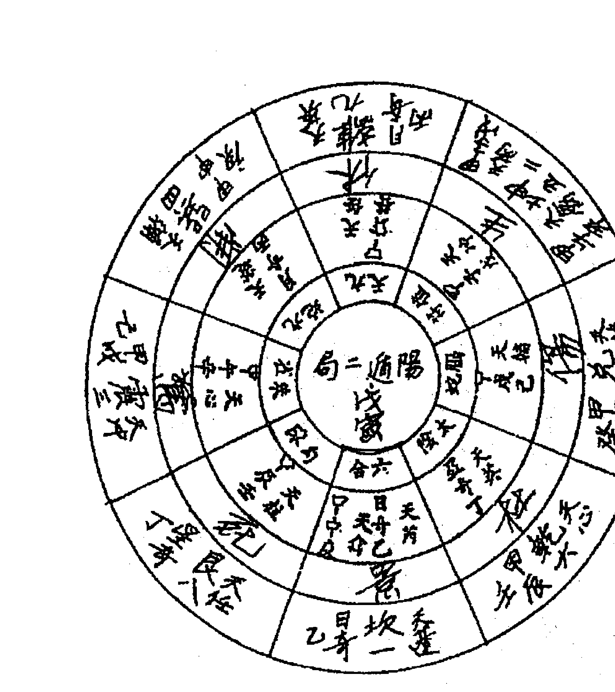

阳遁二局：戊寅

| 宫位 | 伤门 | 冲门 |
| :--- | :--- | :--- |
| 宫位数 | 七 | 二 |

- (1) 开巽迫　天蓬丙加甲申庚。荧惑入太白：门户破败，盗贼耗失。「天遁，重诈」
- (2) 休离迫　天任癸加丙奇。华盖孛帅：贵贱逢之，上人见喜。
- (3) 生坤和　天冲戊加甲子戊。伏吟：万事闭塞，静守为吉。
天冲戊加甲午辛。青龙折足：吉门生助，尚可谋为，逢凶门主招灾，失财，有足疾。
- (4) 伤兑制　天辅己加甲寅癸。地刑玄武：病凶，词讼有囚狱之灾。
- (5) 杜乾制　天英丁加甲辰壬。五神互合：贵人恩诏，讼狱公平。
- (6) 景坎制　天芮乙加乙奇。日奇伏吟：不宜谒贵求名，只可安分守身。
天禽庚加乙奇。太白逢星。退吉进凶。
- (7) 死艮和　天任壬加丁奇。干合蛇刑。文书牵连。贵人匆匆。男吉女凶。
- (8) 惊震迫　天心辛加甲戌己。入狱自刑：奴仆背主，讼诉难伸。
- (9) 开门与丙奇合在巽四宫，利东南方。

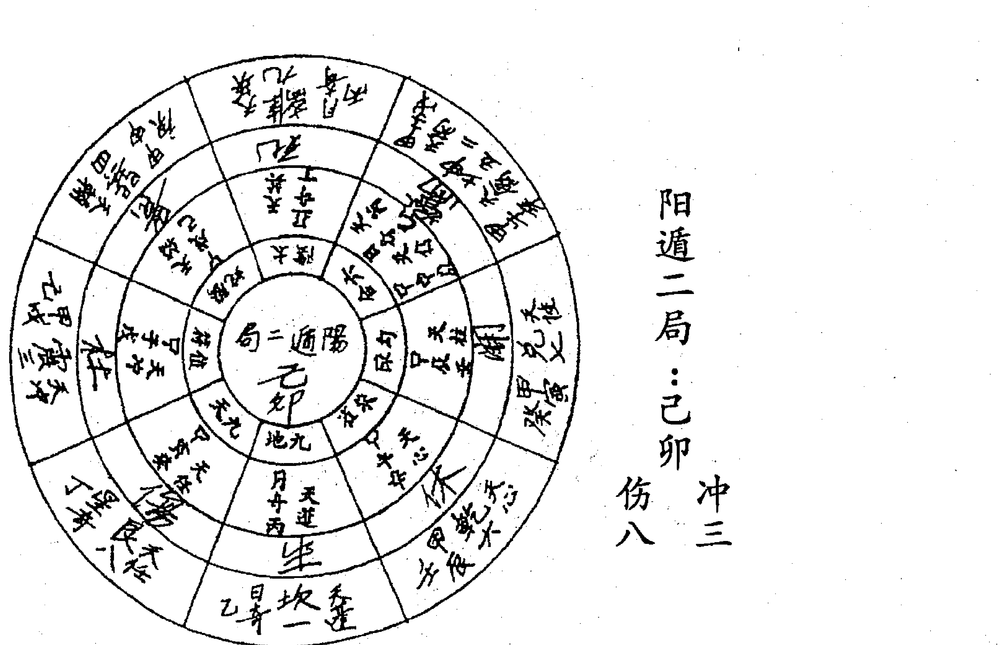

- (1) 开兑和 天任壬加甲寅癸。幼女奸淫：家有丑声，门吉星凶，反祸福隆。
- (2) 休乾仪 天心辛加甲辰壬。凶蛇入狱：两男争女，讼狱不息，先动失理。
- (3) 生坎迫 天蓬丙加乙奇。日月并行：公私皆吉。「天遁，重诈」
- (4) 伤艮迫 天任癸加丁奇。腾蛇妖娇，文书官司火焚莫逃，忧惶之事必至。
- (5) 杜震和 天冲戊加甲戊己。贵人入狱。公私下利。
- (6) 景巽仪 天辅己加甲申庚。利格返名：词讼先动不利，阴星有谋害之情。
- (7) 死离仪 天英丁加丙奇。星随月转：贵人越级高升，常人乐里生悲。「入墓」
- (8) 惊坤仪 天芮乙加甲子戊。利阴害阳：门逢凶迫，财破人伤。「入墓」
天禽庚加甲午辛。白虎干格：远行车折马死。
- (9) 生门与丙奇合在坎一宫，利西北方。

### 奇门阴阳九遁阳二局符使值例

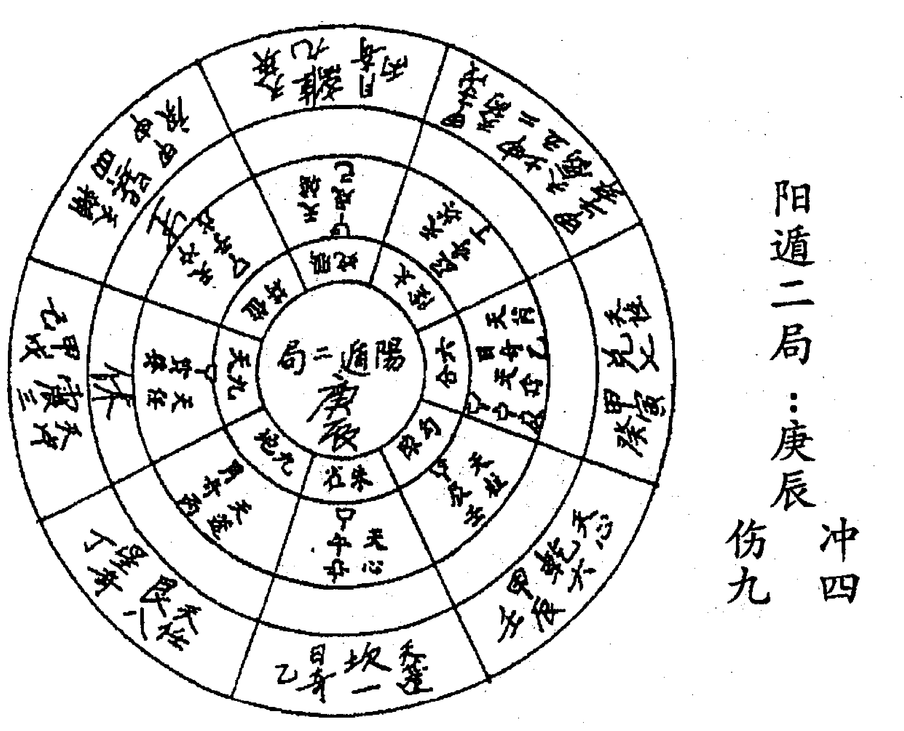

- (1) 开艮仪　天蓬丙加丁奇。辛奇朱雀：贵人文书吉利，常人平安。「天遁，重诈」
- (2) 休震礼　天任癸加甲戌己。华盖地户：音信皆阻，躲灾避难为吉。
- (3) 生巽制　天冲戊加甲申庚。值符飞宫：吉事不吉，凶事更凶。
- (4) 伤离礼　天辅己加丙奇。太孛地户：阳人冤冤相害，阴人必致淫污。
- (5) 杜坤迫　天英丁加甲子戊。青龙转光：贵人升迁，常人咸昌。
天英丁加甲午辛。朱雀入狱：罪人释囚，官人失位。
- (6) 景兑追　天芮乙加甲寅癸。华盖官星：遁迹修道，隐匿藏形，躲灾避难为吉。
天禽庚加甲寅癸。大格：行人至，官司止，生产母子俱伤。
- (7) 死乾礼　天柱壬加甲辰壬。蛇入地罗：外人缠绕，内事索索，吉门吉星，避免蹉跎。
- (8) 惊坎礼　天心辛加乙奇。白虎猖狂：人亡家败，远行多殃，尊长不喜，身体毁伤。
- (9) 开门与丙奇合在艮八宫，利东北方。

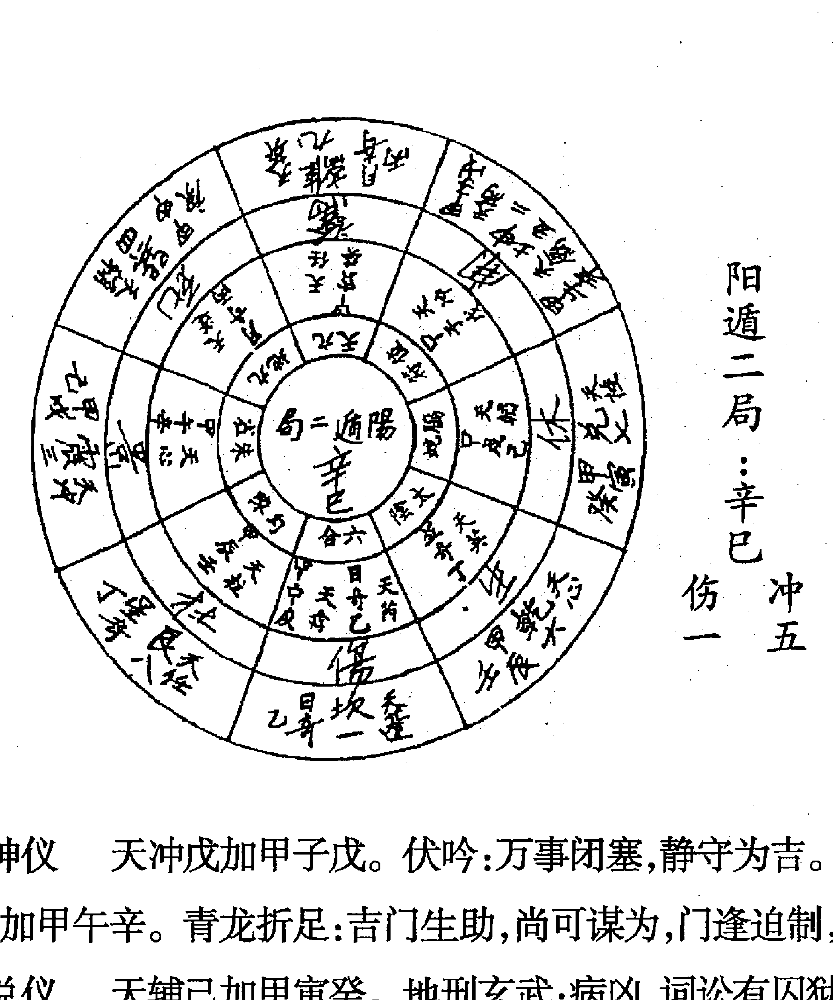

### 阳遁二局：辛巳

| 宫位 | 伤门 | 冲门 |
| :--- | :--- | :--- |
| 宫位数 | 一 | 五 |

- (1) 开坤仪 天冲戊加甲子戊。伏吟：万事闭塞，静守为吉。
天冲戊加甲午辛。青龙折足：吉门生助，尚可谋为，门逢迫制，反祸官非。
- (2) 休兑仪 天辅已加甲寅癸。地刑玄武：病凶，词讼有囚狱之灾。
- (3) 生乾礼 天英丁加甲辰壬。五神互合：贵人恩诏，讼狱公平。
- (4) 伤坎仪 天芮乙加乙奇。日奇伏吟：不宜谒贵求名，只可安分守身。
天禽庚加乙奇。太白逢星：退吉进凶。
- (5) 杜艮迫 天柱壬加丁奇。干合蛇刑：文书牵连，贵人匆匆，男吉女凶。
- (6) 景震仪 天心辛加甲戌己。入狱自刑：奴仆背主，诉讼难伸。
- (7) 死巽制 天蓬丙加甲申庚。荧惑入太白：门户破败，盗贼耗失。
- (8) 惊离制 天任癸加丙奇。华盖孛帅：贵贱逢之，上人见吉。
- (9) 生门与丁奇合在乾六宫，利西北方。

### 奇门阴阳九遁阳二局符使值例

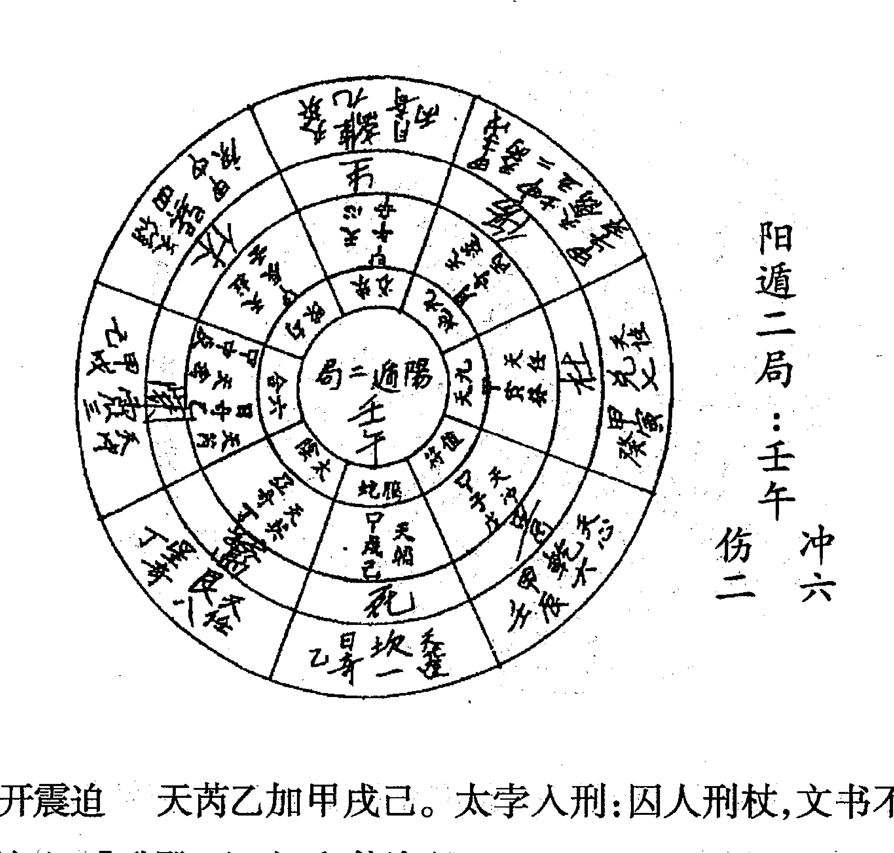

- (1) 开震迫 天芮乙加甲戌己。太孛入刑：囚人刑杖，文书不行，吉门得吉，凶门转凶。「升殿，地、人遁，休诈」
天禽庚加甲戌己。刑格：官司被重刑。
- (2) 休巽礼 天柱壬加甲申庚。太白擒蛇：刑狱公平，立剖邪正。
- (3) 生离仪 天心辛加丙奇。干合孛师：占雨无，占晴旱，占事必因财致讼。
- (4) 伤坤迫 天蓬丙加甲子戊。飞鸟跌穴：谋事有成，百事洞澈。丙奇加甲午辛，谋事有成，病人不凶。
- (5) 杜兑制 天任癸加甲寅癸。天网四张（高网七尺）：行人失件，病讼皆伤。
- (6) 景乾迫 天冲戊加甲辰壬。龙入天牢：阴阳皆不利。
- (7) 死坎迫 天辅己加乙奇。墓神不明：宜遁跡隐形为利逸。
- (8) 惊艮仪 天英丁加丁奇。奇人太阴：文书即至，喜事遂心。「入墓」
- (9) 开门与乙奇合在震三宫，利正东方。

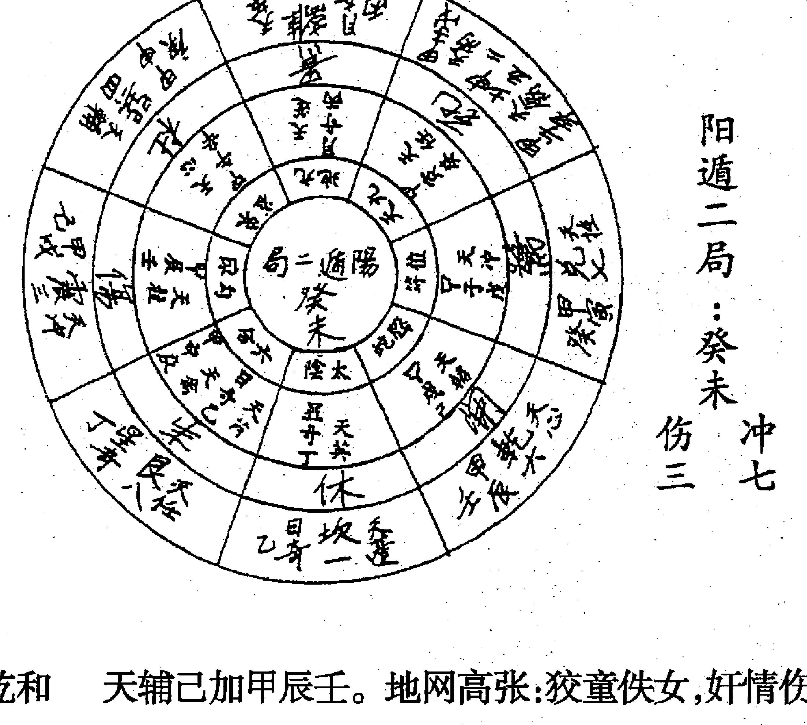

- (1) 开乾和 天辅已加甲辰壬。地网高张：狡童佚女，奸情伤杀。
- (2) 休坎和 天英丁加乙奇。天运昌气格：加官进爵，婚姻财喜。「人、地遁，真诈」
- (3) 生艮和 天芮乙加丁奇。奇仪相佐：文书事吉，百事皆可为。「虎、地、人遁，休诈」
天禽庚加丁奇。亭亭之格：因私匿起官司，门吉有救。「入墓」
- (4) 伤震和 天柱壬加甲戊己。凶蛇入狱：大祸将至，顺守斯吉，词讼理曲。
- (5) 杜巽和 天心辛加甲申庚。白虎出力：刀刃相接，主客相残，逊让稍可，强进血溅衣衫。
- (6) 景离和 天蓬丙加丙奇。日奇孛师：文书逼迫，破耗遗失。「升殿」。
- (7) 死坤和 天任癸加甲子戊。天乙会合：财喜婚姻，吉人赞助成合，门凶迫制，反祸官非。
天任癸加甲午辛。网盖天牢：占讼病凶。
- (8) 惊兑和 天冲戊加甲寅癸。青龙华盖：门吉招福，门凶多乖。
- (9) 休丁奇合坎一宫，利在正北。生乙奇合艮八方，利在东北。

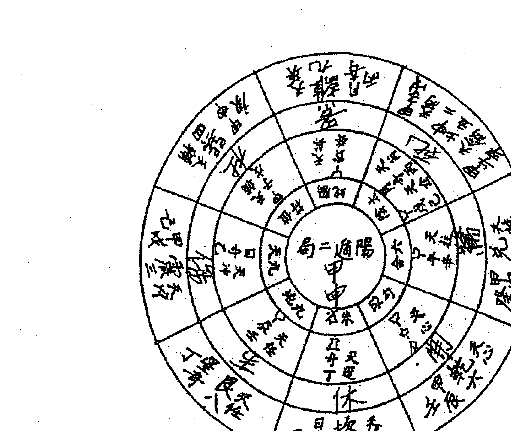

阳遁二局：甲申 杜四 辅四

- 1. 开乾和 天心庚加甲辰壬。小格：远行迷路，音信嗟呀。
- 2. 休坎和 天蓬丁加乙奇。天运昌气格：加官进爵，财喜婚姻。「人遁」
- 3. 生艮和 天任壬加丁奇。干合蛇刑：文书牵连，贵人匆匆，男吉女凶。
- 4. 伤震和 天冲乙加甲戊己。日奇入雾：被土暗昧，门凶必凶。「升殿」
- 5. 杜巽和 天辅戊加甲申庚。值符飞宫：吉事不吉，凶事更凶。
- 6. 景离和 天英癸加丙奇。华盖孛师：贵贱逢之，上人见喜。
- 7. 死坤和 天芮丙加甲子戊。飞鸟跌穴：谋事有成，百事洞澈。
天禽己加甲午辛。游魂入墓：大人鬼魁，小人家先为祟。
- 8. 惊兑和 天柱辛加甲寅癸。日月失明：误入天网，动止乖张。
- 9. 休门与丁奇合在坎一宫，利正北方。

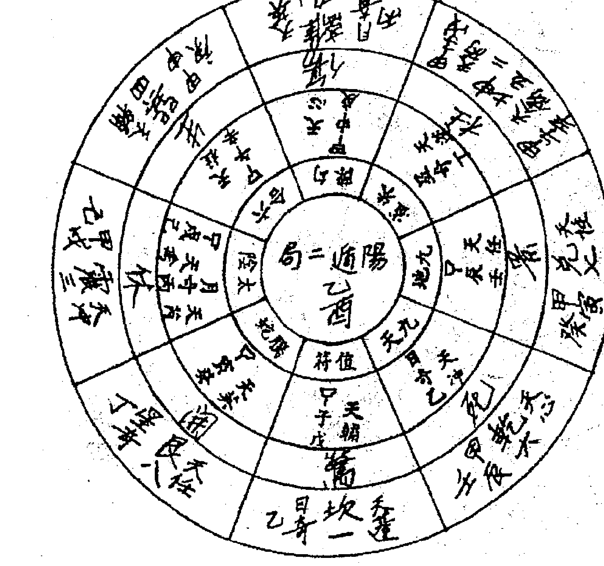

- (1) 开艮礼　天英癸加丁奇。螣蛇妖娇：文书官司火焚莫逃，忧惶之事必至。
- (2) 休震礼　天芮丙加甲戌己。太孛入刑：囚人刑杖，文书不行，吉门得吉，凶门转凶。「天遁，真诈」
天禽己加甲戌己。地户逢鬼：病凶，百事不遂。
- (3) 生巽制　天柱辛加甲申庚。白虎出力：刀刃相接，主客相残，逊让退步稍可，强进血溅衣衫。
- (4) 伤离礼　天心庚加丙奇。太白入荧惑：占贼必来，为客利，主破财。
- (5) 杜坤迫　天蓬丁加甲子戊。青龙转光：官人升迁，常人咸昌。
天蓬丁加甲午辛。朱雀入狱：罪人释囚，官人失位。
- (6) 景兑迫　天任壬加甲寅癸。幼女奸淫：家有丑声，门吉星凶，反祸福隆。
- (7) 死乾礼　天冲乙加甲辰壬。日奇入地：尊卑孛乱，官讼是非。「入墓」
- (8) 惊坎礼　天辅戊加乙奇。青龙合灵：门吉事吉。门凶事凶。
- (9) 休门与丙奇合在震三宫，利正东方。

### 奇门阴阳九遁阳二局符使值例

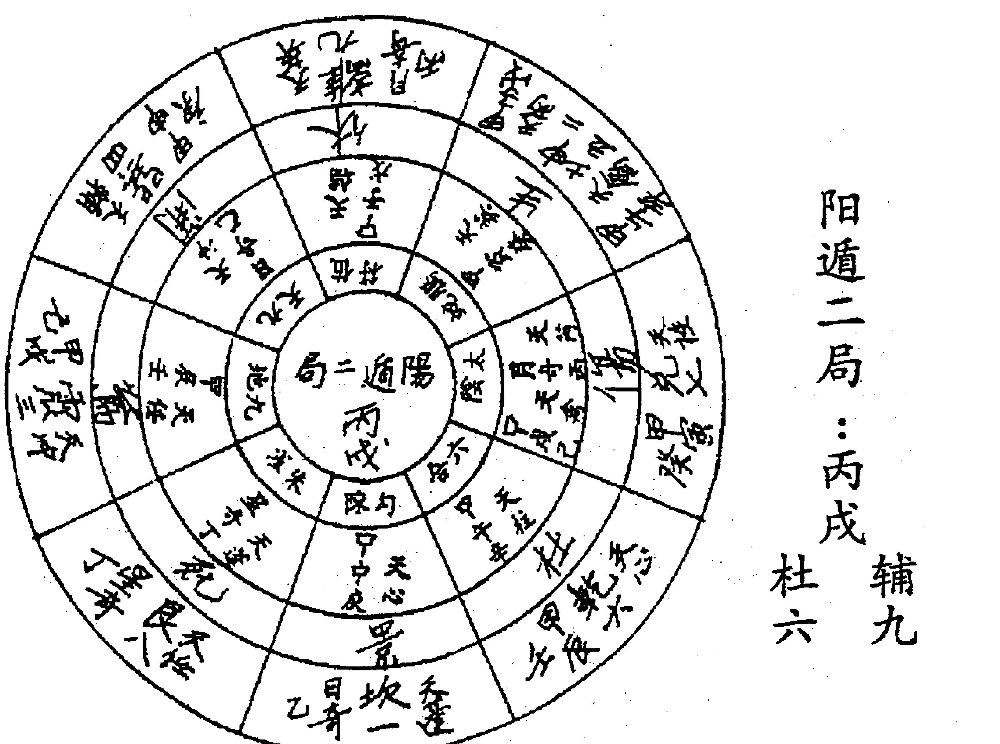

- (1) 开巽迫 天冲乙加甲申庚。日奇被刑：争讼财产，夫妻怀私。
- (2) 休离迫 天辅戊加丙奇。青龙反首。动作大利。
- (3) 生坤和 天英癸加甲子戊。天乙会合：财喜婚姻，吉人赞助成合。
天英癸加甲午辛。网盖天牢：讼病凶。
- (4) 伤兑制 天芮丙加甲寅癸。华盖孛师：阴人害事，灾祸频生。
天禽己加甲寅癸。地刑玄武：病凶，词讼有牢狱之灾。「地假」。
- (5) 杜乾制 天柱辛加甲辰壬。凶蛇入狱：两男争女，讼狱不息，先动失理。
- (6) 景坎制 天心庚加乙奇。太白逢星：退吉进凶。
- (7) 死艮和 天蓬丁加丁奇。奇人太阴：文书即至，喜事遂心。「入墓」。
- (8) 惊震迫 天任壬加甲戊己。凶蛇入狱：大祸将至，顺守斯吉，词讼理曲。
- (9) 开门与乙奇合巽四宫，利东南方。

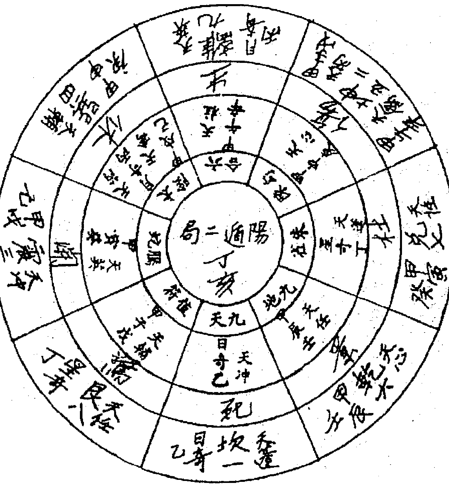

阳遁二局：丁亥
杜辅
七八

- (1) 开震迫　天英癸加甲戊己。华盖地户：音信皆阻，躲灾避难为吉。
- (2) 休巽礼　天芮丙加甲申庚。荧惑入太白：门户破败，盗贼耗失。「天遁，真诈」
天禽己加甲申庚。利格返名：词讼先动不利，阴星有谋害之情。
- (3) 生离仪　天柱辛加丙奇。干合孛师：占雨无，占晴旱，占事必因财致讼。
- (4) 伤坤迫　天心庚加甲子戊。天乙伏宫：百事不可谋，凶。
天心庚加甲午辛。白虎干格：远行车折马死。
- (5) 杜兑制　天蓬丁加甲寅癸。朱雀投江：文书口舌俱消，音信沉溺。讼狱所由起也。「升殿」。
- (6) 景乾迫　天任壬加甲辰壬。蛇入地罗：外人缠绕，内事索索，吉门吉星，避免蹉跎。
- (7) 死坎迫　天冲乙加乙奇。日奇伏吟：不宜谒贵求名，只可安分守身。
- (8) 惊艮仪　天辅戊加丁奇。青龙耀明：谒贵求名吉利，若逢墓迫招是非。
- (9) 休门丙奇合巽四宫，利东南方。

### 奇门阴阳九遁阳二局符使值例

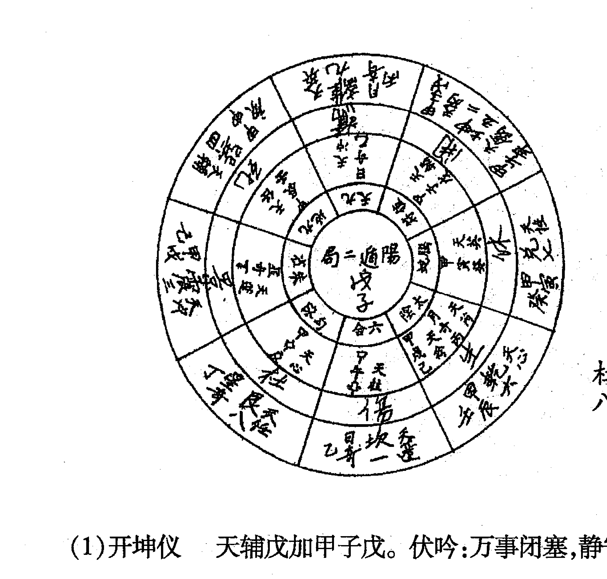

阳遁二局：戊子
杜辅
八二

- (1) 开坤仪 天辅戊加甲子戊。伏吟：万事闭塞，静守为吉。
天辅戊加甲午辛。青龙折足：吉门生助，尚可谋为，逢凶门，主招灾，失财，有足疾。
- (2) 休兑仪 天英癸加甲寅癸。天网四张（高网七尺）：行人失件，疾病皆伤。
- (3) 生乾礼 天芮丙加甲辰壬。火入天罗：客不利，是非颇多。「天、人遁，真诈，入墓」
天禽己加甲辰壬。地网高张：狡童佚女，奸情伤杀。
- (4) 伤坎仪 天柱辛加乙奇。白虎猖狂：人亡家败，远行多殃，尊长不喜，车船俱伤，身遭毁伤。
- (5) 杜艮迫 天心庚加丁奇。亭亭之格：因私匿起官司，门吉有救。
- (6) 景震仪 天蓬丁加甲戊己。火入勾陈：奸私仇冤，事因女人。
- (7) 死巽制 天任壬加甲申庚。太白擒蛇：刑狱公平，立剖邪正。
- (8) 惊离制 天冲乙加丙奇。奇仪顺遂。吉星迁官进爵。凶星夫妻离别。
- (9) 生门与丙奇合在乾六宫，利西北方。

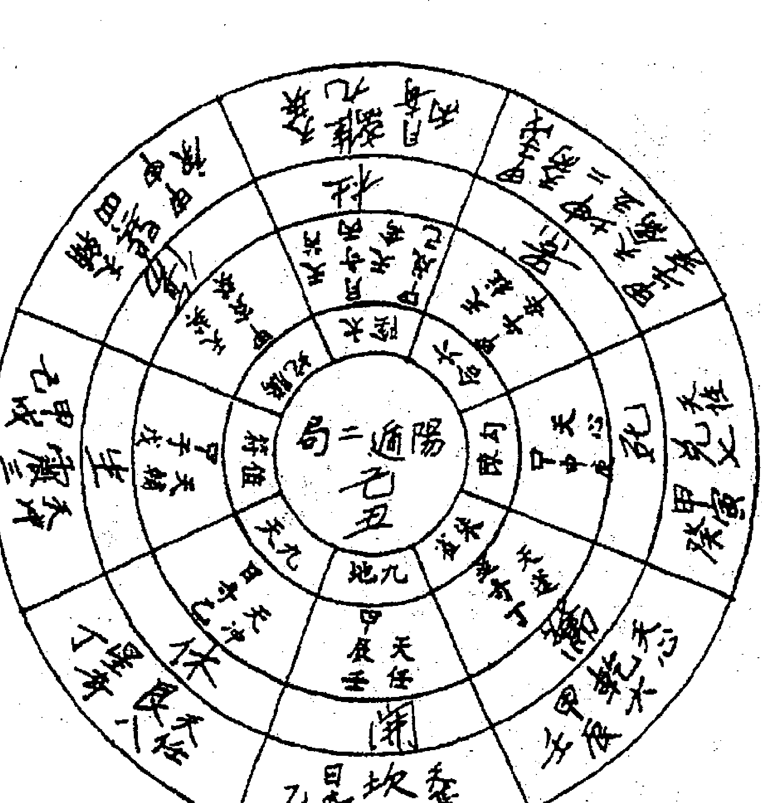

- (1) 开坎礼 天任壬加乙奇。格名小蛇：女人柔顺，男人嗟呀，占孕生子，禄马光华。
- (2) 休艮制 天冲乙加丁奇。奇仪相佐：百事皆可为，天地交泰吉。「虎遁」
- (3) 生震制 天辅戊加甲戊己。贵人入狱：公私不利。
- (4) 伤巽和 天英癸加甲申庚。太白入网：昙花一现，争讼力平。
- (5) 杜离礼 天芮丙加丙奇。日奇孛师：文书逼迫，破耗遗失。「升殿」
天禽己加丙奇。火孛地户：阳人冤冤相害，阴人必致淫污。
- (6) 景坤礼 天柱辛加甲子戊。困龙被伤：官司破败，屈抑守分，妄动祸殃。
天柱辛加甲午辛。伏吟：公废私就，讼狱自罹罪名。
- (7) 死兑礼 天心庚加甲寅癸。大格：行人至，官司止，生产母子俱伤。
- (8) 惊乾和 天蓬丁加甲辰壬。五神互合：贵人恩诏，讼狱公平。
- (9) 休门与乙奇合在艮八宫，利东北方。

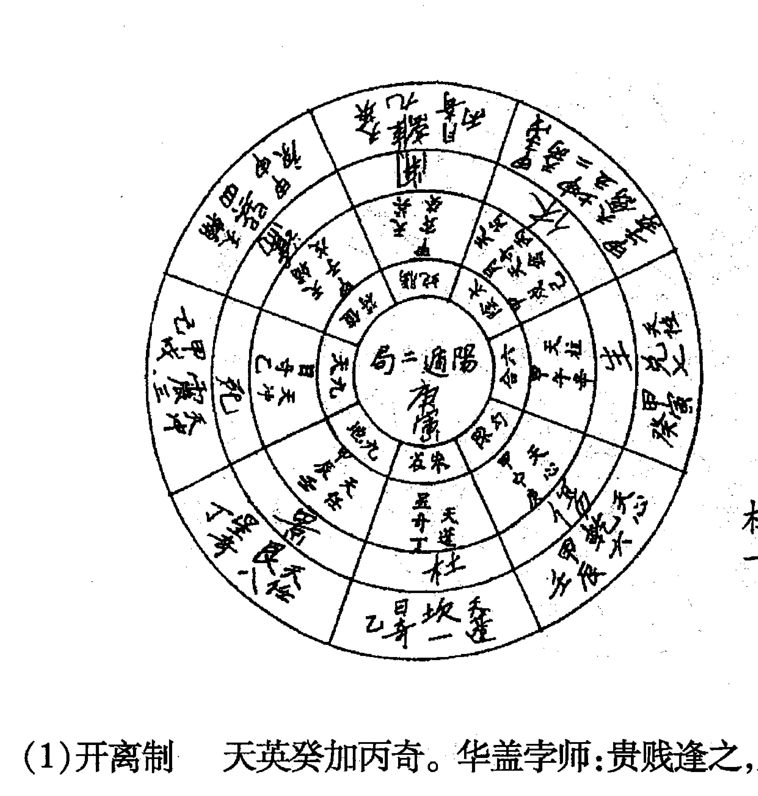

- (1) 开离制 天英癸加丙奇。华盖孛师：贵贱逢之，上人见喜。
- (2) 休坤制 天芮丙加甲子戊。飞鸟跌穴：谋事有成，百事洞澈。「天遁，真诈」
天禽己加甲午辛。游魂入墓：大人鬼魁，小人家先为祟。
- (3) 生兑礼 天柱辛加甲寅癸。日月失明：误入天网，动止乖张。
- (4) 伤乾制 天心庚加甲辰壬。小格：远行迷路，音信嗟呀。
- (5) 杜坎仪 天蓬丁加乙奇。天运昌气格：加官进爵，婚姻财喜。「人遁」
- (6) 景艮礼 天任壬加丁奇。干合蛇刑：文书牵连，贵人匆匆，男吉女凶。
- (7) 死震迫 天冲乙加甲戊己。日奇入雾：被土暗昧，门凶必凶。「升殿」
- (8) 惊巽迫 天辅戊加甲申庚。值符飞宫：吉事不吉，凶事更凶。
- (9) 休门与丙奇合在坤二宫，利西南方。

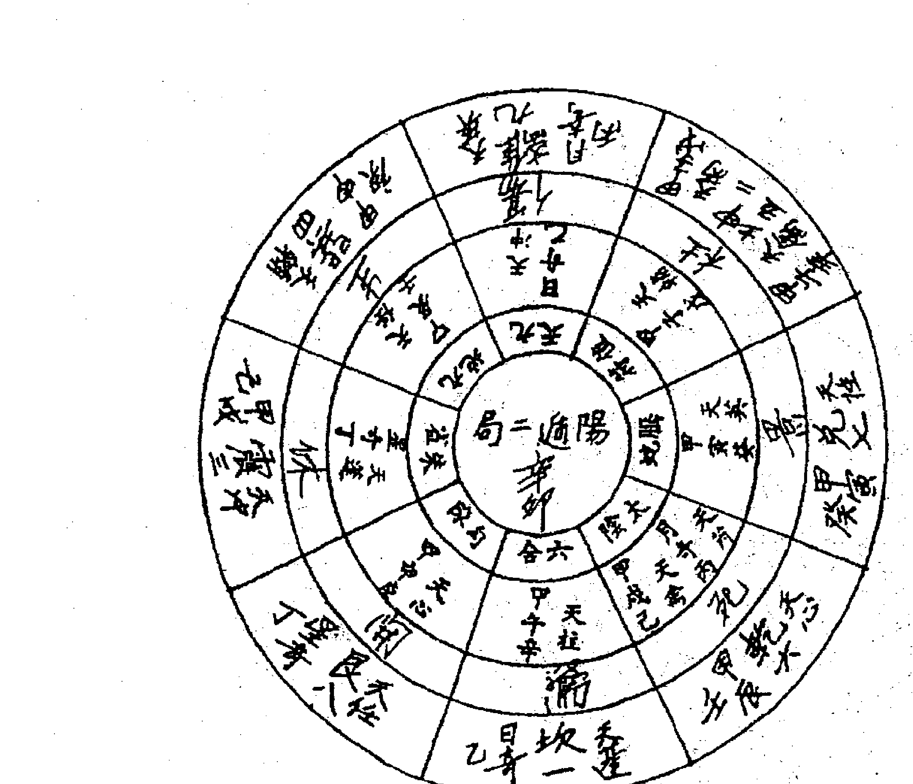

- (1) 开艮仪 天心庚加丁奇。亭亭之格：因私匿起官司，门吉有救。
- (2) 休震礼 天蓬丁加甲戊己。火入勾陈：奸私仇冤，事因女人。
- (3) 生巽制 天任壬加甲申庚。太白擒蛇：刑狱公平，立剖邪正。
- (4) 伤离礼 天冲乙加丙奇。奇仪顺遂：吉星迁官进爵，凶星夫妻离别，天地交泰吉。
- (5) 杜坤迫 天辅戊加甲子戊。伏吟：万事闭塞，静守为吉。
天辅戊加甲午辛。青龙折足：吉门生助，尚可谋为，凶门主招灾，失财，有足疾。
- (6) 景兑迫 天英癸加甲寅癸。天网四张（高网七尺）：行人失件，病讼皆伤。
- (7) 死乾礼 天芮丙加甲辰壬。火入天罗：客不利，是非颇多。「入墓」
天禽己加甲辰壬。地网高张：狡童侠女，奸情伤杀。
- (8) 惊坎礼 天柱辛加乙奇。白虎猖狂：人亡家败，远行多殃，尊长不喜，车船俱伤，身体毁伤。
- (9) 休门丁奇合震三宫，利正东方。

### 奇门阴阳九遁阳二局符使值例

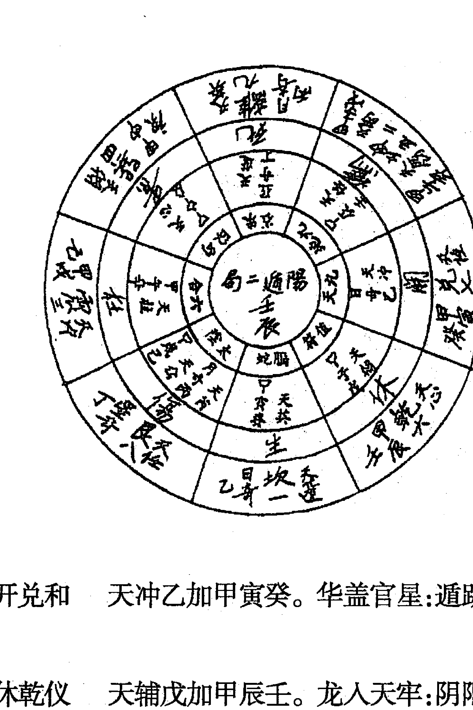

- (1) 开兑和 天冲乙加甲寅癸。华盖官星：遁迹修道，隐匿藏形，躲灾避难为吉。
- (2) 休乾仪 天辅戊加甲辰壬。龙入天牢：阴阳皆不吉利。
- (3) 生坎迫 天英癸加乙奇。华盖逢星：贵人禄位，常人平安。
- (4) 伤艮迫 天芮丙加丁奇。辛奇朱雀：官人文书吉利，常人平安。
天禽己加丁奇。朱雀入墓：文状词讼，先曲后直。「地假」
- (5) 杜震和 天柱辛加甲戌己。入狱自刑：奴仆背主，讼诉难伸。
- (6) 景巽仪 天心庚加甲申庚。太白同宫：官灾横祸，兄弟不睦。
- (7) 死离仪 天蓬丁加丙奇。星随月转：贵人越级高升，常人乐里生悲。「入墓」
- (8) 惊坤仪 天任壬加甲子戊。小蛇化龙：男人发达，女产婴童。
天任壬加甲午辛。腾蛇相缠：纵得吉门，亦不安宁，若有谋望，被人欺瞒。
- (9) 开门乙奇合兑七宫，利正西方。

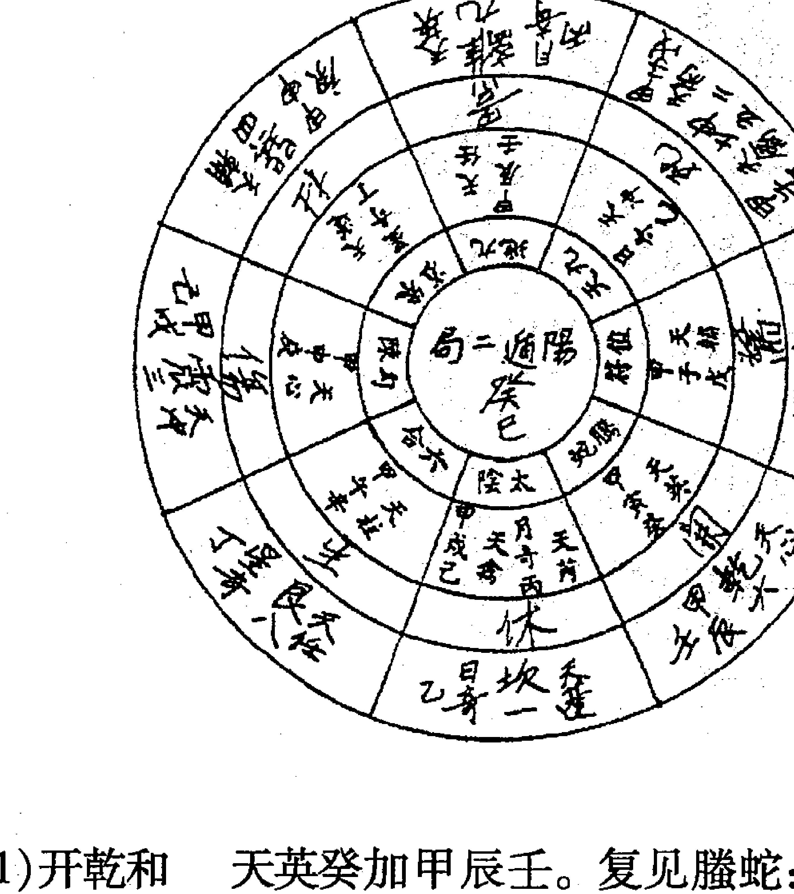

### 阳遁二局：癸巳 辅七 杜四

- 1. 开乾和 天英癸加甲辰壬。复见螣蛇：嫁娶重婚，后嫁无子，不保年华。
- 2. 休坎和 天芮丙加乙奇。日月并行：公谋私为皆吉。「天遁，真诈」
天禽己加乙奇。墓神不明：遁迹隐形为利逸。
- 3. 生艮和 天柱辛加丁奇。狱神得奇：经商获倍利，囚人逢赦宥。
- 4. 伤震和 天心庚加甲戌己。刑格：官司被重刑。
- 5. 杜巽和 天蓬丁加甲申庚。时格：文书阻隔，行人必归。
- 6. 景离和 天任壬加丙奇。水蛇入火：官灾刑禁，络绎不绝。
- 7. 死坤和 天冲乙加甲子戊。利阴害阳：门逢凶迫，财破人伤。「入墓」
天冲乙加甲午辛。青龙逃走：奴仆拐带，六畜皆伤，财产废坠，身遭毁伤。
- 8. 惊兑和 天辅戊加甲寅癸。青龙华盖：门吉招福，门凶多乖。
- 9. 休门丙奇合坎一宫，利正北方。

### 奇门阴阳九遁阳二局符使值例

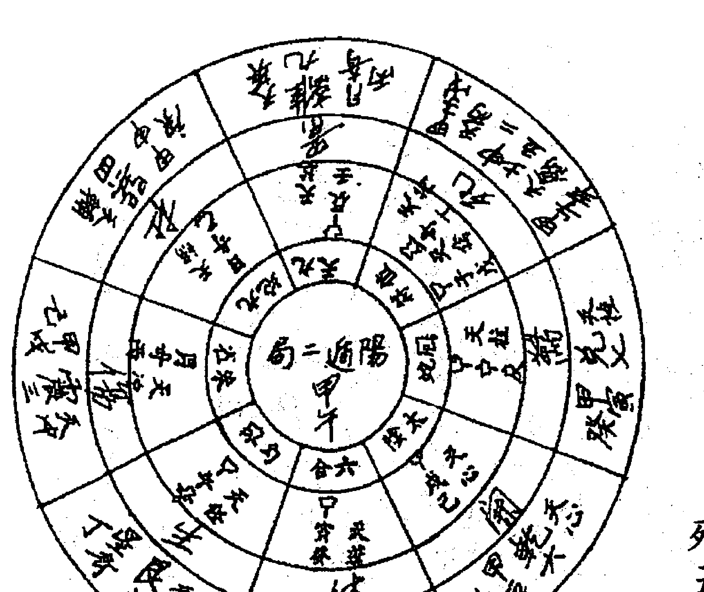

阳遁二局：甲午
死 禽
五 五

- (1) 开乾和　天心己加甲辰壬。地网高张：狡童佚女，奸情伤杀。
- (2) 休坎和　天蓬癸加乙奇。华盖逢星：贵人禄位，常人平安。
- (3) 生艮和　天任辛加丁奇。狱神得奇：经商获倍利，囚人逢赦宥。
- (4) 伤震和　天冲丙加甲戊己。太孛入刑：囚人刑杖，文书不行，吉门得吉，凶门转凶。
- (5) 杜巽和　天辅乙加甲申庚。日奇被刑：争讼财产，夫妻怀私。
- (6) 景离和　天英壬加丙奇。水蛇入火：官灾刑禁，络绎不绝。
- (7) 死坤和　天芮丁加甲子戊。青龙转光：官人升迁，常人咸昌。「入墓」
天禽戊加甲子戊。伏吟：万事闭塞，静守为吉。
- (8) 惊兑和　天柱庚加甲寅癸。大格：行人至，官司止，生产母子俱伤。
- (9) 无奇门。

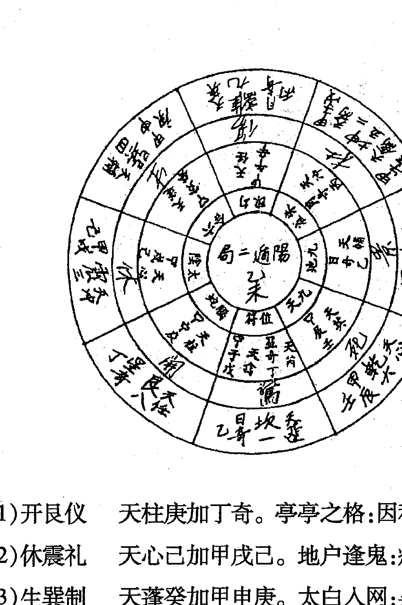

### 阳遁二局：乙未

| 宫位 | 死门 | 禽星 |
| :--- | :--- | :--- |
| 宫位数 | 六 | 一 |

- 1. 开艮仪 天柱庚加丁奇。亭亭之格：因私匿起官司，门吉有救。
- 2. 休震礼 天心己加甲戌己。地户逢鬼：病凶，百事不遂。
- 3. 生巽制 天蓬癸加甲申庚。太白入网：昙花一现，争讼力平。
- 4. 伤离礼 天任辛加丙奇。干合孛师：占雨无，占晴旱，占事必因财致讼。
- 5. 杜坤迫 天冲丙加甲子戊。飞鸟跌穴：谋事有成，百事洞澈。
天冲丙加甲午辛，谋事有成，病人不凶。
- 6. 景兑迫 天辅乙加甲寅癸。华盖逢星：遁迹修道，隐匿藏形，躲灾避难为吉。
- 7. 死乾礼 天英壬加甲辰壬。蛇入地罗：外人缠绕，内事索索，吉门吉星，避免蹉跎。
- 8. 惊坎礼 天芮丁加乙奇。天运昌气格：加官进爵，婚姻财喜。「人遁」
天禽戊加乙奇。青龙合灵：门吉事吉，门凶事凶。
- 9. 无奇门。

### 奇门阴阳九遁阳二局符使值例

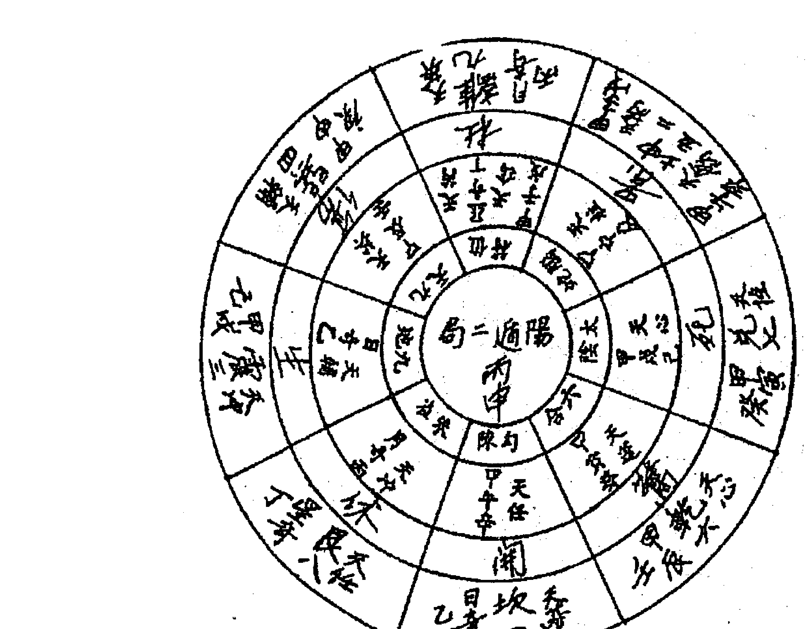

- (1) 开坎礼 天任辛加乙奇。白虎猖狂：人亡家败，远行多殃，尊长不喜，身遭毁伤。「云遁」
- (2) 休艮制 天冲丙加丁奇。辛奇朱雀：贵人文书吉，常人平安。「天遁」
- (3) 生震制 天辅乙加甲戌己。日奇入雾，被土暗昧，门凶必凶。「地遁，升殿，重诈」
- (4) 伤巽和 天英壬加甲申庚。太白擒蛇：刑狱公平，立剖邪正。
- (5) 杜离礼 天芮丁加丙奇。辛奇朱雀：贵人文书吉，常人平安。
天禽戊加丙奇。青龙反首：动作大利，逢迫墓刑击，吉事成凶。
- (6) 景坤礼 天柱庚加甲子戊。天乙伏宫，百事不可谋，凶。
天柱庚加甲午辛。白虎干格：远行车折马死。
- (7) 死兑礼 天心己加甲寅癸。地刑玄武：病凶，词讼有囚狱之灾。
- (8) 惊乾和 天蓬癸加甲辰壬。复见腾蛇：嫁娶重婚，后嫁无子，不保年华。
- (9) 休门丙奇合在艮八宫，利东北方。
生门乙奇合在震三宫，利正东方。

### 阳遁二局：丁酉 死八 禽八

- (1) 开巽礼　天心己加甲申庚。利格返名：词讼先动不利，阴星有谋害之情。
- (2) 休离迫　天蓬癸加丙奇。华盖孛师：贵贱逢之，上人见喜。
- (3) 生坤和　天任辛加甲子戊。困龙被伤：官司破败，屈抑守分，妄动祸殃。
天任辛加甲午辛。伏吟天庭：公废私就，讼狱自罹罪名。
- (4) 伤兑制　天冲丙加甲寅癸。华盖孛师：阴人家事，灾祸频生。
- (5) 杜乾制　天辅乙加甲辰壬。日奇入地：尊卑悖乱，官讼是非。「入墓」
- (6) 景坎制　天英壬加乙奇。格名小蛇：女人柔顺，男人嗟呀，占孕生子，禄马光华。
- (7) 死艮和　天芮丁加丁奇。奇入太阴：文书即至，喜事遂心。「入墓」
天禽戊加丁奇。青龙耀明：谒贵求名吉利，逢墓迫招是非。
- (8) 惊震迫　天柱庚加甲戊己。刑格：官司被重刑。
- (9) 无奇门。

### 阳遁二局：戊午 死二 禽九

- (1) 开兑和 天柱庚加甲寅癸。大格：行人至，官司止，生产母子俱伤。「云遁」
- (2) 休乾仪 天心己加甲辰壬。地网高张：狡童佚女，奸情伤杀。
- (3) 生坎迫 天蓬癸加乙奇。华盖逢星：贵人禄位，常人平安。
- (4) 伤艮迫 天任辛加丁奇。狱神得奇：经商获倍利，囚人逢赦宥。
- (5) 杜震和 天冲丙加甲戊己。太孛入刑：囚人刑杖，文书不行，吉门得吉，凶门转凶。
- (6) 景巽仪 天辅乙加甲申庚。日奇被刑：争讼财产，夫妻怀私。
- (7) 死离仪 天英壬加丙奇。水蛇入火：官灾刑禁，络绎不绝。
- (8) 惊坤仪 天芮丁加甲子戊。青龙转光：官人升迁，常人咸昌。
天禽戊加甲午辛。青龙折足：吉门生助，尚可谋为。逢凶门招灾，失财，有足疾。
- (9) 无奇门。

(1) 开震迫　天芮丁加甲戌己。火人勾陈：奸私仇冤，事因女人。
天禽戊加甲戌己。贵人入狱：公私不利。

(2) 休巽礼　天柱庚加甲申庚。太白同宫：官灾横祸，兄弟不睦。

(3) 生离仪　天心己加丙奇。火孛地户：阳人冤冤相害，阴人必致淫污。

(4) 伤坤迫　天蓬癸加甲子戊。天乙会合：财喜婚姻，吉人赞助成合，门凶迫制，反祸官非。「地假」
天蓬癸加甲午辛。网盖天牢：占讼病死，罪莫逃。「地假」

(5) 杜兑制　天任辛加甲寅癸。日月失明：误入天网，动止乖张。

(6) 景乾迫　天冲丙加甲辰壬。火入天罗：客不利，是非颇多。「入墓」

(7) 死坎迫　天辅乙加乙奇。日奇伏吟：不宜谒贵求名，只可安分守身吉。

(8) 惊艮仪　天英壬加丁奇。干合蛇刑：文书牵连，贵人匆匆，男吉女凶。「人假」

(9) 开门丁奇合震三宫，利正东方。

## 阳遁二局·庚子 死二 禽四

(1) 开乾和 天任辛加甲辰壬。凶蛇入狱：两男争女，讼狱不息，先动失理。

(2) 休坎和 天冲丙加乙奇。日月并行：公谋私就，皆吉。

(3) 生艮和 天辅乙加丁奇。奇仪相佐：文书事吉，百事可为，天地交泰吉。「地、人、虎遁，重诈」

(4) 伤震和 天英壬加甲戌己。凶蛇入狱：大祸将至，顺守斯吉，词讼理曲。

(5) 杜巽和 天芮丁加甲申庚。时格：文书即至，喜事遂心。
天禽戊加甲申庚。值符飞宫，吉事不吉，凶事更凶。

(6) 景离和 天柱庚加丙奇。太白人荧惑：占贼必来客进利，主破财。

(7) 死坤和 天心己加甲子戊。犬遇青龙：门吉谋望遂意，门凶枉劳心机。
天心己加甲午辛。游魂人墓：大人鬼魁，小人家先为祟。

(8) 惊兑和 天蓬癸加甲寅癸。天网四张（高网七尺）：行人失件，病讼皆伤。

(9) 休门与丙奇合坎一宫，利正北方。
生门与乙奇合艮八宫，利东北方。

### 阳遁二局：辛丑 死三 禽五

- (1) 开离制 天英壬加丙奇。水蛇入火：官灾刑禁，络绎不绝。
- (2) 休坤制 天芮丁加甲子戊。青龙转光：官人升迁，常人咸昌。
天禽戊加甲午辛。青龙折足：吉门尚可谋为，凶门主招灾，失财，有足疾。
- (3) 生兑仪 天柱庚加甲寅癸。大格：行人至，官司止，生产母子俱伤。
- (4) 伤乾制 天心己加甲辰壬。地网高张：狡童佚女，奸情伤杀。「地假」
- (5) 杜坎仪 天蓬癸加乙奇。华盖逢星：贵人禄位，常人平安。
- (6) 景艮礼 天任辛加丁奇。狱神得奇：经商获倍利，囚人逢赦宥。
- (7) 死震制 天冲丙加甲戊己。太孛入刑：囚人刑杖，文书不行，吉门得吉，凶门转凶。
- (8) 惊巽迫 天辅乙加甲申庚。日奇被刑，争讼财产，夫妻怀私。
- (9) 休门丁奇合坤二宫，利西南方。

### 阳遁二局：壬寅 禽六 死四

- (1) 开坤仪 天辅乙加甲子戊。利阴害阳：门逢凶迫，财破人伤。「云、天、人遁，重诈，入墓」
天辅乙加甲午辛。青龙逃走：奴仆拐带，六畜皆伤。财产废坠，身遭毁伤。
- (2) 休兑仪 天英壬加甲寅癸。幼女奸淫：家有丑声，门吉星凶，反祸福隆。
- (3) 生乾礼 天芮丁加甲辰壬。五神互合：贵人恩诏，讼狱公平。
天禽戊加甲辰壬。龙人天牢：阴阳皆不利。
- (4) 伤坎仪 天柱庚加乙奇。太白逢星：退吉进凶。
- (5) 杜艮和 天心己加丁奇。朱雀人墓：文状词讼，先曲后直。
- (6) 景震仪 天蓬癸加甲戊己。华盖地户：音信皆阻，躲灾避难为吉。
- (7) 死巽制 天任辛加甲申庚。白虎出力：刀刃相接，主客相残，逊让稍可，强进血溅衣衫。
- (8) 惊离制 天冲丙加丙奇。月奇孛师：文书逼迫，破耗损失。「升殿」
- (9) 开、乙 坤二 西南
生、丁 乾六 西北

1. 开乾和 天柱庚加甲辰壬。小格：远行迷路，音信嗟呀。
2. 休坎和 天心己加乙奇。地户逢星：宜遁迹隐形为利逸。
3. 生艮和 天蓬癸加丁奇。螣蛇妖娇：文书官司火焚莫逃，忧惶之事必至。
4. 伤震和 天任辛加甲戌己。人狱自刑：奴仆背主，讼诉难伸。
5. 杜巽和 天冲丙加甲申庚。荧惑入太白：门户破败，盗贼耗失。
6. 景离和 天辅乙加丙奇。奇仪顺遂，吉星迁官进职，凶星夫妻离别。
7. 死坤和 天英壬加甲子戊。小蛇化龙：男人发达，女产婴童。
天英壬加甲午辛。螣蛇相缠：纵得吉门，亦不安宁。若有谋望，被人欺瞒。
8. 惊兑和 天芮丁加甲寅癸。朱雀投江：文书口舌俱消，音信沉溺，讼狱所由起也。「升殿」
天禽戊加甲寅癸。青龙华盖：门吉招福，门凶多乖。
9. 无奇门。

### 奇门阴阳九遁阳二局符使值例

### 阳遁二局：甲辰 开六 心六

- (1) 开乾和 天心戊加甲辰壬。龙人天牢：阴阳皆不吉利。
- (2) 休坎和 天蓬壬加乙奇。格名小蛇：女人柔顺，男人嗟呀，占孕生子，禄马光华。
- (3) 生艮和 天任庚加丁奇。亭亭之格：因私匿起官司，门吉有救。
- (4) 伤震和 天冲丁加甲戊己。火人勾陈：奸私仇冤，事因女人。「地假」
- (5) 杜巽和 天辅丙加甲申庚。荧惑人太白：门户破败，盗贼耗失。
- (6) 景离和 天英辛加丙奇。干合孛师：占雨无，占晴旱，占事必因财致讼。
- (7) 死坤和 天芮癸加甲子戊。天乙会合：财喜婚姻，吉人赞助成合，门凶迫制，反祸官非。「鬼假」
天禽乙加甲午辛。青龙逃走：奴仆拐带，六畜皆伤，财产废坠，身遭毁伤。「入墓」
- (8) 惊兑和 天柱己加甲寅癸。地刑玄武：病凶，词讼有囚狱之灾。
- (9) 无奇门。

#### 奇门遁甲秘笈全书（下册）

- (1) 开兑和　天芮癸加甲寅癸。天网四张（高网七尺）：行人失件，病讼皆伤。
天禽乙加甲寅癸。华盖逢星：遁踪修道，隐匿藏形，躲灾避难为吉。「地、人遁，重诈」
- (2) 休乾仪　天柱己加甲辰壬。地网高张：狡童佚女，奸情伤杀。
- (3) 生坎迫　天心戊加乙奇。青龙合灵：门吉事吉，门凶事凶。「龙遁」
- (4) 伤艮迫　天蓬壬加丁奇。干合蛇刑：文书牵连，贵人匆匆，男吉女凶。
- (5) 杜震和　天任庚加甲戊己。刑格：官司被重刑。
- (6) 景巽仪　天冲丁加甲申庚。时格：文书阻隔，行人必归。
- (7) 死离仪　天辅丙加丙奇。月奇孛师：文书逼迫，破耗损失。「升殿」
- (8) 惊坤仪　天英辛加甲子戊。困龙被伤：官司破败，屈抑守分，妄动祸殃。
天英辛加甲午辛。伏吟天庭：公废私就，讼狱自罹罪名。
- (9) 开门乙奇合兑七宫，利正西方。

### 奇门阴阳九遁阳二局符使值例

(1) 开艮仪 天英辛加丁奇。狱神得奇：经商获倍利，囚人逢赦宥。
(2) 休震礼 天芮癸加甲戌己。华盖地户：音信皆阻，躲灾避难为吉。
天禽乙加甲戌己。日奇人雾：被土暗味，门凶必凶。「地、人遁，休诈」
(3) 生巽制 天柱己加甲申庚。利格返名：词讼先动不利，阴星有谋害之情。
(4) 伤离礼 天心戊加丙奇。青龙反首：动作大利，逢墓迫，吉事成凶。
(5) 杜坤迫 天蓬壬加甲子戊。小蛇化龙：男人发达，女产婴童。
天蓬壬加甲午辛。螣蛇相缠：纵得吉门，亦不安宁。若有谋望，被人欺瞒。
(6) 景兑迫 天任庚加甲寅癸。大格：行人至，官司止，生产母子俱伤。
(7) 死乾礼 天冲丁加甲辰壬。五神互合：贵人恩诏，讼狱公平。「入墓」
(8) 惊坎礼 天辅丙加乙奇。日月并行：公谋私为皆吉。
(9) 休门乙奇合震三宫，利正东方。

### 阳遁二局：丁未 开九 心八

(1) 开离制 天冲丁加丙奇。星随月转：贵人越级高升，常人乐里生悲。「人遁。休诈」
(2) 休坤制 天辅丙加甲子戊。飞鸟跌穴：谋事有成，百事洞澈。天辅丙加甲午辛。威神互合，谋事有成，病人不凶。
(3) 生兑礼 天英辛加甲寅癸。日月失明：误入天网，动止乖张。
(4) 伤乾制 天芮癸加甲辰壬。复见腾蛇：嫁娶重婚，后嫁无子，不保年华。天禽乙加甲辰壬。日月人地：尊卑序乱，官讼是非。「入墓」。
(5) 杜坎仪 天柱己加乙奇。地户逢星：宜遁跡隐形为利逸。
(6) 景艮礼 天心戊加丁奇。青龙耀明：谒贵求名吉利，逢墓迫招是非。
(7) 死震制 天蓬壬加甲戊己。凶蛇人狱：大祸将至，顺守斯吉，词讼理曲。
(8) 惊巽迫 天任庚加甲申庚。太白同宫：官灾横祸，兄弟不睦。
(9) 开丁离九 正南
休丙 休一 西南
门奇合 宫，利方。

### 奇门阴阳九遁阳二局符使值例

(1) 开坎礼 天冲丁加乙奇。天运昌气格：加官进爵，婚姻财喜。「人遁，休诈」
(2) 休艮制 天辅丙加丁奇。辛奇朱雀：贵人文书吉利，常人平安。
(3) 生震制 天英辛加甲戌己。人狱自刑：奴仆背主，讼诉难伸。
(4) 伤巽和 天芮癸加甲申庚。太白人网：昙花一现，争讼力平。
天禽乙加甲申庚。日奇被刑：争讼财产，夫妻怀私。
(5) 杜离礼 天柱己加丙奇。火孛地户：阳人冤冤相害，阴人必致淫污。
(6) 景坤礼 天心戊加甲子戊。伏吟：万事闭塞，静守为吉。
天心戊加甲午辛。青龙折足：吉门生助，尚可谋为，逢凶门招灾，失财有足疾。
(7) 死兑礼 天蓬壬加甲寅癸。幼女奸淫：家有丑声，门吉星凶，反祸福隆。
(8) 惊乾和 天任庚加甲辰壬。小格：远行迷路，男女音信嗟呀。
(9) 开丁奇合坎一宫，利正北方。
休丙 良八 东北。

### 阳遁二局：己酉 开二 心三

(1) 开坤仪 天冲丁加甲子戊。青龙转光：官人升迁，常人咸昌。「人遁，休诈」 天冲丁加甲午辛。朱雀人狱：罪人释囚，官人失位。
(2) 休兑仪 天辅丙加甲寅癸。华盖孛师：阴人害事，灾祸频生。「龙遁」
(3) 生乾礼 天英辛加甲辰壬。凶蛇人狱：两男争女，讼狱不息，先动失理。
(4) 伤坎仪 天芮癸加乙奇。华盖逢星：贵人禄位，常人平安。 天禽乙加乙奇。日奇伏吟：不宜谒贵求名，只可安分守身。
(5) 杜艮迫 天柱己加丁奇。朱雀人墓：文状词讼，先曲后直。
(6) 景震仪 天心戊加甲戊己。贵人人狱：公私不利。
(7) 死巽制 天蓬壬加甲申庚。太白擒蛇：刑狱公平，立剖邪正。
(8) 惊离制 天任庚加丙奇。太白入荧惑：占贼必来，客进利，主破财。
(9) 开丁奇合坤二宫，利西南方。休门丙奇合兑七宫，利正西方。

### 奇门阴阳九遁阳二局符使值例

- (1) 开震迫 天柱己加甲戊己。地户逢鬼：病凶，百事不遂。
- (2) 休巽礼 天心戊加甲申庚。值符飞宫：吉事不吉，凶事更凶。
- (3) 生离仪 天蓬壬加丙奇。水蛇入火：官灾刑禁，络绎不绝。
- (4) 伤坤迫 天任庚加甲子戊。天乙伏宫，百事不可谋，凶。
天任庚加甲午辛。白虎干格：远行车折马死。
- (5) 杜兑制 天冲丁加甲寅癸。朱雀投江：文书口舌俱消，音信沉溺，讼狱所由起也。「升殿」
- (6) 景乾迫 天辅丙加甲辰壬。火入天罗：客不利，是非颇多。「入墓」
- (7) 死坎迫 天英辛加乙奇。白虎猖狂：人亡家败，远行多殃，尊长不喜，身体毁伤。
- (8) 惊艮仪 天芮癸加丁奇。腾蛇妖矫：文书官司火焚莫逃，忧惶之事必至。「神假」
天禽乙加丁奇。奇仪相佐：文书事吉，百事皆可为，天地交泰吉。
- (9) 无奇门。

### 阳遁二局：辛亥

- (1) 开巽迫 天芮癸加甲申庚。太白人网：昙花一现，争讼力平。
天禽乙加甲申庚。日奇被刑：争讼财产，夫妻怀私。「地、人遁，重诈」
- (2) 休离迫 天柱己加丙奇。火悖地户：阳人冤冤相害，阴人必致淫污。
- (3) 生坤和 天心戊加甲子戊。伏吟：万事闭塞，静守为吉。
天心戊加甲午辛。青龙折足：吉门生助，尚可谋为，若逢凶门，主招灾，失财有足疾。
- (4) 伤兑制 天蓬壬加甲寅癸。幼女奸淫，家有丑声，门吉星凶，反祸福隆。
- (5) 杜乾制 天任庚加甲辰壬。小格：远行车折马死。
- (6) 景坎制 天冲丁加乙奇。天运昌气格：加官进爵，婚姻财喜。「人遁」
- (7) 死艮和 天辅丙加丁奇。辛奇朱雀：贵人文书吉，常人平安。
- (8) 惊震迫 天英辛加甲戌己。人狱自刑：奴仆背主，讼诉难伸。
- (9) 开门乙奇合巽四宫，利东南方。

### 阳遁二局：壬子 开五 心六

- (1) 开坤仪 天芮癸加甲子戊。天乙会合：财喜婚姻，吉人赞助成合。天禽乙加甲午辛。青龙逃走：奴仆拐带，六畜皆伤，财产废坠，身遭毁伤。「地、人遁，重诈，入墓」
- (2) 休兑仪 天柱己加甲寅癸。地刑玄武：病凶，词讼有囚狱之灾。
- (3) 生乾礼 天心戊加甲辰壬。龙人天牢：阴阳皆不吉利。
- (4) 伤坎仪 天蓬壬加乙奇。格名小蛇：女人柔顺，男人嗟呀，占孕生子，禄马光华。
- (5) 杜艮追 天任庚加丁奇。亭亭之格：因私匿起官司，门吉有赦。
- (6) 景震仪 天冲丁加甲戌己。火人勾陈：奸私仇冤，事因女人。
- (7) 死巽制 天辅丙加甲申庚。荧惑入太白，门户破败，盗贼耗失。
- (8) 惊离制 天英辛加丙奇。干合孛师：占雨无，占晴旱，占事必因财致讼。
- (9) 开门乙奇合在坤二宫，利西南方。

#### 奇门遁甲秘笈全书（下册）

- (1) 开乾和 天蓬壬加甲辰壬。蛇人地网：外人缠绕，内事索索，吉门吉星，避免蹉跎。
- (2) 休坎和 天任庚加乙奇。太白逢星：退吉进凶。
- (3) 生艮和 天冲丁加丁奇。奇人太阴：文书即至，喜事遂心。「人道，休诈，入墓」。
- (4) 伤震和 天辅丙加甲戊己。太白人刑：囚人刑杖：文书不行，吉门得吉，凶门转凶。
- (5) 杜巽和 天英辛加甲申庚。白虎出力：刀刃相接，主客相残，逊让稍可，强进血溅衣衫。
- (6) 景离和 天芮癸加丙奇。水蛇人火：官灾刑禁，络绎不绝。
- (7) 死坤和 天柱己加甲子戊。犬遇青龙：门吉谋望遂意，上人见喜，门凶枉劳心机。
天柱己加甲午辛。游魂人墓：大人鬼魁，小人家先为祟。
- (8) 惊兑和 天心戊加甲寅癸。青龙华盖：门吉招福，门凶多乖。
- (9) 生门丁奇合艮八宫，利东北方。

### 阳遁二局：甲寅 惊 柱 七 七

- (1) 开乾和 天心乙加甲辰壬。日奇入地：尊卑悖乱，官讼是非。「入墓」
- (2) 休坎和 天蓬辛加乙奇。白虎猖狂：人亡家败，远行多殃，尊长不喜，身体毁伤。「云遁」
- (3) 生艮和 天任己加丁奇。朱雀入墓：文状词讼，先曲后直。
- (4) 伤震和 天冲癸加甲戊己。华盖地户，音信皆阻，躲灾避难为吉。
- (5) 杜巽和 天辅丁加甲申庚。时格：文书阻隔，行人必归。
- (6) 景离和 天英庚加丙奇。太白入荧惑：占贼必来，客进利，主破财。
- (7) 死坤和 天芮壬加甲子戊。小蛇化龙：男人发达，女产婴童。天禽丙加甲午辛。威神互合：谋事有成，病人不凶。
- (8) 惊兑和 天柱戊加甲寅癸。青龙华盖：门吉招福，门凶多乖。
- (9) 开门乙奇合乾六宫，利西北方。

### 阳遁二局：乙卯 惊 柱 八 一

1. 开震迫 天蓬辛加甲戌己。人狱自刑：奴仆背主，讼诉难伸。
2. 休巽礼 天任己加甲申庚。利格返名：词讼先动不利，阴星有谋害之情。
3. 生离仪 天冲癸加丙奇。华盖孛师：贵贱逢之，上人见喜。
4. 伤坤迫 天辅丁加甲子戊。青龙转光：官人升迁，常人咸昌。
天辅丁加甲午辛。朱雀人狱：罪人失囚，官人失位。
5. 杜兑制 天英庚加甲寅癸。大格：行人至，官司止，生产母子俱伤。
6. 景乾迫 天芮壬加甲辰壬。蛇人地罗：外人缠绕，内事索索，吉门吉星，避免蹉跎。
天禽丙加甲辰壬。火人勾陈：客不利，是非颇多。「入墓」
7. 死坎迫 天柱戊加乙奇。青龙合灵：门吉事吉，门凶事凶。
8. 惊艮仪 天心乙加丁奇。奇仪相佐，文书事吉，百事皆可为，天地交泰吉。
9. 无奇门。

### 奇门阴阳九遁阳二局符使值例

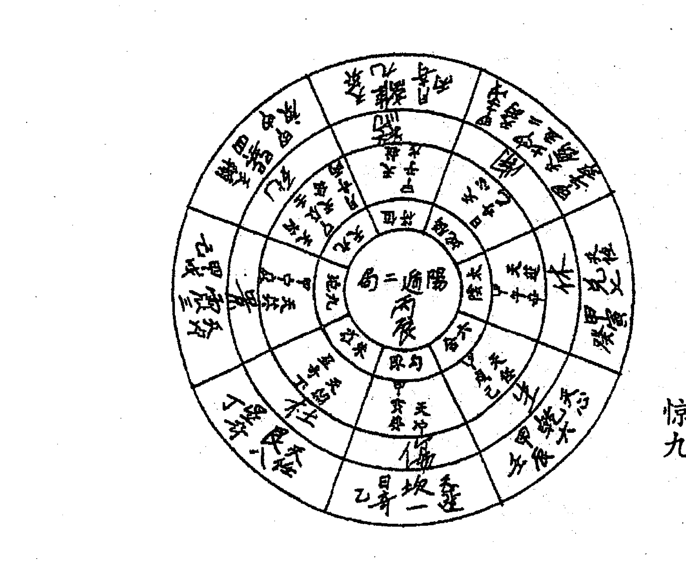

- (1) 开坤仪 天心乙加甲子戊。利阴害阳：门逢凶迫，财破人伤。「入墓」天心乙加甲午辛。青龙逃走：奴仆拐带，六畜皆伤，财产废坠，身遭毁伤。
- (2) 休兑仪 天蓬辛加甲寅癸。日月失明：误入天网，动止乖张。
- (3) 生乾仪 天任己加甲辰壬。天网高张：狡童佚女，奸情伤杀。
- (4) 伤坎仪 天冲癸加乙奇。华盖逢星。贵人禄位，常人平安。
- (5) 杜艮仪 天辅丁加丁奇。奇入太阴：文书即至，喜事遂心。「入墓」
- (6) 景震仪 天英庚加甲戊己。刑格：官司被重刑。
- (7) 死巽制 天芮壬加甲申庚。太白擒蛇：刑狱公平，立剖邪正。天禽丙加甲申庚。荧惑入太白：门户破败，盗贼耗失。
- (8) 惊离制 天柱戊加丙奇。青龙回首：动作大利，逢迫墓吉事成凶。
- (9) 开门乙奇合坤二宫，利西南方。

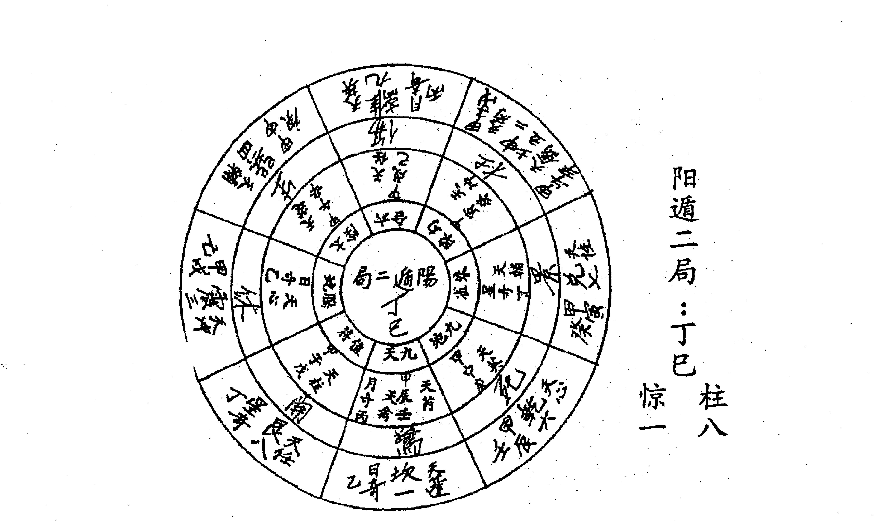

- (1) 开艮仪 天柱戊加丁奇。青龙耀明：谒贵求名吉利，逢墓迫招是非。
- (2) 休震仪 天心乙加甲戌己。日奇入雾：被土暗味，门凶转凶。「地遁，升殿」
- (3) 生巽制 天蓬辛加甲申庚。白虎出力：刀刃相接，主客相残，逊让稍可，强进血溅衣衫。
- (4) 伤离仪 天任己加丙奇。火悖地户：阳人冤冤相害，阴人必致淫污。
- (5) 杜坤迫 天冲癸加甲子戊。天乙会合：财喜婚姻，吉人赞助成合，门逢凶迫，反祸官非。天冲癸加甲午辛。网盖天牢：占讼病凶。
- (6) 景兑迫 天辅丁加甲寅癸。朱雀投江：文书口舌俱消，音信沉溺，讼狱所由起也。「升殿」
- (7) 死乾仪 天英庚加甲辰壬。小格：远行迷路，音信嗟呀。
- (8) 惊坎仪 天芮壬加乙奇。格名小蛇：女人柔顺，男人嗟呀，占孕生子，禄马光华。天禽丙加乙奇。日月并行：公谋私为皆吉。
- (9) 休门乙奇合震三宫，利正东方。

### 奇门阴阳九遁阳二局符使值例

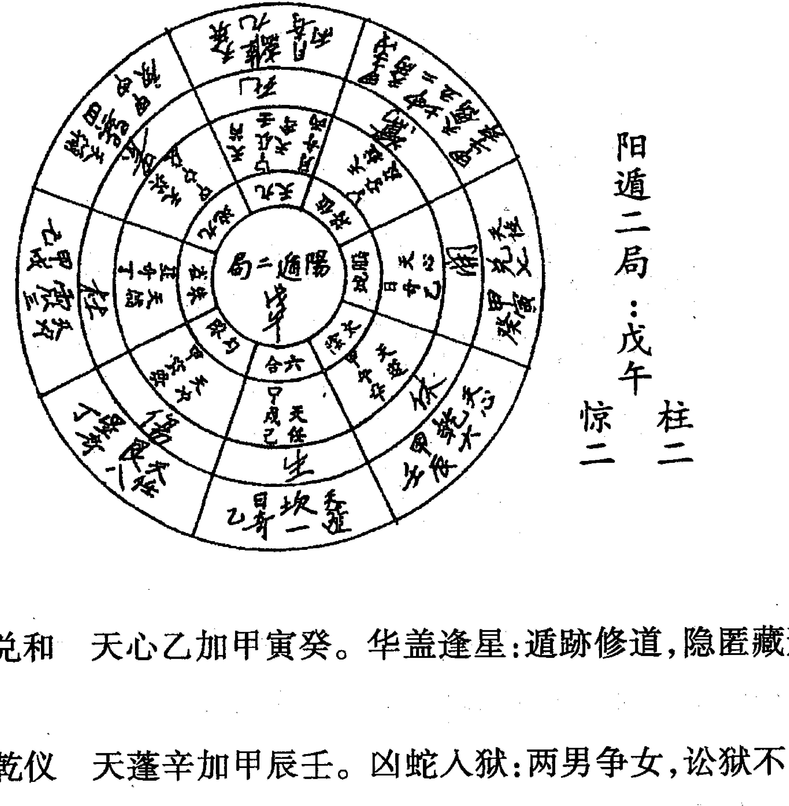

阳遁二局：戊午 惊二 杜二

- (1) 开兑和 天心乙加甲寅癸。华盖逢星：遁迹修道，隐匿藏形，躲灾避难为吉。
- (2) 休乾仪 天蓬辛加甲辰壬。凶蛇入狱：两男争女，讼狱不息，先动失理。
- (3) 生坎迫 天任己加乙奇。地户逢星：宜遁迹隐匿为利逸。
- (4) 伤艮迫 天冲癸加丁奇。螣蛇妖娇：文书官司火焚莫逃，忧惶之事必至。
- (5) 杜震和 天辅丁加甲戌己。火入勾陈：奸私仇冤，事因女人。
- (6) 景巽仪 天英庚加甲申庚。太白同宫：官灾横祸，兄弟不睦。
- (7) 死离仪 天芮壬加丙奇。水蛇入火：官灾刑禁，络绎不绝。天禽丙加丙奇。日月孛师，文书逼迫，破耗损失。「升殿」
- (8) 惊坤仪 天柱戊加甲子戊。伏吟：万事闭塞，静守为吉。天柱戊加甲午辛。谋事有成，病人不凶。
- (9) 开门乙奇合兑七宫，利正西方。

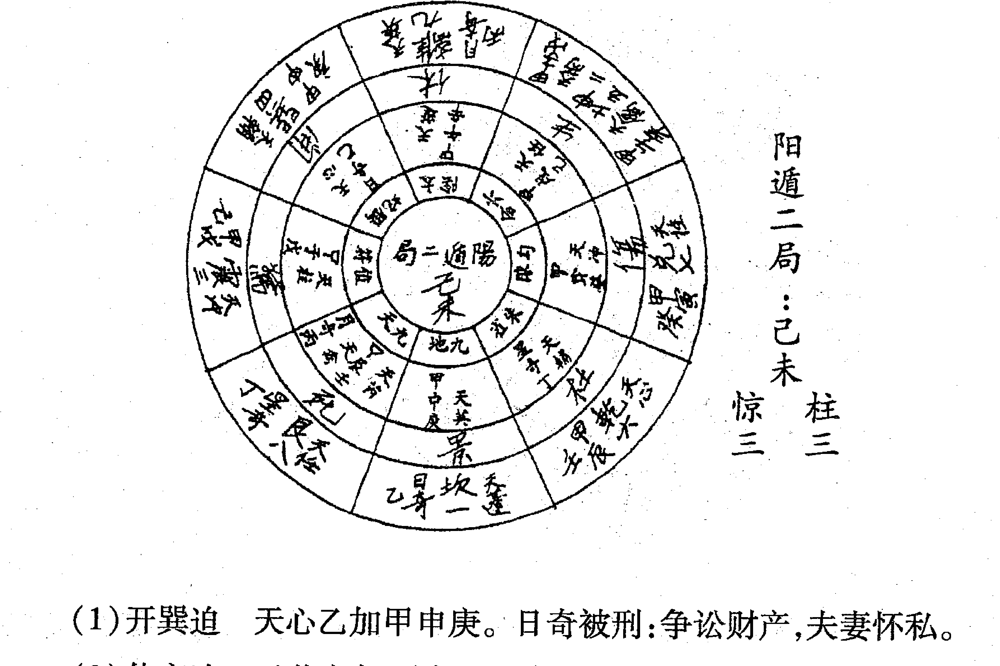

- (1) 开巽迫 天心乙加甲申庚。日奇被刑：争讼财产，夫妻怀私。
- (2) 休离迫 天蓬辛加丙奇。干合孛师：占雨无，占晴旱，占事必因财致讼。
- (3) 生坤和 天柱己加甲子戊。犬遇青龙：门吉谋望遂意，上人见喜，门凶枉劳心机。天任己加甲午辛。游魂入墓：大人鬼魁，小人家先为祟。
- (4) 伤兑制 天冲癸加甲寅癸。天网四张（网高七尺）：行人失件，病讼皆伤。
- (5) 杜乾制 天辅丁加甲辰壬。五神互合：贵人恩诏，讼狱公平。
- (6) 景坎制 天英庚加乙奇。太白逢星：退吉进凶。
- (7) 死艮和 天芮壬加丁奇。干合蛇刑：文书牵连，贵人匆匆，男吉女凶。天禽丙加丁奇。辛奇朱雀：贵人文书吉利，常人平安。
- (8) 惊震迫 天柱戊加甲戊己。贵人入狱：公私不利。
- (9) 开门乙奇合巽四宫，利东南方。

### 奇门阴阳九遁阳二局符使值例

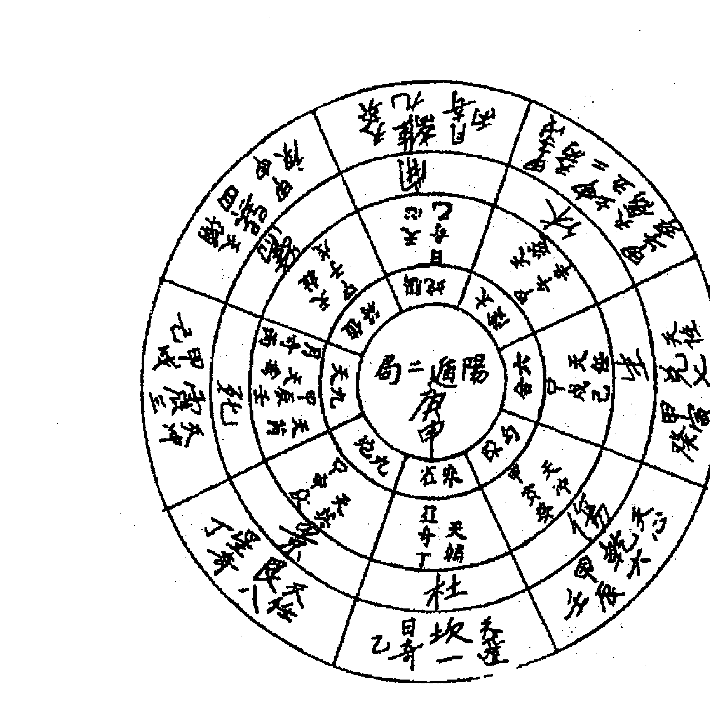

- (1) 开离制 天心乙加丙奇。奇仪顺遂。吉星迁官进职，凶星夫妻离别，天地交泰吉。
- (2) 休坤制 天蓬辛加甲子戊。困龙被伤：官司破败，屈抑守分，妄动祸殃。天蓬辛加甲午辛。伏吟天庭：公废私就，讼狱自罹罪名。
- (3) 生兑仪 天任己加甲寅癸。地刑玄武：病凶，词讼有囚狱之灾。
- (4) 伤乾制 天冲癸加甲辰壬。复见腾蛇：嫁娶重婚，后嫁无子，不保年华。
- (5) 杜坎仪 天辅丁加乙奇。天运昌气格：加官进爵，财喜婚姻。「人遁」
- (6) 景艮仪 天英庚加丁奇。亭亭之格：因私匿起官司，门吉有救。
- (7) 死震制 天芮壬加甲戌己。凶蛇入狱：大祸将至，顺守斯吉，词讼理曲。天禽丙加甲戌己。太孛入刑：囚人刑杖，文书不行，吉门得吉，凶门转凶。
- (8) 惊巽迫 天柱戊加甲申庚。值符飞宫：吉事不吉，凶事更凶。
- (9) 开门乙奇合在离九宫，利正南方。

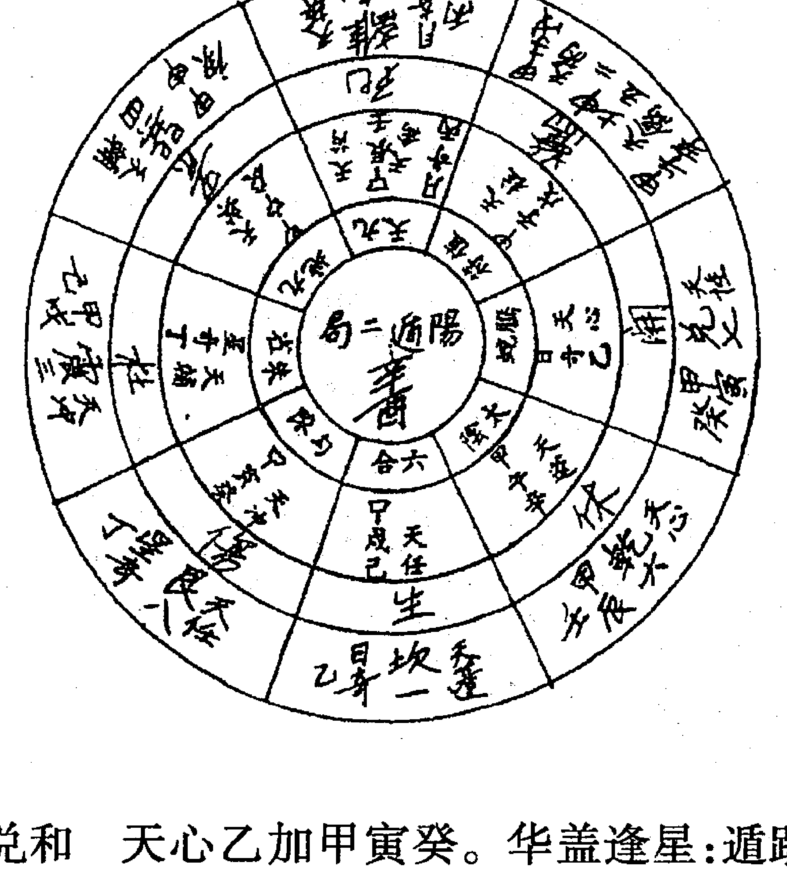

### 阳遁二局：辛酉 惊五 柱五

- (1) 开兑和 天心乙加甲寅癸。华盖逢星：遁迹修道，隐匿藏形，躲灾避难为吉。
- (2) 休乾和 天蓬辛加甲辰壬。凶蛇入狱：两男争女，讼狱不息，先动失理。
- (3) 生坎迫 天任己加乙奇。地户逢星：宜遁迹隐形为利逸。
- (4) 伤艮和 天冲癸加丁奇。螣蛇妖娇：文书官司火焚莫逃，忧惶之事必至。
- (5) 杜震和 天辅丁加甲戌己。火入勾陈：奸私仇冤，事因女人。
- (6) 景巽仪 天英庚加甲申庚。太白同宫：官灾横祸，兄弟不睦。
- (7) 死离仪 天芮壬加丙奇。水蛇入火：官灾刑禁，络绎不绝。天禽丙加丙奇。月奇孛师：文书逼迫，破耗损失。「升殿」
- (8) 惊坤仪 天柱戊加甲子戊。伏吟：万事闭塞，静守为吉。天柱戊加甲午辛。青龙折足：吉门生助，尚可谋为，逢凶门招灾，失财有足疾。
- (9) 开门乙奇合兑七宫，利正西方。

### 奇门阴阳九遁阳二局符使值例

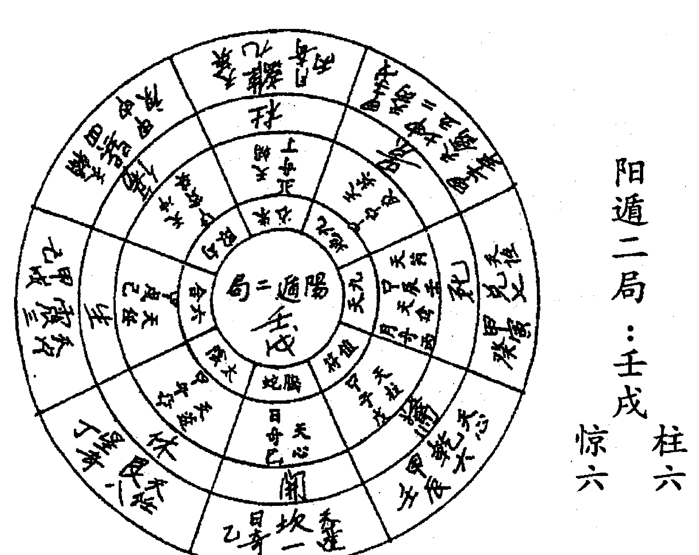

- 1. **开坎礼** 天心乙加乙奇。日奇伏吟：不宜谒贵求名，只可安分守身。
- 2. **休艮制** 天蓬辛加丁奇。狱神得奇：经商获倍利，囚人逢赦宥。
- 3. **生震仪** 天任己加甲戌己。地户逢鬼：病凶，百事不遂。
- 4. **伤巽和** 天冲癸加甲申庚。太白入网：昙花一现，争讼力平。
- 5. **杜离礼** 天辅丁加丙奇。星随月转，贵人越级高升，常人乐里生悲。
- 6. **景坤礼** 天英庚加甲子戊。天乙伏官：百事不可谋，凶。天英庚加甲午辛。白虎干格：远行车折马死。
- 7. **死兑礼** 天芮壬加甲寅癸。蛇入地罗：外人缠绕，内事索索，吉门吉星，避免蹉跎。天禽丙加甲寅癸。华盖孛师：阴人害事，灾祸频生。
- 8. **惊乾和** 天柱戊加甲辰壬。龙入天牢：阴阳皆不利。
- 9. **开门乙奇合坎一宫，利正北方。**

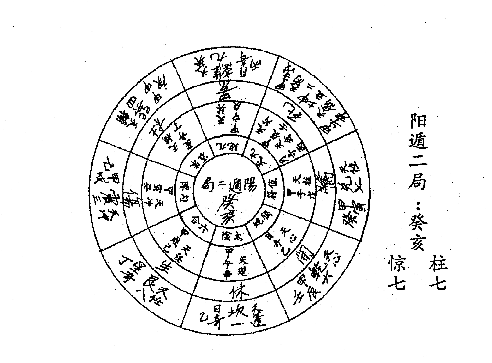

- (1) 开乾和 天心乙加甲辰壬。日奇入地：尊卑悖乱，官讼是非。「入墓」
- (2) 休坎和 天蓬辛加乙奇。白虎猖狂：人亡家败，远行多殃，尊长不喜，身体毁伤。「云遁」
- (3) 生艮和 天任己加丁奇。朱雀入狱：文状词讼先曲后直。
- (4) 伤震和 天冲癸加甲戌己。华盖地户：音信皆阻，躲灾避难为吉。
- (5) 杜巽和 天辅丁加甲申庚。时格：文书阻隔，行人必归。
- (6) 景离和 天英庚加丙奇。太白入荧惑，占贼必来，客进利，主破财。
- (7) 死坤和 天芮壬加甲子戊。小蛇化龙：男人发达，女产婴童。天禽丙加甲午辛。威神互合，谋事有成，病人不凶。
- (8) 惊兑和 天柱戊加甲寅癸。青龙华盖：门吉招福，门凶多乖。
- (9) 开门乙奇合乾六宫，利西北方。

## ## 奇门阴阳九遁阳三局符使值例

| 使符 | 甲 | 乙 | 丙 | 丁 | 戊 | 己 | 庚 | 辛 | 壬 | 癸 |
|------|----|----|----|----|----|----|----|----|----|----|
| 伤冲 | 子三三 | 丑四二 | 寅五一 | 卯六九 | 辰七三 | 巳八四 | 午九五 | 未一六 | 申二七 | 酉三八 |
| 杜辅 | 戊四四 | 亥五二 | 子六一 | 丑七九 | 寅八三 | 卯九四 | 辰一五 | 巳二六 | 午三七 | 未四八 |
| 死禽 | 申五五 | 酉六二 | 戌七一 | 亥八九 | 子九三 | 丑一四 | 寅二五 | 卯三六 | 辰四七 | 巳五八 |
| 开心 | 午六六 | 未七二 | 申八一 | 酉九九 | 戌一三 | 亥二四 | 子三五 | 丑四六 | 寅五七 | 卯六八 |
| 惊柱 | 辰七七 | 巳八二 | 午九一 | 未一九 | 申二三 | 酉三四 | 戌四五 | 亥五六 | 子六七 | 丑七八 |
| 生任 | 寅八八 | 卯九二 | 辰一一 | 巳二九 | 午三三 | 未四四 | 申五五 | 酉六六 | 戌七七 | 亥八八 |

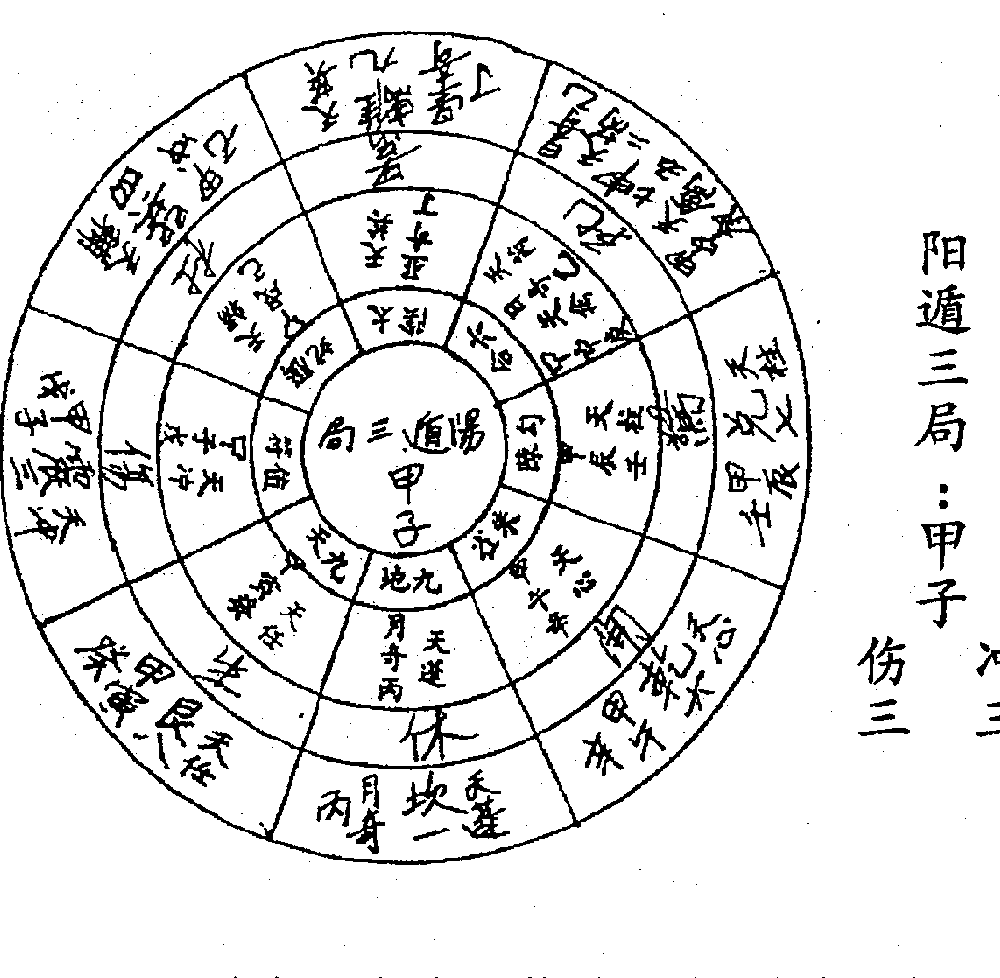

- (1) 开乾和 天心辛加甲午辛。伏吟天庭：公废私就，讼狱自罹罪名。
- (2) 休坎和 天蓬丙加丙奇。月奇孛师：文书逼迫，破耗损失。「天遁，重诈」
- (3) 生艮和 天任癸加甲寅癸。天网四张（网高八尺）：行人失件，疾讼皆伤。
- (4) 伤震和 天冲戊加甲子戊。伏吟：百事闭塞，静守为吉。
- (5) 杜巽和 天辅己加甲戌己。地户逢鬼：病凶，百事不遂。
- (6) 景离和 天英丁加丁奇。奇入太阴：文书即至，喜事遂心。
- (7) 死坤和 天芮乙加乙奇。日奇伏吟：不宜谒贵求名，只可安分守身。「入墓」天禽庚加甲申庚。太白同宫：官灾横祸，兄弟不睦。
- (8) 惊兑和 天柱壬加甲辰壬。蛇入地罗：外人缠绕，内事索索，吉门吉星，避免蹉跎。
- (9) 休门丙奇合坎一宫，利正北方。

#### 奇门阴阳九遁阳三局符使值例

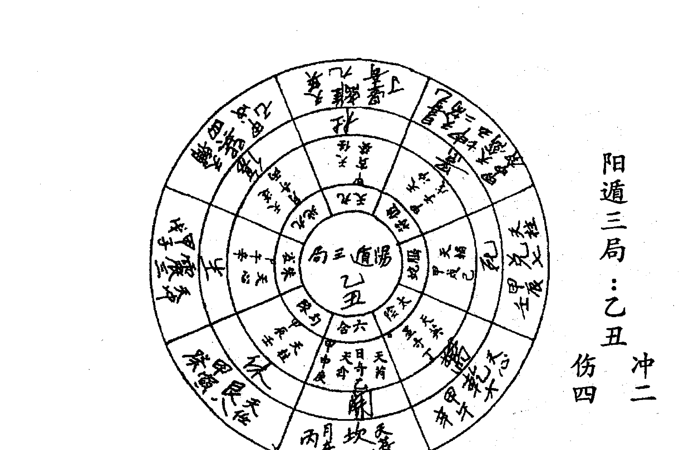

- 1. (1) 开坎礼 天芮乙加丙奇。奇仪顺遂：吉星迁官进职，凶星夫妻离别。[地、人遁，休诈]天禽庚加丙奇。太白入荧惑：占贼必来，客进利，主破财。
- 2. (2) 休艮制 天柱壬加甲寅癸。幼女奸淫：家有丑声，门吉星凶，反祸福隆。
- 3. (3) 生震制 天心辛加甲子戊。囚龙被伤：官司破败，屈抑守分，妄动祸殃。
- 4. (4) 伤巽和 天蓬丙加甲戊己。太孛入刑：囚人刑杖，文书不行，吉门得吉，凶门转凶。
- 5. (5) 杜离礼 甲寅癸加丁奇。腾蛇妖娇：文书官司火焚莫逃，忧惶之事必至。
- 6. (6) 景坤礼 天冲戊加乙奇。青龙合灵：门吉事吉，门凶事凶。天冲戊加甲申庚。值符飞宫，吉事不吉，凶事更凶。
- 7. (7) 死兑礼 天辅己加甲辰壬。地网高张：狡童佚女，奸情伤杀。
- 8. (8) 惊乾和 天英丁加甲午辛。朱雀入狱：罪人失囚，官人失位。
- 9. (9) 开门乙奇合坎一宫，利正北方。

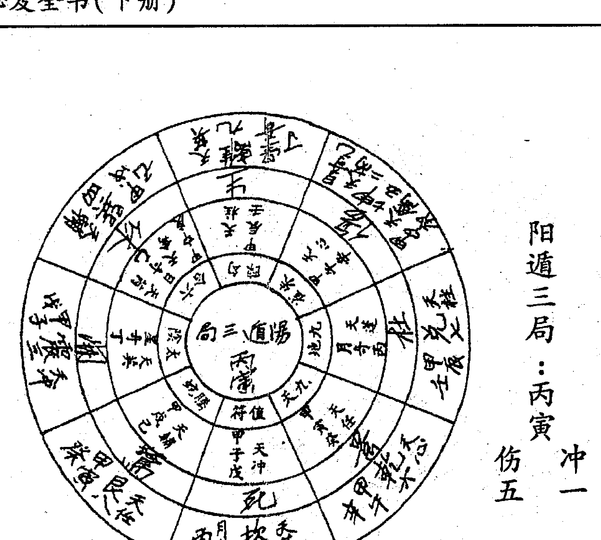

- (1) 开震迫 天英丁加甲子戊。青龙转光：官人升迁，常人咸昌。「真诈」
- (2) 休巽礼 天芮乙加甲戌己。日奇入雾：被土暗昧，门凶必凶。「人、地遁，休诈」天禽庚加甲戌己。刑格：官司被重刑。
- (3) 生离仪 天柱壬加丁奇。干合蛇刑：文书牵连，贵人匆匆，男吉女凶。
- (4) 伤坤迫 天心辛加乙奇。白虎猖狂：人亡家败，远行多殃，尊长不喜，身体毁伤。天心辛加甲申庚。白虎出力：刀刃相接，主客相残，逊让稍可，强进血溅衣衫。
- (5) 杜兑制 天蓬丙加甲辰壬。火入天罗：客不利，是非颇多。
- (6) 景乾迫 天任癸加甲午辛。网盖天牢：讼病凶。
- (7) 死坎迫 天冲戊加丙奇。青龙回首：动作大利，逢迫墓吉事成凶。
- (8) 惊艮仪 天辅己加甲寅癸。地刑玄武：病凶，词讼有囚狱之灾。
- (9) 开丁奇 震三宫，利正东。休丁奇 巽四宫，东南方。

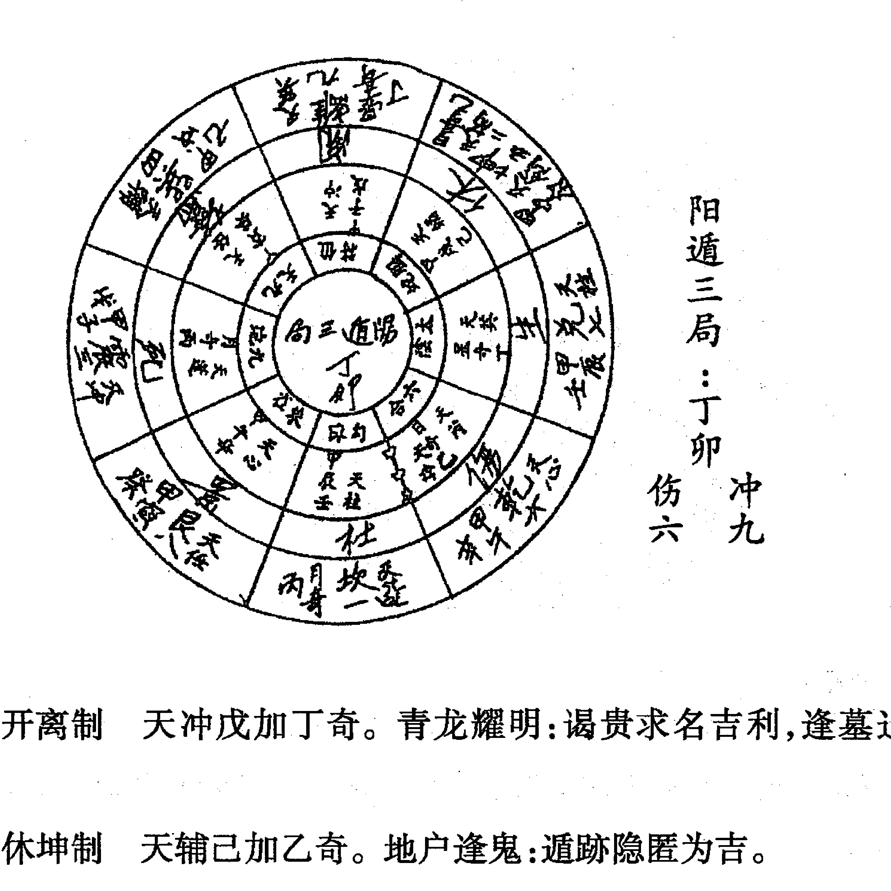

- (1) 开离制 天冲戊加丁奇。青龙耀明：谒贵求名吉利，逢墓迫招是非。
- (2) 休坤制 天辅己加乙奇。地户逢鬼：遁迹隐匿为吉。天辅己加甲申庚。利格返名：词讼先动不利，阴星有谋害之情。
- (3) 生兑制 天英丁加甲辰壬。五神互合：贵人恩诏，讼狱公平。「升殿，人遁，真诈」
- (4) 伤乾制 天芮乙加甲午辛。青龙逃走：奴仆拐带，六畜皆伤，财产废坠，身遭毁伤。「入墓」天禽庚加甲午辛。白虎干格：远行车折马死。
- (5) 杜坎仪 天柱壬加丙奇。水蛇入火：官灾刑禁。络绎不绝。
- (6) 景艮仪 天心辛加甲寅癸。日月失明：误入天网，动止乖张。
- (7) 死震制 天蓬丙加甲子戊。飞鸟跌穴。谋事有成，百事洞澈。
- (8) 惊巽迫 天任癸加甲戌己。华盖地户：音信阻，躲灾避难为吉。
- (9) 生门丁奇合兑七宫，利正西方。

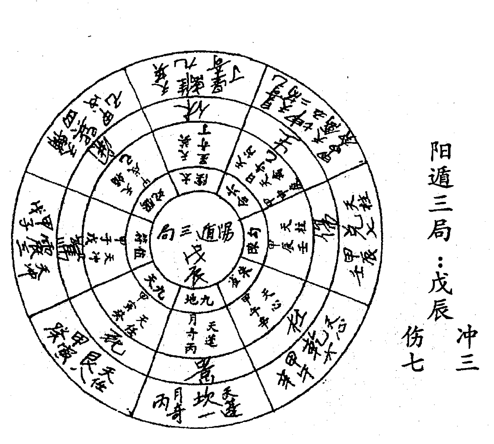

阳遁三局：戊辰 伤七 冲三

- (1) 开巽迫 天辅己加甲戊己。地户逢鬼：病凶，百事不遂。
- (2) 休离迫 天英丁加丁奇。奇入太阴：文书即至，喜事遂心。「地、人遁，真诈」
- (3) 生坤和 天芮乙加乙奇。日奇伏吟：不宜谒贵求名，只可安分守身为吉。「龙、云、地、人遁，休诈，入墓」天禽庚加甲申庚。太白同宫：官灾横祸，兄弟不睦。
- (4) 伤兑制 天柱壬加甲辰壬。蛇入地罗：外人缠绕，内事索索。
- (5) 杜乾制 天心辛加甲午辛。伏吟天庭：公废私就，讼狱自罹罪名。
- (6) 景坎制 天蓬丙加丙奇。月奇孛师：文书逼迫，破耗损失。
- (7) 死艮和 天任癸加甲寅癸。天网四张（网高八尺）：行人失件，疾病诉讼皆伤。
- (8) 惊震迫 天冲戊加甲子戊。伏吟：万事闭塞，静守为吉。
- (9) 休丁奇合离九宫，利正南方。生乙奇合坤二宫，利西南方。

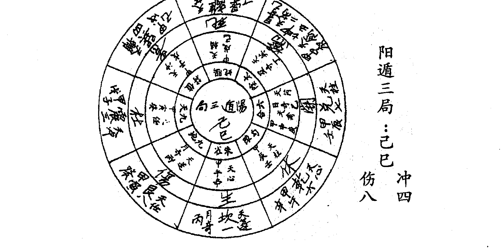

- (1) 开兑和 天芮乙加甲辰壬。日奇入地：尊卑悖乱，官讼是非。「地、人遁，休诈」天禽庚加甲辰壬。小格：远行迷路，音信嗟呀。
- (2) 休乾仪 天柱壬加甲午辛。螣蛇相缠：纵得吉门，亦不安宁，若有谋望，被人欺瞒。
- (3) 生坎迫 天心辛加丙奇。干合悖师：占雨无，占晴旱，占事必因财致讼。
- (4) 伤艮迫 天蓬丙加甲寅癸。华盖悖师：阴人害事，灾祸频生。
- (5) 杜震和 天任癸加甲子戊。天乙会合：财喜婚姻，吉人赞助成合，门逢迫制，反祸官非。
- (6) 景巽仪 天冲戊加甲戌己。贵人入狱：公私不利。
- (7) 死离礼 天辅己加丁奇。朱雀入墓：文状词讼，先曲后直。
- (8) 惊坤仪 天英丁加乙奇。天运昌气格：加官进爵，财喜婚姻。「人遁」天英丁加甲申庚。时格：文书阻隔，行人必归。
- (9) 开门乙奇合兑七宫，利正西方。

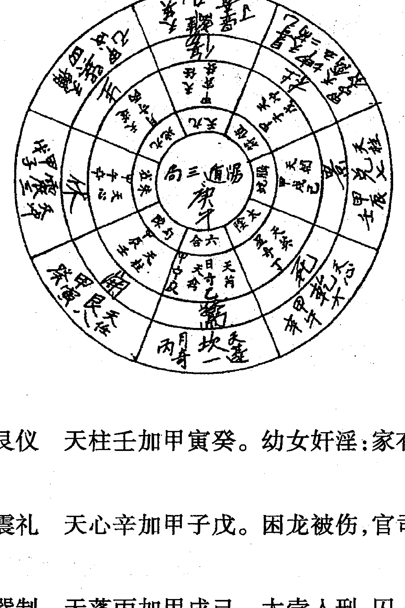

阳遁三局：庚午 伤九 冲五

- (1) 开艮仪 天柱壬加甲寅癸。幼女奸淫：家有丑声，门吉星凶，反祸福隆。
- (2) 休震礼 天心辛加甲子戊。困龙被伤，官司破败，屈抑守分，妄动祸殃。
- (3) 生巽制 天蓬丙加甲戌己。太孛入刑：囚人刑杖，文书不行，吉门得奇，凶门更凶。
- (4) 伤离礼 天任癸加丁奇。螣蛇妖娇：文书官司火焚莫逃，忧惶之事必至。
- (5) 杜坤迫 天冲戊加乙奇。青龙合灵：门吉事吉，门凶事凶。天冲戊加甲申庚。值符飞宫：吉事不吉，凶事更凶。
- (6) 景兑迫 天辅己加甲辰壬。地网高张：狡童佚女，奸情伤杀。
- (7) 死乾礼 天英丁加甲午辛。朱雀入狱：罪人失囚，官人失位。「入墓」
- (8) 惊坎礼 天芮乙加丙奇。奇仪顺遂。吉星迁官进职。凶星夫妻离别。天禽庚加丙奇。太白入荧惑：占贼必来，为客进利，为主破财。
- (9) 生门丙奇合巽四宫，利东南方。

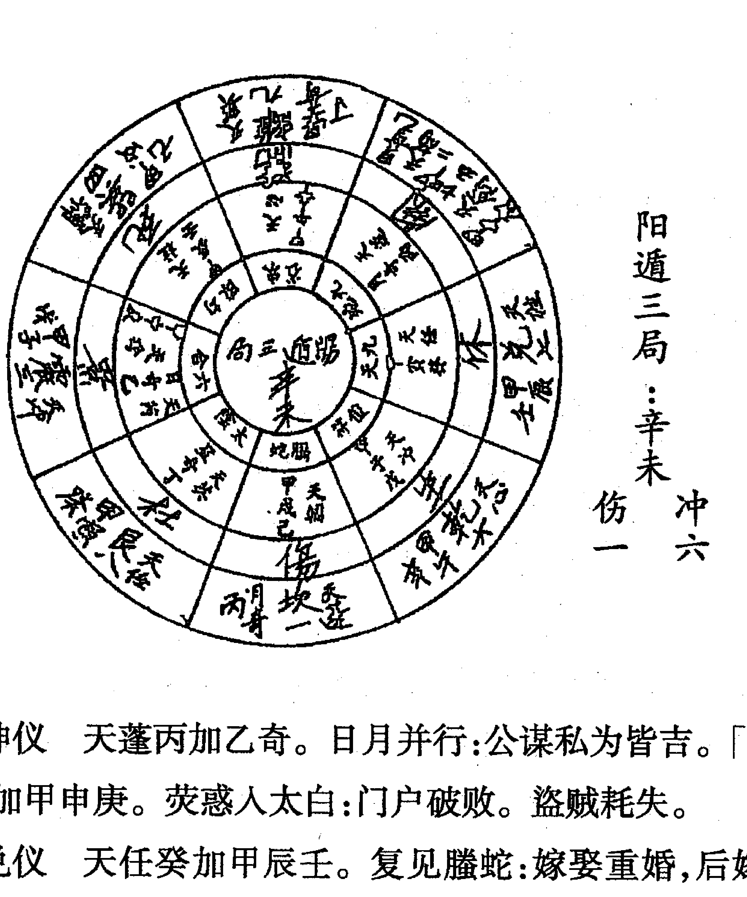

- 1. 开坤仪 天蓬丙加乙奇。日月并行：公谋私为皆吉。「天遁，重诈」天蓬丙加甲申庚。荧惑入太白：门户破败。盗贼耗失。
- 2. 休兑仪 天任癸加甲辰壬。复见腾蛇：嫁娶重婚，后嫁无子，不保年华。
- 3. 生乾礼 天冲戊加甲午辛。青龙折足：吉门生助，尚可谋为，逢凶门，主招灾，失财，有足疾。
- 4. 伤坎仪 天辅己加丙奇。火悖地户：阳人冤冤相害，阴人必致淫污。
- 5. 杜艮迫 天英丁加甲寅癸。朱雀投江：文书口舌俱消，音信沉溺，讼狱所由起也。「入墓」
- 6. 景震仪 天芮乙加甲子戊。利阴害阳：门逢凶迫，财破人伤。「升殿」天禽庚加甲子戊。太白伏宫：百事不可谋，凶。
- 7. 死巽制 天柱壬加甲戊己。凶蛇入狱：大祸将至，顺守斯吉，词讼理曲。
- 8. 惊离制 天心辛加丁奇。狱神得奇：经商获倍利，囚人逢赦宥。
- 9. 开门丙奇合坤二宫，利西南方。

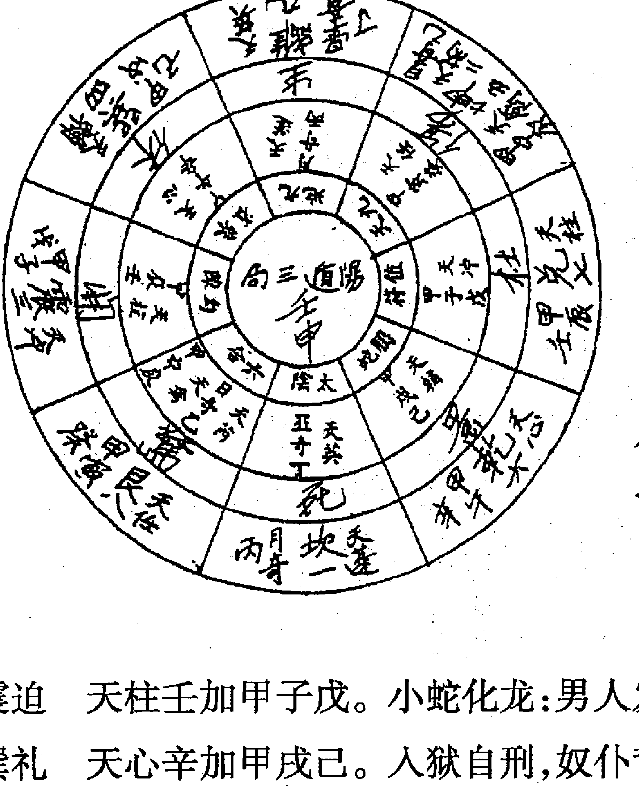

阳遁三局：壬申 伤二 冲七

- (1) 开震迫 天柱壬加甲子戊。小蛇化龙：男人发达，女产婴童。
- (2) 休巽礼 天心辛加甲戌己。入狱自刑，奴仆背主，讼诉难伸。
- (3) 生离仪 天蓬丙加丁奇。辛奇朱雀：贵人文书吉，常人平安。「天遁，重诈，升殿」
- (4) 伤坤迫 天任癸加乙奇。华盖逢星：贵人禄位，常人平安。天任癸加甲申庚。太白入网：昙花一现，争讼力平。
- (5) 杜兑制 天冲戊加甲辰壬。龙入天牢：阴阳皆不利。
- (6) 景乾迫 天辅己加甲午辛。游魂入墓：大人鬼魁，小人家先为祟。
- (7) 死坎迫 天英丁加丙奇。星随月转：贵人越级高升，常人乐里生悲。「入墓」
- (8) 惊艮仪 天芮乙加甲寅癸。华盖逢星：遁迹修道，隐匿隐形，躲灾避难为吉。天禽庚加甲寅癸。大格：行人至，官司止，生产母子俱伤。
- (9) 生门丙奇合离九宫，利正南方。

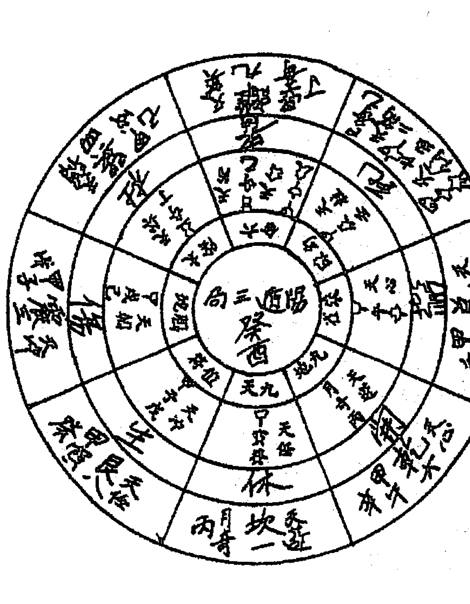

阳遁三局：癸酉 伤三 冲八

- 1. 开乾和 天蓬丙加甲午辛。威神互合：谋事有成，病人不凶。「天遁，重诈，入墓」
- 2. 休坎和 天任癸加丙奇。华盖孛师：贵贱逢之，上人见喜。
- 3. 生艮和 天冲戊加甲寅癸。青龙华盖：门吉招福，门凶多乖。
- 4. 伤震和 天辅己加甲子戊。犬遇青龙：门吉谋望遂意，上人见喜，门凶枉劳心机。
- 5. 杜巽和 天英丁加甲戌己。火入勾陈：奸私仇冤，事因女人。
- 6. 景离和 天芮乙加丁奇。奇仪相佐：文书事吉，百事皆可为。天禽丙加丁奇。亭亭之格：因私匿起官司，门吉有救。
- 7. 死坤和 天柱壬加乙奇。格名小蛇：女人柔顺，男人嗟呀，占孕生子，禄马光华。天柱壬加甲申庚。太白擒蛇：刑狱公平，立剖邪正。
- 8. 惊兑和 天心辛加甲辰壬。凶蛇入狱：两男争女，讼狱不息，先动失理。
- 9. 开门丙奇合乾六宫，利西北方。

#### 奇门阴阳九遁阳三局符使值例

(1) 开乾和 天心庚加甲午辛。白虎干格：远行车折马死。
(2) 休坎和 天蓬丁加丙奇。星随月转：贵人越级高升，常人乐里生悲。
(3) 生艮和 天任壬加甲寅癸。幼女奸淫：家有丑声，门吉星凶，反祸福隆。
(4) 伤震和 天冲乙加甲子戊。利阴害阳：门逢凶迫，财破人伤。「升殿」
(5) 杜巽和 天辅戊加甲戌己。贵人入狱：公私不利。
(6) 景离和 天英癸加丁奇。螣蛇妖娇：文书官司火焚莫逃，忧惶之事必至。
(7) 死坤和 天芮丙加乙奇。日月并行：公谋私为皆吉。「入墓」天禽己加甲申庚。利格返名：词讼先动不利，阴星有谋害之情。
(8) 惊兑和 天柱辛加甲辰壬。凶蛇入狱：两男争女，讼狱不息，先动失理。
(9) 休门丁奇合坎一宫，利正北方。

(1) 开艮仪 天心庚加甲寅癸。大格：行人至，官司止，生产母子俱伤。
(2) 休震礼 天蓬丁加甲子戊。青龙转光：官人升迁，常人咸昌。
(3) 生巽制 天任壬加甲戌己。凶蛇入狱：大祸将至，顺守斯吉，词讼理曲。
(4) 伤离礼 天冲乙加丁奇。奇仪相佐：文书事吉，百事皆可为，天地交泰。
(5) 杜坤迫 天辅戊加乙奇。青龙合灵：门吉事吉，门凶事凶。天辅戊加甲申庚。值符飞宫：吉事不吉，凶事更凶。
(6) 景兑迫 天英癸加甲辰壬。复见腾蛇：嫁娶重婚，后嫁无子，不保年华。
(7) 死乾礼 天芮丙加甲午辛。威神互合，谋事有成，病人不凶。入墓天禽己加甲午辛。游魂入墓：大人鬼魅，小人家先为祟。
(8) 惊坎礼 天柱辛加丙奇。干合孛师：占雨无，占晴旱，占事必因财致讼。
(9) 休门丁奇合震三宫，利正东方。

#### 阳遁三局：丙子 杜六 辅一

(1) 开巽迫 天柱辛加甲戌己。入狱自刑：奴仆背主，讼诉难伸。
(2) 休离迫 天心庚加丁奇。亭亭之格：因私匿起官司，门吉有救。
(3) 生坤和 天蓬丁加乙奇。天运昌气格：加官进爵，婚姻财喜。[人遁] 天蓬丁加甲申庚。时格：文书阻隔，行人必归。
(4) 伤兑制 天任壬加甲辰壬。蛇入地罗：外人缠绕，内事索索，吉门吉星，避免蹉跎。
(5) 杜乾制 天冲乙加甲午辛。青龙逃走：奴仆拐带，六畜皆伤，财产废坠，身遭毁伤。[入墓]
(6) 景坎制 天辅戊加丙奇。青龙回首：动作大利，迫墓击刑，吉事成凶。
(7) 死艮和 天英癸加甲寅癸。天网四张(网高八尺)：行人失件，病讼皆伤。
(8) 惊震迫 天芮丙加甲子戊。飞鸟跌穴，谋事有成，百事洞澈。天禽己加甲子戊。门吉谋望遂意，上人见喜，门凶枉劳心机。
(9) 生门丁奇合坤二宫，利西南方。

(1) 开震迫 天任壬加甲子戊。小蛇化龙：男人发达，女产婴童。
(2) 休巽礼 天冲乙加甲戌己。日奇入雾：被土暗昧，门凶必凶。「龙、地遁」
(3) 生离仪 天辅戊加丁奇。青龙耀明：谒贵求名吉利，逢墓迫招是非。
(4) 伤坤迫 天英癸加乙奇。华盖逢星：贵人禄位，常人平安。天英癸加甲申庚。太白入网：昙花一现，争讼力平。
(5) 杜兑制 天芮丙加甲辰壬。火入天罗：客不利，是非颇多。天禽己加甲辰壬。龙入天牢：阴阳皆不利。
(6) 景乾迫 天柱辛加甲午辛。伏吟天庭：公废私就，讼狱自罹罪名。
(7) 死坎迫 天心庚加丙奇。太白入荧惑，占贼必来，客进利，主破财。
(8) 惊艮仪 天蓬丁加甲寅癸。朱雀投江：文书口舌俱消，音信沉溺，讼狱所由起也。「入墓」
(9) 休门乙奇合巽四宫，利东南方。

(1) 开坤仪 天柱辛加乙奇。白虎猖狂：人亡家败，远行多殃，尊长不喜，身体毁伤。「云遁」天柱辛加甲申庚。白虎出力：刀刃相接，主客相残，逊让稍可，强进血溅衣衫。
(2) 休兑仪 天心庚加甲辰壬。小格：远行迷路，音信嗟呀。
(3) 生乾礼 天蓬丁加甲午辛。朱雀入狱：罪人释囚，官人失位。
(4) 伤坎仪 天任壬加丙奇。水蛇入火：官灾刑禁，络绎不绝。
(5) 杜艮迫 天冲乙加甲寅癸。华盖逢星：遁迹修道，隐匿藏形，躲灾避难为吉。
(6) 景震仪 天辅戊加甲子戊。伏吟：万事闭塞，静守为吉。
(7) 死巽制 天英癸加甲戌己。华盖地户：音信阻，躲灾避难为吉。
(8) 惊离制 天芮丙加丁奇。辛奇朱雀：贵人文书吉，常人平安。「升殿」天禽己加丁奇，朱雀入墓，文状词讼先曲后直。
(9) 生门丁奇合乾六宫，利西北方。

#### 奇门阴阳九遁阳三局符使值例

#### 阳遁三局：己卯 杜九 辅四

(1) 开坎礼 天蓬丁加丙奇。星随月转：贵人越级高升，常人乐里生悲。
(2) 休艮制 天任壬加甲寅癸。幼女奸淫：家有丑声，门吉星凶，反祸福隆。
(3) 生震制 天冲乙加甲子戊。利阴害阳，门逢凶迫，财破人伤。「升殿」
(4) 伤巽和 天辅戊加甲戌己。贵人入狱：公私不利。
(5) 杜离礼 天英癸加丁奇。腾蛇妖娇：文书官司火焚莫逃，忧惶之事必至。
(6) 景坤礼 天芮丙加乙奇。日月并行：公谋私为皆吉。天禽己加甲申庚。利格返名：词讼先动者不利，阴星有之谋害之情。
(7) 死兑礼 天柱辛加甲辰壬。凶蛇入狱：两男争女，讼狱不息，先动失理。
(8) 惊乾和 天心庚加甲午辛。白虎干格：远行车折马死。
(9) 开门丁奇合坎一宫，利正北方。生门乙奇合震三宫，利正东方。

#### 阳遁三局：庚辰 杜 辅 一 五

(1) 开离制 天冲乙加丁奇。奇仪相佐，文书事吉，百事皆可为。「鬼遁」
(2) 休坤制 天辅戊加乙奇。青龙合灵：门吉事吉，门凶事凶。天辅戊加甲申庚。值符飞宫：吉事不吉，凶事更凶。
(3) 生兑礼 天英癸加甲辰壬。复见螣蛇：嫁娶重婚，后嫁无子，不保年华。
(4) 伤乾制 天芮丙加甲午辛。威神互合：谋事有成：病人不凶。天禽己加甲午辛。游魂入墓：大人鬼魅，小人家先为祟。
(5) 杜坎仪 天柱辛加丙奇。干合孛师：占雨无，占晴旱，占事必因财致讼。
(6) 景艮礼 天心庚加甲寅癸。大格：行人至，官司止，生产母子俱伤。
(7) 死震制 天蓬丁加甲子戊。青龙转光：官人升迁，常人咸昌。「入墓」。
(8) 惊巽迫 天任壬加甲戌己。凶蛇入狱：大祸将至，顺守斯吉，词讼理曲。
(9) 开门乙奇合离九宫，利正南方。

## 阳遁三局·辛巳 杜二 辅六

(1) 开艮仪 天芮丙加甲寅癸。火入天罗：客不利，是非颇多。「天遁，真诈」天禽己加甲寅癸。地刑玄武：病凶，词讼有囚狱之灾。
(2) 休震礼 天柱辛加甲子戊。困龙被伤：官司破败，屈抑守分，妄动祸殃。
(3) 生巽制 天心庚加甲戌己。刑格：官司被重刑。
(4) 伤离礼 天蓬丁加丁奇。奇人太阴：文书即至，喜事遂心。
(5) 杜坤迫 天任壬加乙奇。格名小蛇：女人柔顺，男人嗟呀。占孕生子。禄马光华。天任壬加甲申庚。太白擒蛇：刑狱公平，立剖邪正。
(6) 景兑迫 天冲乙加甲辰壬。日奇入地：尊卑悖乱，宫讼是非。
(7) 死乾礼 天辅戊加甲午辛。青龙折足：吉门生助，尚可谋为，逢凶门招灾，失财有足疾。
(8) 惊坎礼 天英癸加丙奇。华盖孛师：贵贱逢之，上人见喜。
(9) 开门丙奇合艮八宫，利东北方。

#### 奇门遁甲秘笈全书(下册)

#### 阳遁三局：壬午 杜三 辅七

(1) 开兑和 天辅戊加甲辰壬。龙入天牢：阴阳皆不利。
(2) 休乾仪 天英癸加甲午辛。网盖天牢：占讼病凶。
(3) 生坎迫 天芮丙加丙奇。月奇孛师：文书逼迫，破耗损失。「天、人遁，真诈」天禽己加丙奇，火孛地户：阳人冤冤相害，阴人必致淫污。
(4) 伤艮迫 天柱辛加甲寅癸。日月失明：误入天网：动止乖张。
(5) 杜震和 天心庚加甲子戊。天乙伏官：百事不可谋，凶。
(6) 景巽仪 天蓬丁加甲戌己。火入勾陈：奸私仇冤，事因女人。
(7) 死离仪 天任壬加丁奇。干合蛇刑：文书牵连，贵人匆匆，男吉女凶。
(8) 惊坤仪 天冲乙加乙奇。日奇伏吟：不宜谒贵求名，只可安分守身。「入墓」天冲乙加甲申庚。日奇被刑：争讼财产，夫妻怀私。
(9) 生门丙奇合坎一宫，利正北方。

#### 阳遁三局：癸未 杜四 辅八

(1) 开乾和 天任壬加甲午辛。螣蛇相缠：纵得吉门，亦不安宁，若有谋望，被人欺瞒。
(2) 休坎和 天冲乙加丙奇。奇仪顺遂：吉星迁官进爵，凶星夫妻离别。
(3) 生艮和 天辅戊加甲寅癸。青龙华盖：门吉招福，门凶多乖。
(4) 伤震和 天英癸加甲子戊。天乙会合：财喜婚姻，吉人赞助成合，门凶迫制，反祸官非。
(5) 杜巽和 天芮丙加甲戌己。太孛入刑：囚人刑杖，文书不行，吉门得吉。天禽己加甲戌己。地户逢鬼：病凶，百事不遂。
(6) 景离和 天柱辛加丁奇。狱神得奇：经商获倍利，囚人逢赦宥。
(7) 死坤和 天心庚加乙奇。太白逢星：退吉进凶。天心庚加甲申庚。太白同宫：官灾横祸，兄弟不睦。
(8) 惊兑和 天蓬丁加甲辰壬。五神互合：贵人恩诏，讼狱公平。「升殿」
(9) 休门乙奇合坎一宫，利正北方。

#### 阳遁三局：甲申 死五 禽五

(1) 开乾和 天心己加甲午辛。游魂入墓，大人鬼魅，小人家先为祟。
(2) 休坎和 天蓬癸加丙奇。华盖孛师：贵贱逢之，上人见喜。
(3) 生艮和 天任辛加甲寅癸。日月失明。误入天网：动作乖张。
(4) 伤震和 天冲丙加甲子戊。飞鸟跌穴，谋事有成，百事洞澈。
(5) 杜巽和 天辅乙加甲戌己。日奇入雾：被土暗昧，门凶必凶。
(6) 景离和 天英壬加丁奇。干合蛇刑：文书牵连，贵人匆匆，男吉女凶。
(7) 死坤和 天芮丁加乙奇。天运昌气格：加官进爵，财喜婚姻。「人遁，入墓」天禽戊加甲申庚。值符飞宫：吉事不吉。凶事更凶。
(8) 惊兑和 天柱庚加甲辰壬。小格：远行迷路。音信嗟呀。
(9) 无奇门。

(1) 开艮仪 天任辛加甲寅癸。日月失明：误入天网，动止乖张。
(2) 休震礼 天冲丙加甲子戊。飞鸟跌穴：谋事有成，百事洞澈。
(3) 生巽制 天辅乙加甲戌己。日奇入雾：被土暗昧，门凶必凶。[地、人遁，重诈]
(4) 伤离礼 天英壬加丁奇。干合蛇刑：文书牵连，贵人匆匆，男吉女凶。
(5) 杜坤迫 天芮丁加乙奇。天运昌气格：加官进爵，婚姻财喜。[人遁]天禽戊加甲申庚。值符飞宫：吉事不吉，凶事更凶。
(6) 景兑迫 天柱庚加甲辰壬。小格：远行迷路，音信嗟呀。
(7) 死乾礼 天心己加甲午辛。游魂入墓：大人鬼魅，小人家先为祟。
(8) 惊坎礼 天蓬癸加丙奇。华盖孛师：贵贱逢之，上人见喜。
(9) 休门丙奇合震三宫，利正东方；生门乙奇合巽四宫，利东南方。

## 阳遁三局 : 丙戊 死七 禽一

(1) 开坎礼 天芮丁加丙奇。星随月转：贵人越级高升，常人乐里生悲。天禽戊加丙奇。青龙回首：动作大利，逢迫墓，吉事成凶。
(2) 休艮制 天柱庚加甲寅癸。大格：行人至，官司止，生产母子俱伤。
(3) 生震制 天心己加甲子戊。犬遇青龙：门吉谋望遂意，上人见喜，门凶枉劳心机。
(4) 伤巽和 天蓬癸加甲戌己。华盖地户：音信阻，躲灾避难为吉。
(5) 杜离礼 天任辛加丁奇。狱神得奇：经商获倍利，囚人逢赦宥。
(6) 景坤礼 天冲丙加乙奇。日月并行：公谋私为皆吉。天冲丙加甲申庚。荧惑入太白。门户破败，盗贼耗失。
(7) 死兑礼 天辅乙加甲辰壬。日奇入地：尊卑悖乱，官讼是非。
(8) 惊乾和 天英壬加甲午辛。腾蛇相缠：纵得吉门，亦不安宁，若有谋望，被人欺瞒。
(9) 开门丁奇合坎一宫，利正北方。

#### 奇门阴阳九遁阳三局符使值例

(1) 开巽迫 天英壬加甲戌己。凶蛇入狱：大祸将至，顺守斯吉，词讼理曲。
(2) 休离迫 天芮丁加丁奇。奇人太阴：文书即至，喜事遂心。天禽戊加丁奇。青龙耀明：谒贵求名吉利，逢墓迫招是非。
(3) 生坤和 天柱庚加乙奇。太白逢星：退吉进凶。天柱庚加甲申庚。太白同宫：官灾横祸，兄弟不睦。
(4) 伤兑制 天心己加甲辰壬。地网高张：狡童佚女，奸情伤杀。
(5) 杜乾制 天蓬癸加甲午辛。网盖天牢：占讼病凶。
(6) 景坎制 天任辛加丙奇。干合孛师：占雨无，占晴旱，占事必因财致讼。
(7) 死艮和 天冲丙加甲寅癸。华盖孛师：阴人害事，灾祸频生。
(8) 惊震迫 天辅乙加甲子戊。利阴害阳：门逢凶迫，财破人伤。「升殿」
(9) 休门丁奇合离九宫，利正南方。

#### 奇门遁甲秘笈全书（下册）

#### 阳遁三局：戊子 禽三 死九

(1) 开兑和 天任辛加甲辰壬。凶蛇入狱：两男争女，讼狱不息，先动失理。
(2) 休乾仪 天冲丙加甲午辛。谋事有成，病人不凶。「入墓」
(3) 生坎迫 天辅乙加丙奇。奇仪顺遂：吉星迁官进爵，凶星夫妻离别。「地、人遁，重诈」
(4) 伤艮迫 天英壬加甲寅癸。幼女奸淫，家有丑声，门吉星凶，反祸福隆。
(5) 杜震和 天芮丁加甲子戊。青龙转光：官人升官进职，常人咸昌。天禽戊加甲子戊。伏吟：万事闭塞，静守为吉。
(6) 景巽仪 天柱庚加甲戌己。刑格：官司被重刑。
(7) 死离仪 天心己加丁奇。朱雀入墓：文状词讼，先曲后直。
(8) 惊坤仪 天蓬癸加乙奇。华盖逢星：贵人禄位，常人平安。天蓬癸加甲申庚。太白入网：昙花一现，争讼力平。
(9) 休门丙奇合乾六宫，利西北方。生门乙奇合坎一宫，利正北方。

#### 奇门阴阳九遁阳三局符使值例

(1) 开震迫 天英壬加甲子戊。小蛇化龙：男人发达，女产婴童。
(2) 休巽礼 天芮丁加甲戌己。火入勾陈：奸私仇冤，事因女人。天禽戊加甲戌己。贵人入狱，公私不利。
(3) 生离仪 天柱庚加丁奇。亭亭之格：因私匿起官司，门吉有救。
(4) 伤坤迫 天心己加乙奇。地户逢星，遁迹隐匿为利逸。[地假]天心己加甲申庚。利格返名：词讼先动不利，阴星有谋害之情。
(5) 杜兑制 天蓬癸加甲辰壬。复见腾蛇：嫁娶重婚，后嫁无子，不保年华。
(6) 景乾迫 天任辛加甲午辛。伏吟天庭：公废私就，讼狱自罹罪名。
(7) 死坎迫 天冲丙加丙奇。月奇孛师：文书逼迫，破耗损失。
(8) 惊艮仪 天辅乙加甲寅癸。华盖逢星：遁迹修道，隐匿藏形，躲灾避难为吉。
(9) 休门丁奇合巽四宫，利东南方。

#### 阳遁三局：庚寅 死二 禽五

(1) 开乾和 天心己加甲午辛。游魂入墓：大人鬼魅，小人家先为祟。
(2) 休坎和 天蓬癸加丙奇。华盖孛师：贵贱逢之，上人见喜。
(3) 生艮和 天任辛加甲寅癸。曰月失明：误入天网，动止乖张。
(4) 伤震和 天冲丙加甲子戊。飞鸟跌穴：谋事有成，百事洞澈。
(5) 杜巽和 天辅乙加甲戌己。日奇入雾：被土暗昧，门凶必凶。
(6) 景离和 天英壬加丁奇。干合蛇刑：文书牵连，贵人匆匆，男吉女凶。
(7) 死坤和 天芮丁加乙奇。天运昌气格：加官进爵，财喜婚姻。「人遁，入墓」天禽戊加甲申庚。值符飞宫，吉事不吉，凶事更凶。
(8) 惊兑和 天柱庚加甲辰壬。小格：远行迷路，音信嗟呀。
(9) 无奇门。

#### 奇门阴阳九遁阳三局符使值例

(1) 开离制 天冲丙加丁奇。辛奇朱雀：贵人文书吉，常人平安。「升殿」
(2) 休坤制 天辅乙加乙奇。日奇伏吟：不宜谒贵求名，只可安分守身。「龙、地、人遁，重诈，入墓」天辅乙加甲申庚。日奇被刑：争讼财产，夫妻怀私。
(3) 生兑礼 天英壬加甲辰壬。蛇入地罗：外人缠绕，内事索索，吉门吉星，避免蹉跎。
(4) 伤乾制 天芮丁加甲午辛。朱雀入狱：罪人释囚，官人失位。天禽戊加甲午辛。青龙折足：吉门生助，尚可谋为，逢凶门招灾，失财有足疾。
(5) 杜坎仪 天柱庚加丙奇。太白入荧惑：占贼必来，客进利，主破财。
(6) 景艮礼 天心己加甲寅癸。地刑玄武：病凶，词讼有囚狱之灾。
(7) 死震制 天蓬癸加甲子戊。天乙会合：财喜婚姻，吉人赞助成合，门凶迫制，反祸官非。
(8) 惊巽迫 天任辛加甲戌己。入狱自刑：奴仆背主，讼诉难伸。
(9) 开门丙奇合离九宫，利正南方。休门乙奇合坤二宫，利西南方。

(1) 开坤仪 天英壬加乙奇。格名小蛇：女人柔顺，男人嗟呀，占孕生子，禄马光华。天英壬加甲申庚。太白擒蛇：刑狱公平，立剖邪正。
(2) 休兑仪 天芮丁加甲辰壬。五神互合：贵人恩诏，讼狱公平。「升殿」天禽戊加甲辰壬。龙入天牢：阴阳皆不利。
(3) 生乾仪 天柱庚加甲午辛。白虎干格：远行车折马死。
(4) 伤坎仪 天心己加丙奇。火孛地户：阳人冤冤相害，阴人必致淫污。「地假」
(5) 杜艮迫 天蓬癸加甲寅癸。天网四张(高网八尺)：行人失件，病讼皆伤。
(6) 景震仪 天任辛加甲子戊。困龙被伤：官司破败，屈抑守分，妄动祸殃。
(7) 死巽制 天冲丙加甲戌己。太孛入刑：囚人刑杖，文书不行，门吉得吉，凶门转凶。
(8) 惊离制 天辅乙加丁奇。奇仪相佐：文书事吉，百事皆可为。
(9) 休门丁奇合兑七宫，利正西方。

#### 阳遁三局：癸巳 死五 禽八

-   (1) 开乾和 天辅乙加甲午辛。青龙逃走：奴仆拐带，六畜皆伤，财产废坠，身遭毁伤。「地、云、人遁，重诈，入墓」

-   (2) 休坎和 天英壬加丙奇。水蛇入火：官灾刑禁，络绎不绝。

-   (3) 生艮和 天芮丁加甲寅癸。朱雀投江：文书口舌俱消，音信沉溺，讼狱所由起也。「入墓」

    天禽戊加甲寅癸。青龙华盖：门吉招福，门凶多乖。

-   (4) 伤震和 天柱庚加甲子戊。天乙伏宫，百事不可谋，凶。

-   (5) 杜巽和 天心己加甲戌己。地户逢鬼：病凶，百事不遂。

-   (6) 景离和 天蓬癸加丁奇。螣蛇妖娇：文书官司火焚莫逃，忧惶之事必至。

-   (7) 死坤和 天任辛加乙奇。白虎猖狂：人亡家败，远行多殃，尊长不喜，身体毁伤。

    天任辛加甲申庚。白虎出力：刀刃相接，主客相残，逊让稍可，强进血溅衣衫。

-   (8) 惊兑和 天冲丙加甲辰壬。火入天罗：为客进利，是非颇多。

-   (9) 开门乙奇合乾六宫，利西北。
    休丁奇合艮八宫，利东北。

-   (1) 开乾和　天心戊加甲午辛。青龙折足：吉门生助，尚可谋为，逢凶门，主招灾，失财有足疾。
-   (2) 休坎和　天蓬壬加丙奇。水蛇入火：官灾刑禁，络绎不绝。
-   (3) 生艮和　天任庚加甲寅癸。大格：行人至，官司止，生产母子俱伤。
-   (4) 伤震和　天冲丁加甲子戊。青龙转光：官人升迁，常人咸昌。[地假]
-   (5) 杜巽和　天辅丙加甲戌己。太孛入刑：囚人刑杖，文书不行，吉门得吉，凶门转凶。
-   (6) 景离和　天英辛加丁奇。狱神得奇：经商获倍利，囚人逢赦宥。
-   (7) 死坤和　天芮癸加乙奇。华盖逢星：贵人禄位，常人平安。[鬼假]
    天禽乙加甲申庚。日奇被刑：争讼财产，夫妻怀私。[入墓]
-   (8) 惊兑和　天柱己加甲辰壬。地网高张：狡童佚女，奸情伤杀。
-   (9) 无奇门。

#### 阳遁三局：乙未 开七 心二

-   1. 开兑和 天蓬壬加甲辰壬。蛇入地罗：外人缠绕，内事索索，吉门吉星，避免蹉跎。
-   2. 休乾仪 天任庚加甲午辛。白虎干格：远行车折马死。
-   3. 生坎迫 天冲丁加丙奇。星随月转：贵人越级高升，常人乐里生悲。「人遁，休诈」
-   4. 伤艮迫 天辅丙加甲寅癸。华盖孛师：阴人害事，灾祸频生。
-   5. 杜震和 天英辛加甲子戊。困龙被伤：官司破败，屈抑守分，妄动祸殃。
-   6. 景巽仪 天芮癸加甲戊己。华盖地户：音信阻隔，躲灾避难为吉。
    天禽乙加甲戊己。日奇入雾：被土暗昧，门凶必凶。
-   7. 死离仪 天柱己加丁奇。朱雀入墓：文状词讼，先曲后直。
-   8. 惊坤仪 天心戊加乙奇。青龙合灵：门吉事吉，门凶事凶。
    天心戊加甲申庚。值符飞宫：吉事不吉，凶事更凶。
-   9. 生门丁奇合坎一宫，利正北方。

-   (1) 开艮仪 天蓬壬加甲寅癸。幼女奸淫：家有丑声，门吉星凶，反祸福隆。
-   (2) 休震礼 天任庚加甲子戊。天乙伏官：百事不可谋，凶。
-   (3) 生巽制 天冲丁加甲戌己。火入勾陈：奸私仇冤，事因女人。「人遁，休诈」
-   (4) 伤离礼 天辅丙加丁奇。辛奇朱雀：贵人文书吉，常人平安。「升殿」
-   (5) 杜坤迫 天英辛加乙奇。白虎猖狂：人亡家败，远行多殃，尊长不喜，身遭毁伤。
    天英辛加甲申庚。白虎出力：刀刃相接，主客相残，逊让稍可，强进血溅衣衫。
-   (6) 景兑迫 天芮癸加甲辰壬。复见腾蛇：嫁娶重婚，后嫁无子，不保年华。
    天禽乙加甲辰壬。日奇入地：尊卑悖乱，官讼是非。
-   (7) 死乾仪 天柱己加甲午辛。游魂入墓：大人鬼魅，小人家先为祟。
-   (8) 惊坎礼 天心戊加丙奇。青龙回首：动作大利，逢墓迫制，吉事成凶。
-   (9) 生门丁奇合巽四宫，利东南方。

#### 奇门阴阳九遁阳三局符使值例

-   1. 开离制 天心戊加丁奇。青龙耀明：谒贵求名吉利，逢迫墓招是非。
-   2. 休坤制 天蓬壬加乙奇。格名小蛇：女人柔顺，男人嗟呀，占孕生子，禄马光华。
    天蓬壬加甲申庚。太白擒蛇：刑狱公平，立剖邪正。
-   3. 生兑礼 天任庚加甲辰壬。小格：远行迷路，音信嗟呀。
-   4. 伤乾制 天冲丁加甲午辛。朱雀入狱：罪人释囚，官人失位。「地假」
-   5. 杜坎仪 天辅丙加丙奇。日奇孛师：文书逼迫，破耗损失。
-   6. 景艮礼 天英辛加甲寅癸。日月失明：误入天网，动止乖张。
-   7. 死震制 天芮癸加甲子戊。天乙会合：财喜婚姻，吉人赞助成合，门凶迫制，反祸官非。
    天禽乙加甲子戊。利阴害阳：门逢凶迫，财破人伤。「升殿」
-   8. 惊巽迫 天柱己加甲戌己。地户逢鬼：病凶，百事不遂。
-   9. 无奇门。

#### 阳遁三局：戊戌 开一 心三

-   (1) 开坎礼 天芮癸加丙奇。华盖孛师：贵贱逢之，上人见喜。
    天禽乙加丙奇。奇仪顺遂，吉星迁官进职，凶星夫妻离别。「地、人遁，重诈」
-   (2) 休艮制 天柱己加甲寅癸。地刑玄武：病凶，词讼有囚狱之灾。
-   (3) 生震制 天心戊加甲子戊。伏吟：万事闭塞，静守为吉。
-   (4) 伤巽和 天蓬壬加甲戊己。凶蛇入狱：大祸将至，顺守斯吉，词讼理曲。
-   (5) 杜离礼 天任庚加丁奇。亭亭之格：因私匿起官司，门吉有救。
-   (6) 景坤礼 天冲丁加丁奇。奇入太阴：文书即至，喜事遂心，
    天冲丁加甲申庚。时格：文书阻，行人必归。
-   (7) 死兑仪 天辅丙加甲辰壬。火入天罗：客不利，是非颇多。
-   (8) 惊乾和 天英辛加甲午辛。伏吟天庭：公废私就，讼狱自罹罪名。
-   (9) 开门乙奇合坎一宫，利正北方。

-   (1) 开坤仪　天任庚加乙奇。太白逢星：退吉进凶。
    天任庚加甲申庚。太白同宫，官灾横祸，兄弟不睦。
-   (2) 休兑仪　天冲丁加甲辰壬。五神互合：贵人恩诏，讼狱公平。「升殿，人遁，休诈」
-   (3) 生乾礼　天辅丙加甲午辛。威神互合：谋事有成，病人不凶。「入墓」
-   (4) 伤坎仪　天英辛加丙奇。干合孛师：占雨无，占晴旱，占事必因财致讼。
-   (5) 杜艮迫　天芮癸加甲寅癸。天网四张（高网八尺）：行人失件，病讼皆伤。「地假」
    天禽乙加甲寅癸。华盖逢星：遁迹修道，隐匿藏形，躲灾避难为吉。
-   (6) 景震仪　天柱己加甲子戊。犬遇青龙：门吉谋望遂意，上人见喜，门凶枉劳心机。
-   (7) 死巽制　天心戊加甲戌己。贵人入狱：公私不利。
-   (8) 惊离制　天蓬壬加丁奇。干合蛇刑：文书牵连，贵人匆匆，男吉女凶。
-   (9) 休丁奇合兑七宫，利正西方。
    生丙奇合乾六宫，利西北方。

#### 阳遁三局：庚子 开三 心五

-   1. 开震迫 天英辛加甲子戊。困龙被伤：官司破败，屈抑守分，妄动祸殃。
-   2. 休巽礼 天芮癸加甲戊己。华盖地户：音信阻，躲灾避难为吉。
    天禽乙加甲戊己。日奇入雾：被土暗昧。「地、人遁，休诈」
-   3. 生离仪 天柱己加丁奇。朱雀入墓：文状词讼，先曲后直。
-   4. 伤坤迫 天心戊加乙奇。青龙合灵：门吉事吉，门凶事凶。
    天心戊加甲申庚。值符飞宫：吉事不吉，凶事更凶。
-   5. 杜兑制 天蓬壬加甲辰壬。蛇入地罗：外人缠绕，内事索索，吉门吉星，避免蹉跎。
-   6. 景乾迫 天任庚加甲午辛。白虎干格：远行车折马死。
-   7. 死坎迫 天冲丁加丙奇。星随月转：贵人越级高升，常人乐里生悲。「入墓」
-   8. 惊艮仪 天辅丙加甲寅癸。华盖孛师：阴人害事，灾祸频生。
-   9. 休门乙奇合巽四宫，利东南方。

#### 奇门阴阳九遁阳三局符使值例

-   (1) 开巽迫 天辅丙加甲戌己。太白入刑：囚人刑杖，文书不行，吉门得吉，凶门转凶。
-   (2) 休离迫 天英辛加丁奇。狱神得奇：经商获倍利，囚人逢赦宥。
-   (3) 生坤和 天芮癸加乙奇。华盖逢星：官人禄位，常人平安。「云遁」
    天禽乙加甲申庚。日奇被刑：争讼财产，夫妻怀私。「地、人遁，重诈，入墓」
-   (4) 伤兑制 天柱己加甲辰壬。地网高张：狡童佚女，奸情伤杀。
-   (5) 杜乾制 天心戊加甲午辛。青龙折足：吉门生助，尚可谋为，逢凶门，主招灾，失财有足疾。
-   (6) 景坎制 天蓬壬加丙奇。水蛇入火：官灾刑禁，络绎不绝。
-   (7) 死艮和 天任庚加甲寅癸。大格：行人至，官司止，生产母子俱伤。
-   (8) 惊震迫 天冲丁加甲子戊。青龙转光：官人升迁，常人咸昌。
-   (9) 开丙 巽四 东南
    生乙 坤二 西南

#### 阳遁三局：壬寅 开五 心七

-   (1) 开坤仪 天柱己加乙奇。地户逢星：宜遁迹隐匿吉。
    天柱己加甲申庚。利格返名：词讼先动不利，阴星有谋害之情。
-   (2) 休兑仪 天心戊加甲辰壬。龙入天牢：阴阳皆不吉利。
-   (3) 生乾礼 天蓬壬加甲午辛。螣蛇相缠：纵得吉门，亦不安宁，若有谋望，被人欺瞒。
-   (4) 伤坎仪 天任庚加丙奇。太白入荧惑：占贼必来，为客进利，为主破财。
-   (5) 杜艮迫 天冲丁加甲寅癸。朱雀投江：文书口舌俱消，音信沉溺，讼狱所由起也。「入墓」
-   (6) 景震仪 天辅丙加甲子戊。飞鸟跌穴：谋事有成，百事洞澈。
-   (7) 死巽制 天英辛加甲戌己。入狱自刑：奴仆背主，讼诉难伸。
-   (8) 惊离制 天芮癸加丁奇。螣蛇妖娇：文书官司火焚莫逃，忧惶之事必至。「神假」
    天禽乙加丁奇。奇仪相佐：文书事吉，百事皆可为。
-   (9) 无奇门。

#### 阳遁三局：癸卯 开六 心八

-   1. 开乾和 天芮癸加甲午辛。网盖天牢：占讼病凶。
    天禽乙加甲午辛。青龙逃走：奴仆拐带，六畜皆伤，财产废坠，身遭毁伤。「地、人遁，重诈，入墓」
-   2. 休坎和 天柱己加丙奇。火孛地户：阳人冤冤相害，阴人必致淫污。
-   3. 生艮和 天心戊加甲寅癸。青龙华盖：门吉招福，门凶多乖。
-   4. 伤震和 天蓬壬加甲子戊。小蛇化龙，男人发达，女产婴童。
-   5. 杜巽和 天任庚加甲戊己。刑格：官司被重刑。
-   6. 景离和 天冲丁加丁奇。奇入太阴：文书即至，喜事遂心。
-   7. 死坤和 天辅丙加乙奇。日月并行：公谋私为皆吉。
    天辅丙加甲申庚。荧惑入太白：门户破败：盗贼耗失。
-   8. 惊兑和 天英辛加甲辰壬。凶蛇入狱：两男争女，讼狱不息，先动失理。
-   9. 开门乙奇合乾六宫，利西北方。

-   (1) 开乾和 天心乙加甲午辛。青龙逃走：奴仆拐带，六畜皆伤，财产废坠，身遭毁伤。[入墓]
-   (2) 休坎和 天蓬辛加丙奇。干合孛师：占雨无，占晴旱，占事必因财致讼。
-   (3) 生艮和 天任己加甲寅癸。地刑玄武：病凶，词讼有囚狱之灾。
-   (4) 伤震和 天冲癸加甲子戊。财喜婚姻：吉人赞助成合，若逢迫制，反祸官非。
-   (5) 杜巽和 天辅丁加甲戊己。火入勾陈：奸私仇冤，事因女人。
-   (6) 景离和 天英庚加丁奇。亭亭之格：因私匿起官司，门吉有救。
-   (7) 死坤和 天芮壬加乙奇。格名小蛇：女人柔顺，男人嗟呀，占孕生子，禄马光华。
    天禽丙加甲申庚。荧惑入太白：门户破败，盗贼耗失。
-   (8) 惊兑和 天柱戊加甲辰壬。龙入天牢：阴阳皆不利。
-   (9) 开门乙奇合乾六宫，利西北方。

#### 奇门阴阳九遁阳三局符使值例

-   (1) 开震迫　天辅丁加甲子戊。青龙转光：官人升迁，常人咸昌。
-   (2) 休巽礼　天英庚加甲戌己。刑格：官司被重刑。
-   (3) 生离仪　天芮壬加丁奇。干合蛇刑：文书牵连，贵人匆匆，男吉女凶。
    天禽丙加丁奇。辛奇朱雀：贵人文书吉利，常人平安。「升殿，神遁」
-   (4) 伤坤迫　天柱戊加乙奇。青龙合灵：门吉事吉，门凶事凶。
    天柱戊加甲申庚。值符飞宫：吉事不吉，凶事更凶。
-   (5) 杜兑制　天心乙加甲辰壬。日奇入地：尊卑悖乱，官讼是非。
-   (6) 景乾迫　天蓬辛加甲午辛。伏吟天庭：公废私就，讼狱自罹罪名。
-   (7) 死坎迫　天任己加丙奇。火孛地户：阳人冤冤相害，阴人必致淫污。
-   (8) 惊艮仪　天冲癸加甲寅癸。天网四张（网高八尺）：行人失件，疾病皆伤。
-   (9) 开门丁奇合震三宫，利正东方。
    生门丙奇合离九宫，利正南方。

#### 奇门遁甲秘籍全书（下册）

#### 阳遁三局：丙午 惊九 柱一

-   (1) 开坤仪 天禽丁加乙奇。天运昌气格：加官进爵，财喜婚姻。「人遁」
    天辅丁加甲申庚。时格：文书阻隔，行人必归。
-   (2) 休兑仪 天英庚加甲辰壬。小格：远行迷路，音信嗟呀。
-   (3) 生乾礼 天芮壬加甲午辛。螣蛇相缠：纵得吉门，亦不安宁，若有谋望，被人欺瞒。
    天禽丙加甲午辛。威神互合，谋事有成，病人不凶。「神遁，入墓」
-   (4) 伤坎仪 天柱戊加丙奇。青龙回首：动作大利，门逢迫墓，吉事成凶。
-   (5) 杜艮迫 天心乙加甲寅癸。华盖逢星：遁迹修道，隐匿藏形，躲灾避难为吉。
-   (6) 景震仪 天蓬辛加甲子戊。困龙被伤：官司破败，屈抑守分，妄动祸殃。
-   (7) 死巽制 天任己加甲戊己。地户逢鬼：病凶，百事不遂。
-   (8) 惊离制 天冲癸加丁奇。螣蛇妖娇：文书官司火焚莫逃，忧惶之事必至。
-   (9) 开门丁奇合坤二宫，利西南方。
    生门丙奇合乾六宫，利西北方。

#### 奇门阴阳九遁阳三局符使值例

-   1. 开艮仪 天辅丁加甲寅癸。朱雀投江：文书口舌俱消，音信沉溺，讼狱所由起也。「入墓」
-   2. 休震礼 天英庚加甲子戊。天乙伏官：百事不可谋。凶。
-   3. 生巽制 天芮壬加甲戌己。凶蛇入狱：大祸将至，顺守斯吉，词讼理曲。
    天禽丙加甲戌己。太孛入刑：囚人刑杖，文书不行，吉门得吉，凶门转凶。「神遁」
-   4. 伤离礼 天柱戊加丁奇。青龙耀明：谒贵求名吉利，门逢墓迫招是非。
-   5. 杜坤迫 天心乙加乙奇。日奇伏吟：不宜谒贵求名，只可安分守身为吉。「入墓」
    天心乙加甲申庚。日奇被刑：争讼财产，夫妻怀私。
-   6. 景兑迫 天蓬辛加甲辰壬。凶蛇入狱：两男争女，讼狱不息，先动失理。
-   7. 死乾礼 天任己加甲午辛。游魂入墓：大人鬼魅，小人家先为祟。
-   8. 惊坎礼 天冲癸加丙奇。华盖孛师：贵贱逢之，上人见喜。
-   9. 开丁奇合艮八宫，利东北方。
    生丙奇巽四宫，利东南方。

-   (1) 开兑和 天冲癸加甲辰壬。复见螣蛇：嫁娶重婚，后嫁无子，不保年华。
-   (2) 休乾仪 天辅丁加甲午辛。朱雀入狱：罪人释囚，官人失位。
-   (3) 生坎迫 天英庚加丙奇。太白入荧惑：占贼必来，客进利，主破财。
-   (4) 伤艮迫 天芮壬加甲寅癸。幼女奸淫：家有丑声，门吉星凶，反祸福隆。
    天禽丙加甲寅癸。华盖孛师：阴人害事灾祸频生。
-   (5) 杜震和 天柱戊加甲子戊。伏吟：万事闭塞，静守为吉。
-   (6) 景巽礼 天心乙加甲戌己。日奇入雾：被土暗昧，门凶必凶。
-   (7) 死离仪 天蓬辛加丁奇。狱神得奇，经商获倍利，囚人逢赦宥。
-   (8) 惊坤仪 天任己加乙奇。地户逢星：宜遁迹隐匿为吉。
    天任己加甲申庚。利格返名：词讼先动不利，阴星有谋害之情。
-   (9) 休门丁奇合乾六宫，利西北方。

-   (1) 开巽迫 天柱戊加甲戌己。贵人入狱：公私不利。
-   (2) 休离迫 天心乙加丁奇。奇仪相佐：文书事吉，百事皆可为。
-   (3) 生坤和 天蓬辛加乙奇。白虎猖狂：人亡家败，远行多殃，尊长不喜，身体毁伤。「云遁」
    天蓬辛加甲申庚。白虎出力：刀刃相接，主客相残，逊让稍可，强进血溅衣衫。
-   (4) 伤兑制 天任己加甲辰壬。地网高张：狡童佚女，奸情伤杀。「地假」
-   (5) 杜乾制 天冲癸加甲午辛。网盖天牢：讼病凶。
-   (6) 景坎制 天辅丁加丙奇。星随月转：贵人越级高升，常人乐里生悲。
-   (7) 死艮和 天英庚加甲寅癸。大格：行人至，官司止，生产母子俱伤。
-   (8) 惊震迫 天芮壬加甲子戊。小蛇化龙：男人发达，女产婴童。
    天禽丙加甲子戊。飞鸟跌穴：谋事有成，百事洞澈。
-   (9) 休门乙奇合离九宫，利正南方。

-   (1) 开离制　天芮壬加丁奇。干合蛇刑：文书牵连，贵人匆匆，男吉女凶。
    天禽丙加丁奇。辛奇朱雀：贵人文书吉，常人平安。「升殿」。
-   (2) 休坤制　天柱戊加乙奇。青龙合灵：门吉事吉，门凶事凶。
    天柱戊加甲申庚。值符飞宫：吉事不吉，凶事更凶。
-   (3) 生兑礼　天心乙加甲辰壬。日奇入地：尊卑悖乱，官讼是非。「虎遁」
-   (4) 伤乾制　天蓬辛加甲午辛。伏吟天庭：公废私就，讼狱自罹罪名。
-   (5) 杜坎仪　天任己加丙奇。火孛地户：阳人冤冤相害，阴人必致淫污。
-   (6) 景艮礼　天冲癸加甲寅癸。天网四张（网高八尺）：行人失件，疾讼皆伤。
-   (7) 死震制　天辅丁加甲子戊。青龙转光：官人升迁，常人咸昌。「入墓」
-   (8) 惊巽迫　天英庚加甲戊己。刑格：官司被重刑。
-   (9) 开丙离九宫，利正南方。
    开门乙奇合兑七宫，利正西方。

#### 奇门阴阳九遁阳三局符使值例

-   (1) 开兑和 天芮壬加甲辰壬。蛇入地罗：外人缠绕，内事索索，吉门吉星，避免蹉跎。
    天禽丙加甲辰壬。火入天罗：客不利，是非颇多。
-   (2) 休乾仪 天柱戊加甲午辛。青龙折足：吉门生助，尚可谋为，逢凶门主招灾，失财，有足疾。
-   (3) 生坎迫 天心乙加丙奇。奇仪顺遂：吉星迁官进职，凶星夫妻离别。
-   (4) 伤艮迫 天蓬辛加甲寅癸。日月失明：误入天网，动止乖张。
-   (5) 杜震和 天任己加甲子戊。犬遇青龙：吉门谋望遂意，上人见喜，凶门枉劳心机。
-   (6) 景巽仪 天冲癸加甲戊己。华盖地户：音信阻隔。躲灾避难为吉。
-   (7) 死离仪 天辅丁加丁奇。奇入太阴：文书即至。喜事遂心。「入墓」。
-   (8) 惊坤仪 天英庚加乙奇。太白逢星：退吉进凶。
    天英庚加甲申庚。太白同宫：官灾横祸。兄弟不睦。
-   (9) 开丙 兑七 正西
    生乙 坎一 正北

#### 阳遁三局：壬子

- (1) 开坎礼 天蓬辛加丙奇。干合孛师：占雨无，占晴旱，占事必因财致讼。
- (2) 休艮制 天任己加甲寅癸。地刑玄武：病凶，词讼有囚狱之灾。
- (3) 生震制 天冲癸加甲子戊。天乙会合：财喜婚姻，吉人赞助成合，门逢凶制，反祸官非。
- (4) 伤巽和 天辅丁加甲戌己。火入勾陈：奸私仇冤，事因女人。
- (5) 杜离礼 天英庚加丁奇。亭亭之格：因私匿起官司，门吉有救。
- (6) 景坤礼 天芮壬加乙奇。格名小蛇：女人柔顺，男人嗟呀，占孕生子，禄马光华。天禽丙加甲申庚。荧惑入太白：门户破败，盗贼耗失。「地假」
- (7) 死兑礼 天柱戊加甲辰壬。龙入天牢：阴阳皆不利。
- (8) 惊乾和 天心乙加甲午辛。青龙逃走：奴仆拐带，六畜皆伤，财产废坠，身遭毁伤。「入墓」
- (9) 无奇门。

#### 阳遁三局：癸丑

- (1) 开乾和 天英庚加甲午辛。白虎干格：远行车折马死。
- (2) 休坎和 天芮壬加丙奇。水蛇入火：官灾刑禁，络绎不绝。天禽丙加丙奇。月奇孛师：文书逼迫，破耗遗失。
- (3) 生艮和 天柱戊加甲寅癸。青龙华盖：门吉招福，门凶多乖。
- (4) 伤震和 天心乙加甲子戊。利阴害阳：门逢凶迫，财破人伤。「升殿」
- (5) 杜巽和 天蓬辛加甲戊己。入狱自刑：奴仆背主，讼诉难伸。
- (6) 景离和 天任己加丁奇。朱雀入墓：文状词讼，先曲后直。
- (7) 死坤和 天冲癸加乙奇。华盖逢星：贵人禄位，常人平安。天冲癸加甲申庚。太白入网：昙花一现，争讼力平。
- (8) 惊兑和 天辅丁加甲辰壬。五神互合：贵人恩诏讼狱公平。「升殿」
- (9) 休门丙奇合坎一宫，利正北方。

#### 奇门遁甲秘笺全书(下册)

- (1) 开乾和 天心丙加甲午辛。威神互合：谋事有成，病人不凶。「天遁，重诈，入墓」
- (2) 休坎和 天蓬庚加丙奇。太白入荧惑：占贼必来，客进利，主破财。
- (3) 生艮和 天任戊加甲寅癸。青龙华盖：门吉招福，门凶多乖。
- (4) 伤震和 天冲壬加甲子戊。小蛇化龙：男人发达，女产婴童。
- (5) 杜巽和 天辅癸加甲戌己。华盖地户：音信阻隔，躲灾避难为吉。
- (6) 景离和 天英己加丁奇。朱雀入墓：大人鬼魁，小人家先为祟。
- (7) 死坤和 天芮辛加乙奇。白虎猖狂：人亡家败，远行多殃，尊长不喜，身遭毁伤。天禽丁加甲申庚。时格：文书阻隔，行人必归。「入墓」
- (8) 惊兑和 天柱乙加甲辰壬。日奇入地：尊卑悖乱，官讼是非。
- (9) 开门丙奇合乾六宫，利西北方。

#### 奇门阴阳九遁阳三局符使值例

- (1) 开震迫 天柱乙加甲子戊。利阴害阳：门逢凶迫，财破人伤。「升殿」
- (2) 休巽礼 天心丙加甲戊己。太孛人刑：囚人刑杖，文书不行，吉门得吉，凶门转凶。「天遁，重诈」
- (3) 生离仪 天蓬庚加丁奇。亭亭之格：因私匿起官司，门吉有救。
- (4) 伤坤迫 天任戊加乙奇。青龙合灵：门吉事吉，门凶事凶。天任戊加甲申庚。值符飞宫：吉事不吉，凶事更凶。
- (5) 杜兑制 天冲壬加甲辰壬。蛇入地罗：外人缠绕，内事索索，吉门吉星，避免蹉跎。
- (6) 景乾迫 天辅癸加甲午辛。网盖天牢：占讼病凶。
- (7) 死坎迫 天英己加丙奇。火悖地户：阳人冤冤相害，阴人必致淫污。
- (8) 惊艮仪 天芮辛加甲寅癸。日月失明：误入天网，动止乖张。天禽丁加甲寅癸。朱雀投江：文书口舌俱消，音信沉溺，讼狱所由起也。「入墓」
- (9) 开乙奇合震三宫，利正东方。休丙奇合巽四宫，利东南方。

#### 阳遁三局：丙辰

- (1) 开兑和 天心丙加甲辰壬。火入天罗：客不利，是非颇多。「天遁，重诈」
- (2) 休乾仪 天蓬庚加甲午辛。白虎干格：远行车折马死。
- (3) 生坎迫 天任戊加丙奇。青龙反首：动作大利，门逢凶迫，吉事成凶。
- (4) 伤艮迫 天冲壬加甲寅癸。幼女奸淫，家有丑声，门吉星凶，反祸福隆。
- (5) 杜震和 天辅癸加甲子戊。天乙会合：财喜婚姻，吉人赞助成合，门凶迫制，反祸官非。
- (6) 景巽仪 天英己加甲戊己。地户逢鬼：病凶，百事不遂。
- (7) 死离仪 天芮辛加丁奇。狱神得奇：经商获倍利，囚人逢赦宥。天禽丁加丁奇。奇入太阴：文书即至，喜事遂心。「入墓」
- (8) 惊坤仪 天柱乙加乙奇。日奇伏吟：不宜谒贵求名，只可安分守身为吉。「入墓」天柱乙加甲申庚。日奇被刑：争讼财产，夫妻怀私。
- (9) 开门丙奇合兑七宫，利正西方。

#### 奇门阴阳九遁阳三局符使值例

- (1) 开巽迫 天蓬庚加甲戊己。刑格：官司被重刑。
- (2) 休离迫 天任戊加丁奇。青龙耀明：谒贵求名吉利，逢墓迫招是非。
- (3) 生坤和 天冲壬加乙奇。格名小蛇：女人柔顺，男人嗟呀，占孕生子，禄马光华。天冲壬加甲申庚。太白擒蛇：刑狱公平，立剖邪正。
- (4) 伤兑迫 天辅癸加甲辰壬。复见腾蛇：嫁娶重婚，后嫁无子，不保年华。「地假」
- (5) 杜乾制 天英己加甲午辛。利格返名，词讼先动不利。阴星有谋害之情。
- (6) 景坎制 天芮辛加丙奇。干合孛师：占雨无，占晴旱，占事必因财致讼。天禽丁加丙奇。星随月转：贵人越级高升，常人乐里生悲。
- (7) 死艮和 天柱乙加甲寅癸。华盖逢星：遁踪修道，隐匿藏形躲灾避难为吉。
- (8) 惊震迫 天心丙加甲子戊。飞鸟跌穴：谋事有成，百事洞澈。
- (9) 无奇门。

#### 奇门遁甲秘笺全书(下册)

- (1) 开坎礼 天心丙加丙奇。月奇孛师：文书逼迫，破耗损失。「天遁，重诈」
- (2) 休艮制 天蓬庚加甲寅癸。大格：行人至，官司止，生产母子俱伤。
- (3) 生震制 天任戊加甲子戊。伏吟：万事闭塞，静守为吉。
- (4) 伤巽和 天冲壬加甲戌己。凶蛇入狱：大祸将至，顺守斯吉，词讼理曲。
- (5) 杜离礼 天辅癸加丁奇。螣蛇妖娇：文书官司火焚莫逃，忧惶之事必至。
- (6) 景坤礼 天英己加乙奇。地户逢星：宜遁迹隐形为利逸。天英己加甲申庚。利格返名：词讼先动不利，阴星有谋害之情。
- (7) 死兑礼 天芮辛加甲辰壬。凶蛇入狱：两男争女：讼狱不息，先动失理。天禽丁加甲辰壬。五神互合：贵人恩诏，讼狱公平。「升殿，入墓」
- (8) 惊乾和 天柱乙加甲午辛。青龙逃走：奴仆拐带，六畜皆伤，财产废坠，身遭毁伤。「入墓」
- (9) 开门丙奇合坎一宫，利正北方。

#### 奇门阴阳九遁阳三局符使值例

- (1) 开艮仪 天心丙加甲寅癸。华盖孛师：阴人害事，灾祸频生。「天遁，重诈」
- (2) 休震礼 天蓬庚加甲子戊。天乙伏官：百事不可谋，凶。
- (3) 生巽制 天任戊加甲戊己。贵人入狱：公私不利。
- (4) 伤离礼 天冲壬加丁奇。干合蛇刑：文书牵连，贵人匆匆，男吉女凶。
- (5) 杜坤迫 天辅癸加乙奇。华盖逢星：贵人禄位，常人平安。天辅癸加甲申庚。太白入网：昙花一现，争讼力平。
- (6) 景兑迫 天英己加甲辰壬。地网高张：狡童佚女，奸情伤杀。
- (7) 死乾礼 天芮辛加甲午辛。伏吟天庭：公废私就，讼狱自罹罪名。天禽丁加甲午辛。朱雀入墓：罪人释囚，官人失位。「入墓」
- (8) 惊坎礼 天柱乙加丙奇。奇仪顺遂，吉星迁官进职，凶星夫妻离别。
- (9) 开门丙奇合艮八宫，利东北方。

#### 奇门遁甲秘笺全书(下册)

- (1) 开巽迫 天心丙加甲戊己。太孛人刑：囚人刑杖，文书不行，吉门得吉，凶门转凶。「天遁，重诈」
- (2) 休离迫 天蓬庚加丁奇。亭亭之格：因私匿起官司，门吉有救。
- (3) 生坤和 天任戊加乙奇。青龙合灵：门吉事吉，门凶事凶。「云遁」天任戊加甲申庚。值符飞宫：吉事不吉，凶事更凶。
- (4) 伤兑制 天冲壬加甲辰壬。蛇入地罗：外人缠绕，内事索索，吉门吉星，避免蹉跎。
- (5) 杜乾制 天辅癸加甲午辛。网盖天牢：占讼病凶。
- (6) 景坎制 天英己加丙奇。火悖地户：阳人冤冤相害，阴人必致淫污。
- (7) 死艮和 天芮辛加甲寅癸。日月失明：误入天网，动止乖张。天禽丁加甲寅癸。朱雀投江：文书口舌俱消，音信沉溺，讼狱所由起也。「入墓」
- (8) 惊震迫 天柱乙加甲子戊。利阴害阳：门逢凶迫，财破人伤。「升殿」
- (9) 开门丙奇合巽四宫，利东南方。

#### 奇门阴阳九遁阳三局符使值例

- (1) 开坤仪，天心丙加乙奇。日月并行：公谋私为皆吉。「天遁，重诈」天心丙加甲申庚。荧惑入太白：门户破败，盗贼耗失。
- (2) 休兑仪 天蓬庚加甲辰壬。小格：远行迷路，音信嗟呀。
- (3) 生乾礼 天任戊加甲午辛。青龙折足：吉门生助，尚可谋为，凶门主招灾，失财，有足疾。
- (4) 伤坎仪 天冲壬加丙奇。水蛇入火：官灾刑禁，络绎不绝。
- (5) 杜艮迫 天辅癸加甲寅癸。天网四张（高网八尺）：行人失件，疾病诉讼皆伤。
- (6) 景震仪 天英己加甲子戊。犬遇青龙：吉门谋望遂意，上人见喜，凶门枉劳心机。
- (7) 死巽制 天芮辛加甲戌己。入狱自刑：奴仆背主，讼诉难伸。天禽丁加甲戌己。火入勾陈：奸私仇冤，事因女人。「入墓」
- (8) 惊离制 天柱乙加丁奇。奇仪相佐：文书事吉，百事皆可为。
- (9) 开门丙奇合坤二宫，利西南方。

#### 阳遁三局：壬戌

- (1) 开离制 天心丙加丁奇。辛奇朱雀：贵人文书吉利，常人平安。「天遁，升殿，重诈」
- (2) 休坤制 天蓬庚加乙奇。太白蓬星：退吉进凶。天蓬庚加甲申庚，太白同宫，官灾横祸，兄弟不睦。
- (3) 生兑礼 天任戊加甲辰壬。龙入天牢：阴阳皆不吉利。
- (4) 伤乾制 天冲壬加甲午辛。螣蛇相缠：纵得吉门，亦不安宁。若有谋望，被人欺瞒。
- (5) 杜坎迫 天辅癸加丙奇。华盖孛师：贵贱逢之，上人见喜。
- (6) 景艮礼 天英己加甲寅癸。地刑玄武：病凶，词讼有囚狱之灾。
- (7) 死震制 天芮辛加甲子戊。困龙被伤：官司破败，屈抑守分，妄动祸殃。天禽丁加甲子戊。青龙转光：官人升迁，常人咸昌。「入墓」
- (8) 惊巽迫 天柱乙加甲戊己。日奇入雾：被土暗昧，门凶必凶。
- (9) 开门丙奇合离九宫，利正南方。

#### 奇门阴阳九遁阳三局符使值例

#### 阳遁三局：癸亥

- (1) 开乾和 天心丙加甲午辛。威神互合：谋事有成，病人不凶。「天遁，重诈，入墓」
- (2) 休坎和 天蓬庚加丙奇。太白入荧惑：占贼必来，客进利，主破财。
- (3) 生艮和 天任戊加甲寅癸。青龙华盖：门吉招福，门凶多乖。
- (4) 伤震和 天冲壬加甲子戊。小蛇化龙：男人发达，女产婴童。
- (5) 杜巽和 天辅癸加甲戌己。华盖地户：音信阻隔，躲灾避难为吉。
- (6) 景离和 天英己加丁奇。朱雀入墓：文状词讼，先曲后直。
- (7) 死坤和 天芮辛加乙奇。白虎猖狂：人亡家败，远行多殃，尊长不喜，身体毁伤。天禽丁加甲申庚。时格：文书阻隔，行人必归。「入墓」
- (8) 惊兑和 天柱乙加甲辰壬。日奇入地：尊卑悖乱，官讼是非。
- (9) 开门丙奇合乾六宫，利西北方。

#### 奇门阴阳九遁阳四局符使值例

| 符使 | 甲 | 乙 | 丙 | 丁 | 戊 | 己 | 庚 | 辛 | 壬 | 癸 |
|------|----|----|----|----|----|----|----|----|----|----|
| 辅杜 | 子 四四 | 丑 三五 | 寅 二六 | 卯 一七 | 辰 四八 | 巳 五九 | 午 六一 | 未 七二 | 申 八三 | 酉 四九 |
| 禽死 | 戌 五五 | 亥 三六 | 子 二七 | 丑 一八 | 寅 四九 | 卯 五一 | 辰 六二 | 巳 七三 | 午 八四 | 未 九五 |
| 心开 | 申 六六 | 酉 三七 | 戌 二八 | 亥 一九 | 子 四一 | 丑 五二 | 寅 六三 | 卯 七四 | 辰 八五 | 巳 九六 |
| 柱惊 | 午 七七 | 未 三八 | 申 二九 | 酉 一一 | 戌 四二 | 亥 五三 | 子 六四 | 丑 七五 | 寅 八六 | 卯 九七 |
| 任生 | 辰 八八 | 巳 三九 | 午 二一 | 未 一二 | 申 四三 | 酉 五四 | 戌 六五 | 亥 七六 | 子 八七 | 丑 九八 |
| 英景 | 寅 九九 | 卯 三一 | 辰 二二 | 巳 一三 | 午 四四 | 未 五五 | 申 六六 | 酉 七七 | 戌 八八 | 亥 九九 |

#### 奇门阴阳九遁阳四局符使值例

#### 阳遁四局：甲子

- (1) 开乾和 天心庚加甲申庚。太白同宫：官灾横祸，兄弟不睦。
- (2) 休坎和 天蓬丁加丁奇。奇入太阴：文书即至，喜事遂心。
- (3) 生艮和 天任壬加甲辰壬。蛇入地罗：外人缠绕，内事索索。吉门吉星。避免蹉跎。
- (4) 伤震和 天冲乙加乙奇。日奇伏吟：不宜谒贵求名，只可安分守身。「升殿」
- (5) 杜巽和 天辅戊加甲子戊。伏吟：万事闭塞，静守为吉。
- (6) 景离和 天英癸加甲寅癸。天网四张（网高九天）：行人失件，病讼皆伤。
- (7) 死坤和 天芮丙加丙奇。日奇孛师：文书逼迫，破耗损失。天禽己加甲戌己。地户逢鬼病凶，百事不遂。
- (8) 惊兑和 天柱辛加甲午辛。伏吟天庭：公废私就，讼狱自罹罪名。
- (9) 休门丁奇合坎一宫，利正北方。

#### 奇门遁甲秘笈全书(下册)

- (1) 开艮仪 天冲乙加甲辰壬。日奇入地：尊卑悖乱，官讼是非。「鬼遁」
- (2) 休震礼 天辅戊加乙奇。青龙合灵，门吉事吉。
- (3) 生巽制 天英癸加甲子戊。天乙会合：财喜婚姻，吉人赞助成合，门凶迫制，反祸官非。
- (4) 伤离礼 天芮丙加甲寅癸。华盖孛师：阴人害事，灾祸频生。「升殿」天禽己加甲寅癸。地刑玄武：病危，词讼有囚狱之灾。「地假」
- (5) 杜坤迫 天柱辛加丙奇。干合孛师：占雨无，占晴旱，占事必因财致讼。天柱辛加甲戊己。入狱自刑：仆背主，讼诉难伸。
- (6) 景兑迫 天心庚加甲午辛。白虎干格：远行车折马死。
- (7) 死乾礼 天蓬丁加甲申庚。时格：文书阻隔，行人必归。「入墓」
- (8) 惊坎礼 天任壬加丁奇。干合蛇刑：文书牵连，贵人匆匆，男吉女凶。
- (9) 开门乙奇合艮八宫，利东北方。

#### 奇门阴阳九遁阳四局符使值例

- (1) 开巽迫 天任壬加甲子戊。小蛇化龙：男人发达，女产婴童。
- (2) 休离迫 天冲乙加甲寅癸。华盖逢官星：遁踪修道隐匿藏形躲灾避难吉。
- (3) 生坤和 天辅戊加丙奇。青龙回首：动作大利，回首喜悦百易遂。天辅戊加己。贵人入狱：公私不利。
- (4) 伤兑制 天英癸加甲午辛。网盖天牢：占讼病凶。
- (5) 杜乾制 天芮丙加甲申庚。荧入太白：门户破败，盗贼耗失。「入墓」天禽己加甲申庚。利格返名：词讼先动者不利，阴星有谋害之情。
- (6) 景坎制 天柱辛加丁奇。狱神得奇：经商获倍利，囚人逢赦宥。
- (7) 死艮和 天心庚加甲辰壬。上格：远行迷路，音信嗟呀。
- (8) 惊震迫 天蓬丁加乙奇。天运昌气格：贵人加官进爵，常人婚姻财喜。「人遁」
- (9) 休门乙奇合离九宫，利正南方。

#### 奇门阴阳九遁阳四局符使值例

- (1) 开震迫 天芮丙加乙奇。为日月并行：公谋私为皆吉。「天遁，真诈」天禽己加乙奇。地户逢星：宜遁迹隐匿为利。
- (2) 休巽礼 天柱辛加甲子戊。困龙被伤：官司破败，妄动祸殃。
- (3) 生离仪 天心庚加甲寅癸。大格：行人至官司止，生产母女俱伤。
- (4) 伤坤迫 天蓬丁加丙奇。星随月转：贵人加官进爵，常人婚姻财喜。天蓬丁加己。火入勾陈：奸私仇冤，事因女人。
- (5) 杜兑制 天任壬加甲午辛。螣蛇相缠：若有谋望，被人欺瞒。
- (6) 景乾迫 天冲乙加甲申庚。日奇被刑：争讼财产，夫妻怀私。「入墓、天假」
- (7) 死坎迫 天辅戊加丁奇。青龙耀明：谒贵求名吉利，逢墓迫招是非。
- (8) 惊艮仪 天英癸加甲辰壬。复见腾蛇：嫁娶重婚，后嫁无子，不保年华。
- (9) 开门丙奇合震三宫，利正东方。

#### 奇门阴阳九遁阳四局符使值例

- (1) 开坤仪 天芮丙加丙奇。日奇孛师：文书逼迫，破耗损失。「天遁、真诈」天禽己加甲戊己。地户逢鬼：病凶，百事不遂。
- (2) 休兑仪 天柱辛加甲午辛。伏吟天庭：公废私就，讼狱自罹罪名。
- (3) 生乾礼 天心庚加甲申庚。太白同宫：官灾横祸，兄弟不睦。
- (4) 伤坎仪 天蓬丁加丁奇。奇入太阴：文书即至，喜事遂心。
- (5) 杜艮迫 天任壬加甲辰壬。蛇入地罗：外人缠绕，内事索索。
- (6) 景震仪 天冲乙加乙奇。日奇伏吟：万事闭塞，静守为吉。「升殿」
- (7) 死巽制 天辅戊加甲子戊。伏吟：万事闭塞，静守为吉。
- (8) 惊离制 天英癸加甲寅癸。天网四张：（网高九尺）行人失件，病讼皆伤。
- (9) 开门丙奇合坤二宫，利西南方。

#### 奇门阴阳九遁阳四局符使值例

（1）开坎礼 天柱辛加丁奇。狱神得奇：经商获倍利，囚人逢赦宥。
（2）休艮制 天心庚加甲辰壬。小格：远行迷路，音信嗟呀。
（3）生震制 天蓬丁加乙奇。天运昌气格：贵人加官进爵，常人婚姻财喜。[人遁]
（4）伤巽和 天任壬加甲子戊。小蛇化龙：男人发达，女产婴童。
（5）杜离礼 天冲乙加甲寅癸。华盖官星：遁迹修道，隐匿藏形，躲灾避难吉。
（6）景坤礼 天辅戊加丙奇。青龙回首：动作大利。
天辅戊加甲戊己。贵人入狱：公私不利。
（7）死兑礼 天英癸加甲午辛。网盖天牢：占讼病，皆凶。
（8）惊乾和 天芮丙加甲申庚。荧惑入太白：门户破败，盗贼耗失。[入墓]
天禽己加甲申庚。利格返名：词讼先动不利，阴星有谋害之情。
（9）生门与丁奇合震三宫，利正东方。

（1）开离制 天蓬丁加甲寅癸。朱雀投江：罪人释囚，官人失位。
（2）休坤制 天任壬加丙奇。水蛇入火：官灾刑禁，络绎不绝。
壬加己。凶蛇入狱：大祸将至，顺守斯吉，词讼理曲。
（3）生兑礼 天冲乙加甲午辛。青龙逃走：奴仆拐带，六畜皆伤，财产废坠，身遭残毁。
（4）伤乾制 天辅戊加甲申庚。值符飞宫：吉事不吉，凶事更凶。
（5）杜坎仪 天英癸加丁奇。腾蛇妖娇：文书官司，火焚莫逃，忧惶之事必至。
（6）景艮礼 天芮丙加甲辰壬。火入天罗：客不利，是非颇多。
天禽己加甲辰壬。地网高张，狡童佚女，奸情伤杀。
（7）死震制 天柱辛加乙奇。白虎猖狂：人亡家败，远行多殃，尊长不喜，车船身体俱伤。
（8）惊巽迫 天心庚加甲子戊。天乙伏官：百事不可谋，凶。
（9）生门与乙奇合兑七宫，利正西方。

##### 阳遁四局：辛未
杜二
辅七

（1）开艮仪 天柱辛加甲辰壬。凶蛇入狱：两男争女，讼狱不息，先动失理。
（2）休震礼 天心庚加乙奇。太白蓬星：退吉进凶。
（3）生巽制 天蓬丁加甲子戊。青龙转光：官人升迁，常人咸昌。
（4）伤离礼 甲辰壬加甲寅癸。幼女奸淫：家有丑风。
（5）杜坤迫 天冲乙加丙奇。为奇仪顺遂：吉星迁官进职。[入墓] 天冲乙加己。日奇入雾：被土暗昧，门凶必凶。
（6）景兑迫 天辅戊加甲午辛。青龙折足：门凶招灾失财，有足疾。
（7）死乾礼 天英癸加甲申庚。太白入网：昙花一现，争讼力平。
（8）惊坎礼 天芮丙加丁奇。辛奇朱雀：贵人文书吉，常人平安。天禽己加丁奇。朱雀入墓：文状词讼，先曲后直。
（9）生门与丁奇合巽四宫，利东南方。

##### 阳遁四局：壬申
杜三
辅八

（1）开兑和 天蓬丁加甲午辛。朱雀入狱：罪人释囚，官人失位。[升殿]
（2）休乾仪 天任壬加甲申庚。太白擒蛇：刑狱公平，立剖邪正。
（3）生坎迫 天冲乙加丁奇。为奇仪相佐：文书事吉，百事皆可为。
（4）伤艮迫 天辅戊加甲辰壬。龙入天牢：阴阳皆不吉利。
（5）杜震和 天英癸加乙奇。华盖蓬星：贵人禄位，常人平安。
（6）景巽仪 天芮丙加甲子戊。飞鸟跌穴：谋事有成，百事洞澈。
天禽己加甲子戊。犬遇青龙：门凶枉劳心机。
（7）死离仪 天柱辛加甲寅癸。天牢华盖：误入天网，动止乖张。
（8）惊坤仪 天心庚加丙奇。太白入荧惑：贼必来，主破财。
天心庚加己。刑格：官司被重刑，凶。

| 开门与丁奇合兑七宫，利正西方。 |
| 生门与乙奇合坎一宫，利正北方。 |

### 阳遁四局：癸酉 杜 四 辅 九
[入墓]

（1）开乾和 天柱辛加甲申庚。白虎出力：刀刃相接，主客相残，退步稍可，强进血溅衣衫。
（2）休坎和 天心庚加丁奇。亭亭之格：因私匿起官司，吉门有救。
（3）生艮和 天蓬丁加甲辰壬。五神互合：贵人恩诏，讼狱公平。
（4）伤震和 天任壬加乙奇。格名小蛇：女人柔顺，男人嗟呀，占孕生子，禄马光华。
（5）杜巽和 天冲乙加甲子戊。利阴伤阳：门逢凶迫，财破人伤。
（6）景离和 天辅戊加甲寅癸。青龙华盖：门吉招福，门凶多乖。
（7）死坤和 天英癸加丙奇。华盖孛师：贵贱逢之，上人见喜。天英癸加甲戊己。华盖地户：音信阻隔，躲灾避难为吉。
（8）惊兑和 天芮丙加甲午辛。威神互合：谋事有成，病人不凶。天禽己加甲午辛。游魂入墓：大人鬼魅，小人家先为祟。
（9）生门合丁奇在艮八宫，利东北方。

#### 阳遁四局：甲戊 死五 禽五

（1）开乾和 天心己加甲申庚。利格返名：词讼先动不利，阴星有谋害之情。
（2）休坎和 天蓬癸加丁奇。腾蛇妖娇：文书官司火焚莫逃，忧惶之事必至。
（3）生艮和 天任辛加甲辰壬。凶蛇入狱：两男争女，讼狱不息，先动失理。
（4）伤震和 天冲丙加乙奇。日月并行：公谋私为皆吉。
（5）杜巽和 天辅乙加甲子戊。利阴害阳：门逢凶迫，财破人伤。
（6）景离和 天英壬加甲寅癸。幼女奸淫：家有丑风。
（7）死坤和 天芮丁加丙奇。星随月转：贵人越级高升，常人乐里生悲。[入墓]
天禽戊加甲戊己。贵人入狱：公私不利。
（8）惊兑和 天柱庚加甲午辛。白虎干格：远行车折马死。
（9）无奇门。

##### 阳遁四局：乙亥 死六 禽三

（1）开艮仪 天英壬加甲辰壬。蛇入地罗：外人缠绕内事索索，吉门吉星避免蹉跎。
（2）休震礼 天芮丁加乙奇。天运昌气格：贵人加官进爵，常人婚姻财喜。[人遁]
天禽戊加乙奇。青龙合灵：吉门事吉，凶门事凶。
（3）生巽制 天柱庚加甲子戊。太白天乙伏官：万事不可谋，凶。
（4）伤离仪 天心己加甲寅癸。地刑玄武：疾病危，词讼有囚狱之灾。[地假]
（5）杜坤迫 天蓬癸加丙奇。华盖孛师：贵贱逢之，上人见喜。
天蓬癸加甲戊己。华盖地户：音信阻隔，躲灾避难为吉。
（6）景兑迫 天任辛加甲午辛。伏吟天庭：公废私就，讼狱自罹罪名。
（7）死乾礼 天冲丙加甲申庚。荧惑入太白：门户破败，盗贼耗失。[入墓]
（8）惊坎礼 天辅乙加丁奇。奇仪相佐：文书事吉，百事皆可为。
（9）休门与丁奇合震三宫，利正东方。

##### 阳遁四局：丙子 死七 禽三

（1）开坎礼 天蓬癸加丁奇。螣蛇妖娇：文书官司火焚莫逃，忧惶之事必至。
（2）休艮制 天任辛加甲辰壬。凶蛇入狱：两男争女，讼狱不息，先动失理。
（3）生震制 天冲丙加乙奇。日月并行：公谋私为皆吉。
（4）伤巽和 天辅乙加甲子戊。利阴害阳：门逢凶迫，财破人伤。
（5）杜离礼 天英壬加甲寅癸。幼女奸淫：家有丑声，门吉星凶，反祸福隆。
（6）景坤礼 天芮丁加丙奇。星随月转：贵人越级高升，常人乐里生悲。
天禽戊加甲戌己。贵人入狱：公私不利。
（7）死兑礼 天柱庚加甲午辛。白虎干格：远行车折马死。
（8）惊乾和 天心己加甲申庚。利格返名：词讼先动不利，阴星有谋害之情。
（9）生门与丙奇合震三宫，利正东方。

（1）开巽迫 天蓬癸加甲子戊。天乙会合：财喜婚姻，吉人赞助成合，门逢凶迫反祸官非。
（2）休离迫 天任辛加甲寅癸。日月失明：误入天网，动止乖张。
（3）生坤和 天冲丙加丙奇。月奇孛师：文书逼迫，破耗损失。天冲丙加甲戌己。太孛入刑：囚人刑杖，文书不行，吉门得吉，凶门更凶。
（4）伤兑制 天辅乙加甲午辛。青龙逃走：奴仆拐带，六畜皆伤，财产废坠，身遭毁伤。
（5）杜乾制 天英壬加甲申庚。太白擒蛇：刑狱公平，立剖邪正。
（6）景坎制 天芮丁加丁奇。奇人太阴：文书即至，喜事遂心。天禽戊加丁奇。青龙耀明：谒贵求名吉利，若逢迫墓招是非。
（7）死艮和 天柱庚加甲辰壬。小格：远行迷路，音信嗟呀。
（8）惊震迫 天心己加乙奇。墓神不明：宜遁迹隐形为利逸。
（9）生门与丙奇合坤二宫，利西南方。

#### 奇门阴阳九遁阳四局符使值例

### 阳遁四局：戊寅 禽 死 四 九

（1）开兑和 天蓬癸加甲午辛。网盖天牢：讼病凶。
（2）休乾仪 天任辛加甲申庚。白虎出力：刀刃相接，主客相残，退让稍可，强进血溅衣衫。
（3）生坎迫 天冲丙加丁奇。辛奇朱雀：贵人文书吉，常人平静。
（4）伤艮迫 天辅乙加甲辰壬。日奇入地：尊卑悖乱，官讼是非。
（5）杜震和 天英壬加乙奇。格名小蛇：女人柔顺，男人嗟呀，占孕生子，禄马光华。
（6）景巽仪 天芮丁加甲子戊。青龙转光：贵人升迁，常人咸昌。
天禽戊加甲子戊。伏吟：万事闭塞，静守为吉。
（7）死离仪 天柱庚加甲寅癸。大格：行人至，官司止，生产母子俱伤。
（8）惊坤仪 天心己加丙奇。火悖地户：阳人冤冤相害，阴人必致淫污。
天心己加甲戌己。地户逢鬼：占病凶，百事不遂。
（9）生门与丙奇合坎一宫，利正北方。

### 阳遁四局：己卯 死 禽五

（1）开震迫 天冲丙加乙奇。日月并行：公谋私为皆吉。
（2）休巽礼 天辅乙加甲子戊。利阴害阳：门逢凶迫，财破人伤。[地遁。人遁。休诈]
（3）生离仪 天英壬加甲寅癸。幼女奸淫：家有丑声，门吉星凶，反祸福隆。
（4）伤坤迫 天芮丁加丙奇。星随月转：贵人越级高升，常人乐里生悲。
（5）杜兑制 天柱庚加甲午辛。白虎干格：远行车折马死。
（6）景乾迫 天心己加甲申庚。利格返名：词讼先动不利，阴星有谋害之情。
（7）死坎迫 天蓬癸加丁奇。腾蛇妖娇：文书官司，火焚莫逃，忧惶之事必至。
（8）惊艮仪 天任辛加甲辰壬。凶蛇入狱：两男争女，讼狱不息，先动失理。
（9）开门合丙奇在震三宫，利正东方。
休门合乙奇在巽四宫，利东南方。

天禽戊加甲戊己。贵人入狱：公私不利。

#### 奇门阴阳九遁阳四局符使值例

##### 阳遁四局：庚辰 死二 禽六

（1）开乾和 天芮丁加甲申庚。时格：文书阻隔，行人必归。
天禽戊加甲申庚。值符飞宫：吉事不吉，凶事更凶。
（2）休坎和 天柱庚加丁奇。亭亭之格：因私匿起官司，吉门有救。
（3）生艮和 天心己加甲辰壬。地网高张：狡童佚女，奸情伤杀。
（4）伤震和 天蓬癸加乙奇。华盖逢星：贵人禄位，常人平安。[地假]
（5）杜巽和 天任辛加甲子戊。囚龙被伤：官司破败，妄动祸殃。
（6）景离和 天冲丙加甲寅癸。华盖孛师：阴人害事，灾祸频生。[升殿]
（7）死坤和 天辅乙加丙奇。奇仪顺遂：吉星迁官进爵，凶星夫妻离别。[入墓]
天辅乙加甲戊己。日奇入雾：被土暗昧，门凶必凶。
（8）惊兑和 天英壬加甲午辛。螣蛇相缠：若有谋望，被人欺瞒。[天假]
（9）开门丁奇合乾六宫，利西北方。

（1）开离制 天辅乙加甲寅癸。华盖官星：遁迹修道，隐匿藏形，躲灾避难为吉。[地遁，人遁，重诈]
（2）休坤制 天英壬加丙奇。水蛇入火：官灾刑禁，络绎不绝。
天英壬加甲戌己。凶蛇入狱：大祸将至，顺守斯吉，词讼理曲。
（3）生兑礼 天芮丁加甲午辛。朱雀入狱：罪人释囚，官人失位。[升殿]
天禽戊加甲午辛。青龙折足：吉门生助，尚可谋为。
（4）伤乾制 天柱庚加甲申庚。太白同宫：官灾横祸，兄弟不睦。
（5）杜坎仪 天心己加丁奇。朱雀入墓：文状词讼，先曲后直。
（6）景艮礼 天蓬癸加甲辰壬。复见腾蛇：嫁娶败婚，后嫁无子，不保年华。
（7）死惊制 天任辛加乙奇。白虎猖狂：人亡家破，远行多殃，尊长不喜，车船身体俱伤。
（8）惊巽迫 天冲丙加甲子戊。飞鸟跌穴：谋事有成，百事洞澈。
（9）开门合乙奇在离九宫，利正南方。
生门合丁奇在兑七宫，利正西方。

## 阳遁四局：壬午 禽 死四 八

（1）开坤仪 天任辛加丙奇。荧惑出现：占雨无，占晴旱，占事必因财致讼。
天任辛加甲戌己。入狱自刑：奴仆背主，讼诉难伸。
（2）休兑仪 天冲丙加甲午辛。威神互合：谋事有成，病人不凶。
（3）生乾礼 天辅乙加甲申庚。日奇被刑：争讼财产，夫妻怀私。[地、人遁，重诈，入墓]
（4）伤坎仪 天英壬加丁奇。干合蛇刑：文书牵连，贵人匆匆，男吉女凶。
（5）杜艮迫 天芮丁加甲辰壬。五神互合：贵人恩诏，讼狱公平。[入墓]
天禽戊加甲辰壬。龙入天牢：阴阳皆不吉利。
（6）景震仪 天柱庚加乙奇。太白逢星：退吉进凶。
（7）死巽制 天心己加甲子戊。犬遇青龙：门吉谋望遂意，门凶枉劳心机。
（8）惊离制 天蓬癸加甲寅癸。天网四张：（网高九尺）行人失件，病讼皆伤。
（9）休门与丙奇合兑七宫，利正西方。
生门与乙奇合乾六宫，利西北方。

（1）开乾和 天蓬癸加甲申庚。太白入网：昙花一现，争讼力平。
（2）休坎和 天任辛加丁奇。狱神得奇：经商获倍利，囚人逢赦宥。
（3）生艮和 天冲丙加甲辰壬。火入天罗：为客不利，是非颇多。
（4）伤震和 天辅乙加乙奇。日奇伏吟：不宜谒贵求名，只可安分守身。[升殿]
（5）杜巽和 天英壬加甲子戊。小蛇化龙：男人发达，女产婴童。
（6）景离和 天芮丁加甲寅癸。朱雀投江：文书口舌俱消，音信沉溺，讼狱所由起也。
天禽戊加甲寅癸。青龙华盖：门吉招福，门凶多乖。
（7）死坤和 天柱庚加丙奇。太白入荧惑：占贼必来，主破财，客进利。
天柱庚加甲戊己。刑格：官司被重刑，凶。
（8）惊兑和 天心己加甲午辛。游魂入墓：大人鬼魅，小人家先为祟。
（9）生门丙奇合艮八宫，利东北方。

（1）开乾和 天心戊加甲申庚。值符飞宫：吉事不吉，凶事更凶。
（2）休坎和 天蓬壬加丁奇。干合蛇刑：文书牵连，贵人匆匆，男吉女凶。
（3）生艮和 天任庚加甲辰壬。小格：远行迷路，音信嗟呀。
（4）伤震和 天冲丁加乙奇。天运昌气格：贵人加官进职，常人婚姻财喜。[人遁]
（5）杜巽和 天辅丙加甲子戊。飞鸟跌穴：谋事有成，百事洞澈。
（6）景离和 天英辛加甲寅癸。日月失明：误入天网，动止乖张。
（7）死坤和 天芮癸加丙奇。华盖孛师：贵贱逢之，上人见喜。[鬼假] 天禽乙加甲戌己。日奇入雾：被土暗昧，门凶必凶。[入墓]
（8）惊兑和 天柱己加甲午辛。游魂入墓：大人鬼魅，小人家先为祟。
（9）无奇门。

（1）开兑和 天辅丙加甲午辛。威神互合：谋事有成，病人不凶。
（2）休乾仪 天英辛加甲申庚。白虎出力：刀刃相接，主客相残，退让稍可，强进血溅衣衫。
（3）生坎迫 天芮癸加丁奇。螣蛇妖娇：文书官司火焚莫逃。忧惶之事必至。
天禽乙加丁奇。奇仪相佐：文书事吉，百事皆可为。[地、人遁，重诈]
（4）伤艮迫 天柱己加甲辰壬。地网高张：狡童佚女，奸情伤杀。
（5）杜震和 天心戊加乙奇。青龙合灵：门吉事吉，门凶事凶。
（6）景巽仪 天蓬壬加甲子戊。小蛇化龙：男人发达，女产婴童。
（7）死离仪 天任庚加甲寅癸。大格：远行迷路，音信嗟呀。
（8）惊坤仪 天冲丁加丙奇。星随月转：贵人越级高升，常人乐里生悲。
天冲丁加甲戌己。火入勾陈：奸私仇冤，事因女人。
（9）开门丙奇合兑七宫，利正西方。生门丙奇合坎一宫，利正北方。

#### 奇门阴阳九遁阳四局符使值例

##### 阳遁四局：丙戊 开八 心二

（1）开艮仪 天辅丙加甲辰壬。火入天罗：客不利，是非颇多。
（2）休震礼 天英辛加乙奇。白虎猖狂：人亡家败：远行多殃，尊长不喜，车船俱伤，身体毁伤。[云遁]
（3）生巽制 天芮癸加甲子戊。天乙会合：财喜婚姻，吉人赞助成合，门逢迫制反祸官非。
天禽乙加甲子戊。利阴害阳：门逢凶迫，财破人伤。[地、人遁，重诈]
（4）伤离礼 天柱己加甲寅癸。地刑玄武：病危，词讼有囚狱之灾。
（5）杜坤迫 天心戊加丙奇。青龙回首：动作大利，门逢迫制，吉事成凶。
天心戊加甲戌己。贵人入狱：公私不利。
（6）景兑迫 天蓬壬加甲午辛。螣蛇相缠：若有谋望，被人欺瞒。
（7）死乾礼 天任庚加甲申庚。太白同宫：官灾横祸，兄弟不睦。
（8）惊坎礼 天冲丁加丁奇。奇人太阴：文书即至，喜事遂心。
（9）开门与丙奇合艮八宫，利东北方。
生门与乙奇合巽四宫，利东南方。

#### 奇门遁甲秘笈全书(下册)

##### 阳遁四局：丁亥 开九 心一

（1）开离制 天辅丙加甲寅癸。华盖孛师：阴人害事，灾祸频生。[升殿]
（2）休坤制 天英辛加丙奇。干合孛师：占雨无，占晴旱，占事必因财致讼。
天英辛加甲戌己。入狱自刑：奴仆背主，讼诉难伸。
（3）生兑礼 天芮癸加甲午辛。网盖天牢：讼病凶。
天禽乙加甲午辛。青龙逃走：奴仆拐带，六畜皆伤，财产废坠，身遭残毁。[虎地，人遁，重诈]
（4）伤乾制 天柱己加甲申庚。利格返名：词讼先动不利，阴星有谋害之情。
（5）杜坎仪 天心戊加丁奇。青龙耀明：谒贵求名吉，逢墓迫招是非。
（6）景艮礼 天蓬壬加甲辰壬。蛇入地罗：外人缠绕，内事索索，吉门吉星，避免蹉跎。
（7）死震制 天任庚加乙奇。太白逢星：退吉进凶。
（8）惊巽迫 天冲丁加甲子戊。青龙转光：官人升迁，常人咸昌。
（9）开门丙奇合离九宫，利正南方。

#### 阳遁四局：戊子
开一 心四

- (1) 开坎礼 天英辛加丁奇。狱神得奇：经商获倍利，囚人逢赦宥。
- (2) 休艮制 天芮癸加甲辰壬。复见腾蛇：嫁娶重婚，后嫁无子，不保年华。
天禽乙加甲辰壬。日奇入地，尊卑悖乱，官讼是非。「虎、地、人遁，重诈」
- (3) 生震制 天柱己加乙奇。墓神不明：宜遁迹隐匿为利逸。
- (4) 伤巽和 天心戊加甲子戊。伏吟：万事闭塞，静守为吉。
- (5) 杜离礼 天蓬壬加甲寅癸。幼女奸淫，家有丑声，吉门凶星，反祸福隆。
- (6) 景坤礼 天任庚加丙奇。太白入荧惑：贼必来，客利主破财。
天任庚加甲戌己。刑格：官司被重刑。
- (7) 死兑礼 天冲丁加甲午辛。朱雀入狱：罪人释囚，官人失位。「升殿」
- (8) 惊乾和 天辅丙加甲申庚。荧惑入太白：门户破败，盗贼耗失。「入墓」
- (9) 休门乙奇合艮八宫，利东北方。

#### 阳遁四局：庚寅
开三 心六

- (1) 开震迫 天冲丁加乙奇。天运昌气格：加官进爵，婚姻财喜。「人遁，休诈」
- (2) 休巽礼 天辅丙加甲子戊。飞鸟跌穴：谋事有成，百事洞澈。
- (3) 生离仪 天英辛加甲寅癸。日月失明：误入天网，动止乖张。
- (4) 伤坤迫 天芮癸加丙奇。华盖孛师：贵贱逢之，上人见喜。
天禽乙加甲戌己。日奇入雾：被土暗昧，门凶必凶。「入墓」
- (5) 杜兑制 天柱己加甲午辛。游魂入墓：大人鬼魅，小人家先为祟。
- (6) 景乾迫 天心戊加甲申庚。值符飞宫：吉事不吉，凶事更凶。
- (7) 死坎迫 天蓬壬加丁奇。干合蛇刑：文书牵连，贵人匆匆，男吉女凶。
- (8) 惊艮仪 天柱戊加甲辰壬。小格：远行迷路，音信嗟呀。
- (9) 开丁奇合震三宫，利正东方。
休乙奇合巽四宫，利东南方。

- (1) 开巽迫 天英辛加甲子戊。困龙被伤：官司破败，妄动祸殃。
- (2) 休离迫 天芮癸加甲寅癸。天网四张：（网高九尺）行人失件，病讼皆伤。
天禽乙加甲寅癸。华盖官星：遁迹修道，隐匿藏形，躲灾避难为吉。「地、人遁，重诈」
- (3) 生坤和 天柱己加丙奇。火悖地户：阳人冤冤相害，阴人必致淫污。
天柱己加甲戌己。地户逢鬼：病凶，百事不遂。
- (4) 伤兑制 天心戊加甲午辛。青龙折足：招灾失财有足疾。
- (5) 杜乾制 天蓬壬加甲申庚。太白擒蛇：刑狱公平，立剖邪正。
- (6) 景坎制 天任庚加丁奇。亭亭之格。因私匿起官司，门吉有赦。
- (7) 死艮和 天冲丁加甲辰壬。五神互合：贵人恩诏，讼狱公平。「入墓」
- (8) 惊震迫 天辅丙加乙奇。日月并行：公谋私为皆吉。
- (9) 休门乙奇合离九宫，利正南方。

- (1) 开坤仪 天辅丙加丙奇。月奇孛师：文书逼迫，破耗损失。
天辅丙加甲戌己。太孛人刑：囚人刑杖，文书不行，吉门得吉，凶门转凶。
- (2) 休兑仪 天英辛加甲午辛。伏吟天庭：公废私就，讼狱自罹罪名。
- (3) 生乾礼 天芮癸加甲申庚。太白人网：昙花一现，争讼力平。
天禽乙加甲申庚。日奇被刑：争讼财产，夫妻怀私。「地、人遁，重诈，入墓」
- (4) 伤坎仪 天柱己加丁奇。朱雀入墓：文状词讼，先曲后直。
- (5) 杜艮迫 天心戊加甲辰壬。龙入天牢：阴阳皆不吉利。
- (6) 景震仪 天蓬壬加乙奇。格名小蛇：女人柔顺，男人嗟呀，占孕生子，禄马光华。
- (7) 死巽制 天任庚加甲子戊。太白伏官：百事不可谋，凶。
- (8) 惊离制 天冲丁加甲寅癸。朱雀投江：文书口舌俱消，音信沉溺，讼狱所由起也。
- (9) 开门丙奇合坤二宫，利西南方。
生门乙奇合乾六宫，利西北方。

#### 阳遁四局：癸巳
开六 心九

- (1) 开乾和 天冲丁加甲申庚。时格：文书阻隔，行人必归。「人遁，休诈」
- (2) 休坎和 天辅丙加丁奇。合奇朱雀：贵人文书吉，常人平安。
- (3) 生艮和 天英辛加甲辰壬。凶蛇入狱：两男争女，讼狱不息，先动失理。
- (4) 伤震和 天芮癸加乙奇。华盖逢星：贵人禄位，常人平安。
天禽乙加乙奇。日奇伏吟：不宜谒贵求名，只可安份守身。「升殿」
- (5) 杜巽和 天柱己加甲子戊。犬遇青龙：门吉谋望如意，门凶枉劳心机。
- (6) 景离和 天心戊加甲寅癸。青龙华盖：门吉招福，门凶多乖。
- (7) 死坤和 天蓬壬加丙奇。水蛇入火：官灾刑禁，络绎不绝。
天蓬壬加甲戌己。凶蛇入狱：大祸将至，顺守斯吉，词讼理曲。
- (8) 惊兑和 天任庚加甲午辛。白虎干格：远行车折马死。
- (9) 开门丁奇合乾六宫，利西北方。
休门丙奇合坎一宫，利正北方。

#### 奇门阴阳九遁阳四局符使值例

- (1) 开乾和 天心乙加甲申庚。日奇被刑：争讼财产，夫妻怀私。
- (2) 休坎和 天蓬辛加丁奇。狱神得奇：经商获倍利，凶人逢赦宥。
- (3) 生艮和 天任己加甲辰壬。地网高张：狡童佚女，奸情伤杀。
- (4) 伤震和 天冲癸加乙奇。华盖逢星：贵人禄位，常人平安。
- (5) 杜巽和 天辅丁加甲子戊。青龙转光：官人升迁，常人咸昌。
- (6) 景离和 天英庚加甲寅癸。大格：行人至，官司止，生产母子俱伤。
- (7) 死坤和 天芮壬加丙奇。水蛇入火：官灾刑禁，络绎不绝。
天禽丙加甲戌己。火孛入刑，凶人刑杖，文书不行。
- (8) 惊兑和 天柱戊加甲午辛。青龙折足：吉门生助，尚可谋为。若逢凶门，主招灾失财有足疾。
- (9) 开门乙奇合乾六宫，利西北方。

- (1) 开震迫 天柱戊加乙奇。青龙合灵：门吉事吉，门凶事凶。
- (2) 休巽礼 天心乙加甲子戊。利阴害阳：门逢凶迫，财破人伤。
- (3) 生离仪 天蓬辛加甲寅癸。日月失明：误入天网，动止乖张。
- (4) 伤坤迫 天任己加丙奇。火悖地户：阳人冤冤相害，阴人必致淫污。
天任己加甲戌己。地户逢鬼：病凶，百事不遂。
- (5) 杜兑制 天冲癸加甲午辛。网盖天牢：病讼均凶。
- (6) 景乾迫 天辅丁加甲申庚。时格：文书阻隔，行人必归。
- (7) 死坎迫 天英庚加丁奇。亭亭之格：因私匿起官司，门吉有救。
- (8) 惊艮仪 天芮壬加甲辰壬。蛇入地罗：外人缠绕，内事索索，吉门吉星，避免蹉跎。
天禽丙加甲辰壬。火入天罗：客不利，是非颇多。
- (9) 休门乙奇合巽四宫，利东南方。

- (1) 开坤仪 天柱戊加丙奇。青龙回首：动作大利，回首喜悦百事易遂。天柱戊加甲戌己。贵人入狱：公私不利。
- (2) 休兑仪 天心乙加甲午辛：青龙逃走，奴仆拐带，音信俱伤，财产废坠，身遭残毁。
- (3) 生乾礼 天蓬辛加甲申庚。白虎出力：刀刃相接，主客相残，退步稍可，强进血溅衣衫。
- (4) 伤坎仪 天任己加丁奇。朱雀入墓：文状词讼，先曲后直。「地假」
- (5) 杜艮迫 天冲癸加甲辰壬。复见腾蛇：嫁娶重婚，后嫁无子，不保年华。
- (6) 景震仪 天辅丁加乙奇。天运昌气格：加官进爵，婚姻财喜。「人遁」
- (7) 死巽制 天英庚加甲子戊。太白伏官：百事不可谋，凶。
- (8) 惊离制 天芮壬加甲寅癸。幼女奸淫：家有丑声，门吉星凶，反祸福隆。
天禽丙加甲寅癸。华盖孛师：阴人害事，灾祸频生。「升殿」
- (9) 休门乙奇合兑七宫，利正西方。

- (1) 开艮仪 天心乙加甲辰壬。日奇入地：尊卑悖乱，官讼是非。
- (2) 休震礼 天蓬辛加乙奇。白虎猖狂：人亡家败，远行多殃，尊长不喜，车船俱伤，身体毁伤。
- (3) 生巽制 天任己加甲子戊。犬遇青龙：门吉谋望如意，上人见喜，门凶枉劳心机。
- (4) 伤离礼 天冲癸加甲寅癸。天网四张：（网高九尺）行人失件，病讼皆伤。
- (5) 杜坤迫 天辅丁加丙奇。星随月转：贵人越级高升，常人乐里生悲。
天辅丁加甲戌己。火入勾陈：奸私仇冤，事因女人。
- (6) 景兑迫 天英庚加甲午辛。白虎干格：远行车折马死。
- (7) 死乾礼 天芮壬加甲申庚。太白擒蛇：刑狱公平，立剖邪正。
天禽丙加甲申庚。荧惑入太白：门户破败，盗贼耗失。「入墓」
- (8) 惊坎礼 天柱戊加丁奇。青龙耀明：谒贵求名吉，门逢迫墓招是非。
- (9) 开门乙奇合艮八宫，利东北方。

#### 奇门阴阳九遁阳四局符使值例
##### 阳遁四局：戊戌 惊二 柱四

- (1) 开兑和 天任己加甲午辛。游魂入墓：大人鬼魅，小人家先为祟。
- (2) 休乾仪 天冲癸加甲申庚。太白入网：昙花一现，争讼力平。
- (3) 生坎迫 天辅丁加丁奇。奇入太阴：文书即至，喜事遂心。
- (4) 伤艮迫 天英庚加甲辰壬。小格：远行迷路，音信嗟呀。
- (5) 杜震和 天芮壬加乙奇。格名小蛇：女人柔顺，男人嗟呀，占孕生子，禄马光华。
天禽丙加乙奇。日月并行：公谋私为皆吉。
- (6) 景巽仪 天柱戊加甲子戊。伏吟：凡事闭塞，静守为吉。
- (7) 死离仪 天心乙加甲寅癸。华盖官星：遁迹修道，隐匿藏形，躲灾避难为吉。
- (8) 惊坤仪 天蓬辛加丙奇。荧惑出现：占雨无，占晴旱，占事必因财致讼。
天蓬辛加甲戌己。入狱自刑：奴仆背主，讼诉难伸。
- (9) 生门丁奇合坎一宫，利正北方。

- (1) 开巽迫 天英庚加甲子戊。太白伏宫：百事不可谋，凶。
- (2) 休离迫 天芮壬加甲寅癸。幼女奸淫：家有丑声，门吉星凶，反祸福隆。
天禽丙加甲寅癸。华盖孛师：阴人害事，灾祸频生。「升殿」
- (3) 生坤和 天柱戊加丙奇。青龙回首：动作大利，回首喜悦百事易遂。
天柱戊加甲戌己。贵人入狱：公私不利。
- (4) 伤兑制 天心乙加甲午辛。青龙逃走：奴仆拐带，六畜皆伤，财产废坠，身遭残伤。
- (5) 杜乾制 天蓬辛加甲申庚。白虎出力：刀刃相接，主客相残，逊让稍可，强进血溅衣衫。
- (6) 景坎制 天任己加丁奇。朱雀入墓：文状词讼，先曲后直。
- (7) 死艮和 天冲癸加甲辰壬。复见腾蛇：嫁娶重婚，后嫁无子，不保年华。
- (8) 惊震迫 天辅丁加乙奇。天运昌气格：加官进爵，婚姻财喜。「人遁」
- (9) 休门丙奇合离九宫，利正南方。

#### 奇门阴阳九遁阳四局符使值例

- (1) **开离制**：天辅丁加甲寅癸。朱雀投江：文书口舌俱消，音信沉溺，讼狱所由起也。
- (2) **休坤制**：天英庚加丙奇。太白入荧惑：贼必来，主破财。
  - 天英庚加甲戌己。刑格：官司被重刑。
- (3) **生兑礼**：天芮壬加甲午辛。螣蛇相缠：纵得吉门，亦不安宁，若有谋望，被人欺瞒。
  - 天禽丙加甲午辛。威神互合，谋事有成，病人不凶。「神遁」
- (4) **伤乾制**：天柱戊加甲申庚。值符飞宫：吉事不吉，凶事更凶。
- (5) **杜坎仪**：天心乙加丁奇。奇仪相佐：文书事吉，百事皆可为。
- (6) **景艮礼**：天蓬辛加甲辰壬。凶蛇入狱：两男争女，讼狱不息，先动失理。
- (7) **死震制**：天任己加乙奇。墓神不明：宜遁迹隐匿为利逸。
- (8) **惊巽迫**：天冲癸加甲子戊。天乙会合：财喜婚姻，吉人赞助成合，门逢迫制，反祸官非。
- (9) **开丁奇离九宫，利正南方。**
**生丙奇兑七宫，利正西方。**

#### 阳遁四局：辛丑 惊五 柱七

- (1) 开兑和 天柱戊加甲午辛。青龙折足：吉门生助，尚可谋为，逢凶门招灾失财。
- (2) 休乾仪 天心乙加甲申庚。日奇被刑：争讼财产，夫妻怀私。
- (3) 生坎迫 天蓬辛加丁奇。狱神得奇：经商获倍利，囚人逢赦宥。
- (4) 伤艮迫 天任己加甲辰壬。地网高张：狡童佚女，奸情伤杀。
- (5) 杜震和 天冲癸加乙奇。华盖逢星：贵人禄位，常人平安。
- (6) 景巽仪 天辅丁加甲子戊。青龙转光：官人升迁，常人咸昌。
- (7) 死离仪 天英庚加甲寅癸。大格：行人至，官司止，生产母子俱伤。
- (8) 惊坤仪 天芮壬加丙奇。水蛇入火：官灾刑禁，络绎不绝。
天禽丙加甲戌己。日奇入雾：被土暗昧，门凶必凶。「入墓」「地假」
- (9) 休门乙奇合乾六宫，利西北方。

#### 奇门阴阳九遁阳四局符使值例

- (1) 开坎礼 天芮壬加丁奇。干合蛇刑：文书牵连，贵人匆匆，男吉女凶。
天禽丙加丁奇。合奇朱雀：贵人文书吉，常人平静。
- (2) 休艮制 天柱戊加甲辰壬。龙入天牢：阴阳皆不吉利。
- (3) 生震制 天心乙加乙奇。日奇伏吟：不宜谒贵求名，只可安分守身。「升殿」
- (4) 伤巽和 天蓬辛加甲子戊。困龙被伤：官司破败，屈抑守分，妄动祸殃。
- (5) 杜离礼 天任己加甲寅癸。地刑玄武：病凶，词讼有囚狱之灾。
- (6) 景坤礼 天冲癸加丙奇。华盖孛师：贵贱逢之，上人见喜。
天冲癸加甲戌己。华盖地户：音信皆阻，躲灾避难为吉。
- (7) 死兑礼 天辅丁加甲午辛。朱雀入墓：罪人释囚，官人失位。「升殿，入墓」
- (8) 惊乾和 天英庚加甲申庚。太白同宫：官灾横祸，兄弟不睦。

| 门 | 奇 | 宫 | 利 |
| --- | --- | --- | --- |
| 开 | 丙 | 坎一 | 正北 |
| 生 | 乙 | 震三 | 正东 |

#### 阳遁四局：癸卯 惊七 柱九

- (1) 开乾和 天任己加甲申庚。利格返名：词讼先动不利，阴星有谋害之情。
- (2) 休坎和 天冲癸加丁奇。腾蛇妖矫：文书官司火焚莫逃，忧惶之事必至。
- (3) 生艮和 天辅丁加甲辰壬。五神互合：贵人恩诏，讼狱公平。「入墓」
- (4) 伤震和 天英庚加乙奇。太白逢星：退吉进凶。
- (5) 杜巽和 天芮壬加甲子戊。小蛇化龙：男人发达，女产婴童。
天禽丙加甲子戊。飞鸟跌穴：谋事有成，百事洞澈。
- (6) 景离和 天柱戊加甲寅癸。青龙华盖：门吉招福，门凶多乖。
- (7) 死坤和 天心乙加丙奇。奇仪顺遂：吉星迁官进爵，凶星夫妻离别。「入墓」
天心乙加甲戌己。日奇入雾：被土暗昧，门凶必凶。
- (8) 惊兑和 天蓬辛加甲午辛。伏吟天庭：公废私就，讼狱自罹罪名。
- (9) 生门丁奇合艮八宫，利东北方。

#### 奇门阴阳九遁阳四局符使值例

- (1) 开乾和 天心丙加甲申庚。荧惑入太白：门户破败，盗贼耗失。「入墓，天遁，重诈」
- (2) 休坎和 天蓬庚加丁奇。亭亭之格：因私匿起官司，门吉有救。
- (3) 生艮和 天任戊加甲辰壬。龙入天牢：阴阳皆不吉利。
- (4) 伤震和 天冲壬加乙奇。格名小蛇：女人柔顺，男人嗟呀，占孕生子，禄马光华。
- (5) 杜巽和 天辅癸加甲子戊。天乙会合：财喜婚姻，吉人赞助成合，门逢凶迫，反祸官非。
- (6) 景离和 天英己加甲寅癸。地刑玄武：病凶，词讼有囚狱之灾。
- (7) 死坤和 天芮辛加丙奇。荧惑出现：占雨无，占晴旱，占事必因财致讼。
天禽丁加甲戌己。火入勾陈：奸私仇冤，事因女人。「入墓」
- (8) 惊兑和 天柱乙加甲午辛。青龙逃走：奴仆拐带，六畜皆伤，财产废坠，身遭残毁。
- (9) 开门丙奇合乾六宫，利西北方。

#### 奇门遁甲秘笈全书(下册)
##### 阳遁四局：乙巳 生九 任三

- (1) 开震和 甲子戊加乙奇。青龙合灵：门吉事吉，门凶事凶。
- (2) 休巽仪 天冲壬加甲子戊。小蛇化龙：男人发达，女产婴童。
- (3) 生离仪 天辅癸加甲寅癸。天网四张：（网高九尺）行人失件，病讼皆伤。
- (4) 伤坤迫 天英己加丙奇。火悖地户：阳人冤冤相害，阴人必致淫污。「地假」
天英己加甲戌己。地户逢鬼：病凶，百事不遂。
- (5) 杜兑制 天芮辛加甲午辛。伏吟天庭：公废私就，讼狱自罹罪名。
天禽丁加甲午辛。朱雀入狱：罪人释囚，官人失位。「升殿」
- (6) 景乾迫 天柱乙加甲申庚。日奇被刑：争讼财产夫妻怀私。「入墓」
- (7) 死坎迫 天心丙加丁奇。合奇朱雀：贵人文书吉，常人平静。
- (8) 惊艮仪 天蓬庚加甲辰壬。小格：远行迷路，音信嗟呀。
- (9) 无奇门。

#### 奇门阴阳九遁阳四局符使值例

- (1) 开兑和 天冲壬加甲午辛。螣蛇相缠：纵得吉门，亦不安宁，若有谋望，被人欺瞒。
- (2) 休乾仪 天辅癸加甲申庚。太白入网：昙花一现，争讼力平。
- (3) 生坎迫 天英己加丁奇。朱雀入墓：文状词讼，先曲后直。
- (4) 伤艮迫 天芮辛加甲辰壬。凶蛇入狱：两男争女，讼狱不息，先动失理。
天禽丁加甲辰壬。五神互合：贵人恩诏，讼狱公平。「入墓」
- (5) 杜震和 天柱乙加乙奇。日奇伏吟：不宜谒贵求名，只可安分守身。「升殿」
- (6) 景巽仪 天心丙加甲子戊。飞鸟跌穴：谋事有成，洞澈百事。
- (7) 死离仪 天蓬庚加甲寅癸。大格：行人至，官司止，生产母子俱伤。
- (8) 惊坤仪 天任戊加丙奇。青龙回首：动作大利，门逢墓迫招是非。天任戊加甲戌己。贵人入狱，公私不利。
- (9) 无奇门。

#### 奇门遁甲秘笈全书(下册)

- 1. 开巽迫 天英己加甲子戊。犬遇青龙：门吉谋望如意，门凶枉劳心机。
- 2. 休离迫 天芮辛加甲寅癸。日月失明：误入天网，动止乖张。
    天禽丁加甲寅癸。朱雀投江：文书口舌俱消，音信沉溺，讼狱所由起也。
- 3. 生坤和 天柱乙加丙奇。奇仪顺遂：吉星迁官进爵，凶星夫妻离别。
    天柱乙加甲戊己。日奇入雾：被土暗味，门凶必凶。「地遁，入墓」
- 4. 伤兑制 天心丙加甲午辛。威神互合：谋事有成，病人不凶。
- 5. 杜乾制 天蓬庚加甲申庚。太白同宫：官灾横祸，兄弟不睦。
- 6. 景坎制 天任戊加丁奇。青龙耀明：谒贵求名吉，门逢迫墓招是非。
- 7. 死艮和 天冲壬加甲辰壬。蛇入地罗：外人缠绕，内事索索，吉门吉星，避免蹉跎。
- 8. 惊震迫 天辅癸加乙奇。华盖逢星：贵人禄位，常人平安。
- 9. 休门丁奇合离九宫，利正南方。
    生门乙奇合坤二宫，利西南方。

- (1) 开坎礼 天柱乙加丁奇。奇仪相佐：文书事吉，百事皆可为。
- (2) 休艮制 天心丙加甲辰壬。火入地罗：客不利，是非颇多。
- (3) 生震制 天蓬庚加乙奇。太白逢星：退吉进凶。
- (4) 伤巽和 天任戊加甲子戊。伏吟：万事闭塞，静守为吉。
- (5) 杜离礼 天冲壬加甲寅癸。幼女奸淫：家有丑声。
- (6) 景坤礼 天辅癸加丙奇。华盖孛师：贵贱逢之，上人见喜。
    天辅癸加甲戌己。华盖地户：占音信皆阻，躲灾避难为吉。
- (7) 死兑礼 天英己加甲午辛。游魂入墓：大人鬼魁，小人家先为祟。
- (8) 惊兑和 天芮辛加甲申庚。白虎出力：逊让稍可，强进血溅衣衫。
    天禽丁加甲申庚。时格：文书阻隔，行人必归。「升殿」
- (9) 开门乙奇合坎一宫，利正北方。
    休门丙奇合艮八宫，利东北方。

- (1) 开艮仪 天芮辛加甲辰壬。凶蛇入狱：两男争女，讼狱不息，先动失理。
    天禽丁加甲辰壬。五神互合：贵人恩诏，讼狱公平。「入墓」
- (2) 休震礼 天柱乙加乙奇。日奇伏吟：不宜谒贵求名，只可安分守身。「升殿」
- (3) 生巽制 天心丙加甲子戊。飞鸟跌穴：谋事有成，百事洞澈。「神遁」
- (4) 伤离礼 天蓬庚加甲寅癸。大格：行人至，官司止，生产母子俱伤。
- (5) 杜坤迫 天任戊加丙奇。青龙回首：动作大利，逢迫墓击刑，吉事成凶。
    天任戊加甲戊己。贵人入狱：公私皆不利。
- (6) 景兑迫 天冲壬加甲午辛。螣蛇相缠：若有谋望，被人欺瞒。
- (7) 死乾礼 天辅癸加甲申庚。太白入网：昙花一现，争讼力平。
- (8) 惊坎礼 天英己加丁奇。朱雀入墓：文状词讼，先曲后直。
- (9) 开丁奇合艮八宫，利东北方。
    休门乙奇合震三宫，利正东方。
    生丙奇合巽四宫，利东南方。

- (1) 开巽迫 天芮辛加甲子戊。困龙被伤：官司破败，屈抑守分，妄动祸殃。
    天禽丁加甲子戊。青龙转光：官人升迁，常人咸昌。
- (2) 休离迫 天柱乙加甲寅癸。华盖官星：遁迹修道，隐匿藏形，躲灾避难为吉。
- (3) 生坤和 天心丙加丙奇。月奇孛师：文书逼迫，破耗损失。
    天心丙加甲戌己。太孛入刑：囚人刑杖，文书不行，吉门得吉，凶门转凶。「神遁」
- (4) 伤兑制 天蓬庚加甲午辛。白虎干格：远行车折马死。
- (5) 杜乾制 天任戊加甲申庚。值符飞宫：吉事不吉，凶事更凶。
- (6) 景坎制 天冲壬加丁奇。干合蛇刑：文书牵连，贵人匆匆，男吉女凶。
- (7) 死艮和 天辅癸加甲辰壬。复见腾蛇：嫁娶重婚，后嫁无子，不保年华。
- (8) 惊震迫 天英己加乙奇。墓神不明：宜遁迹隐匿为利。
- (9) 开丁奇合巽四宫，利东南方。
    休门乙奇合离九宫，利正南方。
    生丙奇合坤二宫，利西南方。

#### 阳遁四局：辛亥 生六 任七

- 1. 开坤仪 天蓬庚加丙奇。太白入荧惑：占贼必来，为客进利，为主破财。
    天蓬庚加甲戌己。刑格：官司被重刑，吉门有救。
- 2. 休兑仪 天任戊加甲午辛。青龙折足：吉门生助，尚可谋为，凶门招灾失财有足疾。
- 3. 生乾礼 天冲壬加甲申庚。太白擒蛇：刑狱公平，立剖邪正。
- 4. 伤坎仪 天辅癸加丁奇。腾蛇妖娇：文书官司火焚莫逃。忧惶之事必至。「地假」
- 5. 杜艮迫 天英己加甲辰壬。地网高张：狡童佚女，奸情伤杀。
- 6. 景震仪 天芮辛加乙奇。白虎猖狂：人亡家败，远行多殃，尊长不喜，车船俱伤身体毁伤。
- 7. 死巽制 天柱乙加甲子戊。利阴害阳：门凶迫财破人伤。
- 8. 惊离制 天心丙加甲寅癸。华盖孛师：阴人害事，灾祸频生。「升殿」
- 9. 无奇门。
    天禽丁加乙奇。天运昌气格：加官进爵，婚姻财喜。「人遁」

#### 阳遁四局：壬子 生七 任八

- (1) 开离制 天英己加甲寅癸。地刑玄武：病凶，词讼有囚狱之灾。
- (2) 休坤制 天芮辛加丙奇。荧惑出现：占雨无，占晴旱，占事必因财致讼。
    天禽丁加甲戊己。火入勾陈，奸私仇冤，事因女人。
- (3) 生兑礼 天柱乙加甲午辛。青龙逃走：奴仆拐带，六畜皆伤，财产废坠，身遭毁伤。
- (4) 伤乾制 天心丙加甲申庚。荧惑入太白：门户破败，盗贼耗失。「入墓」
- (5) 杜坎仪 天蓬庚加丁奇。亭亭之格：因私匿起官司，门吉有救。
- (6) 景艮礼 天任戊加甲辰壬。龙入天牢：阴阳皆不利。
- (7) 死震制 天冲壬加乙奇。格名小蛇：女人柔顺，男人嗟呀，占孕生子，禄马光华。
- (8) 惊巽迫 天辅癸加甲子戊。天乙会合：财喜婚姻，吉人赞助成合，若逢迫制，反祸官非。
    | 休门丁 | 坤二 | 西南 |
    | :--- | :--- | :--- |
    | 生门乙 | 兑七 | 正西 |
    奇合宫，利方。

- 1. 开乾和 天英己加甲申庚。利格返名：词讼先动不利，阴星有谋害之情。
- 2. 休坎和 天芮辛加丁奇。狱神得奇：经商获倍利，囚人逢赦宥。
- 3. 生艮和 天柱乙加甲辰壬。日奇入地：尊卑悖乱，官讼是非。
- 4. 伤震和 天心丙加乙奇。日月并行：公谋私为皆吉。
- 5. 杜巽和 天蓬庚加甲子戊。太白伏宫：百事不可谋，凶。
- 6. 景离和 天任戊加甲寅癸。青龙华盖：门吉招福，门凶多乖。
- 7. 死坤和 天冲壬加丙奇。水蛇入火：官灾刑禁，络绎不绝。
- 8. 惊兑和 天辅癸加甲午辛。网盖天牢：占讼病凶。
- 9. 休门丁奇合坎一宫，利北方；生门乙奇合艮八宫，利东方。

#### 奇门阴阳九遁阳四局符使值例

阳遁四局：甲寅 景九 英九

- (1) 开乾和 天心丁加甲申庚。时格：文书阻隔，行人必归。「人遁，休诈」
- (2) 休坎和 天蓬己加丁奇。朱雀入墓：文状词讼，先曲后直。
- (3) 生艮和 天任乙加甲辰壬。日奇入地：尊卑悖乱，官讼是非。
- (4) 伤震和 天冲辛加乙奇。白虎猖狂：人亡家败，远行多殃，尊长不喜，车船身体俱伤。
- (5) 杜巽和 天辅壬加甲子戊。小蛇化龙：男人发达，女产婴童。
- (6) 景离和 天英戊加甲寅癸。青龙华盖：门吉招福，门凶多乖。
- (7) 死坤和 天芮庚加丙奇。太白入荧惑：占贼必来，为客进利，为主破财。
    天禽癸加甲戌己。华盖地户：音信阻，躲灾避难为吉。
- (8) 惊兑和 天柱丙加甲午辛。威神互合，谋事有成，病人不凶。
- (9) 开门丁奇合乾六宫，利西北方。
    生门乙奇合艮八宫，利东北方。

- (1) 开巽迫 天芮庚加甲子戊。太白伏宫：百事不可谋，凶。
    天禽癸加甲子戊。天乙会合，财喜婚姻，吉人赞助成合，若逢凶迫，反祸官非。
- (2) 休离迫 天柱丙加甲寅癸。华盖孛师：阴人害事，灾祸频生。「天遁，真诈，升殿」
- (3) 生坤和 天心丁加丙奇。星随月转：贵人越级高升，常人乐里生悲。「人遁，休诈」
    天心丁加甲戌己。火入勾陈：奸私仇冤，事因女人。
- (4) 伤兑制 天蓬己加甲午辛。游魂入墓：大人鬼魁，小人家先为祟。
- (5) 杜乾制 天任乙加甲申庚。日奇被刑：争讼财产，夫妻怀私。「入墓」
- (6) 景坎制 天冲辛加丁奇。狱神得奇：经商获倍利，囚人逢赦宥。
- (7) 死艮和 天辅壬加甲辰壬。蛇入地罗，外人缠绕，内事索索，吉门吉星，避免蹉跎。
- (8) 惊震迫 天英戊加乙奇。青龙合灵：门吉事吉，门凶事凶。
- (9) 休门丙奇合离九宫，利西方。
    生门丁奇合坤二宫，利正南方。

#### 奇门阴阳九遁阳四局符使值例

阳遁四局：丙辰 景二 英二

- (1) 开坎礼 天心丁加丁奇。奇人太阴：文书即至，喜事遂心。「人遁，休诈」
- (2) 休艮制 天蓬己加甲辰壬。地网高张：狡童佚女，奸情伤杀。
- (3) 生震制 天任乙加乙奇。日奇伏吟：不宜谒贵求名，只可安分守身。「升殿」
- (4) 伤巽和 天冲辛加甲子戊。困龙被伤：官司破败，屈抑守分，妄动祸殃。
- (5) 杜离礼 天辅壬加甲寅癸。幼女奸淫：家有丑声，门吉星凶，反祸福隆。
- (6) 景坤礼 天英戊加丙奇。青龙回首：动作大利，逢迫墓招是非。
    天英戊加甲戌己。贵人入狱：公私不利。
- (7) 死兑礼 天芮庚加甲午辛。白虎干格：远行车折马死。
    天禽癸加甲午辛。网盖天牢：占病讼凶。
- (8) 惊乾和 天柱丙加甲申庚。荧惑入太白：门户破败，盗贼耗失。「入墓」
- (9) 开丁奇合坎一宫，利北方。
    生乙奇合震三宫，利正东方。

- 1. 开坤仪 天任乙加丙奇。奇仪顺遂：吉星迁官进职，凶星夫妻离别。
    天任乙加甲戊己。日奇入雾：被土暗味，门凶必凶。「地遁，入墓」
- 2. 休兑仪 天冲辛加甲午辛。伏吟天庭：公废私就，讼狱自罹罪名。
- 3. 生乾礼 天辅壬加甲申庚。太白擒蛇：刑狱公平，立剖邪正。
- 4. 伤坎仪 天英戊加丁奇。青龙耀明：谒贵求名吉，逢墓迫招是非。
- 5. 杜艮迫 天芮庚加甲辰壬。小格：远行迷路，音信嗟呀。
    天禽癸加甲辰壬。复见腾蛇：嫁娶重婚，后嫁无子，不保年华。
- 6. 景震仪 天柱丙加乙奇。日月并行：公谋私为皆吉。
- 7. 死巽制 天心丁加甲子戊。青龙转光：官人升迁，常人咸昌。「入墓」
- 8. 惊离制 天蓬己加甲寅癸。地刑玄武：病凶，词讼有囚狱之灾。
- 9. 开门乙奇合坤二宫，利西南方。

- 1. 开兑和 天心丁加甲午辛。朱雀入狱：罪人释囚，官人失位。「升殿，人遁，休诈」
- 2. 休乾仪 天蓬己加甲申庚。利格返名：词讼先动不利，阴星有谋害之情。
- 3. 生坎迫 天任乙加丁奇。奇仪相佐：文书事吉，百事可为。
- 4. 伤艮迫 天冲辛加甲辰壬。凶蛇入狱：两男争女，讼狱不息，先动失理。
- 5. 杜震和 天辅壬加乙奇。格名小蛇：女子柔顺，男人嗟呀，占孕生子，禄马光华。
- 6. 景巽仪 天英戊加甲子戊。伏吟：万事闭塞，静守为吉。
- 7. 死离仪 天芮庚加甲寅癸。大格：行人至，官司止，生产母子俱伤。
    天禽癸加甲寅癸。天网四张（网高九尺）：行人失件，病讼皆伤。
- 8. 惊坤仪 天柱丙加丙奇。月奇孛师：文书逼迫，破耗损失。
    天柱丙加甲戌己。太孛入刑：囚人刑杖，文书不行。
- 9. 开丁奇合兑七宫，利正西方。
    生乙奇合坎一宫，利正北方。

阳遁四局：己未 景五 英五

- (1) 开坎礼 天心丁加丁奇。奇人太阴：文书即至，喜事遂心。「人遁，休诈」
- (2) 休艮制 天蓬己加甲辰壬。地网高张：狡童佚女，奸情伤杀。
- (3) 生震制 天任乙加乙奇。日奇伏吟：不宜谒贵求名，只可安分守身。「升殿」
- (4) 伤巽和 天冲辛加甲子戊。困龙被伤：官司破败，屈抑守分，妄动祸殃。
- (5) 杜离礼 天辅壬加甲寅癸。幼女奸淫：家有丑声，吉门凶星，反祸福隆。
- (6) 景坤礼 天英戊加丙奇。青龙回首：动作大利。
    天英戊加甲戌己。贵人入狱：公私不利。
- (7) 死兑礼 天芮庚加甲午辛。白虎干格：远行车折马死。
    天禽癸加甲午辛。网盖天牢：占讼病凶。
- (8) 惊乾和 天柱丙加甲申庚。荧惑入太白：门户破败，盗贼耗失。「入墓」
- (9) 开门丁奇合坎一宫，利正北方。
    生门乙奇合震三宫，利正东方。

阳遁四局：庚申 景六 英六

- (1) 开震迫 天心丁加乙奇。天运昌气格：加官进爵，婚姻财喜。「人遁，休诈」
- (2) 休巽礼 天蓬己加甲子戊。犬遇青龙：门吉谋望遂意，上人见喜。
- (3) 生离仪 天任乙加甲寅癸。华盖官星：遁踪修道，隐匿藏形，躲灾避难为吉。
- (4) 伤坤迫 天冲辛加丙奇。干合孛师：占雨无，占晴旱，占事必因财致讼。
    天冲辛加甲戌己。入狱自刑：奴仆背主，讼诉难伸。
- (5) 杜兑制 天辅壬加甲午辛。若有谋望，被人欺瞒。
- (6) 景乾迫 天英戊加甲申庚。值符飞宫：吉事不吉，凶事更凶。
- (7) 死坎迫 天芮庚加丁奇。亭亭之格：因私匿起官司。
    天禽癸加丁奇。腾蛇妖娇：文书官司，火焚莫逃，忧惶之事必至。
- (8) 惊艮仪 天柱丙加甲辰壬。火入天罗：客不利，是非颇多。
- (9) 开门丁奇合震三宫，利正东方。
    生门乙奇合离九宫，利正南方。

阳遁四局：辛酉 景七 英七

- (1) 开艮仪 天心丁加甲辰壬。五神互合：贵人恩诏，讼狱公平。
- (2) 休震礼 天蓬己加乙奇。墓神不明：宜遁迹隐匿为利。
- (3) 生巽制 天任乙加甲子戊。利阴害阳：门逢凶迫，财破人伤。
- (4) 伤离礼 天冲辛加甲寅癸。日月失明：误入天网，动止乖张。
- (5) 杜坤迫 天辅壬加丙奇。水蛇入火：官灾刑禁，络绎不绝。
    天辅壬加甲戌己。凶蛇入狱：大祸将至，顺守斯吉，词讼理曲。
- (6) 景兑迫 天英戊加甲午辛。青龙折足：门凶主招灾失财有足疾，门吉尚可谋为。
- (7) 死乾礼 天芮庚加甲申庚。太白同宫：官灾横祸，兄弟不睦。
    天禽癸加甲申庚。太白入网：昙花一现，争讼力平。
- (8) 惊坎礼 天柱丙加丁奇。辛奇朱雀：贵人文书吉，常人平静。
- (9) 开丁奇合艮八宫，利东北方。
    生乙奇合巽四宫，利东南方。
    「人遁，休诈」

#### 奇门阴阳九遁阳四局符使值例

- (1) 开离制 天心丁加甲寅癸。朱雀投江：文书口舌俱消，音信沉溺，讼狱所由起也。「人遁，休诈」
- (2) 休坤制 天蓬己加丙奇。火悖地户：阳人冤冤相害，阴人必致淫污。
    天蓬己加甲戌己。地户逢鬼：病凶，百事不遂。
- (3) 生兑礼 天任乙加甲午辛。青龙逃走：奴仆拐带，六畜皆伤，财产废坠，身遭残毁。「虎遁」
- (4) 伤乾制 天冲辛加甲申庚。白虎出力：刀刃相接，主客相残，退让稍可，强进血溅衣衫。
- (5) 杜坎仪 天辅壬加丁奇。干合蛇刑：文书牵连，贵人匆匆，男吉女凶。
- (6) 景艮礼 天英戊加甲辰壬。龙入天牢：阴阳皆不吉利。
- (7) 死震制 天芮庚加乙奇。太白逢星：退吉进凶。
    天禽癸加乙奇。华盖逢星：贵人禄位，常人平安。
- (8) 惊巽迫 天柱丙加甲子戊。飞鸟跌穴：谋事有成，百事洞澈。
- (9) 开丁奇、生乙奇合离九、兑七宫，利正南西方。

#### 阳遁四局：癸亥 景九 英九

- (1) 开乾和 天心丁加甲申庚。时格：文书阻隔，行人必归。「人遁，休诈」
- (2) 休坎和 天蓬己加丁奇。朱雀入墓：文状词讼，先曲后直。
- (3) 生艮和 天任乙加甲辰壬。日奇入地：尊卑悖乱，官讼是非。
- (4) 伤震和 天冲辛加乙奇。白虎猖狂：人亡家败，远行多殃，尊长不喜，车船身体毁伤。
- (5) 杜巽和 天辅壬加甲子戊。小蛇化龙：男人发达，女产婴童。
- (6) 景离和 天英戊加甲寅癸。青龙华盖：门吉招福，门凶多乖。
- (7) 死坤和 天芮庚加丙奇。太白入荧惑：占贼必来，为客进利，为主破财。
    天禽癸加甲戌己。华盖地户：音信阻，躲灾避难为吉。
- (8) 惊兑和 天柱丙加甲午辛。威神互合：谋事有成，病人不凶。
- (9) 开丁奇合乾六宫，利西北方。
    生乙奇合艮八宫，利东北方。

#### 奇门阴阳九遁阳五局符使值例

| 符使 | 甲 | 乙 | 丙 | 丁 | 戊 | 己 | 庚 | 辛 | 壬 | 癸 |
| :--- | :--- | :--- | :--- | :--- | :--- | :--- | :--- | :--- | :--- | :--- |
| 禽死 | 子 五五 | 丑 四六 | 寅 三七 | 卯 二八 | 辰 五九 | 巳 六一 | 午 七二 | 未 八三 | 申 九四 | 酉 一五 |
| 心开 | 戌 六六 | 亥 四七 | 子 三八 | 丑 二九 | 寅 五一 | 卯 六二 | 辰 七三 | 巳 八四 | 午 九五 | 未 一六 |
| 柱惊 | 申 七七 | 酉 四八 | 戌 三九 | 亥 二一 | 子 五二 | 丑 六三 | 寅 七四 | 卯 八五 | 辰 九六 | 巳 一七 |
| 任生 | 午 八八 | 未 四九 | 申 三一 | 酉 二二 | 戌 五三 | 亥 六四 | 子 七五 | 丑 八六 | 寅 九七 | 卯 一八 |
| 英景 | 辰 九九 | 巳 四一 | 午 三二 | 未 二三 | 申 五四 | 酉 六五 | 戌 七六 | 亥 八七 | 子 九八 | 丑 一九 |
| 蓬休 | 寅 一一 | 卯 四二 | 辰 三三 | 巳 二四 | 午 五五 | 未 六六 | 申 七七 | 酉 八八 | 戌 九九 | 亥 一一 |

#### 奇门阴阳九遁阳五局符使值例

(1) 开乾和 天心己加甲戊己。地户逢鬼：病凶，百事不遂。
(2) 休坎和 天蓬癸加甲寅癸。天网四张：(低网一尺)行人失件，病讼皆伤。
(3) 生艮和 天任辛加甲午辛。伏吟天庭：公废私就，讼狱自罹罪名。
(4) 伤震和 天冲丙加丙奇。月奇孛师：文书逼迫。破耗损失。
(5) 杜巽和 天辅乙加乙奇。日奇伏吟：不宜谒贵求名，只可安分守身。
(6) 景离和 天英壬加甲辰壬。蛇人地罗：外人缠绕，内事索索，吉门吉星，避免蹉跎。
(7) 死坤和 天芮丁加丁奇。奇人太阴：文书即至，喜事遂心。「入墓」天禽戊加甲子戊。伏吟：万事闭塞，静守为吉。
(8) 惊兑和 天柱庚加甲申庚。太白同宫：官灾横祸，兄弟不睦。
(9) 无奇门。

阳遁五局：乙丑
禽四死六

(1) 开艮仪 天辅乙加甲午辛。青龙逃走：奴仆拐带，六畜伤，财产废坠，身遭毁伤。「云、地遁，重诈」
(2) 休震礼 天英壬加丙奇。水蛇入火：官灾刑禁，络绎不绝。
(3) 生巽制 天芮丁加乙奇。天运昌气格：加官进爵，婚姻财喜。「人遁」天禽戊加乙奇。青龙合灵：门吉事吉，门凶事凶。
(4) 伤离礼 天柱庚加甲辰壬。小格：远行迷路，音信嗟呀。
(5) 杜坤迫 天心己加丙奇。火孛地户：阳人冤冤相害，阴人必致淫污。天心己加甲子戊。犬遇青龙：门吉谋望遂意，门凶枉劳心机。
(6) 景兑迫 天蓬癸加甲申庚。太白入网：以旻一现，争讼力平。
(7) 死乾礼 天任辛加甲戊己。入狱自刑：奴仆背主，讼诉难伸。
(8) 惊坎礼 天冲丙加甲寅癸。华盖孛师：阴人害事，灾祸频生。
(9) 开 生 乙丁 奇合 艮巽 八四 宫，利东南北方。

#### 阳遁五局：丙寅 死七 禽三

(1) 开坎礼 天辅乙加甲寅癸。华盖官星：遁迹修道，隐匿藏形，躲灾避难为吉。「地遁，重诈」
(2) 休艮制 天英壬加甲午辛。螣蛇相缠：纵有吉门，亦不安宁，若有谋望，被人欺瞒。
(3) 生震制 天芮丁加丙奇。星随月转：贵人越级高升，常人乐里生悲。天禽戊加丙奇。青龙回首：动作大利，逢迫墓吉事成凶。
(4) 伤巽和 天柱庚加乙奇。太白逢星，退吉进凶。
(5) 杜离礼 天心己加甲辰壬。地网高张：狡童佚女，奸情伤杀。
(6) 景坤礼 天蓬癸加丁奇。螣蛇妖娇：文书官司，火焚莫逃，忧惶之事必至。天蓬癸加甲子戊。天乙会合：财喜婚姻，吉人赞助成合，门凶迫制，反祸官非。
(7) 死兑礼 天任辛加甲申庚。白虎出力：刀刃相接，主客相残，退让稍可，强进血溅衣衫。
(8) 惊乾和 天冲丙加甲戊己。太孛入刑：囚人刑杖，文书不行，吉门得吉，凶门转凶「入墓」
(9) 开门乙奇合坎一宫，利正北方。生门丁奇合惊三宫，利正东方。

(1) 开巽迫 天辅乙加乙奇。日奇伏吟：不宜谒贵求名，只可安分守身。「地遁，重诈」
(2) 休离迫 天英壬加甲辰壬。蛇入地罗：外人缠绕，内事索索，吉门吉星，避免蹉跎。
(3) 生坤和 天芮丁加丁奇。奇入太阴：文书即至，喜事遂心。「虎遁」 天禽戊加甲子戊。伏吟：万事闭塞，静守为吉。
(4) 伤兑制 天柱庚加甲申庚。太白同宫：官灾横祸，兄弟不睦。
(5) 杜乾制 天心己加甲戊己。地户逢鬼：病凶，百事不遂。
(6) 景坎制 天蓬癸加甲寅癸。天网四张：(低网一尺)行人失件，病讼皆伤。
(7) 死艮和 天任辛加甲午辛。伏吟天庭：公废私就，讼狱自罹罪名。
(8) 惊震迫 天冲丙加丙奇。月奇孛师：文书逼迫，破耗损失。
(9) 开乙巽四东 生丁坤二西 奇合宫，利南方。

#### 奇门遁甲秘笈全书（下册）

**(1) 开兑和** 天柱庚加甲申庚。太白同宫：官灾横祸，兄弟不睦。「虎遁」
**(2) 休乾仪** 天心己加甲戌己。地户逢鬼：占病凶，百事不遂。
**(3) 生坎迫** 天蓬癸加甲寅癸。天网四张：(低网一尺)行人失件，病讼皆伤。
**(4) 伤艮迫** 天任辛加甲午辛。伏吟天庭：公废私就，讼狱自罹罪名。
**(5) 杜震和** 天冲丙加丙奇。月奇孛师：文书逼迫，破耗损失。
**(6) 景巽仪** 天辅乙加乙奇。日奇伏吟：不宜谒贵求名，只可安分守身。
**(7) 死离仪** 天英壬加甲辰壬。蛇人地罗：外人缠绕，内事索索，吉门吉星，避免蹉跎。
**(8) 惊坤仪** 天芮丁加丁奇。奇人太阴：文书即至，喜事遂心。天禽戊加甲子戊。伏吟：凡事闭塞，静守为吉。
**(9) 无奇门。**

(1) 开震迫　天蓬癸加丙奇。华盖孛师：贵贱逢之，上人见喜。
(2) 休巽礼　天任辛加乙奇。白虎猖狂：人亡家败，远行多殃。尊长不喜。车船身体俱伤。「云遁」。
(3) 生离仪　天冲丙加甲辰壬。火入天罗：客不利，是非颇多。「升殿」
(4) 伤坤迫　天辅乙加丁奇。奇仪相佐：文书事吉，百事皆可为。「入墓」天辅乙加甲子戊。利阴害阳：门逢凶迫，破财人伤。
(5) 杜兑制　天英壬加甲申庚。太白擒蛇：刑狱公平，立剖邪正。
(6) 景乾迫　天芮丁加甲戌己。火入勾陈：奸私仇冤，事因女人。天禽戊加甲戌己。贵人入狱：公私不利。
(7) 死坎迫　天柱庚加甲寅癸。大格：行人至，官司止，生产母子俱伤。
(8) 惊艮仪。天心己加甲午辛。游魂入墓：大人鬼魁，小人家先为祟。
(9) 生门丙奇合离九宫，利正南方。

#### 奇门遁甲秘笈全书(下册)

1. **开乾和** 天柱庚加甲戌己。刑格：官司被重刑。
2. **休坎和** 天心己加甲寅癸。地刑玄武：病凶，词讼有囚狱之灾。
3. **生艮和** 天蓬癸加甲午辛。网盖天牢：讼病凶。
4. **伤震和** 天任辛加丙奇。干合孛师：占雨无，占晴旱，占事必因财致讼。
5. **杜巽和** 天冲丙加乙奇。日月并行：公谋私为皆吉。
6. **景离和** 天辅乙加甲辰壬。日奇人地：尊卑悖乱，官讼是非。
7. **死坤和** 天英壬加丁奇。干合蛇刑：文书牵连，贵人匆匆男吉女凶。
8. **惊兑和** 天芮丁加甲申庚。时格：文书阻隔，行人必归。「升殿」
9. **无奇门。**

天英壬加甲子戊。小蛇化龙：男子发达，女产婴童。
天禽戊加甲申庚。值符飞宫：吉事不吉，凶事更凶。

#### 奇门阴阳九遁阳五局符使值例

(1) 开离制 天蓬癸加甲辰壬。复见腾蛇：嫁娶重婚，后嫁无子，不保年华。
(2) 休坤制 天壬辛加丁奇。狱神得奇：经商获倍利，囚人逢赦宥。
(3) 生兑礼 天冲丙加甲申庚。荧惑人太白：门户破败，盗贼耗失。
(4) 伤乾制 天辅乙加甲戌己。日奇人雾：被土暗昧，门凶必凶。「入墓」
(5) 杜坎仪 天英壬加甲寅癸。幼女奸淫：家有丑声，门吉星凶，反祸福隆。
(6) 景艮礼 天芮丁加甲午辛。朱雀人狱：罪人释囚，官人失位。「入墓」天禽戊加甲午辛。青龙折足：吉门生助，尚有谋望。若逢凶门，主招灾失财有足疾。
(7) 死震制 天柱庚加丙奇。太白人荧惑：占贼必来，为客进利，为主破财。
(8) 惊巽迫 天心己加乙奇。墓神不明：宜遁踪隐匿为利逸。
(9) 生门丙奇合兑七宫，利正西方。

阳遁五局：壬申 死四 禽九

1. 开坤仪 天柱庚加丁奇。亭亭之格：因私匿起官司，门吉有救。天柱庚加甲子戊。太白伏官：百事不可谋，凶。
2. 休兑仪 天心己加甲申庚。利格返名：词讼先动不利，阴星有谋望之情。
3. 生乾礼 天蓬癸加甲戊己。华盖地户：音信阻，躲灾避难为吉。
4. 伤坎仪 天任辛加甲寅癸。日月失明：误入天网，动止乖张。
5. 杜艮迫 天冲丙加甲午辛。威神互合：谋事有成，病人不凶。
6. 景震仪 天辅乙加丙奇。奇仪顺遂：吉星迁官进职，凶星夫妻离别。「升殿」
7. 死巽制 天英壬加乙奇。格名小蛇：女人柔顺，男人嗟呀，占孕生子，禄马光华。
8. 惊离制 天芮丁加甲辰壬。五神互合，贵人恩诏，讼狱公平。天禽戊加甲辰壬。龙入天牢：阴阳皆不利。
9. 无奇门。

阳遁五局·癸酉 死五 禽一

(1) 开乾和 天英壬加甲戌己。凶蛇入狱：大祸将至，顺守斯吉。词讼理曲。
(2) 休坎和 天芮丁加甲寅癸。朱雀投江：文书口舌俱消，音信沉溺，讼狱所由起也。天禽戊加甲寅癸。青龙华盖：门吉招福，门凶多乖。
(3) 生艮和 天柱庚加甲午辛。白虎干格：远行车折马死。
(4) 伤震和 天心己加丙奇。火孛地户：阳人冤冤相害，阴人必致淫污。[地假]
(5) 杜巽和 天蓬癸加乙奇。华盖逢星，贵人禄位，常人平安。
(6) 景离和 天壬辛加甲辰壬。凶蛇入狱：两男争女，讼狱不息，先动失理。
(7) 死坤和 天冲丙加丁奇。辛奇朱雀：贵人文书吉，常人平静。天冲丙加甲子戊。飞鸟跌穴：谋事有成，百事洞澈。
(8) 惊兑和 天辅乙加甲申庚。日奇被刑：争讼财产，夫妻怀私。
(9) 休门丁奇合坎一宫，利正北方。

阳遁五局：甲戌 开六 心六

(1) 开乾和 天心戊加甲戊己。贵人入狱：公私不利。
(2) 休坎和 天蓬壬加甲寅癸。幼女奸淫：家有丑声，门吉星凶。反祸福隆。
(3) 生艮和 天任庚加甲午辛。白虎干格：远行车折马死。
(4) 伤震和 天冲丁加丙奇。星随月转：贵人越级高升，常人乐里生悲。[地假]
(5) 杜巽和 天辅丙加乙奇。日月并行：公谋私为皆吉。
(6) 景离和 天英辛加甲辰壬。凶蛇入狱：两男争女，讼狱不息，先动失理。
(7) 死坤和 天芮癸加丁奇。腾蛇妖娇：文书官司，火焚莫逃，忧惶之事必至。天禽乙加甲子戊。利阴害阳：门逢凶迫，财破人伤。[入墓]
(8) 惊兑和 天柱己加甲申庚。利格返名：词讼先劾不利，阴星有谋害之情。
(9) 无奇门。

(1) 开兑和 天冲丁加甲申庚。时格：文书阻隔，行人必归。「升殿，人遁，休诈」
(2) 休乾仪 天辅丙加甲戌己。太孛人刑：囚人刑杖，文书不行，吉门得吉，凶门更凶。「入墓」
(3) 生坎迫 天英辛加甲寅癸。日月失明：误入天网，动止乖张。
(4) 伤艮迫 天芮癸加甲午辛。网盖天牢：占讼病皆凶。天禽乙加甲午辛。青龙逃走：奴仆拐带，六畜皆伤，财产废坠，身遭残毁。
(5) 杜震和 天柱己加丙奇。火孛地户：阳人冤冤相害，阴人必致淫污。
(6) 景巽仪 天心戊加乙奇。青龙合灵：门吉事吉，门凶事凶。
(7) 死离仪 天蓬壬加甲辰壬。蛇入地罗：外人缠绕，内事索索，吉门吉星，避免蹉跎。
(8) 惊坤仪 天任庚加丁奇。亭亭之格：因私匿起官司，门吉有救。天任庚加甲子戊。太白伏官：百事不可谋。凶。
(9) 开丁 奇合 兑七 宫，利 正西方。休 丙 奇合 乾六 宫，利 西北方。

#### 阳遁五局：丙子

(1) 开艮仪　天柱己加甲午辛。游魂入墓：大人鬼魁，小人家先为祟。
(2) 休震礼　天心戊加丙奇。青龙回首：动作大利，回首喜悦百事易遂。
(3) 生巽制　天蓬壬加乙奇。格名小蛇：女柔顺，男嗟呀，孕生子，禄马光华。
(4) 伤离礼　天任庚加甲辰壬。小格。远行迷路，音信嗟呀。
(5) 杜坤迫　天冲丁加丁奇。奇入太阴：文书即至，喜事遂心。天冲丁加甲子戊。青龙转光：官人升迁，常人咸昌。
(6) 景兑迫　天辅丙加甲申庚。荧惑入太白：门户破败，盗贼耗失。
(7) 死乾礼　天英辛加甲戌己。入狱自刑：奴仆背主，讼诉难伸。
(8) 惊坎礼　天芮癸加甲寅癸。天网四张：(低网一尺)行人失件，病讼皆伤。「神假」天禽乙加甲寅癸。华盖官星：遁迹修道，隐匿藏形，躲灾避难为吉。
(9) 无奇门。

(1) 开离制 天柱己加甲辰壬。地网高张：狡童佚女，奸情伤杀。
(2) 休坤制 天心戊加丁奇。青龙耀明：谒贵求名吉，逢墓迫招是非。天心戊加甲子戊。伏吟：万事闭塞，静守为吉。
(3) 生兑礼 天蓬壬加甲申庚。太白擒蛇：刑狱公平，立剖邪正。
(4) 伤乾制 天任庚加甲戊己。刑格：官司被重刑。
(5) 杜坎仪 天冲丁加甲寅癸。朱雀投江：文书口舌俱消，音信沉溺，讼狱所由起也。
(6) 景艮礼 天辅丙加甲午辛。威神互合：谋事有成，病人不凶。
(7) 死震制 天英辛加丙奇。干合孛师：占雨无，占晴旱，占事必因财致讼。
(8) 惊巽迫 天芮癸加乙奇。华盖逢星，贵人禄位，常人平安。「神假」天禽乙加乙奇。日奇伏吟：不宜谒贵求名，只可安分守身。
(9) 无奇门。

#### 奇门遁甲秘笈全书（下册）

(1) 开坎礼 天冲丁加甲寅癸。朱雀投江：文书口舌俱消，音信沉溺，讼狱所由起也。「人遁，休诈」
(2) 休艮制 天辅丙加甲午辛。威神互合：谋事有成，病人不凶。
(3) 生震制 天英辛加丙奇：干合孛师，占雨无，占晴旱，占事必因财致讼。
(4) 伤巽和 天芮癸加乙奇。华盖逢星：贵人禄位，常人平安。天禽乙加乙奇。日奇伏吟：不宜谒贵求名，只可安分守身。
(5) 杜离礼 天柱己加甲辰壬。游魂人墓：大人鬼魁，小人家先为祟。
(6) 景坤礼 天心戊加丁奇。青龙耀明：谒贵求名吉，门逢墓迫招是非。天心戊加甲子戊。伏吟：万事闭塞，静守为吉。
(7) 死兑礼 天蓬壬加甲申庚。太白擒蛇：刑狱公平，立剖邪正。
(8) 惊乾和 天任庚加甲戌己。刑格：官司被重刑。
(9) 开丁 奇合 坎一 宫，利正北方。休丙 艮八 东北

#### 奇门阴阳九遁阳五局符使值例

阳遁五局：己卯 开二 心六

(1) 开坤仪 天芮癸加丁奇。螣蛇妖娇：文书官司火焚莫逃，忧惶之事必至。天禽乙加甲子戊 利阴害阳：门逢凶迫，财破人伤。「人、地遁，重诈」
(2) 休兑仪 天柱己加甲申庚。利格返名：词讼先动不利，阴星有谋害之情。
(3) 生乾礼 天心戊加甲戌己。贵人入狱：公私不利。
(4) 伤坎仪 天蓬壬加甲寅癸。幼女奸淫：家有丑声，门吉星凶，反祸福隆。
(5) 杜艮迫 天任庚加甲午辛。白虎干格：远行车折马死。
(6) 景震仪 天冲丁加丙奇。星随月转：贵人越级高升，常人乐里生悲。
(7) 死巽制 天辅加乙奇。日月并行：公谋私为皆吉。
(8) 惊离制 天英辛加甲辰壬。凶蛇入狱：两男争女，讼狱不息，先动失理。
(9) 开门乙奇合坤二宫，利西南方。

#### 阳遁五局：庚辰 开三 心七

(1) 开震迫 天辅丙加丙奇。月奇孛师：文书逼迫，破耗损失。
(2) 休巽礼 天英辛加乙奇。白虎猖狂：人亡家败，远行多殃，尊长不喜，车船身体俱伤。「云遁」
(3) 生离仪 天芮癸加甲辰壬。复见腾蛇：嫁娶重婚，后嫁无子，不保年华。天禽乙加甲辰壬。日奇人地，尊卑悖乱，官讼是非。「人、地遁，重诈」
(4) 伤坤迫 天柱己加丁奇。朱雀人墓：文状词讼，先曲后直。
(5) 杜兑制 天心戊加甲申庚。值符飞宫：吉事不吉，凶事更凶。
(6) 景乾迫 天蓬壬加甲戌己。凶蛇入狱：大祸将至，顺守斯吉，词讼理曲。
(7) 死坎迫 天任庚加甲寅癸。大格：行人至，官司止，生产母子俱伤。
(8) 惊艮仪 天冲丁加甲午辛。朱雀入狱：罪人释囚，官人失位。「人墓」
(9) 开丙 奇合 惊三 宫，利正 东。生乙 离九 方。

#### 奇门阴阳九遁阳五局符使值例

(1) 开巽迫 天任庚加乙奇。太白逢星：退吉进凶。
(2) 休离迫 天冲丁加甲辰壬。五神互合：贵人恩诏，讼狱公平。「人遁，休诈」
(3) 生坤和 天辅丙加丁奇。辛奇朱雀：贵人文书吉，常人平静。「天遁」天辅丙加甲子戊。飞鸟跌穴：谋事有成，百事洞澈。「天遁」
(4) 伤兑制 天英辛加甲申庚。白虎出力：刀刃相接，主客相残，退让稍可，强进血溅衣衫。
(5) 杜乾制 天芮癸加甲戌己。华盖地户：音信阻，躲灾避难为吉。「地假」天禽乙加甲戌己。日奇入雾：被土暗昧，门凶必凶。「入墓」
(6) 景坎制 天柱己加甲寅癸。地刑玄武：病凶，词讼有囚狱之灾。
(7) 死艮和 天心戊加甲午辛。青龙折足：吉门生助，尚可谋为，若逢凶门，主招灾失财有足疾。
(8) 惊震迫 天蓬壬加丙奇。水蛇入火：官灾刑禁，络绎不绝。
(9) 休门丁奇合离九宫，利正南方。生门丙奇合坤二宫，利西南方。

#### 阳遁五局：壬午 开五 心九

(1) 开坤仪 天蓬壬加丁奇。干合蛇刑：文书牵连，贵人匆匆，男吉女凶。天蓬壬加甲子戊。小蛇化龙：男人发达，女产婴童。
(2) 休兑仪 天任庚加甲申庚。太白同宫：官灾横祸，兄弟不睦。
(3) 生乾礼 天冲丁加甲戌己。火人勾陈：奸私仇冤，事因女人。「人遁，休诈」
(4) 伤坎仪 天辅丙加甲寅癸。华盖孛师：阴人害事，灾祸频生。
(5) 杜艮迫 天英辛加甲午辛。伏吟天庭：公废私就，讼狱自罹罪名。
(6) 景震仪 天芮癸加丙奇。华盖孛师：贵贱逢之，上人见喜。天禽乙加丙奇。奇仪顺遂：吉星迁官进职，凶星夫妻离别。「升殿」
(7) 死巽制 天柱己加乙奇。地户逢星：宜遁迹隐匿为利逸。
(8) 惊离制 天心戊加甲辰壬，龙入天牢：阴阳皆不利。
(9) 生门丁奇合乾六宫，利西北方。

#### 奇门遁甲秘笈全书(下册)

#### 奇门阴阳九遁阳五局符使值例

- (1) 开乾和 天柱己加甲戊己。地户逢鬼：病凶，百事不遂。
- (2) 休坎和 天心戊加甲寅癸。青龙华盖：门吉招福，门凶多乖。
- (3) 生艮和 天蓬壬加甲午辛。螣蛇相缠：若有吉门，亦不得安。若有谋望，被人欺瞒。
「龙遁」
- (4) 伤震和 天任庚加丙奇。太白入荧惑：占贼必来，为客进利，为主破财。
- (5) 杜巽和 天冲丁加乙奇。天运昌气格：加官进爵，婚姻财喜。
「人遁」
- (6) 景离和 天辅丙加甲辰壬。火入天罗，客不利，是非颇多。「升殿」
- (7) 死坤和 天英辛加丁奇。狱神得奇：经商获倍利，囚人逢赦宥。
  天英辛加甲子戊。困龙被伤：官司破败，屈抑守分，妄动祸殃。
- (8) 惊兑和 天芮癸加甲申庚。太白入网：以昙一现，争讼力平。
「神假」
  天禽乙加甲申庚。日奇被刑：争讼财产，夫妻怀私。
- (9) 无奇门。

- (1) 开乾和 天心乙加甲戌己。日奇入雾：被土暗昧，门凶必凶。「地遁，入墓」
- (2) 休坎和 天蓬辛加甲寅癸。日月失明：误入天网，动止乖张。
- (3) 生艮和 天任己加甲午辛。游魂入墓：大人鬼魁，小人家先为祟。
- (4) 伤震和 天冲癸加丙奇。华盖孛师：贵溅逢之，上人见喜。
- (5) 杜巽和 天辅丁加乙奇。天运昌气格：加官进爵，婚姻财喜。「人遁」
- (6) 景离和 天英庚加甲辰壬。小格：远行迷路，音信嗟呀。
- (7) 死坤和 天芮壬加丁奇。干合蛇刑：文书牵连，贵人匆匆，男吉女凶。
  天禽丙加甲子戊。飞鸟跌穴：谋事有成，百事洞澈。
- (8) 惊兑和 天柱戊加甲申庚。值符飞宫：吉事不吉，凶事更凶。
- (9) 开门乙奇合乾六宫，利西北方。

- 1. 开震迫 天芮壬加丙奇。水蛇人火，官灾刑禁，络绎不绝。天禽丙加丙奇。月奇孛师：文书逼迫，破耗损失。
- 2. 休巽礼 天柱戊加乙奇。青龙合灵：门吉事吉，门凶事凶。
- 3. 生离仪 天心乙加甲辰壬。日奇人地：尊卑孛乱，官讼是非。
- 4. 伤坤迫 天蓬辛加丁奇。狱神得奇：经商获倍利，囚人逢赦宥。天蓬辛加甲子戊。困龙被伤：官司破败，屈抑守分，妄动祸殃。
- 5. 杜兑制 天任己加甲申庚。利格返名：词讼先动不利，阴星有谋害之情。
- 6. 景乾迫 天冲癸加甲戊己。华盖地户：音信阻，躲灾避难为吉。
- 7. 死坎迫 天辅丁加甲寅癸。朱雀投江，文书口舌俱消，音信沉溺，讼狱所由起也。「入墓」
- 8. 惊艮仪 天英庚加甲午辛。白虎干格：远行车折马死。
- 9. 生门乙奇合离九宫，利正南方。

阳遁五局：丙戌 惊九 柱三

- (1) 开坤仪 天任已加丁奇。朱雀人墓：文状词讼，先曲后直。
  天任已加甲子戊。犬遇青龙：门吉谋望遂意，上人见喜，门凶枉牢心机。
- (2) 休兑仪 天冲癸加甲申庚。太白入网：以县一现，争讼力平。
- (3) 生乾礼 天辅丁加甲戌己。火人勾陈：奸私仇冤，事因女人。
- (4) 伤坎仪 天英庚加甲寅癸。大格：行人至，官司止，生产母子俱伤。
- (5) 杜艮遁 天芮壬加甲午辛。螣蛇相缠：若有谋望，被人欺瞒。
  天禽丙加甲午辛。威神互合：谋事有成，病人不凶。
- (6) 景震仪 天柱戊加丙奇。青龙回首：动作大利，门逢击刑，吉事成凶。
- (7) 死巽制 天心乙加乙奇。日奇伏吟：不宜谒贵求名，只可安分守身。
- (8) 惊离制 天蓬辛加甲辰壬。凶蛇人狱：两男争女，讼狱不息，先动失理。
- (9) 生门丁奇合乾六宫，利西北方。

#### 奇门阴阳九遁阳五局符使值例

- (1) 开艮仪 天冲癸加甲午辛。网盖天牢：讼病凶。
- (2) 休震礼 天辅丁加丙奇。星随月转：贵人越级高升，常人乐里生悲。
- (3) 生巽制 天英庚加乙奇。太白逢星：退吉进凶。
- (4) 伤离礼 天芮壬加甲辰壬。蛇入地罗：外人缠绕，内事索索，吉门吉星，避免蹉跎。
  天禽丙加甲辰壬。火入地罗：客不利，是非颇多。「升殿」
- (5) 杜坤迫 天柱戊加丁奇。青龙耀明：谒贵求名吉，门逢墓迫招是非。
  天柱戊加甲子戊。伏吟：万事闭塞，静守为吉。
- (6) 景兑迫 天心乙加甲申庚。日奇被刑：争讼财产，夫妻怀私。
- (7) 死乾礼 天蓬辛加甲戌己。入狱自刑，仆背主，讼诉难伸。
- (8) 惊坎礼 天任己加甲寅癸。地刑玄武：病凶，词讼有囚狱之灾。
- (9) 休门丁奇合震三宫，利正东方。

阳遁五局：戊子 惊二 柱五

- (1) 开兑和 天心乙加甲申庚。日奇被刑：争讼财产，夫妻怀私。
- (2) 休乾仪 天蓬辛加甲戌己。人狱自刑：奴仆背主，讼诉难伸。
- (3) 生坎迫 天任己加甲寅癸。地刑玄武：病凶，词讼有囚狱之灾。
- (4) 伤艮迫 天冲癸加甲午辛。网盖天牢：讼病凶。
- (5) 杜震和 天辅丁加丙奇。星随月转：贵人越级高升，常人乐里生悲。
- (6) 景巽仪 天英庚加乙奇。太白逢星：退吉进凶。
- (7) 死离仪 天芮壬加甲辰壬。蛇入地罗：外人缠绕，内事索索，吉门吉星，避免蹉跎。
  天禽丙加甲辰壬。火入天罗：客不利，是非颇多。「升殿」
- (8) 惊坤仪 天柱戊加丁奇。青龙耀明：谒贵求名吉，逢墓迫招是非。
  天柱戊加甲子戊。伏吟：万事闭塞，静守为吉。
- (9) 开门乙奇合兑七宫，利正西方。

#### 奇门阴阳九遁阳五局符使值例

阳遁五局：己丑 惊三 柱六

- (1) 开巽迫 天冲癸加乙奇。华盖逢星：贵人禄位，常人平安。
- (2) 休离迫 天辅丁加甲辰壬。五神互合：贵人恩诏，讼狱公平。
- (3) 生坤和 天英庚加丁奇。亭亭之格：因私匿起官司，吉门有救。
  天英庚加甲子戊。太白伏官：百事不可谋，凶。「鬼遁」
- (4) 伤兑制 天芮壬加甲申庚。太白入网：以县一现，争讼力平。
  天禽丙加甲申庚。荧惑入太白，门户破败，盗贼耗失。
- (5) 杜乾制 天柱戊加甲戊己。贵人入狱：公私不利。
- (6) 景坎制 天心乙加甲寅癸。华盖官星：遁迹修道，隐匿藏形，躲灾避难为吉。
- (7) 死艮和 天蓬辛加甲午辛。伏吟天庭：公废私就，讼狱自罹罪名。
- (8) 惊震迫 天任己加丙奇。火孛地户：阳人冤冤相害，阴人必致淫污。
- (9) 休门丁奇合离九宫，利正南方。

- 1. 开离制 天英庚加甲辰壬。小格：远行迷路，音信嗟呀。
- 2. 休坤制 天芮壬加丁奇。干合蛇刑：文书牵连，贵人匆匆。男吉女凶。
  天禽丙加甲子戊。飞鸟跌穴：谋事有成，百事洞澈。
- 3. 生兑礼 天柱戊加甲申庚。值符飞宫：吉事不吉，凶事更凶。
- 4. 伤乾制 天心乙加甲戊己。日奇人雾：被土暗昧，门凶必凶。「入墓」
- 5. 杜坎仪 天蓬辛加甲寅癸。日月失明：误入天网，动止乖张。
- 6. 景艮礼 天任己加甲午辛。游魂入墓：大人鬼魁，小人家先为祟。
- 7. 死震制 天冲癸加丙奇。华盖孛师：贵贱逢之，上人见喜。
- 8. 惊巽迫 天辅丁加乙奇。天运昌气格：加官进爵，婚姻财喜。「人遁」
- 9. 休门丙奇合坤二宫，利西南方。

阳遁五局 · 辛卯 惊五 柱八

- 1. 开兑和 天辅丁加甲申庚。时格：文书阻隔，行人必归。「升殿」
- 2. 休乾仪 天英庚加甲戊己。刑格：官司被重刑。
- 3. 生坎迫 天芮壬加甲寅癸。幼女奸淫：家有丑声，门吉星凶，反祸福隆。
  天禽丙加甲寅癸。华盖孛师：阴人害事，灾祸频生。「神遁」
- 4. 伤艮迫 天柱戊加甲午辛。青龙折足：门凶主招灾失财有足疾。
- 5. 杜震和 天心乙加丙奇。奇仪顺遂：吉星迁官进爵，凶星夫妻离别。「升殿」
- 6. 景仪仪 天蓬辛加乙奇。白虎猖狂：人亡家败，远行多殃，尊长不喜，车船身体毁伤。
- 7. 死离仪 天任己加甲辰壬。地网高张：狡童佚女，奸情伤杀。
- 8. 惊坤仪 天冲癸加丁奇。腾蛇妖娇：文书官司火荧莫逃，忧惶之事必至。
  天冲癸加甲子戊。天乙会合：财喜婚姻，吉人赞助成合，门凶迫制，反祸官非。
- 9. 开门丁奇合兑七宫，利正南方。
  生门丙奇合坎一宫，利正北方。

阳遁五局：壬辰 惊 柱 六 九

- (1) 开坎礼 天冲癸加甲寅癸。天网四张：（低网一尺）行人失件，病讼皆伤。
- (2) 休艮制 天辅丁加甲午辛：朱雀人狱：罪人释囚，官人失位。「入墓」
- (3) 生震制 天英庚加丙奇。太白人荧惑：占贼必来，为客进利，为主破财。
- (4) 伤巽和 天芮壬加乙奇。格名小蛇：女人柔顺，男人嗟呀，占孕生子，禄马光华。
  天禽丙加乙奇。日月并行：公谋私为皆吉。
- (5) 杜离礼 天柱戊加甲辰壬。龙人天牢：阴阳皆不利。
- (6) 景坤礼 天心乙加丁奇。奇仪相佐，文书事吉，百事更可为。
  天心乙加甲子戊。利阴害阳，门逢凶迫，财破人伤。「入墓」
- (7) 死兑礼 天蓬辛加甲申庚。白虎出力：刀刃相接，主客相残，退让稍可，强进血溅衣衫。
- (8) 惊乾和 天任己加甲戊己。地户逢鬼：病凶，百事不遂。
- (9) 休门丁奇合艮八宫，利东北方。

- 1. 开乾和 天芮壬加甲戊己。凶蛇入狱：大祸将至，顺守斯吉，词讼理曲。
  天禽丙加甲戊己。太孛入刑：囚人刑杖，文书不行，吉门得吉，凶门转凶。
- 2. 休坎和 天柱戊加甲寅癸。青龙华盖：门吉招福，门凶多乖。
- 3. 生艮和 天心乙加甲午辛。青龙逃走：仆拐带，畜皆伤，财产废坠，身遭残毁。「云遁」
- 4. 伤震和 天蓬辛加丙奇。干合孛师：占雨无，占晴旱，占事必因财致讼。
- 5. 杜巽和 天任己加乙奇。墓神不明：宜遁迹隐匿为利逸。
- 6. 景离和 天冲癸加甲辰壬。复见腾蛇：嫁娶重婚，后嫁无子，不保年华。
- 7. 死坤和 天辅丁加丁奇。奇入太阴，文书即至，喜事遂心。
  天辅丁加甲子戊。青龙转光：官人升迁，常人咸昌。「入墓」
- 8. 惊兑和 天英庚加甲申庚。太白同宫：官灾横祸，兄弟不睦。
- 9. 开 丙 兑七 宫，利西方。
  生 乙 坎一 宫，利北方。

阳遁五局：甲午 生八 任八

- (1) 开乾和 天心丙加甲戌己。太孛人刑：囚人刑杖，文书不行，吉门得吉，凶门转凶。「天遁，重诈，入墓」
- (2) 休坎和 天蓬庚加甲寅癸。大格：行人至，官司止，生产母子俱伤。
- (3) 生艮和 天任戊加甲午辛。青龙折足：吉门生助，尚可谋为，凶门主招灾。
- (4) 伤震和 天冲壬加丙奇。水蛇入火，官灾刑禁，络绎不绝。
- (5) 杜巽和 天辅癸加乙奇。华盖逢星：贵人禄位，常人平安。
- (6) 景离和 天英己加甲辰壬。地网高张：狡童佚女，奸情伤杀。
- (7) 死坤和 天芮辛加丁奇。狱神得奇：经商获倍利，囚人逢赦宥。天禽丁加甲子戊。青龙转光：官人升迁，常人咸昌。「入墓」
- (8) 惊兑和 天柱乙加甲申庚。日奇被刑：争讼财产，夫妻怀私。
- (9) 开门丙奇合乾六宫，利西北方。

#### 奇门阴阳九遁阳五局符使值例

- (1) 开震迫 天蓬庚加丙奇。太白入荧惑：占贼必来，为客进利，为主破财。
- (2) 休巽礼 天任戊加乙奇。青龙合灵：门吉事吉，门凶事凶。
- (3) 生离仪 天冲壬加甲辰壬。蛇入地罗：外人缠绕，内事索索，吉门吉星，避免蹉跎。
- (4) 伤坤迫 天辅癸加丁奇。螣蛇妖娇：文书官司火焚莫逃，忧惶之事必至。「地假」
  天辅癸加甲子戊。天乙会合：财喜婚姻，吉人赞助成合，门逢凶迫，反祸官非。
- (5) 杜兑制 天英己加甲申庚。利格反名：词讼先动不利，阴星有谋害之情。
- (6) 景乾迫 天芮辛加甲戌己。入狱自刑：奴仆背主，讼诉难伸。
  天禽丁加甲戌己。火入勾陈：奸私仇冤，事因女人。
- (7) 死坎迫 天柱乙加甲寅癸。华盖官星：遁迹修道，隐匿藏形，躲灾避难为吉。
- (8) 惊艮仪 天心丙加甲午辛。威神互合：谋事有成，病人不凶。
- (9) 无奇门。

- (1) 开兑和 天芮辛加甲申庚。白虎出力：刀刃相接，主客相残，退让稍可，强进血溅衣衫。
  天禽丁加甲申庚。时格：文书阻隔，行人必归。「升殿」
- (2) 休乾仪 天柱乙加甲戌己。日奇人雾：被土暗昧，门凶必凶。「地遁，入墓」
- (3) 生坎迫 天心丙加甲寅癸。华盖李师：阴人害事，灾祸频生。「天遁，重诈」
- (4) 伤艮迫 天蓬庚加甲午辛。白虎干格：远行车折马死。
- (5) 杜震和 天任戊加丙奇。青龙回首：动作大利。逢墓迫吉事成凶。
- (6) 景巽仪 天冲壬加乙奇。格名小蛇：女柔顺。男嗟呀。孕生子。禄马光华。
- (7) 死离仪 天辅癸加甲辰壬。复见腾蛇：嫁娶重婚。后嫁无子。不保年华。
- (8) 惊坤仪 天英己加丁奇。朱雀人墓：文状词讼，先曲后直。
  天英己加甲子戊。犬遇青龙：门吉谋望遂意。上人见喜。门凶枉劳心机。
- (9) 开 丁 兑七 正西
  休门乙奇合乾六宫，利西北方。
  生 丙 坎一 正北

阳遁五局：丁酉 生二 任二

- (1) 开巽迫 天心丙加乙奇。日月并行：公谋私为皆吉。「天遁，重诈」
- (2) 休离迫 天蓬庚加甲辰壬。小格：远行迷路，音信嗟呀。
- (3) 生坤和 天任戊加丁奇。青龙耀明：谒贵求名吉。「虎遁」
  天任戊加甲子戊。伏吟：万事闭塞，静守为吉。
- (4) 伤兑制 天冲壬加甲申庚。太白擒蛇：刑狱公平，立剖邪正。
- (5) 杜乾制 天辅癸加甲戊己。华盖地户：音信阻，躲灾避难为吉。
- (6) 景坎制 天英己加甲寅癸。地刑玄武：病凶，词讼有囚狱之灾。
- (7) 死艮和 天芮辛加甲午辛。伏吟天庭：公废私就，讼狱自罹罪名。
  天禽丁加甲午辛。朱雀人狱：罪人释囚，官人失位。「入墓」
- (8) 惊震迫 天柱乙加丙奇。奇仪顺遂：吉星迁官进职，凶星夫妻离别。「升殿」
- (9) 开门丙奇合巽四宫，利东南方。

- (1) 开坎礼 天英己加甲寅癸。地刑玄武：病凶，词讼有囚狱之灾。
- (2) 休艮制 天芮辛加甲午辛。伏吟天庭：公废私就，讼狱自罹罪名。
  天禽丁加甲午辛。朱雀入狱：罪人释囚，官人失位。「入墓」
- (3) 生震制 天柱乙加丙奇。奇仪顺遂：吉星迁官进职，凶星夫妻离别。「升殿」
- (4) 伤巽和 天心丙加乙奇。日月并行：公谋私为皆吉。
- (5) 杜离礼 天蓬庚加甲辰壬。小格：远行迷路，音信嗟呀。
- (6) 景坤礼 天任戊加丁奇。青龙耀明：谒贵求名吉。
  天任戊加甲子戊。伏吟：万事闭塞，静守为吉。
- (7) 死兑礼 天冲壬加甲申庚。太白擒蛇：刑狱公平，立剖邪正。
- (8) 惊乾和 天辅癸加甲戊己。华盖地户：音信阻，躲灾避难为吉。
- (9) 生门乙奇合震三宫，利正东方。

阳遁五局：己亥 生四 任六

- (1) 开艮仪 天辅癸加甲午辛。网盖天牢：讼病皆凶。
- (2) 休震礼 天英己加丙奇。火悖地户：阳人冤冤相害，阴人必致淫污。
- (3) 生巽制 天芮辛加乙奇。白虎猖狂：人亡家败，远行多殃，尊长不喜，车船身体毁伤。「云遁」
  天禽丁加乙奇。天运昌气格：加官进爵，婚姻财喜。「人遁」
- (4) 伤离礼 天柱乙加甲辰壬。日奇人地：尊卑悖乱，官讼是非。
- (5) 杜坤迫 天心丙加丁奇。辛奇朱雀：贵人文书吉，常人平静。
  天心丙加甲子戊。飞鸟跌穴：谋事有成，百事洞澈。
- (6) 景兑迫 天蓬庚加甲申庚。太白同宫：官灾横祸，兄弟不睦。
- (7) 死乾礼 天任戊加甲戌己。贵人人狱：公私不利。
- (8) 惊坎礼 天冲壬加甲寅癸。幼女奸淫：家有丑声，门吉星凶，反祸福隆。
- (9) 生门丁奇合巽四宫，利东南方。

阳遁五局：庚子 生五 任七

- (1) 开巽迫 天柱乙加乙奇。日奇伏吟：不宜谒贵求名，只可安分守身。
- (2) 休离迫 天心丙加甲辰壬。火入天罗：客不利，是非颇多。「升殿，天遁，重诈」
- (3) 生坤和 天蓬庚加丁奇。亭亭之格：因私匿起官司，门吉有救。
  天蓬庚加甲子戊。天乙伏宫：百事不可谋，凶。
- (4) 伤兑制 天任戊加甲申庚。值符飞宫：吉事不吉，凶事更凶。
- (5) 杜乾制 天冲壬加甲戊己。凶蛇入狱：大祸将至，顺守斯吉，词讼理曲。
- (6) 景坎制 天辅癸加甲寅癸。天网四张：（低网一尺）行人失件，病讼皆伤。
- (7) 死艮和 天英己加甲午辛。游魂入墓：大人鬼魁，小人家先为祟。
- (8) 惊震迫 天芮辛加丙奇。干合孛师：占雨无，占晴旱，占事必因财致讼。
  天禽丁加丙奇。星随月转：贵人越级高升，常人乐里生悲。
- (9) 开门乙奇合巽四宫，利东南方。
  休门丙奇合离九宫，利正南方。

- (1) 开坤仪 天芮辛加丁奇。狱神得奇：经商获倍利，囚人逢赦宥。天禽丁加甲子戊。青龙转光：官人升迁，常人咸昌。
- (2) 休兑仪 天柱乙加甲申庚。日奇被刑：争讼财产，夫妻怀私。
- (3) 生乾礼 天心丙加甲戊己。太孛人刑：囚人刑杖，文书不行，吉门得吉，凶门转凶。「天遁，重诈，入墓」
- (4) 伤坎仪 天蓬庚加甲寅癸。大格：行人至，官司止，生产母子俱伤。
- (5) 杜艮迫 天任戊加甲午辛。青龙折足：凶门主招灾失财有足疾。
- (6) 景震仪 天冲壬加丙奇。水蛇人火：官灾刑禁，络绎不绝。
- (7) 死巽制 天辅癸加乙奇。华盖逢星：贵人禄位，常人平安。
- (8) 惊离制 天英己加甲辰壬。地网高张：狡童佚女，奸情伤杀。
- (9) 休 乙 兑七 正西 生门丙奇合乾六宫，利西北方。 开 丁 坤二 西南## 奇门遁甲秘笈全书（下册）

#### 阳遁五局：壬寅 景七 英九

- (1) 开离制 天任戊加甲辰壬。龙入天牢：阴阳皆不利。
- (2) 休坤制 天冲壬加丁奇。干合蛇刑：文书牵连，贵人匆匆，男吉女凶。
- (3) 生兑礼 天辅癸加甲申庚。太白入网：以悬一现，争讼力平。
- (4) 伤乾制 天英己加甲戊己。地户逢鬼：病凶，百事不遂。「地假」
- (5) 杜坎仪 天芮辛加甲寅癸。日月失明：误入天网，动止乖张。
- (6) 景艮礼 天柱乙加甲午辛。青龙逃走：仆拐带，六畜伤，财产废坠，身遭残毁。
- (7) 死震制 天心丙加丙奇。月奇孛师：文书逼迫，破耗损失。
- (8) 惊巽迫 天蓬庚加乙奇，太白逢星，退吉进凶。
- (9) 无奇门。

天冲壬加甲子戊。小蛇化龙：男人发达，女产婴童。

天禽丁加甲寅癸。朱雀投江：文书口舌俱消，音信沉溺。讼狱所由起也。

#### 阳遁五局：乙卯 景八 英八

- (1) 开乾和 天蓬庚加甲戊己。刑格：官司被重刑。
- (2) 休坎和 天任戊加甲寅癸。青龙华盖：门吉招福，门凶多乖。
- (3) 生艮和 天冲壬加甲午辛。螣蛇相缠：纵得吉门，亦不得安宁。若有谋望，被人欺瞒。
- (4) 伤震和 天辅癸加丙奇。华盖孛师：贵贱逢之，上人见喜。「地假」
- (5) 杜巽和 天英己加乙奇。地户逢星：宜遁迹隐匿为利逸。
- (6) 景离和 天芮辛加甲辰壬。凶蛇入狱：两男争女，讼狱不息，先动失理。
- (7) 死坤和 天柱乙加丁奇。奇仪相佐：文书事吉，百事皆可为。「入墓」
- (8) 惊兑和 天心丙加甲申庚。荧惑入太白：门户破败，盗贼耗失。
- (9) 无奇门。

天禽丁加甲辰壬。五神互合：贵人恩诏，讼狱公平。

天柱乙加甲子戊，门逢凶迫，财破人伤。

#### 阳遁五局：甲辰 景九 英九

- (1) 开乾和 天心丁加甲戊己。火人勾陈：奸私仇冤，事因女人。「人遁，休诈」
- (2) 休坎和 天蓬己加甲寅癸。地刑玄武：病凶，词讼有囚狱之灾。
- (3) 生艮和 天任乙加甲午辛。青龙逃走：仆拐带，六畜伤，财产废坠，身遭残毁。「云遁」
- (4) 伤震和 天冲辛加丙奇。干合孛师：占雨无，占晴旱，占事必因财致讼。
- (5) 杜巽和 天辅壬加乙奇。格名小蛇：女柔顺，男嗟呀，孕生子，禄马光华。
- (6) 景离和 天英戊加甲辰壬。龙人天牢：阴阳皆不利。
- (7) 死坤和 天芮庚加丁奇。亭亭之格：因私匿起官司。天禽癸加甲子戊。天乙会合：财喜婚姻，吉人赞助成合，门逢凶迫，反祸官非。
- (8) 惊兑和 天柱丙加甲申庚。荧惑入太白：门户破败，盗贼耗失。
- (9) 开门丁奇合乾六宫，利西方。 生门乙奇合艮八宫，利东北。

#### 奇门阴阳九遁阳五局符使值例

- (1) 开巽迫　天英戊加乙奇。青龙合灵：门吉事吉，门凶事凶。
- (2) 休离迫　天芮庚加甲辰壬。小格：远行迷路，音信嗟呀。天禽癸加甲辰壬。复见螣蛇：嫁娶重婚，后嫁无子，不保年华。
- (3) 生坤和　天柱丙加丁奇。辛奇朱雀：贵人文书吉，常人平静。「天，人遁，真诈」天柱丙加甲子戊。飞鸟跌穴：谋事有成，百事洞澈。「天遁」
- (4) 伤兑制　天心丁加甲申庚。时格：文书阻隔，行人必归。「升殿，地假」
- (5) 杜乾制　天蓬己加甲戊己。地户逢鬼：病凶，百事不遂。
- (6) 景坎制　天任乙加甲寅癸。华盖官星：遁迹修道，隐匿藏形，躲灾避难为吉。
- (7) 死艮和　天冲辛加甲午辛。伏吟天庭：公废私就，讼狱自罹罪名。
- (8) 惊震迫　天辅壬加丙奇。水蛇入火：官灾刑禁，络绎不绝。
- (9) 生门丙奇合坤二宫，利西南方。

#### 阳遁五局：丙午 景二 英三

- (1) 开坎礼 天冲辛加甲寅癸。日月失明：误入天网，动止乖张。
- (2) 休艮制 天辅壬加甲午辛。腾蛇相缠：纵得吉门，亦不安宁，若有谋望，被人欺瞒。
- (3) 生震制 天英戊加丙奇。青龙回首：谒贵求名吉，逢击刑吉事成凶。
- (4) 伤巽和 天芮庚加乙奇。太白逢星：退吉进凶。天禽癸加乙奇。华盖逢星：贵人禄位，常人平安。
- (5) 杜离礼 天柱丙加甲辰壬。火入天罗：客不利，是非颇多。「升殿」
- (6) 景坤礼 天心丁加丁奇。奇入太阴：文书即至，喜事遂心。天心丁加甲子戊。青龙转光：官人升迁，常人咸昌。
- (7) 死兑礼 天蓬己加甲申庚。利格返名：词讼先动不利，阴星有谋害之情。
- (8) 惊乾和 天任乙加甲戌己。日奇入雾，被土暗昧，门凶必凶。「入墓」
- (9) 无奇门。

#### 阳遁五局：丁未 景三 英二

- (1) 开坤仪 天英戊加丁奇。青龙耀明：谒贵求名吉，逢墓迫招是非。天英戊加甲子戊。伏吟：凡事闭塞，静守为吉。
- (2) 休兑仪 天芮庚加甲申庚。太白同宫，官灾横祸，兄弟不睦。天禽癸加甲申庚。太白入网：以悬一现，争讼力平。
- (3) 生乾礼 天柱丙加甲戌己。太孛入刑：囚人刑杖，文书不行，吉门得吉，凶门转凶。「人遁，真诈，人墓」
- (4) 伤坎仪 天心丁加甲寅癸。朱雀投江：文书口舌俱消，音信沉溺，讼狱所由起也。「地假」
- (5) 杜艮迫 天蓬己加甲午辛。游魂入墓：大人鬼魁，小人家先为崇。
- (6) 景震仪 天任乙加丙奇。奇仪顺遂：吉星迁官进职，凶星夫妻离别。「升殿」
- (7) 死巽制 天冲辛加乙奇。白虎猖狂：人亡家败，远行多殃，尊长不喜，车船身体毁伤。
- (8) 惊离制 天辅壬加甲辰壬。蛇入地罗：外人缠绕，内事索索，吉门吉星，避免蹉跎。
- (9) 生门丙奇合乾六宫，利西北方。

- (1) 开兑和 天芮庚加甲申庚。太白同宫：官灾横祸，兄弟不睦。「虎遁」天禽癸加甲申庚。太白入网：以昙一现，争讼力平。
- (2) 休乾仪 天柱丙加甲戊己。太孛人刑：囚人刑杖，文书不行，吉门得吉，凶门转凶。「天遁，真诈，入墓」
- (3) 生坎迫 天心丁加甲寅癸。朱雀投江：文书口舌俱消，音信沉溺，讼狱所由起也。「人遁，休诈」
- (4) 伤艮迫 天蓬己加甲午辛。游魂人墓：大人鬼魁，小人家先为崇。
- (5) 杜震和 天任乙加丙奇。奇仪顺遂：吉星迁官进职，凶星夫妻离别。「升殿」
- (6) 景巽仪 天冲辛加乙奇。白虎猖狂：人亡家败，远行多殃，尊长不喜，车船身体毁伤。
- (7) 死离仪 天辅壬加甲辰壬。蛇入地罗：外人缠绕，内事索索，吉门吉星，避免蹉跎。
- (8) 惊坤仪 天英戊加丁奇。青龙耀明：谒贵求名吉，逢墓迫招是非。天英戊加甲子戊。伏吟：万事闭塞，静守为吉。
- (9) 休丙奇合乾六宫，利西北方。生丁奇合坎一宫，利正北方。

#### 阳遁五局：己酉 景五 英六

- (1) 开坎礼　天芮庚加甲寅癸。大格：行人至，官司止，生产母子俱伤。天禽癸加甲寅癸。天网四张：（低网一尺）行人失件，病讼皆伤。
- (2) 休艮制　天柱丙加甲午辛。威神互合：谋事有成，病人不凶。「天遁，真诈」
- (3) 生震制　天心丁加丙奇。星随月转：贵人越级高升，常人乐里生悲。「人遁，休诈」
- (4) 伤巽和　天蓬己加乙奇。地户逢星：宜遁迹隐匿为利逸。
- (5) 杜离礼　天任乙加甲辰壬。日奇人地：尊卑悖乱，官讼是非。
- (6) 景坤礼　天冲辛加丁奇。狱神得奇：经商获倍利，囚人逢赦宥。天冲辛加甲子戊。囚龙被伤：官司破败，屈抑守分，妄动祸殃。
- (7) 死兑礼　天辅壬加甲申庚。太白擒蛇：刑狱公平，立剖邪正。
- (8) 惊乾和　天英戊甲戊己。贵人入狱：公私不利。
- (9) 休丙奇合艮八宫，利东北方。生丁奇合震三宫，利正东方。

#### 奇门遁甲秘芨全书（下册）

- (1) 开震迫 天蓬已加丙奇。火悖地户：阳人冤冤相害，阴人必致淫污。
- (2) 休巽礼 天任乙加乙奇。日奇伏吟：不宜谒贵求名，只可安分守身。
- (3) 生离仪 天冲辛加甲辰壬。凶蛇入狱：两男争女，讼狱不息，先动失理。
- (4) 伤坤迫 天辅壬加丁奇。干合蛇刑：文书牵连，贵人匆匆，男吉女凶。天辅壬加甲子戊。小蛇化龙：男人发达，女产婴童。
- (5) 杜兑制 天英戊加甲申庚。值符飞宫：吉事不吉，凶事更凶。
- (6) 景乾迫 天芮庚加甲戌己。刑格，官司被重刑。天禽癸加甲戌己。华盖地户：音信皆阻，躲灾避难为吉。
- (7) 死坎迫 天柱丙加甲寅癸。华盖孛师：阴人害事，灾祸频生。
- (8) 惊艮仪 天心丁加甲午辛。朱雀入狱：罪人释囚，官人失位。「入墓」
- (9) 休门乙奇合巽四宫，利东南方。

- (1) 开艮仪 天英戊加甲午辛。青龙折足：吉门生助，尚可谋为。逢凶门主招灾失财有足疾。
- (2) 休震礼 天芮庚加丙奇。太白人荧惑：占贼必来，为客进利，为主破财。天禽癸加丙奇。华盖孛师：贵贱逢之，上人见喜。
- (3) 生巽制 天柱丙加乙奇。日月并行：公谋私为皆吉。「天、人遁，真诈」
- (4) 伤离礼 天心丁加甲辰壬。五神互合：贵人恩诏，讼狱公平。「地假」
- (5) 杜坤迫 天蓬已加丁奇。朱雀人墓：文状词讼，先曲后直天蓬已加甲子戊。犬遇青龙：凶门枉劳心机。
- (6) 景兑迫 天任乙加甲申庚。日奇被刑：争讼财产，夫妻怀私。
- (7) 死乾礼 天冲辛加甲戊已。人狱自刑：奴仆背主，讼诉难伸。
- (8) 惊坎礼 天辅壬加甲寅癸。幼女奸淫：家有丑声，门吉星凶，反祸福隆。
- (9) 生门丙奇合巽四宫，利东南方。

#### 阳遁五局：戊申 景四 英四

- (1) 开离制 天英戊加甲辰壬。龙人天牢：阴阳皆不利。
- (2) 休坤制 天芮庚加丁奇。亭亭之格：因私匿起官司，门吉有救。天禽癸加甲子戊。天乙会合：财喜婚姻，吉人赞助成合，门逢迫制，反祸官非。
- (3) 生兑礼 天柱丙加甲申庚。荧惑人太白：门户破败，盗贼耗失。「天、人遁，真诈」
- (4) 伤乾制 天心丁加甲戌己。火人勾陈：奸私仇冤，事因女人。「地假」
- (5) 杜坎仪 天蓬己加甲寅癸。地刑玄武：病凶，词讼有囚狱之灾。
- (6) 景艮礼 天任乙加甲午辛。青龙逃走：仆拐带，六畜伤，财产废坠，身遭毁伤。
- (7) 死震制 天冲辛加丙奇。干合孛师：占雨无，占晴旱，占事必因财致讼。
- (8) 惊巽迫 天辅壬加乙奇。格名小蛇：女柔顺，男嗟呀，孕生子，禄马光华。
- (9) 生门丙奇合兑七宫，利正西方。

#### 奇门阴阳九遁阳五局符使值例

#### 阳遁五局：癸丑 景九 英一

- (1) 开乾和 天辅壬加甲戌己。凶蛇入狱：大祸将至，顺守斯吉，词讼理曲。
- (2) 休坎和 天英戊加甲寅癸。青龙华盖：门吉招福，门凶多乖。
- (3) 生艮和 天芮庚加甲午辛。白虎干格：远行车折马死。天禽癸加甲午辛。网盖天牢：占讼病凶。
- (4) 伤震和 天柱丙加丙奇。月奇孛师：文书逼迫，常人平静
- (5) 杜巽和 天心丁加乙奇。天运昌气格：加官进爵，婚姻财喜。「人遁」
- (6) 景离和 天蓬己加甲辰壬。地网高张：狡童佚女，奸情伤杀。
- (7) 死坤和 天任乙加丁奇。奇仪相佐：文书事吉，百事皆可为。天任乙加甲子戊。利阴害阳，门逢凶迫，财破人伤。「人墓」
- (8) 惊兑和 天冲辛加甲申庚。白虎出力，刀刃相接：主客相残，退让稍可强进血溅衣衫。
- (9) 无奇门。

#### 阳遁五局：甲寅 休蓬一

- (1) 开乾和　天心癸加甲戌己。华盖地户：音信皆阻，躲灾避难为吉。
- (2) 休坎和　天蓬戊加甲寅癸。青龙华盖：门吉招福，门凶多乖。
- (3) 生艮和　天任丙加甲午辛。威神互合。谋事有成，病人不凶。
- (4) 伤震和　天冲庚加丙奇。太白人荧惑：占贼必来，为客进利，为主破财。
- (5) 杜巽和　天辅辛加乙奇。白虎猖狂：人亡家败，远行多殃，尊长不喜，车船身体毁伤。
- (6) 景离和　天英乙加甲辰壬。日奇人地：尊卑悖乱，官讼是非。
- (7) 死坤和　天芮己加丁奇。朱雀人墓：文状词讼，先曲后直。天禽壬加甲子戊。小蛇化龙：男人发达，女产婴童。
- (8) 惊兑和　天柱丁加甲申庚。时格：文书阻隔，行人必归。「神假，升殿」
- (9) 生门丙奇合艮八宫，利东北方。

#### 奇门阴阳九遁阳五局符使值例

- (1) 开离制 天任丙加甲辰壬。火人天罗：客不利，是非颇多。「升殿」
- (2) 休坤制 天冲庚加丁奇。亭亭之格：因私匿起官司，门吉有救。天冲庚加甲子戊。太白伏宫：百事不可谋，凶。
- (3) 生兑礼 天辅辛加甲申庚。白虎出力：刀刃相接，主客相残，退让稍可，强进血溅衣衫。
- (4) 伤乾制 天英乙加甲戌己。日奇入雾：被土暗昧，门凶必凶。「入墓」
- (5) 杜坎仪 天芮己加甲寅癸。地刑玄武：病凶，词讼有囚狱之灾。天禽壬加甲寅癸。幼女奸淫：家有丑声，门吉星凶，反祸福隆。
- (6) 景艮礼 天柱丁加甲午辛。朱雀入狱：罪人释囚，官人失位。「入墓」
- (7) 死震制 天心癸加丙奇。华盖孛师：贵贱逢之，上人见喜。
- (8) 惊巽迫 天蓬戊加乙奇。青龙合灵：门吉事吉，门凶事凶。
- (9) 开门丙奇合离九宫，利正南方。

- (1) 开艮仪 天心癸加甲午辛。网盖天牢：占病讼凶。
- (2) 休震礼 天蓬戊加丙奇。青龙回首：动作大利，回首喜悦百易遂。
- (3) 生巽制 天任丙加乙奇。日月并行：公谋私为皆吉。
- (4) 伤离礼 天冲庚加甲辰壬。小格：远行迷路，音信嗟呀。
- (5) 杜坤迫 天辅辛加丁奇。狱神得奇：经商获倍利，囚人逢赦宥。天辅辛加甲子戊。囚龙被伤：官司破败，屈抑守分，妄动祸殃。
- (6) 景兑迫 天英乙加甲申庚。日奇被刑：争讼财产，夫妻怀私。
- (7) 死乾礼 天芮己加甲戊己。地户逢鬼：病凶，百事不遂。天禽壬加甲戌己。凶蛇入狱：大祸将至，顺守斯吉，词讼理曲。
- (8) 惊坎礼 天柱丁加甲寅癸。朱雀投江：文书口舌俱消，音信沉溺，讼狱所由起也。「神假」
- (9) 生门丙奇合巽四宫，利东南方。

#### 阳遁五局：丁巳 休四 蓬二

- (1) 开震迫 天芮己加丙奇。火悖地户：阳人冤冤相害，阴人必致淫污。天禽壬加丙奇。水蛇人火：官灾刑禁，络绎不绝。
- (2) 休巽礼 天柱丁加乙奇。天运昌气格：加官进爵，财喜婚姻。「人遁，重诈」
- (3) 生离仪 天心癸加甲辰壬。复见腾蛇：嫁娶重婚，后嫁无子，不保年华。
- (4) 伤坤迫 天蓬戊加丁奇。青龙耀明：谒贵求名吉，门逢迫墓招是非。天蓬戊加甲子戊。伏吟：万事闭塞，静守为吉。
- (5) 杜兑制 天任丙加甲申庚。荧惑入太白：门户破败，盗贼耗失。
- (6) 景乾迫 天冲庚加甲戊己。刑格：官司被重刑。
- (7) 死坎迫 天辅辛加甲寅癸。日月失明：误人地网，动止乖张。
- (8) 惊艮仪 天英乙加甲午辛。青龙逃走：仆拐带，六畜伤，财产废坠，身遭毁伤。
- (9) 休门丁奇合巽四宫，利东南方。

#### 奇门遁甲秘笈全书(下册)

- (1) 开离制 天心癸加甲辰壬。复见螣蛇：嫁娶重婚，后嫁无子，不保年华。
- (2) 休坤制 天蓬戊加丁奇。青龙耀明：谒贵求名吉，逢迫制招是非。天蓬戊加甲子戊。万事闭塞：静守为吉。
- (3) 生兑礼 天任丙加甲申庚。荧惑入太白：门户破败，盗贼耗失。
- (4) 伤乾制 天冲庚加甲戌己。刑格：官司被重刑。
- (5) 杜坎仪 天辅辛加甲寅癸。天牢华盖：误入天网，动止乖张。
- (6) 景艮礼 天英乙加甲午辛。青龙逃走：仆拐带，六畜伤，财产废坠，身遭毁伤。
- (7) 死震制 天芮己加丙奇。火悖地户：阳人冤冤相害，阴人必致淫污。天禽壬加丙奇。水蛇入火：官灾刑禁，络绎不绝。
- (8) 惊巽迫 天柱丁加乙奇。天运昌气格：加官进爵，财喜婚姻。「人遁，神假」
- (9) 生门丙奇合兑七宫，利正西方。

#### 奇门阴阳九遁阳五局符使值例

- (1) 开兑和 天心癸加甲申庚。太白入网：以悬一现，争讼力平。
- (2) 休乾礼 天蓬戊加甲戌己。贵人入狱：公私不利。
- (3) 生坎迫 天任丙加甲寅癸。华盖孛师：阴人害事，灾祸频生。
- (4) 伤艮迫 天冲庚加甲午辛。白虎干格：远行车折马死。
- (5) 杜震和 天辅辛加丙奇。干合孛师：占雨无，占晴旱，占事必因财致讼。
- (6) 景巽仪 天英乙加乙奇。日奇伏吟：不宜谒贵求名，只可安分守身。
- (7) 死离仪 天芮己加甲辰壬。地网高张：狡童佚女，奸情伤杀。天禽壬加甲辰壬。蛇入地罗：外人缠绕，内事索索，吉门吉星，避免蹉跎。
- (8) 惊坤仪 天柱丁加丁奇。奇人太阴：文书即至，喜事遂心。「神假」天柱丁加甲子戊。青龙转光：官人升迁，常人咸昌。「神假」
- (9) 生门丙奇合坎一宫，利正北方。

- (1) 开坤仪 天心癸加丁奇。螣蛇妖娇：文书官司，火焚莫逃，忧惶之事必至。天心癸加甲子戊。天乙会合：财喜婚姻，吉人赞助成合，门逢凶迫，反祸官非。
- (2) 休兑仪 天蓬戊加甲申庚。值符飞宫：吉事不吉，凶事更凶。
- (3) 生乾礼 天任丙加甲戊己。太孛人刑：囚人刑杖，文书不行。「入墓」
- (4) 伤坎仪 天冲庚加甲寅癸。大格：行人至，官司止，生产母子俱伤。
- (5) 杜艮迫 天辅辛加甲午辛。伏吟天庭：公废私就，讼狱自罹罪名。
- (6) 景震仪 天英乙加丙奇。奇仪顺遂：吉星迁官进职，凶星夫妻离别。「升殿」
- (7) 死巽制 天芮己加乙奇。墓神不明：宜遁迹隐匿为利逸。天禽壬加乙奇。格名小蛇：女柔顺，男嗟呀，孕生子，禄马光华。
- (8) 惊离制 天柱丁加甲辰壬。五神互合：贵人恩诏，讼狱公平。「神假」
- (9) 生门丙奇合乾六宫，利西北方。

#### 奇门阴阳九遁阳五局符使值例

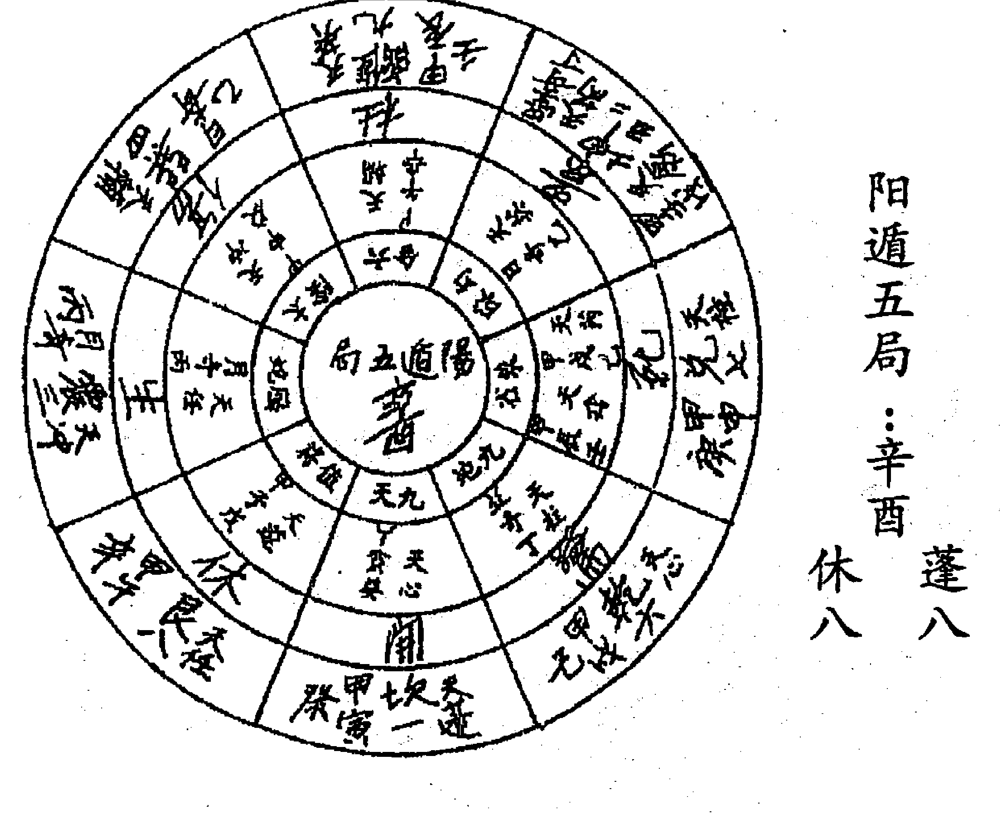

(1) 开坎和 天心癸加甲寅癸。天网四张：(低网一尺)行人失件，疾病诉讼皆伤。

(2) 休艮制 天蓬戊加甲午辛。青龙折足：吉门生助，尚可谋为，门凶招灾失财有足疾。

(3) 生震制 天任丙加丙奇。月奇孛师：文书逼迫，破耗损失。

(4) 伤巽和 天冲庚加乙奇。太白逢星：退吉进凶。

(5) 杜离礼 天辅辛加甲辰壬。凶蛇入狱：两男争女，讼狱不息，先动失理。

(6) 景坤礼 天英乙加丁奇。奇仪相佐：文书事吉，百事皆可为。

> 「入墓」

天英乙加甲子戊。利阴害阳：门逢凶迫，财破人伤。「入墓」

(7) 死兑礼 天芮己加甲申庚。利格返名：词讼先动不利，阴星有谋害之情。

天禽壬加甲申庚。太白擒蛇：刑狱公平，立剖邪正。

(8) 惊乾和 天柱丁加甲戌己。火入勾陈：奸私仇冤，事因女人。

> 「神假」

(9) 生门丙奇合震三宫，利正东方。

(1) 开巽迫 天心癸加乙奇。华盖逢官星：贵人禄位，常人平安。

(2) 休离迫 天蓬戊加甲辰壬。龙入天牢：阴阳不利。

(3) 生坤和 天任丙加丁奇。辛奇朱雀：贵人文书吉，常人平静。

「天、虎遁」
天任丙加甲子戊。飞鸟跌穴：谋事有成，百事洞澈。

(4) 伤兑制 天冲庚加甲申庚。太白同宫：官灾横祸，兄弟不睦。

(5) 杜乾制 天辅辛加甲戌己。入狱自刑：奴仆背主，讼诉难伸。

(6) 景坎制 天英乙加甲寅癸。华盖官星：遁踪修道，隐匿藏形，躲灾避难为吉。

(7) 死艮和 天芮己加甲午辛。游魂入墓：大人鬼魁，小人家先为祟。
天禽壬加甲午辛。腾蛇相缠：吉门生助，尚可谋为，若有谋望，被人欺瞒。

(8) 惊震迫 天柱丁加丙奇。星随月转：贵人越级高升，常人乐里生悲。「神假」

(9) 生门丙奇合坤二宫，利西南方。

#### 奇门阴阳九遁阳五局符使值例

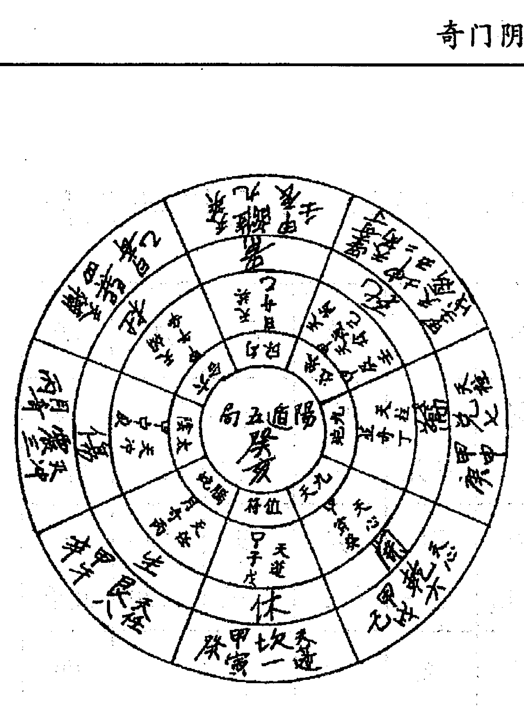

阳遁五局：癸亥 休一 蓬一

- 1. 开乾和 天心癸加甲戌己。华盖地户：音信皆阻，躲灾避难为吉。
- 2. 休坎和 天蓬戊加甲寅癸。青龙华盖：门吉招福，门凶多乖。
- 3. 生艮和 天任丙加甲午辛。威神互合：谋事有成，病人不凶。
- 4. 伤震和 天冲庚加丙奇。太白入荧惑：占贼必来，为客进利，为主破财。
- 5. 杜巽和 天辅辛加乙奇。白虎猖狂：人亡家败，远行多殃，尊长不喜，车船身体毁伤。
- 6. 景离和 天英乙加甲辰壬。日奇入地：尊卑悖乱，官讼是非。
- 7. 死坤和 天芮己加丁奇。朱雀入墓：文状词讼，先曲后直。天禽壬加甲子戊。小蛇化龙：男人发达，女产婴童。
- 8. 惊兑和 天柱丁加甲申庚。时格：文书阻隔，行人必归。
「升殿，神假」
- 9. 生门丙奇合艮八宫，利东北方。

#### 奇门阴阳九遁阳六局符使值例

| 符使 | 甲 | 乙 | 丙 | 丁 | 戊 | 己 | 庚 | 辛 | 壬 | 癸 |
| :--- | :--- | :--- | :--- | :--- | :--- | :--- | :--- | :--- | :--- | :--- |
| 心开 | 子 六六 | 丑 五七 | 寅 四八 | 卯 三九 | 辰 六一 | 巳 七二 | 午 八三 | 未 九四 | 申 一五 | 酉 二六 |
| 柱惊 | 戌 七七 | 亥 五八 | 子 四九 | 丑 三一 | 寅 六二 | 卯 七三 | 辰 八四 | 巳 九五 | 午 一六 | 未 二七 |
| 任生 | 申 八八 | 酉 五九 | 戌 四一 | 亥 三二 | 子 六三 | 丑 七四 | 寅 八五 | 卯 九六 | 辰 一七 | 巳 二八 |
| 英景 | 午 九九 | 未 五一 | 申 四二 | 酉 三三 | 戌 六四 | 亥 七五 | 子 八六 | 丑 九七 | 寅 一八 | 卯 二九 |
| 蓬休 | 辰 一一 | 巳 五二 | 午 四三 | 未 三四 | 申 六五 | 酉 七六 | 戌 八七 | 亥 九八 | 子 一九 | 丑 二一 |
| 芮死 | 寅 二二 | 卯 五三 | 辰 四四 | 巳 三五 | 午 六六 | 未 七七 | 申 八八 | 酉 九九 | 戌 一一 | 亥 二二 |

#### 奇门阴阳九遁阳六局符使值例

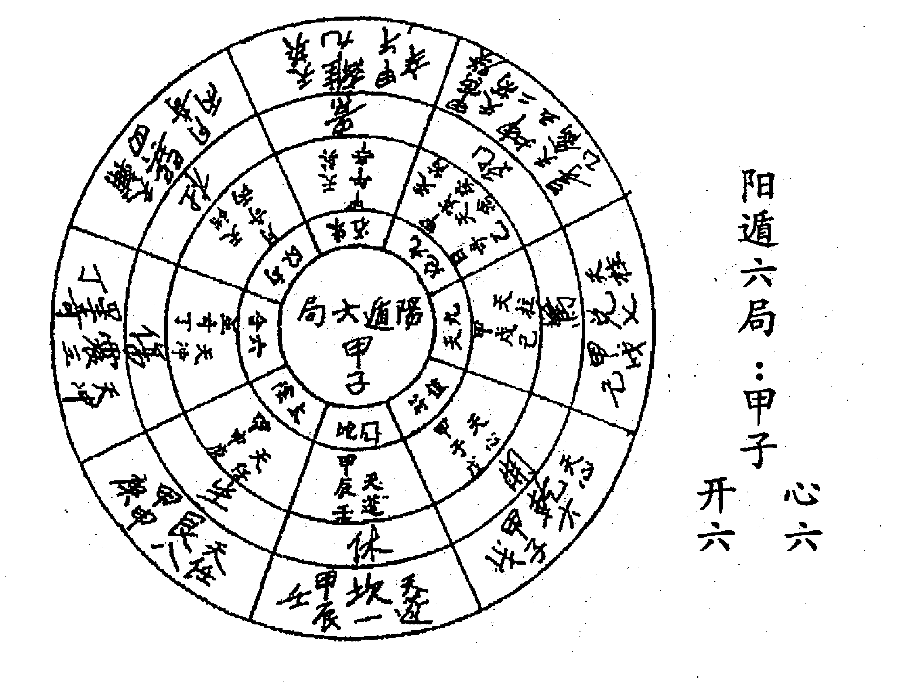

- 1. (1) 开乾和 天心戊加甲子戊。伏吟：凡事闭塞，静守为吉。
- 2. (2) 休坎和 天蓬壬加甲辰壬。蛇入地罗：外人缠绕，内事索索，吉门吉星，避免蹉跎。
- 3. (3) 生艮和 天任庚加甲午庚。太白同宫：官灾横祸，兄弟不睦。
- 4. (4) 伤震和 天冲丁加丁奇。奇入太阴：文书即至，喜事遂心。「地假」
- 5. (5) 杜巽和 天辅丙加丙奇。月奇孛师：文书逼迫，破耗损失。
- 6. (6) 景离和 天英辛加甲午辛。伏吟天庭：公废私就，讼狱自罹罪名。
- 7. (7) 死坤和 天芮癸加甲寅癸。天网四张：(低网二尺)行人失件，病讼皆伤。「鬼假」
天禽乙加乙奇。日奇伏吟：不宜谒贵求名，只可安分守身。「入墓」
- 8. (8) 惊兑和 天柱己加甲戌己。地户逢鬼：病凶，百事不遂。
- 9. (9) 无奇门。

#### 阳遁六局：乙丑 开七 心五

- (1) 开兑和 天任庚加甲戊己。刑格：官司被重刑。「虎遁」
- (2) 休乾仪 天冲丁加甲子戊。青龙转光：官人升迁，常人咸昌。「人遁，休诈」
- (3) 生坎迫 天辅丙加甲辰壬。火入天罗：客不利，是非颇多。
- (4) 伤艮迫 天英辛加甲申庚。白虎出力：刀刃相接，主客相残，退让稍可，强进血溅衣衫。
- (5) 杜震和 天芮癸加丁奇。腾蛇妖娇：文书官司火焚莫逃，忧惶之事必至。「地假」
天禽乙加丁奇。奇仪相佐：文书事吉，百事皆可为。「升殿」
- (6) 景巽仪 天柱己加丙奇。火悖地户：阳人冤冤相害，阴人必致淫污。
- (7) 死离仪 天心戊加甲午辛。青龙折足：吉门生助，尚可谋为，凶门招灾失财，有足疾。
- (8) 惊坤仪 天蓬壬加甲寅癸。幼女奸淫：家有丑声，门吉星凶，反祸福隆。
甲辰壬加乙奇 格名小蛇：女人柔顺。男人嗟呀，占孕生子，禄马光华。
- (9) 生门丙奇合坎一宫，利正北方。 休门丁奇合乾六宫，利西北方。

#### 奇门阴阳九遁阳六局符使值例

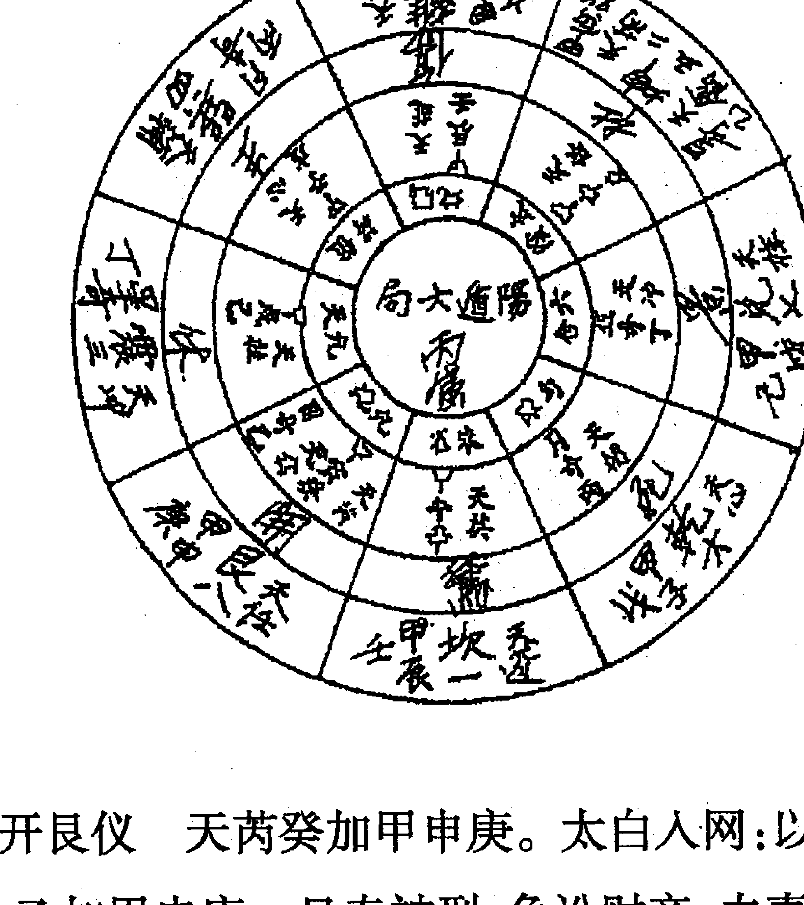

阳遁六局：丙寅
开八
心四

- (1) 开艮仪 天芮癸加甲申庚。太白入网：以县一现，争讼力平。天禽乙加甲申庚。日奇被刑：争讼财产，夫妻怀私。「地遁，重诈」
- (2) 休震礼 天柱己加丁奇。朱雀入墓：文状词讼，先曲后直。
- (3) 生巽制 天心戊加丙奇。青龙回首：动作大利，逢迫墓吉事成凶。
- (4) 伤离礼 天蓬壬加甲午辛：螣蛇相缠：吉门生助，尚可谋为，凶门若有谋望，被人欺瞒。
- (5) 杜坤迫 天任庚加甲寅癸。大格：行人至，官司止，生产母子俱伤。甲申庚加乙奇。太白逢星：退吉进凶。
- (6) 景兑迫 天冲丁加甲戌己。火入勾陈：奸私仇冤，事因女人。「升殿」
- (7) 死乾礼 天辅丙加甲子戊。飞鸟跌穴：谋事有成，百事洞澈。「入墓」
- (8) 惊坎礼 天英辛加甲辰壬。凶蛇入狱：两男争女，讼狱不息，先动失理。
- (9) 开门乙奇合艮八宫，利东北方。

#### 阳遁六局：丁卯 开九 心三

- (1) 开离制 天任庚加甲午辛。白虎干格：远行车折马死。
- (2) 休坤值 天冲丁加甲寅癸。朱雀投江：文书口舌俱消，音信沉溺，讼狱所由起也。
天冲丁加乙奇。天运昌气格：加官进爵，婚姻财喜。「人遁、休诈」
- (3) 生兑礼 天辅丙加甲戌己。太孛入刑：囚人刑杖，文书不行，吉门得吉，凶门转凶。
- (4) 伤乾制 天英辛加甲子戊。因龙被伤：官司破败，屈抑守分，妄动祸殃。
- (5) 杜坎仪 天芮癸加甲辰壬。复见腾蛇：嫁娶重婚，后嫁无子，不保年华。「地假」
天禽乙加甲辰壬。日奇入地：尊卑悖乱，官讼是非。
- (6) 景艮礼 天柱己加甲申庚。利格返名：词讼先动不利，阴星有谋害之情。
- (7) 死震制 天心戊加丁奇。青龙耀明：谒贵求名吉，逢墓迫招是非。
- (8) 惊巽迫 天蓬壬加丙奇。水蛇入火：官灾刑禁，络绎不绝。
- (9) 休门丁奇合坤二宫，利西南方。
生丙兑七正西。

#### 奇门阴阳九遁阳六局符使值例

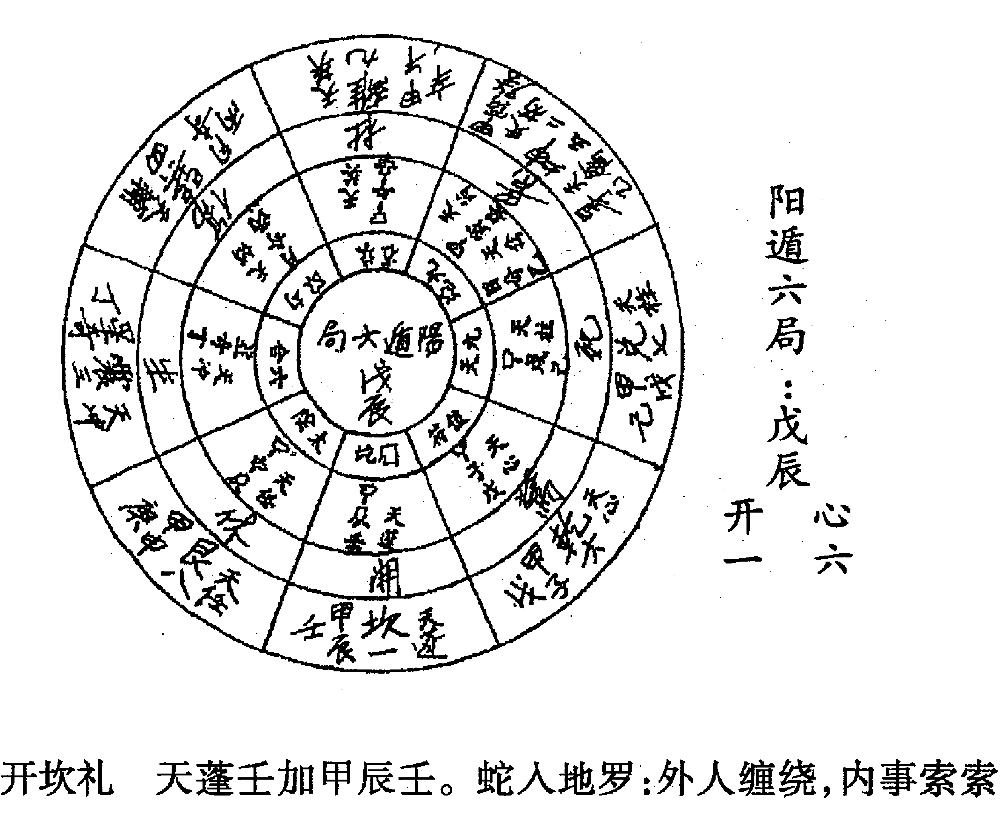

- (1) 开坎礼 天蓬壬加甲辰壬。蛇入地罗：外人缠绕，内事索索，吉门吉星，避免蹉跎。
- (2) 休艮制 天任庚加甲申庚。太白同宫：官灾横祸，兄弟不睦。
- (3) 生震制 天冲丁加丁奇。奇入太阴：文书即至，喜事遂心。

> 「人遁，休诈」

- (4) 伤巽和 天辅丙加丙奇。日奇孛师：文书逼迫，破耗损失。
- (5) 杜离礼 天英辛加甲午辛。伏吟天庭：公废私就，讼狱自罹罪名。
- (6) 景坤礼 天芮癸加甲寅癸。天网四张：(低网二尺)行人失件，病讼皆伤。

天禽乙加乙奇。日奇伏吟：不宜谒贵求名：只可安分守身。「入墓」

- (7) 死兑礼 天柱己加甲戌己。地户逢鬼：病凶，百事不遂。
- (8) 惊乾和 天心戊加甲子戊。伏吟：万事闭塞，静守为吉。
- (9) 生门丁奇合震三宫，利正东方。

#### 阳遁六局：己巳 开二 心七

- 1. 开坤仪 天柱己加甲寅癸。地刑玄武：病凶，词讼有囚狱之灾。天禽己加乙奇。墓神不明：宜遁跡隐匿为利逸。
- 2. 休兑仪 天心戊加甲戌己。贵人入狱：公私不利。
- 3. 生乾礼 天蓬壬加甲子戊。小蛇化龙：男人发达，女产婴童。
- 4. 伤坎仪 天任庚加甲辰壬。小格：远行迷路，音信嗟呀。
- 5. 杜艮迫 天冲丁加甲申庚。时格：文书阻隔，行人必归。「入墓」
- 6. 景震仪 天辅丙加丁奇。辛奇朱雀：贵人文书吉，常人平静。
- 7. 死巽制 天英辛加丙奇。干合孛师：占雨无，占晴旱，占事必因财致讼。
- 8. 惊离制 天芮癸加甲午辛。网盖天牢：占讼病皆凶。「神假」天禽乙加甲午辛。青龙逃走：奴仆拐带，六畜皆伤，财产废坠，身遭残毁。
- 9. 无奇门。

- (1) 开震迫 天蓬壬加丁奇。干合蛇刑：文书牵连，贵人匆匆，男吉女凶。
- (2) 休巽礼 天任庚加丙奇。太白入荧惑：占贼必来，为客进利，为主破财。
- (3) 生离仪 天冲丁加甲午辛。朱雀入狱：罪人释囚，官人失位。「人遁、休诈」
- (4) 伤坤迫 天辅丙加甲寅癸。华盖孛师：阴人害事，灾祸频生。天辅丙加乙奇。日月并行：公谋私为皆吉。
- (5) 杜兑制 天英辛加甲戊己。入狱自刑：奴仆背主，讼诉难伸。
- (6) 景乾迫 天芮癸加甲子戊。天乙会合：财喜婚姻，吉人赞助成合，门逢凶迫，反祸官非。天禽乙加甲子戊。利阴害阳：门逢凶迫，财破人伤。「入墓」
- (7) 死坎迫 天柱己加甲辰壬。地网高张：狡童佚女，奸情伤杀。
- (8) 惊艮仪 天心戊加甲申庚。值符飞宫：吉事不吉，凶事更凶。
- (9) 生门丁奇合离九宫，利正南方。

#### 奇门遁甲秘笈全书(下册)

- (1) 开巽迫 天柱己加丙奇。火悖地户：阳人冤冤相害，阴人必致淫污。
- (2) 休离迫 天心戊加甲午辛。青龙折足：吉门生助，尚可谋为，逢凶门主招灾失财，有足疾。
- (3) 生坤和 天蓬壬加甲寅癸。幼女奸淫：家有丑声，门吉星凶，反祸福隆。

天蓬壬加乙奇 格名小蛇：女人柔顺，男人嗟呀，占孕生子，禄马光华。

- (4) 伤兑制 天任庚加甲戊己。刑格：官司被重刑。
- (5) 杜乾制 天冲丁加甲子戊。青龙转光：官人升迁，常人咸昌。
- (6) 景坎制 天辅丙加甲辰壬。火入天罗：客不利，是非颇多。
- (7) 死艮和 天英辛加甲申庚。白虎出力：刀刃相接，主客相残，逊让稍可，强进血溅衣衫。
- (8) 惊震迫 天芮癸加丁奇。螣蛇妖娇：文书官司，火焚莫逃，忧惶之事必至。「神假」
天禽乙加丁奇。奇仪相佐：文书事吉，百事皆可为。「升殿」
- (9) 无奇门。

#### 奇门阴阳九遁阳六局符使值例

- (1) 开坤仪 天英辛加甲寅癸。天牢华盖：误入地网，动止乖张。
天英辛加乙奇。白虎猖狂：人亡家败，远行多殃，尊长不喜，车船身体毁伤。「云遁」
- (2) 休兑仪 天芮癸加甲戊己。华盖地户：音信皆阻，躲灾避难为吉。
天禽乙加甲戊己。日奇入雾，被土暗昧，门凶必凶。「地遁，休诈」
- (3) 生乾礼 天柱己加甲子戊。犬遇青龙：吉门谋望遂意，上人见喜。
- (4) 伤坎仪 天心戊加甲辰壬。龙入天牢：阴阳不利。
- (5) 杜艮迫 天蓬壬加甲申庚。太白擒蛇：刑狱公平，立剖邪正。
- (6) 景震仪 天任庚加丁奇。亭亭之格：因私匿起官司，门吉有救。
- (7) 死巽制 天冲丁加丙奇。星随月转：贵人越级高升，常人乐里生悲。
- (8) 惊离制 天辅丙加甲午辛。威神互合：谋事有成，病人不凶。「升殿」
- (9) 休门乙奇合兑七宫，利正西方。

#### 阳遁六局：癸酉 开六 心二

- (1) 开乾和 天任庚加甲子戊。天乙伏官：百事不可谋，凶。
- (2) 休坎和 天冲丁加甲辰壬。五神互合，贵人恩诏，讼狱公平。「人遁，休诈」
- (3) 生艮和 天辅丙加甲申庚。荧惑入太白：门户破败，盗贼耗失。
- (4) 伤震和 天英辛加丁奇。狱神得奇：经商获倍利，囚人逢赦宥。
- (5) 杜巽和 天芮癸加丙奇。华盖孛师：贵贱逢之，上人见喜。「地假」天禽乙加丙奇。奇仪顺遂：吉星迁官进职，凶星夫妻离别。
- (6) 景离和 天柱己加甲午辛。游魂入墓：大人鬼魅，小人家先为祟。
- (7) 死坤和 天心戊加甲寅癸。青龙华盖：门吉招福，门凶多乖。天心戊加乙奇。青龙合灵：门吉事吉，门凶事凶。
- (8) 惊兑和 天蓬壬加甲戌己。凶蛇入狱：大祸将至，顺守斯吉，词讼理曲。
- (9) 休门丁奇合坎一宫，利正北方。
生门丙奇合艮八宫，利东北方。

- (1) 开乾和 天心乙加甲子戊。利阴害阳：门逢凶迫，财破人伤。「入墓」
- (2) 休坎和 天蓬辛加甲辰壬。凶蛇入狱：两男争女，讼狱不息，先动失理。
- (3) 生艮和 天任己加甲申庚。利格返名：词讼先动不利，阴星有谋害之情。
- (4) 伤震和 天冲癸加丁奇。螣蛇妖娇：文书官司火焚莫逃，忧惶之事必至。
- (5) 杜巽和 天辅丁加丙奇。星随月转：贵人越级高升，常人乐里生悲。
- (6) 景离和 天英庚加甲午辛。白虎干格：远行车折马死。
- (7) 死坤和 天芮壬加甲寅癸。幼女奸淫：家有丑声，门吉星凶，反祸福隆。

天禽丙加乙奇。日月并行，公谋私为皆吉。

- (8) 惊兑和 天柱戊加甲戌己。贵人入狱：公私不利。
- (9) 开门乙奇合乾六宫，利西北方。

- (1) 开震迫 天辅丁加丁奇。奇入太阴，文书即至，喜事遂心。
- (2) 休巽礼 天英庚加丙奇。太白入荧惑：占贼必来，为客进利，为主破财。
- (3) 生离仪 天芮壬加甲午辛。腾蛇相缠：纵得吉门，亦不安宁。若有谋望，被人欺瞒。
天禽丙加甲午辛。威神互合：谋事有成，病人不凶。「升殿，神遁」
- (4) 伤坤迫 天柱戊加甲寅癸。青龙华盖：门吉招福，门凶多乖。
天柱戊加乙奇。青龙合灵：门吉事吉，门凶事凶。
- (5) 杜兑制 天心乙加甲戌己。日奇入雾：被土暗昧，门凶必凶。
- (6) 景乾迫 天蓬辛加甲子戊。因龙被伤：官司破败，屈抑守分，妄动祸殃。
- (7) 死坎迫 天任己加甲辰壬。地网高张：狡童佚女，奸情伤杀。
- (8) 惊艮仪 天冲癸加甲申庚。太白入网：以县一现，争讼力平。
- (9) 开门丁奇合震三宫，利正东方。
生门丙奇合离九宫，利正南方。

#### 阳遁六局：丙子 惊九 柱四

- (1) 开坤仪 天蓬辛加甲寅癸。凶蛇入狱：两男争女，讼狱不息，先动失理。
天蓬辛加乙奇。白虎猖狂：人亡家败，远行多殃，尊长不喜，车船身体俱伤。「云遁」
- (2) 休兑仪 天任己加甲戊己。地户逢鬼：病凶，百事不遂。
- (3) 生乾礼 天冲癸加甲子戊。天乙会合：财喜婚姻，吉人赞助成合，门逢凶迫，反祸官非。
- (4) 伤坎仪 天辅丁加甲辰壬。五神互合：贵人恩诏，讼狱公平。
- (5) 杜艮迫 天英庚加甲申庚。太白同宫：官灾横祸，兄弟不睦。
- (6) 景震仪 天芮壬加丁奇。干合蛇刑：文书牵连，贵人匆匆，男吉女凶。
天禽丙加丁奇。辛奇朱雀：贵人文书吉，常人平静。
- (7) 死巽制 天柱戊加丙奇。青龙回首：动作大利，逢迫墓吉事成凶。
- (8) 惊离制 天心乙加甲午辛。青龙逃走：奴仆拐带，六畜俱伤，财产废坠，身遭毁伤。
- (9) 无奇门。

#### 阳遁六局：丁丑 惊柱一三

- (1) 开艮仪 天芮壬加甲申庚。太白擒蛇：刑狱公平，立剖邪正。
天禽丙加甲申庚。荧惑入太白：门户破败，盗贼耗失。
- (2) 休震礼 天柱戊加丁奇。青龙耀明：谒贵求名吉，逢墓迫招是非。
- (3) 生巽迫 天心乙加丙奇。奇仪顺遂：吉星迁官进职，凶星夫妻离别。
- (4) 伤离礼 天蓬辛加甲午辛。伏吟天庭：公废私就，讼狱自罹罪名。
- (5) 杜坤迫 天任己加甲寅癸。地刑玄武：病凶，词讼有囚狱之灾。
天任己加乙奇。墓神不明：宜遁跡隐匿为利逸。
- (6) 景兑迫 天冲癸加甲戌己。华盖地户，音信皆阻，躲灾避难为吉。
- (7) 死乾礼 天辅丁加甲子戊。青龙转光：官人升迁，常人咸昌。
「入墓」
- (8) 惊坎礼 天英庚加甲辰壬。小格：远行迷路，音信嗟呀。
- (9) 开门丙奇合艮八宫，利北方。
生门乙奇合巽四宫，利南方。

#### 奇门阴阳九遁阳六局符使值例

1. 开兑和 天芮壬加甲戊己。凶蛇入狱:大祸将至,顺守斯吉,词讼理曲。天禽丙加甲戊己。太白入刑:囚人刑杖,文书不行,吉门得吉,凶门转凶。
2. 休乾仪 天柱戊加甲子戊。伏吟:万事闭塞,静守为吉。
3. 生坎迫 天心乙加甲辰壬。日奇入地:尊卑悖乱,官讼是非。
4. 伤艮迫 天蓬辛加甲申庚。白虎出力:刀刃相接,主客相残,逊让稍可,强进血溅衣衫。
5. 杜震和 天任己加丁奇。朱雀入墓:文状词讼,先曲后直。
6. 景巽仪 天冲癸加丙奇。华盖孛师:贵贱逢之,上人见喜。
7. 死离仪 天辅丁加甲午辛。朱雀入狱:罪人释囚,官人失位。「入墓」
8. 惊坤仪 天英庚加甲寅癸。大格:行人至,官司止,生产母子俱伤。天英庚加乙奇。太白逢星:退吉进凶。
9. 开丙奇合兑七宫,利正西方。生乙奇合坎一宫,利正北方。

#### 阳遁六局：己卯 惊柱三七

1. 开巽迫 天辅丁加丙奇。星随月转:贵人越级高升,常人乐里生悲。
2. 休离迫 天英庚加甲午辛。白虎干格:远行车折马死。
3. 生坤和 天芮壬加甲寅癸。幼女奸淫:家有丑声,门吉星凶,反祸福隆。「虎遁」
    天禽丙加甲寅癸。华盖孛师:阴人害事,灾祸频生。「神遁」
4. 伤兑制 天柱戊加甲戌己。贵人入狱:公私不利。
5. 杜乾制 天心乙加甲子戊。利阴害阳:门逢凶迫,财破人伤。「入墓」
6. 景坎制 天蓬辛加甲辰壬。凶蛇入狱:两男争女,讼狱不息,先动失理。
7. 死艮和 天任己加甲申庚。利格返名:词讼先动不利,阴星有谋害之情。
8. 惊震迫 天冲癸加丁奇。腾蛇妖娇:文书官司火荧莫逃,忧惶之事必至。
9. 开门丁奇合巽四宫,利东南方。生丙奇合坤二宫,利西南方。

#### 奇门阴阳九遁阳六局符使值例

1. 开离制 天任己加甲午辛。游魂入墓:大人鬼魁,小人家先为祟。
2. 休坤制 天冲癸加甲寅癸。天网四张:(网高二尺)行人失件,病讼皆伤。
    天冲癸加乙奇。华盖逢星:贵人禄位,常人平安。
3. 生兑礼 天辅丁加甲戌己。火入勾陈:奸私仇冤,事因女人。「升殿」
4. 伤乾制 天英庚加甲子戊。天乙伏宫:百事不可谋,凶。
5. 杜坎仪 天芮壬加甲辰壬。火入地罗:外人缠绕,内事索索,吉门吉星,避免蹉跎。
    天禽丙加甲辰壬。火入天罗:客不利,是非颇多。
6. 景艮礼 天柱戊加甲申庚。值符飞宫:吉事不吉,凶事更凶。
7. 死震制 天心乙加丁奇。奇仪相佐:文书事吉。百事皆可为。「升殿」
8. 惊巽迫 天蓬辛加丙奇。干合孛师:占雨无,占晴旱。占事必因财致讼。
9. 休门丁奇合兑七宫,利正西方。

1. 开兑和 天蓬辛加甲戊己。入狱自刑:奴仆背主,讼诉难伸。
2. 休乾仪 天任己加甲子戊。犬遇青龙:门吉谋望遂意,上人见喜,门凶枉劳心机。
3. 生坎迫 天冲癸加甲辰壬。复见腾蛇:嫁娶重婚,后嫁无子,不保年华。
4. 伤艮迫 天辅丁加甲申庚。时格:文书阻隔,行人必归。「入墓」
5. 杜震和 天英庚加丁奇。亭亭之格:因私匿起官司,门吉有救。
6. 景巽仪 天芮壬加丙奇。水蛇入火:官灾刑禁,络绎不绝。
    天禽丙加丙奇。月奇孛师:文书逼迫,破耗损失。「天假」
7. 死离仪 天柱戊加甲午辛。青龙折足:吉门生助,尚可谋为,凶门主招灾失财有足疾。
8. 惊坤仪 天心乙加甲寅癸。华盖官星:遁迹修道,隐匿藏形,躲灾避难为吉。「入墓」
    天心乙加乙奇。日奇伏吟:不宜谒贵求名,只可安分守身。
9. 无奇门。

#### 奇门阴阳九遁阳六局符使值例

1. 开坎礼 天柱戊加甲辰壬。龙入天牢：阴阳不利。
2. 休艮制 天心乙加甲申庚。日奇被刑：争讼财产，夫妻怀私。
3. 生震制 天蓬辛加丁奇。狱神得奇：经商获倍利，囚人逢赦宥。「鬼遁」
4. 伤巽和 天任己加丙奇。火悖地户：阳人冤冤相害，阴人必致淫污。「地假」
5. 杜离礼 天冲癸加甲午辛。网盖天牢：占讼病凶。
6. 景坤礼 天辅丁加甲寅癸。朱雀投江：文书口舌俱消，音信沉溺，讼狱所由起也。
    天辅丁加乙奇。天运昌气格：加官进爵，财喜婚姻。「人遁」
7. 死兑礼 天英庚加甲戊己。刑格：官司被重刑。
8. 惊乾和 天芮壬加甲子戊。小蛇化龙：男人发达，女人产婴。「人假」
    天禽丙加甲子戊。飞鸟跌穴：谋事有成，百事洞澈。「入墓」
9. 休门乙奇合艮八宫,利东北方。

1. 开乾和 天蓬辛加甲子戊。困龙被伤:官司破败,屈抑守分,妄动祸殃。
2. 休坎和 天任己加甲辰壬。地网高张:狡童佚女,奸情伤杀。
3. 生艮和 天冲癸加甲申庚。太白入网:以县一现,争讼力平。
4. 伤震和 天辅丁加丁奇。奇入太阴:文书即至,喜事遂心。
5. 杜巽和 天英庚加丙奇。太白入荧惑:占贼必来,为客进利。为主破财。
6. 景离和 天芮壬加甲午辛。螣蛇相缠:纵得吉门,亦不安宁,若有谋望,被人欺瞒。
    天禽丙加甲午辛。威神互合:谋事有成,病人不凶。「升殿,天假」
7. 死坤和 天柱戊加甲寅癸。青龙华盖:门吉招福,门凶多乖。
    天柱戊加乙奇。青龙合灵:门吉事吉,门凶事凶。
8. 惊兑和 天心乙加甲戌己。日奇入雾:被土暗昧,门凶必凶。
9. 无奇门。

#### 阳遁六局：甲申 生任八八

1. 开乾和 天心丙加甲子戊。飞鸟跌穴：谋事有成，百事洞澈。「天遁,重诈,入墓」
2. 休坎和 天蓬庚加甲辰壬。小格：远行迷路，音信嗟呀。
3. 生艮和 天任戊加甲申庚。值符飞宫：吉事不吉，凶事更凶。
4. 伤震和 天冲壬加丁奇。干合蛇刑：文书牵连，贵人匆匆，男吉女凶。
5. 杜巽和 天辅癸加丙奇。华盖孛师：贵贱逢之，上人见喜。
6. 景离和 天英己加甲午辛。游魂入墓：大人鬼魁，小人家先为祟。
7. 死坤和 天芮辛加甲寅癸。天牢华盖：误入天网，动止乖张。
8. 惊兑和 天柱乙加甲戌己。日奇入雾：被土暗昧，门凶必凶。
9. 开门丙奇合乾六宫，利西北方。
    天禽丁加乙奇。天运昌气格：加官进爵，婚姻财喜。「人遁,入墓」

1. 开震迫 天柱乙加丁奇。奇仪相佐：文书事吉，百事皆可为。「升殿」
2. 休巽礼 天心丙加丙奇。月奇孛师：文书逼迫，破耗损失。「天遁，重诈」
3. 生离仪 天蓬庚加甲午辛。白虎干格：远行车折马死。
4. 伤坤迫 天任戊加甲寅癸。青龙华盖，门吉招福，门凶多乖。
    天任戊加乙奇。青龙合灵：门吉事吉，门凶事凶。
5. 杜兑制 天冲壬加甲戌己。凶蛇入狱：大祸将至，顺守斯吉。词讼理曲。
6. 景乾迫 天辅癸加甲子戊。天乙会合：财喜婚姻，吉人赞助成合，门逢凶迫，反祸官非。
7. 死坎迫 天英己加甲辰壬。地网高张：狡童佚女，奸情伤杀。
8. 惊艮仪 天芮辛加甲申庚。白虎出力：刀刃相接，主客相残，逊让稍可，强进血溅衣衫。
9. 开门乙奇合震三宫，利正东方。
    休门丙奇合巽四宫，利东南方。

1. 开兑和 天英己加甲戊己。地户逢鬼:病凶,百事不遂。
2. 休乾仪 天芮辛加甲子戊。困龙被伤:官司破败,屈抑守分,妄动祸殃。
    天禽丁加甲子戊。青龙转光:官人升迁,常人咸昌。
3. 生坎迫 天柱乙加甲辰壬。日奇入地:尊卑悖乱,官讼是非。
4. 伤艮迫 天心丙加甲申庚。荧惑入太白:门户破败,盗贼耗失。
5. 杜震和 天蓬庚加丁奇。亭亭之格:因私匿起官司,门吉有救。
6. 景巽仪 天任戊加丙奇。青龙回首:动作不利,门逢墓迫,吉事成凶。
7. 死离仪 天冲壬加甲午辛。螣蛇相缠:纵有吉门,亦不安宁,若有谋望,被人欺瞒。
8. 惊坤仪 天辅癸加甲辰癸。天网四张:(低网二尺)行人失件,病讼皆凶。
    天辅癸加乙奇,华盖逢官星:贵人禄位,常人平安。
9. 休丁奇合乾六宫,利西北方。生乙门奇合坎一宫,利正北方。

#### 阳遁六局：丁亥 生二任三

1. 开巽迫 天冲壬加丙奇。水蛇入火:官灾刑禁,络绎不绝。
2. 休离迫 天辅癸加甲午辛。网盖天牢:占讼病凶。
3. 生坤和 天英己加甲寅癸。地刑玄武:病凶,词讼有囚狱之灾。
    天英己加乙奇。墓神不明,宜遁迹隐匿为利逸。
4. 伤兑制 天芮辛加甲戌己。入狱自刑:奴仆背主,讼诉难伸。
    天禽丁加甲戌己。火入勾陈:奸私仇冤,事因女人。「升殿」
5. 杜乾制 天柱乙加甲子戊。利阴害阳:门逢凶迫,财破人伤。「入墓」
6. 景坎制 天心丙加甲辰壬。火入地罗,客不利,是非颇多。
7. 死艮和 天蓬庚加甲申庚。太白同宫,官灾横祸,兄弟不睦。
8. 惊震迫 天任戊加丁奇。青龙耀明,谒贵求吉,门逢墓迫招是非。
9. 无奇门。

#### 奇门阴阳九遁阳六局符使值例

1. 开坎礼 天冲壬加甲辰壬。蛇入地罗：外人缠绕，内事索索，吉门吉星，避免蹉跎。
2. 休艮制 天辅癸加甲申庚。太白入网：以县一现，争讼力平。
3. 生震制 天英己加丁奇。朱雀入墓：文状词讼先曲后直。
4. 伤巽和 天芮辛加丙奇。干合孛师：占雨无，占晴旱，占事必因财致讼。
    天禽丁加丙奇。星随月转：贵人越级高升，常人乐里生悲。
5. 杜离礼 天柱乙加甲午辛。青龙逃走：仆拐带，畜皆伤，财产废坠，身遭毁伤。
6. 景坤礼 天心丙加甲寅癸。华盖孛师：阴人害事，灾祸频生。
    天心丙加乙奇。日月并行：公谋私为皆吉。
7. 死兑礼 天蓬庚加甲戌己。刑格：官司被重刑。
8. 惊乾和 天任戊加甲子戊。伏吟：万事闭塞，静守为吉。
9. 无奇门。

#### 阳遁六局：己丑 生四任七

1. 开艮仪 天英己加甲申庚。利格返名:词讼先动不利,阴星有谋害之情。
2. 休震礼 天芮辛加丁奇。狱神得奇:经商获倍利,囚人逢赦宥。天禽丁加丁奇。奇入太阴:文书即至,喜事遂心。
3. 生巽制 天柱乙加丙奇。奇仪顺遂:吉星迁官进职,凶星夫妻离别。
4. 伤离礼 天心丙加甲午辛。威神互合:谋事有成,病人不凶。「升殿」
5. 杜坤迫 天蓬庚加甲寅癸。大格:行人至,官司止,生产母子俱伤。天蓬庚加乙奇。太白逢星:退吉进凶。
6. 景兑迫 天任戊加甲戌己。贵人入狱:公私不利。
7. 死乾礼 天冲壬加甲子戊。小蛇化龙:男人发达,女产婴童。
8. 惊坎礼 天辅癸加甲辰壬。复见腾蛇:嫁娶重婚,后嫁无子,不保年华。
9. 休门丁奇合震三宫,利正东方。生门乙奇合巽四宫,利东南方。

#### 奇门阴阳九遁阳六局符使值例

##### 阳遁六局：庚寅 任八生五

1. 开巽迫 天辅癸加丙奇。华盖孛师：贵贱逢之，上人见喜。
2. 休离迫 天英己加甲午辛。游魂入墓：大人鬼魁，小人家先为祟。
3. 生坤和 天芮辛加甲寅癸。天牢华盖：误入天网，动止乖张。「虎遁」
    天禽丁加乙奇。天运昌气格：加官进爵，婚姻财喜。「人遁」
4. 伤兑制 天柱乙加甲戌己。日奇入雾：被土暗昧，门凶必凶。
5. 杜乾制 天心丙加甲子戊。飞鸟跌穴：谋事有成，百事洞澈。「入墓」
6. 景坎制 天蓬庚加甲辰壬。小格：远行迷路，音信嗟呀。
7. 死艮和 天任戊加甲申庚。值符飞宫：吉事不吉，凶事更凶。
8. 惊震迫 天冲壬加丁奇。干合蛇刑：文书牵连，贵人匆匆，男吉女凶。
9. 生门丁奇合坤二宫，利西南方。

#### 阳遁六局：辛卯 生六任九

1. 开坤仪 天冲壬加甲寅癸。幼女奸淫：家有丑声，门吉星凶，反祸福隆。
    天冲壬加乙奇。格名小蛇：女人柔顺，男人嗟呀，占孕生子，禄马光华。
2. 休兑仪 天辅癸加甲戌己。华盖地户：音信皆阻，躲灾避难为吉。
3. 生乾礼 天英己加甲子戊。犬遇青龙：吉门谋望遂意，上人见喜。
4. 伤坎仪 天芮辛加甲辰壬。凶蛇入狱：两男争女，讼狱不息，先动失理。
    天禽丁加甲辰壬。五神互合，贵人恩诏，讼狱公平。
5. 杜艮迫 天柱乙加甲申庚。日奇被刑：争讼财产，夫妻怀私。
6. 景震仪 天心丙加丁奇。辛奇朱雀：贵人文书吉，常人平静。
7. 死巽制 天蓬庚加丙奇。太白入荧惑。占贼必来，为客进利，为主破财。
8. 惊离制 天任戊加甲午辛。青龙折足：凶门主招灾失财，有足疾。
9. 无奇门。

1. 开离制 天芮辛加甲午辛。伏吟天庭:公废私就,讼狱不息,先动失理。
    天禽丁加甲午辛。朱雀入狱:文书口舌俱消,音信沉溺,讼狱所由起也。
2. 休坤制 天柱乙加甲寅癸。华盖官星:遁迹修道,隐匿藏形,躲灾避难为吉。「入墓」
    天柱乙加乙奇。日奇伏吟:不宜谒贵求名,只可安分守身。「龙遁」
3. 生兑礼 天心丙加甲戌己。太白入刑:囚人刑杖,文书不行,吉门得吉,凶门转凶。「天遁。重诈」
4. 伤乾制 天蓬庚加甲子戊。天乙伏官:百事不可谋,凶。
5. 杜坎仪 天任戊加甲辰壬。龙入天牢:阴阳皆不利。
6. 景艮礼 天冲壬加甲申庚。太白擒蛇:刑狱公平,立剖邪正。
7. 死震制 天辅癸加丁奇。腾蛇妖娇:文书官司,火焚莫逃,忧惶之事必至。
8. 惊巽迫 天英己加丙奇。火孛地户:阳人冤冤相害,阴人必致淫污。
9. 开门丁奇合离九宫，利正南方。休门乙奇合坤二宫，利西南方。生门丙奇合兑七宫，利正西方。

1. 开乾和 天辅癸加甲子戊。天乙会合:财喜婚姻,吉人赞助成合,门凶迫制,反祸官非。
2. 休坎和 天英己加甲辰壬。地网高张:狡童佚女,奸情伤杀。
3. 生艮和 天芮辛加甲申庚。白虎出力:刀刃相接,主客相残,逊让即可,强进血溅衣衫。天禽丁加甲申庚。时格:文书阻隔,行人必归。「入墓」
4. 伤震和 天柱乙加丁奇。奇仪相佐:文书事吉,百事皆可为。「升殿」
5. 杜巽和 天心丙加丙奇。月奇孛师:文书逼迫,破耗损失。
6. 景离和 天蓬庚加甲午辛。白虎干格:远行车折马死。
7. 死坤和 天任戊加甲寅癸。青龙华盖:门吉招福,门凶多乖。天任戊加乙奇。青龙合灵:门吉事吉,门凶事凶。
8. 惊兑和 天冲壬加甲戌己。凶蛇入狱:大祸将至,顺守斯吉,词讼理曲。
9. 生门丁奇合艮八宫,利东北方。

##### 阳遁六局：甲午 景九英九

1. 开乾和 天心丁加甲子戊。青龙转光：官人升迁，常人咸昌。「人遁，休诈」
2. 休坎和 天蓬己加甲辰壬。地网高张：狡童佚女，奸情伤杀。
3. 生艮和 天任乙加甲申庚。日奇被刑：争讼财产，夫妻怀私。
4. 伤震和 天冲辛加丁奇。狱神得奇：经商获倍利，囚人逢赦宥。
5. 杜巽和 天辅壬加丙奇。水蛇入火：官灾刑禁，络绎不绝。
6. 景离和 天英戊加甲午辛。青龙折足：吉门生助，尚可谋为，逢凶门主招灾失财有足疾。
7. 死坤和 天芮庚加甲寅癸。大格：行人至，官司止，生产母子俱伤。
    天禽癸加乙奇。华盖逢星：贵人禄位，常人平安。
8. 惊兑和 天柱丙加甲戊己。太白入刑：囚人刑杖，文书不行，吉门得吉，凶门转凶。
9. 开门丁奇合乾六宫，利西北方。
    生门乙奇合艮八宫，利东北方。

1. 开巽迫 天冲辛加丙奇。干合孛师:占雨无,占晴早,占事必因财致讼。
2. 休离迫 天辅壬加甲午辛。腾蛇相缠:纵得吉门,亦不安宁,若有谋望,被人欺瞒。
3. 生坤和 天英戊加甲寅癸。青龙华盖:门吉招福,门凶多乖。
    天英戊加乙奇。青龙合灵:门吉事吉,门凶事凶。
4. 伤兑制 天芮庚加甲戌己。刑格:官司被重刑。
    天禽癸加甲戌己。华盖地户:音信皆阻,躲灾避难为吉。
5. 杜乾制 天柱丙加甲子戊。飞鸟跌穴:谋事有成,百事洞澈。「入墓」
6. 景坎制 天心丁加甲辰壬。五神互合:贵人恩诏,讼狱公平。
7. 死艮和 天蓬己加甲申庚。利格返名:词讼先动不利,阴星有谋害之情。
8. 惊震迫 天任乙加丁奇。奇仪相佐:文书事吉,百事皆可为。「升殿」
9. 无奇门。

#### 阳遁六局：丙申 景二英四

1. 开坎礼 天任乙加甲辰壬。日奇入地:尊卑悖乱,官讼是非。
2. 休艮制 天冲辛加甲申庚。白虎出力:刀刃相接,主客相残,逊让稍可,强进血溅衣衫。
3. 生震制 天辅壬加丁奇。干合蛇刑:文书牵连,贵人匆匆,男吉女凶。
4. 伤巽和 天英戊加丙奇。青龙回首:动作大利,逢迫墓吉事成凶。
5. 杜离礼 天芮庚加甲午辛。白虎干格:远行车折马死。
    天禽癸加甲午辛。网盖天牢:占讼病凶。
6. 景坤礼 天柱丙加甲寅癸。华盖孛师:阴人害事,灾祸频生。
    天柱丙加乙奇。日月并行:公谋私为皆吉。
7. 死兑礼 天心丁加甲戌己。火入勾陈:奸私仇冤,事因女人。「升殿,入墓」
8. 惊乾和 天蓬己加甲子戊。犬遇青龙:门吉谋望遂意,上人见喜,门凶枉劳心机。
9. 开门乙奇合坎一宫,利正北方。

#### 奇门遁甲秘笈全书(下册)

(1) 开坤仪 天心丁加甲寅癸。朱雀投江：文书口舌俱消，音信沉溺，讼狱所由起也。「人遁，休诈」

天心丁加乙奇。天运昌气格：加官进爵，婚姻财喜。「人遁，休诈」

(2) 休兑仪 天蓬己加甲戊己。地户逢鬼：病凶，百事不遂。

(3) 生乾礼 天任乙加甲子戊。利阴害阳，门逢凶迫，财破人伤。「入墓」

(4) 伤坎仪 天冲辛加甲辰壬。凶蛇入狱：两男争女，讼狱不息，先动失理。

(5) 杜艮迫 天辅壬加甲申庚。太白擒蛇：刑狱公平，立剖邪正。

(6) 景震仪 天英戊加丁奇。青龙耀明：谒贵求名吉，逢墓迫招是非。

(7) 死巽制 天芮庚加丙奇。太白入荧惑：占贼必来，为客进利，为主破财。

天禽癸加丙奇。华盖孛师：贵贱逢之，上人见喜。

(8) 惊离制 天柱丙加甲午辛。威神互合：谋事有成，病人不凶。「升殿」

(9) 开门丁奇合坤二宫，利西南方。
生门乙奇合乾六宫，利西北方。

##### 阳遁六局：戊戊 景四 英六

- (1) 开兑和 天辅壬加甲戌己。凶蛇入狱：大祸将至，顺守斯吉，词讼理曲。
- (2) 休乾仪 天英戊加甲子戊。伏吟：凡事闭塞，静守为吉。
- (3) 生坎迫 天芮庚加甲辰壬。小格：远行迷路，音信嗟呀。
天禽癸加甲辰壬。复见腾蛇：嫁娶重婚，后嫁无子，不保年华。
- (4) 伤艮迫 天柱丙加甲申庚。荧惑入太白：门户破败，盗贼耗失。
- (5) 杜震和 天心丁加丁奇。奇入太阴：文书即至，喜事遂心。
- (6) 景巽仪 天蓬己加丙奇。火孛地户：阳人冤冤相害，阴人必致淫污。
- (7) 死离仪 天任乙加甲午辛。青龙逃走：奴仆拐带，六畜皆伤，财产废坠，身体毁伤。
- (8) 惊坤仪 天冲辛加甲寅癸。天牢华盖：误入天网，动止乖张。
天冲辛加乙奇。白虎猖狂：人亡家败，远行多殃，尊长不喜，车船身体毁伤。
- (9) 无奇门。

##### 阳遁六局：辛丑 景七 英九

- (1) 开艮仪 天任乙加甲申庚。日奇被刑：争讼财产，夫妻怀私。
- (2) 休震礼 天冲辛加丁奇。狱神得奇：经商获倍利，囚人逢赦宥。
- (3) 生巽制 天辅壬加丙奇。水蛇入火：官灾刑禁，络绎不绝。
- (4) 伤离礼 天英戊加甲午辛。青龙折足：吉门生助，尚可谋为，凶门招灾失财有足疾。
- (5) 杜坤迫 天芮庚加甲寅癸。大格：行人至，官司止，生产母子俱伤。天禽癸加乙奇。华盖逢星：贵人禄位，常人平安。
- (6) 景兑迫 天柱丙加甲戌己。太孛入刑：囚人刑杖，文书不行。
- (7) 死乾礼 天心丁加甲子戊。青龙转光：官人升迁，常人咸昌。「入墓」
- (8) 惊坎礼 天蓬己加甲辰壬。地网高张：狡童佚女，奸情伤杀。
- (9) 开门乙奇合艮八宫，利东北方。

##### 阳遁六局：甲辰 休一 蓬一

- (1) 开乾和 天心癸加甲子戊。天乙会合：财喜婚姻，吉人赞助成合，门凶迫制，反祸官非。
- (2) 休坎和 天蓬戊加甲辰壬。龙入天牢：阴阳皆不利。
- (3) 生艮和 天任丙加甲申庚。荧惑入太白：门户破败，盗贼耗失。
- (4) 伤震和 天冲庚加丁奇。亭亭之格：因私匿起官司，门吉有赦。
- (5) 杜巽和 天辅辛加丙奇。干合孛师：占雨无，占晴旱，占事必因财致讼。
- (6) 景离和 天英乙加甲午辛。青龙逃走：奴仆拐带，六畜俱伤，财产废坠，身遭残毁。
- (7) 死坤和 天芮己加甲寅癸。地刑玄武：病凶，词讼有囚狱之灾。
天禽壬加乙奇。格小蛇：女人柔顺，男人嗟呀，占孕生子，禄马光华。
- (8) 惊兑和 天柱丁加甲戌己。火入勾陈：奸私仇冤，事因女人。「神假，升殿」
- (9) 生门丙奇合艮八宫，利东北方。

##### 阳遁六局：丙午 休三 蓬四

- (1) 开艮仪 天柱丁加甲申庚。时格：文书阻隔，行人必归。「重诈，入墓」
- (2) 休震礼 天心癸加丁奇。螣蛇妖娇：文书官司，火焚莫逃，忧惶之事必至。
- (3) 生巽制 天蓬戊加丙奇。青龙回首：动作大利，逢迫墓吉事成凶。
- (4) 伤离礼 天任丙加甲午辛。威神互合，谋事有成，病人不凶。「升殿」
- (5) 杜坤迫 天冲庚加甲寅癸。大格：行人至，官司止，生产母子俱伤。
天冲庚加乙奇。太白逢星：退吉进凶。
- (6) 景兑迫 天辅辛加甲戌己。入狱自刑：奴仆背主，讼诉难伸。
- (7) 死乾礼 天英乙加甲子戊。利阴害阳：门逢凶迫，财破人伤。「入墓」
- (8) 惊坎礼 天芮己加甲辰壬。地网高张：狡童佚女，奸情伤杀。
天禽壬加甲辰壬。蛇入地罗：外人缠绕，内事索索，吉门吉星，避免蹉跎。
- (9) 开门丁奇合艮八宫，利东北方。

##### 阳遁六局：戊申 休五 蓬六

- (1) 开离制 天芮己加甲午辛。游魂入墓：大人鬼魅，小人家先为祟。天禽壬加甲午辛。螣蛇相缠：纵得吉门，亦不安宁，若有谋望，被人欺瞒。
- (2) 休坤制 天柱丁加甲寅癸。朱雀投江：文书口舌俱消，音信沉溺，讼狱所由起也。「重诈」
天柱丁加乙奇。天运昌气格：加官进爵，财喜婚姻。「人遁」
- (3) 生兑礼 天心癸加甲戌己。华盖地户：音信皆阻，躲灾避难为吉。
- (4) 伤乾制 天蓬戊加甲子戊。伏吟：万事闭塞，静守为吉。
- (5) 杜坎仪 天任丙加甲辰壬。火入天罗：客不利，是非颇多。
- (6) 景艮礼 天冲庚加甲申庚。太白同宫：官灾横祸，兄弟不睦。
- (7) 死震制 天辅辛加丁奇。狱神得奇：经商获倍利，囚人获赦宥。
- (8) 惊巽迫 天英乙加丙奇。奇仪顺遂：吉星迁官进职，凶星夫妻离别。
- (9) 休门丁奇合坤二宫，利西南方。

##### 阳遁六局：庚戌 休七 蓬八

- (1) 开坤仪 天英乙加甲寅癸。华盖官星：遁迹修道，隐匿藏形，躲灾避难为吉。「入墓」
天英乙加乙奇。日奇伏吟：不宜谒贵求名，只可安分守身。
- (2) 休兑仪 天芮己加甲戌己。地户逢鬼：病凶，百事不遂。
天禽壬加甲戌己。凶蛇入狱：大祸将至，顺守斯吉，词讼理曲。
- (3) 生乾礼 天柱丁加甲子戊。青龙转光：贵人升官，常人咸昌。「重诈」
- (4) 伤坎仪 天心癸加甲辰壬。复见腾蛇：嫁娶重婚，后嫁无子，不保年华。
- (5) 杜艮迫 天蓬戊加甲申庚。值符飞宫：吉事不吉，凶事更凶。
- (6) 景震仪 天任丙加丁奇。辛奇朱雀：贵人文书吉，常人平静。
- (7) 死巽制 天冲庚加丙奇。太白入荧惑：占贼必来，为客进利，为主破财。
- (8) 惊离制 天辅辛加甲午辛。伏吟天庭：公废私就，讼狱自罹罪名。
- (9) 开门乙奇合坤二宫，利西南方。
生门丁奇合兑七宫，利正西方。

##### 阳遁六局：辛亥 休蓬 八九

- (1) 开坎礼 天英乙加甲辰壬。日奇入地：尊卑悖乱，官讼是非。
- (2) 休艮制 天芮己加甲申庚。利格返名：词讼先动不利，阴星有谋害之情。
天禽壬加甲申庚。太白擒蛇：刑狱公平，立剖邪正。
- (3) 生震制 天柱丁加丁奇。奇入太阴：文书即至，喜事遂心。「重诈」
- (4) 伤巽和 天心癸加丙奇。华盖孛师：贵贱逢之，上人见喜。
- (5) 杜离礼 天蓬戊加甲午辛。青龙折足：吉门生助，尚可谋为，逢凶门招灾失财，有足疾。
- (6) 景坤礼 天任丙加甲寅癸。华盖孛师：阴人害事，灾祸频生。
天任丙加乙奇。日月并行：公谋私为皆吉。
- (7) 死兑礼 天冲庚加甲戌己。刑格：官司被重刑。
- (8) 惊乾和 天辅辛加甲子戊。困龙被伤：官司破败，屈抑守分，妄动祸殃。
- (9) 开门乙奇合坎一宫，利正北方。
生门丁奇合震三宫，利正东方。

##### 阳遁六局：壬子 休蓬 九一

- (1) 开巽迫 天辅辛加丙奇。干合孛师：占雨无，占晴旱，占事必因财致讼。
- (2) 休离迫 天英乙加甲午辛。青龙逃走：奴仆拐带，六畜皆伤，财产废坠，身遭毁伤。
- (3) 生坤和 天芮己加甲寅癸。地刑玄武：病凶，词讼有囚狱之灾。「虎遁」
天禽壬加乙奇。格名小蛇：女柔顺，男嗟呀，占孕生子，禄马光华。
- (4) 伤兑制 天柱丁加甲戌己。火入勾陈：奸私仇冤，事因女人。「升殿」
- (5) 杜乾制 天心癸加甲子戊。天乙会合：财喜婚姻，吉人赞助成合，门逢迫制，反祸官非。
- (6) 景坎制 天蓬戊加甲辰壬。龙入天牢：阴阳皆不利。
- (7) 死艮和 天任丙加甲申庚。荧惑入太白：门户破败，盗贼耗失。
- (8) 惊震迫 天冲庚加丁奇。亭亭之格：因私匿起官司，门吉有救。
- (9) 休门乙奇合离九宫，利正南方。

##### 阳遁六局：癸丑 休一 蓬二

- (1) 开乾和 天冲庚加甲子戊。天乙伏官：百事不可谋，凶。
- (2) 休坎和 天辅辛加甲辰壬。凶蛇入狱：两男争女，讼狱不息，先动失理。
- (3) 生艮和 天英乙加甲申庚。日奇被刑：争讼财产，夫妻怀私。
- (4) 伤震和 天芮己加丁奇。朱雀入墓：文状词讼先曲后直。
天禽壬加丁奇。干合蛇刑：文书牵连，贵人匆匆，男吉女凶。
- (5) 杜巽和 天柱丁加丙奇。星随月转：贵人越级高升，常人乐里生悲。「地假」
- (6) 景离和 天心癸加甲午辛。网盖天牢：占讼病凶。
- (7) 死坤和 天蓬戊加甲寅癸。青龙华盖：门吉招福，门凶多乖。
天蓬戊加乙奇。青龙合灵：门吉事吉，门凶更凶。
- (8) 惊兑和 天任丙加甲戌己。太孛入刑：囚人刑杖，文书不行，吉门得吉，凶门转凶。
- (9) 生门乙奇合艮八宫，利东北方。

##### 阳遁六局：甲寅 芮二 死二

- (1) 开乾和 天心壬加甲子戊。小蛇化龙：男人发达，女产婴童。
- (2) 休坎和 天蓬乙加甲辰壬。日奇入地：尊卑悖乱，官讼是非。「龙、人遁，休诈」
- (3) 生艮和 天任丁加甲申庚。时格：文书阻隔，行人必归。「入墓」
- (4) 伤震和 天冲己加丁奇。朱雀入墓：文状词讼先曲后直。
- (5) 杜巽和 天辅庚加丙奇。太白入荧惑：占贼必来，为客进利，为主破财。
- (6) 景离和 天英丙加甲午辛。威神互合：谋事有成，病人不凶。「升殿，天假」
- (7) 死坤和 天芮戊加甲寅癸。青龙华盖：门吉招福，门凶多乖。
天禽辛加乙奇。白虎猖狂：人亡家败，远行多殃，尊长不喜，车船身体毁伤。
- (8) 惊兑和 天柱癸加甲戊己。华盖地户：音信皆阻，躲灾避难为吉。
- (9) 休门乙奇合坎一宫，利正北方。
生门丁奇合艮八宫，利东北方。

##### 阳遁六局：乙卯 死三 芮五

- (1) 开离制 天英丙加甲午辛。威神互合：谋事有成，病人不凶。「升殿」
- (2) 休坤制 天芮戊加甲寅癸。青龙华盖：门吉招福，门凶多乖。天禽辛加乙奇。白虎猖狂：人亡家败，远行多殃，尊长不喜，车船身体俱伤。「云遁」
- (3) 生兑礼 天柱癸加甲戊己。华盖地户：音信皆阻，躲灾避难为吉。
- (4) 伤乾制 天心壬加甲子戊。小蛇化龙：男人发达，女产婴童。
- (5) 杜坎仪 天蓬乙加甲辰壬。日奇入地：尊卑悖乱，官讼是非。
- (6) 景艮礼 天任丁加甲申庚。时格：文书阻隔，行人必归。「入墓」
- (7) 死震制 天冲己加丁奇。朱雀入墓：文状词讼，先曲后直。
- (8) 惊巽迫 天辅庚加丙奇。太白入荧惑：占贼必来，为客进利，为主破财。
- (9) 开门丙奇合离九宫，利正南方。

#### 奇门遁甲秘笈全书(下册)

- (1) 开坎礼 天柱丙加甲辰壬。火入天罗：客不利，是非颇多。「天遁，真诈」
- (2) 休艮制 天心丁加甲申庚。时格：文书阻隔，行人必归。「人遁，休诈，入墓」
- (3) 生震制 天蓬己加丁奇。朱雀入墓：文状词讼，先曲后直。
- (4) 伤巽和 天任乙加丙奇。奇仪顺遂：吉星迁官进职，凶星夫妻离别。
- (5) 杜离礼 天冲辛加甲午辛。伏吟天庭：公废私就，讼狱自离罪名。
- (6) 景坤礼 天辅壬加甲寅癸。幼女奸淫：家有丑声，门吉星凶，反祸福隆。
天辅壬加乙奇。格名小蛇：女人柔顺，男人嗟呀，占孕生子，禄马光华。
- (7) 死兑礼 天英戊加甲戊己。贵人入狱：公私不利。
- (8) 惊乾和 天芮庚加甲子戊。天乙伏官：百事不可谋，凶。
天禽癸加甲子戊。天乙会合：财喜婚姻，吉人赞助成合，门凶迫制，反祸官非。
- (9) 开休门丙乙奇合坎艮一八宫，利正东北方。

- (1) 开震迫 天芮庚加丁奇。亭亭之格：因私匿起官司，门吉有救。天禽癸加丁奇。螣蛇妖娇：文书官司，火焚莫逃，忧惶之事必至。「天遁，真诈」
- (2) 休巽礼 天柱丙加丙奇。月奇孛师：文书逼迫，破耗损失。「天遁，真诈」
- (3) 生离仪 天心丁加甲午辛。朱雀入狱：罪人释囚，官人失位。「人遁，休诈」
- (4) 伤坤迫 天蓬己加甲寅癸。地刑玄武：病凶，词讼有囚狱之灾。天蓬己加乙奇。墓神不明：宜遁踪隐匿为利逸。
- (5) 杜兑制 天任乙加甲戊己。日奇入雾：被土暗昧，门凶必凶。
- (6) 景乾迫 天冲辛加甲子戊。困龙被伤：官司破败，屈抑守分，妄动祸殃。
- (7) 死坎迫 天辅壬加甲辰壬。蛇入地罗：外人缠绕，内事索索，门吉星吉，避免蹉跎。
- (8) 惊艮仪 天英戊加甲申庚。值符飞宫：吉事不吉，凶事更凶。
- (9) 休门丙奇合巽四宫，利东南方。
生门丁奇离九宫，利正南方。

#### 奇门遁甲秘笈全书(下册)

- (1) 开乾和 天柱丙加甲子戊。飞鸟跌穴：谋事有成，百事洞澈。「天遁，真诈，入墓」
- (2) 休坎和 天心丁加甲辰壬。五神互合：贵人恩诏，讼狱公平。「人遁，休诈」
- (3) 生艮和 天蓬己加甲申庚。利格返名：词讼先动不利，阴星有谋害之情。
- (4) 伤震和 天任乙加丁奇。奇仪相佐：文书事吉，百事皆可为。「升殿」
- (5) 杜巽和 天冲辛加丙奇。干合孛师：占雨无，占晴旱，占事必因财致讼。
- (6) 景离和 天辅壬加甲午辛。螣蛇相缠：纵有吉门，亦不安宁，若有谋望，被人欺瞒。
- (7) 死坤和 天英戊加甲寅癸。青龙华盖：门吉招福，门凶多乖。天英戊加乙奇。青龙合灵：门吉事吉，门凶事凶。
- (8) 惊兑和 天芮庚加甲戌己。刑格：官司被重刑。天禽癸加甲戌己。华盖地户：音信阻隔，躲灾避难为吉。
- (9) 开门丙奇合乾六宫，利西北方。休门丁奇合坎一宫，利正北方。

#### 奇门遁甲秘笈全书(下册)

- **(1)** 开离制 天心癸加甲午辛。网盖天牢：音信阻，躲灾避难为吉。
- **(2)** 休坤制 天柱戊加甲寅癸。青龙华盖：门吉招福，门凶多乖。
天柱戊加乙奇。青龙合灵：门吉事吉，门凶事凶。
- **(3)** 生兑礼 天任丙加甲戊己。太孛入刑：囚人刑杖，文书不行，吉门得吉，凶门转凶。
- **(4)** 伤乾礼 天冲庚加甲子戊。天乙伏官：百事不可谋，凶。
- **(5)** 杜坎仪 天辅辛加甲辰壬。凶蛇入狱：两男争女，讼狱不息，先动失理。
- **(6)** 景艮礼 天英乙加甲申庚。日奇被刑：争讼财产，夫妻怀私。
- **(7)** 死震制 天芮己加丁奇。朱雀入墓：文状词讼，先曲后直。
天禽壬加丁奇。干合蛇刑：文书牵连，贵人匆匆，男吉女凶。
- **(8)** 惊巽迫 天柱丁加丙奇。星随月转：贵人越级高升，常人乐里生悲。[神假]
- **(9)** 生门丙奇合兑七宫，利正西方。

#### 奇门遁甲秘笈全书(下册)

- (1) 开震迫 天蓬戊加丁奇。青龙耀明：谒贵求名吉，逢墓迫招是非。
- (2) 休巽礼 天任丙加丙奇。月奇孛师：文书逼迫，破耗损失。
- (3) 生离仪 天冲庚加甲午辛。白虎干格：远行车折马死。
- (4) 伤坤迫 天辅辛加甲寅癸。天牢华盖：误入天网，动止乖张。
天辅辛加乙奇。白虎猖狂：人亡家败，远行多殃，尊长不喜，车船身体毁伤。
- (5) 杜兑制 天英乙加甲戌己。日奇入雾：被土暗昧，门凶必凶。
- (6) 景乾迫 天芮己加甲子戊。犬遇青龙：吉门生助，尚可谋为，逢凶门枉劳心机。
天禽壬加甲子戊。小蛇化龙：男人发达，女产婴童。
- (7) 死坎迫 天柱丁加甲辰壬。五神互合：贵人恩诏，讼狱公平。「入墓，鬼假」
- (8) 惊艮仪 天心癸加甲申庚。太白入网：以昙一现，争讼力平。
- (9) 休门丙奇合巽四宫，利东南方。

- (1) 开兑和 天蓬戊加甲戌己。贵人入狱：公私不利。
- (2) 休乾仪 天任丙加甲子戊。飞鸟跌穴：谋事有成，百事洞澈。「入墓」
- (3) 生坎迫 天冲庚加甲辰壬。小格：远行迷路，音信嗟呀。
- (4) 伤艮迫 天辅辛加甲申庚。白虎出力：刀刃相接，主客相残。逊让稍可，强进血溅衣衫。
- (5) 杜震和 天英乙加丁奇。奇仪相佐：文书事吉，百事皆可为。「升殿」
- (6) 景巽仪 天芮己加丙奇。火孛地户：阳人冤冤相害，阴人必致淫污。
天禽壬加丙奇。水蛇入火：官灾刑禁，络绎不绝。
- (7) 死离仪 天柱丁加甲午辛。朱雀入狱：罪人释囚，官人失位。「入墓，鬼假」
- (8) 惊坤仪 天心癸加甲寅癸。天网四张：(低网二尺)行人失件，病讼皆伤。
天心癸加乙奇。华盖官星：贵人禄位，常人平安。
- (9) 休门丙奇合乾六宫，利西北方。

#### 奇门阴阳九遁阳六局符使值例

+   (1) 开坤仪 天心壬加甲寅癸。幼女奸淫：家有丑声，门吉星凶，反祸福隆。
天心壬加乙奇。格名小蛇：女人柔顺，男人嗟呀，占孕生子，禄马光华。

+   (2) 休兑仪 天蓬乙加甲戌己。日奇入雾：被土暗昧，门凶必凶。
「地、人遁，休诈」

+   (3) 生乾礼 天任丁加甲子戊。青龙转光：官人升迁，常人咸昌。

+   (4) 伤坎仪 天冲己加甲辰壬。地网高张：狡童佚女，奸情伤杀。

+   (5) 杜艮迫 天辅庚加甲申庚。太白同宫：官灾横祸，兄弟不睦。

+   (6) 景震仪 天英丙加丁奇。辛奇朱雀：贵人文书吉，常人平静。
「天假」

+   (7) 死巽制 天芮戊加丙奇。青龙返首：动作大利，逢迫墓吉事成凶。
天禽辛加丙奇。干合孛师：占雨无，占晴旱，占事必因财致讼。

+   (8) 惊离制 天柱癸加甲午辛。网盖天牢：占讼病凶。

+   (9) 休门乙奇合兑七宫，利正西方。
生门丁奇合乾六宫，利西北方。

+   (1) 开乾和 天冲己加甲子戊。犬遇青龙：门吉谋望遂意，上人见喜，门凶枉劳心机。
(2) 休坎和 天辅庚加甲辰壬。小格：远行迷路，音信嗟呀。
(3) 生艮和 天英丙加甲申庚。荧惑入太白：门户破败，盗贼耗失。
「神遁」
(4) 伤震和 天芮戊加丁奇。青龙耀明：谒贵求名吉利，逢墓迫招是非。
天禽辛加丁奇。狱神得奇，经商获倍利，囚人逢赦宥。
(5) 杜巽和 天柱癸加丙奇。华盖孛师：贵贱逢之，上人见喜。
(6) 景离和 天心壬加甲午辛。螣蛇相缠：纵得吉门，亦不安宁，若有谋望彼人欺瞒。
(7) 死坤和 天蓬乙加甲寅癸。华盖官星：遁迹修道，隐匿藏形，躲灾避难为吉。「入墓」
天蓬乙加乙奇。日奇伏吟：不宜谒贵求名，只可安分守身。
(8) 惊兑和 天任丁加甲戊己。火入勾陈：奸私仇冤，事因女人。
「升殿」
(9) 生门丙奇合艮八宫，利东北方。

+   (1) 开艮仪 天心壬加甲申庚。太白擒蛇：刑狱公平，立剖邪正。
(2) 休震礼 天蓬乙加丁奇。奇仪相佐：文书事吉，百事皆可为。「升殿，人遁，休诈」
(3) 生巽制 天任丁加丙奇。星随月转：官人升迁，常人咸昌。
(4) 伤离礼 天冲己加甲午辛。游魂入墓：大人鬼魁，小人家先为祟。
(5) 杜坤迫 天辅庚加甲寅癸。大格：行人至，官司止，生产母子俱伤。天辅庚加乙奇。太白逢星：退吉进凶。
(6) 景兑迫 天英丙加甲戊己。太孛入刑：囚人刑杖，文书不行，吉门得吉，凶门转凶。「天假」
(7) 死乾礼 天芮戊加甲子戊。伏吟：万事闭塞，静守为吉。天禽辛加甲子戊。因龙被伤：官司破败，屈抑守分，妄动祸殃。
(8) 惊坎礼 天柱癸加甲辰壬。复见腾蛇：嫁娶重婚，后嫁无子，不保年华。
(9) 休乙震三宫，利正东方。生丁巽四宫，利东南方。

阳遁六局：己未 芮七 死七

+   (1) 开坎礼 天心壬加甲辰壬。蛇入地罗：外人缠绕，内事索索，吉门吉星，避免蹉跎。
(2) 休艮制 天蓬乙加甲申庚。日奇被刑：争讼财产，夫妻怀私。「虎、地、人遁，休诈」
(3) 生震制 天任丁加丁奇。奇入太阴：文书即至，喜事遂心。
(4) 伤巽和 天冲己加丙奇。火悖地户：阳人冤冤相害，阴人必致淫污。
(5) 杜离礼 天辅庚加甲午辛。白虎干格：远行车折马死。
(6) 景坤礼 天英丙加甲寅癸。华盖孛师：阴人害事，灾祸频生。「天假」
(7) 死兑礼 天芮戊加甲戌己。贵人入狱：公私不利。
(8) 惊乾和 天柱癸加甲子戊。财喜婚姻：吉人赞助成合，门凶迫制，反祸官非。
(9) 休门乙奇合艮八宫，利东北方。
　　生门丁奇合震三宫，利正东方。

天英丙加乙奇。日月并行：公谋私为皆吉。

天禽辛加甲戌己。入狱自刑：奴仆背主，诉讼难伸。

#### 奇门阴阳九遁阳六局符使值例

阳遁六局：庚申 死八 芮八

+   (1) 开巽迫 天心壬加丙奇。水蛇入火：官灾刑禁，络绎不绝。

+   (2) 休离迫 天蓬乙加甲午辛。青龙逃走：奴仆拐带，六畜皆伤，财产废坠，身遭毁伤。「休诈，云遁、人遁」

+   (3) 生坤和 天任丁加甲寅癸。朱雀投江：文书口舌俱消，音信沉溺，讼狱所由起也。「虎遁」

+   (4) 伤兑制 天冲己加甲戌己。地户逢鬼：病凶，百事不遂。

+   (5) 杜乾制 天辅庚加甲子戊。天乙伏宫：百事不可谋，凶。

+   (6) 景坎制 天英丙加甲辰壬。火入天罗：客不利，是非颇多。「天假」

+   (7) 死艮和 天芮戊加甲申庚。值符飞宫：吉事不吉，凶事更凶。

天禽辛加甲申庚。白虎出力：刀刃相接，主客相残，逊让稍可，强进血溅衣衫。

+   (8) 惊震迫 天柱癸加丁奇。腾蛇妖娇：文书官司火焚莫逃，忧惶之事必至。

+   (9) 休、乙奇合离九宫，利正南方。生丁坤二宫，利西南方。

阳遁六局：辛芮 死九 芮九

+   (1) 开兑和 天心壬加甲戌己。凶蛇入狱：大祸将至，顺守斯吉。词讼理曲。
(2) 休乾仪 天蓬乙加甲子戊。利阴害阳：门逢凶迫，财破人伤。「地、人遁，休诈」
(3) 生坎迫 天任丁加甲辰壬。五神互合：贵人恩诏，讼狱公平。
(4) 伤艮迫 天冲己加甲申庚。利格返名：词讼先动不利，阴星有谋害之情。
(5) 杜震和 天辅庚加丁奇。亭亭之格：因私匿起官司，门吉有救。
(6) 景巽仪 天英丙加丙奇。月奇孛师：文书逼迫，破耗损失。「天假」
(7) 死离仪 天芮戊加甲午辛。青龙折足：吉门生助，尚可谋为，凶门招灾失财有足疾。
天禽辛加甲午辛。伏吟天庭：公废私就。讼狱自罹罪名。
(8) 惊坤仪 天柱癸加甲寅癸。天网四张（低网二尺）：行人失件，病讼皆伤。
天柱癸加乙奇。华盖逢星：贵人禄位，常人平安。
(9) 休门乙奇合乾六宫，利西北方。
生门丁奇合坎一宫，利正北方。

阳遁六局：壬戌 死 芮

(1) 开震迫 天心壬加丁奇。干合蛇刑：文书牵连，贵人匆匆。男吉女凶。

(2) 休巽礼 天蓬乙加丙奇。奇仪顺遂：吉星迁官进职，凶星夫妻离别。「人、地遁，休诈」

(3) 生离仪 天任丁加甲午辛。朱雀入狱：罪人释囚，官人失位。

(4) 伤坤迫 天冲己加甲寅癸。地刑玄武：病凶，词讼有囚狱之灾。天冲己加乙奇。墓神不明：宜遁迹隐匿为利逸。

(5) 杜兑制 天辅庚加甲戊己。刑格：官司被重刑。

(6) 景乾迫 天英丙加甲子戊。飞鸟跌穴：谋事有成，百事洞澈。

(7) 死坎迫 天芮戊加甲辰壬。龙入天牢：阴阳皆不利。天禽辛加甲辰壬。凶蛇入狱：两男争女，讼狱不息，先动失理。

(8) 惊艮仪 天柱癸加甲申庚。太白入网：以县一现，争讼力平。

(9) 休门乙奇合巽四宫，利东方。
生门丁奇合离九宫，利正南方。

#### 奇门遁甲秘笈全书（下册）

阳遁六局：癸亥 死二 芮二

+   (1) 开乾和 天心壬加甲子戊。小蛇化龙：男人发达，女产婴童。

+   (2) 休坎和 天蓬乙加甲辰壬。日奇入地：尊卑悖乱，官讼是非。「龙、人遁，休诈」

+   (3) 生艮和 天任丁加甲申庚。时格：文书阻隔，行人必归。「入墓」

+   (4) 伤震和 天冲己加丁奇。朱雀入墓：文状词讼，先曲后直。

+   (5) 杜巽和 天辅庚加丙奇。太白入荧惑：占贼必来，为客进利，为主破财。

+   (6) 景离和 天英丙加甲午辛。威神互合：谋事有成，病人不凶。「升殿，天假」

+   (7) 死坤和 天芮戊加甲寅癸。青龙华盖：门吉招福，门凶多乖。天禽辛加乙奇。白虎猖狂：人亡家败，远行多殃，尊长不喜，身体车船均伤。

+   (8) 惊兑和 天柱癸加甲戌己。华盖地户：音信皆阻，躲灾避难为吉。

+   (9) 休门乙奇合坎一宫，利正北方。
生门丁奇合艮八宫，利东北方。

#### 奇门阴阳九遁阳七局符使值例

| 使符 | 甲 | 乙 | 丙 | 丁 | 戊 | 己 | 庚 | 辛 | 壬 | 癸 |
|------|----|----|----|----|----|----|----|----|----|----|
| 惊柱 | 子七七 | 丑八六 | 寅九五 | 卯一四 | 辰二七 | 巳三八 | 午四九 | 未五一 | 申六二 | 酉七三 |
| 生任 | 戊八八 | 亥九六 | 子一五 | 丑二四 | 寅三七 | 卯四八 | 辰五九 | 巳六一 | 午七二 | 未八三 |
| 景英 | 申九九 | 酉一六 | 戌二五 | 亥三四 | 子四七 | 丑五八 | 寅六九 | 卯七一 | 辰八二 | 巳九三 |
| 休蓬 | 午一一 | 未二六 | 申三五 | 酉四四 | 戌五七 | 亥六八 | 子七九 | 丑八一 | 寅九二 | 卯一三 |
| 死芮 | 辰二二 | 巳三六 | 午四五 | 未五四 | 申六七 | 酉七八 | 戌八九 | 亥九一 | 子一二 | 丑二三 |
| 伤冲 | 寅三三 | 卯四六 | 辰五五 | 巳六四 | 午七七 | 未八八 | 申九九 | 酉一一 | 戌二二 | 亥三三 |

+   1. **开乾和** 天心乙加乙奇。日奇伏吟：不宜谒贵求名，只可安分守身。「入墓」
2. **休坎和** 天蓬辛加甲午辛。伏吟天庭：公废私就，讼狱自罹罪名。
3. **生艮和** 天任己加甲戌己。地户逢鬼：病凶，百事不遂。
4. **伤震和** 天冲癸加甲寅癸。天网四张：行人失件，病讼皆伤。
5. **杜巽和** 天辅丁加丁奇。奇入太阴：文书即至，喜事遂心。
6. **景离和** 天英庚加甲申庚。太白同宫：官灾横祸，兄弟不睦。
7. **死坤和** 天芮壬加甲辰壬。蛇入地罗：外人缠绕，内事索索，吉门吉星，避免蹉跎。
天禽丙加丙奇。月奇孛师：文书逼迫，破耗遗失。
8. **惊兑和** 天柱戊加甲子戊。伏吟：万事闭塞，静守为吉。
9. **开门乙奇合乾六宫，利西北方。**

#### 奇门阴阳九遁阳七局符使值例

+   1. 开震迫 天任己加甲寅癸。地刑玄武：病凶，词讼有囚狱之灾。
2. 休巽礼 天冲癸加丁奇。螣蛇妖娇：文书官司火焚莫逃，忧惶之事必至。
3. 生离仪 天辅丁加甲申庚。时庚格：文书阻隔，行人必归。
4. 伤坤迫 天英庚加甲辰壬。小格：远行迷路，音信嗟呀。
天英庚加丙奇。太白入荧惑：占贼必来，为客进利，为主破财。
5. 杜兑制 天芮壬加甲子戊。小蛇化龙：男人发达，女产婴童。
天禽丙加甲子戊。飞鸟跌穴：谋事有成，百事洞澈。
6. 景乾迫 天柱戊加乙奇。青龙合灵：门吉事吉，门凶事凶。
7. 死坎迫 天心乙加甲午辛。青龙逃走：奴仆拐带，六畜伤，财产废坠，身遭毁伤。
8. 惊艮仪 天蓬辛加甲戌己。入狱自刑：奴仆背主，诉讼难伸。
9. 生门丁奇合离九宫，利正南方。

#### 奇门遁甲秘笈全书（下册）

+   (1) 开坤礼 天柱戊加甲辰壬。龙入天牢：阴阳皆不利。
天柱戊加丙奇。青龙回首：动作大利。

+   (2) 休兑仪 天心乙加甲戌己。日奇入雾：被土暗昧。

+   (3) 生乾礼 天蓬辛加乙奇。白虎猖狂：人亡家败，远行多殃，尊长不喜，车船身体毁伤。「云遁」。

+   (4) 伤坎仪 天任己加甲午辛。游魂入墓：大人鬼魁，小人家先为祟。「地假」

+   (5) 杜艮遁 天冲癸加甲戌己。华盖地户：音信皆阻。躲灾逃难为吉。

+   (6) 景震仪 天辅丁加甲寅癸。朱雀投江：罪人释囚，官人失位，门吉有赦。

+   (7) 死巽制 天英庚加丁奇。亭亭之格：因私匿起官司。

+   (8) 惊离制 天芮壬加甲申庚。太白擒蛇：刑狱公平，立剖邪正。
天禽丙加甲申庚。荧惑入太白：门户破败，盗贼耗失。「升殿」

+   (9) 休门乙奇合兑七宫，利正西方。

#### 奇门阴阳九遁阳七局符使值例

+   1. 开艮仪 天英庚加甲戊己。刑：官司被重刑。
2. 休震礼 天芮壬加甲寅癸。幼女奸淫：家有丑声，门吉星凶，反祸福隆。天禽丙加甲寅癸。华盖孛师：阴人害事。灾祸频生。
3. 生巽制 天柱戊加丁奇。青龙耀明：谒贵求名吉利，墓迫招是非。
4. 伤离礼 天心乙加甲申庚。日奇被刑：争讼财产，夫妻怀私。
5. 杜坤迫 天蓬辛加甲辰壬。凶蛇入狱：两男争女，讼狱不息，先动失理。天蓬辛加丙奇。荧惑出现：占雨无，占晴旱，占事必因财致讼。
6. 景兑迫 天任己加甲子戊。犬遇青龙：门凶枉劳心机。
7. 死乾礼 天冲癸加乙奇。华盖逢星：贵人禄位，常人平安。
8. 惊坎礼 天辅丁加甲午辛。朱雀入狱：罪人释囚，官人失位。
9. 休门丙奇合震三宫，利正东方。

+   (1) 开兑和 天柱戊加甲子戊。伏吟：万事闭塞，静守为吉。
(2) 休乾仪 天心乙加乙奇。日奇伏吟：不宜谒贵求名，只可安分守身。「入墓」
(3) 生坎迫 天蓬辛加甲午辛。伏吟天庭：公废私就，讼狱自罹罪名。
(4) 伤艮迫 天任己加甲戊己。地户逢鬼：病凶，百事不遂。「地假」
(5) 杜震和 天冲癸加甲寅癸。天网四张：行人失件，病讼皆伤。
(6) 景巽仪 天辅丁加丁奇。奇入太阴：文书即至，喜事遂心。
(7) 死离仪 天英庚加甲申庚。太白同宫：官灾横祸，兄弟不睦。
(8) 惊坤仪 天芮壬加甲辰壬。蛇入地罗：外人缠绕，内事索索。
天禽丙加丙奇。月奇孛师：文书逼迫，破耗遗失。
(9) 休门乙奇合乾六宫，利西北方。

#### 奇门阴阳九遁阳七局符使值例

阳遁七局：己巳 惊三 柱八

(1) 开巽迫 天蓬辛加丁奇。狱神得奇：经商获倍利，囚人逢赦宥。

(2) 休离迫 天任己加甲申庚。利格返名：词讼先动不利，阴星有谋害之情。

(3) 生坤和 天冲癸加甲辰壬。复见螣蛇：嫁娶重婚，后嫁无子，不保年华。
天冲癸加丙奇。华盖孛师：贵贱逢之，上人见喜。

(4) 伤兑制 天辅丁加甲子戊。青龙转光：官人升迁，常人咸昌。「升殿」

(5) 杜乾制 天英庚加乙奇。太白逢星：退吉进凶。

(6) 景坎制 天芮壬加甲午辛。螣蛇相缠：若有谋望，被人欺瞒。
天禽丙加甲午辛。威神互合：谋事有成，病人不凶。「天假」

(7) 死艮和 天柱戊加甲戌己。贵人入狱：公私不利。

(8) 惊震迫 天心乙加甲寅癸。华盖官星：遁迹修道，隐匿藏形，躲灾避难为吉。「升殿」

(9) 无奇门。

+   1. **（1）开离制** 天柱戊加甲申庚。值符飞宫：吉事不吉，凶事更凶。
2. **（2）休坤制** 天心乙加甲辰壬。日奇入地：尊卑悖乱，官讼是非。**[入墓]** 天心乙加丙奇。奇仪顺遂：吉星迁官进职，凶星夫妻离别。
3. **（3）生兑礼** 天蓬辛加甲子戊。困龙被伤：官司破败，妄动祸殃。
4. **（4）伤乾制** 天任己加乙奇。墓神不明：宜遁迹隐形为利逸。**[地假]**
5. **（5）杜坎仪** 天冲癸加甲午辛。网盖天牢：音信阻，躲灾避难为吉。
6. **（6）景艮礼** 天辅丁加甲戌己。火入勾陈：奸私仇冤，事因女人。**[入墓]**
7. **（7）死震制** 天英庚加甲寅癸。大格：行人至，官司止，生产母子俱伤。
8. **（8）惊巽迫** 天芮壬加丁奇。干合蛇刑：文书牵连，贵人匆匆，男吉女凶。
9. 天禽丙加丁奇。辛奇朱雀：贵人文书吉，常人平静。
10. **（9）休门乙奇合坤二宫，利西南方。**

#### 奇门阴阳九遁阳七局符使值例

阳遁七局：辛未 惊五 柱一

(1) 开兑和 天英庚加甲子戊。太白伏官：百事不可谋凶。「虎遁」

(2) 休乾仪 天芮壬加乙奇。格名小蛇：女人柔顺，男人嗟呀，占孕生子，禄马光华。
天禽丙加乙奇。日月并行：公谋私为皆吉。「入墓」

(3) 生坎迫 天柱戊加甲午辛。青龙折足：吉门生助，尚可谋为，凶门招灾，失财，足疾。

(4) 伤艮迫 天心乙加甲戌己。日奇入雾：被土暗昧。

(5) 杜震和 天蓬辛加甲寅癸。天牢华盖：误入天网，动止乖张。

(6) 景巽仪 天任己加丁奇。朱雀入墓：文状词讼，先曲后直。

(7) 死离仪 天冲癸加甲申庚。太白入网：昙花一现，争讼力平。

(8) 惊坤仪 天辅丁加甲辰壬。五神互合：贵人恩诏，讼狱公平。
天辅丁加丙奇。星随月转：贵人越级高升，常人乐里生悲。

(9) 休门丙奇合乾六宫，利西北方。

+   (1) 开坎礼 天任己加甲午辛。游魂入墓：大人鬼魁，小人家先为祟。

+   (2) 休艮制 天冲癸加甲戊己。华盖地户：音信阻隔，躲灾避难为吉。

+   (3) 生震制 天辅丁加甲寅癸。朱雀投江：文书口舌俱消，音信沉溺，讼狱所由起也。

+   (4) 伤巽和 天英庚加丁奇。亭亭之格：因私匿起官司，门吉有赦。

+   (5) 杜离礼 天芮壬加甲申庚。太白擒蛇：刑狱公平，立剖邪正。天禽丙加甲申庚。荧惑入太白：门户破败，盗贼耗失。「升殿」

+   (6) 景坤礼 天柱戊加甲辰壬。龙入天牢：阴阳皆不利。天柱戊加丙奇。青龙回首：动作大利，若逢迫墓，吉事成凶。

+   (7) 死兑礼 天心乙加甲子戊。利阴害阳：门逢凶迫，财破人伤。

+   (8) 惊乾和 天蓬辛加乙奇。白虎猖狂：人亡家败，远行多殃，尊长不喜，车船俱伤，身体毁伤。

+   (9) 生门丁奇合震三宫，利正东方。

#### 阳遁七局：癸酉

- (1) 开乾和 天辅丁加乙奇。天运昌气格：加官进爵，婚姻财喜。[人遁]
- (2) 休坎和 天英庚加甲午辛。白虎干格：远行车折马死。
- (3) 生艮和 天芮壬加甲戌己。凶狱入蛇：大祸将至，顺守斯吉，词讼理曲。天禽丙加甲戌己。太白入刑：囚人刑杖，文书不行，吉门事吉，凶门转凶。[神遁]
- (4) 伤震和 天柱戊加甲寅癸。青龙华盖：门吉招福，门凶多乖。
- (5) 杜巽和 天心乙加丁奇。奇仪相佐：文书事吉，百事皆可为。
- (6) 景离和 天蓬辛加甲申庚。白虎出力：刀刃相接，主客相残，逊让稍可，强进血溅衣衫。
- (7) 死坤和 天任己加甲辰壬。地网高张：狡童佚女，奸情伤杀。天任己加丙奇。火悖地户：阳人冤冤相害，阴人必致淫污。
- (8) 惊兑和 天冲癸加甲子戊。天乙会合：财喜婚姻，吉人赞助成合，门逢凶迫，反祸官非。
- (9) 开门丁奇合乾六宫，利西方。生丙奇合艮八宫，利东北方。

#### 奇门阴阳九遁阳七局符使值例

- 1. 开乾和 天心丙加乙奇。日月并行：公谋私为吉。「天遁，重诈，入墓」
- 2. 休坎和 天蓬庚加甲午辛。白虎干格：远行车折马死。
- 3. 生艮和 天任戊加甲戊己。贵人入狱：公私不利。
- 4. 伤震和 天冲壬加甲寅癸。幼女奸淫：家有丑声，门吉星凶，反祸福隆。
- 5. 杜巽和 天辅癸加丁奇。腾蛇妖娇：文书官司火焚莫逃，忧惶之事必至。
- 6. 景离和 天英己加甲申庚。利格返名：词讼先动不利，阴星有谋害之情。
- 7. 死坤和 天芮辛加甲辰壬。凶蛇入狱：两男争女，讼狱不息，先动失理。天禽丁加丙奇。星随月转：贵人越级高升，常人乐里生悲。「入墓」
- 8. 惊兑和 天柱乙加甲子戊。利阴害阳：门逢凶迫，财破人伤。
- 9. 开门丙奇合乾六宫，利西北方。

#### 阳遁七局：乙亥

##### 生九 任六

- (1) 开震迫 天英己加甲寅癸。地刑玄武：病凶，词讼有囚狱之灾。
- (2) 休巽礼 天芮辛加丁奇。狱神为奇：经商获倍利，囚人逢赦宥。天禽丁加丁奇。奇入太阴：文书即至，喜事遂心。
- (3) 生离仪 天柱乙加甲申庚。日奇被刑：争讼财产，夫妻怀私。
- (4) 伤坤迫 天心丙加甲辰壬。火入天罗：客不利，是非颇多。天心丙加丙奇。月奇孛师：文书逼迫，破耗遗失。
- (5) 杜兑制 天蓬庚加甲子戊。太白伏宫：百事不可谋，凶。
- (6) 景乾迫 天任戊加乙奇。青龙合灵：门吉事吉，门凶事凶。
- (7) 死坎迫 天冲壬加甲午辛。腾蛇相缠：若有谋望，被人欺瞒。
- (8) 惊艮仪 天辅癸加甲戊己。华盖地户：音信阻，躲灾避难为吉。
- (9) 休门丁奇合巽四宫，利东南方。生门乙奇合离九宫，利正南方。

#### 阳遁七局：丙子

##### 生一 任五

- 1. 开兑和 天冲壬加甲子戊。小蛇化龙：男人发达，女产婴童。
- 2. 休乾仪 天辅癸加乙奇。华盖逢星：贵人禄位，常人平安。
- 3. 生坎迫 天英己加甲午辛。游魂入墓：大人鬼魁，小人家先为祟。
- 4. 伤艮迫 天芮辛加甲戌己。入狱自刑：奴仆背主，讼诉难伸。天禽丁加甲戌己。火入勾陈：奸私仇冤，事因女人。「入墓」
- 5. 杜震和 天柱乙加甲寅癸。华盖官星：遁跡修道，隐匿藏形，躲灾避难为吉。「升殿」
- 6. 景巽仪 天心丙加丁奇。辛奇朱雀：贵人文书吉，常人平静。
- 7. 死离仪 天蓬庚加甲申庚。太白同宫：官灾横祸，兄弟不睦。
- 8. 惊坤仪 天任戊加甲辰壬。龙入天牢：阴阳皆不吉利。天任戊加丙奇。青龙回首：动作大利，逢迫墓吉事成凶。
- 9. 无奇门。

#### 奇门阴阳九遁阳七局符使值例

- 1. (1) 开巽迫 天任戊加丁奇。青龙耀明：谒贵求名吉利，逢墓迫招是非。
- 2. (2) 休离迫 天冲壬加甲申庚。太白擒蛇：刑狱公平，立剖邪正。
- 3. (3) 生坤和 天辅癸加甲辰壬。复见腾蛇：嫁娶重婚，后嫁无子，不保年华。天辅癸加丙奇。华盖孛师：贵贱逢之，上人见喜。
- 4. (4) 伤兑制 天英己加甲子戊。犬遇青龙：门凶枉劳心机。[地假]
- 5. (5) 杜乾制 天芮辛加乙奇。白虎猖狂：人亡家败，远行多殃，尊长不喜，车船俱伤，身体毁伤。天禽丁加乙奇。天运昌气格：加官进爵，财喜婚姻。[人遁]
- 6. (6) 景坎制 天柱乙加甲午辛。青龙逃走：奴仆拐带，六畜皆伤，财产废坠，身遭残毁。
- 7. (7) 死艮和 天心丙加甲戌己。太孛入刑：囚人刑杖，文书不行。
- 8. (8) 惊震迫 天蓬庚加甲寅癸。大格：行人至，官司止，生产母子俱伤。
- 9. (9) 无奇门。

#### 阳遁七局：戊寅

##### 任七 生三

- (1) 开坎礼 天辅癸加甲午辛。网盖天牢：占讼病凶。
- (2) 休艮制 天英己加甲戌己。地户逢鬼：病凶，百事不遂。
- (3) 生震制 天芮辛加甲寅癸。天牢华盖：误入天网，动止乖张。天禽丁加甲寅癸。朱雀投江：文书口舌俱消，音信沉溺，讼狱所由起也。
- (4) 伤巽和 天柱乙加丁奇。奇仪相佐：文书事吉，百事皆可为。
- (5) 杜离礼 天心丙加甲申庚。荧惑入太白：门户破败，盗贼耗失。「升殿」
- (6) 景坤礼 天蓬庚加甲辰壬。小格：远行迷路，音信嗟呀。天蓬庚加丙奇。太白入荧惑：占贼必来，为客进利，为主破财。
- (7) 死兑礼 天任戊加甲子戊，伏吟：万事闭塞，静守为吉。
- (8) 惊乾和 天冲壬加乙奇。格名小蛇：女人柔顺，男人嗟呀，占孕生子，禄马光华。
- (9) 生门丁奇合震三宫，利正东方。

#### 奇门阴阳九遁阳七局符使值例

#### 阳遁七局：己卯

##### 生四 任八

- (1) 开艮仪 天任戊加甲戌己。贵人入狱：公私不利。
- (2) 休震礼 天冲壬加甲寅癸。幼女奸淫：家有丑声，门吉星凶。反祸福隆。
- (3) 生巽制 天辅癸加丁奇。螣蛇妖娇：文书官司火焚莫逃，忧惶之事必至。
- (4) 伤离礼 天英己加甲申庚。利格返名：词讼先动者不利，阴星有谋害之情。「地假」
- (5) 杜坤迫 天芮辛加甲辰壬。凶蛇入狱：两男争女，讼狱不息，先动失理。天禽丁加丙奇。星随月转：贵人越级高升，常人乐里生悲。
- (6) 景兑迫 天柱乙加甲子戊。利阴害阳：门逢凶迫，财破人伤。
- (7) 死乾礼 天心丙加乙奇。日月并行：公谋私为皆吉。「入墓」
- (8) 惊坎礼 天蓬庚加甲午辛。白虎干格：远行车折马死。
- (9) 无奇门。

#### 阳遁七局：庚辰

##### 任七 生五

- (1) 开巽迫 天柱乙加丁奇。奇仪相佐：文书事吉，百事皆可为。
- (2) 休离迫 天心丙加甲申庚。荧惑入太白：门户破败，盗贼耗失。「天遁，重诈，升殿」
- (3) 生坤和 天蓬庚加甲辰壬。小格：远行迷路，音信嗟呀。天蓬庚加丙奇。太白入荧惑：占贼必来，为客进利，为主破财。
- (4) 伤兑制 天任戊加甲子戊。伏吟：万事闭塞，静守为吉。
- (5) 杜乾制 天冲壬加乙奇。格名小蛇：女人柔顺，男人嗟呀，占孕生子，禄马光华。
- (6) 景坎制 天辅癸加甲午辛。网盖天牢：占讼病凶。
- (7) 死艮和 天英己加甲戌己。地户逢鬼：病凶，百事不遂。
- (8) 惊震迫 天芮辛加甲寅癸。天牢华盖：误入天网，动止乖张。天禽丁加甲寅癸。朱雀投江：文书口舌俱消，音信沉溺，讼狱所由起也。
- (9) 开门乙奇合巽四宫，利东南方。

#### 奇门阴阳九遁阳七局符使值例

- (1) 开坤仪 天柱乙加甲辰壬。日奇入地：尊卑悖乱，官讼是非。「入墓」天柱乙加丙奇。奇仪顺遂：星吉迁官进职，星凶夫妻离别。
- (2) 休兑仪 天心丙加甲子戊。飞鸟跌穴：谋事有成，百事洞澈。「天遁，重诈」
- (3) 生乾礼 天蓬庚加乙奇。太白逢星：退吉进凶。
- (4) 伤坎仪 天任戊加甲午辛。青龙折足：吉门生助，尚可谋为，逢凶招灾，失财，足疾。
- (5) 杜艮迫 天冲壬加甲戌己。凶蛇入狱：大祸将至，顺守斯吉，词讼理曲。
- (6) 景震仪 天辅癸加甲寅癸。天网四张：(低网)行人失件，病讼皆伤。
- (7) 死巽制 天英己加丁奇。朱雀入墓：文状词讼，先曲后直。
- (8) 惊离制 天芮辛加甲申庚。白虎出力：刀刃相接，主客相残，逊让稍可，强进血溅衣衫。天禽丁加甲申庚。庚格：文书阻隔，行人必归。
- (9) 开门乙奇合坤二宫，利西南方。休丙奇合兑七宫，利正西方。

#### 阳遁七局：壬午

##### 生七 任二

- 1. 开离制 天蓬庚加甲申庚。太白同宫：官灾横祸，兄弟不睦。
- 2. 休坤制 天任戊加甲辰壬。龙入天牢：阴阳皆不吉利。天任戊加丙奇。青龙回首：动作大利，逢迫墓吉事成凶。
- 3. 生兑礼 天冲壬加甲子戊。小蛇化龙：男人发达，女产婴童。
- 4. 伤乾制 天辅癸加乙奇。华盖逢星：贵人禄位，常人平安。「地假」
- 5. 杜坎仪 天英己加甲午辛。游魂入墓：大人鬼魁，小人家先为祟。
- 6. 景艮礼 天芮辛加甲戌己。入狱自刑：奴仆背主，讼诉难伸。天禽丁加甲戌己。火入勾陈：奸私仇冤，事因女人。「入墓」
- 7. 死震制 天柱乙加甲寅癸。华盖官星：遁迹修道，隐匿藏形，躲灾避难为吉。「升殿」
- 8. 惊巽迫 天心丙加丁奇。辛奇朱雀：贵人文书吉，常人平静。「神假」
- 9. 无奇门。

#### 奇门阴阳九遁阳七局符使值例

- (1) 开乾和 天柱乙加乙奇。日奇伏吟：不宜谒贵求名，只可安分守身。「入墓」
- (2) 休坎和 天心丙加甲午辛。威神互合：谋事有成，病人不凶。「天遁，重诈」
- (3) 生艮和 天蓬庚加甲戌己。刑格：官司被重刑。
- (4) 伤震和 天任戊加甲寅癸。青龙华盖：门吉招福，门凶多乖。
- (5) 杜巽和 天冲壬加丁奇。干合蛇刑：文书牵连，贵人匆匆，男吉女凶。
- (6) 景离和 天辅癸加甲申庚。太白入网：昙花一现，讼争力平。
- (7) 死坤和 天英己加甲辰壬。地网高张：狡童佚女，奸情伤杀。天英己加丙奇。太孛地户：阳人冤冤相害，阴人必致淫污。
- (8) 惊兑和 天芮辛加甲子戊。困龙被伤：官司破败，屈抑守分，妄动祸殃。天禽丁加甲子戊。青龙转光：官人升迁，常人咸昌。「升殿」
- (9) 开乙奇合乾六宫，利西北方。休丙奇合坎一宫，利正北方。

#### 奇门遁甲秘笈全书（下册）

- 1. 开乾和 天心丁加乙奇。天运昌气格：加官进爵，婚姻财喜。「人遁，休诈」
- 2. 休坎和 天蓬己加甲午辛。游魂入墓：大人鬼魁，小人家先为祟。
- 3. 生艮和 天任乙加甲戌己。日奇入雾：被土暗味。
- 4. 伤震和 天冲辛加甲寅癸。天牢华盖：误入天网，动止乖张。
- 5. 杜巽和 天辅壬加丁奇。干合蛇刑：文书牵连，贵人匆匆，男吉女凶。
- 6. 景离和 天英戊加甲申庚。值符飞宫：吉事不吉，凶事更凶。
- 7. 死坤和 天芮庚加甲辰壬。小格：远行迷路，音信嗟呀。天禽癸加丙奇。华盖孛师：贵贱逢之，上人见喜。
- 8. 惊兑和 天柱丙加甲子戊。飞鸟跌穴：谋事有成，百事洞澈。
- 9. 开丁奇合乾六宫，利西北方。生乙奇合艮八宫，利东北方。

- (1) 开巽迫 天蓬己加丁奇。朱雀入墓：文状词讼先曲后直。
- (2) 休离迫 天任乙加甲申庚。日奇被刑：争讼财产，夫妻怀私。
- (3) 生坤和 天冲辛加甲辰壬。凶蛇入狱：两男争女，讼狱不息，先动失理。天冲辛加丙奇。荧惑出现：占雨无，占晴旱，占事必因财致讼。
- (4) 伤兑制 天辅壬加甲子戊。小蛇化龙：男人发达，女产婴童。
- (5) 杜乾制 天英戊加乙奇。青龙合灵：门吉事吉，门凶事凶。
- (6) 景坎制 天芮庚加甲午辛。白虎干格：远行车折马死。天禽癸加甲午辛。网盖天牢：占讼病凶。
- (7) 死艮和 天柱丙加甲戌己。太孛入刑：囚人刑杖，文书不行。
- (8) 惊震迫 天心丁加甲寅癸。朱雀投江：文书口舌俱消，音信沉溺，讼狱所由起也。
- (9) 休门乙奇合离九宫，利正南方。

#### 奇门遁甲秘笈全书（下册）

#### 阳遁七局：丙子

##### 景二 英五

- (1) 开坎礼 天心丁加甲午辛。朱雀入狱：罪人释囚，官人失位。「人遁，休诈」
- (2) 休门制 天蓬己加甲戌己。地户逢鬼：病凶，百事不遂。
- (3) 生震制 天任乙加甲寅癸。华盖官星：遁迹修道，隐匿藏形，躲灾避难为吉。「升殿」
- (4) 伤巽和 天冲辛加丁奇。狱神得奇：经商获倍利，囚人逢赦宥。
- (5) 杜离礼 天辅壬加甲申庚。太白擒蛇：刑狱公平，立剖邪正。
- (6) 景坤礼 天英戊加甲辰壬。龙入天牢：阴阳皆不吉利。天英戊加丙奇。青龙回首：动作大利，逢迫墓吉事成凶。
- (7) 死兑礼 天芮庚加甲子戊。太白伏宫：百事不可谋，凶。天禽癸加甲子戊。天乙会合：财喜婚姻，吉人赞助成合，门逢凶迫，反祸官非。
- (8) 惊乾和 天柱丙加乙奇。日月并行：公谋私为皆吉。「入墓」
- (9) 开门丁奇合坎一宫，利正北方。生乙奇合震三宫，利正东方。

#### 奇门阴阳九遁阳七局符使值例

#### 阳遁七局：丁亥

##### 景三 英四

- (1) 开坤仪 天柱丙加甲辰壬。火入天罗：客不利，是非颇多。「天遁，真诈」天柱丙加丙奇。月奇孛师：文书逼迫，破耗遗失。
- (2) 休兑仪 天心丁加甲子戊。青龙转光：官人升迁，常人咸昌。「人遁，休诈，升殿」
- (3) 生乾礼 天蓬己加乙奇。墓神不明：宜遁迹隐形为利逸。
- (4) 伤坎仪 天任乙加甲午辛。青龙逃走：奴仆拐带，六畜皆伤，财产废坠，身遭毁伤。
- (5) 杜艮迫 天冲辛加甲戌己。入狱自刑：奴仆背主，讼诉难伸。
- (6) 景震仪 天辅壬加甲寅癸。幼女奸淫：家有丑声。
- (7) 死巽制 天英戊加丁奇。青龙耀明：谒贵求名吉利，逢墓迫招是非。
- (8) 惊离制 天芮庚加甲申庚。太白同宫：官灾横祸，兄弟不睦。天禽癸加甲申庚。太白入网：占讼病凶。
- (9) 开丙奇合坤二宫，利西南方。休丁奇合兑七宫，利正西方。

#### 阳遁七局：戊子

##### 景四 英七

- (1) 开兑和 天英戊加甲子戊。伏吟：万事闭塞，静守为吉。
- (2) 休乾仪 天芮庚加乙奇。太白逢星：退吉进凶。天禽癸加乙奇。华盖逢星：贵人禄位，常人平安。
- (3) 生坎迫 天柱丙加甲午辛。威神互合：谋事有成，病人不凶。「天遁，真诈，人遁」
- (4) 伤艮迫 天心丁加甲戌己。火入勾陈：奸私仇冤，事因女人。「地假」
- (5) 杜震和 天蓬己加甲寅癸。地刑玄武：病凶，词讼有囚狱之灾。
- (6) 景巽仪 天任乙加丁奇。奇仪相佐：文书事吉，百事皆可为。
- (7) 死离仪 天冲辛加甲申庚。白虎出力：刀刃相接，主客相残，逊让稍可，强进血溅衣衫。
- (8) 惊坤仪 天辅壬加甲辰壬。蛇入地罗：外人缠绕，内事索索。「人假」天辅壬加丙奇。水蛇入火：官灾刑禁，络绎不绝。
- (9) 生门丙奇合坎一宫，利正北方。

- 1. 开坎礼 天辅壬加甲午辛。螣蛇相缠：纵得吉门，亦不安宁，若有谋望，被人欺瞒。
- 2. 休艮制 天英戊加甲戊己。贵人入狱：公私不利。
- 3. 生震制 天芮庚加甲寅癸。大格：行人至，官司止，生产母子俱伤。天禽癸加甲寅癸。天网四张：(低网三尺)行人失件，病讼皆伤。
- 4. 伤巽和 天柱丙加丁奇。辛奇朱雀：贵人文书吉，常人平静。
- 5. 杜离礼 天心丁加甲申庚。庚格：文书阻隔，行人必归。
- 6. 景坤礼 天蓬己加甲辰壬。地网高张：狡童佚女，奸情伤杀。天蓬己加丙奇。火孛地户：阳人冤冤相害，阴人必致淫污。
- 7. 死兑礼 天任乙加甲子戊。利阴害阳：门逢凶迫，财破人伤。
- 8. 惊乾和 天冲辛加乙奇。白虎猖狂：人亡家败，远行多殃，尊长不喜，车船俱伤，身体毁伤。
- 9. 无奇门。

#### 奇门遁甲秘笈全书（下册）

- (1) 开震迫 天冲辛加甲寅癸。天牢华盖：误入天网，动止乖张。
- (2) 休巽礼 天辅壬加丁奇。干合蛇刑：文书牵连，贵人匆匆，男吉女凶。
- (3) 生离仪 天英戊加甲申庚。值符飞宫：吉事不吉，凶事更凶。
- (4) 伤坤迫 天芮庚加甲辰壬。小格：远行迷路，音信嗟呀。天禽癸加丙奇。华盖孛师：贵贱逢之，上人见喜。
- (5) 杜兑制 天柱丙加甲子戊。飞鸟跌穴：谋事有成，百事洞澈。
- (6) 景乾迫 天心丁加乙奇。天运昌气格：加官进爵，婚姻财喜。[人遁]
- (7) 死坎迫 天蓬己加甲午辛。游魂入墓：大人鬼魁，小人家先为祟。
- (8) 惊艮仪 天任乙加甲戊己。日奇入雾：被土暗味，门凶必凶。
- (9) 无奇门。

- (1) 开艮仪 天芮庚加甲戌己。刑格：官司被重刑。天禽癸加甲戌己。华盖地户：音信皆阻，躲灾避难为吉。
- (2) 休震礼 天柱丙加甲寅癸。华盖孛师：阴人害事，灾祸频生。「天遁，真诈」
- (3) 生巽制 天心丁加丁奇。奇入太阴：文书即至，喜事遂心。「人遁，休诈」
- (4) 伤离礼 天蓬己加甲申庚。利格返名：词讼先动不利，阴星有谋害之情。
- (5) 杜坤遁 天任乙加甲辰壬。日奇入雾：被土暗味，门凶必凶。「入墓」天任乙加丙奇。奇仪顺遂：吉星迁官进职，凶星夫妻离别。
- (6) 景兑迫 天冲辛加甲子戊。困龙被伤：官司破败，屈抑守分，妄动祸殃。
- (7) 死乾礼 天辅壬加乙奇。格名小蛇：女人柔顺，男人嗟呀，占孕生子，禄马光华。
- (8) 惊坎礼 天英戊加甲午辛。青龙折足：招灾失财，有足疾。
- (9) 休丙奇合震三宫，利正东。生丁奇合巽四宫，利东南。

#### 阳遁七局：壬辰
景八
英二

- 开离制 天辅壬加甲申庚。太白擒蛇:大祸将至,顺守斯吉,词讼理曲。
- 休坤制 天英戊加甲辰壬。龙入天牢:阴阳皆不利。
- 生兑礼 天芮庚加甲子戊。太白伏宫:百事不可谋,凶。
  天禽癸加甲子戊。天乙会合:财喜婚姻,吉人赞助成合。
- 伤乾制 天柱丙加乙奇。日月并行,公谋私为皆吉。「入墓」。
- 杜坎仪 天心丁加甲午辛。朱雀入狱:罪人释囚,官人失位。
- 景艮礼 天蓬己加甲戌己。地户逢鬼。病凶,百事不遂。
- 死震制 天任乙加甲寅癸。华盖官星:遁跡修道,隐匿藏形,躲灾避难为吉。「升殿」。
- 惊巽迫 天冲辛加丁奇。狱神得奇:经商获倍利,囚人逢赦宥。
- 无奇门。

#### 奇门阴阳九遁阳七局符使值例

- 开乾和 天任乙加乙奇。日奇伏吟:不宜谒贵求名,只可安分守身。「入墓」。
- 休坎和 天冲辛加甲午辛。伏吟天庭:公废私就,讼狱自罹罪名。
- 生艮和 天辅壬加甲戊己。凶蛇入狱:大祸将至,顺守斯吉,词讼理曲。
- 伤震和 天英戊加甲寅癸。青龙华盖:门吉招福,门凶多乖。
- 杜巽和 天芮庚加丁奇。亭亭之格:因私匿起官司,门吉有救。
  天禽癸加丁奇。螣蛇妖娇:文书官司火焚莫逃,忧惶之事必至。
- 景离和 天柱丙加甲申庚。荧惑入太白。门户破败,盗贼耗失。「升殿」。
- 死坤和 天心丁加甲辰壬。五神互合:贵人恩诏,讼狱公平。「入墓」。
  天心丁加丙奇。星随月转,贵人越级高升,常人乐里生悲。
- 惊兑和 天蓬己加甲子戊。犬遇青龙:门吉谋望遂意,上人见喜,门凶枉劳心机。
- 开门乙奇合乾六宫,利西北方。

- 开乾和 天心癸加乙奇。华盖逢星:贵人禄位,常人平安。
- 休坎和 天蓬戊加甲午辛。青龙折足:吉门生助,尚可谋为。
- 生艮和 天任丙加甲戊己。太孛入刑:囚人刑杖,文书不行,吉门得吉。
- 伤震和 天冲庚加甲寅癸。大格:行人至,官司止,生产母子俱伤。
- 杜巽和 天辅辛加丁奇。狱神得奇:经商获倍利,囚人逢赦宥。
- 景离和 天英乙加甲申庚。日奇被刑:争讼财产,夫妻怀私。
- 死坤和 天芮己加甲辰壬。地网高张:狡童佚女,奸情伤杀。
  天禽壬加丙奇。水蛇入火:官灾刑禁,络绎不绝。
- 惊兑和 天柱丁加甲子戊。青龙转光:官人升迁,常人咸昌。
  「升殿,神假」。
- 生门丙奇合艮八宫,利东北方。

#### 奇门阴阳九遁阳七局符使值例

阳遁七局：乙未
休二
蓬六

- 开离制 天芮己加甲申庚。利格返名:词讼先动不利,阴星有谋害之情。
  天禽壬加甲申庚。太白擒蛇:刑狱公平,立剖邪正。
- 休坤制 天柱丁加甲辰壬。五神互合:贵人恩诏,讼狱公平。「重诈」。
  天柱丁加丙奇。星随月转:贵人越级高升,常人乐里生悲。
- 生兑礼 天心癸加甲子戊。天乙会合:财喜婚姻,吉人赞助成合。
- 伤乾制 天蓬戊加乙奇。青龙合灵:门吉事吉,门凶事凶。
- 杜坎仪 天任丙加甲午辛。威神互合:谋事有成,病人不凶。
- 景艮礼 天冲庚加甲戌己。刑格:官司被重刑。
- 死震制 天辅辛加甲寅癸。天牢华盖:误入天网,动止乖张。
- 惊巽迫 天英乙加丁奇。奇仪相佐:文书事吉,百事皆可为。
- 休门丁奇合坤二宫,利西南方。

阳遁七局：丙申
休三 蓬五

- 开艮仪 天英乙加甲戊己。日奇入雾:被土暗昧。
- 休震礼 天芮己加甲寅癸。地刑玄武:病凶,词讼有囚狱之灾。
  天禽壬加甲寅癸。幼女奸淫:家有丑声,门吉星凶,反祸福隆。
- 生巽制 天柱丁加丁奇。奇入太阴:文书即至,喜事遂心。「重诈」。
- 伤离礼 天心癸加甲申庚。太白入网:昙花一现,争讼力平。
- 杜坤迫 天蓬戊加甲辰壬。龙入天牢:阴阳皆不利。
  天蓬戊加丙奇。青龙回首:动作不利,逢迫墓吉事成凶。
- 景兑迫 天任丙加甲子戊。飞鸟跌穴:谋事有成,百事洞澈。
- 死乾礼 天冲庚加乙奇。太白逢星:退吉进凶。
- 惊坎礼 天辅辛加甲午辛。伏吟天庭:公废私就,讼狱自罹罪名。
- 开门乙奇合艮八宫,利北方。
  生门丁奇合巽四宫,利南方。

#### 奇门阴阳九遁阳七局符使值例

- 开震迫 天心癸加甲寅癸。天网四张:(低网三尺),行人失件,病讼皆伤。
- 休巽礼 天蓬戊加丁奇。青龙耀明:谒贵求名吉利。
- 生离仪 天任丙加甲申庚。荧惑入太白:门户破败,盗贼耗失。「升殿」。
- 伤坤迫 天冲庚加甲辰壬。小格:远行迷路,音信嗟呀。
  天冲庚加丙奇。太白入荧惑:占贼必来,为客进利,为主破财。
- 杜兑制 天辅辛加甲子戊。困龙被伤:官司破败,屈仰守分,妄动祸殃。
- 景乾迫 天英乙加乙奇。日奇伏吟:不宜谒贵求名,只可安分守身。「入墓」。
- 死坎迫 天芮己加甲午辛。游魂入墓:大人鬼魁,小人家先为祟。
  天禽壬加甲午辛。螣蛇相缠:若有谋望,被人欺瞒。
- 惊艮仪 天柱丁加甲戌己。火入勾陈:奸私仇冤,事因女人。「神假,入墓」。
- 生门丙奇合离九宫,利正南方。

阳遁七局：戊戌
死五
芮六

- 开离制 天柱丁加甲申庚。庚格:文书阻隔,行人必归。「重诈」。
- 休坤制 天心癸加甲辰壬。复见腾蛇:嫁娶重婚,后嫁无子,不保年华。
  天心癸加丙奇。华盖孛师:贵贱逢之,上人见喜。
- 生兑礼 天蓬戊加甲子戊。伏吟:万事闭塞,静守为吉。
- 伤乾制 天任丙加乙奇。日月并行:公谋私为皆吉。「入墓」。
- 杜坎仪 天冲庚加甲午辛。白虎干格:远行车折马死。
- 景艮礼 天辅辛加甲戌己。入狱自刑:奴仆背主,讼诉难伸。
- 死震制 天英乙加甲寅癸。华盖官星:遁迹修道,隐匿藏形,躲灾避难为吉。「升殿」。
- 惊巽迫 天芮己加丁奇。朱雀入墓:文状词讼,先曲后直。
  天禽壬加丁奇。干合蛇刑:文书牵连,贵人匆匆,男吉女凶。
- 开门丁奇合离九宫,利正南方。

阳遁七局：己亥
休六
蓬八

- 开兑和 天芮己加甲子戊。犬遇青龙:门吉谋事遂意,上人见喜。
  天禽壬加甲子戊。小蛇化龙:男人发达,女产婴童。
- 休乾仪 天柱丁加乙奇。天运昌气格:加官进爵,婚姻财喜。「人遁,重诈」。
- 生坎迫 天心癸加甲午辛。网盖天牢,占讼病凶。
- 伤艮迫 天蓬戊加甲戊己。贵人入狱:公私不利。
- 杜震和 天任丙加甲寅癸。华盖孛师:阴人害事,灾祸频生。
- 景巽仪 天冲庚加丁奇。亭亭之格:因私匿起官司,门吉有救。
- 死离仪 天辅辛加甲申庚。白虎出力,刀刃相接,主客相残,逊让稍可,强进血溅衣衫。
- 惊坤仪 天英乙加甲辰壬。日奇入地,尊卑悖乱,官讼是非。「入墓」。
  天英乙加丙奇。奇仪顺遂,星吉迁官进职,星凶夫妻离别。
- 休门乙奇合乾六宫,利西北方。

阳遁七局：庚子
死七
芮八

- 开坤仪 天任丙加甲辰壬。火入天罗:客不利,是非颇多。
  天任丙加丙奇。月奇孛师:文书逼迫,破耗遗失。
- 休兑仪 天冲庚加甲子戊。太白伏官:百事不可谋,凶。
- 生乾礼 天辅辛加乙奇。白虎猖狂:人亡家败,远行多殃,尊长不喜,车船俱伤,身体毁伤。「虎遁」。
- 伤坎仪 天英乙加甲午辛。青龙逃走:奴仆拐带,六畜皆伤,财产废坠,身遭残毁。
- 杜艮迫 天芮己加甲戊己。地户逢鬼:病凶,百事不遂。
  天禽壬加甲戊己。凶蛇入狱:大祸将至,顺守斯吉,词讼理曲。
- 景震仪 天柱丁加甲寅癸。朱雀投江:文书口舌俱消,音信沉溺,讼狱所由起也。
- 死巽制 天心癸加丁奇。螣蛇妖娇:文书官司火焚莫逃,忧惶之事必至。
- 惊离制 天蓬戊加甲申庚。值符飞宫:吉事不吉,凶事更凶。
- 开门丙奇合坤二宫,利西南方。

阳遁七局：辛丑
休八
蓬九

- 开坎礼 天蓬戊加甲午辛。青龙折足:吉门生助,尚有谋为。
- 休艮制 天任丙加甲戌己。太孛入刑:囚人刑杖,文书不行,吉门得吉,凶门转凶。
- 生震制 天冲庚加甲寅癸。大格:行人至,官司止,生产母子俱伤。
- 伤巽和 天辅辛加丁奇。狱神得奇:经商获倍利,囚人逢赦宥。
- 杜离礼 天英乙加甲申庚。日奇被刑:争讼财产,夫妻怀私。
- 景坤礼 天芮己加甲辰壬。地网高张:狡童佚女,奸情伤杀。
  天禽壬加丙奇。水蛇入火:官灾刑禁,络绎不绝。「升殿,鬼假,入墓」。
- 死兑礼 天柱丁加甲子戊。青龙转光:官人升迁,常人咸昌。
- 惊乾和 天心癸加乙奇。华盖逢星:贵人禄位,常人平安。
- 休门丙奇合艮八宫,利东北方。

#### 阳遁七局：壬寅 休九 蓬二

- 开巽迫 天柱丁加丁奇。奇入太阴:文书即至,喜事遂心。「重诈」。
- 休离迫 天心癸加甲申庚。太白入网:昙花一现,争讼力平。
- 生坤和 天蓬戊加甲辰壬。龙入天牢:阴阳皆不吉利。
  天蓬戊加丙奇,青龙回首:动作大利。
- 伤兑制 天任丙加甲子戊。飞鸟跌穴:谋事有成,百事洞澈。
- 杜乾制 天冲庚加乙奇。太白逢星:退吉进凶。
- 景坎制 天辅辛加甲午辛。伏吟天庭:公废私就,讼狱自罹罪名。
- 死艮和 天英乙加甲戊己。日奇入雾:被土暗昧,门凶必凶。
- 惊震迫 天芮己加甲寅癸。地刑玄武:病凶,词讼有囚狱之灾。
  天禽壬加甲寅癸。幼女奸淫:家有丑声,门吉星凶,反祸福隆。
- 开门丁奇合巽四宫,利东南方。

#### 阳遁七局：癸卯 休一 蓬三

- 开乾和 天芮己加乙奇。墓神不明:宜遁迹隐形,躲灾避祸为利逸。
  天禽壬加乙奇。格名小蛇:女人柔顺,男人嗟呀,占孕生子,禄马光华。
- 休坎和 天柱丁加甲午辛。朱雀入狱:罪人释囚,官人失位。「龙遁,重诈」。
- 生艮和 天心癸加甲戊己。华盖地户:音信皆阻,躲灾避难为吉。
- 伤震和 天蓬戊加甲寅癸。青龙华盖:门吉招福,门凶多乖。
- 杜巽和 天任丙加丁奇。辛奇朱雀:贵人文书吉,常人平静。
- 景离和 天冲庚加甲申庚。太白同宫:官灾横祸,兄弟不睦。
- 死坤和 天辅辛加甲辰壬。凶蛇入狱:两男争女,讼狱不息,先动失理。
  天辅辛加丙奇。荧惑出现:占雨无,占晴旱,占事必因财致讼。
- 惊兑和 天英乙加甲子戊。利阴害阳:门逢凶迫,财破人伤。
- 休门丁奇合坎一宫,利正北方。

阳遁七局：甲辰
死二 芮二

- 开乾和 天心壬加乙奇。格名小蛇:女人柔顺,男人嗟呀,占孕生子,禄马光华。
- 休坎和 天蓬乙加甲午辛。青龙逃走:奴仆拐带,六畜俱伤,财产废坠,身遭残毁。「人、地、龙遁,休诈」。
- 生艮和 天任丁加甲戌己。火入勾陈:奸私仇冤,事因女人。「入墓」。
- 伤震和 天冲己加甲寅癸。地刑玄武:病凶,词讼有囚狱之灾。
- 杜巽和 天辅庚加丁奇。亭亭之格:因私匿起官司,门吉有救。
- 景离和 天英丙加甲申庚。荧惑入太白:门户破败,盗贼耗失。「升殿,天假」。
- 死坤和 天芮戊加甲辰壬。龙入天牢:阴阳皆不吉利。
  天禽辛加丙奇。荧惑出现:占雨无,占晴旱,占事必因财致讼。
- 惊兑和 天柱癸加甲子戊。天乙会合:财喜婚姻,吉人赞助成合,门逢凶迫,反祸官非。
- 休门乙奇合坎一宫,生门丁奇合艮八宫,利正北方。

阳遁七局：乙巳
死三
芮四

- 开离制 天冲己加甲申庚。利格返名:词讼先动不利,阴星有谋害之情。
- 休坤制 天辅庚加甲辰壬。小格:远行迷路,音信嗟呀。
  天辅庚加丙奇。太白入荧惑:占贼必来,为客进利,为主破财。
- 生兑和 天英丙加甲子戊。飞鸟跌穴:谋事有成,百事洞澈。「神遁」。
- 伤乾制 天芮戊加乙奇。青龙合灵:门吉事吉,门凶事凶。
  天禽辛加乙奇。白虎猖狂:人亡家败,远行多殃,尊长不喜,车船俱伤,身体毁伤。
- 杜坎仪 天柱癸加甲午辛。网盖天牢:占讼病凶。
- 景艮礼 天心壬加甲戊己。凶蛇入狱:大祸将至,顺守斯吉,词讼理曲。
- 死震制 天蓬乙加甲寅癸。华盖官星:遁迹修道,隐匿藏形,躲灾避难为吉。「升殿」。
- 惊巽迫 天任丁加丁奇。奇入太阴:文书即至,喜事遂心。
- 生门丙奇合兑七宫,利正西方。

阳遁七局：丙午
死四
芮五

- 开坤仪 天芮戊加甲辰壬。龙入天牢:阴阳皆不利。
  天禽辛加丙奇。荧惑出现:占雨无,占晴旱,占事必因财致讼。
- 休兑仪 天柱癸加甲子戊。天乙会合:财喜婚姻,吉人赞助成合。
- 生乾礼 天心壬加乙奇。格名小蛇:女人柔顺,男人嗟呀,占孕生子,禄马光华。
- 伤坎仪 天蓬乙加甲午辛。青龙逃走:奴仆拐带,六畜俱伤,财产废坠,身遭残毁。
- 杜艮遁 天任丁加甲戊己。火入勾陈:奸私仇冤,事因女人。「入墓」。
- 景震仪 天冲己加甲寅癸。地刑玄武:病凶,词讼有囚狱之灾。
- 死巽制 天辅庚加丁奇。亭亭之格:因私匿起官司。
- 惊离制 天英丙加甲申庚。荧惑入太白:门户破败,盗贼耗失。「升殿」。
- 无奇门。

阳遁七局：丁未
死五
芮六

- 开乾和 天任丁加乙奇。天运昌气格:加官进爵,婚姻财喜。「人遁」。
- 休坎和 天冲己加甲午辛。游魂入墓:大人鬼魁,小人家先为祟。
- 生艮和 天辅庚加甲戌己。刑格:官司被重刑。
- 伤震和 天英丙加甲寅癸。华盖孛师:阴人害事,灾祸频生。
- 杜巽和 天芮戊加丁奇。青龙耀明:谒贵求名吉利。
  天禽辛加丁奇。狱神得奇:经商获倍利,囚人逢赦宥。
- 景离和 天柱癸加甲申庚。太白入网:昙花一现,争讼力平。
- 死坤和 天心壬加甲辰壬。蛇入天罗:外人缠绕,内事索索,吉门吉星,避免蹉跎。
  天心壬加丙奇。水蛇入火:官灾刑禁,络绎不绝。
- 惊兑和 天蓬乙加甲子戊。利阴害阳:门逢凶迫,财破人伤。
- 开门丁奇合乾六宫,利西北方。

阳遁七局：戊申
死六
芮七

- 开艮仪 天蓬乙加甲戌己。日奇入雾:被土暗昧。「地、人遁,休诈」。
- 休震礼 天任丁加甲寅癸。朱雀投江:文书口舌俱消,音信沉溺,讼狱所由起也。
- 生巽制 天冲己加丁奇。朱雀入墓:文状词讼,先曲后直。
- 伤离礼 天辅庚加甲申庚。太白同宫:官灾横祸,兄弟不睦。
- 杜坤迫 天英丙加甲辰壬。火入天罗:客不利,是非颇多。
  天英丙加丙奇。月奇孛师:文书逼迫,破耗遗失。
- 景兑迫 天芮戊加甲子戊。伏吟:百事闭塞,静守为吉。
  天禽辛加甲子戊。困龙被伤:官司破败,屈抑守分,妄动祸殃。
- 死乾礼 天柱癸加乙奇。华盖逢星:贵人禄位,常人平安。
- 惊坎礼 天心壬加甲午辛。螣蛇相缠,若有谋望,被人欺瞒。
- 开门乙奇合艮八宫,利东北方。
  休门丁奇合震三宫,利正东方。

阳遁七局·己酉
死七
芮八

- 开坎礼 天英丙加甲午辛。威神互合:谋事有成,病人不凶。
- 休艮制 天芮戊加甲戌己。贵人入狱:公私不利。
  天禽辛加甲戌己。入狱自刑:奴仆背主,讼诉难伸。
- 生震制 天柱癸加甲寅癸。天网四张:(低网三尺),行人失件,病讼皆伤。
- 伤巽和 天心壬加丁奇。干合蛇刑:文书牵连,贵人匆匆,男吉女凶。
- 杜离礼 天蓬乙加甲申癸。日奇被刑:争讼财产,夫妻怀私。
- 景坤礼 天任丁加甲辰壬。五神互合:贵人恩诏,讼狱公平。
  天任丁加丙奇。星随月转,贵人越级高升,常人乐里生悲。
- 死兑礼 天冲己加甲子戊。犬遇青龙:门吉谋望遂意,上人见喜,门凶枉劳心机。
- 惊乾和 天辅庚加乙奇。太白逢星:退吉进凶。
- 开门丁奇合坎一宫,利正北方。

#### 奇门遁甲秘笈全书(下册)

阳遁七局·庚戌
死八 芮九

- 开巽迫 天英丙加丁奇。辛奇朱雀:贵人文书吉,常人平静。
- 休离迫 天芮戊加甲申庚。值符飞宫:吉事不吉,凶事更凶。
  天禽辛加甲申庚。白虎出力:刀刃相接,主客相残,逊让退步稍可,强进血溅衣衫。
- 生坤和 天柱癸加甲辰壬。复见腾蛇:嫁娶重婚,后嫁无子。
  天柱癸加丙奇。华盖孛帅:贵贱逢之,上人见喜。
- 伤兑制 天心壬加甲子戊。小蛇化龙:男人发达,女产婴童。
- 杜乾制 天蓬乙加乙奇。日奇伏吟:不宜谒贵求名,只可安分守身。「入墓」。
- 景坎制 天任丁加甲午辛。朱雀入狱:罪人释囚,官人失位。
- 死艮和 天冲己加甲戊己。地户逢鬼:病凶,百事不遂。
- 惊震迫 天辅庚加甲寅癸。行人至,官司止,生产母子俱伤。
- 开门丙奇合巽四宫,利东南方。

#### 奇门遁甲秘笈全书(下册)

##### 阳遁七局：壬子

- (1) 开兑和 天辅庚加甲子戊。太白伏宫：百事不可谋，凶。「虎遁」
- (2) 休乾仪 天英丙加乙奇。日月并行：公谋私为皆吉。「入墓」
- (3) 生坎迫 天芮戊加甲午辛。青龙折足：吉门生助，尚可谋为，若逢凶门，招灾，失财有足疾。
  天禽辛加午辛。伏吟天庭：公废私就，讼狱自罹罪名。
- (4) 伤艮迫 天柱癸加甲戌己。华盖地户：音信皆阻，躲灾避难为吉。
- (5) 杜震和 天心壬加甲寅癸。幼女奸淫：家有丑声，门吉星凶，反祸福隆。
- (6) 景巽仪 天蓬乙加丁奇。奇仪相佐：文书事吉，百事皆可为。
- (7) 死离仪 天任丁加甲申庚。庚格：文书阻隔，行人必归。「入墓」
- (8) 惊坤仪 天冲己加甲辰壬。地网高张：狡童佚女，奸情伤杀。
  天冲己加丙奇。火悖地户：阳人冤冤相害，阴人必致淫污。
- (9) 休门丙奇合乾六宫，利西北方。

##### 阳遁七局：壬子

- (1) 开震迫 天冲己加甲寅癸。地刑玄武：病凶，词讼有囚狱之灾。
- (2) 休巽礼 天辅庚加丁奇。亭亭之格：因私匿起官非，门吉有赦。
- (3) 生离仪 天英丙加甲申庚。荧惑入太白：门户破败，盗贼耗失。「升殿，神遁」
- (4) 伤坤迫 天芮戊加甲辰壬。龙入天牢：阴阳皆不吉利。
  天禽辛加丙奇。荧惑出现：占雨无，占晴旱，占事必因财致讼。
- (5) 杜兑制 天柱癸加甲子戊。天乙会合：财喜婚姻，吉人赞助成合，门逢迫制，反祸官非。
- (6) 景乾迫 天心壬加乙奇。格名小蛇：女人柔顺，男人嗟呀，占孕生子，禄马光华。
- (7) 死坎迫 天蓬乙加甲午辛。青龙逃走：奴仆拐带，六畜俱伤，财产废坠，身遭残毁。
- (8) 惊艮仪 天任丁加甲戊己。火入勾陈：奸私仇冤，事因女人。「入墓」
- (9) 生门丙奇合离九宫，利正南方。

##### 阳遁七局：壬子

- 1. 开乾和 天冲己加乙奇。墓神不明：宜遁迹隐形为利逸。
- 2. 休坎和 天辅庚加甲午辛。白虎干格：远行车折马死。
- 3. 生艮和 天英丙加甲戌己。太孛人刑：囚人刑杖，文书不行，吉门得吉。「神遁」
- 4. 伤震和 天芮戊加甲寅癸。青龙华盖：门吉招福，门凶多乖。 天禽辛加甲寅癸。天牢华盖：误入天网，动止乖张。
- 5. 杜巽和 天柱癸加丁奇。螣蛇妖娇：文书官司火焚莫逃，忧惶之事必至。
- 6. 景离和 天心壬加甲申庚。太白擒蛇：刑狱公平，立剖邪正。
- 7. 死坤和 天蓬乙加甲辰壬。日奇人地：尊卑悖乱，官讼是非。「入墓」 天蓬乙加丙奇。奇仪顺遂：吉星迁官进职，凶星夫妻离别。
- 8. 惊兑和 天任丁加甲子戊。青龙转光：官人升迁，常人咸昌。「升殿」
- 9. 生门丙奇合艮八宫，利东北方。

##### 阳遁七局：甲寅

- (1) 开乾和 天心辛加乙奇。白虎猖狂：人亡家败，远行多殃，尊长不喜，车船俱伤，身体毁伤。
- (2) 休坎和 天蓬丙加甲午辛。威神互合：谋事有成，病人不凶。
- (3) 生艮和 天任癸加甲戌己。华盖地户，音信皆阻，躲灾避难为吉。
- (4) 伤震和 天冲戊加甲寅癸。青龙华盖：门吉招福，门凶多乖。
- (5) 杜巽和 天辅己加丁奇。朱雀入墓：文状词讼，先曲后直。
- (6) 景离和 天英丁加甲申庚。庚格：文书阻隔，行人必归。
- (7) 死坤和 天芮乙加甲辰壬。日奇入地：尊卑悖乱，官讼是非。
- (8) 惊兑和 天柱壬加甲子戊。小蛇化龙：男人发达，女产婴重。
- (9) 休门丙奇合坎一宫，利正北方。
「虎遁」
「天遁，重诈」
「入墓」

#### 奇门阴阳九遁阳七局符使值例

##### 阳遁七局：甲子

- (1) 开坎礼 天辅己加甲午辛。游魂入墓：大人鬼魅，小人家先为祟。
- (2) 休艮制 天英丁加甲戌己。火入勾陈，奸私仇冤，事因女人。「人遁，真诈，入墓」
- (3) 生震制 天芮乙加甲寅癸。华盖官星：遁迹修道，隐匿藏形，躲灾避难为吉。「升殿，人、地遁，休诈」
  天禽庚加甲寅癸。大格：行人至，官司止，生产母子俱伤。
- (4) 伤巽和 天柱壬加丁奇。干合蛇刑：文书牵连，贵人匆匆，男吉女凶。
- (5) 杜离礼 天心辛加甲申庚。白虎出力：刀刃相接，主客相残，逊让稍可，强进血溅衣衫。
- (6) 景坤礼 天蓬丙加甲辰壬。火入天罗：客不利，是非颇多。
  天蓬丙加丙奇。月奇孛师：文书逼迫，破耗遗失。
- (7) 死兑礼 天任癸加甲子戊。天乙会合：财喜婚姻，吉人赞助成合，门凶迫制，反祸官非。
- (8) 惊乾和 天冲戊加乙奇。青龙合灵：门吉事吉，门凶事凶。
- (9) 休丁奇合艮八宫，利东北方。
  生乙奇合震三宫，利正东方。

#### 奇门遁甲秘笈全书(下册)

##### 阳遁七局：丙辰

- 1. 开震迫 天心辛加甲寅癸。天牢华盖：误入天网，动止乖张。
- 2. 休巽礼 天蓬丙加丁奇。辛奇朱雀：贵人文书吉，常人平静。「天遁，重诈」
- 3. 生离仪 天任癸加甲申庚。太白入网：昙花一现，争讼力平。
- 4. 伤坤迫 天冲戊加甲辰壬。龙入天牢：阴阳皆不吉利。
  天冲戊加丙奇。青龙回首：动作大利，逢迫墓吉事成凶。
- 5. 杜兑制 天辅己加甲子戊。犬遇青龙：门凶枉劳心机。
- 6. 景乾迫 天英丁加乙奇。天运昌气格：贵人加官进职，常人婚姻财喜。「人遁」
- 7. 死坎迫 天芮乙加甲午辛。青龙逃走：奴仆拐带，六畜皆伤，财产废坠，身遭毁伤。
  天禽庚加甲午辛。白虎干格：远行车折马死。
- 8. 惊艮仪 天柱壬加甲戌己。凶蛇入狱：大祸将至，顺守斯吉，词讼理曲。
- 9. 休门丙奇合巽四宫，利东南方。

##### 阳遁七局：戊辰

- (1) 开离制 天辅己加甲申庚。利格返名：词讼先动不利，阴星有谋害之情。
- (2) 休坤制 天英丁加甲辰壬。五神互合：贵人恩诏，讼狱公平。「人遁，真诈」
  天英丁加丙奇。星随月转：贵人越级高升，常人乐里生悲。
- (3) 生兑礼 天芮乙加甲子戊。利阴害阳：严逢凶迫，财破人伤。「虎、人、地遁，休诈」
  天禽庚加甲子戊。太白伏宫：百事不可谋，凶。
- (4) 伤乾制 天柱壬加乙奇。格名小蛇：女人柔顺，男人嗟呀，占孕生子，禄马光华。
- (5) 杜坎仪 天心辛加甲午辛。伏吟天庭：公废私就，讼狱自罹罪名。
- (6) 景艮礼 天蓬丙加甲戌己。太孛人刑：囚人刑杖，文书不行，吉门得吉，凶门转凶。
- (7) 死震制 天任癸加甲寅癸。天网四张：(低网)行人失件，讼病皆伤。
- (8) 惊巽迫 天冲戊加丁奇。青龙耀明：谒贵求名吉利，逢墓迫招是非。
- (9) 休门丁奇 坤二宫，利西南方。
  生门乙奇 兑七宫，利正西方。

##### 阳遁七局：戊午

- (1) 开巽迫 天心辛加丁奇。狱神得奇：经商获倍利，囚人逢赦宥。
- (2) 休离迫 天蓬丙加甲申庚。荧惑入太白：门户破败，盗贼耗失。「天遁，重诈」
- (3) 生坤和 天任癸加甲辰壬。复见腾蛇：嫁娶重婚，后嫁无子，不保年华。「虎遁」
  天任癸加丙奇。华盖孛师：贵贱逢之，上人见喜。
- (4) 伤兑制 天冲戊加甲子戊。伏吟：万事闭塞，静守为吉。
- (5) 杜乾制 天辅己加乙奇。墓神不明：宜遁迹隐形为利逸。
- (6) 景坎制 天英丁加甲午辛。朱雀入狱：罪人释囚，官人失位。
- (7) 死艮和 天芮乙加甲戊己。日奇入雾：被土暗昧，门凶必凶。
  天禽庚加甲戊己。刑格：官司被重刑，凶。
- (8) 惊震迫 天柱壬加甲寅癸。幼女奸淫，家有丑声。
- (9) 休门丙奇合离九宫，利正南方。

#### 奇门阴阳九遁阳七局符使值例

##### 阳遁七局：庚申

- (1) 开兑和 天心辛加甲子戊。困龙被伤：官司破败，屈抑守分，妄动祸殃。
- (2) 休乾仪 天蓬丙加乙奇。日月并行：公谋私为皆吉。「天遁，重诈，入墓」
- (3) 生坎迫 天任癸加甲午辛。网盖天牢：占讼病凶。
- (4) 伤艮迫 天冲戊加甲戊己。贵人入狱：公私不利。
- (5) 杜震和 天辅己加甲寅癸。地刑玄武：病凶，词讼有囚狱之灾。
- (6) 景巽仪 天英丁加丁奇。奇人太阴：文书即至，喜事遂心。
- (7) 死离仪 天芮乙加甲申庚。日奇被刑：争讼财产，夫妻怀私。
  天禽庚加甲申庚。太白同宫：官灾横祸，兄弟不睦。
- (8) 惊坤仪 天柱壬加甲辰壬。蛇入地罗：外人缠绕，内事索索，吉门吉星，避免蹉跎。
  天柱壬加丙奇。水蛇入火：官灾刑禁，络绎不绝。
- (9) 休门丙奇合乾六宫，利西北方。

#### 奇门遁甲秘笈全书（下册）

##### 阳遁七局：辛酉

- (1) 开艮仪 天心辛加甲戌己。入狱自刑：奴仆背主，讼诉难伸。
- (2) 休震礼 天蓬丙加甲寅癸。华盖孛师：阴人害事，灾祸频生。「天遁，重诈」
- (3) 生巽制 天任癸加丁奇。媵蛇妖娇：文书官司火焚莫逃，忧惶之事必至。
- (4) 伤离礼 天冲戊加甲申庚。值符飞宫：吉事不吉，凶事更凶。
- (5) 杜坤迫 天辅己加甲辰壬。地网高张，狡童佚女，奸情伤杀。
  天辅己加丙奇。火悖地户：阳人冤冤相害，阴人必致淫污。
- (6) 景兑迫 天英丁加甲子戊。青龙转光：官人升迁，常人咸昌。「升殿」
- (7) 死乾礼 天芮乙加乙奇。日奇伏吟：不宜谒贵求名，只可安分守身。「入墓」。
  天禽庚加乙奇。太白逢星：退吉进凶。
- (8) 惊坎礼 天柱壬加甲午辛。媵蛇相缠：若有谋望，被人欺瞒。
- (9) 休门丙奇合震三宫，利正东方。

#### 奇门阴阳九遁阳七局符使值例

### 阳遁七局·辛酉

- (1) 开坤仪 天心辛加甲辰壬。凶蛇入狱：两男争女，讼狱不息，先动失理。
  天心辛加丙奇。荧惑出现：占雨无，占晴旱，占事必因财致讼。
- (2) 休兑仪 天蓬丙加甲子戊。飞鸟跌穴：谋望有成，百事洞澈。「天遁，重诈」
- (3) 生乾礼 天任癸加乙奇。华盖逢星：贵人禄位，常人平安。
- (4) 伤坎仪 天冲戊加甲午辛。青龙折足：吉门生助，尚可谋为，逢凶门，主招灾，失财，有足疾。
- (5) 杜艮迫 天辅己加甲戌己。地户逢鬼：病凶，百事不遂。
- (6) 景震仪 天英丁加甲寅癸。朱雀投江：文书口舌俱消，音信沉溺，讼狱所由起也。
- (7) 死巽制 天芮乙加丁奇。奇仪相佐：文书事吉，百事皆可为。
  天禽庚加丁奇。亭亭之格：因私匿起官司。
- (8) 惊离制 天柱壬加甲申庚。太白擒蛇：刑狱公平，立剖邪正。
- (9) 休门丙奇合兑七宫，利正西方。

##### 阳遁七局：辛酉

- (1) 开震迫 天心辛加甲寅癸。天牢华盖：误入天网，动止乖张。
- (2) 休巽礼 天蓬丙加丁奇。辛奇朱雀：贵人文书吉，常人平静。「天遁，重诈」
- (3) 生离仪 天任癸加甲申庚。太白入网：昙花一现，争讼力平。
- (4) 伤坤迫 天冲戊加甲辰壬。龙入天牢：阴阳皆不吉利。
  天冲戊加丙奇。青龙回首：动作大利，逢墓迫招是非。
- (5) 杜兑制 天辅己加甲子戊。犬遇青龙：门凶枉劳心机。
- (6) 景乾迫 天英丁加乙奇。天运昌气格：加官进爵，财喜婚姻。「人遁」
- (7) 死坎迫 天芮乙加甲午辛。青龙逃走：奴仆拐带，六畜皆伤，财产废坠，身遭毁伤。
  天禽庚加甲午辛。白虎干格：远行车折马死。
- (8) 惊艮仪 天柱壬加甲戌己。凶蛇入狱：大祸将至，顺守斯吉，讼词理曲。
- (9) 休门丙奇合巽四宫，利东南方。

#### 奇门阴阳九遁阳七局符使值例

##### 阳遁七局：癸亥

- (1) 开乾和 天心辛加乙奇。白虎猖狂：人亡家败，远行多殃，尊长不喜，车船俱伤，身体毁伤。「云遁」
- (2) 休坎和 天蓬丙加甲午辛。威神互合：谋事有成，病人不凶。「天遁，重诈」
- (3) 生艮和 天任癸加甲戊己。华盖地户：音信皆阻，躲灾避难为吉。
- (4) 伤震和 天冲戊加甲寅癸。青龙华盖：门吉招福，门凶多乖。
- (5) 杜巽和 天辅己加丁奇。朱雀入墓：文状词讼，先曲后直。
- (6) 景离和 天英丁加甲申庚。庚格：文书阻隔，行人必归。
- (7) 死坤和 天芮乙加甲辰壬。日奇入地：尊卑悖乱，官讼是非。「入墓」
  天禽庚加丙奇。太白入荧惑：占贼必来，为客进利，为主破财。
- (8) 惊兑和 天柱壬加甲子戊。小蛇化龙：男人发达，女产婴童。
- (9) 休门丙奇合坎一宫，利正北方。

#### 奇门阴阳九遁阳八局符使值例

| 使符 | 甲 | 乙 | 丙 | 丁 | 戊 | 己 | 庚 | 辛 | 壬 | 癸 |
|------|----|----|----|----|----|----|----|----|----|----|
| 任生 | 子 八八 | 丑 七九 | 寅 六一 | 卯 五二 | 辰 八三 | 巳 九四 | 午 一五 | 未 二六 | 申 三七 | 酉 四八 |
| 英景 | 戌 九九 | 亥 七一 | 子 六二 | 丑 五三 | 寅 八四 | 卯 九五 | 辰 一六 | 巳 二七 | 午 三八 | 未 四九 |
| 蓬休 | 申 一一 | 酉 七二 | 戌 六三 | 亥 五四 | 子 八五 | 丑 九六 | 寅 一七 | 卯 二八 | 辰 三九 | 巳 四一 |
| 芮死 | 午 二二 | 未 七三 | 申 六四 | 酉 五五 | 戌 八六 | 亥 九七 | 子 一八 | 丑 二九 | 寅 三一 | 卯 四二 |
| 冲伤 | 辰 三三 | 巳 七四 | 午 六五 | 未 五六 | 申 八七 | 酉 九八 | 戌 一九 | 亥 二一 | 子 三二 | 丑 四三 |
| 辅杜 | 寅 四四 | 卯 七五 | 辰 六六 | 巳 五七 | 午 八八 | 未 九九 | 申 一一 | 酉 二二 | 戌 三三 | 亥 四四 |

##### 阳遁八局：甲寅

- (1) 开乾和 天心丙加丙奇。月奇孛师：文书逼迫，破耗遗失。「天遁，重诈，入墓」
- (2) 休坎和 天蓬庚加甲申庚。太白同宫：官灾横祸，兄弟不睦。
- (3) 生艮和 天任戊加甲子戊。伏吟：万事闭塞，静守为吉。
- (4) 伤震和 天冲壬加甲辰壬。蛇入地罗：外人缠绕，内事索索，吉门吉星，避免蹉跎。
- (5) 杜巽和 天辅癸加甲寅癸。天网四张(低网)：行人失件，病讼皆伤。
- (6) 景离和 天英己加甲戊己。地户逢鬼：病凶，百事不遂。
- (7) 死坤和 天芮辛加甲午辛。伏吟天庭：公废私就，讼狱自罹罪名。天禽丁加丁奇，奇人太阴。文书即至，喜事遂心。「入墓」
- (8) 惊兑和 天柱乙加乙奇。日奇伏吟：不宜谒贵求名，只可安分守身。
- (9) 开门丙奇合乾六宫。利东北方。

##### 阳遁八局：甲寅

- (1) 开震迫 天芮辛加甲辰壬。凶蛇入狱：两男争女，讼狱不息，先动失理。
  天禽丁加甲辰壬。五神互合：贵人恩诏，讼狱公平。
- (2) 休巽礼 天柱乙加甲寅癸。华盖官星：遁迹修道，隐匿藏形，躲灾避难为吉。
- (3) 生离仪 天心丙加甲戊己。太孛入刑：囚人刑杖，文书不行，吉门得吉。「升殿，天遁，重诈」
- (4) 伤坤迫 天蓬庚加甲午辛。白虎干格：远行车折马死。
  天蓬庚加丁奇。亭亭之格：因私匿起官司。
- (5) 杜兑制 天任戊加乙奇。青龙合灵：门吉事吉，门凶事凶。
- (6) 景乾迫 天冲壬加丙奇。水蛇入火：官灾刑禁，络绎不绝。
- (7) 死坎迫 天辅癸加甲申庚。太白入网：昙花一现，争讼力平。
- (8) 惊艮仪 天英己加甲子戊。犬遇青龙：门吉谋望为意，门凶枉劳心机。
- (9) 开丁震三正东。
  休门乙奇合巽四宫，利东南方。
  生丙离九正南。

#### 奇门阴阳九遁阳七局符使值例

##### 阳遁七局：甲寅

- (1) 开兑和 天蓬庚加乙奇。太白逢星：退吉进凶。「虎遁」
- (2) 休乾仪 天任戊加丙奇。青龙回首：动作大利，回首喜悦百事易遂。
- (3) 生坎迫 天冲壬加甲申庚。太白擒蛇：刑狱公平，立剖邪正。
- (4) 伤艮迫 天辅癸加甲子戊。天乙会合：财喜婚姻，吉人赞助成合，门凶迫制，反祸官非。「地假」
- (5) 杜震和 天英己加甲辰壬。地网高张：狡童佚女，奸情伤杀。
- (6) 景巽仪 天芮辛加甲寅癸。天牢华盖：误入天网，动止乖张。
  天禽丁加甲寅癸。朱雀投江：文书口舌俱消，音信沉溺，讼狱所由起也。
- (7) 死离仪 天柱乙加甲戌己。日奇入雾：被土暗昧，门凶必凶。
- (8) 惊坤仪 天心丙加甲午辛。威神互合：谋事有成，病人不凶。
  天心丙加丁奇。辛奇朱雀：贵人文书吉，常人平静。
- (9) 无奇门。

##### 阳遁七局：甲寅

- 1. 开巽迫 天心丙加甲寅癸。华盖孛师：阴人害事，灾祸频生。「天遁，重诈」
- 2. 休离迫 天蓬庚加甲戌己。刑格：官司被重刑。
- 3. 生坤和 天任戊加甲午辛。青龙折足：吉门生助，尚能谋为。「虎遁」
  天任戊加丁奇。青龙耀明：谒贵求名吉利。
- 4. 伤兑制 天冲壬加乙奇。格名小蛇：女人柔顺，男人嗟呀，占孕生子，禄马光华。
- 5. 杜乾制 天辅癸加丙奇。华盖孛师：贵贱逢之，上人见喜。
- 6. 景坎制 天英己加甲申庚。利格返名：词讼先动不利，阴星有谋害之情。
- 7. 死艮和 天芮辛加甲子戊。困龙被伤：官司破败，屈抑守分，妄动祸殃。
  天禽丁加甲子戊。青龙转光：官人升迁，常人咸昌。「入墓」
- 8. 惊震迫 天柱乙加甲辰壬。日奇入地：尊卑悖乱，官讼是非。「升殿」
- 9. 开门丙奇合巽四宫，利东南方。

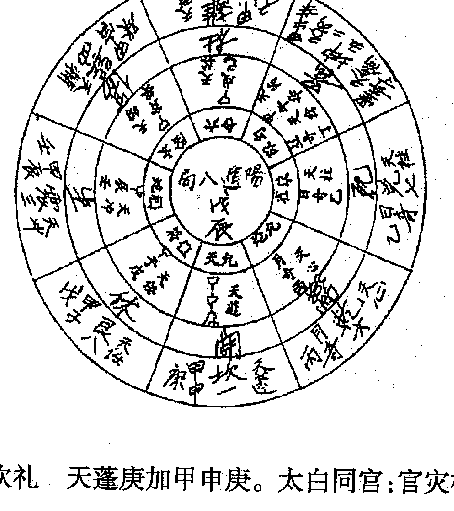

-   (1) 开坎礼 天蓬庚加甲申庚。太白同宫：官灾横祸，兄弟不睦。
-   (2) 休艮制 天任戊加甲子戊。伏吟：万事闭塞，静守为吉。
-   (3) 生震制 天冲壬加甲辰壬。蛇入地罗：外人缠绕，内事索索，吉门吉星，避免蹉跎。
-   (4) 伤巽和 天辅癸加甲寅癸。天网四张：（低网），行人失件，病讼皆伤。「地假」
-   (5) 杜离礼 天英己加甲戌己。地户逢鬼：病凶，百事不遂。
-   (6) 景坤礼 天芮辛加甲午辛。伏吟天庭：公废私就，讼狱自罹罪名。
    天禽丁加丁奇。奇人太阴：文书即至，喜事遂心。
-   (7) 死兑礼 天柱乙加乙奇。日奇伏吟：不宜谒贵求名，只可安分守身。
-   (8) 惊乾和 天心丙加丙奇。月奇孛师：文书逼迫，破耗遗失。「入墓」
-   (9) 无奇门。

#### 奇门遁甲秘笈全书（下册）

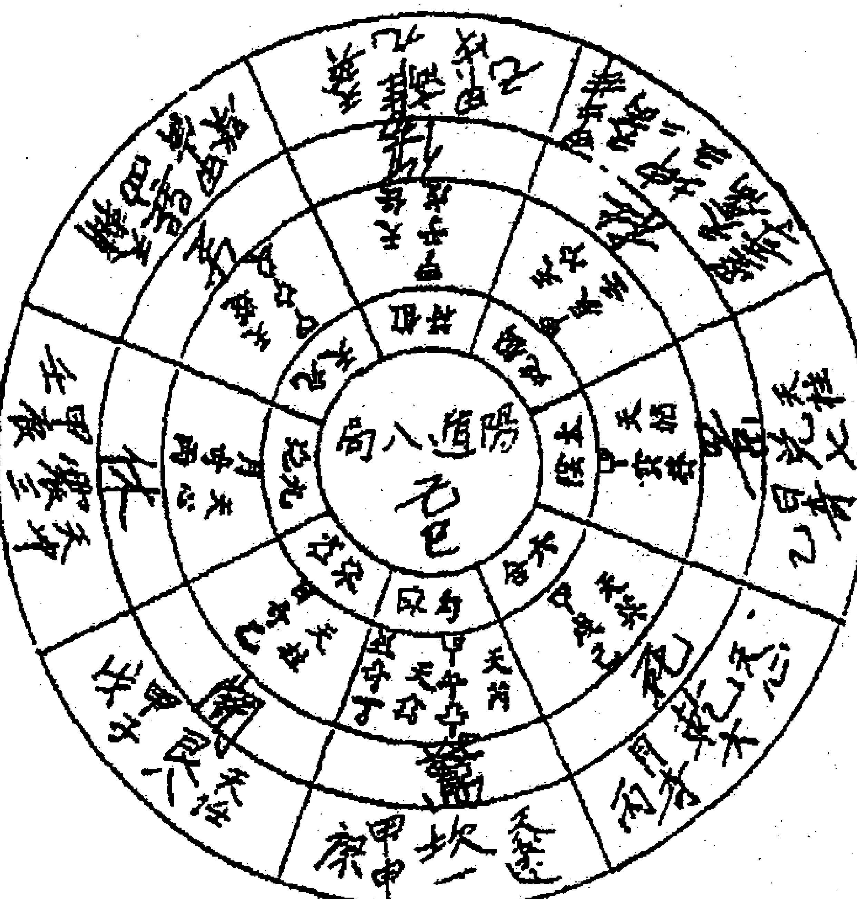

-   (1) 开艮仪 天柱乙加甲子戊。利阴害阳：门逢凶迫，财破人伤。
-   (2) 休震礼 天心丙加甲辰壬。火入天罗：客不利，是非颇多。「天遁，重诈」
-   (3) 生巽制 天蓬庚加甲寅癸。大格：行人至，官司止，生产母子俱伤。
-   (4) 伤离礼 天任戊加甲戌己。贵人入狱：公私不利。
-   (5) 杜坤迫 天冲壬加甲午辛。螣蛇相缠：若有谋望，被人欺瞒。
    天冲壬加丁奇。干合蛇刑：文书牵连，贵人匆匆，男吉女凶。
-   (6) 景兑迫 天辅癸加乙奇。华盖逢星：贵人禄位，常人平安。
-   (7) 死乾礼 天英己加丙奇。火孛地户：阳人冤冤相害，阴人必致淫污。
-   (8) 惊坎礼 天芮辛加甲申庚。白虎出力：刀刃相接，主客相残，逊让稍可，强进血溅衣衫。
    天禽丁加甲申庚。庚格：文书阻隔，行人必归。
-   (9)

| 门 | 奇 | 宫 | 利方 |
| :--- | :--- | :--- | :--- |
| 开 | 乙 | 艮八 | 东北 |
| 休 | 丙 | 震三 | 正东 |

#### 奇门阴阳九遁阳七局符使值例

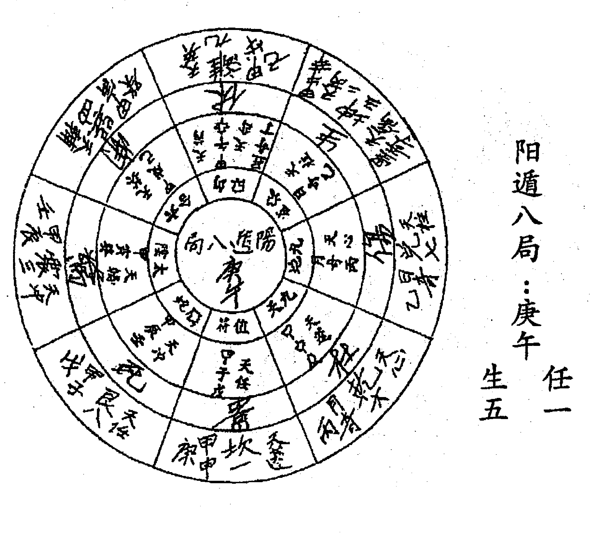

-   1.  开巽迫 天英己加甲寅癸。地刑玄武：病凶，词讼有囚狱之灾。
-   2.  休离迫 天芮辛加甲戌己。人狱自刑：奴仆背主，讼诉难伸。
    天禽丁加甲戌己。火人勾陈：奸私仇冤，事因女人。
-   3.  生坤和 天柱己加甲午辛。青龙逃走：奴仆拐带，六畜皆伤，财产废坠，身遭毁伤。「入墓」
    天柱乙加丁奇。奇仪相佐：文书事吉，百事皆可为。
-   4.  伤兑制 天心丙加乙奇。日月并行：公谋私为皆吉。
-   5.  杜乾制 天蓬庚加丙奇。太白人荧惑：占贼必来，为客进利，为主破财。
-   6.  景坎制 天任戊加甲申庚。值符飞宫：吉事不吉，凶事更凶。
-   7.  死艮和 天任壬加甲子戊。小蛇化龙：男人发达，女产婴童。
-   8.  惊震迫 天辅癸加甲辰壬。复见腾蛇：嫁娶重婚，后嫁无子，不保年华。
-   9.  休门丁奇合离九宫，利正南方。
    生门乙奇合坤二宫，利西南。

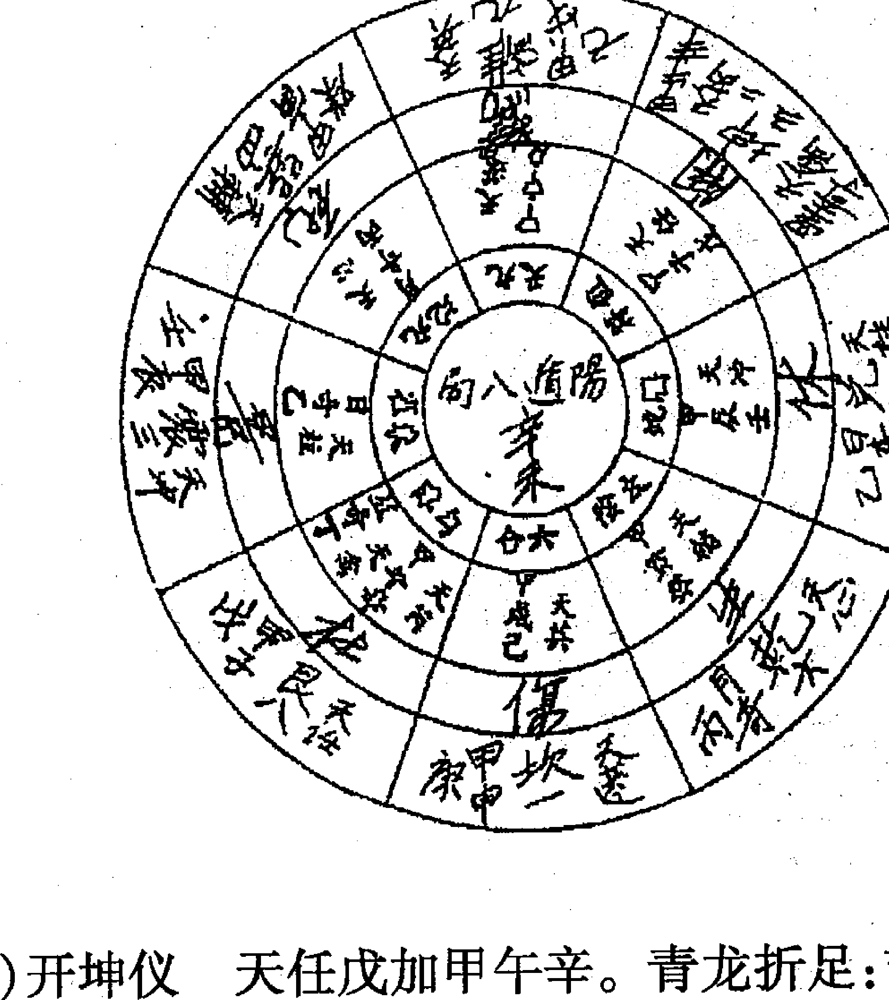

##### 阳遁八局：辛未 生六 任二

-   (1) 开坤仪 天任戊加甲午辛。青龙折足：吉门生助，事可谋为。
    天任戊加丁奇。青龙耀明：谒贵求名吉利。
-   (2) 休兑仪 天冲壬加乙奇。格名小蛇：女人柔顺，男人嗟呀，占孕生子，禄马光华。
-   (3) 生乾礼 天辅癸加丙奇。华盖孛师：贵贱逢之，上人见喜。
-   (4) 伤坎仪 天英己加甲申庚。利格返名：词讼先动不利，阴星有谋害之情。「地假」
-   (5) 杜艮迫 天芮辛加甲子戊。困龙被伤：官司破败，屈抑守分，妄动祸殃。
    天禽丁加甲子戊。青龙转光：官人升迁，常人咸昌。「入墓」
-   (6) 景震仪 天柱乙加甲辰壬。日奇入地：尊卑孛乱，官讼是非。「升殿」
-   (7) 死巽制 天心丙加甲寅癸。华盖孛师。阴人害事，灾祸频生。
-   (8) 惊离制 天蓬庚加甲戌己。刑格：官司被重刑。
-   (9) 无奇门。

#### 奇门阴阳九遁阳七局符使值例

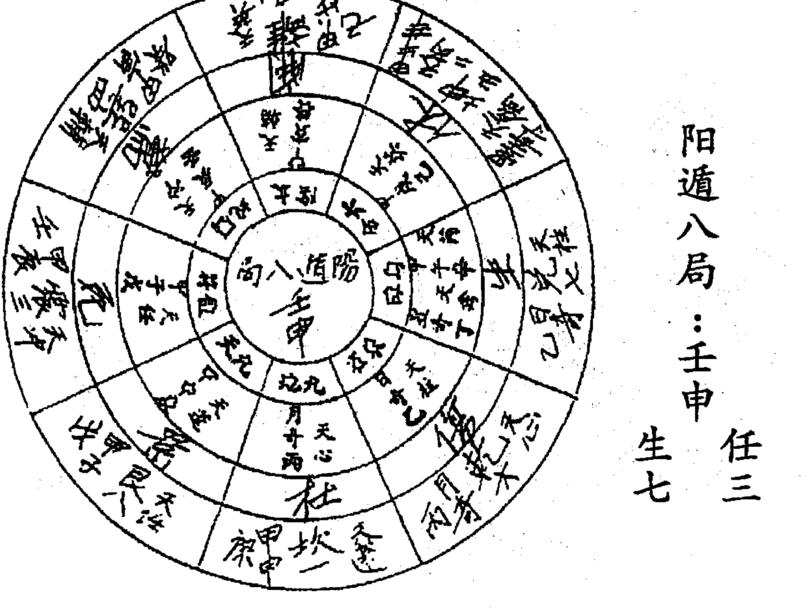

-   (1) 开离制 天辅癸加甲戌己。华盖地户：音信阻隔，躲灾避祸为吉。
-   (2) 休坤制 天英己加甲午辛。游魂人墓：大人鬼魁，小人家先为崇。
    天英己加丁奇。朱雀人墓：文状词讼，先曲后直。
-   (3) 生兑礼 天芮辛加乙奇。白虎猖狂：人亡家败，远行多殃，尊长不喜，车船俱伤，身体毁伤。「云遁」
    天禽丁加乙奇。天运昌气格：加官进爵，婚姻财喜。「人遁，升殿」
-   (4) 伤乾制 天柱乙加丙奇。奇仪顺遂：吉星迁官进职，凶星夫妻离别。「入墓」
-   (5) 杜坎仪 天心丙加甲申庚。荧惑入太白：门户破败，盗贼耗失。
-   (6) 景艮礼 天蓬庚加甲子戊。太白伏宫：百事不可谋，凶。
-   (7) 死震制 天任戊加甲辰壬。龙入天牢：阴阳皆不吉利。
-   (8) 惊巽迫 天冲壬加甲寅癸。幼女奸淫：家有丑声。
-   (9) 生门丁奇合兑七宫，利正西方。

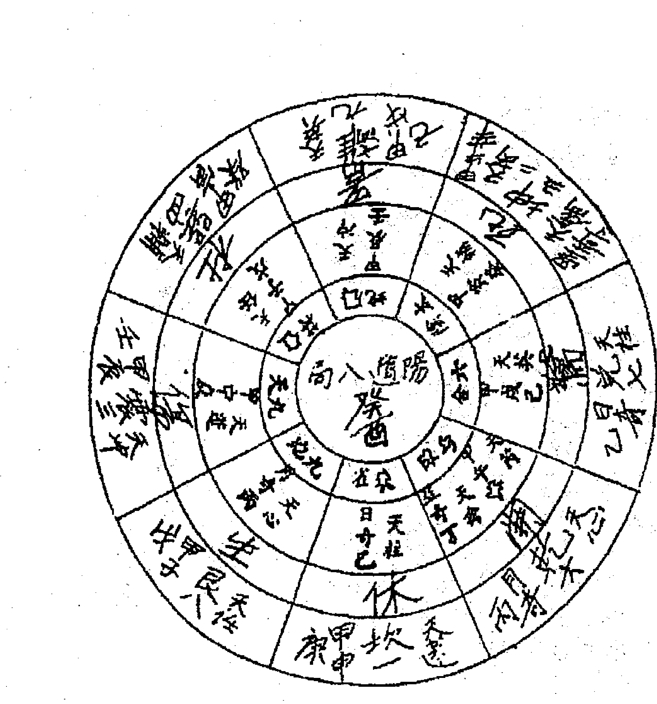

##### 阳遁八局：癸酉 生八 任四

-   (1) 开乾和 天芮辛加丙奇。荧惑出现：占雨无，占晴旱，占事必因财致讼。
    天禽丁加丙奇。星随月转：贵人越级高升，常人乐里生悲。
-   (2) 休坎和 天柱乙加甲申庚。日奇被刑：争讼财产，夫妻怀私。
    「龙遁」
-   (3) 生艮和 天心丙加甲子戊。飞鸟跌穴：谋事有成，百事洞澈。「天遁，重诈」
-   (4) 伤震和 天蓬庚加甲辰壬。小格：远行迷路，音信嗟呀。
-   (5) 杜巽和 天任戊加甲寅癸。青龙华盖：门吉招福，门凶多乖。
-   (6) 景离和 天冲壬加甲戌己。凶蛇入狱：大祸将至，顺守斯吉，词讼理曲。
-   (7) 死坤和 天辅癸加甲午辛。网盖天牢：占讼病凶。
    天辅癸加丁奇。螣蛇妖娇：文书官司火焚莫逃，忧惶之事必至。
-   (8) 惊兑和 天英己加乙奇。墓神不明：宜遁迹隐形为利逸。
-   (9)

| 门 | 奇 | 宫 | 利方 |
| :--- | :--- | :--- | :--- |
| 开 | 丁 | 乾六 | 西北 |
| 休 | 乙 | 坎一 | 正北 |
| 生 | 丙 | 艮八 | 东北 |

#### 奇门阴阳九遁阳七局符使值例

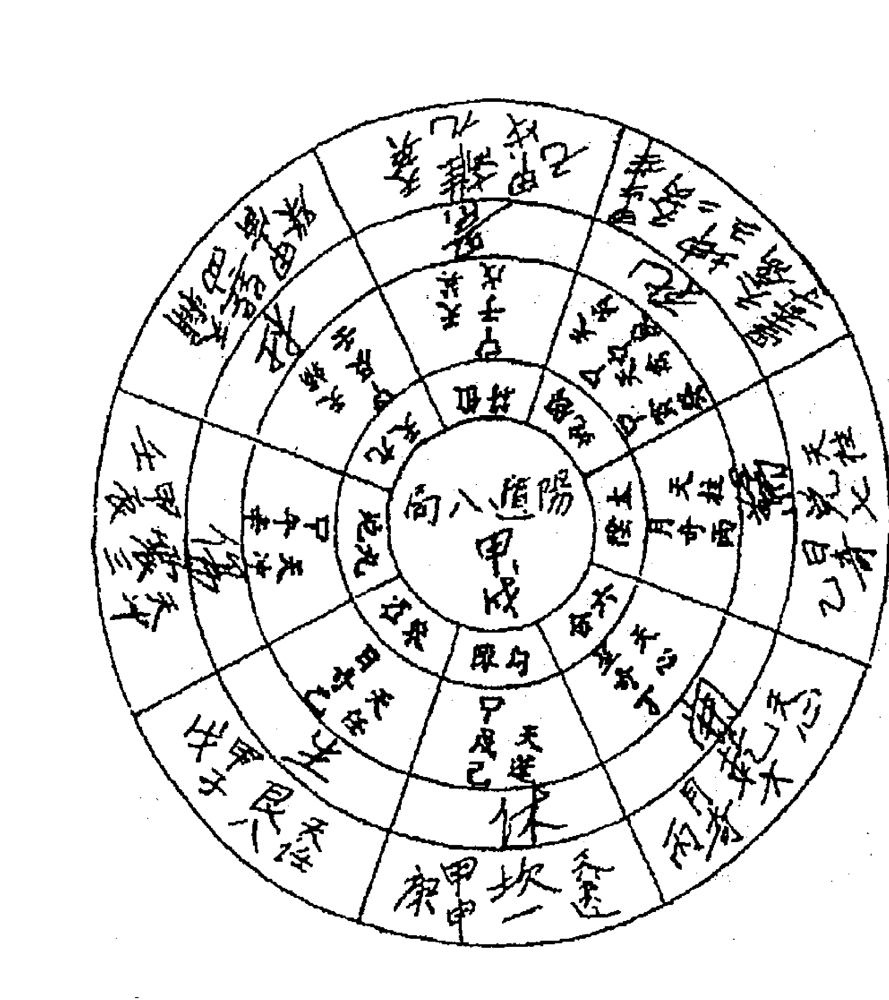

##### 阳遁八局：甲戊 景九 英九

-   (1) 开乾和 天心丁加丙奇。星随月转：贵人越级高升，常人乐里生悲。「人遁，休诈」
-   (2) 休坎和 天蓬己加甲申庚。利格返名：词讼先动不利，阴星有谋害之情。
-   (3) 生艮和 天任乙加甲子戊。利阴害阳：门逢凶迫，财破人伤。
-   (4) 伤震和 天冲辛加甲辰壬。凶蛇入狱：两男争女，讼狱不息，先动失理。
-   (5) 杜巽和 天辅壬加甲寅癸。幼女奸淫：家有丑声。
-   (6) 景离和 天英戊加甲戌己。贵人入狱：公私不利。
-   (7) 死坤和 天芮庚加甲午辛。白虎干格：远行车折马死。天禽癸加丁奇。腾蛇妖娇：文书官司火焚莫逃，忧惶之事必至。
-   (8) 惊兑和 天柱丙加乙奇。日月并行：公谋私为皆吉。
-   (9) 开生门 丁乙奇合 坎艮八宫，利西北东方。

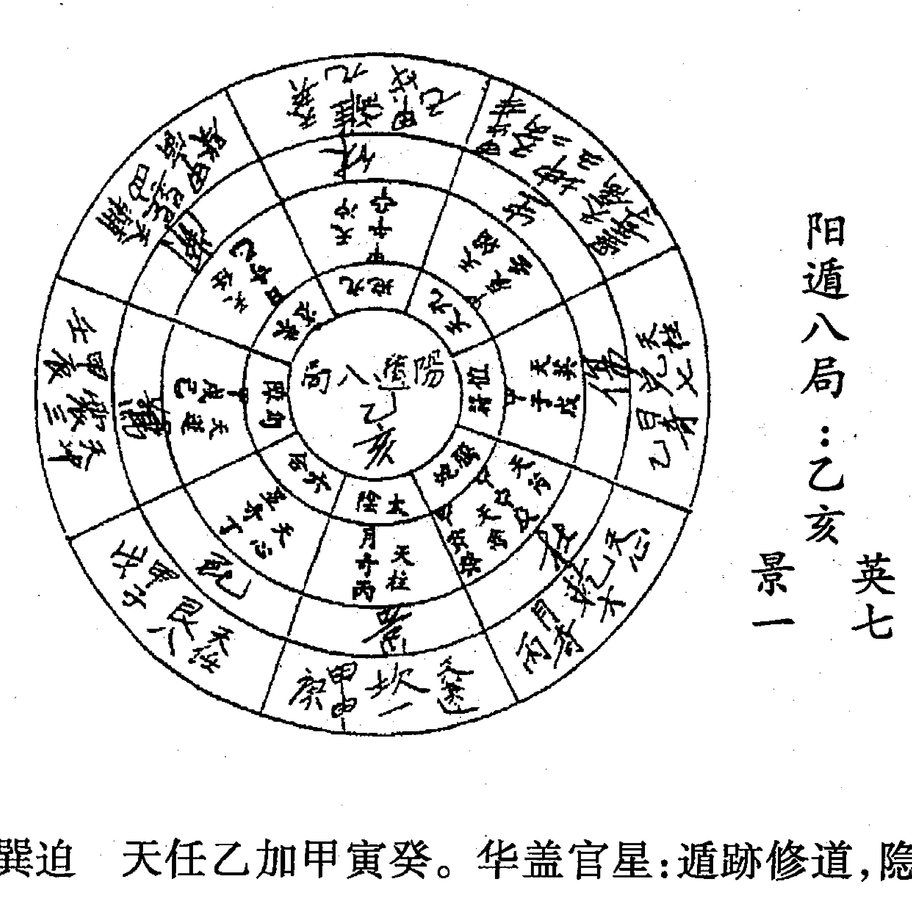

##### 阳遁八局：乙亥 景一 英七

-   (1) 开巽迫 天任乙加甲寅癸。华盖官星：遁踪修道，隐匿藏形，躲灾避难为吉。
-   (2) 休离迫 天冲辛加甲戌己。人狱自刑：奴仆背主，讼诉难伸。
-   (3) 生坤和 天辅壬加甲午辛。螣蛇相缠：纵得吉门，亦不安宁，若有谋望，被人欺瞒。
    天辅壬加丁奇。干合蛇刑：文书牵连，贵人匆匆，男吉女凶。
-   (4) 伤兑制 天英戊加乙奇。青龙合灵：门吉事吉，门凶事凶。
-   (5) 杜乾制 天芮庚加丙奇。太白入荧惑：占贼必来，为客进利，为主破财。
    天禽癸加丙奇。华盖孛师：贵贱逢之，上人见喜。
-   (6) 景坎制 天柱丙加甲申庚。荧惑人太白：门户破败，盗贼耗失。
-   (7) 死艮和 天心丁加甲子戊。青龙转光：官人升迁，常人咸昌。「入墓」
-   (8) 惊震迫 天蓬己加甲辰壬。地网高张：狡童佚女，奸情伤杀。
-   (9) 开门乙奇合巽四宫，利东南方。

#### 奇门阴阳九遁阳七局符使值例

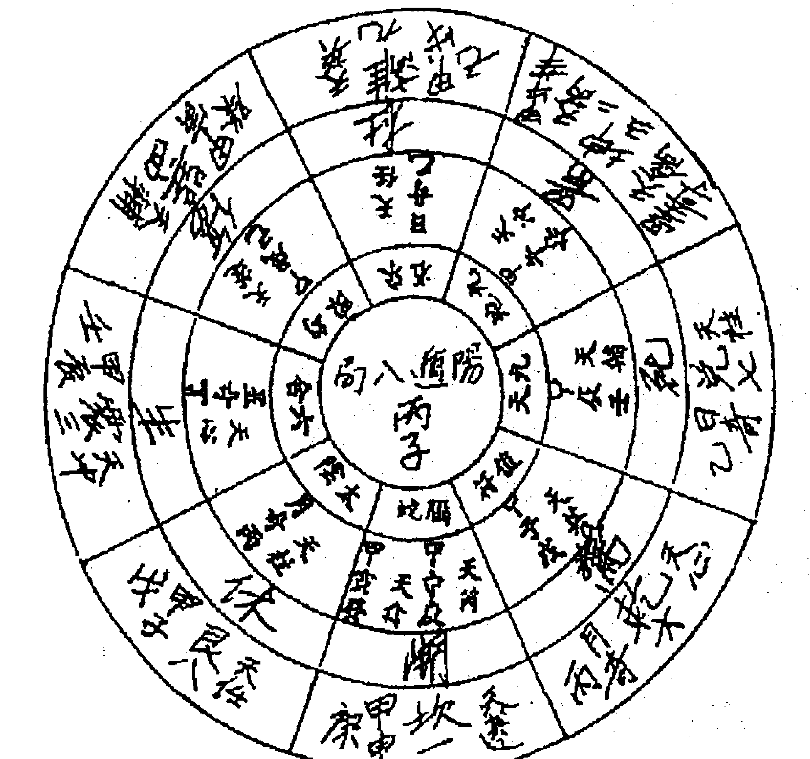

-   (1) 开坎礼 天芮庚加甲申庚。太白同宫：官灾横祸，兄弟不睦。
    天禽癸加甲申庚。太白入网：昙花一现，争讼力平。
-   (2) 休艮制 天柱丙加甲子戊。飞鸟跌穴：谋事有成，百事洞澈。
    >「天遁，真诈」
-   (3) 生震制 天心丁加甲辰壬。五神互合：贵人恩诏，讼狱公平。
    >「人遁，休诈」
-   (4) 伤巽和 天蓬己加甲寅癸。地刑玄武：病凶，词讼有囚狱之灾。
-   (5) 杜离礼 天任乙加甲戌己。日奇入雾：被土暗昧，门凶必凶。
-   (6) 景坤礼 天冲辛加甲午辛。伏吟天庭：公废私就，讼狱自罹罪名。
    天冲辛加丁奇。狱神得奇：经商获倍利，囚人逢赦宥。
-   (7) 死兑礼 天辅壬加乙奇。格名小蛇：女人柔顺，男人嗟呀，占孕生子，禄马光华。
-   (8) 惊乾和 天英戊加丙奇。青龙回首：动作大利。
-   (9) 休丙 奇合 艮八宫，利东北方。
    生丁 震三 正东

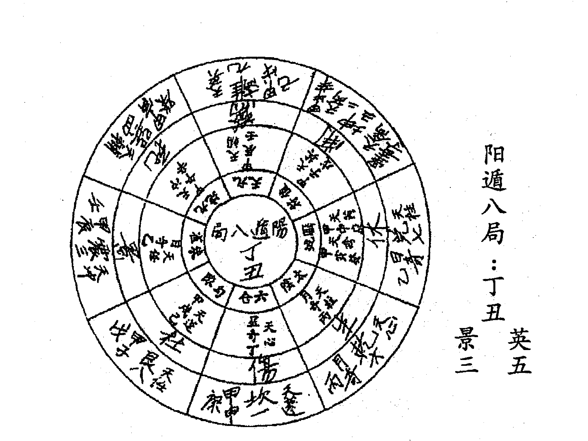

-   (1) 开坤仪 天英戊加甲午辛。青龙折足：吉门生助，尚可谋为。
    天英戊加丁奇。青龙耀明：谒贵求名吉利。
-   (2) 休兑仪 天芮庚加乙奇。太白逢星：退吉进凶。
    天禽癸加乙奇。华盖逢星：贵人禄位，常人平安。
-   (3) 生乾礼 天柱丙加丙奇。月奇孛师：文书逼迫，破耗遗失。
    「天、人遁，真诈，入墓」
-   (4) 伤坎礼 天心丁加甲申庚。庚格：文书阻隔，行人必归。
-   (5) 杜艮迫 天蓬己加甲子戊。犬遇青龙：门凶枉劳心机。
-   (6) 景震仪 天任乙加甲辰壬。日奇入地：尊卑孛乱，官讼是非。「升殿」
-   (7) 死巽制 天冲辛加甲寅癸。天牢华盖：误入天网，动止乖张。
-   (8) 惊离制 天辅壬加甲戌己。凶蛇入狱：大祸将至，顺守斯吉，词讼理曲。「人假」
-   (9) 生门丙奇合乾六宫，利西北方。

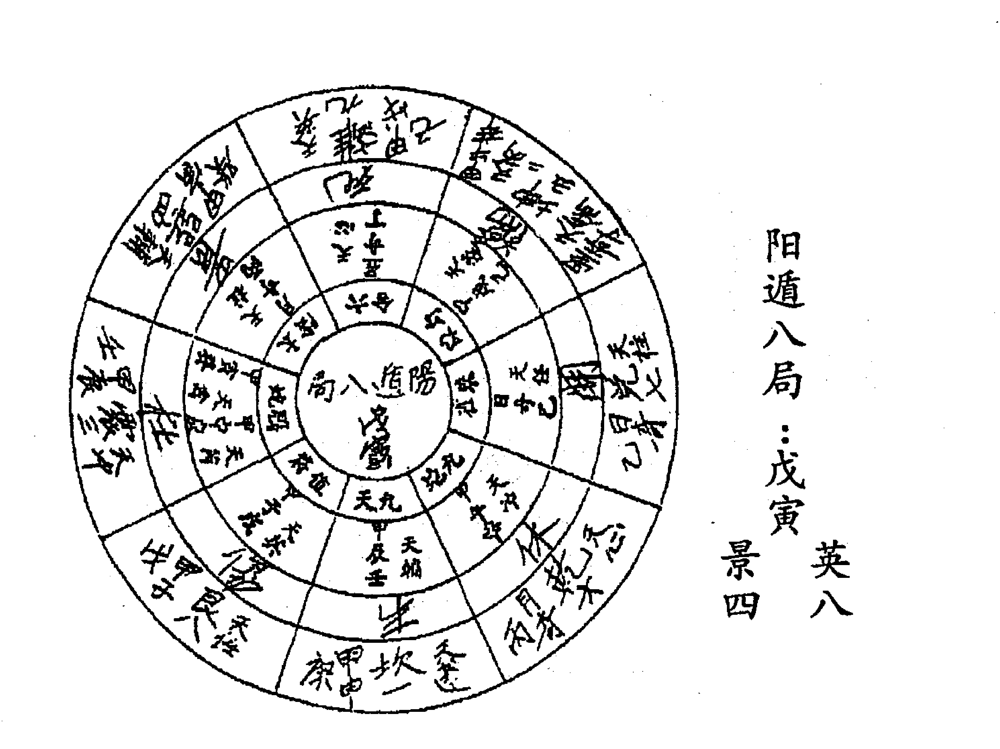

-   1.  开兑和 天任乙加乙奇。日奇伏吟：不宜谒贵求名，只可安分守身。
-   2.  休乾仪 天冲辛加丙奇。荧惑出现：占雨无，占晴旱，占事必因财致讼。
-   3.  生坎迫 天辅壬加甲申庚。太白擒蛇：刑狱公平，立剖邪正。
-   4.  伤艮迫 天英戊加甲子戊。伏吟：万事闭塞，静守为吉。
-   5.  杜震和 天芮庚加甲辰壬。小格：远行迷路，音信嗟呀。天禽癸加甲辰壬。复见腾蛇：嫁娶重婚，后嫁无子，不保年华。
-   6.  景巽仪 天柱丙加甲寅癸。华盖孛师：阴人害事，灾祸频生。
-   7.  死离仪 天心丁加甲戌己。火人勾陈：奸私仇冤，事因女人。「入墓」
-   8.  惊坤仪 天蓬己加甲午辛。游魂入墓：大人鬼魁，小人家先为祟。天蓬己加丁奇。朱雀入狱：文状词讼，先曲后直。
-   9.  开门乙奇合兑七宫，利正西方。

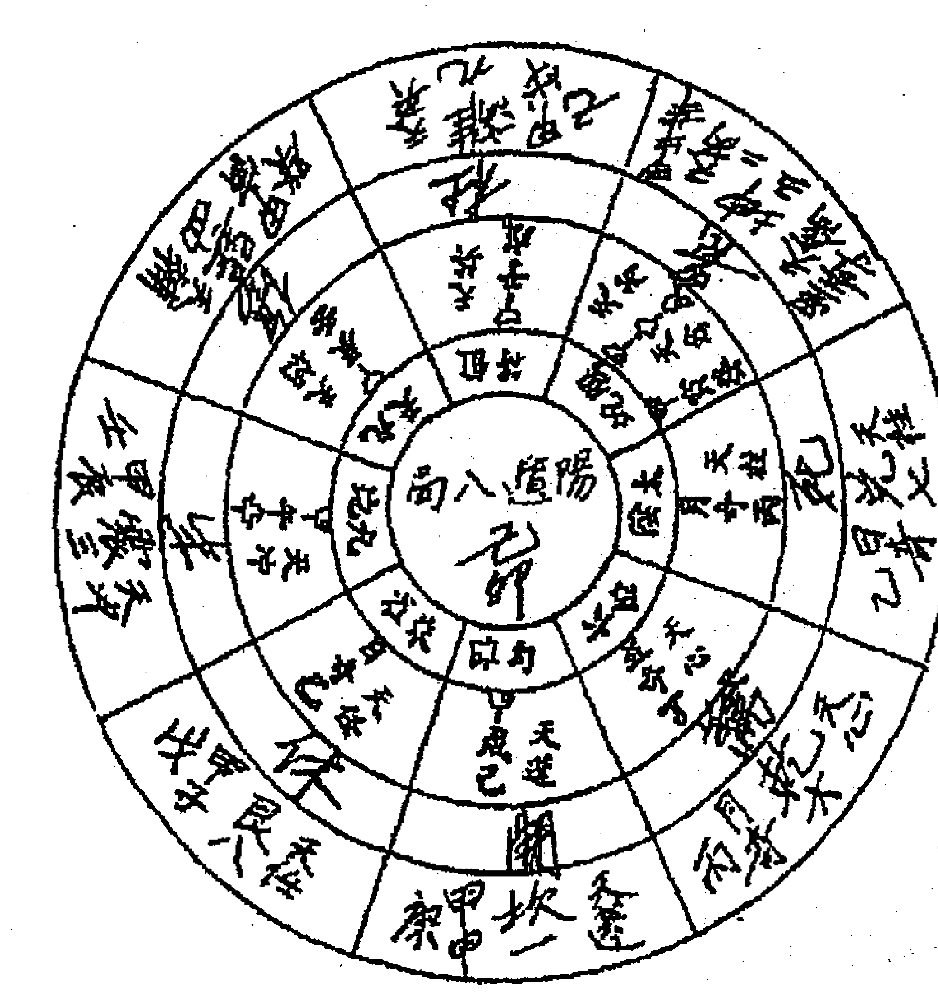

-   (1) 开坎礼 天蓬己加甲申庚。利格返名：词讼先动不利，阴星有谋害之情。
-   (2) 休艮制 天任乙加甲子戊。利阴害阳：门逢凶迫，财破人伤。「虎遁」
-   (3) 生震制 天冲辛加甲辰壬。凶蛇入狱：两男争女，讼狱不息，先动失理。
-   (4) 伤巽和 天辅壬加甲寅癸。幼女奸淫：家有丑声。
-   (5) 杜离礼 天英戊加甲戌己。贵人入狱：公私不利。
-   (6) 景坤礼 天芮庚加甲午辛。白虎干格：远行车折马死。天禽癸加丁奇。腾蛇妖娇：文书官司火焚莫逃，忧惶之事必至。
-   (7) 死兑礼 天柱丙加乙奇。日月并行：公谋私为皆吉。
-   (8) 惊乾和 天心丁加丙奇。星随月转：贵人越级高升，常人乐里生悲。
-   (9) 休门乙奇合艮八宫，利东北方。

#### 奇门阴阳九遁阳七局符使值例

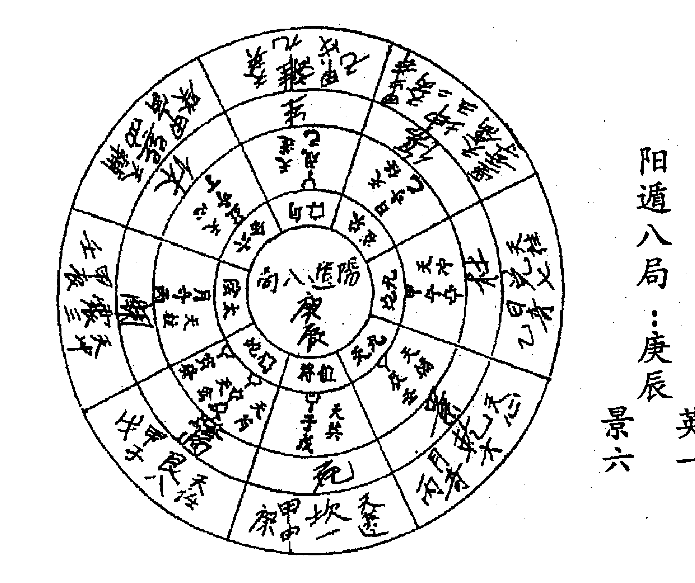

-   (1) 开震迫 天柱丙加甲辰壬。火入天罗：客不利，是非颇多。「天遁，真诈」
-   (2) 休巽礼 天心丁加甲寅癸。朱雀投江：文书口舌俱消，音信沉溺，讼狱所由起也。「人遁，休诈」
-   (3) 生离仪 天蓬己加甲戌己。地户逢鬼：病凶，百事不遂。
-   (4) 伤坤迫 天任乙加甲午辛。青龙逃走：奴仆拐带，六畜皆伤，财产废坠，身遭毁伤。「入墓」
    天任乙加丁奇。奇仪相佐：文书事吉，百事皆可为。
-   (5) 杜兑制 天冲辛加乙奇。白虎猖狂：人亡家败，远行多殃，尊长不喜，车船身体毁伤。
-   (6) 景乾迫 天辅壬加丙奇。水蛇入火：官灾刑禁，络绎不绝。
-   (7) 死坎迫 天英戊加甲申庚。值符飞宫：吉事不吉，凶事更凶。
-   (8) 惊艮仪 天芮庚加甲子戊。太白伏宫。百事不可谋，凶。
    天禽癸加甲子戊。天乙会合。财喜婚姻：吉人赞助成合，门逢凶迫，反祸官非。
-   (9)

| 门 | 奇合 | 宫 | 利方 |
| :--- | :--- | :--- | :--- |
| 开 | 丙 | 震三 | 正东 |
| 休 | 丁 | 巽四 | 东南 |

#### 奇门遁甲秘笈全书（下册）

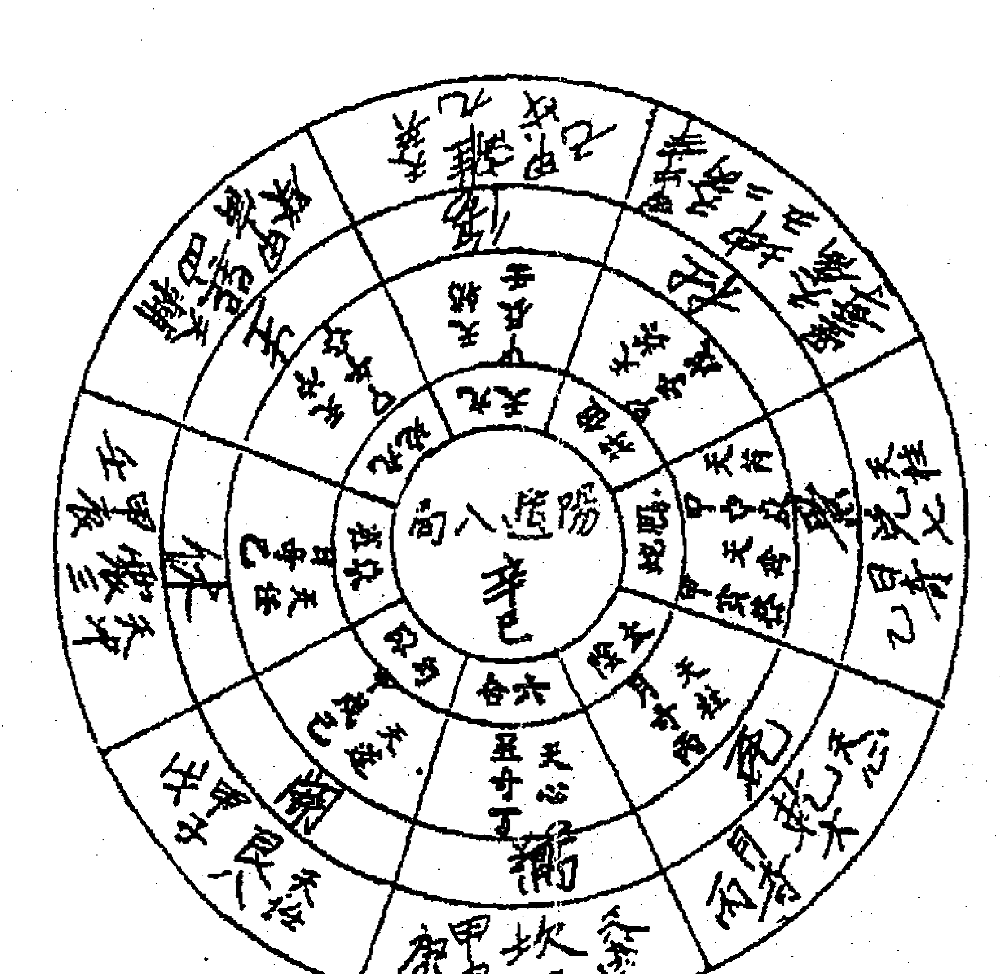

##### 阳遁八局：辛巳 景七 英二

-   (1) 开艮仪 天蓬己加甲子戊。犬遇青龙：吉门谋望遂意，上人见喜。
-   (2) 休震礼 天任乙加甲辰壬。日奇入地：尊卑孛乱，官讼是非。「升殿」
-   (3) 生巽制 天冲辛加甲寅癸。天牢华盖：误入天网，动止乖张。
-   (4) 伤离礼 天辅壬加甲戌己。凶蛇入狱：大祸将至，顺守斯吉，词讼理曲。
-   (5) 杜坤迫 天英戊加甲午辛。青龙折足：逢凶门，主招灾，失财，有足疾。
    天英戊加丁奇。青龙耀明：谒贵求名吉利，逢墓迫招是非。
-   (6) 景兑迫 天芮庚加乙奇。太白逢星：退吉进凶。
    天禽癸加乙奇。华盖逢星：贵人禄位，常人平安。
-   (7) 死乾礼 天柱丙加丙奇。月奇孛师：文书逼迫，破耗遗失。「入墓」
-   (8) 惊坎礼 天心丁加甲申庚。庚格：文书阻隔，行人必归。
-   (9) 休门乙奇合震三宫，利正东方。

#### 奇门阴阳九遁阳七局符使值例

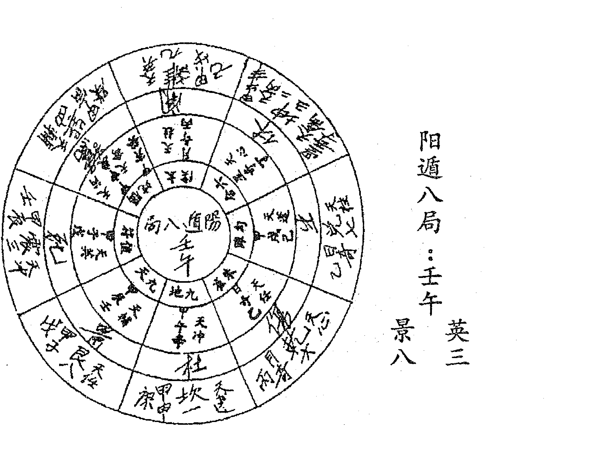

-   (1) 开离制 天柱丙加甲戌己。太字人刑：囚人刑杖，文书不行，吉门得吉。「升殿，天遁，真诈」
-   (2) 休坤制 天心丁加甲午辛。朱雀入狱：罪人释囚，官人失位。天心丁加丁奇。奇人太阴：文书即至，喜事遂心。「人遁，休诈」
-   (3) 生兑礼 天蓬己加乙奇。墓神不明：宜遁迹隐形为利逸。
-   (4) 伤乾制 天任乙加丙奇。奇仪顺遂：吉星迁官进职，凶星夫妻离别。「入墓」
-   (5) 杜坎仪 天冲辛加甲申庚。白虎出力：刀刃相接，主客相残，逊让稍可，强进血溅衣衫。
-   (6) 景艮礼 天辅壬加甲子戊。小蛇化龙：男人发达，女产婴童。
-   (7) 死震制 天英戊加甲辰壬。龙入天牢：阴阳皆不吉利。
-   (8) 惊巽迫 天芮庚加甲寅癸。大格：行人至，官司止，生产母子俱伤。天禽癸加甲寅癸。天网四张（低网）：行人失件，病诉皆伤。
-   (9)

| 门 | 奇 | 宫 | 利方 |
| :--- | :--- | :--- | :--- |
| 开 | 丙 | 离九 | 正南 |
| 休 | 丁 | 坤二 | 西南 |

#### 奇门遁甲秘书全书（下册）

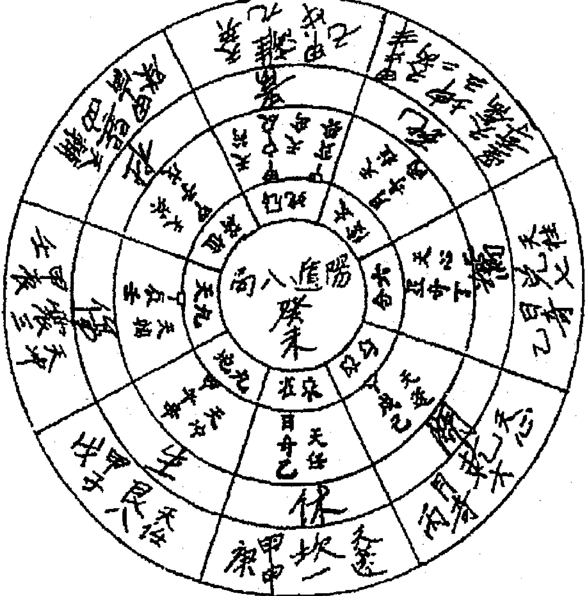

##### 阳遁八局：癸未 景九 英四

-   (1) 开乾和 天蓬己加丙奇。火孛地户：阳人冤冤相害，阴人必致淫污。
-   (2) 休坎和 天任乙加甲申庚。日奇被刑：争讼财产，夫妻怀私。「龙遁」
-   (3) 生艮和 天冲辛加甲子戊。困龙被伤：官司破败，屈抑守分，妄动祸殃。
-   (4) 伤震和 天辅壬加甲辰壬。蛇入地罗：外人缠绕，内事索索。
-   (5) 杜巽和 天英戊加甲寅癸。青龙华盖：门吉招福，门凶多乖。
-   (6) 景离和 天芮庚加甲戌己。刑格：官司被重刑。
    天禽癸加甲戌己。华盖地户：音信阻隔，躲灾避难为吉。
-   (7) 死坤和 天柱丙加甲午辛。威神互合：谋事有成，病人不凶。
    天柱丙加丁奇。辛奇朱雀：贵人文书吉，常人平静。
-   (8) 惊兑和 天心丁加乙奇。天运昌气格：加官进爵，婚姻财喜。「人遁，升殿」
-   (9) 休门乙奇合坎一宫，利正北方。

#### 奇门阴阳九遁阳七局符使值例

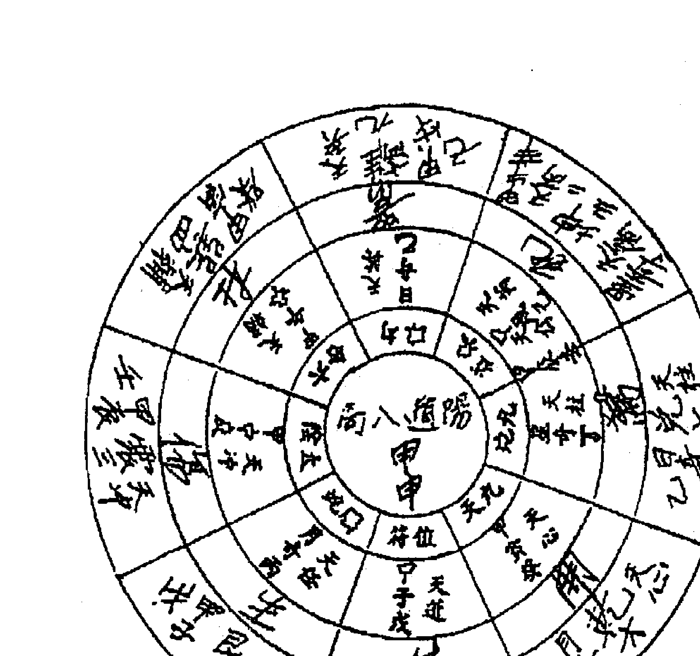

-   (1) 开乾和 天心癸加丙奇。华盖孛师：贵贱逢之，上人见喜。
-   (2) 休坎和 天蓬戊加甲申庚。值符飞宫：吉事不吉，凶事更凶。
-   (3) 生艮和 天任丙加甲子戊。飞鸟跌穴：谋事有成，百事洞澈。
-   (4) 伤震和 天冲庚加甲辰壬。小格：远行迷路，音信嗟呀。
-   (5) 杜巽和 天辅辛加甲寅癸。天牢华盖：误入天网，动止乖张。
-   (6) 景离和 天英乙加甲戌己。日奇入雾：被土暗昧，门凶必凶。
-   (7) 死坤和 天芮己加甲午辛。游魂入墓：大人鬼魁，小人家先为祟。天禽壬加丁奇。干合蛇刑：文书牵连，贵人匆匆，男吉女凶。
    >「人遁，升殿，神假」
-   (8) 惊兑和 天柱丁加乙奇。天运昌气格：加官进爵，财喜婚姻。
-   (9) 生门丙奇。合艮八宫，利东北方。

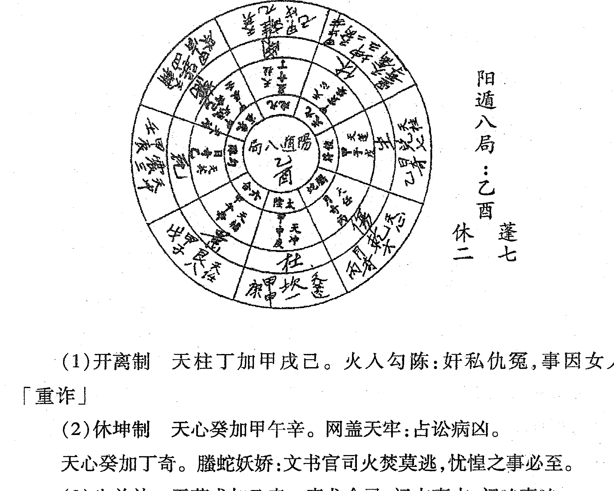

-   1.  开离制 天柱丁加甲戌己。火入勾陈：奸私仇冤，事因女人。「重诈」
-   2.  休坤制 天心癸加甲午辛。网盖天牢：占讼病凶。天心癸加丁奇。腾蛇妖娇：文书官司火焚莫逃，忧惶之事必至。
-   3.  生兑礼 天蓬戊加乙奇。青龙合灵：门吉事吉，门凶事凶。
-   4.  伤乾制 天任丙加丙奇。月奇孛师：文书逼迫，破耗遗失。「入墓」
-   5.  杜坎仪 天冲庚加甲申庚。太白同宫：官灾横祸，兄弟不睦。
-   6.  景艮礼 天辅辛加甲子戊。困龙被伤：官司破败，屈抑守分，妄动祸殃。
-   7.  死震制 天英乙加甲辰壬。复见腾蛇：嫁娶重婚，后嫁无子，不保年华。「升殿」
-   8.  惊巽迫 天芮己加甲寅癸。地刑玄武：病凶，词讼有囚狱之灾。天禽壬加甲寅癸。幼女奸淫：家有丑声。
-   9.  开门丁奇合离九宫，利正南方。

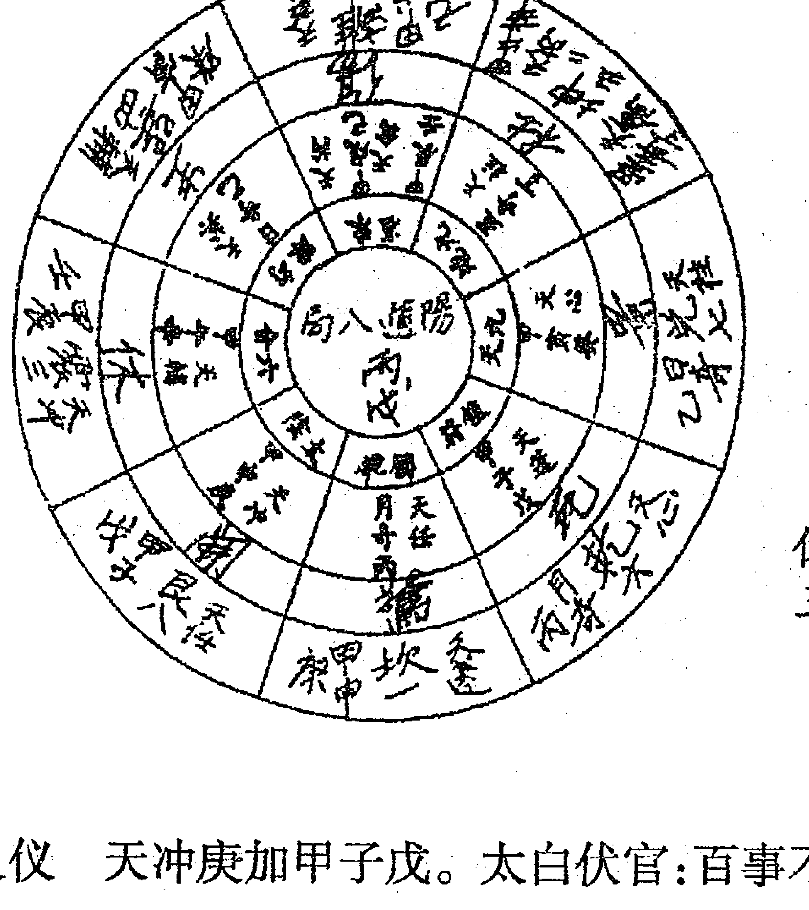

### 阳遁八局：丙戊 休 蓬 三 六

-   (1) 开艮仪 天冲庚加甲子戊。太白伏官：百事不可谋，凶。
-   (2) 休震礼 天辅辛加甲辰壬。凶蛇入狱：两男争女，讼狱不息，先动失理。
-   (3) 生巽制 天英乙加甲寅癸。华盖官星：遁跡修道，隐匿藏形，躲灾避难为吉。
-   (4) 伤离礼 天芮己加甲戌己。地户逢鬼：病凶，百事不遂。天禽壬加甲戌己。凶蛇入狱：大祸将至，顺守斯吉，词讼理曲。
-   (5) 杜坤迫 天柱丁加甲午辛。朱雀入狱：罪人释囚，官人失位。天柱丁加丁奇。奇人太阴：文书即至，喜事遂心。「地假」
-   (6) 景兑迫 天心癸加乙奇。华盖逢星：贵人禄位，常人平安。
-   (7) 死乾礼 天蓬戊加丙奇。青龙回首：动作大利。
-   (8) 惊坎礼 天任丙加甲申庚。荧惑入太白：门户破败，盗贼耗失。
-   (9) 生门乙奇合巽四宫，利东南方。

#### 阳遁八局：丁亥 休四 蓬五

1.  开震迫 天芮己加甲辰壬。地网高张：狡童佚女，奸情伤杀。天禽壬加甲辰壬。蛇入地罗：外人缠绕，内事索索，吉门吉星，避免蹉跎。

2.  休巽礼 天柱丁加甲寅癸。朱雀投江：文书口舌俱消，音信沉溺，讼狱所由起也。「重诈」

3.  生离仪 天心癸加甲戌己。华盖地户：音信皆阻，躲灾避难为吉。

4.  伤坤迫 天蓬戊加甲午辛。青龙折足：逢凶门主招灾，失财，有足疾。天蓬戊加丁奇。青龙耀明：谒贵求名吉利，逢墓迫招是非。

5.  杜兑制 天任丙加乙奇。日月并行：公谋私为皆吉。

6.  景乾迫 天冲庚加丙奇。太白入荧惑：占贼必来，为客进利，为主破财。

7.  死坎迫 天辅辛加甲申庚。白虎出力：刀刃相接，主客相残，逊让稍可，强进血溅衣衫。

8.  惊艮仪 天英乙加甲子戊。利阴害阳：门逢凶迫，财破人伤。

9.  休门丁奇合巽四宫，利东南方。

#### 奇门阴阳九遁阳七局符使值例

1.  **开离制** 天辅辛加甲戊己。人狱自刑：奴仆背主，讼诉难伸。

2.  **休坤制** 天英乙加甲午辛。青龙逃走：奴仆拐带，六畜皆伤，财产废坠，身遭毁伤。天英乙加丁奇。奇仪相佐：文书事吉，百事皆可为。「入墓」

3.  **生兑礼** 天芮己加乙奇。墓神不明：宜遁迹隐形为利逸。天禽壬加乙奇。格名小蛇：女人柔顺，男人嗟呀，占孕生子，禄马光华。

4.  **伤乾制** 天柱丁加丙奇。星随月转：贵人越级高升，常人乐里生悲。

5.  **杜坎仪** 天心癸加甲申庚。太白入网：昙花一现，争讼力平。

6.  **景艮礼** 天蓬戊加甲子戊。伏吟：万事闭塞，静守为吉。

7.  **死震制** 天任丙加甲辰壬。火入天罗：客不利，是非颇多。

8.  **惊巽迫** 天冲庚加甲寅癸。大格：行人至，官司止，生产母子俱伤。

9.  **休门乙奇** 合坤二宫，利西南方。

#### 阳遁八局：己丑 休六 蓬九

1.  开兑和 天冲庚加乙奇。太白逢星：退吉进凶。「虎遁」

2.  休乾仪 天辅辛加丙奇。荧惑出现：占雨无，占晴旱，占事必因财致讼。

3.  生坎迫 天英乙加甲申庚。日奇被刑：争讼财产，夫妻怀私。

4.  伤艮迫 天芮己加甲子戊。犬遇青龙：门凶枉劳心机。天禽壬加甲子戊。小蛇化龙：男人发达，女产婴童。

5.  杜震和 天柱丁加甲辰壬。五神互合：贵人恩诏，讼狱公平。

6.  景巽仪 天心癸加甲寅癸。天网四张（低网）：行人失件，病讼皆伤。

7.  死离仪 天蓬戊加甲戌己。贵人入狱：公私不利。

8.  惊坤仪 天任丙加甲午辛。威神互合：谋事有成，病人不凶。天任丙加丁奇。辛奇朱雀：贵人文书吉，常人平安。

9.  生门乙奇合坎一宫，利正北方。

#### 阳遁八局：庚寅 休七 蓬一

1.  开坤仪 天芮己加甲午辛。游魂人墓：大人鬼魁，小人家先为祟。天禽壬加丁奇。干合蛇刑：文书牵连，贵人匆匆，男吉女凶。

2.  休兑仪 天柱丁加乙奇。天运昌气格：加官进爵，财喜婚姻。「人遁，重诈，升殿」

3.  生乾礼 天心癸加丙奇。华盖李师：贵贱逢之，上人见喜。

4.  伤坎仪 天蓬戊加甲申庚。值符飞宫：吉事不吉，凶事更凶。

5.  杜艮迫 天任丙加甲子戊。飞鸟跌穴：谋事有成，百事洞澈。

6.  景震仪 天冲庚加甲辰壬。小格：远行迷路，音信嗟呀。

7.  死巽制 天辅辛加甲寅癸。天牢华盖：误入天网，动止乖张。

8.  惊离制 天英乙加甲戌己。日奇入雾：被土暗昧，门凶必凶。

9.  休门丁奇合兑七宫，利正西方。

#### 奇门遁甲秘笈全书（下册）

#### 阳遁八局：辛卯 休八 蓬二

1.  开坎礼 天辅辛加甲申庚。白虎出力：刀刃相接，主客相残，逊让稍可，强进血溅衣衫。

2.  休艮制 天英乙加甲子戊。利阴害阳：门逢凶迫，财破人伤。「虎遁」

3.  生震制 天芮己加甲辰壬。地网高张：狡童佚女，奸情伤杀。天禽壬加甲辰壬。蛇入地罗：外人缠绕，内事索索，吉门吉星，避免蹉跎。

4.  伤巽和 天柱丁加甲寅癸。朱雀投江：文书口舌俱消，音信沉溺，讼狱所由起也。

5.  杜离礼 天心癸加甲戌己。华盖地户：音信皆阻，躲灾避难为吉。

6.  景坤礼 天蓬戊加甲午辛。青龙折足：吉门生助，尚可谋为，凶门招灾，失财，有足疾。天蓬戊加丁奇。青龙耀明：谒贵求名吉利。

7.  死兑礼 天任丙加乙奇。日月并行：公谋私为皆吉。

8.  惊乾和 天冲庚加丙奇。太白入荧惑：占贼必来，为客进利，为主破财。

9.  休门乙奇合艮八宫，利东北方。

#### 阳遁八局：壬辰 休九 蓬三

1.  开巽迫 天任丙加甲寅癸。华盖孛师：阴人害事，灾祸频生。

2.  休离迫 天冲庚加甲戌己。刑格：官司被重刑。

3.  生坤和 天辅辛加甲午辛。伏吟天庭：公废私就，讼狱自罹罪名。天辅辛加丁奇。狱神得奇：经商获倍利，囚人逢赦宥。

4.  伤兑制 天英乙加乙奇。日奇伏吟：不宜谒贵求名，只可安分守身。

5.  杜乾制 天芮己加丙奇。火孛地户：阳人冤冤相害，阴人必致淫污。天禽壬加丙奇。水蛇入火：官灾刑禁，络绎不绝。

6.  景坎制 天柱丁加甲申庚。庚格：文书阻隔，行人必归。

7.  死艮和 天心癸加甲子戊。天乙会合：财喜婚姻，吉人赞助成合，门凶迫制，反祸官非。

8.  惊震迫 天蓬戊加甲辰壬。龙入天牢：阴阳皆不吉利。

9.  开门丙奇合巽四宫，利东南方。

#### 奇门遁甲秘笈全书（下册）

#### 阳遁八局：癸巳 休一 蓬四

1.  开乾和 天英乙加丙奇。奇仪顺遂：吉星迁官进职，凶星夫妻离别。「入墓」

2.  休坎和 天芮己加甲申庚。利格返名：词讼先动失利，阴星有谋害之情。天禽壬加甲申庚。太白擒蛇：刑狱公平，立剖邪正。

3.  生艮和 天柱丁加甲子戊。青龙转光：官人升迁，常人咸昌。「重诈，入墓」

4.  伤震和 天心癸加甲辰壬。复见腾蛇：嫁娶重婚，后嫁无子，不保年华。

5.  杜巽和 天蓬戊加甲寅癸。青龙华盖：门吉招福，门凶多乖。

6.  景离和 天任丙加甲戊己。太孛入刑：囚人刑杖，文书不行，吉门得吉，凶门转凶。「升殿」

7.  死坤和 天冲庚加甲午辛。白虎干格：远行车折马死。天冲庚加丁奇。亭亭之格：因私匿起官司，门吉有救。

8.  惊兑和 天辅辛加乙奇。白虎猖狂：人亡家败，远行多殃，尊长不喜，车船俱伤，身体毁伤。

9.  开生门乙丁奇合乾六艮八宫，利西北北方。

#### 奇门阴阳九遁阳七局符使值例

#### 阳遁八局：甲午 芮二 死二

1.  开乾和 天心壬加丙奇。水蛇入火：官灾刑禁，络绎不绝。

2.  休坎和 天蓬乙加甲申庚。日奇被刑：争讼财产，夫妻怀私。「龙遁，地遁，休诈」

3.  生艮和 天任丁加甲子戊。青龙转光：官人升迁，常人咸昌。「入墓」

4.  伤震和 天冲己加甲辰壬。地网高张：狡童佚女，奸情伤杀。

5.  杜巽和 天辅庚加甲寅癸。大格：行人至，官司止，生产母子俱伤。

6.  景离和 天英丙加甲戌己。太孛入刑：囚人刑杖，文书不行，吉门得吉，凶门转凶。「升殿，天假」

7.  死坤和 天芮戊加甲午辛。青龙折足：吉门生助，尚可谋为，凶门招灾，失财，有足疾。天禽辛加丁奇。狱神得奇：经商获倍利，囚人逢赦宥。

8.  惊兑和 天柱癸加乙奇。华盖逢星：贵人禄位，常人平安。

9.  休门乙奇合坎一宫，利正北方。

生丁奇合艮八宫，利东北方。

## 阳遁八局·乙未 死三 芮七

1.  开离制 天辅庚加甲戌己。刑格：官司被重刑。

2.  休坤制 天芮丙加甲午辛。威神互合：谋事有成，病人不凶。天英丙加丁奇。辛奇朱雀：贵人文书吉，常人平静。

3.  生兑礼 天芮戊加乙奇。青龙合灵：门吉事吉，门凶事凶。天禽辛加乙奇。白虎猖狂：人亡家败，远行多殃，尊长不喜，车船俱伤，身体毁伤。「云遁」

4.  伤乾制 天柱癸加丙奇。华盖孛师：贵贱逢之，上人见喜。

5.  杜坎仪 天心壬加甲申庚。太白擒蛇：刑狱公平，立剖邪正。

6.  景艮礼 天蓬乙加甲子戊。利阴害阳：门逢凶迫，财破人伤。

7.  死震制 天任丁加甲辰壬。五神互合：贵人恩诏，讼狱不平。

8.  惊巽迫 天冲己加甲寅癸。地刑玄武：病凶，词讼有囚狱之灾。

9.  休门丙奇合坤二宫，利西南方。

#### 奇门阴阳九遁阳七局符使值例

1.  开巽迫 天任丁加甲寅癸。朱雀投江：文书口舌俱消，音信沉溺，讼狱所由起也。

2.  休离迫 天冲己加甲戊己。地户逢鬼：病凶，百事不遂。

3.  生坤和 天辅庚加甲午辛。白虎干格：远行车折马死。天辅庚加丁奇。亭亭之格：因私匿起官司，门吉有救。

4.  伤兑制 天英丙加乙奇。日月并行：公谋私为皆吉。

5.  杜乾制 天芮戊加丙奇。青龙回首：动作大利，逢迫墓招是非。天禽辛加丙奇。荧惑出现：占雨无，占晴旱，占事必因财致讼。

6.  景坎制 天柱癸加甲申庚。太白入网：昙花一现，争讼力平。

7.  死艮和 天心壬加甲子戊。小蛇化龙：官灾刑禁络绎不绝。

8.  惊震迫 天蓬乙加甲辰壬。日奇入地：尊卑悖乱，官讼是非。「升殿」

9.  开门丁奇合巽四宫，利东南方。

#### 阳遁八局：甲辰 伤冲三三

1.  开乾和 天心辛加丙奇。荧惑出现：占雨无，占晴早，占财必因财致讼。

2.  休坎和 天蓬丙加甲申庚。荧惑入太白：门户破败，盗贼耗失。「天遁，重诈」

3.  生艮和 天任癸加甲子戊。天乙会合：财喜婚姻，吉人相助成合。

4.  伤震和 天冲戊加甲辰壬。龙入天牢：阴阳皆不吉利。

5.  杜巽和 天辅己加甲寅癸。地刑玄武：病凶，词讼有囚狱之灾。

6.  景离和 天英丁加甲戌己。火入勾陈：奸私仇冤，事因女人。

7.  死坤和 天芮乙加甲午辛。青龙逃走：奴仆拐带，六畜皆伤，财产废坠，身遭毁伤。「入墓」天禽庚加丁奇。亭亭之格：因私匿起官司，门吉有赦。

8.  惊兑和 天柱壬加乙奇。格名小蛇：女人柔顺，男人嗟呀，占孕生子，禄马光华。

9.  休门丙奇合坎一宫，利正北方。

10. 开丁奇合坎一宫，利正北方。休乙奇合艮八宫，利东北方。

#### 奇门遁甲秘笈全书（下册）

#### 阳遁八局：癸卯 死二 芮四

1.  开乾和 天任丁加丙奇。星随月转：贵人越级高升，常人乐里生悲。

2.  休坎和 天冲己加甲申庚。利格返名：词讼先动不利，阴星有谋害之情。

3.  生艮和 天辅庚加甲子戊。太白伏官：百事不可谋，凶。

4.  伤震和 天英丙加甲辰壬。火入天罗：客不利，是非颇多。

5.  杜巽和 天芮戊加甲寅癸。青龙华盖：门吉招福，门凶多乖。天禽辛加甲寅癸。天牢华盖：误入天网，动止乖张。

6.  景离和 天柱癸加甲戌己。华盖地户：音信皆阻，躲灾避难为吉。

7.  死坤和 天心壬加甲午辛。螣蛇相缠：若有谋望，被人欺瞒。天心壬加丁奇。干合蛇刑：文书牵连，贵人匆匆，男吉女凶。

8.  惊兑和 天蓬乙加乙奇。日奇伏吟：不宜谒贵求名，只可安分守身。

9.  开门丁奇合乾六宫，利西北方。

#### 阳遁八局：辛五 死九 芮二

1.  开兑和 天柱癸加乙奇。华盖逢星：贵人禄位，常人平安。

2.  休乾仪 天心壬加丙奇。水蛇入火：官灾刑禁，络绎不绝。

3.  生坎迫 天蓬乙加甲申庚。日奇被刑：争讼财产，夫妻怀私。「人、地遁，休诈」

4.  伤艮迫 天任丁加甲子戊。青龙转光：官人升迁，常人咸昌。「入墓」

5.  杜震和 天冲己加甲辰壬。地网高张：狡童佚女，生产母子俱伤。

6.  景巽仪 天辅庚加甲寅癸。大格：行人至，官司止，生产母子俱伤。

7.  死离仪 天英丙加甲戌己。太孛入刑：囚人刑杖，文书不行，吉门得吉，凶门转凶。

8.  惊坤仪 天芮戊加甲午辛。青龙折足：吉门生助，尚可谋为，凶门招灾，失财，足疾。天禽辛加丁奇。狱神得奇：经商获倍利，囚人逢赦宥。

9.  生门乙奇合坎一宫，利正北方。

#### 奇门阴阳九遁阳七局符使值例

1.  开震迫 天芮戊加甲辰壬。龙入天牢，阴阳皆不吉利。天禽辛加甲辰壬。凶蛇入狱：两男争女，讼狱不息，先动失理。

2.  休巽礼 天柱癸加甲寅癸。天网四张（低网四尺）：行人失件，疾病诉讼皆伤。

3.  生离仪 天心壬加甲戌己。凶蛇入狱：大祸将至，顺守斯吉，词讼理曲。

4.  伤坤迫 天蓬乙加甲午辛。青龙逃走：奴仆拐带，六畜皆伤，财产废坠，身遭毁伤。「入墓」天蓬乙加丁奇。奇仪相佐：文书事吉，百事皆可为。

5.  杜兑制 天任丁加乙奇。天运昌气格：加官进爵，婚姻财喜。「升殿，人遁」

6.  景乾迫 天冲己加丙奇。火孛地户：阳人冤冤相害，阴人必致淫污。

7.  死坎迫 天辅庚加甲申庚。太白同宫：官灾横祸，兄弟不睦。

8.  惊艮仪 天英丙加甲子戊。飞鸟跌穴：谋事有成，百事洞澈。

9.  无奇门。

#### 奇门阴阳九遁阳七局符使值例

阳遁八局：丙午
伤五 冲六

- (1) 开震迫 天芮乙加甲辰壬。日奇入地：尊卑悖乱，官讼是非。
「升殿，人、地遁，休诈」
天禽庚加甲辰壬。小格：远行迷路，音信嗟呀。

- (2) 休巽礼 天柱壬加甲寅癸。幼女奸淫：家有丑声，门吉星凶，反祸福隆。

- (3) 生离仪 天心辛加甲戊己。入狱自刑：奴仆背主，讼诉难伸。

- (4) 伤坤迫 天蓬丙加甲午辛。威神互合：谋事有成，病人不凶。
天蓬丙加丁奇。辛奇朱雀：贵人文书吉，常人平静。「地假」

- (5) 杜兑仪 天任癸加乙奇。华盖逢星：贵人禄位，常人平安。

- (6) 景乾迫 天冲戊加丙奇。青龙回首：动作大利，逢迫墓吉事成凶。

- (7) 死坎迫 天辅己加甲申庚。利格返名：词讼先动不利，阴星有谋害之情。

- (8) 惊艮仪 天英丁加甲子戊。青龙转光：官人升迁，常人咸昌。
「入墓」

- (9) 开门乙奇合震三宫，利正东方。

阳遁八局：戊申
伤七 冲八

- (1) 开巽迫 天英丁加甲寅癸。朱雀投江：文书口舌俱消，音信沉溺，讼狱所由起也。「真诈」
- (2) 休离迫 天芮乙加甲戌己。日奇入雾：被土暗昧，门凶必凶。「地遁、人遁，休诈」
天禽庚加甲戌己。刑格：官司被重刑。
- (3) 生坤和 天柱壬加甲午辛。螣蛇相缠：纵得吉门，亦不安宁，若有谋望，被人欺瞒。
天柱壬加丁奇。干合蛇刑：文书牵连，贵人匆匆，男吉女凶。
- (4) 伤兑制 天心辛加乙奇。白虎猖狂：人亡家败，远行多殃，尊长不喜，车船俱伤，身体毁伤。
- (5) 杜乾制 天蓬丙加丙奇。月奇孛师：文书逼迫，破耗遗失。「入墓」
- (6) 景坎制 天任癸加甲申庚。太白入网：昙花一现，讼争公平。
- (7) 死艮和 天冲戊加甲子戊。伏吟：万事闭塞，静守为吉。
- (8) 惊震迫 天辅己加甲辰壬。地网高张：狡童佚女，奸情伤杀。
- (9) 开门丁奇合巽宫，利东南方。
休门乙奇合离宫，利正南方。

阳遁八局：庚戌
伤九 冲一

- (1) 开艮仪 天辅己加甲子戊。犬遇青龙：门吉谋望遂意，上人见喜。
- (2) 休震礼 天英丁加甲辰壬。五神互合：贵人恩诏，讼狱公平。
「人、地遁，真诈」
- (3) 生巽制 天芮己加甲寅癸。华盖官星：遁迹修道，隐匿藏形，躲灾避难为吉。
天禽庚加甲寅癸。大格：行人至，官诃止，生产母子俱伤。
- (4) 伤离礼 天柱壬加戊己。凶蛇入狱：大祸将至，顺守斯吉，词讼理曲。
- (5) 杜坤迫 天心辛加甲午辛。伏吟天庭：公废私就，讼狱自罹罪名。
天心辛加丁奇。狱神得奇：经商获倍利，囚人逢赦宥。
- (6) 景兑迫 天蓬丙加乙奇。日月并行：公谋私为皆吉。
- (7) 死乾礼 天任癸加丙奇。华盖孛师：贵贱逢之，上人见喜。
- (8) 惊坎礼 天冲戊加甲申庚。值符飞宫：吉事不吉，凶事更凶。
- (9) 开丁奇合震三宫，利正东方。休乙奇合巽四宫，利东南方。

阳遁八局：辛亥
伤一 冲二

- (1) 开坤仪 天冲戊加甲午辛。青龙折足：吉门生助，尚可谋为。
- (2) 休兑仪 天辅己加乙奇。墓神不明：宜遁跡隐形为利逸。
- (3) 生乾礼 天英丁加丙奇。星随月转：贵人越级高升，常人乐里生悲。「人遁，真诈」
- (4) 伤坎仪 天芮乙加甲申庚。日奇被刑：争讼财产，夫妻怀私。
天禽庚加甲申庚。太白同宫：官灾横祸，兄弟不睦。
- (5) 杜艮迫 天柱壬加甲子戊。小蛇化龙：男人发达，女产婴童。
- (6) 景震仪 天心辛加甲辰壬。凶蛇入狱：两男争女，讼狱不息，先动失理。
- (7) 死巽制 天蓬丙加甲寅癸。华盖孛师：阴人害事，灾祸频生。
- (8) 惊离制 天任癸加甲戊己。华盖地户：音信阻隔，躲灾避难为吉。
- (9) 生门丁奇合乾六宫，利西北方。

阳遁八局：癸丑
伤三 冲四

- (1) 开乾和 天柱壬加丙奇。水蛇入火：官灾刑禁，络绎不绝。
- (2) 休坎和 天心辛加甲申庚。白虎出力：刀刃相接，主客相残，逊让稍可，强进血溅衣衫。
- (3) 生艮和 天蓬丙加甲子戊。飞鸟跌穴：谋事有成，百事洞澈。
「天遁，重诈」
- (4) 伤震和 天任癸加甲辰壬。复见腾蛇：嫁娶重婚，后嫁无子，不保年华。
- (5) 杜巽和 天冲戊加甲寅癸。青龙盖盖：门吉招福，门凶多乖。
- (6) 景离和 天辅己加甲戌己。地户逢鬼：病凶，百事不遂。
- (7) 死坤和 天英丁加甲午辛。朱雀入狱：罪人释囚，官人失位。
「入墓」
天英丁加丁奇。奇入太阴。文书即至：喜事遂心。「鬼假」
- (8) 惊兑和 天芮乙加乙奇。日奇伏吟。不宜谒贵求名，只可安分守身。
天禽庚加乙奇。太白逢星：退吉进凶。
- (9) 生门丙奇合艮八宫，利东北方。

#### 奇门阴阳九遁阳七局符使值例

阳遁八局：甲寅
杜四 辅四

- (1) 开乾和 天心庚加丙奇。太白入荧惑：占贼必来，为客进利，为主破财。
- (2) 休坎和 天蓬丁加甲申庚。庚格：文书阻隔，行人必归。
- (3) 生艮和 天任壬加甲子戊。小蛇化龙：男人发达，女产婴童。
- (4) 伤震和 天冲乙加甲辰壬。日奇入地：尊卑序乱，官讼是非。
「升殿」
- (5) 杜巽和 天辅戊加甲寅癸。青龙华盖：门吉招福，门凶多乖。
- (6) 景离和 天英癸加甲戊己。华盖地户：音信皆阻，躲灾避难为吉。
- (7) 死坤和 天辅丙加甲午辛。威神互合：谋事有成，病人不凶。
天禽己加丁奇。朱雀入狱：文状词讼，先曲后直。
- (8) 惊兑和 天柱辛加乙奇。白虎猖狂：人亡家败，远行多殃，尊长不喜，车船俱伤，身体毁伤。
- (9) 休门丁奇合坎一宫，利正北方。

阳遁八局：戊午
辅八
杜八

- (1) 开坤仪 天心庚加甲午辛。白虎干格：远行车折马死。
天心庚加丁奇。亭亭之格：因私匿起官司，门吉有救。
- (2) 休兑仪 天蓬丁加乙奇。天运昌气格：加官进爵，婚姻财喜。
「人遁，升殿」
- (3) 生乾礼 天任壬加丙奇。水蛇入火：官灾刑禁，络绎不绝。
- (4) 伤坎仪 天冲乙加甲申庚。日奇被刑：争讼财产，夫妻怀私。
- (5) 杜艮迫 天辅戊加甲子戊。伏吟：万事闭塞，静守为吉。
- (6) 景震仪 天英癸加甲辰壬。复见腾蛇：嫁娶重婚，后嫁无子，不保年华。
- (7) 死巽制 天芮丙加甲寅癸。华盖孛师：阴人害事，灾祸频生。
天禽己加甲寅癸。地刑玄武：病凶，词讼有囚狱之灾。
- (8) 惊离制 天柱辛加甲戊己。入狱自刑：奴仆背主，讼诉难伸。
- (9) 休门丁奇合兑七宫，利正西方。

阳遁八局：己未
杜九 辅九

- (1) 开坎礼 天心庚加甲申庚。太白同宫：官灾横祸，兄弟不睦。
- (2) 休艮制 天蓬丁加甲子戊。青龙转光：官人升迁，常人咸昌。
「入墓」
- (3) 生震制 天任壬加甲辰壬。蛇入地罗：外人缠绕，内事索索，吉门吉星，避免蹉跎。
- (4) 伤巽和 天冲乙加甲寅癸。华盖官星：遁迹修道，隐匿藏形，躲灾避难为吉。
- (5) 杜离礼 天辅戊加甲戊己。贵人入狱：公私不利。
- (6) 景坤礼 天英癸加甲午辛。网盖天牢：占讼病凶。
天英癸加丁奇。腾蛇妖娇：文书官司火焚莫逃，忧惶之事必至。
- (7) 死兑礼 天芮丙加乙奇。日月并行：公谋私为皆吉。
天禽己加乙奇。墓神不明：宜遁迹隐形为利逸。
- (8) 惊乾和 天柱辛加丙奇。荧惑出现：占雨无，占晴旱，占事因财致讼。
- (9) 休门丁奇合艮八宫，利东北方。

阳遁八局：壬戌
杜三 辅三

- (1) 开兑和 天心庚加乙奇。太白逢星：退吉进凶。「虎遁」。
- (2) 休乾仪 天蓬丁加丙奇。星随月转：贵人越级高升，常人乐里生悲。
- (3) 生坎迫 天任壬加甲申庚。太白擒蛇：刑狱公平，立剖邪正。
- (4) 伤艮迫 天冲乙加甲子戊。利阴害阳：门逢凶迫，财破人伤。
- (5) 杜震和 天辅戊加甲辰壬。龙入天牢：阴阳皆不吉利。
- (6) 景巽仪 天英癸加甲寅癸。天网四张（低网）：行人失件，病讼皆伤。
- (7) 死离仪 天芮丙加甲戊己。太孛入刑：囚人刑杖，文书不行，吉门得吉，凶门转凶。「升殿」
天禽己加甲戊己。地户逢鬼：病凶，百事不遂。
- (8) 惊坤仪 天柱辛加甲午辛。伏吟天庭：公废私就，讼狱自罹罪名。
天柱辛加丁奇。狱神得奇：经商获倍利，囚人逢赦宥。
- (9) 休门丁奇合乾六宫，利西北方。

#### 奇门遁甲秘笈全书(下册)

阳遁八局：癸亥
杜四 辅四

- (1) 开乾和 天心庚加丙奇。太白入荧惑：占贼必来，为客进利，为主破财。
- (2) 休坎和 天蓬丁加甲申庚。庚格：文书阻隔，行人必归。
- (3) 生艮和 天任壬加甲子戊。小蛇化龙：男人发达，女产婴童。
- (4) 伤震和 天冲乙加甲辰壬。日奇入地：尊卑悖乱，官讼是非。「升殿」
- (5) 杜巽和 天辅戊加甲寅癸。青龙华盖：门吉招福，门凶多乖。
- (6) 景离和 天英癸加甲戌己。华盖地户：音信皆阻，躲灾避难为吉。
- (7) 死坤和 天芮丙加甲午辛。威神互合：谋事有成，病人不凶。天禽己加丁奇。朱雀入狱：文状词讼，先曲后直。
- (8) 惊兑和 天柱辛加乙奇。白虎猖狂：人亡家败，远行多殃，尊长不喜，车船俱伤，身体毁伤。
- (9) 休门丁奇合坎一宫，利正北方。

阳遁八局：辛亥
伤一 冲二

- (1) 开震迫 天蓬丁加甲辰壬。五神互合：贵人恩诏，讼狱公平。
- (2) 休巽礼 天任壬加甲寅癸。幼女奸淫：家有丑声，门吉星凶，反祸福隆。
- (3) 生离仪 天冲乙加甲戌己。日奇入雾：被土暗昧，门凶必凶。
- (4) 伤坤迫 天辅戊加甲午辛。青龙折足：逢凶门招灾，失财，有足疾。
天辅戊加丁奇。青龙耀明：谒贵求名吉利，逢墓迫招是非。
- (5) 杜兑制 天英癸加乙奇。华盖逢星：贵人禄位，常人平安。
- (6) 景乾迫 天芮丙加丙奇。月奇孛师：文书逼迫，破耗遗失。「入墓」
天禽己加丙奇。火孛地户：阳人冤冤相害，阴人必致淫污。
- (7) 死坎迫 天柱辛加甲申庚。白虎出力：刀刃相接，主客相残，逊让稍可，强进血溅衣衫。
- (8) 惊艮仪 天心庚加甲子戊。太白伏官：百事不可谋，凶。
- (9) 开门丁奇合震三宫，利正东方。
生门乙奇合离九宫，利正南方。

## # 奇门阴阳九遁阳九局符使值例

| 符使 | 甲 | 乙 | 丙 | 丁 | 戊 | 己 | 庚 | 辛 | 壬 | 癸 |
|------|----|----|----|----|----|----|----|----|----|----|
| 英景 | 子九九 | 丑八一 | 寅七二 | 卯六三 | 辰九四 | 巳一五 | 午二六 | 未三七 | 申四八 | 酉五九 |
| 蓬休 | 戌一一 | 亥八二 | 子七三 | 丑六四 | 寅九五 | 卯一六 | 辰二七 | 巳三八 | 午四九 | 未五一 |
| 芮死 | 申二二 | 酉八三 | 戌七四 | 亥六五 | 子九六 | 丑一七 | 寅二八 | 卯三九 | 辰四一 | 巳五二 |
| 冲伤 | 午三三 | 未八四 | 申七四 | 酉六六 | 戌九七 | 亥一八 | 子二九 | 丑三一 | 寅四二 | 卯五三 |
| 辅杜 | 辰四四 | 巳八五 | 午七六 | 未六七 | 申九八 | 酉一九 | 戌二一 | 亥三二 | 子四三 | 丑五四 |
| 禽死 | 寅五五 | 卯八六 | 辰七七 | 巳六八 | 午九九 | 未一一 | 申二二 | 酉三三 | 戌四四 | 亥五五 |# 奇门遁甲秘笈全书（下册）

#### 奇门遁甲秘笈全书（下册）

##### 阳遁九局：乙丑 景一 英八

- (1) 开乾和 天心丁加丁奇。奇入太阴：文书即至，喜事遂心。 「天遁，真诈」
- (2) 休坎和 天蓬己加甲戌己。地户逢鬼：病凶，百事不遂。
- (3) 生艮和 天任乙加乙奇。日奇伏吟：不宜谒贵求名，只可安分守身。
- (4) 伤震和 天冲辛加甲午辛。伏吟天庭：公废私就，讼狱自罹罪名。
- (5) 杜巽和 天辅壬加甲辰壬。蛇入地罗：外人缠绕，内事索索，吉门吉星，避免蹉跎。
- (6) 景离和 天英戊加甲子戊。伏吟：百事闭塞，静守为吉。
- (7) 死坤和 天芮庚加甲申庚。太白同宫：官灾横祸，兄弟不睦。天禽癸加甲寅癸。天网四张（低网）：行人失件，病讼皆伤。
- (8) 惊兑和 天柱丙加丙奇。月奇悖师：文书逼迫，破耗遗失。
- (9) 开门丁奇合乾六宫，利西北。生门乙奇合艮八宫，利东北。

#### 奇门阴阳九遁阳九局符使值例

##### 阳遁九局：乙丑 景一 英八

- (1) 开巽迫 天柱丙加甲辰壬。火入天罗：为客不利，是非颇多。 「天遁，真诈」
- (2) 休离迫 天心丁加甲子戊。青龙转光：官人升迁，常人咸昌。 「人遁，休诈」
- (3) 生坤和 天蓬己加甲申庚。利格返名：词讼先动不利，阴阳有谋害之情。 天蓬己加甲寅癸。地刑玄武：病凶，词讼有囚狱之灾。
- (4) 伤兑制 天任乙加丙奇。奇仪顺遂：吉星迁官进职，凶星夫妻离别。
- (5) 杜乾制 天冲辛加丁奇。狱神得奇：经商获倍利，囚人逢赦宥。
- (6) 景坎制 天辅壬加甲戌己。凶蛇入狱：大祸将至，顺守斯吉，词讼理曲。
- (7) 死艮和 天英戊加乙奇。青龙合灵：门吉事吉，门凶事凶。
- (8) 惊震迫 天芮庚加甲午辛。白虎干格：远行车折马死。 天禽癸加甲午辛。网盖天牢：占讼病凶。
- (9) 开门丙奇合巽四宫，利东南方。 休门乙奇合离九宫，利正南方。

##### 阳遁九局：丙寅 景二 英九

- (1) 开坎礼 天柱丙加甲戌己。太孛入刑：囚人刑杖，文书不行，吉门得吉，凶门转凶。 「天遁，真诈」
- (2) 休艮制 天心丁加乙奇。天运昌气格：加官进爵，财喜婚姻。 「人遁，休诈，入墓」
- (3) 生震制 天蓬己加甲午辛。游魂入墓：大人鬼魅，小人家先为祟。
- (4) 伤巽和 天任乙加甲辰壬。日奇入地：尊卑悖乱，官讼是非。
- (5) 杜离礼 天冲辛加甲子戊。困龙被伤：官司破败，屈抑守分，妄动祸殃。
- (6) 景坤礼 天辅壬加甲申庚。太白擒蛇：刑狱公平，立剖邪正。 天辅壬加甲寅癸。幼女奸淫：家有丑声，门吉星凶，反祸福隆。
- (7) 死兑礼 天英戊加丙奇。青龙回首：动作大利。
- (8) 惊乾和 天芮庚加丁奇。亭亭之格：因私匿起官司，门吉有救。 天禽癸加丁奇。腾蛇妖娇：官司文书火焚莫逃，忧惶之事必至。
- (9) 开丙奇合坎一宫，利正北方。 休丁奇合艮八宫，利东北方。

- (1) 开坤仪 天冲辛加甲申庚。白虎出力：刀刃相接，主客相残，逊让稍可，强进血溅衣衫。 天冲辛加甲寅癸。天牢华盖：误入天网，动止乖张。
- (2) 休兑仪 天辅壬加丙奇。水蛇入火：官灾刑禁，络绎不绝。
- (3) 生乾礼 天英戊加丁奇。青龙耀明：谒贵求名吉利。
- (4) 伤坎仪 天芮庚加甲戌己。刑格：官司被重刑。 天禽癸加甲戌己。华盖地户：音信皆阻，躲灾避难为吉。
- (5) 杜艮迫 天柱丙加乙奇。日月并行：公谋私为皆吉。
- (6) 景震仪 天心丁加甲午辛。朱雀入狱：罪人释囚，官人失位。
- (7) 死巽制 天蓬己加甲辰壬。地网高张：狡童佚女，奸情伤杀。
- (8) 惊离制 天任乙加甲子戊。利阴害阳：门逢凶迫，财破人伤。
- (9) 无奇门。

- (1) 开兑和 天柱丙加丙奇。月奇悖师：文书逼迫，破耗遗失。 「天遁，真诈」
- (2) 休乾仪 天心丁加丁奇。奇入太阴：文书即至，喜事遂心。 「人遁，休诈」
- (3) 生坎迫 天蓬己加甲戌己。地户逢鬼：病凶，百事不遂。
- (4) 伤艮迫 天任乙加乙奇。日奇伏吟：不宜求名谒贵，只可安分守身。
- (5) 杜震和 天冲辛加甲午辛。伏吟天庭：公废私就，讼狱自罹罪名。
- (6) 景巽仪 天辅壬加甲辰壬。蛇入地罗：外人缠绕，内事索索，吉门吉星，避免蹉跎。
- (7) 死离仪 天英戊加甲子戊。伏吟：万事闭塞，静守为吉。
- (8) 惊坤仪 天芮庚加甲申庚。太白同宫：官灾横祸，兄弟不睦。 天禽癸加甲寅癸。天网四张（低网）：行人失件，病讼皆伤。
- (9) 开丙奇合乾六宫，利正西西北方。 休乙奇合乾六宫，利西北方。

- (1) 开坎礼 天英戊加甲戌己。贵人入狱：公私不利。
- (2) 休艮制 天芮庚加乙奇。太白逢星：退吉进凶。 天禽癸加乙奇。华盖逢星：贵人禄位，常人平安。
- (3) 生震制 天柱丙加甲午辛。威神互合：谋事有成，病人不凶。 「天、人遁，真诈」
- (4) 伤巽和 天心丁加甲辰壬。五神互合：贵人恩诏，讼狱公平。 「地假」
- (5) 杜离礼 天蓬己加甲子戊。犬遇青龙：门吉谋望遂意，上人见喜，门凶枉劳心机。
- (6) 景坤礼 天任乙加甲申庚。日奇被刑：争讼财产，夫妻怀私。 「入墓」 天任乙加甲寅癸。华盖官星：遁跡修道，隐匿藏形，躲灾避祸为吉。
- (7) 死兑礼 天冲辛加丙奇。荧惑出现：占雨无，占晴旱，占事必因财致讼。
- (8) 惊乾和 天辅壬加丁奇。干合蛇刑：文书牵连，贵人匆匆，男吉女凶。 「人假」
- (9) 生门丙奇合震三宫，利正东方。

##### 阳遁九局：庚午 景六 英三

- (1) 开震迫 天任乙加甲午辛。青龙逃走：奴仆拐带，六畜皆伤，财产废坠，身遭毁伤。 「升殿」
- (2) 休巽礼 天冲辛加甲辰壬。凶蛇入狱：两男争女，讼狱不息，先动失理。
- (3) 生离仪 天辅壬加甲子戊。小蛇化龙：男人发达，女产婴童。
- (4) 伤坤迫 天英戊加甲申庚。值符飞宫：吉事不吉，凶事更凶。 天英戊加甲寅癸。青龙华盖：门吉招福，门凶多乖。
- (5) 杜兑制 天芮庚加丙奇。太白入荧惑：占贼必来，为客进利，为主破财。 天禽癸加丙奇。华盖悖师：贵贱逢之，上人见喜。
- (6) 景乾迫 天柱丙加丁奇。月奇朱雀：贵人文书吉，常人平静。 「入墓」
- (7) 死坎迫 天心丁加甲戌己。火入勾陈：奸私仇冤，事因女人。
- (8) 惊艮仪 天蓬己加乙奇。墓神不明：宜遁迹隐形为利逸。
- (9) 开门乙奇合震三宫，利正东方。

##### 阳遁九局：辛未 景七 英三

- (1) 开艮仪 天辅壬加乙奇。格名小蛇：女人柔顺，男人嗟呀，占孕生子，禄马光华。
- (2) 休震礼 天英戊加甲午辛。青龙折足：吉门生助，尚可谋为。
- (3) 生巽制 天芮庚加甲辰壬。小格：远行迷路，音信嗟呀。 天禽癸加甲辰壬。复见腾蛇：嫁娶重婚，后嫁无子，不保年华。
- (4) 伤离礼 天柱丙加甲子戊。飞鸟跌穴：谋事有成，百事洞澈。 「升殿」
- (5) 杜坤迫 天心丁加甲申庚。庚格：文书阻隔，行人必归。 天心丁加甲寅癸。朱雀投江：文书口舌俱消，音信沉溺，讼狱所由起也。 「地假」
- (6) 景兑礼 天蓬己加丙奇。火悖地户：阳人冤冤相害，阴人必致淫污。
- (7) 死乾礼 天任乙加丁奇。奇仪相佐：文书事吉，百事皆可为。 「入墓」
- (8) 惊坎礼 天冲辛加甲戌己。入狱自刑：奴仆背主，讼诉难伸。
- (9) 无奇门。

##### 阳遁九局：壬申 景八 英四

- (1) 开离制 天芮庚加甲子戊。太白伏官：百事不可谋，凶。 天禽癸加甲子戊。天乙会合：财喜婚姻，吉人赞助成合，逢凶迫，反祸官非。
- (2) 休坤制 天柱丙加甲申庚。荧惑入太白：门户破败，盗贼耗失。 「天遁，真诈」 天柱丙加甲寅癸。华盖悖师：阴人害事，灾祸频生。
- (3) 生兑礼 天心丁加丙奇。星随月转：贵人越级高升，常人乐里生悲。 「升殿，人遁，休诈」
- (4) 伤乾制 天蓬己加丁奇。朱雀入墓：文状词讼，先曲后直。
- (5) 杜坎仪 天任乙加甲戌己。日奇入雾：被土暗昧，门凶必凶。
- (6) 景艮礼 天冲辛加乙奇。白虎猖狂：人亡家败，远行多殃，尊长不喜，车船俱伤，身体毁伤。
- (7) 死震制 天辅壬加甲午辛。螣蛇相缠：若有谋望，被人欺瞒。
- (8) 惊巽迫 天英戊加甲辰壬。龙入天牢：阴阳皆不吉利。
- (9) 生门丙奇合坤二宫，利西南方。 休门丁奇合兑七宫，利正西方。

- (1) 开乾和 天柱丙加丁奇。月奇朱雀：贵人文书吉，常人平静。 「天遁，真诈，入墓」
- (2) 休坎和 天心丁加甲戌己。火入勾陈：奸私仇冤，事因女人。 「人遁，休诈」
- (3) 生艮和 天蓬己加乙奇。墓神不明：宜遁跡隐形为利逸。
- (4) 伤震和 天任乙加甲午辛。青龙逃走：奴仆拐带，六畜皆伤，财产废坠，身遭毁伤。 「升殿」
- (5) 杜巽和 天冲辛加甲辰壬。凶蛇入狱：两男争女，讼狱不息，先动失理。
- (6) 景离和 天辅壬加甲子戊。小蛇化龙：男人发达，女产婴童。
- (7) 死坤和 天英戊加甲申庚。值符飞宫：吉事不吉，凶事更凶。 天英戊加甲寅癸。青龙华盖：门吉招福，门凶多乖。
- (8) 惊兑和 天芮庚加丙奇。太白入荧惑：占贼必来，为客进利，为主破财。 天禽癸加丙奇。华盖悖师：贵贱逢之，上人见喜。
- (9) 开门丙奇合乾六宫，利西北方。 休门丁奇合坎一宫，利正北方。

#### 阳遁九局：甲戌 休一 蓬一

- (1) 开乾和 天心癸加丁奇。螣蛇妖娇：文书官司火焚莫逃，忧惶之事必至。
- (2) 休坎和 天蓬戊加甲戌己。贵人入狱：公私不利。
- (3) 生艮和 天任丙加乙奇。日月并行：公谋私为皆吉。
- (4) 伤震和 天冲庚加甲午辛。白虎干格：远行车折马死。
- (5) 杜巽和 天辅辛加甲辰壬。凶蛇入狱：两男争女，讼狱不息，先动失理。
- (6) 景离和 天英乙加甲子戊。利阴害阳：门逢凶迫，财破人伤。
- (7) 死坤和 天芮己加甲申庚。利格返名：词讼先动不利，阴星有谋害之情。 天禽壬加甲寅癸。幼女奸淫：家有丑声，门吉星凶，反祸福隆。
- (8) 惊兑和 天柱丁加丙奇。星随月转：贵人越级高升，常人乐里生悲。 「升殿，神假」
- (9) 开丙奇合乾六宫，利西北方。 生丁奇合艮八宫，利东北方。

- (1) 开离制 天辅辛加甲子戊。困龙被伤：官司破败，屈抑守分，妄动祸殃。
- (2) 休坤制 天英乙加甲申庚。日奇被刑：争讼财产，夫妻怀私。 「入墓」 天英乙加甲寅癸。华盖官星：遁跡修道，隐匿藏形，躲灾避难为吉。
- (3) 生兑礼 天芮己加丙奇。火悖地户：阳人冤冤相害，阴人必致淫污。 天禽壬加丙奇。水蛇入火：官灾刑禁，络绎不绝。
- (4) 伤乾制 天柱丁加丁奇。奇入太阴：文书即至，喜事遂心。
- (5) 杜坎仪 天心癸加甲戌己。华盖地户：音信皆阻，躲灾避难为吉。
- (6) 景艮礼 天蓬戊加乙奇。青龙合灵：门凶事凶。
- (7) 死震制 天任丙加甲午辛。威神互合：谋事有成，病人不凶。
- (8) 惊巽迫 天冲庚加甲辰壬。小格：远行迷路，音信嗟呀。
- (9) 休门乙奇合坤二宫，利西南方。

- (1) 开艮仪 天辅辛加乙奇。白虎猖狂：人亡家败，远行多殃，尊长不喜，车船身体毁伤。 「云遁」
- (2) 休震礼 天英乙加甲午辛。青龙逃走：奴仆拐带，六畜皆伤，财产废坠，身遭毁伤。 「升殿」
- (3) 生巽制 天芮己加甲辰壬。地网高张：狡童佚女，奸情伤杀。
- (4) 伤离礼 天柱丁加甲子戊。青龙转光：官人升迁，常人咸昌。
- (5) 杜坤迫 天心癸加甲申庚。太白入网：昙花一现，争讼力平。 天心癸加甲寅癸。天网四张（低网）：行人失件，病讼皆伤。
- (6) 景兑迫 天蓬戊加丙奇。青龙返首：动作大利，逢墓迫，吉事成凶。
- (7) 死乾礼 天任丙加丁奇。月奇朱雀：贵人文书吉，常人平静。 「入墓」
- (8) 惊坎礼 天冲庚加甲戌己。刑格：官司被重刑。
- (9) 休门乙奇合震三宫，利正东方。

#### 奇门阴阳九遁阳九局符使值例

##### 阳遁九局：丁丑 休四 蓬六

- (1) 开震迫 天辅辛加甲午辛。伏吟天庭：公废私就，讼狱自罹罪名。
- (2) 休巽礼 天英乙加甲辰壬。日奇入地：尊卑悖乱，官讼是非。
- (3) 生离仪 天芮己加甲子戊。犬遇青龙：门吉谋望遂意，上人见喜。 天禽壬加甲子戊。小蛇化龙：男人发达，女产婴童。
- (4) 伤坤迫 天柱丁加甲申庚。庚格：文书阻隔，行人必归。 天柱丁加甲寅癸。朱雀投江：文书口舌俱消，音信沉溺，讼狱所由起也。
- (5) 杜兑制 天心癸加丙奇。华盖悖师：贵人禄位，常人平安。
- (6) 景乾迫 天蓬戊加丁奇。青龙耀明：谒贵求名吉利，逢墓迫招是非。
- (7) 死坎迫 天任丙加甲戌己。太悖入刑：囚人刑杖，文书不行，吉门得吉，凶门转凶。
- (8) 惊艮仪 天冲庚加乙奇。太白逢星：退吉进凶。
- (9) 休门乙奇合巽四宫，利东南方。

##### 阳遁九局：戊寅 休五 蓬九

- (1) 开离制 天蓬戊加甲子戊。伏吟：万事闭塞，静守为吉。
- (2) 休坤制 天任丙加甲申庚。荧惑入太白：门户破败，盗贼耗失。 天任丙加甲寅癸。华盖悖师：阴人害事，灾祸频生。
- (3) 生兑礼 天冲庚加丙奇。太白入荧惑：占贼必来，为客进利，为主破财。
- (4) 伤乾制 天辅辛加丁奇。狱神得奇：经商获倍利，囚人逢赦宥。
- (5) 杜坎仪 天英乙加甲戌己。日奇入雾：被土暗昧，门凶必凶。
- (6) 景艮礼 天芮己加乙奇。墓神不明：宜遁跡隐形为利逸。 天禽壬加乙奇。格名小蛇：女人柔顺，男人嗟呀，占孕生子，禄马光华。
- (7) 死震制 天柱丁加甲午辛。朱雀入狱：罪人释囚，官人失位。 「入墓」
- (8) 惊巽迫 天心癸加甲辰壬。复见腾蛇：嫁娶重婚，后嫁无子，不保年华。
- (9) 休门丙奇合坤二宫，利西南方。

#### 奇门阴阳九遁阳九局符使值例

- (1) 开兑和 天柱丁加丙奇。星随月转：贵人越级高升，常人乐里生悲。 「升殿，重诈」
- (2) 休乾仪 天心癸加丁奇。螣蛇妖娇：文书官司火焚莫逃，忧惶之至必至。
- (3) 生坎迫 天蓬戊加甲戌己。贵人入狱：公私不利。
- (4) 伤艮迫 天任丙加乙奇。日月并行：公谋私为皆吉。
- (5) 杜震和 天冲庚加甲午辛。白虎干格：远行车折马死。
- (6) 景巽仪 天辅辛加甲辰壬。凶蛇入狱：两男争女，讼狱不息，先动失理。
- (7) 死离仪 天英乙加甲子戊。利阴害阳：门逢凶迫，财破人伤。
- (8) 惊坤仪 天芮己加甲申庚。利格返名：词讼先动不利，阴星有谋害之情。 天禽壬加甲寅癸。幼女奸淫：家有丑声，门吉星凶，反祸福隆。
- (9) 开门丁奇合兑七宫，利正西方。

#### 奇门遁甲秘笈全书（下册）

- (1) 开坤仪 天蓬戊加甲申庚。值符飞宫：吉事不吉，凶事更凶。 天蓬戊加甲寅癸。门吉招福：吉凶多乖。
- (2) 休兑仪 天任丙加丙奇。月奇悖师：文书逼迫，破耗遗失。
- (3) 生乾礼 天冲庚加丁奇。亭亭之格：因私匿起官司，门吉有救。
- (4) 伤坎仪 天辅辛加甲戌己。入狱自刑：奴仆背主，讼诉难伸。
- (5) 杜艮迫 天英乙加乙奇。日奇伏吟：不宜谒贵求名，只可安分守身。
- (6) 景震仪 天芮己加甲午辛。游魂入墓：大人鬼魅，小人家先为祟。 天禽壬加甲午辛。螣蛇相缠：若有谋望，被人欺瞒。
- (7) 死巽制 天柱丁加甲辰壬。五神互合：贵人恩诏，讼狱公平。 「入墓」
- (8) 惊离制 天心癸加甲子戊。天乙会合：婚姻财喜，吉人赞助成合，门逢凶迫，反祸官非。
- (9) 休门丙奇合兑七宫，利正西方。

#### 奇门阴阳九遁阳九局符使值例

- (1) 开坎礼 天柱丁加甲戌己。火入勾陈：奸私仇冤，事因女人。 「重诈」
- (2) 休艮制 天心癸加乙奇。华盖逢星：贵人禄位，常人平安。
- (3) 生震制 天蓬戊加甲午辛。青龙折足：吉门生助，尚可谋为，凶门招灾，失财，有足疾。
- (4) 伤巽和 天任丙加甲辰壬。火入天罗：为客不利，是非颇多。
- (5) 杜离礼 天冲庚加甲子戊。太白伏宫：百事不可谋，凶。
- (6) 景坤礼 天辅辛加甲午辛。伏吟天庭：公废私就，讼狱自罹罪名。 天辅辛加甲寅癸。天牢华盖：误入天网，动止乖张。
- (7) 死兑礼 天英乙加丙奇。奇仪顺遂：吉星迁官进职，凶星夫妻离别。
- (8) 惊乾和 天芮己加丁奇。朱雀入墓：文状词讼，先曲后直。 天禽壬加丁奇。干合蛇刑：文书牵连，贵人匆匆，男吉女凶。
- (9) 开门丁奇合坎一宫，利正北方。

##### 阳遁九局：壬午 休九 蓬四

- (1) 开巽迫 天蓬戊加甲辰壬。龙入天牢：阴阳皆不吉利。
- (2) 休离迫 天任丙加甲子戊。飞鸟跌穴：谋事有成，百事洞澈。 「升殿」
- (3) 生坤和 天冲庚加甲申庚。太白同宫：官灾横祸，兄弟不睦。 天冲庚加甲寅癸。大格：行人至，官司止，生产母子俱伤。
- (4) 伤兑制 天辅辛加丙奇。荧惑出现：占雨无，占晴早，占事必因财致讼。
- (5) 杜乾制 天英乙加丁奇。奇仪相佐：文书事吉，百事皆可为。 「入墓」
- (6) 景坎制 天芮己加甲戌己。地户逢鬼：病凶，百事不遂。 天禽壬加甲戌己。凶蛇入狱：大祸将至，顺守斯吉，词讼理曲。
- (7) 死艮和 天柱丁加乙奇。天运昌气格：加官进爵，婚姻财喜。 「人遁，入墓」
- (8) 惊震迫 天心癸加甲午辛。网盖天牢：占讼病凶。
- (9) 休门丙奇合离九宫，利正南方。

#### 奇门阴阳九遁阳九局符使值例

- (1) 开乾和 天冲庚加丁奇。亭亭之格:因私匿起官司,门吉有救。
- (2) 休坎和 天辅辛加甲戌己。入狱自刑:奴仆背主,诉讼难伸。
- (3) 生艮和 天英乙加乙奇。日奇伏吟:不宜谒贵求名,只可安分守身。
- (4) 伤震和 天芮己加甲午辛。游魂入墓:大人鬼魅,小人家先为祟。天禽壬加甲午辛。螣蛇相缠:若有谋望,被人欺瞒。
- (5) 杜巽和 天柱丁加甲辰壬。五神互合:贵人恩诏,讼狱公平。
- (6) 景离和 天心癸加甲子戊。天乙会合:财喜婚姻,吉人赞助成合,门逢凶迫,反祸官非。
- (7) 死坤和 天蓬戊加甲申庚。值符飞宫:吉事不吉,凶事更凶。天蓬戊加甲寅癸。青龙华盖:门吉招福,门凶多乖。
- (8) 惊兑和 天任丙加丙奇。月奇悖师:文书逼迫,破耗遗失。
- (9) 生门乙奇合艮八宫,利东北方。

- 1. 开乾和 天心壬加丁奇。干合蛇刑:文书牵连,贵人匆匆,男吉女凶。
- 2. 休坎和 天蓬乙加甲戌己。日奇入雾:被土暗昧,门凶必凶。「地遁、龙遁、人遁,休诈」
- 3. 生艮和 天任丁加乙奇。天运昌气格:加官进爵,婚姻财喜。「人遁,入墓」
- 4. 伤震和 天冲己加甲午辛。游魂入墓:大人鬼魅,小人家先为祟。
- 5. 杜巽和 天辅庚加甲辰壬。小格:远行迷路,音信嗟呀。
- 6. 景离和 天英丙加甲子戊。飞鸟跌穴:谋事有成,百事洞澈。「升殿,天假」
- 7. 死坤和 天芮戊加甲申庚。值符飞宫:吉事不吉,凶事更凶。天禽辛加甲寅癸。天牢华盖:误入天网,动止乖张。
- 8. 惊兑和 天柱癸加丙奇。华盖悖师:贵贱逢之,上人见喜。
- 9. 生门乙奇合坎一宫,利正北方。休门丁奇合艮八宫,利东北方。

#### 奇门阴阳九遁阳九局符使值例

阳遁九局：乙酉 死三 芮八

- (1) 开离制 天蓬乙加甲子戊。利阴害阳:门逢凶迫,财破人伤。「人、地遁,休诈」
- (2) 休坤制 天任丁加甲申庚。庚格:文书阻隔,行人必归。天任丁加甲寅癸。朱雀投江:文书口舌俱消,音信沉溺,讼狱所由起也。
- (3) 生兑礼 天冲己加丙奇。火悖地户:阳人冤冤相害,阴人必致淫污。
- (4) 伤乾制 天辅庚加丁奇。亭亭之格:因私匿起官司。
- (5) 杜坎仪 天英丙加甲戌己。太悖人刑:囚人刑杖,文书不行,吉门得吉,凶门转凶。
- (6) 景艮礼 天芮戊加乙奇。青龙合灵:门吉事吉,门凶事凶。天禽辛加乙奇。白虎猖狂:人亡家败,远行多殃,尊长不喜,车船身体毁伤。
- (7) 死震制 天柱癸加甲午辛。网盖天牢:占病讼凶。
- (8) 惊巽迫 天心壬加甲辰壬。蛇入天罗:外人缠绕,内事索索。
- (9) 开门乙奇合离九宫,利正南方。休门丁奇合坤二宫,利西南方。

#### 奇门遁甲秘笈全书(下册)

- 1. 开坤仪 天英丙加甲申庚。荧惑入太白:门户破败,盗贼耗失。天英丙加甲寅癸。华盖悖师:阴人害事,灾祸频生。
- 2. 休兑仪 天芮戊加丙奇。青龙回首:动作大利,回首喜悦百事易遂。天禽辛加丙奇。荧惑出现:占雨无,占晴旱,占事必因财致讼。
- 3. 生乾礼 天柱癸加丁奇。螣蛇妖娇:文书官司火荧莫逃,忧惶之事必至。
- 4. 伤坎仪 天心壬加甲戌己。凶蛇入狱:大祸将至,顺守斯吉,词讼理曲。
- 5. 杜艮迫 天蓬己加乙奇。日奇伏吟:不宜谒贵求名,只可安分守身。
- 6. 景震仪 天任丁加甲午辛。朱雀入狱:文书口舌俱消,音信沉溺,讼狱所由起也。
- 7. 死巽制 天冲己加甲辰壬。地网高张:狡童佚女,奸情伤杀。
- 8. 惊离制 天辅庚加甲子戊。太白伏宫:百事不可谋,凶。
- 9. 开门丙奇合坤二宫,利西南方。

阳遁九局：丁亥 死五 芮六

- (1) 开乾和 天芮戊加丁奇。青龙耀明:谒贵求名吉利。天禽辛加丁奇。狱神得奇:经商获倍利,囚人逢赦宥。
- (2) 休坎和 天柱癸加甲戊己。华盖地户:音信皆阻,躲灾避难为吉。
- (3) 生艮和 天心壬加乙奇。格名小蛇:女人柔顺,男人嗟呀,占孕生子,禄马光华。
- (4) 伤震和 天蓬乙加甲午辛。青龙逃走:奴仆拐带,六畜皆伤,财产废坠,身遭毁伤。
- (5) 杜巽和 天任丁加甲辰壬。五神互合:贵人恩诏,讼狱公平。
- (6) 景离和 天冲己加甲子戊。犬遇青龙:门吉谋望遂意,上人见喜,门凶枉劳心机。
- (7) 死坤和 天辅庚加甲申庚。太白同宫:官灾横祸,兄弟不睦。天辅庚加甲寅癸。大格:行人至,官司止,生产母子俱伤。
- (8) 惊兑和 天英丙加丙奇。月奇悖师:文书逼迫,破耗遗失。
- (9) 无奇门。

阳遁九局：戊子 死六 芮九

- (1) 开艮仪 天冲己加乙奇。墓神不明:宜遁踪隐形为利逸。
- (2) 休震礼 天辅庚加甲午辛。白虎干格:远行车折马死。
- (3) 生巽制 天英丙加甲辰壬。火入天罗:为客不利,是非颇多。「神遁」
- (4) 伤离礼 天芮戊加甲子戊。伏吟:万事闭塞,静守为吉。天禽辛加甲子戊。困龙被伤:官司破败,屈抑守分,妄动祸殃。
- (5) 杜坤迫 天柱癸加甲申庚。太白入网:昙花一现,争讼力平。天柱癸加甲寅癸。天网四张(低网):行人失件,讼病皆伤。
- (6) 景兑迫 天心壬加丙奇。水蛇入火:官灾刑禁,络绎不绝。
- (7) 死乾礼 天蓬乙加丁奇。奇仪相佐:文书事吉,百事皆可为。「入墓」
- (8) 惊坎礼 天任丁加甲戊己。火入勾陈:奸私仇冤,事因女人。
- (9) 生门丙奇合巽四宫,利东南方。

#### 奇门阴阳九遁阳九局符使值例

阳遁九局：乙丑 死七 芮一

- (1) 开坎礼 天芮戊加甲戊己。贵人入狱:公私不利。天禽辛加甲戊己。入狱自刑:奴仆背主,诉讼难伸。
- (2) 休艮制 天柱癸加乙奇。华盖逢星:贵人禄位,常人平安。
- (3) 生震制 天心壬加甲午辛。螣蛇相缠:纵得吉门,亦不安宁,若有谋望,被人欺瞒。
- (4) 伤巽和 天蓬乙加甲辰壬。日奇入地:尊卑悖乱,官讼是非。
- (5) 杜离礼 天任丁加甲子戊。青龙转光:官人升迁,常人咸昌。
- (6) 景坤礼 天冲己加甲申庚。利格返名:词讼先动不利,阴星有谋害之情。天冲己加甲寅癸。地刑玄武:病凶,词讼有囚狱之灾。
- (7) 死兑礼 天辅庚加丙奇。太白入荧惑:占贼必来,为客进利,为主破财。
- (8) 惊乾和 天英丙加丁奇。辛奇朱雀:贵人文书吉,常人平静。「入墓」
- (9) 无奇门。

- (1) 开巽迫 天辅庚加甲辰壬。小格:远行迷路,音信嗟呀。
- (2) 休离迫 天英丙加甲子戊。飞鸟跌穴:谋事有成,百事洞澈。「升殿」
- (3) 生坤和 天芮戊加甲申庚。值符飞宫:吉事不吉,凶事更凶。天禽辛加甲寅癸。天牢华盖:误入天网,动止乖张。
- (4) 伤兑制 天柱癸加丙奇。华盖悖师:贵贱逢之,上人见喜。
- (5) 杜乾制 天心壬加丁奇。干合蛇刑:文书牵连,贵人匆匆,男吉女凶。
- (6) 景坎制 天蓬乙加甲戊己。日奇入雾:被土暗昧,门凶必凶。
- (7) 死艮和 天任丁加乙奇。天运昌气格:加官进爵,财喜婚姻。「人遁,入墓」
- (8) 惊震迫 天冲己加甲午辛。游魂入墓:大人鬼魅,小人家先为祟。
- (9) 休门丙奇合离九宫,利正南方。

#### 奇门阴阳九遁阳九局符使值例

- (1) 开兑和 天任丁加丙奇。星随月转:贵人越级高升,常人乐里生悲。「升殿」
- (2) 休乾仪 天冲己加丁奇。朱雀入墓:文状词讼,先曲后直。
- (3) 生坎迫 天辅庚加甲戌己。刑格:官司被重刑。
- (4) 伤艮迫 天英丙加乙奇。日月并行:公谋私为皆吉。
- (5) 杜震和 天芮戊加甲午辛。青龙折足:吉门得吉,倘可谋为,凶门招灾,失财,有足疾。天禽辛加甲午辛。伏吟天庭:公废私就,讼狱自罹罪名。
- (6) 景巽仪 天柱癸加甲辰壬。复见腾蛇:嫁娶重婚,后嫁无子,不保年华。
- (7) 死离仪 天任壬加甲子戊。小蛇化龙:男人发达,女产婴童。
- (8) 惊坤仪 天蓬乙加甲申庚。日奇被刑:争讼财产,夫妻怀私。「入墓」天蓬乙加甲寅癸。华盖官星:遁迹修道,隐匿藏形,躲灾避难为吉。
- (9) 开门丁奇合兑七宫,利正西方。

#### 奇门遁甲秘笈全书(下册)

- 1. 开震迫 天英丙加甲午辛。威神互合:谋事有成,病人不凶。
- 2. 休巽礼 天芮戊加甲辰壬。龙入天牢:阴阳皆不吉利。天禽辛加甲辰壬。凶蛇入狱:两男争女,讼狱不息,先动失理。
- 3. 生离仪 天柱癸加甲子戊。天乙会合:财喜婚姻,吉人赞助成合。
- 4. 伤坤迫 天心壬加甲申庚。太白擒蛇:刑狱不平,立剖邪正。天心壬加甲寅癸。幼女奸淫:家有丑声。
- 5. 杜兑制 天蓬乙加丙奇。奇仪顺遂:吉星迁官进职,凶星夫妻离别。
- 6. 景乾迫 天任丁加丁奇。奇入太阴:文书即至,喜事遂心。
- 7. 死坎迫 天冲己加甲戌己。地户逢鬼:病凶,百事不遂。
- 8. 惊艮仪 天辅庚加乙奇。太白逢星:退吉进凶。
- 9. 开门丙奇合震三宫,利正东方。

#### 奇门阴阳九遁阳九局符使值例

- (1) 开乾和 天心壬加丁奇。干合蛇刑:文书牵连,贵人匆匆,男吉女凶。
- (2) 休坎和 天蓬乙加甲戌己。日奇入雾:被土暗昧,门凶必凶。「龙、地、人遁,休诈」
- (3) 生艮和 天任丁加乙奇。天运昌气格:加官进爵,财喜婚姻。「人遁,入墓」
- (4) 伤震和 天冲己加甲午辛。游魂入墓:大人鬼魅,小人家先为祟。
- (5) 杜巽和 天辅庚加甲辰壬。小格:远行迷路,音信嗟呀。
- (6) 景离和 天英丙加甲子戊。飞鸟跌穴:谋事有成,百事洞澈。「升殿,天假」
- (7) 死坤和 天芮戊加甲申庚。值符飞宫:吉事不吉,凶事更凶。天禽辛加甲寅癸。天牢华盖:误入天网,动止乖张。
- (8) 惊兑和 天柱癸加丙奇。华盖悖师:贵贱逢之,上人见喜。
- (9) 休门乙奇合坎一宫,利正北方。生门丁奇合艮八宫,利东北方。

阳遁九局：甲午 伤三 冲三

- (1) 开乾和 天心辛加丁奇。狱神得奇:经商获倍利,囚人逢赦宥。
- (2) 休坎和 天蓬丙加甲戊己。太悖人刑:囚人刑杖,文书不行,吉门得吉,凶门转凶。「天遁,重诈」
- (3) 生艮和 天任癸加乙奇。华盖逢星:贵人禄位,常人平安。
- (4) 伤震和 天冲戊加甲午辛。青龙折足:吉门生助,尚可谋为,凶门招灾,失财,有足疾。
- (5) 杜巽和 天辅己加甲辰壬。地网高张:狡童佚女,奸情伤杀。
- (6) 景离和 天英丁加甲子戊。青龙转光:官人升迁,常人咸昌。
- (7) 死坤和 天芮乙加甲申庚。日奇被刑:争讼财产,夫妻怀私。「入墓」天禽庚加甲寅癸。大格:行人至,官司止,生产母子俱伤。
- (8) 惊兑和 天柱壬加丙奇。水蛇入火:官灾刑禁,络绎不绝。
- (9) 休门丙奇合坎一宫,利正北方。

#### 阳遁九局：乙未 伤四 冲八

- 1. 开乾礼 天任癸加甲戌己。华盖地户:音信皆阻,躲灾避难为吉。
- 2. 休艮制 天冲戊加乙奇。青龙合灵:门吉事吉,门凶事凶。
- 3. 生震制 天辅己加甲午辛。游魂入墓:大人鬼魅,小人家先为祟。
- 4. 伤巽和 天英丁加甲辰壬。五神互合:贵人恩诏,讼狱公平。「地假」
- 5. 杜离礼 天芮乙加甲子戊。利阴害阳:门逢凶迫,财破人伤。天禽庚加甲子戊。太白伏官:百事不可谋,凶。
- 6. 景坤礼 天柱壬加甲申庚。太白擒蛇:刑狱公平,立剖邪正。天柱壬加甲寅癸。幼女奸淫:家有丑声,门吉星凶,反祸福隆。
- 7. 死兑礼 天心辛加丙奇。荧惑出现:占雨无,占晴旱,占事必因财致讼。
- 8. 惊乾和 天蓬丙加丁奇。辛奇朱雀:贵人文书,常人平安。「入墓」
- 9. 无奇门。

#### 奇门遁甲秘笈全书(下册)

#### 阳遁九局：丙申 伤五 冲七

- 1. 开震迫 天柱壬加甲午辛。螣蛇相缠:纵得吉门,亦不安宁,若有谋望,被人欺瞒。
- 2. 休巽礼 天心辛加甲辰壬。凶蛇入狱:两男争女,讼狱不息,先动失理。
- 3. 生离仪 天蓬丙加甲子戊。飞鸟跌穴:谋事有成,百事洞澈。「升殿,天遁、人遁,休诈」
- 4. 伤坤迫 天任癸加甲申庚。太白入网:昙花一现,争讼力平。天任癸加甲寅癸。天网四张(低网):行人失件,病讼皆伤。
- 5. 杜兑制 天冲戊加丙奇。青龙回首:动作大利,逢迫墓吉事成凶。
- 6. 景乾迫 天辅己加丁奇。朱雀入墓:文书词讼,先曲后直。
- 7. 死坎迫 天英丁加甲戌己。火入勾陈:奸私仇冤,事因女人。「入墓」
- 8. 惊艮仪 天芮乙加乙奇。日奇伏吟:不宜谒贵求名,只可安分守身。天禽庚加乙奇。太白逢星:退吉进凶。
- 9. 生门丙奇合离九宫,利正南方。

#### 奇门阴阳九遁阳九局符使值例

- (1) 开离制 天心辛加甲子戊。困龙被伤:官司破败,屈抑守分,妄动祸殃。
- (2) 休坤制 天蓬丙加甲申庚。荧惑入太白:门户破败,盗贼耗失。「天遁,重诈」天蓬丙加甲寅癸。华盖悖师:阴人害事,灾祸频生。
- (3) 生兑礼 天任癸加丙奇。华盖悖师:贵贱逢之,上人见喜。
- (4) 伤乾制 天冲戊加丁奇。青龙耀明:谒贵求名吉利,逢墓迫招是非。
- (5) 杜坎仪 天辅己加甲戊己。地户逢鬼:病凶,百事不遂。
- (6) 景艮礼 天英丁加乙奇。天运昌气格:加官进爵,财喜婚姻。「人遁,入墓」
- (7) 死震制 天芮乙加甲午辛。青龙逃走:奴仆拐带,六畜皆伤,财产废坠,身遭毁伤。「升殿」天禽庚加甲午辛。白虎干格:远行车折马死。
- (8) 惊巽迫 天柱壬加甲辰壬。蛇入地罗:外人缠绕,内事索索。
- (9) 休门丙奇合坤二宫,利正南方。

- (1) 开巽迫 天任癸加甲辰壬。复见螣蛇:嫁娶重婚,后嫁无子,不保年华。
- (2) 休离迫 天冲戊加甲子戊。伏吟:万事闭塞,静守为吉。
- (3) 生坤和 天辅己加甲申庚。利格返名:词讼先动不利,阴星有谋害之情。天辅己加甲寅癸。地刑玄武:病凶,词讼有囚狱之灾。
- (4) 伤兑制 天英丁加丙奇。星随月转:贵人越级高升,常人乐里生悲。「升殿,地假」
- (5) 杜乾制 天芮乙加丁奇。奇仪相佐:文书事吉,百事皆可为。「入墓」天禽庚加丁奇。亭亭之格:因私匿起官司。
- (6) 景坎制 天柱壬加甲戌己。凶蛇入狱:大祸将至,顺守斯吉,词讼理曲。
- (7) 死艮和 天心辛加乙奇。白虎猖狂:人亡家败,远行多殃,尊长不喜,车船俱伤,身体毁伤。
- (8) 惊震迫 天蓬丙加甲午辛。威神互合:谋事有成,病人不凶。
- (9) 无奇门。

#### 奇门阴阳九遁阳九局符使值例

- 1. 开兑和 天蓬丙加丙奇。月奇悖师:文书逼迫,破耗遗失。「天遁,重诈」
- 2. 休乾仪 天任癸加丁奇。螣蛇妖娇:文书官司火焚莫逃,忧惶之事必至。
- 3. 生坎迫 天冲戊加甲戌己。贵人入狱:公私不利。
- 4. 伤艮迫 天辅己加乙奇。墓神不明:宜遁踪隐形为利逸。
- 5. 杜震和 天英丁加甲午辛。朱雀入狱:罪人释囚,官人失位。
- 6. 景巽仪 天芮乙加甲辰壬。日奇入地:尊卑悖乱,官讼是非。天禽庚加甲辰壬。小格:远行迷路,音信嗟呀。
- 7. 死离仪 天柱壬加甲子戊。小蛇化龙:男人发达,女产婴童。
- 8. 惊坤仪 天心辛加甲申庚。白虎出力:刀刃相接,主客相残,逊让稍可,强进血溅衣衫。天心辛加甲寅癸。天牢华盖:误入天网,动止乖张。
- 9. 开门丙奇合兑七宫,利正西方。

- (1) 开艮仪 天柱壬加乙奇。格名小蛇:女人柔顺,男人嗟呀,占孕生子,禄马光华。
- (2) 休震礼 天心辛加甲午辛。伏吟天庭:公废私就,讼狱自罹罪名。
- (3) 生巽制 天蓬丙加甲辰壬。火入天罗:为客不利,是非颇多。「天遁,重诈」
- (4) 伤离礼 天冲癸加甲子戊。天乙会合:财喜婚姻,吉人赞助成合。
- (5) 杜坤迫 天冲戊加甲申庚。值符飞宫:吉事不吉,凶事更凶。天冲戊加甲寅癸。青龙华盖:门吉招福,门凶多乖。
- (6) 景兑迫 天辅己加丙奇。火悖地户:阳人冤冤相害,阴人必致淫污。
- (7) 死乾礼 天英丁加丁奇。奇入太阴:文书即至,喜事遂心。「入墓」
- (8) 惊坎礼 天芮乙加甲戊己。日奇入雾:争讼财产,夫妻怀私。天禽庚加甲戊己。刑格:官司被重刑。
- (9) 生门丙奇合巽四宫,利东南方。

#### 奇门阴阳九遁阳九局符使值例

阳遁九局：辛丑 伤一 冲三

- (1) 开坤仪 天芮乙加甲申庚。日奇被刑:争讼财产,夫妻怀私。「人、地遁,休诈,入墓」天禽庚加甲寅癸。大格:行人至,官司止,生产母子俱伤。
- (2) 休兑仪 天柱壬加丙奇。水蛇入火:官司刑禁,络绎不绝。
- (3) 生乾礼 天心辛加丁奇。狱神得奇:经商获倍利,囚人逢赦宥。
- (4) 伤坎仪 天蓬丙加甲戊己。太悖入刑:囚人刑杖,文书不行,吉门得吉,凶门转凶。
- (5) 杜艮迫 天任癸加乙奇。华盖逢星:贵人禄位,常人平安。
- (6) 景震仪 天冲戊加甲午辛。青龙折足:吉门生助,尚可谋为,凶门招灾,失财,有足疾。
- (7) 死巽制 天辅己加甲辰壬。地网高张:狡童佚女,奸情伤杀。
- (8) 惊离制 天英丁加甲子戊。青龙转光:官人升迁,常人咸昌。
- (9) 开门乙奇合坤二宫,利西南方。

#### 奇门遁甲秘笈全书（下册）

#### 阳遁九局：丙午 杜六 辅七

- 1. 开巽迫 天蓬丁加甲辰壬。五神互合: 贵人恩诏，讼狱公平。
- 2. 休离迫 天任壬加甲子戊。小蛇化龙: 男人发达，女产婴童。
- 3. 生坤和 天冲乙加甲申庚。日奇被刑: 争讼财产，夫妻怀私。
  - 「入墓」
  - 天冲乙加甲寅癸。华盖官星: 遁迹修道，隐匿藏形，躲灾避难为吉。
- 4. 伤兑制 天辅戊加丙奇。青龙回首: 动作大利，门逢凶迫，吉事成凶。
- 5. 杜乾制 天英癸加丁奇。螣蛇妖娇: 文书官司火焚莫逃，忧惶之事必至。
- 6. 景坎制 天芮丙加甲戊己。太悖入刑: 囚人刑杖，文书不行，吉门得吉，凶门转凶。
  - 天禽己加甲戊己。地户逢鬼: 病凶，百事不遂。
- 7. 死艮和 天柱辛加乙奇。白虎猖狂: 人亡家败，远行多殃，尊长不喜，车船俱伤，身体毁伤。
- 8. 惊震迫 天心庚加甲午辛。白虎干格: 远行车折马死。
- 9. 开门丁奇合巽四宫，利东方。
  - 生门乙奇合坤二宫，利西方。
  - 奇合宫，利南方。

#### 阳遁九局：丁未 杜七 辅六

- 1. 开震迫 天柱辛加甲午辛。伏吟天庭: 公废私就，讼狱自罹罪名。
- 2. 休巽礼 天心庚加甲辰壬。小格: 远行迷路，音信磋呀。
- 3. 生离仪 天蓬丁加甲子戊。青龙转光: 官人升迁，常人咸昌。
- 4. 伤坤迫 天任壬加甲申庚。太白擒蛇: 刑狱公平，立剖邪正。
  - 天任壬加寅癸。幼女奸淫: 家有丑声。
- 5. 杜兑制 天冲乙加丙奇。奇仪顺遂: 吉星迁官进职，凶星夫妻离别。
- 6. 景乾迫 天辅戊加丁奇。青龙耀明: 谒贵求名吉利，值墓迫招是非。
- 7. 死坎迫 天英癸加甲戌己。华盖地户: 音信皆阻，躲灾避难为吉。
- 8. 惊艮仪 天芮丙加乙奇。日月并行: 公谋私为皆吉。
  - 天禽己加乙奇。墓神不明: 宜遁迹隐形为利逸。
- 9. 生门丁奇合离九宫，利正南方。

#### 阳遁九局：戊申 杜八 辅九

- (1) 开坤仪 天英癸加甲申庚。太白入网: 昙花一现，争讼力平。
  - 天英癸加甲寅癸。天网四张（低网二尺）: 行人失件，病讼皆伤。
- (2) 休兑仪 天芮丙加丙奇。月奇悖师: 文书逼迫，破耗遗失。
  - 「天遁，真诈」
  - 天禽己加丙奇。火悖地户: 阳人冤冤相害，阴人必致淫污。
- (3) 生乾礼 天柱辛加丁奇。狱神得奇: 经商获倍利，囚人逢赦宥。
- (4) 伤坎仪 天心庚加甲戊己。刑格: 官司被重刑。
- (5) 杜艮迫 天蓬丁加乙奇。天运昌气格: 加官进爵，婚姻财喜。
  - 「人遁，入墓」
- (6) 景震仪 天任壬加甲午辛。腾蛇相缠: 纵得吉门，亦不安宁，若有谋望，被人欺瞒。
- (7) 死巽制 天冲乙加甲辰壬。日奇入地: 尊卑悖乱，官讼是非。
- (8) 惊离制 天辅戊加甲子戊。伏吟: 万事闭塞，静守为吉。
- (9) 休门丙奇，合兑七宫，利正西方。

#### 奇门阴阳九遁阳九局符使值例

- (1) 开坎礼 天辅戊加甲戌己。贵人入狱: 公私不利。
- (2) 休艮制 天英癸加乙奇。华盖悖师: 贵人禄位，常人平安。
- (3) 生震制 天芮丙加甲午辛。威神互合: 谋事有成，病人不凶。
  - 「天、人遁，真诈」
  - 天禽己加甲午辛。游魂入墓: 大人鬼魁，小人家先为祟。
- (4) 伤巽和 天柱辛加甲辰壬。凶蛇入狱: 两男争女，讼狱不息，先动失理。
- (5) 杜离礼 天心庚加甲子戊。太白伏官: 百事不可谋，凶。
- (6) 景坤礼 天蓬丁加甲申庚。庚格: 文书阻隔，行人必归。
  - 天蓬丁加甲寅癸。朱雀投江: 文书口舌俱消，音信沉溺，讼狱所由起也。
- (7) 死兑礼 天任壬加丙奇。水蛇入火: 官灾刑禁，络绎不绝。
- (8) 惊乾和 天冲乙加丁奇。奇仪相佐: 文书事吉，百事皆可为。
  - 「入墓」
- (9) 生门丙奇合震三宫，利正东方。

- (1) 开离制 天冲乙加甲子戊。利阴害阳: 门逢凶迫，财破人伤。
  - 「鬼遁」
- (2) 休坤制 天辅戊加甲申庚。值符飞宫: 吉事不吉，凶事更凶。
  - 天辅戊加甲寅癸。青龙华盖: 门吉招福，门凶多乖。
- (3) 生兑礼 天英癸加丙奇。华盖悖师: 贵贱逢之，上人见喜。
- (4) 伤乾制 天芮丙加丁奇。辛奇朱雀: 贵人文书吉，常人平静。
  - 「入墓」
  - 天禽己加丁奇。朱雀入墓: 文状词讼，先曲后直。
- (5) 杜坎仪 天柱辛加甲戌己。入狱自刑: 奴仆背主，讼诉难伸。
- (6) 景艮礼 天心庚加乙奇。太白逢星: 退吉进凶。
- (7) 死震制 天蓬丁加甲午辛。朱雀入狱: 罪人释囚，官司失位。
  - 「入墓」
- (8) 惊巽迫 天任壬加甲辰壬。蛇入地罗: 外人缠绕，内事索索。
- (9) 开门乙奇合离九宫，利正南方。

#### 奇门阴阳九遁阳九局符使值例

- (1) 开艮仪 天冲乙加乙奇。日奇伏吟: 不宜谒贵求名，只可安分守身。「鬼遁」
- (2) 休震礼 天辅戊加甲午辛。青龙折足: 吉门生助，尚可谋为。
- (3) 生巽制 天英癸加甲辰壬。复见螣蛇: 嫁娶重婚，后嫁无一子，不保年华。
- (4) 伤离礼 天芮丙加甲子戊。飞鸟跌穴: 谋事有成，百事洞澈。「升殿」
  - 天禽己加甲子戊。犬遇青龙: 谋望遂意，上人见喜，逢凶门枉劳心机。
- (5) 杜坤迫 天柱辛加甲申庚。白虎出力: 刀刃相接，主客相残，逊让稍可，强进血溅衣衫。
  - 天柱辛加甲寅癸。天牢华盖: 误入天网，动止乖张。
- (6) 景兑迫 天心庚加丙奇。太白入荧惑: 占贼必来，为客进利，为主破财。
- (7) 死乾礼 天蓬丁加丁奇。奇入太阴: 文书即至，喜事遂心。「入墓」
- (8) 惊坎礼 天任壬加甲戌己。凶蛇入狱: 大祸将至，顺守斯吉，词讼理曲。
- (9) 开门乙奇合艮八宫，利东北方。

- (1) 开兑和 天柱辛加丙奇。荧惑出现: 占雨无，占晴旱，占事必因财致讼。
- (2) 休乾和 天心庚加丁奇。亭亭之格: 因私匿起官司，门吉有救。
- (3) 生坎迫 天蓬丁加甲戌己。火入勾陈: 奸私仇冤，事因女人。
- (4) 伤艮迫 天任壬加乙奇。格名小蛇: 女人柔顺，男人嗟呀，占孕生子，禄马光华。
- (5) 杜震和 天冲乙加甲午辛。青龙逃走: 奴仆拐带，六畜皆伤，财产废坠，身体毁伤。「升殿」
- (6) 景巽仪 天辅戊加甲辰壬。龙入天牢: 阴阳皆不吉利。
- (7) 死离仪 天英癸加甲子戊。天乙会合: 财喜婚姻，吉人赞助成合。
- (8) 惊坤仪 天芮丙加甲申庚。荧惑入太白: 门户破败，盗贼耗失。
  - 天禽己加甲寅癸。地刑玄武: 病凶，词讼有囚狱之灾。
- (9) 生门丁奇合坎一宫，利正北方。

## 阳遁九局：癸丑 杜 辅 四 五

- 1. 开乾和 天芮丙加丁奇。辛奇朱雀: 贵人文书吉，常人平静。「天遁，真诈，入墓」
  - 天禽己加丁奇。朱雀入墓: 文状词讼，先曲后直。
- 2. 休坎和 天柱辛加甲戊己。入狱自刑: 奴仆背主，讼诉难伸。
- 3. 生艮和 天心庚加乙奇。太白逢星: 退吉进凶。
- 4. 伤震和 天蓬丁加甲午辛。朱雀入狱: 罪人失囚，官人失位。
- 5. 杜巽和 天任壬加甲辰壬。蛇入地罗: 外人缠绕，内事索索，吉门吉星，避免蹉跎。
- 6. 景离和 天冲乙加甲子戊。利阴害阳: 门逢凶迫，财破人伤。
- 7. 死坤和 天辅戊加甲申庚。值符飞宫: 吉事不吉，凶事更凶。
  - 天辅戊加甲寅癸。青龙华盖: 门吉招福，门凶多乖。
- 8. 惊兑和 天英癸加丙奇。华盖悖师: 贵贱逢之，上人见喜。
- 9. 开门丙奇合乾六宫，利西北方。

#### 阳遁九局：甲寅 禽五 死五

- (1) 开乾和 天心己加丁奇。朱雀入墓: 文状词讼，先曲后直。
- (2) 休坎和 天蓬癸加甲戌己。华盖地户: 音信皆阻，躲灾避难为吉。
- (3) 生艮和 天任辛加乙奇。白虎猖狂: 人亡家败，远行多殃，尊长不喜，车船俱伤，身体毁伤。「虎、云遁」
- (4) 伤震和 天冲丙加甲午辛。威神互合: 谋事有成，病人不凶。
- (5) 杜巽和 天辅乙加甲辰壬。日奇入地: 尊卑悖乱，官讼是非。
- (6) 景离和 天英壬加甲子戊。小蛇化龙: 男人发达，女产婴童。
- (7) 死坤和 天芮丁加甲申庚。庚格: 文书阻隔，行人必归。「入墓」
  - 天禽戊加甲寅癸。青龙华盖: 门吉招福，门凶多乖。
- (8) 惊兑和 天柱庚加丙奇。太白入荧惑: 占贼必来，为客进利，为主破财。
- (9) 无奇门。

#### 阳遁九局：乙卯 禽八 死六

- 1. 开艮仪 天芮丁加乙奇。天运昌气格: 加官进爵，财喜婚姻。
  - 「人遁，入墓」
  - 天禽戊加乙奇。青龙合灵: 门吉事吉，门凶事凶。
- 2. 休震礼 天柱庚加甲午辛。白虎干格: 远行车折马死。
- 3. 生巽制 天心己加甲辰壬。地网高张: 狡童佚女，奸情伤杀。
- 4. 伤离礼 天蓬癸加甲子戊。天乙会合: 财喜婚姻，吉人赞助成合。
- 5. 杜坤迫 天任辛加甲申庚。白虎出力: 刀刃相接，主客相残，逊让稍可，强进血溅衣衫。
  - 天任辛加甲寅癸。天牢华盖: 误入天网，动止乖张。
- 6. 景兑迫 天冲丙加丙奇。月奇悖师: 文书逼迫，破耗遗失。
- 7. 死乾礼 天辅乙加丁奇。奇仪相佐: 文书事吉，百事皆可为。
- 8. 惊坎礼 天英壬加甲戌己。凶蛇入狱: 大祸将至，顺守斯吉，词讼理曲。「人假」
- 9. 开门丁奇合艮八宫，利东北方。
  - 「地假」
  - 「入墓」

#### 阳遁九局：丙辰 死七 禽七

- (1) 开坎礼 天心己加甲戌己。地户逢鬼: 病凶，百事不遂。
- (2) 休艮制 天蓬癸加乙奇。华盖逢星: 贵人禄位，常人平安。
- (3) 生震制 天任辛加甲午辛。伏吟天庭: 公废私就，讼狱自罹罪名。
- (4) 伤巽和 天冲丙加甲辰壬。火入天罗: 为客不利，是非颇多。
- (5) 杜离礼 天辅乙加甲子戊。利阴害阳: 门逢凶迫，财破人伤。
- (6) 景坤礼 天英壬加甲申庚。太白擒蛇: 刑狱公平，立剖邪正。
  - 天英壬加甲寅癸。幼女奸淫: 家有丑声，门吉星凶，反祸福隆。
- (7) 死兑礼 天芮丁加丙奇。星随月转: 贵人越级高升，常人乐里生悲。「入墓，升殿」
  - 天禽戊加甲寅癸。青龙华盖: 门吉招福，门凶多乖。
- (8) 惊乾和 天柱庚加丁奇。亭亭之格: 因私匿起官司，门吉有救。
- (9) 无奇门。

- (1) 开巽迫 天任辛加甲辰壬。凶蛇入狱: 两男争女，讼狱不息，先动失理。
- (2) 休离迫 天冲丙加甲子戊。飞鸟跌穴: 谋事有成，百事洞澈。「升殿」
- (3) 生坤和 天辅乙加甲申庚。日奇被刑: 争讼财产，夫妻怀私。「人、地遁，重诈，入墓」
  - 天辅乙加甲寅癸。华盖官星: 遁迹修道，隐匿藏形，躲灾避难为吉。
- (4) 伤兑制 天英壬加丙奇。水蛇入火: 官灾刑禁，络绎不绝。
- (5) 杜乾制 天芮丁加丁奇。奇入太阴: 文书即至，喜事遂心。
  - 天禽戊加丁奇。青龙耀明: 谒贵求名吉利，逢墓迫招是非。
- (6) 景坎制 天柱庚加甲戌己。刑格: 官司被重刑。
- (7) 死艮和 天心己加乙奇。墓神不明: 宜遁迹隐形为利逸。
- (8) 惊震迫 天蓬癸加甲午辛。网盖天牢: 占讼病凶。
- (9) 休门丙奇合离九宫，利正南方。
  - 生门乙奇合坤二宫，利西南。

#### 阳遁九局：戊午 死九 禽九

- (1) 开兑和 天心己加丙奇。火悖地户: 阳人冤冤相害，阴人必致淫污。
- (2) 休乾仪 天蓬癸加丁奇。腾蛇妖娇: 文书官司火焚莫逃，忧惶之事必至。
- (3) 生坎迫 天任辛加甲戊己。入狱自刑: 奴仆背主，讼诉难伸。
- (4) 伤艮迫 天冲丙加乙奇。日月并行: 公谋私为皆吉。
- (5) 杜震和 天辅乙加甲午辛。青龙逃走: 奴仆拐带，六畜皆伤，财产废坠，身遭毁伤。「升殿」
- (6) 景巽仪 天英壬加甲辰壬。蛇入地罗: 外人缠绕，内事索索，吉门吉星，避免蹉跎。
- (7) 死离仪 天芮丁加甲子戊。青龙转光: 官人升迁，常人咸昌。
  - 天禽戊加甲子戊。伏吟: 万事闭塞，静守为吉。
- (8) 惊坤仪 天柱庚加甲申庚。太白同宫: 官灾横祸，兄弟不睦。
  - 天柱庚加甲寅癸。大格: 行人至，官司止，生产母子俱伤。
- (9) 无奇门。

#### 奇门阴阳九遁阳九局符使值例

#### 阳遁九局：己未 死一 禽一

- (1) 开震迫 天心己加甲午辛。游魂入墓: 大人鬼魁，小人家先为祟。
- (2) 休巽礼 天蓬癸加甲辰壬。复见螣蛇: 嫁娶重婚，后嫁无子，不保年华。
- (3) 生离仪 天任辛加甲子戊。困龙被伤: 官司破败，屈抑守分，妄动祸殃。
- (4) 伤坤迫 天冲丙加甲申庚。荧惑入太白: 门户破败，盗贼耗失。
  - 天冲丙加甲寅癸。华盖悖师: 阴人害事，灾祸频生。
- (5) 杜兑制 天辅乙加丙奇。奇仪顺遂: 吉星迁官进职，凶星夫妻离别。
- (6) 景乾迫 天英壬加丁奇。干合蛇刑: 文书牵连，贵人匆匆，男吉女凶。
- (7) 死坎迫 天芮丁加甲戊己。火入勾陈: 奸私仇冤，事因女人。「入墓」
  - 天禽戊加甲戊己。贵人入狱: 公私不利。
- (8) 惊艮仪 天柱庚加乙奇。太白逢星，退吉进凶。
- (9) 无奇门。

#### 阳遁九局：庚申 死二 禽二

- 1. 开乾和 天心己加丁奇。朱雀入墓: 文状词讼，先曲后直。
- 2. 休坎和 天蓬癸加甲戌己。华盖地户: 音信皆阻，躲灾避难为吉。
- 3. 生艮和 天任辛加乙奇。白虎猖狂: 人亡家败，远行多殃，尊长不喜，车船俱伤，身体毁伤。「云、虎遁」
- 4. 伤震和 天冲丙加甲午辛。威神互合: 谋事有成，病人不凶。
- 5. 杜巽和 天辅乙加甲辰壬。日奇入地: 尊卑悖乱，官讼是非。
- 6. 景离和 天英壬加甲子戊。小蛇化龙: 男人发达，女产婴童。
- 7. 死坤和 天芮丁加甲申庚。庚格: 文书阻隔，行人必归。「入墓」
  - 天禽戊加甲寅癸。青龙华盖: 门吉招福，门凶多乖。
- 8. 惊兑和 天柱庚加丙奇。太白入荧惑: 占贼必来，为客进利，为主破财。
- 9. 无奇门。

##### 阳遁九局：辛酉 死三 禽三

- (1) 开离制　天心己加甲子戊。犬遇青龙：门吉谋望遂意，上人见喜，门凶枉劳心机。

- (2) 休坤制　天蓬癸加甲申庚。太白入网：昙花一现，争讼力平。
天蓬癸加甲寅癸。天网四张(低网二尺)：行人失件，病讼皆伤。

- (3) 生兑礼　天任辛加丙奇。荧惑出现：占雨无，占晴旱，占事必因财致讼。

- (4) 伤乾制　天冲丙加丁奇。辛奇朱雀：贵人文书吉，常人平静。
[入墓]

- (5) 杜坎仪　天辅乙加甲戊己。日奇入雾：被土暗昧，门凶必凶。

- (6) 景艮礼　天英壬加乙奇。格名小蛇：女人柔顺，男人嗟呀，占孕生子，禄马光华。

- (7) 死震制　天芮丁加甲午辛。朱雀入狱：罪人释囚，官人失位。
[入墓]
天禽戊加甲午辛。青龙折足：逢凶门主招灾，失财，有足疾。

- (8) 景巽迫　天柱庚加甲辰壬。小格：远行迷路，音信嗟呀。

- (9) 无奇门。

##### 阳遁九局：辛酉 死三 禽三

- (1) 开坤仪　天心己加甲申庚。利格返名：词讼先动不利，阴星有谋害之情。
天心己加甲寅癸。地刑玄武：病凶，词讼有囚狱之灾。

- (2) 休兑仪　天蓬癸加丙奇。华盖悖师：贵贱逢之，上人见喜。

- (3) 生乾礼　天任辛加丁奇。狱神得奇：经商获倍利，囚人逢赦宥。

- (4) 伤坎礼　天冲丙加甲戌己。太白入刑：囚人刑杖，文书不行，吉门得吉，凶门转凶。

- (5) 杜艮迫　天辅乙加乙奇。日奇伏吟：不宜谒贵求名，只可安分守身。

- (6) 景震仪　天英壬加甲午辛。螣蛇相缠：纵得吉门，亦不安宁，若有谋望，被人欺瞒。

- (7) 死巽制　天芮丁加甲辰壬。五神互合：贵人恩诏，讼狱公平。
[入墓]
天禽戊加甲辰壬。龙入天牢：阴阳皆不吉利。

- (8) 惊离制　天柱庚加甲子戊。太白伏宫：百事不可谋，凶。

- (9) 无奇门。

#### 奇门阴阳九遁阳九局符使值例

### 阳遁九局：癸亥 死禽 五五

- (1) 开乾和　天心己加丁奇。朱雀入狱：文状词讼，先曲后直。

- (2) 休坎和　天蓬癸加甲戌己。华盖地户：音信皆阻，躲灾避难为吉。

- (3) 生艮和　天任辛加乙奇。白虎猖狂：人亡家败，远行多殃，尊长不喜，车船俱伤，身体毁伤。[虎、云遁]

- (4) 伤震和　天冲丙加甲午辛。威神互合：谋事有成，病人不凶。

- (5) 杜巽和　天辅乙加甲辰壬。日奇入地：尊卑悖乱，官讼是非。

- (6) 景离和　天英壬加甲子戊。小蛇化龙：男人发达，女产婴童。

- (7) 死坤和　天芮丁加甲申庚。庚格：文书阻隔，行人必归。[入墓]
天禽戊加甲寅癸。青龙华盖：门吉招福，门凶多乖。

- (8) 惊兑和　天柱庚加丙奇。太白入荧惑：占贼必来，为客进利，为主破败。

- (9) 无奇门。