# 奇门遁甲秘笈全书中

#### 奇门阴阳九遁阴一局符使值例

| 符使 | 甲 | 乙 | 丙 | 丁 | 戊 | 己 | 庚 | 辛 | 壬 | 癸 |
| :--- | :--- | :--- | :--- | :--- | :--- | :--- | :--- | :--- | :--- | :--- |
| 蓬休 | 子 一一 | 丑 二九 | 寅 三八 | 卯 四七 | 辰 一六 | 巳 九五 | 午 八四 | 未 七三 | 申 六二 | 酉 五一 |
| 英景 | 戊 九九 | 亥 二八 | 子 三七 | 丑 四六 | 寅 一五 | 卯 九四 | 辰 八三 | 巳 七二 | 午 六一 | 未 五九 |
| 任生 | 申 八八 | 酉 二七 | 戌 三六 | 亥 四五 | 子 一四 | 丑 九三 | 寅 八二 | 卯 七一 | 辰 六九 | 巳 五八 |
| 柱惊 | 午 七七 | 未 二六 | 申 三五 | 酉 四四 | 戌 一三 | 亥 九二 | 子 八一 | 丑 七九 | 寅 六八 | 卯 五七 |
| 心开 | 辰 六六 | 巳 二五 | 午 三四 | 未 四三 | 申 一二 | 酉 一九 | 戌 八九 | 亥 七八 | 子 六七 | 丑 五六 |
| 禽死 | 寅 五五 | 卯 二四 | 辰 三三 | 巳 四二 | 午 一一 | 未 九九 | 申 八八 | 酉 七七 | 戌 六六 | 亥 五五 |

阴遁一局：甲子 休一 蓬一

- 1. 开乾和 天心壬加甲辰壬。蛇入地罗:外人缠绕,内事索索,吉门吉星,避免蹉跎。
- 2. 休坎和 天蓬戊加甲子戊。伏吟:万事闭塞,静守为吉。
- 3. 生艮和 天任庚加甲申庚。太白同宫:官灾横祸,兄弟不睦。
- 4. 伤震和 天冲丙加丙奇。月奇孛师:文书逼迫,破耗遗失。
- 5. 杜巽和 天辅乙加乙奇。日奇伏吟:不宜谒贵求名,只可安分守身。
- 6. 景离和 天英己加甲戌己。地户逢鬼:病凶,百事不遂。
- 7. 死坤和 天芮丁加丁奇。奇入太阴:文书即至,喜事遂心。[入墓] 天禽癸加甲寅癸。天网四张(高网五尺):行人失件,病讼皆伤。
- 8. 惊兑和 天柱辛加甲午辛。伏吟天庭:公废私就,讼狱自罹罪名。
- 9. 无奇门。

#### 奇门阴阳九遁阴一局符使值例

阴遁一局：乙丑 休九 蓬二

- 1. 开巽迫 天柱辛加乙奇。白虎猖狂:人亡家败,远行多殃,尊长不喜,车船俱伤,身体毁伤。「云遁」
- 2. 休离迫 天心壬加甲戌己。凶蛇入狱:大祸将至,顺守斯吉,词讼理曲。
- 3. 生坤和 天蓬戊加丁奇。青龙耀明:谒贵求名吉利。天蓬戊加甲寅癸。青龙华盖:门吉招福,门凶多乖。
- 4. 伤兑制 天任庚加甲午辛。白虎猖狂:远行车折马死。
- 5. 杜乾制 天冲丙加甲辰壬。火入天罗:为客不利,是非颇多。「入墓」
- 6. 景坎制 天辅乙加甲子戊。利阴害阳:门逢凶迫,财破人伤。
- 7. 死艮和 天英己加甲申庚。利格返名:词讼先动失理,阴星有谋害之情。
- 8. 惊震迫 天芮丁加丙奇。星随月转:贵人越级高升,常人乐里生悲。天禽癸加丙奇。华盖孛师:贵贱逢之,上人见喜。
- 9. 无奇门。

### 奇门遁甲秘笈全书(中册)

阴遁一局：丙寅 休蓬八三

- (1) 开坎礼 天柱辛加甲子戊。因龙被伤：官司破败，屈抑守分，妄动祸殃。
- (2) 休艮制 天任壬加甲申庚。太白擒蛇：刑狱公平，立剖邪正。
- (3) 生震制 天蓬戊加丙奇。青龙回首：动作大利，逢墓迫招是非。
- (4) 伤巽和 天任庚加乙奇。太白逢星：退吉进凶。
- (5) 杜离礼 天冲丙加甲戊己。囚人刑杖：文书不行，吉门得吉，凶门转凶。[升殿]
- (6) 景坤礼 天辅乙加丁奇。奇仪相佐：文书事吉，百事皆可为。[入墓]天辅乙加甲寅癸。华盖官星。遁迹修道：隐匿藏形，躲灾避难为吉。
- (7) 死兑礼 天英己加甲午辛。游魂入墓：大人鬼魁，小人家先为祟。
- (8) 惊乾和 天芮丁加甲辰壬。五神互合：贵人恩诏，讼狱不平。天禽癸加甲辰壬。复见腾蛇：嫁娶重婚，后嫁无子，不保年华。
- (9) 无奇门。

阴遁一局：丁卯 休七 蓬四

- 开坤仪 天冲丙加丁奇。辛奇朱雀:贵人文书吉,常人平静。「天遁,重诈」天冲丙加甲寅癸。华盖孛师:阴人害事,灾祸频生。
- 休兑仪 天辅乙加甲午辛。青龙逃走:奴仆拐带,六畜皆伤,财产废坠,身体毁伤。
- 生乾礼 天英己加甲辰壬。地网高张:狡童佚女,奸情伤杀。
- 伤坎仪 天芮丁加甲子戊。青龙转光:官人升迁,常人咸昌。「地假」天禽癸加甲子戊。天乙会合:财喜婚姻,吉人赞助成合。「地假」
- 杜艮迫 天柱辛加甲申庚。白虎出力:刀刃相接,主客相残,逊让稍可,强进血溅衣衫。
- 景震仪 天心壬加丙奇。水蛇入火:官灾刑禁,络绎不绝。
- 死巽制 天蓬戊加乙奇。青龙合灵:门吉事吉,门凶事凶。
- 惊离制 天任庚加甲戊己。刑格:官司被重刑。
- 开丙 奇合 坤二 宫,利 西南方。
- 休乙 兑七 正西。

阴遁一局：戊辰 休蓬六一

- (1) 开兑和 天柱辛加甲午辛。伏吟天庭:公废私就,讼狱自罹罪名。
- (2) 休乾仪 天心壬加甲辰壬。蛇入天罗:外人缠绕,内事索索,吉门吉星,避免蹉陀。
- (3) 生坎迫 天蓬戊加甲子戊。伏吟:万事闭塞,静守为吉。
- (4) 伤艮迫 天任庚加甲申庚。太白同宫:官灾横祸,兄弟不睦。
- (5) 杜震和 天冲丙加丙奇。月奇孛师:文书逼迫,破耗遗失。
- (6) 景巽仪 天辅乙加乙奇。日奇伏吟:不宜谒贵求名,只可安分守身。
- (7) 死离仪 天英己加甲戌己。地户逢鬼:病凶,百事不遂。
- (8) 惊坤仪 天芮丁加丁奇。奇入太阴:文书即至,喜事遂心。天禽癸加甲寅癸。天网四张(高网五尺):行人失件,病讼皆伤。
- (9) 无奇门。

#### 奇门阴阳九遁阴一局符使值例

阴遁一局：己巳 休五 蓬九

- (1) 开离制 天蓬戊加甲戌己。贵人入狱:公私不利。
- (2) 休坤制 天任庚加丁奇。亭亭之格:因私匿起官司,门吉有救。天任庚加甲寅癸。大格:行人至,官司止,生产母子俱伤。
- (3) 生兑礼 天冲丙加甲午辛。威神互合:谋事有成,病人不凶。「天遁,重诈」
- (4) 伤乾制 天辅乙加甲辰壬。日奇入地:尊卑悖乱,官讼是非。「入墓」
- (5) 杜坎仪 天英己加甲子戊。犬遇青龙:门吉谋望遂意,上人见喜,门凶枉劳心机。
- (6) 景艮礼 天芮丁加甲申庚。庚格:文书阻隔,行人必归。「入墓」天禽癸加甲申庚。太白入网:昙花一现,争讼力平。
- (7) 死震制 天柱辛加丙奇。荧惑出现:占雨无,占晴旱,占事必因财致讼。
- (8) 惊巽迫 天心壬加乙奇。格名小蛇:女人柔顺,男人嗟呀,占孕生子,禄马光华。
- (9) 生门丙奇合兑七宫,利正西方。

阴遁一局：庚午 休四 蓬八

- (1) 开震迫 天任庚加丙奇。太白入荧惑：占贼必来，为客进利，为主破财。
- (2) 休巽礼 天冲丙加乙奇。日月并行：公谋私为皆吉。「天遁，重诈」
- (3) 生离仪 天辅乙加甲戌己。日奇入雾：被土暗昧，门凶必凶。
- (4) 伤坤迫 天英己加丁奇。朱雀入墓：文状词讼，先曲后直。天英己加甲寅癸。地刑玄武：病凶，词讼有囚狱之灾。
- (5) 杜兑制 天芮丁加甲午辛。朱雀入狱：罪人释囚，官人失位。「陛殿」天禽癸加甲午辛。网盖天牢：占讼病凶。
- (6) 景乾迫 天柱辛加甲辰壬。凶蛇入狱：两男争女，讼狱不息，先动失理。
- (7) 死坎迫 天心壬加甲子戊。小蛇化龙：男人发达，女产婴童。
- (8) 惊艮仪 天蓬戊加甲申庚。值符飞宫：吉事不吉，凶事更凶。
- (9) 休门丙奇合巽四宫，利东方。
- 生门乙奇合离九宫，利正南方。

#### 奇门阴阳九遁阴一局符使值例

阴遁一局：辛未 休三 蓬九

- (1)开艮仪 天辅乙加甲申庚。日奇被刑:争讼财产,夫妻怀私。
- (2)休震礼 天英己加丙奇。火孛地户:阳人冤冤相害,阴人必致淫污。
- (3)生巽制 天芮丁加乙奇。天运昌气格:加官进爵,财喜婚姻。「人遁,休诈」天禽癸加乙奇。华盖官星:贵人禄位,常人平安。
- (4)伤离礼 天柱辛加甲戌己。困龙被伤:官司破败,屈抑守分,妄动祸殃。
- (5)杜坤迫 天心壬加丁奇。干合蛇刑:文书牵连,贵人匆匆,男吉女凶。天心壬加甲寅癸。幼女奸淫:家有丑声。
- (6)景兑迫 天蓬戊加甲午辛。青龙折足:逢凶门招灾,失财,有足疾。
- (7)死乾礼 天任庚加甲辰壬。小格:远行迷路,音信嗟呀。
- (8)惊坎礼 天冲丙加甲子戊。飞鸟跌穴:谋事有成,百事洞澈。
- (9)开门乙奇合艮八宫,利东北方。生门丁奇合巽四宫,利东南方。

阴遁一局：壬申 休二 蓬一

- (1) 开离制 天芮丁加甲戊己。火入勾陈:奸私仇冤,事因女人。「人遁,休诈」天禽癸加甲戊己。华盖地户:音信皆阻,躲灾逃难为吉。
- (2) 休坤制 天柱辛加丁奇。狱神得奇:经商获倍利,囚人逢赦宥。天柱辛加甲寅癸。天牢华盖:误入天网,动止乖张。
- (3) 生兑礼 天心壬加甲午辛。螣蛇相缠:纵得吉门,亦不安宁,若有谋望,被人欺瞒。
- (4) 伤乾制 天蓬戊加甲辰壬。龙入天牢:阴阳皆不吉利。
- (5) 杜坎仪 天任庚加甲子戊。太白伏官:百事不可谋,凶。
- (6) 景艮礼 天冲丙加甲申庚。荧惑入太白:门户破败,盗贼耗失。
- (7) 死震制 天辅乙加丙奇。奇仪顺遂:吉星迁官进职,凶星夫妻离别。「升殿」
- (8) 惊巽迫 天英己加乙奇。墓神不明:宜遁跡隐形为利逸。
- (9) 开门丁奇合离九宫,利正南方。

阴遁一局：癸酉 休一 蓬五

- (1)开乾和 天冲丙加甲辰壬。火入天罗：为客不利，是非颇多。『天遁，重诈，入墓』
- (2)休坎和 天辅乙加甲子戊。利阴害阳：门逢凶迫，财破人伤。『龙遁』
- (3)生艮和 天英己加甲申庚。利格返名：词讼先动不利，阴星有谋害之情。
- (4)伤震和 天芮丁加丙奇。星随月转：贵人越级高升，常人乐里生悲。『地假』天禽癸加丙奇。华盖孛师：贵贱逢之，上人见喜。『地假』。
- (5)杜巽和 天柱辛加乙奇。白虎猖狂：人亡家败，远行多殃，尊长不喜，车船俱伤，身体毁伤。
- (6)景离和 天心壬加甲戊己。凶蛇入狱：大祸将至，顺守斯吉，词讼理曲。
- (7)死坤和 天蓬戊加丁奇。青龙耀明：谒贵求名吉利，墓迫招是非。天蓬戊加甲寅癸。青龙华盖：门吉招福，门凶多乖。
- (8)惊兑和 天任庚加甲午辛。白虎干格：远行迷路，音信嗟呀。
- (9)开丙奇合乾六宫，利西北方。休乙坎一正。

阴遁一局：甲戌 景九 英九

- (1)开乾和 天心辛加甲辰壬。凶蛇入狱:两男争女,讼狱不息,先动失理。
- (2)休坎和 天蓬丁加甲子戊。青龙转光:官人升迁,常人咸昌。
- (3)生艮和 天任己加甲申庚。利格返名:词讼先动不利,阴星有谋害之情。
- (4)伤震和 天冲乙加丙奇。奇仪顺遂:吉星迁官进职,凶星夫妻离别。「升殿」
- (5)杜巽和 天辅癸加乙奇。华盖逢星:贵人禄位,常人平安。
- (6)景离和 天英戊加甲戌己。贵人入狱公私不利。
- (7)死坤和 天芮丙加丁奇。辛奇朱雀:贵人文书吉,常人平静。天禽壬加甲寅癸。幼女奸淫:家有丑声,门吉星凶,反祸福隆。
- (8)惊兑和 天柱庚加甲午辛。白虎干格:远行迷路,音信嗟呀。
- (9)休门丁奇合坎一宫,利正北方。

阴遁一局：乙亥 景八 英三

- (1)开离制 天辅癸加甲戌己。华盖地户:音信皆阻,躲灾避难为吉。
- (2)休坤制 天英戊加丁奇。青龙耀明:谒贵求名吉利,逢迫墓吉事成凶。天英戊加甲寅癸。青龙华盖:门吉招福,门凶多乖。
- (3)生兑礼 天芮丙加甲午辛。威神互合:谋事有成,病人不凶。「神遁」天禽壬加甲午辛。螣蛇相缠:纵得吉门,亦不安宁,若有谋望,被人欺瞒。
- (4)伤乾制 天柱庚加甲辰壬。小格:远行迷路,音信嗟呀。
- (5)杜坎仪 天心辛加甲子戊。因龙被伤:官司破败,屈抑守分,妄动祸殃。
- (6)景艮礼 天蓬丁加甲申庚。庚格:文书阻隔,行人必归。「入墓」
- (7)死震制 天任己加丙奇。火孛地户:阳人冤冤相害,阴人必致淫污。
- (8)惊巽迫 天冲乙加乙奇。日奇伏吟:不宜谒贵求名,只可安分守身。
- (9)生门丙奇合兑七宫,利正西方。

阴遁一局：丙子 景七 英三

- (1)开艮仪 天辅癸加甲申庚。太白入网：昙花一现，争讼力平。
- (2)休震礼 天英戊加丙奇。青龙回首：动作大利，回首喜悦，百事遂心。
- (3)生巽制 天芮丙加乙奇。日月并行：公谋私为皆吉。「神遁」天禽壬加乙奇。格名小蛇：女人柔顺，男人嗟呀，占孕生子，禄马光华。
- (4)伤离礼 天柱庚加甲戊己。刑格：官司被重刑。
- (5)杜坤迫 天心辛加丁奇。狱神得奇：经商获倍利，囚人逢赦宥。天心辛加甲寅癸。天牢华盖：误入天网，动止乖张。
- (6)景兑迫 天蓬丁加甲午辛。朱雀入狱：罪人释囚，官人失位。「升殿」
- (7)死乾礼 天任己加甲辰壬。地网高张：狡童佚女，奸情伤杀。
- (8)惊坎礼 天冲乙加甲子戊。利阴害阳：门逢凶迫，财破人伤。
- (9)生门丙奇合巽四宫，利东南方。

阴遁一局：丁丑 景六 英四

- (1)开震迫 天辅癸加丙奇。华盖孛师:贵贱逢之，上人见喜。
- (2)休巽礼 天英戊加乙奇。青龙合灵:门吉事吉，门凶事凶。
- (3)生离仪 天芮丙加甲戊己。太孛入刑:囚人刑杖，文书不行，吉门得吉，凶门转凶。「升殿，神遁」天禽壬加甲戊己。凶蛇入狱:大祸将至，顺守斯吉，词讼理曲。
- (4)伤坤迫 天柱庚加丁奇。亭亭之格:因私匿起官司。天柱庚加甲寅癸。大格:行人至，官司止，生产母子俱伤。
- (5)杜兑制 天心辛加甲午辛。伏吟天庭:公废私就，讼狱自罹罪名。
- (6)景乾迫 天蓬丁加甲辰壬。五神互合:贵人恩诏，讼狱公平。
- (7)死坎迫 天任己加甲子戊。犬遇青龙:文状词讼，先曲后直。
- (8)惊艮仪 天冲乙加甲申庚。日奇被刑:争讼财产，夫妻怀私。
- (9)生门丙奇合离九宫，利正南方。

阴遁一局：戊寅 景五 英一

- (1)开坎礼 天英戊加甲子戊。伏吟:万事闭塞,静守为吉。
- (2)休艮制 天芮丙加甲申庚。荧惑入太白:门户破败,盗贼耗失。天禽壬加甲申庚。太白擒蛇:刑狱公平,立剖邪正。
- (3)生震制 天柱庚加丙奇。太白入荧惑:占贼必来,为客进利,主破财。
- (4)伤巽和 天心辛加乙奇。白虎猖狂:人亡家败,远行多殃,尊长不喜,车船俱伤,身体毁伤。
- (5)杜离礼 天蓬丁加甲戊己。火入勾陈:奸私仇冤,事因女人。
- (6)景坤礼 天任己加丁奇。朱雀入墓:文状词讼,先曲后直。天任己加甲寅癸。地刑玄武:病凶,词讼有囚狱之灾。
- (7)死兑礼 天冲乙加甲午辛。青龙逃走:奴仆拐带,六畜皆伤,财产废坠,身遭毁伤。
- (8)惊乾和 天辅癸加甲辰壬。复见腾蛇:嫁娶重婚,后嫁无子,不保年华。
- (9)休门丙奇合艮八宫,利东北方。

阴遁一局：己卯 景四 英九

- (1)开兑和 天柱庚加甲午辛。白虎干格:远行车折马死。「虎遁」
- (2)休乾仪 天心辛加甲辰壬。凶蛇入狱:两男争女,讼狱不息,先动失理。
- (3)生坎迫 天蓬丁加甲子戊。青龙转光:官人升迁,常人咸昌。
- (4)伤艮迫 天任己加甲申庚。利格返名:词讼先动不利,阴星有谋害之情。「地假」
- (5)杜震和 天冲乙加丙奇。奇仪顺遂:吉星迁官进职,凶星夫妻离别。「升殿」
- (6)景巽仪 天辅癸加乙奇。华盖逢星:贵人禄位,常人平安。
- (7)死离仪 天英戊加甲戊己。贵人入狱:公私不利。
- (8)惊坤仪 天芮丙加丁奇。辛奇朱雀:贵人文书吉,常人平静。天禽壬加甲寅癸。幼女奸淫:家有丑声,门吉星凶。反祸福隆。「人假」
- (9)生门丁奇合坎一宫,利正北方。

### 奇门遁甲秘笈全书（中册）

阴遁一局：庚辰 景三 英二

- 1. (1)开坤仪 天蓬丁加丁奇。奇入太阴:文书即至,喜事遂心。天蓬丁加甲寅癸。朱雀投江:文书口舌俱消,音信沉溺,讼狱所由起也。
- 2. (2)休兑仪 天任己加甲午辛。游魂入墓:大人鬼魁,小人家先为祟。
- 3. (3)生乾礼 天冲乙加甲辰壬。日奇入地:尊卑孛乱,官讼是非。「人、地遁,真诈,入墓」
- 4. (4)伤坎仪 天辅癸加甲子戊。天乙会合:财喜婚姻,吉人赞助成合,门逢凶迫,反祸官非。
- 5. (5)杜艮迫 天英戊加甲申庚。值符飞宫:吉事不吉,凶事更凶。
- 6. (6)景震仪 天芮丙加丙奇。月奇孛师:文书逼迫,破耗遗失。天禽壬加丙奇。水蛇入火:官灾刑禁,络绎不绝。
- 7. (7)死巽制 天柱庚加乙奇。太白逢星:退吉进凶。
- 8. (8)惊离制 天心辛加甲戌己。入狱自刑:奴仆背主,讼诉难伸。
- 9. (9)开丁奇合坤二宫，利西南方。生门乙奇合兑七宫，利正西。

#### 奇门阴阳九遁阴一局符使值例

阴遁一局：辛巳
景二
英七

-   (1) 开坎礼 天柱庚加甲子戊。太白伏官：百事不可谋，凶。
-   (2) 休艮制 天心辛加甲申庚。白虎出力：刀刃相接，主客相残，逊让稍可，强进血溅衣衫。
-   (3) 生震制 天蓬丁加丙奇。星随月转：贵人越级高升，常人乐里生悲。
-   (4) 伤巽和 天任己加乙奇。墓神不明：宜遁迹隐形为利逸。
-   (5) 杜离礼 天冲乙加甲戊己。日奇入雾：被土暗昧，门凶必凶。「地假」
-   (6) 景坤礼 天辅癸加丁奇。腾蛇妖娇：文书官司火焚莫逃，忧惶之事必至。
    天辅癸加甲寅癸。天网四张(低网)：行人失伴，病讼皆伤。
-   (7) 死兑礼 天英戊加甲午辛。青龙折足：吉门生助，倘可谋为，逢凶门招灾，失财，有足疾。
-   (8) 惊乾和 天芮丙加甲辰壬。火入天罗：为客不利，是非颇多。「入墓」
    天禽壬加甲辰壬。蛇入地罗：外人缠绕，内事索索，吉门吉星，避免蹉跎。「人假」
-   (9) 生门丁奇合震三宫，利正东方。

-   (1) 开巽迫 天蓬丁加乙奇。天运昌气格：加官进爵，财喜婚姻。「人遁」
-   (2) 休离迫 天任己加甲戌己。地户逢鬼：病凶，百事不遂。
-   (3) 生坤和 天冲乙加丁奇。奇仪相佐：文书事吉，百事皆可为。
    > 「人、鬼、地遁，真诈，入墓」
    天冲乙加甲寅癸。华盖官星：遁迹修道，隐匿藏形，躲灾避难为吉。
-   (4) 伤兑制 天辅癸加甲午辛。螣蛇相缠：若有谋望，被人欺瞒。
-   (5) 杜乾制 天英戊加甲辰壬。龙入天牢：阴阳皆不吉利。
-   (6) 景坎制 天芮丙加甲子戊。飞鸟跌穴：谋事有成，百事洞澈。
    天禽壬加甲子戊。小蛇化龙：男人发达，女产婴童。
-   (7) 死艮和 天柱庚加甲申庚。太白同宫：官灾横祸，兄弟不睦。
-   (8) 惊震迫 天心辛加丙奇。荧惑出现：占雨无，占晴旱，占事必因财致讼。
-   (9) 开门丁奇合巽四宫，利东南方。
    生乙 坤二，利西南方。

#### 奇门阴阳九遁阴一局符使值例

-   (1) 开乾和 天柱庚加甲辰壬。小格：远行迷路，音信嗟呀。
-   (2) 休坎和 天心辛加甲子戊。困龙被伤：官司破败，屈抑守分，妄动祸殃。
-   (3) 生艮和 天蓬丁加甲申庚。庚格：文书阻隔，行人必归。「入墓」
-   (4) 伤震和 天任己加丙奇。火孛地户：文状词讼，先曲后直。「地假」
-   (5) 杜巽和 天冲乙加乙奇。日奇伏吟：不宜谒贵求名，只可安分守身。
-   (6) 景离和 天辅癸加甲戊己。华盖地户：音信皆阻，躲灾避难为吉。
-   (7) 死坤和 天英戊加丁奇。青龙耀明：谒贵求名吉利。
    天英戊加甲寅癸。青龙华盖：门吉招福，门凶多乖。
-   (8) 惊兑和 天芮丙加甲午辛。威神互合：谋事有成，病人不凶。
    天禽壬加甲午辛。腾蛇相缠：纵得吉门，亦不安宁，若有谋望，被人欺瞒。「人假」
-   (9) 生门丁奇合艮八宫，利东北方。

-   (1) 开乾和 天心庚加甲辰壬。小格：远行迷路，音信嗟呀。
-   (2) 休坎和 天蓬丙加甲子戊。飞鸟跌穴：谋望有成，百事洞澈。
-   (3) 生艮和 天任戊加甲申庚。值符飞宫：吉事不吉，凶事更凶。
-   (4) 伤震和 天冲癸加丙奇。华盖孛师：贵贱逢之，上人见喜。
-   (5) 杜巽和 天辅壬加乙奇。格名小蛇：女人柔顺，男人嗟呀，占孕生子，禄马光华。
-   (6) 景离和 天英丁加甲戊己。火入勾陈：奸私仇冤，事因女人。
-   (7) 死坤和 天芮乙加丁奇。奇仪相佐：文书事吉，百事皆可为。
    > 「入墓」
    天禽辛加甲寅癸。天牢华盖：误入天网，动止乖张。
-   (8) 惊兑和 天柱己加甲午辛。游魂入墓：大人鬼魁，小人家先为祟。
-   (9) 休门丙奇合坎一宫，利正北方。

#### 奇门阴阳九遁阴一局符使值例

阴遁一局：乙酉
生七　任二

-   (1) 开离制 天蓬丙加甲戊己。太孛入刑：囚人刑杖，文书不行，吉门得吉，凶门转凶。「升殿」
-   (2) 休坤制 天任戊加丁奇。青龙耀明：谒贵求名吉利，若值墓迫招是非。
    天任戊加甲寅癸。青龙华盖：门吉招福，门凶多乖。
-   (3) 生兑礼 天冲癸加甲午辛。网盖天牢：占讼病凶。
-   (4) 伤乾制 天辅壬加甲辰壬。蛇入地罗：外人缠绕，内事索索。
-   (5) 杜坎仪 天英丁加甲子戊。青龙转光：官人升迁，常人咸昌。
-   (6) 景艮礼 天芮乙加甲申庚。日奇被刑：争讼财产，夫妻怀私。
    天禽辛加甲申庚。白虎出力：刀刃相接，主客相残，逊让稍可，强进血溅衣衫。
-   (7) 死震制 天柱己加丙奇。火孛地户：阳人冤冤相害，阴人必致淫污。
-   (8) 惊巽迫 天心庚加乙奇。太白逢星：退吉进凶。
-   (9) 开门丙奇合离九宫，利正南方。

阴遁一局：丙子
生六 任三

-   (1) 开坤仪 天英丁加丁奇。奇人太阴：文书即至，喜事遂心。
    天英丁加甲寅癸。朱雀投江：文书口舌俱消，音信沉溺，讼狱所由起也。
-   (2) 休兑仪 天芮乙加甲午辛。青龙逃走：奴仆拐带，六畜皆伤，财产废坠，身体毁伤。
    天禽辛加甲午辛。伏吟天庭：公废私就，讼狱自罹罪名。
-   (3) 生乾礼 天柱己加甲辰壬。地网高张：狡童佚女，奸情伤杀。
-   (4) 伤坎仪 天心庚加甲子戊。太白伏官：百事不可谋，凶。
-   (5) 杜艮迫 天蓬丙加甲申庚。荧惑入太白：门户破败，盗贼耗失。
-   (6) 景震仪 天任戊加丙奇。青龙回首：动作大利。
-   (7) 死巽制 天冲癸加乙奇。华盖逢星：贵人禄位，常人平安。
-   (8) 惊离制 天辅壬加甲戌己。凶蛇入狱：大祸将至，顺守斯吉，词讼理曲。
-   (9) 开门丁奇合坤二宫，利西南方。
    休乙 兑七 正西。

阴遁一局：丁亥
生五 任四

-   (1) 开巽迫 天任戊加乙奇。青龙合灵：门吉事吉，门凶事凶。
-   (2) 休离迫 天冲癸加甲戌己。华盖地户：音信皆阻，躲灾避难为吉。
-   (3) 生坤和 天辅壬加丁奇。干合蛇刑：文书牵连，贵人匆匆，男吉女凶。
    > 「升殿」
-   (4) 伤兑制 天英丁加甲午辛。朱雀入狱：罪人释囚，官人失位。
    > 「入墓」
-   (5) 杜乾制 天芮乙加甲辰壬。日奇入地：尊卑悖乱，官讼是非。
-   (6) 景坎制 天柱己加甲子戊。犬遇青龙：门凶枉劳心机。
-   (7) 死艮和 天心庚加甲申庚。太白同宫：官灾横祸，兄弟不睦。
-   (8) 惊震迫 天蓬丙加丙奇。月奇孛师：文书逼迫，破耗遗失。
-   (9) 无奇门。

#### 阴遁一局：戊子
生四任一

> 「人遁」

-   (1) 开艮仪 天冲癸加甲申庚。太白入网：昙花一现，争讼力平。
-   (2) 休震礼 天辅壬加丙奇。水蛇入火：官灾刑禁，络绎不绝。
-   (3) 生巽制 天英丁加乙奇。天运昌气格：加官进爵，财喜婚姻。
-   (4) 伤离礼 天芮乙加甲戌己。日奇入雾：被土暗昧，门凶必凶。
    天禽辛加甲戌己。入狱自刑：奴仆背主，讼诉难伸。
-   (5) 杜坤迫 天柱己加丁奇。朱雀入墓：文状词讼，先曲后直。
    天柱己加甲寅癸。地刑玄武：病凶，词讼有囚狱之灾。
-   (6) 景兑迫 天心庚加甲午辛。白虎干格：远行车折马死。
-   (7) 死乾礼 天蓬丙加甲辰壬。火入天罗：为客利，是非颇多。「入墓」
-   (8) 惊坎礼 天任戊加甲子戊。伏吟：万事闭塞，静守为吉。
-   (9) 生门丁奇合巽四宫，利东南方。

-   (1) 开坎礼 天芮乙加甲子戊。利阴害阳：门逢凶迫，财破人伤。
    天禽辛加甲子戊。困龙被伤：官司破败，屈抑守分，妄动祸殃。
-   (2) 休艮制 天柱己加甲申庚。利格返名：词讼先动不利，阴星有谋害之情。
-   (3) 生震制 天心庚加丙奇。太白入荧惑：占贼必来，为客进利，为主破财。
-   (4) 伤巽和 天蓬丙加乙奇。日月并行：公谋私为皆吉。
-   (5) 杜离礼 天任戊加甲戌己。贵人入狱：公私不利。
-   (6) 景坤礼 天冲癸加丁奇。腾蛇妖娇：文书官司火焚莫逃，忧惶之事必至。
    天冲癸加甲寅癸。天网四张(低网二尺)：行人失伴，讼病皆伤。
-   (7) 死兑礼 天辅壬加甲午辛。纵得吉门：亦不安宁，若有谋望，被人欺瞒。
-   (8) 惊乾和 天英丁加甲辰壬。五神互合：贵人恩诏，讼狱公平。
-   (9) 开门乙奇合坎一宫，利正北方。

-   (1) 开巽迫 天辅壬加乙奇。格名小蛇：女人柔顺，男人嗟呀，占孕生子，禄马光华。
-   (2) 休离迫 天英丁加甲戌己。火入勾陈：奸私仇冤，事因女人。
-   (3) 生坤和 天芮乙加丁奇。奇仪相佐：文书事吉，百事皆可为。
    > 「入墓，云遁」
    天禽辛加甲寅癸。天牢华盖：误入天网，动止乖张。
-   (4) 伤兑制 天柱己加甲午辛。游魂入墓：大人鬼魁，小人家先为祟。
    > 「地假」
-   (5) 杜乾制 天心庚加甲辰壬。小格：远行迷路，音信嗟呀。
-   (6) 景坎制 天蓬丙加甲子戊。飞鸟跌穴：谋事有成，百事洞澈。
-   (7) 死艮和 天任戊加甲申庚。值符飞宫：吉事不吉，凶事更凶。
-   (8) 惊震迫 天冲癸加丙奇。华盖孛师：贵贱逢之，上人见喜。
-   (9) 休丁奇合离九宫，利正南方。
    生乙奇合坤二宫，利西南方。

#### 奇门阴阳九遁阴一局符使值例

-   (1) 开兑和 天任戊加甲午辛。青龙折足：吉门生助，尚可谋为，逢凶门招灾，失财，有足疾。
-   (2) 休乾仪 天冲癸加甲辰壬。复见腾蛇：嫁娶重婚，后嫁无子，不保年华。
-   (3) 生坎迫 天辅壬加甲子戊。小蛇化龙：男人发达，女产婴童。
-   (4) 伤艮迫 天英丁加甲申庚。庚格：文书阻隔，行人必归。「入墓」
-   (5) 杜震和 天芮乙加丙奇。奇仪顺遂：吉星迁官进职，凶星夫妻离别。「升殿」
    天禽辛加丙奇。荧惑出现：占雨无，占晴旱，占事必因财致讼。
-   (6) 景巽仪 天柱己加乙奇。墓神不明：宜遁迹隐形为利逸。
-   (7) 死离仪 天心庚加甲戊己。刑格：官司被重刑。
-   (8) 惊坤仪 天蓬丙加丁奇。辛奇朱雀：贵人文书吉，常人平静。
    天蓬丙加甲寅癸。华盖孛师：阴人害事，灾祸频生。
-   (9) 无奇门。

阴遁一局：壬辰
生 任
九 六

-   (1) 开震迫 天英丁加丙奇。星随月转：贵人越级高升，常人乐里生悲。
-   (2) 休巽礼 天芮乙加乙奇。日奇伏吟：不宜谒贵求名，只可安分守身。
    天禽辛加乙奇。白虎猖狂：人亡家败，远行多殃，尊长不喜，车船俱伤，身体毁伤。「云遁」
-   (3) 生离仪 天柱己加甲戊己。地户逢鬼：病凶，百事不遂。
-   (4) 伤坤迫 天心庚加丁奇。亭亭之格：因私匿起官司。
    天心庚加甲寅癸。大格：行人至，官司止，生产母子俱伤。
-   (5) 杜兑制 天蓬丙加甲午辛。威神互合：谋事有成，病人不凶。
-   (6) 景乾迫 天任戊加甲辰壬。龙入天牢：阴阳皆不吉利。
-   (7) 死坎迫 天冲癸加甲子戊。天乙会合：财喜婚姻，吉人赞助成合，门逢凶迫，反祸官非。
-   (8) 惊艮仪 天辅壬加甲申庚。太白擒蛇：刑狱公平，立剖邪正。
-   (9) 开丁奇合震巽宫，利正东方。
    休乙奇合三四宫，利东南方。

#### 奇门阴阳九遁阴一局符使值例

-   (1) 开乾和 天辅壬加甲辰壬。蛇入地罗：外人缠绕，内事索索，吉门吉星，避免蹉跎。
-   (2) 休坎和 天英丁加甲子戊。青龙转光：官人升迁，常人咸昌。
-   (3) 生艮和 天芮乙加甲申庚。日奇被刑：争讼财产，夫妻怀私。
    天禽辛加甲申庚。白虎出力：刀刃相接，主客相残，逊让稍可，强进血溅衣衫。
-   (4) 伤震和 天柱己加丙奇。火孛地户：阳人冤冤相害，阴人必致淫污。「地假」
-   (5) 杜巽和 天心庚加乙奇。太白逢星：退吉进凶。
-   (6) 景离和 天蓬丙加甲戌己。太孛入刑：囚人刑杖，文书不行，吉门得吉，凶门转凶。「升殿」
-   (7) 死坤和 天任戊加丁奇。青龙耀明：谒贵求名吉利。
    天任戊加甲寅癸。青龙华盖：门吉招福，门凶多乖。
-   (8) 惊兑和 天冲癸加甲午辛。网盖天牢：占讼病凶。
-   (9) 休门丁奇合坎一宫，利正北方。
    生门乙奇合艮八宫，利东北方。

-   (1) 开乾和 天心己加甲辰壬。地网高张：狡童佚女，奸情伤杀。
-   (2) 休坎和 天蓬乙加甲子戊。利阴害阳：门逢凶破，财破人伤。「龙、人、地遁，重诈」
-   (3) 生艮和 天任丁加甲申庚。庚格：文书阻隔，行人必归。「入墓」
-   (4) 伤震和 天冲壬加丙奇。水蛇入火：官灾刑禁，络绎不绝。
-   (5) 杜巽和 天辅辛加乙奇。白虎猖狂：人亡家败，远行多殃，尊长不喜，车船俱伤，身体毁伤。
-   (6) 景离和 天英丙加甲戊己。太孛入刑：囚人刑杖，文书不行，吉门得吉，凶门转凶。「升殿」
-   (7) 死坤和 天芮癸加丁奇。腾蛇妖娇：文书官司火焚莫逃，忧惶之事必至。
    天禽癸加甲寅癸。大格：行人至，官司止，生产母子俱伤。
-   (8) 惊兑和 天柱戊加甲午辛。青龙折足：吉门生助，尚可谋为，凶门招灾，失财，有足疾。
-   (9) 休门乙奇合坎一宫，利正北方。
    生门丁奇合艮八宫，利东北方。

-   (1) 开坎礼 天任丁加甲子戊。青龙转光：官人升迁，常人咸昌。
-   (2) 休艮制 天冲壬加甲申庚。太白擒蛇：刑狱公平，立剖邪正。
-   (3) 生震制 天辅辛加丙奇。荧惑出现：占雨无，占晴旱，占事必因财致讼。
-   (4) 伤巽和 天英丙加乙奇。日月并行：公谋私为皆吉。
-   (5) 杜离礼 天芮癸加甲戌己。占音信皆阻：躲灾避难为吉。
    天禽辛加甲戌己。刑格：官司被重刑。
-   (6) 景坤礼 天柱戊加丁奇。青龙耀明：谒贵求名吉利。
    天柱戊加甲寅癸。青龙华盖：门吉招福，门凶多乖。
-   (7) 死兑礼 天心己加甲午辛。游魂入墓：大人鬼魁，小人家先为祟。
-   (8) 惊乾和 天蓬乙加甲辰壬。日奇入地：尊卑悖乱，官讼是非。「入墓」
-   (9) 开门丁奇加坎一宫，利正北方。

#### 阴遁一局：丙申
景五 柱三

-   (1) 开兑和 天冲壬加甲午辛。螣蛇妖娇：纵得吉门，亦不安宁，若有谋望，被人欺瞒。
-   (2) 休乾仪 天辅辛加甲辰壬。凶蛇入狱：两男争女，讼狱不息，先动失理。
-   (3) 生坎迫 天英丙加甲子戊。飞鸟跌穴：谋事有成，百事洞澈。「天、人遁，真诈」
-   (4) 伤艮迫 天芮癸加甲申庚。太白入网：昙花一现，争讼力平。
    天禽庚加甲申庚。太白同宫：官灾横祸，兄弟不睦。
-   (5) 杜震和 天柱戊加丙奇。青龙回首：动作大利。
-   (6) 景巽仪 天心己加乙奇。墓神不明：宜遁迹隐形为利逸。
-   (7) 死离仪 天蓬乙加甲戊己。日奇入雾：被土暗昧，门凶必凶。
-   (8) 惊坤仪 天任丁加丁奇。奇人太阴：文书即至，喜事遂心。
    天任丁加甲寅癸。朱雀投江：文书口舌俱消，音信沉溺，讼狱所由起也。
-   (9) 生门丙奇合坎一宫，利正北方。

-   (1) 开离制 天心己加甲戌己。地户逢鬼：病凶，百事不遂。
-   (2) 休坤制 天蓬乙加丁奇。奇仪相佐：文书事吉，百事皆可为。
    > 「龙、人、地遁，重诈，入墓」
    天蓬乙加甲寅癸。华盖官星：遁迹修道，隐匿藏形，躲灾避难为吉。
    > 「入墓」
-   (3) 生兑礼 天任丁加甲午辛。朱雀入狱：罪人释囚，官人失位。
    > 「升殿」
-   (4) 伤乾制 天冲壬加甲辰壬。蛇入地罗：外人缠绕，内事索索。
-   (5) 杜坎仪 天辅辛加甲子戊。困龙被伤：官司破败，屈抑守分，妄动祸殃。
-   (6) 景艮礼 天英丙加甲申庚。荧惑入太白：门户破败，盗贼耗失。
-   (7) 死震制 天芮癸加丙奇。华盖孛师：贵贱逢之，上人见喜。
    天禽庚加丙奇。太白入荧惑：占贼必来，为客进利，为主破财。
-   (8) 惊巽迫 天柱戊加乙奇。青龙合灵：门吉事吉，门凶事凶。
-   (9) 休门乙奇合生丁奇 坤二宫，利西南方。兑七宫，利正西方。

-   (1) 开巽迫 天任丁加乙奇。天运昌气格：贵人加官进爵，常人婚姻财喜。「人遁」
-   (2) 休离迫 天冲壬加甲戌己。凶蛇入狱：大祸将至，顺守斯吉，词讼理曲。
-   (3) 生坤和 天辅辛加丁奇。狱神得奇：经商获倍利，囚人逢赦宥。
    天辅辛加甲寅癸。天牢华盖：误入天网，动止乖张。
-   (4) 伤兑制 天英丙加甲午辛。威德互合：谋事有成，病人不凶。
-   (5) 杜乾制 天芮癸加甲辰壬。复见腾蛇：嫁娶重婚，后嫁无子，不保年华。
    天禽庚加甲辰壬。小格：远行迷路，音信嗟呀。
-   (6) 景坎制 天柱戊加甲子戊。伏吟：万事闭塞，静守为吉。
-   (7) 死艮和 天心己加甲申庚。利格返名：词讼先动不利，阴星有谋害之情。
-   (8) 惊震迫 天蓬乙加丙奇。奇仪顺遂：吉星迁官进职，凶星夫妻离别。「升殿」
-   (9) 开门丁奇合巽宫，利东南方。

阴遁一局：己亥
景二
柱九

-   (1) 开兑和 天蓬乙加甲午辛。青龙逃走：奴仆拐带，六畜皆伤，财产废坠，身遭毁伤。「人、地、云遁，重诈」
-   (2) 休乾仪 天任丁加甲辰壬。五神互合：贵人恩诏，讼狱公平。
-   (3) 生坎迫 天冲壬加甲子戊。小蛇化龙：男人发达，女产婴童。
-   (4) 伤艮迫 天辅辛加甲申庚。白虎出力：刀刃相接，主客相残，退让稍可，强迫血溅衣衫。
-   (5) 杜震和 天英丙加丙奇。月奇孛师：文书逼迫，破耗遗失。
-   (6) 景巽仪 天芮癸加乙奇。华盖逢星：贵人禄位，常人平安。
    天禽庚加乙奇。太白逢星：退吉进凶。
-   (7) 死离仪 天柱戊加甲戊己。贵人入狱：公私不利。
-   (8) 惊坤仪 天心己加丁奇。朱雀入墓：文状词讼，先曲后直。
    天心己加甲寅癸。地刑玄武：病凶，词讼有囚狱之灾。
-   (9) 开门乙奇合兑七宫，利正西方。
    休门丁奇合乾六宫，利西北方。

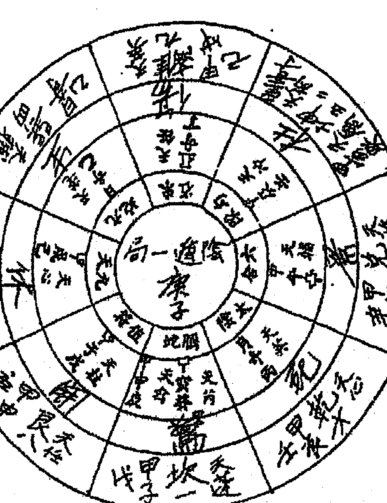

#### 阴遁一局：庚子
景一 柱八

- 1. (1)开艮仪 天柱戊加甲申庚。值符飞宫:吉事不吉，凶事更凶。
- 2. (2)休震礼 天心己加丙奇。火入地户:阳人冤冤相害，阴人必致淫污。
- 3. (3)生巽制 天蓬乙加乙奇。日奇伏吟:不宜谒贵求名，只可安分守身。「人、地遁，重诈」
- 4. (4)伤离礼 天任丁加甲戌己。火入勾陈:奸私仇冤，事因女人。
- 5. (5)杜坤迫 天冲壬加丁奇。干合蛇刑:文书牵连，贵人匆匆，男吉女凶。
  天冲壬加甲寅癸。幼女奸淫:家有丑声。
- 6. (6)景兑迫 天辅辛加甲午辛。伏吟天庭:公废私就，讼狱自罹罪名。
- 7. (7)死乾礼 天英丙加甲辰壬。火入天罗:为客不利，是非颇多。「入墓」
- 8. (8)惊坎礼 天芮癸加甲子戊。天乙会合:财喜婚姻，吉人赞助成合。
  天禽庚加甲子戊。太白伏官:百事不可谋，凶。
- 9. (9)生门乙奇合巽四宫，利东南方。

#### 奇门阴阳九遁阴一局符使值例

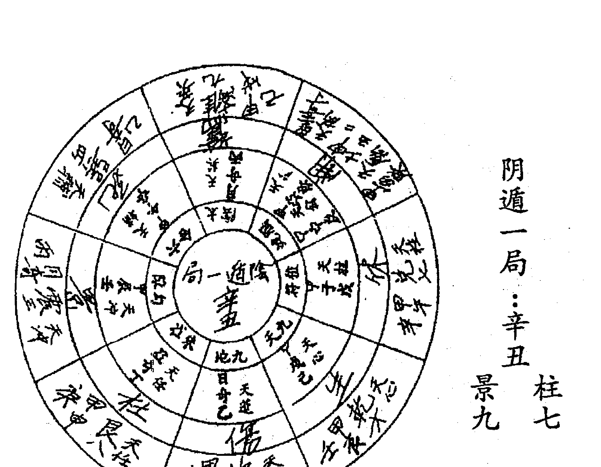

阴遁一局：辛丑
景九 柱七

- (1)开坤仪 天芮癸加丁奇。腾蛇妖矫:文书官司火焚莫逃，忧惶之事必至。
  天禽庚加甲寅癸。大格:行人至，官司止，生产母子俱伤。
- (2)休兑仪 天柱戊加甲午辛。青龙折足:吉门生助，尚可谋为。
- (3)生乾礼 天心己加甲辰壬。地网高张:狡童佚女，奸情伤杀。
- (4)伤坎仪 天蓬乙加甲子戊。利阴害阳:门逢凶迫，财破人伤。
- (5)杜艮迫 天任丁加甲申庚。庚格:文书阻隔，行人必归「入墓」
- (6)景震仪 天冲壬加丙奇。水蛇入火:官灾刑禁，络绎不绝。
- (7)死巽制 天辅辛加乙奇。白虎猖狂:人亡家败，远行多殃，尊长不喜，车船俱伤，身体毁伤。
- (8)惊离制 天英丙加甲戊己。太白入刑:囚人刑杖，文书不行，吉门得吉，凶门转凶。「升殿」
- (9)无奇门。

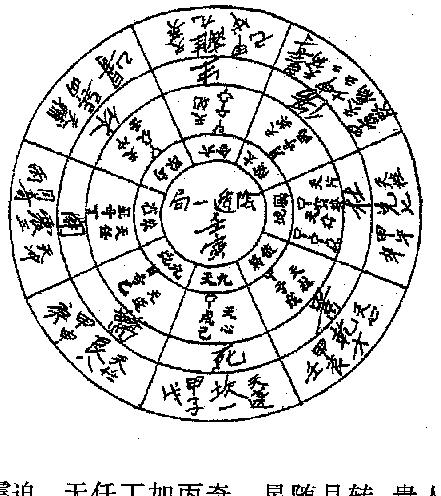

阴遁一局：壬寅 景八 柱六

- (1)开震迫 天任丁加丙奇。星随月转:贵人越级高升，常人乐里生悲。
- (2)休巽礼 天冲壬加乙奇。格名小蛇:女人柔顺，男人嗟呀，占孕生子，禄马光华。
- (3)生离礼 天辅辛加甲戌己。入狱自刑:奴仆背主，讼诉难伸。
- (4)伤坤迫 天英丙加丁奇。辛奇朱雀:贵人文书，常人平静。
  天英丙加甲寅癸。华盖孛师:阴人害事，灾祸频生。
- (5)杜兑制 天芮癸加甲午辛。网盖天牢:占讼病凶。
  天禽庚加甲午辛。白虎干格:远行车折马死。
- (6)景乾迫 天柱戊加甲辰壬。龙入天牢:阴阳皆不吉利。
- (7)死坎迫 天心己加甲子戊。犬遇青龙:门吉谋望为意，门凶枉劳心机。
- (8)惊艮仪 天蓬乙加甲申庚。日奇被刑:争讼财产，夫妻怀私。
- (9)开门丁奇，合震三宫，利正东方。

#### 奇门阴阳九遁阴一局符使值例

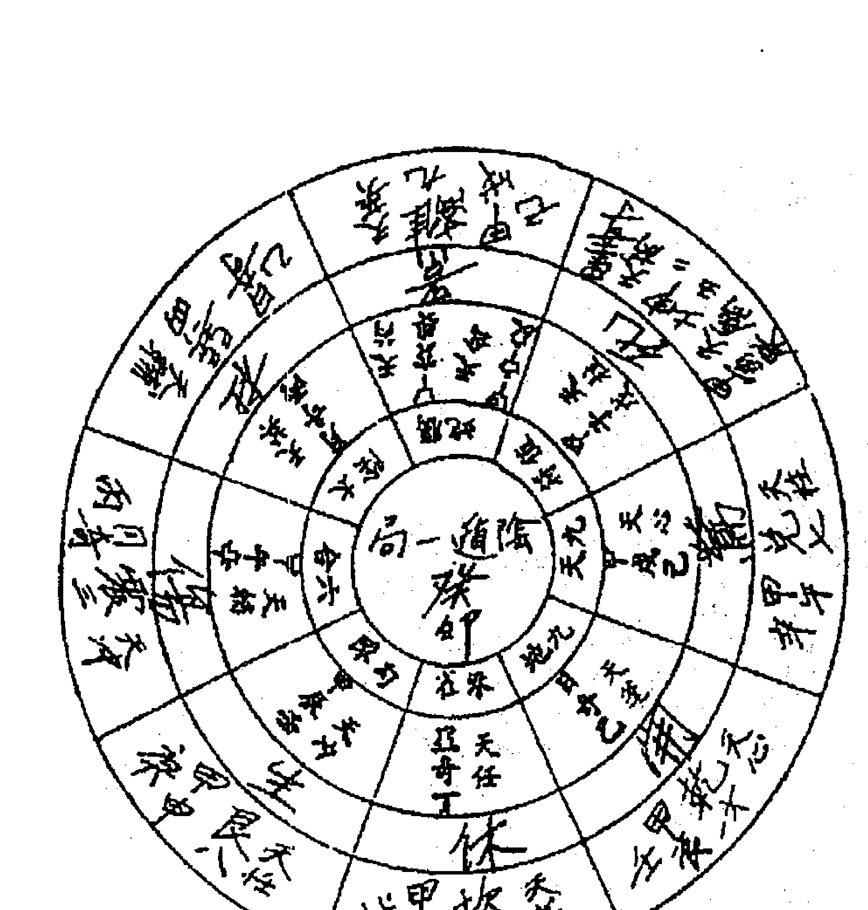

- (1)开乾和 天蓬乙加甲辰壬。日奇入地:尊卑悖乱，官讼是非。「地遁，重诈，入墓」
- (2)休坎和 天任丁加甲子戊。青龙转光:官人升迁，常人咸昌。
- (3)生艮和 天冲壬加甲申庚。太白擒蛇:刑狱公平，立剖邪正。
- (4)伤震和 天辅辛加丙奇。荧惑出现:占雨无，占晴旱，占事必因财致讼。
- (5)杜巽和 天英丙加乙奇。日月并行:公谋私为皆吉。
- (6)景离和 天芮癸加甲戊己。华盖地户:占音信皆阻，躲灾避难为吉。
  天禽庚加甲戊己。刑格:官司被重刑。
- (7)死坤和 天柱戊加丁奇。青龙耀明:谒贵求名吉利。
  天柱戊加甲寅癸。青龙华盖:门吉招福，门凶多乖。
- (8)惊兑和 天心己加甲午辛。游魂入墓:大人鬼魅，小人家先为崇。
- (9)开休门乙丁奇合。乾六宫，利西北正北方。

- (1) 开乾和 天心戊加甲辰壬。龙入天牢:阴阳皆不吉利。
- (2) 休坎和 天蓬癸加甲子戊。天乙会合:财喜婚姻，吉人赞助生合。
- (3) 生艮和 天任丙加甲申庚。荧惑入太白:门户破败，盗贼耗失。「天遁，重诈」
- (4) 伤震和 天冲辛加丙奇。荧惑出现:占雨无，占晴旱，占事因财致讼。
- (5) 杜巽和 天辅庚加乙奇。太白逢星:退吉进凶。
- (6) 景离和 天英乙加甲戊己。日奇入雾:被土暗昧，门凶必凶。
- (7) 死坤和 天芮壬加丁奇。干合蛇刑:文书牵连，贵人匆匆，男吉女凶。
  天禽己加甲寅癸。地刑玄武:病凶，词讼有囚狱之灾。
- (8) 惊兑和 天柱丁加甲午辛。朱雀入狱:罪人释囚，官人失位。「升殿」
- (9) 生门丙奇合艮八宫，利东北方。

#### 奇门阴阳九遁阴一局符使值例

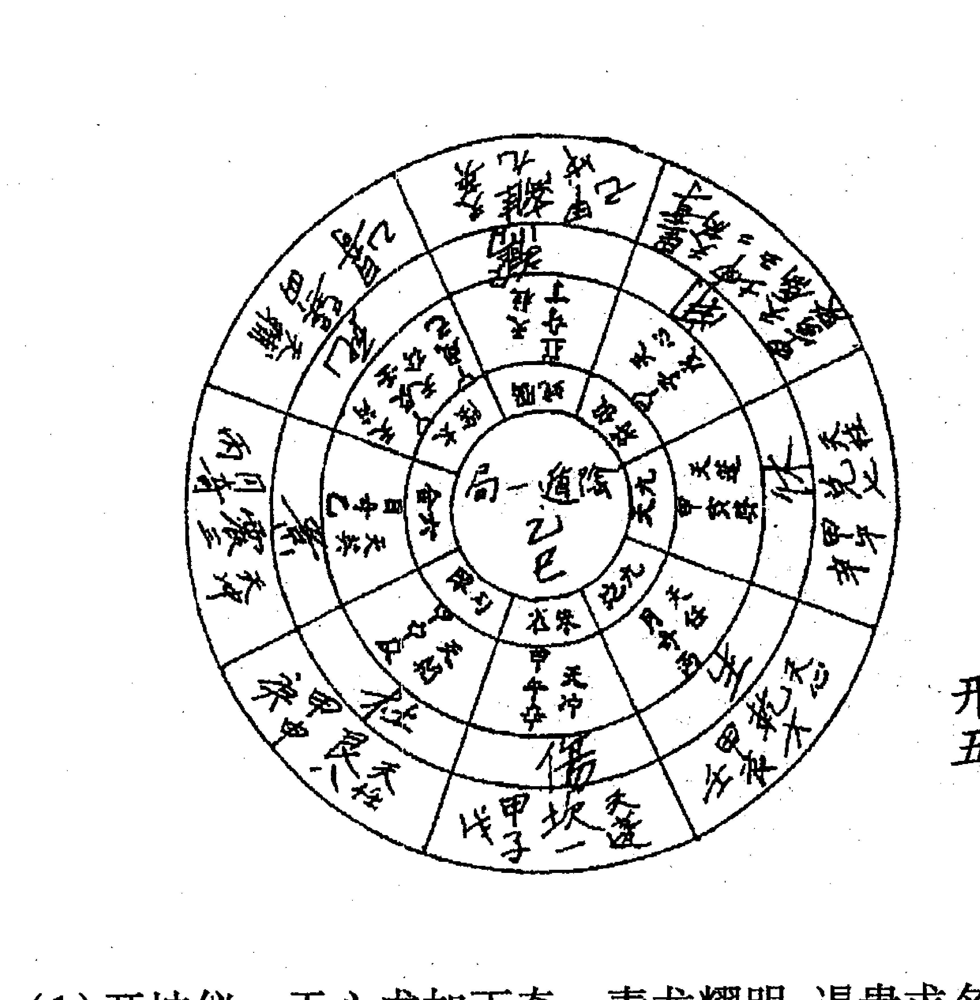

- (1) 开坤仪 天心戊加丁奇。青龙耀明:谒贵求名吉利。「龙遁」天心戊加甲寅癸。青龙华盖:门吉招福，门凶多乖。
- (2) 休兑仪 天蓬癸加甲午辛。网盖天牢:占讼病凶。
- (3) 生乾礼 天任丙加甲辰壬。火入天罗:客不利，是非颇多。「天遁，重诈，入墓」
- (4) 伤坎仪 天冲辛加甲子戊。困龙被伤:官司破败，屈抑守分，妄动祸殃。
- (5) 杜艮迫 天辅庚加甲申庚。太白同宫:官灾横祸，兄弟不睦。
- (6) 景震仪 天英乙加丙奇。奇仪顺遂:吉星迁官进职，凶星夫妻离别。「升殿」
- (7) 死巽制 天芮壬加乙奇。格名小蛇:女人柔顺，男人嗟呀，占孕生子，禄马光华。天禽己加乙奇。墓神不明:宜遁迹隐形为利逸。
- (8) 惊离制 天柱丁加甲戊己。火入勾陈:奸私仇冤，事因女人。
- (9) 生门丙奇合乾六宫，利西北方。

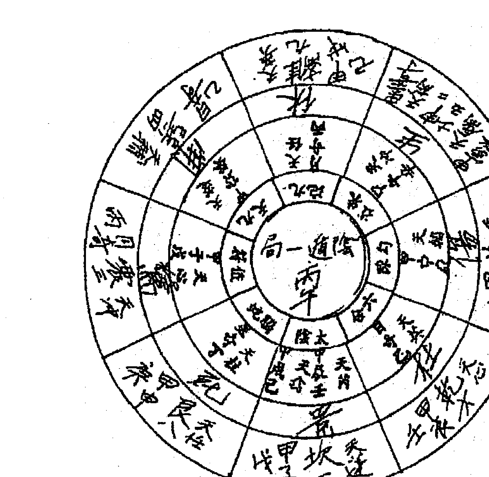

阴遁一局：丙午 开四 心三

- 1. 开巽迫 天蓬癸加乙奇。华盖官星:贵人禄位，常人平安。
- 2. 休离制 天任丙加甲戌己。太白入刑:囚人刑杖，文书不行，吉门得吉，凶门转凶。「升殿，天遁，重诈」
- 3. 生坤和 天冲辛加丁奇。狱神得奇:经商获倍利，囚人逢赦宥。
  天冲辛加甲寅癸。天牢华盖:误入天网，动止乖张。
- 4. 伤兑制 天辅庚加甲午辛。白虎干格:远行车折马死。
- 5. 杜乾制 天英乙加甲辰壬。日奇入地:尊卑悖乱，官讼是非。「入墓」
- 6. 景坎制 天芮壬加甲子戊。小蛇化龙:男人发达，女产婴童。
  天禽己加甲子戊。犬遇青龙:门吉谋事遂意，门凶枉劳心机。
- 7. 死艮和 天柱丁加甲申庚。庚格:文书阻隔，行人必归。「入墓」
- 8. 惊震迫 天心戊加丙奇。青龙回首:动作大利，逢墓迫，吉事成凶。
- 9. 休门丙奇合离九宫，利正南方。

#### 奇门阴阳九遁阴一局符使值例

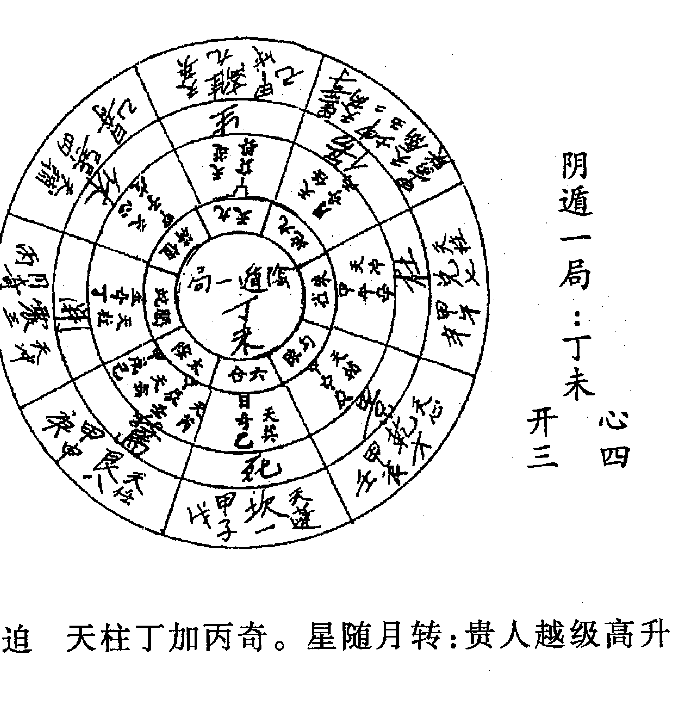

- 1. 开震迫 天柱丁加丙奇。星随月转:贵人越级高升，常人乐里生悲。
- 2. 休巽礼 天心戊加乙奇。青龙合灵:门吉事吉，门凶事凶。
- 3. 生离仪 天蓬癸加甲戌己。华盖地户:占音信皆阻，躲灾避难为吉。
- 4. 伤坤迫 天任丙加丁奇。辛奇朱雀:贵人文书吉，常人平静。
  天任丙加甲寅癸。华盖孛师:阴人害事，灾祸频生。
- 5. 杜兑制 天冲辛加甲午辛。伏吟天庭:公废私就，讼狱自罹罪名。
- 6. 景乾迫 天辅庚加甲辰壬。小格:远行迷路，音信嗟呀。
- 7. 死坎迫 天英乙加甲子戊。利阴害阳:门逢凶迫，财破人伤。
- 8. 惊艮仪 天芮壬加甲申庚。太白擒蛇:刑狱公平，立剖邪正。
  天禽己加甲申庚。利格返名:词讼先动失理，阴星有谋害之情。
- 9. 开门丁奇合震三宫，利正东方。

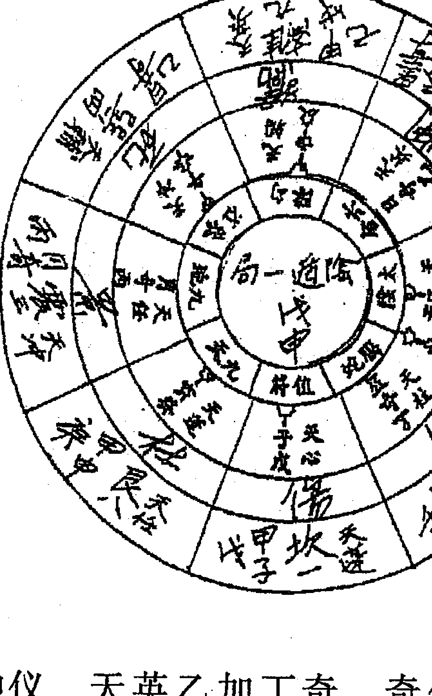

#### 阴遁一局：戊申
#### 开二 心一

- (1)开坤仪　天英乙加丁奇。奇仪相佐:文书事吉，百事皆可为「人、地遁，休诈，入墓」
  天英乙加甲寅癸。华盖星官:遁迹隐匿，藏形修道，躲灾避难为吉。
- (2)休兑仪　天芮壬加甲午辛。腾蛇相缠:纵得吉门，亦不安宁，若有谋望，被人欺瞒。
  天禽己加甲午辛。游魂入墓:大人鬼魅，小人家先为崇。
- (3)生乾礼　天柱丁加甲辰壬。五神互合:贵人恩诏，讼狱公平。
- (4)伤坎仪　天心戊加甲子戊。伏吟:万事闭塞，静守为吉。
- (5)杜艮迫　天蓬癸加甲申庚。太白入网:昙花一现，争讼力平。
- (6)景震仪　天任丙加丙奇。月奇孛师:文书逼迫，破耗遗失。
- (7)死巽制　天冲辛加乙奇。白虎猖狂:人亡家败，远行多殃，尊长不喜，车船俱伤，身体毁伤。
- (8)惊离制　天辅庚加甲戊己。刑格:官司被重刑。
- (9)开门 生门 乙奇合丁 二六宫，利西南东北方。

#### 奇门阴阳九遁阴一局符使值例

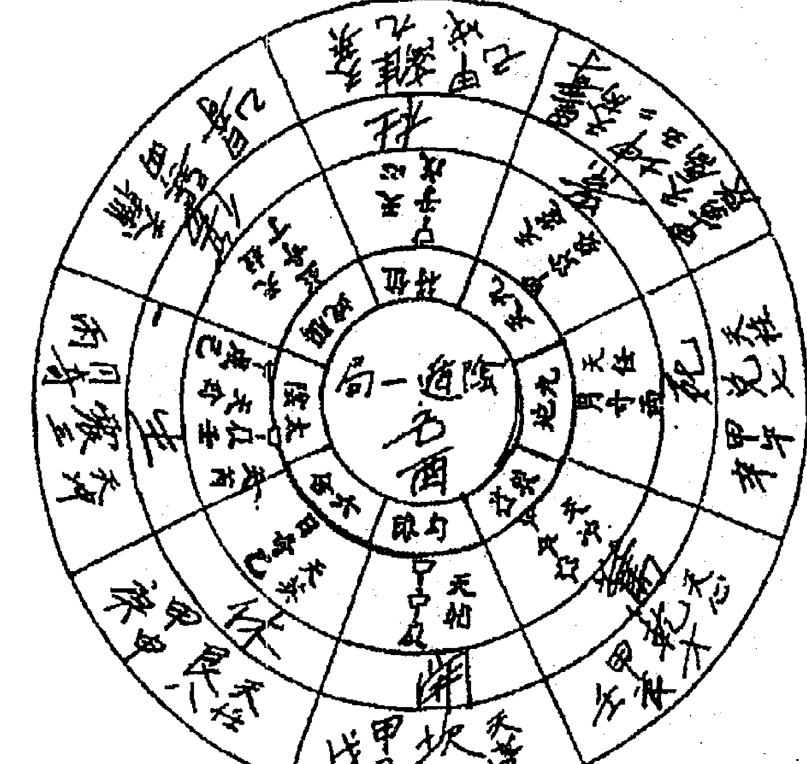

阴遁一局：己酉
开一
心九

- (1) 开坎礼 天辅庚加甲子戊。太白伏官:百事不可谋，凶。
- (2) 休艮制 天英乙加甲申庚。日奇被刑:争讼财产，夫妻怀私。「虎、人、地遁，休诈」
- (3) 生震制 天芮壬加丙奇。水蛇入火:官灾刑禁，络绎不绝。
- (4) 伤巽和 天柱丁加乙奇。天运昌气格:贵人加官进爵，常人财喜婚姻。「人遁」
- (5) 杜离礼 天心戊加甲戊己。贵人入狱:公私不利。
- (6) 景坤礼 天蓬癸加丁奇。腾蛇妖娇:文书官司火焚莫逃，忧惶之事必至。
- (7) 死兑礼 天任丙加甲午辛。威神互合:谋事有成，病人不凶。
- (8) 惊乾和 天冲辛加甲辰壬。凶蛇入狱:两男争女，讼狱不息，先动失理。
- (9) 休门乙奇合艮八宫，利东北方。

天禽己加丙奇。火入地户:阳人冤冤相害，阴人必致淫污。

天蓬癸加甲寅癸。天网四张(低网)。行人失件，疾讼皆伤。

### 奇门遁甲秘笈全书(中册)

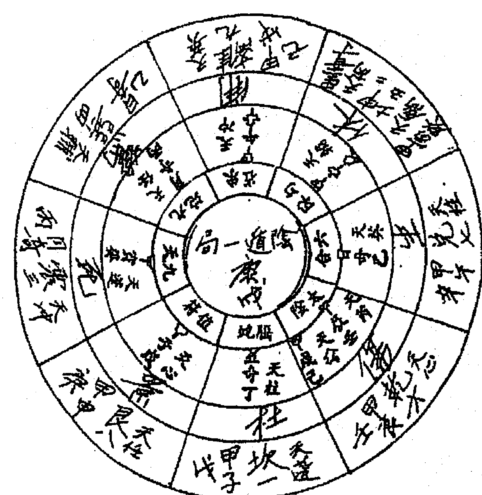

阴遁一局：庚戌
开九
心八

- 1. (1)开离制 天冲辛加甲戊己。入狱自刑:奴仆背主，诉讼难伸。
- 2. (2)休坤制 天辅庚加丁奇。亭亭之格:因私匿起官司，门吉有赦。
  天辅庚加甲寅癸。大格:行人至，官司止，生产母子俱伤。
- 3. (3)生兑礼 天英乙加甲午辛。青龙逃走:奴仆拐带，六畜皆伤，财产废坠，身遭毁伤。「云、人、地遁，休诈」
- 4. (4)伤乾制 天芮壬加甲辰壬。蛇入地罗:外人缠绕，内事索索。
  天禽己加甲辰壬。地网高张:狡童佚女，奸情伤杀。「地假」
- 5. (5)杜坎仪 天柱丁加甲子戊。青龙转光:官人升迁，常人咸昌。
- 6. (6)景艮礼 天心戊加甲申庚。值符飞宫:吉事不吉，凶事更凶。
- 7. (7)死震制 天蓬癸加丙奇。华盖孛师:贵贱逢之，上人见喜。
- 8. (8)惊巽迫 天任丙加乙奇。日月并行:公谋私为皆吉。
- 9. (9)生门乙奇合兑七宫，利正西方。

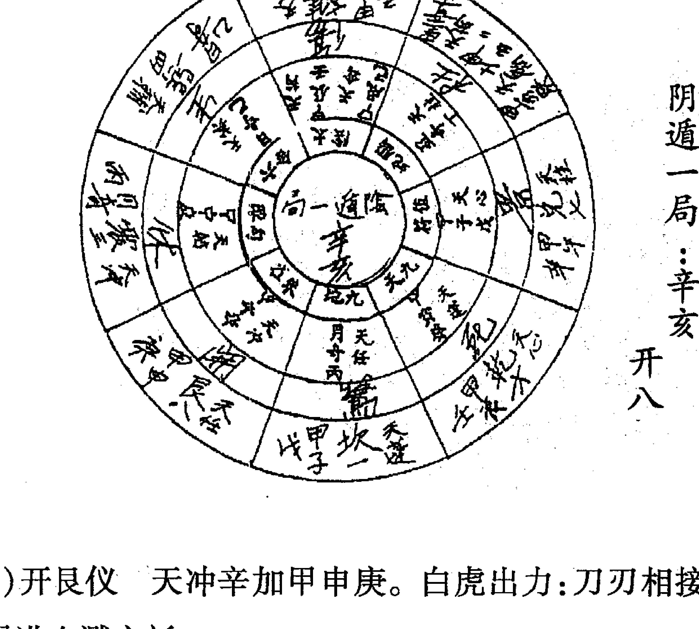

- (1)开艮仪 天冲辛加甲申庚。白虎出力:刀刃相接，主客相残，逊让稍可，强进血溅衣衫。
- (2)休震礼 天辅庚加丙奇。太白入荧惑:占贼必来，为客进利，为主破财。
- (3)生巽制 天英乙加乙奇。日奇伏吟:不宜谒贵求名，只可安分守身。「人、地遁，休诈」
- (4)伤离礼 天芮壬加甲戌己。凶蛇入狱:大祸将至，顺守斯吉，词讼理曲。
  天禽己加甲戌己。地户逢鬼:病凶，百事不遂。「地假」
- (5)杜坤迫 天柱丁加丁奇。奇人太阴:文书即至，喜事遂心。
  天柱丁加甲寅癸。朱雀投江:文书口舌俱消，音信沉溺，讼狱所由起也。
- (6)景兑迫 天心戊加甲午辛。青龙折足:主招灾，失财，有足疾。
- (7)死乾礼 天蓬癸加甲辰壬。复见腾蛇:嫁娶重婚，后嫁无子，不保年华。
- (8)惊坎礼 天任丙加甲子戊。飞鸟跌穴:谋事有成，百事洞澈。
- (9)生门乙奇合巽四宫，利东南方。

### 奇门遁甲秘笈全书(中册)

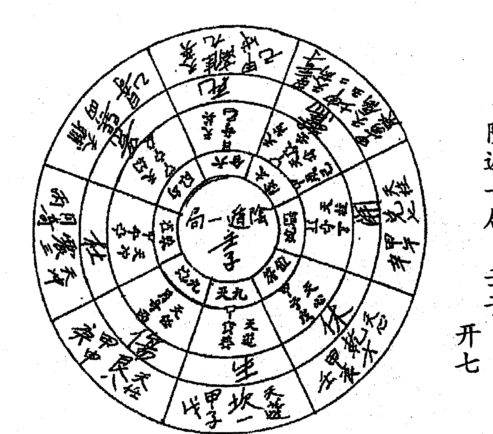

- 1. (1)开兑和 天柱丁加甲午辛。朱雀入狱:罪人释囚，官人失位。「升殿」
- 2. (2)休乾仪 天心戊加甲辰壬。龙入天牢:阴阳皆不吉利。
- 3. (3)生坎迫 天蓬癸加甲子戊。天乙会合:财喜婚姻，吉人赞助成合，门逢迫制，反祸官非。
- 4. (4)伤艮迫 天任丙加甲申庚。荧惑入太白:门户破败，盗贼耗失。
- 5. (5)杜震和 天冲辛加丙奇。荧惑出现:占雨无，占晴旱，占事必因财致讼。
- 6. (6)景巽仪 天辅庚加乙奇。太白逢星:退吉进凶。
- 7. (7)死离仪 天英乙加甲戊己。日奇入雾:被土暗昧，门凶必凶。
- 8. (8)惊坤仪 天芮壬加丁奇。干合蛇刑:文书牵连，贵人匆匆，男吉女凶。
  天禽己加甲寅癸。地刑玄武:病凶，词讼有囚狱之灾。
- (9)开门丁奇合兑七宫，利正西方。

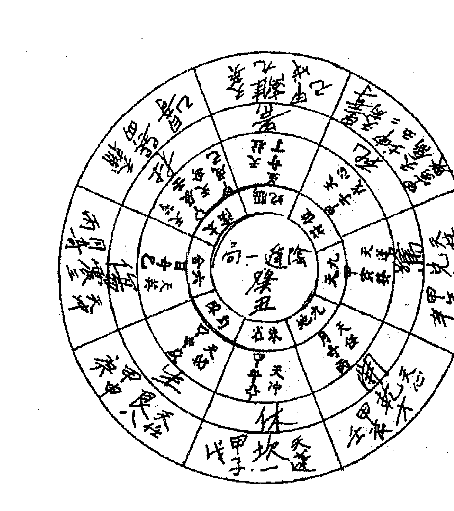

阴遁一局：癸丑
开六 心五

- 1. 开乾和 天任丙加甲辰壬。火入天罗:客不利，是非颇多。「天遁，重诈，入墓」
- 2. 休坎和 天冲辛加甲子戊。困龙被伤:官司破败，屈抑守身，妄动祸殃。
- 3. 生艮和 天辅庚加甲申庚。太白同宫:官灾横祸，兄弟不睦。
- 4. 伤震和 天英乙加丙奇。奇仪顺遂:吉星迁官进职，凶星夫妻离别。「升殿」
- 5. 杜巽和 天芮壬加乙奇。格名小蛇:女人柔顺，男人嗟呀，占孕生子，禄马光华。
  天禽己加乙奇。墓神不明:宜遁迹隐形为利逸。
- 6. 景离和 天柱丁加甲戌己。火入勾陈:奸私仇冤，事因女人。
- 7. 死坤和 天心戊加丁奇。青龙耀明:谒贵求名吉利。
  天心戊加甲寅癸。青龙华盖:门吉招福，门凶多乖。
- 8. 惊兑和 天蓬癸加甲午辛。网盖天牢:占病讼凶。
- 9. 开门丙奇合乾六宫，利西北方。

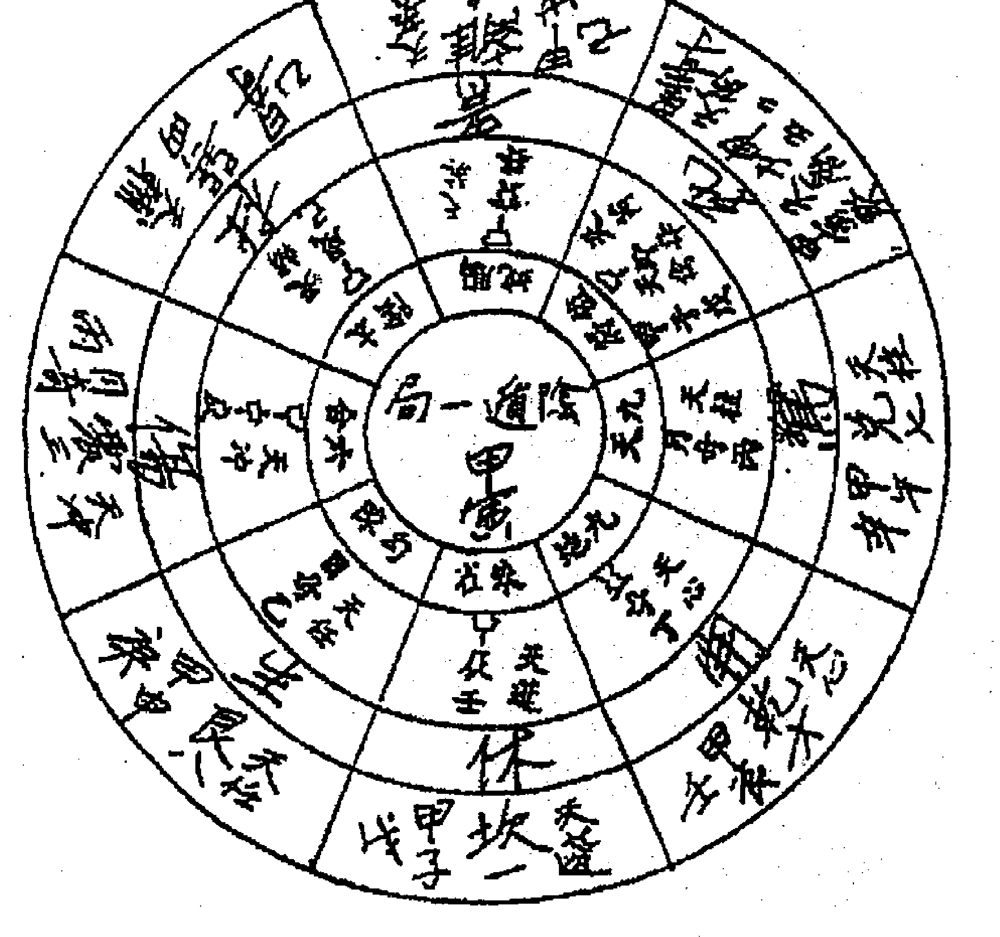

阴遁一局：甲寅
禽五
死五

- (1) 开乾和 天心丁加甲辰壬。五神互合:贵人恩诏，讼狱公平。「重诈」
- (2) 休坎和 天蓬壬加甲子戊。小蛇化龙:男人发达，女产婴童。
- (3) 生艮和 天任乙加甲申庚。日奇被刑:争讼财产，夫妻怀私。
- (4) 伤震和 天冲庚加丙奇。太白入荧惑:占贼必来，为客进利，为主破财。
- (5) 杜巽和 天辅己加乙奇。墓神不明:宜遁迹隐形为利逸。
- (6) 景离和 天英癸加甲戊己。华盖地户:音信皆阻，躲灾避难为吉。
- (7) 死坤和 天芮辛加丁奇。狱神得奇:经商获倍利，囚人逢赦宥。
  天禽戊加甲寅癸。青龙华盖:门吉招福，门凶多乖。
- (8) 惊兑和 天柱丙加甲午辛。威神互合:谋事有成，病人不凶。
- (9) 开门丁奇合乾六宫，利西北方。
  生门乙奇合艮八宫，利东北方。

#### 奇门阴阳九遁阴一局符使值例

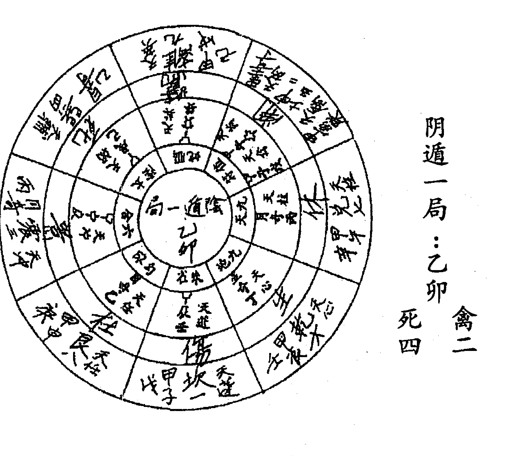

- (1)开坤仪 天芮辛加丁奇。狱神得奇:经商获倍利，囚人逢赦宥。天禽戊加甲寅癸。青龙华盖:门吉招福，门凶多乖。
- (2)休兑仪 天柱丙加甲午辛。威神互合:谋事有成，病人不凶。
- (3)生乾礼 天心丁加甲辰壬。五神互合:贵人恩诏，讼狱公平。
> 「重诈」
- (4)伤坎仪 天蓬壬加甲子戊。小蛇化龙:男人发达，女产婴童。
- (5)杜艮迫 天任乙加甲申庚。日奇被刑:争讼财产，夫妻怀私。
- (6)景震仪 天冲庚加丙奇。太白入荧惑:占贼必来，为客进利，为主破败。
- (7)死巽制 天辅己加乙奇。墓神不明:宜遁迹隐形为利逸。
- (8)惊离制 天英癸加甲戌己。华盖地户:音信皆阻，躲灾避难为吉。
- (9)休门丙奇合兑七宫，利正西方。生门丁奇合乾六宫，利西北方。

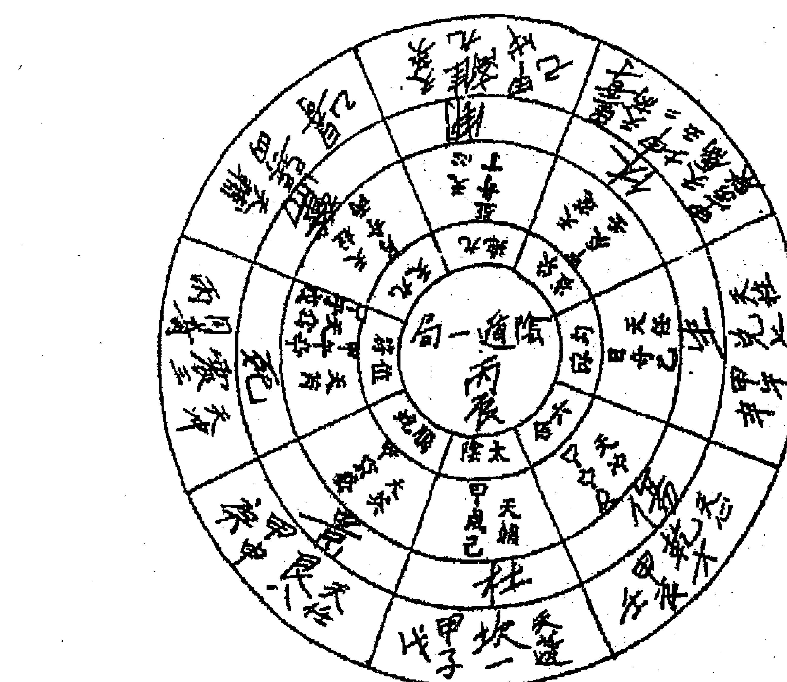

阴遁一局：丙辰
死三　禽三

- （1）开离制　天心丁加甲戌己。火入勾陈:奸私仇冤，事因女人。「重诈」
- （2）休坤制　天蓬壬加丁奇。干合蛇刑:文书牵连，贵人匆匆，男吉女凶。
  天蓬壬加甲寅癸。幼女奸淫:家有丑声。
- （3）生兑礼　天任乙加甲午辛。青龙逃走:奴仆拐带，六畜皆伤，财产废坠，身遭毁伤。「云遁」
- （4）伤乾制　天冲癸加甲辰壬。小格:远行迷路，音信嗟呀。
- （5）杜坎仪　天辅己加甲子戊。犬遇青龙:门吉谋望遂意，上人见喜，门凶枉劳心机。
- （6）景艮礼　天英癸加甲申庚。太白入网:昙花一现，争讼力平。
- （7）死震制　天芮辛加丙奇。荧惑出现:占雨无，占晴旱，占事必因财致讼。
  天禽戊加丙奇。青龙回首:动作大利，逢迫制吉事成凶。
- （8）惊巽迫　天柱丙加乙奇。日月并行:公谋私为皆吉。
- （9）开门丁奇合离九宫，利正南方。生门乙奇合兑七宫西。

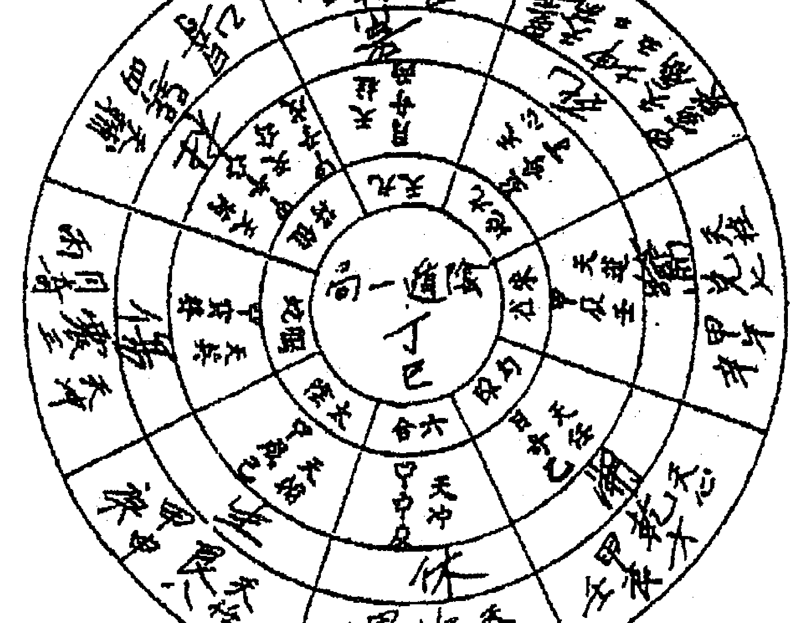

阴遁一局：丁巳
死二
禽四

- (1) 开乾和　天任乙加甲辰壬。日奇入地:尊卑悖乱，官讼是非。「入墓」
- (2) 休坎和　天冲庚加甲子戊。太白伏官:百事不可谋，凶。
- (3) 生艮和　天辅己加甲申庚。利格返名:词讼先动者不利，阴星有谋害之情。
- (4) 伤震和　天英癸加丙奇。华盖孛师:贵贱逢之，上人见喜。
- (5) 杜巽和　天芮辛加乙奇。白虎猖狂:人亡家败，远行多殃，尊长不喜，车船俱伤，身体毁伤。
  天禽戊加乙奇。青龙合灵:门吉事吉，门凶事凶。
- (6) 景离和　天柱丙加甲戊己。太白入刑:囚人刑杖，文书不行，吉门得吉，凶门转凶。「升殿，天假」
- (7) 死坤和　天心丁加丁奇。奇人太阴:文书即至，喜事遂心。「鬼假，入墓」
  天心丁加甲寅癸。朱雀投江:文书口舌俱消，音信沉溺，讼狱所由起也。
- (8) 惊兑和　天蓬壬加甲午辛。腾蛇相缠:纵得吉门，亦不安宁，若有谋望，被人欺瞒。
- (9) 开门乙奇合乾六宫，利西北方。

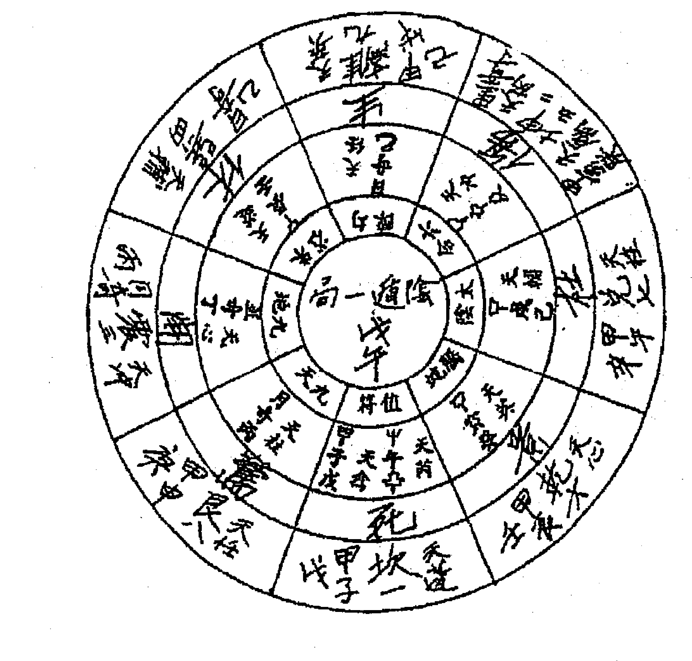

- 1. 开震迫 天心丁加丙奇。星随月转:贵人越级高升，常人乐里生悲。「重诈」
- 2. 休巽礼 天蓬壬加乙奇。格名小蛇:女人柔顺，男人嗟呀，占孕生子，禄马光华。
- 3. 生离仪 天任乙加甲戌己。日奇入雾:被土暗昧，门凶必凶。
- 4. 伤坤迫 天冲庚加丁奇。亭亭之格:因私匿起官司。
  天冲庚加甲寅癸。大格:行人至，官司止，生产母子俱伤。
- 5. 杜兑制 天辅己加甲午辛。游魂入墓:大人鬼魅，小人家先为崇。
- 6. 景乾迫 天英癸加甲辰壬。复见腾蛇:嫁娶重婚，后嫁无子，不保年华。
- 7. 死坎迫 天芮辛加甲子戊。困龙被伤:官司破败，屈抑守分，妄动祸殃。
  天禽戊加甲子戊。伏吟:万事闭塞，静守为吉。
- 8. 惊艮仪 天柱丙加甲申庚。荧惑入太白:门户破败，盗贼耗失。
- 9. 开生门丁乙奇合震离三九宫，利正东南方。

#### 奇门阴阳九遁阴一局符使值例

阴遁一局：己未 死九 禽九

1.  开兑和 天心丁加甲午辛。朱雀入狱：罪人释囚，官人失位。[重诈]
2.  休乾仪 天蓬壬加甲辰壬。蛇入地罗：外人缠绕，内事索索，门吉星吉，避免蹉跎。
3.  生坎迫 天任乙加甲子戊。利阴害阳：门逢凶迫，财破人伤。
4.  伤艮迫 天冲庚加甲申庚。太白同宫：官灾横祸，兄弟不睦。
5.  杜震和 天辅己加丙奇。火孛地户：阳人冤冤相害，阴人必致淫污。
6.  景巽仪 天英癸加乙奇。华盖逢星：贵人禄位，常人平安。
7.  死离仪 天芮辛加甲戌己。入狱自刑：奴仆背主，讼诉难伸。天禽戊加甲戌己。贵人入狱：公私不利。
8.  惊坤仪 天柱丙加丁奇。辛奇朱雀：贵人文书吉，常人平静。天柱丙加甲寅癸。华盖孛帅：阴人害事，灾祸频生。
9.  开丁奇合兑七宫，利正西方。生乙奇合坎一宫，利正北方。

阴遁一局：辛酉 死七 禽七

(1) 开坎礼 天心丁加甲子戊。青龙转光：官人升迁，常人咸昌。[重诈]
(2) 休艮制 天蓬壬加甲申庚。太白擒蛇：刑狱公平，立剖邪正。
(3) 生震制 天任乙加丙奇。奇仪顺遂：吉星迁宫进职，凶星夫妻离别。[升殿]
(4) 伤巽和 天冲庚加乙奇。太白逢星：退吉进凶。
(5) 杜离礼 天辅己加甲戊己。地户逢鬼：病凶，百事不遂。
(6) 景坤制 天英癸加丁奇。腾蛇妖矫：文书官司火焚莫逃，忧惶之事必至。天英癸加甲寅癸。天网四张(低网)：行人失件，病讼皆伤。
(7) 死兑礼 天芮辛加甲午辛。伏吟天庭：公废私就，讼狱自罹罪名。天禽戊加甲午辛。青龙折足：吉门生助，尚可谋为，逢凶门招灾，失财，有足疾。
(8) 惊乾和 天柱丙加甲辰壬。火入天罗：客不利，是非颇多。[入墓]
(9) 开门丁奇合坎一宫，利正北方。生门乙奇合震三宫，利正东方。

(1) 开艮仪 天心丁加甲申庚。庚格：文书阻隔，行人必归。[重诈，入墓]
(2) 休震礼 天蓬壬加丙奇。水蛇入火：官灾刑禁，络绎不绝。
(3) 生巽制 天任乙加乙奇。日奇伏吟：不宜谒贵求名，只可安分守身。
(4) 伤离礼 天冲庚加甲戊己。刑格：官司被重刑。
(5) 杜坤迫 天辅己加丁奇。朱雀入墓：文状词讼，先曲后直。天辅己加甲寅癸。地刑玄武：病凶，词讼有囚狱之灾。
(6) 景兑迫 天英癸加甲午辛。网盖天牢：占讼病凶。
(7) 死乾礼 天芮辛加甲辰壬。凶蛇入狱：两男争女，讼狱不息，先动失理。天禽戊加甲辰壬。龙入天牢：阴阳皆不吉利。
(8) 惊坎礼 天柱丙加甲子戊。飞鸟跌穴：谋事有成，百事洞澈。
(9) 开丁奇合艮八宫，利东北方。生乙奇合巽四宫，利东南方。

阴遁一局：癸亥 禽五 死五

-   (1) 开乾和 天心丁加甲辰壬。五神互合：贵人恩诏，讼狱公平。[重诈]
-   (2) 休坎和 天蓬壬加甲子戊。小蛇化龙：男人发达，女产婴童。
-   (3) 生艮和 天任乙加甲申庚。日奇被刑：争讼财产，夫妻怀私。
-   (4) 伤震和 天冲庚加丙奇。太白入荧惑：占贼必来，为客进利，为主破败。
-   (5) 杜巽和 天辅己加乙奇。墓神不明：宜遁迹隐形为利逸。
-   (6) 景离和 天英癸加甲戊己。华盖地户：占音信皆阻，躲灾避难为吉。
-   (7) 死坤和 天芮辛加丁奇。狱神得奇：经商获倍利，囚人逢赦宥。天禽戊加甲寅癸。青龙华盖：门吉招福，门凶多乖。
-   (8) 惊兑和 天柱丙加甲午辛。威神互合：谋事有成，病人不凶。
-   (9) 开丁奇合乾六宫，利西北方。生乙奇合艮八宫，利东北方。

#### 奇门阴阳九遁阴二局符使值例

| 符使 | 甲    | 乙    | 丙    | 丁    | 戊    | 己    | 庚    | 辛    | 壬    | 癸    |
| ---- | ----- | ----- | ----- | ----- | ----- | ----- | ----- | ----- | ----- | ----- |
| 芮死 | 子二二 | 丑三一 | 寅四九 | 卯五八 | 辰二七 | 巳一六 | 午九五 | 未八四 | 申七三 | 酉六二 |
| 蓬休 | 戊一一 | 亥三九 | 子四八 | 丑五七 | 寅二六 | 卯一五 | 辰九四 | 巳三八 | 午七二 | 未六一 |
| 英景 | 申九九 | 酉三八 | 戌四七 | 亥五六 | 子二五 | 丑一四 | 寅九三 | 卯八二 | 辰七一 | 巳六九 |
| 任生 | 午八八 | 未三七 | 申四六 | 酉五五 | 戌二四 | 亥一三 | 子九二 | 丑八一 | 寅七九 | 卯六八 |
| 柱惊 | 辰七七 | 巳三六 | 午四五 | 未五四 | 申二三 | 酉一二 | 戌九一 | 亥八九 | 子七八 | 丑六七 |
| 心开 | 寅六六 | 卯三五 | 辰四四 | 巳五三 | 午二二 | 未一一 | 申九九 | 酉八八 | 戌七七 | 亥六六 |

阴遁二局：乙丑 死 芮 一 三

1.  开震迫 天芮戊加丁奇。青龙耀明：谒贵求名吉利，值迫墓招是非。天禽乙加丁奇。奇仪相佐：文书事吉，百事皆可为。[升殿]
2.  休巽礼 天柱壬加丙奇。水蛇入火：官灾刑禁，络绎不绝。
3.  生离仪 天心癸加甲申庚。太白入网：昙花一现，争讼公平。
4.  伤坤迫 天蓬己加甲子戊。犬遇青龙：门吉谋望遂意，门凶枉劳心机。天蓬己加乙奇。墓神不明：宜遁跡隐形为利逸。
5.  杜兑制 天任辛加甲辰壬。凶蛇入狱：两男争女，讼狱不息，先动失理。
6.  景乾迫 天冲丁加甲寅癸。朱雀投江：文书口舌，音信沉溺，讼狱所由起也。
7.  死坎迫 天辅丙加甲戌己。太孛入刑：囚人刑杖，文书不行，吉门得吉，凶门更凶。
8.  景艮仪 天英庚加甲午辛。白虎干格：远行车折马死。
9.  开门乙奇合震三宫，利东方。

阴遁二局：丙寅 死九 芮四

(1) 开兑和 天蓬己加甲辰壬。地网高张：狡童佚女，奸情伤杀。
(2) 休乾仪 天任辛加甲寅癸。天牢华盖：误入天网，动止乖张。
(3) 生坎迫 天冲丁加甲戌己。火入勾陈：奸私仇冤，事因女人。[人遁，休诈]
(4) 伤艮迫 天辅丙加甲午辛。威神互合：谋事有成，病人不凶。
(5) 杜震和 天英庚加丁奇。亭亭之格：因私匿起官司，门吉有救。
(6) 景巽仪 天芮戊加丙奇。青龙回首：动作大利。天禽乙加丙奇。奇仪顺遂：吉星迁官进职，凶星夫妻离别。
(7) 死离仪 天柱壬加甲申庚。太白擒蛇：刑狱公平，立剖邪正。
(8) 景坤仪 天心癸加甲子戊。天乙会合：财喜婚姻，吉人赞助成合。[神假] 天心癸加乙奇。华盖逢星：贵人禄位，常人平安。
(9) 生门丁奇合坎一宫，利正北方。

阴遁二局：丁卯 死八 芮五

(1) 开巽迫 天辅丙加丙奇。月奇孛师：文书逼迫，破耗遗失。[天遁，真诈]
(2) 休离迫 天英庚加甲申庚。太白同宫：官灾横祸，兄弟不睦。
(3) 生坤和 天芮戊加甲子戊。伏吟：万事闭塞，静守为吉。天禽乙加乙奇。日奇伏吟：不宜谒贵求名，只可安分守身。[入墓]
(4) 伤兑制 天柱壬加甲辰壬。蛇入天罗：外人缠绕，内事索索。
(5) 杜乾制 天心癸加甲寅癸。天网四张(高网)：行人失件，疾病诉讼皆伤。[地假]
(6) 景坎制 天蓬己加甲戊己。地户逢鬼：病凶，百事不遂。
(7) 死艮和 天任辛加甲午辛。伏吟天庭：公废私就，讼狱自罹罪名。
(8) 惊震迫 天冲丁加丁奇。奇人太阴：文书即至，喜事遂心。
(9) 开丙奇合巽四宫，利东南方。生乙奇合坤二宫，利西南方。

阴遁二局：戊辰 死芮七二

(1) 开坎礼 天蓬己加甲戊己。地户逢鬼：病凶，百事不遂。
(2) 休艮制 天任辛加甲午辛。伏吟天庭：公废私就，讼狱自罹罪名。
(3) 生震制 天冲丁加丁奇。奇人太阴：文书即至，喜事遂心。[人遁，休诈]
(4) 伤巽和 天辅丙加丙奇。月奇孛师：文书逼迫，破耗遗失。
(5) 杜离礼 天英庚加甲申庚。太白同宫：官灾横祸，兄弟不睦。
(6) 景坤礼 天芮戊加甲子戊。伏吟：万事闭塞，静守为吉。天禽乙加乙奇。日奇伏吟：不宜谒贵求名，只可安分守身。[人墓]
(7) 死兑礼 天柱壬加甲辰壬。蛇入地罗：外人缠绕，内事索索，吉门吉星，避免蹉跎。
(8) 惊乾和 天心癸加甲寅癸。天网四张(高网)：行人失件，病讼皆伤。[神假]
(9) 生门丁奇合震三宫，利正东方。

(1) 开艮仪 天柱壬加甲午辛。螣蛇相缠：纵得吉门，亦不安宁，若有谋望，被人欺瞒。
(2) 休震礼 天心癸加丁奇。螣蛇妖娇：文书官司火焚莫逃。忧惶之事必至。
(3) 生巽制 天蓬己加丙奇。火孛地户：阳人冤冤相害，阴人必致淫污。
(4) 伤离礼 天任辛加甲申庚。白虎出力：刀刃相接，主客相残，逊让稍可，强进血溅衣衫。
(5) 杜坤迫 天冲丁加甲子戊。青龙转光：官人升迁，常人咸昌。天冲丁加乙奇。天运昌气格：加官进爵，婚姻财喜。[人遁]
(6) 景兑迫 天辅丙加甲辰壬。火入天罗：客不利，是非颇多。
(7) 死乾礼 天英庚加甲寅癸。大格：行人至，官司止，生产母子俱伤。
(8) 惊坎礼 天芮戊加甲戌己。贵人入狱，公私不利。天禽乙加甲戌己。日奇入雾：被土暗昧，门凶必凶。
(9) 无奇门。

(1) 开乾和 天蓬己加甲寅癸。地刑玄武：病凶，词讼有囚狱之灾。
(2) 休坎和 天任辛加甲戌己。入狱自刑：奴仆背主，讼诉难伸。
(3) 生艮和 天冲丁加甲午辛。朱雀入狱：罪人释囚，官人失位。[人遁，休诈，入墓]
(4) 伤震和 天辅丙加丁奇。辛奇朱雀：贵人文书吉，常人平静。
(5) 杜巽和 天英庚加丙奇。太白入荧惑：占贼必来，为客进利，为主破财。
(6) 景离和 天芮戊加甲申庚。值符飞宫：吉事不吉，凶事更凶。天禽乙加甲申庚。日奇被刑：争讼财产，夫妻怀私。
(7) 死坤和 天柱壬加甲子戊。小蛇化龙：男人发达，女产婴童。天柱壬加乙奇。格名小蛇：女人柔顺，男人嗟呀，占孕生子，禄马光华。
(8) 惊兑和 天心癸加甲辰壬。复见螣蛇：嫁娶重婚，后嫁无子，不保年华。[神假]
(9) 生门丁奇合艮八宫，利东北方。

(1) 开坤仪 天任辛加甲子戊。因龙被伤：官司破败，屈抑守分，妄动祸殃。天任辛加乙奇。白虎猖狂：人亡家败，远行多殃，尊长不喜，车船俱伤，身体毁伤。[云遁]
(2) 休兑仪 天冲丁加甲辰壬。五神互合：贵人恩诏，讼狱公平。[人遁，休诈，升殿]
(3) 生乾礼 天辅丙加甲寅癸。华盖孛师：阴人害事，灾祸频生。[天、人遁，真诈，入墓]
(4) 伤坎仪 天英庚加甲戌己。刑格：官司被重刑。
(5) 杜艮迫 天芮戊加甲午辛。青龙折足：招灾，失财，有足疾。天禽乙加甲午辛。青龙逃走：奴仆拐带，六畜皆伤，财产废坠，身遭毁伤。
(6) 景震仪 天柱壬加丁奇。干合蛇刑：文书牵连，贵人匆匆，男吉女凶。
(7) 死巽制 天心癸加丙奇。华盖孛师：贵贱逢之，上人见喜。[鬼假]
(8) 惊离制 天蓬己加甲申庚。利格返名：词讼先动者不利，阴星有谋害之情。
(9) 休门丁奇合兑七宫，利正西方。生门丙奇合乾六宫，利西北方。

阴遁二局：壬申 死三 芮七

(1) 开离制 天辅丙加甲申庚。荧惑入太白：门户破败，盗贼耗失。[升殿，天遁，真诈]
(2) 休坤制 天英庚加甲子戊。太白伏官：百事不可谋，凶。天英庚加乙奇。太白逢星：退吉进凶。
(3) 生兑礼 天芮戊加甲辰壬。龙入天牢：阴阳皆不吉利。天禽乙加甲辰壬。日奇入地：尊卑悖乱，官讼是非。
(4) 伤乾制 天柱壬加甲寅癸。幼女奸淫：家有丑声，门吉星凶，反祸福隆。
(5) 杜坎仪 天心癸加甲戌己。华盖地户：音信皆阻，躲灾避难为吉。[地假]
(6) 景艮礼 天蓬己加甲午辛。游魂入墓：大人鬼魁，小人家先为祟。
(7) 死震制 天任辛加丁奇。狱神得奇：经商获倍利，囚人逢赦宥。
(8) 惊巽迫 天冲丁加丙奇。星随月转：贵人越级高升，常人乐里生悲。
(9) 开门丙奇合离九宫，利正南方；生门乙奇合兑七宫，利正西方。

阴遁二局：癸酉 死二 芮六

(1) 开乾和 天芮戊加甲寅癸。青龙华盖：门吉招福，门凶多乖。天禽乙加甲寅癸。华盖官星：遁跡修道，隐匿藏形，躲灾避难吉。[入墓]
(2) 休坎和 天柱壬加甲戌己。凶蛇入狱：大祸将至，顺守斯吉，词讼理曲。
(3) 生艮和 天心癸加甲午辛。网盖天牢：占讼病凶。
(4) 伤震和 天蓬己加丁奇。朱雀入墓：文状词讼，先曲后直。
(5) 杜巽和 天任辛加丙奇。荧惑出现：占雨无，占晴旱，占事必因财致讼。
(6) 景离和 天冲丁加甲申庚。庚格：文书阻隔，行人必归。
(7) 死坤和 天辅丙加甲子戊。飞鸟跌穴：谋事有成，病人不凶。天辅丙加乙奇。日月并行：公谋私为皆吉。
(8) 惊兑和 天英庚加甲辰壬。小格：远行迷路，音信嗟呀。
(9) 开门乙奇合乾六宫，利西北方。

阴遁二局：甲戌 休蓬一

(1) 开乾和 天心壬加甲寅癸。幼女奸淫：家有丑声，门吉星凶，反祸福隆。
(2) 休坎和 天蓬戊加甲戌己。贵人入狱：公私不利。
(3) 生艮和 天任庚加甲午辛。白虎干格：远行车折马死。
(4) 伤震和 天冲丙加丁奇。辛奇朱雀：贵人文书吉，常人平静。
(5) 杜巽和 天辅乙加丙奇。奇仪顺遂：吉星迁官进职，凶星夫妻离别。
(6) 景离和 天英己加甲申庚。利格返名：词讼先动不利，阴星有谋害之情。
(7) 死坤和 天芮丁加甲子戊。青龙转光：官人升迁，常人咸昌。
(8) 惊兑和 天柱辛加甲辰壬。凶蛇入狱：两男争女，讼狱不息，先动失理。
(9) 无奇门。[入墓] 天禽癸加乙奇。华盖逢星：贵人禄位，常人平安。

(1) 开巽迫 天任庚加丙奇。太白入荧惑：占贼必来，为客进利，为主破财。
(2) 休离迫 天冲丙加甲申庚。荧惑入太白：门户破败，盗贼耗失。[升殿，天遁，重诈]
(3) 生坤和 天辅乙加甲子戊。利阴害阳：门逢凶迫，财破人伤。[入墓] 天辅乙加乙奇。日奇伏吟：不宜谒贵求名，只可安分守身。
(4) 伤兑制 天英己加甲辰壬。地网高张：狡童佚女，奸情伤杀。
(5) 杜乾制 天芮丁加甲寅癸。朱雀投江：文书口舌俱消，音信沉溺，讼狱所由起也。天禽癸加甲寅癸。天网四张(高网)：行人失件，病讼皆伤。
(6) 景坎制 天柱辛加甲戌己。入狱自刑：奴仆背主，讼诉难伸。
(7) 死艮和 天心壬加甲午辛。腾蛇相缠：纵得吉门，亦不安宁，若有谋望，被人欺瞒。
(8) 惊震迫 天蓬戊加丁奇。青龙耀明：谒贵求名吉利，逢墓迫招是非。
(9) 休门丙奇合离九宫，利正南方。生乙奇合坤二宫，利西南方。

阴遁二局：丙子 休八 蓬四

1.  开坎礼 天芮丁加甲戊己。火入勾陈：奸私仇冤，事因女人。[人遁，休诈] 天禽癸加甲戊己。华盖地户：音信皆阻，躲灾避难为吉。
2.  休艮制 天柱辛加甲午辛。伏吟天庭：公废私就，讼狱自罹罪名。
3.  生震制 天心壬加丁奇。干合蛇刑：文书牵连，贵人匆匆，男吉女凶。
4.  伤巽和 天蓬戊加丙奇。青龙回首：动作大利。
5.  杜离礼 天任庚加甲申庚。太白同宫：官灾横祸，兄弟不睦。
6.  景坤礼 天冲丙加甲子戊。飞鸟跌穴：谋事有成，病人不凶。天冲丙加乙奇。日月并行：公谋私为皆吉。
7.  死兑礼 天辅乙加甲辰壬。日奇入地：尊卑悖乱，官讼是非。
8.  惊乾和 天英己加甲寅癸。地刑玄武：病凶，词讼有囚狱之灾。
9.  开门丁奇合坎一宫，利正北方。

### 奇门遁甲秘笈全书(中册)

阴遁二局 : 丁丑
休 蓬
七 五

- (1)开坤仪 天蓬戊加甲子戊。伏吟:万事闭塞,静守为吉。
天蓬戊加乙奇。青龙合灵:门吉事吉,门凶事凶。
- (2)休兑仪 天任庚加甲辰壬。小格:远行迷路,音信嗟呀。
- (3)生乾礼 天冲丙加甲寅癸。华盖孛师:阴人害事,灾祸频生。
「入墓,天遁,重诈」
- (4)伤坎仪 天辅乙加甲戊己。日奇入雾:被土暗昧,门凶必凶。
- (5)杜艮迫 天英己加甲午辛。游魂入墓:大人鬼魁,小人家先为祟。
- (6)景震仪 天芮丁加丁奇。奇人太阴:文书即至,喜事遂心。
天禽癸加丁奇。媵蛇妖娇:文书官司火焚莫逃,忧惶之事必至。
- (7)死巽制 天柱辛加丙奇。荧惑出现:占雨无,占晴旱,占事必因财致讼。
- (8)惊离制 天心壬加甲申庚。太白擒蛇:刑狱公平,立剖邪正。
- (9)生门丁奇合乾六宫,利西北方。

阴遁二局：戊寅
休六 蓬二

- (1)开兑和 天任庚加甲辰壬。小格:远行迷路,音信嗟呀。「虎遁」
- (2)休乾仪 天冲丙加甲寅癸。华盖孛师:阴人害事,灾祸频生。
「天遁,重诈,入墓」
- (3)生坎迫 天辅乙加甲戌己。日奇入雾:被土暗昧,门凶必凶。
- (4)伤艮迫 天英己加甲午辛。游魂入墓:大人鬼魁,小人家先为祟。
- (5)杜震和 天芮丁加丁奇。奇人太阴:文书即至,喜事遂心。
天禽癸加丁奇。螣蛇妖矫:文书官司,火焚莫逃,忧惶之事必至。
- (6)景巽仪 天柱辛加丙奇。荧惑出现:占雨无,占晴旱,占事必因财致讼。
- (7)死离仪 天心壬加甲申庚。太白擒蛇:刑狱公平,立剖邪正。
- (8)惊坤仪 天蓬戊加甲子戊。伏吟:万事闭塞,静守为吉。
天蓬戊加乙奇。青龙合灵:门吉事吉,门凶事凶。
- (9)休门丙奇合坎一，生门乙奇合坎一，利西北，正北方。

- (1) 开离制 天英己加甲申庚。利格返名：词讼先动者不利，阴星有谋害之情。
- (2) 休坤制 天芮丁加甲子戊。青龙转光：官人升迁，常人咸昌。
「人遁，休诈」
天禽癸加乙奇。华盖逢星：贵人禄位，常人平安。
- (3) 生兑礼 天柱辛加甲辰壬。凶蛇入狱：两男争女，讼狱不息，先动失理。
- (4) 伤乾制 天心壬加甲寅癸。幼女奸淫：家有丑声。
- (5) 杜坎仪 天蓬戊加甲子戊。伏吟：万事闭塞，静守为吉。
- (6) 景艮礼 天任庚加甲午辛。白虎干格：远行车折马死。
- (7) 死震制 天冲丙加丁奇。辛奇朱雀：贵人文书，常人平静。
- (8) 惊巽迫 天辅乙加丙奇。奇仪顺遂：吉星迁官进职，凶星夫妻离别。
- (9) 休门丁奇合坤二宫，利西南方。

阴遁二局：庚辰 休四 蓬九

- (1)开震迫 天柱辛加丁奇。狱神得奇：经商获倍利，囚人逢赦宥。
- (2)休巽礼 天心壬加丙奇。水蛇入火：官灾刑禁，络绎不绝。
- (3)生离仪 天蓬戊加甲申庚。值符飞宫：吉事不吉，凶事更凶。
- (4)伤坤迫 天任庚加甲子戊。太白伏宫：百事不可谋，凶。
天任庚加乙奇。太白逢星：退吉进凶。
- (5)杜兑制 天冲丙加甲辰壬。火入地罗：客不利，是非颇多。
- (6)景乾迫 天辅乙加甲寅癸。华盖官星：遁迹修道，隐匿藏形，躲灾避难吉。「入墓」
- (7)死坎迫 天英己加甲戌己。地户逢鬼：病凶，百事不遂。
- (8)惊艮仪 天芮丁加甲午辛。朱雀入墓：罪人释囚，官人失位。「入墓」
天禽癸加甲午辛。网盖天牢：讼病凶。
- (9)无奇门。

阴遁二局：辛巳 休三 蓬八

- (1) 开艮仪 天蓬戊加甲午辛。青龙折足:吉门生助,尚可谋为。
- (2) 休震礼 天任庚加丁奇。亭亭之格:因私匿起官司,门吉有救。
- (3) 生巽制 天冲丙加丙奇。月奇孛师:文书逼迫,破耗遗失。
「天遁，重诈」
- (4) 伤离礼 天辅乙加甲申庚。日奇被刑:争讼财产,夫妻怀私。
- (5) 杜坤迫 天英己加甲子戊。犬遇青龙:门吉谋望遂意,门凶枉劳心机。
天英己加乙奇。墓神不明:宜遁迹隐形为利逸。
- (6) 景兑迫 天芮丁加甲辰壬。五神互合:贵人恩诏,讼狱公平。
「升殿」
天禽癸加甲辰壬。复见螣蛇:嫁娶重婚,后嫁无子,不保年华。
- (7) 死乾礼 天柱辛加甲寅癸。天牢华盖:误入天网,动止乖张。
- (8) 惊坎礼 天心壬加甲戊己。凶蛇入狱:大祸将至,顺守斯吉,词讼理曲。
- (9) 生门丙奇合巽四宫,利东南方。

- 1. **开离制** 天柱辛加甲申庚。白虎出力：刀刃相接，主客相残，逊让稍可，强进血溅衣衫。
- 2. **休坤制** 天心壬加甲子戊。小蛇化龙：男人发达，女产婴童。天心壬加乙奇。格名小蛇：女人柔顺，男人嗟呀，占孕生子，禄马光华。
- 3. **生兑仪** 天蓬戊加甲辰壬。龙入天牢：阴阳皆不吉利。
- 4. **伤乾制** 天任庚加甲寅癸。大格：行人至，官司止，生产母子俱伤。
- 5. **杜坎仪** 天冲丙加甲戌己。太孛入刑：囚人刑杖，文书不行，吉门得吉，凶门转凶。
- 6. **景艮礼** 天辅乙加甲午辛。青龙逃走：奴仆拐带，六畜皆伤，财产废坠，身遭毁伤。
- 7. **死震制** 天英己加丁奇。朱雀入墓：文状词讼，先曲后直。
- 8. **惊巽迫** 天芮丁加丙奇。星随月转：贵人越级高升，常人乐里生悲。
- 9. **无奇门。**

- (1) 开乾和  天蓬戊加甲寅癸。青龙华盖：门吉招福，门凶多乖。
- (2) 休坎和  天任庚加甲戌己。刑格：官司被重刑。
- (3) 生艮和  天冲丙加甲午辛。威神互合：谋事有成，病人不凶。
「天遁，重诈」
- (4) 伤震和  天辅乙加丁奇。奇仪相佐：文书事吉，百事皆可为。
「升殿」
- (5) 杜巽和  天英己加丙奇。火孛地户：阳人冤冤相害，阴人必致淫污。
- (6) 景离和  天芮丁加甲申庚。庚格：文书阻隔，行人必归。
天禽癸加甲申庚。太白入网：昙花一现，争讼力平。
- (7) 死坤和  天柱辛加甲子戊。困龙被伤：官司破败，屈抑守分，妄动祸殃。
天柱辛加乙奇。白虎猖狂：人亡家败，远行多殃，尊长不喜，车船俱伤，身体毁伤。
- (8) 惊兑和  天心壬加甲辰壬。蛇入地罗：外人缠绕，内事索索，吉门吉星，避免蹉跎。
- (9) 生门丙奇合艮八宫，利东北方。

#### 奇门阴阳九遁阴二局符使值例

- (1) 开乾和 天心辛加甲寅癸。天牢华盖:误入天网,动止乖张。
- (2) 休坎和 天蓬丁加甲戊己。火入勾陈:奸私仇冤,事因女人。
- (3) 生艮和 天任己加甲午辛。游魂入墓:大人鬼魅,小人家先为祟。
- (4) 伤震和 天冲乙加丁奇。奇仪相佐:文书事吉,百事皆可为。
「升殿」
- (5) 杜巽和 天辅癸加丙奇。华盖孛师:贵贱逢之,上人见喜。
- (6) 景离和 天英戊加甲申庚。值符飞宫:吉事不吉,凶事更凶。
- (7) 死坤和 天芮丙加甲子戊。飞鸟跌穴:谋事有成,百事洞澈。
天禽壬加乙奇。格名小蛇:女人柔顺,男人嗟呀,占孕生子,禄马光华。
- (8) 惊兑和 天柱庚加甲辰壬。小格:远行迷路,音信嗟呀。
- (9) 休门丁奇合坎一宫,利正北方。

阴遁二局：乙酉
景八
英三

- (1)开离制 天柱庚加甲申庚。太白同宫:官灾横祸,兄弟不睦。
- (2)休坤制 天心辛加甲子戊。囚龙被伤:官司破败,屈抑守分。妄动祸殃。
天心辛加乙奇。白虎猖狂:人亡家败,远行多殃,尊长不喜,车船俱伤,身体毁伤。「云遁」
- (3)生兑礼 天蓬丁加甲辰壬。五神互合:贵人恩诏,讼狱公平。「升殿」
- (4)伤乾制 天任己加甲寅癸。地刑玄武:病凶,词讼有囚狱之灾。「地假」
- (5)杜坎仪 天冲乙加甲戌己。日奇入雾:被土暗昧,门凶必凶。
- (6)景艮礼 天辅癸加甲午辛。网盖天牢:占讼病凶。
- (7)死震制 天英戊加丁奇。青龙耀明:谒贵求名吉利,逢迫墓招是非。
- (8)惊巽迫 天芮丙加丙奇。月奇孛师:文书逼迫,破耗遗失。
天禽壬加丙奇。水蛇入火:官灾刑禁,络绎不绝。「人假」
- (9)生门丁奇合兑七宫,利正西方。

- (1)开艮仪 天冲乙加甲午辛。青龙逃走：奴仆拐带，六畜皆伤，财产废坠，身遭毁伤。「地遁，真诈」
- (2)休震礼 天辅癸加丁奇。螣蛇妖娇：文书官司火焚莫逃，忧惶之事必至。
- (3)生巽制 天英戊加丙奇。青龙回首：动作大利，逢墓迫吉事成凶。
- (4)伤离礼 天芮丙加甲申庚。荧惑入太白：门户破败，盗贼耗失。「升殿」
天禽壬加甲申庚。太白擒蛇：刑狱公平，立剖邪正。
- (5)杜坤迫 天柱庚加甲子戊。太白伏宫：百事不可谋，凶。
天柱庚加乙奇。太白逢星：退吉进凶。
- (6)景兑迫 天心辛加甲辰壬。凶蛇入狱：两男争女，讼狱不息，先动失理。
- (7)死乾礼 天蓬丁加甲寅癸。朱雀投江：文书口舌俱消，音信沉溺，讼狱所由起也。「入墓」
- (8)惊坎礼 天任己加甲戊己。地户逢鬼：病凶，百事不遂。
- (9)开门乙奇合艮八宫，利东北方。

阴遁二局：丁亥
景六
英五

- (1)开震迫 天任己加丁奇。朱雀入狱：文状词讼，先曲后直。
- (2)休巽礼 天冲乙加丙奇。奇仪顺遂：吉星迁官进职，凶星夫妻离别。
「地遁，真诈」
- (3)生离仪 天辅癸加甲申庚。太白入网：昙花一现，争讼力平。
- (4)伤坤迫 天英戊加甲子戊。伏吟：万事闭塞，静守为吉。
天英戊加乙奇。青龙合灵：门吉事吉，门凶事凶。
- (5)杜兑制 天芮丙加甲辰壬。火入天罗：客不利，是非颇多。
天禽壬加甲辰壬。蛇入地罗：外人缠绕，内事索索。
- (6)景乾迫 天柱庚加甲寅癸。大格：行人至，官司止，生产母子俱伤。
- (7)死坎迫 天心辛加甲戌己。入狱自刑：奴仆背主，讼诉难伸。
- (8)惊艮仪 天蓬丁加甲午辛。朱雀入狱：罪人释囚，官人失位。
「入墓」
- (9)休门乙奇合巽四宫，利东南方。

#### 奇门阴阳九遁阴二局符使值例

- 1. 开坎礼 天心辛加甲戌己。入狱自刑:奴仆背主,讼诉难伸。
- 2. 休艮制 天蓬丁加甲午辛。朱雀入狱:罪人释囚,官人失位。
- 3. 生震制 天任己加丁奇。朱雀入墓:文状词讼,先曲后直。
- 4. 伤巽和 天冲乙加丙奇。奇仪顺遂。吉星迁官进职,凶星夫妻离别。
- 5. 杜离礼 天辅癸加甲申庚。太白入网:昙花一现,争讼力平。
- 6. 景坤礼 天英戊加甲子戊。伏吟:万事闭塞,静守为吉。天英戊加乙奇。青龙合灵:门吉事吉,门凶事凶。
- 7. 死兑礼 天芮丙加甲辰壬。火入天罗:客不利,是非颇多。天禽壬加甲辰壬。蛇入地罗:外人缠绕,内事索索,吉门吉星,避免蹉跎。
- 8. 惊乾和 天柱庚加甲寅癸。大格:行人至,官司止,生产母子俱伤。
- 9. 休门丁奇合艮八宫,利东北方。

阴遁二局：己丑
景四 英一

- (1)开兑和 天冲乙加甲辰壬。日奇入地：尊卑悖乱，官讼是非。「地遁，真诈」
- (2)休乾礼 天辅癸加甲寅癸。天网四张（高网）：行人失件，病讼皆伤。
- (3)生坎迫 天英戊加甲戊己。贵人入狱：公私不利。
- (4)伤艮迫 天芮丙加甲午辛。威神互合：谋事有成，病人不凶。天禽壬加甲午辛。螣蛇相缠：若有谋望，被人欺瞒。
- (5)杜震和 天柱庚加丁奇。亭亭之格：因私匿起官司，门吉有救。
- (6)景巽仪 天心辛加丙奇。荧惑出现：占雨无，占晴旱，占事必因财致讼。
- (7)死离仪 天蓬丁加甲申庚。庚格：文书阻隔，行人必归。「入墓」
- (8)惊坤仪 天任己加甲子戊。犬遇青龙：门吉谋望遂意，上人见喜，门凶枉劳心机。天任己加乙奇。墓神不明：宜遁跡隐形为利逸。
- (9)开门乙奇合兑七宫，利正西方。

#### 奇门阴阳九遁阴二局符使值例

- 1. **开坤仪** 天芮丙加甲子戊。飞鸟跌穴：谋事有成，百事洞澈。
   天禽壬加乙奇。格名小蛇：女人柔顺，男人嗟呀，占孕生子，禄马光华。
- 2. **休兑仪** 天柱庚加甲辰壬。小格：远行迷路，音信嗟呀。
- 3. **生乾礼** 天心辛加甲寅癸。天牢华盖：误入天网，动止乖张。
- 4. **伤坎仪** 天蓬丁加甲戊己。火入勾陈：奸私仇冤，事因女人。
- 5. **杜艮迫** 天任己加甲午辛。游魂入墓：大人鬼魅，小人家，先为祟。
- 6. **景震仪** 天冲乙加丁奇。奇仪相佐：文书事吉，百事皆可为。
   「升殿」
- 7. **死巽制** 天辅癸加丙奇。华盖孛师：贵贱逢之，上人见喜。
- 8. **惊离制** 天英戊加甲申庚。值符飞宫：吉事不吉，凶事更凶。
- 9. **开门丙奇合坤二宫，利西南方。**

阴道二局：辛卯
景二 英八

- (1)开坎礼 天辅癸加甲戌己。华盖地户:占音信皆阻,躲灾避难为吉。
- (2)休艮制 天英戊加甲午辛。青龙折足:吉门生助,尚有谋为,逢凶门主招灾,失财,有足疾。
- (3)生震制 天芮丙加丁奇。辛奇朱雀:贵人文书吉,常人平静。
「神遁」
天禽壬加丁奇。干合蛇刑:文书牵连,贵人匆匆,男吉女凶。
- (4)伤巽和 天柱庚加丙奇。太白入荧惑:占贼必来,为客进利,为主破败。
- (5)杜离礼 天心辛加甲申庚。白虎出力:刀刃相接,主客相残,逊让稍可,强进血溅衣衫。
- (6)景坤礼 天蓬丁加甲子戊。青龙转光:官人升迁,常人咸昌。
天蓬丁加乙奇。天运昌气格:加官进职,财喜婚姻。
「人遁」
- (7)死兑礼 天任己加甲辰壬。地网高张:狡童佚女,奸情伤杀。
- (8)惊乾和 天冲乙加甲寅癸。华盖官星:遁踪修道,隐匿藏形,躲灾避难为吉。
「入墓」
- (9)生门丙奇合震三宫,利正东方。

阴遁二局：壬辰 景一 英七

- (1) 开巽迫 天任己加丙奇。火孛地户：阳人冤冤相害，阴人必致淫污。
- (2) 休离迫 天冲乙加甲申庚。日奇被刑：争讼财产，夫妻怀私。「地遁，休诈」
- (3) 生坤和 天辅癸加甲子戊。天乙会合：财喜婚姻，吉人赞助成合，门凶反祸官非。
天辅癸加乙奇。华盖逢星：贵人禄位，常人平安。
- (4) 伤兑制 天英戊加甲辰壬。龙入天牢：阴阳皆不吉利。
- (5) 杜乾制 天芮丙加甲寅癸。华盖孛师：阴人害事，灾祸频生。「入墓」
天禽壬加甲寅癸。幼女奸淫：家有丑声，门吉星凶，反祸福隆。
- (6) 景坎制 天柱庚加甲戌己。刑格：官司被重刑。
- (7) 死艮和 天心辛加甲午辛。伏吟天庭：公废私就，讼狱自罹罪名。
- (8) 惊震迫 天蓬丁加丁奇。奇入太阴：文书即至，喜事遂心。
- (9) 休门乙奇合离九宫，利正南方。

阴遁二局：癸巳
景九 英六

- (1) 开乾和 天英戊加甲寅癸。青龙华盖：门吉招福，门凶多乖。
- (2) 休坎和 天芮丙加甲戌己。太孛入刑：囚人刑杖，文书不行，吉门得吉，凶门转凶。
天禽壬加甲戌己。凶蛇入狱：大祸将至，顺守斯吉，词讼理曲。
- (3) 生艮和 天柱庚加甲午辛。白虎干格：远行车折马死。
- (4) 伤震和 天心辛加丁奇。狱神得奇：经商获倍利，囚人逢赦宥。
- (5) 杜巽和 天蓬丁加丙奇。星随月转：贵人越级高升，常人乐里生悲。
- (6) 景离和 天任己加甲申庚。利格返名：词讼先动不利，阴星有谋害之情。
- (7) 死坤和 天冲乙加甲子戊。利阴害阳：门逢凶迫，财破人伤，「入墓」
天冲乙加乙奇。日奇伏吟：不宜谒贵求名，只可安分守身。
- (8) 惊兑和 天辅癸加甲辰壬。复见螣蛇：嫁娶重婚，后嫁无子，不保年华。
- (9) 休门丙奇合坎一宫，利正北方。

阴遁二局：甲午 生八 任八

- (1)开乾和 天心庚加甲寅癸。大格:行人至,官司止,生产母子俱伤。
- (2)休坎和 天蓬丙加甲戌己。太孛入刑:囚人刑杖,文书不行,吉门得吉,凶门转凶。
- (3)生艮和 天任戊加甲午辛。青龙折足:吉门生助,尚可谋为。
- (4)伤震和 天冲癸加丁奇。螣蛇妖娇:文书官司火焚莫逃,忧惶之事必至。
- (5)杜巽和 天辅壬加丙奇。水蛇入火:官灾刑禁,络绎不绝。
- (6)景离和 天英丁加甲申庚。庚格:文书阻隔,行人必归。
- (7)死坤和 天芮乙加甲子戊。利阴害阳:门逢凶迫,财破人伤。
「入墓」
天禽辛加乙奇。白虎猖狂:人亡家败,远行多殃,尊长不喜,车船俱伤,身体毁伤。
- (8)景兑和 天柱己加甲辰壬。地网高张:狡童佚女,奸情伤杀。
- (9)休门丙奇合坎一宫,利正北方。

- (1)开离制　天辅壬加甲申庚。太白擒蛇:刑狱公平,立剖邪正。
- (2)休坤制　天英丁加甲子戊。青龙转光:官人升迁,常人咸昌。
天英丁加乙奇。天运昌气格:贵人加官进爵,常人财喜婚姻。「人遁」
- (3)生兑礼　天芮乙加甲辰壬。日奇入地:尊卑悖乱,官讼是非。
天禽辛加甲辰壬。凶蛇入狱:两男争女,讼狱不息,先动失理。
- (4)伤乾制　天柱己加甲寅癸。地刑玄武:病凶,词讼有囚狱之灾。「地假」
- (5)杜坎仪　天心庚加甲戌己。刑格:官司被重刑。
- (6)景艮礼　天蓬丙加甲午辛。威神互合:谋事有成,病人不凶。
- (7)死震制　天任戊加丁奇。青龙耀明:谒贵求名吉利,逢迫制招是非。
- (8)惊巽迫　天冲癸加丙奇。华盖悖师:贵贱逢之,上人见喜。
- (9)休门丁奇合 坤二宫,利西南方。
生门乙奇合 兑七宫,利正西方。

#### 奇门阴阳九遁阴二局符使值例

（此处图片说明：img/7702a3f585e744d8da2dc037bb8b4bf2_97_0.png）

- (1) 开坤礼 天辅壬加甲子戊。小蛇化龙：男人发达，女产婴童。
天辅壬加乙奇。格名小蛇：女人柔顺，男人嗟呀，占孕生子。禄马光华。

- (2) 休兑仪 天英丁加甲辰壬。五神互合：贵人恩诏，讼狱公平。「升殿」

- (3) 生乾礼 天芮乙加甲寅癸。华盖官星：遁迹修道，隐匿藏形，躲灾避难为吉。「入墓」
天禽辛加甲寅癸。天牢华盖：误入天网，动止乖张。

- (4) 伤坎仪 天柱己加甲戊己。地户逢鬼：病凶，百事不遂。「地假」

- (5) 杜艮迫 天心庚加甲午辛。白虎干格：远行车折马死。

- (6) 景震仪 天蓬内加丁奇。辛奇朱雀：贵人文书吉，常人平静。

- (7) 死巽制 天任戊加丙奇。青龙回首：动作大利，逢迫墓吉事成凶。

- (8) 惊离制 天冲癸加甲申庚。太白入网：昙花一现，争讼力平。

- (9) 休丁奇合兑七宫，利正西。
生乙奇合乾六宫，利西北。

### 奇门遁甲秘笈全书（中册）

（此处图片说明：img/7702a3f585e744d8da2dc037bb8b4bf2_98_0.png）

##### 阴遁二局：丁酉 生五 任五

- (1) 开巽迫 天心庚加丙奇。太白入荧惑：占贼必来，为客进利，为主破财。
- (2) 休离迫 天蓬丙加甲申庚。荧惑入太白：门户破败，盗贼耗失。「升殿」
- (3) 生坤和 天任戊加甲子戊。伏吟：万事闭塞，静守为吉。「云遁」天任戊加乙奇。青龙合灵：门吉事吉，门凶事凶。
- (4) 伤兑制 天冲癸加甲辰壬。复见螣蛇：嫁娶重婚，后嫁无子，不保年华。
- (5) 杜乾制 天辅壬加甲寅癸。幼女奸淫：家有丑声。
- (6) 景坎制 天英丁加甲戌己。火入勾陈：奸私仇冤，事因女人。
- (7) 死艮和 天芮乙加甲午辛。青龙逃走：奴仆拐带，六畜皆伤，财产废坠，身遭残毁。天禽辛加甲午辛。伏吟天庭：公废私就，讼狱自罹罪名。
- (8) 惊震迫 天柱己加丁奇。朱雀入墓：文状词讼，先曲后直。
- (9) 休门丙奇合离九宫，利正南方。

（此处图片说明：img/7702a3f585e744d8da2dc037bb8b4bf2_99_0.png）

##### 阴遁二局：戊戊 生四 任二

- (1) 开艮仪 天芮乙加甲午辛。青龙逃走：奴仆拐带，六畜皆伤，财产废坠，身遭残毁。
天禽辛加甲午辛。伏吟天庭：公废私就，讼狱自罹罪名。
- (2) 休震礼 天柱己加丁奇。朱雀入墓：文状词讼，先曲后直。
- (3) 生巽制 天心庚加丙奇。太白入荧惑：占贼必来，为客进利，为主破财。
- (4) 伤离礼 天蓬丙加甲申庚。荧惑入太白：门户破败，盗贼耗失。「升殿」
- (5) 杜坤迫 天任戊加甲子戊。伏吟：万事闭塞，静守为吉。
天任戊加乙奇。青龙合灵：门吉事吉，门凶更凶。
- (6) 景兑迫 天冲癸加甲辰壬。复见螣蛇：嫁娶重婚，后嫁无子，不保年华。
- (7) 死乾礼 天辅壬加甲寅癸。幼女奸淫：家有丑声，门吉星凶，反祸福隆。
- (8) 惊坎礼 天英丁加甲戌己。火入勾陈：奸私仇冤，事因女人。
- (9) 开门乙奇合艮八宫，利东北方。

（此处图片说明：img/7702a3f585e744d8da2dc037bb8b4bf2_100_0.png）

- (1) 开坎礼 天任戊加甲戌己。贵人入狱：公私不利。
- (2) 休艮制 天冲癸加甲午辛。网盖天牢：占讼病凶。
- (3) 生震制 天辅壬加丁奇。干合蛇刑：文书牵连，贵人匆匆，男吉女凶。
天禽辛加甲申庚。白虎出力：刀刃相接，主客相残，逊让稍可，强进血溅衣衫。
- (4) 伤巽和 天英丁加丙奇。星随月转：贵人越级高升，常人乐里生悲。
- (5) 杜离礼 天芮乙加甲申庚。日奇被刑：争讼财产，夫妻怀私。
- (6) 景坤礼 天柱己加甲子戊。犬遇青龙：门吉谋望遂意，上人见喜，门凶枉劳心机。
天柱己加乙奇。墓神不明：宜遁迹隐形为利逸。
- (7) 死兑礼 天心庚加甲辰壬。小格：远行迷路，音信嗟呀。
- (8) 惊乾和 天蓬丙加甲寅癸。华盖孛师：阴人害事，灾祸频生。「入墓」
- (9) 无奇门。

#### 奇门阴阳九遁阴二局符使值例

（此处图片说明：img/7702a3f585e744d8da2dc037bb8b4bf2_101_0.png）

##### 阴遁二局：庚子 生九 任九

- (1) 开巽迫 天蓬丙加丙奇。月奇孛师：文书逼迫，破耗遗失。
- (2) 休离迫 天任戊加甲申庚。值符飞宫：吉事不吉，凶事更凶。
- (3) 生坤和 天冲癸加甲子戊。天乙会合：财喜婚姻，吉人赞助成合。
天冲癸加乙奇。华盖逢星：贵人禄位，常人平安。
- (4) 伤兑制 天辅壬加甲辰壬。蛇入地罗：外人缠绕，内事索索。
- (5) 杜乾制 天英丁加甲寅癸。朱雀投江：文书口舌俱消，音信沉溺，讼狱所由起也。
- (6) 景坎制 天芮乙加甲戌己。日奇入雾：被土暗味，门凶必凶。
天禽辛加甲戌己。入狱自刑：奴仆背主，讼诉难伸。
- (7) 死艮和 天柱己加甲午辛。游魂入墓：大人鬼魁，小人家先为祟。
- (8) 惊震迫 天心庚加丁奇。亭亭之格：困私匿起官司，门吉有救。
- (9) 开门丙奇合巽四宫，利东南方。

（此处图片说明：img/7702a3f585e744d8da2dc037bb8b4bf2_102_0.png）

- (1) 开兑和 天柱己加甲辰壬。地网高张：狡童佚女，奸情伤杀。
- (2) 休乾仪 天心庚加甲寅癸。大格：行人至，官司止，生产母子俱伤。
- (3) 生坎迫 天蓬丙加甲戌己。太孛入刑：囚人刑杖，文书不行，吉门得吉，凶门转凶。
- (4) 伤艮迫 天任戊加甲午辛。青龙折足：吉门生助，尚有谋望，凶门招灾，失财，有足疾。
- (5) 杜震和 天冲癸加丁奇。腾蛇妖娇：文书官司火焚莫逃，忧惶之事必至。
- (6) 景巽仪 天辅壬加丙奇。水蛇入火：官灾刑禁，络绎不绝。
- (7) 死离仪 天英丁加甲申庚。庚格：文书阻隔，行人必归。「入墓」
- (8) 景坤仪 天芮己加甲子戊。利阴害阳：门逢凶迫，财破人伤。「入墓」
天禽辛加乙奇。白虎猖狂：人亡家败，远行多殃，尊长不喜，车船俱伤，身体毁伤。
- (9) 生门丙奇合坎一宫，利正北方。

#### 奇门阴阳九遁阴二局符使值例

（此处图片说明：img/7702a3f585e744d8da2dc037bb8b4bf2_103_0.png）

##### 阴遁二局：壬寅 生九 任七

- 1. 开震迫 天芮乙加丁奇。奇仪相佐：文书事吉，百事皆可为。「升殿」天禽辛加丁奇。狱神得奇：经商获倍利，囚人逢赦宥。
- 2. 休巽礼 天柱己加丙奇。火孛地户：阳人冤冤相害，阴人必致淫污。
- 3. 生离仪 天心庚加甲申庚。太白同宫：官灾横祸，兄弟不睦。
- 4. 伤坤迫 天蓬丙加甲子戊。飞鸟跌穴：谋事有成，病人不凶。天蓬丙加乙奇。日月并行：公谋私为皆吉。
- 5. 杜兑制 天任戊加甲辰壬。龙入天牢：阴阳皆不吉利。
- 6. 景乾迫 天冲癸加甲寅癸。天网四张（高网）：行人失件，病讼皆伤。
- 7. 死坎迫 天辅壬加甲戌己。凶蛇入狱：大祸将至，顺守斯吉，词讼理曲。
- 8. 惊艮仪 天英丁加甲午辛。朱雀入狱：罪人释囚，官人失位。「入墓」
- 9. 开门乙奇合震三宫，利正东方。

（此处图片说明：img/7702a3f585e744d8da2dc037bb8b4bf2_104_0.png）

##### 阴遁二局：癸卯 生八 任六

- (1) 开乾和 天任戊加甲寅癸。青龙华盖：门吉招福，门凶多乖。
- (2) 休坎和 天冲癸加甲戊己。华盖地户：占音信皆阻，躲灾避难为吉。
- (3) 生艮和 天辅壬加甲午辛。螣蛇相缠：纵得吉门，亦不安宁，若有谋望，被人欺瞒。
- (4) 伤震和 天英丁加丁奇。奇人太阴：文书即至，喜事遂心。
- (5) 杜巽和 天芮乙加丙奇。奇仪顺遂：吉星迁官进职，凶星夫妻离别。
天禽辛加丙奇。荧惑出现：占雨无，占晴旱，占事必因财致讼。
- (6) 景离和 天柱己加甲申庚。利格返名：词讼先动不利，阴星有谋害之情。
- (7) 死坤和 天心庚加甲子戊。太白伏宫：百事不可谋，凶。
天心庚加乙奇。太白逢星：退吉进凶。
- (8) 惊兑和 天蓬丙加甲辰壬。火入天罗：客不利，是非颇多。
- (9) 无奇门。

#### 奇门阴阳九遁阴二局符使值例

（此处图片说明：img/7702a3f585e744d8da2dc037bb8b4bf2_105_0.png）

##### 阴遁二局：甲辰 惊七 柱七

- 1. 开乾和 天心己加甲寅癸。地刑玄武：病凶，词讼有囚狱之灾。
- 2. 休坎和 天蓬乙加甲戌己。日奇入雾：被土暗昧，门凶必凶。「地、龙、人遁，重诈」
- 3. 生艮和 天任丁加甲午辛。朱雀入狱：罪人释囚，官人失位。「入墓」
- 4. 伤震和 天冲壬加丁奇。干合蛇刑：文书牵连，贵人匆匆，男吉女凶。
- 5. 杜巽和 天辅辛加丙奇。荧惑出现：占雨无，占晴旱，占事必因财致讼。
- 6. 景离和 天英丙加甲申庚。荧惑入太白：门户破败，盗贼耗失。「升殿」
- 7. 死坤和 天芮癸加甲子戊。天乙会合：财喜婚姻，吉人赞助成合。 天禽庚加乙奇。太白逢星：退吉进凶。
- 8. 惊兑和 天柱戊加甲辰壬。龙入天牢：阴阳皆不吉利。
- 9. 休门乙奇合坎一宫，利正北方。 生门丁奇合艮八宫，利东北方。

（此处图片说明：img/7702a3f585e744d8da2dc037bb8b4bf2_106_0.png）

- (1) 开坎礼 天英丙加甲戊己。太孛入刑：囚人刑杖，文书不行，吉门得吉，凶门转凶。「天遁，真诈」
- (2) 休艮制 天芮癸加甲午辛。网盖天牢：占讼病凶。天禽庚加甲午辛。白虎干格：远行车折马死。
- (3) 生震制 天柱戊加丁奇。青龙耀明：谒贵求名吉利，逢迫墓招是非。
- (4) 伤巽和 天心己加丙奇。火孛地户：阳人冤冤相害，阴人必致淫污。
- (5) 杜离礼 天蓬乙加甲申庚。日奇被刑：争讼财产，夫妻怀私。
- (6) 景坤礼 天任丁加甲子戊。青龙转光：官人升迁，常人咸昌。天任丁加乙奇。天运昌气格：加官进爵，财喜婚姻。「人遁」
- (7) 死兑礼 天冲壬加甲辰壬。蛇入地罗：外人缠绕，内事索索，吉门吉星，避免蹉跎。
- (8) 惊乾和 天辅辛加甲寅癸。天牢华盖：误入天网，动止乖张。
- (9) 开门丙奇合坎一宫，利正北方。

（此处图片说明：img/7702a3f585e744d8da2dc037bb8b4bf2_107_0.png）

##### 阴遁二局：丙午 惊五 柱四

- 1. 开兑和 天任丁加甲辰壬。五神互合：贵人恩诏，讼狱公平。「升殿」
- 2. 休乾仪 天冲壬加甲寅癸。幼女奸淫：家有丑声，门吉星凶，反祸福隆。
- 3. 生坎迫 天辅辛加甲戊己。入狱自刑：奴仆背主，讼诉难伸。
- 4. 伤艮迫 天英丙加甲午辛。威神互合：谋事有成，病人不凶。
- 5. 杜震和 天芮癸加丁奇。腾蛇妖娇：文书官司火焚莫逃，忧惶之事必至。 天禽庚加丁奇。亭亭之格：因私匿起官司，门吉有救。
- 6. 景巽仪 天柱戊加丙奇。青龙回首：动作大利。
- 7. 死离仪 天心己加甲申庚。利格返名：词讼先动失利，阴星有谋害之情。
- 8. 惊坤仪 天蓬乙加甲子戊。利阴害阳：门逢凶迫，财破人伤。「入墓」 天蓬乙加乙奇。不宜谒贵求名：只可安分守身。
- 9. 开门丁奇合兑七宫，利正西方。

（此处图片说明：img/7702a3f585e744d8da2dc037bb8b4bf2_108_0.png）

##### 阴遁二局：丁未 惊四 柱五

- (1) 开离制 天芮癸加甲申庚。太白入网：昙花一现，争讼力平。
天禽庚加甲申庚。太白同宫：官灾横祸，兄弟不睦。
- (2) 休坤制 天柱戊加甲子戊。伏吟：万事闭塞，静守为吉。
天柱戊加乙奇。青龙合灵：门吉事吉，门凶事凶。
- (3) 生兑礼 天心己加甲辰壬。地网高张：狡童佚女，奸情伤杀。
- (4) 伤乾制 天蓬乙加甲寅癸。华盖逢星：遁迹修道，隐匿藏形，躲灾避难为吉。「入墓」
- (5) 杜坎仪 天任丁加甲戌己。火入勾陈：奸私仇冤，事因女人。
- (6) 景艮礼 天冲壬加甲午辛。腾蛇相缠：纵得吉门，亦不安宁，若有谋望，被人欺瞒。
- (7) 死震制 天辅辛加丁奇。狱神得奇：经商获倍利，囚人逢赦宥。
- (8) 惊巽迫 天英丙加丙奇。月奇孛师：文书逼迫，破耗遗失。
- (9) 无奇门。

#### 奇门阴阳九遁阴二局符使值例

（此处图片说明：img/7702a3f585e744d8da2dc037bb8b4bf2_109_0.png）

- (1) 开巽迫 天英丙加丙奇。月奇孛师：文书逼迫，破耗遗失。「天遁，真诈」
- (2) 休离迫 天芮癸加甲申庚。太白入网：昙花一现，争讼力平。
天禽庚加甲申庚。太白同宫：官灾横祸，兄弟不睦。
- (3) 生坤和 天柱戊加甲子戊。伏吟：万事闭塞，静守为吉。
天柱戊加乙奇。青龙合灵：门吉事吉，门凶事凶。
- (4) 伤兑制 天心己加甲辰壬。地网高张：狡童佚女，奸情伤杀。
- (5) 杜乾制 天蓬乙加甲寅癸。华盖官星：遁迹修道，隐匿藏形，躲灾避难为吉。「入墓」
- (6) 景坎制 天任丁加甲戌己。火入勾陈：奸私仇冤，事因女人。
- (7) 死艮和 天冲壬加甲午辛。腾蛇相缠：纵得吉门，亦不安宁，若有谋望，被人欺瞒。
- (8) 惊震迫 天辅辛加丁奇。狱神得奇：经商获倍利，囚人逢赦宥。
- (9) 开门丙奇合巽四宫，利东南方。

（此处图片说明：img/7702a3f585e744d8da2dc037bb8b4bf2_110_0.png）

##### 阴遁二局：己酉 惊柱 二 一

- 1. 开兑和 天英丙加甲辰壬。火入天罗：客不利，是非颇多。「天遁，真诈」
- 2. 休乾仪 天芮癸加甲寅癸。天网四张（高网）：行人失件，病讼皆伤。
天禽庚加甲寅癸。大格：行人至，官司止，生产母子俱伤。
- 3. 生坎迫 天柱戊加甲戌己。贵人入狱：公私不利。
- 4. 伤艮迫 天心己加甲午辛。游魂入墓：大人鬼魁，小人家先为祟。
- 5. 杜震和 天蓬乙加丁奇。奇仪相佐：文书事吉，百事皆可为。「升殿」
- 6. 景巽仪 天任丁加丙奇。星随月转：贵人越级高升，常人乐里生悲。
- 7. 死离仪 天冲壬加甲申庚。太白擒蛇：刑狱公平，立剖邪正。
- 8. 惊坤仪 天辅辛加甲子戊。困龙被伤：官司破败，屈抑守分，妄动祸殃。
天辅辛加乙奇。白虎猖狂：人亡家败，远行多殃，尊长不喜，车船俱伤，身体毁伤。
- 9. 开门丙奇合兑七宫，利正西方。

#### 奇门阴阳九遁阴二局符使值例

##### 阴遁二局·庚戊 惊一 柱九

（此处图片说明：img/7702a3f585e744d8da2dc037bb8b4bf2_111_0.png）

- (1) 开艮仪 天辅辛加甲午辛。伏吟天庭：公废私就，讼狱自罹罪名。
- (2) 休震礼 天英丙加丁奇。辛奇朱雀：贵人文书吉，常人平静。「天遁，真诈」
- (3) 生巽制 天芮癸加丙奇。华盖孛师：贵贱逢之，上人见喜。天禽庚加丙奇。太白入荧惑：占贼必来，为客进利，为主破财。
- (4) 伤离礼 天柱戊加甲申庚。值符飞宫：吉事不吉，凶事更凶。
- (5) 杜坤迫 天心己加甲子戊。犬遇青龙：门吉谋望遂，门凶枉劳心机。天心己加乙奇。墓神不明：宜遁迹隐形为利逸。
- (6) 景兑迫 天蓬乙加甲辰壬。日奇入地：尊卑悖乱，官讼是非。
- (7) 死乾礼 天任丁加甲寅癸。朱雀投江：文书口舌俱消，音信沉溺，讼狱所由起也。「入墓」
- (8) 惊坎礼 天冲壬加甲戊己。凶蛇入狱：大祸将至，顺守斯吉，词讼理曲。
- (9) 休门丙奇合震三宫，利正东方。

（此处图片说明：img/7702a3f585e744d8da2dc037bb8b4bf2_112_0.png）

##### 阴遁二局：辛亥 惊九 柱八

- (1) 开坤仪 天冲壬加甲子戊。小蛇化龙：男人发达，女产婴童。
天冲壬加乙奇。格名小蛇：女人柔顺，男人嗟呀，占孕生子，禄马光华。
- (2) 休兑仪 天辅辛加甲辰壬。凶蛇入狱：两男争女，讼狱不息，先动失理。
- (3) 生乾礼 天英丙加甲寅癸。华盖孛师：阴人害事，灾祸频生。「天、人遁，真诈，入墓」
- (4) 伤坎仪 天芮癸加甲戊己。华盖地户：占音信皆阻，躲灾避难为吉。
天禽庚加甲戊己。刑格：官司被重刑。
- (5) 杜艮迫 天柱戊加甲午辛。青龙折足：凶门主招灾，失财，有足疾。
- (6) 景震仪 天心己加丁奇。朱雀入墓：文状词讼，先曲后直。
- (7) 死巽制 天蓬乙加丙奇。奇仪顺遂：吉星迁官进职，凶星夫妻离别。
- (8) 惊离制 天任丁加甲申庚。庚格：文书阻隔，行人必归。
- (9) 生门丙奇合乾六宫，利西北方。

#### 奇门阴阳九遁阴二局符使值例

（此处图片说明：img/7702a3f585e744d8da2dc037bb8b4bf2_113_0.png）

##### 阴遁二局：壬子 惊八 柱七

- (1) 开震迫 天冲壬加丁奇。干合蛇刑：文书牵连，贵人匆匆，男吉女凶。
- (2) 休巽礼 天辅辛加丙奇。荧惑出现：占雨无，占晴旱，占事必因财致讼。
- (3) 生离仪 天英丙加甲申庚。荧惑入太白：门户破败，盗贼耗失。「升殿，天、人遁，真诈」
- (4) 伤坤迫 天芮癸加甲子戊。天乙会合：财喜婚姻，吉人赞助成合，门凶反祸官非。
天禽庚加乙奇。太白逢星：退吉进凶。
- (5) 杜兑制 天柱戊加甲辰壬。龙入天牢：阴阳皆不吉利。
- (6) 景乾迫 天心己加甲寅癸。地刑玄武：病凶，词讼有囚狱之灾。
- (7) 死坎迫 天蓬乙加甲戊己。日奇入雾：被土暗昧，门凶必凶。
- (8) 惊艮仪 天任丁加甲午辛。朱雀入狱：罪人释囚，官人失位。「入墓」
- (9) 生门丙奇合离九宫，利正南方。

（此处图片说明：img/7702a3f585e744d8da2dc037bb8b4bf2_114_0.png）

##### 阴遁二局 癸丑 惊七 柱六

- (1) 开乾和 天柱戊加甲寅癸。青龙华盖：门吉招福，门凶多乖。
- (2) 休坎和 天心己加甲戊己。地户逢鬼：病凶，百事不遂。
- (3) 生艮和 天蓬乙加甲午辛。青龙逃走：奴仆拐带，六畜皆伤，财产废坠，身遭毁伤。「地遁，重诈」
- (4) 伤震和 天任丁加丁奇。奇人太阴：文书即至，喜事遂心。
- (5) 杜巽和 天冲壬加丙奇。水蛇入火：官灾刑禁，络绎不绝。
- (6) 景离和 天辅辛加甲申庚。白虎出力：刀刃相接，主客相残，逊让稍可，强进血溅衣衫。
- (7) 死坤和 天英丙加甲子戊。飞鸟跌穴：谋事有成，百事洞澈。
天英丙加乙奇。日月并行：公谋私为皆吉。
- (8) 惊兑和 天芮癸加甲辰壬。复见腾蛇：嫁娶重婚，后嫁无子，不保年华。
天禽庚加甲辰壬。小格：远行迷路，音信嗟呀。
- (9) 生门乙奇合艮八宫，利东北方。

#### 奇门阴阳九遁阴二局符使值例

（此处图片说明：img/7702a3f585e744d8da2dc037bb8b4bf2_115_0.png）

##### 阴遁二局：甲寅 开心六六

- (1) 开乾和 天心戊加甲寅癸。青龙华盖：门吉招福，门凶多乖。
- (2) 休坎和 天蓬癸加甲戌己。华盖地户：占音信皆阻，躲灾避难为吉。
- (3) 生艮和 天任丙加甲午辛。威神互合：谋事有成，病人不凶。「天遁，重诈」
- (4) 伤震和 天冲辛加丁奇。狱神得奇：经商获倍利，囚人逢赦宥。
- (5) 杜巽和 天辅庚加丙奇。太白入荧惑：占贼必来，为客进利，为主破财。
- (6) 景离和 天英乙加甲申庚。日奇被刑：争讼财产，夫妻怀私。
- (7) 死坤和 天芮壬加甲子戊。小蛇化龙：男人发达，女产婴童。
天禽己加乙奇。墓神不明：宜遁迹隐形为利逸。
- (8) 惊兑和 天柱丁加甲辰壬。五神互合：贵人恩诏，讼狱公平。「升殿」
- (9) 生门丙奇合艮八宫，利东北方。

##### 阴遁二局：乙卯 开五 心三
- (1) 开坤仪 天冲辛加甲子戊。因龙被伤：官司破败，屈抑守分，妄动祸殃。
天冲辛加乙奇。白虎猖狂：人亡家败，远行多殃，尊长不喜，车船俱伤，身体毁伤。「云遁」
- (2) 休兑仪 天辅庚加甲辰壬。小格：远行迷路，占音信嗟呀。
- (3) 生乾礼 天英乙加甲寅癸。华盖官星：遁跡修道，隐匿藏形，躲灾避难为吉。「入墓，人、地遁，休诈」
- (4) 伤坎仪 天芮壬加甲戌己。凶狱入狱：大祸将至，顺守斯吉，词讼理曲。
天禽己加甲戌己。华盖地户：占音信皆阻，躲灾避难为吉。「地假」
- (5) 杜艮迫 天柱丁加甲午辛。朱雀入狱：罪人释囚，官人失位。「入墓」
- (6) 景震仪 天心戊加丁奇。青龙耀明：谒贵求名吉利。
- (7) 死巽制 天蓬癸加丙奇。华盖孛师：贵贱逢之，上人见喜。
- (8) 惊离制 天任丙加甲申庚。荧惑入太白：门户破败，盗贼耗失。「升殿」
- (9) 生门乙奇合乾六宫，利西北方。

#### 奇门阴阳九遁阴二局符使值例
阴遁二局：丙辰 开四 心四
- (1) 开巽迫 天心戊加丙奇。青龙回首：动作大利，逢迫墓吉事成凶。
- (2) 休离迫 天蓬癸加甲申庚。太白入网：昙花一现，争讼力平。
- (3) 生坤和 天任丙加甲子戊。飞鸟跌穴：谋事有成，百事洞澈。
- (4) 伤兑制 天冲辛加甲辰壬。凶蛇入狱：两男争女，讼狱不息，先动失理。
- (5) 杜乾制 天辅庚加甲寅癸。大格：行人至，官司止，生产母子俱伤。
- (6) 景坎制 天英乙加甲戌己。日奇入雾：被土暗昧，门凶必凶。
- (7) 死艮和 天芮壬加甲午辛。螣蛇相缠：纵得吉门，亦不安宁，若有谋望，被人欺瞒。
- (8) 惊震迫 天柱丁加丁奇。奇入太阴：文书即至，喜事遂心。
- (9) 生门丙奇合坤二宫，利西南方。「虎、天遁，重诈」
天任丙加乙奇。日月并行：公谋私为皆吉。
天禽己加甲午辛。游魂入墓：大人鬼魁，小人家先为祟。

阴遁二局：丁巳 开三 心五
- (1) 开震迫 天英乙加丁奇。奇仪相佐：文书事吉，百事皆可为。「地、人遁，休诈，升殿」
- (2) 休巽礼 天芮壬加丙奇。水蛇入火：官灾刑禁，络绎不绝。
天禽己加丙奇。火孛地户：阳人冤冤相害，阴人必致淫污。
- (3) 生离仪 天柱丁加甲申庚。庚格：文书阻隔，行人必归。
- (4) 伤坤迫 天心戊加甲子戊。伏吟：万事闭塞，静守为吉。
天心戊加乙奇。青龙合灵：门吉事吉，门凶事凶。
- (5) 杜兑制 天蓬癸加甲辰壬。复见螣蛇：嫁娶重婚，后嫁无子，不保年华。
- (6) 景乾迫 天任丙加甲寅癸。华盖孛师：阴人害事，灾祸频生。「入墓」
- (7) 死坎迫 天冲辛加甲戌己。入狱自刑：奴仆背主，讼诉难伸。
- (8) 惊艮仪 天辅庚加甲午辛。白虎干格：远行车折马死。
- (9) 开门乙奇合震三宫，利正东方。
生门丁奇合离九宫，利正南方。

阴遁二局：戊午 开二 心二
- (1) 开坤仪 天心戊加甲子戊。伏吟：万事闭塞，静守为吉。
天心戊加乙奇。青龙合灵：门吉事吉，门凶事凶。
- (2) 休兑仪 天蓬癸加甲辰壬。复见螣蛇：嫁娶重婚，后嫁无子，不保年华。
- (3) 生乾礼 天任丙加甲寅癸。华盖孛师：阴人害事，灾祸频生。「天遁，重诈，入墓」
- (4) 伤坎仪 天冲辛加甲戌己。入狱自刑：奴仆背主，讼诉难伸。
- (5) 杜艮迫 天辅庚加甲午辛。白虎干格：远行车折马死。
- (6) 景震仪 天英乙加丁奇。奇仪相佐：文书事吉，百事皆可为。「升殿」
- (7) 死巽制 天芮壬加丙奇。水蛇入火：官灾刑禁，络绎不绝。
天禽己加丙奇。火孛地户：阳人冤冤相害，阴人必致淫污。
- (8) 惊离制 天柱丁加甲申庚。庚格：文书阻隔，行人必归。
- (9) 生门丙奇合乾六宫，利西北方。

##### 阴遁二局：己未 开一 心一
- (1) 开坎礼 天心戊加甲戌己。贵人入狱：公私不利。「龙遁」
- (2) 休艮制 天蓬癸加甲午辛。网盖天牢：占讼病凶。
- (3) 生震制 天任丙加丁奇。辛奇朱雀：贵人文书吉，常人平静。「天遁，重诈」
- (4) 伤巽和 天冲辛加丙奇。荧惑出现：占雨无，占晴旱，占事必因财致讼。
- (5) 杜离礼 天辅庚加甲申庚。太白同宫：官灾横祸，兄弟不睦。
- (6) 景坤礼 天英乙加甲子戊。利阴害阳：门逢凶迫，财破人伤。「入墓」
天英乙加乙奇。青龙合灵：门吉事吉，门凶事凶。
- (7) 死兑礼 天芮壬加甲辰壬。蛇入地罗：外人缠绕，内事索索，吉门吉星，避免蹉跎。
天禽己加甲辰壬。地网高张：狡童佚女，奸情伤杀。
- (8) 惊乾和 天柱丁加甲寅癸。朱雀投江：文书口舌俱消，音信沉溺，讼狱所由起也。
- (9) 生门丙奇合震三宫，利正东方。

阴遁二局：己未 开一 心一
- (1) 开离制 天心戊加甲申庚。值符飞宫：吉事不吉，凶事更凶。
- (2) 休坤制 天蓬癸加甲子戊。天乙会合：财产婚姻，吉人赞助成合，门凶反祸官非。
天蓬癸加乙奇。华盖官星：贵人禄位，常人平安。
- (3) 生兑礼 天任丙加甲辰壬。火入天罗：客不利，是非颇多。「天遁，重诈」
- (4) 伤乾制 天冲辛加甲寅癸。天牢华盖：误入天网，动止乖张。
- (5) 杜坎仪 天辅庚加甲戌己。刑格：官司被重刑。
- (6) 景艮礼 天英乙加甲午辛。青龙逃走：奴仆拐带，六畜皆伤，财产废坠，身遭毁伤。
- (7) 死震制 天芮壬加丁奇。干合蛇刑：文书牵连，贵人匆匆，男吉女凶。
天禽己加丁奇。朱雀入墓：文状词讼，先曲后直。
- (8) 惊巽迫 天柱丁加丙奇。星随月转：贵人越级高升，常人乐里生悲。
- (9) 生门丙奇合兑七宫，利正西方。

### 奇门遁甲秘笈全书(中册)
阴遁二局：辛酉 开八 心八
- (1) 开艮仪 天心戊加甲午辛。青龙折足：吉门生助，尚可谋为。
- (2) 休震礼 天蓬癸加丁奇。螣蛇妖娇：文书官司火焚莫逃，忧惶之事必至。
- (3) 生巽制 天任丙加丙奇。月奇孛师：文书逼迫，破耗遗失。「天遁，重诈」
- (4) 伤离礼 天冲辛加甲申庚。白虎猖狂：刀刃相接，主客相残，逊让稍可，强进血溅衣衫。
- (5) 杜坤迫 天辅庚加甲子戊。太白伏宫：百事不可谋，凶。
天辅庚加乙奇。太白逢星：退吉进凶。
- (6) 景兑迫 天英乙加甲辰壬。日奇入地：尊卑悖乱，官讼是非。
- (7) 死乾礼 天芮壬加甲寅癸。幼女奸淫：家有丑声，门吉星凶，反祸福隆。
天禽己加甲寅癸。地刑玄武：病凶，词讼有囚狱之灾。
- (8) 惊坎礼 天柱丁加甲戊己。火入勾陈：奸私仇冤，事因女人。
- (9) 生门丙奇合巽四宫，利东南方。

阴遁二局：壬戌 开七 心七
- (1) 开兑和 天心戊加甲辰壬。龙入天牢：阴阳皆不吉利。
- (2) 休乾和 天蓬癸加甲寅癸。天网四张(网高)：行人失件，病讼皆伤。
- (3) 生坎迫 天任丙加甲戌己。太孛入刑：囚人刑杖，文书不行，吉门得吉，凶门转凶。「天遁，重诈」
- (4) 伤艮迫 天冲辛加甲午辛。伏吟天庭：公废私就，讼狱自罹罪名。
- (5) 杜震和 天辅庚加丁奇。亭亭之格：因私匿起官司，门吉有赦。
- (6) 景巽仪 天英乙加丙奇。奇仪顺遂：吉星迁官进职，凶星夫妻离别。
- (7) 死离仪 天芮壬加甲申庚。太白擒蛇：刑狱公平，立剖邪正。
天禽己加甲申庚。利格返名：词讼先动者不利，阴星有谋害之情。
- (8) 惊坤仪 天柱丁加甲子戊。青龙转光：官人升迁，常人咸昌。
天柱丁加乙奇。天运昌气格：加官进爵，财喜婚姻。「人遁」
- (9) 生门丙奇合坎一宫，利正北方。

阴遁二局：癸亥 开六 心六
- (1) 开乾和 天心戊加甲寅癸。青龙华盖：门吉招福，门凶多乖。
- (2) 休坎和 天蓬癸加甲戊己。华盖地户：占音信皆阻，躲灾避难为吉。
- (3) 生艮和 天任丙加甲午辛。威神互合：谋事有成，病人不凶。「天遁，重诈」
- (4) 伤震和 天冲辛加丁奇。狱神得奇：经商获倍利，囚人逢赦宥。
- (5) 杜巽和 天辅庚加丙奇。太白入荧惑：占贼必来，为客进利，为主破财。
- (6) 景离和 天英乙加甲申庚。日奇被刑：争讼财产，夫妻怀私。
- (7) 死坤和 天芮壬加甲子戊。小蛇化龙：男人发达，女产婴童。
天禽己加乙奇。墓神不明：宜遁迹隐形为利逸。
- (8) 惊兑和 天柱丁加甲辰壬。五神互合：贵人恩诏，讼狱公平。「升殿」
- (9) 生门丙奇合艮八宫，利东北方。

#### 奇门阴阳九遁阴三局符使值例
| 符使 | 甲 | 乙 | 丙 | 丁 | 戊 | 己 | 庚 | 辛 | 壬 | 癸 |
| :--- | :--- | :--- | :--- | :--- | :--- | :--- | :--- | :--- | :--- | :--- |
| 冲伤 | 子三三 | 丑四二 | 寅五一 | 卯六九 | 辰三八 | 巳二七 | 午一六 | 未九五 | 申八四 | 酉七三 |
| 芮死 | 戌二二 | 亥四一 | 子五九 | 丑六八 | 寅三七 | 卯二六 | 辰一五 | 巳九四 | 午八三 | 未七二 |
| 蓬休 | 申一一 | 酉四九 | 戌五八 | 亥六七 | 子三六 | 丑二五 | 寅一四 | 卯九三 | 辰八二 | 卯七八 |
| 英景 | 午九九 | 未四八 | 申五七 | 酉六六 | 戌三五 | 亥二四 | 子一三 | 丑九二 | 寅八一 | 卯七九 |
| 任生 | 辰八八 | 巳四七 | 午五六 | 未六五 | 申三四 | 酉二三 | 戌一二 | 亥九一 | 子八九 | 丑七八 |
| 惊柱 | 寅七七 | 卯四六 | 辰五五 | 巳六四 | 午三三 | 未二二 | 申一一 | 酉九九 | 戌八八 | 亥七七 |

阴遁三局：甲子 伤三 冲三
- (1) 开乾和 天心乙加乙奇。日奇伏吟：不宜谒贵求名，只可安分守身。「地、神、人遁，休诈，入墓」
- (2) 休坎和 天蓬庚加甲申庚。太白同宫：官灾横祸，兄弟不睦。
- (3) 生艮和 天任壬加甲辰壬。蛇入地罗：外人缠绕，内事索索，吉门吉星，避免蹉跎。
- (4) 伤震和 天冲戊加甲子戊。伏吟：万事闭塞，静守为吉。
- (5) 杜巽和 天辅丁加丁奇。奇入太阴：文书即至，喜事遂心。
- (6) 景离和 天英辛加甲午辛。伏吟天庭：公废私就，讼狱自罹罪名。
- (7) 死坤和 天芮己加甲戌己。地户逢鬼：病凶，百事不遂。
天禽丙加丙奇。月奇孛师：文书逼迫，破耗遗失。
- (8) 惊兑和 天柱癸加甲寅癸。天网四张(高网)：行人失件，病讼皆伤。
- (9) 开门乙奇合乾六宫，利西北方。

#### 奇门阴阳九遁阴三局符使值例
阴遁三局：甲子 伤三 冲三
- (1) 开震迫 天任壬加甲子戊。小蛇化龙：男人发达，女产婴童。
- (2) 休巽礼 天冲戊加丁奇。青龙耀明：谒贵求名吉利，逢墓迫招是非。
- (3) 生离仪 天辅丁加甲午辛。朱雀入狱：罪人释囚，官人失位。
- (4) 伤坤迫 天英辛加甲戌己。入狱自刑：奴仆背主，讼诉难伸。
天英辛加丙奇。荧惑出现：占雨无，占晴旱，占事必因财致讼。
- (5) 杜兑制 天芮己加甲寅癸。地刑玄武：病凶，词讼有囚狱之灾。
天禽丙加甲寅癸。华盖孛师：阴人害事，灾祸频生。
- (6) 景乾迫 天柱癸加乙奇。华盖逢星：贵人禄位，常人平安。
- (7) 死坎迫 天心乙加甲申庚。日奇被刑：争讼财产，夫妻怀私。
- (8) 惊艮礼 天蓬庚加甲辰壬。小格：远行迷路，音信嗟呀。
- (9) 生门丁奇合离九宫，利正南方。

阴遁三局：丙寅 伤一 冲五
- (1) 开坤仪 天冲戊加甲戊己。贵人入狱：公私不利。
天冲戊加丙奇。青龙回首：动作大利，回首喜悦，百事易遂。
- (2) 休兑仪 天辅丁加甲寅癸。朱雀投江：文书口舌俱消，音信沉溺，讼狱所由起也。「升殿」
- (3) 生乾礼 天英辛加乙奇。白虎猖狂：人亡家败，远行多殃，尊长不喜，车船俱伤，身体毁伤。「云遁」
- (4) 伤坎仪 天芮己加甲申庚。利格返名：词讼先动不利，阴星有谋害之情。
天禽丙加甲申庚。荧惑入太白：门户破败，盗贼耗失。
- (5) 杜艮迫 天柱癸加甲辰壬。复见螣蛇：嫁娶重婚，后嫁无子，不保年华。
- (6) 景震仪 天心乙加甲子戊。利阴害阳：门逢凶迫，财破人伤。「升殿」
- (7) 死巽制 天蓬庚加丁奇。亭亭之格：因私匿起官司，门吉有救。
- (8) 惊离制 天任壬加甲午辛。螣蛇相缠：若有谋望，被人欺瞒。
- (9) 休门丁奇合兑七宫，利正西方。

#### 奇门阴阳九遁阴三局符使值例
阴遁三局：丙寅 伤一 冲五
- (1) 开艮仪 天英辛加甲辰壬。凶蛇入狱：两男争女，讼狱不息，先动失理。
- (2) 休震礼 天芮己加甲子戊。犬遇青龙：门吉谋望遂意，上人见喜，门凶枉劳心机。
天禽丙加甲子戊。飞鸟跌穴：谋事有成，百事洞澈。
- (3) 生巽制 天柱癸加丁奇。螣蛇妖娇：文书官司火焚莫逃，忧惶之事必至。
- (4) 伤离礼 天心乙加甲午辛。青龙逃走：奴仆拐带，六畜皆伤，财产废坠，身遭毁伤。
- (5) 杜坤迫 天蓬庚加甲戊己。刑格：官司被重刑。
天蓬庚加丙奇。太白入荧惑：占贼必来，为客进利，为主破财。
- (6) 景兑迫 天任壬加甲寅癸。幼女奸淫：家有丑声。
- (7) 死乾礼 天冲戊加乙奇。青龙合灵：门吉事吉，门凶事凶。
- (8) 惊坎礼 天辅丁加甲申庚。庚格：文书阻隔，行人必归。
- (9) 休门丙奇合震三宫，利正东方。

##### 阴遁三局：戊辰 伤八 冲三
- (1) 开兑和 天柱癸加甲寅癸。天网四张(高网)：行人失件，疾病诉讼皆伤。
- (2) 休乾仪 天心乙加乙奇。日奇伏吟：不宜谒贵求名，只可安分守身。「地、人遁，休诈，入墓」
- (3) 生坎迫 天蓬庚加甲申庚。太白同宫：官灾横祸，兄弟不睦。
- (4) 伤艮迫 天任壬加甲辰壬。蛇入地罗：外人缠绕，内事索索，吉门吉星，避免蹉跎。
- (5) 杜震和 天冲戊加甲子戊。伏吟：万事闭塞，静守为吉。
- (6) 景巽仪 天辅丁加丁奇。奇入太阴：文书即至，喜事遂心。
- (7) 死离仪 天英辛加甲午辛。伏吟天庭：公废私就，讼狱自罹罪名。
- (8) 惊坤仪 天芮己加甲戊己。地户逢鬼：病凶，百事不遂。
天禽丙加丙奇。月奇孛师：文书逼迫，破耗遗失。
- (9) 休门乙奇合乾六宫，利西北方。

#### 奇门阴阳九遁阴三局符使值例
阴遁三局：己巳 伤七 冲二
- (1) 开巽迫 天蓬庚加丁奇。亭亭之格：因私匿起官司，门吉有救。
- (2) 休离迫 天任壬加甲午辛。螣蛇相缠：纵得吉门，亦不安宁，若有谋望，被人欺瞒。
- (3) 生坤和 天冲戊加甲戌己。贵人入狱：公私不利。
天冲戊加丙奇。青龙回首：动作大利，回首喜悦，百事易遂。
- (4) 伤兑制 天辅丁加甲寅癸。朱雀投江：文书口舌俱消，音信沉溺，讼狱所由起也。「升殿」
- (5) 杜乾制 天英辛加乙奇。白虎猖狂：人亡家败，远行多殃，尊长不喜，车船俱伤，身体毁伤。
- (6) 景坎制 天芮己加甲申庚。利格返名：词讼先动不利，阴星有谋害之情。
天禽丙加甲辛庚。荧惑入太白：门户破败，盗贼耗失。
- (7) 死艮和 天柱癸加甲辰壬。复见螣蛇：嫁娶重婚，后嫁无子，不保年华。
- (8) 惊震迫 天心乙加甲子戊。利阴害阳：门逢凶迫，财破人伤。「升殿」
- (9) 无奇门。

### 奇门遁甲秘笈全书(中册)
阴遁三局：己巳 伤七 冲二
- (1) 开离制 天柱癸加甲午辛。网盖天牢：占讼病凶。
- (2) 休坤制 天心乙加甲戌己。日奇入雾：被土暗昧，门凶必凶。「龙、地、人遁，休诈，入墓」
天心乙加丙奇。奇仪顺遂：吉星迁官进职，凶星夫妻离别。
- (3) 生兑礼 天蓬庚加甲寅癸。大格：行人至，官司止，生产母子俱伤。
- (4) 伤乾制 天任壬加乙奇。格名小蛇：女人柔顺，男人嗟呀，占孕生子，禄马光华。
- (5) 杜坎仪 天冲戊加甲申庚。值符飞宫：吉事不吉，凶事更凶。
- (6) 景艮礼 天辅丁加甲辰壬。五神互合：贵人恩诏，讼狱公平。「天假，入墓」
- (7) 死震制 天英辛加甲子戊。因龙被伤：官司破败，屈抑守分，妄动祸殃。
- (8) 惊巽迫 天芮己加丁奇。朱雀入墓：文状词讼，先曲后直。
天禽丙加丁奇。辛奇朱雀：贵人文书吉，常人平静。
- (9) 休门乙奇合坤二宫，利西南方。

阴遁三局：己巳 伤七 冲二
- (1) 开震迫 天蓬庚加甲子戊。太白伏官：百事不可谋，凶。
- (2) 休巽礼 天任壬加丁奇。干合蛇刑：官灾刑禁，络绎不绝。
- (3) 生离仪 天冲戊加甲午辛。青龙折足：奴仆拐带，六畜皆伤，财产废坠，身遭毁伤。
- (4) 伤坤迫 天辅丁加甲戌己。火入勾陈：奸私仇冤，事因女人。
天辅丁加丙奇。星随月转：贵人越级高升，常人乐里生悲。
- (5) 杜兑制 天英辛加甲寅癸。天牢华盖：误入天网，动止乖张。
- (6) 景乾迫 天芮己加乙奇。墓神不明：宜遁迹隐形为利逸。
天禽丙加乙奇。日月并行：公谋私为皆吉。「入墓」
- (7) 死坎迫 天柱癸加甲申庚。太白入网：昙花一现，争讼力平。
- (8) 惊艮仪 天心乙加甲辰壬。日奇入地：尊卑悖乱，官讼是非。
- (9) 无奇门。

##### 阴遁三局：壬申 伤四 冲八
- (1) 开坎礼 天任壬加甲申庚。太白擒蛇：刑狱公平，立剖邪正。
- (2) 休艮制 天冲戊加甲辰壬。龙入天牢：阴阳皆不吉利。
- (3) 生震制 天辅丁加甲子戊。青龙转光：官人升迁，常人咸昌。
- (4) 伤巽和 天英辛加丁奇。狱神得奇：经商获倍利，囚人逢赦宥。
- (5) 杜离礼 天芮己加甲午辛。游魂入墓：大人鬼魁，小人家先为祟。
天禽丙加甲午辛。威神互合：谋事有成，病人不凶。「升殿」
- (6) 景坤礼 天柱癸加甲戌己。华盖地户：音信皆阻，躲灾避难为吉。
天柱癸加丙奇。华盖孛师：贵贱逢之，上人见喜。
- (7) 死兑礼 天心乙加甲寅癸。华盖官星：遁跡修道，隐匿藏形，躲灾避难为吉。
- (8) 惊乾和 天蓬庚加乙奇。太白逢星：退吉进凶。
- (9) 生门丁奇合震三宫，利正东方。

#### 奇门阴阳九遁阴三局符使值例

阴遁三局：癸酉
伤三 冲七

-   (1) 开乾和 天辅丁加乙奇。天运昌气格:贵人加官进爵,常人财喜婚姻。「人遁」
-   (2) 休坎和 天英辛加甲申庚。白虎出力:刀刃相接,主客相残,逊让稍可,强进血溅衣衫。
-   (3) 生艮和 天芮己加甲辰壬。地网高张:狡童佚女,奸情伤奸。天禽丙加甲辰壬。火入天罗:客不利,是非颇多。
-   (4) 伤惊和 天柱癸加甲子戊。天乙会合:财喜婚姻,吉人赞助成合。
-   (5) 杜巽和 天心乙加丁奇。奇仪相佐:文书事吉,百事皆可为。
-   (6) 景离和 天蓬庚加甲午辛。白虎干格:远行车折马死。
-   (7) 死坤和 天任壬加甲戊己。凶蛇入狱:大祸将至,顺守斯吉,词讼理曲。天任壬加丙奇。水蛇入火:官灾刑禁,络绎不绝。
-   (8) 惊兑和 天冲戊加甲寅癸。青龙华盖:门吉招福,门凶多乖。
-   (9) 开生门乙丙奇合乾六艮八宫,利西北东方。

-   (1) 开乾和 天心癸加乙奇。华盖逢星：贵人禄位，常人平安。
-   (2) 休坎和 天蓬己加甲申庚。利格返名：词讼先动失利，阴星有谋害之情。
-   (3) 生艮和 天任辛加甲辰壬。凶蛇入狱：两男争女，讼狱不息，先动失理。
-   (4) 伤震和 天冲丁加甲子戊。青龙转光：官人升迁，常人咸昌。「地假」
-   (5) 杜巽和 天辅丙加丁奇。辛奇朱雀：贵人文书吉，常人平静。
-   (6) 景离和 天英庚加午辛。白虎干格，远行车折马死。
-   (7) 死坤和 天芮戊加甲戊己。贵人入狱：公私不利。天禽乙加丙奇。奇仪顺遂：吉星迁官进职，凶星夫妻离别。「入墓」
-   (8) 惊兑和 天柱壬加甲寅癸。幼女奸淫：家有丑声，门吉星凶，反祸福隆。
-   (9) 无奇门。

#### 奇门阴阳九遁阴三局符使值例

-   (1) 开震迫 天英庚加甲子戊。太白伏宫：百事不可谋，凶。
-   (2) 休巽礼 天芮戊加丁奇。青龙耀明：谒贵求名吉利。天禽乙加丁奇。奇仪相佐：文书事吉，百事皆可为。
-   (3) 生离仪 天柱壬加甲午辛。螣蛇相缠：纵得吉门，亦不安宁，若有谋望，被人欺瞒。
-   (4) 伤坤迫 天心癸加甲戊己。华盖地户：占音信皆阻，躲灾避难为吉。天心癸加丙奇。华盖孛师：贵贱逢之，上人见喜。
-   (5) 杜兑制 天蓬己加甲寅癸。地刑玄武：病凶，词讼有囚狱之灾。
-   (6) 景乾迫 天任辛加乙奇。白虎猖狂：人亡家败，远行多殃，尊长不喜，车船俱伤，身体毁伤。
-   (7) 死坎迫 天冲丁加甲申庚。庚格：文书阻隔，行人必归。「入墓」
-   (8) 惊艮仪 天辅丙加甲辰壬。火入天罗：客不利，是非颇多。
-   (9) 休门乙奇合巽四宫，利东南方。

阴遁三局：丙子 死九 芮五

-   (1) 开兑和 天柱壬加甲寅癸。幼女奸淫。家有丑声，门吉星凶，反祸福隆。
-   (2) 休乾仪 天心癸加乙奇。华盖逢星：贵人禄位，常人平安。
-   (3) 生坎迫 天蓬己加甲申庚。利格返名：词讼先动不利，阴星有谋害之情。
-   (4) 伤艮迫 天任辛加甲辰壬。凶蛇入狱：两男争女，讼狱不息，先动失理。
-   (5) 杜震和 天冲丁加甲子戊。青龙转光：官人升迁，常人咸昌。
-   (6) 景巽仪 天辅丙加丁奇。辛奇朱雀：贵人文书吉，常人平静。
-   (7) 死离仪 天英庚加甲戊己。刑格：官司被重刑。
-   (8) 惊坤仪 天芮戊加甲戊己。贵人入狱：公私不利。天禽乙加丙奇。奇仪顺遂：吉星迁官进职，凶星夫妻离别。「入墓」
-   (9) 无奇门。

-   (1) 开巽迫 天任辛加丁奇。狱神得奇:经商获倍利,囚人逢赦宥。
-   (2) 休离迫 天冲丁加甲午辛。朱雀人狱:罪人释囚,官人失位。「人遁,休诈」
-   (3) 生坤和 天辅丙加甲戌己。太孛人刑:囚人刑杖,文书不行,吉门得吉,凶门转凶。「天、人遁,真诈」天辅丙加丙奇。月奇孛师:文书逼迫,破耗遗失。
-   (4) 伤兑制 天英庚加甲寅癸。大格:行人至,官司止,生产母子俱伤。
-   (5) 杜乾制 天芮戊加乙奇。青龙合灵:门吉事吉,门凶事凶。天禽乙加乙奇。日奇伏吟:不宜谒贵求名,只可安分守身。「入墓」
-   (6) 景坎制 天柱壬加甲申庚。太白擒蛇:刑狱公平,立剖邪正。
-   (7) 死艮和 天心癸加甲辰壬。复见滕蛇:嫁娶重婚,后嫁无子,不保年华。「鬼假」
-   (8) 惊震迫 天蓬己加甲子戊。犬遇青龙:门吉谋事遂意,门凶枉劳心机。
-   (9) 休门丁奇合离九宫,利正南方。生门丙奇合坤二宫,利正西方。

-   (1) 开坎礼 天辅丙加甲申庚。灾惑人太白：门户破败，盗贼耗失。「天遁,真诈」
-   (2) 休艮制 天英庚加甲辰壬。小格：远行迷路，音信嗟呀。
-   (3) 生震制 天芮戊加甲子戊。伏吟：万事闭塞，静守为吉。天禽乙加甲子戊。利阴害阳：门逢凶迫，财破人伤。「升殿」
-   (4) 伤巽和 天柱壬加丁奇。干合蛇刑：文书牵连，贵人匆匆，男吉女凶。
-   (5) 杜离礼 天心癸加甲午辛。网盖天牢：占讼病凶。「地假」
-   (6) 景坤礼 天蓬己加甲戊己。地户逢鬼：病凶，百事不遂。天蓬己加丙奇。火孛地户：阳人冤冤相害。阴人必致淫污。
-   (7) 死兑礼 天任辛加甲寅癸。天牢华盖：误入天网，动止乖张。
-   (8) 惊乾和 天冲丁加乙奇。天运昌气格：加官进爵，财喜婚姻。「人遁」
-   (9) 开门丙奇合坎一宫，利正北方。生乙震三东

-   (1) 开艮仪 天任辛加甲辰壬。凶蛇入狱:两男争女,讼狱不息,先动失理。
-   (2) 休震礼 天冲丁加甲子戊。青龙转光:官人升迁,常人咸昌。「人遁,休诈」
-   (3) 生巽制 天辅丙加丁奇。辛奇朱雀:贵人文书吉,常人平静。「天、人遁、鬼遁,真诈」
-   (4) 伤离礼 天英庚加甲午辛。白虎干格:远行车折马死。
-   (5) 杜坤迫 天芮戊加甲戊己。贵人入狱:公私不利。天禽乙加丙奇。奇仪顺遂:吉星迁官进职,凶星夫妻离别。「入墓」
-   (6) 景兑迫 天柱壬加甲寅癸。幼女奸淫:家有丑声。
-   (7) 死乾礼 天心癸加乙奇。华盖逢星:贵人禄位,常人平安。「鬼假」
-   (8) 惊坎礼 天蓬己加甲申庚。利格返名:词讼先动不利,阴星有谋害之情。
-   (9) 休丁奇合震三宫,利正东。生丙奇合巽四宫,利东南。

##### 阴遁三局：庚辰 死五 芮一

-   (1) 开乾和 天英庚加乙奇。太白逢星:退吉进凶。
-   (2) 休坎和 天芮戊加甲申庚。值符飞宫:吉事不吉,凶事更凶。天禽乙加甲申庚。日奇被刑:争讼财产,夫妻怀私。「龙遁」
-   (3) 生艮和 天柱壬加甲辰壬。蛇人地罗:外人缠绕,内事索索,吉门吉星,避免蹉跎。
-   (4) 伤震和 天心癸加甲子戊。天乙会合:财喜婚姻,吉人赞助成合。
-   (5) 杜巽和 天蓬己加丁奇。朱雀人墓:文状词讼,先曲后直。
-   (6) 景离和 天任辛加甲午辛。伏吟天庭:公废私就,讼狱自罹罪名。
-   (7) 死坤和 天冲丁加甲戌己。火人勾陈:奸私仇冤,事因女人。「入墓」天冲丁加丙奇。星随月转:贵人越级高升,常人乐里生悲。
-   (8) 惊兑和 天辅丙加甲寅癸。华盖李师:阴人害事,灾祸频生。
-   (9) 休门乙奇合坎一宫,利正北方。

-   (1) 开坤仪 天柱壬加甲戊己。凶蛇入狱:大祸将至,顺守斯吉,词讼理曲。天柱壬加丙奇。水蛇入火:官灾刑禁,络绎不绝。
-   (2) 休兑仪 天心癸加甲寅癸。天网四张(网高七尺):行人失件,疾病讼诉皆伤。
-   (3) 生乾礼 天蓬己加乙奇。墓神不明:宜遁跡隐形为利逸。
-   (4) 伤坎仪 天任辛加甲申庚。白虎出力:刀刃相接,主客相残,逊让稍可,强进血溅衣衫。
-   (5) 杜艮迫 天冲丁加甲辰壬。五神互合:贵人恩诏,讼狱公平。「入墓」
-   (6) 景震仪 天辅丙加甲子戊。飞鸟跌穴:谋事有成,百事洞澈。
-   (7) 死巽制 天英庚加丁奇。亭亭之格:因私匿起官司,门吉有救。
-   (8) 惊离制 天芮戊加甲午辛。青龙折足:门逢凶迫,招灾,失财,有足疾。天禽乙加甲午辛。青龙逃走:奴仆拐带,六畜皆伤,财产废坠,身遭毁伤。
-   (9) 无奇门。

##### 阴遁三局：壬午 死三 芮八

-   (1) 开离制 天蓬己加甲午辛。游魂人墓：大人鬼魅，小人家先为祟。
-   (2) 休坤制 天任辛加甲戊己。人狱自刑：奴仆背主，讼诉难伸。天任辛加丙奇。荧惑出现：占雨无，占晴旱，占事必因财致讼。
-   (3) 生兑礼 天冲丁加甲寅癸。朱雀投江：文书口舌俱消，音信沉溺，讼狱所由起也。『升殿,人遁,休诈』
-   (4) 伤乾制 天辅丙加乙奇。日月并行：公谋私为皆吉。『入墓』
-   (5) 杜坎仪 天英庚加甲申庚。太白同宫：官灾横祸，兄弟不睦。
-   (6) 景艮礼 天芮戊加甲辰壬。龙人天牢：阴阳皆不吉利。天禽乙加甲辰壬。日奇人地：尊卑孚乱，官讼是非。
-   (7) 死震制 天柱壬加甲子戊。小蛇化龙：男人发达，女产婴童。
-   (8) 惊巽迫 天心癸加丁奇。腾蛇妖娇：文书官司火焚莫逃，忧惶之事必至。『神假』
-   (9) 生门丁奇合兑七宫，利正西方。

#### 奇门阴阳九遁阴三局符使值例

阴遁三局 癸未 芮七 死二

-   (1) 开乾和 天柱壬加乙奇。格名小蛇:女人柔顺,男人嗟呀,占孕生子,禄马光华。
-   (2) 休坎和 天心癸加甲申庚。太白入网:昙花一现,争讼力平。
-   (3) 生艮和 天蓬己加甲辰壬。地网高张:狡童佚女,奸情伤杀。
-   (4) 伤震和 天任辛加甲子戊。因龙被伤:官司破败,屈抑守分,妄动祸殃。
-   (5) 杜巽和 天冲丁加丁奇。奇入太阴:文书即至,喜事遂心。
-   (6) 景离和 天辅丙加甲午辛。威神互合:谋事有成,病人不凶。「升殿」
-   (7) 死坤和 天英庚加甲戊己。刑格:官司被重刑。天英庚加丙奇。太白入荧惑:占贼必来,为客进利,为主破财。
-   (8) 惊兑和 天芮戊加甲寅癸。青龙华盖:门吉招福,门凶多乖。天禽乙加甲寅癸。华盖官星:遁迹修道,隐匿藏形,躲灾避难为吉。
-   (9) 无奇门。

-   (1) 开乾和 天心壬加乙奇。格名小蛇：女人柔顺，男人嗟呀，占孕生子，禄马光华。
-   (2) 休坎和 天蓬戊加甲申庚。值符飞宫：吉事不吉，凶事更凶。
-   (3) 生艮和 天任庚加甲辰壬。小格：远行迷路，音信嗟呀。
-   (4) 伤震和 天冲丙加甲子戊。飞鸟跌穴：谋事有成，百事洞澈。
-   (5) 杜巽和 天辅乙加丁奇。奇仪相佐：文书事吉，百事皆可为。
-   (6) 景离和 天英己加甲午辛。游魂入墓：大人鬼魅，小人家先为祟。
-   (7) 死坤和 天芮丁加甲戌己。火入勾陈：奸私仇冤，事因女人。「入墓」天禽癸加丙奇。华盖孛师：贵贱逢之，上人见喜。
-   (8) 惊兑和 天柱辛加甲寅癸。天牢华盖：误入天网，动止乖张。
-   (9) 无奇门。

-   (1) 开巽迫 天蓬戊加丁奇。青龙耀明:谒贵求名吉利,门逢墓迫招是非。
-   (2) 休离迫 天任庚加甲午辛。白虎干格:远行车折马死。
-   (3) 生坤和 天冲丙加甲戌己。太孛人刑:囚人刑杖,文书不行。「天遁,重诈」天冲丙加丙奇。月奇孛师:文书逼迫,破耗遗失。
-   (4) 伤兑制 天辅乙加甲寅癸。华盖官星:遁迹修道,隐匿藏形,躲灾避灾为吉。
-   (5) 杜乾制 天英己加乙奇。墓神不明:宜遁迹隐形为利逸。
-   (6) 景坎制 天芮丁加甲申庚。庚格:文书阻隔,行人必归。天禽癸加甲申庚。太白入网:昙花一现,争讼公平。
-   (7) 死艮和 天柱辛加甲辰壬。凶蛇人狱:两男争女,讼狱不息,先动失理。
-   (8) 惊震迫 天心壬加甲子戊。小蛇化龙:男人发达,女产婴童。
-   (9) 生门丙奇合坤二宫,利西南方。

阴遁三局：丙戊 休八 蓬五

-   (1) 开坎礼 天辅乙加甲申庚。日奇被刑：争讼财产，夫妻怀私。
-   (2) 休艮制 天英己加甲辰壬。地网高张：狡童佚女，奸情伤杀。
-   (3) 生震制 天芮丁加甲子戊。青龙转光：官人升迁，常人咸昌。「人遁，休诈」天禽癸加甲子戊。天乙会合：财喜婚姻，吉人赞助成合，门逢凶迫，反祸官非。
-   (4) 伤巽和 天柱辛加丁奇。狱神得奇：经商获倍利，囚人逢赦宥。
-   (5) 杜离礼 天心壬加甲午辛。腾蛇相缠：纵得吉门，亦不安宁，若有谋望，被人欺瞒。
-   (6) 景坤礼 天蓬戊加甲戊己。贵人入狱：公私不利。天蓬戊加丙奇。青龙回首：动作大利。
-   (7) 死兑礼 天任庚加甲寅癸。大格：行人至，官司止，生产母子俱伤。
-   (8) 惊乾和 天冲丙加乙奇。日月并行：公谋私为皆吉。「入墓」
-   (9) 开门乙奇合坎一宫，利正北方。生门丁奇合震三宫，利正东方。

-   (1) 开坤仪 天柱辛加甲戊己。人狱自刑:奴仆背主,讼诉难伸。天柱辛加丙奇。荧惑出现:占雨无,占晴旱,占事必因财致讼。
-   (2) 休兑仪 天心壬加甲寅癸。幼女奸淫:家有丑声,门吉星凶,反祸福隆。
-   (3) 生乾礼 天蓬戊加乙奇。青龙合灵:门吉事吉,门凶事凶。
-   (4) 伤坎仪 天任庚加甲申庚。太白同宫:官灾横祸,兄弟不睦。
-   (5) 杜艮迫 天冲丙加甲辰壬。火人天罗:客不利,是非颇多。
-   (6) 景震仪 天辅乙加甲子戊。利阴害阳:门逢凶迫,财破人伤。「升殿」
-   (7) 死巽制 天英己加丁奇。朱雀人墓:文状词讼,先曲后直。
-   (8) 惊离制 天芮丁加甲午辛。朱雀人墓:罪人释囚,官人失位。天禽癸加甲午辛。网盖天牢:占讼病凶。
-   (9) 无奇门。

-   (1) 开兑和 天英己加甲寅癸。地刑玄武:病凶，词讼有囚狱之灾。
-   (2) 休乾仪 天芮丁加乙奇。天运昌气格:加官进爵，财喜婚姻。「人遁，休诈」天禽癸加乙奇。华盖逢星:贵人禄位，常人平安。
-   (3) 生坎迫 天柱辛加甲申庚。白虎出力:刀刃相接，主客相残，逊让稍可，强进血溅衣衫。
-   (4) 伤艮迫 天心壬加甲辰壬。蛇人地罗:外人缠绕，内事索索。
-   (5) 杜震和 天蓬戊加甲子戊。伏吟:万事闭塞，静守为吉。
-   (6) 景巽仪 天任庚加丁奇。亭亭之格:因私匿起官司，门吉有救。
-   (7) 死离仪 天冲丙加甲午辛。威神互合:谋事有成，病人不凶。「升殿」
-   (8) 惊坤仪 天辅乙加甲戌己。日奇入雾:被土暗昧，门凶必凶。「入墓」天辅乙加丙奇。奇仪顺遂:吉星迁官进职，凶星夫妻离别。
-   (9) 休门丁奇合乾六宫，利西北方。

阴遁三局：己丑 休五 蓬二

-   (1) 开离制 天心壬加甲午辛。螣蛇相缠:若有谋望,被人欺瞒。
-   (2) 休坤制 天蓬戊加甲戌己。贵人人狱:公私不利。天蓬戊加丙奇。青龙回首:动作大利,逢迫墓吉事成凶。
-   (3) 生兑礼 天任庚加甲寅癸。大格:行人至,官司止,生产母子俱伤。
-   (4) 伤乾制 天冲丙加乙奇。日月并行:公谋私为皆吉。「入墓」
-   (5) 杜坎仪 天辅乙加甲申庚。日奇被刑:争讼财产,夫妻怀私。
-   (6) 景艮礼 天英己加甲辰壬。地网高张:狡童佚女,奸情伤杀。
-   (7) 死震制 天芮丁加甲子戊。青龙转光:官人升迁,常人咸昌。
-   (8) 惊巽迫 天柱辛加丁奇。狱神得奇:经商获倍利,囚人逢赦宥。
-   (9) 无奇门。「入墓」天禽癸加甲子戊。天乙会合:财喜婚姻,吉人赞助成合,门逢凶迫,反祸官非。

-   (1) 开震迫 天冲丙加甲子戊。飞鸟跌穴：谋事有成，百事洞澈。「天遁,重诈」
-   (2) 休巽札 天辅乙加丁奇。奇仪相佐：文书事吉，百事皆可为。
-   (3) 生离仪 天英己加甲申庚。利格返名：词讼先动不利，阴星有谋害之情。
-   (4) 伤坤迫 天芮丁加甲戌己。火人勾陈：奸私仇冤，事因女人。「地假」天禽癸加丁奇。华盖孛师：贵贱逢之，上人见喜。「地假」
-   (5) 杜兑制 天柱辛加甲寅癸。天牢华盖：误入天网，动止乖张。
-   (6) 景乾迫 天心壬加乙奇。格名小蛇：女人柔顺，男人嗟呀，占孕生子，禄马光华。
-   (7) 死坎迫 天蓬戊加甲申庚。值符飞宫：吉事不吉，凶事更凶。
-   (8) 惊艮仪 天任庚加甲辰壬。小格：远行迷路，音信嗟呀。
-   (9) 开门丙奇合震三宫，利东方。休门乙奇合巽四宫，利东南方。

#### 奇门阴阳九遁阴三局符使值例

-   (1) 开艮仪 天芮丁加甲辰壬。五神互合：贵人恩诏，讼狱公平。「入墓,人遁,休诈」天禽癸加甲辰壬。复见腾蛇：娶嫁重婚，后嫁无子，不保年华。
-   (2) 休震礼 天柱辛加甲子戊。困龙被伤：官司破败，屈抑守分，妄动祸殃。
-   (3) 生巽制 天心壬加丁奇。干合蛇刑：文书牵连，贵人匆匆，男吉女凶。
-   (4) 伤离礼 天蓬戊加甲午辛。青龙折足：吉门生助，尚可谋为，逢凶门，招灾，失财，有足疾。
-   (5) 杜坤迫 天任庚加甲戌己。刑格：官司被重刑。天任庚加丙奇。太白入荧惑：占贼必来，为客进利，为主破财。
-   (6) 景兑迫 天冲丙加甲寅癸。华盖孛师：阴人害事，灾祸频生。
-   (7) 死乾礼 天辅乙加乙奇。日奇伏吟：不宜谒贵求名，只可安分守身。「入墓」
-   (8) 惊坎礼 天英己加甲申庚。利格返名：词讼先动失利，阴星有谋害之情。
-   (9) 开门丁奇合艮八宫，利东北方。

#### 奇门阴阳九遁阴三局符使值例

- 1. 开离制 天辅乙加甲午辛。青龙逃走：奴仆拐带，六畜皆伤，财产废坠，身体毁伤。
- 2. 休坤制 天英己加甲戌己。地户逢鬼：病凶，百事不遂。
天英己加丙奇。火孛地户：阳人冤冤相害，阴人必致淫污。
- 3. 生兑礼 天芮丁加甲寅癸。朱雀投江：文书口舌俱消，音信沉溺，讼狱所由起也。「人遁，休诈，升殿」
天禽癸加甲寅癸。天网四张（高网七尺）：行人失件，病诉皆伤。
- 4. 伤乾制 天柱辛加乙奇。白虎猖狂：人亡家败，远行多殃，尊长不喜，车船俱伤，身体毁伤。
- 5. 杜坎仪 天心壬加甲申庚。太白擒蛇：刑狱公平，立剖邪正。
- 6. 景艮礼 天蓬戊加甲辰壬。龙入天牢：阴阳皆不吉利。
- 7. 死震制 天任庚加甲子戊。太白伏官：百事不可谋，凶。
- 8. 惊巽迫 天冲丙加丁奇。辛奇朱雀：贵人文书吉，常人平静。
- 9. 开门乙奇合离九宫，利正南方。
生门丁奇合兑七宫，利西方。

### 奇门遁甲秘笈全书(中册)

##### 阴遁三局：甲午
景九
英九

- (1) 开乾和 天心辛加乙奇。白虎猖狂：人亡家败，远行多殃，尊长不喜，车船俱伤，身体毁伤。「云遁」
- (2) 休坎和 天蓬丁加甲申庚。庚格：文书阻隔，行人必归。
- (3) 生艮和 天任己加甲辰壬。地网高张：狡童佚女，奸情伤杀。
- (4) 伤震和 天冲乙加甲子戊。利阴害阳：门逢凶迫，财破人伤。「升殿」
- (5) 杜巽和 天辅癸加丁奇。腾蛇妖娇：文书官司火焚莫逃，忧惶之事必至。
- (6) 景离和 天英戊加甲午辛。青龙折足：吉门生助，尚可谋望，逢凶门招灾，失财，有足疾。
- (7) 死坤和 天芮丙加甲戌己。太孛入刑：囚人刑杖，文书不行。
天禽壬加丙奇。水蛇入火：官灾刑禁，络绎不绝。
- (8) 惊兑和 天柱庚加甲寅癸。大格：行人至，官司止，生产母子俱伤。
- (9) 休门丁奇合坎一宫，利正北方。

#### 奇门阴阳九遁阴三局符使值例

阴遁三局：乙未
景八
英四

- (1) 开离制 天芮丙加甲午辛。威神互合：谋事有成，病人不凶。「升殿」
天禽壬加甲午辛。螣蛇相缠：纵得吉门，亦不安宁，若有谋望，被人欺瞒。
- (2) 休坤制 天柱庚加甲戌己。刑格：官司被重刑。
天柱庚加丙奇。太白入荧惑：占贼必来，为客进利，为主破财。
- (3) 生兑礼 天心辛加甲寅癸。天牢华盖：误入天网，动止乖张。
- (4) 伤乾制 天蓬丁加乙奇。天运昌气格：加官进爵，财喜婚姻。「人遁」
- (5) 杜坎仪 天任己加甲申庚。利格返名：词讼先动不利，阴星有谋害之情。
- (6) 景艮礼 天冲乙加甲辰壬。日奇入地：尊卑悖乱，官讼是非。
- (7) 死震制 天辅癸加甲子戊。天乙会合：财喜婚姻，吉人赞助成合，门凶反祸官非。
- (8) 惊巽迫 天英戊加丁奇。青龙耀明：谒贵求名吉利，逢迫墓招是非。
- (9) 开门丙奇合离九宫，利正南方。

### 奇门遁甲秘笈全书(中册)

阴遁三局：丙申
景七
英五

- 1. 开艮仪 天蓬丁加甲辰壬。五神互合：贵人恩诏，讼狱公平。「入墓」
- 2. 休震礼 天任己加甲子戊。犬遇青龙：门吉谋望遂意，上人见喜。
- 3. 生巽制 天冲乙加丁奇。奇仪相佐：文书事吉，百事皆可为。「人、地遁，真诈，鬼遁」
- 4. 伤离礼 天辅癸加甲午辛。网盖天牢：占讼病凶。
- 5. 杜坤迫 天英戊加甲戌己。贵人入狱：公私不利。
天英戊加丙奇。青龙回首：动作大利，逢墓迫招是非。
- 6. 景兑迫 天芮丙加甲寅癸。华盖孛师：阴人害事，灾祸频生。「天假」
天禽壬加甲寅癸。幼女奸淫：家有丑声。「人假」
- 7. 死乾礼 天柱庚加乙奇。太白逢星：退吉进凶。
- 8. 惊坎礼 天心辛加甲申庚。白虎出力：刀刃相接，主客相残，逊让稍可，强进血溅衣衫。
- 9. 开丁奇合艮八宫，利北方。
生乙奇合巽四宫，利南方。

阴遁三局：丁酉
景六
英六「入墓」

- 1. 开震迫 天心辛加甲子戊。困龙被伤：官司破败，屈抑守分，妄动祸殃。
- 2. 休巽礼 天蓬丁加丁奇。奇入太阴：文书即至，喜事遂心。
- 3. 生离仪 天任己加甲午辛。游魂入墓：大人鬼魅，小人家先为祟。
- 4. 伤坤迫 天冲乙加甲戌己。日奇入雾：被土暗昧，门凶必凶。
天冲乙加丙奇。奇仪顺遂：吉星迁官进职，凶星夫妻离别。
- 5. 杜兑制 天辅癸加甲寅癸。天网四张（网高七尺）：行人失件，病讼皆伤。
- 6. 景乾迫 天英戊加乙奇。青龙合灵：门吉事吉，门凶事凶。
- 7. 死坎迫 天芮丙加甲申庚。荧惑入太白：门户破败，盗贼耗失。
天禽壬加甲申庚。太白擒蛇：刑狱公平，立剖邪正。
- 8. 惊艮仪 天柱庚加甲辰壬。小格：远行迷路，音信嗟呀。
- 9. 休门丁奇合巽四宫，利东南方。

阴遁三局：戊戌
景五
英三

- 1. 开坎礼 天冲乙加甲申庚。日奇被刑：争讼财产，夫妻怀私。「人、地遁，真诈」
- 2. 休艮制 天辅癸加甲辰壬。复见腾蛇：嫁娶重婚，后嫁无子，不保年华。
- 3. 生震制 天英戊加甲子戊。伏吟：万事闭塞，静守为吉。
- 4. 伤巽和 天芮丙加丁奇。辛奇朱雀：贵人文书吉，常人平静。
天禽壬加丁奇。干合蛇刑：文书牵连，贵人匆匆，男吉女凶。
- 5. 杜离礼 天柱庚加甲午辛。白虎干格：远行车折马死。
- 6. 景坤礼 天心辛加甲戌己。入狱自刑：奴仆背主，讼诉难伸。
天心辛加丙奇。荧惑出现：占雨无，占晴旱，占事必因财致讼。
- 7. 死兑礼 天蓬丁加甲寅癸。朱雀投江：文书口舌俱消，音信沉溺，讼狱所由起也。「升殿」
- 8. 惊乾和 天任己加乙奇。墓神不明：宜遁迹隐形为利逸。
- 9. 开门乙奇合坎一宫，利正北方。

- (1) 开兑和 天芮丙加甲寅癸。华盖孛师：阴人害事，灾祸频生。
天禽壬加甲寅癸。幼女奸淫：家有丑声，门吉星凶，反祸福隆。
- (2) 休乾仪 天柱庚加乙奇。太白逢星：退吉进凶。
- (3) 生坎迫 天心辛加甲申庚。白虎出力：刀剑相接，主客相残，逊让稍可，强进血溅衣衫。
- (4) 伤艮迫 天蓬丁加甲辰壬。五神互合：贵人恩诏，讼狱公平。
- (5) 杜震和 天任己加甲子戊。犬遇青龙：门吉谋事遂意，上人见喜。
- (6) 景巽礼 天冲乙加丁奇。奇仪相佐：文书事吉，百事皆可为。
- (7) 死离仪 天辅癸加甲午辛。网盖天牢：占讼病凶。
- (8) 惊坤仪 天英戊加甲戌己。贵人入狱：公私不利。
天英戊加丙奇。青龙回首：动作大利。
- (9) 开门丙奇合兑七宫，利正西方。

阴遁三局：庚子
景三
英一

- (1) 开坤仪 天任己加甲戌己。地户逢鬼：病凶，百事不遂。
天任己加丙奇。火孛地户：阳人冤冤相害，阴人必致淫污。
- (2) 休兑仪 天冲乙加甲寅癸。华盖官星：遁迹修道，隐匿藏形，躲灾避难为吉。「人、地遁，真诈」
- (3) 生乾礼 天辅癸加乙奇。华盖逢星：贵人禄位，常人平安。
- (4) 伤坎仪 天英戊加甲申庚。值符飞宫：吉事不吉，凶事更凶。
- (5) 杜艮迫 天芮丙加甲辰壬。火入天罗：客不利，是非颇多。
天禽壬加甲辰壬。蛇入地罗：外人缠绕，内事索索。
- (6) 景震仪 天柱庚加甲子戊。太白伏宫：百事不可谋，凶。
- (7) 死巽制 天心辛加丁奇。狱神得奇：经商获倍利，囚人逢赦宥。
- (8) 惊离制 天蓬丁加甲午辛。朱雀入狱：罪人释囚，官人失位。
- (9) 休门乙奇合兑七宫，利正西方。

阴遁三局：辛丑
景二
英九

- (1) 开坎礼 天蓬丁加甲申庚。庚格：文书阻隔，行人必归。
- (2) 休艮制 天任己加甲辰壬。地网高张：狡童佚女，奸情伤杀。
- (3) 生震制 天冲乙加甲子戊。利阴害阳：门逢凶迫，财破人伤。「升殿，地、人遁，真诈」
- (4) 伤巽和 天辅癸加丁奇。腾蛇妖娇：文书官司火焚莫逃，忧惶之事必至。
- (5) 杜离礼 天英戊加甲午辛。青龙折足：吉门生助，尚可谋为。
- (6) 景坤礼 天芮丙加甲戌己。太孛入刑：囚人刑杖，文书不行，吉门得吉，凶门转凶。「天假」
天禽壬加丙奇。水蛇入火：官灾刑禁，络绎不绝。「人假」
- (7) 死兑礼 天柱庚加甲寅癸。大格：行人至，官司止，生产母子俱伤。
- (8) 惊乾和 天心辛加乙奇。白虎猖狂：人亡家败，远行多殃，尊长不喜，车船俱伤，身体毁伤。
- (9) 开丁奇合坎一宫，利正北方。
生门乙奇合震三宫，利正东方。

阴遁三局：壬寅
景一
英八

- (1) 开巽迫 天柱庚加丁奇。亭亭之格：因私匿起官司，门吉有救。
- (2) 休离迫 天心辛加甲午辛。伏吟天庭：公废私就，讼狱自罹罪名。
- (3) 生坤和 天蓬丁加甲戌己。火入勾陈：奸私仇冤，事因女人。
天蓬丁加丙奇。星随月转：贵人越级高升，常人乐里生悲。
- (4) 伤兑制 天任己加甲寅癸。地刑玄武：病凶，词讼有囚狱之灾。「地假」
- (5) 杜乾制 天冲乙加乙奇。日奇伏吟：不宜谒贵求名，只可安分守身。「入墓」
- (6) 景坎制 天辅癸加甲申庚。太白入网：昙花一现，争讼力平。
- (7) 死艮和 天英戊加甲辰壬。龙入天牢：阴阳皆不吉利。
- (8) 惊震迫 天芮丙加甲子戊。飞鸟跌穴：谋事有成，百事洞澈。
天禽壬加甲子戊。小蛇化龙：男人发达，女产婴童。「人假」
- (9) 生门丁奇合坤二宫，利西南方。

#### 奇门阴阳九遁阴三局符使值例

- 1. 开乾和 天芮丙加乙奇。日月并行：公谋私为皆吉。「入墓」
天禽壬加乙奇。格名小蛇：女人柔顺，男人嗟呀，占孕生子，禄马光华。
- 2. 休坎和 天柱庚加甲申庚。太白同宫：官灾横祸，兄弟不睦。
- 3. 生艮和 天心辛加甲辰壬。凶蛇入狱：两男争女，讼狱不息，先动失理。
- 4. 伤震和 天蓬丁加甲子戊。青龙转光：官人升迁，常人咸昌。
- 5. 杜巽和 天任己加丁奇。朱雀入墓：文状词讼，先曲后直。
- 6. 景离和 天冲乙加甲午辛。青龙逃走：奴仆拐带，六畜皆伤，财产废坠，身遭毁伤。
- 7. 死坤和 天辅癸加甲戌己。华盖地户：占音信皆阻，躲灾避难为吉。
天辅癸加丙奇。华盖孛师：贵贱逢之，上人见喜。
- 8. 惊兑和 天英戊加甲寅癸。青龙华盖：门吉指福，门凶多乖。
- 9. 开门丙奇合乾六宫，利东北方。

## 奇门遁甲秘芨全书(中册)

阴遁三局：甲辰
生八
任八

- (1) 开乾和 天心庚加乙奇。太白逢星：退吉进凶。
- (2) 休坎和 天蓬丙加甲申庚。荧惑入太白：门户破败，盗贼耗失。
- (3) 生艮和 天任戊加甲辰壬。龙入天牢：阴阳皆不吉利。
- (4) 伤震和 天冲癸加甲子戊。天乙会合：财喜婚姻，吉人赞助成合。
- (5) 杜巽和 天辅壬加丁奇。干合蛇刑：文书牵连，贵人匆匆，男吉女凶。
- (6) 景离和 天英丁加甲午辛。朱雀入狱：罪人释囚，官人失位。
- (7) 死坤和 天芮乙加甲戌己。日奇入雾：被土暗昧，门凶必凶。「入墓」
天禽辛加丙奇。荧惑出现：占雨无，占晴旱，占事必因财致讼。
- (8) 惊兑和 天柱己加甲寅癸。地刑玄武：病凶，词讼有囚狱之灾。
- (9) 休门丙奇合坎一宫，利正北方。

阴遁三局：乙巳
生七
任四

- (1) 开离制 天冲癸加甲午辛。网盖天牢：昙花一现，争讼力平。
- (2) 休坤制 天辅壬加甲戌己。凶蛇入狱：大祸将至，顺守斯吉，词讼理曲。
天辅壬加丙奇。水蛇入火：官灾刑禁，络绎不绝。
- (3) 生兑礼 天英丁加甲寅癸。朱雀投江：文书口舌俱消，音信沉溺，讼狱所由起也。「升殿」
- (4) 伤乾制 天芮乙加乙奇。日奇伏吟：不宜谒贵求名，只可安分守身。「入墓」
天禽辛加乙奇。白虎猖狂：人亡家败，远行多殃，尊长不喜，车船俱伤，身体毁伤。
- (5) 杜坎仪 天柱己加甲申庚。利格返名：词讼先动者不利，阴星有谋害之情。
- (6) 景艮礼 天心庚加甲辰壬。小格：远行迷路，音信嗟呀。
- (7) 死震制 天蓬丙加甲子戊。飞鸟跌穴：谋事有成，病人不凶。
- (8) 惊巽迫 天任戊加丁奇。青龙耀明：谒贵求名吉利，逢迫墓招是非。
- (9) 生门丁奇合兑七宫，利正西方。

阴遁三局：丙午
生六
任五

- (1) 开坤仪 天任戊加甲戌己。贵人入狱：公私不利。
天任戊加丙奇。青龙回首：动作大利，回首喜悦，百事易遂。
- (2) 休兑仪 天冲癸加甲寅癸。天网四张（网高七尺）：行人失件，病讼皆伤。
- (3) 生乾礼 天辅壬加乙奇。格名小蛇：女人柔顺，男人嗟呀，占孕生子，禄马光华。
- (4) 伤坎仪 天英丁加甲申庚。庚格：文书阻隔，行人必归。
- (5) 杜艮迫 天芮乙加甲辰壬。日奇入地：尊卑悖乱，官讼是非。
天禽辛加甲辰壬。凶蛇入狱：两男争女，讼狱不息，先动失理。
- (6) 景震仪 天柱己加甲子戊。犬遇青龙：吉门谋望遂意，上人见喜。
- (7) 死巽制 天心庚加丁奇。亭亭之格：因私匿起官司。
- (8) 惊离制 天蓬丙加甲午辛。威神互合：谋事有成，病人不凶。「升殿」
- (9) 无奇门。

#### 奇门阴阳九遁阴三局符使值例

- (1) 开巽迫 天芮乙加丁奇。奇仪相佐：文书事吉，百事皆可为。
天禽辛加丁奇。狱神得奇：经商获倍利，囚人逢赦宥。
- (2) 休离迫 天柱己加甲午辛。游魂入墓：大人鬼魅，小人家先为祟。
- (3) 生坤和 天心庚加甲戌己。刑格：官司被重刑。
天心庚加丙奇。太白入荧惑：占贼必来，为客进利，为主破财。
- (4) 伤兑制 天蓬丙加甲寅癸。华盖孛师：阴人害事，灾祸频生。
- (5) 杜乾制 天任戊加乙奇。青龙合灵：门吉事吉，门凶事凶。
- (6) 景坎制 天冲癸加甲申庚。太白入网：昙花一现，争讼力平。
- (7) 死艮和 天辅壬加甲辰壬。蛇入地罗：外人缠绕，内事索索，吉门吉星，避免蹉跎。
- (8) 惊震迫 天英丁加甲子戊。青龙转光：官人升迁，常人咸昌。
- (9) 开门乙奇合巽四宫，利东南方。

阴遁三局：戊申
生四
任四

- (1) 开艮仪 天蓬丙加甲辰壬。火入天罗：客不利，是非颇多。
- (2) 休震礼 天任戊加甲子戊。伏吟：万事闭塞，静守为吉。
- (3) 生巽制 天冲癸加丁奇。螣蛇妖娇：文书官司火焚莫逃，忧惶之事必至。
- (4) 伤离礼 天辅壬加甲午辛。螣蛇相缠：纵得吉门，亦不安宁，若有谋望，被人欺瞒。
- (5) 杜坤迫 天英丁加甲戌己。火入勾陈：奸私仇冤，事因女人。
天英丁加丙奇。星随月转：贵人越级高升，常人乐里生悲。
- (6) 景兑迫 天芮乙加甲寅癸。华盖官星：遁迹修道，隐匿藏形，躲灾避难为吉。
天禽辛加甲寅癸。天牢华盖：误入天网，动止乖张。
- (7) 死乾礼 天柱己加乙奇。墓神不明：宜遁迹隐形为利逸。
- (8) 惊坎礼 天心庚加甲申庚。太白同宫：官灾横祸，兄弟不睦。
- (9) 开门丙奇合艮八宫，利东北方。

- (1) 开坎礼 天心庚加甲申庚。太白同宫：官灾横祸，兄弟不睦。
- (2) 休艮制 天蓬丙加甲辰壬。火入天罗：客不利，是非颇多。
- (3) 生震制 天任戊加甲子戊。伏吟：万事闭塞，静守为吉。
- (4) 伤巽和 天冲癸加丁奇。螣蛇妖娇：文书官司火焚莫逃，忧惶之事必至。
- (5) 杜离礼 天辅壬加甲午辛。螣蛇相缠：纵得吉门，亦不安宁，若有谋望，被人欺瞒。
- (6) 景坤礼 天英丁加甲戌己。火入勾陈：奸私仇冤，事因女人。
天英丁加丙奇。星随月转：贵人越级高升，常人乐里生悲。
- (7) 死兑礼 天芮乙加甲寅癸。华盖官星：遁迹修道，隐匿藏形，躲灾避难为吉。
天禽辛加甲寅癸。天牢华盖：误入天网，动止乖张。
- (8) 惊乾和 天柱己加乙奇。墓神不明：宜遁迹隐形为利逸。
- (9) 休门丙奇合艮八宫，利东北方。

##### 阴遁三局：庚戌

- (1) 开巽迫 天英丁加丁奇。奇入太阴：文书即至，喜事遂心。
- (2) 休离迫 天芮乙加甲午辛。青龙逃走：奴仆拐带，六畜皆伤，财产废坠，身遭毁伤。
天禽辛加甲午辛。伏吟天庭：公废私就，讼狱自罹罪名。
- (3) 生坤和 天任己加甲戌己。地户逢鬼：病凶，百事不遂。
天柱己加丙奇。火孛地户：阳人冤冤相害，阴人必致淫污。
- (4) 伤兑制 天心庚加甲寅癸。大格：行人至，官司止，生产母子俱伤。
- (5) 杜乾制 天蓬丙加乙奇。日月并行：公谋私为皆吉。「入墓」
- (6) 景坎制 天任戊加甲申庚。值符飞宫：吉事不吉，凶事更凶。
- (7) 死艮和 天冲癸加甲辰壬。复见腾蛇：嫁娶重婚，后嫁无子，不保年华。
- (8) 惊震迫 天辅壬加甲子戊。小蛇化龙：男人发达，女产婴童。
- (9) 开丁奇合巽四宫，利东南方。
休乙奇合离九宫，利正南方。

奇门遁甲秘笈全书（中册）

##### 阴遁三局

（1）开兑和 天辅壬加甲寅癸。幼女奸淫：家有丑声，门吉星凶，反祸福隆。
（2）休乾仪 天英丁加乙奇。天运昌气格：加官进爵，财喜婚姻。

###### 人遁

（3）生坎迫 天芮乙加甲申庚。日奇被刑：争讼财产，夫妻怀私。
天禽辛加甲申庚。白虎出力：刀刃相接，主客相残，逊让稍可，强进血溅衣衫。
（4）伤艮迫 天柱己加甲辰壬。地网高张：狡童佚女，奸情伤杀。

###### 地假

（5）杜震和 天心庚加甲子戊。太白伏宫：百事不可谋，凶。
（6）景巽仪 天蓬丙加丁奇。辛奇朱雀：贵人文书吉，常人平静。
（7）死离仪 天任戊加甲午辛。青龙折足：吉门生助，尚可谋为，若逢凶门，招灾失财。
（8）惊坤仪 天冲癸加甲戌己。华盖地户：占音信皆阻，躲灾避难为吉。
天冲癸加丙奇。华盖孛师：贵贱逢之，上人见喜。
（9）休丁奇合乾六宫，利西北方。
生乙奇合坎一宫，利正北方。

###### 入墓

天禽辛加丙奇。荧惑出现：占雨无，占晴旱，占事必因财致讼。
（1）开震迫 天冲癸加甲子戊。天乙会合：财喜婚姻，吉人赞助成合，门逢凶迫，反祸官非。
（2）休巽礼 天辅壬加丁奇。干合蛇刑：文书牵连，贵人匆匆，男吉女凶。
（3）生离仪 天英丁加甲午辛。朱雀入狱：罪人释囚，官人失位。
（4）伤坤迫 天芮乙加甲戌己。日奇入雾：被土暗昧，门凶必凶。
（5）杜兑制 天柱己加甲寅癸。地刑玄武：病凶，词讼有囚狱之灾。
（6）景乾迫 天心庚加乙奇。太白逢星：退吉进凶。
（7）死坎迫 天蓬丙加甲申庚。荧惑入太白：门户破败，盗贼耗失。
（8）惊艮仪 天任戊加甲辰壬。龙入天牢：阴阳皆不吉利。
（9）生门丁奇合离九宫，利正南方。

#### 奇门阴阳九遁阴三局符使值例

（1）开乾和 天冲癸加乙奇。华盖逢星：贵人禄位，常人平安。
（2）休坎和 天辅壬加甲申庚。太白擒蛇：刑狱公平，立剖邪正。
（3）生艮和 天英丁加甲辰壬。五神互合：贵人恩诏，讼狱公平。

###### 入墓

（4）伤震和 天芮乙加甲子戊。利阴害阳：门逢凶迫，财破人伤。

###### 升殿

天禽辛加甲子戊。困龙被伤。官司破败：屈抑守分，妄动祸殃。
（5）杜巽和 天柱己加丁奇。朱雀入墓：文状词讼，先曲后直。
（6）景离和 天心庚加甲午辛。白虎干格：远行车折马死。
（7）死坤和 天蓬丙加甲戌己。太孛入刑：囚人刑杖，文书不行，吉门得吉，凶门转凶。
天蓬丙加丙奇。月奇孛师：文书逼迫，破耗遗失。
（8）景兑和 天任戊加甲寅癸。青龙华盖：门吉招福，门凶多乖。
（9）生门丁奇合艮八宫，利东北方。

##### 阴遁三局：甲寅
惊七 柱七

（1）开乾和 天心己加乙奇。墓神不明：宜遁迹隐形为利。
（2）休坎和 天蓬乙加甲申庚。日奇被刑：争讼财产，夫妻怀私。

###### 龙、人、地遁，重诈

（3）生艮和 天任丁加甲辰壬。五神互合：贵人恩诏，讼狱公平。

###### 入墓

（4）伤震和 天冲壬加甲子戊。小蛇化龙：男人发达，女产婴童。
（5）杜巽和 天辅辛加丁奇。狱神得奇：经商获倍利，囚人逢赦宥。
（6）景离和 天英丙加甲午辛。威神互合：谋事有成，病人不凶。

###### 升殿

（7）死坤和 天芮癸加甲戌己。华盖地户：占音信皆阻，躲灾避难为吉。
天禽庚加丙奇。太白入荧惑：占贼必来，为客进利，为主破财。
（8）惊兑和 天柱戊加甲寅癸。青龙华盖：门吉招福，门凶多乖。
（9）休门乙奇合坎一宫，利正北方。
生门丁奇合艮八宫，利东北方。

（1）开坎礼 天辅辛加甲申庚。白虎出力：刀刃相接，主客相残，逊让稍可，强进血溅衣衫。
（2）休艮制 天英丙加甲辰壬。火入天罗：客不利，是非颇多。

###### 天遁，真诈

（3）生震制 天芮癸加甲子戊。天乙会合：财喜婚姻，吉人赞助成合，门逢迫制，反祸官非。
天禽庚加甲子戊。太白伏宫：百事不可谋，凶。
（4）伤巽和 天柱戊加丁奇。青龙耀明：谒贵求名吉利。
（5）杜离礼 天心己加甲午辛。游魂入墓：大人鬼祟，小人家先为祟。
（6）景坤礼 天蓬乙加甲戊己。日奇入雾：被土暗昧，门凶必凶。

###### 入墓

天蓬乙加丙奇。奇仪顺遂：吉星迁官进职，凶星夫妻离别。
（7）死兑礼 天任丁加甲寅癸。朱雀投江：文书口舌俱消，音信沉溺，讼狱所由起也。

###### 入墓，升殿

（8）惊乾和 天冲壬加乙奇。格名小蛇：女人柔顺，男人嗟呀，占孕生子，禄马光华。
（9）休门丙奇合艮八宫，利东北方。

##### 阴遁三局：丙辰
惊五 柱五

（1）开兑和 天心己加甲寅癸。地刑玄武：病凶，词讼有囚狱之灾。
（2）休乾仪 天蓬乙加乙奇。日奇伏吟：不宜谒贵求名，只可安分守身。

###### 人、地遁，重诈，入墓

（3）生坎迫 天任丁加甲申庚。庚格：文书阻隔，行人必归。
（4）伤艮迫 天冲壬加甲辰壬。蛇入地罗：外人缠绕，内事索索。
（5）杜震和 天辅辛加甲子戊。困龙被伤：官司破败，屈抑守分，妄动祸殃。
（6）景巽仪 天英丙加丁奇。辛奇朱雀：贵人文书吉，常人平静。
（7）死离仪 天芮癸加甲午辛。网盖天牢：占讼病凶。
天禽庚加甲午辛。白虎干格：远行车折马死。
（8）惊坤仪 天柱戊加甲戊己。贵人入狱：公私不利。
天柱戊加丙奇。青龙回首：动作大利。
（9）休门乙奇合乾六宫，利西北方。
生门丁奇合坎一宫，利正北方。

##### 阴遁三局：丁巳
惊四 柱六

（1）开离制 天辅辛加甲午辛。伏吟天庭：公废私就，讼狱自罹罪名。
（2）休坤制 天英丙加甲戊己。太孛入刑：囚人刑杖，文书不行，吉门得吉，凶门转凶。
天英丙加丙奇。月奇孛师：文书逼迫，破耗遗失。

###### 天遁，真诈

（3）生兑礼 天芮癸加甲寅癸。天网四张（网高七尺）：行人失件，病讼皆伤。
天禽庚加甲寅癸。大格：行人至，官司止，生产母子俱伤。
（4）伤乾制 天柱戊加乙奇。青龙合灵：门吉事吉，门凶事凶。
（5）杜坎仪 天心己加甲申庚。利格返名：词讼先动不利，阴星有谋害之情。
（6）景艮礼 天蓬乙加甲辰壬。日奇入地：尊卑孛乱，官讼是非。
（7）死震制 天任丁加甲子戊。青龙转光：官人升迁，常人咸昌。

###### 入墓

（8）惊巽迫 天冲壬加丁奇。干合蛇刑：文书牵连，贵人匆匆，男吉女凶。
（9）休门丙奇合坤二宫，利西南方。

##### 阴遁三局：戊午
惊三 柱三

（1）开巽迫 天心己加丁奇。朱雀入墓：文状词讼，先曲后直。
（2）休离迫 天蓬乙加甲午辛。青龙逃走：奴仆拐带，六畜皆伤，财产废坠，身遭毁伤。

###### 人、地遁，重诈

（3）生坤和 天任丁加甲戌己。火入勾陈：奸私仇冤，事因女人。
天任丁加丙奇。星随月转：贵人越级高升，常人乐里生悲。
（4）伤兑制 天冲壬加甲寅癸。幼女奸淫，家有丑声。
（5）杜乾制 天辅辛加乙奇。白虎猖狂：人亡家败，远行多殃，尊长不喜，车船俱伤，身体毁伤。
（6）景坎制 天英丙加甲申庚。荧惑入太白：门户破败，盗贼耗失。
（7）死艮和 天芮癸加甲辰壬。复见腾蛇：嫁娶重婚，后嫁无子，不保年华。
天禽庚加甲辰壬。小格：远行迷路，音信嗟呀。
（8）惊震迫 天柱戊加甲子戊。伏吟：万事闭塞，静守为吉。
（9）休门乙奇合离九宫，利正南方。
生门丁奇合坤二宫，利西南方。

##### 阴遁三局：己未
惊二 柱二

（1）开兑和 天心己加甲寅癸。地刑玄武：病凶，词讼有囚狱之灾。
（2）休乾仪 天蓬乙加乙奇。日奇伏吟：不宜谒贵求名，只可安分守身。

###### 人、地遁，重诈，入墓

（3）生坎迫 天任丁加甲申庚。庚格：文书阻隔，行人必归。
（4）伤艮迫 天冲壬加甲辰壬。蛇入地罗：外人缠绕，内事索索。
（5）杜震和 天辅辛加甲子戊。困龙被伤：官司破败，屈抑守分，妄动祸殃。
（6）景巽仪 天英丙加丁奇。辛奇朱雀：贵人文书吉，常人平静。
（7）死离仪 天芮癸加甲午辛。网盖天牢：占讼病凶。
天禽庚加甲午辛。白虎干格：远行车折马死。
（8）惊坤仪 天柱戊加甲戊己。贵人入狱，公私不利。
天柱戊加丙奇。青龙回首：动作大利。
（9）休门乙奇合乾六宫，利西北方。
生门丁奇合坎一宫，利正北方。

（1）开艮仪 天心己加甲辰壬。地网高张：狡童佚女，奸情伤杀。
（2）休震礼 天蓬乙加甲子戊。利阴害阳：门逢凶迫，财破人伤。

###### 升殿，人、地遁，重诈

（3）生巽制 天任丁加丁奇。奇入太阴：文书即至，喜事遂心。
（4）伤离礼 天冲壬加甲午辛。螣蛇相缠：纵得吉门，亦不安宁，若有谋望，被人欺瞒。
（5）杜坤迫 天辅辛加甲戊己。入狱自刑：奴仆背主，讼诉难伸。
天辅辛加丙奇。荧惑出现：占雨无，占晴旱，占事必因财致讼。
（6）景兑迫 天英丙加甲寅癸。华盖孛师：阴人害事，灾祸频生。
（7）死乾礼 天芮癸加丙奇。华盖孛师：贵贱逢之，上人见喜。
天禽庚加丙奇。太白入荧惑：占贼必来，为客进利，为主破财。
（8）惊坎礼 天柱戊加甲申庚。值符飞宫：吉事不吉，凶事更凶。
（9）休门乙奇合震三宫，利正东方。
生门丁奇合巽四宫，利东南方。

#### 奇门阴阳九遁阴三局符使值例

（1）开坤仪 天心己加甲戌己。地户逢鬼：病凶，百事不遂。
天心己加丙奇。火孛地户：阳人冤冤相害，阴人必致淫污。
（2）休兑仪 天蓬乙加甲寅癸。华盖官星：遁迹修道，隐匿藏形，躲灾避难为吉。

###### 人、地遁，重诈

（3）生乾礼 天任丁加乙奇。天运昌气格：加官进爵，财喜婚姻。

###### 人遁

（4）伤坎仪 天冲壬加甲申庚。太白擒蛇：刑狱公平，立剖邪正。
（5）杜艮遁 天辅辛加甲辰壬。凶蛇入狱：两男争女，讼狱不息，先动失理。
（6）景震仪 天英丙加甲子戊。飞鸟跌穴：谋事有成，百事洞澈。
（7）死巽制 天芮癸加丁奇。腾蛇妖娇：文书官司火焚莫逃，忧惶之事必至。
天禽庚加丁奇。亭亭之格：因私匿起官司。
（8）惊离制 天柱戊加甲午辛。青龙折足：凶门主招灾，失财，有足疾。
（9）休门乙奇合兑七宫，利正西方。
生门丁奇合乾六宫，利西北方。

##### 阴遁三局：壬戊
惊八 柱八

（1）开震迫 天心己加甲子戊。犬遇青龙：门凶枉劳心机。
（2）休巽礼 天蓬乙加丁奇。奇仪相佐：文书事吉，百事皆可为。

###### 人、地遁，重诈

（3）生离仪 天任丁加甲午辛。朱雀入狱：罪人释囚，官人失位。
（4）伤坤迫 天冲壬加甲戌己。凶蛇入狱：大祸将至，顺守斯吉，词讼理曲。
天冲壬加丙奇。水蛇入火：官灾刑禁，络绎不绝。
（5）杜兑制 天辅辛加甲寅癸。天牢华盖：误入天网，动止乖张。
（6）景乾迫 天英丙加乙奇。日月并行：公谋私为皆吉。

###### 入墓

（7）死坎迫 天芮癸加甲申庚。太白入网：昙花一现，争讼力平。
天禽庚加甲申庚。太白同宫：官灾横祸，兄弟不睦。
（8）惊艮仪 天柱戊加甲辰壬。龙入天牢：阴阳皆不吉利。
（9）休门乙奇合离九宫，利正南方。
生门丁奇合坤二宫，利西南方。

#### 奇门阴阳九遁阴三局符使值例

（1）开乾和 天心己加乙奇。墓神不明：宜遁迹隐形为利。
（2）休坎和 天蓬乙加甲申庚。日奇被刑：争讼财产，夫妻怀私。

- 龙、人、地遁，重诈

（3）生艮和 天任丁加甲辰壬。五神互合：贵人恩诏，讼狱公平。

- 入墓

（4）伤震和 天冲壬加甲子戊。小蛇化龙：男人发达，女产婴童。
（5）杜巽和 天辅辛加丁奇。狱神得奇：经商获倍利，囚人逢赦宥。
（6）景离和 天英丙加甲午辛。威神互合：谋望有成，病人不凶。

- 升殿

（7）死坤和 天芮癸加甲戌己。华盖地户：占音信皆阻，躲灾避难为吉。
- 天禽庚加丙奇。太白入荧惑：占贼必来，为客进利，为主破财。
（8）惊兑和 天柱戊加甲寅癸。青龙华盖：门吉招福，门凶多乖。
（9）休门乙奇合坎一宫，利正北方。
生门丁奇合艮八宫，利东北方。

### 奇门阴阳九遁阴四局符使值例

| 符使 | 甲 | 乙 | 丙 | 丁 | 戊 | 己 | 庚 | 辛 | 壬 | 癸 |
|---|---|---|---|---|---|---|---|---|---|---|
| 辅杜 | 子 四四 | 丑 五三 | 寅 六二 | 卯 七一 | 辰 四九 | 巳 三八 | 午 二七 | 未 一六 | 申 九五 | 酉 八四 |
| 冲伤 | 戌 三三 | 亥 五二 | 子 六一 | 丑 七九 | 寅 四八 | 卯 三七 | 辰 二六 | 巳 一五 | 午 九四 | 未 八三 |
| 芮死 | 申 二二 | 酉 五一 | 戌 六九 | 亥 七八 | 子 四七 | 丑 三六 | 寅 二五 | 卯 一四 | 辰 九三 | 巳 八二 |
| 蓬休 | 午 一一 | 未 五九 | 申 六八 | 酉 七七 | 戌 四六 | 亥 三五 | 子 二四 | 丑 一三 | 寅 九二 | 卯 八一 |
| 英景 | 辰 九九 | 巳 五八 | 午 六七 | 未 七六 | 申 四五 | 酉 三四 | 戌 二三 | 亥 一二 | 子 九一 | 丑 八九 |
| 任生 | 寅 八八 | 卯 五七 | 辰 六六 | 巳 七五 | 午 四四 | 未 三三 | 申 二二 | 酉 一一 | 戌 九九 | 亥 八八 |

##### 阴遁四局：甲子
杜四 辅四

（1）开乾和 天心丙加丙奇月奇孛师：文书逼迫，破耗遗失。

###### 入墓

（2）休坎和 天蓬辛加甲午辛。伏吟天庭：公废私就，讼狱自罹罪名。
（3）生艮和 天任癸加甲寅癸。天网四张（网高八尺）：行人失件，病讼皆伤。
（4）伤震和 天冲己加甲戌己。地户逢鬼：病凶，百事不遂。
（5）杜巽和 天辅戊加甲子戊。伏吟：万事闭塞，静守为吉。
（6）景离和 天英壬加甲辰壬。蛇入地罗：外人缠绕，内事索索，吉门吉星，避免蹉跎。
（7）死坤和 天芮庚加甲申庚。太白同宫：官灾，横祸，兄弟不睦。
天禽丁加丁奇。奇入太阴：文书即至，喜事遂心。

###### 鬼假，入墓

（8）惊兑和 天柱乙加乙奇。日奇伏吟：不宜谒贵求名，只可安分守身。
（9）开门丙奇合乾六宫，利西北方。

（1）开兑和 天英壬加乙奇。格名小蛇：女人柔顺，男人嗟呀，占孕生子，禄马光华。
（2）休乾仪 天芮庚加丙奇。太白入荧惑：占贼必来，为客进利，为主破财。
天禽丁加丙奇。星随月转：贵人越级高升，常人乐里生悲。

###### 重诈

（3）生坎迫 天柱乙加甲午辛。青龙逃走：奴仆拐带，六畜皆伤，财产废坠，身遭毁伤。
（4）伤艮迫 天心丙加甲寅癸。华盖孛师：阴人害事，灾祸频生。
（5）杜震和 天蓬辛加甲戌己。入狱自刑：奴仆背主，诉讼难伸。
（6）景巽仪 天任癸加甲子戊。天乙会合：财喜婚姻，吉人赞助成合。
（7）死离仪 天冲己加甲辰壬。地网高张：狡童佚女，奸情伤杀。
（8）惊坤仪 天辅戊加甲申庚。值符飞宫：吉事不吉，凶事更凶。
天辅戊加丁奇。青龙耀明：谒贵求名吉利。
（9）休门丁奇合乾六宫，利西北方。
生门乙奇合坎一宫，利正北方。

（1）开艮仪 天芮庚加甲寅癸。大格：行人至，官司止，生产母子俱伤。
天禽丁加甲寅癸。朱雀投江：文书口舌俱消，音信沉溺，讼狱所由起也。

###### 重诈

（2）休震礼 天柱乙加甲戊己。日奇入雾：被土暗昧，门凶则凶。

###### 升殿

（3）生巽制 天心丙加甲子戊。飞鸟跌穴：谋事有成，百事洞澈。
（4）伤离礼 天蓬辛加甲辰壬。凶蛇入狱：两男争女，讼狱不息，先动失理。
（5）杜坤迫 天任癸加甲申庚。太白入网：昙花一现，争讼力平。
天任癸加丁奇。腾蛇妖娇：文书官司火焚莫逃，忧惶之事必至。
（6）景兑迫 天冲己加乙奇。墓神不明：宜遁迹隐形为利。
（7）死乾礼 天辅戊加丙奇。青龙回首：动作大利。
（8）惊坎礼 天英壬加甲午辛。螣蛇相缠：纵得吉门，亦不安宁，若有谋望，被人欺瞒。

###### 人假

（9）开门丁奇合艮八宫，利东北方。
休门乙奇合震三宫，利正东方。
生门丙奇合巽四宫，利东南方。

##### 阴遁四局：丁卯
杜一 辅七

（1）开离制 天任癸加甲辰壬。复见腾蛇：嫁娶重婚，后嫁无子，不保年华。
（2）休坤制 天冲己加甲申庚。利格返名：词讼先动者不利，阴星有谋害之情。
天冲己加丁奇。朱雀入墓：文状词讼，先曲后直。
（3）生兑礼 天辅戊加乙奇。青龙合灵：门吉事吉，门凶事凶。
（4）伤乾制 天英壬加丙奇。水蛇入火：官灾刑禁，络绎不绝。
（5）杜坎仪 天芮庚加甲午辛。白虎干格：远行车折马死。
天禽丁加甲午辛。朱雀入狱：罪人释囚，官人失位。

###### 地假

（6）景艮礼 天柱乙加甲寅癸。华盖官星：遁迹修道，隐匿藏形，躲灾避难为吉。
（7）死震制 天心己加甲戊己。太孛入刑：囚人刑杖，文书不行，吉门得吉，凶门转凶。
（8）惊巽迫 天蓬辛加甲子戊。困龙被伤：官司破败，屈抑守分，妄动祸殃。
（9）无奇门。

### 奇门阴阳九遁阴四局符使值例

(1) 开坎礼 天蓬辛加甲午辛。伏吟天庭：公废私就，讼狱自罹罪名。
(2) 休艮制 天任癸加甲寅癸。天网四张（网高八尺）：行人失件，病讼皆伤。
(3) 生震制 天冲己加甲戊己。地户逢鬼病凶：百事不遂。
(4) 伤巽和 天辅戊加甲子戊。伏吟万事闭塞：静守为吉。
(5) 杜离礼 天英壬加甲辰壬。蛇入地罗：外人缠绕，内事索索，吉门吉星，避免蹉跎。
(6) 景坤礼 天芮庚加甲申庚。太白同宫：官灾横祸，兄弟不睦。天禽丁加丁奇。奇入太阴：文书即至，喜事遂心。
(7) 死兑礼 天柱乙加乙奇。日奇伏吟：不宜谒贵求名，只可安分守身。
(8) 惊乾和 天心丙加丙奇。月奇孛师：文书逼迫，破耗遗失。「入墓」
(9) 无奇门。

(1) 开坤仪 天柱乙加甲申庚。日奇被刑：争讼财产，夫妻怀私。「入墓」天柱乙加丁奇。奇仪相佐：文书事吉，百事皆可为。
(2) 休兑仪 天心丙加乙奇。日月并行：公谋私为皆吉。
(3) 生乾礼 天蓬辛加丙奇。荧惑出现：占雨无，占晴早，占事必因财致讼。
(4) 伤坎仪 天任癸加甲午辛。网盖天牢：占讼病凶。「地假」
(5) 杜艮迫 天冲己加甲寅癸。地刑玄武：病凶，词狱有囚狱之灾。
(6) 景震仪 天辅戊加甲戌己。贵人入狱：公私不利。
(7) 死巽制 天英壬加甲子戊。小蛇化龙：男人发达，女产婴童。
(8) 惊离制 天芮庚加甲辰壬。小格：远行迷路，音信嗟呀。天禽丁加甲辰壬。五神互合：贵人恩诏，讼狱公平。「神假」
(9) 开门乙奇合坤二宫，利西南方。休门丙奇合兑七宫，利正西方。

阴遁四局：庚午 杜七 辅二
(1) 开震迫 天蓬辛加甲戌己。入狱自刑：奴仆背主，诉讼难伸。
(2) 休巽礼 天任癸加甲子戊。天乙会合：财喜婚姻，吉人赞助成合。
(3) 生离仪 天冲己加甲辰壬。地网高张：狡童佚女，奸情伤杀。
(4) 伤坤迫 天辅戊加甲申庚。值符飞宫：吉事不吉，凶事更凶。
(5) 杜兑制 天英壬加乙奇。格名小蛇：女人柔顺，男人嗟呀。占孕生子。禄马光华。
(6) 景乾迫 天芮庚加丙奇。太白入荧惑：占贼必来，为客进利，为主破财。天禽丁加丙奇。星随月转：贵人越级高升，常人乐里生悲。
(7) 死坎迫 天柱乙加甲午辛。青龙逃走：奴仆拐带，六畜皆伤，财产废坠，身遭毁伤。
(8) 惊艮仪 天心丙加甲寅癸。华盖孛师：阴人害事，灾祸频生。
(9) 无奇门。

阴遁四局：辛未 杜六 辅一
(1) 开巽迫 天柱乙加甲子戊。利阴害阳：门逢凶迫，财破人伤。
(2) 休离迫 天心丙加甲辰壬。火入天罗：客不利，是非颇多。「升殿」
(3) 生坤和 天蓬辛加甲申庚。白虎出力：刀刃相接，主客相残，逊让退步稍可，强进血溅衣衫。天蓬辛加丁奇。狱神得奇：经商获倍利，囚人逢赦宥。「鬼遁」
(4) 伤兑制 天任癸加乙奇。华盖官星：贵人禄位，常人平安。「地假」
(5) 杜乾制 天冲己加丙奇。火孛地户：阳人冤冤相害，阴人必致淫污。
(6) 景坎制 天辅戊加甲午辛：青龙折足：吉门生助，尚可谋为，逢凶门主招灾，失财足疾。
(7) 死艮和 天英壬加甲寅癸。幼女奸淫。家有丑声，门吉星凶，反祸福隆。
(8) 惊震迫 天芮庚加甲戊己。刑格：官司被重刑。天禽丁加甲戊己。火入勾陈：奸私仇冤，事因女人。「神假」
(9) 开乙奇合巽四宫，利东南方。休丙奇合离九宫，利正南方。

阴遁四局：壬申 杜五 辅九
(1) 开艮仪 天蓬辛加甲寅癸。天牢华盖：误入天网，动止乖张。
(2) 休震礼 天任癸加甲戌己。华盖地户：占音信皆阻，躲灾避难为吉。
(3) 生巽制 天冲己加甲子戊。犬遇青龙：门吉谋望遂意，上人见喜，门凶枉劳心机。
(4) 伤离礼 天辅戊加甲辰壬。龙入天牢：阴阳皆不吉利。
(5) 杜坤迫 天英壬加甲申庚。太白擒蛇：刑狱公平，立剖邪正。天英壬加丁奇。干合蛇刑：文书牵连，贵人匆匆，男吉女凶。
(6) 景兑迫 天芮庚加乙奇。太白逢星：退吉进凶。天禽丁加乙奇。天运昌气格：贵人加官进爵，常人财喜婚姻。「升殿，入遁」
(7) 死乾礼 天柱乙加丙奇。奇仪顺遂：吉星迁官进爵，凶星夫妻离别。「入墓」
(8) 惊坎礼 天心丙加甲午辛。威神互合：谋事有成，病人不凶。
(9) 无奇门。

### 奇门遁甲秘笈全书(中册)

阴遁四局 癸酉 杜四 辅八
(1) 开乾和 天任癸加丙奇。华盖孛师：贵贱逢之，上人见喜。
(2) 休坎和 天冲己加甲午辛。游魂入墓：大人鬼魅，小人家先为祟。
(3) 生艮和 天辅戊加甲寅癸。青龙华盖：门吉招福，门凶多乖。
(4) 伤震和 天英壬加甲戌己。凶蛇入狱：大祸将至，顺守斯吉，词讼理曲。
(5) 杜巽和 天芮庚加甲子戊。太白天乙伏官：百事不可谋，凶。天禽丁加甲子戊。青龙转光：官人升迁，常人咸昌。「地假」
(6) 景离和 天柱乙加甲辰壬。日奇入地：尊卑悖乱，官讼是非。
(7) 死坤和 天心丙加甲申庚。荧惑入太白：门户破败，盗贼耗失。天心丙加丁奇。辛奇朱雀：贵人文书吉，常人平静。
(8) 惊兑和 天蓬辛加乙奇。白虎猖狂：人亡家败，远行多殃，尊长不喜，车船俱伤，身体毁伤。
(9) 无奇门。

阴遁四局：甲戌 伤冲 三 三
1. 开乾和 天心乙加丙奇。奇仪顺遂：吉星迁官进爵，凶星夫妻离别。「人、地遁，休诈，入墓」
2. 休坎和 天蓬庚加甲午辛。白虎干格：远行车折马死。
3. 生艮和 天任壬加甲寅癸。幼女奸淫，家有丑声，门吉星凶，反祸福隆。
4. 伤震和 天冲戊加甲戊己。贵人入狱：公私不利。
5. 杜巽和 天辅丁加甲戊己。火入勾陈：奸私仇冤，事因女人。
6. 景离和 天英辛加甲辰壬。凶蛇入狱：两男争女，讼狱不息，先动失理。
7. 死坤和 天芮己加甲申庚。利格返名：词讼先动不利，阴星有谋害之情。天禽丙加丁奇。辛奇朱雀：贵人文书吉，常人平静。
8. 惊兑和 天柱癸加乙奇。华盖官星：贵人禄位，常人平安。
9. 开门乙奇合乾六宫，利西北方。

阴遁四局：乙亥 伤二 冲五
(1) 开震迫 天心乙加甲戊己。日奇入雾：被土暗昧，门凶必凶。「升殿，人、地遁，休诈」
(2) 休巽礼 天蓬庚加甲子戊。太白天乙伏官：百事不可谋，凶。
(3) 生离仪 天任壬加甲辰壬。蛇入地罗：外人缠绕，内事索索，吉门吉星，避免蹉跎。
(4) 伤坤迫 天冲戊加甲申庚。值符飞宫：吉事不吉，凶事更凶。天冲戊加丁奇。青龙耀明：谒贵求名吉利，值墓迫招是非。
(5) 杜兑制 天辅丁加乙奇。天运昌气格：贵人加官进爵，常人财喜婚姻。「人遁，升殿」
(6) 景乾迫 天英辛加丙奇。荧惑出现：占雨无，占晴旱，占事必因财致讼。
(7) 死坎迫 天芮己加甲午辛。游魂入墓：大人鬼魅，小人家先为祟。天禽丙加甲午辛。威神互合：谋事有成，病人不凶。
(8) 惊艮仪 天柱癸加甲寅癸。天网四张：（网高八尺）行人失件，病讼皆伤。
(9) 开门乙奇合震三宫，利正东方。

(1) 开坤仪 天蓬庚加甲申庚。太白同宫：官灾横祸，兄弟不睦。天蓬庚加丁奇。亭亭之格：因私匿起官司，门吉有救。
(2) 休兑仪 天任壬加乙奇。格名小蛇：女人柔顺，男人嗟呀，占孕生子，禄马光华。
(3) 生乾礼 天冲戊加丙奇。青龙回首：动作大利，若逢迫墓，吉事成凶。
(4) 伤坎仪 天辅丁加甲午辛。朱雀入狱：罪人释囚，官人失位。
(5) 杜艮迫 天英辛加甲寅癸。天牢华盖：误入天网，动止乖张。
(6) 景震仪 天芮己加甲戊己。地户逢鬼：病凶，百事不遂。天禽丙加甲戊己。太孛入刑：囚人刑杖，文书不行，吉门得吉，凶门转凶。
(7) 死巽制 天柱癸加甲子戊。天乙会合：财喜婚姻，吉人赞助成合，门凶迫制，反祸官非。
(8) 惊离制 天心乙加甲辰壬。日奇入地：尊卑悖乱，官讼是非。
(9) 无奇门。

(1) 开艮仪 天芮己加甲寅癸。地刑玄武：病凶，词讼有囚狱之灾。天禽丙加甲寅癸。华盖孛师：阴人害事，灾祸频生。
(2) 休震礼 天柱癸加甲戌己。华盖地户：占音信皆阻，躲灾避难为吉。
(3) 生巽制 天心乙加甲子戊。利阴害阳：门逢凶迫，财破人伤。「人、地遁，休诈」
(4) 伤离礼 天蓬庚加甲辰壬。小格：远行迷路，音信嗟呀。
(5) 杜坤迫 天任壬加甲申庚。太白擒蛇：刑狱公平，立剖邪正。天任壬加丁奇。干合蛇刑：文书牵连，贵人匆匆，男吉女凶。
(6) 景兑迫 天冲戊加乙奇。青龙合灵：门吉事吉，门凶事凶。
(7) 死乾礼 天辅丁加丙奇。星随月转：贵人越级高升，常人乐里生悲。「入墓」
(8) 惊坎礼 天英辛加甲午辛。伏吟天庭：公废私就，讼狱自罹罪名。
(9) 开丙奇合艮八宫，利北方。生乙奇合巽四宫，利南方。

### 奇门阴阳九遁阴四局符使值例

1. 开兑和 天芮己加乙奇。墓神不明：宜遁迹隐形为利逸。天禽丙加乙奇。日月并行：公谋私为皆吉。
2. 休乾仪 天柱癸加丙奇。华盖孛师：贵贱逢之，上人见喜。
3. 生坎迫 天心乙加甲午辛。青龙逃走：奴仆拐带，六畜皆伤，财产废坠，身遭毁伤。「人、地遁，休诈」
4. 伤艮迫 天蓬庚加甲寅癸。大格：行人至，官司止，生产母子俱伤。
5. 杜震和 天任壬加甲戌己。凶蛇入狱：大祸将至，顺守斯吉，词讼理曲。
6. 景巽仪 天冲戊加甲子戊。伏吟：凡事闭塞，静守为吉。
7. 死离仪 天辅丁加甲辰壬。五神互合：贵人恩诏，讼狱公平。「入墓」
8. 惊坤仪 天英辛加甲申庚。白虎出力：刀刃相杀，主客相残，逊让退步稍可，强进血溅衣衫。天英辛加丁奇。狱神得奇：经商获倍利，囚人逢赦宥。
9. 开门丙奇合兑七宫，利正西方。生乙奇合坎一宫，利北方。

### 奇门遁甲秘笈全书（中册）

阴遁四局：己卯 伤七 冲三
(1) 开巽迫 天辅丁加甲子戊。青龙转光：官人升迁，常人咸昌。
(2) 休离迫 天英辛加甲辰壬。凶蛇入狱：两男争女，讼狱不息，先动失理。
(3) 生坤和 天芮己加甲申庚。利格返名：词讼先动不利，阴星有谋害之情。天禽丙加丁奇。辛奇朱雀：贵人文书吉，常人平静。
(4) 伤兑制 天柱癸加乙奇。华盖官星：贵人禄位，常人平安。
(5) 杜乾制 天心乙加丙奇。奇仪顺遂：吉星迁官进爵，凶星夫妻离别。「入墓」
(6) 景坎制 天蓬庚加甲午辛。白虎干格：远行车折马死。
(7) 死艮和 天任壬加甲寅癸。幼女奸淫。家有丑声，门吉星凶，反祸福隆。
(8) 惊震迫 天冲戊加甲戌己。贵人入狱：公私不利。
(9) 开丁奇合巽四宫，利东南方。生丙奇合坤二宫，利西南方。

### 奇门阴阳九遁阴四局符使值例

(1) 开离制 天任壬加甲辰壬。蛇入地罗：外人缠绕，内事索索，吉门吉星，避免蹉跎。
(2) 休坤制 天冲戊加甲申庚。值符飞宫：吉事不吉，凶事更凶。
(3) 生兑礼 天辅丁加乙奇。天运昌气格：贵人加官进爵，常人财喜婚姻。「升殿，人遁」
(4) 伤乾制 天英辛加丙奇。荧惑出现：占雨无，占晴旱，占事必因财致讼。
(5) 杜坎仪 天芮己加甲午辛。游魂入墓：大人鬼魅，小人家先为祟。天禽丙加甲午辛。威神互合：谋事有成，病人不凶。
(6) 景艮礼 天柱癸加甲寅癸。天网四张：（网高八尺）行人失件，病讼皆伤。
(7) 死震制 天心乙加甲戊己。日奇入雾：被土暗昧，门凶必凶。「升殿」
(8) 惊巽迫 天蓬庚加甲子戊。太白天乙伏宫：百事不可谋，凶。
(9) 生门丁奇合兑七宫，利正西方。

(1) 开震迫 天英辛加甲戌己。入狱自刑：奴仆背主，诉讼难伸。
(2) 休巽礼 天芮己加甲子戊。犬遇青龙：门吉谋望遂意，上人见喜，门凶枉劳心机。天禽丙加甲子戊。飞鸟跌穴：谋事有成，百事洞澈。
(3) 生离仪 天柱癸加甲辰壬。复见腾蛇：嫁娶重婚，后嫁无子，不保年华。
(4) 伤坤迫 天心乙加甲申庚。日奇被刑：争讼财产夫妻怀私。「入墓」天心乙加丁奇。奇仪相佐：文书事吉，百事皆可为。
(5) 杜兑制 天蓬庚加乙奇。太白逢星：退吉进凶。
(6) 景乾迫 天任壬加丙奇。水蛇入火：官灾刑禁，络绎不绝。
(7) 死坎迫 天冲戊加甲午辛。青龙折足：吉门生助，尚可谋为，逢凶门主招灾，失财足疾。
(8) 惊艮仪 天辅丁加甲寅癸。朱雀投江：文书口舌俱消，音信沉溺，讼狱所由起也。「入墓」
(9) 休门丙奇合巽四宫，利东北方。

### 奇门阴阳九遁阴四局符使值例

(1) 开坎礼 天柱癸加甲午辛。网盖天牢：占讼病凶。
(2) 休艮制 天心乙加甲寅癸。华盖官星：遁跡修道，隐匿藏形，躲灾避难为吉。「虎、人、地遁，休诈」
(3) 生震制 天蓬庚加甲戌己。刑格：官司被重刑。
(4) 伤巽和 天任壬加甲子戊。小蛇化龙：男人发达，女产婴童。
(5) 杜离礼 天冲戊加甲辰壬。龙入天牢：阴阳皆不吉利。
(6) 景坤礼 天辅丁加甲申庚。年月日时格：文书阻隔，行人必归。「天假」天辅丁加丁奇。奇入太阴：文书即至，喜事遂心。
(7) 死兑礼 天英辛加乙奇。白虎猖狂：人亡家败，远行多殃，尊长不喜，车船俱伤，身体毁伤。
(8) 惊乾和 天芮己加丙奇。火孛地户：阳人冤冤相害，阴人必致淫污。天禽丙加丙奇。月奇孛师：文书逼迫，破耗遗失。「入墓」
(9) 休门乙奇合艮八宫，利东北方。

阴遁四局：癸未 伤三 冲八
(1) 开乾和 天蓬庚加丙奇。太白入荧惑：占贼必来，为客进利，为主破财。
(2) 休坎和 天任壬加甲午辛。螣蛇相缠：纵得吉门亦不安宁，若有谋望被人欺瞒。
(3) 生艮和 天冲戊加甲寅癸。青龙华盖：门吉招福，门凶多乖。
(4) 伤震和 天辅丁加甲戊己。火入勾陈：奸私仇冤，事因女人。
(5) 杜巽和 天英辛加甲子戊。囚龙被伤：官司破败，屈抑守分，妄动祸殃。
(6) 景离和 天芮己加甲辰壬。地网高张：狡童佚女，奸情伤杀。天禽丙加甲辰壬。火入天罗：客不利，是非颇多。「升殿」
(7) 死坤和 天柱癸加甲申庚。太白入网：昙花一现，争讼力平。天柱癸加丁奇。螣蛇妖娇：文书官司火焚莫逃，忧惶之事无至。
(8) 惊兑和 天心乙加乙奇。日奇伏吟：不宜谒贵求名，只可安分守身。
(9) 无奇门。

阴遁四局：甲申 死二 芮二
(1) 开乾和 天心癸加丙奇。华盖孛师：贵人逢之，上人见喜。
(2) 休坎和 天蓬己加甲午辛。游魂入墓：大人鬼魅，小人家先为祟。
(3) 生艮和 天任辛加甲寅癸。天牢华盖：误入天网，动止乖张。
(4) 伤震和 天冲丁加甲戌己。火入勾陈：奸私仇冤，事因女人。「地假」
(5) 杜巽和 天辅丙加甲子戊。飞鸟跌穴：谋事有成，百事洞澈。
(6) 景离和 天英庚加甲辰壬。小格：远行迷路，音信嗟呀。
(7) 死坤和 天芮戊加甲申庚。值符飞宫：吉事不吉，凶事更凶。天禽乙加丁奇。奇仪相佐：文书事吉，百事皆可为。「入墓」
(8) 惊兑和 天柱壬加乙奇。格名小蛇：女人柔顺，男人嗟呀，占孕生子，禄马光华。「人假」
(9) 无奇门。

(1) 开震迫 天冲丁加甲戌己。火入勾陈：奸私仇冤，事因女人。「人遁，休诈」
(2) 休巽礼 天辅丙加甲子戊。飞鸟跌穴：谋事有成，百事洞澈。「天遁，真诈」
(3) 生离仪 天英庚加甲辰壬。小格：远行迷路，音信嗟呀。
(4) 伤坤迫 天芮戊加甲申庚。值符飞宫：吉事不吉，凶事更凶。天禽乙加丁奇。奇仪相佐：文书事吉，百事皆可为。「入墓」
(5) 杜兑制 天柱壬加乙奇。格名小蛇：女人柔顺，男人嗟呀，占孕生子，禄马光华。
(6) 景乾迫 天心癸加丙奇。华盖孛师：贵贱逢之，上人见喜。
(7) 死坎迫 天蓬己加甲午辛。游魂入墓：大人鬼魅，小人家先为祟。
(8) 惊艮仪 天任辛加甲寅癸。天牢华盖：误入天网，动止乖张。
(9) 开门丁奇合震三宫，利正东方。休门丙奇合巽四宫，利东南方。

### 奇门阴阳九遁阴四局符使值例

阴遁四局：丙戊 死九 芮六
(1) 开兑和 天英庚加乙奇。太白逢星：退吉进凶。「虎遁」
(2) 休乾仪 天芮戊加丙奇。青龙回首：动作大利，若逢迫墓，吉事成凶。天禽乙加丙奇。奇仪顺遂：吉星迁官进爵，凶星夫妻离别。「入墓」
(3) 生坎迫 天柱壬加甲午辛。螣蛇相缠：纵得吉门，亦不安宁，若有谋望，被人欺瞒。
(4) 伤艮迫 天心癸加甲寅癸。天网四张：（网高八尺）行人失件，病讼皆伤。
(5) 杜震和 天蓬己加甲戌己。地户逢鬼：病凶，百事不遂。
(6) 景巽仪 天任辛加甲子戊。困龙被伤：官司破败，屈抑守分，妄动祸殃。
(7) 死离仪 天冲丁加甲辰壬。五神互合：贵人恩诏，讼狱公平。「入墓」
(8) 惊坤仪 天辅丙加甲申庚。荧惑入太白：门户破败，盗贼耗失。天辅丙加丁奇。辛奇朱雀：贵人文书吉，常人平静。
(9) 休门乙奇合乾六宫，利西北方。

### 阴遁四局：戊子
死 芮 七 四

1.  开坎礼 天冲丁加甲午辛。朱雀入狱:罪人释囚,官人失位。「人遁, 休诈」
2.  休艮制 天辅丙加甲寅癸。华盖孛师:阴人害事,灾祸频生。「天遁, 真诈」
3.  生震制 天英庚加甲戌己。刑格:官司被重刑。
4.  伤巽和 天芮戊加甲子戊。伏吟:凡事闭塞,静守为吉。天禽乙加甲子戊。利阴害阳:门逢凶迫,财破人伤。
5.  杜离礼 天柱壬加甲辰壬。蛇入地罗:外人缠绕,内事索索,吉门吉星,避免蹉跎。
6.  景坤礼 天心癸加甲申庚。太白入网:昙花一现,争讼力平。天心癸加丁奇。塍蛇妖娇:文书官司火焚莫逃,忧惶之事无至。
7.  死兑礼 天蓬己加乙奇。墓神不明:宜遁迹隐形为利逸。
8.  惊乾和 天任辛加丙奇。荧惑出现:占雨无,占晴旱,占事必因财致讼。
9.  开休门丁丙奇合坎一艮八宫,利正东北方。

(1)开艮仪 天英庚加甲寅癸。大格：行人至。官司止，生产母子俱伤。

(2)休震礼 天芮戊加甲戌己。贵人入狱：公私不利。天禽乙加甲戌己。日奇入雾：被土暗昧，门凶必凶。「升殿」

(3)生巽制 天柱壬加甲子戊。小蛇化龙：男人发达，女产婴童。

(4)伤离礼 天心癸加甲辰壬。复见腾蛇：嫁娶重婚，后嫁无子，不保年华。

(5)杜坤迫 天蓬己加甲申庚。利格返名：词讼先动不利，阴星有谋害之情。天蓬己加丁奇。朱雀入墓：文状词讼，先曲后直。

(6)景兑迫 天任辛加乙奇。白虎猖狂：人亡家败，远行多殃，尊长不喜，车船俱伤，身体毁伤。

(7)死乾礼 天冲丁加丙奇。星随月转：贵人越级高升，常人乐里生悲。「入墓」

(8)惊坎礼 天辅丙加甲午辛。威神互合：谋事有成，病人不凶。

(9)休门乙奇合震三宫，利正东方。

### 奇门阴阳九遁阴四局符使值例

1.  (1)开乾和 天心癸加丙奇。华盖孛师：贵贱逢之，上人见喜。
2.  (2)休坎和 天蓬己加甲午辛。游魂入墓：大人鬼魅，小人家先为祟。
3.  (3)生艮和 天任辛加甲寅癸。天牢华盖：误入天网，动止乖张。
4.  (4)伤震和 天冲丁加甲戌己。火入勾陈：奸私仇冤，事因女人。
5.  (5)杜巽和 天辅丙加甲子戊。飞鸟跌穴：谋事有成，百事洞澈。
6.  (6)景离和 天英庚加甲辰壬。小格：远行迷路，音信嗟呀。
7.  (7)死坤和 天芮戊加甲申庚。值符飞宫：吉事不吉，凶事更凶。
8.  天禽乙加丁奇。奇仪相佐：文书事吉，百事皆可为。
9.  (8)惊兑和 天柱壬加乙奇。格名小蛇：女人柔顺，男人嗟呀，占孕生子，禄马光华。
10. (9)无奇门。

「地假」

「人墓」

「人假」

(1)开坤仪 天冲丁加甲申庚。年月日时格：文书阻隔，行人必归。「人遁，休诈」天冲丁加丁奇。奇人太阴：文书即至，喜事遂心。

(2)休兑仪 天辅。丙加乙奇。日月并行：公谋私为皆吉。「天遁，真诈」

(3)生乾礼 天英庚加丙奇。太白入荧惑：占贼必来，为害进利，为主破财。

(4)伤坎仪 天芮戊加甲午辛。青龙折足：吉门生助，尚可谋为，逢凶门主招灾，失财足疾。天禽乙加甲午辛。青龙逃走：奴仆拐带，六畜皆伤，财产废坠。身遭毁伤。

(5)杜艮迫 天柱壬加甲寅癸。幼女奸淫：家有丑声，门吉星凶，反祸福隆。

(6)景震仪 天心癸加甲戊己。华盖地户：占音信皆阻，躲灾避难为吉。

(7)死巽制 天蓬己加甲子戊。犬遇青龙：门吉谋望遂意，上人见喜，门凶枉劳心机。

(8)惊离制 天任辛加甲辰壬。凶蛇入狱：两男争女，讼狱不息，先动失理。

(9) 开门丁奇合坤二西南宫，利西南方。休门丙奇合兑七正西宫，利正西方。

阴遁四局：壬辰
芮九
死三

(1)开离制 天芮戊加甲辰壬。龙入天牢：阴阳皆不吉利。天禽乙加甲辰壬。日奇入地：尊卑悖乱，官讼是非。

(2)休坤制 天柱壬加甲申庚。太白擒蛇：刑狱公平，立剖邪正。天柱壬加丁奇。干合蛇刑：文书牵连，贵人匆匆，男吉女凶。

(3)生兑礼 天心癸加乙奇。华盖官星：贵人禄位，常人平安。

(4)伤乾制 天蓬己加丙奇。火孛地户：阳人冤冤相害，阴人无致淫污。

(5)杜坎仪 天任辛加甲午辛。伏吟天庭：公废私就，讼狱自罹罪名。

(6)景艮礼 天冲丁加甲寅癸。朱雀投江：文书口舌俱消，音信沉溺，讼狱所由起也。「入墓」

(7)死震制 天辅丙加甲戊己。太孛入刑：囚人刑杖，文书不行，吉门得吉，凶门转凶。

(8)惊巽迫 天英庚加甲子戊。太白天乙伏官：百事不可谋，凶。

(9)开门乙奇合离九宫，利正南方。

1.  开乾和 天辅丙加丙奇。月奇孛师：文书逼迫，破耗遗失。「天遁，真诈，入墓」
2.  休坎和 天英庚加甲午辛。白虎干格：远行车折马死。
3.  生艮和 天芮戊加甲寅癸。青龙华盖：门吉招福，门凶多乖。天禽乙加甲寅癸。华盖官星：遁跡修道，隐匿藏形，躲灾避难为吉。
4.  伤震和 天柱壬加甲戌己。凶蛇入狱：大祸将至，顺守斯吉，词讼理曲。
5.  杜巽和 天心癸加甲子戊。天乙会合：财喜婚姻，吉人赞助成合，门凶迫制，反祸官非。「地假」
6.  景离和 天蓬己加甲辰壬。地网高张：狡童佚女，奸情伤杀。
7.  死坤和 天任辛加甲申庚。白虎出力：刀刃相接，主客相残，逊让退步稍可，强进血溅衣衫。天任辛加丁奇。狱神得奇：经商获倍利，囚人逢赦宥。
8.  惊兑和 天冲丁加乙奇。天运昌气格：贵人加官进爵，常人财喜婚姻。「升殿，人遁」
9.  开门丙奇合乾六宫，利西北方。生门乙奇合艮八宫，利东北方。

### 阴遁四局：甲午

休 蓬 一

(1) 开乾和 天心壬加丙奇。水蛇入火：官灾刑禁，络绎不绝。
(2) 休坎和 天蓬戊加甲午辛。青龙折足：吉门生助，尚可谋为，逢凶门主招灾，失财足疾。
(3) 生艮和 天任庚加甲寅癸。大格：行人至，官司止，生产母子俱伤。
(4) 伤震和 天冲丙加甲戌己。太孛入刑：囚人刑杖，文书不行，吉门得吉，凶门转凶。
(5) 杜巽和 天辅乙加甲子戊。利阴害阳：门逢凶迫，财破人伤。
(6) 景离和 天英己加甲辰壬。地网高张：狡童佚女，奸情伤杀。
(7) 死坤和 天芮丁加甲申庚。年月日时格：文书阻隔，行人必归。「入墓」天禽癸加丁奇。螣蛇妖娇：文书官司火焚莫逃，忧惶之事必至。
(8) 惊兑和 天柱辛加乙奇。白虎猖狂：人亡家败，远行多殃，尊长不喜，车船俱伤，身体毁伤。
(9) 无奇门。

阴遁四局：乙未 休九 蓬五

(1) 开巽迫 天柱辛加甲子戊，因龙被伤：官司破败，屈抑守分，妄动祸殃。
(2) 休离迫 天心壬加甲辰壬。蛇入地罗：外人缠绕，内事索索，吉门吉星，避免蹉跎。
(3) 生坤和 天蓬戊加甲申庚。值符飞宫：吉事不吉，凶事更凶。天蓬戊加丁奇。青龙耀明：谒贵求名吉利，值墓迫招是非。
(4) 伤兑制 天任庚加乙奇。太白逢星：退吉进凶。
(5) 杜乾制 天冲丙加丙奇。月奇孛师：文书逼迫，破耗遗失。「入墓」
(6) 景坎制 天辅乙加甲午辛。青龙逃走：奴仆拐带，六畜皆伤，财产废坠，身遭毁伤。
(7) 死艮和 天英壬加甲寅癸。地刑玄武：病凶，词讼有囚狱之灾。
(8) 惊震迫 天芮丁加甲戌己。火入勾陈：奸私仇冤，事因女人。天禽癸加甲戌己。华盖地户：占音信皆阻，躲灾避难为吉。
(9) 无奇门。

(1) 开坎礼 天任庚加甲午辛。白虎干格：远行车折马死。

(2) 休艮制 天冲丙加甲寅癸。华盖孛师：阴人害事，灾祸频生。「天遁，重诈」

(3) 生震制 天辅乙加甲戌己。日奇入雾：被土暗昧，门凶必凶。「升殿」

(4) 伤巽和 天英己加甲子戊。犬遇青龙：门吉谋望遂意，上人见喜，门凶枉劳心机。

(5) 杜离礼 天芮丁加甲辰壬。五神互合：贵人恩诏，讼狱公平。天禽癸加甲辰壬。复见螣蛇：嫁娶重婚。后嫁无子，不保年华。

(6) 景坤礼 天柱辛加甲申庚。白虎出力：刀刃相接，主客相残，逊让退步稍可，强进血溅衣衫。天柱辛加丁奇。狱神得奇：经商获倍利，囚人逢赦宥。

(7) 死兑礼 天心壬加乙奇。格名小蛇：女人柔顺，男人嗟讶，占孕生子，禄马光华。

(8) 惊乾和 天蓬戊加丙奇。青龙回首：动作大利，若逢迫墓，吉事成凶。

(9) 休门丙奇合艮八宫，利东北方。生门乙奇合震三宫，利正东方。

(1) 开坤仪 天心壬加甲申庚。太白擒蛇：刑狱公平，立剖邪正。天心壬加丁奇。干合蛇刑：文书牵连，贵人匆匆，男吉女凶。
(2) 休兑仪 天蓬戊加乙奇。青龙合灵：门吉事吉，门凶事凶。
(3) 生乾礼 天任庚加丙奇。太白入荧惑：占贼必来，为客进利，为主破财。
(4) 伤坎仪 天冲丙加甲午辛。威神互合：谋事有成，病人不凶。
(5) 杜艮迫 天辅乙加甲寅癸。华盖官星：遁迹修道，隐匿藏形，躲灾避难为吉。
(6) 景震仪 天英己加甲戌己。地户逢鬼：病凶，百事不遂。
(7) 死巽制 天芮丁加甲子戊。青龙转光：官人升迁，常人咸昌。「入墓」天禽癸加甲子戊。天乙会合：财喜婚姻，吉人赞助成合，门凶迫制，反祸官非。
(8) 惊离制 天柱辛加甲辰壬。凶蛇入狱：两男争女，讼狱不息，先动失理。
(9) 无奇门。

阴遁四局：戊戌 休蓬六四

(1)开兑和 天辅乙加乙奇。日奇伏吟:不宜谒贵求名,只可安分守身。

(2)休乾仪 天英己加丙奇。火孛地户:阳人冤冤相害,阴人必致淫污。

(3)生坎迫 天芮丁加甲午辛。朱雀入狱:罪人释囚,官人失位。「人遁，休诈」天禽癸加甲午辛。网盖天牢:占讼病凶。

(4)伤艮迫 天柱辛加甲寅癸。天牢华盖:误入天网,动止乖张。

(5)杜震和 天心壬加甲戌己。凶蛇入狱:大祸将至,顺守斯吉,词讼理曲。

(6)景巽仪 天蓬戊加甲子戊。伏吟:凡事闭塞,静守为吉。

(7)死离仪 天任庚加甲辰壬。小格:远行迷路,音信嗟呀。

(8)惊坤仪 天冲丙加甲申庚。荧惑入太白:门户破败,盗贼耗失。天冲丙加丁奇。辛奇朱雀:贵人文书吉,常人平静。

(9)开门乙奇合兑七宫，利正西方。 生门丁奇合坎一宫，利正北方。

### 阴遁四局：己亥 休五 蓬三

(1)开离制 天冲丙加甲辰壬。火入天罗:客不利,是非颇多。「升殿,天遁,重诈」

(2)休坤制 天辅乙加甲申庚。日奇被刑:争讼财产夫妻怀私。「人墓」天辅乙加丁奇。奇仪相佐:文书事吉,百事皆可为。

(3)生兑礼 天英己加乙奇。墓神不明:宜遁迹隐形为利逸。

(4)伤乾制 天芮丁加丙奇。星随月转:贵人越级高升,常人乐里生悲。「地假」天禽癸加丙奇。华盖孛师:贵贱逢之,上人见喜。「地假」

(5)杜坎仪 天柱辛加甲午辛。伏吟天庭:公废私就,讼狱自罹罪名。

(6)景艮礼 天心壬加甲寅癸。幼女奸淫:家有丑声,门吉星凶,反祸福隆。

(7)死震制 天蓬戊加甲戌己。贵人入狱:公私不利。

(8)惊巽迫 天任庚加甲子戊。太白天乙伏官:百事不可谋,凶。

(9)开门丙奇合离九宫,利正南方。休门乙奇合坤二宫，利西方。

阴遁四局：庚子 蓬二 休四

(1)开震迫 天芮丁加甲戊己。火入勾陈:奸私仇冤,事因女人。「人遁,休诈」天禽癸加甲戊己。华盖地户:占音信皆阻,躲灾避难为吉。

(2)休巽礼 天柱辛加甲子戊。困龙被伤:官司破败,屈抑守分妄动祸殃。

(3)生离仪 天心壬加甲辰壬。蛇入地罗:外人缠绕,内事索索,吉门吉星,避免蹉跎。

(4)伤坤迫 天蓬戊加甲申庚。值符飞宫:吉事不吉,凶事更凶。天蓬戊加丁奇。青龙耀明:谒贵求名吉利,值墓迫招是非。

(5)杜兑制 天任庚加乙奇。太白逢星:退吉进凶。

(6)景乾迫 天冲丙加丙奇。月奇孛师:文书逼迫,破耗遗失。「入墓」

(7)死坎迫 天辅乙加甲午辛。青龙逃走:奴仆拐带,六畜皆伤,财产废坠,身遭毁伤。

(8)惊艮仪 天英己加甲寅癸。地刑玄武:病凶,词讼有囚狱之灾。

(9)开门天奇合震三宫,利正东方。

### 阴遁四局：辛丑 休三 蓬一

(1) 开艮仪 天任庚加甲寅癸。大格:行人至,官司止,生产母子俱伤。
(2) 休震礼 天冲丙加甲戌己。太孛入刑:囚人刑杖,文书不行,吉门得吉,凶门转凶。「天遁,重诈」
(3) 生巽制 天辅乙加甲子戊。利阴害阳:门逢凶迫,财破人伤。
(4) 伤离礼 天英己加甲辰壬。地网高张:狡童佚女,奸情伤杀。
(5) 杜坤迫 天芮丁加甲申庚。年月日时格:文书阻隔,行人必归。天禽癸加丁奇。螣蛇妖娇:文书官司火焚莫逃,忧惶之事必至。
(6) 景兑迫 天柱辛加乙奇。白虎猖狂:人亡家败,远行多殃,尊长不喜,车船俱伤,身体毁伤。
(7) 死乾礼 天心壬加丙奇。水蛇入火:官灾刑禁,络绎不绝。
(8) 惊坎礼 天蓬戊加甲午辛。青龙折足:吉门生助,尚可谋为,逢凶门,主招灾,失财足疾。
(9) 休门丙奇合震三宫，利正东方。开门乙奇合巽四宫，利东南方。

阴遁四局：壬寅
休二
蓬九

(1)开离制 天蓬戊加甲辰壬。龙入天牢:阴阳皆不吉利。

(2)休坤制 天任庚加甲申庚。太白同宫:官灾横祸,兄弟不睦。天任庚加丁奇。亭亭之格:因私匿起官司,门吉有救。

(3)生兑礼 天冲丙加乙奇。日月并行:公谋私为皆吉。「天遁,重诈」

(4)伤乾制 天辅乙加丙奇。奇仪顺遂:吉星迁宫进爵,凶星夫妻离别。「入墓」

(5)杜坎仪 天英己加甲午辛。游魂入墓:大人鬼魅,小人家先为祟。

(6)景艮礼 天芮丁加甲寅癸。朱雀投江:文书口舌俱消,音信沉溺,讼狱所由起也。「入墓」天禽癸加甲寅癸。天网四张:行人失件,病讼皆伤。

(7)死震制 天柱辛加甲戌己。入狱自刑:奴仆背主,诉讼难伸。

(8)惊巽迫 天心壬加甲子戊。小蛇化龙:男人发达,女产婴童。

(9)生门丙奇合兑七宫,利正西方。

(1) 开乾和  天柱辛加丙奇。荧惑出现:占雨无，占晴早，占事必因财致讼。

(2) 休坎和  天心壬加甲午辛。螣蛇相缠:纵得吉门亦不安宁，若有谋望被人欺瞒。

(3) 生艮和  天蓬戊加甲寅癸。青龙华盖:门吉招福，门凶多乖。

(4) 伤震和  天任庚加甲戌己。刑格:官司被重刑。

(5) 杜巽和  天冲丙加甲子戊。飞鸟跌穴:谋事有成，百事洞澈。

(6) 景离和  天辅乙加甲辰壬。日奇入地:尊卑悖乱，官讼是非。

(7) 死坤和  天英己加甲申庚。利格返名:词讼先动不利，阴星有谋害之情。天英己加丁奇。朱雀入墓:文状词讼，先曲后直。

(8) 惊兑和  天芮丁加乙奇。天运昌气格:贵人加官进爵，常人财喜婚姻。「升殿，人遁」天禽癸加乙奇华盖官星。贵人禄位:常人平安。

(9) 无奇门。

### 奇门阴阳九遁阴四局符使值例

阴遁四局：甲辰 景九 英九

1.  开乾和 天心辛加丙奇。荧惑出现:占雨无,占晴旱,占事必因财致讼。
2.  休坎和 天蓬丁加甲午辛。朱雀入狱:罪人释囚,官人失位。
3.  生艮和 天任己加甲寅癸。地刑玄武:病凶,词讼有囚狱之灾。
4.  伤震和 天冲乙加甲戌己。日奇入雾:被土暗味,门凶无凶。「升殿」
5.  杜巽和 天辅癸加甲子戊。天乙会合:财喜婚姻,吉人赞助成合,门凶迫制,反祸官非。
6.  景离和 天英戊加甲辰壬。龙入天牢:阴阳皆不吉利。
7.  死坤和 天芮丙加甲申庚。荧惑入太白:门户破败,盗贼耗失。天禽壬加丁奇。干合蛇刑:文书牵连,贵人匆匆,男吉女凶。
8.  惊兑和 天柱庚加乙奇。太白逢星:退吉进凶。
9.  休门丁奇合坎一宫,利正北方

### 奇门遁甲秘笈全书（中册）

1.  开离制 天辅癸加甲辰壬。复见螣蛇：嫁娶重婚，后嫁无子，不保年华。
2.  休坤制 天芮戊加甲申庚。值符飞宫：吉事不吉，凶事更凶。天英戊加丁奇。青龙耀明：谒贵求名吉利，值墓迫招是非。
3.  生兑礼 天芮丙加乙奇。日月并行：公谋私为皆吉。「神遁」天禽壬加乙奇。格名小蛇：女人柔顺，男人嗟呀，占孕生子，禄马光华。
4.  伤乾制 天柱庚加丙奇。太白入荧惑：占贼必来，为客进利，为主破败。
5.  杜坎仪 天心辛加甲午辛。伏吟天庭：公废私就，讼狱自罹罪名。
6.  景艮礼 天蓬丁加甲寅癸。朱雀投江：文书口舌俱消，音信沉溺，讼狱所由起也。「入墓」
7.  死震制 天任己加甲戊己。地户逢鬼：病凶，百事不遂。
8.  惊巽迫 天冲乙加甲子戊。利阴害阳：门逢凶迫，财破人伤。
9.  生门丙奇合兑七宫，利正西方。

### 阴遁四局 · 丙午
景七 英六

- (1) 开艮仪 天柱庚加甲寅癸。大格:行人至,官司止,生产母子俱伤。
- (2) 休震礼 天心辛加甲戌己。人狱自刑:奴仆背主,诉讼难伸。
- (3) 生巽制 天蓬丁加甲子戊。青龙转光:官人升迁,常人咸昌。
- (4) 伤离礼 天任己加甲辰壬。地网高张:狡童佚女,奸情伤杀。

#### 「地假」
- (5) 杜坤迫 天冲乙加甲申庚。日奇被刑:争讼财产夫妻怀私。

#### 「入墓」
天冲乙加丁奇。奇仪相佐:文书事吉,百事皆可为。

- (6) 景兑迫 天辅癸加乙奇。华盖官星:贵人禄位,常人平安。
- (7) 死乾礼 天英戊加丙奇。青龙回首:动作大利,若逢迫墓,吉事成凶。
- (8) 惊坎礼 天芮丙加甲午辛。威神互合:谋事有成,病人不凶。

天禽壬加甲午辛。螣蛇相缠:纵得吉门亦不安宁,若有谋望被人欺瞒。

#### 「人假」
- (9) 生门丁奇合巽四宫,利东南方。

### 阴遁四局 · 戊申
景五 英四

- (1) 开坎礼 天任己加甲午辛。游魂人墓:大人鬼魁,小人家先为祟。
- (2) 休艮制 天冲乙加甲寅癸。华盖官星:遁迹修道,隐匿藏形,躲灾避难为吉。「虎、地、人遁,真诈」
- (3) 生震制 天辅癸加甲戌己。华盖地户:占音信皆阻,躲灾避难为吉。
- (4) 伤巽和 天英戊加甲子戊。伏吟:凡事闭塞,静守为吉。
- (5) 杜离礼 天芮丙加甲辰壬。火入天罗:客不利,是非颇多。「升殿」
天禽壬加甲辰壬。蛇入地罗:外人缠绕,内事索索,吉门吉星,避免蹉跎。
- (6) 景坤礼 天柱庚加甲申庚。太白同宫:官灾横祸,兄弟不睦。
天柱庚加丁奇。亭亭之格:因私匿起官司,门吉有救。
- (7) 死兑礼 天心辛加乙奇。白虎猖狂:人亡家败,远行多殃,尊长不喜,车船俱伤,身体毁伤。
- (8) 惊乾和 天蓬丁加丙奇。星随月转:贵人越级高升,常人乐里生悲。
- (9) 休门乙奇合艮八宫,利东北方。

### 阴遁四局 · 己酉
景四 英三

- (1) 开兑和 天蓬丁加乙奇。天运昌气格:贵人加官进爵,常人财喜婚姻。「升殿,人遁」
- (2) 休乾仪 天任己加丙奇。火孛地户:阳人冤冤相害,阴人必致淫污。
- (3) 生坎迫 天冲乙加甲午辛。青龙逃走:奴仆拐带,六畜皆伤,财产废坠,身遭毁伤。「人、地遁,真诈」
- (4) 伤艮迫 天辅癸加甲寅癸。天网四张:(网高八尺)行人失件,病讼皆伤。
- (5) 杜震和 天英戊加甲戌己。贵人入狱:公私不利。
- (6) 景巽仪 天芮丙加甲子戊。飞鸟跌穴:谋事有成,百事洞澈。天禽壬加甲子戊。小蛇化龙:男人发达,女产婴童。
- (7) 死离仪 天柱庚加甲辰壬。小格:远行迷路,音信嗟呀。
- (8) 惊坤仪 天心辛加甲申庚。白虎出力:刀刃相接,主客相残,逊让退步稍可,强进血溅衣衫。天心辛加丁奇。狱神得奇:经商获倍利,囚人逢赦宥。
- (9) 开门丁奇合兑七宫,利正西方。生乙奇合坎一宫,利正北方。

### 奇门阴阳九遁阴四局符使值例

- (1) 开坤仪 天英戊加甲申庚。值符飞宫:吉事不吉,凶事更凶。
天英戊加丁奇。青龙耀明:谒贵求名吉利,值墓迫招是非。
- (2) 休兑仪 天芮丙加乙奇。日月并行:公谋私为皆吉。
天禽壬加乙奇。格名小蛇:女人柔顺,男人嗟呀,占孕生子,禄马光华。
- (3) 生乾礼 天柱庚加丙奇。太白入荧惑:占贼必来,为客进利,为主破败。
- (4) 伤坎仪 天任辛加甲午辛。伏吟天庭:公废私就,讼狱自罹罪名。
- (5) 杜艮迫 天蓬丁加甲寅癸。朱雀投江:文书口舌俱消,音信沉溺,讼狱所由起也。「入墓」
- (6) 景震仪 天任己加甲戌己。地户逢鬼:病凶,百事不遂。
- (7) 死巽制 天冲乙加甲子戊。利阴害阳:门逢凶迫,财破人伤。
- (8) 惊离制 天辅癸加甲辰壬。复见腾蛇:嫁娶重婚,后嫁无子,不保年华。
- (9) 休门丙奇合兑七宫,利正西方。

### 阴遁四局 · 庚戌
景三 英二

- (1) 开坎礼 天英戊加甲午辛。青龙折足:吉门生助,尚可谋为,若逢凶门,主招灾失财有足疾。
- (2) 休艮制 天芮丙加甲寅癸。华盖孛帅:阴人害事,灾祸频生。
- (3) 生震制 天柱庚加甲戌己。刑格:官司被重刑。
- (4) 伤巽和 天心辛加甲子戊。困龙被伤:官司破败,屈抑守分,妄动祸殃。
- (5) 杜离礼 天蓬丁加甲辰壬。五神互合:贵人恩诏,讼狱公平。
- (6) 景坤礼 天任己加甲申庚。利格返名:词讼先动不利,阴星有谋害之情。
天任己加丁奇。朱雀人墓:文状词讼,先曲后直。
- (7) 死兑礼 天冲乙加乙奇。日奇伏吟:不宜谒贵求名,只可安分守身。
- (8) 惊乾和 天辅癸加丙奇。华盖孛师:贵贱逢之,上人见喜。
- (9) 休门丙奇合艮八宫,利东北方。

### 奇门阴阳九遁阴四局符使值例

阴遁四局:壬子 景一 英九

- (1) 开巽迫 天辅癸加甲子戊。天乙会合:财喜婚姻,吉人赞助成合,门凶迫制,反祸官非。
- (2) 休离迫 天英戊加甲辰壬。龙入天牢:阴阳皆不吉利。
- (3) 生坤和 天芮丙加甲申庚。荧惑入太白:门户破败,盗贼耗失。「神遁」
天禽壬加丁奇。干合蛇刑:文书牵连,贵人匆匆,男吉女凶。
- (4) 伤兑制 天柱庚加乙奇。太白逢星:退吉进凶。
- (5) 杜乾制 天心辛加丙奇。荧惑出现:占雨无,占晴旱,占事必因财致讼。
- (6) 景坎制 天蓬丁加甲午辛。朱雀入狱:罪人释囚,官人失位。
- (7) 死艮和 天任己加甲寅癸。地刑玄武:病凶,词讼有囚狱之灾。
- (8) 惊震迫 天辅乙加甲戌己。日奇入雾:被土暗昧,门凶必凶。「升殿」
- (9) 生门内奇合坤二宫,利西南方。

### 阴遁四局 · 癸丑
景九 英八

- (1) 开乾和 天冲乙加丙奇。奇仪顺遂:吉星迁官进爵,凶星夫妻离别。「人、地遁,真诈,入墓」
- (2) 休坎和 天辅癸加甲午辛。网盖天牢:占讼病凶。
- (3) 生艮和 天英戊加甲寅癸。青龙华盖:门吉招福,门凶多乖。
- (4) 伤震和 天芮丙加甲戊己。太孛入刑:囚人刑杖,文书不行,吉门得吉,凶门转凶。
天禽壬加甲戊己。凶蛇入狱:大祸将至,顺守斯吉,词讼理曲。
- (5) 杜巽和 天柱庚加甲子戊。太白天乙伏官:百事不可谋,凶。
- (6) 景离和 天心辛加甲辰壬。凶蛇入狱:两男争女,讼狱不息,先动失理。
- (7) 死坤和 天蓬丁加甲申庚。年月日时格:文书阻隔,行人必归。「入墓」
天蓬丁加丁奇。奇人太阴:文书即至,喜事遂心。
- (8) 惊兑和 天任己加乙奇。墓神不明:宜遁跡隐形为利逸。
- (9) 开门乙奇合乾六宫,利西北方。

### 奇门阴阳九遁阴四局符使值例

阴遁四局:甲寅 生八 任八

- (1) 开乾和 天心庚加丙奇。太白入荧惑:占贼必来,为客进利,为主破财。
- (2) 休坎和 天蓬丙加甲午辛。威神互合:谋事有成,病人不凶。
- (3) 生艮和 天任戊加甲寅癸。青龙华盖:门吉招福,门凶多乖。
- (4) 伤震和 天冲癸加甲戌己。华盖地户:占音信皆阻,躲灾避难为吉。
- (5) 杜巽和 天辅壬加甲子戊。小蛇化龙:男人发达,女产婴童。
- (6) 景离和 天英丁加甲辰壬。五神互合:贵人恩诏,讼狱公平。
- (7) 死坤和 天芮乙加甲申庚。日奇被刑:争讼财产夫妻怀私。

#### 「入墓」
天禽辛加丁奇。狱神得奇:经商获倍利,囚人逢赦宥。

- (8) 惊兑和 天柱己加乙奇。墓神不明:宜遁跡隐形为利逸。
- (9) 休门丙奇合坎一宫,利正北方。

### 奇门阴阳九遁阴四局符使值例

阴遁四局:乙卯 伤七 冲七

- (1) 开离制 天蓬丙加甲辰壬。火入天罗:客不利,是非颇多。「升殿」
- (2) 休坤制 天任戊加甲申庚。值符飞宫:吉事不吉,凶事更凶。
- (3) 天任戊加丁奇。青龙耀明:谒贵求名吉利,值墓迫招是非。
- (4) 生兑礼 天冲癸加乙奇。华盖官星:贵人禄位,常人平安。
- (5) 伤乾制 天辅壬加丙奇。水蛇入火:官灾刑禁,络绎不绝。
- (6) 杜坎仪 天英丁加甲午辛。朱雀入狱:罪人释囚,官人失位。
- (7) 景艮礼 天芮乙加甲寅癸。华盖官星:遁迹修道,隐匿藏形,躲灾避难为吉。
- (8) 天禽辛加甲寅癸。天牢华盖:误入天网,动止乖张。
- (9) 死震制 天柱己加甲戊己。地户逢鬼:病凶,百事不遂。
- (10) 惊巽迫 天心庚加甲子戊。太白天乙伏官:百事不可谋,凶。
- (11) 开门丙奇合离九宫,利正南方。

### 奇门阴阳九遁阴四局符使值例

阴遁四局:丙辰 杜六 辅六

- (1) 开坤仪 天心庚加甲申庚。太白同宫:官灾横祸,兄弟不睦。天心庚加丁奇。亭亭之格:因私匿起官司,门吉有救。
- (2) 休兑仪 天蓬丙加乙奇。日月并行:公谋私为皆吉。
- (3) 生乾礼 天任戊加丙奇。青龙回首:动作大利,若逢迫墓,吉事成凶。
- (4) 伤坎仪 天冲癸加甲午辛。网盖天牢:占讼病凶。
- (5) 杜艮迫 天辅壬加甲寅癸。幼女奸淫。家有丑声,门吉星凶,反祸福隆。
- (6) 景震仪 天英丁加甲戌己。火入勾陈:奸私仇冤,事因女人。
- (7) 死巽制 天芮乙加甲子戊。利阴害阳:门凶迫,财破人伤。天禽辛加甲子戊。困龙被伤:官司破败,屈抑守分,妄动祸殃。
- (8) 惊离制 天柱己加甲辰壬。地网高张:狡童佚女,奸情伤杀。
- (9) 休门丙奇合兑七宫,利正西方。

### 阴遁四局 · 丁巳
景八 英七

- (1) 开巽迫 天柱己加甲子戊。犬遇青龙:门吉谋望遂意,上人见喜,门凶枉劳心机。
- (2) 休离迫 天心庚加甲辰壬。小格:远行迷路,音信嗟呀。
- (3) 生坤和 天蓬丙加甲申庚。荧惑入太白:门户破败,盗贼耗失。
天蓬丙加丁奇。辛奇朱雀:贵人文书吉,常人平静。
- (4) 伤兑制 天任戊加乙奇。青龙合灵:门吉事吉,门凶事凶。
- (5) 杜乾制 天冲癸加丙奇。华盖孛师:贵贱逢之,上人见喜。
- (6) 景坎制 天辅壬加甲午辛。腾蛇相缠:纵得吉门亦不安宁,若有谋望被人欺瞒。
- (7) 死艮和 天英丁加甲寅癸。朱雀投江:文书口舌俱消,音信沉溺,讼狱所由起也。「入墓」
- (8) 惊震迫 天芮乙加甲戌己。日奇入雾:被土暗昧,门凶必凶。「升殿」
天禽辛加甲戌己。入狱自刑:奴仆背主,诉讼难伸。
- (9) 生门内奇合坤二宫,利西南方。

### 奇门阴阳九遁阴四局符使值例

阴遁四局:戊午 伤三 冲三

- (1) 开艮仪 天心庚加甲寅癸。大格:行人至,官司止,生产母子俱伤。
- (2) 休震礼 天蓬丙加甲戌己。太白入刑:囚人刑杖,文书不行,吉门得吉,凶门转凶。
- (3) 生巽制 天任戊加甲子戊。伏吟:凡事闭塞,静守为吉。
- (4) 伤离礼 天冲癸加甲辰壬。复见腾蛇:嫁娶重婚,后嫁带子,不保年华。
- (5) 杜坤迫 天辅壬加甲申庚。太白擒蛇:刑狱公平,立剖邪正。
天辅壬加丁奇。干合蛇刑:文书牵连,贵人匆匆,男吉女凶。
- (6) 景兑迫 天英丁加乙奇。天运昌气格:贵人加官进爵,常人财喜婚姻。「升殿,人遁」
- (7) 死乾礼 天芮乙加丙奇。奇仪顺遂:吉星迁官进爵,凶星夫妻离别。「入墓」
天禽辛加丙奇。荧惑出现:占雨无,占晴旱,占事必因财致讼。
- (8) 惊坎礼 天柱己加甲午辛。游魂入墓:大人鬼魁,小人家先为祟。
- (9) 休门丙奇合震三宫,利正东。

### 阴遁四局 · 己未
景二 英一

- (1) 开坎礼 天心庚加甲午辛。白虎干格:远行车折马死。
- (2) 休艮制 天蓬丙加甲寅癸。华盖孛师:阴人害事,灾祸频生。
- (3) 生震制 天任戊加甲戌己。贵人入狱:公私不利。
- (4) 伤巽和 天冲癸加甲子戊。天乙会合:财喜婚姻,吉人赞助成合,门凶迫制,反祸官非。
- (5) 杜离礼 天辅壬加甲辰壬。蛇入地罗:外人缠绕,内事索索,吉门吉星,避免蹉跎。
- (6) 景坤礼 天英丁加甲申庚。年月日时格:文书阻隔,行人必归。
天英丁加丁奇。奇人太阴:文书即至,喜事遂心。
- (7) 死兑礼 天芮乙加乙奇。日奇伏吟:不宜谒贵求名,只可安分守身。
天禽辛加乙奇。白虎猖狂:人亡家败。远行多殃,尊长不喜,车船俱伤,身体毁伤。
- (8) 惊乾和 天柱己加丙奇。火孛地户:阳人冤冤相害,阴人无致淫污。
- (9) 休门丙奇合艮八宫,利东北方。

### 阴遁四局 · 庚申
景一 英九

- (1) 开巽迫 天心庚加甲子戊。太白天乙伏官:百事不可谋凶。
- (2) 休离迫 天蓬丙加甲辰壬。火入天罗:客不利,是非颇多。「升殿」
- (3) 生坤和 天任戊加甲申庚。值符飞宫:吉事不吉,凶事更凶。
天任戊加丁奇。青龙耀明:谒贵求名吉利,值墓迫招是非。
- (4) 伤兑制 天冲癸加乙奇。华盖官星。贵人禄位,常人平安。
- (5) 杜乾制 天辅壬加丙奇。水蛇入火:官灾刑禁,络绎不绝。
- (6) 景坎制 天英丁加甲午辛。朱雀入狱:罪人释囚,官人失位。
- (7) 死艮和 天芮乙加甲寅癸。华盖官星:遁迹修道,隐匿藏形,躲灾避难为吉。
天禽辛加甲寅癸。天牢华盖:误入天网,动止乖张。
- (8) 惊震迫 天柱己加甲戌己。地户逢鬼:病凶,百事不遂。
- (9) 休门丙奇合离九宫,利正南方。

### 阴遁四局 · 辛酉
生一 任一

- (1) 开兑和 天心庚加乙奇。太白逢星:退吉进凶。「虎遁」
- (2) 休乾仪 天蓬丙加丙奇。月奇孛师:文书逼迫,破耗遗失。「入墓」
- (3) 生坎迫 天任戊加甲午辛。青龙折足:吉门生助,尚可谋为,若逢凶门,主招灾失财有足疾。
- (4) 伤艮迫 天冲癸加甲寅癸。天网四张:(网高八尺)行人失件,病讼皆伤。
- (5) 杜震和 天辅壬加甲戌己。凶蛇入狱:大祸将至,顺守斯吉,词讼理曲。
- (6) 景巽仪 天英丁加甲子戊。青龙转光:官人升迁,常人咸昌。
- (7) 死离仪 天芮乙加甲辰壬。日奇入地:尊卑悖乱,官讼是非。
天禽辛加甲辰壬。凶蛇入狱:两男争女,讼狱不息,先动失理。
- (8) 惊坤仪 天柱己加甲申庚。利格返名:词讼先动不利,阴星有谋害之情。
天柱己加丁奇。朱雀入墓:文状词讼,先曲后直。
- (9) 休门丙奇合乾六宫,利西北方。

### 奇门阴阳九遁阴四局符使值例

阴遁四局:壬戌 生九 任九

- (1) 开震迫 天心庚加甲戌己。刑格:官司被重刑。
- (2) 休巽礼 天蓬丙加甲子戊。飞鸟跌穴:谋事有成,百事洞澈。
- (3) 生离仪 天任戊加甲辰壬。龙入天牢:阴阳皆不吉利。
- (4) 伤坤迫 天冲癸加甲申庚。太白入网:昙花一现,争讼力平。天冲癸加丁奇。腾蛇妖娇:文书官司火焚莫逃,忧惶之事必至。
- (5) 杜兑制 天辅壬加乙奇。格名小蛇:女人柔顺,男人嗟呀,占孕生子,禄马光华。
- (6) 景乾迫 天英丁加丙奇。星随月转:贵人越级高升,常人乐里生悲。
- (7) 死坎迫 天芮乙加甲午辛。青龙逃走:奴仆拐带。六畜皆伤,财产废坠,身遭毁伤。天禽辛加甲午辛。伏吟天庭:公废私就,讼狱自罹罪名。
- (8) 惊艮仪 天柱己加甲寅癸。地刑玄武:病凶,词讼有囚狱之灾。
- (9) 休门丙奇合巽四宫,利东南方。

### 奇门阴阳九遁阴四局符使值例

阴遁四局:癸亥 生八 任八

- **(1) 开乾和** 天心庚加丙奇。太白入荧惑:占贼必来,为客进利,为主破财。
- **(2) 休坎和** 天蓬丙加甲午辛。威神互合:谋事有成,病人不凶。
- **(3) 生艮和** 天任戊加甲寅癸。青龙华盖:门吉招福,门凶多乖。
- **(4) 伤震和** 天冲癸加甲戊己。华盖地户:占音信皆阻,躲灾避难为吉。
- **(5) 杜巽和** 天辅壬加甲子戊。小蛇化龙:男人发达,女产婴童。
- **(6) 景离和** 天英丁加甲辰壬。五神互合:贵人恩诏,讼狱公平。
- **(7) 死坤和** 天芮乙加甲申庚。日奇被刑:争讼财产夫妻怀私。

#### 「入墓」
天禽辛加丁奇。狱神得奇:经商获倍利,囚人逢赦宥。

- **(8) 惊兑和** 天柱己加乙奇。墓神不明:宜遁跡隐形为利逸。
- **(9) 休门丙奇合坎一宫** 利正北方。

### 奇门阴阳九遁阴五局符使值例

| 符使 | 甲 | 乙 | 丙 | 丁 | 戊 | 己 | 庚 | 辛 | 壬 | 癸 |
| :--- | :--- | :--- | :--- | :--- | :--- | :--- | :--- | :--- | :--- | :--- |
| 禽死 | 子 五五 | 丑 六四 | 寅 七三 | 卯 八二 | 辰 五一 | 巳 四九 | 午 三八 | 未 二七 | 申 一六 | 酉 九五 |
| 辅杜 | 戌 四四 | 亥 六三 | 子 七二 | 丑 八一 | 寅 五九 | 卯 四八 | 辰 三七 | 巳 二六 | 午 一五 | 未 九三 |
| 冲伤 | 申 三三 | 酉 六二 | 戌 七一 | 亥 八九 | 子 五八 | 丑 四七 | 寅 三六 | 卯 二五 | 辰 一四 | 巳 九三 |
| 芮死 | 午 二二 | 未 六一 | 申 七九 | 酉 八八 | 戌 五七 | 亥 四六 | 子 三五 | 丑 二四 | 寅 一三 | 卯 九二 |
| 蓬休 | 辰 一一 | 巳 六九 | 午 七八 | 未 八七 | 申 五六 | 酉 四五 | 戌 三四 | 亥 二三 | 子 一二 | 丑 九一 |
| 英景 | 寅 九九 | 卯 六八 | 辰 七七 | 巳 八六 | 午 五五 | 未 四四 | 申 三三 | 酉 二二 | 戌 一一 | 亥 九九 |

### 奇门遁甲秘笈全书(中册)

- (1) 开乾和 天心丁加乙奇。奇人太阴：文书即至，喜事遂心。「重诈」
- (2) 休坎和 天蓬壬加甲辰壬。蛇入地罗：外人缠绕，内事索索，吉门吉星避免蹉陀。
- (3) 生艮和 天任乙加乙奇。日奇伏吟：不宜谒贵求名，只可安分守身。
- (4) 伤震和 天冲庚加甲申庚。太白同宫：官灾横祸，兄弟不睦。
- (5) 杜巽和 天辅己加甲戌己。地户逢鬼：病凶，百事不遂。
- (6) 景离和 天英癸加甲寅癸：天网四张：(网高九尺)行人失件，病讼皆伤。
- (7) 死坤和 天芮辛加甲午辛。伏吟天庭：公废私就，讼狱自罹罪名。
天禽戊加甲子戊。伏吟：凡事闭塞，静守为吉。
- (8) 惊兑和 天柱丙加丙奇。月奇孛师：文书逼迫，破耗遗失。
- (9) 开门丁奇合乾六宫，利西方。
生门乙奇合艮八宫，利东方。

### 奇门阴阳九遁阴五局符使值例

阴遁五局：乙丑
死四 禽六

- (1) 开坤仪 天辅己加甲午辛。游魂人墓:大人鬼魁,小人家先为祟。
天辅己加甲子戊。犬遇青龙:门吉谋望遂意,上人见喜,门凶枉劳心机。
- (2) 休兑仪 天英癸加丙奇。华盖孛师:贵溅逢之,上人见喜。
- (3) 生乾礼 天芮辛加丁奇。狱神得奇:经商获倍利,囚人逢赦宥。
天禽戊加丁奇。青龙耀明:谒贵求名吉利,值墓迫招是非。
- (4) 伤坎仪 天柱丙加甲辰壬。火人天罗:客不利,是非颇多。
- (5) 杜艮迫 天心丁加乙奇。天运昌气格。贵人加官进爵,常人财喜婚姻。「人遁,人墓」
- (6) 景震仪 天蓬壬加甲申庚。太白擒蛇:刑狱公平,立剖邪正。
- (7) 死巽制 天任乙加甲戌己。日奇人雾:被土暗味,门凶必凶。
- (8) 惊离制 天冲庚加甲寅癸。大格:行人至,官司止,生产母子俱伤。
- (9) 无奇门。

- (1) 开离制 天辅己加甲寅癸。地刑玄武:病凶,词讼有囚狱之灾。
- (2) 休坤制 天英癸加甲午辛。网盖天牢:占讼病凶。
天英癸加甲子戊。天乙会合:财喜婚姻,吉人赞助成合,门凶迫制。反祸官非。
- (3) 生兑礼 天芮辛加丙奇。荧惑出现:占雨无,占晴旱,占事必因财致讼。
天禽戊加丙奇。青龙回首:动作大利,若逢迫墓,吉事成凶。
- (4) 伤乾制 天柱丙加丁奇。辛奇朱雀:贵人文书吉,常人平静。「入墓」
- (5) 杜坎仪 天心丁加甲辰壬。五神互合:贵人恩诏,讼狱公平。
- (6) 景艮礼 天蓬壬加乙奇。格名小蛇:女人柔顺,男人嗟呀,占孕生子,禄马光华。
- (7) 死震制 天任乙加甲申庚。日奇被刑:争讼财产夫妻怀私。「升殿」
- (8) 惊巽迫 天冲庚加甲戌己。刑格:官司被重刑。
- (9) 无奇门。

- (1)开乾和 天辅己加丁奇。朱雀入墓:文状词讼,先曲后直。
- (2)休坎和 天英癸加甲辰壬。复见腾蛇:嫁娶重婚,后嫁无子,不保年华。
- (3)生艮和 天芮辛加乙奇。白虎猖狂:人亡家败,远行多殃,尊长不喜,车船俱伤,身体毁伤。
天禽戊加乙奇。青龙合灵:门吉事吉,门凶事凶。
- (4)伤震和 天柱丙加甲申庚。荧惑入太白:门户破败,盗贼耗失。
- (5)杜巽和 天心丁加甲戌己。火入勾陈:奸私仇冤,事因女人。
- (6)景离和 天蓬壬加甲寅癸。幼女奸淫:家有丑声,门吉星凶,反祸福隆。
- (7)死坤和 天任乙加甲午辛。青龙逃走:奴仆拐带,六畜皆伤,财产废坠,身遭毁伤。「入墓」
天任乙加甲子戊。利阴害阳:门逢凶迫,财破人伤。
- (8)惊兑和 天冲庚加丙奇。太白入荧惑:占贼必来,为客进利,为主破财。
- (9)无奇门。

### 阴遁五局：戊辰 死一 禽五

- 1. 开震迫 天冲庚加甲申庚。太白同宫：官灾横祸，兄弟不睦。
- 2. 休巽礼 天辅己加甲戌己。地户逢鬼：病凶，百事不遂。
- 3. 生离仪 天英癸加甲寅癸。天网四张：(网高九尺)行人失件，病讼皆伤。
- 4. 伤坤迫 天芮辛加甲午辛。伏吟天庭：公废私就，讼狱自罹罪名。天禽戊加甲子戊。伏吟：凡事闭塞，静守为吉。
- 5. 杜兑制 天柱丙加丙奇。月奇孛师：文书逼迫，破耗遗失。
- 6. 景乾迫 天心丁加丁奇。奇人太阴：文书即至，喜事遂心。
- 7. 死坎迫 天蓬壬加甲辰壬。蛇人地罗：外人缠绕，内事索索，吉门吉星，避免蹉跎。
- 8. 惊艮礼 天任乙加乙奇。日奇伏吟：不宜谒贵求名，只可安分守身。
- 9. 无奇门。

### 奇门阴阳九遁阴五局符使值例

- (1) 开兑和 天蓬壬加丙奇。水蛇入火。官灾刑禁，络绎不绝。

- (2) 休乾仪 天任乙加丁奇。奇仪相佐：文书事吉，百事皆可为。「入墓」

- (3) 生坎迫 天冲庚加甲辰壬。小格：远行迷路，音信嗟呀。

- (4) 伤艮迫 天辅己加乙奇。墓神不明：宜遁迹隐形为利逸。「地假」

- (5) 杜震和 天英癸加甲申庚。太白入网：昙花一现，争讼力平。

- (6) 景巽仪 天芮辛加甲戌己。入狱自刑：奴仆背主，讼诉难伸。
天禽戊加甲戌己。贵人入狱：公私不利。

- (7) 死离仪 天柱丙加甲寅癸。华盖孛师：阴人害事，灾祸频生。「升殿」

- (8) 惊坤仪 天心丁加甲午辛。朱雀入狱：罪人释囚，官人失位。
天心丁加甲子戊。青龙转光：官人升迁，常人咸昌。

- (9) 休门乙奇合乾六宫，利西北方。

- (1)开巽迫 天柱丙加甲戌己。太孝人刑:囚人刑杖,文书不行,吉门得吉,凶门转凶。
- (2)休离迫 天心丁加甲寅癸。朱雀投江:文书口舌俱消,音信沉溺,讼狱所由起也。「重诈」
- (3)生坤和 天蓬壬加甲午辛。腾蛇相缠:纵得吉门亦不安宁,若有谋望被人欺瞒。
天蓬壬加甲子戊。小蛇化龙:男人发达,女产婴童。
- (4)伤兑制 天任乙加丙奇。奇仪顺遂:吉星迁官进爵,凶星夫妻离别。
- (5)杜乾制 天冲庚加丁奇。亭亭之格:因私匿起官司,门吉有救。
- (6)景坎制 天辅己加甲辰壬。地网高张:狡童佚女,奸情伤杀。
- (7)死艮和 天英癸加乙奇。华盖官星:贵人禄位,常人平安。
- (8)惊震迫 天芮辛加甲申庚。白虎出力:刀刃相接,主客相残,逊让退步稍可,强进血溅衣衫。
天禽戊加甲申庚。值符飞宫:吉事不吉,凶事更凶。
- (9)开休门丙丁奇合巽四离九宫,利东南正方。

### 阴遁五局：辛未 禽二 死七

- (1) 开坎礼 天蓬壬加甲辰壬。蛇人地罗：外人缠绕，内事索索，吉门吉星，避免蹉跎。
- (2) 休艮制 天任乙加乙奇。日奇伏吟：不宜谒贵求名，只可安分守身。
- (3) 生震制 天冲庚加甲申庚。太白同宫：官灾横祸，兄弟不睦。
- (4) 伤巽和 天辅己加甲戌己。地户逢鬼：病凶，百事不遂。「地假」
- (5) 杜离礼 天英癸加甲寅癸。天网四张：(网高九尺)行人失件，病讼皆伤。
- (6) 景坤礼 天芮辛加甲午辛。伏吟天庭：公废私就，讼狱自罹罪名。
天禽戊加甲子戊。伏吟：凡事闭塞，静守为吉。
- (7) 死兑制 天柱丙加丙奇。月奇孛师：文书逼迫，破耗遗失。
- (8) 惊乾和 天心丁加丁奇。奇人太阴：文书即至，喜事遂心。
- (9) 休门乙奇合艮八宫，利东北方。

### 奇门遁甲秘笈全书(中册)

- (1) 开艮仪 天柱丙加乙奇。日月并行:公谋私为皆吉。
- (2) 休震礼 天心丁加甲申庚。年月日时格:文书阻隔,行人必归。「重诈」
- (3) 生巽制 天蓬壬加甲戌己。凶蛇入狱:大祸将至,顺守斯吉,词讼理曲。
- (4) 伤离礼 天任乙加甲寅癸。华盖官星:遁踪修道,隐匿藏形,躲灾避难为吉。
- (5) 杜坤迫 白虎干格:远行车折马死。
天冲庚加甲子戊。太白天乙伏宫:百事不可谋,凶。
- (6) 景兑迫 天辅己加丙奇。火孛地户:阳人冤冤相害,阴人必致淫污。
- (7) 死乾礼 天英癸加丁奇。腾蛇妖娇:文书官司火焚莫逃,忧惶之事必至。
- (8) 惊坎礼 天芮辛加甲辰壬。凶蛇入狱:两男争女,讼狱不息,先动失理。
天禽戊加甲辰壬。龙入天牢:阴阳皆不利。
- (9) 开休丙丁奇合艮八震三宫,利东北正东方。

### 奇门阴阳九遁阴五局符使值例

- 1. 开乾和 天蓬壬加丁奇。干合蛇刑:文书牵连,贵人匆匆,男吉女凶。
- 2. 休坎和 天任乙加甲辰壬。日奇人地:尊卑孛乱,官讼是非。
- 3. 生艮和 天冲庚加乙奇。太白逢星:退吉进凶。
- 4. 伤震和 天辅己加甲申庚。利格返名:词讼先动不利,阴星有谋害之情。「地假」
- 5. 杜巽和 天英癸加甲戌己。华盖地户:占音信皆阻,躲灾避难为吉。
- 6. 景离和 天芮辛加甲寅癸。天牢华盖:误人天网。动止乖张。天禽戊加甲寅癸。青龙华盖:门吉招福,门凶多乖。
- 7. 死坤和 天柱丙加甲午辛。威神互合:谋事有成,病人不凶。天柱丙加甲子戊。飞鸟跌穴:谋事有成,百事洞澈。
- 8. 惊兑和 天心丁加丙奇。星随月转:贵人越级高升,常人乐里生悲。「升殿」
- 9. 休门乙奇合坎一宫,利正北方。

- 1. 开乾和 天心丙加丁奇。辛奇朱雀:贵人文书吉,常人平静。「人墓」
- 2. 休坎和 天蓬辛加甲辰壬。凶蛇入狱:两男争女,讼狱不息,先动失理。
- 3. 生艮和 天柱癸加乙奇。华盖官星:贵人禄位,常人平安。
- 4. 伤震和 天冲己加甲申庚。利格返名:词讼先动不利,阴星有谋害之情。
- 5. 杜巽和 天辅戊加甲戌己。贵人入狱:公私不利。
- 6. 景离和 天英壬加甲寅癸。幼女奸淫。家有丑声,门吉星凶,反祸福隆。
- 7. 死坤和 天芮庚加甲午辛。白虎干格:远行车折马死。
天禽丁加甲子戊。青龙转光:官人升迁,常人咸昌。「鬼假,入墓」
- 8. 惊兑和 天柱乙加丙奇。奇仪顺遂:吉星迁官进爵,凶星夫妻离别。
- 9. 开门丙奇合乾六宫,利西北方。

- (1)开兑和 天冲己加丙奇。火孛地户：阳人冤冤相害，阴人必致淫污。
- (2)休乾仪 天辅戊加丁奇。青龙耀明：谒贵求名吉利，值墓迫招是非。
- (3)生坎迫 天英壬加甲辰壬。蛇人地罗：外人缠绕，内事索索，吉门吉星，避免蹉跎。
- (4)伤艮迫 天芮庚加乙奇。太白逢星：退吉进凶。
天禽丁加乙奇。天运昌气格：贵人加官进爵，常人财喜婚姻。「人遁」
- (5)杜震和 天柱乙加甲申庚。日奇被刑：争讼财产夫妻怀私。「升殿」
- (6)景巽仪 天心丙加甲戌己。太孛入刑：囚人刑杖，文书不行，吉门得吉，凶门转凶。
- (7)死离仪 天蓬辛加甲寅癸。天牢华盖：误人天网，动止乖张。
- (8)惊坤仪 天任癸加甲午辛。网盖天牢：占讼病凶。
天任癸加甲子戊。天乙会合：财喜婚姻，吉人赞助成合，门凶迫制，反祸官非。
- (9)无奇门。

### 阴遁五局：丙子 杜二 辅七

- (1)开艮仪 天柱乙加乙奇。日奇伏吟:不宜谒贵求名,只可安分守身。
- (2)休震礼 天心丙加甲申庚。荧惑入太白:门户破败,盗贼耗失。
- (3)生巽制 天蓬辛加甲戌己。入狱自刑:奴仆背主,讼诉难伸。
- (4)伤离礼 天任癸加甲寅癸。天网四张:(网高九尺)行人失件,病讼皆伤。「地假」
- (5)杜坤迫 天冲己加甲午辛。游魂入墓:大人鬼魁,小人家先为祟。
天冲己加甲子戊。犬遇青龙:门吉谋望遂意,上人见喜,门凶枉劳心机。
- (6)景兑迫 天辅戊加丙奇。青龙回首:动作大利,若逢迫墓,吉事成凶。
- (7)死乾礼 天英壬加丁奇。干合蛇刑:文书牵连,贵人匆匆,男吉女凶。
- (8)惊坎礼 天芮庚加甲辰壬。小格:远行迷路,音信嗟呀。
天禽丁加甲辰壬。五神互合:贵人恩诏,讼狱公平。「神假」
- (9)开门 乙奇 艮八宫 东北方。
休丙 震三 正东

### 奇门阴阳九遁阴五局符使值例

阴遁五局：丁丑
辅一 杜八

- (1) 开离制　天柱乙加甲寅癸。华盖官星：遁迹修道，隐匿藏形，躲灾避难为吉。
- (2) 休坤制　天心丙加甲午辛。威神互合：谋事有成，病人不凶。
天心丙加甲子戊。飞鸟跌穴：谋事有成，百事洞澈。
- (3) 生兑礼　天蓬辛加丙奇。荧惑出现：占雨无，占晴旱，占事必因财致讼。
- (4) 伤乾制　天任癸加丁奇。腾蛇妖娇：文书官司火焚莫逃，忧惶之事必至。「地假」
- (5) 杜坎仪　天冲己加甲辰壬。地网高张：狡童佚女，奸情伤杀。
- (6) 景艮礼　天辅戊加乙奇。青龙合灵：门吉事吉，门凶事凶。
- (7) 死震制　天英壬加甲申庚。太白擒蛇：刑狱公平，立剖邪正。
- (8) 惊巽迫　天芮庚加甲戌己。刑格：官司被重刑。
天禽丁加甲戌己。火入勾陈：奸私仇冤，事因女人。「神假」
- (9) 开乙奇合离九宫，利正南方。
休丙奇合坤二宫，利西南方。

- 1. 开坎礼 天柱乙加甲辰壬。日奇入地:尊卑孛乱,官讼是非。
- 2. 休艮制 天心丙加乙奇。日月并行:公谋私为皆吉。
- 3. 生震制 天蓬辛加甲申庚。白虎出力:刀刃相接,主客相残,逊让退步稍可,强进血溅衣衫。
- 4. 伤巽和 天任癸加甲戌己。华盖地户:占音信皆阻,躲灾避难为吉。「地假」
- 5. 杜离礼 天冲己加甲寅癸。地刑玄武:病凶,词讼有囚狱之灾。
- 6. 景坤礼 天辅戊加甲午辛。青龙折足:吉门生助,尚可谋为,若逢凶门,主招灾,失财有足疾。
天辅戊加甲子戊。伏吟:凡事闭塞,静守为吉。
- 7. 死兑礼 天英壬加丙奇。水蛇入火:官灾刑禁,络绎不绝。
- 8. 惊乾和 天芮庚加丁奇。亭亭之格:因私匿起官司,门吉有救。
天禽丁加丁奇。奇人太阴:文书即至,喜事遂心。「神假」
- 9. 开休门乙丙奇合坎艮八宫,利正东北方。

### 奇门阴阳九遁阴五局符使值例

阴遁五局：己卯 杜八 辅四

- (1) 开坤和 天芮庚加甲午辛。白虎干格:远行车折马死。
天禽丁加甲子戊。青龙转光:官人升迁,常人咸昌。「重诈」
- (2) 休兑仪 天柱乙加丙奇。奇仪顺遂:吉星迁官进爵,凶星夫妻离别。
- (3) 生乾礼 天心丙加丁奇。辛奇朱雀。贵人文书吉,常人平静。「入墓」
- (4) 伤坎仪 天蓬辛加甲辰壬。凶蛇入狱:两男争女,讼狱不息,先动失理。
- (5) 杜艮迫 天任癸加乙奇。华盖官星。贵人禄位,常人平安。
- (6) 景震仪 天冲己加甲申庚。利格返名:词讼先动不利,阴星有谋害之情。
- (7) 死巽制 天辅戊加甲戌己。贵人入狱:公私不利。
- (8) 惊离制 天英壬加甲寅癸。幼女奸淫。家有丑声,门吉星凶,反祸福隆。「人假」
- (9) 休门乙奇合兑七宫,利正西方。
生门丙奇合乾六宫,利西北方。

### 阴遁五局：庚辰 杜七 辅三

- (1)开震迫 天辅戊加甲申庚。值符飞宫:吉事不吉,凶事更凶。
- (2)休巽礼 天英壬加甲戌己。凶蛇人狱:大祸将至,顺守斯吉,词讼理曲。
- (3)生离仪 天芮庚加甲寅癸。大格:行人至,官司止,生产母子俱伤。
天禽丁加甲寅癸。朱雀投江:文书口舌俱消,音信沉溺,讼狱所由起也。「重诈」
- (4)伤坤迫 天柱乙加甲午辛。青龙逃走:奴仆拐带,六畜皆伤,财产废坠,身遭毁伤。「人墓」
天柱乙加甲子戊。利阴害阳:门逢凶迫,财破人伤。
- (5)杜兑制 天心丙加丙奇。月奇孛师:文书逼迫,破耗遗失。
- (6)景乾迫 天蓬辛加丁奇。狱神得奇:经商获倍利,囚人逢赦宥。
- (7)死坎迫 天任癸加甲辰壬。复见腾蛇:嫁娶重婚,后嫁无子,不保年华。
- (8)惊艮仪 天冲己加乙奇。墓神不明:宜遁跡隐形为利逸。
- (9)生门丁奇合离九宫,利正南方。

- (1) 开巽迫 天任癸加甲戌己。华盖地户：占音信皆阻，躲灾避难为吉。
- (2) 休离迫 天冲己加甲寅癸。地刑玄武：病凶，词讼有囚狱之灾。
- (3) 生坤和 天辅戊加甲午辛。青龙折足：吉门生助，尚可谋为，逢凶门主招灾，失财足疾。
天辅戊加甲子戊。伏吟：凡事闭塞，静守为吉。
- (4) 伤兑制 天英壬加丙奇。水蛇入火：官灾刑禁，络绎不绝。
- (5) 杜乾制 天芮庚加丁奇。亭亭之格：因私匿起官司，门吉有赦。
天禽丁加丁奇。奇入太阴：文书即至，喜事遂心。「地假」
- (6) 景坎制 天柱乙加甲辰壬。日奇入地：尊卑悖乱，官讼是非。
- (7) 死艮和 天心丙加乙奇。日月并行：公谋私为皆吉。
- (8) 惊震迫 天蓬辛加甲申庚。白虎出力：刀刃相接，主客相残，逊让退步稍可，强进血溅衣衫。
- (9) 无奇门。

- 1. 开艮仪 天英壬加乙奇。格名小蛇:女人柔顺,男人嗟呀,占孕生子,禄马光华。
- 2. 休震礼 天芮庚加甲申庚。太白同宫:官灾横祸,兄弟不睦。 天禽丁加甲申庚。年月日时格:文书阻隔,行人必归。「重诈」
- 3. 生巽制 天柱乙加甲戌己。日奇入雾:被土暗味,门凶必凶。
- 4. 伤离礼 天心丙加甲寅癸。华盖孛师:阴人害事,灾祸频生。「升殿」
- 5. 杜坤迫 天蓬辛加甲午辛。伏吟天庭:公废私就,讼狱自罹罪名。 天蓬辛加甲子戊。困龙被伤:官司破败,屈抑守分,妄动祸殃。
- 6. 景兑迫 天任癸加丙奇。华盖孛师:贵贱逢之,上人见喜。
- 7. 死乾礼 天冲己加丁奇。朱雀入墓:文状词讼,先曲后直。
- 8. 惊坎礼 天辅戊加甲辰壬。龙入天牢:阴阳皆不吉利。

|  |  |
|---|---|
| 休 丁 奇合 | 震三宫,利正东方。 |
| 生 乙 | 巽四宫,利东南方。 |

### 奇门阴阳九遁阴五局符使值例

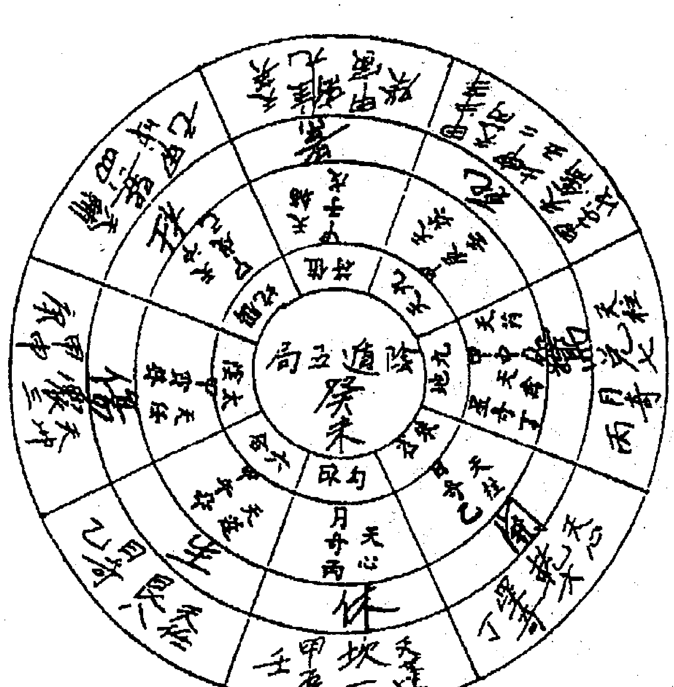

阴遁五局：癸未
杜四 辅九

- (1) 开乾和 天柱乙加丁奇。奇仪相佐：文书事吉，百事皆可为。
「入墓」

- (2) 休坎和 天心丙加甲辰壬。火入天罗：客不利，是非颇多。

- (3) 生艮和 天蓬辛加乙奇。白虎猖狂：人亡家败，远行多殃，尊长不喜，车船俱伤，身体毁伤。

- (4) 伤震和 天任癸加甲申庚。太白入网：昙花一现，争讼力平。
「地假」

- (5) 杜巽和 天冲己加甲戌己。地户逢鬼：病凶，百事不遂。

- (6) 景离和 天辅戊加甲寅癸。青龙华盖：门吉招福，门凶多乖。

- (7) 死坤和 天英壬加甲午辛。螣蛇相缠：纵得吉门亦不安宁，若有谋望被人欺瞒。
天英壬加甲子戊。小蛇化龙：男人发达，女产婴童。

- (8) 惊兑和 天芮庚加丙奇。太白入荧惑：占贼必来，为客进利，为主破财。
天禽丁加丙奇。星随月转：贵人越级高升，常人乐里生悲。「神假」

- (9) 开门乙奇合乾六宫，利西方。
休门丙奇合坎一宫，利正北方。

### 奇门遁甲秘笈全书(中册)

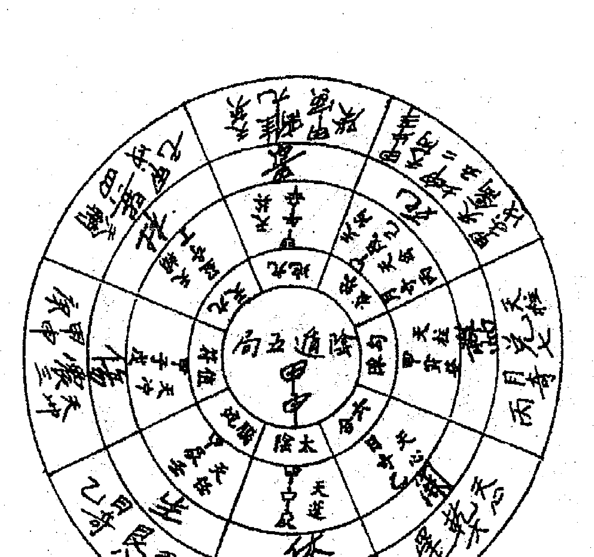

阴遁五局：甲申
伤三 冲三

- (1) 开乾和 天心乙加丁奇。奇仪相佐：文书事吉，百事皆可为。
「地、人遁，休诈，入墓」

- (2) 休坎和 天蓬庚加甲辰壬。小格：远行迷路，音信嗟呀。

- (3) 生艮和 天任壬加乙奇。格名小蛇：女人柔顺，男人嗟呀，占孕生子，禄马光华。

- (4) 伤震和 天冲戊加甲申庚。值符飞宫：吉事不吉，凶事更凶。

- (5) 杜巽和 天辅丁加甲戌己。火入勾陈：奸私仇冤，事因女人。

- (6) 景离和 天英辛加甲寅癸。天牢华盖。误入天网，动止乖张。

- (7) 死坤和 天芮己加甲午辛。游魂入墓：大人鬼魁，小人家先为祟。
天禽丙加甲子戊。飞鸟跌穴：谋事有成，百事洞澈。

- (8) 惊兑和 天柱癸加丙奇。华盖孛师：贵贱逢之，上人见喜。

- (9) 开门乙奇合乾六宫，利西北方。

### 奇门阴阳九遁阴五局符使值例

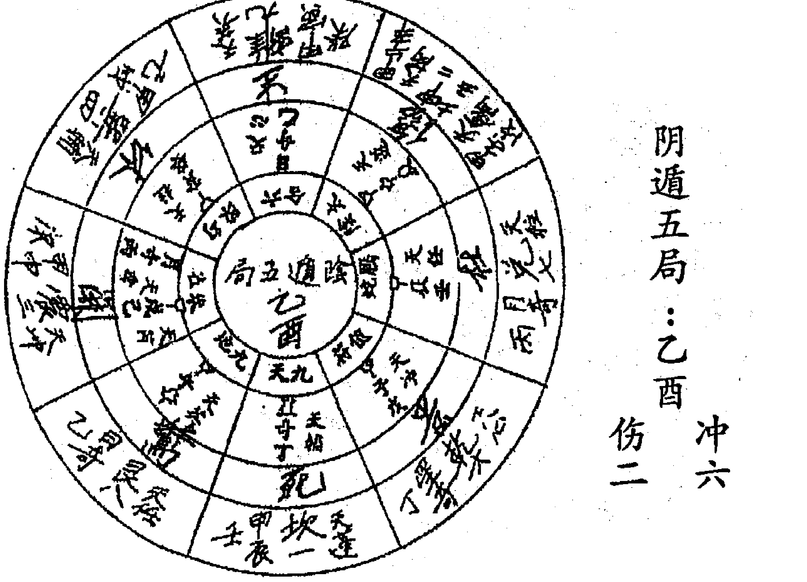

- (1) 开震迫 天芮己加甲申庚。利格返名：词讼先动不利，阴星有谋害之情。
天禽丙加甲申庚。荧惑入太白：门户破败，盗贼耗失。

- (2) 休巽礼 天柱癸加甲戌己。华盖地户：占音信皆阻，躲灾避难为吉。

- (3) 生离仪 天心乙加甲寅癸。华盖官星：遁迹修道，隐匿藏形，躲灾避难为吉。「人、地遁，休诈」

- (4) 伤坤迫 天蓬庚加甲午辛。白虎干格：远行车折马死。
天蓬庚加甲子戊。太白天乙伏宫：百事不可谋，凶。

- (5) 杜兑制 天任壬加丙奇。水蛇入火：官灾刑禁，络绎不绝。

- (6) 景乾迫 天冲戊加丁奇。青龙耀明：谒贵求名吉利，值墓迫招是非。

- (7) 死坎迫 天辅丁加甲辰壬。五神互合：贵人恩诏，讼狱公平。「入墓」

- (8) 惊艮仪 天英辛加乙奇。白虎猖狂：人亡家败，远行多殃，尊长不善，车船俱伤，身体毁伤。

- (9) 开丙奇合震三宫，利正东方。
生乙奇合离九宫，利正南方。

### 奇门遁甲秘笈全书（中册）

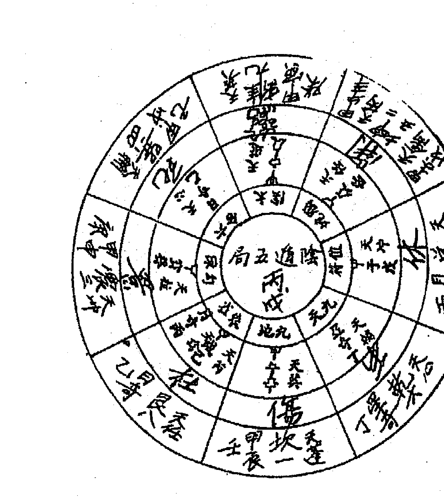

阴遁五局：丙戊
伤一 冲七

- (1) 开坤仪 天任壬加甲午辛。螣蛇相缠：纵得吉门，亦不安宁，若有谋望被人欺瞒。
天任壬加甲子戊。小蛇化龙：男人发达，女产婴童。

- (2) 休兑仪 天冲戊加丙奇。青龙回首：动作大利，若逢迫墓。吉事成凶。

- (3) 生乾礼 天辅丁加丁奇。奇人太阴：文书即至，喜事遂心。

- (4) 伤坎仪 天英辛加甲辰壬。凶蛇入狱：两男争女，讼狱不息，先动失理。

- (5) 杜艮迫 天芮己加乙奇。墓神不明：宜遁跡隐形为利逸。
天禽丙加乙奇。日月并行：公谋私为皆吉。

- (6) 景震仪 天柱癸加甲申庚。太白入网：昙花一现，争讼力平。

- (7) 死巽制 天心乙加甲戌己。日奇入雾：被土暗昧，门凶必凶。

- (8) 惊离制 天蓬庚加甲寅癸。大格：行人至，官司止，生产母子俱伤。

- (9) 生门丁奇合乾六宫，利西北方。

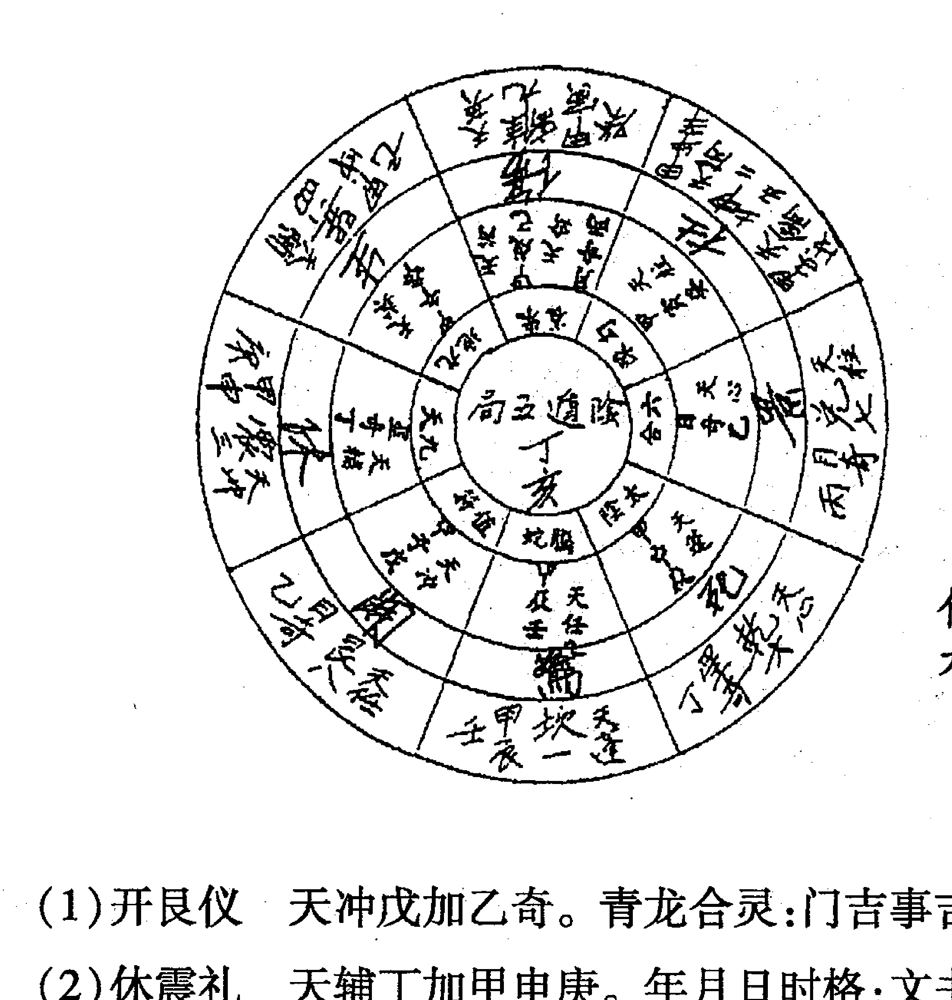

- (1) 开艮仪 天冲戊加乙奇。青龙合灵：门吉事吉，门凶事凶。

- (2) 休震礼 天辅丁加甲申庚。年月日时格：文书阻隔，行人必归。

- (3) 生巽制 天英辛加甲戌己。人狱自刑：奴仆背主，讼诉难伸。

- (4) 伤离礼 天芮己加甲寅癸。地刑玄武：病凶，词讼有囚狱之灾。
天禽丙加甲寅癸。华盖孛师：阴人害事，灾祸频生。「升殿」

- (5) 杜坤迫 天柱癸加甲午辛。网盖天牢：占讼病凶。
天柱癸加甲子戊。天乙会合：财喜婚姻，吉人赞助成合，门凶迫制，反祸官非。

- (6) 景兑迫 天心乙加丙奇。奇仪顺遂：吉星迁官进爵，凶星夫妻离别。

- (7) 死乾礼 天蓬庚加丁奇。亭亭之格：因私匿起官司，门吉有救。

- (8) 惊坎礼 天任壬加甲辰壬。蛇入地罗：外人缠绕，内事索索，吉门吉星，避免蹉跎。

- (9) 休门丁奇合震三宫，利正东方。

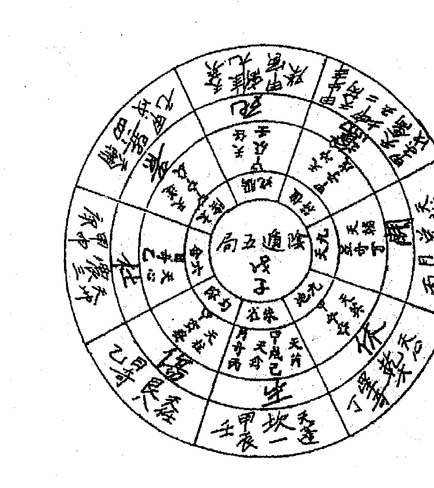

### 阴遁五局：戊子 伤 冲 八 五

- 1. 开兑和 天辅丁加丙奇。星随月转：贵人越级高升，常人乐里生悲。「升殿」

- 2. 休乾仪 天英辛加丁奇。狱神得奇：经商获倍利，囚人逢赦宥。

- 3. 生坎迫 天芮己加甲辰壬。地网高张：狡童佚女，奸情伤杀。
天禽丙加甲辰壬。火入天罗：客不利，是非颇多。

- 4. 伤艮迫 天柱癸加乙奇。华盖官星：贵人禄位，常人平安。

- 5. 杜震和 天心乙加甲申庚。日奇被刑：争讼财产夫妻怀私。「升殿」

- 6. 景巽仪 天蓬庚加甲戊己。刑格：官司被重刑。

- 7. 死离仪 天任壬加甲寅癸。幼女奸淫。家有丑声，门吉星凶，反祸福隆。

- 8. 惊坤仪 天冲戊加甲午辛。青龙折足：吉门生助，尚可谋为，若逢凶门，主招灾失财有足疾。
天冲戊加甲子戊。伏吟：凡事闭塞，静守为吉。

- 9. 休门丁奇合兑七宫，利正西方。
生门丙奇合坎一宫，利正北方。

### 奇门阴阳九遁阴五局符使值例

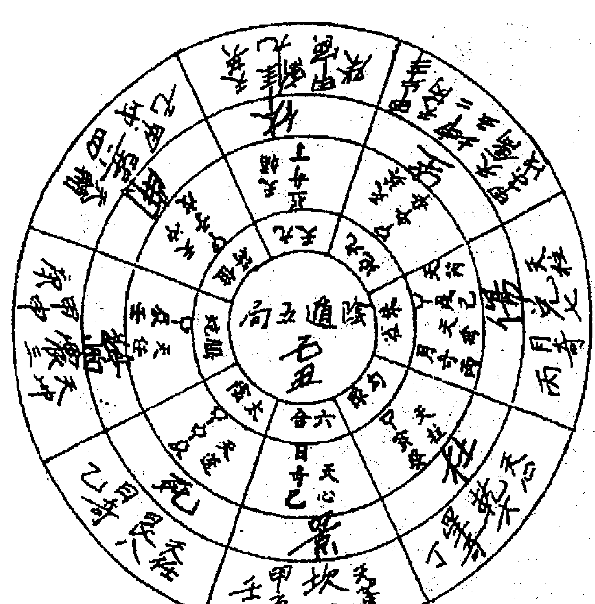

阴遁五局：己丑
伤七 冲四

- 1. 开巽迫 天冲戊加甲戊己。贵人入狱：公私不利。

- 2. 休离迫 天辅丁加甲寅癸。朱雀投江：文书口舌俱消，音信沉溺，讼狱所由起也。

- 3. 生坤和 天英辛加甲午辛。伏吟天庭：公废私就，讼狱自罹罪名。
天英辛加甲子戊。困龙被伤：官司破败，屈抑守分，妄动祸殃。

- 4. 伤兑制 天芮己加丙奇。火孛地户：阳人冤冤相害，阴人必致淫污。
天禽丙加丙奇。月奇孛师：文书逼迫，破耗遗失。

- 5. 杜乾制 天柱癸加丁奇。螣蛇妖娇：文书官司火焚莫逃，忧惶之事必至。

- 6. 景坎制 天心乙加甲辰壬。日奇入地：尊卑孛乱，官讼是非。

- 7. 死艮和 天蓬庚加乙奇。太白逢星：退吉进凶。

- 8. 惊震迫 天任壬加甲申庚。太白擒蛇：刑狱公平，立剖邪正。

- 9. 休门丁奇合离九宫，利正南方。

### 奇门遁甲秘笈全书（中册）

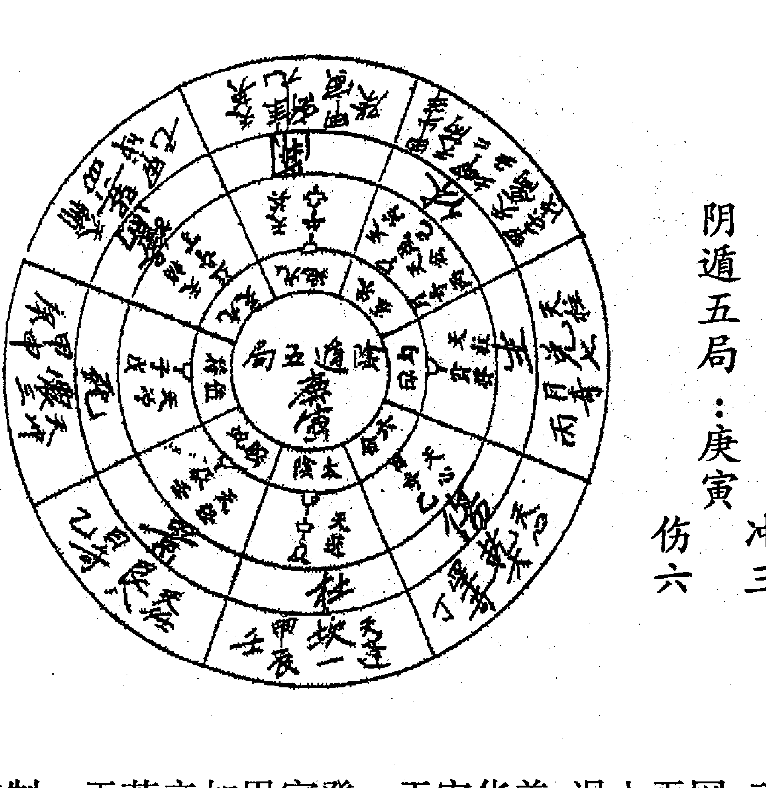

- (1) 开离制 天英辛加甲寅癸。天牢华盖：误入天网，动止乖张。

- (2) 休坤制 天芮己加甲午辛。游魂入墓：大人鬼魁，小人家先为祟。
天禽丙加甲子戊。飞鸟跌穴：谋事有成，百事洞澈。

- (3) 生兑礼 天柱癸加丙奇。华盖孛师：贵贱逢之，上人见喜。

- (4) 伤乾制 天心乙加丁奇。奇仪相佐：文书事吉，百事皆可为。
「入墓」

- (5) 杜坎仪 天蓬庚加甲辰壬。小格：远行迷路，音信嗟呀。

- (6) 景艮礼 天任壬加乙奇。格名小蛇：女人柔顺，男人嗟呀，占孕生子，禄马光华。

- (7) 死震制 天冲戊加甲申庚。值符飞宫：吉事不吉，凶事更凶。

- (8) 惊巽迫 天辅丁加甲戌己。火入勾陈：奸私仇冤，事因女人。

- (9) 休门丙奇合坤二宫，利西南方。

### 奇门阴阳九遁阴五局符使值例

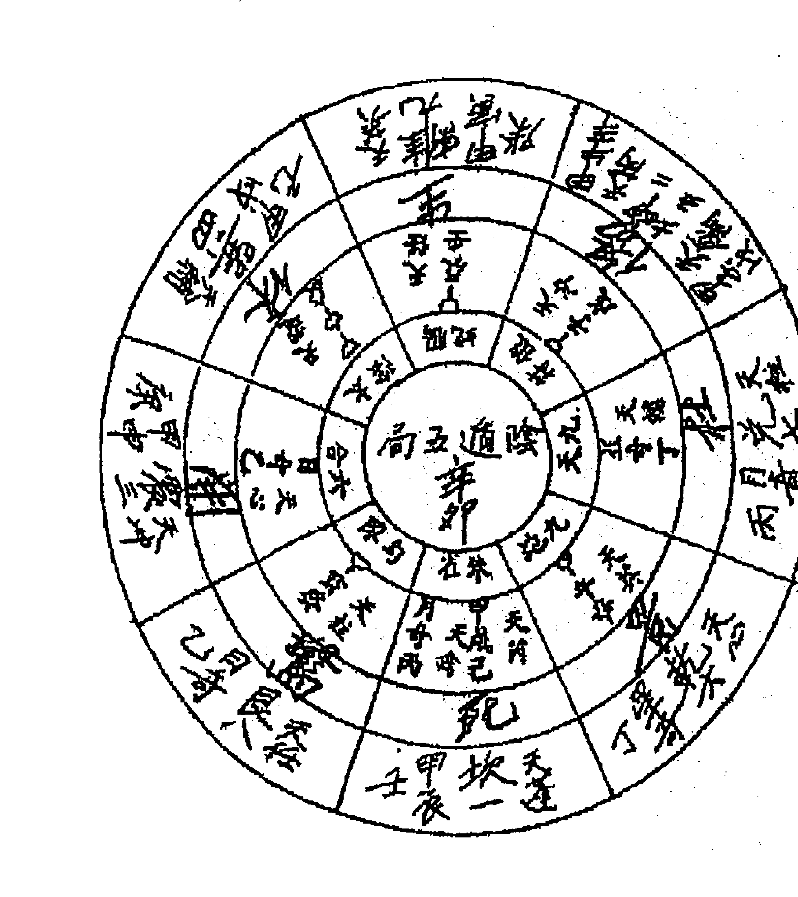

阴遁五局：辛卯 伤五 冲二

- (1) 开震迫 天心乙加甲申庚。日奇被刑：争讼财产夫妻怀私。「升殿，人、地遁，休诈」

- (2) 休巽礼 天蓬庚加甲戊己。刑格：官司被重刑。

- (3) 生离仪 天任壬加甲寅癸。幼女奸淫：家有丑声，门吉星凶，反祸福隆。

- (4) 伤坤迫 天冲戊加甲午辛。青龙折足：吉门生助，尚可谋为，若逢凶门，主招灾失财有足疾。
天冲戊加甲子戊。伏吟：凡事闭塞，静守为吉。

- (5) 杜兑制 天辅丁加丙奇。星随月转：贵人越级高升，常人乐里生悲。「升殿」

- (6) 景乾迫 天英辛加丁奇。狱神得奇：经商获倍利，囚人逢赦宥。

- (7) 死坎迫 天芮己加甲辰壬。地网高张：狡童佚女，奸情伤杀。
天禽丙加甲辰壬。火入天罗：客不利，是非颇多。

- (8) 惊艮仪 天柱癸加乙奇。华盖官星：贵人禄位，常人平安。

- (9) 开门乙奇合震三宫，利正东方。

### 奇门遁甲秘笈全书（中册）

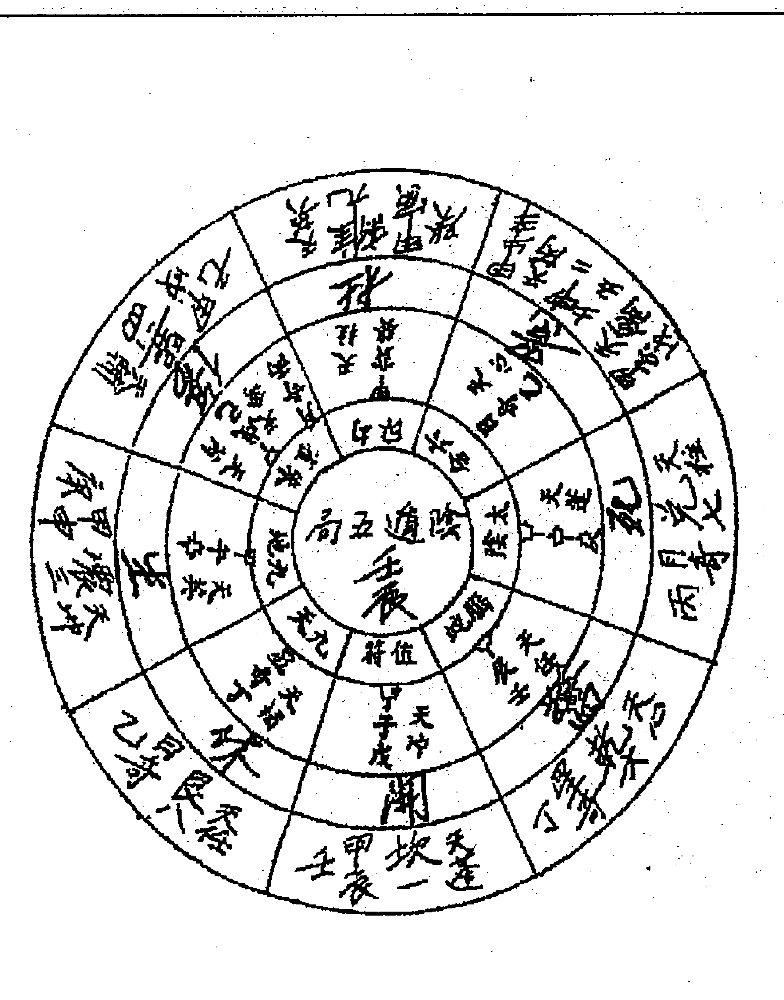

阴遁五局：壬辰 伤四 冲一

- (1) 开坎礼 天冲戊加甲辰壬。龙入天牢：阴阳皆不吉利。

- (2) 休艮制 天辅丁加乙奇。天运昌气格：贵人加官进爵，常人财喜婚姻。「人遁，入墓」

- (3) 生震制 天英辛加甲申庚。白虎出力：刀刃相接，主客相残，逊让退步稍可，强进血溅衣衫。

- (4) 伤巽和 天芮己加甲戊己。地户逢鬼：病凶，百事不遂。
天禽丙加甲戊己。太孛入刑：囚人刑杖，文书不行，吉门得吉，凶门转凶。

- (5) 杜离礼 天柱癸加甲寅癸。天网四张：(网高九尺)行人失件，病讼皆伤。

- (6) 景坤礼 天心乙加甲午辛。青龙逃走：奴仆拐带，六畜皆伤，财产废坠，身遭毁伤。「入墓」
天心乙加甲子戊。利阴害阳：门逢凶迫，财破人伤。

- (7) 死兑礼 天蓬庚加丙奇。太白入荧惑：占贼必来，为客进利，为主破财。

- (8) 惊乾和 天任壬加丁奇。干合蛇刑：文书牵连，贵人匆匆，男吉女凶。

- (9) 休门丁奇合艮八宫，利东北方。

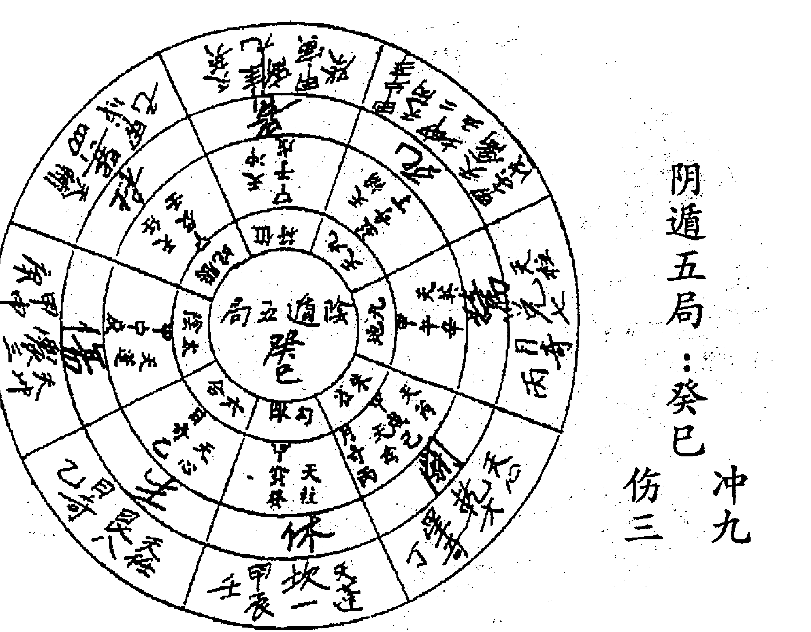

阴遁五局：癸巳 冲九 伤三

- (1) 开乾和 天芮己加丁奇。朱雀入墓：文状词讼，先曲后直。
天禽丙加丁奇。辛奇朱雀：贵人文书吉，常人平静。「入墓」

- (2) 休坎和 天柱癸加甲辰壬。复见螣蛇：嫁娶重婚，后嫁无子，不保年华。

- (3) 生艮和 天心乙加乙奇。日奇伏吟：不宜谒贵求名，只可安分守身。「人、地、虎遁，休诈」

- (4) 伤震和 天蓬庚加甲申庚。太白同宫：官灾横祸，兄弟不睦。

- (5) 杜巽和 天任壬加甲戌己。凶蛇入狱：大祸将至，顺守斯吉，词讼理曲。

- (6) 景离和 天冲戊加甲寅癸。青龙华盖：门吉招福，门凶多乖。

- (7) 死坤和 天辅丁加甲午辛。朱雀入狱：罪人释囚，官人失位。「入墓」
天辅丁加甲子戊。青龙转光：官人升迁，常人咸昌。

- (8) 惊兑和 天英辛加丙奇。荧惑出现：占雨无，占晴旱，占事必因财致讼。

- (9) 开丁奇合乾六宫，利西方。
生乙奇合艮八宫，利东北方。

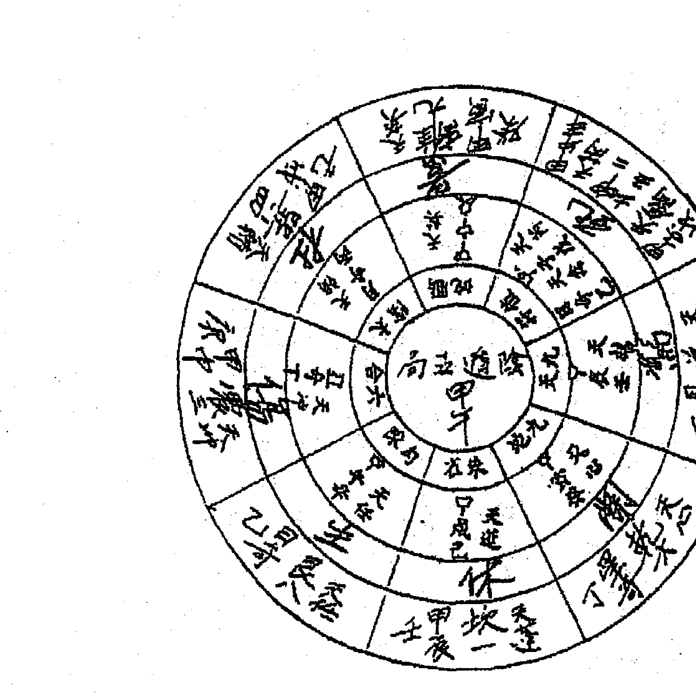

### 阴遁五局：甲午
死 芮 二 二

- (1) 开乾和 天心乙加丁奇。奇仪相佐：文书事吉，百事皆可为。
「人、地遁，重诈，入墓」

- (2) 休坎和 天蓬庚加甲辰壬。小格：远行迷路，音信嗟呀。

- (3) 生艮和 天任壬加乙奇。格名小蛇：女人柔顺，男人嗟呀，占孕生子，禄马光华。

- (4) 伤震和 天冲戊加甲申庚。值符飞宫：吉事不吉，凶事更凶。

- (5) 杜巽和 天辅丁加甲戊己。火入勾陈：奸私仇冤，事因女人。

- (6) 景离和 天英辛加甲寅癸。天牢华盖：误入天网，动止乖张。

- (7) 死坤和 天芮己加甲午辛。游魂入墓：大人鬼魁，小人家先为祟。
天禽丙加甲子戊。飞鸟跌穴：谋事有成，百事洞澈。

- (8) 惊兑和 天柱癸加丙奇。华盖孛师：贵贱逢之，上人见喜。

- (9) 开门乙奇合乾六宫，利西北方。

### 奇门阴阳九遁阴五局符使值例

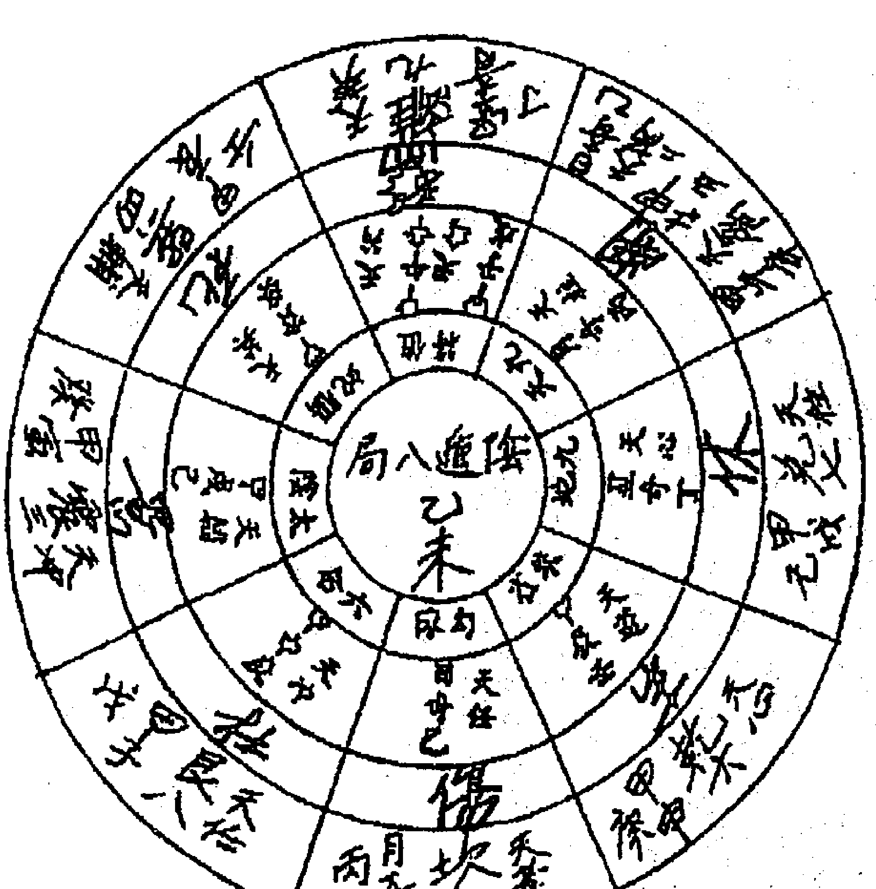

阴遁五局：乙未 死一 芮六

- (1) 开震迫 天蓬庚加甲申庚。太白同宫：官灾横祸，兄弟不睦。

- (2) 休巽礼 天柱壬加甲戌己。凶蛇入狱：大祸将至，顺守斯吉，词讼理曲。

- (3) 生离仪 天冲戊加甲寅癸。青龙华盖：门吉招福，门凶多乖。

- (4) 伤坤迫 天辅丁加甲午辛。朱雀入狱：罪人释囚，官人失位。
「地假」 天辅丁加甲子戊。青龙转光：官人升迁，常人咸昌。

- (5) 杜兑制 天英辛加丙奇。荧惑出现：占雨无，占晴旱，占事必因财致讼。

- (6) 景乾迫 天芮己加丁奇。朱雀入狱：文状词讼，先曲后直。
天禽丙加丁奇。辛奇朱雀：贵人文书吉，常人平静。「入墓」

- (7) 死坎迫 天柱癸加甲辰壬。复见螣蛇：嫁娶重婚，后嫁无子，不保年华。

- (8) 惊艮仪 天心乙加乙奇。日奇伏吟：不宜谒贵求名，只可安分守身。

- (9) 无奇门。

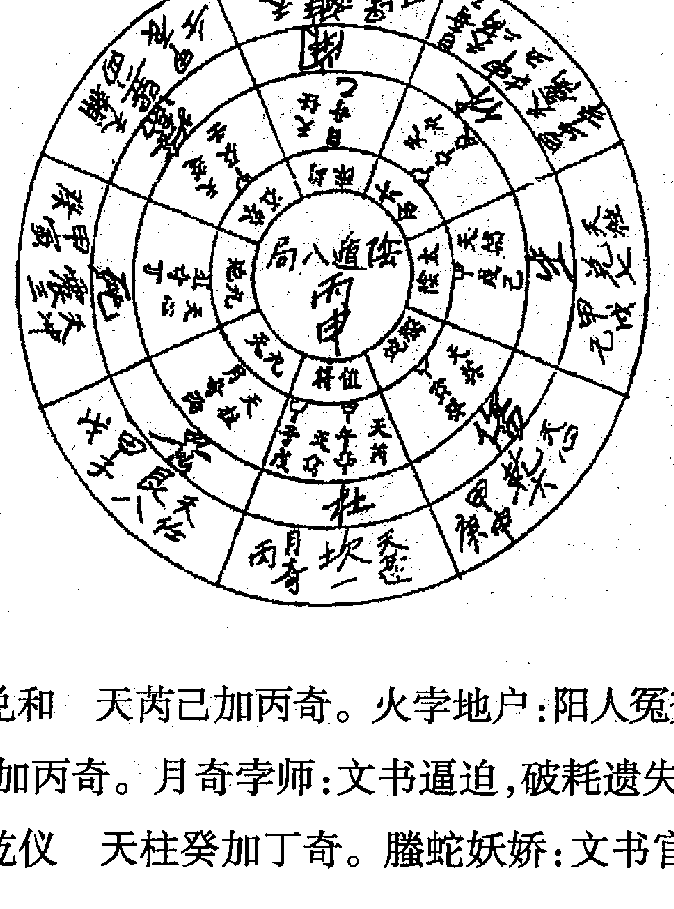

阴遁五局：丙申
死九 芮七

- (1) 开兑和 天芮己加丙奇。火孛地户：阳人冤冤相害，阴人必致淫污。
天禽丙加丙奇。月奇孛师：文书逼迫，破耗遗失。

- (2) 休乾仪 天柱癸加丁奇。螣蛇妖娇：文书官司火焚莫逃，忧惶之事必至。

- (3) 生坎迫 天心乙加甲辰壬。日奇入地：尊卑悖乱，官讼是非。
「人、地遁，重诈」

- (4) 伤艮迫 天蓬庚加乙奇。太白逢星：退吉进凶。

- (5) 杜震和 天任壬加甲申庚。太白擒蛇：刑狱公平，立剖邪正。

- (6) 景巽仪 天冲戊加甲戊己。贵人入狱：公私不利。

- (7) 死离仪 天辅丁加甲寅癸。朱雀投江：文书口舌俱消，音信沉溺，讼狱所由起也。「入墓」

- (8) 惊坤仪 天英辛加甲午辛。伏吟天庭：公废私就，讼狱自罹罪名。
天英辛加甲子戊。困龙被伤：官司破败，屈抑守分，妄动祸殃。

- (9) 开丙奇合兑七宫，利正西方。
生乙奇合坎一宫，利正北方。

### 奇门阴阳九遁阴五局符使值例

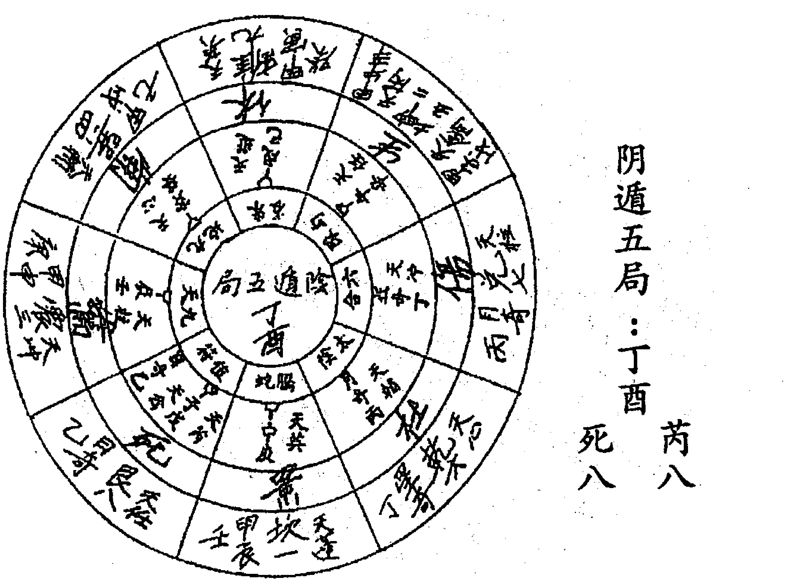

- (1) 开巽迫 天心乙加甲戌己。日奇入雾：被土暗味，门凶必凶。「人、风、地遁，重诈」

- (2) 休离迫 天蓬庚加甲寅癸。大格：行人至，官司止，生产母子俱伤。

- (3) 生坤和 天任壬加甲午辛。螣蛇相缠：纵得吉门亦不安宁，若有谋望被人欺瞒。
天任壬加甲子戊。小蛇化龙：男人发达，女产婴童。

- (4) 伤兑制 天冲戊加丙奇。青龙回首：动作大利，若逢迫墓，吉事成凶。

- (5) 杜乾制 天辅丁加丁奇。奇入太阴：文书即至，喜事遂心。

- (6) 景坎制 天英辛加甲辰壬。凶蛇入狱：两男争女，讼狱不息，先动失理。

- (7) 死艮和 天芮己加乙奇。墓神不明：宜遁跡隐形为利逸。
天禽丙加乙奇。日月并行：公谋私为皆吉。

- (8) 惊震迫 天柱癸加甲申庚。太白入网：昙花一现，争讼力平。

- (9) 开门乙奇合巽四宫，利东南方。

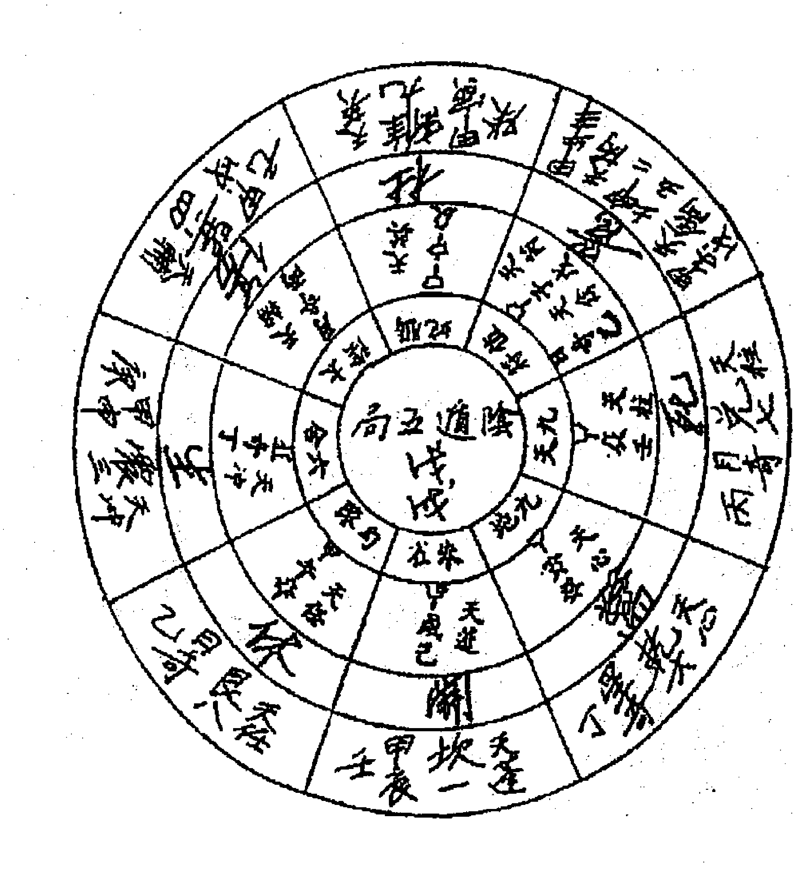

### 阴遁五局：戊子 死七 芮五

- (1) 开坎和 天蓬庚加甲辰壬。小格：远行迷路，音信嗟呀。

- (2) 休艮制 天任壬加乙奇。格名小蛇：女人柔顺，男人嗟呀，占孕生子，禄马光华。

- (3) 生震制 天冲戊加甲申庚。值符飞宫：吉事不吉，凶事更凶。

- (4) 伤巽和 天辅丁加甲戊己。火入勾陈：奸私仇冤，事因女人。
「地假」

- (5) 杜离礼 天英辛加甲寅癸。天牢华盖：误入天网，动止乖张。

- (6) 景坤礼 天芮己加甲午辛。游魂入墓：大人鬼魁，小人家先为祟。
天禽丙加甲子戊。飞鸟跌穴：谋事有成，百事洞澈。

- (7) 死兑礼 天柱癸加丙奇。华盖孛师：贵贱逢之，上人见喜。

- (8) 惊乾和 天心乙加丁奇。奇仪相佐：文书事吉，百事皆可为。
「入墓」

- (9) 无奇门。

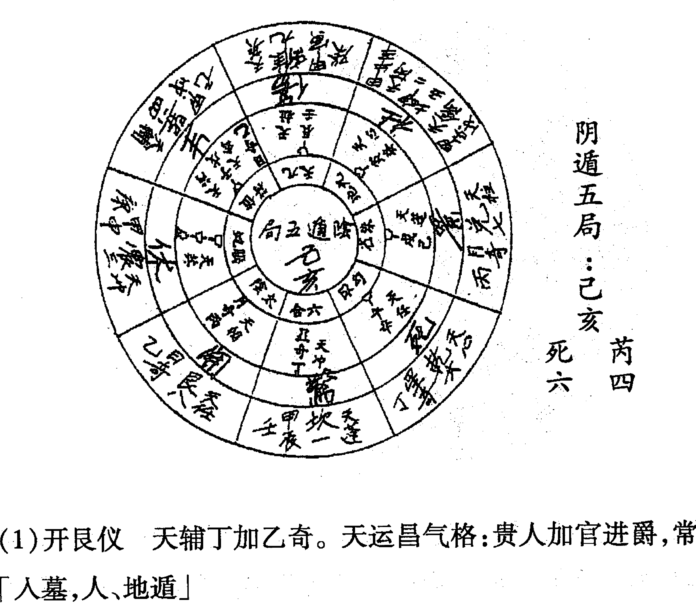

- (1) 开艮仪 天辅丁加乙奇。天运昌气格：贵人加官进爵，常人财喜婚姻。「入墓，人、地遁」

- (2) 休震礼 天英辛加甲申庚。白虎出力：刀刃相接，主客相残，逊让退步稍可，强进血溅衣衫。

- (3) 生巽制 天芮己加甲戌己。地户逢鬼：病凶，百事不遂。
天禽丙加甲戌己。太孛入刑：囚人刑杖，文书不行，吉门得吉，凶门转凶。

- (4) 伤离礼 天柱癸加甲寅癸。天网四张：(网高九尺)行人失件，病讼皆伤。

- (5) 杜坤迫 天心乙加甲午辛。青龙逃走：奴仆拐带，六畜皆伤，财产废坠，身遭毁伤。「入墓」
天心乙加甲子戊。利阴害阳：门逢凶迫，财破人伤。

- (6) 景兑迫 天蓬庚加丙奇。太白入荧惑：占贼必来，为客进利，为主破财。

- (7) 死乾礼 天任壬加丁奇。干合蛇刑：文书牵连，贵人勿用，男吉女凶。

- (8) 惊坎礼 天冲戊加甲申壬。龙入天牢：阴阳皆不吉利。

- (9) 开门丁奇合艮宫，利东北方。
生门丙奇合巽宫，利东南方。

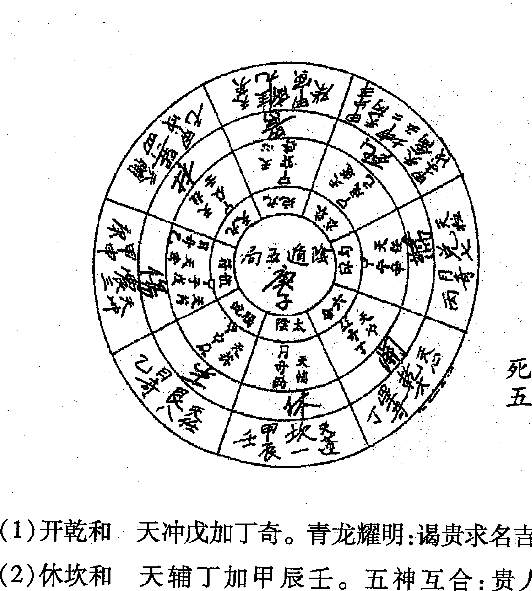

阴遁五局：庚子
死五 芮三

- (1) 开乾和 天冲戊加丁奇。青龙耀明：谒贵求名吉利，值墓迫招是非。

- (2) 休坎和 天辅丁加甲辰壬。五神互合：贵人恩诏，讼狱公平。「人、地遁，真诈」

- (3) 生艮和 天英辛加乙奇。白虎猖狂：人亡家败，远行多殃，尊长不喜，车船俱伤，身体毁伤。

- (4) 伤震和 天芮丙加甲申庚。利格返名：词讼先动不利，阴星有谋害之情。
天禽丙加甲申庚。荧惑入太白：门户破败，盗贼耗失。

- (5) 杜巽和 天柱癸加甲戌己。华盖地户：占音信皆阻，躲灾避难为吉。

- (6) 景离和 天心乙加甲寅癸。华盖官星：遁迹修道，隐匿藏形，躲灾避难为吉。

- (7) 死坤和 天蓬庚加甲午辛。白虎干格：远行车折马死。
天蓬庚加甲子戊。太白天乙伏宫：百事不可谋，凶。

- (8) 惊兑和 天任壬加丙奇。水蛇入火：官灾刑禁，络绎不绝。

- (9) 休门丁奇合坎一宫，利正北方。

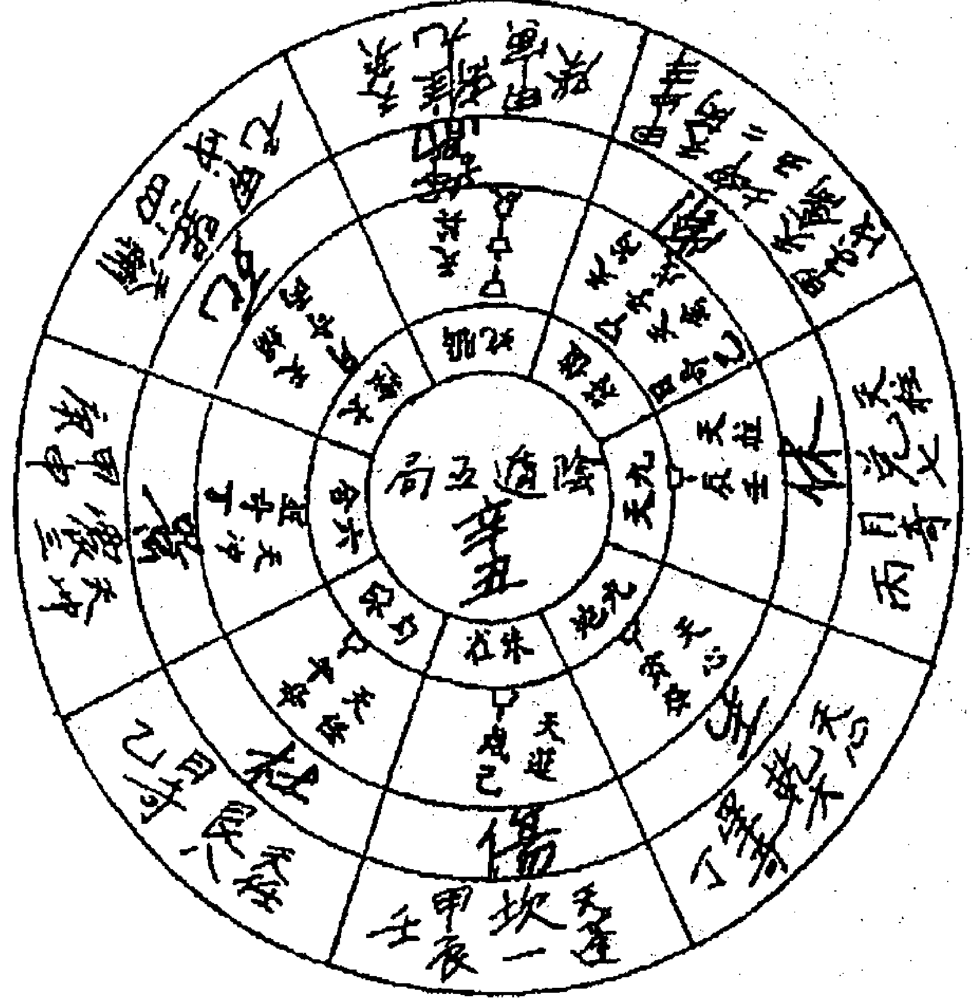

阴遁五局：辛丑 死四 芮二

- (1) 开坤仪 天芮己加甲午辛。游魂入墓：大人鬼魁，小人家先为祟。
天禽丙加甲子戊。飞鸟跌穴：谋事有成，百事洞澈。

- (2) 休兑仪 天柱癸加丙奇。华盖孛师：贵贱逢之，上人见喜。

- (3) 生乾礼 天心乙加丁奇。奇仪相佐：文书事吉，百事皆可为。
「入墓」

- (4) 伤坎仪 天蓬庚加甲辰壬。小格：远行迷路，音信嗟呀。

- (5) 杜艮迫 天任壬加乙奇。格名小蛇：女人柔顺，男人嗟呀，占孕生子，禄马光华。

- (6) 景震仪 天冲戊加甲申庚。值符飞宫：吉事不吉，凶事更凶。

- (7) 死巽制 天辅丁加甲戌己。火入勾陈：奸私仇冤，事因女人。
「入墓」

- (8) 惊离制 天英辛加甲寅癸。天牢华盖：误入天网，动止乖张。

- (9)

| 门奇 | 宫位 | 利方 |
| :--- | :--- | :--- |
| 开门丙奇 | 坤二宫 | 利西南方 |
| 休门乙奇 | 乾六宫 | 利西北方 |# 奇门阴阳九遁阴五局符使值例

#### 阴遁五局：癸卯
死二 芮九

「地假」

- （1）开乾和 天蓬庚加丁奇。亭亭之格：因私匿起官司，门吉有救。
- （2）休坎和 天任壬加甲辰壬。蛇入地罗：外人缠绕，内事索索，吉门吉星，避免蹉跎。
- （3）生艮和 天冲戊加乙奇。青龙合灵：门吉事吉，门凶事凶。
- （4）伤震和 天辅丁加甲申庚。年月日时格：文书阻隔，行人必归。
- （5）杜巽和 天英辛加甲戌己。人狱自刑：奴仆背主，讼诉难伸。
- （6）景离和 天芮己加甲寅癸。地刑玄武：病凶，词讼有囚狱之灾。
- （7）死坤和 天柱癸加甲午辛。网盖天牢：占讼病凶。
- （8）惊兑和 天心乙加丙奇。奇仪顺遂：吉星迁官进爵，凶星夫妻离别。
- （9）无奇门。

天禽丙加甲寅癸。华盖孛师：阴人害事，灾祸频生。「升殿」

天柱癸加甲子戊。天乙会合：财喜婚姻，吉人赞助成合，门凶迫制，反祸官非。

#### 阴遁五局·甲辰
休 蓬

- （1）开乾和 天心壬加丁奇。干合蛇刑：文书牵连，贵人匆匆，男吉女凶。
- （2）休坎和 天蓬戊加甲辰壬。龙入天牢：阴阳皆不吉利。
- （3）生艮和 天任庚加乙奇。太白逢星：退吉进凶。
- （4）伤震和 天冲丙加甲申庚。荧惑入太白：门户破败，盗贼耗失。
- （5）杜巽和 天辅乙加甲戌己。日奇入雾：被土暗昧，门凶必凶。
- （6）景离和 天英己加甲寅癸。地刑玄武：病凶，词讼有囚狱之灾。
- （7）死坤和 天芮丁加甲午辛。朱雀入狱：罪人释囚，官人失位。
「入墓」
天禽癸加甲子戊。天乙会合：财喜婚姻，吉人赞助成合，门凶迫制，反祸官非。
- （8）惊兑和 天柱辛加丙奇。荧惑出现：占雨无，占晴旱，占事必因财致讼。
- （9）无奇门。

### 奇门阴阳九遁阴五局符使值例

- （1）开巽迫 天英己加甲戌己。地户逢鬼：病凶，百事不遂。
- （2）休离迫 天芮丁加甲寅癸。朱雀投江：文书口舌俱消，音信沉溺，讼狱所由起也。「人遁，休诈」
- （3）生坤和 天柱辛加甲午辛。伏吟天庭：公废私就，讼狱自罹罪名。
天柱辛加甲子戊。困龙被伤：官司破败，屈抑守分，妄动祸殃。
- （4）伤兑制 天心壬加丙奇。水蛇入火：官灾刑禁，络绎不绝。
- （5）杜乾制 天蓬戊加丁奇。青龙耀明：谒贵求名吉利，值墓迫招是非。
- （6）景坎制 天任庚加甲辰壬。小格：远行迷路，瞽侣嗟呀。
- （7）死艮和 天冲丙加乙奇。日月并行：公谋私为皆吉。
- （8）惊震迫 天辅乙加甲申庚。日奇被刑：争讼财产夫妻怀私。
「升殿」
- （9）休门丁奇合离九宫，利正南方。

#### 阴遁五局：丁未 休七 蓬八

- 1. 开坤仪 天英己加甲午辛。游魂入墓：大人鬼魁，小人家先为祟。天英己加甲子戊。犬遇青龙：门吉谋望遂意，上人见喜，门凶枉劳心机。
- 2. 休兑仪 天芮丁加丙奇。星随月转：贵人越级高升，常人乐里生悲。「升殿，人遁，休诈」天禽癸加丙奇。华盖孛师：贵贱逢之，上人见喜。
- 3. 生乾礼 天柱辛加丁奇。狱神得奇：经商获倍利，囚人逢赦宥。
- 4. 伤坎仪 天心壬加甲辰壬。蛇入地罗：外人缠绕，内事索索，吉门吉星，避免蹉跎。
- 5. 杜艮迫 天蓬戊加乙奇。青龙合灵：门吉事吉，门凶事凶。
- 6. 景震仪 天任庚加甲申庚。太白同宫：官灾横祸，兄弟不睦。
- 7. 死巽制 天冲丙加甲戌己。太孛入刑：囚人刑杖，文书不行，吉门得吉，凶门转凶。
- 8. 惊离制 天辅乙加甲寅癸。华盖官星：遁迹修道，隐匿藏形，躲灾避难为吉。
- 9. 休门丁奇合兑七宫，利正西方。

- （1）开兑和 天任庚加丙奇。太白入荧惑：占贼必来，为客进利，为主破财。
- （2）休乾仪 天冲丙加丁奇。辛奇朱雀：贵人文书吉，常人平静。
「入墓，天遁，重诈」
- （3）生坎迫 天辅乙加甲辰壬。日奇入地：尊卑悖乱，官讼是非。
- （4）伤艮迫 天英己加乙奇。墓神不明：宜遁迹隐形为利逸。
- （5）杜震和 天芮丁加甲申庚。年月日时格：文书阻隔，行人必归。
天禽癸加甲申庚。太白入网：昙花一现，争讼力平。
- （6）景巽仪 天柱辛加甲戌己。人狱自刑：奴仆背主，讼诉难伸。
- （7）死离仪 天心壬加甲寅癸。幼女奸淫。家有丑声，门吉星凶，反祸福隆。
- （8）惊坤仪 天蓬戊加甲午辛。青龙折足：吉门生助，尚可谋为，若逢凶门，主招灾失财有足疾。
天蓬戊加甲子戊。伏吟：凡事闭塞，静守为吉。
- （9）休门丙奇合乾六宫，利西北方。
生 乙 坎一 正

- （1）开离制 天任庚加甲寅癸。大格：行人至，官司上，生产母子俱伤。
- （2）休坤制 天冲丙加甲午辛。威神互合：谋事有成，病人不凶。
「天遁，重诈」
天冲丙加甲子戊。飞鸟跌穴：谋事有成，百事洞澈。
- （3）生兑礼 天辅乙加丙奇。奇仪顺遂：吉星迁官进爵，凶星夫妻别离。
- （4）伤乾制 天英己加丁奇。朱雀入墓：文状词讼，先曲后直。
- （5）杜坎仪 天芮丁加甲辰壬。五神互合：贵人恩诏，讼狱公平。
天禽癸加甲辰壬。复见腾蛇：嫁娶重婚，后嫁无子，不保年华。
- （6）景艮礼 天柱辛加乙奇。白虎猖狂：人亡家败，远行多殃，尊长不喜，车船俱伤，身体毁伤。
- （7）死震制 天心壬加甲申庚。太白擒蛇：刑狱公平，立剖邪正。
- （8）惊巽迫 天蓬戊加甲戌己。贵人入狱：公私不利。
- （9）休门丙奇合坤二宫，利西南方。

#### 阴遁五局：庚戌休四蓬三

- （1）开震迫 天蓬戊加甲申庚。值符飞宫：吉事不吉，凶事更凶。
- （2）休巽礼 天任庚加甲戌己。刑格：官司被重刑。
- （3）生离仪 天冲丙加甲寅癸。华盖孛师：阴人害事，灾祸频生。
「升殿，天遁，重诈」
- （4）伤坤迫 天辅乙加甲午辛。青龙逃走：奴仆拐带，六畜皆伤，财产废坠，身遭毁伤。「入墓」
天辅乙加甲子戊。利阴害阳：门逢凶迫，财破人伤。
- （5）杜兑制 天英己加丙奇。火孛地户：阳人冤冤相害，阴人必致淫污。
- （6）景乾迫 天芮丁加丁奇。奇人太阴：文书即至，喜事遂心。
天禽癸加丁奇。螣蛇妖娇：文书官司火焚莫逃，忧惶之事必至。
- （7）死坎迫 天柱辛加甲辰壬。凶蛇入狱：两男争女，讼狱不息，先动失理。
- （8）惊艮仪 天心壬加乙奇。格名小蛇：女人柔顺，男人嗟呀，占孕生子，禄马光华。
- （9）生门丙奇合离九宫，利正南方。

- （1）开艮仪 天英己加丁奇。墓神不明：宜遁迹隐形为利逸。
- （2）休震礼 天芮丁加甲申庚。年月日时格：文书阻隔，行人必归。「人遁，休诈」
天禽癸加甲申庚。太白入网：昙花一现，争讼力平。
- （3）生巽制 天柱辛加甲戌己。人狱自刑：奴仆背主，讼诉难伸。
- （4）伤离礼 天心壬加甲寅癸。幼女奸淫：家有丑声，门吉星凶，反祸福隆。
- （5）杜坤迫 天蓬戊加甲午辛。青龙折足：吉门生助，尚可谋为，逢凶门主招灾，失财足疾。
天蓬戊加甲子戊。伏吟：凡事闭塞，静守为吉。
- （6）景兑迫 天任庚加丙奇。太白入荧惑：占贼必来，为客进利，为主破财。
- （7）死乾礼 天冲丙加丁奇。辛奇朱雀：贵人文书吉，常人平静。「入墓」
- （8）惊坎礼 天辅乙加甲辰壬。日奇入地：尊卑悖乱，官讼是非。
- （9）休门丁奇合震三宫，利正东方。

### 奇门遁甲秘笈全书(中册)

- （1）开离制 天英己加甲寅癸。地刑玄武：病凶，词讼有囚狱之灾。
- （2）休坤制 天芮丁加甲午辛。朱雀入狱：罪人释囚，官人失位。
「入墓，人遁，休诈」
天禽癸加甲子戊。天乙会合：财喜婚姻，吉人赞助成合，门凶迫制，反祸官非。
- （3）生兑礼 天柱辛加丙奇。荧惑出现：占雨无，占晴旱，占事必因财致讼。
- （4）伤乾制 天心壬加丁奇。干合蛇刑：文书牵连，贵人匆匆，男吉女凶。
- （5）杜坎仪 天蓬戊加甲辰壬。龙入天牢：阴阳皆不吉利。
- （6）景艮礼 天任庚加乙奇。太白逢星：退吉进凶。
- （7）死震制 天冲丙加甲申庚。荧惑入太白：门户破败，盗贼耗失。
- （8）惊巽迫 天辅乙加甲戌己。日奇入雾：被土暗昧，门凶必凶。
- （9）休门丁奇合坤二宫，利西南方。

### 奇门阴阳九遁阴五局符使值例

#### 阴遁五局：癸丑 休一 蓬九

- （1）开乾和 天辅乙加丁奇。奇仪相佐：文书事吉，百事皆可为。「入墓」
- （2）休坎和 天英己加甲辰壬。地网高张：狡童佚女，奸情伤杀。
- （3）生艮和 天芮丁加乙奇。天运昌气格：贵人加官进爵，常人财喜婚姻。「入遁，休诈，入墓」
天禽癸加乙奇。华盖官星：贵人禄位，常人平安。
- （4）伤震和 天柱辛加甲申庚。白虎出力：刀刃相接，主客相残，逊让退步稍可，强进血溅衣衫。
- （5）杜巽和 天心壬加甲戌己。凶蛇入狱：大祸将至，顺守斯吉，词讼理曲。
- （6）景离和 天蓬戊加甲寅癸。青龙华盖：门吉招福，门凶多乖。
- （7）死坤和 天任庚加甲午辛。白虎干格：远行车折马死。
天任庚加甲子戊。太白天乙伏官：百事不可谋，凶。
- （8）惊兑和 天冲丙加丙奇。月奇孛师：文书逼迫，破耗遗失。

| 开、乙、乾六宫 | 生、丁、艮八宫 | 西、东 |
| :--- | :--- | :--- |
| 奇合 | 宫，利 | 北方。 |

- 1. 开乾和 天心辛加丁奇。狱神得奇：经商获倍利，囚人逢赦宥。
- 2. 休坎和 天蓬丁加甲辰壬。五神互合：贵人恩诏，讼狱公平。
- 3. 生艮和 天任己加乙奇。墓神不明：宜遁迹隐形为利逸。
- 4. 伤震和 天冲乙加甲申庚。日奇被刑：争讼财产夫妻怀私。
「升殿」
- 5. 杜巽和 天辅癸加甲戌己。华盖地户：占音信皆阻，躲灾避难为吉。
- 6. 景离和 天英戊加甲寅癸。青龙华盖：门吉招福，门凶多乖。
- 7. 死坤和 天芮丙加甲午辛。威神互合：谋事有成，病人不凶。
天禽壬加甲子戊。小蛇化龙：男人发达，女产婴童。
- 8. 惊兑和 天柱丙加丙奇。太白入荧惑：占贼必来，为客进利，为主破财。
- 9. 休门丁奇合坎一宫，利正北方。

### 奇门阴阳九遁阴五局符使值例

- （1）开离制 天任己加甲寅癸。地刑玄武：病凶，词讼有囚狱之灾。
- （2）休坤制 天冲乙加甲午辛。青龙逃走：奴仆拐带，六畜皆伤，财产废坠，身遭毁伤。「入墓，龙、人、地遁，真诈」
天冲乙加甲子戊。利阴害阳：门逢凶迫，财破人伤。
- （3）生兑礼 天辅癸加丙奇。华盖孛师：贵贱逢之，上人见喜。
- （4）伤乾制 天英戊加丁奇。青龙耀明：谒贵求名吉利，值墓迫招是非。
- （5）杜坎仪 天芮丙加甲辰壬。火入天罗：客不利，是非颇多。天禽壬加甲辰壬。蛇入地罗：外人缠绕，内事索索，吉门吉星，避免蹉跎。
- （6）景艮礼 天柱庚加乙奇。太白逢星：退吉进凶。
- （7）死震制 天心辛加甲申庚。白虎出力：刀刃相接，主客相残，逊让退步稍可，强进血溅衣衫。
- （8）惊巽迫 天蓬丁加甲戌己。火入勾陈：奸私仇冤，事因女人。
- （9）休门乙奇合坤二宫，利西南方。

#### 阴遁五局：丙辰 景七 英七

- （1）开艮仪 天心辛加乙奇。白虎猖狂：人亡家败，远行多殃，尊长不喜，车船俱伤，身体毁伤。「虎遁」
- （2）休震礼 天蓬丁加甲申庚。年月日时格：文书阻隔，行人必归。
- （3）生巽制 天任己加甲戌己。地户逢鬼：病凶，百事不遂。
- （4）伤离礼 天冲乙加甲寅癸。华盖官星：遁迹修道，隐匿藏形，躲灾避难为吉。
- （5）杜坤迫 天辅癸加甲午辛。网盖天牢：占讼病凶。
天辅癸加甲子戊。天乙会合：财喜婚姻，吉人赞助成合，门凶迫制，反祸宫非。
- （6）景兑迫 天英戊加丙奇。青龙回首：动作大利，若逢迫墓，吉事成凶。
- （7）死乾礼 天芮丙加丁奇。辛奇朱雀：贵人文书吉，常人平静。「入墓」
天禽壬加丁奇。干合蛇刑：文书牵连，贵人匆匆，男吉女凶。
- （8）惊坎礼 天柱庚加甲辰壬。小格：远行迷路，音信磋呀。
- （9）休门丁奇合震三宫，利正东方。

### 奇门阴阳九遁阴五局符使值例

#### 阴遁五局：丁巳 景六 英八

- 1. 开震迫 天芮丙加甲申庚。荧惑入太白：门户破败，盗贼耗失。天禽壬加甲申庚。太白擒蛇：刑狱公平，立剖邪正。
- 2. 休巽礼 天柱庚加甲戌己。刑格：官司被重刑。
- 3. 生离仪 天心辛加甲寅癸。天牢华盖：误入天网，动止乖张。
- 4. 伤坤迫 天蓬丁加甲午辛。朱雀入狱：罪人释囚，官人失位。天蓬丁加甲子戊。青龙转光：官人升迁，常人咸昌。
- 5. 杜兑制 天任己加丙奇。火孛地户：阳人冤冤相害，阴人必致淫污。
- 6. 景乾迫 天冲乙加丁奇。奇仪相佐：文书事吉，百事皆可为。「入墓」
- 7. 死坎迫 天辅癸加甲辰壬。复见腾蛇：嫁娶重婚，后嫁无子，不保年华。
- 8. 惊艮仪 天英戊加乙奇。青龙合灵：门吉事吉，门凶事凶。
- 9. 开门丙奇合震三宫，利正东方。

- （1）开坎和 天心辛加甲辰壬。凶蛇入狱：两男争女，讼狱不息，先动失理。
- （2）休艮制 天蓬丁加乙奇。天运昌气格：贵人加官进爵，常人财喜婚姻。「人遁，入墓」
- （3）生震制 天任己加甲申庚。利格返名：词讼先动不利，阴星有谋害之情。
- （4）伤巽和 天冲乙加甲戌己。日奇入雾：被土暗昧，门凶必凶。
- （5）杜离礼 天辅癸加甲寅癸。天网四张：行人失件，病讼皆伤。
- （6）景坤礼 天英戊加甲午辛。青龙折足：吉门生助，尚可谋为，逢凶门主招灾，失财足疾。
天英戊加甲子戊。伏吟：凡事闭塞，静守为吉。
- （7）死兑礼 天芮丙加丙奇。月奇孛师：文书逼迫，破耗遗失。
天禽壬加丙奇。水蛇入火：官灾刑禁，络绎不绝。
- （8）惊乾和 天柱庚加丁奇。亭亭之格：因私匿起官司，门吉有救。
- （9）休门丁奇合艮八宫，利东北方。

### 奇门阴阳九遁阴五局符使值例
#### 阴遁五局：己未 景四 英四

- （1）开兑和 天心辛加丙奇。荧惑出现：占雨无，占晴旱，占事必因财致讼。
- （2）休乾仪 天蓬丁加丁奇。奇人太阴：文书即至，喜事遂心。
- （3）生坎迫 天任己加甲辰壬。地网高张：狡童佚女，奸情伤杀。
- （4）伤艮迫 天冲乙加乙奇。日奇伏吟：不宜谒贵求名，只可安分守身。
- （5）杜震和 天辅癸加甲申庚。太白入网：昙花一现，争讼力平。
- （6）景巽仪 天英戊加甲戌己。贵人入狱：公私不利。
- （7）死离仪 天芮丙加甲寅癸。华盖孛师：阴人害事，灾祸频生。
「升殿」
天禽壬加甲寅癸。幼女奸淫：家有丑声，门吉星凶，反祸福隆。
- （8）惊坤仪 天柱庚加甲午辛。白虎干格：远行车折马死。
天柱庚加甲子戊。太白天乙伏官：百事不可谋，凶。
- （9）休门丁奇合乾六宫，利西北方。

#### 阴遁五局：庚申 景三 英三

- （1）开坤仪 天心辛加甲午辛。伏吟天庭：公废私就，讼狱自罹罪名。
天心辛加甲子戊。困龙被伤：官司破败，屈抑守分，妄动祸殃。
- （2）休兑仪 天蓬丁加丙奇。星随月转：贵人越级高升，常人乐里生悲。「升殿」
- （3）生乾礼 天任己加丁奇。朱雀入墓：文状词讼，先曲后直。
- （4）伤坎仪 天冲乙加甲辰壬。日奇入地：尊卑悖乱，官讼是非。
- （5）杜艮迫 天辅癸加乙奇。华盖官星：贵人禄位，常人平安。
- （6）景震仪 天英戊加甲申庚。值符飞宫：吉事不吉，凶事更凶。
- （7）死巽制 天芮丙加甲戌己。太孛入刑：囚人刑杖，文书不行，吉门得吉，凶门转凶。
天禽壬加甲戌己。凶蛇入狱：大祸将至，顺守斯吉，词讼理曲。
- （8）惊离制 天柱庚加甲寅癸。大格：行人至，官司止，生产母子俱伤。
- （9）休门丁奇合兑七宫，利正西方。

### 奇门阴阳九遁阴五局符使值例

阴遁五局：辛酉 景二 英二

-   (1) 开坎礼 天心辛加甲辰壬。凶蛇入狱：两男争女，讼狱不息，先动失理。
-   (2) 休艮制 天蓬丁加乙奇。天运昌气格：贵人加官进爵，常人财喜婚姻。「入墓，入遁」
-   (3) 生震制 天任己加甲申庚。利格返名：词讼先动不利，阴星有谋害之情。
-   (4) 伤巽和 天冲乙加甲戌己。日奇入雾：被土暗味，门凶必凶。
-   (5) 杜离礼 天辅癸加甲寅癸。天网四张：(网高九尺)行人失件，病讼皆伤。
-   (6) 景坤礼 天英戊加甲午辛。青龙折足：吉门生助，尚可谋为，若逢凶门，主招灾失财有足疾。天英戊加甲子戊。伏吟：凡事闭塞，静守为吉。
-   (7) 死兑礼 天芮丙加丙奇。月奇孛师：文书逼迫，破耗遗失。天禽壬加丙奇。水蛇入火：官灾刑禁，络绎不绝。
-   (8) 惊乾和 天柱庚加丁奇。亭亭之格：因私匿起官司，门吉有赦。
-   (9) 休门丁奇合艮八宫，利东北方。

阴遁五局：壬戌 景一 英一

-   (1) 开巽迫 天心辛加甲戌己。入狱自刑：奴仆背主，讼诉难伸。
-   (2) 休离迫 天蓬丁加甲寅癸。朱雀投江：文书口舌俱消，音信沉溺，讼狱所由起也。
-   (3) 生坤和 天任己加甲午辛。游魂入墓：大人鬼魁，小人家先为祟。天任己加甲子戊。犬遇青龙：门吉谋望遂意，上人见喜，门凶枉劳心机。
-   (4) 伤兑制 天冲乙加丙奇。奇仪顺遂：吉星迁官进爵，凶星夫妻离别。
-   (5) 杜乾制 天辅癸加丁奇。腾蛇妖娇：文书官司火焚莫逃，忧惶之事必至。
-   (6) 景坎制 天英戊加甲辰壬。龙入天牢：阴阳皆不吉利。
-   (7) 死艮和 天芮丙加乙奇。日月并行：公谋私为皆吉。天禽壬加乙奇。格名小蛇：女人柔顺，男人嗟呀，占孕生子，禄马光华。
-   (8) 惊震迫 天柱庚加甲申庚。太白同宫：官灾横祸，兄弟不睦。
-   (9) 休门丁奇合离九宫，利正南方。

-   (1) 开乾和 天心辛加丁奇。狱神得奇：经商获倍利，囚人逢赦宥。
-   (2) 休坎和 天蓬丁加甲辰壬。五神互合：贵人恩诏，讼狱公平。
-   (3) 生艮和 天任己加乙奇。墓神不明：宜遁迹隐形为利逸。
-   (4) 伤震和 天冲乙加甲申庚。日奇被刑：争讼财产夫妻怀私。「升殿」
-   (5) 杜巽和 天辅癸加甲戊己。华盖地户：占音信皆阻，躲灾避难为吉。
-   (6) 景离和 天英戊加甲寅癸。青龙华盖：门吉招福，门凶多乖。
-   (7) 死坤和 天芮丙加甲午辛。威神互合：谋事有成，病人不凶。天禽壬加甲子戊。小蛇化龙：男人发达，女产婴童。
-   (8) 惊兑和 天柱庚加丙奇。太白入荧惑：占贼必来，为客进利，为主破财。
-   (9) 休门丁奇合坎一宫，利正北方。

### 奇门阴阳九遁阴六局符使值例

| 符使 | 甲 | 乙 | 丙 | 丁 | 戊 | 己 | 庚 | 辛 | 壬 | 癸 |
| :--- | :--- | :--- | :--- | :--- | :--- | :--- | :--- | :--- | :--- | :--- |
| 心开 | 子 六六 | 丑 七五 | 寅 八四 | 卯 九三 | 辰 六二 | 巳 五一 | 午 四九 | 未 三八 | 申 二七 | 酉 一六 |
| 禽死 | 戌 五五 | 亥 七四 | 子 八三 | 丑 九二 | 寅 六一 | 卯 五九 | 辰 四八 | 巳 三七 | 午 二六 | 未 一五 |
| 辅杜 | 申 四四 | 酉 七三 | 戌 八二 | 亥 九一 | 子 六九 | 丑 五八 | 寅 四七 | 卯 三六 | 辰 二五 | 巳 一四 |
| 冲伤 | 午 三三 | 未 七二 | 申 八一 | 酉 九九 | 戌 六八 | 亥 五七 | 子 四六 | 丑 三五 | 寅 二四 | 卯 一三 |
| 芮死 | 辰 二二 | 巳 七一 | 午 八九 | 未 九八 | 申 六七 | 酉 五六 | 戌 四五 | 亥 三四 | 子 二三 | 丑 一二 |
| 蓬休 | 寅 一一 | 卯 七九 | 辰 八八 | 巳 九七 | 午 六六 | 未 五五 | 申 四四 | 酉 三三 | 戌 二二 | 亥 一一 |

-   (1) 开乾和 天心戊加甲子戊。伏吟：凡事闭塞，静守为吉。
-   (2) 休坎和 天蓬癸加甲寅癸。天网四张：(网高一尺)行人失件，病讼皆伤。
-   (3) 生艮和 天任丙加丙奇。月奇孛师：文书逼迫，破耗遗失。「天遁，重诈」
-   (4) 伤震和 天冲辛加甲午辛。伏吟天庭：公废私就，讼狱自罹罪名。
-   (5) 杜巽和 天辅庚加甲申庚。太白同宫：官灾横祸，兄弟不睦。
-   (6) 景离和 天英乙加乙奇。日奇伏吟：不宜谒贵求名，只可安分守身。
-   (7) 死坤和 天芮壬加甲辰壬。蛇入地罗：外人缠绕，内事索索，吉门吉星，避免蹉跎。天禽己加甲戌己。地户逢鬼：病凶，百事不遂。
-   (8) 惊兑和 天柱丁加丁奇。奇入太阴：文书即至，喜事遂心。「入墓」
-   (9) 生门丙奇合艮八宫，利东北方。

-   (1) 开坤仪 天柱丁加甲辰壬。五神互合：贵人恩诏，讼狱公平。天柱丁加甲戌己。火入勾陈：奸私仇冤，事因女人。
-   (2) 休兑仪 天心戊加丁奇。青龙耀明：谒贵求名吉利，值墓迫招是非。
-   (3) 生乾礼 天蓬癸加甲子戊。天乙会合：财喜婚姻，吉人赞助成合，门凶迫制，反祸官非。
-   (4) 伤坎仪 天任丙加甲寅癸。华盖孛师：阴人害事，灾祸频生。
-   (5) 杜艮迫 天冲辛加丙奇。荧惑出现：占雨无，占晴旱，占事必因财致讼。
-   (6) 景震仪 天辅庚加甲午辛。白虎干格：远行车折马死。
-   (7) 死巽制 天英乙加甲申庚。日奇被刑：争讼财产夫妻怀私。
-   (8) 惊离制 天芮壬加乙奇。格名小蛇：女人柔顺，男人嗟呀，占孕生子，禄马光华。天禽己加乙奇。墓神不明：宜遁迹隐形为利逸。
-   (9) 开门丁奇合坤二宫，利西南方。

阴遁六局：丙寅 开四 心八

-   (1) 开巽迫 天任丙加甲申庚。荧惑入太白：门户破败，盗贼耗失。「天遁，重诈」
-   (2) 休离迫 天冲辛加乙奇。白虎猖狂：人亡家败，远行多殃，尊长不喜，车船俱伤，身体毁伤。
-   (3) 生坤和 天辅庚加甲辰壬。小格：远行迷路，音信嗟呀，天辅庚加甲戌己，刑格，官司被重刑。
-   (4) 伤兑制 天英乙加丁奇。奇仪相佐：文书事吉，百事皆可为。
-   (5) 杜乾制 天芮壬加甲子戊。小蛇化龙：男人发达，女产婴童。天禽己加甲子戊。犬遇青龙：门吉谋望遂意，上人见喜，门凶枉劳心机。
-   (6) 景坎制 天柱丁加甲寅癸。朱雀投江：文书口舌俱消，音信沉溺，讼狱所由起也。
-   (7) 死艮和 天心戊加丙奇。青龙回首：动作大利，若逢迫墓，吉事成凶。
-   (8) 惊震迫 天蓬癸加甲午辛。网盖天牢：占讼病凶。
-   (9) 开门丙奇合巽四宫，利东南方。

-   (1) 开震迫 天芮壬加甲午辛。螣蛇相缠：纵得吉门亦不安宁，若有谋望被人欺瞒。天禽己加甲午辛。游魂入墓：大人鬼魁，小人家先为祟。
-   (2) 休巽礼 天柱丁加甲申庚。年月日时格：文书阻隔，行人必归。
-   (3) 生离仪 天心戊加乙奇。青龙合灵：门吉事吉，门凶事凶。
-   (4) 伤坤迫 天蓬癸加甲辰壬。复见螣蛇：嫁娶重婚，后嫁无子，不保年华。天蓬癸加甲戊己。华盖地户：占音信皆阻，躲灾避难为吉。
-   (5) 杜兑制 天任丙加丁奇。辛奇朱雀：贵人文书吉，常人平静。
-   (6) 景乾迫 天冲辛加甲子戊。因龙被伤：官司破败，屈抑守分，妄动祸殃。
-   (7) 死坎迫 天辅庚加甲寅癸。大格：行人至，官司止，生产母子俱伤。
-   (8) 惊艮仪 天英乙加丙奇。奇仪顺遂：吉星迁官进爵，凶星夫妻离别。
-   (9) 休门丁奇合巽四宫，利东南方。

### 奇门阴阳九遁阴六局符使值例

-   (1) 开坤仪 天芮壬加甲辰壬。蛇入地罗：外人缠绕，内事索索，吉门吉星，避免蹉跎。天禽己加甲戌己。地户逢鬼：病凶，百事不遂。
-   (2) 休兑仪 天柱丁加丁奇。奇入太阴：文书即至，喜事遂心。「升殿」
-   (3) 生乾礼 天心戊加甲子戊。伏吟：凡事闭塞，静守为吉。
-   (4) 伤坎仪 天蓬癸加甲寅癸。天网四张：(高一尺)行人失件，病讼皆伤。
-   (5) 杜艮迫 天任丙加丙奇。月奇孛师：文书逼迫，破耗遗失。
-   (6) 景震仪 天冲辛加甲午辛。伏吟天庭：公废私就，讼狱自罹罪名。
-   (7) 死巽制 天辅庚加甲申庚。太白同宫：官灾横祸，兄弟不睦。
-   (8) 惊离制 天英乙加乙奇。日奇伏吟：不宜谒贵求名，只可安分守身。
-   (9) 休门丁奇合兑七宫，利正西方。

-   (1) 开坎礼 天冲辛加甲寅癸。天牢华盖：误入天网，动止乖张。
-   (2) 休艮制 天辅庚加丙奇。太白入荧惑：占贼必来，为客进利，为主破财。
-   (3) 生震制 天英乙加甲午辛。青龙逃走：奴仆拐带，六畜皆伤，财产废坠，身遭毁伤。「升殿，人、地遁，休诈」
-   (4) 伤巽和 天芮壬加甲申庚。太白擒蛇：刑狱公平，立剖邪正。天禽己加甲申庚。利格返名：词讼先动不利，阴星有谋害之情。「地假」
-   (5) 杜离礼 天柱丁加乙奇。天运昌气格：贵人加官进爵，常人财喜婚姻。
-   (6) 景坤礼 天心戊加甲辰壬。龙入天牢：阴阳皆不吉利。天心戊加甲戊己。贵人入狱：公私不利。
-   (7) 死兑礼 天蓬癸加丁奇。腾蛇妖娇：文书官司火焚莫逃，忧惶之事必至。
-   (8) 惊乾和 天任丙加甲子戊。飞鸟跌穴：谋事有成，百事洞澈。「入墓」
-   (9) 生门乙奇合震三宫，利正东方。

### 奇门阴阳九遁阴六局符使值例

-   (1) 开离制 天蓬癸加乙奇。华盖官星：贵人禄位，常人平安。
-   (2) 休坤制 天任丙加甲辰壬。火入天罗：客不利，是非颇多。「天遁，重诈」天任丙加甲戊己。太孛入刑：囚人刑杖，文书不行，吉门得吉，凶门转凶。
-   (3) 生兑礼 天冲辛加丁奇。狱神得奇：经商获倍利，囚人逢赦宥。
-   (4) 伤乾制 天辅庚加甲子戊。太白天乙伏宫：百事不可谋，凶。
-   (5) 杜坎仪 天英乙加甲寅癸。华盖官星：遁踪修道，隐匿藏形，躲灾避难为吉。
-   (6) 景艮礼 天芮壬加丙奇。水蛇入火：官司刑禁，络绎不绝。天禽己加丙奇。火孛地户：阳人冤冤相害，阴人必致淫污。
-   (7) 死震制 天柱丁加甲午辛。朱雀入狱：罪人释囚，官人失位。「入墓」
-   (8) 惊巽迫 天心戊加甲申庚。值符飞宫：吉事不吉，凶事更凶。
-   (9) 休门丙奇合坤二宫，利西南方。

-   (1) 开艮仪 天柱丁加丙奇。星随月转：贵人越级高升，常人乐里生悲。「入墓」
-   (2) 休震礼 天心戊加甲午辛。青龙折足：吉门生助，尚可谋为，若逢凶门，主招灾失财有足疾。
-   (3) 生巽制 天蓬癸加甲午辛。网盖天牢：占讼病凶。
-   (4) 伤离礼 天任丙加乙奇。日月并行：公谋私为皆吉。「升殿」
-   (5) 杜坤迫 天冲辛加甲辰壬。凶蛇入狱：两男争女，讼狱不息，先动失理。天冲辛加甲戌己。入狱自刑：奴仆背主，讼诉难伸。
-   (6) 景兑迫 天辅庚加丁奇。亭亭之格：因私匿起官司，门吉有救。
-   (7) 死乾礼 天英乙加甲子戊。利阴害阳：门凶迫，财破人伤。「入墓」
-   (8) 惊坎礼 天芮壬加甲寅癸。幼女奸淫：家有丑声，门吉星凶，反祸福隆。天禽己加甲寅癸。地刑玄武：病凶，词讼有囚狱之灾。
-   (9) 开门丁奇合艮八宫，利东北方。

-   (1) 开兑和 天蓬癸加丁奇。螣蛇妖娇：文书官司火焚莫逃，忧惶之事必至。
-   (2) 休乾仪 天任丙加甲子戊。飞鸟跌穴：谋事有成，百事洞澈。「入墓，天遁，休诈」
-   (3) 生坎迫 天冲辛加甲寅癸。天牢华盖：误入天网，动止乖张。
-   (4) 伤艮迫 天辅庚加甲申庚。太白同宫：官灾横祸，兄弟不睦。
-   (5) 杜震和 天英乙加甲午辛。青龙逃走：奴仆拐带，六畜皆伤，财产废坠，身遭毁伤。「升殿」
-   (6) 景巽仪 天芮壬加甲申庚。太白擒蛇：刑狱公平，立剖邪正。天禽己加甲申庚。利格返名：词讼先动不利，阴星有谋害之情。
-   (7) 死离仪 天柱丁加乙奇。天运昌气格：贵人加官进爵，常人财喜婚姻。「入墓」
-   (8) 惊坤仪 天心戊加甲辰壬。龙入天牢：阴阳皆不吉利。天心戊加甲戊己。贵人入狱：公私不利。
-   (9) 休门丙奇合乾六宫，利西北方。

-   (1) 开乾和 天柱丁加甲子戊。青龙转光：官人升迁，常人咸昌。
-   (2) 休坎和 天心戊加甲寅癸。青龙华盖：门吉招福，门凶多乖。「龙遁」
-   (3) 生艮和 天蓬癸加丙奇。华盖孛师：贵贱逢之，上人见喜。
-   (4) 伤震和 天任丙加甲午辛。威神互合：谋事有成，病人不凶。
-   (5) 杜巽和 天冲辛加甲申庚。白虎出力：刀刃相接，主客相残，逊让退步稍可，强进血溅衣衫。
-   (6) 景离和 天辅庚加乙奇。太白逢星：退吉进凶。
-   (7) 死坤和 天英乙加甲辰壬。日奇入地：尊卑悖乱，官讼是非。「入墓」天英乙加甲戌己。日奇入雾：被土暗味，门凶必凶。
-   (8) 惊兑和 天芮壬加丁奇。干合蛇刑：文书牵连，贵人匆匆，男吉女凶。天禽己加丁奇。朱雀入墓：文状词讼，先曲后直。
-   (9) 开门丁奇合乾六宫，利西北方。

### 奇门阴阳九遁阴六局符使值例

阴遁六局：甲戌 死五 禽五

-   (1) 开乾和 天心丁加甲子戊。青龙转光：官人升迁，常人咸昌。「重诈」
-   (2) 休坎和 天蓬壬加甲寅癸。幼女奸淫：家有丑声，门吉星凶，反祸福隆。
-   (3) 生艮和 天任乙加丙奇。奇仪顺遂：吉星迁官进爵，凶星夫妻离别。
-   (4) 伤震和 天冲庚加甲午辛。白虎干格：远行车折马死。
-   (5) 杜巽和 天辅己加甲申庚。利格返名：词讼先动不利，阴星有谋害之情。
-   (6) 景离和 天英癸加乙奇。华盖官星：贵人禄位，常人平安。
-   (7) 死坤和 天芮辛加甲辰壬。凶蛇入狱：两男争女，讼狱不息，先动失理。天禽戊加甲戊己。贵人入狱：公私不利。
-   (8) 惊兑和 天柱丙加丁奇。辛奇朱雀：贵人文书吉，常人平静。
-   (9) 开丁奇合乾六宫，利西北方。生乙奇坎一宫，利正北方。

-   (1) 开坤仪 天英癸加甲辰壬。复见螣蛇：嫁娶重婚，后嫁无子，不保年华。天英癸加甲戌己。华盖地户：占音信皆阻，躲灾避难为吉。
-   (2) 休兑仪 天芮辛加丁奇。狱神得奇：经商获倍利，囚人逢赦宥。天禽戊加丁奇。青龙耀明：谒贵求名吉利，值墓迫招是非。
-   (3) 生乾礼 天柱丙加甲子戊。飞鸟跌穴：谋事有成，百事洞澈。「入墓，神遁」
-   (4) 伤坎仪 天心丁加甲寅癸。朱雀投江：文书口舌俱消，音信沉溺，讼狱所由起也。
-   (5) 杜艮迫 天蓬壬加丙奇。水蛇入火：官灾刑禁，络绎不绝。
-   (6) 景震仪 天任乙加甲午辛。青龙逃走：奴仆拐带，六畜皆伤，财产废坠，身遭毁伤。「升殿」
-   (7) 死巽制 天冲庚加甲申庚。太白同宫：官灾横祸，兄弟不睦。
-   (8) 惊离制 天辅己加乙奇。墓神不明：宜遁迹隐形为利逸。
-   (9) 生门丙奇合乾六宫，利西北方。

阴遁六局：丙子 死三 禽八

-   (1) 开离制 天蓬壬加乙奇。格名小蛇：女人柔顺，男人嗟呀，占孕生子，禄马光华。
-   (2) 休坤制 天任乙加甲辰壬。日奇入地：尊卑悖乱，官讼是非。「入墓」天任乙加甲戌己。日奇入雾：被土暗味，门凶必凶。
-   (3) 生兑礼 天冲庚加丁奇。亭亭之格：因私匿起官司，门吉有救。
-   (4) 伤乾制 天辅乙加甲子戊。犬遇青龙：门吉谋望遂意，上人见喜，门凶枉劳心机。「地假」
-   (5) 杜坎仪 天英癸加甲寅癸。天网四张：(网高一尺)行人失件，病讼皆伤。
-   (6) 景艮礼 天芮辛加丙奇。荧惑出现：占雨无，占晴旱，占事必因财致讼。天禽戊加丙奇。青龙回首：动作大利，若逢迫墓，吉事成凶。
-   (7) 死震制 天柱丙加甲午辛。威神互合：谋事有成，病人不凶。
-   (8) 惊巽迫 天心丁加甲申庚。年月日时格：文书阻隔，行人必归。「神假」
-   (9) 休门乙奇合坤二宫，利西南方。

-   (1) 开乾和 天蓬壬加甲子戊。小蛇化龙：男人发达，女产婴童。
-   (2) 休艮和 天任乙加甲寅癸。华盖官星：遁迹修道，隐匿藏形，躲灾避难为吉。
-   (3) 生艮和 天冲庚加丙奇。太白入荧惑：占贼必来，为客进利，为主破财。
-   (4) 伤震和 天辅己加甲午辛。游魂入墓：大人鬼魁，小人家先为祟。「地假」
-   (5) 杜巽和 天英癸加甲申庚。太白入网：昙花一现，争讼力平。
-   (6) 景离和 天芮辛加乙奇。白虎猖狂：人亡家败，远行多殃，尊长不喜，车船俱伤，身体毁伤。天禽戊加乙奇。青龙合灵：门吉事吉，门凶事凶。
-   (7) 死坤和 天柱丙加甲辰壬。火入天罗：客不利，是非颇多。天柱丙加甲戊己。太孛入刑：囚人刑杖，文书不行，吉门得吉，凶门转凶。
-   (8) 惊兑和 天心丁加丁奇。奇入太阴：文书即至，喜事遂心。「升殿」
-   (9) 休门乙奇合坎一宫，利正北方。

##

阴遁六局：庚辰
死禽八四

-   1. 开巽迫 天芮辛加甲申庚。白虎出力：刀刃相接，主客相残，逊让退步稍可，强进血溅衣衫。
    天禽戊加甲申庚。值符飞宫：吉事不吉，凶事更凶。
-   2. 休离迫 天柱丙加乙奇。日月并行：公谋私为皆吉。「升殿」
-   3. 生坤和 天心丁加甲辰壬。五神互合：贵人恩诏，讼狱公平。「重诈」
    天心丁加甲戌己。火入勾陈：奸私仇冤，事因女人。
-   4. 伤兑制 天蓬壬加丁奇。干合蛇刑：文书牵连，贵人匆匆，男吉女凶。
-   5. 杜乾制 天任乙加甲子戊。利阴害阳：门逢凶迫，财破人伤。「入墓」
-   6. 景坎制 天冲庚加甲寅癸。大格：行人至，官司止，生产母子俱伤。
-   7. 死艮和 天辅己加丙奇。火孛地户：阳人冤冤相害，阴人必致淫污。
-   8. 惊震迫 天英癸加甲午辛。网盖天牢：占讼病凶。
-   9. 生门丙奇合离九宫，利正南方。休门丁奇合坤二宫，利西南方。

阴遁六局：辛卯 杜六 辅三

-   1. 开巽迫 天英壬加甲申庚。太白擒蛇：刑狱公平，立剖邪正。
-   2. 休离迫 天芮庚加乙奇。太白逢星：退吉进凶。
    天禽丁加乙奇。天运昌气格：贵人加官进爵，常人财喜婚姻。「人、云遁」
-   3. 生坤和 天柱乙加甲辰壬。日奇入地：尊卑悖乱，官讼是非。「入墓」
-   4. 伤兑制 天心丙加乙奇。辛奇朱雀：贵人文书吉，常人平静。
-   5. 杜乾制 天蓬辛加甲子戊。困龙被伤：官司破败，屈抑守分，妄动祸殃。
-   6. 景坎制 天任癸加甲寅癸。天网四张：行人失件，病讼皆伤。
-   7. 死艮和 天冲己加丙奇。火孛地户：阳人冤冤相害，阴人必致淫污。
-   8. 惊震迫 天辅戊加甲午辛。青龙折足：吉门生助，尚可谋为，若逢凶门，主招灾失财有足疾。
-   9. 休门丁奇合离九宫，利正南方。生门乙奇合坤二宫，利西方。

阴遁六局：壬辰 杜五 辅二

-   1. 开艮仪 天心丙加丙奇。月奇孛师：文书逼迫，破耗遗失。
-   2. 休震礼 天蓬辛加甲午辛。伏吟天庭：公废私就，讼狱自罹罪名。
-   3. 生巽制 天任癸加甲申庚。太白入网：昙花一现，争讼力平。
-   4. 伤离礼 天冲己加乙奇。墓神不明：宜遁迹隐形为利逸。
-   5. 杜坤迫 天辅戊加甲辰壬。龙入天牢：阴阳皆不吉利。
    天辅戊加甲戌己。贵人入狱：公私不利。
-   6. 景兑迫 天英壬加丁奇。干合蛇刑：文书牵连，贵人匆用，男吉女凶。
-   7. 死乾礼 天芮庚加甲子戊。太白天乙伏官：百事不可谋，凶。
    天禽丁加甲子戊。青龙转光：官人升迁，常人咸昌。「入墓」
-   8. 惊坎礼 天柱乙加甲寅癸。华盖官星：遁迹修道，隐匿藏形，躲灾避难为吉。
-   9. 开门丙奇合艮八宫，利东北方。

阴遁六局：癸未 禽五 死一

-   1. 开乾和 天英癸加甲子戊。天乙会合：财喜婚姻，吉人赞助成合，门凶迫制，反祸官非。
-   2. 休坎和 天芮辛加甲寅癸。天牢华盖：误入天网，动止乖张。
    天禽戊加甲寅癸。青龙华盖：门吉招福，门凶多乖。
-   3. 生艮和 天柱丙加丙奇。月奇孛师：文书逼迫，破耗遗失。「神遁」
-   4. 伤震和 天心丁加甲午辛。朱雀入狱：罪人释囚，官人失位。
-   5. 杜巽和 天蓬壬加甲申庚。太白擒蛇：刑狱公平，立剖邪正。
-   6. 景离和 天任乙加乙奇。日奇伏吟：不宜谒贵求名，只可安分守身。
-   7. 死坤和 天冲庚加甲辰壬。小格：远行迷路，音信嗟呀。
    天冲庚加甲戌己。刑格：官司被重刑。
-   8. 惊兑和 天辅己加丁奇。朱雀入墓：文状词讼，先曲后直。
-   9. 生门丙奇合艮八宫，利东北方。

### 奇门阴阳九遁阴六局符使值例

阴遁六局：甲申
杜四 辅四

-   1. 开乾和　天心丙加甲子戊。飞鸟跌穴：谋事有成，百事洞澈。「入墓」
-   2. 休坎和　天蓬辛加甲寅癸。天牢华盖：误入天网，动止乖张。
-   3. 生艮和　天任癸加丙奇。华盖孛师：贵贱逢之，上人见喜。
-   4. 伤震和　天冲己加甲午辛。游魂入墓：大人鬼魅，小人家先为祟。
-   5. 杜巽和　天辅戊加甲申庚。值符飞宫：吉事不吉，凶事更凶。
-   6. 景离和　天英壬加乙奇。格名小蛇：女人柔顺，男人嗟呀，占孕生子，禄马光华。
-   7. 死坤和　天芮庚加甲辰壬。小格：远行迷路，音信嗟呀。
    天禽丁加甲戌己。火入勾陈：奸私仇冤，事因女人。「入墓，鬼假」
-   8. 惊兑和　天柱乙加丁奇。奇仪相佐：文书事吉，百事皆可为。
-   9. 开门丙奇合乾六宫，利西北方。

阴遁六局：乙未
伤二 冲七

-   1. 开震迫 天柱癸加甲午辛。网盖天牢：占讼病凶。
-   2. 休巽礼 天心乙加甲申庚。日奇被刑：争讼财产夫妻怀私。「人、地遁，休诈」
-   3. 生离仪 天蓬庚加乙奇。太白逢星：退吉进凶。
-   4. 伤坤迫 天任壬加甲辰壬。蛇入地罗：外人缠绕，内事索索，吉门吉星，避免蹉跎。
    天任壬加甲戌己。凶蛇入狱：大祸将至，顺守斯吉，词讼理曲。
-   5. 杜兑制 天冲戊加丁奇。青龙耀明：谒贵求名吉利，值墓迫招是非。
-   6. 景乾迫 天辅丁加甲子戊。青龙转光：官人升迁，常人咸昌。「天假」
-   7. 死坎迫 天英辛加甲申庚。白虎出力：刀刃相接，主客相残，逊让退步稍可，强进血溅衣衫。
-   8. 惊艮仪 天芮己加丙奇。火孛地户：阳人冤冤相害，阴人必致淫污。
    天禽丙加丙奇。月奇孛师：文书逼迫，破耗遗失。
-   9. 休门乙奇合巽四宫，利东南方。

### 奇门阴阳九遁阴六局符使值例

阴遁六局：丙戌
杜二 辅八

-   1. 开艮仪 天辅戊加丙奇。青龙回首：动作大利，若逢迫墓，吉事成凶。
-   2. 休震礼 天英壬加甲午辛。腾蛇相缠：纵得吉门亦不安宁，若有谋望被人欺瞒。
-   3. 生巽制 天芮庚加甲申庚。太白同宫：官灾横祸，兄弟不睦。
    天禽丁加甲申庚。年月日时格：文书阻隔，行人必归。「重诈」
-   4. 伤离礼 天柱乙加乙奇。日奇伏吟：不宜谒贵求名，只可安分守身。
-   5. 杜坤迫 天心丙加甲辰壬。火入天罗：客不利，是非颇多。
    天心丙加甲戌己。太孛入刑：囚人刑杖，文书不行，吉门得吉，凶门转凶。
-   6. 景兑迫 天蓬辛加丁奇。狱神得奇：经商获倍利，囚人逢赦宥。
-   7. 死乾礼 天任癸加甲子戊。天乙会合：财喜婚姻，吉人赞助成合，门凶迫制，反祸官非。
-   8. 惊坎礼 天冲己加甲寅癸。地刑玄武：病凶，词讼有囚狱之灾。
-   9. 生门丁奇合巽四宫，利东南方。

阴遁六局：丁亥
杜一 辅九

-   1. 开离制 天辅戊加乙奇。青龙合灵：门吉事吉，门凶事凶。
-   2. 休坤制 天英壬加甲辰壬。蛇入地罗：外人缠绕，内事索索，吉门吉星，避免蹉跎。
    天英壬加甲戌己。凶蛇入狱：大祸将至，顺守斯吉，词讼理曲。
-   3. 生兑礼 天芮庚加丁奇。亭亭之格：因私匿起官司，门吉有救。
    天禽丁加丁奇。奇人太阴：文书即至，喜事遂心。「升殿，重诈」
-   4. 伤乾制 天柱乙加甲子戊。利阴害阳：门逢凶迫，财破人伤。「入墓」
-   5. 杜坎仪 天心丙加甲寅癸。华盖孛师：阴人害事，灾祸频生。
-   6. 景艮礼 天蓬辛加丁奇。荧惑出现：占雨无，占晴旱，占事必因财致讼。
-   7. 死震制 天任癸加甲午辛。网盖天牢：占讼病凶。
-   8. 惊巽迫 天冲己加甲申庚。利格返名：词讼先动不利，阴星有谋害之情。
-   9. 生门丁奇合兑七宫，利正西方。

### 奇门阴阳九遁阴六局符使值例

阴遁六局：戊子
杜八 辅五

-   1. 开坤仪 天辅戊加甲辰壬。龙入天牢：阴阳皆不吉利。
    天辅戊加甲戌己。贵人入狱：公私不利。
-   2. 休兑仪 天英壬加丁奇。干合蛇刑：文书牵连，贵人匆匆，男吉女凶。
-   3. 生乾礼 天芮庚加甲子戊。太白天乙伏官：百事不可谋，凶。
    天禽丁加甲子戊。青龙转光：官人升迁，常人咸昌。「重诈」
-   4. 伤坎仪 天柱乙加甲寅癸。华盖官星：遁迹修道，隐匿藏形，躲灾避难为吉。
-   5. 杜艮迫 天心丙加丙奇。月奇孛师：文书逼迫，破耗遗失。
-   6. 景震仪 天蓬辛加甲午辛。伏吟天庭：公废私就，讼狱自罹罪名。
-   7. 死巽制 天任癸加甲申庚。太白入网：昙花一现，争讼力平。
-   8. 惊离制 天冲己加乙奇。墓神不明：宜遁迹隐形为利逸。
-   9. 生门丁奇合乾六宫，利西北方。

阴遁六局：己丑 杜八 辅五

-   1. 开坤仪 天辅戊加甲辰壬。龙入天牢：阴阳皆不吉利。
    天辅戊加甲戌己。贵人入狱：公私不利。
-   2. 休兑仪 天英壬加丁奇。干合蛇刑：文书牵连，贵人匆匆，男吉女凶。
-   3. 生乾礼 天芮庚加甲子戊。太白天乙伏官：百事不可谋，凶。
    天禽丁加甲子戊。青龙转光：官人升迁，常人咸昌。「重诈」
-   4. 伤坎仪 天柱乙加甲寅癸。华盖官星：遁迹修道，隐匿藏形，躲灾避难为吉。
-   5. 杜艮迫 天心丙加丙奇。月奇孛师：文书逼迫，破耗遗失。
-   6. 景震仪 天蓬辛加甲午辛。伏吟天庭：公废私就，讼狱自罹罪名。
-   7. 死巽制 天任癸加甲申庚。太白入网：昙花一现，争讼力平。
-   8. 惊离制 天冲己加乙奇。墓神不明：宜遁迹隐形为利逸。
-   9. 生门丁奇合乾六宫，利西北方。

阴遁六局：庚寅 杜七 辅四

-   1. 开震迫 天冲己加甲午辛。游魂入墓：大人鬼魅，小人家先为祟。
-   2. 休巽礼 天辅戊加甲申庚。值符飞宫：吉事不吉，凶事更凶。
-   3. 生离仪 天英壬加乙奇。格名小蛇：女人柔顺，男人嗟呀，占孕生子，禄马光华。
-   4. 伤坤迫 天芮庚加甲辰壬。小格：远行迷路，音信嗟呀。
    天禽丁加甲戌己。火入勾陈：奸私仇冤，事因女人。
-   5. 杜兑制 天柱乙加丁奇。奇仪相佐：文书事吉，百事皆可为。
-   6. 景乾迫 天心丙加甲子戊。飞鸟跌穴：谋事有成，百事洞澈。「入墓」
-   7. 死坎迫 天蓬辛加甲寅癸。天牢华盖：误入天网，动止乖张。
-   8. 惊艮仪 天任癸加丙奇。华盖孛师：贵贱逢之，上人见喜。
-   9. 无奇门。

阴遁六局：辛卯 杜六 辅三

-   1. 开巽迫 天英壬加甲申庚。太白擒蛇：刑狱公平，立剖邪正。
-   2. 休离迫 天芮庚加乙奇。太白逢星：退吉进凶。
    天禽丁加乙奇。天运昌气格：贵人加官进爵，常人财喜婚姻。「人、云遁」
-   3. 生坤和 天柱乙加甲辰壬。日奇入地：尊卑悖乱，官讼是非。「入墓」
-   4. 伤兑制 天心丙加乙奇。辛奇朱雀：贵人文书吉，常人平静。
-   5. 杜乾制 天蓬辛加甲子戊。困龙被伤：官司破败，屈抑守分，妄动祸殃。
-   6. 景坎制 天任癸加甲寅癸。天网四张：行人失件，病讼皆伤。
-   7. 死艮和 天冲己加丙奇。火孛地户：阳人冤冤相害，阴人必致淫污。
-   8. 惊震迫 天辅戊加甲午辛。青龙折足：吉门生助，尚可谋为，若逢凶门，主招灾失财有足疾。
-   9. 休门丁奇合离九宫，利正南方。生门乙奇合坤二宫，利西方。

### 奇门阴阳九遁阴六局符使值例

阴遁六局：壬辰 杜五 辅二

-   1. 开艮仪 天心丙加丙奇。月奇孛师：文书逼迫，破耗遗失。
-   2. 休震礼 天蓬辛加甲午辛。伏吟天庭：公废私就，讼狱自罹罪名。
-   3. 生巽制 天任癸加甲申庚。太白入网：昙花一现，争讼力平。
-   4. 伤离礼 天冲己加乙奇。墓神不明：宜遁迹隐形为利逸。
-   5. 杜坤迫 天辅戊加甲辰壬。龙入天牢：阴阳皆不吉利。
    天辅戊加甲戌己。贵人入狱：公私不利。
-   6. 景兑迫 天英壬加丁奇。干合蛇刑：文书牵连，贵人勿用，男吉女凶。
-   7. 死乾礼 天芮庚加甲子戊。太白天乙伏官：百事不可谋，凶。
    天禽丁加甲子戊。青龙转光：官人升迁，常人咸昌。「入墓」
-   8. 惊坎礼 天柱乙加甲寅癸。华盖官星：遁迹修道，隐匿藏形，躲灾避难为吉。
-   9. 开门丙奇合艮八宫，利东北方。

阴遁六局：癸巳 杜四 辅三

-   1. 开乾和 天冲己加甲子戊。犬遇青龙：门吉谋望遂意，上人见喜，门凶枉劳心机。
-   2. 休坎和 天辅戊加甲寅癸。青龙华盖：门吉招福，门凶多乖。
-   3. 生艮和 天英壬加丙奇。水蛇入火：官灾刑禁，络绎不绝。
-   4. 伤震和 天芮庚加甲午辛。白虎干格：远行车折马死。
    天禽丁加甲午辛。朱雀入狱：罪人释囚，官人失位。
-   5. 杜巽和 天柱乙加甲申庚。日奇被刑：争讼财产夫妻怀私。
-   6. 景离和 天心丙加乙奇。日月并行：公谋私为皆吉。「升殿」
-   7. 死坤和 天蓬辛加甲辰壬。凶蛇入狱：两男争女，讼狱不息，先动失理。
    天蓬辛加甲戌己。入狱自刑：奴仆背主，讼诉难伸。
-   8. 惊兑和 天任癸加丁奇。螣蛇妖娇：文书官司火焚莫逃，忧惶之事必至。
-   9. 无奇门。

阴遁六局：甲午 杜三 辅二

-   1. 开乾和　天心乙加甲子戊。利阴害阳：门逢凶迫，财破人伤。「入墓，人、地遁，休诈」
-   2. 休坎和　天蓬庚加甲寅癸。大格：行人至，官司止，生产母子俱伤。
-   3. 生艮和　天任壬加丙奇。水蛇入火：官灾刑禁，络绎不绝。
-   4. 伤震和　天冲戊加甲午辛。青龙折足：吉门生助，尚可谋为，逢凶门主招灾，失财有足疾。
-   5. 杜巽和　天辅丁加甲申庚。年月日时格：文书阻隔，行人必归。
-   6. 景离和　天英辛加乙奇。白虎猖狂：人亡家败，远行多殃，尊长不喜，车船俱伤，身体毁伤。
-   7. 死坤和　天芮己加甲辰壬。地网高张：狡童佚女，奸情伤杀。
    天禽丙加甲戌己。太孛入刑：囚人刑杖，文书不行，吉门得吉，凶门转凶。
-   8. 惊兑和　天柱癸加丁奇。螣蛇妖娇：文书官司火焚莫逃，忧惶之事必至。
-   9. 开门乙奇合乾六宫，利西北方。

### 奇门阴阳九遁阴六局符使值例

- (1) 开艮仪 天心乙加丙奇。奇仪顺遂：吉星迁官进爵，凶星夫妻离别。「人、地遁，休诈」
- (2) 休震仪 天蓬庚加甲午辛。白虎干格：远行车折马死。
- (3) 生巽制 天任壬加甲申庚。太白擒蛇：刑狱公平，立剖邪正。
- (4) 伤离礼 天冲戊加乙奇。青龙合灵：门吉事吉，门凶事凶。
- (5) 杜坤迫 天辅丁加甲辰壬。五神互合：贵人恩诏，讼狱公平。「重诈」
天辅丁加甲戌己。火入勾陈：奸私仇冤，事因女人。
- (6) 景兑迫 天英辛加丁奇。狱神得奇：经商获倍利，囚人逢赦宥。
- (7) 死乾礼 天芮己加甲子戊。犬遇青龙：门吉谋望遂意，上人见喜，门凶枉劳心机。
天禽丙加甲子戊。飞鸟跌穴：谋事有成，百事洞澈。「入墓」
- (8) 惊坎礼 天柱癸加甲寅癸。天网四张（网高一尺）行人失件，病讼皆伤。
- (9) 开门乙奇合艮八宫，利东北方。

### 奇门阴阳九遁阴六局符使值例

#### 阴遁六局：壬寅 伤四 冲二
- (1) 开兑和 天任壬加丁奇。干合蛇刑：文书牵连，贵人匆匆，男吉女凶。
- (2) 休乾仪 天冲戊加甲子戊。伏吟：凡事闭塞，静守为吉。
- (3) 生坎迫 天辅丁加甲寅癸。朱雀投江：文书口舌俱消，音信沉溺，讼狱所由起也。
- (4) 伤艮迫 天英辛加丙奇。荧惑出现：占雨无，占晴旱，占事必因财致讼。
- (5) 杜震和 天芮己加甲午辛。游魂入墓：大人鬼魁，小人家先为祟。
天禽丙加甲午辛。威神互合：谋事有成，病人不凶。
- (6) 景巽仪 天柱癸加甲申庚。太白入网：昙花一现，争讼力平。
- (7) 死离仪 天心乙加乙奇。日奇伏吟：不宜谒贵求名，只可安分守身。
- (8) 惊坤仪 天蓬庚加甲辰壬。小格：远行迷路，音信嗟呀。
天蓬庚加甲戌己。刑格：官司被重刑。
- (9) 生门丁奇合坎一宫，利正北方。

#### 阴遁六局：癸卯 伤三 冲一
- (1) 开巽迫 天蓬庚加甲申庚。太白同宫：官灾横祸，兄弟不睦。
- (2) 休离迫 天任壬加乙奇。格名小蛇：女人柔顺，男人嗟呀，占孕生于，禄马光华。
- (3) 生坤和 天冲戊加甲辰壬。龙入天牢：阴阳皆不吉利。
天冲戊加甲戌己。贵人入狱：公私不利。
- (4) 伤兑制 天辅丁加丁奇。奇入太阴：文书即至，喜事遂心。「升殿」
- (5) 杜乾制 天英辛加甲午辛。伏吟天庭：公废私就，讼狱自罹罪名。
- (6) 景坎制 天芮己加甲寅癸。地刑玄武：病凶，词讼有囚狱之灾。
天禽丙加甲寅癸。华盖孛师：阴人害事，灾祸频生。
- (7) 死艮和 天柱癸加丙奇。华盖孛师：贵贱逢之，上人见喜。
- (8) 惊震迫 天心乙加甲午辛。青龙逃走：奴仆拐带，六畜皆伤，财产废坠，身遭毁伤。「升殿」
- (9) 无奇门。

### 奇门阴阳九遁阴六局符使值例

#### 阴遁六局：甲辰 伤二 冲九
- (1) 开离制 天辅丁加乙奇。天运昌气格。贵人加官进爵，常人财喜婚姻「人遁」
- (2) 休坤制 天英辛加甲辰壬。凶蛇入狱：两男争女，讼狱不息，先动失理。
天英辛加甲戌己。入狱自刑：奴仆背主，讼诉难伸。
- (3) 生兑礼 天芮己加丁奇。朱雀入墓：文状词讼，先曲后直。
天禽丙加丁奇。辛奇朱雀：贵人文书吉，常人平静。
- (4) 伤乾制 天柱癸加甲子戊。天乙会合：财喜婚姻，吉人赞助成合，门凶迫制，反祸官非。
- (5) 杜坎仪 天心乙加甲寅癸。华盖官星：遁踪修道，隐匿藏形，躲灾避难为吉。
- (6) 景艮礼 天蓬庚加丙奇。太白入荧惑：占贼必来，为客进利，为主破财。
- (7) 死震制 天任壬加甲午辛。螣蛇相缠：纵得吉门亦不安宁，若有谋望被人欺瞒。
- (8) 惊巽迫 天冲戊加甲申庚。值符飞宫：吉事不吉，凶事更凶。
- (9) 开门丁奇合离九宫，利正南方。
生门丙奇合兑七宫，利正西方。

#### 阴遁六局：乙巳 伤一 冲八
- (1) 开震迫 天冲戊加甲午辛。青龙折足：吉门生助，尚可谋为，若逢凶门，主招灾，失财有足疾。
- (2) 休巽礼 天辅丁加甲申庚。年月日时格：文书阻隔，行人必归。
- (3) 生离仪 天英辛加乙奇。白虎猖狂：人亡家败，远行多殃，尊长不喜，车船俱伤，身体毁伤。「云遁」
- (4) 伤坤迫 天芮己加甲辰壬。地网高张：狡童佚女，奸情伤杀。
天禽丙加甲戌己。太孛入刑：囚人刑杖，文书不利，吉门得吉，凶门转凶。
- (5) 杜兑制 天柱癸加丁奇。螣蛇妖娇：文书官司火焚莫逃，忧伤之事必至。
- (6) 景乾迫 天心乙加甲子戊。利阴害阳：门逢凶迫，财破人伤。「入墓」
- (7) 死坎迫 天蓬庚加甲寅癸。大格：行人至，官司止，生产母子俱伤。
- (8) 惊艮仪 天任壬加丙奇。水蛇入火：官灾刑禁，络绎不绝。
- (9) 休门丁奇合巽四宫，利东南方。

### 奇门阴阳九遁阴六局符使值例

#### 阴遁六局：丙午 死九 芮八
- (1) 开坎礼 天芮己加甲寅癸。地刑玄武：病凶，词讼有囚狱之灾。
天禽丙加甲寅癸。华盖孛师：阴人害事，灾祸频生。
- (2) 休艮制 天柱癸加丙奇。华盖孛师：贵贱逢之，上人见喜。
- (3) 生震制 天心乙加甲午辛。青龙逃走：奴仆拐带，六畜皆伤，财产废坠，身遭毁伤。「升殿，人、地遁，休诈」
- (4) 伤巽和 天蓬庚加甲申庚。太白同宫：官灾横祸，兄弟不睦。
- (5) 杜离礼 天任壬加乙奇。格名小蛇：女人柔顺，男人嗟呀，占孕生子，禄马光华。
- (6) 景坤礼 天冲戊加甲辰壬。龙入天牢：阴阳皆不吉利。
天冲戊加甲戌己。贵人入狱：公私不利。
- (7) 死兑礼 天辅丁加丁奇。奇入太阴：文书即至，喜事遂心。「升殿，入墓」
- (8) 惊乾和 天英辛加甲子戊。困龙被伤：官司破败，屈抑守分，妄动祸殃。
- (9) 开丙奇合坎一宫，利正北方。生乙奇合震三宫。

#### 阴遁六局：丁未 死八 芮七
- (1) 开乾和 天心壬加甲子戊。小蛇化龙：男人发达，女产婴童。
- (2) 休坎和 天冲戊加甲寅癸。青龙华盖：门吉招福，门凶多乖。
- (3) 生艮和 天辅丁加丙奇。星随月转：贵人越级高升，常人乐里生悲。
- (4) 伤震和 天英辛加甲午辛。伏吟天庭：公废私就，讼狱自罹罪名。
- (5) 杜巽和 天芮己加甲申庚。利格返名：词讼先动不利，阴星有谋害之情。
天禽丙加甲申庚。荧惑入太白：门户破败，盗贼耗失。
- (6) 景离和 天柱癸加乙奇。华盖官星：贵人禄位，常人平安。
- (7) 死坤和 天心乙加甲辰壬。日奇入地：尊卑悖乱，官讼是非。
「入墓」
天心乙加甲戌己。日奇入雾：被土暗昧，门凶必凶。
- (8) 惊兑和 天蓬庚加丁奇。亭亭之格：因私匿起官司，门吉有救。
- (9) 生门丁奇合艮八宫，利东北方。

#### 阴遁六局：戊申 死七 芮六
- (1) 开乾和 天心癸加甲子戊。天乙会合：财喜婚姻，吉人赞助成合，门凶迫制，反祸官非。
- (2) 休坎和 天蓬己加甲寅癸。地刑玄武：病凶，词讼有囚狱之灾。
- (3) 生艮和 天任辛加丙奇。荧惑出现：占雨无，占晴旱，占事必因财致讼。
- (4) 伤震和 天冲丁加甲午辛。朱雀入狱：罪人释囚，官人失位。「地假」
- (5) 杜巽和 天辅丙加甲申庚。荧惑入太白：门户破败，盗贼耗失。
- (6) 景离和 天英庚加乙奇。太白逢星：退吉进凶。
- (7) 死坤和 天芮戊加甲辰壬。龙入天牢：阴阳皆不吉利。
天禽乙加甲戌己。日奇入雾：被土暗昧，门凶必凶。「入墓」
- (8) 惊兑和 天柱壬加丁奇。干合蛇刑：文书牵连，贵人匆匆，男吉女凶。「人假」
- (9) 无奇门。

#### 阴遁六局：乙巳 芮七 死一
- (1) 开震迫 天任辛加甲午辛。伏吟天庭：公废私就，讼狱自罹罪名。
- (2) 休巽礼 天冲丁加甲申庚。年月日时格：文书阻隔，行人必归。『人遁，休诈』
- (3) 生离仪 天辅丙加乙奇。日月并行：公谋私为皆吉。『升殿，人、天遁，真诈』
- (4) 伤坤迫 天英庚加甲辰壬。小格：远行迷路，音信嗟呀。
天英庚加甲戌己，刑格：官司被重刑。
- (5) 杜兑制 天芮戊加丁奇。青龙耀明：谒贵求名吉利，值墓迫招是非。
天禽乙加丁奇。奇仪相佐：文书事吉，百事皆可为。
- (6) 景乾迫 天柱壬加甲子戊。小蛇化龙：男人发达，女产婴童。
- (7) 死坎迫 天心癸加甲寅癸。天网四张：(网高一尺)行人失件，病讼皆伤。『鬼假』
- (8) 惊艮仪 天蓬己加甲辰壬。地网高张：狡童佚女，奸情伤杀。
- (9) 休门丁奇合巽四宫，生门丙奇合离九宫，利东南方。

### 奇门阴阳九遁阴六局符使值例

#### 阴遁六局：丙午 死九 芮八
- (1) 开兑和 天冲丁加丁奇。奇入太阴：文书即至，喜事遂心。
「人遁，休诈，升殿」
- (2) 休乾仪 天辅丙加甲子戊。飞鸟跌穴：谋事有成，百事洞澈。「入墓，天遁，真诈」
- (3) 生坎迫 天英庚加甲寅癸。大格：行人至，官司止，生产母子俱伤。
- (4) 伤艮迫 天芮戊加丙奇。青龙回首：动作大利，若逢迫墓，吉事成凶。
- (5) 杜震和 天柱壬加甲午辛。腾蛇相缠：纵得吉门亦不安宁，若有谋望被人欺瞒。
- (6) 景巽仪 天心癸加甲申庚。太白入网：昙花一现，争讼力平。
- (7) 死离仪 天蓬己加乙奇。墓神不明：宜遁迹隐形为利逸。
- (8) 惊坤仪 天任辛加甲辰壬。凶蛇入狱：两男争女，讼狱不息，先动失理。
- (9) 开门丁奇合兑七宫，利正西方。
休门丙奇合乾六宫，利西北方。
天禽乙加丙奇。奇仪顺遂：吉星迁官进爵，凶星夫妻离别。
天任辛加甲戌己。入狱自刑：奴仆背主，诉讼难伸。

#### 阴遁六局：丁未 死八 芮七
- (1) 开巽迫 天英庚加甲申庚。太白同宫：官灾横祸，兄弟不睦。
- (2) 休离迫 天芮戊加乙奇。青龙合灵：门吉事吉，门凶事凶。
天禽乙加乙奇。日奇伏吟：不宜谒贵求名，只可安分守身。
- (3) 生坤和 天柱壬加甲辰壬。蛇入地罗：外人缠绕，内事索索，吉门吉星，避免蹉跎。
天柱壬加甲戌己。凶蛇入狱：大祸将至。顺守斯吉，词讼理曲。
- (4) 伤兑制 天心癸加丁奇。螣蛇妖娇：文书官司火焚莫逃，忧惶之事必至。
- (5) 杜乾制 天蓬己加甲子戊。犬遇青龙：门吉谋望遂意，上人见喜，门凶枉劳心机。
- (6) 景坎制 天任辛加甲申庚。白虎出力：刀刃相接，主客相残，逊让退步稍可，强进血溅衣衫。
- (7) 死艮和 天冲丁加丙奇。星随月转：贵人越级高升，常人乐里生悲。「入墓」
- (8) 惊震迫 天辅丙加甲午辛。威神互合：谋事有成，病人不凶。
- (9) 休门乙奇合离九宫，利正南方。

#### 阴遁六局：戊申 死七 芮六
- (1) 开坎礼 天柱壬加甲寅癸。幼女奸淫：家有丑声，门吉星凶，反祸福隆。
- (2) 休艮制 天心癸加丙奇。华盖孛师：贵贱逢之，上人见喜。
- (3) 生震制 天蓬己加甲午辛。游魂入墓：大人鬼魅，小人家先为祟。
- (4) 伤巽和 天任辛加甲申庚。白虎出力：刀刃相接，主客相残，逊让退步稍可，强进血溅衣衫。
- (5) 杜离礼 天冲丁加乙奇。天运昌气格：贵人加官进爵，常人财喜婚姻。「人遁」
- (6) 景坤礼 天辅丙加甲辰壬。火入天罗：客不利，是非颇多。
天辅丙加甲戌己。太孛入刑：囚人刑杖，文书不行，吉门得吉，凶门转凶。
- (7) 死兑礼 天英庚加丁奇。亭亭之格：因私匿起官司，门吉有救。
- (8) 惊乾和 天芮戊加甲子戊。伏吟：凡事闭塞，静守为吉。
天禽乙加甲子戊。利阴害阳：门逢凶迫，财破人伤。「入墓」
- (9) 无奇门。

#### 阴遁六局：己酉 死六 芮五
- (1) 开艮仪 天任辛加丙奇。荧惑出现：占雨无，占晴旱，占事必因财致讼。
- (2) 休震礼 天冲丁加甲午辛。朱雀入狱：罪人释囚，官人失位。「人、地遁，真诈」
- (3) 生巽制 天辅丙加甲申庚。荧惑入太白：门户破败，盗贼耗失。「人遁，休诈」
- (4) 伤离礼 天英庚加乙奇。太白逢星：退吉进凶。
- (5) 杜坤迫 天芮戊加甲辰壬。龙入天牢：阴阳皆不吉利。
天禽乙加甲戌己。日奇入雾：被土暗昧，门凶必凶。「入墓」
- (6) 景兑迫 天柱壬加丁奇。干合蛇刑：文书牵连，贵人匆匆，男吉女凶。
- (7) 死乾礼 天心癸加甲子戊。天乙会合：财喜婚姻，吉人赞助成合，门凶迫制，反祸官非。「鬼假」
- (8) 惊坎礼 天蓬己加甲寅癸。地刑玄武：病凶，词讼有囚狱之灾。
- (9) 休丁震三正东
生丙巽四东南
门奇合宫，利方。

### 奇门阴阳九遁阴六局符使值例

#### 阴遁六局：庚戌 死五 芮四
- (1) 开乾和 天任辛加甲子戊。困龙被伤：官司破败，屈抑守分，妄动祸殃。
- (2) 休坎和 天冲丁加甲寅癸。朱雀投江：文书口舌俱消，音信沉溺，讼狱所由起也。「人、地遁，真诈」
- (3) 生艮和 天辅丙加丙奇。月奇孛师：文书逼迫，破耗遗失。「人遁，休诈」
- (4) 伤震和 天英庚加甲午辛。白虎干格：远行车折马死。
- (5) 杜巽和 天芮戊加甲申庚。值符飞宫：吉事不吉，凶事更凶。
天禽乙加甲申庚。日奇被刑：争讼财产夫妻怀私。
- (6) 景离和 天柱壬加乙奇。格名小蛇：女人柔顺，男人嗟呀，占孕生子，禄马光华。
- (7) 死坤和 天心癸加甲辰壬。复见螣蛇：嫁娶重婚，后嫁无子，不保年华。「鬼假」
天心癸加甲戌己。华盖地户：占音信皆阻，躲灾避难为吉。
- (8) 惊兑和 天蓬己加丁奇。朱雀入墓：文状词讼，先曲后直。
- (9) 休丁奇合坎一宫，利正北方。
生丙奇合艮八宫，利东北方。

### 奇门遁甲秘笈全书(中册)

#### 阴遁六局：辛未 死四 芮三
- (1) 开坤仪 天蓬己加甲辰壬。地网高张：狡童佚女，奸情伤杀。
天蓬己加甲戌己。地户逢鬼：病凶，百事不遂。
- (2) 休兑仪 天任辛加丁奇。狱神得奇：经商获倍利，囚人逢赦宥。
- (3) 生乾礼 天冲丁加甲子戊。青龙转光：官人升迁，常人咸昌。
「人遁，真诈」
- (4) 伤坎仪 天辅丙加甲寅癸。华盖孛师：阴人害事，灾祸频生。
- (5) 杜艮遁 天英庚加丙奇。太白入荧惑：占贼必来，为客进利，为主破财。
- (6) 景震仪 天芮戊加甲午辛。青龙折足：吉门生助，尚可谋为，若逢凶门，主招灾失财有足疾。
天禽乙加甲午辛。青龙逃走：奴仆拐带，六畜皆伤，财产废坠，身遭毁伤。「升殿」
- (7) 死巽制 天柱壬加甲申庚。太白擒蛇：刑狱公平，立剖邪正。
- (8) 惊离制 天心癸加乙奇。华盖官星：贵人禄位，常人平安。「神假」
- (9) 生门丁奇合乾六宫，利西北方。

#### 阴遁六局：壬子 死三 芮二
- (1) 开离制 天英庚加乙奇。太白逢星：退吉进凶。
- (2) 休坤制 天芮戊加甲辰壬。龙入天牢：阴阳皆不吉利。
天禽乙加甲戌己。日奇入雾：被土暗昧，门凶必凶。「入墓」
- (3) 生兑礼 天柱壬加丁奇。干合蛇刑：文书牵连，贵人匆匆，男吉女凶。
- (4) 伤乾制 天心癸加甲子戊。天乙会合：财喜婚姻，吉人赞助成合，门凶迫制，反祸官非。
- (5) 杜坎仪 天蓬己加甲寅癸。地刑玄武：病凶，词讼有囚狱之灾。
- (6) 景艮礼 天任辛加丙奇。荧惑出现：占雨无，占晴旱，占事必因财致讼。
- (7) 死震制 天冲丁加甲午辛。朱雀入狱：罪人释囚，官人失位。「入墓」
- (8) 惊巽迫 天辅丙加甲申庚。荧惑入太白：门户破败，盗贼耗失。
- (9) 休门乙奇合坤二宫，利西南方。

#### 阴遁六局：癸丑 死二 芮一
- (1) 开乾和 天英庚加甲子戊。太白天乙伏官：百事不可谋，凶。
- (2) 休坎和 天芮戊加甲寅癸。青龙华盖：门吉招福，门凶多乖。
天禽乙加甲寅癸。华盖官星：遁迹修道，隐匿藏形，躲灾避难为吉。
- (3) 生艮和 天柱壬加丙奇。水蛇入火：官灾刑禁，络绎不绝。
- (4) 伤震和 天心癸加甲午辛。网盖天牢：占讼病凶。
- (5) 杜巽和 天蓬己加甲申庚。利格返名：词讼先动不利，阴星有谋害之情。
- (6) 景离和 天任辛加乙奇。白虎猖狂：人亡家败，远行多殃，尊长不喜，车船俱伤，身体毁伤。
- (7) 死坤和 天冲丁加甲辰壬。五神互合：贵人恩诏，讼狱公平。
「入墓」
天冲丁加甲戌己。火入勾陈：奸私仇冤，事因女人。
- (8) 惊兑和 天辅丙加丁奇。辛奇朱雀：贵人文书吉，常人平静。
- (9) 休门乙奇合坎一宫，利正北方。

#### 阴遁六局：甲寅 死一 芮九
- (1) 开乾和 天心壬加甲子戊。小蛇化龙：男人发达，女产婴童。
- (2) 休坎和 天蓬戊加甲寅癸。青龙华盖：门吉招福，门凶多乖。
- (3) 生艮和 天任庚加丙奇。太白入荧惑：占贼必来，为客进利，为主破财。
- (4) 伤震和 天冲丙加甲午辛。威神互合：谋事有成，病人不凶。
- (5) 杜巽和 天辅乙加甲申庚。日奇被刑：争讼财产，夫妻怀私。
- (6) 景离和 天英己加乙奇。墓神不明：宜遁迹隐形为利逸。
- (7) 死坤和 天芮丁加甲辰壬。五神互合：贵人恩诏，讼狱公平。
「入墓」
天禽癸加甲戌己。华盖地户：占音信皆阻，躲灾避难为吉。
- (8) 惊兑和 天柱辛加丁奇。狱神得奇：经商获倍利，囚人逢赦宥。
- (9) 无奇门。

#### 阴遁六局：乙卯 死九 芮八
- (1) 开巽迫 天芮丁加甲申庚。年月日时格：文书阻隔，行人必归。「人遁，休诈」
天禽癸加甲申庚。太白入网：昙花一现，争讼力平。
- (2) 休离迫 天柱辛加乙奇。白虎猖狂：人亡家败，远行多殃，尊长不喜，车船俱伤，身体毁伤。
- (3) 生坤和 天心壬加甲辰壬。蛇入地罗：外人缠绕，内事索索，吉门吉星，避免蹉跎。
天心壬加甲戌己。凶蛇入狱：大祸将至，顺守斯吉，词讼理曲。
- (4) 伤兑制 天蓬戊加丁奇。青龙耀明：谒贵求名吉利，值墓迫招是非。
- (5) 杜乾制 天任庚加甲子戊。太白天乙伏官：百事不可谋，凶。
- (6) 景坎制 天冲丙加甲寅癸。华盖孛师：阴人害事，灾祸频生。
- (7) 死艮和 天辅乙加丙奇。奇仪顺遂：吉星迁官进爵，凶星夫妻离别。
- (8) 惊震迫 天英己加甲午辛。游魂入墓：大人鬼魅，小人家先为祟。
- (9) 开门丁奇合巽四宫，利东南方。

阴遁六局：丙辰 休蓬 八 八

- (1) 开坎礼 天心壬加甲寅癸。幼女奸淫：家有丑声，门吉星凶，反祸福隆。
- (2) 休艮制 天蓬戊加丙奇。青龙回首：动作大利，若逢迫墓，吉事成凶。
- (3) 生震制 天任庚加甲午辛。白虎干格：远行车折马死。
- (4) 伤巽和 天冲丙加甲申庚。荧惑入太白：门户破败，盗贼耗失。
- (5) 杜离礼 天辅乙加乙奇。日奇伏吟：不宜谒贵求名，只可安分守身。
- (6) 景坤礼 天英己加甲辰壬。地网高张：狡童佚女，奸情伤杀。
天英己加甲戊己。地户逢鬼：病凶，百事不遂。
- (7) 死兑礼 天芮丁加丁奇。奇入太阴：文书即至，喜事遂心。「升殿」
天禽癸加丁奇。腾蛇妖娇：文书官司火焚莫逃，忧惶之事必至。
- (8) 惊乾和 天柱辛加甲丁戊。囚龙被伤：官司破败，屈抑守分，妄动祸殃。
- (9) 无奇门。

阴遁六局：丁巳 休七 蓬九

- (1) 开坤仪 天任庚加甲辰壬。小格：远行迷路，音信嗟呀。
天任庚加甲戊己。刑格：官司被重刑。
- (2) 休兑仪 天冲丙加乙奇。辛奇朱雀：贵人文书吉，常人平静。「天遁，重诈」
- (3) 生乾礼 天辅乙加甲子戊。利阴害阳：门逢凶迫，财破人伤。「入墓」
- (4) 伤坎仪 天英己加甲寅癸。地刑玄武：病凶，词讼有囚狱之灾。
- (5) 杜艮迫 天芮丁加丙奇。星随月转：贵人越级高升，常人乐里生悲。「入墓」
天禽癸加丙奇。华盖孛师：贵贱逢之，上人见喜。
- (6) 景震仪 天柱辛加甲午辛。伏吟天庭：公废私就，讼狱自罹罪名。
- (7) 死巽制 天心壬加甲申庚。太白擒蛇：刑狱公平，立剖邪正。
- (8) 惊离制 天蓬戊加乙奇。青龙合灵：门吉事吉，门凶事凶。
- (9) 休门 丙奇合 兑七宫，利正西方。
生门 乙奇合 乾六宫，利西北方。

阴遁六局：戊午 休六 蓬六

- 1. 开兑和 天心壬加丁奇。干合蛇刑：文书牵连，贵人匆匆，男吉女凶。
- 2. 休乾仪 天蓬戊加甲子戊。伏吟：凡事闭塞，静守为吉。
- 3. 生坎迫 天任庚加甲寅癸。大格：行人至，官司止，生产母子俱伤。
- 4. 伤艮迫 天冲丙加丙奇。月奇孛师：文书逼迫，破耗遗失。
- 5. 杜震和 天辅乙加甲午辛。青龙逃走：奴仆拐带，六畜皆伤，财产废坠，身遭毁伤。「升殿」
- 6. 景巽仪 天英己加甲申庚。利格返名：词讼先动不利，阴星有谋害之情。
- 7. 死离仪 天芮丁加乙奇。天运昌气格。贵人加官进爵，常人财喜婚姻。「入墓，人遁」
天禽癸加乙奇。华盖官星：贵人禄位，常人平安。
- 8. 惊坤仪 天柱辛加甲辰壬。凶蛇入狱：两男争女，讼狱不息，先动失理。
天柱辛加甲戌己。入狱自刑：奴仆背主，讼诉难伸。
- 9. 无奇门。

- (1) 开离制 天心壬加乙奇：格名小蛇：女人柔顺，男人嗟呀，占孕生子，禄马光华。
- (2) 休坤制 天蓬戊加甲辰壬。龙入天牢：阴阳皆不吉利。
天蓬戊加甲戊己。贵人入狱：公私不利。
- (3) 生兑礼 天任庚加丁奇。亭亭之格：因私匿起官司，门吉有救。
- (4) 伤乾制 天冲丙加甲子戊。飞鸟跌穴：谋事有成，百事洞澈。「入墓」
- (5) 杜坎仪 天辅乙加甲寅癸。华盖官星：遁迹修道，隐匿藏形，躲灾避难为吉。
- (6) 景艮礼 天英己加丙奇。火孛地户：阳人冤冤相害，阴人必致淫污。
- (7) 死震制 天芮丁加甲午辛。朱雀入狱：罪人释囚，官人失位。「入墓」
天禽癸加甲午辛。网盖天牢：占讼病凶。
- (8) 惊巽迫 天柱辛加甲申庚。白虎出力：刀刃相接，主客相残，逊让退步稍可，强进血溅衣衫。
- (9) 无奇门。

### 奇门阴阳九遁阴六局符使值例

- (1) 开震迫 天心壬加甲午辛。螣蛇相缠：纵得吉门亦不安宁，若有谋望被人欺瞒。
- (2) 休巽礼 天蓬戊加甲申庚。值符飞宫：吉事不吉，凶事更凶。
- (3) 生离仪 天任庚加乙奇。太白逢星：退吉进凶。
- (4) 伤坤迫 天冲丙加甲辰壬。火入天罗：客不利，是非颇多。
天冲丙加甲戌己。太孛入刑：囚人刑杖，文书不行，吉门得吉，凶门转凶。
- (5) 杜兑制 天辅乙加丁奇。奇仪相佐：文书事吉，百事皆可为。
- (6) 景乾迫 天英己加甲子戊。犬遇青龙：门吉谋望遂意，上人见喜，门凶枉劳心机。
- (7) 死坎迫 天芮丁加甲寅癸。朱雀投江：文书口舌俱消，音信沉溺，讼狱所由起也。「入墓」
天禽癸加甲寅癸。天网四张：（网高一尺）行人失件，病讼皆伤。
- (8) 惊艮仪 天柱辛加丙奇。荧惑出现：占雨无，占晴早，占事必因财致讼。
- (9) 无奇门。

- (1) 开艮仪 天心壬加丙奇。水蛇入火：官灾刑禁，络绎不绝。
- (2) 休震礼 天蓬戊加甲午辛。青龙折足：吉门生助，尚可谋为，若逢凶门，主招灾失财有足疾。
- (3) 生巽制 天任庚加甲申庚。太白同宫：官灾横祸，兄弟不睦。
- (4) 伤离礼 天冲丙加乙奇。日月并行：公谋私为皆吉。「升殿」
- (5) 杜坤迫 天辅乙加甲辰壬。日奇入地：尊卑悖乱，官讼是非。「入墓」
天辅乙加甲戊己。日奇入雾：被土暗昧，门凶必凶。
- (6) 景兑迫 天英己加丁奇。朱雀入墓：文状词讼，先曲后直。
- (7) 死乾礼 天芮丁加甲子戊。青龙转光：官人升迁，常人咸昌。「入墓」
天禽癸加甲子戊。天乙会合：财喜婚姻，吉人赞助成合，门凶迫制，反祸官非。
- (8) 惊坎礼 天柱辛加甲寅癸。天牢华盖：误入天网，动止乖张。
- (9) 无奇门。

### 奇门阴阳九遁阴六局符使值例

- (1) 开离制 天心壬加乙奇。格名小蛇：女人柔顺，男人嗟呀，占孕生子，禄马光华。
- (2) 休坤制 天蓬戊加甲辰壬。龙入天牢：阴阳皆不吉利。
天蓬戊加甲戌己。贵人入狱：公私不利。
- (3) 生兑礼 天任庚加丁奇。亭亭之格：因私匿起官司，门吉有救。
- (4) 伤乾制 天冲丙加甲子戊。飞鸟跌穴：谋事有成，百事洞澈。「入墓」
- (5) 杜坎仪 天辅乙加甲寅癸。华盖官星：遁迹修道，隐匿藏形，躲灾避难为吉。
- (6) 景艮礼 天英己加丙奇。火孛地户：阳人冤冤相害，阴人必致淫污。
- (7) 死震制 天芮丁加甲午辛。朱雀入狱：罪人释囚，官人失位。「入墓」
天禽癸加甲午辛。网盖天牢：占讼病凶。
- (8) 惊巽迫 天柱辛加甲申庚。白虎出力：刀刃相接，主客相残，逊让退步稍可，强进血溅衣衫。
- (9) 无奇门。

阴遁六局：癸亥 休 蓬

- 1. 开乾和 天心壬加甲子戊。小蛇化龙：男人发达，女产婴童。
- 2. 休坎和 天蓬戊加甲寅癸。青龙华盖：门吉招福，门凶多乖。
- 3. 生艮和 天任庚加丙奇。太白入荧惑：占贼必来，为客进利，为主破财。
- 4. 伤震和 天冲丙加甲午辛。威神互合：谋事有成，病人不凶。
- 5. 杜巽和 天辅乙加甲申庚。日奇被刑：争讼财产夫妻怀私。
- 6. 景离和 天英己加乙奇。墓神不明：宜遁迹隐形为利逸。
- 7. 死坤和 天芮丁加甲辰壬。五神互合：贵人恩诏，讼狱公平。「入墓」
天禽癸加甲戌己。华盖地户：占音信皆阻，躲灾避难为吉。
- 1. 惊兑和 天柱辛加丁奇。狱神得奇：经商获倍利，囚人逢赦宥。
- 2. 无奇门。

### 奇门阴阳九遁阴七局符使值例

| 符使 | 甲 | 乙 | 丙 | 丁 | 戊 | 己 | 庚 | 辛 | 壬 | 癸 |
|------|----|----|----|----|----|----|----|----|----|----|
| 柱惊 | 子 七七 | 丑 八六 | 寅 九五 | 卯 一四 | 辰 七三 | 巳 六二 | 午 五一 | 未 四九 | 申 三八 | 酉 二七 |
| 心开 | 戌 六六 | 亥 八五 | 子 九四 | 丑 一三 | 寅 七二 | 卯 六一 | 辰 五九 | 巳 四八 | 午 七三 | 未 二六 |
| 禽死 | 申 五五 | 酉 八四 | 戌 九三 | 亥 一二 | 子 七一 | 丑 六九 | 寅 五八 | 卯 四七 | 辰 三六 | 巳 二五 |
| 辅杜 | 午 四四 | 未 八三 | 申 九二 | 酉 一一 | 戌 七九 | 亥 六八 | 子 五七 | 丑 四六 | 寅 三五 | 卯 二四 |
| 冲伤 | 辰 三三 | 巳 八二 | 午 九一 | 未 一九 | 申 七八 | 酉 六七 | 戌 五六 | 亥 四五 | 子 三四 | 丑 二三 |
| 芮死 | 寅 二二 | 卯 八一 | 辰 九九 | 巳 一八 | 午 七七 | 未 六六 | 申 五五 | 酉 四四 | 戌 三三 | 亥 二二 |

阴遁七局：甲子 景七 柱七

- 1. 开乾和 天心己加甲戊己。地户逢鬼：病凶，百事不遂。
- 2. 休乾和 天蓬乙加乙奇。日奇伏吟：不宜谒贵求名，只可安分守身。「龙、地、人遁，重诈」
- 3. 生艮和 天任丁加丁奇。奇入太阴：文书即至，喜事遂心。「入墓」
- 4. 伤震和 天冲壬加甲辰壬。蛇入地罗：外人缠绕，内事索索，吉门吉星，避免蹉跎。
- 5. 杜巽和 天辅辛加甲午辛。伏吟天庭：公废私就，讼狱自罹罪名。
- 6. 景离和 天英丙加丙奇。月奇孛师：文书逼迫，破耗遗失。「升殿」
- 7. 死坤和 天芮癸加甲寅癸。天网四张：（网高二尺）行人失件，病讼皆伤。
天禽庚加甲辰庚。太白同宫：官灾横祸，兄弟不睦。
- 8. 惊兑和 天柱戊加甲子戊。伏吟：凡事闭塞，静守为吉。
- 9. 休门乙奇合坎一宫，利正北方。
生丁奇合艮八宫，利东北。

### 阴遁七局：乙丑 景六 柱八

- (1) 开坎礼 天芮癸加乙奇。华盖官星：贵人禄位，常人平安。
天禽庚加乙奇。太白逢星：退吉进凶。
- (2) 休艮制 天柱戊加丁奇。青龙耀明：谒贵求名吉利，值墓迫招是非。
- (3) 生震制 天心己加甲辰壬。地网高张：狡童佚女，奸情伤杀。
- (4) 伤巽和 天蓬乙加甲午辛。青龙逃走：奴仆拐带，六畜皆伤，财产废坠，身遭毁伤。
- (5) 杜离礼 天任丁加丙奇。星随月转：贵人越级高升，常人乐里生悲。
- (6) 景坤礼 天冲壬加甲寅癸。幼女奸淫：家有丑声，门吉星凶，反祸福隆。
天冲壬加甲申庚。太白擒蛇：刑狱公平，立剖邪正。
- (7) 死兑礼 天辅辛加甲子戊。囚龙被伤：官司破败，屈抑守分，妄动祸殃。
- (8) 惊乾和 天英丙加甲戊己。太孛入刑：囚人刑杖，文书不行，吉门得吉，凶门转凶。「入墓」
- (9) 无奇门。

### 奇门遁甲秘笈全书(中册)

阴遁七局：丙寅 柱九 景五

- (1) 开兑和 天蓬乙加甲子戊。利阴害阳：门逢凶迫，财破人伤。「地遁、人遁，重诈」
- (2) 休乾仪 天任丁加甲戊己。火入勾陈：奸私仇冤，事因女人。
- (3) 生坎迫 天冲壬加乙奇。格名小蛇：女人柔顺，男人嗟呀，占孕生子，禄马光华。
- (4) 伤艮迫 天辅辛加丁奇。狱神得奇：经商获倍利，囚人逢赦宥。
- (5) 杜震和 天英丙加甲辰壬。火入天罗：客不利，是非颇多。
- (6) 景巽仪 天芮癸加甲午辛。网盖天牢：占讼病凶。
天禽庚加甲午辛。白虎干格：远行车折马死。
- (7) 死离仪 天柱戊加丙奇。青龙回首：动作大利，若逢迫墓，吉事成凶。
- (8) 惊坤仪 天心己加甲寅癸。地刑玄武：病凶，词讼有囚狱之灾。
天心己加甲申庚。利格返名：词讼先动不利，阴星有谋害之情。
- (9) 开门乙奇合兑七宫，利正西方。
休门丁奇合乾六宫，利西北方。

### 奇门阴阳九遁阴七局符使值例

- （1）开离制 天冲壬加丙奇。水蛇入火：官灾刑禁，络绎不绝。
- （2）休坤制 天辅辛加甲寅癸。天牢华盖：误入天网，动止乖张。
天辅辛加甲申庚。白虎出力：刀刃相接，主客相残，逊让退步稍可，强进血溅衣衫。
- （3）生兑礼 天英丙加甲子戊。飞鸟跌穴：谋事有成，百事洞澈。「天、人遁，真诈」
- （4）伤乾制 天芮癸加甲戊己。华盖地户：占音信皆阻，躲灾避难为吉。
天禽庚加甲戊己。刑格：官司被重刑。
- （5）杜坎仪 天柱戊加乙奇。青龙合灵：门吉事吉，门凶事凶。
- （6）景艮礼 天心己加丁奇。朱雀入墓：文状词讼，先曲后直。
- （7）死震制 天蓬乙加甲辰壬。日奇入地：尊卑悖乱，官讼是非。「升殿」
- （8）惊巽迫 天任丁加甲午辛。朱雀入狱：罪人释囚，官人失位。
- （9）生门丙奇合兑七宫，利正西方。

- (1) 开巽迫 天辅辛加甲午辛。伏吟天庭：公废私就，讼狱自罹罪名。
- (2) 休离迫 天英丙加丙奇。月奇孛师：文书逼迫，破耗遗失。「升殿，天遁，真诈」
- (3) 生坤和 天芮癸加甲寅癸。天网四张：（网高二尺）行人失件，病讼皆伤。
天禽庚加甲申庚。太白同宫：官灾横祸，兄弟不睦。
- (4) 伤兑制 天柱戊加甲子戊。伏吟：凡事闭塞，静守为吉。
- (5) 杜乾制 天心己加甲戌己。地户逢鬼：病凶，百事不遂。
- (6) 景坎制 天蓬乙加乙奇。日奇伏吟：不宜谒贵求名，只可安分守身。
- (7) 死艮和 天任丁加丁奇。奇入太阴：文书即至，喜事遂心。「入墓」
- (8) 惊震迫 天冲壬加甲辰壬。蛇入地罗：外人缠绕，内事索索，吉门吉星，避免蹉跎。
- (9) 休门丙奇合离九宫，利正南方。

### 奇门阴阳九遁阴七局符使值例

- 1. 开兑和：天芮癸加甲子戊。天乙会合：财喜婚姻，吉人赞助成合，门凶迫制，反祸官非。
天禽庚加甲子戊。太白天乙伏官：百事不可谋，凶。「虎遁」
- 2. 休乾仪：天柱戊加甲戌己。贵人入狱：公私不利。
- 3. 生坎迫：天心己加乙奇。墓神不明：宜遁迹隐形为利逸。
- 4. 伤艮迫：天蓬乙加丁奇。奇仪相佐：文书事吉，百事皆可为。
- 5. 杜震和：天任丁加甲辰壬。五神互合：贵人恩诏，讼狱公平。
- 6. 景巽仪：天冲壬加甲午辛。螣蛇相缠：纵得吉门亦不安宁，若有谋望被人欺瞒。
- 7. 死离仪：天辅辛加丙奇。荧惑出现：占雨无，占晴旱，占事必因财致讼。
- 8. 惊坤仪：天英丙加甲寅癸。华盖孛师：阴人害事，灾祸频生。
天英丙加甲申庚。荧惑入太白：门户破败，盗贼耗失。
- 9. 无奇门。

阴遁七局：庚午 景一 柱五

- (1) 开艮仪 天冲壬加丁奇。干合蛇刑：文书牵连，贵人匆匆，男吉女凶。
- (2) 休震礼 天辅辛加甲辰壬。凶蛇入狱：两男争女，讼狱不息，先动失理。
- (3) 生巽制 天英丙加甲午辛。威神互合：谋事有成，病人不凶。「天遁、人遁，真诈」
- (4) 伤离礼 天芮癸加丙奇。华盖孛师：贵贱逢之，上人见喜。
天禽庚加丙奇。太白入荧惑：占贼必来，为客进利，为主破财。
- (5) 杜坤迫 天柱戊加甲寅癸。青龙华盖：门吉招福，门凶多乖。
天柱戊加甲申庚。值符飞宫：吉事不吉，凶事更凶。
- (6) 景兑迫 天心己加甲子戊。犬遇青龙：门吉谋望遂意，上人见喜，门凶枉劳心机。
- (7) 死乾礼 天蓬乙加甲戌己。日奇入雾：被土暗昧，门凶必凶。「入墓」
- (8) 惊坎礼 天任丁加乙奇。天运昌气格：贵人加官进爵，常人财喜婚姻。「人遁」
- (9) 生门丙奇合巽四宫，利东南方。

- 1. 开坤仪 天蓬乙加甲寅癸。华盖官星：遁迹修道，隐匿藏形，躲灾避难为吉。
天蓬乙加甲申庚。日奇被刑：争讼财产夫妻怀私。「人、地遁，重诈，入墓」
- 2. 休兑仪 天任丁加甲子戊。青龙转光：官人升迁，常人咸昌。「升殿」
- 3. 生乾礼 天冲壬加甲戌己。凶蛇入狱：大祸将至，顺守斯吉，词讼理曲。
- 4. 伤坎仪 天辅辛加乙奇。白虎猖狂：人亡家败，远行多殃，尊长不喜，车船俱伤，身体毁伤。
- 5. 杜艮迫 天英丙加丁奇。辛奇朱雀：贵人文书吉，常人平静。
- 6. 景震仪 天芮癸加甲辰壬。复见螣蛇：嫁娶重婚，后嫁无子，不保年华。
天禽庚加甲辰壬。小格：远行迷路，音信嗟呀。
- 7. 死巽制 天柱戊加甲午辛。青龙折足：吉门生助，尚可谋为，若逢凶门，主招灾，失财有足疾。
- 8. 惊离制 天心己加丙奇。火孛地户：阳人冤冤相害，阴人必致淫污。
- 9. 开门乙奇合兑七宫，利西南方。
休丁 坤二 正西

阴遁七局：壬申

- (1) 开震迫 天柱戊加甲辰壬。龙入天牢：阴阳皆不吉利。
- (2) 休巽礼 天心己加甲午辛。游魂入墓：大人鬼魅，小人家先为祟。
- (3) 生离仪 天蓬乙加丙奇。奇仪顺遂：吉星迁官进爵，凶星夫妻离别。「地、人遁，重诈」
- (4) 伤坤迫 天任丁加甲寅癸。朱雀投江：文书口舌俱消，音信沉溺，讼狱所由起也。
天任丁加甲申庚。年月日时格：文书阻隔，行人必归。
- (5) 杜兑制 天冲壬加甲子戊。小蛇化龙：男人发达，女产婴童。
- (6) 景乾制 天辅辛加甲戊己。入狱自刑：奴仆背主，讼诉难伸。
- (7) 死坎迫 天英丙加乙奇。日月并行：公谋私为皆吉。
- (8) 惊艮仪 天芮癸加丁奇。腾蛇妖娇：文书官司火焚莫逃，忧惶之事必至。
天禽庚加丁奇。亭亭之格：因私匿起官司，门吉有救。
- (9) 生门乙奇合离九宫，利正南方。

### 奇门阴阳九遁阴七局符使值例

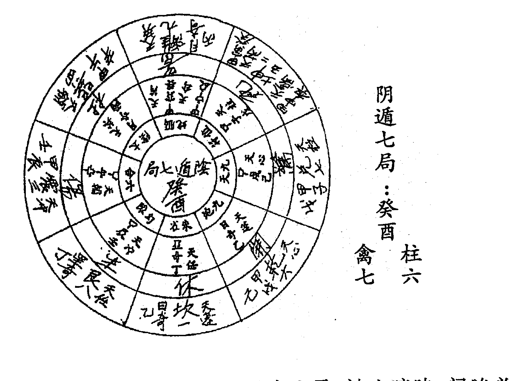

- 1. (1)开乾和 天蓬乙加甲戌己。日奇入雾:被土暗昧，门凶必凶。「地、人遁，重诈，入墓」
- 2. (2)休坎和 天任丁加乙奇。天运昌气格:贵人加官进爵，常人财喜婚姻。「人遁」
- 3. (3)生艮和 天冲壬加丁奇。干合蛇刑:文书牵连，贵人匆匆，男吉女凶。
- 4. (4)伤震和 天辅辛加甲辰壬。凶蛇入狱:两男争女，讼狱不息，先动失理。
- 5. (5)杜巽和 天英丙加甲午辛。威神互合:谋事有成，病人不凶。
- 6. (6)景离和 天芮癸加丙奇。华盖孛师:贵贱逢之，上人见喜。
  天禽庚加丙奇。太白入荧惑:占贼必来，为客进利，为主破财。
- 7. (7)死坤和 天柱戊加甲寅癸。青龙华盖:门吉招福，门凶多乖。
  天柱戊加甲申庚。值符飞宫:吉事不吉，凶事更凶。
- 8. (8)惊兑和 天心己加甲子戊。犬遇青龙:门吉谋望遂意，上人见喜，门凶枉劳心机。
- 9. (9) 开 乙 奇合 乾六 宫，利 西北方。 休 丁 坎一 正

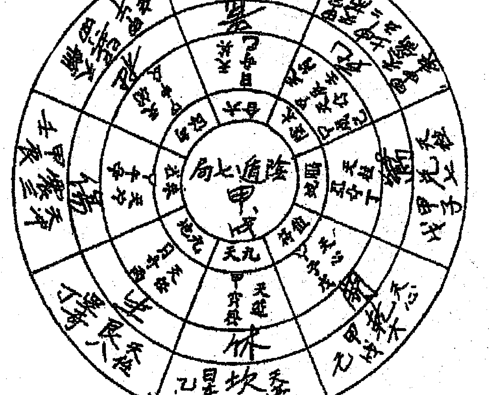

- (1) 开乾和 天心戊加甲戌己。贵人入狱:公私不利。
- (2) 休坎和 天蓬癸加乙奇。华盖官星:贵人禄位，常人平安。
- (3) 生艮和 天任丙加乙奇。辛奇朱雀:贵人文件吉，常人平静。「天遁，重诈」
- (4) 伤震和 天冲辛加甲辰壬。凶蛇入狱:两男争女，讼狱不息，先动失理。
- (5) 杜巽和 天辅庚加甲午辛。白虎干格:远行车折马死。
- (6) 景离和 天英乙加丙奇。奇仪顺遂:吉星迁官进爵，凶星夫妻离别。
- (7) 死坤和 天芮壬加甲寅癸。幼女奸淫:家有丑声，门吉星凶，反祸福隆。
  天禽己加甲申庚。利格返名:词讼先动不利，阴星有谋害之情。
- (8) 惊兑和 天柱丁加甲子戊。青龙转光:官人升迁，常人咸昌。「升殿」
- (9) 生门丙奇合坎一宫，利正北方。

#### 阴遁七局：乙亥
开五
心八

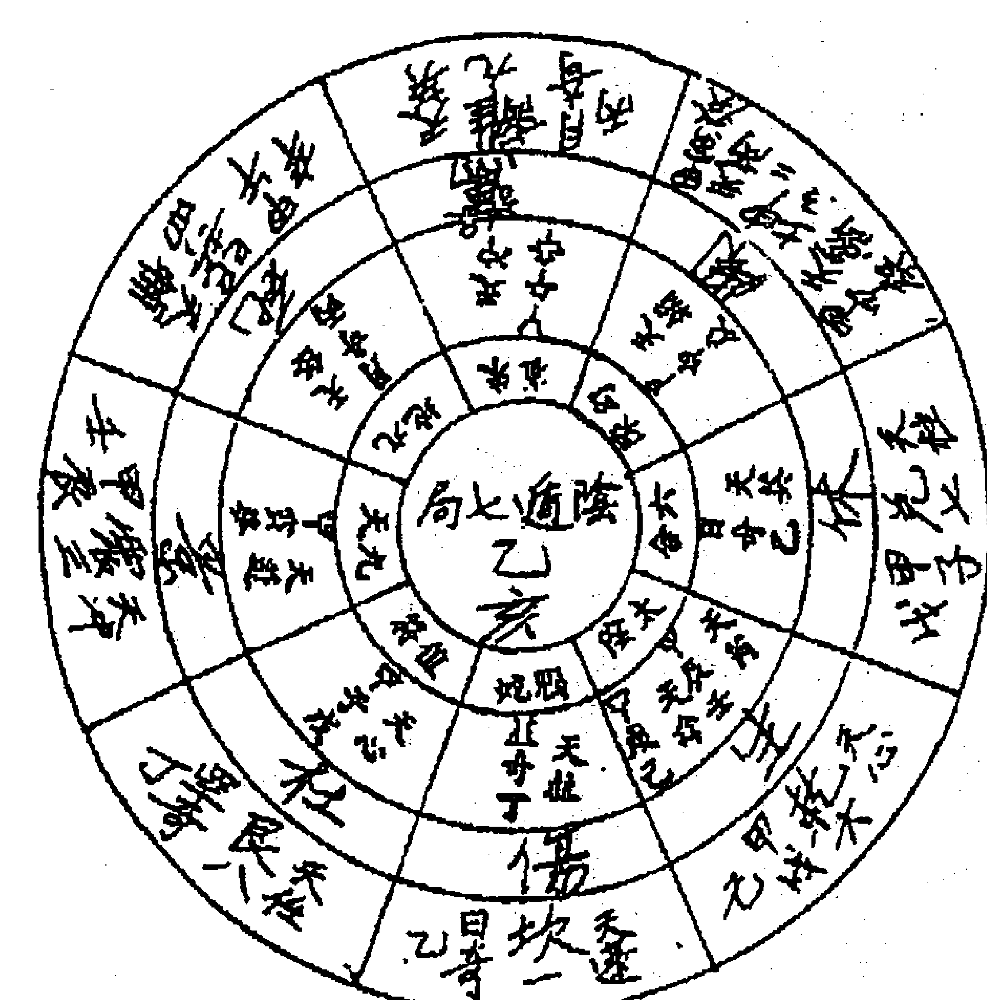

- 1. (1)开坤仪 天辅庚加甲寅癸。大格：行人至，官司止，生产母子俱伤。
- 2. 天辅庚加甲申庚。太白同宫：官灾横祸，兄弟不睦。
- 3. (2)休兑仪 天英乙加甲子戊。利阴害阳：门逢凶迫，财破人伤。[人、地遁，休诈]
- 4. (3)生乾礼 天芮壬加甲戊己。凶蛇入狱：大祸将至，顺守斯吉，词讼理曲。
- 5. 天禽己加甲戊己。地户逢鬼：病凶，百事不遂。
- 6. (4)伤坎仪 天柱丁加乙奇。天运昌气格：贵人加官进爵，常人财喜婚姻。[人遁]
- 7. (5)杜艮迫 天心戊加丁奇。青龙耀明：谒贵求名吉利，值墓迫招是非。
- 8. (6)景震仪 天蓬癸加甲辰壬。复见腾蛇：嫁娶重婚，后嫁无子，不保年华。
- 9. (7)死巽制 天任丙加甲午辛。威神互合：谋事有成，病人不凶。
- 10. (8)惊离制 天冲辛加丙奇。荧惑出现：占雨无，占晴旱，占事必因财致讼。
- 11. (9)休门乙奇合兑七宫，利正西方。

#### 阴遁七局：丙子
开四
心九

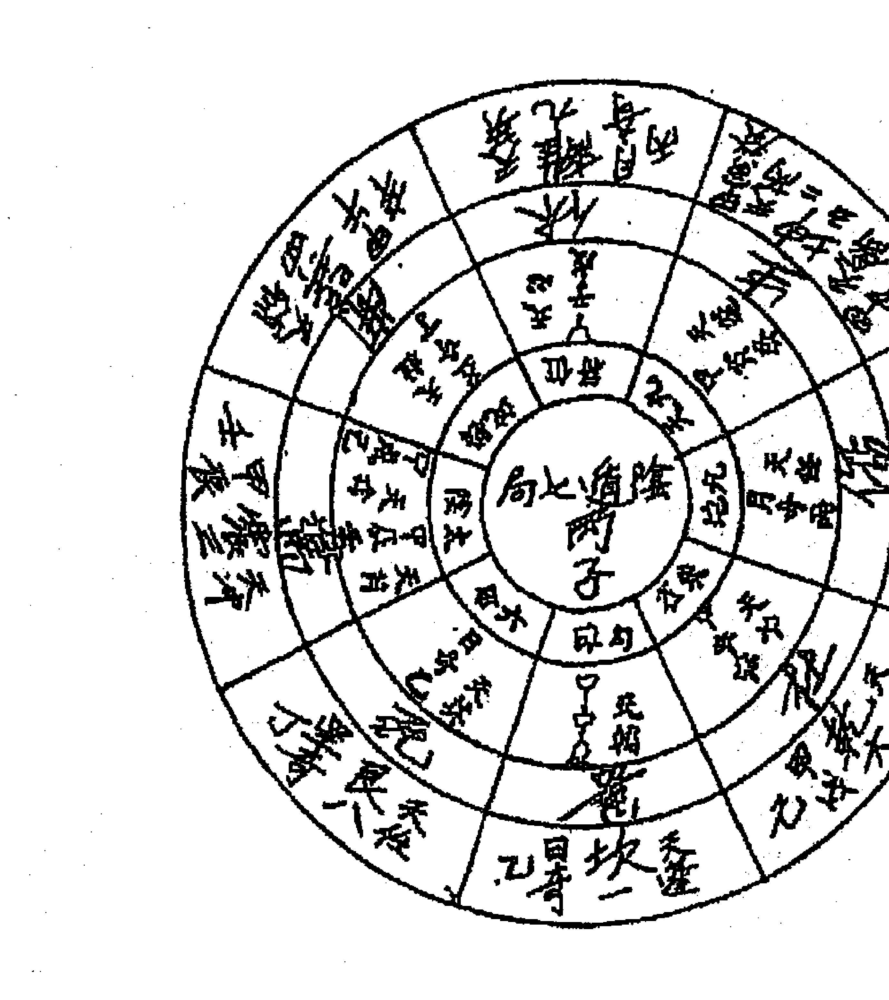

- (1)开巽迫 天柱丁加甲午辛。朱雀入狱:罪人释囚，官人失位。
- (2)休离迫 天心戊加丙奇。青龙回首:动作大利，若逢迫墓，吉事成凶。
- (3)生坤和 天蓬癸加甲寅癸。天网四张:(网高二尺)行人失件，病讼皆伤。
  天蓬癸加甲申庚。太白入网:昙花一现，争讼力平。
- (4)伤兑制 天任丙加甲子戊。飞鸟跌穴:谋事有成，百事洞澈。
- (5)杜乾制 天冲辛加甲戌己。入狱自刑:奴仆背主，诉讼难伸。
- (6)景坎制 天辅庚加乙奇。太白逢星:退吉进凶。
- (7)死艮和 天英乙加丁奇。奇仪相佐:文书事吉，百事皆可为。
- (8)惊震迫 天芮壬加甲辰壬。蛇入地罗:外人缠绕，内事索索，吉门吉星，避免蹉跎。
  天禽己加甲辰壬。地网高张:狡童佚女，奸情伤杀。
- (9)开门丁奇合巽四宫，利东南方。

### 奇门阴阳九遁阴七局符使值例

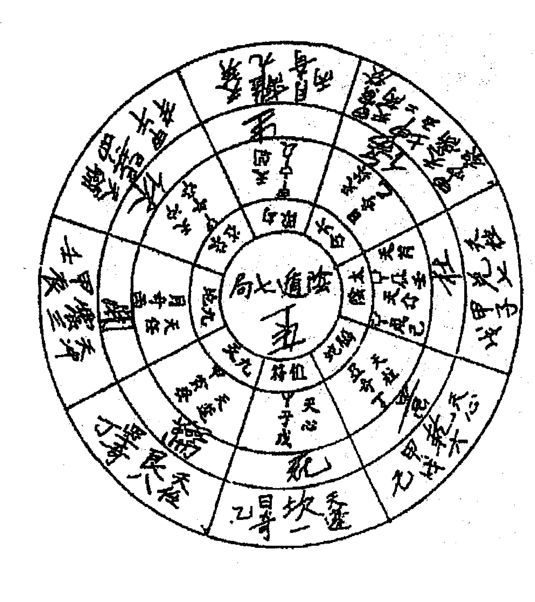

- 1. 开震迫 天任丙加甲辰壬。火入天罗：客不利，是非颇多。「天遁，重诈」
- 2. 休巽礼 天冲辛加甲午辛。伏吟天庭，公废私就：讼狱自罹罪名。
- 3. 生离仪 天辅庚加丙奇。太白入荧惑：占贼必来，为客进利，为主破财。
- 4. 伤坤迫 天英乙加甲寅癸。华盖官星：遁迹修道，隐匿藏形，躲灾避难为吉。「入墓」
  天英乙加甲申庚。日奇被刑：争讼财产夫妻怀私。
- 5. 杜兑制 天芮壬加甲子戊。小蛇化龙：男人发达，女产婴童。
  天禽己加甲子戊。犬遇青龙：门吉谋望遂意，上人见喜，门凶枉劳心机。
- 6. 景乾迫 天柱丁加甲戊己。火入勾陈：奸私仇冤，事因女人。
- 7. 死坎迫 天心戊加乙奇。青龙合灵：门吉事吉，门凶事凶。
- 8. 惊艮仪 天蓬癸加丁奇。腾蛇妖娇：文书官司火焚莫逃，忧惶之事必至。
- 9. 开门丙奇合震三宫，利正东方。

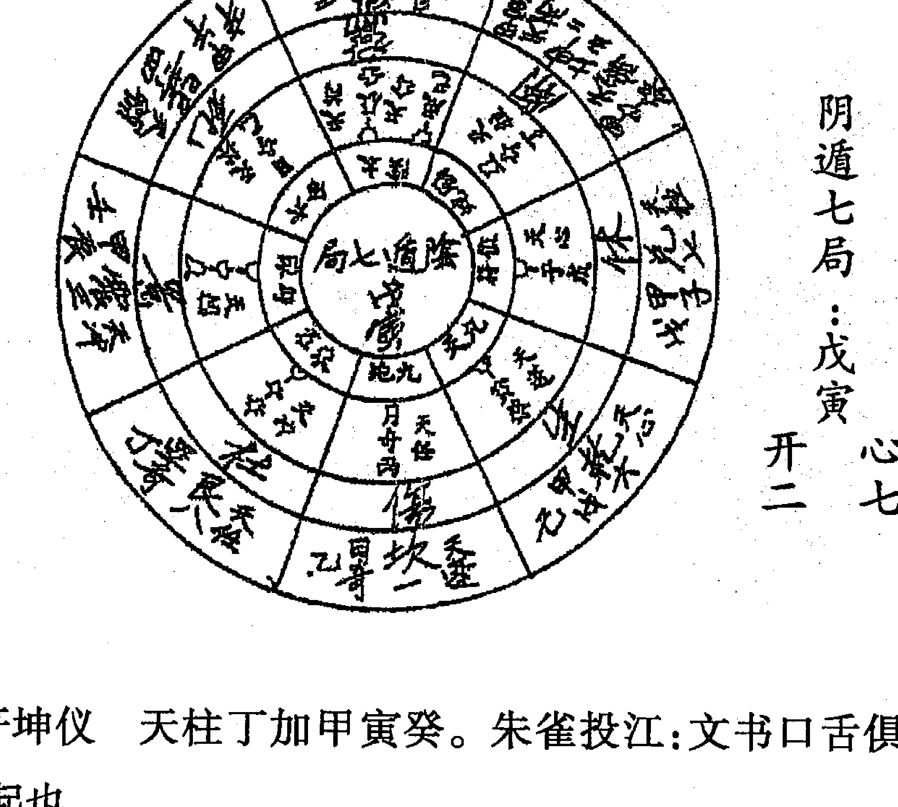

- 1. (1)开坤仪 天柱丁加甲寅癸。朱雀投江:文书口舌俱消，音信沉溺，讼狱所由起也。
  天柱丁加甲申庚。年月日时格:文书阻隔，行人必归。
- 2. (2)休兑仪 天心戊加甲子戊。伏吟:凡事闭塞，静守为吉。
- 3. (3)生乾礼 天蓬癸加甲戊己。华盖地户:占音信皆阻，躲灾避难为吉。
- 4. (4)伤坎仪 天任丙加乙奇。日月并行:公谋私为皆吉。
- 5. (5)杜艮迫 天冲辛加丁奇。狱神得奇:经商获倍利，囚人逢赦宥。
- 6. (6)景震仪 天辅庚加甲辰壬。小格:远行迷路，音信嗟呀。
- 7. (7)死巽制 天英乙加甲午辛。青龙逃走:奴仆拐带，六畜皆伤，财产废坠，身遭毁伤。
- 8. (8)惊离制 天芮壬加丙奇。水蛇入火:官灾刑禁，络绎不绝。
  天禽己加丙奇。火孛地户:阳人冤冤相害，阴人必致淫污。
- 9. (9)开门丁奇合坤二宫，利西南方。

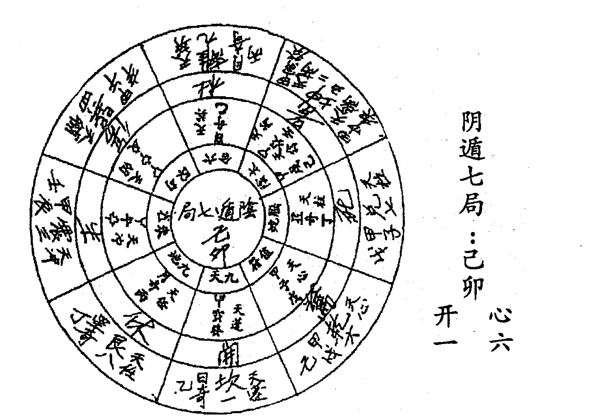

- 1. 开坎礼  天蓬癸加乙奇。华盖官星：贵人禄位，常人平安。
- 2. 休艮制  天任丙加丁奇。辛奇朱雀：贵人文书吉，常人平静。
  > 「天遁，重诈」
- 3. 生震制  天冲辛加甲辰壬。凶蛇入狱：两男争女，讼狱不息，先动失理。
- 4. 伤巽和  天辅庚加甲午辛。白虎干格：远行车折马死。
- 5. 杜离礼  天英乙加丙奇。奇仪顺遂：吉星迁官进爵，凶星夫妻离别。
- 6. 景坤礼  天芮壬加甲寅癸。幼女奸淫：家有丑声，门吉星凶，反祸福隆。
  天禽己加甲申庚。利格返名：词讼先动不利，阴星有谋害之情。
- 7. 死兑礼  天柱丁加甲子戊。青龙转光：官人升迁，常人咸昌。
  > 「升殿，入墓」
- 8. 惊乾和  天心戊加甲戊己。贵人入狱：公私不利。
- 9. 休门丙奇合艮八宫，利东北方。

### 奇门遁甲秘笈全书(中册)

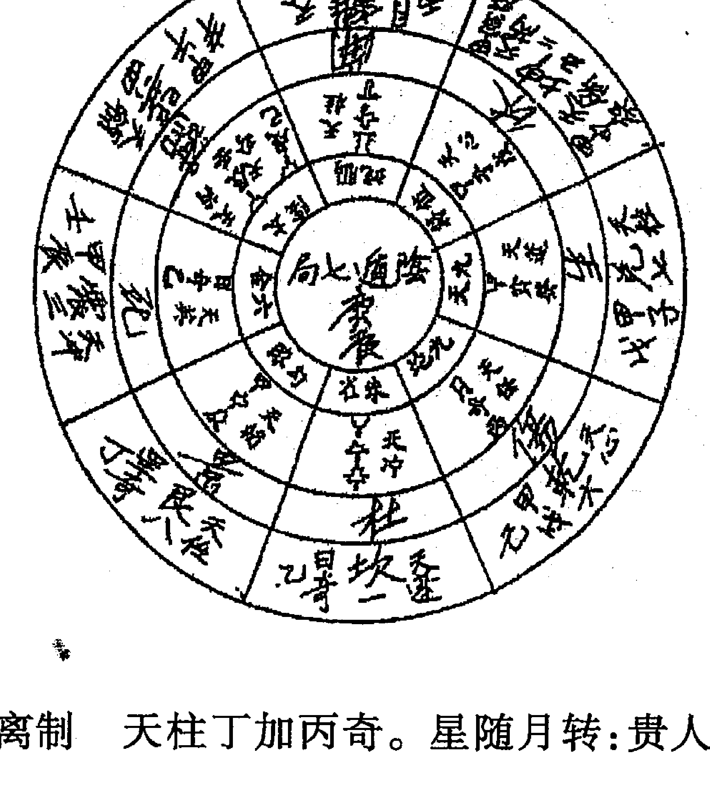

#### 阴遁七局：庚辰
开九
心五

- (1)开离制 天柱丁加丙奇。星随月转:贵人越级高升，常人乐里生悲。
- (2)休坤制 天心戊加甲寅癸。青龙华盖:门吉招福，门凶多乖。
  天心戊加甲申庚。值符飞宫:吉事不吉，凶事更凶。
- (3)生兑礼 天蓬癸加甲子戊。天乙会合:财喜婚姻，吉人赞助成合，门凶迫制，反祸官非。
- (4)伤乾制 天任丙加甲戌己。太孛入刑:囚人刑杖，文书不行，吉门得吉，凶门转凶。[入墓]
- (5)杜坎仪 天冲辛加乙奇。白虎猖狂:人亡家败，远行多殃，尊长不喜，车船俱伤，身体毁伤。
- (6)景艮礼 天辅庚加丁奇。亭亭之格:因私匿起官司，门吉有赦。
- (7)死震制 天英乙加甲辰壬。日奇入地:尊卑孝乱，官讼是非。[升殿]
- (8)惊巽迫 天芮壬加甲午辛。螣蛇相缠:纵得吉门亦不安宁，若有谋望被人欺瞒。
  天禽己加甲午辛。游魂入墓:大人鬼魁，小人家先为祟。
- (9)开门丁奇合离九宫，利正南方。

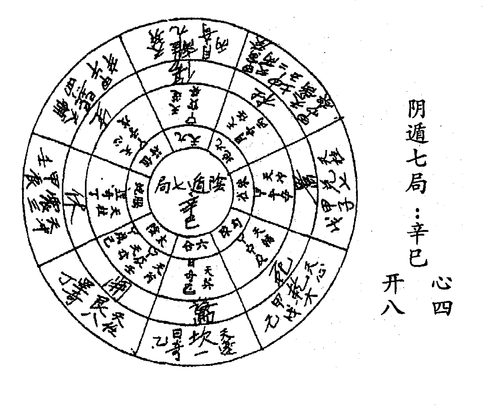

- (1)开艮仪 天芮壬加丁奇。干合蛇刑:文书牵连，贵人匆匆，男吉女凶。
  天禽己加丁奇。朱雀入墓:文状词讼，先曲后直。
- (2)休震礼 天柱丁加甲辰壬。五神互合:贵人恩诏，讼狱公平。
- (3)生巽制 天心戊加甲午辛:青龙折足:吉门生助，尚可谋为，逢凶门主招灾，失财有足疾。
- (4)伤离礼 天蓬癸加丙奇。华盖孛师:贵贱逢之，上人见喜。
- (5)杜坤迫 天任丙加甲寅癸。华盖孛师:阴人害事，灾祸频生。
  天任丙加甲申庚。荧惑入太白:门户破败，盗贼耗失。
- (6)景兑迫 天冲辛加甲子戊。困龙被伤:官司破败，屈抑守分，妄动祸殃。
- (7)死乾礼 天辅庚加甲戊己。刑格:官司被重刑。
- (8)惊坎礼 天英乙加乙奇。日奇伏吟:不宜谒贵求名，只可安分守身。
- (9)休门丁奇合震三宫，利正东方。

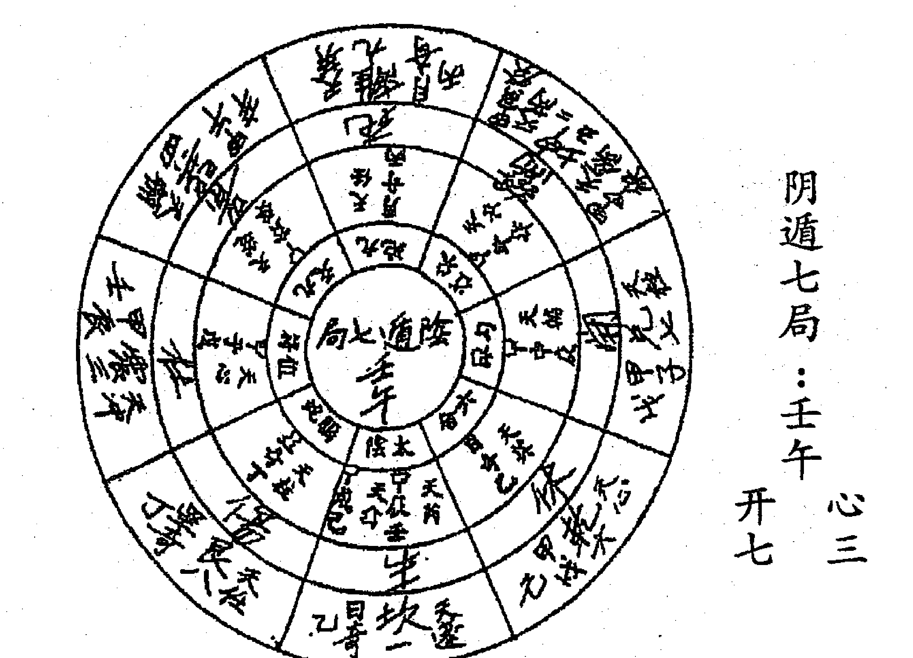

- (1) 开兑和 天辅庚加甲子戊。太白天乙伏官：百事不可谋，凶。『虎遁』
- (2) 休乾仪 天英乙加甲戌己。日奇入雾：被土暗昧，门凶必凶。『入墓，人、地遁，休诈』
- (3) 生坎迫 天芮壬加乙奇。格名小蛇：女人柔顺，男人嗟呀，占孕生子，禄马光华。
  天禽己加丁奇。朱雀入墓：文状词讼，先曲后直。
- (4) 伤艮迫 天柱丁加丁奇。奇入太阴：文书即至，喜事遂心。『入墓』
- (5) 杜震和 天心戊加甲辰壬。龙入天牢：阴阳皆不吉利。
- (6) 景巽仪 天蓬癸加甲午辛。网盖天牢：占讼病凶。
- (7) 死离仪 天任丙加丙奇。月奇孛师：文书逼迫，破耗遗失。『升殿』
- (8) 惊坤仪 天冲辛加甲寅癸。天牢华盖：误入天网，动止乖张。
  天冲辛加甲申庚。白虎出力：刀刃相接，主客相残，逊让退步稍可，强进血溅衣衫。
- (9) 休门乙奇合乾六宫，利西北方。

### 奇门阴阳九遁阴七局符使值例

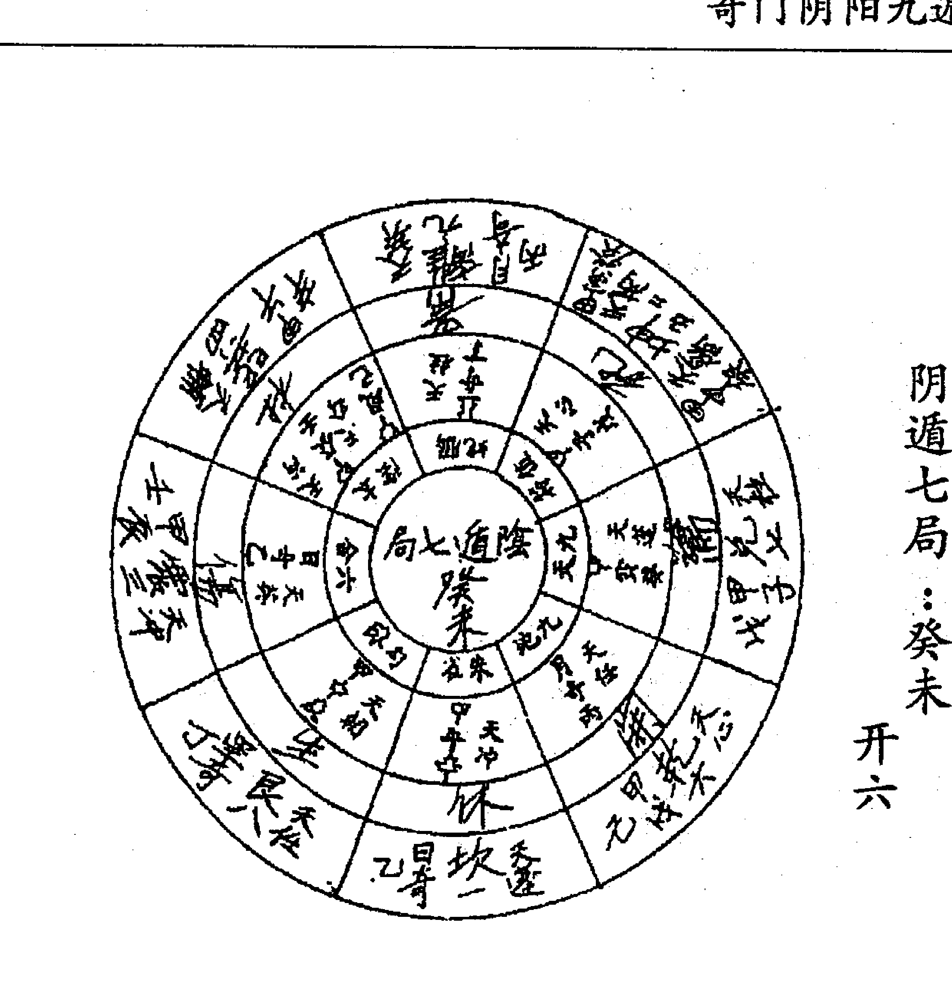

- 1. 开乾和 天任丙加甲戊己。太孛入刑:囚人刑杖，文书不行，吉门得吉，凶门转凶。「天遁，休诈，入墓」
- 2. 休坎和 天冲辛加乙奇。白虎猖狂:人亡家败，远行多殃，尊长不喜，车船俱伤，身体毁伤。
- 3. 生艮和 天辅庚加丁奇。亭亭之格:因私匿起官司，门吉有救。
- 4. 伤震和 天英乙加甲辰壬。日奇入地:尊卑孛乱，官讼是非。「升殿」。
- 5. 杜巽和 天芮壬加甲午辛。螣蛇相缠:纵得吉门亦不安宁，若有谋望被人欺瞒。
  天禽己加甲午辛。游魂入墓:大人鬼魁，小人家先为祟。
- 6. 景离和 天柱丁加丙奇。星随月转:贵人越级高升，常人乐里生悲。
- 7. 死坤和 天心戊加甲寅癸。青龙华盖:门吉招福，门凶多乖。
  天心戊加甲申庚。值符飞宫:吉事不吉，凶事更凶。
- 8. 惊兑和 天蓬癸加甲子戊。天乙会合:财喜婚姻，吉人赞助成合，门凶迫制，反祸官非。
- 9. 开门丙奇合乾六宫，利西北方。

#### 阴遁七局：甲申
死五
禽五

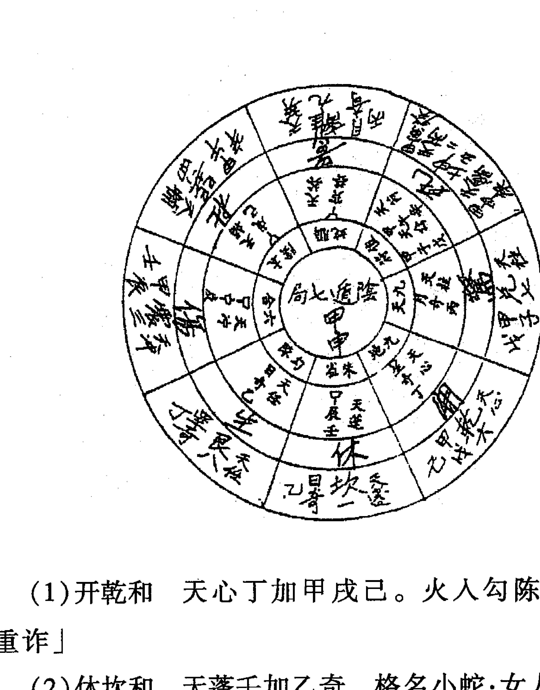

- (1) 开乾和 天心丁加甲戌己。火入勾陈:奸私仇冤，事因女人。「重诈」
- (2) 休坎和 天蓬壬加乙奇。格名小蛇:女人柔顺，男人嗟呀，占孕生子，禄马光华。
- (3) 生艮和 天任乙加丁奇。奇仪相佐:文书事吉，百事皆可为。
- (4) 伤震和 天冲庚加甲辰壬。小格:远行迷路，音信嗟呀。
- (5) 杜巽和 天辅己加甲午辛。游魂入墓:大人鬼魁，小人家先为祟。
- (6) 景离和 天英癸加丙奇。华盖孛师:贵贱逢之，上人见喜。
- (7) 死坤和 天芮辛加甲寅癸。天牢华盖:误入天网，动止乖张。
  天禽戊加甲申庚。值符飞宫:吉事不吉，凶事更凶。
- (8) 惊兑和 天柱丙加甲子戊。飞鸟跌穴:谋事有成，百事洞澈。
- (9) 开 丁 奇合 乾六 宫，利 西北方。
  生 乙 艮八 东

#### 阴遁七局：乙酉
死四
禽八

- (1) 开坤仪 天任乙加甲寅癸。华盖官星:遁迹修道，隐匿藏形，躲灾避难为吉。「入墓」
  天任乙加甲申庚。日奇被刑:争讼财产夫妻怀私。
- (2) 休兑仪 天冲庚加甲子戊。太白天乙伏官:百事不可谋，凶。
- (3) 生乾礼 天辅己加甲戌己。地户逢鬼:病凶，百事不遂。
- (4) 伤坎仪 天英癸加乙奇。华盖官星:贵人禄位，常人平安。
- (5) 杜艮迫 天芮辛加丁奇。狱神得奇:经商获倍利，囚人逢赦宥。
  天禽戊加丁奇。青龙耀明:谒贵求名吉利，值墓迫招是非。
- (6) 景震仪 天柱丙加甲辛壬。火入天罗:客不利，是非颇多。
- (7) 死巽制 天心丁加甲午辛。朱雀入狱:罪人释囚，官人失位。「入墓，鬼假」
- (8) 惊离制 天蓬壬加丙奇。水蛇入火:官灾刑禁，络绎不绝。
- (9) 开门乙奇合坤二宫，利西南方。

### 奇门遁甲秘笈全书(中册)

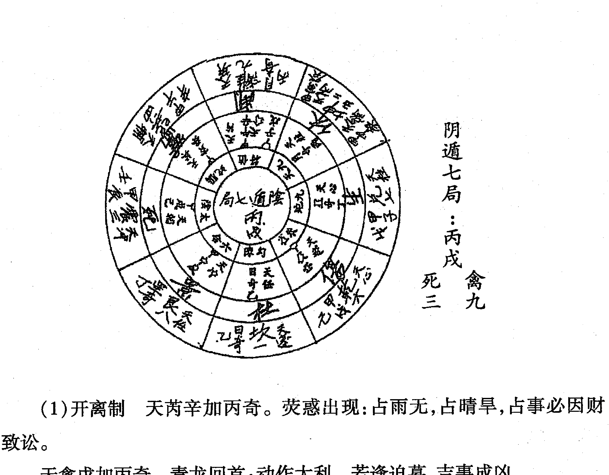

#### 阴遁七局：丙戌
死三
禽九

- (1) 开离制 天芮辛加丙奇。荧惑出现：占雨无，占晴旱，占事必因财致讼。
  天禽戊加丙奇。青龙回首：动作大利。若逢迫墓，吉事成凶。
- (2) 休坤制 天柱丙加甲寅癸。华盖孛师：阴人害事，灾祸频生。
  天柱丙加甲申庚。荧惑入太白：门户破败，盗贼耗失。
- (3) 生兑礼 天心丁加甲子戊。青龙转光：官人升迁，常人咸昌。
  「升殿，重诈」
- (4) 伤乾制 天蓬壬加甲戊己。凶蛇入狱：大祸将至，顺守斯吉，词讼理曲。
- (5) 杜坎仪 天任乙加乙奇。日奇伏吟：不宜谒贵求名，只可安分守身。
- (6) 景艮礼 天冲庚加丁奇。亭亭之格：因私匿起官司，门吉有救。
- (7) 死震制 天辅己加甲辰壬。地网高张：狡童佚女，奸情伤杀。
- (8) 惊巽迫 天英癸加甲午辛。网盖天牢：占讼病凶。
- (9) 休门丙奇合坤二宫，利西南方。

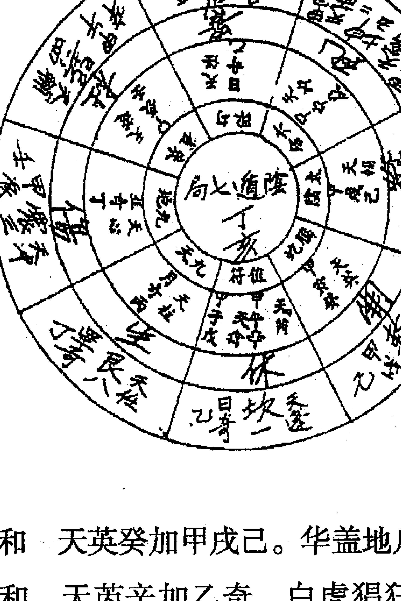

#### 阴遁七局：丁亥
死二
禽一

- (1) 开乾和 天英癸加甲戌己。华盖地户:占音信皆阻，躲灾避难为吉。
- (2) 休坎和 天芮辛加乙奇。白虎猖狂:人亡家败，远行多殃，尊长不喜，车船俱伤，身体毁伤。「云遁」
  天禽戊加乙奇。青龙合灵:门吉事吉，门凶事凶。
- (3) 生艮和 天柱丙加丁奇。辛奇朱雀:贵人文书吉，常人平静。「神遁」
- (4) 伤震和 天心丁加甲辰壬。五神互合:贵人恩诏，讼狱公平。
- (5) 杜巽和 天蓬壬加甲午辛。螣蛇相缠:纵得吉门，亦不安宁，若有谋望被人欺瞒。
- (6) 景离和 天任乙加丙奇。奇仪顺遂:吉星迁官进爵，凶星夫妻离别。
- (7) 死坤和 天冲庚加甲寅癸。大格:行人至，官司止，生产母子俱伤。
  天冲庚加甲申庚。太白同宫:官灾横祸，兄弟不睦。
- (8) 惊兑和 天辅己加甲子戊。犬遇青龙:门吉谋望遂意，上人见喜，门凶枉劳心机。
- (9) 生门丙奇合艮八宫，利东北方。

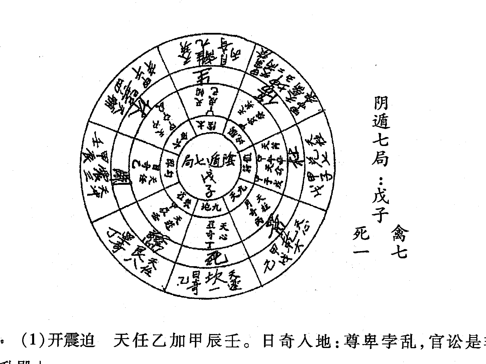

- 1. 开震迫 天任乙加甲辰壬。日奇入地:尊卑孛乱，官讼是非。「升殿」
- 2. 休巽礼 天冲庚加甲午辛。白虎干格:远行车折马死。
- 3. 生离仪 天辅己加丙奇。火孛地户:阳人冤冤相害，阴人必致淫污。
- 4. 伤坤迫 天英癸加甲寅癸。天网四张:(网高二尺)行人失件，病讼皆伤。
  天英癸加甲申庚。太白入网:昙花一现，争讼力平。
- 5. 杜兑制 天芮辛加甲子戊。困龙被伤:官司破败，屈抑守分，妄动祸殃。
  天禽戊加甲子戊。伏吟:凡事闭塞，静守为吉。
- 6. 景乾迫 天柱丙加甲戌己。太孛入刑:囚人刑杖，文书不行，吉门得吉，凶门转凶。「入墓」
- 7. 死坎迫 天心丁加乙奇。天运昌气格:贵人加官进爵，常人财喜婚姻。「入墓，鬼假，人遁」
- 8. 惊艮仪 天蓬壬加丁奇。干合蛇刑:文书牵连，贵人匆匆，男吉女凶。
- 9. 开门乙奇合震三宫，利正东方。

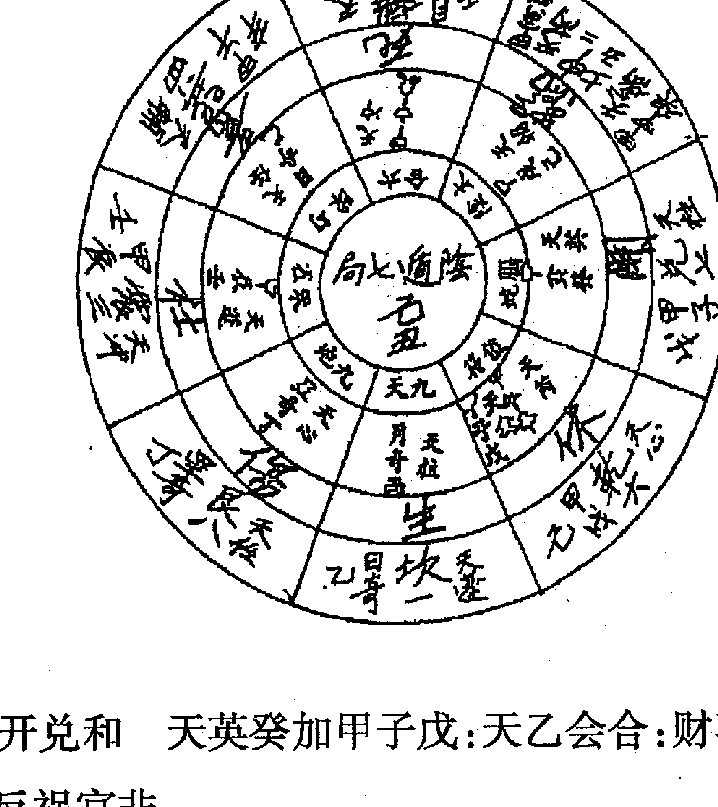

#### 阴遁七局：己丑
死九
禽六

- 1. 开兑和 天英癸加甲子戊:天乙会合:财喜婚姻，吉人赞助成合，门凶迫制，反祸官非。
- 2. 休乾仪 天芮辛加甲戌己。入狱自刑:奴仆背主，诉讼难伸。
  天禽戊加甲戌己。贵人入狱:公私不利。
- 3. 生坎迫 天柱丙加乙奇。日月并行:公谋私为皆吉。「神遁」
- 4. 伤艮迫 天心丁加丁奇。奇入太阴:文书即至，喜事遂心。「入墓」
- 5. 杜震和 天蓬壬加甲辰壬。蛇入地罗:外人缠绕，内事索索，吉门吉星，避免蹉跎。
- 6. 景巽仪 天任乙加甲午辛。青龙逃走:奴仆拐带，六畜皆伤，财产废坠，身遭毁伤。
- 7. 死离仪 天冲庚加丙奇。太白入荧惑:占贼必来，为客进利，为主破财。
- 8. 惊坤仪 天辅己加甲寅癸。地刑玄武:病凶。词讼有囚狱之灾。
  天辅己加甲申庚。利格返名:词讼先动不利，阴星有谋害之情。
- 9. 生门丙奇合坎一宫，利正北方。

#### 阴遁七局：庚寅
禽五
死八

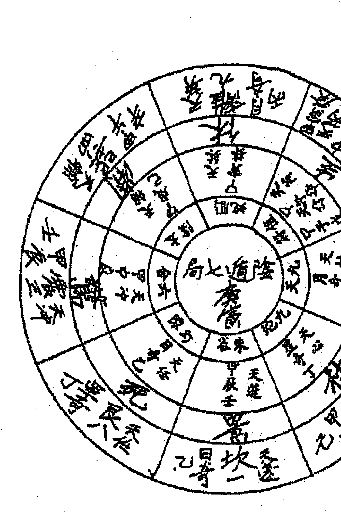

- (1)开巽迫 天辅己加甲午辛。游魂入墓:大人鬼魁，小人家先为祟。
- (2)休离迫 天英癸加丙奇。华盖孛师:贵贱逢之，上人见喜。
- (3)生坤和 天芮辛加甲寅癸。天牢华盖:误入天网，动止乖张。
  天禽戊加甲申庚。值符飞宫:吉事不吉，凶事更凶。
- (4)伤兑制 天柱丙加甲子戊。飞鸟跌穴:谋事有成，百事洞澈。
- (5)杜乾制 天心丁加甲戌己。火入勾陈:奸私仇冤，事因女人。
  > 「地假」
- (6)景坎制 天蓬壬加乙奇。格名小蛇:女人柔顺，男人嗟呀，占孕生子，禄马光华。
- (7)死艮和 天任乙加丁奇。奇仪相佐:文书事吉，百事皆可为。
- (8)惊震迫 天冲庚加甲辰壬。小格:远行迷路，音信嗟呀。
- (9)无奇门。

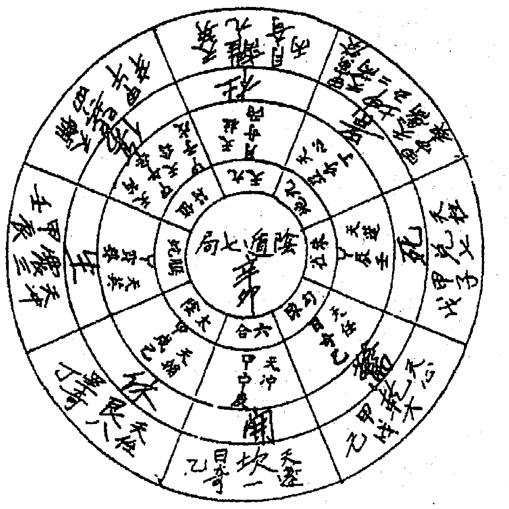

#### 阴遁七局：辛卯
死七
禽四

- (1)开坎礼 天冲庚加乙奇。太白逢星:退吉进凶。
- (2)休艮制 天辅乙加丁奇。朱雀入墓:文状词讼，先曲后直。
- (3)生震制 天英癸加甲辰壬。复见螣蛇:嫁娶重婚，后嫁无子，不保年华。
- (4)伤巽和 天芮辛加甲午辛。伏吟天庭:公废私就，讼狱自罹罪名。
  天禽戊加甲午辛:青龙折足:吉门生助，尚可谋为，逢凶门主招灾，失财足疾。
- (5)杜离礼 天柱丙加丙奇。月奇孛师:文书逼迫，破耗遗失。「升殿」
- (6)景坤礼 天心丁加甲寅癸。朱雀投江:文书口舌俱消，音信沉溺，讼狱所由起也。
  天心丁加甲申庚。年月日时格:文书阻隔，行人必归。
- (7)死兑礼 天蓬壬加甲子戊。小蛇化龙:男人发达，女产婴童。
- (8)惊乾和 天任乙加甲戊己。日奇入雾:被土暗昧，门凶必凶。
  「入墓」
- (9)无奇门。

### 阴遁七局：甲午
杜辅 四四

1. 开乾和 天心丙加甲戊己。太孛人刑：囚人刑杖，文书不行，吉门得吉，凶门转凶。「入墓」
2. 休坎和 天蓬辛加乙奇。白虎猖狂：人亡家败，远行多殃，尊长不喜，车船俱伤，身体毁伤。「云遁」
3. 生艮和 天任癸加丁奇。腾蛇妖娇：文书官司火焚莫逃，忧惶之事必至。
4. 伤震和 天冲己加甲辰壬。地网高张：狡童佚女，奸情伤杀。
5. 杜巽和 天辅戊加甲午辛：青龙折足：吉门生助，尚可谋为，逢凶门主招灾，失财足疾。
6. 景离和 天英壬加丙奇。水蛇入火：官灾刑禁，络绎不绝。
7. 死坤和 天芮庚加甲寅癸。大格：行人至，官司止，生产母子俱伤。天禽丁加甲申庚。年月日时格：文书阻隔，行人必归。「入墓，鬼假」
8. 惊兑和 天柱乙加甲子戊。利阴害阳：门逢凶迫，财破人伤。
9. 开门丙奇合乾六宫，利西北方。

1. 开兑和 天蓬辛加甲子戊。困龙被伤：官司破败，屈抑守分，妄动祸殃。
2. 休乾仪 天任癸加甲戊己。华盖地户：占音信皆阻，躲灾避难为吉。
3. 生坎迫 天冲己加乙奇。墓神不明：宜遁迹隐形为利逸。
4. 伤艮迫 天辅戊加丁奇。青龙耀明：谒贵求名吉利，值墓迫招是非。
5. 杜震和 天英壬加甲辰壬。蛇入地罗：外人缠绕，内事索索，吉门吉星，避免蹉跎。
6. 景巽仪 天芮庚加甲午辛。白虎干格：远行车折马死。天禽丁加甲午辛。朱雀入狱：罪人释囚，官人失位。
7. 死离仪 天柱乙加丙奇。奇仪顺遂：吉星迁官进爵，凶星夫妻离别。
8. 惊坤仪 天心丙加甲寅癸。华盖孛师：阴人害事，灾祸频生。天心丙加甲申庚。荧惑入太白：门户破败，盗贼耗失。
9. 无奇门。

### 阴遁七局：丙申
杜二 辅九

1. 开艮仪 天蓬辛加丁奇。狱神得奇：经商获倍利，囚人逢赦宥。
2. 休震礼 天任癸加甲辰壬。复见腾蛇：嫁娶重婚，后嫁无子，不保年华。
3. 生巽制 天冲己加甲午辛。游魂入墓：大人鬼魁，小人家先为祟。
4. 伤离礼 天辅戊加丙奇。青龙回首：动作大利，若逢迫墓，吉事成凶。
5. 杜坤迫 天英壬加甲寅癸。幼女奸淫：家有丑声，门吉星凶，反祸福隆。天英壬加甲申庚。太白擒蛇：刑狱公平，立剖邪正。
6. 景兑迫 天芮庚加甲子戊。太白天乙伏官：百事不可谋，凶。天禽丁加甲子戊。青龙转光：官人升迁，常人咸昌。「升殿」
7. 死乾礼 天柱乙加甲戊己。日奇人雾：被土暗味，门凶必凶。「入墓」
8. 惊坎礼 天心丙加乙奇。日月并行：公谋私为皆吉。
9. 无奇门。

### 奇门阴阳九遁阴七局符使值例

阴遁七局：丁酉
杜 辅

1. 开离制 天心丙加丙奇。月奇孛师：文书逼迫，破耗遗失。「升殿」
2. 休坤制 天蓬辛加甲寅癸。天牢华盖：误入天网，动止乖张。天蓬辛加甲申庚。白虎出力：刀刃相接，主客相残，逊让退步稍可，强进血溅衣衫。
3. 生兑礼 天任癸加甲子戊。天乙会合：财喜婚姻，吉人赞助成合，门凶迫制，反祸官非。
4. 伤乾制 天冲己加甲戊己。地户逢鬼：病凶，百事不遂。
5. 杜坎仪 天辅戊加乙奇。青龙合灵：门吉事吉，门凶事凶。
6. 景艮礼 天英壬加丁奇。干合蛇刑：文书牵连，贵人匆匆，男吉女凶。
7. 死震制 天芮庚加甲辰壬。小格：远行迷路，音信嗟呀。天禽丁加甲辰壬。五神互合：贵人恩诏，讼狱公平。「入墓，鬼假」
8. 惊巽迫 天柱乙加甲午辛。青龙逃走：奴仆拐带，六畜皆伤，财产废坠，身遭毁伤。
9. 开门丙奇合离九宫，利正南方。

1. 开坎礼 天芮庚加乙奇。太白逢星：退吉进凶。天禽丁加乙奇。天运昌气格：贵人加官进爵，常人财喜婚姻。「人遁，重诈」
2. 休艮制 天柱乙加丁奇。奇仪相佐：文书事吉，百事皆可为。
3. 生震制 天心丙加甲辰壬。火入天罗：客不利，是非颇多。
4. 伤巽和 天蓬辛加甲午辛。伏吟天庭：公废私就，讼狱自罹罪名。
5. 杜离礼 天任癸加丙奇。华盖孛师：贵贱逢之，上人见喜。
6. 景坤礼 天冲己加甲寅癸。地刑玄武：病凶，词讼有囚狱之灾。天冲己加甲申庚。利格返名：词讼先动不利，阴星有谋害之情。
7. 死兑礼 天辅戊加甲子戊。伏吟：凡事闭墓，静守为吉。
8. 惊乾和 天英壬加甲戌己。凶蛇入狱：大祸将至，顺守斯吉，词讼理曲。「人假」
9. 开 丁 坎一 正北。休门乙奇合艮八宫，利东方。生 丙 震三 正东。

1. 开坤仪 天任癸加甲寅癸。天网四张：（网高二尺）行人失件，病讼皆伤。天任癸加甲申庚。太白入网：昙花一现，争讼力平。
2. 休兑仪 天冲己加甲子戊。犬遇青龙：门吉谋望遂意，上人见喜，门凶枉劳心机。
3. 生乾礼 天辅戊加甲戊己。贵人入狱：公私不利。
4. 伤坎仪 天英壬加乙奇。格名小蛇：女人柔顺，男人嗟呀，占孕生子，禄马光华。
5. 杜艮迫 天芮庚加丁奇。亭亭之格：因私匿起官司，门吉有救。天禽丁加丁奇。奇人太阴：文书即至，喜事遂心。「入墓，地假」
6. 景震仪 天柱乙加甲辰壬。日奇入地：尊卑孛乱，官讼是非。「升殿」
7. 死巽制 天心丙加甲午辛。威神互合：谋事有成，病人不凶。
8. 惊离制 天蓬辛加丙奇。荧惑出现：占雨无，占晴旱，占事必因财致讼。
9. 无奇门。

### 阴遁七局：庚子 杜七 辅五

1. 开震迫 天蓬辛加甲辰壬。凶蛇入狱：两男争女，讼狱不息，先动失理。
2. 休巽礼 天任癸加甲午辛。网盖天牢：占讼病凶。
3. 生离仪 天冲己加丙奇。火孛地户：阳人冤冤相害，阴人必致淫污。
4. 伤坤迫 天辅戊加甲寅癸。青龙华盖：门吉招福，门凶多乖。天辅戊加甲申庚。值符飞宫：吉事不吉，凶事更凶。
5. 杜兑制 天英壬加甲子戊。小蛇化龙：男人发达，女产婴童。
6. 景乾迫 天芮庚加甲戊己。刑格：官司被重刑。天禽丁加甲戊己。火入勾陈：奸私仇冤，事因女人。
7. 死坎迫 天柱乙加乙奇。日奇伏吟：不宜谒贵求名，只可安分守身。
8. 惊艮仪 天心丙加丁奇。辛奇朱雀：贵人文书吉，常人平静。「入墓」
9. 无奇门。

1. 开巽迫 天辅戊加甲午辛。青龙折足：吉门生助，尚可谋为，若逢凶门，主招灾失财有足疾。
2. 休离迫 天英壬加丙奇。水蛇入火：官灾刑禁，络绎不绝。
3. 生坤和 天芮庚加甲寅癸。大格：行人至，官司止，生产母子俱伤。天禽丁加甲申庚。年月日时格：文书阻隔，行人必归。「重诈」
4. 伤兑制 天柱乙加甲子戊。利阴害阳：门逢凶迫，财破人伤。
5. 杜乾制 天心丙加甲戊己。太孛入刑：囚人刑杖，文书不行，吉门得吉，凶门转凶。「入墓」
6. 景坎制 天蓬辛加乙奇。白虎猖狂：人亡家败，远行多殃，尊长不喜，车船俱伤，身体毁伤。
7. 死艮和 天任癸加丁奇。螣蛇妖娇：文书官司火焚莫逃，忧惶之事必至。
8. 惊震迫 天冲乙加甲辰壬。地网高张：狡童佚女，奸情伤杀。
9. 生门丁奇合坤二宫，利西南方。

### 阴遁七局：壬寅 杜五 辅三

1. 开艮仪 天冲己加丁奇。朱雀入墓：文状词讼，先曲后直。
2. 休震礼 天辅戊加甲辰壬。龙入天牢：阴阳皆不吉利。
3. 生巽制 天英壬加甲午辛。螣蛇相缠：纵得吉门亦不安宁，若有谋望被人欺瞒。
4. 伤离礼 天芮庚加丙奇。太白入荧惑：占贼必来，为客进利，为主破财。天禽丁加丙奇。星随月转：贵人越级高升，常人乐里生悲。
5. 杜坤迫 天柱乙加甲寅癸。华盖官星，遁迹修道，隐匿藏形，躲灾避难为吉。「入墓」天柱乙加甲申庚。日奇被刑：争讼财产夫妻怀私。
6. 景兑迫 天心丙加甲子戊。飞鸟跌穴：谋事有成，百事洞澈。
7. 死乾礼 天蓬辛加甲戊己。入狱自刑：奴仆背主，讼诉难伸。
8. 惊坎礼 天任癸加乙奇。华盖官星：贵人禄位，常人平安。
9. 无奇门。

阴遁七局：癸卯
杜四 辅二

1. 开乾和 天芮庚加甲戊己。刑格：官司被重刑。天禽丁加甲戊己。火入勾陈：奸私仇冤，事因女人。「重诈」
2. 休坎和 天柱乙加乙奇。日奇伏吟：不宜谒贵求名，只可安分守身。
3. 生艮和 天心丙加丁奇。辛奇朱雀：贵人文书吉，常人平静。
4. 伤震和 天蓬辛加甲辰壬。凶蛇入狱：两男争女，讼狱不息，先动失理。
5. 杜巽和 天任癸加甲午辛。网盖天牢：占讼病凶。
6. 景离和 天冲己加丙奇。火孛地户：阳人冤冤相害，阴人必致淫污。
7. 死坤和 天辅戊加甲寅癸。青龙华盖：门吉招福，门凶多乖。天辅戊加甲申庚。值符飞宫：吉事不吉，凶事更凶。
8. 惊兑和 天英壬加甲子戊。小蛇化龙：男人发达，女产婴童。
9. 开 丁 乾六 西。休门乙奇合坎一宫，利正北方。生 丙 艮八 东。

### 奇门遁甲秘笈全书（中册）

1. 开乾和 天心乙加甲子戊。利阴害阳：门逢凶迫，财破人伤。「人、地遁，休诈」
2. 休坎和 天蓬庚加乙奇。太白逢星：退吉进凶。
3. 生艮和 天任壬加丁奇。干合蛇刑：文书牵连，贵人匆匆，男吉女凶。
4. 伤震和 天冲戊加甲辰壬。龙入天牢：阴阳皆不吉利。
5. 杜巽和。天辅丁加甲午辛。朱雀入狱：罪人释囚，官人失位。
6. 景离和 天英辛加丙奇。荧惑出现：占雨无，占晴旱，占事必因财致讼。
7. 死坤和 天芮己加甲寅癸。地刑玄武：病凶，词讼有囚狱之灾。天禽丙加甲申庚。荧惑入太白：门户破败，盗贼耗失。
8. 惊兑和 天柱癸加甲子戊。天乙会合：财喜婚姻，吉人赞助成合，门凶迫制，反祸宫非。
9. 开门乙奇合乾六宫，利西北方。

1. 开震迫 天辅丁加甲辰壬。五神互合：贵人恩诏，讼狱公平。
2. 休巽礼 天英辛加甲午辛。伏吟天庭：公废私就，讼狱自罹罪名。
3. 生离仪 天芮己加丙奇。火孛地户：阳人冤冤相害，阴人必致淫污。天禽丙加丙奇。月奇孛师：文书逼迫，破耗遗失。「升殿」
4. 伤坤迫 天柱癸加甲寅癸。天网四张：（网高二尺）行人失件，病讼皆伤。天柱癸加甲申庚。太白入网：昙花一现，争讼力平。
5. 杜兑制 天心乙加甲子戊。利阴害阳：门逢凶迫，财破人伤。
6. 景乾迫 天蓬庚加甲戌己。刑格：官司被重刑。
7. 死坎迫 天任壬加乙奇。格名小蛇：女人柔顺，男人嗟呀，占孕生子，禄马光华。
8. 惊艮仪 天冲戊加丁奇。青龙耀明：谒贵求名吉利，值墓迫招是非。
9. 开门丁奇合震三宫，利正东方。生门丙奇合离九宫，利正南方。

阴遁七局：丙午
伤一 冲九

1. 开坤制 天辅丁加甲寅癸。朱雀投江：文书口舌俱消，音信沉溺，讼狱所由起也。天辅丁加甲申庚。年月日时格：文书阻隔，行人必归。
2. 休兑仪 天英辛加甲子戊。困龙被伤：官司破败，屈抑守分，妄动祸殃。
3. 生乾礼 天芮己加甲戊己。地户逢鬼：病凶，百事不遂。天禽丙加甲戊己。太孛入刑：囚人刑杖，文书不行，吉门得吉，凶门转凶。「入墓」
4. 伤坎仪 天柱癸加乙奇。华盖官星：贵人禄位，常人平安。
5. 杜艮迫 天心乙加丁奇。奇仪相佐：文书事吉，百事皆可为。
6. 景震仪 天蓬庚加甲辰壬。小格：远行迷路，音信嗟呀。
7. 死巽制 天任壬加甲午辛。螣蛇相缠：纵得吉门亦不安宁，若有谋望被人欺瞒。
8. 惊离制 天冲戊加丙奇。青龙回首：动作大利，若逢迫墓。吉事成凶。
9. 开门丁奇合坤二宫，利西南方。生门丙奇合兑二宫，利正西方。

### 奇门阴阳九遁阴七局符使值例

1. 开艮仪 天辅丁加丁奇。奇人太阴：文书即至，喜事遂心。「入墓」
2. 休震礼 天英辛加甲辰壬。凶蛇入狱：两男争女，讼狱不息，先动失理。
3. 生巽制 天芮己加甲午辛。游魂入墓：大人鬼魁，小人家先为祟。天禽丙加甲午辛。威神互合：谋事有成，病人不凶。
4. 伤离礼 天柱癸加丙奇。华盖孛师：贵贱逢之，上人见喜。
5. 杜坤迫 天心乙加甲寅癸。华盖官星：遁踪修道，隐匿藏形，躲灾避难为吉。「入墓」天心乙加甲申癸。日奇被刑：争讼财产，夫妻怀私。
6. 景兑迫 天蓬庚加甲子戊。太白天乙伏官：百事不可谋，凶。
7. 死乾礼 天任壬加甲戌己。凶蛇入狱：大祸将至，顺守斯吉，词讼理曲。
8. 惊坎礼 天冲戊加丁奇。青龙耀明：谒贵求名吉利，值墓迫招是非。
9. 开门丁奇合艮八宫，利北方。生门丙奇合巽四宫，利南方。

1. 开兑和 天冲戊加甲子戊。伏吟：凡事闭塞，静守为吉。
2. 休乾仪 天辅丁加甲戌己。火入勾陈：奸私仇冤，事因女人。
3. 生坎迫 天英辛加乙奇。白虎猖狂：人亡家败，远行多殃，尊长不喜，车船俱伤，身体毁伤。「云遁」
4. 伤艮迫 天芮己加丁奇。朱雀入墓：文状词讼，先曲后直。天禽丙加丁奇。辛奇朱雀：贵人文书吉，常人平静。
5. 杜震和 天柱癸加甲辰壬。复见腾蛇：嫁娶重婚，后嫁无子，不保年华。
6. 景巽仪 天心乙加甲午辛。青龙逃走：奴仆拐带，六畜皆伤，财产废坠，身遭毁伤。
7. 死离仪 天蓬庚加丙奇。太白入荧惑：占贼必来，为客进利，为主破财。
8. 惊坤仪 天任壬加甲寅癸。幼女奸淫：家有丑声，门吉星凶，反祸福隆。天任壬加甲申庚。太白擒蛇：刑狱公平，立剖邪正。
9. 休门丁奇合乾六宫，利西北方。

1. 开巽迫 天柱癸加甲午辛。网盖天牢：占讼病凶。
2. 休离迫 天心乙加丙奇。奇仪顺遂：吉星迁官进爵，凶星夫妻离别。「人、地遁，休诈」
3. 生坤和 天蓬庚加甲寅癸。行人至：官司止，生产母子俱伤。天蓬庚加甲申庚。太白同宫：官灾横祸，兄弟不睦。
4. 伤兑制 天任壬加甲子戊。小蛇化龙：男人发达，女产婴童。
5. 杜乾制 天冲戊加甲戌己。贵人入狱：公私不利。
6. 景坎制 天辅丁加乙奇。天运昌气格：贵人加官进爵，常人财喜婚姻。「人遁」
7. 死艮和 天英辛加丁奇。狱神得奇：经商获倍利，囚人逢赦宥。
8. 惊震迫 天芮己加甲辰壬。地网高张：狡童佚女，奸情伤杀。天禽丙加甲辰壬。火入天罗：客不利，是非颇多。
9. 休门乙奇合离九宫，利正南方。

### 奇门遁甲秘笈全书（中册）

阴遁七局：庚戌 伤六 冲五

1. 开离制 天任壬加丙奇。水蛇入火：官灾刑禁，络绎不绝。
2. 休坤制 天冲戊加甲寅癸。青龙华盖：门吉招福，门凶多乖。天冲戊加甲申庚。值符飞宫：吉事不吉，凶事更凶。
3. 生兑礼 天辅丁加甲子戊。青龙转光：官人升迁，常人咸昌。「升殿」
4. 伤乾制 天英辛加甲戌己。入狱自刑：奴仆背主，讼诉难伸。
5. 杜坎仪 天芮己加乙奇。墓神不明：宜遁跡隐形为利逸。天禽丙加乙奇。日月并行，公谋私为皆吉。
6. 景艮礼 天柱癸加丁奇。螣蛇妖娇：文书官司火焚莫逃，忧惶之事必至。
7. 死震制 天心乙加甲辰壬。日奇入地：尊卑孛乱，官讼是非。「升殿」
8. 惊巽迫 天蓬庚加甲午辛，白虎干格：远行车折马死。
9. 生门丁奇合兑七宫，利正西方。

### 奇门阴阳九遁阴七局符使值例

阴遁七局：辛亥
伤四 冲五

- （1） 开震迫 天任壬加甲辰壬。蛇入地罗：外人缠绕，内事索索，吉门吉星，避免蹉跎。
- （2） 休巽礼 天冲戊加甲午辛。青龙折足：吉门生助，尚可谋为，若逢凶门，主招灾失财有足疾。
- （3） 生离仪 天辅丁加丙奇。星随月转：贵人越级高升：常人乐里生悲。
- （4） 伤坤迫 天英辛加甲寅癸。天牢华盖：误入天网，动止乖张。
    天英辛加甲申庚。白虎出力：刀刃相接，主客相残，逊让退步稍可，强进血溅衣衫。
- （5） 杜兑制 天芮己加甲子戊。犬遇青龙：门吉谋望遂意，上人见喜，门凶枉劳心机。
    天禽丙加甲子戊。飞鸟跌穴：谋事有成，百事洞澈。
- （6） 景乾迫 天柱癸加甲戊己。华盖地户：占音信皆阻，躲灾避难为吉。
- （7） 死坎迫 天心乙加乙奇。日奇伏吟：不宜谒贵求名，只可安分守身。
- （8） 惊艮仪 天蓬庚加丁奇。亭亭之格：因私匿起官司，门吉有救。
- （9） 生门丁奇合离九宫，利正南方。

- （1） 开坎礼 天蓬庚加乙奇。太白逢星。退吉进凶。
- （2） 休艮制 天任壬加丁奇。干合蛇刑：文书牵连，贵人匆匆。男吉女凶。
- （3） 生震制 天冲戊加甲辰壬。龙入天牢：阴阳皆不吉利。
- （4） 伤巽和 天辅丁加甲午辛。朱雀入狱：罪人释囚，官人失位。
- （5） 杜离礼 天英辛加丙奇。荧惑出现：占雨无，占晴旱，占事必因财致讼。
- （6） 景坤礼 天芮己加甲寅癸。地刑玄武：病凶，词讼有囚狱之灾。
    天禽丙加甲申庚。荧惑入太白：门户破败，盗贼耗失。
- （7） 死兑礼 天柱癸加甲子戊。天乙会合：财喜婚姻，吉人赞助成合，门凶迫制，反祸官非。
- （8） 惊乾和 天心乙加甲戌己。日奇入雾：被土暗昧，门凶必凶。
- （9） 无奇门。

「入墓」

阴遁七局：癸丑 伤 三 冲 二

- （1） 开乾和 天英辛加甲戌己。入狱自刑：奴仆背主，讼诉难伸。
- （2） 休坎和 天芮己加乙奇。墓神不明：宜遁迹隐形为利逸。
    天禽丙加乙奇。日月并行：公谋私为皆吉。
- （3） 生艮和 天柱癸加丁奇。螣蛇妖娇：文书官司火荧莫逃，忧惶之事必至。
- （4） 伤震和 天心乙加甲辰壬。日奇入地：尊卑悖乱，官讼是非。

> 「升殿」

- （5） 杜巽和 天蓬庚加甲午辛。白虎干格：远行车折马死。
- （6） 景离和 天任壬加丙奇。水蛇入火：官灾刑禁，络绎不绝。
- （7） 死坤和 天冲戊加甲寅癸。青龙华盖：门吉招福，门凶多乖。
    天冲戊加甲申庚。值符飞宫：吉事不吉，凶事更凶。
- （8） 惊兑和 天辅丁加甲子戊。青龙转光：官人升迁，常人咸昌。

> 「升殿」

- （9） 休门丙奇合坎一宫，利正北方。

阴遁七局：甲寅 芮二 死二

- 1. 开乾和 天心癸加甲戌己。华盖地户：占音信皆阻，躲灾避难为吉。
- 2. 休坎和 天蓬己加乙奇。墓神不明：宜遁迹隐形为利逸。
- 3. 休艮和 天任辛加丁奇。狱神得奇：经商获倍利，囚人逢赦宥。
- 4. 伤震和 天冲丁加甲辰壬。五神互合：贵人恩诏，讼狱公平。「地遁」
- 5. 杜巽和 天辅丙加甲午辛。威神互合：谋事有成，病人不凶。
- 6. 景离和 天英庚加丙奇。太白入荧惑：占贼必来，为客进利，为主破财。
- 7. 死坤和 天芮戊加甲寅癸。青龙华盖：门吉招福，门凶多乖。
    天禽乙加甲申庚。日奇被刑：争讼财产夫妻怀私。「入墓」
- 8. 惊兑和 天柱壬加甲子戊。小蛇化龙：男人发达，女产婴童。
- 9. 无奇门。

阴遁七局：乙卯
死 芮
一 八

- （1） 开震迫 天柱壬加甲辰壬。蛇入地罗：外人缠绕，内事索索，吉门吉星，避免蹉跎。
- （2） 休巽礼 天心癸加甲午辛。网盖天牢：占讼病凶。
- （3） 生离仪 天蓬己加丙奇。火孛地户：阳人冤冤相害，阴人必致淫污。
- （4） 伤坤迫 天任辛加甲寅癸。天牢华盖：误入天网，动止乖张。
    天任辛加甲申庚。白虎出力：刀刃相接：主客相残，逊让退步稍可，强进血溅衣衫。
- （5） 杜兑制 天冲丁加甲子戊。青龙转光：官人升迁，常人咸昌。「升殿」
- （6） 景乾迫 天辅丙加甲戌己。太孛入刑：囚人刑杖，文书不行，吉门得吉，凶门转凶。「入墓」
- （7） 死坎迫 天英庚加乙奇。太白蓬星：退吉进凶。
- （8） 惊艮仪 天芮戊加丁奇。青龙耀明：谒贵求名吉利，值墓迫招是非。
    天禽乙加丁奇。奇仪相佐：文书事吉，百事皆可为。
- （9） 无奇门。

- （1） 开兑和 天心癸加甲子戊。天乙会合：财喜婚姻，吉人赞助成合，门凶迫制，反祸官非。
- （2） 休乾仪 天蓬己加甲戌己。地户逢鬼：病凶，百事不遂。
- （3） 生坎迫 天任辛加乙奇。白虎猖狂：人亡家败，远行多殃，尊长不喜，车船俱伤，身体毁伤。「云遁」
- （4） 伤艮迫 天冲丁加丁奇。奇入太阴：文书即至，喜事遂心。「地假，入墓」
- （5） 杜震和 天辅丙加甲辰壬。火入天罗：客不利，是非颇多。
- （6） 景巽仪 天英庚加甲午辛。白虎干格：远行车折马死。
- （7） 死离仪 天芮戊加丙奇。青龙回首：动作大利，若逢迫墓，吉事成凶。
    天禽乙加丙奇。奇仪腾遂：吉星迁官进爵，凶星夫妻离别。
- （8） 惊坤仪 天柱壬加甲寅癸。幼女奸淫：家有丑声，门吉星凶，反祸福隆。「人假」
    天柱壬加甲申庚。太白擒蛇：刑狱公平，立剖邪正。
- （9） 无奇门。

- （1） 开巽迫 天蓬己加甲午辛。游魂入墓：大人鬼魁，小人家先为祟。
- （2） 休离迫 天任辛加丙奇。荧惑出现：占雨无，占晴旱，占事必因财致讼。
- （3） 生坤和 天冲丁加甲寅癸。朱雀投江：文书口舌俱消，音信沉溺，讼狱所由起也。
    天冲丁加甲申庚。年月日时格：文书阻隔，行人必归。
- （4） 伤兑制 天辅丙加甲子戊。飞鸟跌穴：谋事有成，百事洞澈。
- （5） 杜乾制 天英庚加甲戊己。刑格：官司被重刑。
- （6） 景坎制 天芮戊加乙奇。青龙合灵：门吉事吉，门凶事凶。
    天禽乙加乙奇。日奇伏吟：不宜谒贵求名，只可安分守身。
- （7） 死艮和 天柱壬加丁奇。干合蛇刑：文书牵连，贵人匆匆，男吉女凶。
- （8） 惊震迫 天心癸加甲辰壬。复见腾蛇：嫁娶重婚，后嫁无子，不保年华。「神假」
- （9） 生门丁奇合坤二宫，利西南方。

- 1. 开坎礼 天心癸加乙奇。华盖官星，贵人禄位。常人平安。
- 2. 休艮制 天蓬己加丁奇。朱雀入墓：文状词讼，先曲后直。
- 3. 生震制 天任辛加甲辰壬。凶蛇入狱：两男争女，讼狱不息，先动失理。
- 4. 伤巽和 天冲丁加甲午辛。朱雀入狱：罪人释囚，官人失位。「地假」
- 5. 杜离礼 天辅丙加丙奇。月奇孛师：文书逼迫，破耗遗失。「升殿」
- 6. 景坤礼 天英庚加甲寅癸。行人至：官司止，生产母子俱伤。
    天英庚加甲申庚。太白同宫：官灾横祸，兄弟不睦。
- 7. 死兑礼 天芮戊加甲子戊。伏吟：凡事闭塞，静守为吉。
    天禽乙加甲子戊。利阴害阳：门逢凶迫，财破人伤。
- 8. 惊乾和 天柱壬加甲戌己。凶蛇入狱：大祸将至，顺守斯吉，词讼理曲。「人假」
- 9. 无奇门。

- （1） 开艮仪 天心癸加丁奇。螣蛇妖娇：文书官司火焚莫逃，忧惶之事必至。
- （2） 休震礼 天蓬己加甲辰壬。地网高张：狡童佚女，奸情伤杀。
- （3） 生巽制 天任辛加甲午辛。伏吟天庭：公废私就，讼狱自罹罪名。
- （4） 伤离礼 天冲丁加丙奇。星随月转：贵人越级高升，常人乐里生悲。「地假」
- （5） 杜坤遁 天辅丙加甲寅癸。华盖孛师：阴人害事，灾祸频生。
    天辅丙加甲申庚。荧惑入太白：门户破败，盗贼耗失。
- （6） 景兑迫 天英庚加甲子戊。太白天乙伏官：百事不可谋，凶。
- （7） 死乾礼 天芮戊加甲戊己。贵人入狱：公私不利。
    天禽乙加甲戊己。日奇入雾：被土暗昧，门凶必凶。「入墓」
- （8） 惊坎礼 天柱壬加乙奇。格名小蛇：女人柔顺，男人嗟呀，占孕生子，禄马光华。「人假」
- （9） 无奇门。

- （1） 开乾和 天心癸加甲戊己。华盖地户：占音信皆阻，躲灾避难为吉。
- （2） 休坎和 天蓬巳加乙奇。墓神不明：宜遁迹隐形为利逸。
- （3） 生艮和 天任辛加丁奇。狱神得奇：经商获倍利，囚人逢赦宥。
- （4） 伤震和 天冲丁加甲辰壬。五神互合：贵人恩诏，讼狱公平。「地暇」
- （5） 杜巽和 天辅丙加甲午辛。威神互合：谋事有成，病人不凶。
- （6） 景离和 天英庚加丙奇。太白入荧惑：占贼必来，为客进利，为主破财。
- （7） 死坤和 天芮戊加甲寅癸。青龙华盖：门吉招福，门凶多乖。
    天禽乙加甲申庚。日奇被刑：争讼财产夫妻怀私。「人墓」
- （8） 惊兑和 天柱壬加甲子戊。小蛇化龙：男人发达，女产婴童。「人假」
- （9） 无奇门。

阴遁七局：辛酉
死四 芮四

- （1） 开坤仪 天心癸加甲寅癸。天网四张：（网高二尺）行人失件，病讼皆伤。
    天心癸加甲申庚。太白入网：昙花一现，争讼力平。
- （2） 休兑仪 天蓬己加甲子戊。犬遇青龙：门吉谋望遂意，上人见喜，门凶枉劳心机。
- （3） 生乾礼 天任辛加甲戌己。入狱自刑：奴仆背主，讼诉难伸。
- （4） 伤坎仪 天冲丁加乙奇。天运昌气格：贵人加官进爵，常人财喜婚姻。「地假，人遁」
- （5） 杜艮迫 天辅丙加丁奇。辛奇朱雀：贵人文书吉，常人平静。
- （6） 景震仪 天英庚加甲辰壬。小格：远行迷路，音信嗟呀。
- （7） 死巽制 天芮戊加甲午辛。青龙折足：吉门生助，尚可谋为，若逢凶门，主招灾失财有足疾。
    天禽乙加甲午辛。青龙逃走：奴仆拐带，六畜皆伤，财产废坠，身遭毁伤。
- （8） 惊离制 天柱壬加丙奇。水蛇入火：官灾刑禁，络绎不绝。「人假」
- （9） 无奇门。

### 奇门遁甲秘笈全书（中册）

- （1） 开离制 天心癸加丙奇。华盖孛师：贵贱逢之，上人见喜。
- （2） 休坤制 天蓬巳加甲寅癸。地刑玄武：病凶，词讼有囚狱之灾。
    天蓬巳加甲申庚。利格返名：词讼先动不利，阴星有谋害之情。
- （3） 生兑礼 天任辛加甲子戊。困龙被伤：官司破败，屈抑守分，妄动祸殃。
- （4） 伤乾制 天冲丁加甲戌己。火入勾陈：奸私仇冤，事因女人。
    「地假」
- （5） 杜坎仪 天辅丙加乙奇。日月并行：公谋私为皆吉。
- （6） 景艮礼 天英庚加丁奇。亭亭之格：因私匿起官司，门吉有救。
- （7） 死震制 天芮戊加甲辰壬。龙入天牢：阴阳皆不吉利。
    天禽乙加甲辰壬。日奇入地：尊卑悖乱，官讼是非。「升殿」
- （8） 惊巽迫 天柱壬加甲午辛。螣蛇相缠：纵得吉门亦不安宁，若有谋望被人欺瞒。「人假」
- （9） 无奇门。

### 奇门阴阳九遁阴七局符使值例

阴遁七局：癸亥
死二 芮二

- （1） 开乾和 天心癸加甲戌己。华盖地户：占音信皆阻，躲灾避难为吉。
- （2） 休坎和 天蓬己加乙奇。墓神不明：宜遁迹隐形为利逸。
- （3） 生艮和 天任辛加乙奇。狱神得奇：经商获倍利，囚人逢赦宥。
- （4） 伤震和 天冲丁加甲辰壬。五神互合：贵人恩诏，讼狱公平。「地假」
- （5） 杜巽和 天辅丙加甲午辛。威神互合：谋事有成，病人不凶。
- （6） 景离和 天英庚加丙奇。太白入荧惑：占贼必来，为客进利，为主破财。
- （7） 死坤和 天芮戊加甲寅癸。青龙华盖：门吉招福，门凶多乖。
    天禽乙加甲申庚。日奇被刑：争讼财产夫妻怀私。「入墓」
- （8） 惊兑和 天柱壬加甲子戊。小蛇化龙：男人发达，女产婴童。「人假」
- （9） 无奇门。

### 奇门阴阳九遁阴八局符使值例

| 符使 | 甲 | 乙 | 丙 | 丁 | 戊 | 己 | 庚 | 辛 | 壬 | 癸 |
|------|----|----|----|----|----|----|----|----|----|----|
| 任生 | 子 八八 | 丑 九七 | 寅 一六 | 卯 二五 | 辰 八四 | 巳 七三 | 午 六二 | 未 五一 | 申 四九 | 酉 三八 |
| 柱惊 | 戌 七七 | 亥 九六 | 子 一五 | 丑 二四 | 寅 八三 | 卯 七二 | 辰 六一 | 巳 五九 | 午 四八 | 未 三七 |
| 心开 | 申 六六 | 酉 九五 | 戌 一四 | 亥 二三 | 子 八二 | 丑 七一 | 寅 六九 | 卯 五八 | 辰 四七 | 巳 三六 |
| 禽死 | 午 五五 | 未 九四 | 申 一三 | 酉 二二 | 戌 八一 | 亥 七九 | 子 六八 | 丑 五七 | 寅 四六 | 卯 三五 |
| 辅杜 | 辰 四四 | 巳 九三 | 午 一二 | 未 二一 | 申 八九 | 酉 七八 | 戌 六七 | 亥 五六 | 子 四五 | 丑 三四 |
| 冲伤 | 寅 三三 | 卯 九二 | 辰 一一 | 巳 二九 | 午 八八 | 未 七七 | 申 六六 | 酉 五五 | 戌 四四 | 亥 三三 |

- （1） 开乾和 天心庚加甲申庚。太白同宫：官灾横祸，兄弟不睦。
- （2） 休坎和 天蓬丙加丙奇：月奇孛师：文书逼迫，破耗遗失。
- （3） 生艮和 天任戊加甲子戊。伏吟：凡事闭塞，静守为吉。
- （4） 伤震和 天冲癸加甲寅癸。天网四张：（网高三尺）行人失件，病讼皆伤。
- （5） 杜巽和 天辅壬加甲辰壬。蛇入地罗：外人缠绕，内事索索，吉门吉星。避免蹉跎。
- （6） 景离和 天英丁加丁奇。奇入太阴：文书即至，喜事遂心。
- （7） 死坤和 天芮乙加乙奇。日奇伏吟：不宜谒贵求名，只可安分守身。「入墓」
    天禽辛加甲午辛。伏吟天庭：公废私就，讼狱自罹罪名。
- （8） 惊兑和 天柱己加甲戌己。地户逢鬼：病凶，百事不遂。
- （9） 休门丙奇合坎一宫，利正北方。

阴遁八局：乙丑
生七 任九

- （1） 开离制 天任戊加丁奇。青龙耀明：谒贵求名吉利，值墓迫招是非。
- （2） 休坤制 天冲癸加乙奇。华盖官星：贵人禄位，常人平安。
    天冲癸加甲午辛。网盖天牢：占讼病凶。
- （3） 生兑礼 天辅壬加甲戊己。凶蛇入狱：大祸将至，顺守斯吉，词讼理曲。
- （4） 伤乾制 天英丁加甲申庚。年月日时格：文书阻隔，行人必归。
- （5） 杜坎仪 天芮乙加丙奇。奇仪顺遂：吉星迁官进爵，凶星夫妻离别。
    天禽辛加丙奇。荧惑出现：占雨无，占晴旱，占事必因财致讼。
- （6） 景艮礼 天柱己加甲子戊。犬遇青龙：门吉谋望遂意，上人见喜，门凶枉劳心机。
- （7） 死震制 天心庚加甲寅癸。大格：行人至，官司止，生产母子俱伤。
- （8） 惊巽迫 天蓬丙加甲辰壬。火入天罗：客不利，是非颇多。
- （9） 无奇门。

阴遁八局：丙寅 任一 生六

- （1） 开坤仪 天柱己加乙奇。墓神不明：宜遁迹隐形为利逸。
    天柱己加甲午辛。游魂入墓：大人鬼魁，小人家先为祟。
- （2） 休兑仪 天心庚加甲戊己。刑格：官司被重刑。
- （3） 生乾礼 天蓬丙加甲申庚。荧惑入太白：门户破败，盗贼耗失。「入墓」
- （4） 伤坎仪 天任戊加丙奇。青龙回首：动作大利，若逢迫墓，吉事成凶。
- （5） 杜艮迫 天冲癸加甲子戊。天乙会合：财喜婚姻，吉人赞助成合，门凶迫制，反祸官非。
- （6） 景震和 天辅壬加甲寅癸。幼女奸淫：家有丑声，门吉星凶，反祸福隆。
- （7） 死巽制 天英丁加甲辰壬。五神互合：贵人恩诏，讼狱公平。「入墓」
- （8） 惊离制 天芮乙加丁奇。奇仪相佐：文书事吉，百事皆可为。
    天禽辛加丁奇。狱神得奇：经商获倍利，囚人逢赦宥。
- （9） 生门丙奇合乾六宫，利西北方。

### 奇门遁甲秘笈全书（中册）

- （1） 开巽迫 天心庚加甲辰壬。小格：远行迷路，音信嗟呀。
- （2） 休离迫 天蓬丙加丁奇。辛奇朱雀：贵人吉文书，常人平静。

> 「升殿」

- （3） 生坤和 天任戊加乙奇。青龙合灵：门吉事吉，门凶事凶。「虎遁」
    天任戊加甲午辛。青龙折足：吉门生助，尚可谋为，逢凶门主招灾，失财足疾。
- （4） 伤兑制 天冲癸加甲戌己。华盖地户：占音信皆阻，躲灾避难为吉。
- （5） 杜乾制 天辅壬加甲申庚。太白擒蛇：刑狱公平，立剖邪正。
- （6） 景坎制 天英丁加丙奇。星随月转：贵人越级高升，常人乐里生悲。
- （7） 死艮和 天芮乙加甲子戊。利阴害阳：门逢凶迫，财破人伤。
    天禽辛加甲子戊。困龙被伤：官司破败，屈抑守分，妄动祸殃。
- （8） 惊震迫 天柱己加甲寅癸。地刑玄武：病凶，词讼有囚狱之灾。
- （9） 休门丙奇合离九宫，利正南方。

- （1） 开艮仪 天任戊加甲子戊。伏吟：凡事闭塞，静守为吉。
- （2） 休震礼 天冲癸加甲寅癸。天网四张：（网高三尺）行人失件，病讼皆伤。
- （3） 生巽制 天辅壬加甲辰壬。蛇入地罗：外人缠绕，内事索索，吉门吉星，避免蹉跎。
- （4） 伤离礼 天英丁加丁奇。奇入太阴：文书即至，喜事遂心。
- （5） 杜坤迫 天芮乙加丁奇。奇仪相佐：文书事吉，百事皆可为。「入墓」
    天禽辛加甲午辛。伏吟天庭：公废私就，讼狱自罹罪名。
- （6） 景兑迫 天柱己加甲戌己。地户逢鬼：病凶，百事不遂。
- （7） 死乾礼 天心庚加甲申庚。太白同宫：官灾横祸，兄弟不睦。
- （8） 惊坎礼 天蓬丙加丙奇。月奇孛师：文书逼迫，破耗遗失。
- （9） 无奇门。

- （1） 开坎礼 天辅壬加丙奇。水蛇入火：官灾刑禁，络绎不绝。
- （2） 休艮制 天英丁加甲子戊。青龙转光：官人升迁，常人咸昌。
- （3） 生震制 天芮乙加甲寅癸。华盖官星：遁迹修道，隐匿藏形，躲灾避难为吉。「升殿」
    天禽辛加甲寅癸。天牢华盖：误入天网，动止乖张。
- （4） 伤巽和 天柱己加甲辰壬。地网高张：狡童佚女，奸情伤杀。「地假」
- （5） 杜离礼 天心庚加丁奇。亭亭之格：因私匿起官司，门吉有救。
- （6） 景坤礼 天蓬丙加乙奇。日月并行：公谋私为皆吉。
    天蓬丙加甲午辛。威神互合：谋事有成，病人不凶。
- （7） 死兑礼 天任戊加甲戌己。贵人入狱：公私不利。
- （8） 惊乾和 天冲癸加甲申庚。太白入网：昙花一现，争讼力平。
- （9） 休门丁奇合艮八宫，利东北方。
    生门乙奇合震三宫，利正东方。

### 奇门阴阳九遁阴八局符使值例

阴遁八局：庚午
生二 任六

- 开巽迫 天芮乙加甲辰壬。日奇入地：尊卑紊乱，官讼是非。
  天禽辛加甲辰壬。凶蛇入狱：两男争女，讼狱不息，先动失礼。
- 休离迫 天柱己加丁奇。朱雀入墓：文状词讼，先曲后直。
- 生坤和 天心庚加乙奇。太白逢星：退吉进凶。
  天心庚加甲午辛。白虎干格：远行车折马死。
- 伤兑制 天蓬丙加甲戊己。太白入刑：囚人刑杖，文书不行，吉门得吉，凶门转凶。
- 杜乾制 天任戊加甲申庚。值符飞宫：吉事不吉，凶事更凶。
- 景坎制 天冲癸加丙奇。华盖孛师：贵贱逢之，上人见喜。
- 死艮和 天辅壬加甲子戊。小蛇化龙：男人发达，女产婴童。
- 惊震迫 天英丁加甲寅癸。朱雀投江：文书口舌俱消，音信沉溺，讼狱所由起也。
- 开门乙奇合巽四宫，利东南方。

- 开兑和 天冲癸加甲戊己：华盖地户：占音信皆阻，躲灾避难为吉。
- 休乾仪 天辅壬加甲申庚。太白擒蛇：刑狱公平，立剖邪正。
- 生坎迫 天英丁加丙奇。星随月转：贵人越级高升，常人乐里生悲。
- 伤艮迫 天芮乙加甲子戊。利阴害阳：门逢凶迫，财破人伤。
- 杜震和 天柱己加甲寅癸。地刑玄武：病凶，词讼有囚狱之灾。
- 景巽仪 天心庚加甲辰壬。小格：远行迷路，音信嗟呀。
- 死离仪 天蓬丙加丁奇。辛奇朱雀：贵人文书吉，常人平静。「升殿」
- 惊坤仪 天任戊加乙奇。青龙合灵：门吉事吉，门凶事凶。
  天任戊加甲午辛。青龙折足：吉门生助，尚可谋为，若逢凶门，主招灾失财有足疾。
- 生门丁奇合坎一宫，利正北方。

### 奇门阴阳九遁阴八局符使值例

阴遁八局：壬申
生九 任四

- 开震迫 天蓬丙加甲寅癸。华盖孛师：阴人害事，灾祸频生。
- 休巽礼 天任戊加甲辰壬。龙入天牢：阴阳皆不利。
- 生离仪 天冲癸加丁奇。螣蛇妖娇：文书官司，火焚莫逃，忧惶之事必至。
- 伤坤迫 天辅壬加乙奇。格名小蛇：女人柔顺，男人嗟呀，占孕生子，禄马光华。
  天辅壬加甲午辛。螣蛇相缠：纵得吉门，亦不安宁，若有谋望，被人欺瞒。
- 杜兑制 天英丁加甲戌己。火入勾陈：奸私仇冤，事因女人。「升殿」
- 景乾迫 天芮乙加甲申庚。日奇被刑：争讼财产，夫妻怀私。「入墓」
  天禽辛加甲申庚。白虎出力：刀刃相接，主客相残，逊让退步稍可，强进血溅衣衫。
- 死坎迫 天柱己加丙奇。火孛地户：阳人冤冤相害，阴人必致淫污。
- 惊艮仪 天心庚加甲子戊。太白天乙伏宫：百事不可谋，凶。
- 开门丙奇合震三宫，利正东方。

- 开乾和 天柱己加甲申庚。利格返名：词讼先动不利，阴星有谋害之情。
- 休坎和 天心庚加丙奇。太白入荧惑：占贼必来，为客进利，为主破财。
- 生艮和 天蓬丙加甲子戊。飞鸟跌穴：谋事有成，百事洞澈。
- 伤震和 天任戊加甲寅癸。青龙华盖：门吉招福，门凶多乖。
- 杜巽和 天冲癸加甲辰壬。复见腾蛇：嫁娶重婚，后嫁无子，不保年华。
- 景离和 天辅壬加丁奇。干合蛇刑：文书牵连，贵人匆匆，男吉女凶。
- 死坤和 天英丁加乙奇。天运昌气格：贵人加官进爵，常人财喜婚姻。「人遁,入墓」
  天英丁加甲午辛。朱雀入狱：罪人释囚，官人失位。
- 惊兑和 天芮乙加甲戌己。日奇入雾：被土暗昧，门凶必凶。
  天禽辛加甲戌己。入狱自刑：奴仆背主，诉讼难伸。
- 生门丙奇，合艮八宫，利东北方。

### 奇门阴阳九遁阴八局符使值例

- 开乾和 天心己加甲申庚。利格返名：词讼先动不利，阴星有谋害之情。
- 休坎和 天蓬乙加丙奇。奇仪顺遂：吉星迁官进爵，凶星夫妻离别。「人、地、龙遁，重诈」
- 生艮和 天任丁加甲子戊。青龙转光：官人升迁，常人咸昌。「入墓」
- 伤震和 天冲壬加甲寅癸。幼女奸淫：家有丑声，门吉星凶，反祸福隆。
- 杜巽和 天辅辛加甲辰壬。凶蛇入狱：两男争女，讼狱不息，先动失理。
- 景离和 天英丙加丁奇。辛奇朱雀：贵人文书吉，常人平静。「升殿」
- 死坤和 天芮癸加乙奇。华盖官星：贵人禄位，常人平安。天禽庚加甲午辛。白虎干格：远行车折马死。
- 惊兑和 天柱戊加甲戌己。贵人入狱：公私不利。
- 休门乙奇合坎一宫，利正北方。生门丁奇合艮八宫，利东北方。

阴遁八局：乙亥 景六 柱九

- 开坎礼 天冲壬加丙奇。水蛇入火：官失刑禁，络绎不绝。
- 休艮制 天辅辛加甲子戊。困龙被伤：官司破败，屈抑守分，妄动祸殃。
- 生震制 天英丙加甲寅癸。华盖孛师：阴人害事，灾祸频生。「天、人遁，真诈」
- 伤巽和 天芮癸加甲辰壬。复见螣蛇：嫁娶重婚，后嫁无子，不保年华。
  天禽庚加甲辰壬。小格：远行迷路，音信嗟呀。
- 杜离礼 天柱戊加丁奇。青龙耀明：谒贵求名吉利，值墓迫招是非。
- 景坤礼 天心己加乙奇。墓神不名：宜遁迹隐形为利逸。
  天心己加甲午辛。游魂入墓：大人鬼魁，小人家先为祟。
- 死兑礼 天蓬乙加甲戌己。日奇入雾：被土暗味，门凶必凶。
- 惊乾和 天任丁加甲申庚。年月日时格：文书阻隔，行人必归。
- 生门丙奇合震三宫，利正东方。

### 阴遁八局：丙子
景 五 柱 一

- 开兑和 天英丙加甲戊己。太白入刑：囚人刑杖，文书不行，吉门得吉，凶门转凶。「天遁，真诈」
- 休乾仪 天芮癸加甲申庚。太白入网：昙花一现，争讼力。天禽庚加甲申庚。太白同宫：官灾横祸，兄弟不睦。
- 生坎迫 天柱戊加丙奇。青龙回首：动作大利，若逢迫墓，吉事成凶。
- 伤艮迫 天心己加甲子戊。犬遇青龙：门吉谋望遂意，上人见喜，门凶枉劳心机。
- 杜震和 天蓬乙加甲寅癸。华盖官星：遁迹修道，隐匿藏形，躲灾避难为吉。「升殿」
- 景巽仪 天任丁加甲辰壬。五神互合：贵人恩诏，讼狱公平。
- 死离仪 天冲壬加丁奇。干合蛇刑：文书牵连，贵人匆匆，男吉女凶。
- 惊坤仪 天辅辛加乙奇。白虎猖狂：人亡家破，远行多殃，尊长不喜，车船俱伤，身体毁伤。
- 开门乙奇合兑七宫，利正西方。
  天辅辛加甲午辛。伏吟天庭：公废私就，讼狱自罗罪名。

阴遁八局：丁丑
景四
柱二

- 开离制 天芮癸加丁奇。螣蛇妖娇：文书官司，火焚莫逃，忧惶之事必至。
  天禽庚加丁奇。亭亭之格：因私匿起官司，门吉有救。
- 休坤制 天柱戊加乙奇。青龙合灵：门吉事吉，门凶事凶。
  天柱戊加甲午辛。青龙折足：吉门生助，尚可谋为，若逢凶门，主招灾失财有足疾。
- 生兑礼 天心己加甲戊己。地户逢鬼：病凶，百事不遂。
- 伤乾制 天蓬乙加甲申庚。日奇被刑：争讼财产，夫妻怀私。「入墓」
- 杜坎仪 天任丁加丙奇。星随月转：贵人越级高升，常人乐里生悲。
- 景艮礼 天冲壬加甲子戊。小蛇化龙：男人发达，女产婴童。
- 死震制 天辅辛加甲寅癸。天牢华盖：误入天网，动止乖张。
- 惊巽迫 天英丙加甲辰壬。火入天罗：客不利，是非颇多。
- 无奇门。

### 奇门阴阳九遁阴八局符使值例

- 开巽迫 天蓬乙加甲辰壬。日奇入地：尊卑紊乱，官讼是非。「地、人、风遁，重诈」
- 休离迫 天任丁加丁奇。奇入太阴：文书即至，喜事遂心。
- 生坤和 天冲壬加乙奇。格名小蛇：女人柔顺，男人嗟呀，占孕生子，禄马光华。
  天冲壬加甲午辛。螣蛇相缠：纵得吉门，亦不安宁，若有谋望，被人欺瞒。
- 伤兑制 天辅辛加甲戌己。入狱自刑：奴仆背主，诉讼难伸。
- 杜乾制 天英丙加甲申庚。荧惑入太白：门户破败，盗贼耗失。「入墓」
- 景坎制 天芮癸加丙奇。华盖孛师：贵贱逢之，上人见喜。
  天禽庚加丙奇。太白入荧惑：占贼必来，为客进利，为主破财。
- 死艮和 天柱戊加甲子戊。伏吟：凡事闭塞，静守为吉。
- 惊震迫 天心己加甲寅癸。地刑玄武：病凶，词讼有囚狱之灾。
- 开门乙奇合巽四宫，利东南方。
  休门丁奇合离九宫，利正南方。

阴遁八局：己卯
柱七
景二

- 开兑和 天柱戊加甲戌己。贵人入狱：公私不利。
- 休乾仪 天心己加甲申庚。利格返名：词讼先动不利，阴星有谋害之情。
- 生坎迫 天蓬乙加丙奇。奇仪顺遂：吉星迁官进爵，凶星夫妻离别。「地、人遁，重诈」
- 伤艮迫 天任丁加甲子戊。青龙转光：官人升迁，常人咸昌。「入墓」
- 杜震和 天冲壬加甲寅癸。幼女奸淫：家有丑声，门吉星凶，反祸福隆。
- 景巽仪 天辅辛加甲辰壬。凶蛇入狱：两男争女，讼狱不息，先动失理。
- 死离仪 天英丙加丁奇。辛奇朱雀：贵人文书吉，常人平静。「升殿」
- 惊坤仪 天芮癸加乙奇。华盖官星：贵人禄位，常人平安。天禽庚加甲午辛。白虎干格：远行车折马死。
- 生门乙奇合坎一宫，利正北方。

- 开艮仪 天蓬乙加甲子戊。利阴害阳：门逢凶迫，财破人伤。「地、人遁，重诈」
- 休震仪 天任丁加甲寅癸。朱雀投江：文书口舌俱消，音信沉溺，讼狱所由起也。
- 生巽制 天冲壬加甲辰壬。蛇入地罗：外人缠绕，内事索索，吉门吉星，避免蹉跎。
- 伤离礼 天辅辛加丁奇。狱神得奇：经商获倍利，囚人逢赦宥。
- 杜坤迫 天英丙加乙奇。日月并行：公谋私为皆吉。天英丙加甲午辛。威神互合：谋事有成，病人不凶。
- 景兑迫 天芮癸加甲戌己。华盖地户：占音信皆阻，躲灾避难为吉。天禽庚加甲戌己。刑格：官司被重刑。
- 死乾礼 天柱戊加甲申庚。值符飞宫：吉事不吉，凶事更凶。
- 惊坎礼 天心己加丙奇。火孛地户：阳人冤冤相害，阴人必致淫污。
- 开门乙奇合艮八宫，利东北方。休门丁奇合震三宫，利正东。

阴遁八局：辛巳
景九 柱五

- 开坤仪 天柱戊加乙奇。青龙合灵：门吉事吉，门凶事凶。
  天柱戊加甲午辛。青龙折足：吉门生助，尚可谋为，若逢凶门，主招灾失财有足疾。
- 休兑仪 天心己加甲戌己。地户逢鬼：病凶，百事不遂。
- 生乾礼 天蓬乙加甲申庚。日奇被刑：争讼财产夫妻怀私。「地、人遁，重诈」
- 伤坎仪 天任丁加丙奇。星随月转：贵人越级高升，常人乐里生悲。
- 杜艮迫 天冲壬加甲子戊。小蛇化龙：男人发达，女产婴童。
- 景震仪 天辅辛加甲寅癸。天牢华盖：误入天网，动止乖张。
- 死巽制 天英丙加甲辰壬。火入天罗：客不利，是非颇多。
- 惊离制 天芮癸加丁奇。螣蛇妖娇：文书官司，火焚莫逃，忧惶之事必至。
  天禽庚加丁奇。亭亭之格：因私匿起官司，门吉有赦。
- 生门乙奇合乾六宫，利西北方。

阴遁八局：壬午
景八 柱四

- 开震迫 天芮癸加甲寅癸。天网四张：（网高三尺）行人失件，病讼皆伤。
  天禽庚加甲寅癸。大格：行人至，官司止，生产母子俱伤。
- 休巽礼 天柱戊加甲辰壬。龙入天牢：阴阳皆不吉利。
- 生离仪 天心己加丁奇。朱雀入墓：文状讼词，先曲后直。
- 伤坤迫 天蓬乙加乙奇。日奇伏吟：不宜谒贵求名，只可安分守身。「入墓」
  天蓬乙加甲午辛。青龙逃走：奴仆拐带，六畜皆伤，财产废坠，身遭毁伤。
- 杜兑制 天任丁加甲戌己。火入勾陈：奸私仇冤，事因女人。「升殿」
- 景乾迫 天冲壬加甲申庚。太白擒蛇：刑狱公平，立剖邪正。
- 死坎迫 天辅辛加丙奇。荧惑出现：占雨无，占旱晴，占事必因财致讼。
- 惊艮仪 天英丙加甲子戊。飞鸟跌穴：谋事有成，百事洞澈。
- 无奇门。

- 开乾和 天辅辛加甲申庚。白虎出力：刀刃相接，主客相残，逊让退步稍可，强进血溅衣衫。
- 休坎和 天英丙加丙奇。月奇孛师：文书逼迫，破耗遗失。「天遁，真诈」
- 生艮和 天芮癸加甲子戊。天乙会合：财喜婚姻，吉人赞助成合，门凶迫制，反祸官非。天禽庚加甲子戊。太白天乙伏宫：百事不可谋，凶。
- 伤震和 天柱戊加甲寅癸。青龙华盖：门吉招福，乖。
- 杜巽和 天心己加甲辰壬。地网高张：狡童佚女，奸情伤杀。
- 景离和 天蓬乙加丁奇。奇仪相佐：文书事吉，百事皆可为。
- 死坤和 天任丁加乙奇。天运昌气格：贵人加官进爵，常人财喜婚姻。「入墓，人遁」天任丁加甲午辛。朱雀入狱：罪人释囚，官人失位。
- 惊兑和 天冲壬加甲戌己。凶蛇入狱：大祸将至，顺守斯吉，词讼理曲。
- 休门丙奇合坎一宫，利正北方。

### 奇门阴阳九遁阴八局符使值例

- 开乾和 天心戊加甲申庚。值符飞宫：吉事不吉，凶事更凶。
- 休坎和 天蓬癸加丙奇。华盖孛师：贵贱逢之，上人见喜。
- 生艮和 天冲丙加甲子戊。飞鸟跌穴：谋事有成，百事洞澈。「天遁，重诈」
- 伤震和 天冲辛加甲寅癸。天牢华盖：误入天网，动止乖张。
- 杜巽和 天辅庚加甲辰壬。小格：远行迷路，音信嗟呀。
- 景离和 天英乙加丁奇。奇仪相佐：文书事吉，百事皆可为。
- 死坤和 天芮壬加乙奇。格名小蛇：女人柔顺，男人嗟呀，占孕生子，禄马光华。
  天禽己加甲午辛。游魂入墓：大人鬼魁，小人家先为祟。
- 惊兑和 天柱丁加甲戌己。火入勾陈：奸私仇冤，事因女人。「升殿」
- 生门丙奇合艮八宫，利东北方。

- 开坤仪 天蓬癸加乙奇。华盖官星：贵人禄位，常人平安。
  天蓬癸加甲午辛。网盖天牢：占讼病凶。
- 休兑仪 天任丙加甲戌己。太白入刑：囚人刑杖，文书不行，吉门得吉，凶门转凶。「天遁，重诈」
- 生乾礼 天冲辛加甲申庚。白虎出力：刀刃相接，主客相残，逊让退步稍可，强进血溅衣衫。
- 伤坎仪 天辅庚加丙奇。太白入荧惑：占贼必来，为客进利，为主破财。
- 杜艮迫 天英乙加甲子戊。利阴害阳：门逢凶迫，财破人伤。
- 景震仪 天芮壬加甲寅癸。幼女奸淫：家有丑声，门吉星凶，反祸福隆。
  天禽己加甲寅癸。地刑玄武：病凶，词讼有囚狱之灾。
- 死巽制 天柱丁加甲辰壬。五神互合：贵人恩诏，讼狱公平。「入墓」
- 惊离制 天心戊加丁奇。青龙耀明：谒贵求名吉利，值墓迫招是非。
- 休门丙奇合兑七宫，利正西方。

- 开巽迫 天冲辛加甲辰壬。凶蛇入狱：两男争女，讼狱不息，先动失理。
- 休离迫 天辅庚加丁奇。亭亭之格：因私匿起官司，门吉有救。
- 生坤和 天英乙加乙奇。日奇伏吟：不宜谒贵求名，只可安分守身。「入墓，地、人遁，休诈」
  天英乙加甲午辛。青龙逃走：奴仆拐带，六畜皆伤，财产废坠，身遭毁伤。
- 伤兑制 天芮壬加甲戌己。凶蛇入狱：大祸将至，顺守斯吉，词讼理曲。
  天禽己加甲戌己。地户逢鬼：病凶，百事不遂。「地假」
- 杜乾制 天柱丁加甲申庚。年月日时格：文书阻隔，行人必归。
- 景坎制 天心戊加丙奇。青龙回首：动作大利，若逢迫墓，吉事成凶。
- 死艮和 天蓬癸加甲子戊。天乙会合：财喜婚姻，吉人赞助成合，门凶迫制，反祸官非。
- 惊震迫 天任丙加甲寅癸。华盖孛师：阴人害事，灾祸频生。
- 生门乙奇合坤二宫，利西南方。

### 阴遁八局：丁亥
开三 心二

- 开震迫 天英乙加甲寅癸。华盖官星：遁跡修道，隐匿藏形，躲灾避难为吉。「地、人遁，休诈」
- 休巽礼 天芮壬加甲辰壬。蛇入地罗：外人缠绕，内事索索，吉门吉星，避免蹉跎。
  天禽己加甲辰壬。地网高张：狡童佚女，奸情伤杀。
- 生离仪 天柱丁加丁奇。奇入太阴：文书即至，喜事遂心。
- 伤坤迫 天心戊加乙奇。青龙合灵：门吉事吉，门凶事凶。
  天心戊加甲午辛。青龙折足：吉门生助，尚可谋为，逢凶门主招灾，失财足疾。
- 杜兑制 天蓬癸加甲戌己。华盖地户：占音信皆阻，躲灾避难为吉。
- 景乾迫 天任丙加甲申庚。荧惑入太白：门户破败，盗贼耗失。「入墓」
- 死坎迫 天冲辛加丙奇。荧惑出现：占雨无，占晴旱，占事必因财致讼。
- 惊艮仪 天辅庚加甲子戊。太白天乙伏宫：百事不可谋，凶。
- 开门乙奇合震三宫，利正东方。
  生门丁奇合离九宫，利正南方。

### 阴遁八局：戊子
开二 心八

- 开坤仪 天辅庚加乙奇。太白逢星：退吉进凶。天辅庚加甲午辛。白虎干格：远行车折马死。
- 休兑仪 天英乙加甲戌己。日奇入雾：被土暗昧，门凶必凶。「人、地遁，休诈」
- 生乾礼 天芮壬加甲申庚。太白擒蛇：刑狱公平，立剖邪正。天禽己加甲申庚。利格返名：词讼先动不利，阴星有谋害之情。
- 伤坎仪 天柱丁加丙奇。星随月转：贵人越级高升，常人乐里生悲。
- 杜艮迫 天心戊加甲子戊。伏吟：凡事闭塞，静守为吉。
- 景震仪 天蓬癸加甲寅癸。天网四张：（网高三尺）行人失件，病讼皆伤。
- 死巽制 天任丙加甲辰壬。火入天罗：客不利，是非颇多。
- 惊离制 天冲辛加丁奇。狱神得奇：经商获倍利，囚人逢赦宥。
- 休门乙奇合兑七宫，利正西方。

### 奇门阴阳九遁阴八局符使值例

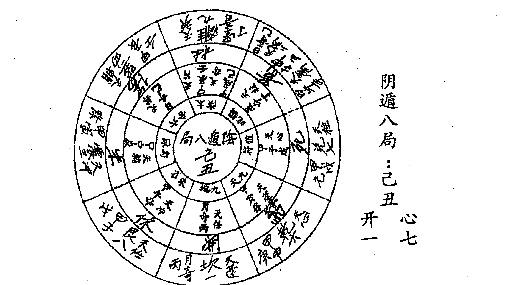

-   (1) 开坎礼 天任丙加丙奇。月奇孛厄：文书逼迫，破耗遗失。「天遁，重诈」
-   (2) 休艮制 天冲辛加甲子戊。困龙被伤：官司破败，屈抑守分，妄动祸殃。
-   (3) 生震制 天辅庚加甲寅癸。大格：行人至，官司止，生产母子俱伤。
-   (4) 伤巽和 天英乙加甲辰壬。日奇入地：尊卑悖乱，官讼是非。
-   (5) 杜离礼 天芮壬加丁奇。干合蛇刑：文书牵连，贵人匆匆，男吉女凶。
天禽己加丁奇。朱雀入墓：文状词讼，先曲后直。
-   (6) 景坤礼 天柱丁加乙奇。天运昌气格：贵人加官进爵，常人财喜婚姻。
天柱丁加甲午辛。朱雀入狱：罪人释囚，官人失位。
-   (7) 死兑礼 天心戊加甲戌己。贵人入狱：公私不利。
-   (8) 惊乾和 天蓬癸加甲申庚。太白入网：昙花一现，争讼力平。
-   (9) 开门丙奇合坎一宫，利正北方。

### 奇门阴阳九遁阴八局符使值例

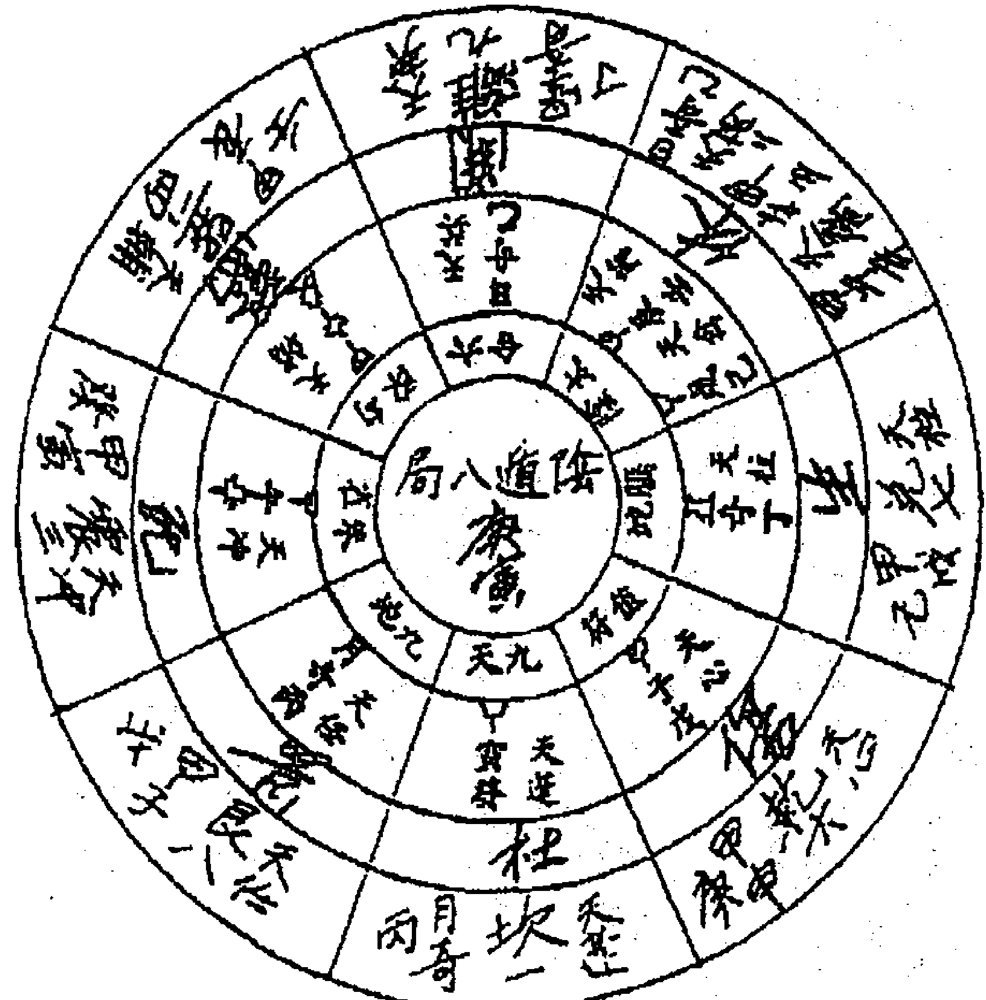

-   (1) 开离制 天英乙加丁奇。奇仪相佐：文书事吉，百事皆可为。「地、人遁，休诈」
-   (2) 休坤制 天芮壬加乙奇。格名小蛇：女人柔顺，男人嗟呀，占孕生子，禄马光华。
天禽己加甲午辛：游魂入墓：大人鬼魅，小人家先为祟。
-   (3) 生兑礼 天柱丁加甲戊己。火入勾陈：奸私仇冤，事因女人。「升殿」
-   (4) 伤乾制 天心戊加甲申庚。值符飞宫：吉事不吉，凶事更凶。
-   (5) 杜坎仪 天蓬癸加丙奇。华盖孛厄：贵贱逢之，上人见喜。
-   (6) 景艮礼 天任丙加甲子戊。飞鸟跌穴：谋事有成，百事洞澈。
-   (7) 死震制 天冲辛加甲寅癸。天牢华盖，误入天网。动止乖张。
-   (8) 惊巽迫 天辅庚加甲辰壬。小格：远行迷路，音信嗟呀。

| 门 | 奇 | 宫 | 方位 |
| :--- | :--- | :--- | :--- |
| 开 | 乙 | 离九 | 正南 |
| 生 | 丁 | 兑七 | 正西 |

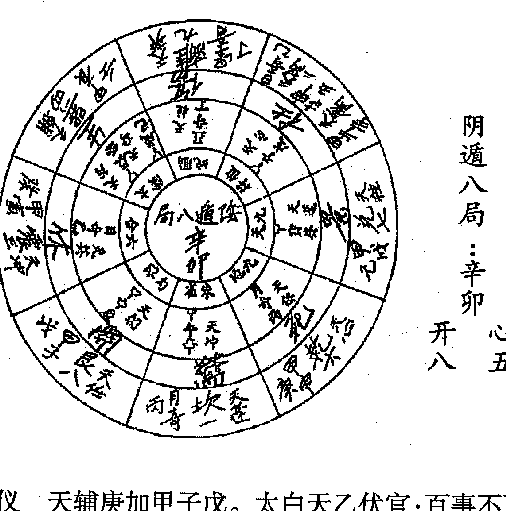

-   (1) 开艮仪 天辅庚加甲子戊。太白天乙伏官：百事不可谋，凶。
-   (2) 休震礼 天英乙加甲寅癸。华盖官星：遁迹修道，隐匿藏形，躲灾避难为吉。「地、人遁，休诈」
-   (3) 生巽制 天芮壬加甲辰壬。蛇入地罗：外人缠绕，内事索索，吉门吉星，避免蹉跎。
天禽己加甲辰壬。地网高张：狡童佚女，奸情伤杀。
-   (4) 伤离礼 天柱丁加丁奇。奇人太阴：文书即至，喜事遂心。
-   (5) 杜坤遁 天心戊加乙奇。青龙合灵：门吉事吉，门凶事凶。
天心戊加甲午辛。青龙折足：吉门生助，尚可谋为，逢凶门主招灾，失财足疾。
-   (6) 景兑迫 天蓬癸加甲戌己。华盖地户：占音信皆阻，躲灾避难为吉。
-   (7) 死乾礼 天任丙加甲申庚。荧惑入太白：门户破败，盗贼耗失。「入墓」
-   (8) 惊坎礼 天冲辛加丙奇。荧惑出现：占雨无，占晴旱，占事必因财致讼。
-   (9) 休门乙奇合震三宫，利正东方。

### 奇门阴阳九遁阴八局符使值例

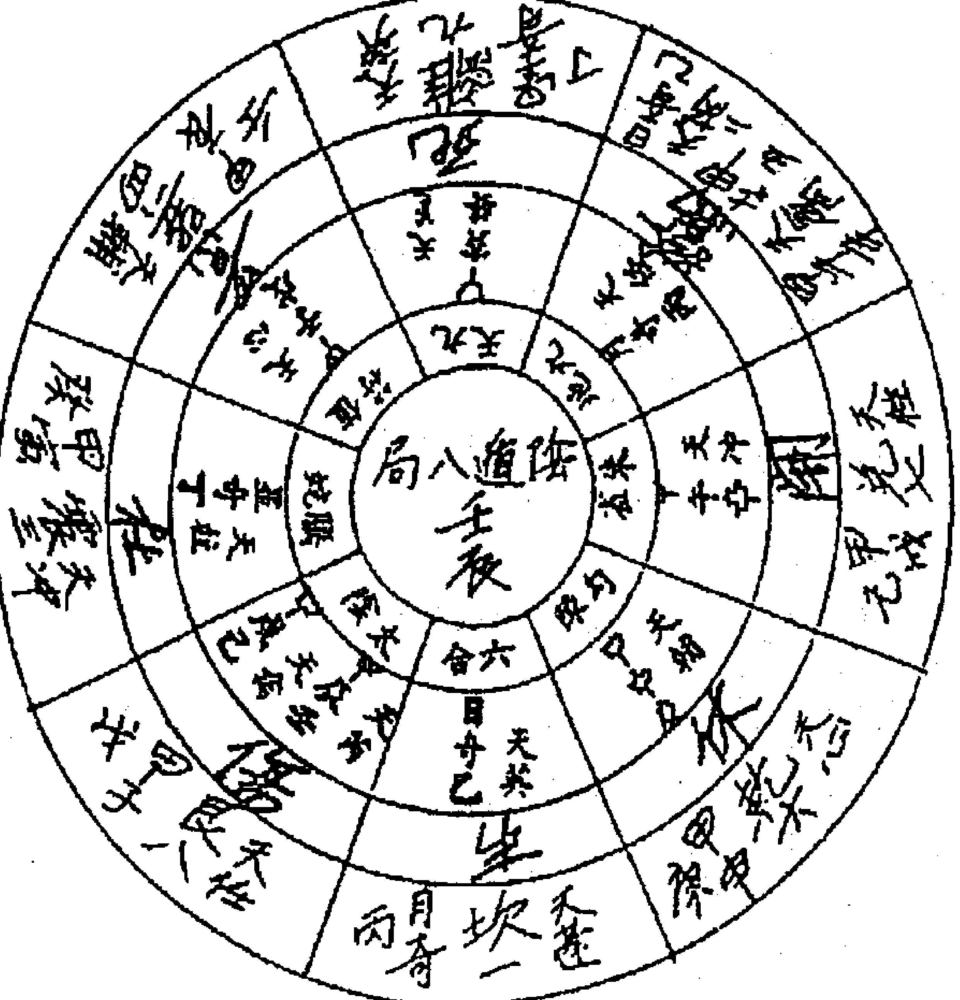

阴遁八局：壬辰 开七 心四

-   (1) 开兑和 天冲辛加甲戌己。入狱自刑：奴仆背主，讼诉难伸。
-   (2) 休乾仪 天辅庚加甲申庚。太白同宫：官灾横祸，兄弟不睦。
-   (3) 生坎迫 天英乙加丙奇。奇仪顺遂：吉星迁官进爵，凶星夫妻离别。「地、人遁，休诈」
-   (4) 伤艮迫 天芮壬加甲子戊。小蛇化龙：男人发达，女产婴童。
天禽己加甲子戊。犬遇青龙：门吉谋望遂意，上人见喜，门凶枉劳心机。「地假」
-   (5) 杜震和 天柱丁加甲寅癸。朱雀投江：文书口舌俱消，音信沉溺，讼狱所由起也。
-   (6) 景巽仪 天心戊加甲辰壬。龙入天牢：阴阳皆不吉利。
-   (7) 死离仪 天蓬癸加丁奇。腾蛇妖娇：文书官司，火焚莫逃，忧惶之事必至。
-   (8) 惊坤仪 天任丙加乙奇。日月并行：公谋私为皆吉。
天任丙加甲午辛。威神互合：谋事有成，病人不凶。
-   (9) 生门乙奇合坎一宫，利正北方。

### 奇门遁甲秘笈全书（中册）

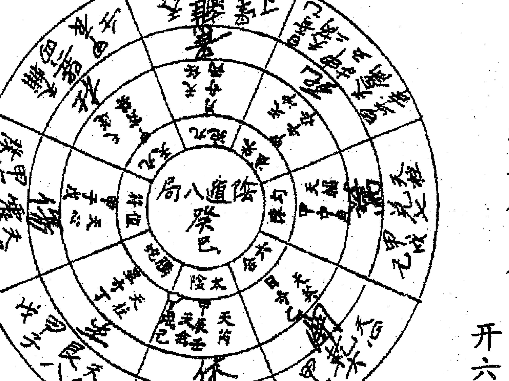

-   (1) 开乾和 天英乙加甲申庚。日奇被刑：争讼财产夫妻怀私。「地、人遁，休诈」
-   (2) 休坎和 天芮壬加丙奇。水蛇入火：官灾刑禁，络绎不绝。
天禽己加丙奇。火孛地户：阳人冤冤相害，阴人必致淫污。
-   (3) 生艮和 天柱丁加甲子戊。青龙转光：官人升迁，常人咸昌。「入墓」
-   (4) 伤震和 天心戊加甲寅癸。青龙华盖：门吉招福，门凶多乖。
-   (5) 杜巽和 天蓬癸加甲辰壬。复见螣蛇：嫁娶重婚，后嫁无子，不保年华。
-   (6) 景离和 天任丙加丁奇。辛奇朱雀：贵人文书吉，常人平静。「升殿」
-   (7) 死坤和 天冲辛加乙奇。白虎猖狂：人亡家败，远行多殃，尊长不喜，车船俱伤，身体毁伤。
天冲辛加甲午辛。伏吟天庭：公废私就，讼狱自罹罪名。
-   (8) 惊兑和 天辅庚加甲戌己。刑格：官司被重刑。
-   (9) 开门乙奇合乾六宫，利西北。
生门丁奇合艮八宫，利东北。

### 奇门阴阳九遁阴八局符使值例

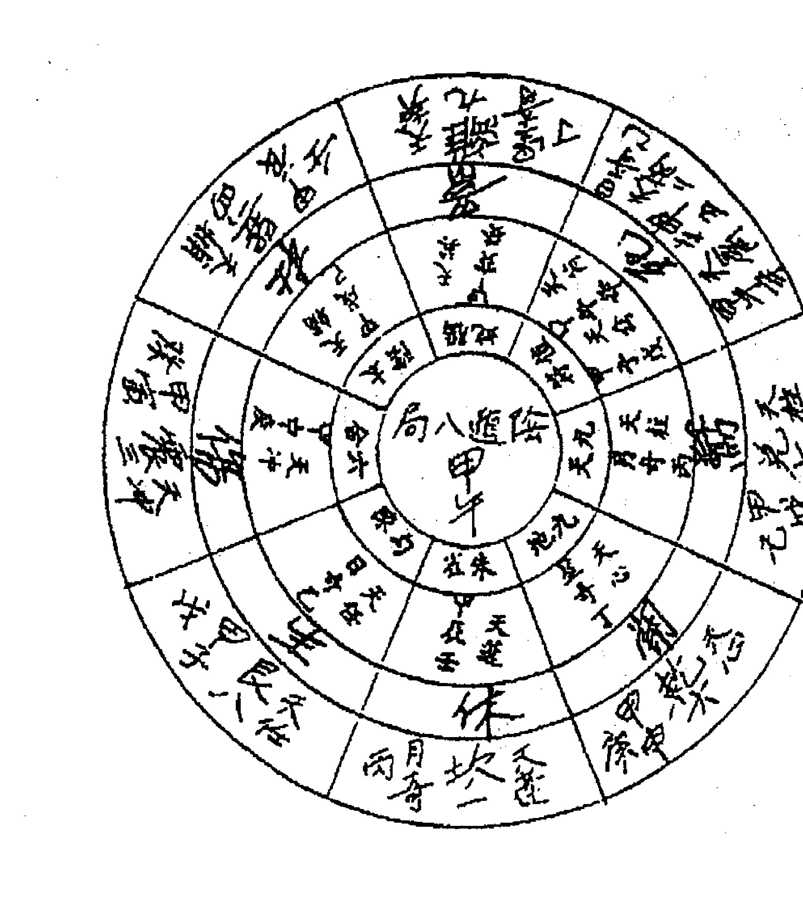

阴遁八局：甲午 死五 禽五

-   (1) 开乾和 天心丁加甲申庚。年月日时格：文书阻隔，行人必归。「重诈」
-   (2) 休坎和 天蓬壬加丙奇。水蛇入火：官灾刑禁，络绎不绝。
-   (3) 生艮和 天任乙加甲子戊。利阴害阳：门逢凶迫，财破人伤。
-   (4) 伤震和 天冲庚加甲寅癸。大格：行人至，官司止，生产母子俱伤。
-   (5) 杜巽和 天辅己加甲辰壬。地网高张：狡童佚女，奸情伤杀。
-   (6) 景离和 天英癸加丁奇。螣蛇妖娇：文书官司，火焚莫逃，忧惶之事必至。
-   (7) 死坤和 天芮辛加乙奇。白虎猖狂：人亡家败，远行多殃，尊长不喜，车船俱伤，身体毁伤。
天禽戊加甲午辛。青龙折足：吉门生助，尚可谋为，若逢凶门，主招灾失财有足疾。
-   (8) 惊兑和 天柱丙加甲戊己。太孛入刑：囚人刑杖，文书不行，吉门得吉，凶门转凶。
-   (9) 开丁奇合乾六宫，利西北方。
生乙奇合艮八宫，利东北方。

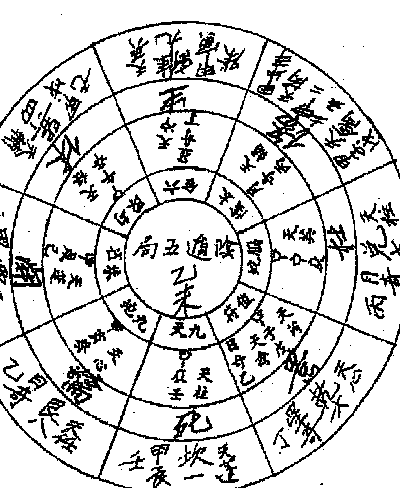

阴遁八局：乙未 死四 禽九

-   (1) 开坤仪 天柱丙加乙奇。日月并行：公谋私为皆吉。
天柱丙加甲午辛。威神互合：谋事有成，病人不凶。
-   (2) 休兑仪 天心丁加甲戌己。火入勾陈：奸私仇冤，事因女人。「升殿，重诈」
-   (3) 生乾礼 天蓬壬加甲申庚。太白擒蛇：刑狱公平，立剖邪正。
-   (4) 伤坎仪 天任乙加丙奇。奇仪顺遂：吉星迁官进爵，凶星夫妻离别。
-   (5) 杜艮迫 天冲庚加甲子戊。太白天乙伏官：百事不可谋，凶。
-   (6) 景震仪 天辅己加甲寅癸。地刑玄武：病凶，词讼有囚狱之灾。
-   (7) 死巽制 天英癸加甲辰壬。复见腾蛇：嫁娶重婚，后嫁无子，不保年华。
-   (8) 惊离制 天芮辛加丁奇。狱神得奇：经商获倍利，囚人逢赦宥。
天禽戊加丁奇。青龙耀明：谒贵求名吉利，值墓迫招是非。
-   (9) 开门丙奇合坤二宫，利西南方。
休门丁奇合兑七宫，利正西方。

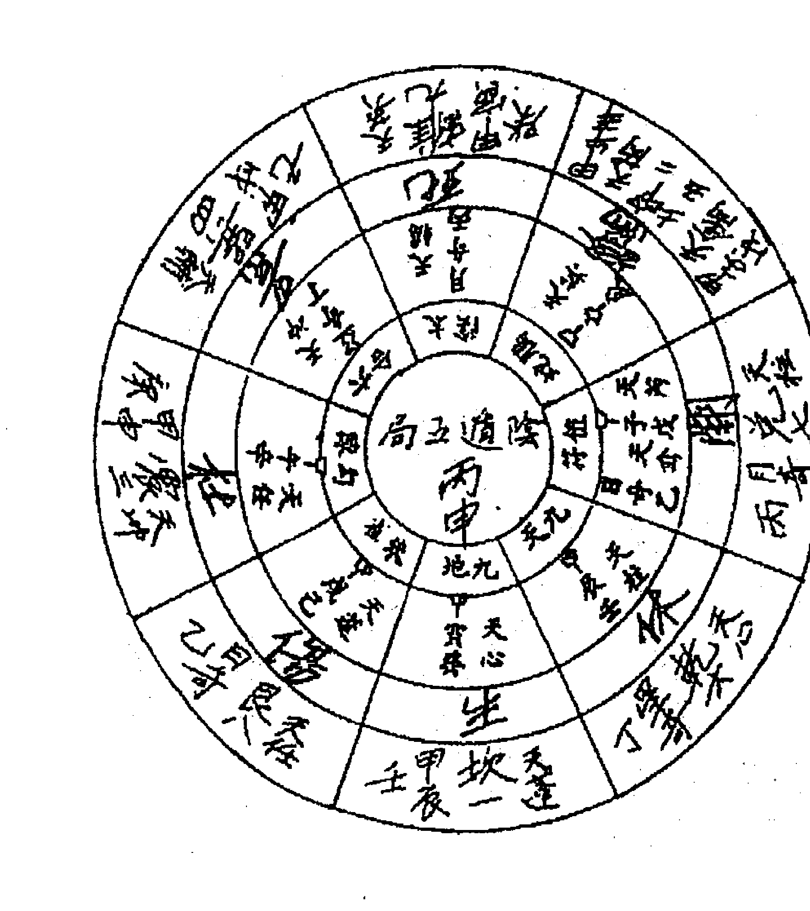

阴遁八局·丙申
死 禽三 一

-   (1) 开离制 天任乙加丁奇。奇仪相佐：文书事吉，百事皆可为。
-   (2) 休坤制 天冲庚加乙奇。太白逢星：退吉进凶。
天冲庚加甲午辛。白虎干格：远行车折马死。
-   (3) 生兑礼 天辅己加甲戊己。地户逢鬼：病凶，百事不遂。
-   (4) 伤乾制 天英癸加甲申庚。太白入网：昙花一现，争讼力平。
-   (5) 杜坎仪 天芮辛加丙奇。荧惑出现：占雨无，占晴旱，占事必因财致讼。
天禽戊加丙奇。青龙回首：动作大利，若逢迫墓，吉事成凶。
-   (6) 景艮礼 天柱丙加甲子戊。飞鸟跌穴：谋事有成，百事洞澈。
-   (7) 死震制 天心丁加甲寅癸。朱雀投江：文书口舌俱消，音信沉溺，讼狱所由起也。「入墓，鬼假」
-   (8) 惊巽迫 天蓬壬加甲辰壬。蛇入地罗：外人缠绕，内事索索，吉门吉星，避免蹉跎。
-   (9) 开门乙奇合离九宫，利正南方。

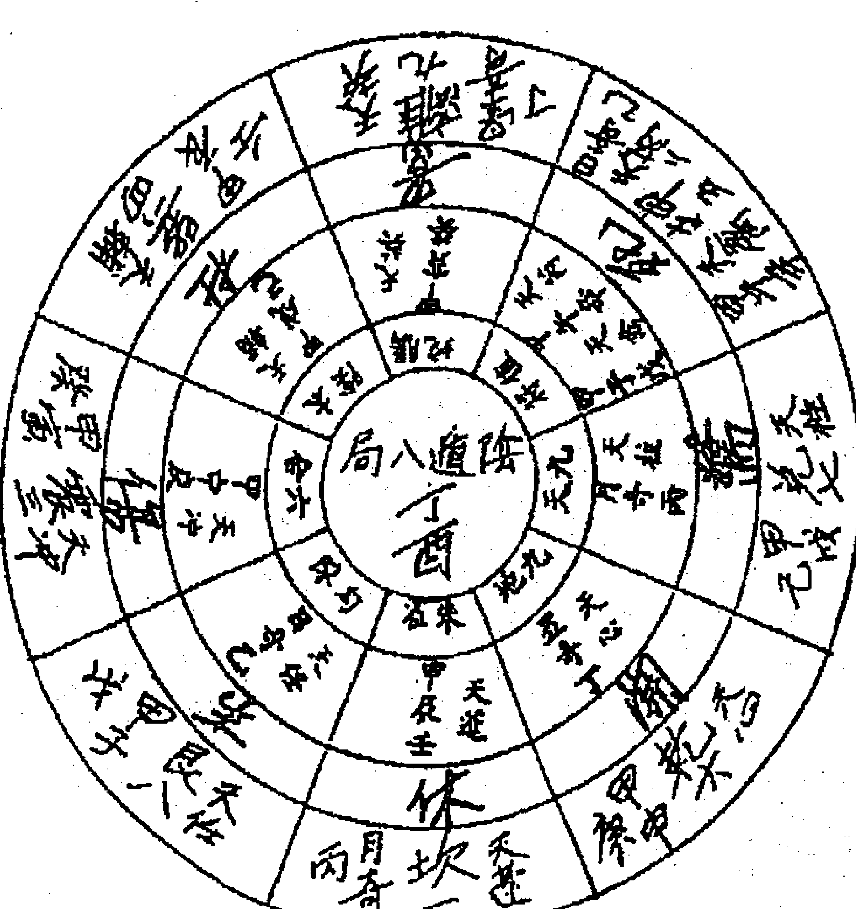

-   (1) 开乾和 天心丁加甲申庚。年月日时格：文书阻隔，行人必归。「重诈」
-   (2) 休坎和 天蓬壬加丙奇。水蛇入火：官灾刑禁，络绎不绝。
-   (3) 生艮和 天任乙加甲子戊。利阴害阳：门逢凶迫，财破人伤。
-   (4) 伤震和 天冲庚加甲寅癸。大格：行人至，官司止，生产母子俱伤。
-   (5) 杜巽和 天辅己加甲辰壬。地网高张：狡童佚女，奸情伤杀。
-   (6) 景离和 天英癸加丁奇。螣蛇妖娇：文书官司火焚莫逃，忧惶之事必至。
-   (7) 死坤和 天芮辛加乙奇。白虎猖狂：人亡家败，远行多殃，尊长不喜，车船俱伤，身体毁伤。
天禽戊加甲午辛。青龙折足：吉门生助，尚可谋为，逢凶门主招灾，失财足疾。
-   (8) 惊兑和 天柱丙加甲戊己。太孛入刑：囚人刑杖，文书不行，吉门得吉，凶门转凶。
-   (9) 开门丁奇合乾六宫，利西北方。
生门乙奇合艮八宫，利东北方。

### 奇门阴阳九遁阴八局符使值例

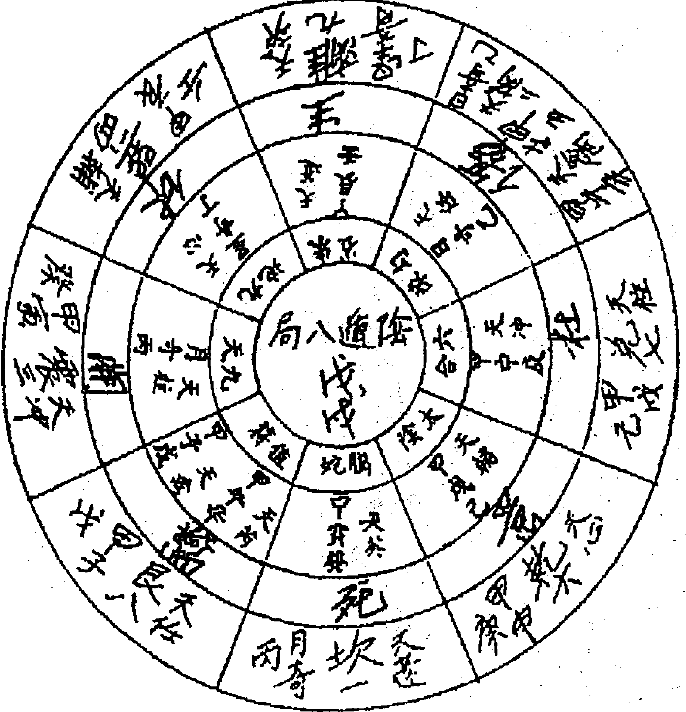

阴遁八局：戊戌 禽 死 一 八

-   (1) 开震迫 天柱丙加甲寅癸。华盖孛厄：阴人害事，灾祸频生。
-   (2) 休巽礼 天心丁加甲辰壬。五神互合：贵人恩诏，讼狱公平。
-   (3) 生离仪 天蓬壬加丁奇。干合蛇刑：文书牵连，贵人匆匆，男吉女凶。
-   (4) 伤坤迫 天任乙加乙奇。日奇伏吟：不宜谒贵求名，只可安分守身。「入墓」
天任乙加甲午辛。青龙逃走：奴仆拐带，六畜皆伤，财产废坠，身遭毁伤。
-   (5) 杜兑制 天冲庚加甲戌己。刑格：官司被重刑。
-   (6) 景乾迫 天辅己加甲申庚。利格返名：词讼先动不利，阴星有谋害之情。
-   (7) 死坎迫 天英癸加丙奇。华盖孛厄：贵贱逢之，上人见喜。
-   (8) 惊艮仪 天芮辛加甲子戊。囚龙被伤：官司破败，屈抑守分，妄动祸殃。
天禽戊加甲子戊。伏吟：凡事闭塞，静守为吉。
-   (9) 开门丙奇合震三宫，利正东方。
休丁奇合巽四宫，利东南方。

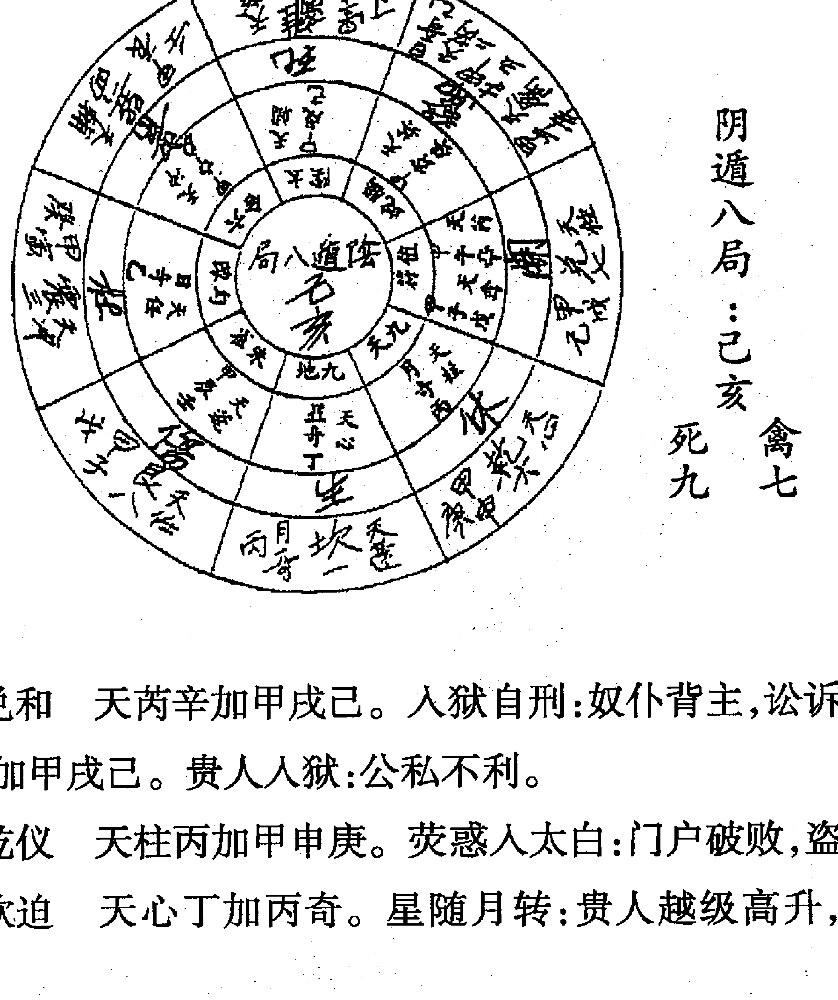

-   (1) 开兑和 天芮辛加甲戊己。入狱自刑：奴仆背主，讼诉难伸。
天禽戊加甲戊己。贵人入狱：公私不利。
-   (2) 休乾仪 天柱丙加甲申庚。荧惑入太白：门户破败，盗贼耗失。
-   (3) 生坎迫 天心丁加丙奇。星随月转：贵人越级高升，常人乐里生悲。「重诈」
-   (4) 伤艮迫 天蓬壬加甲子戊。小蛇化龙：男人发达，女产婴童。
-   (5) 杜震和 天任乙加甲寅癸。华盖官星：遁迹修道，隐匿藏形，躲灾避难为吉。「升殿」
-   (6) 景巽仪 天冲庚加甲辰壬。小格：远行迷路，音信嗟呀。
-   (7) 死离仪 天辅己加丁奇。朱雀入墓：文状词讼，先曲后直。
-   (8) 惊坤仪 天英癸加乙奇。华盖官星：贵人禄位，常人平安。
天英癸加甲午辛。网盖天牢：占讼病凶。
-   (9) 休门丙奇合乾六宫，利西北方。
生门丁奇合坎一宫，利正北方。

### 奇门阴阳九遁阴八局符使值例

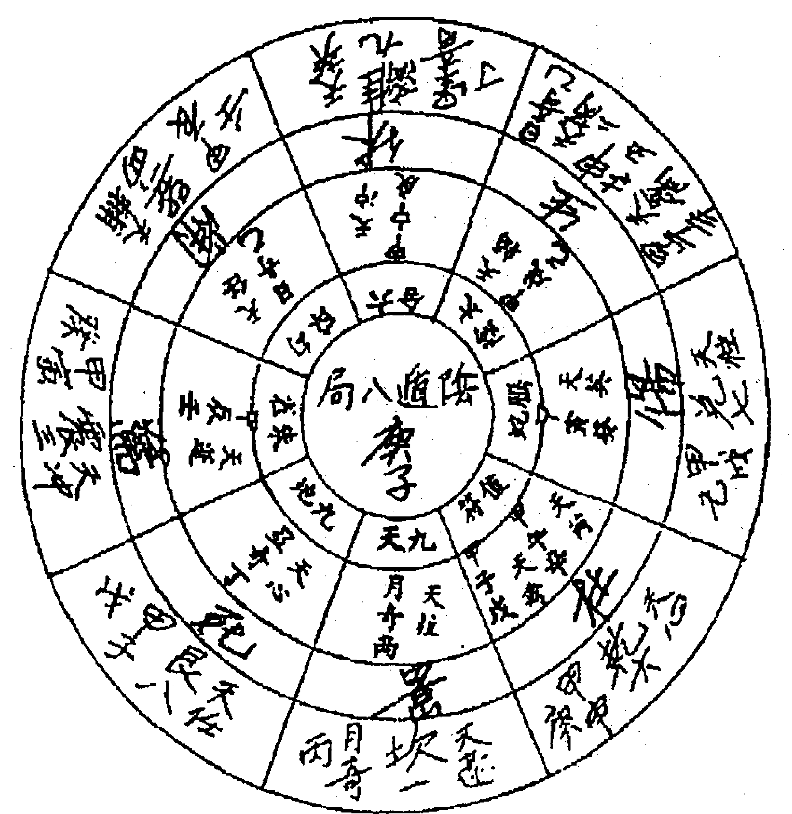

-   (1) 开巽迫 天任乙加甲辰壬。日奇入地：尊卑悖乱，官讼是非。
-   (2) 休离迫 天冲庚加丁奇。亭亭之格：因私匿起官司，门吉有救。
-   (3) 生坤和 天辅己加乙奇。墓神不明：宜遁跡隐形为利逸。
天辅己加甲午辛。游魂入墓：大人鬼魅，小人家先为祟。
-   (4) 伤兑制 天英癸加甲戌己。华盖地户：占音信皆阻，躲灾避难为吉。
-   (5) 杜乾制 天芮辛加甲申庚。白虎出力：刀刃相接，主客相残，逊让退步稍可，强进血溅衣衫。
天禽戊加甲申庚。值符飞宫：吉事不吉，凶事更凶。
-   (6) 景坎制 天柱丙加丙奇。月奇孛厄：文书逼迫，破耗遗失。
-   (7) 死艮和 天心丁加甲子戊。青龙转光：官人升迁，常人咸昌。「入墓，鬼假」
-   (8) 惊震迫 天蓬壬加甲寅癸。幼女奸淫：家有丑声，门吉星凶，反祸福隆。
-   (9) 开门乙奇合巽四宫，利东南方。

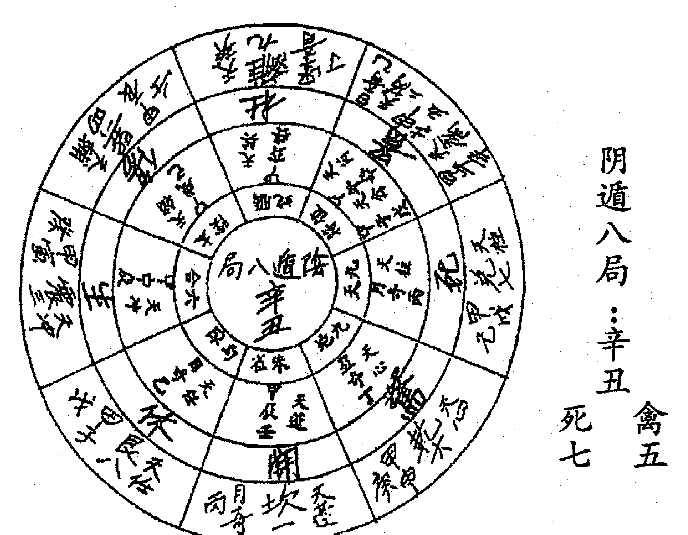

-   (1) 开坎礼 天蓬壬加丙奇。水蛇入火：官灾刑禁，络绎不绝。
-   (2) 休艮制 天任乙加甲子戊。利阴害阳：门逢凶迫，财破人伤。
-   (3) 生震制 天冲庚加甲寅癸。大格：行人至，官司止，生产母子俱伤。
-   (4) 伤巽和 天辅己加甲辰壬。地网高张：狡童佚女，奸情伤杀。「地假」
-   (5) 杜离礼 天英癸加丁奇。腾蛇妖娇：文书官司，火焚莫逃，忧惶之事必至。
-   (6) 景坤礼 天芮辛加乙奇。白虎猖狂：人亡家败，远行多殃，尊长不喜，车船俱伤，身体毁伤。
天禽戊加甲午辛。青龙折足：吉门生助，尚可谋为，若逢凶门，主招灾失财有足疾。
-   (7) 死兑礼 天柱丙加甲戊己。太孛入刑：囚人刑杖，文书不行，吉门得吉，凶门转凶。
-   (8) 惊乾和 天心丁加甲申庚。年月日时格：文书阻隔，行人必归。「神假」
-   (9) 休门乙奇合艮八宫，利东北方。

### 奇门阴阳九遁阴八局符使值例

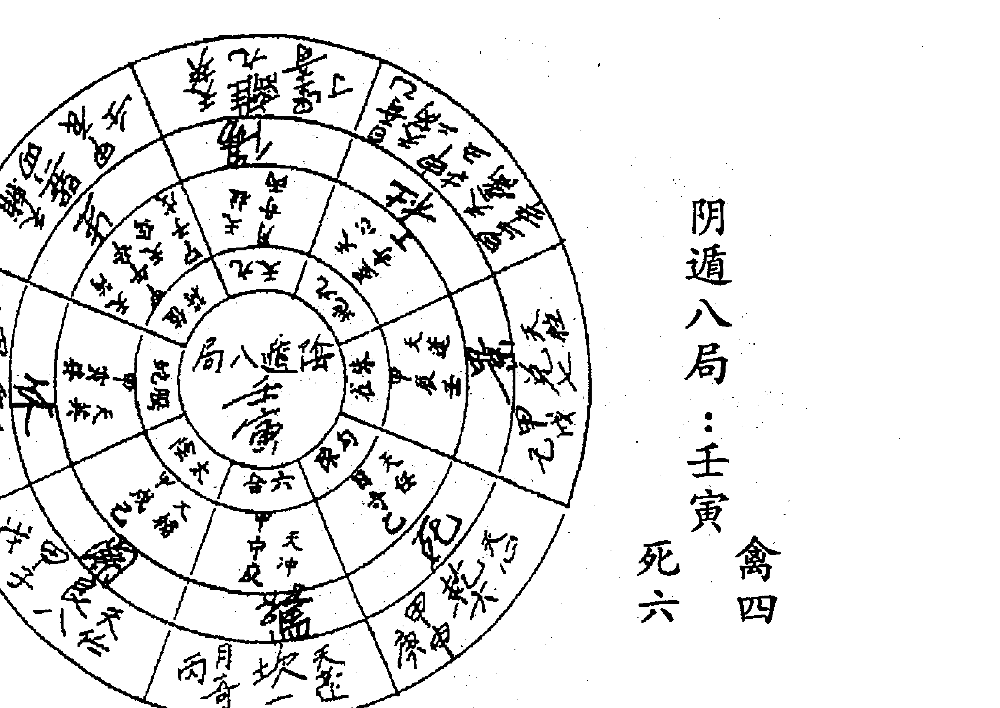

-   (1) 开艮仪 天辅己加甲子戊。犬遇青龙：门吉谋望遂意，上人见喜，门凶枉劳心机。
-   (2) 休震礼 天英癸加甲寅癸。天网四张：（网高三尺）行人失件，病讼皆伤。
-   (3) 生巽制 天芮辛加甲辰壬。凶蛇入狱：两男争女，讼狱不息，先动失理。
天禽戊加甲辰壬。龙入天牢：阴阳皆不吉利。
-   (4) 伤离礼 天柱丙加丁奇。辛奇朱雀：贵人文书吉，常人平静。「升殿」
-   (5) 杜坤迫 天心丁加乙奇。天运昌气格：贵人加官进爵，常人财喜婚姻。「人遁，地假」
天心丁加甲午辛。朱雀入狱：罪人释囚，官人失位。
-   (6) 景兑迫 天蓬壬加甲戊己。凶蛇入狱：大祸将至，顺守斯吉，词讼理曲。
-   (7) 死乾礼 天任乙加甲申庚。日奇被刑：争讼财产夫妻怀私。「入墓」
-   (8) 惊坎礼 天冲庚加丙奇。太白入荧惑：占贼必来，为客进利，为主破财。
-   (9) 无奇门。

### 奇门遁甲秘笈全书（中册）

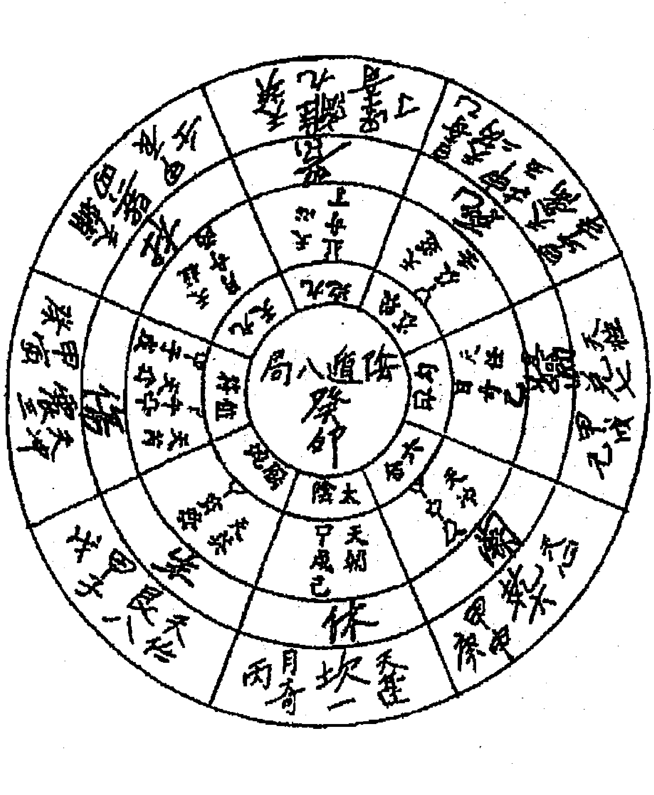

阴遁八局：癸卯 禽 死 五 三

-   (1) 开乾和 天冲庚加甲申庚。太白同宫：官灾横祸，兄弟不睦。
-   (2) 休坎和 天辅己加丙奇。火孛地户：阳人冤冤相害，阴人必致淫污。
-   (3) 生艮和 天英癸加甲子戊。天乙会合：财喜婚姻，吉人赞助成合，门凶迫制，反祸官非。
-   (4) 伤震和 天芮辛加甲寅癸。天牢华盖：误入天网，动止乖张。
天禽戊加甲寅癸。青龙华盖：门吉招福，门凶多乖。
-   (5) 杜巽和 天柱丙加甲辰壬。火入天罗：客不利，是非颇多。
-   (6) 景离和 天心丁加丁奇。奇人太阴：文书即至，喜事遂心。
-   (7) 死坤和 天蓬壬加乙奇。格名小蛇：女人柔顺，男人嗟呀，占孕生子，禄马光华。
天蓬壬加甲午辛。螣蛇相缠：纵得吉门，亦不安宁，若有谋望，被人欺瞒。
-   (8) 惊兑和 天任乙加甲戌己。日奇入雾：被土暗昧，门凶必凶。
-   (9) 无奇门。

### 奇门阴阳九遁阴八局符使值例

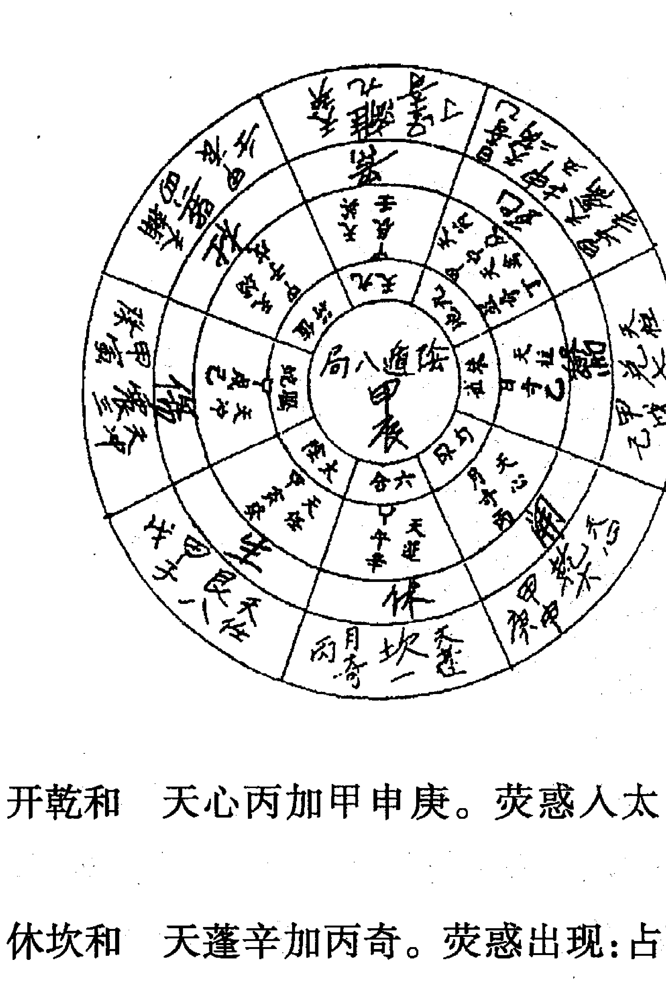

阴遁八局：甲辰
杜四
辅四

-   (1) 开乾和 天心丙加甲申庚。荧惑入太白：门户破败，盗贼耗失。「入墓」
-   (2) 休坎和 天蓬辛加丙奇。荧惑出现：占雨无，占晴早，占事必因财致讼。
-   (3) 生艮和 天任癸加甲子戊。天乙会合：财喜婚姻，吉人赞助成合，门凶迫制，反祸官非。
-   (4) 伤震和 天冲己加甲寅癸。地刑玄武：病凶，词讼有囚狱之灾。
-   (5) 杜巽和 天辅戊加甲辰壬。龙入天牢：阴阳皆不吉利。
-   (6) 景离和 天英壬加丁奇。干合蛇刑：文书牵连，贵人匆匆，男吉女凶。
-   (7) 死坤和 天芮庚加乙奇。太白逢星：退吉进凶。
天禽丁加甲午辛。朱雀入狱：罪人释囚，官人失位。「入墓，鬼假」
-   (8) 惊兑和 天柱乙加甲戌己。日奇入雾：被土暗昧，门凶必凶。
-   (9) 开门丙奇合乾六宫，利西北方。

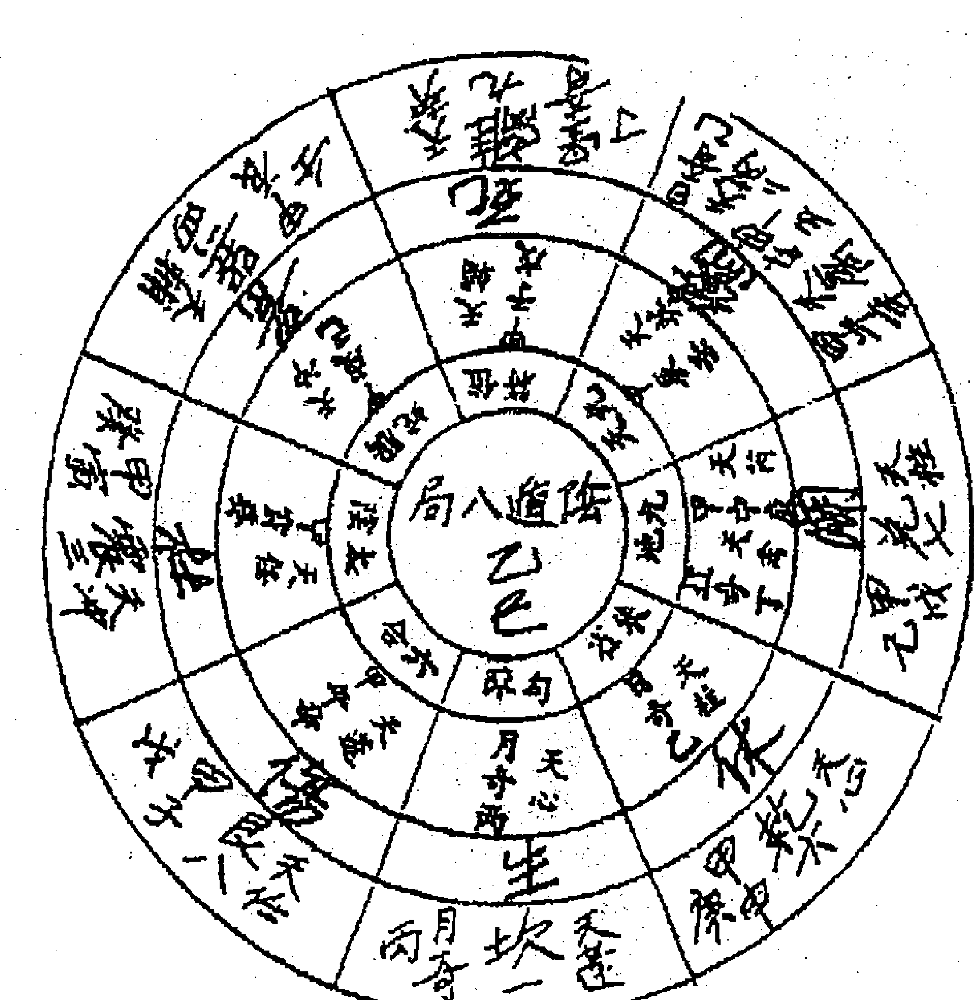

-   (1) 开兑和 天芮庚加甲戌己。刑格：官司被重刑。「虎遁」
天禽丁加甲戌己。火入勾陈：奸私仇冤，事因女人。「升殿，重诈」
-   (2) 休乾仪 天柱乙加甲申庚。日奇被刑：争讼财产夫妻怀私。「入墓」
-   (3) 生坎迫 天心丙加丙奇。月奇孛厄：文书逼迫，破耗遗失。
-   (4) 伤艮迫 天蓬辛加甲子戊。囚龙被伤：官司破败，屈抑守分，妄动祸殃。
-   (5) 杜震和 天壬癸加甲寅癸。天网四张：（网高二尺）行人失件，病讼皆伤。
-   (6) 景巽仪 天冲己加甲辰壬。地网高张：狡童佚女，奸情伤杀。
-   (7) 死离仪 天辅戊加丁奇。青龙耀明：谒贵求名吉利，值墓迫招是非。
-   (8) 惊坤仪 天英壬加乙奇。格名小蛇：女人柔顺，男人嗟呀，占孕生子，禄马光华。「人假」
天英壬加甲午辛。螣蛇相缠：纵得吉门，亦不安宁，若有谋望，被人欺瞒。
-   (9) 开丁兑七 正西
休门乙奇合乾六宫，利西北方
生丙坎一 正北

### 奇门阴阳九遁阴八局符使值例

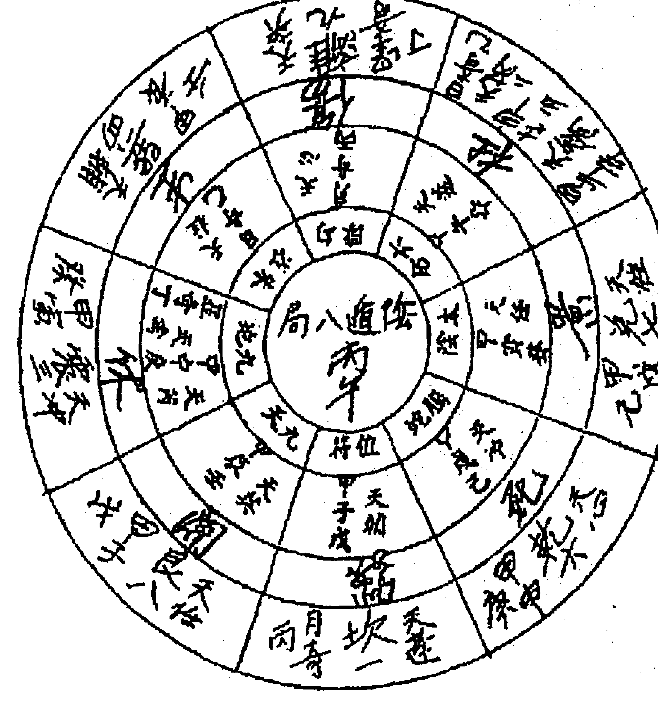

阴遁八局：丙午
杜二 辅一

-   1. 开艮仪 天柱壬加甲子戊。小蛇化龙：男人发达，女产婴童。
-   2. 休震礼 天心庚加甲寅癸。大格：行人至，官司止，生产母子俱伤。
-   3. 生巽制 天蓬丁加甲寅癸。朱雀投江：文书口舌俱消，音信沉溺，讼狱所由起也。「重诈」
-   4. 伤离礼 天任乙加甲辰壬。日奇入地：尊卑悖乱，官讼是非。
-   5. 杜坤迫 天冲丙加丁奇。辛奇朱雀：贵人文书吉，常人平静。
天冲辛加乙奇。白虎猖狂：人亡家败，远行多殃，尊长不喜，车船俱伤，身体毁伤。
-   6. 景兑迫 天辅辛加甲午辛。伏吟天庭：公废私就，讼狱自罹罪名。
-   7. 死乾礼 天英癸加甲戊己。华盖地户：占音信皆阻，躲灾避难为吉。
-   8. 惊坎礼 天芮己加甲申庚。利格返名：词讼先动不利，阴星有谋害之情。
天禽戊加丙奇。青龙回首：动作大利，若逢迫墓，吉事成凶。
-   9. 生门丁奇合巽四宫，利东南方。

### 奇门阴阳九遁阴八局符使值例

阴遁八局：丁未
杜一 辅二

- (1) 开离制　天冲己加丁奇。朱雀入墓:文状词讼,先曲后直。
- (2) 休坤制　天辅戊加乙奇。青龙合灵:门吉事吉,门凶事凶。
天辅戊加甲午辛。青龙折足:吉门生助,尚可谋为,若逢凶门,主招灾失财有足疾。
- (3) 生兑礼　天英壬加甲戌己。凶蛇入狱:大祸将至,顺守为吉,词讼理曲。
- (4) 伤乾制　天芮庚加甲申庚。太白同宫:官灾横祸,兄弟不睦。
天禽丁加甲申庚。年月日时格:文书阻隔,行人必归。
- (5) 杜坎仪　天柱乙加丙奇。奇仪顺遂:吉星迁官进爵,凶星夫妻离别。
- (6) 景艮礼　天心丙加甲子戊。飞鸟跌穴:谋事有成,百事洞澈。
- (7) 死震制　天蓬辛加甲寅癸。天牢华盖:误入天网,动止乖张。
- (8) 惊巽迫　天任癸加甲辰壬。复见腾蛇:嫁娶重婚,后嫁无子,不保年华。
- (9) 无奇门。

阴遁八局：戊申
杜九
辅八

- (1) 开坎礼 天冲己加丙奇。火孛地户：阳人冤冤相害，阴人必致淫污。
- (2) 休艮制 天辅戊加甲子戊。伏吟：凡事闭塞，静守为吉。
- (3) 生震制 天英壬加甲寅癸。幼女奸淫：家有丑声，门吉星凶，反祸福隆。
- (4) 伤巽和 天芮庚加甲辰壬。小格：远行迷路，音信嗟呀。
天禽丁加甲辰壬。五神互合：贵人恩诏，讼狱公平。
- (5) 杜离礼 天柱乙加丁奇。奇仪相佐：文书事吉，百事皆可为。
- (6) 景坤礼 天心丙加乙奇。日月并行：公谋私为皆吉。
天心丙加甲午辛。威神互合：谋事有成，病人不凶。
- (7) 死兑礼 天蓬辛加甲子戊。困龙被伤：官司破败，屈抑守分，妄动祸殃。
- (8) 惊乾和 天任癸加甲申庚。太白入网：昙花一现，争讼力平。
- (9) 无奇门。

阴遁八局：己酉
杜 八
辅 七

- (1) 开坤仪 天冲己加乙奇。墓神不明:宜遁迹隐形为利逸。
天冲己加甲午辛。游魂入墓:大人鬼魁,小人家先为崇。
- (2) 休兑仪 天辅戊加甲戌己。贵人入狱:公私不利。
- (3) 生乾礼 天英壬加甲申庚。太白擒蛇:刑狱公平,立剖邪正。
- (4) 伤坎仪 天芮庚加丙奇。太白入荧惑:占贼必来,为客进利,为主破财。
天禽丁加丙奇。星随月转:贵人越级高升,常人乐里生悲。
- (5) 杜艮迫 天柱乙加甲子戊。利阴害阳:门逢凶迫,财破人伤。
- (6) 景震仪 天心丙加甲寅癸。华盖孛师:阴人害事,灾祸频生。
- (7) 死巽制 天蓬辛加甲辰壬。凶蛇入狱:两男争女,讼狱不息,先动失理。
- (8) 惊离制 天任癸加丁奇。腾蛇妖娇:文书官司,火焚莫逃,忧惶之事必至。
- (9) 无奇门。

### 奇门阴阳九遁阴八局符使值例

- (1) 开震遁 天柱乙加甲寅癸。华盖官星：遁迹修道，隐匿藏形，躲灾避难为吉。「升殿」
- (2) 休巽礼 天心丙加甲辰壬。火入天罗：客不利，是非颇多。
- (3) 生离仪 天蓬辛加丁奇。狱神得奇：经商获倍利，囚人逢赦宥。
- (4) 伤坤遁 天任癸加乙奇。华盖官星：贵人禄位，常人平安。「地假」
天任癸加甲午辛。网盖天牢：占讼病凶。
- (5) 杜兑制 天冲己加甲戊己。地户逢鬼：病凶，百事不遂。
- (6) 景乾遁 天辅戊加甲申庚。值符飞宫：吉事不吉，凶事更凶。
- (7) 死坎遁 天英壬加丙奇。水蛇入火：官灾刑禁，络绎不绝。
- (8) 惊艮仪 天芮庚加甲子戊。太白天乙伏宫：百事不可谋，凶。
天禽丁加甲子戊。青龙转光：官人升迁，常人咸昌。「入墓，神假」
- (9) 开门乙 奇合震三宫，利正东方。
休门丙 奇合巽四宫，利东南方。

- (1) 开巽迫 天任癸加甲辰壬。复见腾蛇:嫁娶重婚,后嫁无子,不保年华。
- (2) 休离迫 天冲己加丁奇。朱雀入墓:文状词讼,先曲后直。
- (3) 生坤和 天辅戊加乙奇。青龙合灵:门吉事吉,门凶事凶。
天辅戊加甲午辛。青龙折足:吉门生助,尚可谋为,逢凶门主招灾,失财足疾。
- (4) 伤兑制 天英壬加甲戌己。凶蛇入狱:大祸将至,顺守斯吉,词讼理曲。
- (5) 杜乾制 天芮庚加甲申庚。太白同宫:官灾横祸,兄弟不睦。
天禽丁加甲申庚。年月日时格:文书阻隔,行人必归。[地假]
- (6) 景坎制 天柱乙加丙奇。奇仪顺遂:吉星迁官进爵,凶星夫妻离别。
- (7) 死艮和 天心丙加甲子戊。飞鸟跌穴:谋事有成,百事洞澈。
- (8) 惊震迫 天蓬辛加甲寅癸。天牢华盖:误入天网,动止乖张。
- (9) 无奇门。

阴遁八局：壬子
杜辅
五 四

- (1) 开艮仪 天任癸加甲子戊。天乙会合:财喜婚姻,吉人赞助成合,门凶迫制,反祸是非。
- (2) 休震礼 天冲己加甲寅癸。地刑玄武:病凶,词讼有囚狱之灾。
- (3) 生巽制 天辅戊加甲辰壬。龙入天牢:阴阳皆不吉利。
- (4) 伤离礼 天英壬加丁奇。干合蛇刑:文书牵连,贵人匆匆,男吉女凶。
- (5) 杜坤制 天芮庚加乙奇。太白逢星:退吉进凶。
天禽丁加甲午辛。朱雀入狱:罪人释囚,官人失位。「地假」
- (6) 景兑迫 天柱乙加甲戊己。日奇入雾:被土暗味,门凶必凶。
- (7) 死乾礼 天心丙加甲申庚。荧惑入太白:门户破败,盗贼耗失。「入墓」
- (8) 惊坎礼 天蓬辛加丙奇。荧惑出现:占雨无,占晴旱,占事必因财致讼。
- (9) 无奇门。

- (1) 开乾和 天蓬辛加甲申庚。白虎出力:刀刃相接,主客相残,逊让退步稍可,强进血溅衣衫。
- (2) 休坎和 天任癸加丙奇。华盖孛师:贵贱逢之,上人见喜。
- (3) 生艮和 天冲己加甲子戊。犬遇青龙:门吉谋望遂意,上人见喜,门凶枉劳心机。
- (4) 伤震和 天辅戊加甲寅癸。青龙华盖:门吉招福,门凶多乖。
- (5) 杜巽和 天英壬加甲辰壬。蛇入地罗:外人缠绕,内事索索,吉门吉星,避免蹉跎。
- (6) 景离和 天芮庚加丁奇。亭亭之格:因私匿起官司,门吉有救。
天禽丁加丁奇。奇入太阴:文书即至,喜事遂心。
- (7) 死坤和 天柱乙加乙奇。日奇伏吟:不宜谒贵求名,只可安分守身。「入墓」
天柱乙加甲午辛。青龙逃走:奴仆拐带,六畜皆伤,财产废坠,身遭毁伤。
- (8) 惊兑和 天心丙加甲戌己。太孛入刑:囚人刑杖,文书不行,吉门得吉,凶门转凶。
- (9) 无奇门。

### 奇门阴阳九遁阴八局符使值例

阴遁八局：甲寅
伤三 冲三

- (1) 开乾和 天心乙加甲申庚。日奇被刑:争讼财产夫妻怀私。「地、人遁，休诈」
- (2) 休坎和 天蓬庚加丙奇。太白入荧惑:占贼必来，为客进利，为主破财。
- (3) 生艮和 天任壬加甲子戊。小蛇化龙:男人发达，女产婴童。
- (4) 伤震和 天冲戊加甲寅癸。青龙华盖:门吉招福，门凶多乖。
- (5) 杜巽和 天辅丁加甲辰壬。五神互合:贵人恩诏，讼狱公平。
- (6) 景离和 天英辛加丁奇。狱神得奇:经商获倍利，囚人逢赦宥。
- (7) 死坤和 天芮己加乙奇。墓神不明:宜遁迹隐形为利逸。
天禽丙加甲午辛。威神互合:谋事有成，病人不凶。
- (8) 惊兑和 天柱癸加甲戌己。华盖地户:占音信皆阻，躲灾避难为吉。
- (9) 开门乙奇合乾六宫，利西北方。

- (1) 开震迫 天蓬庚加甲寅癸。大格:行人至,官司止,生产母子俱伤。
- (2) 休巽礼 天任壬加甲辰壬。蛇入地罗:外人缠绕,内事索索,吉门吉星,避免蹉跎。
- (3) 生离仪 天冲戊加丁奇。青龙耀明:谒贵求名吉利,值墓迫招是非。
- (4) 伤坤迫 天辅丁加乙奇。天运昌气格:贵人加官进爵,常人财喜婚姻。[人遁]
天辅丁加甲午辛。朱雀入狱:罪人释囚,官人失位。
- (5) 杜兑制 天英辛加甲戌己。入狱自刑:奴仆背主,讼诉难伸。
- (6) 景乾迫 天芮己加甲申庚。利格返名:词讼先动不利,阴星有谋害之情。
天禽丙加甲申庚。荧惑入太白:门户破败,盗贼耗失。[入墓]
- (7) 死坎迫 天柱癸加丙奇。华盖孛师:贵贱逢之,上人见喜。
- (8) 惊艮仪 天心乙加甲子戊。利阴害阳:门凶迫,财破人伤。
- (9) 无奇门。

- (1) 开坤仪 天心乙加乙奇。日奇伏吟:不宜谒贵求名,只可安分守身。「地、人遁,休诈」
天心乙加甲午辛。青龙逃走:奴仆拐带,六畜皆伤,财产废坠,身遭毁伤。
- (2) 休兑仪 天蓬庚加甲戊己。刑格:官司被重刑。
- (3) 生乾礼 天任壬加甲申庚。太白擒蛇:刑狱公平,立剖邪正。
- (4) 伤坎仪 天冲戊加丙奇。青龙回首:动作大利,若逢迫墓,吉事成凶。
- (5) 杜艮遁 天辅丁加甲子戊。青龙转光:官人升迁,常人咸昌。
- (6) 景震仪 天英辛加甲寅癸。天牢华盖:误入天网,动止乖张。
- (7) 死巽制 天芮己加甲辰壬。地网高张:狡童佚女,奸情伤杀。
天禽丙加甲辰壬。火入天罗:客不利,是非颇多。
- (8) 惊离制 天柱癸加丁奇。腾蛇妖娇:文书官司火焚莫逃,忧惶之事必至。
- (9) 开门乙奇合坤二宫,利西南方。

阴遁八局：丁巳 伤九 冲二

- (1) 开艮仪 天柱癸加甲子戊。天乙会合:财喜婚姻,吉人赞助成合,门凶迫制,反祸官非。
- (2) 休震礼 天心乙加甲寅癸。华盖官星:遁迹修道,隐匿藏形,躲灾避难为吉。[地、人遁,休诈]
- (3) 生巽制 天蓬庚加甲辰壬。小格:远行迷路,音信嗟呀。
- (4) 伤离礼 天任壬加丁奇。干合蛇刑:文书牵连,贵人匆匆,男吉女凶。
- (5) 杜坤迫 天冲戊加乙奇。青龙合灵:门吉事吉,门凶事凶。
天冲戊加甲午辛。青龙折足:吉门生助,尚可谋为,若逢凶门,主招灾失财有足疾。
- (6) 景兑迫 天辅丁加甲戌己。火入勾陈:奸私仇冤,事因女人。[升殿]
- (7) 死乾礼 天英辛加甲申庚。白虎出力:刀刃相接,主客相残,逊让退步稍可,强进血溅衣衫。
- (8) 惊坎礼 天芮己加丙奇。火孛地户:阳人冤冤相害,阴人必致淫污。
天禽丙加丙奇。月奇孛师:文书逼迫,破耗遗失。
- (9) 休门乙奇合震三宫,利正东方。

- (1) 开兑和 天心丙加甲戌己。太孛入刑：囚人刑杖，文书不行，吉门得吉，凶门转凶。
- (2) 休乾仪 天蓬庚加甲申庚。太白同宫：官灾横祸，兄弟不睦。
- (3) 生坎迫 天任壬加丙奇。水蛇入火：官灾刑禁，络绎不绝。
- (4) 伤艮迫 天冲戊加甲子戊。伏吟：凡事闭塞，静守为吉。
- (5) 杜震和 天辅丁加甲寅癸。朱雀投江：文书口舌俱消，音信沉溺，讼狱所由起也。
- (6) 景巽仪 天英辛加甲辰壬。凶蛇入狱：两男争女，讼狱不息，先动失理。
- (7) 死离仪 天芮己加丁奇。朱雀入墓：文状词讼，先曲后直。
天禽丙加丁奇。辛奇朱雀：贵人文书吉，常人平静。「升殿」
- (8) 惊坤仪 天柱癸加丙奇。华盖孛师：贵贱逢之，上人见喜。
天柱癸加甲午辛。网盖天牢：占讼病凶。
- (9) 开门丙奇合兑七宫，利正西方。

- (1) 开巽迫 天心乙加甲辰壬。日奇入地:尊卑序乱,官讼是非。「地、人遁,休诈」
- (2) 休离迫 天蓬庚加丁奇。亭亭之格:因私匿起官司,门吉有救。
- (3) 生坤和 天任壬加乙奇。格名小蛇:女人柔顺,男人嗟呀,占争生子,禄马光华。
天任壬加甲午辛。螣蛇相缠:纵得吉门,亦不安宁,若有谋望被人欺瞒。
- (4) 伤兑制 天冲戊加甲戊己。贵人入狱:公私不利。
- (5) 杜乾制 天辅丁加甲申庚。年月日时格:文书阻隔,行人必归。
- (6) 景坎制 天英辛加丙奇。荧惑出现:占雨无,占晴旱,占事必因财致讼。
- (7) 死艮和 天芮己加甲子戊。犬遇青龙:门吉谋望遂意,上人见喜,门凶枉劳心机。
天禽丙加甲子戊。飞鸟跌穴:谋事有成,百事洞澈。
- (8) 惊震迫 天柱癸加甲寅癸。天网四张:(网高三尺)行人失件,病讼皆伤。
- (9) 开门乙奇合巽四宫,利东南方。

### 奇门阴阳九遁阴八局符使值例

阴遁八局：庚申
伤六 冲六

- (1) 开离制 天心乙加丁奇。奇仪相佐：文书事吉，百事皆可为。「地、人遁，休诈」
- (2) 休坤制 天蓬庚加乙奇。太白逢星：退吉进凶。
天蓬庚加甲午辛。白虎干格：远行车折马死。
- (3) 生兑礼 天任壬加甲戌己。凶蛇入狱：大祸将至，顺守斯吉，词讼理曲。
- (4) 伤乾制 天冲戊加甲申庚。值符飞宫：吉事不吉，凶事更凶。
- (5) 杜坎仪 天辅丁加丙奇。星随月转：贵人越级高升，常人乐里生悲。
- (6) 景艮礼 天英辛加甲子戊。困龙被伤：官司破败，屈抑守分，妄动祸殃。
- (7) 死震制 天芮己加甲寅癸。地刑玄武：病凶，词讼有囚狱之灾。
天禽丙加甲寅癸。华盖孛师：阴人害事，灾祸频生。
- (8) 惊巽迫 天柱癸加甲辰壬。复见腾蛇：嫁娶重婚，后嫁无子，不保年华。
- (9) 开门乙奇合离九宫，利正南方。

- (1) 开震迫 天心乙加甲寅癸。华盖官星：遁迹修道，隐匿藏形，躲灾避难为吉。「地、人遁，休诈」
- (2) 休巽礼 天蓬庚加甲辰壬。小格：远行迷路，音信嗟呀。
- (3) 生离仪 天任壬加丁奇。干合蛇刑：文书牵连，贵人匆匆，男吉女凶。
- (4) 伤坤迫 天冲戊加乙奇。青龙合灵：门吉事吉，门凶事凶。
天冲戊加甲午辛。青龙折足：吉门生助，尚可谋为，若逢凶门，主招灾失财有足疾。
- (5) 杜兑制 天辅丁加甲戌己。火入勾陈：奸私仇冤，事因女人。「升殿」
- (6) 景乾迫 天英辛加甲申庚。白虎出力：刀刃相接，主客相残，逊让退步稍可，强进血溅衣衫。
- (7) 死坎迫 天芮己加丙奇。火孛地户：阳人冤冤相害，阴人必致淫污。
天禽丙加丙奇。月奇孛师：文书逼迫，破耗遗失。
- (8) 惊艮仪 天柱癸加甲子戊。天乙会合：财喜婚姻，吉人赞助成合，门凶迫制，反祸官非。
- (9) 开门乙奇合震三宫，利正东方。

- (1) 开坎礼 天心乙加丙奇。奇仪顺遂：吉星迁官进爵，凶星夫妻离别。「地、人遁，休诈」
- (2) 休艮制 天蓬庚加甲子戊。太白天乙伏官：百事不可谋，凶。
- (3) 生震制 天任壬加甲寅癸。幼女奸淫：家有丑声，门吉星凶，反祸福隆。
- (4) 伤巽和 天冲戊加甲辰壬。龙入天牢：阴阳皆不吉利。
- (5) 杜离礼 天辅丁加丁奇。奇入太阴：文书即至，喜事遂心。
- (6) 景坤礼 天英辛加乙奇。白虎猖狂：人亡家败，远行多殃，尊长不喜，车船俱伤，身体毁伤。
天英辛加甲午辛。伏吟天庭：公废私就，讼狱自罹罪名。
- (7) 死兑礼 天芮己加甲戌己。地户逢鬼：病凶，百事不遂。
天禽丙加甲戌己。太孛入刑：囚人刑杖，文书不行，吉门得吉，凶门转凶。
- (8) 惊乾和 天柱癸加甲申庚。太白入网：昙花一现，争讼力平。
- (9) 开门乙奇合坎一宫，利正北方。

### 阴遁八局：癸亥 伤三 冲三

- (1) 开乾和 天心乙加甲申庚。日奇被刑：争讼财产夫妻怀私。「地、人遁,休诈」
- (2) 休坎和 天蓬庚加丙奇。太白入荧惑：占贼必来，为客进利，为主破财。
- (3) 生艮和 天任壬加甲子戊。小蛇化龙：男人发达，女产婴童。
- (4) 伤震和 天冲戊加甲寅癸。青龙华盖：门吉招福，门凶多乖。
- (5) 杜巽和 天辅丁加甲辰壬。五神互合：贵人恩诏，讼狱公平。
- (6) 景离和 天英辛加丁奇。狱神得奇：经商获倍利，囚人逢赦宥。
- (7) 死坤和 天芮乙加乙奇。墓神不明：宜遁迹隐形为利逸。
天禽丙加甲午辛。威神互合：谋事有成，病人不凶。
- (8) 惊兑和 天柱癸加甲戌己。华盖地户：占音信皆阻，躲灾避难为吉。
- (9) 开门乙奇合乾六宫，利西南方。

### 奇门阴阳九遁阴九局符使值例

| 符使 | 甲 | 乙 | 丙 | 丁 | 戊 | 己 | 庚 | 辛 | 壬 | 癸 |
|------|----|----|----|----|----|----|----|----|----|----|
| 英景 | 子九九 | 丑一八 | 寅二七 | 卯三六 | 辰九五 | 巳八四 | 午七三 | 未六二 | 申五一 | 酉四九 |
| 任生 | 戌八八 | 亥一七 | 子二六 | 丑三五 | 寅九四 | 卯八三 | 辰七二 | 巳六一 | 午五九 | 未四八 |
| 柱惊 | 申七七 | 酉一六 | 戌二五 | 亥三四 | 子九三 | 丑八二 | 寅七一 | 卯六九 | 辰五八 | 巳四七 |
| 心开 | 午六六 | 未一五 | 申二四 | 酉三三 | 戌九二 | 亥八一 | 子七九 | 丑六八 | 寅五七 | 卯四六 |
| 禽死 | 辰五五 | 巳一四 | 午二三 | 未三二 | 申九一 | 酉八九 | 戌七八 | 亥六七 | 子五六 | 丑四五 |
| 辅杜 | 寅四四 | 卯一三 | 辰二二 | 巳三一 | 午九九 | 未八八 | 申七七 | 酉六六 | 戌五五 | 亥四四 |

- (1) 开乾和 天心辛加甲午辛。伏吟天庭:公废私就,讼狱自罹罪名。
- (2) 休坎和 天蓬丁加丁奇。奇入太阴:文书即至,喜事遂心。
- (3) 生艮和 天任己加甲戌己。地户逢鬼:病凶,百事不遂。
- (4) 伤震和 天冲乙加乙奇。日奇伏吟:不宜谒贵求名,只可安分守身。[升殿]
- (5) 杜巽和 天辅癸加甲寅癸。天网四张:(网高四尺)行人失件,病讼皆伤。
- (6) 景离和 天英戊加甲子戊。伏吟:凡事闭塞,静守为吉。
- (7) 死坤和 天芮丙加丙奇。月奇孛师:文书逼迫,破耗遗失。
天禽壬加甲辰壬。蛇入地罗:外人缠绕,内事索索,吉门吉星,避免蹉跎。
- (8) 惊兑和 天柱庚加甲申庚。太白同宫:官灾横祸,兄弟不睦。
- (9) 休门丁奇合坎一宫,利正北方。

阴遁九局：乙丑 景八 英一

- (1) 开离制 天蓬丁加甲子戊。青龙转光：官人升迁，常人咸昌。
- (2) 休坤制 天任己加丙奇。火孛地户：阳人冤冤相害，阴人必致淫污。
  天任己加甲辰壬。地网高张：狡童佚女，奸情伤杀。
- (3) 生兑礼 天冲乙加甲申庚。日奇被刑：争讼财产夫妻怀私。
  虎、地、人遁，真诈
- (4) 伤乾制 天辅癸加甲午辛。网盖天牢：占讼病凶。
- (5) 杜坎仪 天英戊加丁奇。青龙耀明：谒贵求名吉利，值墓迫招是非。
- (6) 景艮礼 天芮丙加甲戌己。太孛人刑：囚人刑杖，文书不行，吉门得吉，凶门转凶。
  天假
  天禽壬加甲戌己。凶蛇入狱：大祸将至，顺守斯吉，词讼理曲。
- (7) 死震制 天柱庚加乙奇。太白逢星：退吉进凶。
- (8) 惊巽迫 天心辛加甲寅癸。天牢华盖：误入天网，动止乖张。
- (9) 开门丁奇合离九宫，利正南方。

阴遁九局：丁卯 景六 英三

- (1) 开震迫 天英戊加乙奇。青龙合灵：门吉事吉，门凶事凶。
- (2) 休巽礼 天芮丙加甲寅癸。华盖孛师：阴人害事，灾祸频生。
  天禽壬加甲寅癸。幼女奸淫：家有丑声，门吉星凶，反祸福隆。
- (3) 生离仪 天柱庚加甲子戊。太白天乙伏宫：百事不可谋，凶。
- (4) 伤坤迫 天心辛加丙奇。荧惑出现：占雨无，占晴旱，占事必因财致讼。
  天心辛加甲辰壬。凶蛇入狱：两男争女，讼狱不息，先动失理。
- (5) 杜兑制 天蓬丁加甲申庚。年月日时格：文书阻隔，行人必归。升殿
- (6) 景乾迫 天任己加甲午辛。游魂入墓：大人鬼魅，小人家先为祟。
- (7) 死坎迫 天冲乙加丁奇。奇仪相佐：文书事吉，百事皆可为。
- (8) 惊艮礼 天辅癸加甲戌己。华盖地户：占音信皆阻，躲灾避难为吉。
- (9) 休门丙奇合巽四宫，利东南方。

### 奇门遁甲秘笈全书（中册）

阴遁九局：乙丑 景八 英一

- (1) 开坎礼 天蓬丁加丁奇。奇人太阴：文书即至，喜事遂心。
- (2) 休艮制 天任己加甲戌己。地户逢鬼：病凶，百事不遂。
- (3) 生震制 天冲乙加乙奇。日奇伏吟：不宜谒贵求名，只可安分守身。
- (4) 伤巽和 天辅癸加甲寅癸。天网四张：（网高四尺）行人失件，病讼皆伤。
- (5) 杜离礼 天英戊加甲子戊。伏吟：凡事闭塞，静守为吉。
- (6) 景坤礼 天芮丙加丙奇。月奇孛师：文书逼迫，破耗遗失。
  天禽壬加甲辰壬：蛇人地罗：外人缠绕，内事索索，吉门吉星，避免蹉跎。
- (7) 死兑礼 天柱庚加甲申庚。太白同宫：官灾横祸，兄弟不睦。
- (8) 惊乾和 天心辛加甲午辛。伏吟天庭：公废私就，讼狱自罹罪名。
  地、人遁，真诈

|    | 丁 | 坎一 | 北 |
|----|----|------|----|
| 开 | 门奇合 | 宫，利正方 |    |
| 生 | 乙 | 震三 | 东 |

### 奇门阴阳九遁阴九局符使值例

阴遁九局：乙丑 景八 英一

- (1) 开兑和 天任己加甲申庚。利格返名：词讼先动不利，阴星有谋害之情。
- (2) 休乾仪 天冲乙加甲午辛。青龙逃走：奴仆拐带，六畜皆伤，财产废坠，身遭毁伤。地、人遁，真诈
- (3) 生坎迫 天辅癸加丁奇。螣蛇妖娇：文书官司火焚莫逃，忧惶之事必至。
- (4) 伤艮迫 天英戊加甲戌己。贵人入狱：公私不利。
- (5) 杜震和 天芮丙加乙奇。日月并行：公谋私为皆吉。
  天禽壬加乙奇。格名小蛇：女人柔顺，男人嗟呀，占孕生子，禄马光华。
- (6) 景巽仪 天柱庚加甲寅癸。大格：行人至，官司止，生产母子俱伤。
- (7) 死离仪 天心辛加甲子戊。困龙被伤：官司破败，屈抑守分，妄动祸殃。
- (8) 惊坤仪 天蓬丁加丙奇。星随月转：贵人越级高升，常人乐里生悲。
  天蓬丁加甲辰壬。五神互合：贵人恩诏，讼狱公平。
- (9) 休门乙奇合乾六宫，利西北方。

### 奇门遁甲秘笈全书（中册）

阴遁九局：丁卯 景六 英三

- (1) 开坤仪 天辅癸加丙奇。华盖孛师：贵贱逢之，上人见喜。天辅癸加甲辰壬。复见螣蛇：嫁娶重婚，后嫁无子，不保年华。
- (2) 休兑仪 天英戊加甲申庚。值符飞宫：吉事不吉，凶事更凶。
- (3) 生乾礼 天芮丙加甲午辛。威神互合：谋事有成，病人不凶。
- (4) 伤坎仪 天柱庚加丁奇。亭亭之格：因私匿起官司，门吉有救。
- (5) 杜艮迫 天心辛加甲戌己。入狱自刑：奴仆背主，讼诉难伸。
- (6) 景震仪 天蓬丁加乙奇。天运昌气格：贵人加官进爵，常人财喜婚姻。
- (7) 死巽制 天任己加甲寅癸。地刑玄武：病凶，词讼有囚狱之灾。
- (8) 惊离制 天冲乙加甲子戊。利阴害阳：门逢凶迫，财破人伤。
- (9) 生门丙奇合乾六宫，利西北方。
  入墓，神遁 天禽壬加甲午辛。螣蛇相缠：纵得吉门，亦不安宁，若有谋望，被人欺瞒。
  人遁

阴遁九局：戊寅 任九 生四

- (1) 开坎礼 天芮丙加丁奇。辛奇朱雀：贵人文书吉，常人平静。天禽壬加丁奇。干合蛇刑：文书牵连。贵人匆匆，男吉女凶。
- (2) 休艮制 天柱庚加甲戌己。刑格：官司被重刑。
- (3) 生震制 天心辛加乙奇。白虎猖狂：人亡家败，远行多殃，尊长不喜，车船俱伤，身体毁伤。云遁
- (4) 伤巽和 天蓬丁加甲寅癸。朱雀投江：文书口舌俱消，音信沉溺，讼狱所由起也。
- (5) 杜离礼 天任己加甲子戊。犬遇青龙：门吉谋望遂意，上人见喜，门凶枉劳心机。
- (6) 景坤礼 天冲乙加丙奇。奇仪顺遂：吉星迁官进爵，凶星夫妻离别。入墓 天冲乙加甲辰壬。日奇入地：尊卑孛乱，官讼是非。
- (7) 死兑礼 天辅癸加甲申庚。太白入网：昙花一现，争讼力平。
- (8) 惊乾和 天英戊加甲午辛。青龙折足：吉门生助，尚可谋为，若逢凶门，主招灾失财有足疾。
- (9) 开门丙奇合坎一宫，利正北方。

阴遁九局：戊寅 任九 生四

- (1) 开巽迫 天冲乙加甲寅癸。华盖官星：遁迹修道，隐匿藏形，躲灾避难为吉。地、人遁，真诈
- (2) 休离迫 天辅癸加甲子戊。天乙会合：财喜婚姻，吉人赞助成合，门凶迫制，反祸官非。
- (3) 生坤和 天英戊加内奇。青龙回首：动作大利，若逢迫墓，吉事成凶。
  天英戊加甲辰壬。龙人天牢：阴阳皆不吉利。
- (4) 伤兑制 天芮丙加甲申庚。荧惑入太白：门户破败，盗贼耗失。
  天禽壬加甲申庚。太白擒蛇：刑狱公平，立剖邪正。
- (5) 杜乾制 天柱庚加甲午辛。白虎干格：远行车折马死。
- (6) 景坎制 天心辛加丁奇。狱神得奇：经商获倍利，囚人逢赦宥。
- (7) 死艮和 天蓬丁加甲戌己。火入勾陈：奸私仇冤，事因女人。人墓
- (8) 惊震迫 天任己加乙奇。墓神不明：宜遁迹隐形为利逸。
- (9) 开门乙奇合巽四宫，利东南方。

### 奇门阴阳九遁阴九局符使值例

阴遁九局：癸酉 景九 英四

- (1) 开乾和 天蓬丁加甲午辛。朱雀人狱：罪人释囚，官人失位。
- (2) 休坎和 天任己加丁奇。朱雀人墓：文状词讼，先曲后直。
- (3) 生艮和 天冲乙加甲戊己。日奇人雾：被土暗味，门凶必凶。地、人遁，真诈
- (4) 伤震和 天辅癸加乙奇。华盖官星：贵人禄位，常人平安。
- (5) 杜巽和 天英戊加甲寅癸。青龙华盖：门吉招福，门凶多乖。
- (6) 景离和 天芮丙加甲子戊。飞鸟跌穴：谋事有成，百事洞澈。升殿
  天禽壬加甲子戊。小蛇化龙：男人发达，女产婴童。
- (7) 死坤和 天柱庚加丙奇。太白人荧惑：占贼必来，为客进利，为主破财。
  天柱庚加甲辰壬。小格：远行迷路，音信嗟呀。
- (8) 惊兑和 天心辛加甲申庚。白虎出力：刀刃相接，主客相残，逊让退步稍可，强进血溅衣衫。
- (9) 开丁奇合乾六宫，利西北方。
  生乙奇合艮八宫，利东北方。

### 奇门遁甲秘笈全书（中册）

阴遁九局：甲戊 生八 任八

- (1) 开乾和 天心庚加甲午辛。白虎干格：远行车折马死。
- (2) 休坎和 天蓬丙加丁奇。辛奇朱雀：贵人文书吉，常人平静。
- (3) 生艮和 天任戊加甲戊己。贵人人狱：公私不利。
- (4) 伤震和 天冲癸加乙奇。华盖官星：贵人禄位，常人平安。
- (5) 杜巽和 天辅壬加甲寅癸。幼女奸淫：家有丑声，门吉星凶，反祸福隆。
- (6) 景离和 天英丁加甲子戊。青龙转光：官人升迁，常人咸昌。
- (7) 死坤和 天芮乙加丙奇。奇仪顺遂：吉星迁官进爵，凶星夫妻离别。入墓 天禽辛加甲辰壬。凶蛇入狱：两男争女，讼狱不息，先动失理。
- (8) 惊兑和 天柱己加甲申庚。利格返名：词讼先动不利，阴星有谋害之情。
- (9) 休门丙奇合坎一宫，利正北方。

### 奇门阴阳九遁阴九局符使值例

阴遁九局：甲戊 生八 任八

- (1) 开离制 天芮乙加甲子戊。利阴害阳：门逢凶迫，财破人伤。天禽辛加甲子戊。困龙被伤：官司破败，屈抑守分，妄动祸殃。
- (2) 休坤制 天柱己加丙奇。火孛地户：阳人冤冤相害，阴人必致淫污。天柱己加甲辰壬。地网高张：狡童佚女，奸情伤杀。
- (3) 生兑礼 天心庚加甲申庚。太白同宫：官灾横祸，兄弟不睦。
- (4) 伤乾制 天蓬丙加甲午辛。威神互合：谋事有成，病人不凶。入墓
- (5) 杜坎仪 天任戊加丁奇。青龙耀明：谒贵求名吉利，值墓迫招是非。
- (6) 景艮礼 天冲癸加甲戊己。华盖地户：占音信皆阻，躲灾避难为吉。
- (7) 死震制 天辅壬加乙奇。格名小蛇：女人柔顺，男人嗟呀，占孕生子，禄马光华。
- (8) 惊巽迫 天英丁加甲寅癸。朱雀投江：文书口舌俱消，音信沉溺，讼狱所由起也。
- (9) 开门乙奇合离九宫，利正南方。

阴遁九局：甲戊 生八 任八

- (1) 开坤仪 天任戊加丙奇。青龙回首：动作大利，若逢迫墓，吉事成凶。
  天任戊加甲辰壬。龙入天牢：阴阳皆不利。
- (2) 休兑仪 天冲癸加甲申庚。太白入网：昙花一现，争讼力平。
- (3) 生乾礼 天辅壬加甲午辛。螣蛇相缠：纵得吉门，亦不安宁，若有谋望，被人欺瞒。
- (4) 伤坎仪 天英丁加丁奇。奇入太阴：文书即至，喜事遂心。
- (5) 杜艮迫 天芮乙加甲戌己。日奇入雾：被土暗味，门凶必凶。
  天禽辛加甲戌己。人狱自刑：奴仆背主，讼诉难伸。
- (6) 景震仪 天柱己加乙奇。墓神不明：宜遁踪稳形为利逸。
- (7) 死巽制 天心庚加甲寅癸。大格：行人至，官司止，生产母子俱伤。
- (8) 惊离制 天蓬丙加甲子戊。飞鸟跌穴：谋事有成，百事洞澈。升殿
- (9) 无奇门。

阴遁九局：丁丑 生五 任三

- (1) 开巽迫 天冲癸加甲寅癸。天网四张：（网高四尺）行人失件，病讼皆伤。
- (2) 休离迫 天辅壬加甲子戊。小蛇化龙：男人发达，女产婴童。
- (3) 生坤和 天英丁加丙奇。星随月转：贵人越级高升，常人乐理生悲。
  天英丁加甲辰壬。五神互合：贵人恩诏，讼狱公平。
- (4) 伤兑制 天芮乙加甲申庚。日奇被刑：争讼财产夫妻怀私。
  天禽辛加甲申庚。白虎出力：刀刃相接，主客相残，逊让退步稍可，强进血溅衣衫。
- (5) 杜乾制 天柱己加甲午辛。游魂人墓：大人鬼魁，小人家先为崇。
- (6) 景坎制 天心庚加丁奇。亭亭之格：因私匿起官司，门吉有救。
- (7) 死艮和 天蓬丙加甲戊己。太孛人刑：囚人刑杖，文书不行，吉门得吉，凶门转凶。
- (8) 惊震迫 天任戊加乙奇。青龙合灵：门吉事吉，门凶事凶。
- (9) 生门丁奇合坤二宫，利西南方。

阴遁九局：戊寅 任九 生四

- (1) 开艮仪 天柱已加甲戊己。地户逢鬼：病凶，百事不遂。
- (2) 休震礼 天心庚加乙奇。太白逢星：退吉进凶。
- (3) 生巽制 天蓬丙加甲寅癸。华盖孛师：阴人害事，灾祸频生。
- (4) 伤离礼 天任戊加甲子戊。伏吟：凡事闭塞，静守为吉。
- (5) 杜坤迫 天冲癸加丙奇。华盖孛师：贵贱逢之，上人见喜。
  天冲癸加甲辰壬。复见腾蛇：嫁娶重婚，后嫁无子，不保年华。
- (6) 景兑迫 天辅壬加甲申庚。太白擒蛇：刑狱公平，立剖邪正。
- (7) 死乾礼 天英丁加甲午辛。朱雀入狱：罪人释囚，官人失位。入墓
- (8) 惊坎礼 天芮乙加丁奇。奇仪相佐：文书事吉，百事皆可为。
  天禽辛加丁奇。狱神得奇：经商获倍利，囚人逢赦宥。
- (9) 生门丙奇合巽四宫，利东南方。

### 奇门阴阳九遁阴九局符使值例

阴遁九局：戊寅 任九 生四

- (1) 开坎礼 天蓬丙加丁奇。辛奇朱雀：贵人文书吉，常人平静。
- (2) 休艮制 天任戊加甲戌己。贵人入狱：公私不利。
- (3) 生震制 天冲癸加乙奇。华盖官星：贵人禄位，常人平安。
- (4) 伤巽和 天辅壬加甲寅癸。幼女奸淫：家有丑声，门吉星凶，反祸福隆。
- (5) 杜离礼 天英丁加甲子戊。青龙转光：官人升迁，常人咸昌。
- (6) 景坤礼 天芮乙加内奇。奇仪顺遂：吉星迁官进爵，凶星夫妻离别。人墓
  天禽辛加甲辰壬。凶蛇入狱：两男争女，讼狱不息，先动失理。
- (7) 死兑礼 天柱己加甲申庚。利格返名：词讼先动不利，阴星有谋害之情。
- (8) 惊乾和 天心庚加甲午辛。白虎干格：远行车折马死。
- (9) 开门丙奇合坎一宫，利正北方。

阴遁九局 · 庚辰 生二 任七

- (1) 开巽迫 天柱己加甲寅癸。地刑玄武：病凶，词讼有囚狱之灾。
- (2) 休离迫 天心庚加甲子戊。太白天乙伏官：百事不可谋。
- (3) 生坤和 天蓬丙加丙奇。月奇孛师：文书逼迫，破耗遗失。
  天蓬丙加甲辰壬。火入天罗：客不利，是非颇多。
- (4) 伤兑制 天任戊加甲申庚。值符飞宫：吉事不吉，凶事更凶。
- (5) 杜乾制 天冲癸加甲午辛。网盖天牢：占讼病凶。
- (6) 景坎制 天辅壬加丁奇。干合蛇刑：文书牵连，贵人匆匆，男吉女凶。
- (7) 死艮和 天英丁加甲戌己。火入勾陈：奸私仇冤，事因女人。入墓
- (8) 惊震迫 天芮乙加乙奇。日奇伏吟：不宜谒贵求名，只可安分守身。升殿 天禽辛加乙奇。白虎猖狂：人亡家败，远行多殃，尊长不喜，车船俱伤，身体毁伤。
- (9) 生门丙奇合坤二宫，利西南方。

### 奇门阴阳九遁阴九局符使值例

阴遁九局：辛巳 生 任 一 六

- (1) 开兑和 天蓬丙加甲申庚。荧惑人太白：门户破败，盗贼耗失。
- (2) 休乾仪 天任戊加甲午辛。青龙折足：吉门生助，尚可谋为，若逢凶门，主招灾失财有足疾。
- (3) 生坎迫 天冲癸加丁奇。腾蛇妖娇：文书官司，火焚莫逃，忧惶之事必至。
- (4) 伤艮迫 天辅壬加甲戌己。凶蛇人狱：大祸将至，顺守斯吉，词讼理曲。
- (5) 杜震和 天英丁加乙奇。天运昌气格：贵人加官进爵，常人财喜婚姻。人遁
- (6) 景巽仪 天芮乙加甲寅癸。华盖官星：遁迹修道，隐匿藏形，躲灾避难为吉。
  天禽辛加甲寅癸。天牢华盖：误人天网，动止乖张。
- (7) 死离仪 天柱己加甲子戊。犬遇青龙：门吉谋望遂意，上人见喜，门凶枉劳心机。
- (8) 惊坤仪 天心庚加丙奇。太白人荧惑：占贼必来，为客进利，为主破财。
  天心庚加甲辰壬。小格：远行迷路，音信嗟呀。
- (9) 开门丙奇合兑七宫，利正西方。

阴遁九局：壬午 生九 任五

- (1) 开震迫 天柱已加乙奇。墓神不明：宜遁跡隐形为利逸。
- (2) 休巽礼 天心庚加甲寅癸。大格：行人至，官司止，生产母子俱伤。
- (3) 生离仪 天蓬丙加甲子戊。飞鸟跌穴：谋事有成，百事洞澈。
- (4) 伤坤迫 天任戊加丙奇。青龙回首：动作大利，若逢迫墓，吉事成凶。
  天任戊加甲辰壬。龙入天牢：阴阳皆不吉利。
- (5) 杜兑制 天冲癸加甲申庚。太白入网：昙花一现，争讼力平。
- (6) 景乾迫 天辅壬加甲午辛。螣蛇相缠：纵得吉门，亦不安寧，若有谋望，被人欺瞒。
- (7) 死坎迫 天英丁加丁奇。奇入太阴：文书即至，喜事遂心。
- (8) 惊艮仪 天芮乙加甲戌己。日奇入雾：被土暗味，门凶必凶。
  天禽辛加甲戌己。入狱自刑：奴仆背主，讼诉难伸。
- (9) 生门丙奇合离九宫，利正南方。
  升殿
  入墓

### 奇门阴阳九遁阴九局符使值例

阴遁九局：癸未 生八 任四

- (1) 开乾和 天芮乙加甲午辛。青龙逃走：奴仆拐带，六畜皆伤，财产废坠，身遭毁伤。人墓
  天禽辛加甲午辛。伏吟天庭：公废私就，讼狱自罹罪名。
- (2) 休坎和 天柱己加丁奇。朱雀人墓：文状词讼，先曲后直。
- (3) 生艮和 天心庚加甲戌己。刑格：官司被重刑。
- (4) 伤震和 天蓬丙加乙奇。日月并行：公谋私为皆吉。
- (5) 杜巽和 天任戊加甲寅癸。青龙华盖：门吉招福，门凶多乖。
- (6) 景离和 天冲癸加甲子戊。天乙会合：财喜婚姻，吉人赞助成合，门凶迫制，反祸官非。
- (7) 死坤和 天辅壬加丙奇。水蛇人火：官灾刑禁，络绎不绝。
  天辅壬加甲辰壬。蛇人地罗：外人缠绕，内事索索，吉门吉星避免蹉跎。
- (8) 惊兑和 天英丁加甲申庚。年月日时格：文书阻隔，行人必归。升殿
- (9) 开门乙奇合乾六宫，利西北方。

### 阴遁九局 · 甲申
#### 惊七 柱七

- (1) 开乾和　天心己加甲午辛。游魂入墓：大人鬼魁，小人家先为祟。
- (2) 休坎和　天蓬乙加丁奇。奇仪相佐：文书事吉，百事皆可为。
「龙、地、人遁，重诈」
- (3) 生艮和　天任乙加甲戌己。火入勾陈：奸私仇冤，事因女人。
- (4) 伤震和　天冲壬加乙奇。格名小蛇：女人柔顺，男人嗟呀，占孕生子，禄马光华。
- (5) 杜巽和　天辅辛加甲寅癸。天牢华盖：误入天网，动止乖张。
- (6) 景离和　天英丙加甲子戊。飞鸟跌穴：谋事有成，百事洞澈。
「升殿」
- (7) 死坤和　天芮癸加丙奇。华盖孛师：贵贱逢之，上人见喜。
天禽庚加甲辰壬。小格：远行迷路，音信嗟呀。
- (8) 惊兑和　天柱戊加甲申庚。值符飞宫：吉事不吉，凶事更凶。
- (9) 休门乙奇合坎一宫，利正南方。
生门丁奇合艮八宫，利西南方。

### 奇门阴阳九遁阴九局符使值例

- (1) 开坎礼 天柱戊加丁奇。青龙耀明：谒贵求名吉利，值墓迫招是非。
- (2) 休艮制 天心己加甲戊己。地户逢鬼：病凶，百事不吉。
- (3) 生震制 天蓬乙加乙奇。日奇伏吟：不宜谒贵求名，只可安分守身。
「地、人遁，升殿，重诈」
- (4) 伤巽和 天任丁加甲寅癸。朱雀投江：文书口舌俱消，音信沉溺，讼狱所由起也。
- (5) 杜离礼 天冲壬加甲子戊。小蛇化龙：男人发达，女产婴童。
- (6) 景坤礼 天辅辛加丙奇。荧惑出现：占雨无，占晴旱，占事必因财致讼。
天辅辛加甲辰壬。凶蛇入狱：两男争女，讼狱不息，先动失理。
- (7) 死兑礼 天英丙加甲申庚。荧惑入太白：门户破败，盗贼耗失。
- (8) 惊乾和 天芮癸加甲午辛。网盖天牢：占讼病凶。
天禽庚加甲午辛。白虎干格：远行车折马死。
- (9) 生门乙奇合震三宫，利正东方。

### 阴遁九局：丙戊 惊五 柱二

- (1) 开兑和 天心己加甲申庚。利格返名：词讼先动不利，阴星有谋害之情。
- (2) 休乾仪 天蓬乙加甲午辛。青龙逃走：奴仆拐带，六畜皆伤，财产废坠，身遭毁伤。
「地、人遁，重诈」
- (3) 生坎迫 天任丁加丁奇。奇人太阴：文书即至，喜事遂心。
- (4) 伤艮迫 天冲壬加甲戊己。凶蛇入狱：大祸将至，顺守斯吉，词讼理曲。
- (5) 杜震和 天辅辛加乙奇。白虎猖狂：人亡家败，远行多殃，尊长不喜，车船俱伤，身体毁伤。
- (6) 景巽仪 天英丙加甲寅癸。华盖孛师：阴人害事，灾祸频生。
- (7) 死离仪 天芮癸加甲子戊。天乙会合：财喜婚姻，吉人赞助成合，门凶迫制，反祸官非。
天禽庚加甲子戊。太白伏宫：百事不可谋，凶。
- (8) 惊坤仪 天柱戊加丙奇。青龙回首：动作大利，若逢迫墓，吉事成凶。
天柱戊加甲辰壬。龙入天牢：阴阳皆不吉利。
- (9) 休门乙奇合乾六宫，利西北方。
生丁奇合坎一宫，利正北方。

### 奇门阴阳九遁阴九局符使值例

### 阴遁九局：丁亥 惊四 柱三

- (1) 开离制 天蓬乙加甲子戊。利阴害阳：门逢凶迫，财破人伤。
「地、人遁，重诈」
- (2) 休坤制 天任丁加丙奇。星随月转：贵人越级高升，常人乐里生悲。
天任丁加甲辰壬。五神互合：贵人恩诏，讼狱公平。
- (3) 生兑礼 天冲壬加甲申庚。太白擒蛇：刑狱公平，立剖邪正。
- (4) 伤乾制 天辅辛加甲午辛。伏吟天庭：公废私就，讼狱自罹罪名。
- (5) 杜坎仪 天英丙加丁奇。辛奇朱雀：贵人文书吉，常人平静。
- (6) 景艮礼 天芮癸加甲戌己。华盖地户：占音信皆阻，躲灾避难为吉。
天禽庚加甲戌己。刑格：官司被重刑。
- (7) 死震制 天柱戊加乙奇。青龙合灵：门吉事吉，门凶事凶。
- (8) 惊巽迫 天心己加甲寅癸。地刑玄武：词讼有囚狱之灾。
- (9) 开休 乙丁 奇合 离九 宫，利 正 西 南方。

### 阴遁九局：戊子 惊三 柱九

- (1) 开巽迫 天芮癸加甲寅癸：天网四张：（网高四尺）行人失件，病讼皆伤。
天禽庚加甲寅癸。大格：行人至，官司止，生产母子俱伤。
- (2) 休离迫 天柱戊加甲子戊。伏吟：凡事闭塞，静守为吉。
- (3) 生坤和 天心己加丙奇。火孛地户：阳人冤冤相害，阴人必致淫污。
天心己加甲辰壬。地网高张：狡童佚女，奸情伤杀。
- (4) 伤兑制 天蓬乙加甲申庚。日奇被刑：争讼财产夫妻怀私。
- (5) 杜乾制 天任丁加甲午辛。朱雀入狱：罪人释囚，官人失位。
- (6) 景坎制 天冲壬加丁奇。干合蛇刑：文书牵连，贵人匆匆，男吉女凶。
- (7) 死艮和 天辅辛加甲戌己。入狱自刑：奴仆背主，讼诉难伸。
- (8) 惊震迫 天英丙加乙奇。日月并行：公谋私为皆吉。
- (9) 无奇门。

### 奇门阴阳九遁阴九局符使值例

- (1) 开兑和 天辅辛加甲申庚。白虎出力：刀刃相接，主客相残，逊让退步稍可，强进血溅衣衫。
- (2) 休乾仪 天英丙加甲午辛。威神互合：谋事有成，病人不凶。
「入墓，天遁，真诈」
- (3) 生坎迫 天芮癸加丁奇。媵蛇妖娇：文书官司火焚莫逃，忧惶之事必至。
天禽庚加丁奇。亭亭之格：因私匿起官司，门吉有救。
- (4) 伤艮迫 天柱戊加甲戌己。贵人入狱：公私不利。
- (5) 杜震和 天蓬己加乙奇。墓神不明：宜遁迹隐形为利逸。
- (6) 景巽仪 天蓬乙加甲寅癸。华盖官星：遁迹修道，隐匿藏形，躲灾避难为吉。
- (7) 死离仪 天任丁加甲子戊。青龙转光：官人升迁，常人咸昌。
「入墓」
- (8) 惊坤仪 天冲壬加丙奇。水蛇入火：官灾刑禁，络绎不绝。
天冲壬加甲辰壬。蛇入地罗：外人缠绕，内事索索，吉门吉星，避免蹉跎。
- (9) 休门丙奇合乾六宫，利西北方。

### 阴遁九局·庚寅 惊一 柱七

- (1) 开艮仪 天任丁加甲戌己。火入勾陈：奸私仇冤，事因女人。
「入墓」
- (2) 休震礼 天冲壬加乙奇。格名小蛇：女人柔顺，男人嗟呀，占孕生子，禄马光华。
- (3) 生巽制 天辅辛加甲寅癸。天牢华盖：误入天网，动止乖张。
- (4) 伤离礼 天英丙加甲子戊。飞鸟跌穴：谋事有成，百事洞澈。
「升殿」
- (5) 杜坤迫 天芮癸加丙奇。华盖孛师：贵贱逢之，上人见喜。
天禽庚加甲辰壬。小格：远行迷路，音信嗟呀。
- (6) 景兑迫 天柱戊加甲申庚。值符飞宫：吉事不吉，凶事更凶。
- (7) 死乾礼 天心己加甲午辛。游魂入墓：大人鬼魁，小人家先为祟。
- (8) 惊坎礼 天蓬乙加丁奇。奇仪相佐：文书事吉，百事皆可为。
- (9) 开门丁奇合艮八宫，利东北方。

- (1) 开坤仪 天英丙加丙奇。月奇孛师：文书逼迫，破耗遗失。
「天遁，真诈」
天英丙加甲辰壬。火入天罗：客不利，是非颇多。
- (2) 休兑仪 天芮癸加甲申庚。太白入网：昙花一现，争讼力平。
天禽庚加甲申庚。太白同宫：官灾横祸，兄弟不睦。
- (3) 生乾礼 天柱戊加甲午辛：青龙折足：吉门生助，尚可谋为，逢凶门主招灾，失财足疾。
- (4) 伤坎仪 天心己加丁奇。朱雀入墓：文状词讼，先曲后直。
- (5) 杜艮迫 天蓬乙加甲戊己。日奇入雾：被土暗昧，门凶必凶。
- (6) 景震仪 天任丁加乙奇。天运昌气格：贵人加官进爵，常人财喜婚姻。
「人遁」
- (7) 死巽制 天冲壬加甲寅癸。幼女奸淫：家有丑声，门吉星凶，反祸福隆。
- (8) 惊离制 天辅辛加甲子戊。困龙被伤：官司破败，屈抑守分，妄动祸殃。
- (9) 开门丙奇合坤二宫，利西南方。

- (1) 开震迫 天辅辛加乙奇。白虎猖狂：人亡家败，远行多殃，尊长不喜，车船俱伤，身体毁伤。
- (2) 休巽礼 天英丙加甲寅癸。华盖孛师：阴人害事，灾祸频生。
「天遁，真诈」
- (3) 生离仪 天芮癸加甲子戊。天乙会合：财喜婚姻，吉人赞助成合，门凶迫制，反祸官非。
天禽庚加甲子戊。太白伏宫：百事不可谋，凶。
- (4) 伤坤迫 天柱戊加丙奇。青龙回首：动作大利，若逢迫墓，吉事成凶。
天柱戊加甲辰壬。龙入天牢：阴阳皆不利。
- (5) 杜兑制 天心己加甲申庚。利格返名：词讼先动不利，阴星有谋害之情。
- (6) 景乾迫 天蓬乙加甲午辛。青龙逃走：奴仆拐带，六畜皆伤，财产废坠，身遭毁伤。
- (7) 死坎迫 天任丁加丁奇。奇人太阴：文书即至，喜事遂心。
「入墓」
- (8) 惊艮仪 天冲壬加甲戌己。凶蛇入狱：大祸将至，顺守斯吉，词讼理曲。
- (9) 休门丙奇合巽四宫，利东南方。

### 奇门阴阳九遁阴九局符使值例

- (1) 开乾和 天冲壬加甲午辛。螣蛇相缠：纵得吉门，亦不安宁，若有谋望，被人欺瞒。
- (2) 休坎和 天辅辛加丁奇。狱神得奇：经商获倍利，囚人逢赦宥。
- (3) 生艮和 天英丙加甲戌己。太孛入刑：囚人刑杖，文书不行，吉门得吉，凶门转凶。
「天遁、人遁，真诈」
天禽庚加乙奇。太白逢星：退吉进凶。
- (4) 伤震和 天芮癸加乙奇。华盖官星：贵人禄位，常人平安。
天禽庚加乙奇。太白逢星：退吉进凶。
- (5) 杜巽和 天柱戊加甲寅癸。青龙华盖：门吉招福，门凶多乖。
- (6) 景离和 天心乙加甲子戊。犬遇青龙：门吉谋望遂意，上人见喜，门凶枉劳心机。
- (7) 死坤和 天蓬乙加丙奇。奇仪顺遂：吉星迁官进爵，凶星夫妻离别。
「入墓」
天蓬乙加甲辰壬。日奇入地：尊卑悖乱，官讼是非。
- (8) 惊兑和 天任丁加甲申庚。年月日时格：文书阻隔，行人必归。
「升殿」
- (9) 生门丙奇合艮八宫，利东北方。

### 阴遁九局：甲午 开六 心六

- (1) 开乾和 天心戊加甲午辛。青龙折足：吉门生助，尚可谋为，逢凶门主招灾，失财足疾。
- (2) 休坎和 天蓬癸加丁奇。螣蛇妖矫：文书官司火焚莫逃，忧惶之事必至。
- (3) 生艮和 天任丙加甲戌己。太孛入刑：囚人刑杖，文书不行，吉门得吉，凶门转凶。
「天遁，重诈」
- (4) 伤震和 天冲辛加乙奇。白虎猖狂：人亡家败，远行多殃，尊长不喜，车船俱伤，身体毁伤。
- (5) 杜巽和 天辅庚加甲寅癸。大格：行人至，官司止，生产母子俱伤。
- (6) 景离和 天英乙加甲子戊。利阴害阳：门逢凶迫，财破人伤。
- (7) 死坤和 天芮壬加丙奇。水蛇入火：官灾刑禁，络绎不绝。
天禽己加甲辰壬。地网高张：狡童佚女，奸情伤杀。
- (8) 惊兑和 天柱丁加甲申庚。年月日时格：文书阻隔，行人必归。
「升殿」
- (9) 生门丙奇合艮八宫，利东北方。

### 奇门阴阳九遁阴九局符使值例

- (1) 开坤仪 天英乙加丙奇。奇仪顺遂：吉星迁官进爵，凶星夫妻离别。
「地、人遁，休诈，入墓」
天英乙加甲辰壬。日奇入地：尊卑悖乱，官讼是非。
- (2) 休兑仪 天芮壬加甲申庚。太白擒蛇：刑狱公平，立剖邪正。
天禽己加甲申庚。利格返名：词讼先动不利，阴星有谋害之情。
- (3) 生乾礼 天柱丁加甲午辛。朱雀入狱：罪人释囚，官人失位。
- (4) 伤坎仪 天心戊加丁奇。青龙耀明：谒贵求名吉利，值墓迫招是非。
- (5) 杜艮迫 天蓬癸加甲戊己。华盖地户：占音信皆阻，躲灾避难为吉。
- (6) 景震仪 天任丙加乙奇。日月并行：公谋私为皆吉。
- (7) 死巽制 天冲辛加甲寅癸。天牢华盖：误入天网，动止乖张。
- (8) 惊离制 天辅庚加甲子戊。太白伏宫：百事不可谋，凶。
- (9) 开乙奇合坤二宫，利西南方。
生丁奇合乾六宫，利西北方。

- (1) 开巽迫 天芮壬加甲寅癸。幼女奸淫：家有丑声，门吉星凶，反祸福隆。
天禽己加甲寅癸。地刑玄武：病凶，词讼有囚狱之灾。
- (2) 休离迫 天柱丁加甲子戊。青龙转光：官人升迁，常人咸昌。
- (3) 生坤和 天心戊加丙奇。青龙回首：动作大利，若逢迫墓，吉事成凶。
天心戊加甲辰壬。龙入天牢：阴阳皆不利。
- (4) 伤兑制 天蓬癸加甲申庚。太白入网：昙花一现，争讼力平。
- (5) 杜乾制 天任丙加甲午辛。威神互合：谋事有成，病人不凶。
「入墓」
- (6) 景坎制 天冲辛加丁奇。狱神得奇：经商获倍利，囚人逢赦宥。
- (7) 死艮和 天辅庚加甲戌己。刑格：官司被重刑。
- (8) 惊震迫 天英乙加乙奇。日奇伏吟：不宜谒贵求名，只可安分守身。
「升殿」
- (9) 休门丁奇合离九宫，利正南方。

### 阴遁九局：丁酉 开三 心三

- (1) 开震迫 天心戊加乙奇。青龙合灵：门吉事吉，门凶事凶。
- (2) 休巽礼 天蓬癸加甲寅癸。天网四张：（网高四尺）行人失件，病讼皆伤。
- (3) 生离仪 天任丙加甲子戊。飞鸟跌穴：谋事有成，百事洞澈。
「升殿，天遁，重诈」
- (4) 伤坤迫 天冲辛加丙奇。荧惑出现：占雨无，占晴旱，占事必因财致讼。
天冲辛加甲辰壬。凶蛇入狱：两男争女，讼狱不息，先动失理。
- (5) 杜兑制 天辅庚加甲申庚。太白同宫：官灾横祸，兄弟不睦。
- (6) 景乾迫 天英乙加甲午辛。青龙逃走：奴仆拐带，六畜皆伤，财产废坠，身遭毁伤。
「入墓」
- (7) 死坎迫 天芮壬加丁奇。干合蛇刑：文书牵连，贵人匆匆，男吉女凶。
天禽己加丁奇。朱雀入墓：文状词讼，先曲后直。
- (8) 惊艮仪 天柱丁加甲戌己。火入勾陈：奸私仇冤，事因女人。
「入墓」
- (9) 生门丙奇合离九宫，利正南方。

### 奇门遁甲秘笈全书(中册)

- (1) 开坤仪 天蓬癸加丙奇。华盖孛师：贵贱逢之，上人见喜。
天蓬癸加甲辰壬。复见腾蛇：嫁娶重婚，后嫁无子，不保年华。
- (2) 休兑仪 天任丙加甲申庚。荧惑入太白：门户破败，盗贼耗失。
「天遁，重诈」
- (3) 生乾礼 天冲辛加甲午辛。伏吟天庭：公废私就，讼狱自罹罪名。
- (4) 伤坎仪 天辅庚加丁奇。亭亭之格：因私匿起官司，门吉有救。
- (5) 杜艮遁 天英乙加甲戌己。日奇入雾：被土暗昧，门凶必凶。
- (6) 景震仪 天芮壬加乙奇。格名小蛇：女人柔顺，男人嗟呀，占孕生子，禄马光华。
天禽己加乙奇。墓神不明：宜遁迹隐形为利逸。
- (7) 死巽制 天柱丁加甲寅癸。朱雀投江：文书口舌俱消，音信沉溺，讼狱所由起也。
「入墓」
- (8) 惊离制 天心戊加甲子戊。伏吟：凡事闭塞，静守为吉。
- (9) 休门丙奇合兑七宫，利正西方。

### 奇门阴阳九遁阴九局符使值例

- (1) 开坎礼 天柱丁加丁奇。奇人太阴：文书即至，喜事遂心。
- (2) 休艮制 天心戊加甲戊己。贵人入狱：公私不利。
- (3) 生震制 天蓬癸加乙奇。华盖官星：贵人禄位，常人平安。
- (4) 伤巽和 天任丙加甲寅癸。华盖孛师：阴人害事，灾祸频生。
- (5) 杜离礼 天冲辛加甲子戊。困龙被伤：官司破败，屈抑守分，妄动祸殃。
- (6) 景坤礼 天辅庚加丙奇。太白入荧惑：占贼必来，为客进利，为主破财。
天辅庚加甲辰壬。小格：远行迷路，音信嗟呀。
- (7) 死兑礼 天英乙加甲申庚。日奇被刑：争讼财产夫妻怀私。
- (8) 惊乾和 天芮壬加甲午辛。螣蛇相缠：纵得吉门，亦不安宁，若有谋望，被人欺瞒。
天禽己加甲午辛。游魂入墓：大人鬼魁，小人家先为祟。
- (9) 开门丁奇合坎一宫，利正北方。

### 阴遁九局：庚子 开九 心七

- (1) 开离制 天芮壬加甲子戊。小蛇化龙：男人发达，女产婴童。
天禽己加甲子戊。犬遇青龙：门吉谋望遂意，上人见喜，门凶枉劳心机。
- (2) 休坤制 天柱丁加丙奇。星随月转：贵人越级高升，常人乐里生悲。
天柱丁加甲辰壬。五神互合：贵人恩诏，讼狱公平。
- (3) 生兑礼 天心戊加甲申庚。值符飞宫：吉事不吉，凶事更凶。
- (4) 伤乾制 天蓬癸加甲午辛。网盖天牢：占讼病凶。
- (5) 杜坎仪 天任丙加丁奇。辛奇朱雀：贵人文书吉，常人平静。
- (6) 景艮礼 天冲辛加甲戌己。入狱自刑：奴仆背主，讼诉难伸。
- (7) 死震制 天辅庚加乙奇。太白逢星：退吉进凶。
- (8) 惊巽迫 天英乙加甲寅癸。华盖官星：遁迹修道，隐匿藏形，躲灾避难为吉。
- (9) 休门丁奇合坤二宫，利西南方。

### 阴遁九局：辛丑 开八 心六

- (1) **开艮仪** 天任丙加甲戊己。太孛入刑：囚人刑杖，文书不行，吉门得吉，凶门转凶。
「天遁，重诈」
- (2) **休震礼** 天冲辛加乙奇。白虎猖狂：人亡家败，远行多殃，尊长不喜，车船俱伤，身体毁伤。
- (3) **生巽制** 天辅庚加甲寅癸。大格：行人至，官司止，生产母子俱伤。
- (4) **伤离礼** 天英乙加甲子戊。利阴害阳：门逢凶迫，财破人伤。
- (5) **杜坤迫** 天芮壬加丙奇。水蛇入火：官灾刑禁，络绎不绝。
- (6) **景兑迫** 天柱丁加甲申庚。年月日时格：文书阻隔，行人必归。
「升殿」
- (7) **死乾礼** 天心戊加甲午辛。青龙折足：吉门生助，尚可谋为，若逢凶门，主招灾失财有足疾。
- (8) **惊坎礼** 天蓬癸加丁奇。腾蛇妖娇：文书官司火焚莫逃，忧惶之事必至。
- (9) **开门丙奇合艮八宫，利东北方。**

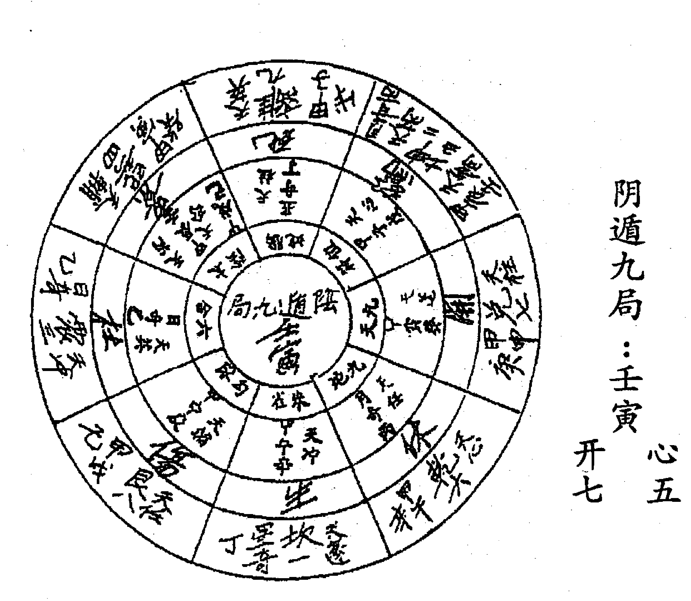

- (1) 开兑和 天蓬癸加甲申庚。太白入网:昙花一现,争讼力平。

- (2) 休乾礼 天任丙加甲午辛。威神互合:谋事有成,病人不凶。

> 「入墓,天遁,重诈」

- (3) 生坎迫 天冲辛加丁奇。狱神得奇:经商获倍利,囚人逢赦宥。

- (4) 伤艮迫 天辅庚加甲戌己。刑格:官司被重刑。

- (5) 杜震和 天英乙加乙奇。日奇伏吟:不宜谒贵求名,只可安分守身。「升殿」

- (6) 景巽仪 天芮壬加甲寅癸。幼女奸淫:家有丑声,门吉星凶,反祸福隆。

天禽已加甲寅癸。地刑玄武:病凶,词讼有囚狱之灾。

- (7) 死离仪 天柱丁加甲子戊。青龙转光:官人升迁,常人咸昌。

> 「入墓」

- (8) 惊坤仪 天心戊加丙奇。青龙回首:动作大利,若逢迫墓,吉事成凶。

天心戊加甲辰壬。龙入天牢:阴阳皆不吉利。

- (9) 休门丙奇合乾六宫,利西北方。

### 奇门阴阳九遁阴九局符使值例

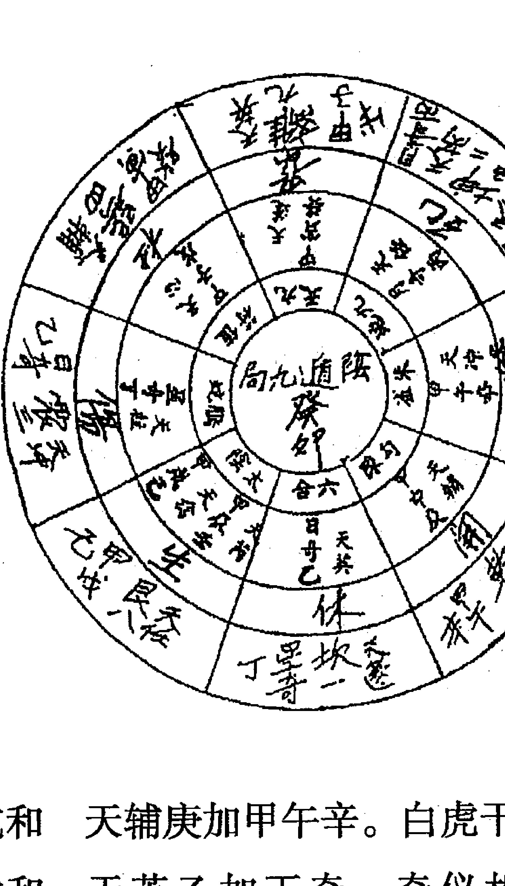

- 1. 开乾和 天辅庚加甲午辛。白虎干格:远行车折马死。

- 2. 休坎和 天英乙加丁奇。奇仪相佐:文书事吉,百事皆可为。「龙、地、人遁,休诈」

- 3. 生艮和 天芮壬加甲戌己。凶蛇入狱:大祸将至,顺守斯吉,词讼理曲。
天禽己加甲戌己。地户逢鬼:病凶,百事不遂。

- 4. 伤震和 天柱丁加乙奇。天运昌气格:贵人加官进爵,常人财喜婚姻。「人遁」

- 5. 杜巽和 天心戊加甲寅癸。青龙华盖:门吉招福,门凶多乖。

- 6. 景离和 天蓬癸加甲子戊。天乙会合:财喜婚姻,吉人赞助成合,门凶迫制,反祸官非。

- 7. 死坤和 天任丙加丙奇。月奇孛师:文书逼迫,破耗遗失。
天任丙加甲辰壬。火入天罗:客不利,是非颇多。

- 8. 惊兑和 天冲辛加甲申庚。白虎出力:刀刃相接,主客相残,逊让退步稍可,强进血溅衣衫。

- 9. 休门乙奇合坎一宫,利正北方。

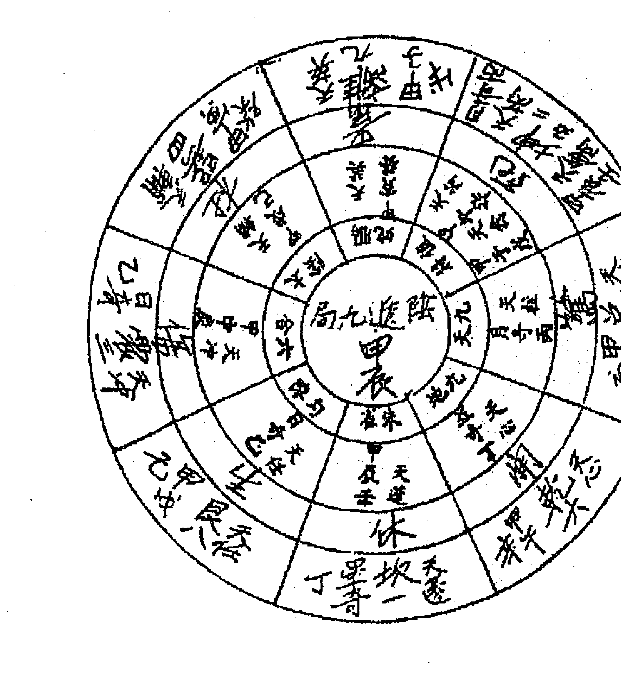

#### 阴遁九局：甲辰 死五 禽五

- 1. 开乾和 天心丁加甲午辛。朱雀入狱:罪人释囚,官人失位。「重诈」

- 2. 休坎和 天蓬壬加丁奇。干合蛇刑:文书牵连,贵人匆匆,男吉女凶。

- 3. 生艮和 天任乙加甲戊己。日奇入雾:被土暗味,门凶必凶。

- 4. 伤震和 天冲庚加乙奇。太白逢星:退吉进凶。

- 5. 杜巽和 天辅已加甲寅癸。地刑玄武:病凶,词讼有囚狱之灾。

- 6. 景离和 天英癸加甲子戊。天乙会合:财喜婚姻,吉人赞助成合,门凶迫制,反祸官非。

- 7. 死坤和 天芮辛加丙奇。荧惑出现:占雨无,占晴旱,占事必因财致讼。
天禽戊加甲辰壬。龙入天牢:阴阳皆不吉利。

- 8. 惊兑和 天柱丙加甲申庚。荧惑入太白:门户破败,盗贼耗失。

- 9. 开丁奇合乾六宫,利西方。
生乙奇合艮六宫,利东方。

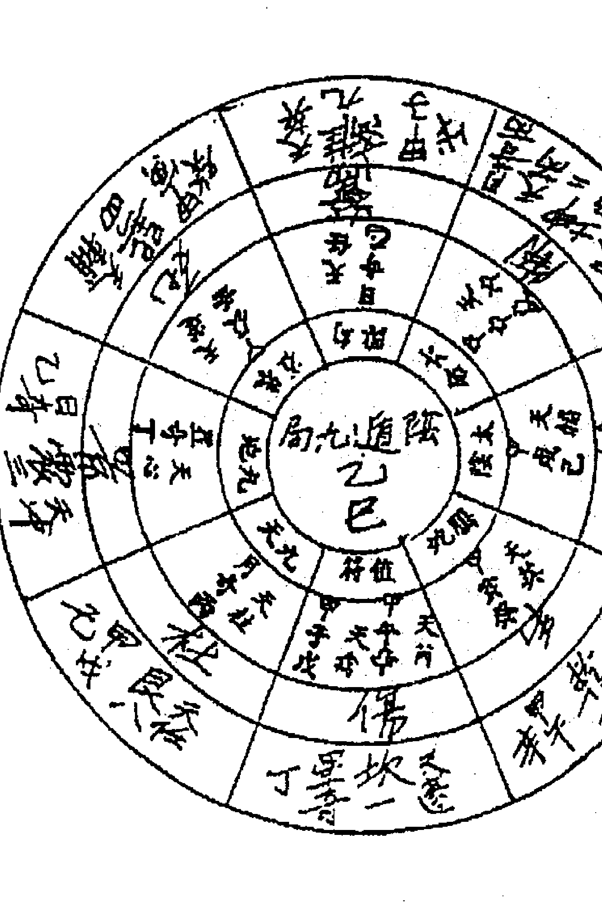

#### 阴遁九局：乙巳 禽一 死四

- (1) 开坤仪 天冲庚加丙奇。太白入荧惑:占贼必来,为客进利,为主破财。
天冲庚加甲辰壬。小格:远行迷路,音信嗟呀。

- (2) 休兑仪 天辅已加甲申庚。利格返名:词讼先动不利,阴星有谋害之情。

- (3) 生乾礼 天英癸加甲午辛。网盖天牢:占讼病凶。

- (4) 伤坎仪 天芮辛加丁奇。狱神得奇:经商获倍利,囚人逢赦宥。
天禽戊加丁奇。青龙耀明:谒贵求名吉利,值墓迫招是非。

- (5) 杜艮迫 天柱丙加甲戌己。太孛人刑:囚人刑杖,文书不行,吉门得吉,凶门转凶。

- (6) 景震仪 天心丁加乙奇。天运昌气格:贵人加官进爵,常人财喜婚姻。「人遁」

- (7) 死巽制 天蓬壬加甲寅癸。幼女奸淫:家有丑声,门吉星凶,反祸福隆。

- (8) 惊离制 天任乙加甲子戊。利阴害阳:门凶迫,财破人伤。

- (9) 无奇门。

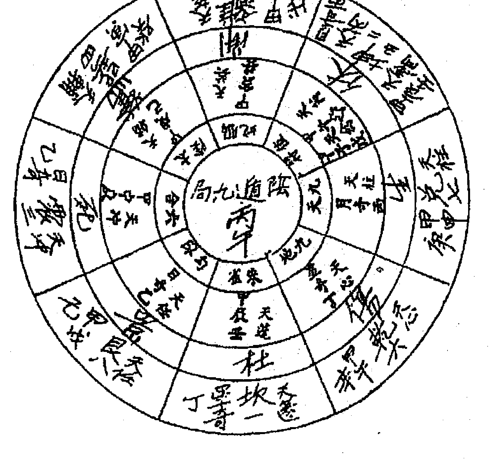

#### 阴遁九局：丙午 禽二 死三

- (1) 开离制 天英癸加甲子戊。天乙会合：财喜婚姻，吉人赞助成合，门凶迫制，反祸官非。

- (2) 休坤制 天芮辛加丙奇。荧惑出现：占雨无，占晴旱，占事必因财致讼。
天禽戊加甲辰壬。龙入天牢：阴阳皆不吉利。

- (3) 生兑礼 天柱丙加甲申庚。荧惑入太白：门户破败，盗贼耗失。「神遁」

- (4) 伤乾制 天心丁加甲午辛。朱雀入狱：罪人释囚，官人失位。

- (5) 杜坎仪 天蓬壬加丁奇。干合蛇刑：文书牵连，贵人匆匆，男吉女凶。

- (6) 景艮礼 天任乙加甲戌己。日奇入雾：被土暗昧，门凶必凶。

- (7) 死震制 天冲庚加乙奇。太白逢星：退吉进凶。

- (8) 惊巽迫 天辅己加甲寅癸。地刑玄武：病凶，词讼有囚狱之灾。

- (9) 生门丙奇合兑七宫，利正西方。

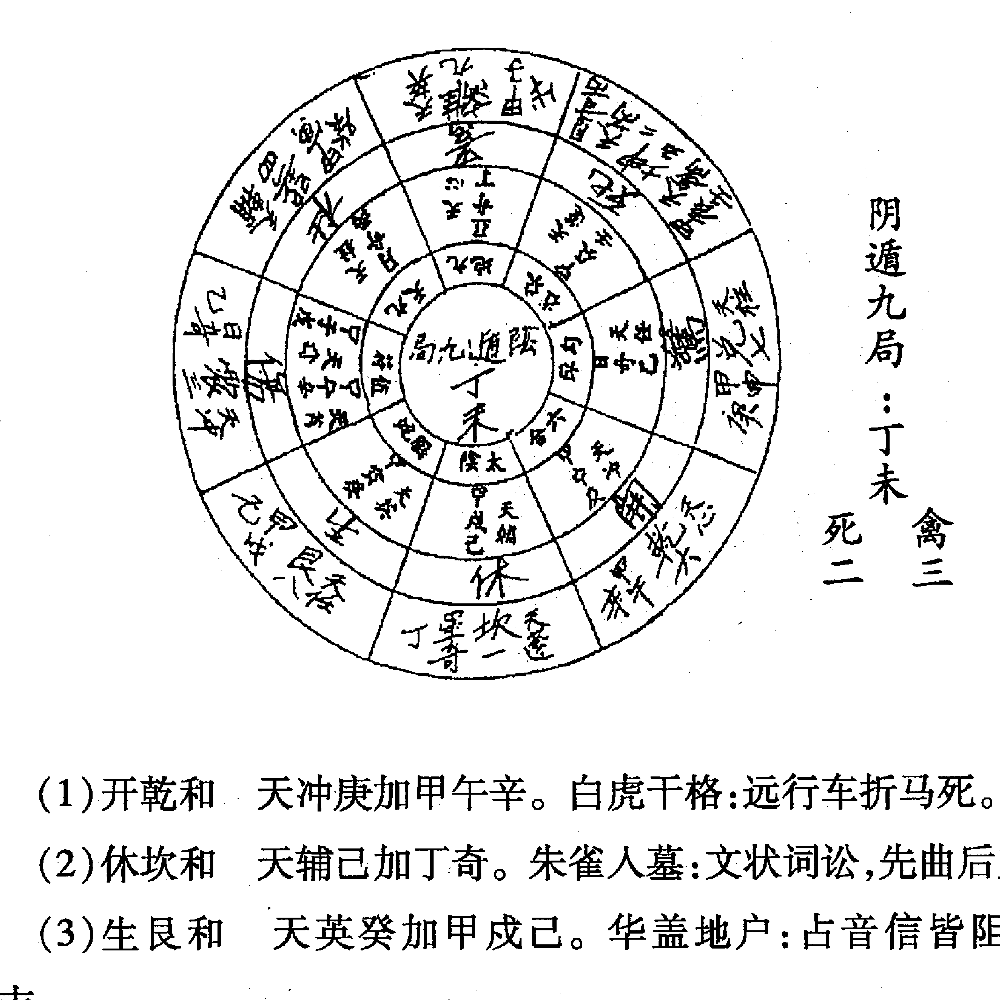

- (1) 开乾和 天冲庚加甲午辛。白虎干格：远行车折马死。

- (2) 休坎和 天辅己加丁奇。朱雀入墓：文状词讼，先曲后直。

- (3) 生艮和 天英癸加甲戌己。华盖地户：占音信皆阻，躲灾避难为吉。

- (4) 伤震和 天芮辛加乙奇。白虎猖狂：人亡家败，远行多殃，尊长不喜，车船俱伤，身体毁伤。
天禽戊加乙奇。青龙合灵：门吉事吉，门凶事凶。

- (5) 杜巽和 天柱丙加甲寅癸。华盖孛师：阴人害事，灾祸频生。

- (6) 景离和 天心丁加甲子戊。青龙转光：官人升迁，常人咸昌。

- (7) 死坤和 天蓬壬加丙奇。水蛇入火：官失刑禁，络绎不绝。
天蓬壬加甲辰壬。蛇入地罗：外人缠绕，内事索索，吉门吉星，避免蹉跎。

- (8) 惊兑和 天任乙加甲申庚。日奇被刑：争讼财产，夫妻怀私。

- (9) 无奇门。

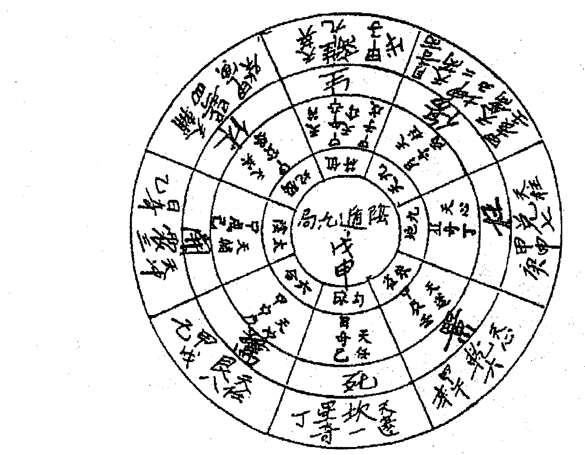

#### 阴遁九局：戊申 禽九 死一

- 1. 开震迫 天辅己加乙奇。墓神不明:宜遁跡隐形为利逸。

- 2. 休巽礼 天英癸加甲寅癸。天网四张:(网高四尺)行人失件,病讼皆伤。

- 3. 生离仪 天芮辛加甲子戊。困龙被伤:官司破败,屈抑守分,妄动祸殃。
天禽戊加甲子戊。伏吟:凡事闭塞,静守为吉。

- 4. 伤坤迫 天柱丙加丙奇。月奇孛师:文书逼迫,破耗遗失。
天柱丙加甲辰壬。火入天罗:客不利,是非颇多。

- 5. 杜兑制 天心丁加甲申庚。年月日时格:文书阻隔,行人必归。「升殿,地假」

- 6. 景乾迫 天蓬壬加甲午辛。螣蛇相缠:纵得吉门,亦不安宁,若有谋望被人欺瞒。

- 7. 死坎迫 天任乙加丁奇。奇仪相佐:文书事吉,百事皆可为。

- 8. 惊艮仪 天冲庚加甲戊己。刑格:官司被重刑。

- 9. 无奇门。

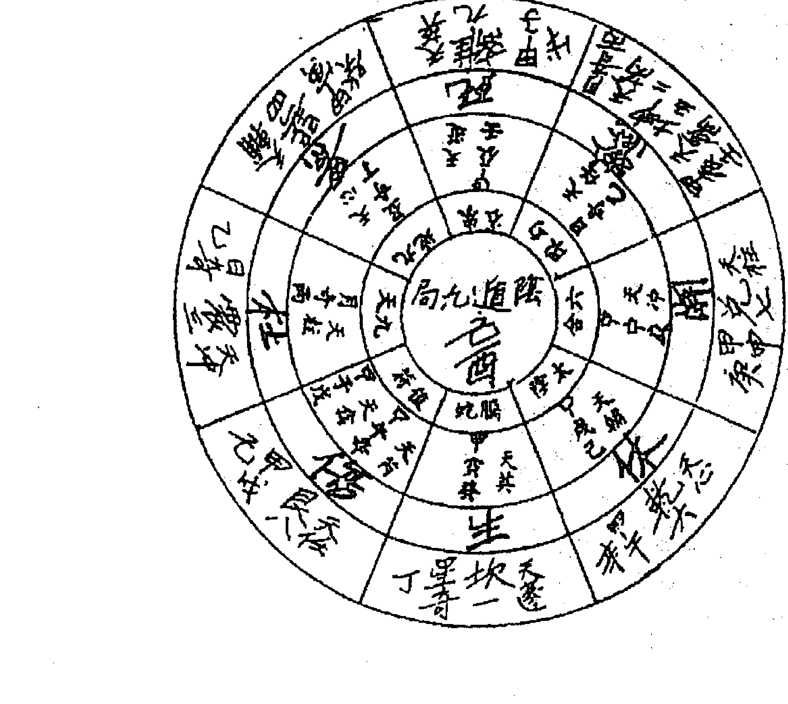

- (1) 开兑和 天冲庚加甲申庚。太白同宫：官灾横祸，兄弟不睦。

- (2) 休乾仪 天辅己加甲午辛。游魂入墓：大人鬼魅，小人家先为祟。

- (3) 生坎迫 天英癸加丁奇。塍蛇妖娇：文书官司火荧莫逃，忧惶之事必至。

- (4) 伤艮迫 天芮辛加甲戊己。入狱自刑：奴仆背主，讼诉难伸。
天禽戊加甲戊己。贵人入狱：公私不利。

- (5) 杜震和 天柱丙加乙奇。日月并行：公谋私为皆吉。

- (6) 景巽仪 天心丁加甲寅癸。朱雀投江：文书口舌俱消，音信沉溺，讼狱所由起也。

- (7) 死离仪 天蓬壬加甲子戊。小蛇化龙：男人发达，女产婴童。

- (8) 惊坤仪 天任乙加丙奇。奇仪顺遂：吉星迁官进爵，凶星夫妻离别。「入墓」
天任乙加甲辰壬。日奇入地：尊卑悖乱，官讼是非。

- (9) 无奇门。

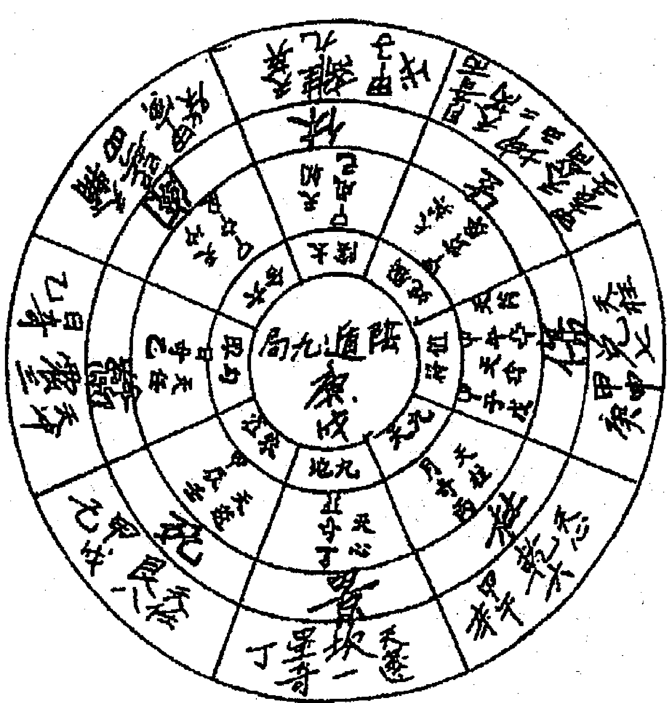

#### 阴遁九局：庚戌 禽七 死八

- (1) 开巽迫 天冲庚加甲申庚。大格:行人至,官司止,生产母子俱伤。

- (2) 休离迫 天辅己加甲子戊。犬遇青龙:门吉谋望遂意,上人见喜,门凶枉劳心机。

- (3) 生坤和 天英癸加丙奇。华盖孛师:贵贱逢之,上人见喜。
天英癸加甲辰壬。复见腾蛇:嫁娶重婚,后嫁无子,不保年华。

- (4) 伤兑制 天芮辛加甲申庚。白虎出力:刀刃相接,主客相残,逊让退步稍可,强进血溅衣衫。
天禽戊加甲申庚。值符飞宫:吉事不吉,凶事更凶。

- (5) 杜乾制 天柱丙加甲午辛。威神互合:谋事有成,病人不凶。「入墓」

- (6) 景坎制 天心丁加丁奇。奇入太阴:文书即至,喜事遂心。

- (7) 死艮和 天蓬壬加甲戌己。凶蛇入狱:大祸将至,顺守斯吉,词讼理曲。

- (8) 惊震迫 天任乙加乙奇。日奇伏吟:不宜谒贵求名,只可安分守身。「升殿」

- (9) 无奇门。

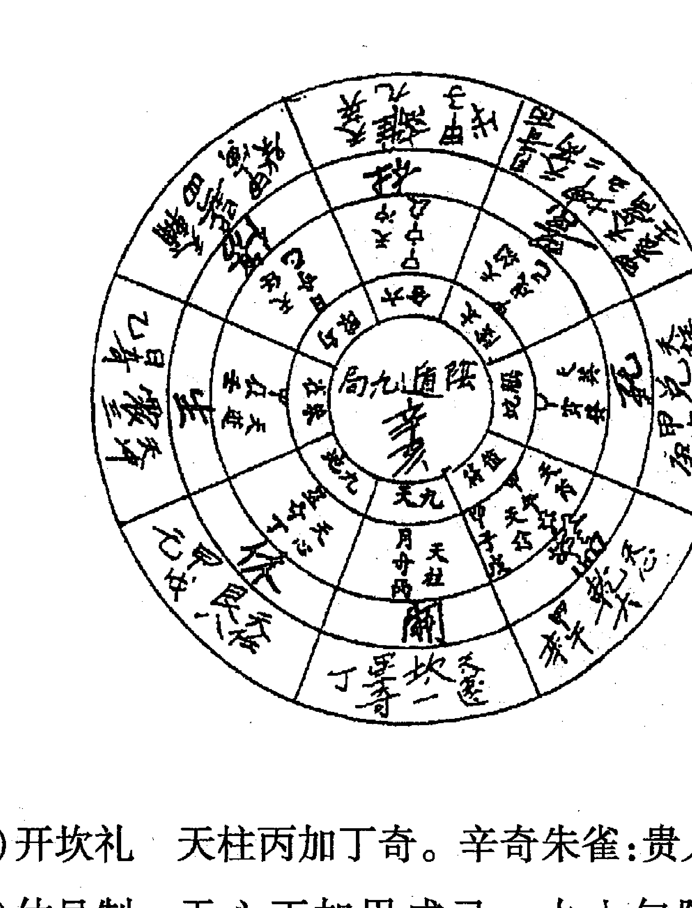

#### 阴遁九局：辛亥 死七 禽六

- (1) 开坎礼 天柱丙加丁奇。辛奇朱雀:贵人文书吉,常人平静。

- (2) 休艮制 天心丁加甲戌己。火入勾陈:奸私仇冤,事因女人。

> 「重诈」

- (3) 生震制 天蓬壬加乙奇。格名小蛇:女人柔顺,男人嗟呀,占孕生子,禄马光华。

- (4) 伤巽和 天任乙加甲寅癸。华盖官星:遁迹修道,隐匿藏形,躲灾避难为吉。

- (5) 杜离礼 天冲庚加甲子戊。太白天乙伏官:百事不可谋,凶。

- (6) 景坤礼 天辅己加丙奇。火孛地户:阳人冤冤相害,阴人必致淫污。
天辅己加甲辰壬。地网高张:狡童佚女,奸情伤杀。

- (7) 死兑礼 天英癸加甲申庚。太白入网:昙花一现,争讼力平。

- (8) 惊乾和 天芮辛加甲午辛。伏吟天庭:公废私就,讼狱自罹罪名。
天禽戊加甲午辛:青龙折足:吉门生助,尚可谋为,逢凶门主招灾,失财足疾。

- (9) 开 丙 坎一 正 休 丁 奇合 艮八 宫,利 东 北方。

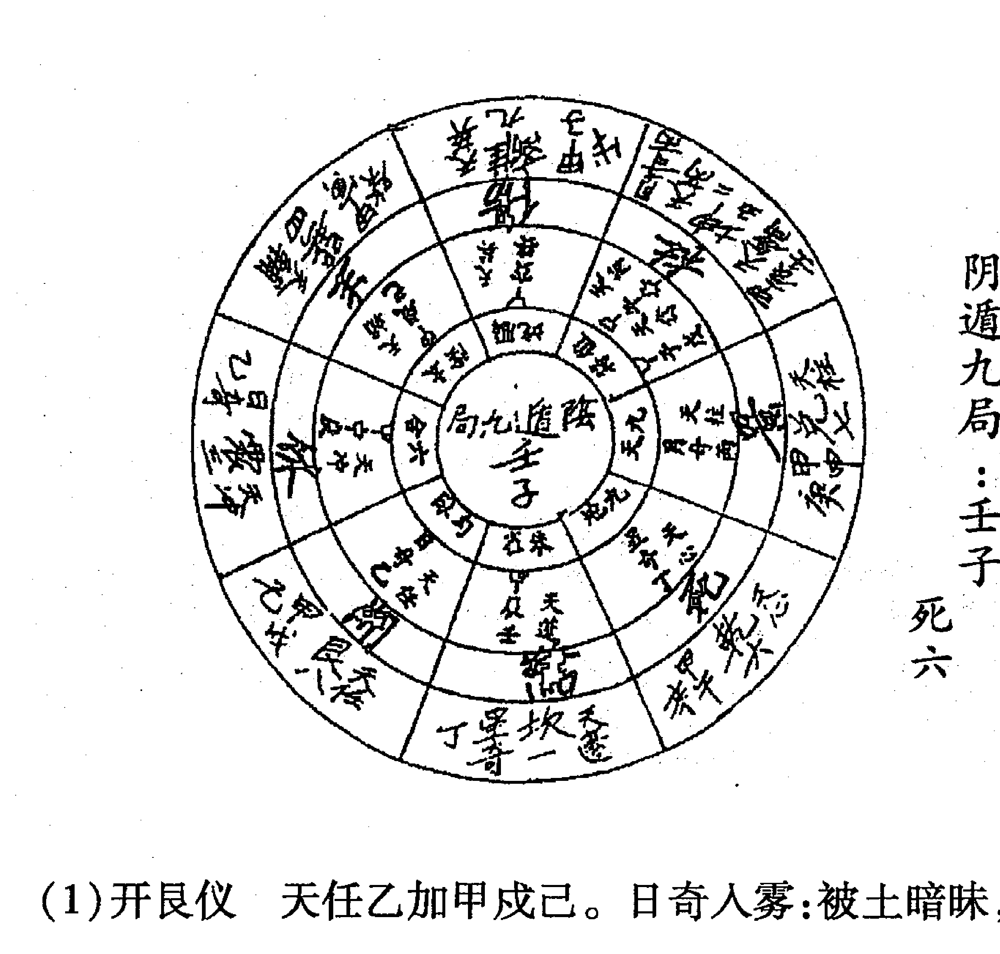

- (1) 开艮仪 天任乙加甲戌己。日奇入雾：被土暗味，门凶必凶。

- (2) 休震礼 天冲庚加乙奇。太白逢星：退吉进凶。

- (3) 生巽制 天辅己加甲寅癸。地刑玄武：病凶，词讼有囚狱之灾。

- (4) 伤离礼 天英癸加甲子戊。天乙会合：财喜婚姻，吉人赞助成合，门凶迫制，反祸官非。

- (5) 杜坤迫 天芮辛加丙奇。荧惑出现：占雨无，占晴旱，占事必因财致讼。
天禽戊加甲辰壬：龙入天牢：阴阳皆不吉利。

- (6) 景兑迫 天柱丙加甲申庚。荧惑入太白：门户破败，盗贼耗失。

- (7) 死乾礼 天心丁加甲午辛。朱雀入狱：罪人释囚，官人失位。
「入墓，地假」

- (8) 惊坎礼 天蓬壬加丁奇。干合蛇刑：文书牵连，贵人匆匆，男吉女凶。

- (9) 开门乙奇合艮八宫，利东北方。

### 奇门阴阳九遁阴九局符使值例

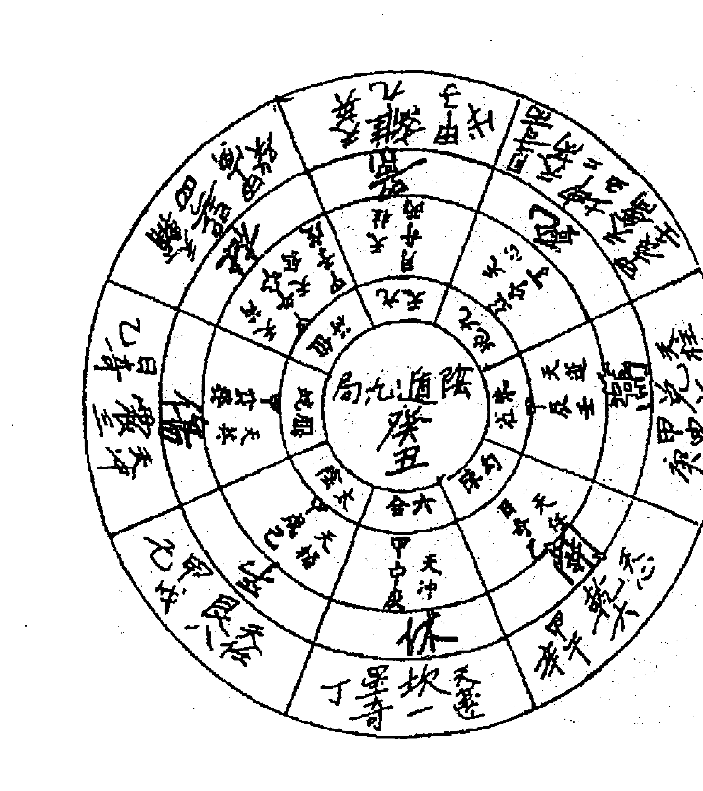

#### 阴遁九局：癸丑 禽五 死四

- 1. 开乾和 天任乙加甲午辛。青龙逃走:奴仆拐带,六畜皆伤,财产废坠,身遭毁伤。「入墓」
- 2. 休坎和 天冲庚加丁奇。亭亭之格:因私匿起官司,门吉有救。
- 3. 生艮和 天辅己加甲戌己。地户逢鬼:病凶,百事不遂。
- 4. 伤震和 天英癸加乙奇。华盖官星:贵人禄位,常人平安。
- 5. 杜巽和 天芮辛加甲寅癸。天牢华盖:误入天网,动止乖张。
天禽戊加甲寅癸。青龙华盖:门吉招福,门凶多乖。
- 6. 景离和 天柱丙加甲子戊。飞鸟跌穴:谋事有成,百事洞澈。「升殿」
- 7. 死坤和 天心丁加丙奇。星随月转:贵人越级高升,常人乐里生悲。「入墓,鬼假」
天心丁加甲辰壬。五神互合:贵人恩诏,讼狱公平。
- 8. 惊兑和 天蓬壬加甲申庚。太白擒蛇:刑狱公平,立剖邪正。
- 9. 开门乙奇合乾六宫,利西北方。

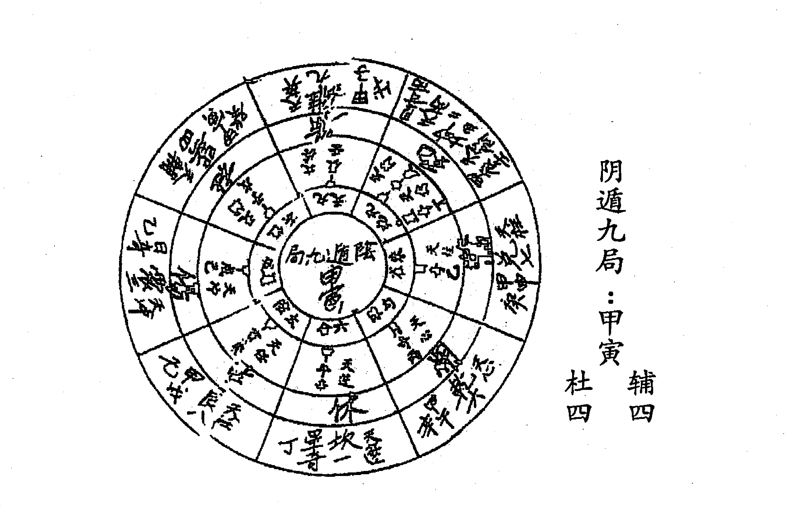

- 1. 开乾和 天心丙加甲午辛。威神互合:谋事有成,病人不凶。「入墓」
- 2. 休坎和 天蓬辛加丁奇。狱神得奇:经商获倍利,囚人逢赦宥。
- 3. 生艮和 天任癸加甲戌己。华盖地户:占音信皆阻,躲灾避难为吉。
- 4. 伤震和 天冲己加乙奇。墓神不明:宜遁迹隐形为利逸。
- 5. 杜巽和 天辅戊加甲寅癸。青龙华盖:门吉招福,门凶多乖。
- 6. 景离和 天英壬加甲子戊。小蛇化龙:男人发达,女产婴童。
- 7. 死坤和 天芮庚加丙奇。太白入荧惑:占贼必来,为客进利,为主破财。
天禽丁加甲辰壬。五神互合:贵人恩诏,讼狱公平。「入墓,鬼假」
- 8. 惊兑和 天柱乙加甲申庚。日奇被刑:争讼财产夫妻怀私。
- 9. 开门丙奇合乾六宫,利西北方。

### 奇门阴阳九遁阴九局符使值例

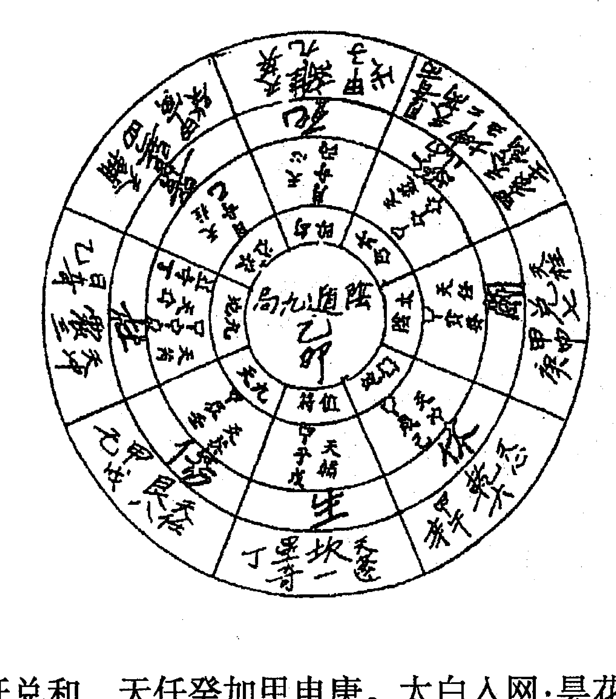

#### 阴遁九局：乙卯 杜三 辅一

- (1) 开兑和 天任癸加甲申庚。太白入网：昙花一现，争讼力平。
- (2) 休乾仪 天冲己加甲午辛。游魂入墓：大人鬼魅，小人家先为祟。
- (3) 生坎迫 天辅戊加丁奇。青龙耀明：谒贵求名吉利，值墓迫招是非。
- (4) 伤艮迫 天英壬加甲戊己。凶蛇入狱：大祸将至，顺守斯吉，词讼理曲。
- (5) 杜震和 天芮庚加乙奇。太白逢星：退吉进凶。
- (6) 景巽仪 天柱乙加甲寅癸。华盖官星：遁迹修道，隐匿藏形，躲灾避难为吉。
- (7) 死离仪 天心丙加甲子戊。飞鸟跌穴：谋事有成，百事洞澈。
- (8) 惊坤仪 天蓬辛加丙奇。荧惑出现：占雨无，占晴旱，占事必因财致讼。
- (9) 无奇门。

天禽丁加乙奇。天运昌气格：贵人加官进爵，常人财喜婚姻。「人遁」

「升殿」

天蓬辛加甲辰壬。凶蛇入狱：两男争女，讼狱不息，先动失理。

### 奇门遁甲秘笈全书（中册）

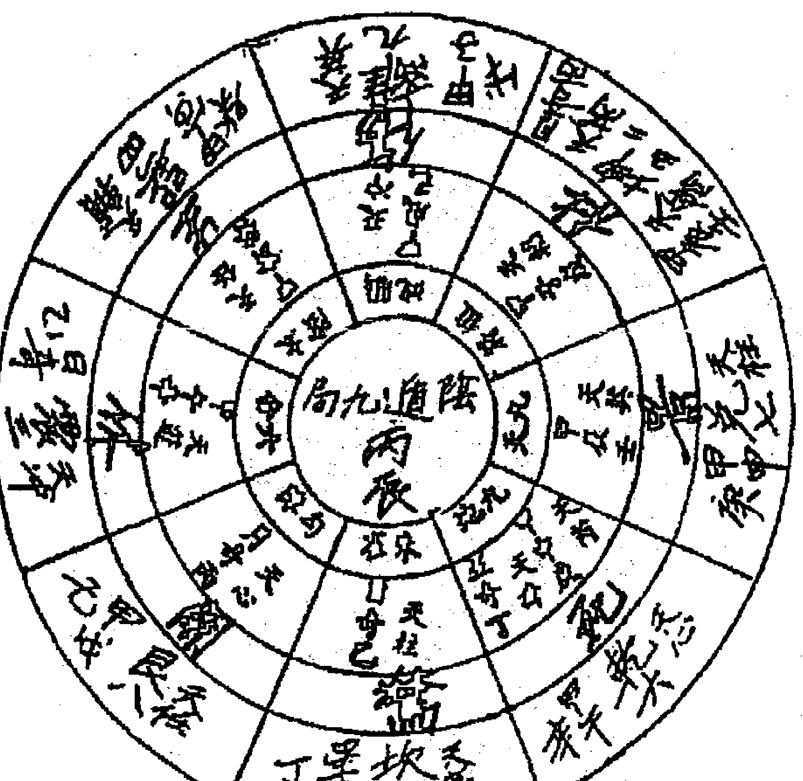

#### 阴遁九局：丙辰 杜二 辅二

- (1) 开艮仪 天心丙加甲戌己。太孛人刑：囚人刑杖，文书不行，吉门得吉，凶门转凶。

- (2) 休震礼 天蓬辛加乙奇。白虎猖狂：人亡家败，远行多殃，尊长不喜，车船俱伤，身体毁伤。

- (3) 生巽制 天任癸加甲寅癸。天网四张：(网高四尺)行人失件，病讼皆伤。

- (4) 伤离礼 天冲己加甲子戊。犬遇青龙：门吉谋望遂意，上人见喜，门凶枉劳心机。

- (5) 杜坤迫 天辅戊加丙奇。青龙回首：动作大利，若逢迫墓，吉事成凶。
天辅戊加甲辰壬。龙入天牢：阴阳皆不吉利。

- (6) 景兑迫 天英壬加甲申庚。太白擒蛇：刑狱公平，立剖邪正。

- (7) 死乾礼 天芮庚加甲午辛。白虎干格：远行车折马死。
天禽丁加甲午辛。朱雀入狱：罪人释囚，官人失位。「入墓，鬼假」

- (8) 惊坎礼 天柱乙加丁奇。奇仪相佐：文书事吉，百事皆可为。

- (9) 开门丙奇合艮八宫，利东北方。

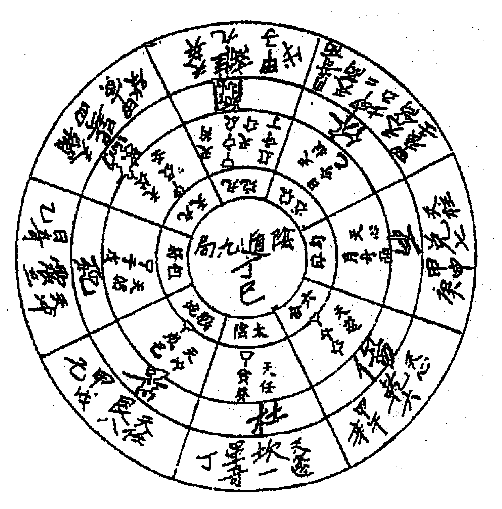

- (1) 开离制 天芮庚加甲子戊。太白天乙伏官：百事不可谋，凶。
天禽丁加甲子戊。青龙转光：官人升迁，常人咸昌。「重诈」

- (2) 休坤制 天柱乙加丙奇。奇仪顺遂：吉星迁官进爵，凶星夫妻离别。「入墓」
天柱乙加甲辰壬。日奇入地：尊卑悖乱，官讼是非。

- (3) 生兑礼 天心丙加甲申庚。荧惑入太白：门户破败，盗贼耗失。

- (4) 伤乾制 天蓬辛加甲午辛。伏吟天庭：公废私就，讼狱自罹罪名。

- (5) 杜坎仪 天任癸加丁奇。腾蛇妖娇：文书官司火焚莫逃，忧惶之事必至。

- (6) 景艮礼 天冲己加甲戌己。地户逢鬼：病凶，百事不遂。

- (7) 死震制 天辅戊加乙奇。青龙合灵：门吉事吉，门凶事凶。

- (8) 惊巽迫 天英壬加甲寅癸。幼女奸淫：家有丑声，门吉星凶，反祸福隆。「入假」

- (9) 开 丁 离九 正南
休门乙奇合坤二宫，利西南方
生 丙 兑七 正西

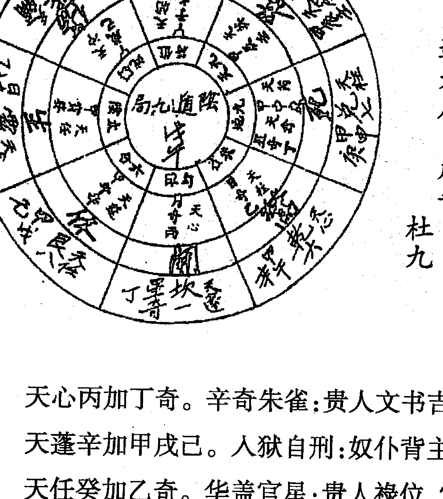

#### 阴遁九局：戊午 杜九 辅九

- 1. 开坎礼 天心丙加丁奇。辛奇朱雀:贵人文书吉,常人平静。
- 2. 休艮制 天蓬辛加甲戌己。入狱自刑:奴仆背主,讼诉难伸。
- 3. 生震制 天任癸加乙奇。华盖官星:贵人禄位,常人平安。
- 4. 伤巽和 天冲己加甲寅癸。地刑玄武:病凶,词讼有囚狱之灾。
- 5. 杜离礼 天辅戊加甲子戊。伏吟:凡事闭塞,静守为吉。
- 6. 景坤礼 天英壬加丙奇。水蛇入火:官灾刑禁,络绎不绝。
天英壬加甲辰壬。蛇入地罗:外人缠绕,内事索索,吉门吉星,避免蹉跎。
- 7. 死兑礼 天芮庚加甲申庚。太白同宫:官灾横祸,兄弟不睦。
天禽丁加甲申庚。年月日时格:文书阻隔,行人必归。「入墓,鬼假」
- 8. 惊乾和 天柱乙加甲午辛。青龙逃走:奴仆拐带,六畜皆伤,财产废坠,身遭毁伤。「入墓」
- 9. 开门丙奇合坎一宫,利正北方。

### 奇门阴阳九遁阴九局符使值例

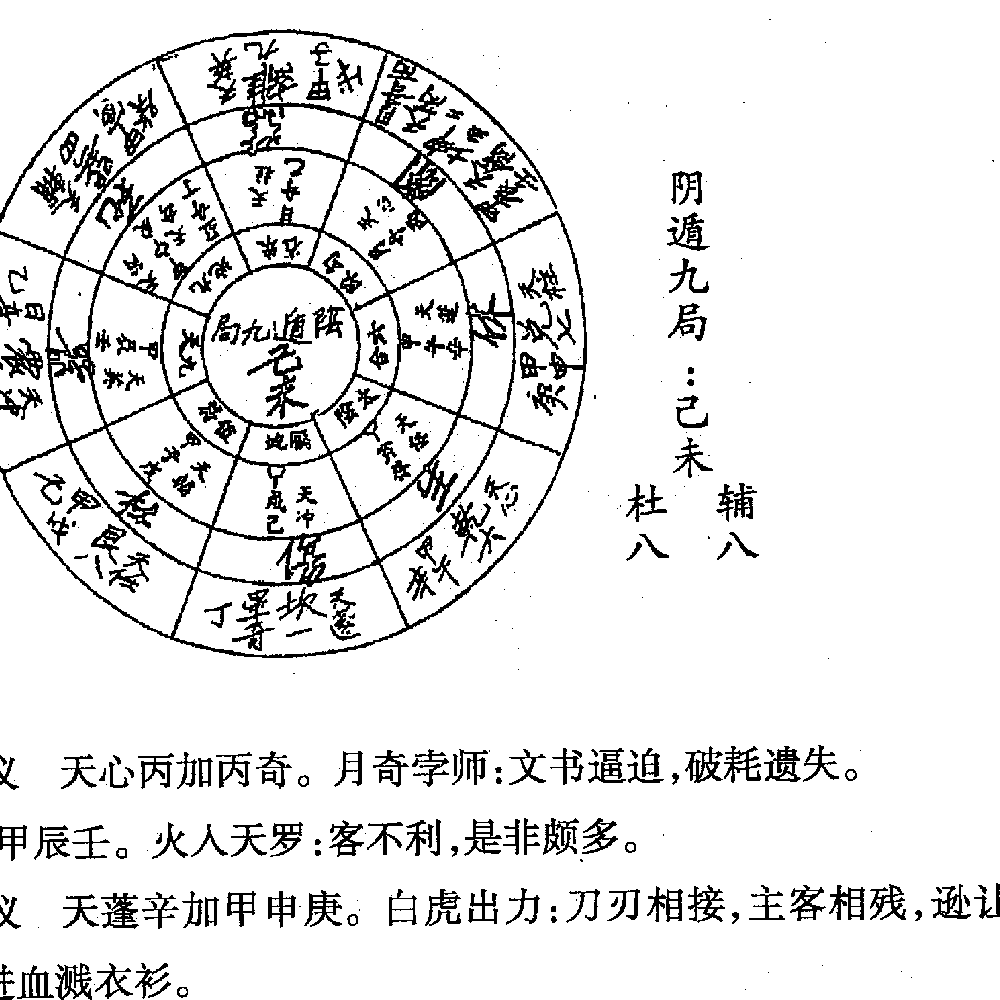

- (1) 开坤仪 天心丙加丙奇。月奇孛师:文书逼迫,破耗遗失。
天心丙加甲辰壬。火入天罗:客不利,是非颇多。
- (2) 休兑仪 天蓬辛加甲申庚。白虎出力:刀刃相接,主客相残,逊让退步稍可,强进血溅衣衫。
- (3) 生乾礼 天任癸加甲午辛。网盖天牢:占讼病凶。
- (4) 伤坎仪 天冲乙加丁奇。朱雀入墓:文状词讼,先曲后直。
- (5) 杜艮迫 天辅戊加甲戌己。贵人入狱:公私不利。
- (6) 景震仪 天英壬加乙奇。格名小蛇:女人柔顺,男人嗟呀,占孕生子,禄马光华。
- (7) 死巽制 天芮庚加甲寅癸。大格:行人至,官司止,生产母子俱伤。
天禽丁加甲寅癸。朱雀投江:文书口舌俱消,音信沉溺,讼狱所由起也。「入墓,鬼假」
- (8) 惊离制 天柱乙加甲子戊。利阴害阳:门逢凶迫,财破人伤。
- (9) 开门丙奇合坤二宫,利西南方。

### 奇门遁甲秘笈全书(中册)

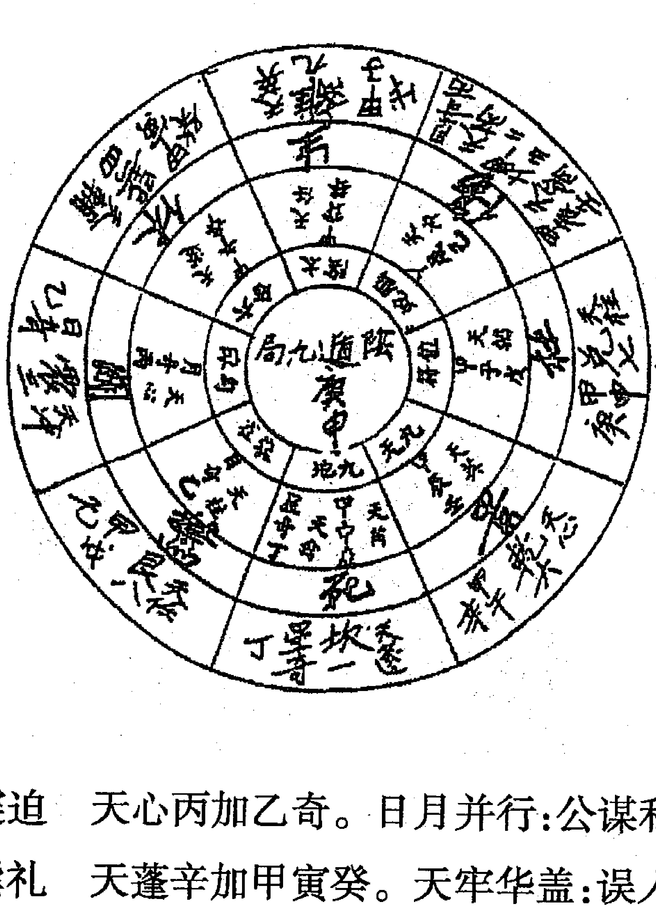

#### 阴遁九局：庚申 杜七 辅七

- (1) 开震迫 天心丙加乙奇。日月并行:公谋私为皆吉。
- (2) 休巽礼 天蓬辛加甲寅癸。天牢华盖:误入天网,动止乖张。
- (3) 生离仪 天任癸加甲子戊。天乙会合:财喜婚姻,吉人赞助成合,门凶迫制,反祸官非。
- (4) 伤坤迫 天冲己加丙奇。火孛地户:阳人冤冤相害,阴人必致淫污。
天冲己加甲辰壬。地网高张:狡童佚女,奸情伤杀。
- (5) 杜兑制 天辅戊加甲申庚。值符飞宫:吉事不吉,凶事更凶。
- (6) 景乾迫 天英壬加甲午辛。螣蛇相缠:纵得吉门,亦不安宁,若有谋望被人欺瞒。
- (7) 死坎迫 天芮庚加丁奇。亭亭之格:因私匿起官司,门吉有救。
天禽丁加丁奇。奇人太阴:文书即至,喜事遂心。「入墓,鬼假」
- (8) 惊艮仪 天柱乙加甲戊己。日奇入雾:被土暗味,门凶必凶。
- (9) 开门丙奇合震三宫,利正东方。

### 奇门阴阳九遁阴九局符使值例

阴遁九局：辛酉
杜六 辅六

- (1)开巽迫 天心丙加甲寅癸。华盖孛师：阴人害事，灾祸频生。
- (2)休离迫 天蓬辛加甲子戊。困龙被伤：官司破败，屈抑守分，妄动祸殃。
- (3)生坤和 天任癸加丙奇。华盖孛师：贵贱逢之，上人见喜。
天任癸加甲辰壬。复见腾蛇：嫁娶重婚，后嫁无子，不保年华。
- (4)伤兑制 天冲己加甲申庚。利格返名：词讼先动不利，阴星有谋害之情。
- (5)杜乾制 天辅戊加甲午辛。青龙折足：吉门生助，尚可谋为，若逢凶门，主招灾失财有足疾。
- (6)景坎制 天英壬加丁奇。干合蛇刑：文书牵连，贵人匆匆，男吉女凶。
- (7)死艮和 天芮庚加甲戊己。刑格：官司被重刑。
天禽丁加甲戊己。火入勾陈：奸私仇冤，事因女人。「入墓，鬼假」
- (8)惊震迫 天柱乙加乙奇。日奇伏吟：不宜谒贵求名，只可安分守身。「升殿」
- (9)开门丙奇合巽四宫，利东南方。

阴遁九局：壬戌
杜五 辅五

- (1)开艮和 天心丙加甲戌己。太孛入刑：囚人刑杖，文书不行，吉门得吉，凶门转凶。
- (2)休震礼 天蓬辛加乙奇。白虎猖狂：人亡家败，远行多殃，尊长不喜，车船俱伤，身体毁伤。
- (3)生巽制 天任癸加甲寅癸。天网四张：(网高四尺)行人失件，病讼皆伤。
- (4)伤离礼 天冲己加甲子戊。犬遇青龙：门吉谋望遂意，上人见喜，门凶枉劳心机。
- (5)杜坤迫 天辅戊加丙奇。青龙回首：动作大利，若逢迫墓，吉事成凶。
天辅戊加甲辰壬。龙入天牢：阴阳皆不吉利。
- (6)景兑迫 天英壬加甲申庚。太白擒蛇：刑狱公平，立剖邪正。
- (7)死乾礼 天芮庚加甲午辛。白虎干格：远行车折马死。
天禽丁加甲午辛。朱雀入狱：罪人释囚，官人失位。「入墓，鬼假」
- (8)惊坎礼 天柱乙加丁奇。奇仪相佐：文书事吉，百事皆可为。
- (9)开门丙奇合艮八宫，利东北方。

阴遁九局：癸亥
杜四 辅四

- (1)开乾和 天心丙加甲午辛。威神互合：谋事有成，病人不凶。
- (2)休坎和 天蓬辛加丁奇。狱神得奇：经商获倍利，囚人逢赦宥。
- (3)生艮和 天任癸加甲戌己。华盖地户：占音信皆阻，躲灾避难为吉。
- (4)伤震和 天冲己加乙奇。墓神不明：宜遁踪隐形为利逸。
- (5)杜巽和 天辅戊加甲寅癸。青龙华盖：门吉招福，门凶多乖。
- (6)景离和 天英壬加甲子戊。小蛇化龙：男人发达，女产婴童。
- (7)死坤和 天芮庚加丙奇。太白入荧惑：占贼必来，为客进利，为主破财。
- (8)惊兑和 天柱乙加甲申庚。日奇被刑：争讼财产夫妻怀私。
- (9)开门丙奇合乾六宫，利西北方。

天禽丁加甲辰壬。五神互合：贵人恩诏，讼狱公平。「入墓，鬼假」

### 编著奇门遁甲秘笈真诠后感言

天有不测风云，人有旦夕祸福。惨罹沉疴，切除喉头声带。从此表达有意，应对无语。自忖己身已残，惟有寄情书牍著作，稍纾烦闷。忆古者，富贵而名摩灭，惟俶傥之士传焉。大抵圣贤豪傑，或才不世用，或身受屈辱，往往发愤著述，以洩胸中磊坷郁结之气。龙门被刑而成史记，三闾既放以赋离骚，良有以也。不才如余，何敢企及前贤，只勉策惊钝，追慕芳躅而已。乃搜集先贤遗著，编纂奇门遁甲秘笈真诠一书留传后世，剔抉简练，历时三载。冷月寒窗，溽暑斗室，一义未合，一字不洽，辄揣摹推敲，废寝忘餐。箇中况味可为识者道，难为俗人言也。