# 奇门遁甲秘笈大全

## 奇门遁甲总序

窃惟黄帝战蚩尤于涿鹿，梦天神授符，而命风后演就奇门，此遁甲所由始也。帝尧命大禹治水，得玄女传文，而因洛龟画叙①九畴，此遁甲所由著也。汉子房总局十八而成决胜之功，蜀孔明分列三奇而创艰难之业。先排九宫于掌上，而坎居一、坤居二、震居三、巽居四、中央五、乾六兑七、艮八离九，而造化见矣。次分八卦于盘中，而离位于南，坎位于北，震东兑西，巽东南，坤西南，艮东北，乾西北，而方隅定矣。

纵横十五，错叙②三元。以八卦分八节而节令以全，以一节统三气而气候以备。逢甲已为符头，须闰奇而补局。符速节迟，看甲已临于何处而用超神之法；节先符后，验日辰甲已何居而行节气之方。子午东部，为冬至后阳遁，历坎、艮、震、巽，仪顺行而奇逆布，由值符而顺飞于九宫也。子午西部，为夏至后阴遁，历离、坤、兑、乾，奇顺布而仪逆行，由值符而逆飞于八卦也。

认九宫，安九星为值符，而吉凶以分。如坎宫，认天蓬为符，则天芮二、天冲三、天辅四、天禽五、天心六、天柱七、天任八、天英九也。配八卦，立八门为值使，而休咎以判。③ 如乾宫，配开为使，则休门坎、生门艮、伤门震、杜门巽、景门离、死门坤、惊门兑也。移值符于时干，而时干住处，值符之起首寓矣。寻值使于时支，而时支住处，值使之方向存矣。

天盘九星共奇仪，而一时一易，象天之旋转；地盘九星与奇仪，而五日方移，法地道之贞静也。天盘临地，审吉凶之消长；地盘承天，断休咎之盈虚。天甲子临地甲子，是为伏吟。凡门符临本宫，皆同此例，而不可用也。地天英逢天天蓬，是为反吟，凡门加冲宫，皆同此例，而避之可也。吉门临三奇，而所求皆遂；奇门入墓迫，而所为无成。乙丙丁、生休开，如合太阴之位，是谓三全奇吉。阴或有无，必审从背之方，是谓二可。① 六仪击刑，② 至恶而不可使用。九遁合门，至利而大可施为。开门合乙而加己位，不犯奇墓门迫，名曰“地遁”，临紫微而蔽，以日精者也。月奇临丁而逢生门，不犯奇墓门迫，号曰“天遁”，乘华盖而蔽，以月精者也。休门与丁奇相合，太阴共地一相临，斯为“人遁”，亦可行师。丙奇同生门而合于九天，遁属于“神”。星奇遇休门而临于九地，遁属于“鬼”。“龙”得月奇合休癸，而或临于坎；“虎”得乙奇临生门，而或出于艮。“风遁”则日开临于巽，“云遁”则月开合于坤。此九遁之例名，实兵家之秘，顾用之何如，而验之无不应也。

夫星有阴阳，门有开阖。惟天禽则无定位，寄西南而属中宫。从三避五，为害为生。胜地有三，天上值符所临天乙，大将居之，一也。值符后一为九天，我军居之，二也。地生门而合三奇之宫，若引军而从生门击死，百战百胜，三也。不击有五，天乙、九天击之，必被其殃，一与二也。生门、九地犯之，必罹其害，三与四也。天值符而临值使之位，如用兵突围摧阵，将死军亡，五也。孟甲刑门，难以出入，而宜隐迹；仲甲阳内，宜于坚守，而利于藏兵；四季甲时，阴内阳外，须分主客，始决雌雄。

六乙为天德，出从而上，日奇之下，可决胜于未然之内。丙为天威，不得丙火销金之令，宜防败于不测。时临六丁，名为玉女潜形，如隐伏而不见其象。时临六戊，号曰乘龙万里，逢凶徒而自灭其踪。六己为地户，宜阴私而用偷劫。六癸为天网，审高下而利逃亡。六庚而出战，咎将及于其师。六辛而行师，祸必加于其身。六壬为天牢，而飞祸速至。六甲为时首，而应局斯灵。

甲加丙为“青龙返首”，而动作无阻。丙加甲为“飞鸟跌穴”，而运用有成。乙加辛是“青龙逃走”，而财物废坠。辛加乙是“白虎猖狂”，而身体毁伤。丁加癸为“朱雀投江”，而讼狱所由起也。癸加丁为“螣蛇夭矫”，而忧惶之事必至也。

六庚加符为“伏宫格”，不利其主而利其客。值符加庚为“飞宫格”，不贵于战而贵于谋。庚加值符，太白格于天乙，外兵侵而主将必败。符加六庚，太乙格于太白，强出兵而客将必阻。值使临庚，名为“野战”，兵虽精而主困也。庚加值使，名曰“同宫”，将虽骁而必挫也。庚加于丙，是为“太白入荧惑”，而贼必来。丙加于庚，是为“丙火入金乡”，而贼必退也。此主客皆不利，莫倚奇门而强用也。

天地“大格”，庚下加癸；天地“小格”，壬上加庚。庚加于己，士卒死于中途。己加于庚，将兵厄于危路。“岁格”则岁逢于庚，“月格”则庚加朔建。庚临日干为“伏干格”，而主人见伤。日干临庚为“飞宫格”，而客将不胜。时干克日为“五不遇”，而定损其明。丙加日干名曰“悖乱”，而颠倒纪纲。

天有三门，天冲小吉从魁。地有四户，月建除危开定。① 值使相加，乃天乙之所在；值符临处，为天乙之行宫。其值符同乎天乙，有难宜弃门从坤。后一为九天，二为九地，九天之上利以扬兵，九地之下利以埋伏。前三为六合，二为太阴，六合之中逃亡是利，太阴之处潜伏斯宜。“三诈”之方，举动皆利，是休生开合乙丙丁九地太阴而然也。“五假”之地，各有吉凶，是杜死惊伤景合九地太阴乙丙丁己癸而致也。如六戊不测之术，六甲阴符之妙，此乃心悟，难以言传。有志于卫国安民，出将入相者，不可不知也。

鸣呼！分天地于掌握，罗列宿于心胸；风雷从其呼吸，神鬼听其指挥。其天府石室之秘文，运筹决胜之神算乎！

岁大明洪武四年季夏四月朔八日，是为叙。

刘基伯温氏谨识

① 点校者注：省思堂本作“杀”。
② 点校者注：省思堂本作“杀”。
③ 点校者注：省思堂本作“央”。
① 点校者注：他本作“三奇”。
② 点校者注：《遁甲演义》论六仪击刑：“歌曰：‘六仪击刑何太凶，甲子值符愁向东。戊刑在未申刑虎，寅巳辰辰午刑午。’六甲地支相刑与自刑也，如甲子见卯，甲戌见未，甲申见寅，甲寅见巳，为相刑。甲辰见甲辰，甲午见甲午，为自刑。葛洪曰：六仪击刑者，谓六甲值符加所刑之地也。甲子值符加卯，卯刑子也。甲戌值符加未，戌刑未也。甲申值符加寅，申刑寅也。甲午值符加午，午自刑也。甲辰值符加辰，辰自刑也。甲寅值符加巳，寅刑巳也。王璋曰：甲子值符加三宫，甲戌值符加二宫，甲申值符加八宫，甲午值符加九宫，甲辰值符临四宫，甲寅值符临四宫，已上皆为六仪击刑。郭璞论三合之刑：金刚火强，各刑本方。水流趋东，木落返本。甲寅甲午甲戌火局，刑巳午未南方。己酉丑金局，刑申酉戌西方。甲申甲子甲辰水局，刑寅卯辰东方。亥卯未木局，刑亥子丑北方。假令冬至上元阳遁一局，甲己之日，夜半甲子为值符至日出卯时，是六仪击刑也。至庚午时，以甲子值符，加六庚于三宫，即六仪击刑时也。其时极凶，不可用事。”
① 点校者注：求天门时，将天盘上的当月月将加在地盘正时时支，则从魁、小吉、太冲三个方位即为“天三门”。用事时一定要在到了当令的中气才能用当月月将，否则使用上月月将。求地四户时，排十二宫，分天盘、地盘，天盘排建、除、满、平、定、执、破、危、成、收、开、闭与时支子、丑、寅、卯、辰、巳、午、未、申、酉、戌、亥；地盘排十二地支月建。以天盘时支加地盘月建，则天盘除、定、危、开所落的方位即为地四户。故此处当断作：天有“三门”，天冲、小吉、从魁。地有“四户”，月建除、危、开、定。

## 奇门遁甲序二①

奇门之说，论者谓始于黄帝，删于吕望张良。汉以前，往往散见于他书。至于《隋书·艺文志》，专书始有一十三家。唐益倍之。则其学之来，亦不在近矣。《阴符经》曰：“爱有奇器，是生万象。八卦甲子，神机鬼藏。”张良②注云：“六癸为天藏，可以伏藏。由是言之，即奇门之权与也。”《大戴礼记·明堂篇》曰：“明堂者，古有之也。凡九室。二九四、七五三、六一八。”盖即河图之义，而奇学之九宫。《汉书·艺文志》，有《明堂阴阳》二十三篇，又《明堂阴阳》五篇。宣帝时，魏相③表采④《易阴阳》，及《明堂》、《月令》，言五帝所司各有时。东方之卦，不可以治西方；南方之卦，不可以治北方。乃以八卦方位，配明堂之九室。

《后汉书·张衡传》：“郑元既注九宫之说。”而《南齐书·高帝本纪注》云：“九宫者，一为天蓬，二为天内⑤，三为天冲，四为天辅，五为天禽，六为天心，七为天柱，八为天任，九为天英。皆有太过不及之占。”《唐会要》：“元宗三载十月，术士苏嘉庆上言，请于京城置九宫坛。五数为中，戴九履一，左三右七，二四为上，六八为下，符于遁甲。武宗会昌二年正月，左仆射王起等奏，按《黄帝九宫经》及萧吉《五行大义》，所谓一宫天蓬、卦坎、行水、方白者，与今奇门之宫星无异。”惜乎《隋志》、《唐志》所列诸家，今皆不传，岂其秘之勿泄耶？抑显晦各有时也。

宋之仁宗，以洗马①杨维德②，纂六壬，则曰《神应经》；纂奇门，则曰《符应经》。今亦不能见其全。得毋好古之士，尚有什袭而藏者乎？明之宸濠③称乱，王守仁④收揽异术，乃有李成吾者，进以《奇门真传》，今之所谓“李氏奇门”者也。仇鸾⑤门下士有林士徽者，以奇门占兵，屡有奇验。锦衣陆炳⑥序其书而传之，人呼为“林氏奇门”。陶仲文⑦以李、林二氏之书，参以他书而缪紊之，曰《陶真人遁甲神书》。盖胜国之以奇门著见者，三家而已矣。

考诸奇门之序，出于《都天撼龙经八十一论》者，凡九。其一曰《都天九卦》，二曰《人地三元》，三曰《行军三奇》，四曰《造宅三白》，五曰《遁形太白之书》，六曰《八山撼龙之诀》，七曰《转山移水九字元经》，八曰《建国安基万年金镜》，九曰《元宫人福救贫生仙产圣》。今所传者，《造宅三白》耳，外俱不得而见闻。或者名山石室之藏，精光不能终废，更有取而修明者乎？废几拭目俟之矣。⑧

## 凡例

一、奇门久已失传，人树一帜，敝帚千金，无从别白。今一字一义，有两说三说者，并存之以备参考。

一、奇门众说纷然，取其理之正者为首，行列于后，或分注者为次，不敢私心去取，然亦略见低昂。

一、奇门兵事，避忌甚多。凡三胜、① 五不击②之外，又有太岁、月建，③ 俱不可击。旺气所在，亦宜避之。所谓“春不东伐，秋不西征”者是也。与夫“亭亭白奸、④ 三门四户、⑤ 天马方⑥”之类，须从岁月太阳查算，书中未敢预载。

一、奇门最重格局。如龙回首、⑦ 鸟跌穴，⑧ 吉矣。如逢庚为值符，则为刑格、悖格，又不可用。龙走①雀投，② 凶矣，为主者不害。虎狂③蛇矫，④ 凶矣，为客者不害。皆有活诀，不可一例。

一、奇门选择，最重衰旺休囚。⑤ 如开门本吉，但其性属金，如临土宫金位，及当季夏三秋，所谓“得时得地，时之最吉者也”。如在春夏，而临于木火，则金气大衰，岂得为吉？凡八门⑥皆然，三奇⑦亦然。

一、奇门选择⑧以会合为上吉。若有门无奇，犹为可用；有奇无门，则当另择矣。然如捕猎用伤门，逃亡用杜门，吊唁用死门之类，皆当择其得时得地，即为上吉，又不专重奇门也。

一、奇门阴阳宅选择。⑨ 浅学者但知会合为上吉，而不知阳宅⑩须与宅主生命，⑪配合门奇之生旺。阴宅⑫须与山头化⑬命，配合门奇之生旺。若天德、天禄、天贵、天

① 点校者注：洗（xiǎn）马，即太子洗马。官名。秦始置。汉时亦作先马。太子出行时为前导，故名。秩比六百石。东汉时员额十六人。晋减为八人，兼掌图籍。南朝齐只设一人。当梁名典经局洗马，掌文翰，职务与汉洗马不同，员额八人，取甲族有才名者任之。陈同。北齐有典经坊洗马二人。隋改名司经局洗马。唐同，一度改称司经大夫。明、清亦有司经局洗马，属于詹事府，为从五品官，实仅为翰林官迁转阶梯。
② 点校者注：杨维德，宋代天文学家、星占学家和堪舆学家，大中祥符三年（1010年）左右任司天监保章正，专司占候变异。
③ 点校者注：朱宸濠（1479－1521），安徽凤阳人，明太祖朱元璋五世孙。初，封上高王，弘治十二年（1499），袭封宁王。正德十四年（1519），朱宸濠借口明武宗荒淫无道，集兵号十万造反，略九江、破南康，出江西，帅舟师下江，攻安庆。四十三天之后，朱宸濠大败，与诸子、兄弟一起为王守仁所俘，押送北京，废为庶人，伏诛，除其封国。
④ 点校者注：王阳明（1472－1529），名守仁，字伯安，汉族，浙江余姚人，因被贬贵州时曾于阳明洞学习，今贵阳市修文县。世称阳明先生、王阳明。是我国明代著名的哲学家、思想家、政治家和军事家，是二程、朱、陆后的另一位大儒，“心学”流派的创始大师，著有《王文成公全书》、《阳明全书》行世。隆庆二年，诏赠“新建侯”，谥“文成”。
⑤ 点校者注：仇鸾（？－1552），明陕西镇原（今属甘肃）人，字伯翔。出身将家。任甘肃总兵，以阻挠军务为总督曾铣所劾，革职逮问。乃投靠严嵩，约为父子，得重用。嘉靖二十九年（1550）任平虏大将军，迎战鞑靼俺答军时溃败，敌军既退，又讳败冒功，加至太子太保，深受世宗宠信。后与严嵩争宠失和，被陆炳揭其私及不轨之事，革职忧惧而死。
⑥ 点校者注：陆炳（1510－1560），字文明，平湖人。祖墀以军籍隶锦衣卫，父松袭职。稍长，武健沉鸷。明嘉靖十一年（1532）武进士，授锦衣副千户，父卒后转任指挥佥事，进指挥使，掌南镇抚司。嘉靖十八年，随世宗南巡至卫辉，夜行宫失火，冒死救世宗，深得宠幸，擢为都指挥同知，掌锦衣卫事。未几，擢都督佥事，又升都督同知。后因功进左都督，加太子太保，再加少保，兼太子太傅。嘉靖三十九年卒，谥武惠，赠忠诚伯。
⑦ 点校者注：陶仲文（1475—1560），原名典真。湖北黄冈人，曾受符水于湖北罗田万玉山，与邵元节为友。少时为县掾，喜好神仙方术。陶仲文主要录神霄雷法之传，他曾请建雷坛于各乡县。其弟子知名者为王永宁、郭弘经。
⑧ 点校者注：原书正文小注：天芮，《汉书》作内。天道，《唐书》作逢。
① 点校者注：天乙九天生门也。第一胜，值符天乙宫，即天上值符所乘之宫，乃天乙宫也。上将宜居之，坐其宫，击其对冲。第二胜，我居九天之上，击其冲，敌不能当我之锋。阴遁天上值符，前一为九天。阳遁天上值符，后一为九天。第三胜，上将引兵出生门，复坐生门宫，击对冲死门。如生门又合乙、丙、丁三奇临宫，更为元吉。
② 点校者注：一值符，二九天，三九地，四生门，五值使也。上五宫俱乘旺气，我将居之则胜，不可击敌之所居。
③ 点校者注：太岁：地盘岁支之宫。月建：一名地宝，一名小时。《经》曰：能知地宝，万事无殆。故宜背之。
④ 点校者注：亭亭者，天之贵神也。白奸者，天之奸神也。求神之法：以月将加正时视神后所临之下，为亭亭方；功曹胜光天魁临孟辰，为白奸方。二神常合于巳亥，格于寅申。将兵者合时宜战，格时宜守。余时皆背亭亭，击白奸，大胜。
⑤ 点校者注：三门者，太冲小吉从魁也。四户者，除危定开也。凡急难时，不及择奇门，以月将月建加正时，视三将四建之下，为天门地户。乘其方去，百恶不能害。
⑥ 点校者注：天马者，房日兔也。房为天驷，故曰“天马”。兔隶于卯，卯为太冲。每月太冲下天马方，故又曰“太冲天马”。凡急难时，不及择奇门，以月将加月建，视太冲所临之下，乘其方去，凶恶不能侵，剑戟不足畏。
⑦ 点校者注：龙回首，又称青龙回首，青龙返首。指天盘甲值符加地盘丙奇，为大吉之象。天上六甲，加于地下六丙之宫，名曰“青龙回首”。主客皆利，而主尤吉。此时安坐在宫，可以举造百事，利见大人。行兵大胜，利于为主。扬威万里，一敌万人。《烟波钓叟歌句解》：“天上甲子加地丙，名青龙返首。”葛洪曰：“此局吉，宜举百事。虽无吉门卦局，亦可用事。”
⑧ 点校者注：丙为飞鸟，凡丙奇加地盘值符旬甲，为飞鸟跌穴。如值此时，利为百事。更得吉门相合，其吉无上。惟利君子，不利小人。将兵背生击死，百战百胜。
① 点校者注：青龙逃走：天上六乙，加地下六辛，金能克木，龙虎相战，主凶。若得三奇门云遁，可用。
② 点校者注：朱雀投江：天上六丁，加地下六癸，主有惊恐。用兵防有奸人灾祸，应十日。
③ 点校者注：白虎猖狂：天上六辛，加地下六乙，主客不利，凡事皆凶。
④ 点校者注：螣蛇夭矫：天上六癸，加地下六丁，百事不利。即得奇门，免灾而已。犯此者，宜向值符上，转候换局，即吉也。
⑤ 点校者注：衰旺休囚，指五行的旺相休囚死。所谓“旺相休囚死”就是把十个天干和十二个地支不分阴阳把它放在春夏秋冬四季里，用四季来衡量它的旺衰，衡量出来的结果以“旺相休囚死”来表示。如，春天木旺火相水休金囚土死，夏天火旺土相木休水囚金死，秋天金旺水相火囚木死，冬天水旺木相金休土囚火死。这里的春天指寅卯月，夏天指巳午月秋天指申酉月，冬天指亥子月，四季指辰戌丑未月（土旺之季）。
⑥ 点校者注：八门就是：休门、生门、伤门、杜门、景门、死门、惊门、开门。一般来说，开、休、生三吉门，死、惊、伤三凶门，杜门、景门中平，但运用时还必须看临何宫及旺相休囚。古人有歌曰：吉门被克吉不就，凶门被克凶不起；吉门相生有大利，凶门得生祸难避。吉门克宫吉不就，凶门克宫事更凶。
⑦ 点校者注：三奇指“丙、乙、丁”三天干。乙乃甲之妹，甲以妹乙嫁于庚，乙与庚合而能救甲，故乙为一奇。丙为甲之子，丙火能克庚金而救甲，故丙为二奇。丁为甲之女，丁火亦能克庚金而救甲，故丁为三奇。
⑧ 点校者注：选择，中国古代方术的一种，特指推算日辰吉凶的占卜术，亦称择吉或择日、诹日、诹吉。指诸事进行之前，依据一定的理论，先行拣选吉利日子，而被选到的日子即为“吉日”。流传在民间的择吉之法甚多，体例猥杂，动多矛盾，故而清代乾隆年间，官方统一择吉之法，经乾隆御定，成书为《钦定协纪辨方书》三十六卷，为世俗所遵行。
⑨ 点校者注：阴阳宅选择，即堪舆术，此处特指用奇门术选择阴宅或阳宅以求得吉之术。
⑩ 点校者注：阳宅即房屋，是人们休养生息和工作的场所。最主要的是住房和工作场所。随着人类文明的进步，人在阳宅中度过的时间越来越多，阳宅的风水格局与身心健康的关系是非常密切的。
⑪ 点校者注：生命，指与宅主之命相生。命，指一个人的五行属性。古代用天地天干地支表示人出生的年、月、日、时，合起来是八个字，常将一个人的命用八字表达，故称八字。八字的表达了人出生时太阳的位置，根据阴阳五行的原理来推算人的性格与这种性格所呈现的人生方向。古代阴阳五行学者认为，天地之间皆五行；故将天干地支套上五行，人一生的命运就可以从五行的“冲刑生克合”推算出来。
⑫ 点校者注：所谓阴宅，就是安葬祖先灵柩的地方，也就是坟墓，是祖先得以长眠安息的地方，故称之为阴宅。
⑬ 点校者注：化指制化。制即克制，化即化生。五行学说认为，化生和克制是互相为用的，事物生中有克，克中有生，才能维持其相对的平衡协调。这样生克的配合，称为制化。举木为例：木能克土，但土能生金，金又能克木，通过这种调节，使木不能过度克土。其余类推。

马、①三合、②六合③之理，皆宜参考。

- 1. 奇门止用选择，则诸家可废，然亦须检点，必当配合斗首、④五行、太阳、吉凶星煞，无有避忌，而又能合于奇门，方为万吉。故造宅迁葬之家，往往有算至十余年而后得。盖欲求其纯吉无凶者，甚难也。
- 2. 奇门占法，要分动静之用。静则止查值符值使时干，看其生克衰旺何如；动则专看方向。盖动者，数之先见者也。如闻南方之事，则占离位；闻北方之事，则占坎位。凡鸦鸣鹊噪，东鸣则看震，西鸣则看兑。此皆不能胶柱鼓瑟、刻舟求剑⑤者也。诸占例此。
- 3. 奇门占法，其说不一。如占天时，有专看值符者，有专看格局者，有专看天蓬天英为水火二星者，有专看壬癸丙丁为晴雨所司者，有专看雨师风伯、雷公电母等神者。其说既不可全非，其理亦不可偏废。临时会意，头绪纷然；灵机所触，皆难预决。诸占例此。

① 点校者注：天德、天禄、天贵、天马，皆为岁中吉神。详请参看《钦定协纪辨方书》。

② 点校者注：三合者，取生、旺、墓三者以合局也。水生于申，旺于子，墓于辰，故申、子、辰合水局也。木生于亥，旺于卯，墓于未，故亥、卯、未合木局也。火生于寅，旺于午，墓于戌，故寅午戌合水局也，金生于巳，旺于酉，墓于丑，故巳、酉、丑合金局也。

③ 点校者注：指子与丑合，寅与亥合，卯与戌合，辰与酉合，巳与申合，午与未合，称十二地支六合。

④ 点校者注：斗首五行，不知其所自起，为其说者皆托之杨筠松。凡斗首，俱以坐山所属五行为主、为我、为元辰；我生者为廉贞、为子孙；生我者为贪狼，为官星；我克者为武曲，为妻财；克我者为破军，为鬼贼。凡择日期，以年月为上、为外、为出，日时为下、为内、为人。元辰宜生旺有气，宜生出不宜死绝、受克。廉贞、子孙只喜一位，重见则泄气损子孙。贪狼、官星不宜生人、克人，宜休囚。武曲、妻财宜生旺有气、宜生人克人，不宜生出、克出。破、鬼宜休囚克出，不宜生旺有气。

⑤ 点校者注：胶柱鼓瑟、刻舟求剑，均出自寓言故事，比喻固执拘泥，不知变通。柱：瑟上调节声音的短木。瑟：一种古乐器。是用胶把柱粘住以后奏琴，柱不能移动，就无法调弦。刻舟求剑的典故则广为人知，此处不再解释。

## 奇门遁甲秘笈大全卷一

### 烟波钓叟歌

阴阳顺逆妙难穷，二至还乡一九宫。若能了达阴阳理，天地都来一掌中。
轩辕黄帝战蚩尤，涿鹿经今苦未休。偶梦天神授符诀，登坛致祭谨虔修。
神龙负图出洛水，彩凤衔书碧云里。因命风后演成文，遁甲奇门从此始。
一千八十当时制，太公删为七十二。逮于汉代张子房，一十八局为精艺。
先须掌上排九宫，纵横十五图其中。次将八卦分八节，一气统三为正宗。
阴阳二遁分顺逆，一气三元人莫测。五日都来换一元，接气超神为准则。
认取九宫分九星，八门又逐九宫行。九宫逢甲为值符，八门值使自分晓。
符上之门为值使，十时一易堪凭据。值符常遣加时干，值使顺逆遁宫去。
六甲元号六仪名，三奇即是乙丙丁。阳遁顺仪奇逆布，阴遁逆仪奇顺行。
吉门偶尔合三奇，万事开三万事宜。更合从傍加检点，余宫不可有微疵。
三奇得使诚堪使，六甲遇之非小补。乙逢犬马丙鼠猴，六丁玉女骑龙虎。
又有三奇游六仪，号为玉女守门扉。若作阴私和合事，请君但向此中推。
天三门兮地四户，问君此法如何处。太冲小吉与从魁，此是天门私出路。
地户除危定与开，举事皆从此中去。六合太阴太常君，三辰元是地私门。
更得奇门相照耀，出门百事总欣欣。太冲天马最为贵，猝然有难宜逃避。
但能乘驭天马行，剑戟如山不足畏。三为生气五为死，胜在三兮衰在五。
能识游三避五时，造化真机须记取。就中伏吟为最凶，天蓬加着地天蓬。
天蓬若到天英上，须知即是返吟宫。八门反伏皆如此，生在生兮死在死。
就是凶宿得奇门，万事皆凶不堪使。六仪击刑何太凶，甲子值符愁向东。
戌刑未上申刑虎，寅巳辰辰午刑午。三奇入墓宜细推，甲日那堪见未宫。
丙奇属火火墓戌，此时诸事不须为。更兼乙奇来临六，丁奇临八亦同论。
又有时干入墓宫，课中时下忌相逢。戊戌壬辰兼丙戌，癸未丁丑一同凶。
五不遇时龙不精，号为日月损光明。时干来克日干上，甲日须知时忌庚。
奇与门兮共太阴，三般难得总加临。若还得二亦为吉，举措行藏必遂心。
更得值符值使利，兵家用事最为贵。常从此地击其冲，百战百胜君须记。
天乙之神所在宫，大将宜居击对冲。假令值符居离位，天英坐取击天蓬。
甲乙丙丁戊阳时，神人天上报君知。坐击须凭天上奇，阴时地下亦如此。
若见三奇在五阳，偏宜为客是高强。忽然逢着五阴位，又宜为主好裁详。
值符前三六合位，太阴之神在前二。后一宫中为九天，后二之神为九地。
九天之上好扬兵，九地潜藏可立营。伏兵但向太阴位，若逢六合利逃形。
天地人分三遁名，天遁月精华盖临。地遁日精紫云蔽，人遁当知是太阴。
生门六丙合六丁，此为天遁自分明。地遁六乙合六己，开门逢之地遁取。
休门六丁共太阴，欲求人遁无过此。要知三遁何所宜，藏形遁迹斯为美。
庚为太白丙为荧，庚丙相加谁会得。六庚加丙白入荧，六丙加庚荧入白。①
白入荧兮贼即来，荧入白兮贼即去。丙为悖兮庚为格，格则不通悖乱进。
天丙加地庚为勃，天庚加地癸为格。② 丙加天乙为符悖，天乙加丙为飞悖。
庚加日干为伏干，日干加庚飞干格。加一宫兮战在野，同一宫兮战于国。
庚加值符天乙伏，值符加庚天乙飞。庚加癸兮为大格，加己为刑最不宜。
加壬之时为上格，又嫌年月日时逢。更有一般奇格者，六庚谨勿加三奇。
此时若也行兵去，匹马只轮无返期。六癸加丁蛇天矫，六丁加癸雀投江。
六乙加辛龙逃走，六辛加乙虎猖狂。请观四者是凶神，百事逢之莫措手。
丙加甲兮鸟跌穴，甲加丙兮龙返首。只此二者是吉神，为事如意十八九。
八门若遇休开生，诸事逢之皆称情。伤宜捕猎终须获，杜好遨遮及隐形。
景上投书并破阵，惊能擒讼有声名。若问死门何所主，只宜吊死与行刑。
蓬任冲辅禽阳星，英芮柱心阴宿名。辅禽心星为上吉，冲任小吉未全亨。
大凶蓬芮不堪使，小凶英柱不精明。小凶无气变为吉，大凶无气却平平。
吉宿更能逢旺相，万举万全功必成。若遇休囚并废没，劝君不必进前程。
要识九星配五行，须求八卦考羲经。坎蓬水星离英火，中宫坤艮土为营。
乾兑为金震巽木，旺相休囚看重轻。与我同行即为相，我生之月诚为旺。
废于父母休于财，囚于鬼兮真③不妄。假令④水宿号天蓬，相在初冬与仲冬。
旺于正二休四五，其余仿此自研究。急从神兮缓从门，三五反复天道亨。
十干加符若加错，入墓休囚吉事危。十精为使最为贵，起宫天乙用无遗。
天目为客地耳主，六甲推合无错理。劝君莫失此元机，洞彻九宫辅明主。
宫制其门则不迫，门制其宫是迫雄。天网四张无走成，一二网底有路踪。⑤
三至四宫难回避，八九高张任西东。节气推移时候定，阴阳顺逆要精通。
三元积数成六纪，天地未成有一理。请观歌里真妙诀，非是真贤莫传与。

① 点校者注：“六丙加庚荧人白”，省思堂本无，据他本校补。
② 点校者注：“天丙加地庚为勃，天庚加地癸为格”，省思堂本无，据他本校补。
③ 点校者注：“真”，省思堂本作“直”。
④ 点校者注：“令”，省思堂本作“合”。
⑤ 点校者注：“天网四张无走成，一二网底有路踪。”，诸作“天网四张无路走，一二网低有路踪。”。

### 奇门总要诀

阴阳顺逆妙难穷，二至还乡一九宫。若能了达阴阳理，天地都来一掌中。
三才变化作三元，八卦分为八遁门。星符每逐十干转，值使常从天乙奔。
六仪六甲本同名，三奇即是乙丙丁。三奇若合开休生，便是吉门利出行。
万事从之无不利，能知玄妙得其灵。值符前三六合位，前二太阴须切记。
值符后一为九天，后二之宫为九地。地可伏匿天扬兵，六合太阴可藏避。
急从神兮缓从门，三五反复天道利。以上虽得三奇妙，不如更得三奇使。
得使犹来未为精，五不遇时损光明。用事须忧时克日，反伏吟格犹不吉。
掩攫逃亡须格时，占稽行人信岂失。斗甲三奇游六仪，天乙会合主阴私。
讨捕须用时下克，行人信息遇三奇。三奇上见游六仪，六仪更见五阳时。
兼向八门寻吉位，万事开三万事宜。五阳在前五阴后，主客须知有盛衰。
阴后五千君须记，六仪加着更无利。六仪忽然加三宫，便为击刑先须记。
六仪击刑三奇墓，此时举动可惮惧。太白入荧贼即来，荧入太白贼即去。
丙为悖兮庚为格，格则不通悖乱逆。庚加日干为伏干，日干加庚飞干格。
庚加值符天乙伏，值符加庚天乙飞。加己为刑遁上格，加癸路中见疑格。
加壬之时为小格，又嫌年月日时逢。当此之时最不吉，举动行师皆不宜。
丙为甲兮鸟跌穴，甲加丙兮龙返首。辛加乙兮虎猖狂，乙加辛兮龙逃走。
丁加癸兮鸟投江，癸加丁兮蛇夭矫。符加丙兮为相佐，时加六丁为守星。
丙合戊开为天遁，地遁乙合入开宫。休承丁乙太阴人，天网四张时加癸。
蓬加英上为返吟，伏吟之时蓬加蓬。吉宿逢之事不吉，凶宿逢之事愈凶。
天辅冲任禽心吉，天蓬天芮英柱凶。阴宿天心柱英芮，阳星冲辅禽任蓬。
天网四张无走路，阴阳顺逆妙无穷。节气推移时候定，二至还乡一九宫。
三元超接游六仪，八卦周流遍九宫。若能了达阴阳理，天地长消一掌中。

### 阳遁九宫起例

冬至惊蛰一七四，小寒二八五同推。春分大寒三九六，立春八五二相随。
谷雨小满五二八，雨水九六三为期。清明立夏四一七，芒种六三九为宜。
十二节气四时定，上中下元是根基。

### 阴遁九宫起例

夏至白露九三六，小暑八二五之间。大暑秋分七一四，立秋二五八循环。
霜降小雪五八二，大雪四七一相关。处暑排来一四七，立冬寒露六九三。
此是阴遁起例法，节气推移细心参。

冬至一七四，小寒二八五。大寒三九六，立春八五二。雨水九六三，惊蛰一七四。
春分三九六，清明四一七。谷雨五二八，立夏四一七。小满五二八，芒种六三九。

夏至九三六，小暑八二五。大暑七一四，立秋二五八。处暑一四七、白露九三六。
秋分七一四，寒露六九三。霜降五八二。立冬六九三。小雪五八二，大雪四七一。

阳遁一局
冬至上 惊蛰上 清明中 立夏中
二局
小寒上 立春下 谷雨中 小满中
三局
大寒上 春分上 芒种中 雨水下
四局
冬至下 惊蛰下 清明上 立夏中
五局
小寒下 立春中 谷雨上 小满上
六局
大寒下 春分下 雨水中 芒种上
七局
冬至中 惊蛰中 清明下 立夏下
八局
小寒中 立春上 谷雨下 小满下
九局
大寒中 春分中 雨水上 芒种下

阴遁九局
夏至上 白露上 寒露中 立冬中
八局## 七局六局五局四局三局二局一局
- 小暑上 立秋下 霜降中 小雪中
  七局
- 大暑上 秋分上 大雪中 处暑下
  六局
- 夏至下 白露下 寒露上 立冬上
  五局
- 小暑下 立秋中 霜降上 小雪上
  四局
- 大暑下 秋分下 处暑中 大雪上
  三局
- 夏至中 白露中 寒露下 立冬下
  二局
- 小暑中 立秋上 霜降下 小雪下
  一局
- 大暑中 秋分中 处暑上 大雪下

# 十二神应验要说
- 天乙在门，行逢良人。贵人车马，长者欢欣。
- 螣蛇在门，虚惊怪异。半途而回，风雨相阻。若有鸦鸣，有人追捕。
- 朱雀在门，遇生色物。远闻鼓声，文书无阻。
- 六合在门，路逢车马。阴人彩衣，儿童戏耍。
- 勾陈在门，路逢斗打。作事勾留，谋为参差。
- 青龙在门，喜兆则马。路逢官吏，锦衣奇花。
- 天空在门，贱物载道。阳僧阴道，类聚笑话。
- 白虎在门，见死闻悲。官事惊迫，途逢兵革。
- 太常在门，酒食师巫。或为优伎，彩画神轴。
- 玄武在门，盗贼亡失。若非牙伧，即是乞儿。
- 太阴在门，小求大得。阴私和合，音乐相随。
- 天后在门，童子戏耍。妇人送物，女子还家。

# 青龙天目地耳吉方①

|      | 青龙 | 天目 | 地耳 | 天门 | 地户 | 华盖 |
|------|------|------|------|------|------|------|
| 甲子 | 子   | 丁卯 | 癸酉 | 辰   | 巳   | 西方 |
| 甲戌 | 戌   | 丁丑 | 癸未 | 寅   | 卯   | 未方 |
| 甲申 | 申   | 丁亥 | 癸巳 | 子   | 丑   | 巳方 |
| 甲午 | 午   | 丁酉 | 癸卯 | 戌   | 亥   | 卯方 |
| 甲辰 | 辰   | 丁未 | 癸丑 | 申   | 酉   | 丑方 |
| 甲寅 | 寅   | 丁巳 | 癸亥 | 午   | 未   | 亥方 |

# 十二黄黑道日时诀
子午临申位，丑未戌上寻，寅申居子位，卯酉却加寅，辰戌龙位上，巳亥午中行。

| 青龙 | 黄道 | 明堂 | 黄道 | 天刑 | 黑道 | 朱雀 | 黑道 |
|------|------|------|------|------|------|------|------|
| 金匮 | 黄道 | 天德 | 黄道 | 白虎 | 黑道 | 玉堂 | 黄道 |
| 天牢 | 黑道 | 元武 | 黑道 | 司命 | 黄道 | 勾陈 | 黑道 |

# 九宫八卦五行配九星例

| 坎 | 水 | 一白 | 天蓬 | 坤 | 土 | 二黑 | 天芮 | 震 | 木 | 三碧 | 天冲 |
|----|----|------|------|----|----|------|------|----|----|------|------|
| 巽 | 木 | 四绿 | 天辅 | 中五 | 土 | 五黄 | 天禽 | 乾 | 金 | 六白 | 天心 |
| 兑 | 金 | 七赤 | 天柱 | 艮 | 土 | 八白 | 天任 | 离 | 火 | 九紫 | 天英 |

# 九神
值符（火）、螣蛇（土）、太阴（金）、六合（木）、勾陈（土）、太常（五行化煞）、朱雀（火）、九地（土）、九天（金），阳遁顺行。

值、螣、阴、六、白虎（金）、常、元武（水）、陈、雀、地、天，阴遁逆布。

# 六仪三奇
甲子戊、甲戌己、甲申庚、甲午辛、甲辰壬、甲寅癸。
星奇丁、月奇丙、日奇乙。
阳顺阴逆。

# 月例
甲己之年丙作首，乙庚之岁戊为头。丙辛便向庚寅起，丁壬壬寅顺行流。
惟有戊癸何方起，正月始从甲寅求。

# 时例
甲己还加甲，乙庚丙作初。丙辛生戊子，丁壬庚子居。戊癸推壬子，时元定不虚。

# 纳甲墓
乾纳甲壬、坤纳乙癸、坎戊、离己、震庚、巽辛、艮丙、兑丁。
甲墓于乾，戊墓坎之类。

# 驿马　劫煞
寅午戌日，马在申，劫在亥宫。申子辰日，马在寅，劫在巳宫，
巳酉丑日，马在亥，劫在寅宫。亥卯未日，马在巳，劫在申宫。

# 旬空
甲子旬中戌亥空，甲戌旬中申酉空，甲申旬中午未空，
甲午旬中辰巳空，甲辰旬中寅卯空，甲寅旬中子丑空。

### 喜神方位
甲己在艮乙庚乾，丙辛坤位喜神安。丁壬离宫笑嘻嘻，戊癸巽上醉沉沉。

# 日禄
甲禄在寅，乙禄在卯。丙戊在巳，丁己在午。庚禄在申，辛禄在酉。壬禄在亥，癸禄在子。

# 干支合化五行
甲己化土，乙庚化金，丙辛化水，丁壬化木，戊癸化火，子丑化土，寅亥化木，辰酉化金，巳申化水，卯戌化火，午未合而不化。

# 贵人方
甲日未阳贵丑阴贵，戊庚日丑阳贵未阴贵，乙日申阳贵子阴贵，己日子阳贵申阴贵，丙日酉阳贵亥阴贵，丁日亥阳贵酉阴贵，壬日卯阳贵巳阴贵，癸日巳阳贵卯阴贵，辛日寅阳贵午阴贵。

# 十二支神将地盘

| 巳 | 午 | 未 | 申 |
|----|----|----|----|
| 螣蛇 | 朱雀 | 太常 | 白虎 |
| 太乙 | 胜光 | 小吉 | 传送 |
| 辰 | | | 酉 |
| 勾陈 | 天罡 | 太阴 | 从魁 |
| 卯 | | | 戌 |
| 六合 | 太冲 | 天空 | 河魁 |
| 寅 | 丑 | 子 | 亥 |
| 将神 | 将神 | 将神 | 将神 |
| 青龙 | 功曹 | 天乙 | 大吉 |
| | | 天后 | 神后 |
| | | 玄武 | 登明 |

# 阳遁一局甲己日甲子时之图

| 天辅（巽四，辛绿，六合） | 天英（离九，乙紫，太阴） | 天芮（坤二，己黑，腾蛇） |
| :---: | :---: | :---: |
| 天冲（震三，庚碧，九地） | 天禽（中五，壬黄，勾陈） | 天柱（兑七，丁赤，朱雀） |
| 天任（艮八，丙白，九天） | 天蓬（坎一，戊白，值符） | 天心（乾六，癸白，太常） |

# 阴遁九局甲己日甲子时之图

| 甲寅癸 天辅巽 太常癸寅甲 | 甲子戊 天离 值符子甲 | 月奇丙丙 奇坤 九地月 |
| --- | --- | --- |
| 星奇丁丁 奇震 玄武星 | 甲辰壬 天禽五 白虎甲辰 | 甲申庚 天兑 太阴甲申 |
| 甲戌己 天任艮 腾蛇甲戌 | 日奇乙乙 奇坎 九天日 | 甲午辛 天乾 六合甲午 |

## 奇门遁甲秘笈大全卷二

# 十干克应诀
六甲同六戊。
天盘戊加地盘戊，谓之伏吟。凡事闭塞，静守为吉。
加乙为“青龙合灵”，门吉事吉，门凶事凶。
加丙为“青龙返首”，动作大利。若逢迫、墓、击、刑，吉事成凶。
加丁为“青龙耀明”，谒贵求名吉利。若值墓、迫，招是招非。
加己为“贵人入狱”，公私皆不利。
加庚为“值符飞宫”，吉事不吉，凶事更凶。
加辛为“青龙折足”，吉门生助，尚可谋为；若逢凶门，主拐带失财、有足疾。
加壬为“龙入天牢”，凡阴阳皆不吉利。
加癸为“青龙华盖”，吉格，门吉招福，门凶多乖。

乙加戊，为“利阴害阳”，门逢凶迫，财破人伤。
加乙为“日奇伏吟”，不宜谒贵求名，只可安分守身。
加丙为“奇仪顺遂”，吉星迁官进职，凶星夫妻离别。
加丁为“奇仪相佐”，文书事吉，百事皆可为。
加己为“日奇入雾”，被土暗昧，门凶必凶。得三吉门为“地遁”。
加庚为“日奇被刑”，争讼财产，夫妻怀私。
加辛为“青龙逃走”，奴仆拐带，六畜皆伤。
加壬为“日奇入地”，尊卑悖乱，官讼是非。
加癸为“华盖逢星官”，遁迹修道，隐匿藏形，躲灾避难为吉。

六丙加六戊，名“飞鸟跌穴”，谋为百事洞澈。
加乙为“日月并行”，公谋私为皆吉。
加丙为“月奇孛师”，文书逼迫，破耗遗失。
加丁为“星奇朱雀”，贵人文书吉利，常人平静。得三吉门为“天遁”。
加己为“火孛入刑”，囚人刑杖，文书不行。吉门得吉，凶门转凶。
加庚为“荧入太白”，门户破败，盗贼耗失。
加辛为“奇神相合”，谋事成就，病人不凶。①
加壬为“火入天罗”，为客不利，是非颇多。
加癸为“华盖孛师”，阴人害事，灾祸频生。

六丁加戊，为“青龙转光”，官人升迁，常人咸昌。
加乙为“人遁”吉格，贵人加官进爵，常人婚姻财喜。
加丙为“星随月转”，贵人越级高升，常人乐里生悲。
加丁为“奇入太阴”，文书即至，喜事遂心。
加己为“火人勾陈”，奸私仇冤，事因女人。
加庚为“年月日时格”，文书阻隔，行人必归。
加辛名曰“朱雀入狱”，罪人释囚，官人失位。
加壬名曰“五神互合”，贵人恩昭，讼狱公平。
加癸名曰“朱雀投江”，文书口舌俱消，音信沉溺。

六己加六戊，名“犬遇青龙”。门吉谋望遂意，上人见喜；门凶枉劳心机。
加乙名为“墓神不明”，地户蓬星，宜遁迹隐形为利。
加丙名曰“火孛地户”，阳人冤冤相害，阴人必致淫污。
加丁名曰“朱雀入墓”，文状词讼，先曲后直。
加己名为“地户逢鬼”，病者死，百事不遂意。
加庚名曰“刑格返名”，词讼先动者不利，阴星有谋害之情。
加辛名曰“游魂入墓”，大人鬼魅，小人家先为祟。
加壬名曰“地网高张”，狡童佚女，奸情杀伤。
加癸名曰“地刑元武”，男女疾病垂危，词讼有囚狱之灾。

庚加戊，曰“太白天乙伏宫”，百事不可谋为，凶。
加乙为“太白蓬星”，退吉进凶。
加丙曰“太白入荧”，占贼必来，为客进利，为主破财。
加丁曰“亭亭之格”，因私昵起官司，门吉有救。
加己曰“名为刑格”，官司被重刑。
加庚曰“太白同宫”，官灾横祸，兄弟雷攻。
加辛曰“白虎干格”，远行车折马死。
加壬远行失迷道路，男女音信嗟呀。
加癸名为“大格”，行人至，官司止。生产母子俱伤，大凶。

辛加戊曰“困龙被伤”，官司破败，屈抑守分，妄动祸殃。
加乙曰“白虎猖狂”，人亡家败，远行多殃；尊长不喜，车船俱伤。
加丙曰“干合孛师”，荧惑出现，占雨无，占晴旱，占事必因财致讼。
加丁曰“狱神得奇”，经商获倍利，囚人逢赦宥。
加己曰“人狱自刑”，奴仆背主，讼诉难伸。
加庚曰“白虎出力”，刀刃相接，主客相残。逊让退步稍可，强进血溅衣衫。
加辛为“伏吟天庭”，公废私就，讼狱自罹罪名。
加壬曰“凶蛇入狱”，两男争女，讼狱不息，先动失理。
加癸曰“天牢华盖”，日月失明，误人天网，动止乖张。

甲辰壬加甲子戊名曰“小①蛇化龙”，男人发达，女产婴童。
加日奇六乙名曰“格名小蛇”，女子柔顺，男人嗟呀。占孕生子，禄马光华。
加月奇六丙名曰“水蛇人火”，官灾刑禁，络绎不绝。
加星奇六丁名为“干合蛇刑”，文书牵连，贵人匆匆，女吉男凶。
加甲戊己名曰“凶蛇入狱”，大祸将至，顺守斯吉，词讼理曲。
加甲申庚名曰“太白擒蛇”，刑狱公平，立剖邪正。
加甲午辛名曰“腾蛇相缠”，纵得吉门，亦不能安。若有谋望，被人欺瞒。
加甲辰壬名曰“蛇入地罗”，外人缠绕，内事索索。门吉星凶，庶免蹉跎。
加甲寅癸名曰“幼女奸淫”，家有丑声。门星俱吉，反祸福隆。

甲寅癸加甲子戊，名曰“天乙会合”，吉格，财喜婚姻，吉人赞助成合；若门凶迫制，反招官非。
加日奇六乙名曰“华盖蓬星”，贵人禄位，常人平安。
加月奇六丙名曰“华盖孛师”，贵贱逢之，上人见喜。
加星奇六丁名曰“腾蛇夭矫”，文书官司，火焚莫逃。
加甲戊己名曰“华盖地户”，男女占之，音信皆阻。躲灾避难为吉。
加甲申庚曰“太白入网”，以暴争讼力平。
加甲午辛曰“网盖天牢”，占讼占病，死罪莫逃。
加甲辰壬曰“复见腾蛇”，嫁娶重婚，后嫁无子，不保年华。
加甲寅癸曰“天网四张”，行人失伴，病讼皆伤。

① 点校者注：省思堂本漏“奇神相合”四字，据他本校补。
① 点校者注：此注原在正文内，现移至页脚。

# 时加六甲
时加六甲，一开一阖，上下交接。阳星为开，阴星为阖。孟仲为阖，季加为开。

时加六乙，往来恍惚，与神俱出。加地盘乙，与日奇同行，谋为皆吉。

时加六丙，万兵莫往，王侯之象。加地盘丙为天威，行兵谋为，有吉无凶。

时加六丁，出幽入冥，到老不刑。加地盘丁者，为挟玉女而行，谋为百事皆吉。

时加六戊，乘龙万里，莫敢呵止。加地盘戊为元武，公私谋为皆吉。

时加六己，如神所使，出彼凶咎。加地盘己为地户，利伏藏私匿，利私不利公。

时加六庚，抱木而行，强有出入，必有争斗。加地盘庚为天刑，凡事皆凶。①

时加六辛，行逢死人，强有作为，殃罚缠身。加地盘辛为天庭，谋为皆凶。

时加六壬，为吏所禁，强有出入，非祸相侵。加地盘壬为天牢，百事俱凶。

时加六癸，众人莫视，不知六癸，出门即死。加地盘癸为地网，利隐遁，余事皆凶。

① 点校者注：诸本作“凡事凶”。点校者按：庚为天狱，又名天刑，宜决断刑狱，诛戮邪恶。“凡事皆吉”，似不为错。此注原在正文内，现移至页脚。

# 天蓬星
讼庭争竟遇天蓬，胜捷名威万里同。春夏用之皆大吉，秋冬用之半为凶。
嫁娶远行皆不利，修造埋葬亦闭空。须得生门同丙乙，用之万事得昌隆。
天蓬值子时，主有鸡鸣犬吠、宿鸟闹林，或有鸟自北方争闹飞来。作用后，缺唇人至，六十日后应鸡生肉卵，主口舌官讼，退财，凶。
值丑时，主树倒伤人、有雷电大作及风雨为应。作用后，主七日内鸡生鹅卵、犬上房，百日内伤小口，白头老人作中进田产。十年大旺，后主退败。
值寅时，主青衣童子持花来，北方和尚裹衣至，又主女人来为应。作用后，主有贼劫家财，六十日蛇入屋咬人，牛马死，伤人口，三年后进田宅。
值卯时，主黄云四起、妇人拿铁器前来、大蛇过路为应。作用后半月，有徽音人送财物来，六十日内女人被贼害破财，百日内得横财大发。
值辰时，主东北树倒伤人、鼓声四起、女人着红衣至为应。作用后，主鹊噪，鸦鹊绕屋，贼人盗财物，六十日内病脚人上门抵赖，三年内生贵子发福。
值巳时，主驼背人着毛衣，女子携酒至及师人来为应。作用后百日内，因大发横财，因武得官发达。
值午时，主有人持刀上山，妇人领青衣童子至为应。作用后四十日，家主死，六十日犬作人语，入屋作怪，风脚人行凶、破财，三年发旺。
值未时，主童子赶两牛至，鹭鸶自北方飞来，女人着红衣至为应。作用后六十日内，贼人入屋，劫掠财物，凶败。
值申时，主有取水人并持伞盖至，西方小儿打水、擂鼓、叫喊为应。作用后二十日，鸡窝内有蛇伤物，百日内少妇自缢，为淫欲起，官司凶败。
值酉时，主西方有马行来，群鸦飞噪为应。作用后百日内，生大贵子，僧道作牙，进商音人财产，大发。
值戌时，主老人拄杖至，胡须人担箩筐至，西方雷雨至为应。作用后，有白犬自来，八十日内拾军器，得横财，发，大富。
值亥时，小儿成群至，女人着孝服为应。作用后六十日，因捉贼得钱谷，三年内卖药及符水发财。

# 天芮星
天芮授道结交宜，行方值之最不吉。出行用事皆宜退，修造安茔祸难测。
贼盗惊惶忧小口，更有因事被官责。纵得奇门从此位，求其吉事皆虚伪。

- 天芮值子时，秋冬用吉，春夏用凶。有飞禽战惊，西南方上火光，二人相逐为应。作用后，主猫犬疯癫，伤人惹官事，六十日内有女人自缢死。秋冬用之，当进羽音人财产，发旺及妇人喜事，吉。
- 值丑时，有鼓声自西北方至。七日主龟鳖自林中来①，六十日主盗贼、官司、破财，凶。
- 值寅时，主瘦妇怀孕至，夏秋主披蓑衣人至，春科着皮衣人来为应。作用后，如得奇门旺相，六十日内牛入屋，进血财，官禄至，子孙兴旺大发。
- 值卯时，主女人着色衣送物，及贵人骑马来，二犬相咬，牛鸣为应。作用后六十日，进东方人财产，犬伤小儿、进血产，三年内妇人产难，凶。
- 值辰时，有东北方树倒伤人、鼓乐声、女人着红衣至为应。鹊绕屋飞鸣，因贼破财。作用后六十日，有风脚人上门抵赖。后生贵子，发旺。
- 值巳时，有妇人少女同至为应。作用后四十日，进绝户人田契，一年内因水火发财。得东邻产业，大发。
- 值午时，主有骑马人至，红衣人送物为应。作用后四十日，进贵人金宝，一年内得东邻产业，大发。
- 值未时，有捕猎人至，白衣僧道携茶过为应。作用后七日，有鸟鹊绕树鸣噪，一年内动瘟疫，火烧屋荡败。
- 值申时，主东方伞盖人过，僧道胡须人至为应。主牛马伤人、犬咬人。作用后一百日内，进羽音人产业，一年内水牛入屋、野鸟进宅，家主疾病。
- 值酉时，主有②西方鸟过，群鸟飞鸣为应。作用后百日内，僧道作合，进商音人财产，生贵子，发旺。
- 值戌时，有老人拄杖至，西方雷雨，胡须人担物来为应。后有白犬自来，六十日拾军器，得横财，大发。
- 值亥时，有小儿成群，妇人着孝服至为应。后六十日，因贼得财。三年后，因符水、药剂发财。③

① 点校者按：省思堂本无“来”字，据诸本补。此注原在正文内，现移至页脚。
② 点校者按：省思堂本无“主有”二字，据诸本补。底本与诸本多有不同，凡无关宏旨者，以下不注。此注原在正文内，现移至页脚。
③ 点校者注：省思堂本此处原有注文一处：天芮值戌亥二时与天蓬值戌亥二时之应验相同。查得相同，故又补之。此注原在正文内，现移至页脚。

# 天冲星
嫁娶安茔产女惊，出行移徙遇灾迍。修造葬埋皆不利，万般作为且逡巡。
天冲值子时，主仙禽鸣噪、钟声为应。作用后，有生气入宅，一年内田蚕倍收，新妇亡，后因口舌得财。
值丑时，主云雾四合，小儿成队及妇人至为应。作用后，黑猫生白子，拾得古镜发财，一年内得僧道田契，生贵子。
值寅时，主贵人乘轿马及执金银器至为应。作用后六十日，进文契、六畜并琉璃器物入宅，母鸡啼，家主有灾，因口舌得财，乙己丁生者发富贵。
值卯时，主女人穿色衣送物，及贵人骑马至，二犬嘶咬，又主牛鸣为应。作用后六十日，进东方人产业，汤火伤小儿，进财。三年内妇人产难，凶。
值辰时，有鱼上树，白虎出山，僧道成伙至为应。作用后四十日内，拾得黄白之物，发横财。七十日内，家主有折伤之患。
值巳时，主牛羊争行，二女嘶骂，西方有鼓声为应。作用后六十日内，蛇咬鸡，牛入屋，女人送文契，百日内生贵子，大发。
值午时，有东方人来，火起，白衣人叫喊，山鸟鸣噪为应。作用后六十日内，拾得古铜器物，发财产。
值未时，有鼓声响，小儿着孝衣，牛马成群过，西北人喊叫为应。作用后六十日内，白羊入屋，发横财，六畜兴旺。
值申时，南方白衣人骑马过，吏卒争闹为应。作用后一百日内，女人作牙，添进人口，发财产。
值酉时，有远方书信至，东方人家说狐狸，有人喊叫，妇人拿火为应。作用后三年内，生贵子，横发富贵。
值戌时，西方有三五人来寻物及师巫人对走为应。作用后六十日，鸡鸣上树，远信至，得外人财。一年内，小儿被牛踏伤。
值亥时，有跛足青衣人至，东方人家起火为应。作用后一百日内，猫捕白鼠，一年内得财，进人家田契。

## 奇门遁甲秘笈大全卷三

# 天辅星
天辅之星远行良，修造埋葬福绵长。上官移徙皆吉利，喜溢人财百事昌。

天辅值子时，主西方人着红衣大叫前来为应。作用后六十日，进商音人财物，猴入室，宝瓶鸣，主加官进职，生贵子，十二年兴旺，吉。
值丑时，有人持刀杀人斗叫，多犬吠为应。作用后，兔子野鸡入宅。六十日，僧道送物来。东南方有人送文契远信至。一年内，进人口官禄，大利。
值寅时，有公吏人持铁器至，及艺人送物来为应。六十日进田契，后二年生贵子，大发。
值卯时，有女人拿伞至，师巫吹角声为应。六十日内发财添丁，有生气物，家旺财谷，因女人、公事进田地财产。
值辰时，白羊与黄犬相斗，卖菜人与卖油人相撞，白衣小儿啼哭，孕妇至为应。一年内生贵子，财谷大发。
值巳时，有二人相打，女人抱布衣，风四起，小儿啼哭为应。六十日进东方财产，鬼神运米，大发。
值午时，僧道拿物，女人着红衣过为应。六十日有贵人送异物，进四方金银，一年内得寡妇财产大发。
值未时，主二畜相触，有人携皮毛至，僧道成群过为应。作用后，主西北方人争财，百日内进财物文契。
值申时，有患足人携酒至，三色衣人来，西北方鼓声鸣为应。作用后半年内，蛇由井中出，白衣人送牛羊至，得妇人财，发家。
值酉时，主有远方人书信至，东方人言狐狸，或有人叫喊为应。女人拿火至。后三年内，生贵子，横发财产。
值戌时，主有三五人来寻物，师巫对行为应。六十日鸡上树鸣，远信至，得妇人财，小儿被牛伤，一年内验之。
值亥时，主有跛足人至，青衣人来，东北方人家火光为应。作用后百日内，猫捕白鼠。一年内进田产。

# 天禽星

天禽远行偏得财，坐贾行商皆称意。投谒贵人皆益怀，修造埋葬都丰裕。

天禽值子时，主有孕妇来，紫衣人至为应。作用后五十日，有文人送物。三年内，因武得官；二十年外，财谷广益，人丁千口，大旺。

值丑时，主孝妇拿锡器来，小儿拍掌、吹哨、打鼓、叫闹为应。作用后，因赌戏得财，或开窖得财。三年内得盗贼财，发家致富。

值寅时，主鸡鸣犬吠，道人戴棕笠至为应。作用后，进羽音人田契，人丁发旺。

值卯时，主有大风东起，禽鸟西叫，孕妇至为应。作用后半年内，有猫自来。二年内，得横财起家。

值辰时，主九流人相争叫，东方乌鸦鸣为应。作用后六十日，有僧道及孤独人送物来。

值巳时，主有白项乌鸦成群飞来，及师巫人相打，贵人骑马过为应。作用后七十日内，主妇人生贵子，成家，进田产大旺。

值午时，主有白衣女人至，狗衔花，山鸡斗，风雨至为应。作用后，有犬自来，因赌戏、公事得财，黑鸡生白雏，田产发旺。

值未时，主有老年跛足人担花过，或青衣人携物至为应。作用后六十日内，进羽音人铁器，发旺。

值申时，主空中飞鸟啼，师巫拿纸物来为应。作用后百日，女人拾珠翠归，一年内生贵子起家。

值酉时，主西方火起，人家吵嚷，鼓声喧闹为应。作用后一年，生贵子，发旺。

值戌时，主东北方有钟鼓声，青衣童子携篮至为应。作用后六十日内，主白鼠来，得寡妇财物，发达。

值亥时，主有西北方妇人笑声，大风西起，折树毁屋，人喊叫为应。作用后百日内，进铁匠器物及僧道产。

# 天心星

天心求仙合药当，商途客旅财禄昌。更将迁葬皆吉利，万事欣逢尽高强。

天心值子时，主有人争斗，鼓声西北起为应。作用后九十日内，有赤面人作合，进商音人古铜画轴，十二年田蚕发旺。

值丑时，主南方有火光，跛足人送物至，五日内双猫自来为应。作用后四十日，有远方人送物，进商音人财产文契。

值寅时，主有水鸟至，钟鼓鸣，青衣女子提篮至为应。作用后，火烧小口；六十日有公事；百日进金银，拾古器，进人口产业；三年因妻得财，生贵子。

值卯时，主有跛足妇人相打，犬吠及鼓声，北方轿至为应。作用后七日内，进财物；三年内有牛马来，财禄大旺。

值辰时，主云从西北起，青衣人拿鱼至，女人与僧道同行为应。作用后，井中有气出如云，三日内生贵子，后主登科第富贵。

值巳时，主有女人抱小儿至，紫衣人骑马过为应，龟上树。作用后半月内，进远方人财，跛足人作合，进田契，六畜旺，女人治家，寡妇坐堂。

值午时，主有风雨骤至，蛇横路，女人着红裙提酒至为应。作用后六十日内，有跛足人送活物，五年内横发财产。

值未时，主有法术人拿空器过，白衣老人至为应。作用后，得商音姓人文契田宅，发富。

值申时，主有僧道来，金鼓四鸣，百鸟齐噪，红裙女人送酒为应。作用后三年内，寡妇持家。开土得财，发富。

值酉时，主僧尼道姑拿火自西南来，北方钟鼓声为应。作用后七十日内，进马牛，得官府财，远信至，吉。

值戌时，主南方喊叫，有贼，小儿牵牛至为应。作用后百日内，生贵子，金鸡石上鸣，无故犬吠，二年后中科第。

值亥时，主鸡鸣犬吠，老人着皮衣帽至，手拿铁器为应。作用后七日内，有远人来借宿，遗下财物而去。

# 天柱星

天柱藏形谨守宜，不须远行及营为。商贾百事皆不利，动作立刻见凶危。

天柱值子时，主有风雨，火从东方起，缺唇人至为应。作用后六十日内，蛇犬咬人，刀刃伤人，见血光，破财。

值丑时，主有北方木匠拿斧，树上生金花为应。作用后六十日，进羽音人金银器，三年内火灾，主败家产，出入弄蛇戏犬。

值寅时，主牛马喧，僧道拿伞盖至，有雷雨，喜鹊鸣噪为应。作用后，主贼人牵连，官讼破财，女人小产死，凶。

值卯时，主有人伐树，男人拿鼓，黄衣老人拿锄镰过为应。作用后六十日内，母鸡、犬上屋，一年内少妇死，凶。

值辰时，主有人自西方拿金器来为应。作用后七日内，进阴人财物，三年内大发。

值巳时，主有黑牛拉车，猪上山，钟鼓声鸣为应。作用后二十日内，进商音姓人财物，六十日内有女人下水，野物人宅，一年内生贵子，大发之兆。

值午时：主有人骑马至，冬月有雪，夏秋有鸦飞鸣为应。作用后五日，孕妇带病行，孝服哭泣；六十日内水边得古铜器，退财，小口凶。

值未时：主有女人与僧道同行，东北方人携伞盖骑马为应。作用后，因女人见狐狸退败，大凶。

值申时：主有鹰捕鸟落地及青衣人携伞盖至为应。作用后三年内，大火焚宅，家业大败。

值酉时：主东方有大小车连络数十辆行为应。作用后七十日内，得女人首饰发财。

值戌时：主有女人抱白布物至，西北方有鼓声为应。作用后，东北方树打人喊叫，后六十日蛇蝎伤人，瘟疫，死，大败，凶。

值亥时：主西方有钟声为应，山下人喊叫。作用后百日内，因救火得财，大利。

# 天任星

天任吉星事皆通，祭祀求官嫁娶同。斩绝妖邪移徙事，商贾造葬喜重重。

天任值子时：主有风雨至，水畔鸡鸣，东南方有人带刀过为应。作用后百日内，主妇人离异，点水姓人上门抵赖，退田产，后出人男盗女娼，凶。

值丑时：主青衣妇人提酒至，西方鼓声为应。作用后半年内，进巽方财物，一年内鹦鹅人宅，因口舌得财；三年后猫犬相咬，主发科，吉。

值寅时：主女人成队至或拿火来，童子拍手大笑为应。作用后六十日内，甑鸣，老翁死，百日内进六畜，女人、财宝自来，田蚕发旺，后因缺唇人争婚姻事败。

值卯时：主有老人持杖至，喜鹊鸣噪为应。作用后七日内，有人送铜铁器物；六十日内因女人得进六畜，赌博赢，官禄至，吉。

值辰时：主有白衣男女同行，或孕妇抱小儿为应。作用后，有人送活物至，大吉。

值巳时：主有二犬争物，野人负柴薪，吏人拿伞过为应。作用后六十日，得外方人财物，南方人送鱼至，一年内生贵子，发富贵，吉。

值午时：主西方黄色禽鸟飞来，僧道与儒士同行为应。作用后四十日，得贵人财帛，紫衣人进宅，生贵子，吉。

值未时：主有白鸟自西南方飞来，北方钟鼓声为应，风雨至。作用后七日外，女人送白衣物或白纸物来，主六畜兴旺。

值申时：主风雨至，人打鼓，僧道着黄衣为应。作用后七日内，女人被火烧，荡败，凶。

值酉时：主僧道尼姑持火自西南方至，北方钟鼓声为应。作用后七十日内，得官员财物，进牛马，喜信至，大吉，钱财丰美，大利。

值戌时，主有女人抱布来，西北方鼓声，北方树木伤人为应。作用后六十日内，蛇咬人，凶。若有老人与小儿同至，即解祸为福。

值亥时，主西方磬鸣，人拿火喊叫为应。作用后一年内，因救火得财，大利。

# 天英星

天英之星嫁娶凶，远行移徙不宜逢。上官商贾凶败死，造作求财一场空。

天英值子时，主有锣声自西北来，三五人拿火伐木为应。作用后一年内，主有残病人抵赖，破家，三年内自刎，小儿因汤火灾伤。

值丑时，主东北方师巫僧道至，锣声鸣为应。作用后一月内，火烧房屋；一年内犬作人言，百怪俱见，死亡大败，凶。

值寅时，主东方有兵马来，及捕鱼人持网过为应。作用后，女人路上拾得财物，六十日内进寡妇田产，龙雷折屋，凶。

值卯时，主有提灯笼过或持木来，雷鸣为应。作用后，六十日内进女人财宝，发家。

值辰时，主有西北方雨来，鸡上树，女人持物来为应。作用后七十日内，野物进宅，大发财产。

值巳时，主有人抱文书，持伞盖至，或抱锡磁器为应。作用后六十日内，得异姓人财，南方人送活物来，一年内生贵子，发达。

值午时，主有人自南方来，着红衣或骑马持文书至为应。作用后六十日内，被木石打死及自缢人命官司，凶。

值未时，主有怀孕妇人过，西北方鼓声为应。作用后数十日内，家主淹死，一年内瘟疫大败。

值申时，主有孕妇哭泣，西方钟鼓声，僧道拿物过为应。作用后七十日内大凶。

值酉时，主西方有人吵闹，鸟鹊鸣噪，白衣女人过为应。作用后，主小口、女人足疾，百日内因唇舌得财。

值戌时，主有女人持瓦器或铁物怒骂为应。作用后百日内，因词讼破财。

值亥时，主有女人拿火来为应。作用后，有疯癫人上门抵赖，身死，破财。

## 奇门遁甲秘笈大全卷四

# 三奇到宫克应吉凶

乙奇到乾，有人着黄衣至，或扛钱过为应。后六十日内进商音人财产，大发。
到坎，有人着皂衣至，或有鼓声为应。后七日得财。
到艮，有人着白衣至，或缠布来，或用网裹鱼来为应。后一年内进人口。若有人送家禽来者，大吉。
到震，有渔猎人至，并小儿二人同来为应。后七日内进财宝。若闻有东方产亡者，主大发。
到巽，有白衣人骑马过，或小儿作戏耍为应。后三年内生贵子，进东方财产。若闻东方人家失火，或有缢死者，必大发。
到离，有人着色衣为应。后三十日进横财。若闻东方有刀刃自杀者，必大发。
到坤，有三五女人至为应。后七日进横财，六十日进文契。若闻南方有雷、牛畜者，大发。
到兑，有三五少妇至，或鸟鹊成群为应。后三日或三十日，进角音人财，大发。或生牛马者，横发。

丙奇到乾，有披衣人至，或鸟鹊成队飞来为应。后月内进寡妇财产文契。若闻南方有生产者，发旺。
到坎，有瞽目人至，及北方有鸟飞来为应。后百日或一年，因水火生财，大富。
到艮，有人着青衣至，小儿哭泣或童子手拿铜铁器物为应。后七日内进财宝，周年内进白马，发旺。
到震，有武人持军器至。若春月，有雷声或鼓声为应。后十日内外进古铜器，一年内生贵子。北方有龙雷震者，必大发。
到巽，有鼓音歌乐为应。后七日有色衣人至，家招横财。若闻南方有火惊者，必然横发。
到离，有黄黑飞鸟成对来为应。或二七日，或六十日，进坑垅田蚕，发旺。
到坤，有皂衣人至，或鸟鹊在南方鸣为应。后二七日进南方人财物，或一年内进牛羊及绝户人财产，大发。若闻东方鼓声，更吉。
到兑，有人持杖并拿酒器及抱小儿为应。后更有鼓乐之声，后七日进财，周年内进人财及坤艮二方财产，大发。

丁奇到乾，有人持刀刃至或牵马过为应。后三日内或七十日内，动土得财，大发。
到坎，有人抱小儿来，南方云雨至，黑禽自西方来为应。百日内有喜庆婚姻事，大吉。
到艮，有人与小儿打狗为应。后七日或七十日内，进黄黑色活物，半年内进人口及田契，发旺。
到震，有二女子着青衣至，或双夫妇至，或黑白禽自南方来为应。后七十日内进黄白活物，大发。
到巽，有小儿骑马过，南方云起，北方下雨为应。后周年人落水淹死，妇人产亡，凶。
到离，有蹶足人或瞎眼人至，及小儿骑马过为应。后七十日内因火生财，发旺。
到坤，有女人着青衣至，与僧道同行，或黑牛拉车为应。后七十日内，因水破财，致败。
到兑，有人抱文书印簿至，或赶牛羊鹿为应。后六十日内，进田宅，致富。

# 十干克应捷法

- 六甲天福贵有余，阳日青衣男人为应。三日内得禄，吉。
- 六乙僧道九流宜，① 阳日阳星为男贵人，阴日阴星主僧道为应。八日或八十日主有光辉喜事至，吉。
- 六丙飞龙见赤白，② 行逢骑赤白马人着青衣为应。七日或七十日进财宝文契。
- 六丁玉女好容仪，③ 阳日大女人，阴日少女女人为应。二十七日进古器。
- 六戊旗枪并锣鼓，④ 阳日锣鼓声，阴日歌唱声，年内进武人财。
- 六己黄衣并白衣，⑤ 阳日黄衣男人，阴日白衣女人，或一男一女并行为应。五十日有远亲至。
- 六庚丧服并兵吏，⑥ 阳日阳星为兵吏，阴日阴星为孝服人应。四十九日内有文字官事。
- 六辛禽鸟并鸦飞，① 阳日阳星为白衣人，阴日阴星为飞鸟应。年内因口舌作牙得财。
- 六壬雷霆及雨雪，② 阳日阳星皂衣人，阴日阴星白衣人应，年内进人口。
- 六癸孕妇喜欣归，③ 阳日阳星为渔猎人，阴日阴星为孕妇应。六十日得铜镜。

① 原注：名天贵，主高贤。
② 原注：名天威。
③ 原注：名玉女。
④ 原注：名元武。
⑤ 原注：名地户。
⑥ 原注：名天刑。
① 原注：名天进。
② 原注：名天牢，主千里雷霆。
③ 原注：名天藏。

# 八门克应诀总目

## 开门克应

开门欲得照临来，奴婢牛羊百日廻。财源婚姻田地入，兴隆宅舍有资财。
产业招得商音送，巳酉丑年必人来。荫袭子孙多拜绶，紫衣金带回沐恩。

问曰：“开门属金，以天地肃杀之气，万物俱尽之时，何以谓吉？”
曜仙④答曰：“开门之金，固是万物杀尽之时，却不知万物杀尽而有复生。开门属乾，乾中有亥，乾纳甲壬，金动水生，水生而生万物，故为‘资始’。万物之初，又为天门，所以吉也。若得乙奇相合，名为天遁，得日精所蔽；与丙奇合，得月精所蔽；与丁奇合，得太阴所蔽。凡有谋为，宜名正言顺，公事从之而百吉百泰。若为阴私之事，必被他人泄漏，反遭凶咎。喜乾兑之宫为相气，入坎宫为旺气，金水相生，如母顾子，所以为吉。出行四里或四十里见猪鼠等物，六十里见贵人车马，逢酒食事。艮宫入墓，震宫为迫，又为四气，巽宫反吟，离宫金被火克，不利。开门出者，三十里见贵人骑马吉，四十里见猪马有酒食吉。乙奇临见贵人着红衣，丙奇临见老人持杖，丁奇临见人执竹木等物为应，大吉。”

### 静应

- 开门加开：主贵人财宝之喜。
- 加休：主见贵人、财喜，更主开张铺店，贸易大利。
- 加生：主见贵人，谋望所求遂意。
- 加伤：主变动、更改、移徙事皆不吉。
- 加杜：主失脱文印书契，小凶。
- 加景：主见贵人，因文书事不利。
- 加死：主官司惊忧，先忧后喜。
- 加惊：主百事不利。

### 动应

- 开门加开：六里十六里，见贵人及斗打者为应。
- 加休：一里十一里，逢四足畜物相斗，妇人着皂衣及文人言功名事。
- 加生：八里十八里，逢阴人并四足物，或阳人言争产财帛事。
- 加伤：三里十三里，逢妇人车马，随人弄火。
- 加杜：四里十四里，逢阳人急唱，或僧道为应。
- 加景：九里十九里，逢贵人骑马，或抱文书为应。
- 加死：二里十二里，逢老人啼哭，或开土埋葬为应。
- 加惊：七里十七里，逢兄妹同行为应。

占身命：金木命者吉利，土命平稳，火水二命主官司、疾病、破财，不利。

断曰：开门加甲，财名俱得。加乙：小财可求。加丙：贵人印绶。加丁：远信必至。加己：事绪不定。加庚：道路词讼，谋为两歧。加辛：阴人道路。加壬：远行有失。加癸：阴人失财，小凶。

又歌云：“见官得理，作事欣然。觅人得见，大利上官。求财必遂，病人易安。出行合伴，行人将还。贸易开张，移徙欣然。谒贵利济，造作获安。百事悉吉，无不洞然”。

④ 点校者注：曜仙，明代朱权（1378~1448），道教学者，善古琴，字曜仙，号涵虚子、丹丘先生。自号南极遐龄老人、大明奇士。朱元璋第十七子。年十五，封于大宁（今属内蒙古赤峰市宁城县），称宁王。年二十五，改封南昌。与四十三代天师张宇初友善，拜之为师，研习道典，弘扬道教义理。曾于西山缑岭（今属南昌市）创建道观与陵墓，成祖朱棣赐额“南极长生宫”。隐逸学道，托志冲举。生平好宏装风流，群书有秘本，莫不刊布之，自经、子、九流、星历、医卜、黄老诸术皆具，并编有古琴曲集《神奇秘谱》和北曲谱及评论专著《太和正音谱》。道教专著有《天皇至道太清玉册》八卷，成书于正统九年，收入《续道藏》。其生平作品和论著多表现道教思想。卒谥献，又称宁献王。底本后文多误“曜”为“耀”，一并改正，不注。

## 休门克应

休门最好聚资财，牛马猪羊自送来。外日婚姻南方应，迁官进职坐京台。
定进羽音人产业，居家安庆水无灾。

问曰：“休门属水，无物不杀。霜雪之寒，纯阴之气，元武之精，三光不照，鬼邪所居之宫，何以为吉？”

曜仙答曰：“休门之水，故为至阴之地，实系宝瓶宫，万物以水为生气，而发扬于外，以水为死气，收敛归根而藏精于内。子者乃一阳复始之初，草木值此而萌动，返本还原之门，所以吉也。休门与丁奇合，下临太阴为人遁，得星精所蔽，百事皆吉。旺于震宫，相于坎宫，生于乾、兑宫，皆吉；坤、艮、中宫，被土克制，巽宫入墓，离宫返吟，不利。宜谒贵、取和合，百事皆吉。出行五十里见蛇、鼠、水中黑色之物为应”。

### 静应

- 休门加休：求财、进人口、谒贵吉。朝见、上官、修造，大利。
- 加生：主得阴人财物并干贵、谋望迟应，吉。
- 加伤：主上官喜庆，求财不得，有亲分产，变动事，不吉。
- 加杜：主破财，失物难寻。
- 加景：主求望、文书、印信事不成，反招口舌，小凶。
- 加死：主求文书、印信、官司事，或僧道远行事，不吉。占病，凶。
- 加惊：主损财招盗并疾病、惊恐事，破财，不利。
- 加开：主开张店肆及见贵、求财、喜庆事，大吉。

### 动应

- 休门加休：一里或十一里，逢青衣夫妇歌唱为应。
- 加生：八里或十八里，逢妇人下黑上黄，或皂衣公吏人。
- 加伤：三里或十三里，逢匠人拿木棍，或皂衣公吏人。
- 加杜：四里或十四里，逢青衣妇人引孩童行唱。
- 加景：九里或十九里，逢皂衣公吏人骑骡马。
- 加死：二里或十二里，逢孝服人哭泣，更有绿衣人相伴。
- 加惊：七里或十七里，逢皂衣人打足，妇人引孩儿。
- 加开：六里或十六里，逢人打架、叹气，畜物斗敌。

占身命：木命者大利，金命者脱耗，土命者灾疾，火命者大凶。丙、丁、戊、己，巳、午、辰、戌、丑、未年月日时者，不利。

断曰：休门加甲戊，财物和合。加乙，谋重不得，求轻得。加丙，文书和合喜庆。加丁，百讼休息。加己，暗昧不宁，后吉。加庚，文书词讼，后解和。加辛，疾病迟愈，失物不得。加壬癸，阴人词讼牵连。

## 生门克应

生门临着吉星辰，人财资旺皆称情。子丑年中三七月，牛羊鞍马进门庭。
蚕谷丝绵皆丰足，朱紫儿郎任帝京。南方商音田土进，子孙禄位到卿公。

问曰：“生门艮土，少阳之方，何以为至吉？”

臞仙答曰：“艮者寅位，天开于子，地辟于丑，人建于寅。天气至此，而三阳俱足；开泰从此，而万物皆生。阳回气转，天地好生之情，而广及万物，仁道生焉，所以为至吉之门。生门与乙奇合，下临九地为地遁，得日精所蔽吉。与丙奇合，得月精所蔽，为天遁。与丁奇合，得星精所蔽，为人遁，百事大吉。”

生门宜上官、修造、嫁娶、求财、牧养，皆大吉。出六十里，主见贵人车马，吉。临乾、兑二宫为旺，中宫为相，坎宫为迫，震宫被木克制，人巽宫入墓，皆不利。生于离宫，吉。

### 静应

- 生门加生：主远行、求财产吉。
- 加伤：主亲友变动，道路不吉。
- 加杜：主阴谋，阴人破财，不利。
- 加景：主阴人、小口不宁及文书事，后吉。
- 加死：主田宅官司，病主难救。
- 加惊：主尊长财产词讼及病迟愈，吉。
- 加开：主见贵人，求财大发。
- 加休：主阴人处求望，财利吉。

### 动应

生门出者，八里或十八里，见贵人车马，或公吏、皂衣人。乙奇临见兔，或二鼠相咬。丙奇临见病人足，或二人争财吵闹。丁奇见渔猎人，此方大利，百事皆吉。

- 生门加生：八里或十八里，逢朱衣贵人。
- 加伤：三里或十三里，逢公吏人持棍，或培土、栽树。
- 加杜：四里或十四里，逢人拿彩色物行唱，并长叹息者。
- 加景：九里或十九里，逢贵人车马，多人相随。
- 加死：二里或十二里，逢孝服人哭泣。
- 加惊：七里或十七里，逢人赶畜及有人说词讼事。
- 加开：六里或十六里，逢贵人车马，并有蛇咬猪。
- 加休：一里或十一里，逢皂衣及扛钱人。

占身命：火土金命者，大利。水木命者，不利，多厄难。忌甲乙寅卯年月日时者，不利。若壬癸命主肿胀凶。

断曰：生门加甲戊，嫁娶、求财、谒贵皆吉。加乙，主阴人生产迟，吉。加丙，主贵人、印绶、婚姻、书信、喜事。加丁，词讼、婚姻、财利、出行，大吉。加己，主得贵人扶持，吉。加庚，主财产争讼，破损失物，不利。加辛，主产妇疾病，后吉。加壬，主遗失，财后得，贼盗易获。加癸，主婚姻不成，余事皆吉。

# 奇门遁甲秘笈大全卷五

### 伤门克应

伤门不可说，夫妻主灾速。疮病行不得，折损血财牲。
天穴人枉死，经年有病人。商音难得好，余事不堪陈。

问曰：“伤门属木，正值春分之时，嫩甲发生，当以吉看，如何反以凶论？请言其详。”
曜仙答曰：“伤门属木，正值春分之气，精液自内而发扬于外，以致根本泄之太过，所谓以外华而内虚，而不能胜其劳。况二月中嫩甲不能当霜露之寒，因谓之伤，所以凶也。”

伤门得奇，惟宜捕捉逃亡、盗贼。渔猎、索债、赌戏等事则吉，若上官、出行、嫁娶、商贾、修造、埋葬皆不利，大凶。

### 静应

- 伤门加伤：主变动，远行皆折伤，凶。
- 加杜：主变动、失脱、官司、桎梏，百事凶。
- 加景：主文书、印信、口舌、动挠、啾唧。
- 加死：主官司、印信，凶。出行大忌，占病凶。
- 加惊：主亲人疾病忧，谋伐不利，凶。
- 加开：主见贵人，开张有走失变动之事，不利。
- 加休：主求财、道路、车船事，小吉。
- 加生：主阴人变动，或托人谋干，财名不利。

### 动应

- 伤门出者，三十里见人争斗见血，或畜战斗敌，宜避之吉。
- 伤门加伤：三里或十三里，逢二车塞道争行。
- 加杜：四里或十四里，逢公吏人及木匠伐树，并有妇人抱小儿过。
- 加景：九里或十九里，逢色衣人骑骡马过。
- 加死：二里或十二里，逢埋葬及孝服人哭泣。
- 加惊：七里或十七里，逢人斗打及赶畜，并有妇人与少女同行。
- 加开：六里或十六里，逢人拆墙、安门、解板，或二猪相咬。
- 加休：一里或十一里，逢老妇与少男同行。
- 加生：八里或十八里，逢人栽树或培土。

占身命：水火木命者吉，金命者主病，土命者凶，官司、刑杖。

断曰：伤门加甲戊，主失脱难获。加乙，求财不得，反主防盗失财。加丙，道路损失。加丁，音信不的。加己，财散人病。加庚，讼狱被刑杖，凶。加辛，夫妻怀私，怨怒。加壬，因盗牵连。加癸，讼狱被冤，有理难伸。

### 杜门克应

杜门原是木，犯者灾病频。亥卯未年月，遭官入狱迍。生死离别事，六畜也多瘟。跌打见脓血，祸害及子孙。

问曰：“杜门阳木，① 夏冬繁盛之时，本为旺气，何以凶论？”
曜仙答曰：“杜门阳木，时值夏冬，发生于外，而津液已泄，阳气亢极。一阴将至，木性至此而力屈；欲收敛而不能收敛，欲生旺而力已尽；又不能不泄其力以实其子，而待阴伏藏其子于坚密之处，恐有伤于子，故谓之杜门，小凶。”

杜门为藏形之方，惟宜躲灾避难。塞穴、捕捉则吉，余事皆不利。

### 静应

- 杜门加杜：主因父母疾病田宅出脱事，凶。
- 加景：主文书印信阻隔，阴人小口疾病，迟疑不利。
- 加死：主田宅文书失落，官司破财，小凶。
- 加惊：主门户内忧疑惊恐，并有词讼事。
- 加开：主见贵人、官长，谋事主先破已财，后吉。
- 加休：主求财有益，吉。
- 加生：主阴人小口破财，及田宅求财不成。
- 加伤：主兄弟相争，田产破财。

### 动应

杜门出者，三十里逢少女同行歌唱，六十里逢恶人。乙奇临，见少妇着色衣；丙奇临，见火光烧屋或烽火之物；丁奇临，见人骑马带弓弩。

杜门加杜：四里逢妇人引孩童着绿衣。

加景：九里或十九里，逢孕妇着色衣，或公吏人骑赤马。

加死：二里或十二里，逢丧服人哭泣。

加惊：七里或十七里，逢歌唱锣鼓声，或人言公讼事，不利。

加开：六里或十六里，逢歌唱及犬咬猪。

加休：一里或十一里，逢唱戏或皂衣妇人抱孩儿。

加生：八里或十八里，见人扛钱，或手拿食物并唱词。

加伤：三里或十三里，逢木匠拿木棍。

占身命：火命者发贵，水命者发富，木命者平稳，金命者疾病，土命者官司，凶。若金年月日时或土年月日时者，不利。如逢水火年月日时，吉。

断曰：杜门加甲戌，主谋事不成，密处求财得。加乙，宜暗求阴人财物，后主不明，至讼。加丙，主文契遗失。加丁，主阴人讼狱。加己，主私谋害人，招非。加庚，主因女人词讼，被刑。加辛，主打伤人词讼，阴人、小口凶。加壬，主奸盗事，凶。加癸，主百事皆阻，病者不食。

① 点校者注：省思堂本作“阴木”，当为阳木，众诸本改正。

### 景门克应

景门主血光，官符卖田庄。灾祸应多有，子孙受苦殃。
外凶并恶死，六畜也见伤。生离与死别，用者须提防。

问曰：“景门属火，南方夏令，正值阳明之域，何以为凶也？”

曜仙答曰：“景门夏令之气，万物壮盛，将老之时，与死门坤宫相近；又为阳之盛气，天数至此时，将有杀物之情。虽主上明下亮之方，亦不全吉。惟利文书之事，因为次吉。”

景门用事，惟宜上书、献策、奏对、选拔将士，吉，余者不利。坤艮中宫吉，三四宫平平，一宫返吟，六七宫迫宫大凶。若得三奇，又宜于设计、行诈、破阵、火攻、号令、封功、赏爵等事。

### 静应

景门加景：主文状未动，有预见之意，内有阴人小口忧患。

加死：主官讼，因田宅事争，多啾唧。

加惊：主阴人、小口疾病事，凶。

加开：主官人升迁吉，求文印事更吉。

加休：主文书遗失，争讼不休。

加生：主阴人生产，大喜。更主求财、望利、行人，皆吉。

加伤：主因亲眷小口角成隙挠乱。

加杜：主失脱文书，败财后平。

### 动应

景门出者，三十里外见赤纹大蛇，七十里因水火失物。若强有作为，主杀家长及小口。

- 景门加景：九里或十九里逢人抱文书，更有火光惊恐。
- 加死：二里或十二里逢丧服人哭泣，色衣人骑马。
- 加惊：七里或十七里逢争讼斗打，宜避之。
- 加开：六里或十六里逢人成队行，官人骑马。
- 加休：一里或十一里逢女人哭泣与卖鱼人并行。
- 加生：八里或十八里逢小儿赶牛，人扛钱，以袋装之。
- 加伤：三里或十三里逢色衣女人坐车轿或乘骡马。
- 加杜：四里或十四里逢老少妇领黑衣女子行。

占身命：主大灾。水命者大凶，金命者疾病，木命者中平，土命者富。若值金水年月日时者，不利。

断曰：景门加甲戊，主因财产词讼，远行吉。加乙，讼事不成。加丙，主文印急迫火速，不利。加丁，主因文书印状招非。加己，主官事牵连。加庚，主讼人自讼，凶。加辛，阴人词讼，凶。加壬，主因盗贼牵连。加癸，主因奴婢到官。

### 死门克应

死门之方最为凶，人命逢之祸不轻。犯者年年财产退，更防孝服死人丁。

问曰：“死门属土，又系黑星，分夜之方，秋冬之气，天地肃杀，自此而始彰，门凶星凶，当弃之而不用，不知此门宁可用之？”

曜仙答曰：“死门之凶，天地令行，大肆肃杀之威，草拂色变，木逢叶脱，故为凶象。若得奇相助，而吊死行刑、捕捉畋猎之事有得吉者，顺天之序而然也，不可弃。”

### 静应

- 死门加死：主官司勾留，印信无气，凶。
- 加惊：主因官司不结，忧疑患病，凶。
- 加开：主见贵人。求印信、文书事，大利。
- 加休：主求官。财物事不吉，若问僧道求方吉。
- 加生：主丧事。求财得，占病死者复生。
- 加伤：主官司动而被刑杖，凶。
- 加杜：主因僧道官司不利。
- 加景：主因文契、印信、财产事见官，先怒后喜，不凶。

### 动应

死门出者，二十里逢病人，三十里逢孝服、血光事，虽有三奇，亦不吉。丙奇临，逢抱文书者；乙奇临，见丧葬祭物或纸扎物；丁奇临，逢少妇孝服哭泣。
死门加死：二里或十二里逢妇人哭泣，凶。
加惊：七里或十七里，逢死伤哭泣，或死畜物类。
加开：六里或十六里，逢开坟哭泣，或畜斗伤。
加休：二里或十二里，逢青衣妇人哭泣。
加生：八里或十八里，逢孝子拿生物大恸。
加伤：三里或十三里，逢人抬棺椁。
加杜：四里或十四里，逢埋葬及纸扎彩色物。
加景：九里或十九里，逢童子哭泣，退吉进凶。

占身命：主有孝服、病死之凶。水木命并年月日时者，大凶。余平。

断曰：死门加甲戊，主诈伪破财。加乙，求事不成。加丙，信息忧疑。加丁，主老阴人疾病。加己，主病讼牵连不已，凶。加庚，主女人生产，子母俱凶。加辛，主盗贼，失脱难获。加壬，主讼人自讼，自招罪戾，凶。加癸，主妇人娶嫁事，凶。

### 惊门克应

惊门主争讼，瘟疫死人丁。辰年并花月，非祸进门庭。①

问曰：“惊门属金，值八月秋令，万物俱老，天地大示肃杀之威，当可弃乎？”

曜仙答曰：“惊门气肃，物数苍老，本无生气，固凶。但天地存好生之心，不欲杀尽，而生芽麦，亦不得已而杀也。此门虽凶，若讼词、献诈、捕捉、设疑、伏兵皆吉，亦不可弃。”

### 静应

- 惊门加惊：主疾病、忧虑、惊疑。
- 加开：主忧疑、官司、惊恐，又主玉女见喜，不凶。
- 加休：主因求财事。或因口舌，求财事迟，吉。
- 加生：主因妇人生忧惊，或因求财生忧惊，皆吉。
- 加伤：主因商议同谋害人事泄，惹讼，凶。
- 加杜：主因失脱破财惊恐，不凶。
- 加景：主词讼不息及小口疾病，凶。
- 加死：主因宅中怪异而生是非，凶。

### 动应

惊门出者，三十里逢群鸟噪鸣、六畜相触，四十里见人争打则吉。如无，七十里必有折损之凶，不可前往。

- 惊门加惊：七里或十七里，逢二女吵闹，旁人说打官司。
- 加开：六里或十六里，逢官吏、役人争讼。
- 加休：一里或十一里，逢青衣妇人说官司。
- 加生：八里或十八里，逢女人领童子赶牛，小儿拿吃物。
- 加伤：三里或十三里，逢男女吵闹、打孩子，宜退回。若强行，主车折马死，凶。
- 加杜：四里或十四里，逢僧道同行，或男女相商。
- 加景：九里或十九里，逢色衣妇人说官司。
- 加死：二里或十二里，逢女人哭泣及丧亡者。

占身命：主词讼、官灾、口舌、血光之事。若值丙丁巳午年月日时，占者凶；甲乙寅卯年月日时，占者亦不利。

断曰：惊门加甲戊，主损财、信阻。加乙，主谋财不得。加丙，主文书印信惊恐。加丁，主词讼牵连。加戊，主因田宅致讼。加己，主恶犬伤人成讼。加庚，主道路损折，贼盗，凶。加辛，主女人成讼，凶。加壬，主官司囚禁，病者死，凶。加癸，主被盗贼，失物不获。

### 附：《奇门遁甲大全》之八门应

休门：若面君谒贵，选将兴师，安坟立券，竖造修方，上官选举，婚娶求财，出行战阵，出此门一里或百步，见僧尼道冠。十里或五里，见蛇鼠水物。三十里，见贵人、武将，或阴人身著蓝黄青碧之衣。四十里，故人亲识邀请酒肉为应，若竖柱、埋葬、斩草之时，西北有贵人来，或小儿骑马，春夏有雷声，百日内进横财，或宫羽姓人田产物业，后主子孙繁衍富贵生官。休门为建章号然。

生门：凡事从此出者，八十步或八里，见贵人著紫皂衣。十五里，见公事官人、红巾色服、天使武将。六十里，见贵人车马，若竖柱、埋葬、斩草之时，闻鼓角歌笛声，西北一骑马人来，百日内因女人寄物不取，或西、南二方财物富贵两全，后主子孙繁衍，出明经、腰金衣紫之人。生门为仁德号成。

伤门：若采猎筌捕、讼讦、索债收财，出此门三十步或三里，见损伤之物。三十里，见斗打交讼血光之人，或凶人著皂衣。五十里，见盗贼、枷锁、囚犯免自咎，若嫁娶，主产死、移徙，见血光人官遭刑，行商被盗，上官失职，登科抹卷，求财不遂，谒见空回，若竖造、斩草、埋葬、立券，主兵刀伤人，损财失畜。官灾横祸，口舌产难，主百日内应。伤门为高阳号戨。

杜门：若掩捕逃亡，断绝奸谋，诛凶剪暴，判狱，填坑截路，避邪躲灾，出此门四百步或四里，见修筑、惊恐之事。二十里，男女身著碧皂绢褐之衣，相从而行。四十里，桥梁道路不通。六十里，见凶恶人，若竖柱、埋葬、立券、斩草、破土之时。牛羊在路旁，西南上有啾唧哭泣声。主杀小儿、长男妇，非横破财，失职降官，百日内应。杜门为耀武号拒。

景门：若上书献策干求，遣使招贤，谒贵承恩谢荐，出此门九十步。五六里，见祭赛鬼神事。九里，见遗亡失物，雨雪。二十八里，见惊忧事，或红衣人宴宾。三十里，见赤人大蛇。七十里，见水火失物事。若起造、埋葬、斩草、开门、嫁娶，主杀家长及小儿，官事逃亡败绝，商贾折本，远行、疾病、求财、争斗、出师、演武、征战俱不宜，主损兵折将。景门为赤帝号整。

死门：若采围渔猎、吊丧、行刑、决罪、起攒旧基，出此门三里或七里，见丧葬事。二里或二十里，见哭泣，疾病黄皂衣人，或杻械重囚、丧车，行师失律、交战折将，远行不归，上官失职，经商折本，嫁娶失偶，移徙伤人，竖造、埋葬、斩草、破土，有飞鸟乐部唱歌声，主百日内新妇少亡，家母死，人散财空。死门为审顺号止。

惊门：若捕盗、赌博、斗打、戏弄，出此门八十步，见惊怪事。十里，见阴人阻路，车伤马聚。三十里，见官杖，鸦鸣鹊噪，六畜抵触。四十里，见二人斗打则吉，如无自己应之，行师失律，战阵损兵，远行多病，求财有诈，移徙有怪异，嫁娶离散，上官招讼，科举空回，竖造、埋葬、斩草、破土，时有孝妇、农夫、狂风雷电应。百日内主刑伤、非横失财、损离事。惊门为武雷号征。

开门：若谒贵面君，选将兴师，交战应举，上官赴任，出行嫁娶，求财开门，放水穿井，出此门六十步或六十里，见酒食欢悦、轿马二十里、贵人、武将、阴人乘马著紫衣。六十里，遇亲友邀请酒肉，行兵百战百胜，得地千里，竖造、埋葬、斩草、破土，主锣鼓旗枪，或妇人担伞，手执信物抱儿，后主子孙兴盛，富贵生官，百日内主进贵人、横财。开门为天启号辉。

### 五假法

景门合乙丙丁三奇，下临地盘九天宫者，名曰“天假”。乙为天德，丙为天威，丁为太阴，凡三奇之灵，宜陈事、利便，进谒、干求之事，大吉。

杜门合丁己癸，下临地盘九地宫者，名曰“地假”；宜潜藏、埋伏，此三时宜遁迹藏形。

杜门合丁己癸，下临地盘太阴宫者，亦名“地假”；宜遣人行间、谋探私事。

杜门合丁己癸，下临地盘六合宫者，亦名“地假”，宜逃亡、躲灾、避难。

伤门合丁己癸三干，下临地盘九地宫者，名曰“神假”，利埋葬、伏藏，人不能知。

惊门合六合①，下临地盘九天宫者，名曰“人假”，利捕捉逃亡。若太白入荧惑，已在其下，必获。

死门合丁己癸，下临地盘九地宫，名曰“鬼假”，利超亡、荐度。②

以上五假，各取其谊而用之可也。

① 原注：一作六壬。
② 原注：一作临“三隐宫”，疑即地盘之三吉门也。

### 三诈法

凡事宜开、休、生三吉门，即不得乙丙丁三奇亦吉。又取阴神相助，谓之三诈，有地盘九地、太阴、六合三神助奇，谓之“阴门得助”，再得地盘吉门③相助者，全吉。若开、休、生三吉门合乙丙丁三奇，无地盘太阴、六合、九地者，谓之有门无遁，阳有奇无阴，凡事有七分之利。

开休生三吉门合三奇，下临地盘太阴之宫者，再得吉门③相助，谓之“真诈”，利施恩、隐遁，祈祷、求仙，吉。

开休生合三奇，下临地盘六合宫者，再得吉门相助，谓之“休诈”，宜合药、法符，祈神、禳灾、祭祀，皆大吉。

开休生合三奇，下临地盘九地宫者，再得吉门相助，谓之“重诈”，宜收降、添兵，进人口、纳财、袭爵、拜绶，皆吉。

以上诈门，凡事远行、商贾、嫁娶，百事大吉。

③ 原注：此“吉门”当作“吉星”。

# 奇门遁甲秘笈大全卷六

## 九遁变化法

开休生三吉门，天盘丙奇下临地盘丁奇者，皆名天遁，得月精所蔽。或临地盘九地、太阴者，亦名天遁，可以遁迹隐形。若乘天月二德、天恩、天赦、日禄、喜神者，百事皆吉。乘朱雀，利文书、奏对。乘螣蛇，主疑惑。乘青龙，主财喜。如乘白虎、元武者，主灾病、损失，细事不得全吉。倘练祭丁甲，呼风唤雨等项之事，用天遁可以全吉也。

开休生合乙奇，下临地盘六合、九地、太阴宫者，皆名地遁，得日精所蔽，可以设伏、谋为，诸事皆吉。若乘朱雀，宜设词、行诈、间谍。乘螣蛇者，宜蛊惑。乘太常，有酒食、宴会。乘青龙，有财喜。乘白虎主斗胜。乘元武，主窃取、探私。乘勾陈，主淹滞。得地遁之吉者，宜修筑、起造、埋葬、藏匿之事，皆吉。

开休生合三奇，下临地盘六合者，名为人遁。生门与三奇临太阴，及生门、乙奇临九地宫者，亦名人遁。乘日禄、喜神、贵神者，主财喜、和合之事。乘朱雀者，主词讼得理。乘螣蛇者，主恶梦、邪魅之事。乘白虎者，忌行舟。乘元武者，主盗贼。若乘天辅、天柱，主雨；天冲主雷，天英主电。占疾病，危急。

开休生合乙奇，下临地盘六辛，落于巽宫者为风遁。乘天冲、天辅二星者，此方可以祭风，但不利行船。信息至，行兵利，火攻胜。

开休生合乙奇，下临六辛宫者，为云遁。生门合天芮，壬临坤宫，及三吉门合六辛临地盘乙；或天芮合生门，下临地盘九地于坤宫，亦皆名云遁。冬月宜祈雪，夏月宜求雨。若乘白虎，主有冰雹。乘螣蛇、朱雀者，主旱。强求招火灾，行兵宜劫营，彼不能知也。

开休生合天心星、甲辰壬、六合于坎宫为龙遁。或休门、乙奇加坤，或开门、六戊加地盘九地，及休门、丁奇，下临地盘九地于坎宫，皆名龙遁。此方祈雨必应，水战必胜，再得青龙、元武、神后之神，主霪雨，仍防奸细、盗贼。

开门、甲申庚下临地盘兑宫为虎遁。或休门、乙奇加地盘六辛于艮宫，或生门、辛加地盘于乙、艮宫，亦皆名虎遁。此方宜祭风、镇邪、驱鬼、安宅，并吉。行兵宜招安、攻险、剿巢，利为客。若安营、伏兵，贼不敢正视也。

开门、乙奇合天心星或天禽星，下临地盘九天于乾宫，名为神遁。或生门、丙奇合禽、心二星，下临地盘九天宫者，亦名神遁。此方宜驱神、遣将、施计，神必暗助，行兵宜作神将，涂抹三军，神即至矣。更宜祭祀，神必来享。若有白虎、雷煞、劫煞，主雷伤。

休门、天辅，六辛下临地盘丁奇于艮宫者，名为鬼遁，生门、太阴下临地盘丁奇，或生门、九地，下临地盘丁奇，亦皆鬼遁。宜探路、防贼虚实、行间谍、布谣言，彼不能察，而疑惑军心。宅中有鬼，宜书符镇之则吉，余事不利。

### 超神接气诀

夫闰奇者，有过九日而后闰者，有过十四日而值闰者，各有法例。大约气先到而节未到，先用其气，谓之“接气”；节先到而气未到，谓之“超神”。超神者，仍用其当局之气，而不用其节；待超过九日而方用其节，谓之“超神”。接气者，必在闰月之前；超神者，须在闰月之后。闰月前，气必先到；闰月后，节必先到。气先到者，必先用其气；节先到者，犹不用其节。超神、接气之旨明矣。

若其年闰正、二、三、四月者，必闰大雪一气三候；如闰五、六、七、八、九月者，必闰芒种一气三候，所谓过犹不及者，不得中和之气而值闰也。总以甲己子午卯酉为上元，寅申巳亥为中元，辰戌丑未为下元，此定例也。又云“节与气同为中和”，中节之前甲己子午卯酉者，谓之过，过则接气；中节之后见甲己子午卯酉者，谓之不及，不及则超神。总以三十①个月而值闰者，不过阴阳消长之道也。

① 原注：疑作“三十六”。

### 九神主论章

值符者，诸神之元首，九星之领袖。因名值符，其体属火，其神所到之处，百恶消散，诸凶寂灭，至吉之神。所畏者太白金星，忌入墓，吉处不吉，凶处更凶。天始于甲，地始于子，固谓万类之尊者，举甲子而六甲在其中矣，故名之曰“值符”。

九天者，乾金也。其体属金，乾纳甲壬，性刚而好动。所主者名正言顺之事，值其令而无阻止，至吉之神。若得门得奇，万福咸集；即不得奇，亦不为凶。畏入墓而力屈。天始于甲，自甲至壬其数九，故名之曰“九天”也。

九地者，坤土也。其性好静，所主者，乃柔顺虚参之事，亦操生杀之权，半吉半凶之神。畏克制，忌入墓。春夏则生，秋冬则杀，司君后之柄。坤纳乙癸，自乙至癸其数九，故名之曰“九地”。举乙丑而六乙在其中矣。

朱雀者，南方之火神，统辖周天之野，专司文明之权，掌奏口舌、文书之职。得地则文书印信有喜，失时则有是非口舌挠乱之凶。位在丙，丙纳艮土，旺相在离，在天为赤乌之神，属丙火，举丙寅而六丙在其中矣。故名之曰“朱雀”。

螣蛇者，丁火之化气，其实属阴土，兑纳丁，其神性柔而口毒，专司惊恐、怪异、火光、妖蛊之事。位镇巽方，又名“玉女”，遁为六丁，六甲之阴神，乃神之最灵者，举丁卯而六丁在其中矣。

勾陈者，中央之阳土也。其神性顽，专司田土、词讼之事。自甲至戊其数五，自子至辰其数亦五。艮纳丙，坎纳戊，配于东南。《经》云：“知三避五，三五反复。凶顽之气，不可趋位。”镇于艮，故名之曰“勾陈”。三避五乃己、庚、辛、壬、癸五阴干及伤、杜、惊、死、景五凶也。

六合者，甲木之化气也，东方之阴木也。其神性和平，专司婚姻、交易、媒牙、和合之事。乃六甲之妹，配于庚金为妻，怀庚之胎，归妹于家，位镇东方，震纳庚，自甲至己其数六，故名之曰“六合”。

白虎者，庚金也。统辖西方之威，其神好杀，专司兵戈、杀伐、争斗、疾病、死丧、道路之事。己纳庚，巽为风，风从虎，位镇西方。自甲至庚，其数七，故名之曰“白虎”。

元武者，水之精也。统辖北方之气，其神好阴谋、贼害，专司盗贼、逃亡之事。水主黑色，得中央黄土而成元，故名之曰“元武”。

太阴者，西方之阴金也。其神好阴匿、暗昧、欺蔽、妾妇之事。离纳辛，配于西方，位镇兑宫，兑为少女，阴阳至此而化育不成。自甲至癸，其数终；自子至酉，其气穷，故名之曰“太阴”。

太常者，五行之化气也。其神好歌饮，专司宴享、祭祀、衣帛、羔雁、酒食之事。此神随天禽遍游诸方，遇火则从火，遇金则从金，遇水则从水，遇木则从木，遇土则从土，与五体相合，其性不常，故名之曰“太常”。与吉门并则吉，与凶门并则凶，主衣服、彩色、孝服之变更也。

## 二十四气

正月立春、雨水，二月惊蛰、春分，三月清明、谷雨，四月立夏、小满，五月芒种、夏至，六月小暑、大暑，七月立秋、处暑，八月白露、秋分，九月寒露、霜降，十月立冬、小雪，十一月大雪、冬至，十二月小寒、大寒。

## 天德吉日

正丁二坤申日宫，三壬四辛同，五乾亥日六甲上，七癸八艮寅日逢，九丙十居乙，子巽巳日丑庚申。

## 月德吉日

正五九月居丙，二六十月在甲，三七十一月在壬，四八十二月在庚。

## 五符法

- 五符，吉神，属火，谒贵。
- 天曹，属金，主词讼。
- 地符，半吉半凶，属土，回避。
- 风伯、雷公，属木，主惊恐。
- 雨师，阳水，出行主阴雨。
- 风云，阴木，主半阴。
- 唐符，属金，求财吉。
- 国印，属金，主升迁。
- 天官，属木，主阻隔。
- 地轴，阴土，主反复。
- 天贼，阴水，主失盗。

以上月将加正时，顺数至本日禄上起五符。如甲禄寅，即在寅上起五符，卯上即为天曹，辰上即为地符，巳上即为风伯，雷公在午。余俱仿此。

① 点校者注：省思堂本“气”作“煞”，从诸本改之。

### 皇恩煞

正五九月戊，二六十月丑，三七十一月辰，四八十二月未。

### 月厌煞

正月戊、二月酉、三月申、四月未、五月午、六月巳、七月辰、八月卯、九月寅、十月丑、十一月子、十二月亥。相冲即对，不可用。

### 洪范五行歌

甲己子午九，乙庚丑未八，丙辛寅申七，丁壬卯酉六，戊癸辰戌五，巳亥四数终。

### 浑天甲子歌①

- 甲子乙丑海中金，丙寅丁卯炉中火。
- 戊辰己巳大林木，庚午辛未路傍土。
- 壬申癸酉剑锋金，甲戌乙亥山头火。
- 丙子丁丑涧下水，戊寅己卯城头土。
- 庚辰辛巳白镴金，壬午癸未杨柳木。
- 甲申乙酉井泉水，丙戌丁亥屋上土。
- 戊子己丑霹雳火，庚寅辛卯松柏木。
- 壬辰癸巳长流水，甲午乙未砂中金。
- 丙申丁酉山下火，戊戌己亥平地木。
- 庚子辛丑壁上土，壬寅癸卯金箔金。
- 甲辰乙巳覆灯火，丙午丁未天河水。
- 戊申己酉大驿土，庚戌辛亥钗钏金。
- 壬子癸丑桑柘木，甲寅乙卯大溪水。
- 丙辰丁巳砂中土，戊午己未天上火。
- 庚申辛酉石榴木，壬戌癸亥大海水。

> ① 原注：纳音所属亦出《洪范五行》。

## 奇门遁甲秘笈大全卷七

## 奇门主客占验论

论曰：奇门之应验，时有先后，应有主客，以彼此人我而推之。大凡奇神应物之初，星应事之中，门应事之末，依次推详，无不应验如神。若我去寻人，我为客他为主，以天盘之星为我，地盘之星为他；如他来寻我，他为客我为主，以天盘之星为他，地盘之星为我。看他来生我，我去生他，他生我，益在我；我生他，益在他；他克我，损在我；我克他，损在他。又以阴日之天盘星为我，阳日之地盘星为他，比和者无损益。须仿此而推之。

> 《奇门》曰：“有阳无阴，德禄在门；无阳半吉，有阴欣欣”。此阳神系指飞值使门时适得丁奇，即为阳神得助。如甲子值符，丁卯为阳神；甲戌值符，丁丑为阳神之类。

## 奇门占事①

按：奇门《贵人歌》与六壬同，但“冬至后得阴贵，夏至后用阳贵”之不同。奇门上盘象天②，中盘象人③，下盘象地④，上盘星也，中盘门也，下盘宫也。用法：凡占吉凶者，首重九星，以九星是天盘，吉凶由天故也。凡星克门吉，门克星凶。凡出行趋避者，首重八门，以八门为人盘，吉凶由自取故也。凡门克宫吉，宫克门凶。⑤ 凡造葬、移迁者，首重九宫，以九宫为地盘，迁移等事皆由地而起也，故门宫相生俱吉，相克俱凶。苟得此意而推之，凡事关天人者，无不可以数通妙哉。此示人以用法。

传曰：奇门既分三盘，上下盘内俱有一干，地盘宫中有一奇仪是也。上下相对一照，成格、不成格显然可知。如甲加丙，乙加辛之类。惟主星之下，飞门之内，暗藏一干，谓值使加时支法。又值符首中起数，至时干止，其由甲而丙，而乙至癸，以求时支，则八门中又带了一干，曰“飞干”。此干并不露于局，而在上下盘之外，数时支时用甲乙排得者，故曰“暗藏”，若隐若现，变化无穷，古今来无一识之者。假如飞门①既生主星，飞门内忽有庚飞到②。凡百事外面虽美备，内中蹭蹬。又加飞门既克主星，凡百事占之大凶。而飞门内忽有奇飞到③，凡百事外面虽凶，内中实多暗获。《经》之“若隐若现，若有若无”，飞干之谓也。

## 占投军

天冲为武士，值符为主帅。值符宫生天冲宫及天冲宫生值符宫，一见即投合。如彼此相克，定不收录。天冲若坐值符，一去即为部长，后必大用。伏吟空回，反吟反复不准。

## 占攻城

以六庚为攻者，以天禽为守者④。如六庚乘旺相，得开门加中五宫，⑤ 城必破。又看地盘天禽所乘之宫，得旺相及吉门者，其守将不可擒，反此必死。

## 占守城

以天禽为守者，天蓬、六庚为攻者，天禽宫得休、生、开、景，又旺相，有六丙，其城不破。如无旺相及吉门，再犯天蓬、六庚，加入中宫，不能守断。

### 占盗贼

敌兵来去，先分界限。冬至以后以坎艮震巽为内，离坤兑乾四宫为外。① 六庚落宫被克者，为安营不稳，自惊而退。六庚克所落之宫，又逢元武、天蓬、白虎之神，乘必大战。庚得九天，则大张声势，鸣鼓而进。庚得九地，则掩旗息鼓而来。如贼已入境，占其何时去？看六庚在内四宫为不去，在外四宫为去，总以六庚地盘干支年月日时为去来之期。庚加年②，如太白入荧，虽贼来，若在外界③，亦主不来；荧入太白，虽主贼去，若在内界，亦不去。

### 占贼临境城可守否

以时干宫为客，时支宫为主④，看其生克何如？如时支宫地盘受值符所落之宫克制，而时支又乘六庚、元武，此城当弃。或值使宫自被下克，此城亦不可居，速宜退避。如值符宫与值使宫相生相比，或值符宫自受刑克，敌人三来，不能取胜，守之无妨。

### 占胜败

凡战阵，以景、惊二门主之。《经》曰“景门宜破阵”，又“治乱之法，要视惊门”。当以值符所落之宫为主，六庚所落之宫为客。值符宫克六庚之宫，主胜；六庚宫克值符之宫，客胜。又论旺相为胜，休囚为负。如主得惊、景二门，或二门宫与客宫相生，则客胜。如主客宫相生，来必讲和；如主客所乘皆旺相，俱得二门，不相刑克，其力相等，则两相恐惧，不战而退。如六庚为值符，是主客同宫，二家不分胜负。又日干加庚主胜，庚加日干客胜。如谷雨上元阴遁五局，丙辛日壬辰时，天柱为值符，上带六庚，主二家不相胜负，自相退避。

### 占远信

以景门为信，歌曰：“景上投书并破阵。”景门临外界来迟，临内为速。上带吉格，信吉；凶格，信凶。门迫、投江，永无信。

### 占大计吉凶

以值符为吏部，开门为官星，开门宫受值符宫克制，又休囚废没，及不得吉星、吉格者，主拿问，旺相者罢职。得吉星者降级，开门宫不受值符宫克制反相生者无事。

### 占领批文迟速

六丁宫与值使宫相生则速，相克则迟。又看六丁在何处？即以本日干支定其日期。

### 占新任官员贤劣及何处人

以门为官星，九星为心性，天干为分野①。如开门上乘吉星为好人，凶星为恶人。天辅心性文雅，天任仁慈，天心善心正直，天禽忠厚，天冲风厉，天英轰烈，天芮贪毒，天柱奸宄，天蓬大恶。甲蛮，乙海外及东夷，丙楚，丁岱江、淮南，戊己韩、魏、中州、河、济，庚秦，辛华，壬燕、赵，癸常山。

### 占官事催提缓急

以时干为我，日干为官长，六丁为公文，值使为公差。若值符宫克天乙宫②，而六丁临于内地，其提缓。如值符宫克天乙宫，而值使临于外地，其提急。再有击刑，来意至恶，三奇至善。若相生，公差与官长相见则喜，相克见怒。又看六庚为天狱，落休囚一去即结，旺相则不能结。

### 占迁移吉凶

以九星及九宫分方向定可否。如此方上有三奇、吉门，再时得天禽，四季皆吉；得天辅，春夏大利；得天心，秋冬大利；余星俱不利。各以来时占，看何星为天乙定。

### 占雀噪

以朱雀为主，看朱雀所临何奇何门，以决其事。如开门得奇，主有亲朋至，或行人远归，或主酒食。② 休门得奇，主有喜事、③ 喜信及婚姻之事。生门得奇，主得田产、财物、猪畜之事。④ 若不得三门及门迫、奇墓，俱主无所关系。要看景门临吉格则有喜信，凶格则有忧信或小烦恼。

### 占升迁

凡莅任日久，荐多未见超擢，欲知升期，当以开门决之，因开门为官，掌发印也。开加生旺宫，再有三奇、德合、吉格，必升。再遇岁月建乘吉神来生，定然高擢。其有吉格而不旺相，或旺相而无吉格，及旺相、吉格而岁月建不来相生，亦不升也。

### 占乡会试

以日干为士子，值符为总裁，天乙⑤为房师，六丁为文章。值符宫克日干宫，座师不取。天乙宫克日干宫，房师不荐。六丁宫克日干宫，日干宫克六丁宫，及六丁休囚废没，俱主题目大难，文章失意。如值符宫、天乙宫来生日干宫，六丁宫又得旺相，必中；缺一不中。故必须此格皆全乃获，此至理也。六壬亦当仿此法推之。

### 占病何日愈

以病人日干为主⑥，以天芮为病神，以生死二门为生死。如日干落在生门者不死⑦，得死门者难愈。更遇日干休囚，得凶星、凶格，必死；余六门主缠绵，以天芮废没之日为愈期。占儿女病，时干入墓必死。

### 占干谒

干谒专看休门，以休门宫分①为所见之人，时干宫②为所往之人。如休门宫生时干宫，而时干宫又有三奇临之，遂意。如相克制又无三奇，不得见，或不喜悦，所求不遂。又要彼此二宫旺相，有一处休咎即不吉。若所见之方得休门临之，亦相见也。

### 占捕亡

以六合为逃人，以伤门为捕人。③ 如六合宫④克伤门宫，不可得，反此易得。伤门宫生六合宫，捕人不实力，必受其赂。伤门、六合同宫，两相通同。值年月日时格，则可获，天网低亦然。

## 占婚姻

以六乙为女，六庚为男，取甲以乙妹娶庚之义也。如乙庚二干落宫两相生合则成，两相克则不成⑤。又以天上六合为媒人，如六合宫生六乙宫，媒向女家；生六庚宫，媒向男家。六庚宫克六乙宫，女家畏男而不嫁。六乙宫克六庚宫，男家嫌女而不娶。六乙宫带击刑，主女性凶恶；带德合，女性坚贞。六庚宫带凶神，主男性暴烈；带德合，主温厚。

### 占走失

以时干为失主⑥，六合为逃亡之物，俱以落宫论之。又以六合宫与时干落宫，看在内外以分远近。如日干、六合俱在内，易寻，俱在外，难寻。六合在外，时干在内，难寻。又以六合所在之宫为方向，如得旺相之星，又乘开休生杜四门，不可得，反此可得。乘九地、太阴，有人潜藏；乘九天远走，元武被人盗去，螣蛇有人盘诘羁縻，朱雀有信，勾陈有勾引而去①。又看六庚，作年格则年获，月格则月获，日格则日获，时格则时获。

## 占借贷

以值符为物主，天乙②为往借之人，各以所落宫分生克论之。值符宫生天乙宫，天乙宫克值符宫，借贷必遂；值符克天乙，天乙生值符，借贷不遂。

### 占武举

以值符为主考，时干为举子，甲申庚为箭，甲午辛为红心，景门为策论，专看甲申庚落宫，若克甲午辛之宫，或冲其宫，皆为箭中红心；再看景门得旺相，又与值符宫相生者主中，缺一不中箭论。

## 占求财

当分体用，以生门所落之宫为体，生上所乘之星为用。用生体吉，体生用则不吉。用旺体衰，体虽克用，不为大吉。体旺用衰，用虽克休，亦无大害。大抵看门所落宫分，再看上下三盘，格局吉凶何如。吉信吉星，所求如意；一有不吉，所求仅半；体用不吉，所求全无。

### 占船主善恶

以震三宫为船，以天盘上所得之星，为船主之善恶。震宫上得辅心禽三星为上吉，冲任为中吉，其船家是好人。得英、芮、杜、蓬为大凶，船不可登。

### 占出外之人安否

先定方向，看其方上下二盘得三奇、吉门、天地二门，俱有奇门及诸吉格者，安；反此不安。

### 占访友

大凡奇门用事，专择方向与时耳。如我欲访友寻人，以所往之方地盘为主，天盘为客。主客要相生合，又得吉门、吉星必相遇。若门凶，上下两盘又相克制，则不遇也。庚为年月日时格，值此亦不遇也。

### 占雪

以乾、兑二宫为主，天心①乘壬癸二干到兑，或天柱、兑宫乘壬癸二干到乾，皆主雪。各以落宫所得之干②以定其期。

## 奇门遁甲秘笈大全卷八

或有人、有物、有动静，即以其方所乘之星入宫，又以其正时所乘之门入中宫以定人。再看中宫之本宫何星、何门填实，或各以官鬼、父母、兄弟、子孙、妻妾之类推之。若填实之宫生本宫、本星者，有益；克中宫、本宫、本星者，有损，宜避之。却以本时干加于中宫，阳遁顺布，阴遁逆行，须向得奇、得门之方以避之。

### 占出外预定归期

其法以四维长生决之。看出门之日干系何干？即看四维是何干长生之宫？以本宫地盘之干，即回家之日也。

### 占出外不知家安否

其法专以四维决之。四维者，乃四长生之方也。倘甲乙日看乾宫，此四大长生之根也。若得门、得奇、吉格则吉，凶格俱凶。

### 占求人推荐

其法以甲子戊为求荐之人，以天乙为推荐之人。若天乙落宫生甲子戊与值符宫者，必推荐，否则不荐。

### 占词讼吉凶

其法以惊、景二门主之。凡有词讼，看惊门乘旺相之气者，讼不息，景门亦然。若二门入墓，落空亡之宫者，主讼不成。

### 占梦吉凶

其法专责螣蛇所乘天盘门仪下临地盘是何门仪。合吉门、吉格者，吉；凶格，则凶。若落地盘空亡、墓库者，则无吉凶。

### 占禽鸟怪鸣

其法专责天禽星落宫下临地盘之宫是何干以决之。若天禽落地盘得奇门吉格者吉，凶格者凶。各以八门配之，吉凶自验。

### 占何怪

专责螣蛇及所乘星门以决之。若螣蛇落宫在坎，为水怪、神怪。落艮，石怪、山精。落震，木怪、狐狸。落巽，花妖、龙蛇。落离，火怪、鸟怪、龟蛇。落坤，老妇、牛羊怪及房屋、金灶怪。落兑，飞禽、羊怪、金银，埋久作怪。落乾，神像、① 猪羊犬骨及铜铁器皿作怪。若不得奇门吉格而乘凶格者，必至死亡、孝服、官司之凶。落空亡者，无碍。

### 占避难

专以杜门决之，看其落于何方，即以其方避之。再看所乘之干是何干，见戊为贵人潜避。若杜门乘三奇则去无阻隔，大吉。若见庚，须抱木而行，方免凶灾。见辛为天狱，壬为地牢，必不能逃。若杜门落地盘癸为天网之格，在坎艮二宫，可用三、四尺之木压之而逃；若乾兑二宫，可匍匐而过之。逃方在艮离二宫，网高八、九尺，可挺身而行。若杜门同癸、震、巽二宫，天网盈门，不能逃脱。若杜门临乾兑二宫，木被金克，虽然逃去，后亦拿获。若有三奇吉格，落日干之宫者，有救。

### 占入山访道

以天芮为访道之人，天辅为传道之人。若天辅得奇门、吉格来生天芮者，得高人传授。相比和者，空见人，不传道。相克者，不能见人。惟推阳日得僧道传道，阴日得羽士传道。

### 占差遣谁去

专责开门、天冲之星与众人年命之干是何年干、何日干。年命被开门冲者佥差，不冲者不佥。

### 占退役

以开门为官长，以日干为退役之人。若开门生日干，主官有眷恋之情，不准退。开门克日干者，准退，惹官怒责。比和者，准退。又日干乘青龙逃走、荧入白者，必退。若乘白入荧、虎猖狂者，不可退。螣蛇夭矫，主惊恐，欲退不能。若见大格与朱雀投江，必革。

### 占应役

以开门为现任之官，以日干为应役之人。若日干所乘之宫得旺相气，再得奇门吉格，而开门所乘之宫得奇仪吉格来生日干者，必得官长重用发达。若日干不得旺相奇仪吉格，而被开门生日干者，主士见喜，小吉。若日干开门彼此相冲克者，不利。

### 占买人

以值符为买奴之人，以天芮之落宫为奴婢。若天芮落宫生值符者，主奴益主。相比和者，不逊。克值符者，反逆。乘元武、天蓬者，偷盗。乘青龙逃走者，走失。螣蛇夭矫者，病亡。乘白入荧、虎猖狂克值符落宫者，狱主，大凶。乘玉女守门，淫乱污主。荧入白，懒惰昏庸。余皆仿此。

### 占幕馆

以天辅为求幕馆之人，以甲子戊、开门为官长。① 若开门乘三奇吉格来生天辅之宫者，主显官来聘。若甲子戊开门天辅之宫，主贵人举荐。② 若开门不乘旺相三奇者，主微官来聘。相比和者，主宾投契。相克制、返吟者，主宾不和。若天辅入墓，幕宾凶。开门入墓，东主凶。落空亡者，终不得馆。

### 占书馆

以天辅为师长，天芮为弟子。若天芮落宫生天辅宫者，主弟子聘师长。天辅落宫生天芮宫者，主师长就弟子，或旧徒。天辅宫克天芮宫者，师长嫌弟子。天芮克天辅，弟子嫌师长。若天芮乘旺相气，又得奇门吉格者，必是厚馆。如天芮不得奇门吉格，不乘旺相，其馆必非。辅、芮返吟者，主中途而废。天芮落空亡、墓库者，终不得馆。余仿此。

### 占访人

以天盘所往之方为我，地盘之星为他，天地二盘相比和者，必见。再得奇门、吉格及天地二盘所得之干相合者，并有酒食。若相克制，主猜忌，不见。如临星干入墓，彼在家，不肯见。如地盘之星落空亡者，彼实不在家。

### 占人来访

以来人所来之方天盘之星为来人、为客，地盘所乘之星为主、为我，天盘星得奇门来生地盘之星者，为贵客，有益于我，可见。若天盘之星克地盘星，再有凶门、凶格相乘者，必损我之人，不可见。

### 占信息虚实

以景门、朱雀为信息决之。若景门乘旺相气，又得三奇者，为的信。景门休囚，不得三奇，而乘朱雀者，为诈信，不可听。景门落空亡、入墓，而带朱雀者，乃道路之言，或狂悖架勾之词，更不可信。

### 占出行水陆吉凶

以休、景二门所乘之宫分水旱二路。休门落空，合天地二盘有三奇相乘者，水路吉；景门有三奇者，旱路吉，行船忌。青龙逃走、白虎猖狂凶格，主风暴。腾蛇夭矫，主凶灾。朱雀投江，主沉溺。又以伤门为船，伤加休上为浮为顺；休加伤上，为舟行水底，主沉溺。景门为旱路，又以伤门为马、为车，忌太白入荧，主盗。荧入太白主火惊，元武、天蓬主失盗。水路忌惊门来克，恐伤船。艮无水，利旱路。休加景，主泥泞难行。若二门入墓，主关梁阻隔，行动艰辛。

### 占出行

以日干落宫为出行谋干之人，所往何方，有吉门、吉格来生日干之宫者，往必大利。或不得奇门吉格来生，而与日干比和者，亦利，反此不利。再被凶门、凶格来冲克日干者，大凶。若临空亡、入墓之方，或日干年命刑、墓、空亡方位者，不利。

### 占问罪轻重

以甲午辛为罪人，开门为问官。如开门落宫生甲午辛之落宫，问官怜悯不加罪。相比者，罪必轻。相冲克及凶格相乘，罪必重。若甲午辛落空亡，得奇门吉格相救者，罪必赦宥。

### 占囚禁

以甲午为罪人，辛为天狱，壬为地牢，癸为天网。看日干之落宫下临甲午辛者，主囚禁。甲午辛落宫下临地盘壬癸者，为误入天牢，待冲破之日必出。若天盘壬癸之干下临地盘甲午辛者，为网罗蒙头，主囚禁久。如天上星仪，落地盘墓库及壬癸者，终不出狱，竟作狱底之鬼。若落空亡之宫者，为空狱，不囚禁。

占官司

以甲辰壬、螣蛇推之，值符落宫下临甲辰壬、螣蛇，主原告牵连多人。乙奇落宫下临甲辰壬与螣蛇相并者，主被告牵连多人。开门落宫下临甲辰壬、螣蛇者，主问官牵连多人。甲辰壬、螣蛇落空亡之宫者，不牵连。若见庚癸大格，纵牵连不妨。

占被审责否

以庚格决之。庚金所乘之宫来克值符宫者，主原告被责。克乙奇落宫者，被告受刑。克六合之宫者，干证受责。若庚金入墓及落空亡之宫，官恕不责。

占状词

以景门、朱雀为状词。开门为官长，如景、惊二门乘旺相气，再有三奇吉格，主情词恳切。不被开门冲克者，必准。惊、景二门不得奇仪吉格，再与开门冲克者，主官嗔怒，不准；即准，反招罪责。若惊、景二门入墓，主情词不明，不准。惊、景二门落空亡者，主平空捏词，不准。开门入墓及落空亡者，官不动情，不准。

占官嘱托

以开门为问官，值符为原告，乙奇为被告，值符落宫生开门宫者，主原告有托，乙奇亦然。二宫若被开门冲克，纵有嘱托，官必不准。

占审官司得理否

以开门所落之宫为问官，值符落宫为原告，乙奇落宫为被告，六合落宫为干证。开门落宫生值符者，官向原告，生乙亦然。生六合主听干证之言。归结相生者得理，相克者不得理。开门入墓，问官胡涂，审不明白。开门落宫亡不审，反吟须换官审。

占词讼

以值符为原告，值符所落地盘所乘之星为被告。天盘星克地盘者，原告胜。地盘星克天盘者，被告胜。

### 占病愈

以天芮落宫为病症，克天芮落宫之干支者为愈期。如甲乙木克戊己土之类是也。

### 占请医

以天心星为医者，又以乙奇为医者。所落之宫乘奇门吉格为良医，二神乘旺相之宫不逢奇门吉格为时医，不得旺相气及奇门吉格为庸医。不论良医、庸医，但能克天芮病神之宫者，医必有功。若病神落宫克二神落宫者，虽良医亦不能治也。

### 占何病症

以天芮所落之宫决之，后以戴九履一之法验是何病。
- 离宫为头、眼目，在内为心，在病为火。
- 落坤为腹，在内为胃，在病为蛊胀，在外为肌肤，又为右肩、右耳，在病为疮。
- 落兑宫为咽喉、胸膈、为肺，在内为咳嗽、噎病、喘急、喑哑，在外为口齿、额角、右肋，在病为疮。
- 落乾为腿足，亦为头，在内为大肠，在病内为则膀胱、便闭、壅结，外则腿足筋骨疼痛，又为疮。
- 落坎在内为小肠、肾气、丹田，在病为寒疾、遗精、泄泻或淋漓、便闭，或茶酒久宿腰痛，在外为肾，在病为阴虚、疮痒、疝气。
- 落艮在内为脾，内病主虚胀，在外为腿足脚气，在病为麻木风湿，又为疮。
- 落震在内为肝胆，在外为左肋，内病则为血虚、为痨症、吐血、瘖寐、惊悸、狂言，外病则目盲、耳聋、皮肤疯癫、疮痛、左股肋拳之疾。
- 落巽在内为胃口、膏肓，又为胆病，内则中风不语、肝肺相伤、三焦虚炎、感伤风热、喘急，在外为左耳、左肩、左肱，又为筋，外病则手足浮热、四肢无力，为火为疾，又为瘫痪、狂悸、筋舒之疾。

再以天芮落宫所带之干，验其寒热虚实，详审节气时令，方为的验，不可疏忽，取笑于人，学者慎之。

### 占病吉凶

以天芮之落宫为病，以生死二门推之。天芮得生门者生，得死门者死。又看天芮落乾、兑二宫为旺，不能治。落离宫、中宫，其病缠绵。落震、巽二宫，病神受克，主不药而愈。落坎宫为休囚，病虽缠绵，犹可医治。新病落空亡者生，久病落空亡者死。又看日干带死囚之气，带凶神凶格，或不得奇门者，亦死。若天芮落宫乘凶神凶格，日干虽得旺相气，而被天芮来冲克年命者，亦死。又看病人年命日干①入墓者，亦死。曜仙曰：“死门加生门，占病死者复生”。

> 曜仙曰：“死门加生门，占病死者复生”。
① 原注：即生日八字中之日干。

## 奇门遁甲秘笈大全卷九

## 占失物

以日干落宫为失主，时干落宫为失物，各以类推之。看时干落宫乘旺相气来生日干落宫者仍得，反吟者亦得，落空亡、墓、绝之宫不得。
- 乾为金镯、宝物、铜铁、圆圈之物，又为帽缨、为马；
- 坎为水晶、珍珠、笔墨、毛发细软之物，又为猪；
- 艮为山、玉石、器皿、镫靴之物，又为牛、犬、猫；
- 震为车、船、木器、碧色衣服之物，又为驴、骡；
- 巽为丝细、缎布细软之物，又为彩色细长成队之物；
- 离为文明、图书、手卷、字画、印信、文券、彩禽、暖衣之物，又为马。
- 坤为铜铁、鼓、磬、釜、中空有声、象牙之物，又为牛羊。
- 兑为金银、首饰、有口、对衿之物，又为羊鸡、飞禽。

看其有气便为活生之物，无气即为死囚废旧之物。

## 占何人盗

以蓬元为盗，二神乘旺相气，又得奇门吉格者，乃是贵人为盗；不乘旺相气，不得奇门吉格者，乃是小人为盗。仍配卦以决之，乾为老阳，震为长、壮，坎为中男、始壮，艮为少男、童年，坤为老妇，巽为长女，离中女，兑少女。在内为亲近之人，在外为他人。

## 占捕盗贼

劫人财物者谓之盗，杀人取财者谓之贼。以天蓬为大贼，元武为小贼，勾陈为捕盗之人，杜门为捕获之方，皆以天盘主之。勾陈落宫克蓬元之落宫者，捕之必获。若蓬元克勾陈之宫主贼旺，捕人不敢获。蓬元与勾陈宫比和者，必捕人通同为盗。勾陈、蓬、元同宫，必捕人为盗。蓬、元宫生勾陈宫者，捕人受贿，纵之不捕。总以庚格主之，年格年获，月格月获，日格日获，时格时获，不格不获。杜门有格必获，否亦不获。

### 占开挖水道

以开门主之。开门乘旺相气而得三奇，主开挖有益，顺利无害。若开门返吟、入墓，不宜挑挖，倘值太白凶格及甲辰壬者，后必有大害。

### 占河水消长

以天蓬、休门决之。休门乘旺相气而得三奇者，水虽涨不至泛滥。休门乘旺相气而值庚格者，主河水壅塞，泛滥涌涨。再看有甲辰壬带螣蛇，主孽龙舞水为害。休门落于二五八宫，水被土克，主立消或无水。休门不乘庚格与甲辰壬者，水虽旺发，亦不出岸。

### 占布种五谷

以九星所乘之门以类推之。乘旺相而得三奇吉门者，吉。以开门、天心为麦田；伤门、天冲为稻谷；杜门、天辅为麦稷，又为棉花；景门、天英为高粱；休门、天蓬为豆田；死门、天芮为荞麦，又为蒜。各门、各星乘旺相气带三奇吉格者，大收。乘旺相气不得三奇吉格者，薄收。九星内有被克，或值空亡、入墓，而得凶格者，歉收，不必种。

### 占请客

以值符为客，天乙为主。天乙所乘之宫来生值符之宫者，必来。时干生日干者，亦来。天盘星生地盘星者，亦来。反此不来。

### 占选妃

以值符为差官，岁干为天子，柱星为室女。室女年命日干为值符所生者，主差官看中，必选。天柱为值符所生者，亦选。若室女年命日干所乘之宫，或天柱之落宫为值符所乘之宫来克者，不选。

## 占选后如何

以岁干所乘之宫与室女年命日干之宫，来合天柱之落宫，看岁干之宫来生室女年命日干并天柱之宫者，主上喜隆宠。若甲子戊之宫，依生年命日干及天柱之宫者，主后为王妃贵人。克年命、天柱宫者，主上不喜，仅充下陈。

## 占朝觐引见

以休门、岁干、年命日干之落宫决之。岁干为天子，日干为引见之人，年命日干得岁干来生，再有三奇相扶者，元吉。又有休门落宫得奇仪相乘者，主引见天子必喜而得龙宠。如岁干不生年命日干之落宫亦不相克制，而休门得奇来生年命日干之落宫者，亦吉。若岁干来克年命日干，再入空亡墓废，并休门不得奇仪吉格者，不利。

## 占坟墓

凡坟墓之地，死者居之，吉则招福，凶则招祸。盖祖先之灵魂守黄泉之下，安则子孙兴旺，不安则子孙败亡。若未葬之先占之，其法专责死门并天地二盘之星决之。以死门落宫地盘之星为死者，死门天盘之星为主人。死门落宫乘三奇而与地盘之星相生、相合、不相克制者，主死者安。地盘之星生天盘之星，天盘之星得三奇者，主存亡俱安，吉，后主兴旺。若死门落宫与地盘之星相克者，主存亡不安。地盘之星克天盘之星，不得奇门护持者，主存亡俱凶。死门反吟者，迁之斯吉。死门落空亡者，主无地气，家败人亡。再以何干、何神、何格推之，吉星吉干生旺者，吉；凶神、凶格、凶干克制者，凶。①

## 占走失六畜

驴、骡、车、船以伤门、天冲主之，牛、羊以死门主之。看落天盘何宫，即往何方寻之。马以乾、兑宫所得之星主之。若得天蓬星，当于近水处寻之。如乘元武，为人力盗去。再看得之之日，必逢庚格月、日、时为期。①

## 占文武升迁

法以开、杜二门主之，文官看开门，武官看杜门。二门乘三奇，再得旺相相生其年命日干者，必升。太岁来生年命日干者，必系天子特旨。值符来生者，上司保举。月建来生日干年命及开门者，部臣保举。开门再得旺相相生，升之必速；得门不得奇，亦升；得奇不得门，只加衔不升。

## 占降调

开门受克，文官降调；杜门受克，武官降调。返吟主调任，空亡必革职，入墓不惟降罚，仍招罪戾。太岁来克，天子不喜。值符来克，上司参劾。月干来克，部臣奏参。如见元武为盗案，白虎为命案，朱雀印信，螣蛇诖误，太阴罢职，六合、勾陈贪酷。若开杜二门乘旺相相生之宫，或得三奇吉格，虽参不妨。

## 占求官

以开门落宫与年命日干宫决之。开门落宫生年命日干之宫，再得三奇吉门、吉格者，得官必速。不得三奇吉门、吉格者，得官必迟。反此不得。

## 占出仕何方

以天盘开门之落宫决之。开门落于内四宫，必近；落于外四宫，必远。阳遁自坎至巽为内，自离至乾为外，阴遁反此。再以地盘所带之干分配九州，甲齐、乙东夷、丙楚、丁南蛮、戊韩魏、己中州、庚秦、辛晋、壬燕、癸北狄、子齐、丑吴越、寅燕、卯宋、辰郑邯郸、巳楚、午周、未秦、申晋、酉赵、戌鲁、亥卫。见元武主民间多盗，白虎主斗伤，朱雀主刁讼，螣蛇多怪异，太阴主奸淫，天乙青龙、六合乃礼义敦仆之俗，勾陈多争田土之事。

## 占童生应试

以天辅星为试官，丁奇为文章，日干为童生。丁奇得门来生年命日干，合吉门、吉格而得天辅来生者，必高取。或年命日干、丁奇合吉门、吉格，不得天辅来生者，亦取。丁奇、年命日干不得吉门、吉格，而被天辅来生者，主文宪施恩，不在文章好歹，亦取。若返吟、伏吟、入库，主录旧文，不取。落空亡者，必不完篇。惊、伤二门主文卷扯割。休门乘凶神、凶格冲克年命日干者，主文章涂污。

## 占岁考等第

以天辅星为试官，日干为试子，丁奇为文章，看天辅来生丁奇及年命日干，再合奇仪吉格乘三吉门者，上吉，主一等。若丁奇年命日干落景门者，次吉，主二等。得门不得奇，得奇不得门，或与天辅比和者，三等。如丁奇落空亡之宫，年命日干再乘凶神、凶格，四等。倘被天辅来克者，主劣等。

## 占科举

以值符为正主考，月干为副主考，天乙朱雀为帘官，景门丁奇为文章，日干为士子。值符落宫生日干之宫及景门、丁奇之落宫再合吉格者，必高中；月干来生者，亦然。朱雀来生景门、丁奇，主帘官力荐，不生不荐。丁奇、景门落宫克值符、月干之宫者，文卷虽佳，主官不喜；克朱雀之落宫，不荐；乘凶格者，文意差池；空亡、入墓，必犯格式。乘元武必差讹字迹，不中。日干落空亡之宫，得值符月干来生者，文章虽佳，榜上无名。值符、日干、朱雀落空亡，文卷不入主考之目。入墓者亦不中。场后见天驿二马及太冲者，不中，更不必候榜。

## 占殿试

以景门、丁奇为文章。如岁干所乘之宫来生景门、丁奇之落宫，再得奇门吉格者，必中鼎甲。岁干落宫生景门、丁奇之宫，不得奇门吉格者，必中二甲。岁干落宫不生景门、丁奇之宫，自乘旺相者，中三甲。岁干不生景门、丁奇之宫，又返吟、入墓者，不中。或克岁干之宫，又有凶神相并，不惟不中，且遭罪戾。

## 占武科举

以天冲星为监试官，以日干为试士，甲戌己为弓，甲申庚为矢，景门为策论，伤门为马。甲戌己、甲申庚、伤门各乘旺相之宫与日干相生者，主外场合式；克者，主外场阻隔。又以甲午辛为红心，庚加辛宫，主矢中红心；庚落艮、乾，矢落四角；巽、震、坤、兑，矢落两旁。落空亡者，矢不中。庚落几宫，计中几矢。落年命日干宫得天冲来生，更兼景门奇仪有吉格者，必中；反此不中。武童仿此。

## 奇门遁甲秘笈大全卷十

## 占走失奴婢

男仆专责天盘天蓬之宫，女婢专责天盘天芮之宫，寻之必获。阳日责地盘蓬、芮之宫决之，逢格必获，不格不获。若与六合相并者，必被拐去。二神入库，有人隐藏难寻。落空亡者，必不能获。

## 占走失何方

失去小儿，阳遁于天盘六合所在之方，阴遁于地盘六合所在之宫决之。若失女婢，阳遁于天盘太阴所在之方，阴遁于地盘太阴所在之宫定之，看此二神，即知其人所在之方矣。阳遁在坎艮震巽四宫为内，为近；落离坤兑乾为外，为远，阴遁反之。若二神落日干之墓库者，远近难寻。落空亡者，其人又往他方去，之后再以于合神之宫寻之，必获。

## 占行人在外

法以行人年命日干决之。年命日干落在坎艮震巽，阳遁为内为近，离坤兑乾为外为远，合而决之。年命落于四维甚远，落坤艮者为极远。阴遁以离坤兑乾为内为近，坎艮震巽为外为远，合而决之。年命落于四正者，不甚远。年命日干落于休废，其人在外必不如意，非困即病。若年命日干落于墓库、空亡之宫，再乘死绝之气，其人必不在。如年命日干乘旺相之气，再得奇门吉格，行人在外发财如意。

## 占行人归期

法以行人年命专责庚格，阳日以庚下临之干主之，阴日以庚上乘之干定之。年格年来，月格月来，日格日来，时格时来，不格不来。何谓不格？乙庚为合不为格。庚金入墓或临空亡，不为格。

## 占借贷

其占法以所往之方天盘所得之星为求借之人，又以天盘之星所落地盘之星为借贷之家。地盘所乘之星生天盘星者，必得借。比和者，虽借主迟疑。相克主不借，反惹羞辱。若天盘所得之干人地盘墓库者，彼实吝啬，不肯借。如临空亡宫者，彼实无，不必去借。

## 占打抽丰

以日干落宫为打抽丰之人，所往之方为抽丰之处。得奇门吉格来生日干者，所往必利；不得奇门吉格而来生者亦利，比和者平平。克制日干之宫者，去必有损。临空亡、墓绝之宫，主不见，徒劳无益，不必去。

## 占谒贵人

现任官以天盘开门落宫主之，未任致仕官以天盘甲子戊主之，以日干为求谒之人。开门甲子戊乘旺相气，再得奇门吉格来生日干落宫者，去谒必见，见且有益，所求如意。开门甲子戊与日干比和者，但求谒，主少迟。开门甲子戊同宫者，主贵人有客，宜稍待。若开门甲子戊返吟，主贵人他往，不得见。开门甲子戊人库，不能见。开门甲子戊受制，贵人有忧事，不见，见亦无益。开门甲子戊落宫来冲克日干之宫者，贵人不喜，枉惹羞辱。谒武官看杜门，亦仿此。

## 占生男女长命

以所生时干天盘所落之宫，看是何星何神。以天蓬为天贼，元武为偷生，犯此二神，再乘休废无气之时，主不能养。若有奇门吉格、吉神，再乘旺相之气，主长命富贵。

## 占孕何日生

以坤宫为产室，天芮为产母，天盘所得之星为小儿。天芮克天盘之星者，主产速。天盘星生地盘星天芮者，子恋母腹，产迟。天盘星克地盘星者，主母凶。地盘星克天盘星者，主子亡。若得旺相气及奇门吉格者方吉。如天盘星落地盘库，子死母腹。天地二盘乘凶门、凶格者，子母俱凶。以天地二盘乘死绝之气也。

## 占讨债

以天乙所落之宫为欠债之人，以勾陈落宫为讨欠之人。勾陈落宫克天乙落宫者，其人实心去讨。天乙落宫克勾陈宫者，所使之人畏彼，不敢讨。勾陈与天乙相生和者，彼此通同，不讨。勾陈被天乙生者，主嘱托贿赂，所使之人不肯讨。天乙落宫得旺相气来生值符者，必还。若落空亡来生值符①者，有心而力未逮。天蓬、天乙落宫克制值符宫者，安心不还，必不能讨。

## 占放债

以六甲值符为放债之人，值符下临之星为天乙，即借债之人。若地盘之星乘旺相之气生天盘之星者，借债必还。乘凶格克天盘之星者，必不还。落空亡者，主死亡负债。乘墓绝之宫者，主混赖不还。②

## 占买货

以日干落宫为收买货物之人，以时干落宫为货物。时干落宫乘旺相气，再得奇门、吉格者，为美货。乘休囚之气，不得奇门、吉格者，为废货。时干落宫来生日干落宫者，其货不拘美恶，皆有利息。来克日干落宫，或乘墓绝及空亡者，不利，不必买。余各以类神推之。

## 占胎息男女

其占法以坤宫天芮星为母，以天盘星临坤之宫为胎息，阳星为男胎，阴星为女胎。惟天禽临坤为双生，阳干是男，阴干女也。

## 占脱货可否

以值符、甲子戊为我，以天乙为脱货之人，以六合为经纪牙人。若天乙落宫乘奇门吉格来生值符之宫者，其货可脱。比和者，脱亦无碍，反此必不可脱，必有失。又看六合落宫，生天乙落宫，主经纪与脱货之人相生，吉；与值符甲子戊之宫相生者，主经纪与货主同心。倘六合入墓，或落空陷之宫，必有奸诈、欺骗之事，断不可脱。

## 占脱货求财

以日干落宫为货主，时干落宫为货物，以甲子戊落宫为资本，生门落宫为利息。看日干之落宫生时干之落宫，主人恋货，不肯脱。若时干之落宫生日干之落宫，主货恋人，不能脱。再看时干之落宫生甲子戊与生门之落宫者，有利息，反此无利息。倘时干落宫乘凶神、凶格来冲克日干宫者，主折耗。惟日干落宫克时干落宫者，虽欲急脱，而货之甚迟；时干落宫克日干之落宫者，售之必速。

## 占开店肆

以开门主之，开门乘旺相气，带奇门吉格，来生日干之落宫者，大吉。相比和不克制者，次吉。若开门入墓或返吟，及落空亡者，不利。开门落宫乘凶神、凶格来冲克日干宫者，更不利。

## 占合伙求财

以日干落宫为我，时干落宫为伙计。时干乘奇门吉格来生日干者，则合伙有益于我。日干乘奇门吉格而生时干者，则有益于他。二宫相比和者，主合伙公平，各无猜忌。若时干所落之宫乘凶神、凶格来克日干宫者，不利。再以生门之生我，不生我详之，百不失一。

## 占贸易

以甲子戊为资本，生门为利息。生门所落之宫得奇门吉格来生甲子戊之落宫者，必获倍利。二宫比和者，亦得中利。生门来克甲子戊之落宫，再乘凶神、凶格者，必折本。甲子戊之宫生生门之宫，主加添资本，仍得利息。生门落墓绝之地，再有凶神、凶格相乘者，必耗尽资本，大凶。

## 占求财

以甲子戊为财神，生门为财方。看二宫天盘落于何方，以二方生克、比和验其得失。天盘甲子戊与生门落于坎、艮、震、巽四宫，阳遁为内为近，又为速。再得奇门吉格者，得之必多。若得门不得奇，得奇不得门，得之不多。门奇俱不得，不落空亡、墓绝，不受地盘克制，得之必少。或甲子戊与生门落于一内一外，得之必迟。二宫俱在外，必千里之财。二宫落空亡、返吟、墓绝，再以凶神、凶格相并者，必不得财，反遭是非。

## 占交易

以日干落宫为我，时干落宫为他，六合为经纪。日干生时干，买主受置。时干生日干，业主愿意。日干克时干，买主不要。时干克日干，业主不卖。六合生日干，经纪人向买主。生时干者，向卖主。二干落宫、相比和者，两家公平交易，主成。二干有一落空亡者，主交易不成。

## 占买房屋

以值符为买主，生门为住宅，死门为地土。生死二门乘三奇吉格来生值符宫者，主买后发达。①二门不得吉格来生值符宫者，中吉。比和者，平安。二门乘休废之气，再有凶神、凶格来克值符宫者，主买后破败家财。值符生此二门者，主因宅产赢败，不利。

> ① 省思堂本此处文中另有一条：“二门不得吉格来生值符宫者，主卖后发达。”不通，从诸本删去。

## 占人寿天吉凶

法以冲、柱二星合死门远近以定之。男以天冲星起，顺布奇仪；女以天柱星起，逆布奇仪。看至死门相隔几宫，一宫十年，起算。至死门几宫，作寿几十年；余几十年外，再以一宫为一年，看零几年是几岁。零数以四正四宫，一宫只作一宫；惟四维四宫，一宫便作二宫，因为四维乃八支也。

## 占人年命吉凶

以来人所来之方，合天地正时与其年命所坐之方，合而推之。来方得奇门吉格者，其年命必吉；年命落宫合奇门吉格者，亦吉。年命坐方俱合奇门吉格，再乘旺相之气，必有奇遇，横发。人如地盘墓库者，主昏晦。落空亡者，百事不成。入死门者死，伤门者病。

## 占纳宠

以乙奇为妻，丁奇为妾，太白庚金为夫。若乙、丁之落宫生庚之落宫，其女必肯嫁。乙丁落宫克庚之落宫者，不肯嫁。乙丁宫相比合者，主妻妾和协。如乙克丁宫，主妻不能容妾。或丁克乙宫，主妾欲欺妻。若乙丁入空陷库绝之宫，主不能成，成亦不利。如庚金宫生丁奇之宫，主徒劳，不成。

## 占婚姻

以庚金为男家，乙奇为女家，六合为媒妁。庚之落宫生乙之落宫，为男爱女家；乙之落宫生庚之落宫，主女慕男家。得奇门吉格者，婚姻必成。比和不相克制者，亦成。若庚宫克乙宫，主男嫌女家，不成。乙宫克庚宫，主女家嫌男家，不成。强成之后，必有刑克。庚金入墓而乘凶格者刑夫，乙奇入墓而乘凶格者克妻。

## 占雨

以天禽星为司命之主，天柱为雨师，天冲为雷神，天辅为风伯，螣蛇为雷光，天蓬为水神，甲辰壬为龙神。天禽临旺相之宫，天柱、甲辰壬游于一、三、七宫，或下临甲辰壬，主大雨。带甲寅癸下临甲寅癸于一、三、七宫，主小雨。甲辰壬加临震宫为龙登雷门，主雷雨。丁临地盘螣蛇，主闪电。乘凶门临地盘螣蛇，为龙雷发蛟，震怪。落空亡、墓库宫，主阴雾不雨。冬月看天心星及天任土宿，带壬癸，下临壬癸，或乘元武、白虎，主水土凝结而为雪。空亡、入墓，主阴寒。更看白虎猖狂，主大风。青龙逃走，主风起云散，无雨。白入荧主冰雹，荧入白主晴。若天柱游于一、三、七宫不带壬癸，或下临壬癸之宫不见壬癸而见螣蛇者，主现虹霓不雨。如落宫下临朱雀或落空亡者，主亢旱不雨，强求反有火灾。

## 占立窑

其占法以景门主之。景门乘旺相气，得三奇吉格来生我年命日干者，吉，可立。若带凶神、凶格克我年命日干者，凶。乘朱雀投江、螣蛇夭矫者，大凶，断不可立。

## 奇门遁甲秘笈大全卷十一

### 千金诀

#### 人专煞贡起例

四孟月甲子日起妖星，四仲月甲子日起惑星，四季月甲子日起禾刀。
逐日轮算，周而复始。

妖星元武，惑星朱雀，禾刀白虎，煞贡青龙，直星金匮，卜木道符，角巳太阴，
人专金堂，立旱勾陈。

### 三甲开阖图

| 孟甲 | 内开 甲寅，合阳星阳气在内，利主不利客，利守。 外阖 甲申，合阴星阴气在外， |
| --- | --- |
| 仲甲 | 半开 甲子，合阳星阳气，利主利后应。 半阖 甲午，合阴星为格，利客不利守。 |
| 季甲 | 俱阖 甲辰，合阳星阳气在外，利客利伤兵。 甲戌，合阴星阴气在内，利主利迎敌。 |

### 禹罡图

凡出兵左足向前踏去，念咒曰：“禹步相催登阳明，一气混沌灌我形。天回地转步七星，蹑罡履斗觉通灵。恶逆催伏妖魔群，众星助我斩妖精，我得长生游太清”。左右足一步一句念去，切勿回头。

### 兵占

### 值符

符，三军司令。蛇，士卒、旗鼓。阴，阴谋、埋伏、私通。勾白，战斗、要截、骁将。合，主谋臣、赞画。朱元，间谍、军谣。地，囤积、藏伏。天，军门、战场。

### 值使

休，养生、纳降。生，修营垒、安军储。伤，赏罚、捕逃。杜，伏险、夜遁、坚壁。景，投书、探听。死，行刑、录囚。惊，擒杀。开，开壁迎敌、遣使。

### 十干

甲，总戎。乙，副将。丙，先锋。丁，说客。戊，大队。己，辎重。庚，劲敌。辛，游骑。壬，骑兵。癸，天堑。

### 九星

蓬，猛将。任，狡将。冲，战将。辅，儒将。英，凶将。芮，顽将。禽，义将。柱，雄将。心，大将。

### 九宫

- 申子辰，宜水战。
- 四维土，利攻破突围。
- 寅午戌，宜火攻。
- 节炁。
- 节炁。
- 节炁。
- 巳酉丑，夜战。
- 四维土，坚壁固守。
- 亥卯未，宜援解。

### 门户

阴六地天喜临勾白朱元，忌照天马。更坐天马出行，如乘飞骥。

### 三甲

- 孟甲，合阳星阳炁在内，利战。合阴星阴气在内，利守。
- 仲甲，合阳星利于后应。合阴星阴气在前，利守。
- 季甲，合阳星阳炁在外，利客。合阴星阴气在内，利主。

### 论干支

日干我军时干敌，日制时兮战必克。时干若或克日干，号令三军宜坚壁。
日干若受时干生，来将私意怀归伏。惟嫌壬癸作生神，须防诈降终无益。时干若是脱日干，对垒之间闪赚的。主客从来分时日，先起之兵即作客。日支时支偏将伦，生克休咎如干陈。两家纳音宜究检，先后胜负援剿因。辨出五行居生旺，休囚刑格君莫向。此是择日先锋门，历伐司命无二项。择日择时吉出师，天罡六壬通玄妙。煞贡人传与大安，明堂天德金匮较。更详吉月日奇门，选助利方发号炮。

### 论值符

值符占验大将军，本宫传吉立大勋。三宫检点无凶碍，左右冲战遂将心。再将年命来参取，不值刑冲无祸侵。地天螣阴朱勾六，何者为仇何者亲。九地失刑防偷劫，九天害隔莫交兵。时日勿与值符害，方位宜同值符生。

### 论值使

值使得令堪进取，地门有吉分正奇。推详主副年与命，临吉门中是胜基。倘值网罗并反伏，太公阴符不用之。

### 论十干

奇偶各有所分属，最忌囚墓与刑格。制甲之神喜休囚，辅甲之神怕孤隔。甲所用神如伏仇，本营奸宄须推测。查其本局孤与虚，系何奇仪落其局。分局既值孤虚宫，毕竟吉凶半准的。天用落宫与值刑，切忌临此遭损失。

### 论九星

九星旺方能取胜，休囚失地忌兴师。悖格飞伏皆难许，最羡吉宿得奇门。天上风雷来助武，上下左右魁与魒。蹑罡履斗丁甲使，疑神疑鬼壮军威。

### 论九宫

九宫起元考天时，地适三方亦证推。水火金木土各别，主将年命莫教违。正局老营堪立寨，过局辎重可屯栖。将来局位伏援剿，奇正分兵奏捷回。

### 论门户

门户忌迫墓格刑，欣逢遁假诈使来。如若加临孤虚地，出军不利好逃兵。倘逢天乙登天门，煞没神藏任取亨。

### 论三甲

三甲详分开阖情，开宜兴师阖偃兵。孟甲反伏不宜动，仲甲反伏犹豫情。季甲反伏皆宜动，此从罡诀断玄宗。更有三加互加临，迟中变速动中宁。孟甲加仲宜哨探，加季上面好进征。仲甲加孟姑留心，加季宫兮快起营。季甲加孟权驻北，加仲之时防伏兵。阳时喜进上克下，阴时克上亦称情。

### 论吉凶格

返首一战成功，跌穴伏兵取胜，天遁大开旗鼓，所战必克。地遁安置营垒，埋伏出奇。人遁利侦探，神遁使阴谋；鬼遁偷劫可行，龙遁祈祷大利。虎遁招讨，威振远方；风云二遁，抽避为良。三诈争战定胜，五假变阵成功。三奇得使，偏裨效力。玉女守门，阴私可行。三诈宫百战皆捷，天辅时有罪可原。天三门宜张招抚之旗，地四户须置埋伏之卒。地私门潜藏之路，天马方逃难之乡。门吉星吉符吉，战争攻取均宜。乙加辛宜防败北，辛加乙宜勿图谋；癸加丁军谣有变，丁加癸羽檄疑沉。伏干当虑暴出之师，飞干恐堕敌人之计。伏宫劲敌难御，飞宫先锋失机。大隔怕遭劫掠，小隔须防伏兵。刑格战斗罕利，悖格乍起军惊。岁格主营生变，月格偏将受伤。日时格岂堪搦战，五不遇切勿进征。荧入白兮诈退而必返，白入荧兮穷寇而莫追。网罗岂避坑陷，反伏却忌交兵。三奇入墓与刑制，副将援兵不协情。六仪击刑，战虽利而有损。门空制迫，营虽固而防冲。

### 官禄占

### 值符

符，官僚品秩，升除谪降。蛇，行人、游府，织造、廷尉。阴，兵、刑、钱、厂。合，吏、户、礼。勾、虎，总制、盐政、总戎。朱、元，科道、税科、水利、营田。地，屯卫有司。天，巡抚。

### 值使

休，青、齐、吴、滨海。生，幽、燕、扬、边山。伤，豫、宋、兖、滨海。杜，郑、荆、楚、滨海。景，雍州，窑冶。死，秦、益、晋，土谷。惊，赵，巡关。开，徐、鲁并卫。

### 十干

甲，督副。乙，布政书院。丙，礼科鸿胪。丁，巡方。戊，关闸主事，宅院。己，盐漕粮储。庚，提督刑科。辛，按察。壬，清理司。癸，水利道。

### 九星

蓬，总河操江。任，太常四厂。冲，织造。辅，翰林。禽，抚臣。芮，关帅总兵。英，通政行人。柱，副帅戎政。心，宰臣。

### 九宫

- 一，河漕盐运。
- 二，有司。
- 三，礼部。
- 四，节气。申子辰巳酉丑。
- 五，节气。四维土。
- 六，节气。寅午戌亥卯未。
- 七，兵制刑部。
- 八，盐政。
- 九，吏户工。

### 门户

外转责天门，内转责地户。年命官星遇门户，乘天德、天乙、天马者，升；年命刑、悖、格、伏宫，星与年命相伤者，降。

### 三甲

孟甲，主春选、秋选。仲甲，夏选。季甲，钦取、行取。吉星值开，利推荐。凶星值阖，慎究参。

### 论干支

时干为印日干官，纳音藏化品秩看。官印相生多利益，品秩衰旺逐时探。
伤符未保前程远，伤使地方恐不安。最怕截空与刑墓，升降谪除有来源。

### 论值符

值符占官品秩阶，旺相休囚着意裁。谁生谁克旁宫取，进退加临官父谐。
不值刑囚并墓陷，定然荣任称心怀。

### 论值使

值使从来论地方，五凶三吉各分疆。门凶得令堪终任，门吉迫刑俸不长。
乘吉逢生断显扬，远近劳逸与残废。更将禄马考方位，八门飞伏可参详。

### 论十干

十干则分所属宫，本宫得令始为权。奇仪生合多奖荐，一值刑害参罚看。
合处带刑池鱼咎，比旺干旺不须贪。只喜官爻奇仪旺，金章紫绶笑弹冠。

### 论九星

九星恩难用仇分，恩星得地喜生君。吉凶大小分僚属，仇难无侵官印欣。
三方对照查冲合，旺相休废着意寻。最宜本符星旺相，威福从君可称心。

### 论九宫

九宫起元论转迁，推选所属逐元宫。新旧起复宫局数，所治职事亦相兼。
水元转金当署篆，木元转水俸加添。最忌官元人子舍，刑害空陷足堪嫌。

### 论门户

门户内转与外转，年命贵人禄马算。吉星会合指日升，凶神迫害宫不远。

### 论三甲

三甲开合有神机，开则推速阖尚迟。孟仲季分时令断，半开半合卦中推。

### 论吉凶

返首兮行取升擢，跌穴兮俸深岁深。虎狂兮筮仕不利，龙走兮任所蹊跷。得遁格利以除授，逢假局可以挂冠。三诈利求奖荐，三奇喜实年命。得喜而上下欢悦，守门而地方称心。三门四户，切莫刑制符命。天马私门，最忌勾白朱蛇。天矫而地方有变，投江而文案关心。飞干伏干，在京科道之参罚。伏宫飞宫，任所督抚之罪尤。大隔小隔，士民怨嗟而居任不满。刑格悖格，同僚不睦而官途多岐。荧入白宜防贼寇，白入荧亦慎灾殃。年月日时逢悖格，已过将来事可详。五不遇兮难以调选，六仪刑兮任所有伤。入墓网罗，居官不显；返吟门迫，地到不长。行使休囚，未必终任；年命刑害，岂得还乡？大约元星旺相，又得日时相帮。年命逢恩值吉，天乙守照为祥。

### 词讼占

### 值符

符，问官。蛇，稿房。阴，责罚。合，吏属。勾、白，催提、刑杖。朱、元，文卷、挑唆。地，赃物。天，上司。

### 值使

休，彼此一般。生，贿赂、嘱托。伤，扑责、喝散。杜，冤屈难伸。景，文牒转移。死，赃执、追呼。惊，定罪、虚惊。开，诉辩得理。

### 十干

- 甲，生于亥。
- 乙，生于午。
- 丙，生于寅。
- 丁，生于酉。
- 戊，生于寅。
- 己，生于酉。
- 庚，生于巳。
- 辛，生于子。
- 壬，生于申。
- 癸，生于卯。

### 九星

- 蓬，阴险星。
- 任，迟滞星。
- 冲，怒恶星。
- 辅，恩赦星。
- 英，喝散星。
- 芮，赃吏星。
- 禽，清正星。
- 柱，扑责星。
- 心，喝散星。

### 九宫

- 一，盗拐，私情，申子辰。
- 二，田宅争衡。四维土。
- 三，虚词赫诈。寅午戌。
- 四，节气。
- 五，节气。
- 六，节气。
- 七，刑伤斗战，巳酉丑。
- 八，婚姻财帛，四库土。
- 九，亥卯未。

### 门户

原告责天门，辩诉责地户。吉星同天乙生合年命及干符者，吉。凶星勾白伤克年命反符使两干者，凶。

### 三甲

孟甲有惊，仲甲易散，季甲防险。开值吉星者胜，阖值凶星者输。

### 论干支

日干原告时干被，日支时支干证类。纳音所藏是问官，克日伤时看妙文。
时日生合讼宜和，时日克制胜负异。两支相合证作奸，两支刑伤中证累。
日干如若伤时干，原告利口多恶意。时支又或克日支，诉证中人硬嘴利。
本时干支同伤日，案例如山真可畏。只看纳音却如何，若要助仇拟杖罪。
时日两家定高低，旺相休囚与死废。旺气制囚可望赢，囚来克旺空费气。
再看纳音脱何干，就里贿赂真得计。更将年命纳音查，生合干纳方无虑。

### 论值符

值符占讼作问官，符宫网旺酷与贪。符伤日干责原告，符伤时干被告冤。
看其谁生谁受克，两家胜负可分端。官符人官申驳类，官符人父结案堪。
符空人陷无准的，日下审豁未可原。朱蛇遥克文案驳，阴六来伤扑责喧。
勾白制干差役恶，前项生合死为欢。地属有司作寇仇，时近衙门未可投。
天系上司若生合，状投宪制可消愁。更查逐日阴阳贵，帮扶生日得自由。
大约用神无代制，行进起脱可遨游。

### 论值使

值使占事之起隙，各从五行分断义。木金相交群殴嗔，土木相持田宅类。
水火激搏奸盗情，旺相休囚孤谗议。吉迫先胜后必输，凶迫理直断作屈。
必查两千本门机，旺胜衰兮不须赘。

### 论十干

奇仪子父与财官，年月日时干字参。事迹须从六亲论，审理时日官父干。
亲怕刑兮干怕隔，休囚迟速可合观。鬼要空兮身要旺，父宜墓兮子当权。
最宜恩曜临身命，纵然险危不到官。

### 论九星

九星条分言与凶，吉星生合定称心。凶星激伐宜刑杖，看临何干生何刑。
性宜本宫居旺气，不犯凶星理自明。若是孤星又囚弱，纵然审断不输赢。

### 论九宫

九宫论讼新旧情，旺则兴讼衰则停。退临后气事已往，进临来气正当兴。
水元转土堪结案，木元转火讼又生。本局还归本局墓，此局当了莫生心。

### 论门户

门户原分告与诉，告看门兮诉看户。门不伤干原告呈，户不伤干诉得利。
门户若是总刑格，劝君莫进公门去。官父二主制门户，再伤年命恐囚系。

### 论三甲

占讼孟甲事多忧，如逢仲甲便了休。季甲当符防罪责，开符理兮阖生愁。
若求用甲无刑害，官虽发怒亦当投。半开半阖须择比，较合时日两干求。

### 论吉凶格

返首而原告欠利，跌穴而被告不祥。虎狂龙走，公庭有伤。得遁贿赂可胜，许假嘱托备良。三胜三吉，喜临年命。得使而衙役效力，守门而阴小作殃。三门四户，切忌刑伤时日。天马私门，怕值勾朱白玄。天矫而笞杖遭磨，远虑争端四起。投江而文案批驳，宜防圜堵羁縻。伏干飞干，须分时日断主客。符宫飞宫，只怕问官作艰难。大隔小隔，下情不能上达。刑格悖格，公庭惊恐桁杨。白入荧兮，讼欲宁而不得。荧入白兮，讼宜急而莫缓。入白兮，事虽险而无妨。年月日时逢悖格，经年经月始消禳。五不遇兮，讼直而遭屈断。六仪刑兮，类神恐有彷徨。入墓罗网，不宜占讼。反伏门迫，翻案迭详。符使休囚，虽讼而无益。年命受克，见官而乖张。大约初入官司，喜遇官鬼与逢。久遭缠害，偏宜支鬼墓绝。官父两干无克制，管取喝散喜非常。

## 奇门遁甲秘笈大全卷十二

### 晴雨占

### 值符

符，九天日月，风雨晦明。蛇，雷电虹霓。阴，霜雪、冰冻、阴云。合，和风丽日。勾、白，沙雾、沉晦、疾风、暴雨。朱、元，天鼓雷电、密云细雨。地，阴晴、苦寒。天，晴空、爽气。

### 值使

休，白云、甘露、苦寒、细雨。生，狂风、黄沙。伤，青气、雷雹、风云、暴雷。杜，虹霓、闪雷、霹雳。景，虹霓、赤日、炎风。死，阴风、寒冻、冰霜、沙瘴。惊，狂风、霹雳、雷电。开，霞彩、雷雹。

### 十干

甲，青龙、旭日、谷风。乙，青龙、和风、丽日。丙，朱雀、新月、电光。丁，朱雀、景星、庆云。戊，勾陈、霜雾、瘴气、迷濛、云气、燥湿。己，勾陈、黄云、风气。庚，白虎、严霜、暴雷。壬，元武、疾风、暴雨。癸，元武、濛雨、虹霓、凝冰、肃气，按其时令。

### 九星

蓬，乌云、苍龙、阴雨、怪风。任，雾瘴、风沙。冲，风雷、晴爽。辅，虹霓、祥云。英，彩云、晴照、电霓。芮，雾气、阴霾、黄沙。禽，晴风、淑气、爽籁、甘露。柱，风霜、霹雳、寒冰。心，雷电、寒光、赤霞、白气。

### 门户

晴霁责天门，风云责地户。门户合阳宫阳星晴，合阴宫阴星雨。

### 三甲

孟甲多阴雨，合阴开时取。仲甲半阴晴，开合细搜寻。季甲晴堪许，开合从星举。

### 论干支

日干为天时为地，纳音五行阴阳蒂。天克地兮风生林，地克天兮空雾气。天地生合论化神，金水甘霖天未霁。细看纳音生克情，五行时令消息意。假如合水纳是金，管教刻下风雨至。

### 论值符

水局主雨金局寒，门金符水教出潭。若是金符门到水，只疑飞龙入九渊。土局阴霾未有涯，时或四野起黄沙。冬深符土门金冻，门土符金飞六花。符门之间火木局，天地晴和实可夸。木局风生火局晴，春夏逢之断得灵。惟惧囚墓废时日，反致风停细雨零。

### 论值使

值使各逐本宫求，旺气逢生从类搜。刑制隔害吟反伏，阴晴变易有来由。休囚死废无定据，纵有风雨霎时收。

### 论十干

三奇六仪所临宫，阴晴克应好推穷。惟忌背令刑墓格，时违三合究其踪。

### 论九星

九星阴阳判雨晴，符泊旬空未可凭。阳星阳宫晴堪必，阴宫阴星主晦濛。
半开半合晴兼雨，内外开阖先后评。

### 论九宫

占验雨晴论天乙，须究五行起元例。得令失令与刑格，生克制伏阴晴别。
太阴元武司阴雨，六合白虎雷风生。朱雀蛇轘雷雹虹，勾陈阴雾沙霾取。
日时月格刑悖逢，阴阳星宫雨旸踪。九天九地奇仪到，阳开阴阖究元妙。
雨占奇仪化合神，方位时刻可详料。白虎到巽六合乾，旺相风生休废烟。
朱雀坎位元武九，主胜客气雨必然。惟有太阴并九地，或晴或雨论宫缠。

### 论门户

三门八宫别阴阳，奇仪加临仔细详。阳门阳星三奇会，断定三光出时方。
阴门阴星三奇会，会着之时不显扬。日月星奇天门照，中宫乾巽见三光。
风雨仪神会阴星，来临六处阴势生。地四户兮值阴宫，六仪临之风雨宗。
三奇阴星墓地户，必主其光不照空。

### 论三甲

孟甲季甲判阴阳，须从开阖细推详。再察符使干星类，会合时令下断强。

### 论吉凶格

跌穴主晴，返首主雨。躔在阳宫方晴，移居阴垣定雨。虎狂兮立见风生，龙走兮决然雨至。蛇夭而阴云密布，投江而大雨淋漓。荧入白虹霓顿起，白入荧雷电依稀。庚格阴晴叠变，雨将电日乍移。罗网四张，须知遍布阴暗。时日生克，的是晴雨真机。

### 又断

凡占晴须论符、天、朱、蛇、勾、白之神，与八门生、景、死、杜，九星之辅、禽、英、芮，并起元于火木局，三奇得位，戊己当权，阳星开，必主晴。

凡占雨须看地、阴、元、白之神，与八门之休、惊、开、伤，九星之蓬、柱、心、冲，并起元于金水局，三奇虚墓，庚辛壬癸当权，阴星阖，必阴雨也。

### 身命占

### 值符

符，发轫之初，气概雄伟、羊质虎皮。蛇，口实虚惊、奸佞心毒、委屈婉转。阴，小人暗算、沉滞猥小、深谋远虑。合，亲朋招抚、和霭慈祥、易惑易动。勾、白，事多磨折、果敢执物、道路惊恐、凶勇威权。朱、元，词讼是非、巧辩能文、宜防欺伪、奸险欺诈。地，宜防险阻、深机大度、阴险莫测。天，出谷迁乔、轩昂大方、虚张声势。

### 值使

休，利谒见。安葬固执，事屈而伸。生，利经营。安葬守时，鸣则惊人。伤，利捕猎。得时名振，失令损伤。杜，利遮拦。安分潜形，隐匿秘密。景，利投书。利见大人，文书消息。死，防缢死。收积财货、吊丧行刑。惊，利擒讼。声名振世、肃杀虚惊。开，利远行。远图举谋，营造市贾。

### 十干

甲，君父兄师、高人君子。乙，姐妹姑娘、僧道艺术。丙，儿外甥佐、诗人墨客。丁，女孙使、媒妁。戊，妾健步。己，妻婢、农人、土工。庚，祖父、将帅、军校。辛，祖母、陶冶、匠庖。壬，母、牙客、舟人、脚投、稳婆。癸，母姨、参谋、博士。

### 九星

| 星名 | 特征 |
| :--- | :--- |
| 蓬 | 须黑肥浊、勇猛沉滞。 |
| 任 | 矮怯跛足、诡诈师巫。 |
| 冲 | 五表清奇、善辨奇律。 |
| 辅 | 清秀文墨、文雅和顺。 |
| 禽 | 端正敦厚、忠良正直。 |
| 芮 | 黑矮肥胖、拘执忍耐。 |
| 英 | 枣面青须、稀发麻斑、聪颖。 |
| 柱 | 长大雄狠、刚暴险恶。 |
| 心 | 阔面、重腮、大耳、果断辨才。 |

### 九宫

| 宫位 | 得令 | 失令 |
| :--- | :--- | :--- |
| 一 | 才名双美 | 风流荡子 |
| 二 | 富厚 | 奔驰 |
| 三 | 聪明虚诈 | 有始无终 |
| 四 | 节申子辰，气巳酉丑 | |
| 五 | 节四维土，气四库土 | |
| 六 | 节寅午戌，气亥卯未 | |
| 七 | 威名服众 | 刑克险恶 |
| 八 | 有格 | 执滞 |
| 九 | 清秀文墨 | 匠作诡谋 |

### 门户

荣贵贵天门，富厚贵地户。门户合阳宫阳星，得令轩昂进贵；合阴宫阴星，失令奸险小人。

### 三甲

孟甲多慷慨，开主武魁，阖主瘦长或矮肥。仲甲多潇洒，开主飘荡，阖主刑害或僧道艺术。季甲多敦厚，开主刑冲，合主悭涩孤独。

### 论干支

日干为身时干命，纳音之中运气定。身无伤克是吉胎，纳音生扶事业成。得化得时不刑伤，此君名望人钦敬。最怕身命值休囚，祖产于今都无剩。纳音最虑身命墓，作事多歧寿恐竟。

### 论值符

值符论人值使事，十干人物是性情。九宫起元论来历，门户开阖事业因。岁月日时行年命，宫分泊落细推寻。已过将来及时旺，子父财官逐类分。大凡值符怕空乡，生平事业多虚张。年命再值刑格墓，只疑前程不久长。次及岁月日时干，不值刑格事多欢。其中有一失宫次，根苗花果分类看。

### 论值使

值使从来考作为，逢生乘旺始相宜。倘值刑害兼格墓，所谋未许逐心期。从旁检点年命上，次及四干门所依。五凶三吉并凶废，休咎其间另有机。

### 论十干

奇仪九处序六亲，各从起宫辨来因。甲符宫元时元旺，得符得使亨利贞。

### 论九星

九星自古别性情，各随五行考羲经。孤虚旺相及年命，逐一参看自通灵。

### 论九宫

九宫起元考系派，会局得时多贵介。逐类用神察旁宫，作术兴废数内载。

### 论门户

须察奇仪分八卦，宫陷墓绝论亲因。年命所欣三六会，算来人物自亨通。

### 论三甲

三门四户合阳开，年命逢之显者来。如若失令值阴阖，作事多见巧中呆。

### 论吉凶格

腾蛇含金忧口吻，忽然坠水生灾非。太阴课体或承羞，六白临酉阴谋忌。勾陈卯位公事扰，到艮申庚门毁嗔。白虎惊柱，衔刀可畏。朱雀杜景，喧噪堪嫌。元武居乾，不能终势。九地杜死，没齿无闻。九天生开，云龙变化。甲乙春荣，丙丁夏盛，戊己四季，庚辛旺秋，壬癸喜冬，此皆发达超群之人。至若甲得己而中正可风，乙遇庚而刚柔相济；丙合辛而施威，丁见壬而谄媚。戊癸刚决，无缘宵小。八宫互合，霭霭吉人。各宫偏党，硁硁鄙劣。合中带刑美不足，凶空吉实乐有余。从其相生，避其相克。年月日时，参究自得。龙返首而事业顺美，鸟跌穴而声名显扬。得遁才堪权变，逢诈自能斡旋。得使意外有助，守门出入亨通。五假机缘迈众，三胜胆略过人。夭矫而作事虚惊，投江而文信遗失。伏干出遗财物，飞干恃强自伤。伏宫须防盗贼，飞宫事业消亡。大隔小隔，谋为不转。刑格悖格，祸自内生。白入荧宜防外敌，荧入白仇敌自亡。龙逃防身灾晦，虎狂恐物乖张。五不遇举事蹭蹬，罗网张出入宜防。六仪击刑，凶灾各别。三奇入墓，图谋不扬。反吟伏吟多啾唧，吉凶门迫果非祥。天马吉门临命上，策骥生方永无殃。

## 又诀

凡占造化，须看其本命行年，属何卦气，当令失令，以断其生平之吉凶。次及本日干支之纳，正时干支之纳，生旺克制何如，以断其目下事业兴衰。值符起元何宫，元属本宫何亲，今行何卦，旺相生克何如。其子入父垣，妄让妻位，从中斟酌，自得消息。再详值使，以定其眼前之作为。会合年命，以观其变化之神妙。如父占子则看儿舍，夫占妻则论妻神。遂得所值之星，以察其心事人品；更加详于门户开阖，三甲阴阳，自当得其玄妙矣。

### 科试占

### 论干支

日干原为应试人，时干却是主考临。日支文章忌刑害，时支场屋所寄陈。纳音之中去查取，等第优劣可详分。旺相生合为吉兆，刑囚攻截总遭迍。日生主文宜贿嘱，主文生日宜中君。文章再与主文合，掷地金声姓氏芬。惟忌时纳遭刑制，只恐类窄有遗沦。两支亦忌相刑害，伤惊涂抹要留心。

### 论值符

科试先须论值符，逢生合旺可进图。朱白生身名高擢，勾蛇刑害卷胡涂。年命日元九天位，皇都得意唱传胪。

### 论值使

值使论门以后先，开遇九天御笔鲜。杜临九地孙山外，景门临之不列前。大约用门无刑格，旁类多吉副榜边。

### 论十干

奇仪用神怕刑格，飞伏宫次相推测。三奇凑聚年命间，来朝定作金榜客。

### 论九星

符星起伏忌孤虚，背时击刑总嗟吁。入墓入宫要身旺，献策投书可曳裾。

### 论九宫

起元专考飞伏宫，弱飞旺兮可从龙。官父互交多得意，比脱加临可落空。

### 论门户

将揭晓兮看天门，吉星生合步青云。初入闱时看地户，得令生官中举人。

### 论三甲

三甲区分前后中，阳开星吉与生身。得比堪言名已备，只从甲位寄奇踪。

### 论吉凶格

返首跌穴，无疵方得成名。虎狂龙走，有伤那能进步。天遁人遁，际会风云之客。虎遁龙遁，蟾宫折桂之人。俱要填合年命用干，始可断其天衢得路。三诈五假，从前折挫始亨通。得使守门，旁求公荐方得意。门户忌伤符使，人元最怕休囚。天马上乘朱雀，泥封已出天衢。天矫而文不入式，投江而卷或漏遗。伏干飞干，只疑场屋生变。飞宫伏宫，又惧试后兴殃。格隔进呈有阻，刑悖字号宜防。荧入白兮不第，白入荧兮不扬。不遇徒劳献策，击刑反惹惊惶。入墓网罗，年命吉而可以言中。反伏门迫，虽人试而未免狼当。天乙禄马乘吉宿，时来生命自飞黄。

### 求财占

### 论干支

日元为人时元财，两支中间货物船。纳音之中定市价，孤虚旺相着裁量。日克时兮财可就，时克日兮恼心怀。买货时支分贵贱，生合人元可买来。卖货日支分休旺，最喜生支又作财。日纳如若克时纳，倍息生意此一回。时纳若克乎日纳，空费心机事不谐。一切艺术图谋事，亦喜时生鬼化财。大抵上下无刑害，始终如意不须猜。索债取捕他受制，支纳生干可得来。

### 论值符

值符货物交易情，或生或旺休废形。卖货生旺宜售客，买货休囚当速成。六合中人忌克休，勾如伤用必迟行。元朱伤人防失脱，又恐腐烂货不真。九地生身宜堆积，九天生合卖遂心。就使空拳去觅利，亦喜符旺又相生。

### 论值使

值使求财出入方，门无伤克利偏安。吉门更临生旺地，腰缠千万可行藏。若得用门守财令，坐贾行商不用忙。

### 论十干

奇仪详兮子与财，子旺财生可遂怀。最喜财库命临身，到手时日此中该。

### 论九星

符星喜旺制财星，财星空旺总劳神。财星化鬼君休觅，鬼化为财白手赢。若还飞人比肩地，其间必定有分争。财星若去投子舍，我到其方自获成。

### 论九宫

起元分辨是何财，土宜布菽粟盐谐。水木经商火窑冶，金为钱谷珠玉该。时日会元乘生旺，此时端的遂心怀。只有飞伏临何处，便察从何得将来。

### 论门户

门户莫与财元劫，生助财官方安贴。符元更制门户上，青蚨多翼方闲歇。

### 论三甲

孟甲原宜去求财，仲甲半喜遂心怀。季甲欲求求不得，开阖中间得失裁。

### 论吉凶

返首跌穴，垂手可得。虎狂龙走，枉自逢迎。得遁格机变而取，逢诈假设计以求。得使而中人效力，守门而坐贾偏宜。三门四户，最宜生合财神。天马私门，不宜刑冲符命。天矫而人情反覆，投江而售卖不行。伏宫飞宫，此地不比他地。伏干飞干，此人不比那人。大小格难以觅利，刑悖隔就早抽身。荧入白兮宜买货，白入荧兮卖称情。不遇空费心力，击刑此处难求。入墓罗网，纵见利而不能到手。反伏门迫，虽怀宝而难入乱邦。最要时纳符元，三才合式，不逢鬼劫为祥。

## 奇门遁甲秘笈大全卷十三

### 行人占

### 论干支

推测行人来不来，只从时日细安排。时元合生日元上，逢制日支军马回。又喜时支作日马，日支合马归时下。若使时马系日支，投墓支干定返期。最忌截空与刑墓，死绝多应音信稀。日音时纳去留人，纳音生合已登程。时音来克日干纳，行人飞骧在武陵。干纳克用时纳，纵欲动身又怕行。更详临宫占驿马，三合时日察归情。

### 论值符

值符所主论行人，旺相逢生必称心。休囚刑克岂得意，空亡在后想家门。勾白朱蛇逢克制，多般迟滞是非生。元武太阴如生合，又疑阴小绊行程。五马如投天与地，归鞭已拂岭头云。

### 论值使

值使断可断行踪，门合来方归意浓。惟忌惊伤与杜死，刑格迫伏未回踪。开休生景乘天忌，加临干符墓相逢。

### 论十干

十干时兮所望亲，用神乘马始来临。马阻关东归未得，马过山谷喜相寻。

### 论九星

九星南北与西东，来旺投生在外栖。入墓加比营归计，前程空绝必回庐。

### 论九宫

起元先问去何方，却将本局所推详。历过去投墓比者，此宫此日合回乡。

### 论门户

门户要合符与门，时日驿马可搜寻。要看加临何亲属，如合占人评来临。

### 论三甲

行人孟阖未登程，仲甲开兮路宿云。季甲值开人便到，本甲之上考门时。审时日干支、门符、坐马、乘马人，查行人类神年命，相生相合，而甲门内开外阖，方为准到也。

### 论吉凶格

返首跌穴，早已束装。其中迟速，刑合参详。虎狂兮羁留而不返，龙走兮蹭蹬不归乡。遁格合时日两元，可以言到。诈假会白虎朱蛇，书信必来。蛇夭而道路灾疫，投江而归计彷徨。飞干伏干，来情不善。伏宫飞宫，客若遐荒。大小隔而迁延时日，刑悖格而彼此俱伤。白入荧而行人将到，荧入白而书信皆亡。不遇何须盼望，击刑有事相妨。入墓无伤，可云到宅。罗网相格，莫断回乡。反伏门迫，须分行人远近。若合驿马临宫，反主去客登堂。

### 出行占

### 论干支

日元为人时元地，人元克地去向利。时元如若克人元，所往之方多不济。时纳所藏是中途，不伤人元堪策骥。若得再来生日元，未到地头先称意。最忌截空与刑害，进退趑趄宜另议。

### 论值符

出行值符宜生旺，六合所主同伴当。勾陈白虎考程途，朱蛇文信口舌项。元武所主盗与奸，前后俱忌相刑创。地阴克制路多岐，九天生合宜去向。

### 论值使

出行值使最为重，加临无伤始堪用。本门起自何卦中，飞临生合人趋奉。其间用空与落空，反伏迫格及刑冲。起程不得去无向，劝君另自卜门从。

### 论十干

奇仪所主六亲神，旅舍风尘亦同因。图谋宜入财宫位，投托须临父舍恩。忌入官乡与刑格，再据地方车折轮。

### 论吉凶格

吉格事事俱吉，凶格事事俱凶。天矫防口舌，投江莫长驱。伏干飞干，途中前后有变。伏宫飞宫，早晚旅宿多殃。大隔小隔，舟车宜防。刑格悖格，盗劫斗伤。荧入白而火盗留意，白入荧而辎重提防。不遇何劳远去，击刑莫求行装。入墓罗网，切勿轻身险地。反复门迫，受困进退奔忙。必求符使协吉，助元无碍起行。

### 家宅占

### 值符

| 符神 | 代表 |
| :--- | :--- |
| 符 | 宅长、山向 |
| 蛇 | 幼小、婢妾、惊病 |
| 阴 | 女婢 |
| 合 | 子女、弟兄、亲友 |
| 勾、白 | 奴婢、道路 |
| 朱、元 | 光棍、口舌、盗贼、小人 |
| 地 | 暗室 |
| 天 | 明堂 |

### 值使

| 门名 | 代表 |
| :--- | :--- |
| 休 | 坎宅门路 |
| 生 | 艮宅门路 |
| 伤 | 震宅门路 |
| 杜 | 巽宅门路 |
| 景 | 离宅门路 |
| 死 | 坤宅门路 |
| 惊 | 兑宅门路 |
| 开 | 乾宅门路 |

### 十干

| 干名 | 代表 |
| :--- | :--- |
| 甲 | 栋柱 |
| 乙 | 梁柱、槨棂、东门、卧榻 |
| 丙 | 香火堂 |
| 丁 | 厨灶 |
| 戊 | 墙院、厩房 |
| 己 | 住居、天井、房屋 |
| 庚 | 过道、屋脊、炉铛 |
| 辛 | 囤积、户牖、釜甑 |
| 壬 | 水路、门扇、井 |
| 癸 | 厕后门路 |

### 九星

| 星名 | 代表 |
| :--- | :--- |
| 蓬 | 中男、妇女、神、房屋、亭院 |
| 任 | 少男、道士、道路 |
| 冲 | 长男、经纪、户牖、棺 |
| 辅 | 长女、僧尼、鼎筐 |
| 英 | 中女、堂室 |
| 芮 | 老脊、井院、道院 |
| 禽 | 母姨、堂室 |
| 柱 | 少女、门户 |
| 心 | 父叔、墙院、厕阁 |

### 九宫

| 宫位 | 得令 | 失令 |
| :--- | :--- | :--- |
| 一 | 秀整委曲 | 高低参差 |
| 二 | 夫圆宽广 | |
| 三 | 高低中院 | 大破低路 |
| 四 | 节申子辰，气巳酉丑 | |
| 五 | 节居中四维土，气居中四库土 | |
| 六 | 节寅午戌近窑冶，气亥卯未近桥梁 | |
| 七 | 四齐完密 | 缺凹破败 |
| 八 | | 倾颓凸凹 |
| 九 | 曲直新鲜 | 衰朽中断 |

### 门户

朱白忌登天门，勾元忌居地户。门户合阳宫阳星者旺相；合阴宫阴星者休囚。

### 三甲

孟甲门前路，开旺光明，阖囚歪破。仲甲中门堂，阳开整齐，阴阖破漏。季甲后门墙，开旺壁光新，阖破损坏。

### 论干支

日干为人时干宅，人宅相生多利益。人若克宅庶可居，宅若伤人住不得。纳音生克与刑冲，较取年命定祸福。值符从中作生授，福神到堂喜安逸。

### 论值符

占宅值符逢休废，人眷房宇疑衰替。飞宫上下两无伤，前后新旧皆遂意。

### 论值使

值使得来怕悖迫，克仪落宫及反伏。水木漂流火金劳，土值刑伤灾疫逐。金水刑囚露风声，木火猖狂防回禄。开杜生死若失宜，算来门向须改革。

### 论十干

三奇六仪所临宫，逢生乘旺必兴隆。刑墓空亡隔悖害，休咎其间断来踪。

### 论九星

九星五行占六亲，得旺无伤喜庆新。反伏二吟刑囚墓，宅眷灾迍当细寻。

### 论九宫

九宫起元论风水，乘旺临生为福祄。假令飞符入鬼乡，从旁休咎因类取。

### 论吉凶格

虎入门兮离散，雀带刑兮吏追。勾刑门兮宅祸，虎害干兮人追。蛇附蓬星值战，小口惊痫忧疑。武会任宿当权，匪人邪祟作孽。六全天柱，子女怨尤。太阴英景，宠婢窃位。九地庚辛为伏刃，若遇惊伤带利害而暗中有损。九天丙丁为飞牒，若乘甲乙逢克战而光棍须防。朱雀再附丙丁，喧争聒耳。元武更乘壬癸，宵小跳梁。庚辛白虎得地而凶势愈张，戊己勾陈刑冲而破败立见。烧尾之虎，先凶后吉。入土之蛇，蛰后须防。

### 又论吉凶格

返首宅宇轩昂，跌穴雕梁画栋。藏风聚气，遁格里参详。拱护有情，诈局中理会。得使而堂构森严，守门而家居清吉。五假抽添偏宜，三胜修造获吉。乙加辛而房廊有损，辛加乙而虎首防强。癸加丁而厨厕不利，丁加癸而魅祟为殃。伏干入宅欠顺，飞干基址招殃。伏宫招人姤害，飞宫祸起萧墙。大隔小隔，冲射不利。刑格悖格，宅眷不昌。入白兮防怪异，入荧兮慎火光。五不遇兮人有损，罗网张兮见乖张。六仪击刑凶灾伏，三奇入墓暗幽房。天马空陷无出路，反伏门迫总非详。吉凶格见防其类，检点六亲何者当。

### 疾病占

### 值符

| 符神 | 代表 |
| :--- | :--- |
| 符 | 阳症 |
| 蛇 | 惊恐、夜梦、遗精 |
| 阴 | 肺劳、肾虚 |
| 合 | 风麻 |
| 勾、白 | 翻胃呕吐、殇亡道路 |
| 朱、元 | 颠邪、崩泻 |
| 地 | 阴症 |
| 天 | 落魄 |

### 值使

| 门名 | 代表 |
| :--- | :--- |
| 休 | 泻痢、伤寒 |
| 生 | 痈毒、伤胃 |
| 伤 | 拘挛、风寒 |
| 杜 | 壅寒、喉齿、胃风 |
| 景 | 伤食、疽疔 |
| 死 | 蛊块 |
| 惊 | 劳瘵 |
| 开 | 肺痈、喉舌 |

### 十干

| 干名 | 代表 |
| :--- | :--- |
| 甲 | 头面、肝 |
| 乙 | 肩背、胆 |
| 丙 | 额、鼻、心、肋 |
| 丁 | 齿、舌、小肠 |
| 戊 | 脾 |
| 己 | 胃 |
| 庚 | 肺、筋 |
| 辛 | 胸 |
| 壬 | 肾 |
| 癸 | 脏 |

### 九星

| 星名 | 代表 |
| :--- | :--- |
| 蓬 | 水祟为灾 |
| 任 | 冷庙鬼作祟 |
| 冲 | 吊柱、产故索命，树怪、时疫 |
| 辅 | 天神旧愿未遂，东岳查判 |
| 英 | 灶司不安 |
| 芮 | 家先作祟 |
| 禽 | 城隍、社神降福 |
| 柱 | 井、墓为害 |
| 心 | 天神斗府降灾 |

### 九宫

| 宫位 | 代表及疗法 |
| :--- | :--- |
| 一 | 血症、脉络不利，宜开导。 |
| 二 | 脾、胃病。 |
| 三 | 火症、心胸烦燥，宜温凉。 |
| 四 | 申子辰、巳酉丑。 |
| 五 | 四维土、四库土。 |
| 六 | 寅午戌、亥卯未。 |
| 七 | 劳症、筋骨不好、宜温补。 |
| 八 | 宜针灸。 |
| 九 | 风症、肌体不便，宜和解。 |

### 门户

发散责天门，消导责地户。门户遇刑击其病在表，遇刑陷其病在里；有救而阳症易治，阴症易瘳。

### 三甲

孟甲主上焦之病，仲甲主中焦之病，季甲主下焦之病，开忌刑，阖忌冲。阳开在表，阴阖在里。

### 论干支

日干为人时干病，纳干之藏医药症。人克病兮可云瘳，病克人兮忧险应。医能克病始可投，如若伤人未可用。遥制符使是名医，生合符使药蹭蹬。惟喜日旺时休囚，五行检点参病症。

### 论值符

值符占病所由来，刑伤克制考病胎。阴六遥伤情慾病，勾地刑符滞未开。朱蛇制符因门恼，白天却是恐惊灾。符人空乡灾不实，胎没死废着意裁。

### 论值使

值使占病之瘳剧，三五吉凶论门义。吉值休囚主缠绵，凶更旺相堪畏惧。最忌墓命与刑年，时中详占进退气。凶退可痊吉进瘳，门户生吉始无虑。

### 论十干

十干论病在何处，肝胆脾胃心肾注。参详奇仪击与刑，上下加临识病处。木克土兮脾胃伤，火克金兮肺家替。金来克木筋脉挛，水克火兮心肾废。年命日时细参详，生旺休囚知灾殃。

### 论九星

九星从来知祸福，吉凶星宿从所属。旺吉星临灾无虞，死凶星照防哀哭。吉逢生兮凶不刑，任尔祈祷灾未赎。

### 论九宫

九宫病源与医药，水宜疏通木忌削。金宜温补火怕关，土乃五行之归禀。此行旺动比刑伤，变理中和医的确。详观节气察虚实，病识真兮药不错。

### 论门户

门伤发表抑何疑，户伤治里墓稽迟。门户俱伤表里治，阴阳先后判因依。

### 论三甲

三甲开阖论三焦，泥丸尾闾夹脊交。开若伤兮休克伐，阖遇刑囚忌补调。

### 论吉凶格

返首跌穴，吉课成凶。须得年命无伤，始云叶吉。虎狂龙走，凶中有吉。若再刑迫符使，便作凶推。地遁临命，已作黄泉正客。鬼假当权，定知冥府追呼。鬼遁人遁，似非吉兆；鬼假人假，非是休征。三诈病有反复，遁假贵辨阴阳。得使而制鬼为利，守门而旧病不祥。三门四户最忌刑墓，年命那堪丧吊重逢。天马私门岂宜击迫，符使更嫌空亡刑陷。天矫鬼怪近，投江魂魄扬。伏干飞干，医不明而药昧反症。飞宫伏宫，人不安而宅舍惊惶。大隔小隔，胸膈便道不利。刑格悖格，肢体脉络相妨。荧入白兮病转添，白入荧兮灾自退。年月日时逢悖格，新旧灾疫可参详。五不遇兮将逝，六仪刑兮有伤。入墓罗网，缠绵灾异。反伏门迫，迭罹凶殃。金为尸兮木为棺，尸入木兮宁得安。庚辛若来刑甲乙，飞入中宫哭声喧。

### 胎产占

### 值符

| 符神 | 代表 |
| :--- | :--- |
| 符 | 胎，孕母 |
| 蛇 | 漏胎 |
| 阴 | 稳婆 |
| 合 | 男女 |
| 勾、白 | 产门、催产神 |
| 朱、元 | 胎衣恶浊 |
| 地 | 胎神 |
| 天 | 产神 |

### 值使

| 门名 | 代表 |
| :--- | :--- |
| 休 | 胎产稳迟，主男 |
| 生 | 胎产利，主男 |
| 伤 | 产母有惊，主男 |
| 杜 | 防产空，主女 |
| 景 | 胎安产速，主生女 |
| 死 | 子母不利主生女 |
| 惊 | 有损折之忧，主女 |
| 开 | 利产，忌胎，主生男 |

### 十干

| 干名 | 胎、养、生、死 |
| :--- | :--- |
| 甲 | 胎于酉，养于戌、生于亥、死于午 |
| 乙 | 胎申、养未、生午、死亥 |
| 丙 | 胎未、养丑、生寅、死酉 |
| 丁 | 胎亥、养戌、生酉、死寅 |
| 戊 | 胎子、养丑、生寅、死酉 |
| 己 | 胎亥、养戌、生酉、死寅 |
| 庚 | 胎卯、养辰、生巳、死子 |
| 辛 | 胎寅、养丑、生子、死巳 |
| 壬 | 胎午、养未、生申、死卯 |
| 癸 | 胎于巳、养于辰、生于卯、死于申 |

### 九星

| 星名 | 代表旺气 |
| :--- | :--- |
| 蓬 | 水旺气 |
| 任 | 土旺气 |
| 冲 | 木旺气 |
| 辅 | 木旺气 |
| 英 | 火旺气 |
| 芮 | 土旺气 |
| 禽 | 土旺气 |
| 柱 | 金旺气 |
| 心 | 金旺气 |

### 九宫

一，本局日时及申未日寅时主生男。

## 奇门遁甲秘笈大全

### 占断

-   二，四维土阳主男。
-   三，本局日时或丑寅日申时生。
-   四，节申子辰，气巳酉丑。反此有坎坷刑害。
-   五，节气主双顶生。
-   六，节寅午戌，男防虚惊。气亥卯未，女怕休囚。
-   七，本局日时及辰巳日亥时生。
-   八，四库土阴主女。
-   九，本局日时生或酉日卯时及亥日巳时生。

### 门户

地户无刑胎必稳，天门吉马产无虞。门户合阳星主男，阴星主女。

### 三甲

孟甲胎稳产迟疑，开男阖女断因依。仲甲胎悬孕将产，开阖小产刑冲机。季甲胎虚即产子，开合虎马定时期。孟利初胎，仲利次胎，季利三胎，看年命落何甲下。

### 论干支

日干为母时干子，纳音之中辨男女。顺生利产逆生迟，化合胎刑奇耦取。旺相休囚与孤虚，课元用神飞伏旨。大象无疵是吉征，化父化鬼忧危体。行年本命纳音详，天喜生气时方举。

### 论值符

产母值符子六合，刑囚旺相吉凶诀。蛇白催六是生期，地阴合六当出月。推求时日两不伤，子母团圆不须说。专责符元起何亲，轮飞之宫可生合。吉凶男女细参详，阴阳奇耦宫仪拨。

### 论值使

值使推详罡与熊，门吉阳宫产豹龙。阴门阴宫瑶池女，刑格空亡最忌逢。宫制门兮多不育，门制宫兮略有惊。若卜胎产全吉利，宫马相生天马腾。

### 论十干

仪主母兮奇主男，生合刑囚逐类看。胎养生死详时日，起元飞加上下探。

### 论九星

九星阴阳判胎孕，旺相休囚时日论。胎逢死废孤与虚，起飞宫次五行门。入墓逢生辨速迟，当令孕实产将近。就中形体可参详，人鬼人财与人印。化空逢生产易容，化死坐墓产忧闷。

### 论九宫

九宫起元分节气，节气分时犹阻滞。胎临马兮当转移，长生得马产育易。金火逢空将临盆，水木逢空拟不济。废土空陷必坠胎，酌取年命断来意。

### 论门户三甲

占断胎产有妙诀，门户阴阳甲开阖。阳开问产尽亨通，阴阖胎安不须忌。

### 论吉凶格

返首偏宜问孕，跌穴占产为祥。白虎猖狂，产母似有惊险。青龙逃走，孕子恐有凄惶。遁格虽多吉利，其中尚有微疵。诈假本非凶格，胎产各有疑思。三奇得使，究仪神之阴阳，可辨弄璋弄瓦。玉女守门，考宫次之生墓，遂知男吉女良。蛇天矫而孕非祯瑞，还虑稳婆作弊。雀投江而子之长年，又兼小产须防。伏干飞干，产母未免啾唧。飞宫伏宫，婴儿必定狼当。大隔小隔，母子鲜获全济。刑格悖格，胎前产后不昌。岁月格而胎重如山，时日格而坐草彷徨。入白入荧，胎产应分迟速，而吉凶逐宫推算。返吟伏吟，胎产贵辨星门，而反伏二项分详。星反而胎疑不实，门反而临产乖张。① 若是星门皆反，虽然产速有妨。不遇兮灾异，刑击兮凶殃。入墓网罗产不利，男女年命不可忘。

> ① “星反而胎疑不实”，省思堂本作“星超而胎不实”，据《武侯庐中阐秘》校正。

## 奇门遁甲秘笈大全卷十四

### 婚姻占

### 值符

符，婚主。蛇，唆使。阴，女妁、首饰。合，婿媒、礼物。勾、白，阻挠、刑克。朱、元，口舌、奸诈、欺瞒、说合。地，迟滞、远涉、女室。天，欢悦、轩昂、男家。

### 值使

休，中男、迟滞。生，少男、年龄不等。伤，长男、男家更变。杜，长女、发稀、女家失约。景，中女、虚诈。死，母姑、婆器。惊，少女、残疾。开，父老、妆奁。

### 十干

甲，男家长。乙，媒妁、姨、秀媚。丙，媒躁急。丁，媒使柔顺。戊，礼仪。己，女敦厚。庚，奸谗、刑门。辛，媒红白。壬，媒妁、姑、长女。癸，婚期、婆。

### 九星

蓬，黑矮暗疾。任，挛僻、丑貌。冲，雄声长瘦。辅，富厚、才貌。英，紫赤、细麻、大声。芮，斑点、黄黑、腰大。禽，端正。柱，清瘦、狠厉声突。心，丰丽有为。

### 九宫

-   一，得令幽闲贞静，失令荡佚风尘。
-   二，得令敦厚。
-   三，得令丰仪丰采，失令疮痣淫佚。
-   四，节申子辰，缁黑聪明。气巳酉丑，黄闰刚决。
-   五，节四维土，气四库土。
-   六，节寅午戌，麻赤。气亥卯未，清俊。
-   七，得令名门大家，失令刑克孤寡。
-   八，失令，矮跛。
-   九，得令秀长飘逸，失今天折残疾。

### 门户

男家责天门，女家责地户。门户值值符、九天、六合者，男昌；值太阴、九地者、女盛。

### 三甲

孟甲宜长男、长女占，利于初婚。仲甲宜中男、中女占。季甲宜少男、少女占，利于再醮。阳开无刑，男家富丽；阴阖无刑，女家庄严。

### 论干支

日干为男时干女，纳音生克从中取。时日生合两和谐，化从变体有元理。化墓化鬼事难成，化子化财婚可许。金水相伤贵时合，水火克济上下举。大约休克事无妨，旺刑冲制非为美。考取年命及类神，害门休劣辨大体。

### 论值符

男婚女嫁阴贵合，生旺相资登姻牍。螣蛇朱雀是媒婆，勾陈白虎破婚局。地迟天速元诈虚，值符婚娶大机轴。

### 论值使

值使从来考破成，方位老少亦同征。合占无克诚为吉，休囚空陷枉劳心。

### 论十干

三奇六仪判阴阳，男女情形别样妆。奇不墓兮仪不击，正合旁合逐段详。

### 论九星

九星分类识性情，亦如身命考原因。已过将来论时令，贫富贵贱透元灵。

### 论九宫

起元水局多淫荡，得吉无刑真端相。只嫌背时与孤虚，勉强成亲坎坷状。起元火局疑虚诈，得吉男才女貌吉。若是背时与刑墓，婚娶不久面生疤。起元木局主和柔，清秀淑人君子流。若值刑墓囚空废，暗疾残伤不自由。起元金局两和谐，得令无冲屏雀开。若犯刑冲空废墓，痴瘦黑肥都带来。

### 论门户

门户吉泰两相当，门凶户吉男不昌。户凶门吉女不利，门户皆凶男女伤。

### 论三甲

孟甲逢门婚正宜，仲季相依亦共推。最怕囚兼刑格閟，休废男女皆趖趖。

### 论吉凶格

返首乘龙之婿，跌穴百两之娘。虎狂龙走，男女相伤。天遁人遁，齐眉孟光。三诈五假，过舍填房。得使而鸾妆耀日，守户而女男掌纲。蛇夭而妇女激反，投江而媒妁不良。伏干飞干，多应刚悍。伏宫飞宫，彼此狼当。大隔小隔，鳏寡孤独。刑格悖格，男女暴强。岁月格而公姑不利，时日格而夫妻不长。入白入荧，各怀私意。不遇兮有变，刑击兮性狂。入墓罗网定受屈，反伏门迫恐招殃。男女年命乘生合，白发儿孙满画堂。

### 埋葬占

### 值符

符，茔垅龙神结聚，形势起伏去回。蛇，道路罗星，对岸去脉。阴，穴顺地风、右势反弓。合，向道怪树、左势反弓。勾、白，护沙内势、拱对外势、右沙。朱、元，明堂原长水、主山来龙。地，穴窝脐跌歇之情。天，向屏障照临之势。

### 值使

休，壬子癸黄泉在辰，忌辰戌日时。生，丑艮寅黄泉在寅，忌丙寅日时。伤，甲卯乙黄泉在申，忌庚申日时。杜，辰巽巳黄泉在酉，忌辛酉日时。景，丙午丁黄泉在亥，忌己亥日时。死，未坤申黄泉在卯，忌乙卯日时。惊，庚酉辛黄泉在巳，忌丁巳日时。开，戌乾亥黄泉在午，忌丙午日时。

### 十干

甲，黄泉艮库在未忌寅，水向忌亥流。乙，黄泉巽库在戌忌辰，水向忌丑流。丙，黄泉巽库在戌忌午，水向忌寅流。丁，黄泉坤库在丑忌未，水向忌寅流。戊，居坎。己，居离。庚，黄泉坤库在丑忌申，水向忌申流。辛，黄泉乾库在辰忌戌，水向忌辰流。壬，黄泉乾库在辰忌亥，水向忌巳流。癸，黄泉艮库在未忌丑，水向忌巳流。

### 九星

蓬，水形方尖。任，土形曲尖。冲，木形长斜。辅，木形秀丽。英，水形尖虚。芮，土形偏侧。禽，土形方正。柱，金形仰缺。心，金形开窝。

### 九宫

-   一，结穴水局。
-   二，四维土。
-   三，结穴木局。
-   四，节申子辰，气巳酉丑。
-   五，结穴土局。
-   六，节寅午戌，气亥卯未。
-   七，结穴金局。
-   八，四库土。
-   九，结穴火局。

### 门户

迎向朝对看天门，拥护过峡看地户。门贵合天乙、天马、三吉门者，吉。户贵合阴贵、九遁、五假者，佳。

### 三甲

孟甲看左势，主龙；仲甲看中势，主穴；季甲看右势，主沙水。开忌无刑阖忌隔，内外开阖前后测。全开沙水没收栏，全阖不化欠利益。

### 论干支

日干为人时干地，纳音所藏山向寄。两千生合可迁葬，地克人兮不惬意。日纳山情时纳向，山向无伤堪茔圹。其中有一犯刑伤，酌分改山与迁向。山向未可克地元，时师点向无真传。若克人死亡者害，劝君另议向山看。化合中间定龙神，化旺须真假囚因。化气纳音相生合，得此衣紫与腰金。若再符使乘建旺，终始迪吉可安坟。

### 论值符

值符占地大势形，木火金土水类情。旺相休囚与孤虚，审时考宫可辨明。太阴穴情九地穴，明堂路案考朱蛇。向对屏障九天问，主山砂势元白陈。用神不犯刑孤格，得令生合可圹茔。

### 论值使

值使分占山与向，其中转折多情况。休囚飞旺可立茔，旺飞休废莫交创。好将飞伏两参详，彼此无伤宜山向。所忌煞曜时日逢，端的其山有此状。更忌此使入此宫，宜速改迁方无恙。

### 论十干

十干查分所主间，莫教鬼克入关栏。尤嫌坐临忌煞位，此地当年拟废闲。甲乙兴隆左脉盛，制主须教林木茎。庚辛眠外无惊险，昂首冲堂右脉残。丙丁得令跳峰秀，一有瑕疵口舌关。壬癸得元来脉厚，枯涩休囚后裔难。戊己毯簷胎息地，须要生煞入其间。细查何干脉克执，堪断其方缺废残。子父财官区以别，富贵儿孙一局颂。

### 论九星

大概九星要纯粹，脱脱变鬼定衰替。吉报吉星吉更多，凶助凶威凶可畏。只要本星生本茔，飞伏两宫顾祖利。欲查形势折换情，进退加临考星义。旺相休囚逐一许，便知其形成与废。

### 论九宫

九宫起元论山祖，元局不孤才可许。若有一局坠旬空，化气不真非为美。即令全局总无伤，再将本局细参取。起从何宫飞向何，穿田过峡须寻逝。更看归局历几辰，详考变胎可脱体。倘得节次入生乡，此是佳城天付与。上局得令左偏宜，中元依中下右取。应从节次别元情，得令失令因时举。

### 论门户

门户休囚易得征，只看阴阳贵人星。阳吉星临门发早，阴吉星临户后兴。门吉户凶门渐替，户吉门凶先拂情。若见门户全凶吉，终始如类说前程。

### 论三甲

三甲区分左右中，龙穴砂水定其踪。开阖就里有微妙，用神得地是仙宫。

### 论吉凶格

返首兮回龙顾祖，跌穴兮蛇入龙窝。虎狂兮须推右水反跳，龙走兮只怕左脉奔腾。遁格各有取用，地遁得之喜非常。假格各有区别，鬼假逢之大吉利。三诈之格，坟当论深浅。三胜之宫，临山城为妙地。得使而气脉远布，守门而拱护森严。三门四户，切莫刑伤值使与时元日元天马私门，要值六合九天与值符值使。蛇夭矫而穴情不实，须防道路穿伤。雀投江而案山低卸，还疑元神直流。伏干飞干，此地必有更变，犹恐后日作边场。飞宫伏宫，此地必见凶咎，伫看蚁屯与风透。大隔小隔，水不朝而反射。刑格悖格，砂不合而门伤。荧入白兮丑声官非迭出，白入荧兮尸靡棺烂遭殃。年月日时逢格悖，龙穴砂水可推详。五不遇兮人丁不旺，六仪刑兮财帛分张。入墓罗网，拱护皆带刑煞。反伏门迫，山向那得祯祥。符使休囚，纵墓而不发。时日刑害，虽用而丧亡。两元纳音无刑陷，符使生旺葬之良。

### 田禾占

### 值符

符，农人、禾稼。蛇，蝗蝻、蛀害。阴，籽粒。合，禾苗。勾、白，牛力、灾殃。朱、元，穗头、旱蝗、根浅水涝。地，田塍、堆积、收成。天，场圃、栽插。

### 值使

休，水灌溉。生，春耕。伤，耨耘。杜，苗根。景，花节。死，秋收、籽粒。惊，收割。开，抽心、放叶、探穗。

### 十干

甲，秧、牛力、人工、旱稻。乙，苗中禾。丙，花豆。丁，穗麻。戊，黍、粟、棉、豆。己，稻谷、围埂。庚，大麦、虫。辛，小麦、籽粒、冰雹。壬，浆汁、晚稻。癸，收实。

### 九星

蓬，芒稻、粘稻、水灾。任，早稻、早谷、风暴。辅，谷、粟、福神。禽，稼穗、真宰。英，花穗神、旱焦。芮，秀实、神。柱，虫瘟、枯焦。心，籽粒。

### 九宫

-   一，主菽，得令水势大；中和水浆、丰稔。
-   二，得令田禾好。四维土。
-   三，主麻，失令防旱荒，中和花秀。
-   四，节申子辰，气巳酉丑。
-   五，节气五谷总宰。
-   六，节寅午戌，气亥卯未。
-   七，主麦，失令有克防虫荒，无克收成。
-   八，四库土，失令有偏枯。
-   九，主禾，得令丰熟，失令莠草。

### 门户

栽插花秀责天门，耨耘收割责地户。阳开得令丰收，阴阖失令荒歉。

### 三甲

孟甲宜早谷，仲甲宜中稻，季甲宜晚禾。阳开无刑不怕旱，阴阖刑格须虑水。

### 论干支

日干农人时干田，纳音牛力时籽兼。时生日兮宜佃种，日克时兮亦许前。反此须防有灾变，纳音化合考先天。课体之中怕金火，虫荒焦旱查类钤。土木二象宜取用，水象泛滥正堪嫌。逐项搜看田种子，参详时令仔细言。

### 论值符

值符六合怕刑伤，飞宫伏宫生旺强。朱蛇元白加临处，休囚无气忌猖狂。

### 论值使

值使东作与西成，门次条分优劣情。得令逢水无刑格，用神旺相细多能。

### 论十干

秧苗花粒逐干分，四季天时亦继陈。主干乘生无刑击，佐使兼济谷如云。

### 论九星

九星五行各分行，吉星得令有收成。用神天星不生合，人力参差龃龉情。

### 论九宫

九宫起元论所属，旺相生合树艺熟。时逢刑格与孤虚，反局占来宜种粟。

### 论门户

四季令星登门户，无隔无刑谷麦富。门吉户凶秋实虚，户吉门凶春作误。

### 论三甲

三甲查分播种田，何开何阖逐类求。三吉三胜来凑合，如茹如云寄陇头。

### 论吉凶格

返首跌穴，皆为吉象。倘无刑克与墓空，自然千仓兴颂。虎狂龙走，原作凶推。若遇震巽遁风云，管教险后丰收。① 地遁人遁，吉无不利。三诈五假，权变合宜。得使而本类皆丰，守门而本属偏宜。三门四户，出作入息喜恩逢。天马私门，风车水槽怕刑格。蛇夭矫而苗不秀，雀投江而秀入仓。伏干飞干，蝗虫灾异。伏宫飞宫，耕种狠当。大隔小隔，水灾虫变。刑格悖格，旱魃为殃。年月日时逢悖格，五行消息断灾祥。荧入白兮夏谷有损，白入荧兮秋禾须防。五不遇兮徒劳心力，六仪刑兮佃种相防。入墓与罗网，或因临界偏生隙。反伏及门迫，纵虽佃种却心忙。武侯赋此千金诀，留为佃种细推详。再查来人行年命，或逢生旺与刑伤。如此会合类神取，判断佃种验非常。

## 奇门遁甲秘笈大全卷十五

## 三奇八门

乙至六七自疑难，丙丁临九不堪观。柱心至九皆难用，也忌惊开门莫前。英景定知愁坎位，休逢二八是头端。死生芮任禽三四，冲伤六七不虚言。杜辅要知同六七，若人会此透天关。

## 门迫歌

惊开三四休临九，伤杜还归二八宫。生死排来居第一，景门六七总相同。吉门被迫吉不就，凶门被迫祸重重。

## 三奇入墓歌

三奇入墓百不宜，乙丙临乾请避之。丁奇乙未临艮土，诸般动作尽休休。

## 奇门吉格

天遁者，生门主兴隆，合丙奇临四六丁是也。此遁得月华之蔽，宜行兵、献策、摄王侯之权，百事生旺。又开门与六丙亦相同，宜祭祷天神。

地遁者，开门合乙奇，临地下六已是也。此遁得日精之蔽，宜安葬、埋伏、出门、造屋，一切皆吉。

人遁者，休门与丁奇合太阴是也。此遁得星精之蔽，宜密探贼营、隐迹、谒贵、招贤、求亲、经营、求将、对敌、盟誓，吉；百事和集。

风遁者，乙奇合休开生临巽是也。又开丙临门①亦是。此时风从西北方来，名“天罡风”，宜顺风击贼，以嗫吹风气，喷嘤旌旆；或托异香，令士卒沉听音乐，得灵风顺音爽帆之蔽，顺风所助。如风从东来，名“雷门风”，若贼在东方，不可与战。风从东南来，名“大门风”，如贼在南方，亦不可与战。①

云遁者，乙合开休生，下临六辛宫。又乙开临坤，亦是此遁。得云精之蔽，宜藏形、蔽敌。如云气形如妇人双手双足，主三日有喜，所临处吉。白云在外，中有黑云，主有伏兵。形似雁行，主有大将出，所临处吉。形如坐狗，有奇兵埋伏。云阵片片，被风吹断，主大败。一云：乙休临坤，利求雨泽、建立云寨、制造军器，以候云应。

龙遁者，休门与乙奇临六甲于坎宫，临六癸亦是。此时宜祭龙神祈求雨泽、掩捕贼人、密计渡河、把守水口、设机伏谋攻敌、料量水面，得龙神助应，又利水战。

虎遁者，乙奇合辛临休门于艮宫，又辛仪合生临艮亦是。此时宜招安亡命反贼，用急攻战必胜；设伏游击、藏兵计渡、要害道路、量险用谋，得虎之威。一云：生门丙奇合辛亦是，利守御，宜建立山寨，以候虎应。

神遁者，丙奇合九天临生门，此时宜祷神灵、行神术、画地布筹、步罡造坛、驱邪命将、呼风召雨及制伏鬼神魔魅，得天灵百神之蔽。一云“修塑神像，神灵佑之”。

鬼遁者，生门与丁奇、九地临艮。又乙奇合九地于杜门亦是。此时宜哨探贼机、偷营劫寨、设伪伏虚、驱神役鬼，得鬼神之蔽。一云：“开门、丁奇合九地，亦是鬼遁。”

## 三奇贵人升殿格

乙奇临震为“日出扶桑”，有禄之乡，是贵人升于乙卯正殿。丙奇到离为“月照端门”，火旺之地，是贵人升于丙午正殿。丁奇临兑为“丁见西方”，天之神灵，是贵人升于丁酉本殿。

## 三奇上吉门格

乙丙丁三奇到而无开休生三吉门者，不可用。如三吉门到而无三奇者，尚可用。总之三奇、吉星、吉门俱到，又不犯格，方为万全。若事在危急，诸星不到，须用背生向死之法。如敌势尚缓，候三奇吉门俱到，斯为全美矣。

> 《经》云：“背生向死，百战百胜。”

## 三奇专使格

甲己日乙奇，丙辛日丙奇，乙庚日丁奇，丁壬日乙奇，戊癸日丁奇。以上皆吉，阴阳二遁同。

## 玉女守门格

甲己时在丙，乙庚时在辛，丙辛时在乙，丁壬时在己，戊癸时在壬。一云：兑宫有丁辛者吉。

## 交泰格

乙奇加丁，乙奇加丙，遇之大吉。

## 天遇②昌气格

六丁加六乙。

## 三奇利合格

六丁加六甲。六甲谓之符头。

## 天辅时格

甲己日甲戌，乙庚日甲申，丙辛日甲午，丁壬日甲辰，戊癸日甲寅。行兵、战斗、上官、参谒、求财、远行皆吉，有罪者皆逢宥释。甲己日甲子、己巳时亦是。

## 吉格

青龙回首格：天盘六戊，地盘六丙。
飞鸟跌穴：丙加戊。
雀含花格：丙加乙。
三奇得使格：乙加午戌二宫，丙加子申二宫，丁加寅辰二宫。

## 凶格

悖格：丙加值符，加丙及丙加岁月日时之上，俱为悖格，主莅政纲纪紊乱。丙加丙亦为悖，主见乱臣贼子。

天网四张：歌曰：“天网四张走无路，一二网低有路通”。如壬戌年九月癸未日癸丑时阴六局，休门与值符加时干癸于坎宫，日时二干，① 俱加九宫，是为网高九尺。又曰：“天网四张不可当，此时用事有灾殃。若是有人强出者，立便身眼见血光。”②

地网遮格：六壬加时干六癸。二网俱不宜出兵、出行，大凶。

高格：即天网四张。天上六癸加五六七八九宫，大凶，不可用。

低格：天盘六癸加一二三四宫，即匍匐而出。《经》曰：“天网四张，百物自伤。”此时不可举百事。又神有高下，必须知之。

伏宫格：天盘六庚加值符及地盘戊。主客俱不利，战斗两伤。

飞宫格：值符加六庚。主客俱凶。

时墓格：丙戌墓乾，壬辰墓巽，辛丑墓艮，乙未墓坤，戊戌墓乾。

迫制和义格：门克宫为迫，宫克门为制，门生宫为和，宫生门为义。

二龙相比格：六甲加六乙，凶。

青龙受困格：六甲加六戊，危。

火披水地：丙丁入一宫，万事莫举。

木入金乡：乙奇临六、七宫，万事莫举。

火临金位：丙丁加乾兑宫。

金劈木林：庚辛临震巽宫。

木来克土：乙奇临坤艮宫。

伏干格：庚加日干。

飞干格：日干加庚。

伏吟格：本星伏本宫。

反吟格：星临对宫。

### 奇墓格

-   乙奇临坤，丙奇临乾，丁奇临艮。
### 六仪刑击格

-   甲子戊值符加三宫，甲戌己值符加二宫，甲申庚加八宫，甲午辛加九宫，甲辰壬加四宫，甲寅癸值符加四宫。
### 六仪受制格

-   休加离坤，杜加艮坤，景加乾兑，生死加坎，开、惊加震、巽。
### 五不遇时格

时干克日干。
### 地罗占葬格

天盘壬加地盘壬。
### 岁格

庚临岁干。
### 月格

庚临月干。
### 日格

庚临日干。
### 时格

庚临时干。即庚年庚月庚日庚时也。
### 大格

庚临六癸。
### 小格

庚临六壬。
### 刑格

庚临六己。
### 悖格

丙加时干。
### 青龙逃走

乙加辛。
### 白虎猖狂

辛加乙。
### 螣蛇天矫

癸加丁。
### 朱雀投江

丁加癸。
### 荧入太白

丙加庚。
### 太白入荧

庚加丙。

## 十二宫神歌

子在宝瓶青齐位，丑居磨蝎越扬州。寅中人马幽燕地，卯位天蝎宋豫求。辰为天秤郑充分，巳为双女楚荆丘。午周三河属狮子，未居巨蟹秦雍留。申为魏益阴阳位，酉赵冀州为金牛。戌星白羊鲁徐郡，亥为双鱼卫并收。

## 星宿过度诀

氐二度过卯，尾三度过寅，斗四度过丑，女二度过子，危十三度过亥，奎二度过戌，胃四度过酉，毕七度过申，井九度过未，柳四度过午，张十五度过巳，轸十度过辰。周天共计三百六十五度二十五分五十秒，分布十二宫，每宫计三十度四十二分七十九秒。

## 十二宫分野
- 子，元枵，危十六度，虚九度，女十一度，齐、青州、梓州，京东路。
- 丑，星纪，牛金牛七度，斗木獬二十二度，吴、淮南东路、泗水、江东、扬州、卢州、两浙、福建。
- 寅，析木，箕水豹九度，尾火虎十八度，燕、幽州、夔州、河北西路。
- 卯，大火，心月狐六度，房日兔五度，氐土貉十六度，宋、京畿、豫州、楚国、济阴。
- 辰，寿星，亢金龙九度，角木蛟十二度，郑、龙庆府、兖州、东西路、泰山、陈留、山阴。
- 巳，鹑尾，轸水蚓十八度半，翼火蛇二十度十秒，楚、荆、湖南湖北路、荆州、广东广西路。
- 午，鹑火，张月鹿十八度，星日马七度，柳土獐十四度，周、京西南路、三河、关西。
- 未，鹑首，鬼金羊二度半，井木犴三十度，秦、雍州、陕西永兴军、秦凤路、四川。
- 申，实沉，参水猿九度，觜火猴半度，晋、河北东路、代州、成都、孟州。
- 酉，大梁，毕月乌十六度，昴日鸡七度，胃土雉十四度，赵、冀州、河北东西路、真定。
- 戌，降娄，娄金狗十二度，奎木狼十七度半，鲁、徐州北路。
- 亥，娵訾，壁水㺄九度，室火猪十七度，危月燕十七度，卫、并州、太原、河东路。

### 十二宫神分野图
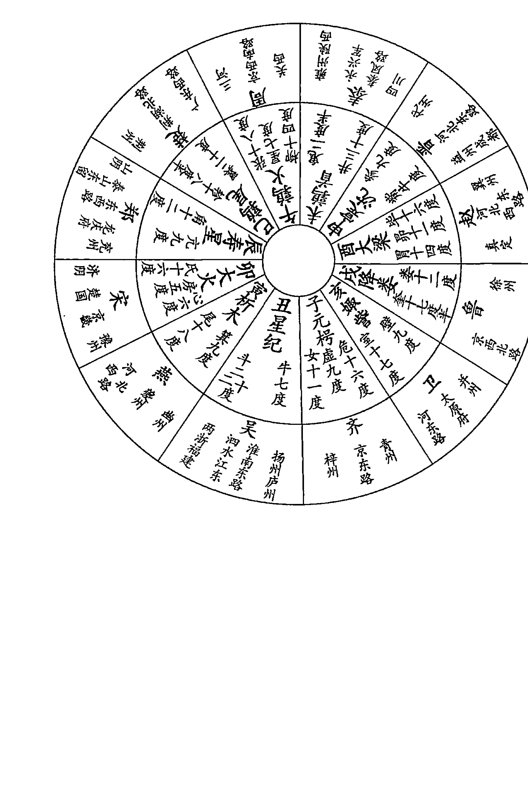

## 河图
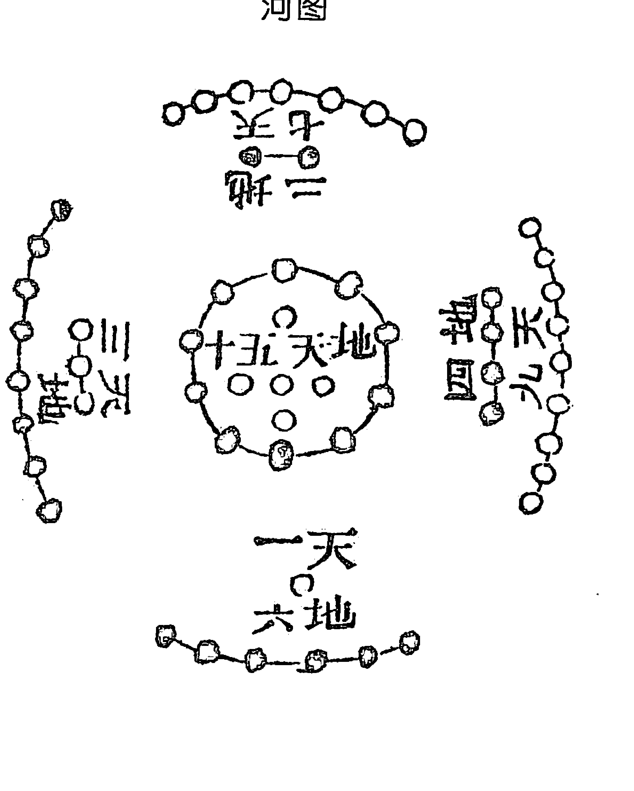

## 洛书
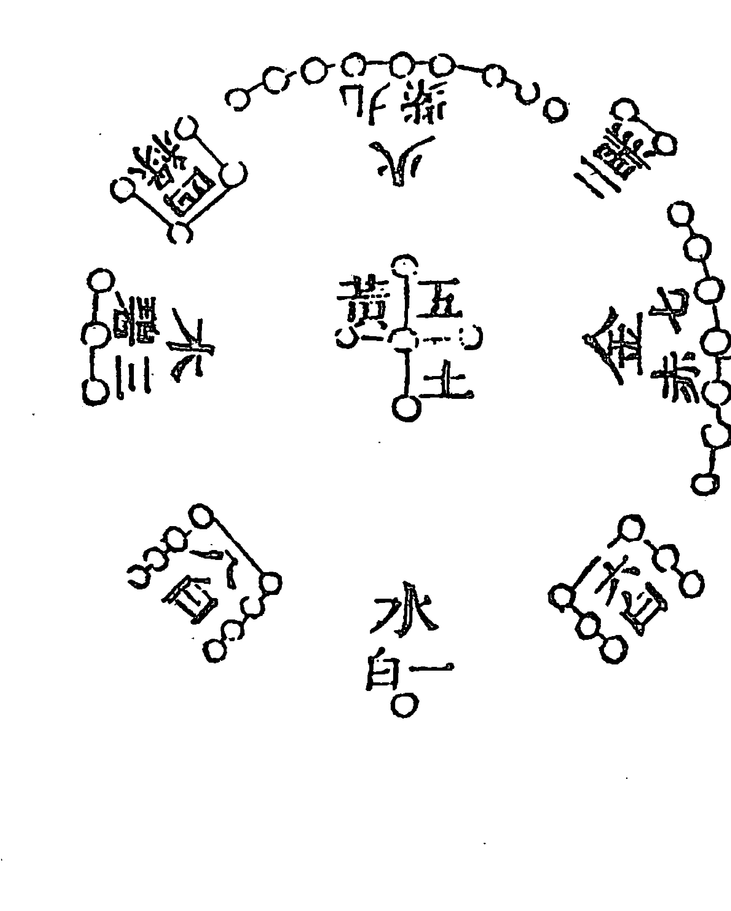

### 灵龟纵横十五数之图
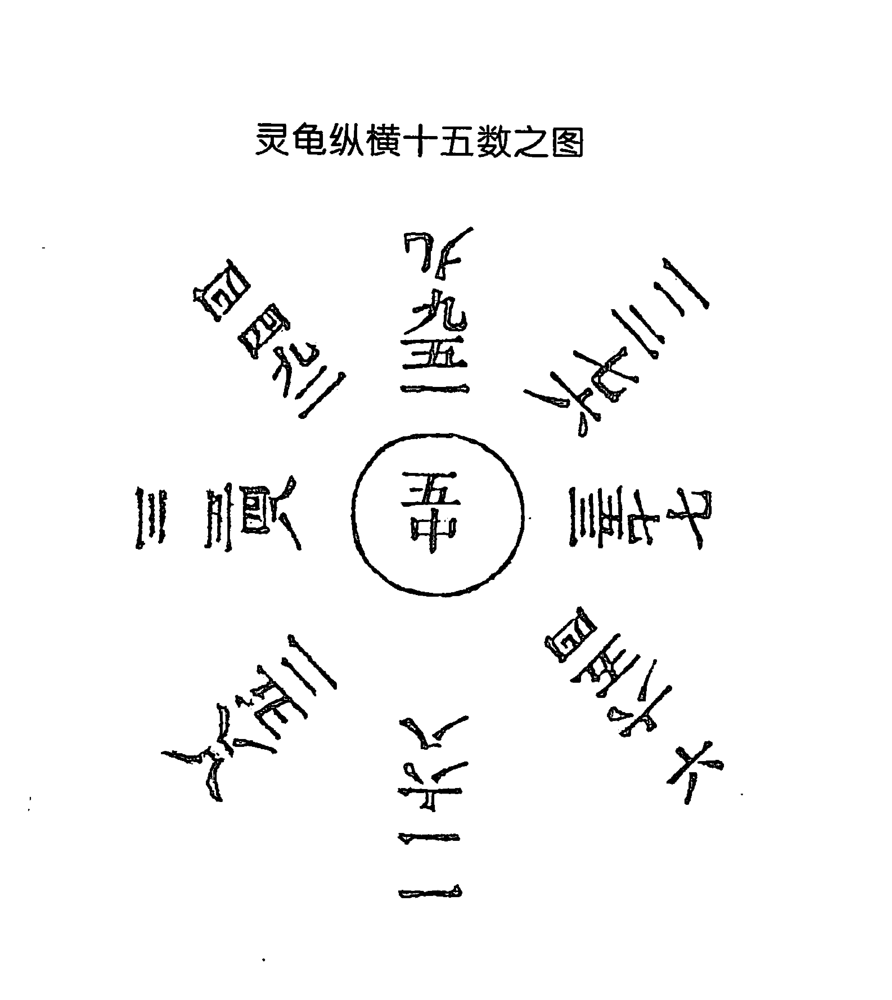

## 八卦八节之图
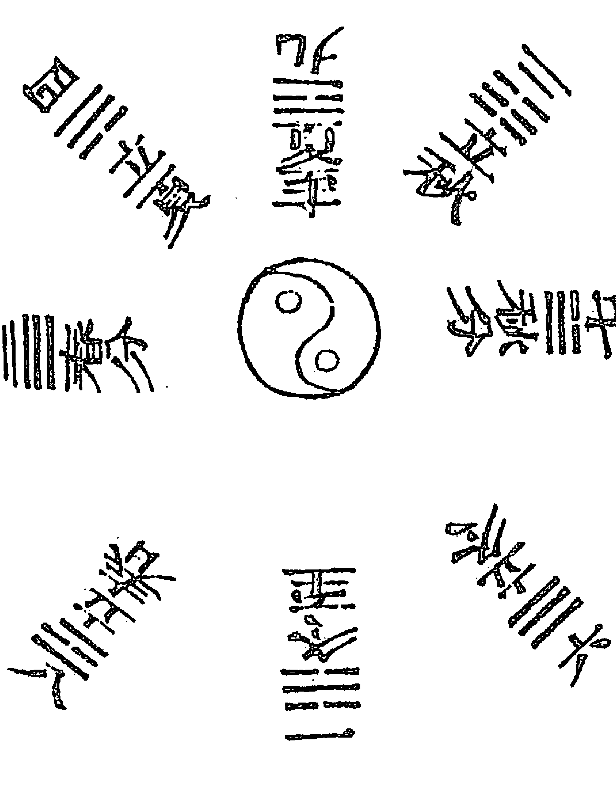

## 天三门之图
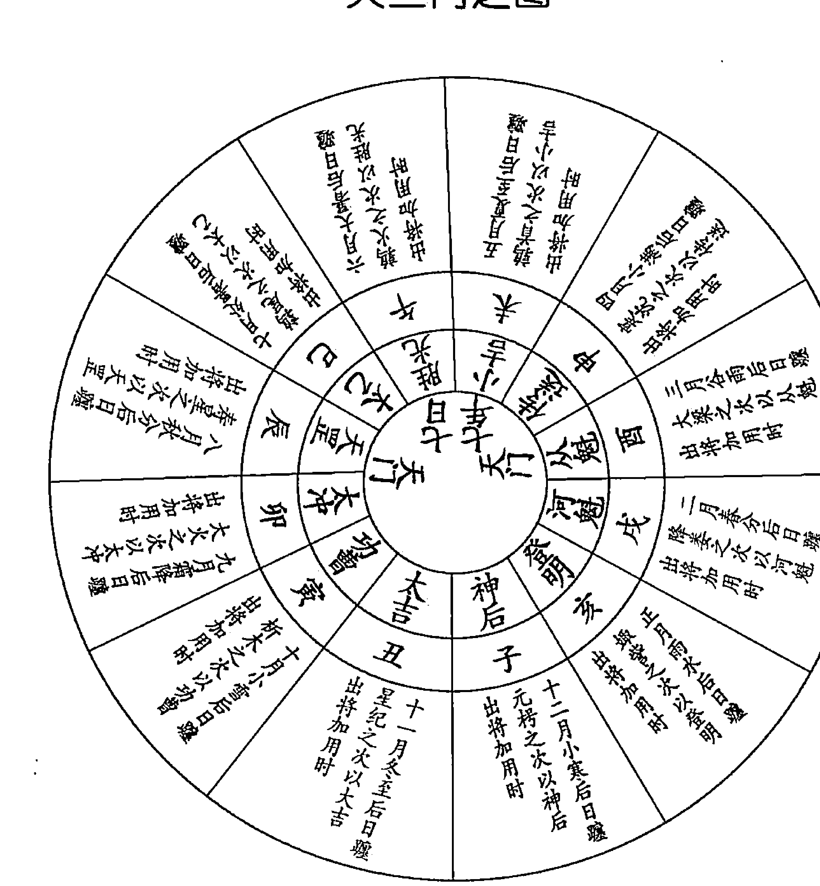

## 地四户之图
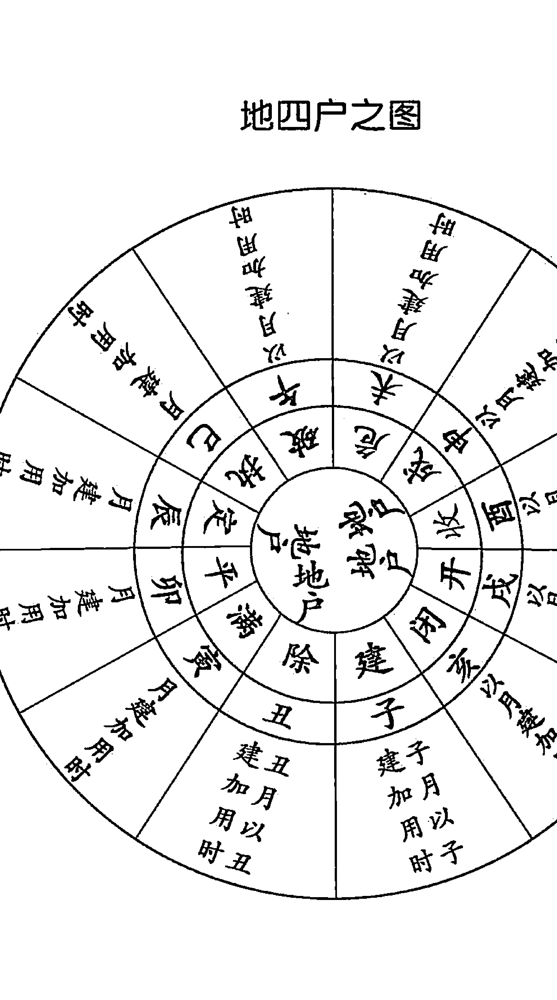

## 奇门遁甲秘笈大全卷十六
### 地私门阳贵人顺行之图
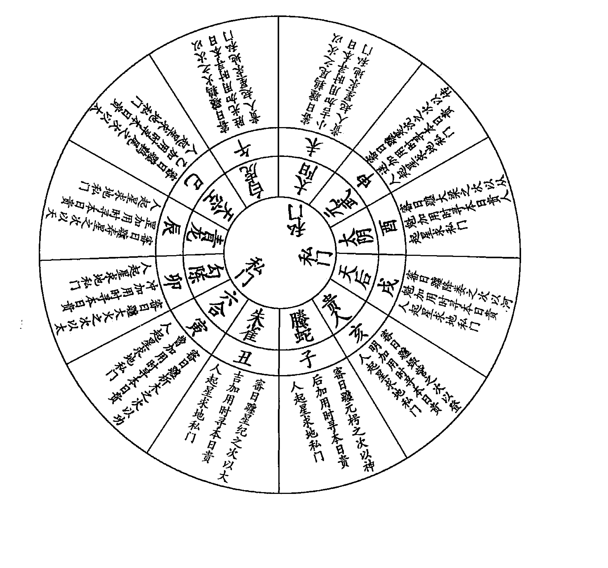

### 地私门阴贵人逆行之图
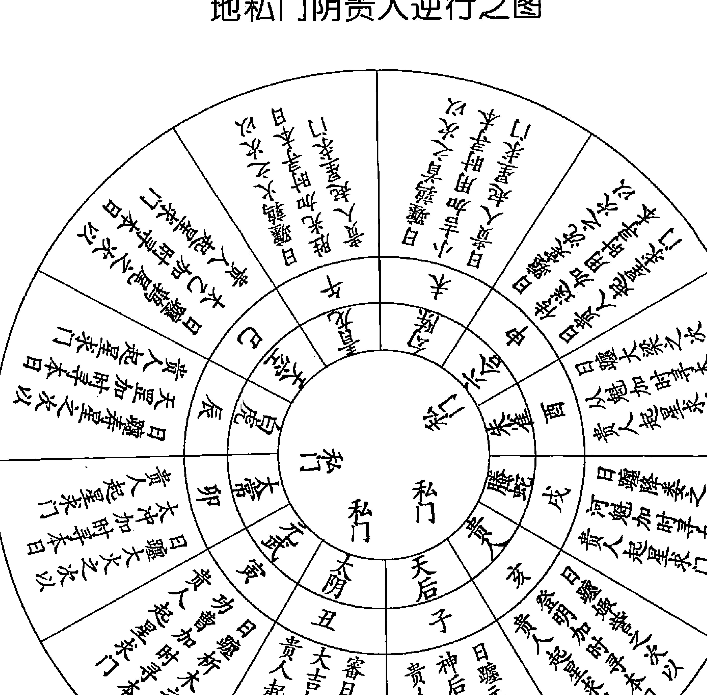

## 太冲天马方吉时定局
用《时宪书》审定太阳过宫，方可选用。

| | 子时 | 丑时 | 寅时 | 卯时 | 辰时 | 巳时 | 午时 | 未时 | 申时 | 酉时 | 戌时 | 亥时 |
|:---|:---|:---|:---|:---|:---|:---|:---|:---|:---|:---|:---|:---|
| 正月登明将太冲天马方 | 辰 | 巳 | 午 | 未 | 申 | 酉 | 戌 | 亥 | 子 | 丑 | 寅 | 卯 |
| 二月河魁将太冲天马方 | 巳 | 午 | 未 | 申 | 酉 | 戌 | 亥 | 子 | 丑 | 寅 | 卯 | 辰 |
| 三月从魁将太冲天马方 | 午 | 未 | 申 | 酉 | 戌 | 亥 | 子 | 丑 | 寅 | 卯 | 辰 | 巳 |
| 四月传送将太冲天马方 | 未 | 申 | 酉 | 戌 | 亥 | 子 | 丑 | 寅 | 卯 | 辰 | 巳 | 午 |
| 五月小吉将太冲天马方 | 申 | 酉 | 戌 | 亥 | 子 | 丑 | 寅 | 卯 | 辰 | 巳 | 午 | 未 |
| 六月胜光将太冲天马方 | 酉 | 戌 | 亥 | 子 | 丑 | 寅 | 卯 | 辰 | 巳 | 午 | 未 | 申 |
| 七月太乙将太冲天马方 | 戌 | 亥 | 子 | 丑 | 寅 | 卯 | 辰 | 巳 | 午 | 未 | 申 | 酉 |
| 八月天罡将太冲天马方 | 亥 | 子 | 丑 | 寅 | 卯 | 辰 | 巳 | 午 | 未 | 申 | 酉 | 戌 |
| 九月太冲将太冲天马方 | 子 | 丑 | 寅 | 卯 | 辰 | 巳 | 午 | 未 | 申 | 酉 | 戌 | 亥 |
| 十月功曹将太冲天马方 | 丑 | 寅 | 卯 | 辰 | 巳 | 午 | 未 | 申 | 酉 | 戌 | 亥 | 子 |
| 十一月大吉将太冲天马方 | 寅 | 卯 | 辰 | 巳 | 午 | 未 | 申 | 酉 | 戌 | 亥 | 子 | 丑 |
| 十二月神后将太冲天马方 | 卯 | 辰 | 巳 | 午 | 未 | 申 | 酉 | 戌 | 亥 | 子 | 丑 | 寅 |

### 阴阳贵人旦贵暮贵之图
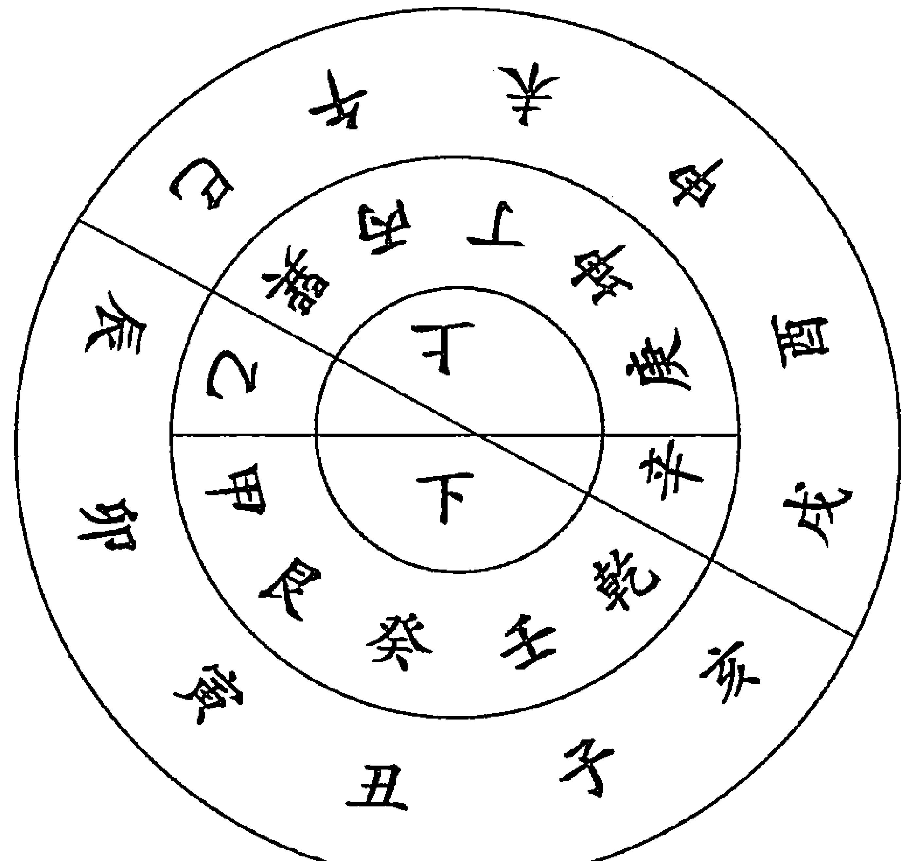

## 总论太阳过宫①
旦贵用上一字，即内盘之乙巽丙丁坤庚六时；暮贵用下一字，即内盘之辛乾壬癸艮坤。甲六时神所到之宫，自亥至辰为阳支，宜顺行；自巳至戌为阴支，宜逆行。二盘当合推用，但分之以知甲在卯宫用暮贵，巽在巳宫用旦贵。

假如正月雨水后，太阳躔娵訾之次，月将在亥，则以亥加用时之上，以分旦暮，定其阴阳。又视贵神所到之宫，详其阳支宜顺行，阴支宜逆行，以求三辰所在之位。

假如甲日用卯时属下之一字，用暮贵，定为阳贵，则以亥加卯宫顺行，阳贵神未在亥，亥为阳支，加贵神顺行，六合在寅，太常在未，太阴在酉也。

假如甲日用午时属上之一字，用旦贵，定为阴贵，则以亥加午顺行，阴贵丑在申，申为阴支，加贵神逆行，太阴在戌，太常在子，六合在巳也。

假如甲日用子时属下之一字，用暮贵，定为阳贵神，则以亥加子顺行，阳贵神未在申，申为阴支，加贵神逆行，太阴在戌，太常在子，六合在巳也。余皆仿此。

注：天三门、地四户、地私门、太冲天马方同例。

《阳贵诗》曰：“庚戌见牛甲在羊，乙猴己鼠丙鸡方。丁猪癸蛇壬是兔，六辛逢虎贵为阳。”

《阴贵诗》曰：“甲贵阴牛庚戌羊，乙阴在鼠己猴乡。丙鸡丁猪辛遇马，壬蛇癸兔是阴方。”

## 论天门地户
《人式歌》云“天乙会合女阴私”，所谓天乙会合女阴私之事，要在三奇临六仪与三奇吉门，合太冲、小吉、从魁天三门，加除、危、定、开地四户，是谓福食，远行、出入皆吉。

歌云“本月将，名加时支，十二月将顺数去。太冲小吉与从魁，三方避祸天门是”，便以月将加时支顺数也。

假如正月雨水后用午时出行，则以登明将加于午宫，登明在午，神后在未，大吉在申，功曹在酉，太冲在戌为天门，天罡在亥，太乙在子，胜光在丑，小吉在寅为天门，传送在卯，从魁在辰为天门，河魁在巳。

以《时宪书》审订太阳过宫，方可选用。如去年大寒后某日时刻日躔元枵之次，太阳在子，以神后出将加用时。世俗但知登明为正月将，却不知雨水后某日时刻日躔娵訾之次，太阳始过亥宫，始可用登明将。以次轮去，如遇从魁、小吉、太冲，即是天三门也。倘得本日贵神到乾亥，就是贵神登天门，大吉。

## 天月将①
正月亥，二月戌，三月酉，四月申，五月未，六月午，七月巳，八月辰，九月卯，十月寅，十一月丑，十二月子。

## 天地月将②
正月寅，二月卯，三月辰，四月巳，五月午，六月未，七月申，八月酉，九月戌，十月亥，十一月子，十二月丑。

① 原注：即太阳。
② 原注：即月建。

### 天气将
正月雨水壬，二月春分乾，三月谷雨辛，四月小满庚，五月夏至坤，六月大暑丁，七月处暑丙，八月秋分巽，九月霜降乙，十月小雪甲，十一月冬至艮，十二月大寒癸。

### 地气将
正月立春子，二月惊蛰亥，三月清明戌，四月立夏酉，五月芒种申，六月小暑未，七月立秋午，八月白露巳，九月寒露辰，十月立冬卯，十一月大雪寅，十二月小寒丑。①

### 天符经
正月娵訾亥，二月降娄戌，三月大梁酉，四月实沉申，五月鹑首未，六月鹑火午，七月鹑尾巳，八月寿星辰，九月大火卯，十月析木寅，十一月星纪丑，十二月元枵子。

### 十二支神将
> 歌云：“用时支上加月建，建除满平一顺流。定执破危相接去，成收开闭掌中周。除定危开为四户，此方有难可逃避”。

以月建加用时顺数，如寅月寅时，于寅上起建，卯为除，午为定，酉为危，子为开，三奇临之大吉；若得三吉门，更佳。余仿此。

如九月戊建用巳时，则以戊加巳上，建在巳，除在午，午为地户，满在未，平在申，定在酉，酉为地户，执在戌，破在亥，危在子，子为地户，成在丑，收在寅，开在卯，卯为地户，闭在辰。① 四宫为地四户，俱吉。

| 巳 | 午 | 未 | 申 |
|:---|:---|:---|:---|
| 螣蛇 乙 | 朱雀 胜光 | 太阴 小吉 | 白虎 传送 |
| 辰 | | | 酉 |
| 勾陈 天罡 | | | 太阴 从魁 |
| 卯 | | | 戌 |
| 六合 太冲 | | | 天空 河魁 |
| 寅 | 丑 | 子 | 亥 |
| 青龙 功曹 | 天乙 大吉 | 天后 神后 | 玄武 登明 |

## 地私门②
以天月将加用时，看贵神所泊何宫，即于贵神上起“贵神、螣蛇、朱雀、六合、勾陈、青龙、天空、白虎、太常、玄武、太阴、天后”，顺逆而行。阳贵神出于先天之坤，子上起甲干顺布，乙癸在丑，庚与乙合，戊与癸合，取干德为贵神，故庚戊二干，阳贵神在丑也；己干在未，甲与己合，故甲干阳贵神在未也。自亥至辰为阳贵顺流，自巳至戌为阴贵逆行。若得太阴、太常、六合之神与奇门同临其方，百事大吉。阳时宜击，阴时宜陕，阳先举，阴后应。凡欲击者，谓破而击之；陕者，密而去之，其败军宜向六合下走得出也。

以六合、太阴、太常三辰，依图推看何方日支。自子至巳为阳，用阳贵神；自午至亥为阴，用阴贵神。假如丁亥日，亥为阳日，丙丁猪鸡位，则亥猪为阳日贵神。须将贵神加亥上顺数去，却是六合、太阴、太常在何处，即是地私门，只是论日不论时，然须得奇门方可用。

又一例：审太阳过宫，以月将加用时，寻本日贵人起星，求地私门。如正月亥加甲日辰时，即以亥加辰顺数去，寻本日阳贵未到子，阳贵顺行，则螣蛇在丑，朱雀在寅，六合在卯，为地私门，勾陈在辰，青龙在巳，天空在午，白虎在未，太常在申，为地私门，玄武在酉，太阴在戌，为地私门，天后在亥。如用阴贵，亦以亥加辰，阴贵丑到午，阴贵逆行，则螣蛇在巳，朱雀在辰，六合在卯，为地私门，勾陈在寅，青龙在丑，天空在子，白虎在亥，太常在戌，为地私门，玄武在酉，太阴在申，为地私门，天后在未。余皆仿此。

## 三奇克应
乙奇遇开闻吏红，休同牛马扛木人。乙生两鼠咬孝子，出门应候老妇人。
丙奇遇开有雷声，老翁执杖使威风。休门鼓乐五十里，生逢患眼相争斗。
丁遇开执竹杖物，休妇皂白二十里。遇捕猎人或鹰犬，① 奇门合处皆应验。

## 又三奇会三吉门应验
乙为日奇，会生门宜上官赴任、应举、嫁娶、破土、立券、安葬，见两鼠或孝服人，有百鸟、风云、微雨、车马来应，主子孙富贵。会休门见牛马或扛木人来应。会开门逢客人、公吏、穿红衣者至。

丙为月奇，会生门见眼疾人或逢争斗争应。会休门宜上官赴任、应举、嫁娶、破土、立券、竖柱上梁，五十里内外闻鼓声或军器、乐器、鸟鸟、白鹤来应，主子孙富贵。会开门主见老者执杖等物，或闻哭声应。

丁为星奇，会生门遇捕猎或鹰犬应。会休门二十里见白虎、皂衣人或妇女应。会开门见执竹杖人至，或闻哭声应。

> ① 点校者注：省思堂本作“主遇捕猎人别犬”，从他本校正。

开门宜上官赴任、嫁娶、竖柱上梁、入宅，见大车、小车、白云、盖幕，或小儿手执杖物等应，主子孙富贵。

## 三奇合格断
乙奇遇青龙返首，丙奇东南是跌穴，丁奇西贵升坛。回首喜悦百易遂，跌穴显灼事成就。龙逃身遭百凶，虎狂兮财虚耗尽，天矫逢盗染官讼。

## 符使应验
- 乙奇会天辅、生门，主乙庚日时雷电现、二鸟来应，大利。
- 丙奇会天芮、休门，主甲己日时，鹤鸟至、二人乘马来应，大吉。
- 丁奇会天英、开门，主戊癸日时，鸟鸟白顶、雷鸣来应，大吉。
- 天盘星克地盘星，在四时旺相日时，有本方五色云起在其方助客，客胜。
- 地盘星克天盘星，在四时旺相日时，有五色云气在其方助主，主胜。
- 五色云气合从本方，东青、西白、中黄、南赤、北黑。

## 八门克应
- 休门，二十里，贵阴人衣着蓝黄及白青。
- 生门，十里，逢公吏人、着皂衣紫绅。
- 伤门，三十里，公讼起、囚人着皂衣、血光生。
- 杜门，二十里，男女辈、绢皂衣裙、相从行。
- 惊门，三十里，鸦雀噪、官司相连、六畜惊。
- 开门，二十里，阴人至、贵人乘马、紫衣襟。
- 景门，二十里，惊忧至、绯皂衣人、会宾客。
- 死门，二十里，逢疾病、黄皂衣甲、俱遭迍。

## 十干应验
时乘六甲出门去，金马玉堂逢贵人。若乘六乙出门行，秃头公吏宜终身。执持弓弩人骑射，盖为时乘六丙行。州官县宰相逢着，出门行时正六丁。若逢戊己出行去，两个妇人身着青。若乘庚辛壬最恶，大凶无吉有灾迍。六癸出门逢骑射，多遇山林隐逸人。

## 八神应验
值符，主长者、贵人、公吏、钱物为应。

螣蛇，主官司牵连罗网、推风送雨及惊恐怪异为应。

太阴，主贤人及夫妇阴私之事为应。

六合，主华彩、车、书、酒食、筵会、婚姻为应。

白虎，主医巫、死丧、秽气、钱物为应。

玄武，主惊盗贼及云雨为应。

九地，主女人、衣服、稻豆、埋葬、走兽为应。

九天，主文书、印信、枪棒、火灾、占天、飞鸟为应。

## 奇门遁甲秘笈大全卷十七
## 三奇到宫断
六乙到乾，名曰“玉兔入天门”，吉。 天冲、天辅加六宫，在季夏、秋月或庚辛酉申日，有白色气来助，主胜。 一名“玉兔入林”。

六丙到乾，名为“天威失权”，凶。 有白云气从西北或西方来助，主胜。天英加六宫，在夏秋月有赤色云气来助，客胜。 一名“光明不全”。

六丁到乾，名为“人到天门”，吉。 丙丁巳午日有赤色云气从正南方来助，客胜。 一名“玉女游天门”，又名“火照天门”。

六乙到坎，名为“玉兔投泉”，吉。 天英加一宫在秋冬月或壬癸亥子日，有黑色云气从正北方来助，主胜。 一名“玉兔饮泉”。

六丙到坎，名为“丙火烧壬”，吉，主胜。 天任、天禽、天芮加一宫，在四季月或辰戌丑未日。 一名“火投水池”。

六丁到坎，名曰“朱雀投江”，中吉。 有黄色云气从东北或西南方来助，客胜。

六乙到艮，名为“玉兔步贵”，吉。 天蓬临八宫，在四季月或戊己辰戌丑未日，有黄色云气来助，主胜。

六丙到艮，名为“凤入丹山”，吉。 天辅、天冲加八宫，在冬春月，有黄色云气从东北或西南方来助，主胜。

六丁到艮，名为“玉女乘云”，吉。 甲乙寅卯日，有青色云气从正东或东南方来助，客胜。 一名“玉女游鬼门”。

六乙到震，名为“日出扶桑”，吉。 天任、天禽、天芮临三宫，在冬夏月或甲乙寅卯日，有青云来助，主胜。即贵人升乙卯正殿。

六丙到震，名为“月入雷门”，吉。 天柱、天任加三宫，在季秋月，有云气从正东或东南方来助，主胜。①

六丁到震，名曰“最明”，吉。 庚辛申酉日，有白云气从正西或西北方来助，客胜。

六乙到巽，名曰“玉兔乘风”，吉。 天任、天禽、天芮临四宫，在冬春月或甲乙寅卯日，有青色云气来助，主胜。

六丙到巽，名曰“火行风起”，又为“龙神助威”，吉。 天心、天柱加四宫，在季夏秋月，东南方神旺，主胜。

六丁到巽，名曰“美女留神”，吉。 或庚辛申酉日，有白色云气从正西或西北方来助，客胜。

六乙到离，名曰“玉兔当阳”，吉。 天柱、天心加九宫，在春夏月或丙丁巳午日，有赤色云气来助，主胜。

六丙到离，名曰“月照端门”，吉。 天蓬加九宫，在秋月或壬癸日，有云气从正南方来助，主胜。即贵人升丙午正殿。

六丁到离，名曰“乘龙万里”，吉。 壬癸亥子日，有黑色云从正北方来助，客胜。

六乙到坤，名曰“玉兔入坤”，中吉。 天蓬临二宫，在四季月或戊己辰戌丑未日，有黄色云气从北方来助，主胜。 一名“玉兔暗日”。

六丙到坤，名曰“子居母舍”，吉。 天辅、天冲加二宫，在冬春月或甲日，云气从西南方来助，主胜，吉。

六丁到坤，名为“玉女游地”，吉。 甲乙寅卯日，有青色云气从正东或东南来助，客胜，大吉。 一名“玉女游地户”，吉。

六乙到兑，名为“玉女受制”，平平。 天冲、天辅加七宫，在季夏、秋月或庚辛申酉日，有白色云气来助，主胜。 一名“白兔游宫”，吉。

六丙到兑，名曰“凤凰折翅”，空。 白云气从正西或西北方来助，主胜。天英加七宫，在春夏月及丙日，客胜。

六丁到兑，平平。 丙丁巳午日，有赤云气从南方来助，客胜。 一云：丁见兑为天乙贵人，即为贵人升于丁酉正殿，大吉。

① 原注：天柱疑误。

## 遁甲利主
天英加坎宫，利为主，加在秋冬月及壬癸亥子日，有黑色云从正北方来助，主大胜。
天任、天禽、天芮加震、巽，利为主。如在春夏之月，甲乙寅卯日，青色云气从东南方及正东方来助，主大胜。
天蓬加坤、艮，利为主。如在四季月及戊己辰戌丑未日，有黄色云气从东北或西南方来助，主大胜。

## 遁甲利客
天蓬加九宫，利为客。如在秋冬月，壬癸亥子日，有黑色云气自北方来助，客大胜。
天心、天柱加三、四宫，利为客。如在三秋四季月，庚辛申酉日，有白色云气从西方来助，客大胜。
天任、天禽、天芮加一宫，利为客。如在四季月，戊己辰戌丑未日，有黄色云气从西南或正南方来助，客大胜。
天辅、天冲加二、八宫，利为客。如在冬春月，甲乙寅卯日，有青色云气自东方或东南方来助，客大胜。
天英加六、七宫，利为客。如在春夏月，丙丁巳午日，有赤色云气从南方来助，客大胜。

## 九星值时克应①

### 天蓬星值子时
值子入宅凶，赴任安营斗讼生。鸡犬吠，鸟闹林，北方鹏争缺唇人。六十日内鸡生卵，退财讼至主必胜。

### 天芮星值子时
值子身旺兴，作用之时走禽惊。坤方火光二人应，嫁娶猪犬伤人讼。六十日内女自缢，秋冬进财羽音珍。

### 天冲星值子时
值子有风雨，禽噪钟鸣造葬后。六十日内怪物人，周年田产数倍收。更防新妇产后死，虎狼口内可得财。

### 天辅星值子时
值子若反吟，天冲有物夜中鸣，西方红白人叫应。造葬后来六十日，得进商音人产物。野猿入屋甑鸣时，加官进禄生贵子。若得门奇并到来，十二年中大旺矣。

### 天禽星值子时
值子孕妇至，紫衣人来造葬后。六十日鸡犬衔花，儒人馈物武得官。田土财谷益旺，二十年后人丁千。

### 天心星值子时
值子人争斗，西北鼓声闹喧喧。用后百日赤人媒，商人古器画仙家。生白鸡，十二年，田蚕大旺赌不连。

### 天柱星值子时
值子起大风，火从东至缺唇人。用后六十日内事，蛇犬伤人逢刀刃。杀人血光财破散，幼女遭殃必定临。

① 原注：论用时者，以九星管事为主。

### 天任星值子时
值子东风雨，水畔鸡鸣为验应。巽方人来持刀枪，造葬百日新妇离。三牙须人木姓至，由赖退产男女淫。

### 天英星值子时
值子乾锣声，三五人持火把焚。斧钺伐木缺唇人，用后破家三年中。血光自刻伤人物，小儿至汤火坑中。

### 天蓬星值丑时
值丑雷电生，树倒伤人被风雨。七日鸡生鹅子卵，犬至屋上小口倾。三年后有白头牙，商进产旺十年退。

### 天芮星值丑时
值丑作用时，乾地金鼓至此造。葬后七日龟出林，六十日内盗贼起。退财口舌官讼至，大姑屡次索奁礼。

### 天冲星值丑时
值丑云雾昏，小儿成队来上门。妇人执木至为应，乌猫白子拾古镜。周年僧道进田契，发财生得贵子聪。

### 天辅星值丑时
值丑东犬吠，有人持刀来战对。用后白兔野鸡入，六十日内僧道馈。羽音巽来信契归，周年添丁加官品。

### 天禽星值丑时
值丑孝妇来，手执锡器为葬埋。小儿吹笛笑拍手，鼓闹后进赌博财。获得宝诰年后拾，得贼财富旺皆来。

### 天心星值丑时
值丑作用时，南方火光跛足人。五日内有猫成双，四十日内远物至。商音进书并财帛，官中更出有寿人。

### 天柱星值丑时
值丑匠北来，手携斧斤树上材。生得金花为后应，造葬六十日进财。羽音金器三年后，火光如洗人弄蛇。

### 天任星值丑时
值丑妇青衣，携酒必然有鼓声。半载后进无名财，周年鹦鹉人屋来。口舌得财三日后，猫狗相咬主请举。

### 天英星值丑时
值丑东北来，师巫鸣锣至此寨。用后一月火烧屋，周年有犬作人言。百怪起时可移镇，不然定是死亡连。

### 天蓬星值寅时
值寅作用时，青衣童子持花枝。北方僧人包头巾，女人穿着衫裙临。贼劫蛇咬马伤人，三年田地财旺盈。

### 天芮星值寅时
值寅瘦孕妇，蓑衣临门乐音气。奇门旺相六十日，水牛人屋进血财。加官进禄子孙富，临时干，在刻裁。

### 天冲星值寅时
值寅贵乘轿，童执金银器物到。六十日进角音契，羽音作牙畜玩人。母鸡啼家主有灾，阴干生人福发财。①

### 天辅星值寅时
值寅见公吏，执铁艺，携物至。六十日内猫咬鸡，有贼送财报恩义。赤面作牙人羽契，十二年发生贵子。

### 天禽星值寅时
值寅玉犬吠，金鸡乱鸣人带笠。用后六十日便喜，宫音进契添人丁。田蚕大旺享富贵，宿旺立时有应情。

### 天心星值寅时
值寅白鹭到，金鼓四鸣水镜晓。女穿黄赤携篮过，小口火焰六十交。百日窨金商羽物，三年妻生贵得财。

① 点校者注：后二句省思堂本不通，从诸本改正。《奇门大全》之《天冲星值寅时》：主贵人乘车骑马及执金银器至为应。作用后六十日进文契，六畜并琉璃器物人宅，母鸡啼，家主有灾，因口舌得财，乙巳丁年生者发富贵。

### 天柱星值寅时
值寅北喧闹，僧道持盖雷雨到。喜得钟鼓鸣用后，六十日内贼牵连。争讼破财事已可，女人堕胎产中亡。

### 天任星值寅时
值寅女成队，火把前行童手拍。轿马西北来应后，六十日内甑鸣坠。妇死百日进畜财，田旺唇缺争婚败。

### 天英星值寅时
值寅东军马，捕猎网鱼手执至。用后女人拾得财，六十日内有暗喜。寡妇送到田地契，百日雷打屋即败。

### 天蓬星值卯时
值卯黄云起，妇人烹饪把火至。七日角音相邀请，半月徵音送财礼。六十女人进宝物，百日窑中多见喜。

### 天芮、天冲星值卯时
值卯贵人至，妇人穿红送财物。车马牛鸣犬争咬，水牛作声造葬后。六十日进东绝产，二年妇胎堕血死。①

### 天辅星值卯时
值卯女执伞，又有师巫吹角声。用后六十添人丁，必有生气②入门庭。室女私通得财谷，进田纳契有宝珍。

### 天禽星值卯时
值卯东风起，群鹤西叫分忧喜。怀孕妇人从此过，半年猫犬还自来。拾得园内宝窖来，百事逢之皆有理。

> ① 点校者注：后二句省思堂本不通，从诸本改正。《奇门大全》之《天冲星值卯时》：主女人穿色衣送物，及贵人骑马乘车至，二犬厮咬，又主牛鸣为应。作用后六十日进东方人产业，汤火伤小儿进财，三年内妇人产难凶。

> ② 一作怪气。

### 天冲、天辅星值卯时
大旺，因军得物人来请。

### 天柱星值卯时
值卯有瘦妇，持刃至此防贼欺。僧道持盖女人骂，六十日有火起时。鸡母尽鸣犬上屋，周岁疫病死绝气。

### 天任星值卯时
值卯喜鹊噪，老人持杖至此道。七日人进古器物，六十日内六畜宝。女人获财真是发，加官进禄百日好。

### 天英星值卯时
值卯马东来，捕捉贼人至此惑。网鱼之五前边过，女人行路因得财。六十日进寡妇物，百日雷火屋上哀。

## 奇门遁甲秘笈大全卷十八

### 天蓬、天芮星值辰时
东北树倒打人迷，鼓响女穿红衣至，鸟鹊远绕贼劫财。六十日有风人到，后生贵子大发财。

### 天冲星值辰时
鲤鱼上树，白虎出山，僧道成群。用后拾得金银物，家中大发百事成。七旬因主折伤灾，一女一男退回灵。

### 天辅星值辰时
羊犬相撞，卖油人遇卖菜米。白衣童子哭家去，孕妇至此问产期。造后大发财谷旺，一年双生贵孙儿。

### 天禽星值辰时
师巫争，东方鹊鸣为应。雀鹤必定喜临屋，造葬七九之内。自有道士僧人来，并及绝户产物至。

### 天心星值辰时
乾云起，青衣人至手携鱼。女人同行遇僧道，六十井中气如云。出来三日生贵子，及第联登甚有意。

### 天柱星值辰时
人扛树，男子持鼓有引老。妇人携锄后六十，乌猫白子鸡双生。北方人进寡妇财，红面人说羽音物。

### 天任星值辰时
老人临，弟兄相会小不留。禽噪犬吠黄衣过，古器男子获的真。开店人家童手拍，六十日内家畜讼。

### 天英星值辰时
乾来雨，鸡飞上树是赤尾。女人穿红携篮错，用后七日怪气寓。六十日内进血财，火光临处诚有起。

### 天蓬星值巳时
见老人，女人执酒宴恶雄。口舌皆因水上起，百日得火有黄金。周年武职加官禄，猪过必然见蛇形。

### 天芮星值巳时
孕妇至，妓巫为乐着黄衣。乌鹊成群北来过，六十日内见寡妇。猫儿咬鸡真堪怪，牛人草房力可异。

### 天冲星值巳时
牛争斗，羊乱行时女相并。南方禽喧因坤程，六十日内蛇咬鸡。牛人屋中女送契，田财旺发生花儿。①

### 天辅星值巳时
人相打，女人抱布有风起。小儿叹叫争家冷，六十日内进震财。鬼神运粮大发达，竹木器物尽置来。

### 天禽星值巳时
鸡鸣至，② 师巫术人相打骂。贵人骑马慌忙过，七十日中妇打魔。合生贵子成家业，三年田蚕发苗禾。

① 原注：一作犬生花子。
② 原注：一作鸭成队。

### 天心星值巳时
女穿青，抱得小儿龟上树。紫衣骑马半月后，四方进的畜财属。跛人作牙商音产，三年寡妇成空服。

### 天柱星值巳时
黑牛过，钟鸣猪走人山林。二十日进商音物，六十日女下水池。周年猫捕白鼠至，大发富贵何待时。

### 天任星值巳时
两犬争，野人负薪至此程。吏役持盖童子拍，六十日获公门财。南方人送鲤鱼至，异路显达贵子排。

### 天英星值巳时
妇穿红，婚姻事体口舌起。花马过后六十日，拾得猎财血先荣。徽音人进文书至，信炮一声满天烘。

### 天蓬星值午时
妇青衣，有人持刀上南山。童子东北有叹声，六旬犬作人言怪。赤面疯人家主死，三年内有古窖财。

### 天芮星值午时
缺唇人，身着白衣牵黄牛。孕妇过后六十日，猫儿咬人因卖屋。横财获的进田地，后妻奁财多上壁。

### 天冲星值午时
白衣人，东方人家主火起。白衣之人来叫喊，山鸟鸣噪必见应。作用过后六十日，拾古铜器发财产。

### 天辅星值午时
僧持盖，女人穿红家中来。石火光发至后日，六十贵人进异财。西方金银人送至，周年寡妇将物来。

### 天禽星值午时
女白衣，狗衔花枝斗山鸡。风雨徐徐从东来，造后六旬犬吠至。东北人财一年内，鸡生白卵田旺发。

### 天心星值午时
骤雨来，蛇过路去女红裙。携符酒送武士杯，六十日中釜鸣白。跛足人送生气物，五年进金田庄财。

### 天柱星值午时
鸦飞鸣，西方骑马就有云。五日孕妇病丧泣，六十日内水中寻。神物古器真是宝，小口伤时在一旬。

### 天任星值午时
来师尼，西北黄禽君子行。四十日进贵人宝，紫衣人宅生贵孙。孕妇童子来借马，人还虎皮穿黄青。

### 天英星值午时
婚姻南，采猎渔人执弓弦。用后六十日中事，被木伤人火光炎。自缢落水是公子，乘马必定为女娘。

### 天蓬星值未时
童子过，牵的牛儿是两个。鹭飞鹅禽北方来，女人穿红还是青。六十日内逢贼劫，破颜惹气至官灾。

### 天芮星值未时
捕猎应，白衣道人携茶瓶。七日乌鸦绕屋噪，赤面须人三牙灵。斗争周年动瘟疫，火烧屋败又伤人。

### 天冲星值未时
乾鼓响，小儿着孝马成行。西北人叫或争闹，用后六十日内防。恶人持木克寡母，白羊人屋六畜旺。

### 天辅星值未时
群犬吠，乞化携着破服衣。众僧道人同议话，西北有人争屋厨。百日内进文书契，商音人送金银余。

### 天禽星值未时
老人来，跛足人担花果来。青黄衣人携酒至，葬后六十日内裁。羽音人送鸡畜物，铁器原是宰肉开。

### 天心星值未时
雾雨来，男子着黄女衣彩。携酒必定邀尊长，六十日中亦釜鸣。跛足骑马或坐车，金铜刃器为田程。

### 天柱星值未时
遇瘦妇，僧道同行求安否。东北人马持旗盖，用后百日有怪拍。新媳狐狸缠身边，生铁那火卯头面。

### 天任星值未时
白鹤飞，禽鸟飞自西南至。北来风雨鼓声闹，用后七日众童张。① 六九家生白气异，应得六畜大旺财。

### 天英星值未时
孕妇遇，西方鼓声来相贺。造葬之后六十日，家主落水怎奈何。周年瘟疫身体败，马肥还得母草多。

### 天蓬星值申时
人取水，伞笠避雨必有趋。西方小儿打水过，擂鼓叫喊笑声去。廿日鸡窠蛇伤人，妻淫自缢讼事恶。

> > ① 原注：一作“一七内女送白物”。

### 天芮星值申时
东产来,① 道人②青盖身长躯。③ 牛斗伤人犬咬毒，百日羽音进物排。周年水牛入屋中，鹏鸟人家染病怀。

### 天冲星值申时
作用时，南方骑马白衣人。吏卒人持刃相杀，百二十日女作媒，绝户田产来进纳，寡妇被贼劫不容。

### 天辅星值申时
肿脚人，携酒至此请医妇。儒释道人穿色衣，西北鼓声女财发。半年蛇从井中出，平白人送牛羊答。

### 天禽星值申时
家④鸟叫师巫持符，百日女拾珠翠归，周年新妇昌有位。生得贵子旺田蚕，诚恐家贼自劫退。

### 天心星值申时
僧道来，金鼓四鸣百鸟噪。红裙女人送酒至，寡妇坐堂拾宝窨。老人持杖马衔环，军人在家推病好。

### 天柱星值申时
作用时，水鹰鹞掠禽坠地。青衣女人携篮至，用后百日火光起。家败人亡白衣物，克宅体生是游情。

### 天任星值申时
风雨来，三牙须人打鼓至。僧道穿黄应时候，七日军置黄犬来。⑤ 女人火烧汤泼

+   1. 原注：一作凉伞。
2. 原注：一作僧道。
3. 原注：一作有胡须。
4. 原注：一作飞。
5. 原注：一作“七日之内甑釜鸣”。

水，车碾百禽衔谷排。

### 天英星值申时
作用时，怀孕妇人大哭啼。西方金鼓声鸣响，僧道持盖浪喘瘟。火临金时斗争战，六十日内有进金。

### 天蓬星值酉时
赤马过，西方轮舆群鸦噪。用后百日生贵子，僧道作牙商音地。三年内鸡生双子，猫养白儿试及第。

### 天芮星值酉时
西黄马，车轿伞盖妇必寡。须人相斗犬咬人，羽音进产主诚雅。周年牛必入屋中，鸟鹏来家腹得疾。

### 天冲、天辅星值酉时
远方人送文书至，东方狐狸咬叫声，妇人拿火把来吹，用后周年生贵子，拾得横财大发期。

### 天禽星值酉时
西火起，人家相打大叫理。鼓声绕噪惊鸟飞，造后周岁有贵子。必有窖财进门庭，喜鹊檐前报雾雨。

### 天心星值酉时
僧尼来，火起从坤必定排。北方钟鼓鸣声闹，骡叫官员驮宝财。艺人送到远信至，七日商音娶女钗。

### 天柱星值酉时
作用时，白鹰扑鸽明是欺。青衣之人取铁器，因火丧家女守孤。七十日有商音进，夫妇和谐远路移。

### 天英星值酉时
远路必定遇碑石。
火入金，西方有人宅相争。鸦鸣喧呼暴碑过，白衣女人怀孕临。事后一旬小口母，折足百日争得财。

### 天蓬星值戌时
作用时，老人携杖入厕西。西北雷雨至此下，三牙须人担箩至。白犬过后一旬内，拾得军器有横财。

### 天芮星值戌时
黄牛来，孕妇东方持伞回。恶犬家中出伤人，周年宫音送土财。百禽飞过车又到，粪中抛出女金钗。

### 天冲、天辅星值戌时
师巫三牙须人逢，西方来了三五人，手执火把寻失物。鸡上树啼远有信，周年小口被牛损。

### 天禽星值戌时
东北应，钟声铙钹响叮咚。青衣童子携篮过，一旬之内白龟临。就得寡母田地发，有人携举福到门。

### 天心星值戌时
作用时，南方大叫贼惊疑。小儿骑牛至此过，百日家中生贵子，金鸡鸣兮玉犬吠，二年之后请得举。

### 天柱星值戌时
女抱布，北方树倒人打鼓。西方鼓声因葬事，六十日内蛇入宅。咬人皆是白色毒，连年瘟疫死未绝。

### 天任星值戌时
童来时，家中争讼因厕排。犬噪发凶丧户过，飞禽色黄尼姑来。贵人财旺一百日，紫衣之人主有财。

### 天英星值戌时
用时推，西方女人执白布。火光至此贼狱死，赤马买到遭讼非。一旬之内瘟病急，野鸡红翅主退财。

### 天蓬星值亥时
童子多，成群女人着孝服。后因投贼得横财，三年内出道人过。术人求财积成家，义猪被鹏衔肉过。

### 天芮星值亥时
走禽惊，秋冬吉时客主宅。春夏不用因克泄，坤方火起二人还。猫犬伤人孕妇病，女人自缢一自悲。

### 天冲、天辅星值亥时
跛足青衣人即至，东北人家火光起，百日猫儿捉白鼠。商音人进田地契，妻财大发扶其主。

### 天禽星值亥时
起西风，乾地妇人有哭声。树倒拆屋大叫起，六十日进铁匠财。商音人说僧人产，喜鹊报到家信来。

### 天心星值亥时
鸡夜鸣，又主无故犬狂吠。老人头戴皮帽子，手执铁器必然贵。七日不知异人至，借宿遗财天赐的。

### 天柱星值亥时
西磬声，山下有人持火荧。叫呼喧天造葬后，救火得财大发荣。百日恐有鸡作怪，人死双双拜古坟。

### 天任星值亥时
小儿过，梅苔之下笑呵呵。西方锣鼓喧喧闹，铁器手空中伤多。白日忧福至家仆，一人土垫水渠桥。

### 天英星值亥时
女人来，手执火把出大街。百日内有癫人至，钟命要与投井怀。北方树倒伤人屋，星为客兮宫主断。

## 奇门遁甲秘笈大全卷十九

### 斗柄所指
- 天罡指巳天地门，① 出军行师任徘徊。②
- 指午坐帐宜弹琴，③ 指未小通亦可裁。④
- 指申迫争君须忌，⑤ 指酉人马受惊骇。⑥
- 返来戌上指乖隔，⑦ 加亥天窄不称怀。⑧
- 指子半路魂魄散，⑨ 指丑途宿待明来。⑩
- 临寅有喜战获胜，⑪ 到卯闭塞宜藏埋。⑫
- 复临辰地关梁塞，⑬ 掌上兵机仔细排。

### 占迷路法⑭
三路迷心，时下罡随于孟仲。两歧感应，日辰左右以规谋。
路逢三叉，不知何道吉，以正时占。天罡加孟左道通，加季右道通，加仲中道通。此下出军大捷，所求必遂。若逢两歧路，日干吉者左道通，辰支爻吉者右道通也。如七月申时占，以巳将加地盘申上起顺数，辰时天罡在地盘未上，未为季，左道通，余仿此。子午卯酉四仲，寅申巳亥为四孟，辰戌丑未为四季。

+   - ① 原注：以月将加时寻天罡，至巳为天地初开。
- ② 原注：用兵大胜，开地千里。
- ③ 原注：指午为天地纵横，不宜出军，坐帐弹琴吉。
- ④ 原注：天地小通，出军亦吉。
- ⑤ 原注：天地争迫之时，用兵须忌。
- ⑥ 原注：天地闭塞之时，车伤马死，战主大凶。
- ⑦ 原注：出军主士卒乖隔伤和。
- ⑧ 原注：用军主损伤惊恐。
- ⑨ 原注：行至半路，魂魄不安。
- ⑩ 原注：为小通，出军三十里，将来朝，任意而行，必获大胜。
- ⑪ 原注：行者有喜，战必大捷。
- ⑫ 原注：为天地闭塞，宜藏匿避之，凡事不宜。
- ⑬ 原注：关梁闭塞，只可安营下寨，不可妄动。
- ⑭ 点校者注：此法亦见于《六壬军帐赋》。

### 密访
欲得贼消息，天目听之吉。① 欲访机密事，地耳不须疑。②

### 渡河
天有三河壬子癸，地有三井卯酉辰。月将加时看三河，一河临井必覆舟。又曰：太冲加日辰，主风雨；神后加季，急渡则吉。

### 劫粮觅水
我军欲劫粮，大小吉下方。我军欲求水，小吉太冲访。小吉、太冲为井泉之神，此下觅之可得。

### 敌使虚实③
敌有使来看日辰，日上为客辰主人。④ 日干上神克辰上，⑤ 其言虚谬不可闻。若是辰上克日上，彼必畏我言词真。朱空太阴日辰上，⑥ 彼此欺诈机已深。⑦

### 突围
或被兵围不要忙，加时出路是天罡。⑧ 若值绛宫申酉地，⑨ 明堂时往太冲方。⑩

+   1. 原注：大小吉。
2. 原注：太冲、从魁也。
3. 点校者注：此条见于六壬兵占《兵吉百炼金》一书。省思堂本及诸本均阙最后一句及其注释，据前书补人。
4. 原注：辰实时时
5. 原注：日克时。
6. 原注：乘日上主彼诈，乘辰上主我诈。
7. 原注：彼以诈来，我以诈应，其机已深，用兵者宜审也。
8. 原注：太公曰：“兵围千里，斗道必通。”斗者，天罡也。以月将加时寻天罡，其下一突可出。若天罡方无路可出，当寻三宫时。三宫时，亥子丑也。
9. 原注：以月将加时，若亥临子午卯酉为绛宫，宜向天盘申酉下出。
10. 原注：子临子午卯酉为明堂，宜向天盘卯方出。

玉堂宜突天魁下，① 利若锋芒人极张。② 日辰上将相生吉，③ 相克如今有损伤。④

## 察贼所在

闻贼未知贼所在，加时春乙夏居丁。⑤ 秋辛冬癸名天目，⑥ 贼当在下伏其形。⑦

## 抽军避寇

贼势平凌我未强，⑧ 抽军回避看天罡。⑨ 系孟直须从右隐，⑩ 仲季还宜向左藏。⑪
从魁小吉太冲地，⑫ 天上加临为好方。⑬
大吉、神后、紫房、华盖，能藏万物，即行无害。⑭

## 排山掌

| 巽 | 中 | 乾 |
|---|---|---|
| 震 | （五） | 兑 |
| 坤 | （二） | 艮 |
| 坎 | （一） | 离 |

一坎二坤三震四巽五中六乾七兑八艮九离。
红嘴朱雀丈二长，眼似铜铃火耀光。等闲无事伤人命，千里飞来会过江。
但从震宫起甲子，巽宫甲戊顺行装。甲申中位甲干乾，甲辰申寅兑艮寻。

- ① 原注：丑临子午卯酉为玉堂，宜向戌方出。
- ② 原注：逢豪强之贼，势不可当，向天罡可出，此为人极张也。
- ③ 原注：伤不伤视阴阳，若日辰与上将相生者吉。
- ④ 原注：日辰与上将相克，又制日辰者，必有损伤，用兵者，宜审之。
- ⑤ 原注：乙干寄辰，丁干寄未。
- ⑥ 原注：辛干寄戌，癸干寄丑。
- ⑦ 原注：以月将加时，视天目之方，贼在其下。天目者，春辰、夏未、秋戌、冬丑。春占寻辰。余仿此。
- ⑧ 原注：途逢兵贼，他强我弱。
- ⑨ 原注：以月将加时，看天罡落在何宫，以避其强猛。
- ⑩ 原注：辰为天罡，如加寅申巳亥之孟辰，从右道隐而避之。
- ⑪ 原注：子午卯酉为四仲，辰戌丑未为四季，天罡如此向左藏之，无咎。
- ⑫ 原注：酉为从魁，未为小吉，卯为太冲，此三神为天三门，再得除危开定，是天门地户庇佑。
- ⑬ 原注：以月将加时，看天盘卯酉未落在何宫，可以避难。如遇旺方，不可往。春不东去。余仿此。
- ⑭ 原注：大吉为紫房，神后为华盖，凡有急难，避藏之下，人不能掩袭也。

行到中宫莫归火，乾宫一位莫安床。兑上占之莫修井，艮宫莫作僧道堂。
离宫大门君莫犯，坎宫水沟大难当。坤宫嫁娶损宅长，震宫修厨新妇亡。
巽宫一位管山野，十人犯着九人殃。
如甲子震宫数起，乙丑日至巽，忌山野。丙寅日数至中，忌迁宅。丁卯日数至乾，忌安床。戊辰日数至兑，忌修井。余仿此类推。

## 鬼谷子九仙数

河图甲己子午九，乙庚丑未八当头。丙辛寅申七数真，丁壬卯酉六相亲。
戊癸辰戌五为次，巳亥原来数当四。
其法日则干支并用，时则止用支不用干。如甲子日未时，干支相配合得二十六数，乃是大吉仙，余仿此。
甲九数，己亦九数，未得八数。

## 吉仙凶神合数

- 十三数，日光仙，吉；
- 十四数，日天仙，吉①；
- 十五数，月光仙，吉；
- 十六数，金玉仙，吉；
- 十七数，灭门仙，凶；
- 十八数，天德仙，吉；
- 十九数，天凶神，凶；
- 二十数，地凶神，凶；
- 二十一数，祭国仙，凶；
- 二十二数，地藏仙，吉；
- 二十三数，丧门神，凶；
- 二十四数，逆神仙，吉②；
- 二十五数，大善仙，吉；
- 二十六数，大吉仙，吉；
- 二十七数，吊客神，凶。
- 右吉神宜上官、出行、移居、起屋、修营，所作百事大吉。

## 天赦吉日

春戊寅，夏甲午，秋戊申，冬甲子。
遇开日是真天赦，五月甲午日、十一月甲子日不赦。

## 四顺日

建宜行、成宜离、寅宜往、卯宜归。

① 原注：《协纪》为大祸神，凶。
② 原注：《协纪》为送福神，吉。

## 逐月吉凶日表

| 月支 | 寅 | 卯 | 辰 | 巳 | 午 | 未 | 申 | 酉 | 戌 | 亥 | 子 | 丑 |
| --- | --- | --- | --- | --- | --- | --- | --- | --- | --- | --- | --- | --- |
| 天德合 | 壬 | 巳 | 丁 | 丙 | 寅 | 己 | 戊 | 亥 | 辛 | 庚 | 申 | 乙 |
| 月德合 | 辛 | 己 | 丁 | 乙 | 辛 | 己 | 丁 | 乙 | 辛 | 己 | 丁 | 乙 |
| 天成日 | 未 | 酉 | 亥 | 丑 | 卯 | 巳 | 未 | 酉 | 亥 | 丑 | 卯 | 巳 |
| 天喜日 | 戌 | 亥 | 子 | 丑 | 寅 | 卯 | 辰 | 巳 | 午 | 未 | 申 | 酉 |
| 天富日 | 辰 | 巳 | 午 | 未 | 申 | 酉 | 戌 | 亥 | 子 | 丑 | 寅 | 卯 |
| 红沙日 | 巳 | 酉 | 丑 | 巳 | 酉 | 丑 | 巳 | 酉 | 丑 | 巳 | 酉 | 丑 |
| 黄沙日 | 午 | 寅 | 子 | 午 | 寅 | 子 | 午 | 寅 | 子 | 午 | 寅 | 子 |
| 往亡日 | 寅 | 巳 | 申 | 亥 | 卯 | 午 | 酉 | 子 | 辰 | 未 | 戌 | 丑 |

往亡，忌出军、出行、上官赴任、嫁娶、进人口、求医疗病。

## 天贵日

春甲乙，夏丙丁，秋庚辛，冬壬癸。

## 四逆日

申不行、酉不离、七不往、八不归。

## 天翻地覆时

正月巳亥二时，二月辰戌二时，三月寅申二时，四月巳未二时，五月卯酉二时，六月子午二时，七月酉亥二时，八月辰戌二时，九月卯酉二时，十月辰午二时，十一月寅未二时，十二月巳卯二时。

① 点校者注：以下各吉凶日，据底本统一制表排列，方便读者检索。

## 重丧日

正七连庚甲，二八乙辛当，五十在丁癸，四十丙壬妨，辰戌丑未至，戊已是重丧。

## 十恶大败日

- 甲己年  三月戊戌日、七月癸亥日、十月丙申日、十一月丁亥日。
- 乙庚年  四月壬申日、九月乙巳日。
- 丙辛年  三月辛巳日、九月庚辰日、十月甲辰日。
- 戊癸年  六月己丑日。
- 丁壬年  无忌。

## 上元四孟月图

| 宝仓 | 贼盗 | 顺阳 |
| 堂房 | 金库 | 金堂 |

堂房吉，金库凶，金堂吉，顺阳吉，贼盗凶，宝仓吉。
上元四孟月，初一日从堂房逐日逆数。

## 中元四仲月图

| 天仓 | 天盗 | 天门 | 天堂 |
| 天候 | 天阳 | 天贼 | 天财 |

天盗凶、天门吉、天堂吉、天财吉、天贼凶、天阳吉、天候凶、天仓吉。
中元四仲月，初一日从天盗逐日顺数。

## 下元四季月图

| 青龙头 | 元武 | 白虎足 | 白虎肋 |
| :---: | :---: | :---: | :---: |
| 青龙肋 | 青龙足 | 朱雀 | 白虎头 |

朱雀凶、白虎肋吉、白虎头凶、元武凶、青龙头吉、青龙肋吉、青龙足凶。
下元四季月，初一日从朱雀逐日顺数。

## 上元将军所管四孟月出行吉凶
正、四、七、十月

堂房日，出行神道不在，宅中求财称意，好人相逢大吉。
金库日，出行车马不成，大有失误；路逢盗贼，求财不得，大凶。
金堂日，出行吉利通达，词讼有理，求财称意，大吉。
顺阳日，出行去处通达，争讼有理，不逢盗贼，求财遂意，好人相逢，出遇酒食，大吉。
贼盗日，出行不利，所求不遂，必主人亡，枷锁临身，不宜用。
宝仓日，出行大人见喜，百事通达，求财遂意，衣锦还乡，用之大吉。

## 中元将军所管四仲月出行吉凶
二、五、八、十一月

天盗日，出行求财不成，口舌临身大凶。
天门日，出行所求皆遂，万事如意，贵人接引，大吉。
天堂日，出行所求皆遂，万事称意，买卖通亨，贵人接引。此日大吉。①
天财日，出行求财得财，好人相逢。凡事用之俱吉。
天贼日，求财失落，见官无理，诸事不成，大凶。
天阳日，所求得财，婚姻和合，万事称心，大吉。
天侯日，吉少凶多，有口舌血光之灾，不可用。
天仓日，所求得财，出官见喜，大吉。

① 天堂日一条，省堂本误。天贵日一条，原阙。今据《诸葛先生出行万年图》订正。

## 下元将军所管四季月出行吉凶
### 三、六、九、十二月

- 朱雀日，出行多主失财，见官无理，大凶。
- 白虎头日，出行求财遂意，去处大吉。
- 白虎肋日，出行求财遂心，无往不利，大吉。
- 白虎足日，出行求财不利，不宜远行，作事不成，不宜用。
- 元武日，出行主口舌，凡事不遂，不可用。
- 青龙头日，出行利于求财，卯时出行吉。
- 青龙肋日，求财遂心，凡事称意，大吉。
- 青龙足日，求财不遂，见官失理，凶。

## 伏断日

子虚、丑斗、寅室、卯女、辰箕、巳房、午角、未张、申鬼、酉觜、戌胃、亥壁。
忌出军、出行、上官、嫁娶，余百事凶。

## 逐月出行吉方

- 正月大从寅，月小从申；二月大从子，月小从卯；
- 三月大从酉，月小从辰；四月大从巳，月小从亥；
- 五月大从午，月小从子；六月大从未，月小从丑；
- 七月大从寅，月小从申；八月大从午，月小从卯；
- 九月大从卯，月小从辰；十月大从子，月小从巳；
- 十一月大从午，月小从申；十二月大从未，月小从戌。
- 以上当三十天为大月，二十九天为小月。又怕天地人三杀日：壬戌、庚辰、辛巳三日。庚辛壬为七煞，癸卯为截路空亡，出行大凶。

## 奇门遁甲秘笈大全卷二十

### 黄黑道日时

凡子午月日，申上起青龙，所谓“子午从申起”是也。丑未月日，戌上起青龙，即“丑未戌上寻”是也。寅申月日，子上起青龙，即“寅申居子位”是也。卯酉月日，寅上起青龙，即“卯酉却加寅”是也。辰戌月日，辰上起青龙，即“辰戌龙位上”是也。巳亥月日，午上起青龙，即所谓“巳亥午中行”是也。

> 青龙明堂及天刑，朱雀金匮天德神。白虎玉堂天牢黑，元武司命及勾陈。

- 青龙、明堂、金匮、天德、玉堂、司命为黄道，
- 天刑、朱雀、白虎、天牢、元武、勾陈为黑道。

> 歌曰：“道远几时通达，路遥何日还乡。”

如正月二十六，庚戌日，寅月，子上起青龙，数至戌，遇“还”字，是黄道日；又戌日，辰上起“道”字，巳上遇“远”字，申酉遇“通达”二字，亥上遇“遥”字，寅上遇“还”字，辰、巳、申、酉、亥、寅时皆是黄道时也。余仿此。

### 定黄黑道二日

正七起子二八寅，三九原来却在辰。四十须知午上起，五月十一并居申。
六十二月起于戌，黄道为祥黑道凶。

### 三德日方

| 日支 | 子 | 丑 | 寅 | 卯 | 辰 | 巳 | 午 | 未 | 申 | 酉 | 戌 | 亥 |
|---|---|---|---|---|---|---|---|---|---|---|---|---|
| 阳德方 | 丙 | 丙 | 丙 | 庚 | 庚 | 庚 | 壬 | 壬 | 壬 | 甲 | 甲 | 甲 |
| 阴德方 | 乙 | 乙 | 庚 | 丁 | 丁 | 壬 | 辛 | 辛 | 甲 | 癸 | 癸 | 丙 |
| 人德方 | 庚 | 辛 | 乾 | 壬 | 癸 | 艮 | 甲 | 乙 | 巽 | 丙 | 丁 | 坤 |

凡为百事、远行、见长吏、贵人诸吉事，出阴德方，入阳德方，从人德方去。若避难免祸，出阳德方，入阴德方，从人德方去，纵遇凶险，皆变为吉。

### 喜神方位

甲己寅卯喜，乙庚辰戌强。丙辛申酉上，戊癸巳亥良。丁壬午未向，此是喜神方。如甲己之日，寅卯二方乃喜神之所在也。余仿此。凡出行、赌戏，宜向之。

### 六甲青龙

甲子旬子上起青龙，甲戌旬戌上起青龙，甲申旬申上起青龙之类。

| 巳 | 午 | 未 | 申 |
|---|---|---|---|
| 户地 | 狱天 | 庭天 | 牢天 |
| 辰 | | | 酉 |
| 门天 | | | 藏天 |
| 卯 | | | 戌 |
| 阴太 | | | 孤阳 |
| 寅 | 丑 | 子 | 亥 |
| 堂明 | 星蓬 | 龙青 | 虚阴 |

### 安宫

乾甲离壬寅午戌，艮丙辛上是贪狼。坤乙坎癸申子辰，坤壬乙上是贪狼。巽辛兑丁巳酉丑，乾甲庚上是贪狼。艮丙震庚亥卯未，巽艮丁上是贪狼。

### 安营

六甲起青龙，大将居之。
六乙为蓬星，旗鼓居之。
六丙为明堂，次将居之。
六丁为太阴，出入私路、探听军情、脱身隐匿。
六戊为天门，又为军门，吉事出人。
六己为地户，伏兵、凶事、出人、躲藏。
六庚为天狱，宜积粮草。
六辛为天庭，判断、斩决。
六壬为天牢，宜积蓄。
六癸为华盖，又为天藏。
若欲脱难，入太阴出天藏而去。

### 安营垒而有庆，攻击敌以无乖

《三元经》曰：“夫将兵四出，统众安营，必取其法，以六甲为首，十时一易。”真卓曰：“以岁月旬而为，或依岁月，或取六甲旬首而推排之。”
大将居青龙甲，旗鼓居蓬星乙，士卒居明堂丙，伏兵居太阴丁，军门居天门戊，小将居地户己，斩伐居天狱庚，判断居天庭辛，囚击粮储居天牢壬，天藏居华盖癸。

### 忌阴府

乾甲兑丁丑忌乙庚，坤乙坎癸申辰忌丙辛，离寅壬午戌忌丁壬，震庚亥未忌戊癸，巽辛艮丙忌甲己。

### 二十八宿阴晴日

轸角阴来往返晴，亢宿吹沙起大风。氐房心尾风声起，箕斗云雾雨濛濛。
每见奎光天日晴，胃娄雨声阴冻冻。昴毕原来又转晴，遇觜参井大风起。
鬼日天阴晚后晴，柳星值日云雾暗，张翼日色见烘烘。①

### 每月凶星

天上凶星不自由，正七在闭二八收。三九逢危四十执，五十一月向平流。六十二月除中见，拜职求官万事休。

### 定太阳出没时刻长短歌诀

正九出乙入庚方，二八出兔入鸡场。三七发甲入辛地，四六出寅入戌方。五月生艮归乾上，仲冬出巽入坤方。惟有十月与十二，出辰入申仔细详。

### 定寅时歌诀

正九五更四点彻，二八五更二点歇。三七平光是寅时，四六日出寅无别。五月日高三丈地，十月十二四更二。仲冬才到四更初，此是寅时须切记。

### 八门断诀

要求市贾出生方，捕捉须经死路强。欲问远行开户去，休门最好谒君王。索债伤门多称意，杜门有事可潜藏。捕捉惊门宜讼词，献策酒食出景乡。
见贵参官须用开，求财觅利奔休来。避难求安生上去，伤门索债可相催。寻人觅故须逢景，钓鱼猎射死门该。擒贼捕盗死门好，杜门走失不能回。

### 孤虚法

黄石公曰：“背孤击虚，一女可敌十人。”古法十人用时孤，百人用日孤，千人用月孤，万人用年孤，惟有时孤最验。
甲子旬，孤在戌亥，虚在辰巳。甲戌旬，孤在申酉，虚在寅卯之类。余仿此。旺气十倍，相气五倍，休气如数，囚气减少，死气减半也。

### 博奕胜负

《金匮》云：“得与无，视孤虚。”谓樗蒲博奕以正时六甲旬孤上坐者胜，虚上坐者负。又参以三奇吉门，斗罡以杓指地人必胜。

### 五帝旺气坐向方位

正、五、九月正南方面北大胜，二、六、十月正东方面西大胜，三、七、十一月正北方面南大胜，四、八、十二月正西方面东大胜。

### 陟险危论

《经》曰：“九山河水际，深大为绝涧。”过山朦陇，为天牢。遇绝人者，为天罗。兼葭者，众草也。潢者，池也。险者，疾也。高下，有水之处。天井者，坑下也。翳荟者，屏蔽之处也。此地情形，兵不得转移者，贼从利方上来，即视天时。如阳时，令士卒皆袒前左肩，引声大呼，鸣钟鼓而先击之。若阴时，令士卒衔枚驻车，立马桴鼓，静以待之。倘贼人四面围迫，当分军马为三部，一部居月建上，一部居月德上①，一部居生神上。②月德正从未顺行，日德正从亥逆数，时德辰亥子丑逢申酉戌巳午未寅十二卯上胜。③
一云：“大将居亭亭上，引兵击之，大胜。”生神，一作生门。

- ① 原注：一云居日月德上
- ② 原注：即每月建逢开是生神，时冲是死气。
- ③ 点校者注：“时德辰亥子丑逢申酉戌巳午未寅十二卯上胜”，原文如此，未能读通。按《协纪辨方书》所记《时德》条：《历例》曰：“春午，夏辰，秋子，冬寅。”《总要历》曰：“四时天德者，四序中德神也。其日宜庆赐、宴乐、拜官、赏贺。”故此句或当订正为：时德，寅卯辰月午，巳午未月辰，申酉戌月子，亥子丑月寅。

### 亭亭白奸

王璋曰：“亭亭者，天之贵神也，背之而击其冲。其法以月将加时，神后下是。”歌曰：“常从此地击其冲。”如正月雨水节，太阳过亥宫之后，乃用登明月将，将即太阳也。如午时用事，即以月将亥加午上，子加未上，是为亭亭在未，宜背之。背之者，或坐其上而击对冲也。又一法：子日在巳，丑日在未，顺行十二宫。
“白奸者，天之奸神也。合于巳亥，格于寅申。当合之时，宜背之；当格之时，背亭亭向白奸。”其法以月将加时，寅午戌三宫见寅申巳亥四孟神，即白奸所在。如正月雨水节，太阳过亥宫，或午时用事，以登明亥将加午上，以亥临午，即为白奸在午之数。又一法：寅午戌日白奸在亥，亥卯未日白奸在寅，申子辰日白奸在巳，巳酉丑日白奸在申。

| 日 | 子 | 丑 | 寅 | 卯 | 辰 | 巳 | 午 | 未 | 申 | 酉 | 戌 | 亥 |
|---|---|---|---|---|---|---|---|---|---|---|---|---|
| 亭亭方 | 巳 | 午 | 未 | 申 | 酉 | 戌 | 亥 | 子 | 丑 | 寅 | 卯 | 辰 |
| 白奸方 | 巳 | 申 | 亥 | 寅 | 巳 | 申 | 亥 | 寅 | 巳 | 申 | 亥 | 寅 |

### 日家奇门歌诀

甲戊壬子起坎，丁辛乙卯坤休。庚甲戊午震宫求，巽到癸丁辛酉。
庚丙鼠行乾上，己癸兔走西畴。壬丙骑马艮山头，乙己鸡飞离九。
其法一卦管三日，如甲子、乙丑、丙寅三日于坎宫起休门，丁卯、戊辰、己巳三日于坤起休门，依九宫次序，三日一换，局去中五不用，待休门既定，然后从八卦定方位也。

### 八门三奇出行定局

| 休门 | 死门 | 伤门 | 杜门 | 开门 | 惊门 | 生门 | 景门 |
|---|---|---|---|---|---|---|---|
| 甲子乙丑丙寅、戊子己丑庚寅、壬子癸丑甲寅 | 坎 | 坤 | 震 | 巽 | 乾 | 兑 | 艮 | 离 |
| 丁卯戊辰己巳、辛卯壬辰癸巳、乙卯丙辰丁巳 | 坤 | 震 | 巽 | 乾 | 兑 | 艮 | 离 | 坎 |
| 庚午辛未壬申、甲午乙未丙申、戊午己未庚申 | 震 | 巽 | 乾 | 兑 | 艮 | 离 | 坎 | 坤 |
| 癸酉甲戌乙亥、丁酉戊戌己亥、辛酉壬戌癸亥 | 巽 | 乾 | 兑 | 艮 | 离 | 坎 | 坤 | 震 |
| 丙子丁丑戊寅、庚子辛丑壬寅 | 乾 | 兑 | 艮 | 离 | 坎 | 坤 | 震 | 巽 |
| 己卯庚辰辛巳、癸卯甲辰乙巳 | 兑 | 艮 | 离 | 坎 | 坤 | 震 | 巽 | 乾 |
| 壬午癸未甲申、丙午丁未戊申 | 艮 | 离 | 坎 | 坤 | 震 | 巽 | 乾 | 兑 |
| 乙酉丙戌丁亥、己酉庚戌辛亥 | 离 | 坎 | 坤 | 震 | 巽 | 乾 | 兑 | 艮 |

### 日家九星歌诀

甲子艮宫加太乙，摄提轩辕招摇游。天符青龙咸池继，太阴天乙顺行流。
太乙、青龙、太阴、天乙，吉。天符、轩辕，中平。摄提、招摇、咸池，凶。
如甲子日，以太乙加艮宫顺行，甲戌加离，甲申加坎，甲午加坤，甲辰加震，甲寅日以太乙加巽宫。

### 大八门逐日出行诀

- 冬至 小寒 大寒 立春
甲戊壬子居坎，丁辛乙卯坤设。戊庚甲马震宫来，癸酉丁辛巽在。
庚丙鼠逢乾位，己癸兔走西街。丙壬午马艮游台，乙己鸡飞离界。
- 雨水 惊蛰 春分 清明
甲戊壬子居兑，丁辛乙卯八宫。戊庚甲马在离中，癸酉丁辛坎用。
庚丙鼠行坤位，己癸兔走东宫。丙壬午马巽为风，乙己鸡飞乾应。
- 谷雨 立夏 小满 芒种
甲戊壬子居巽，丁辛乙卯乾方。戊庚甲马兑宫藏，癸酉丁辛艮向。
庚丙子行离位，己癸兔走北方。丙壬午马在坤冈，乙己酉归震上。
- 夏至 小暑 大暑 立秋
甲戊壬子离位，丁辛乙卯北居。戊庚甲马在坤期，癸酉丁辛震在。
庚丙鼠归巽上，己癸兔走乾室。丙壬午马兑宫吉，乙己鸡飞艮地。

庚丙鼠逢艮位，己癸兔走离轩。丙壬午马坎宫眠，乙己鸡飞坤转。

霜降 立冬 小雪 大雪

甲戊壬子乾位，丁辛乙卯西宫。戊庚甲马艮相逢，癸酉丁辛离应。
庚丙鼠行坎位，己癸兔走坤宫。丙壬午马震宫兴，乙己鸡逢巽用。
冬至四气首云“甲戊壬子居坎”，乃休门在坎也。“丁辛乙卯坤设”，乃休门在坤也。三日换一门，五日换一奇。

夏至四气，甲子、乙丑、丙寅、戊子、己丑、庚寅、壬子、癸丑、甲寅，乃是休门在离，所谓“甲戊壬子离位”也。三日换一门，五日换一奇。余仿此。

## 每日出行八门捷诀①

甲乾丙艮戊子风，震庚壬坎起休门。乙卯东南丁卯火，己兑辛乾癸卯东。
中离丙兑戊西北，庚午东南壬午坤。乙酉丁山坤老母，辛酉南行癸酉东。
此是休门真居处，每宫三日顺排轮。

## 日家九星

甲子回头起艮，甲戊飞入离宫。猿猴来入水晶宫，甲午坤中不动。
曾见龙与震地，更见虎啸生风。九星殿上显能功，太乙临之发用。

## 九星断诀

太乙求财万事通，摄提开打闹重重。轩辕出入多惊恐，招摇动处血光红。
天符正宜打猎吉，青龙动处干财丰。咸池多怕官事起，太阴妇女结婚秾。
天乙门中必遇贵，此法千金莫与穷。

## 八节三奇图

巽 离 坤
立四 夏九 立二

① 原注：向三吉门行大吉。

| 夏宫 | 至宫 | 秋宫 |
| :--- | :--- | :--- |
| 震 | 中 | 兑 |
| 春三分宫 | 五宫 | 秋七分宫 |
| 艮 | 坎 | 乾 |
| 立八春宫 | 冬一至宫 | 立六冬宫 |

## 八节三奇例①

> 诗曰：“冬夏二至逆顺飞，八节须寻甲子推。当年岁下五虎遁，便知方位有三奇。辰戌丑未皆为杀，可否中间事可施。”

假如甲子年立春节后，乙丑奇出局，丙寅奇在艮，丁卯奇在离，禄在寅，马在寅，贵人在丑未出局，天煞辛未，四旺丁卯、庚午、癸酉、丙子出局，金神庚午、辛未、壬申、癸酉，独火乙丑出局。

## 起神煞例

- 一太岁
- 二独火
- 三丧门
- 四勾陈
- 五官符
- 六死符
- 七小耗
- 八大耗
- 九将军
- 十黄帝
- 十一吊客
- 十二病符。
大耗七余同。

假如子年，太岁在子，独火在丑，官符在辰宫，次第顺去，八节用五虎元遁飞九宫，甲子年立春节官符飞在北方壬癸之位，此节若在壬癸方，造作犯官符。余仿此。

① 点校者注：八节即二十四节气中的二分、四立、二至。三奇即天干中的乙、丙、丁。乙、丙、丁三奇能转太岁降一切神煞，当以八节用之为准。其诀如下：“冬至坎宫顺行装，立春艮上好飞扬。春风震宫寻本位，立夏巽上细推祥。夏至离宫逆飞去，立秋坤位最为良。秋分兑上从头数，立冬乾宫好主张。”各从节气本位上起甲子，冬至顺，夏至逆。数至本年太岁住，又从太岁住处起五虎遁，仍用九宫顺逆数去，乙丙丁三奇落处便是三奇位。假如壬申年冬至“丙”用事，则从坎宫起甲子，顺数九宫至壬申，太岁到离宫，就在离宫用五虎遁，丁壬起壬寅顺数癸卯坎，甲辰坤，乙巳震，丙午巽，丁未中，即乙、丙、丁三奇分别到震、巽、中三宫。假如夏至三节丙用事，则从离宫起甲子，逆数九宫至壬申太岁在坎宫，从坎宫起五虎遁，壬寅逆数，癸卯离，甲辰艮，乙巳兑，丙午乾，丁未中。乙、丙、丁三奇分别到兑、乾、中宫。

## 起月例

假如己未年，正月丙寅，初八日甲子，乙亥时用事，立春节后艮宫起甲子，至离宫是己未太岁位处，就于离上用五虎遁起丙寅，便是奇至离，月建丙寅，就离起庚寅，顺飞至中宫，乾、兑是奇，奇起庚寅。

## 日家寻时家伏断时

- 巳：娄房值土，见日星
- 午：斗角值太，见日阴
- 未：亢张值水，见日星
- 申：鬼金值金，见日星
- 辰：鬼箕值水，见日星
- 酉：娄觜值太，见日阴
- 卯：亢女值火，见日星
- 戌：牛胃值火，见日星
- 寅：斗室值太，见日阳
- 丑：娄斗值火，见日星
- 子：鬼虚值太，见日阳
- 亥：亢壁值木，见日星

太阳值日，子、寅、酉时犯。太阴值日，午时犯。火星值日，丑、卯、戌时犯。水星值日，未时犯。木星值日，辰、亥时犯。金星值日，申时犯。土星值日，巳时犯。

## 奇门遁甲秘笈大全卷二十一

## 论主客

太公曰：“凡主客，动静不定，变化莫测。”故主客不定之象，或以先动为客，后动为主；或以动为客，静为主；或以先声为客，后声为主；或以天盘为客，地盘为主。诸事总有用诀，成败胜负皆贵乎主宾之紧要也。如出兵动众，以我为客，至彼地为主；或贼巢及贼所侵之城郭为主；或以阳为客，阴为主；或反客为主，反主为客。若选将、求贤、招兵买马、干谒、访友之类，是我为客彼为主。如有人来求我，或先通知我而我未知，是彼为客我为主。如在对阵，或不在此对敌，再又分主客也。或此时交锋若利客，宜先耀武扬威，放炮呐喊；若利主，惟宜偃旗息鼓，禁声而敌，埋伏取胜。

凡发兵，须看贼巢远近。如发兵时交战，或不同时交锋，不可以先动为客，待临敌取主客利时而用之可也。如此时主客不利，只宜固守。倘若急迫，或被围困，宜以计胜。或运筹、闭六戊，或乘天马，或书符、念咒等类亦可。如国事、都省府县乡事、家宅、官讼、坟茔、求谋、名利、婚姻、行人、失脱、逃走、捕捉，即以地盘为主，天盘为客。人事最多，不能细述。大抵天盘诸星生合地盘为上，地盘生合天盘次之。如客生主，为称意美满，进益多端；主生客，为耗散迟延；主客比和，行藏皆遂；主克客，乃半实半虚，自败虚花，事为不果；客克主，则战败无成，求吉招凶。故善用奇门者，先分主客，然后再明占法。如此时利主，我即为主；此时利客，我即为客。或以进为客，不进为主，在我一心，不可执一，为客为主任我可也。

## 总法天机前篇

凡布演奇门，先观天象，后察细微，总在我一心之所用，不可不知也。如天盘九星、奇仪、八门属金，加于地盘诸星属木，是金来克木，为客来伤主，战利为客，行兵先举，放炮呐喊，士卒精强，百战百胜。凡求谋、请谒、交易等事，破败惊忧，客舍暗昧，遭逢盗贼小人，惟行人即至。若金旺木衰，其凶尤甚。① 如天盘金星在衰、墓、死、绝之时加于木，无气之金不能克木；若木在生旺之时，则木星为吉；如木亦衰、墓、绝之时，而凶终不能免矣。如天盘木星加于地盘火星上，是为木能生火，战利为主，诸为一切等事，皆如心意。如有重木临生旺之宫，谓之贪生之木，压火无光，火渐自灭。若木临退气之宫或木少，多是枯木生火，大利主兵。如天盘土加于地盘金，是客来生主。若系土旺，或有重土，虽曰生金，而土重埋金，必有暗兵埋伏，或英雄失志，或忠烈受屈。如天盘木加地盘金，乃主伤其客，宜偃旗息鼓禁声，而敌大胜。凡有谋为，事多破败，有始无终。惟求名显达，官事得理，出行吉。如天盘金加地盘土，乃主生客，宜耀武扬威，征兵奏凯，客兵大胜。凡事谋为，始终皆耗，劳碌劳力，得援安妥。

> ① 点校者注：此处有阙，据《奇门探索录》之《抉发天机》一文订正。录之以备考。

如天盘九星奇仪八门属金，加于地盘诸星属木，此金来克木，谓之客来伤主，战利为客，行兵宜先起，放炮呐喊，士卒精强，百战百胜。凡求谋、请益、交易等事，破败惊忧、家宅暗昧、遭逢小人贼盗，惟占行人即至，若金旺木衰，其凶更甚，金衰灾凶稍减。如天盘诸星属金，在衰墓死绝之时加于木宫，乃无气之金，不能伤木，若木在生旺，则木星为吉。在衰墓死绝之时，凶终不免。

如天盘木加地盘火，是为木来生火，为客生主，战利为主，谋为一切皆如心意，百事大吉。若重木临生旺之宫，此为贪生之木，反压火光，火渐渐灭。如木临退气之宫，或木少火旺，为枯木生火，大利主兵，宜暗计征伐，百事大吉。

如天盘土加地盘金，亦为客生主，若是土旺或有重土，虽然生金，却被土埋，必有暗兵埋伏，或贤士忠臣失志受屈。

如天盘木加地盘金，乃主伤其客，宜偃旗息鼓，禁声赴敌，必然大胜。凡谋主多破耗，有始无终，惟宜求名，主显达。官事得理，出行获吉。

天盘金加地盘土，乃主生客，宜耀武扬威，征伐奏凯，客兵大胜。凡有谋为，始终劳碌，耗散费力，然后得安。

如天地盘比和，逢生旺之时，由我为主客，诸事吉庆，战胜受凯。逢衰墓之时，诸事宜缓，用兵宜埋伏暗动，利为主客。若在衰墓死绝之时，得日干相生，谓之绝处逢生，迟而后吉。若在死墓，又被日时冲克，谓之无气受伤，终于不利。凡诸星在旺相，虽被冲克害，终不为凶。如诸星旺相又逢生扶，为喜上加喜。在墓绝受克，则忧上加忧。衰墓逢生，好事渐来。旺而逢克，美景将退。

如地盘生天盘，乃我生者子孙，凡事先难。如父母养子，常怀爱惜之心，待子成人而后有望，好事日新，永远吉庆。为主者，宜施恩惠，选将求贤，凡事谋为皆主破费。若有吉格，主因好事费财，如遇休、壬、癸，主酒筵及水上交易，或受虚惊。水灾逢壬癸而死。主田土、山冈、坟茔、尊长喜庆灾厄之费，余仿此。

如天盘克地盘，乃克我者，为官鬼，大利为客。凡事只宜守旧，不可强谋，反招破耗。

如地盘克天盘，是我克者为财，行兵利主，若求官求名、词讼、捕猎，吉。余事不利，于后事多反复，不能持久，谓之我克者休也。

如天盘生地盘，乃生我者为父母，行兵为主胜。凡求谋、干谒、婚姻、商贾、茔宅等事，大吉。不可妄为，谨慎而行，方获吉庆，谓之生我者旺也。

## 作用妙法后篇

妙用之法，全在年月日时四天干。详临九宫，合为吉凶等格，则知圣君、贤臣、孝子、慈孙、父母、妻妾、奴婢、戚邻诸事，成败可推详之矣。年干为君、为父母，月干为臣宰、为伯叔，日干为兄弟、朋友，时干为妻妾、子女、士卒、奴婢。如天盘年干合吉格，门生宫，或上下相合者，主国泰民安，君臣父子，福寿康宁。若年干合凶格，或被冲克，主四海兵戈，身心不宁，骨肉刑伤，灾厄忧惊。若月干得天盘相生，或合吉格，有忠臣烈士，辅国安民，加官封爵，万事称心。若合凶格又被克制，有奸臣专权，休官罢职，六亲参商，贫苦奔波。若日干得天盘八门生合吉格，主兄弟和睦，贵喜临门，身安友助，求谋遂心。若日干贝克合凶格，主兄弟刑伤，六亲不和，身困招穴。若时干得天盘生合吉格，主妻子贤能，士卒精强，奴婢得力；倘合凶格又被冲克，主子女刑伤，父子不和，兵卒自乱，奴婢欺主。凡六庚加于年、月、日、时干上，或年、月、日、时干加临六庚上，须看六庚加于何人干上，则知某人之吉凶；吉格尤吉，合凶格尤凶，骨肉不和，己身危困。假如阳遁三局，甲己日起丁卯时，时干在九宫离上开门，遁甲子戊、天冲一同临宫，惊门与庚在坤二宫，如己日为飞干格，主兄弟不和，朋友反目，身招灾困。又如阳遁九局乙庚日起丙子时，得青龙返首吉格，主贵喜盈门，身安友助，求谋遂心。若看年干、月干、时干，须另起，不可即以此为准，恐吉凶不验也。

## 临机变用

人为万物之灵，感通诸事之应。在我一时之动静，取其人事器物，以推兵家胜负，人生得失，物之成败，就干出师。或以动众发马立营，或为人事之得失离合，或器物所得之日时为始，逐日查算。利于何日时交锋得胜，何日时贼来，何方日时埋伏于何处，何日时成功奏凯。如欲知人之寿夭穷通，则取本命年月日时演布，而妻财子禄从可知矣。凡物之破损、成败、久暂，以所得之日时，或方见之时，以及物长短、方圆，按五行所属，配合遁甲，则物器破损、被盗可预知矣。如军营，凡有一见一闻，或遇移倒、斜蹲、错落、金鼓等项，或听言语善恶，或见旗鼓破损，或鸟兽来从何方，但一见一闻，怪异之事，俱可为吉凶之兆。或听人言语几声几字，或金鼓不时乱鸣几声，或乐器不时远近响动几声。凡事物遇目，一见皆可取；占卜之应，在吾心一动，活泼变通。切记不可取其一，又取其二，以致吉凶无所定也。如取某件，或吉凶不准；再取别物，占之又不准，是心未定，所以吉凶无验也。如遇一字、一点、一物、一声、一人、一兽，即为子时，二为丑，三为寅。如甲己日遁起甲子时，若数有十三，即作第二次丙子时。若数多皆逢子时，即为第三次、第四次、五次、戊子、庚子、壬子，再数过多，五子用尽，即作为乙丑、丁丑、己丑、辛丑、癸丑；如此千时万时，皆仿此。若出师，须详看领军军官及大小头目本命，天干合吉凶等格。或可于征伐，或利于埋伏，或利于冲锋，或利于接应。总视其人利于行事者，斟酌行之，则大小三军皆无悟矣。

## 遁甲神机赋

两仪主使，三才攸分。步咒摄乎鬼神，存局通乎妙旨。前修删简灵文，裁整诸经要理。原夫甲加丙兮龙回首，丙加甲兮鸟跌穴；回首则喜悦易遂，跌穴则显灼易成。身残毁兮，乙遇辛而龙逃走。财虚耗兮，辛遇乙而虎猖狂。癸见丁兮螣蛇夭矫，丁见癸兮朱雀投江。生临丙戊，天遁用兵；开乙临己，地遁安坟；休遇太阴，人遁安营。伏干格庚临日干，飞干格日干临庚。庚临值符，伏宫格之名；值符临庚，飞宫格之谓。大格庚临六癸，刑格庚临六己。按格所向既凶，百事营为不喜。时干克日干，乃五不遇而灾生。丙奇临时干，名为悖逆而祸起。三奇得使，众善皆臻。六仪击刑，百凶俱集。太白入荧贼即来，火入金乡贼即去。地罗遮障不占前，天网四张无走路。值符宫同天乙位而取加，逢急难宜从值符方而行。二至顺逆，妙理玄微。阳符左为前数，阴符右为前寻。阳遁从冬至前一十二气，值符后一为九天，后二为九地，前三为六合，二为太阴。阴遁从夏至前一十二气，值符前一为九天，前二为九地，前五为六合，七为太阴。太阴潜形而隐遁，六合遁身而谋议。九天之上扬威武，九地之下匿兵马。天地备兮难量，神机妙兮莫测。学者欲临事有谋，存斯赋无惑。

是书谓之造宅三白之法，出自《都天撼龙经》八十一论。太乙、紫微、九总、八卦者，天地之骨髓，星斗之枢机。八卦互变而及乎无穷，五行推移而应乎无尽。以九星为之九总，以八门为之八卦。上可以补天地不全之化，下可以助君王不及之功。扶危助吉，发瑞生祥。非同游一十二分之星图，又殊配二十八宿之格局。是此书者，正天地之纪纲，明阴阳之经纬。探幽赜隐，显达通天。试看八卦门庭，配列九宫蹊向。推迁六甲，驱使六仪。天乙值符，俾之运局。太乙值使，使之指挥。奇以六仪，偶以八节。上下招摇，内外表里。三盘运局，八卦皆通。值其吉则万事堪为，值其凶则一分莫举。其一曰“都天八卦”，其二曰“入地三元”，其三曰“行军三奇”，其四曰“造宅三白”，其五曰“遁形太白之书”，其六曰“入山撼龙之诀”，其七曰“转山移水九字元经”，其八曰“建国安邦万年金镜”，其九曰“盖为元宫”。入福救贫，生仙产圣。变祸福如反掌，使贫富以等闲。倘三叠之遇奇门，若蛟龙之得云雨。见六合之逢格局，如狼虎之产羽翼。忌取休囚，防其刑击。如得奇星来到，必须吉位门开。位位皆宜，门门皆吉。只要合得其所，仍须各论其时。干神不囚，支神不克。神藏杀没，方知万事皆和。反吟伏吟，定是千殃数集。奇逢旺相，是为富贵之谋。门逢开休，方协英雄之应。遇青龙返首，为甲乙之妙详。值白虎猖狂，见庚辛之凶祸。若值螣蛇夭矫，知壬癸之峥嵘。倘逢朱雀投江，管丙丁之妖怪。飞鸟跌穴，便云百事皆祥。贵人登坛，管取九宫皆庆。通元机而天地皆转，得妙用则触事咸亨。若为文武官僚修造，职位皆增。或与良民庶士迁茔，扶危作福。建州府而民安物泰，兴县镇而富足租平。立宫室而福集人依，作庙宇而鬼安神妥。桥梁船驿，井灶路途。或诸余行事在选择周详，或有太岁将军尽在拱手。任是九良七煞，莫敢当头。不问诸家运气，不超不开。犯着空亡禁杀，但求此局。① 最堪动土破山，埋宗葬祖。务有奇星到坐，门户得开。有青龙山者，必求返首之青龙。有白虎山者，大忌猖狂之白虎。有元武者，远其夭矫螣蛇。有朱雀者，怕其投江朱雀。如斯迎避，用意配求。值飞鸟跌穴，则有异鸟遗雕，彩禽坠羽。鹰隼弃其亡鸟，鹊返以鳝鱼。仙鹤来鸣，彩鸾下集。四休俱全者吉，两头破坏者凶。贵人登坛，必有旌旗相乘，雷电风云，印玺文书，金章紫绶。得青龙返首之日时者，当有玉鳞伏藏，金鱼落穴，螣蛇蜃化，马骤雷轰，火焰金银，旆花缙绿。来应其时，在助其吉。各有克应，合取山头。万无一失之虞，动有十全之吉。分其头绪，布其提纲。俱列千端，修明万事。非但谋猷之逢吉，实乃天地之献祥。助国安邦，济民利物。得之者宜什袭于玉匮金縢，真所谓至圣皇家之重宝也。

## 正超接闰歌

甲己居仲上元逢，孟住中位季下宗。五日一元周二遁，十时一甲用皆同。
阴阳二遁原洪造，节气未来符先到。迟时交节奇未来，超神接气通元奥。
四仲未来节先来，值符仍将本局裁。虽然新节已交气，奈何四仲未胚胎。
四仲先来节后至，超用未来之节气。有时超越遇旬余，所以积余成闰位。
二至之前有闰奇，此时积累叠成之。阳极阴终奇无后，节因此立闰其余。

## 九遁歌

奇门九遁少人知，秘在仙经甚奥微。丙合生门居丁上，便为天遁月光辉。
乙合开门临六己。地遁日精能蔽之。丁共休门合太阴，人遁星精藉照临。
丙合生门合九天，神灵所蔽有威权。丁合休门临九地，伏兵鬼遁能潜避。
乙合休门临坎水，即是蛟龙得云雨。辛仪合生临艮内，猛虎神威净八蛮。
虎狂位遇丁景制，叱咤生风上将坛。龙逃亦藉丁和景，一跃雷门震羽轮。

## 天遁

凡丙奇临生门下合六丁，不犯奇墓刑者，得月精所蔽，内应其心，外主其身，其气上升在首，其质下注于心，名曰“元珠”，能听而修者升天。若有事时，呼玉女神名曰“丁卯”而出之，其神护之。咒曰：“丁卯玉女，护我佑我，毋令有鬼伤我，视我者瞽，恶我者反受其殃。”咒毕出之，慎勿反顾。其方可以称王侯之权，利朝君王、谢苍穹、礼求福，及利征战，使敌自伏，上书献策、求官进职、修身隐迹、剪恶除凶、市贾出行，百事俱吉。婚姻、入宅，来往此方，大吉。

## 地遁

凡乙奇与开门合，下临六己，得日精所蔽，其气黄，内应其脾，外应其形，任呼应用，又名“黄婆金公”。能修之者，南宫列仙。有事时，呼本旬玉女，依前法咒之，大获其验。出紫庭，盖己为地户，得日精盖之，其方可以藏兵伏铳、扎寨安营、建府造舍、筑垣修墙、安坟开圹、修道求仙、逃亡绝迹、出阵攻城，全师捷胜，百事皆吉。

## 人遁

凡丁奇与休门合，下临太阴之位，得星精所蔽，其气青黑，内应于肾，外主耳目，名曰“还阳丹”。修之者，驻世长年。有事出门，呼本旬玉女，如前法咒之。其方可以择贤人、求猛将、说敌和仇，三年并吉。又宜谋结婚姻、添进人口、和合交易，利市十倍。若藏伏、献策、上书俱吉。

## 神遁

凡丙奇与生门，下临九天之位，得神灵所蔽，其方可以祭神明、用圣术、画地立筹步罡、造坛场、刻鬼神、摄魔魅，自有威伏。更利攻虚遁门、阴谋密计，最为元妙；开路塞河、修塑神像、裱褶神画，以候神应。

## 鬼遁

凡丁奇下临九地，与休门合，得鬼神隐匿之蔽，其方可以探机偷营、设伏攻虚、密伺动静、诡诈文书、荐孤拔寡，以候鬼应。

## 风遁

凡丙奇与开门合，下临巽宫，不犯墓迫，得灵奇顺风爽帆之蔽。又辛仪休生门下临六乙，其方可以默吸风云、喷噀旗旂，音遥普遍，或托异遁，令众军士沉吟听音。又丙奇与开门临坤宫，更宜祷祭风伯雨师、伺敌垒、立旌旗，以候风应。

## 云遁

凡乙奇与开门合，下临坤宫，不犯墓迫，得云之蔽。又曰：“乙奇与开门合，下临六辛，其方可以默吸风云、喷噀甲胄、音遥普遍。或托射雕为名，令士卒仰望。更宜求雨泽、利农稼、建营寨、造军器，以候云应。”

## 龙遁

凡乙奇与休门合，下临六癸或坎宫，得龙之蔽。其方可以祭龙神、祈雨泽、水战演敌、计量江面、把守河渡、教习水战、密运机谋、移舟转向、下船开江、造置水柜、祭祷鬼神、填堤塞河、修桥穿井，以候龙应。”①

## 虎遁

凡乙奇与生门临六辛，得虎之蔽。一云：“辛仪合生临艮，其方可以招安逆党、设伏邀击、计度要害、据险守御、建立山寨、措置关隘、防险修凿，以候虎应。”

> ① 原注：《武备志》作“休门与乙奇临六甲入坎宫为龙遁”。

## 奇门遁甲秘笈大全卷二十二

### 八门总歌

奇到开门宜出行，休门上书并理讼。生门婚姻堪入宅，伤门索债终须中。
杜门逃闪并塞穴，思量酒肉景门动。死门捕猎并上阵，惊门祈雨并伏众。

### 门迫宫迫

宫制其门是为门迫，门制其宫是为宫迫。宫迫谓之制，门迫谓之害。吉门被迫，吉事不成。凶门被迫，则凶灾尤甚。

### 月建属九星出行歌诀

建计除阴满罗睺，平定外贪执水破。破木危阳成是土，收紫开金闭月孛。
建为青龙用为头，除是明堂黄道游。满为天刑平朱雀，定为金匮吉神求。
执为天德直黄道，破为白虎危玉堂。成为天牢坚固守，收为元武盗贼愁。
开为司命临黄道，勾陈为闭主亡流。黄道出行为大吉，行军战斗黑道忧。
凡犯天刑者，出军必伤，主癫狂、六畜死亡之事。满为天刑。
犯天牢者，人伤贼害、亡财失利。成为天牢。
犯元武者，亡失财利、逃走奴婢、遭贼劫、伤胎孕。收为元武。
犯青龙者，父母、兄弟、长妇死，人狱、逃亡、遭贼，主凶恶事。建为青龙。
犯朱雀者，因死见血光，亡财于地。平为朱雀。
犯白虎者，治明堂。破为白虎，除为明堂。
犯天牢者，治玉堂。成为天牢，危为玉堂。即此处压彼处以消灾，大有功。
伍子胥曰：“凡远行诸事，不往天庭辛、天狱庚、天牢壬三神上去，大凶。常乘青龙甲，历蓬星乙，百恶不敢起，大吉。”

## 大金刚神值日百忌诗诀

奎娄角亢鬼牛星，出军定是不还兵。若还远行逢盗贼，经求财利百无成。
登船定是遭沉溺，买卖交关不称情。穿井用工难见水，拜职为官剥重名。
婚姻仍主刑损害，出丧撞着损生灵。欲识星辰吉凶处，出在天符秘密经。

## 易数总断

玉册天元诚至理，分丁役甲洛书数。阴阳变化互逆顺，参伍错综并九垓。
遁曰三才天地人，龙虎风云及鬼神。中土生申附神位，八卦推行列八门。
一中造化露天机，上可以兹并步飞。中可测推谨趋避，藏神合朔卜时期。
出行造葬为百利，今古几人能尽知。一千八十轩辕制，子房十八局法邃。
智慧通神能达微，四十八格难推致。予今复古演成书，易数通微可精义。
中人不知能推详，跬步登阶天衢长。冲辅禽任心最吉，三奇加互发祯祥。
值符值使嫌冲击，开休生门为上吉。大概要察候与节，奇门造葬合龙穴。
开基斩草及行商，动用作为占方向。勿度勿疑勿反顾，至诚感应福无疆。
三奇得使诚堪用，六甲遇之非小补。乙归犬马丙鼠猴，六丁玉女骑龙虎。
又有三奇游六仪，号为玉女守门时。戊子己卯并庚午，丙午丁酉乙卯期。
利作阴私和合事，宫庭宴乐亦堪为。三奇人墓总非宜，作事此时平后危。
五不遇时尤可嗔，号为日月损明辰。时干来克日干位，百事皆凶莫轻试。
逆顺值符统七神，地宜伏匿天扬兵。太阴六合可回避，蛇绕勾连田土争。
白虎西方凶神杀，元武盗贼防途征。难筹天乙六戊闭。急从神兮缓从门。
天三门兮地四户，问君此法居何处。太冲小吉与从魁，此是天门私出路。
地户除危定与开，作为动用从兹去。太阴六合太常君，元是地私三吉门。
若得奇门相照应，出门举事总欣欣。太冲天马真为贵，有难从斯宜躲避。
若然乘取天马行，虎豹交驰终不遇。最吉奇门加太阴，三般难得总照临。
宫方得二亦为美，举措行藏必遂心。六丙生门加六戊，此为天遁自分朋。
开门六乙加六己，地遁如斯而已矣。休门六丁合太阴，欲识人遁无过此。
三遁须知百事宜，藏修隐影尤为美。乙辛为龙休坎羽，龙遁之名居水委。
辛乙为虎生门遇，虎遁居山在艮栖。六乙加辛休门合，水气生风风遁威。
六乙加辛生更合，艮源坤土龙遁飞。生临丙月九天上，神遁斯为福世熙。
六乙若然加九地，斯为鬼遁达幽机。刑击六仪何太凶，值符刑处与时同。
子卯戊未申嫌虎，辰午自刑巳午宫。时日门星有伏吟，休加休上蓬加蓬。

# 奇门遁甲秘笈大全卷二十二

惟当守己财货敛，妄动轻谋有侵害。就中返吟子加午，尤嫌门符相对伍。
偏宜散出发仓廪，动众兴工凶必阻。奇门吉宿若加临，可免灾刑福无补。
宫克门害为财多，门制宫分官鬼迫。吉门逼迫宜疾成，凶门逼迫凶莫测。
丙为悖逆庚为格，格则不通悖乱逆。丙加日干及值符，忤逆纪纲应不饬。
庚加本岁月日时，俱名干格生灾隙。六丙加寅荧入白，寇情欲去势可获。
六庚加丙白入荧，贼信方来势莫测。庚加值符天乙伏，值符加庚天乙飞。
加一宫兮战在野，刑一宫兮防国持。庚加癸兮防国持，癸加庚兮为大格。
加壬之时小格用，格嫌岁月日时移。① 加己为刑道路格，日干加庚飞干推。
更有一般时格者，六庚慎勿加三奇。此时若动出行去，匹马只轮无返期。
六癸加丁蛇天矫，忧惶心事何时了。六丁加癸雀投江，奸顽讼詈入公堂。
六辛加乙虎猖狂，恐惧身亲有损伤。六乙加辛龙逃走，惊惶凛散财存否。
请观四者是凶神，百事逢之莫举行。② 龙回首兮甲加丙，津津悦意应无朽。
丙加甲兮鸟跌穴，百为举动成功烈。天盘动用占为客，地盘安静占主穴。
细看星宫奇门和，察其刑克吉凶决。分其日月旺休方，更辨其方云气色。
假如天蓬加九宫，旺相之月在秋冬。喜逢癸壬亥子日，北方黑气客有功。
若还天英加一地，冬时北方主反利。奇门星位仿此推，人在时方分仔细。
自寅至午五阳时，甲乙丙丁戊合宜。先举扬行为客胜，利造姻宫并移徙。
自未至亥时五阴，己庚辛壬癸干寻。利主集谋修备用，尤宜铸造与逃离。
十干六甲为宗主，上下交承开阖分。阳星加一宫开吉，阴星一宫阖百凶。
甲孟宜贞仲利守，宫方加季吉亨兴。作为进往凭天局，基穴阴谋静地乘。
若见三奇在五阳，偏宜为客自高强。三奇若遇五阴上，利宜为主志徜徉。
三奇积蕴妙难言，阴逆后占阳顺前。每时须别初中末，总把值符分后先。
乙德往来恍似神，行逢酒馔市财陈。入官移娶皆宜客，却忌鞭刑与怒嗔。
丙子月奇天咸吒，火气销金兵不起。市贾入官行遇仙，听无忧兮闻有喜。
六丁玉女太阴精，出入幽冥老不刑。谒请入官商娶吉，半为忧喜利移营。
六戊三门凶不起，乘龙万里谁呵止。犬马不鸣行客随，市贾得财惊走否。
己为六合利机谋，隐匿如神天莫指。出入官行利百为，惊逃凶去小人利。
六庚加时绝五木，强出遭凌入天狱。市贾道亡物有伤，百宜固守斯为福。
六辛出遇死尸陈，强出天庭罪缚身。问疾官商婚娶忌，自新利决罪刑人。
壬是天牢强出焦，邀遮却利亡与逃。病人进退存余喘，官吏仇稽百事骚。
癸藏出入百忧煎，利病逃亡与觅仙。遁迹隐形人莫晓，病加沉重日缠绵。

> ① 点校者注：“格嫌岁月日时移”一句，底本原无，据他本校补。
② 点校者注：“请观四者是凶神，百事逢之莫举行”，底本原无，据他本校补。

## 九星吉凶诗诀

- 天蓬主事异秋冬，用讼安边春夏功。嫁娶俱亡移徙火，入宫险道门逢凶。贾商埋葬居行否，相会奇门略少通。
- 天任之宿属星仪，百事求谋利四时。造葬入宫并请谒，行商娶祀吉迁移。主边更喜气神旺，来发机缘客已危。
- 天冲报怨趁春温，万里威风胆气雄。不利秋冬春夏胜，贾商行徙入官迍。造葬修方娶产难，须知万物未逢春。
- 天辅修身利造营，征赢春夏地开平。罪刑此出逢天赦，远出居官功亦成。嫁娶多儿增利市，谒求移徙却无情。
- 天英之宿是天衢，远行饮宴乐愉愉。出入葬埋宜嫁娶，徙宫筑室祀商违。主令慎勿轻加客，彼若未攻自取危。
- 芮星授道结交宜，作事征行不必为。盗贼忧惊伤小口，灾刑囚事被官羁。大凶春夏秋冬吉，纵得奇门福亦亏。
- 天禽中主四时通，硬冲坚大有奇功。宜用智谋机活伏，祭神感应上官亨。贾商嫁娶行修造，奇门加到尽亨通。
- 天柱山方修造良，祀神嫁娶亦生光。藏形谨守斯为美，移徙征行却受殃。营谋不善如轻动，妄出相交主中伤。
- 心宿星机神道辉，求仙合药百为宜。入官嫁娶及移徙，造葬征行祭祀时。泰在秋冬春夏否，利加君子小人危。

## 八门吉凶诗诀

- 休门一一气盈室，富贵子孙田土吉。祭祀修营入宅基，赴官迁徙事周悉。产招逃绝久兴隆，北旺冬时数六一。南北婚姻有远亲，送来六畜增官秩。
- 生门八八气盈星，凶煞皆降尊土精。因待女财人寄物，从兹致富子孙兴。三年定有贵儿产，出入外州泉货盈。嫁娶种萌并造作，消灾发福有奇灵。
- 伤门气短数三三，寅卯旺方音角间。渔猎捕征侵索债，更宜赌博可追亡。官司口舌重丧至，六畜遭瘟火盗艰。夫妇血光灾眼症，三旬产厄祸力残。
- 刑名死败兼疯疾，蛇虎伤人居不安。
- 杜门四四星凶恶，木性时方寅卯泊。闭堤绝水事封培，追邪伐盗并勾提。出亡逃难断欲宜，隐伏邀遮俱可托。去佞远藏埋闭藏，克绝阴私能久约。用动须防盗贼侵，官刑财散瘟疫作。蛇伤雷打疖疮浓，焚廪人亡家退落。
- 景门九九①紫气盈，巳午旺南寅戌结。遣使上书能解危，求谋修造访寻谒。葬埋嫁娶吉中平，给赏上官宜会客。献策求名堀陛亲，举科文士藻文洁。
- 死门二二凶星逆，戊己坤艮方位即。穿猎渔网刑戳宜，送丧吊死葬埋益。修营妨长及中房，忤逆重丧亡产憾。所求不利不宜行，动见败亡官落职。
- 惊门无化气为逆，旺在庚辛申酉地。罗网张疑立狱讼，攻门刑击兼齐到。逃亡掩捕得功张，贾市营修皆可忌。致讼虚惊疾疫兴，败囚军贼牛羊毙。
- 开门六六气营奇，谒贵求谋利有为。立宅扦修官职进，外来财帛马牛肥。蜂蜜窑冶横财发，富盛子孙名利齐。金上庚辛秋月旺，奴田畜产贾商宜。

## 日家奇门九星

更有太乙九星位，冬至艮宫夏坤地，命起甲子顺逆行，本日住宫太乙立。
太乙求财万事通，摄提斗打闹丛中。轩辕出入多惊恐，招摇到处血光红。
天符打围射猎吉，青龙觅利喜重重。咸池所至主官事，太阴照处暗财丰。
天乙贵人宜酒食，九星应验最灵通。天之最贵亭亭星，最宜背主击向冲。②
月将加时神后是，③ 生神背向一般穷。天之奸神白奸位，格在寅申合巳亥。④
月将加时求孟神，亥寅巳申合孟异。旬里孤皆壬癸方，所对之方是虚位。
背孤击虚虚同奸，女流可当百夫气。⑤

> ① 原注：原文七七。
② 原注：兼及亭亭。
③ 原注：亭亭也。
④ 原注：由亭亭而及白奸。
⑤ 原注：由白奸而论孤虚。

# 奇门遁甲秘笈大全卷二十三

## 论干方星将生克

- 天元即是人时元，十二方位人坐边。月将寻时依次定，贵人须审日干传。
- 天元君父夫主师，尊先长上首高皮。贵神官禄心家主，群吏外财胸乳脐。
- 月将亲戚弟兄辈，内财妻子腹腰腓。丁方卑幼臣民妾，孙足家中物些微。
- 干克方为妻妾动，官财损折下卑疲。外边取索多唇舌，人在家中防不怡。
- 干克神为官禄动，官财两得非常宜。外人取索多谋害，市不利官散不迟。
- 干克将为财内动，求财多得妻多病。又知屋宇柱梁摧，将本求财多利进。
- 干生神位亲来访，又有外人送物广。物色官府所用之，借来借去数中仿。
- 干生月将内财兴，人送物来依类分。内外弟兄和气合，须知慈父爱儿孙。
- 干生方位泽恩该，荫子添孙奴婢财。占产始知多易育，非常宠遇自天来。
- 神克干为官禄动，仕膺禄位望财无。常人官事得宫物，喉病财来暗损失。
- 神克将为内贼生，勾连偷诈构撮深。损财卑幼当灾疾，求望无成占病倾。
- 神克方为隔动兴，求财迟得事迟成。主人怒发灾奴仆，占病脐疼足跛行。
- 神生干有官超荐，人送物来官可见。祭祀以时享孝歆，寻人必定来见面。
- 神生将为婚姻合，馈送来珍物最时。求望谋为皆遂意，行人必至莫生疑。
- 神生方位隔神动，宛转谋为始望成。和气主翁恩下及，家奴尽力业生营。
- 将克干为隔喜并，欢忻喜事由天定。求财阻隔事难成，必待天禄方合并。
- 将克神为财动兴，求财得利妻得病。求官难得疾难医，出外物形终损应。
- 将克方为忧虑兴，忧虑疾病足难行。幼灾财仆多伤损，争讼难赢宅不宁。
- 将生干是壬星吉，内外和合妻正室。财产旺隆儿孝亲，须知人宅两安并。
- 将生神是和合星，百事皆和祥福臻。儿孝妻贤家宇泰，施财普济路桥平。
- 将生方是吉神课，财帛外来有亲助。喜庆儿孙多秀拔，须知天庇家平和。
- 方克干为官鬼动，官亨出外讼牵人。灾忧口舌冤仇损，自艾遁逃干上刑。
- 方克神为官禄动，求官得禄必成名。伤神举荐无提拔，刑狱连遭官府嗔。
- 方克将为外贼露，耗材妻妾生灾毒。须知人欲出于家，失物因寻复得物。
- 方生神是喜和星，宛转谋为皆称情。奴仆尽心忠益主，须知基旺屋更新。
- 方生干是忠孝星，父母君师皆喜忻。印绶擢拔多进益，须知祭祀福祥臻。
- 方生干是壬星吉，地载吉祥喜事临。和合婚姻谋望遂，家庭和气业更新。
- 上顺下生天与庆，外人送物进财应。添丁百事皆和合，立至行人得产兴。
- 下顺上生出行该，经商得利称心怀。求官得举蒙恩擢，喜信家中传报来。
- 上顺克时外克内，外人构诈生谋害。频争财破上凌卑，足疾地基多退败。
- 下顺克尊内克外，卑幼忤逆官司坏。勾连财失舌唇多，呕吐病灾无父赖。
- 干神比是近谋身，不犯亲戚不累人。神将比为亲属好，谋为作事托宗亲。
- 将方比是为朋友，进退作为朋友成。干戈比为兄弟类，事谋不实比肩行。
- 全比亲属迭重连，卑逾尊兮邪夺正。上下混同无分别，大凶无吉灾刑并。
- 神与干合为官合，士子科场荣擢庭。庸俗讼公官府累，谋望小事多难成。
- 神与将合为正合，婚姻成就事亨通。又多朋友亲邻助，惟有病占秋复冬。
- 将与方合为遥合，远路隔年婚就成。谋事迟成人病仰，以卑动长合相承。
- 干与将合名为隔，内外关防迟送迎。方与神合经年事，卑幼干尊事晚成。
- 方与干合人谋己，门中有事就相争。星奇方位门诸将，吉凶平稳随时评。

同朋为旺我生相，休是财官囚鬼将。死为父母分轻重，有气大凶无小恙。
大吉星旺固胜小，无气不如小星畅。吉宿若逢时旺相，万举万全功业尚。
管甚身相并定命，诸家不论恶星将。官符太岁尽归承，压煞摧凶灵显真。
作着流财财便发，作着空亡空里兴。若值休囚并废弃，劝君不必进前升。
愚今推演局卦数，变易随时见道流。值符为纲使为目，详演西山数入周。
门为外卦宫为内，值使宰时正卦游。飞爻出现目今断，伏爻藏隐详后头。
反卦先天相对取，彼方之向敌占留。互察未来后代事，用占旺相与休囚。
用爻被伤寻生救，绝处逢生一样搜。二卷分明推断类，请君一一熟详求。
泊宫本命六仪里，甲子行年本命头。本命宫中起甲子，阴阳逆顺一般周。
命与行年随宫断，便知情性兴亡筹。三易玩占周易主，启蒙占法变之搜。
参伍研几惟在己，极深达用至诚求。若能念念时存此，方可循循达上修。
此篇歌诀是以奇门而演《周易》之卦也。

## 奇门掌中金要诀

奇门玄妙九宫边，
即边九宫掌诀也。
遁至奇仪顺逆传。

阳遁顺布六仪，甲子戊、甲戌己、甲申庚、甲午辛、甲辰壬、甲寅癸；逆布三奇，星奇丁、月奇丙、日奇乙。阴遁逆布六仪，顺布三奇也。

宫局星门随甲换，
假如阳遁二局，就在边九宫坤二上起甲子，至某时止，甲旬符头落在何宫，就将此宫星门二处，星为值符，门为值使也。

日时须遁五子元。
甲己还加甲，乙庚丙作初。丙辛生戊子，丁壬庚子居。戊癸何方落，壬子是真途。

先将甲旬求符使，
即前甲旬落在宫，星、符、门、使也。
次觅时辰几宫安。
本时落宫在何宫，就以值门加之为使也。
再看时干几宫落，
假如以甲子至某甲符头，于边九宫上算至甲宫止，所余者就是奇也。阳遁丙丁乙，阴遁乙丙丁，从上一宫甲子起戊、己、庚、辛、壬、癸，看本时干落于何宫，即值符在此也。乙丙丁所在亦然。

宫数星门记的端。
须记明宫、星、门便成局矣。
八卦有定位，虽遇阴阳二遁，亦不飞动。九星亦有定宫，须随值符而飞者，看某局上起子至某甲符头即分星，又数至某时即为门也。
如甲子上起戊，至时干上之类也。

复将符使九宫飞，
于掌上飞九宫，方知前奇门吉凶下落。
休到二宫从二求。
如阳遁二局甲子日乙丑时，休门飞到坤二宫即住，便为值使门也。
任驻三宫在三起，
任从三宫，即符，即三宫也。
星奇门合是为奇。
九星奇门俱要合，方可用也。

八门干支相加地，
八门支干加地盘，俱要相生方用。
生克休旺吉凶稽。
以休旺墓克而推吉凶。
此是神仙秘密诀，颇得千金不授伊。

## 掌上飞九宫图

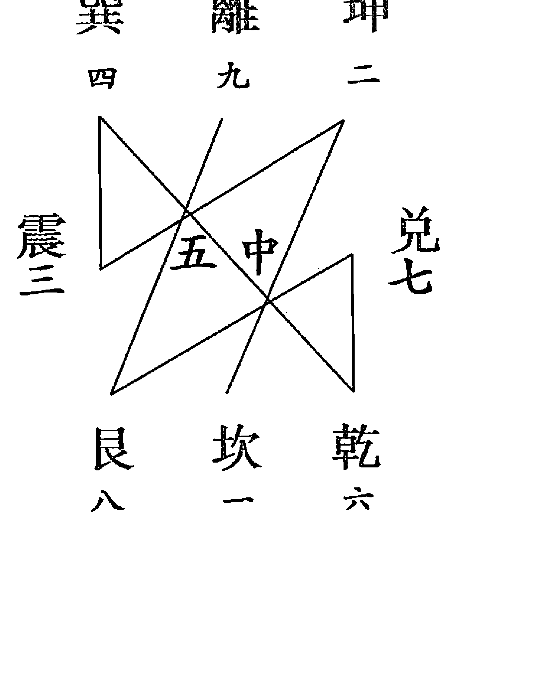

## 边九宫飞掌图

野马跳涧走，逢寅数猪狗。一局过一宫，不用亥子丑。
阳顺阴逆。

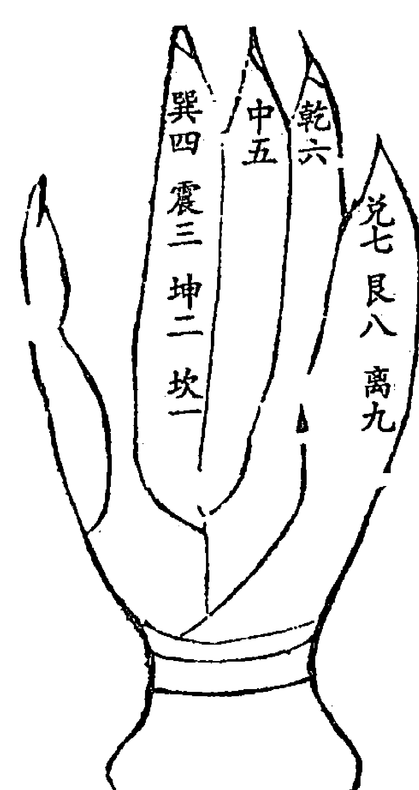

## 超神接气置闰诀

闰奇自有玄妙诀，
以时置闰。
神仙不肯分明说。
冬夏二至前起闰，凡一月节气以三十日零五时二刻为准，以三十日分六局，以余五时二刻置闰。遇芒种、大雪，超过九日便当置闰。大概五日一元，一日十二时也。
甲己二字号符头，
此甲己乃至要之诀也。置闰以甲己二字为主，假如甲己之符先到，谓之超；甲己之符未到，谓之接；甲己与节同到，谓之正授。
子午卯酉上局设。
子午卯酉为上局也。
寅申巳亥中局求，辰戌丑未下局截。
节遇符，符遇节，
符即甲已符头，节即节气也。

万两黄金不轻说。

节前遇符便是超，节后遇符便是接。

超神接气若能明，便是三山云外客。

## 六甲利用

> 《经》曰：“若有所用，百事皆向六甲所在之方，呼其神名，行六十步左转入太阴中。又六丁名太阴，见贵人则喜悦，遇阵则胜。”

甲子旬神名“王文卿”，登坛拜将、领授兵符、运筹发令，储粮起兵者，皆向其方呼其神之名，而行六十步左转入太阴中，则发掘如神。

甲戌旬神名“徐何”，利通伐山林、平治道路、分决河道，得于自然，开路无损，皆向其方呼其神之名，行六十步左转入太阴中，则得所愿，道路自通。

甲申旬首名“盖新”，若入山畋猎、捕捉虎狼虫兽，皆向其方呼其神之名，而行六十步左转入太阴中，虫兽自然不动。

甲午旬神名“灵光”，若安营置阵、巡狩战斗，向其方呼其神之名，行六十步左转入太阴中，则必胜。

甲辰旬神名“含章”，若求官拜将、临民赴任，皆向其方呼其神之名，行六十步左转入太阴中，则为官不败悔。

甲寅旬神名“监兵”，若扬兵振武、教阵、荡寇、行军、征伐不道，皆向其方呼其神之名，行六十步左转入太阴中，出行、安边，盗贼自然不起。

以上六甲，管辖五行尊神，体统好静，行事之时，书相制之字则吉。盖六甲内管五行，而动静无方，其五行而舍胜，有相生相克之道。左手象天，右手法地。神体好静，故书五行相制，运化之道，无不兼该。若欲出兵，大将左手中用硃书“强”字，将手捏住，行六十步左转入太阴，能欺弱制胜之道也。若见贵人、求官及二千石令长，左手中书“天”字。若商贾、兴贩、和结交友、嫁娶、立契，则书“和”字。若入山、捕猎、畋猎，则书“狮”字。若部工居众，则书“强”字。若过河、治水，则书“土”字或“戊”字。若波浪腾声，舟楫将溺，尤忌八风、触水龙、招摇、咸池之日，宜书“戊”字。若游山、入道，则书“龙”字，龙不敢动。值符临其方，前行六十步左转入太阴中，得此者天道亨。此五行制胜之妙用也。

# 奇门遁甲秘笈大全卷二十四

## 出行呼神字入太阴中

凡出行者，于其所向之方，呼其神之字，而行六十步左转入太阴中。阳遁值前二为太阴中，阴遁值后二为太阴中。又六丁亦为太阴，呼其神字，谓所用之时，天盘上所得星之字。

天蓬字子禽，天芮字子成，天冲字子翘，天辅字子卿，天禽字子公，天柱字子申，天任字子韦，天英字子威。

假如冬至上元阳遁之局，甲己之日平旦丙寅时，此时六丙在八宫，以天上甲子戊天蓬加八宫，欲出东北者，呼其神字曰子禽，行六十步入太阴中，此时前二太阴临四宫，① 即左回入东南之类。

## 出入呼其时十二辰上十干神名

甲为天福，神王文卿；乙为天德，神龙文卿；丙为天威，神杜唐仲卿；丁为玉女、天女，神季田海往；戊为天武，神司马羊；己为明堂，神纪游卿；庚为天刑，神郭阳之邹元游阳；辛为天庭，神高子强；壬为天牢，神王禄卿；癸为天狱，神爱强爱子兆。②

## 六甲阴神

- 甲子旬阴神丁卯，兔首人身，名孔林族，字文伯；
- 甲戌旬阴神丁丑，牛首人身，名梁邱叔。③
- 甲申旬阴神丁亥，猪首人身，名陆城，字文公。④
- 甲午旬阴神丁酉，鸡首人身，费扬，字文通。⑤
- 甲辰旬阴神丁未，羊头人身，名王屈奇，字文卿。
- 甲寅旬阴神丁巳，蛇首人身，名许咸池，字巨卿。

> ① 原注：按九宫排法当在坎一宫。
② 原注：旁注神明出自符，应当遵之。
③ 原注：一作梁邱，或作梁邱仲，未知孰是。
④ 原注：一作陆成陆。
⑤ 原注：一作费扬多。

## 遁甲门户神名①

- 甲子旬门名徐仪，户名公孙齐，解衣去吉；
- 甲戌旬门名天可，户名徐可，仰天大呼去吉；
- 甲申旬门名司马光，户名石战，解衣去吉；
- 甲午旬门名石象，户名子可，解衣振逃而去吉；
- 甲辰旬门名公孙错，户名司马胜，解发更结而去吉；
- 甲寅旬门名公孙光，户名司马强，解带而去吉。

大将出入及行兵，无问多少，往止之方，必有法度也。以六为法，大将列士卒左旋入太阴中，呼门户神名。咒曰：“某甲有急，请神为我佑我，匿我藏我，毋使敌人伤我覆我盖我，五兵摧折，无令至我，当我者死，视我者亡，使敌人冥冥默默，视我迷惑，为我乱其魂魄，使敌人不敢起。”念咒讫，令士卒左旋直去，勿反顾，藏于六癸之下。如甲子六癸在酉之类。余仿此。

## 六甲阴符法

《经》曰：“为上将者，御敌须作六甲阴符法，令敌人身诛。”故曰：“宁与人千金，不教人六甲之阴。”天地之间，此道最灵，藏之金匮，贵之于心，不传非人，慎勿轻泄。盗视者盲，盗读者疫。若作六甲阴符，必须至诚斋戒，以邀天福；稍有污犯，便不洁矣，安望灵验？

凡作符者，当于月蚀之时，伐桐木及杜荆等木阴枝，或柏心亦可。悉长九寸，广二寸，厚三分，用雌黄涂之作像，并书其名于像下。② 画符之后，绛锦为囊盛之，大将自随身佩之，用兵时便取本旬阴神之符于囊外以指敌人，敌人自散，不敢交兵也。

凡取木时必先斋戒，取酒一升、鹿脯三肋、盐一盏，祝而祭之，白茆为席，北向再拜。祝于杜荆之前曰：“百鬼之神，与子俱游，变化其身，以子所指，莫不服者，谨奉清酌、美脯及盐等物，愿歆飨之。”咒讫再拜，凡三咒毕，乃伐取木，勿令污秽，亦勿近秽之物及妇人、鸡犬见之。

凡受持之法，斋戒五日，兰汤沐浴，洁食净饭，毋食五辛之物，及书画毕，于六甲之日夜半，醮之于方坛之上，为法坛一丈二尺，外浮土上十二丈，开十二辰门，以

> ① 原注：出军行事，并宜用之。
② 即丁卯阴神孔林族等之像及名。

竹为算，长三尺或九尺，随地方列之于四向，将六阴之符置坛上，依六位放以五色绘彩，各三尺五寸，上安酒三杯、脯二斤、盐一盏，白茆为席，北向而跪，呼四方支辰神名，及六甲六阴神名，并门户神名而祭之。
假如甲子阴在丁卯，正东再拜，呼其神而祝之，以绛锦为囊盛阴符，常随身则百鬼不敢侵，以阴符指敌，则敌人自灭。如仓猝无坛，但于庭中或野外画地为坛亦可矣。

### 真人步斗法

> 《步斗经》曰：“夫步斗可以通神，当于夜半居星光下白场画地，作北斗七星，中间相去三尺，天蓬从天罡起，随次第布之，居魁前逆布讫，正立天英而歌斗咒，诵至天英，必先举左足并诵咒，以次依经步之，左右更遍履之，如后法为之，百日则与神人自然感通。秘之勿泄。非人者殃堕九祖，盗视者其目必瞽也。”

> 咒曰：“斗要妙兮十二神，承光明兮威武陈。气髣髴兮如浮云，七变动兮上应天。知变化兮有吉凶，入斗宿兮过天关。合律吕兮治甲乙，履天英兮度天任。清冷渊兮陆凌沉，住天柱兮拥天心。从此度兮登天禽，依天辅兮望天冲。入天芮兮出天蓬，斗道通兮刚柔济。添福禄兮流后世，出冥明兮千万岁。急急如律令！”

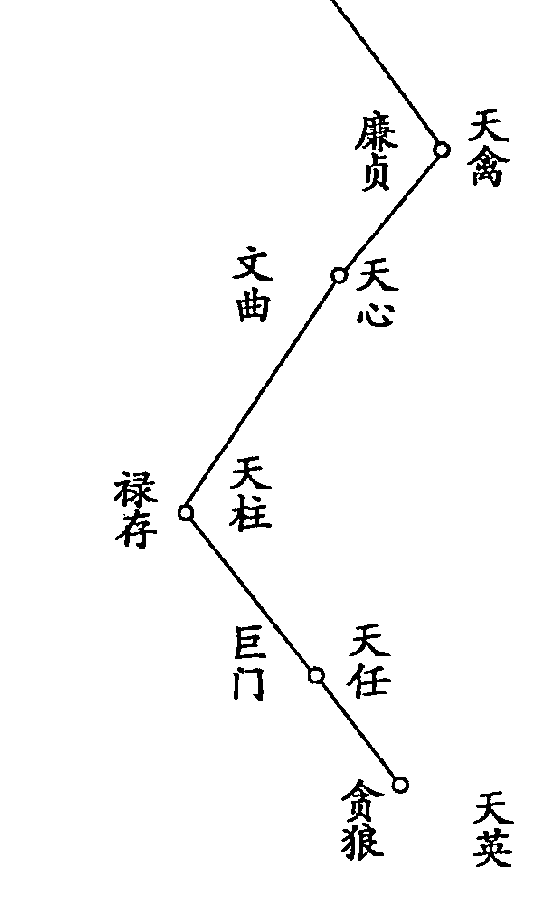

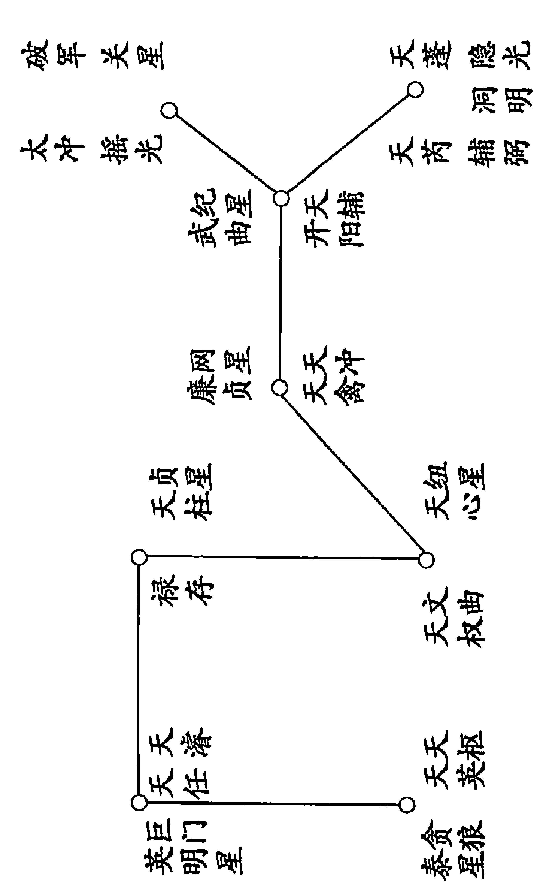

凡有事出门，呼本旬玉女名，如甲子旬阴在丁卯，从丁卯而出，咒曰：“丁卯玉女，护我佑我，毋令伤我。视我者音，听我者反受其殃。”咒毕行去，慎勿反顾，其神随护，大获其德。如甲戌旬头，则呼丁丑玉女，咒之如前。余仿此。

### 乙奇神咒

> 天帝威神，诛灭鬼贼。六乙相助，天道赞德。吾今所行，无攻不克。急急如玄女律令！①

① 原注：助，一作扶。

### 丙奇神咒

吾德助天，前后遮逻。青龙白虎，左右驱魔。朱雀道前，使吾会地。天威助我，六丙除疴。急急如玄女律令！

### 丁奇神咒

天帝弟子，部令天兵，赏善罚恶，出幽入冥，来护我者，玉女六丁，有犯我者，自灭其形，急急如玄女律令！

### 孤虚神咒

天灵灵，地灵灵，孤虚孤虚。神举意，如吾意，神不离吾左右。急急如律令！凡念各咒宜直行，不可回顾，至六十步外乃止。

### 出三奇吉门咒

《经》曰：出六乙门，禹步三咒。曰：“白虎白虎除道路，当前导路慎勿误。有德之士来相助，幽冥幽冥交相助。急急如九天玄女元君律令！”

出六丙门，禹步三咒。曰：“前有天罡扬威武，当从青龙与白虎。行诛天贼及天盗，敢有不从伏天斧。急急如九天玄女元君律令！”

出六丁门，禹步三咒。曰：“玉女玉女名神母，呼而问道吾所，常从斗杓入斗里。清泠之渊多神草，折以自障勿惊误。急急如九天玄女元君律令！”

《经》曰：“出三奇吉门，倘事急不及咒，亦可去。但须志心信之必验，慎勿回顾。”

凡念咒须禹步，右手画四纵五横，即曰：“四纵五横，六甲六丁。玄武载道，蚩尤避兵。左悬南斗，右佩七星。邪魔灭迹，鬼祟潜形。干不敢犯，支不敢侵。太上有敕，吾令指行。入水不溺，入火不焚。逆吾者死，顺吾者生。当吾者死，视吾者盲。急急太上道祖铁师上帝律令！”念毕即念前或乙或丙或丁三奇神咒，随念随行，慎勿反顾。

单日东西五横，☰ 南北四直，||||| 双日南北五横，☰ 东西四直。||||| 咒曰：“禹王灭道，吾令出行。四纵五横，蚩尤备兵。撞吾者死，避吾者生。吾游天下，还归故乡。谨请南斗六郎北斗七星，吾奉太上老君急急如律令！”左手掐本日字，① 佐右手子文画描。二咒大同小异，随意用之。

### 玉女反闭局

| 日辰 | 玉女所在 | 天门所在 | 地户所在 |
| :--- | :--- | :--- | :--- |
| 子日 | 庚 | 丙 | 乙 |
| 丑日 | 辛 | 丙 | 乙 |
| 寅日 | 乾 | 丙 | 庚 |
| 卯日 | 壬 | 庚 | 丁 |
| 辰日 | 癸 | 庚 | 丁 |
| 巳日 | 艮 | 庚 | 壬 |
| 午日 | 甲 | 壬 | 辛 |
| 未日 | 乙 | 壬 | 辛 |
| 申日 | 巽 | 壬 | 甲 |
| 酉日 | 丙 | 甲 | 癸 |
| 戌日 | 丁 | 甲 | 癸 |
| 亥日 | 坤 | 甲 | 丙 |

凡阴阳二遁，无奇门出入者，即用玉女反闭局出入，贞吉。为上将者，必须知之，以保万全。凡有奇无门，或有门无奇，即谓之无奇门也。

### 伏匿藏行法

> 伍子胥曰：“若欲伏匿藏形，当乘青龙六甲也，历蓬星六乙也，过明堂六丙也，伏太阴六丁也，出天门六戊也，入地户六己也，伐天刑六庚也，判天庭六辛也，羁天牢六壬也，取草折半障人中，半入天藏六癸也，从天藏下进去，走月厌方，② 许藏身与天喜同。”

假如六甲日甲子时，欲伏藏者，初起甲子，历丑过寅，伏卯出辰入巳，取草折半障人中，置卯地，入酉地，而出入无见者。过太阴时，咒曰：“天翻地覆，九道皆塞。有来迫我，至此而极。视我者、追我者亡。吾奉九天玄女道母元君律令！”咒毕，径入天藏，慎勿反顾。庚为天狱，辛为天庭，壬为天牢，俱宜避之，切勿抵向，致被擒缚。

① 原注：当是本日支辰。
② 原注：正月戌逆数，每月一字。

### 推迷路法

黄石公曰：“出行道逢三路，未知何道通，以月将加时，天罡加孟左道通，在季右道通，加仲中道通。”子午卯酉为四仲，寅申巳亥为四孟，辰戌丑未为四季。

### 天目地耳

> 《经》曰：“天目为客地目主，六甲推兮无差理。劝君莫求此元机，洞澈九宫扶英主。”

卯为天目，酉为地耳。又六甲为青龙位，六丁为天目位，六癸为地耳位，又为华盖位，六戊为天门位，六己为地户位。甲子者，六甲旬中，庚为天目，戊为地耳，丙为三刑位，主战。如甲子旬，卯方入营，六丁之位。
凡劫贼营，令人鬼不知，从六丁位，或太阴位下入营，或从天目、地耳入。又欲入劫营者，从天目、地耳、天门、地户、青龙、华盖、九天位上入劫，即吉。

### 九胜法

+ 黄帝曰：“行兵要背天目，向地耳。”
+ 甲子旬天目在庚午，地耳在戊辰。
+ 甲戌旬天目在庚辰，地耳在戊寅。
+ 甲申旬天目在庚寅，地耳在戊子。
+ 甲午旬天目在庚子，地耳在戊戌。
+ 甲辰旬天目在庚戌，地耳在戊申。
+ 甲寅旬天目在庚申，地耳在戊午。

### 卜螺法

田中赤色大螺，取时忌妇人、孝子、鸡犬见之。凡预卜胜负，取二螺安于盘中，直画一路，左为我，右为贼，盘中盛水一寸许，将螺各记之。咒曰：“田螺舞舞，能知风雨。贼若来遇，入我境界。田螺索索，风雨不着。贼若不来，各守城郭。”咒毕，候至天明，依法断之。若贼螺入我境界，不可与战，宜固守；我螺入贼界，宜急攻之。

春，螺头向东大利，向南有惊，向西被贼，向北小吉。
夏，螺头向东小吉，向南大利，向西贼来破我，向北大惊。
秋，螺头向西大利，向南有神助，向东大吉获财，向北战胜，我宜守。
冬，螺头向北大利，向西平安，向南贼能散，向东小惊，宜固守吉。
甲乙日，螺头向东贼来急，不宜战；向南五日内贼来，向西十四日贼来，向北贼不至。
丙丁日，螺头向南九日去，向西七日去，向北当日至，交战我胜敌败，向东贼散。
戊己日占，宜各固守。
庚辛日，螺头向西与贼平，向北贼散，向南贼来而复去，向东有贼大战。
壬癸日，螺头向南贼不胜而去，向西贼不来，向东各守一方，向北宜平。

### 禳疫法

> 《经》曰：“出军疫疠传染，死者甚众，号日军气。可于上风焚死人骷髅数枚，军气即解也。”

### 居青龙法

凡出天门入地户，过太阴居青龙。《经》曰：“初兵出天门六戊也，入地户六己也，过太阴六丁也，居青龙六甲也，居其下百战百胜。”假如冬至上元甲己之日夜半生甲子，初起兵，出天门辰地，入地户巳地，过太阴午地，居青龙子地，即百战百胜。又一法曰：“出天门者，天上六戊在一宫；入天上地户在二宫，过天上太阴在七宫，居天上青龙在一宫。”余仿此。

# 奇门遁甲秘笈大全卷二十五

## 游门

出兵攻敌，常须游门。

+ 正月天门在申，百死在酉；二月天门在酉，百死在戌；
+ 三月天门在戌，百死在亥；四月天门在亥，百死在子；
+ 五月天门在子，百死在丑；六月天门在丑，百死在寅；
+ 七月天门在寅，百死在卯；八月天门在卯，百死在辰；
+ 九月天门在辰，百死在巳；十月天门在巳，百死在午；
+ 十一月天门在午，百死在未；十二月天门在未，百死在申。

## 地兵法

> > 太公曰：“凡行军向阵，勿犯地兵，将军忌之。”

+ 甲子旬地兵在寅，甲戌旬地兵在子。
+ 甲申旬地兵在戌，甲午旬地兵在申。
+ 甲辰旬地兵在午，甲寅旬地兵在辰。

## 黄旂虎尾

凡战宜背虎尾，向黄旂，吉。

+ 午戌岁黄旂在戌，虎尾在辰；子辰岁黄旂在辰，虎尾在戌；
+ 卯未岁黄旂在未，虎尾在丑；酉丑岁黄旂在丑，虎尾在未。

## 雷公①

> 《摄杀六律》曰：“雷公将军在午游庚，领十二日将及风伯、雨师，其所游之处，群居响应而到，若出军、布阵、安营，则雷公之所处，慎不可犯，犯之主败军杀将也。甲子旬六庚在午，甲戌旬六庚在辰，甲申旬六庚在寅，甲午旬在子，甲辰旬在戌，甲寅旬在申。”

## 立知井泉法

屯兵山阜，被贼围困，又无溪涧，无处汲水，急用磁碗覆地，将土壅碗口，明晓揭碗视之，底有水珠，下有泉脉也。掘地数尺，可以得水。

## 五行相制负法②

见官书天字，求婚书合字，市贾书利字，出道书通字，博戏书乾字，
夜行书魁字，入众书遁字，入阵书强字，看病书鬼字，入罡书罡字，
吃酒书少字，入山书子字，入水书土字或龙字或戊字。

## 三胜宫

+ 第一胜天乙宫，③ 上将居之，用兵而击其冲，百战百胜。只要坐三向五，不可坐五向三。三为生气，五为死气，生谓坐生门，死为坐死门。若甲申庚见值符，则不可引兵居也。
+ 第二胜九天宫，上将居之，用兵击其冲，则敌虽大，不敢当我锋，而大胜矣。
+ 第三胜生门宫，④ 上将引兵，从生门击死门，百战百胜。

## 五不击宫

+ 第一不击天乙宫。如甲申庚临值符，则可冲击矣。
+ 第二不击九天宫。
+ 第三不击生门宫。
+ 第四不击九地宫。
+ 第五不击玉女宫。临阵传令纪之，则万举万全矣。

① 雷公者，六庚耳。庚为天刑，又为百神所聚之方，故宜避之，不敢犯也。
② 此法至诚闭气，吸东方生气一口吹在手心，书字即行，不可回顾。
③ 即值符宫。
④ 合三奇之吉宫。

## 天蓬咒

天蓬天蓬，九元杀童。五丁都司，高力北翁。七政八灵，太上皓凶。长颅巨额，手把帝钟。来枭三神，严驾夔龙。威剑神王，斩邪灭踪。紫气乘天，丹霞吓冲。吞魔食鬼，横身饮风。苍目绿齿，四目老翁。天丁力士，威南御凶。天骡激戾，威北衔风。三十万兵，卫我九重。辟尸千里，祛却不祥。敢有小鬼，欲来见形。镬天大斧，斩鬼五形。炎帝沥血，北斗燃膏。四盟破骸，天猷灭类。神剑一下，万鬼自溃。急急如律令！

## 五阴五阳时

《三元经》曰：“甲乙丙丁戊为五阳时，利为客。”宜先举兵，高旗响鼓，耀武扬威，客兵大胜。所谓得阳者，飞而不止也。“己庚辛壬癸为五阴时，利为主。”宜偃旗息鼓，衔枚静听，待客敌至后，则战大胜矣。所谓得阴者，伏而不举也。
凡奇门一时一换，谓不善必先知之。若天盘甲申庚加地盘月奇丙之方，防其冲营击寨。夜间必要守备，每一更一令一筹密传。若筹错令差，便是奸细。所谓“火入金乡贼须至”也。即在八门之内，取路埋伏，以逸代劳。

## 德威之时

葛洪曰：“六丙为威，六甲为德，利以为客。”宜发号施令，入其国，犬不吠，马不鸣，回车止轮，折冲万里，不敢有声。兵来向者，还自灭形，贼必亡矣。天兵来助，敌人自恐。天兵执行，敌人自惊。将兵征伐，为客大胜。若此时，不利为主，惟宜固守屯营，以待天时。

## 天辅之时

《三元经》曰：“天辅之时，有罪无虞。斧钻在前，天犹赦之。”谓甲己之日时下得己，乙庚、丙辛、丁壬、戊癸之日，时下得甲也。甲己日己巳时，乙庚日甲申时，丙辛日甲午时，丁壬日甲辰时，戊癸日甲寅时，是为天辅之时，此时有罪自释。

## 奇门飞斗法①

凡飞斗，足步手扬，口诵咒曰：“天圆地方，六律九章。出行大吉，永保安康。扫除凶恶，削去灾殃。人来追我，掩其两目。马来追我，折其四足。车来追我，断其轮轴。所求遂意，咸愿从心。吾奉九天玄女急急如律令敕！”

阳斗甲丙戊庚壬为六阳。

贪巨禄文廉武破。

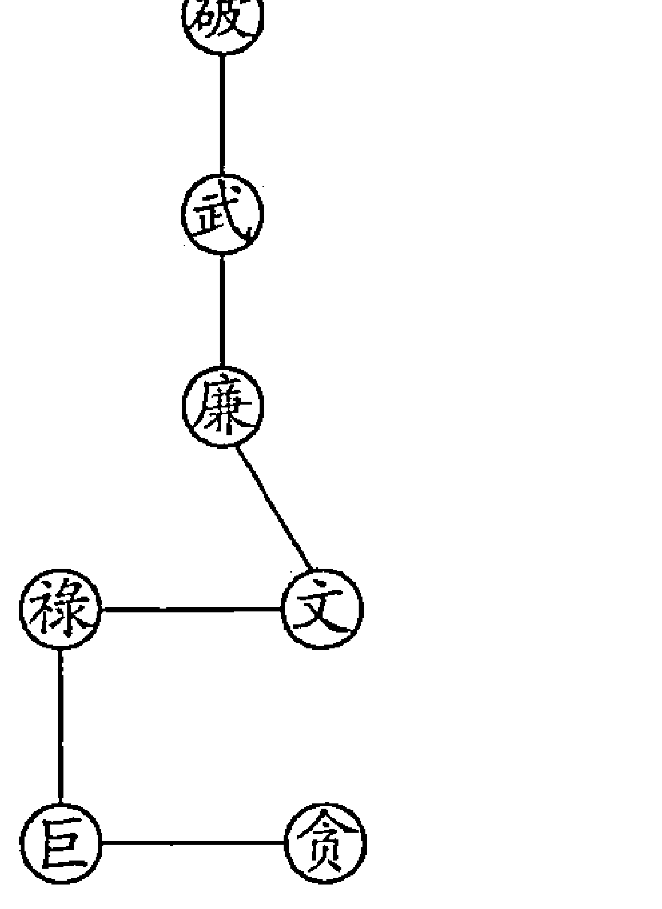

阴斗乙丁己辛癸为六阴。

魁䰢魁魁魅魒，俱七斗之纬。

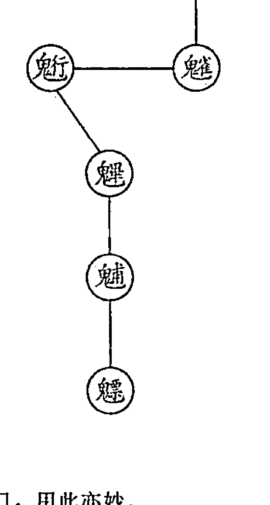

## 真人闭六戊法

凡出军止宿，要安营下寨，避祸逃难，当用此法，鬼神不敢近也。其法于旬中六戊上，用刀从鬼门起左行，画地一周；次取中央土一斗，分置六戊之上，六处各置一升余，乃置刀于原取土处，入中央咒曰：“泰山之阳，恒山之阴。盗贼不起，虎狼不侵。城郭不完，闭以金关。千凶万恶，莫之敢干。急急如律令敕！”咒毕，仍在中宿，勿令出入，明日启行，拔刀散土而去。若不散土，其神不敢去也。① 欲验六戊之法，置犊犉于外，系母牛于内，终不敢入特。欲令其人，去一戊土，犊便从空上入矣。甲子旬戊在辰，甲戌旬戊在寅，甲申旬戊在子，甲午旬戊在戌，甲辰旬戊在申，甲寅旬戊在午。

## 九星八门符

休门 天蓬

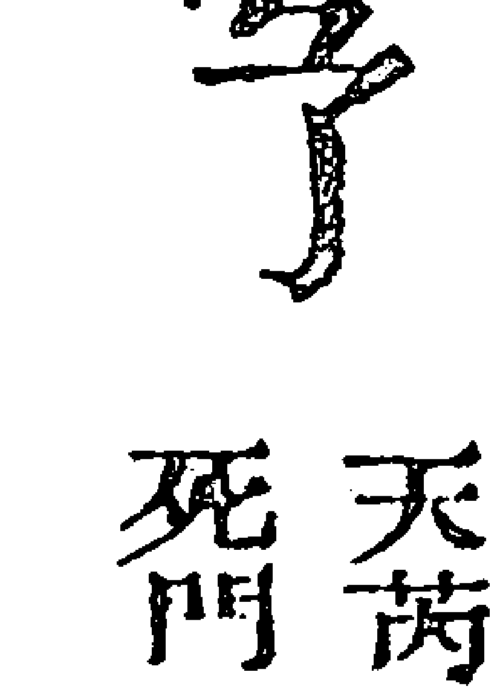

死门 天芮

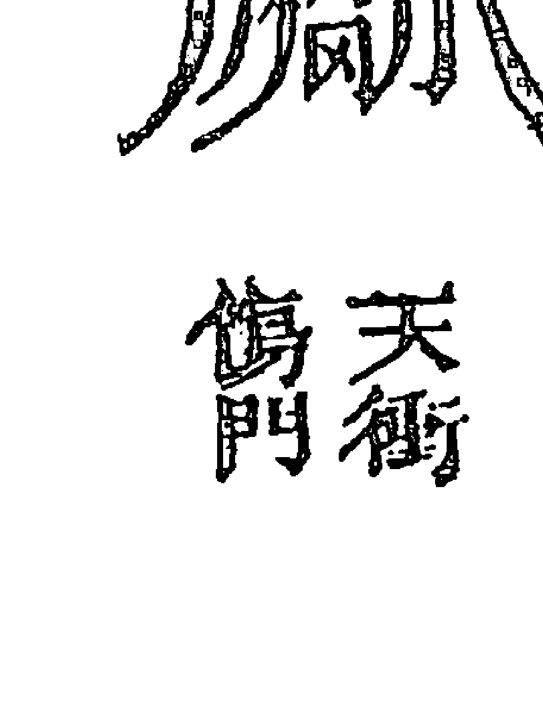

伤门 天衡

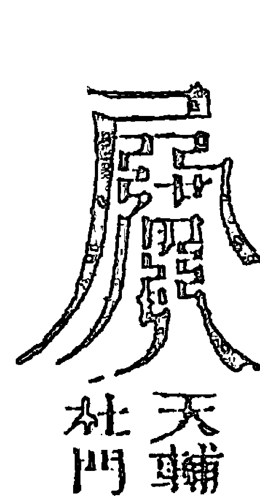

杜门 天辅

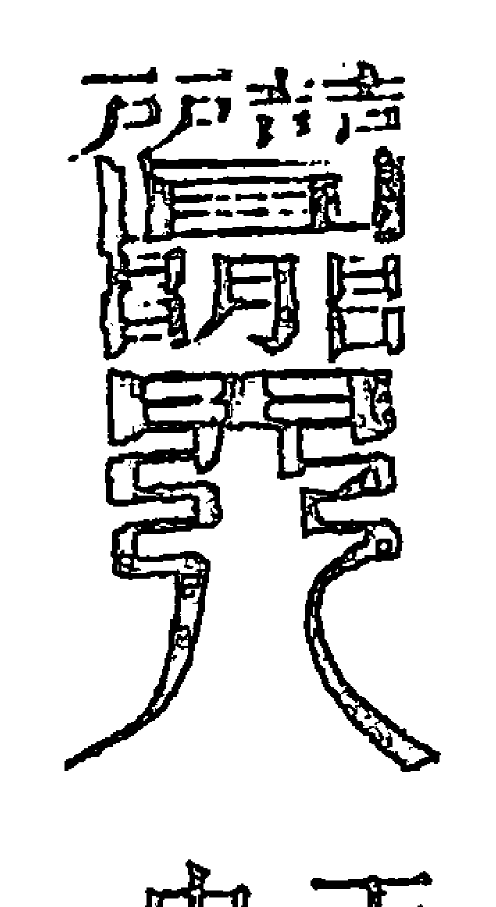

开门 天心

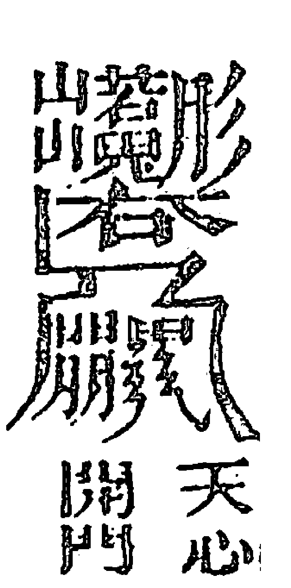

惊门 天柱

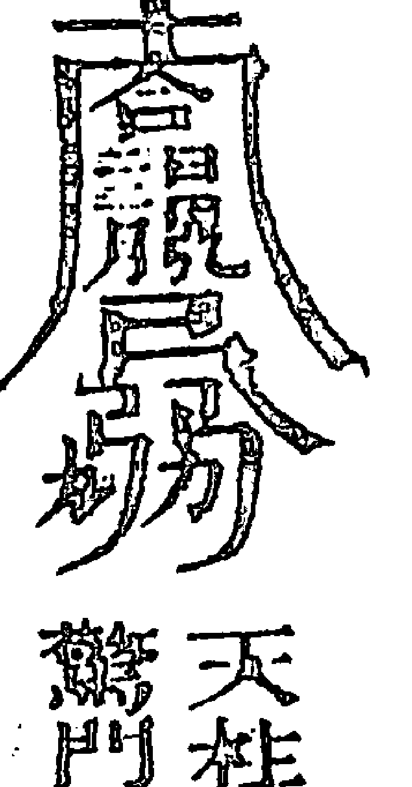

生门 天任

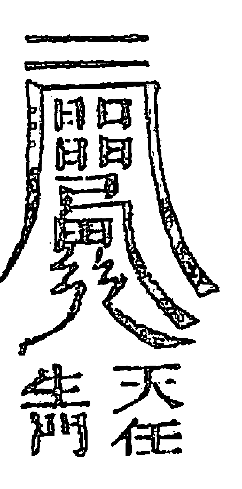

景门 天英

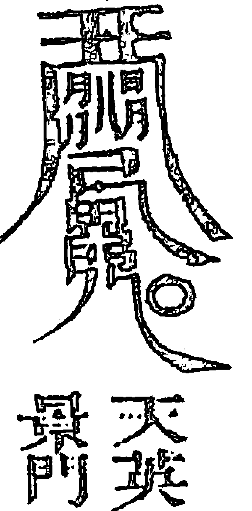

## 禹步法①

初移一步，不在九步之数，然相因仍之。一步七尺，合二丈一尺。故曰“见迹禹步”，乃成既济之卦。正立，右足以前，左足在后，次复前左足，次复前右足，以左足从右足并，一禹步也。次复前右足，次复前左足，以右足从左足并，二禹步也。次复前左足，次复前右足，次左右足并，三禹步也。①

## 未济禹迹

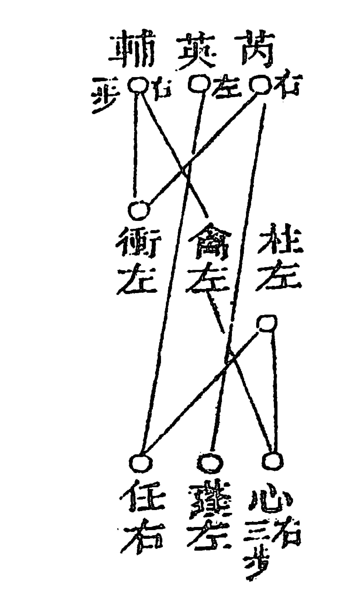

## 既济禹迹

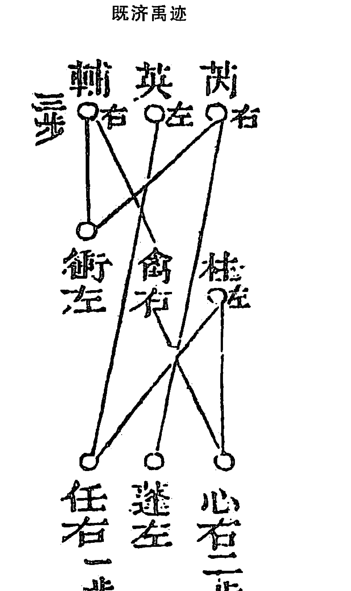

> > 巽双离只坤单步，震亦依依兑是双。艮上独行坎只立，天门归去望天罡。

## 禹步罡

| 巽 | 离 | 坤 |
| :--- | :--- | :--- |
| 雙右 | 隻左 | 隻右 |
| 震 | | 兑 |
| 隻右 | | 雙右 |
| 艮 | 坎 | 乾 |
| 雙左 | 隻右 | 雙左 |

## 玉女返闭局

《经》曰：“玉女返闭局者，在室中庭中六步，野外六十步，量人地多少，地之宜表，皆以六为数。先定数讫，便以左手执六算，各长一尺二寸，随吸旺气，叩齿十二通，默咒心下所谋之事，然后回身背旺气。”神启请曰：“维某年某月某日某时，启天地父母、六甲六丁、十二时神、青龙、蓬星、明堂、天上玉女、六戊之神，某好学长生之术，行不择日，出不择时，今欲游行某处为某事，欲赖大神庇佑。谨按天门，画地敷局，出天门，入地户，闭金关，乘玉女，谨请玉女、青龙、朱雀、白虎、元武、勾陈、六合、六甲六丁、十二时神，乘我而行。至某处为某事，左右巡防，随行随止，随卧随起，辟除盗贼，鬼魅消亡。君子见之，喜乐倍常；小人见我，欢喜皇皇；男儿见我，共持酒浆；百恶鬼贼，当我者亡。今日禹步，上应天罡；玉女侍傍，下击不祥。万精压伏，所向无殃，所值病瘥，所攻者达，所击者破，所摧者倾，所求者得，所愿者成，帝王大臣、二千石长吏，见我者爱如赤子。今日请召玉女六神，随我而进。”

凡一切出行用事，无吉方吉时者，可用此法。便画八卦图局，排定东西南北，布八干十二辰四维，然后入局。《玉女术》曰：“先画地图，用桑柴灰为之，可以隐匿逃亡，或有患难隐遁，人无见者，即不避归忌、往亡、陷破一切凶神恶煞。人可以市贾求利，进见长吏，报仇攻怨。”宜深保此法，乃父子不传之秘，毋轻易语人，以泄天机也。布局时，读“左三右七，戴九履一，二四为肩，六八为足”。画地局讫，即心下排定东西南北，布十二支辰、八干四维之位。假如甲日便从甲地八局内，乙日便从乙地八局内，丙丁庚辛壬癸日俱仿此。惟戊日从乾坤方位上入局，己日便从艮巽方位方入局，手执六算祝四方。

## 布地局式

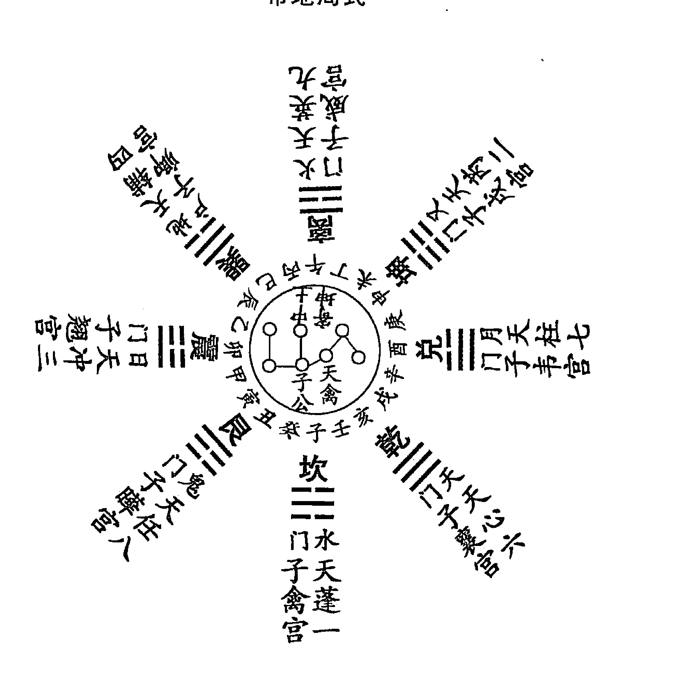

## 启请四方神位

> “谨请东方功曹、太冲、天罡、青帝大神、甲乙大神，降于局所，侍卫我身。南方太乙、胜光、小吉、赤帝大神、丙丁大神，降于局所，侍卫我身。西方传送、从魁、河魁、白帝大神、庚辛大神，降于局所，侍卫我身。北方登明、神后、大吉、黑帝大神、壬癸大神，降于局所，侍卫我身。”

既请四方神讫，便从今日日辰上下第一算。如子日，则于子上下第一算，丑上下第二算，寅上下第三算，卯上下第四算，辰位上下第五算，巳位上下第六算。四仲日地户不成，取初下第一算安辰上所冲，却以冲命起，自然成门。

+ 玉女术咒曰：“鼠行人穴入狗市”，便移子上第一算安戌上，大呼青龙下。
+ 又咒曰：“牛人兔园食甘美”，便移丑上第二算安卯上，大呼曰朱雀下。
+ 又咒曰：“猛虎耽耽来向蛇”，便移寅上第三算安巳上，大呼曰勾陈下。
+ 又咒曰：“兔人牛栏伏不起”，便移卯上第四算安丑上，大呼曰白虎下。
+ 又咒曰：“龙人马厩困留止”，便移辰上第五算安午上，大呼曰元武下。

## 奇门遁甲秘诀大全

又咒曰：“螣蛇婉转来申里”，便移已上第六算安申上，大呼曰六合下。
若午日，则于午上下第一算，未上下第二算，申上下地三算，酉上下第四算，戌上下第五算，亥上下第六算，咒曰：“马入龙泉饮井水”，便移午上第一算安辰上，大呼曰青龙下。

又咒曰：“羊鸡易位入酉里”，便移未上第二算安酉上，大呼曰朱雀下。
又咒曰：“猿猴跃跃北奔亥”，便移申上第三算安亥上，大呼曰勾陈下。
又咒曰：“鸡飞扑落羊栏里”，便移酉上第四算安未上，大呼曰白虎下。
又咒曰：“狗入鼠穴捕其子”，便移戌上第五算安子上，大呼曰元武下。
又咒曰：“猪入虎穴自取死”，便移亥上第六算安寅上，大呼曰六合下。

喝算讫，先成者为天门，后成者为地户。不成者，将初算投之，作第七算，命乃成于人之方位，立执算，咒曰：“乾尊耀灵，坤顺内营。二仪交泰，要合利贞。配天履地，永宁肃清。应感元黄，上衣下裳。巽离坤兑，翊赞扶襄。乾坎艮震，虎步龙翔。今日行算，玉女侍旁。有急相助，常辅扶匡。追我者死，捕我者亡。牵牛织女，化为海江。急急如律令！”

玉女左行八干四维，子日辰上行起，周而复始，乘玉女而去，去时有咒。当呼所在玉女。如在庚上，即咒曰：“庚上玉女，速来护我，毋令百鬼伤我，人莫见我，见我者以为束薪，独开我门，而闭他人地户。急急如律令！”即开门而去，慎勿反顾。

凡欲为百事、远行、见贵人、上官赴任者，出地户，入天门，乘玉女而行。咒曰：“天门天门，今日维良。玉女侍我，左右旁傍，行来四方。日出六甲，不逢灾殃。君子见之，喜乐煌煌。所求如意，万事吉昌。急急如律令！”

凡欲入阵、掩捕，即出天门，入地户，乘玉女而去。咒曰：“诺诺译译，行不择日，反不择时。随斗所指，与人俱之。天地反覆，中心所欲，皆得如意。使汝迷惑，以东为西，以南为北。有知我者，使汝迷不得见。急急如律令！”以算闭户而去。① 乘玉女咒曰：“玉女玉女，天神至灵。护我保我，兴我传我。行到某处，窈窈冥冥，莫睹其形。人不得闻其声，鬼不得闻其精。善我者福，恶我者殃。百邪鬼贼，当我者死，值我者亡。千万人中，见我者喜。急急如律令！”以刀画地，摄禁诸恶。念咒先叩齿七通，以应北斗天罡。右手持刀画地，咒曰：“四纵五横，万恶潜形。吾去千里者回，万里者归。呵我者死，叱我者亡，自受其殃。急急如律令！”

① 皆一心虔诚，三孚玉女。

## 画地法

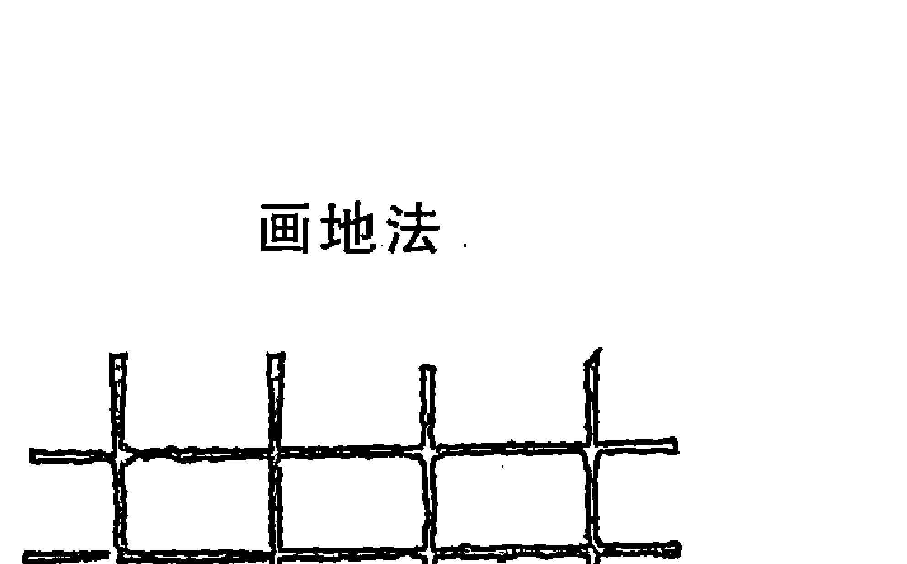

## 十二局天门地户返闭立成图

| | 子日 | 丑日 | 寅日 | 卯日 | 辰日 | 巳日 | 午日 | 未日 | 申日 | 酉日 | 戌日 | 亥日 |
|---|---|---|---|---|---|---|---|---|---|---|---|---|
| 天门 | 丙 | 丙 | 丙 | 庚 | 庚 | 庚 | 壬 | 壬 | 壬 | 甲 | 甲 | 甲 |
| 地户 | 乙 | 乙 | 庚 | 丁 | 丁 | 壬 | 辛 | 辛 | 甲 | 癸 | 癸 | 丙 |
| 玉女 | 庚 | 辛 | 乾 | 壬 | 癸 | 艮 | 甲 | 乙 | 巽 | 丙 | 丁 | 坤 |

此与三德方同。

## 步斗咒①

咒曰：“白气混沌灌我形，禹步相催合登明。天回地转步七星，蹑罡履斗齐九灵。亚指伏妖众邪惊，众灾消灭我长生。我得长生，我得长生。”

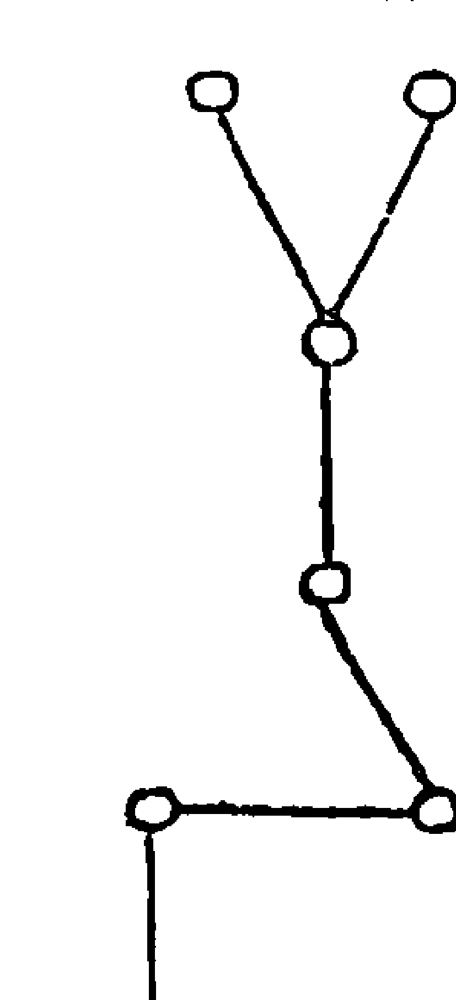

至心虔诚步星斗毕，即念后咒：
“六甲九章，天圆地方。四时五行，青赤白黄。太乙为师，日月为光。禹步治道，蚩尤避兵。青龙扶毂，白虎伏行。荧惑前引，辟不祥兆。北斗诛伐，去降凶殃。五神从我，周游八方。当我者死，嫉我者亡。左社右稷，寇盗伏藏。行者有喜，留者有福。万神护我，永除盗贼。急急如律令！”欲行千里法，亦念此咒。

## 奇门遁甲秘笈大全卷二十六

## 晷影图

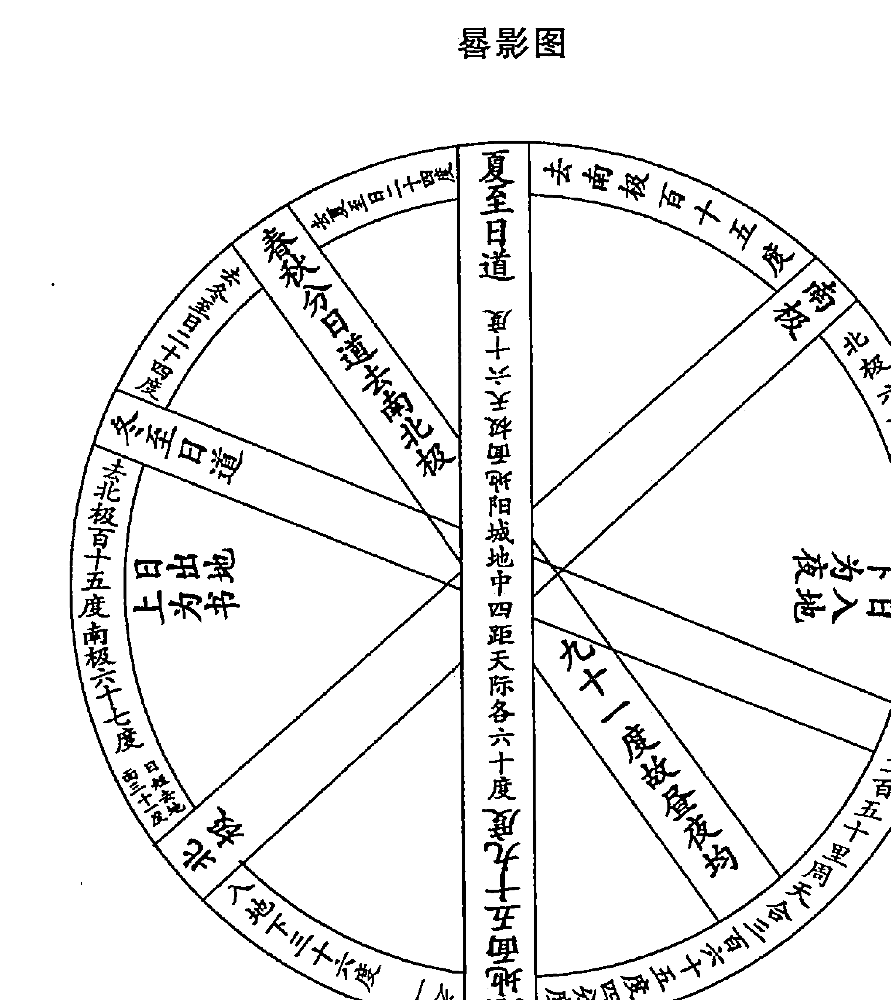

天顶名嵩高，夏至日道下直衡岳晷无影，北距嵩高九度余，阳城中距衡约二千五百百里。

古以二分卯酉，晷影相直，以定东西之地；中又取夏至午中晷影，与夜半窥筒北极相直，以定南北之地，故嵩与阳城相直也。然春分前二日，太阳已躔于春分赤道度，秋分后二日，太阳方躔于赤道度，此阳常有余也。或以阳城偏南二度，是知有数，而不知有理也。地上极天际六十一度，下五十九度，亦此意也。但知之者绝少，故赤道横束天中，万古不易，而黄道或出入者，日行之差也。春分日东至角，秋分日西至娄，南北极各九十一度，此天之赤道分定东西南北者也。故春分日出奎娄之黄道，其道出卯入酉；秋分日出轸角之黄道，其道亦出卯入酉；至冬至在箕斗之黄道，其道出辰入申，去赤道二十四度之南；夏至在井鬼之黄道，其道出寅入戌，去赤道二十四度之北。此日行黄道、赤道之所以分，而二十八宿之度，皆以赤道为法也。然午会以后，日常主减，而中天之盛，其减不觉。汉洛下闳《太初历》始有八千年差一度之说，晋虞喜、何承天，隋刘焯，各定岁差之法，然未定准者，以阴渐深则气渐促，而差渐多也。《尧典》冬至日在虚七度，庄襄王元年在斗二十二度，太初年在斗二十度，开元甲子在斗十度，庆历甲申在斗五度，开禧占测日在箕宿四度矣。然冬至子半则不可移，故天竺之法，宫分无系于宿，宿不属于宫，以其宫定而宿不定也。

## 十二辰经星分野分度总图

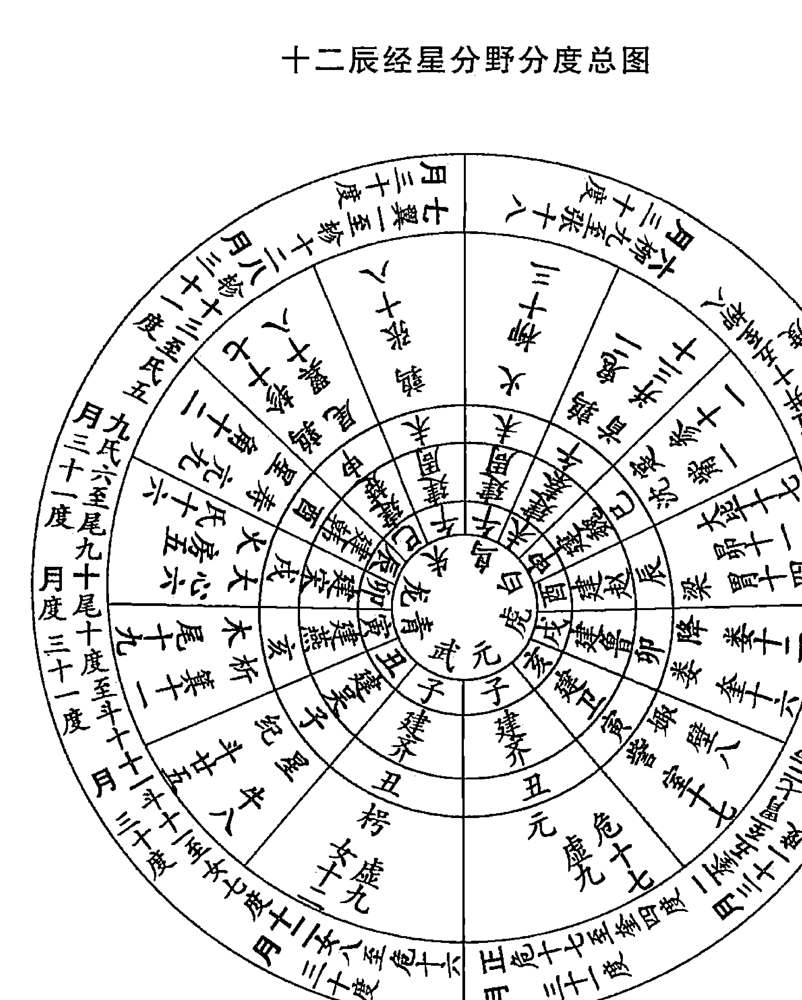

周天三百六十五度四分度之一，岁日行，而天行日过，分为四限，每限九十一日三十一分，一限为进差，二限为退差，二至合为四象，曰“盈初、盈末、缩初、缩末”也。角南星距极九十七度半，亢南第二星距九十六度，氐西南星距百四度半，房南第二星距百十四度半，心前星距百十四度半，尾星距百二十七度半，箕西北星距一百二十一度半，斗西三星距极一百十九度半，牛星距百八十度半，女西南距百四度半，虚南星距百度半，危南星距极九十六度，室南星距八十度半，壁南星距八十度半，奎西南大星距极七十二度，娄中星距七十五度半，胃西星距六十七度半，昴西南星距七十度，毕右股一星距七十五度，参西星及西第一星距极九十二度半，井西扇北一星距极六十九度，鬼西南星距六十九度半，柳西第三星距八十二度半，星大星距九十六度，张西第二星距百二十度半，翼中央西第二星距百四度，轸西北星距百三十度半，补觜西南星八十二度半。

黄帝作《盖天》曰“天如盖笠”，《宣夜》则曰“天了无质”。颛帝《浑天》以“形圆里黄”为喻，《方天》则以“火光远转”为比。《昕天》曰“天如人形，而北则偏高”，《安天》言“天形常安，而星辰不丽”。惟《浑天》则亲而且密。

## 三台下主九州岛

上台，上星主兖、豫，下星主荆、扬。中台，上星主雍、梁，下星主冀州。下台，上星主青州，下星主徐州。非其故以占其国。

## 尺度

一蚕之丝曰忽，十忽曰丝，十丝曰毫，十毫曰厘，十厘曰分，十分曰寸，十寸曰丈，十丈曰引。

## 斗斛

六十黍曰圭，四圭曰撮，千二百黍曰禽，两禽曰合，十合曰升，十升曰斗，五斗曰斛，两斛曰石。

## 九河

- 徒骇在沧州青池
- 太史今南皮县
- 马颊今德隶州
- 覆融今安德
- 胡苏在无棣
- 临津在东光
- 简、洁在临清
- 钩盘在乐陵
- 鬲津在饶安
- 又河之经流也

## 战国舆图

魏，今解州安邑，魏即大名也。赵，霍州、赵城、邯郸、广平、常山也。中山今定州。三齐，右即墨，中临淄，左平陆。吴越，三吴：东苏州，中镇江、西湖州。又吴兴、吴郡、会稽为三吴。三越，吴越杭州，闽越福建，南越广州。

徐，今徐州。东海，今嘉兴海宁。燕、幽、冀。南海广东。宋今归德。河中，山西蒲州。河间，即河间府。晋，平阳、曲绛。郑，荥阳、汜水。周，西扶风，东洛阳。秦，岐、雍，二桃林，三上郡。三巴，中巴县，巴西锦洲、合州，巴东归州、夔州、云安。三蜀，成都、广汉、犍为。梁，华阳、黑水。三楚，南江陵，西彭城、徐州，东吴郡。韩，上党，今潞州、同州、颍州。弘农，今河南灵县。岷江为大江、为中江，徐陵为北江，所谓三江。汉，两源，一出西县，一出会泉，皆由嶓冢。五岭，一大庾岭，在大庾县，二始安，在平乐县，三监贺，在贺州，四枉①阳，今猎岭，五揭阳，今潮州。漳，在福建漳州西。鬱越今延府。首阳山在河中府，一曰在辽州。上郡今绥德州。成纪今秦州。濊貊今辽东。

## 八风图

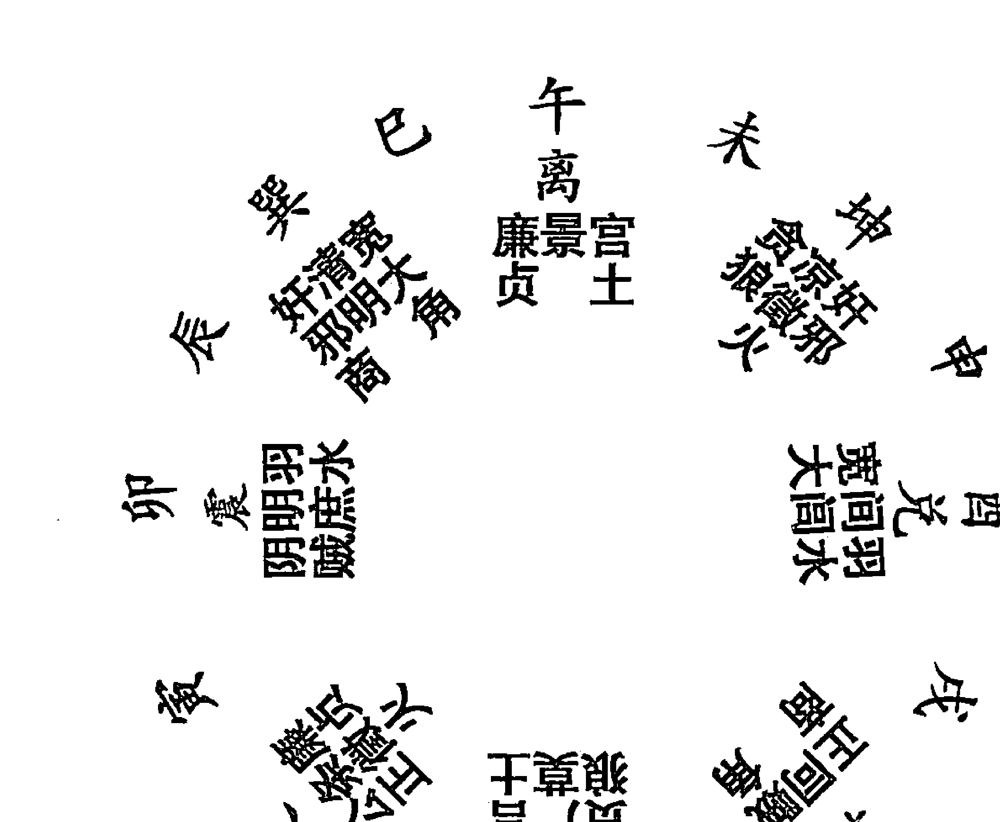

## 占风

《尔雅》曰：“风而雨土曰霾，阴而雨曰噎，日出而风为暴，回风曰飘，焚轮谓之颹，扶摇谓之颸。”宫曰风曰雨，徵三羽五止，商七角九始，得雨则解。

## 十二辰分五音

一宫子阳君，午阴后也。东方三徵。丑寅阳，吉事；未申阴，凶事也。南方五羽。卯阳物，四阴水也。北方七商。辰阳兵，戌阴贼也。西方九角。巳阳民，亥阴事也。

① 原注：疑当作柱。

## 六情

子申贪狼好，亥卯阴贼怒，寅午廉贞恶，巳酉宽大喜，辰未奸淫乐，丑戌公正哀。

## 五音风远近

- 宫十里，中百里，远千里。
- 商九里，中九十里，远九百里。
- 角八里，中八十里，远八百里。
- 徵七里，中七十里，远七百里。
- 羽六里，中六十里，远六百里。

凡风动，叶来十里，鸣条百里，摇枝二百里，落叶三百里，折小枝四百里，折大枝五百里，飞砂走石拔木五千里。

又一日夜者千里，二日夜者半天下，三日夜者通天下也。

又一日夜为县，二日夜为州，三日夜为郡，四、五日夜为国，六、七日夜为天下。

又大风一时以上，事及百里；三时事及五百里，六时事及千里。一日夜若折大枝，事及二千里；二日夜若拔大木，事及三千、五千里。

## 六情有五

本情，本日支也。合情，支合也。刑情，本日支刑也。冲情，支冲也。钩情，阳日支后三辰，阴日支前三辰。

凡六情日与方正用支辰断之。

五音以纳甲五行分五音之日。如甲子阳商贪狼，乙丑阴商，公正之类。

## 岁月日时方德刑墓杀例

阳干自处，甲德在甲是也。
阴干取合，乙德在庚是也。
支德以次顺行前五辰，子德在巳是也。
月干德，三合寅午戌月丙是也。

## 岁月日时杀

寅午戌在丑，巳酉丑在辰，申子辰在未，亥卯未在戌。

## 五墓

木墓在未，水墓在辰，火墓在戌，金墓在丑也。

## 三刑①

刑上刑下，自刑也。如子刑卯为下刑，午为上刑，酉亥为自刑。寅刑巳，巳刑申，申刑寅；丑刑戌，戌刑未，未刑丑，为三刑。子刑卯，卯刑子，为互刑。辰、午、酉、亥为自刑。此午为上刑之说，误。

## 风色

风为教始，来自四方。其政鸣条启坼，其化鼓舞飘颂。平则清和明净，政治则天气温凉。发屋折木者为怒，扬砂转石者为狂。其势分错交横，任小人而疏君子；其声啾唧惨凄，不疾疫而必大丧。憾憾蓬勃，大兵将至；炎炎恍惚，火旱为殃。大风横露兮白日沉沉，主上昏乱兮政教未明。触尘蓬勃者为悖乱，扶摇羊角者为飘风。凛冽而人怀战惧，刑戮暴急。猝起而南北靡定者，上下不宁。

## 主客法

凡日辰纳音为客，风所来之处为主。如甲子商为君，风从未申丑寅上来，为商动，徵火克金，主人胜。若从巳上来，受制于金，客胜。

又曰：纳音为客，加时为主。如丙寅日火音，时加卯酉，为徵动羽，羽水克徵火，主人胜。若加辰戌为徵动，商火克金，客胜。

又甲子金日，时加丑寅，为徵动商，火克金，主胜。风又从丑未上来，是二火一金，主大胜。又风从巳刑上来，客胜。从时刑上来，主胜。凡远者为客，近者为主。行者客，居者主。起者客，应者主。动者客，静者主。如两人相击，先举者客，后举者主。有气胜，无气败也。

## 奇门遁甲秘笈大全卷二十七

## 纳音分日例

| 甲子 | 甲午 | 壬申 | 壬寅 | 庚辰 | 庚戌 | 阳商 |
| 乙丑 | 乙未 | 癸卯 | 癸酉 | 辛巳 | 辛亥 | 阴商 |
| 丙寅 | 丙申 | 戊子 | 戊午 | 甲辰 | 甲戌 | 阳徵 |
| 丁卯 | 丁酉 | 己丑 | 己未 | 乙巳 | 乙亥 | 阴徵 |
| 戊辰 | 戊戌 | 庚寅 | 庚申 | 壬子 | 壬午 | 阳角 |
| 己巳 | 己亥 | 辛卯 | 辛酉 | 癸丑 | 癸未 | 阴角 |
| 庚子 | 庚午 | 戊寅 | 戊申 | 丙辰 | 丙戌 | 阳宫 |
| 辛丑 | 辛未 | 己卯 | 己酉 | 丁巳 | 丁亥 | 阴宫 |
| 甲寅 | 甲申 | 壬辰 | 壬戌 | 丙子 | 丙午 | 阳羽 |
| 乙卯 | 乙酉 | 癸巳 | 癸亥 | 丁丑 | 丁未 | 阴羽 |

## 十二辰五音所主

子阳宫，属土，主帝王。丑寅阳徵，属火，主旱，为宫寺、口舌。卯阳羽，属水，主雨雾。辰阳商，属金，主将军、吏士。巳阳角，属木，主疾病、忧患。午阴宫土，主女后。未申阴徵火，主庶人、土工，诰书、文檄、旱火、邮驿。酉阴羽水，主霜雪，雷电，阴沉，虹。戌阴商金，主小将，兵刃。亥阴角木，主死丧、哭泣。

凡宫为君，商为臣子、奴仆，角为民、为疾病、死丧。徵为事、为宗庙、鬼神。羽为物、为妻财、为境界。如子日、子方风为官动，主人君出行布令，风暴令急，风徐令喜。

## 五音风动占

宫日，风起子，山陵崩、君出、地动、旱、有土工；起午，旱、地震、后出。又时加子午，为重宫，君大夫走，风雨不调。从丑、寅、未、申起，为宫动徵，有火烛、土工，宝物出，有兵。时加徵为重徵，有义兵、诏令曰义。风从卯酉来，宫动羽，大雨、大臣走、旱。时加羽为重羽，即有赦、五谷成。从辰戌来，宫动商，有兵行。时加辰戌为重商，有兵殃。风从巳亥来，宫动角，主战、人主忧、客兵伤、有丧。时加巳亥为重角，君不昌。

徵日，阳宫风来，旱、火、土工起、宫寺灾。从阴宫起，太子疾。时加重徵，土工火灾。从阳徵来，君有恐、火灾、走兽人为害、宫寺焚、王相忧、大旱。从阴徵来，六畜多死。从阳商来，急兵，君自守七日、远七十日。从阴商来，有兵战。一曰从阳商来，臣强、大臣死、君殃，以日占国。从阳羽来，四邻有事、有宝玉、雷电、霜雹、臣候忧、多火灾、夷兵至。从阴羽来，宝出、雷电、夷有事。从阳角来，兵丧。从阴角来，边惊、兵火、春有丧。

羽日，风从阳宫来，财物聚、君有使令、边兵土工兴、将受命、有集会、雪雹。从阴宫来，冰雹寒，伤物、有土工。从阳徵来，有兵、有急令、臣有忧、关塞路阻。风从阴徵来，边臣忧羽事大丧。会寒雪雹，期五日。若五十日，大雨南方来，国忧人疾。风从北方来，贼聚水中。从阳羽来，日应。从阴羽来，夜应。从商来，兵围不战、边急关阻、大雨，军各不利。

商日，风从阳宫来，太子忌怨、人臣有急、兵主疾。从阴宫来，庶子忧、有急、变兵北起。风从徵来，兵围不战，且旱。时加重徵，大旱。从阳商来，白衣聚、关梁闭、大将死、出忌外邑兵、有小寇、兵在西，君有忧。从阳商来，有殃、粟贵、有兵，七日。若七十日，有急令。从阳角来，猝兵急令。从阴角来，丧土工。

角日，风从阳宫来，兵中起、君忧国、四闭。从阳宫来，贵人病、丧土工。从徵来，大臣灾、火虫生、谷贵。从羽来，土工兴、大雨、边兵、人多口舌、病夷相夺。从商来，有急兵。从阳角来，边兵起、人主忧、贼至、战多死亡。从阴角来，大丧。时加重角，兵战盗起、民饥、多死人。宫为君，以下皆为大臣、令长、庶官、小民当之，以日辰占国。

凡风起止日时方位，徵多为火，羽多为水，商多为兵、为粟贵，角多为疾，宫多为吉。鸣条落叶，扬尘吹砂，乃占岁君。月相日辰，占分期。以干支合数，宫为十数，徵为三十，羽五十，商七十，角九十。干支合数，如甲子十八数，乙丑十六数之类。又曰为令长，时为民。如德刑俱临，以风之吉凶占常，以正月二十日，五月、十一月十四日，候天门有云气，或苍黑赤白，皆为中外不通。
凡云气紫赤，如烟非烟，如云非云，郁郁纷纷，萧索轮囷，是必庆云，喜气也。云含五色，润泽和缓，见城上，为景云，太平之应。一曰卿云。大风将至，云如乱穰；大雨将至，云甚重浊。日入而青东西极，天无雨，则三年将有丧军。有丧则白气南北如阵，赤气如血，则血流。黑气如道，则有赦。云如龙行，则大水入流。赤气如人影，三月臣叛。云具五色不雨，下有隐贤。赤黄四塞，连日夜光芒照地，大臣纵恣。赤色覆日如血，大旱民饥。黑气变化更移，夷欺中国。云如疋布，东西南北，在邑上者，军有变。黑气如牛头，龙蛇变化，主病流亡，不宜新妇。亦为狄侵华。
凡战气赤云，如伞盖覆羊上千里，内战吉，外忧。赤云如狗入营，大战流血。赤云旋而不动，或如丹蛇，如覆舟，如耕袭，或白气如车入北斗中转移者，下流血将死。或云上白气如虹而交，或日旁有玦，五色白虹，皆战气也。凡出军之日，天气昏漠，云气阴沉，必战。若青阳温和，风尘不动，不见敌，亦不战也。

## 猛将气

凡气上与天连，下有名将。抱朴子曰：猛将之气，如火势，如弓张。或白如粉絮困仓，黑如山林竹木，或紫黑如门上楼，或上或下赤如旌旗，或气发渐渐如云而变作山形，或云气如蛟蛇形，或如龙、如虎在杀气中，或内白而赤气外绕，或中黑而赤气在前，或勃勃然如火烟之状，皆为悍猛谋深，不可当。在我军上，可速战。

## 伏兵气

凡两军相当，前后左右有赤气，即有伏兵。云纷纷绵绵而相继者，车骑伏也。如布席蒿草者，步兵伏也。白气纷纷如楼上状，万人伏也。军上黑气浑浑，而赤气在中，或如乌云之赤杵，或赤云中之鸟，人在乌气内，或如幢节在乌云中，或如山岳之在外，或前黑而白云在后，皆伏兵气也。

## 阴谋气

凡白气群行，或如群羊徘徊，结阵而来；或日月濛濛无光，士卒内乱，反兵内发。或黑如幢节而出于营，必有诈谋。或黑如车轮临我阵，必有乱臣，谋与贼通。昼阴夜月出，君谋臣；夜阴昼日出，臣谋君。或昼夜阴沉，或连阴十日，不见日月而风乱起，君臣奸谋，亦是两国相图。黑气流行，五含五色，临我阵上，则敌与臣谋，自败死。

凡敌兵暴至，必有赤云赫赫然及壬子独见。或赤若旌旗，或独见赤云，如虹、如狗、如覆船，及天上白云气如布疋，经于丑未，或广六、七丈，东西亘天，天下兵起。赤者尤甚，青有大丧。又白如瓜蔓，如仙人衣，千万载结，罢而反兴，至八九丈，连而不断，千里兵至。或赤虹如狗，四枚相聚，如人行不绝，或如艾虎，或上有云，下有雾蟱，中天而下入我军，或黑云从敌来覆我军，有云如人而赤临城邑，而四望无云，独见云极天半起，或如胡人列阵，或如执楯、如赤杵、如火云，如人持节之势，或如旌旗之伸，皆主敌兵暴来袭我也。

阵前色黑，有阴谋。色青，兵叛。色赤，兵饥。色黄，急去之，勿击。

## 军胜气

军胜之气，前赤后白，云如旌旗，扬挥指敌。或气如堤阪，前后摩地。或如日月晕状光芒，如飞鸟来而高。或赤白相随，如斗鸡在云雾中，或如三疋帛，前广后大，或如一疋帛，皆不可胜。

又如五头马低尾仰，又赤如鸟在气中，如赤杵在乌云中，如人在乌气中，如人持斧向之，如蛇举首向之，如人牵牛、如覆舟、如小堤、如山林木、如乳虎伏豹、如粉如楼而赤绕之，或赤黄连之，大如华盖独立，或五色云气如引丝，或如阵前铳，皆盛气也。

## 败气

营上气囚废枯散，或如马肝，如死灰，如败车不起，如系牛，如败屋，皆败气也。或盖道蔽濛昼暝，饭不及食，炊不及熟，即急去之。或黑如壞山堕军垒，营头星也。或白云如群鸟起，趋入屯营，结连百里不绝，须臾不见，主他国来降。气如群鸟乱飞，如霞如尘、如烟燔生草，前锐后败。如枯蓬转者，急击之。
云如偃盖，如偃鱼，临于军上，如群羊群猪在气中，在十里以外，望念军上气多，而前白后青，或如鸡兔临营上，如马在气中，渐渐入营，如双蛇委曲，如群鹿惊奔，或赤光从天流下，如气发连夜照人，或如卷席、如灰，如人卧，无手无足，如飞鸟乱飞，如覆船车盖，如败提，如雾始起，聚散出没。如人十十五五，拍手相向；又气出而半绝将败，气渐尽将走，皆败走逃奔之象。

城有不可攻者，凡青黄云气临城，若白云从城中南北出，或白气中出而青气北入，往返回还。若赤气如杵向外有黑云如星出，曰星精。若日晕有青赤气从中四出，若濛气绕城而不入，若城上白气如旌旗形状，云若赤絮。若青云入，如牛头触于人。若气如烟火，若中出而入我军，若如双蛇，若云分两彗。若云克日，如甲乙平旦有白云，丙丁日有黑云等。若围城雷雨过旬，又城上气满人不见，皆为不可攻。

城有不可克者，凡赤气在城上，而黄气四面绕之，将死城降。城中气聚如楼，而出见于外，又赤虹从外入，三日可屠。日重晕而白虹贯之，及濛雾入城，白气绕而入，从所入攻之。赤黑气如狐狸皮经，及正赤或如雄雌临城，或赤气如众人头，如飞鸟，如败车，气出向东南者，不可攻。气向西北，或云如立人五、如三牛，如白蛇指城，或青气，及气上赤下白，及日无光明，日内风至，必克。城中气出复人者，人欲逃。凡两军相当之气，以我西贼东为例。西厚东薄，西长东短，西高东下，西泽东枯，我军胜，反之败。气聚则军安，气散则军乱，气南军亦南，气北军亦北。对敌有云来甚卑，荫覆人上，掩沟道，大贼将至。云如蛟龙者，胜气也。如兔雉者亡。甲乙日东方青气，盛气也。黄气，死气也。初出军，赤气相随日出，君有忧；随日没，外告急，收兵勿行。

> >京房曰：“赤气游行，黑气随之。赤气灭，贼可得。有赤无黑，贼不可得。凡被围，视围上气，郁郁如火，光芒蓊翕然，有救至。初出军，云随后来，随而击之，胜。逆者，急宜屯兵固守。”

## 五音风

宫声风，隆隆然如雷鼓，如牛羊鸣窑中，发屋折木，主土动，君心烦，急令，贵神辅相疑忌，兵起，不安。其日风从宫来，山摧岸崩，君出地裂。风从角，蝗虫败谷。从商来，大水暴风。风从徵来，蛊狼为害。从羽来，大雨阳寒，大臣凶。

商声风，如离群羊，如扣钟磬，如飞羽集，如呜咽流水，呜声惑人，发屋折木，主宫中兵起，闻兵急令，关梁不通，糴贵。其日风从商来，白衣聚，关梁塞，大将退，外兵人。从角来，国有丧，兵行。从宫来，国有忧，将在外，兵不战。从徵来，君令行兵，主凶。从羽来，大雨至，在外兵解。

角声风，如千人合声呼啸，或阗阗然如千人喝，令人悲哀。如啾啾鸣雉，登木，发屋折木，有急兵斗入城邑。风从商来，有暴兵，军令，宫中贵人疾，土工兴。从羽来，野饥人泣。从徵来，丝贵，有火燔。从宫来，不祥。从角来，不吉。

徵音风，如奔马火炎，如缚彘声，发屋折木，火灾、妖害、急事、兵行。其日风从徵来，火起、君忧。从角来，火灾、土工、大旱。从宫来，丧泣、寺舍火灾。从商来，有斗兵。从羽来，宝物出，国多雷震，有使令。

羽音风，如击湿鼓，如麏鸣子，如水扬波，激气相磕，发屋折木，兵起，糴贵。其日风从羽来，雨雹、霜灾。从商来，兵斗、将忧。从宫来，暴风大雨、寒气伤物。从徵来，臣民有忧。从羽来，城围不去。

## 奇门遁甲秘笈大全卷二十八

## 六丁六甲神符例用

> 郁离子曰：“大法军中急用符法者，乃时门不利，故六丁之符以禳之。但当用咒，掌噀画雷印铃甲方，方能应验，此例极神系九天玄女传授军中六丁六甲神符。”

### 第一甲子符

右甲子神君，号曰“飞天大帝”，又名“蚕霆将军”。其神鼠首人身，高一丈九尺。居阳光天垒之宫，统领神将九万九千九百，助有忠孝，怒杀不仁不义，九天青黑下。符式长一尺九寸，阔三寸一分，用青黑纸，朽研砂为上吉。

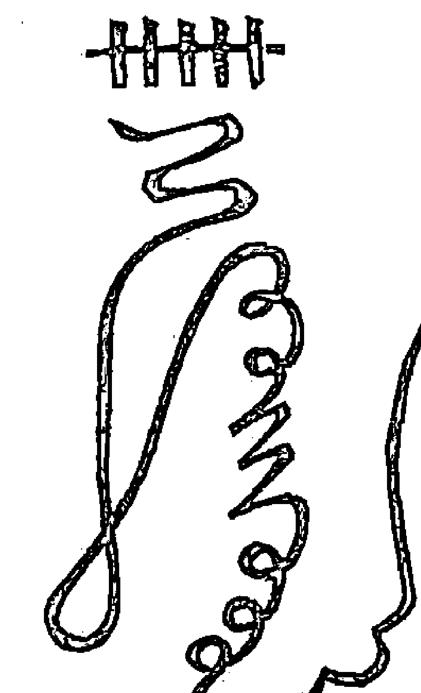

| 魁 | 魁 |
|---|---|
| 魁 | 魁 |

### 第二甲戌符

右甲戌神君，号曰“掩郎”，又名“司狱将军”。其神犬首人身女相，其性好酒。居西隳天厩之宫，统领神兵五万五千五百五十，喜助正将，诛斩贼兵，身长一丈六尺，纶绾九天青黄下。符式长一尺六寸，阔二寸九分，用大黄纸，朽研砂红为上吉。

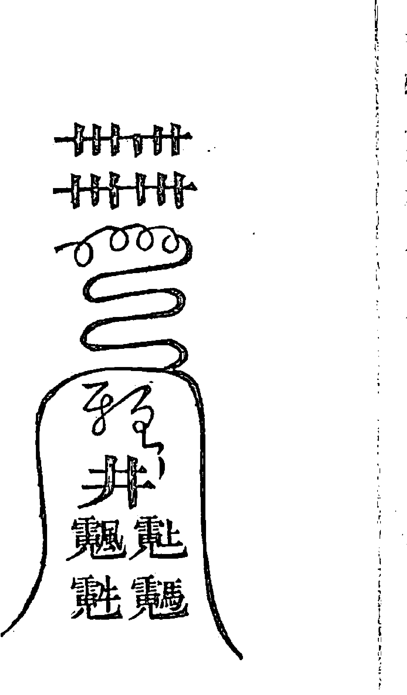

### 第三甲申符

右甲申神君，号曰“六府神”，又名“捷报将军”。其神猴首人身，长二丈五寸，性甘食好淫。居天钺之宫，统领神兵七万七千七百七十数，喜助顺击逆，纶绾九天青白下，符式长一尺五寸，阔二寸七分，用白纸，朽研砂为上吉。

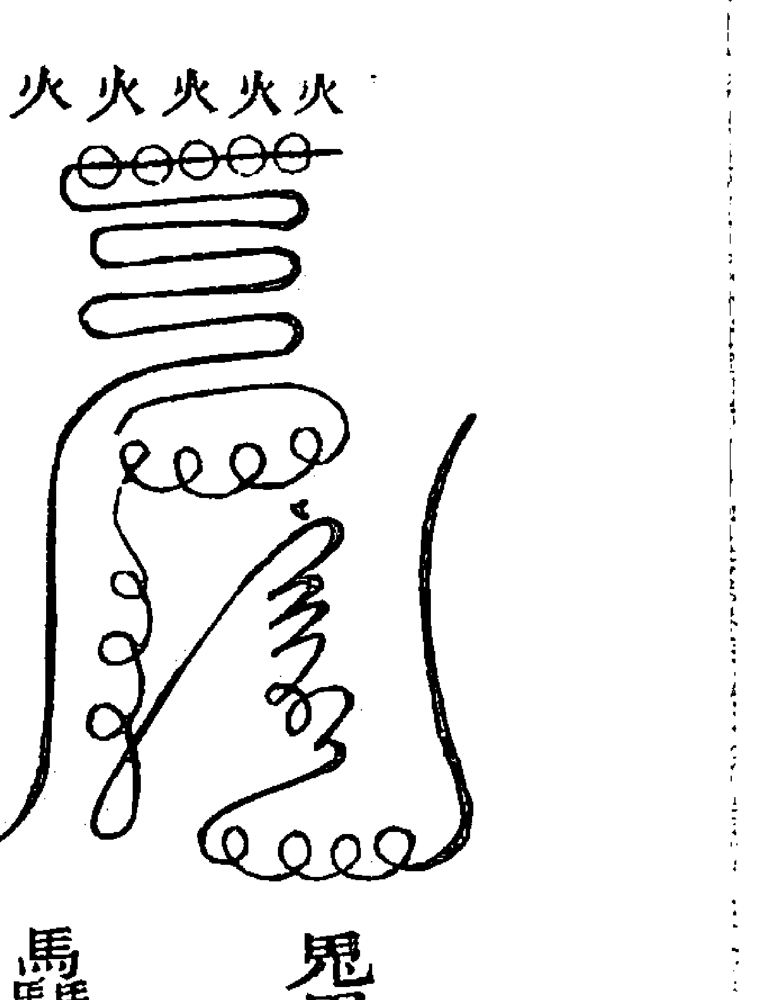

### 第四甲午符

右甲午神君，号曰“平水将军”。其神马首人身，高一丈九尺，性最烈，不宜速召，好肥大尤物，忌用马肉供养。统领神兵九万九千九百九十数，喜助报仇，纥绾青红下。符式长一尺九寸，阔三寸二分，用青红纸，朽研黑丹砂为上吉。

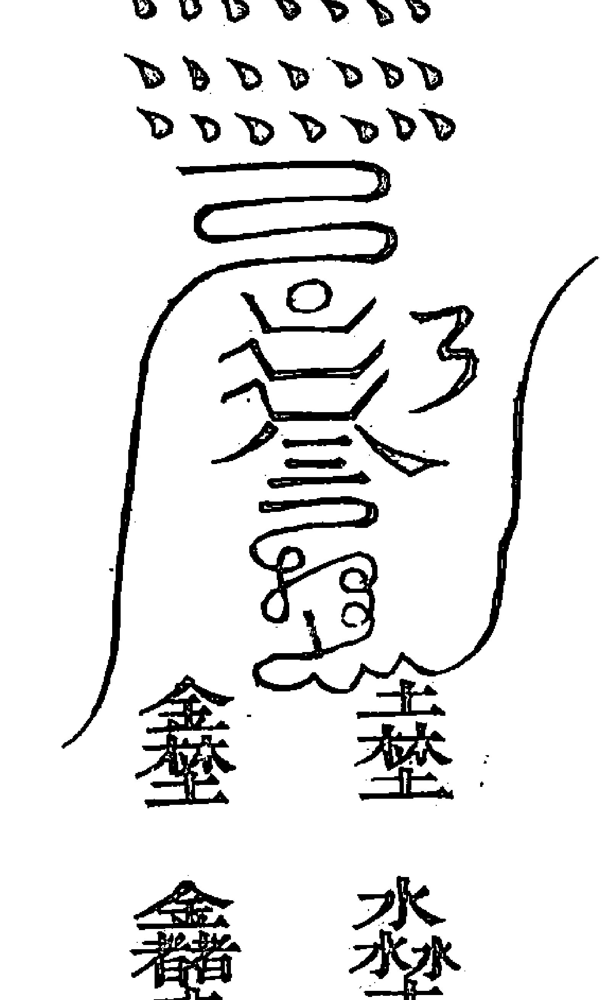

### 第五甲辰符

右甲辰神君，号曰“平蛮将军”。其神龙首人身，高一丈九尺，性清高，可顺不可逆。喜东南方，辅助真人，扫荡妖气，统领神兵五万五千五百五十数，纥绾青黄下。符式长一尺九寸，阔三寸九分，用青黄纸，朽研红硃为上吉。

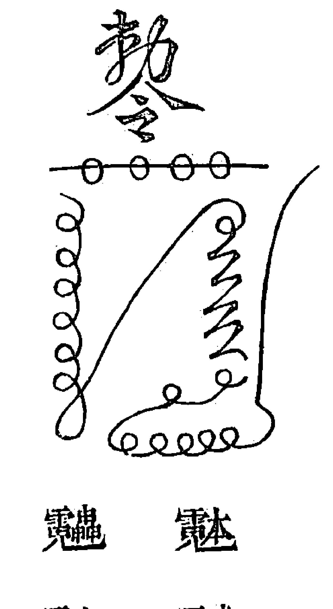

### 第六甲寅符

右甲寅神君，号曰“六孽将军”，又名“灌佳郎”。其神虎首人身，高一丈有奇，性最躁，不可轻，扶强抑弱，党正害邪。神居天苑之位，常游六吉之宫，统领神将七万七千七百七十数，纶缁青黑下。符式长一尺八寸，阔二寸七分，用青黑纸，朽研红硃为上吉。

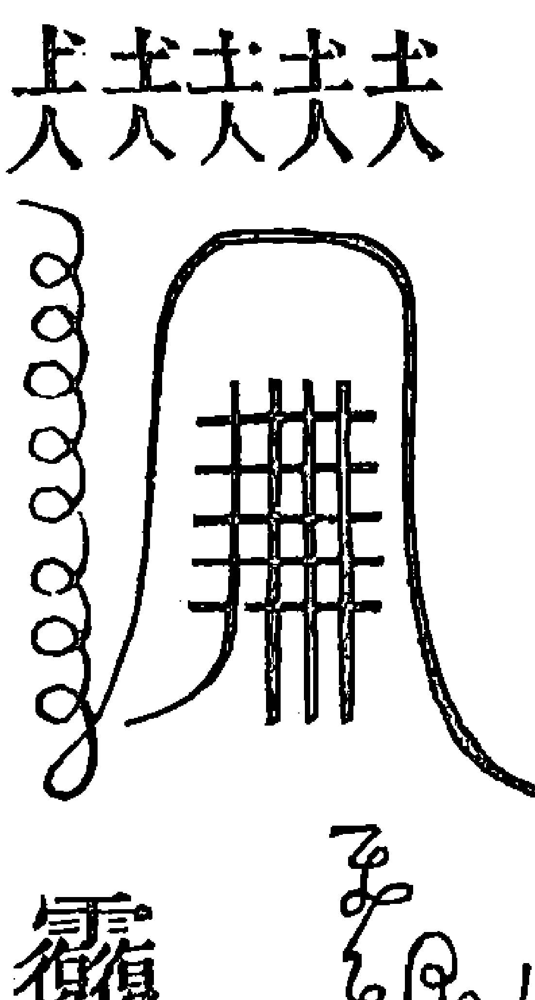

右画六甲神符，用剑诀，以左手大指在天罡，捧剑跌坐，默念六甲神咒七遍，吸东方一口气，吹人神笔，一气呵成。用天池水一瓶，将符焚在瓶中，压不利之门，化凶为吉。咒曰：“吾呼六君元阳甲子神，急来速去，愿君证吾身，魑魅魍魉魈魃魃，吾奉太上老君急急如律令！”

### 第一丁卯符

右丁卯神君，号曰“六将军”。其神兔首人身，性最柔和，高一丈六尺。司九天雷火之权，统领神兵六万六千六百六十数，驱邪斩鬼，辅佐真人，钤锡青赤下。符式长一尺六寸，阔三寸三分，用红青纸，朽红硃为上吉。

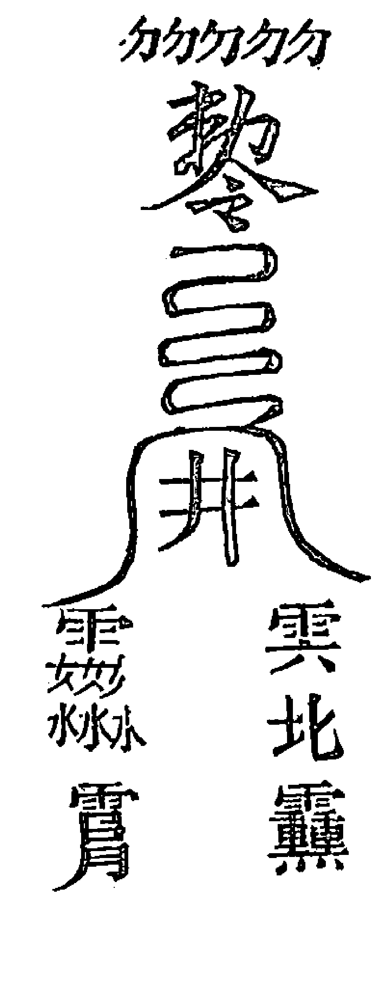

### 第二丁丑符

右丁丑神君，号曰“突将军”，牛首人身，性好香物，高一丈八尺。居天汉之宫，司水利之权，好水战，统领神兵八万八千八百八十数，斩诛贼兵，钤锡赤黄下。符式长一尺八寸，阔五寸三分，用黄纸，朽研硃为上吉。

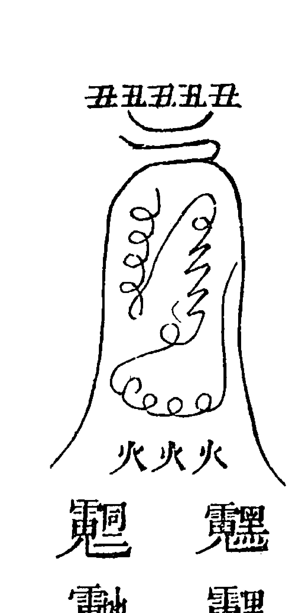

### 第三丁亥符

右丁亥神君，号曰“涂将军”。其神猪首人身，性好米食饮酒，宜宽请，不可急召，身高一丈四尺。镇天皇之宫，喜辅顺诛逆，统领神兵四万四千四百四十数，钤锡赤黄下。符式长一尺四寸，阔二寸九分，用墨纸，朽研红硃为上吉。

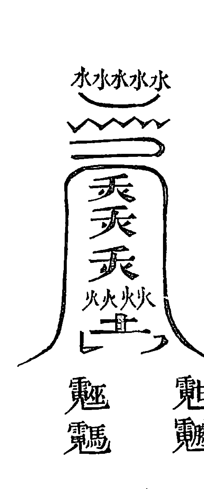

### 第四丁酉符

右丁酉神君，号曰“飞将军”。其神鸡首人身，性最恶，不可犯，喜食酒肉，好陆战，忌水战，身一丈六尺。居少微之宫，统领神兵六万六千六百六十数，劫寨破垒，斩将搴旗，追奔逐北，铃锡赤白下。符式长一尺六寸，阔三寸一分，用赤纸，朽研硃为上吉。

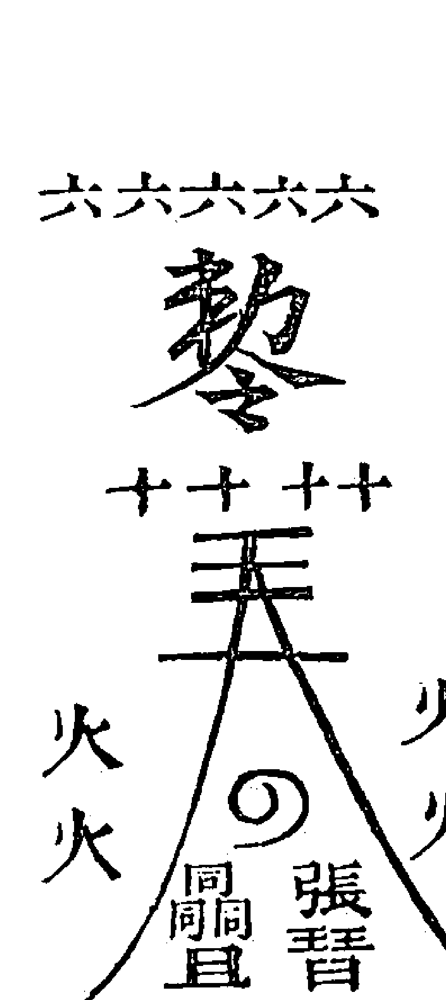

### 第五丁未符

右丁未神君，号曰“祇将军”。① 其神羊首人身，喜食菓品蔬菜之物，好烈口，忌阴雨，身高一丈八尺。居镇南极之宫，统领神兵八万八千八百八十数，冲虏破阵，敌不能御，铃锡赤下。符式长一尺八寸，阔三寸一分，用赤黄纸，朽研硃为上吉。

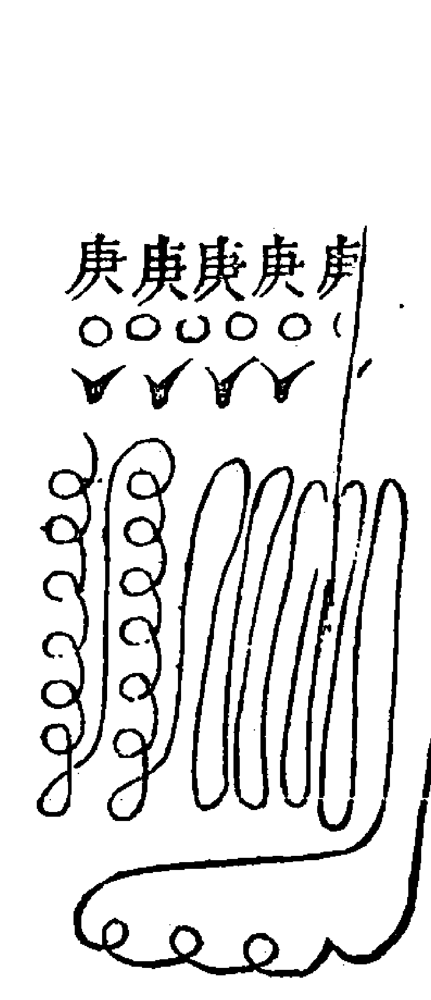

奇门遁甲秘笈大全卷二十八

二三二

### 第六丁已符

右丁巳神君，号曰“陈将军”。蛇首人身，性最毒，不可轻用，喜食六畜之物，不忌水陆，高一丈四尺九寸。镇守天屏之宫，统领神兵四万四千四百四十数，复城陷阵，变化无穷，铃锡红赤下。符式长一尺四寸九分，阔二寸九分，用红纸，朽研黑丹为上吉。

右画六丁符，用斗诀，以左手大指在天魁，步斗而坐，默念六丁神咒七遍，吸南方一口气，吹入神笔，一气呵成，坐法如前。咒曰：“六丁神兵，八卦之精。推例神将，安在吾身。闻咒速至，百事通灵。无事不报，不得动令。吾奉九天玄女急急如律令！”

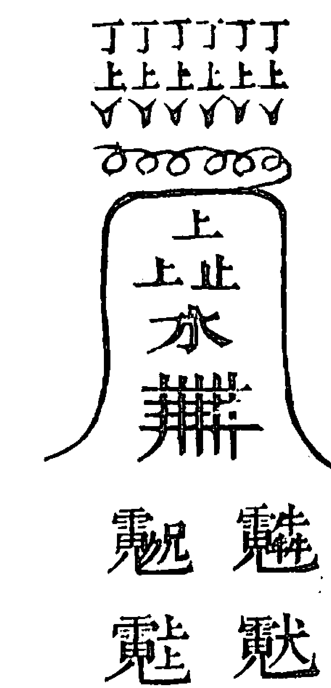

## 天罡步斗法

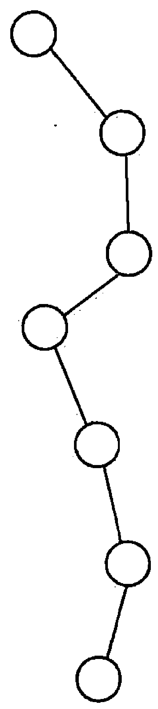

贼兵自乱，逢贼诛斩。烧动寇营，隐藏吾兵。运吾白气，蚩尤七星。天罡大圣，助我破军。倘动贼营，破迸逃奔。急急如律令！

## 奇门遁甲秘笈大全卷二十九

## 阳遁九局

冬至惊蛰一七四，小寒二八五同推。春分大寒三九六，立春八五二相随。
谷雨小满五二八，雨水九六三为期。清明立夏四一七，芒种六三九为宜。
十二节气时候定，上中下分是根基。

## 阴遁九局

夏至白露九三六，小暑八二五之间。大暑秋分七一四，立秋二五八循环。
霜降小雪五八二，大雪四七一相关。处暑排来一四七，立冬寒露六九三。
此是阴遁起例法，节气推移仔细看。

## 黄石公奇门七十二局军中应验神符经

一局：乙奇同辅星临休门，号曰“飞龙在天”。主将军得地千里，利西方进兵扎营，出门有二鸟齐鸣，成奇勋也。死门天芮皆是稍有气，赵魏家长值墓。
阳五局甲己日乙亥时，但无九地之神，俟查。
阳三局乙庚日丙戌时，但无元武之神。
阴三局丙辛日戊子时。
阳三局甲己日乙亥时，有天辅。

二局：乙奇同九天、柱星临生门，号曰“青云得路”。出军主大胜，得首级五千、地百里，出门有老妪道左相逢。军行五百里，有壶浆来迎，吉。

三局：乙奇同任星、太阴临伤门，号曰“太阴当权”。主大将出阵得胜，有获辎重粮饷之类。军行坎宫五百里，有云铺顶，西方有鼓乐，大利。

四局：乙奇同值符、英星临杜门，号曰“霹雳雷空”。宜副将出军，正将坐营，得地四十里、首级五千余。军行宜兑宫，出门有道人相逢。本营有旗折，大利。
阳六局丙辛日乙未时。

阴二局乙庚日乙酉时。

五局：乙奇同六合临景门，号曰“天马驰星”。军行宜出兑宫，巽宫坐营，有异人献策，得军马于京，出门有大风，行至五百里，大雨骤至，吉。

阳八局戊癸日乙卯时，是否天柱星，应查。

阴一局戊癸日乙卯时，同局又是天芮。

六局：乙奇同白虎、心星临死门，号曰“五虎临门”。宜出巳宫，坐午宫，正将大胜，得城池、首级、车马、财帛。军行出门，有紫色云气；行三里，有黄伞人至，大吉。

七局：乙奇同太阴、禽星临惊门，号曰“月出天衢”。军行宜出乾宫，坐营巳宫，攻城利西北，夺地利东南。出门有三人飞马报献消息，有鹦鸣，大利。

八局：乙奇同九天、天辅星临开门，号曰“太阴得令”。至于天子，御驾亲征，判伏四夷，剿除不法。

阴三局甲己日乙丑时。

九局：乙奇同柱星、值符临休门，号曰“白虎扬威”。宜劫人营寨、夺人粮草，大胜。宜坎宫出阵，巽宫坐营，主将有功。出门三里有青雀飞噪，途中遇火起，大吉。

阳三局丁壬日乙巳时。

阴八局甲己日乙亥时。

不利攻城。若在大寒节，乃利攻城。军行出门有五彩人至，大利。

阳三局甲己日乙亥时。

十八局：乙奇同太阴、冲星临生门，号曰“白露横江”。宜出坎宫或午宫，用符水噀之，利水战，可得首级二千、舟车数百。出门有白鱼入舟，大利。

十九局：乙奇同六合、禽星临伤门，号曰“风散百花”。不宜出师，不利主将，有折兵覆舟之厄。军行出门遇西风，有恶风，不利行师。若事急不得已，当出巽宫，先书六甲符，噀之、烧之，可免凶煞。

阴四局戊癸日乙卯时。

二十局：乙奇同辅星、白虎临杜门，号曰“虎啸生风”。军行宜出寅宫，坐巳宫，利陆战。五十里，地有伏兵，宜退不宜进。出行有瞽目至，主小利。

二十一局：乙奇同九天、任星临景门，号曰“飞蛾投火”，不利。守城宜死战。守城破敌则可，若敌人有反间之计，不可从。出门有白犬当路，不利。

二十二局：乙奇同朱雀、柱星临死门，号曰“尸横遍野”。不宜出师，宜固守营垒。谨防西、北二方有贼劫营，在午时不利。

阳遁朱雀，即阴遁元武。

阴六局乙庚日乙酉时。

二十三局：乙奇同螣蛇、任星临惊门，号曰“昆虫变化”。宜出西方，水陆俱利，城池可破，大将可擒。出门有白云当空，行三里天有微雨，大利。

二十四局：乙奇同任星、值符临开门，号曰“天门大开”。大将出师，得城池、首级数百。军行宜从坎宫，主闻鼓乐声，有野人献策，大利。

阳八局甲己日乙丑时。

阴四局戊癸日乙卯时。

阴七局戊癸日乙卯时。

二十五局：丙奇同六合、芮星临休门，号曰“五星聚会”。大将出师，宜出坤宫，坐巽宫，得首级五千，又得一名大将，知天文地理，可招服之。大将出师遇大雪，春遇微雨。有狗二只，从西方来。

阴九局丁壬日丙午时。

衣色服自西方来，大利。

阳八局丙辛日丙申时。

二十九局：丙奇同勾陈、蓬星临景门，号曰“鱼龙变化”。主将出师，单骑破虏，获首级数千。宜坤宫坐营。军行出门遇仙风道人，大利。

阳遁勾陈，阴遁白虎。

阴八局丙辛日丁酉时。

三十局：丙奇同勾陈、英星临死门，遇午、未时，号曰“宝镜重磨”。大将出师，先败后胜，得地五千里。宜震宫出门，遇黄衣道人骑白马至，大利。

阳二局丙辛日丙申时。

阴二局丙辛日，戊戌时、己亥时皆同。

三十一局：丙奇同太阴临惊门，号曰“蛇入龙巢”。主将出师，可直入人城池，得金宝数万。军行出门，西方有鼓声，白云射斗牛，黄云盖顶，大利。

阳九局戊癸日丙辰时，但遗漏星名。是否天柱临宫，俟查。

三十二局：丙奇同九天、六合临开门，号曰“鸿鹄冲天”。主大将出师大胜，可夺人土地，斩将搴旗。军中有员归营。出门东南有红霓射天市垣，大利。

阴五局丁壬日丙午时，九天重出，是否遗漏天柱，俟查。

三十三局：丙奇同螣蛇、芮星临休门，遇壬子日，号曰“天罡择地”。主将先凶后吉，有弓矢之伤。至吉时得胜，可得土地，杀人盈野。军行出门三里，主阴雨微微，大吉。

三十四局：丙奇同九地、任星临生门，号曰“蛇入燕巢”。不可出军，有敌人伏兵入营内，伤副将。军行三里，西方有鼓声，主军中有火起，不利。

三十五局：丙奇同六合、辅星临伤门，号曰“天门大开”。大将从震宫出，可缚敌首，有擒王斩将之功。军行有黑云气起震宫，大利。

三十六局：丙奇同六合、任星临杜门，遇庚申日，号曰“枯木逢春”。主战阵已败之兵，复整出阵，竟成大利。军行出门三里，有鸦鸣之声飞过，大吉。

三十七局：丙奇同九天、芮星临景门，号曰“蛟龙失水”。主出师不利，折车马、损辎重。若事急宜向兑宫出，以符水解之，亦可半吉。军行出门遇烈日，行至十里有鼓声，大吉。

三十八局：丙奇同朱雀、辅星临死门，号曰“天冲临阵”。出师宜从震方，主敌人退三舍，得首级四十，获大将一员。出门西北有巨雷声二十里，大利。

三十九局：丙奇同值符、芮星临惊门，遇卯未日时，号曰“风云聚会”。主大将出师，弃西北，出东南，伏兵能得首级五百。军行出门三里，有野雉飞来，大吉。

阳二局甲己日丙寅时。

阴二局乙庚日丙子时。

四十局：丙奇同九天、芮星临开门，号曰“群羊搏虎”。遇辰戌日时，出兵大败，折马卒三千，不宜战。军行遇虎，不利。

四十一局：丙奇、太阴、蓬星临休门，号曰“天日照临”。主出兵得胜，吉。缚大将一员，得地三十里，城池可破。军行宜从艮宫出，坐坤宫。行至五百里有大风，十里有大雨。

阳三局戊癸日丙辰时。

阴八局日时皆同。

四十二局：丙奇同六合、冲星临生门，号曰“秋风四起”。军行宜在艮宫出，坐在兑宫，四路伏兵，破败敌五百骑，俱不利水战。军行出门，有一人献舆图，大利。

四十三局：丙奇同朱雀临伤门，遇午未日，号曰“河魁夺魄”。主将宜出离宫，坐坎宫，利水战，可夺舟楫。军行出门西方有火起，大利。

阳一局乙庚日丙子时是否任星，应查。丙戌日时亦同，又是天英。

四十四局：丙奇同九地、心星临杜门，遇申子日，号曰“天乙司衡”。军行宜出兑宫，坐震宫，可得地五千里。出门有黄衣人自南方来报敌消息，大利。

四十五局：丙奇同太阴、英星临景门，号曰“火焚昆冈”。主大将出师，百里破寨，斩首级七百。出门遇黄衣人自西来，大吉。

阳二局癸酉日丙辰时。

阴七局戊癸日丙辰时。

四十六局：丙奇同六合、柱星临死门，遇卯未日时，号曰“天河转运”。出师不利，主伤士卒、车马。军行出师，有微雨。行至三百里，有群鸟向北飞来，不利。

四十七局：丙奇同朱雀、任星临惊门，号曰“太乙得令”。军行出门，可得城池，战必胜，攻必取。若在惊蛰时节，军行有黄云从巽宫起，大吉。

四十八局：丙奇同勾陈、心星临开门，在雨水前，号曰“河魁直时”。利水战，可缚敌首。军行遇西方有鼓乐声来，大吉。

阳八局丙辛日丁酉时。

阴四局日时格局亦同。

阳一局丙辛日甲午时。

四十九局：丁奇同值符、任星临休门，遇丑未日时，号曰“雨霁沧江”。出师宜出坎宫，坐坤宫，可夺寨焚粮、用计伏兵，大胜。军行三里有微雨，遇西风，大利。

阳七局乙庚日丁丑时。

阴四局戊癸日丁巳时。

五十局：丁奇同太阴、禽星临生门，号曰“胜光争位”。出师不利，主大将有灾，士卒多厄。军中宜退不宜进。军行出门遇有北风大起，不利。

阳八局丁壬日乙巳时。

五十一局：丁奇同六合、任星临伤门，号曰“群鸡化凤”。主将宜出震宫坐离宫，可破敌五百骑，遇午未时更胜。军行有老人携子来见，大吉。

五十二局：丁奇同朱雀临杜门，遇寅卯日时，号曰“火炼金丹”。主大将出师，从兑上出，先凶后吉。军行出门遇妇人抱子来，见群鸦飞噪，大吉。

阳四局甲己日丁卯时，但遗漏星名，是否天蓬临宫，当须查考。
阴四局亦同格局，又是天柱名，俟查。
阳二局丙辛日戊子时，与阴四局同。

五十三局：丁奇同勾陈、禽星临景门，号曰“鼠落糠盘”。出师先胜后败，不成大功。军出门见西方有火起，不利。

五十四局：丁奇同九天、英星临死门，遇子午日时，号曰“孤舟渡江”。主大将出军，宜出坎宫，东方坐营，可斩大将三员，首级三千。天子出师，可服万国。出兵南方，有五色云见，大吉。

五十五局：丁奇同六合、心星临惊门，号曰“太岁坐宫”。宜出大兵，八方皆利，可得土地数千里，敌兵尽扫。军出南方有大风起，白云见顶，大吉。

五十六局：丁奇同值符、辅星临开门，号曰“豹变南山”。主将出师大胜，军出宜出巳宫，坐营震宫，出门有二小儿从北来见，大吉。

阳三局乙庚日丁丑时。
阴九局戊癸日丁巳时。

五十七局：丁奇同太阴、蓬星临休门，遇丑未日时，号曰“雷震百里”。大将出师，大利。宜出震宫，得地二百里，斩首级五百。出门遇妇人着红衣自西方来，大吉。

阳七局丁丑日丙戌时。
阴三局同。

五十八局：丁奇同六合、辅星临生门，号曰“六合临阵”。主大将出师大胜。军出离宫，坐震宫，直击敌首，莫攻敌尾。出门有鸡鸣，大吉。

五十九局：丁奇同前。

六十局：丁奇同六合、心星临杜门，号曰“玉女反面”。主大将出师不利。出军宜巽宫坐营，稍吉。军出门行五里遇微雨风，至十里有敌来战，不利。

阴三局丁壬日庚子时。

六十一局：丁奇同朱雀、任星临景门，号曰“六丁冲阵”。出军宜向西方坐营，有敌伏在北方，可得地三处。出门空中有五色云见，行至三里遇群猪，大利。

六十二局：丁奇同太阴、任星临死门，号曰“金刚扫地”。出师宜向南，又宜坐震宫，主初凶后吉，可得首级五千。军出门遇术士献策，大利。

六十三局：丁奇同九天、辅星临惊门，号曰“河洛呈祥”。宜南方出军，东方坐营。若攻城亦宜向震宫，三日奏捷。军出门三里，见瑞气从东南方来，大吉。

六十四局：丁奇同九天、禽星临开门，号曰“太白垂光”。出师得胜，多获金宝。军行宜出震宫，坐乾宫。行五里有鹊鸣，二百里人获器物，大利。

六十五局：丁奇同蓬星临休门，遇辰戌日，号曰“荧惑生光”。宜离宫出军，坎宫坐营，宜用火攻，可破敌都邑，俘获上将。出门见黄衣人自北来，不利。

六十六局：丁奇同值符、辅星临生门，号曰“罗猴过渡”。出师宜坎宫，坐营坤宫，主破敌三十骑，得地百里，斩首级三千。军出遇大风一阵，即大利。

六十七局：丁奇同朱雀、心星临伤门，号曰“月孛当空”。出师不利。事急不得已，宜以鬼掌符水噀北方方可。出行三里，有跛足人自西北来报，大利。

六十八局：丁奇同勾陈、禽星临杜门，号曰“月德临门”。宜副将出阵，可得地五千里。宜兑宫坐营，出军东方，向西而行。有雷砲声应，大吉。

六十九局：丁奇同九天、天任星临景门，号曰“天德照门”。利副将出师。军行五里遇伏兵，不可战。行二里东方有火光，不利。

七十局：丁奇同九地、柱星临死门，号曰“阴阳不交”。主大将出师，有弓矢之灾。军出不宜北方，利由南方，坐营艮宫，其灾可免。行三里有公差骑马，大利。

七十一局：丁奇同九天、任星临惊门，号曰“三台得位”。出师大胜。宜艮宫出军，坎宫立营，可得车千乘、地千里。出门有微雨，大吉。

七十二局：丁奇同勾陈、辅星临开门，号曰“瑞生九鼎”。主出师大胜，四方皆利，得城池、土地，并得上将首级。军行三里，有白云自西北方来，东方风起，大利。

## 奇门遁甲秘笈大全卷三十

## 奇门地盘图

此阳遁一局，先以左边掌诀，甲子戊起一坎，顺飞六仪，逆布三奇，即知某为值符，某为值使矣。诸照此而推之。其图如左：

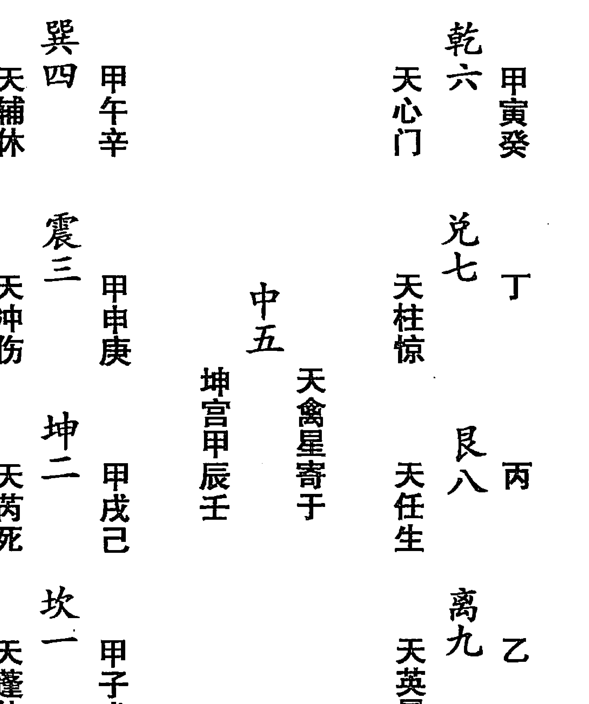

## 二十四胎藏图

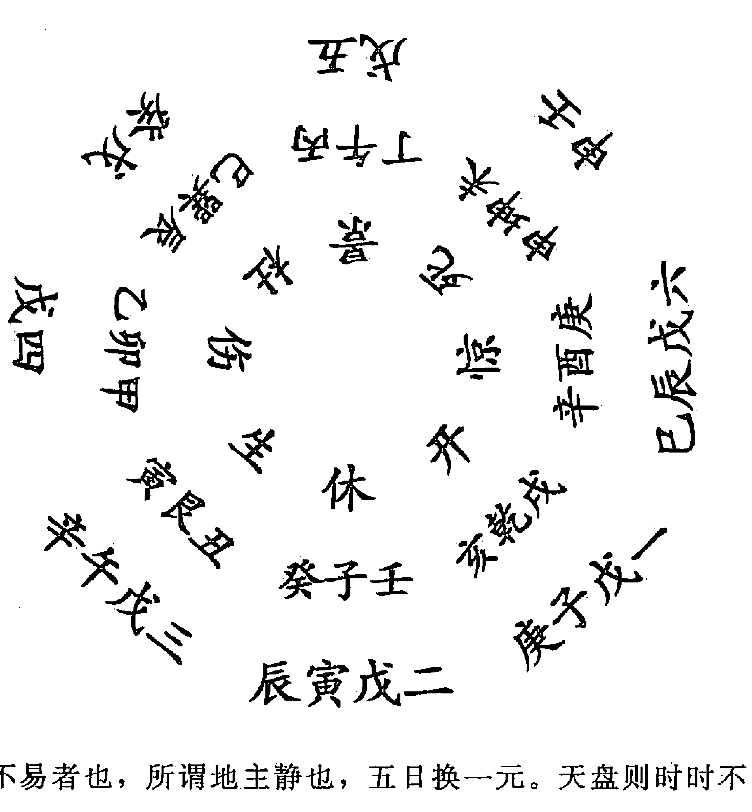

此地盘一定不易者也，所谓地主静也，五日换一元。天盘则时时不同，所谓天主动也。如乙丑时，则以休门加天盘坤为值使，以值符天蓬星甲子戊加离九为值符。诸照此例。

歌曰：“戊子乾宫亥为庚，戊寅坎艮丑乎辰。戊午生门同甲卯，四宫戊戌二九申。上有戊辰庚酉辛，一飞盘过一回新。二十四方方上起，门从方上定金鸣。所泊若差时一位，就将方位东方神。此是九星真秘诀，消凶纳吉万全亨。”

### 三十六宫玉女出幽入神九九八十一近全图

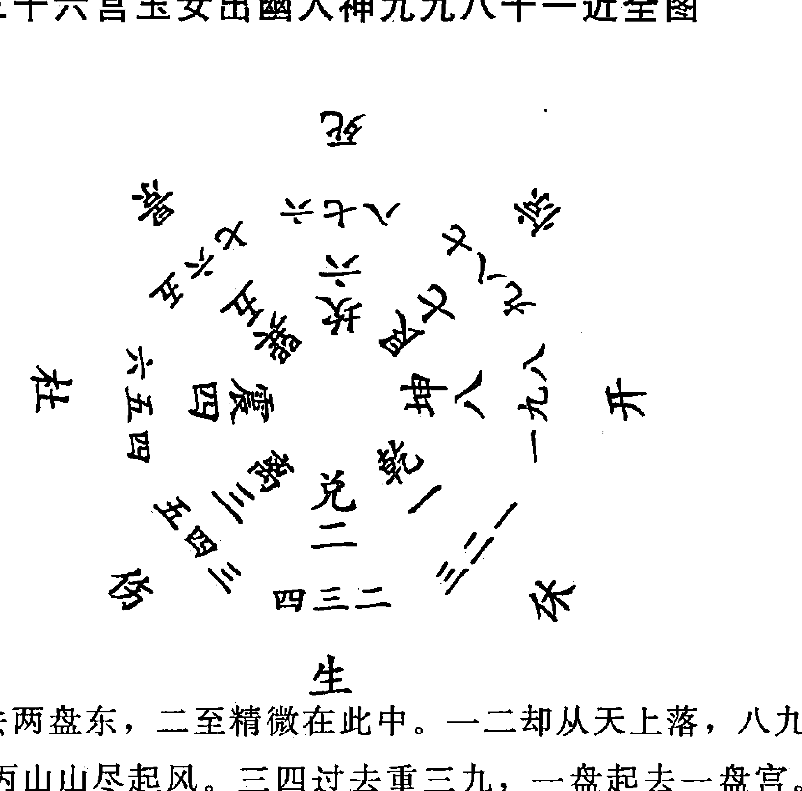

歌曰：“一盘西去两盘东，二至精微在此中。一二却从天上落，八九须从地下通。二九伏从丁九丙，乙丙山山尽起风。三四过去重三九，一盘起去一盘宫。此方即是真神女，九九移来路上同。非是贤人莫妄语，怕将机巧乱研穷。”

### 步时天履遁图

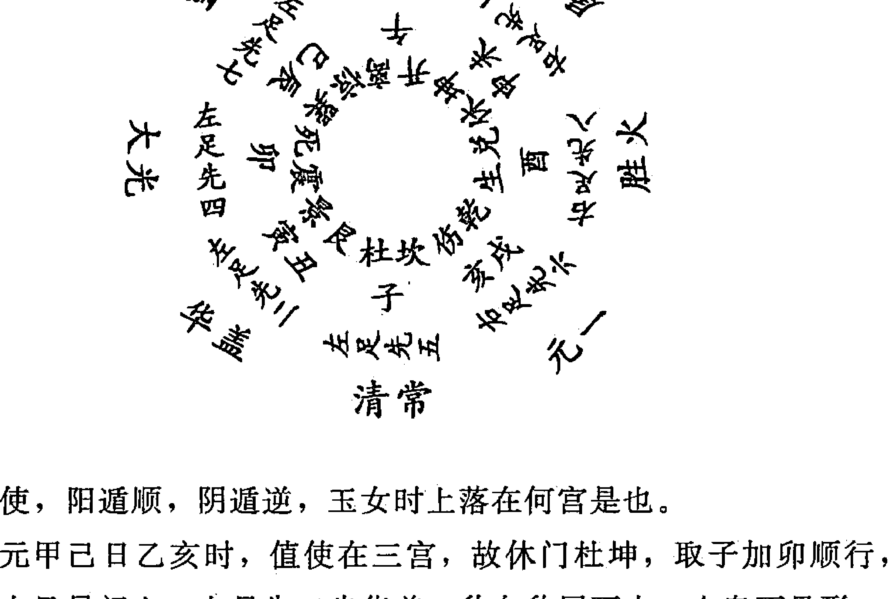

法以子加值使，阳遁顺，阴遁逆，玉女时上落在何宫是也。
此是阳遁上元甲己日乙亥时，值使在三宫，故休门杜坤，取子加卯顺行，看亥落何宫，即知亥时在艮景门上，左足先二步华盖，豹向豹尾而去，人鬼不见形。

### 立扬飞星全图

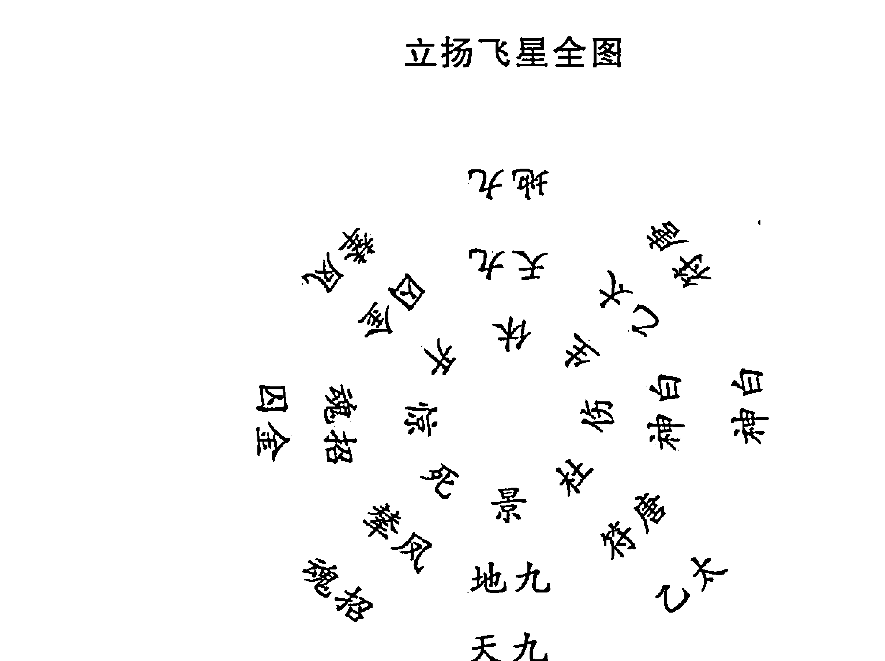

其法照飞宫推阴阳二遁。如冬至上元甲己日甲子时，则知九天在休门，九地在离；夏至上元甲己日甲子时，九地在休门，九天在离。余仿此而推之。

### 九道遁八节图

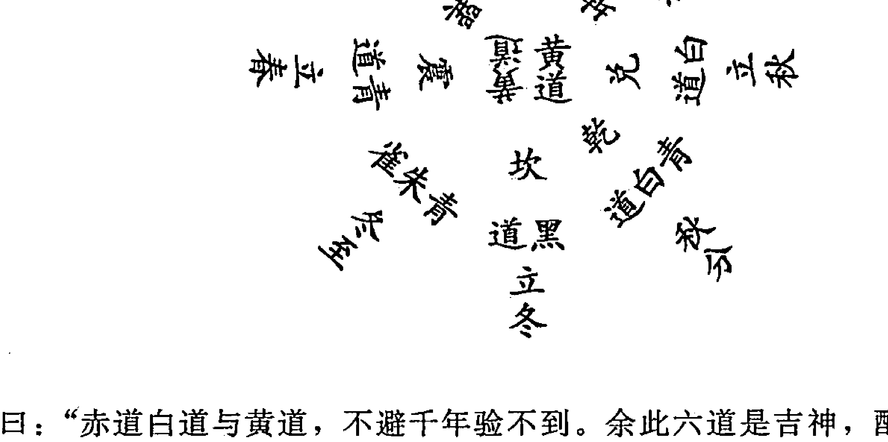

歌曰：“赤道白道与黄道，不避千年验不到。余此六道是吉神，配合奇门遁真好。”

法分二遁，隐避之诀必分道，道之中赤、白、黄三道，尤宜谨避。不然虽合三奇吉门，亦遁不通，难免十患。

## 六甲神人天上遁图

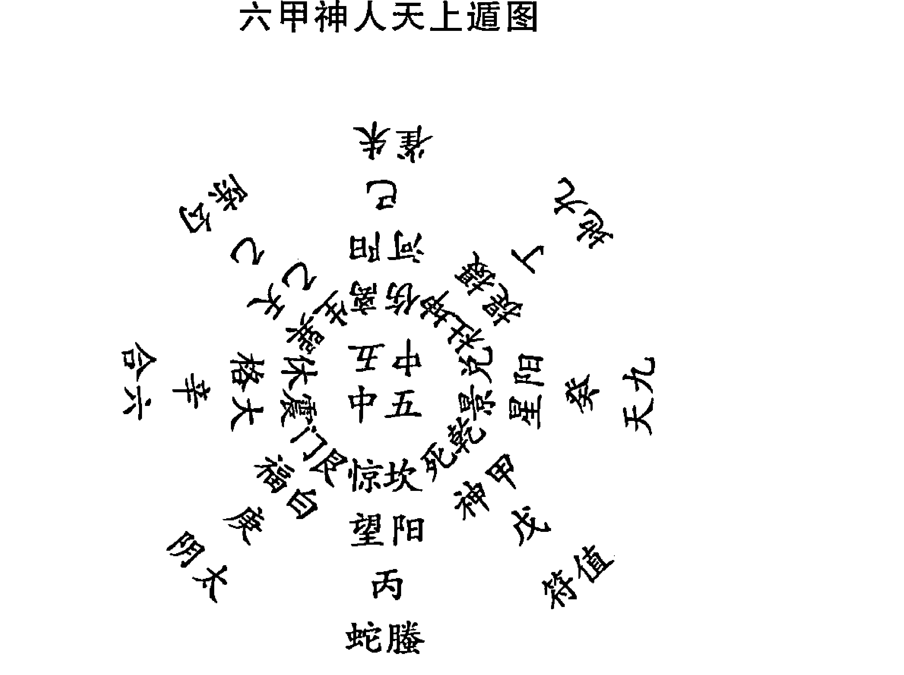

此即 “甲乙丙丁戊阳时，神居天上要君” 知也。阴时仿此。

## 附录 金函玉镜全图

### 诸葛武侯行兵遁甲金函玉镜图序

晚进岳飞撰

《金函玉镜》者，蜀时诸葛孔明之所著也。当汉末时，因黄巾之乱，天下豪杰并起，而曹氏父子、孙权、周瑜诸将，皆称召用兵过于孙吴者也。独孔明与蜀主往往行兵过敌，纵横吴魏间，以正维奇兵而获胜者何？盖此乃出于《金函玉镜》之书。是书始自上古，圣皇轩辕氏破蚩尤，不胜，斋戒，上感九天玄女，传授驱役六丁玉女之神诸遁甲，旬内逐日遁时；书为八门，定以吉凶；分内外胜负，集为秘书一编，传于世间，而孔明得之于龙门山岩穴之间。孔明行师出阵，用以取胜，魏吴诸将咸称其神焉。孔明奇其书可以传世，厥后自画图局，六十甲子日、每日十二时全。图局俱载九星所值，各门吉凶成败，以备行兵择选。用之者其应如响，名之曰《金函玉镜图》。其书指画详明，别为一家，不与遁甲诸书相似，所称“神异不可测度”者也。孔明有云：“是书在兵兴之日，则为行军奇历。代作日用选择出行，必不可无者甚矣。”流传于世，历代知兵之将师此，秘而宝之，其传者寡矣。

余学兵二十年，凡《武经韬略》、《七宝新书》、《六旨金镜》、《青囊素书》、诸家兵法，悉得观览，独孙氏与是图相为体用，诚国家之书籍，而无毫发差误，实世之宝焉。余虽武人不文，独得是图之微奥，不敢擅秘，以故令出。终南山黄岩老人夙朝本朝大将狄青家藏本缮图式，命史端抚抄录，用广其传，以俟后世明哲忠谋之士，用兵之际，得以观阅，阐助武功，以见余之不秘昔贤之传也。

## 金函玉镜图跋

开卷有益，富哉言乎！余少时业儒，舅氏家大人授忠武穆王手抄《金函玉镜图》，字不足万，所包者广，韬佩久矣，未能阐与。嗣习《武经》，乙丑成。兵部进兵逾年，金川酋跳梁，慈命报效，携卷出塞，投帖军营，得隶岳元戎咸仰公麾下，于冲锋破敌之隙，执经问难，省悟颠末。太公《六韬》，世不多觏，惟载《绎火》数篇，他如李靖《望江南》词、诸葛《心新》等书，黄帝《阴符经》、《田露胆》、鬼谷子《金书》、黄石公《素书》，天时地利人和，又包尽孤虚旺相、天行洞庭、麾左麾右。诚哉开卷有益，真不诬也。倘忠孝之士，细味此编，或亦少裨戎马于万一。

乾隆戊寅浔昆朔蜀梁山似吾刘任伟
跋于天中襄城官署之静香斋

## 诸葛武侯行兵遁甲金函玉镜卷一

## 九星落局法

### 冬至后阳遁顺行九宫起例①

甲子为头起艮，甲戌飞入官字。猿猴翻入水晶宫坎，甲马坤中不动。曾见龙生震地，再看虎啸生风巽。九星殿上显奇功，太乙临之法用。
假如甲子日，艮上起太乙，离上摄提，坎上轩辕，坤上招摇，震上天符，巽上青龙，中宫咸池，乾上太阴，兑上天乙，此九星顺行九宫之法也。

### 夏至后阴遁逆行九宫起例

甲子为头起坤，甲戌飞入坎宫，猿猴马上笑欣欣离。甲马山中直进艮，龙临金位显位能兑，虎向乾方坐镇。九宫太乙逆行，仔细推求有应。
假如甲子日，坤上起太乙，坎上摄提，离上轩辕，艮上招摇，兑上天符，乾上青龙，中宫咸池，巽上太阴，震上天乙，此九星逆行九宫之法也。

### 九星神名次序起例

- 一太乙吉、二摄提凶、三轩辕平、四招摇平、五天符凶、六青龙吉、七咸池凶、八太阴吉、九天乙吉。

① 一日一宫完，即至上日甲戌，余例仿此。

### 冬至后阳遁八门起例①

甲戊壬子坎为休，丁辛乙卯向坤游。庚甲戊午居震位，癸丁辛酉巽方求。庚丙鼠入金乡去乾，己癸兔居水泽幽兑。壬丙马行山上路艮，乙己鸡与火为俦离。假如甲子日，阳顺休生开；乙丑日，阴逆休生开；丙寅日，又顺休生开。阴遁起例仿此。

### 夏至后阴遁八门起例

甲戊壬子居离，丁辛乙卯艮连。戊寅甲马兑宫先，丁癸辛酉乾健。赤白鼠游巽位丙庚，黑黄兔走东边癸己。丙壬骑马到坤门，乙己鸡飞坎畔。假如甲子、戊子、壬子俱从离上起休门，每宫三日一换，阳顺阴逆，起法如前。

### 飞宫掌诀起例

### 掌诀图

| 巽 | 离 | 坤 |
|---|---|---|
| 四 | 九 | 二 |
| 震 | 中 | 兑 |
| 三 | 五 | 七 |
| 艮 | 坎 | 乾 |
| 八 | 一 | 六 |

① 阳干顺布八门，甲丙戊庚壬为阳；阴干逆布八门，乙丁己辛癸为阴。

### 八门图

杜 景 死
伤  惊
生 休 开

### 起休门诀

如冬至后阳遁顺起，甲戊壬子坎为休，是休门在坎一，生门在艮八，数至开门在乾六。乙丑日休门还在坎，生门转乾，数至开门在艮。丙寅日休门亦在坎，生门又转在艮，开门又在乾。此阳顺阴逆也。如丁辛乙卯向坤游，则休门移于坤二矣。此三日一换也，余类推。夏至后甲戊壬子居离九，系逆起，亦问此义。

### 九星起飞宫诀

如冬至后阳遁顺行，甲子为头起艮，从艮八上起太乙，顺行离九摄提，转坎一上轩辕，坤二招摇，震三天符，巽四青龙，中五咸池，乾六太阴，兑七天乙，此九星顺行也。一日一换。如甲子日太乙在艮八，乙丑日太乙在离九，丙寅日太乙在坎一，丁卯日太乙在坤二。余类推。

如夏至后阴遁逆行，甲子为头起坤，是从坤二上起太乙，逆行坎一是也。

## 九星吉凶歌

### 一太乙水神①

门中见太乙，星曜号贪狼。博奕钱财众，婚姻大吉昌。
出门无阻滞，参谒见贤良。

### 二摄提土神②

远行遭羁绊，耕地损牛犁。相生又问可，相克见灾危。
死门并相见，老妇哭悲啼。求财并嫁娶，万事不相宜。
主隐匿藏道，言动则伤身。

### 三轩辕木神③

出人遇轩辕，作事必牵缠。相生灾侵慢，相克必忧煎。
远行逢迤邅，博奕定输钱。九天玄女法，句句不虚传。

### 四招摇木神④

招摇号木星，当门百事成。相克行人阻，阴人口舌迎。
怪梦多惊恐，屋响釜自鸣，阴阳消息用，作事不容情。

### 五天符土神⑤

五鬼是天符，当门阴女谋。相克无好事，言客在程迟。
走失难得见，吊客惹成孤。此星当门值，切忌有灾途。

- 1. 逢着皂衣人，求谒、访谒、婚姻皆大吉。
- 2. 遇死门大凶，逢老妇悲啼，再逢牛犁耕田，不吉。
- 3. 路遇宜见于十五里外。
- 4. 逢二亲人，又见妇人口舌，怪梦惊恐，邻家釜鸣，屋响不吉。
- 5. 交战出兵，迎锋出阵，军粮则利。

### 六青龙金神①

门内见青龙，求财喜重重。每逢茶酒食，博奕定见赢。相生钱财旺，休言克破刑。接贵安营寨，万事喜和同。

### 七咸池金神②

五将号咸池，当门事不宜。相生皆无破，相克有灾危。博奕相输脱，求财空手归。神仙真妙诀，愚人要与知。军事虚惊退，反复逆风吹。

### 八太阴土神③

当门见太阴，百祸不能侵。方行六七里，知交有觅寻。妙法牢收取，回军引马前。有伏兵截路，慎不可轻行。

### 九天乙火神④

门迎天乙星，相生百事成。动用皆和顺，茶酒自相迎。求婚行嫁娶，相会天自成。出军交兵阵，一见定胜赢。

## 八门吉凶歌

### 休门水神贪狼

求公干私遇休门，求财参谒贵人钦。欲速同行吉相助，出入嫁娶五福临。休门已见百般食，出入经行得恁强，但求休门门见路，更逢吉利和衷肠。

- ① 路逢医人或是酒仙，今博奕于道中。
- ② 不可行军破敌。
- ③ 行六七里，见有小儿牵羊至，求财成就，吉。
- ④ 行三十里，见一妇人着五六色，遇抱小儿，百事吉。

### 生门土神左辅①

但凡出入遇生门，吉曜临之万事成。若有凶神相隔辍，求财所得利称心。
生门已见好经营，百事流通得称情。此门出入逢欢喜，但求经营喜气生。

### 伤门木神禄存②

出入求财如遇伤，更逢吉曜亦难当。眼前人惹疼病祸，自身须防有灾殃。
伤门往往是非传，若出门来有祸愆。采捕称心虽是好，其余不得不忧煎。

### 杜门木神文曲③

杜门公用各施行，亦见门中有吉星。茶酒自然留客住，忻欢百事喜相成。
杜门曾见好经营，出入从来未称情。若然逃遁如避难，即是元木也不成。

### 景门火神廉贞④

远行出入景门中，无克无生平吉凶。若值星辰方位恶，心头作事亦难通。
景门出入且宜良，甑赏嬉中第一强。采猎捕鱼人少得，无忧无喜见安康。

### 死门土神巨门⑤

参谒求谋入死门，吉神刻剥不堪论。若不自身作横事，其人必定见伤痕。
死门不可东西去，大抵为名事莫言。死伤求哀为不利，圣人怎肯教胡传。

### 惊门金神破军⑥

寻求走失出惊门，逃人财物尽都存。更得吉星变刑克，在失逃人自失魂。
惊门一定有虚惊，出入如逢百不成。百般美事休更说，往往居家不称情。

### 开门金神武曲①

开门出入最为良，万事亨通大吉昌。出入求财定见喜，八方干事一齐强。求财出入遇开门，自有欣欢百事成。更值吉星当位照，相逢酒食笑忻忻。

① 此门争财见官讼兆，嫁娶避走，二十里见飞鸟来迎之，大吉。
② 此门出行必见精怪吓喧事、扭拽、血伤。
③ 此门宜出行、谒贵、求财，或遇避者，克难吉。
④ 此门出行见贵、博戏、争逐、捕猎，行四十里，必见喜乐声。
⑤ 此门宜出猎、张捕、杀生，千死一生。行二十里，路旁必见死伤应之。
⑥ 此门不宜出行、上官，诸事不吉。行六七里，必见惊怪、犬物验方。

## 九星飞宫断例

太乙虽名凶恶星，兵亡将败至忧惊。扎寨安营须大忌，倘逢吉曜转凶星。
青龙临处利求财，出入逢之事必谐。布阵行军百胜吉，修营嫁娶福齐来。
太阴本是水之精，出入无阻坦荡行。若遇阴人尤大吉，行兵百事尽欢欣。
天乙偏宜见贵人，用事求谋总遂心。更出此方无所虑，身名必定得天恩。
招摇如遇入中宫，知者将军莫交锋。无论王侯共宰相，徒劳心力不成功。
天符方上恐遘迍，避忌此宫大不宁。倘能用力禳酌过，不然五鬼不容情。
轩辕遇着最艰难，百事谋为遂伤残。出入定当防有火，暗损明伤定不还。
咸池恶煞凶神随，蛇虎重重遭困围。此方远近宜穿井，其它用事恐伤悲。
摄提方上主多灾，脚腿多忧坎坷灾。若此行路定无吉，兵家切忌去艰来。

## 八门遇九星断例

休门若获遇青龙，凡事谋为尽亨通。觅利求财兴百倍，出军排阵定摧锋。
休门太乙百事兴，相争战斗旺雄兵。起营立寨终须胜，见贵参官喜相逢。
休门若遇天乙星，出入求财大快亨。多遇贵人怜忧喜，邀迎酒食得人钦。
生门最喜见青龙，谒贵谋为百事通。经商定获千倍利，出入无忧展笑容。
生门太乙福德多，所求称意任张罗。觅利求财期百倍，出入行军无滞过。
生门若遇天乙星，出入定无斗争迎。布阵排兵皆得胜，万事从心大亨贞。
开门若得遇青龙，觅利重逢得裕丰。谒贵参官多见爱，求谋出入定无空。
开门若合太乙星，虽时劫寨好偷营。出战行兵无不胜，只有开门用安宁。
开门如遇天乙星，出军行阵莫怀猜。求望经营多得利，参官偏得贵人财。

① 此门宜上官、见贵、出入、求财、回避。三十里必见妇人，或穿颜色衣人以应之。

八门吉凶随事行，不但生休与开门。节气若排十干上，悉心详究自分明。

## 十干日凶时①

《六壬遁甲专征伐》云：“五不遇时，阴阳交会干天庭，时干克日干，动必有灾。”公歌曰：“五不遇时岂知难，定为时干克日干。纵有奇门皆不利，损其日月不堪观。遁甲三奇乙丙丁，若合开休生三吉。”门倘忌五不遇时，凡兴兵、除授、上官、远行、造作，百事不利，切宜避忌。假如甲日午未时，时干庚辛金克日干中甲。余仿此。

## 八门所宜

休门宜出贵人留，杜门藏身可免忧。景门求财多获利，伤门索债必得收。生门嫁娶远行吉，惊门遇喜未必周。死门捕捉并鱼猎，开门顺利徧九州岛。

## 九星吉凶所宜

太乙凡为百事通，摄提到处便为凶。招摇出入多风雨，轩辕斗殴血光逢。咸池临处多官事，太阴取用暗财充。天符射猎打围吉，青龙财喜两重重。天乙所求百事遂，九星吉凶妙无穷。

## 诸葛武侯行兵遁甲金函玉镜卷二

## 冬至后阳遁八门图自甲子至癸巳三十日

| 冬至后甲子日喜神在艮 |
| --- |
| 甲子金匮黄道，吉。乙丑天德黄道、天乙贵人。丙寅白虎黑道，凶。丁卯玉堂黄道，吉。戊辰天牢黑道，凶。己巳元武黑道，凶。庚午司命黄道，吉。辛未勾陈黑道，天乙贵人。壬申青龙黄道，截路空亡。癸酉明堂黄道，截路空亡。甲戌天刑黑道凶。乙亥朱雀黑道凶。 |
| 冬至后乙丑日喜神在乾 |
| 丙子天刑黑道，天乙贵人。丁丑朱雀黑道。戊寅金匮黄道。己卯天德黄道。庚辰白虎黑道。辛巳玉堂黑道。壬午天牢黑道，截路空亡。癸未元武黑道，截路空亡。甲申司命黄道，天乙贵人。乙酉勾陈黑道。丙戌青龙黄道。丁亥明堂黄道。 |
| 冬至后丙寅日喜神在坤 |
| 戊子背龙黄道。己丑明堂黄道。庚寅天刑黑道。辛卯朱雀黑道。壬辰金匮黄道，截路空亡。癸巳天德黄道，截路空亡。甲午白虎黑道。乙未玉堂黄道。丙申天牢黑道。丁酉元武黑道。戊戌司命黄道。己亥勾陈黑道，天乙贵人。 |

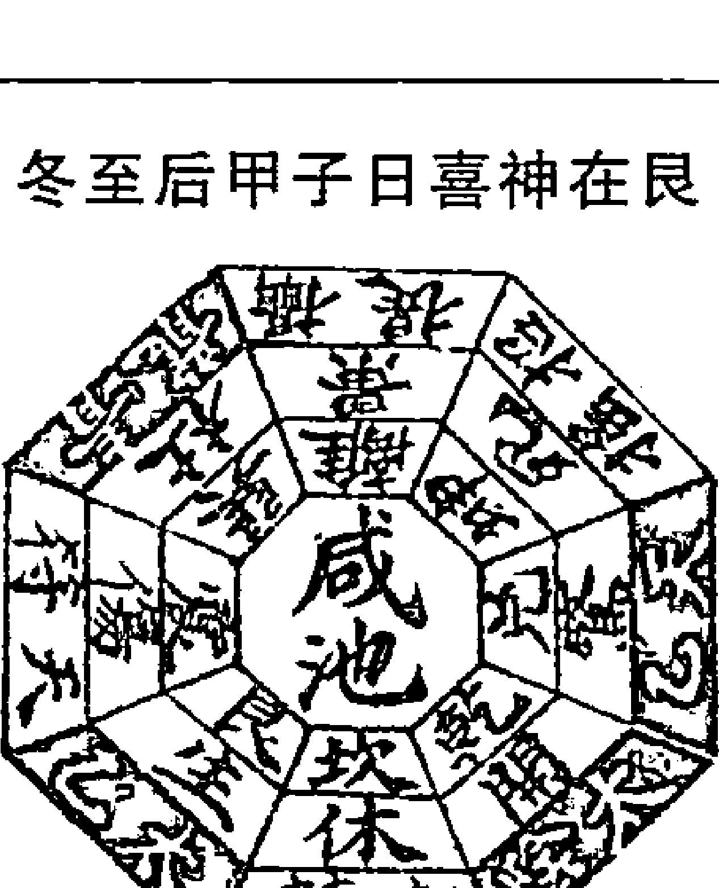

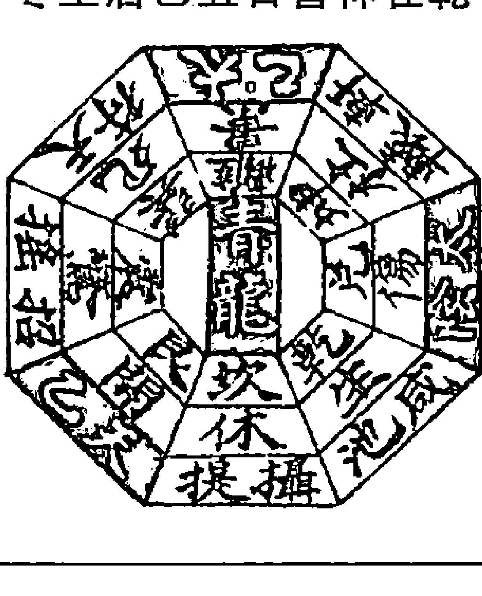

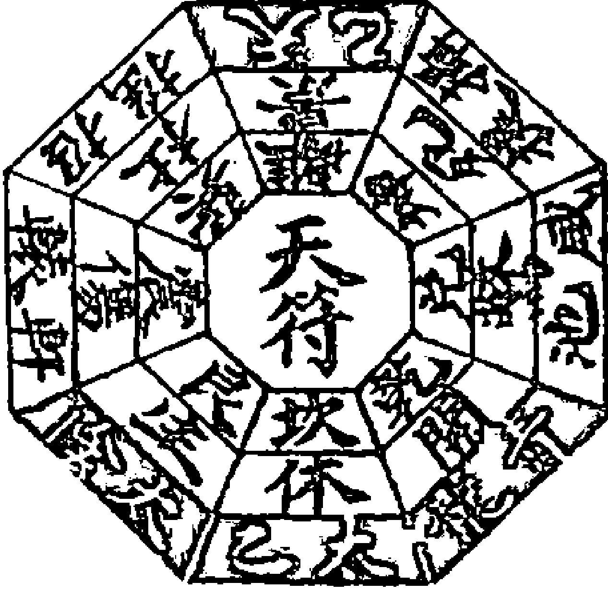

## 冬至后辛未日喜神在坤

戊子天刑黑道。己丑朱雀黑道。庚寅金匮黄道，天乙贵人。辛卯天德黄道。壬辰白虎黑道，截路空亡。癸巳玉堂黄道，截路空亡。甲午天牢黑道。乙未元武黑道。丙申司命黄道。丁酉勾陈黑道。戊戌青龙黄道。己亥明堂黄道。

## 冬至后壬申日喜神在离

庚子青龙黄道。辛丑明堂黄道。壬寅天刑黑道，截路空亡。癸卯朱雀黑道，天乙贵人。甲辰金匮黄道。乙巳天德黄道，天乙贵人。丙午白虎黑道。丁未玉堂黄道。戊申天牢黑道。己酉元武黑道。庚戌司命黄道。辛亥勾陈黑道。

## 冬至后癸酉日喜神在巽

壬子司命黄道，截路空亡。癸丑勾陈黑道，截路空亡。甲寅青龙黄道。乙卯明堂黄道，天乙贵人。丙辰天刑黑道。丁巳朱雀黑道，天乙贵人。戊午金匮黄道。己未天德黄道。庚申白虎黑道。辛酉玉堂黄道。壬戌天牢黑道，截路空亡。癸亥元武黑道，截路空亡。

## 冬至后甲戌日喜神在艮

甲子天牢黑道。乙丑元武黑道，天乙贵人。丙寅司命黄道。丁卯勾陈黑道。戊辰青龙黄道。己巳明堂黄道。庚午天刑黑道。辛未朱雀黑道，天乙贵人。壬申金匮黄道，截路空亡。癸酉天德黄道，截路空亡。甲戌白虎黑道。乙亥玉堂黄道。

## 冬至后乙亥日喜神在乾

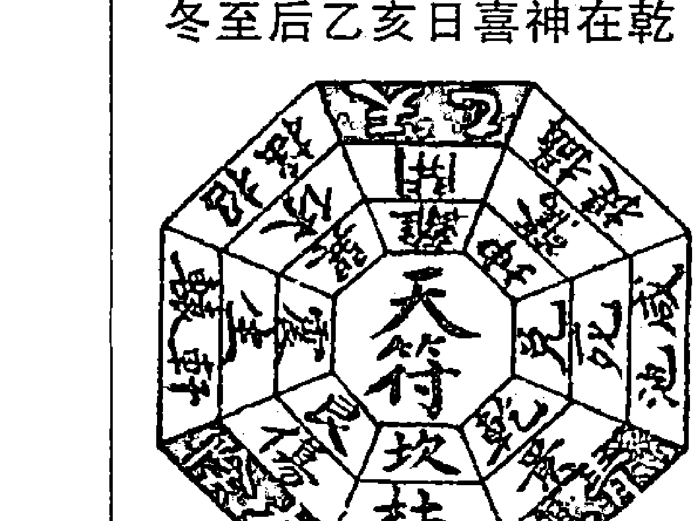

丙子白虎黑道，天乙贵人。丁丑玉堂黄道。
戊寅天牢黑道。己卯元武黑道。
庚辰司命黄道。辛巳勾陈黑道。
壬午青龙黄道，截路空亡。
癸未明堂黄道，截路空亡。
甲申天刑黑道，天乙贵人。乙酉朱雀黑道。
丙戌金匮黄道。丁亥天德黄道。

## 冬至后丙子日喜神在坤

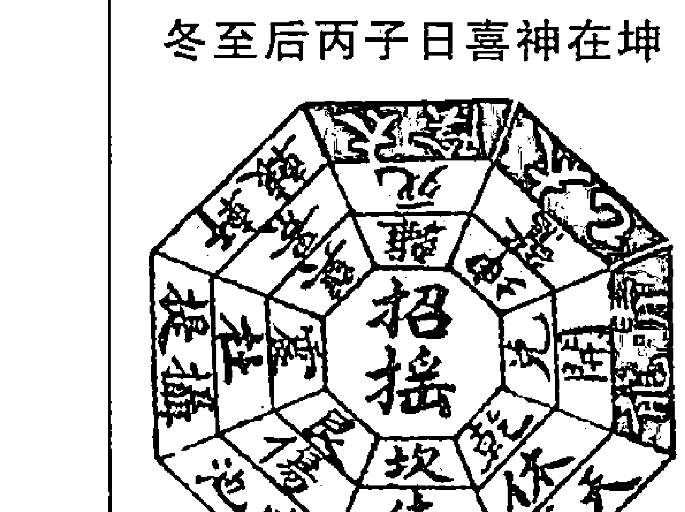

戊子金匮黄道。己丑天德黄道。
庚寅白虎黑道。辛卯玉堂黄道。
壬辰天牢黑道，截路空亡。
癸巳元武黑道，截路空亡。
甲午司命黄道。乙未勾陈黑道。
丙申青龙黄道。丁酉明堂黄道。
戊戌天刑黑道。己亥朱雀黑道，天乙贵人。

## 冬至后丁丑日喜神在离

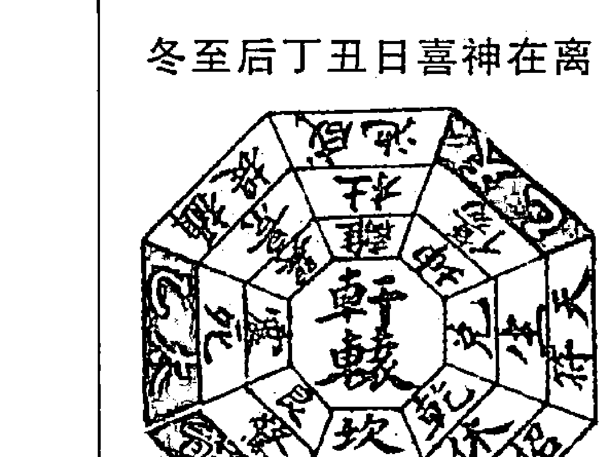

庚子天刑黑道。辛丑朱雀黑道。
壬寅金匮黄道，截路空亡。
癸卯天德黄道，截路空亡。
甲辰白虎黑道。乙巳玉堂黄道。
丙午天牢黑道。丁未元武黑道。
戊申司命黄道。己酉勾陈黑道，天乙贵人。
庚戌青龙黄道。辛亥明堂黄道，天乙贵人。

## 冬至后戊寅日喜神在巽

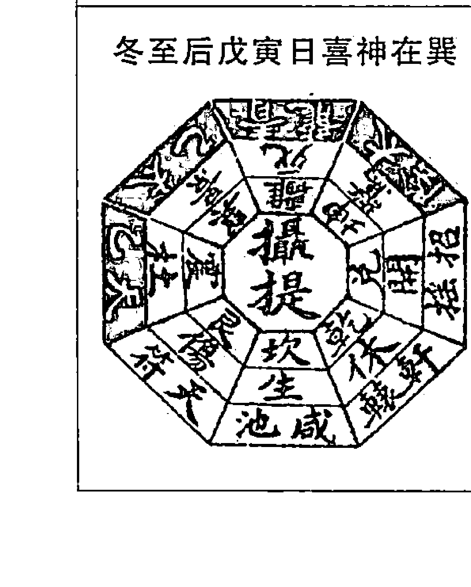

壬子青龙黄道，截路空亡。
癸丑明堂黄道，截路空亡。
甲寅天刑黑道，天乙贵人。
乙卯朱雀黑道。丙辰金匮黄道。
丁巳天德黄道。戊午白虎黑道。
己未玉堂黄道，天乙贵人。
庚申天牢黑道。辛酉元武黑道。
壬戌司命黄道，截路空亡。
癸亥勾陈黑道，截路空亡。

## 冬至后己卯日喜神在艮

甲子司命黄道，天乙贵人。乙丑勾陈黑道。
丙寅青龙黄道。丁卯明堂黄道。
戊辰天刑黑道。己巳朱雀黑道。
庚午金匮黄道。辛未天德黄道。
壬申白虎黑道，天乙贵人。
癸酉玉堂黄道，截路空亡。
甲戌天牢黑道。乙亥元武黑道。

## 冬至后庚辰日喜神在乾

丙子天牢黑道。丁丑元武黑道。
戊寅司命黄道，天乙贵人。
己卯勾陈黑道。庚辰青龙黄道。
辛巳明堂黄道。壬午天刑黑道，天乙贵人。
癸未朱雀黑道，截路空亡。
甲申金匮黄道。乙酉天德黄道。
丙戌白虎黑道。丁亥玉堂黄道。

## 冬至后辛巳日喜神在坤

戊子白虎黑道。己丑玉堂黄道。
庚寅天牢黑道，天乙贵人。辛卯元武黑道。
壬辰司命黄道，截路空亡。
癸巳勾陈黑道，截路空亡。
甲午青龙黄道，天乙贵人。
乙未明堂黄道。丙申天刑黑道。
丁酉朱雀黑道。戊戌金匮黄道。
己亥天德黄道。

## 冬至后壬午日喜神在离

庚子金匮黄道。辛丑天德黄道。
壬寅白虎黑道，截路空亡。
癸卯玉堂黄道，天乙贵人。
甲辰天牢黑道。乙巳元武黑道，天乙贵人。
丙午司命黄道。丁未勾陈黑道。
戊申青龙黄道。己酉明堂黄道。
庚戌天刑黑道。辛亥朱雀黑道。

## 冬至后癸未日喜神在巽

壬子天刑黑道，截路空亡。癸丑朱雀黑道，截路空亡。甲寅金匮黄道。乙卯天德黄道，天乙贵人。丙辰白虎黑道。丁巳玉堂黄道，天乙贵人。戊午天牢黑道。己未元武黑道。庚申司命黄道。辛酉勾陈黑道。壬戌青龙黄道，截路空亡。癸亥明堂黄道，截路空亡。

## 冬至后甲申日喜神在艮

甲子青龙黄道。乙丑明堂天乙贵人。丙寅天刑黑道。丁卯朱雀黑道。戊辰金匮黄道。己巳天德黄道。庚午白虎黑道。辛未玉堂黄道，天乙贵人。壬申天牢黑道，截路空亡。癸酉元武黑道，截路空亡。甲戌司命黄道，乙亥勾陈黑道。

## 冬至后乙酉日喜神在乾

丙子司命黄道，天乙贵人。丁丑勾陈黑道。戊寅青龙黄道。己卯明堂黄道。庚辰天刑黑道。辛巳朱雀黑道。壬午金匮黄道，截路空亡。癸未天德黄道，截路空亡。甲申白虎黑道，天乙贵人。乙酉玉堂黄道。丙戌天牢黑道。丁亥元武黑道。

## 冬至后丙戌日喜神在坤

戊子天牢黑道。己丑元武黑道。庚寅司命黄道。辛卯勾陈黑道。壬辰青龙黄道，截路空亡。癸巳明堂黄道，截路空亡。甲午天刑黑道。乙未朱雀黑道。丙申金匮黄道，天乙贵人。丁酉天德黄道，天乙贵人。戊戌白虎黑道。己亥玉堂黄道，天乙贵人。

## 冬至后丁亥日喜神在离

庚子白虎黑道。辛丑玉堂黄道。壬寅天牢黑道，截路空亡。癸卯元武黑道，截路空亡。甲辰司命黄道。乙巳勾陈黑道。丙午青龙黄道。丁未明堂黄道。戊申天刑黑道。己酉朱雀黑道，天乙贵人。庚戌金匮黄道。辛亥天德黄道，天乙贵人。

## 冬至后戊子日喜神在巽

壬子金匮黄道，截路空亡。癸丑天德黄道，天乙贵人。甲寅白虎黑道。乙卯玉堂黄道。丙辰天牢黑道。丁巳元武黑道。戊午司命黄道。己未勾陈黑道，天乙贵人。庚申青龙黄道。辛酉明堂黄道。壬戌天刑黑道，截路空亡。癸亥朱雀黑道，截路空亡。

## 冬至后己丑日喜神在艮

甲子天刑黑道，天乙贵人。乙丑朱雀黑道。丙寅金匮黄道。丁卯天德黄道。戊辰白虎黑道。己巳玉堂黄道。庚午天牢黑道。辛未元武黑道。壬申司命黄道，天乙贵人。癸酉勾陈黑道，截路空亡。甲戌青龙黄道。乙亥明堂黄道。

## 冬至后庚寅日喜神在乾

丙子青龙黄道。丁丑明堂黄道。戊寅天刑黑道，天乙贵人。己卯朱雀黑道。庚辰金匮黄道。辛巳天德黄道。壬午白虎黑道，天乙贵人。癸未玉堂黄道，截路空亡。甲申天牢黑道。乙酉元武黑道。丙戌司命黄道。丁亥勾陈黑道。

## 冬至后辛卯日喜神在坤

戊子司命黄道。己丑勾陈黑道。庚寅青龙黄道，天乙贵人。辛卯明堂黄道。壬辰天刑黑道，截路空亡。癸巳朱雀黑道，截路空亡。甲午金匮黄道，天乙贵人。乙未天德黄道。丙申白虎黑道。丁酉玉堂黄道。戊戌天牢黑道。己亥元武黑道。

## 冬至后壬辰日喜神在离

庚子天牢黑道。辛丑元武黑道。壬寅司命黄道，截路空亡。癸卯勾陈黑道，天乙贵人。甲辰青龙黄道。乙巳明堂黄道，天乙贵人。丙午天刑黑道。丁未朱雀黑道。戊申金匮黄道。己酉天德黄道。庚戌白虎黑道。辛亥玉堂黄道。

## 冬至后癸巳日喜神在巽

壬子白虎黑道，截路空亡。癸丑玉堂黄道，截路空亡。甲寅天牢黑道。乙卯元武黑道，天乙贵人。丙辰司命黄道。丁巳勾陈黑道，天乙贵人。戊午青龙黄道。己未明堂黄道。庚申天刑黑道。辛酉朱雀黑道。壬戌金匮黄道，截路空亡。癸亥天德黄道，截路空亡。

## 诸葛武侯行兵遁甲金函玉镜卷三

## 冬至后阳遁八门图自甲午至癸亥三十日

## 冬至后甲午日喜神在艮

甲子金匮黄道，吉。乙丑天德黄道，天乙贵人。丙寅白虎黑道，凶。丁卯玉堂黄道，吉。戊辰天牢黑道，凶。己巳元武黑道，凶。庚午司命黄道，吉。辛未勾陈黑道，天乙贵人。壬申青龙黄道，截路空亡。癸酉明堂黄道，截路空亡。甲戌天刑黑道，凶。乙亥朱雀黑道，凶。

## 冬至后乙未日喜神在乾

丙子天刑黑道，天乙贵人。丁丑朱雀黑道。戊寅金匮黄道。己卯天德黄道。庚辰白虎黑道。辛巳玉堂黄道。壬午天牢黑道，截路空亡。癸未元武黑道，截路空亡。甲申司命黄道，天乙贵人。乙酉勾陈黑道。丙戌青龙黄道。丁亥明堂黄道。

## 冬至后丙申日喜神在坤

戊子青龙黄道。己丑明堂黄道。庚寅天刑黑道。辛卯朱雀黑道。壬辰金匮黄道，截路空亡。癸巳天德黄道，截路空亡。甲午白虎黑道，乙未玉堂黄道。丙申天牢黑道。丁酉元武黑道。戊戌司命黄道。己亥勾陈黑道，天乙贵人。

## 冬至后丁酉日喜神在离

庚子司命黄道。辛丑勾陈黑道。
壬寅青龙黄道，截路空亡。
癸卯明堂黄道，截路空亡。
甲辰天刑黑道。乙巳朱雀黑道。
丙午金匮黄道。丁未天德黄道。
戊申白虎黑道。己酉玉堂黄道，天乙贵人。
庚戌天牢黑道。辛亥元武黑道，天乙贵人。

## 冬至后戊戌日喜神在巽

壬子天牢黑道，截路空亡。
癸丑元武黑道，天乙贵人。
甲寅司命黄道。乙卯勾陈黑道。
丙辰青龙黄道。丁巳明堂黄道。
戊午天刑黑道。己未朱雀黑道，天乙贵人。
庚申金匮黄道。辛酉天德黄道。
壬戌白虎黑道。癸亥玉堂黄道。

## 冬至后己亥日喜神在艮

甲子白虎黑道。乙丑玉堂黄道。
丙寅天牢黑道。丁卯元武黑道。
戊辰司命黄道，己巳勾陈黑道。
庚午青龙黄道。辛未明堂黄道。
壬申天刑黑道，天乙贵人。
癸酉朱雀黑道，截路空亡。
甲戌金匮黄道。乙亥天德黄道。

## 冬至后庚子日喜神在乾

丙子金匮黄道。丁丑天德黄道。
戊寅白虎黑道，天乙贵人。
己卯玉堂黄道。庚辰天牢黑道。
辛巳元武黑道。壬午司命黄道，天乙贵人。
癸未勾陈黑道，截路空亡。
甲申青龙黄道。乙酉明堂黄道。
丙戌天刑黑道。丁亥朱雀黑道。

## 冬至后辛丑日喜神在坤

戊子天刑黑道。己丑朱雀黑道。
庚寅金匮黄道。天乙贵人。辛卯天德黄道。
壬戌白虎黑道，截路空亡。
癸巳玉堂黄道，截路空亡。
甲午天牢黑道。乙未元武黑道。
丙申司命黄道。丁酉勾陈黑道。
戊戌青龙黄道。己亥明堂黄道。

## 冬至后壬寅日喜神在离

庚子青龙黄道。辛丑明堂黄道。
壬寅天刑黑道，截路空亡。
癸卯朱雀黑道，天乙贵人。
甲辰金匮黄道。乙巳天德黄道，天乙贵人。
丙午白虎黑道。丁未玉堂黄道。
戊申天牢黑道。己酉元武黑道。
庚戌司命黄道。辛亥勾陈黑道。

## 冬至后癸卯日喜神在巽

壬子司命黄道，截路空亡。
癸丑勾陈黑道，截路空亡。
甲寅青龙黄道。乙卯明堂黄道，天乙贵人。
丙辰天刑黑道。丁巳朱雀黑道，天乙贵人。
戊午金匮黄道。己未天德黄道。
庚申白虎黑道。辛酉玉堂黄道。
壬戌天牢黑道，截路空亡。
癸亥元武黑道，截路空亡。

## 冬至后甲辰日喜神在艮

甲子天牢黑道。乙丑元武黑道，天乙贵人。
丙寅司命黄道。丁卯勾陈黑道。
戊辰青龙黄道。己巳明堂黄道。
庚午天刑黑道。辛未朱雀黑道，天乙贵人。
壬申金匮黄道，截路空亡。
癸酉天德黄道，截路空亡。
甲戌白虎黑道。乙亥玉堂黄道。

## 冬至后乙巳日喜神在乾

丙子白虎黑道，天乙贵人。丁丑玉堂黄道。戊寅天牢黑道。己卯元武黑道。庚辰司命黄道。辛巳勾陈黑道。壬午青龙黄道，截路空亡。癸未明堂黄道，截路空亡。甲申天刑黑道，天乙贵人。乙酉朱雀黑道。丙戌金匮黄道。丁亥天德黄道。

## 冬至后丙午日喜神在坤

戊子金匮黄道。己丑天德黄道。庚寅白虎黑道。辛卯玉堂黄道。壬辰天牢黑道，截路空亡。癸巳元武黑道，截路空亡。甲午司命黄道。乙未勾陈黑道。丙申青龙黄道。丁酉明堂黄道。戊戌天刑黑道。己亥朱雀黑道，天乙贵人。

## 冬至后丁未日喜神在离

庚子天刑黑道。辛丑朱雀黑道。壬寅金匮黄道，截路空亡。癸卯天德黄道，截路空亡。甲辰白虎黑道。乙巳玉堂黄道。丙午天牢黑道。丁未元武黑道。戊申司命黄道。己酉勾陈黑道，天乙贵人。庚戌青龙黄道。辛亥明堂黄道，天乙贵人。

## 冬至后戊申日喜神在巽

壬子青龙黄道，截路空亡。癸丑明堂黄道，天乙贵人。甲寅天刑黑道。乙卯朱雀黑道。丙辰金匮黄道。丁巳天德黄道。戊午白虎黑道。己未玉堂黄道，天乙贵人。庚申天牢黑道。辛酉元武黑道。壬戌司命黄道，截路空亡。癸亥勾陈黑道，截路空亡。

## 冬至后己酉日喜神在艮

甲子司命黄道，天乙贵人。乙丑勾陈黑道。
丙寅青龙黄道。丁卯明堂黄道。
戊辰天刑黑道。己巳朱雀黑道。
庚午金匮黄道。辛未天德黄道。
壬申白虎黑道，天乙贵人。
癸酉玉堂黄道，截路空亡。
甲戌天牢黑道。乙亥元武黑道。

## 冬至后庚戌日喜神在乾

丙子天牢黑道。丁丑元武黑道。
戊寅司命黄道，天乙贵人。
己卯勾陈黑道。庚辰青龙黄道。
辛巳明堂黄道。壬午天刑黑道，天乙贵人。
癸未朱雀黑道，截路空亡。
甲申金匮黄道。乙酉天德黄道。
丙戌白虎黑道。丁亥玉堂黄道。

## 冬至后辛亥日喜神在坤

戊子白虎黑道。己丑玉堂黄道。
庚寅天牢黑道，天乙贵人。辛卯元武黑道。
壬辰司命黄道，截路空亡。
癸巳勾陈黑道，截路空亡。
甲午青龙黄道，天乙贵人。乙未明堂黄道。
丙申天刑黑道。丁酉朱雀黑道。
戊戌金匮黄道。己亥天德黄道。

## 冬至后壬子日喜神在离

庚子金匮黄道。辛丑天德黄道。
壬寅白虎黑道，截路空亡。
癸卯玉堂黄道，天乙贵人。
甲辰天牢黑道。乙巳元武黑道，天乙贵人。
丙午司命黄道。丁未勾陈黑道。
戊申青龙黄道。己酉明堂黄道。
庚戌天刑黑道。辛亥朱雀黑道。

## 冬至后癸丑日喜神在巽

- 壬子天刑黑道，截路空亡。
- 癸丑朱雀黑道，截路空亡。
- 甲寅金匮黄道。乙卯天德黄道，天乙贵人。
- 丙辰白虎黑道。丁巳玉堂黄道，天乙贵人。
- 戊午天牢黑道。己未勾陈黑道。
- 庚申司命黄道。辛酉元武黑道。
- 壬戌青龙黄道，截路空亡。
- 癸亥明堂黄道，截路空亡。

## 冬至后甲寅日喜神在艮

- 甲子青龙黄道。乙丑明堂黄道，天乙贵人。
- 丙寅天刑黑道。丁卯朱雀黑道。
- 戊辰金匮黄道。己巳天德黄道。
- 庚午白虎黑道。辛未玉堂黄道，天乙贵人。
- 壬申天牢黑道，截路空亡。
- 癸酉元武黑道，截路空亡。
- 甲戌司命黄道。乙亥勾陈黑道。

## 冬至后乙卯日喜神在乾

- 丙子司命黄道，天乙贵人。
- 丁丑勾陈黑道。戊寅青龙黄道。
- 己卯明堂黄道。庚辰天刑黑道。
- 辛巳朱雀黑道。壬午金匮黄道，截路空亡。
- 癸未天德黄道，截路空亡。
- 甲申白虎黑道，天乙贵人。乙酉玉堂黄道。
- 丙戌天牢黑道。丁亥元武黑道。

## 冬至后丙辰日喜神在坤

- 戊子天牢黑道。己丑元武黑道。
- 庚寅司命黄道。辛卯勾陈黑道。
- 壬辰青龙黄道，截路空亡。
- 癸巳明堂黄道，截路空亡。
- 甲午天刑黑道。乙未朱雀黑道。
- 丙申金匮黄道。丁酉天德黄道，天乙贵人。
- 戊戌白虎黑道。己亥玉堂黄道，天乙贵人。

## 冬至后丁巳日喜神在离

- 庚子白虎黑道。辛丑玉堂黄道。
- 壬寅天牢黑道，截路空亡。
- 癸卯元武黑道，截路空亡。
- 甲辰司命黄道。乙巳勾陈黑道。
- 丙午青龙黄道。丁未明堂黄道。
- 戊申天刑黑道。己酉朱雀黑道，天乙贵人。
- 庚戌金匮黄道。辛亥天德黄道，天乙贵人。

## 冬至后戊午日喜神在巽

- 壬子金匮黄道，截路空亡。
- 癸丑天德黄道，天乙贵人。
- 甲寅白虎黑道。乙卯玉堂黄道。
- 丙辰天牢黑道。丁巳元武黑道。
- 戊午司命黄道。己未勾陈黑道，天乙贵人。
- 庚申青龙黄道，辛酉明堂黄道。
- 壬戌天刑黑道，截路空亡。
- 癸亥朱雀黑道，截路空亡。

## 冬至后己未日喜神在艮

- 甲子天刑黑道，天乙贵人。乙丑朱雀黑道。
- 丙寅金匮黄道。丁卯天德黄道。
- 戊辰白虎黑道。己巳玉堂黄道。
- 庚午天牢黑道。辛未元武黑道。
- 壬申司命黄道，天乙贵人。
- 癸酉勾陈黑道，截路空亡。
- 甲戌青龙黄道。乙亥明堂黄道。

## 冬至后庚申日喜神在乾

- 丙子青龙黄道。丁丑明堂黄道。
- 戊寅天刑黑道，天乙贵人。
- 己卯朱雀黑道。庚辰金匮黄道。
- 辛巳天德黄道。壬午白虎黑道，天乙贵人。
- 癸未玉堂黄道，截路空亡。
- 甲申天牢黑道。乙酉元武黑道。
- 丙戌司命黄道。丁亥勾陈黑道。

## 冬至后辛酉日喜神在坤

戊子司命黄道。己丑勾陈黑道。庚寅青龙黄道，天乙贵人。辛卯明堂黄道。壬辰天刑黑道，截路空亡。癸巳朱雀黑道，截路空亡。甲午金匮黄道，天乙贵人。乙未天德黄道。丙申白虎黑道。丁酉玉堂黄道。戊戌天牢黑道。己亥元武黑道。

## 冬至后壬戌日喜神在离

庚子天牢黑道。辛丑元武黑道。壬寅司命黄道，截路空亡。癸卯勾陈黑道，天乙贵人。甲辰青龙黄道。乙巳明堂黄道，天乙贵人。丙午天刑黑道。丁未朱雀黑道。戊申金匮黄道。己酉天德黄道。庚戌白虎黑道。辛亥玉堂黄道。

## 冬至后癸亥日喜神在巽

壬子白虎黑道，截路空亡。癸丑玉堂黄道，截路空亡。甲寅天牢黑道。乙卯明堂黄道，天乙贵人。丙辰司命黄道。丁巳勾陈黑道，天乙贵人。戊午青龙黄道。己未明堂黄道。庚申天刑黑道。辛酉朱雀黑道。壬戌金匮黄道，截路空亡。癸亥天德黄道，截路空亡。

## 诸葛武侯行兵遁甲金函玉镜卷四

## 夏至后阴遁八门图 自甲子至癸巳三十日

| 图示 | 说明 |
|------|------|
| **夏至后甲子日喜神在艮**  | 甲子金匮黄道，吉。乙丑天德黄道，天乙贵人。 丙寅白虎黑道，凶。丁卯玉堂黄道，吉。 戊辰天牢黑道，凶。己巳元武黑道，凶。 庚午司命黄道，吉。辛未勾陈黑道，天乙贵人。 壬申青龙黄道，截路空亡。 癸酉明堂黄道，截路空亡。 甲戌天刑黑道，凶。乙亥朱雀黑道，凶。 |
| **夏至后乙丑日喜神在乾**  | 丙子天刑黑道，天乙贵人。丁丑朱雀黑道。 戊寅金匮黄道。己卯天德黄道。 庚辰白虎黑道。辛巳玉堂黄道。 壬午天牢黑道，截路空亡。 癸未元武黑道，截路空亡。 甲申司命黄道，天乙贵人。乙酉勾陈黑道。 丙戌青龙黄道。丁亥明堂黄道。 |
| **夏至后丙寅日喜神在坤**  | 戊子青龙黄道。己丑明堂黄道。 庚寅天刑黑道。辛卯朱雀黑道。 壬辰金匮黄道，截路空亡。 癸巳天德黄道，截路空亡。 甲午白虎黑道。乙未玉堂黄道。 丙申天牢黑道。丁酉元武黑道，天乙贵人。 戊戌司命黄道。己亥勾陈黑道，天乙贵人。 |

## 夏至后丁卯日喜神在离

庚子司命黄道。辛丑勾陈黑道。
壬寅青龙黄道，截路空亡。
癸卯玉堂黄道，截路空亡。
甲辰天刑黑道。乙巳朱雀黑道。
丙午金匮黄道。丁未天德黄道。
戊申白虎黑道。己酉玉堂黄道，天乙贵人。
庚戌天牢黑道。辛亥元武黑道，天乙贵人。

## 夏至后戊辰日喜神在巽

壬子天牢黑道，截路空亡。
癸丑元武黑道，天乙贵人。
甲寅司命黄道。乙卯勾陈黑道。
丙辰青龙黄道。丁巳明堂黄道。
戊午天刑黑道。己未朱雀黑道，天乙贵人。
庚申金匮黄道。辛酉天德黄道。
壬戌白虎黑道，截路空亡。
癸亥玉堂黄道，截路空亡。

## 夏至后己巳日喜神在艮

甲子白虎黑道，天乙贵人。
乙丑玉堂黄道。丙寅天牢黑道。
丁卯元武黑道。戊辰司命黄道。
己巳勾陈黑道。庚午青龙黄道。
辛未明堂黄道。壬申天刑黑道，天乙贵人。
癸酉朱雀黑道，截路空亡。
甲戌金匮黄道。乙亥天德黄道。

## 夏至后庚午日喜神在乾

丙子金匮黄道。丁丑天德黄道。
戊寅白虎黑道，天乙贵人。己卯玉堂黄道。
庚辰天牢黑道。辛巳元武黑道。
壬午司命黄道，天乙贵人。
癸未勾陈黑道，截路空亡。
甲申青龙黄道。乙酉明堂黄道。
丙戌天刑黑道。丁亥朱雀黑道。

## 夏至后辛未日喜神在坤

戊子天刑黑道。己丑朱雀黑道。
庚寅金匮黄道，天乙贵人。辛卯天德黄道。
壬辰白虎黑道，截路空亡。
癸巳玉堂黄道，截路空亡。
甲午天牢黑道，天乙贵人。乙未元武黑道。
丙申司命黄道。丁酉勾陈黑道。
戊戌青龙黄道。己亥明堂黄道。

## 夏至后壬申日喜神在离

庚子青龙黄道。辛丑明堂黄道。
壬寅天刑黑道，截路空亡。
癸卯朱雀黑道，天乙贵人。
甲辰金匮黄道。乙巳天德黄道，天乙贵人。
丙午白虎黑道。丁未玉堂黄道。
戊申天牢黑道。己酉元武黑道。
庚戌司命黄道。辛亥勾陈黑道。

## 夏至后癸酉日喜神在巽

壬子司命黄道，截路空亡。
癸丑勾陈黑道，截路空亡。
甲寅青龙黄道。乙卯明堂黄道，天乙贵人。
丙辰天刑黑道。丁巳朱雀黑道，天乙贵人。
戊午金匮黄道。己未天德黄道。
庚申白虎黑道。辛酉玉堂黄道。
壬戌天牢黑道，截路空亡。
癸亥元武黑道，截路空亡。

## 夏至后甲戌日喜神在艮

甲子天牢黑道。乙丑元武黑道，天乙贵人。
丙寅司命黄道。丁卯勾陈黑道。
戊辰青龙黄道。己巳明堂黄道。
庚午天刑黑道。辛未朱雀黑道，天乙贵人。
壬申金匮黄道，截路空亡。
癸酉天德黄道，截路空亡。
甲戌白虎黑道。乙亥玉堂黄道。

## 夏至后乙亥日喜神在乾

丙子白虎黑道，天乙贵人。丁丑玉堂黄道。戊寅天牢黑道。己卯元武黑道。庚辰司命黄道。辛巳勾陈黑道。壬午青龙黄道，截路空亡。癸未明堂黄道，截路空亡。甲申天刑黑道，天乙贵人。乙酉朱雀黑道。丙戌金匮黄道。丁亥天德黄道。

## 夏至后丙子日喜神在坤

戊子金匮黄道。己丑天德黄道。庚寅白虎黑道。辛卯玉堂黄道。壬辰天刑黑道。癸巳元武黑道，截路空亡。甲午司命黄道，截路空亡。乙未勾陈黑道。丙申青龙黄道。丁酉明堂黄道，天乙贵人。戊戌天刑黑道。己亥朱雀黑道，天乙贵人。

## 夏至后丁丑日喜神在离

庚子天刑黑道。辛丑朱雀黑道。壬寅金匮黄道，截路空亡。癸卯天德黄道，截路空亡。甲辰白虎黑道。乙巳玉堂黄道。丙午天牢黑道。丁未元武黑道。戊申司命黄道。己酉勾陈黑道，天乙贵人。庚戌青龙黄道。辛亥明堂黄道，天乙贵人。

## 夏至后戊寅日喜神在巽

壬子青龙黄道，截路空亡。癸丑明堂黄道，截路空亡。甲寅天刑黑道，天乙贵人。乙卯朱雀黑道。丙辰金匮黄道。丁巳天德黄道。戊午白虎黑道。己未玉堂黄道，天乙贵人。庚申天牢黑道。辛酉元武黑道。壬戌司命黄道，截路空亡。癸亥勾陈黑道，截路空亡。

## 夏至后己卯日喜神在艮

甲子司命黄道，天乙贵人。乙丑勾陈黑道。丙寅青龙黄道。丁卯明堂黄道。戊辰天刑黑道。己巳朱雀黑道。庚午金匮黄道。辛未天德黄道。壬申白虎黑道，天乙贵人。癸酉玉堂黄道，截路空亡。甲戌天牢黑道。乙亥元武黑道。

## 夏至后庚辰日喜神在乾

丙子天牢黑道。丁丑元武黑道。戊寅司命黄道，天乙贵人。己卯勾陈黑道。庚辰青龙黄道。辛巳明堂黄道。壬午天刑黑道，天乙贵人。癸未朱雀黑道，截路空亡。甲申金匮黄道。乙酉天德黄道。丙戌白虎黑道。丁亥玉堂黄道。

## 夏至后辛巳日喜神在坤

戊子白虎黑道。己丑玉堂黄道。庚寅天牢黑道，天乙贵人。辛卯元武黑道。壬辰司命黄道，截路空亡。癸巳勾陈黑道，截路空亡。甲午青龙黄道，天乙贵人。乙未明堂黄道。丙申天刑黑道。丁酉朱雀黑道。戊戌金匮黄道。己亥天德黄道。

## 夏至后壬午日喜神在离

庚子金匮黄道。辛丑天德黄道。壬寅白虎黑道，截路空亡。癸卯玉堂黄道，天乙贵人。甲辰天牢黑道。乙巳元武黑道，天乙贵人。丙午司命黄道。丁未勾陈黑道。戊申青龙黄道。己酉明堂黄道。庚戌天刑黑道。辛亥朱雀黑道。

## 夏至后癸未日喜神在巽

壬子天刑黑道，截路空亡。
癸丑朱雀黑道，截路空亡。
甲寅金匮黄道。乙卯天德黄道。
丙辰白虎黑道。丁巳玉堂黄道。
戊午天牢黑道。己未元武黑道。
庚申司命黄道。辛酉勾陈黑道。
壬戌青龙黄道，截路空亡。
癸亥明堂黄道，截路空亡。

## 夏至后甲申日喜神在艮

甲子青龙黄道。乙丑明堂黄道，天乙贵人。
丙寅天刑黑道。丁卯朱雀黑道。
戊辰金匮黄道。己巳天德黄道。
庚午白虎黑道。辛未玉堂黄道，天乙贵人。
壬申天牢黑道，截路空亡。
癸酉元武黑道，截路空亡。
甲戌司命黄道。乙亥勾陈黑道。

## 夏至后乙酉日喜神在乾

丙子司命黄道，天乙贵人。丁丑勾陈黑道。
戊寅青龙黄道。己卯明堂黄道。
庚辰天刑黑道。辛巳朱雀黑道。
壬午金匮黄道，截路空亡。
癸未天德黄道，截路空亡。
甲申白虎黑道，天乙贵人。乙酉玉堂黄道。
丙戌天牢黑道。丁亥元武黑道。

## 夏至后丙戌日喜神在坤

戊子天牢黑道。己丑元武黑道。
庚寅司命黄道。辛卯勾陈黑道。
壬辰青龙黄道，截路空亡。
癸巳明堂黄道，截路空亡。
甲午天刑黑道。乙未朱雀黑道。
丙申金匮黄道。丁酉天德黄道，天乙贵人。
戊戌白虎黑道。己亥玉堂黄道，天乙贵人。

## 夏至后丁亥日喜神在离

庚子白虎黑道。辛丑玉堂黄道。
壬寅天牢黑道，截路空亡。
癸卯元武黑道，截路空亡。
甲辰司命黄道。乙巳勾陈黑道。
丙午青龙黄道。丁未明堂黄道。
戊申天刑黑道。己酉朱雀黑道，天乙贵人。
庚戌金匮黄道。辛亥天德黄道，天乙贵人。

## 夏至后戊子日喜神在巽

壬子金匮黄道，截路空亡。
癸丑天德黄道，天乙贵人。
甲寅白虎黑道。乙卯玉堂黄道。
丙辰天牢黑道。丁巳元武黑道。
戊午司命黄道。己未勾陈黑道，天乙贵人。
庚申青龙黄道。辛酉明堂黄道。
壬戌天刑黑道，截路空亡。
癸亥朱雀黑道，截路空亡。

## 夏至后己丑日喜神在艮

甲子天刑黑道，天乙贵人。乙丑朱雀黑道。
丙寅金匮黄道。丁卯天德黄道。
戊辰白虎黑道。己巳玉堂黄道。
庚午天牢黑道。辛未元武黑道。
壬申司命黄道，天乙贵人。
癸酉勾陈黑道，截路空亡。
甲戌青龙黄道。乙亥明堂黄道。

## 夏至后庚寅日喜神在乾

丙子青龙黄道。丁丑明堂黄道。
戊寅天刑黑道，天乙贵人。己卯朱雀黑道。
庚辰金匮黄道。辛巳天德黄道。
壬午白虎黑道，天乙贵人。
癸未玉堂黄道，截路空亡。
甲申天牢黑道。乙酉元武黑道。
丙戌司命黄道。丁亥勾陈黑道。

## 夏至后辛卯日喜神在坤

戊子司命黄道。己丑勾陈黑道。
庚寅青龙黄道。辛卯明堂黄道。
壬辰天刑黑道，截路空亡。
癸巳朱雀黑道，截路空亡。
甲午金匮黄道，天乙贵人。乙未天德黄道。
丙申白虎黑道。丁酉玉堂黄道。
戊戌天牢黑道。己亥元武黑道。

## 夏至后壬辰日喜神在离

庚子天牢黑道。辛丑元武黑道。
壬寅司命黄道，截路空亡。
癸卯勾陈黑道，天乙贵人。
甲辰青龙黄道。乙巳明堂黄道，天乙贵人。
丙午天刑黑道。丁未朱雀黑道。
戊申金匮黄道。己酉天德黄道。
庚戌白虎黑道。辛亥玉堂黄道。

## 夏至后癸巳日喜神在巽

壬子白虎黑道，截路空亡。
癸丑玉堂黄道，截路空亡。
甲寅天牢黑道。乙卯元武黑道，天乙贵人。
丙辰司命黄道。丁巳勾陈黑道，天乙贵人。
戊午青龙黄道。己未明堂黄道。
庚申天刑黑道。辛酉朱雀黑道。
壬戌金匮黄道，截路空亡。
癸亥天德黄道，截路空亡。

## 诸葛武侯行兵遁甲金函玉镜卷五

## 夏至后阴遁八门图自甲午至癸亥三十日

## 夏至后甲午日喜神在艮

甲子金匮黄道，吉。乙丑天德黄道，天乙贵人。丙寅白虎黑道，凶。丁卯玉堂黄道，吉。戊辰天牢黑道，凶。己巳元武黑道，凶。庚午司命黄道，吉。辛未勾陈黑道，天乙贵人。壬申青龙黄道，截路空亡。癸酉明堂黄道，截路空亡。甲戌天刑黑道，凶。乙亥朱雀黑道，凶。

## 夏至后乙未日喜神在乾

丙子天刑黑道，天乙贵人。丁丑朱雀黑道。戊寅金匮黄道。己卯天德黄道。庚辰白虎黑道。辛巳玉堂黄道。壬午天牢黑道，截路空亡。癸未元武黑道，截路空亡。甲申司命黄道，天乙贵人。乙酉勾陈黑道。丙戌青龙黄道。丁亥明堂黄道。

## 夏至后丙申日喜神在坤

戊子青龙黄道。己丑明堂黄道。庚寅天刑黑道。辛卯朱雀黑道。壬辰金匮黄道，截路空亡。癸巳天德黄道，截路空亡。甲午白虎黑道。乙未玉堂黄道。丙申天牢黑道。丁酉元武黑道，天乙贵人。戊戌司命黄道。己亥勾陈黑道，天乙贵人。

## 夏至后丁酉日喜神在离

庚子司命黄道。辛丑勾陈黑道。
壬寅青龙黄道，截路空亡。
癸卯明堂黄道，截路空亡。
甲辰天刑黑道。乙巳朱雀黑道。
丙午金匮黄道。丁未天德黄道。
戊申白虎黑道。己酉玉堂黄道，天乙贵人。
庚戌天牢黑道。辛亥元武黑道，天乙贵人。

## 夏至后戊戌日喜神在巽

壬子天牢黑道，截路空亡。
癸丑元武黑道，天乙贵人。
甲寅司命黄道。乙卯勾陈黑道。
丙辰青龙黄道。丁巳明堂黄道。
戊午天刑黑道。己未朱雀黑道，天乙贵人。
庚申金匮黄道。辛酉天德黄道。
壬戌白虎黑道，截路空亡。
癸亥玉堂黄道，截路空亡。

## 夏至后己亥日喜神在艮

甲子白虎黑道，天乙贵人。乙丑玉堂黄道。
丙寅天牢黑道。丁卯元武黑道。
戊辰司命黄道。己巳勾陈黑道。
庚午青龙黄道。辛未明堂黄道。
壬申天刑黑道，天乙贵人。
癸酉朱雀黑道，截路空亡。
甲戌金匮黄道。乙亥天德黄道。

## 夏至后庚子日喜神在乾

丙子金匮黄道。丁丑天德黄道。
戊寅白虎黑道，天乙贵人。己卯玉堂黄道。
庚辰天牢黑道。辛巳元武黑道。
壬午司命黄道，天乙贵人。
癸未勾陈黑道，截路空亡。
甲申青龙黄道。乙酉明堂黄道。
丙戌天刑黑道。丁亥朱雀黑道。

## 夏至后辛丑日喜神在坤

戊子天刑黑道。己丑朱雀黑道。
庚寅金匮黄道。辛卯天德黄道。
壬辰白虎黑道，截路空亡。
癸巳玉堂黄道，截路空亡。
甲午天牢黑道，天乙贵人。乙未元武黑道。
丙申司命黄道。丁酉勾陈黑道。
戊戌青龙黄道。己亥明堂黄道。

## 夏至后壬寅日喜神在离

庚子青龙黄道。辛丑明堂黄道。
壬寅天刑黑道，截路空亡。
癸卯朱雀黑道，天乙贵人。
甲辰金匮黄道。乙巳天德黄道，天乙贵人。
丙午白虎黑道。丁未玉堂黄道。
戊申天牢黑道。己酉元武黑道。
庚戌司命黄道。辛亥勾陈黑道。

## 夏至后癸卯日喜神在巽

壬子司命黄道，截路空亡。
癸丑勾陈黑道，截路空亡。
甲寅青龙黄道。乙卯明堂黄道，天乙贵人。
丙辰天刑黑道。丁巳朱雀黑道，天乙贵人。
戊午金匮黄道。己未天德黄道。
庚申白虎黑道。辛酉玉堂黄道。
壬戌天牢黑道，截路空亡。
癸亥元武黑道，截路空亡。

## 夏至后甲辰日喜神在艮

甲子天牢黑道。乙丑元武黑道，天乙贵人。
丙寅司命黄道。丁卯勾陈黑道。
戊辰青龙黄道。己巳明堂黄道。
庚午天刑黑道。辛未朱雀黑道，天乙贵人。
壬申金匮黄道，截路空亡。
癸酉天德黄道，截路空亡。
甲戌白虎黑道。乙亥玉堂黄道。

## 夏至后乙巳日喜神在乾

丙子白虎黑道，天乙贵人。丁丑玉堂黄道。
戊寅天牢黑道。己卯元武黑道。
庚辰司命黄道。辛巳勾陈黑道。
壬午青龙黄道，截路空亡。
癸未明堂黄道，截路空亡。
甲申天刑黑道，天乙贵人。乙酉朱雀黑道。
丙戌金匮黄道。丁亥天德黄道。

## 夏至后丙午日喜神在坤

戊子金匮黄道。己丑天德黄道。
庚寅白虎黑道。辛卯玉堂黄道。
壬辰天牢黑道，截路空亡。
癸巳元武黑道，截路空亡。
甲午司命黄道。乙未勾陈黑道。
丙申青龙黄道。丁酉明堂黄道，天乙贵人。
戊戌天刑黑道。己亥朱雀黑道，天乙贵人。

## 夏至后丁未日喜神在离

庚子天刑黑道。辛丑朱雀黑道。
壬寅金匮黄道，截路空亡。
癸卯天德黄道，截路空亡。
甲辰白虎黑道。乙巳玉堂黄道。
丙午天牢黑道。丁未元武黑道。
戊申司命黄道。己酉勾陈黑道，天乙贵人。
庚戌青龙黄道。辛亥明堂黄道，天乙贵人。

## 夏至后戊申日喜神在巽

壬子青龙黄道，截路空亡。
癸丑明堂黄道，天乙贵人。
甲寅天刑黑道。乙卯朱雀黑道。
丙辰金匮黄道。丁巳天德黄道。
戊午白虎黑道。己未玉堂黄道，天乙贵人。
庚申天牢黑道。辛酉元武黑道。
壬戌司命黄道，截路空亡。
癸亥勾陈黑道，截路空亡。

# 夏至后己酉日喜神在艮

- 甲子司命黄道，天乙贵人。
- 乙丑勾陈黑道。
- 丙寅青龙黄道。
- 丁卯明堂黄道。
- 戊辰天刑黑道。
- 己巳朱雀黑道。
- 庚午金匮黄道。
- 辛未天德黄道。
- 壬申白虎黑道，天乙贵人。
- 癸酉玉堂黄道，截路空亡。
- 甲戌天牢黑道。
- 乙亥玄武黑道。

# 夏至后庚戌日喜神在乾

- 丙子天牢黑道。
- 丁丑玄武黑道。
- 戊寅司命黄道，天乙贵人。
- 己卯勾陈黑道。
- 庚辰青龙黄道。
- 辛巳明堂黄道。
- 壬午天刑黑道，天乙贵人。
- 癸未朱雀黑道，截路空亡。
- 甲申金匮黄道。
- 乙酉天德黄道。
- 丙戌白虎黑道。
- 丁亥玉堂黄道。

# 夏至后辛亥日喜神在坤

- 戊子白虎黑道。
- 己丑玉堂黄道。
- 庚寅天牢黑道，天乙贵人。
- 辛卯玄武黑道。
- 壬辰司命黄道，截路空亡。
- 癸巳勾陈黑道，截路空亡。
- 甲午青龙黄道，天乙贵人。
- 乙未明堂黄道。
- 丙申天刑黑道。
- 丁酉朱雀黑道。
- 戊戌金匮黄道。
- 己亥天德黄道。

# 夏至后壬子日喜神在离

- 庚子金匮黄道。
- 辛丑天德黄道。
- 壬寅白虎黑道，截路空亡。
- 癸卯玉堂黄道，天乙贵人。
- 甲辰天牢黑道。
- 乙巳玄武黑道，天乙贵人。
- 丙午司命黄道。
- 丁未勾陈黑道。
- 戊申青龙黄道。
- 己酉明堂黄道。
- 庚戌天刑黑道。
- 辛亥朱雀黑道。

# 夏至后癸丑日喜神在巽

- 壬子天刑黑道，截路空亡。
- 癸丑朱雀黑道，截路空亡。
- 甲寅金匮黄道。
- 乙卯天德黄道，天乙贵人。
- 丙辰白虎黑道。
- 丁巳玉堂黄道，天乙贵人。
- 戊午天牢黑道。
- 己未玄武黑道。
- 庚申司命黄道。
- 辛酉勾陈黑道。
- 壬戌青龙黄道，截路空亡。
- 癸亥明堂黄道，截路空亡。

# 夏至后甲寅日喜神在艮

- 甲子青龙黄道。
- 乙丑明堂黄道，天乙贵人。
- 丙寅天刑黑道。
- 丁卯朱雀黑道。
- 戊辰金匮黄道。
- 己巳天德黄道。
- 庚午白虎黑道。
- 辛未玉堂黄道，天乙贵人。
- 壬申天牢黑道，截路空亡。
- 癸酉玄武黑道，截路空亡。
- 甲戌司命黄道。
- 乙亥勾陈黑道。

# 夏至后乙卯日喜神在乾

- 丙子司命黄道，天乙贵人。
- 丁丑勾陈黑道。
- 戊寅青龙黄道。
- 己卯明堂黄道。
- 庚辰天刑黑道。
- 辛巳朱雀黑道。
- 壬午金匮黄道，截路空亡。
- 癸未天德黄道，截路空亡。
- 甲申白虎黑道，天乙贵人。
- 乙酉玉堂黄道。
- 丙戌天牢黑道。
- 丁亥玄武黑道。

# 夏至后丙辰日喜神在坤

- 戊子天牢黑道。
- 己丑玄武黑道。
- 庚寅司命黄道。
- 辛卯勾陈黑道。
- 壬辰青龙黄道，截路空亡。
- 癸巳明堂黄道，截路空亡。
- 甲午天刑黑道。
- 乙未朱雀黑道。
- 丙申金匮黄道。
- 丁酉天德黄道，天乙贵人。
- 戊戌白虎黑道。
- 己亥玉堂黄道，天乙贵人。

# 夏至后丁巳日喜神在离

- 庚子白虎黑道。
- 辛丑玉堂黄道。
- 壬寅天牢黑道，截路空亡。
- 癸卯玄武黑道，截路空亡。
- 甲辰司命黄道。
- 乙巳勾陈黑道。
- 丙午青龙黄道。
- 丁未明堂黄道。
- 戊申天刑黑道。
- 己酉朱雀黑道，天乙贵人。
- 庚戌金匮黄道。
- 辛亥天德黄道，天乙贵人。

# 夏至后戊午日喜神在巽

- 壬子金匮黄道，截路空亡。
- 癸丑天德黄道，天乙贵人。
- 甲寅白虎黑道。
- 乙卯玉堂黄道。
- 丙辰天牢黑道。
- 丁巳玄武黑道。
- 戊午司命黄道。
- 己未勾陈黑道，天乙贵人。
- 庚申青龙黄道。
- 辛酉明堂黄道。
- 壬戌天刑黑道，截路空亡。
- 癸亥朱雀黑道，截路空亡。

# 夏至后己未日喜神在艮

- 甲子天刑黑道，天乙贵人。
- 乙丑朱雀黑道。
- 丙寅金匮黄道。
- 丁卯天德黄道。
- 戊辰白虎黑道。
- 己巳玉堂黄道。
- 庚午天牢黑道。
- 辛未玄武黑道。
- 壬申司命黄道，天乙贵人。
- 癸酉勾陈黑道，截路空亡。
- 甲戌青龙黄道。
- 乙亥明堂黄道。

# 夏至后庚申日喜神在乾

- 丙子青龙黄道。
- 丁丑明堂黄道。
- 戊寅天刑黑道，天乙贵人。
- 己卯朱雀黑道。
- 庚辰金匮黄道。
- 辛巳天德黄道。
- 壬午白虎黑道，天乙贵人。
- 癸未玉堂黄道，截路空亡。
- 甲申天牢黑道。
- 乙酉玄武黑道。
- 丙戌司命黄道。
- 丁亥勾陈黑道。

# 夏至后辛酉日喜神在坤

- 戊子司命黄道。
- 己丑勾陈黑道。
- 庚寅青龙黄道，天乙贵人。
- 辛卯明堂黄道。
- 壬辰天刑黑道，截路空亡。
- 癸巳朱雀黑道，截路空亡。
- 甲午金匮黄道，天乙贵人。
- 乙未天德黄道。
- 丙申白虎黑道。
- 丁酉玉堂黄道。
- 戊戌天牢黑道。
- 己亥玄武黑道。

# 夏至后壬戌日喜神在离

- 庚子天牢黑道。
- 辛丑玄武黑道。
- 壬寅司命黄道，截路空亡。
- 癸卯勾陈黑道，天乙贵人。
- 甲辰青龙黄道。
- 乙巳明堂黄道，天乙贵人。
- 丙午天刑黑道。
- 丁未朱雀黑道。
- 戊申金匮黄道。
- 己酉天德黄道。
- 庚戌白虎黑道。
- 辛亥玉堂黄道。

# 夏至后癸亥日喜神在巽

- 壬子白虎黑道，截路空亡。
- 癸丑玉堂黄道，截路空亡。
- 甲寅天牢黑道。
- 乙卯玄武黑道，天乙贵人。
- 丙辰司命黄道。
- 丁巳勾陈黑道，天乙贵人。
- 戊午青龙黄道。
- 己未明堂黄道。
- 庚申天刑黑道。
- 辛酉朱雀黑道。
- 壬戌金匮黄道，截路空亡。
- 癸亥天德黄道，截路空亡。

# 诸葛武侯行兵遁甲金函玉镜卷六

## 起青龙诀

子午青龙起在甲，卯酉之日又到寅。寅申须从子上起，巳亥到午不须论。惟有辰戌归辰位，丑未反逆戌上寻。如甲子日，从申上起青龙，酉上起明堂，顺数之例。

| 玄武 | 司命 | 勾陈 | 青龙 |
| :--- | :--- | :--- | :--- |
| 巳 | 午 | 未 | 申 |
| 天牢 | 辰 | | 酉 | 明堂 |
| 玉堂 | 卯 | | 戌 | 天刑 |
| 寅 | 丑 | 子 | 亥 |
| 白虎 | 天德 | 金匮 | 朱雀 |

本日如遇时上有青龙、明堂、金匮、天德、玉堂、司命，为黄道时。如遇时上有天刑、朱雀、白虎、天牢、玄武、勾陈，为黑道时。

## 起天乙贵人

甲戊兼牛羊，乙己鼠猴乡。丙丁猪鸡位，壬癸兔蛇藏。庚辛逢马虎，此是贵人方。

## 起截路空亡诀

甲己在坤乙庚离，丙辛巽位却相宜。丁壬震宫名截路，戊癸乾坎空亡时。

- ① 不论冬至、夏至皆顺数。
- ② 本时遇贵人，逢凶化吉。
- ③ 时遇空亡，吉凶不成。

## 起喜神诀

甲己在艮乙庚乾，丙辛坤位喜神安。丁壬远向离宫坐，戊癸原来在巽间。

## 五不遇时

甲乙日忌庚辛时，丙丁日忌壬癸时，戊己日忌甲乙时，庚辛日忌丙丁时，壬癸日忌戊己时。如甲日庚午、辛未时，己日庚辰、辛巳时之类。余仿此。

## 五行生克例

东方甲乙木，南方丙丁火，西方庚辛金，北方壬癸水，中央戊己土。甲乙木克戊己土，戊己土克壬癸水，壬癸水克丙丁火，丙丁火克庚辛金，庚辛金克甲乙木。甲乙木生丙丁火，丙丁火生戊己土，戊己土生庚辛金，庚辛金生壬癸水，壬癸水生甲乙木。

## 地支属五行例

北方亥子水，东方寅卯木，南方巳午火，西方申酉金，四隅辰戌丑未土。

## 年上起月歌

甲己之年丙作首，乙庚之岁戊为头。丙辛并向庚寅起，丁壬壬寅顺行流。若言戊癸何方发，甲寅之上好追求。

## 日上起时歌

甲己还生甲，乙庚丙作初。丙辛从戊起，丁壬庚子居。戊癸推壬子，此法定无讹。

## 时上起青龙明堂歌

寅申须加子，卯酉却起寅。辰戌龙位上，巳亥午上寻。子午寻申位，丑未戌上亲。青龙明堂与天刑，朱雀金匮天德神。白虎玉堂天牢黑，玄武司命及勾陈。

## 超神接气

如遇冬至、夏至，以甲日换顺逆。如甲在冬至前七日，仍依夏至后逆行。冬至后三日，亦必逆行。须到第四逢之甲，方用冬至后顺行之例，名曰“超神”。谓中气已到，六甲一旬十日，超过中气也。如甲子日在冬至前四日，即依冬至后顺行，名曰“接气”。谓中气未到，六甲旬头先到，迎接中气也。

以上起例，俱已载明，今复将飞宫掌诀，八门定地支配宫各图详补于后，以备观者不费思索，一目了然。

## 附录 金函玉镜全图

## 地支配八宫图

离  坤
巽  己  午  未  申  兑
辰        酉
卯        戌
震  寅  丑  子  亥  乾
艮  坎

每见布图局，看以六十花甲一日绘一图局，填注八门九星，阳顺阴逆，按图索之，一目了然，未免繁絮。余在军营，总以二至阴阳二周顺逆一百二十图局，会归于两仪之中，按三日移门，九星遁甲，阴逆阳顺，朱圈别之，鱼珠不混；绘图小折，随处可佩。所谓短衣匹马，便捷之至。故附编末，聊助同志者便览云。

## 附：斐晋公金锁玉环遁甲出行要诀

## 天干

甲己九、乙庚八、丙辛七、丁壬六、戊癸五。

## 地支

子午九、丑未八、寅申七、卯酉六、辰戌五、巳亥四。假如甲子日出行，甲与子皆九数，二九得一十八数，或卯时六数，共得二十四数，课吉。或午时九数，共得二十七数，课凶。余仿此。日论干支，时只论地支，不论天干。

## 各数备考

## 十三数吉

十三遁甲见阴阳，西北乾宫老妇娘，手执棉布将小女，此时有应主亨昌。作事出门，推合阴阳，营谋嫁娶，起造营昌，子孙官贵，禄遇时良。

## 十四数凶

遁甲俱十四，东北有人至。白马或青驴，弓箭身穿紫。有人着紫，或是皂衣。前有大坑，后有白虎。凶恶相及，不宜嫁娶。休去远行，凡事难遇。

## 十五数吉

南方有少女，牵牛抱婴孩，东方车与马，更有男赶来。日月在前，光明丽天，驷马时从，干事皆好，非但殡葬，亦宜修造。

## 十六数吉

东北有禽蜚，西北白色衣。老人持杖橛，脱却西黄衣。出遇财珍，兼逢酒食，营谋起造，必遇贵人，交易婚姻，得宜获福。

## 十七数凶

西北风雨云，西方孝服子。两个驾车人，十七必逢是。死尸在前，病符在后，营谋嫁娶，所求灾咎，若遇此时，不获良久。

## 十八数吉

南方有少妇，犬子或青驴。东方忽见行，克应必无疑。不宜嫁娶，万事吉昌，若遇此时，必要升官。

## 十九数凶

鸦鹊并弓弩，铜铁东方舞。更有着白衣，西方唤驴狗。俱是凶兆，不是吉祥。故难动用，守静为良。

## 二十数凶

北方有人驴，乾坤僧道尼。屠赶猪羊去，诸凶必应之。前有津梁，后有猪羊。若遇此时，万事俱殃。

如有妇人到，主大升官得委缺。

## 二十二数吉

求乞持杖子，西方鼓笛声。坤兑应更奇，提笼有妇人。乘车驾马，携酒相看。万事皆吉，必遇平安。

## 二十三数凶

男妇携宝剑，南方执铁瓶。文字并猪羊，毁骂病迎门。万事重迭，难于远行。动则遇侵，静则安宁。

## 二十四数吉

南方送福仙，少女手执钱。兑宫羊又至，物色黑青缠。飞鸟在前，玉土在后。行见长官，嫁娶无咎。

## 二十五数吉

驴子共猿狲，南方有妇人。西方老人至，克应最为灵。见四足物，百事称心。出逢长者，更遇知音。

## 二十六数吉

北方公文行，南方小儿啼。子孙封官禄，大吉不须疑。以上诸时，此时最吉。但试其事，万无一失。

## 二十七数凶

白马共紫驴，西方一骑出。东方逢觉人，冠缨来应必。以上诸数，此数最恶。先贤详看，明应不错。每日出行，欲占吉凶。如法起数，趋吉避凶。百发百中，其妙无穷。人能用此，喜气冲冲。

## 新书目录

| 书名 | 定价 | 备注 |
| :--- | :--- | :--- |
| 奇门鸣法（宣纸线装，一函二册） | 680.00 | [清] 龙伏山人撰 |
| 奇门衍象（宣纸线装，一函二册） | 480.00 | [清] 龙伏山人撰 |
| 奇门枢要（宣纸线装，一函二册） | 480.00 | [清] 龙伏山人撰 |
| 订正六壬金口诀（宣纸线装，一函六册） | 1280.00 | [清] 巫国匡辑 |
| 奇门秘诀（宣纸线装，一函三册） | 680.00 | [清] 湖海居士辑 |
| 奇门仙机（宣纸线装，一函三册） | 298.00 | 影印版 |
| 奇门心法秘纂（宣纸线装，一函三册） | 298.00 | 影印版 |
| 阳宅三要（宣纸线装，一函三册） | 298.00 | 影印版 |
| 六壬神课金口诀（宣纸线装，一函三册） | 298.00 | 影印版 |
| 改良三命通会（宣纸线装，二函六册） | 980.00 | 影印版 |
| 奇门旨归 | 48.00 | [清] 朱星源撰 |
| 奇门遁甲秘笈大全 | 48.00 | [明] 刘伯温注 |
| 玉函通秘 | 48.00 | 紫霞散人撰 |
| 大六壬指南 | 28.00 | [明] 陈公献撰 |
| 六壬辨疑·毕法案录 | 28.00 | [清] 张官德撰 |
| 壬占汇选 | 58.00 | [清] 程树勋辑 |
| 官板六壬金口诀指玄 | 28.00 | 郑同编校 |
| 大六壬寻源编（全三册） | 180.00 | 肖岱宗、应海春点校 |
| 奇门探索录 | 38.00 | 郑同编订 |
| 奇门庐中阐秘·四季开门：奇门秘占合编 | 68.00 | 刘金亮、王力军点校 |
| 白话梅花易数 | 30.00 | 郑同编著 |
| 地理点穴撼龙经 | 32.00 | 郑同点校 |
| 绘图全本玉匣记 | 32.00 | 许真君 |
| 奇门法窍 | 48.00 | 郑同点校 |
| 风水罗盘全解——三元三合罗盘实用指南 | 58.00 | 傅洪光著 |
| 御定子平 | 48.00 | 郑同点校 |
| 绘图入地眼全书 | 28.00 | 郑同点校 |
| 地理五诀 | 48.00 | 郑同点校 |
| 大六壬通解（全三册） | 168.00 | 叶飘然著 |
| 堪舆精论 | 29.80 | 胡一鸣著 |
| 增补星平会海全书 | 68.00 | 郑同点校 |
| 周易象数学（精装） | 98.00 | 冯昭仁著 |
| 中国风水学初探 | 58.00 | 曾涌哲 |
| 五行精纪－命理通考五行渊微 | 38.00 | 郑同点校 |
| 京氏易精粹1：《京氏易传》·《火珠林》·《黄金策》 | 98.00 | 郑同点校 |
| 京氏易精粹2：《易林补遗》、《增注神应百章海底眼》 | 98.00 | 郑同点校 |
| 京氏易精粹3：《校正增删卜易》、《周易尚占》 | 98.00 | 郑同点校 |
| 京氏易精粹4：《野鹤老人占卜全书》 | 98.00 | 郑同点校 |
| 京氏易精粹5：《易隐》、《易冒》 | 98.00 | 郑同点校 |
| 子平精粹1：《五行大义》、《官板音义详注渊海子平》 | 98.00 | 郑同点校 |
| 子平精粹2：《秘授滴天髓阐微》 | 98.00 | 郑同点校 |
| 子平精粹3：《命理秘本穷通宝鉴》 | 98.00 | 郑同点校 |
| 子平精粹4：《神峰通考命理正宗》 | 98.00 | 郑同点校 |
| 子平精粹5：《子平真诠》、《命理约言》 | 98.00 | 郑同点校 |
| 一本书读懂易经 | 38.00 | 郑同著 |
| 一本书弄懂风水 | 48.00 | 郑同著 |
| 知易术数学——开启术数之门（修订版） | 48.00 | 赵知易著 |
| 御定奇门宝鉴——奇门遁甲皇家秘典 | 58.00 | 郑同点校 |
| 御定奇门阳遁九局 | 78.00 | 郑同点校 |
| 御定奇门阴遁九局 | 78.00 | 郑同点校 |
| 周易正解——小成图预测学讲义 | 58.00 | 霍斐然著 |
| 梅花易数讲义 | 58.00 | 郑同著 |
| 术数入门——奇门遁甲与京氏易学 | 48.00 | 王居恭著 |
| 奇门精粹——奇门遁甲典籍大全 | 68.00 | 郑同点校 |
| 增广沈氏玄空学 | 68.00 | 郑同点校 |
| 古今图书集成术数丛刊一卜筮（全二册） | 80.00 | 郑同点校 |
| 古今图书集成术数丛刊一堪舆（全二册） | 120.00 | 郑同点校 |
| 古今图书集成术数丛刊一相术（全一册） | 60.00 | 郑同点校 |
| 古今图书集成术数丛刊一选择（全一册） | 50.00 | 郑同点校 |
| 古今图书集成术数丛刊一星命（全三册） | 180.00 | 郑同点校 |
| 古今图书集成术数丛刊一术数（全三册） | 200.00 | 郑同点校 |
| 四库全书术数初集（全四册） | 200.00 | 郑同点校 |
| 四库全书术数二集（全三册） | 150.00 | 郑同点校 |
| 四库全书术数三集：钦定协纪辨方书（全二册） | 98.00 | 郑同点校 |
| 二十一世纪易学家书系一周易初步 | 32.00 | 张绍金著 |
| 二十一世纪易学家书系一周易与中医养生 | 32.00 | 成铁智著 |

以上图书，全国各大新华书店有售。

如需邮购服务，请联系周易书斋（010）89360046，13716780854 王老师。

欢迎您加入 QQ 群“周易书斋书友会”[140125362]，获得更多易学术数类图书出版资讯以及四千种易学术数类图书目录。

《奇门遁甲秘笈大全》，又名《金函奇门遁甲秘笈》，诸葛武侯撰，［明］刘伯温辑。此书最早的刻本出现于明万历年间，后历经重刻增修而成。全书三十卷，另附《诸葛武侯行兵遁甲金函玉镜图》六卷。全书收录了多个体系的秘本善本，包括奇门源流、烟波钓叟歌、起例、占断要诀、八门九星克应、奇门选择、分类占法、法术奇门等等，保留了许多失传的古代文献，具有重要的研究价值。

ISBN 978-7-5169-0207-3

定价：48.00元