# 奇门遁甲解真

奇门遁甲是中国古代术数的一种，亦称“帝王之学”。它以一套独特的推演方法，可以帮助人如何择时、排方、趋吉避凶。本书从基础知识着手，结合实际应用。通过对170个实践案例进行剖析，详尽的介绍了如何取用神和基本的判断思路，使广大易学爱好者能迅速掌握其方法和技巧，从而达到无师自通。


# 深研易理，大胆实践
——序石建国《奇门遁甲解真》
张志春

奇门遁甲，在中国古代易学数术中，一向被认为是最神秘、最高深、最难懂的一门预测决策技术。不仅古代如此，就是在自上世纪80年代以来二十余年的周易研究热潮中，这种观念也是根深蒂固的。一些易学名家、大家曾在自己办的周易学习班上，或在私下对学员、子女，谆谆告诫：“千万不要去学习钻研奇门遁甲，搞不好会走火入魔，弄成精神病的。”

余不自量力，从1990年编辑出版了邵伟华的《周易与预测学》之后，在短暂时间内研究过八卦六爻和四柱命理之后，自1994年即集中业余精力，研究“数术之王”奇门遁甲，1995年在《神州传奇》杂志上发表了《解开诸葛亮借东风之谜》，1998年在《周易与应用》杂志上发表了《学习奇门遁甲并不难》的论文，1999年4月在花山文艺出版社出版了研究奇门的学术专著《神奇之门》，2004年6月在新疆人民出版社不仅出版了《神奇之门》的修订版，同时又出版了研究奇门的新作《开悟之门》。1995年6月我在河北省周易研究会内举办了第一次奇门学术研讨班，1996年6月开始面向全国（乃至国外）举办奇门学术研讨班，至今已经十年了。我在研究奇门的学术专著中，第一次提出了奇门遁甲来源于军事上排兵布阵的论断，透彻解析了奇门这种时空象数理模型的建构原理，简化了定局和起局的方法步骤，创造了纸上快速起局法，规范了分析判断的根本思路，归纳总结了定应期的各种方法，使奇门遁甲由难变易，化繁为简，成为人人可以学会，一看就懂一用就灵的一门普及性的预测决策技术。十年来通过会内会外学术研讨班的举办和拙著的广泛流传，奇门的学习研究已经呈现出普及的趋势。这种根本性的转变，正如沈阳空军易友贺云飞在其《干支易象学》一书中对拙著《神奇之门》功德的评价，他借用了古人的两句诗，这就是：

> “昔日王谢堂前燕，飞入寻常百姓家。”

奇门的研究和普及，不是我一个人的功德，这种功德，理所当然地也包括河北省周易研究会内、全国各地乃至世界各地我的学生们。他们既是学习者、研究者，又是应用者、实践者。实践是检验真理的唯一标准。正是基于他们在各地、各国、各种事物、各种场合下大量广泛的实践应用，进一步验证了奇门遁甲的无可否认的应用价值。

为了推动奇门研究、应用的普及和深入，我的学生们也开始纷纷著书立说。2003年7月伊犁人民出版社出版了杜新会的《奇门遁甲现代实例精解》一书。现在石建国的《奇门遁甲解真》一书，也将要付梓了。我由衷地为他们高兴，为他们祝贺！

杜新会是1995年我在研究会内举办第一期奇门研讨班的学员，石建国是1996年我在研究会举办第二期奇门研讨班的学员。如果说，杜新会是第一期学员中的佼佼者，那么，石建国无疑是第二期学员中的佼佼者。

石建国自1998年开始，专职在河北省周易研究会特研室研究基地值班，从事研究和应用，至今已经六七年了。他的特点是，重视研究易理，不断提高自己的悟性，在主攻奇门遁甲的同时，兼及四柱、六爻和风水，知识比较全面，又敢于大胆实践，所以几年下来积累了不少宝贵的经验。从他这部《奇门遁甲解真》一书170余篇实例中，易学爱好者可以学到许多分析判断的思路和方法。他在原则上遵循《神奇之门》、《开悟之门》二书我所阐述的分析判断事物思路和方法的基础上，又融进了自己一些经验和方法。比如，他特别重视流年太岁的作用；有时还使用四柱命理中一些知识；如何辨别求测者在故意使用虚假信息来考你、误导你；如何一局断多人多事；如何灵活取用神；如何从一局断出过去的事、现在的事和未来的事；等等。

总之，我相信，易学爱好者在读过石建国这部奇门遁甲解真之后，一定会有耳目一新的感觉，一定会对你提高奇门应用能力有巨大的帮助。所以我乐于为之序，加以推荐。

2005 年 1 月 11 日于石家庄慈圣斋


# 上编 奇门遁甲基础知识

奇门遁甲是建立在中国传统文化思想中的阴阳、五行、八卦、九宫、天干、地支、星相、历法等基础理论上的。奇门遁甲在运用这些基础理论时建立了一套阴遁、阳遁、三奇、六仪、八门、九星、八神等术语，运用传统的历法，编制了自己特有的遁甲历，特别是规定了自己独特的布局方法，因而也构成了区别于其它术数门类的理论体系。

## 第一章 阴阳学说

阴阳是我国古代劳动人民通过对宇宙的观察，把宇宙的万物万象分为阴阳两大类，而建立起来的一种朴素的唯物论和辩证法的思想，阴阳学说认为，宇宙间一切事物的形成，变化和发展，全在于阴阳二气的运动，它总结出来的自然界阴阳变化的规律，是对立统一的哲学思想。阴阳学说，它们互相对立、互相依赖、互相转化，不仅应用到各个科学领域里，而且成为我国自然科学的唯物主义世界观的理论基础。

### 一、阴阳对立

阴阳对立是指自然界的万物万象，其内部同时存在着相反的两种属性，即存在着阴阳两个方面。

### 二、阴阳互根

阴阳互根，是事物或现象中对立着的两个方面，具有互相依存、互相为用的联系。阴与阳的每一个侧面都以另一个侧面作为自己存在的前提。即没有阴，阳不能存在，没有阳，阴不能存在。因此阴阳是互相依存，互相为用的。

### 三、阴阳消长

阴阳消长，是指事物和现象中对立的两个方面，是运动变化的，其运动是以彼此消长的形式进行的，由于阴阳两个对立的矛盾，始终处在彼此消长、此进彼退的动态平衡之中，才能保持事物的正常发展变化。如果这种变化出现了反常，也就是阴阳消长的异常反应。

### 四、阴阳交媾

阴阳交媾是指阴阳对立的双方，一方进入另一方内部，说的是对立面的吸引和联结，是产生新事物的前提条件。

### 五、阴阳转化

阴阳转化，就是阴阳变化，它是事物或现象的阴与阳两种不同的属性，在一定条件下向其对立面转化。阴与阳是对立的，但又有互相依存的方面，只有阴阳统一起来，才能推动事物的变化和发展，这样阴阳才能长期共存。

奇门遁甲根据阴阳学说，规定一年以冬至与夏至分界，从冬至起至夏至为阳，用阳遁，在布局中，还规定了阳顺阴逆的排列原则。在预测判断时，以阴阳和合为吉，以阴阳或阳与阴相克为凶等。

## 第二章 五行学说

五行学说是我国人民独创的。采用取象比类的方法，对宇宙间事物进行分类，从而确定事物间的相互关系的理论，具有朴素的唯物论与辩证法思想。五行学说的实质认为世界是由木、火、土、金、水五种基本物质元素构成的，自然界各种事物的现象的发展，变化，都是这五种不同属性的物质不断运动和相互作用的结果，五行学说在科学领域是运用极为广泛的。

五行学说的主要内容有五行属性，五行相生，五行相克、五行亢乘、五行反侮、五行旺衰等。

### 一、五行特性

五行为木、火、土、金、水。

“木”，具有生发，条达的特性；“火”具有炎热向上的特性；“土”具有长养、化育的特性；“金”具有清静、收杀的特性；“水”具有寒冷向下的特性。

### 二、五行生克

五行学说认为，事物与事物之间存着一定联系，而这种联系促进着事物的发展变化，五行之间存在着相生相克的规律，因此生克就是五行学说用以概括和说明事物联系和发展变化的基本观点。相生，含有互相滋生，促进助长的意思。相克，含有互相制约、克制、抑制的意思。

五行相生：木生火，火生土，土生金，金生水，水生木。

五行相克：木克土，土克水，水克火，火克金，金克木。

在相生的关系中，都有生我、我生两个方面的关系，在相克的关系中，都有克我、我克两个方面的关系，相生、相克象阴阳一样，是事物不可分割的两个方面，没有生就没有事物的发生和成长，没有克，就不能维持事物在发展和变化中的平衡与协调，因此，没有相生就没有相克，没有相克就没有相生，这种生中有克、克中有生，相反相成，相互为用的关系，推动和维持事物正常生长，发展与变化。

### 三、五行亢乘

物盛极为亢太过，凡事物亢极则乘，强而欺弱，这叫做乘。事物亢极、太过，往往易折。

### 四、五行反侮

五行生克中，并不只存在顺克，如旺克衰，强克弱，有时也会出现逆克，衰克旺，弱克强的现象，如土旺木衰，木受土克；木旺金衰，金受木克；水衰火旺，水受火克；土衰水旺，土受水克；金旺火衰，火受金克。这种逆克，叫做反侮。

关于五行的生克关系，宋末的徐大升作了一段精辟的论述：

金赖土生，土多金埋；土赖火生，火多土焦；火赖木生，木多火炽；木赖水生，水多木漂；水赖金生，金多水浊。

金能生水，水多金沉；水能生木，木盛水缩；木能生火，火多木焚；火能生土，火多土晦；土能生金，金多土变。

金能克木，木坚金缺；木能克土，土重木断；土能克水，水多土流；水能克火，火焱水热；火能克金，金多火熄。

金衰遇火，必见销熔；火弱逢水，必为熄灭；水弱逢土，必为淤塞；强火得土，方止其焰；强土得金，方制其害。

### 五、五行与时间

春季为木，夏季为火，秋季为金，冬季为水，四季中的最后一个## 六、五行与方向

东方属木，南方属火，西方属金，北方属水，中央属土。

五行的强弱旺衰，主要看三个方面：一是数量多少，数量多者为强，少则弱。二是看是否得地，如西方属金，金在西方则为强，南方属火，火能克金，金在南方则为弱，其他仿此。三看得时不得时，五行旺衰特别重视五行与时间关系。五行在不同的季节，强弱旺衰并不相同，俗称旺衰休囚。

五行在四时中旺相休囚如下表：

| 季节 | 旺 | 相 | 休 | 囚 | 死 |
|------|----|----|----|----|----|
| 春 | 木 | 火 | 水 | 金 | 土 |
| 夏 | 火 | 土 | 木 | 水 | 金 |
| 秋 | 金 | 水 | 土 | 火 | 木 |
| 冬 | 水 | 木 | 金 | 土 | 火 |
| 四季 | 土 | 金 | 火 | 木 | 水 |

五行在四季中旺相为强、为旺；休囚死为弱为衰。

五行在奇门遁甲中的作用非常重要，是确定格局，推断吉凶祸福的主要依据。

## 第三章 天干学

### 一、天干十位

甲、乙、丙、丁、戊、己、庚、辛、壬、癸。

### 二、十天干阴阳之分

甲、丙、戊、庚、壬为阳，乙、丁、己、辛、癸为阴。五行各一阴一阳，故有十位。

### 三、天干五行

- 甲乙同属木，甲为阳木，乙为阴木；
- 丙丁同属火，丙为阳火，丁为阴火；
- 戊己属同土，戊为阳土，己为阴土；
- 庚辛同属金，庚为阳金，辛为阴金；
- 壬癸同属水，壬为阳水，癸为阴水。

### 四、天干方位

甲乙东方木，丙丁南方火，戊己中央土，庚辛西方金，壬癸北方水。

### 五、十天干配五季

甲乙属春，丙丁属夏，戊己长夏，庚辛属秋，壬癸属冬。

### 六、十天干配外五行，内五行。

1、十天干配身体：甲为头，乙为肩，丙为额，丁为齿舌，戊己鼻面，庚为筋，辛为胸，壬为胫，癸为足。

## 奇门遁甲解真

2、十天干配脏腑：甲为胆，乙为肝，丙为小肠，丁为心，戊为胃，己为脾，庚为大肠，辛为肺，壬为膀胱，癸为肾，单为腑，双为脏。

### 七、十天干化合

甲己合化土，乙庚合化金，丙辛合化水，丁壬合化木，戊癸合化火。

### 八、十天干相冲

甲与庚冲，乙与辛冲，丙与壬冲，丁与癸冲（戊与己同为土合而不冲）。

### 九、十天干生旺死绝表

十天干生旺死绝表，是以十天干的时令旺衰来说明事物由长生、兴旺到病死这样一个发展变化的全过程，这个过程是事物发展的必然规律。

表中“长生”尤如人刚出生于世，或降生阶段；“沐浴”为婴儿降生后洗浴阶段；“冠带”为小儿可以穿衣戴帽了；“临官”也称“进禄”，“帝旺”都为身旺，运气旺的阶段。事物旺者，必有“衰败”阶段，故从衰至绝都为败地，“胎”“养”在运用上讲，多称为“平运”，因为“胎”为怀胎，“养”又称为“休养”。从事物发展，壮大，到衰败、死亡。然后又有生，这样一个循环不已，生生不息的过程。

表中从长生至帝旺为有利，从衰到绝为不利，胎养多主一般，表中的地支至吉凶是知有利和不利的时间，又先知了方向，如甲帝旺在卯，这里的卯，是指卯年，卯月，卯日，卯时，都是时间。方位是东方，这里的东方，多指自己出生的东方。

甲木墓在未，（旺为库，休囚为墓）当然不吉，其未，是未年、未月、未日、未时、都是时间，方位是西南方。就以有利的事，要在有利的时间里到有利的方位去办。不利的事，在不利的时间里不办，不要去不利的方向，就可以免去意想不到的灾患。所以十天干生旺死绝表，是一个趋吉避凶的信息标志和时间表。

### 其表如下：十天干生旺死绝表

| 五行 | 甲（木） | 丙（火） | 戊（土） | 庚（金） | 壬（水） | 乙（木） | 丁（火） | 己（土） | 辛（金） | 癸（水） |
| ---- | -------- | -------- | -------- | -------- | -------- | -------- | -------- | -------- | -------- | -------- |
| 时令 |          |          |          |          |          |          |          |          |          |          |
| 状态 |          |          |          |          |          |          |          |          |          |          |
| 长生 | 亥       | 寅       | 寅       | 巳       | 申       | 午       | 酉       | 酉       | 子       | 卯       |
| 沐浴 | 子       | 卯       | 卯       | 午       | 酉       | 巳       | 申       | 申       | 亥       | 寅       |
| 冠带 | 丑       | 辰       | 辰       | 未       | 戌       | 辰       | 未       | 未       | 戌       | 丑       |
| 临官 | 寅       | 巳       | 巳       | 申       | 亥       | 卯       | 午       | 午       | 酉       | 子       |
| 帝旺 | 卯       | 午       | 午       | 酉       | 子       | 寅       | 巳       | 巳       | 申       | 亥       |
| 衰   | 辰       | 未       | 未       | 戌       | 丑       | 丑       | 辰       | 辰       | 未       | 戌       |
| 病   | 巳       | 申       | 申       | 亥       | 寅       | 子       | 卯       | 卯       | 午       | 酉       |
| 死   | 午       | 酉       | 酉       | 子       | 卯       | 亥       | 寅       | 寅       | 巳       | 申       |
| 库   | 未       | 戌       | 戌       | 丑       | 辰       | 戌       | 丑       | 丑       | 辰       | 未       |
| 绝   | 申       | 亥       | 亥       | 寅       | 巳       | 酉       | 子       | 子       | 卯       | 寅       |
| 胎   | 酉       | 子       | 子       | 卯       | 午       | 申       | 亥       | 亥       | 寅       | 丑       |
| 养   | 戌       | 丑       | 丑       | 辰       | 未       | 未       | 戌       | 戌       | 丑       | 子       |

## 第四章 地支学

十二地支名为月，故《尔雅释天》中有：“岁阴者，子、丑、寅、卯、辰、巳、午、未、申、酉、戌、亥。”

### 一、十二支阴阳

子、寅、辰、午、申、戌为阳。丑、卯、己、未、酉、亥为阴。

### 二、十二支配五行

寅卯属木，寅为阳木，卯为阴木；巳午属火，午为阳火，巳为阴火；申酉属金，申为阳金，酉为阴金；子亥属水，子为阳水，亥为阴水；辰戌丑未属土，辰戌为阳土，丑未为阴土。

### 三、十二支配方位

寅卯东方木，巳午南方火，申酉西方金，亥子北方水，辰戌丑未四季土。辰戌丑未，在每个季度的最后一个月，故为四季土。

### 四、十二支配四季

寅卯辰为春，巳午未为夏，申酉戌为秋，亥子丑为冬。

### 五、十二支配五脏腑

寅为胆，卯为肝，巳为心，午为小肠，戊为胃，辰未为脾，申为大肠，酉为肺，亥为肾，子为膀胱。

### 六、十二支六合化合

子与丑合化土，寅与亥合化木，卯与戌合化火，辰与酉合化金，巳与申合化水，午与未合，午为太阳，未为太阴，合而为土。

相合为合好之意。相合，又有合中有克，有合中有生，合中有克者，是先好后坏，先热后冷，先合后分，如子与丑合，卯与戌合，巳与申合。子为水，丑为土，土克水。卯为木，戌为土，木克土。巳为火，申为金，火克金。此为合中有克。

合中有生者，不管是夫妻关系，还是人与人之间的关系，是越合越好，越来越好，如：寅亥相合，辰与酉合，午与未合。寅为木，亥为水，水生木，辰为土，酉为金，土生金，午为火，未为土，火生土，故为合中有生。

### 七、十二支三合局

申子辰合化水局，亥卯未合化木局，寅午戌合化火局，巳酉丑合化金局，三合化局，有吉有凶，化生者为吉，化克者为凶。

### 八、十二支相冲

子午相冲，丑未相冲，寅申相冲，卯酉相冲，辰戌相冲，巳亥相冲，相冲实为对冲。如在八卦图上可以看出，卯为木在东，酉为金在西，午为火在南，子为水在北，其它支也如此，都是处在正对位上，故为对冲，相冲为相克之意。

相冲者有吉有凶，冲去吉神者为凶，冲去凶神者为吉。

### 九、十二支相害

子未相害，丑午相害，寅巳相害，卯辰相害，申亥相害，酉戌相害。相害为受害，被害，也有相克之意。相害当然不吉但看有制无制，有制者无妨，无制者不利。

### 十、十二支相刑

子卯相刑，为无礼之刑；寅刑巳，巳刑申，申刑寅，为特势之刑；丑刑未，未刑戌，戌刑丑，为无恩之刑；辰午酉亥为自刑。

### 十一、十二支相破

子酉相破，丑辰相破，寅亥相破，卯午相破，巳申相破，未戌相破。子酉为破中带生，丑辰为破中带比，寅亥为破中带合，卯午为破中带生，巳申为破中带合，未戌为破中带刑。

### 十二、五行长生帝旺

木长生在亥，帝旺在卯，死在午，墓在未，绝在申。

火长生在寅，帝旺在午，死在酉，墓在戌，绝在亥。

金长生在巳，帝旺在酉，死在子，墓在丑，绝在寅。

水土长生在申，帝旺在子，死在卯，墓在辰，绝在巳。

运到长生帝旺之地，主人创新、盛快，有进财生子，升官之庆；运到死、库、绝之地，主人骨肉分离，身经祸患。

### 十三、十二支配九宫

| | | |
|---|---|---|
| 辰巳<br>四宫 | 午<br>九宫 | 未申<br>二宫 |
| 卯<br>三宫 | 中五宫 | 酉<br>七宫 |
| 寅丑<br>八宫 | 子<br>一宫 | 亥戌<br>六宫 |

### 十四、十二支配月建

正月建寅，二月建卯，三月建辰，四月建巳，五月建午，六月建未，七月建申，八月建酉，九月建戌，十月建亥，十一月建子，十二月建丑。故一、二为木，四、五为火，七、八为金，十、十一月为水，三、六、九、十二为土，正月建寅，就是正月为寅月。

### 十五、十二支配十二时辰

| 时辰 | 子 | 丑 | 寅 | 卯 | 辰 | 巳 |
|------|----|----|----|----|----|----|
| 时间 | 23-1 | 1-3 | 3-5 | 5-7 | 7-9 | 9-11 |
| 时辰 | 午 | 未 | 申 | 酉 | 戌 | 亥 |
| 时间 | 11-13 | 13-15 | 15-17 | 17-19 | 19-21 | 21-23 |

### 十六、十二支配十二生肖及支数

- 子：鼠，1
- 丑：牛，2
- 寅：虎，3
- 卯：兔，4
- 辰：龙，5
- 巳：蛇，6
- 午：马，7
- 未：羊，8
- 申：猴，9
- 酉：鸡，10
- 戌：狗，11
- 亥：猪，12

## 第五章 六十甲子表及其它

### 一、六十甲子纳音表

在自然界人体科学中，对于人的各种信息的预测，不管是用四柱预测法、八卦预测法、六壬预测法还是奇门遁甲预测法等，都是以阴阳变化为原理，以五行生克制化为法则的。

阴阳五行之气，是极其精微的物质，一般人是看不见摸不着的，目前无法测量它。我们的祖先发明了天干地支，作为阴阳五行在自然界人体上的各种信息的具体标志。这样，人们就很容易看出，自然界人体阴阳五行之气的分布、结构、排列组合及五行生克的时间和对人的命运影响，因此，六十甲子表，既是人体阴阳五行之气，又是时间、空间、方位的信息标志。

六十甲子表，不仅是人体的信息标志，也是自然界万事万物兴衰的信息标志，对一个家庭和一个国家来说，也是如此，有时是家庭和睦、父贤子孝，国家是风调雨顺，农业大丰收，各方面都好，有时家庭是夫妻分离、父子反目，国家不是天旱就是水灾，或者是地震等自然灾害和各种事故不断发生，造成天灾人祸，使国家人力财力遭受重大损失，造成这种原因与阴阳五行的生克制化有关，因此，六十甲子表是宇宙全信息的总标志。

下图是六十甲子纳音表

## 奇门遁甲解真

| 年号 | 年命 |
|------|------|
| 甲子 | 海中金 |
| 乙丑 | 炉中火 |
| 丙寅 | 大林木 |
| 丁卯 | 路旁土 |
| 戊辰 | 剑锋金 |
| 己巳 | 山头火 |
| 庚午 |  |
| 辛未 |  |
| 壬申 |  |
| 癸酉 |  |
| 甲戌 |  |
| 乙亥 |  |
| 戊子 | 涧下水 |
| 己丑 | 城墙土 |
| 庚寅 | 白腊金 |
| 辛卯 | 杨柳木 |
| 壬辰 | 泉中水 |
| 癸巳 | 屋上土 |
| 甲午 |  |
| 乙未 |  |
| 丙申 |  |
| 丁酉 |  |
| 戊戌 |  |
| 己亥 |  |
| 戊子 | 霹雳火 |
| 己丑 | 松柏木 |
| 庚寅 | 长流水 |
| 辛卯 | 沙中金 |
| 壬辰 | 山下火 |
| 癸巳 | 平地木 |
| 甲午 |  |
| 乙未 |  |
| 丙申 |  |
| 丁酉 |  |
| 戊戌 |  |
| 己亥 |  |
| 戊子 | 壁上土 |
| 己丑 | 金箔金 |
| 庚寅 | 佛灯火 |
| 辛卯 | 天河水 |
| 壬辰 | 大驿土 |
| 癸巳 | 钗钏金 |
| 甲午 |  |
| 乙未 |  |
| 丙申 |  |
| 丁酉 |  |
| 戊戌 |  |
| 己亥 |  |
| 壬子 | 桑松木 |
| 癸丑 | 大溪水 |
| 甲寅 | 沙中土 |
| 乙卯 | 天上火 |
| 丙辰 | 石榴木 |
| 丁巳 | 大海水 |
| 戊午 |  |
| 己未 |  |
| 庚申 |  |
| 辛酉 |  |
| 壬戌 |  |
| 癸亥 |  |

### 二、年上起月法

> 甲己之年丙做首，乙庚之岁戊为头。丙辛必定寻庚起，丁壬壬位顺水流。若问戊癸何处觅，甲寅之上好追求。

年上起月法，就是查每一年十二个月的每个月是什么名称，知道了每个月的名称，就能知道每一个月的月令。

这个歌诀的意思是：如果年的天干为甲或己，其年正月为丙寅，二月为丁卯，三月为戊辰，四月为己巳，五月为庚午，六月为辛未，七月为壬申，八月为癸酉，九月为甲戌，十月为乙亥，十一月为丙子，十二月为丁丑。

如果年的天干为乙或庚，其年正月为戊寅，二月为己卯，三月为庚辰，四月为辛巳，五月为壬午，六月为癸未，七月为甲申，八月为乙酉，九月为丙戌，十月为丁亥，十一月为戊子，十二月为己丑。

如果年的天干为丙或辛，其年正月为庚寅，二月为辛卯，三月为壬辰，四月为癸巳，五月为甲午，六月为乙未，七月为丙申，八月为丁酉，九月为戊戌，十月为己亥，十一月为庚子，十二月为辛丑。

如果年的天干为丁或壬，其年正月为壬寅，二月为癸卯，三月为甲辰，四月为乙巳，五月为丙午，六月为丁未，七月为戊申，八月为己酉，九月为庚戌，十月为辛亥，十一月为壬子，十二月为癸丑。

如果年的天干为戊或癸，其年正月为甲寅，二月为乙卯，三月为丙辰，四月为丁巳，五月为戊午，六月为己未，七月为庚申，八月为辛酉，九月为壬戌，十月为癸亥，十一月为甲子，十二月为乙丑。

详见下表：

| 年 \ 月 | 甲己 | 乙庚 | 丙辛 | 丁壬 | 戊癸 |
| :--- | :--- | :--- | :--- | :--- | :--- |
| 正月 | 丙寅 | 戊寅 | 庚寅 | 壬寅 | 甲寅 |
| 二月 | 丁卯 | 己卯 | 辛卯 | 癸卯 | 乙卯 |
| 三月 | 戊辰 | 庚辰 | 壬辰 | 甲辰 | 丙辰 |
| 四月 | 己巳 | 辛巳 | 癸巳 | 乙巳 | 丁巳 |
| 五月 | 庚午 | 壬午 | 甲午 | 丙午 | 戊午 |
| 六月 | 辛未 | 癸未 | 乙未 | 丁未 | 己未 |
| 七月 | 壬申 | 甲申 | 丙申 | 戊申 | 庚申 |
| 八月 | 癸酉 | 乙酉 | 丁酉 | 己酉 | 辛酉 |
| 九月 | 甲戌 | 丙戌 | 戊戌 | 庚戌 | 壬戌 |
| 十月 | 乙亥 | 丁亥 | 己亥 | 辛亥 | 癸亥 |
| 十一月 | 丙子 | 戊子 | 庚子 | 壬子 | 甲子 |
| 十二月 | 丁丑 | 己丑 | 辛丑 | 癸丑 | 乙丑 |

### 三、日上起时法

> 甲己还生甲，乙庚丙作初。丙辛从戊起，丁壬庚子居。戊癸何方发，壬子是真途。

“甲己还生甲”，是讲甲日或己日的子时，起“甲子”时，“甲子”，就是甲日或己日子时的名称。其法与年上起月法相同。

详见下表：

| | 甲己 | 乙庚 | 丙辛 | 丁壬 | 戊癸 |
|---|---|---|---|---|---|
| 子 | 甲子 | 丙子 | 戊子 | 庚子 | 壬子 |
| 丑 | 乙丑 | 丁丑 | 己丑 | 辛丑 | 癸丑 |
| 寅 | 丙寅 | 戊寅 | 庚寅 | 壬寅 | 甲寅 |
| 卯 | 丁卯 | 己卯 | 辛卯 | 癸卯 | 乙卯 |
| 辰 | 戊辰 | 庚辰 | 壬辰 | 甲辰 | 丙辰 |
| 巳 | 己巳 | 辛巳 | 癸巳 | 乙巳 | 丁巳 |
| 午 | 庚午 | 壬午 | 甲午 | 丙午 | 戊午 |
| 未 | 辛未 | 癸未 | 乙未 | 丁未 | 己未 |
| 申 | 壬申 | 甲申 | 丙申 | 戊申 | 庚申 |
| 酉 | 癸酉 | 乙酉 | 丁酉 | 己酉 | 辛酉 |
| 戌 | 甲戌 | 丙戌 | 戊戌 | 庚戌 | 壬戌 |
| 亥 | 乙亥 | 丁亥 | 己亥 | 辛亥 | 癸亥 |

### 四、六甲空亡

甲子旬中戌亥空，甲戌旬中申酉空，甲申旬中午未空，甲午旬中辰巳空，甲辰旬中寅卯空，甲寅旬中子丑空。

“六甲旬空亡”，就是六十甲子表中，由六旬组成，共分为六个旬，旬，为十天一句，也就是从甲子日起，到癸酉日这十天中，日支没有“戌亥”二字，就为空。空者，主时间不到，时间到了就不为空，该成事的成事，该出事的出事。故旬空也是有主吉，有主凶的。

### 五、驿马星

驿马星，为马也，主健跑，走动之象。故奇门遁甲遇驿马者，主好走动之象，工作调动之象。
申子辰马在寅，寅午戌马在申，## 第六章 烟波钓叟歌

阴阳逆顺妙难穷，二至还向一九宫。
若能了达阴阳理，天地都来一掌中。
轩辕黄帝战蚩尤，逐鹿经年苦未休。
偶梦天神授符决，登坛致祭谨虔修。
神龙负图出洛水，彩风衔书碧云里。
因命风后演成文，奇门遁甲从此始。
一千八十当时制，太公删成七十二。
逮于汉代张子房，二十八局为精艺。
先须掌上排九宫，纵横十五在其中。
次将八卦论八节，一气统三为正宗。
阴阳二遁分顺逆，一气三元人莫测。
五日都来换一元，接气超神为准的。
认取九宫分九星，八门九逐九星行。
九星逢甲为值符，八门值使自分晓。
符上之门为值使，十时一位堪凭据。
值符常遣加时干，值使逆顺遁宫去。
六甲元号六仪名，三奇即是乙丙丁。
阳遁顺仪奇逆布，阴遁逆仪奇顺行。

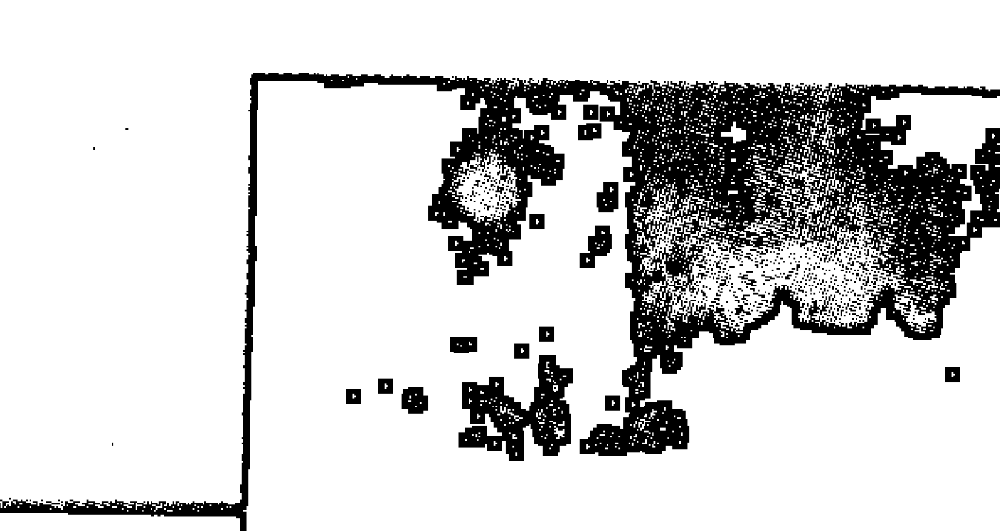

## 奇门遁甲解真

吉门偶尔合三奇，值此须云百事宜。
更合从旁加检点，余宫不可有微疵。
三奇得使诚堪使，六甲遇之非小补。
乙逢犬马丙鼠猴，六丁玉女骑龙虎。
又有三奇游六仪，号为玉女守门扉。
若遇阴私和合事，诸君但向此中推。
天三门兮地四户，问君此法如何处。
太冲小吉与从魁，此是天门私出路。
地户除危定与开，举事皆从此中去。
六合太阴太常君，三辰元是地私门。
更得奇门相照耀，出行百事总欣欣。
太冲天马最为贵，卒然有难难逃避。
但当乘取天马行，剑戟如山不足畏，
三为生气五为死，胜在三兮衰在五。
能识游三避五时，造化真机须记取。
就中伏吟为最凶，天蓬加著地天蓬。
天蓬若到天英上，须知即是反吟宫。
八门反复皆如此，生在生门死在死。
纵有吉宿得奇门，万事皆凶不堪使。
六仪击刑何太凶，甲子值符愁向东。
戊刑在未申刑虎，寅巳辰辰午刑午。
三奇入墓好思推，甲日哪堪相见未。
丙奇属火火墓戌，此时诸事不须为。
更兼六乙来临二，月奇临六亦同论。
又有时干入墓宫，课中时下忌相逢。
戊戌壬辰兼丙戌，癸未丁丑亦同凶。

## 奇门遁甲解真

五不遇时龙不精，号为日月损光明。
时干来克日干上，甲子须知时忌庚。
奇与门兮共太阴，三般难得总加临。
若还得二亦为吉，举措行藏必遂心。
更得值符值使利，兵家用事最为贵，
常从此地击其冲，百战百胜君须记。
天乙之神所在宫，大将宜居击对冲。
假令值符居离九，天英坐取击天蓬。
甲乙丙丁戊阳时，神居天上要君知。
坐击须凭天上奇，阴时地下亦如之。
若见三奇在五阳，偏宜为客自高强。
忽然逢着五阴位，又宜为主好裁详。
值符前三六合位，太阴之神在前二。
后一宫中为九天，后二之神为九地。
九天之上好扬兵，九地潜藏可立营。
伏兵但向太阴位，若逢六合利逃刑。
天地人分三遁名，天遁日精华盖临。
地遁月精紫云祥，人遁当知是太阴。
生门六丙合六丁，此为天遁自分明。
开门六乙合六己，地遁如斯而已矣。
休门六丁共太阴，欲求人遁无过此。
要知三遁何所宜，藏形遁迹斯为美。
庚为太白丙荧惑，庚丙相加谁会得。
六庚加丙白入荧，六丙加庚荧入白。
白入荧兮贼即来，荧入白兮贼须灭。
丙为勃兮庚为格，格则不通勃乱逆。
- 天丙加地庚为勃，天庚加地癸为格。
- 丙加天乙为勃符，天乙加丙为正格。
- 庚加日干为伏干，日干加庚飞干格。
- 加一宫兮战在野，同一宫兮战于国。
- 庚加值符天乙伏，值符加庚天乙飞。
- 庚加癸兮为大格，加己为形最不宜。
- 加壬之时为上格，又兼岁月日时移。
- 更有一般奇格者，六庚谨勿加三奇。
- 此时若也行兵去，匹马只轮无返期。
- 六癸加丁蛇天矫，六丁加癸雀入江。
- 六乙加辛龙逃走，六辛加乙虎猖狂。
- 请观四者是凶神，百事逢之莫措手。
- 丙加甲兮鸟跌穴，甲加丙兮龙回首。
- 只此二者是吉神，为事如意十八九。
- 八门若遇开休生，诸事逢之总称情。
- 伤宜捕猎终须获，杜好遨遮及隐形。
- 景上投出并破阵，惊能擒讼有声名。
- 若问死门何所主，只宜吊死与行刑。
- 蓬任冲辅禽阳星，英芮柱心阴宿名。
- 辅禽心星为上吉，冲任小吉未全亨。
- 大凶元气变为吉，小凶无气一同之。
- 吉宿更能逢旺相，万举万全必成功。
- 若遇休囚并废没，劝君不必进前程。
- 要识九星配五行，各随八卦考羲经。
- 坎蓬星水离英火，中宫坤土为艮营。
- 乾兑为金震巽木，旺相休囚看重轻。

## 奇门遁甲解真

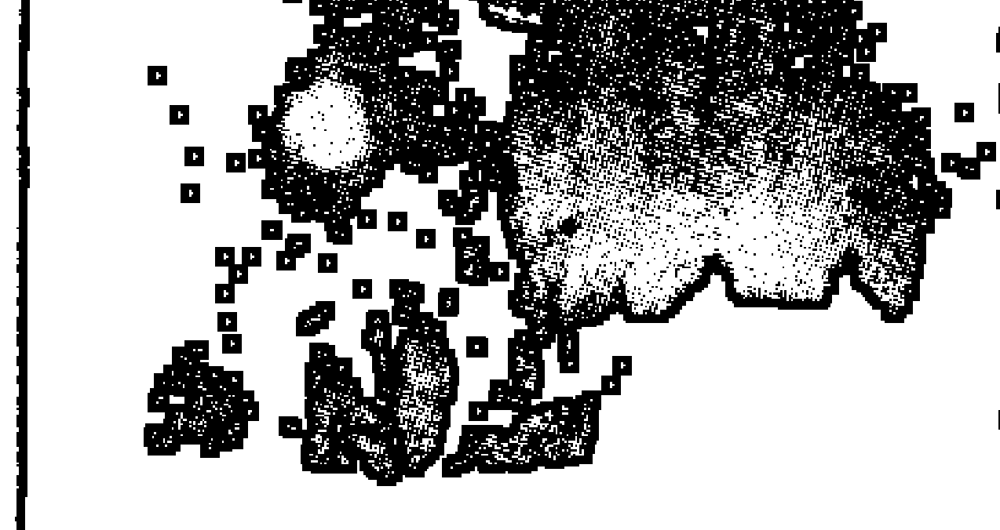

与我同行即为相，我生之月诚为旺。
废于父母休于财，囚于鬼兮真不妄。
假令水宿号天蓬，相在初冬与仲冬。
旺于正二休四五，其余仿此自研究。
急则从神缓从门，三五反复天路亭。
十干加伏若加错，入库休囚吉事危。
十精为使用为贵，起宫天乙用无遗。
天自为客地为主，六甲推兮无差理。
劝君莫失此玄机，洞彻九宫扶明主。
宫制其门不为迫，门制其宫是迫雄。
天网四张无路走，一二网低有路踪。
三至四宫行入墓，八九高强任西东。
节气推移时候定，阴阳顺逆要精通。
三元积数成六纪，天地未成有一理。
请观歌里精微诀，非是贤人莫传与。

## 第七章 奇门总要诀

阴阳逆顺妙难穷，二至还乡一九宫。
若能了达阴阳理，天地都来一掌中。
三才变化作三遁，八卦分为人遁门。
星符每逐时干转，值使常随天乙奔。
六仪六甲本同名，三奇即是乙丙丁。
三奇倅合开休生，便是吉门利出行。
万事从之无不利，能知玄妙得其灵。
值符前三六合位，前二太阴君须记。
值符后一名九天，后二宫神名九地。
地为伏匿天扬兵，六合太阴可藏避。
急从神兮缓从门，三五反复天道利。
己上若得三奇妙，不如更得三奇使。
得使犹来未为精，五不遇时损其明。
损又须知时克日，吟格相加尤不吉。
掩捕逃亡须格时，占稽得人信宜失。
斗中三奇游六仪，天乙会合主阴私。
讨捕须明时下克，行人信息遇三奇。
三奇上见游六仪，六仪更见五阳时。
- 兼向八门寻吉位，万事开三万事宜。
- 五阳在前五阴后，主客须知有盛衰。
- 阴后五支还须记，六仪加著更无利。
- 六仪忽然加三宫，更为击刑先须忌。
- 六仪击刑三奇墓，此时举事百事误。
- 太白入荧贼即来，火入金乡贼即去。
- 丙为勃兮庚为格，格则不通勃乱逆。
- 庚加日干为伏干，日干加庚飞于格。
- 加己为刑道上格，加癸路中大格宜。
- 加壬之时为小格，更嫌岁月日时移。
- 当此之时皆不吉，遣将行师勿用之。
- 丙加甲兮鸟跃穴，甲加丙兮龙反首。
- 辛加乙兮虎猖狂，乙加辛兮龙逃走。
- 丁加癸兮雀入江，癸加丁兮蛇夭矫。
- 符加丙丁为相佐，使加六丁为守户。
- 生丙合戊为天遁，地遁乙合开加己。
- 休承丁合太阴人，天网四张时加癸。
- 蓬加英兮为反吟，伏吟之时蓬加蓬。
- 吉宿见之事更吉，凶宿逢之事愈凶。
- 天辅冲任禽心吉，天蓬天英芮柱凶。
- 阴属禽心柱英芮，阳宿冲辅及蓬任。
- 天网四张无走路，阴阳逆顺妙无穷。
- 节气推移时候应，二至还向一九宫。
- 三元超遁用六甲，八卦周流遍九宫。

## 第八章 阴阳二遁顺序图

所谓阳遁就是从一宫到九宫，按戊己庚辛壬癸丁丙乙的顺序顺排。所谓阴遁，就是从九宫到一宫，按照顺序逆排。

阳遁顺序图：

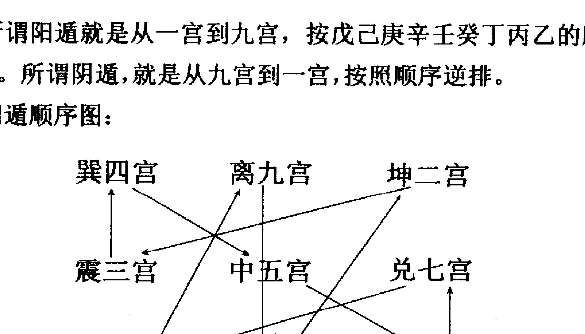

阴遁顺序图：

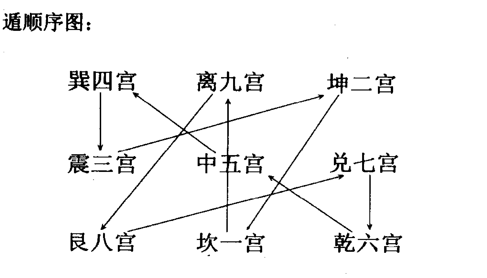

## 第九章 九宫八卦方位图

| | | |
|---|---|---|
| 巽卦四宫<br>属木<br>东南方 | 离卦九宫<br>属火<br>南方 | 坤卦二宫<br>属土<br>西南方 |
| 震卦三宫<br>属木<br>东方 | 中卦五宫<br>属土<br>(寄二宫) | 兑卦七宫<br>属金<br>西方 |
| 艮卦八宫<br>属土<br>东北方 | 坎卦一宫<br>属水<br>北方 | 乾卦六宫<br>属金<br>西北方 |

## 第十章 三奇六仪

奇门遁甲术是建立在阴阳、五行、八卦、九宫、天干、地支、历法等中国传统理论基础之上的一种术数方法。奇门遁甲有自己独特的理论体系，这是奇门遁甲区别于术数门类的基础特征。奇门遁甲独特的理论与方法包括：三奇、六义、九星、八门、八诈门、阳遁、阴遁、超神、接气及布局法和格局等。

三奇，指天干中的乙丙丁三位。

在奇门遁甲中，甲为天干之首，在五行属木，好比军队的主帅。甲木最怕庚金克制，甲如受损，则群龙无首了。因此将甲隐藏起来，不让它受到庚金的伤害。乙奇为甲木的妹妹，乙庚相合，甲木把妹妹嫁给庚金，庚得到乙，则为贪合而忘了克甲。因此把乙作为一奇。丙、丁都属火，五行中火为木所生者，丙丁为甲木之子女，子女应该有卫护父母之责，丙火为甲木之儿子，庚为金，丙火能克制庚金，丁火为甲木之女儿，丁为玉女，丁火能克制庚金。乙丙丁为甲木最为近者，此以奇门遁甲中以此三者为奇。

六仪：仪为仗仪的意思。奇门遁甲中的六仪是指天干中戊、己、庚、辛、壬、癸六位，六甲为甲子、甲戌、甲申、甲午、甲辰、甲寅，六位分别置于戊、己、庚、辛、壬、癸六者之中。六甲与六仪的配合为：

- 甲子戊、甲戌己、甲申庚、甲午辛、甲辰壬、甲寅癸。

### 三奇六仪

三奇六仪在九宫中的排列顺序是戊、己、庚、辛、壬、癸、丁、丙、乙。阳遁按一至九宫顺排，阴遁按一至九宫逆排。

在六十个时辰中，三奇六仪所在的宫位是固定的，所以就形成了一种格局，奇门遁甲就叫一局。

这就是时家奇门最根本的规律，见《时辰六甲一局规律表》，这里所谓一旬，不是指十天，而是指十个时辰。

## 时辰六旬遁甲一局规律表

| 年号 | 年命 | 年号 | 年命 | 年号 | 年命 | 年号 | 年命 | 年号 | 年命 | 年号 | 年命 |
| :--- | :--- | :--- | :--- | :--- | :--- | :--- | :--- | :--- | :--- | :--- | :--- |
| 甲子 | 海中金 | 丙子 | 涧下水 | 戊子 | 霹雳火 | 庚子 | 壁上土 | 壬子 | 桑松木 | | |
| 乙丑 | | 丁丑 | | 己丑 | | 辛丑 | | 癸丑 | | | |
| 丙寅 | 炉中火 | 戊寅 | 城墙土 | 庚寅 | 松柏木 | 壬寅 | 金箔金 | 甲寅 | 大溪水 | | |
| 丁卯 | | 己卯 | | 辛卯 | | 癸卯 | | 乙卯 | | | |
| 戊辰 | 大林木 | 庚辰 | 白蜡金 | 壬辰 | 长流水 | 甲辰 | 佛灯火 | 丙辰 | 沙中土 | | |
| 己巳 | | 辛巳 | | 癸巳 | | 乙巳 | | 丁巳 | | | |
| 庚午 | 路旁土 | 壬午 | 杨柳木 | 甲午 | 沙中金 | 丙午 | 天河水 | 戊午 | 天上火 | | |
| 辛未 | | 癸未 | | 乙未 | | 丁未 | | 己未 | | | |
| 壬申 | 剑锋金 | 甲申 | 泉中水 | 丙申 | 山下火 | 戊申 | 大驿土 | 庚申 | 石榴木 | | |
| 癸酉 | | 乙酉 | | 丁酉 | | 己酉 | | 辛酉 | | | |
| 甲戌 | 山头火 | 丙戌 | 屋上土 | 戊戌 | 平地木 | 庚戌 | 钗钏金 | 壬戌 | 大海水 | | |
| 乙亥 | | 丁亥 | | 己亥 | | 辛亥 | | 癸亥 | | | |

## 第十一年 一年二十四节气与阴阳二遁

### (一) 一年二十四节气奇门遁甲用局表

一、奇门遁甲分阳遁和阴遁，“冬至一阳生，夏至一阴生。”阳遁从二十四节气中的冬至到夏至，阴遁则从夏至到冬至。该用局表都是有规律排列的，这个图表中冬至一七四，小寒二八五，大寒三九六，指的是从冬至节开始的十五天，分别用阳遁一局、七局、四局、小寒节的十五天中，分别用阳遁二局、八局、五局，大寒节的十五天中分别用阳遁三局、九局、六局，依次类推。从夏至开始用阴遁，夏至九三六，小暑八二五，大暑七一四，指的是夏至节后十五天分别用阴遁九局、三局、六局，小暑节后十五天分别用阴遁八局、二局、五局，大暑节后十五天用阴遁七局、一局、四局，依次类推。

### 与阴阳二遁
### 一年二十四节气

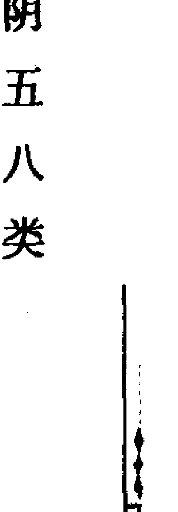

## （一）一年二十四节气奇门遁甲用局表

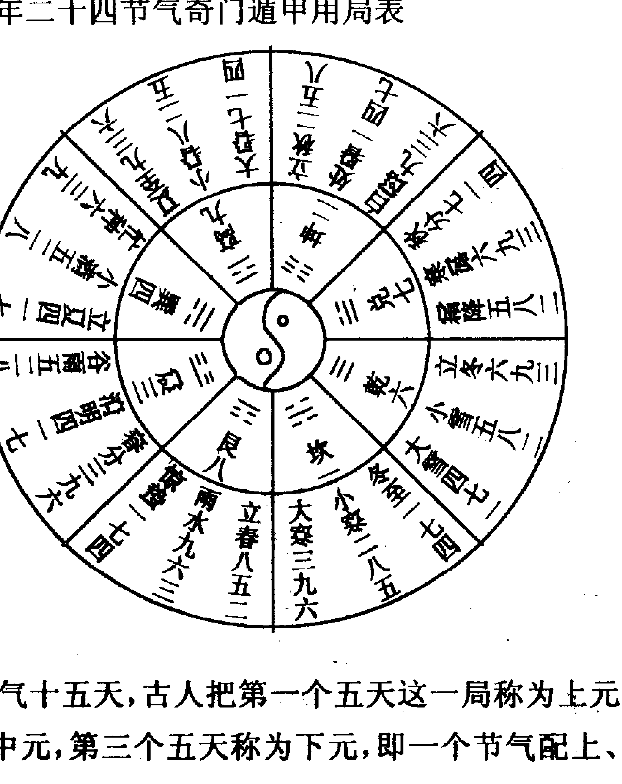

一个节气十五天，古人把第一个五天这一局称为上元，第二个五天称为中元，第三个五天称为下元，即一个节气配上、中、下三元。

### （二）日干支与上中下三元

前面已讲了一年二十四节气，每个节气所辖十五天中上中下三元所用阳遁或阴遁的局数。但是具体到每一天应该用阳遁几局或阴遁几局，这是有规律性的。我们把六十甲子作为日干支的符号与上中下三元对应起来，可以排出下列格局：

| 上元五天 | 中元五天 | 下元五天 | 中元五天 | 下元五天 | 中元五天 | 上元五天 | 下元五天 | 中元五天 | 上元五天 | 下元五天 |
| :--- | :--- | :--- | :--- | :--- | :--- | :--- | :--- | :--- | :--- | :--- |
| ①②③④⑤ | ①②③④⑤ | ①②③④⑤ | ①②③④⑤ | ①②③④⑤ | ①②③④⑤ | ①②③④⑤ | ①②③④⑤ | ①②③④⑤ | ①②③④⑤ | ①②③④⑤ |
| 甲乙丙丁戊 | 己庚辛壬癸 | 甲乙丙丁戊 | 甲乙丙丁戊 | 甲乙丙丁戊 | 甲乙丙丁戊 | 己庚辛壬癸 | 己庚辛壬癸 | 己庚辛壬癸 | 己庚辛壬癸 | 己庚辛壬癸 |
| 子丑寅卯辰 | 巳午未申酉 | 戊亥子丑寅 | 申酉戌亥子 | 辰巳午未申 | 寅卯辰巳午 | 卯辰巳午未 | 丑寅卯辰巳 | 亥子丑寅卯 | 酉戌亥子丑 | 未申酉戌亥 |

从以上的格局中我们可以看出这样两条规律：
一、每一元的第一天的天干，不是甲就是己，把这个元头称为符头。即符头有两个，不是甲就是己。
二、凡上元第一天的地支总是子、午、卯、酉中的一个，中元第一天的地支总是寅、申、巳、亥中的一个，下元第一天的地支总是辰、戌、丑、未中的一个。

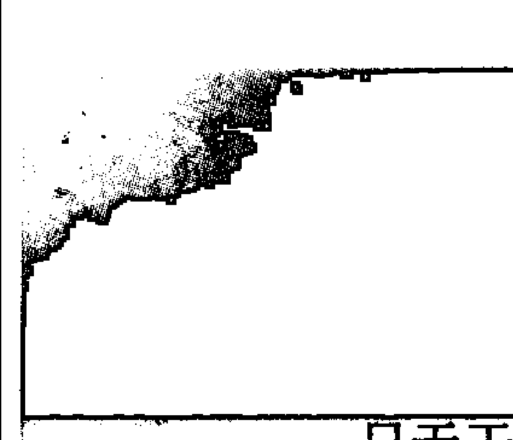

日天干凡是甲己者均为符头，即每元的第一天；凡日地支为子午卯酉者，均为上元的第一天；凡日地支为寅申巳亥者，均为中元的第一天；凡日地支为辰戌丑未者，均为下元的第一天。

换句话说：上元的符头即上元的日干支为甲子、甲午、己卯、己酉；中元符头即是中元头一天的日干支为甲寅、甲申、己巳、己亥；下元的符头即下元头一天的日干支为甲辰、甲戌、己丑、己未。

知道了这个规律，我们就可以根据每一天的干支来确定它属于上中下三元的哪一元，再根据节气，就知道这一天该用奇门遁甲的几局了。

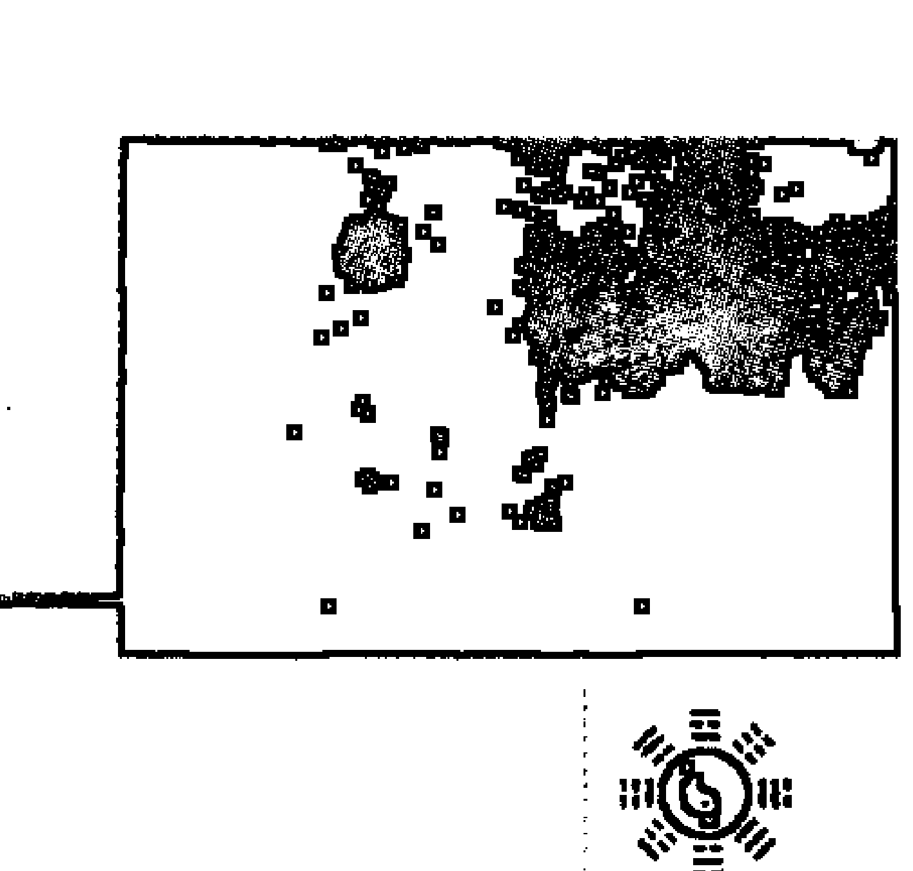

## 第十二章 八门顺序及特征

八门在《奇门遁甲》天地人格局中代表人事，所以在奇门预测中极其重要，特别是用神所临之门以及值使门所测人间事物关系很大。

- 开门
- 休门
- 生门
- 伤门
- 杜门
- 景门
- 死门
- 惊门

八门排列顺序不变，阳遁、阴遁均按顺时针排列。

一般来说，开、休、生为三吉门，死、惊、伤为三凶门，杜、景为中平门，但是运用时还必须看临何宫，以及旺相休囚。

> > 奇门大全歌曰：吉门被克吉不就，凶门被克凶不起；吉门相生大吉利，凶门得生祸难避。吉门克宫吉不就，凶门克宫事更凶。

在《神奇之门》一书中，张志春老师有八门执事歌一首，概括了八门所主的主要事项：

> > 欲求财利往生方，葬猎须知死路强。
> 征战远行开门吉，休门见贵最为良。
> 惊门官讼是非多，杜门无事好逃藏。
> 伤门搏斗能捉贼，景门饮酒好商量。

### 八门特征

1. 开门：开门居西北乾宫，五行属金。旺于秋季，特别是戊、亥月，相于四季末月，休于冬，囚于春，死于夏。开门居乾宫伏吟，居巽宫反吟，居艮宫入墓，居离宫受制，居坤宫大吉，居兑宫旺相，居坎宫次吉，居震宫为迫。

开门代表领导、父亲、上级、都市、法官、工作、商店、工厂、公司。利开业经商、婚娶、乔迁、考学、参军、进人口、治病求医、上官、赴任等。

2. 休门：休门居北方坎宫，五行属水，旺于冬季，相于秋，休于春，囚于夏，死于四季末月。休门居坎宫为伏吟，居离宫反吟，居巽宫入墓，居坤、艮二宫受克，居乾兑二宫大吉，居震宫次吉。休门代表公务员，机关科室人员。利于求见领导和贵人，求财、婚姻、休闲玩耍等。

3. 生门：生门居东北艮宫，五行属土。旺于四季月，相于夏，休于秋，囚于冬，死于春。生门居艮宫为伏吟，居坤宫为反吟，居巽宫入墓，居震宫受克，居离宫大吉，居乾兑二宫次吉，居坎宫被迫。生门代表生意买卖，求财大吉，利于搞房地产、种植业、养殖业等。嫁娶建造也为吉利。

4. 伤门：伤门居东方震宫，五行属木。旺于春，相于冬，休于夏，囚于四季月，死于秋。伤门居震宫伏吟，居兑宫反吟，居坤宫入墓，居坎宫生旺大吉，居乾宫受制，居艮宫被迫大凶，居离宫泄气，居巽宫比和。伤门代表车辆，竞争，利讨债、捕捉，赌博等。伤门为凶门，不利经商、出行、赴任、修造、嫁娶，经商易破财，出行易有灾。

5. 杜门：杜门居东南巽宫，五行属木。旺于春、相于冬、休于夏、囚于四季月，死于秋，杜门居巽宫伏吟，居乾宫反吟，居坤宫入墓，居兑宫受克，居艮宫被迫，居坎宫受生，居震宫比和，居离宫泄气。杜门代表保密、躲藏方向、闭塞、军队、工商、税务、警察、捕盗、防洪、筑堤、利避难等。

6. 景门：景门居正南离宫，五行属火。旺于夏、相于春、休于四季月，囚于秋、死于冬。景门居离宫伏吟，居坎宫反吟，居乾宫入墓，居兑宫被迫，居震巽二宫生旺，居坤艮二宫次吉。
景门宜于献策筹谋，选士荐贤，拜职遣使，火攻杀戳，余者不利，谨防口舌及血光之灾。景门多主文书之事。

7. 死门：死门居西南坤宫，五行属土，旺于秋，特别是未申月，相于夏，囚于冬，死于春。居坤宫伏吟，居艮宫反吟，居巽宫入墓，居震宫受克，居离宫生旺大凶，居坎宫被迫大凶，居乾兑二宫相生。
死门代表地皮、死人、坟地、凶灾。利吊死送丧，刑戳争战、捕猎杀牲。

8. 惊门：惊门居正西兑宫，五行属金，旺于秋，相于四季，休于冬，囚于春，死于夏。惊门居兑宫伏吟，居震宫反吟，居艮宫入墓，居离宫受制，居巽宫为迫，居坎宫泄气，居坤宫受生，居乾宫比和。
惊门代表口舌官司、律师、惊恐、创伤。利斗讼官司，掩捕盗贼，蛊惑乱众。

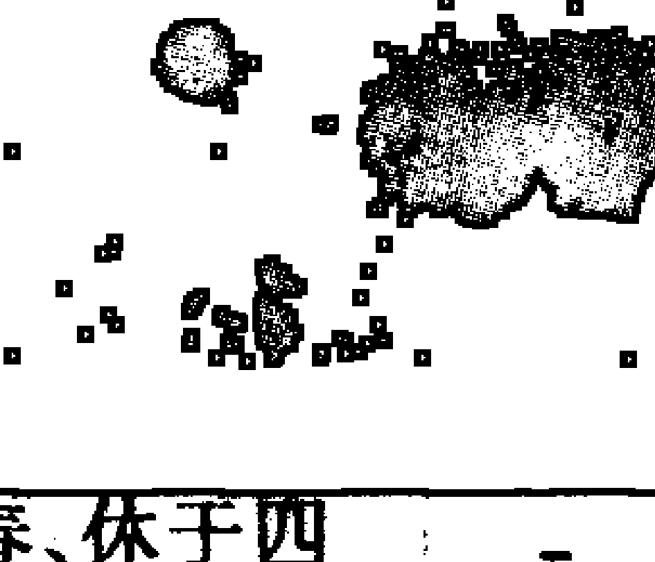

古人把门克宫称为“迫”，叫“门被迫”歌曰：“吉门被迫吉不就，凶门被迫事更凶。”也就是说，吉门克宫吉事就不吉了，凶门克宫，事情更凶了，又把宫克门叫做“制”，也就是门受宫克。门生宫称做“和”，宫生门称做“义”。门宫相生，对于吉门来说自然为好，对于凶门来说，如果受生，更加旺相，那就凶上加凶了。

## 第十三章 九星顺序及特征

九星在奇门遁甲中代表天时，即天体运动对地球和人类的影响。古人从常见的行星中，根据它们运转歇宿的位置，选择其中有代表性的九颗星，分别与地上的九宫八卦相对应，九星分别为：天蓬星、天任星、天冲星、天辅星、天英星、天芮星、天禽星、天柱星、天心星，九星顺序不变，阳遁、阴遁均按顺序时针排列。

天心星、天任星、天禽星、天辅星为四吉星。天冲星是次吉星，天蓬星、天芮星、天柱星为三凶星，天英星中平。

- 1. 天蓬星：原名贪狼星，与北方一宫坎卦相对应，阳星，五行属水。旺于春，相于冬，休于夏，囚于四季月，废于秋。代表破财、大盗、杀人犯、贪财。也代表大智大慧。利安抚边境，屯兵固守。婚娶远行遇到它都不利，修造房屋、埋藏死者遇到它也很不利，只有再生到生门和丙奇、乙奇才会万事昌隆。
- 2. 天芮星：原名巨门星，与西南方二宫坤卦相对应，阴星。五行属土。旺于秋，相于四季月，休于冬，囚于春，废于夏，代表疾病、学生、佛龛。宜传道交友，屯兵固守，不宜用兵，嫁娶、争讼、迁徙、修造等。
- 3. 天冲星：原名禄存星，与东方三宫震卦相对应，阳星。五行属木，旺于夏，相于春，休于四季月，囚于秋，废于冬。代表武士、处事雷厉风行，利征伐交战，报仇解怨。施恩交友，嫁娶、修坟、生女孩都会受到惊扰，外出远行、迁移都会有灾难，修房建屋，埋藏死人都不吉祥。
- 4. 天辅星：原名文曲星，与东南四宫巽卦相对应，阳星，五行属木。旺于夏，相于春，休于四季月，囚于秋，废于冬。代表文化，老师，漂亮，利出行、经商、嫁娶、修造，特别利考学、考官，万事昌荣。
- 5. 天禽星：原名廉贞星，与中央五宫相对应，阳星。五行属土，旺于秋，相于四季月，休于冬，囚于春，废于夏。代表忠厚之人，百官元首，利外出远行，见上级、经商、嫁娶。天禽星临宫，百事皆宜，四时皆吉。
- 6. 天心星：原名武曲星，与西北六宫乾卦相对应，阴星。五行属金，旺于冬，相于秋，休于春，囚于夏，废于四季月。代表医生、圆形、有心计之人，利医疗、经商、婚嫁、迁藏都会吉利。无论做什么事情都处于有利地位。
- 7. 天柱星：原名破军星，与西方七宫兑卦相对应，阴星。五行属金。旺于冬，相于秋，休于春，囚于夏，废于四季月。代表凶灾、破败、口舌官司。宜修筑营垒、训练士兵，屯兵固守。不宜外出远行，征战交兵。商人无论干什么都不利。
- 8. 天任星：原名左辅星，与东北八宫艮卦相对应，阳星，五行属土。旺于秋，相于四季月，休于冬，囚于春，废于夏。代表吉利，厚道之人，利经商、婚嫁、修建房屋，进行迁移，百事皆吉，四时皆宜。
- 9. 天英星：原名右弼星，与南方九宫离卦相对应，阴星，五行属火。旺于四季月，相于夏，休于秋，囚于冬，废于春。代表性烈、光明、血光等，利上官见贵，饮宴作乐。谋划献策。不宜远行和迁移、外出经商求财、嫁娶。

## 第十四章 八神顺序及特征

八神是古人在天人感应中发现的与九宫八卦有对应性质的八种神秘力量。它们是值符、螣蛇、太阴、六合，白虎(下有勾陈)、玄武(下有朱雀)、九地、九天。八神为神盘，八神顺序不变、阳遁顺时针排列，阴遁逆时针排列。在预测中可以作为用神。

- 1. 值符：由于小值符与地盘值班六甲大将和天盘值班星球相对应，因此叫值符，它也是八神中值班的头。由于甲遁在其下，所以小值符按五行性质来分，应属于东方甲木的性质。在神煞中为最吉之神。也称天乙神，诸神之首领，所到之处百恶消散。即使太白庚金这最凶的恶煞临于值符之下，也便消形入墓，不能作恶了。
- 2. 螣蛇：具有南方火的性质，为虚诈之神。性格虚伪，性杀而口辣，专管惊恐怪异，虚诈不实之事。
- 3. 太阴：具有西方金性质，为阴护之神，性格阴匿暗昧。太阴所临之方，可以密谋策划。有时也可作为阴险毒辣、老谋深算的符号。
- 4. 六合：具有东方木的性质，为护卫之神。它性格开朗平和，专管婚姻、中介之事。六合所临之方，利于谈判、交易、婚姻嫁娶。
- 5. 白虎(下有勾陈)：具有西方金的性质，为凶神。它的性格凶猛好斗，专管行兵打仗、凶杀打斗、疾病死伤、交通事故等。白虎下隐勾陈，勾陈具有地户己土性质，己土长生于酉，故隐于白虎之下。
- 6. 玄武（下有朱雀）：具有北方水的性质，为奸谗小盗之神，性格爱偷（包括偷情）、喜盗，专管盗贼、逃亡、口舌之事。朱雀本来是南方火神，但北方玄武子水之位，还是丙火怀胎之地，所以朱雀隐于玄武之下，也管一些口舌是非之事。
- 7. 九地：具有坤土的性质，有厚载之德，为万物之母。古人称其为坚牢之神，性格柔顺安静，滋生万物。九地之方，利于屯兵固守、播种养殖。
- 8. 九天：具有乾金的性质，为天为父，古人称其为威悍之神，性格刚强好动。九天之上可以扬兵、布陈、行军、打仗、坐飞机旅游、出国。

## 第十五章 纸上快速起局法

这一节纸上快速起局法，是按照我的老师张志春先生在《神奇之门》一书中的起局方法。

- 第一步：把阳历的年月日时换算成干支历。
- 第二步：根据节气和上中下三元的规律，确定求测日所用遁甲局数，是阳遁几局，或是阴遁几局。
- 第三步：在纸上画一个井字形九宫格或者米字形八宫格，将一至九宫分别按奇门遁甲格局填在格内。
- 第四步：在纸上一至九宫格内，按遁甲几局三奇六仪的排布规律，即戊、己、庚、辛、壬、癸、丁、丙、乙这个永定例、永远不变的顺序，将六仪三奇布在一至九宫格内。
- 第五步：找出预测时辰的旬首，比如乙亥时，甲戌为旬首；辛亥时，甲辰为旬首；戊戌时，甲午为旬首；即预测时辰是六甲中哪一甲大将在地盘值班。同时根据该甲所隐的六仪，即知道地盘上该甲在几宫值班了。
- 第六步：根据地盘上六甲值班一甲所在宫位，即可找出与它对应的天盘上值班的九星之一，这就是值符；人盘上值班的八门之一，这就是值使。这样把这个时辰内的值符和值使就找出来了，并一一写在纸上。
- 第七步：根据“值符随时干”的规律。看预测时辰的天干在地盘几宫，就将值符直接写在这个宫内，同时将它原在地盘宫内的六仪三奇也随之写在它如今转到的这个宫内。
- 第八步：值符落宫确定了，将其余八星连同它们原来地盘内所携带的六仪三奇也一一写在运转到的宫内，这样用事时辰天盘运行的格局就确定了。
- 第九步：根据“值使随时宫”的规律，将值使的八门之一按时间和宫位运行的顺序，确定它所落宫位，然后把它写在该宫格局内。同时，将其余七门按固定顺序，一一写在其它宫格之内，这样，八门运转到问事时辰的格局也就一目了然了。
- 第十步：根据阳遁顺时针运转，阴遁逆时针运转的规律和小值符永远追随大值符的规律，将神盘中的小值符首先写在大值符所落宫内，然后，将螣蛇、太阴、六合、白虎（勾陈）、玄武（朱雀）、九地、九天按顺序一一写在其他七个宫内，这样，八神盘在问事时辰运行的格局也就确定了。

至此，奇门遁甲起局或叫起卦的过程就全部完成了，每个宫内天、地、人、神及三奇六仪所形成的格局，就一目了然了。下边举例具体加以说明。

例一，1995年阳历6月11日上午9点30分问测。

按阳历6月11日为阴历5月14日，年干支为乙亥，月干支为壬午，日干支为癸酉，时辰干支为丁巳。

第一步，先找出日干支癸酉的符头，由癸酉往前数，己巳为符头，己巳（6月7日）日前一天是芒种，根据寅申巳亥为中元的规律，可知己巳到癸酉这五天属于芒种中元。芒种六三九，即芒种上中下三元分别用阳遁六局、三局、九局，芒种中元，自然该用阳遁三局了，这样，就可以确定6月11日癸酉日该用阳遁三局了。

第二步，在纸上画一个井字形九宫格，分别填上一至九宫的号码，然后按阳遁三局六仪三奇排布的规律，将六仪三奇分别写在九宫格内（如下图）的最底层，以表示为地盘上格局。

乙亥年壬午月癸酉日丁巳时，甲寅旬，阳遁三局，天任星为值符落九宫，生门为值使落二宫。

| 九天<br>开门<br>天蓬星（丙）<br>巽四、己 | 值符<br>休门<br>天任星（癸）<br>离九、丁 | 螣蛇<br>生门<br>天冲星（戊）<br>坤二、乙 |
| --- | --- | --- |
| 九地<br>惊门<br>天心星（辛）<br>震三、戊 | 天禽星<br>中五、庚 | 太阴<br>伤门<br>天辅星（己）<br>兑七、壬 |
| 玄武<br>死门<br>天柱星（壬）<br>艮八、癸 | 白虎<br>惊门<br>天禽星（庚）<br>天芮星（乙）<br>坎一、丙 | 六合<br>杜门<br>天英星（丁）<br>乾六、辛 |

## 阳遁三局图

第三步：找出丁巳时的旬首，为甲寅，说明丁巳时，是六甲大将甲寅癸在地盘值班，看一下刚才所画的图，因甲寅隐在癸下边，所以得知甲寅癸在地盘艮八宫值班。由此，与地盘艮八宫对应的天盘九星之一天任星为值符，人盘八门之一生门为值使。这样把值符、值使就找出来了，一一写在纸上。

第四步：根据“值符随时干”的原则，丁巳时干丁在地盘离九宫，所以直接将值符天任星写在离九宫格内，并将它所携带的六仪癸（即甲寅癸）也写在九宫内（见上图）。然后按九星的固定顺序，将天冲星（戊）写在离九宫前边（按顺时针方向转）的坤二宫内，天辅星（己）写在兑七宫，天英星（丁）写在乾六宫，天芮星（乙）天禽星（庚）一并写在坎一宫（因五宫寄二宫，随二宫天盘一起转动），天柱星（壬）写在艮八宫，天心星（辛）写在震三宫，天蓬星（丙）写在巽四宫。这样，丁巳时天盘运转的格局就确定了。而且，每个宫内天盘地盘三奇六仪形成的格局也一目了然了。比如离九宫形成癸加丁，蛇天矫的格局，坤二宫形成戊加乙，兑七宫为己加壬，乾六宫为丁加辛，坎一宫为庚加丙和乙加丙，艮八宫为壬加癸，震三宫为辛加戊，巽四宫为丙加己。

## 第五步：

根据“值使随时宫”的原则，阳遁顺行，如此，地盘甲寅癸在艮八宫，这表明寅时值使门生门在艮八宫，卯时则到九宫，辰时则到一宫，巳时则到二宫，这样就知道丁巳时，值使生门转到坤二宫了。于是，将生门写到坤二宫格内。然后，按八门排列的固定顺序，依次在七宫写上伤门，六宫写上杜门，一宫写上景门，八宫写上死门，三宫写上惊门，四宫写上开门，九宫写上休门。这样八门与九宫的格局也一目了然了。比如九宫，休门落离宫，休门属水，离九宫属火，水克火，即门克宫的格局。又如坤二宫，上乘生门，生门属土，坤二宫也属土，二土比和的格局，又如兑七宫，上乘伤门，伤门属木，兑七宫属金，金克木，宫克门的格局（见上图）。

## 第六步：

根据小值符永远追随大值符的规律，在纸上布八神。大值符天任星落九宫，于是，我们也把神盘中的小值符写在离九宫格内，然后按阳遁八神顺时针运转的规律，依次将螣蛇写在坤二宫，太阴写在兑七宫，六合写在乾六宫，白虎写在坎一宫，玄武写在艮八宫，九地写在震三宫，九天写在巽四宫。这样八神落宫形成的格局也一目了然了。（见上图）

至此，在纸上所起癸酉日丁巳时阳遁三局的格局就算完成了，下一步就是根据所问所测何事进行判断了。

### 例二：1995年8月13日晚8点问测。

按8月13日为阴历七月十八日，月干支为甲申，日干支为丙子，晚上八点为戌时，丙辛起戊子，戌时为戊戌，属甲午旬。

- 1. 第一步：根据日干支丙子，先找符头，为甲戌，辰戌丑未为下元，丙子日正当立秋节（阳历8月8日）之后，所以应为立秋下元，立秋正当坤二宫，立秋二、五、八，所以下元应用阴遁八局。
- 2. 第二步：在纸上画一个九宫格，布上阴遁八局地盘的格局，最里层为地盘，往外依次为天盘、人盘和神盘。现将米字形八宫格（将中五宫直接与坤二宫写在一个格内）阴遁八局的格局在纸上画好写好，因为是阴遁，六仪三奇戊、己、庚、辛、壬、癸、丁、丙、乙是逆布（见下图）。
- 3. 第三步：根据戊戌时属甲午旬，知道地盘上是甲午辛在五宫值班（寄坤二宫），由此得知天盘上是天禽星为值符，人盘是死门为值使。
- 4. 第四步：根据“值符随时干”的运转规律，一看时干戊在地盘八宫，就知道戊戌时，值符天禽星（连带天芮星）运转到了八宫，于是把天禽星（连它携带的辛）、天芮星（连它携带的丁）一并写在八宫格内。然后按九星的固定顺序，依次将它前边（按顺时针方向）的七宫的天柱星（己）写在三宫内，六宫的天心星（庚）写在四宫内，一宫的天蓬星（丙）写在九宫内，八宫天任星（戊）写在二宫内，三宫天冲星（癸）写在七宫内，四宫天辅星（壬）写在六宫内，九宫天英星（乙）写在一宫内。这样天盘九星运转的格局就出来了。（见下图）

乙亥年甲申月丙子日戊戌时，甲午旬，阴遁八局，天禽星为值符，落八宫；死门为值使，落一宫

第五步：根据“值使随时宫”的原则，值使死门午时在五宫，阴遁逆行，未时四宫，申时三宫，酉时二宫，戌时一宫，戊戌时死门落一宫，即将死门写在一宫格内。然后依照八门固定的顺序，依次将惊门写在八宫，开门写在三宫，休门写在四宫，生门写在九宫，伤门写在二宫，杜门写在七宫，景门写在六宫。这样，戊戌时，八门运转的格局也就确定了。（见上图）。

第六步：根据小值符追随大值符的原则，将小值符写在八宫内，然后按阴遁逆时针方向，依次将螣蛇写在一宫内，太阴写在六宫内，六合写在七宫内，白虎写在二宫内，玄武写在九宫内，九地写在四宫内，九天写在三宫内，这样，八神在戊戌时运转的格局也一目了然了。（见上图）

这样，每个宫内天、地、人、神以及三奇六仪所形成的格局就完全清楚了，就可以进入判断的过程了。（以上从第九章至十五章均采录于张志春老师《神奇之门》一书）。

## 纸上快速起局法

## 第十六章 三奇六仪的克应关系

### 一、时干克应

十千克应，就是十个天干在天盘和地盘相遇后的各种克应关系。即天盘三奇六仪与地盘三奇六仪相遇后发生的各种关系。奇门遁甲，故名思意，甲常隐于六仪之下，六甲以六仪为代表来看其克应关系。

- (一)、甲加甲（因为是甲子戊，戊来代表甲）即戊加戊；名为伏吟，无论做什么事都不宜动，只要隐避静守就会吉利，动则凶。
- 戊加乙：即天盘戊加地盘乙，名为青龙合灵格，此时遇吉门则吉，遇凶门则凶。
- 戊加丙：即天盘戊加地盘丙，名为青龙返首，大吉大利。但若逢墓迫击刑，则会吉事变成凶事。
- 戊加丁：即天盘戊加地盘丁，名为青龙耀明。宜见贵人、求功名。但若逢墓迫，则会招惹是非。
- 戊加己：即天盘戊加地盘己，名为贵人入狱，公私皆不吉利。
- 戊加庚：即天盘戊加地盘庚，名为值符飞宫，吉事不吉，凶事更凶，飞宫格也主换地方。
- 戊加辛：即天盘戊加地盘辛，名为青龙折足，若逢吉门则有救，还可有所作为；若见凶门，主招灾失财和患疾病。
- 戊加壬：即天盘戊加地盘壬，名为青龙入天牢，无论什么事都不吉利。
- 戊加癸：即天盘戊加地盘癸，名为青龙华盖。逢吉门吉格者招福，逢凶门凶格者，诸事不利，为凶。
- (二)、乙加戊：即天盘乙加地盘戊，名为利阴害阳，门逢凶迫，财伤人。
- 乙加乙：即天盘乙加地盘乙，名为日奇伏吟，不宜谒见贵人，求功名，只可安分守己为好。
- 乙加丙：即天盘乙加地盘丙，名为奇仪顺遂，此时遇吉星可以升官进职，遇凶星则夫妻分离。
- 乙加丁：即天盘乙加地盘丁，名为奇仪相佐，最利文书、考试，百事可做。
- 乙加己：即天盘乙加地盘己，名为日奇入墓，前程不明，凶门事必凶，得二吉门为地遁。
- 乙加庚：即天盘乙加地盘庚，名为日奇被刑，打官司破财，夫妻各怀私心。
- 乙加辛：即天盘乙加地盘辛，名为青龙逃走，奴仆盗窃主家钱财，六畜皆伤。
- 乙加壬：即天盘乙加地盘壬，名为日奇入地，尊卑颠倒，要吃官司。
- 乙加癸：即天盘乙加地盘癸，名为华盖逢星，宜于隐居、修道、不露形迹、躲灾避难为吉。
- (三)、丙加戊：即天盘丙加地盘戊，名为飞鸟跌穴，无论干什么事都吉利。
- 丙加乙：即天盘丙加地盘乙，名为日月并明，无论做什么事都吉利。
- 丙加丙：即天盘丙加地盘丙，名为月奇悖师，主文书逼迫，财产破耗，主单据票证遗失不明。
- 丙加丁：即天盘丙加地盘丁，名为星奇朱雀，有贵人文书到来，吉利，若是常人则生活平静，得三奇门为天遁。
- 丙加己：即天盘丙加地盘己，名为大悖入刑，坐监牢，被杖责，文书公文不能传递，得吉门则吉，得凶门则转吉为凶。
- 丙加庚：即天盘丙加地盘庚，名为荧入太白，主家庭破败，盗贼偷窃，财产损失。
- 丙加辛：即天盘丙加地盘辛，名为谋事能成，为病人不凶。
- 丙加壬：即天盘丙加地盘壬，名为火入天罗，为客不利，是非颇多。
- 丙加癸：即天盘丙加地盘癸，名为华盖悖师，阴人害事，灾祸较多。
- (四)、丁加戊：即天盘丁加地盘戊，名为青龙转光，官人升迁，常人有戚昌盛。
- 丁加乙：即天盘丁加地盘乙，名为人遁吉格，当官的加官晋爵，老百姓有婚姻、发财之喜。
- 丁加丙：即天盘丁加地盘丙，名为星随月转，当官的会越级高升，老百姓则乐中生悲。
- 丁加丁：即天盘丁加地盘丁，名为星奇入太阴，书信即至，喜事遂心，万事如意。
- 丁加己：即天盘丁加地盘己，名为火入勾陈，奸私仇冤，事端由女人引起。
- 丁加庚：即天盘丁加地盘庚，名为文书阻隔，行人必归。
- 丁加辛：即天盘丁加地盘辛，名为朱雀入狱，罪人被释放，官人失位。
- 丁加壬：即天盘丁加地盘壬，名为五神互合，贵人恩诏，讼狱公平，但婚多为苟合。
- 丁加癸：即天盘丁加地盘癸，名为朱雀投江，文书口舌是非，惊动官符，词讼不利，音信长期不通。
- (五)、己加戊：即天盘己加地盘戊，名为犬遇青龙，逢吉门则吉，若逢凶门，枉费心机。
- 己加乙：即天盘己加地盘乙，名为墓神不明，地户逢星，宜隐匿不出，逃走则有利。
- 己加丙：即天盘己加地盘丙，名为火悖地户，男人冤冤相害，女人必定淫乱不堪。
- 己加丁：即天盘己加地盘丁，名为朱雀入墓，先动者失利，受冤枉，后得平反昭雪。
- 己加己：即天盘己加地盘己，名为地户逢鬼，病者必死，暂不谋为，谋为则凶。
- 己加庚：即天盘己加地盘庚，名为刑格返名，词讼先动者不利，如临阴星有谋害之情。
- 己加辛：即天盘己加地盘辛，名为游魂入墓，易遇阴邪鬼怪作祟。
- 己加壬：即天盘己加地盘壬，名为地网高张，遇狡童淫女，有奸情杀伤凶。
- 己加癸：即天盘己加地盘癸，名为地刑玄武，男女疾病垂危，并有官司牢狱之灾。
- (六)、庚加戊：即天盘庚加地盘戊，名为天乙伏宫，百事不可谋，大凶。
- 庚加乙：即天盘庚加地盘乙，名为太白逢星，退吉进凶。
- 庚加丙：即天盘庚加地盘丙，名为太白入荧，贼必来，为客者有利，为主者破财。

## 三奇六仪的克应关系

庚加丁：即天盘庚加地盘丁，名为亭亭自奸，因男女私情惹起官司，逢吉门则有救。

庚加己：即天盘庚加地盘己，名为刑格，官司口舌，因官讼被判刑，住牢狱更凶。

庚加庚：即天盘庚加地盘庚，名为太白同宫，又为战格，官灾横祸，兄弟、朋友相冲克，不利为事。

庚加辛：即天盘庚加地盘辛，名为白虎干格，远行车折马伤，求财更是大凶。

庚加壬：即天盘庚加地盘壬，名为上格，远行迷路，男女音信难通。

庚加癸：即天盘庚加地盘癸，名为大格，多主车祸，官事不止，生育母子俱伤，大凶。

（七）、辛加戊：即天盘辛加地盘戊，名为困龙被伤，主有官司、破财，安守本分。轻举妄动则有祸殃。

辛加乙：即天盘辛加地盘乙，名为白虎猖狂，主家败人亡，外出远行，必遭祸殃，测婚姻离散，主因男人。

辛加丙：即天盘辛加地盘丙，名为干合悖师，求雨无雨，求晴天旱，必因财产纠纷诉讼公堂。

辛加丁：即天盘辛加地盘丁，名为狱神得奇，经商获利倍增。囚人遇赦获释。

辛加己：即天盘辛加地盘己，名为入狱自刑，奴仆背主，有冤诉讼难伸。

辛加庚：即天盘辛加地盘庚，名为白虎出力，刀兵相接、主客相残，逊让退步稍可，强进血溅衣衫。

辛加辛：即天盘辛加地盘辛，名为伏吟天庭，公事失败，私事成功，诉讼自招罪名。

辛加壬：即天盘辛加地盘壬，名为凶蛇入狱，两男争一女，诉讼不息，先动者失理获罪。

辛加癸：即天盘辛加地盘癸，名为天牢华盖，日月失明，误入天网，无论干什么事都不顺利。

（八）、壬加戊：即天盘壬加地盘戊，名为小蛇化龙，男人飞黄腾达，女人产孩儿。

壬加乙：即天盘壬加地盘乙，名为小蛇得势，女子柔顺，男子通达，占孕生男孩，前程光明。

壬加丙：即天盘壬加地盘丙，名为水蛇入火，主官灾刑禁之事络绎不绝。

壬加丁：即天盘壬加地盘丁，名为干合蛇刑，贵人匆匆而过，文书牵连，男吉女凶。

壬加己：即天盘壬加地盘己，名为反吟蛇刑，大祸将至，官司败诉，守本分可吉，轻举妄动必凶。

壬加庚：即天盘壬加地盘庚，名为太白擒蛇，讼狱公平，立剖正邪。

壬加辛：即天盘壬加地盘辛，名为腾蛇相缠，纵得吉门亦不能安宁，若有谋望被人欺瞒、哄骗。

壬加壬：即天盘壬加地盘壬，名为蛇入地罗，外事缠绕，内事繁琐，若逢吉门吉星，也许可以免受损害。

壬加癸：即天盘壬加地盘癸，名为幼女奸淫，家有丑事外传，若逢吉门凶星反祸为福。

（九）、癸加戊：即天盘癸加地盘戊，名为天乙合会，宜求财，婚姻喜美，有贵人帮助，若逢凶门迫制，反而有官司之祸。

癸加乙：即天盘癸加地盘乙，名为华盖逢星，贵人可以得到禄位，常人平安无事。

癸加丙：即天盘癸加地盘丙，名为华盖悖师，贵贱逢之皆不利，只是命运好的人有喜事临门。

癸加丁：即天盘癸加地盘丁，名为腾蛇天矫，文书官司火焚也逃不掉。

癸加己：即天盘癸加地盘己，名为华盖地户，无论男女占之音信皆阻，躲灾避难为上吉。

癸加庚：即天盘癸加地盘庚，名为太白入网，以暴力争讼，自罗罪责。

癸加辛：即天盘癸加地盘辛，名为网盖天牢，无论诉讼占病，结果都是死亡，罪责难逃。

癸加壬：即天盘癸加地盘壬，名为复见腾蛇，婚姻不利，都会丧偶再婚，出嫁太晚则无子，并且会早死。

癸加癸：即天盘癸加地盘癸，名为天网四张，外出远行伙伴走失，无论患病或吃官司都会受到伤害。

### 二、八门静应关系

八门静应，八门静应即天盘的门加临地盘的门，和天盘的门加临三奇六仪，和门加宫所形成的格局及其吉凶。

#### ①开门静应

- 开加开：主贵人宝物财喜。
- 开加休：主见贵人财喜及开张铺店，贸易大利。
- 开加生：主见贵人，谋望所求遂意。
- 开加伤：主变动、更改、移徙，事皆不吉。
- 开加杜：主失脱，刊印书契小凶。
- 开加景：主见贵人，因文书不利。
- 开加死：主官司惊忧，先忧后喜。
- 开加惊：主百事不利。
- 开加戊：财名俱得。
- 开加乙：小财可求。
- 开加丙：贵人印绶。
- 开加丁：远信必至。
- 开加己：事绪不定。
- 开加庚：道路词讼，谋为两岐。
- 开加辛：阴人道路。
- 开加壬：远行有失，注意破财。
- 开加癸：阴人失财小凶。

占身命：金水命者吉利，土命平稳，火木二命主官司、疾病破财不利。

#### ②休门静应

- 休加休：求财、进人口、谒贵吉，上任、修造亦大利。
- 休加生：主得阴人财务，谒贵谋望，虽迟也吉。
- 休加伤：上官喜庆，求财不得，有亲戚分产。变动事不吉。
- 休加杜：主破财，失物难寻。
- 休加景：主求文书印信事不至，反招口舌小凶。
- 休加死：主文印官司事不吉，远行、僧道事不吉，占病凶。
- 休加惊：主损财，招非并疾病、惊恐事。
- 休加开：主开张店铺及见贵、求财等喜事，大吉。
- 休加戊：财务和合。
- 休加乙：求谋重，不得，求轻，可得。
- 休加丙：文书和合喜庆。
- 休加丁：百讼休歇。
- 休加己：暗昧不宁，后吉。
- 休加庚：文书词讼先结后解。
- 休加辛：疾病迟愈，失物不得。
- 休加壬、癸：阴人词讼牵连。

占身命：木命者大利，金命者脱耗，土命者灾疾，火命者大凶，丙丁戊己，巳午辰戌丑未年月日时者不利。

#### ③生门静应

- 生加生：主远行、求财吉。
- 生加伤：主亲友变动，道路不吉。
- 生加杜：主阴谋，阴人破财，不利。
- 生加景：主阴人、小口不宁及文书事，后吉。
- 生加死：主田宅官司，病主难救。
- 生加惊：主尊长财产、词讼，病迟愈，吉。
- 生加开：主见贵人，求财大发。
- 生加休：主阴人处求谋财利，吉。
- 生加戊：嫁娶、求财、谒贵皆吉。
- 生加乙：主阴人生产，迟吉。
- 生加丙：主贵人印绶、婚姻、书信喜事。
- 生加丁：主词讼、婚姻、财利大吉。
- 生加己：主得贵人维持，吉。
- 生加庚：主财产争讼破产，不利。
- 生加辛：主产妇疾病，后吉。
- 生加壬：主遗失财后得，贼盗易获。
- 生加癸：主婚姻不成，余事皆吉。

占身命：火土命者大利，水命者不利，多厄难，更忌甲乙寅卯年月日时者，不利，若壬癸主肿胀凶。

#### ④伤门静应

- 伤加伤：主变动，运行折伤，凶。
- 伤加杜：主变动，失脱，官司，桎梏，百事凶。
- 伤加景：主文书印信，口舌，惹是生非。
- 伤加死：主官司印信凶，出行大忌，占病凶。
- 伤加惊：主亲人疾病惊忧，媒伐不利，凶。
- 伤加开：主见贵人，开张、走失、变动之事，不利。
- 伤加休：主男人变动或托人办事财名不利。
- 伤加生：主房产、种植事业，凶。
- 伤加戊：主失脱难获。
- 伤加乙：主求谋不得，反防盗失财。
- 伤加丙：主道路损失。
- 伤加丁：主音信不至。
- 伤加己：主财散人病。
- 伤加庚：主讼狱被刑杖，凶。
- 伤加辛：主夫妻怀私恣怨。
- 伤加壬：主因盗牵连。
- 伤加癸：主讼狱被冤，有理难伸。

占身命：水火木命者吉，金命者主病，土命者主凶，官司刑杖。

#### ⑤杜门静应

- 杜加杜：主因父母疾病、田宅出脱事，凶。
- 杜加景：主文书印信阻隔，男人小口疾病，迟疑不利。
- 杜加死：主田宅文书失落，官司破财，小凶。
- 杜加惊：主门户内忧疑惊恐，并有词讼事。
- 杜加开：主见贵人官长，谋事主先破己财，后吉。
- 杜加休：主求财有益。
- 杜加生：主男人小口破财，田宅求财不利。
- 杜加伤：主弟相争，破财不利。
- 杜加戊：主谋事不成，秘处求财得。
- 杜加乙：宜暗求男人财物，后主不明致讼。
- 杜加丙：主文契遗失。
- 杜加丁：主男人讼狱。
- 杜加己：主私谋害人招非。
- 杜加庚：主因女人讼狱被刑。
- 杜加辛：主打伤人，词讼，男人小口凶。
- 杜加壬：主奸盗事，凶。
- 杜加癸：主百事皆阻，病者不食。

占身命：火命者发贵，水命者发富，木命者平稳，金命者疾病，土命者官司凶，若金年月日时或土年月日时者不利，如逢水火年月日时者吉。

#### ⑥景门静应

- 景加景：主文状未动有先见之意，内有男人小口忧患。
- 景加死：主官讼，因田宅事相争，惹麻烦。
- 景加惊：主官讼，女人小口疾病，凶。
- 景加开：主官人升迁，吉；求文印更吉。
- 景加休：主文书遗失，争讼不休。
- 景加生：主阴人生产大喜，更主求财旺利，行人皆吉。
- 景加伤：主姻亲小口口舌。
- 景加杜：主失脱文书，败财后平。
- 景加戊：因财产词讼，远行吉。
- 景加乙：主讼事不成。
- 景加丙：主文书急迫，火速不利。
- 景加丁：主因文书印状招非。
- 景加己：主官司牵连。
- 景加庚：主讼人自讼。
- 景加辛：主阴人词讼。
- 景加壬：主因贼牵连。
- 景加癸：主因奴婢受刑。

占身命：主火灾，水命者大凶，金命者疾病，木命者中平，土命者富，若值金水年月日时者不利。

#### ⑦死门静应

- 死加死：主官事稽留，印信无气，凶。
- 死加惊：主因官司不结，忧疑患病，凶。
- 死加开：主见贵人，求印信文书事大利。
- 死加休：主求财物事不吉，若问僧道求方吉。
- 死加生：主丧事，求财得，占病死而复生。
- 死加伤：主官司动而被刑杖，凶。
- 死加杜：主破财，妇人风疾，腹肿。
- 死加景：主因文契印信财产事见官，先怒后喜，不凶。
- 死加戊：主作伪财。
- 死加乙：主求事不成。
- 死加丙：主信息忧疑。
- 死加丁：主老阳人疾病。
- 死加己：主病讼牵连不已，凶。
- 死加庚：主女人生产，母子俱凶。
- 死加辛：主盗贼失脱难获。
- 死加壬：主讼人自讼自招。
- 死加癸：主妇女嫁娶事凶。

占身命：主有孝服，病死之凶，水木命并年月日时者大凶。余平。

#### ⑧惊门静应

- 惊加惊：主疾病，忧虑，惊恐。
- 惊加开：主官司忧疑，能见贵人不凶。
- 惊加休：主求财事或口舌事，迟吉。
- 惊加生：主因妇人生产或求财事惊忧，皆吉。
- 惊加伤：主因商议同谋害人事泄惹讼，凶。
- 惊加杜：主因失脱破财惊恐，不凶。
- 惊加景：主词讼不息，小口疾病，凶。
- 惊加死：主因宅中怪异而生是非，凶。
- 惊加戊：主损财，信阻。
- 惊加乙：主谋财不得。
- 惊加丙：主文书印信惊恐。
- 惊加丁：主词讼牵连。
- 惊加己：主恶犬伤人成讼。
- 惊加庚：主道路损折，遇贼盗，凶。
- 惊加辛：主女人成讼，凶。
- 惊加壬：主官司囚禁，病者大凶。
- 惊加癸：主被盗，失物难获。

占身命：主词讼，官灾口舌，血光之事，若丙丁巳午年月日时占者凶。甲乙寅卯年月日时占者亦不利。

### 三、奇门预测吉格补充

除十干克应，八门静应中的吉格之外，还有以下吉格：

#### 第一、九遁

九遁是指：天遁、地遁、人遁、风遁、云遁、龙遁、虎遁、神遁、鬼遁。

天遁：门盘生门，天盘丙奇，地盘丁奇同落一个宫。为天遁、若下临地盘九地、太阴、也是天遁，百事生旺，利求官、经商、婚姻等。

地遁：门盘开门，地盘乙奇、地盘六己同落一个宫为地遁。若下临地盘九地、太阴也都是地遁，宜设伏兵，安营扎寨、建筑修造等、百事皆吉。

人遁：门盘休门，天盘丁奇、上乘太阴同落一个宫内。为人遁，和生门与乙奇下临地盘九地也是人遁，宜谈判、交易、结婚、伏藏等。

风遁：门盘中开、休、生之一，天盘乙奇落巽宫为风遁，如风从西北方来，宜顺风击敌。

云遁：门盘中开、休、生之一、天盘乙奇、地盘六辛同落一个宫内，称为云遁，宜偷营劫寨、求雨、求雪。

龙遁：门盘开、休、生之一，天盘乙奇落坎宫为龙遁，求雨有雨，水战大胜，捕捉敌人、修桥等。

虎遁：休门或生门，天盘乙奇，临地盘六辛，落艮八宫或天盘甲申庚合开门下临地盘兑宫，都称为虎遁。宜安营扎寨、设兵埋伏、修筑建造等。

神遁：门盘生门，天盘丙奇、神盘九天同落一个宫，为神遁，宜调兵遣将、修桥开路、训练士兵等。

鬼遁：门盘杜门，天盘丁奇、神盘九地或丁奇、开门合九地、都为鬼遁，宜探路侦贼、处实而施反间计、埋设伏兵、偷营劫寨。

#### 第二、三奇得使

三奇得使就是天盘乙、丙、丁、加临地盘值使门，得使可以用事，若无吉门亦有小助。

#### 第三、玉女守门

丁奇又名玉女。玉女守门，就是门盘值使门所落之宫，正遇地盘丁奇。其方向宜婚宴喜乐之事。

#### 第四、三奇贵人升殿

乙奇临震宫，为日出扶桑，有禄之乡，是贵人升于乙卯正殿。
丙奇到离宫，为月照端门，是贵人升于丙午正殿。
丁奇到兑宫，名为天乙贵人。即贵人升于丁酉正殿，百事可为大吉大利。

#### 第五、天显时格

甲、己日的甲子时、甲戌时，乙、庚日的甲申时，丙、辛日的甲午时，丁、壬日的甲辰时，戊、癸日的甲寅时，为天显时格。
此时宜行兵、上官、求财、远行皆吉。有罪也能赦免。

#### 第六、三诈五假

三诈即：真诈、重诈、休诈。开、休、生三吉门合乙、丙、丁三奇又上乘太阴、六合、九地三阴神相助者为三诈。
真诈：三吉门合三奇临太阴。
重诈：三吉门合三奇临九地。
休诈：三吉门合三奇临六合。
遇三诈为吉格，经商、远行、嫁娶，百事皆吉。
五假即：天假、地假、人假、鬼假、神假、五假忌墓迫。
- 天假：景门合乙丙丁三奇，临九天。宜争战讼诉，见贵求官吉。
- 地假：杜门合丁乙己癸临九地，宜埋伏潜藏，逃亡躲灾。
- 人假：惊门合六壬临九天。宜捕捉逃亡，遇上“太白入荧”更能抓住逃亡者。
- 神假（物假）：伤门合丁、己、癸、临九地。宜讨债、交易、捕捉伏藏。
- 鬼假（又叫神假）：死门合丁、己、癸临九地。宜超度亡灵、破土修莹、抚重安民、伐邪、狩猎。
遇此格经商、远行、婚娶、百事皆吉。

#### 第七、三奇之灵

三奇乙、丙、丁、四吉神太阴、六合、九地、九天，三吉门开、休、生，各有其一，共临其方位，为吉道清灵，用事俱吉。

#### 第八、奇游禄位

乙奇到震（卯为乙木临官禄地），丙奇到巽（巳为丙火临官禄地），丁奇到离（午为丁火临禄地），为本禄之位，合三吉门，宜上官赴任，求财祈福等各种谋为均吉利。

#### 第九、欢怡

三奇临六甲值符之宫为欢怡。凡事谋为皆有利，百事可为大吉。

#### 第十、奇仪相合

乙庚、丙辛、丁壬为奇合，戊癸，甲己为仪合得吉门，凡事有和之象，主和解、平分。

#### 第十一、门宫和义

凡门生宫为“和”，遇吉门凡事都吉；宫生门为“义”，遇吉门凡事皆吉。

### 四、奇门预测凶格补充

除十干克应，八门静应中的凶格之外，还有以下凶格：

1、岁格：天盘六庚，加地盘年干。
2、月格：天盘六庚，加地盘月干。
3、日格：天盘六庚，加地盘日干。
4、飞干格：天盘日干，加地盘六庚。
5、时格：天盘六庚，加地盘时干。
总之遇庚格用事大凶，谋事不吉，捕捉盗贼能够捉住，行人走失能够回来。
6、六仪击刑：
- 天盘甲子戊，加地盘震宫（子卯相刑）；
- 天盘甲戌己，加地盘坤宫（未戌相刑）；
- 天盘甲申庚，加地盘艮宫（寅申相刑）；
- 天盘甲午辛，加地盘离宫（午午自刑）；
- 天盘甲辰壬，加地盘巽宫（辰辰自刑）；
- 天盘甲寅癸，加地盘巽宫（寅巳相刑）。
六仪击刑极凶，即使六仪为值符也不可用。一动必有灾伤，若遇天网四张，必被捕捉，有牢狱之灾。

7、三奇入墓：
- 天盘乙奇，加地盘乾六宫（乾宫有戌，乙木墓在戌）。
- 天盘丙奇，加地盘乾六宫（乾宫有戌，丙火墓在戌）。
- 天盘丁奇，加地盘艮八宫（艮宫有丑，丁火墓在丑）。
三奇入墓，时运极差，百事无成。吉事不吉，凶事不凶，无力之象。

8、时干入墓：
即用事时，时辰天干在天盘，落地盘所在之宫正是它的墓地，
- 丙戌时，天盘丙落地盘乾六宫，（乾宫有戌，丙火墓在戌）；
- 壬辰时，天盘壬落地盘巽四宫，（巽宫有辰，壬水墓在辰）；
- 癸未时，天盘癸落地盘坤二宫，（坤宫有未，癸水墓在未）；
- 戊戌时，天盘戊落地盘乾六宫，（乾宫有戌，戊土墓在戌）；
- 己丑时，天盘己落地盘艮八宫，（艮宫有丑，己土墓在丑）；
- 丁丑时，天盘丁落地盘艮宫，（艮宫有丑，丁火墓在丑）。

9、门迫：
门迫即是八门与九宫之间的关系。其中门克宫为迫，宫克门为制，门生宫为和，宫生门为义。
吉门被迫吉不就，凶门被迫事更凶。也就是说，吉门克宫，吉事也就不吉了，凶门克宫，事情更凶。

10、伏吟：
凡九星在本宫不动，叫星伏吟；八门在本宫不动，叫门伏吟；六甲值符在本宫不动，叫值符伏吟，八门九星值符不动，叫全盘伏吟。例如：甲申庚加甲申庚，甲寅癸加甲寅癸，叫九星伏吟；伤门加伤门，休门加休门，叫八门伏吟，天盘值符加地盘值符叫值符伏吟。
天显时格，一般不为凶，反而为吉。

11、反吟
凡九星、八门、值符落到与它相对冲的地盘宫内，叫反吟。故有星反吟、门反吟，值符反吟。
如天蓬星落到离九宫，叫星反吟；所以有门反吟，星反吟，值符反吟。
如惊门落到震三宫，叫门反吟，天冲星落到兑七宫叫星反吟，天盘甲申庚加地盘甲寅癸叫值符反吟（因为寅申相冲）。
反吟为凶，心里麻烦不安宁，做事半途而废，出行半踏而返，事情有反复，反吟利客不利主。反吟主近、主快、成败易分，如遇三奇、吉门，吉格，为有救，否则凶灾将至。测病，近病反吟易愈，久病反吟难愈，测婚姻反吟则不成。测考学，考不上，测调动，调不成，测提升，不能提升。

12、悖格：
天盘丙奇加地盘值符，或天盘值符加地盘丙奇，或丙加年，月、日、时干之上，均称悖格。
悖格举事，多倒行逆施，难达到目的。易出乱臣贼子和叛逆之人。如得三吉门相会，则可用。不能一律按凶断。

13、五不遇时：
取法，从日干起数至第七位，当日此干所在之时，即为五不遇时，此格是指用事时辰的天干克当日的日干，而且必须是阴干克阴干，阳干克阳干，从日干本位起至第七位，中间正隔五位，故称五不遇时，具体而言：
- 甲日庚午时
- 乙日辛巳时
- 丙日壬辰时
- 丁日癸卯时
- 戊日甲寅时
- 己日乙丑时
- 庚日丙子时
- 辛日丁酉时
- 壬日戊申时
- 癸日己未时

五不遇时主大凶，尤其是用事时辰，必须避开五不遇时，五不遇时纵然得三奇或吉门，也不可用。预测时还要看格局好坏及星、门的吉凶而定，测病五不遇时，大凶、人将逝。

14、三奇受刑（又叫“三奇受制”）
三奇受制为木入金乡，火入水乡，即天盘三奇受地盘宫克制。天盘乙奇落地盘乾宫，兑宫，遇地盘庚、辛金，遇开门、惊门、为木入金乡，天盘丙奇落坎宫，遇壬、癸水，休门，为火入水乡，均为受克受制，这时不可行动。

15、奇格：
- 取法：天盘庚加地盘乙、丙、丁三奇。
- 天盘六庚加丙奇，为白入荧格，主贼来，所以又称贼格。
- 天盘六庚加乙奇，乙庚相合，又称合格。
- 天盘六庚加丁奇，庚受丁制，又称破格。
- 用事时辰遇奇格大凶，行人出行灾祸生。

## 第十七章 奇门预测的基本思路

奇门遁甲布局完成后，每个宫位都由天盘的神、星、奇仪、门与地盘的宫位、卦、星、奇仪、门诸要素叠在一起，构成了一个固定的搭配形式。由于奇门遁甲构成的搭配形式较多，于是古人便把一些具有共同特点的搭配形式进行了适当的归纳，并为它们命了名，成为奇门遁甲中所说的格局。

奇门遁甲的格局分吉凶两大类，判断吉凶的主要原则是：

1.  三奇、三吉门、吉星、吉神搭配在一起为吉。
2.  非奇、凶门、凶星搭配在一起为凶。
3.  五行相生比和者为吉。
4.  五行相克、相冲、相刑、相害为凶。
5.  特别忌庚金。甲是奇门遁甲中的首领，庚金是克制甲木的凶神，遁甲术把甲隐藏起来，主要就是躲避庚金的伤害。因此，奇门遁甲中凡是甲遇庚，都为凶，这是一条基本原则。
6.  看一个宫内的天、地、人、神之间的生克关系。天盘与地盘的关系，九星与地盘宫五行的生克关系，八门与地盘宫的生克关系。如休门属水，落离宫为门克宫，为门迫；如休门落坤宫，为土克水，为宫克门，为门受制；如休门落乾宫，为金生水，为宫生门；如休门落震宫，为门生宫。
7.  用神落宫与所测之事落宫之间五行生克关系。也就是宫与宫之间的五行生克比较，断其吉凶。
8.  看事情的快慢，距离的远近：阳遁以一、八、三、四宫为内、为近、为快。以九、二、七、六宫为外、为远、为慢。阴遁以九、二、七、六宫为内、为近、为快，以一、八、三、四宫为外、为远、为慢。另外伏吟主慢、主近，反吟主快、主远。
9.  看用神落宫旺衰：是以生旺死绝表为依据来定用神落宫旺衰，兼看月令。八门九星旺衰则主要按月令、节气来断。同时考虑落宫状态。其中九星的旺衰与五行的旺衰不同。前面已经讲过不再赘述。

## 第十八章 定应期的几种方法

关于奇门遁甲预测如何定应期，清代锡孟楫所著《奇门法窍》一书有一段精辟的论述，可供我们参考。

“奇门一盘，星门生克，奇仪吉凶，固然是确定的。但是，应验的年、月、日、时，事情的远近，或应年月或时日，从星门奇仪衰旺而断，须神而明之，不可执泥。先定地支，后配天干，得干支的方法，只在正时确定。”

- 假如，甲子值符加离九宫，为子午相冲，子与丑合，应验当在丑年、月、日、时；
- 甲午值符加坎一宫，也是子午相冲，午与未合，必然应验在未日；
- 甲寅值符加坤二宫，为寅申相冲，寅与亥合，应验在亥日；
- 甲申值符加艮八宫，也为寅申相冲，巳与申合，应验在巳日；
- 甲戌值符加巽四宫，为辰戌相冲，卯与戌合，应验在卯日；
- 甲辰值符加乾六宫，也是辰戌相冲，辰与酉合，应验在酉日；

这是值符相冲法。定地支也是如此。

- 甲戌值符加坤二宫，为戌刑未，卯与戌合，应验在卯日；
- 甲子值符加震三宫，为子刑卯，子与丑合，应验在丑日；
- 甲寅值符加巽四宫，为寅刑巳，寅与亥合，应验在亥日。

这是值符相刑法，定支也是如此。

值符落在旬空，必以出旬论断。假如甲子旬中空戌亥，是加在乾六宫，必然应验在戌亥日，因为戌亥为重，阳与阳比，阴与阴比。这是旬空法，定支也是如此。

如果既不冲，又不刑，又不空，论断时必须看天盘六仪所带的地支来定支，也照看冲合，逢冲以其合定支，逢合以其冲定支。天盘所落的地支又不冲，又不合，以星、门生克来确定。生逢生日。克逢克日。应验有先后的分别，符应主先，使应主后。

上面这段话向我们提示了奇门预测定应期的主要原则和方法。

（一）、奇门预测定应期的原则，首先，是根据用神的旺衰、所临之宫是内盘还是外盘，格局是伏吟还是反吟来判断应期的快、慢、远、近。快、近断应在日或时；远慢断应在年或月。其次是先定地支，后配天干。定应期应以地支为主，天干次之。最后，是先以值符落宫定应期，后以值使门落宫定应期。

（二）、首先是用六甲值符落宫定应期，刑、冲者以合为应期，空亡者以填实或冲实为应期。

（三）、其次是以天盘六仪所落地支看其冲合。逢冲，以合定地支为应期，逢合以冲地支定应期。

（四）、最后是天盘所带地支，又不冲，又不合，则以星门生克来定应期。生逢生日为应期，克逢克日为应期。

（五）、以时干落宫数（以后天八卦数应验率较高）为应期。

（六）、以值使门所落之宫数（以后天八卦数应验率较高）为应期，值使门所应之干为应期。

（七）、冲动马星为应期，马星动冲用神为应期。

（八）、日支、时支为用神，三合、六合为应期。日支、时支为用神，测凶事，应以刑冲克害为应期。

（九）、用神入墓，地支冲墓为应期。

（十）、用神空亡，填实或冲实为应期（冲实不如填实力量大）。

（十一）、预测凶事，用神死、墓、绝为应期。

（十二）、预测好事，用神旺相为应期。

（十三）、以庚格定应期：庚临年、月、日、时，为庚格。阳日庚下之干为应期，阴日看庚上之干为应期；另外看时干临阳星，庚下之干为应期，时干临阴星，庚上之干为应期。庚格定应期多用于行人走失和破案。如果庚下临乙奇，不为庚格（因为乙庚相合，不为格）。庚金入墓或临空亡，亦不为格。

（十四）、用神逢刑，冲应以地支相合为应期。

（十五）、用神被合，应以地支相冲为应期。

## 定应期的几种方法

# 下 篇

## 奇门遁甲应用实例

## 第一章 工作就业预测

### (一)怎样取用神

以年干为上级领导，以值符为顶头上司，以值使门为副职，以月干为同事，以日干为求测之人，以时干为下级或群众，以开门为文职工作或单位，以杜门为部队或武职工作及单位。以开门落宫与年命、日干落宫决之。年命、日干落宫旺相得三奇、三吉门生助表示自身条件、运气好，再得值符、年干落宫生助，必然能提升或能得到工作。如果年命、日干落宫旺相，得三奇，三吉门生助，克开门或值符、年干落宫，经过努力也能得到工作或官职。如果年命、日干落宫遇休囚死墓绝之地，得不到工作或不能提升。职称晋升也是如此。开门克用神，文官降调，杜门克用神，武官降调。反吟主调任，空亡必革职，入墓不但降罚，还招罪戾。太岁来克，上级领导不喜，值符来克，顶头上司不欢，月干来克，同事参劾，时干来克，群众告状。

开门为官星，九星为人品，天干为分野。如开门上乘吉星为好人，凶星为恶人。天辅星文雅，天任星慈祥，天心星正直，天任星忠厚，天冲星雷厉风行，天英星昏烈，天芮星贪，天柱星奸诈，天蓬星大恶。

预测部队干部转业或士兵退役，以杜门为首长，日干为转业或退役之人。杜门克日干，能转业或退役。杜门生日干，部队工作需要，不准转业或退役。日干乘青龙逃走或荧入太白，阳局时干得三奇能批准转业或退役。日干临太白入荧、白虎猖狂，则不能转业或退役。日干临腾蛇天矫，主惊恐口舌官司，欲退不能。若逢大格或朱雀投江必革职查办。

### (二)实例解析(20例)

#### 实例一、预测工作调动

1996年12月31日10点，我在家休息，我的朋友吴某领着一位青年妇女找到家里说：“这位女士姓康，是我单位领导的女儿，今天找你想求测工作调动一事，她为此已经跑了半年时间，不知能否调成。”我立即按问事时间起了奇门局，认真分析后对康女士说：“你在交通部门工作，对吗？”康肯定说：“对。我在交通局的一个下属单位管理车辆。”我继续断卦：“这次工作调动能办成，而且很快就成，时间是1997年元月2日。”康女士吃惊的表情，象是不敢相信我的断言。

元月10日康女士给我打来电话说：“给你反馈个信息，你给我预测的工作调动一事，真的在元月2日接收单位领导同意调入了。元旦假期过后，在元月6日这天我办理了调动手续，奇门遁甲真神奇，我表示祝贺。”

- 1996年12月31日10点
- 丙子年庚子月壬寅日乙巳时
- 阳七局、甲辰旬、天芮星值符落六宫，死门值使落三宫。

**分析：**

1.  为什么断康女士在交通部门工作？
    日干壬为求测者落乾宫，临伤门主车辆，逢马星主道路。地盘壬落坤宫，开门为车落离宫，地盘庚也主道路落离宫，离宫生助地盘壬落宫。
2.  为什么断调动工作能办成？
    日干壬落乾宫，临伤门主动，逢马星也主动，甲辰壬落乾宫为辰戌相冲，冲则动。壬落乾宫为冠带、临官之地，为得地利，天芮星生宫为得天时，伤门受克为不得人和，但是上乘值符，太岁丙临宫，主有领导支持，开门为工作落离宫，逢天冲星为动，癸十庚为寅申相冲也主动；景门为档案落艮宫，逢空亡主要变动；时干乙奇为所测之事落艮宫，为帝旺之地，逢空亡主变动，乙十己为日奇入墓不吉，主目前不能调动。
3.  为什么断元月2日领导同意调动？
    时干乙奇落艮宫，为内盘主快，乙十己为入墓。冲墓为应期，元月2日为辰日，辰戌相冲，辰日冲开戊墓，乙奇得救，事情可成；值使门落宫数为应期，死门值使落震宫，震主三数断为三天，第三天还应辰日；日干壬落乾宫，辰日冲动乾宫的壬，冲则动，动则变，变则通，通则顺。

    景门为档案落艮宫，逢空亡之地，冲空为应期，元月6日为戊申日，寅申相冲，冲空则实，正应元月6日办理档案调动手续。

#### 实例二、预测找工作

石家庄市某厂厂长梁先生是我十年前认识的老朋友了。2003年元月29日，已经放了年假，我正在做春节前的准备工作，上午10点30分，梁厂长来到我家，我放下手中的活互相问过好后，梁厂长说：“我儿子今年北京政法大学毕业了，国家不分配工作，你看能否自己联系到公检法工作，儿子是1979年生人。”我立即起了一个奇门遁甲局，看局后对梁厂长说：“你儿子虽然学的是政法专业，但是进不了公检法，2003年找不上工作。”

结果，到2004年5月其儿子不但没进公检法，连工作也没找上。

```
2003年元月29日10点30分
壬午年癸丑月壬寅日乙巳时
阳九局、甲辰旬，天辅星值符八宫，杜门值使落五宫寄二宫。
```

**分析：**

1、开门为工作落艮宫入墓逢空亡之地，时干为所测之事，时干乙奇落乾宫为入墓，临死门为阻隔之神。杜门值使为所测之事，落坤宫为入墓，临地盘庚为阻隔。根据以上三条断找不上工作。

2、父亲问儿子工作，以时干为儿子，时干乙奇落乾宫为入墓，死十乙主求事不成，死十丁主疾病，死门生宫，凶门生宫事更凶。2003年为癸未年，太岁癸落巽宫，时干乙奇落宫冲克太岁落宫，说明儿子运气不佳，虽然开门工作落艮宫生助乙奇落宫，但是开门入墓逢空不能生助，也是找不到工作之象。

3、1979年生人为己未年，年命己落兑宫，己十丙为火悖地户、男人冤冤相害，女人必致淫污，景十己主官司牵连，景十丙主文书急迫火速不利，景十惊主官讼，女人小口疾病凶，临天蓬凶星上乘玄武凶神，又克太岁。从年命己落兑宫的格局看，大凶信息团团包围，说明儿子运气不好。开门工作落艮宫生助年命己落宫，但是开门入墓逢空不能生助用神己，从这个角度看也找不到工作。

4、庚、伤门、白虎代表公检法。庚落巽宫、伤门落离宫，年命己、时干乙奇为儿子落乾兑二宫，同克庚落宫；伤门落离宫克己、乙奇落宫；白虎落坤宫生助己、乙奇落宫，但是白虎逢杜门，应该是公检法的大门关闭着，行不通。故进公检法是不可能的。

#### 实例三、赵志敏测工作调动

1997年8月22日21点30分，朋友赵志敏打电话求测工作调动，他是1953年生人。我让他等15分钟再来电话，我立即按问事时间起了一个奇门遁甲局，15分钟后赵又来电话时我告诉他：单位工作需要你，调动之事办不成。

1999年春天赵志敏见到我说：老朋友，我的工作调动之事，真让你给测准了，我跑了一年多了，工作也没有调动，真是劳民伤财。

- 1997年8月22日21点30分。
- 丁丑年戊申月丙申日己亥时，
- 阴二局，甲午旬，天任星值符落一宫，生门值使落三宫。

**分析：**

1、日干丙为求测人落震宫，为败地，上乘九地为不动之象。时干己落乾宫，克日干丙奇落宫，工作调动办事不成。

2、开门为工作落坎宫，生助日干丙奇，说明单位工作需求测人。值符为领导落坎宫，也生助日干丙，领导对求测者不错，领导需要他，不同意他调走。

3、兼看年命癸落兑宫，为病地，不吉，生助开门工作，又与领导相生，说明与领导关系好。癸临死门为阻隔之神，也是工作调不成之象。

4、丁奇为档案落离宫，丁加庚为文书阻隔，又临杜门，档案受阻，调动不成。景门也为档案落坤宫，上乘六合，为合住之象，档案被合住怎么能调动呢？

5、时干己为所测之事落乾宫，为胎养之地，己加癸为地刑玄武，凶。上乘藤蛇主缠绕。惊加己主恶犬伤人，凶。临天蓬星主劳民伤财。

6、值使门生门为所测之事落震宫，宫克门不吉，上乘九地主不动，此事办不成。

7、再看地盘日干丙奇落巽宫，上临庚为阻隔之神。逢马星，伤门，空亡，说明赵志敏很想调动，上乘玄武主破财，调动工作要破财。时干己落乾宫冲克地盘日干丙奇，冲则散，工作调动不成。

#### 实例四、预测工作调动

1998年8月29日16点30分，石家庄市某单位干部李先生给我打电话求测工作调动，李先生是1954年生人。我让他15分钟后来电话，我按问事时间起了一个奇门遁甲局，15分钟后李先生来电话时，我告诉他预测的结果：你心情很麻烦，想调动工作今年办不成，明年阴历三月才能调动。1999年“五一国际劳动节”，李先生到河北省周易研究会研究基地找我，说起调动工作一事，李先生说：1998年下半年忙着找人调动工作一直到年底也没有调成。今年4月22日才把调动手续办完，（4月22日为阴历三月初七）。奇门遁甲真是神奇。

1998年8月29日16点30分。

戊寅年庚申月戊申日庚申时

阴七局，甲寅旬，天芮星值符落五宫寄二宫，死门值使落五宫寄二宫

**分析：**

**一、为什么断今年工作不能调动？**

1、预测调动工作，全盘伏吟为不动之象，工作调动不成。
    日干戊为求测者落兑宫，为死地，戊十戊为伏吟，凡事不利，道路闭塞，以守为好。惊十惊主疾病、忧虑、惊恐。惊十戊主损财，上乘九天想调动。
2、开门为工作落乾宫，为伏吟，上乘九地为不动。己十己为地户逢鬼，百事不遂，暂不谋为，谋为则凶。开十己主事绪不定。
3、景门为档案落离宫，为伏吟，主不动，景十丙主文书急迫火速不利，上乘螣蛇主缠绕，档案被缠绕则不能动。丁奇也为档案落坎宫，为火入水乡，逢空亡之地，也主档案不能动。
4、值符为直接领导落坤宫，虽然生助日干戊落宫，但是值符逢死门，为阻隔之神，可见直接领导不同意调动。
5、李先生是 1954 年生人，年命甲午辛落巽宫，为入墓，逢杜门主堵塞不通。年干戊为上级领导落兑宫，克年命辛落宫，上级领导不同意调动。开门为工作落乾宫，冲克年命辛落宫。工作不能调动。
6、时干庚为所测之事落坤宫，逢死门为阻隔之神，庚十癸为大格，凶。庚十庚为太白同宫又名战格，官灾横祸，兄弟或同辈朋友相冲撞，不利为事，死十死主官事稽留，印信无气，凶。死十庚，死十癸都为凶。工作调动不成。

**二、为什么断明年阴历三月能调动？**

明年为己卯年，年干太岁已落乾宫，冲动年命甲午辛落宫，太岁冲则必动。开门为工作落乾宫，三月为辰月，辰戌相冲，冲则必动。故断明年阴历三月调动成功。

#### 实例五、预测部队干部工作调动

1998年6月25日15点15分，解放军某部队干部闫国明找到我说：上级领导决定部队要抽调一部分指战员到福建省去。问能否留守在部队工作，闫国明是1964年生人。我按问事时间起了奇门遁甲局。认真分析后对闫国明说：这次抽调你留不下来，你们团长也得到福建去。

10月份，闫国明随团长调到福建去了。

1998年6月25日15点15分，

戊寅年戊午月癸卯日庚申时。

阴三局、甲寅旬，天柱星值符落一宫，惊门值使落一宫。

**分析：**

1、日干癸为求测者落坎宫。逢空亡主变动。年干戊落离宫冲动日干癸落宫，戊为太岁，冲则必动；兼看地盘日干癸落兑宫，地盘太岁戊落震宫，戊癸落宫又发生相冲，冲则必动。
2、闫国明是 1964 年生人，年命甲辰壬，看地盘年命壬落艮宫，逢空亡主变动，上乘九天也主变动。开门为工作落艮宫，逢空亡。上乘九天都是变动信息。
3、时干庚为所测之事，落震宫，震为动，庚十戊主换地方；兼看地盘时干庚落坎宫，与日干癸同宫，不再赘述。值使门也为所测之事，惊门值使落坎宫，逢空亡，被天盘太岁戊冲动，动则变。要变换地方。
4、为什么断部队首长也要去福建。
    天柱星值符为部队首长落坎宫，天盘太岁戊冲动值符；地盘天柱星在兑宫，地盘太岁戊落震宫，冲动地盘值符。故首长也要去福建。

#### 实例六、儿子工作调动正月可成。

2002 年 12 月 15 日 11 点，我的老朋友冯志强来电话：我儿子是 1975 年生人，想调动工作，求测此事是否能成。我按问事时间起了一个奇门遁甲局，15 分钟后，冯又来电话时我告诉他预测结果：你儿子工作能调动，但是现在办不成。明年正月才能调动成功。并告诉他等事情有结果后给我回个电话。老冯答应：一定回电话。

2003 年正月底，我接到冯志强的电话：老朋友给你报喜了，你预测的真准，儿子的工作在正月调动成功了。

2002 年 12 月 15 日 11 点
壬午年壬子月丁巳日丙午时
阴七局、甲辰旬，天冲星值符落九宫，伤门值使落一宫。

| 蛇 | 符 | 天 |
| :--- | :--- | :--- |
| 死乙<br>任辛 | 惊壬<br>冲丙 | 开辛<br>辅癸 |
| 阴<br>景丁<br>蓬壬 | 庚 | 地<br>休丙<br>英戊 |
| 合<br>杜己<br>心乙 | 虎<br>伤戊<br>柱丁 | 武<br>庚生癸<br>芮己 |

## 分析：

- 1、开门为工作单位落坤宫，上乘九天主动，逢马星主动，临天辅吉星，辛十癸为天牢华盖，当前不能调动。
- 2、父亲问儿子调动，时干丙奇为儿子落兑宫，丙十戊为鸟跌穴，百吉吉，事业可为，可谋大事。上乘九地主慢，当前调动不成。
- 3、儿子为 1975 年生人，年命乙卯，乙奇落巽宫，上乘腾蛇主动。乙十辛为青龙逃走主动。但是逢死门，当前不能调动。
- 4、值符为直接领导，年干壬为上层领导，同落离宫，年命乙奇落巽宫，生助离宫，说明本人还得去找领导要求调动；时干丙奇为儿子落兑宫，被离宫所克，说明目前领导还不同意儿子调动。
- 5、明年是癸未年，太岁癸落乾宫，冲动年命乙奇落宫，冲则必动；冲动马星为应期，正月为寅月，冲动马星，开门工作临马星，必然是正月调动；时干落宫数为应期，时干丙奇落兑宫，兑主二、七、四、九数，子月兑宫泄气，取二数，应为两个月，也是正月调动工作。

#### 实例七、预测军转干部工作安排

1998 年 8 月 9 日 9 点 40 分，解放军某部队干部解遵英找到我说：明年部队有一批干部转业。现在还没有公布转业干部名单。请石老师预测一下，看我是继续留在部队，还是明年能转业？如果留下我，我继续工作，如果明年领导让我转业，我得早做准备，到地方去找接收单位。我是 1962 年生人。转业后想到公检法部门工作，你看是否能办成？我按问事时间起了一个奇门局，分析后对解遵英说：明年领导批准你到地方工作，请你早联系接受单位。到公检法部门工作能办成。

1999 年解遵英见到我说：从部队转业后安排到河北省交通管理局工作了。

1998 年 8 月 9 日 9 点 40 分
戊寅年庚申月戊子日丁巳时
阴五局、甲寅旬，天英星值符落八宫，景门值使落六宫。

| 地 | 武 | 虎 |
| :--- | :--- | :--- |
| 休丙<br>柱己 | 生乙<br>心癸 | 伤壬<br>蕤辛 |
| 天<br>戊开辛<br>芮庚 |  | 合<br>杜丁<br>任丙 |
| 符<br>惊癸<br>英丁 | 蛇<br>死己<br>辅壬 | 阴<br>景庚<br>冲乙 |

## 分析：

- 1. 为什么断解先生要转业到地方工作
日干为求测者，杜门主部队，日干戊落震宫；临开门主工作，戊十庚为值符飞宫，甲庚相冲，飞宫主换地方。上乘九天主变动。杜门落兑宫克日干戊落宫，表明部队不需要求测者了。故断要转业了。
兼看地盘戊落五宫寄二宫，临伤门主变动，地盘杜门在巽宫，克地盘日干落宫，也表明部队不需要了，可见要转业了。
- 2. 解遵英为1962年生人，年命壬寅，天盘壬落坤宫，逢伤门主变动；兼看地盘壬落坎宫，逢空亡主变动，上乘螣蛇也主变动。故要转业了。
- 3. 为什么断能安排到公检法工作：
日干戊落震宫临开门，开门代表法院，临地盘庚代表公安；兼看地盘戊落五宫寄二宫，逢伤门主公安，上乘白虎也主公安。再看年命壬落坤宫，逢伤门、白虎；兼看地盘壬落坎宫，天盘庚为公安落乾宫，生助地盘壬落宫，故断能安排到公检法工作。
- 4、明年为己卯年，天盘太岁己落坎宫，生助日干戊落宫。地盘太岁己落巽宫，与日干戊落宫比和，日干戊落震宫与地支太岁卯同宫，均主此人运气好，能到理想的单位去工作。

#### 实例八、一局两测

中国人民解放军陆军指挥学院，座落在太行山下的河北省石家庄市。我的战友张贵锁教授2002年带领学员到抱犊寨实地考察韩信背水一战的古战场时，到河北省周易研究会基地参观了中国古老的传统文化——周易。我向学员们汇报讲解了河北省周易研究会创建十年来的学习研究成果。其中一位巾帼英雄黄参谋说：“我正在学院读研究生，自幼喜爱周易文化，周易博大精深，在政治、军事，经济建设各个领域都起了重要作用，还能预测未来，为人民排忧解难，趋吉避凶，以后请石老师在周易知识方面多指教。”我说：“你们都是国家的栋梁之才，今后互通信息，互相学习吧。”打那以后黄参谋经常来电话咨询一些周易知识，这样以来我们就成为朋友了。

2003年3月22日11点多，黄参谋打来电话求测丈夫调动工作（丈夫是1972年生人）。另外还有一位朋友是1944年生人，日前单位领导班子要调整，问是否还能提升。我嘱咐：十分钟后在来电话。我按问事时间起了一个奇门遁甲局。待十分钟后黄参谋来电话我告诉她：“你丈夫的工作能调动。你朋友这次不能提升。”黄参谋有些怀疑地说：“从前你预测的事情都很准确，这次预测可是与现状不符合，据小道消息讲，我朋友的提升已成定局”。我说：“那只有让实践去检验周易预测的准确率了。”

2003年4月16日，黄参谋打来电话：丈夫的工作调动了。朋友没有提升，只是平调了工作。

2003年3月22日11点
癸未年乙卯月甲午日庚午时
阳三局、甲子旬，天冲星值符落五宫寄二宫，伤门值使落九宫

| 地 | 天 | 符 |
| :--- | :--- | :--- |
| 生 丙<br>赵 己 | 伤 癸<br>任 丁 | 杜 戊<br>冲 乙 |
| 武<br>休 辛<br>心 戊 | 庚 | 蛇<br>景 己<br>貂 壬 |
| 虎<br>开 壬<br>柱 癸 | 合<br>庚 惊 乙<br>芮 丙 | 阴<br>死 丁<br>英 辛 |

## 分析：

- 1. 为什么断其丈夫工作能调动？
开门为工作落艮宫为入墓，丈夫是1972年生人，年命壬子落艮宫，驿马星落坤宫，冲动开门工作和年命壬落宫，能调动之象；妻子问丈夫，庚为丈夫落坎宫，年干太岁癸落离宫冲动丈夫落宫，必动之象。再兼看地盘庚落五宫寄坤宫，临马星又临天冲星这些都是必动之象，上乘值符主与领导关系好，太岁癸在离宫又生助地盘庚落宫。
景门为档案落兑宫，上乘腾蛇主变动，己十壬为辰戌相冲，冲则动。
时干庚为所测之事落坎宫，太岁癸落离宫冲动时干落宫，冲则必动；值使门也为所测之事，伤门值使落离宫，上乘九天也主动，又与太岁癸同宫，领导同意调动。
- 2. 为什么说朋友不能提升？
朋友是 1944 年生人，年命甲申庚落坎宫，值符为直接领导落坤宫克用神庚，太岁癸为上层领导落离宫冲克用神庚，开门为官职落艮宫，入墓又克年命庚落宫。
预测朋友以月干乙奇为用神，乙奇与庚同落坎宫，格局相同，无需再述。
时干为所测之事，时干庚落坎宫与年命庚同宫格局，不用多说；值使门也为所测之事，伤门值使落离宫，癸+丁为螣蛇天矫，大凶之格，上乘九天主动、只能工作调动，不会提升。

#### 实例九、预测职称晋升

1998 年 9 月 10 日 17 点 30 分，石家庄市高增寿给我打电话：“我今年要通过考试晋升职称。求测这次考试能否通过？职称是否能晋升？”我让他等 15 分钟再来电话。我立即按问事时间起奇门遁甲局进行了分析。15 分钟后高先生又来电话询问预测结果时，我告诉他：这次考试能通过，职称能晋升。

1999 年初，我接到高增寿的电话：石老师，你的预测准了，我通过了考试，职称晋升了。

1998 年 9 月 10 日 17 点 30 分
戊寅年辛酉月庚申日乙酉时
阴六局、甲申旬、天辅星值符落七宫，杜门值使落三宫。

## 工作就业预测

| 列1 | 列2 | 列3 |
| :--- | :--- | :--- |
| 合<br>景 癸<br>蓬 庚 | 阴<br>死 丙<br>任 丁 | 蛇<br>惊 辛<br>冲 壬 |
| 虎<br>杜 戊<br>心 辛 | 己 | 符<br>开 庚<br>辅 乙 |
| 武<br>伤 乙<br>柱 丙 | 地<br>己 生 壬<br>芮 癸 | 天<br>休 丁<br>英 戊 |

## 分析：

- 1. 景门为考试成绩，落巽宫为宫生门，吉。临天蓬星主大智大慧。说明试卷答的很好。上乘六合吉神，被日干庚落兑宫所克，表明高先生有能力把考卷答好。
- 2. 丁奇为文章落乾宫，丁加戊为青龙转光，官人升迁，常人威昌。临休门吉门，上乘九天吉神，说明考试成绩很好。日干庚落兑宫，与丁奇落宫比和。考试能通过之象。
- 3. 日干庚为求测者，落兑宫为帝旺之地，临开门吉门，天辅星吉星，又上乘值符，说明高先生运气很好。
- 4. 值符为监考、为裁判、为评委落兑宫，天辅星为高评委、为上级批准机关，也落兑宫，与日干同宫，是能批准晋升之象。
- 5. 时干乙奇为所测之事，落艮宫为帝旺之地，乙加丙为奇仪顺遂，大吉。时干落宫生助日干落宫，能晋升之象。

根据以上五条信息断：考试能通过，职称能晋升。

#### 实例十、预测职称晋升

2004年7月26日17点15分，我在抱犊寨省周易研究会基地给学员讲课，辽宁省丁振国给我打电话，我现在是中级职称，今年该晋升高级职称了，晋升高级职称必须通过省级考试才能晋升。现在我心里没底，请石老师预测一下，看今年能不能晋升高级职称，我请他等15分钟再来电话，放下电话我按问事时间起了一个奇门遁甲局，对学员说：共同分析，看丁振国今年能否晋升职称。经过共同判断，一致认为：丁振国能通过今年考试晋升高级职称。待15分钟后丁振国又来电话时我告诉了他预测结果，丁振国高兴极了。

11月3日10点30分，我在周易研究会基地写论文，收到了丁振国的电话：10月15日接到通知，我已经通过了省级考试，由原来的中级职称，晋升为高级职称。

2004年7月26日17点15分
甲申年辛未月丙午日丁酉时
阴四局、甲午旬，天蓬星值符落七宫，休门值使落七宫

| 合 | 阴 | 蛇 |
| :--- | :--- | :--- |
| 乙死庚<br>芮戊 | 惊丁<br>柱壬 | 开丙<br>心庚 |
| 虎<br>景壬<br>英己 | 乙 | 符<br>休辛<br>蓬丁 |
| 武<br>杜戊<br>辅癸 | 地<br>伤己<br>冲辛 | 天<br>生癸<br>任丙 |

## 分析：

- 1、日干丙奇为求测者，落坤宫，虽为衰病之地，但是，下临太岁庚无妨。临开门吉门，天心星吉星。自身运气不错。
- 2、值符为监考、为裁判、为评委，落兑宫，日干丙奇与值符相生。天辅星为高评委，为上级批准机关，落艮宫，与日干丙奇比和，职称能晋升之象。
- 3、丁奇为证书落离宫，为临官之地，丁加壬为五神互合，主贵人恩诏，年干太岁庚为高评委，为上级批准机关落巽宫，生助丁奇证书，丁奇落宫又与天辅星落宫相生。高级职称证书能批准之象，丁奇证书落宫又生助日干丙奇落宫，故断职称能晋升。
- 4、值使门为所测之事，休门值使落兑宫，为宫生门，辛加丁为狱神得奇，大吉，与天蓬星值符同宫，上乘八神小值符，又得天辅星落宫生助，职称必然晋升。

#### 实例十一、预测职称晋升

1997年4月25日20点，石家庄市某医院的张光友来电话说：

> “我是1963年生人，在医院工作，职称是医士，今年经过考试，成绩合格后可晋升为医师，今年的考试是否能通过？关系到我的职称能不能晋升，我心里没底，请你预测。”

我让他15分钟后再来电话。我立即按问事时间起了一个奇门遁甲局，15分钟后张光友又来电话时我告诉他预测结果：考试成绩太差，晋升考试通不过，职称不能晋升。

1997年年底，张光友来电话预测财运时，顺便告诉我：

> “晋升考试之事，真如你所测，考试没通过，职称没晋升。”

1997年4月25日20点
丁丑年甲辰月丁酉日庚戌时
阳五局、甲辰旬、天英星值符落七宫，景门值使落六宫

| 武 | 地 | 天 |
| :--- | :--- | :--- |
| 休辛<br>任乙 | 生丙<br>冲壬 | 伤乙<br>辅丁 |
| 虎<br>开癸<br>趋丙 | 戊 | 符<br>杜壬<br>英庚 |
| 合<br>惊己<br>心辛 | 阴<br>死庚<br>柱癸 | 蛇<br>戊景丁<br>芮己 |

## 分析：

- 1. 预测职称晋升，以值符为监考官，为评委，年干、天辅星为高评委，为上级批示机关，天辅星又为职称，晋升考试，景门、丁奇为文章、试卷。
- 2. 晋升考试，首先看景门，丁奇落宫。今景门，丁奇同落乾宫，景门落乾宫为入墓，丁奇落乾宫为胎养之地，均不吉。同时都临天芮病星，说明考试答卷错题太多，上乘腾蛇主惊恐虚诈，说明有些考题答的不沾边，根本就是敷衍了事。
- 3. 值符为监考，为评委落兑宫，逢杜门，壬十庚为太白擒蛇，刑狱公平，立剖邪正。说明评委严格把关照章办事，不徇私情。虽与日干丁奇落宫比和，但是克年命癸落宫。年干丁奇为上级批示机关克年命癸落宫，说明上级机关通不过。
- 4、天辅星为职称落坤宫，星宫相克，逢伤门主伤亡，虽然生日干丁奇落宫，但是职称已经被伤亡。所以考试成绩太差，职称不能晋升。

#### 实例十二、预测职称晋升

1997年3月20日19点30分，我的朋友朱世民来电话说：现在我的职称是医师，今年考试后可晋升主治医师。请你预测一下，今年的晋升考试能否通过？我让他等15分钟再来电话，我立即按问事时间起了一个奇门遁甲局，15分钟以后朱世民又来了电话，我告诉他预测结果：今年的晋升考试你的成绩太差，考试通不过，朱世民说：英语方面恐怕难过关，我嘱咐他：抓紧时间学习，争取考上吧。

1997年12月，朱世民来电话说：这次考试名落孙山。

1997年3月20日19点30分
丁丑年癸卯月辛酉日戊戌时
阳四局、甲午旬、天柱星值符落四宫，惊门值使落二宫。

| 符 | 蛇 | 阴 |
| :--- | :--- | :--- |
| 景 辛<br>柱 戊 | 死 庚<br>心 癸 | 惊 丁<br>蓬 丙 |
| 天<br>己 杜 丙<br>芮 乙 | 己 | 合<br>开 壬<br>任 辛 |
| 地<br>伤 癸<br>英 壬 | 武<br>生 戊<br>辅 丁 | 虎<br>休 乙<br>冲 庚 |

## 分析：

- 1、日干辛为求测者落巽宫为入墓，为不得地利。天柱星临宫为不占天时，景门临宫不得人和，说明朱世民运气太差。辛十戊为困龙被伤，子午相冲，主官司破财、屈抑守分尚可妄动则带来祸殃，参加考试必然劳民伤财。
- 2、景门为试卷落巽宫，逢空亡之地，辛十戊为困龙被伤，试卷错题太多。丁奇为文章落坤宫，临天蓬凶星，也说明文章错误太多，考试必然名落孙山。
- 3、辅星为高评委落坎宫，生助日干辛落宫，但是，日干辛遇空亡之地，得不到生助。年干丁奇为高评委落坤宫，被日干辛所克，但是，辛落巽宫入墓逢空，克不住年干丁奇，劳而无功。值符为监考、为裁判、为高评委落巽宫，与日干辛同宫，本是吉兆，但是逢空亡之地，起不上作用。
- 4、时干戊为所测之事落坎宫，为胎地，不得地利，临天辅星为不占天时，逢生门主不得人和，上乘玄武主昏迷、糊涂，在考试时头脑不清楚，试卷错题太多。年干丁奇落坤宫，克时干戊落宫。故断晋升考试成绩太差，通不过主治医师考试。

#### 实例十三、预测提升

2002年12月24日天气特别寒冷，下午五点多我刚从抱犊寨周易研究会基地下班回来，身子还没暖热电话铃响了，传来一位中年男人的声音：“我是北京的王志华，1962年出生，今年‘五一’节期间到抱犊寨旅游时与你见过面，当时问妻子的工作调动，你预测说明阴历10月工作才能调成，真是10月调动成功了。石老师你还记得我吗？”我回话：“有点印象。有什么事你就直说吧。”“我想求测官运”。我让其十分钟后来电话并按问事时间起局。十分钟后王先生又来电话时我告诉他：“你是单位的一个小领导，工作干的很好，是搞经济工作的”。王先生肯定：“对，我在单位是科长，能不能提升副厂长？”我接着断：“今年不能提升，原因是厂长不同意。”王先生说：“今年到年底了。看明年能不能提升？”我说：“2003年和2004年都不能提升”。

2004年6月1日王先生来电话说：2002年问提升之事到现在没办成，现在工厂面临体制改革，提升肯定无望了。

2002年12月24日17点30分
壬午年壬子月丙寅日丁酉时
阳一局、甲午旬，天辅星值使落七宫，杜门值使落七宫。

| 武 | 地 | 天 |
| :--- | :--- | :--- |
| 休戊<br>赵辛 | 生丙<br>任乙 | 伤庚<br>冲己 |
| 虎<br>开癸<br>心庚 | 壬 | 符<br>杜辛<br>辅丁 |
| 合<br>惊丁<br>柱丙 | 阴<br>壬死己<br>芮戊 | 蛇<br>景乙<br>英癸 |

## 分析：

- 1、为什么说王志华在单位是个小领导，从事经济工作？
日干为求测者，日干丙奇落离宫，离为头，故为领导，现在是子月水旺，离宫为休囚之地，故为小领导。生门为买卖，为利润落离宫与日干同宫，必然是从事经济工作的。
- 2、为什么2002年不能提升？
A、测当前运气必须以日干为主。日干丙奇落离宫，开门为工作落震宫，生助日干宫，有提升之象。值符为一把手落兑宫临杜门，说明领导不同意，日干丙又克值符落宫。今年太岁壬落坎宫为旺地，冲克日干丙奇落宫，故不能提升。
B、时干为所测之事，时干丁奇落艮宫为入墓。临惊门、天柱星，可理解为在提升问题上有口舌之争，即不同意见。时干丁奇落宫又克太岁壬落宫，不能提升。
- 3、为什么说2003年至2004年均不能提升？
测来年运气以年命为主，王先生是壬寅年生人，年命壬落坎宫。

## 工作就业预测

宫，壬加戊为小蛇化龙，但是逢死门阻隔之神，化不成龙，临天芮病星说明自身存在着缺点错误。2003 年为癸未年，地支太岁未在坤宫，克年命壬落宫，太岁克年运气不好，开门为官运也克地支太岁宫，故 2003 年不能提升。2004 年是甲申庚年，天盘太岁庚落坤宫，地支太岁申也在坤宫同克年命壬落宫，故 2004 年也不能提升。

#### 实例十四、白先生不能提升

1997 年 3 月 13 日 10 点，石家庄市某单位白某找我求测：我单位领导班子要调整，看看能否提升？本人是 1956 年生人。我按问事时间起了一个奇门遁甲局，认真分析后对白某说：你本人运气差，这次领导班子调整你不能提升。

1998 年春天，白某给我打电话求测工作调动，顺便告诉我：真让你预测准了，去年没有提升。

1997 年 3 月 13 日 10 点
丁丑年癸卯月甲寅日己巳时
阳七局、甲子旬，天柱星值符落八宫，惊门值使落三宫。

| 阴<br>开辛<br>起丁 | 合<br>休己<br>任庚 | 虎<br>生癸<br>冲壬 |
| :---: | :---: | :---: |
| 蛇<br>惊乙<br>心癸 | 丙 | 武<br>伤丁<br>辅戊 |
| 符<br>死戊<br>柱己 | 天<br>丙景壬<br>芮辛 | 地<br>杜庚<br>英乙 |

## 分析：

- 1、日干甲寅癸为求测人，癸落坤宫为入墓，癸加壬为复见腾蛇，不吉。运气不好。开门为官落巽宫，门克宫。临天蓬凶星，克日干癸。值符为领导落艮宫，与日干癸落宫对冲（八门反吟，二、八宫按对冲），冲则散，领导对求测者有意见。年干丁奇为上层领导，落兑宫，上乘玄武为小人，说明有小人在上层领导面前说了坏话。时干己落离宫，生助日干癸，但是，癸落坤宫为入墓，不受其生，提升之事办不成。

- 2、白某是1956年生人，年命丙申，丙落坎宫为火入水乡，生不逢时，运气太差。临天芮病星，说明白某本身有不足之处。值符落艮宫克年命丙，说明领导对你有意见。开门为工作落巽宫，临天蓬星，说明工作上有不足之处，而且有小人告状。开门克值符，领导对你干的工作不满意，不能提升。

- 3、时干己为所测之事，落离宫，己加庚为刑格返名，凶。休加景主文书印信事不至，反招口舌小凶。时干己虽然生助日干癸，但是，癸落坤宫入墓，不受其生助。时干己又冲克年命丙奇落宫，故不能提升。

- 4、值使门也为所测之事，惊门值之落震宫，为门克宫，凶门克宫事更凶。乙加癸为华盖逢星，遁迹修道、隐匿藏形、躲灾避难为吉。惊加伤主因商议同谋害人，事泄，惹讼，凶。惊加乙主谋财不得凶。惊加癸主被盗，失物难获，凶。惊门值使克值符领导。丁奇太岁又冲克值使门，故不能提升。

#### 实例十五、预测官运

1997年1月9日20点30分，石家庄某单位刘树深给我打电话：“现在单位要进行领导班子调整，求测在这次调整中能否提升？”本人是1966年出生的。我告诉他15分钟以后再来电话。我立即按问事时间起局进行认真分析。刘先生又来电话时我告诉他预测结果：这次领导班子调整中，你不会提升。刘先生问：“以后什么时间能提升？”我回答：“1997年腊月能够提升。”

1998年春节，刘树深给我打电话拜年，高兴地说：“石老师预测的真准，今年春节前我的职务提升了。第一次调整时真让我落榜了。”

1997年1月9日20点30分
丙子年辛丑月辛亥日戊戌时，
阳二局、甲午旬，天禽星值符落二宫，死门值使落九宫

| 地 | 天 | 符 |
| :---: | :---: | :---: |
| 旦庚<br>勾庚 | 死丙<br>英丙 | 辛惊戊<br>合芮戊 |
| 武<br>杜己<br>冲己 | 辛 | 蛇<br>开癸<br>柱癸 |
| 虎<br>伤丁<br>任丁 | 合<br>生乙<br>逊乙 | 阴<br>休壬<br>心壬 |

## 分析：

### 1、为什么断现在不能提升？

- ①九星伏吟，不动之象。日干辛为求测者落坤宫，与值符同宫，说明刘先生与领导关系很好。天盘太岁丙落离宫，生助日干落宫，也说明上级领导对他很好。日干临天芮星说明求测者身上有不足之处。辛加辛为伏吟天庭，又为午午自刑，六仪击刑。辛加戊为困龙被伤，官司破财，子午相冲，屈抑守分尚可，妄动则带来祸殃。临惊门凶门。惊加戊主损财。惊加辛主女人成讼，凶。日干临马星表明他在抓紧活动。

- ②刘先生为1966年生人，年命丙午，丙落离宫为帝旺之地，上乘九天说明想提升，而且在抓紧活动。临死门阻隔之神。丙加丙为华盖悖师。破耗遗失。此事办不成，还要破财。

- ③开门为工作、官运落兑宫，癸加癸为天网四张，行人失伴，病讼皆伤，不吉。上乘腾蛇主缠绕，事情难办成。

- ④时干戊为所测之事落坤宫，戊加戊为伏吟，凡事不利，道路闭塞，以守为好，动则破财。

### 2、为什么断1997年腊月能提升？

九星伏吟主慢。日干辛落坤宫与值符同宫，与开门官运相生。辛加戊为子午相冲，逢合为应期。97年为丁丑年，天盘太岁丁奇落艮宫与日干辛比和与开门相生。地支太岁丑与甲子戊相合，不再与日干辛相冲。97年为丑年，腊月为丑月，双丑合住甲子戊，日干辛彻底得救，时机成熟，故提升。

#### 实例十六、预测提升

1998年8月9日19点15分，石家庄市某单位的张明江找到我说：“单位领导班子要进行调整，求测这次能否提升？”我按问事时间起了一个奇门遁甲局，问张先生是哪年生人。张回答是1950年生人。我认真分析后对张先生说：“这次领导班子调整，你不会被提升。”

1998年12月16日，张先生来电话告诉我：这次调整班子。本人没有提升。

1998年8月9日19点15分。戊寅年庚申月戊子日壬戌时
阴五局、甲寅旬，天英星值符落一宫，景门值使落一宫。

| 武 | 虎 | 合 |
| :---: | :---: | :---: |
| 开乙<br>心己 | 休壬<br>趋癸 | 生丁<br>任辛 |
| 地 |  | 阴 |
| 惊丙<br>柱庚 | 戊 | 伤庚<br>冲丙 |
| 天 | 符 | 蛇 |
| 戊死辛<br>芮丁 | 景癸<br>英壬 | 杜己<br>辅乙 |

## 分析：

- 1. 日干戊为求测者落艮宫，临天芮星说明此人本身存在缺点很多。逢死门为阻隔之神。上乘九天说明雄心大，但不切实际。逢空亡之地主时运差，一事无成。值符为领导落坎宫，被日干戊落宫所克，说明张先生对领导有意见，开门为工作落巽宫，门克宫为迫为凶，上乘玄武为小人，说明工作中有小人告状。开门落宫克日干戊落宫，不能提升。

- 2. 地盘日干戊落五宫寄二宫，克值符落宫，也说明张先生对领导不满意。开门落宫克地盘戊落宫，不能提升。

- 3. 张先生为1950年生人，年命庚寅，庚落兑宫，庚加丙为太白入荧，凶。克开门落宫，不能提升；地盘年命庚落震宫，丙加庚为荧入太白，门户破败，盗贼耗失，事业亦凶。逢惊门主口舌是非。上乘九地为不动，虽然受值符落宫所生，但是值符落宫逢空亡，不能生地盘庚，与开门比和，不能提升。

- 4. 时干为所测之事，时干壬落离宫，为胎地，中、青年最怕死、绝、胎。壬加癸为幼女奸淫，家有丑声，门吉星凶，反福为祸，逢休门吉门，临天蓬大凶星，反福为祸。景门为档案落坎宫，为火入水乡。档案不能调动。

- 5、测提升，八门、九星反吟，心情烦躁，不能提升。

#### 实例十七、中年男士二月提升

1999 年 11 月 11 日 14 点 30 分，石家庄市杨玉才给我打电话：今年年底我单位领导班子要调整，求测这次调整时我能否提升？我是 1964 年生人。我告诉他 15 分钟以后再来电话。于是按问事时间起了一个奇门遁甲局，杨先生又来电话时我告诉他预测结果：领导和你关系很好，也很器重你，但是时机未到，今年不能提升。明年二月能够提升。杨玉才表示：今年年底领导班子调整结束，明年二月没有机会，怎么能提升呢？可见杨玉才对我的预测有疑虑。我只好说：到明年农历二月你给我回个电话，看我的预测结果准确与否。杨答应：一定回电话。

2000 年 3 月 29 日，我收到杨玉才的电话：石老师，你预测的太准确了，上级领导原计划年底调整我们单位的领导班子，因种种原因一直拖到今年阴历二月才进行调整。在这次调整班子时，我由原来的科长，提升为副局长。

1999 年 11 月 11 日 14 点 30 分
己卯年乙亥月丁卯日丁未时
阴六局、甲辰旬，天芮星值符落九宫，死门值使落八宫

| 蛇<br>开丁<br>英庚 | 符<br>己休壬<br>芮丁 | 天<br>生乙<br>柱壬 |
| :---: | :---: | :---: |
| 阴<br>惊庚<br>辐辛 | 空<br>己<br>空 | 地<br>伤戊<br>心乙 |
| 合<br>死辛<br>冲丙 | 虎<br>景丙<br>任癸 | 武<br>杜癸<br>莲戊 |

## 分析：

- 1. 预测职务提升，值符为直接领导，年干为上级领导，开门为官职。日干丁奇为求测者落巽宫，临开门，逢马星，说明官职有变动之象。上乘腾蛇也主变动；地盘丁奇落离宫临年干己，又上乘值符，说明求测者与领导关系好。开门落宫生助地盘丁奇落宫，提升之象。

- 2. 杨玉才是 1964 年生人，年命甲辰壬，壬落离宫与值符、太岁同宫，开门落宫又生助年命落宫。虽然年命壬临天芮星，但是天芮星落离宫为废地，不能发挥作用。

- 3. 时干丁奇为所测之事，落巽宫，临庚为阻隔之神，故今年不能提升；值使门也为所测之事，死门值使落艮宫，逢空亡之地，故今年不能提升。

- 4. 2000 年为庚辰年，太岁庚落震宫，生助年命壬落宫，日干丁奇下临地盘太岁庚，又与天盘太岁庚落宫比和，故 2000 年提升。

- 5. 时干落宫数为应期；时干丁奇落巽宫，主四数，为四个月；值使门落宫数为应期；死门值使落艮宫，主八数，逢空减半为四个月。到2000年阴历2月正是四个月。故断2000年农历二月提升。

#### 实例十八、机遇来了却不能提升

2004年5月16日11点，石家庄李平君给我打电话：他的朋友张某单位要调整领导班子，张认真考虑后认为是个提升的机会，张某是1961年生人，请预测张某能否提升。我立即按问事时间起了一个奇门遁甲局。待李平君又来电话询问预测结果时，我告诉他：你的朋友不能提升，请你在事情有结果后，给我来电话反馈一下信息。李平君满口答应：一定回电话。

2004年7月1日我收到李平君的电话：你预测的真准确，张某在这次调整班子时名落孙山。

2004年5月16日11点
甲申年己巳月乙未日壬午时
阳四局、甲戌旬，天禽星值符落八宫，死门值使落四宫。

| 阴<br>死庚<br>心戊 | 合<br>惊丁<br>蓬癸 | 虎<br>开壬<br>任丙 |
| :---: | :---: | :---: |
| 蛇<br>景辛<br>柱乙 | 己 | 武<br>休乙<br>冲辛 |
| 符<br>己杜丙<br>禽芮壬 | 天<br>伤癸<br>英丁 | 地<br>生戊<br>辅庚 |

## 分析：

- 1. 预测提升，值符为领导，年干为上级领导，开门为官职，替朋友求测，以月干为朋友。月干己落艮宫入墓。逢杜门为堵塞不通，临天芮病星，说明此人身上存在的缺点错误不少。己加壬为地网高涨，辰戌相冲，凶。杜加生主男人破财。杜加己主私谋害人招非。杜加壬主奸盗事凶。虽临值符，但天芮星凶星反吟多为凶，说明张某运气不好。

- 2. 张某是1961年生人，年命辛丑，辛落震宫为绝地，为不得地利。天柱星临宫，为不得天时。景门临宫为不得人和。上乘腾蛇主惊恐虚诈，说明张某心中惊慌害怕。

- 3. 月干己落艮宫，与值符同宫，说明直接领导对张某好。年干庚落巽宫，克月干落宫，说明上级领导对张某有意见。时干壬为群众，落坤宫，与月干己落宫相冲（反吟局，艮坤二宫按对冲断）。说明张某群众基础不好。

- 4. 年命辛落震宫，克值符落宫，又克开门落宫，故不能提升；地盘辛落兑宫，虽然有值符和开门生助，但是开门和地盘辛逢空亡之地，也是不能提升之象。

- 5、时干壬为所测之事，落坤宫逢空亡之地，为事情落空之象。壬加丙为水蛇入火，壬丙相冲，冲则散，不能提升。

#### 实例十九、预测能否被当选为村委会领导

2004年2月2日10点，我在周易研究会写论文，抱犊寨经理助理齐志恒来到办公室问：“当前农村领导班子换届，有一位朋友是1958年生人想进村委会，请你预测一下看能否当选？”我按齐助理问事时间起了一个奇门遁甲局，预测结果：此人不能被选入村委会当领导。

6月8日齐助理返回信息：此事没办成。

2004年2月2日 10点
癸未年乙丑月辛亥日癸巳时
阳三局、甲申旬，天禽星值符落八宫，死门值使落五宫寄二宫

| 阴 | 合 | 虎 |
| :---: | :---: | :---: |
| 杜辛<br>心己 | 景丙<br>逊丁 | 死癸<br>任乙 |
| 蛇 |  | 武 |
| 伤壬<br>柱戊 | 庚 | 惊戊<br>冲壬 |
| 符 | 天 | 地 |
| 庚生乙<br>☆芮癸 | 休丁<br>英丙 | 开己<br>辅辛 |

## 分析：

- 1、八门伏吟不动之象，门为人盘，人不动怎么能提升；九星反吟主事反复，办不成之象。

- 2、时干为所测之事，时干癸落坤宫入墓逢空，癸加乙为华盖逢星，贵人禄位，常人平安，门吉则吉，门凶则凶，临死门大凶门，此事办不成。

- 3、值使门为所测之事，死门值使主大凶，落坤宫逢空亡，死加癸主凶，死加乙主求事不成，死加死主官事稽留，印信无气凶，这么多凶信息是进不了领导班子的。

- 4、此人是1958年生人为戊戌年，年命戊落兑宫为死地，不得地利，临天冲星，宫克星为不得天时，惊门临宫不得人合。戊加壬为青龙入天牢，凡阴阳事皆不利，惊加惊主要疾病忧虑惊恐，惊加戊主损财信阻，惊加壬主官司囚禁，上乘玄武主背后有小人说坏话。根据以上信息断此人运气不好，不能进村委领导班子。还可以兼看地盘戊，地盘戊落震宫为六仪击刑（子卯相刑），伤加戊失脱难获，临天柱破军星，上乘螣蛇又克太岁癸落宫，也是办不成之象。

- 5、月干为朋友，月干乙奇落艮宫，乙加癸为华盖逢星，遁迹修道、隐匿藏形，躲灾避难为吉，临天芮病星，说明自身有缺点错误。值符为直接领导与乙奇同宫，说明和直接领导关系好，同意进班子。太岁癸为上级领导落坤宫，与乙奇落艮宫发生对冲（九星反吟，二八宫不论比和，而论对冲），可见上级领导不同意进班子。也可以兼看地盘乙奇，地盘乙奇落坤宫，逢死门阻隔之神，又逢空亡之地，此事办不成之象。

- 6、开门为官运，己加辛为游魂入墓，易遭阴邪鬼魅作祟，开加己事绪不定，开门落乾宫为伏吟不动，上乘九地为不动，官运不动则不能进领导班子。

#### 实例二十、免职后能否复职

2003年元月4日20点，我在家学习研究周易，突然电话铃响了，是战友王志平的声音。

互相问好之后战友说：
> “今天有一事相求，一个星期前因为工作出了点小问题，领导把我的办公室主任免了，工资也停发了，现在还上着班，你预测一下，看能不能复职？”

我让他十分钟后来电话。我按问事时间起一个奇门遁甲局，战友来电话时我告诉他：
> “工作上你不按领导的指示办事，总和领导对着干，还与领导发生口舌之争，这样领导才一气之下把你的职务免了。”

“说的太对了。前几天上级领导要来单位检查工作，经理让我安排职工打扫卫生，当时我对领导有点看法。没去安排工作，影响了检查。”

> “你找领导承认错误，再找副经理帮忙在领导面前说点好话，职务能恢复，工资也能补上，但是当前不能恢复，两个月后，也就是春节过后，到正月底可以复职。不过卦中有破财的信息。”

战友问：“能破多大财？”
我回答：“破点小财，八至九百元。”

2003年3月2日战友打来电话很高兴地说：
> “你都测对了，预测后我买了九百元的物品走动了一下，昨天（农历正月二十九日）经理宣布恢复了我的职务，工资也答应给我补发。”

```
2003年元月4日20点
壬午年壬子月丁丑日庚戌时
阳四局、甲辰旬，天任星值符落六宫，生门值使落五宫寄二宫
```

| 虎 | 武 | 地 |
| :---: | :---: | :---: |
| 己 开 丙<br>芮 戊 | 休 辛<br>柱 癸 | 生 庚<br>心 丙 |
| 合 |  | 天 |
| 惊 癸<br>英 乙 | 己 | 伤 丁<br>蓬 辛 |
| 阴 | 蛇 | 符 |
| 死 戊<br>辅 壬 | 景 乙<br>冲 丁 | 杜 壬<br>任 庚 |

## 分析：

- 1、为什么说王志平工作上与领导对着干，并发生口舌之争？
值符为领导落乾宫，开门为工作落巽宫，子月巽宫为相冲克乾宫。值符落乾宫天盘六仪为壬，壬在乾宫为临官禄地，为得地利，天任星落乾宫为星生宫，为得天时，可理解为经理有上级领导的支持，本身又有权力，冲克领导不会有好结果。开门为工作，上乘白虎，白虎暗藏勾陈，勾陈主口舌是非，可见工作上与领导吵嘴，必然被免职。

- 2、为什么说职务能恢复？
八门反吟，能复职之象。日干丁奇为求测者落兑宫为长生之地，时干庚为所测之事落坤宫为临官禄地，生助日干落宫也是能复职之象。值符为领导落乾宫，丁奇落兑宫，比和之象，可见大方向是一致的，没有根本的利害冲突。值使门为副职（副经理）落坤宫生日干丁奇落宫，说明副经理同意恢复职务，同时生助值符落宫，可见副经理找经理商量此事就能办成，从日干丁奇落兑宫临伤门，乘九天都为变动之象，动则变，变则能复职。

- 3、为什么说两个月才能恢复职务？
值使门为应期，生门值使落坤宫，在外盘主慢按月断，临马星又主要快。坤宫有二数、五数、十数，故取二数，为两个月。
时干、值使门均为所测之事同落坤宫，临马星。冲动马星为应期，现在是子月，寅月冲动马星，必然是正月恢复职务。

- 4、为什么说破财八至九百元？
八门反吟主破财。日干丁奇落兑宫临天蓬星，主破财，兑宫有九数，故断九百元。地盘甲子戊落巽宫遇天芮星，为财出毛病，巽宫属木，主三八数，故为八百元。天盘甲子戊落艮宫，戊加壬为青龙入天牢，临死门逢空亡也是破财之象，艮宫有寅木，也主三八数，故断八百元。

- 5、为什么说工资能补发？
八门反吟，工资能补发。甲子戊为工资，天盘甲子戊落艮宫逢空亡，寅月填实，填实后生助日干丁奇落宫，故能补发工资。

## 第二章 恋爱婚姻预测

### (一)怎样取用神

预测恋爱婚姻，以天盘庚为男方，天盘乙代表女方，六合代表媒人。六合生庚，媒人偏向男方；六合生乙，媒人偏向女方。乙庚落宫相生相合则能成。乙生庚，女方追男方；庚生乙，男方追女方。乙庚落宫相冲相克相刑，则谈不成。庚冲克乙，男方不同意；乙冲克庚，女方不同意。乙庚落宫代表男女双方的性格、脾气、长相。乙带击刑，女方性格凶恶；带三奇、吉门、吉星，主性格温良、贞洁。庚带凶神，夫性情暴烈；带三奇、吉门、吉星，主忠厚、漂亮。

已经结婚者，庚为丈夫，乙为妻子，六合代表婚姻。乙庚相生又生六合，为婚姻美满，家庭幸福。乙庚相刑相冲克，说明夫妻关系不好。乙庚冲、克六合，婚姻散之。庚冲六合，丈夫提出离婚；乙冲六合，妻子提出离婚。

丙奇代表第三者男人，丁奇代表第三者女人。庚下临丁奇，丈夫必有情人；乙下临丙奇，妻子必有情人。另外，还可以用神相合之干代表配偶的符号。看两者落宫生、克、冲、合、刑、害状态，来判断婚姻的喜怒哀乐。其次，还可以看男女双方的年命落宫状况，来判断他们的恋爱和婚姻的成败、好坏。

### (二)实例解析（19 例）

#### 实例一：父亲测儿子婚事

1997年8月28日8点45分，鹿泉市张某找到我说：“目前儿子谈了一个对象，儿子是70年生人，对象是72年生人，你看看这个婚姻怎么样？”我立即按问事时间起了一个奇门遁甲局，认真分析后对张某说：“你儿子的婚姻很不顺利，原因是你不同意。”张某表示：“对，我极力反对他们成婚。”我接着断：“这桩婚事你阻止不住。但是今年结不了婚，明年一定能结婚。”张某说：“实在阻止不住我就不管了，由他们去吧。”1998年秋天，张某见到我说：“真是让你测对了，儿子的婚事我没有阻止住，今年夏天他们结婚了。”

1997年8月28日8点45分
丁丑年戊申月壬寅日甲辰时
阴四局，甲辰旬，天英星值符落九宫，景门值使落九宫

| 蛇 | 阴 | 合 |
| :---: | :---: | :---: |
| 杜 戊<br>辅 戊 | 景 壬<br>英 壬 | 乙 死 庚<br>丙 庚 |
| 符 |  | 地 |
| 伤 己<br>冲 己 | 乙 | 惊 丁<br>柱 丁 |
| 合 | 虎 | 武 |
| 生 癸<br>任 癸 | 休 辛<br>蓬 辛 | 开 丙<br>心 丙 |

分析：

1、为什么断谈对象不顺利，张某反对？
全盘伏吟主不顺利。六合主婚姻落艮宫，癸加癸为天网四张，凶，逢空亡之地，也主婚姻之事当前定不下来。日干壬为张某落离宫，时干为儿子，也是壬，与日干同宫，壬加壬为蛇入地罗，外事缠绕，内事索索，又为六仪击刑，说明张某不同意这桩婚事。张某为丙戌年生人，年命丙奇落乾宫，为入墓，上乘玄武主迷糊，说明张某盲目地阻止儿子的婚事，盲目自然是错误。时干壬为所测之事，为婚姻之事落离宫，克张某年命丙奇落宫，说明张某阻止不住此事。

2、为什么断这桩婚事能谈成？
儿子是1970年生人，年命庚戌，庚落坤宫为临官禄地，临死门说明儿子性格刚强，脾气很拧。上乘九天主劲头很大，非要和这个对象成婚不可。女方是1972年生人，年命壬子，壬落离宫生助庚落宫，女方喜欢男方，上乘值符说明喜欢男方出了头。逢天英星、景门说明女方的态度也很明朗。女方年命壬落宫生助六合落宫，儿子年命庚落宫与六合落宫比和。断婚姻能成。

3、为什么断今年结不了婚，明年才能结婚？
六合主婚姻落艮宫，逢空亡之地，明年为戊寅年，空亡填实，婚姻不空。张某讲98年5月结婚了。5月为火月，生助儿子年命庚，女方年命壬落宫正处在旺地生助六合落宫，六合落宫又得月令生助。必然是5月成婚。

#### 实例二：女大学生谈恋爱

吴丽平是1975年生人，从小在农村长大，人长得天姿聪明，漂亮大方，在学校读书成绩总是名列前茅，大学毕业分配到石家庄搞园林绿化工作。参加工作后，好心人为她介绍过几个对象都没谈成，吴小姐认为缘分不到。随着时间的推移，年龄逐渐大了起来，与小吴同龄人都成了家，父母对小吴的恋爱问题有点沉不住气了，多次催促小吴随便找一个对象结婚算了，不能再挑肥拣瘦了。小吴已经是30岁的人了，思想上也有点着急。经人介绍，2003年为谈恋爱之事找我预测过，都没能谈成。2004年4月12日10点，吴小姐从石家庄打来电话，继续求测恋爱之事：“现在有人给我介绍了两位男士，一位是1970年生人，一位是1954年生人，两位各有所长，各有所短，我心里很乱，不知道该订下哪一个，请石老师看看将来与哪一位一起生活过得好一些。”我让吴小姐10分钟后来电话。我起了奇门遁甲局。待吴小姐再来电话时，我告诉她预测结果：“我先说说这两个男人当前的情况，70年生人是个大学生，身高1.78米，肤色较白，气质很好，没有结过婚；1954年生人在单位是个领导，人聪明能干会说话，肤色也比较白，身高1.7米，妻子病故。”吴小姐听到这里惊讶地说：“预测得都非常正确。你看我选哪一个好呢？”我断：“你现在谈恋爱时机不成熟，两个都谈不成，到今年阳历5月底两个对象都散了。”6月6日吴小姐来电话说：这次谈的两个对象都没谈成，5月29日彻底散伙了。

2004年4月12日10点
甲申年戊辰月辛酉日癸巳时
阳七局，甲申旬，天英星值符落三宫，景门值使落九宫

| 蛇 | 阴 | 合 |
| :---: | :---: | :---: |
| 丙 杜 壬<br>芮 丁 | 景 戊<br>柱 庚 | 死 乙<br>心 壬 |
| 符 |  | 虎 |
| 伤 庚<br>英 癸 | 丙 | 惊 辛<br>蓬 戊 |
| 天 | 地 | 武 |
| 生 丁<br>辅 己 | 休 癸<br>冲 辛 | 开 己<br>任 乙 |

分析：

1、两位男士的状况是怎么断出来的？
1970年生人为庚戌年，庚落震宫临伤门，伤门属木，木主高，五行为三八数，断身高1.78米。临天英星属火，火为红色，在肤色应为比较白。上乘白虎说明气质好。乙奇为妻子落坤宫空亡之地，故未结过婚。庚落震宫与地盘天辅星比合，天盘天辅星落艮宫，被庚年命所克，故为大学生。
1954年生人为甲午年，甲午辛落兑宫为临官之地，故为领导。辛落兑宫临天蓬星，天蓬星主大智大慧，故人聪明。辛临惊门，惊门主说，故很会说话。兑宫主七数，故身高1.7米。丙辛相合，丙为妻子落巽宫，临天芮病星，说明妻子身体不好，逢杜门应为生病而亡。

2、为什么说两个对象都谈不成？
卦遇八门伏吟、逢庚格，均为谈不成之象。吴小姐年命乙奇落坤宫，逢空亡之地，乙十壬为日奇入地，死十乙主求事不成，死十死主官事稽留，印信无气凶。乙落坤宫为胎养之地，为不得地利，临天心星为不得天时，遇死门为不得人和，说明吴小姐当前运气不佳。六合为婚姻落坤宫逢空亡之地，说明现在没有婚姻。1970年生人为庚戌年，庚落震宫克吴小姐年命乙奇落宫，男方不同意，谈不成；1954年生人为甲午年，辛落兑宫，表面看乙奇落坤宫生兑宫，但是坤宫遇空亡又临死门，实际是不生辛落宫；时干为所测之事，时干癸落坎宫，癸十辛为网盖天牢，主官司败诉，死罪难逃，上乘九地，为婚姻原地不动，逢天冲星有冲散之意，故谈不成对象；值使门也为所测之事，景门值使落离宫逢空亡，戊十庚为值符飞宫，吉事不吉凶事不凶，甲庚相冲，飞宫也主换地方，在这里应理解为换婚姻，换丈夫，故谈不成对象。

3、为什么说阳历5月底结束？
值使门为应期落离宫，离宫有三九数，三月离宫休囚取三数，应为三个月，但是空亡减半，实际为1.5个月，也就是45天，从4月12日到5月底大概也就是45天左右。卦逢庚格，阴日庚上之干为应期，庚上之干为戊，查万年历5月29日为戊申日，也就到5月底了。故断阳历5月底散伙。

#### 实例三：北京女士测婚姻

2004年春节期间，抱犊寨风景区彩旗林立，迎风招展，山寨鼓乐齐鸣，全体职工身穿节日礼服披红挂彩忙碌地迎接游客。上午我正在金阙宫观看道士们表演节目，职工告诉我：有一位游客找你预测。我放弃看演出的机会回到周易研究会，见到有一位女同志已经在门口等候了。女士说：“河北省周易研究会基地座落在这风景秀丽的奇寨上灵气很大吧。”我们边走边上楼，落座后她自我介绍：“我是北京人叫白瑞琴，1966年出生，求测婚姻。”我看时间是上午10点45分。按问事时间起了一个奇门遁甲局，我认真分析后说：“你的婚姻很坎坷，2001年离婚了，而且是你提出离婚的。”女士说：“对。你看是因为什么离婚？”我看透了白女士的心思是想考试我一下，我心中暗想：我今天不客气了，非把你们的隐私说出来不可。我说：“你们夫妻两人都有外遇，在一起生活同床异梦，这样生活怎么能不离婚呢。”白女士说：“你真是把我们的隐私都测出来了，奇门遁甲真神。”白女士接着说：“离婚后我一直过着独身，日子过的也很寂寞，想重新组织一个家庭。现在朋友给我介绍一个1963年出生的男子，请石老师看看能否成婚？”我看了卦象对白女士说：“我先说说这个人的情况，看我说的对不对。此人身体不好，经常闹病，人长得很漂亮眼睛大，是个生意人，钱很多，经常往外跑。”白女士肯定地说：“预测的很对。请问石老师这桩婚事到底能不能成？”我接着说：“你很想谈成这桩婚事。但是，谈不成，到立夏以后男方提出与你分手。”此时白女士的表情有些失望，我劝道：“这只是预测，仅供参考，请你不要灰心，一有结果给我打个电话。”

今年5月15日，白女士来电话：“预测正确。5月14日由男方提出分手了（5月5日立夏）。”

2004年元月27日10点45分
癸未年乙丑月乙巳日辛巳时
阳六局，甲戌旬，天柱星值符落九宫，惊门值使落五宫寄二宫

| 天 | 符 | 蛇 |
| :---: | :---: | :---: |
| 乙<br>癸<br>芮<br>丙 | 死<br>己<br>柱<br>辛 | 惊<br>戊<br>心<br>癸 |
| 地 |  | 阴 |
| 杜<br>辛<br>英<br>乙 |  | 开<br>壬<br>超<br>丁<br>己 |
| 武 | 虎 | 合 |
| 伤<br>丙<br>辅<br>庚 | 生<br>丁<br>冲<br>壬 | 休<br>庚<br>任<br>戊 |

分析：

1. 为什么说白女士的婚姻是2001年解体的，是由白女士提出离婚？
测婚姻乙庚为夫妻，庚为丈夫，乙奇为妻子，六合主婚姻。六合落乾宫，逢马星，可理解为婚姻跑了。庚+戊为换婚姻。2001年为辛巳年，六合落宫冲克地支太岁巳之巽宫，同时六合又克天盘太岁辛落三宫，冲克太岁必有灾，婚姻冲克太岁必然有婚灾，故2001年离婚。乙奇为妻子落巽宫冲克六合宫，故妻子提出离婚。

2. 为什么说他们夫妻两个都有情人？
白女士是丙午年生人，年命丙落艮宫上乘玄武星，玄武主小偷，为偷情。丙辛相合，辛为丈夫落三宫，下临丁奇，丁奇主第三者女人。故断夫妻双方都有情人。

3. 为什么说白女士谈的男朋友身体差，长相漂亮，眼睛大，做生意常外出？
男朋友为癸卯年生人，癸落巽宫临天芮病星，断身体不好经常有病。癸临景门主漂亮、主眼睛大。生门为生意落坎宫，生年命癸落宫，故为生意人；甲子戊为工资落坤宫逢空亡，没有固定工作。生门为外财生年命落宫。从这个角度看也为生意人。

4、为什么说白女士很愿意谈成这桩婚事，结果谈不成，立夏后男方提出分手？
白女士年命丙落艮宫生六合落宫，男方癸卯生人落巽宫，克丙奇落宫。癸落巽宫又冲克六合落宫，说明男方对白女士不太满意，对这桩婚事也不同意。三月戊辰月冲克六合落宫，婚姻一次受伤；立夏后为巳月又冲克六合落宫，婚姻两次受伤，故立夏后散亡。值使门为测事应期，惊门值使落坤宫逢空亡减半散。查5月14日为癸巳日，正冲六合所落之宫，故散之。

#### 实例四：青年妇女测婚姻

2004年“五一”劳动节期间，抱犊寨旅游风景区披上了节日的盛装，迎接着南来北往的旅游团体。5月6日14点30分，我正在河北省周易研究会抱犊寨研究基地与杜科长谈论周易，来了一位三十出头的青年妇女，自我介绍说：我是新乐市人，叫张瑞芳，1970年生人，丈夫是1969年生人，请老师预测一下我们的婚姻。我按问事局预测后对张女士说：你的婚姻中途夭折，原配丈夫不能与你白头到老，婚姻应该在2003年解体。主要原因是你丈夫在2002年遇到情人，你不能容忍，向法院提出起诉，请求离婚。说到此，张女士说：石老师你可能不认识我了。2001年我来让你预测过我近几年的运气，当时你就指出2003年要发生婚变。那时我们夫妻感情很好，对你的预测我半信半疑，现在证实了你的预测是准确的。今天我不是来旅游的，而是专程来找你给我再测一下婚姻，当前经朋友介绍我认识了一个1967年出生的男士，他妻子因病去世了，你看我俩能不能谈成婚姻？如果能谈成，结婚后日子能否过好？我看局后说：“给你介绍的那位男士在政府部门工作，人很会说话，大小是个领导，但是此人奸诈，不可相信，这桩婚事谈不成。今年阴历5月，由男方提出分手。”张女士说：“他是在政府工作，也是个领导。阴历5月散不散火有待验证。等有结果后我再给你打电话。”

8月4日，张女士来电话求测其它事情时，告诉我说：“上次预测的对象没谈成，真是在阴历5月告吹了。”

2004年5月6日14点30分
甲申年己巳月乙酉日癸未时
阳一局，甲戌旬，天芮星值符落六宫，死门值使落二宫

| 虎 | 武 | 地 |
| :---: | :---: | :---: |
| 杜 丙<br>任 辛 | 景 庚<br>冲 乙 | 死 辛<br>辅 己 |
| 合 |  | 天 |
| 伤 戊<br>蓬 庚 | 壬 | 惊 乙<br>英 丁 |
| 阴 | 蛇 | 符 |
| 生 癸<br>心 丙 | 休 丁<br>柱 戊 | 壬 开 己<br>芮 癸 |

分析：

1、为什么断婚姻中途夭折，2003年由妻子提出起诉离婚？
测婚姻乙庚主夫妻，乙为妻子落兑宫，庚为丈夫落离宫克乙奇落宫，说明夫妻感情不和。六合主婚姻落震宫，逢伤门主伤亡，戊十庚主换丈夫，故不能白头到老。乙奇为妻子落兑宫冲克六合落宫，故离婚是由妻子提出离婚的。2003年为癸未年，六合婚姻落震宫克天盘太岁癸落宫，同时又克地支太岁未，冲克太岁必有灾。六合婚姻冲克太岁，必然是2003年有婚灾。

2、为什么断张女士的对象在政府机关工作，是个小领导，人品奸诈？
男朋友是1967年生人，年命丁未，丁落坎宫临休门，休门为公务员。年命丁奇落四正宫为小领导，上乘螣蛇主奸诈。

4、为什么断对象谈不成，5月分手？
张女士是庚戌年生人，庚落离宫；男朋友是丁未年生人，年命丁奇落坎宫。两个人的年命落宫相互冲克，婚姻谈不成。离为火，五月火旺，冲克坎宫之水，水火交战，双方发生矛盾。地盘丁奇落兑宫又冲克六合落宫，故断阴历5月由男方提出分手。

#### 实例五、预测婚姻

1999年的阳春三月风和日丽，盛开的鲜花迎来了“五一”国际劳动节。抱犊寨旅游风景区披上了节日的盛装，全国各地的游客象潮水般涌向抱犊寨。河北省周易研究会基地就坐落在风景秀丽的天下奇寨。游客陆续走进周易研究会参观周易文化展览，周易研究会的老师们忙碌地接受着游客的预测。5月2日我紧张地工作了一天，18点又来了一位青年妇女，进门就说：“请老师给我预测一下婚姻，我姓高，是1963年生人。”我按问事时间起了一个奇门遁甲局，分析格局后对高女士说：“你现在已经没有婚姻了，在1994年离婚了。”高女士肯定地说：“对。你看是为什么离婚？”我说：“你们夫妻两个同床异梦，各自都有情人，怎么能不离婚呢？”高女士承认：“老师测的很对。”我接着说：“你是搞文艺工作的，你丈夫过去也是搞文艺工作的，现在改行，下海经商了。”高女士说：“老师预测的真准确。从前我们都在歌舞团工作，去年他停薪留职下海去了。”我说：“离婚后你们夫妻还经常来往。”高女士连连点头：“对，对。请老师再看看我什么时间能组成新家庭，婚姻如何？”我说：“2004年以前你谈不成对象，2005年对象才能出现。”从此以后，高女士经常与我通电话。2004年6月18日高女士又来电话时我问及婚姻之事，高女士说：“至今没有结婚。”

1999年5月2日18点
己卯年戊辰月甲寅日癸酉时
阳二局，甲子旬，天芮星值符落七宫，死门值使落二宫

| 武 | 地 | 天 |
| :---: | :---: | :---: |
| 杜 己<br>冲 庚 | 景 庚<br>辅 丙 | 死 丙<br>英 戊 |
| 虎 |  | 符 |
| 伤 丁<br>任 己 | 辛 | 辛 惊 戊<br>芮 癸 |
| 合 | 阴 | 蛇 |
| 生 乙<br>趋 丁 | 休 壬<br>心 乙 | 开 癸<br>柱 壬 |

分析：

1. 为什么断高女士没有婚姻？
六合主婚姻落艮宫，临天蓬星为大盗星，婚姻被盗走。六合逢日干空亡之地，空亡主没有；时干为所测之事，时干癸落乾宫遇空亡，逢开门虽为吉门，测婚姻最怕逢开门，婚姻的大门已经打开，又逢马星，马星主跑。可见，婚姻已经跑的无影无踪。癸十壬为复见腾蛇主惊恐怪异、虚诈、变动。可见婚姻已经解体了。
值使门也为所测之事，死门值使落坤宫，丙十戊为鸟跃穴，好似飞鸟归巢，虽为吉格，但是在这里应该理解为闺女回娘家。上乘九天主大变动，闺女回了娘家，婚姻又有大变动，那就是婚姻离散。
八门伏吟，破财伤人。测婚姻，死门值使主大凶。

2、为什么断高女士是1994年离的婚？
1994年为甲戌年，年干甲戌己落巽宫，日干、时干癸落乾宫，冲克太岁己，冲克太岁有大灾。太岁己冲动马星，马星受冲则惊，冲动马星为应期。高女士年命、日干、时干都是癸，落乾宫逢空亡，填实为应期，1994年正应填实之年。值使门落宫数为应期，死门值使落坤宫，坤宫主二、五、八、十数，取五数，1999年减去五年正是1994年离婚。丈夫为甲辰年生人，甲辰壬为丈夫年命落乾宫，辰戌相冲，乾宫逢空亡，1994年填实，戌为太岁，冲克太岁必有灾，灾难应在婚姻上了。

3、为什么断夫妻俩各有情人？
庚为丈夫落离宫，丁奇为第三者女人落震宫，丁奇生助庚落宫。兼看地盘庚落巽宫，上乘玄武小盗神，必有情人。乙奇为妻子落艮宫，逢天蓬大盗，丙奇为第三者男人，天盘丙奇落坤宫与乙奇落艮宫比和，地盘丙奇落离宫又生助天盘乙奇落宫，必有情人。

4、为什么断高女士离婚后与前夫藕断丝连？
天盘庚落离宫生助天盘乙奇落宫；地盘乙奇落坎宫又生助地盘庚落宫；日干癸为高女士落乾宫，戊癸相合，戊为其丈夫，天盘戊落兑宫与日干癸落宫比和。兼看地盘戊落坤宫，生地盘癸落宫，天盘戊落兑宫下临地盘癸。

5、为什么断高女士与前夫都是做文艺工作的，后来丈夫下海经商了？
景门、天辅星主文化，乙奇为高女士落艮宫，景门、天辅星落离宫生助乙奇落宫。开门为工作落乾宫，与年命、日干癸同宫，临天蓬星，天蓬为大盗星，主破财，结合现实情况，可理解为下海经商。

恋爱婚姻预测柱星主说唱，逢马星主走动，癸下临壬水，水主流动，必然是文艺团体。庚为丈夫落离宫，与景门、天辅星同宫，丁奇也主文化，落震宫生助庚落宫。故夫妻均为文艺工作者。

-   6、为什么断高女士2004年以前不能结婚，2005年才出现对象。

高女士年命、日干均为癸，戊癸相合，戊为其丈夫。六合主婚姻落艮宫，1999年、2000年、2001年地支太岁克六合落宫，戊落兑宫又冲克三年太岁落宫。2002年为壬午年，地支太岁午虽生六合落宫，但是太岁逢庚为阻隔，同时地支太岁又克戊落宫。2003年为癸未年，2004年为甲申年，地支太岁都在坤宫，与六合落宫比和，地盘戊又出现在坤宫，但是坤宫逢死门为阻隔。2005年为乙酉年，天盘太岁乙奇落艮宫与六合同宫，地支太岁酉与六合相生。天盘戊又出现在兑宫，戊下临癸，六合落宫生助兑宫。故2005年才能结婚。

#### 实例六、预测婚姻

2000年10月3日，正是国庆节放假期间，抱犊寨风景区热闹非凡，到处呈现出节日的景象，男女老少的游客漫步在旅游风景区的各个景点，观光玩耍。河北省周易研究会基地坐落在这天下奇寨上，给风景区增添了周易文化内涵，使抱犊寨旅游风景区更加光辉灿烂。一群群周易爱好者涌向周易研究会，观看周易文化展览，周易研究会的几位老师有的正在给游客讲解周易文化，有的忙着给游客预测未来的锦绣前程。14点多钟，我刚预测完一位游客，又进来一位青年妇女，自我介绍说：“我是北京人，叫张丽佳，1966年出生，丈夫是1965年出生，请老师给预测一下婚姻。”我用现有的奇门遁甲局预测道：“你们夫妻关系很好，互敬互爱。但是你的婚姻已经夭折了，你丈夫已经离你而去。”说到这里张女士的表情起了变化，眼睛有些湿润了，眼泪直想往下掉，我停顿了一会儿，缓和一下紧张的气氛接着说。“你丈夫不是病故，而是发生意外车祸而亡。车祸是发生在1999年。”张女士连连点头说。“是发生车祸而死的。只是时间差了点，是发生在1998年腊月二十三日。”我查了万年历，发现98年腊月19日立春，干支历应该为己卯年了。我又给张女士进行了解释，以免误会。张女士说：“老师预测的真准确。你再看看我什么时间能再组成新家庭。”我说：“到2002年才能再成家。”张女士说：“预测的差不多，现在有好心人给我介绍对象，但我不想嫁人，因为我丈夫生前与我关系很好，我计划为他守孝三年，待期满后我再找对象。

2002年12月1日，张女士来电话告知：2002年农历5月组成了一个新家庭，婚后夫妻恩爱，日子过得很好。

2000年10月3日14点

庚辰年乙酉月甲午日辛未时

阴七局、甲子旬、天柱星值符落四宫，惊门值使落九宫，

| 符 | 天 | 地 |
| --- | --- | --- |
| 死戊<br>柱辛 | 惊己<br>心丙 | 开丁<br>蓬癸 |
| 蛇<br>庚景癸<br>芮壬 | 庚 | 武<br>休乙<br>任戊 |
| 阴<br>杜丙<br>英乙 | 合<br>伤辛<br>辅丁 | 虎<br>生壬<br>冲己 |

### 分析：

1、为什么断夫妻关系很好。
测婚姻乙庚主夫妻，看过去要看地盘乙庚落宫，乙奇代表妻子落艮宫，庚代表丈夫落五宫，乙庚落宫比和；再看地盘日干辛为张女士落巽宫，丙辛相合，地盘丙为丈夫落离宫，两宫相生。

2、为什么断婚姻已经夭折。
六合为婚姻落坎宫，逢伤门凶门，又得坎水生助，婚姻必然伤亡；时干为所测之事，时干辛落坎宫与六合婚姻同宫，信息一样不再重复；值使门为所测之事，惊门值使落离宫，惊十己主恶犬伤人成讼，惊十丙主文书印信惊恐，惊十惊主词讼不息，虽临天心吉星，但是落离宫受克，吉星也就不吉了，上乘九天主变动、主大，说明婚姻之事发生大的变动，可见第一次婚姻夭折了。

3、为什么断丈夫是1999年因车祸而亡。
丈夫是1965年生人，为乙巳年，年命乙奇落兑宫为绝地，逢休门为长期休息之象，乙十戊为阴害阳门，利阴人阴事，不利阳人阳事，上乘玄武凶神，1999年为己卯年，年命乙奇落兑宫冲克地支太岁卯，天盘太岁己落离宫，又克丈夫年命落宫，丈夫1999年的运气是犯天克地冲，腊月23日为辛卯日，为太岁日，冲克太岁必有大凶灾，庚为丈夫落震宫，为胎地，有投胎转世之象，庚十壬为上格，庚为阻隔之神，远行道路迷失，男女音信难通，景十庚主讼人自讼，景十伤主口舌，癸十壬为复见腾蛇，主嫁娶重婚，上乘腾蛇主惊恐怪异，又临天芮大凶星，必然出事故。伤门主车辆落坎宫，生助庚落宫，庚代表道路，又代表人的筋骨，景门也代表道路，又主血光，故为车祸；兼看地盘乙奇，地盘乙奇落艮宫，逢杜门，为堵塞不通，临天英星暗藏血光之灾，上乘太阴有入阴曹地府之象；日干辛为问卦人，为张女士，丙辛相合，丙代表其丈夫落艮宫与丈夫地盘年命乙奇同宫，信息同步不再重复，兼看地盘丙奇、地盘丙奇落离宫，上乘九天有上西天之象，看来丈夫是定死无疑了。

庚为丈夫落震宫，临天芮星，书中暗表，天芮病星落震、巽二宫不药自愈，乙奇为医生落兑宫，冲克天芮病星落宫，故不是因病而亡。

再看看问卦人的情况，问卦人年命为丙奇落艮宫，逢杜门主保密，丈夫已经死了还保密不说，上乘太阴为不讲实话；景门为消息，景门落震宫上乘腾蛇，腾蛇主虚诈；丁奇也为消息、丁奇落坤宫上乘九地，九地主潜藏。也是不讲实话。根据问卦人的信息，可以大胆地断定丈夫已经去世。

### 4、为什么断2002年再婚。
张女士的婚姻已经走向死亡，只有太岁把婚姻冲起，才能活起来。六合婚姻落坎宫，2002年为壬午年，地支太岁午冲起坎宫的六合，婚姻才有生气（如果婚姻很好，被太岁冲克婚姻要散）。天盘太岁壬落乾宫生助六合婚姻落宫，日干辛为张女士落坎宫，被2002年地支太岁午冲起，张女士才有精神活力操办婚姻之事。辛为张女士，丙辛相合，丙为其对象，2002年为壬午年，离宫出现丙奇，也就是2002年对象才能出现。

值使门为所测之事，惊门值使落离宫，离主三数，故为三年，从1999年失去丈夫到2002年正好三年；时支逢合为应期，时支是未，2002年是壬午年，午未相合；用神旺相为应期，张女士为丙午生人，年命丙逢2002年为帝旺之地，成婚之象。

#### 实例七、中年妇女测婚姻

2004年“五一”节期间，抱犊寨风景区游客集聚，热闹非凡，欣欣向荣蒸蒸日上的过节景象。5月6日下午4点我正在河北省周易研究基地值班，来了一位中年妇女，开口问道：“这里能预测吗？”我答：“能预测，有什么事请到屋里坐下谈。”中年妇女进屋后自我介绍说：“我姓王，是1962年生人在石家庄工作，丈夫是63年生人，求测婚姻。”

我按问事时间起了一个奇门遁甲局，我说：“你现在心情很不稳定，感到日子过得很痛苦。”王女士说“对”。我接着说“现在你没有婚姻，过着独身生活。”王女士说：“对”。我又说：“你的丈夫不是病故而是你发现丈夫有情人后提出离婚了，离婚时间是1992年”。王女士说：“对，对”。我继续往下说：“你有一个儿子，离婚时跟你丈夫走了”。此时王女士惊讶道：“你能看出这么多东西，而且测得都很正确，你还能看出什么事情？”我回答：“卦中显示了世界的万事万物，只说与你有关的吧，只是你的隐私我不便说穿。”王女士解释道：“我是过来之人了，看到之处请直言，”我看王女士有考试我的意思便说：“那我就不客气了，当前你有一个情人，已经有三年时间了，她有妻子，你特别喜欢这个人，想与此人做长久夫妻对吗？现在你心里麻烦的就是此事。”王女士说：“奇门遁甲真高，能把我的隐私都测得非常准确。我的情人是1966年生人，他在石家庄部队工作，……。”我插话：“他今年要转业了。”王女士说：“对，部队已经批准他转业了，你看他能转到石家庄吗？”我说：“他转业不会离部队太远，能留在石家庄。”王女士说：“那我就放心了。石老师，你看我们那年能结婚？”我说：“三年以后再说吧。”

2004年5月6日下午4点

甲申年己巳月乙酉日甲申时

阳一局、甲申旬，天冲星值符落三宫，伤门值使落三宫

| 蛇 | 阴 | 合 |
| :---: | :---: | :---: |
| 杜 辛<br>辅 辛 | 景 乙<br>英 乙 | 壬 死 己<br>芮 己 |
| 符 | 壬 | 虎 |
| 伤 庚<br>冲 庚 |  | 惊 丁<br>柱 丁 |
| 天 | 地 | 武 |
| 生 丙<br>任 丙 | 休 戊<br>蓬 戊 | 开 癸<br>心 癸 |

### 分析：

-   1、为什么断王女士心中麻烦，日子过的很痛苦。
大局全盘伏吟，伏吟思想不稳定，心中麻烦，痛苦之象。
2、为什么说王女士现在没有婚姻，不是丈夫病故，而是由王女士提出离婚。
六合主婚姻，逢空亡故没有婚姻。测婚姻乙庚为夫妻，乙奇为妻子，庚为丈夫，庚落三宫上乘值符，值符为八神之领袖，能逢凶化吉遇难吉祥，百恶消散，天芮病星落坤宫逢空，故不会有病故之因。乙奇落离宫逢空亡，空亡主逃走，上乘太阴主密谋策划。说明王女士早有计划离开丈夫，丈夫为癸卯年生人，癸落乾宫上乘玄武，说明丈夫有情人，乙在离宫克丈夫年命和玄武落宫，说明妻子发现丈夫有情人，王女士年命壬落坤宫逢空与六合婚姻同宫逢死门，遇天芮星，死门为阻隔，天芮星为病星，壬十己为反吟蛇刑，大祸将至，妄动必凶。故王女士提出离婚。

3、为什么断1992年离婚。
六合为婚姻落坤宫逢空亡，阳遁坤宫为外盘，主远，故离婚时间长。1992年为壬申年，太岁壬落坤与六合同宫，壬十己为辰戌相冲，六合逢太岁冲婚姻必散，第三者又是王女士的年命，同样受冲。王女士为壬寅年生人，寅申相冲，冲克太岁必有灾，故有婚灾。

4、为什么说王女士有一个儿子离婚后随丈夫而去。
时干为子女，时干庚落震宫，震为长男，故有一个儿子，庚为丈夫，天盘庚与地盘庚同落三宫，故儿子随丈夫而去。

5、为什么断王女士现在有情人，而且王女士很喜欢这个情人，已有三年历史。
测情人，丙奇为情人，王女士年命壬落坤宫，丙奇落艮宫，属比和关系；日干为求测者，也为王女士，乙为日干落离宫生丙奇落宫，证明王女士追求爱护情人。值使门为应期，伤门值使落三宫，断相好已有三年历史。

6、为什么断王女士的情人今年要转业，不会离部队太远，能留在石家庄。
王女士情人是丙午年生人，丙落艮宫，杜门为部队落巽宫克年命落宫，说明部队不需要他了，值符为直接领导，年干庚为上层领导同落震宫，克年命落宫，故要转业，年命丙奇落艮宫，杜门部队落巽宫，阳遁同为内盘，故不会离部队太远，部队在石家庄市。转业自然能留到石家庄。

#### 实例八、保定男士测婚姻

2000年9年15日14点，我正在河北省周易研究会抱犊寨研究基地与朋友谈论周易，来了一位中年男士，自我介绍说：“我是保定人，姓梁。今天来抱犊寨观光旅游，见到河北省周易研究会基地，就上楼来了，请老师给我预测一下婚姻。”我立即按问事时间起了一个奇门遁甲局，并且问他是那年出生。老梁回答是1959年生人，妻子是1968年生人。我认真分析格局后对老梁说：“你的婚姻已经解体了，妻子离你而去，是1998年离的婚，现在有一个女人跟着你。”老梁肯定：“预测得很对。现在有朋友给我介绍一个对象，是1965年生人，你看这桩婚事能不能谈成？”我断：此事谈不成。就在本月分手。

2000年10月14日，老梁给我打电话说：“老师预测的真准，我的对象没谈成，9月24日正式分手了。”

```
2000年9月15日14点
庚辰年乙酉月丙子日乙未时
阴六局，甲午旬，天冲星值符落七宫，伤门值使落二宫
```

| 合<br>休戊<br>心庚 | 阴<br>生癸<br>趋丁 | 蛇<br>伤丙<br>任壬 |
| 虎<br>开乙<br>柱辛 | 己 | 符<br>杜辛<br>冲乙 |
| 武<br>己惊壬<br>芮丙 | 地<br>死丁<br>英癸 | 天<br>吕庚<br>韫戊 |

### 分析：

-   1. 为什么断此人已经离婚。
测婚姻九星反吟婚姻不顺。乙庚为夫妻，乙奇为妻子落震宫，庚为丈夫落乾宫，丈夫克妻子，说明夫妻关系不好。梁某是1959年生人，年命己亥，己落艮宫为入墓，说明运气不好。妻子是1968年生人，年命戊申，戊落巽宫克丈夫年命落宫，也说明夫妻关系不好。六合主婚姻落巽宫，逢马星，说明婚姻已经跑了。戊加庚为换婚姻，逢空亡说明现在已经没有婚姻了。时干为所测之事，时干乙落震宫，乙加辛为青龙逃走，人亡财破，奴仆拐带，六畜皆伤，测婚为女逃男。乙落震宫为妻子回娘家。开加伤主变动、更改、移徙事皆不吉。临天柱破军星，大凶。上乘白虎也主凶。也断离婚了。

-   2. 为什么断1998年离婚，梁现在有情人。
1998年为戊寅年，六合婚姻落巽宫，克地支太岁寅，冲克太岁必有灾，婚姻克太岁主有婚灾；妻子为戊申年生人，戊落巽宫克地支太岁落宫，妻子年命申又与太岁发生寅申相冲，冲克太岁必有灾，当然也是婚灾了；丈夫年命己落艮宫为入墓。己加丙为火悖地户，凶。惊加己主恶犬伤人，成讼。临天芮凶星，说明丈夫身上存在的缺点错误很多。上乘玄武主迷糊，可见丈夫头脑不清醒。临惊门主官司。必然是1998年打官司离婚。梁先生年命己上乘玄武，玄武为小盗之神，必然有与女人偷情之事。

### 3、为什么断梁某这桩婚事谈不成，本月分手。
梁某是1959年生人，年命己落艮宫，为入墓。对象是1965年生人，年命乙落震宫，乙加辛为青龙逃走。对象年命落宫克梁某年命落宫。六合为婚姻落巽宫，克梁某年命落宫。天盘太岁庚落乾宫，冲克六合落宫，冲则散。八月为酉月，冲克女方年命乙落宫，又克六合婚姻落宫，故八月分手。老梁来电话说是9月24日分手的，查万年历9月为乙酉日，正应酉月酉日冲克女方看命而散伙。

#### 实例九、求测婚姻

2000年5月27日18点，我正在周易研究会抱犊寨研究基地看书学习，来了一位中年妇女，自我介绍说：“我是刑台市人，姓李，1954年出生，我丈夫是1951年生人，请老师预测我的婚姻。”我立即按问事时间起了一个奇门遁甲局，分析后对李女士说：“你丈夫在单位是个领导，你是从事财务工作的。你们夫妻关系不和，你过去有情人，你们的婚姻在1996年已经夭折了。”李女士听后大惊，连连点头道：“完全正确，我前夫是单位经理，我在企业任会计。请老师再看看我什么时间能组成新家庭？”我告诉她：“2003年才能再成家。”

2003年12月15日，李女士打来电话说：“2003年5月与一个1952年出生有男子结婚了，婚后夫妻感情不错。”

2000年5月27日18点

庚辰年辛巳月乙酉日乙酉时

阳二局、甲申旬，天辅星值符落一宫，杜门值使落五宫寄二宫。

| 合 | 虎 | 武 |
| --- | --- | --- |
| 生 癸<br>柱 庚 | 伤 壬<br>心 丙 | 杜 乙<br>蓬 戊 |
| 阴<br>辛 休 戊<br>芮 己 | 辛 | 地<br>景 丁<br>任 癸 |
| 蛇<br>开 丙<br>英 丁 | 符<br>惊 庚<br>辅 乙 | 天<br>死 己<br>冲 壬 |

### 分析：

1、为什么断丈夫做领导，本人干财务？
测婚姻乙庚主夫妻，庚为丈夫落坎宫，上乘值符为头，为做领导工作，乙奇为妻子落坤宫，临地盘戊，戊为财；李女士是甲午年生人，年命辛落震宫，临天盘戊，故为干财务工作的。

2、为什么断夫妻不和，本人过去有情人？
庚为丈夫落坎宫，乙奇为妻子落坤宫克丈夫落宫，故夫妻不和。乙奇落坤宫临天蓬星，上乘玄武均为偷盗，妻子必然与男人偷情，坤宫遇空亡之地，主过去。

3、为什么断1996年离婚？
六合主婚姻落巽宫，癸十庚为太白入网，主以暴力争讼，自罹罪责，又为六仪击刑，遇天柱破军星冲散六合。虽然生门临宫，但是宫克门不吉，生门落巽宫为入墓，凶。生十癸主婚姻不成。生十庚主财产争讼破产。生十杜主阴谋，阴人破财。六合婚姻克日干乙奇落宫。1996年为丙子年，求测者为甲午年生人，地支午冲克太岁子，丈夫是1951年生人，年命辛卯，与太岁形成子卯相刑，六仪击刑大凶。局中乙奇落坤宫克地支太岁子。求测者年命甲午辛落震宫，克天盘太岁丙落艮宫。六合落巽宫，克天盘太岁丙落宫。冲克太岁必有灾，故1996年离婚。

时干为所测之事，时干乙奇落坤宫，临天蓬星，上乘玄武，逢空亡之地，说明婚姻已经不存在了。

### 4、为什么断2002年以前不能结婚，2003年才能成婚？
2000年为庚辰年，求测者年命甲午辛入辰墓。2001年为辛巳年，天盘太岁辛落震宫，克日干乙奇落宫。2002年为壬午年，天盘太岁壬落离宫，生助日干落宫，年命辛落震宫与太岁相生，本应该成婚。但是，日干乙奇落坤宫逢空亡之地，不受其生助。2003年为癸未年，离、坤二宫填实，李女士年命甲午辛，丙辛相合，丙为其未来的丈夫，天盘丙落艮宫，与日干乙奇落宫比和，地盘丙落离宫，生助日干落宫。故断2003年成婚。

#### 实例十、年轻妇女求测婚姻

1999年8月15日10点，我正在河北省周易研究基地学习研究奇门遁甲，来了一位年轻妇女自我介绍道：“我叫吕玉梅，在石家庄工作，今天特意来求测婚姻一事。我是1968年生人，我丈夫是1967年生人。”我起了奇门遁甲局断道：“你的婚姻太坎坷了，夫妻经常吵嘴，婚姻中途夭折了。是在1993年由你提起诉讼离婚的，原因是你丈夫有第三者，被你发现后，你不能容忍，向法院提出离婚，你有一个男孩离婚时随你丈夫走了。现在你也有一个情人，他很喜欢你，在单位是个领导，而且是副职，他个性强，脾气拧。他妻子在单位也是个负责人，很喜欢、关心他。你本人脾气性格也很拧，你们不能结合。”吕女士插话：“预测的非常准确。现在有人给我介绍一个1965年出生的人，你看能不能谈成？”我说：“这个对象谈不成。2000年才能谈成。”2001年‘五一’节期间吕女士来抱犊寨旅游时，到研究基地告诉我：2000年结婚了。

1999年8月15日10点

己卯年壬申月己亥日己巳时

阴五局、甲子旬、天禽星值符落四宫，死门值使落九宫

| 符 | 天 | 地 |
| :--- | :--- | :--- |
| 戊 惊 辛<br>禽 丙 己 | 死 丙<br>柱 癸 | 惊 乙<br>心 辛 |
| 蛇<br>杜 癸<br>英 庚 | 戊 | 武<br>开 壬<br>蓬 丙 |
| 阴<br>伤 己<br>辅 丁 | 合<br>生 庚<br>冲 壬 | 虎<br>休 丁<br>任 乙 |

### 分析：

-   1、为什么断吕女士夫妻不合？
测婚姻以乙庚为夫妻，庚为丈夫落坎宫，乙为妻子落坤宫克丈夫落宫。也可兼看地盘乙庚落宫，地盘庚落震宫，地盘乙奇落乾宫克地盘庚落宫。吕女士为戊申年生人落巽宫，丈夫为丁未年生人落乾宫克吕女士年命落宫。日干己为吕女士，值符为其丈夫（甲己合，奇门遁甲局中，甲隐藏不现，值符代表甲），日干己落艮宫天禽星值符落巽宫克日干己落宫。

2、为什么断婚姻中途夭折，由吕女士起诉离婚？
六合主婚姻落坎宫逢庚，中途夭折之象，乙奇为吕女士落坤宫，克六合婚姻落宫，日干己落艮宫也克六合落宫。

# 奇门遁甲解真

![img/a9833d923f8768131b162574024ee7fb_164_0.png]

### 3、为什么断1993年离婚？

1993年为癸酉年，天盘太岁癸落震宫，克乙奇妻子落坤宫，又克日干己落宫，丈夫年命丁奇落乾宫克天盘太岁落宫；地支太岁酉克吕女士年命戊落宫；地盘太岁癸落离宫，冲克六合婚姻落宫。夫妻冲克太岁，婚姻冲克太岁，必然当年有婚灾。

### 4、为什么断吕女士有一个儿子离婚时随丈夫而去？

时干己为儿子落艮宫，艮为少男为儿子。丈夫年命丁落乾宫，时干落宫生助丈夫年命落宫，吕女士年命戊落巽宫克时干落宫，可见吕女士不要儿子。

### 5、为什么断丈夫有第三者被吕女士发现？

第三者，丁奇为第三者女人，丙奇为第三者男人。庚为丈夫落坎宫，丁奇落乾宫生助丈夫庚落宫，玄武为小盗之神主小偷落兑宫，生助丈夫庚落宫。吕女士年命戊落巽宫冲克第三者女人丁奇落宫。

### 6、为什么断吕女士有情人，是个付职，其妻也是负责人？

日干己为求测者落艮宫，丙奇落离宫生助日干落宫，故有情人。在断职务时值使门为付职。丙奇为情人落离宫临值使门死门，故为付职。死门主性格刚强，脾气拧。第三者的男人的妻子为辛（丙辛相合）落巽宫入墓，上乘值符故为小领导。巽宫生助丙奇落宫，妻子喜欢，关心丈夫。

### 7、为什么断吕女士脾气性格拧，与情人不能结婚？

日干己为吕女士落艮宫，逢伤门主格斗，争强好胜；年命戊落巽宫上乘值符，值符为八神领袖，主此人爱出风头，与情人均为刚强不能长期生活在一起。丙奇又冲克六合婚姻落宫，日干己克六合落宫。

### 8、为什么断吕女士这次对象谈不成？

对象为乙巳年生人，乙落坤宫克六合婚姻落宫，吕女士年命戊落巽宫克乙奇落坤宫。

### 9、为什么断吕女士2000年成婚？

2000年为庚辰年，太岁庚落坎宫与六合婚姻同宫，生助吕女士年命戊落宫。

#### 实例十一、张女士测婚姻

1999年“五一”劳动节刚过，抱犊寨旅游风景区节日的气氛还很浓，南来北往的游客游意未尽。5月9日巳时，我正在周易研究会基地给游客讲解周易文化，来了一位中年妇女求测：“我是北京来的，叫张小霞，是1955年生人，请老师预测我的婚姻。”我起了奇门遁甲局预测后说：“你的婚姻太坎坷了，现在已经离婚了，你们夫妻不和，原因是各自都有情人，而且双方脾气性格都特别拧，经常发生冲突，可能是1994年离的婚。”张女士肯定地说：“老师预测的非常准确。现在我认识了一个1950年出生的男士，你看能成婚吗？”我说：“此人是干公安工作的，是个领导干部。”张女士说：“对。”我继续断卦：“这桩婚姻谈不成。今年阴历6月以后就散了。”1999年9月5日，张女士来电话告诉我，她与对象谈崩了，时间正是阴历6月以后。

1999年5月9日巳时
己卯年己巳月辛酉日癸巳时
阳七局、甲申旬，天英星值符三宫，景门值使落九宫

| 蛇 | 阴 | 合 |
| :--- | :--- | :--- |
| 丙 杜 壬<br>芮 丁 | 景 戊<br>柱 庚 | 死 乙<br>心 壬 |
| 符 | | 虎 |
| 伤 庚<br>英 癸 | 丙 | 惊 辛<br>蓠 戊 |
| 天 | 地 | 武 |
| 生 丁<br>辅 己 | 休 癸<br>冲 辛 | 开 己<br>任 乙 |

恋爱婚姻须知

### 分析：

#### 1、为什么断张女士夫妻感情不和？

测婚姻以乙庚为夫妻，乙奇代表妻子落坤宫，庚代表丈夫落震宫克乙奇落宫。兼看地盘乙庚，地盘乙奇落乾宫，地盘庚落离宫克地盘乙奇落宫；日干为求测者，日干辛代表张女士落兑宫，丙辛相合，丙代表丈夫落巽宫，被辛落宫所克。兼看地盘辛落坎宫，地盘丙落五宫克地盘辛落宫。

#### 2、为什么断张女士已经离婚？

八门伏吟，破财伤人；卦逢庚格婚姻大凶；六合婚姻落坤宫，入墓缝空临死门，可见婚姻已经走向死亡。乙十壬为日奇入地，尊卑悖乱、官讼是非，有人谋害之事。死十乙主求事不成。死十死主官事稽留、印信无气；凶，时干为所测之事，时干癸落坎宫，逢日干空亡之地，临休门虽为吉门，但这里主婚姻退休了。上乘九地，说明已经离婚很长时间了，癸十辛为网盖天牢，主官司败诉，死罪难逃。休十癸为阴人词讼牵连，休十辛为疾病迟愈，失物不得；值使门也为所测之事，景门值使落离宫，逢空亡之地，说明婚姻已经没有了。戊十庚为值符飞宫，主换地方，这里为换婚姻，上乘太阴说明婚姻已经走向死亡，入阴间去了。

#### 3、为什么断夫妻各有情人？

丙为丈夫落巽宫、临地盘丁奇，丁奇主第三者女人，辛为妻子落兑宫，临天蓬星为大盗，为偷，应主偷情；兼看地盘乙庚落宫，地盘主过去，地盘庚落离宫，地盘丁奇落巽宫生助地盘庚落宫，地盘乙奇落乾宫，上乘玄武，玄武为小偷，可见偷情。

#### 4、为什么断夫妻双方性格倔强？

乙奇为妻子落坤宫逢死门，主脾气拧、个性强。庚为丈夫落震宫逢伤门，主脾气刚烈，拧，临天英星主脾气暴躁。

#### 5、为什么断1994年离婚？

1994年为甲戌年，乙奇为张女士年命，乙奇见戌为入墓，地盘乙奇落乾宫也入墓；庚为丈夫落震宫，被1994年地支太岁戌所克，天盘太岁己（甲戌己）落乾宫克庚落宫。地盘太岁己落艮八宫，庚落震宫克地盘太岁己落宫，克太岁必有灾。时干落宫数为应期，时干癸落坎宫，坎主一、六数，取六数，1994年至1999年正是6年之久。

#### 6、为什么断找的对象是公安战线上的领导？

对象是1950年生人，年命庚寅，庚落震宫逢伤门，伤门主公安，上乘值符为领导；兼看地盘庚落离宫，伤门生助地盘庚，离宫为头，庚上之干为戊。甲子戊也为头，故为领导。

#### 7、为什么断对象谈不成？

对象年命庚落震宫，张女士年命为乙奇落坤宫，庚克乙。因为乙奇落宫逢空亡，庚克不住，阴历6月填实坤宫，六合婚姻也落坤宫，此时庚克六合、乙奇落宫，此婚告散。

#### 实例十二、杜女士测婚姻

2000年6月23日10点，我在河北省周易研究会抱犊寨研究基地看书，来了一位青年妇女自我介绍说：“我是北京人，叫杜志琴，1963年生人，丈夫是1961年生人，求测婚姻。”我立即起了一个奇门遁甲局，分析后对杜女士说：“你的婚姻已经没有了。丈夫因车祸1998年去世了。”杜女士听后大惊：“测得真准。请老师再看看我什么时间能再成一个新家庭？”我说：“现在有一个情人，他对你很好，不过没有婚姻，因为时运不到。过了2004年才能成婚。”杜女士说：“你连我的个人隐私都能看出来，真是预测的高手。”我告诉她：“为了验证我预测的准确率，请你2004年给我来个电话，看是否有婚姻。”

2004年6月25日杜女士果然来了电话，说到现在都没有结婚。看来今年结婚是不可能的了。2005年再说吧。

2000年6月23日10点
庚辰年壬午月壬子日乙巳时
阴九局、甲辰旬，天禽星值符落一宫，死门值使落四宫

| 武 | 虎 | 合 |
| :--- | :--- | :--- |
| 死乙<br>避癸 | 惊己<br>任戊 | 开丁<br>冲丙 |
| 地 | | 阴 |
| 景辛<br>心丁 | 壬 | 休癸<br>辅庚 |
| 天 | 符 | 蛇 |
| 杜庚<br>柱己 | 壬 伤丙<br>禽 芮 乙 | 生戊<br>英 辛 |

![img/a9833d923f8768131b162574024ee7fb_168_0.png]

### 分析：

#### 1、为什么断杜女士没有婚姻？

六合为婚姻落坤宫入墓大凶，逢开门，婚姻的大门被打开，凶，临天冲星，婚姻被冲，冲则散，年干庚落艮宫，冲六合落宫，太岁冲婚姻必有婚灾。

#### 2、为什么断丈夫1998年因车祸而亡？

庚为丈夫落艮宫，为六仪击刑，入墓逢空大凶之兆，逢杜门，门克宫为迫为凶，庚十己为官符刑格，临天柱星为破军星，庚主道路，九天代表车，空亡中暗藏出车祸之玄机，九天又为上西天；兼看地盘庚落兑宫，癸十庚为太白入网，休十惊主损财，招非惊恐事，休十癸主阴人词讼牵连，休门虽为吉门，但是格局大凶时，休门应为长期休息，暗藏死亡之兆，上乘太阴主阴曹地府之象。癸为杜女士年命，戊癸相合，戊代表丈夫，天盘戊落乾宫入墓，戊十辛为青龙折足，上乘腾蛇，主有阴气缠绕，临天英星主血光，逢马星主道路，可见道路上有血光之灾；兼看地盘戊落离宫，己十戊为犬遇青龙，龙犬相斗，上乘白虎主道路又主刑伤，也是道路上有伤灾。丈夫为1961年生人，为辛丑年，年命辛落震宫，为绝地人必死，逢空亡主没有了，临景门主血光之灾，上乘九地为入地之象。如此大凶之格，逢空亡，填实为应期，1998年为戊寅年，太岁寅填实艮宫，寅年有灾；庚落艮宫逢空亡，逢冲为应期，1998年地支太岁寅与甲申庚形成寅申相冲，冲空则实，故寅年有灾；时干相刑为应期，时干巳、遇1998年寅年太岁形成寅巳相刑。必然是寅年有大灾大难。

#### 3、为什么断杜女士有情人？

测婚姻乙庚为夫妻，乙奇为杜女士落巽宫，上乘玄武、临天蓬星，玄武为小偷、天蓬为大盗，必定有情人。丙奇为第三者男人落坎宫，生助乙奇落宫；再看日干壬代表杜女士落坎宫，临丙奇，必有情人；杜女士为癸卯年生人，年命癸落兑宫，地盘丙奇落坤宫，生助癸落宫，故不但有情人，而且情人对杜女士很好。

#### 4、为什么断过了2004年以后才能有婚姻？

庚为丈夫落艮宫，逢空亡，冲突为应期，2004年为甲申年，地支太岁申冲艮宫的寅，冲空则实，庚生助癸落宫。地盘庚落兑宫，2005年为乙酉年，地盘庚到酉年才能出现。

#### 实例十三、刘先生测婚姻

1999年5月9日，我在周易研究会研究基地刚预测完北京张女士的婚姻，11点又来了一位中年男士，进门就说：“我是邢台人，姓刘，1957年出生，妻子是1959年生人，请老师给看看婚姻。”我按午时起了一个奇门遁甲局，分析格局后说：“刘先生，你的婚姻已经解体了，是1996年离婚的。”刘先生听后一付吃惊的样子，一言不发，我问：“预测的对不对？”刘先生回答：“很准确，你看是因为什么离的婚？”我说：“这里边有你们个人隐私，不必说了。”刘先生紧追不放：“现在已经离婚了，什么话都能说。”我只好接着往下说：“离婚的原因主要是夫妻各有情人同床异梦造成的，你们经常发生口舌，感情破裂。”刘先生说：“真准，我今天真是大开眼界，我现在又谈了一个1971年出生的女人，你看能谈成吗？”我马上告诉他说：“此婚姻谈不成。今年腊月分手已成定局。”2000年2月15日刘先生来电话说：“这次对象没有谈成，真是腊月分手了。”

1999年5月9日午时
己卯年己巳月辛酉日甲午时
阳七局、甲午旬，天蓬星值符落一宫，休门值使落一宫

| 合 | 虎 | 武 |
| :--- | :--- | :--- |
| 杜丁<br>辅丁 | 景庚<br>英庚 | 丙死壬<br>芮壬 |
| 阴<br>伤癸<br>冲癸 | 丙 | 地<br>惊戊<br>柱戊 |
| 蛇<br>生己<br>任己 | 符<br>休辛<br>蓬辛 | 天<br>开乙<br>心乙 |

### 分析：

#### 1、为什么断刘先生已经离婚？

八门、九星全盘伏吟，破财伤人，测婚大凶。
六合为婚姻落巽宫，逢空亡之地，临杜门，杜门主要堵塞不通，婚姻的道路被堵住不能往下走了。逢空亡主没有婚姻了；时干为所测之事，时干辛落坎宫为日干空亡之地，辛十辛为午午自刑，六仪击刑，逢天蓬凶星，天蓬为大盗之星，婚姻被盗走了，即离婚了。

#### 2、为什么断夫妻不合，各自有情人？

庚为丈夫落离宫，逢天英星、上乘白虎，说明刘先生脾气暴躁刚烈。乙奇为妻子落乾宫，庚克乙，丈夫克妻子；辛为求测人，为刘先生，丙辛相合，丙奇代表妻子落坤宫，逢死门，说明妻子脾气很拧，个性很强。辛落坎宫逢天蓬星，辛十辛为六仪击刑，说明丈夫也很厉害，丙奇落宫克辛落宫；再兼看两人的年命落宫，刘先生为丙申年生人，年命丙落坤宫，妻子为己亥年生人，年命己落艮宫，坤艮二宫均属土，为比和，比和暗藏争斗，以上信息可以看出夫妻不和。

日干辛为刘先生落坎宫，逢天蓬星为大盗，主偷情，丙辛相合，丙为妻子落坤宫，上乘玄武为小偷，为偷情；从两个人的年命来看，刘先生年命丙落坤宫，上乘玄武主有偷情之象；妻子年命己落艮宫与坤宫比和，坤宫有玄武星，玄武也偷妻子。

#### 3、为什么断1996年离婚？

时干、值使门为所测之事，代表婚姻，时干辛落坎宫，辛十辛为六仪击刑，婚姻被刑。休门值使也落坎宫，逢日干空亡之地，逢空填实为应期，1996年为丙子年，子年坎宫填实，应婚姻有灾；丈夫年命丙落坤宫，妻子年命己落艮宫，夫妻年命均克坎宫的地支太岁，克太岁必有灾，应该是婚灾。

#### 4、为什么断刘先生这次对象谈不成，腊月分手？

刘先生的对象为1971年生人，年命辛落坎宫，刘先生为丙申年生人，丙落坤宫克坎宫；太岁己落艮宫克日干、时干辛落宫，腊月在艮宫，腊月为丑月，丑土克坎宫，故腊月分手。

#### 实例十四、徐女士测婚姻

2001年6月11日11点，我正在河北省周易研究会研究基地看书，来了一位青年妇女，见面就说：“我是邯郸人，叫徐丽平，请老师看看我女儿的命运，它是1997年生人。”我按问事时间起了奇门遁甲局，满脸不悦地说：“你女儿已经不在人世了，还看什么命运？”徐女士显得很不好意思，连忙解释道：“过去我找过几个算命先生，他们都说的不对，听人说周易预测事情很准，但我不敢相信，所以才测女儿的命运想试探老师，请您原谅，今天主要是求老师预测婚姻的，我是1971年出生的。”我又分析了格局说道：“你的婚姻也不好，1999年离婚了。”徐女士的脸上又一次出现了惊讶的表情，连连点头说：“老师预测的真准确，我现在谈着一个对象是1967年生人，你看能谈成吗？”我分析格局说：“这桩婚事谈不成，今年阴历8月以后就散了，请你在这件事上有了结果之后给我来个电话，以便验证我预测的准确率。”

2001年10月15日，徐女士来电话告诉我：“婚姻没谈成，8月分手了”。

2001年6月11日11点
辛巳年甲午月乙巳日壬午时
阳九局、甲戌旬，天蓬星值符落四宫，休门值使落九宫

| 符 | 蛇 | 阴 |
| :--- | :--- | :--- |
| 开己<br>惹壬 | 休乙<br>任戊 | 生辛<br>冲庚 |
| 天<br>惊丁<br>心辛 | 癸 | 合<br>伤壬<br>辅丙 |
| 地<br>死丙<br>柱乙 | 武<br>癸景庚<br>芮己 | 虎<br>杜戊<br>英丁 |

### 分析：

#### 1、为什么断女儿已经去世？

时干为子女，时干壬落兑宫，逢空亡主没有。临伤门主伤亡。壬十丙为水蛇入火，壬丙相冲。伤十惊主亲人疾病忧惊。伤十壬主凶。伤十丙主道路损失，即生活的道路上失去女儿；兼看地盘壬落巽宫，为入墓主大凶。己十壬为地网高张，狡童佚女奸情杀伤，凶。开门临宫为门迫为凶。逢天蓬凶星；兼看年命丁奇落震宫，为病地，丁十辛为朱雀入狱。惊十伤主凶，惊十丁，惊十辛均主凶。上乘九天，有上西天报到之象；兼看地盘丁奇落乾宫，为胎地，有投胎转世之象。

#### 2、为什么断徐女士1999年离婚？

预测婚姻，八门反吟主大凶。乙奇为妻子落离宫，庚为丈夫落坎宫，互相冲克，大凶；兼看地盘乙奇落艮宫，地盘庚落坤宫，反吟局艮坤二宫论对冲；徐女士年命辛落坤宫，丙辛相合，丙为丈夫落艮宫，坤艮二宫相冲；兼看地盘辛落震宫，地盘丙落兑宫，互相冲克。根据以上信息断夫妻感情破裂。六合为婚姻落兑宫，逢空亡，临伤门，可见婚姻已经没有了。1999年为己卯年，天盘太岁己落巽宫，被六合落宫所克。兑宫地支酉冲克震宫地支太岁卯，六合冲太岁必有婚灾。

#### 3、为什么说对象谈不成，阴历八月分手？

对象为1967年生人，年命丁未，丁落震宫，徐女士为1971年生人，年命辛亥落坤宫，丁克辛，谈不成；兼看地盘丁落乾宫，地盘辛落震宫，丁克辛，谈不成，六合婚姻落兑宫，冲克天盘丁奇、地盘辛落宫，酉月为八月。故8月分手。

#### 实例十五、预测运气

1997年3月9日中午，我接到邯郸朋友孙志丰的电话，3月7日戌时一位中年男子找到孙志丰预测运气。想让我用奇门遁甲验证一下。奇门预测与六爻预测的结果有何出入。孙志丰平时喜爱周易，擅长六爻预测。我请他15分钟以后再来电话。我立即按孙志丰指定的时间起了一个奇门遁甲局。待孙又来电话询问预测结果，我对孙志丰讲：这个人运气不好，当前家庭婚姻不稳定，夫妻俩还在闹离婚，原因是丈夫身边有情人，妻子身边也有第三者男人。由丈夫提出离婚，孙志丰说和六爻预测的结果一样。你再看看他们夫妻能否离婚？我对孙志丰说他们离不了婚。孙志丰说：这一点六爻卦上看不太清楚。我说等待验证吧。到1997年底，孙志丰给我来电话说：3月7日戌时预测的夫妻闹离婚之事，春天闹得很厉害，现在夫妻和好，不闹离婚了。

1997年3月7日戌时
丁丑年癸卯月戊申月壬戌时
阳四局、甲寅旬，天英星值符落八宫，景门值使落八宫。

| 阴 | 合 | 虎 |
| :--- | :--- | :--- |
| 惊辛<br>柱戊 | 开庚<br>心癸 | 休丁<br>蓬丙 |
| 蛇<br>已死丙<br>芮乙 | 己 | 武<br>生壬<br>任辛 |
| 符<br>景癸<br>英壬 | 天<br>杜戊<br>辅丁 | 地<br>伤乙<br>冲庚 |

### 分析：

#### 1、为什么断夫妻正闹离婚？
预测运气首先要抓住婚姻、工作、财运三大项。预测婚姻，乙庚为夫妻，乙为妻子落乾宫为入墓，运气不好，思想上犯迷糊。庚为丈夫落离宫为沐浴之地。庚落宫克乙落宫，夫妻闹矛盾。日干戊为求测人落坎宫，戊癸相合，癸为妻子落艮宫，癸克戊，妻子克丈夫，也说明夫妻正闹矛盾。六合主婚姻落离宫。临庚为婚姻中途阻隔之象，日干戊落宫冲克六合落宫，说明是由丈夫提出离婚。但是。戊逢空亡之地，不冲六合婚姻，六合又克乙奇落宫，故夫妻闹离婚。

#### 2、为什么断夫妻背后都有情人？

庚为丈夫落离宫为沐浴之地，沐浴为桃花，说明丈夫正走桃花运，日干戊为丈夫落坎宫，下临丁奇，丁奇为第三者女人，断丈夫有情人。癸为妻子落艮宫，为沐浴之地，说明妻子也在走桃花运，地盘乙落震宫上临丙奇，丙奇为第三者男人。

#### 3、为什么断夫妻闹离婚，今年离不了婚？

婚姻破不破重点看太岁与婚姻的关系，年干太岁丁奇落坤宫，六合主婚姻落离宫，与太岁落宫相生。太岁丁奇生助乙奇妻子。癸为妻子落艮宫与太岁丁奇比和。日干戊落坎宫，被太岁所克，说明丈夫运气不好，冲克太岁必有灾，夫妻信息都没有冲克太岁所以断今年离不了婚。

#### 实例十六、名为测父母实则测婚姻

2003年9月10日11点我正在河北省周易研究会基地书写论文，来了一位青年妇女，自我介绍道：“我在石家庄工作名叫杜梅兰，1963年生人，我想先给我父母预测一下运气，然后再给我预测。我父亲是1928年生人，母亲是1932年生人。”我起好奇门遁甲局，越分析心里越生气，局中显示父母均已去世，还测什么运气，想必是杜女士初次求测，想试试我的预测水平，此局分析了足有十分钟，干脆毫不客气地说：“你父母已经去世了，拿两个死鬼来捉弄我，你太不够意思了。”杜女士忙解释道：“对不起，请老师不要生气，听说奇门遁甲预测百发百中，今天真是大开了眼界，老师预测的很准确。”我生气地说：“既然你想考试我，今天让你考试到底，你母亲虽然比你父亲年龄小，但是比你父亲先去世，你母亲是2000年去世的，你父亲今年刚去世，对不对？”杜女士连连点头回答：“老师预测的对极了。请老师再给我看看婚姻如何？”我心里

![img/a9833d923f8768131b162574024ee7fb_176_0.png]还在生气：“你已经离婚了，还看什么婚姻。”杜女士一副笑脸：“对，是离婚了。看什么时候再婚。”我说：“今年不能再婚。”杜女士问：“为什么？”我果断回答：“有情人缠着，你怎么能找到对象呢？”杜女士一声不吭，气氛显得有些紧张，我打破沉默：“要想再婚三年以后再说吧。”这时杜女士说话了：“当前是有一个情人，在一起经常吵嘴，你看能分开吗？”我说：“你们分不开。我还是说三年以后再说吧。”

2003年9月10日11点
癸未年辛酉月丙戌日甲午时
阴三局、甲午旬，天英星值符落九宫，景门值使落九宫

| 蛇 | 符 | 天 |
|---|---|---|
| 杜乙 | 景辛 | 丙死己 |
| 相乙 | 英辛 | 芮己 |
| 阴 | | 地 |
| 伤戊 | 丙 | 惊癸 |
| 冲戊 | | 柱癸 |
| 合 | 虎 | 武 |
| 生壬 | 休庚 | 开丁 |
| 任壬 | 逝庚 | 心丁 |

分析：
### 1、为什么断父母已经去世？
父亲是1928年生人，年命戊辰，戊落震宫，临伤门主伤亡，戊十戊为伏吟，凡事皆不利。伤十伤主变动，远行折伤凶。伤十戊主失脱难获，戊落震宫为六仪击刑，上乘太阴主阴曹地府之象。还可兼看乾宫，乾宫代表父亲，丁十丁为星奇入太阴，也是入阴曹地府之象。年干癸也可以为父亲落兑宫，癸十癸为天网四张，主行人失伴病讼皆伤，惊十惊主疾病、忧虑、惊恐，惊十癸主凶，上乘九地虽为吉神，但为入地之象。

母亲是1932年生人，年命壬申，壬落艮宫，壬十壬为六仪击刑也为蛇入地罗，人入阎罗殿之象。再看坤宫，坤为老母亲，丙十丙为月奇悖师，破耗遗失，丙十己为火悖入刑，囚人刑杖，凶门转凶，今逢死门大凶，死十丙主信息忧疑，死十己主病讼牵连不已凶。死十死主凶，又临天芮病星凶，上乘九天，九天也为吉神，在此遇九天则为上西天之象。值符也代表母亲，天英星值符落离宫，辛十辛为伏吟天庭，讼狱自罗罪名，也为六仪击刑，上乘八神小值符，小值符为佛的代表符号，有去西天佛祖处报到之象。

根据以上父母的情况，死亡信息团团包围，基本上定为父母已不在人世。但是，必须看问卦人说的是否是实话，如果是假话，才能肯定人已去世。

日干丙奇为问卦人落坤宫，临天芮病星，可见话里有毛病，有问题，上乘九天主说大话、假话、空话；问卦人为癸卯年生人，兼看年命落宫，癸落兑宫上乘九地，九地为潜藏，主有隐情，丁奇为信息落乾宫，上乘玄武主说假话，断父母已经去世。

### 2、为什么断母亲是2000年去世，父亲是2003年去世？
母亲年命壬落艮宫，2000年为庚辰年，年命壬克太岁庚落宫，地支太岁辰在巽宫克年命壬落宫：坤宫为母亲克坎宫的太岁庚：天英星也为母亲落离宫，冲克太岁庚落宫，冲克太岁必有灾。

父亲年命戊落震宫，2003年为癸未年，年命戊落宫与太岁落宫发生冲克，年命戊落宫又克坤宫的地支太岁未；年干癸也为父亲与太岁癸同落兑宫，暗藏争斗，与太岁争斗自找倒霉。

### 3、为什么断杜女士已经离婚了？
杜女士为癸卯年生人落兑宫，戊癸相合，戊代表其丈夫落震宫，夫妻落宫互相冲克；乙奇为妻子落巽宫逢空亡之地，庚为其丈夫落坎宫，庚生乙，但是乙奇落空亡之地不受其生；六合为婚姻落艮宫，壬十壬为六仪击刑，主婚姻被伤，六合落宫克丈夫庚落宫，乙奇落巽宫克六合落宫；戊又代表丈夫落震宫也克六合落宫。

### 4、为什么断杜女士有情人，目前分不开
杜女士年命癸落兑宫，丙奇为第三者男人落坤宫生助杜女士，玄武为小盗神落乾宫与杜女士年命癸比和，应理解为偷情，故断有情人。丙奇落坤宫临死门，上乘九天，说明情人脾气拧，个性强，追求杜女士劲头很大。全盘伏吟为不动，故还得保持情人关系，目前分不开。

#### 实例十七、母亲测女儿命运
1998年8月19日18点15分，一位50多岁的中年妇女和一位20多岁的妇女找到我家，中年妇女介绍说：“这是我的女儿，1971年出生，请老师给她预测一下命运。”我立即按问事时间起了一个奇门遁甲局，认真分析后对中年妇女说：“你女儿的命运不好，主要是婚姻道路坎坷，一生要结3到4次婚，而且每次离婚都是你女儿提出起诉。现在你女儿与丈夫还闹矛盾，明年二月离婚。”中年妇女插嘴说：“女儿已经离过两次婚了。请问老师是什么原因？”我说：“你女儿在此，问她好了。”“我不知道是什么原因？”我看女儿不说实话，只好说：“你女儿感情混乱，经常有第三者男人插足，是造成离婚的主要原因。现在就有第三者男人，对不对？”女儿表情有点紧张了，只是不说话。母亲开口了：“老师测对了。”又问：“你看她其它方面怎么样？”我说：“人重要的方面还有财运，你女儿命中财轻，日子一直过的很紧张。”女儿插话：“跟谁结婚挣钱都很难。”

1999年6月25日，母女俩找到抱犊寨研究基地，一见面，母亲就说：“老师预测的真准，今年阴历二月女儿与丈夫离婚了。现在有人给女儿介绍对象。请老师看看能不能结婚？”我说不用看了，今年不能结婚，如果结婚，当年还会离婚，三年以后再谈婚姻吧。

1998年8月19日18点15分
戊寅年庚申月戊戌日辛酉时
阴二局、甲寅旬，天心星值符落八宫，开门值使落八宫

| 地 | 武 | 虎 |
|---|---|---|
| 生辛 | 伤乙 | 杜丙 |
| 任丙 | 冲庚 | 辅戊 |
| 天 | | 合 |
| 休己 | | 景庚 |
| 逝乙 | 丁 | 英壬 |
| 符 | 蛇 | 阴 |
| 开癸 | 惊壬 | 丁死戊 |
| 心辛 | 柱己 | 芮癸 |

# 分析：
- 1、为什么断一生要结3至4次婚。

预测人的命运，首先要抓住官运、财运、婚姻这三大项。我首先抓住的婚姻。六合主婚姻落兑宫，临庚，古籍中讲：六合逢庚婚姻中途夭折。临景门主三数，兑宫主四、九、二、七数，天英星临宫，也暗藏三数的信息。故断要结婚3到4次。

- 2、为什么断夫妻正在闹离婚，每个离婚都是由女方提出。

测婚姻，乙庚主夫妻，庚为丈夫落兑宫，乙为妻子落离宫，乙克庚。母测女儿，时干代表女儿，辛落巽宫，丙辛相合，丙代表丈夫落坤宫，辛克丙，说明夫妻正在闹矛盾。六合主婚姻落兑宫，乙奇落离宫克六合宫。女儿是1971年生人，年命辛亥，辛落巽宫入墓，六合落兑宫克巽宫，故女儿提出离婚。

### 3、为什么断明年二月离婚，女儿有情人。
99年为己卯年，天盘太岁己落震宫，地支卯在震宫，六合婚姻落兑宫，与天盘太岁，地支太岁相冲克，必然有婚灾。二月为卯月，为太岁月，必然是二月离婚。时干辛为女儿，女儿年命也是辛，辛落巽宫为入墓，入墓主思想混乱、迷糊，临丙奇为第三者男人。乙奇为妻子落离宫，上乘玄武，玄武主昏迷、糊涂、理智不清，玄武为小盗之神，为小偷，在这里为偷情。

### 4、为什么断女儿命中财轻。
年命辛落巽宫为入墓，逢日干空亡之地，一生道路艰难。生门为财落巽宫为入墓，逢日干空亡之地。甲子戊也为财落乾宫，为入墓，临死门为阻隔之神，而且临天芮病星，凶。戊加癸为青龙华盖，逢凶门者事多不利，今逢死门为凶。故断命中财轻。

### 5、为什么断三年以后才能结婚。
99年为己卯年，六合冲克天盘太岁己、地支太岁卯，不能结婚。2000年为庚辰年，六合克地支太岁辰。2001年为辛巳年，六合克天盘太岁辛和地支太岁巳，故这三年不能结婚。

#### 实例十八、周兵连测运气
1998年5月25日13点30分，一位名叫周兵连的中年男子找我求测运气，说自己是1958年生人。我按问事时间起了一个奇门遁甲局，认真分析后对周先生说：你在政府机关工作，而且是个小领导，目前工作不顺利，想调动工作，却又调不成。周先生点头说：预测得很对。我接着断：你的婚姻不顺利，夫妻间正在闹矛盾。有第三者女人插足，今年阴历11月要离婚，由你妻子提起诉讼。你一生有三次婚姻。周兵连叙述道：我已经离过一次婚了，这是第二个妻子，现在确实有一个女人和我很好，她想和我结婚。如果11月我离婚后，肯定是和这个女人结婚。

1999年8月，周兵连又找我求测仕途时告诉我：1998年阴历11月与第二个妻子离婚后，1999年阴历5月和第三者女人结婚了。

1998年5月25日13点30分
戊寅年丁巳月壬申日丁未时。
阳二局、甲辰旬，天心星值符落八宫，开门值使落九宫。

| 阴 | 合 | 虎 |
| :--- | :--- | :--- |
| 惊 丁 | 开 己 | 休 庚 |
| 任 庚 | 冲 丙 | 辂 戊 |
| 蛇 | | 武 |
| 死 乙 | | 生 丙 |
| 越 己 | 辛 | 英 癸 |
| 符 | 天 | 地 |
| 罡 壬 | 杜 癸 | 辛 伤 戊 |
| 心 丁 | 柱 乙 | 芮 壬 |

# 分析：
- 1、为什么断周先生在机关工作，是个领导，工作不顺利，想调动却调不成。

周先生是1958年生人，年命戊戊，戊落乾宫，乾为政府机关，乾为头，为首。为领导。日干壬为求测者，落艮宫上乘值符，值符为八神领袖，为领导。但是逢空亡之地，故为小领导。日干壬落艮宫逢空亡，空亡主变动。年命戊落乾宫临伤门，伤门也主动，戊加壬为青龙入天牢，凶。开门为工作落离宫，上乘六合，工作被合住不能动。丁奇为档案落巽宫，临地盘庚为阻隔，丁加庚为文书阻隔，工作不能调动。开门工作落宫克年命戊落宫，故工作不顺利。

### 2、为什么断婚姻不顺利，有第三者插足。
预测婚姻，乙庚为夫妻，庚为丈夫落坤宫，庚加戊为天乙伏宫，百事不可谋，大凶。上乘白虎凶神，可见运气不好。乙奇为妻子落震宫，乙加己为日奇入墓，被土暗昧，临死门凶上加凶。上乘螣蛇主惊恐虚诈，可见妻子运气也不好。乙奇落宫克庚落宫，说明夫妻闹矛盾。

日干壬为求测者，落艮宫临地盘丁奇，丁奇为第三者女人，故断周先生有情人。丁壬相合，天盘丁为妻子落巽宫，克日干壬落宫，也说明夫妻闹矛盾。

### 3、为什么断周先生一生三次婚姻，妻子起诉，11月离婚。
六合主婚姻，落离宫，离为三数，故为三次婚姻。六合临开门，婚姻大门打开了，又逢天冲星，冲则散。己加丙为火悖地户，凶。六合落宫克年干太岁戊，冲克太岁必有灾，婚姻克太岁，必然有婚灾。周先生年命为戊，戊癸相合，癸为妻子落坎宫，冲克六合落宫，说明妻子对婚姻不满意，妻子冲婚姻必然由妻子提出离婚。临天柱星必有官司。故妻子起诉离婚。阴历11月为甲子月，月令子冲克六合婚姻。戊为年干又为11月的月干，六合既克年干太岁又克月干。故11月离婚。

### 4、为什么周先生在1999年阴历5月结婚。
1999年为己卯年，太岁己与六合同落离宫，生助日干壬落宫，故5月又结婚。

#### 实例十九、中年男子求测婚姻及工作
1998年10月28日9点30分，一位中年男子自述叫张贵海，1954年生人，求测婚姻及工作。我按问事局起了一个奇门遁甲局，认真分析后对张先生说：你的婚姻很坎坷，现在已经离婚了。是1996年离异的。张某说：对。你看看为什么离婚？我解释道：事已到此，不必再提过去的伤心之事吧。张某坚持道：一定要说。我只好说：你们夫妻离异的主要原因是各自都有情人。最后是你妻子提出起诉离婚的。张某说：预测的都对。你再看看我还能组成新的家庭吗？我断”三年之内结不了婚。张接着问：你再看看我的工作如何？我说：你现在没有工作了。张某说：我已经下岗了。你看我还能回原单位上班吗？我告诉他：单位领导不同意你上班，你还是另谋职业吧。

到2002年张贵海还过着独身生活，也没有回原单位上班，正在给别人打短工。

恋爱婚姻预测
1998年10月28日9点30分
戊寅年壬戌月戊申日丁己时
阴二局、甲寅旬，天心星值符落五宫寄二宫，开门值使落三宫

| 阴<br>丁休戊<br>芮丙 | 蛇<br>生壬<br>柱庚 | 符<br>伤癸<br>心戊 |
| 合<br>开庚<br>英乙 | 丁 | 天<br>杜己<br>蓬壬 |
| 虎<br>惊丙<br>辅辛 | 武<br>死乙<br>冲己 | 地<br>景辛<br>任癸 |

# 分析：
### 1、为什么断张某已经离婚。
六合主婚姻落震宫，临庚，古籍中有：六合逢庚，婚姻中途夭折，临开门，婚姻遇开门不但不吉，反而为凶。逢日干空亡之地，主婚姻已经解体了。

### 2、为什么断夫妻各有情人，1996年离婚。
乙庚为夫妻，庚为丈夫落震宫，乙奇为妻子落坎宫，看似水生木，但是乙奇落坎宫为空亡之地，不能相生，视为假生。日干戊为求测者落巽宫，戊癸相合，癸为妻子落坤宫，为入墓，逢伤门凶门。丈夫克妻子。1996年为丙子年，乙奇落坎宫，逢空亡，妻子要跑。临天冲星、冲则动，动则散、乙加己为日奇入墓，被土暗昧。临死门凶门。六合婚姻落震宫克天盘太岁丙落宫。婚姻克太岁必有婚灾。六合婚姻落震宫克妻子癸落宫，又克妻子年命丙（妻子为丙申年生人）落宫，婚姻克妻子，必然由妻子提出起诉离婚。乙为妻子落坎宫，上乘玄武，玄武为小盗之神，必然与男人偷情。妻子为丙申年生人，年命丙落艮宫，丙下临辛，丙辛相合，必然与男人偷情。丈夫为甲午年生人，辛为年命落乾宫，为沐浴之地，必有桃花运。庚为丈夫落震宫，下临乙奇必有女人。日干为求测者，临丁奇，为第三者女人。

### 3、为什么断三年之内不能结婚
99年为己卯年，天盘己落兑宫，冲克六合婚姻。2000年为庚辰年，天盘太岁庚落震宫。2001年为辛巳年，天盘辛落乾宫，克六合婚姻宫。故三年之内结不了婚。

### 4、为什么断张某没有工作了。
开门为工作，逢庚主工作中途夭折。遇日干空亡之地，空就是没有了。

### 5、为什么断张某不能回原单位上班。
日干戊为求测者，落巽宫，值符为领导落坤宫，日干克值符，说明张某对领导有意见。年命辛落乾宫为败地，辛加癸为天牢华盖，日月失明，误入天网，动上乘张。日干克开门工作，但是开门逢日干空亡之地，日干克不住开门。故不能上班。年命辛落乾宫，逢马星，马星主动，因此断到处流动、打短工。

## 第三章 怀孕分娩预测
### (一)怎样取用神
判断胎儿性别：其法以坤宫天芮星为母亲，以天盘星临坤宫为胎儿，阳星为男胎儿，阴星为女胎儿。惟天禽星临宫为双生，阳干是男，阴干是女。又以坤上所得之门为胎儿，阳门为男胎，阴门为女胎。以时干阴阳和所临星、门、宫来判断男女。古书中还有以值符为孕妇（产母），六合为胎儿或值使门为胎儿。

判断分娩是否顺利，以坤宫为产室，天芮星为产母，以天盘所临之星为胎儿，天芮克天盘之星者主产速。天盘星生地盘天芮星者，为子恋母腹，主产迟。天盘星克地盘星主母凶，地盘星克天盘星者主子亡，若得旺相之气及奇门吉格者方吉。如果天盘星落地盘库，为子死母腹内。天地二盘乘凶门凶格者，子母俱凶。

以坤宫为主，坤上所得之门为胎儿。坤宫克门，胎儿不安。门克坤宫，孕妇常病。产室克门，胎儿不存。见白虎为血光神，其产甚速。门到坤宫若入墓必是死胎，天盘星为门宫二者之墓不吉，为坤宫墓，不利母，为门之墓不利子。

判断产期：以坤宫对冲之宫天盘所临之干为产期，也可以阳日看庚下之干，阴日看庚上之干，时干临阳星看庚下之干，时干临阴星看庚上之干为产期。

### （二）实例解析（5例）
#### 实例一、预测妻子分娩
1999年6月4日11点，我在河北省周易研究会基地与易友谈论周易，来了一位青年男子，进门便自我介绍说：我姓崔，今天和朋友来抱犊寨观光旅游，看到河北省周易研究会的研究基地，就上楼来了。我喜爱周易，相信周易预测的准确性很高。我妻子现在怀孕快要临产了，请老师给预测一下，生产时母子是否平安？所生之子是男是女？我立即按问事时间起了一个奇门遁甲局，认真分析后对崔先生讲：你妻子临产时母子平安，可能在6月13日你妻子给你生一个大胖小子。祝贺你后继有人啊。等你妻子生育后请给我反馈信息，以验证周易预测的准确率。崔先生听后高兴地答应：一定给你回电话。

6月14日，我收到崔先生的电话：给石老师报喜了，真如你所测，6月13日我妻子平安地生下一个又白又胖的男孩。我随声祝贺。

1999年6月4日11点
己卯年己巳月丁亥日丙午时
阳二局、甲辰旬，天心星值符落九宫，开门值使落八宫

| 天<br>生癸<br>柱庚 | 符<br>伤壬<br>心丙 | 蛇<br>杜乙<br>蕊戊 |
| 地<br>辛休戊<br>芮己 | 辛 | 阴<br>景丁<br>任癸 |
| 武<br>开丙<br>英丁 | 虎<br>惊庚<br>辅乙 | 合<br>死己<br>冲壬 |

# 分析：
- 1. 为什么断生育时母子平安。

日干丁奇为求测者，丁壬相合，壬代表妻子落离宫，壬加丙为水蛇入火临伤门不吉。但是有天心大吉星临宫，天心星为医生，医生跟随妻子大吉大利。上乘值符，值符为八神领袖，它可以逢凶化吉，遇难呈祥，所到之处百恶消散。故妻子平安。

乙奇也代表妻子，落坤宫，乙加戊为阴害阳门，利于阴人阴事吉。上乘腾蛇主惊恐，说明妻子生育时心情紧张，害怕。值符落离宫生助乙奇落宫，主妻子平安。

时干丙为胎儿，落艮宫，为长生之地，丙加丁为星奇朱雀，贵人文书吉利，常人平静安乐，得三吉门为天遁，今临开门大吉之门，为天遁，大吉大利。开加丁远信必至，吉。又有值符落离宫生肋，更是吉上加吉，所以断新生儿平安。

以坤宫为产室，以天芮星为产母，天盘所临之星为胎儿，又以坤宫所临之门为胎儿。坤宫天盘星为天蓬星，地盘天芮星克天蓬星不吉。杜门临宫克地盘天芮星也不吉。但是有天盘乙奇临宫，乙奇为医生跟随，主母子平安。又有值符天心星落离宫生助，天心星为医生，有医生护卫肯定平安。再有八神小值符落离宫生助坤宫。故断母子平安。

### 2、为什么断生个男孩。
以坤宫天芮星为母亲，以天盘临坤宫之星为胎儿，阳星为男胎，阴星为女胎。今坤宫有天蓬星临宫，天蓬星为阳星，应为男胎。又以坤宫所临之门为胎儿，阳门为男胎，阴门为女胎。杜门为阳门，必定是男胎，以时干阴阳所临星、门、宫来判断男女。时干丙落艮宫，丙为阳干应为男胎，开门、天英星临宫应为女胎，但是艮为少男，综合判断就该是男孩。

### 3、为什么断6月13日分娩。
判断产期，一般以坤宫对冲之宫天盘所临之干为应期。坤宫对冲之宫为艮宫，天盘六仪为丙奇，应为丙日分娩，查万年历6月13日为丙申日，马星动，所以断6月13日分娩。

#### 实例二、预测“千金”母女平安
2000年9月22日11点，我正在河北省周易研究会基地给客人预测，接到了范丽霞的电话，说自己怀孕已经快要临产了，不知道生育时母子是否平安，是生男孩还是生女孩，请老师帮忙预测一下。我让她15分钟以后再来电话。我立即按问事时间起了一个奇门局。范女士又来电话询问预测结果时，我对她讲：生育时母子平安，这次生的是个“千金”，可能在本月24日分娩。听完电话范女士高兴地说：无论生男生女，只要母子平安就好。

10月24日我收到了范女士的电话：9月24日我平安生下一个女孩，今天给孩子做满月，我给老师打电话至谢。我随口恭喜平安得千金。

2000年9月22日11点庚辰年乙酉月癸未日戊午时

阴九局、甲寅旬，天辅星值符落九宫，杜门值使落九宫

| 螣蛇 | 值符 | 九天 |
| :---: | :---: | :---: |
| 伤门 丁<br>天冲 癸 | 杜门 癸<br>天辅 戊 | 景门 戊<br>天英 丙 |
| 太阴 |  | 九地 |
| 生门 己<br>天任 丁 | 壬 | 死门 丙<br>天芮 庚 |
| 六合 | 白虎 | 玄武 |
| 休门 乙<br>天蓬 己 | 开门 辛<br>天心 乙 | 惊门 庚<br>天柱 辛 |

分析：

- 1. 为什么断母子平安。

日干癸为范女士，落离宫，癸加戊为青龙华盖，戊癸相合，逢吉门为吉，可招福临门，逢凶门者多不利，临杜门为平门，不凶。临天辅吉星，上乘八神小值符，为百恶消散，一切灾祸化为尘。母亲平安。

时干戊为胎儿，落坤宫，戊加丙为青龙返首，为事所谋大吉大利。上乘九天吉神护卫，又得值符生助，主胎儿平安。

以坤宫为产室，天芮星为产母，天盘所临之星为胎儿。坤宫格局是戊加丙青龙返首，上乘九天吉神护卫，大吉大利。再加上值符落离宫生助坤宫，所以断母子平安。

- 2. 为什么断生一个女孩。

以坤宫天芮星为母亲，以天盘临坤宫之星为胎儿，阳星为男胎，阴星为女胎。今坤宫有天英星临宫，天英星为阴星，应为女胎。

奇门遁甲解真

又以坤宫所临之门为胎儿，阳门为男胎，阴门为女胎。今景门落坤宫，景门为阴门，应为女胎。以时干阴阳、所临星、门、宫来判断男女。时干戊落坤宫，戊为阳时应为男孩，时干戊所临之星为天英星，天英星为阴星，应为女孩。时干戊所临之门为景门，景门为阴门，应为女孩。时干戊所临之宫为坤宫，坤宫主女人，应为女孩。综上所述，断胎儿为女性，故生千金。

### 3、为什么断9月24日分娩。

判断产期，一般以坤宫对冲之宫天盘所临之干为应期。坤宫对冲之宫为艮宫，天盘六仪为乙奇，应为乙日分娩，今天是22日，癸未日，24日为乙酉日，故断24日分娩。

#### 实例三、预测分娩生男生女

2001年6月24日14点，我正在休息，突然电话铃响了，原来是石家庄常锦娟女士打来的电话，常女士说自己怀孕已经九个月了，即将临产，请我给她预测一下分娩时是否平安，是生男孩还是生女孩，我说等15分钟以后再来电话。我立即按问事时间起了一个奇门遁甲局。常女士又来电话时，我告诉她预测结果：现在你心情有些紧张，放心吧，到分娩时你们母子平安，可能在7月4日生下一个千金。常女士非常高兴；我正想要一个女孩。只要母子平安就好。

8月3日上午，我收到常女士的电话：石老师预测得真准确。我在7月4日晚上生下一个女孩，母子都平安。全家都高兴，明天给孩子做满月，我给老师打个电话报个平安。我说恭喜你们全家幸福快乐。

2001年6月24日，14点
辛巳年甲午月戊午日己未时
阴三局，甲寅旬，天柱星值符落二宫，惊门值使落二宫。

奇门遁甲解真

| 太阴<br>景门 辛<br>天英 乙 | 螣蛇<br>死门 己<br>天芮 辛 (丙) | 值符<br>惊门 癸<br>天柱 己 |
| :---: | :---: | :---: |
| 六合<br>杜门 乙<br>天辅 戊 | 丙 | 九天<br>开门 丁<br>天心 癸 |
| 白虎<br>伤门 戊<br>天冲 壬 | 玄武<br>生门 壬<br>天任 庚 | 九地<br>休门 庚<br>天蓬 丁 |

分析：

- 1. 为什么断分娩时母子平安。
  日干戊为求测者，落艮宫，为长生之地。吉。遇空亡主心中没有底，所以说求测者紧张，害怕。戊加壬为青龙入天牢，不吉，值符落坤宫与日干戊落艮宫比和，有值符护卫，一切横祸化为尘，大吉。再看地盘日干戊，落震宫，上临乙奇，乙奇为医生，故常女士分娩时平安。

  时干己为胎儿，落离宫，为临宫禄地，吉。己加辛为游魂入墓，不吉，但是年干太岁辛落巽宫，生助时干落宫，乙奇为医生落震宫也生助时干落宫，故断胎儿平安。

  以坤宫为产室，天芮星为产母，天盘所临之星为胎儿。癸加己为华盖悖师，不吉。临惊门心中有些惊慌。地盘天芮星生助天盘天柱星，母子相生。天盘惊门为胎儿，与地盘天芮星相生，又上乘八神小值符，断母子平安。
- 2. 为什么断生个“千金”。
  以坤宫天芮星为母亲，以天盘临坤宫之星为胎儿，阳星为男胎，阴星为女胎，坤宫天柱星临宫，天柱星为阴星，应为女胎。又以坤宫所临之门为胎儿，坤宫临惊门，惊门为阴门，应为女胎。以时干阴阳所临之星、门、宫来判断男女。时干己落离宫，己为阴干，应为女胎，时干己所临之星为天芮星，天芮星为阴星，应为女胎。时干己所临之门为死门，死门为阴门，应为女胎。时干己所落之宫为离宫，离宫为女人，也应为女胎。综合而断，常女士应该生个“千金。”

### 3、为什么断7月4日分娩？

判断产期，一般以坤宫对冲之宫天盘所临之干为应期。坤宫对冲之宫为艮宫，天盘六仪为戊，临产应该为戊日。查万年历7月4日为戊辰日，应在7月4日分娩。

#### 实例四、十六日分娩母子平安

2000年9月8日14点30分，我朋友白海林的女儿白丽霞给我打来电话说：我快要临产了，请石老师给我预测一下，什么时间分娩？是生男孩还是生女孩？分娩时是否平安？我请她15分钟以后再来电话。我立即按问事时间起了一个奇门遁甲局。白丽霞又来电话询问预测结果时，我告诉她：9月16日分娩，生一个男孩，母子平安。

2000年10月16日，白丽霞给我打电话，第一句话就说：石老师预测得很准，9月16日凌晨两点30分生下一个男孩，母子都平安。今天客人都到家里来给孩子做满月，我特地给你打电话报平安，并请你来做客。

2000年9月8日14点30分
庚辰年乙酉月己巳日辛未时
阴三局、甲子旬，天冲星值符落九宫，伤门值使落五宫寄二宫

奇门遁甲解真

| 螣蛇<br>休门 壬<br>天任 乙 | 值符<br>生门 戊<br>天冲 辛 | 九天<br>伤门 乙<br>天辅 己 |
| :---: | :---: | :---: |
| 太阴<br>开门 庚<br>天蓬 戊 | 丙 | 九地<br>杜门 辛<br>天英 癸 |
| 六合<br>惊门 丁<br>天心 壬 | 白虎<br>死门 癸<br>天柱 庚 | 玄武<br>景门 己<br>天芮 丁 (丙) |

怀孕分娩预测

分析：

- 1、为什么断是男胎儿？

以坤宫天芮星为母亲，以天盘临坤宫之星为胎儿。天辅星落坤宫，天辅星为阳星。断为男孩胎。又以坤宫所临之门为胎儿，伤门落坤宫，伤门为阳门，断男胎儿。

以日干为母亲，时干为胎儿，以时干临之门来断男女，时干辛落兑宫，临杜门为阳门，应为男胎。

以值符为母亲，以六合或值使门为胎儿。六合落艮宫，艮为少男，为男胎。值使门为伤门，为阳门，为男胎。

- 2、为什么断分娩时母子平安

地盘天芮星为母亲，伤门、天辅星落坤宫为胎儿，为门、星克宫不吉，天盘乙奇临宫，乙奇为医生，上乘九天有吉神保护。值符为神佛落离宫，生助坤宫，伤门、天辅星，为逢凶化吉，遇难呈祥。故断母子平安。

日干己落乾宫，为胎养之地，时干为胎儿落兑宫，为临宫禄地，大吉，日干、时干落宫比和，主大吉大利，母子平安。

以天冲星值符为母亲，落离宫，上乘小值符主平安。六合值使门为胎儿。六合落艮宫，有值符生助，断胎儿平安，值符又生助伤门值使门，胎儿平安。

### 3、为什么断9月16日分娩。

判断产期，一般以坤宫对冲之宫天盘所临之干为应期。坤宫对冲之宫为艮宫，艮宫天盘三奇六仪为丁，应该是丁丑日分娩，查万年历丁丑日是9月16日，故断此日分娩。

#### 实例五、预测怀孕分娩。

抱犊寨风景区经理助理齐志恒，正在学习张志春老师著的《神奇之门》一书，遇到困难经常来周易研究基地求教。2004年6月5日下午，齐助理来到研究会基地办公室，见到我说：“我女儿已经怀孕7个多月了，昨天晚上10点我起了一个奇门遁甲局，想测测女儿怀的是男孩还是女孩？分娩时母子是否平安？看了好长时间也没有搞清楚。请石老师按昨天晚上10点的格局分析一下”。齐助理拿出昨天晚上起好的奇门局，我认真分析后对齐助理说：“你女儿怀着是个女孩，分娩时可能要开刀，是做剖腹产手术，不过请你放心，她们母子平安。”

2004年8月5日下午，齐助理又来到基地办公室一见面就说：“给你报喜，你预测我女儿怀孕分娩一事，全部应验了，今天上午11点多女儿在石家庄某医院剖腹产，生下了一个女孩，母子平安。

2004年6月4日22点
甲申年己巳月甲寅日乙亥时
阳二局、甲戌旬，天冲星值符落一宫，伤门值使落四宫。

| 六合 | 白虎 | 玄武 |
| :--- | :--- | :--- |
| 伤门 戊<br>天芮 庚 | 杜门 癸<br>天柱 丙 | 景门 壬<br>天心 戊 |
| 太阴 | 辛 | 九地 |
| 生门 丙<br>天英 己 |  | 死门 乙<br>天蓬 癸 |
| 螣蛇 | 值符 | 九天 |
| 休门 庚<br>天辅 丁 | 开门 己<br>天冲 乙 | 惊门 丁<br>天任 壬 |

分析：
- 1、判断胎儿性别，以坤宫天芮星为母亲，以天盘临坤宫之星为胎儿，阳星为男婴、阴星为女婴。天心星落坤宫，天心星为阴星，应为女婴。又以坤宫所临之门为胎儿，阳门为男胎儿，阴门为女胎儿，坤宫临景门为阴门，应为女胎儿。时干为子女，以时干阴阳和所临门，宫来判断男女，时干乙奇落兑宫，乙为阴木为女胎儿，临死门阴门也为女胎儿，兑宫主少女，也为女胎儿。六合为胎儿，值使门也为胎儿，同落巽宫，巽为长女，应为女胎儿。
- 2、判断分娩时母子是否平安。

以坤宫为产室，地盘天芮星为产母，白虎主开刀落离宫，生助坤宫，故可能要做剖腹产手术。庚也主开刀落艮宫与坤宫比和。也是剖腹产之象，景门为胎儿，地盘天芮星为母亲，火土相生主母子平安。天心星为胎儿与地盘天芮星为土金相生主母子平安。天心星为医生落坤宫，主医生保护母子的平安。庚为太岁落艮宫，与坤宫比合，有太岁保护也主母子平安，坤宫壬加戊为小蛇化龙，男人发达，女人产婴童吉，主母子平安。时干乙奇为胎儿落兑宫，得地盘天芮星生助，又得天心星生助，太岁庚落宫也生助时干乙奇，主母子平安。

第四章 经营求财预测

### (一) 怎样取用神

经营求财预测，一般以日干为求测之人，以时干为财或货物；以甲子戊为资本，以生门为利息；以值符为货主，值使为购货之人；以六合为经纪人，月干为同行竞争者；以生门所临之星为财星；以值符和景门为行情；以时干和值使门落宫为经营项目；以开、休、生门落宫为得财方向；以生门落宫为得财数量；以开门为店铺、门面，以生门为房屋，以死门为地皮；以值符为物主或银行，以值使为借贷人；以值符为银行为放贷人，以天乙（值符下临地盘之星）为贷款人或借款人；以值符为债主，以天乙为欠债之人，以伤门为讨债人；等等。

生门落旺宫、又得奇、得吉格、则得利大，相则平，休囚利微；如休囚又逢凶格，无利赔本；甲子戊与生门落空亡，反吟、墓绝，再有凶格凶神者，不仅不得财，反会招惹是非。甲子戊和生门上乘吉星事更吉，乘凶星则含有凶的成份。又可以地盘甲子戊上乘之干来判断得财数量。

得财时间：甲子戊与生门同落内盘为距离近、速度快，一内一外则迟，全在外则更迟、更远。如果甲子戊与开门同宫，则得财迅速。又以地盘时干宫的地支定应期，为得财之年、月、日、时。伏吟，则生门对冲之宫地支为应期。以上是张志春老师在预测中总结出来的宝贵经验，介绍给大家，供易友们学习之用。

### 1、占贸易求财

以甲子戊为资本，生门为利息。生门所落之宫得奇门吉格来生甲子戊落宫，必获倍利，二宫比和者，亦得中利。生门来克甲子戊落宫，再乘凶神凶格者，必折本。甲子戊落宫生生门落宫，主加资本仍得利息。生门落墓绝之地，再有凶神凶格者，必耗尽资本尤凶。

### 2、占合伙求财

以日干为自己，时干为合伙人。时干落宫得吉门吉格者来生日干，则合伙对我有利。日干落宫得吉门吉格者来生时干，则合伙对他有利。二宫比和主合伙公平，各无猜忌。若时干落宫为凶门凶格来克日干落宫，对我不利。以地盘生门为财主，天盘生门为合伙人，天盘生地盘，关系和睦，对我有利。地盘生天盘，关系和美，对他有利。天盘克地盘亦不利。地盘克天盘亦不成。

### 3、占买货求财

以日干为买货人，时干为货物。时干落宫乘旺之气，再得奇门吉格者为好货，乘休囚之气，不得奇门吉格者为废货。时干落宫来生日干落宫者，其货不拘好坏皆有利。来克日干落宫或乘墓绝及空亡者，必然是无利赔本。

### 4、占卖货求财

以日干为货主，时干为货物，以甲子戊为资本，生门为利润。日干落宫生时干落宫为人恋货，不肯卖。若时干落宫生日干落宫货恋人，卖不出去。日干落宫克时干落宫者，虽欲急卖，而成交甚晚。时干落宫克日干落宫卖得快。时干落宫生甲子戊与生门落宫，则有利润，反此无利润。若时干落宫乘凶神凶格来冲克日干宫者必赔本。又以值符为买货人，以天乙（值符下临地盘之星）为货主人，以六合为经纪牙人。若天乙落宫乘奇门吉格来生值符落宫，货可以卖。比和者卖亦无碍，反此必不可卖，卖则有损失。又看六合落宫生天乙落宫，主经纪人与货主同心，倘若六合入墓或落空亡之宫，必有奸诈欺骗之事，不可卖。

### 5、占开店求财

以开门为店、为门市。开门乘旺相之气带吉门吉格来生日干落宫，则有利润。相比和者也有利。若开门入墓或反吟及落空亡者，不利。开门落宫乘凶神凶格来克日干之宫者必赔本。

### 6、占买房产

以值符为买主，生门为房屋，死门为地皮（宅基）。生死二门乘三奇吉格来生值符者，主买后发达。生死二门不得吉格来生值符落宫，中吉。比和者平安，生死二门休囚无气，再有凶神凶格来克值符者，主买后破败家业。

### 7、占交易求财

日干落宫为我，为买主，时干落宫为他，为卖主，六合为经纪牙人。日干生时干对卖方有利，时干生日干对买方有利，日干克时干买主不要。时干克日干卖主不卖。六合生日干，经纪人向买主，生时干向卖主。二干落宫比和者，公平交易，主成。二干有一落空亡者交易不成。

### 8、占讨债

以值符为放债人，天乙（值符下临地盘之星）为欠债人，伤门为讨债执行人。天乙落宫得旺相之气来生值符者必还。天乙落宫空亡来生值符而力不从心，想还钱而无能力还钱。天乙落宫来克值符落宫，欠债不还钱。伤门克天乙，讨债人实心实意去讨。天乙克伤门，彼此斗争不休。伤门与天乙落宫同生值符本息全还。同来克值符者不还。伤门生值符克天乙，还本金。伤门生天乙克值符，不还。天乙旺相克伤门，虽有能力，但是不还钱。天乙休囚生伤门，虽有心还，但无力量，还亦不全。若天乙临庚辛来克值符，有经官之事。值符克天乙乘六丁或景门亦有经官之事。甲子戊会开门落内盘者，其债速还。

### 9、占借贷

以值符为物主或银行，值使门为借贷人。值符生值使门，值使门克值符，借贷人能借贷上钱。值符克值使门或值使门生值符，借贷不上。值符或值使门有一空亡主借贷不成。又以所往之方，天盘之星为借贷人，以天盘之星所落地盘之星为放贷人，地盘之星生天盘之星必借给。比和虽借给但主迟。二星相克者不代借给，反惹羞辱。如天盘所得之干入地盘墓库者，彼实吝啬，不肯借。如去借贷之方遇空亡，不必去借，人不在或去了也借不上。

### 10、占放贷

以六甲值符为放贷之人，天乙（值符下临地盘之星）为借贷人，若地盘之星乘旺相之气生天盘之星者，借债必还。乘凶格克天盘之星者必不还。落空亡者，主死亡、负债。乘墓绝之宫者，主混赖不还（此句言地盘之星所带之干仪也）。值符克天乙吉，天乙克值符凶。天乙生值符吉，值符生天乙凶。生门与天乙同克值符，其借贷之款不还。同生值符，主本息全还。生门与天乙有一生克者不全还或迟还。

### 11、求财论吉凶

用神遇青龙返首，飞鸟跌穴，垂手可得，白虎猖狂，青龙逃走，必然赔本。伏宫飞宫，此地不比他地。伏干飞干，此人不比他人。大小格难以觅利。刑格悖格宜早抽身。荧入白宜买货，白入荧卖货称心。入墓罗网，纵见利而不能得手。反吟伏吟，门迫宫迫，虽然有利而难于到手。

### (二) 实例解析（18例）

#### 实例一、棉花生意能挣钱吗

1997年9月29日9点50分，鹿泉市张天明找到我，开口就说，我与朋友合伙投资到山东去联系棉花卖到邯郸，你给我预测一下，看这项业务是否能挣钱？本人是1956年生人，合作人是1962年生人。我立即按问事时间起了一个奇门遁甲局，认真分析后对张先生讲：这项业务最好不去干，因为业务不好不但不挣钱反而赔钱。

1997年12月底张天明见到我说：当初没有听你的话，那项棉花业务下来赔了一万三千元。

1997年9月29日9点50分
丁丑年己酉月甲戌日己巳时
阴四局、甲子旬、天辅星值符落三宫，杜门值使落八宫

| 九天<br>死门 壬<br>天英 戊 | 九地<br>惊门 庚<br>天芮 壬 (乙) | 玄武<br>开门 丁<br>天柱 庚 |
| :---: | :---: | :---: |
| 值符<br>景门 戊<br>天辅 己 | 乙 | 白虎<br>休门 丙<br>天心 丁 |
| 螣蛇<br>杜门 己<br>天冲 癸 | 太阴<br>伤门 癸<br>天任 辛 | 六合<br>生门 辛<br>天蓬 丙 |

分析：

奇门遁甲解真

日干己为求测之人，落艮宫为入墓，临杜门为堵塞不通，上乘腾蛇主惊恐怪异，表明求测者运气不好。甲己相合，甲子戊为合作伙伴落震宫，克日干己落宫，说明在做生意时发生矛盾。求测者为丙申年生人，年命丙落兑宫，合作人为壬寅年生人，年命壬落巽宫入库，可见运气不好，临死门主脾气性格很强、很拧，上乘九天主说大话，假话。丙落兑宫克壬落宫，年命相克表明工作中一定会闹矛盾，合作不愉快。

时干为货物，时干己落艮宫入墓，说明货物质量差。己加癸为地刑玄武，有囚狱词讼之灾，凶。日干、时干同落艮宫，为比和，可见不好出售。甲子戊为资本落震宫，为六仪击刑，说明资金不足，生门为利润落乾宫，逢空亡之地，没有利润。而且生门落宫克甲子戊落宫，利润克资本肯定赔钱。

天辅星为棉花落震宫，克日干己落宫，生门为利润落乾宫克天辅星落宫，说明没有利润，天辅星临甲子戊，戊落震宫六仪击刑，说明棉花生意要赔本。

值使门为所测之事，杜门值使落艮宫为门克宫，凶。临天冲星，冲则散。己加癸为地刑玄武，凶。上乘腾蛇主虚诈，凶。杜加己、杜加生均为凶，为求财不利。可见赔钱无疑。

甲子戊为资本落震宫，戊加己为贵人入狱，公私皆不利，震宫主三数，正应赔款1.3万元。

#### 实例二、开书店求财

2000年9月6日，我在河北省周易研究会基地值班，14点30分来了一位青年男子，自我介绍说：“我叫任东林，是1971年生人，想在石家庄开一个书店，请老师给预测一下，看能否挣钱？”我立即按问事时间起了一个奇门遁甲局，认真分析后对任东林说：你现在运气不好，开书店不但不挣钱，还要赔钱。2002年以后运## 奇门遁甲解真

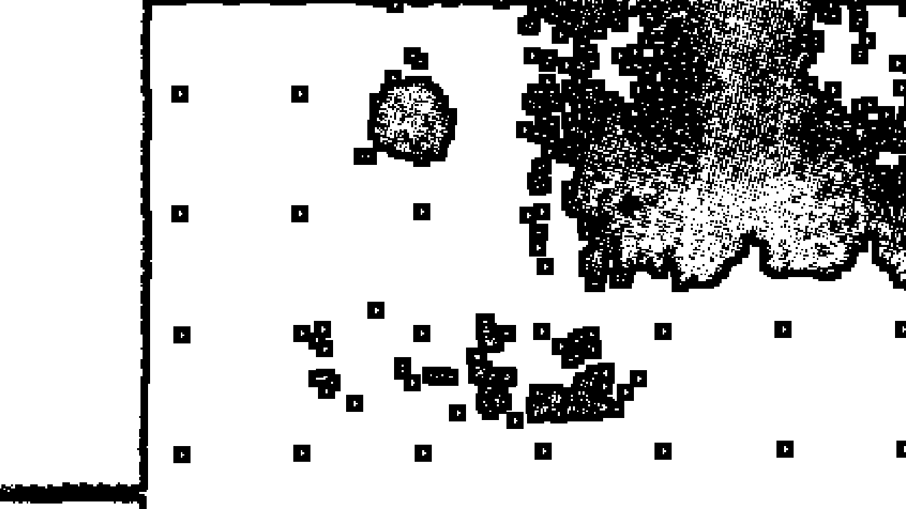

气才会好。任东林说:那我现在就先给别人打工,等财运好起来再自己做生意。

2003年3月11日, 任东林又来到河北省周易研究会基地, 进门就说:石老师预测得真准,2000年开书店真赔了钱。请你再给我预测一下今后的运气如何?

2000年9月6日14点30分

庚辰年甲申月丁卯日丁未时,

阴一局、甲辰旬、天心星值符落四宫, 开门值使落三宫

| 符 | 天 | 地 |
| --- | --- | --- |
| 休壬<br>心丁 | 生戊<br>趋己 | 伤庚<br>任乙 |
| 开辛<br>柱丙 | 癸 | 杜丙<br>冲辛 |
| 癸惊乙<br>芮庚 | 死己<br>英戊 | 景丁<br>辅壬 |

## 分析：

- 1. 为什么断开书店赔钱。

卦遇九星反吟主赔钱。开书店求财,景门为书落乾宫,为入墓,凶。开门为书店落震宫,门克宫不吉,逢空亡之地,上乘螣蛇主惊恐怪异,景门落宫克开门落宫,此店不能开。

甲子戊为资本,生门为利润同落离宫,临天蓬星主破财、赔本,戊加己为贵人入狱,公私皆不利。上乘九天主破大财,投资越大赔钱越多。甲子戊和生门落宫又克景门书落宫。日干丁奇为求测者落乾宫，被甲子戊和生门所克，肯定赔钱。

兼看年命，任东林是1971年生人，年命辛亥，辛落震宫，为绝地，逢空亡，上乘腾蛇主凶，又被景门书落宫所克。年命辛又克年干太岁庚落宫，运气不好，赔钱之象。

值使门为所测之事，开门值使落震宫，逢空亡，开加伤主变动、更改移徒事皆不吉，天柱星为破军星，临宫主大凶。时干丁奇也为所测之事，落乾宫，为胎养之地，上乘白虎凶神，又被甲子戊、生门落宫所克，故生意赔钱。

### 2、为什么断2002年以后运气好。

2000年为庚辰年，太岁庚落坤宫，年命辛落震宫，克天盘太岁庚；地支太岁在巽宫，时干、日干落乾宫，冲克地支太岁辰。2001年为辛巳年，年命辛与天盘太岁同落震宫，临天柱凶星，上乘腾蛇凶神；地支太岁巳在巽宫，日干、时干落乾宫，冲克地支太岁巳，又克年干太岁辛。2002年为壬午年，天盘太岁壬落巽宫，日干、时干冲克天盘太岁壬；地支太岁午在离宫，克日干，时干落宫，离宫出现甲子戊和生门临天蓬星，上乘九天，2002年必有破大财之事。2003年以后，太岁与日干、时干相生，必然顺利。

#### 实例三、山西开煤矿能否挣钱

1997年12月13日17点，鹿泉市李铁友找到我说：我与朋友合伙去山西开一个小型煤矿，请问能否挣钱？我是1953年生人，朋友是1959年生人、我立即按问事时间起了奇门局，认真分析后对李说：山西朋友给你报的信息不实，去山西开煤矿劳民伤财，半途而废，李当即表示不去了。

1998年4月，李铁友见到我第一句话就说：没听你的话，到山西开煤矿遇到的困难太多了。我个人投资八万元全赔进去了，另外几个朋友听说我要去投资开煤矿也跟着投了资，都赔了。现在彻底不干了。看起来不相信预测是要赔钱的。

- 1997年12月13日17点
丁丑年壬子月己丑日癸酉时
阴一局、甲子旬、天蓬星值符落五宫寄二宫，休门值使落一宫。

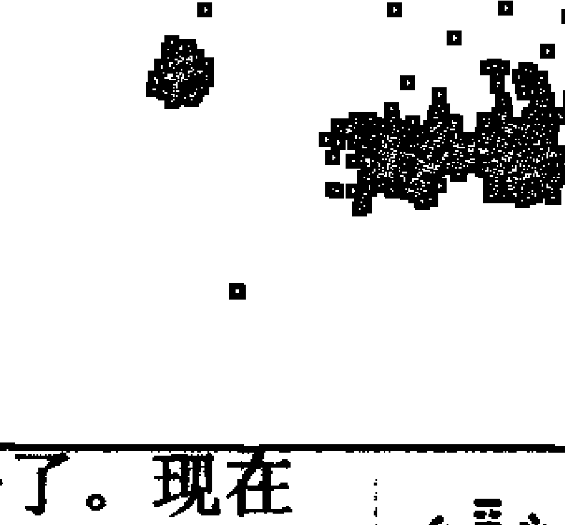

| 阴 | 蛇 | 符 |
| --- | --- | --- |
| 杜辛<br>柱丁 | 景壬<br>心己 | 死戊<br>越乙 |
| 合<br>癸伤乙<br>芮丙 | 癸 | 天<br>惊庚<br>任辛 |
| 虎<br>生己<br>英庚 | 武<br>休丁<br>辅戊 | 地<br>开丙<br>冲壬 |

## 分析：

- 1、为什么断信息不实。

丁奇为信息落坎宫，为火入水乡，不吉。上乘玄武主说假话。景门也为信息落离宫，为伏吟，上乘腾蛇主虚诈、惊恐怪异。壬加己为反吟蛇刑，主官讼败诉，大祸将至，顾守可吉，妄动必凶，又为辰戌相冲，冲则散。

- 2、为什么断开煤矿要赔钱。

日干己为求测者，落艮宫为入墓。己加庚为刑格返名，词讼先动者不利，若临阴星则有谋害之情。天英星为阴星临宫不吉。上乘白虎，干劲虽大，赔钱也多，可见求测人本身运气差。太岁丁奇落坎宫，被日干己克之，克太岁必有灾。合伙人是1959年生人，年命己亥，己落艮宫，与日干同宫，说明朋友运气与求测者运气一样差。求测者为1953年生人，年命癸巳，癸落震宫，癸加丙为华盖悖师，贵贱逢之皆不利。求测人癸又克合伙人己落宫，说明在工作中要产生矛盾。
时干癸为所测之事，落震宫，临伤门主半途而废。上乘六合说明是合伙开煤矿，临天芮病星，主中途出问题。时干落宫克日干落宫。事情办不成。
甲子戊为资本，戊落坤宫为衰病之地，说明资金不足。戊加乙为青龙和会，门凶事也凶，临死门自然为凶。又临天蓬破财之星，说明投资要赔钱。生门为利润落艮宫，伏吟不动。己加庚为刑格返名，凶。不会产生利润。丁奇为太岁落坎宫，资本与利润的落宫均克太岁落宫，克太岁必有灾，自然是破财。戊落坤宫，坤宫主二、五、八、十数，正应赔钱八万元的现实。
开门为煤矿落乾宫，落空亡之地，丙加壬为火入天罗，壬水冲克丙火，为客不利，是非颇多。临天冲星，冲则散，煤矿办不成。

#### 实例四、买车跑出租得不偿失

1999年10月7日7点30分，鹿泉市田明堂给我打电话：我想买一辆小车，让侄子当司机去跑出租，求测能否挣钱。侄子是1970年生人。我立即按问事时间起了一个奇门遁甲局，15分钟后田明堂来电话询问预测结果时，我对他说：“买车出租不能挣钱，让你侄子开车要出事故。现在买车，到年底就赔钱，得不偿失你自然就不干了。”田明堂听了预测结果当即表态：不买车了。

2000年11月，田明堂见到我时后悔地说：“你预测的真准，当时没有听你的话，买车后让侄子跑了一年出租，汽车经常出事故，出租的收入不够赔偿费和汽车的消耗。”

1999年10月7日7点30分

己卯年癸酉月壬辰日甲辰时

阴四局,甲辰旬,天英星值符落九宫,景门值使落九宫。

| 蛇<br>杜 戊<br>辅 戊 | 符<br>景 壬<br>英 壬 | 天<br>乙 死 庚<br>丙 庚 |
|----------------------|----------------------|------------------------|
| 阴<br>伤 己<br>冲 己 | 乙                  | 地<br>惊 丁<br>柱 丁   |
| 合<br>生 癸<br>任 癸 | 虎<br>休 辛<br>辅 辛 | 武<br>开 丙<br>心 丙   |

## 分析：

- 1. 日干壬为求测者落离宫,壬十壬为蛇入地罗,外人缠绕,内事索索。又为六仪击刑;全盘伏吟,不宜投资。
- 2. 伤门为车落震宫,为伏吟,天冲星临宫为星伏吟,伏吟为痛苦之象,己加己为地户逢鬼,百事不遂,暂不为谋,为谋则凶。伤加己主财散人病。伤加伤主变动,远行折伤。虽然伤门生助日干壬落宫,但是伤门落宫逢空亡之地,无力生助。
- 3. 甲子戊为资本落巽宫,戊加戊伏吟,凡事不利,道路闭塞,以守为好。生门为利润落艮宫,为伏吟,癸加癸为天网四张,又逢空亡,空为没有,即无利润。
- 4. 姪子是1970年生人,年命庚戊,庚落坤宫逢死门,临天芮星主运气差。庚加庚为太白同宫,官灾横祸,不利为事。伤门为车落震宫,克姪子年命落宫,说明姪子不宜开车,开车要出事故,2000年为庚辰年，侄子为庚戌年生人，辰戌相冲，冲克太岁必有灾。2000 年太岁庚落坤宫，伤门为车落震宫，车克太岁，车也有灾。故2000 年有不可避免的车祸。
- 5、时干壬为所测之事落离宫，壬加壬为六仪击刑，破财伤人。逢景门、天英星必有血光之灾。可见开车要出车祸，破财伤人。

#### 实例五、预测合伙办服装厂

1998 年 1 月 5 日 21 点 30 分，石家庄梁志超给我打电话说：与人合伙办一个服装厂，本人是 1950 年生人，合伙人是 1956 年生人。我让他 15 分钟以后再来电话。我立即按问事时间起了一个奇门遁甲局，进行分析，等梁志超又来电话询问预测结果时，我告诉他：合伙办厂要赔钱。你得到的市场信息不实，在工作中你两个还闹矛盾，服装厂中途夭折，办工厂赔钱 15 万元左右。

1998 年底，梁志超给我打电话说：没听你的话，办工厂真是赔了 15 万元。

1998 年 1 月 5 日 21 点 30 分
丁丑年癸丑月壬子日辛亥时
阳二局、甲辰旬、天心星值符落五宫寄二宫，开门值使落四宫。

| 地 | 天 | 符 |
|---|---|---|
| 辛 开 戊 | 休 癸 | 生 壬 |
| 芮 庚 | 柱 丙 | 心 戊 |
| 武 | | 蛇 |
| 惊 丙 | | 伤 乙 |
| 英 己 | 辛 | 趋 癸 |
| 虎 | 合 | 阴 |
| 死 庚 | 景 己 | 杜 丁 |
| 辅 丁 | 冲 乙 | 任 壬 |

## 分析：

### 1、为什么断市场信息不实。

丁奇为信息落乾宫，临杜门为堵塞不通。丁加壬为丁壬相合，信息被合住。上乘太阴主调查不清。景门也为信息落坎宫，为火入水乡。己加乙为墓神不明，地户逢星，宜遁迹隐形为利。上乘六合，也是信息被合住之象。

### 2、为什么断工厂办不成。

日干壬为求测者落坤宫，壬加戊为小蛇化龙。临生门、上乘值符，说明梁先生办工厂劲头很大。时干辛为所测之事落巽宫，为入墓。辛加庚为白虎出力，刀刃相交，主客相残，逊让退步稍可，强进血溅衣衫，临天芮凶星主凶。值使门也为所测之事，开门值使落巽宫，为门克宫，吉门克宫吉不就。时干、值使门落宫均克日干壬落宫。断工厂办不成。天辅星主服装落艮宫，临死门、逢庚均为阻隔，可见此路不通。上乘白虎主赔钱，逢空亡之地，工厂办不成。

### 3、为什么断工作中闹矛盾。

梁先生是 1950 年生人,年命庚寅,庚落艮宫为入墓。庚加丁为亭亭之格,因私匿起官司是非,门吉有救,门凶事必凶,临死门则大凶。逢空亡之地说明梁先生运气不好。时干辛、值使门开门均落巽宫,同克年命庚落宫。合作伙伴是 1956 年生人,年命丙申,丙落震宫,丙加己为火悖入刑,囚人刑杖,文书不行,吉门得吉,凶门转凶。落空亡,空中暗藏玄机,临惊门,断藏有口舌是非之玄机。说明合作伙伴运气也不好。故工作中闹矛盾。合作人年命落宫,克梁先生年命庚落宫。开门为服装厂落巽宫,临天芮病星,工厂必然要出毛病,逢地盘庚为阻隔,必然是中途夭折。

### 4、为什么断赔钱 15 万元。

甲子戊为资本。天盘甲子戊落巽宫,逢庚必然赔钱。巽宫主三、八、四、五数,取五数,为 15 万元,地盘甲子戊落坤宫,坤宫主二、五、八、十数,为 15 万元。

#### 实例六、预测棉花行情涨跌

2001 年 8 月 6 日 19 点 30 分, 我从周易研究会研究基地下班回来刚吃过晚饭,来了一位中年男子,自我介绍说:我姓张、去年秋后以每吨 12000 元的价格,购进了 20 多吨棉花。进货后棉花行情开始下跌,棉花存在库里舍不得卖,盼望棉花价格涨上去,然后出售,然而,棉花行情一直下跌。今年春天我找人预测说棉花价格很快要上涨。可是,到现在也没有上涨。请石老师给预测一下,棉花价格能否涨上去。我立即按问事时间起了一个奇门遁甲局,认真分析后对张先生说: 现在的棉花行情可能每吨在 1.1 万元左右。张先生说:对。质量好的棉花是 1.1 万元,质量次一点的每吨 10800 元。我接着说:棉花价格还要继续下跌,能跌到 8000 元以下。你现在抓紧时间把棉花卖出去。不然损失更惨重。张先生马上答应:我一定按你说的去做。

2002年10月1日，张先生找到周易研究会基地，求测购进棉花能否挣钱时，告诉我：去年找你预测后，抓紧时间找客户，以每吨10800元的价格把棉花卖出去了，去年棉花价格最低降到每吨7200元，如果没有你的指点就更惨了。

2001年8月6日19点30分
辛巳年乙未月辛丑日戊戌时
阴一局、甲午旬，天柱星值符落一宫，惊门值使落三宫。

| 武 | 虎 | 合 |
|---|---|---|
| 开 庚 | 休 丙 | 生 丁 |
| 任 丁 | 冲 己 | 辅 乙 |
| 地 | | 阴 |
| 惊 戊 | | 伤 己 |
| 蓬 丙 | 癸 | 英 辛 |
| 天 | 符 | 蛇 |
| 死 壬 | 景 辛 | 癸 杜 乙 |
| 心 庚 | 柱 戊 | 芮 壬 |

## 分析：

- 1、为什么张先生舍不得把棉花卖出去。
时干戊为货物，为棉花，日干辛为求测人。时干戊落震中为六仪击刑，货物质量不太好。日干辛落坎宫，生时干落宫，为货主不愿意卖。
- 2、为什么断现在棉花行情每吨1.1万元。
预测生意，以景门、值符为行情，现在景门值符落坎宫，坎宫主一六数，末月坎宫休囚，取一数，为1.1万元左右。
- 3、为什么断棉花价格继续下跌。

景门为行情,景门属火,落坎宫为火入水乡,辛加戊为困龙被伤。棉花价格不会涨而且继续下跌。
- 4. 为什么棉花行情要跌到八千元以下。

时干,值使门为棉花行情下跌数。时干戊落震宫,值使门也落震宫,震宫主三、八数,取八数,坎为8000元以下。
- 5. 为什么这次棉花生意要赔钱。

测生意遇伏吟,返吟要赔钱。现在八门返吟,肯定赔钱。甲子戊为资本落震宫为六仪击刑,临天蓬破财之星,必然赔本。生门为利润落坤宫,克日干辛落宫,也是赔钱之象。

#### 实例七、买货求财

2002年10月1日国庆节长假期间,抱犊寨旅游风景区披上了节日的盛装。全国各地观光的游客涌向抱犊寨。河北省周易研究会研究基地座落在风景秀丽的抱犊寨山上。早晨7点钟我就上班,来到周易研究会办公室。7点30分,来了一位中年男子,进门就说:石老师,还认识我吗?我姓张,去年8月份找你预测过棉花生意,在你的指导下,去年的棉花生意减少了损失。今天我特意来找你,求测今年购进棉花能否挣钱?我立即按问事时间起了一个奇门遁甲局,认真分析后对张先生说:你今年购进棉花能挣钱,肯定不会赔本。张先生说:现在棉花行情每吨是9800元,你看能涨到每吨多少钱?我说这次棉花涨价比较慢,能涨到每吨12000元以上。张先生表示马上进货。我告诉他:进货后要沉住气,等棉花涨到每吨12000元以上再卖出。

2003年10月2日8点,张先生又来到抱犊寨河北省周易研究会基地,找我预测购进棉花时,告诉我:2002年以9800元价格购进20吨棉花,到2003年春天,以每吨11900元价格卖出了,以后棉花价格真是涨到了每吨12000元以上。可惜卖出去太早了。但必定在你的指导下，这次棉花生意挣了钱。

2002年10月1日8点
壬午年己酉月壬寅日甲辰时
阴一局、甲辰旬，天心星值符落六宫，开门值使落六宫

| 虎 | 合 | 阴 |
| --- | --- | --- |
| 杜丁 | 景己 | 癸死乙 |
| 辅丁 | 英己 | 芮乙 |
| 武 | | 蛇 |
| 伤丙 | | 惊辛 |
| 冲丙 | 癸 | 柱辛 |
| 地 | 天 | 符 |
| 生庚 | 休戊 | 开壬 |
| 任庚 | 蕊戊 | 心壬 |

## 分析：

- 1. 为什么断购进棉花能挣钱？
买货求财，以日干为买主，时干为货物，日干壬落乾宫，为临官禄地，临开门吉门，天心星吉星，上乘值符保平安，又与天地盘太岁同宫，说明张先生运气很好。时干壬为货物落乾宫，遇酉月为旺地，又为临官禄地，临吉门、吉星，上乘值符，说明棉花质量好，可以大胆购进。日干、时干同落乾宫，为比和，主能挣钱。生门为利润落艮宫，生助日干，时干落宫，能挣钱。
- 2. 为什么断挣钱比较慢。
此局全盘伏吟，伏吟主慢，生门在艮宫伏吟，主慢，阴遁艮宫为外盘主慢，伏吟局本应不动，动则赔钱。此局为天显时格，求财遇天显时格能挣钱，但比较慢。

### 3、为什么断棉花价格要上涨到12000元以上。

值符为行情。天心星值符落乾宫，得月令生助，临开门吉门，上乘八神小值符，又与天盘，地盘太岁同宫，棉花行情必然上涨。景门为行情落离宫，与地支太岁午同宫，上乘六合吉神，棉花是上涨趋势。离宫主三、九、二、七数，取三数，为三千元，现在棉花行情每吨是9800元；加上三千元等于12800元，故判断棉花价格能上涨到每吨12000元以上。

#### 实例八、购进棉花求财

2003年10月2日，抱犊寨风景区和往年国庆一样，五彩缤纷旗子迎风招展，鼓乐齐鸣，承现出一片热气腾腾的过节景象，到抱犊寨观光的游客人山人海，爬山的游客好象一条巨龙，在半山腰徐徐行进，乘座揽车的游客排着长队等待着揽车的运行。大小、形态各异的车辆整齐地排列在停车场上。

8点钟，一位中年男子来到周易研究基地办公室，进门先问好：石老师您好：咱们应该是老朋友了。我一看原来是棉商张先生，忙让进屋入座后，张先生说：去年10月1日我找你预测棉花生意，按你的指导去做了，每吨9800元的价格购进，今年春天以每吨11900的价格卖出去了。这次棉花生意挣了钱。当时你预测棉花价格能涨到12000元以上，最高涨到了每吨12800元，只可惜我的棉花卖出去的太早了。今天特意请你再一次预测今年的棉花行情怎么样？购进棉花能否挣钱？我立即按问事时间起了一个奇门遁甲局，认真分析后对张先生说：今年棉花行情涨价很快，现在你马上进货，行情在13000元以上，棉花能涨到16600元以上，这次进货能很快挣到钱。张先生表示要马上进货。

2004年10月1日上午8点，张先生又一次来周易研究基地找我预测棉花生意，开口就说：感谢石老师指点迷津，去年以每吨13300 元的价格购进了 12 吨棉花，看着棉花行情涨势很快，第二次进货时，棉花价格就涨到了 14600 元，我又购进了 13 吨棉花。就在 10 月份棉花行情涨到了每吨 16000 元，我为了出售快，以每吨 15800 元的价格卖出去了。棉花最高涨到了每吨 17000 元，可惜我出售的太早了，不过这次棉花生意还是挣了钱。

2003 年 10 月 2 日 8 点

癸未年辛酉月戊申日丙辰时
阴四局、甲寅旬、天任星值符落六宫，生门值使落六宫

| 虎 | 合 | 阴 |
| --- | --- | --- |
| 乙 死 庚 | 惊 丁 | 开 丙 |
| 芮 戊 | 柱 壬 | 心 庚 |
| 武 | | 蛇 |
| 景 壬 | | 休 辛 |
| 英 己 | 乙 | 蓩 丁 |
| 地 | 天 | 符 |
| 杜 戊 | 伤 己 | 生 癸 |
| 辅 癸 | 冲 辛 | 任 丙 |

## 分析：

- 1、为什么断棉花行情涨势快，现在价格为 13000 元以上。
景门为行情落震宫，为宫生门，行情必然上涨，壬加己为辰戌相冲，行情被冲，说明涨势快，震宫主三、八数，取三数，故断 13000 元以上。
- 2、为什么断棉花行情能涨到 16600 元以上。
天任星值符为行情，落乾宫，临太岁癸，又上乘八神小值符，乾宫主一、六数，断 16600 元以上。

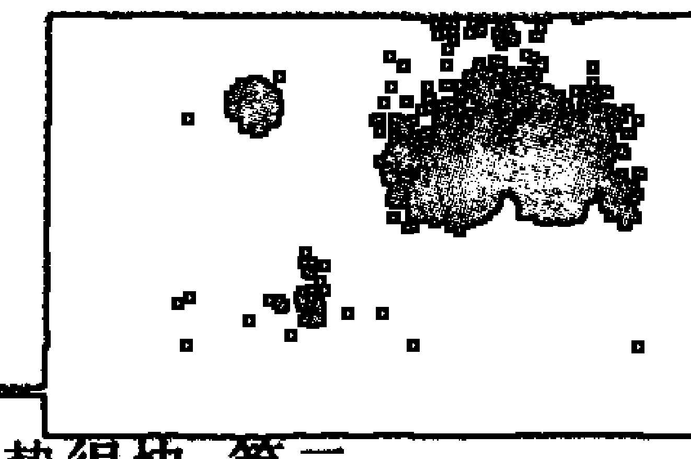## 3、为什么断购进棉花能挣钱

日干戊为求测者，落艮宫，为长生之地，时干丙奇为货物落坤宫，临开门吉门、天心星吉星，货物质量好，与日干戊落宫比和，挣钱之象。

值使门为货物，生门值使落乾宫，临天任吉星，又与年干癸同宫，上乘八神小值符，说明货物质量好，日干戊落宫与值使门落宫相生，挣钱之象。

投资求财，以甲子戊为资本落艮宫，生门为利润落乾宫，资本与利润相生、肯定挣钱。

#### 实例九、服装积压求财难

2003年9月11日20点，在石家庄搞个体经营的批发商顾小朋给我打来电话：今年8月从南方进了一批服装，到现在还没卖出去，求测这批服装今年还能否出手。我立即按问事时间起了一个奇门遁甲局，15分钟以后顾小朋来电话在询问预测结果时我告诉他：这批服装质量不好，今年卖不出去。

2004年2月，我在石家庄见到顾小朋，问起服装销售之事，顾小朋满脸愁容地说：这批货直到今天还没有卖出去，肯定是赔钱了。

2003年9月11日20点

癸未年辛酉月丁亥日庚戌时

阴三局、甲辰旬，天任星值符落一宫，生门值使落二宫。

| 列1 | 列2 | 列3 |
| --- | --- | --- |
| 武 | 虎 | 合 |
| 开 辛 | 丙 体 己 | 生 癸 |
| 英 乙 | 芮 辛 | 柱 己 |
| 地 |  | 阴 |
| 惊 乙 |  | 伤 丁 |
| 辅 戊 | 丙 | 心 癸 |
| 天 | 符 | 蛇 |
| 死 戊 | 景 壬 | 杜 庚 |
| 冲 壬 | 任 庚 | 蕊 丁 |

## 分析：

1.  天辅星为服装落震宫。逢空亡，酉月天辅星为囚。乙十戊为阴害阳门，逢惊门凶门，破财伤人。惊十乙主求财不得，惊十戊主损财，惊门克宫事更凶。说明货物质量差。
2.  时干庚为货物落乾宫，为衰病之地，庚十丁为亭亭之格，凶。临杜门为堵塞不通，上乘腾蛇主货物质量差。逢天蓬星主破财。
3.  值符为卖货人落坎宫，值使门为买货人，生门值使落坤宫，买货人克卖货人，货卖不出去；日干丁奇为卖货人落兑宫，丁十癸为朱雀投江，凶。临伤门凶门。伤十惊为凶。伤十丁主音信不至。伤十癸主讼狱被冤，有理难伸，说明顾小朋当前运气不好。时干庚为货物落乾宫，与日干丁奇落宫比和，但是卖货人运气太差，货物质量又不好，故买不出去。
4.  天辅星为服装落震宫，日干丁奇落兑宫克天辅星落宫，服装应该能卖出去，但是天辅星逢空亡，日干丁奇克不住天辅星，货还是卖不出去。
5.  八门返吟主破财，甲子戊为资本落艮宫，逢空为凶。戊十壬为青龙入天牢，凡阴阳事皆不利。临死门凶门。逢天冲星，冲则散。上乘九天为动，主资本跑掉了。生门为利润落坤宫，癸十己为华盖地户，此格躲灾避难为上吉。逢马星主利润跑掉了。八门反吟，坤艮二宫，按对冲看，生门落坤宫，冲甲子戊落宫，必然赔钱。

#### 实例十、预测北京贷款

2000年9月12日10点，我在河北省周易研究会研究基地与易友讨论周易，来了一位中年男子进门就说：各位老师好，今天我有一事想求老师给我预测，我姓常，在石家庄工作，北京的朋友给我打电话说，北京能够贷上款。我想去北京找朋友帮忙贷款，求测此事能否办成？我立即起了一个奇门遁甲局，认真分析后对常先生说：你在单位是个领导，而且是正职。常回答：对。我是单位经理。我接着断：你朋友给你打电话报的信息不实。去北京贷款劳民伤财，办不成。2001年3月12日，我接到常经理的电话：没有听你的话，去北京跑贷款，去了几趟都没有办成，白浪费了时间，又花了不少差旅费，真是劳民伤财。

2000年9月12日10点
庚辰年乙酉月癸酉日丁巳时
阴三局、甲寅旬，天柱星值符落六宫，惊门值使落四宫

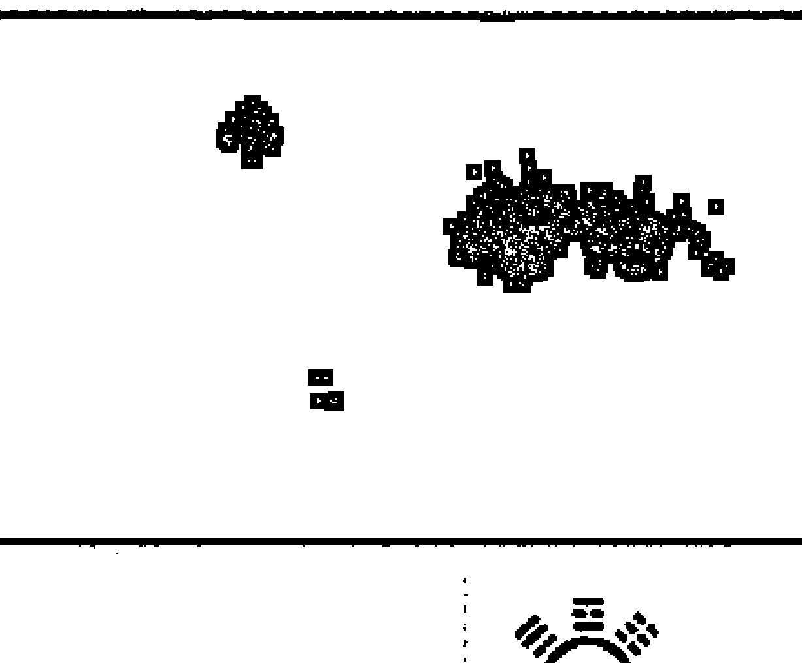

| 虎 | 合 | 阴 |
| --- | --- | --- |
| 惊戊<br>冲乙 | 开乙<br>辅辛 | 休辛<br>英己 |
| 武<br>死壬<br>任戊 | 丙 | 蛇<br>丙生己<br>芮癸 |
| 地<br>景庚<br>蓬壬 | 天<br>杜丁<br>心庚 | 符<br>伤癸<br>柱丁 |

## 分析：

1.  为什么断常先生是正职领导。
日干癸为求测者，落乾宫，乾为首长、为领导，上乘八神小值符，小值符为八神领袖，故为正职领导。

2.  为什么断朋友报的信息不实。
丁奇为信息落坎宫，为火入水乡，丁加庚为文书阻隔，逢空亡主不实，上乘九天主说大话、空话，临杜门为堵塞不通。景门也为消息落艮宫，庚加壬为上格，壬水主流动，庚为阻隔之神，远行道路迷失，男女音信难通。临天蓬星主虚诈不实，又逢空亡之地，主假信息。

3.  为什么断贷款之事办不成。
值符为银行落乾宫，癸加丁为腾蛇天矫，文书官司火焚也不跑不掉。临伤门，门宫相克，说明银行日子也不好过。值使门为贷款人，惊门值使落巽宫，为门克宫，凶门克宫事更凶。值符落宫克值使门落宫，银行不贷给款。

北京是石家庄的东北方向，应该看艮宫，艮宫遇空亡之地。天盘庚为客、为贷款人，在艮宫为入墓，地盘壬为主、为银行，金生水，客生主，贷款办不成。

时干丁奇为所测之事落坎宫，逢空亡，上乘九天，临杜门、逢庚、又被年干太岁落宫所克，贷款办不成。

#### 实例十一、求测贷款未成

石家庄市某公司的张总经理是两年前认识的，相识后张总经常来人或来电话求测。2003年元月18日21点，我正在家看书，突然电话铃响了，拿起电话传来了张总的声音："今年计划上一个新项目，当前资金不足，从北京贷款两千万元，求测能否办成?"我让他十五分钟后再来电话。我立即按问事时间起了一个奇门遁甲局，待张总又来电话时我告诉他："此次贷款枉费心机，不会办成。"张总说北京方面已经谈过几次，有点眉目了。听张总的话，是对我的预测持有怀疑态度。我只好说: 我希望你能办成，但是你记住不易办成。

2003年底，张总来电话说: 往北京跑了一年，贷款之事也没办成。

2003年元月18日21点

壬午年癸丑月辛卯日己亥时

阳五局、甲午旬，天任星值符落六宫，生门值使落四宫。

| 虎<br>戊生丁<br>芮乙 | 武<br>伤庚<br>柱壬 | 地<br>杜己<br>心丁 |
| 合<br>休壬<br>英丙 | 戊 | 天<br>景癸<br>蓬庚 |
| 阴<br>开乙<br>辅辛 | 蛇<br>惊丙<br>冲癸 | 符<br>死辛<br>任己 |

## 分析：

测贷款以值符为银行或放贷人，以值使门为借贷人，也可以天乙(值符下临地盘之星)为贷款人或借贷人。

1.  天任星值符落乾宫，逢死门，主银行不愿意放贷，值使门落巽宫，被值符落宫所克，主放贷人不给款。
2.  值符落乾宫，临地盘天心星，天心星为天乙，为贷款人，天盘天心星落坤宫，生助值符落宫，也是银行或放贷人不给款。
3.  又可以看所往之方的天盘星与地盘星之间的生克关系。天盘为客，为借贷人，地盘为主，为银行，二星相克，不借给或不贷给。今去北京贷款，北京是石家庄的东北方向，应看艮宫的状况，天辅星落艮宫，天辅星五行属木，艮宫有地盘天任星，五行属土，二星相克，此款不贷给。天盘乙奇为客，地盘辛为主，主克客，也是借贷不成之象。
4.  时干为所测之事，时干己落坤宫，逢杜门，说明借贷之事堵塞不通，又逢日干空亡之地。己十丁为朱雀入墓。杜十死主官司破财，小凶。上乘九地为不动之象。此事很难办。
5.  值使门为所测之事，生门值使落巽宫，入墓，逢空亡，临天芮病星，生十杜主阴人破财，不利。此事也难办成。

#### 实例十二、讨债有获

1998年5月3日17点，石家庄市的刘文彬找我求测讨债：去年5月份一个很好的朋友做买卖，资金一时周转不开，向我借去三万元人民币，说是到年底本息全还。春节前我去找过朋友一趟，他说现在刚进了一批货，等把这批货销出去马上还我钱。从春节到现在几个月过去了，钱也没给我。现在我要买房子，急需用钱，想去找朋友要帐，请石老师给我预测一下，看这次朋友能否给我钱，我也好有个思想准备。我按问事时间起了一个奇门局，分析后对刘先生说：钱能要回来。但是明天不行，5月6号你去要钱，朋友一定给你。5月7日刘文彬打电话告诉我：5月6日去要钱，朋友如数尝还。

1998年5月3日17点

戊寅年丙辰月庚戌日乙酉时

阳四局、甲申旬，天心星值符落三宫，开门值使落七宫。

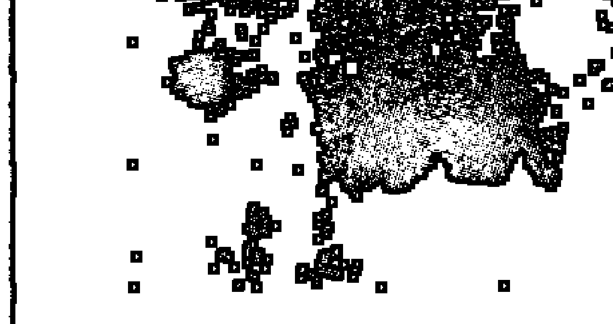

| 蛇 | 阴 | 合 |
|---|---|---|
| 景丁<br>莛戊 | 死壬<br>任癸 | 惊乙<br>冲丙 |
| 符<br>杜庚<br>心乙 | 己 | 虎<br>开戊<br>辅辛 |
| 天<br>伤辛<br>柱壬 | 己生丙<br>芮丁 | 武<br>休癸<br>英庚 |

## 分析：

预测讨债，值符为放债人，天乙（值符下临地盘宫对应九星）为欠债人，伤门为讨债执行人。

1.  值符落震宫，天冲星为天乙落坤宫，被值符落宫所克。能要回之象。伤门为讨债执行人落艮宫，与天乙落宫比和也是能要回之象。
2.  日干庚为求测者落震宫，克时干乙奇落宫，钱能要回来。
3.  月干丙为朋友落坎宫，临生门，说明朋友是做生意的。生门为财，表明朋友现在有钱，朋友落宫生日干落宫，可见朋友同意还钱。伤门落宫克月干丙奇落宫，表明钱能要回来。
4.  为什么断5月6日能要回钱来。
天乙欠债人落坤宫逢空亡，填实或冲空为应期。5月6日为癸丑日，丑未相冲，冲空则实。故可要回钱。
值使门落宫数为应期，开门值使落兑宫，兑宫主二数，两天后能要回来，两天后正是5月6日。
日干庚落震宫，伤门落艮宫，月干丙落坎宫，阴遁三个宫均为内盘，主近、主快，所以在时间上不按年月断而按天断。

#### 实例十三、预测吴先生讨债

2000年7月26日13点30分，我正在周易研究会研究基地看书学习，来了一位中年男子，自我介绍说：我叫吴为凯，1958年出生，今天来抱犊寨旅游，看到河北省周易研究会研究基地在此坐落，就上楼来了。我是做生意的人，顾客拿走我的货物价值2.8万元，很长时间了要不回钱来。请老师预测一下，这笔欠帐能否要回来？我立即按问事时间起了一个奇门遁甲局，认真分析后对吴先生说：你这笔帐今年要不回来，而且在要款时，对方和你因为货物质量问题还发生争执，目的就是不想还你的货款。你要抓住明年夏天的有利时机去讨债，有希望给你一部分。欠款不可能全要回来。

2001年6月，吴先生给我打电话说：去年下半年我找他要了几次帐，他不但不给钱，还和我发生了冲突，硬说我的货质量不好，要扣钱，分文没给。到今年阴历5月抓紧时间和他要款，最后款是给了，但是扣款3.5千元，真是倒霉透了。

2000年7月26日13点30分

庚辰年癸未月乙酉日癸未时

阴一局、甲戌旬，天英星值符落五宫寄二宫，景门值使落九宫。

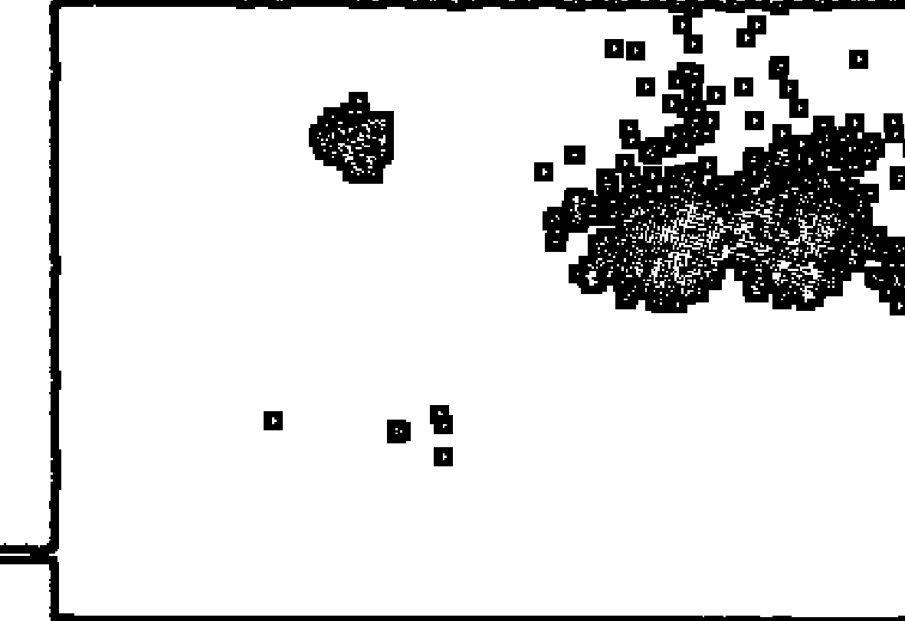

| 阴<br>杜丙<br>冲丁 | 蛇<br>景丁<br>辅己 | 符<br>死己<br>英乙 |
| :---: | :---: | :---: |
| 合<br>伤庚<br>任丙 | 癸 | 天<br>癸惊乙<br>禽芮辛 |
| 虎<br>生戊<br>蓬庚 | 武<br>休壬<br>心戊 | 地<br>开辛<br>柱壬 |

## 分析：

1.  为什么断今年要不回欠款。
预测讨债，值符为放债人，天乙（值符下临地盘之星）为欠债人。天英星值符落坤宫，逢空亡，说明放债人思想不重视，没有抓紧时间要帐。天禽星为欠债人落兑宫，上乘九天，逢空亡，说明欠债人不想还钱。伤门讨债执行人落震宫，伏吟不动，又被天乙落宫所克。八门伏吟不动，伤门和年干太岁庚同落震宫，克值符落宫，钱要不回来。
从另一个角度看：日干乙奇为求测者，落兑宫，逢空亡，乙加辛为青龙逃走，人亡破财，六畜皆伤。临天芮星病星，凶。又克年干太岁庚。说明吴先生运气不好，时干癸为所测之事落兑宫，逢空亡，临天芮凶星，癸加辛为网盖天牢，主官司败诉，死罪难逃，大凶。此事办不成。值使门也为所测之事，景门值使落离宫，丁加己为火入勾陈，凶。上乘腾蛇，主惊恐怪异。又克日干乙奇，此款要不回来。
又可兼看年命，吴先生是1958年生人，年命戊戌，戊落艮宫，临天蓬凶星，看来吴先生要破财了。临生门主生意，正应吴先生是搞经济的，戊加庚为值符飞宫，吉事不吉，凶事更凶，求财没利益。景门值使生助年命戊，钱能要回之象，但是要破财。年命戊生助时干癸。时干逢空不受其生。年干太岁庚又克年命戊，此款今年要不回来。

2.  为什么断有口舌之争。
天乙欠债人落兑宫，临惊门主口舌是非。日干乙奇、时干癸同落兑宫，兑为口舌，同宫主争斗，临惊门必有口舌之争。

3.  为什么断明年夏天能讨回钱。
2001年为辛巳年，年干辛落乾宫，天英星值符落坤宫，年命戊与太岁相生，日干乙奇与太岁比和。值符落坤宫，午月得月令生助，天乙落兑宫，遇午月为休囚之地。故午月对欠债人不利，抓住机遇要款。甲子戊为资本，生门为利润同落艮宫，临天蓬破财之星，所以此款不可能全部追回。吴先生讲: 扣款3.5千元，时干癸落兑宫，兑主七数，空亡减半为3.5千元，正应扣款之数。

#### 实例十四、北京之行劳民伤财

2000年10月15日16点，我正在河北省周易研究会抱犊寨研究基地工作，来了一位中年男子自我介绍: 我是邢台人叫魏金海，是1946年出生。有一位朋友在北京工作，今天给我打电话，让我马上去北京谈一笔业务，朋友说得很肯切，业务已经初步搞定了。请老师给预测一下，看这次去北京谈业务是否能谈成，我立即按问事时间起了一个奇门遁甲局，认真分析后对老魏说: “朋友给你打电话报的信息不实，去北京也是白跑一趟，此业务谈不成，”老魏听了我的话感到有点莫名其妙说: “我的朋友是很诚实的，从来不说假话。”我说: “如果你不怕花钱，可以去北京探个虚实，等事情有结果后，请你给我回个电话，以验证奇门遁甲预测的准确性。”老魏满口答应: “一定给你回电话。”

经营求财预测

11月2日，魏金海从邢台给我打来电话:“石老师预测的真准，朋友报的信息真是不实，这笔业务没有谈成，北京之行劳民伤财。”

2000年10月15日16点
庚辰年丙戌月丙午日丙申时
阴三局、甲午旬，天英星值符落五宫寄二宫，景门值使落七宫。

| 阴 | 蛇 | 符 |
|---|---|---|
| 生 戊 | 伤 乙 | 杜 辛 |
| 冲 乙 | 辅 辛 | 英 己 |
| 合 |  | 天 |
| 休 壬 |  | 丙 景 己 |
| 任 戊 | 丙 | 芮 癸 |
| 虎 | 武 | 地 |
| 开 庚 | 惊 丁 | 死 癸 |
| 蓬 壬 | 心 庚 | 柱 丁 |

## 分析：

1.  丁奇为信息落坎宫，为火入水乡，上乘玄武主说假话。景门也为信息落兑宫。上乘九天，主说大话，临天芮星主信息有毛病。
2.  日干、时干均为丙奇，同落兑宫，为死地。时干丙奇为业务，临天芮星说明业务有问题，丙十癸为华盖悖师，阴人害事，灾祸频生，景十丙主文书急迫火速不利，景十癸主因奴婢受刑，景门值使又是门克宫，上乘九天主事情漂泊不定。此业务谈不成。
3.  时干丙奇下临癸，则与癸有关系，天盘癸落乾宫，逢死门为阻隔、天柱星为破军星、上乘九地为不动。癸十丁为螣蛇天娇。口舌官司火荧也跑不掉。怎么能谈成业务呢？
4.  生门为买卖，为业务落巽宫，入墓逢空大凶之兆。生十杜主阴谋、破财。生门克年干太岁庚落宫。业务根本谈不成。
5.  北京是邢台的东北方向，应该看艮宫，天盘庚为客落艮宫为入墓。地盘壬为主，客生主，对客不利，动为客，魏金海为客人，对老魏不利。庚十壬为上格，壬水主流动，庚为阻隔之神，故远行道路迷失，男女音信难通。开门虽吉，但落艮宫为入墓，逢天蓬破财之星，上乘白虎主伤人，故去北京应该劳民伤财。

#### 实例十五、预测这笔业务能否谈成？

1997年12月13日17点30分，我的朋友李宝玉找到我说：“明天我到石家庄谈一笔业务，请你用奇门遁甲预测一下，看看是否能谈成？”我按问事时间起局，认真分析后对老李说：“明天你的业务谈不成。”老李否定说：“你预测的与实际情况不符合。这笔业务已经谈过几次了，基本上谈好了，明天去石家庄主要是双方签定合同。”我只好说：“请你明天事情结束后给我一个回音，验证一下我预测的准确率。”14日上午我接到李宝玉的电话，说这笔业务真象你预测的一样，合同没签成，失败了。

1997年12月13日17点30分
丁丑年壬子月己丑日癸酉时
阴一局、甲子旬，天蓬星值符落五宫寄二宫，休门值使落一宫。

|    |    |    |
|----|----|----|
| 阴<br>杜辛<br>柱丁 | 蛇<br>景壬<br>心己 | 符<br>死戊<br>蓬乙 |
| 合<br>癸伤乙<br>芮丙 | 癸 | 天<br>惊庚<br>任辛 |
| 虎<br>生己<br>英庚 | 武<br>休丁<br>辅戊 | 地<br>开丙<br>冲壬 |

## 分析：

1.  卦遇八门伏吟业务谈不成
日干己为求测人落艮宫，入墓主运气差，己十庚为刑格返名，凶。上乘白虎凶神，天英星临宫求财不利。年干丁为太岁落坎宫，日干己克太岁，谈不成。
2.  时干癸为业务落震宫，临天芮星主业务出问题，逢伤门为业务要中途夭折。癸十丙为华盖悖师，贵贱逢之皆不利，伤十伤主变动，远行折伤凶。伤十癸主讼狱被冤，有理难伸，伤十丙主道路损失，时干落宫克日干落宫，业务谈不成。
3.  景门为合同证书落离宫，为日干空亡之地，壬十己为反吟蛇刑（辰戌相冲），主官讼败诉，大祸将至，顺守可吉，妄动必凶。景十景主文状未动有预先见之意，内有男人忧患。上乘腾蛇主惊恐虚诈；丁奇也为合同，落坎宫为火入水乡，也为三奇受刑。上乘玄武主背后有小人捣鬼。业务谈不成。
4.  甲子戊为资本落坤宫，戊十癸为青龙华盖，逢死门凶门，事情多不利，戊十乙为青龙合会，门凶事也凶，逢死门，又临天蓬凶星，业务谈不成，还要赔时间和差旅费。

#### 实例十六、这笔业务能谈成吗？

2004年10月10日12点30分，我正在河北省周易研究会抱犊寨基地写论文。邢台市摄影大师刘峰来电话求测“为了美化环境，建设精神文明的城市，某单位想购进一批垃圾箱，我想去这个单位联系这笔业务，请石老师预测一下，看这笔业务能谈成吗？我立即按问事时间起了一个奇门遁甲局，认真分析后对刘峰说：你虽然和这个单位的主管领导关系很好，但是，这笔业务你联系不成。刘峰说：今天下午就去联系，尽量争取吧。

10月15日上午，我收到刘峰的电话，第一句话就说：10月10日中午的卦准了，我连续跑了三天，这笔业务最终被别人抢去了。

2004年10月10日12点30分
甲申年甲戌月壬戌日丙午时
阴三局、甲辰旬，天任星值符落五宫寄二宫，生门值使落六宫。

| 阴 | 蛇 | 符 |
|---|---|---|
| 死 丁 | 惊 庚 | 开 壬 |
| 心 乙 | 螣 辛 | 任 己 |
| 合 | | 天 |
| 景 癸 | | 休 戊 |
| 柱 戊 | 丙 | 冲 癸 |
| 虎 | 武 | 地 |
| 丙 杜 己 | 伤 辛 | 生 乙 |
| 芮 壬 | 英 庚 | 辅 丁 |分析：

-   1、为什么断与单位领导关系好？
日干壬为求测者落坤宫，上乘值符，值符为领导，临开门为单位，说明求测者与单位领导关系好。

-   2、为什么断这笔业务谈不成？
日干壬落坤宫临马星，说明求测者积极主动地去联系这笔业务。壬十己为反吟蛇刑，主官讼败诉大祸将至，顺守可吉，妄动必凶。说明当前求测者运气欠佳，跑这笔业务赔差旅费、赔时间。壬十己为辰戌相冲，冲则散。开加壬主远行有失，注意破财。看来这笔业务要破财。
时干丙为所测之事，落艮宫遇空亡之地，临杜门为堵塞不通。临天芮病星说明这笔业务要出毛病，丙加壬为火入天罗，为客不利。九星反吟，二八宫按对冲断，时干丙落艮宫，日干壬落坤宫，发生对冲，冲则散，业务联系不成。
值使门生门也为所测之事落乾宫，日干生助值使门，事情办不成。
天蓬星为竞争对手落离宫，临太岁庚，表明有上级领导的支持。离宫克值使门落宫，说明上级领导早有计划把这笔业务给对方了，所以被竞争对手抢去了。

#### 实例十七、成都之行业务谈不成

1997年10月7日11点，鹿泉市某公司王经理找到我，见面就说：最近我计划到四川省成都市谈一项业务，在电话里已经基本谈成，今天求测这次到成都去能否把这个项目搞定。我按问事时间起了个奇门遁甲局，分析后对王经理说：这次到成都是白跑一趟，项目谈不成。经理感到我预测的结果与实际情况不相符。流露出怀疑的目光，我安慰道：希望你这次成都之行马到成功，待项目定下来后请给我个回音。
11月份王经理见到我时说：真没想到。成都之行真是白跑一趟，什么项目都没谈成。

1997年10月7日11点
丁丑年己酉月壬午日丙午时
阴七局、甲辰旬，天冲星值符落九宫，伤门值使落一宫。

| 蛇 | 符 | 天 |
| :---: | :---: | :---: |
| 死乙<br>任辛 | 惊壬<br>冲丙 | 开辛<br>辅癸 |
| 阴 |  | 地 |
| 景丁<br>趋壬 | 庚 | 休丙<br>英戊 |
| 合 | 虎 | 武 |
| 杜己<br>心乙 | 伤戊<br>柱丁 | 庚生癸<br>芮己 |

## 分析：

-   1. 时干丙为项目落兑宫，为死地，逢休门，项目处于休养状态。上乘九地为不动，项目谈不成；值使门也为项目，伤门值使落坎宫，临甲子戊。戊在坎宫为胎地。说明项目还没有出台，仍然在酝酿之中。
-   2. 日干壬为求测者落离宫，为胎地。壬十丙为水蛇入火，壬丙相冲克。惊十壬，惊十景均主凶，惊十丙主文书印信惊恐。
-   3. 日干壬落宫克时干丙落宫，谈判费力。值使门落坎宫冲克日干壬落宫，冲则散，项目谈不成。
-   4. 景门、丁奇均为合同证书落震宫，逢空亡之地，天蓬星临宫

#### 实例十八、此业务能否谈成

2004年6月23日16点，我在河北省周易研究会基地写论文，河北省某旅游风景区导游孟丽梅女士求测：“石老师，今天下班后，我准备到石家庄去谈一笔业务，请你预测一下看能否谈成？”我按问事时间起局预测后，告诉她：“今天的业务谈不成，竞争对手势力强，可能被竞争对手抢走。”孟女士听后有些失望，我解释道：“这只是一种推理，今天晚上还是去一趟。就算谈不成这笔业务也没有太大的经济损失，谈判时尽量争取吧。”
6月26日上午，孟女士反馈信息：23号晚上去谈业务时，还真让竞争对手给抢走了。23号上午对手抢先一步与单位定了合同，我只好空手而归。

2004年6月23日16点
甲申年庚午月癸酉日庚申时
阴三局、甲寅旬，天柱星值符落一宫，惊门值使落一宫。

| 武 | 虎 | 合 |
| :---: | :---: | :---: |
| 生 壬<br>任 乙 | 伤 戊<br>冲 辛 | 杜 乙<br>辅 己 |
| 地 |  | 阴 |
| 休 庚<br>趋 戊 | 丙 | 景 辛<br>英 癸 |
| 天 | 符 | 蛇 |
| 开 丁<br>心 壬 | 惊 癸<br>柱 庚 | 丙 死 己<br>芮 丁 |

## 分析：

-   1. 日干为求测者，日干癸落坎宫为临官之地。天柱星临宫为得天时，惊门临宫为得人和。但是逢空亡之地，不起作用。癸十庚为太白入网，主以暴力争讼，自罹罪责，惊十休主求财事迟吉。惊十癸主被盗，失物难获。惊十庚主道路损失凶，上乘值符吉神，值符为领导，逢空亡之地。说明领导过去答应过把这项业务给孟女士。
-   2. 天蓬星为竞争对手落震宫，临休门，休门主公门，为国家单位，临庚，庚为太岁，有上级领导支持，上乘九地吉神，说明这个单位很早就有计划把这笔业务拿下来。
-   3. 时干为这项业务，时干庚落震宫，日干癸落坎宫逢空亡，虽然生时干落宫但无力相生，业务谈不成。时干庚临天蓬星，说明业务被盗走了。
-   4. 值使门也为这项业务，惊门值使落坎宫，惊门为凶门，凶门生宫事更凶，虽与日干癸同宫，但是逢空亡之地，业务谈不成。

## 第五章 人体疾病预测

## （一）怎样取用神

以天芮星所落之宫决之。然后以戴九履一之法论之。离九宫为头部，巽四宫代表左肩、左臂，坤二宫代表右肩、右臂，震三宫为左腰，兑七宫为右腰，艮八宫为左腿，乾六宫为右腿，坎一宫代表生殖器系统。
离九宫在体表为头、面部、眼部；在体内代表心脏、血液、心脑血管等。坤二宫为腹，在体表为肌肤，右肩、右耳、在病为疮，在体内代表胃、消化系统，为蛊胀。兑宫为口、咽喉，为肺、为胸膈，在内为咳嗽、噎疾，喘急、音哑，在外为口齿、额角、右胁，在病为痞。乾六宫亦为头，为右腿，在内为大肠，在病，内则膀胱、便闭，壅结，外则右腿、足、筋骨疼痛，又为疮。坎一宫代表生殖器，在外为肾病，为阴虚，疮痒，疝气，在内为小肠、肾气、丹田，病为寒疾、遗精、泄泻或淋病，便闭、腹痛。艮八宫在外为左腿、足、在病为麻木，风湿，又为疮，在内为脾，内病主虚胀。震三宫在外为左胁，内为肝胆外病为目盲、耳聋、皮肤、疯癫、疮痛，内病为血虚，痨症，吐血等。巽四宫在外为左耳，左肩，左胁又为筋，外病则手足浮热，肢无力。在内为胃口，膏盲，又为胆病，内则中风不语，肝肺损伤，三焦虚炎、伤感、风热、喘急。
以天芮星为疾病的主要代表符号，同时还可以兼看八门中的死门、伤门等。还要看天芮星落宫状况来判断病情的部位和性质，再根据五行的生克制化看病情的轻重。日干或年命为病人，以天芮星为病神，临生门不死，临死门难愈。天芮星落乾兑二宫病难治、落震巽二宫不药而愈。日干临休门墓绝，临凶星必死。时干加六辛，占病必死。癸加辛占病必死。己加己地户逢鬼，占病必死。卦遇五不遇时人将逝，天芮星遇废地、休、囚为愈期。日干临死门加生门为起死回生。以天心星为西医、西药，乙奇为中医中药，克天芮星，病能治，否则病难治。

## （二）实例解析（17例）

### 实例一、预测非典何时能得到控制

2003年阳春3月风和日丽，鲜花盛开，正是旅游的鼎盛时期。中央电视台报道了2002年12月在广东省发现第一例非典型性肺炎患者，3月份以后，非典传染病在北京、天津、河北、内蒙古等省市逐步发现。4月8日卫生部将非典列入法定传染病，4月12日北京被世界卫生组织列入疫区，4月下旬开始，北京几乎每天以新增一百多例患者的速度蔓延。中央电视台及各家报刊、电台每天报道非典型性肺炎的危害性、严重性，党中央，国务院向全党全军全国人民发出号召，要求各级党委，政府紧急行动起来，当作头等大事来抓，积极采取果断措施，不惜一切代价保障人民的生命安全，坚决打好抗击非典这一仗。大中小学一律放假，旅游、餐饮、娱乐业几乎全部停业。从城市到农村，交通路口都设置了抗击非典检查站，形势非常严峻，一时间人心惶惶，正常工作秩序被打乱。4月26日17点20分，我突然想起用奇门遁甲预测，看非典疫情什么时间能得到控制。起局后我写出了断语，从现在起，再过两个月，具体时间是6月26日左右非典能得到控制。后来验证：6月13日世界卫生组织解除了对天津、河北、山西、内蒙古的旅游警告，6月24日世界卫生组织宣布解除对北京的旅游警告，全国的旅游、餐饮业、娱乐业等各行各业都逐渐恢复了正常工作。

2003年4月26日17点20分
癸未年丙辰月己巳癸酉时
阳二局、甲子旬、天禽星值符落七宫、死门值使落二宫

| 武 | 地 | 天 |
| :---: | :---: | :---: |
| 杜 己<br>冲 庚 | 景 庚<br>辅 丙 | 死 丙<br>英 戊 |
| 虎 |  | 符 |
| 伤 丁<br>任 己 | 辛 | 辛 惊 戊<br>芮 癸 |
| 合 | 阴 | 蛇 |
| 生 乙<br>趋 丁 | 休 壬<br>心 乙 | 开 癸<br>柱 壬 |

分析：
-   1、测病八门伏吟主破财伤人，死门值使主大凶。以天芮星代表非典疫情落兑宫，兑宫五行属金，金主肺，正符合非典型性肺炎，书中暗表，天芮病星落乾兑二宫病难治。天芮星属土，落兑宫为旺，辰月天芮星为相，说明非典正是处在蔓延阶段，戊加癸为青龙华盖又戊癸相合，病情遇合不好治疗。逢凶门事多不利，惊门临之主大凶，惊十惊主疾病忧虑、惊恐，惊十戊主损财，惊十癸主失物难获，惊十辛主女人成讼凶，在抗击非典中可能伤亡女医务人员较多，上乘八神值符，值符为头，可理解为非典传染病厉害，严重的已经出了头，疫情继续蔓延。
-   2、天心是和乙奇代表医生和药物。天心星属金代表西医、西药，乙奇属木代表中医中药。天心星落一宫，逢休门，说明西医没有很好的治疗方案，上乘太阴吉神，表明西医正在抓紧密谋策划，研究治疗非典的新对策。天心星落宫不克天芮星落兑宫，逢天蓬星，说明消耗大量的中药材，上乘六合吉神，表明中医也在用多种方法合成中药制剂治疗非典。艮宫五行属土，天芮星落宫五行属金，中医中药也不克天芮病星落宫，可见非典难治。
-   3、非典何时才能得到控制。八门伏吟主慢。日干在内盘，时干在外盘也主慢，慢应年月。天芮星本身属土，五月火旺，生天芮病星，生我之月即为废；另一方面天芮星落兑宫，五月火旺金死，非典才能得到控制。值使门为应期，死门值使落坤宫，主两个月。时干落宫数为应期，时干癸落乾宫，乾主一、六数，取六数为60天。综合而断应为6月26日左右非典才能得到彻底控制。

### 实例二、弟弟有病手术后痊愈

2001年元月19日20点，石家庄市郑经理给我来电话，求测弟弟病情，其弟是1953年生人。我说请等15分钟再来电话。我按问事时间起了奇门遁甲局，15分钟后郑经理又来电话时我告诉他预测结果：弟弟是头上有病，到医院手术可治愈，最好到东南方向的医院进行治疗。
2001年3月20日郑经理来电话预测经济投资时，顺便告诉我：其弟2月1日（阴历正月初九）住院做了手术，在医院治疗一个多月后，全愈出院。
2001年元月19日20点
庚辰年己丑月壬午日庚戌时
阳二局，甲辰旬，天心星值符落四宫，开门值使落三宫。

| 符<br>休壬<br>心庚 | 蛇<br>生乙<br>蓬丙 | 阴<br>伤丁<br>任戊 |
| :---: | :---: | :---: |
| 天<br>开癸<br>柱己 | 辛 | 合<br>杜己<br>冲癸 |
| 地<br>辛惊戊<br>芮丁 | 武<br>死丙<br>英乙 | 虎<br>景庚<br>辅壬 |

分析：

-   为什么断头上有病
-   1. 测病以天芮星为病神，天芮星落艮宫逢空亡之地，空中藏玄机，临天盘戊，甲子戊为头，故为头上有病。临惊门主开刀。
-   2. 时干庚也为病落乾宫，乾为头，为首，上乘白虎主刑伤，临景门主血光。故头上有病，要做手术。
-   3. 值使门也为病，开门值使落震宫，临天盘癸，癸落震宫为长生之地，上乘九天，说明病情严重。临天柱星为破军星。癸十己为华盖地户，躲灾避难为上吉，凶。九天也主开刀。
-   4. 天心星、乙奇为医生，药物。乙奇为中医落离宫，生助天芮星落宫，可见中医治不住病情。天心星为西医落巽宫，巽宫为东南方向，找西医开刀做手术，才能治好兄弟的病。

### 实例三、预测战友疾病

1997年6月20日上午，鹿泉市一名女推销员找到我家，推销罗旋澡食品。她能说会道、花言巧语，说是此食品包治百病，而且有病治病，无病强身，能让人长命百岁，把罗旋澡说成了神食品。我坚决不吃她的食品。这时她说：“物价局的刘局长昨天晚上得了大病，到鹿泉市医院进行抢救。”她看了看手表说：“现在是11点50分，恐怕人已经去世了。他如果早吃了罗旋澡食品是根本不会得病的。”我一听大惊，连忙问道：“你说的物价局长是不是叫刘玉江？”女士说：“正是。”又反问：“你认识刘局长？”我回答：“何止认识，刘局长是我的老战友，他今年才45岁，怎么会有大病？”我马上要去鹿泉市医院看望老战友。这时我爱人说：“已经12点了，吃过中午饭再去吧。”我按午时起了一个奇门遁甲局，先看看老战友病情如何？有没有生命危险。
局中格局告诉我：“老战友得了脑溢血，病情非常严重，但绝对不会病故。”女推销员说：“你预测的不准确。据我得到的可靠消息：上午11点人就死了。”我有点急了，冲着推销员大声道：“你的消息纯属谣言，不要乱传。”推销员不服气：“如果你预测准确，人没死，我拜你为师，也学习奇门遁甲。”我坚定地告诉她：“我绝不留你这样的徒弟。”女推销员的食品在我这里没有推销出去，反而让我呛了一顿，快溜溜地走了。
吃过中午饭后，我到鹿泉市医院看望老战友，找了几个科室不见老战友，最后，一个医生告诉我：“刘局长得了脑溢血，病情非常严重，上午11点转到石家庄白求恩和平医院去了。”和平医院医术高明，药物齐全，设备先进，这下我比较放心了。过了两天我和妻子一起去石家庄国际和平医院看望老战友。刘局长的妻子告诉我：病情已经稳定，脱离了危险期。经过医生三个月的精心治疗，刘局长平安出院了。

1997年6月20日12点
丁丑年丙午月癸已日戊午时
阳九局、甲寅旬，天禽星值符落九宫，死门值使落九宫。

| 天 | 符 | 蛇 |
| :---: | :---: | :---: |
| 景 戊<br>英 壬 | 癸 死 庚<br>仓 芮 戊 | 惊 丙<br>柱 庚 |
| 地 |  | 阴 |
| 杜 壬<br>辅 辛 | 癸 | 开 丁<br>心 丙 |
| 武 | 虎 | 合 |
| 伤 辛<br>冲 乙 | 生 乙<br>任 己 | 休 己<br>遊 丁 |

分析：

-   1. 天芮星为病星落离宫，为头部有病，临癸水主血液，可见脑血管出了问题，临死门为阻隔，血液受阻，午月离火正旺，受阻力大，血管则有崩溃之象，临庚有开刀之象。上乘小值符为头，说明病情非常严重。庚十戊为天乙伏宫，百事不可谋，凶。癸十戊为天乙会合，若门凶迫制，反祸官非，今死门临宫大凶。
-   2. 时干也为病，时干戊落巽宫，戊为头，说明也是头部有病，临景门、天英星都属火，火为血液，也说明脑血管出了问题。上乘九天主大，可见因为血管压力太大，出现脑血管崩溃现象。
-   3. 乙奇为医生落坎宫，冲克天芮病星落宫，说明医生能够治好此病；时干戊为病落巽宫，天心星为西医西药落兑宫，克时干落宫，也说明医生能够把病治好。
-   4、刘局长是癸巳年生人，年命癸落离宫，临天禽吉星，而且天禽星为值符，又上乘八神领袖小值符，可逢凶化吉，遇难呈祥，百恶消散。故断刘局长没有生命危险。
-   5、月干丙为战友落坤宫，为衰病之地，说明有病在身。丙十庚为荧入太白，逢惊门，天柱星均不吉。上乘蛇主惊恐害怕。但是，值符落离宫生助月干落宫；地盘丙奇落兑宫，临年干丁奇为太岁。临开门吉门，又临天心星吉星，上乘太阴为保护之神。故断老战友没有生命危险。

### 实例四、预测丈夫身体

2000年6月3日15点，我在河北省周易研究会抱犊寨研究基地为顾客进行预测，来了一位中年妇女，说要为丈夫求测身体状况，我让她到客厅稍候。等我预测完前面的顾客后为她进行预测。女士自述：本人姓王，丈夫是1948年生人。我认真分析了申时的奇门遁甲格局后对王女士说：“你丈夫在部队工作，是领导干部。”王女士说：“测得很对。”我接着测：“你丈夫身体有病，不是一种病，而是三种疾病。应该是有心脏病、脾、胃有病，肝脏也有病。”王女士肯定说：“是这三种病。”我进一步断：“你丈夫开刀做过手术，可能是两次手术。”王女士说：“对。90年、94年各做过一次手术。老师你看他以后的身体如何？”我对王女士说：“2002年身体不好，2005年还要出问题。”
2002年12月26日，王女士又来电话预测丈夫身体时说：2002年阴历11月因心脏病住进医院。
2000年6月3日15点
庚辰年辛巳月壬辰日戊申时
阳八局、甲辰旬，天冲星值符落八宫，伤门值使落七宫。

| 阴 | 合 | 虎 |
| :---: | :---: | :---: |
| 开己<br>英癸 | 丁体辛<br>芮己 | 生乙<br>柱辛 |
| 蛇 | 丁 | 武 |
| 惊癸<br>辅壬 | | 伤丙<br>心乙 |
| 符 | 天 | 地 |
| 死壬<br>冲戊 | 景戊<br>任庚 | 杜庚<br>蓬丙 |

分析：

-   1、为什么说丈夫是部队首长。
乙庚主夫妻，庚为丈夫落乾宫，临杜门主部队，乾宫为首长；丈夫是1948年生人，年命戊子，地盘戊落艮宫，临值符为头，为领导。
-   2、为什么断丈夫有三种疾病
测病以天芮星为病神落离宫，上乘六合为多种疾病，离宫主三数，故为三种疾病。
-   3、为什么断心、肝、脾胃有病
天芮星落离宫，临丁奇，丁火为心脏，断心脏有病；离宫有天盘辛，地盘辛落坤宫，坤土主脾胃，断脾胃有病；离宫有地盘己，天盘己落巽宫，巽宫为木，木主肝，故断肝脏有病。
-   4、为什么断丈夫做过两次手术
丈夫年命戊落坎宫为胎地，临景门主血光，临地盘庚主刀，上乘九天为刀，也为大，可能是大手术，天芮星落离宫，与年命戊发冲克，故为因病开刀做手术。值使门主事体，伤门值使落兑宫，兑主二数，故为两次手术。
-   5、王女士述90年、94年做过两次手术
90年为庚午年，丈夫年命戊落坎宫，冲克太岁午，冲克太岁必有灾。天芮病星落离宫，临地盘己，天盘己落巽宫，巽宫有开门主开刀，临天英星主血光，巽宫生助天芮星落宫，正应90年开刀；94年为甲戌年，太岁己落巽宫，丈夫庚落乾宫，冲克天盘太岁己，冲克太岁必有灾，天芮星落离宫克庚落宫，庚下临丙，丙主血光，天盘丙落兑宫，逢伤门主开刀，又与庚落宫比和，正应94年开刀做手术。
-   6、为什么断2002年身体不好
2002年为壬午年，丈夫年命戊落坎宫，又冲克地支太岁午，天芮病星又一次与戊发生冲克，必然生病无疑。
-   7、为什么断2005年身体还会出毛病
2005年为乙酉年，兑宫有伤门主病，天盘太岁乙奇落坤宫，克年命戊落宫；地盘年命戊落艮宫，临马星，冲天盘太岁乙奇，冲克太岁必有灾；伤门落兑宫，生助丈夫年命戊落宫，又与庚落宫比和。故断2005年身体还会有病。

### 实例五、你父亲六月大凶

2003年6月28日20点，石家庄赵卫华给我来电话说：“现在父亲有病信进了医院，想求测父亲病情。”我让他15分钟以后再来电话。放下电话我立即按问事时间起了一个奇门遁甲局，赵卫华又来电话时我告诉他预测结果：你父亲得的是心脏病，高血压。赵肯定后，我继续断：医生对病情束手无策，只能常规治疗。今年阴历六月大凶。请你做好后事准备。
到8月份赵又来电话预测生意时，谈起父亲病情，赵卫华说：你预测的真准确，父亲在阴历六月去世了。

## 人体疾病预测

2003年6月28日20点
癸未年戊午月壬申日庚戌时
阴三局、甲辰旬，天任星值符落一宫，生门值使落二宫

| 武 | 虎 | 合 |
| :---: | :---: | :---: |
| 开 辛 | 丙 休 己 | 生 癸 |
| 英 乙 | 芮 辛 | 柱 己 |
| 地 | | 阴 |
| 惊 乙 | 丙 | 伤 丁 |
| 辅 戊 | | 心 癸 |
| 天 | 符 | 蛇 |
| 死 戊 | 景 壬 | 杜 庚 |
| 冲 壬 | 任 庚 | 蓠 丁 |

分析：

- 1. 测病以天芮星为病神落离宫，午月离宫处旺地，上乘白虎说明病情严重，离为火主心脏，白虎为高压，断高压190，螣蛇为低压落乾宫，午月乾宫休囚，断110。故断高血压、心脏病。天芮星临丙加辛，测病最怕逢合，逢合病难治。
- 2. 乙奇为中医中药落震宫，不克天芮星落宫，天心星为西医西药落兑宫，被天芮星落宫所克，故医生、药物不能治此病。
- 3. 年干癸为父亲落坤宫，入墓主大凶。癸十己为华盖地户，男女音信皆阻。地盘癸落兑宫，丁十癸为朱雀投江。上乘太阴，为入阴曹地府之象。逢伤门主伤亡。
- 4. 年命丙奇落离宫为帝旺之地，老年人最怕遇帝旺之地，临休门有长期休息之意。地盘年命丙落中宫，寄坤二宫，癸十丙为华盖悖师，贵贱逢之皆不利。

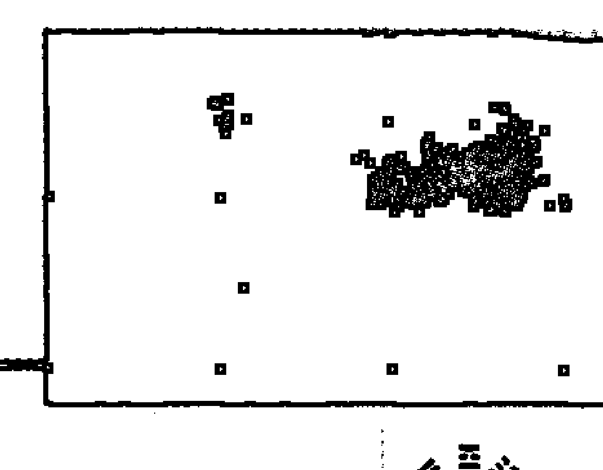

- 5. 乾宫为父亲，庚十丁为亭亭之格。逢杜门、上乘腾蛇主病情有转移之象。
- 6. 用神入墓应期，年干癸遇六月为墓大凶。时干落宫数为应期：时干庚落乾宫，午月乾宫休囚，取一数，为一个月，也是阴历六月大凶。

### 实例六、预测疾病

苏柏逞是山东省临沂市人，与我是易友关系，2002年来过河北省周易研究基地共同研究风水、奇门遁甲等，经常来电话切磋周易。2004年4月13日上午10点，苏柏逞来电话问朋友的儿子病情，此人壬戌年生人。我立即按问事时间起局，看后给苏柏逞说：“病情严重，中西医对其病均束手无策，只能常规治疗，病情部位应为头部，分析为脑积水，病情继续向严重发展，本月有生命之忧，请你继续观察他的病情，有结果后告诉我。”苏柏逞讲：“朋友的儿子生病后我也给他进行了预测，跟石老师预测的差不多。”

> “病情严重，中西医对其病均束手无策，只能常规治疗，病情部位应为头部，分析为脑积水，病情继续向严重发展，本月有生命之忧，请你继续观察他的病情，有结果后告诉我。”

“五一”节期间，易友苏柏逞专程从山东来河北省周易研究会学习、深造时告诉我：朋友的儿子在4月18日（丁卯时）去世了。

2004年4月13日10点
甲申年戊辰月壬戌日乙巳时
阳七局、甲辰旬，天芮星值符落六宫，死门值使落三宫。

| 虎 | 武 | 地 |
| :--- | :--- | :--- |
| 惊己<br>任丁 | 开癸<br>冲庚 | 休丁<br>辅壬 |
| 合 | | 天 |
| 死辛 | | 生庚 |
| 起癸 | 丙 | 英戊 |
| 阴 | 蛇 | 符 |
| 景乙<br>心己 | 杜戊<br>柱辛 | 丙伤壬<br>芮乙 |

**分析：**

**1、为什么说医生对疾病束手无策**
预测疾病以天芮星为疾病的主要代表符号，同时兼看八门中的死门、伤门等，还要看天芮星所临的三奇六仪以及八神状况。天芮病星落乾宫，病情难治，天芮星五行属土，病星生宫，现在又是辰月，病星旺相。乙奇、天心星为医生药物，落艮宫，不克天芮星落宫。死门也可以为病星落震宫，反而克乙奇，天心星落宫。故医生无法治疗疾病。

**2、为什么说病在头部，是脑积水**
天芮病星落乾宫，乾为头，但是也主右腿，为什么不断右腿有病，因为乾宫有值符，值符为头，故断病在头部。乾宫天盘六仪是壬水，壬落乾宫为临官禄地，又是宫生壬水故水旺。头部有水当然是脑积水了。但是乾宫也有丙奇，丙火为炎症，为什么不断脑炎？因为丙奇落乾宫为入墓，不能发挥作用，故不断脑炎。

**3、为什么说病情得不到控制**
天芮病星落乾宫，壬十乙为小蛇得势，病情得势即向纵深发展。上乘值符吉神，值符为头，应理解为疾病严重得出了头。伤十壬主因盗牵连，伤十丙主道路损失。应理解为人生道路上有伤人之损失。伤十乙主求谋不得反失财，应理解为想把病治好，结果病没治好反而失财。伤门也为病与天芮星同宫，都断大凶。

## 奇门遁甲解真

**4、为什么说本月有性命之忧。**
时干乙奇也为病落艮宫，为帝旺之地，病在旺地，病情自然难治。乙十己为日奇入墓被土暗味，逢空亡大凶。测病死门值使主大凶。值使门也为病，死门值使落震宫，上乘六合虽为吉神。但测病最怕逢合，疾病被合住，病不会好，辛十癸为天牢华盖，日月失明，误入天网，动止乖张，又临天蓬大凶星，死十癸主百事皆阻，病者不食。

从病人本身的运气也可以分析：给朋友的儿子预测，以时干为儿子，时干乙奇落艮宫，乙十己为日奇入墓，逢空亡大凶，上乘太阴为阴曹地府，死亡之象。壬戌年生人，壬落乾宫临伤门，主伤亡，门为人盘，门宫相克也是大凶，地盘壬落坤宫，临休门为长期休之象，上乘九地为入地之象。从多方位、多角度看大凶信息明显病情无治。

测病逢庚格大凶，此奇门局庚下临戊，三月为戊辰月，逢月格为月内大凶。庚格为应期，阳日看庚下之干，庚下之干为戊，现在正是戊辰月，所以本月有性命之危。分析到月我没细分析。“五一”期间苏柏逞来周易研究会参加学习时告诉我4月18日丁卯日去世。现在分析为什么应验丁卯日去世。

断应期远应年月，近应日时。

- 1. 用神所落宫数为应期，病人为壬戌年生人，壬为用神落乾宫，辰月乾宫旺相，乾主一六数，旺断六数，4月13日到4月18日正应六天。
- 2. 值使门为应期，今死门值使落震宫逢空亡之地，填实之日为应期，丁卯日填实，故为丁卯日去世。
- 3. 用神死墓绝为应期，壬为年命，用神壬遇卯日为死地，故卯日去世。
- 4. 逢冲时合为应期，年命壬落乾宫为辰戌相冲，卯日为卯戌相合，故应卯日。
- 5. 六甲值符定应期，刑冲者和为应期，天芮星为值符落乾宫，与月令辰形成辰戌相冲，卯戌相合故应卯日去世。

总结以上五条可以看出，奇门遁甲储存丁卯日死亡的信息。

### 实例七、预测父病

2004年4月7日15点，我在石家庄太行机械厂招待所给学员们讲解奇门遁甲，突然手机铃响了，电话里传来一位中年男子的声音，自我介绍道：“我是河北省四建公司的耿彦文，去过两次抱犊寨周易研究会，还在今年正月初四到你家拜访过。今天想麻烦石老师给我预测一下我父亲的身体状况，他是1923年生人。”我满口答应：“现在正忙着给学员讲课，等下午6点你再来电话。”下课后我按来电话的时间起了一个奇门遁甲局，耿彦文来电话时我告诉他：“你父亲的病在头部，说具体点是脑血管有堵塞，病情严重，极难治疗，本月大凶，具体时间是3天至6天之内极度危险，有归天之象。”6月6日我在周易研究会基地写论文，耿彦文又来了，进门就说：“今年4月7日给我父亲预测的结果应验了，在预测后的第五天，也就是4月12日父亲病故了。”

2004年4月7日15点
甲申年戊辰月丙辰日丙申时
阳一局，甲午旬，天辅星值符落八宫，杜门值使落六宫

| 阴 | 合 | 虎 |
| :--- | :--- | :--- |
| 壬开己<br>芮辛 | 休丁<br>杜乙 | 生癸<br>心己 |
| 蛇 | | 武 |
| 惊乙<br>英庚 | 壬 | 伤戊<br>楚丁 |
| 符 | 天 | 地 |
| 死辛<br>辅丙 | 景庚<br>冲戊 | 杜丙<br>任癸 |

## 分析：

- 1. 为什么说其父病在头部是脑血管堵塞
测病情以天芮星、死门为病情符号，时干、值使门为所测之事，也可以为病情符号。时干丙奇、值使门杜门同落乾宫，乾为头为首，故头部有病，死门落艮宫上乘值符，值符也为头，故病在头部，天芮星落巽宫逢空亡之地，应看对冲之宫，为乾宫，天芮星临开门，开门代表乾宫，也断头上有病。乾宫有癸水，癸为阴水主血液，逢杜门为血液堵塞之象。
- 2. 为什么断病情严重难治。
测病八门反吟主大凶，逢庚格主大凶，久病反吟则死。此局八门反吟，逢庚格。其父春节之际卧床不起，视为久病，时干丙奇落宫上乘九地也为久病，故为大凶之兆。乙奇为医生，天心星为医生，乙奇落震宫休囚，医生克不动病情。天心星为医药落坤宫，不但不克时干、值使门落宫，反而相生，死门为病落艮宫与天心星落宫比和。天芮星落巽宫克天心星落宫，医药不起作用。死门为病落艮宫，辛十丙为干合悖师，门凶则事凶。测病最怕逢合，上乘值符，说明病情严重的出了头。故断病情难治。时干丙奇为病落乾宫为入墓，丙十癸为华盖悖师，灾祸频生。杜门值使为病落乾宫为门宫大战。其父为1923年生人，为癸亥年，年命癸落坤宫为入墓，大凶，癸十己为华盖地户，男女测之音信皆阻，躲灾避难为上吉，生十死主病难治。年干也为父亲，今年为甲申年，庚为其父落坎宫为死地，庚十戊名为天乙伏宫，百事不可某大凶，景门为人盘，景门落坎宫为火入水乡大凶，上乘九天为上西天之象。
- 3. 为什么断本月大凶，3到6天病故。
八门反吟主快。卦逢庚格，庚下临戊为月格，故月内大凶。阳日庚下之干为应期，时干临阳星也是庚下之干为应期。丙辰日为阳日，时干丙临天任星，天任星为阳星，庚下之干为戊，9号为戊午日，故7-9日三天内大凶。值使门为应期落乾宫，乾主一、六数，三月乾宫旺相，取六数为6天。故断3-6天之内病故。

### 实例八、预测哥哥疾病

1999年9月25日15点，我在周易研究会研究基地看书学习，来了一位青年女子，见面就说：“今天我来抱犊寨旅游，看到河北省周易研究会研究基地在此座落，我就上楼来了。我是邢台人叫李群芳、哥哥是1974年生人，身体有病，求测哥哥病情。”我按问事时间起局，分析后告诉他：“你哥哥病情严重，他是胃癌，也有血液病。”李小姐肯定地说：“老师测的很准确。医生检查也是这两种病。”我接着说：“医生没有特效的疗方案，只能按常规治疗。明年正月去世。”

2000年2月16日李小姐来电话告诉我：“哥哥正月去世了。”

1999年9月25日15点
己卯年癸酉月庚辰日甲申时
阴七局、甲申旬，天芮星值符落五宫寄二宫，死门值使落五宫寄二宫

| 阴 | 蛇 | 符 |
| :--- | :--- | :--- |
| 杜辛<br>辅辛 | 景丙<br>英丙 | 庚死癸<br>芮癸 |
| 合 | | 天 |
| 伤壬<br>冲壬 | 庚 | 惊戊<br>柱戊 |
| 虎 | 武 | 地 |
| 生乙<br>任乙 | 休丁<br>蓬丁 | 开己<br>心己 |

## 分析：

- 1. 为什么断胃癌和血液病。
九星、八门伏吟，破财伤人，测病死门值使主大凶。以天芮星为病神落坤宫，为相，天芮星遇酉月为旺，死门临庚多为癌症，坤土在内盘主脾胃，断胃癌，临癸水，故也有血液病。虽然上乘值符，但是逢空亡，癸十癸为天网四张。庚十癸为大格，庚十庚为太白同宫。甲寅癸落坤宫为六仪击刑。伤门也为病神落震宫，上乘六合，为多种疾病，临壬水，为血液有病，壬十壬为六仪击刑。预测哥哥疾病，以月干为用神，月干癸落坤宫，哥哥为1974年生人，年命甲寅癸也落坤宫，癸落坤宫入墓蓬空，值符不保，大凶之兆，故病情已发展到晚期。
- 2. 为什么医生没有特效治疗方案。
天心星为医生落乾宫，不克天芮病星。乙奇为医生落艮宫，与坤宫比和。伤门落震宫克乙奇落宫。天心星虽克伤门宫，但是逢九地不动，医生不克病星。
- 3. 为什么断明年正月去世。
八门、九星伏吟主慢，按年月断。时干落宫数为应期，时干庚落坤宫，坤宫主二、五、八、十数，逢空亡，取五个月，从酉月算起，第五个月为正月，寅月；时支逢冲为应期，时支为申，寅月形成寅申相冲，也是正月去世；用神临死墓绝为应期，时干庚逢寅月为绝地，也是应在正月；马星动为应期，马星落艮宫，正月马星动，冲用神时干庚、年命癸和月干癸。故正月去世。

### 实例九、父亲有病十月大凶

2003年8月2日10点，石家庄吴天明给我打来电话，我父亲今年68岁了，身体不好住了医院，求测病情如何？我立即起局预测。待吴天明又来电话询问预测结果时我告诉他；你父亲是肺心病，病情很快向严重方向发展，也可能有胃、肾等脏器的并发症。医生没有有效的方法和药物，对病情束手无策，只能对症治疗。七、八、九月病情不见好转，阴历十月大凶，恐怕难过此关。

2004年正月，我在石家庄和吴天明见面时问起他父亲之事，他说：石老师预测的真准确。医生诊断为肺源性心脏病，肾和胃部都有并发症。治疗无效，于2003年阴历10月去世。

2003年8月2日10点
癸未年己未月丁未日乙巳时
阴四局、甲辰旬，天英星值符落五宫寄二宫，景门值使落八宫。

| 阴 | 蛇 | 符 |
| :--- | :--- | :--- |
| 惊己 | 开戊 | 休壬 |
| 冲戊 | 辅壬 | 英庚 |
| 合 | | 天 |
| 死癸 | 乙生庚 | |
| 任己 | 乙 | 芮丁 |
| 虎 | 武 | 地 |
| 景辛 | 杜丙 | 伤丁 |
| 蓬癸 | 心辛 | 柱丙 |

分析：
- 1. 测病以天芮星为病神，天芮星落兑宫，病难治，未月天芮星、兑宫均为相，临生门、上乘九天，说明病情很快向严重方向发展。兑宫属金，金主肺，临地盘丁奇，丁奇主心脏。断为肺心病。
- 2. 天芮星临地盘丁奇，查天盘丁奇落乾宫，上乘九地，说明得病时间长了。逢马星主病情有转移之象。丁奇临地盘丙，查天盘丙落坎宫，坎为肾，可见肾脏也有病，丙下临辛，丙辛相合，测病最怕逢合，逢合病难治；天芮星临乙奇，查地盘乙奇落五宫寄坤二宫，坤宫主胃，断胃也有病，上乘八神小值符，说明胃病严重的出了头。
- 3. 乙奇、天心星为医生，药物，乙奇落兑宫，与天芮星同宫，说明医生对病情正在治疗中，但是不克天芮星，说明不能治愈。天心星落坎宫，也不克天芮星，故医生对病情束手无策。
- 4. 父亲是丙子年生人，年命丙落坎宫，为火入水乡，上乘玄武主昏迷，大凶。丙落坎宫为胎地，有投胎转世之象；地盘丙奇落乾宫，为墓、绝之地，逢伤门主伤亡。临天柱破军星大凶。上乘九地，有入地之象。
- 5. 年干癸为父亲落震宫，为长生之地，老年人怕逢长生、帝旺，癸十己为华盖地户，男女音信皆阻，遇此格躲灾避难为上吉。临死门、逢空亡，上乘六合，空中暗藏玄机，暗藏病情被合住，治不好之玄机；兼看地盘癸落艮宫，辛十癸为天牢华盖，日月失明，误入天网，动止乖张。逢空亡、临景门、天蓬星、白虎均主大凶。
- 6. 现在是阴历六月，五行属土，天芮星为相地，七、八月属金，天芮星处旺地，九月属土，故这三个月病情严重。年命丙遇九月为入墓，逢十月为绝地，十月马星动，冲巽宫，巽宫有天盘己，己为坟墓，上乘太阴为阴曹地府。断十月大凶。正应十月其父去世。
- 7. 时干落宫数为应期，时干乙奇落兑宫，兑主二、七、四、九数，十月去世应四个月。值使门落宫数为应期，景门值使落艮宫，艮主八数，逢空减半，为四数，为四个月，也是应在十月去世。

### 实例十、预测奶奶身体

石家庄市某单位保卫科长林建良，是我多年的老朋友，也是周易爱好者，经常与我在一起切磋、学习奇门遁甲。2000年9月20日18点，我刚从研究基地下班，林科长找到我说：“我奶奶今年83岁了，请石老师预测一下她的身体状况。”我起了一个奇门遁甲局，认真分析后对林科长说：“你奶奶身体有病，心脏不好，中西医治疗均无效，只能对症处理临时情况，不能治疗根本问题。今年她运气不好，明年正月大凶。”林科长叙述道：“石老师预测行很对，我奶奶的心脏病比较严重，医生经常给她治病，没有明显的好转。”

后来林科长告诉我：其奶奶是2001年正月二十三日去世的。

2000年9月20日18点
庚辰年乙酉月辛巳日丁酉时
阴九局、甲午旬，天心星值符落三宫，开门值使落三宫。

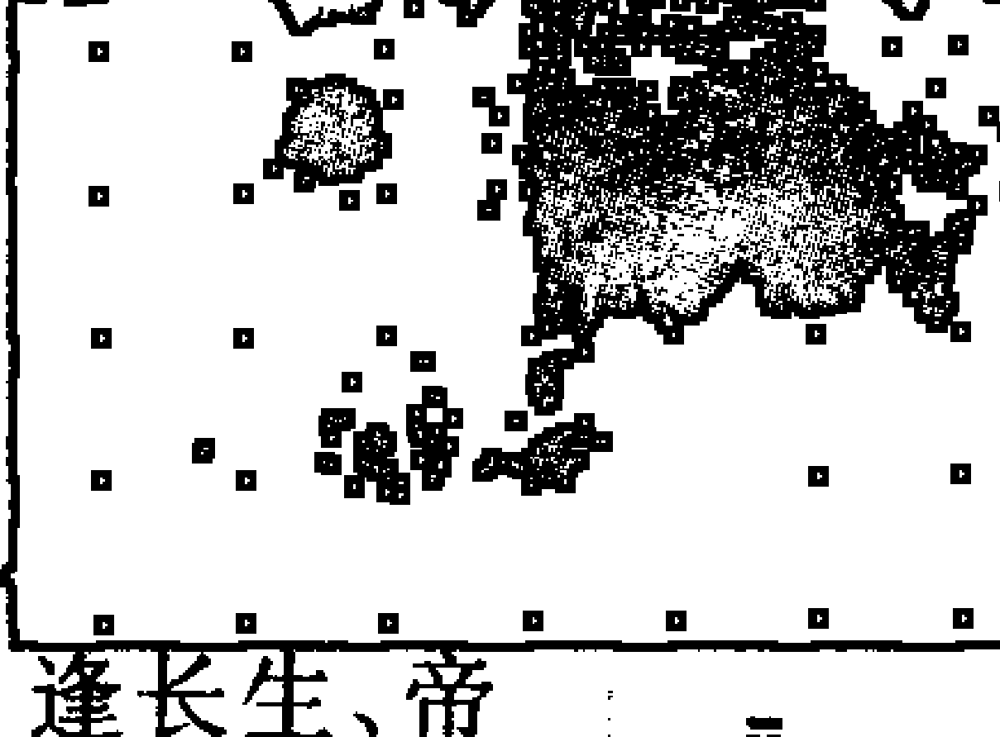

# 奇门遁甲解真

| 天 | 地 | 武 |
| :--- | :--- | :--- |
| 休乙<br>莹癸 | 生己<br>任戊 | 伤丁<br>冲丙 |
| 符 | | 虎 |
| 开辛<br>心丁 | 壬 | 杜癸<br>辅庚 |
| 蛇 | 阴 | 合 |
| 惊庚<br>柱己 | 壬死丙<br>芮乙 | 景戊<br>英辛 |

分析：

- 1. 为什么断奶奶心脏有病。测病以天芮星为病神。天芮星落坎宫临丙火，丙火代表心脏。伤门也代表病，临丙、丁火均可代表心脏。值符代表奶奶落震宫，临地盘丁奇，也是心脏有病。时干也为病，时干丁奇落坤宫，临地盘丙奇，正是心脏病。
- 2. 为什么断医生治不好心脏病。天芮星落坎宫，乙奇为医生落巽宫，天心星为医药落震宫，均不克天芮病星，病情无治。伤门也为病落坤宫，乙奇、天心星落宫虽然克伤门落宫，但是伤门逢日干空亡之地，医生、药物克不住病星。
- 3. 为什么断奶奶今年运气不好，病情严。卦遇五不遇十，人将逝。此局正是五不遇十。酉月病星正在旺月，病难治。奶奶为戊午年生人，年命戊落乾宫为入墓，测病用神入墓主大凶。
- 4. 为什么断2001年正月大凶。
年命戊落乾宫，戊十辛为青龙折足。2001年为辛巳年，地支太岁已在巽宫，用神戊冲克地支太岁大凶。天盘太岁辛落震宫，年命戊又克太岁落宫，冲克大岁必有大灾。年命戊落乾宫临马星，冲动马星为应期，天芮星落坎宫，阴遁为外盘主慢，按年月而论，辛巳年，已在巽宫冲动马星，必然辛巳年有大灾难；时干落宫数为应期，时干丁奇落坤宫，坤宫主二、五、八、十数，酉月坤宫为休，取五数，为五个月，从现在起第五个月为2001年正月；正月为寅月，看艮宫格局，庚十己为官符刑格，测病大凶，临惊门，凶门受生事更凶。惊十庚主道路损失。惊十己主恶犬伤人。天柱星为破军星，此星临宫事更凶。上乘螣蛇主惊恐怪异之事。断难过正月。正月23日为己酉日，病星正处旺日，故应酉日去世。

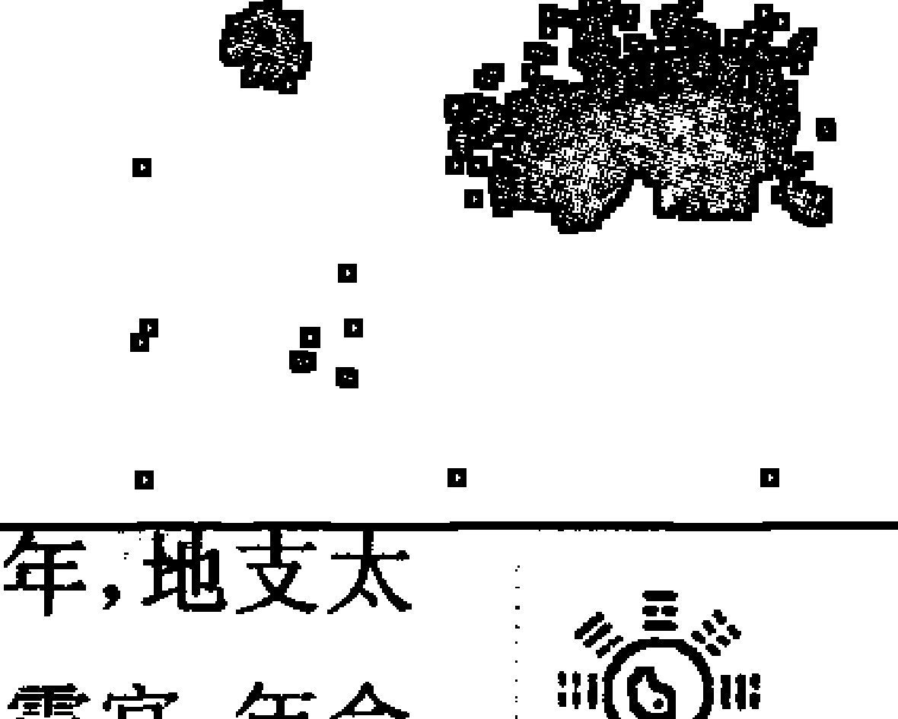

## 人体疾病预测

### 实例十一、替朋友测父病

1999年9月1日8点30分，邢台市路军平给我打电话：朋友的父亲有病住进了医院，求测病情如何？其父是1934年生人。我让他等15分钟以后再来电话。我立即按问事时间起了一个奇门局，待路军平又来电话时我告诉他预测结果：他父亲是头上有病，应为脑溢血，需开刀手术治疗。路军平说：“石老师预测的对，医生诊断为脑溢血，已经做过手术了。请石老师看看术后病情怎么样？”我断医生根本治不了他父亲的病，病情可能转移到右腿，成为偏瘫。今年腊月大凶，可能有生命危险。请你到正月给我回个电话，反馈一下信息，以验证奇门预测的准确性。路军平满口答应：一定，一定。

2000年正月我收到了路军平的电话：石老师预测的真准确。他父亲出院后右腿偏瘫，腊月26日去世。

1999年9月1日8点30分
己卯年壬申月丙辰日壬辰时
阴四局、甲申旬，天芮星值符落九宫，死门值使落三宫。

| 蛇 | 符 | 天 |
| :--- | :--- | :--- |
| 惊壬<br>英戊 | 乙 开庚<br>芮壬 | 休丁<br>柱庚 |
| 阴 | | 地 |
| 死戊<br>辅己 | 乙 | 生丙<br>心丁 |
| 合 | 虎 | 武 |
| 景己<br>冲癸 | 杜癸<br>任辛 | 伤辛<br>芮丙 |

## 分析:

- 1. 预测病情，以天芮星为病神，天芮星落离宫，上乘值符为头上有病。逢庚为阻隔之神，临壬水主血液，壬水为阳水。大水，壬水冲庚，血管崩溃，断为脑溢血。临开门主开刀；伤门也主病落乾宫，上乘玄武主病情转移，乾宫主右腿，断右腿瘫痪。
- 2. 时干壬也为病落巽宫，壬十戊为小蛇得势，病情向严重方向发展。乙奇，天心星为医生、药物，乙奇落离宫与天芮星同宫，天心星落兑宫，也不克天芮星落宫，故医生对病情束手无策，此病难治。
- 3. 预测病情，死门值使主大凶，五不遇十人将世。朋友父亲为1934年生人，年命甲戌，己落艮宫为入墓，主大凶。己十癸为地刑玄武，男女疾病垂危；乾宫为父亲，辛十丙为干合悖师，遇伤门则事更凶。丙辛相合，测病最怕逢合，逢合病难治。
- 4. 时干落宫数为应期：时干壬落巽宫，巽宫四、五、三、八数，取五数为五个月，正是腊月，腊月为丑月，年命己入墓，大凶。断难过此关。

### 实例十二、母亲病逝难过腊月

2000年12月16日10点，石家庄市梁志华给我打电话：我母亲今年81岁了，昨天得病住进了医院，求测母亲平安否？我立即按问事时间起了一个奇门遁甲局，待梁志华又来电话询问预测结果时，我告诉他：你母亲得为脑血栓。医生没有特效治疗方案，只能常规治疗。病情还要向严重方向发展，恐怕难过腊月，请你做好后事准备。

2001年3月16日，梁志华来电话预测投资经营之事，顺便提起母亲生病之事，梁志华告诉我：石老师预测的真准确，母亲是脑血栓，在病床上躺了一个月，腊月20日去世了。

2000年12月16日10点
庚辰年戊子月戊申日丁巳时
阴一局、甲寅旬，天禽星值符落四宫，死门值使落二宫。

| 符 | 天 | 地 |
| :---: | :---: | :---: |
| 癸杜乙 含芮丁 | 景辛 柱己 | 死壬 心乙 |
| 蛇 伤己 英丙 | 癸 | 武 惊戊 逢辛 |
| 阴 生丁 辅庚 | 合 休丙 冲戊 | 虎 开庚 任壬 |

## 分析：

1.  测病以天芮星为病神落巽宫，上乘值符为头上有病，临地盘丁奇主血液，逢杜门为堵塞不通，断：脑血栓。

2.  值使门也为病，死门值使落坤宫，壬十乙为小蛇得势，说明病情继续向严重方向发展；时干丁奇也为病落艮宫，入墓逢空大凶。上乘太阴为阴曹地府。

3.  乙奇、天心星为医生，乙奇落巽宫，天心星落坤宫，均不克天芮病星落宫，故病情无治。

4.  母亲81岁了，年命庚申，庚落乾宫，庚十壬为上格，壬水主流动，庚主阻隔，远行道路迷失，男女音信难通，凶。上乘白虎凶上加凶；坤宫主母亲，壬十乙虽为吉格，但治病主大凶，逢死门大凶，上乘九地为入地之象。

5.  测病死门值使主大凶。八门伏吟主孝服。用神入墓为应期：年命庚遇丑月入墓，故腊月大凶。时干丁奇为所测之事，丁奇遇丑月也为入墓。梁志华讲母亲腊月20日去世，查万年历，腊月20日为丁丑日，正应丑月丑日，用神入墓时去世。

### 实例十三、预测父亲疾病

1999年11月19日9点30分，我刚到周易研究会办公室，接到了石家庄市张风明的电话，求测父亲病情，其父是1929年生人。我告诉他15分钟后再来电话可以得到预测结果，我按问事时间起了一个奇门遁甲局。待张风明再来电话时我告诉他预测结果：你父亲是消化系统有病，应该是食道癌，病情比较严重。张风明说：“预测的很对，经过检查，医生说食道发现癌细胞。”我告诉他：“中西医都治不了你父亲的病最好找中医调理一下，今年人平安，明年阴历三月大凶。”

以后张风明告知：2000年阴历3月27日父亲去世。

1999年11月19日9点30分

己卯年乙亥月乙亥日辛巳时

阴三局、甲戌旬，天芮星值符落九宫，死门值使落四宫

| 蛇 | 符 | 天 |
| :--- | :--- | :--- |
| 死辛 英乙 | 丙惊己 芮辛 | 开癸 柱己 |
| 阴 |  | 地 |
| 景乙 辅戊 | 丙 | 休丁 心癸 |
| 合 | 虎 | 武 |
| 杜戊 冲壬 | 伤壬 任庚 | 生庚 蓇丁 |

## 分析：

1.  测病死门值使主大凶。卦逢五不遇时，十人将逝。
    测病以天芮星为病神落九宫，己十辛为游魂入墓，易遭阴邪鬼魅作祟。丙十辛为丙辛相合，测病最怕逢合，逢合病难治。临惊门大凶。惊十己主恶犬伤人。惊十景主疾病凶。虽然上乘值符，但是因格局大凶，值符不保，值符为头，在这里应理解为病情严重的出了头，可见到了危险期。

2.  时干为病，时干辛落巽宫，上乘腾蛇，巽宫主食道，腾蛇也主食道，逢死门主阻隔，天英星属火，火为炎症，辛十乙为白虎猖狂家败人亡，辛落巽宫入辰墓大凶。上乘腾蛇主缠绕，病难治。

3.  值使门也为所测之事，死门值使与时干同宫，吉凶已经分析不再重复。

4.  伤门也代表病落坎宫，临壬水主食道，临地盘庚为阻隔，上乘白虎主伤亡，坎水生伤门，凶门受生事更凶。
    根据以上信息可以断为食道癌。

5.  乙奇、天心星为医生，药物，乙奇落震宫不克天芮星，也不克伤门落宫。天心星落兑宫，也不克天芮星和伤门落宫，可见医生、药物对病情无效。天心星为西医西药。落兑宫逢空亡，疗效更差。乙奇落宫不逢空，故只能用中医中药进行调理。

6.  为什么断明年阴历三月大凶。

    1.  逢冲为应期：
        其父年命为己巳，己落离宫克明年太岁庚落宫，三月为庚辰月，也为太岁月，甲子戊己冲克三月辰，冲克太岁必有灾。天芮星临天盘甲子戊己，久病逢冲必死。

    2.  入墓为应期：时干辛落巽宫为入墓，三月为辰月又入辰墓必死。死门值使落巽宫，也为入墓，三月入辰墓也是必死。

    3.  时干、值使门落宫数为应期。
        时干辛、值使门死门同落巽宫，巽宫主四、五数，取五数，阴遁巽宫为外盘主慢、主远，按年月断，为五个月，到明年三月正是五个月。故三月必死。

### 实例十四、预测易友弟弟病情

1999年9月21日11点，一位易友找我预测其弟病情，弟弟是1954年出生，我按问事时间起奇门局，分析后对易友说：“你弟弟的病很严重，是胃癌，癌细胞已经转移了，癌症到了晚期，中西医对病情都束手无策，只能用常规治疗。”易友问：“什么时间人就不行了？”我说：“腊月病情加重，过不了春节人就不行了。”易友叙述道：“弟弟原来在石家庄肿瘤医院住院，后来转到北京，在北京治疗期间病情不见好转。”阴历11月易友告诉我：医生根据病情分析判断连11月都过不去，怎么还能等到腊月呢？我告诉他：11月绝不会有事，进入腊月后就应该做后事准备了。
2000年春节过后易友告诉我：其弟是腊月27日（甲申日）去世，真是没有过去春节。

1999年9月21日11点
己卯年癸酉月丙子日甲午时
阴六局、甲午旬，天冲星值符落三宫，伤门值使落三宫。

| 天 | 地 | 武 |
| :--- | :--- | :--- |
| 杜庚 辅庚 | 景丁 英丁 | 己死壬 芮壬 |
| 符 伤辛 冲辛 | 己 | 虎 惊乙 柱乙 |
| 蛇 生丙 任丙 | 阴 休癸 蓬癸 | 合 开戊 心戊 |

## 分析：

1.  为什么断胃癌。
    天芮为病神落坤宫，为相，月令为酉月，病星更旺，壬落坤宫为长生之地，己落坤宫为沐浴之地，病情向纵深发展。壬十壬为六仪击刑，己十己为地户逢鬼，病者发凶或必死。临死门多为癌症，坤土在内盘主脾胃，故断胃癌，上乘玄武主病情转移，可见己到晚期。逢日干空亡，空中暗藏死亡之玄机；时干为所测之事，时干辛落震宫，辛十辛为六仪击刑，逢伤门大凶，逢天冲星，久病逢冲则死，时干加六辛占病必死。虽然临值符，只能说当下无事。但是年命辛落震宫，克年干太岁己，今年必死无疑。

2.  为什么断医生对病情束手无策。
    乙奇、天心星为医生，乙奇落兑宫，天心星落乾宫，均不克天芮星。

    测兄弟病情，以月干癸为用神落坎宫，癸十癸为天网四张，主行人失伴，病讼皆伤。临休门虽为吉门，测病临休门主大凶，有长期休息——死亡之象，上乘太阴有入阴曹地府之象，逢天蓬大凶星，消耗身体能量。年干己落坤宫克癸落宫，今年必死。

    其弟为甲午年生人，年命辛落震宫，辛十辛为六仪击刑，又克年干己落宫，克太岁有大灾，逃脱不了今年死亡。

3.  为什么断今年腊月去世。
    九星八门伏吟主慢，年命辛，落震宫，月干癸落坎宫，阴遁为外盘、主远，主慢，按年月断。以日支六合为应期，日支为子，腊月为丑，子丑相合故为腊月去世。值使门为应期，伤门值使落震宫，震主三、四数，取四数为四个月，丑月属土，病星旺相，酉月预测，到丑月正好为四个月。年命辛逢丑月为胎地，有投胎转世之象，故定丑月病故。

### 实例十五、预测父亲疾病

1998年8月16日10点，邢台刘建明给我打电话说：父亲现在有病，请石老师预测病情如何？我让他15分钟以后再来电话。我立即按问事时间起了奇门遁甲局。15分钟后刘建明又来电话时，我告诉他预测结果：你父亲不是一种病，是肺和胃部都有病，刘建明肯定说：对，到医院检查时医生也说是这两种病，我接着断：这两种病医生均无良药妙方。只能常规治疗。今年和明年人平安，到2000年阴历3月大凶。2000年“五一”节过后，刘建明来周易研究会找我，说到父亲的病情时，刘建明说“五一”节那天父亲去世了，真是应验了你预测的2000年阴历3月大凶。

1998年8月16日10点
戊寅年庚申月乙未日辛巳时

奇门遁甲解真

阴二局、甲戌旬，天蓬星值符落八宫，休门值使落三宫。

| 地 | 武 | 虎 |
| :--- | :--- | :--- |
| 生乙 冲丙 | 伤丙 辅庚 | 杜庚 英戊 |
| 天 |  | 合 |
| 休辛 任乙 | 丁景戊 芮壬 |  |
| 符 | 蛇 | 阴 |
| 开己 蓬辛 | 惊癸 心己 | 死壬 柱癸 |

人体疾病预测

## 分析：

1.  为什么断其父是肺和胃两种疾病。
    天芮星为病神落兑宫，上乘六合，为两种疾病。兑宫主肺。故断有肺病。天芮星临天盘戊，地盘甲子戊落坤宫，坤宫主脾胃，故有胃病。

2.  为什么断医生对病情束手无策。
    乙奇、天心星为医生、药物。乙奇落巽宫不克天芮星，反而受天芮星所克；天心星落坎宫不克天芮星，天芮星反而生助天心星；天芮病星落乾兑二宫病难治。申月正是病星发挥威力之时，病星上乘六合，测病最怕逢合，逢合病难治；时干辛也为病落震宫，辛十乙为白虎猖狂，家败人亡，上乘九天，说明病情发展很快，临天任星吉星。临休门吉门，主现在平安。

3.  年干戊为父亲落兑宫，为死地凶。戊十壬为青龙入天牢，凡阴阳事皆不利。景十戊主远行吉，说明父亲当前平安，没有生命危险；乾宫也代表父亲，壬落乾宫为临官禄地，说明父亲还有口粮。临死门主阻隔，上乘太阴凶。病星落兑宫逢空亡，凶事不凶，吉事不吉，可见人当时平安。

4.  为什么断2000年阴历3月大凶。
    时干辛，值使门休门均落震宫，阴遁震宫为外盘主远主慢，按年、月断：

    1.  用神入墓为应期：乾宫为父亲，天盘壬落乾宫，遇辰年、辰月为入墓大凶。
    2.  时干入墓为应期：时干辛落震宫遇辰年辰月为入墓，大凶。
    3.  值使门入墓为应期：休门值使遇辰年辰月入墓大凶。
    4.  以值符定应期：天蓬星值符落艮宫，己十辛为游魂入墓，甲子戊己十甲午辛，午戌半合，逢冲为应期，遇辰年辰月冲甲子戊己，大凶。久病逢冲则死。

### 实例十六、预测儿女运气

2004年6月29日15点30分，我正在河北省周易研究会研究基地看书学习，来了一位中年男子，见面主说：我是沧洲人姓李。人不来能预测吗？我回答：“可以预测。”“那你给我女儿预测一下前途命运如何？女儿是1989年生人。”我按问事时间起了一个奇遁甲局，看着格局对李先生说：“你女儿现在身体有病，中西医都没有好的治疗方案，医生对病情束手无策，只能常规治疗。”李先生问：“你看我女儿得的什么病？”我回答：“不是肺上有病就是血液病。”“是血液病，请老师再看看是什么原因引起的疾病？”我说：“是因为住宅出了问题导致女儿生病。”李先生在纸上画了他家的住宅图，我看此图正是大凶之宅，此宅为五鬼闹宅，住此宅必然伤女儿，我问李先生是那一年进住此宅的，李先生说是1999年进住的。我看着住宅图说：“你女儿是2002年得的血液病。”李先生说：“对，是2002年得的血液病。请老师指点应该怎么办？”我在纸上

给李先生画了一个住宅图，告诉李先生按我的方案对此宅进行改造，配合医生治疗，会对女儿的治疗有帮助的。

2004年6月29日15点30分
甲申年庚午月己卯日壬申时
阴九局，甲子旬，天英星值符落五宫寄二宫，景门值使落一宫。

| 阴 | 蛇 | 符 |
| :--- | :--- | :--- |
| 开丁 冲癸 | 休癸 辅戊 | 生戊 英丙 |
| 合 |  | 天 |
| 惊己 任丁 | 壬 | 壬伤丙 芮庚 |
| 虎 | 武 | 地 |
| 死乙 蓬己 | 景辛 心乙 | 杜庚 柱辛 |

## 分析：

1.  为什么断其女儿非肺病即血液病。
    时干为女儿，时干壬落兑宫临天芮病星，逢伤门；地盘时干壬落五宫寄坤二宫，坤宫有地盘天芮病星。根据以上两条信息可以断女儿有病。

    天芮病星落兑宫，兑宫五行属金，肺属金，断肺部有病。天芮病星临丙，壬、丙为火，火为红、壬为水，水主流动，红色流动的水，必然是血液。再兼看值使门落宫，景门值使落坎宫，景门属火，火为红色，坎宫为水，也出现红色的水，必然是血液病。

2.  为什么断病难治。
    天芮病星落兑宫，书中暗表，病星落乾兑二宫，病难治，壬十庚为太白擒蛇，丙十庚为荧入太白，门户破散，盗贼耗失。伤十惊主疾病忧惊凶。伤十丙主道路损失，伤十壬主盗贼连连，上乘九天主病情严重，向恶性方向发展，值使门也为病，景门值使落坎宫，辛十乙为白虎猖狂，家败人亡，远行多灾殃上乘玄武主病情转移，可能病情转移到肺部。

    乙奇为中医，中药落艮宫，乙十己为日奇入墓，门凶事必凶。临死门阻隔之神，说明中医，中药没有好的治疗方案。乙奇落宫不克天芮星落宫。 再看西医西药，天心星为西医西药落坎宫，上乘玄武，玄武主昏迷，说明西医也诊不清、治不明，没有好对策，天心星落宫也不克天芮星落宫。

3.  为什么断住宅有问题。
    时干为宅落兑宫，临天芮病星，逢伤门，住宅必然有问题。日干为人，日干己落震宫，时干落宫克日干落宫，时干克日干为宅子克人，也是住宅有问题。

4.  为什么断此宅伤女儿，女儿是2002年生的病。
    时干为宅落兑宫，天芮病星落兑宫兑为少女。又结合李先生画的住宅图而断的。2002年得病是从李先生画的住宅图上结合女儿的年命看出来的，这属于风水问题，再此不多叙。

### 实例十七、预测女儿前途命运

2000年9月25日14点，我在河北省周易研究会研究基地刚拿出书来看书，来了一位中年男子，领着一个二十岁刚出头的青年女子，来人自我介绍说：“我是某大学教授。”指着女孩说：“这是我的女儿，1978年生人，请老师预测她的前途命运。”我按问事时间起了一个奇门遁甲局，我看着格局对男士说：“你女儿身体有病，此病不好治，中西医都没有特效的方法，只能常规治疗。”女孩座在旁边不说话，看样子是认真地听我讲话。我继续说：“病在头上。应该是大脑出了毛病，因为受到惊吓或什么刺激导致神经错乱。得病时间长了，是十年以上。”教授肯定地说：“老师预测的很对，女儿是幼年得病。1979年因为感冒发烧，使大脑受刺激，治疗不及时所致。到过好多医院检查治疗，医生给定为精神病。我妻子1998年因患精神病跳楼自杀。”这时候女儿闹腾起来了。非要教授给她找对象。急得教授只是不停地哄着女儿：“咱们请老师给指点迷途，爸爸一定给你治好病，并找个好对象。”见此情景，我只好让其到精神病院治疗，病好后再谈其它事情。

2000年9月25日14点
庚辰年乙酉月丙戌日乙未时

阴一局、甲午旬，天柱星值符落二宫，惊门值使落六宫。

| 阴 | 蛇 | 符 |
| :--- | :--- | :--- |
| 伤己 英丁 | 癸杜乙 芮己 | 景辛 柱乙 |
| 合 | | 天 |
| 生丁 辅丙 | 癸 | 死壬 心辛 |
| 虎 | 武 | 地 |
| 休丙 冲庚 | 开庚 任戊 | 惊戊 蓬壬 |

奇门遁甲解真

## 分析：

1.  为什么断女儿病在头部，得病已久。
    父亲测女儿，时干乙奇代表女儿落离宫，临天芮病星，离宫为头，阴遁离宫为内盘，头内部有病，乙十己为日奇入墓，被土暗昧，门凶事必凶。癸十己为华盖地户，男女测之音信皆阻。逢杜门为细胞有堵塞之象，上乘螣蛇为惊恐虚诈，大脑受刺激而引起疾病，螣蛇也主得病时间长了；兼看地盘乙奇落坤宫，临地盘天芮星，天盘天芮星又生地盘乙奇。上乘值符为头，也断头上有病，辛十乙为白虎猖狂，家败人亡，远行多灾殃，景十死，景十辛、景十乙都是大凶，临天柱破军星更凶。虽然临值符吉神，但是逢日干空亡之地，值符不起作用。

    女儿为1978年生人，为戊午年，年命戊落乾宫为入墓，乾为头。惊门值使也为病落乾宫也说明是头上有病。惊门主惊恐，说明头部的病是因为惊恐受刺激所致，上乘九地表明得病时间长了。乾宫主一、六数，故为10年以上；兼看地盘戊落坎宫，戊落坎宫为胎地，中青年最怕死绝胎，大凶。庚十戊为天乙伏宫，百事不可谋，大凶。上乘玄武主昏迷，神志不清。也主病情有转移之象。

2.  为什么断医生对病情无特效治疗方案。
    乙奇为中医落离宫，与天芮星同宫，不克天芮星，天心星为西医落兑宫，也不克天芮星落宫。

## 第六章 行人走失预测

### (一) 怎样取用神

预测行人走失，按出走失时间起局时，以日干为走失之人；按问事时间起局时，以六亲关系取用神，父母测子女、长辈测晚辈、领导测群众，以时干为走失之人，测兄弟姊妹、朋友，以月干为走失之人，儿女测父母，晚辈测长辈、群众测领导，以年干为走失之人。兼看走失之人的年命为用神。

预测行人走失方向：六合落宫为开始出走的方向，值符落宫、值使门落宫可以是其落脚点，最后找到的方向，可能是用神或年命落宫方向。如果是有意逃藏，杜门落宫可能是躲藏的方向。如果用神落空亡之宫和遇八门、九星反吟，对冲之宫为逃藏或走失方向，如果用神在内盘，行人没有走远，易找。如果用神在外盘，行人己走远，难寻。用神乘九地、太阴有人潜藏乘九天远走，乘玄武被人偷走或拐骗。乘螣蛇有人羁留。乘白虎有人勾引而去，而防止刑伤。乘值符、六合人平安，用神落宫为吉格，人平安，有人帮助，为凶格，则人有危险。用神临年干可能在长辈家中，用神临月干可能在朋友家中，用神临时干可能在晚辈家中，用神落乾宫到大都市去找，用神落坤宫到农村或田野里去找，用神落坎宫到河沟去找，用神落震、巽二宫到树林中去找，用神休囚又遇景、死、惊、伤四门者，则有消息，可以找到或自己能回来，用神旺相又遇开、休、生、杜四门者，不好找到。伏吟人难归，反吟能找到或人能回来。

找到或自己回来的时间：逢庚格能找到或人能自己回来，逢年格年内归，逢月格，月内归，逢日格当日归，逢时格本时辰内归，还必须结合实际情况而定。阳日看庚下之干，阴日看庚上之干，时干临阳星看庚下之干，时干临阴星看庚上之干。空亡者以填实或冲实为应期，逢刑冲遇合为应期，逢合以冲为应期，冲动马星或马星动者为应期。用神入墓冲墓为应期。

### (二) 实例解析 (9例)

#### 实例一、出走的妻子能平安回家

2000年7月15日下午，我在河北省周易研究会抱犊寨研究基地值班，来了一位中年男子，自我介绍说：“我是石家庄市人，姓张，今天早晨6点，妻子离家出走了。找了一上午不见人影。求石老师预测：妻子在外是否平安？什么时间能回来？”我问男子：“妻子是那年出生？” 张某回答：“是1966年生人。”我立即按出走时间起了一个奇门遁甲局，认真分析后对张某说：“你妻子是因为你们夫妻闹矛盾而出走的。”张某承认：“对。昨天晚上因为家务事，我与妻子发生了冲突，今天早晨不辞而别。”我接着断：“你妻子出走时。身上有钱，她坐车到了外地，方向是东南。现在没有消息，也无法寻找。”张某说：“亲戚朋友家都打了电话，都说不知道妻子的去向。”我接着断：“你妻子在外平安，7月22日人就回来了。等你妻子回来后，一定给我反馈信息。”张某满回答应：“一定给你打电话。” 7月23日上午张某给我打来电话，高兴地说：“石老师预测的真准确。我妻子在7月22日下午平安回到家里。”

2000年7月15日6点
庚辰年癸未月甲戌日丁卯时
阴五局、甲子旬，天禽星值符落八宫，死门值使落二宫

| 地 | 武 | 虎 |
| :--- | :--- | :--- |
| 杜乙 | 景壬 | 死丁 |
| 心己 | 遁癸 | 任辛 |
| 开 | | 合 |
| 伤丙 | | 惊庚 |
| 柱庚 | 戊 | 冲丙 |
| 符 | 蛇 | 阴 |
| 戊生辛 | 休癸 | 开己 |
| 天芮丁 | 英壬 | 辅乙 |

## 分析：

- 1、为什么断夫妻吵架妻子出走。
乙庚为夫妻，乙为妻子落巽宫，庚为丈夫落兑宫，丈夫克妻子。妻子为1966年生人，年命丙年，丙辛相合，辛为丈夫落艮宫，妻子克丈夫。夫妻互相冲克，必然是吵架。乙奇临马星必然是离家出走。

- 2、为什么断妻子身上有钱，坐车到东南方向的外地去了。
日干己为出走之人落乾宫，甲子戊为钱，落艮宫，生助日干落宫，说明妻子身上有现金。日干遇空亡主变动，临开门主车。妻子年命丙落震宫，临伤门主车，上乘九天主远走高飞，必然是坐车而走。杜门为躲藏的方向，杜门落巽宫，为东南方向，阴遁巽宫为外盘，必然是到外地，东南方向去了。

- 3、为什么断妻子在外平安，但无消息。
丁奇为消息落坤宫，逢死门为阻隔之神，没有消息。日干己落乾宫，临开门吉门、天辅星吉星，上乘太阴吉神，又与太岁庚落兑宫比和。年命丙落震宫，上乘九天吉神。人必然平安。

- 4、为什么断7月22日妻子回家。
日干己落乾宫，临开门、逢空亡，当前回不来。马星动为应期，22日为辛巳日，马星动，冲空则实，人回家。时干、值使门落宫数为应期，时干丁奇，值使门死门落坤宫，坤宫主二、五、八、十数，六月坤宫旺相，取八数，为八天回来，15日至22日正是八天。

#### 实例二、李先生测女儿出走

1998年5月4日22点，石家庄市的李春林给我打电话：我女儿今天去上学，中午没有回家吃饭，下午放学也没有回家，找到学校后，老师说：她今天请假了，没来上学。我们四处打听不到女儿的踪影。请石老师预测一下，女儿到什么地方去了？人是否平安？什么时间能回来？女儿是1980年生人。我让李先生等15分钟再来电话。我立即按问事时间起了一个奇门遁甲局，并进行了分析。15分钟后李先生又来电话询问预测结果时，我告诉他：你女儿在学校谈了一个对象，因为你批评了她，所以离家出走了。李先生肯定说：对。我断：她身上有钱，坐车到外地去了，方向是西南，人在外平安，目前还不回来，你也得不到任何消息。5月22日能回来。你女儿回来后请给我回个电话。李先生一口答应：一定给你回电话。

5月23日，李春林给我打电话说：女儿昨天回来了。她到广西、云南玩耍了一趟。

1998年5月4日22点
戊寅年丙辰月辛亥日己亥时
阳五局、甲午旬、天任星值符落六宫，生门值使落四宫

| 虎 | 武 | 地 |
| :---: | :---: | :---: |
| 戊生丁<br>芮乙 | 伤庚<br>柱壬 | 杜己<br>心丁 |
| 合<br>休壬<br>英丙 | 戊 | 天<br>景癸<br>蓬庚 |
| 阴<br>开乙<br>辅辛 | 蛇<br>惊丙<br>冲癸 | 符<br>死辛<br>任己 |

## 分析：

- 1、为什么断女儿谈了一个对象，父亲批评了她。
父亲测女儿以时干己为用神，己落坤宫为沐浴之地，为桃花运。女儿是1980年生人，年命庚申，庚落离宫为沐浴之地，上乘玄武为小盗之神，为小偷，在这里主与男人偷情。年干戊为父亲，落巽宫，克时干己落宫，说明父亲批评了女儿。

- 2、为什么断女儿身上有钱，坐车到西南方向的外地去了。
既然是有意出走，杜门为躲藏的方向，杜门落坤宫，坤主西南方向，阳遁坤宫为外盘，故断西南方向的外地。伤门为车，落离宫与年命庚同宫，又生助时干己落宫，故断坐车走了。甲子戊为钱落巽宫，生助年命庚落宫，时干己临地盘甲子戊，故断身上带有钱。

- 3、为什么断人在外地平安，当前不回来。
时干己为女儿落坤宫，临天心吉星，上乘九地吉神。年命庚落离宫，有年干太岁戊落巽宫生助，断人平安。用神临开休生杜之门不好找到。今时干己临杜门，年命庚落离宫，有生门落巽宫生助，断当前不回来。

- 4、为什么断当前没有消息，5月22日女儿回家。
丁奇为消息落巽宫，逢空亡之地，景门也为消息落兑宫，为门克宫。癸十庚为太白入网，凶。庚为阻隔之神，断没有消息。时干己落坤宫，生助日干辛落宫，断人能回来。值使门落宫数为应期，生门值使落巽宫，巽宫主三、四、五、八数，三月巽宫当令为旺，取八数，为18天；时干落宫数为应期，时干己落坤宫，坤宫主二、五、八、十数，三月坤宫为相，取八数，为18天。从出走之日到22日正是18天。从另一个方面断：值使门逢空，临马星，填实或马星动时为应期。查万年历，5月22日为己巳日，巽宫被填实，马星动。故断5月22日女儿回家。

#### 实例三、行人不会走失

2000年5月17日上午，我在河北省周易研究会抱犊寨研究基地上班，来了一位青年妇女，自我介绍说：“我在石家庄工作，姓赵。5月10日晚上8点多丈夫离家出走了。他是1972年生人。家里人找了一个星期也不见丈夫踪迹。求测丈夫在外是否平安？什么时间能回来？”我立即按出走时间起了一个奇门遁甲局，认真分析后对赵女士说：“第一，你丈夫在外平安，出走时身上带了钱，第二，你丈夫坐车到了南方。第三、你丈夫有情人，这次是和情人一块出走的，……。”这时赵女士插话：“我知道他有一个相好的女人，这几天那女人也不在家，她家里人说她出差了。”我接着断卦：“现在你们得不到任何消息，安心在家等待吧，两个月左右你丈夫会平安回家。请你在丈夫回家后给我回个电话。”赵女士满口答应：“一定给你回电话。”7月13日上午，我收到赵女士打来的电话：其丈夫7月12日下午回到家里，回来后家里人问他干什么去了，他说到南方考查市场了。

2000年5月10日20点
庚辰年辛巳月戊戌日壬戌时
阳四局、甲寅旬，天英星值符落八宫，景门值使落八宫

| 阴 | 合 | 虎 |
| :--- | :--- | :--- |
| 惊辛<br>柱戊 | 开庚<br>心癸 | 休丁<br>蓬丙 |
| 蛇<br>己死丙<br>芮乙 | 己 | 武<br>生壬<br>任辛 |
| 符<br>景癸<br>英壬 | 天<br>杜戊<br>辅丁 | 地<br>伤乙<br>冲庚 |

## 分析：

- 1、为什么断丈夫在外平安，出走时身上有钱。
妻子求测，庚为丈夫落离宫，上乘六合，人平安。地盘庚落乾宫，上乘九地，人平安；按出走时间起局、日干为出走之人，为丈夫，日干戊落坎宫，上乘九天，人平安；丈夫是1972年生人，年命壬落兑宫，临生门为钱，故断身上有钱。

- 2、为什么断丈夫到南方去了。
庚为丈夫落离宫，临开门，离宫主南方，开门为车，上乘六合为逃藏之方。地盘庚落乾宫，临伤门也为车，临天冲星必动。日干戊落坎宫，上乘九天也主车，临杜门为躲藏的方向，逢空亡看对冲方向，对冲之方为离宫。故坐车到南方去了。

- 3、为什么断丈夫与情人一起出走。
庚为丈夫落离宫上乘六合，六合为合伙出走。地盘庚落乾宫，临乙奇为女人。日干戊落坎宫，临丁奇为第三者女人，必有情人，上乘九天主一起出走。年命壬落兑宫，上乘玄武为小盗神，必有情人。地盘壬落艮宫，临景门主风景区，必然是到外地旅游去了。

- 4、为什么断丈夫走后没有消息。
景门为消息落艮宫，遇空亡之地。丁奇也为消息落坤宫，逢马星、临休门。地盘丁奇落坎宫为火入水乡，上乘九天临空亡。故没有消息。

- 5、为什么断两个月左右丈夫能回来。
时干壬落兑宫，生助日干戊落宫，人能回来。时干落宫数为应期，时干壬落兑宫，兑主二数，时干在外盘，主远、主慢，按年、月断。故为两个月。
值使门落宫数为应期。景门值使落艮宫，逢空亡，填实或冲空为应期，阴历6月冲空则实。也断两个月左右回来。妻子讲：丈夫是7月12日下午回到石家庄，查万年历，7月12日为癸未月、辛未日，冲空则实。人果然回来了。

#### 实例四、小女孩三天之内平安回家

2001年2月11日20点，石家庄白瑞琴女士打来电话：今天吃过早饭7点多钟女儿就上学去了，中午没有回来吃饭，一直到下午放学也没有回家。找到学校时，老师说上午女儿到学校请了假，说去医院看病，原来她一天没有上学。全家人都着急了，四处寻找不见女儿踪迹。请石老师预测一下，看小女到哪里去了？人是否平安？她是1987年生人。我按出走时间起了奇门遁甲局，待白女士又来电话时我告诉她预测结果：你女儿是受到你的批评后才离家出走的，白女士肯定说：“对。昨天晚上吃饭时，我嫌她不听话，批评了她。”我继续断：可能是到同学家去了。白女士述：同学家我们都找过了，她们说不知道，我告诉白女士到西南方向20华里去找女儿。白女士说：这个方向，这个距离没有她的同学，她的同学都在石家庄住，我只好安慰道：女儿在外平安，你们不要着急，最晚三天之内能回家，并告诉她等女儿有了消息给我回个电话。白女士满口答应：一定给你回电话。

2月14日我接到了白女士的电话：女儿去西南方向赞皇县的一个小时候的老家上学时的同学家玩了两天。昨天下午平安回到了家。

2001年2月11日7点多
辛巳年庚寅月乙巳日庚辰时
阳二局、甲戌旬，天冲星值符落四宫，伤门值使落九宫

| 符 | 蛇 | 阴 |
| :--- | :--- | :--- |
| 生己<br>冲庚 | 伤庚<br>辅丙 | 杜丙<br>英戊 |
| 天 | | 合 |
| 休丁<br>任己 | 辛 | 辛景戊<br>芮癸 |
| 地 | 武 | 虎 |
| 开乙<br>趋丁 | 惊壬<br>心乙 | 死癸<br>柱壬 |

## 分析：

- 1、预测行人出走，按出走时间起局，日干为出走之人。日干乙奇落艮宫，值符为母亲落巽宫，巽宫克艮宫，断受到母亲的批评后出走。日干乙奇落艮宫为帝旺之地，逢马星，临开门，马星主动，开门为车，为坐车出走。上乘九地主人平安。

- 2、时干庚为所测之事落巽宫，临伤门为车，也是坐车而走。上乘螣蛇有人留住了。临天辅星为大吉，时干落宫生日干落宫，断人能回来。

- 3、女儿是1987年生人，年命丁卯，丁落震宫临休门吉门，得人和。临天心吉星，上乘九天吉神，九天为车，主动，也是坐车而走。丁下临己，与己有关系。天盘己落巽宫，下临地盘庚，庚为月干、为同学。天盘庚为同学落离宫，生助日干落宫，说明到同学家去了。地盘庚上乘值符，可见人平安。临生门为房屋，为钱，说明在同学家有吃有住。

- 4、杜门为躲藏之方。杜门落坤宫，坤为西南方向。坤宫主二、五、八、十数，寅月坤宫休囚，取二数，为20华里。

- 5、时干、值使门落宫数为应期。时干庚、值使门伤门同落离宫，离主三数，断三天之内回家。正应13号回到家里的现实。

#### 实例五、新年丈夫出走为哪般

2003年2月2日9点，石家庄张女士给我打电话：“我丈夫昨天晚上离家出走了，我四处寻找不见踪影。这大过年的，求你预测他人在外是否平安？到什么方向去了？什么时间能回来？他是1959年生人，我是1967年生人。”我让她15分钟以后来电话，我立即按问事时间起了一个奇门遁甲局进行了分析，待张女士又来电话时我告诉她预测结果：“你丈夫离家出走是因为你们夫妻吵架而出走的，而且是开车走的……”张女士接茬说：“对。昨天晚上因为家务事与丈夫吵架很凶。他自己有小车，车也不见了，肯定是开车出走了。”我接着预测：“请你放心，你丈夫在外面人身平安，他开车往北走了。”张女士又插话：“他的单位在张家口。”我说哪就是回单位去了。现在人还不回来，到2月9日就回来了。等你丈夫回家后，请你给我回个电话。张女士答应说：“一定给你回个信儿。”

2月10日10点多，我收到张女士的电话：“我丈夫真是开车去单位住了几天，昨天晚上回来的。”声音欢快而兴奋，

2003年2月2日9点
壬午年癸丑月丙午日癸巳时
阳六局、甲申旬，天任星值符落二宫，生门值使落八宫。

| 地 | 天 | 符 |
| :---: | :---: | :---: |
| 杜 戊<br>心 丙 | 景 壬<br>蓬 辛 | 死 庚<br>任 癸 |
| 武 | | 蛇 |
| 伤 己<br>柱 丁 | 乙 | 惊 丁<br>冲 己 |
| 虎 | 合 | 阴 |
| 乙 生 癸<br>芮 庚 | 休 辛<br>英 壬 | 开 丙<br>辅 戊 |

## 分析：

- 1、为什么断夫妻吵架使丈夫开车出走。
丈夫是1959年生人，年命己亥，己落震宫临伤门，伤门主车，临天柱星主口舌；妻子是1967年生人，年命丁未，丁落兑宫，临惊门主口舌，而且是妻子落宫冲克丈夫落宫。
乙庚为夫妻，乙为妻子落艮宫，临天芮星，说明妻子毛病多，上乘白虎，说明妻子很厉害；庚为丈夫落坤宫，临死门，说明丈夫个性强，脾气拧。九星反吟，二、八宫按对冲断，可见夫妻互不相让，吵架而走。

- 2、为什么断丈夫在外边平安。
庚为丈夫落坤宫为临官禄地，说明有吃有喝，上乘值符保平安，太岁壬落离宫，生助坤宫，故丈夫平安。年命己也为丈夫落震宫，甲子戊为财，天盘戊落巽宫，与震宫比和，说明有钱；地盘年命己落兑宫，有值符生之，说明平安。

- 3、为什么断丈夫去了北方，人能回来。
六合为走失之方，落坎宫，故去了北方。时干落宫生日干落宫，人能回来。卦逢庚格人能回来。

- 4、为什么断2月9日丈夫回家。
卦逢庚格，阳日看庚下之干，丙午日庚下之干为癸，应为癸日回来。时干临阴星，则看庚上之干为应期，时干癸落艮宫，临天芮星，看庚上之干，庚上之干也为癸，也是癸日回来。2月9日为癸丑日，故2月9日回来。
时干落宫数和值使门落宫数为应期。时干癸落艮宫，生门值使落艮宫，艮宫主八数，从2月2日至9日正是8天，故2月9日回家。

#### 实例六、预测行人出走

田永康是我的老朋友，也是奇门遁甲爱好者，经常与我在一起切磋奇门遁甲。2000年10月11日，田说有一个侄子是1980年生人，在10月9日早晨6点左右离家出走了。家里人很着急，四处寻找不见踪影，请石老师看看人在外是否平安？什么时间能回来？我按出走时间起了一个奇门遁甲局，局中显示：人在外平安，就在本地，不会走远，没有消息。但是，人能回来。应该是第三天回来。田说：今天就是第三天了，我说：今天你的侄子一定能回来。
后来田告诉我：10月11日即第三天侄子平安回到家里。

2000年10月9日6点
庚辰年丙戌月庚子日己卯时
阴九局、甲戌旬、天任星值符落八宫，生门值使落三宫。

| 地 | 武 | 虎 |
| :---: | :---: | :---: |
| 伤 癸<br>辅 癸 | 杜 戊<br>英 戊 | 壬 景 丙<br>芮 丙 |
| 天<br>生 丁<br>冲 丁 | 壬 | 合<br>死 庚<br>柱 庚 |
| 符<br>休 己<br>任 己 | 蛇<br>开 乙<br>蓬 乙 | 阴<br>惊 辛<br>心 辛 |

## 分析：

- 1、为什么断人在外平安。
预测行人走失，按出走时间起局，以日干为出走之人。日干庚落兑宫，为帝旺之地，上乘六合，平安无事；出走之人是1980年生人，为庚申年，年命庚与日干庚同宫，地盘庚也落兑宫，庚又为2000年太岁，与太岁同宫人自然平安。
时干为所测之事。时干己落艮宫，上乘值符，临休门吉门，临天任吉星，休十己暗昧不宁，后吉，休十生主得阴人财物，谒贵谋望，虽迟也吉；值使门也为所测之事，生门值使落震宫，上乘九天威悍之神，丁十丁为星奇入太阴，文书证件即至，喜事从心，万事如意，人平安。

- 2、为什么断出走之人没有消息。
景门为信息落坤宫，逢空亡之地，主没有消息。

- 3、为什么断人能回来。
预测行人出走，时干生日干人能回来。时干己落艮宫，生日干庚落兑宫，人能回来；日干庚落兑宫，逢死门，测行人走失用神逢死门、惊门、伤门、景门，可以找到或自己回来；卦逢庚格，而且是逢年格，日格，肯定能回来。

- 4、为什么说人在本地，不会走远。
日干、年命庚都落兑宫，阴遁兑宫为内盘，主内地、故不会走远。

- 5、为什么断三天回来。
值使门为应期，生门值使落震宫，震主三数，故为三天；用神庚落兑宫，逢空亡，填实或冲空为应期，甲申庚逢壬寅日，寅申相冲，冲空则实，故为寅日回来，壬寅日也正是出走后的第三天。

#### 实例七、预测行人走失

2000年10月9日8点30分，我正在河北省周易研究会基地看书学习，来了一位青年女子，开门见山地说：“我是石家庄人姓李，想预测我表妹张亚萍离家出走一事，她是1972年生人，10月5日上午10点30分出走，不知去向，今天已经是第五天了，全家人都很着急，请老师预测一下，看表妹在外是否平安，什么时间能找到人。”我按出走时间起了一个奇门遁甲局，分析后对李女士说：“人在外边凶多吉少”（实际上卦中显示人已经死亡，我怕李女士承受不住突如其来的打击，改口说成凶多吉少），应该去西南方向和南方12至15里之内去找。找到的时间是八天左右。
后来李女士打电话告知：第七天找到了表妹，在南方概离家13里地的地方找到了尸体。（第七天是壬寅日）

2000年10月5日10点30分
庚辰年乙酉月丙申日癸巳时
阴七局、甲申旬，天禽星值符落二宫，死门值使落五宫寄二宫。

| 阴<br>杜辛<br>韬辛 | 蛇<br>景丙<br>英丙 | 符<br>庚死癸<br>白芮癸 |
| :--- | :--- | :--- |
| 合<br>伤壬<br>冲壬 | 庚 | 天<br>惊戊<br>柱戊 |
| 虎<br>生乙<br>任乙 | 武<br>休丁<br>逃丁 | 地<br>开己<br>心己 |

## 分析：

- 1. 为什么断人已死在外面。
(1) 测行人出走，死门值使主大凶，八门九星全盘伏吟主破财伤人，不容易回来。按出走时间起局，以日干为出走之人，日干丙落离九宫，逢空亡之地凶，上乘螣蛇主惊恐虚诈，临景门、天英星均主血光之灾。
(2) 表妹是1972年生人，年命壬落震宫为死地大凶，克太岁庚落宫大凶，壬十壬为蛇入地罗，也为辰辰自刑。六仪击刑，逢伤门主伤亡，伤十伤主变动，远行折伤凶。
(3) 时干为所测之事，时干癸落坤宫，虽然临值符，但是入墓逢空值符不保，癸十癸为天网四张，主行人失伴，病讼皆伤，癸十庚为太白入网，主以暴力争讼自罹罪责。
(4) 值使门也为所测之事，死门值使落坤宫，与时干同论不再重复。测行人走失，用神入墓逢空、遇死地、绝地，人必然死在外面。

#### 实例八、预测女儿出走

1996年9月30日我接到邯郸一位朋友的电话：我单位领导的女儿9月27日11点离家出走，三天来不见女儿回家，家人四处寻找不见女儿踪影，全家人都快急死了，女儿是1978年生人。请石老师预测一下人在外是否平安？什么时间能回来？我告诉他15分钟后再来电话可得到预测结果。我立即起出走时间局进行预测。待15分钟后朋友又来电话时我告诉他：女儿回不来了，已经被坏人杀害了。现在找不到尸体，可能在阴历12月才能找到。我嘱咐朋友：不要给领导的家人讲实话，以免吓着他们，只告诉他们：女儿在外凶多吉少。让家人思想上有个转弯的时间。1997年2月17日和朋友会面时，朋友告诉我：去年腊月在磁县山沟里找到了女儿的尸体。

1996年9月27日上午11点

## 奇门遁甲解真

丙子年丁酉月丁卯月丙午时

阴七局、甲辰旬，天冲星值符落九宫，伤门值使落一宫。

| 蛇 | 符 | 天 |
|---|---|---|
| 死乙 | 惊壬 | 开辛 |
| 任辛 | 冲丙 | 辅癸 |
| 阴 |  | 地 |
| 景丁 |  | 休丙 |
| 薰壬 | 庚 | 英戊 |
| 合 | 虎 | 武 |
| 杜己 | 伤戊 | 庚生癸 |
| 心乙 | 柱丁 | 芮己 |

## 分析：

- 1、为什么断女儿已经死亡。
按出走时间起局，以日干为出走之人，日干丁奇落震宫，丁十壬为淫荡之合，上乘太阴为隐私暗昧之事。临天蓬星必然是因男女之事离家出走。丁落震宫逢空亡，空中暗藏玄机，逢景门主血光。天蓬星主大盗、黑社会、杀人犯，上乘太阴说明坏人早有密谋将其杀害，用神上乘太阴也表明有入阴曹地府之象。用神丁奇又冲克天盘太岁丙奇落宫，冲克太岁必有大灾。
兼看地盘丁奇落坎宫，丁奇落坎宫为绝地，用神逢绝地人必死。逢伤门主伤亡，临天柱破军星主大凶。上乘白虎主刑伤。又冲克地盘太岁丙奇落宫。
女儿是1978年生人，年命戊午，戊落坎宫为胎地，有投胎转世之象，逢伤门、天柱星、白虎都是大凶。戊午生人遇丙子流年，地支午冲克地支太岁子，大凶。

兼看地盘戊落兑宫，为死地，用神遇死、墓、绝地人都回不来，必然死在外边。临天英星主血光。逢休门主长期休息之象。上乘九地有入地之象。
时干为所测之事，时干丙奇落兑宫为死地，时干丙和地盘年命戊同宫，格局一样不再重复。
值使门也为所测之事，伤门值使落坎宫，与天盘年命戊、地盘日干丁奇同宫，吉凶同上不再赘述。

- 2、为什么断腊月找到女儿尸体。
用神入墓为应期：用神丁奇遇丑月为入墓。
用神逢合为应期：用神甲子戊遇丑月、子丑相合。
时干落宫数为应期：时干丙奇落兑宫，兑主二、七、四、九数，取四数，日干丁落震宫，年命戊落坎宫，阴遁坎震二宫为外盘，主远、主慢、按年、月断，四数为四个月，正是丑月，故断阴历12月找到尸体。

#### 实例九、母亲走失凶多吉少

2002年11月25日8点30分，石家庄市的赵小明给我打电话说：今年母亲65周岁了，患有精神病。11月18日下午2点多从家里出走，不知去向，全家人四处寻找都不见母亲的踪迹，天气这样寒冷，求测母亲有没有生命危险？应该到什么方向去找？什么时间能够找到？我让他15分钟以后再来电话。我按出走时间起了一个奇门遁甲局。15分钟后赵小明又来电话询问预测结果时我告诉他：应该到东南方向40华里的地方去找，现在找不到，也没有消息，可能到腊月找到母亲，母亲凶多吉少，可能有性命之危，请找到母亲后给我回个电话，赵小明一口答应。
2003年元月17日，我接到了赵小明的电话，昨天在离石家庄40华里的东南方向找到了母亲，已经在田野里去世。

2002年11月18日14点

壬午年辛亥月庚寅日癸未时

阴三局、甲戌旬，天芮星值符落七宫，死门值使落二宫。

合 阴 蛇
杜 戊 景 乙 死 辛
冲 乙 辅 辛 英 己
虎 符
伤 壬 丙 惊 己
任 戊 丙 癸
武 地 天
生 庚 休 丁 开 癸
遁 壬 心 庚 柱 丁

## 分析：

- 1、测行人走失，按走失时间起局，以日干为走失之人。日干庚落艮宫，上乘玄武主迷糊，正应母亲有精神病。坤宫也代表母亲，上乘螣蛇主虚诈，惊恐不实，说明母亲大脑有问题。值符为母亲，天芮星值符落兑宫。上乘八神小值符，为八神之领袖，为头，也说明母亲头脑有毛病。
- 2、六合为走失的方向，杜门为躲藏的方向。今六合落巽宫临杜门，逢马星又临天冲星，说明母亲去了东南方向。而且不停地走动，没有具体的落脚点。阴遁巽为外盘主远。但是，伤门为车，巽宫不临伤门，说明不是座车走的。那么，步行则不会太远。日干庚落艮宫，年命丁奇落坎宫，阴遁艮、坎二宫均为外盘，主远。但两宫均不临伤门，也说明不是座车走的，故也不会走太远。断40华里左右。

## 行人走失预测

- 3. 丁奇为消息落坎宫，为火入水乡，临地盘庚为阻隔之神。日干庚落艮宫，庚十壬为上格，远行道路迷失，男女音信难通。景门也为消息落离宫，上乘太阴主保密，乙十辛为青龙逃走。故断没有线索和消息。
- 4. 八门伏吟，人不容易回来。用神逢开、休、生、杜之门不容易回来，今日干庚逢生门，年命丁奇逢休门，上乘九地，人不容易回来。
- 5. 日干庚为走失之人，庚落艮宫为入墓，凶。庚十壬为上格，大凶；地盘庚落坎宫为绝地，临休门，上乘九地都是大凶，死亡之兆；年命丁奇落坎宫，为绝地，临休门，上乘九地，休门主长期休息，九地为入地，都是死亡之兆。用神入墓遇绝地。人必死。
- 6. 坤宫为母亲，坤宫逢空亡之地，凶。辛十己为入狱自刑，凶。临死门大凶。上乘腾蛇主惊恐失措，天英星主血光之灾。
- 7. 时干为所测之事，时干癸落乾宫临开门，主不容易回来。癸十丁为腾蛇天娇，大凶。临天柱破军星，大凶。上乘九天，有上西天之象，大凶。
- 8. 2002年为壬午年，太岁壬落震宫克日干庚。地盘太岁壬落艮宫，克地盘日干庚落宫。地盘年命丁落乾宫又克天盘太岁壬落宫。用神克太岁或被太岁克均有灾。故断母亲有性命之危。
- 9. 时干落宫数为应期，时干癸落乾宫主一、六数，亥月乾为旺，取六数为60天，为二个月。应为2003年元月18日左右找到；用神入墓为应期，日干庚遇丑月为入墓，应为腊月找到；年命丁奇遇丑月也入墓，两个用神都在丑月入墓，应为丑月找到。赵小明来说2003年元月16日找到了母亲的尸体，查看年历此日为己丑日，正应丑月丑日用神入墓时找到。

## 第七章 钱物丢失预测

## （一）怎样取用神

测钱物丢失，以日干落宫为失主，以时干落宫为失物。各以类推之，时干落宫乘旺相来生日干落宫者，能找回，卦遇反吟者也能找回，落空亡、死、墓、绝之宫找不回来。日干时干同宫，没有丢失。伏吟没有动地方，还在原来的地方，能找到。日干时干同在内盘，钱物丢失在近处或家中或单位。日干、时干同在外盘，丢失在外边。时干在内、日干在外、丢失在家中或单位。时干在外，日干在内，可能丢失在外边。

时干或值使门落宫临玄武则被人盗走或自己忘记。如果时干或值使门落宫被玄武、天蓬星所克，可能是有人偷走。乘阳星为男人盗，乘阴星为女人盗。旺相为青壮年人，休囚为老年人。

钱物丢失找到时间：时干或值使门逢空亡。冲空或填实之年、月、日、时找到。入墓冲开墓找到。如果逢庚格，按庚格而断，阳日看庚下之干，阴日看庚上之干，时干临阳星看庚下之干，时干临阴星看庚上之干。

## （二）实例解析（8例）

### 实例一、少收的贷款能找回

2003年3月26日16点，石家庄的王志坤给我打电话问：“刚才卖货时少收了顾客500元钱。请石老师预测一下，看货款能不能找回来？”我让他等15分钟再给我来电话。于是我按接电话的时间起了一个奇门遁甲局。待王志坤又来电话询问预测结果时，我告诉他：“货款很快就能找回来，你抓紧时间寻找。等找回货款后给我回个电话。”王志坤一口答应。

当天18点我收到王志坤的电话：石老师，给你报喜了，下午5点多，找到了少收的货款，500元钱平安收回了。感激石老师，感谢神奇的奇门遁甲。

2003年3月26日16点

癸未年乙卯月戊戌日庚申时 阳三局、甲寅旬，天任星值符落五宫寄二宫，生门值使落五宫寄二宫。

| 地<br>开辛<br>心己 | 天<br>休丙<br>逝丁 | 符<br>生癸<br>任乙 |
| 武<br>惊壬<br>柱戊 | 庚 | 蛇<br>伤戊<br>冲壬 |
| 虎<br>庚死乙<br>芮癸 | 合<br>景丁<br>英丙 | 阴<br>杜己<br>辅辛 |

## 分析：

- 1、日干戊为求测者落兑宫，不临天蓬、玄武，没有破财的信息。上乘螣蛇主虚惊一场。
- 2、八门、九星反吟，失物能找到。时干庚为失物，为钱落艮宫。生日干戊落宫，能找回之象。
- 3、生门为钱落坤宫，生助日干落宫。甲子戊也为钱与日干同落兑宫，为比和之象。卦遇比和物不失。
- 4、值使门也为失物落坤宫，上乘值符保平安，不会丢失。值使门落宫生助日干戊落宫，也是能找回之象。
- 5、王志明是1959年生人，年命己亥，己落乾宫，不临天蓬、玄武，不会破财，时干庚落艮宫生助年命落宫。值使门落宫也生助年命落宫。甲子戊为财落兑宫，与年命落宫比和。测失物，比和之卦者能找回来。
- 6、应在酉时找回货款，日干戊落兑宫，酉时戊处旺地，生门落坤宫生之。甲子戊落兑宫也处旺地，与日干比和。全盘反吟主快。时干庚落艮宫逢马星主快。年干太岁癸落坤宫生助日干戊，也生助年命己落宫。故钱很快就找回来。

### 实例二、预测字画下落

杨世峰，是我多年的老朋友，也是周易爱好者，他自幼爱好书画，参加全国各种书画展览多次获奖。2003年8月11日10点，杨世峰给我打来电话说：“有四张字画不见了，经过反复查找怎么也找不到，不知道是有人拿走了。还是丢失了，请石老师预测一下，看能否找到。”我说等十分钟后听预测结果。我起了奇门问事局进行了分析，十分钟后杨世峰又来电话时，我将预测结果告诉他：“四张字画的质量很好，没有人偷，也没有丢失，你原来放在什么地方，现在仍然在什么地方放着，没有动地方，字画能找到。”杨世峰说：“不可能，已经找了无数遍都没有找到。”我解释道：“只要你认真找，三天之内一定能找到。”

以后杨世峰告诉我：四张字画和其它种类的字画卷在一起了。寻找时太粗心了，只按类别进行了寻找，没有把所有的字画都打开仔细查寻，当认真查找时又找到了。

2003年8月11日10点
癸未年庚申月丙辰日癸已时
阴五局、甲申旬，天冲星值符落九宫，伤门值使落三宫，

| 蛇 | 符 | 天 |
| --- | --- | --- |
| 杜丁 | 景庚 | 死己 |
| 任己 | 冲癸 | 辅辛 |
| 阴 |  | 地 |
| 伤壬 |  | 惊癸 |
| 蓬庚 | 戊 | 英丙 |
| 合 | 虎 | 武 |
| 生乙 | 休丙 | 戊开辛 |
| 心丁 | 柱壬 | 芮乙 |

- **分析：**
- 1、为什么断字画质量好。
景门为字画落九宫，离九宫为头，上乘值符，值符为八神之领袖。故断字画质量很好。
- 2、为什么断字画不是被偷也没有丢失。
玄武为小偷落乾宫，景门为字画落离宫，景门落宫克玄武落宫，故没有人偷字画；景门为字画伏吟，伏吟为不动，字画没动怎么能丢呢？

- 3、为什么断字画能找回来。
景门为字画落离宫，上乘值符保平安，逢空亡，空中暗藏玄机，暗藏不动之玄机。时干癸也为字画落兑宫，上乘九地，九地为潜藏，就是说字画有隐藏之象，九地也主不动，可见字画没有动；值使门也为字画，伤门值使落震宫，上乘太阴，太阴为隐藏，也主字画在一个地方隐藏着。日干丙奇为求测者落坎宫，时干癸落兑宫生助日干落宫，故断字画能找回。
- 4、为什么断三天找到。
值使门为应期，伤门值使落震宫，震主三数。故断三天找到。

### 实例三、丢失的手提包找不回来

1998年9月21日9点45分，石家庄市李启东找到我说：“昨天下午我骑摩托车回家时，手提包挂在车把上，回到家后发现小包丢失了。包内装有一部手机，六百元的现金，还有票据和各种证件。今天特地来找石老师，求测小包能否找到。”我立即按问事时间起了一个奇门遁甲局，认真分析后对李启东说：此包找不到了，破财免灾吧。1999年春节后，我在石家庄市见到李启东，问起丢包一事，李说直到现在还没有找到。

1998年9月21日9点45分
戊寅年辛西月辛未日癸巳时
阴三局、甲申旬，天蓬星值使落七宫，休门值使落一宫

合 | 阴 | 蛇
丙杜己 | 景癸 | 死丁
芮乙 | 柱辛 | 心己
--- | --- | ---
虎 |  | 符
伤辛 | 丙 | 惊庚
英戊 |  | 越癸
--- | --- | ---
武 | 地 | 天
生乙 | 休戊 | 开壬
辅壬 | 冲庚 | 任丁

分析：

- 1、日干辛为求测者，为失主，落震宫，为绝地。辛十戊为困龙被伤，主官司，破财，屈抑守分尚可，妄动则带来祸殃。伤十伤主变动，远行折伤，凶。伤十戊主失脱难获。看来老李运气欠佳，丢失的包找不到。
- 2、时干癸为丢失之物，落离宫为绝地，又逢空亡之地，癸十辛为网盖天牢，大凶。景十景主男人忧患凶。景十癸主因奴婢受刑。景十辛主阴人词讼，凶。时干落宫不生日干辛落宫，小包找不到。
- 3、天芮星也为包，落巽宫被克，凶。己十乙为墓神不明，地户逢星，凶。己落巽宫为辰戌相冲，冲则散。逢杜门为堵塞不通。上乘六合，为小包被合住，找不回来。
- 4、丁奇为手机落坤宫，丁十己为火入勾陈，凶。逢死门为阻隔之神。上乘腾蛇主变动。逢空亡之地。手机找不到；景门为证件、票据落离宫。伏吟不动，逢空亡票据，证件也找不回来。
- 5、值使门也为小包，休门值使落坎宫，戊十庚为值符飞宫，吉事不吉，凶事更凶。飞宫又主换地方，说明小包被别人拾到而换了地方。临天冲星，冲则散。八门伏吟，小包找不到。

### 实例四、同事的手机找不回

2002年11月13日10点30分，石家庄张成达给我打电话：我单位的一个女同事是1983年生人，背包放在集体宿舍里，包内有手机。昨天下班时发现手机不见了。不知是有人开玩笑拿走了，还是手机被盗了。请石老师预测手机能否找到。我让他15分钟后再来电话。我立即按问事时间起了一个奇门遁甲局。待张成达再来电话询问结果时，我告诉他；手机是被人盗走了，找不到了，而且也破不了案。
2003年6月我在石家庄见到张成达，问起去年丢手机之事，张成达说真是被盗了，直到现在也没找到。也没有向公安局报案。

2002年11月13日10点30分
壬午年辛亥月乙酉日辛巳时
阴九局、甲戌旬，天任星值符落六宫，生门值使落一宫

| 虎 | 合 | 阴 |
|---|---|---|
| 壬 景 丙 | 死 庚 | 惊 辛 |
| 芮 癸 | 柱 戊 | 心 丙 |
| 武 |  | 蛇 |
| 杜 戊 |  | 开 乙 |
| 英 丁 | 壬 | 蕤 庚 |
| 地 | 天 | 符 |
| 伤 癸 | 生 丁 | 休 己 |
| 辅 己 | 冲 乙 | 任 辛 |

分析：

- 1、丁奇为手机落坎宫，为火入水乡，上乘九天，逢天冲星说明手机不翼而飞。临地盘乙奇，说明与乙奇有关，故看天盘乙落兑宫，逢天蓬盗星，上乘腾蛇主虚诈，兑主少女，可能是一个年轻女子偷走了。
- 2、地盘丁奇落震宫，临甲子戊为财，戊落震宫为六仪击刑。上乘玄武小盗神。很明显手机被盗要破财了。
- 3、时干辛为所测之事，落坤宫逢空亡之地，空中暗藏玄机。上乘太阴主密谋策划。月干辛为同事，克丁奇落宫。阴遁坤宫为内盘，为内部人。说明内部人畜谋己久地去偷手机。
- 4、同事为83年生人，年命癸亥，癸落艮宫逢伤门主伤亡，癸己为华盖地户，男女测之音信皆阻，躲灾避难为上吉。既临地盘己则与己有关，天盘己临辛为犯猎误之人，辛又为月干即同事，说明是同事盗走了手机；地盘年命癸落巽宫，上临丙奇则与丙奇有关系，地盘丙奇落坤宫，上临辛为罪人、为犯错误之人，辛为月干，同事，也说明是同事把手机盗走了。
- 5、白虎、伤门、庚为公安捕盗之人。白虎落巽宫，伤门落艮宫，庚落离宫，均不克玄武星落宫，说明此案不能破。

### 实例五、预测失物

2003年11月28日15点50分，河北省某旅游公司的导游康志林，带着有些着急的表情来到河北省周易研究会办公室问：“老师，我的一个工作用卡和油票都找不到了，不知是丢了，还是有人偷走了。请您预测一下，看能否找到？”我起了奇门遁甲局预测后告诉她：“不要着急，东西没有丢，也没有人偷，就在你家中，从前放在什么地方，现在还在什么地方去找。”康说：“家里，单位里都找了，就是没有呀。”我说：“第三天就能找到。”

以后康志林反馈信息：第三天找到东西了。东西确实没有人动，因为我有两个家，只找了一个家，预测后我又到另一个家里找，提包在墙上挂着，记分卡和油票都在里边。

2003年11月28日15点50分
癸未年癸亥月乙巳日甲申时
阴二局，甲申旬，天英星值符落九宫，景门值使落九宫。

| 蛇 | 符 | 天 |
| :--- | :--- | :--- |
| 杜丙 | 癸庚 | 丁死戊 |
| 辅丙 | 英庚 | 芮戊 |
| 阴 |  | 蛇 |
| 伤乙 |  | 惊壬 |
| 冲乙 | 丁 | 柱壬 |
| 合 | 虎 | 武 |
| 生辛 | 休己 | 开癸 |
| 任辛 | 蓬己 | 心癸 |

## 分析：

- 1、为什么说东西能找到。
全盘伏吟为不动之象。景门为记分卡，油票落离宫，上乘值符保平安，逢空亡，空中暗藏玄机，藏着不动却又能找到的玄机。
时干庚为所测之事，落离宫，与景门信息相同，也是能找到之象。
日干乙奇落震宫，生时干庚落宫，只要去找，就能找到。时干庚落离宫，阴遁为内盘，到家里去找。康志林是癸丑年生人，年命癸落乾宫，上乘玄武主迷糊，说明康志林马虎，将东西忘记在什么地方放着，而且又没有认真去找，才没有找到。
- 2、为什么断东西即没有丢也没人偷。
玄武为小偷、天蓬主破财。景门为卡，油票，不临玄武、天蓬，故不是偷，上乘值符保平安，所以没有丢失，甲子戊为钱落坤宫，伏吟不动，不临天蓬星、玄武神，故不会破财，也证明能找到。
- 3、为什么断第三天能找到。
景门为记分卡、油票落离宫，逢空亡，填实之日为应期。今天是乙巳日，明天丙午日，离宫填实，填实后就能找到。
值使门落宫数为应期，时干落宫数也为应期，景门值使落离宫，时干庚也落离宫，离宫主三、九数，亥月离宫休囚，故取三数为三天。

### 实例六、失物可找回

1996年12月19日18点50分，我下班回到家里，爱人说：我的一本中医书找不到了，不知是丢失了，还是有人借走了。于是我按问事时间起了一个奇门遁甲局，分析后对她说：“中医书不在家里，也没有丢失，是有同事或学生借走了，你好好回想一下是谁把书借走了，或者到单位问一问，是谁借用了。此书能找到，可能在12月24日找到。后来打听到：是一位实习医生借走了。正是12月24日找到的。

1996年12月19日18点50分
丙子年庚子月庚寅日乙酉时
阴一局、甲申旬，天任星值符落二宫，生门值使落七宫

| 阴 | 蛇 | 符 |
| --- | --- | --- |
| 惊壬心丁 | 开戊蓬己 | 休庚任乙 |
| 合死辛柱丙 | 癸 | 天生丙冲辛 |
| 虎癸乙芮庚 | 武杜己英戊 | 地伤丁辅壬 |

## 分析：

- 为什么断书能找回。
预测失物，九星反吟，能找到之象，卦遇庚格也是能找到之象。
景门为书落艮宫，临乙奇，乙奇代表中医，正是中医书，日干庚为问卦人落坤宫，时干乙奇为失物，落艮宫，八门不反吟，按比和断，景门、时干乙奇与日干庚落宫比和，卦遇比和物不失，能找回之象。

- 为什么断书没有丢失而是学生借走了。
景门为书落艮宫，不临玄武，没有人偷书，景门又不克日干落宫，故断不是偷或丢失。景门临时干，时干为晚辈，临天蓬星为学员，故断年轻的实习生借走了。

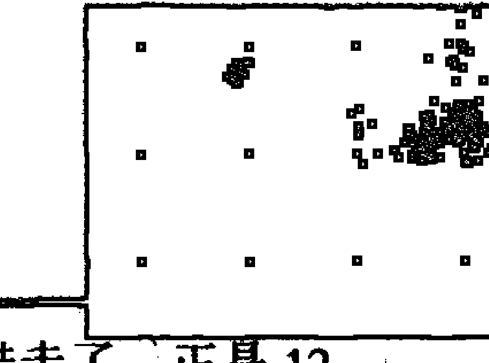

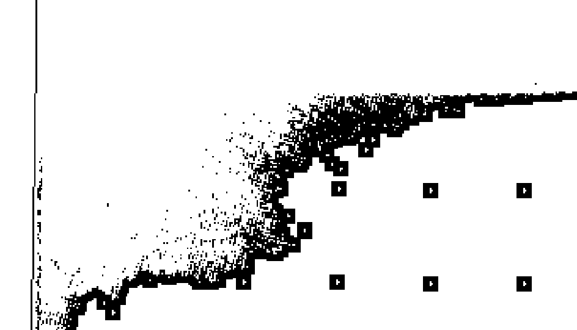

## 3、为什么断12月24日找到。

九星反吟主快，按日、时断。
卦逢庚格，阳日庚下之干为应期，庚下之干为乙奇，12月24日为乙未日，时干临阴星，庚上之干为应期，庚上之干也是乙奇，故为乙未日找到。用神逢空，填实之日为应期，日干庚落坤宫，逢空亡，未日填实。值符落宫为应期，天任星值符坤宫逢空亡，填实为应期，未日填实，故为乙未日找回。

### 实例七、摩托车钥匙究竟在什么地方

1997年10月19日是一个星期天，8点50分我接到了石家庄市的朋友张艳芳打来的电话；昨天下午下班后和儿子一块骑摩托车回娘家看望父母亲，到娘家后摩托车钥匙放在了窗台上，晚上回家时发现摩托车钥匙不见了，全家人都到处寻找，不见钥匙的踪影，大家感到钥匙丢失的奇怪。母亲平时信佛信道，于是又给神位烧起了香纸，请求神指点迷津让我们找到钥匙，烧香完毕大家又进行了一番查找，还是没找到，我和儿子只好在父母家住了一夜。今天早晨起床后我又四处寻找仍然找不到。我突然想起你在研究周易，于是就给你打电话。求助周易预测，看看钥匙究竟在什么地方。

我让她15分钟以后再来电话。我立即起了一个奇门遁甲局，15分钟张女士又来电话询问预测结果时，我告诉她：钥匙没有丢，当时放在什么地方就到什么地方找，钥匙本身没动地方，但是被其它东西盖住了，寻找时你们心情太着急，没有看仔细，你好好找找一定能找到。等你找到钥匙后给我回个电话。张女士一口答应。30分钟后我又收到张女士的电话：真让你测准了，钥匙在窗台上未动地儿，只是上面放了一张报纸把它盖住了。周易真神奇。

1997年10月19日8点50分

## 奇门遁甲解真

丁丑年庚戌月甲午日戊辰时
阴六局、甲子旬，天心星值符落六宫，开门值使落二宫

| 虎 | 合 | 阴 |
| --- | --- | --- |
| 死庚辅庚 | 惊丁英丁 | 己开壬芮壬 |
| 武景辛冲辛 | 己 | 蛇休乙柱乙 |
| 地杜丙任丙 | 天伤癸蓬癸 | 符生戊心戊 |

分析：

- 1、丁奇为钥匙落离宫，临天英星伏吟，为不动，丁十丁为星奇入太阴，文书证件即至，喜事从心，万事如意。上乘六合，钥匙被合住之象。可能是被其它东西盖住了。
- 2、时干戊也为钥匙落乾宫，为入墓，逢空亡之地，空中暗藏玄机。天心星在乾宫伏吟不动，暗藏钥匙未动之玄机。
- 3、值使门开门也代表钥匙落坤宫，临天芮星伏吟为不动。上乘太阴主钥匙被物体遮盖住了。壬十壬为自刑，主自己没有认真寻找。
- 4、日干辛为张女士落震宫，辛十辛为午午自刑，上乘玄武主迷糊，说明张女士寻找钥匙时头脑不太清楚。丁奇为钥匙落离宫，被日干所生，钥匙能找到。开门为摩托车落坤宫，丁奇钥匙落离宫生助开门落宫，说明钥匙不愿意离开摩托车，也是能找到之象。
- 5、丁奇落离宫，时干戊落乾宫，开门落坤宫，都不临天蓬星、玄武星，故断钥匙没有丢失。

### 实例八、预测书能否找到

2002年3月23日15点，我正在河北省周易研究会看书学习。朋友陈贵良打来电话说：有一本很重要的书找不到了。不知是借给别人了，还是丢失了。请你给预测一下，看这本书是否能找到？应该到什么地方去找？我请他十五分钟后再来电话询问预测结果。我按问事时间起了一个奇门遁甲局。陈贵良又来电话时我告诉他：此书没有丢失，也没有借给别人，原来在什么地方放着，现在还到什么地方找，就在你家中，一定能找到。找到的时间比较晚，可能是第五天，大概是27日找到。陈贵良说：只要没有丢失就好，我慢慢找吧。

3月27日下午，我接到陈贵良的电话；你预测的真准。今天下午我在家中一个箱子里找到书了，谢谢朋友帮助。

2002年3月23日15点

壬午年癸卯月庚寅日甲申时

阳六局、甲申旬，天任星值符落八宫，生门值使落八宫。

| 阴 | 合 | 虎 |
| :--- | :--- | :--- |
| 杜丙辅丙 | 景辛英辛 | 乙死癸芮癸 |
| 蛇伤丁冲丁 | 乙 | 武惊己柱己 |
| 符生庚任庚 | 天休壬蓬壬 | 地开心戊心戊 |

分析：

- 1、景门为书落离宫，伏吟不动，说明书在原地没有人动，上乘六合是被别的书给盖住了。逢空亡之地，说明现在找不到。
- 2、时干庚为所测之事，也为书，落艮宫，为入库，有被锁在箱子里藏起来之象，时干庚加庚为伏吟不动。没有动。上乘值符，主书平安。时干庚，日干庚都落艮宫，为比和，日、时比和物不失。所以没有丢失。阳遁艮宫为内盘，书没有在外边，应该在家中找。
- 3、天蓬星为大盗，玄武星为小偷。景门为书落离宫，不临天蓬星、玄武星，说明没有人偷书。时干庚也为书落艮宫，不临天蓬星、玄武星，也说明没有人偷书。
- 4、卦是全盘伏吟局，所以找到书的时间比较晚。景门为书落离宫，逢空亡之地，填实之日为应期，应该在午日找到书。27日为甲午日，故断27日找到书。时干庚落宫数为应期，时干庚落艮宫，艮宫主二、五、八、十数，取五数，应在第五天找到书。27日正是第五天。所以断27日找到书。

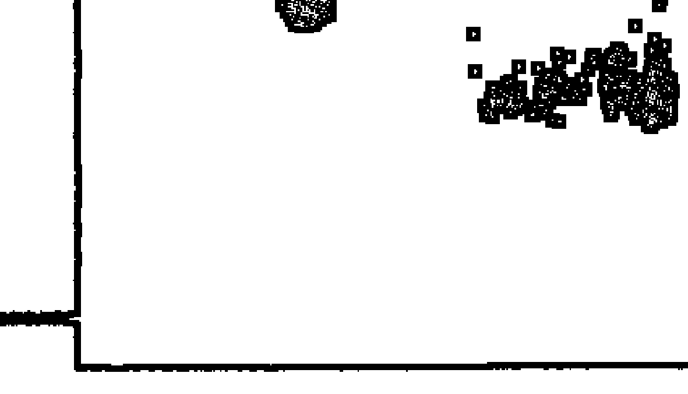

## 第八章 求学考试预测

## （一）怎样取用神

天辅星为招考办公室或考试院，值符为主考官，值使门为副主考官；年干为学校，景门为试卷，丁奇为文章。本人求测日干为考生，父母求测时干为考生，兄弟姐妹、朋友求测月干为考生。同时兼看考生的年命落宫状态。

考试之人落宫旺相，得三吉门、三奇生助，又得天辅星、年干、值符生助，能考入国家名牌大学。考试之人落宫旺相得三吉门、三奇生助，克天辅星、值符、年干，能考入重点大学。考试之人落宫休囚，不得三吉门或三奇生助，但有年干、天辅星，值符生助，能考入一般学校。如果考试之人落宫入墓逢空，遇死绝之地，又遇凶门凶格，又被年干、天辅星克者，必定是名落孙山，考不上大学。

丁奇、景门落宫旺相，又得三奇、吉门、吉格者，考试成绩必然很好。丁奇、景门落宫休囚，死墓绝或逢空亡，考卷答错太多，成绩必然是劣等。丁奇为考分，看其落宫状态来定考分高低，用神遇九星八门全盘伏吟，反吟考不上大学。

## （二）实例解析（9例）

### 实例一、预测升大学

1998年5月10日上午11点，石家庄市的崔光华老朋友给我来电话说：一年一度的全国高考即将到来，我女儿该参加高考了，不知能否考上大学，请老朋友给预测一下。女儿是1979年生人。我告诉他15分钟后再来电话听预测结果，我立即按问事时间起了一个奇门遁甲局，15分钟后崔光华来电话时，我告诉他：今年女儿能考上大学。但不是国家名牌大学，考试成绩可能是520分至550分。并嘱咐他等高考过后给我报喜。1998年9月6日，老崔来电话告诉我：女儿考上大学了，考分为520分，被河南大学录取了。

1998年5月10日11点

戊寅年丁巳月丁巳日丙午时

阳一局、甲辰旬、天禽星值符落八宫、死门值使落七宫。

| 阴伤癸心辛 | 合杜戊趋乙 | 虎景丙任己 |
| 蛇生丁柱庚 | 壬 | 武死庚冲丁 |
| 符壬休己仓芮丙 | 天开乙英戊 | 地惊辛辅癸 |

#### 分析：

- 1. 时干丙为女儿落坤宫，为衰、病之地，不吉，临天任星大吉，逢景门，门生宫占人合。天辅星为考试院落乾宫被时干所生。值符主考官落艮宫，与时干比和。年干戊为学校落离宫，生助时干落宫。断女儿能考上大学。
- 2、1997年为己未年，年命己落艮宫，入墓，逢空不吉，与天辅星落宫相生，又与值符同宫，年干学校又生助年命落宫，断女儿能考上大学。
- 3、丁奇为文章落震宫，逢空亡不吉，丁十庚为文书阻隔，可见考试中有做错的题。景门为试卷落坤宫，门宫相生主大吉，又与时干丙同宫，吉。景门为考分，坤宫主二、八、五、十数，取二、五数，故考分为520分至550分。
- 4、年干戊为学校落离宫，为帝旺之地，本应是高等学府，但是，逢天蓬星，大大降低了学校的档次，戊十乙为青龙和会，门吉事也吉，门凶事也凶，逢杜门为小凶门，故断不是名牌大学，只能是普通大学了。

### 实例二、父测子升大学

1998年的全国高考刚过，8月21日11点钟，某分公司王经理找我预测儿子今年能否考上大学。儿子是1979年生人。我按问事时间起了一个奇门局，分析后告诉王经理：你儿子高考分数太低，大概在350分左右，今年考不上大学，后来王经理告诉我：儿子考了350分，还不够建档线，没考上大学。

1998年8月21日11点
戊寅年庚申月庚子日壬午时
阴五局、甲戌旬，天辅星值符落一宫，杜门值使落五宫寄二宫

| 武生丙柱己 | 虎伤乙心癸 | 合杜壬蓬辛 |
| 地戊休辛芮庚 | 戊 | 阴景丁任丙 |
| 天开癸英丁 | 符惊己辅壬 | 蛇死庚冲乙 |

分析：

- 1、时干壬为其儿子落坤宫，逢空亡之地，壬十辛为螣蛇相缠，纵得吉门也不得安宁，若有谋望被人欺瞒。杜十死主文书失落小凶。逢杜门主堵塞不通，门克宫为迫为凶。年干戊为学校落震宫，克时干壬落宫，可见大学不要此人。天辅星为考试院落坎宫，时干壬克考试院，但是逢空亡，克不住考试院。表明考试院这一关过不去。
- 2、其儿子是1979年生人，年命己未，己落坎宫为绝地，运气极差。己十壬为地网高张。临惊门，凶门生宫事情更凶。天辅星本为吉星落坎宫为废地，虽然上乘值符但无济于世。
- 3、丁奇为考生落兑宫，丁十丙为星随月转，贵人越级高升，常人乐里生悲，因小不忍而引起大不幸。临景门克宫，为迫为凶，冲克太岁戊，兑宫逢空亡克不住学校。
- 4、丁奇景门为考分，均落兑宫，兑宫主二、七、四、九数，取七数，空亡减半，应为3.5数，故断考分350分左右。

### 实例三、父测子升大学

1998年全国统一高考过后，8月9日11点10分，鹿泉市的裴振帮见到我说：“今年儿子升大学，你预测一下能考上吗？他是1980生人。”我按问事时间起了奇门遁甲局，分析后对老裴说：“你儿子考试的成绩太差，高考分数应该是280分，最高不超过330分，今年考不上大学。”高考录取结束后，我在街上碰到老裴，问起此事，老裴说：儿子考分为280分，没考上大学，只好去上一个私立的中专学校。
1998年8月9日11点10分
戊寅年庚申月戊子日戊午时
阴五局、甲寅旬，天英星值符落五宫寄二宫，景门值使落五宫寄二宫

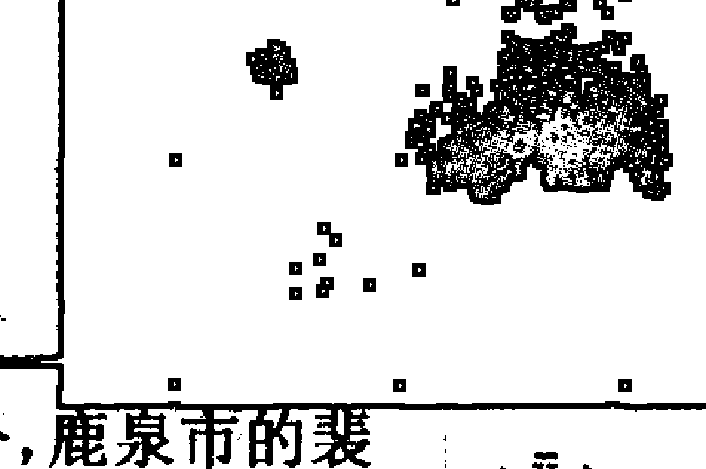

| 阴伤庚冲己 | 蛇杜己辅癸 | 符景癸英辛 |
|:---|:---|:---|
| 合生丁任庚 | 戊 | 天戊死辛芮丙 |
| 虎休壬趋丁 | 武开心壬壬 | 地惊丙柱乙 |

分析：

- 1、父亲测儿子考大学，以时干戊为儿子，戊落兑宫为绝地，逢死门，临天芮星，说明儿子运气不佳，天辅星为考试院落离宫，克时干戊落宫，考不上大学；兼看地盘戊落五宫寄二宫，逢日干空亡之地，虽然天辅星生助坤宫，但是天辅星和戊都逢空亡，不是真生助，而是假生助，不起作用。
- 2、丁奇为考生落震宫，为病地，虽临生门吉门，但是宫克门，吉门也就不吉了，临天任星为宫克星，丁十庚为文书阻隔。震宫又被年干戊落兑宫冲克；兼看地盘丁奇落艮宫，入墓逢空亡之地，说明运气太差，故此考不上大学。
- 3、儿子是1980年生人，年命庚落巽宫，庚十己为官符刑格，伤十庚主讼狱被刑杖。伤十杜主变动失脱，百事凶。又被年干戊落宫所克；兼看地盘庚落震宫，丁十庚为文书阴隔，克地盘戊落坤宫，但是坤宫逢日干空亡之地，克不住地盘戊，故考不上大学。
- 4、丁奇为考分落震宫，申月震宫休囚，震主三、八数，取三数为330分；景门也为考分落坤宫，逢日干空亡之地，坤宫主二、八、五、十数，申月坤宫休囚，取二、八数，为280分。

### 实例四、预测儿子考大学

1998年3月29日下午，我与朋友赵志强在一起商谈业务。18点结束时赵突然提出：今年我儿子参加高考，请你预测一下，看他能否考上大学？其儿子是1977年生人。我按问事时间起了一个奇门遁甲局，分析后对赵志强说：你儿子今年考不上大学，他的理科成绩太差，文科也不行。赵说：去年儿子参加过一次高考了，只考得300多分，只好花钱补习了一年，如果今年再考不上大学，就只能上个中专学点技术了。

1998年9月20日，我去石家庄市时见到赵志强，问起此事，赵说真让你测准了，只考了390分，没上建档线，只好给他找了个私立中专上学去了。

1998年3月29日18点
戊寅年乙卯月乙亥日乙酉时
阳六局、甲申旬，天任星值符落五寄二宫，生门值使落九宫。

| 地休戊心丙 | 天生壬楚辛 | 符伤庚任癸 |
| 武开己柱丁 | 乙 | 蛇杜丁冲己 |
| 虎乙惊癸芮庚 | 合死辛英壬 | 阴景丙辅戊 |

分析：

- 1、父测子，以时干乙奇为儿子落艮宫，为衰地，乙十庚为日奇被刑凶格。惊十庚主道路损折凶。遇天芮星上乘白虎更凶。
- 2、丁奇为文科落兑宫，丁十己为火入勾陈凶。逢杜门为堵塞不通，上乘腾蛇说明学习上听不懂，不用功、华而不实。景门为理科落乾宫入墓，说明理科一窍不通、概念不清。逢马星到处乱跑，不能坐下来安心学习。
- 3、年干为录取学校，天辅星为考试院、值符为主考或监考官，值使门为付主考官或付监考官。
年干戊落巽宫克时干乙奇落宫，说明学校不录取此人，值符落坤宫逢空亡之地，不能帮助时干乙奇。值使门落离宫，虽然生助时干落宫，但逢空亡也不能生助乙奇落宫。天辅星落乾宫，时干乙奇生助考试院，考试难通过。故断考不上大学。
- 4、儿子是1977年生人，年命丁巳，丁落兑宫逢杜门，上乘腾蛇主凶，遇日干空亡之地，克不住年干学校戊。值符落坤宫逢空亡不能真正生助年命落宫。生门值使落离宫，克丁奇落宫。丁奇虽然与天辅星落宫比和，但是，丁奇落宫逢日干空亡，故断考不上大学。

### 实例五、父亲测女儿考大学

2003年2月14日10点，石家庄李保平来到河北省周易研究会抱犊寨研究基地，要求我预测女儿今年考大学，说女儿是1985年生人。我按问事时间起局，分析后对李先生说：“你女儿今年能考上大学。”李问：“如果考上大学，到哪个方向去上学对女儿有利？”我回答：“到北京去上大学。”

2003年9月20日，李保平告诉我：女儿被北京科技大学录取了。

2003年2月14日10点
癸未年甲寅月戊午日丁巳时
阳五局、甲寅旬，天蓬星值符落二宫，休门值符落四宫

| 地休疒杜乙 | 天生己心壬 | 符伤癸趑丁 |
| 武戊开丁芮丙 | 戊 | 蛇杜辛任疒 |
| 虎惊壬英辛 | 合死乙辅癸 | 阴丙冲己 |

分析：

- 1. 为什么断女儿能考上大学。
父亲测女儿，以时干丁奇为考生，时干丁奇落震宫，旺于月令，丁十丙为星随月转，贵人越级升高。戊十丙为青龙返首，谋为大吉大利。临开门吉门。虽临天芮星，但是天芮星落震宫休囚。上乘玄武主灵活机动。天辅星为考试院落坎宫，生助时干丁奇落宫，值符为监考，年干癸为学校落坤宫，被时干所克。地盘年干癸落坎宫，生助时干丁奇落宫。兼看地盘丁奇落坤宫，临年干癸，上乘值符又克天辅星。

女儿是1985年生人，年命乙丑，乙奇落坎宫与天辅星同宫，临地盘年干癸。景门为试卷落乾宫，生助乙奇落宫。天盘癸和值符克天盘乙奇不吉。兼看地盘乙奇落巽宫，克值符、年干癸，又被天辅星生助。

- 2、为什么报考北京的大学。
年命乙奇落坎宫，临地盘癸，地盘癸生助时干丁奇和地盘乙奇，坎宫主北方，故为北京的大学。

### 实例六、父测子升大学

2004年的6月6日19点15分，石家庄张光明电话求测：“我儿子是1985年生人，今年考大学，你看能考上吗？”我让他15分钟以后再来电话。我立即按问事时间起了一个奇门遁甲局，待张光明又来电话时我告诉他预测结果：你儿子今年能考上大学，考分可能是600分左右。等高考有结果后，请给我回电话反馈个信息。张高兴地满口答应。

8月中旬我收到张光明的电话：我儿子考上大学了，考分为610分，周易真神奇。

2004年6月6日19点15分
甲申年庚午月丙辰日戊戌时
阳三局、甲午旬、天心星值符落三宫，开门值使落一宫

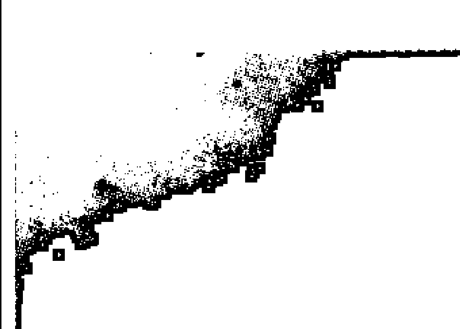

| 蛇伤丙遮己 | 阴杜癸任丁 | 合景戊冲乙 |
| 符生辛心戊 | 庚 | 虎死己壬 |
| 天休壬柱癸 | 地庚开乙芮丙 | 武惊丁英辛 |

分析：

- 1. 预测考大学，年干为学校，天辅星为考试院，值符为主考监考官，值使门为副主考或副监考官，丁奇为文章，景门为试卷。
- 2. 父测子，时干戊为儿子。戊落坤宫为衰病之地，不吉。戊十乙为青龙合会，吉；地盘戊落震宫为沐浴之地，临生门吉门，天心星吉星，上乘值符大吉之象。
- 3. 儿子是1985年生人，年命乙丑，乙奇落坎宫为病地，不吉，乙十丙为奇仪顺遂，吉星迁官晋职。临值使门开门大吉。与年干太岁同宫，上乘九地大吉之象。虽临天芮病星不吉，但是天芮星落坎宫不能发挥作用。天辅星落兑宫，生助年命落宫。丁奇为文章落乾宫，生助年命落宫。年命落宫又与值符落震宫相生。故能考上大学。
- 4. 时干戊落坤宫，与天辅星相生，克年干学校落宫，也是能考上大学之象。值使门为所测之事，开门值使落坎宫，与年命乙奇同宫，不再重述。
- 5. 丁奇为考分落乾宫，乾主一、六数，正应610分。

### 实例七、预测升高中

1998年7月6日16点，石家庄市的张玉芳给我打电话求测儿子能否上高中，其儿子是1983年生人。我让其15分钟后，再来电话问结果。我按问事时间起了一个奇门遁甲局，张女士又来电话询问预测结果时我告诉她：你儿子中考的分数太低了，大概是270到280分，考不上高中。9月16日张女士又来电话求测生意时告诉我：儿子考分为270分，连建档线都没上，只好出钱又去学校补习了。

1998年7月6日16时
戊寅年戊午月甲寅日壬申时
阴三局、甲子旬，天冲星值符落八宫，伤门值使落四宫

| 地 | 武 | 虎 |
|---|---|---|
| 伤辛 | 丙 杜己 | 景 癸 |
| 英乙 | 芮 辛 | 柱 己 |
| 天 | | 合 |
| 生乙 | | 死 丁 |
| 辅戊 | 丙 | 心癸 |
| 符 | 蛇 | 阴 |
| 休戊 | 开 壬 | 惊 庚 |
| 冲壬 | 任 庚 | 蓬 丁 |

分析：
1、为什么断其儿子考不上高中。
母亲为儿子求测，以时干为儿子，时干壬落坎宫，年干为学校，年干戊落艮八宫克时干落宫，可见学校不要儿子。兼看地盘壬落艮宫，地盘戊落震宫，学校克子儿，考不上高中。

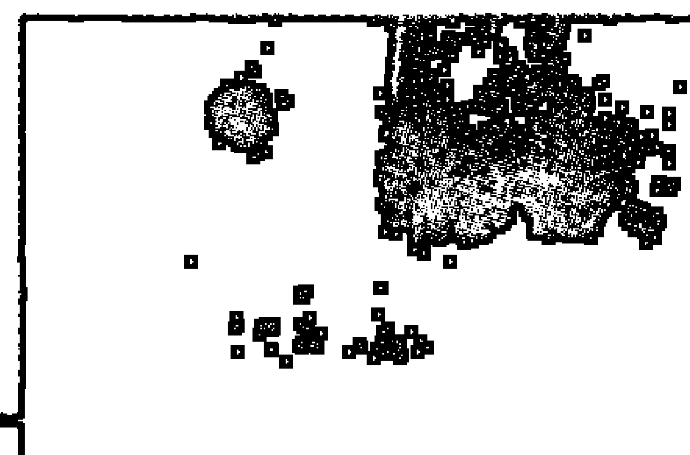

升学考试预测

儿子是1983年生人，年命癸亥，癸落坤宫入墓，癸十己为华盖地户，男女测之音信皆阻，躲灾避难方为吉。与年干学校戊落艮宫比和，比和暗藏争斗，还是学校不要。兼看地盘癸落兑宫，考不上高中。

2、为什么断考分为270至280分
丁奇为考分落兑宫，兑宫主二、七数，故为270分，景门也为考分落坤宫，坤宫有二、八数，故为280分。

### 实例八、母亲测女儿考大学

2002年3月24日14点，我在河北省周易研究会基地与朋友谈论周易，来了几位客人，其中有一位中年妇女，是鹿泉市人，也是我的朋友姓张。张女士说：今天陪几位朋友来抱犊寨观光旅游，路过周易研究会基地，请你给我女儿预测一下，看今年能否考上大学，我按问事时间起了奇门遁甲局，认真分析后对张女士说：你女儿平时学习成绩不好，今年考不上大学，能够自费上大学。考分可能在400分左右。张女士说：女儿平时学习成绩确实不好，能考上自费大学，我也就满意了。
2002年11月，我在鹿泉市见到张女士，顺便问起此事，张女士说：真让你预测对了，我女儿考了410分，上了一个自费大学。

2002年3月24日14点

壬午年癸卯月辛卯日乙未时

阳六局、甲午旬。天英星值符落五宫寄二宫，景门值使落一宫。

| 地 | 天 | 符 |
| :--- | :--- | :--- |
| 开丁<br>冲丙 | 休丙<br>辅辛 | 生辛<br>英癸 |
| 武<br>惊庚<br>任丁 | 乙 | 蛇<br>乙 伤癸<br>芮己 |
| 虎<br>死壬<br>趋庚 | 合<br>景戊<br>心壬 | 阴<br>杜己<br>柱戊 |

分析：

1、此卦为九星反吟，考不上大学。
2、母亲测女儿，以时干乙奇为女儿，落兑宫，为绝地。乙加己为日奇入墓，被土暗昧，门凶事必凶。临伤门凶门，临天芮星凶。伤加乙主求谋不得，凶。伤加惊主亲人疾病忧惊，媒伐不利凶。从时干乙奇落宫，断女儿运气不好。

景门为理科，落坎宫，为火入水乡。丁奇为文科，落巽宫，逢空亡之地。必然学习成绩不好。在考试时，景门为试卷，落坎宫，答错的题太多。景门临戊加壬为青龙入天牢，凡阴阳事皆不吉利。天辅星为考试院，落离宫，克时干乙奇落宫，考试院通不过。
丁奇为考分，落巽宫，逢空亡之地巽宫主三、四、五、八数，二月木旺，取八数，空亡减半，应为四数，故为400分左右。年干壬为学校，落艮宫，生助时干乙奇落宫，说明学校接收她。甲子戊为财，落坎宫，天蓬星为破财之星，落艮宫，克坎宫，必然是花钱（自费）上大学。

### 实例九、父亲测儿子考大学

### 奇门遁甲解真

2001年8月12日10点，我正在河北省周易研究会基地看书学习，抱犊寨风景区经理助理齐志恒来到我的办公室说：今年我儿子已经参加了大学考试，不知能否考上大学。请石老师给预测一下。儿子是1981年出生的。我立即按问事时间起了一个奇门遁甲局，认真分析后对齐助理讲：你儿子平时学习成绩优秀，这次参加全国统一高考能考上全国重点大学。齐助理说：儿子在上高中期间学习成绩名列前茅，能考上全国重点大学我当父亲的就满意了。

9月中旬，齐助理又来到我的办公室，兴奋地说：石老师，真让你预测准了，儿子考上了北京科技大学，现在已经报到了。我向齐助理表示祝贺：恭喜你儿子考上北京科技大学，

2001年8月12日10点

辛巳年丙申月丁未日乙巳时

阴八局、甲辰旬，天辅星值符落九宫，杜门值使落三宫。

| 蛇 | 符 | 天 |
| :---: | :---: | :---: |
| 景癸 | 死壬 | 惊乙 |
| 冲壬 | 辅乙 | 英丁 |
| 阴 | | 地 |
| 杜戊 | | 辛开丁 |
| 任癸 | 辛 | 丙己 |
| 合 | 虎 | 武 |
| 伤丙 | 生庚 | 休己 |
| 蓬戊 | 心丙 | 柱庚 |

分析：

1、为什么断儿子平时学习成绩好。

时干乙为儿子，落坤宫，天辅星为文曲星落离宫，生助时干乙奇落宫，丁奇为文章落兑宫，时干乙奇与天盘丁奇相生，又与地盘丁奇同宫。天辅星又为老师生助乙奇，说明老师很重视儿子的学习。所以断儿子平时学习成绩很好。

2、为什么断能考上全国重点大学。

时干乙奇为儿子，落坤宫，乙加丁为奇仪相佐，最利文书与考试，百事可为，说明儿子运气好。天英星主文化与时干乙奇同落坤宫，为星生宫大吉。天辅星为考试院落离宫，生助时干乙奇落宫，值符为主考官或监考官，落离宫也生助时干乙奇落宫。丁奇为文章落兑宫，与乙奇落宫相生，时干乙奇又和地盘丁奇同宫，景门为试卷，落巽宫为宫生门，说明试卷答的很好。年干辛为学校落兑宫，为临官之地，必定是国家重点学校。时干乙奇落坤宫与年干辛落宫相生。地盘辛落中五官，与时干乙奇落宫比和。断能考上国家重点大学。

儿子是1981年生人，年命辛酉，辛落兑宫为临官禄地，为得地利，临开门为得人合，天芮星临宫为星生宫，为得天时，说明儿子运气好。年干辛为学校与年命辛同宫，临开门说明学校大门已经打开，只等着儿子进校门了。

时干为所测之事，时干乙奇落坤宫，生助年命辛落宫，又生助年干辛，故断儿子能考上国家重点学校。

从另一个方面，可以兼看地盘时干乙奇落离宫，与天辅星考试院同宫，又与值符主考官同宫。景门为试卷，落巽宫，生助地盘时干乙奇落宫。地盘乙奇落离宫又克年干辛学校，必定能考上国家重点大学。

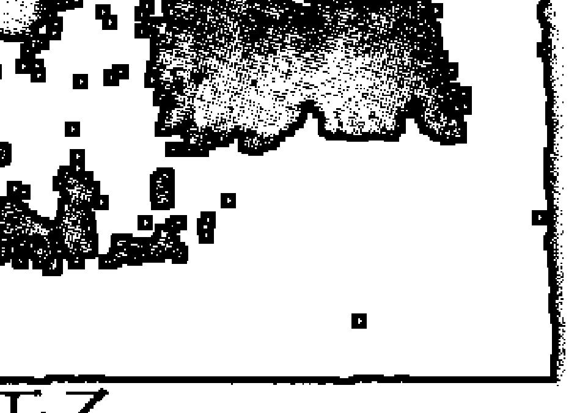

求学考试预测

## 第九章 出行预测

## （一）怎样取用神

占出行，一般以日干落宫为出行之人，所往之方有吉门吉格来生日干之宫，则为顺利，如果所往之方不得吉门吉格，与日干落宫比和也为顺利。如果日干得吉门吉格克所往方向之宫，也可以出行。如果出行之方向得吉门吉格，但克日干落宫，出行不顺利。如果出行之方是凶门、凶格来冲克日干宫，大凶。如果所去方向临空亡或日干入墓，大凶。或日干年命刑、墓空亡之方位大凶。

凡出行乘车，以景门所落之宫为道路，以伤门为车，遇白入荧，易遭盗贼，逢荧入太白主火灾，遇玄武、天蓬主失盗或丢失东西破财。

凡出行乘船，以坎宫为水路或休门为水路，伤门为船只。行船忌青龙逃走。白虎猖狂凶格主有大风暴；蛇天矫主凶灾，朱雀投江主沉船。伤加休上为浮为顺，休加伤上为舟行水底，主沉船。休加景主泥泞难行。若二门入墓、主途中阻隔行动艰辛。

如果是坐飞机出行，以九天所临之宫为航线，以开门为飞机，看出行之方向格局吉凶，来定是否顺利。

预测能否出行或出发时间，日干克时干不能出行，时干克日干能出行，时干在外盘为出行，时干在内盘为不去。如果时干日干都在内盘，近期不会出行，行期远；如果日干、时干一内一外也主行期远。以开门落宫地盘所临之干为出发时间。
未出门预测外出归期，以出门之日的日干落宫下临地盘之干为归期。
占行人在外吉凶，看用神落宫的格局好坏、旺衰来定。
占行人归期，一般以庚格来判断。阳日以庚下之干为归期，阴日以庚上之干为归期。逢年格，年内必归；逢月格，月内归来；逢日格，当日即回；逢时格，本时辰内即归。不逢格则不归。何谓不格？乙庚合，不为格；庚金入墓或空亡，不为格。又天蓬星、天芮星又主行人，千里之外以天蓬星为用神，千里之内以天芮星为用神，时干临天蓬或天芮，人能归来，即以时干为归期；伏吟不来，反吟来；如果用神临三奇和三吉门，三奇六仪又正是外出人的年命，人很快回来；如果是年命临凶门、凶星必然有事缠绕不能回来。

## （二）实例解析（6例）

### 实例一、预测天津之行

2000年10月13日，我在河北省周易研究会上班，17点我接到朋友田玉海的电话，说明天和朋友开车去天津办事，求测路上是否平安？事情能否办成？我让他15分钟以后再来电话。我立即按问事时间起了一个奇门遁甲局。田玉海又来电话时我告诉他预测结果：明天去天津路上不顺利，车要出毛病，人身平安，没有大的凶事，办事情很不顺利，天津一行白跑一趟。
10月16日，田玉海给我打电话说：去天津那天路上汽车轮胎没气了，油管也坏了。到天津之后办事更困难，重重阻碍使我们一事无成，第二天无功而返回到石家庄。
2000年10月13日17点

庚辰年丙戌月甲辰日癸酉时
阴三局、甲子旬，天冲星值符落七宫，伤门值使落三宫。

| 合 杜丁 心乙 | 阴 景庚 蓬辛 | 蛇 死壬 任己 |
| --- | --- | --- |
| 虎 伤癸 柱戊 | 丙 | 符 惊戊 冲癸 |
| 武 丙生己 芮壬 | 地 休辛 英庚 | 天 开乙 辅丁 |

分析：

1、为什么断这次天津之行不顺利。
此卦为九星反吟，八门伏吟，反吟，伏吟都主不顺。日干壬为求测之人落坤宫，伤门为车落震宫，克日干壬落宫，为车上不顺利。时干癸落震宫，又克日干壬落宫，为办事不顺利。田玉海是1949年生人，年命己丑，己落艮宫为入墓。天津位于石家庄的东北方向，年命己又入墓于天津方向之墓。故路上和办事都不顺利。日干壬落坤宫，与所去之方艮宫发生对冲（反吟局艮、坤二宫按对冲断）。必然不顺利。

2、为什么断路上车出毛病。
景门为道路落离宫，庚加辛为白虎干格，不宜远行，远行车折马伤，求财更为大凶。景加景主内有男人小口忧患。景加庚主讼人自讼，凶。景加辛主阴人词讼凶。临天蓬大凶星必然路上不顺利。好在上乘太阴吉神护卫，路上不会有大凶之事，人身平安。伤门为车落震宫，癸加戊为天乙会合，吉门宜求财，婚姻喜美，吉人赞助成合，若门凶迫制反祸官非。伤门凶门临之不吉。伤加伤主变动，远行折伤，凶。伤加癸主讼狱被冤，有理难伸，凶。伤加戊主失脱难获，凶。上乘白虎凶神，临天柱破军星。凶信息甚多，车必然要出毛病。

3、为什么断事情办不成。
日干壬为求测者落坤宫，壬加己因辰戌相冲，故名为反吟蛇刑，主官讼败诉，大祸将至，顺守可吉，妄动必凶。死加死主官事稽留，印信无气凶。死加壬主讼人自讼，凶。死加己主病讼牵连不已，凶。上乘腾蛇主惊恐怪异之事，凶。好在有天任大吉星临宫，有年干太岁庚落离宫生助，不会有大凶之事。运气不好，事情难办成。天津位于石家庄的东北方向，看艮宫格局的吉凶，艮宫己加壬为地网高张，狡童佚女，奸情杀伤，凶。丙加壬为火入天罗，壬水冲克丙火，为客不利，是非频多，动者为客，静者为主，田玉海去天津为动为客。必然不顺利。生加己主得贵人维持吉。临天芮病星，去天津办事必然要出毛病。上乘玄武主迷糊，去天津办事思想上概念不清楚，事情难办。时干癸为所测之事，落震宫，值使门也为所测之事，落震宫，上面已经分析过震宫格局不好，同时值使门、时干落宫都克日干壬落宫，必然办事不顺利。日干壬又临死门，死门为阻隔之神。据以上分析判断，此去天津事情办不成。

### 实例二、苍岩山旅行前的预测

2004年4月29日16点，我在河北省周易研究会抱犊寨基地看书学习，来了几位游客，其中有一位是我的朋友范宝峰，我问老范今天怎么有时间到我这里来了。范宝峰说今天陪几位朋友来抱犊寨观光旅游，转到基地门口就上楼来看老朋友了。我请几位客人落座后，范宝峰说：后天是‘五一’国际劳动节了，我计划带着妻子和儿女们去苍岩山旅游，你给我预测一卦，看看是否平安。我起了一个奇门遁甲局，认真分析后对范宝峰说：“去苍岩山旅游一路堵车，人都平安，要保管好东西，不然要丢失小包，损失价值二百元左右。”范宝峰说：“只要人身平安，把东西保管好就是了。” 5月1日晚10点，我收到范宝峰的电话：“老朋友，真让你测对了，今天去苍岩山路上车水马龙，经常堵车，人身都平安，在苍岩山旅游风景区真是把一个小包弄丢了，包内装的东西价值二百元左右，奇门遁甲真是神奇。”

2004年4月29日16点
甲申年戊辰月戊寅日庚申时
阳八局，甲寅旬，天辅星值符落一宫、杜门值使落一宫

| 合 | 虎 | 武 |
|---|---|---|
| 惊乙 | 开丙 | 休庚 |
| 柱癸 | 心己 | 蓬辛 |
| 阴 | | 地 |
| 丁死辛 | | 生戊 |
| 芮壬 | 丁 | 任乙 |
| 蛇 | 符 | 天 |
| 景己 | 杜癸 | 伤壬 |
| 英戊 | 辅庚 | 冲丙 |

分析：

1、为什么去苍岩山人身平安，路上堵车。
日干戊为求测者落兑宫，戊加乙为青龙合会，门吉事也吉，门凶事也凶，临生门吉，天任星吉星，上乘九地吉神。生加戊主嫁娶求财谒贵皆事。生加乙主阴人生产迟吉，生加惊主尊长财产，词讼、病迟愈吉。年干太岁庚和时干庚同落坤宫，生助日干己落宫。伤门为车落乾宫，与日干戊落宫比和。景门主道路，生助伤门和日干戊落宫，故断人身平安。景门主道路落艮宫，己加戊为犬遇青龙，吉门为谋望遂意，上人见喜。景加生主阴人生产大吉，更主求财旺利，行人皆吉。景加戊主远行吉。景加己主官司牵连不吉，又遇空亡之地。上乘腾蛇主惊恐怪异，也主缠绕，故断，路上堵车。

2、为什么断丢失小包破财200元左右。
日干戊落兑宫格局虽好，又有年干太岁庚生助，当然更吉，但是天蓬星、玄武星是两个破财之星，均落坤宫，同样生助日干落宫，有破财之象。

天芮星为小包落震宫，宫克星不吉，辛加壬为凶蛇入狱，大凶。临死门凶门，死门为阻隔之神，小包受阻。死加辛主盗贼失脱难获。死加壬主讼人自讼凶。死加伤主官司动而被刑仗凶。上乘太阴，小包有被隐藏之象。天芮星落震宫与日干落兑宫发生冲克，说明小包不愿意跟随求测者了，那么必定要丢失。

甲子戊为财，生门也为财同落兑宫，兑主二数。故断；破财200元左右。

### 实例三、东南之行灾祸生

2004年8月21日11点20分，我的朋友白风祥给我打电话说：明天开车去南宫市办事，求测路上是否平安？事情能否办成？我请他等15分钟再来电话，我立即按问事时间起了一个奇门遁甲局，15分钟后白风祥又来电话询问结果时，我告诉他：明天不能去南宫市，如果非要去，路上不平安，车要出毛病，更为严重的是出车祸，要办的事情也办不成。听完电话白风祥表示明天不去了。
8月28日白风祥又给我打来电话：没有听你的话，第二天还是去了南宫市，真让你预测对了。半路上车坏了，司机修了一个小时才把车修好，快进南宫市的时候，司机开车又撞了一个骑自行车的青年妇女，虽然撞的不太严重，去医院检查后赔偿了对方四千元钱，而且什么事情也没办成，真是倒霉透了。

2004年8月21日11点20分

甲申年壬申月壬申日丙午时

阴五局、甲辰旬、天蓬星值符落七宫，休门值使落八宫

| 合<br>戊伤辛<br>芮己 | 阴<br>杜丙<br>柱癸 | 蛇<br>景乙<br>心辛 |
|---|---|---|
| 虎<br>生癸<br>英庚 | 戊 | 符<br>死壬<br>蓬丙 |
| 武<br>休己<br>辅丁 | 地<br>开庚<br>冲壬 | 天<br>惊丁<br>任乙 |

分析：
1、为什么南宫市不能去。
南宫市位于石家庄的东南方向，应该看巽宫的格局吉凶。巽宫辛加己为入狱自刑，奴仆背主，有苦诉讼难伸，凶。戊加己为贵人入狱，公私皆不利。伤门凶门临宫，必然招灾破财。伤加辛主夫妻怀私恣怨，凶。伤加己主财散人病，凶。伤加戊主失脱难获，凶。又临天芮凶星，必然大凶。上乘六合虽为吉神，在这里应理解为凶信息被集合在一起，凶上加凶，必然破财伤人。

2、为什么断车出毛病，出车祸，破财。
伤门为车落巽宫，临天芮病星，车有病必然是车坏。

景门主道路落坤宫，乙加辛为青龙逃走，人亡财破，奴仆拐带，六畜皆伤。上乘腾蛇主惊恐怪异之事，凶。伤门为车落巽宫大凶，又克景门，必有车祸。

时干丙奇为所测之事落离宫，丙加癸为华盖悖师，阴人害事，灾祸频生。杜加丙主文契遗失，不吉。杜加癸主百事皆阻，病者不食凶。杜加景主文书印信阻隔，男人小口疾病，迟疑不利。格局大凶必然有车祸，破财之灾。

日干壬落兑宫，为败地，壬加丙水蛇入火，主官灾刑禁，络绎不绝。临死门大凶，死加壬主讼人自讼自招。死加丙主信息忧疑不吉。临天蓬大凶星，破财无疑。日干壬为求测者，壬去东南巽宫方向入墓，大凶。必有灾祸。

白风祥是1959年生人，年命己亥，己落艮宫为入墓，凶。己加丁为朱雀入墓，凶。又逢空亡之地，上乘玄武，必定破财。甲子戊为财落巽四宫，正应白风祥所述，赔款四千元之数额。

3、为什么断事情办不成。
日干壬落兑宫，格局极凶。时干丙落离宫，格局也凶，时干落宫克日干落宫。休门值使落艮宫逢空亡之地。断事情办不成。

### 实例四、求测过去出行

1998年6月10日上午，石家庄市某实业有限公司总经理顾玉良见到我问：“周易能测未来，能不能测过去？”我回答：可以测过去。顾经理继续问：你测一下1998年5月10日8点。我出门遇到了什么事情？于是我按出门办事的时间起了一个奇门遁甲局，分析后说：这天出门遇到了麻烦，局中显示：你的汽车撞了人，并且发生了口舌是非，外加经济赔偿6到8千元人民币。顾经理庄重地回答：“奇门遁甲果真神奇，测得完全正确。”

1998年5月10日8点
戊寅年丁巳月丁巳日甲辰时
阳一局、甲辰旬，天禽星值符落五宫寄二宫，死门值使落五宫寄二宫

| 地 | 天 | 符 |
|---|---|---|
| 杜 辛 | 景 乙 | 壬 死 己 |
| 辅 辛 | 英 乙 | 禽 芮 己 |
| 武 | | 蛇 |
| 伤 庚 | 壬 | 惊 丁 |
| 冲 庚 | | 柱 丁 |
| 虎 | 合 | 阴 |
| 生 丙 | 休 戊 | 开 癸 |
| 任 丙 | 蓖 戊 | 心 癸 |

分析：

1、全盘伏吟局不宜出行，动则破财伤人。死门值使主大凶。日干丁奇为求测者落兑宫，临惊门主口舌官司。临天柱星为破军星。惊十丁主词讼牵连。惊十惊主疾病，忧虑惊恐。上乘腾蛇主惊恐怪异之事。
2、出门办事必然座车，伤门主车落震宫，逢庚主道路，庚也为阻隔之神，庚十庚为太白同宫名为战格，官灾横祸，兄弟或同辈朋友相冲撞；不利为事。伤十庚主讼狱被刑仗凶。伤十伤主变动，远行折伤，凶。上乘九地，主车有损伤。日干丁落宫克伤门落宫，主动去撞人。时干丁也为所测之事落兑宫，与日干同宫，上乘腾蛇主怪异之事。综合判断：汽车撞了人。日干丁临惊门，主口舌是非。甲子戊为财落坎宫，戊十戊为青龙入天牢，凡事皆阻，测财必破财。又临天蓬大凶星，破财无疑。故断经济赔偿6到8千元，因坎宫主一、六数。

开门也为车落乾宫，癸十癸为天网四张，主行人失伴，病讼皆伤大凶。开十癸主阴人失财凶。逢马星主道路，必然是路上遇到凶险之事。

再看辰时出发，地支辰在巽宫，辛落巽宫为入墓凶。辛十辛为六仪击刑，逢杜门为堵塞不通。上乘九地为潜藏祸患之事。杜十辛主打伤人词讼，男人小口凶。

时干为所问之事，时干壬落坤宫，壬十己为反吟蛇刑，辰戌相冲，大祸将至，妄动必凶。死十己主病讼牵连不已凶。死十死主官事稽留，印信无气凶。

甲子戊为财落坎宫，戊十戊为伏吟，心事不利，道路闭塞，以守为好。天蓬星临宫主破财。坎宫主一数、六数，取六数为六千元。时干、值使门落宫数为破财数，时干壬、死门值使均落坤宫，坤主二、五、八、十数，取八数为八千元。故断6-8千元赔款。

### 实例五、预测安阳之行

2004年3月31日11点，我的朋友宋双全给我打电话说：“明天开车去安阳联系业务，并订合同，请你给预测一下，看路上是平安？合同能否定上？”我让他15分钟以后再来电话，我立即按问事时间起了一个奇门遁甲局。待宋双全又来电话时我告诉他：这次安阳之行，路上车要出毛病，没有车祸，人平安，所谈的业务订不成合同，要白跑一趟。并嘱咐他：从安阳回来后给我反馈信息。宋双全满口答应：一定反馈信息。

4月3日下午，我收到宋双全的电话，这次安阳之行，真让你预测准了。路上汽车轮胎坏了，因带有备胎，没有误行程，人都平安。

业务没谈成，因为对方变卦了，合同更不可能定了。

2004年3月31日11点
甲申年丁卯月己酉日庚午时
阳三局、甲子旬，天冲星值符落五宫寄二宫，伤门值使落九宫

| 地 | 天 | 符 |
|:---|:---|:---|
| 生 丙 | 伤 癸 | 杜 戊 |
| 趋 己 | 任 丁 | 冲 乙 |
| 武 |  | 蛇 |
| 体 辛 |  | 景 己 |
| 心 戌 | 庚 | 轸 壬 |
| 虎 | 合 | 阴 |
| 开 壬 | 庚 惊 乙 | 死 丁 |
| 柱 癸 | 芮 丙 | 英 辛 |

## 分析：

1. 为什么断路上车坏，人平安。
安阳位于石家庄的南方，日干己落兑宫，被离宫所克，主不顺利。伤门为车落离宫，癸加丁为腾蛇天娇，凶。伤加癸主讼狱被冤，有理难伸。伤加景主文书印信、口舌，惹是生非。好在有天任吉星临宫，上乘九天吉神护卫。开门也主车落艮宫，为入墓不吉。壬加癸为幼女奸淫，主家有丑事外扬，不吉。临天柱破军星，上乘白虎凶神，不吉，好在开加生主见贵人，谋望所求遂意，吉。所以不会有大的凶事，然而车必然出毛病。景门为道路落兑宫，己加壬为地网高张，狡童佚女，奸情杀伤凶。上乘腾蛇主惊恐怪异之事，路上必然不顺利，日干己落兑宫为长生之地，己加壬不吉，上乘腾蛇主缠绕，不吉。临天辅大吉之星，又与年干太岁落宫相生，最关键是八神领袖小值符落宫生助日干落宫，能逢凶化吉，百恶消散，一切横祸化为主尘。故断人平安。

2. 为什么断业务谈不成。
时干庚为业务落坎宫，庚加丙为太白入荧，不吉。临惊门凶，又临天芮病星，业务肯定要出毛病。值使门伤门也为业务落离宫，格局极凶，又克日干己落宫，故业务谈不成。丁奇为合同证书落乾宫，临死门阻隔之神，上乘太阴对方有搞阴谋诡计之意，又逢空亡之地。景门也可以为合同证书落兑宫，上乘螣蛇主有惊恐虚诈之意，又是景门克宫不吉，故断合同订不成。

### 实例六、预测南方出差吉凶

2003年10月3日，正是国庆长假期间，河北省研究会基地也是人来人往，参观周易文化的人流陆续不断，上午11点，我的朋友齐志峰来找我，说过了国庆节准备到南方出一趟差，请我预测一下是否平安。我立即按问事时间起了一个奇门遁甲局，认真分析后对齐说：“这次南方出差期间座飞机平安，但是在汽车上要防止小偷盗窃而使你破财。此去办事不顺利。”

2003年11月2日，齐志峰给我打电话说：此去出差到了广州、深圳，途中飞机上安全，在广州公共汽车上被小偷盗走了身上的零花钱。办事其间真的是困难甚多，事事难办。奇门遁甲预测真是太神奇了。

2003年10月3日11点
癸未年辛酉月己酉日庚午时
阴七局、甲子旬，天柱星值符落五宫寄二宫，惊门值使落一宫。

| 阴<br>生丙<br>英辛 | 蛇<br>庚伤癸<br>丙丙 | 符<br>杜戊<br>柱癸 |
| :--- | :--- | :--- |
| 合<br>休辛<br>辅壬 | 庚 | 天<br>景己<br>心戊 |
| 虎<br>开壬<br>冲乙 | 武<br>惊乙<br>任丁 | 地<br>死丁<br>越己 |

## 分析：

1. 为什么断座飞机平安。
九天为航线，开门为飞机，日干己为求测者落兑宫，上乘九天，临天心星大吉。开门落艮宫，壬加乙为小蛇得势，女人柔顺，男人通达，禄马光华。生助日干己落宫，断座飞机平安。

2. 为什么断南方一行被盗破财。
出行之方为南方，应看离宫格局，癸加丙为华盖悖师，贵贱逢之皆不利。唯上人见喜。伤加癸主讼狱被冤，有理难伸，凶。伤加丙主道路损失。时干庚落离宫，庚加丙为太白入荧，主贼来，为客进利，为主破财。伤加庚主讼狱被刑杖，凶。伤加景文书印信，口舌，惹是生非。上乘腾蛇主惊恐虚诈，怪异。天芮病星临宫，必然要出问题。断，被盗破财。

3. 为什么断办事不顺利。
时干庚为所测之事落离宫，临伤门、临天芮病星，上乘腾蛇，格局大凶，办事怎么能顺利呢？日干己落兑宫，己加戊为犬遇青龙，门吉为谋望遂意，上人见喜，若门凶枉费心机。时干庚克日干己，年干太岁癸落离宫，也克日干己，故办事不顺利。

## 第十章 刑事案件预测

### (一) 怎样取用神

刑事犯罪包括偷盗财物、流氓、强奸、抢劫杀人以及贪污受贿等经济犯罪。轻微犯罪者，多以玄武为用神，大案、要案、杀人案多以天蓬星为用神，甲午辛为犯错误或犯罪之人，可以甲午辛为用神帮助判断。

六合为逃犯，杜门为逃藏方向。庚、白虎、伤门为捕盗之人。杜门落内盘主近，落外盘主远，以杜门落宫数定远近。

罪犯特征、象貌，以玄武、天蓬星落宫旺衰、结合三奇六仪、门、星、神来判断高度、长相、性格、职业等。玄武、天蓬临壬、癸多为在逃犯。临辛多为惯犯或释放犯或在押者。临庚多为重大案犯和老奸巨猾者。

作案手段：玄武、天蓬临庚辛多为用刀或金属器械。临景门、丙、丁，多为枪支火药。临伤门多为用车或船只。临螣蛇或落巽宫多为用强索将人致死或用手把人掐死。临杜门、乙可能用棍棒把人打伤或打死。八门九星伏吟或玄武、蓬星落内盘，可能是本地人或内部人所为。八门、九星反吟，玄武、蓬星落外盘，则可能是外地人或外单位人所为。

如果发现无名尸体，以死门为用神，死门临乙、庚、丁、壬落沐浴之宫者，可能是奸情所杀。死门临甲子戊多为钱财被杀。乘太阴、六合或落坎宫多为隐私暧昧所杀。

能否破案，六合为逃犯，伤门为捕盗之人落六合宫或六合生伤门落宫，能破案。以甲午辛为罪人，伤门、白虎、庚克甲午辛能破案，克玄蓬案也能破。反吟能破案，伏吟案难破，玄蓬落宫得旺相，又得三奇吉门，有年干太岁生助，案难破。卦逢庚格能破案。具体破案时间：应以庚格而断。阳日庚下之干为应期，阴日庚上之干为应期。时干临阳星，庚下之干为应期，时干临阴星，庚上之干为应期。空亡，冲实或填实为应期。死加壬主讼人自讼，壬落坤宫，凶犯有自首的可能。

## (二) 实例解析（10例）

### 实例一、罕见的石家庄3.16爆炸案

2001年3月16日8点刚到抱犊寨就听到职工们议论纷纷，今天早上4点至5点多，石家庄棉纺三厂宿舍等四处发生爆炸，有的整座楼房被夷为平地。如此大规模的爆炸案在全国实属罕见。特大爆炸案是什么人所为？能否破案？何时能破案？直接关系到党的威信，人民群众的生命财产安全。早上4点至5点多发生爆炸案，究竟是按寅时起局，还是按卯时起局？两个局肯定不一样，我怕受两个卦象的干扰，所以按听到的爆炸案消息的时间起了一个奇门遁甲局。看后写出了断语：

1. 此案能破，案犯是本地人。
2. 案犯文化程度不高，为初中生。
3. 案犯以前有工作，现在没工作。
4. 案犯已经离婚，或因女人犯罪。
5. 案犯有犯罪前科，高度1.75米左右。
6. 案犯残忍狠毒，作案后逃到外地（南方）去了。
7. 此案7-8天可以破案。
8. 死伤人数为140-170人。

破案后从电视、报纸得知：案犯叫靳如超，男，41岁，1960年生人，原籍江苏宿迁，初中文化，原为石家庄国棉三厂工人，1988年因强奸罪被判刑10年，服刑期间妻子与他离婚，刑满释放后曾到海南，云南打工。2000年曾与一名云南马关县女子韦志花同居3个月。2001年2月17日靳如超前往云南省马关县找韦志花，由于韦志花不愿意和靳如超同居，3月9日靳如超将韦志花砍死后潜逃回石家庄。3月12日靳如超从鹿泉市，黄壁庄镇，北白砂村的王玉顺、郝风琴处非法购买大量炸药，以鸡饲料为名运回石家庄，3月16日早晨4点多实施爆炸行动，案发后公安部门经过调查，很快认定石家庄棉三宿舍16栋的靳如超为重大犯罪嫌疑人，公安部立即向全国发布A级通缉令，在全国范围内实行大搜捕。3月22日靳如超在广西北海市被公安发现，3月23日早晨8点20分被抓获，3月24日将其押回石家庄。靳如超对其犯罪事实供认不讳。为靳如超提供炸药、雷管、导火索的王玉顺、郝风琴、胡晓洪，分别受到法律的惩处。

## 刑事案件预测

2001年3月16日8点
辛巳年辛卯月戊寅日丙辰时
阳四局、甲寅旬，天英星值符落二宫，景门值使落二宫

| 地<br>伤乙<br>冲戊 | 天<br>杜戊<br>辅癸 | 符<br>景癸<br>英丙 |
| :--- | :--- | :--- |
| 武<br>生壬<br>任乙 | 己 | 螣<br>己死丙<br>芮辛 |
| 虎<br>休丁<br>蓬壬 | 合<br>开庚<br>心丁 | 阴<br>惊辛<br>柱庚 |

## 分析：

1. 为什么断此案能破。
①预测爆炸案，以天蓬星为用神，以白虎，庚、值使门、伤门为公安。白虎落艮宫与天蓬星同宫，庚落坎宫被开蓬星所克，值使门落坤宫与天蓬星比和，伤门落巽宫，克天蓬星落宫，伤门为刑警，抓逃犯以伤门为主，伤门落宫旺相、天蓬星落宫休囚，又被伤门所克，故能破案。
②天蓬星落艮宫为休囚之地，丁奇落艮宫为入墓，应为中青年男人，临休门为有工作之人，逢空亡主现在无业，上乘白虎主刑伤或犯有前科，也说明此人很凶残，从前判过刑。天蓬星落艮宫，为内盘，为石家庄人，逢马星主作案后逃之夭夭。
③天辅星为文曲星落离宫，逢杜门主文化被堵塞。景门、丁奇也主文化，景门落坤宫逢日干空亡之地，丁奇落艮宫入墓逢空，所以文化程度不高，可能是初中生。
④天蓬星落艮宫逢空亡，罪犯身高1.74米。
⑤六合主婚姻落坎宫，逢空亡，临开门，罪犯可能已经离婚。天蓬星临丁奇，丁奇为第三者女人，逢空亡主过去，罪犯过去有情人，甲午辛为罪人，辛落乾宫为沐浴之地主桃花，临惊门主官司，可能因女人若起官司。
⑥甲午辛为罪人落乾宫，辛加庚为白虎出力，刀刃相交，主客相残，逊让退步稍可，强进血溅衣衫。辛下临庚，说明罪犯穷凶极恶，临惊门主惊恐创伤，官非之事蛊惑乱众。天柱星临宫，天柱星为破军星，说明罪犯喜杀好战，擅长搞破坏，毁灭性行为。上乘太阴主罪犯阴险毒辣，实行爆炸性破坏是有计划有预测谋的。再兼看地盘辛，落兑宫，临丙奇，丙为天威，逢死门，说明罪犯性格很固执。
⑦时干丙主事体，丙落兑宫为死地，临天芮凶星，逢死门凶门，凶门生宫事更凶，说明爆炸案情重大。时干为群众，丙辛相合，群众很难逃脱灾难。上乘腾蛇主惊恐怪异，群众在睡梦中预想不到的灾难发生了。兑宫主二、七、四、九数，四处楼房被炸毁，可能有140人至170人伤亡。实际死108人伤38人。
⑧六合为逃犯落坎宫，逢空亡应看对冲方向，坎宫的对冲方向为离宫，离宫为外盘，主外地，罪犯作案后逃到外地，也就是南方，杜门为躲藏方向，杜门落离宫也是躲藏到外地即南方去了。
⑨值使门、时干落宫都为期限，景门值使落坤宫，坤主二、五、八、十数，取八数。时干丙落兑宫，兑宫主二、七、四、九数，取七数，应为七至八天破案。因为案情重大，罪犯逃往外地，破案难度很大，不可能在二至四天破案，这是按理取数。值使门、时干都落日干空亡之地，逢空亡则填实之日为应期，申日、酉日填实，申日为第七天，酉日为第八天，故断七天至八天破案。

### 实例二、预测绑架案

山东省临沂市的苏柏逞与我是多年的易学界朋友，在周易方面造诣很深，专业从事周易工作，为当地群众排扰解难，做出了很大贡献，他经常来电话与我共同磋商研讨周易。2003年9月17日中午苏柏逞来电话说：“2003年9月15日早上3点30分在山东省临沂市发生一起绑架案，请你预测一下此案是否能破？被绑架人平安否？被绑架人是 1965 年生人。”我按发案时间起了一个奇门遁甲局，十分钟后苏柏逞又来了电话询问预测结果，我说：“此案不容易破，被绑架人已经死亡，此人会开车。”苏回话：“是一个司机。”“七天后能找到尸体，这起绑架案是合伙作案，案犯为三个人，作案人是在逃犯。”后来苏反馈信息：被绑架人已经死亡，七天后找到了尸体。直到 2004 年 6 月 18 日我给苏柏逞去电话回访此事，苏回答至今没有破案。

2003 年 9 月 15 日 3 点 30 分
癸未年辛酉月辛卯日庚寅时
阴六局、甲申旬，天辅星值符落四宫，杜门值使落七宫

| 符<br>体 庚<br>辅 庚 | 天<br>生 丁<br>英 丁 | 地<br>己 伤 壬<br>芮 壬 |
| :---: | :---: | :---: |
| 蛇<br>开 辛<br>冲 辛 | 己 | 武<br>杜 乙<br>柱 乙 |
| 阴<br>惊 丙<br>任 丙 | 合<br>死 癸<br>蓬 癸 | 虎<br>景 戊<br>心 戊 |

## 分析：

1. 为什么断此案不容易破。
测破案九星伏吟主破财伤人，案难破，伤门、白虎，庚和值使门为公安捕盗人。大案、凶杀案以天蓬星为案犯。此卦天蓬星落坎宫，白虎落乾宫不克坎宫，伤门落坤宫虽然克坎宫，但是逢空亡之地克不住天蓬星，杜门值使落兑宫也不克坎宫，庚落巽宫被天蓬星落宫生助。

2. 为什么断三个逃犯合伙作案。
天蓬星为案犯落坎宫，上乘六合为合伙作案，临癸，癸为在逃犯，甲午辛为罪人落三宫，故三个人作案。

3. 为什么断被绑架人会开车，人已死亡。
发案时间起局，以日干为被绑架人，日干辛落震宫，临开门，开门为车的代表符号，故会开车，辛十辛为六仪击时，开十辛主阴人道路，可能因女人事引起。开十伤不吉，上乘腾蛇凶神，关键是辛落震宫为绝地。
被绑架之人为乙己年生人，年命乙落兑宫，乙十乙为日奇伏吟，只宜安分守己为吉。杜十惊主门户内忧疑惊恐，并有词讼事，杜十乙主凶。上乘玄武凶神，此事与女人也有关系。乙奇落兑宫为绝地。测人吉凶如果遇空亡、入墓、逢绝地，人定死无疑。
时干也为所测之事，时干庚落巽宫，庚十庚为太白同宫，又名战格，主官灾横祸，休门为人盘落巽宫入墓，休门入墓人必然死了。

4. 为什么断七天后找到尸体。
值使门为应期。杜门值使落兑七宫，故七天；日干辛为被绑架人落震宫，上乘腾蛇主缠绕，酉日冲动卯宫后尸体才能出现，从发案时间至酉日为七天。

### 实例三、被盗的摩托车八月找到

1998年5月2日6点50分，我接到朋友李启明的电话：早晨起床后发现摩托车被偷走了，请你给预测一下，看能否找到车？”我让他15分钟后再来电话。我按问事时间起了一个奇门遁甲局，15分钟后老李又来电话时我告诉他预测结果：被盗的摩托车能找到。报案后公安在阴历8月才能破案，作案者为3人，偷车后逃往西北方向，大概是60华里处。并要求老李待摩托车找到后给我来个电话，以验证奇门遁甲的准确率。老李满口答应：一定回电话。

摩托车找到后，李启明来电话说：预测得完全正确，奇门遁甲真神奇。

1998年5月2日6点50分
戊寅年丙辰月己酉日丁卯时
阳五局、甲子旬，天禽星值符落二宫，死门值使落八宫

| 地 | 天 | 符 |
| :--- | :--- | :--- |
| 开乙<br>辅乙 | 休壬<br>英壬 | 戊生丁<br>禽芮丁 |
| 武<br>惊丙<br>冲丙 | 戊 | 蛇<br>伤庚<br>柱庚 |
| 虎<br>死辛<br>任辛 | 合<br>景癸<br>蓬癸 | 阴<br>杜己<br>心己 |

## 分析：

1. 玄武为盗贼落震宫，断3人作案，天冲星为阳星应为男性，丙奇落震宫为沐浴之地，应为青少年作案，丙十丙为月奇悖师。惊十伤主因商议同谋害人，事泄惹讼，凶。
2. 甲午辛为犯罪人落艮宫，辛十辛为午午自刑、六仪击刑。上乘白虎主有牢狱之灾。逢死门为阻隔之神，罪犯逃脱不了法律制裁。
3. 卦遇八门反吟案能破，伤门、庚为公安捕盗之人落兑宫，三月兑宫处旺相之地，冲克玄武落宫。伤门主车落兑宫，也冲克玄武落宫，说明车不愿意跟随小偷。
4. 时干也为车，时干丁奇落坤宫，为沐浴之地，逢生门上乘值符又与年干太岁戊同宫，可见车平安。日干己为求测者落乾宫，时干丁奇落宫生助日干己落宫，故车能回来。
5. 杜门为小偷逃藏的方向，杜门落乾宫，主西北方向，乾主一、六数，阳遁乾宫为外盘，主远，取六数，应到西北方向60华里处寻找。
6. 九星伏吟主慢，时干、日干均在外盘主远、主慢，按年、月断，时干落宫数为应期、时干丁奇落坤宫，坤主二、八、五、十数，取五数，应为5个月找到。从失盗算起应为阴历八月；以旺相休囚死定应期，阴历八月正是公安旺相之时。玄武落宫临丙奇，丙奇遇酉月处死地，故阴历八月破案；以值使门落宫所临之干定应期，死门值使落艮宫，临辛，阴历八月正是辛酉月，也断阴历八月能破案。

### 实例四、天津大发面包车失而复得

1998年11月11日14点20分，石家庄某公司聂经理找到我叙述：昨天晚上我的面包车-天津大发，在我家门口停放着，早晨起来发现车被偷走了，已经向公安局报了案。求测公安局能否破案？车能否找回来？我立即按问事时间起了一个奇门遁甲局，认真分析后对聂经理说：“不要着急，此案能破，车能找回来，找回来的时间比较晚，可能在明年8月。”

到1999年底又见到聂经理，他的第一句话就说：“你预测得真准，今年8月破了案，是藁城市的人偷的。”

1998年11月11日14点20分
戊寅年癸亥月壬戌日丁未时
阴三局、甲辰旬，天任星值符落六宫，生门值使落五宫寄二宫。

| 虎 | 合 | 阴 |
|---|---|---|
| 丙 开 己 | 休 癸 | 生 丁 |
| 芮 乙 | 柱 辛 | 心 己 |
| **武** | | **蛇** |
| 惊 辛 | | 伤 庚 |
| 英 戊 | 丙 | 迳 癸 |
| **地** | **天** | **符** |
| 死 乙 | 仅 戊 | 杜 壬 |
| 轮 壬 | 冲 庚 | 任 丁 |

分析：

- 1. 伤门为车落兑宫，临天蓬星，为盗星，说明车被偷走了。
- 2. 玄武为小盗神，主盗车人落震宫，天盘辛临宫，辛为罪犯，辛落震宫为绝地，辛十戊，子午相冲，因龙被伤。临惊门主小偷有官司，但是逢空亡之地，现在小偷无事，等震宫填实或逢冲之后，小偷必有牢狱之灾。
- 3. 地盘辛落离宫为病地。癸十辛为网盖天牢，死罪难逃。休十景主反招口舌，凶。临天柱破军星，凶。上乘六合为合住，小偷逃不掉。
- 4. 时干丁奇为所测之事落坤宫，为沐浴之地，逢生门，车能生还。上乘太阴为保护神。时干落宫生助日干壬落宫，车能找回来。值使门生门落坤宫也生助日干壬落宫，也主车能找回来。
- 5. 卦遇八门反吟，主车有返回之象。又遇庚格，逢格案能破。测破案，白虎、伤门、庚为捕盗之人，白虎落巽宫与玄武、辛落宫比和，说明案难破。伤门、庚落兑宫，冲克玄武、辛落震宫。但是当前震宫逢空亡之地，公安克不住玄武和辛，当前不能破案。
- 6、六合为逃藏的方向落离宫，说明偷车后往南逃走了。六合下临辛，辛为犯罪之人，天盘辛落震宫，为东方，最后可能在东边抓住小偷。正应藁城人偷车的现实。
- 7、明年八月庚，伤门为旺地，冲克玄武和辛落宫，被冲则伏出水面，故被抓获。逢庚格、阳日看庚下之干，庚下之干为癸，明年癸酉月正是八月，公安处旺地，小偷被抓获之月。

刑事案件预测

### 实例五、预测盗窃案

1997年1月20日10点30分，我的朋友刘明江给我打电话说：家里发生一起失盗案，已经向公安报了案，请预测一下能否破案。我请他15分钟后再来电话。我立即按问事时间起了一个奇门遁甲局，等刘明江再来电话时我告诉他预测结果：小偷盗窃现金三千元和一部照相机。刘答：对。我接着断：小偷是本地人。案犯是三个年轻人，逃藏在北边一华里处，公安人员没有一点线索，此案不能破。只当是破财免灾吧。

1998年底我见到刘明江问起失盗之事，刘明江说两年来一直没有音信，小偷逃之夭夭，此案一直没有破。

1997年1月20日10点30分
丙子年辛丑月壬戌日乙己时
阳六局、甲辰旬，天蓬星值符落五宫寄二宫，休门值使落二宫

| 地 | 天 | 符 |
|---|---|---|
| 惊己 | 开戊 | 休壬 |
| 柱丙 | 心辛 | 趋癸 |
| 武 |  | 蛇 |
| 乙死癸 |  | 生庚 |
| 芮丁 | 乙 | 任己 |
| 虎 | 合 | 阴 |
| 景辛 | 杜丙 | 伤丁 |
| 英庚 | 辅壬 | 冲戊 |

分析：

- 1. 为什么断盗走现金三千元和一部照相机。
   甲子戊为财落离宫，戊加辛为青龙折足，子午相冲，主招灾失财。逢开门、上乘九天可见钱不翼而飞。离宫主二、七、三、九数，当取三数，故断盗走三千元现金。景门为照相机，落艮宫，辛加庚为白虎出力刀刃相交，主客相残凶。临天英星、上乘白虎凶上加凶。又逢空亡这地，必定是没有了。玄武为小偷落震宫，生助甲子戊财，又克景门落宫，必定是小偷把照相机和钱盗走了。
- 2. 为什么断小偷为三个年轻人。
   玄武为小偷落震三宫，冬天水旺，震宫为相，旺相为年轻人，所以断三个年轻人做案。
- 3. 为什么断本地人做案后逃往北边一华里处。
   玄武为小偷落震三宫，阳遁震宫为内盘，内盘为本地人。六合为逃跑方向，杜门为躲藏方向，今六合、杜门均落坎一宫，坎主北方，主一数，所以断逃往北方一华里处。

## 4、为什么断此案不能破。

日干壬为求测者落坤宫，壬加癸主家有丑事发生，门吉星凶易反福为祸，日干壬正临休门吉门。天蓬星临宫，非招祸不可，天蓬又是破财之星，求测者肯定要破财了，既然破财案就不能破。

白虎、伤门、庚、值使门都为捕盗之人，玄武为小偷落震宫，逢空亡之地，说明作案后逃之夭夭。白虎落艮宫为入墓，休门值使落坤宫，艮、坤二宫均被玄武落宫所克。庚落兑宫虽然克玄武落宫，但是庚遇丑月为入墓，玄武又逢空亡，克不住小偷。伤门落乾宫为宫克门，伤门受伤，克震宫力量减弱，玄武逢空亡。断：此案不能破。

丁奇为信息，为线索。落乾宫，逢伤门、天冲星、临马星，可见没有线索。景门为消息、线索落艮宫，逢空亡之地，也是一点线索都没有。所以断此案不能破。

### 实例六、预测凶杀案

1999年6月8日晚，天气炎热，我正在抱犊寨风景区散步，22点20分我接到公安局一位易友的电话：今天早晨一位农民在水库边发现了一具男尸。请石老师预测一下是否能破案？我按发现尸体的时间起了一个奇门遁甲局，分析后得出如下结论：一、死者年龄为33岁左右，是一个私营企业的老板。二、死者头部受伤，是用火药枪打的。三、死者与案犯是熟人，因奸情杀人。四、水库边为第二作案现场。五、6月能破案，罪犯为本地人，是农民。六、一人做案后逃藏在东边13里左右的地方。罪犯年龄为28岁左右，身高1.72米左右。

后来易友告知；案发后马上查明了死者伤情：系个体建材厂厂长，年龄33岁，用火药枪击中头部致死。6月在东边13华里处抓住了罪犯，罪犯年龄30岁，高度1.7米，是一位农民，与死者是同乡，怀疑死者与其妻有染，杀人后将死者用拉车运往水库，抛尸灭迹。

1999年6月8日卯时
己卯年庚午月辛卯日辛卯时
阳九局，甲申局、天芮星值符落三宫，死门值使落九宫。

| 蛇 | 阴 | 合 |
| --- | --- | --- |
| 景丙<br>柱壬 | 死丁<br>心戊 | 惊己<br>蓬庚 |
| 符<br>癸杜庚<br>芮辛 | 癸 | 虎<br>开乙<br>任丙 |
| 天<br>伤戊<br>英乙 | 地<br>生壬<br>辅己 | 武<br>休辛<br>冲丁 |

分析：

- 1. 为什么断死者年龄33岁左右，是个体老板。
发现死尸以死门为用神，死门落离宫，离宫主三、九、二、七数，午月离宫为旺，为青壮年，取三数，故为33岁左右。离宫为头。临地盘甲子戊，故为搞经济的领导。
- 2. 为什么断死者是火药枪击中头部致死。
死门临丁奇，丁奇主火药。景门也为火药落巽宫，生助死门落宫，离宫为头。
- 3. 为什么断死者与凶手认识，因奸情杀人。
天蓬星为杀人犯落坤宫，死门为死者落离宫，两宫相生；故为熟人。死者临丁奇、上乘太阴主有奸情。
- 4、为什么断水库为第二做案现场。
死者在离宫，临地盘甲子戊，离宫发生子午相冲，冲则动。动则变，逢空亡也主动。可见尸体被搬动过。
- 5、为什么断6月破案，罪犯是本地农民。
卦逢庚格，而且是日格、时格；庚为公安落震宫克天蓬星落宫；时干临阳星庚下之干为应期，6月为辛未月；时干落宫数为应期，时干辛落乾宫，乾宫主一、六数，取一数为一个月；天蓬星落坤宫临天盘己，地盘己为罪犯原籍落坎宫，阳遁坎宫为内盘，故为本地人。天盘己落坤宫，坤为土，地盘己落坎宫上乘九地，故为农民。
- 6、为什么断一人作案，逃藏在13华里处。
天蓬星为杀人犯落坤宫，坤宫主二数，逢空亡减半，故为一人作案。杜门为逃藏的方向，杜门落震宫，震为东，震宫主三、八数，午月震宫为休，取三数，故为13华里。
- 7、为什么断罪犯年龄为28岁左右，身高1.72米左右。
天蓬星为罪犯落坤宫，坤宫主二、五、八、十数，午月坤宫处相地，为青壮年，取二、八数，故为28岁左右。男人身高以1.7米为基数，坤宫主二数，故为1.72米。

### 实例七、三万元被盗不能破案。

2001年6月15日11点，石家庄张某给我打电话：昨天我在单位收款三万元，放在包内还没来得及存入银行，就被人盗走了。事情发生后向公安局报了案。今天我在单位上班怎么也安不下心来，一直琢磨是谁把钱偷走了，想来想去找不到头绪。突然想起你在研究周易，于是给你打电话求测，能否破案，钱能否找回来。我让张15分钟后再来电话。我立即按问事时间起了一个奇门局。待张又来电话时，我告诉他预测结果；小偷和你认识，可能是个女人，是内部人所为，但是现在没有线索，可能你怀疑到一个，又拿不出充分的证据，公安人员也束手无策，此案不能破。

2004年初我得知此案还没有破

2001年6月15日11点
辛巳年甲午月己酉日庚午时
阳六局、甲子旬，天心星值符落八宫，开门值使落三宫。

| 阴 | 合 | 虎 |
|---|---|---|
| 休 庚 | 生 丁 | 伤 丙 |
| 任 丙 | 冲 辛 | 辅 癸 |
| 蛇 | | 武 |
| 开 壬 | | 杜 辛 |
| 薜 丁 | 乙 | 英 己 |
| 符 | 天 | 地 |
| 惊 戊 | 死 己 | 乙 景 癸 |
| 心 庚 | 柱 壬 | 芮 戊 |

分析：

- 1、预测失盗，玄武为小偷落兑宫，临地盘己，己为日干，玄武落宫又生助天盘日干落坎宫。断小偷与本人认识。
- 2、玄武落兑宫临辛，辛为罪人或犯错误之人；地盘辛落离宫，临生门为财，离宫主三数，正应被盗三万元。
- 3、玄武、天盘辛均落兑宫，兑为少女，地盘辛落离宫，离为中女，断偷钱之人可能是女性。玄武、天盘辛、地盘辛都在外盘（同盘主内部人），而且玄武临地盘己，生助天盘己，说明是内部人所为。
- 4、景门为消息落乾宫，逢空亡之地无消息。丁奇也为消息落离宫，丁十辛为朱雀入狱，逢天冲星，冲则散。地盘丁奇落震宫，上乘腾蛇主惊恐虚诈。六合为证据落离宫，与天盘丁奇同宫，断证据不足。
- 5、白虎、伤门、庚为捕盗之人，玄武落兑宫克庚落宫。伤门、白虎落宫均不克玄武落宫。天蓬星也为盗星落震宫，克伤门、白虎落宫，并与天盘庚落宫比和，断公安人员对此案束手无策，此案不能破。
- 6、时干庚为所测之事落巽宫，庚十丙为太白入荧主贼来。日干生时干钱找不回来。值使门也为所测之事，开门值使落震宫，门克宫，吉门克宫吉不就，上乘腾蛇主惊恐怪异、虚诈不实，又逢日干空亡之地，日干生值使门，钱也找不回来。

### 实例八、被盗的汽车找不回来

1998年9月1日9点55分，邯郸张春来给我打来电话：昨天晚上桑塔纳汽车放在家门口，早晨起床后发现汽车被盗了。请石老师预测汽车能否找回来。我让他等15分钟以后再来电话。我立即按问事时间起了一个奇门遁甲局。张春来又来电话询问预测结果时，我告诉他：小偷是外地人，可能是一人做案，盗车后往东边跑了，公安人员对此案一点线索都没有，此案不能破，汽车找不回来。

1999年10月张春来又打电话预测工作时，我问起被盗的汽车，张春来说直今未找到。

1998年9月1日9点55分
戊寅年庚申月辛亥日癸巳时
阴一局、甲申旬、天任星值符落五宫寄二宫，生门值使落八宫

| 阴 | 蛇 | 符 |
|---|---|---|
| 杜壬 心丁 | 景戊 蕊己 | 死庚 任乙 |
| 合 |  | 天 |
| 伤辛 柱丙 | 癸 | 惊丙 冲辛 |
| 虎 | 武 | 地 |
| 癸生乙 芮庚 | 休己 英戊 | 开丁 辅壬 |

分析：

- 1、日干辛为求测者，为车主落震宫，为绝地。辛十丙为干合悖师，门凶则事凶，临伤门凶门，说明车主运气不好，临天柱破军星，主有破财之患。
- 2、伤门为车落震宫，伤十伤主变动，为被盗。临天柱破军星，也为被盗之象。上乘六合，提示车被盗后被藏起来之意。阴遁震宫为外盘，说明车被盗后到外地去了。
- 3、玄武为小偷落坎宫，申月坎宫旺相，小偷为青壮年人。临休门，门为人盘，休门为阳门，可能是一个男人作案。阴遁坎宫为外盘，为外地人作案。六合为逃跑的方向，六合落震宫，又临伤门，说明盗车后逃往外地东边方向去了。
- 4、时干为所测之事，时干癸落艮宫为败地，临天芮病星，不吉。癸十庚为太白入网，凶。时干不生日干，被盗的车找不回。
- 5、景门为消息，线索落离宫，逢空亡，上乘腾蛇主虚诈，说明公安人员找不到线索。伤门、白虎，庚为公安捕盗之人，伤门落震宫不克玄武落宫。白虎落艮宫虽克玄武落宫，但是，白虎在艮宫为入墓，不起作用。庚落坤宫克玄武落宫，但是，坤宫临死门为阻隔之神，又逢空亡之地，也不起作用。故断此案不能破。
- 6、甲子戊为财落离宫，逢空亡，上乘螣蛇又临天蓬大盗之星，看来是非要破财了。兼看地盘甲子戊落坎宫，上乘玄武也主破财。故被盗的车辆找不回。

### 实例九、母亲测儿子能否被判刑

2003年11月1日15点，我在河北省周易研究会基地看书学习，来了一位中年妇女，对我说：“我有事想求老师预测。”我问：“有什么事？请你告诉我。”中年妇女叙述道：“我是石家庄人，姓黄。我儿子是1985年生人，在学校与同学发生纠纷，把同学给打伤了，同学住进了医院，我儿子也被公安局抓起来了。请老师给预测一下，看儿子能否被判刑？”我立即按问事时间起了一个奇门遁甲局，认真分析后对黄女士说：“现在同学家长还没有向法院提出起诉，你赶紧找公安局和同学家长调解。只要你给同学负了医药费，向同学赔理道歉，再付出一些经济损失，破财三万元，你儿子不会被判刑，一定能放回来。”黄女士说：“你预测的很对，现在还没有起诉。只要儿子能放回来。不被判刑，要多少钱都可以。”我告诉她：“等事情处理后，请给我回个电话。”黄女士连忙点头答应。

2004年元月6日，我接到黄女士的电话：真是一共赔偿了，同学三万元，才把儿子放回来。

2003年11月15点
癸未年壬戌月戊寅日庚申时
阴二局、甲寅旬，天心星值符落九宫，开门值使落九宫。

刑事案件预测

| 蛇 | 符 | 天 |
|---|---|---|
| 惊壬<br>柱丙 | 开癸<br>心庚 | 休己<br>蓬戊 |
| 阴 |  | 地 |
| 丁死戊<br>芮乙 | 丁 | 生辛<br>任壬 |
| 合 | 虎 | 武 |
| 庚杜丙<br>英辛 | 辛己 | 伤乙<br>冲癸 |

分析：

- 1. 为什么断同学家长还没有向法院起诉。
   景门为诉状落艮宫，逢空亡，诉状逢空，说明现在还没有向法院起诉。
- 2. 为什么断儿子不会被判刑。
   时干庚为儿子落艮宫，入墓逢空亡，正是儿子被公安局关起来之象，庚加辛为白虎干格，不宜远行，远行车折马伤。临景门凶门，说明儿子运气不好，非出事不可。儿子是1985年生人，年命乙丑，乙落乾宫为入墓，正应被公安关起来之象。乙加癸为华盖逢星，遁迹修道，隐匿藏形，躲灾避难为吉。临伤门、天冲星，主打架斗殴，上乘玄武主破财。
   值符为原告落离宫，天乙（天英星）为被告落艮宫，原告生助被告。说明原告有和被告调解之意。
   开门为法院落离宫，生助天乙被告，又生时干庚落宫。年干太岁癸落离宫，生助时干庚落宫和被告天乙落宫。故儿子不会被判刑。
- 3、为什么断破财三万元。
   甲子戊为财落震三宫，为六仪刑。临死门凶门，又临天芮凶星，甲子戊落宫又克日干时干庚落宫，必然破财。震宫主三、八数，正是三万元。

### 实例十、被拘留的儿子不能放回

2003年元月14日20点30分，石家庄刘某给我打电话：儿子（1983年生人）因与一个女孩子发生了两性关系，女方向公安局告发了，现在儿子被拘留，求测儿子能否平安放回来。我让刘等15分钟再来电话，我立即按问事时间起了一个奇门遁甲局，待刘某再来电话时我告诉他：被拘留的儿子不能放回，可能要被判刑，刑期2至3年。
2003年6月，刘又给我来电话求测与人合伙做生意时，告诉我：阴历五月儿子被判刑两年。
2003年元月14日20点30分
壬午年癸丑月丁亥日庚戌时
阳八局、甲辰旬，天冲星值符落一宫，伤门值使落九宫

| 合 | 虎 | 武 |
|---|---|---|
| 丁 生 辛<br>芮 癸 | 伤 乙<br>柱 己 | 杜 丙<br>心 辛 |
| 阴 | | 地 |
| 休 己 | 丁 | 景 庚<br>蓬 乙 |
| 蛇 | 符 | 天 |
| 开 癸<br>辅 戊 | 惊 壬<br>冲 庚 | 死 戊<br>任 丙 |

分析：

- 1、父亲测儿子，以时干为用神。时干庚落兑宫，兑为少女，临地盘乙奇为女人，逢天蓬星，正是与女孩偷情之事。儿子是1983年生人，年命癸亥，癸落艮宫为沐浴之地，又是男女交欢之事。
年命癸落艮宫，为败地，逢空亡，上乘螣蛇主惊恐虚诈，临开门吉门，但开门入墓为大凶。艮宫克太岁壬落宫，冲克太岁必有灾；时干庚为儿子落兑宫，庚十乙为退吉进凶，谋为不利，临景门，门克宫为迫为凶，景十惊主官讼，景十庚主讼人自讼，景十乙主讼事，临天蓬大凶星，看来儿子要吃官司。
- 2、地盘时干癸也为儿子落巽宫，为胎养之地。辛十癸为天牢华盖，日月失明，误入天网。丁十癸为朱雀投江，文书口舌是非，经动宫府，词讼不利。上乘六合主男女之事；地盘庚也为儿子落坎宫，临惊门主官司，惊十壬主官司囚禁。惊十庚主道路损折、凶。看来官司是不可能避免的。
- 3、值使门为所测之事，伤门值使落离宫，临天柱星主官司。乙十己为日奇入墓，门凶事必凶，伤门为凶门，可见此事凶上加凶，伤十乙主求谋不得。伤十己主财散人病，此病可主被判刑。
- 4、伤门，白虎为公安落离宫，六合为证据落巽宫，生助离宫，说明公安人员已经掌握了大量的证据。时干庚为儿子落兑宫、被伤门，白虎落宫所克，主大凶。开门为法官落艮宫，虽然生助时干落宫，但是开门落艮宫有入墓、逢空，不能相生，空欢喜一场。
- 5、值使门和时干落宫为刑期。值使门落离宫主三数，时干庚落兑宫，兑宫主二、七、四、九数，取二数，故断刑期是2至3年。
时干庚遇午月为败地，年命癸遇午月为绝地，正应阴历五月被判刑。

## 第十一章 官司诉讼预测

### (一) 怎样取用神

预测诉讼，以值符为原告，天乙（值符落宫地盘之星）为被告，开门为法官，惊门为律师，景门为诉状，丁奇为传票，六合为证人、证据。开门落宫克值符、天乙落宫，法官公平断案。开门生助值符，法官偏向原告，开门生助天乙，法官偏向被告。如开门逢空，法官不予审理；开门入墓，糊涂官，审不清，理不明。遇伏吟，法官不审，遇反吟需要重审或换法官来审。开门临天蓬星必是贪官。

诉状能否被法院受理，以景门、玄武为诉状。如果景门、惊门、乘旺相、得三奇生助，主情词恳切，开门又生之，法官必受理，景、惊二门不得三奇吉格，再与开门发生冲克，法官不受理，如果受理反招罪责。如果景、惊二门入墓主情词不明。景惊二门落空亡者，主凭词捏造，不准受理，开门入墓及落空亡者，法官不动情、不受理。

开门克值符，原告被责。开门克天乙（值符下临地盘之星），被告被责。开门克六合，证人被责。值符旺相得三奇、三吉门，克天乙落宫，原告胜诉，如果天乙落宫旺相得三奇、三吉门，克值符落宫，被告胜诉。如果原告和被告落宫比和，可能合解。如果值符生天乙，原告向被告求和。天乙生值符，被告向原告求和。

能否判刑：以辛为罪人，壬为地牢，癸为天网。辛临壬癸者必被判刑。临三奇，特别是临丁奇，有可能无罪释放。甲午辛为罪人，辛为天狱，壬为地牢，癸为天网，看日干之宫下临甲午辛者主囚禁。甲午辛落宫下临地盘壬癸者，为误入天牢，待冲开之日必出。若天盘壬癸之干下临地盘甲午辛者，为网罗蒙头，主囚禁时间长。如天上星仪落地盘墓库及壬癸者，终不出狱，竟做狱底之鬼。落空亡宫者，为空，则不囚禁。

## （二）实例解析（6例）

### 实例一、因扣车引发的诉讼

1999年6月11日11点，我在河北省周易研究会基地看书学习，来了一位中年男子，自我介绍说：“我是保定人，姓黄，今天来抱犊寨观光旅游，看到河北省周易研究会在此寨座落，便上楼来了，我有一事相求。”我说：“有什么事你就直说吧。”黄先生说：“我现在打着一场官司，不知输赢，请老师预测。”我按问事时间起了一个奇门遁甲局，认真分析后对黄先生说：“这场官司被告胜诉，原告败诉。”黄先生高兴地说：“我本人是被告。事情是这样的：原告欠我三万元钱，要了一年多，原告就是不给钱，前段时间他开车从我家门前路过，我就把车扣了，并告诉他：‘只要还了钱，我马上还车。’现在他把我告上了法庭。”我说等官司结束后请黄先生给我回个电话。黄先生满口答应：一定回电话。9月5日，我收到黄先生的电话：9月1日结案了，他欠我的钱都要回来了，我把车也还给他了。我是胜诉了。

1999年6月11日11点
己卯年庚午月甲午日庚午时

阳六局、甲子旬，天心星值符落八宫，开门值使落三宫

| 阴 | 合 | 虎 |
| :--- | :--- | :--- |
| 休 庚 | 生 丁 | 伤 丙 |
| 任 丙 | 冲 辛 | 辅 癸 |
| 蛇 | | 武 |
| 开 壬 | | 杜 辛 |
| 惊 丁 | 乙 | 英 己 |
| 符 | 天 | 地 |
| 惊 戊 | 死 己 | 乙 景 癸 |
| 心 庚 | 柱 壬 | 芮 戊 |

## 分析：

1.  值符为原告落艮宫，戊加庚为值符飞宫，吉事不吉，凶事更凶，求财没利益。惊加戊主损财，惊加庚主道路折损凶。
2.  天乙（天任星）为被告落巽宫，庚加丙为太白入荧，不吉。休加庚主文书词讼先结后解。休加丙主文书和合喜庆。上乘太阴吉神。
3.  景门为诉状落乾宫，癸加戊，为天乙会合，吉门宜求财，婚姻、喜美，吉人赞助成合，若门凶迫制，反祸官非。临天芮病星，说明诉讼没有实事求是的反映问题。景门入墓逢空，更说明诉状写得有虚假不实之词。
4.  惊门为律师落艮宫，与原告同宫，说明律师偏向原告，开门为法官落震宫，克原告和律师落宫，说明法官不听原告和律师的。天乙（天任星）被告落巽宫又克原告落宫，说明被告胜诉。
5.  伤门为车落坤宫，与原告落艮宫比和，说明原告能要回车。甲子戊为财落艮宫，戊加庚为财换地方。开门法官和被告克甲子戊，说明钱能追回来。
6.  从另一个角度看，日干辛为求测者落兑宫，克时干庚落宫，证明官司是黄先生胜诉，钱能要回来。

### 实例二、预测诉讼

2004年8月12日16点，我正在河北省周易研究会基地看书学习，来了一位中年男子，进门就说：“老师好，我是沧州人，姓白。今天来抱犊寨观光旅游，看到河北省周易研究会在此座落，就上楼来了，我有一事相求：家中盖房子，因为地皮与邻居发生纠纷，邻居硬说盖房多占了他的地皮，房子盖不成。我已经向法院提出了起诉。请问这场官司能否打赢？”我立即按问事时间起了一个奇门遁甲局，认真分析后，对白先生说：“被告有调解之意，最好是进行调解，如果让法院判决对你不利，这场官司你要输。”2004年9月15日，白先生给我打电话说：被告要求调解，我没同意，最后法院判决让我盖房时少盖20公分。这场官司是没打赢。我想打二审，请老师再给我预测一下，二审能否打赢？

2004年8月12日16点
甲申年壬申月癸亥日庚申时
阴八局，甲寅旬，天冲星值符落六宫，伤门值使落六宫。

奇门遁甲解真

| | | |
| :--- | :--- | :--- |
| 虎<br>惊己<br>柱壬 | 合<br>开庚<br>心乙 | 阴<br>休丙<br>蓬丁 |
| 武<br>辛死丁<br>芮癸 | 辛 | 蛇<br>生戊<br>任己 |
| 地<br>景乙<br>英戊 | 天<br>杜壬<br>辅丙 | 符<br>伤癸<br>冲庚 |

**官司诉讼预测**

## 分析：

1.  为什么断被告有调解之意。
天心星为被告落离宫，庚加乙为太白逢星，退吉进凶，谋为不利。开加庚主道路词讼，谋为两岐。开加景主见贵人因文书不利。上乘六合为合好之意。被告不愿意把官司打下去。开门为法官落离宫，与被告同宫，说明法官偏向被告。惊门也律师落巽宫，生助被告，说明律师也偏向被告。
2.  为什么断这场官司打不赢。
值符为原告落乾宫，癸加庚为太白入网，主以暴力争讼，自罹罪责。伤加癸主讼狱被冤，有理难伸。伤加开主见贵人，开张、走失、变动事不利。
六合为证据落离宫，逢庚又克原告落宫，说明证据不足。
景门为诉状落艮宫，逢空亡之地，说明诉状没有实事求是，漏洞百出。
开门为法官落离宫，与被告同宫，又同克原告落宫。惊门为律师落巽宫，与原告发生冲克。断官司打不赢。
从另一个角度看：日干癸为白先生落乾宫，时干庚为所测之事落离宫，时干落宫克日干落宫。太岁庚也落离宫，克日干落宫。也断：官司打不赢。
死门为地皮落震宫，生助被告落宫，乾宫克地皮落宫，两家相争，地皮应该归被告，所以官司打不赢。

### 实例三、房产纠纷告上法庭

2003年10月20日16点，我正在河北省周易研究会基地与朋友谈论周易，来了一位中年男子，进门就说：“各位老师好，我姓梁，是1958年生人，今天有事求老师预测。”朋友插话说：“这位是石老师，让他给你预测吧。”我问道：“你有什么事情就直说吧。”梁先生说：“因为房产发生了纠纷。我已经起诉到法院了，这场官司能否打赢？”我按问事时间起了一个奇门遁甲局，认真分析后问梁先生：“被告是哪年生人？”梁先生告诉我是1960年生人。我开始断卦：“你写的诉状很有力，证据也确凿，律师、法官都偏向你，这场官司你能够打赢。这场官司结束后请你一定给我回个电话。”梁先生满口答应：“一定给你回电话。”

2004年元月9日，梁先生给我来电话说：房产纠纷之事官司打赢了，房产归我了。谢谢石老师帮忙。

2003年10月20日16点
癸未年壬戌月丙寅日丙申时
阴六局、甲午旬，天冲星值符落八宫，伤门值使落一宫。

| 地 | 武 | 虎 |
| :--- | :--- | :--- |
| 死丁<br>英庚 | 己惊壬<br>芮丁 | 开乙<br>柱壬 |
| 天<br>景庚<br>辅辛 | 己 | 合<br>休戊<br>心乙 |
| 符<br>杜辛<br>冲丙 | 蛇<br>伤丙<br>任癸 | 阴<br>生癸<br>蓬戊 |

## 分析：

1.  为什么断诉状有力证据确凿。
景门为讼状落震中，为宫生门吉，临天辅吉星。上乘九天说明诉状写的有理有据，事实清楚，气势磅礴。
六合为证据落兑宫，戊加乙为青龙合会，临休门吉门、天心星吉星，说明证据充分、确凿。
2.  为什么断这场官司能打赢。
值符为原告落艮宫，辛加丙为干合悖师，测事易因财物致讼，正是因房产打官司之事。惊门为律师落离宫，上乘玄武，说明律师能言善辩。律师生助原告，对原告很有利。开门为法官落坤宫，为宫生门，吉，临天柱星，上乘白虎，说明法官工作能力很强，秉公执法，无私办案。法官落宫与原告落宫比和，对原告有利。
天乙（天任星）为被告落坎宫，丙加癸为华盖悖师，阴人害事，灾祸频生。伤加丙主道路损失。伤加癸主讼狱被冤，有理难伸。上乘螣蛇主诈骗，说明被告弄虚作假。逢伤门自讨苦吃。值符原告落艮宫，克天乙被告落宫，惊门律师落离宫，与被告发生冲克。开门法官落坤宫，克被告落宫。断这场官司被告定输无疑。
从另一个角度看，原告梁先生是1958年生人，年命戊，戊落兑宫，临休门吉门，天心吉星，上乘六合吉神，主吉。被告是1960年生人，年命庚子，庚落震宫，庚加辛为白虎干格，不宜远行，远行车折马伤，求财更为大凶。原告年命落宫克被告年命落宫。生门为房屋落乾宫，与梁先生年命落宫比合，为吉，房产应该归梁先生所有。生门落乾宫克被告年命庚落宫，说明房屋不愿意跟随被告。断被告非败诉不可。
日干丙奇为求测者，落坎宫，生门房屋落乾宫，生助日干落宫，说明房屋愿意跟随梁先生，必然梁先生胜诉。

### 实例四、经济纠纷对簿公堂

2003年10月6日国庆节期间，抱犊寨旅游风景区热闹非凡。河北省周易研究会座落在此寨，给风景区增了几分文化色彩，来周易研究会基地参观，预测的人络绎不绝。下午3点30分，我刚预测完一个同志，又来了一位男子，自我介绍说：“我在山西省工作，姓范，今天来抱犊寨观光旅游，看到河北省周易研究会研究基地，就上楼来了。我有一事相求，因为经济纠纷，我把对方告上了法庭。请老师给预测一下，看这场官司能否打赢？”我立即按问事时间起了一个奇门遁甲局，认真分析后对范先生说：“这场官司能打赢。但是，经济上的损失当前执行不了，钱要不回来。对方是不是欠你三十多万元？”范先生说：“对。他欠我三十三万元。老师请看为什么执行不了？”我断：“对方现在没有钱，怎么能执行呢？”范先生继续问：“老师看什么时间能执行呢？”我告诉他：“等到明年阴历7月有可能把钱给你。”
2004年9月16日，我接到范先生的电话：“老师预测的真准，法院判决后去找对方要了几次钱，都没要回来，到2003年年底钱也没有要回来，2004年阴历7月真的把钱收回来了。

2003年10月6日15点30分
癸未年辛酉月壬子日戊申时
阴七局、甲辰旬，天冲星值符落七宫，伤门值使落八宫

| 合 | 阴 | 蛇 |
| :--- | :--- | :--- |
| 景 己<br>心 辛 | 死 丁<br>芮 丙 | 惊 乙<br>任 癸 |
| 虎 | | 符 |
| 杜 戊<br>柱 壬 | 庚 | 开 壬<br>冲 戊 |
| 地 | 天 | |
| 庚 伤 癸<br>芮 乙 | 生 丙<br>英 丁 | 休 辛<br>辅 己 |

## 分析：

1.  为什么断这场官司能打赢。
景门为诉状落巽宫，为宫生门。临天心吉星。上乘六合吉神，说明诉状写的振振有词，情况属实。
六合为证据落巽宫，为比和。临天心吉星说明证据确凿，事实清楚，不容对方抵赖。
惊门为律师落坤宫，生助原告，说明在这场官司中律师对原告支持很大，帮助很多。
开门为法官，值符为原告，同落兑七宫，说明法官支持原告。壬加戊为小蛇化龙，又上乘八神小值符，说明原告占了绝对优势。
天乙（天柱星）为被告落震宫，戊加壬为青龙入天牢，凶。临杜门为堵塞不通，又逢空亡之地，说明被告处于被动地位。
开门法官与值符原告落宫，冲克被告天乙（天柱星）落宫，故断原告赢。
2.  为什么断当前钱要不回来。
伤门为执行庭落艮宫，临天芮凶星，庚加乙为太白逢星，退吉进凶，谋为不利，癸加乙为华盖逢星，贵人禄位，常人平安，门吉则吉，门凶则凶。逢空亡之地，又被天乙被告（天柱星）所克。甲子戊为财落震宫，为六仪击刑，戊加壬为青龙入天牢，临杜门又逢空亡，说明被告现在没有钱，怎么能执行呢。卦逢九星反吟，主反复，又遇五不遇时，主事情难办。故断当前要不回来款。
3.  为什么断欠债金额为三十多万元。
甲子戊为钱落震三宫，故断三十多万元。也正应范先生所说的三十三万元。
4.  为什么断明年阴历七月款能要回来。
伤门为讨债执行人落艮宫，临马星。冲动马星为应期，七月为申月，冲动马星，伤门动则能讨回外债。值使门落宫数为应期，伤门值使落艮宫，艮宫主二、五、八、十数，取十数，为十个月，从现在算起，到明年阴历七月正好十个月。故明年阴历七月要回欠款。

### 实例五、妹夫被扣留能否平安回来

2000年8月22日21点，我在家里看电视，来了一位中年妇女，一看是老熟人张女士。分宾主落座后，我问张女士有什么事就直说吧。张女士说昨天妹夫被检察院带走了，他是1949年生人，请你给预测一下，能否平安放回来？我立即按问事时间起了一个奇门遁甲局，认真分析后对张女士说：你妹夫在单位是一位领导，因钱财被检察院收审了。张女士连忙说对。我说：你妹夫只要如实向检察院把问题讲清楚，能够放回来，不会被判刑。张女士问：你看什么时间能放回来？回来后还能当领导吗？我说：本月30日就能放回来，但是检察院还得罚款，回单位不能当领导了。
到9月10日张女士给我打电话说：妹夫果真是8月30日放回来了。现在已经在单位上班，不当领导了。

2000年8月22日21点
庚辰年、甲申月、壬子日、辛亥时
阴二局、甲辰旬，天柱星值符落八宫，惊门值使落九宫。

| 地 | 武 | 虎 |
| :--- | :--- | :--- |
| 死 己<br>蓬 丙 | 惊 辛<br>任 庚 | 开 乙<br>冲 戊 |
| 天 | | 合 |
| 景 癸<br>心 乙 | 丁 | 休 丙<br>辅 壬 |
| 符 | 蛇 | 阴 |
| 杜 壬<br>柱 辛 | 丁 伤 戊<br>芮 己 | 生 庚<br>英 癸 |

## 分析：

1.  为什么断妹夫是单位领导，因钱财被收审。
测妹夫以月干庚为用神，庚落乾宫，说明是单位领导，临生门为财，庚下临癸，癸为天网，说明是因钱财之事被检察院收审了。
2.  为什么断能放回来，不会被判刑。
妹夫是1949年生人，年命己丑，己落巽宫为得地利，临天蓬星为得天时，临死门为不得人和。壬为天牢，癸为天网，年命己在巽宫，不临壬、癸，没有牢狱之灾。地盘己落坎宫，上临戊为财，逢伤门也说明是因钱财之事被收审，己上临丁奇，而不临壬、癸，也是没有牢狱之灾之象。但是，天盘己临天蓬星、地盘己临伤门，主有破财之象。所以被检察院罚款。
开门为法官落坤宫，生助月干庚落宫，年命己落巽宫克开门落宫。开门不克月干庚、也不克年命己，所以不会被判刑。时干辛为所测之事，落离宫，辛加庚为白虎出力，刀刃相交，主客相残。临惊门必有口舌官司之事，上乘玄武必有小人在这件事上做文章。但是时干辛与开门法官落宫相生，只要向检察院把问题讲清楚，不会被判刑。
3.  为什么断本月30日回来。
月干庚为妹夫，落乾宫，下临癸者为误入天网，待冲开之日可以回来。30日为庚申日，冲开天网甲寅癸，才能回来。以时干落宫数为应期，时干辛落离九宫，应为九天，从8月22日到8月30日正应九天。所以断8月30日回来。
4.  为什么断回单位后不当领导了。
年命己落巽宫，被年干太岁庚冲克。太岁庚为上级领导，冲克年命必然不能当领导了。

### 实例六、丈夫被收审求测吉凶

2001年4月15日17点，我的朋友张某领着一位中年妇女来到河北省周易研究会基地，张某指着妇女说：她姓刘，找你有事，你们谈吧，我到客厅等候。刘女士说：丈夫是1952年生人，前几天被检察院抓走了。请石老师给预测一下看看丈夫吉凶。我立即按问事时间起了一个奇门遁甲局，认真分析后对刘女士说：你丈夫在单位是个领导，因为经济问题被检察院抓走了。刘女士声音很低沉地说：丈夫在单位是经理，有人控告他贪污公款，石老师你看他能否被放回来？我说：你丈夫是真的贪污了公款，法院要判刑的。目前回不来了。预测结束后，我对朋友张某讲：刘女士的丈夫贪污公款九万元左右，要判刑七年，我怕对刘女士打击太大没有告诉她。请你也不要告诉她。等案子定了以后你给我来个电话。我的朋友张某说：一定给你回电话。2001年10月，我收到了朋友张某的电话：真让你预测对了。刘女士的丈夫定案了，贪污公款九万元，判了七年刑。

2001年4月15日17点
辛巳年壬辰月戊申日辛酉时
阳七局、甲寅旬，天冲星值符落一宫，伤门值使落一宫。

| 合 | 虎 | 武 |
| :--- | :--- | :--- |
| 丙死壬<br>芮丁 | 惊戊<br>柱庚 | 开乙<br>心壬 |
| 阴<br>景庚<br>英癸 | 丙 | 地<br>休辛<br>蓬戊 |
| 蛇<br>杜丁<br>辅己 | 符<br>伤癸<br>冲辛 | 天<br>生己<br>任乙 |

## 分析：

1.  为什么断丈夫在单位是领导。
日干戊为求测者，戊癸相合，癸为丈夫落坎宫，上乘值符，为头，为领导，逢空亡之地主过去，现在不当领导了。
2.  丈夫是因经济问题被抓起来了。
妻子测丈夫，庚代表丈夫，地盘庚落离宫，上临戊为财，临惊门、天柱星为官司，时干辛为所测之事，落兑宫，辛下临戊为财，临天蓬星主贪。必然是贪污钱财惹起官司。
3.  为什么断丈夫要被判刑。
癸为丈夫落坎宫，癸下临辛，辛为罪人。癸加辛为网盖天牢，主官司败诉，死罪难逃。伤加癸主讼狱有理难伸。虽然上乘值符，但是逢空亡之地，不起作用。六合为证据，落巽宫，临死门，说明证据确凿。景门为诉状，落震宫为宫生门，景门旺，说明诉状有理。惊门为律师，落离宫，与丈夫癸发生冲克，说明律师无法为丈夫辩护。开门为法官，落坤宫，克丈夫癸落宫，必定要判刑。
庚为丈夫落震宫，为胎地，凶。庚加癸为大格，官事不止，大凶。癸为天网，庚下临癸，必入天网，有牢狱之灾。丈夫庚又克法官开门落宫，凶。又与年干太岁辛落兑宫发生冲克，冲克太岁必有灾。
丈夫是1952年生人，年命壬辰，壬落巽宫为入墓，临死门、天芮病星均主大凶之兆。上乘六合，凶信息被合住，必然是凶多吉少。年干太岁落兑宫，又克年命壬落宫，必然运气不好。年命壬克法官开门落宫，真是凶上加凶。牢狱之灾是不可避免的了。
甲午辛为罪人，辛落兑宫，辛加戊为困龙被伤，官司破财，妄动则带来祸殃。休加辛主疾病迟愈，失物不得凶。休加惊主损财，招非。惊恐事凶。临天蓬大凶星，事更凶。壬为天牢，地盘壬落坤宫，生助甲午辛，必然有牢狱之灾。
4.  为什么断贪污九万元。
甲子戊为财，落离九宫，故为九万元，戊加庚为值符飞宫，凶事更凶，甲庚相冲，飞宫也主换地方，公款换了地方，装到私人腰包里了。
5.  为什么断判刑七年。
时干落宫数为应期，时干辛落兑宫，兑主二、四、七、九数，辰月兑宫旺相，取七数，故为判刑七年。

## 第十二章 人生命运预测

## （一）取用判断经验

奇门遁甲预测是由一个将天时、地利、人和，和自然力量凝结到一起的时空方位的象、数，它模拟了世界的万事万物，它可以远取诸物，近取诸身。帮助人们认识自我，以便扬长避短，调整自我，把握自己的命运，做到趋吉避凶。

凡预测一个人一生的命运吉凶，可以按其出生时间装成奇门遁甲格局进行全面分析。预测家庭，以年干为父母，月干为兄弟姐妹，日干为自己，时干为儿女。

《金函奇门遁甲秘笈全书》将预测人生的经验归纳如下：

其法先明戴九履一，细寻接气超神。八门配合九宫，九宫要带三奇。年月日时要旺相，八门九宫须推移。离宫头面，乾艮两足；肩耳在于坤巽，震兑左右胸襟。坎为阴肾，中为心腹。

年干父母，月干兄弟，日干本身，时干子女。推及妻妾，但看乙丁之落宫；若问夫君面首，庚丙二干定不移。要详细其强弱，即能决其荣枯，旺相得奇，且富且贵；死囚墓绝，极贱极贪。

格局要分轻重，命运验其得失。未布局先看孤虚旺相，即开口必辩天地乘时。太白入乾坤，父母早年沦没；若临兄弟宫位，手足竟是仇敌。日奇被刑，庄生嗟叹，时干逢之，邓通无儿。

## 奇门遁甲解真

生门产业，要得三奇。成败分于内外，生克决其得失。生门太白逢冲陷，背祖离乡之客；被冲克，售尽祖父旧园。生在外而身在内，必迁居而发富；身在外而生在内，纵有祖业亦难留。生身二宫俱在内，安享仆马之福；身生俱在外宫，远方创业之人。

日值孤时值虚，少年无依；时落孤，日落虚，老后鳏独。命被冲克，乞食道路；日临墓绝，难释愁眉。

财官生旺，盖因飞鸟跌穴；鳌头独立，必得青龙返首。天辅旺相得奇门，文明翰苑。天冲旺相得奇仪，威镇边疆。天禽位镇中宫，得奇门，百官元首。天英星右弼合吉格，鼎鼎元勋。天柱合式直言谏议。天心入垣医药最良。任为左辅，司农之职，天芮不可得地，逢奇门曹董之流。蓬星位镇北垣，得奇门叛君之贼。

开门有奇，应是文职，伤门得令，定系虎臣。生门得奇，石崇富足。景门合局，丹天文明。惊门入式，好辩之人。乾宫为开，白头出任。死门得奇，职在司刑。

分布八门，星神奇仪。合局者，豪富豪贵。失局者，下等平人。开门、心星皆是金，稍有气，医卜星相；若值死囚，手艺辛勤。休门、天蓬同是水，稍有气，兵弁役吏；值死囚，军卒贼人。生门、天任是土宿，得地者，田地富足；若失时，庸工耕耘。伤门、天冲皆为木，稍有气，兵役之首；值死休，马后相奔。杜门、天辅亦是木，稍有气，乃是寒儒，值墓绝，僧道山林。景门、天英为火宿，稍有气，行行威烈之表；全失局，冶炼劳碌之人。死门、天芮俱是土，稍有气，赵魏家长；值墓空，孤穷之人。

八门辩别旺相，再论九星。天蓬乘时，边疆之将；失地利，军卒贼人。天任得地，田土仆马之富；受克，农圃辛劳之人。天冲有气者武贵，背时者车船江湖之流。天辅为文昌，得气者文雅仕官；失地利，僧道画工。天英火司南离，乘权者必主文明；背时者，贪暴昏庸。天芮本是黑星，得天时，性恶霸道；失天时，牧隶庸工。七赤天柱位镇西垣，有气者，舌辩当世；被冲克，优伎乐工。天心原是六白，得地者，才华国柱；若空墓，九流相寻。

青龙返首，鳌头独占。飞鸟跌穴，富贵成名，青龙转光，邑长县令。戊加丁奇富贵荣耀。白虎猖狂，凶顽之辈。青龙逃走，懦弱之人，更主因妻成败，而且驼背驼身。朱雀投江，刀笔书吏。腾蛇天娇，毒心小人，失时者目盲耳聩，乘气者火焚伤身。太白入荧者，进主先贫后富；荧入白者，退主家业萧条。天乙加太白，太白加太乙。多成多败，此地不比他地。飞干伏干，此人不比他人。太白同宫，兄弟雷攻。太白逢星，妻室常病。星逢太白，惟薄丑声。大格者，萍迹四海。小格者，暂时清贫。年月日时四格，即六亲而推去，看是何宫测验，而为悖戾无礼相从，推及父母兄弟妻子贤否，可以详明。

辛为天狱，壬为地牢，主低下之品，更主抑郁难伸。癸为天网，须看高低，高者化为华盖，可推贵格；低者天网缠身，寂寂孤贫。且忌玉女守门，妻随人行。乙丁妻妾，看是谁亲谁疏。乙奇入墓，妻不生子。丁乙同宫，另续相亲。乙奇在上，妻妾和谐；丁在乙上，妾幸夫心。

诸格忌落空亡，吉者减昌而苦者更苦。若临墓绝之地，无告穷民。八门推来最怕反吟，伏吟亦是凶神。五行配合斯理，取用在乎一心。余不尽言，同志者识之。

我在预测实践中体会到，对古人的经验，只可参考，不能照搬。古籍中所载经验，片面性，绝对性很大，在实际预测中，必须灵活掌握，全盘分析，再加上很高的悟性，才能提高断卦的准确率。

## (二)实例解析 (14 例)

### 实例一、预测四兄弟运气

2003年9月22日我在河北省周易研究会基地忙着给顾客预测，午时刚过来了一位中年男子，声称是北京人叫康志红，看到河北省周易研究会座落在奇寨上，就上楼来请老师预测。我起了奇门遁甲局后问：“有什么事想预测直说吧。”康志红说：“我弟兄四个大哥是1952年生人，二哥是1956年生人，三哥是1962年生人，我最小是1965年生人。我们四人关系相处得很好，你先看看四弟兄运气如何？”我看格局后说：“你们弟兄已经有伤亡了。二哥、三哥已经去世。”

这时康志红惊讶地站起来说：“老师预测得真准。”我接着说：“你大哥是干经济工作，你在政府部门工作。你明年过了春节能提升。”康志红问：“今年领导有计划提我，你看能否办成？”我断：“今年提升无望，还是等到春节后再提升吧。”

2004年阴历2月16日，康志红打来电话：说今年正月由原来的科长提升为副局长。

2003年9月22日13点
癸未年辛酉月戊戌日己未时
阴九局、甲寅旬，天辅星值符落八宫、杜门值使落八宫。

| 地 | 武 | 虎 |
| --- | --- | --- |
| 壬死丙 | 惊庚 | 开辛 |
| 芮癸 | 柱戊 | 心丙 |
| 天 | | 合 |
| 景戊 | 壬 | 休乙 |
| 英丁 | | 蓬庚 |
| 符 | 蛇 | 阴 |
| 杜癸 | 伤丁 | 生己 |
| 辅己 | 冲乙 | 任辛 |

分析：
- 为什么断兄弟中有伤亡，二哥三哥已经去世。
月干辛为兄弟落坤宫，上乘白虎，白虎主刑伤，疾病、死亡、交通事故。说明兄弟中有伤亡。二哥为丙申年生人，年命丙落巽宫，丙+癸为华盖悖师，阴人害事，灾祸频生，死+杜主破财，死门为人盘落巽宫受克，上乘九地有入地之象，临天芮病星应该是因病死亡；申在坤宫，再看坤宫格局，上乘白虎主伤亡；也可兼看坎宫，坎宫为弟兄中的老二，坎宫逢空亡之地为不存在了，遇伤门主伤亡，逢天冲星、上乘騰蛇为神佛符号，有上西天之象。三哥为壬寅年生人，年命壬落巽宫入墓，临死门、上乘九地，为入地之象，临马星有逃跑之象，又临天芮病星，是因病而死亡；寅在艮宫，可兼看艮宫格局，癸+己为华盖地户，男女测之音信皆阻，躲灾避难为吉，杜门临宫为门克宫，杜+生主男人小口破财，杜+癸主百事皆阻，病者不食，临杜门为堵塞不通，又逢空亡：在兄弟排行中艮主老三，与寅在艮宫格局相同，无需再述。大哥为壬辰年生人，不能再取天盘壬做用神，震为长男为大哥，应该看震宫格局吉凶，震宫有戊+丁为青龙耀明，宜见上级领导，贵人，求功名，为事吉利，景+戊因财产词讼，远行吉，景门为人盘，落震宫为宫生门、上乘九天吉神，为保护神，大哥自然平安。求测者老四为乙巳年生人，年命乙落兑宫，虽然不得地利，但是占天时，人和，又上乘六合吉神，也平安无事。

分析完四兄弟的吉凶祸福之后必须看问卦人报的信息是否真实。如果是假信息就可以按以上分析的情况定案了。日干戊为问卦人，戊落震宫上乘九天主说大话、假话。景门为消息落震宫，同样上乘九天，消息也是假的。丁奇也为消息落坎宫，为火入水乡，逢空亡，都是假信息，上乘腾蛇主虚诈，更证明是假信息。预测人的生死必须具备这两个方面的条件才能正确定论，敬请各位易友在实践中验证。

- 为什么断大哥搞经济，老四在政府部门工作。
震宫为长男为老大，震宫有甲子戊，戊为财，故为干经济工作。老四年命乙奇落兑宫，临休门，休门为公门人、公务员，故在政府部门工作。

- 为什么断老四今年提升无望，明年正月能提升。
老四年命乙奇落兑宫，开门为工作为官运落坤宫，坤宫生助年命落宫，值符为领导落艮宫也生助年命落宫，但是，逢空亡之地，领导无力相助，待到丑月填实之后，到明年正月领导才能真正生助乙奇落宫。

### 实例二、邯郸妇女测运气

阳春三月风和日丽，百花齐放，抱犊寨风景区一片生气勃勃的迷人景象，一群群少男少女不断地涌向奇寨，游山玩水，中年男女漫步在奇峰异地，品景观光，白头老翁花甲老太携手共挽，赏识着山寨的奇花异草。文人墨客提笔吟诗，挥毫作画，留下自己的美名千古流芳。宏伟的大排楼柱子上一付对联吸引着前来观光的游客：观莲花登抱犊真如人间天堂，游奇寨临福地胜过世外桃源。河北省周易研究会研究基地就座落在人间仙境的奇峰异寨上。

2004年4月11日又是一个春光明媚的艳阳天，我顾不上浏览山寨风景在周易研究会基地办公室伏案潜心学习研究奇门遁甲。上午11点刚过，来了一位中年妇女、自我介绍说：“本人在邯郸工作，1957年出生，名叫谢玉梅，想测测运气如何？”我按问事时间起了一个奇门遁甲局，看着格局对谢女士说：“我先说你的状况看对不对，你现在心情不稳定，很麻烦，你有大学文凭，人品好，是搞技术工作的，你虽为女人但是阳刚之气太浓，具有男人的性格，很能干，在单位是个领导，你丈夫也有大学文凭，也是搞技术工作的。”谢女士插话说：“预测的都很准确，石老师你给我看看家庭如何？”我说：“你们夫妻都是文化人，虽然家庭不美满，但在外人眼里你们的家庭很幸福，你们夫妻感情基础较差，你在家经常与丈夫闹矛盾，暗自伤心流泪。”谢女士说：“是这样，你看我们的婚姻究竟如何？”我说：“不能到白头了，2002年你们已经离婚。但此事到现在知道的人也不多。你们有个儿子跟你一起生活，你儿子也是个大学生。”说到这里谢女士连连点头：“说的太对了，你看我以后还会有婚姻吗？”我说：“婚姻还会有，但要到2008年。过去有个男人和你相处的很好，应该是你的情人，但不能结婚，因为他有妻子。”谢女士听到这里大吃一惊：“卦中还能测出这种事情？”我说：“卦象包罗了世界的万事万物，什么都能显示出来。”“那你再说说我晚年运气如何？受不受罪。”我说：“晚年生活很好，手中不缺钱，儿子很孝敬，老伴对你好，怎么能受罪呢？”

2004年4月11日11点15分
甲申年戊辰月庚申日壬午时
阳七局、甲戌旬，天任星值符落二宫，生门值使落七宫

| 地 | 天 | 符 |
| :--- | :--- | :--- |
| 惊乙<br>心丁 | 开辛<br>蓬庚 | 休己<br>任壬 |
| 武<br>死戊<br>柱癸 | 丙 | 蛇<br>生癸<br>冲戊 |
| 虎<br>丙景壬<br>芮己 | 合<br>杜庚<br>英辛 | 阴<br>伤丁<br>辅乙 |

- 为什么说谢女士心情不稳定，有大学文凭，人品好，从事技术工作。
九星反吟，说明心情不稳定，谢女士是丁酉年生人落乾宫，临天辅星（天辅星是文曲星），日干庚也代表谢女士落坎宫，天辅星落宫生日干落宫，故断有大学文凭。日干庚上乘六合，为人品好，日干庚落坎宫，临杜门，杜门主技术。
- 为什么说谢女士具有男人性格，很能干，在单位是个领导。
年命丁酉落乾宫，乾为阳为男人故有男人性格，逢伤门主工作能力强，故能干，乾为首，为首长，故为领导。
- 为什么说其丈夫也有大学文凭，也是搞技术工作的。
乙庚为夫妻，庚代表丈夫，天盘庚落坎宫，文曲天辅星落乾宫生庚落宫；地盘庚落离宫，地盘天辅星生地盘庚落宫。
- 为什么说其他人看谢女士家庭和睦幸福，其实夫妻间闹矛盾。
测婚姻乙庚主夫妻，天盘庚落坎宫生天盘乙奇落巽宫，可见表面看夫妻关系好，仔细看地盘庚落离宫克地盘乙奇落乾宫，地盘主过去。故感情基础不好。
- 为什么说婚姻是2002年解体，但离婚后保密性好，很少人知道。
六合主婚姻落坎宫逢庚主婚姻夭折，2002年为壬午年，天盘太岁壬落艮宫克六合落宫，地支太岁午与六合发生冲克，婚姻冲克太岁必有灾情，冲则散。故离婚。
- 为什么说有一个儿子，离婚后跟谢女士一起生活，儿子也是大学生。
日干为问卦人，时干为儿女，时干壬落艮宫主少男，主有一个儿子，时干落宫生丁奇落宫，故儿子跟母亲一起生活。景门主文化和时干壬同落艮宫，与天辅星相生。故为大学生。
- 为什么说2008年会有婚姻，过去有情人，情人有妻室不能与谢结婚。
值使门为应期，生门值使落兑宫，兑宫五行属金，主九数，遇空亡减半，时间为四年半，可见是2008年。六合婚姻落坎宫逢杜门主婚姻受阻，堵塞不通，2008为戊子年，六合临辛形成子午相冲，冲开杜门。根据两条应为2008年出现婚姻。
- 为什么说谢女士晚年好运。
生门为财落兑宫与谢女士年命丁奇落宫比合，说明此人有钱。时干壬为儿子落艮宫生丁落宫，说明儿子孝敬母亲。丁壬相合，壬也可以理解成谢女士的老伴，壬落艮宫生助年命丁奇落宫，故晚年运气好。

### 实例三、中年男子测运气

2004年6月3日14点20分，我在河北省周易研究基地伏案总结过去断卦的实例，来了一位中年男子求测；我放下手中的案例起了一个奇门遁甲局，刚想说话，客人讲：“请把门关上，别让其它人进来。”我将门关好。“你先看看子女如何？大女儿是1980年生人，二女儿是1983年生人，老三个是个儿子1984年生人。”我说：“三个孩子都是大学生，大女儿性格温柔随和，二女儿性格柔中带刚，将来能当领导，儿子性格特别刚强将来也能当领导。”客人讲：“都测对了，大女儿正在上研究生，二女儿和儿子都正在上大学，三个人的脾气性格说的也对。下面看看我的运气如何，我是1954年正月初一生人。”查万年历正月初二立春，应为癸巳年生人，我说：“从前你是机关工作人员而且是个领导，现在离岗了。”客人点头。“现在你心里很麻烦，因为感情问题缠绕着不能摆脱，婚姻不幸福，夫妻经常吵嘴，今年阴历七月离婚。”客人讲：“老师您算错了，我心情很平稳，没有感情缠绕，夫妻关系也很好怎么会离婚呢？”我看客人有意考试我，心里有点生气，干脆毫不客气地说：“你现在有情人缠着，此人对你很好，想和你结婚，她长得皮肤较白，大眼睛，身高1.69米人漂亮，很会说话，脾气性格特别刚强，你妻子早已发现了你俩的关系，并与情人发生了冲突。你拿不定主意是离婚还是不离婚，对不对？”客人说：“老师，您越说越离谱了，我有一个完美的家庭，已经是五十多岁的人了现在不可能离婚。有一个女人是七八年生人追求我，也算情人。”我说：“你要好好对待她，绝不能慢待她，不然会出大事故。”说到此，突然有人急促敲门，大声叫着：“把门打开。”我急忙开门，门口站着一位漂亮的年轻女子，满脸怒气，咄咄逼人，我说：“你有事吗？我正在给客人预测，请您在客厅稍候，一会儿给你预测。”这位女士不听劝阻硬闯进门来指着男士说：“你是一个地地道道的伪君子，老师给你预测的样样准确，为什么你只承认给三个孩子预测正确，不敢承认有情人。实话告诉你，你与老师的谈话自始至终我都在门口偷听了。我就是他的情人，当着老师的面验证刚才预测的准确性，我身高1.69米，皮肤白不白，眼睛大不大，人漂亮不漂亮，性格刚强不刚强。他在我面前夸下海口要跟老婆离婚娶我为妻，怎么今天在老师面前变卦了。我跟你没完……。”女士越说越生气。我劝道：“请不要发火，有话好说。”客人忙插话：“老师预测得都很准确，我是跟老师开个玩笑。”这时又进来了一位中年男士自我介绍道：“我们都是保定人一起来抱犊寨旅游的。”话音未落，女子抢先道：“马大哥，刚才他背着我预测的内容我都偷听到了，他不想和我结婚了。”老马对男士说：“我早就说你有两次婚姻，今天老师用周易把事情都预测出来了，你该相信了吧。”客人连连点头承认。经过老马的一番劝解，一场口舌之战才烟消云散了。

2004年6月3日14点20分
甲申年己巳月癸丑日己未时
阳五局、甲寅旬，天蓬星值符落六宫，休门值使落六宫

| 虎 | 武 | 地 |
| 景壬 | 戊死丁 | 惊庚 |
| 英乙 | 芮壬 | 柱丁 |
| 合 | | 天 |
| 杜乙 | | 开己 |
| 辅丙 | 戊 | 心庚 |
| 阴 | 蛇 | 符 |
| 伤丙 | 生辛 | 休癸 |
| 冲辛 | 任癸 | 蓬己 |

分析：

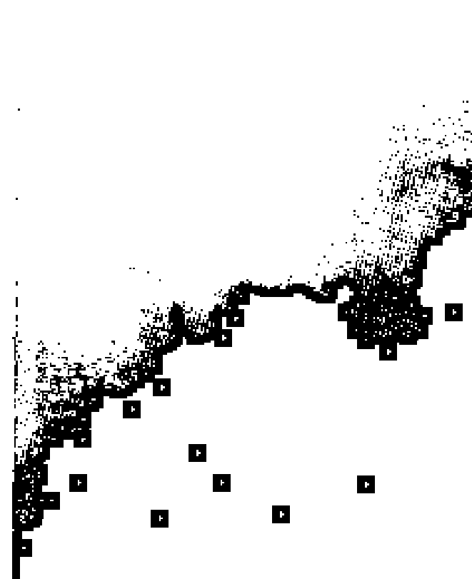

- 为什么说三个孩子都是大学生，大女儿温柔随和，二女儿柔中带刚有领导能力，儿子性格刚强将来也是个领导。
大女儿为庚申年生人，庚落坤宫为临宫禄地，丁奇为文章主文化落离宫，生助年命庚落宫，景门也主文化，地盘景门在离宫生助年命庚落宫，故为大学生，庚在坤宫上乘九地主性格温柔随和；二女儿为癸亥年生人，癸落乾宫为帝旺之地，克天盘景门落宫，天辅星也主文化落震宫，被年命落宫所克，故为大学生。乾宫属金，年命临休门、天蓬星均属水，金为刚，水为柔，故柔中带刚。乾为首长，又上乘值符所以说将来是个领导。儿子为甲子年生人，戊落离宫为帝旺之地，景门、天辅星生助，故为大学生，戊落离宫临死门为性格刚强，脾气拧。离为头，故将来也能做领导。
- 为什么说客人原为机关工作人员而且是领导，现在下岗了。
求测者为癸巳年生人，日干也是癸同落乾宫，临休门为公务员，乾宫为机关、为领导，开门为工作落兑宫与年命落宫比和，故为机关单位的领导，今乾宫为日干空亡之地，临休门也为休息，离职，可见现在离岗了。
- 为什么客人心情不安夫妻不和。
测婚姻乙庚为夫妻，庚为丈夫落坤宫，乙为妻子落震宫，乙庚相克，故夫妻不合。癸为丈夫年命落乾宫，戊为妻子（戊癸相合）落离宫，克丈夫年命落宫，也说明夫妻不合。六合为婚姻落震宫，临杜门主婚姻堵塞不通，六合落宫克丈夫庚落坤宫，丈夫年命癸落宫又克六合婚姻落宫，说明婚姻不幸福，今年为甲申年，庚为太岁落坤宫，六合落震宫克天盘太岁与地支太岁落宫，克太岁必有灾，婚姻克太岁必有离婚之灾。七月为太岁月，太岁旺相，婚姻克之必然是七月有婚灾。癸丑日的己未时为五不遇时，主大凶，故心情烦。
- 为什么说客人背后有情人，情人的特征是如何预测出来的。
丁奇为玉女，测婚姻丁为第三者女人，庚为丈夫临地盘丁奇，必然有情人。天盘丁奇落离宫，离为火为红，故肤色较白，离宫藏景门，景门主眼睛大，离宫有3、9、2、7数，四月火旺故取9数，故身高1.69米，景门也主漂亮，故人很漂亮。丁奇临死门主脾气拧，性格刚强。上乘玄武主能说会道。乙奇为妻子落震宫克地盘丁奇和天盘庚落宫，故妻子与情人及丈夫发生了冲突。

### 实例四、预测父母及本人运气

2004年6月20日10点30分，我在抱犊寨河北省周易研究会研究基地写论文，来了十几位游客，两个人进入办公室，其余游客在客厅观赏周易字画展览。进屋里的其中一位男士自我介绍说：“我是北京人，今天来抱犊寨旅游，刚才在金阙宫抽了一个签，道士说我父母能活百岁，我本人当前运气很好，财运亨通，工作顺利，今年官职有提升，总之全是好，我对抽竹签有点不理解，我认为周易预测的准确率很高，特意请老师预测父母身体状况以及我的运气。我父亲是1920年生人，母亲是1923年生人。”我以问事时间起了一个奇门遁甲局，看局后说：“你父亲是2001年去世的，母亲是2003年去世的。对不对？”求测者还没有回答，同伴忙说：“预测的很准确。你再看看他今年能不能提升？”我问求测者哪年出生。求测者回答：1965年生人。我马上告诉他：“你在单位是一般职工，连领导都不是还提升什么？”来人马上扭转话题说：“对。我是职工，没有当领导的命。今天主要想预测财运和婚姻。”我继续断：“你今年求财无望，投资就赔本。”来人肯定地说：“今年春天投资做了点生意，不但没挣钱，反而赔了本金。”“你的婚姻也不好，夫妻闹矛盾，明年还会出现危机，请你多注意。”

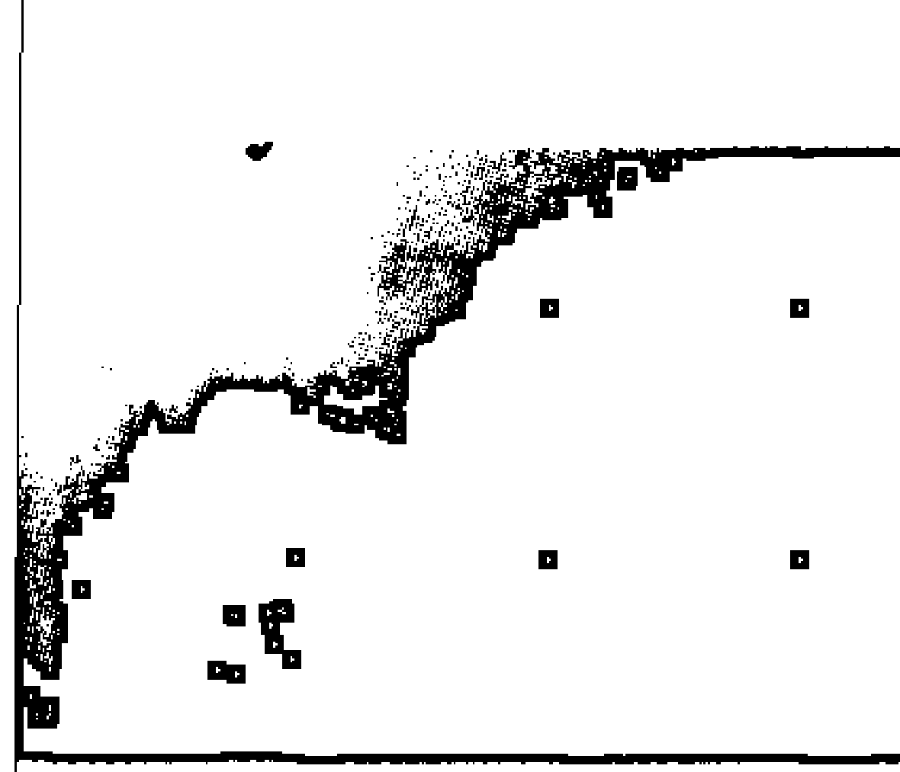

2004年6月20日10点30分
甲申年庚午月庚午日辛巳时
阳三局、甲戌旬，天辅星值符落六宫，杜门值使落二宫。

| 虎 | 武 | 地 |
|---|---|---|
| 生 辛 | 伤 丙 | 杜 癸 |
| 心 己 | 芮 丁 | 任 乙 |
| 合 | | 天 |
| 休 壬 | | 景 戊 |
| 柱 戊 | 庚 | 冲 壬 |
| 阴 | 蛇 | 符 |
| 庚开 乙 | 惊 丁 | 死 己 |
| 芮 癸 | 英 丙 | 辅 辛 |

分析：

- 为什么断父母亲已经去世。
测高龄之人，九星反吟主大凶。
父亲是1920年生人，为庚申年，年命庚落艮宫入墓大凶，庚+癸为大格主凶，上乘太阴主阴曹地府，临天芮病星主因病身亡；兼看地盘庚，地盘庚落五宫寄坤二宫，落空亡之地，空主没有，说明其父已经没有了，上乘九地也是入地之象；还可以兼看乾宫，乾为老父亲，乾宫有己+辛游魂入墓，逢死门，临马星、逢日干空亡之地，也是其父已经离开人世之象。
母亲是1923年生人，为癸亥年，年命癸落坤宫，入墓逢空，上乘九地，证明母亲已经去世；兼看地盘癸，地盘癸落艮宫，临天芮病星，也是病故，坤宫为老母亲，应看坤宫格局，上面因母亲年命落坤宫，已经分析过坤宫的吉凶，信息相同不再重复。

下面分析求测者，庚落艮宫上乘太阴，主搞阴谋诡计，不讲实话；问卦人年命乙奇落艮宫与日干同宫，信息一样反映说假话；丁奇为信息落坎宫为火入水乡，其信息不实，上乘腾蛇主虚诈，也是假信息。景门也为信息落兑宫，逢空亡之地，上乘九天，主说空话，大话，假话，信息也是假的。

根据父母落宫格局的吉凶程度，加上问卦人说话的虚实可以断定父母已故。

- 2、为什么断父亲是2001年去世的。2001年是辛巳年，天盘太岁辛落巽宫，地支太岁巳也在巽宫，同克其父年命庚落艮宫，乾宫也为其父，冲克天盘太岁和地支太岁落宫，冲克太岁必有灾。

- 3、为什么断母亲是2003年去世的。2003年为癸未年，天盘太岁癸落坤宫，地支太岁未也在坤宫，母亲年命癸也落坤宫，为入墓逢空之地，上乘九地，故断2003年去世。

- 4、为什么断求测者是职工，不能提升。求测者是1965年生人，年命乙巳，乙奇落艮宫，乙+癸为华盖逢星，遁迹修道，隐匿藏形，躲灾避难为吉，开门为官运落艮宫，入墓无官。值符为头为领导，年命乙奇不临值符，乾宫也为领导，乙奇不临值使门，故连个副职也不是，可见是职工；预测当前运气以日干为用神，日干庚落艮宫入墓，开门的官职落艮宫也入墓，值符为领导临死门，领导不同意提升。测提升必须是用神旺相，得吉门吉格，又得值符及开门生助才能提升。根据以上分析，求测者不会提升。

- 5、为什么断今年做生意赔钱。

生门为买卖落巽宫入墓大凶。生门为利润，甲子戊为资本，甲子戊落兑宫，克生门落宫，应该挣点小钱，但是生门入墓，甲子戊又逢空亡之地，克不住利润。资本戊+壬为青龙入天牢，凡阴阳事皆不利，资本逢空亡，空就是没有了，上乘九天主钱飞了；再看日干和利润的关系，日干庚落艮宫入墓，生门利润落巽宫克日干落宫，故不能挣钱。

### 6、为什么断夫妻关系不好，明年可出现婚姻危机。

乙庚为夫妻，同落艮宫为比和，比和暗藏争斗，临天芮星，必然夫妻关系出毛病。六合为婚姻落震宫克乙庚落宫，婚姻必然坎坷。

明年为乙酉年，地支太岁酉冲克六合婚姻落宫，六合落宫又克天盘太岁乙落艮宫，冲克太岁必有灾，六合克明年太岁，故明年必有婚灾。

### 实例五、预测过去之事

平山县韩水晶是我省周易研究会会员，擅长六爻八卦技术，为人断卦相当准确。1997年9月14日我会部分会员在石家庄市第九中学研究学习。吃过中午饭后，韩老师找到我说：请你用奇门遁甲局验证一件事情，看奇门遁甲与六爻八卦预测的结果是否相同。我刚要拿笔起局，韩老师又说：你按1996年5月9日未时起局。我问：为什么？韩老师叙述道：这个时间正定县一位30岁出头的男子找到平山县我的家里，要求测过去，也就是1984年的运气如何。我用六爻八卦按他问卦时间起了卦，断出了他1984年的吉凶祸福。现在你也按我当时给他断卦的时间起奇门遁甲局进行预测。于是我按韩老师指定的时间起了一个奇门遁甲局，认真分析后对韩老师说：

此人1984年运气非常差，有意外的车祸发生，还有官司。韩老师插话：预测的很对。我接着断卦：他的婚姻夭折了，其妻子也出了车祸，头部、胸部、肺部、右腿撞伤很严重，可能是死亡了。韩老师说：奇门遁甲预测很准确，而且还具体。交通事故发生后，受害者不服交警队的处理决定，又到法院打了一场官司。死去的那位女士是他的未婚妻，他们马上要结婚时出了重大交通事故，你断婚姻中途夭折也是对的。

1996年5月9日未时
丙子年癸巳月丙午日乙未时
阳七局、甲午旬，天蓬星值符落六宫，休门值使落二宫。

| 虎 | 武 | 地 |
| :---: | :---: | :---: |
| 惊 庚<br>英 丁 | 丙 开 壬<br>芮 庚 | 休 戊<br>柱 壬 |
| 合 | | 天 |
| 死 丁<br>辅 癸 | 丙 | 生 乙<br>心 戊 |
| 阴 | 蛇 | 符 |
| 景 癸<br>冲 己 | 杜 己<br>任 辛 | 伤 辛<br>逢 乙 |

### 分析：
1、为什么断求测者有车祸及官司。
日干丙为求测者落离宫，丙+庚为荧入太白，门户破败，盗贼耗失，事业亦凶。临天芮病星主出问题。开门主车，庚主道路，上乘玄武主破财，又主口舌是非，重者为官司。开+庚主道路词讼，谋为两岐。1984年为甲子年，地支太岁子在坎宫，日干丙奇落离宫，子午相冲，冲克太岁必有灾，必然是路上有冲撞车辆之灾；也可兼看地盘丙，地盘丙落五宫寄坤宫，克地支太岁子落宫，克太岁必有灾。坤宫出现天柱破军星，大凶，好在地盘丙临天盘太岁戊（甲子戊），所以出车祸没有生命危险。天柱星主官司，故打官司是不可避免的。

### 从另一个角度也可以看出车祸和官司：

庚为丈夫为本人落巽宫，临马星主道路。临天英星主血光。上乘白虎主刑伤，也主道路。惊+庚主道路折损，凶。惊+丁主词讼牵连。伤门为车落乾宫冲克庚落宫，被伤门冲克必然是车祸。而且用神庚又克1984年的天盘太岁戊落坤宫，冲克太岁必有灾。用神庚逢空亡之地，宫中暗藏车祸，官司之玄机。

### 2、为什么断妻子车祸身亡。

日干丙为求测者，丙辛相合，辛代表妻子落乾宫，为败地。辛+乙为白虎猖狂；家败人亡，远行多灾殃。临伤门为车，遇天蓬大凶星，必然是车祸。乾宫属金，金主肺，必然是肺部受伤，而肺部受伤肯定是胸部骨折。乾为头，也为右腿，必然头部和右腿也受伤。上乘值符，在此不能以吉神论，值符为八神之领袖，为头儿，说明受伤程度最严重，即被伤害的出了头。重要部位严重受伤，肯定人要有生命危险；还可兼看地盘辛，地盘辛落坎宫，己+辛为游魂入墓，易遭阴邪鬼魅作祟。杜+己主私谋害人招非，凶。杜+辛主打伤人词讼，凶。上乘腾蛇主惊恐虚诈。地支太岁子与地盘辛发生子午相冲，冲克太岁必有大灾。天盘太岁戊（甲子戊）落坤宫，克地盘辛。伤门、天蓬星生助地盘辛落宫，必然是出车祸了。

从另一个角度看，乙奇为妻子落兑宫为绝地，大凶。乙+戊为阴害阳门，凶。上乘九天也为车，九天又有上西天之意，可见因车祸死亡；兼看地盘乙奇落宫，地盘乙奇落乾宫，为入墓，大凶。逢伤门主车，又主伤亡，大凶星天蓬临宫，凶上加凶。看来死亡是不可避免的了。

### 3. 为什么断婚姻中途夭折。

六合为婚姻落震宫，丁+癸为朱雀投江，大凶。临死门为阻隔之神，婚姻受阻。死加伤主官司，动而被刑杖，凶。癸加癸主妇女嫁娶事凶。六合落宫又克天盘太岁戊(甲子戊)落宫，婚姻克太岁必有婚灾。乙奇为妻子落兑宫，冲克婚姻落宫，说明妻子离婚姻而去。

4. 值使门为所测之事，休门值使落坤宫，戊+壬为青龙入天牢，凡阴阳事皆不利。临天柱星，为破军星主有官司或冲撞之事。休加壬主阴人词讼牵连。休门落坤宫为宫克门，门为人事，受坤宫所克，人事大凶。休门落宫克地支太岁，克太岁必有灾，有伤亡，官司之灾。

## ## 实例六、预测近三年运气

1997年2月26日10点，石家庄某公司的王经理找我求测近三年的运气，我按问事时间起了一个奇门遁甲局，认真分析后对王经理说：“1995年你身体不好，可能是心脏有病，到阴历11月你的职务就被免掉了。”王经理说：“对，1995年我的心脏病几次发作，经常住院，工作也没干好，到阴历11月就被免职了。”我接着说：“1996年你的运气还是不好，工作漂泊不定，投资就破财。”王经理肯定地说：“预测的很对。96年领导不按排我上班，我只好另求生路，合伙投资建了一个小项目，不但不挣钱，还赔本4万元。你看我今年运气能不能好转？”我说：“你今年上半年工作不是没有着落，投资还要赔本。下半年领导可能给你安排工作。”

1998年春节期间，我在石家庄见到了王经理，问起1997年的运气时，王经理说：“1997年上半年与朋友合伙办了一个小型的建材厂，真是投资就赔本，合伙人身体有病，建材厂办不下去，又赔本6万元。阴历7月领导安排我上班了。”

1997年2月26日10点
丁丑年壬寅月己亥日己巳时
阳六局、甲子旬，天心星值符落七宫，开门值使落二宫

| 武 | 地 | 天 |
| :---: | :---: | :---: |
| 辛 死<br>英 丙 | 乙 惊 癸<br>芮 辛 | 己 开<br>柱 癸 |
| 虎 | | 符 |
| 丙 景<br>辅 丁 | 乙 | 戊 休<br>心 己 |
| 合 | 阴 | 蛇 |
| 丁 杜<br>冲 庚 | 庚 伤<br>任 壬 | 壬 生<br>蓬 戊 |

### 分析：
1、为什么断1995年心脏有病，阴历11月被免职。
王经理是1950年生人，年命庚落坎宫为死地，庚+壬为上格，凶。临伤门凶门，宫生门，凶门受生事更凶。1995年为乙亥年，天盘太岁乙落离宫，天芮星为病落离宫，临癸水断为95年患心脏病；年命庚落坎宫冲克太岁乙奇，阴历11月坎宫为旺地，冲克太岁更厉害，冲克太岁必有灾，开门为官职落坤宫，又克年命庚落宫。故11月被免职。

2、为什么断1996年破财。
甲子戊为财落兑宫为死地，戊+己为贵人入狱，公私逢之皆不利，1996年为丙子年，天盘太岁丙落震宫，地盘太岁丙落巽宫，甲子戊冲克天盘太岁和地盘太岁。生门为利润落乾宫，临天蓬星主破财，逢空亡之地为无利润，上乘螣蛇，主生意上有被欺诈之事。

甲子戊落兑宫，兑主二、七、四、九数，正应王经理说赔本4万元的现实；地盘年命庚落艮宫为入墓，逢杜门主堵塞不通，96年太岁丙落宫又克地盘年命落宫，故96年运气不好。

### 3、为什么断1997年做生意还要赔本，下半年工作能安排。

97年为丁丑年，天盘太岁丁落艮宫，克年命庚落宫，97年还是不顺利，生门为生意落乾宫，逢空亡为搞不成，临天蓬星主破财，上乘腾蛇主诈骗，乾宫有6数，正应赔钱6万元的现实；开门为工作落坤宫，己+癸为地刑玄武凶。开+己主事绪不定。上乘九天主工作漂泊不定，开+死主官司惊忧，先忧后吉，又临天柱破军星，工作不能安定。日干、时干均为己，同落坤宫，临开门工作，太岁丁奇落艮宫冲动坤宫，日干、时干、工作均被冲动，故申月能安排工作。

### 实例七、小孙测家庭运气

1998年8月30日15点45分，我正在与朋友谈论周易，来了一位青年男子，自我介绍：我是河南人，在石家庄工作，今天特意来找老师求测家庭运气，我姓孙，老师称我小孙好了。我立即按问事时间起了一个奇门遁甲局，认真分析后对孙说：你们夫妻关系不好，96年出现婚姻危机，是你提出与妻子离婚的，原因是有第三者女人插足。2002年婚姻再度出现危机，到时间就要离婚了。小孙说：过去的事都测对了，2002年不知道是否会离婚，我说让时间验证吧。小孙又问：老师能否再看看我父母的情况？我断：你父母亲关系不好，经常吵嘴，你母亲与邻居也经常发生冲突，你妻子与父亲不和，经常发生口舌之争。小孙说：老师预测的真准确。我的家庭内外不和，真是一团糟。请问老师是什么原因造成的？我断：是你家的阳宅风水出了问题。不过风水问题要到现场才能调理。在这里谈风水只是纸上谈兵。小孙又问财运。我断：财运不好，

## 人生命运预测

做生意没有资本，不能挣钱。

2002年7月，小孙又来电话求测财运时告诉我：2002年夏天与妻子分道扬镳了。

1998年8月30日15点45分
戊寅年庚申月己酉日壬申时
阴一局、甲子旬，天蓬星值符落六宫，休门值使落二宫

| 虎 | 合 | 阴 |
| :---: | :---: | :---: |
| 惊 己<br>英 丁 | 癸 开 乙<br>芮 己 | 休 辛<br>柱 乙 |
| 武 | | 蛇 |
| 死 丁<br>辅 丙 | 癸 | 生 壬<br>心 辛 |
| 地 | 天 | 符 |
| 景 丙<br>冲 庚 | 杜 庚<br>任 戊 | 伤 戊<br>趋 壬 |

### 分析：
1. 为什么断夫妻关系不好，96年出现危机。
乙庚主夫妻，乙奇为妻子落离宫，乙加己为日奇入墓，被土暗昧凶。庚为丈夫落坎宫，冲克乙奇落宫，可见夫妻关系不好。96年为丙子年，地支太岁子冲克六合婚姻落离宫，婚姻出现危机。
2. 为什么断孙某有第三者女人，96年提出与妻子离婚。
日干己为求测者，落巽宫，临地盘丁奇，为第三者女人。庚为丈夫，为孙某落坎宫，临地支太岁子，冲克六合与乙奇妻落宫。
3. 为什么断2002年离婚。
2002为壬午年，太岁壬落兑宫，六合婚姻与乙奇妻子同落离宫，地支太岁午临宫，六合临开门又逢天芮病星，婚姻必然出问题。庚为丈夫落坎宫，冲克地支太岁午、六合、乙奇，六合乙奇又克天盘太岁壬，冲克太岁必有灾，婚姻克太岁必然是离婚了。

### 4、为什么断父母亲关系不好，经常吵嘴。

年干戊为父亲落乾宫，戊癸相合，癸为母亲落离宫，克乾宫，必然父母不和。值符为母亲，与年干戊同落乾宫，同宫主争斗，临伤门主格斗，断父母关系不好，经常出现口舌是非。

### 5、为什么断母亲和邻居关系不好，妻子与父亲有矛盾。

月干庚为邻居落坎宫，癸为母亲落离宫，临天芮病星，与庚发生冲克，必然与邻居关系不好；乙奇为妻子落离宫，克年干戊落宫，肯定妻子与父亲发生矛盾。

### 6、为什么断阳宅风水有问题。

时干壬为宅。生门为房屋，同落兑宫，壬加辛为腾蛇相缠，纵得吉门亦不得安宁，若有谋望被人欺瞒。上乘腾蛇主惊恐虚诈。兑为口舌。日干己落巽宫，临惊门主口舌，临天英星、上乘白虎均为凶。时干克日干，为宅克人，为凶宅。故断阳宅风水有问题。

### 7、为什么断孙某财运不好，做生意无资本。

日干己为孙某落巽宫，生门、甲子戊为财，生门落兑宫，甲子戊落乾宫，均冲克日干落宫。做生意：甲子戊为资本落乾宫，逢空亡之地，没有资金。生门为利润落兑宫，壬加辛为腾蛇相缠，纵得吉门亦不能安宁，上乘腾蛇凶神。生门利润又克日干落宫。故断财运不好，不能挣钱。

### 实例八、青年妇女测运气

1997年10月25日16点，一位青年妇女找到我，见面自我介绍：我在石家庄工作叫郑常霞，1968年出生，请石老师预测运气。我立即按问事时间起了一个奇门遁甲局，认真分析后，对郑女士说：你现在心里很麻烦，夫妻感情破裂，婚姻已经是名存实亡，明年正月要离婚。女士插话说：对。我们夫妻已经分居，丈夫是1964年生人，你看他的情况怎么样？我断：你丈夫在部队工作，而且是个领导，今明两年不会转业。2000年要离开部队。郑女士说：丈夫是个连长。请老师再看看其它方面。我断：你本人是做生意之人，财运很好。97年生意上挣了不少钱，连续三年(98、99、2000年)都能挣钱。在事业上能大展宏图。但是、婚姻上你失败了，原因是你性格刚强，爱出风头，请你今后要收俭脾气，改变性格，争取把事业家庭都搞好。

2001年郑女士告诉我：98年正月离了婚。原来的丈夫2000年转业回河南老家了。本人连续三年生意很好。

1997年10月25日16点
丁丑年庚戌月庚子日甲申时
阴八局、甲申旬，天心星值符落六宫，开门值使落六宫

| 虎 | 合 | 阴 |
| :--- | :--- | :--- |
| 壬 杜<br>辅 壬 | 乙 景<br>英 乙 | 辛 死 丁<br>芮 丁 |
| 武 | | 蛇 |
| 癸 伤<br>冲 癸 | 辛 | 己 惊<br>柱 己 |
| 地 | 天 | 符 |
| 戊 生<br>任 戊 | 丙 休<br>蓬 丙 | 庚 开<br>心 庚 |

### 分析：
1、为什么断郑女士心里麻烦。
此局全盘伏吟，伏吟为痛苦之象，故断：心里麻烦。

2、为什么断夫妻感情破裂，婚姻名存实亡。
测婚姻乙庚主夫妻，庚为丈夫落乾宫，乙为妻子落离宫，乙克庚；丈夫为1964年生人，年命甲辰壬，壬落巽宫，郑女士是1968年生人，年命戊申，戊落艮宫，丈夫克妻子，必然感情破裂。六合主婚姻落离宫，临乙奇，乙加乙为伏吟，只宜安分守己为吉。临景门、天英星伏吟。逢空亡之地，故断婚姻名存实亡。

3、为什么断1998年离婚。
98年为戊寅年，天盘太岁戊落艮宫，地支太岁寅也在艮宫，丈夫年命壬落巽宫，克天盘太岁和地支太岁。正月为太岁月，太岁正处旺地，克太岁必有灾。郑女士为1968年生人，年命戊申，戊落艮宫与天盘、地支太岁同宫，同宫暗藏争斗，与太岁争斗自讨苦吃。郑女士年命戊申、申在坤宫，98年正月为马星动、太岁动，冲动申，形成寅申相冲克，冲克太岁必有灾。肯定是离婚了。

4、为什么断丈夫在部队工作，是个领导，2000年转业。
丈夫年命甲辰壬落巽宫，临杜门主部队。庚为丈夫落乾宫，上乘值符为头，自然是个领导。2000年为庚辰年，天盘太岁庚落乾宫，冲克巽宫，年命壬和杜门，故转业。

5、为什么断郑女士是生意人，97年至2000年挣钱。
郑女士年命为戊申，戊落艮宫临生门，生门为生意，必然是生意人。做生意甲子戊为资本，生门为利润，同落艮宫，必然挣钱。预测过去之事，看地盘年命戊，地盘戊落艮宫，与生门利润同宫，97年为丁丑年，太岁丁奇落坤宫，与地盘年命比和，必然挣钱。测当年运气，以日干为用神，日干庚落乾宫，被生门、甲子戊落宫生助。98年为戊寅年，太岁戊也落艮宫，生助日干庚，能挣钱。测未来运气，以天盘年命戊为用神，99年为己卯年，太岁己落兑宫，天盘年命戊和生门都生太岁，也能挣钱。2000年为庚辰年，天盘太岁庚落乾宫，年命戊、生门都和太岁相生。必然是连续三年挣钱。

### 实例九、中年男子测运气

2000年9月16日10点，我正在河北省周易研究会基地写论文，来了一位中年男子，自我介绍说：我叫崔连海，是1953年生人，请老师预测运气。我立即按问事时间起了一个奇门遁甲局，认真分析后对崔连海讲：你没有正式工作，也没有固定收入，是个做生意之人。崔连海马上答应：是。请老师先看看我的财运如何？我断：你的生意兴隆，能挣钱。但是今年阴历6月被诈骗，破财。崔连海插话：今年阴历6月，做生意被人诈骗，一万多元购进的是假货，卖货人也无影无踪了。请老师再看看我的婚姻家庭如何？我继续断：你的婚姻已经中途夭折了，妻子去世了，现在没有婚姻。崔连海听后大惊，边忙站起来问：这卦上还能显示出人的生死？我告诉他，奇门遁甲包罗万象，什么事情都能显示出来。崔连海说：周易真是神奇极了。请老师再费费心，看以后我还能不能组成一个新家庭？我说：今年冬天就能重组成新家庭，崔连海高兴的说：等我组成新的家庭后，一定给老师报喜。

2001年春节过后，崔连海又来到河北省周易研究会基地，进门第一句话就是：老师预测得真准确，去年阴历11月我结婚了，日子过的很好。

```
2000年9月16日10点
庚辰年乙酉月丁丑日乙巳时
阴六局、甲辰旬，天芮星值符落七宫，死门值使落一宫
```

| 合 | 阴 | 蛇 |
| :---: | :---: | :---: |
| 辛 休<br>冲 庚 | 生 庚<br>辅 丁 | 伤 丁<br>英 壬 |
| 虎 | | 符 |
| 丙 开<br>任 辛 | 己 | 己 杜 壬<br>芮 乙 |
| 武 | 地 | 天 |
| 癸 惊<br>蓬 丙 | 戊 死<br>心 癸 | 乙 景<br>柱 戊 |

### 分析：
1. 为什么说崔连海是生意人。
开门为工作落震宫，门克宫不吉，逢空亡之地，又克日干丁奇落宫，主没有工作，生门为生意落离宫，生助日干丁奇。崔连海是1953年生人，年命癸巳，癸落艮宫又得生门落宫生助，故为生意之人。

2. 为什么断崔先生生意兴隆，阴历6月破财。
生门为买卖也为利润，与年干太岁庚同落离宫，生助日干丁奇，又生助年命癸落宫，肯定能挣钱，日干丁奇为求测者落坤宫，上乘腾蛇主诈骗，临伤门主伤亡，破财，年命癸落艮宫，临天蓬星，上乘玄武主破财。艮宫与坤宫比和，坤宫有未、申，申为日干空亡之地，未月不空，必然是未月破财，甲子戊为资本落坎宫，临死门凶，坎主一六数，正应破财一万多元。

3. 为什么断婚姻夭折，妻子去世。
六合主婚姻落巽宫，辛加庚为白虎出力，刀刃相交，主客相残，逊让退步稍可，强进血溅衣衫。临休门虽为吉门，但是婚姻休息则为凶。休加杜主破财失物难寻。休加辛主疾病迟愈，失物不得，婚姻有失去之象。乙奇为妻子落乾宫为入墓，上乘九天有上西天之象，临马星有逃跑之象。乙奇落宫冲克六合落宫，冲则散，妻子离婚姻而去之象。日干丁奇为求测者，丁壬相合，壬也可以代表妻子，壬落兑宫临天芮病星，逢日干空亡之地，妻子得病离去之象。断妻子已经去世，没有婚姻了，崔先生还要问婚姻如何？应该注意崔先生的话是真是假。如果是假话，更证明妻子去世了。丁奇为信息落坤宫，逢日干空亡之地，临伤门，上乘腾蛇主虚诈不实。说明崔先生说的是假话。景门也主消息落乾宫，为入墓，上乘九天主说大话、假话、空话。根据乙奇妻子状况和崔先生问话情况综合判断：妻子已经去世了。

## 4、为什么断崔连海阴历11月重组新家庭

日干丁奇为求测者，丁壬相合，壬可以代表未来的妻子。丁奇落坤宫下临壬，天盘壬落兑宫，都逢日干空亡之地，说明现在对象还没有定下来。阴历10月临马星，冲动六合婚姻，动则变，婚姻起了变化。崔先生年命为癸，戊癸相合，戊也可以代表未来的妻子，戊落坎宫，下临癸，生助六合落宫，坎宫为阴历11月，所以，今年冬天就能结婚。

### 实例十、黄先生测运气

1998年12月24日14点，鹿泉市黄文东找到我求测运气如何？并介绍自己是1969年出生的。我按问事时间起了一个奇门遁甲局，认真分析后对黄说：现在你心里既痛苦又麻烦，一年了你的运气不好，破财并有口舌官司。被女人所害，还有牢狱之灾。黄先生插话：我有一个工厂，你看工厂的前景如何？ 我断：你的工厂不但不挣钱，还赔钱，现在已经停产，工厂是干不成了。黄先生自述：老师预测非常正确。我心里很麻烦，真不知道该怎么办了。工厂赔钱，不但没有资金恢复生产，而且负债累累。今年被一个女人告上了法庭，说我强奸她，被判了半年刑，真是倒霉透了。请老师看看我今后的运气如何？我继续断卦：你99年人身平安，运气回升，能挣点钱但不多。2000年以后运气好，挣钱也多。
2003年底，黄先生又找到我说：老师预测的太对了。99年挣了点钱，很少。2000年，2001年和今年，我组织人搞安装工程，真挣了不少钱，把所有的债都还清了，现在日子过得很好。

1998年12月24日14点

戊寅年甲子月乙巳日癸未时，

阳四局，甲戌旬，天禽星值符落九宫，死门值使落五宫二宫。

| 天 | 符 | 蛇 |
|----|----|----|
| 杜癸<br>英戊 | 己景丙<br>禽芮癸 | 死辛<br>柱丙 |
| 地<br>伤戊<br>辅乙 | 己 | 阴<br>惊庚<br>心辛 |
| 武<br>生乙<br>冲壬 | 虎<br>休壬<br>任丁 | 合<br>开丁<br>蓬庚 |

### 分析：

- 1. 为什么断黄先生内心痛苦，麻烦。
八门伏吟主痛苦之象。日干乙奇为求测者落艮宫，上乘玄武主迷糊，临天冲凶星，又被年干太岁所克。
- 2. 为什么断黄先生破财、有官司、有牢狱之灾。
测当前运气以日干为主，测未来运气以年命为主。日干乙奇落艮宫，98年为戊寅年，天盘太岁戊落震宫，克日干落宫，故不顺利。乙奇上乘玄武，玄武主女人，又为小盗之神，可见黄先生与女人有偷情之事。丁奇为玉女落乾宫，临开门，开门为法官，临天蓬星说明此女不是正经女人，偷情后要告上法庭。伤门主公安落震宫，克日干乙奇落宫，说明黄先生被公安抓起来了。乙加壬为日奇入地，尊卑悖乱，官讼是非、有人谋害之事。生门为财，临玄武，必然破财无疑。
- 3. 为什么断工厂赔钱而且停产。
开门为工厂，临地盘庚，工厂中途夭折。临天蓬星主破财赔钱。值使门也为工厂，死门值使落坤宫主大凶。死加死主管事稽留，印信无气，凶。辛加丙为干合悖师，门凶事则凶，临死门凶上加凶。上乘腾蛇主惊恐怪异。逢空亡之地，说明工厂已经停产了。
- 4. 为什么断99年运气回升，能挣点钱。
99年为己卯年，黄先生为1969年生人，年命己酉，己落离宫，与年干太岁同宫，上乘值符主人平安。地支太岁卯在震宫，生助年命己落宫，运气回升。甲子戊为财落震宫，生助年命己，主能挣钱。戊落震宫为六仪击刑，挣钱少。
- 5. 为什么断2000年以后运气好，挣钱多。
2000年为庚辰年，2001年为辛巳年，地支太岁都在巽宫，生助年命己落宫，运气比较好。天盘甲子戊落震宫生助年命己，地盘甲子戊落巽宫也生助年命己，断挣钱多。2002年为壬午年，年命己落离宫与地支太岁午同宫，与生门财相生，断能挣钱。年命己上乘值符，有保护神，天盘太岁壬落坎宫，冲起年命己故断时来运转。2003年为癸未年，天盘太岁癸落巽宫，生助年命己落宫。年命己又与地支太岁未相生，地支太岁未冲起生门财，年命己又生助生门落宫，故挣钱多。

### 实例十一、高女士测运气

1998年8月25日16点30分，我正在鹿泉市顺城关某办公室看书，来了一位青年妇女。自我介绍说：我是从石家庄来的，姓高，是1968年出生的。今天特意来找老师求测运气。我看时间后起了一个奇门遁甲局，认真分析后对高女士说：当前你的运气差，工作上不顺利，和领导闹矛盾。财运也不好，今年阴历二月和五月破财。最重要的一方面是你的婚姻不幸福，一生要结三次婚，目前你就没有婚姻，过着独身生活，是今年二月离的婚。高女士肯定地叙述道：对。我在单位特别不顺利，与领导经常发生矛盾，和领导顶嘴成了便饭。今年阴历二月与丈夫离婚时破了三万元的财。今年阴历五月发生失盗，被偷现金三千元。真是倒霉透了。请问老师是什么原因造成的？ 我说：工作不顺利和婚姻破裂都是因为你的脾气太拧、性格太刚强，经常和你在一起工作、生活的人都受不了。这次离婚是因为你们夫妻双方生活不检点，各自都有情人造成的，破财是因为你今年运气不好，犯了太岁。明年运气就好了。

- 1998年8月25日16点30分。
- 戊寅年庚申月甲辰日壬申时
- 阴七局，甲子旬，天柱星值符落三宫，惊门值使落八宫。

| 天 | 地 | 武 |
|---|---|---|
| 休己 | 生丁 | 伤乙 |
| 心辛 | 惹丙 | 任癸 |
| 符 | | 虎 |
| 开戊 | | 杜壬 |
| 柱壬 | 庚 | 冲戊 |
| 蛇 | 阴 | 合 |
| 庚惊癸 | 死丙 | 景辛 |
| 芮乙 | 英丁 | 辅己 |

### 分析：

- 1. 为什么断工作不顺利，与领导闹矛盾。
   日干甲辰壬为求测人，壬落兑宫，临杜门为堵塞不通，开门为工作落震宫为门克宫，不吉。值符为领导落震宫，与日干形成冲克，必然在工作上与领导发生矛盾，工作肯定不顺利。
- 2. 为什么断二月、五月破财。
   甲子戊为财落震宫，为六仪击刑，戊加壬为青龙入天牢，凡阴阳事皆不吉利，临天柱破财星，必然破财，震宫为卯月，主三数，正应二月破财三万元。生门也为财落离宫，临天蓬星，必然失盗破财，离宫为午月，主三数，正应五月失盗三千元。
- 3. 为什么断一生要结三次婚，现在过独身生活。
   六合主婚姻落乾宫，临景门主三数，为三次婚姻，落空亡之地，说明高女士现在已经没有婚姻了。
- 4. 为什么断今年二月离婚。
   测婚姻，乙庚主夫妻，乙为妻子落坤宫，庚为丈夫落艮宫，夫妻落宫对冲（九星反吟，二八宫按对冲断）。日干壬为高女士落兑宫，丁壬相合，丁为丈夫落离宫，丈夫克妻子。高女士是1968年生人，年命戊申，戊落震宫，戊癸相合，癸为丈夫落艮宫，妻子克丈夫。夫妻相冲克，日子过不好。日干壬落兑宫，冲克太岁戊，太岁又克丈夫庚、癸落宫。六合落乾宫克太岁戊，冲克太岁必有灾，太岁戊落震宫，震为卯，主二月，必然是二月离婚了。
- 5. 为什么断夫妻双方都有情人。
   日干壬为高女士落兑宫，为沐浴之地。戊也为高女士落震宫，也是沐浴之地。乙奇为妻子落坤宫，上乘玄武为小盗之神，必然与男人偷情。癸为丈夫落艮宫，下临乙奇，乙奇为女人。丁奇为丈夫落离宫，临天蓬盗星，必然是与女人偷情。
- 6. 为什么断高女士脾气性格太拧、太刚强。
   日干壬为高女士落兑宫，上乘白虎，临天冲星，说明此人很厉害。年命戊落震宫，临天柱破军星又上乘值符，说明高女士厉害的出了头。乙奇落坤宫，临伤门主格斗，说明高女士刚强，经常与人发生矛盾。
- 7. 为什么断今年高女士犯太岁，运气不好。
   天盘太岁戊落震宫。日干壬落宫冲克太岁。高女士是戊申年生人，与地支太岁发生寅申相冲，为犯太岁，故不顺利。

### 实例十二、为朋友测运气

1997年6月5日10点40分，我的朋友王海利找我求测运气。我按问事时间起了奇门遁甲局，认真分析后对他说：当前你官运不好，不能提升。财运也一般。本月内注意身体，你血压太高，高压为160，低压为120，当下无事，本月中间有危险，注意头上出毛病，防止脑溢血。结果，朋友王海利在6月19日晚上突然发病，住进了医院，医生诊断为脑溢血。

1997年6月5日10点40分

丁丑年丙午月戊寅日丁巳时。

阳三局，甲寅旬，天任星值符落九宫，生门值使落二宫。

| 天 | 符 | 蛇 |
|---|---|---|
| 开丙 | 休癸 | 生戊 |
| 蓬己 | 任丁 | 冲乙 |
| 地 | | 阴 |
| 惊辛 | | 伤己 |
| 心戊 | 庚 | 辅壬 |
| 武 | 虎 | 合 |
| 死壬 | 庚景乙 | 杜丁 |
| 柱癸 | 芮丙 | 英辛 |

### 分析：

- 1. 为什么断官运不好。
   日干戊为求测者落坤宫，为衰病之地，为不得地利。天冲星临宫为不得天时，上乘腾蛇主惊恐怪异凶。开门为官职落巽宫，克日干戊落宫，故不能提升。
- 2. 看财运以生门为用神，生门与日干戊同落坤宫，财运应该好。但是，临天冲星，冲则散，故断财运一般。
- 3. 为什么断本月中旬头上要出问题。
   测病以天芮星为用神，天芮星落坎宫逢空之地，当前无事。上乘白虎主高压，断血压160，腾蛇为低压落坤宫，断低压120。王海利是1953年生人，年命癸巳，癸落离宫为绝地，运气不好。癸加丁为螣蛇天矫，凶。克太岁必有灾。阴历五月为午月，年命癸处旺地，克太岁更甚，天芮星落坎宫，遇午月冲实，天芮星与年命癸发生冲克，年命癸落离宫上乘值符，值符为头，离宫也为头，故头上要出问题。时干丁奇也为病，落乾宫，乾为首，为头，临杜门为堵塞不通。临天英星主血光。临马星主快。血压高，头上有病，应该是脑溢血了。

### 实例十三、中年妇女测运气

1999年元月11日10点10分，我正在鹿泉市顺城关某办公室看书学习。来了一位中年妇女，自我介绍说：我是鹿泉市人，叫杜梅霞，是1950年生人，丈夫是1949年生人。求测运气如何？我用问事时间起了奇门遁甲局，认真分析后对杜女士讲：当前你们夫妻闹矛盾。婚姻已经是名存实亡了。原因是你丈夫在外边找了一个情人，2002年你们的婚姻要解体。杜女士插话说：对，我们夫妻之间正在闹矛盾，丈夫身边有情人，就是因为第三者女人插足，丈夫整天不回家，与情人在一起同居，我们的婚姻才名存实亡。杜女士又说：当前有一个急事请你预测，我的东风牌汽车被人偷走了，不知能否找回来。我说：汽车能找到，偷车人和你认识，是你的晚辈。说到这里杜女士又插话：对，事情是这样的，我和我爱人的外甥合伙投资买了一辆东风牌汽车跑运输，在工作中有了矛盾，前两天他把车偷走了，丢车后我估计是他偷了，到他家去找，车果然在他家，我跟他要车他不给，我想和他打官司，你看能打赢吗？车能要回来吗？我对杜女士说，打官司凭证据，你证据不足，官司打不赢。杜女士说：我考虑也是这样，因为行车的各种证件都是他的名字。我告诉他：找熟人调解吧，不能打官司。
2003年初，杜女士又找到我预测财运时，顺便告诉我，2002年阴历5月离婚。汽车被偷走后没有要回来，找熟人调解后，他给了我点钱，反正我运气不好，吃了点亏，99年春天总算把问题解决了。

1999年元月11日10点10分

戊寅年乙丑月癸亥日丁巳时

阳五局，甲寅旬，天蓬星值符落二宫，休门值使落四宫。

| 地 | 天 | 符 |
|----------|----------|----------|
| 休庚 | 生己 | 伤癸 |
| 柱乙 | 心壬 | 蓬丁 |
| 武 | | 蛇 |
| 戊开丁 | 戊 | 杜辛 |
| 丙 | | 任庚 |
| 虎 | 合 | 阴 |
| 惊壬 | 死乙 | 景丙 |
| 英辛 | 辅癸 | 冲己 |

### 分析：

- 1、为什么断婚姻名存实亡。
   测婚姻乙庚为夫妻，庚为丈夫落巽宫，乙奇为妻子落坎宫，妻子生助丈夫，但是，坎宫逢空亡之地，为假生。日干癸为求测人落坤宫，戊癸相合，戊为丈夫落震宫，克日干癸落宫，癸落坤宫又克六合婚姻落宫，说明杜女士对婚姻有意见。六合临死门为阻隔之神，婚姻行不通了。乙加癸为华盖逢星，遁迹修道，隐匿藏形，躲灾避难为吉。又逢空亡之地，故断婚姻名存实亡。
- 2、为什么断丈夫有情人，2002年离婚。
   日干癸为杜女士，戊癸相合，戊为丈夫落震宫，上乘玄武主小盗之神，必然有女人偷情。丈夫为1949年生人，年命己丑，己落离宫为临官之地，临生门上乘九天，丈夫钱多。丁奇为第三者女人落震宫，生助丈夫年命落宫，必然有女人。2002年为壬午年，天盘太岁壬落艮宫，克六合落宫，凶。地支太岁午在离宫与丈夫年命己同宫，六合冲克地支太岁和丈夫，冲克太岁必有灾，六合冲太岁肯定是婚灾。
- 3、为什么断与偷车人认识，偷车人是晚辈，车能找到。
   日干癸为求测人落坤宫，为入墓，说明杜女士运气不好。伤门主车落坤宫，与杜女士同宫，临天蓬星为盗星，车必然是被人偷走了。癸加丁为腾蛇天矫，口舌官司火焚也逃不掉，看来杜女士面临口舌官司。伤门与日干同宫，车能找到，玄武主小偷落震宫，临丁奇，地盘丁奇与杜女士同宫，说明偷车人与杜女士认识，丁奇为时干，时干为晚辈，故是晚辈之人偷走的车。
- 4、为什么断证据不足官司打不赢。
   打官司六合为证据落坎宫，临死门逢空之地，为证据不足。开门为法官落震宫，与时干丁奇同宫，克日干癸落宫。惊门为律师落艮宫，逢空亡之地，聘请的律师使不上劲。开门为法官落震宫，又克惊门落宫，官司打不赢。求测人为1950年生人，年命庚寅，庚落巽宫为长生之地，临天柱星，说明杜女士打官司的劲头很大。开门，丁奇落震宫与杜女士年命落宫比和，比和为调解之象，所以嘱咐杜女士找人调解。甲子戊为财，地盘甲子戊落中宫寄坤宫，与日干同宫临天蓬星，必然破财，所以杜女士吃了点亏把问题解决了。

### 实例十四、沧州妇女测运气

五月天气温和鲜花盛开，绿草树木郁郁丛丛。2004年5月30日又是一个风和日丽的艳阳天。抱犊寨风景区又呈现出节日气氛，鼓乐齐鸣热闹非凡，游客队伍潮水般涌向道家的金阙宫和佛家的五百罗汉堂观光旅游。河北省周易研究会基地就座落在风景区内，上午10点30分我在学习研究周易，来了一位中年妇女，自我介绍说：我是沧州人，叫赵德芳，1964年生人，今天来旅游十点种在金阙宫抽了一个竹签，道士给算了一卦，说我运气好，抽的是上签，家庭和睦幸福，人口平安，官运亨通。总之，全都是好听的。我心里犯嘀咕，想请你用周易给预测一下，看是否和道士说的一样。我按问事时间起了奇门局，认真分析后我告诉赵女士，我预测的信息和道士大相反，我认为道士是在阿谀奉承，他算的不对。赵女士说：那就请你先看看婚姻吧，我丈夫是63年生人。我说：我按周易预测后，请你裁定准确度。你的婚姻很坎坷，目前你过着独身生活，1994年离的婚，是你先提出离婚的，你有一个儿子离婚后随你走了，还有你的个人隐私不知当讲不当讲：赵女士表示不忌讳。你虽然没有婚姻，但是你有情人，你们关系很好，此人是位领导，有家室，最终你们不能结婚。赵女士说：预测的太对了，从前听人说周易算卦很准确，今天我才大开眼界。 请问今后我的婚姻如何？我接着说：时间直到2007年你结不了婚。2008年才能结婚。请你在看看其他方面。我看根本不像道士说的官运亨通，而是没有官运，你是个生意人，从1999年到现在生意做的很好。赵女士说：预测的很对，这几年生意不错是挣了钱。

2004年5月30日10点30分
甲申年己巳月己酉日己巳时
阳五局，甲子旬，天禽星值符落六宫，死门值使落一宫

| 虎 | 武 | 地 |
| :--- | :--- | :--- |
| 休 辛 | 生 丙 | 伤 乙 |
| 任 乙 | 冲 壬 | 辅 丁 |
| 合 | | 天 |
| 开 癸 | | 杜 壬 |
| 蕊 丙 | 戊 | 英 庚 |
| 阴 | 蛇 | 符 |
| 惊 己 | 死 庚 | 戊癸丁 |
| 心 辛 | 柱 癸 | 仓丙己 |

### 分析：

- 1、为什么说赵女士婚姻坎坷
   死门值使主大凶。测婚姻六合代表婚姻落震宫，癸加丙为华盖悖师。贵贱逢之不利，虽然临开门，但是门克宫为迫为凶，开加癸阴人失财凶，开加伤主事不吉，逢天蓬盗星，婚姻被盗必然大凶；时干也为所测之事，为婚姻，时干己落艮宫入墓，己加辛为游魂入墓，上乘太阴，可谓给婚姻蒙上一层阴影，临惊门主口舌是非，惊加己主恶犬伤人成讼，惊加辛主女人成讼凶；乙庚为夫妻，庚为丈夫落坎宫，乙为妻子落坤宫。丈夫为癸卯年生人落震宫，赵女士为甲辰年生人落兑宫冲克丈夫落宫。日干己求测者，代表赵女士，甲己合，甲为丈夫，奇门戊遁甲局中值符为甲，甲子戊代表丈夫落乾宫，己为妻子落艮宫，虽然赵女士落宫生丈夫落宫，但是戊落乾宫为入墓而且又逢空亡，不受其生，故，夫妻之间口舌是非不断，婚姻坎坷不幸福。
- 2、为什么断1994年离婚。
   1994年为甲戌年，地支太岁戊克六合婚姻落宫。戊为丈夫入甲戌年太岁之墓大凶，妻子甲辰年生人冲地支太岁戌。甲戌己为天盘太岁落艮宫，六合婚姻落震宫又克太岁己，冲克太岁必有灾，婚姻冲克太岁，必然有婚灾。
- 3、为什么说离婚是赵女士提出的。
   乙奇为赵女士落坤宫，六合主婚姻落震宫克乙奇落宫，日干己为赵女士落艮宫，六合落宫克己落宫。赵女士为甲辰年生人，壬落兑宫克六合婚姻落宫，婚姻克赵女士，使赵女士无法生存，最后提出起诉离婚。
- 4、为什么说赵女士有一个儿子，离婚后随母亲生活。
   时干己为儿女落艮宫，艮主少男，故为一个男孩，丈夫为癸卯年生人落震宫克时干落宫，说明丈夫不要孩子，赵女士为甲辰年生人，壬落兑宫。时干己落宫生兑宫，故儿子随母亲生活。
- 5、为什么说赵女士有情人而且是单位领导，两人不能结婚。
   赵女士为甲辰年生人，看过去以地盘年命为主，看现在以日干为主。地盘年命壬落离宫，上乘丙奇，丙为第三者男人，为情人，上乘玄武小盗神，玄武主偷情。日干己落艮宫，玄武、丙奇落离宫生日干落宫，故断过去现在都有情人，离宫为头，为领导，丙奇落离宫故为单位领导。六合为婚姻落震宫，生助丙奇落宫，应理解为情人有婚姻家庭，故不能与赵结婚。
- 6、为什么说赵女士2007年以前没有婚姻、2008年才能结婚。
   六合为婚姻落震宫，2004年为甲申年，六合克地支太岁坤宫之申，庚也为太岁，地盘太岁庚落兑宫，冲克六合宫；2005年为乙酉年，六合落宫克天盘太岁乙奇落宫，地支太岁酉在兑宫，冲克六合之宫；2006年为丙戌年，地支太岁戌在乾宫，克六合落宫；2007年为丁亥年，地支太岁亥在乾宫，天盘太岁丁奇也落乾宫，同克六合落宫。故2007年以前没有婚姻。2008年为戊子年，地支太岁子在坎宫，六合婚姻落震宫与地支太岁子相生，故2008年能结婚。

坎宫生助六合落宫，天盘太岁戊落乾宫，虽然克六合落宫，但戊落乾宫入墓，实际不克六合落宫，故2008年可成婚。

7、为什么说赵女士是个生意人，而且1999年至2003年生意很好。

生门为生意，看过去以地盘年命为主，看现在以日干为主。地盘年命壬落离宫与天盘生门同宫，地盘生门又生助天盘年命壬落兑宫；日干己落艮宫临地盘生门，天盘生门落离宫又生助日干己落宫，故为生意人。测买卖，生门为利润，落离宫，1999年为己卯年、2000年为庚辰年、2001年为辛巳年地支太岁都生助生门利润之宫，2002年为壬午年，地支太岁与生门同宫，2003年为癸未年，生门与地支太岁未相生。故1999年至2003年赵女士做生意挣钱。

## 第十三章 地理环境预测

### (一) 怎样取用神

预测地理环境，以日干为人，时干为住宅。时干临三奇，吉门、吉星、吉格、生助日干落宫，为最佳住宅。如果时干临凶门凶星克日干为大凶之宅。日干克时干为住宅平安。日干生时干此宅也平安。

值符为新宅，值使门为旧宅，戊为阳宅，生门房屋，死门为地皮(宅基)。甲为栋柱，乙为檩，丙火为香火堂，丁火为灶，戊为围墙，己为天井，庚为过道、辛为小道，壬为自来水管，癸为厕所，下水道。值符为朝向，九天为明堂，九地为暗室。值使门为门路。例如：休门值使为坎宅门路，生门值使为艮宅门路……

阳宅论吉凶：青龙返首、鸟跌穴，此宅雕梁画栋，藏风聚气。乙加辛龙逃走，房屋有损辛加乙白虎猖狂而虎首房强。癸加丁蛇天矫厕所不利。丁加癸朱雀投江家中口舌颇多。伏宫格招人妒害，飞宫格祸起萧墙。大格、小格冲射不利。刑格悖格家庭不宁。太白入荧须防贼盗。荧入太白须防火灾。五不遇时人口有损。六仪击刑凶灾伏藏。三奇入墓暗幽房。反伏门迫是非多。

宫吉，落六、七宫次吉，落一、三、四宫不吉。预测阴宅周围环境，甲为大树，乙为小树，甲乙逢伤门，杜门为树林，丙、丁为高岗、砖窑，戊土为大地田野，己土为菜园子，庚为大公路，辛为小路，壬为大水渠，癸为小水沟。己土为坟墓，辛为骨骸。

### (二) 实例解析（6例）

#### 实例一、预测阳宅地理环境

2002年9月1日9点30分，我在河北省周易研究会基地看书学习，来了一个中年男顾客，进门就说：我姓赵，是1953年生人，请老师给我测测运气，我立即按向事时间起了一个奇门遁甲局、认真分析后对赵先生说：你在单位是位领导，你人品好，脾气拧，身体有病，心脏不好，你的妻子身体也有病，是肺病，你运气好，尤其是财运好。赵先生插话：老师你预测的都对。1999年搬到新房后，2001年我到医院检查、确诊为冠心病，供血不足。妻子去年冬天感冒后因治疗不及时，转变为慢性肺病，经常咳嗽。我感到搬到新家后就不太顺利。请老师给看看是不是阳宅出了问题，我说你家的阳宅是南北朝向，大门开在南边，新盖得房屋很漂亮，房子面积高大，是两层楼房吧。赵先生说：测得都对。请老师继续往下讲：你家的炉灶按在北边。正西方向有一条大道。西南方向较近处有水沟。东南方向较远处有坟墓。东北方向过去有条小路现在不走了。正东方向较远处有水坑，从前有坟墓现在没有了。西北方向地势较高。正北方向有高大的烟筒。家中有花草树木。并且供奉有神位：赵先生听后连连点头说：预测得真准确。象这样的宅子是好还是不好？我说：此宅有些毛病，只要进行调理后，就会好起来。

2002年9月1日9点30分

### 奇门遁甲解真

壬午年戊申月壬申日乙巳时
阴四局、甲辰旬、天英星值符落五宫寄二宫，景门指使落八宫。

| 阴 | 蛇 | 符 |
|---|---|---|
| 惊己<br>冲戊 | 开戊<br>辅壬 | 休壬<br>英庚 |
| 合 | | 天 |
| 死癸<br>任己 | 乙 | 乙 生庚<br>芮丁 |
| 虎 | 武 | 地 |
| 景辛<br>蓬癸 | 杜丙<br>心辛 | 伤丁<br>柱丙 |

### 分析：

-   1、为什么断此人是领导、脾气拧、财运好、有心脏病。
    日干壬为求测者，落坤宫，上乘八神值符、值符为头、故为领导、临天英星主脾气暴躁。
    赵先生是1953年生人，年命癸巳，癸落震宫，临死门主脾气拧。临天任星，上乘六合主人品好。日干壬下临庚，庚也代表丈夫，查天盘庚落兑宫，临天芮病星，庚下临丁奇，丁火代表心脏，故断有心脏病。甲子戊为财落离宫，生助日干落宫生门也为财，落兑宫，被日干落宫所生。断财运好。

-   2、为什么断妻子有肺病。
    乙奇代表妻子，落兑宫，临天芮病星，兑属金，金主肺，故断有肺病。

-   3、怎样断阳宅周围地理环境
    值符为朝向，落坤宫，临壬，为南北朝向。开门为大门，落离宫，临天辅星主漂亮，上乘螣蛇主高大。生门为房屋落兑宫，上乘九天主高大，兑宫主二数，为两层楼。丙火为灶落坎宫，故灶在北边，庚为大道落兑宫，上乘九天为车，兑为西，故西边有大道。坤宫主西南方向，阴遁坤宫主内盘、主近，壬为水，所以西南方向附近处有水沟。己为坟墓，落巽宫阴遁巽宫主外盘，主远，远处有坟地，景门为道路落艮宫，临辛为小路，逢空亡之地，空亡主过去，说明小路已经无人行走了。震宫为正东方向。逢空亡、临癸水、空亡主大坑，临癸水为大水坑。己为坟墓，地盘已临震宫，逢空亡，主过去有坟墓，现在已经空了，没有坟墓了。丙为高岗，地盘丙落乾宫，乾主西北，故西北方向地势高。天盘丙落坎宫，丙为大烟筒，临杜门主高，故北方有高大的烟筒。戊为阳宅，落离宫，临天辅星主花草树木。时干乙奇为宅，落兑宫，临天芮星为神位。所以家中有花草树木，还供奉神位。

#### 实例二、预测阳宅吉凶

2004年8月21日15点多，我在河北省周易研究会基地看书学习，来了一位中年男子，自我介绍说：我姓吴，是1951年出生的，请老师给预测。我告诉他：有什么事就直说吧。吴先生说请我预测阳宅吉凶，并告诉我：2002年刚盖的新房，我用向事时间起了一个奇门遁甲局，认真分析后对吴先生说：你家的宅子是南北朝向，边缘不整齐，东边缺一快，灶在西边，大门也开在西边，家里供奉着佛，只在初一，十五烧香。说到这，吴先生大惊，站起了说道：你没有到家里看，怎么测得都对？老师看我住这样的宅子好不好？我断：此宅大凶，不能长期居住。自从你搬到新宅后，家庭不安宁，犯口舌是非，破财，生病，晚上还会出现异常现象。吴先生插话说：老师预测的太对了。请老师给指点迷津，我告诉他：这是用奇门遁甲对宅子进行预测，真想把宅子调理好，必须到现场进行调理。

2004年8月21日15点
甲申年任申月壬申日戊申时，
阴五局，甲辰旬，天蓬星值符落五宫寄二宫，休门指使落六宫

| 阴 | 蛇 | 符 |
|---|---|---|
| 景丙<br>柱己 | 死乙<br>心癸 | 惊壬<br>趁辛 |
| 合 |  | 天 |
| 杜辛<br>芮庚 | 戊 | 开丁<br>任丙 |
| 虎 | 武 | 地 |
| 伤癸<br>英丁 | 生己<br>辅壬 | 休庚<br>冲乙 |

### 分析：

-   1、怎样看出阳宅朝向和炉灶位置
    值符为朝向，落中五宫寄坤二宫，临天盘六仪壬，故为南北朝向。丁奇为灶，落兑宫，兑主西方，兑宫属金，丁火克宫，故为凶灶。

-   2、怎么看出宅子东边缺，大门开在西边，家里供奉佛。
    时干戊为宅，落震宫，逢空亡，震主东方，空亡主缺，故断东边缺一块。开门为此宅的大门，开门落兑宫，兑主西。上乘九天主门开得很大。天芮星为佛，落震宫。吴先生是1951年生人，年命辛卯，辛落震宫，临天芮星，必然家中供奉佛。天芮星临庚，逢空亡，庚为阻隔，不是经常烧香，只初一、十五才烧香。

-   3、为什么断住此宅大凶
    时干戊为宅，落震宫为六仪击刑。凶。戊加庚为值符飞宫，吉事不吉，凶事更凶，求财没利益，测病也主凶，同时甲庚相冲，飞宫也主换地方。杜门主堵塞不通。杜加戊主谋事不成，杜加伤主兄弟相争破财不利。又逢空亡之地，凶。日干代表人，日干壬落坤宫又被时干戊落宫所克，必然是凶宅。
    日干壬落坤宫，壬加辛为螣蛇相缠，纵得吉门亦不能安宁，若有谋望，被人欺瞒。惊加死，主宅中怪异而生是非，凶。惊加壬主官司囚禁，病者大凶。临惊门，主口舌是非：必然家中不宁，临天蓬星，主破财。生门为房屋落坎宫，上乘玄武为破财之神，故家中必然破财值符为新宅，天蓬星为值符落坤宫，与日干壬同宫，临惊门必有口舌之争。螣蛇主惊恐怪异之事，落离宫，生助值符和日干落宫，家中必然有异常现象。
    生门为房屋，落坎宫，已加壬为地网高涨，狡童佚女，奸情伤杀，凶。辰戌相冲，家中不得安宁。时干戊为宅，落震宫，临天芮星，病星在宅中，家人必然生病。

#### 实例三、阴阳宅混建家庭不安

2004年8月5日15点30分，我在河北省周易研究会基地工作，来了一位中年男子，开门见山地说：我姓洪，是1962年生人，今天特地来周易研究会找老师给我测测运气。我起了奇门遁甲局，认真分析后对洪先生说：今年你运气不好，做生意赔钱，破财。洪先生说：对。自从去年搬到新家后就感到不顺，你从卦上看看是不是阳宅有问题。我断：自从搬到新家后，你妻子开始生病，要花钱，你挣不上钱还要破财，而且家庭不安宁，犯口舌是非。洪先生插话：很对。我断：你住的阳宅出了问题。原因是你的新宅下面有坟墓，有骨骸，建房时没有把它迁移干净，家中阴气太重，导致这一系列的问题。洪先生说：盖房前，这块地是一片墓地，开工前通知人家把坟墓迁移了，在建房时又挖出了骨骸，可能还有没挖干净的骨骸。

2004年8月5日15点30分
甲申年辛未月丙辰日丙申时
阴一局，甲午旬，天柱星值符落三宫，惊门值体五宫寄二宫

| 天 | 地 | 武 |
|---|---|---|
| 景壬<br>心丁 | 死戊<br>蓁己 | 惊庚<br>任乙 |
| 符 |  | 虎 |
| 杜辛<br>柱丙 | 癸 | 开丙<br>冲辛 |
| 蛇 | 阴 | 合 |
| 伤乙<br>芮庚 | 生己<br>英戊 | 休丁<br>辅壬 |

### 分析：

-   1、为什么断做生意赔钱破财
    日干丙为求测者，落兑宫，为死地，运气不好，洪先生是1962年生人，年命壬寅，壬落巽宫，入墓逢空，有能力不能发挥。生门为生意，落坎宫门克宫，不吉。甲子戊为资本，落离宫，为子午相冲，冲为散，必然破财，又临天蓬破财之星，又冲克生门落宫，破财无疑。

-   2、为什么断妻子生病，家中有口舌之争。
    乙奇代表妻子落艮宫，乙加庚为日奇被刑，为争讼财产，夫妻怀有私意，不吉。伤加乙主求谋不得，反防盗失财，小凶。临天芮病星，必然身体有病。上乘腾蛇主惊恐怪异，妻子有虚惊之状，腾蛇又主缠绕，病情难治。日干丙奇落兑宫，兑主口舌是非。惊门主口舌落坤宫，上乘玄武主小人，生助日干落宫，可见小人，口舌之事会主动找上门来。兼看地盘日干丙，地盘丙落震宫，临天柱破军星，也主口舌之争。口舌是非之事是不可避免了。

-   3、为什么断阳宅底下有坟墓，有骨骸。
    卦遇九星反吟，宅子必然有问题，为凶宅。 时干丙为阳宅落兑宫，为死地，不吉，丙下临辛，辛为骨骸。生门为房屋，落坎宫，临巳为坟墓，上乘太阳为阴气太重。戊为阳宅，落离宫，为子午相冲，戊加己为贵人入狱，公私不利。戊下临己，死门为地皮临己，巳为坟墓。值符为新宅，落震宫，临辛为骨骸。所以断阳宅下面有坟墓，有骨骸。

#### 实例四、预测阴宅地理环境

2000年6月15日15点，我在河北省周易研究会基地看书学习，来了一位中年男子，进门就说：我有事请老师给看看。我问：有什么事你就直说吧。来人说：我姓刘，有人说我家祖坟出了问题，必须赶紧迁坟，不然会有人身伤亡。请老师给指点迷津。我起了奇门遁甲局，认真分析后对刘先生说：你家祖坟南边有条小水沟，远处有一个大公路，东南方向是一片开阔地，地势很好，庄稼长得不错。正东方向附近有一片坟地、坟墓很多，在往东还有一个果园。地形是西南方向和正西方向高，西南远方有一个砖窑，正西方向远处有两趟电线，一路是电话线，一路是高压线。说到此刘先生插话说：你没有到现场怎么说的这么详细？预测得都对，我继续断卦：坟地的东北方向附近有条小路，正北方向有一片小树林，长势良好。西北方向有个大坑或者是水沟。刘先生听后惊讶地说：奇门遁甲真是神奇级了，不用去现场就能把地形貌看得一清二楚。这样的坟地，好还是不好？我告诉他，这个坟地不错，家人都平安，还出机关干部，财运也很好，坟地没有问题，不要搬迁。刘先生说：我们这个坟地还真出了机关干部，每个家庭的生活过得都很好。

2000年6月15日15点
庚辰年壬午月甲辰日壬申时
阳九局，甲子旬，天英星值符落四宫，景门值使落八宫

| 符 | 蛇 | 阴 |
|---|---|---|
| 惊戊<br>英壬 | 开庚<br>芮戊 | 休丙<br>柱庚 |
| 天 |  | 合 |
| 死壬<br>辅辛 | 癸 | 生丁<br>心丙 |
| 地 | 武 | 虎 |
| 景辛<br>冲乙 | 杜乙<br>任己 | 伤己<br>蓬丁 |

### 分析：

-   1、怎样断出坟地周围环境
    天芮星落离宫，临癸水，断南边有一条小水沟。庚主大路，落离宫。临开门主车，故断南边有一条大公路。戊土主大地，落巽宫，临地盘壬水，说明大地湿润，上乘值符必然是庄稼长势好。
    死门为坟地，为死者，落震宫，上乘九天主大，主多，阳遁震宫为内盘主近，所以断东边附近有一片坟地。天辅星为果园，落震宫，故断东边有一个果园。
    丙为高岗，落坤宫，主西南方向。地盘丙落兑宫，主西方，故断正西方、西南方地势高。丙为阳火，为砖窑，阳遁坤宫为外盘主远，断西南方向远处有砖窑，丁火为阴电落兑宫，地盘丙火为阳电落兑宫，上乘六合，兑宫主二数，故断西边有一路电话线和一路高压线。
    景门主道路，落艮宫，艮为东北方向，临辛为小路，临马星能走马车，故为乡间小路。
    乙木落坎宫，临杜门，故为树林，上乘玄武星，玄武属水，水能生木，断正北方向树林长势良好。
    乾宫逢空亡，主大坑，临天蓬星主大水沟，乾为西北方向，所以断西北方向有大坑，或大水沟。

-   2、为什么断这个坟地出机关干部，家人平安，财运好。
    死门为坟地，落震宫，与日干壬同宫，临天辅吉星，上乘九天吉神，又与值符落宫比和，值符为领导。午月震巽二宫泄气，必然不是高级干部。死门临天盘壬和地盘辛，天盘壬为生者，地盘辛为死者，地盘辛生助天盘壬，死者生助生者，对活人有利。
    己为坟墓，落乾宫，天盘已为生者地盘丁为死者，地盘丁生助天盘已，死者生助生者，对活人有利，所以断家庭人口平安。
    天盘甲子戊为财，落巽宫，与死门落宫比和。生门也为财落兑宫，与天盘已落乾宫比和，所以断这个家庭财运好。

#### 实例五、预测阴宅

2003年10月6日，还是国庆节放假期间，抱犊寨风景区热闹非凡，来周易研究会基地参观周易文化的人络绎不绝。我正忙着给游客讲解民族文化，11点有一位中年男子说： 哪位老师给预测：我忙答话：有什么事情到办公室来吧。分宾主落座之后，我问客人有什么事要预测，客人说：我叫唐伯忠，是1949年生人。我相信周易的科学性，请老师给我测测运气。我起了一个奇门遁甲局认真分析后对唐先生说：你的运气很不好，工作不顺利，破财，有口舌是非之事发生，家庭不安宁，夫妻关系不好，妻子患有虚病，时好时坏，医生对她的病情束手无策。唐先生说请老师看看是什么原因造成的？我告诉他：是你家的祖坟出了问题，只有把坟地调整好，家人才能平按。

2003年10月6日11点
癸未年辛酉月壬子日丙午时
阴七局，甲辰旬，天冲星值符落九宫，伤门值使落一宫

| 蛇 | 符 | 天 |
|---|---|---|
| 死乙<br>任辛 | 惊壬<br>冲丙 | 开辛<br>辅癸 |
| 阴 |  | 地 |
| 景丁<br>逝壬 | 庚 | 休丙<br>英戊 |
| 合 | 虎 | 武 |
| 杜己<br>心乙 | 伤戊<br>柱丁 | 生癸<br>芮己 |

### 分析：

-   1、为什么说他运气不好，有口舌是非之事发生。
    唐伯忠是1949年生人，年命己丑，己落艮宫为入墓，逢空，老牛追兔子，有劲使不上，有能力发挥不出来。日干壬求测者，落离宫，临惊门主口舌是非。壬加丙为水蛇入火，因壬丙相冲，故主官灾刑禁，络绎不绝，惊加景主词讼不息，小口疾病凶。惊加壬主官司囚禁，病者大凶。惊加丙主文书印信惊恐。日干壬克又年干太岁癸，必然运气不好。

-   2、为什么断工作不顺利，破财
    开门为工作，落坤宫，辛加癸为天牢华盖，日月失明，误入天网，动止乖张，凶。开加辛主阴人道路不吉。开加癸主阴人失财小凶。开加死主官司惊恐凶。工作必然不顺利。甲子戊为财，落坎宫，临伤门，财必然受伤，临天柱破军星，必然破财。上乘白虎凶神，财受损无疑。生门也代表财落乾宫，临天芮病星，财上必然出毛病。上乘玄武破财之星，是必定破财了。

-   3、为什么断夫妻关系不好，家庭不安宁
    乙庚为夫妻，乙奇代表妻子落巽宫，乙加辛为青龙逃走人亡财破，奴仆拐常，六畜皆伤。测婚为女逃男。庚为丈夫落乾宫，临天芮凶星，又冲克乙奇落宫，夫妻关系肯定不好。六合主婚姻落艮宫，临杜门为堵塞不通，逢空亡为名存实亡。年干太岁癸落乾宫又冲克乙奇落宫，家庭怎么会安宁呢？

-   4、为什么断妻子有病，医生束手无策。
    死门为病症，落巽宫，与乙奇同宫，妻子必然有病。上乘腾蛇主惊恐怪异，又主缠绕，病为虚病，不好治。天心星为医生，落艮宫，不克死门，反而被死门所克，天芮星也为病症，落乾宫，天心星不克天芮病星，乙奇也为医生，天芮星反而冲克乙奇落宫。故医生治不好妻子的病。

-   5、为什么断祖坟出问题
    以死门为阴宅，落巽宫，为宫克门，凶。天盘六仪乙奇为活人，地盘六仪辛为死者，地盘辛克天盘乙，对活人不利，凶。上乘腾蛇主惊恐怪异，凶。
    己为坟墓，落艮宫，为入墓，逢空，凶。可见祖坟出大问题了，己加乙为墓神不明，地户逢星，宜遁迹隐形为利。杜加己主私谋害人招非。杜加乙宜暗求男人财物。后主不明致讼，凶。天盘六仪己为活人，地盘六仪乙为死者，地盘乙克天盘己，对活人不利，凶。
    兼看地盘己，落乾宫，临天芮星，坟墓必定有毛病。癸加己为华盖地户，男女测之，音信皆阻，此格躲灾避难为吉，庚加己为官符刑格，主有官司口舌，因官讼被判刑，凶。天盘六仪癸为活人，地盘六仪己为死者，地盘己克天盘癸，对活人不利，大凶。

#### 实例六、常海良测运气

1998年2月24日9点30分，鹿泉市常海良找到我求测近几年的运气，常海良是1954年生人，我立即起了一个奇门遁甲局，认真分析后对常海良说：你们夫妻两经常吵嘴，但离不了婚。常插话说：预测的真对，住此宅后夫妻经常吵嘴。我说：你们还与邻居发生矛盾，经常吵嘴。常说：是。经常与邻居发生矛盾，因为房基地还打过官司。我说：原因是你的宅子有毛病，属于口舌是非之宅，只有把宅子的风水调理好，才能避免夫妻、邻居之间的吵嘴现象。97年你一年的运气不好，挣钱很艰难，投资还要赔钱，常海良说：97年搞汽车运输，不但不挣钱还赔了本。我告诉常：98年运气好转，搞汽车运输能挣钱。98年底，常给我打电话说：98年搞汽车运输真的挣了钱。请石老师再给我预测99年的运气。

-   1998年2月24日9点30分
- 戊寅年甲寅月壬寅日乙巳时
- 阳六局，甲辰旬，天蓬星值符落五宫寄二宫，休门值使落二宫。

| 地 | 天 | 符 |
| :--- | :--- | :--- |
| 惊己 | 开戊 | 休壬 |
| 柱丙 | 心辛 | 蓬癸 |
| 武 |  | 蛇 |
| 乙死癸 | 乙 | 生庚 |
| 芮丁 |  | 任己 |
| 虎 | 合 | 阴 |
| 景辛 | 杜丙 | 伤丁 |
| 英庚 | 辅壬 | 冲戊 |

## 分析：

1.  为什么断夫妻经常吵嘴，不会离婚？
    乙庚主夫妻，乙奇为妻子落震宫，庚为丈夫落兑宫，庚克乙，故吵嘴。六合主婚姻落坎宫，生助乙奇落宫，庚落兑宫，生助六合婚姻，故不会离婚。

2.  为什么断与邻居经常闹矛盾？
    日干壬为求测人落坤宫，月干癸为邻居落震宫，克日干壬落宫，常海良是1954年生人，年命甲午辛，辛落艮宫又被月干癸所克，所以与邻居不和。

3.  为什么断口舌是非之宅？
    时干乙为宅，日干壬为人，时干乙奇落震宫克日干壬落宫，说明此宅为凶宅。时干乙奇临天芮星逢空亡，也说明宅子有毛病。临死门凶门不吉。上乘玄武主口舌是非。癸加丁为腾蛇天矫，口舌官司火焚也跑不掉。生门也主房屋落兑宫，庚加己为官符刑格，主有官司口舌。上乘腾蛇主惊恐怪异，故断口舌是非之宅。

4.  为什么断97年搞汽车运输不挣钱？
    预测过去以地盘年命为主，地盘年命辛落离宫，为子午相冲。戊加辛为青龙折足，主招灾失财。虽然临开门吉门，但是开门落离宫为宫克门，吉门不能发挥吉的作用。97年为丁丑年，太岁丁落乾宫，地盘年命辛落宫克乾宫，克太岁必然不顺，失财。搞汽车运输，伤门为汽车落乾宫，生门为利润落兑宫被地盘辛所克，挣钱艰难。玄武为破财之星落震宫，生助地盘辛，故有赔钱之象。

# 奇门遁甲解真

5.  为什么断98年搞汽车运输能挣钱？
    预测当年运气以日干和天盘年命为用神。日干壬落坤宫，天盘年命辛落艮宫，98年为戊寅年，太岁戊落离宫，生助日干壬，又生助年命辛，故工作顺利。日干壬，年命辛落宫与伤门车、生门利润都处在相生之位。戊也为财，生助日干壬和年命辛，故98年搞汽车运输能挣钱。

## 第十四章 天时气象预测

## （一）怎样取用神

奇门中以九星代表天时，所以测天气，应以九星为主，兼看天干、八门、八神及其落宫状况。

九星：天辅星为风伯。天英星为火神主晴。天芮星主雾气。天禽星主晴风。天柱星为雨师主雨。天心星为雪神主雪。天蓬星为水神，主雨。天任星为雾瘴风沙。天冲星为雷公主雷。

八门：景门主晴。死门主阴风寒冻冰霜。惊门主狂风霹雳雷雹。开门主雷。休门主雨。生门主狂风黄沙。伤门主雷电。杜门主虹霓闪电霹雳。

八神：值符为日月。腾蛇主雷电。太阴主阴云，六合主风和日丽。白虎主疾风。玄武主细雨。九地主阴晴苦寒。九天主晴天。

十天干：甲主旭日风。乙主风和日丽。丙主晴天。丁主晴天。戊主霜雪瘴气，己主黄风岚气。庚、辛主严霜（秋冬）、暴雨（春夏）。壬主大雨。癸主小雨。

占晴天：值符、九天、白虎之神与生门、景门、杜门、天辅星、天禽星、天英星形成木火局，必主晴。

天辅星为风伯，天英星为火神。天辅乘旺相，落离九宫，或克下落的宫，或克日、时二干，主风晴。天英星乘旺相落三宫、四宫，或克日、时二干，亦晴。

占下雨：天柱星为雨师，天蓬星为水神，癸为水神。天蓬星落坎、兑、震宫，乘壬癸二干，或天柱星乘壬癸二干落坎、兑、震宫，必下雨。遇壬为大雨，癸为小雨。与值符近则雨速，远则雨迟。天蓬星、天柱星落坤宫，主密云不雨。天蓬、天柱二星落震、坎、兑宫，壬、癸亦主下雨。天英星临日干时干主晴，天英与天冲合克日干、时干主雷电交作。值使在坤宫见白虎主雨中带冰雹。

占下雪：乾兑二宫主之。或天心星乘壬癸二干到兑宫，或天柱星乘壬癸二干到乾宫皆主雪。天蓬星、六合、伤门为值使落震宫，主大雪、久阴。玄武、风伯、雨师落震宫主小雪。

占河水消涨：以天蓬星、休门决之。休门乘旺相之气而得三奇者，水虽涨，不至泛滥。休门乘旺相之气而遇庚格，主河水壅塞泛滥成灾。甲辰壬带腾蛇，主孽龙舞水为害。休门落于二、五、八宫，水被土克，立消或无水。休门不乘庚格与甲辰壬者，水虽旺发，亦不出岸。

## （二）实例解析（4例）

### 实例一、预测天气阴晴

2004年7月9日17点，我正在周易研究会基地看书学习，来了三位抱犊寨职工，见面就说：“单位领导带领职工分两批到河南省开封市旅游景点参观学习，以取兄弟单位的管理服务经验。我们是第一批，定于12日早晨5点从鹿泉市出发，请石老师预测一下出发时的天气是晴天还是下雨。”我按出发时间起了一个奇门遁甲局，分析后对三位职工说：“12日早晨5点有大雨，你们要带上防雨工具。”到12号早晨5点天上下着大雨，职工们冒着雨前往河南省开封市参观学习。

2004年7月12日5点
甲申年辛未月壬辰日癸卯时
阴五局，甲午旬，天芮星值符落九宫，死门值使落二宫。

| 蛇 | 符 | 天 |
| :--- | :--- | :--- |
| 杜癸<br>英己 | 戊景辛<br>芮癸 | 死丙<br>柱辛 |
| **阴** | | **地** |
| 伤己<br>辅庚 | 戊 | 惊乙<br>心丙 |
| **合** | **虎** | **武** |
| 生庚<br>冲丁 | 休丁<br>任壬 | 开壬<br>蓬乙 |

## 分析：

1.  预测天气以九星为主要用神，天蓬星为水神落乾宫，临开门上乘玄武必然有雨，壬水为大雨，壬加乙为小蛇得势，雨必然越下越大，甲辰壬落乾宫形成辰戌相冲，冲开壬水必然是大雨；兼看地盘天蓬星，地盘天蓬星在坎宫，临地盘壬，逢休门伏吟，必然有大雨，上乘白虎主雨中带风，雨越下越大。
2.  壬辰日，癸卯时，壬为大水，辰为水库，癸卯时，癸为水，卯辰相害又相穿，水库被穿破，水必然大，故卯时有大雨。
3.  天英星为火神落巽宫为废地。逢空亡不能发挥作用，临癸为雨水，逢杜门主电，上乘螣蛇主闪电，癸加己为华盖地户，躲灾避难为上吉，不会晴天。
4.  天辅星为风伯落震宫为相地，临伤门主雷，上乘太阴主阴天，临地盘庚为阻隔之神，风雷被阻隔，则不会有大风大雷，风力最多不超过三级。

### 实例二、闷热时求雨问奇门

2004年8月9日，早晨起来天气就特别热，万里无云。辰时温度继续升高，闷热得让人透不过气来，有的人光着身子，只穿大裤衩，有的人手拿扇子不停地扇风，有的人坐在电扇旁边一动不动，尽管人们想方设法还是汗流浃背，满头大汗。8月7日中午已经立秋了，为什么天气还这样炎热，北方有句谚语：立了秋热死牛。看来这种气候属于正常现象。人们都在盼望着老天能下雨降温，可是昨天晚上7点30分中央电视台的天气预报说，石家庄地区8月9日多云无雨，到上午9点天气闷热的实在难受，我把上衣脱掉，只穿了背心，突然想起用奇门遁甲预测一下，看今天究竟有雨无雨。于是，我按巳时起了一个奇门遁甲局，我一看格局便心喜：申时有雨，但不太大，酉时有大雨，但是时间不会太长，戌时，亥时无雨，但阴天，到了下午3点，天上阴云密布，4点钟下起了小雨，5点刚过，下起了大雨，但是大雨只下了半个小时，5点半以后大雨渐渐停止了，天气稍微凉快了一些。

```
2004年8月9日9点
甲申年壬申月庚申日辛巳时
阴八局，甲戌旬，天柱星值符落五宫寄二宫，惊门值使落九宫
```

| 阴 | 蛇 | 符 |
| :--- | :--- | :--- |
| 死乙<br>英壬 | 辛惊丁<br>芮乙 | 开己<br>柱丁 |
| **合** | | **天** |
| 艮壬<br>辅癸 | 辛 | 休庚<br>心己 |
| **虎** | **武** | **地** |
| 杜癸<br>冲戊 | 伤戊<br>任丙 | 生丙<br>蕊庚 |

## 分析：

预测天气以九星为主，天柱星为雨师主雨，天蓬星为水神主雨，天英星主晴，景门主晴，休门主雨，壬、癸主雨，丙、丁主晴，九天主晴，九地主阴，开门、伤门主雷。

1.  天柱星为雨师落坤宫，逢空亡，空中暗藏玄机，申时空亡，玄机就藏在申时，临开门，天柱雨师的大门被打开，开门又主雷，申时必有雨，坤宫临己土，土能克水，申时雨不会太大，休门主雨落兑宫，逢空亡，照样藏玄机，兑宫属金，生助休门，临庚也属金，也生助休门，临天心星属金，又生助休门，休门得到多方面生助必然有雨，上乘九天为大雨，但是九天主晴，庚为阻隔，可见大雨下的时间不会太长。
2.  天蓬星为水神落乾宫，丙火主晴，与天蓬星同宫，上乘九地主阴天，故戌时、亥时阴天。
3.  看辰时、巳时的天气情况，天英星主晴落巽宫，临地盘壬水，上乘太阴为阴云密布，多为阴天，正应辰时、巳时天气闷热阴天无雨。看午时的天气情况：午时看离宫，惊门主虹霓，丁火主晴，没有壬癸水出现，也没有天柱、天蓬出现。断午时无雨。看未时的天气情况：坤宫出现雨师天柱星，临己土主阴天，未在坤宫不逢空亡，不藏玄机，故断未时无雨，果然未时阴天无雨。

### 实例三、明天是否下雪

2004年12月1日15点，我接到朋友康宏良的电话：计划明天到山西省阳泉市送货，今天阴天了，求测明天是否下雪，如不下雪，现在就去装货，明天早晨就开往阳泉市。我请他15分钟后再来电话。我立即按问事时间起了一个奇门遁甲局。康宏良又来电话询问预测结果时，我告诉他：明天不会下雪，但是有间断小雨，送货还是可以去的。康先生听后高兴地说：那我就放心了，现在就去装货了。

到了第二天，我注意观察天气变化，果然没有下雪，只是间断的下了小雨。

- 2004年12月1日15点
- 甲申年乙亥月甲寅日壬申时
- 阴八局、甲子旬，天任星值符落四宫，生门值使落九宫

# 奇门遁甲解真

| 符 | 天 | 地 |
| :--- | :--- | :--- |
| 休 戊<br>任 壬 | 生 癸<br>冲 乙 | 伤 壬<br>辅 丁 |
| **蛇** | | **武** |
| 开 丙<br>蓬 癸 | 辛 | 杜 乙<br>英 己 |
| **阴** | **合** | **虎** |
| 惊 庚<br>心 戊 | 死 己<br>柱 丙 | 辛 景 丁<br>芮 庚 |

## 分析：

1.  为什么断天不下雪？
    预测天气，以九星为主要用神，冬季天柱星、天心星主雪，天柱星、天心星乘壬、癸，到乾兑二宫，必然下雪。今天柱星落坎宫，天心星落艮宫，而且不乘壬、癸，肯定不会下雪。

2.  为什么断明天有小雨？
    天任星为值符落巽宫，天任星主阴天，临戊土主阴天，临地盘壬，又临休门，都主水。上乘八神小值符主日、月。休门、壬水落巽宫为入墓，又被戊土、天任星所克，又与小值符临宫，断阴天下小雨。天柱星为雨师，落坎宫，为旺地，临天盘己主阴天，地盘丙奇临宫，火克金，天柱星受克。上乘六合主风和日丽。坎宫临死门，死门主阴天，天柱星虽然落坎宫，但不临壬、癸，不会下大雨，只能是阴天下小雨。
    天蓬星为水神，落震宫，为旺地，临地盘癸，肯定下雨。临丙火，震宫生丙火，火得势，与天蓬星、癸水发生大战，水被消弱不会下大雨。开门主雪，落震宫，为门克宫，丙火再克开门，开门生癸水，为泄气，开门力量大减，不会下雪，上乘螣蛇主火。综合而断，可能是间断下小雨。

### 实例四、预测明天是否晴天

2004年12月18日11点，我接到朋友康宏良的电话说：上次去阳泉市送货时，请你预测的天气情况很准确，我计划明天去河南省郑州市送货，今天阴天了，我怕下午装货后，明天下起大雪来，给送货造成损失，故求测明天是否晴天。我请他等15分钟再来电话，我立即按问事时间起了一个奇门遁甲局，康宏良又来电话时，我告诉他，明天不会下雪，早晨7-11点阴天，上午11点以后转晴，今天下午你放心装货吧。晚上19点30分，看了中央电视台的气象预报：明天是多云转晴。第二天，我注意观察天气变化，果然是11点以前阴天，11点以后晴天。

2004年12月18日11点
甲申年丙子月辛未日甲午时
阴七局，甲午旬，天辅星值符落四宫，杜门值使落四宫

| 符 | 天 | 地 |
| :--- | :--- | :--- |
| 杜辛<br>辅辛 | 景丙<br>英丙 | 庚死癸<br>芮癸 |
| **蛇** | | **武** |
| 伤壬<br>冲壬 | 庚 | 惊戊<br>柱戊 |
| **阴** | **合** | **虎** |
| 生乙<br>任乙 | 休丁<br>逝丁 | 开己<br>心己 |

## 分析：

1.  预测天气，以九星为主要用神，冬天，天心星、天柱星主雪，天心星、天柱星乘壬、癸，到乾、兑二宫，必下雪，此卦是天心星落乾宫，伏吟，不临壬、癸，不会下雪。上乘白虎主风。临开门主雷，开门在乾宫伏吟不动，不会有雷。己土可能有阴天，天柱星落兑宫，不临壬、癸，不会下雪，临惊门主虹霓。上乘玄武主水。临戊土为阳土，有阴天之象。
2.  天蓬星为水神，主雨，天蓬星落坎宫，伏吟；不临壬、癸水，不会下雨，临休门主水，临丁奇主火，上乘六合主风和日丽。断有阴天之象。
3.  天英星为火神，主晴，落离宫，为伏吟，临景门主火，主晴，临丙奇主火，主晴。上乘九天主晴，一片旺火，离宫为午时，所以断11点以后晴天。
4.  时干辛为所测之事，辛主冰雪，落巽宫，为入墓逢空，不会有冰雪。天辅星主风，落巽宫，逢空亡之地，也不会有风。杜门主闪电，落巽宫，逢空亡，不会有闪电。上乘八神小值符，主日月，逢空亡，为看不到太阳，主阴。巽宫为辰、巳时，是上午7至11点。所以断早晨7至11点会阴天。

## 第十五章 体育竞赛预测

## （一）怎样取用神

预测体育比赛，以值符为裁判，以时干为运动员；以景门为技术指导，以辛为金牌。比赛须分主、客队。以地盘时干为主队，以天盘时干为客队，看其落宫旺相休囚，以生克关系定输赢。动者为客，不动者为主。在国外比赛，离比赛地点近的为主队，远的为客队。

## （二）实例解析（3例）

### 实例一、巴西队与荷兰队足球赛谁是赢者

1998年7月7日上午10点，鹿泉市的孙志友和我在一起谈论周易，孙志友突然提出：1998年6月10日开始在法国举行的第16届世界杯足球赛截止昨天（7月6日）已经决出最后四强：巴西、荷兰、法国和克罗地亚四支球队。明天（8日）凌晨2点40分开始，巴西队与荷兰队进行半决赛，你用奇门遁甲预测一下，看看那个队胜，那个队负。于是我按8日凌晨2点40分两个队比赛的时间起一个奇门遁甲局。认真分析后对孙志友讲：全场90分钟双方可能打成平局，最后两队决胜负。应该是巴西队以5:2或5:3胜荷兰队。孙志友说荷兰队势力很强，按当前形势分析，应该是荷兰队胜巴西队，实际分析和你的预测悬殊太大，恐怕预测有错误吧！我说请看两队比赛后的结果吧。孙志友说：明天凌晨我要观看这场比赛。验证你预测的准确率。下午我把比赛结果告诉你。

8日下午4点，孙志友来找我，一见面就说：石老师你预测得真准确，今天凌晨我看了巴西队与荷兰队比赛的实况。全场90分钟两队不分胜负，以1:1战平。我想这点你是预测对了，最后决胜负也不可能出现5:2或5:3的结果。于是，我继续观看加时赛，前半场15分钟内双方门前互有险球。但仍是平局。后半场双方体力消耗很大，但仍踢得很精彩，只可惜谁也没有进球，最后只好以残酷的点球决胜负。

点球大战巴西门将塔法雷尔扑出两个点球，最后巴西队以5:3的比分战胜了荷兰队，取得决赛资格。

1998年7月8日2点40分
戊寅年己未月丙辰日己丑时
阴二局、甲申旬，天英星值符落一宫，景门值使落四宫

# 奇门遁甲解真

| 武 | 虎 | 合 |
| :--- | :--- | :--- |
| 罡癸<br>心丙 | 死己<br>蓬庚 | 惊辛<br>任戊 |
| **地** | | **阴** |
| 杜壬<br>柱乙 | 丁 | 开乙<br>冲壬 |
| **天** | **符** | **蛇** |
| 丁伤戊<br>芮辛 | 生庚<br>英己 | 休丙<br>辅癸 |

## 分析：

1.  首先要分清主客，在法国比赛，巴西在南美洲，距离法国较远，远者为客队，应以巴西队为客队，荷兰在欧洲，距离法国较近，近者为主队，应以荷兰为主队。
2.  以地盘时干己为主队，代表荷兰队，落坎宫，为绝地。己土落坎宫为水土大战，说明荷兰队运气不好。庚加己为官符刑格，凶。临天英凶星很厉害。天英星属火落坎宫受制，不能发挥作用。临生门虽为吉门，但生门落坎宫门克宫，吉门克宫吉不就，也就不吉了。上乘值符吉神，值符又为裁判，说明裁判对荷兰队有利。足球赛以守门为主，生门属土，土主二、五、八、十数，取五数，荷兰队要输掉五个球。
3.  以天盘时干己为客队，代表巴西队，落离宫，为临官禄地，吉。离宫属火，生助己土，说明巴西队运气很好，己加庚为刑格返名，有取胜得名之意，吉。临天蓬凶星，很厉害，又临死门，主敢打敢拼。上乘白虎更加凶猛。看来巴西队是越战越有劲。景门为技术指导，落巽宫，为宫生门为旺，生助天盘时干己，说明巴西队技术指导很好。死门主二数，离宫主三数，故断巴西队要输掉二至三个球。
4.  从另一个方面看；地盘己落坎宫属水，比赛时间的年、月、日、时一片旺土，克坎宫之水，坎水受制，主队定输无疑。天盘时干己落离宫，离宫属火，一片旺土虽然泄离宫之气，但是有日干丙奇、年支寅木帮扶离宫，为生气，离宫处旺地又冲克坎宫之水，所以客队必胜。

### 实例二、预测2004年世界青年女足锦标赛决赛

2004年11月27日19点，我刚回到家，我儿子说，今天晚上8点中国女足与德国女足锦标赛在泰国曼谷进行决赛。你现在预测一下，看谁能争得冠军。我立即按问事时间起了一个奇门遁甲局，认真分析后对儿子讲：今晚的决赛中国女足要输给德国女足两个球。晚上我和家人都坐在电视机前观看两国女足的这场决赛，上半场德国女足进了一个球，中国女足没有进球，下半场开始中国女足拼命攻击，但是德国女足越打越猛，又进了一个球，直到结束，中国女足一个球都没进，德国女足以2:0取胜，争夺了冠军。

2004年11月27日19点10分
甲申年乙亥月庚戌日丙戌时
阴五局、甲申旬，天冲星值符落七宫，伤门值使落一宫## 奇门遁甲解真

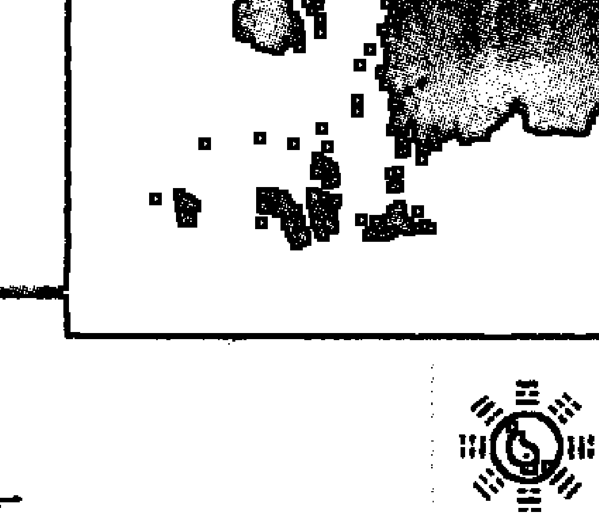

| 合<br>死乙<br>心己 | 阴<br>惊壬<br>蓬癸 | 蛇<br>开丁<br>任辛 |
| :--- | :--- | :--- |
| 虎<br>景丙<br>柱庚 | 戊 | 符<br>休庚<br>冲丙 |
| 武<br>戊杜辛<br>芮丁 | 地<br>伤癸<br>英壬 | 天<br>生己<br>辅乙 |

1.  首先要分清主客队，在泰国曼谷比赛，中国距泰国较近为主队，德国距泰国较远为客队。
2.  以地盘时干丙为主队，代表中国女子足球队，落兑宫，庚加丙为太白入荧，为客进利，为主破财不利。上乘值符吉神，值符为裁判，与主队同宫，说明裁判偏向中国女足。临天冲凶星，很厉害，但天冲星属木，受宫克，又受月令亥水泄之，所以为休囚之象，兑宫主二、七数，取二数。断中国女足要输掉两个球。
3.  以天盘时干丙为客队，代表德国女子足球队，落震宫，震为足，不愧是一支足球劲旅。丙加庚为荧入太白，临天柱星为破军星，说明德国女足敢打敢拼，上乘白虎，象猛虎一般凶猛厉害。景门为技术指导临宫，说明德国队教练指导有方。月令亥水生助震宫，对客队有利，德国女足胜。
4.  辛为金牌，地盘辛落坤宫，丁加辛为朱雀入狱，罪人释囚，逢马星，金牌要跑掉了，又逢空亡之地，空即为没有，得不到。天盘辛落艮宫，辛加丁为狱神得奇，经商求财获利倍增，囚人逢天赦释放。

体育交安预测

### 实例三、预测2004年世界VS中国乒乓球对抗赛

2004年世界VS中国乒乓球对抗赛，12月15日19点多在湖南省长沙市会展中心举行。我按比赛时间起了一个奇门局，预测后对全家人讲，今天晚上这场比赛竞争很激烈，两家打得难分难解，两个队技术不相上下，最后的比赛结果是中国明星队胜，世界明星队负。

19点多全家人都坐在电视机前观看比赛。第一组是中国明星队的马琳对世界明星队的瓦尔德内尔，第一局马琳以11：8战胜瓦尔德内尔。第二局是马琳以11：5取胜，第三局马琳以11：9取胜。最终马琳以3：0战胜瓦尔德内尔，给中国明星队赢得了一局。

第二组是中国明星队的孔令辉对世界明星队的萨母索诺夫，第一局孔令辉以9：11负于萨母索诺夫。第二局孔令辉以11：3胜萨母索诺夫。第三局孔令辉以11：8胜萨母索诺夫。第四局孔令辉负于萨母索诺夫，第五局孔令辉又胜，最终孔令辉以3：2胜萨母索诺夫。

第三组是中国明星队的王皓对世界明星队的波尔，王皓年轻有为，波尔沉着老练，最后波尔以3：1胜王皓。

第四组是中国明星队的陈玘对世界明星队的施拉格，第一组陈玘以11：12负于施拉格，第二局陈玘进攻激烈，敢打敢拼，以11：5胜施拉格，第三局陈玘又以11：8获胜，第四局、第五局施拉格均胜陈玘，最终施拉格以3：2胜陈玘。

以上四组比赛中国明星队与世界明星队打了个平手：2：2平。关键是看最后一组谁胜谁负。比赛到此，场上中国球迷喊起了口号中国队加油。

第五组是中国明星队的王励勤对世界明星队的柳承敏，第一局柳承敏以11：9获胜，中国球迷又喊起口号：王励勤加油。第二局王励勤以11：7获胜，第三局王励勤越打越坚强，以11：3获胜，第四局柳承敏以11：6胜王励勤。

## 奇门遁甲解真

这时王励勤和柳承敏打了个平手：2:2平。第五局的比赛是关系到今天晚上中国明星队赢还是世界明星队赢的大事。中国球迷喊着口号给王励勤加油。王励勤主动出击，越战越猛，以11:4胜柳承敏。二人比赛的结局王励勤3:2胜柳承敏告终。今天晚上的比赛是中国明星队以3:2胜世界明星队。

2004年12月15日 19点

甲申年丙子月戊辰日壬戌时

阴四局、甲寅旬，天任星值符落九宫，生门值使落九宫

| 蛇 | 符 | 天 |
| :--- | :--- | :--- |
| 休 辛<br>值 戊 | 生 癸<br>任 壬 | 伤 己<br>冲 庚 |
| 阴<br>开 丙<br>心 己 | 乙 | 地<br>杜 戊<br>辅 丁 |
| 合<br>惊 丁<br>柱 癸 | 虎<br>乙 死 庚<br>芮 辛 | 虎<br>景 壬<br>英 丙 |

分析：

1.  在中国比赛，以地盘时干壬为中国明星队，落离宫，上乘值符，值符为裁判，与值符同宫，说明裁判对我方有利。癸加壬复见腾蛇不吉，临生门吉门，天任星吉星。生加癸不吉，生加景主阴人小口不宁及文书事后吉。说明中国队在比赛中失误，最后还是吉利，也就是说能赢。
2.  以天盘时干壬为世界明星队，落乾宫，壬加丙为水蛇入火，

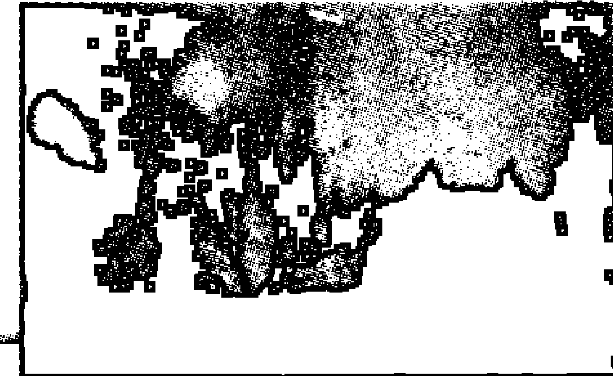

凶。临景门为门克宫，临天英星为星克宫，不吉。景门为技术指导，落乾宫与天盘壬同宫，说明世界明星队教练技术很好，上乘玄武说明世界明星队的运动员有点迷糊，沉不住气，心里发慌。
3.  辛为金牌，天盘辛落巽宫为入墓，辛加戊为困龙被伤，凶。逢天蓬星大凶，金牌难得。地盘辛落坎宫，逢空之，现在是子月，坎宫填实而不空，得金牌有望。
4.  从另一个角度看，地盘壬落离宫，克天盘壬落宫，主队赢，客队输。辛为金牌落巽宫，生助地盘壬落宫，与天盘壬发生冲克，故断中国明星队赢。世界明星队输。

## 第十六章 军事事件预测

## （一）怎样取用神

预测战争，以值符为主方，以庚为客方，值符落宫得三奇三吉门吉格者，克庚落宫，是主方胜。如果六庚落宫得三奇三吉门吉格者，克值符落宫，则客方胜。

凡排兵布阵打仗，以景惊二门进行占测，经曰：“景门宜破阵”，又，治理国家的方法要看惊门。当以值符所落之宫为主，以庚所落之宫为客。值符落宫克六庚落宫，则主胜，六庚落宫克值符落宫，则客胜。又以落宫旺相休囚论胜负，落宫旺相者为胜，休囚者为败。如果主方得景门和惊门临宫或此二门之宫与客方之宫相生，则客方胜利，如果主方落宫与客方落宫相生，双方到来之后必定讲和。如果主方和客方所落之宫皆乘旺相，又都得景门和惊门，又不相刑克，其战斗力相等，两家互相害怕，不战而退。如果六庚为值符，也就是主方与客方同宫，两家交锋不分胜败。又日干加六庚，主方胜利，六庚加日干客方胜利。

凡预测攻城，以六庚为攻者，以天禽星守者。六庚乘旺相，得开门加临中五宫，此城必破。又看地盘天禽星所乘之宫，得旺相及吉门者，其守将是不可去擒拿的，否则必死无疑。

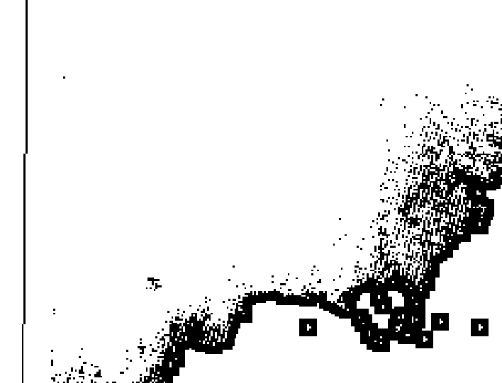

凡预测守城，天禽星为守者，天蓬星，六庚为攻者。天禽星落宫临开门、休门、生门、景门、又旺相，又临丙奇，其城攻不破，若不临旺相或吉门吉格，再犯天蓬、六庚和中宫，此城守不住。

测敌兵来不来，以六庚为用神，六庚落内盘为来，六庚落外盘为不来。六庚落宫克六庚，则敌人安营不稳，自惊而退。如果六庚克所落之宫，被克之宫又逢玄武、天蓬、白虎之神，必然是大战一场。庚临九天则大张声势，鸣鼓而进。庚临九地，则偃旗息鼓而来。如果敌人已入境，测何时离去，六庚落内盘为不离去。六庚落外盘为离去。至于敌人来去的时间，以庚下之干为敌人来去的时间。

测军事情报，以景门为用神。景门落外盘消息来的慢，景门落内盘消息来的快。景门临吉门吉格为情报可靠。景门临凶格为诈信，遇空亡属谣言。

预测作战部署正确与否。以值符为上级领导，开门为官长。开门落宫受值符落宫克制，又处于休囚入墓状态，而无吉星相助，说明作战计划部署有错误，必然遭到上级领导的批评或撤职查办。如果值符落宫生开门落宫，开门又克庚，说明作战部署正确，得到上级领导的表扬或嘉奖。

## （二）实例解析（2例）

### 实例一、美伊战争能否打响

超级大国美国雄心勃勃妄想逞霸世界，经常在世界各地挑起战争。美国企图垄断伊拉克，以检查销毁大规模杀伤性武器为由，强行进住伊拉克，遭到伊拉克人民的坚决反对，美国扬言武力征服伊拉克，全世界人民极力反对美国对伊拉克动武。联合国秘书长安南多次调解，未达成协议，美伊形势日趋紧张。

2003年2月18日上午10点，鹿泉市，张林海问：“你着美伊战争能否打响？”我按问事时间起了一个奇门遁甲局，分析后说：“美伊之战不可避免。阴历二月战争打响。”

结果，阴历二月十八日战争打响。

2003年2月18日10点

癸未年甲寅月壬戌日乙巳时

阳二局、甲辰旬，天心星值符落一宫，开门值使落七宫。

| 合 | 虎 | 武 |
| :--- | :--- | :--- |
| 景己<br>冲庚 | 死庚<br>辅丙 | 惊丙<br>英戊 |
| 阴<br>杜丁<br>任己 |  | 地<br>辛开戊<br>芮癸 |
| 蛇<br>伤乙<br>值丁 | 符<br>生壬<br>心乙 | 天<br>休癸<br>柱壬 |

分析：

1.  为什么断美伊战争能打响。
    预测战争，庚为攻方代表美国，值符为守方代表伊拉克。庚落离宫为沐浴之地，为得天时，逢死门为不得人合，寅月庚落离宫为旺地，庚加丙为太白入荧贼格，临死门，上乘白虎，说明美国态度坚决，军事力量强大，一定要打伊拉克。
    天心星为值符代表伊拉克，落坎宫，寅月坎宫为休囚之地，月干癸为朋友落乾宫，生助值符落宫，正符合俄罗斯支持伊拉克的现实。但是，寅月癸落乾宫为休囚之地，可见俄罗斯无力全力以赴

## 奇门遁甲解真

支持伊拉克。庚落离宫，值符落坎宫，发生互相冲克，战争不可避免。
    天禽星也为守方，代表伊拉克落兑宫、寅月兑宫休囚，辛加癸为天牢华盖，日月失明、误入天网，动止乖张，开加惊主百事不利，庚落离宫克天禽星落宫，战争非打不可。
    时干乙为所测之事落艮宫，临伤门主格斗，伤加乙主求谋不得，反防盗失财，上乘腾蛇主阴险狡诈，临天蓬星主大凶，战争在所难免。
    日干壬为伊拉克落坎宫，时干乙奇代表美国落艮宫，时干克日干，战争非打不可。
    六合代表联合国落巽宫，不克庚落宫，不能制止美国对伊动武。天禽星为伊拉克落兑宫克六合落宫，说明伊拉克不听联合国的话，可见联合国指挥失灵，必然开战。

2.  为什么断美伊战争在阴历2月打响。
    目前震宫空亡，二月填实，真正生助庚落宫，美国真正得天时地利，开始进攻伊拉克；时干为应期，时干为乙，二月为乙卯月，正应二月战争打响；值符落宫为应期，天心星值符落坎宫，主一、六数，取一数为一个月，也是在二月开战。

### 实例二、美伊战争能打多久

2002年11月联合国恢复对伊拉克的武器核查以后，美国政府加紧向海湾地区调兵遣将，企图在联合国通过对伊拉克动武，遭到俄罗斯、中国、德国、法国等多国反对。到2003年3月美英联军逐步完成了对伊拉克军事部署的战略包围，在联合国达不成对伊拉克动武协议的情况下，美英政府悍然发动了对伊拉克的军事进攻。

2003年3月20日10点，我正在河北省周易研究会，抱犊寨研究基地学习研究周易，来了两位顾客，自称是北京来抱犊寨观光旅游的，看到河北省周易研究会座落在此处，就上楼来了。见面就说我俩很喜欢周易，今天巴格达当地时间5点35分美英联军向伊拉克发动进攻，请老师预测一下，看这场战争能打多久，谁胜谁负。我按问事时间起了一个奇门遁甲局断：“这场战争美国必胜，伊拉克必败，立夏前战争结束，具体时间为44天，请注意观察战争发展势态，等待验证奇门预测的准确与否。5月14日受朋友之邀去邯郸武安市办事，5月15日下午无事在武安市蓝天宾馆看电视，从电视字幕中看到美国总统布什宣布美伊战争从3月20日打响，到5月2日结束，共计44天时间。”

2003年3月20日10点
癸未年乙卯月壬辰日乙巳时
阳四局、甲辰旬、天任星值符落三宫，生门值使落九宫。

| 蛇 | 阴 | 合 |
| :--- | :--- | :--- |
| 休 乙<br>冲 戊 | 生 戊<br>辅 癸 | 伤 癸<br>英 丙 |
| 符<br>开 壬<br>任 乙 |  | 虎<br>己 杜 丙<br>芮 辛 |
| 天<br>惊 丁<br>值 壬 | 地<br>死 庚<br>心 丁 | 武<br>景 辛<br>柱 庚 |

分析：

1.  为什么说美国必胜，伊拉克必败。
    预测战争，庚为主动进攻一方，甲即值符为防守一方。庚落坎宫为死地，说明美国在伊拉克打仗不占地利，临天心星，说明美国有计划地将战略决策部署完好，天心星代表天时，落坎宫为得天时，表明美国在军事上占绝对优势，庚临死门，为不得人和，遭到各国人的反对，另一方面也说明美国坚决攻打伊拉克的决心不变，上乘九地说明美国早已蓄谋已久，有部署地准备用较长的时间打击伊拉克，庚加丁为亭亭之格，因私匿起官司口舌，门吉有救，门凶事必凶，死门凶门临之，必然是美国大量消耗人力物力，破财很大，庚加丁代表主客关系，地盘丁为主，为伊拉克，天盘庚为美国，虽然是丁克庚，说明伊拉克敢于和美英联军交战，但是丁奇落坎宫为火入水乡，克不住美国，伊拉克必败，美国必胜。
2.  值符为守方代表伊拉克，天任星值符落震宫，临天盘壬，壬落震宫为死地，为不得地利，天任星落震宫为不得天时，说明伊拉克军事力量不强，与美国相比悬殊太大，临开门吉门、为门克宫，为不得人和，说明伊拉克本国人民不团结，壬加乙为小蛇得势，说明开战后越打越厉害，越残酷，损失，伤亡越惨重，上乘值符，值符为八神领袖，为国家首领，逢空亡之地，说明这场战争直接危协到国家领导人的安危，有政府灭亡之危险。
3.  时干为美伊战争，时干乙奇落巽宫为沐浴冠带之地，表明战争向纵深发展，天冲星临宫，说明美国来势凶猛，战争越打越大波及伊拉克全国，休门为人盘落巽宫入墓，说明这次战争人员伤亡惨重，上乘腾蛇主缠绕，说明伊拉克死死咬住美国不放，美国被缠在伊拉克不会马上撤出来。休加杜主破财，说明这场战争打得得不偿失。损兵折将，双方破财伤人极其惨重，休加乙主求谋不得，说明美国妄想彻底统治伊拉克达不到目的，还是要由伊拉克人民自己治理国家。天盘乙为客代表美国，地盘戊为主代表伊拉克，客克主，美国必胜。
4.  值使门也为这次战争，生门值使落离宫，临戊加癸，天盘戊代表美国，地盘癸代表伊拉克，也是客克主，故美国必胜，伊拉克必败。
5.  为什么断立夏前战争结束，历时44天。
    六合为联合国落坤宫，二月为卯月，联合国落宫休囚，庚为美国落坎宫，联合国克不住美国，三月为辰月坤宫旺相，六合落宫克庚落宫，美国又受三月辰土之克，坎水入辰土之墓，遇辰月也为入墓，故为立夏前战争结束；时干落宫数为期限，时干乙落巽宫，巽宫主三、四、五、八数，奇门遁甲以后天八卦数为主，兼看其它数，取四数，故断战争持续44天。

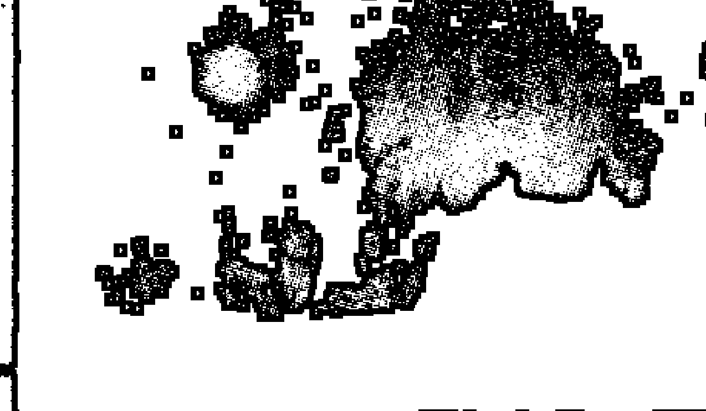

## 第十七章 其他杂项预测

## 实例解析（14例）

### 实例一、一卦多断

2004年5月11日午时，我正在河北省周易研究会抱犊寨基地值班，来了一位中年男子自我介绍说：“本人是平山电厂职工姓张，今天专程来省周易研究会求测婚姻。”我问：“你是那年出生？”回答：“1963年生人，妻子是1962年生人。”我立即按问事时间起局，看局之后说：“你的婚姻不能白头到老，有中途夭折之象，现在已经不存在了。”来人反驳：“不可能吧。”我说：“你们夫妻关系很好，不是离异，而是你妻子身体有病，死亡离你而去。”张某说：“你能看出这些事情？”我继续说：“你妻子的病是消化系统疾病，说具体点是胃病。2000年去世。”张某听后大惊佩服地说：“奇门遁甲测事真准确，你测的完全准确。你从卦上还能看出什么事情？”我说：“你有三个孩子，将来都是大学生。”张某说：“说得对，是有三个男孩，没有女孩，现在大儿子正在上大学，其余两个儿子学习也名列前茅。妻子去世后好心人给我牵线搭桥介绍过好几个对象都没有成功。现在又有人给我介绍了一个65年出生的妇女，带有一个女孩，请你给看看能否谈成？”我看卦后说：“你本人很愿意谈成，但是这桩婚姻谈不成。因为女方的母亲不同意。”张说：“你测的很

## 奇门遁甲解真

准，女方没意见，就是她母亲出面干涉这桩婚事。”我说：“今年你的婚事谈不成，明年可以谈成。”

张某测完刚出门，又来了一个唐山的女同志，她说：“我们单位到抱犊寨旅游，看到河北省周易研究会研究基地在此座落，我就上楼了。先生请你给我预测一下我的婚姻。”我看了看表正是12点45分，午时未过，本局能用，我问道：“你是哪年出生？”女士回答：“1968年生人，我姓赵。”我说：“小赵，现在你们夫妻间闹矛盾，经常吵嘴。但是离不了婚，因为你们夫妻两个都不同意离婚。”小赵说：“是，经常吵嘴，我和丈夫都没有离婚计划。”小赵接着问：“问题出在哪方面？”我说：“关键问题在你身上，你本人个性太强，脾气太扭，得理不让人，更甚者无理也取闹。”赵某说：“测得很准。”我继续说：“还有一个很重要的情况不知能讲不能讲？”赵说：“可以讲。”我说：“你现在有一个情人，你丈夫有些发觉，但又没有证据。”赵某说：“我的个人隐私你都能看出来？”我问：“对不对？”赵如实回答：“现在是有一个男同志和我很好，已经有两年了。他有家庭不可能离婚，我丈夫确实有些疑神疑鬼的，但是他又没有证据所以经常为这件事情吵嘴。”我说：“你的婚姻很坎坷，有情人出现更不会顺利，到2005年阴历八月有婚姻危机，请你注意吧。”

2004年5月11日午时
甲申年己巳月庚寅日壬午时
阳七局、甲戌旬天任星值符落二宫，生门值使落七宫

| 地 | 天 | 符 |
| :--- | :--- | :--- |
| 惊乙<br>心丁 | 开辛<br>蓬庚 | 休己<br>任壬 |
| 武<br>死戊<br>柱癸 | 丙 | 蛇<br>生癸<br>冲戊 |
| 虎<br>丙景壬<br>芮己 | 合<br>杜庚<br>英辛 | 阴<br>伤丁<br>辅乙 |

分析：

1.  为什么断张某的婚姻中途夭折。
    六合主婚姻落坎宫，庚加辛为白虎干格，不宜远行，远行车折马伤，应理解为夫妻的漫长的人生道路上会有人伤亡。逢杜门表示此路堵塞不通，不能白头到老。杜加庚主因女人讼狱被刑。刑为痛苦之象，可以理解为在婚姻上因女人痛苦。杜加辛主打伤人词讼，男人小口凶，应理解为夫妻生活中有人伤亡。故断伤妻。六合主婚姻，逢庚为阻隔，奇门遁甲中庚是最凶的符号，婚姻逢庚必然中途夭折。辛为错误，六合下临地盘辛，说明这桩婚姻是错误的结合，有错误就纠正，纠正错误婚姻必然夭折。
2.  为什么断婚姻不是离异而是妻子病故。
    测婚姻乙庚为夫妻，庚为丈夫落坎宫与六合婚姻同宫，为比和之象，说明丈夫对婚姻满意，庚又生乙奇妻子落宫，表明丈夫很关心妻子，夫妻关系很好，怎么会离婚呢？再看妻子是1962年生人，年命壬落艮宫为衰病之地，临天芮病星，说明妻子身体素质差，经常有病，壬加己为反吟蛇刑，主官讼败诉，大祸将至，顺守可吉，妄

其他杂项预测动必凶。应理解为妻子常年有病，不能劳累，不能操心生气，若犯此两条就会大祸临头。故断妻子病故。

## 3、为什么断妻子是胃病，2000年去世。

测病天芮星为用神，今天芮星落艮宫，艮宫属土主脾胃，上乘白虎表明病情严重。2000年为庚辰年，太岁庚落坎宫，妻子年命壬落艮宫克太岁，地支太岁辰在巽宫克年命落宫，被太岁所克又克太岁必有灾。年命壬落艮宫，壬十己为辰戌相冲，久病逢冲则死，断2000年妻子因胃病去世。

## 4、为什么断张某有三个孩子都是男孩都是大学生。

时干为子女，时干壬落艮宫，艮宫有寅木，木主三数，故有三个孩子。艮主少男，为三个男孩。测学历以天辅星为文曲星，景门为试卷，丁奇为学生，天芮星也为学生。今丁奇落乾宫临天辅星，景门落艮宫生丁奇学生，储存了高层次文化的信息。天芮星落艮宫与景门同宫，与天辅星相生。时干壬也为学生落艮宫和天芮星同论。故三个儿子都是大学生。

## 5、为什么说求测者愿意谈成婚事，女方的母亲不同意。为什么今年谈不成明年可以成婚。

日干庚为求测者，对象为乙巳年生人，庚落坎宫生乙奇落巽宫之故。坤宫为母亲克六合与庚所落之宫，今年为甲申年，地支太岁在坤宫克六合婚姻之宫，甲申庚，庚也为太岁与六合同宫，庚为阻隔之神，为大凶神，故今年不能成婚。明年为乙酉年，酉为太岁生六合与日干庚落宫，乙也为太岁，六合落宫与乙奇落宫相生。故明年可成婚。

下面是唐山赵女士问婚姻。

## 1、为什么说赵女士现在夫妻不和但是离不了婚。

赵女士为戊申年生人，戊落震宫，戊癸相合，癸为丈夫落兑宫，相互冲克，故为闹矛盾。六合为婚姻落坎宫，癸落兑宫生坎宫，坎宫又生戊落震宫，所以两人都没有离婚的想法。

## 2、为什么断关键问题在赵女士身上，其性格特点由何断出。

赵女士年命戊落震宫临死门，死门为性格刚强、脾气拧，临天柱星，上乘玄武，天柱星主口舌是非，玄武暗藏朱雀也主口舌是非，玄武又主迷糊，所以说赵女士不通情达理，得理不让人。

## 3、为什么说赵女士有情人已被丈夫发现，又没有证据。

赵女士年命戊落震宫，上乘玄武主小偷，在这里为偷情，所以断有情人。癸为丈夫落兑宫冲克玄武，故被丈夫发现。六合为证据逢杜门，杜门主保密又逢庚为阻隔，故丈夫拿不到证据。

## 4、为什么断2005年阴历八月有婚姻危机。

2005年为乙酉年，癸为丈夫落兑宫临太岁之地，赵女士年命戊和情人玄武同落震宫，与兑宫又冲又克，冲克太岁必有灾，故有婚姻危机。

### 实例二、测妾高寿时早已命归阴

2003年8月5日11点，我正在周易研究会办公室写论文，进来了两位中年男士和一位60多岁的男人。“这是河北省周易研究会基地吗？”老年男人带着怀疑的目光问：“什么事都能预测吗？”我回答：“只要与你有关的事，我都能预测。”“我是1939年生人，妻子与我同岁，请预测妻子能活多大岁数。”我立即起了奇门遁甲局，看局后说：“你妻子今年阴历五月已经因病去世了，还测什么寿命？你是来拿已故之人考试我吧。”其它两位男子说：测的很准确。他妻子去世后感到孤单寂寞，今天主要是想预测一下还能不能再找一个老伴欢度晚年。这一证实，我心中不悦，感到他拿一个死鬼来捉弄人，提到再婚，干脆毫不客气地说：“你没有婚姻了，找什么老伴。”我问：“你们是什么地方人士？”一个中年人告诉我，他们是邯郸武安人。“我给你们一个电话号码，如果找上老伴给我来个电话。”

结果：直到2004年下半年，我写这篇论文还未找到老伴。

2003年8月5日11点
癸未年己未月庚戌日壬午时
阴七局、甲戌旬，天心星值符落三宫，开门值使落七宫

| 天 | 地 | 武 |
| :--- | :--- | :--- |
| 景丁<br>蓬辛 | 死乙<br>任丙 | 惊壬<br>冲癸 |
| 符<br>杜己<br>心壬 | 庚 | 虎<br>开辛<br>辅戊 |
| 蛇<br>伤戊<br>柱乙 | 阴<br>庚生癸<br>芮丁 | 合<br>休丙<br>英己 |

### 分析：

### 一、为什么断妻子已经去世？

- 1、乙奇为妻子落离宫为长生之地，测寿命老年人遇长生之地为凶兆，死十乙主求事不成，死十丙主信息忧疑，关键是逢死门，上乘九地为大凶，死门落离宫为凶门受生事更凶，上乘九地为入阴曹地府之象；再兼看地盘乙奇，地盘乙奇落艮宫逢伤门主伤亡，伤十乙主求谋不得反防盗失财，伤十戊主失脱难获，伤十生主大凶，上乘螣蛇主惊恐虚诈。凶信息如此之多怎么能生存。
- 2、时干为所测之事，时干壬也为妻子落坤宫为长生之地凶。壬十癸为幼女奸淫家有丑事外扬，惊十死主宅中怪异而生是非凶，惊十壬主官司囚禁病者大凶，惊十癸主凶，上乘玄武凶神，玄武为盗，可以理解为把妻子偷走了，逢马星主妻子跑了，逢空亡之地，主人没有了。
- 3、值使门也为所测之事，开门值使落兑宫，辛十戊困龙被伤，屈抑守会尚可，妄动遭祸殃，开十惊主百事不顺，开十辛主阴人道路，上乘白虎主疾病死亡，交通事故之事，逢空亡之地，主没有妻子。
- 4、妻子乙奇落离宫克六合婚姻落乾宫。六合临休门，休门虽为吉门，但在这里应为长期休息之婚姻，乾宫属金克六合。
根据以上四条信息基本上可以断定妻子已经去世。但是，不能百分之百确定预测准确性，必须再看问卦人讲的话是否属实，如果问卦人讲的是假话，才可断定妻子已经去世。
- 5、问卦人为己卯年生人，己落震中逢杜门主保密，不讲实话，可见其中有诈。景门和丁奇都为消息均落巽宫，上乘九天主说大话，假话、空话，信息不实。还可兼看地盘景门，地盘景门在离宫，上乘九地主潜藏，也是不讲实话。再看地盘丁奇，地盘丁奇落坎宫为火入水乡，临天芮病星，可见在信息上出了毛病和问题，上乘太阴主搞阴谋诡计。
根据前四条信息，结合求测者讲假话，可以拍板定案：妻子已经去世了。

### 二、为什么断妻子是因病在2003年5月去世。

乙奇落离宫，五月火正旺，2003年为癸未年，太岁癸落坎宫，乙奇与太岁发生冲克。乙奇虽落旺宫，但是太岁掌管一年的生杀大权，冲克太岁必有灾，妻子冲克太岁，当然其灾应在妻子身上。太岁冲克乙奇时，天芮病星也冲克乙奇，必然是因病而亡故。

### 三、为什么断求测者找不到老伴。

求测者年命己落震宫，己十壬为地网高张，狡童佚女奸情杀伤凶，又辰戌相冲，破财不利，杜十己主私谋害人招非，杜十壬主奸盗之事凶，可见本人运气不行。六合主婚姻落乾宫克年命己落宫，六合逢休门，婚姻长期休息之象。年命己落震宫，甲为其再找的老伴，奇门遁甲局中，甲隐藏在值符之下，天心星值符代表其对象，天心星与年命己同宫，逢杜门，为此事堵塞不通，六合落乾宫克天心星与己落震宫。所以找不到老伴。

### 实例三、预测投标能否中标

2004年5月29日，我正在抱犊寨河北省周易研究会基地办公室忙碌着准备今天的工作。上午8点30分突然传来了手机铃声，打开手机听到了对方的讲话--邯郸市郭小林经理。我与郭经理是在2002年河北省周易研究会基地认识的，当时郭经理为朋友求测运气，经验证预测结果准确无误，打那以后，郭经理经常来车接我去邯郸为他的公司和朋友的事情预测和调理风水，工作繁忙，事情紧急时，郭经理就来电话求测。今天来电话求测：有一个工程要进行公开投标，看本人能否中标。我按来电话的时间起了奇门遁甲局，十分钟后郭经理又来电话问预测结果，我说：“这次竞争投标你中不了标。”郭问：“为什么？”我解释道：奇门遁甲理论知识你不懂，电话里也无法解释清楚。我要求你将这次投标结果给我回个电话，以验证奇门遁甲的准确率。郭经理答应了。下午6点30分接到郭经理回音：这次投标未中。

- 2004年5月29日8点30分
- 甲申年己巳月戊申日丙辰时
- 阳八局、甲寅旬，天辅星值符落六宫、杜门值使落六宫

| 虎 | 武 | 地 |
| :--- | :--- | :--- |
| 开丙<br>心癸 | 休庚<br>蓬己 | 生戊<br>任辛 |
| 合<br>惊乙<br>柱壬 | 丁 | 天<br>伤壬<br>冲乙 |
| 阴<br>死辛<br>芮戊 | 蛇<br>景己<br>英庚 | 符<br>杜癸<br>辅丙 |

### 分析：

### 一、为什么这次投标郭经理不能中标。

- 1. 奇门格局全盘反吟主大凶，投标不能中标。
- 2. 时干、值使门为标，日干为求测者，天蓬星为竞争对手，日干戊落坤宫为衰病之地，戊+辛为青龙折足，说明郭经理当前运气不好。
- 3. 时干丙奇落巽宫克日干戊所落之宫，时干克日干不能中标。杜门值使落乾宫，日干戊落坤宫生值使门落宫，也是不能中标之象。
- 4. 天蓬星为竞争对手落离宫，时干丙为标落巽宫生助天蓬星落宫，可见标落对手之囊；值使门为标落乾宫，天蓬星落宫克乾宫，也主被竞争对手夺走之象。
- 5. 月干己也为竞争对手，天盘己落坎宫，被值使门落乾宫生助；地盘己落离宫，被时干丙奇落宫生助。这些信息表明，此标被竞争对手夺走。

### 实例四、被交警队扣留的车辆能否要回来

2002年6月25日14点30分，我陪朋友在抱犊寨风景区旅游，回到办公室时，有一位中年男士在研究会基地门口等待。见我回来他主动介绍说：“我是沧州人叫刘伟刚，前两天我开着侄子的桑塔纳汽车去廊坊市办事，因故被交警队扣了车，和交警队说了两天好话人家也不放车。今天上午我在石家庄又找了一个熟人请求帮助要回车辆，熟人答应帮忙了，可是我心里没底，下午就专程来河北省周易研究会请老师预测，看车能否要回来？什么时间要回来。我是1949年生人。”我起好奇门局看了几分钟说：“你在石家庄找的这个朋友能帮上忙，车能要回来，但是要破点小财，大概是1300元左右，6月28日车就要回来了。”刘伟刚听后高兴的说：如果6月28日要回车了，我一定来石家庄答谢朋友并来周易研究会看望你。

7月5日刘伟刚又来到周易研究会，一见面兴奋地说：“老师预测的真准确，时间一天也不错，果真破财1300元左右，在6月28日要回了车。”

- 2002年6月25日14点30分
- 壬午年丙午月甲子日辛未时
- 阴九局、甲子旬，天英星值符落六宫，景门值使落二宫。

| 虎 | 合 | 阴 |
| :--- | :--- | :--- |
| 伤乙<br>蓬癸 | 杜己<br>任戌 | 景丁<br>冲丙 |
| 武<br>生辛<br>心丁 | 壬 | 蛇<br>死癸<br>辅庚 |
| 地<br>休庚<br>柱己 | 天<br>开丙<br>芮乙 | 符<br>惊戊<br>英辛 |

### 分析：

- 1、为什么断石家庄的朋友能帮上忙。
日干为求测者，日干戊落乾宫上乘值符，值符是八神之领袖、可逢凶化吉遇难呈祥百恶消散，值符为贵人，为求测者的朋友，也为领导，乾宫为领导，那么值符落乾宫为大领导，高层领导，时干辛为下级落震宫，值符落宫克时干落宫。伤门为车落巽宫，值符在乾宫冲克伤门落宫。
- 2、为什么断车能要回来。
日干戊为问卦人落乾宫，克伤门车落宫，时干辛为所测之事落震宫，被日干落宫所克，值使门也为所测之事，景门值使落坤宫，生助日干戊落宫；刘伟刚是1949年生人，年命己落离宫，得天时，临杜门占人合，上乘六合，运气不错，伤门为车落巽宫，生助年命己落宫，时干辛为所测之事落震宫，也生助年命己落宫，故车能要回来。
- 3、为什么断破财一千三百元。
生门为财落震宫，与时干辛同宫，上乘玄武小盗之神，主破财，震宫主三数，故断一千三百元左右。

### 4、为什么断6月28日车能回来。

值使门落宫的宫数为应期，景门值使落坤宫，坤宫主二、八、五、十数，取五数，5天左右回来。时干所落之宫数为应期，时干辛落震宫，震宫主三、四、八数，取四数，4天回来。值使门所落之干为应期，值使门临丁奇、第四天为丁卯日，故6月28日可能要回车，根据以上三条信息、总结定为第四天，也就是6月28日丁卯日车回来。

### 实例五、投标未中

2004年8月11日15点多，我正在河北省周易研究会抱犊寨研究基地为游客进行预测，突然电话铃响了，接通电话传来了我的朋友康明辰的声音：有一个工程项目今天上午已经进行了投标，我单位也参加了投标，请你预测一下我单位能否中标？我说：现在正在忙着为顾客预测。请他30分后再来电话。顾客走后我立即按老康来电话的时间起了奇门遁甲局，待老康来电话时我告诉他预测结果：你和这家工程单位的领导关系很好。老康肯定说：“对，我们是老同学。”我接着说：“虽然是老同学，但是这次投标你们单位不能中标。”说到此老康有点不太相信我的预测，我说等投标结果出来后请他给我回个电话。老康连声说道：“一定给你去电话。”

8月12日下午，康明辰给我来了电话：“真是如你所测，这次投标没有中标。”

2004年8月11日15点 甲申年壬申月壬戌日戊申时
阴八局、甲辰旬、天辅星值符落八宫，杜门值使落九宫

| 地 | 武 | 虎 |
| :---: | :---: | :---: |
| 辛伤丁<br>芮壬 | 杜己<br>柱乙 | 景庚<br>心丁 |
| 天<br>生乙<br>英癸 | 辛 | 合<br>死丙<br>蓬己 |
| 符<br>休壬<br>辅戊 | 蛇<br>开癸<br>冲丙 | 阴<br>惊戊<br>任庚 |

### 分析：

- 1、日干壬为求测者落艮宫，为衰病之地，不得地利。临天辅星虽吉，但星克宫为不得天时。临休门吉门，但宫克门为不得人和。虽然上乘值符，说明和领导关系不错，但是，逢空亡，说明领导起不上作用。表明求测者目前运气很差。
- 2、时干戊为标落乾宫，为入墓，戊十庚为值符飞宫，吉事不吉，凶事更凶，求财没利。惊十戊主损财。惊十庚主道路损折，凶。说明中标也不能挣钱。上乘太阴，说明标底是经过密谋策划的，而且很保密。日干壬生助时干戊，不能中标。
- 3、值使门也为标，杜门值使落离宫，己十乙为墓神不明，地户逢星凶。杜十己主私谋害人招非。杜十乙为凶。上乘玄武主破财，说明中标与否均不能挣钱。杜门落宫生助日干壬落宫。但是，日干落宫逢空亡，不受其生，断不能中标。
- 4、景门为答辩书落坤宫，逢庚为阻隔，庚十丁为亭亭之格，凶。说明答辩书漏洞百出，不切合实际。上乘白虎主答辩书受伤，石沉大海。此局为五不遇十，也是不能中标之象。

### 实例六、平山县投标一定能中

2001年2月11日下午2点，石家庄市的刘振良来电话问：“平山县有个工程项目要公开召标，我单位要参加这次投标，你预测能否中标？”我让他等15分钟再来电话。我立即按问事时间起了一个奇门遁甲局。15分钟后刘经理再来电话时我告诉他预测结果：“这次投标你们单位一定能中标。等投标结果出来后，请你给我回个电话。”刘经理听到预测结果高兴地满口答应：“一有结果我马上给你去电话报喜。”

2月15日刘经理给我打来电话报喜：“我们单位中标了。奇门遁甲真神奇。”

2001年2月11日14点
辛巳年庚寅月乙巳日癸未时
阳二局、甲戌旬，天冲星值符落七宫，伤门值使落三宫。

| 武<br>杜壬<br>心庚 | 地<br>景乙<br>蓬丙 | 天<br>死丁<br>任戊 |
| :--- | :--- | :--- |
| 虎<br>伤癸<br>柱己 | 辛 | 符<br>惊己<br>冲癸 |
| 合<br>生戊<br>芮丁 | 阴<br>休丙<br>英乙 | 蛇<br>开庚<br>辅壬 |

### 分析：

- 1、日干乙奇为求测者，落离宫为长生之地。乙十丙为奇仪顺遂，吉。上乘九地吉神；地盘乙奇落坎宫，得坎水生助。丙十乙为日月并行，公私谋为皆吉。临休门吉门。说明刘经理这次投标运气不错。
- 2、时干癸为标落震宫，为长生之地。临伤门为动，生助日干落宫，能中标；地盘癸落兑宫，上乘值符又生助地盘日干落宫，也是能中标之象。
- 3、值使门为标，伤门值使落震宫，为旺地，生助日干乙奇落宫，能中标。
- 4、刘经理是1950年生人，为庚寅年，年命庚落乾宫，逢开门吉门，临天辅星吉星，乾宫克时干癸及值使门落宫，说明刘经理能够拿下这项工程，为能中标之象；地盘年命庚落巽宫，与时干癸，值使门伤门落宫比和，也是能中标之象。
- 5、景门为答辩书落离宫，遇寅月为旺相之地，乙十丙为吉格，上乘九地吉神，临天蓬星主大智大慧，说明答辩书作得切合实际。时干癸，值使门伤门落宫又生助景门落宫，断能中标。

### 实例七、预测商店能否转租出去

1997年7月3日21点，我的朋友孙志平来电话说：我从前与单位签订了停薪留职合同，在石家庄开了一个小商店。现在合同到期，要回单位上班，小商店无人经营，我想把商店转租出去，求测看商店能否转租出去？我让其15分钟后再来电话。我立即按问事时间起了一个奇门遁甲局。15分钟后孙志平来电话询问预测结果时，我告诉他：这个小商店今年转租不出去。你另想别的办法吧。

1998年春节期间，我在石家庄见到孙志平，问起商店转租一事，孙说：正如你预测的，我找了几家人，商谈转租商店，都没有转租出去，只好找了一个亲戚给我代管商店，我到单位上班了。

1997年7月3日21点
丁丑年丙午月丙午日己亥时
阴六局、甲午旬，天冲星值符落五宫寄二宫，伤门值使落七宫。

| 阴 | 蛇 | 符 |
| :--- | :--- | :--- |
| 开癸<br>遁庚 | 休丙<br>任丁 | 生辛<br>冲壬 |
| 合<br>惊戊<br>心辛 | 己 | 天<br>伤庚<br>辅乙 |
| 虎<br>死乙<br>柱丙 | 武<br>景壬<br>芮癸 | 地<br>杜丁<br>英戊 |

### 分析：

- 1、时干己为商店落一宫，为绝地，己十癸为地刑玄武，凶。临天芮病星，上乘玄武主有小人捣乱。景十己主官司牵连，凶。景十癸主因奴婢受刑，凶。景门落坎宫，为火入水乡。小商店转租不出去。
- 2、值使门为所测之事，伤门值使落兑宫，宫克门为制。庚十乙为太白逢星，退吉进凶，谋为不利。上乘九天主漂泊不定。临天盘庚为阻隔之神，商店转租不出去。
- 3、开门为商店落巽宫，逢空亡之地，癸十庚为太白入网凶。临地盘庚为阻隔。临天蓬凶星，说明要想转租出去，必须赔钱。故商店转租不出去。
- 4、日干丙为求测者落离宫，开门为商店落巽宫生助日干落宫。

### 实例八、预测投标

我的战友吴建宾是私营企业建筑公司总经理。2004年7月15日早晨5点多从石家庄开车来鹿泉市找我，吴总说：明天上午鹿泉市开发区有一项建筑工程要招标，请你预测一下，我公司在这次招标能否中标。我看了看手表正是六点整，起奇门遁甲局认真分析后，我对吴总说：这次投标你作的方案计划很完善，你的公司能够中标。吴总听后很高兴。我说招标有结果后请给我回个电话。吴总痛快地答应着：放心吧，一定给你回电话。7月16日中午1点钟，战友吴建宾电话里传来兴奋的声音：你的预测真准确，我公司中标了。我连连祝贺。

2004年7月15日6点
甲申年辛未月乙未日己卯时
阴八局、甲戌旬，天柱星值符落七宫，惊门值使落二宫。

| 合 | 阴 | 蛇 |
| :---: | :---: | :---: |
| 壬辅壬 | 死乙英乙 | 辛惊丁<br>丙丙 |
| 虎<br>杜癸<br>冲癸 | 辛 | 符<br>开己<br>柱己 |
| 武<br>伤戊<br>任戊 | 地<br>生丙<br>蓬丙 | 天<br>休庚<br>心庚 |

### 分析：

- 1、时干己为标落兑宫，为长生之地，临值符说明这个项目很好。逢开门，说明是无私无弊，公开招标。临天柱星表明领导招标力度大。太岁庚落乾宫，与时干己落宫比和，表明上级领导对这项招标工作坚决支持。

2、日干乙奇为求测者，落离宫，为长生之地，为占地利。临天英星为占天时，逢死门说明求测者的决心非常大，坚决拿下这个项目，上乘太阴，表明求测者早已密谋策划，作好了投标方案，投标已经胸有成竹。日干落宫克时干落宫，肯定能中标。

3、月干为竞争对手，月干辛落坤宫逢空亡之地，临天芮病星，说明对手投标方案不完善，漏洞百出。辛十辛为六仪击刑、午午自刑，上乘腾蛇主惊恐虚诈，说明竞争对手作的投标方案不切合实际，逢惊门、遇空亡，主说空话，华而不实，月干辛遇空亡，生助时干己，不能中标。

### 实例九、铁路运输业务办不成

2003年9月14日8点30分，石家庄吴伟林给我打电话说：从山西省往石家庄运输煤炭，煤炭的价格谈好了，而且签了合同。现在求测能否联系上车皮。我告诉他15分钟后来电话。我立即按问事时间起了一个奇门遁甲局。15分钟后吴先生又来电话询问预测结果，我说铁路运输业务联系不成。

2003年12月底，吴伟林又给我打电话求测明年运气如何？但他的第一句话却是：“石老师预测的真准，铁路运煤一事到现在也没有联系上车皮，看来此事是办不成了。”

2003年9月14日8点30分
癸未年辛酉月庚寅日庚辰时
阴六局、甲戌旬，天禽星值符落四宫，死门值使落八宫

| 符 | 天 | 地 |
| :--- | :--- | :--- |
| 己开壬<br>禽芮庚 | 休乙<br>柱丁 | 生戊<br>心壬 |
| 蛇<br>惊丁<br>英辛 | 己 | 武<br>伤癸<br>蓬乙 |
| 阴<br>死庚<br>辅丙 | 合<br>景辛<br>冲癸 | 虎<br>杜丙<br>任戊 |

分析：

1、日干庚为求测者落艮宫，为入墓，不得地利。死门临宫主不得人和。天辅星临宫为不得天时。上乘太阴吉神也无济于事。庚加丙为太白入荧，凶。说明吴伟林当前运气不好，所测之事难成。

2、伤门为车皮落兑宫，逢空亡之地，没有车皮。癸十乙为华盖逢星，门吉则吉，门凶则凶，今伤门临宫不吉，为凶。临天蓬星、上乘玄武主破财，不破大财搞不到车皮。

3、开门也为车皮落巽宫，临天芮病星，说明车皮有问题。己十庚为刑格返名，先动者不利，如临阴星则有谋害之情，天芮星为阴星，天禽星为阳星，不吉。开门克宫不吉。壬加庚为太白擒蛇，不吉。开加壬主远行有失，注意破财。开加庚主道路词讼，谋为两岐。开加己主事绪不定。开加杜主失脱，凶。开门落宫又克日干落宫。
断：车皮联系不成。

4、时干、值使门为所测之事。时干庚落艮宫，为入墓，生伤门落宫又被开门所克，车皮搞不成；死门值使主大凶，此事办不成，死门值使落艮宫，也受开门所克。日干、时干同落艮宫，逢死门阻隔之神。值使门又逢庚，庚也为阻隔之神。此事办不成。

### 实例十、山西一行劳民伤财

2003年8月14日9点15分，石市某公司的王经理打来电话说：山西省，太谷县有一家单位今天上午8点半给公司来电话说想要我公司的产品，要求我亲自到太谷县面谈，求测这笔业务能否谈成？我请王经理15分钟后再来电话。我立即按问事时间起了一个奇门遁甲局，15分钟以后王经理再来电话时我告诉他预测结果：太谷县给你来电话讲的不是实话，这次业务谈不成，若去山西则劳民伤财。王经理表示：既然这样，我们就不去了。8月20日王经理给我来电话说：你预测之后，我们重新研究了一下，在会上有些同志坚持亲自跑一趟。我便带了两个人去了一趟太谷县，结果是空手而归，业务没谈成还花了不少差旅费。

2003年8月14日9点15分
癸未年庚申月己未日己巳时
阴八局，甲子旬，天任星值符落七宫，生门值使落三宫

| 合 | 阴 | 蛇 |
| :--- | :--- | :--- |
| 伤己<br>柱壬 | 杜庚<br>心乙 | 景丙<br>蕤丁 |
| 虎 |  | 符 |
| 辛生丁<br>芮癸 | 辛 | 死戊<br>任己 |
| 武 | 地 | 天 |
| 休乙<br>英戊 | 开壬<br>辅丙 | 惊癸<br>冲庚 |

### 分析：

#### 1、为什么说电话讲的信息不实。
丁奇为电话信息落震宫，为病地。丁十癸为朱雀投江，文书口舌是非，音信沉溺不到，凶。临天芮星说明信息不实，水分很大。景门也为信息落坤宫，上乘螣蛇主惊恐虚诈。临天蓬凶星。景十死主惹麻烦，凶。景十丙主文书急迫，火速不利。景十丁主因文书引状招非。证明信息虚假不实。

#### 2、为什么断业务谈不成。
日干己为求测者落巽宫，己十壬为地网高张，狡童佚女，奸情伤杀，凶。临伤门主伤亡，临天柱凶星，又被年干太岁癸乾宫所冲克，说明王经理运气不好；时干为所测之事，时干也为己落巽宫，己十壬为辰戌相冲，冲则散。逢伤门主业务伤亡。天柱星为破军星临宫也主散。被太岁癸落乾宫冲克，业务必然谈不成；值使门也为所测之事，生门值使落震宫，宫克门不吉。丁十癸为朱雀投江，事情办不成。临天芮病星，谈判中遇到具体困难太多。辛十癸为天牢华盖，日月失明，误入天网，动止乘张，同时年干太岁癸又克值使门落宫，故业务不成。

#### 3、从方向来看业务也谈不成。
山西省太谷县位于石家庄的正西方向，看兑宫格局，戊十己为贵人入狱，公私皆不利。死十戊主作伪财。死十已主病讼牵连不已，凶。死十惊主因官司不结，惊疑患病凶。逢死门主阻隔不通。兑宫冲克值使门落宫，又克日干，时干落宫。断去西方肯定不顺利。甲子戊为财，冲克值使门，又克日干，时干，必定是劳民伤财，白跑一趟。

### 实例十一、邯郸先生测运气与业务

2004年3月11日上午10点25分，我正在抱犊寨周易研究基地为人预测，突然接到一个邯郸打来的电话，自我介绍说叫王小龙，1962年生人，在邯郸市机关工作，2000年到抱犊寨研究基地找我预测过，今天想求我再看看这几年的运气，当前想买一个煤矿，能不能办成？如果能办成，什么时间成？我回答：现在正忙着给客人预测，忙完后在给你测，中午12点你来电话将预测结果告诉你。中午12点正王小龙来了电话，我告诉他：从2001年到2003年运气都不好，2001年工作不顺利，有小人告状，提升无望。2002年夏天夫妻关系紧张，妻子提出离婚，2003年婚姻再次出现危机。王小龙说：都对。我继续预测。2004年运气好转，买旧煤矿之事现在办不成，立夏以后能办成。5月16日王小龙电话反馈信息：购买旧煤矿一事已办成，昨天办的手续。5月5日立夏，果真5月立夏后顺利办成，请你选一个开业日期：我帮小王选在5月19如开业典礼。

2004年3月11日10点25分
甲申年丁卯月己丑日己巳时
阳四局、甲子旬，天辅星值符落五宫寄二宫，杜门值使落九宫

| 地 | 天 | 符 |
| :--- | :--- | :--- |
| 伤 壬<br>任 戊 | 杜 乙<br>冲 癸 | 景 戊<br>辅 丙 |
| 武<br>生 丁<br>巽 乙 | 己 | 蛇<br>死 癸<br>英 辛 |
| 虎<br>休 庚<br>心 壬 | 合<br>开 辛<br>柱 丁 | 阴<br>己 惊 丙<br>芮 庚 |

### 分析：

-   1、为什么说2001年工作不顺利，有小人告状，提升无望。
预测过去的运气，以地盘年干为主，兼看天盘年干，测当年运气以日干为主兼看年命。2001年为辛巳年，地盘辛落兑宫，癸十辛为网盖天牢，主官司败诉，死罪难逃，死十惊主因官司不结，忧疑患病凶。死十辛主盗贼失脱难获。上乘螣蛇虚诈之神，这大凶格局生开门工作落宫，开门落坎宫又临天柱凶星，天柱星本身主口舌是非，工作中必然有人告状，值符为领导落坤宫克开门落宫，年命壬落巽宫克值符落宫，地盘辛克年命落宫，这样的格局绝对不能提升。

-   2、为什么说2002年夫妻关系紧张，妻子提出离婚。
2002年为壬午年，地盘太岁壬落艮宫克六合婚姻宫，地支太岁午又冲克六合落宫，六合落坎宫又遇天柱口舌之星，开门虽为吉门但与六合婚姻同宫，可理解为婚姻门打开了，感情要跑了，乙庚为夫妻，乙奇为妻子落离宫冲克六合之宫，庚为丈夫落艮宫，可见妻子虽然提出离婚，但对丈夫还有留恋之意。

-   3、为什么说2003年婚姻再度危机。
2003年为癸未年，地盘太岁癸落离宫，冲克六合婚姻之宫，地支太岁未在坤宫也克六合婚姻落宫。

-   4、购买煤矿之事为何当前不成，立夏之后可办成。
时干己为所测之事，己落乾宫逢空为当前办不成之象。日干也是己与时干同落乾宫为比合，太岁庚落艮宫，说明此事能办成。但是逢空而且日时都落外盘主慢，日干时逢空临马星，冲动马星之时为应期，巳月冲动马星，故立夏之后可办成。

值符为应期落坤二宫，也是外盘主慢，坤宫主二数，应为两个月。立夏以后从时间上为两个月，从这个角度也是四月办成。

日干时干逢空，逢冲为应期，三月为辰月冲动乾宫，用神一次被冲，四月为巳月又冲动乾宫，用神两次被冲。故立夏后可成。
时干所落之宫为应期，时干己落乾宫，乾宫有4数，逢空减半为2数，故两个月办成。
用神旺相为应期，时干己遇巳月为帝旺之地，故巳月可成。

### 实例十二、天津女士测官运局中显示婚姻破裂

2004年“五一”节刚过，抱犊寨风景区亦然象过节一样，好象经过“五一”节的洗礼，呈现出一片欣欣向荣的繁荣景象。我找出过去预测的卦例正在总结经验，上午10点40分，来了一位中年妇女，自我介绍说：“我是天津市人，叫李启明，1966年生人，我随单位到抱犊寨旅游观光，看到河北省周易研究会在这里，我就上楼来了，请问能否给我预测？”我问你测何事？李女士问：“你看我今年能否提升？”
我按问事时间起了一个奇门遁甲局，看后对李女士说：“你在单位工作表现很好，直接领导和上级领导都和你相处的关系很好，但是，今年你没有官运，不能提升。”李女士听后马上回答说：“你测对了。原计划要提升我。后来领导班子调整，改变了方案，领导刚找我谈过话，说等下次有机会再说吧。”李女士接着说：“今天我主要不是问官运，因初次跟你见面想试试你的预测水平高低，这个问题你测对了，我也相信你了，下面请你给我看看婚姻如何？丈夫是乙巳年生人。”听李女士一番话我心中有些不悦，但又想，人家不了解你，试验一下也是应该的。于是看局后我对李女士说：“你的婚姻真奇怪，跟其他人不一样。”李女士说：“请石老师按卦中显示的直说。”我说：“你们夫妻2000年已经离婚了，离婚后没有复婚手续，又在一起同居了。”说到这里，李女士大惊：“卦中能显示出这些信息？”我问：“预测的对不对？”李女士回答：“很正确”，李女士又拉开了话闸子：“我们两口子在生活中经常吵嘴，1999年闹得很厉害，到2000年双方都感到无法在一起生活，就去法院办了离婚手续。两年多我们谁都没有结婚，后来朋友给我们说合，也没办理复婚手续，就又到一块同居了。请你继续看，我们的婚姻能不能白头到老？”我预测：“你们同居后过的还是不好，夫妻之间矛盾重重，今年阴历八月还会有婚姻危机，明年八月还是婚姻大坎，如不搞好团结，还会离散。”李女士说：“石老师，你说的符合当前的实际情况，同居后我们经常发生冲突。我本人觉得这个婚姻也难白头到老。”我劝解道：“请你们各自多作自我批评婚姻会好起来的。”

2004年5月13日上午10点40分
甲申年己巳月壬辰日乙巳时
阳七局、甲辰旬，天芮星值符落六宫，死门值使落三宫。

| 虎 | 武 | 地 |
| :--- | :--- | :--- |
| 惊己<br>任丁 | 开癸<br>冲庚 | 休丁<br>辅壬 |
| 合 |  | 天 |
| 死辛<br>趋癸 | 丙 | 生庚<br>英戊 |
| 阴 | 蛇 | 符 |
| 景乙<br>心己 | 杜戊<br>柱辛 | 丙 伤壬<br>芮 乙 |

### 分析：

-   1、为什么断说单位领导和上级领导都与李女士关系处得很好，但是今年又不能提升。
测当前的运气以日干为主要用神，兼看年命。值符为领导，太岁庚为上级领导。日干壬落乾宫为冠带之地，为得地利，天芮星生宫为得天时，伤门克宫为不得人合，上乘八神值符为得神助，日干壬和年命丙同落乾宫，是一个当领导的材料，壬十乙为小蛇得势，女人柔顺，男人通达，孕育生子禄马光华，应当理解为储藏着提升的信息，只是当前时机不成熟。测官运看开门落宫，值符落宫与日干，年命落宫的生克关系。开门落离宫克日干壬和年命丙奇落宫，今年不会提升。

-   2、为什么断李女士已经离婚，而且是2000年离婚。
测婚姻以六合为婚姻，今六合落震宫，逢空亡之地，又逢死门，六仪辛遇绝地，辛十癸为天牢华盖日月失明，误入天网，动止乖张，景门为证书逢空，故断已离婚。2000年为庚辰年太岁，庚落兑宫冲克六合落宫，年命丙奇落乾宫又冲克地支太岁辰宫，冲克太岁必有灾，故应婚灾。

-   3、为什么断离婚后没有复婚手续又在一起同居。
景门为婚姻证书落艮宫逢空，说明没有婚姻证书。测婚姻乙庚为夫妻，乙奇为妻子落艮宫，生庚丈夫落兑宫，说明妻子愿意和丈夫同居合好；日干壬为求测之人，落乾宫，丁壬相合，丁为丈夫落坤宫生日干壬落宫，丈夫也同意与妻子合好，故断没有复婚手续在一起同居。

-   4、为什么断同居后又发生矛盾，今年八月有婚姻危机，2005年八月还有婚姻大坎。
先看乙庚，地盘庚落离宫克地盘乙落乾宫，地盘丁落巽宫克地盘壬落坤宫，地盘主过去感情，也就是说感情基础不好。今年太岁庚落兑宫，八月冲克婚姻落宫，婚姻发生危机。2005年为乙酉年，八月为酉月为太岁月，冲克六合宫，六合落宫又克天盘太岁乙奇落艮宫，故断：2005年阴历八月为婚姻大坎。

### 实例十三、当场预测过去之事

2004年12月24日至29日，在河北省鹿泉市商业宾馆举办奇门遁甲学术研讨班。连续五天的学习研讨，学员都掌握了奇门遁甲的预测原理和基本方法。29日是学术研讨班的最后一天，学员提出了各种疑难问题，我都一一进行了解答。上午10点15分，一位叫田丽霞的女学员说：“这几天的学习使我收获很大，请石老师给我预测一下命运如何？”我说：“就按现在的时间大家都起一个奇门遁甲局，让田丽霞当裁判，看预测的对不对。起好局后我开始断卦了：田女士人品好，心地善良，平时爱看书学习，工作能力强，虽然是个女人，阳刚之气很浓，脾气拧，个性强，是个当领导的好材料，但是命中无官，不能做官，是搞经济工作的，一生财运很好。田女士身高应该是1.63米至1.67米，平时说话不注意，容易得罪人，身体容易得病，但人身平安。”田女士插话说：“石老师预测的都对。请继续往下断。”我断：“你的婚姻太坎坷，有中途夭折之象。”田女士问：“你看我98年运气如何？”我断：“98年你离婚了。离婚是由你提出的。”田女士肯定：“对。98年离婚后到年底我又结婚了。你再看看2003年我的运气如何？”“2003年你的婚姻又出现大的坎坷。丈夫去世了。其它各方面也都不顺利，做生意要赔钱。”田女士说：“奇门遁甲预测的真准确。2003年我真的倒霉透了。石老师看我今年的的运气如何？”我断：“你今年运气好转，做生意挣钱。现在有人给你介绍对象，但是谈不成。”田女士说：“今年做生意挣了钱。来学习前有人给我介绍对象，没来得及见面就来学习奇门遁甲了，媒人说让我回去后去相亲。石老师你看我91年运气如何？”我断：“91年有生病开刀之象。”田女士说：“预测的很对，是因为生病做了手术。你再看我93年运气如何？”我说：“93年又有血光之灾。”田女士说：“是的，93年又因病做了手术。你再看我96年运气如何？”“96年你与公检法打交道了，出现口舌官司，而且破了财。”“石老师预测的太对了。96年我做生意进了一批服装，有人告状，说我走私，公安局把门封了，说是大案，要没收服装，最后经过一番周折把问题解决了，也赔了好多钱。你再看我2000年的运气如何？”“2000年你又要开刀见血光了。”田女士说：“奇门遁甲能把每一年的事情都预测出来，真是神奇。你再看看我有几个孩子？”我分析着奇门格局说：“你有四个孩子”。“对。我是有四个孩子。老大是1988年生人，是个女儿，你看她如何？”我说：“你这个女儿很聪明，学习成绩好，人品好，个性很强，脾气拧，你不好管理，母女俩常发生矛盾。”田女士说：“对。大女儿脾气太拧了，真是不好管理。我第二个孩子是1991年生人，是个男孩，你看他的情况如何？”我说：“这个儿子不爱看书，学习成绩不好。长相漂亮，脾气性格比较随和，听你的话。”田女士说：“没错，因为他不爱学习，我让他上武术学校了。我第三个孩子是1993年生人，是个女儿，你看她的情况怎么样？”我说：“你这个女儿长得很漂亮，性格泼辣，很有心计，学习成绩也不太好。”田女士说：“预测正确。你再看我第四个孩子情况如何？他是2000年生人，是个儿子。”我说：“你这个儿子性格开朗，爱动，爱玩，虽然人还小，但是他能说会道，小孩子说大人话。”田女士说：“对，我这个小儿子真是能说会道，人人都喜欢他。你看这四个孩子将来生活怎么样？”我说：“这四个孩子长大后适合做经济工作，都很有钱，日子过得都很好。”后来又给田女士预测了未来三年的运气，因为不能马上应验，在此就不讲了。经过这一番预测，田女士说：“奇门遁甲预测真是神奇极了，一个卦象能预测出这么多事情，比其它预测方法高级多了。我回去后一定认真学习，把奇门遁甲发扬光大。”

2004年12月29日10点15分
甲申年丙子月壬午日乙巳时
阳一局、甲辰旬，天禽星值符落九宫，死门值使落六宫。

| 天 | 符 | 蛇 |
| :--- | :--- | :--- |
| 生 乙<br>英 辛 | 壬 伤 己<br>芮 乙 | 杜 丁<br>柱 己 |
| 地 |  | 阴 |
| 休 辛<br>蓬 庚 | 壬 | 景 癸<br>心 丁 |
| 武 | 虎 | 合 |
| 开 庚<br>冲 丙 | 惊 丙<br>任 戊 | 死 戊<br>英 癸 |

### 分析：

-   1、怎样断出田女士概况。
日干壬为求测者，落离宫，临天禽星，说明田女士人品好，心地善良，临天芮星为学员。临天盘景门主文化，断平时爱看书学习。临伤门说明工作能力强，伤门为阳门，故田女士有阳刚之气，脾气拧、个性强，上乘值符为头，断是个当领导的材料。开门为官职，落艮宫，入墓逢空，断命中无官，故不能做官，生门为生意、为买卖、为财，落巽宫，生助日干壬落宫，所以断是个干经济工作的，一个财运好。离宫主二、七、三、九数，取三、七数，所以断田女士身高1.63至1.67米。伤门为说话态度较冲，天芮星为病星，说明田女士平时不会说好听话，在语言上容易得罪人。天芮星为病星，说明身体不好，伤门主伤害，上乘值符主平安，故虽然身体容易得病，但人身平安。

但是经过治疗，身体还是平安的。

## 2、为什么断婚姻坎坷，中途天折。

六合为婚姻，落乾宫，临死门为阻隔之神，说明婚姻受阻，不能往前走了。临天蓬星主盗星，在这里应理解为换丈夫。戊加癸为青龙华盖，逢死门凶门事多不利。必然是婚姻中途夭折。临马星，说明婚姻经常变动。更换，必然婚姻坎坷。

## 3、为什么断98年由田女士提出离婚。

六合为婚姻落乾宫，被日干壬落离宫所克，说明田女士对婚姻不满意，98年为戊寅年，年干太岁戊落乾宫，日干壬落离宫克太岁戊又克六合婚姻。克太岁必有灾。乙庚为夫妻，庚为丈夫落艮宫，为入墓逢空，98年填实，艮宫不空。乙奇为妻子落巽宫克丈夫落宫，又与年干太岁戊、六合婚姻发生冲克。乙加辛为青龙逃走，妻子逃走了，所以断98年田女士提出离婚。

## 4、为什么断2003年丈夫去世，生意赔钱，各方面不顺利。

2003年为癸未年，地支太岁未在坤宫，天盘太岁癸落兑宫，日干壬落离宫克天盘太岁癸，克太岁必有灾。乙奇也为田女士落巽宫，被天盘太岁癸克之，必然不顺，庚为丈夫落艮宫。为入墓逢空，大凶，又冲克地支太岁未。第二个丈夫是1951年生人，年命辛卯，辛落震宫为绝地，逢空亡凶。辛加庚为白虎出力，刀刃相交，主客相残，逊让退步稍可，强进血溅衣衫，大凶。上乘九地，为入地之象。临休门为长期休息、长眠于地下之象，大凶。年命辛落宫克地支太岁未，大凶。又被天盘太岁癸所克，凶。丈夫被大凶信息团团包围，怎么能生还呢？

生门为买卖，为财，落巽宫，被天盘太岁癸所克，必然做生意赔钱。

## 5、为什么断2004年生意挣钱，有对象谈不成。

2004 年为甲申年，天盘太岁庚落艮宫，入墓逢空，生门为买卖落巽宫，不克天盘太岁庚。而且生助日干壬落宫，必然挣钱。六合为媒人落乾宫，临马星，说明媒人开始行动了，必然是给田女士介绍对象。六合也主婚姻，被日干壬落离宫克之，说明田女士不同意，对象谈不成。

## 6、为什么断 91 年，93 年生病开刀，96 年有官司，2000 年有血光之灾。

91 年为辛未年，未在坤，应以坤宫为用神。坤宫有天柱破军星，必然是血光。丁加己为火入勾陈，凶。逢杜门为堵塞不通。杜加丁主凶，杜加己也主凶。上乘螣蛇主惊恐，日干壬临天芮病星，与坤宫相生，必然是生病开刀见血光了。93 年为癸酉年，应以兑宫为用神。兑宫出现癸加丁为螣蛇夭矫，口舌官司，火焚也逃不掉，大凶。景门主血光。景加惊主女人疾病凶。景加癸主奴婢受刑，凶。必然是生病开刀见血光了。

96 年为丙子年，应以坎宫为用神。坎宫临惊门，惊门主口舌官司，必然有官非之事发生，上乘白虎主公安，肯定是与公安局打交道了。惊加休主因求财事有口舌。惊加丙主文书印信惊恐，凶。惊加戊主损财。正应田女士说的，进服装求财，惹起官司、赔钱。

2000 年为庚辰年，应以巽宫为用神，巽宫有天英星主血光，上乘九天主刀，可见又要开刀见血光了。

## 7、为什么断田女士有四个孩子。

日干为求测者，时干为儿女。时干乙奇落巽宫，巽宫主三、四、五、八数，取四数，故断四个孩子。

大女儿是 1988 年生人，年命戊辰，戊落乾宫临天蓬星，天蓬星主大智大慧，说明女儿聪明。景门主文化，落兑宫，与年命戊落乾宫比和。丁奇为文章落坤宫，生助年命戊，说明学习成绩好。上乘六合主人品好。临死门为个性强，脾气拧。日干壬落离宫克女儿年命戊落宫，说明母女常发生矛盾，女儿不服从管理。

第二个孩子是1991年生人，年命辛未，辛落震宫为绝地，逢空亡。景门主文化落兑宫，冲克年命辛，故断学习成绩不好。年命辛临天辅星，说明长相漂亮。临休门说明脾气性格比较随和。年命辛落震宫，生助日干壬，说明儿子听母亲的话。

第三个孩子是1993年生人，年命癸酉，癸落兑宫，临景门，说明人长相漂亮，景门属火，表明性格火辣，景门主文化，兑宫又有癸加丁凶格，说明成绩不好。临天心星，上乘太阴说明孩子很有心计。

第四个孩子是2000年生人，年命庚辰，庚落艮宫临开门、天冲星，说明性格开朗、爱动、爱玩。上乘玄武星主孩子能说会道，小人说大人话。

时干乙奇代表儿女落巽宫，临生门主生意，应该是搞经济工作的。开门为官运落艮宫，入墓逢空，无官运不能做官。大女儿年命戊落乾宫，第三个孩子年命癸落兑宫，生门为财落巽宫，乾宫兑宫均克巽宫，说明能抓住财，将来生活的不错，第二个孩子年命辛落震宫，地盘辛落巽宫，与生门比和，也能抓住钱。第四个孩子年命庚辰，庚落艮宫被生门所克，但是庚逢空亡，克不住，地支年命辰与生门落宫比和，说明是命中带财。因此第二、四个孩子将来生活的很好。

### 实例十四、预测过去四年运气

2004年12月29日在奇门遁甲学术研讨班上，我刚测完田女士的命运，学员费新忠说：我有几个问题，请石老师给预测一下。我看看表已经11点了，我说大家按午时起一个奇门遁甲局，费说：你看我1998年的运气如何？我看着午时的奇门遁甲局，张口就说：88年你被碰伤了。费新忠说：对。88年我还在上学，打球时摔倒被碰伤了。石老师你再看我91年的运气如何？我说：“91年你有血光、碰伤之灾。”费新忠说：“正确。91年因与人发生矛盾，冲突起来被人打伤。你看我2002运气如何？”我断：“2002你破财了。”费新忠说：“对。这一年遇到一个人找麻烦，把我的东西给砸坏了，我叫来几个朋友把他给打了。被打伤者住进了医院，赔了人家医药费还有其它方面的损失总共赔钱五千元。你看我2003年财运如何？”我断：“2003年财运不好，能够维持生活就不错了。”费新忠说：“预测的很正确。2003年上半年不挣钱，把房费都赔进去了。下半年挣了点小钱，全年下来基本上不挣钱。今天我看到石老师给田女士预测的命运很准，又把我提出的这几年遇到的事情都预测对了。奇门遁甲真的神奇极了。这次来河北学习奇门遁甲，收获很大，满载着收获与高兴而归。”

2004年12月29日11点
甲申年丙子月壬午日丙午时
阳一局，甲辰旬，天禽星值符落八宫，死门值使落七宫

| 阴 | 合 | 虎 |
|---|---|---|
| 伤癸 | 杜戊 | 景丙 |
| 心辛 | 逝乙 | 任己 |
| 蛇 |  | 武 |
| 生丁 |  | 死庚 |
| 柱庚 | 壬 | 冲丁 |
| 符 | 天 | 地 |
| 壬休己 | 开乙 | 惊辛 |
| 白芮丙 | 英戊 | 钥癸 |

## 分析：

- 1、为什么断88年有伤灾。
1988年为戊辰年，地支辰在巽宫，应该看巽宫格局吉凶。癸落巽宫为六仪击刑，凶。癸加辛为网盖天牢，主官司败诉，死罪难逃，大凶。临伤门凶门，主伤残，伤灾信息已经出现。伤加癸主讼狱被冤，有理难伸，凶。伤加辛主夫妻怀私恣怨，凶。伤加杜主变动、失脱、官司、桎梏百事凶。上乘太阴暗藏伤灾的信息。有天心吉星临宫，不会有大的伤灾。戊辰年地支太岁又克日干壬落宫，必然有伤灾。

- 2、为什么断1991年又有伤灾。
1991年为辛未年，地支未在坤宫，应该看坤宫格局吉凶。丙加己为火悖入刑，囚人刑仗，凶。景门临宫主血光。上乘白虎主刑伤。地盘己落坤宫为六仪击刑，大凶。伤灾信息已经很明显。景加己主官司牵连凶。景加丙主文书急迫、火速不利。景加死主官司惹麻烦，凶。好在有天任大吉星临宫，伤灾的程度要减轻。日干壬落艮宫又冲坤宫地支太岁未（九星反吟，二、八宫以对冲论）。冲克太岁必有灾。那就是伤灾了。

- 3、为什么断2002年破财
2002年为壬午年，地支午在离宫，应该看离宫格局吉凶。甲子戊为财落离宫，为子午相冲，冲财必破财。天蓬星为盗星落离宫，必然破财。临杜门生宫，杜门为小凶门，凶门生宫事更凶。戊加乙为青龙和会，临杜门小凶门，事也凶。杜加景主文书印信阻隔，男人小口疾病，凶。杜加戊主谋事不成。杜加乙主不明致讼凶。上乘六合凶信被合住，必然破财。时干落宫数为破财数量，时干丙落坤宫，坤宫有五数，正应费先生破财五千元。

- 4、为什么断2003年财运不好
生门为利润落震宫，为宫克门，不吉。临地盘庚为阻隔之神，利润受阻。临天柱破军星，凶。上乘螣蛇主惊恐怪异，凶。生门生助甲子戊，为利润生资本，应该挣钱。因为生门逢空亡之地，生助甲子戊力量减小，故为利润不大。2003年为癸未年，应该看生门与坤宫的关系。生门落震宫克坤宫，挣钱难。日干壬落艮宫冲克地支太岁未，天盘太岁癸又克日干壬落宫，故运气不好，挣钱艰难。

## 后记

奇门遁甲是中国古代术数的一种。素称“帝王之学”，是中华民族聪明智慧的结晶。在几千年的历史长河中它历经种种坎坷与考验，或褒或贬，时兴时衰，却依然默默地为中国文化和世界文化作出重大贡献。前中国周易研究会会长，现中国周易学会顾问，武汉大学哲学教授唐明邦先生曾经说过“数术门类甚夥，同《周易》关系密切而堪登大雅之堂者，莫如奇门遁甲”。

奇门遁甲是中国古代人利用传统的阴阳五行、八卦、九宫、天干、地支及天文历法等理论编制的一种选择时间和方位的术数方法，它以自己独特的推演方法及奇、仪、门、神等一整套术语元素，构成了区别于其他术数门类的术数体系。当人们面临危急时刻，缺乏可靠的信息，不了解基本情况，又必须作出某种决策时，奇门遁甲可以为人们提供一个摹拟宇宙统一信息场的立体动态象数理模型，它能随即提出某种可能，让人们进行反复比较，然后作出最优秀选择，做到趋吉避凶。奇门遁甲不仅可以用于择时、择方、趋吉避凶，而且经过我们的实践检验，确实可以用于预测，而且预测范围很广，并且有相当高的准确率。

我青年时应征入伍，在部队工作，1976年从部队回到地方后，在过机关，工厂，我是共产党员，从来不相信算卦相面，认为是一种封建迷信，不过是江湖术士骗钱财而已。1980年我在老家遇到一位算命先生，好奇心使我凑到人群里看热闹，连看了几个，乡亲们都说算得很准。于是我也走上前去，让老先生给我看看。实践证明给我算的也非常准确。我有点感到奇怪了。老先生不认识我，怎么说的我这样准确。我随口问老先生是用什么方法算的？老先生回答：是用周易算的。我又问：老先生，周易是什么？老先生回答：周易是一部预测书，它上能算天，下能算地，中能算人，包罗万象。我认真听取老先生讲解周易。回家后我一直在琢磨，实践是检验真理的唯一标准。今天老先生用周易算的这样准确，使我暗下决心，到新华书店去买周易书。结果跑了好多家新华书店，根本没有周易预测的书，到哪里去找呢？想来想去，想出一个好办法，到民间去借书。功夫不负有心人，我终于从民间找来了许多周易预测的书，开始学习四柱命理、六爻八卦，梅花易数等著作。后来我又找到了奇门遁甲几种版本，反复学习推敲研究，费了很大劲，就是在纸上装不了卦，只能用奇门遁甲盘进行演练，在自己学习演练的过程中，遇到了很多困难，奇门遁甲几十种版本中都没有留下例题，真是越学越练，越糊涂，当时那真是“丈二和尚，摸不着头脑。”于是我放下奇门遁甲，又开始用四柱命理、六爻八卦、梅花易数等进行预测。

终于机会来了，1996年我参加了张志春老师举办的奇门遁甲学习班。在学习班上张老师从易理讲起，深入浅出，引导学员，并用大量的实践例题进行讲述。学习班结束后，我认真学习反复研究，大胆实践，奇门预测准确率提高很快。1998年张老师调我到河北省周易研究会抱犊寨研究基地专职进行奇门遁甲预测研究。2004年张老师安排我担任教学讲课，全国各地的学员到研究基地进行学习奇门遁甲，一年中我教出了一批又一批的学员，为弘扬周易文化作了一点微薄的贡献。

我的恩师张志春先生在1999年4月出版了《神奇之门》，他正确地论定易学的科学价值。在思维科学概述了易学哲学思维的多极化发展，详论了易学思维中的科学性精华，并全面地将其概括为天人合一论、太极阴阳论，五行关系论，时空统一论，宇宙全息论，穷通分合论等六大论，在易学界引起极大轰动，《神奇之门》既重义理（学）亦重实用（术），是易学界又一个极大的里程碑。2004年恩师张志春先生又新出版了《开悟之门》，该书是《神奇之门》的姊妹篇，以大量新的实例，进一步论证了它的应用价值。为弘扬中华民族优秀的传统文化作出了新的极大贡献。

我在这几年的学习实践中总结了大量的实例，筛选出170多篇，写成《奇门遁甲解真》，该书从基础知识讲起，介绍了恩师张志春先生的纸上快速起局方法，原则上遵循张老师的分析判断思路，也融进了我个人一些实践经验。该书只是我对奇门遁甲这种古代预测术的初步研究，我想把我多年研究的实例奉献给广大的易学爱好者，虽然我的研究还很肤浅，实例的分析依据还不够全面，甚至还有不少的错误之处，但是我一想起古代奇门遁甲的著作中没有实例，以及我在学习中遇到的艰辛，写这本书的信心更加强烈。我衷心希望广大读者对书中的缺点错误给予批评指正。

在我学习研究奇门遁甲的过程中，我要特别感谢我的恩师张志春先生对我的学习进行的指导、帮助、培养，而且在百忙之中为拙著写序，这是对我最大的支持和鼓舞。感谢几年来和我一起学习、研究的杜新会、王庆丰、王瑞民、王建国、刘成云、杨易营等同志给予我的大力帮助。在本书出版之际我向上述同志表示最诚挚的感谢。

## 奇门遁甲解真

石建国

2004 年冬于抱犊寨

## 奇门遁甲解真

奇门遁甲是中国古代人利用传统的阴阳五行、八卦、九宫、天干、地支及天文历法等理论编制的一种选择时间和方位的术数方法，它以自己独特的推演方法及奇、仪、门、神等一整套术语元素，构成了区别于其他术数门类的术数体系。奇门遁甲可以为人们提供一个摹拟宇宙统一信息场的立体动态象数理模型，它能随即提出某种可能，让人们进行反复比较，然后作出最优秀选择，做到趋吉避凶。奇门遁甲不仅可以用于择时、择方、趋吉避凶，而且经过我们的实践检验，确实可以用于预测，而且预测范围很广，并且有相当高的准确率。