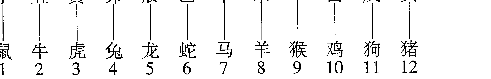
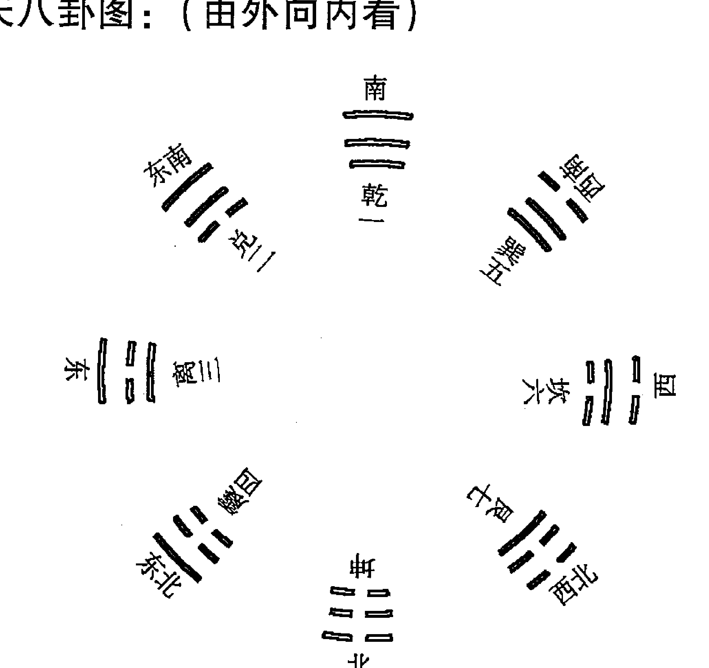
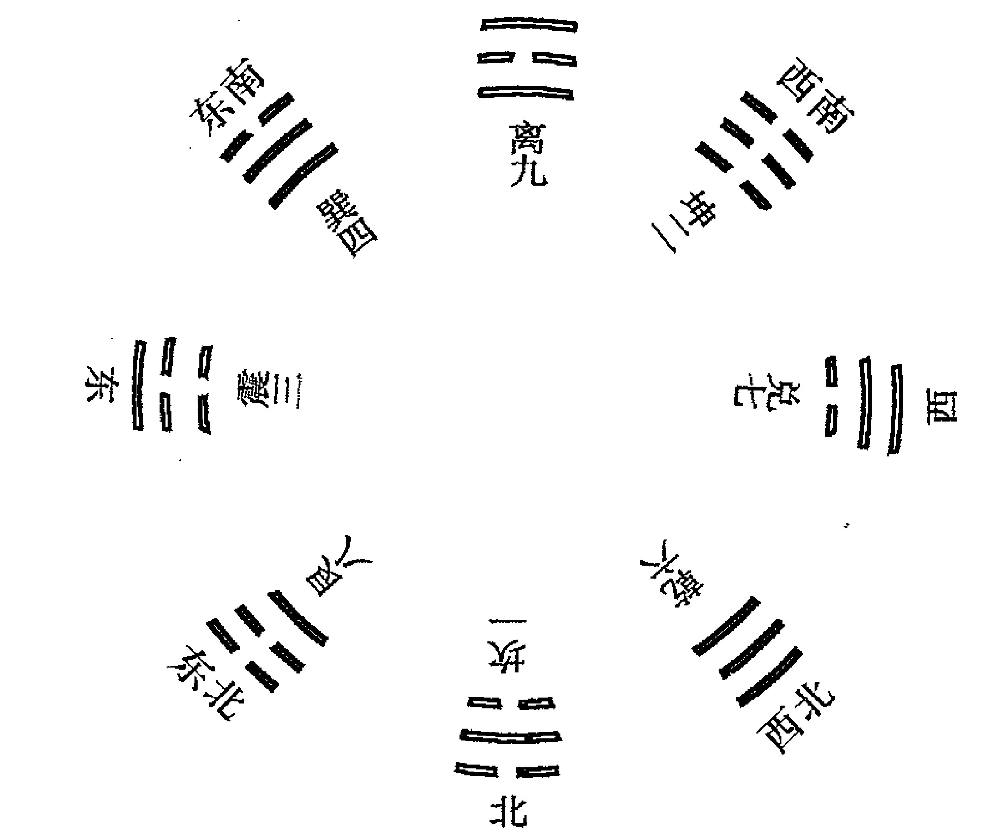
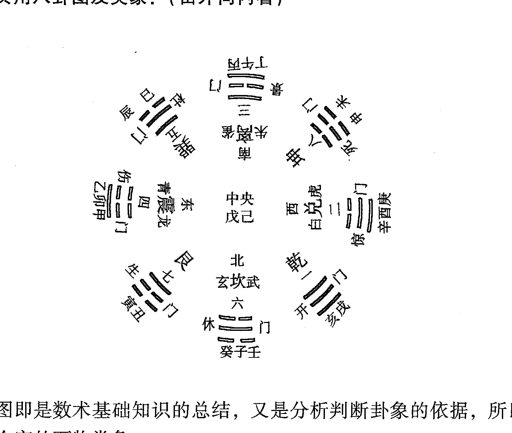

# 奇门遁甲铁口断

# 前言

奇门遁甲在我国术数界有特殊的地位，清代官方编纂的《四库图书提要》中说：“（奇门遁甲）实乃《乾凿度》太乙行九宫之法也，于诸数术中，最有理致。”

在奇门遁甲局中，有天、地、人、神盘，模拟了人类生活的大环境，天盘随着时间而转动，而地盘亘古不变，就像我们人类生活在地球上，而日月星辰在天上旋转交替形成白昼和黑夜，人的生老病死皆是宇宙环境和宇宙规律所致，这个观念是建立在“天人合一”的思想背景下，古人认为人生在天地之间，是天地的产物，被天地主宰，天不能直接管理人类，于是天派他的儿子来治理天下，天的儿子就是“天子”，而在奇门遁甲的术数模型里，八神之首叫做“值符”，他是诸神之首，所到之处百恶消散，他就是领导。凡是人类生活中有的大“象”，奇门中一定有其对应，因此奇门能预测世间万物。

北京大学于希贤教授说：“凡是能建立数理模型的知识，它一定是科学的”。凡是能用事实检验而存在规律的东西，就值得去研究，因为他对人类的发展来说有重要意义，奇门经过几千年的检验而没有淡出人们的视野，足以证明其价值。

“以铜为鉴，可以正衣冠；以人为鉴，可以明得失；以史为鉴，可以知兴替”。

值得我们民族骄傲的是我们有上下五千年的历史，以史为鉴，可以知兴替，我们的祖先用无数次的实践总结出来的宝贵文化财富，我们要继承和发扬，我们的四大发明被西方学去之后反过来刀兵相向，落后就要挨打，我们祖先留下来的财富我们要善加利用，要为中华民族的复兴做贡献，为人类和平和发展做贡献，当今社会，居安思危，在西方掀起“易经风水”热的时候，我们更应该学好自己民族的传统文化，中华民族正处在高速发展的时代，每个炎黄子孙都应该有文化自信，老认为外国的月亮圆是错误的，提到“传统”就认为是“落后”是愚昧的，只有民族的才是世界的，放弃自己的文化，我们将成为无根之木、无源之水，找回文化自信，实事求是，艰苦奋斗，才能更快实现中华民族的伟大复兴！

## 奇门遁甲铁口断

我们始终坚持科学的态度审视周易风水，用科学的方法研究周易风水，出版了《寻龙点穴》、《玄空三要》、《黄金策》、《卜学备要》等一系列周易风水专著，目的就是让世人了解传统术数，让大家学会传统术数，遇到一些看似“道法高深莫测”的高人，我们也能鉴别其水平高低。奇门遁甲的理论比较混乱，本书采用的是拆补法的转盘奇门局，然而眼下拆补、置润、茅山等起局方法谁对谁错？转盘、飞盘应该采用哪种？年家、月家、时家、日家奇门哪个更接近正确？这是摆在我们面前的一道难题，也是术数界给我们的一个天大的机遇，谁能一统江湖，我们拭目以待！

## 第一部分 理论基础

## 第一章 术数通用基础知识

世界上任何知识理解和掌握都需要一个由浅入深的过程。高等数学是以小学、中学的数学知识为基础的，所有的名著都是以一字一句的文字为基础的……要想认识和了解术数这门学问，必须要了解和掌握一些基础知识，若想玩占，必须将这些知识记牢，用熟。

### 第一节 阴阳五行、天干地支、生克制化、旺相休囚

#### 一、阴阳学说

阴阳学说是我国古代劳动人民通过对宇宙的观察，而总结出来的一种学说。它把宇宙的万物万象分为阴阳两大类，是一种朴素的唯物论辩证法的思想。它认为宇宙一切事物的形成、变化和发展，全在于阴阳二气的运动。它总结出来的自然界阴阳变化的规律，是对立统一的哲学思想规律。阴阳互相对立、互相依赖、互相转化的知识，不仅可以应用到各个科学领域里，而且已成为我国自然科学中唯物论的理论基础。

1. 阴阳对立：是指自然界的万物万象，其内部同时存在着相反的两种属性，即存在着阴阳两个方面。
2. 阴阳互根：是事物或现象中对立存在着的两个方面，具有互相依存、互相为用的关系。阴与阳互为因果，没有阴，阳不能存在，没有阳，阴不能存在。
3. 阴阳消长：是指事物和现象中对立的两个方面，是运动变化的，其运动是以彼此消长的形式进行的。由于阴阳矛盾的动态平衡，才保持了事物的正常发展变化。如果这种变化出现了反常，也就是阴阳消长的异常反应。
4. 阴阳交媾：是指阴阳对立的双方一方进入另一方内部。说的是对立面的吸引和联结，是产生新事物的前提条件。
5. 阴阳转化：也叫阴阳变化，它是事物或现象的阴与阳两种不同的属性在一定状态下向其对立面转化的过程。阴阳只有即对立又统一情况下，才能推动事物的变化和发展，阴阳才能长期共存。

#### 二、五行学说

五行学说由我国先民独创，它是采用取象比类的方法，确定事物间的相互关系的理论，具有朴素的唯物论与辩证法思想。五行学说认为世界是由木、火、土、金、水五种基本物质元素构成，自然界各种事物现象的发展变化，都是这五种不同属性的物质不断运动和相互作用的结果。五行学说在科学领域的运用极为广泛。

1. 五行特性：“木”具有生发、条达的特性；“火”具有炎热向上的特性；“土”具有长养化育的特性；“金”具有清静收杀的特性；“水”具有寒冷向下的特性。
2. 五行生克：五行之间存在着相生相克的规律，因此生克就是五行学说用以概括和说明事物联系和发展变化的基本观点。相生，含有互相滋生、促进助长的意思。相克，含有互相制约、克制、抑制的意思。
    五行相生：木生火、火生土、土生金、金生水、水生木。
    五行相克：木克土、土克水、水克火、火克金、金克木。
    相生相克象阴阳一样，是事物不可分割的两个方面。没有生，就没有事物的发生和成长；没有克，就没有维持事物在发展变化中的平衡与协调的条件。所以没有相生就没有相克，没有相克就没有相生，这种生中有克，克中有生，相反相成，相互为用的关系，推动维持着事物的正常生长发展与变化。
3. 五行亢乘：物盛极为亢为过。凡事物亢极则乘，强而欺弱叫乘。事物亢极、太过，往往易折。
4. 五行反侮：五行生克中，并不只存在顺克，如：旺克衰，强克弱，有时也会出现逆克，衰克旺、弱克强的现象，如：土旺木衰，木受土克，木旺金衰，金受木克，水衰火旺，水受火克，土衰水旺，土受水克，金旺火衰，火受金克。这种逆克叫反侮。

现将宋末徐大升的精辟论述介绍给大家：

> 金赖土生，土多金埋；土赖火生，火多土焦；火赖木生，木多火炽；木赖水生，水多木漂；水赖金生，金多水浊。金能生水，水多金沉；水能生木，木盛水缩；木能生火，火多木焚；火能生土，火多土晦；土能生金，金多土变。

> 金能克木，木坚金缺；木能克土，土重木断；土能克水，水多土流；水能克火，火焱水热；火能克金，金多火熄。

> 金衰遇火，必见销溶；火弱逢水，必为熄火；水弱逢土，必为淤塞；强火得土，方止其焰；强土得金，方制其害。

5. 五行与时间：春季为木，夏季为火，秋季为金，冬季为水，四季中的最后一个月（即三、六、九、十二月，又称四季月）均为土。

##### 6. 五行与方向
东方属木，南方属火，西方属金，北方属水，中央属土。

五行的强弱旺衰，主要看三个方面，一是数量多少，数量多者为强，少则为弱。二是看是否得地，如：西方属金，金在西方为强，南方属火，火能克金，金在南方则为弱，其它仿此。三看得时不得时，五行旺衰特别重视五行与时间的关系。五行在不同的季节，强弱旺衰并不相同，俗称旺相休囚。

五行在四时中旺相休囚如下表：

| 季节 | 旺 | 相 | 休 | 囚 | 死 |
|------|----|----|----|----|----|
| 春 | 木 | 火 | 水 | 金 | 土 |
| 夏 | 火 | 土 | 木 | 水 | 金 |
| 秋 | 金 | 水 | 土 | 火 | 木 |
| 冬 | 水 | 木 | 金 | 土 | 火 |
| 四季 | 土 | 金 | 火 | 木 | 水 |

五行在四季中旺相为强为旺，休因为弱为衰。

五行旺衰在数术中的作用非常重要，是确定和推断吉凶祸福的重要依据。

#### 三、天干学

##### 1. 天干十位
甲、乙、丙、丁、戊、己、庚、辛、壬、癸。

##### 2. 天干阴阳之分
阳干：甲、丙、戊、庚、壬。
阴干：乙、丁、己、辛、癸。

##### 3. 天干五行
甲乙同属木，甲为阳木，乙为阴木；丙丁同属火，丙为阳火，丁为阴火；戊己同属土，戊为阳土，己为阴土；庚辛同为金，庚为阳金，辛为阴金；壬癸同为水，壬为阳水，癸为阴水。

##### 4. 天干方向
甲乙东方木，丙丁南方火，戊己中央土，庚辛西方金，壬癸北方水。

##### 5. 十天干配五季
甲乙属春，丙丁属夏，戊己长夏，庚辛属秋，壬癸属冬。

##### 6. 十天干配外五行、内五行
(1) 十天干配身体：甲为头，乙为肩，丙为额，丁为齿舌，戊己鼻面，庚为筋，辛为胸，壬为胫、癸为足。
(2) 十天干配脏腑：甲为胆，乙为肝，丙为小肠，丁为心，戊为胃，己为脾，庚为大肠，辛为肺，壬为膀胱，癸为肾，单数为腑，双数为脏。

#### 7. 十天干化合
甲己合化土，乙庚合化金，丙辛合化水，丁壬合化木，戊癸合化火。

#### 8. 十天干相冲
甲与庚相冲，乙与辛相冲，丙与壬相冲，丁与癸相冲，戊与己同为土合而不相冲。

#### 9. 十天干生旺死绝表
十天干生旺死绝表，是以十天干的时令旺衰来说明事物由长生、兴旺到病死这样一个发展变化的全过程，这个过程是事物发展的必然规律。其表如下：

| 状态 | 甲木 | 丙火 | 戊土 | 庚金 | 壬水 | 乙木 | 丁火 | 己土 | 辛金 | 癸水 |
| --- | --- | --- | --- | --- | --- | --- | --- | --- | --- | --- |
| 长生 | 亥 | 寅 | 寅 | 巳 | 申 | 午 | 酉 | 酉 | 子 | 卯 |
| 沐浴 | 子 | 卯 | 卯 | 午 | 酉 | 巳 | 申 | 申 | 亥 | 寅 |
| 冠带 | 丑 | 辰 | 辰 | 未 | 戌 | 辰 | 未 | 未 | 戌 | 丑 |
| 临官 | 寅 | 巳 | 巳 | 申 | 亥 | 卯 | 午 | 午 | 酉 | 子 |
| 帝旺 | 卯 | 午 | 午 | 酉 | 子 | 寅 | 巳 | 巳 | 申 | 亥 |
| 衰 | 辰 | 未 | 未 | 戌 | 丑 | 丑 | 辰 | 辰 | 未 | 戌 |
| 病 | 巳 | 申 | 申 | 亥 | 寅 | 子 | 卯 | 卯 | 午 | 酉 |
| 死 | 午 | 酉 | 酉 | 子 | 卯 | 亥 | 寅 | 寅 | 巳 | 申 |
| 库 | 未 | 戌 | 戌 | 丑 | 辰 | 戌 | 丑 | 丑 | 辰 | 未 |
| 绝 | 申 | 亥 | 亥 | 寅 | 巳 | 酉 | 子 | 子 | 卯 | 午 |
| 胎 | 酉 | 子 | 子 | 卯 | 午 | 申 | 亥 | 亥 | 寅 | 巳 |
| 养 | 戌 | 丑 | 丑 | 辰 | 未 | 未 | 戌 | 戌 | 丑 | 辰 |

表中“长生”尤如人刚出生于世或降生阶段；“沐浴”为婴儿降生后洗浴阶段；“冠带”为小儿可以穿衣戴帽了；“临官”也称“进禄”、帝旺都为身旺，运气旺的阶段。事物旺者，必有衰败阶段，故从“衰”至“绝”都为败地，“胎养”在运气上讲，多称为平运。

表中的地支是指有利和不利的时间和方向。如：甲帝旺在卯，这里的卯是指卯年、卯月、卯日、卯时，都是时间。方向是：正东方向，这里的东方是指以自己生活时间最长的地方为中心。甲木墓在未（旺为库、休囚为墓），当然不吉，其未是指未年、未月、未日、未时，都是时间。方向是西南方。所以有利的事，要在有利的时间里到有利的方位去办。不利的事，在不利的时间里不去办，不要去不利的方向，就可以免去预想不到的灾患。所以说，十天干生旺死绝表，是一个趋吉避凶的信息标志和时间表。

#### 四、地支学
十二地支：即子、丑、寅、卯、辰、巳、午、未、申、酉、戌、亥。

##### 1. 十二地支阴阳
子、寅、辰、午、申、戌为阳；丑、卯、巳、未、酉、亥为阴。

##### 2. 十二地支配五行
寅卯属木，寅为阳木，卯为阴木；巳午属火，午为阳火，巳为阴火；申酉属金，申为阳金，酉为阴金；子亥属水，子为阳水，亥为阴水；辰戌丑未属土，辰戌为阳土，丑未为阴土。

##### 3. 十二地支配方位
寅卯东方木，巳午南方火，申酉西方金，亥子北方水，辰戌丑未四季土。辰戌丑未在每一个季度的最后一个月，故为四季土。

##### 4. 十二地支配四季
寅卯辰为春，巳午未为夏，申酉戌为秋，亥子丑为冬。

##### 5. 十二地支配五脏六腑
寅为胆，卯为肝，巳为心，午为小肠，戌辰为胃，丑未为脾，申为大肠，酉为肺，亥为肾，子为膀胱。

##### 6. 十二地支六合化合
子与丑合化土，寅与亥合化木，卯与戌合化火，辰与酉合化金，巳与申合化水，午与未合，午为太阳，未为太阴，合而为土。

相合为合好之意。相合，又有合中有克，有合中有生。合中有克者，是先好后坏，先热后冷，先合后分。如：子与丑合，卯与戌合，巳与申合。子为水，丑为土，土克水。卯为木，戌为土，木克土。巳为火，申为金，火克金。此为合中有克；合中有生者，不管是夫妻关系还是朋友关系，是越合越好，如：寅亥相合，辰酉相合，午未相合。寅为木，亥为水，水生木。辰为土，酉为金，土生金。午为火，未为土，火生土。故为合中有生。

##### 7. 十二地支三合局
申子辰合化水局，亥卯未合化木局，寅午戌合化火局，巳酉丑合化金局。三合化局，有吉有凶。化生者为吉，化克者为凶。

##### 8. 十二地支方合局
寅卯辰合化木局，巳午未合化火局，申酉戌合化金局，亥子丑合化水局。

方合局，在合局中作用力最大，也有吉凶之分，合化的五行对事物有利为吉，合化的五行对事物不利为凶。

##### 9. 十二地支相冲
子午相冲，丑未相冲，寅申相冲，卯酉相冲，辰戌相冲，巳亥相冲，相冲为对冲。在八卦图上可以看出，卯为木在东，酉为金在西，午为火在南，子为水在北，其它支也是如此，都是处在正对的位置上。故为对冲，即冲克。相冲者有吉有凶，冲去吉神为凶，冲去凶神者为吉。

#### 10. 十二地支相害
子未相害，丑午相害，寅巳相害，卯辰相害，申亥相害，酉戌相害。相害为受害，被害，相害为不吉，但看有制无制，有制者无妨，无制者不利。

#### 11. 十二地支相刑
子卯相刑，为无礼之刑；寅刑巳、巳刑申、申刑寅为特势之刑；丑刑未、未刑戌、戌刑丑为无恩之刑；辰午酉亥为自刑。刑者，刑罚也。多主刑事犯法之事，也主伤病痛苦。

#### 12. 十二地支相破
子酉相破，丑辰相破，寅亥相破，卯午相破，巳申相破，未戌相破。子酉为破中带生，丑辰为破中带比，寅亥为破中带合，卯午为破中带生，巳申为破中带合，未戌为破中带刑。

#### 13. 五行长生帝旺
木长生在亥，帝旺在卯，死在午，墓在未，绝在申。火长生在寅，帝旺在午，死在酉，墓在戌，绝在亥。金长生在巳，帝旺在酉，死在子，墓在丑，绝在寅。水土长生在申，帝旺在子，死在卯，墓在辰，绝在巳。运到长生帝旺之地，主人创新、盛快，有进财、生子、升官之庆；运到死库绝之地，主人骨肉分离，身经祸患。

#### 14. 十二地支配九宫
| 辰巳四宫 | 午九宫 | 未申二宫 |
|---|---|---|
| 卯三宫 | 五宫 | 酉七宫 |
| 寅丑八宫 | 子一宫 | 亥戌六宫 |

#### 15. 十二地支配月建
正月建寅，二月建卯，三月建辰，四月建巳，五月建午，六月建未，七月建申，八月建酉，九月建成，十月建亥，十一月建子，十二月建丑。故一、二为木，四、五为火，七、八为金，十、十一为水，三、六、九、十二为土。正月建寅，就是正月为寅月。

#### 16. 十二地支配十二时辰
| 时辰 | 子 | 丑 | 寅 | 卯 | 辰 | 巳 |
| :--- | :--- | :--- | :--- | :--- | :--- | :--- |
| 时间 | 23-1 | 1-3 | 3-5 | 5-7 | 7-9 | 9-11 |
| 时辰 | 午 | 未 | 申 | 酉 | 戌 | 亥 |
| 时间 | 11-13 | 13-15 | 15-17 | 17-19 | 19-21 | 21-23 |

#### 17. 十二地支配十二生肖及支数

### 第二节 六十甲子纳音表及其它

#### 一、六十甲子纳音表
在自然界人体科学中，对于人的各种信息预测，不管用哪种预测方法，都是以阴阳变化为原理，以五行生克制化为法则的。

我们的祖先发明了天干地支，作为阴阳五行在自然界，人体上的各种信息的具体的标志。使人们看到了自然界和人体阴阳五行之气的分布、结构、排列组合及五行生克的时间和对人体的命运影响。因此，六十甲子表既是人体阴阳五行之气，又是时间、空间、方位的信息标志。

| 年号 | 年命 | 年号 | 年命 | 年号 | 年命 | 年号 | 年命 | 年号 | 年命 |
| :--- | :--- | :--- | :--- | :--- | :--- | :--- | :--- | :--- | :--- |
| 甲子 | 海中金 | 丙子 | 涧下水 | 戊子 | 霹雷火 | 庚子 | 壁上土 | 壬子 | 桑松木 |
| 乙丑 | | 丁丑 | | 己丑 | | 辛丑 | | 癸丑 | |
| 丙寅 | 炉中火 | 戊寅 | 城墙土 | 庚寅 | 松柏木 | 壬寅 | 金泊金 | 甲寅 | 大溪水 |
| 丁卯 | | 己卯 | | 辛卯 | | 癸卯 | | 乙卯 | |
| 戊辰 | 大林木 | 庚辰 | 白蜡金 | 壬辰 | 长流水 | 甲辰 | 佛灯火 | 丙辰 | 沙中土 |
| 己巳 | | 辛巳 | | 癸巳 | | 乙巳 | | 丁巳 | |
| 庚午 | 路旁土 | 壬午 | 杨柳木 | 甲午 | 沙中金 | 丙午 | 天河水 | 戊午 | 天上火 |
| 辛未 | | 癸未 | | 乙未 | | 丁未 | | 己未 | |
| 壬申 | 剑锋金 | 甲申 | 泉中水 | 丙申 | 山下火 | 戊申 | 大驿土 | 庚申 | 石榴木 |
| 癸酉 | | 乙酉 | | 丁酉 | | 己酉 | | 辛酉 | |
| 甲戌 | 山头火 | 丙戌 | 屋上土 | 戊戌 | 平地木 | 庚戌 | 钗钏金 | 壬戌 | 大海水 |
| 乙亥 | | 丁亥 | | 己亥 | | 辛亥 | | 癸亥 | |

六十甲子表不仅是人体的信息标志，也是自然界万事万物兴衰的信息标志。对个人来讲，兴旺时身体强壮，心想事成，家庭和睦、父贤子孝；衰败时，体弱多病，一事无成，夫妻分离，父子反目。对国家来讲，兴旺时风调雨顺，政通民和，工、农、商、学、兵同心同德；衰败时，自然灾害频发，盗贼四起，民不聊生。造成这种现象的原因与阴阳五行的生克制化有关，因此，六十甲子表是宇宙全息的总标志。

#### 二、年上起月法
> 甲己之年丙作首，乙庚之岁戊为头。
丙辛必定寻庚起，丁壬壬位顺水流。
若问戊癸何处觅，甲寅之上好追求。

年上起月法，就是查每一年十二个月的月干，知道了每一个月的月干，便知道了每一个月的干支。此歌诀是：如果年的天干为甲或己，其年正月为丙寅月，二月为丁卯月，三月为戊辰月，以此类推。如果年的天干为乙或庚，其年正月为戊寅，二月为己卯，三月为庚辰，以此类推。如果年的天干为丙或辛，其年正月为庚寅，二月为辛卯，三月为壬辰，以此类推。如果年的天干为丁或壬，其年正月为壬寅，二月为癸卯，三月为甲辰，以此类推。如果年的天干为戊或癸，其年正月为甲寅，二月为乙卯，三月为丙辰，以此类推。详见下表。

| 月\年 | 甲己 | 乙庚 | 丙辛 | 丁壬 | 戊癸 |
| :--- | :--- | :--- | :--- | :--- | :--- |
| 正月 | 丙寅 | 戊寅 | 庚寅 | 壬寅 | 甲寅 |
| 二月 | 丁卯 | 己卯 | 辛卯 | 癸卯 | 乙卯 |
| 三月 | 戊辰 | 庚辰 | 壬辰 | 甲辰 | 丙辰 |
| 四月 | 己巳 | 辛巳 | 癸巳 | 乙巳 | 丁巳 |
| 五月 | 庚午 | 壬午 | 甲午 | 丙午 | 戊午 |
| 六月 | 辛未 | 癸未 | 乙未 | 丁未 | 己未 |
| 七月 | 壬申 | 甲申 | 丙申 | 戊申 | 庚申 |
| 八月 | 癸酉 | 乙酉 | 丁酉 | 己酉 | 辛酉 |
| 九月 | 甲戌 | 丙戌 | 戊戌 | 庚戌 | 壬戌 |
| 十月 | 乙亥 | 丁亥 | 己亥 | 辛亥 | 癸亥 |
| 十一月 | 丙子 | 戊子 | 庚子 | 壬子 | 甲子 |
| 十二月 | 丁丑 | 己丑 | 辛丑 | 癸丑 | 乙丑 |

#### 三、日上起时法
> 甲己还生甲，乙庚丙作初。
丙辛从戊起，丁壬庚子居。
戊癸何方发，壬子是真途。

“甲己还生甲”，是讲甲日或己日的子时，起“甲子”时，这“甲子”就是甲日或己日子时的天干地支。其法与年上起月法相同。详见下表

| 时\日 | 甲己 | 乙庚 | 丙辛 | 丁壬 | 戊癸 |
|---|---|---|---|---|---|
| 子 | 甲子 | 丙子 | 戊子 | 庚子 | 壬子 |
| 丑 | 乙丑 | 丁丑 | 己丑 | 辛丑 | 癸丑 |
| 寅 | 丙寅 | 戊寅 | 庚寅 | 壬寅 | 甲寅 |
| 卯 | 丁卯 | 己卯 | 辛卯 | 癸卯 | 乙卯 |
| 辰 | 戊辰 | 庚辰 | 壬辰 | 甲辰 | 丙辰 |
| 巳 | 己巳 | 辛巳 | 癸巳 | 乙巳 | 丁巳 |
| 午 | 庚午 | 壬午 | 甲午 | 丙午 | 戊午 |
| 未 | 辛未 | 癸未 | 乙未 | 丁未 | 己未 |
| 申 | 壬申 | 甲申 | 丙申 | 戊申 | 庚申 |
| 酉 | 癸酉 | 乙酉 | 丁酉 | 己酉 | 辛酉 |
| 戌 | 甲戌 | 丙戌 | 戊戌 | 庚戌 | 壬戌 |
| 亥 | 乙亥 | 丁亥 | 己亥 | 辛亥 | 癸亥 |

#### 四、六甲空亡
甲子旬中戌亥空，甲戌旬中申酉空，甲申旬中午未空，甲午旬中辰巳空，甲辰旬中寅卯空，甲寅旬中子丑空。
“六甲空亡”，就是六十甲子表中，由六旬组成，其分为六个旬。十天为一旬，也就是从甲子日起，到癸酉日这十天中，日支没有“戌亥”二字，就为空。空即时间不到，时间到了就不为空，该成事的成事，该坏事的坏事，故空亡也是有主吉，有主凶的。

#### 五、驿马星
驿马星，为马也，主健跑、走动。
申子辰马在寅，寅午戌马在申，
巳酉丑马在亥，亥卯未马在巳，
马星在预测中的用处很大，须牢记：“申子辰马在寅”是指遇申、子、辰地支时，巧逢寅即为有马星。“寅午戌马在申”是指遇寅、午、戌地支时，巧逢申即为马星。“巳酉丑马在巳”是指遇巳、酉、丑地支时，巧逢亥即为马星。“亥卯未马在巳”是指遇亥、卯、未地支时，巧逢巳即为马星，可见与第一位相冲之地支为马星。

### 第三节 八卦图及其类象

#### 一、伏羲先天八卦图：（由外向内看）

#### 二、文王后天八卦图：（由外向内看）

### 三、实用八卦图及类象：（由外向内看）

八卦图即是数术基础知识的总结，又是分析判断卦象的依据，所以必须熟记每一个宫的万物类象。

乾卦：在天时为天、冰雹。在地理为西北方向、大都市。在人物为首长、父辈、男士长者。在事为刚建、果断、动静兼顾。在身体为首、骨、肺、右腿、男性生殖器。在时令为秋季、戌亥年月日时。在动物为马、天鹅、狮子、象。在静物为园形、金玉珠宝、刚物。在场所为高堂、楼台、大厦。在饮食为辛辣。求名为官职、天使。求利为有金玉之财，得公门之益。在颜色为白色、大红色、玄色。在数字为一、六、四、九数。

坤卦：在天时为阴云、雾气、冰雹。在地理为西南方向、田野、乡下。在人物为夫人、母亲、祖母、老妇人、群众。在事为柔顺懦弱。在身体为腹、脾、胃、肉、女性生殖器。在时令为未申年月日时。在静物为柔物、砖瓦物、五谷、丝织物。在动物为百兽、牛、马、猫。在场所为矮屋、土阶、仓库。在饮食为野味、土中之物、五谷之味、芋笋之物，腹藏之物。求名为农官守土之职。求利为田土交易、五谷之利，静中有财。在颜色为黄色、黑色。在数字为二、五、八、十数。在味为甘甜。

震卦：在天时为雷。在地理为东方、树木、闹市、草木茂盛之所。在身体为肝、胆、足、左胁。在人物为长男、运动量大的工作人员。在事为怒、动。在时令为春，卯年月日时。在静物为木、乐器、花草繁鲜之物。在动物为龙、蛇、百虫、马鸣。在场所为东屋、楼阁、山林之居、歌舞厅、游乐场、广电单位、工厂、机场。在饮食为肉、野味、蔬菜、蹄类、鲤鱼。求名为副职、刑狱之官。求利为动处求财、山林木竹茶之财。在颜色为青、碧、绿色。在数字为三、四、八数。在味为酸。

巽卦：在天时为风。在地理为东南方向、草木茂秀之所、花果菜园。在人物为长女、寡妇、僧、道、艺人、商人、额头宽、头发细长之人、优柔寡断之人。在事为柔和、进退不定。在身体为肱、股、气管、神经、左肩、元气、风疾。在时令为春夏之交、辰巳年月日时。在静物为树、木制品、直长之物、绳线之物、帆船、扇、中药、羽毛。在动物为鸡类、百禽、蝶类、蛇类、带鱼类、斑马。在场所为寺观、山林草原、线路、过道。在饮食为鸡肉、山林之物、蔬菜。求名为文职官员。求利为得木竹之利。在颜色为蓝色、绿色。在味为酸。在数字为三、四、五、八数。

坎卦：在天时为月、雨、雪、露、霜。在地理为北方、池沼之地。溪泉湿地。在人物为中男、江湖之人、盗贼、劳务之人、酒色之徒、供水职员。在事为险陷卑下、外柔内奸、漂泊不定、随波逐流。在身体为肾、膀胱、泌尿生殖系统、内分泌系统、血液、耳、肛门。在时令为冬、子年月日时。在静物为带核之物、矮柔之物，酒水器皿、棘藜。在动物为猪、鼠、狐、水族。在场所为北方、近水楼阁、江河湖渠、潜水艇、浴室、茶馆、水族馆、居室的湿地之处。在饮食为油水类、海味、冷饮、汤类。求名有鱼盐河泊之职。求利有鱼盐酒、冷饮、油之利。在颜色为黑色或白色。在味为咸。在数字为一、六数。

离卦：在天时为日、晴天、酷暑、干旱、虹霓、彩霞。在地理为南方、向阳地带，在人为中女、文人、中层干部、美艺之人。在事为美丽、聪明、文才、虚心。在身体为头、眼、心脏、小肠。在时令为夏、午年月日时。在静物为火、书、电脑、电视、画、化妆品。在动物为虾蟹贝类、山鸡孔雀类、萤火虫。在场所为南舍、光明之宅、古迹、教室、影院、书画院、广电局、冶炼厂、放射室。在饮食为煎炒食品、烧烤之物。求名为文官之职。求利有电器、文书之财。在颜色为赤红色、紫色、花色。在味为苦。在数字为二、三、七、九数。

艮卦：在天时为云雾山岚。在地理为山丘坟陵、堤坝。在人为少男、土建工人、宗教人士、警卫、储蓄人员。在事为止境、阻隔、进退不决、静守。在人体为指、趾、左腿、鼻、背、关节、脾、胃、结肠。在时令为冬春之交，丑寅年月日时。在静物为土石坡、土石之物、木生之物。在动物为虎、狗、鼠等有牙有角的动物及有尾的动物。在场所为公检法机关、采矿场、坟场、近石近路之宅。在饮食为土中物、野味。求名有任山城之职。求利有山林土中之益。在颜色为白色、黄色、棕色。在味为甘、甜味。在数字为五、七、八、十数。

兑卦：在天时为雨泽，阴雨连绵。在地理为沼泽地、废墟废井。在人物为少女、妾、娼妓、牙科与外科医生、与说话有关的专业人员。在事为喜悦、口舌、饮食、诽谤。在人体为口、舌、牙、喉、肺、右胁、肛门。在时令为秋季，酉年月日时。在静物为金属器具、破损之物，带口之物、乐器、垃圾箱。在动物为鸡鸭类、羊、豹类、猿猴、泽中之物。在场所为近泽之居、滑冰场、聚会之所。在饮食为石榴、胡桃、羊肉、泽中之物。求名有译官、伶官。求利防口舌之争，有说唱所受之益。在颜色为白色、赤色。在味为辛辣。在数字为二、七、四、九数。

## 第二章 数理奇门的基础知识

“轩辕黄帝战蚩尤，涿鹿经年苦未休，偶梦天神授符诀，登坛致祭谨虔修。神龙负图出洛水，彩凤衔书碧云里。因命风后演成文，遁甲奇门从此始”。三式之一的奇门遁甲问世了。
奇门遁甲除运用第一章的知识之外，还要掌握以下知识：

### 第一节 九宫八卦方位图

在奇门遁甲中，九宫八卦代表地，用神落宫吉，可谓得地利。此信息在分析判断格局时非常重要，因为俗话说天时不如地利。

| 巽卦四宫 属木 东南方 | 离卦九宫 属火 南方 | 坤卦二宫 属土 西南方 |
| :--- | :--- | :--- |
| 震卦三宫 属木 东方 | 中五宫 属土 | 兑卦七宫 属金 西方 |
| 艮卦八宫 属土 东北方 | 坎卦一宫 属水 北方 | 乾卦六宫 属金 西北方 |

### 第二节 阴阳遁、九星、八门、八神、三奇六仪

#### 一、阴阳二遁顺序图

奇门遁甲分阴遁阳遁。所谓阳遁就是从一宫到九宫，按戊己庚辛壬癸丁丙乙的顺序顺排。所谓阴遁就是从九宫到一宫，按戊己庚辛壬癸丁丙乙的顺序逆排。

#### 二、九星的顺序及特性

在奇门遁甲中，九星是代表天的。而天体运动对地球和生活在地球上的万物的影响是不可估量的。如果用神落宫得星生助，则为得天时，如果用神落宫不得星生助或受星克制，则不得天时。“天”可引伸为天意、先天，故在预测人的先天个性时常以九星为依据。

九星的旺衰与其它五行的旺衰不同，因为它是作用于地球的，因而它不随其它五行旺衰而旺衰，而且它不会死、绝、胎、养，所以只称它为旺、相、休、囚、废。

九星的顺序按宫的顺序排列是：天蓬星、天芮星、天冲星、天辅星、天禽星、天心星、天柱星、天任星、天英星。

九星分阴阳：因为奇门遁甲分阴遁、阳遁。一宫、八宫、三宫、四宫为阳遁，故与一宫对应的天蓬星、与八宫对应的天任星、与三宫对应的天冲星、与四宫对应的天辅星为阳星。而九宫、二宫、七宫、六宫为阴遁，故与九宫对应的天英星、与二宫对应的天芮星、与七宫对应的天柱星、与六宫对应的天心星为阴星。中五官的天禽星，随坤二宫，故也为阴星。

一般情况下，天心星为阴星。天禽星与中五宫对应为阳星。

一般情况下，天心星、天禽星、天辅星、天任星为四吉星，天冲星次吉，天英星中平，天蓬星、天芮星、天柱星为三凶星。

- **1. 天蓬星**：因为它的本宫是坎宫，所以五行属水。它旺于春季，相于冬季，休于夏季，囚于四季末，废于秋季。它的特性是至冷至暗至寒，喜阴害阳，与凶杀、盗贼、贪财贪色有关。

天蓬星临宫，经商破财、出行遇盗。只宜安分守己。

- **2. 天芮星**：因为它的本宫是坤宫，所以五行属土。它旺于秋季，相于四季末，废于夏季，休于冬季，囚于春季。它的特性是与流行病相关。故奇门中常以它为病的用神，它落宫的部位决定人体疾病的部位，它落宫的旺衰，决定着疾病的好转与否。

天芮星临宫，不宜主动谋吉事，只宜坐待时机。

- **3. 天冲星**：因为它的本宫是震宫，所以五行属木。它旺于夏季，相于春季，休于四季月，囚于秋季，废于冬季。它的特性是大慈大悲，助人为乐。

由于震宫为动，故天冲星所临之宫也只宜选将出征交战，雷鼓击战，摇旗呐喊。

- **4. 天辅星**：因为它的本宫是巽宫，故五行属木。它旺于夏季，相于春季，休于四季月，囚于秋季，废于冬季。它的特性是特别有助于文化教育事业。故得文曲星之美称。

天辅星临宫百事皆宜，更宜升学考官，发展文化教育事业。

- **5. 天禽星**：因为它的本宫在中五官，故五行属土。它旺于秋季，相于四季月，休于冬季，囚于春季，废于夏季。奇门遁甲中元帅遁于中宫，故为大吉星。

天禽星临宫，百事皆吉。

- **6. 天心星**：因为它的本宫在乾宫，故五行属金。它旺于冬季，相于秋季，休于春季，囚于夏季，废于四季月。它的特性是能屈能伸，能动能静，能攻能守。

天心星临宫具有领导才能，善长心计，能治病救人。

- **7. 天柱星**：因为它的本宫在兑宫，故五行属金。它旺于冬季，相于秋季，休于春季，囚于夏季，废于四季月。它的特性是喜杀好战，破坏毁折，惊恐怪异，口舌官司。

天柱星临宫，有意外伤灾，官司牵连，求财赔本，出征、远行车破马伤。只宜固守本分。

- **8. 天任星**：因为它的本宫在艮宫，故五行属土。它旺于秋季，相于四季月，休于冬季，囚于春季，废于夏季。它的特性是生助万物。

天任星临宫，能安帮定国，抑恶扬善，教化人民，经商嫁娶，百事皆吉。

- **9. 天英星**：因为它的本宫在离宫，故五行属火。它旺于四季月，相于夏季，休于秋季，囚于冬季，废于春季。它的特性是急躁易暴，益则光明磊落、雪中送炭，害则口舌官司、血光之灾。

天英星临宫，宜于谋划策略，面君谒贵，不宜求财嫁娶。

#### 三、八门的顺序及特性

在奇门遁甲中八门为人盘，代表人事。人事是受天时、地利等各方面因素的影响，俗称运气。故预测目前状况，常以用神所临之门的情况为依据。
八门的旺相休囚与其它五行相同，八门在预测时的运用非常重要。

八门的顺序按宫的顺序排列是：休门、死门、伤门、杜门、开门、惊门、生门、景门。

八门分阴阳：以奇门遁甲阴阳可将坎宫对应的休门，艮宫对应的生门、震宫对应的伤门、巽宫对应的杜门称为阳门，将离宫对应的景门、坤宫对应的死门、兑宫对应的惊门、乾宫对应的开门称为阴门。

八门分吉凶：一般开门、休门、生门为吉门，景门中平，杜门为小凶门，死门、惊门、伤门为凶门。

- **1. 休门**：因本宫为坎宫，故五行属水。旺于冬季，相于秋季，休于春季，囚于夏季，死于四季末。在本宫不动为伏吟，转向对面的离宫为反吟，转到巽宫因为巽宫有辰为入墓，转到坤艮二宫为受制，转到乾兑二宫为“义”，转到震宫为“和”。休门的特性为柔和。

休门临宫，宜上宫见贵，嫁娶经商，不宜用武力解决问题。

- **2. 死门**：因本宫为坤宫，故五行属土。旺于秋季月，相于夏季，囚于冬季，死于春季。在本宫不动为伏吟，转到艮宫为反吟，转到巽宫见辰为入墓，转到震宫为受制，转到离宫受生，主大凶，转到坎宫为凶门克宫，事更凶。转到乾、兑二宫为泄气。死门特性是预示着死伤、争战。

死门临宫，不利吉事，只宜吊死送丧、捕猎。

- **3. 伤门**：本宫在震宫，故五行属木。它旺于春季，相于冬季，休于夏季，囚于四季月，死于秋季。在本宫不动为伏吟，转入兑宫为反吟，转入坤宫见未为入墓，转入坎宫受宫之生为大凶，转入乾宫受克制，转入艮宫为被迫主大凶，转入离宫泄气。伤门的特征是索取捕盗。

伤门临宫，经商破财，出门有灾，只宜讨债、赌博、捉贼。

- **4. 杜门**：本宫在巽宫，故五行属木。它旺于春季，相于冬季，休于夏季，囚于四季月，死于秋季。在本宫不动为伏吟，转入乾宫为反吟，转入坤宫见未为入墓，转入兑宫为受制，转入艮宫被迫，转入坎宫受生，转入震宫比和，转入离宫泄气。杜门的特性是保密、躲藏、技艺、捕盗、堵塞。

杜门临宫，只宜藏身避难、捕盗、防洪、搞技术工作。

- **5. 开门**：本宫在乾宫，故五行属金。它旺于秋季，相于四季月，休于冬季，囚于春季，死于夏季。在本宫不动为伏吟，转入巽宫为反吟，转入艮宫见丑为入墓，转入离宫受制，转入坤宫大吉，转入兑宫为相，转入坎宫为“和”。转入震宫为迫为凶。开门的特性主吉利，开通。

开门临宫，开业经商、婚娶建造、征战远行，参军考学，治病求医均吉。

- **6. 惊门**：本宫在兑宫，故五行属金。它旺于秋季，相于四季月，休于冬季，囚于春季，死于夏季。在本宫不动为伏吟，转到震宫为反吟，转到艮宫见丑为入墓，转到离宫受克制，转到巽宫为凶门被迫主事情大凶，转到坎宫为泄气，转到坤宫为凶门受生则凶上加凶，转到乾宫为比和。惊门的特性是赌、斗、惊、恐、盅惑。

惊门所到之处，不利吉事，只宜官非、创伤、惊恐、掩盗、赌博、惑众。

- **7. 生门**：本宫是艮宫，故五行属土。旺于四季月，相于夏季，休于秋季，囚于冬季，死于春季。在本宫不动为伏吟，转到坤宫为反吟，转到巽宫见辰为入墓，转到震宫受克制时吉门也就不吉了，转到离宫受生为“义”主大吉，转到乾兑二宫为门生宫为“和”次吉，转到坎宫为“迫”为凶。生门的特性是长、生。

生门所落之宫有利于办理吉事，如养殖、种植、土建、嫁娶。但不利埋葬捕猎。

- **8. 景门**：本宫是离宫，故五行属火。旺于夏季，相于春季，休于四季月，囚于秋季，死于冬季。在本宫不动为伏吟，转到坎宫为反吟，转到乾宫见戌为入墓，转到兑宫被迫，转到震、巽二宫受生，转到坤艮二宫泄气。景门的性质上炎、谋策。

景门所到之处，防口舌及血光火灾。宜谋划、选贤、派遣。多主文书之事。

#### 四、八神的顺序及特性

八神在奇门遁甲盘中作用也较大，是一种无形的力量在帮助人，则运气好，反之这种无形的力量损害人，则运气不好。故在奇门预测中常作为用神来判断吉凶。

八神的顺序是：值符、螣蛇、太阴、六合、白虎（下藏勾陈）、玄武（下藏朱雀）、九地、九天。

- **1. 值符**：是八神之领袖，自然为头儿，甲木为头，故值符的五行属木。值符所到之处平安吉祥，逢凶化吉，百恶消散。

- **2. 螣蛇**：五行属火。有缠绕、毒辣、虚诈、惊恐怪异之本性，为凶神，多主异常现象和口舌之事。

- **3. 太阴**：五行属阴金。阴即阴暗、阴冷、避光之处。故太阴所到之处可隐避藏身、密谋策划、屯兵集粮。

- **4. 六合**：五行属木。合即和解、和协，故六合的特性为开朗平和。六合所到之处，有利于中介、谈判、交易、婚嫁、调解矛盾。

- **5. 白虎**：五行属金。由于它的性格凶猛好斗。故白虎为凶神。白虎所到之处，防打斗、交通事故、疾病死伤。

- **6. 玄武**：五行属水。性格喜盗，主口舌。故玄武所到之处防阴人、女人、小人、盗贼及口舌是非。

- **7. 九地**：五行有阳土的性质。特性柔顺慈善，能滋生万物。故九地为大吉之神，所到之处宜种殖养殖、屯兵集粮、以守为攻。

- **8. 九天**：五行属阳金。特性刚强好战，威不可犯。故九天所到之处，宜扬兵主攻、行军打仗，乘飞机外出。

#### 五、三奇六仪

三奇六仪是奇门遁甲中独特理论的其中之一。

三奇：指天干中的乙丙丁三位。乙为日奇，丙为月奇，丁为星奇。奇顾名思义为奇兵，由于奇门遁甲古代用于军事行动预测，故可想而知出奇不意，就是这三奇了。

六仪：戊己庚辛壬癸六位。好像元帅指挥的六路纵队，他们纵横交错、繁而不乱，无头无尾，无懈可击。

六甲为甲子、甲戌、甲申、甲午、甲辰、甲寅。六甲分别置于六仪之中，可见六甲与六仪的配合为：甲子戊、甲戌己、甲申庚、甲午辛、甲辰壬、甲寅癸。

三奇六仪在九宫中的排列顺序是戊、己、庚、辛、壬、癸、丁、丙、乙。阳遁从一至九宫顺排，阴遁从九至一宫逆排。

在六十个时辰中，三奇六仪所在的宫次是固定的，所以就形成了一种格局，奇门遁甲就叫一局。

时家奇门的根本规律就在于此。

### 时辰六旬遁甲一局规律表

| 六甲 | 三奇 | 六仪 |
| :--- | :--- | :--- |
| 一、甲子 | 乙丑、丙寅、丁卯 | 戊辰(甲子)、己巳(甲戌)、庚午(甲申)、辛未(甲午)、壬申(甲辰)、癸酉(甲寅) |
| 二、甲戌 | 乙亥、丙子、丁丑 | 戊寅(甲子)、己卯(甲戌)、庚辰(甲申)、辛巳(甲午)、壬午(甲辰)、癸未(甲寅) |
| 三、甲申 | 乙酉、丙戌、丁亥 | 戊子(甲子)、己丑(甲戌)、庚寅(甲申)、辛卯(甲午)、壬辰(甲辰)、癸巳(甲寅) |
| 四、甲午 | 乙未、丙申、丁酉 | 戊戌(甲子)、己亥(甲戌)、庚子(甲申)、辛丑(甲午)、壬寅(甲辰)、癸卯(甲寅) |
| 五、甲辰 | 乙巳、丙午、丁未 | 戊申(甲子)、己酉(甲戌)、庚戌(甲申)、辛亥(甲午)、壬子(甲辰)、癸丑(甲寅) |
| 六、甲寅 | 乙卯、丙辰、丁巳 | 戊午(甲子)、己未(甲戌)、庚申(甲申)、辛酉(甲午)、壬戌(甲辰)、癸亥(甲寅) |
| 阳遁 | 逆布三奇 | 顺布六仪 |
| 阴遁 | 顺布三奇 | 逆布六仪 |

### 第三节 二十四节气奇门遁甲用局表

《烟波钓叟歌》曰：阴阳逆顺妙难穷，二至还向一九宫。若能了达阴阳理，天地都来一掌中。是说奇门遁甲的阴阳逆顺无穷无尽，冬至与夏至是阴阳遁换局的标志。如果能理顺这里面无尽的规律，上测天下测地中测人的事便一如反掌了。大家都知道一年二十四节气，冬至是白天的时间开始转长，晚上的时间开始转短的标志。而夏至是白天的时间开始转短，晚上的时间开始转长的标志。故为“冬至一阳生，夏至一阴生”。从冬至到夏至间用阳遁，从夏至到冬至间用阴遁。

### 一年二十四节气奇门遁甲用局表

此图可以看出：一年有24个节气，八卦图是一个360度的圆，将八卦图分成八个宫，每个宫是45度，每个45度中有三个节气，每个节气中有上、中、下三元，五天一局，每个节气要15天，每个宫要45天，一年的24节气正是360天，也就是转完了八卦图的360度这个圆。

### 怎样定局：

图中坎一宫从冬至节开始用阳一局，即冬至一七四、小寒二八五、大寒三九六；艮八宫从立春开始用阳八局，即立春八五二、雨水九六三、惊蛰一七四；震三宫从春分开始用阳三局，即春分三九六，清明四一七、谷雨五二八；巽四宫从立夏开始用阳四局，即立夏四一七、小满五二八、芒种六三九。到此为止阳遁的全局就演练结束了，所以坎、艮、震、巽四阳宫为阳遁。

图中离九宫从夏至开始用阴九局，即夏至九三六、小暑八二五、大暑七一四；坤二宫从立秋开始用阴二局，即立秋二五八、处暑一四七、白露九三六；兑七宫从秋分开始用阴七局，即秋分七一四，寒露六九三，霜降五八二；乾六宫从立冬开始用阴六局，即立冬六九三，小雪五八二，大雪四七一。到此为止阴遁的全局就演练完了。所以离、坤、兑、乾四阴宫用阴遁。

不难发现：八卦在几宫，对应的第一个节气的上元就是几局，阳宫用阳遁，阴宫用阴遁。

图中坎一宫冬至上元用阳一局，小寒上元则用阳二局，大寒上元就用阳三局；艮八宫立春上元用阳八局，雨水上元则用阳九局，惊蛰上元就用阳一局；震、巽二宫以此类推。

图中离九宫夏至上元用阴九局，小暑上元则用阴八局，大暑上元则用阴七局；坤二宫立秋上元用阴二局，处暑上元则用阴一局，白露上元就用阴九局；兑宫、乾宫以此类推。

不难看出：四阳宫对应的第二个节气、第三个节气上元用几局，按阳遁顺排而定；四阴宫对应的第二个节气、第三个节气上元用几局，按阴遁逆排而定。

那么，每个节气中元、下元是怎样定局的呢？即六甲大将，每演练完一种阵式就要到下一种阵式去排队，中间隔着五位。

所以，立春上元用完阳八局后，中间隔着九、一、二、三、四，中元就用阳五局了；中元用完阳五局，中间隔着六、七、八、九、一，下元就用阳二局了。这样就形成了阳遁立春八五二。其它节气以此类推。

阴遁宫内是逆排，故用倒数五个宫位的方法，也就知道几局了，如：立秋上元用完了阴二局后，中间隔着一、九、八、七、六五位。中元就用阴五局了；中元用完了阴五局，中间隔着四、三、二、一、九五位，下元就用阴八局了。这样就形成了阴遁立秋二五八。其它节气以此类推。

### 第四节 定上、中、下三元

每一天应该用阳遁几局还是阴遁几局？如何定局？这是奇门遁甲起局的关键所在，定不下几局，就起不出奇门局，起不出局则无法判断。

- **1. 找出符头**，每逢天干的甲和己是每一元五天的符头。
- **2.** 凡是上元第一天的地支总是子午卯酉中的一个，凡是中元第一天的地支总是寅申巳亥中的一个，凡是下元第一天的地支总是辰戌丑未中的一个。故结论为：子午卯酉为上元，寅申巳亥为中元，辰戌丑未为下元。

根据以上两条可以得知：以日干的符头定第一天，以日支定上中下元。即日干凡是甲、己者均是符头，为每一元的第一天；凡日支为子午卯酉者，均为上元第一天，凡是日支为寅申巳亥者，均为中元的第一天；凡是日支为辰戌丑未者，均为下元的第一天。

如：2001年3月23日，农历干支为乙酉日。乙酉属甲申旬，符头为甲申，寅申巳亥为中元，这一天应该用中元。又知道3月20日是春分，春分这十五天上中下三元所用奇门格局是三九六，故得知这一天应用阳遁九局。

又如：2001年7月3日，农历干支为丁卯日，丁卯在甲子旬，符头为甲子。子午卯酉为上元，这一天应该为上元。又知道6月21日夏至，夏至这十五天上中下三元所用奇门格局是九三六，故得知这一天应用阴遁九局。

### 第五节 起局的方法（拆补法）

我认为拆补法是严格按照二十四节气的运转进行的起局方法，而二十四节也正提示了比春夏秋冬更深一层的自然规律法则，所以它应该比其它方法更准确一些，当然都不是绝对准确或绝对不准确。

另外，手上起局法留不下资料，只在急需时所用，而且受纸上起局法的引导将来能达到熟能生巧也不再多述。

要想快速起好奇门局，必须理顺而且熟记以下知识顺序：

- **1. 九宫的顺序**：坎一、坤二、震三、巽四、中五、乾六、兑七、艮八、离九。
- **2. 九星的顺序**：从坎宫顺时针排列，天蓬星、天任星、天冲星、天辅星、天英星、天芮星、天禽星（常随天芮星）、天柱星、天心星。
- **3. 八门的顺序**：从坎宫顺时针排列休门、生门、伤门、杜门、景门、死门、惊门、开门。
- **4. 八神的顺序**：值符、螣蛇、太阴、六合、白虎、玄武、九地、九天。
- **5. 三奇六仪的顺序**：戊、己、庚、辛、壬、癸、丁、丙、乙。
- **6. 六甲所遁六仪顺序**：甲子戊、甲戌己、甲申庚、甲午辛、甲辰壬、甲寅癸。

起局的步骤：

- **第一步**，写出阳历的年月日时，找出此日此时的干支历。
- **第二步**，以此日的日柱定局，找出符头，甲己为符头，以节气和符头的地支定阴阳遁与上中下三元，即预测时用阳遁几局或阴遁几局，写在干支历下面。
- **第三步**，画一个井字格，将一到九宫数标在格内。
- **第四步**，定地盘；按戊、己、庚、辛、壬、癸、丁、丙、乙的顺序依次填写在九宫格内（以九宫顺序填写），阳遁顺布，阴遁逆布。
- **第五步**，以时柱定旬首，即可找出值符和值使门。如乙丑时辰，甲子为旬首，癸未时辰，甲戌为旬首，以此类推。找出旬首即知道预测时辰是六甲中哪一甲大将在地盘值班。如：甲子旬首甲隐藏在地盘戊下，地盘戊所落的本宫之星即为值符，地盘戊所落的本宫之门即为值使门；甲寅旬首，甲隐藏在地盘癸下，地盘癸所落的本宫之星即为值符，地盘癸落宫的本宫之门即为值使门。以此类推。可以看出，找到旬首就找到值符和值使门了。找出值符和值使门与旬首后一同写在干支历下。
- **第六步**，确定值符和天盘落宫：“值符随时干”，就是将值符写在预测时辰的天干所在的地盘宫内，此为天盘值符，原地盘宫内的六仪三奇也跟着落在值符的天盘宫内，此六仪或三奇为本局的天盘。然后将其余八星无论阴遁阳遁按固定顺序连同它们原地盘的六仪三奇也一一顺时针写在每一个宫内。
- **第七步**，确定值使门落宫：“值使随时宫”，就是值使门确定后，从旬首的地支开始自六甲所遁之宫按宫号（阳顺阴逆）数至时支止，即可定值使门的位置。即以九个宫的宫数为顺序，阳遁顺数，阴遁逆数，将值使门定位。然后，无论阴遁阳遁均按固定顺序一一顺时针写在每个宫内。
- **第八步**，确定八神落宫：“小值符追随大值符”，就是八神小值符的位置永远与大值符同落一个宫。然后将其它七个神按固定顺序，按阳遁顺时针，阴遁逆时针的规律分别写在其它七个宫内。
- **第九步**，用红笔在起好的局中标出年干、月干、日干、时干、值使门、空亡、马星等的位置，以便在判断取用神时醒目些。

至此，预测时辰的整个奇门局就完成了。

**例一：阳遁局。2001年3月23日10点求测。**

第一步，写出日期找出干支历：

2001年3月23日10点

辛巳年辛卯月乙酉日辛巳时

第二步，定局：此日为乙酉日，符头为甲，符头的地支为申，3月20日是春分，寅申巳亥为中元，春分这十五天上中下三元所用奇门格局是三九六，故预测时用阳遁九局，写在干支历下。

第三步，画一个井字格，将1至9宫的宫数标在格内。

第四步，定地盘：按戊、己、庚、辛、壬、癸、丁、丙、乙的顺序依次顺填在九宫格内，此局为阳遁九局，故将戊写在九宫内，己写在一宫内，庚写在二宫内，以次类推。

第五步，定旬首：本时辰为辛巳，旬首为甲戌，甲隐藏在地盘己下，地盘己在一宫，一宫的本宫之星是天蓬星，故天蓬星为值符；坎宫本宫之门是休门，故休门为值使。找出值符和值使门后与旬首一同写在干支历下。

第六步，定值符和天盘落宫：“值符随时干”，天蓬星写在预测时辰的天干所在的地盘宫内，原地盘宫的六仪三奇也跟着落在值符的天盘宫内。时干辛在三宫，故天蓬星写在三宫，坎宫的地盘己也跟着落在三宫内。然后将其余八星按固定顺序连同它们原来地盘的六仪三奇也一一顺时针写在每一个宫内，即天任星写在四宫，艮宫的地盘乙也跟着落在四宫内，天冲星写在九宫，震宫的地盘辛也跟着落在九宫，以次类推。（因为天禽星寄二宫故中宫的地盘（癸随天芮星落宫）。

第七步，确定值使门落宫：“值使随时宫”，第五步已经找出了休门为值使门，从旬首的地支戌开始，从一宫（值班的六甲大将所遁之宫）按宫号顺数至时支巳止，到八宫即到巳，故休门落八宫。然后将生门落三宫，伤门落四宫，杜门落九宫，以次顺时针写在每个宫内。

第八步，确定八神落宫：“小值符追随大值符”。八神之首为小值符，小值符落在大值符所在的三宫内，然后将其它七神按固定顺序顺时针写在其它七个宫内。即螣蛇写在四宫，太阴写在九宫以次类推。

第九步，用红笔标出局中判断时所用符号的位置。请看下面完整的奇门格局。

2001年3月23日10点

辛巳年辛卯月乙酉日辛巳时
阳九局，甲戌旬，天蓬星值符落三宫，休门值使落八宫

| 蛇 | 阴 | 合 |
| :--- | :--- | :--- |
| 伤 乙 | 杜 辛 | 景 壬 |
| 任 壬 4宫 | 冲 戊9宫 | 辅 庚2宫 |
| 符 | 虎 |
| 生 己 | 死 戊 |
| 蓬 辛3宫 | 癸5宫 | 英 丙7宫 |
| 天 | 地 | 武 |
| 休 丁 | 开 丙 | 癸惊庚 |
| 心 乙8宫 | 柱 己1宫 | 芮丁6宫 |

阳遁九局图

例二：阴遁局，2001年7月3日20点求测

第一步，写出日期，找出干支历：

2001年7月3日20点
辛巳年甲午月丁卯日庚戌时

第二步，定局：此日为丁卯日，符头是甲，符头的地支为子，6月21日是夏至，子午卯酉为上元，夏至这十五天上中下三元所用奇门格局是九三六，故预测时用阴遁九局，写在干支历下。

第三步，画一个井字格，将1至9宫的宫数标在格内。

第四步，定地盘：按戊、己、庚、辛、壬、癸、丁、丙、乙的顺序依次逆填在九宫格内。此局为阴遁九局，故将戊写在九宫内，己写在八宫内，庚写在七宫内，以此类推。

第五步，定旬首：本时辰为庚戌时，旬首为甲辰，甲隐藏在壬下，地盘壬在五宫，五宫的本宫之星是天禽星，故天禽星为值符；天禽星寄二宫，故应该死门为值使门。找出值符和值使门后，与旬首一同写在干支历下。

第六步，定值符和天盘落宫：“值符随时干”，天禽星写在预测时辰的天干所在的地盘宫内，原地盘宫内的六仪三奇也跟着落在值符的天盘宫内。时干庚在七宫，故天禽星写在七宫，同在二宫的天芮星也随着落在七宫，中宫的地盘壬和二宫的地盘丙也跟着落在七宫。然后将其余的八星按固定顺序连同它们原来地盘的六仪三奇也一一顺时针写在每一个宫内。即天柱星写在六宫，兑宫的地盘庚也跟着落在六宫，天心星写在一宫，乾宫的地盘辛也跟着落在一宫，天蓬星写在八宫，坎宫的地盘乙也跟着落在八宫，以此类推。

第七步，确定值使门落宫：“值使随时宫”。第五步已经找出了死门为值使门，从旬首的地支辰开始从五宫（值班的六甲大将所遁之宫）按宫号逆数到时支戌止，此局为阴遁，逆数到八宫即到戌，故死门落八宫。然后将惊门落三宫，开门落四宫，以次类推，顺时针写在每一个宫内。

第八步，确定八神落宫：“小值符追随大值符”。八神之首小值符写在大值符所落的七宫内，然后将其它七神按固定顺序逆时针写在其它七个宫内。即螣蛇写在二宫，太阴写在九宫，以次类推。

第九步，用红笔标出局中判断时所用符号的位置。请看下面完整的奇门格局。

2001年7月3日20时

辛巳年甲午月丁卯日庚戌时，

阴九局，甲辰旬，天禽星值符落七宫，死门值使落八宫

| 合 | 阴 | 蛇 |
| :--- | :--- | :--- |
| 开 丁 | 休 癸 | 蛇 戊 |
| 冲 癸4宫 | 辅 戊9宫 | 英 丙2宫 |
| 虎 | | 符 |
| 惊 己 | | 壬 伤 丙 |
| 任 丁3宫 | 壬5宫 | 禽 芮 庚7宫 |
| 武 | 地 | 天 |
| 死 乙 | 景 辛 | 杜 庚 |
| 蓬 己 8宫 | 心 乙1宫 | 柱 辛 6宫 |

阴遁九局图

第六节 怎样分析判断奇门遁甲局

一、要有一个好的心态对待奇门局

俗话说：“起卦容易断卦难”。为什么难？因为文字中，天就是天，马就是马，领导就是领导，老头就是老头，父亲就是父亲，圆形就是圆形，金属就是金属……。而预测术中，只把三横“三”这个代表乾卦的符号一画，就把所有这一切包括了。说明它抽象，因为抽象所以不好掌握，因为不好掌握，所以断卦难。我们不要被它难倒，要把难度看成是可以利用的正面的东西。即这种抽象也正是预测术，上能测天，下能测地，中能测万物的特性所在。

除易经之外，没有一种预测工具只用简单的符号和几个字，就能预测万物。所以掌握万物类象，是学习任何一种预测术的基础。试想：八卦图就是一个浓缩的宇宙，我们把八卦图展开，就是现实世界。反之，宇宙就是一个展开了的八卦图，我们把宇宙缩小就是一个八卦图。无数次的开合、观察、实践，你一定会掌握它。

我的体会，要把断卦当做打仗，在战略上要藐视它，在战术上要重视它。我们在取用神上看成是吃饭，餐厅里有无数餐具，如果我们捞面条、水饺时就用笊篱，而吃面条、水饺时则用筷子。如果我们喝粥、喝汤时用勺子。而吃西餐时则用刀、叉……。在信息量上，把卦象看成是一个信息台，无论它报告多少条信息，你只要自己所需要的哪一条。有了这样的心态，我们就不会手足无措了。

奇门遁甲被称为“三式”之一，它为什么能得到中国传统预测学中如此高层次的褒奖，是因为它与其它预测术相比，预测速度快，准确率高，起局快捷，操作简便，层次分明，形式直观，测算范围广，程度深，而且有一局测多件事准确率不减，而一件事预测多次结果一样的特点。为什么会有这样的特点？医学上的检查设备将人体组织切的片越多检查越详细。奇门遁甲比任何一种预测术所含的信息量都大、所代表的万物类像都详细。故有其特点。

我们将一个太极，想象成一个西瓜完成了切开—吃掉—合皮这个过程后，我们得到了实惠——将瓜瓤吃到了体内。这就提示我们：学习研究奇门遁甲会有收获的。

因为奇门遁甲这种预测术，是数术中将太极切块最多的预测术，故从深度和广度上比其它方法更甚些。

二、从广度上看奇门局

奇门遁甲的用神多，用神多信息量就大、涉及面就广。十天干、十二地

三、从深度上看奇门局

“学会奇门遁，来人不用问”。这虽然是民间对奇门遁甲这种预测术的赞美，但是也表达了奇门遁甲的预测功能。从另一方面也说明在它的面前，没有能隐瞒住的东西。可见奇门遁甲能预测到多么深刻的境地。比如说，预测求测人现在的运气，可以取日干作为用神进行分析判断；预测求测人未来的运气，可以取天盘年命作为用神来分析判断；要知求测者的脾气性格，看八门的情况；要知求测者先天的即本质的人品，看九星的情况；要知求测者适合的工作，重点看用神落宫及本宫门、星、宫、神、天盘地盘的五行生克情况；要知求测者的婚姻状况，可以看乙庚的关系以及日干与日干相合之干的关系；要知求财的情况，可以看甲子戊、生门与用神的状况，及相互间的关系；要知道求财的方向，可以看生门落宫的方向及格局；要知道身体状况，则看病神与用神的状况及关系；要知道文化程度及修养，可以看天辅星与用神的状况及关系；要知道求测者与周围人的关系，可以以年干为领导、长辈，月干为同事、朋友、同辈，时干为下级、儿女、晚辈来分析判断；要知道工作情况，可以看开门与用神的状况及关系……总之，奇门遁甲之深可算无底，它象是一个取之不尽用之不竭的信息库。希望广大易友都来探讨奇门遁甲奥秘。

四、看预测之事是吉事凶事及怎样转化

预测时五行有生有克，求测之事有吉有凶。相生为吉，但它是在一定的条件下为吉，比如预测婚姻、财运等吉事时，相生是吉兆，而预测病情、诉讼等凶事时，相生为凶兆；相克为凶，它也是在一定条件下的定义，比如预测晋升、仕途等吉事时，相克是凶兆，而预测体育竞赛、刑事案件时，有时克是吉，有时克为凶，具体要看谁克谁了。说明生克没有绝对的吉凶。

而吉事与凶事也不是一成不变的，物极必反，乐极生悲，事物发展到一定程度就要向相反的方向转化。所以要生得有度，克得有节，防止向反方向转化。比如：水到植物的根部能使植物生长，谓水生木，为吉。但是如果水太多，植物的根系会烂或把植物漂起来，谓水多木漂，为生得太过，将吉转化为凶；斧头将大树砍倒了，谓金克木，为凶。但是木工师傅的作用将大树制成桌椅，谓克好，即坏事变成了好事，桌椅可以为人所用，则凶转为吉，但是如果克到桌椅的程度再继续用力克就坏了，即为克得过度，把桌椅克坏了，此为将吉转为凶。无论是生还是克都会使事物吉凶的性质转化。

能生与否，能克与否，要看虚实、旺衰了。虚为空，即预测局中的空亡，空为没有，没有就无所谓生克、旺衰、吉凶，所以空亡时凶事不凶，吉事不吉。空亡有真空、假空。空亡有填实之年月日时，也有冲实之年月日时，即与空亡对冲之年月日时。称为填实之日不为空、冲空则实。空亡被填实或冲实时，生克、吉凶均应验。此为假空。真空：春土、夏金、秋属木，三冬逢火是真空，此时无论填或冲均无效；实即为不空之时，此时，是凶则凶，是吉则吉，是生即生，是克即克。旺衰，主要是以人或事的落宫状态及五行得不得令来判断。得令则旺、失令则衰，旺克衰有力，旺被衰克无妨，衰无力克旺，衰怕被旺克，得令者：乾卦秋季，农历九月、十月，戌亥年月日时，立冬至大雪间。坤卦为农历六、七月，未申年月日时，立秋至白露间。震卦为农历二月的春季，卯年月日时，春分至谷雨间。巽卦为农历三、四月，辰、巳年月日时，立夏到芒种间。坎卦为冬季，农历十一月，子年月日时，冬至至大寒间。离卦为夏天，农历五月，午年月日时，夏至至大暑间。艮卦为农历十二月、正月，丑寅年月日时，立春至惊蛰间。兑卦为秋季，农历八月，酉年月日时，秋分至霜降间；开门为秋季，戌亥月。休门为冬季，子月。生门为冬春之交，四季土月，特别是丑、寅月。伤门为春季，卯月。杜门为春夏之交，特别是辰、巳月。景门是夏季，午月。死门是秋季，未月、申月。惊门为秋季，酉月；甲木为卯月。乙木为寅月。丁火、己土为巳月。戊土、丙火为午月。辛金为申月，庚金为酉月。壬水为子月。癸水为亥月；寅木为正月。卯木为二月。辰土为三月。巳火为四月。午火为五月。未土为六月。申金为七月。酉金为八月。戌土为九月。亥水为十月。子水为十一月。丑土为十二月；九星不同于其它，它是作用于地球的，故不能说得令不得令，而只能说它旺与衰，“我生之月最为旺，与我同行即为相。”可见天蓬星旺在春天卯月，震宫，春分至谷雨间。天芮星、天禽星、天任星旺在秋天，申、酉月，兑宫，秋分至霜降间。天冲星、天辅星旺在夏天，午月、离宫，夏至至

大暑间。天心星、天柱星旺在冬天，子月，坎宫，冬至至大寒间。天英星旺在四季月，艮坤二宫，立秋到白露间。失令者：无论卦、门、宫与天干地支均为各自休、囚、死、绝之地。九星的休、囚、废之时、之地为衰时、衰地。旺衰的生克，可以是好事，也可以是坏事。如果预测捕盗，捕盗人旺相，克衰的盗贼，为能抓住盗贼，为吉，而盗贼旺相，克衰的捕盗人，则抓不到盗贼或捕盗人被盗贼所伤，即转为凶。如果预测购房，用神旺相生房屋或房屋旺相生用神，为购房吉，用神旺相克房屋，也吉，而房屋旺相克用神则凶。

五、看预测之事的大小、主客、先后、动静。

大小，对于国家来讲，国泰民安，政通人和为大事，对于集体来讲，团结协作，共同兴旺为大事。对于家庭来讲，夫妻团圆、家和人兴为大事。对于个人来讲，身体健康、与人为善是大事。对于地理来讲，人杰地灵、矿产丰厚为大事。对于气候来讲，风调雨顺、四季如春为大事…… 其余为小事。大事看星，九星是人事的主宰、是天意，故遇大事要看九星。

主客、先后、动静：以动静的先后分主客。即动者为客，静者为主。先动者为客，后动者为主。积极者为客，消极者为主。攻者为客，守者为主。远者为客，近者为主，内者为主，外者为客，在奇门盘上天盘为客，地盘为主。

六、看天时、地利、人和、神助

人运气的好坏，离不开天时、地利、人和、神助。即用神在本宫内，上有天（九星）、下有地（九宫）、中间有人（八门）、神助是一种无形的力量在起作用（八神），这样上下形成了一种吉凶状况。

天时：九星为天上的星辰，它作用于地球的万事万物，故它的作用极大。具体到奇门局中，就要即看九星对月令的作用，又要看九星落宫的状态。比如：天辅星、天冲星午月为旺，寅卯月为相，落离宫为旺，落震巽二宫为相，此为得天时。四季月为休，落艮、坤二宫为囚，落乾兑二宫为囚，子月为废，落坎宫为废，此为不得天时。天英星，四季月为旺，落艮、坤二宫为旺，午月为相，落离宫为相，为得天时。申、酉月为休，落乾、兑二宫为休，子月为囚，落坎宫为囚，寅卯月为废，落震巽二宫为废，为不得天时。天任星、天禽星，天芮星，申酉月为旺，落乾、兑二宫为旺，四季月为相，落艮、坤、中宫为相，为得天时。子月为休，落坎宫为休，寅、卯月为囚，落震巽二宫为囚，午月为废，落离宫为废，为不得天时。天心星、天柱星，子月为旺，落坎宫为旺，申酉月为相，落乾、兑二宫为相，为得天时。寅、卯月为休，落震、巽二宫为休，午月为囚，落离宫为囚，四季月为废，落艮、坤二宫为废，为不得天时。天蓬星，寅、卯月为旺，落震巽二宫为旺，子月为相，落坎宫为相，为得天时。午月为休，落离宫为休，四季月为囚，落艮、坤二宫

地利：俗话说：天时不如地利，地利是用神落宫后与地盘天干及本宫的地支之间的生克关系。主要根据生旺死绝表的旺衰来判断。比如：乙奇为用神时，落震、巽二宫为得地利。丙奇、戊为用神时，落巽、离二宫为得地利。丁奇、己为用神时，落坤、离二宫为得地利。庚为用神时，落坤、兑二宫为得地利。辛为用神时，落乾、坤、兑三宫为得地利。壬癸为用神时，落乾、坎、二宫为得地利。还要看六甲中的地支（甲子、甲戌、甲申、甲午、甲辰、甲寅中的子、戌、申、午、辰、寅）与每一个宫中固定不动的地支（坎宫的子、艮宫的丑、寅，震宫的卯，巽宫的辰、巳，离宫的午，坤宫的未、申，兑宫的酉，乾宫的戌、亥）之间的生克关系为依据。

人和：“地利不如人和”。奇门遁甲的门为人盘，“门生宫称和，宫生门为义”，故“人和”以此而得名。八门落宫的旺衰，也是判断奇门局重要的的依据之一。吉门无论门生宫还是宫生门，均为吉，但是吉门克宫或被宫克就不吉了。“门克宫为迫”，吉门好比一个善良的人，在没有必要行善时则不必行善，故“吉门被迫吉不就”。凶门好比一个恶人，他有机会作恶时就会非常凶恶，故“凶门被迫事更凶”。“宫克门为制”。吉门受克制时，就象好人受条件限制不能做好事一样无奈，故“吉门受克吉不就”。凶门受克时，就象一个被关压的犯人一样，无法行凶，故“凶门受克凶不起”。吉门生宫，好上加好，因为八门是飞转的，九宫是固定的，门生宫是门赶着与宫和好，故称“门生宫为和”。吉门被宫生，也是好上加好，吉门飞转到地盘宫，地盘宫生吉门，好比主人仁义地待客一样，故称“宫生门为义”。凶门生宫虽然能泄凶门之气，但是必定就象坏人还能起一点坏作用一样，不能称“和”，凶门被宫生，只能越生越凶，就象对坏人的支持一样，不能称“义”。看起来“和”与“义”只能指吉门而言。

神助：指八神落宫对用神的影响。吉神助吉事，凶神助凶事。

七、看人与事之间的关系

世间的事物都是人办的，人与事之间的生克关系如何，决定着人的吉凶，事情的成败。怎样看人与事之间的关系，即找出人的用神落宫与事的用神落宫后，分析二者宫与宫之间的生克关系。

比如：日干为人，时干为事，日干落宫克时干落宫，此事能办成。时干落宫克日干落宫，此事办不成。预测治病求医，医药落宫克病神落宫，此病能治，病神落宫克医药落宫，此病无治。预测捕盗，公安落宫克盗贼落宫，捕盗有获，盗贼落宫克公安落宫，盗贼难获。预测仕途，官职落宫生用神落宫，能提升，官职落宫克用神落宫，不能提升。预测财运，财星落宫生用神落宫，财运好，财星落宫克用神落宫，无财可求。预测婚姻，妻子用神落宫

克丈夫用神落宫，为妻子嫌弃丈夫，丈夫用神落宫克妻子用神落宫，丈夫嫌弃妻子，丈夫用神落宫克六合落宫，丈夫提出离婚，妻子用神落宫克六合落宫，妻子提出离婚，丈夫用神生妻子用神落宫，丈夫对妻子好，妻子用神落宫生丈夫落宫，妻子对丈夫好等等。

八、看远近、内外、快慢

无论事情的大小，吉凶，它与人地理上的距离称为远近、内外。内则近，外则远。时间上的距离称为快慢。在奇门局上如何区分，奇门遁甲分阴遁、阳遁，阳遁时，坎宫、艮宫、震宫、巽宫为内盘，故为内、为近、为快。阴遁时，坎宫、艮宫、震宫、巽宫为外盘，故为外、为远、为慢。阳遁时离宫、坤宫、兑宫、乾宫为外盘，为远、为外、为慢。阴遁时离宫、坤宫、兑宫、乾宫为内盘，故为内、为快、为近。另外，伏吟主慢，反吟主快。

九、看旺衰、高低。

旺衰，奇门盘上除九星外，其它门、宫、干、支的旺衰都是以季节、月令来决定的。因为季节决定着一年中几月木旺，几月水旺，几月火旺，几月金旺，几月土旺。具体的参照依据是生旺死绝表。九星的旺相休囚可见本章（六）<天时>

人与事的旺相即为高潮，休囚死墓绝即为低潮。可见高低与生旺死绝表也息息相关。故对生旺死绝表要熟记。

第七节 判断奇门局要掌握的基本依据

宇宙万事万物都在不断的运转变化，奇门局中的地盘天干五天一变化，其它如：八门、九星、八神、天盘天干均是一个时辰一变化，这种不断变化形成了各种格局，引起了判断结果的不同。因此奇门遁甲局从形象思维角度讲是时空方位的数理模型，从逻辑思维角度讲是时空方位的横切面，那么每一个时辰奇门局变化后形成的格局，便是判断奇门遁甲局最基本的依据。

一、天盘天干飞转落宫后提示的吉凶信息

1. 天盘戊落在地盘三奇六仪所在之宫形成的吉凶格局。
- 天盘戊落地盘戊宫，称伏吟。不利主动求事，而利静待避凶。
- 天盘戊落地盘乙宫，称青龙合会，遇凶门则凶，遇吉门则吉。
- 天盘戊落地盘丙宫，称青龙返首，大吉之格。但忌逢迫墓击刑。
- 天盘戊落地盘丁宫，称青龙耀明，宜求功名，若遇墓迫则招是非。
- 天盘戊落地盘己宫，称贵人入狱，百事不利。
- 天盘戊落地盘庚宫，称值符飞宫，吉事转凶，凶事更凶。迁移场地可化

险为夷，因为甲庚相冲，冲则必动。
- 天盘戊落地盘辛宫，称青龙折足，遇吉门生助尚可，逢凶门大凶。
- 天盘戊落地盘壬宫，称青龙入天牢，凡事不吉。
- 天盘戊落地盘癸宫，称青龙华盖，逢吉门为吉，遇凶门为凶。

2. 天盘乙奇落在地盘三奇六仪所在之宫形成的吉凶格局。
- 天盘乙奇落地盘戊之宫，称阴害阳门，只利阴人阴事，不利阳人阳事。即使对阴人阴事也是遇凶门与门迫皆为凶。
- 天盘乙奇落地盘乙奇宫，称日奇伏吟，不利谒官见贵、求名利，静守为吉。
- 天盘乙奇落地盘丙奇宫，称奇仪顺遂，遇吉星迁官晋爵，逢凶星夫妻反目。
- 天盘乙奇落地盘丁奇宫，称奇仪相佐，百事吉利，最利文书。
- 天盘乙奇落地盘己宫，称日奇入墓，门凶事必凶。
- 天盘乙奇落地盘庚宫，称日奇被刑，争讼财产，夫妻不和。
- 天盘乙奇落地盘辛宫，称青龙逃走，家破人亡，女方逃婚。
- 天盘乙奇落地盘壬宫，称日奇入地，主有人谋害至乱伦、官非。
- 天盘乙奇落地盘癸宫，称华盖逢星，只宜躲灾避难。

3. 天盘丙奇落地盘三奇六仪所在之宫形成的吉凶格局
- 天盘丙奇落地盘戊宫，称飞鸟跌穴，百事吉利，大小均吉。
- 天盘丙奇落地盘乙奇宫，称日月并行，公私皆吉。
- 天盘丙奇落地盘丙奇宫，为月奇悖师，文书不利，票据不明。
- 天盘丙奇落地盘丁奇宫，为星奇朱雀，贵人利文书，常人安乐。
- 天盘丙奇落地盘己宫，称火悖入刑，文书不利，吉门为吉，凶门为凶。
- 天盘丙奇落地盘庚宫，称荧入太白，招贼、败家、事业大凶。
- 天盘丙奇落地盘辛宫，称谋事能成，病愈、事吉。
- 天盘丙奇落地盘壬宫，称火入天罗，多遇事非，利主不利客。
- 天盘丙奇落地盘癸宫，称华盖悖师，灾难频发，被阴人陷害。

4. 天盘丁奇落地盘三奇六仪所在之宫形成的吉凶格局
- 天盘丁奇落地盘戊宫，称青龙转光，官人升迁，前途无量。
- 天盘丁奇落地盘乙宫，称人遁吉格，官人进禄，测婚大吉。
- 天盘丁奇落地盘丙宫，称星随月转，见好就收，防止乐极生悲。
- 天盘丁奇落地盘丁奇宫，称奇入太阴，心想事成，最利文书。
- 天盘丁奇落地盘己宫，称火入勾陈，因女人之事结冤仇。
- 天盘丁奇落地盘庚宫，称文书阻隔，预测行人必归。
- 天盘丁奇落地盘辛宫，称朱雀入狱，罪人释囚，官人失位。

## 奇门遁甲铁口断

天盘丁奇落地盘壬宫，称五神互合，贵人恩诏，讼狱公平，苟合之婚。
天盘丁奇落地盘癸宫，称朱雀投江，文书口舌，官非不利，音信沉溺。

+ 5. 天盘己落在地盘三奇六仪所在之宫形成的吉凶格局。
  - 天盘己落地盘戊宫，称犬遇青龙，门吉谋望遂意，门凶狂费心机。
  - 天盘己落地盘乙宫，称墓神不明，宜遁迹隐形。
  - 天盘己落地盘丙宫，称火悖地户，男人报冤，女人淫污。
  - 天盘己落地盘丁宫，称朱雀入墓，文状词讼，先凶后吉。
  - 天盘己落地盘己宫，称地户逢鬼，病者死，事者凶，谋为不利。
  - 天盘己落地盘庚宫，称刑格返名，预测诉讼原告不利，临阴星有人谋害。
  - 天盘己落地盘辛宫，称游魂入墓，易发生惊恐怪异之事。
  - 天盘己落地盘壬宫，称地网高张，狡童佚女，奸情伤杀。
  - 天盘己落地盘癸宫，称地刑玄武，有病危、囚狱、词讼之灾。

+ 6. 天盘庚落地盘三奇六仪所在之宫形成的吉凶格局。
  - 天盘庚落地盘戊宫，称天乙伏宫，百事大凶。
  - 天盘庚落地盘乙宫，称太白逢星，退吉进凶，凡事不可为。
  - 天盘庚落地盘丙宫，称太白入荧，贼盗必来，利客不利主。
  - 天盘庚落地盘丁宫，称亭亭之格，因私匿或淫欲招官非，门吉有救。
  - 天盘庚落地盘己宫，称官符刑格，主口舌官司、牢狱之灾。
  - 天盘庚落地盘庚宫，称太白同宫，官灾横祸，兄弟不和，百事不利。
  - 天盘庚落地盘辛宫，称白虎干格，求财赔本，远行车马俱伤。
  - 天盘庚落地盘壬宫，称上格，远行迷路，男女音信难通。
  - 天盘庚落地盘癸宫，称大格，因寅申相冲，故吉事均凶，官事不止。

+ 7. 天盘辛落地盘三奇六仪所在之宫形成的吉凶格局。
  - 天盘辛落地盘戊宫，称囚龙被伤，因子午相冲，以静为吉、动为凶。
  - 天盘辛落地盘乙宫，称白虎猖狂，家破人亡，远行多灾，因男人婚散。
  - 天盘辛落地盘丙宫，称干合悖师，因财物致讼，门吉则吉，门凶则凶。
  - 天盘辛落地盘丁宫，称狱神得奇，经商获倍利，囚人逢赦免。
  - 天盘辛落地盘己宫，称入狱自刑，奴仆背主，有苦难诉。
  - 天盘辛落地盘庚宫，称白虎出力，主客间刀刃相残，逊让退步可安，强进者血溅衣衫。
  - 天盘辛落地盘辛宫，称伏吟天庭，公废私就，讼狱自罹罪名。
  - 天盘辛落地盘壬宫，称凶蛇入狱，两男争女，讼狱不息，先动失理。
  - 天盘辛落地盘癸宫，称天牢华盖，日月失明，误入天网，动止乖张。

+ 8. 天盘壬落地盘三奇六仪所在之宫形成的吉凶格局。
  - 天盘壬落地盘戊宫，称小蛇化龙，男人发达，女人顺产。
  - 天盘壬落乙宫，称小蛇得势，男人吉顺，女人柔顺，测运生子，禄马光华。
  - 天盘壬落丙宫，称水蛇入火，因壬丙相冲，凡成、合之事均凶，官灾刑禁不止。
  - 天盘壬落丁宫，称干合蛇刑，男吉女凶，文书牵连。
  - 天盘壬落己宫，称反吟蛇刑，大祸将至，官讼败诉，静可吉，动必凶。
  - 天盘壬落庚宫，称太白擒蛇，刑狱公平，立剖邪正。
  - 天盘壬落辛宫，称螣蛇相缠，纵得吉门亦不能安，若有谋望被人欺瞒。
  - 天盘壬落壬宫，称蛇入地网，内外之事均不安，吉门吉星，庶免蹉跎。
  - 天盘壬落癸宫，称幼女奸淫，家有丑声，门吉星凶反福为祸。

9. 天盘癸落地盘三奇六仪所在之宫形成的吉凶格局。
  - 天盘癸落戊宫，称天乙会合，逢吉门求财求婚有贵人，逢门凶迫制，易有官非。
  - 天盘癸落乙宫，称华盖逢星，贵人进禄，常人平安，逢吉门则吉，逢凶门则凶。
  - 天盘癸落丙宫，称华盖悖师，贵人见喜，常人不利。
  - 天盘癸落丁宫，称螣蛇夭矫，文书官司难逃。
  - 天盘癸落己宫，称华盖地户，男女音信难通，躲灾避难为吉。
  - 天盘癸落庚宫，称太白入网，争讼自罹罪责。
  - 天盘癸落辛宫，称网盖天牢，官司败诉，测病大凶。
  - 天盘癸落壬宫，称复见螣蛇，嫁娶重婚，后嫁无子，不保年华。
  - 天盘癸落癸宫，称天网四张，行人失伴，病讼皆伤。

## 二、天盘八门飞转落宫后提示的吉凶信息

+ 1. 天盘开门落在地盘各门及三奇六仪之宫形成的吉凶格局
  - 开加开：招财进喜。
  - 开加休：开业大吉，贸易大利。
  - 开加生：主见贵人，心想事成。
  - 开加伤：变动、更改、移徙皆不利。
  - 开加杜：主失脱，文契事凶。
  - 开加景：主见贵人，因文书不利。
  - 开加死：受官司惊忧，先忧后喜。
  - 开加惊：百事不利。
  - 开加戊：名利双收。
  - 开加乙：小财可求。
  - 开加丙：贵人印绶。
  - 开加丁：远信必至。
  - 开加己：事绪不定。
  - 开加庚：道路词讼，谋为两岐。
  - 开加辛：阴人道路。
  - 开加壬：远行失财。
  - 开加癸：阴人失财小凶。

## 2. 天盘休门落在地盘各门及三奇六仪之宫形成的吉凶格局

+ - 休加休：求财、进口、谒贵、上任、修造均大吉。
  - 休加生：得阴人财物，谒贵谋望迟吉。
  - 休加伤：上官吉。求财、亲情、变动均不吉。
  - 休加杜：破财、失物难寻。
  - 休加景：求文书印信事不至，反招口舌。
  - 休加死：文印官司事不吉。远行、僧道、占病凶。
  - 休加惊：失财、招非、疾病、惊恐。
  - 休加开：开店、见贵等喜事大吉。
  - 休加戊：财物和合。
  - 休加乙：求轻可得，求重不得。
  - 休加丙：文书和合喜庆。
  - 休加丁：百讼休歇。
  - 休加己：暗昧不宁，后吉。
  - 休加庚：文书词讼先结后解。
  - 休加辛：疾病迟愈，失物不得。
  - 休加壬、癸：阴人词讼牵连。

## 3. 天盘生门落在地盘各门及三奇六仪之宫形成的吉凶格局。

+ - 生加生：远行、求财、婚育事大吉。
  - 生加伤：亲友变动，道路不吉。
  - 生加杜：阴谋、阴人破财，不利。
  - 生加景：阴人、小口不宁及文书事后吉。
  - 生加死：田宅官司，病主难救。
  - 生加惊：尊长财产、词讼，病迟愈，吉。
  - 生加开：见贵人，求财大发。
  - 生加休：阴人处求财谋利，吉。
  - 生加戊：嫁娶、求财、谒贵皆吉。
  - 生加乙：阴人生产，迟吉。
  - 生加丙：贵人印绶、婚姻、书信喜事。
  - 生加丁：词讼、婚姻、财利大吉。
  - 生加己：得贵人维持，吉。
  - 生加庚：财产争讼破产，不利。
  - 生加辛：产妇疾病，后吉。
  - 生加壬：遗失财后得，贼盗易获。
  - 生加癸：婚姻不成，余事皆吉。

## 4. 天盘伤门落在地盘各门及三奇六仪之宫形成的吉凶格局

+ - 伤加伤：变动，远行折伤，凶。
  - 伤加杜：变动，失脱，官司，桎梏，百事凶。
  - 伤加景：文书印信，口舌，惹是生非。
  - 伤加死：官司印信凶，出行大忌，占病凶。
  - 伤加惊：亲人疾病忧惊，媒伐不利，凶。
  - 伤加开：见贵人、开张、走失、变动之事，不利。
  - 伤加休：男人变动或托人办事，财名不利。
  - 伤加生：房产、种植事业，凶。
  - 伤加戊：失脱难获。
  - 伤加乙：求谋不得，反防盗失财。
  - 伤加丙：道路损失。
  - 伤加丁：音信不至。
  - 伤加己：财散人死。
  - 伤加庚：讼狱被刑杖，凶。
  - 伤加辛：夫妻怀私恣怨。
  - 伤加壬：因盗牵连。
  - 伤加癸：讼狱被冤，有理难伸。

## 5. 天盘杜门落在地盘各门及三奇六仪之宫形成的吉凶格局

+ - 杜加杜：因父母疾病、田宅出脱事，凶。
  - 杜加景：文书印信阻隔，男人小口疾病，迟疑不利。
  - 杜加死：田宅文书失落，官司破财，小凶。
  - 杜加惊：门户内忧疑惊恐，并有词讼事。
  - 杜加开：见贵人官长，谋事主先破己财，后吉。
  - 杜加休：求财有益。
  - 杜加生：男人小口破财，田宅求财不利。
  - 杜加伤：兄弟相争，破财不利。
  - 杜加戊：谋事不成，秘处求财得。
  - 杜加乙：宜暗求男人财物，后主不明致讼。
  - 杜加丙：文契遗失。
  - 杜加丁：男人讼狱。
  - 杜加己：私谋害人招非。
  - 杜加庚：因女人讼狱被刑。
  - 杜加辛：打伤人，词讼，男人小口凶。
  - 杜加壬：奸盗事，凶。
  - 杜加癸：百事皆阻，病者不食。

## 6. 天盘景门落在地盘各门及三奇六仪之宫形成的吉凶格局。

+ - 景加景：文状未动有预先见之意，内有男人小口忧患。
  - 景加死：官讼，因田宅事相争，惹麻烦。
  - 景加惊：官讼，女人小口疾病，凶。
  - 景加开：官人升迁，吉；求文印更吉。
  - 景加休：文书遗失，争讼不休。
  - 景加生：阴人生产大吉，更主求财旺利，行人皆吉。
  - 景加伤：姻亲小口口舌。
  - 景加杜：失脱文书，散财后平。
  - 景加戊：因财产词讼，远行吉。
  - 景加乙：讼事不成。
  - 景加丙：文书急迫，火速不利。
  - 景加丁：因文书印状招非。
  - 景加己：官司牵连。
  - 景加庚：讼人自讼。
  - 景加辛：阴人词讼。
  - 景加壬：因贼牵连。
  - 景加癸：因奴婢受刑。

## 7. 天盘死门落地盘各门及三奇六仪之宫形成的吉凶格局

+ - 死加死：官事稽留，印信无气，凶。
  - 死加惊：因官司不结，忧疑患病，凶。
  - 死加开：见贵人，求印信文书事大利。
  - 死加休：求财物事不吉，若僧道求事吉。
  - 死加生：丧事，求财得，占病死而复生。
  - 死加伤：官司动而被刑杖，凶。
  - 死加杜：破财，妇人风疾，腹肿，阻绝凶。
  - 死加景：因文书契印信财产事见官，先怒后喜，不凶。
  - 死加戊：作伪财。
  - 死加乙：求事不成。
  - 死加丙：信息忧疑。
  - 死加丁：老阳人疾病。
  - 死加己：病讼牵连不已，凶。
  - 死加庚：女人生产，母子俱凶。
  - 死加辛：盗贼失脱难获。
  - 死加壬：讼人自讼自招。
  - 死加癸：妇女嫁娶事凶。

## 8. 天盘惊门落地盘各门及三奇六仪之宫形成的吉凶格局

+ - 惊加惊：疾病，忧虑，惊恐。
  - 惊加开：官事忧疑，能见贵人不凶。
  - 惊加休：求财事或口舌事，迟吉。
  - 惊加生：因妇人生产或求财事惊忧，皆吉。
  - 惊加伤：因商议同谋害人，事泄惹讼，凶。
  - 惊加杜：因失脱破财惊恐，不凶。
  - 惊加景：主词讼不息，小口疾病凶。
  - 惊加死：因宅中怪异而生是非，凶。
  - 惊加戊：损财，信阻。
  - 惊加乙：谋财不得。
  - 惊加丙：文书印信惊恐。
  - 惊加丁：词讼牵连。
  - 惊加己：恶犬伤人成讼。
  - 惊加庚：道路损折，遇贼盗，凶。
  - 惊加辛：女人成讼，凶。
  - 惊加壬：官司囚禁，病者大凶。
  - 惊加癸：被盗，失物难获。

## 三、奇门预测时的常用吉格

1. 九遁：
  - 天遁：天盘丙奇加生门加地盘丁奇。百事兴旺。
  - 地遁：天盘乙奇加开门加地盘六己。探密、伏藏、和谈、求贤、婚育、交易吉。
  - 风遁：天盘乙奇加开、休、生门之一，落巽宫。宜顺风行风雨砂火之战。
  - 人遁：天盘丁奇加休门加太阴。谋百事皆吉。
  - 云遁：天盘乙奇加开、休、生门之一加地盘六辛。宜军事，旅游、修炼。
  - 龙遁：天盘乙奇加开、休、生门之一加地盘六癸或落坎宫。宜水战、穿井。
  - 虎遁：天盘乙奇合休门或生门加地盘六辛落艮宫，或天盘庚合开门落兑宫。宜安营、设伏、修造、建造。
  - 神遁：天盘丙奇加生门加九天，训教高素质兵将，点将远征，攻虚，祭祀神灵。
  - 鬼遁：天盘丁奇加杜门加九地或丁奇加开门合九地。偷营劫寨，超度，镇邪。

2. 三奇得使：
  + - 天盘乙奇加地盘己加地盘值使门或天盘乙奇加地盘辛加地盘值使门。
  - 天盘丙奇加地盘戊加地盘值使门或天盘丙奇加地盘庚加地盘值使门。
  - 天盘丁奇加地盘壬加地盘值使门或天盘丁奇加地盘癸加地盘值使门。
  + 三奇得使虽为吉格，但是它只能是在事物大凶时，稍向好的方向转化，而不至大凶，在事物大吉时，锦上添花。如果说事物大凶时，只一个“三奇得使”便转成大吉，这是不可能的。我们提倡全盘看问题，因此即不能遇到一个吉格就断吉，又不能遇到一个凶格就断凶，要综合判断、全面分析。

3. 玉女守门：
  值使门加地盘丁奇。具体时间是甲子旬的庚午时，甲戌旬的己卯时，甲申旬的戊子时，甲午旬的丁酉时，甲辰旬的丙午时，甲寅旬的乙卯时，玉女守门，宜婚宴喜乐事。

4. 三奇贵人升殿：
  乙奇落震宫，为贵人升于乙卯正殿。丙奇落离宫，为贵人升于丙午正殿。丁奇落兑宫，为贵人升于丁酉正殿。此时百事可为。

5. 天显时格：（天辅大吉时）
  甲己日的甲子时、甲戌时，乙、庚日的甲申时，丙、辛日的甲午时，丁、壬日的甲辰时，戊、癸日的甲寅时。此时百事皆吉，有罪者能赦免。

6. 三诈五假
  + - 真诈：三吉门合三奇上乘太阴。
  - 休诈：三吉门合三奇上乘六合。
  - 重诈：三吉门合三奇上乘九地。
  - 天假：景门合乙、丙、丁三奇，上乘九天。
  - 地假：杜门合丁、己、癸，上乘九地或太阴或六合。
  - 人假：惊门合六壬，上乘九天。
  - 神假：伤门合丁、己、癸，上乘九地。
  - 鬼假：死门合丁、己、癸，上乘九地。

7. 三奇之灵：乙、丙、丁三奇，太阴、六合、九地、九天四吉神，开、休、生三吉门，各有其一，共临一方，为吉道清灵，用事俱吉。

8. 奇游禄位：乙奇到震宫，丙奇到巽宫，丁奇到离宫，合三吉门。求谋均吉。

9. 欢怡：三奇临六甲值符之宫。求谋皆吉。

10. 奇仪相合：乙庚、丙辛、丁壬为奇合，戊癸、甲己为仪合，得吉门。凡和解事吉。

11. 门宫和义：门生宫为“和”，宫生门为“义”。遇吉门凡事皆吉。

## 四、奇门预测时的常用凶格

1. 岁格：天盘六庚加地盘年干（当年天干）。用事大凶。

2. 月格：天盘六庚加地盘月干。用事大凶。

3. 日格：天盘六庚加地盘日干。主客两伤，尤不利主。

4. 飞干格：天盘日干加地盘六庚。主客皆伤。

5. 时格：天盘六庚加地盘时干（预测时辰的天干）。也主凶。

6. 六仪击刑：
  天盘甲子戊落震三宫（子卯相刑）。
  天盘甲戌己落坤二宫（未戌相刑）。
  天盘甲申庚落艮八宫（申寅相刑）。
  天盘甲午辛落离九宫（午午自刑）。
  天盘甲辰壬落巽四宫（辰辰自刑）。
  天盘甲寅癸落巽四宫（寅巳相刑）。
  此格极凶，即使六仪为值符，亦凶。若遇天网四张格，必有牢狱之灾。

7. 三奇入墓：天盘乙奇落乾六宫；天盘丙奇落乾六宫；天盘丁奇落艮八宫。
  此格求谋之事皆不利。凡事吉事不吉，凶事不凶。

8. 三奇受刑：丙奇、丁奇落坎一宫，或遇地盘六壬、六癸称火入水乡。乙奇落乾六宫、兑七宫，或遇地盘六庚、六辛，称木入金乡，此格不可行动。

9. 时干入墓：用事时辰天干在天盘，加临地盘所在之宫正是它的墓地。如：丙戌时，丙落乾六宫。壬辰时，壬落巽四宫。癸未时癸落坤二宫。戊戌时戊落乾六宫。己丑时己落艮八宫。丁丑时丁落艮八宫，时干入墓诸事不利。

10. 门迫：门克宫为迫。具体情况是：开门、惊门落震三宫、巽四宫。休门落离九宫。伤门、杜门落坤二宫、艮八宫。生门、死门落坎一宫。景门落乾六宫、兑七宫。
  吉门克宫吉事不吉，凶门克宫凶上加凶。

11. 伏吟：包括门伏吟、星伏吟、全盘伏吟。
  门伏吟：八门均在本宫不动。
  星伏吟：九星均在本宫不动。
  全盘伏吟：八门、九星均在本宫不动，天盘三奇六仪与地盘三奇六仪相同。
  伏吟格利主不利客，故遇伏吟格时宜静不宜动。伏吟主慢、主远、主迟。
  天显时格时也是伏吟局，一般不以凶断，但虽吉也迟。测生意主利润迟到。

12. 反吟：包括门反吟、星反吟、全盘反吟。
  门反吟：八门转到本宫的对冲之宫。
  星反吟：九星转到本宫对冲之宫。
  全盘反吟：八门、九星均转到本宫的对冲之宫，地盘三奇、六仪转到对冲之宫做了天盘。
  反吟利客不利主，故遇反吟格时宜动。反吟主快、主反复、主半途而废。

13. 悖格：有三种格局，一是天盘丙奇落到地盘值符所在之宫。二是天盘值符落到地盘丙奇所在之宫。三是天盘丙奇落在年、月、日、时干所在之宫。
  悖格时乱纲倡、乱伦理、出叛臣，若得三吉门有救。

14. 五不遇时：是指用事时辰天干克用事日期的天干，而且是阳干克阳干、阴干克阴干。
  具体时间是：甲日庚午时，乙日辛巳时，丙日壬辰时，丁日癸卯时，戊日甲寅时，己日乙丑时，庚日丙子时，辛日丁酉时，壬日戊申时，癸日己未时。
  五不遇时，事多不顺，故此时辰不可用事，测病五不遇时人将逝。

## 五、定应期、定数字

无论用什么预测术进行预测，定应期、定数字都是最难解决的问题，在此只做为参考依据，希望共同切磋。

## 1. 定应期

+ （1）逢空亡时，以填实或冲实之年、月、日、时为应期。
  （2）入墓时，以冲开墓之年、月、日、时为应期。
  （3）逢刑、冲、克、害者，以合为应期。
  （4）逢合者，以相冲地支定应期。
  （5）天盘所带地支即不冲又不合，以星门生克定应期，生逢生日，克逢克日。
  （6）以用神旺相为应期。
  （7）以用神死、墓、绝为应期。
  （8）以庚格定应期，庚临年干为年格，庚临月干为月格，庚临日干为日格，庚临时干为时格；阳日看庚下之干，阴日看庚上之干；时干临阳星看庚下之干，时干临阴星看庚上干。庚格多用于破案与行人走失。
  （9）时干、值使门所落之宫数为应期。
  （10）值使门或时干所临之干为应期。
  （11）马星被冲动之年、月、日、时为应期。
  （12）日支、时支三合、六合局为应期，日支、时支刑、冲、克害为应期。
  （13）定应期时，远定年月，近定日、时。

## 2. 定数字

世界万物皆有数。数术的数字繁多，比较难掌握，要根据事物的旺衰确定数字的大小。定数字的基本依据是先天八卦数、后天八卦数及五行数。

先天八卦数：乾一、兑二、离三、震四、巽五、坎六、艮七、坤八。
后天八卦数：坎一、坤二、震三、巽四、中五、乾六、兑七、艮八、离九。

五行数：亥子一、六水，寅卯三、八木，巳午二、七火，申酉四、九金，辰戌丑未五、十数。

这样看来奇门九宫格中，每个宫至少有两个数字，有的宫多达四个数字。

+ 巽宫：3、8为木数，4为九宫数，5为先天八卦数。
  离宫：2、7为火数，3为先天八卦数，9为九宫数。
  坤宫：5、10为土数，8为先天八卦数，2为后天八卦数。
  兑宫：4、9为金数，2为先天八卦数，7为九宫数。
  乾宫：1为先天八卦数，6为后天八卦数，4、9为金数。
  坎宫：1为九宫数与水数、6为水数。
  艮宫：5、10为土数，7为先天八卦数，8为九宫数。
  震宫：3为后天八卦数与木数、8为木数，4为先天八卦数。
  中宫：5、10为五行数。

初学者可能认为无从下手，然而时间长了，运用熟了，我们可能认为：餐具的种类多了方便进餐。

| 3、4、5、8 | 2、3、7、9 | 2、5、8、10 |
| :--- | :--- | :--- |
| 3、4、8 | 5、10 | 2、4、7、9 |
| 5、7、8、10 | 1、6 | 1、6、4、9 |

## 第二部分 实例精讲

## 第一章 国际国内关注的话题

### （一）如何分析判断

既然是国际国内关注的话题，就不一定是哪一类的问题，故必须根据九宫八卦所涵盖的天、地、人、神、时间、空间的万事万物的比类取象的规律取好用神，以事物五行的旺、相、休、囚，生、克、制、化做为好坏、成败的依据。具体分析判断的方法，以后章节中有类似问题分析判断的方法，请参照。

### （二）实践与应用（5例）

#### 北南之战何时结束（例一）

1999年5月6日，北约对南联盟的空中打击从3月24日开始已经持续了43天，使南联盟人民的生命财产受到严重损失，并扬言要派地面部队与南交战，下午3点空闲时我想：北对南战争何时结束？北约会不派地面部队？如果派了地面部队，战争的硝烟将长期笼罩科索沃。又想，何不用奇门局预测此事？于是起局预测。

1999年5月6日申时

己卯年己巳月戊午日庚申时，

阳一局，甲寅旬，天心星值符落三宫，开门值使落三宫。

## 第二章 百姓生活求测实例

### 第一节 人体疾病的吉凶

（一）如何分析判断

天芮星是首选的疾病代表符号，兼看死门、伤门、杜门、惊门、景门。

天心星和乙奇是医生和药物的代表符号，其中乙奇为阴木，主花草，故可代表中医中药。

如果是本人求测病情，以日干为病人，如果是代人求测，一方面看病者的年命，一方面看与求测者的关系。若妻子问丈夫病情，可以庚为病人；若丈夫问妻子病情，可以乙奇为病人；如问父亲或男士长辈病情，以年干或乾宫为病人；如问母亲或女士长辈病情，以值符或坤宫为病人；若问同辈或朋友病情，以月干为病人；若问儿女或晚辈病情，可以时干为病人。

疾病的部位可以九宫格拟人体：戴九（头）履一（腹），左三（左腰、左胁），右七（右腰、右肋），二四（右臂、左臂）为肩，八六（左腿、右腿）为足。然后再以五行的属性及内（体内）、外（体外）盘判断其病变的所在部位。如果病星落离宫，离为火，离宫为内盘时，可能是心、脑血管病；离宫为外盘时，可能是头、面、眼脸部疾病。病星落坤宫，坤为土，坤宫为内盘时，可能是脾胃食道、胰脏疾病；坤宫为外盘可能是右耳、右上肢的疾病。病星落巽宫，巽为木，主风，巽宫为内盘时，可能是肝、胆、血管、经络、气血的疾病；巽宫为外盘时可能是左耳、左上肢、头发的疾病。病星在震宫，震为木，震宫为内盘时，可能是肝胆、左肺、左胸腔内部的疾病；震宫为外盘时，可能是左肋、左腰、左足（震为动）的疾病。病星落兑宫，兑为金，兑宫为内盘时，可能是肺部及呼吸系统或右胸腔内的病变；兑宫为外盘时可能是右腰、右肋、口腔（兑为口）牙、舌等疾病。病星落艮宫，艮为土，艮宫为内盘时，可能是肠胃等消化系统的病变；艮宫为外盘时可能是左下肢或鼻子（艮为山）的病变。病星落乾宫时，乾为金，乾宫为内盘时，可能是脊髓、筋骨、大肠的病变；乾宫为外盘时，可能是右下肢、头（乾为首）上的病变。病星落坎宫时，坎为水，坎宫为内盘时，可能是泌尿、生殖、内分泌系统的病变；坎宫为外盘时，可能是会阴部的病变。

知道了疾病的部位，根据疾病的旺、相、休、囚及医生、药物的旺、相、休、囚分析判断前去治疗的方向及治疗的效果。一般情况下，天芮病星落震、巽二宫不药而愈；天芮病星落乾、兑二宫病难治愈。医生、药物旺、相来克休囚的病星，此方向是治病求医的最佳方向。如果医生药物休囚，克不动旺、相的病星或没有能克病星的医药，则病难治。病星旺相，临死门、临庚，又无治，则癌症的可能性大。死门值使主大凶，反吟伏吟主大凶，时干加辛、癸加辛、癸加己、己加己测病大凶，卦遇五不遇时人将逝。

（二）实践与应用（16例）

### 孝子牵挂老母病（例一）

1999年元月4日巳时，一位中年男士走进了我的科室，虔诚地说：“杨大夫，听说你会预测特来请你看看我母亲的病到底能有什么结果：她今年80岁了。”我知道他母亲因一氧化碳中毒，住我院治疗，目前处于昏迷状态。我说：“我可以给你预测，但无论什么结果，你都不要着急。”

预测后我断：“你母亲的病两天以后就有好转，五、六天可以痊愈，只怕还会有其它合并症，比如后遗症、脑溢血等，所以你母亲清醒后，不要急于出院，要在医院多观察一段时间”。男子稍显轻松地说：“好吧，只要能清醒过来就好”。

结果：元月7日能认清身边的亲人。11日病愈。老人想家，非要求出院不可，无奈只好出院了。元月15日一位同村的人告诉我说：“11日回家后，老人非常高兴，不停地与前来看望的人说笑。晚上死亡，我估计是脑溢血。”

1999年元月4日巳时
戊寅年甲子月丙辰日癸巳时
阳七局，甲申旬，天英星值符落三宫，景门值使落九宫。

| 蛇 | 阴 | 合 |
| :---: | :---: | :---: |
| 丙杜壬 芮丁 | 景戊 柱庚 | 死乙 心壬 |
| 符 | | 虎 |
| 伤庚 英癸 | 丙 | 惊辛 蓬戊 |
| 天 | 地 | 武 |
| 生丁 辅己 | 休癸 冲辛 | 开己 任乙 |

分析：

- 1. 疾病可以痊愈。
    （1）测病以天芮星为病症，天芮星落巽宫为囚地，子月芮星为废，又天芮星落震、巽二宫不药而愈。断：病情可治愈。
    （2）天心星和乙奇为医生，今天心星与天盘乙奇同落坤宫，逢空亡之地，为不起作用，而地盘乙奇落乾宫，虽为入库，但今天是辰日，可冲开戌库。乙奇落宫冲克天芮星落宫。断：医生能治此病。
    （3）儿子测母亲，以坤宫为母亲，两天后的未日正临坤宫，母亲旺相，病情好转。母亲年命己未落乾宫，临开门吉门，门宫比合，临天任吉星，星生宫，五天以后的戌日，乾宫旺相，病情可治愈。
    （4）一氧化碳中毒为新病，新病逢冲则愈。今天为丙辰日，芮星落巽宫有辰，病星尚占旺地，元月10日壬戌日，病星逢冲，病可痊愈。

- 2. 母亲大凶。
    （1）门伏吟，为痛苦之象，主孝服，又主死伤人口。
    （2）坤宫为母亲，临死门、落空亡，大凶之兆。乙加壬为日奇入地，引伸为母亲入地。死门也主病，上乘六合，为合住，测病为抛不掉疾病，六合入墓大凶，六合也为合并症。
    （3）母亲年命己未落乾宫，己加乙，为墓神不明，大凶。逢马星为跑，一层意思为出院，另一层意思为死掉。

- 3. 为什么疾病治愈而人却大凶？
    （1）天芮星落巽宫，壬加丁，为干合蛇刑，男吉女凶。杜加杜，主父母疾病凶。上乘螣蛇虚诈之神，主空虚、诈骗，可断看似病愈，而实际未愈。螣蛇又主缠绕、撕裂不断，也就是缠手的病。那么，一氧化碳中毒治愈后，只有后遗症才会缠手，只有出现并发症才会有生命危险。断：母亲的病（指一氧化碳中毒）可以治愈，但防止并发症，所以清醒后，多住几天院，以利观察病情变化。
    （2）母亲年命己落乾宫，乾为头，玄武主水，主血液，逢开门为开口，逢马星为跑。可见母亲头上的血液从血管的开口处跑出来，此为脑溢血。而脑溢血又是一氧化碳中毒的并发症。故母亲死于脑溢血。

### 若有孝心女胜男（例二）

1999年1月23日午时，鹿泉市某小学刘老师找到我说：“我父亲患心脏病，医生说要做手术。今天我来请你预测一下，是否有危险？石家庄的医生说能做，我担心他们的技术不如北京，我主张去北京做手术。请问在哪里做手术最安全？”

预测后我断：“首先，你父亲的心脏手术没有危险，其次，石家庄的医生技术过硬，责任心强，态度又好，经济上破费也比北京少。我认为还是应该在石家庄做手术。而到北京则是舍近求远，消费又高，对病人也不一定好”。刘说：“我们家的好多事情都是征求你的意见后办得不错。今天再听你一次，我父亲的手术就在石家庄做了”。

结果：5月份，刘女士告诉我：“我父亲在石家庄做的心脏手术很成功，目前基本恢复了健康”。我说：“若有孝心，女儿比儿子还强”。

1999年1月23日午时
戊寅年乙丑月乙亥日壬午时
阳六局，甲戌旬，天柱星值符落一宫，惊门值使落六宫。

| 合 | 虎 | 武 |
|---|---|---|
| 伤庚 任丙 | 杜丁 冲辛 | 景丙 辅癸 |
| 阴 |  | 地 |
| 生壬 蓬丁 | 乙 | 死辛 英己 |
| 蛇 | 符 | 天 |
| 休戊 心庚 | 开己 柱壬 | 乙惊癸 芮戊 |

分析：

- 1. 你父亲的心脏手术安全。
    （1）父亲年命丁丑，落离宫，临地盘景门主血光。上乘白虎主刑伤，手术之象。丁奇在离宫为临官禄地。临杜门生宫为和。临天冲星生宫，可见天时地利人和。白虎受克凶不起来。离宫生年干太岁戊所落艮宫。故手术平安。
    （2）测父亲以年干戊为用神，戊落艮宫为长生之地，丑月艮宫正旺，临地盘生门吉门、天心星吉星，可见手术平安。上乘螣蛇主惊恐，说明父亲内心也担惊。螣蛇在丑月落艮宫为泄气，无妨。
    （3）测父亲也可以乾宫做用神，乾宫有天芮病星，芮星丑月为相，落乾宫为旺，临地盘开门主开刀。说明父亲的病必须进行手术治疗。上乘九天为威悍之神，临惊门，门宫比合，丑月乾宫旺相。故手术平安。

- 2. 在石家庄做手术平安无事。
    石家庄在鹿泉市的东南方向，以巽宫为用神，临天任吉星，主诚实可靠、安稳，四时皆吉。逢伤门，门宫比合。上乘六合为护卫之神，主谈判、商量。

| 蛇 | 阴 | 合 |
| :--- | :--- | :--- |
| 休戊 | 生丙 | 伤庚 |
| 蓬辛 | 任乙 | 冲己 |
| 符 | | 虎 |
| 开癸 | | 杜辛 |
| 心庚 | 壬 | 辅丁 |
| 天 | 地 | 武 |
| 惊丁 | 壬死己 | 景乙 |
| 柱丙 | 芮戊 | 英癸 |

分析：

- 1. 预测战争，以值符为守方，以六庚为攻方，以旺相休囚论胜负。庚为攻方代表北约落坤宫，坤主十数、八数，正应十八国参战。庚落坤宫临官之地，午月坤宫为旺，正合依靠先进武器装备逞霸欺弱的现实。临天冲星为动，即主动出击，临伤门为动，主刑伤，又主出行大凶。天冲星落坤宫为休，主不得天时，伤门落坤宫，克宫又入墓加上休于月令，主不得人和。庚加己为刑格主刑伤。伤加死主出行大忌。断：北约空袭南联盟，违背天意，违背了世界爱好和平人民的心愿。如果敢发动地面部队，南将成为他们的坟墓（伤门入墓）。

- 2. 杜门为部队，落兑宫受庚落宫所生，故以杜门为北约地面部队，杜门落兑宫受克，主不派地面部队，巳月兑金死、杜门休。上乘白虎主凶杀打斗、疾病死伤、道路交通事故，天辅星入兑宫为囚，杜加惊主门户内忧疑惊恐，并有词讼事。断：在派不派地面部队的问题上北约内部意见不一致；如果派兵将遭死伤惨重甚至有来无回的结果。最终不派地面部队。

- 3. 以值符为守方，为南联盟落震宫，临开门克宫，吉门克宫吉不就，天心星克宫，癸加庚为太白入网，可见也在危急关头。己为年干主大气候、又为月干主伙伴国，落坎宫，生震宫。断：南联盟在有效力量的支持下，不屈不挠与北约坚决抗争到底。

- 4. 六合为联合国，落坤宫入墓，不知所措，年干也代表联合国，落坎宫，巳月坎宫为囚，临死门、九地，均为不动，逢空亡、遇绝地均主不到时候。只有阴历五月冲实之时才可以生助震宫的南联盟。惊门代表调解与翰旋，惊门落艮宫入墓、逢空，可见无济于世。6月6日芒种，时间运行至离宫，冲实坎宫，生助震宫，时局好转。断：6月6日芒种节后战争结束。

- 5. 月干己代表参战之外的其它国家，落坎宫，逢空亡、绝地、死门、九地均为不动，巳月坎宫为囚，也主动不得。芒种节后，时间运行到离宫，冲实坎宫，冲则动，动则生助值符落宫，故阴历五月世界爱好和平的国家支持南联盟的正义斗争，战争局势好转。断：6月6日后战争结束。

- 6. 阳日庚下之干为应期，时干临阳星庚下之干为应期。庚下之干临己，为逢年格、月格。根据战争的性质，如果空袭持续一年，南斯拉夫将被炸平，故以月格而断，为月内结束，断：6月6日后战争结束。

- 7. 值使门所落之宫为应期，开门落震宫，巳月震为休主三数，根据战争的性质可持续30天，也断：6月6日结束。

结果：6月6日南联盟答应从科索沃撤军，10日北约停止了对南联盟的轰炸，北约未派地面部队。

### 北京申奥能否成功（例二）

2000年元月5日12点30分，河北经济电台报道：5月4日在北京召开会议，筹备申办2008年奥运会。申奥是全中国人民多年的心愿，听到消息我十分关注，故起局预测。

2000年元月5日12点30分。己卯年丙子月壬戌日丙午时，阳四局，甲辰旬，天任星值符落二宫，生门值使落一宫。

| 地 | 天 | 符 |
| --- | --- | --- |
| 景庚 心戊 | 死丁 蓬癸 | 惊壬 任丙 |
| 武 | | 蛇 |
| 杜辛 柱乙 | 己 | 开乙 冲辛 |
| 虎 | 合 | 阴 |
| 己伤丙 芮壬 | 生癸 英丁 | 休戊 辅庚 |

分析：

- 1. 日干壬为北京，落坤宫为长生之地，天任星落坤宫为相，为得天时地利。惊门主说，一方面为强烈要求、积极申办，一方面主宣传工作做得好，上乘值符为八神领袖，平安吉祥，为得神助，主稳操胜券，甲辰壬落坤宫与地支申半合，可见已经合计好了，壬加丙相冲，冲则动，为极力争取。故申奥可成。

- 2. 月干丙为竞争对手，落艮宫为长生之地，天芮星落艮宫为相，临伤门，门克宫为迫为凶，主得天时地利，不得人合，俗话说：天时不如地利，地利不如人和。丙加壬，相冲也为极力争取，但为火入天罗，为客不利，（北京为主，其它国家为客），空亡之地也主空忙一场，白虎主疾病刑伤，断：申奥不成。

- 3. 北京落坤宫，与竞争对手所落艮宫形成对冲格局，主竞争强烈。值符为奥委会主席落坤宫，与北京同宫，可见主席意见倾向北京。年干己为批准单位落艮宫，与竞争对手同宫，看似对北京有威胁。但是，己落艮宫入墓逢空。断：竞争之中北京得势。

- 4. 大事看星，星反吟，主不顺，主反复、利客不利主。然而，北京已是反复申奥了。断：申奥难度很大。

- 5. 这次审批的方法是选举产生，审批方法决定了人和占主导地位，而落坤宫的北京所临的惊门比落艮宫的伤门得人和。断：北京申奥可成。

结果：2001年7月14日报道，北京申奥成功。

### 核潜艇下沉官兵遇难（例三）

2000年8月18日6点30分，电台报道：俄罗斯核潜艇库尔斯克号下沉，一百多名官兵生死未卜。听到报道后我立即起局预测。
2000年8月18日6点30分
庚辰年甲申月戊申日乙卯时
阴八局，甲寅旬，天冲星值符落九宫，伤门值使落二宫。

| 蛇 休戊 任壬 | 符 生癸 冲乙 | 天 伤壬 辅丁 |
|----------------|----------------|----------------|
| 阴 开丙 蓬癸 | 辛 | 地 杜乙 英己 |
| 合 惊庚 心戌 | 虎 死己 柱丙 | 武 辛景丁 芮庚 |

分析：

- 1. 值使门为所测之事，伤门为值使落坤宫，门克宫为迫为凶，伤门入未墓，门盘主人事，伤加死出行大忌。乘九天主灵魂升天，可见官兵遇难。时干乙奇为所测之事，为所有官兵，乙落兑宫，为绝地，临杜门，宫克门为制，临天英星克宫，可见不占天时地利人合，乙加己为日奇入墓凶格，日干戊落巽宫，时干克日干为凶。用神临死、墓、绝之地，断：潜水艇及官兵大凶。

- 2. 坎宫代表潜水艇，上乘白虎主道路，又为刑伤，天盘己落坎宫为绝地，地盘丙落坎宫为火入水乡，己加丙为火悖地户凶格，天柱凶星生宫，为天助水势，水更凶，临死门克宫，凶门克宫事更凶，逢空亡之地，可谓无一生还，申月申日水旺，旺水中的海底生还率极低。

- 3. 门盘为人，潜水艇上的官兵以坎宫的门盘为用神，死门克宫，为迫为凶，可以理解为潜水艇上的人誓死保卫潜水艇，或与潜水艇共存亡，故而死于海底。空亡也主没有了，为死亡。坎主一数，正为一百多名官兵。断：艇上的官兵全部遇难。

结果：在以后的报道中证实了预测准确。

### 无烟之战何时休（例四）

非典，一场没有硝烟的战争在全国乃至全球许多地区展开，为了保证人民生命安全，党中央动员全国人民全力抗击非典。春季正是旅游、餐饮业的旺季，为了抗击非典停业了，中小学校为了抗非典放假了，大学校园为了抗非典禁止出入了，全国无数条交通道路限制通行了，此时人心慌慌，各行各业工作无序，却有序地抗击着非典。

2003年4月24日巳时，我的朋友王女士来访：现在的形势多可怕呀，如果不是这样紧急的抗击非典，必然是一场史无前例的人灾。你能用奇门遁甲预测一下，看看非典会不会扩散？什么时间控制？什么时间能解除警报？预测后我断：此病虽然非常凶猛、顽固，但是绝对不会扩散，不会形成人灾，阴历5月可被控制，6月解除警报，阴历9月预防反弹。

结果：6月13日，阴历5月14日，世界卫生组织解除对天津、河北、山西、内蒙的旅游警告，6月24日阴历5月25日已近6月世界卫生组织宣布解除对北京的旅游警告，逐步各地的各行各业也恢复了正常，媒体提示：各地预防反弹。

2003年4月24日巳时
癸未年丙辰月丁卯日乙巳时
阳5局，甲辰旬，天英星值符落四宫，景门值使落一宫。

| 符 | 蛇 | 阴 |
|---|---|---|
| 开壬 英乙 | 戊休丁 芮壬 | 生庚 柱丁 |
| 天 | 空 | 合 |
| 惊乙 辅丙 | 戊 | 伤己 心庚 |
| 地 | 武 | 虎 |
| 死丙 冲辛 | 景辛 任癸 | 杜癸 蓬己 |

分析：

- 1. 此病凶猛顽固。
    天芮星为病星落离宫，离为头，天盘戊为头，螣蛇主毒辣、惊恐怪异、缠绕，可见此病凶猛的出了头，而且此病发生的莫明其妙，在治疗上又非常缠手，不好甩掉。天盘戊落离宫为帝旺之地，天盘丁落离宫为临官禄地，表示此病正在猖狂之际。天心星为西医西药落兑宫，被离宫的病星所克，乙奇为中医中药，天盘乙奇落震宫，地盘乙奇落巽宫，均生离宫，医药的信号均不克病星，可见医生无法治疗此病。断此病凶猛顽固。

- 2. 此病不会扩散。
    天芮病星落离宫，临戊为帝旺之地，表示到了顶峰，该走下坡路了，戊加壬为青龙入天牢，表示此病再凶猛也被关在牢笼了，自然不会扩散。丁加壬为丁壬相合，被合住也不会扩散。地盘壬落离宫为胎地，怀胎之时不会乱跑，自然也不会扩散。

- 3. 五月被控制。
    目前是辰月，天芮星为相，故非典病得势。但是，天芮星落离宫为废地，阴历五月为火，天芮星受生为废，五月时间运行至离宫，离宫有休门为休息。断五月病势得到控制。

- 4. 六月解除警报。
    六月为未月，时间运行至坤宫，坤宫有庚为阻隔，庚落坤宫为官带、临官之地，为相地，阻力大了病情自然终止了。天盘生门为艮、为山、为止，地盘死门为阻隔，均为终止。地盘丁奇为文书，即中央的禁令，禁令逢庚即为不必执行了。故断六月解除警报。

- 5. 九月反弹。
    门反吟主反复。九月为戌月，戌土之月病星为相，九月时间运行至乾宫，天芮星遇乾宫为旺，故断九月预防反弹。

### 美伊战争能否打响（例五）

一段时间里被称为世界警察的美国，以检查大规模杀伤性武器为借口，扬言对伊拉克动武，世界各地都很关注此事。2003年3月2日巳时，我去液化气站换气瓶，液化气站的工作人员与等待换瓶的客人们为此事谈得火热。有人说：拿不出有力证据证明伊拉克有大规模杀伤性武器，美国怎么敢进攻伊拉克？不会打仗。有人却说：美国是霸权主义者，检查大规模杀伤性武器是假，入侵才是真，一定会打仗。我想何不用奇门一测，于是我用手上起局法预测美伊战争能否打响，简单分析后我断美伊战争二月打响，以美国战胜而告终。

结果：3月20日（农历2月18日）开战，以美军战胜，伊拉克战败而告终。

2003年3月2日巳时
癸未年甲寅月甲戌日己巳时
阳三局，甲子旬，天冲星值符落四宫，伤门值使落八宫。

| 符 景戊 冲己 | 蛇 死己 辅丁 | 阴 惊丁 英乙 |
|---|---|---|
| 天 杜癸 任戊 | 庚 | 合 庚开乙 芮壬 |
| 地 伤丙 蓬癸 | 武 生辛 心丙 | 虎 休壬 柱辛 |

分析：

- 1. 美伊战争二月打响。
    预测战争，庚为攻方代表美国落兑宫，天冲星为值符为守方代表伊拉克落巽宫，兑宫克巽宫，看来美国是要打伊拉克的。二月为卯月在震宫，震宫上乘九天，九天之上好扬兵，震宫二月旺相冲克兑宫，冲则动，美国开始对伊拉克进攻。

- 2. 此战以美国战胜而告终。
    庚代表美国落兑宫，庚落兑宫为帝旺之地，临开门吉门，又门宫比合，上乘六合说明白宫的口径基本一致，天芮星临宫，说明战争的主要问题在美国，强权政治和霸权主义的毛病无药可医（天芮星落乾、兑二宫病难治）。庚加壬、乙加壬、开加惊、开加壬均为凶格，说明战争中美国的代价也不小。
    天冲星为值符代表伊拉克，落巽宫，天冲星落巽宫为相，冲也主动，可见不屈服美国的强大势力。戊加己为贵人入狱，自然不能施展自己的能力，入狱也有被美国强行制服之意。地盘甲戊己落巽宫为辰戌相冲，可见伊拉克被美军的强大攻势打败、冲散。
    竖看美国的格局好于伊拉克，横看美国落宫克伊拉克落宫，断此战争以美国战胜而告终。

## 第二章 百姓生活求测实例

### 第一节 人体疾病的吉凶

（一）如何分析判断

天芮星是首选的疾病代表符号，兼看死门、伤门、杜门、惊门、景门。

天心星和乙奇是医生和药物的代表符号，其中乙奇为阴木，主花草，故可代表中医中药。

如果是本人求测病情，以日干为病人，如果是代人求测，一方面看病者的年命，一方面看与求测者的关系。若妻子问丈夫病情，可以庚为病人；若丈夫问妻子病情，可以乙奇为病人；如问父亲或男士长辈病情，以年干或乾宫为病人；如问母亲或女士长辈病情，以值符或坤宫为病人；若问同辈或朋友病情，以月干为病人；若问儿女或晚辈病情，可以时干为病人。

疾病的部位可以九宫格拟人体：戴九（头）履一（腹），左三（左腰、左胁），右七（右腰、右肋），二四（右臂、左臂）为肩，八六（左腿、右腿）为足。然后再以五行的属性及内（体内）、外（体外）盘判断其病变的所在部位。如果病星落离宫，离为火，离宫为内盘时，可能是心、脑血管病；离宫为外盘时，可能是头、面、眼脸部疾病。病星落坤宫，坤为土，坤宫为内盘时，可能是脾胃食道、胰脏疾病；坤宫为外盘可能是右耳、右上肢的疾病。病星落巽宫，巽为木，主风，巽宫为内盘时，可能是肝、胆、血管、经络、气血的疾病；巽宫为外盘时可能是左耳、左上肢、头发的疾病。病星在震宫，震为木，震宫为内盘时，可能是肝胆、左肺、左胸腔内部的疾病；震宫为外盘时，可能是左肋、左腰、左足（震为动）的疾病。病星落兑宫，兑为金，兑宫为内盘时，可能是肺部及呼吸系统或右胸腔内的病变；兑宫为外盘时可能是右腰、右肋、口腔（兑为口）牙、舌等疾病。病星落艮宫，艮为土，艮宫为内盘时，可能是肠胃等消化系统的病变；艮宫为外盘时可能是左下肢或鼻子（艮为山）的病变。病星落乾宫时，乾为金，乾宫为内盘时，可能是脊髓、筋骨、大肠的病变；乾宫为外盘时，可能是右下肢、头（乾为首）上的病变。病星落坎宫时，坎为水，坎宫为内盘时，可能是泌尿、生殖、内分泌系统的病变；坎宫为外盘时，可能是会阴部的病变。

知道了疾病的部位，根据疾病的旺、相、休、囚及医生、药物的旺、相、休、囚分析判断前去治疗的方向及治疗的效果。一般情况下，天芮病星落震、巽二宫不药而愈；天芮病星落乾、兑二宫病难治愈。医生、药物旺、相来克休囚的病星，此方向是治病求医的最佳方向。如果医生药物休囚，克不动旺、相的病星或没有能克病星的医药，则病难治。病星旺相，临死门、临庚，又无治，则癌症的可能性大。死门值使主大凶，反吟伏吟主大凶，时干加辛、癸加辛、癸加己、己加己测病大凶，卦遇五不遇时人将逝。

（二）实践与应用（16例）

### 孝子牵挂老母病（例一）

1999年元月4日巳时，一位中年男士走进了我的科室，虔诚地说：“杨大夫，听说你会预测特来请你看看我母亲的病到底能有什么结果：她今年80岁了。”我知道他母亲因一氧化碳中毒，住我院治疗，目前处于昏迷状态。我说：“我可以给你预测，但无论什么结果，你都不要着急。”

预测后我断：“你母亲的病两天以后就有好转，五、六天可以痊愈，只怕还会有其它合并症，比如后遗症、脑溢血等，所以你母亲清醒后，不要急于出院，要在医院多观察一段时间”。男子稍显轻松地说：“好吧，只要能清醒过来就好”。

结果：元月7日能认清身边的亲人。11日病愈。老人想家，非要求出院不可，无奈只好出院了。元月15日一位同村的人告诉我说：“11日回家后，老人非常高兴，不停地与前来看望的人说笑。晚上死亡，我估计是脑溢血。”

1999年元月4日巳时
戊寅年甲子月丙辰日癸巳时
阳七局，甲申旬，天英星值符落三宫，景门值使落九宫。

| 蛇 | 阴 | 合 |
| :---: | :---: | :---: |
| 丙杜壬 芮丁 | 景戊 柱庚 | 死乙 心壬 |
| 符 | | 虎 |
| 伤庚 英癸 | 丙 | 惊辛 蓬戊 |
| 天 | 地 | 武 |
| 生丁 辅己 | 休癸 冲辛 | 开己 任乙 |

分析：

- 1. 疾病可以痊愈。
    （1）测病以天芮星为病症，天芮星落巽宫为囚地，子月芮星为废，又天芮星落震、巽二宫不药而愈。断：病情可治愈。
    （2）天心星和乙奇为医生，今天心星与天盘乙奇同落坤宫，逢空亡之地，为不起作用，而地盘乙奇落乾宫，虽为入库，但今天是辰日，可冲开戌库。乙奇落宫冲克天芮星落宫。断：医生能治此病。
    （3）儿子测母亲，以坤宫为母亲，两天后的未日正临坤宫，母亲旺相，病情好转。母亲年命己未落乾宫，临开门吉门，门宫比合，临天任吉星，星生宫，五天以后的戌日，乾宫旺相，病情可治愈。
    （4）一氧化碳中毒为新病，新病逢冲则愈。今天为丙辰日，芮星落巽宫有辰，病星尚占旺地，元月10日壬戌日，病星逢冲，病可痊愈。

- 2. 母亲大凶。
    （1）门伏吟，为痛苦之象，主孝服，又主死伤人口。
    （2）坤宫为母亲，临死门、落空亡，大凶之兆。乙加壬为日奇入地，引伸为母亲入地。死门也主病，上乘六合，为合住，测病为抛不掉疾病，六合入墓大凶，六合也为合并症。
    （3）母亲年命己未落乾宫，己加乙，为墓神不明，大凶。逢马星为跑，一层意思为出院，另一层意思为死掉。

- 3. 为什么疾病治愈而人却大凶？
    （1）天芮星落巽宫，壬加丁，为干合蛇刑，男吉女凶。杜加杜，主父母疾病凶。上乘螣蛇虚诈之神，主空虚、诈骗，可断看似病愈，而实际未愈。螣蛇又主缠绕、撕裂不断，也就是缠手的病。那么，一氧化碳中毒治愈后，只有后遗症才会缠手，只有出现并发症才会有生命危险。断：母亲的病（指一氧化碳中毒）可以治愈，但防止并发症，所以清醒后，多住几天院，以利观察病情变化。
    （2）母亲年命己落乾宫，乾为头，玄武主水，主血液，逢开门为开口，逢马星为跑。可见母亲头上的血液从血管的开口处跑出来，此为脑溢血。而脑溢血又是一氧化碳中毒的并发症。故母亲死于脑溢血。

### 若有孝心女胜男（例二）

1999年1月23日午时，鹿泉市某小学刘老师找到我说：“我父亲患心脏病，医生说要做手术。今天我来请你预测一下，是否有危险？石家庄的医生说能做，我担心他们的技术不如北京，我主张去北京做手术。请问在哪里做手术最安全？”

预测后我断：“首先，你父亲的心脏手术没有危险，其次，石家庄的医生技术过硬，责任心强，态度又好，经济上破费也比北京少。我认为还是应该在石家庄做手术。而到北京则是舍近求远，消费又高，对病人也不一定好”。刘说：“我们家的好多事情都是征求你的意见后办得不错。今天再听你一次，我父亲的手术就在石家庄做了”。

结果：5月份，刘女士告诉我：“我父亲在石家庄做的心脏手术很成功，目前基本恢复了健康”。我说：“若有孝心，女儿比儿子还强”。

1999年1月23日午时
戊寅年乙丑月乙亥日壬午时
阳六局，甲戌旬，天柱星值符落一宫，惊门值使落六宫。

| 合 | 虎 | 武 |
|---|---|---|
| 伤庚 任丙 | 杜丁 冲辛 | 景丙 辅癸 |
| 阴 |  | 地 |
| 生壬 蓬丁 | 乙 | 死辛 英己 |
| 蛇 | 符 | 天 |
| 休戊 心庚 | 开己 柱壬 | 乙惊癸 芮戊 |

分析：

- 1. 你父亲的心脏手术安全。
    （1）父亲年命丁丑，落离宫，临地盘景门主血光。上乘白虎主刑伤，手术之象。丁奇在离宫为临官禄地。临杜门生宫为和。临天冲星生宫，可见天时地利人和。白虎受克凶不起来。离宫生年干太岁戊所落艮宫。故手术平安。
    （2）测父亲以年干戊为用神，戊落艮宫为长生之地，丑月艮宫正旺，临地盘生门吉门、天心星吉星，可见手术平安。上乘螣蛇主惊恐，说明父亲内心也担惊。螣蛇在丑月落艮宫为泄气，无妨。
    （3）测父亲也可以乾宫做用神，乾宫有天芮病星，芮星丑月为相，落乾宫为旺，临地盘开门主开刀。说明父亲的病必须进行手术治疗。上乘九天为威悍之神，临惊门，门宫比合，丑月乾宫旺相。故手术平安。

- 2. 在石家庄做手术平安无事。
    石家庄在鹿泉市的东南方向，以巽宫为用神，临天任吉星，主诚实可靠、安稳，四时皆吉。逢伤门，门宫比合。上乘六合为护卫之神，主谈判、商量。

合伙、合作，在医学上可视为会诊。说明石家庄的医生技术上经过反复商量、研究、会诊，态度上负责任，学术上认真，六合也为人缘好，表示和气。庚加丙，为太白入荧，为客进利。患者求医看病，患者为客吉。巽宫又生刘父年命丁奇落宫。断：手术平安。

## 3. 去北京舍近求远多消耗。

北京为鹿泉市的东北方向，以艮宫为用神。天心星为医生，又为吉神。临休门吉门，断在北京手术平安。但宫克门不吉。戊加庚，为值符飞宫，吉事不吉，凶事更凶，求财没利，病者也够戗，尤不利客。可见去北京消耗太高，对病情不一定好。断：石家庄比北京有优势，不必舍近求远多花钱。

## 人有旦夕祸福（例三）

1999年4月12日申时，鹿泉市胡先生，急匆匆找到我说：“大姐快帮帮忙，我舅舅出了车祸，他是60年生人，请你看看他有没有生命危险？”
预测后我断：“你舅舅的伤势很严重，但是，请你放心，他不会有生命危险。”胡迫不及待地说：“可是他现在处于深度昏迷状态……。”我断：“16日以后他的病情会有好转，你不必太着急”。胡接着问：“我舅舅在鹿泉市人民医院住院，各方面条件差，我想把他转到石家庄，省二院、三院我都有熟人，你看那个医院最好？”我断：“这两个医院都不错，比较而言还是三院最好”。
结果：当天转入省三院，16日由深度昏迷转入浅昏迷，有时呼叫有反应。17日有时能认清守护在身边的亲人，6月份基本痊愈。

1999年4月12日申时
己卯年戊辰月甲午日壬申时
阳四局，甲子旬，天辅星值符落八宫，杜门值使落三宫。

| 阴 | 合 | 虎 |
|---|---|---|
| 己景丙 芮戊 | 死辛 柱癸 | 惊庚 心丙 |
| 蛇 |  | 武 |
| 杜癸 英乙 | 己 | 开丁 蓬辛 |
| 符 | 天 | 地 |
| 伤戊 辅壬 | 生乙 冲丁 | 休壬 任庚 |

## 分析：

1.  你舅舅没有生命危险。
    (1) 舅舅年命庚子落坤宫，上乘白虎主道路，临惊门主惊恐、创伤。惊加庚，主道路损折。庚加丙，为太白入荧，主贼来，破财之格。正符合路上出车祸的现实。但庚落坤宫为临官禄地，并一片旺土生庚金。临天心吉星，只有丙火克庚金，然而，丙火在坤宫是病地，在辰月为泄气，无济于世，而辰月坤宫旺相。故不会有生命危险。
    (2) 舅舅为长辈，以年干为用神，己落巽宫，临天芮星为凶，临景门主血光之灾为凶。然而，上乘太阴为荫护之神。己落巽宫为帝旺之地，无大碍。丙加戊，若天芮星临此格为大凶，今舅舅临之则为鸟跌穴，百事吉。天芮星落巽宫受克，不药而愈。故不会有生命危险。
2.  昏迷状态持续三天，16日好转
    (1) 以天芮星为病。芮星落巽宫，巽宫有辰，16日为戊戌日，辰戌相冲，新病逢冲则愈，故16日好转。
    (2) 年干己为舅舅落巽宫，上乘太阴，虽为荫护之神，但必竟是事物的阴面，对于神志而言，清楚为阳，昏迷为阴，16日辰戌相冲，冲去神志的阴暗，就会出现阴转阳，昏迷转清醒的状态。故16日有好转。
3.  两个医院比较，还是三院好
    省二院在鹿泉市的正东方向，可取震宫做用神。省三院在鹿泉市的东南方向，可取巽宫做用神。
    (1) 两个医院的共性：
        两个宫都属木，都克天芮病星；两个宫都有天乙贵人，在此可当做医生看。
    (2) 两个医院的个性：
        一是代表二院的震宫上乘螣蛇为虚伪、惊恐怪异、虚诈不实，又主缠绕，可能在病程上长一些。而代表三院的巽宫却上乘太阴，主密谋策划，可能在会诊方面比较积极。
        二是代表三院的巽宫有天禽吉星，丙加戊，为鸟跌穴吉格，百事吉，可谋事。这一点代表二院的震宫就不具备了。故两个医院比较还是三院好。

## 预测心脏手术成败（例四）

## 奇门遁甲铁口断

手术，你看手术能成功吗？”预测后我断：手术肯定能成功，北京方向对你有利，医生技术高，你放心去，一定平安。

结果：2000年初，听李的家人说：李手术成功，术后和正常人一样上班。

1999年4月13日申时

己卯年戊辰月乙未日甲申时

阳四局，甲申旬，天心星值符落六宫，开门值使落六宫。

| 虎 | 武 | 地 |
|---|---|---|
| 杜戊 辅戊 | 景癸 英癸 | 己死丙 芮丙 |
| 合 |  | 天 |
| 伤乙 冲乙 | 己 | 惊辛 柱辛 |
| 阴 | 蛇 | 符 |
| 生壬 任壬 | 休丁 蓬丁 | 开庚 心庚 |

## 分析：

1.  天显时格大吉。
2.  日干乙奇为求测者落震宫，为日出扶桑，有禄之乡，乙奇贵人升殿。天冲星落震宫为相。临伤门，门宫比合，上乘六合，神宫比合，主得天时、地利、人和、神助。断：求测者平安无事。
3.  时干庚、值使门为所测之事，同落乾宫，开门值使主开刀，天心星为心脏，为做心脏手术之事，时干庚加庚为太白同宫，又称战格，天心星也为医生，象征着本手术是医生与病魔的争夺战，天心星落乾宫为相，而庚落乾宫为衰病之地，可见医生能战胜病魔。上乘值符保平安。断：手术能成功。
4.  北京为鹿泉市的东北方向，看艮宫，辰月天任星落艮宫为相。临生门，门宫比合，治病求医往生方，主求生存之方。上乘太阴为保护之神。日干乙奇落震三宫克艮宫，主去北京平安。断：北京方向有利于治疗疾病。
5.  天芮星为病症，辰月落坤宫为相，临死门，象征着较重的病魔很快死掉，空亡主没有，没有自然痊愈。丙奇落坤宫为病地，故不奇，主此病无助。临九地为不动，可见此病只等挨刀了。乙奇为医生落震宫，杜门主技术落巽宫，震巽二宫同克天芮星落坤宫，断：医生技术高，手到病除。
6.  乙奇为医生落震宫，克天芮病星落坤宫，病能治。全盘伏吟病难治。天芮星临天盘己，辰月辰戌相冲，冲则散，散则愈。断：痊愈而归。

## 测疾病及所花费用（例五）

1999年6月14日申时，朋友解先生进门就说：“这半个月我回老家去了，你看我干什么去了？”我问：“你的老家在什么方向？”解答：“西南方向”。
预测后我断：你的老人病了，是你父亲的可能性大。“对，你看是什么病？”“是脑血管病。”解说“奇门遁甲真神了。你看花了多少钱？”“是两千元左右吧。”“是脑血栓，半个月花了两千多元。你看结果怎么样？”我断：“目前病情已经得到控制，老人平安无事。”解惊讶地说：“你可把我算服了，从前我听说过奇门遁甲预测的准确率高，没想到这么准”。

1999年6月14日申时

己卯年庚午月丁酉日戊申时

阳六局，甲辰旬，天蓬星值符落六宫，休门值使落五宫寄二宫。

| 虎 | 武 | 地 |
|---|---|---|
| 惊辛 英丙 | 乙开癸 芮辛 | 休己 柱癸 |
| 合 死丙 辅丁 | 乙 | 天 生戊 心己 |
| 阴 景丁 冲庚 | 蛇 杜庚 任壬 | 符 伤壬 蓬戊 |

## 分析：

1.  值使门休门为所测之事，正落西南老家方向的坤宫。己加癸，为地刑玄武，男女疾病垂危。坤为老母，年干己为老父，可见因老人有病而回家。坤宫老母之宫，临休门吉门，九地吉神，午月坤宫为相。而乾宫为老父，临伤门凶门，宫克门为制，为伤、病之事。临天蓬凶星，午月金死，乾宫不吉。断：老父亲有病的可能性大。
2.  天芮病星落离宫，离为头，玄武、癸为阴水，主血液，辛为筋主血管，午月离火最旺，阴水、阴金落旺火之宫，凶多吉少，辛落离宫为病地。可断：脑血管有病。测病也可兼看死门、伤门，今死门逢空，不必取用，而伤门落乾宫，乾为头，八神小值符也为头，地盘六仪甲子戊也为头。也断：头上有病。
3.  时干戊为所问之事，落兑宫，甲子戊又可为钱、临生门也为钱，上乘九天为动、为走，也主空，空则没有，故为花钱的标志。兑宫主二、七、四、九之数，午月兑金处死地，以少数而断，为两千元左右。
4.  天芮星为病，午月落离宫为废，可见病星不旺，故病不重。而乙奇为医药，与病星同落离宫，可谓发病同时即治疗，主病治疗的及时。而乙奇落离宫为长生之地，午月离宫又旺，可见医药对病的治疗势如破竹（医药旺于病星，则手到病除）。断：治疗及时、有效。
5.  乾为老父，临值符，逢凶化吉，平安无事。伤门也为病落乾宫，天盘六仪甲辰壬落乾宫，与戌相冲，新病逢冲则愈。年干己为老父落坤宫，临休门为休闲吉乐，上乘九地为安静平和。午月坤宫为相。断：目前病情已得到控制，父亲平安无事。

## 可怜善良母亲心（例六）

1999年8月29日酉时，我的老乡刘女士进门就问：“我两个女儿都是近视眼。今天上街看到宣传“近视灵”，说对治疗近视眼效果很好，我就买了回去，可这么贵的药，女儿们不吃，说什么药都不管用。我非让她们吃，她们也就答应吃了。你预测一下，看能不能有效？”预测后我断“你全当把钱丢了吧，一点作用没有。”刘说：“你看看，我又办了傻事，花了钱惹得全家不高兴，”我劝道：“事与愿违的事多了，你不必上火，不过七、八拾元钱，买个教训吧。”刘惊讶道：“你怎么知道钱数了？”“奇门盘上明显告诉我了。”刘说：“你真神奇”。我说：“是奇门遁甲神奇”。

结果：三个月后，刘告诉我说：“正象你预测的一样，那药一点效果都没有。”

1999年8月29日酉时

己卯年壬申月癸丑日辛酉时

阴一局，甲寅旬，天禽星值符落七宫，死门值使落七宫。

| 合 伤丙 冲丁 | 阴 杜丁 辅己 | 蛇 景己 英乙 |
| 虎 生庚 任丙 | 癸 | 符 癸死乙 禽芮辛 |
| 武 休戊 蓬庚 | 地 开壬 心戊 | 天 惊辛 柱壬 |

## 分析：

1.  天芮星为病症，申月最旺，落兑宫最旺。临死门为顽疾。死加惊，主忧疑患病凶。死加乙，主求事不成。癸加辛，为网盖天牢，测病大凶。断：近视程度严重，不好治疗。
2.  天心星为医药，天盘天心星落坎宫，不克病星落宫，可见药物不起作用。逢空亡之地，为空有其名；地盘天心星在乾宫，与病星落宫比合。乙奇为医药，天盘乙落兑宫，为绝地，乙加辛为青龙逃走，有伤财之疑，又有药物知难而退之意。临死门，药物之死，自然是不起作用之意；地盘乙落坤宫，为胎养之地，本身不旺，不但不克病星落宫，反而生病星落宫。断：药物不起作用。
3.  离宫主目，为眼睛，临杜门，为堵塞不通，视线堵塞，可见视力不能恢复。上乘太阴为遮盖遮挡之意，可为视力不好恢复。离宫的三奇六仪影响视力，离为火，地盘己落离宫，成为火库，入库为保护，不好的视力被保护进来，则不可治愈。离宫克天盘乙奇及地盘天心星落宫，与天盘天心星又冲又克。可见眼睛不接受药物治疗。断：药物不起作用。
4.  甲子戊为财，落艮宫，落空亡之地，为破财之意。戊加庚，为飞宫格，主破财。临天蓬贼盗之星，上乘玄武破财之神。临休门，宫克门，吉门受克吉不就。断：破财。
5.  甲子戊落艮宫，为七、八数。生门落震宫为三八数。断破财七、八十元。

## 你头上的病不能治愈（例七）

2000年3月26日未时，一位中年女士问：“你能给我看看病吗？”我回答：“我是搞预测的，只能给你提供关于治疗疾病的有关信息，真正治病还要到医院诊治”。女士说：“那就请你给我测测我的病能不能治好。我是60年生人”。

预测后我断：“你是头上的病，这病不好治疗，如果治疗，到南方或东南方向找医生，也只不过是稳定病情，减轻症状”。女士说：“我是神经衰弱，几年来，找了多家医院都没有满意的治疗效果，你这一说，我还真感到东南方向的医院治疗后比其它方向的医院治疗效果好。”我说：“也仅此而已，不会再有更好的疗效”。

结果：直至2004年仍未治愈

## 奇门遁甲铁口断

2000年3月26日未时
庚辰年己卯月癸未日己未时
阳三局，甲寅旬，天任星值符落四宫，生门值使落四宫。

| 符 | 蛇 | 阴 |
|---|---|---|
| 生癸 任己 | 伤戊 冲丁 | 杜己 辅乙 |
| 天 |  | 合 |
| 休丙 蓬戊 | 庚 | 景丁 英壬 |
| 地 | 武 | 虎 |
| 开辛 心癸 | 惊壬 柱丙 | 庚死乙 芮辛 |

## 分析：

1.  日干癸为求测者，落巽宫，为六仪击刑，又为胎养之地，中年最怕死绝胎。临生门，宫克门。天任星卯月为囚、落巽宫为囚。癸加己，为华盖地户，躲灾避难为吉。天芮病星落乾宫，乾为头，为头上有病。好在日干临生门，乾宫休囚。断：头上有病，无大碍。
2.  年命庚子落乾宫，为病地，临天芮病星，芮星落乾宫为旺。临死门凶门。上乘白虎凶神。庚加辛，为白虎干格，大凶。乾为头，可见头上有病，而临死门、庚、白虎均主顽症。好在卯月芮星、白虎为囚，死门受克凶不起。断：病情能得到控制。
3.  卦逢五不遇时测病不吉。
4.  天心星为医生。天盘天心星落艮宫为废，临开门入墓、逢空亡之地为束手无策。乙奇为医生。天盘乙落乾宫入墓，临死门为医技穷尽，乙加辛，为青龙逃走，可见知难而退；地盘乙奇落坤宫，为胎养之地，己加乙，为墓神不明，地户逢星，遁迹隐形为利，乙入戊墓，入墓为盲目。临杜门，门克宫，又入墓，杜门主技术，技术入墓可为无能为力，上乘太阴为隐藏，可见知难而退。几个医药用神均不克病星。断：病不能治愈。
5.  生门为吉门，为求生的方向，落巽宫，巽宫又临值符，可逢凶化吉、遇难呈祥。巽宫虽被芮星落乾宫所克，但春天木旺、金囚，出现反克。离宫克乾宫。断：到南方或东南方向求医可减轻症状。

## 为中年男士测病（例八）

2000年4月2日未时，一位中年男士求测：“我前些年身体不好，因此，我倍感健康的重要，请你给我预测一下，看我今后应注意哪些方面的保健，我是63年生人”。

预测后我断：你以前是肝胆方面的疾病，影响了脾胃。得病时间大概在96年左右，对不对？”男士说：“对，96年得的肝炎病，你看我现在身体这么强壮，那时候，很长时间不能吃饭，瘦得一把骨头。”我断：“你现在胖也不一定是好事，今后要预防心脑血管疾病。”男士虔诚地接受了嘱咐。

2000年4月2日未时
庚辰年己卯月庚寅日癸未时
阳六局，甲戌旬，天柱星值符落二宫，惊门值使落七宫。

| 地 | 天 | 符 |
|---|---|---|
| 杜辛 英丙 | 乙景癸 芮辛 | 死己 柱癸 |
| 武 |  | 蛇 |
| 伤丙 辅丁 | 乙 | 惊戊 心己 |
| 虎 | 合 | 阴 |
| 生丁 冲庚 | 休庚 任壬 | 开壬 蓬戊 |

## 分析：

1.  测过去的疾病，可谓测受过伤的部位，以伤门为用神，伤门落震宫，震宫主肝胆，丁落震宫为病地，可见有过肝胆疾病。死门为病症，落坤宫，坤主脾胃，蓬空亡主过去，可见过去的肝胆疾病造成过脾胃不健康。但是，震宫丙加丁，为星奇朱雀，常人平静安乐，临天辅吉星主漂亮，卯月天辅星落震宫，为相，可理解为在治疗上打了漂亮仗。断：病已治好。
2.  日干庚为求测者，落坎宫为死地，天任星卯月为囚，落坎宫为休，临休门伏吟，为痛苦之象。庚加壬，为上格。96年为丙子年，地支太岁在坎宫。断：96年得肝胆疾病。
3.  年命癸卯，落离宫为绝地，中年最怕死绝胎。临景门伏吟，为痛苦之象。天芮星为病症，癸加辛，为网盖天牢，测病大凶。离宫被子年太岁落坎宫所冲克，生年年支与流年年支子卯相刑。断：96年得肝胆病。
4.  以天芮星为病神，天芮星落离宫，离为头，景门主血液，而心脏又为血液的源头。乙加辛为青龙逃走，人亡家破。上乘九天为冲动，突破之意，血液冲出血管之兆。时干癸为所测之事，癸落离宫为绝地，临地盘辛为病地。癸加辛，为网盖天牢，测病大凶。断：今后预防心脑血管病。

## 病在女方——输卵管不通（例九）

2000年4月16日午时，一位女士找到我问：“我今年31岁，属狗，我爱人34岁，我们结婚多年不生育，你看是怎么回事”？

预测后我断：“不知道你到医院检查过没有，问题在你身上，是输卵管不通，但病不重，可以治愈，治疗的方向可选择西北或西边。”女士述：“一开始我不愿意去医院看这种病，只是找一些中医摸摸脉，吃点中药，时间长了不见效，才去过一次医院，医生说是输卵管不通。”我解释：“现在是什么年代了，你别这么封建，只要你积极治疗，多去医院做几次输卵管通液，治愈没问题”。

结果：2003年底得一子。

2000年4月16日午时
庚辰年庚辰月甲辰日庚午时

阳七局，甲子旬，天柱星值符落九宫，惊门值使落四宫。

| 天 | 符 | 蛇 |
| :--- | :--- | :--- |
| 丙惊壬 芮丁 | 开戊 柱庚 | 休乙 心壬 |
| 地 |  | 阴 |
| 死庚 英癸 | 丙 | 生辛 蓬戊 |
| 武 | 虎 | 合 |
| 景丁 辅己 | 杜癸 冲辛 | 伤己 任乙 |

## 分析：

1.  日干壬为求测者，落巽宫入辰墓，逢辰年、月、日，可见迷惘了，不知怎么办才好。临惊门克宫不吉，临天芮星为病症，可见女方有病。但是，天芮星落巽宫为囚，不药而愈，看来病好治，临天盘丙奇为临官禄地，地盘丁奇为帝旺之地，作用更奇。壬加丁，相合，测病逢合可为治疗时间长。
2.  求测者年命庚戌落震宫，庚加癸，为大格，生育母子俱伤，大凶。临死门主病症。死门为阻隔，不通之意。可断：输卵管不通。上乘九地为时间长，但是，死门、九地落震宫受克，凶门受克凶不起。断：输卵管不通时间长了，治疗时间也较长，但总是能治好的。
3.  坎宫为生殖系统，临杜门为堵塞不通，也可断输卵管不通。上乘白虎凶神。癸加辛，为网盖天牢，测病凶。但逢天冲星，冲则动，冲则通。断：多做几次输卵管通液，即可治愈。
4.  乾宫冲克天芮星落巽宫，可治此病。死门为病症，落震宫，生门为求生之所，治病之方，也为生育之地，生门落兑宫，门生宫，与震宫又冲又克，断：治疗方向是西或西北方向。

## 医院误诊 全家受惊（例十）

2000年4月25日申时，我去药房拿药，司药说：“咱们的朋友张女士病了，在几个医院都检查说是子宫癌，她们全家都在痛苦之中。你预测一下，看有危险吗？”由于朋友间关系密切，我知道张是60年9月生人。

预测后我断：“你告诉她，她的病根本不是癌症，甚至不用治疗，请她放心”。

结果：几天后张亲自找我告知：“司药转告了我你的预测结果。我又复查了一遍，确实不是癌症”。

2000年4月25日申时

庚辰年庚辰月癸丑日庚申时

阳五局，甲寅旬，天蓬星值符落七宫，休门值使落七宫。

| 武 | 地 | 天 |
|---|---|---|
| 戊死丁 芮乙 | 惊庚 柱壬 | 开己 心丁 |
| 虎 |  | 符 |
| 景壬 英丙 | 戊 | 休癸 蓬庚 |
| 合 | 阴 | 蛇 |
| 杜乙 辅辛 | 伤丙 柱癸 | 生辛 任己 |

## 分析：

1.  天芮星为病症，落巽宫为囚，死门也为病症，落巽宫被克，凶不起来，又天芮星落震巽二宫不药而愈。可见此病可治或不药而愈。
2.  月干庚为同事，庚子又为同事张女士的年命，落离宫，庚加壬，为上格，为凶。临惊门、天柱星均为凶，惊加壬，测病大凶。看似危险。但是，庚落离宫为沐浴之地为泄气，惊门落离宫受克，凶不起，天柱星落离宫为囚，上乘九地吉神。为有惊无险。
3.  坎宫为生殖系统，子宫癌可以坎宫为用神，坎宫临伤门，也可为病症，但辰月坎宫为囚，为病情不重，上乘太阴保护神。天心星为医药，落坤宫，辰月为相，坤宫的医药克伤门落宫。断：医生一治就好，根本不是癌症。

## 孩子没病 更不必做手术（例十一）

2000年10月8日申时，一位男士找到我说：“我是晋州人，姓戚，请你预测我儿子的病情，他是93年生人”。预测后我断：“你的孩子没病，要说有病，就是头上有点问题，并不严重。”戚先生叙述：“我的母亲骑自行车带着我儿子，被车撞了，做CT说有脑裹肿，医生说要开颅，你看用不用手术？”我断：“我看不用开刀，如果做手术，可能做个开关术，就是打开后再缝住，手术没有治疗意义。反而增加了孩子的痛苦。”戚先生说：“对，你测的结果完全符合我的想法，我告诉你吧，我即是医生，又懂周易，从医学上，我带着孩子走了北京等各大医院，都说要手术，我却预测不必手术；从现实看，孩子什么症状也没有，所以我同意你的意见”。

2000年10月8日申时
庚辰年丙戌月己亥日壬申时
阴九局，甲子旬，天英星值符落五宫寄二宫，景门值使落一宫。

| 阴 开丁 冲癸 | 蛇 休癸 辅戊 | 符 生戊 英丙 |
| 合 惊己 任丁 | 壬 | 天 壬伤丙 芮庚 |
| 虎 死乙 蓬己 | 武 景辛 心乙 | 地 杜庚 柱辛 |

## 分析：

1.  时干壬为儿子落兑宫，为沐浴之地，主正在享受之时，临伤门为动，上乘九天为动，主孩子活泼可爱，虽然天芮病星临宫，但上乘九天，主病已到九霄云外去了。

-   儿子年命癸酉，落离宫，临天辅吉星生宫，临休门吉门，戌月休门受克，故门不克宫，癸加戊，为天乙合会吉格。上乘螣蛇，神宫比合为的神助。断：儿子没病。
-   儿子年命癸落离宫，为绝地，离为头，临地盘戊为头，可见头上有病，戊落离宫，子午相冲，正符合撞车后得病的现实。上乘螣蛇为虚诈不实。故：病的程度，没有检查的那么严重。
-   开门主开刀。开门落巽宫反吟，主半途而废，为打开后再缝上。丁加癸，为朱雀投江，形容小鸟掉进江里，可见手术与人无关。临天冲星，为冲掉，即可以不用。上乘太阴，主密谋策划，不过是计划手术而已。逢空亡之地，主计划落空之意。也主开刀没有治疗意义。
-   离宫为头，癸水为囊肿的集液，临地盘戊土，戌月土旺，癸水渗入戊土之中。断：脑囊肿被吸收后自愈。断：不必手术。

## 交通律师代朋友问女儿胰腺癌（例十二）

2000年11月30日酉时，交通律师张先生找到我说：“我朋友温先生的女儿得了胰腺癌，今天在石家庄做了手术。术前术后，医生讲得很玄，孩子是88年生人，你看有生命危险吗？”
预测后我断：首先，这个女孩手术没有生命危险，其次手术很成功，能治愈此病。

结果：2002年底，有机会遇到温先生，问及此事，温说：“孩子和健康人一样，什么事都没有。

2000年11月30日酉时
庚辰年丁亥月壬辰日己酉时
阴二局，甲辰旬，天柱星值符落一宫，惊门值使落二宫。

## 奇门遁甲铁口断

| 武景辛任丙 | 虎死乙冲庚 | 合惊丙辅戊 |
|---|---|---|
| 地杜己蓬乙 |  | 阴开庚英壬 |
| 天伤癸心辛 | 符生壬柱己 | 蛇丁休戊芮癸 |

## 分析：

-   时干己为女儿，落震宫，为病地，可见有病，逢空亡，可见病没有了。己加乙，为墓神不明，但震宫有卯，与戊相合，合住墓，故乙奇不入墓，而为日出扶桑，乙奇为有禄之乡，可见以后还有福。上乘九地吉神。临杜门为躲灾避难，而住院治疗正是病人躲灾避难的最好方法。临蓬星逢空，似有若无，不起作用。断：孩子的病没有生命危险。
-   女儿年命戊辰落乾宫，戊加癸，为青龙华盖，临休门可招福临门，宫生门称义，辰月辰日冲去戌，故戊不为人墓。上乘螣蛇主虚诈，可谓所分析的比实际病情严重。临芮星为病症，亥月芮星为休，逢马星为跑。丁加癸，为朱雀投江，病象小鸟掉进大江中，无影无踪。断：孩子的病无生命危险。病可治愈。
-   乙奇为医生，落离宫，克天芮病星落乾宫，为医生能治此病。开门为开刀，落兑宫，与天芮星落宫比合，主手术能治此病。乙奇落离宫为长生之地，地盘庚落离宫为沐浴之地，亥月离宫为死。主医生不旺，即不是名医，临死门为执着，宫生门为“义”，主同心协力。天冲星落离宫为旺，上乘白虎为凶神，主厉害，医生厉害又克病，自然是吉兆。而医生又占天时地利。离宫的医生克开门落兑宫，可见医生掌刀得心应手。断：主刀医生虽不是名医，但是，能医治病症。

## 儿女测父亲病情（例十三）

2002年元月26日申时，曹女士与其弟求测：“我父亲60多岁属猪，现在住在鹿泉市医院，你看病情如何？”
预测后我断：“你父亲不是一种病，而是三种以上，脑血管、心脏、肾脏、脾胃都有病，目前处于昏迷状态。是吗？”曹述：“是，他以前心脏不好，
这次住院是因为脑溢血，因为病情发展快，各脏器都衰竭了，这两天神志有时清楚，有时昏迷，医生下了病危通知书。我找了烧香的老太太，她说我父亲的病能好转，以后的寿命还长，这和医生的诊断相反，故来求测，如果有治疗价值，我们不惜一切代价给他治疗，如果不行了，我们早做准备。”我断：“以我看，你们早做准备吧。”姐弟俩都哭了问：“马上要过春节了，你看他能过去这个春节吗？”我断：“正月大凶，从这个角度看，能过春节”。

结果：2002年3月18日，曹先生报：正月初八医生说：“第一，此病已无治疗意义。第二，病情越来越重，合并症增加。请你们自动出院”。初八出院后，初十去世。

2002年元月26日申时
辛巳年辛丑月甲午日壬申时
阳三局，甲子旬，天冲星值符落七宫，伤门值使落二宫。

| 武休辛心己 | 地生丙蓬丁 | 天伤癸任乙 |
|---|---|---|
| 虎开壬柱戊 | 庚 | 符杜戊冲壬 |
| 合庚惊乙芮癸 | 阴死丁英丙 | 蛇景己辅辛 |

## 分析：

-   天芮星为病症，落艮宫为相，丑月艮宫当令为旺，天芮星丑月为相，可见病情较重。上乘六合，主有合并症，艮主三、八数，故父亲有三种以上的病。乙加癸，为华盖逢星，躲灾避难为吉。庚加癸，为大格，寅申相冲，大凶之兆。惊门受艮宫所生，越生越凶。庚落艮宫，逢丑月为入墓，入墓为昏迷。断：父亲有合并症，并处昏迷状态。
-   天芮星落艮宫，伤门值使落坤宫，均主脾胃有病。死门为病落坎宫，丑月死门旺相，天盘丁奇、地盘丙奇均为火入水乡，可见肾脏有病。乾宫即为老父又为头部，景门主血液，景门落乾宫入墓，己加辛为游魂入墓，易遭阴邪鬼魅作祟，上乘螣蛇为缠绕，即疾病缠绵不愈，可见脑血管有病。离宫为头，也主心脏，临天蓬凶星，天蓬属水，主血液，蓬星又主大水，可见有脑溢血及心血管病。年干辛为父亲，落巽宫，为入墓逢日干空亡，大凶之兆。辛加己，为入狱自刑，临天心星也主心脏，天心星落巽宫为休，逢丑月为废，上乘玄武为阴水，主血液，也主父亲心血管有病。断：病人心脏、脑血管、肾脏、脾胃都有病。
-   乙为父亲年命，落艮宫，临惊门受宫生，越生越凶。临六仪庚为入墓。艮宫有寅，乙见寅为帝旺，老怕帝旺，可见父亲正月大凶，艮宫临马星，为父亲跑了，而父亲重病在身，可断死了。乾宫为父，门为人盘，景门入墓逢空，大凶之兆，入墓为昏迷，又为坟墓。己加辛，为游魂入墓。上乘腾蛇主惊恐怪异，天辅星丑月为休，落乾宫为囚，可见父亲大凶。年干辛为老父，落巽宫，入墓、逢日干空亡，辛加己为入狱自刑大凶，午火入戌墓。上乘玄武主昏迷，临休门主长期休息（死亡）。断：父亲的病不可救药。
-   父亲年命乙亥落艮宫，艮宫有寅，正月为寅月，乙见寅为帝旺，可见正月大凶。断：能过去春节，春节后大凶。

## 最亲莫过夫妻（例十四）

2002年5月27日巳时，一位老妇人求测：“我想去栾城给我老头子看病，他是1932年生人，你预测能看好吗？”
预测后我断：“他的病时间长了，是头上的病，可能是脑血栓，导致走路不行，我认为此去无效”。老人说：“别人都说此人看好了许多人的病呢。”
“我看他的病没有医生能治，只能对症治疗了。据我所知栾城没有什么特效医院”。“不是医院，是一个烧香的40多岁的女人”。“那就更是骗钱了，不信你可以去试试”。“你测的症状都对，我去试试吧”。
结果：6月下旬见到老妇人时说：“去了两趟，人家给了点草药和一些香，花了钱买了教训，白跑了。”可怜老妇人为了老伴明知是当也去上。

2002年5月27日巳时
壬午年乙巳月乙未日辛巳时
阳五局，甲戌旬，天心星值符落八宫，开门值使落四宫。

| 阴开辛任乙 | 合休丙冲壬 | 虎生乙辅丁 |
|---|---|---|
| 蛇惊癸蓬丙 | 戊 | 武伤壬英庚 |
| 符死己心辛 | 天景庚柱癸 | 地戊杜丁芮己 |

## 分析：

-   门反吟，去而复返，无效而归。时干辛、值使门开门主事体，同落巽宫，日干乙奇为人落坤宫，时干克日干凡事不成。
-   天芮病星落乾宫，乾为老头，正符合老头有病的现实，乾为头，临天盘戊也为头，戊落乾宫为入墓，主头脑不清或老年痴呆，故断头上有病，杜门主堵塞不通，为脑血管栓塞，上乘九地，主时间长，也主堵塞的血管不好通。死门为病，落艮宫，临值符为头，已落艮宫入墓，已加辛为游魂入墓，也主头脑不清或痴呆，已落艮宫戊丑相刑，死门也主阻隔，也断脑血管阻塞。32年为壬申年生人，壬落兑宫，临伤门为病，天英星遁着离宫的信息，离为头，玄武主血液，庚为阻隔，也断脑血管阻塞。乾、艮主双腿。断：头上的病导致走路不行。
-   乙奇为医生，天盘乙落坤宫，天心星为医生落艮宫，今两个宫均不克天芮病星，且天芮星落乾兑二宫病难治。故：只能对症治疗，此去无效。
-   栾城在鹿泉市的东南方向，巽宫有地盘乙奇，上乘太阴，主阴谋或检查不清病因，故不能治病。
-   螣蛇为神婆落震宫，临惊门主有虚假宣传，临天蓬星主贼盗与诈骗，癸为网，即圈套。40岁女人看巽宫，临天任星为囚，开门克宫为迫，辛加乙为白虎猖狂，人亡家败，可见自身素质并不高，临太阴为荫护之神，可见烧香只是她骗人的一种手段。

## 预测大伯疾病（例十五）

2002年10月28日酉时，易友李先生求测：“今天接到消息说让我到我大伯家，他在井陉县居住，说是大伯身体不好，你看他是什么病？有没有危险？”

预测后我断：“目前他的病正厉害，但没有生命危险。是心脏病，肺部也不好。十月以后病情减轻。但不知道他多大年龄？”李说：“只知道80多岁，不知道具体年令”。

结果：第二天来报，确实是心脏病，目前病情较重，但精神还好。大伯为33年生人，属鸡。肺病是老毛病，无妨。12月报：心脏病基本控制。

2002年10月28日酉时
壬午年庚戌月己巳日癸酉时
阴八局，甲子旬，天任星值符落三宫，生门值使落八宫。

| 天杜癸冲壬 | 地景壬辅乙 | 武死乙英丁 |
|---|---|---|
| 符伤戊任癸 | 辛 | 虎辛惊丁芮己 |
| 蛇生丙蓬戊 | 阴休庚心丙 | 合开己柱庚 |

## 分析：

-   生门值使测病大吉。
-   天芮星为病症，落兑宫，戌月天芮星为相，落兑宫为旺，上乘白虎，主疾病死伤。可见病情较重。但是，辛加己，为入狱自刑，午火入库。丁加己，丁火入库。可见凶不起来。临惊门伏吟，不动为病情不发展。断：无生命危险。
-   天芮星为病，临丁奇，丁为火，临辛，午为火。死门为病，临地盘丁为火。临天英星为火。心脏属火，兑为金，金主肺。断：心脏病，肺部不适。
-   乙奇为医药。地盘乙奇落离宫，克天芮星落宫，可见病能治疗此病。然而戌月兑宫旺于离宫，待亥月，兑宫泄气，天芮星休囚，乙木受生时，此病好转。断：十月后病情减轻。
-   癸酉年命落巽宫，亥月巽宫受生，也断十月后病情减轻。

## 此去香港母女不会染病（例十六）

2003年3月24日申时，深圳的一位朋友来电话咨询：因为要去香港出差，而且女儿没去过香港，想带女儿去，可是听说香港正在流行一种传染病（当时不知道是非典）问是否会被传染。母亲是1963年生人，女儿1994年生人。我让她20分钟后再来电话听预测结果。待朋友又来电话时我告诉她：香港这种病来势凶猛，传染性很强，可能要持续4个多月，但你们母女此去平安而归，不会被传染。

结果：母女平安而归。

2003年3月24日申时
癸未年乙卯月丙申日丙申时
阳三局，甲午旬，天心星值符落一宫，开门值使落八宫。

| 合生戊冲己 | 虎伤己辅丁 | 武杜丁英乙 |
|---|---|---|
| 阴休癸任戊 | 庚 | 地庚景乙芮壬 |
| 蛇开丙蓬癸 | 符惊辛心丙 | 天死壬柱辛 |

## 分析：

-   母女此去不会染病。日干丙为求测者，落艮宫，时干丙为女儿同落艮宫。丙落艮宫为长生之地，开加生，主谋望所求遂意。开加丙，主贵人印绶。临螣蛇、天蓬星均主侥幸逃脱之意。香港是深圳的南方，看离宫，离宫有伤门、白虎，看似很凶，但是离宫生艮宫，故无妨。朋友年命癸卯，癸落震宫为长生之地，临天任吉星，上乘太阴保护，临休门吉门，又门生宫为吉，癸加戊，为天乙合会吉格。震宫生离宫，不会有凶事。女儿年命甲戌，己落离宫为临官禄地，所去之方也正是南方的离宫，即所去之地是女儿的禄地，不会有凶事。
-   香港的传染病来势凶猛，持续时间长。天芮星为病落兑宫，天芮星落乾兑二宫病难治，乙加壬、庚加壬、景加惊均为凶格，看来此病传染性强，来势凶猛，上乘九地主传染病流行时间长。然而香港以离宫为用神，离宫克兑宫，可见香港最终能克制住此病。兑宫主2、4、7、9数，卯月兑宫不旺，不取7、9数，病情时间长不取2数，故断4个多月。

## 第二节 恋爱成败与婚姻分合

### （一）如何分析判断

预测已婚之人，若本人求测，以日干为求测者，相合之干为配偶。又可以乙奇为妻子，庚为丈夫，或以妻子年命为妻子，丈夫年命为丈夫。还可以妻子年命相合之干为丈夫，以丈夫年命相合之干为妻子。若代人求测，还可以用神相合之干为配偶，以六合为婚姻。婚姻美满与否主要看夫妻双方落宫与六合落宫三者之间的生克关系。若妻子落宫克丈夫落宫，妻子对丈夫不满意，婚姻破裂时，妻子提出离婚；丈夫落宫克妻子落宫，则丈夫对妻子不满意，婚姻破散时丈夫提出离婚。六合落宫克丈夫落宫，此婚对丈夫不利；六合落宫克妻子落宫，此婚对妻子不利。若夫妻双方落宫旺相，又相生相和，夫妻关系和美。丈夫落宫生妻子落宫，丈夫爱妻子；妻子落宫生丈夫落宫，妻子敬丈夫。丈夫落宫生六合落宫，丈夫家庭观念强；妻子落宫生六合落宫，妻子忠贞不二。

预测恋爱之人，以双方年命为主要用神，男方年命代表男方，女方年命代表女方，兼看乙庚，乙奇代表女方，庚代表男方。六合代表媒人。女方落宫生男方落宫，女方主动；男方落宫生女方落宫，男方主动。女方落宫克男方落宫或六合落宫，女方不同意此婚；男方落宫克女方落宫或六合落宫，男方不同意此婚。六合落宫生女方落宫，媒人偏向女方；六合落宫生男方落宫，媒人偏向男方。

男女双方用神本宫的状态代表本人的运气、外表长象，内在性格及职业特征。

丁奇代表第三者女人，丙奇代表第三者男人，另外，在男女任何一个用神的本宫临天蓬、玄武、太阴、杜门、天芮星、辛，都有可能表明此人有个人隐私。因为天蓬星、玄武均为偷，婚姻上为偷情，太阴为阴暗、背人之举，杜门主保密，天芮星为毛病，婚姻上偷情是最大的毛病，辛为犯错误之人。还有用神落沐浴之地也有可能有外遇。因为沐浴为桃花之地。

### （二）实践与应用（16例）

#### 奇门准测令人服（例一）

1998年7月22日晚9点，一位陌生男人敲开我的家门，他自称姓张：“听说这里住着一位杨老师，你就是吧？我想求你测测运气，我是1955年生人。”起卦后我断：“你目前的运气太不好了，工作不顺利，求财没利，婚姻破散，对不对？”张述：“对、对，我是外地人，在鹿泉市搞汽车修理。近半年来，我修理厂门前修路，没车可修，工作不顺利，没有活干财运自然不行。你重点预测我的婚姻家庭吧，我媳妇是1967年生人。”我断：“卦上显示你没有婚姻，你妻子已经与你离婚，随别人走了。”张惊呀道：“我看你真是个神仙，为什么咱们素不相识，你吧我的事知道的一清二楚。我家是邢台威县的，我到鹿泉谋生，媳妇在家与别人私通后与我离了婚……。”我解释道：“这是奇门遁甲奇，而不是我的能力”。

1998年7月22日21点
戊寅年己未月庚午日丁亥时
阴二局，甲申旬，天英星值符落五宫寄二宫，景门值使落六宫

| 阴休乙冲丙 | 蛇生丙辅庚 | 符伤庚英戊 |
|---|---|---|
| 合开辛任乙 | 丁 | 天丁杜戊芮壬 |
| 虎惊己蓬辛 | 武死癸心己 | 地景壬柱癸 |

## 分析：

-   日干庚为求测者，落坤宫，逢空亡之地主不顺。庚加戊为天乙伏宫格，百事不可谋，大凶。临伤门凶门，门克宫，为迫为凶又为入墓。临天英星小凶。可见运气不佳。
-   工作不顺，求财无利。开门为工作，落震宫，门克宫为迫，吉门被迫吉不就。震宫克日干落坤宫，主工作很难开展。甲子戊为资本，落兑宫，为死地，主资金不能流动。戊加壬，为青龙入天牢，凡阴阳事皆不利。逢杜门为杜塞不通。临天芮凶星主毛病与问题，天芮星未月为相，落兑宫为旺，可见问题严重。地盘戊落坤宫为衰病之地，庚加戊为伏宫，可见投资之事不吉。生门为利润，落离宫，丙加庚，为荧入太白，门户破败，盗贼耗失，事业亦凶，上乘腾蛇主虚诈、怪异、缠绕。利润落宫克天盘戊落宫，无利可求。
-   你爱人与别人私通至婚姻破散。乙庚为夫妻，庚为男方落坤宫，乙为女方落巽宫，女方克男方；乙奇为男方年命落巽宫，丁奇为女方年命落兑宫，女方年命落宫克男方年命落宫。可见夫妻感情不和，妻子嫌弃丈夫。六合为婚姻，落震宫，虽临开门吉门，但婚姻宜合不宜开，门克宫为凶。辛加乙为白虎猖狂，人亡家败，远行灾殃，尊长不喜，车船俱伤，主在婚姻上翻了船。震宫主动。开加伤主变动事不吉。六合落宫克日干庚落坤宫。断：婚姻不顺。乙奇为求测者年命，落巽宫，乙加丙为奇仪顺遂，吉星迁官晋职，凶星夫妻离别，今临天冲星，只利出征，不利其它。临休门虽吉，但未月巽宫休囚，休门处死地，休门落巽宫为入墓。上乘太阴星克宫。断：婚姻不顺。妻子年命丁奇落兑宫，未月兑宫旺相，与太岁戊同宫，可见运气正旺。冲克六合婚姻所落震宫。临天芮病星，为出毛病，丁加壬，为淫荡之合。可见妻子与第三者私通后，提出离婚。临九天主动，主远走高飞，随别人去了。值使门景门为所测之事，落乾宫为入墓，壬加癸为幼女奸淫家有丑声，临天柱星主口舌是非。

#### 五年心血一场空（例二）

1998年7月27日戌时，鹿泉市的石小姐求测：“你看看我的婚姻怎么样？”我说：“你这高等学府的高才生，对象又是同学，是不是想选个好日子结婚呢？”“我是来求你预测的，我感觉他对我的态度和从前不一样了”。

看到石小姐认真的样子，我急忙预测：“你们的婚姻不好，你要做好思想准备，是他提出来要与你分手”。石小姐疑惑地说：“有这么严重吗？我们可是大学同学，又有五年的恋爱史，我对他的爱胜过爱我自己，他怎么可能提出这样的问题呢？我现在只感觉他对我爱得不象从前那么热而已，分手是不可能的。”我解释说：“婚姻是两个人的事，无论那一方，一相情愿都无济于事，到12月至明年1月份，你就相信我的话了，到时候你一定要冷静对待”。

结果：1999年春节过后得知：石小姐的对象，从鹿泉市调到石家庄市工作后，于98年12月份与石小姐分手。

1998年7月27日戌时
戊寅年己未月乙亥日丙戌时
阴四局，甲申旬，天芮星值符落六宫，死门值使落九宫。

| 虎景癸任戊 | 合死己冲壬 | 阴惊戊辅庚 |
|---|---|---|
| 武杜辛蓬己 | 乙 | 蛇开壬英丁 |
| 地伤丙心癸 | 天生丁柱辛 | 符乙休庚芮丙 |

## 分析：

-   日干乙奇为求测者，落乾宫，为入墓，大凶。临天芮星，为出毛病，未月芮星为相，落乾宫为旺，可见问题严重。乙加丙，为奇仪顺遂，吉星迁官晋职，凶星夫妻反目离别，今逢天芮星凶星，婚姻难保。虽临休门吉门，但未月水死。地盘丙奇落乾宫，入墓而不奇。断：婚姻难成。
-   男方年命庚戌落乾宫。女方年命癸丑落巽宫，临景门小凶，临白虎凶神克宫，未月乾宫旺相，男方年命落宫冲克女方年命落宫，可见男方提出与女方分手。断：婚姻不成。
-   六合为婚姻，落离宫，临死门，凶门受生事更凶，也主婚姻死亡或婚姻受阻，逢空亡之地，空为没有了。己加壬，为地网高张，狡童佚女，奸情伤杀。逢天冲星，冲则动，动则散。断：婚姻不成。
-   12月7日是大雪节，正式进入农历11月，对应奇门盘的坎宫，冲克六合婚姻落离宫。断：农历11月两人分手。

#### 袁小姐测婚姻（例三）

1999年11月20日巳时，袁小姐与母亲一同找到我，袁小姐的母亲问：“你看看我女儿的婚姻怎么样？她是属老虎的，今年26岁”。预测后我断：“你女儿的婚姻不顺利，她想得太多，并且是考虑弊多利少，所以没有明朗的态度去对待婚姻，遇到合适的也不表态，可能错过机会。目前有个目标吧？希望不要再错过这次机会”。袁母说：“现在有一个劳改队工作的军人，是属猪的，比她大三岁，你看能成吗？”我断：“应该能成。但你女儿从不主动与人家联系，而且人家对她好，她还不太买账，我从奇门上看，她们这事也谈了大半年了吧，该决定了，表明态度算了。”袁小姐说：“他们家是咱河北最穷的地区，以后负担多重呀。”我解释道：“据卦上显示，这个男孩对父母很孝敬，他是绝对要赡养老人的，这也是做人的美德，你应该支持才对，再说你找对象，嫁的是人，而不是他的老家，何况老人对他相当不错，不到不得已时，不会给你们添负担的。”袁小姐叙述：“我们谈恋爱八九个月了，他老说让我跟他到老家看看，我嫌他家穷，即不答应跟他回家，也不与他定婚。今天母亲非让我来找你，我听你讲的也有道理，就听你的吧。说实在的，给我介绍的对象多了，都是因为我挑人家的毛病，没谈成。有时想起有的对象，也后悔。”我说：“你这次失去机会，以后更后悔”。

结果：2000年5月，路遇袁小姐的母亲，说袁小姐已与劳改队的军人结婚，婚后生活不错。

1999年11月20日巳时# 奇门遁甲铁口断

己卯年乙亥月丙子日癸巳时
阴三局，甲申旬，天蓬星值符落七宫，休门值使落一宫。

| 合 | 阴 | 蛇 |
| :---: | :---: | :---: |
| 丙杜己 | 景癸 | 死丁 |
| 芮乙 | 柱辛 | 心己 |
| 虎 |  | 符 |
| 伤辛 |  | 惊庚 |
| 英戊 | 丙 | 蓬癸 |
| 武 | 地 | 天 |
| 生乙 | 休戊 | 开壬 |
| 辅壬 | 冲庚 | 任丁 |

## 分析：

- 1. 时干癸为女儿，恰巧女儿年命为甲寅癸，癸落离宫为绝地，临景门伏吟，为不顺利。上乘太阴主有心计，想事多，也主阴影或想问题的阴暗面。天柱星落离宫为囚，主口舌，可见此人说道多。落空亡藏玄机，想给别人设圈套，癸加辛，为网盖天牢，被网盖着，不明确目的，不明确表态。六合为媒人，也为婚姻，落巽宫，生用神落离宫，一方面说明有人介绍过对象，另一方面说明婚姻不错，但用神落离宫为空亡之地，不受其生，主女儿不接受婚姻。空亡也主过去。可见错过机会。
- 2. 女儿同来求测，故日干丙为女儿，丙落巽宫为临官禄地，上乘六合，可见有人介绍过对象，或有过合适的婚姻，临杜门为堵塞、为保密、为不明确答应婚姻。临天芮星为毛病、问题，可见女儿考虑弊多利少，这种考虑问题的方法，也是女儿的问题所在。
根据以上两条分断：女儿婚姻不顺利，对婚姻的态度不明朗，可能错过机会。
- 3. 时干癸为女儿，又为女儿年命，落离宫，日干丙为女儿落巽宫，六合为媒人，又为婚姻，落巽宫。六合与日干同宫，又生年命落宫。癸见寅为沐浴，丙见卯为沐浴。断：正月、二月有人介绍对象，至此已经大半年了。断：目前已有目标，不要错过机会。
- 4. 男方年命辛亥，落震宫，临天英星为性格光明磊落，遇事态度明朗，临伤门、落震宫均为动，辛加戊，子午相冲也主动，可见男方较主动。男方年命落宫与六合落宫比合，可见男方对此婚姻没意见。男方年命落宫，生女方年命落宫，可见对女方本人也没意见。但是，女方年命落宫空亡，不受其生，可见对男方的主动求爱不买账或者说无动于衷。男方年命落震宫，时间主阴历二月，现在正是十月，可见有八九个月的恋爱史。断：该决定了。
- 5. 男方年命落宫，与年干己落宫比合，可见男方是注定要孝敬并赡养老人。年干落宫与男方年命落宫，同生女方年命落宫。断：老人对女方不错，不会有意加重小夫妻的负担。

# 父母守旧家破裂（例四）

2000年2月21日巳时，一位中年男子求测：“我是64年生人，请你看看我的婚姻”。
预测后我断：“你的婚姻已经受到伤害，夫妻关系长期不合，主要原因是第三者的问题。5月5日前如不采取措施，下半年必有婚灾。请问你妻子多大？”“是68年生人。”我继续断：“以前你们关系不错，她对婚姻有责任感，只是你父母对她不好，又对你太好，你们这个家庭容不下她，使她不得已才做了女人不该做的事，对不对？”男子述：“是，我是家里的独生子，我与爱人自由恋爱，婚后关系很好，自从父母随我们居住后，他们思想守旧，要求我在家里做大丈夫，事事让老婆伺候，一见我做家务就骂我爱人，我也知道是老人无事生非，长期下去爱人和我就产生了矛盾。也怨我在外找了情人，心情不好时就不回家，只把妻子丢在家里受父母的气。后来父母赶妻子走，这样妻子在外找了房子，也找了情人，与我闹起了离婚，我不想离，多次找到妻子的住处想与她谈合，可她根本不让我进门，我只好到法院托人，才判决不许离婚。5月5日是这个判决整整半年的日期，我与她通电话时她说要再次起诉，下半年自然是离婚了”。

结果：2001年，听此人妻子的同事说：他们在去年已经离婚。

2000年2月21日巳时
庚辰年戊寅月己酉日己巳时

阳九局，甲子旬，天英星值符落一宫，景门值使落五宫寄二宫。

| 蛇 | 符 | 天 |
| :---: | :---: | :---: |
| 癸休庚 芮乙 | 开戊 英己 | 惊壬 辅丁 |
| 阴 |  | 地 |
| 生丙 柱辛 | 癸 | 死辛 冲丙 |
| 合 | 虎 | 武 |
| 伤丁 心壬 | 杜己 蓬戊 | 景乙 任庚 |

## 分析：

1. 六合为婚姻落巽宫，临伤门主伤害、为动，临天心星克宫，主伤心。丁壬合为淫荡之合，主有婚外恋，星反吟，婚姻必败。断：婚姻已经受到伤害。
2. 乙庚为夫妻，庚落艮宫与乙落坤宫相冲。艮宫有天芮星，主男方有问题，庚入墓、临地盘乙奇，地盘为暗藏，可见有情人。上乘腾蛇主缠绕及扯不断，坤宫乙下临庚为丈夫，地盘为暗藏，上乘玄武为小偷，主偷情。求测者年命甲辰壬，落乾宫，壬下临丁奇，为第三者女人，并冲克六合落宫。断：夫妻关系不合，原因是第三者插足。
3. 5月5日立夏，时间的运行正式进入巽宫，巽宫有六合，有伤门，可以理解为对婚姻的伤害进入旺季。庚辰太岁落艮宫，巽宫旺相之日，正是婚姻克太岁之时，而克太岁必有灾。星反吟主快。断：5月5日前如不采取措施，下半年有婚灾。
4. 妻子年命戊申，落坎宫，为胎地，中年最怕死绝胎，可见运气不佳。戊落坎宫生六合落巽宫，男方年命甲辰壬落乾宫，生女方年命落宫，乾宫冲克六合落宫。可见以前夫妻关系不错，婚姻到此地步，责任在男方。
5. 年干庚为老人，落艮宫，克儿媳年命落宫，生儿子年命落宫，可见父母对儿子太好，对儿媳不好。休门为家庭，与年干同宫，同克儿媳年命落宫。断：父母当家，家庭里容不得儿媳。

# 小强测婚姻（例五）

2000年2月27日巳时，鹿泉市的朋友，带着一位男士找到我办公室说：“他叫小强，是我石家庄的朋友，请你给他预测婚姻”。男士接着说：“我是67年生人，妻子是73年生人”。

预测后我断：“你的婚姻不幸，妻子已不在你身边，说句难听话可能跟第三者跑了”。男士说：“你看结果怎样？”我断：“你是非与她离婚不可了，你的家庭容不得这样的妻子，这样的人你管不了，也不管了”。男士说：“对，她经常跟人走。近来又很长时间没回家了，我提出离婚起诉，她也同意了，很快会有离婚结果。”

结果：3月份路遇鹿泉朋友说已离异。

2000年2月27日巳时

庚辰年戊寅月乙卯日辛巳时

阳六局，甲戌旬，天柱星值符落九宫，惊门值使落五宫寄二宫。

| 天 | 符 | 蛇 |
| :---: | :---: | :---: |
| 乙景癸 芮丙 | 死己 柱辛 | 惊戊 心癸 |
| 地 | 阴 |  |
| 杜辛 英丁 | 开壬 乙 | 蓬己 |
| 武 | 虎 | 合 |
| 伤丙 辅庚 | 生丁 冲壬 | 休庚 任戊 |

## 分析：

-   1. 五不遇时，事多不利。
- 2. 天柱星为值符，惊门为值使，均主口舌官司。测婚则为打官司离婚。
- 3. 乙庚为夫妻。乙落巽宫为沐浴之地，寅月巽宫旺相，正是桃花盛开之地。年命癸丑与乙奇同宫，临天芮星，为此人天生存在着毛病与问题。景门主暴燥与口舌。九天主阳刚与外向。地盘丙奇为暗藏的第三者男人，而丙落巽宫为临官禄地，为旺。景门主光明正大，九天主公开，也主动、动则走，加上寅月巽宫旺相，可见已经肆无忌惮了，或者说已随第三者男人走了。庚为丈夫，落乾宫为病地，六合五行属木，代表婚姻落乾宫受克，休门家庭落乾宫虽受生，但寅月休门为“休”，落乾宫为囚。可见丈夫及其婚姻家庭均在无奈之中。但丈夫与婚姻家庭同宫，冲克女方年命及乙奇妻子落宫。断：丈夫及其家庭是绝对容不得女方了。
- 4. 求测者年命丁未，落坎宫，生妻子年命癸丑落巽宫，可见丈夫仍爱着妻子，无奈丁落坎宫为火入水乡。临生门克宫为凶。临天冲星为冲动。上乘白虎为凶猛好斗，可见无奈之中发了威。丁加壬，丁壬相合为淫荡之合，苟且之事。说明求测者也出现了婚外恋，当然也有一种不得已的成份。断：你管不了妻子，也不管了，目前在想自己的出路。

# 今日出判决准许离婚（例六）

2000年3月6日申时，一位男士求测：“我姓杨，63年生人，在石市工作，我的婚姻不好，闹到法院，今日出判决。因为小孩的舅舅在法院有铁关系，你看这个判决是准许离婚？还是不许离婚？”
预测后我断：“是你向法院提出的起诉吧”？“是”。“这么说你另有新欢了。我告诉你，法院的判决很随你的心愿，准许离婚。”杨又问：“我儿子是91年生人，你看判给谁？”“儿子判给你这也是你的心愿，不过你实际得不到孩子”。预测后，由于杨与我谈及其它问题时比较投机，他告诉我：“我在石市工作，妻子在鹿泉市，我们两地分居，我遇到一位情投意合的女子，已经同居几年了，她带着一个女孩，我的儿子到市里那个家里时，她象对亲儿子一样，两个孩子也非常要好。但我鹿泉市的家却已几年不合，由于我是在岳父的房基上建房，岳父去世后，大舅哥想赶我走，私吞我十几万元的资产，而妻子糊涂，总是站在哥哥一边，无奈我遇到知己后，非与妻子离婚不可。我想：夫妻一场，全部资产都归妻子，我只要儿子”。

结果：一个月后，杨来告诉我说：当天下午拿到了离婚证书，可妻子一直不给孩子，杨把所有认识的亲戚家都找了，不知下落。2001年初，杨又告诉：一直没找到儿子。

2000年3月6日申时

庚辰年己卯月癸亥日庚申时

阳四局，甲寅旬，天英星值符落六宫，景门值使落六宫。

| 虎 | 武 | 地 |
| :---: | :---: | :---: |
| 休丁 蓬戊 | 生壬 任癸 | 伤乙 冲丙 |
| 合 |  | 天 |
| 开庚 心乙 | 己 | 杜戊 辅辛 |
| 阴 | 蛇 | 符 |
| 惊辛 柱壬 | 己死丙 芮丁 | 景癸 英庚 |

## 分析：

-   1. 日干癸为求测者，恰巧求测者年命又为癸卯，落乾宫，克六合婚姻落震宫，可见求测者抛弃婚姻。乙庚为夫妻，庚为男方落震宫，克乙奇落坤宫，为男方嫌弃女方。断：男方提出离婚起诉。
- 2. 庚下临乙，为男方另有新欢。六合落震宫逢开门克宫，婚姻本为合事，逢开门，为分开，为离婚，又吉门克宫吉不就。临天心星克宫。庚加乙，为太白逢星，退吉进凶。断：可以离婚。
- 3. 开门为法官落震宫，与丈夫庚同宫，克乙奇妻子落宫，卯月木旺土死，有克无生，势不可挡。断：能离婚。
- 4. 日干癸为求测者，戊癸合，戊为妻子，落兑宫为死地。临杜门，宫克门为制。天辅星落兑宫为囚。戊加辛，为青龙折足，子午相冲，又受六合落震宫之冲克，（春天木旺，金囚，出现反克）冲为散。断：夫妻离异。
- 5. 乙奇为妻子，落坤宫，春天土死，乙落坤宫为胎养之地，伤门旺相克宫，为迫为凶。乙加丙，为奇仪顺遂，逢凶星夫妻离别，今逢天冲星克宫，冲则散。又受开门法官与丈夫庚落宫所克，可见无奈之下非离不可。
- 6. 儿子年命辛未落艮宫，艮又为少男，生日干及杨年命落宫，可见儿子想跟杨。时干庚也为儿子落震宫，受日干落宫所克，主杨也想得到儿子。但是，艮宫上乘太阴，为被隐藏起来，辛落艮宫为胎养之地，也有保护隐藏之意。辛加壬，为凶蛇入狱，也是被关之意。逢空亡为没有。断：儿子判给你，也是你的心愿，但只怕你得不到。

# 中年女性也怀春（例七）

康先生是我的同乡，也是长辈，2000年3月9日戌时，带着一位中年女士找到家里，介绍说：“这是我几十年的同事了，请你给她看看婚姻，她51虚岁”。
预测后我断：“你对你的婚姻极度不满，夫妻间口舌是非不断，婚姻不是生离死别，则是名存实亡。但不知你爱人多大年龄？”“他比我大一岁。”我继续断：“以前你们感情不错，他对你好，你还比较喜欢他。在处理目前的婚姻矛盾上，你提出离婚，他不同意，但今年是保不住这个婚姻了，因为他毛病不少，总是干些背着你的事，你不能容忍，故你一定要与他离婚”。女士说：“你不必含糊其词，他的事我都知道，他（指康先生）也知道，他与一个二十多岁的女孩在石家庄做生意，我和三个孩子在家，他经常不回家，经济上更沾不上一点光，前两年我一提离婚，他就说要回来，可总是不回来。今年回来过春节，孩子们都不让我给他开门，我想今年提起起诉，但不知道能不能办成，所以来预测。你这一测，我就有信心了。”康问：“你看她离婚后还有婚姻吗？”我断：“婚姻的可能性不太大，但有一位男士可能与她同居。”两个人都笑了，都说不可能。

结果：9月份，见到康先生时他说：从你那里走后，女士起诉离婚，离婚很顺利，离婚后还真有一位男士与她同居，此男士的妻子是一个精神不正常的人，故不可能离婚。这在预测时是根本想不到的，而你却预测出来了。

2000年3月9日戌时
庚辰年己卯月丙寅日戊戌时
阳一局，甲午旬，天辅星值符落一宫，杜门值使落八宫。

| 合 死丁 柱辛 | 虎 惊癸 心乙 | 武 开戊 蓬己 |
| :---: | :---: | :---: |
| 阴 壬景己 芮庚 | 壬 | 地 休丙 任丁 |
| 蛇 杜乙 英丙 | 符 伤辛 辅戊 | 天 生庚 冲癸 |

## 分析：

-   1. 日干丙为求测者，落兑宫，为死地，主人执拗，上乘九地，主坚定不移，兑为口舌，兑宫克六合落巽宫。求测者年命庚寅落乾宫，上乘九天为刚，为不容人，天冲星为冲突，主交战，乾宫与六合落巽宫又冲又克。断：求测者对婚姻极度不满，口舌事非不断。
- 2. 六合为婚姻落巽宫，临死门为死亡，主生离死别，落空亡主没有，主空有其名。天柱星主口舌是非。丁加辛，为朱雀入狱。年干庚为太岁，落乾宫，冲克婚姻宫，太岁冲婚必散，故今年保不住婚姻。断：不是生离死别，则是名存实亡。
- 3. 乙庚为夫妻。地盘乙落离宫，地盘庚落震宫，庚生乙，主从前感情不错，丈夫爱妻子；天盘乙落艮宫，天盘庚落乾宫，主后来妻子爱丈夫。妻子年命庚寅落乾宫，克丈夫年命己丑落震宫，主现在妻子对丈夫不满，乾宫冲克六合落巽宫，丈夫年命与巽宫比合。断：妻子提出离婚，丈夫不同意。
- 4. 丈夫年命己落震宫，为病地，又临天芮病星，婚姻上的毛病，不外乎第三者。上乘太阴为阴匿暗昧。己加庚，为刑格反名。临景门为女人。丁奇为第三者女人落巽宫，与丈夫年命落宫比合。断：丈夫瞒着妻子找女人。
- 5. 日干丙为求测者，落兑宫，克六合落巽宫，求测者年命庚寅落乾宫，冲克婚姻落宫。求测者不想再成婚。但是，年命庚落乾宫，乾为老父，主男人。乙为妻子，乙落艮宫，临地盘丙奇，丙为第三者男人。断：有男士同居。

# 婚姻有问题 关键在处理（例八）

2000年3月30日酉时，鹿泉市的杜先生找到我问：“我的朋友婚姻有问题，你看怎么办？男方是57年生人，女方是56年生人”。预测后我断：“他们夫妻不合，总是吵架，原因是男方有了第三者，但是，他们不会离婚”。杜疑问：“真的不会离婚吗？”并叙述道：“第三者是个未婚女子，已经怀孕，这个婚姻正在关键时刻，你好好看看，应该怎么办。”我说：“婚姻有问题，关键在处理。让第三者做流产手术，然后离开男方，是最好的处理方法”。杜问：“行吗？”我断：“一定行。如果妻子掌握好处理方法，以柔克刚，男方有能力做好妻子与之间第三者的工作”。结果：2001年7月份，问及此事，杜回答：处理的不错，没有离婚。

## 第二部分 实例精讲

2000年3月30日酉时

庚辰年己卯月丁亥日己酉时

阳九局，甲辰旬，天辅星值符落一宫，杜门值使落九宫。

| 合 | 虎 | 武 |
| :---: | :---: | :---: |
| 伤丙 柱壬 | 杜丁 心戊 | 景己 蓬庚 |
| 阴 |  | 地 |
| 癸生庚 芮辛 | 癸 | 死乙 任丙 |
| 蛇 | 符 | 天 |
| 休戊 英乙 | 开壬 辅己 | 惊辛 冲丁 |

## 分析：

-   1. 六合为婚姻，落巽宫，丙加壬，为火入天罗，为客不利，是非颇多。临天柱星克宫，主口舌是非。临伤门为受伤害。乙庚为夫妻，乙为妻子落兑宫，兑主口舌，庚为丈夫落震宫，乙庚落宫又冲又克。断：夫妻不合，总是吵架。
- 2. 庚为男方落震宫，临天芮星，为毛病，婚姻上的毛病为婚外恋。上乘太阴为阴匿暗昧，主有隐情，逢空亡藏玄机。月干己为朋友，落坤宫，为沐浴之地，桃花之时。临天蓬、玄武为盗贼，主偷情。临景门小凶门不吉。丈夫年命丁酉落离宫，离为女人。杜加景，杜加丁均不利男人，杜加戊不吉，地盘戊落离宫，子午相冲，冲则动，可见为女人而动心。断：丈夫有情人。
- 3. 妻子年命丙申，落巽宫，为临官禄地，与六合同宫，主婚姻家庭观念强，卯月六合为旺。婚姻与生门宫比合，主此婚有生存的价值。六合婚姻与妻子年命同生丈夫年命落宫，卯月离宫为旺相，可见妻子能感化丈夫。庚为丈夫落震宫，与六合落宫比合，可见丈夫也有家庭观念。年干庚为太岁，落震宫，与六合婚姻落宫比合。断：今年不可能离婚。
- 4. 丁为第三者女人，以地盘丁为用神，落乾宫，为胎地，主怀胎有孕。临天冲星，冲为动，为打胎。上乘九天为扬兵，主做手术，乾宫有地盘开门，也为做手术。可见第三者应做人工流产手术。辛加丁，为狱神得奇，大吉。

# 悬崖勒马保婚姻（例九）

2000年5月11日巳时，鹿泉的赵女士找到我问：“你看我的婚姻怎么样？”

预测后我断：“你的婚姻应该是不错的，但是，因为你的原因，至使婚姻陷入困境，如不采取措施，阴历五月危险”。赵女士动怒了：“你不知道我们夫妻的年龄，怎么知道婚姻不好？再说矛盾的焦点，是他在外面找女人，怎么能说是我的原因造成婚姻破裂？”我解释道：“第一，你现在已经告诉我，你的婚姻不好。第二，如果你告诉我你们夫妻的年龄，我预测得更详细。第三，不管问题在谁，要看解决问题的方法。不知道你是否同意我的意见”。

赵女士醒悟了，“对，我处理问题也确实不冷静。以前我发现丈夫在外边有女朋友，和他闹了几次事，并与婆婆一起捉了奸，还提出与他离婚，当时他表示不离。事过之后仍与女人来往，我和婆找到他的单位，闹了个不可开交，搞得单位领导、同事都说他不好。我真没想到，今天收到了法院的传票，他起诉与我离婚，真是气不打一处来，错误本在他，我却成了被告。我们两人都是65年生人，工作单位都很好，我真不理解他这是为什么？更不知道现在该怎么办。”我说：“你现在能认识到处理问题的方法欠妥，这就好，你要悬崖勒马，不要再扩大他的坏影响，尽力挽回局面，一定能保住婚姻。”赵兴奋了：“我今天来就是预测一下，我尽了力能不能挽回，千万别闹成我说了好话也达不到目的，那可就没面子了。”我安慰道：“你这么聪明，一点就通，我只告诉你：解铃还需系铃人”。

结果：一年以后，问及此事，得知夫妻重归于好。

2000年5月11日巳时
庚辰年辛巳月己巳日己巳时
阳一局，甲子旬，天蓬星值符落二宫，休门值使落六宫。

| 地 景丁 柱辛 | 天 死癸 心乙 | 符 惊戊 蓬己 |
| :---: | :---: | :---: |
| 武 壬杜己 芮庚 | 壬 | 蛇 开丙 任丁 |
| 虎 伤乙 英丙 | 合 生辛 辅戊 | 阴 休庚 冲癸 |

## 分析：

-   1. 日干己为求测者，落震宫，临天芮星，主出毛病，出问题，可见求测者本身存在不足。杜门为堵塞，可见不通情达理。己加庚，为刑格返名，临阴星有谋害之情，今临天芮星为凶。上乘玄武主口舌是非，可见求测者爱寻衅闹事。甲为丈夫落坤宫，被震宫所克，可见妻子对丈夫不满。
- 2. 乙庚为夫妻，天盘乙落艮宫，庚落乾宫，乙庚相生。地盘乙落离宫，庚落震宫，乙庚相生。断：夫妻关系应该不错。
- 3. 六合婚姻落坎宫，生地盘庚落宫，又被天盘庚落乾宫所生，可见男方对婚姻无异意。天盘乙落艮宫，克六合落宫，地盘乙落离宫，与坎宫又冲又克，可见女士的原因造成的婚姻不顺。六合临生门克宫，吉门克宫吉不就，天辅星落坎宫为废。辛加戊，为困龙被伤，主官司破财，屈抑守份尚可，妄动则带来祸殃。辛加戊，子午相冲，婚姻逢冲则散。阴历五月冲克坎宫，婚姻出危险。断：如不采取措施，五月危险。
- 4. 天盘乙为妻子，落艮宫，为帝旺之地，巳月艮宫为相，克六合落坎宫。乙奇临伤门克宫，主刑伤、主厉害，凶门克宫事更凶。巳月天英星为相，落艮宫为旺，主性格暴燥，女人阳性，上乘白虎凶猛好斗。乙加丙，奇仪顺遂，凶星夫妻离别，今临天英小凶星为不吉。断：女方的原因致使婚姻不幸。
- 5. 地盘乙落离宫，天心星巳月为囚，落离宫为囚。临死门不利婚姻，又主性格执拗，上乘九天为性格刚强，拧折不弯。癸加乙，为华盖逢星，门凶事则凶，今临死门为大凶。巳月离宫为旺，冲克六合落坎宫。断：女方的原因造成婚姻不幸。
- 6. 求测者年命乙巳，以天盘乙为用神，落艮宫，丈夫年命乙巳，以地盘乙为用神，落离宫，丈夫生妻子。乙庚为夫妻，天盘乙落艮宫，庚落乾宫，妻子生丈夫。地盘乙落离宫，庚落震宫，丈夫生妻子。日时同宫，主事能办成。断：妻子经过努力能达到不离婚的目的。

## 男儿婚姻烦恼时（例十）

2000年10月7日申时，一位男士在我办公室门口转了几圈，终于走进来，欲言又止，我问：“你有什么事？”男士回答：“有点小事，不过也没事。”说完红着脸又出去了，10分钟后，男士又进来说：“我是石家庄来的，今年33岁，属猴。我想预测婚姻，请你给我保密”。我说：“在我这里预测的是无论什么事，我都是绝对保密。何况咱们互不相识，我想说也不知道你是谁”。

预测后我断：“你正在为婚姻烦恼，此事主要原因在你，你对任何事都要求标准太高，尤其是对婚姻，不满意就说出来，丝毫不隐瞒，不善于包容，不能息事宁人。你这种处理问题的方法必须马上改变，否则，一个月之内，你的婚姻解体”。男士说：“完全正确，我感觉我们的婚姻质量不高，我提出与她离婚，她说让我再考虑一个月，你看她是什么意思？”我断：“首先说她对你无二心，只是脾气拗，有时带点厉害，但这个人本性实在。其次，你提出离婚，那么，在婚姻上她是被动的地位，本心并不同意离婚，但是，实属无奈，加上她性格拧，不愿与你多说软话，故请你再慎重考虑一下，别无它意，如果你说婚姻质量不高，那么，你肯定有了高质量的人选，但是，我告诉你，你重新选择的目标是错误的，”。男士说：“谢谢你的直言不讳，我正是担心这一步才来预测的”。

2000年10月7日申时

庚辰年乙酉月戊戌日庚申时

阴七局，甲寅旬，天芮星值符落五宫寄二宫，死门值使落五宫寄二宫。

| 阴 | 蛇 | 符 |
| :--- | :--- | :--- |
| 杜辛 | 景丙 | 庚死癸 |
| 辅辛 | 英丙 | 芮癸 |
| 合 | | 天 |
| 伤壬 | | 惊戊 |
| 冲壬 | 庚 | 柱戊 |
| 虎 | 武 | 地 |
| 生乙 | 休丁 | 开己 |
| 任乙 | 蓬丁 | 心己 |

## 分析：

- 1. 全盘伏吟，伏吟为痛苦之象，日干戊落兑宫与六合落宫相冲克。故正在为婚姻烦恼。
- 2. 日干戊为求测者，求测者年命为戊申，戊落兑宫为死地，失势主愚笨痴呆，代表做事不灵活和想不开。临惊门、天柱星、兑宫均主说，上乘九天，主对事情要求高，也主说得明白与不隐瞒，兑宫冲克婚姻落震宫。故：造成婚姻不顺的主要原因在本人。
- 3. 六合落震宫，震为动，伤门主伤害，也为动。天冲星临宫，为动为散。壬加壬，为蛇入地罗，外事缠绕，内事索索，又辰辰自刑，壬落震宫为死地，又为卯辰相害，震宫克年干庚落坤宫，克太岁必有灾，可见今年有婚灾。11月7日立冬，立冬前时间运行在兑宫，兑宫旺相，冲克婚姻，冲则散，散则离。故一个月之内婚姻解体。
- 4. 乙庚为夫妻，乙为妻子落艮宫，艮为土，天任星、生门均属土，可见妻子实在。上乘白虎主人厉害。庚为丈夫落坤宫，坤艮二宫比合；戊为求测者，癸为妻子落坤宫，坤宫属土，值符主忠厚，天芮星属土，也主人实在，妻子落宫生丈夫落，说明妻子爱丈夫，但癸落坤宫为入墓，主盲目的爱，六合落震宫克坤艮二宫，可见妻子在婚姻问题上处在被动地位。断：妻子对丈夫无二心，本不同意离婚，实属无奈。
- 5. 日干、年命戊落兑宫，兑为少女，惊加惊，主疾病、惊恐、忧虑。婚姻上的病可为第三者。兑宫临惊门、天柱星、上乘九天，可见与第三者成婚后，互不相让，经常大吵大闹。丁奇为第三者女人，落坎宫，临蓬星、乘玄武，可见人品不好。断：重新选择的目标是错误的。

## 此婚谈不成（例十一）

2001年6月14日酉时，一位年轻男士求测：“我是75年生人，找了个对象是76年生人，你看能谈成吗？”
预测后我断：“此婚谈不成，你们的关系先热后冷。目前，她一方面运气不好，一方面又谈了其它对象，再就是她的本质决定了她婚姻不顺”。男士叙述：“我家是山里的，但我有钱，家里开汽车修理厂多年，她家是城里的，开始是我追求她，后来她同意了，提出的条件是在城里买房，以后我们就同居了，现在房子也买了人工流产已做了四次，我全部的经济、精力都在她这儿，她却又谈了别人，她的父母知道后也很生气，都帮我做工作，现在的问题是她能回心转意吗？”我说：“据奇门预测结果是不能。但是，我希望你通过努力能达到目的”。结果：9月份，男士特意来告诉我：我们真的谈崩了。

2001年6月14日酉时。

辛巳年甲午月戊申日辛酉时

阳九局，甲寅旬，天禽星值符落三宫，死门值使落三宫。

| 蛇 | 阴 | 合 |
| :--- | :--- | :--- |
| 惊丙 | 开丁 | 休己 |
| 柱壬 | 心戊 | 蓬庚 |
| 符 |  | 虎 |
| 癸死庚 | 癸 | 生乙 |
| 禽芮辛 |  | 任丙 |
| 天 | 地 | 武 |
| 景戊 | 杜壬 | 伤辛 |
| 英乙 | 辅己 | 冲丁 |

## 分析：

- 1. 日干戊为求测者，落艮宫，戊癸合，癸为对象落震宫，艮震二宫相克。男士年命乙卯落兑宫，对象年命丙辰落巽宫，兑巽二宫相克。断：此婚谈不成。
- 2. 六合为婚姻落坤宫，六合克宫为凶，入墓为凶，可见此婚是稀里糊涂谈着的。临休门为制，吉门受克吉不就。己加庚，为刑格返名，己落坤宫为六仪击刑。临天蓬为贼盗之星，而婚姻上的盗无非是偷情了，说明此婚有第三者插足。男士年命乙卯落兑宫，与坤宫相生。日干戊为求测者落艮宫，与坤宫比合，可见男士对婚姻没意见。而女方年命丙落巽宫，克坤宫。癸为求测者的配偶落震宫，克坤宫，可见女方不同意此婚。女士年命丙落巽宫，上乘腾蛇为动，为变卦。癸落震宫，临天芮星，为出毛病。断：女方谈了其它对象。
- 3. 女方年命丙辰落巽宫，临天柱凶星克宫，喜杀好战，宜破坏毁折。临惊门克宫，主惊恐创伤，口舌官司，凶门克宫事更凶。上乘腾蛇主口舌毒辣、虚诈不实。丙加壬，为火入天罗，为客不利，是非颇多说明：第一此人运气不佳。第二本质不是贤良慈善之女。第三向她求婚之人自然是客，当然不利。第四年命落宫，克婚姻落宫。断：此女婚姻不顺。

## 其实你也有外遇（例十二）

2001年6月26日酉时，一位中年女士求测：“我是63年生人，我爱人是60年生人，你看我们的婚姻怎么样？"

预测后我断：“你丈夫对你不满意，对婚姻不满意，之后的事还有，但不知你是否清楚，如果你不知道，我不便多说，以免影响你们之间的团结，如果你知道就不言而喻了，”女士说：“不就是他找了个女人吗，我早就知道，你看他们能分开吗？”我断：“他们分不开，你爱人与第三者是铁了心的。”女士问：“你看他对我还能好吗？”我断：" 你的婚姻想维持下来，也就是目前的状况了，他对你不会好的，因为你也有外遇。”女士爽快地说：“对，和我同龄，你看他对我怎么样？”我断：“这个人经济收入可观，运气不错，对你也好，但他的婚姻家庭不错，他不会放弃家庭与你结合。”女士述：“这我知道，我的婚姻不幸已经够伤心了，我绝不去破坏他的家庭。我现在只想知道我丈夫的态度。”断：“你丈夫很想得开，如果你主动对他好，他会认为家庭可以存在，那么他脚踩两只船，如果你提出离婚，他同意，如果让他提出离婚，可能性不大。”女士述：“我和爱人分居一年多了，只要我提出离婚他同意就行了。你看我们什么时间能离婚？”断：“今年有婚灾，婚姻多则维持到农历十月”。结果：年底反馈信息：农历九月离婚。

2001年6月26日酉时

辛巳年甲午月庚申日乙酉时

阴六局，甲申旬，天辅星值符落七宫，杜门值使落三宫

| 合 | 阴 | 蛇 |
| :--- | :--- | :--- |
| 景癸 | 死丙 | 惊辛 |
| 蓬庚 | 任丁 | 冲壬 |
| 虎 |  | 符 |
| 杜戊 |  | 开庚 |
| 心辛 | 己 | 辅乙 |
| 武 | 地 | 天 |
| 伤乙 | 己生壬 | 休丁 |
| 柱丙 | 芮癸 | 英戊 |

## 分析：

- 1. 庚为丈夫年命落兑宫。求测者年命癸及六合婚姻落巽宫，兑宫克巽宫，可见丈夫对妻子及婚姻不满意，庚落兑宫，兑为少女，临地盘乙奇，可为地下妻子，故丈夫有外遇，庚落兑宫为帝旺之地，主已经形成一定的趋势。丁奇为第三者女人，落乾宫，与兑宫比合，主与第三者分不开。兑宫临开门，门宫比合，乾宫临休门，门宫相生，可见丈夫与第三者即开心又休闲自得，兑宫临值符，乾宫乘九天，可见他们要把这事实婚姻搞明、搞大、搞平安稳定。故丈夫与第三者铁了心。
- 2. 乙奇为妻子，落艮宫，为帝旺之宫，临地盘丙奇为第三者男人，艮宫也主男人，伤门又主男人，上乘玄武为盗即偷情。求测者年命癸卯，落巽宫，临地盘庚，为地下丈夫，上乘六合为婚姻之事。临天蓬为贼盗，也主偷情。丈夫用神庚克巽宫，又不生艮宫，丈夫不会对妻子好。断：妻子有外遇。
- 3. 求测者的情人癸卯年生人，以地盘癸为用神，落坎宫，生求测者年命癸落宫，可见对其不错。癸落坎宫为临官禄地，临生门为外财，上乘九地主稳定而吉祥，可见经济收入不错，运气好。壬加癸，为幼女奸淫，家有丑事外扬，门吉星凶易反福为祸。戊癸合，地盘戊为情人的妻子，落乾宫，为入墓，主不知道此事。休门为家庭与地盘戊同宫，乾宫生坎宫，主妻子及家庭均对此男人好。坎宫生六合婚姻落巽宫，说明第三者男人对自己的婚姻负责。故嘱咐女士：情人对你不错，但他的家庭不错，不会与你结合。以免求测者破坏情人的家庭团结。
- 4. 庚为丈夫年命落兑宫，乙为妻子落艮宫，艮宫生兑宫，即妻子应该对丈夫好。休门为家庭落乾宫，受艮宫所生，与兑宫比合。故，女士若对丈夫好，则丈夫可看在家庭的份上，不与女士离婚。然而，艮宫逢日干空亡，无力生助兑宫与乾宫，正符合妻子有外遇，不对丈夫好的现实，庚临开门，主丈夫同意离婚，午月兑宫为死，虽克巽宫，但克不动，故丈夫不会主动提出离婚。断：若想维持婚姻，只限于目前的状况；如果妻子提出离婚，丈夫同意。
- 5. 六合落巽宫，年干辛落坤宫，婚姻克太岁，克太岁必有灾，可见今年有婚灾。当时间运行至乾宫时，冲巽宫，冲则散，则离婚。断：婚姻多则维持到农历十月。

## 旧情复燃在婚姻危机时（例十三）

2001年7月3日20点，我的同事张女士同一位女士一起敲开了我的家门。张女士介绍说：“这是我的弟妹……”另一位女士接着说：“不好意思，这么晚来打搅你。听姐姐说你预测搞得好，今天特来求测婚姻。我是1971年生人，我丈夫是1969年生人。”我请她们落座后，起了奇门遁甲局预测，分析后对女士说：“你们的婚姻是破散之婚。本是很好的事情，让你给搞坏了。”女士反问：“你也说怨我吗？我姐姐也这么说我。你看什么事情怨我？”我断：“应该对你丈夫好的事，你拧着不去做，反而背着他做一些小动作，使他对你反感，故而出现了意外的问题，导致你们的婚姻必须离散。”张女士对弟妹说：“怎么样？我说让你对他好点，你就是不听。杨姐说你再不听我就不管了，随你们的便吧。”又对我说：“他们夫妻都是大学生，都在石家庄公安战线工作。双方父母对他们都很关照，日子过得不错，就是弟妹“太”喜欢我弟弟了，我弟弟接一个女同事的电话，弟妹也要闹几天，甚至查到电信局，有时还给对方打电话骂人家。”女士问我：“那么，我现在对他好点，他能对我好吗？”我告诉女士：“只怕你做不到。”张女士对弟妹说：“你看，杨姐也看出来你不听话了吧。”弟妹表示：“我尽力去做。”临走时，弟妹在前，张女士在后，我送她们出门时，拉了张女士一把，告诉她：“要想保住这个家庭，一定要做好你弟弟的工作，我看他有外遇，不知你是否知道。”张女士回答：“知道一点，是他婚前自己搞的对象，因为双方家长的原因没有谈成。现在因为婚姻危机，我弟弟又与从前的对象搞到一起了”。结果：2003年听同事谈起弟弟的婚姻时说已经离婚。

2001年7月3日20点
辛巳年甲午月丁卯日庚戌时
阴九局，甲辰旬，天禽星值符落七宫，死门值使落八宫。

| 合 | 阴 | 蛇 |
| :--- | :--- | :--- |
| 开丁 | 休癸 | 生戊 |
| 冲癸 | 辅戊 | 英丙 |
| 虎 |  | 符 |
| 惊己 |  | 壬伤丙 |
| 任丁 | 壬 | 禽芮庚 |
| 武 | 地 | 天 |
| 死乙 | 景辛 | 杜庚 |
| 蓬己 | 心乙 | 柱辛 |

## 分析：

- 1. 为什么说此婚是破散之婚？
六合为婚姻落巽宫，临开门虽为吉门，然而，婚姻宜和不宜开，开门克宫为迫为凶。丁加癸为朱雀投江，文书口舌是非，经官动府，词讼不利，音信沉溺不到。开加杜主失脱。临天冲星，冲为散，为破，而且天冲星落巽宫为相，遇午月为旺。故此婚姻为破散之婚。
- 2. 为什么断婚姻不和为女士之过？
乙庚为夫妻，乙奇为妻子落艮宫，临死门主性格倔强，不通情达理。乙加己为日奇入墓，门凶事必凶，今逢死门，主凶。己落艮宫入墓逢空，大凶之兆，入墓为目的不明确，是个昏人，临天蓬盗星，用于夫妻间无非是背后捣乱。玄武临宫，主发表不团结的言论。死加生，死加乙，死加己均为凶格。庚为丈夫落乾宫，庚加辛为白虎干格，不宜远行，远行车折马伤，比喻日子过久了有凶事。临杜门为堵塞不通，主日子过不下去。临天柱星主说，上乘九天主大，可见丈夫说最难听的话。天柱星为破军星，说明丈夫已破斧沉舟了。
- 3. 为什么女士做不到对丈夫好？
日干丁奇为求测者落巽宫，为帝旺之地，旺到头了自然是走下坡路，可见女士对丈夫好到头了，丁壬相合，壬为丈夫落兑宫，夫妻相克，不会合好，丁加癸为朱雀投江，可见女士不可救药了。丈夫年命己酉，己落震宫，女士年命辛亥，辛落坎宫，妻子落宫生助丈夫落宫，但是，坎宫上乘九地为不动，则不去对丈夫好，辛加乙为白虎猖狂，人亡家败。临景门落坎宫为火入水乡，也主不可救药。庚为丈夫落乾宫，乙奇为妻子落艮宫，本应妻子生助丈夫，但是，乙落艮宫为帝旺之宫，也主对丈夫好到头了，临死门也主不动，又逢空亡之地，相生而不生。故断妻子做不到对丈夫好。另外，门反吟，说明即使现在做到了，很快又会反复的。
- 4. 为什么说丈夫有外遇？
丈夫年命己酉，己落震宫为病地，主出毛病。临地盘丁奇为玉女，说明丈夫有外遇。临惊门，惊门的本宫在兑宫，兑为少女，也说明丈夫有外遇。

## 母亲测女儿婚姻（例十四）

2001年7月19日酉时，一位老妇人求测：“你看我女儿的婚姻怎么样？她是68年生人，她丈夫是70年生人。”
我断：“你女儿嫌弃她丈夫。因为丈夫本身存在的问题太多，你女儿提出离婚，她丈夫不离，但无济于世，此婚难保。”老人说：“现在闹得正凶，你看什么时间能离？既然保不住，不如早点解体。”我断：“一个月之内吧。”老人无奈道：“也不知道女儿这是怎么了。”我断：“这里面有说不清的事，你慢慢去了解吧。”其实，我看女儿有了第三者，只是不能明言。
结果：8月6日老人反馈信息：女儿离了婚。两个月后邻居说：老人的女儿与一个建筑工头早有关系，而且是工头亲口所言。

2001年7月19日酉时
辛巳年乙未月癸未日辛酉时
阴八局，甲寅旬，天冲星值符落五宫寄二宫，伤门值使落五宫寄二宫。

| 阴 | 蛇 | 符 |
| :--- | :--- | :--- |
| 休丙 | 生戊 | 伤癸 |
| 蓬壬 | 任乙 | 冲丁 |
| 合 | | 天 |
| 开庚 | | 杜壬 |
| 心癸 | 辅己 | |
| 辛 | 武 | 地 |
| 惊己 | 辛死丁 | 景乙 |
| 柱戊 | 芮丙 | 英庚 |

## 分析：

- 1. 时干辛为女儿，也为所测之事，落坎宫，子午相冲，为散为破，预测婚姻主破家，天芮星克宫主不得天时，临死门克宫为不得人合，又主女儿脾气拧，铁了心，临天盘丁、地盘丙均为火入水乡，辛 + 丙为干合悖师，门凶事更凶，丁 + 丙为星随月转，常人乐里生悲，上乘玄武凶神，玄武也为偷，可见女儿偷情，未月坎水为死，主此事不吉。丙辛合，丙为丈夫落巽宫，两宫本相生，但坎宫逢空而不生，可见女儿本应对丈夫好，却不去做，因为巽宫有天蓬星，为贼盗之星，主丈夫人品不好，上乘太阴，主有欺瞒行为，也主不说实话，可见丈夫不值得女儿去爱。再说，女儿辛下临丙奇，为第三者男人，主女儿有外遇。
- 2. 女儿年命戊申落离宫，子午相冲，为散为破，丈夫年命庚戌落震宫，与六合婚姻同宫，震宫生女儿年命落宫，可见丈夫不同意离婚。然而，庚落震宫为胎地，中年最怕死绝胎，临开门克宫，为迫为凶，又婚姻临开门大凶，因婚姻宜合，不宜开，临天心星克宫，为不得天时地利人合，庚 + 癸为大格，寅申相冲为散为破。断：此婚必离。
- 3. 乙庚为夫妻，乙为女方落乾宫，克庚及六合婚姻落震宫，主女方提出离婚，乙奇临地盘庚，为暗藏的丈夫，可见女儿有外遇，此事只能告诉老妇人是说不清之事了，上乘九地，一方面主时间长了，一方面主女儿与第三者男人是铁了心的，临景门，天英星，主男女双方长相都不错，从这个角度也断：此婚必离。
- 4. 值使门为所测之事，伤门值使落坤宫，门克宫、入墓、逢日干空亡，均为大凶，癸 + 丁为蛇天娇，文书官司火焚也逃不掉，临天冲星，冲为散为破。断：此婚必离。
- 5. 六合属木，目前正是未月，婚姻入墓，大凶。时干落宫为应期，辛落坎宫主一数，逢空亡减半，主半个月。断：一个月之内离婚。

## 为串蔓朋友测婚外恋（例十五）

2002年5月29日酉时，一辆小轿车停在我门口，随即我的朋友永立带着一位年轻女士进门求测：“这是我石家庄的朋友，你给她测测婚姻吧，她是74年生人。”

预测后我断：“她没有婚姻，测什么？要测就测她的情人。”永立对女士说：“怎么样，你们互不相识，敢说你有情人，坦白吧。”女士问：“你看68年生人怎么样？”我断：“此人聪明，对你不错，事业心强并事业有成，财运好，个头高达1.76米左右，长像较帅。但是你们不能成婚，如果非要成婚，2004年以后再说。”永立述：“她与男友确实不能成婚，人家有家庭，可她就是认定了此人，我劝不了她，这才来求你，你测得她男友的情况百分之百准确，你看看。”说着从门口的小车里叫出来一位男士，此人英俊潇洒，一米六、七的个头，浓眉大眼，五官端正，举止大方。永立介绍：“他在石市做生意，我们都是朋友，他自己有车，今天来他是我们的司机。”

结果：2004年永立说：他们不可能结婚。

2002年5月29日酉时
壬午年乙巳月丁酉日己酉时
阳五局，甲辰旬，天英星值符落六宫，景门值使落五宫寄二宫。

| 虎 | 武 | 地 |
| :--- | :--- | :--- |
| 伤癸 | 杜辛 | 景丙 |
| 蓬乙 | 任壬 | 冲丁 |
| 合 |  | 天 |
| 生己 |  | 死乙 |
| 心丙 | 戊 | 辅庚 |
| 阴 | 蛇 | 符 |
| 休庚 | 戊开丁 | 惊壬 |
| 柱辛 | 芮癸 | 英己 |

## 分析：

- 1. 六合为婚姻落震宫，逢空亡，可谓没有婚姻，临生门受制，天心星克宫为休，女士年命甲寅癸落巽宫，与六合落宫比合，但六合逢空合不住。断：没有婚姻。
- 2. 月干乙奇为朋友代表前来求测的女士落兑宫，临地盘庚，庚为丈夫，地盘为地下丈夫。年命癸落巽宫，逢天蓬星为贼盗之星，测婚姻为盗情，临地盘乙奇为沐浴之地，主桃花，六合落震宫临地盘丙奇，丙落震宫为沐浴之地，为桃花，天盘己落震宫为病地，为毛病与问题，卯戌相合，合为婚事，己 + 丙为火悖地户，女人淫污。断：要测只能测情人。
- 3. 68年生人戊申年命，戊落坎宫生女士年命癸落巽宫，故男士对求测者不错，临开门为事业，门生宫主事业心强，又主事业有成，年命戊土克宫，巳月土相水囚，我克者为财，生门为利润落震宫，受开门与年命落宫所生，并资本生利润，主财运好。
- 4. 戊落坎宫上乘腾蛇主高，坎主一六数，断1.76米以上，开门为人盘，一方面主个头长开了，也为高，另一方面主五官长开了，坎水、癸水主人聪明，丁主秀丽清高，有心计。断此人聪明，个头高，长像帅。
- 5. 为什么不能成婚？
    - ①戊为男士年命，地盘癸为妻子，同落坎宫，同生震宫的六合。乙庚为夫妻，庚为丈夫落艮宫，生乙奇落兑宫，可见男士的婚姻不错。
    - ②月干乙为永立朋友，为求测女士，乙下临庚，为第三者，女士年命甲寅癸落巽宫，临天蓬主偷情，可见女士只能有婚外情人。
    - ③甲寅生人与戊申生人，天克地冲，不宜为婚。
- 6. 2004年为甲申年，为甲寅生人的对冲年，又为戊申人的本命年，两人同处不顺之年，故嘱：如果非要结婚，2004年后再说，然而，庚为2004年的天盘太岁，落艮宫，2004年的地支太岁在坤宫，六合婚姻落震宫，与女士年命落巽宫，同克艮、坤二宫，可见到时有散伙的可能。

## 身为武官莫信谗言（例十六）

2002年5月31日酉时，一位年轻军官带着一位女士及一个周岁多的小孩求测：“你测测我们的婚姻怎么样？我是72年生人，她是73年生人。”

预测后我断：“你们的婚姻美满家庭幸福，有什么好测的。”军人问：“你是不是看着我们夫妻都在场，不好说实话？如果是这样，让我爱人带孩子出去，你只给我一个人说实话。”我回答：“不必了，好与不好你们比我更明白，你们别拿我开心，我没时间和你们玩。”

看我一脸严肃，军人也一本正经地说：“是这样，我母亲求人预测过，说我们的婚姻不好，我来你这里，只想证实一下她求测的结果是否正确。”“你身为军官切莫轻信谗言，现在为什么有人不相信预测，就是有一些只知其一不知其二的江湖骗子信口开河，胡说八道。”“说实话，自从我母亲告诉我求测结果后，我们夫妻之间产生了隔阂，我总怀疑她有外遇，她也总觉得我对她不好，日子过得真没意思。”我听后耐心地对他们夫妻说：“你们的婚姻很好，只是你母亲听了别人的胡言乱语，影响了你们的关系。以后，你要多关心你妻子，不要听信别人的闲话，好好过你们的日子吧。”军人夫妇听后非常高兴，连声道谢。结果：2003年军人来信说，他们的婚姻很幸福。

测结果，就成了我一块心病，这下好了，听了你的话我再也不用为此事劳神了。

2002年5月31日酉时

壬午年乙巳月己亥日癸酉时

阳二局，甲子旬，天芮星值符落七宫，死门值使落二宫。

| 武 | 地 | 天 |
| --- | --- | --- |
| 杜己 | 景庚 | 死丙 |
| 冲庚 | 辅丙 | 英戊 |
| 虎 |  | 符 |
| 伤丁 |  | 辛惊戊 |
| 任己 | 辛 | 芮癸 |
| 合 | 阴 | 蛇 |
| 生乙 | 休壬 | 开癸 |
| 蓬丁 | 心乙 | 柱壬 |

分析：

- 1. 六合婚姻落艮宫，临天盘乙奇为帝旺之地，临生门，门宫比合，生门为生机，巳月艮宫为相，可见无大碍。

- 2. 乙庚为夫妻，庚为丈夫落离宫，临天辅星生宫，临景门门宫比合，临丙奇为帝旺之地，上乘九地吉神。乙奇为妻子落艮宫，为帝旺之宫，临蓬星主智，临生门门宫比合，上乘六合婚姻，可见妻子对婚姻忠实，乙+丁为奇仪相佐，百事可为。离宫生艮宫，可见夫妻关系不错，丈夫对婚姻负责。

- 3. 男士1972年生人，壬子年命落坎宫，为帝旺之地，与休门家庭同宫，临天心星生宫，壬+乙为小蛇得势，女人柔顺，男人通达。女士1973年生人，癸丑年命落乾宫，为帝旺之地，临开门、天柱星均与宫比合，虽临螣蛇、癸+壬为复见螣蛇凶格，但是，空亡之地凶事不凶，吉事不吉。女命落宫生男命落宫，又生休门家庭落宫。也断：夫妻关系好，家庭幸福。

## 第三节 孕期健康与分娩安全

### （一）如何分析判断

坤宫为母亲，故天芮星为产母，坤宫为产室，坤宫的天盘星为胎儿，阳星为男胎，阴星为女胎，天禽星落坤宫为双胞胎；天盘阳干为男胎，阴干为女胎。坤宫所临之门为胎儿，阳门为男胎，阴门为女胎。日干为产母，时干为胎儿，时干为阳干、落阳宫、临阳星、阳门为男胎；时干为阴干落阴宫、临阴星、阴门为女胎。以值符为产母，六合或值使为胎儿，六合、值使门临阳干、阳门、阳宫、阳星为男胎，六合、值使门临阴干、阴门、阴星为女胎。

以产妇年命为产母，年命落宫所临之门或天盘之干为胎儿。阳门、阳干为男胎。阴门、阴干为女胎。

产母、胎儿所落之宫旺相，临吉格，为孕期健康，分娩顺利。产母、胎儿休囚，临凶门、凶格，为母子俱凶。若胎儿落宫为墓、绝之地，主子死母腹或产后新生儿夭折。产母克胎儿，主产速。产母生胎儿或胎儿生产母，主产迟。胎儿克产母，主母凶，产母克胎儿，主子凶，但看旺相吉凶格，若旺相则克不动，若逢吉格则有救。

以艮宫所临之干为产期或冲动坤宫所临之干为产期，也可以庚格为产期。

### （二）实践与应用（3例）

### 久盼喜得千金乐（例一）

2000年11月17日下午，一位男士兴致勃勃地找到我问：“你的奇门遁甲真厉害，你测测我今天找你有什么事？”我说：“你有什么事请直接讲吧”。男士说：“我是军工厂的职工，你去年5月26日给我预测的准确无误，今天是特意来告诉你的。”我和爱人都是71年生人，我们婚后好几年不生育，双方的家长都很着急，我们去了许多医院，都没有结果，后来听说了你，我们想预测一下，看今生还有没有儿女命，预测后你告诉我们的治病方向，并安慰我们今年可以有孩子。当时我们半信半疑，今天我来告诉你：我们前两天得了个胖女儿”。

1999年5月26日申时
己卯年己巳月戊寅日庚申时
阳八局，甲寅旬，天辅星值符落一宫，杜门值使落一宫。

|合|虎|武|
|---|---|---|
|惊乙|开丙|休庚|
|柱癸|心己|蓬辛|
|阴| |地|
|丁死辛| |生戊|
|芮壬|丁|任乙|
|蛇|符|天|
|景己|杜癸|伤壬|
|英戊|辅庚|冲丙|

## 分析：

- 1. 日干戊为求测者，落兑宫，时干庚为儿女，落坤宫，时干生日干，可谓儿女找父母。日干临生门，并门生宫，生门可为生育。临天任星吉星生宫。天任星落兑宫为旺，上乘九地吉神生宫。戊加乙，为青龙合会，门吉事吉，今逢生门吉门，可有喜事，甲子戊、生门、天任星、九地均属土，土生万物，自然可以生儿女了，断：能生育。

- 2. 男士年命辛亥落震宫，临天芮星为病，临死门为病。但天芮星巳月为废，落震宫为囚，死门受震宫之克凶不起来，可见男士的病可以治愈；妻子年命辛亥以地盘辛为用神，落坤宫，临天盘庚为阻隔，临天蓬、玄武阴冷、耗失，可见也有隐性疾病。休加辛，为测病迟愈，可见女方的病也能治愈。

- 3. 坎宫为生殖系统。临杜门为堵塞不通，临地盘庚为阻隔，杜加癸，为百事皆阻，可见有输精管或输卵管不通的疾病。落空亡之地藏玄机，这个玄机，可能是在医院做输卵管通液时，因外界有压力，则通，而在同床时输卵管没有外界的压力，则不通，比如一条胶管，其中一段紧贴，打开水龙头加压时，可以冲开，而没有压力时又相贴。故医院治疗效果不好。但是，上乘值符可以平安无事。断：疾病可以治愈。

- 4. 乙奇为医生落巽宫，与天芮星、死门落宫比合，可见东南方向的医生不能治疗此病；天心星为医生，落离宫，被震宫所生，南方的医生也不能治疗此病；地盘乙奇为医生，落兑宫，冲克震宫，目前兑宫不旺，治疗效果不佳，待立秋以后兑宫旺相，可到西边治病。

- 5. 今年是卯年，地支太岁在震宫，时干庚为儿女，落坤宫，太岁克儿女，可见今年不会有孩子。明年是庚辰年，庚为明年太岁，又为儿女，日干戊为求测者，落兑宫，太岁及儿女同生日干。断：明年可有孩子。

### 一朝分娩母女平安（例二）

鹿泉市一位1972年所生的女性，前两年有过一次生育，产后婴儿死亡。现在又怀孕了。2002年5月17日申时求测：“我已怀孕6个多月了，你看能否顺产？是否母子平安？”

预测后我断：“请你放心吧，保你顺产，母子平安”。女士又问：“你看胎儿是男是女？”我断：“是女孩。”女士述：“B超也查是女孩，现在的社会只要母子平安，什么都好”。

结果：9月顺产一女婴。

2002年5月17日申时

壬午年乙巳月乙酉日甲申时

| 蛇 | 阴 | 合 |
| :--- | :--- | :--- |
| 杜辛 | 景乙 | 壬死己 |
| 辅辛 | 英乙 | 芮己 |
| 符 | | 虎 |
| 伤庚 | | 惊丁 |
| 冲庚 | 壬 | 柱丁 |
| 天 | 地 | 武 |
| 生丙 | 休戊 | 开癸 |
| 任丙 | 蓬戊 | 心癸 |

## 分析：

- 1. 天显时格，主顺产。
- 2. 天冲星值符为母亲，值使门为胎儿，时干为所求之子。今天冲星、值使门伤门、时干庚同落震宫，上乘值符吉神百恶消散，震为动、伤门为动、天冲星为动，可见胎儿出生时平安无事。虽然庚加庚，但庚落震宫为胎地，故阻隔的成份为正常系数之内，自然顺产。
- 3. 坤宫为产室，天芮星为产母，死门也主胎儿，门、宫、星均为比合，又上乘六合吉神，可见无凶。虽然己加己为地户逢鬼，但逢空亡，吉事不吉，凶事不凶，且年干壬临宫，太岁主大赦星，故母子平安。
- 4. 坤宫天盘星为胎儿，天芮星为阴星胎儿为女性；坤宫所临之门为胎儿，死门为阴门，胎儿为女性。壬为求测者年命，为母亲，落坤宫，宫可引伸为子宫，宫中的门为子宫中的人，死门为阴门，可见胎儿为女性。故断：胎儿为女婴。

### 花落温馨之家（例三）

2000 年 2 月 8 日未时，一位 30 岁的妇女，挂着满脸笑容，拉着一个小男孩走进我的家门，一进门就爽快地说：“还认识我吗？我叫小花？”看着面熟我问：“你有事吗？”她问：“我今年 33 岁属猴，已经怀孕了，你看是男孩还是女孩？”我说：“对不起，计划生育是关系国家政策的问题，我不测”。“你不必担心我去打胎”。她指着小男孩说：“这是我儿子，第二胎的准生证我有，这第二胎呀，生了女儿我高兴，生了儿子咱不才两个吗？我找你是测着玩，麻烦你看看吧”。

听她说明情况后我便起局预测：“无论我测准测不准，先给你报个喜，是女孩”。小花说：“太好了，我就盼女孩了”。

结果：2000 夏天小花托人转告：第二胎生了女孩。

2000 年 2 月 8 日未时

庚辰年戊寅月丙申日乙未时

阳八局，甲午旬，天芮星值符落七宫，死门值使落三宫。

| 武 | 地 | 天 |
|---|---|---|
| 惊壬 | 开癸 | 休己 |
| 冲癸 | 辅己 | 英辛 |
| 虎 | | 符 |
| 死戊 | | 丁生辛 |
| 任壬 | 丁 | 芮乙 |
| 合 | 阴 | 蛇 |
| 景庚 | 杜丙 | 伤乙 |
| 蓬戊 | 心庚 | 柱丙 |

## 分析：

- 1. 预测母亲腹内之人，母亲问卦以日干为母亲，又可以母亲年命为母亲，母亲所落之宫，可以做为母亲的“子宫”，此宫中的门盘，可以看做是宫内之人，因为门为人盘。
- 2. 日干丙为求测者，落坎宫，临杜门，因为杜门的本宫为巽宫，主女性，可断子宫之内的人是女性；求测者为戊申年生人，戊落震宫，临死门，死门的本宫是坤宫，主女性，也可断子宫之内的人为女性；坤宫也代表母亲，天盘己、地盘辛及天英星均属阴，可见胎儿为女性。休门为阳但寅月泄气为休，又落坤宫受克，可见不旺，九天为阳囚于春，落坤宫，坤为地，本为天上的东西落地，可谓凤凰落地不如鸡，封建意识中的婢溅之人为女性。那么，坤宫也是阴盛阳衰。断胎儿为女性。
- 3. 时干为所测之事，时干又可为子女。今时干为乙，为阴干，落乾宫，生日干落宫，可见找母亲的孩子为女性（阳为男、阴为女）；值使门为胎儿，死门值使落震宫，与母亲年命戊同宫，死门也代表女性。断：胎儿为女性。

## 第四节 十年苦读 一卷定音

### （一）如何分析判断

凡预测考试，若本人求测，以日干为考生，若代人求测以六亲关系为考生，如父母测儿女，以时干为考生，同辈或同事代测，以月干为考生，兼看年命。

因为天辅星为文曲星，是文化的主宰，故以天辅星代表最高主考机关——考试院，因为值符为直接领导即具体主管人员，故值符代表主考官或监考官，因为值使门为副职，故值使门代表副主考官或副监考官，因景门在离宫，代表文学类，故景门为试卷，因丁奇也在离宫又为阴火，故丁奇代表文章，以年干为录取学校。

天辅星、值符、年干落宫生助考生落宫，而且年干考生落旺相之宫又得吉门、吉格、吉星、得三奇，能考人理想的学校。年干与考生落旺相之宫，得三奇、吉门、吉格、吉星，考生落宫克天辅星、值符、年干落宫者，也可考人理想的学校。考生落休囚之宫，又不得吉门、吉星、吉格者，但得天辅星、值符、年干落宫生助，也能被录取，但若年干落休囚之宫，又不得吉门、吉星、吉格者，则不是好学校。若考生落休囚之宫，又人墓、逢空、逢死绝之地，又得凶门凶格，又受天辅星、值符、年干落宫所克者，一定名落孙山。

景门为试卷，丁奇为文章，景门、丁奇落旺相之宫，又得吉门，吉星、吉格，主文章写得好，试卷分数高，考生落宫生助景门、丁奇落宫，代表考生尽心尽力去答卷，若天辅星、值符、年干落宫生助景门、丁奇落宫，则表示考试成绩已被有关学校认可，通过了考试关；若景门、丁奇落休囚之宫又不得吉门、吉星、吉格，且临天芮星或落墓绝、空亡之地，则说明试题错误太多，若再被天辅星、值符、年干落宫所克，则被打入死档。

考分的多少，可参照上编第二章第七节（五）“定数字”中的基本要领。

如今，职务、职称的晋升、竞选、在职人员的上岗、就业与再就业均需考试。主要看考生与景门、丁奇落宫的旺相休囚，与是否得吉门、吉格、吉星的状况来判断考试成绩的优劣及得分情况。

若慕名去拜师、访友，以天辅星为师，若本人求测以日干为拜访之人，若代人求测以六亲关系或天芮星为拜访之人。天辅星、日干、天芮星均落旺宫，得吉门、吉格，并天辅星落宫生助日干或天芮星落宫，必得高人指点，皆大欢喜，双方落宫比和者，只能见到人而得不到指点。天辅星落宫克日干或天芮星落宫，不但得不到指点，而且还见不到人。

### （二）实践与应用（7例）

### 自费可以上学（例一）

我的老乡是某局副局长，1999 年 2 月 10 日酉时求测：“我的女儿今年该考大学了，你预测一下，看她能否上大学，她是 80 年生人。” 预测后我断：“要考是考不上的，如果你肯花钱，也能上学，花费 5 万元左右。不过离高考还早，再加把劲吧。”

结果：其女花了五万元上了河北医科大学。

1999年2月10日酉时

己卯年丙寅月癸巳日辛酉时

阳二局，甲寅旬，天柱星值符落五宫寄二宫，惊门值使落五宫寄二宫。

地 | 天 | 符
景丙 | 辛死戊 | 惊癸
英庚 | 芮丙 | 柱戊
--- | --- | ---
武 | | 蛇
杜庚 | | 开壬
辅己 | 辛 | 心癸
--- | --- | ---
虎 | 合 | 阴
伤己 | 生丁 | 休乙
冲丁 | 任乙 | 蓬壬

分析：

- 1. 父测女儿升学，以时干辛为用神，辛落离宫为病地，又为六仪击刑。临死门，凶门受生事更凶。临天芮星为出毛病，出问题。戊落离宫，子午相冲，好事被冲不吉，辛 + 丙，为干合悖师，门凶事也凶，今临死门则事凶。虽临天禽吉星，但寅月天禽星为囚，落离宫为废。断：考不上大学。
- 2. 考生年命庚落震宫为胎地，临杜门为堵塞不通，即升学之事行不通。己落震宫为病地。庚 + 己，为刑格，2月4日刚刚立春，虽为寅月，但木还不旺，虽克录取学校已落艮宫，但已落艮宫空亡，又很难克住。断：考不上大学。
- 3. 丁奇为文章，落坎宫，为火入水乡，临生门克宫，为迫为凶。临天任星克宫。断：考试成绩不好，考不上大学。
- 4. 甲子戊为钱落离宫，与时干同宫，子午相冲，为散为破，可见为女儿花钱，生门为钱落坎宫，坎主一数为十万，空亡减半为五万，地盘戊落坤宫，子未相害也主破财，坤主五数。断：为女儿花钱五万元。
- 5. 高考和录取时间为每年7月7日至9日以后，正值阴历六月，艮宫旺不为空。时干辛落离宫生艮宫，考生年命庚申落震宫克艮宫。艮宫有己为录取学校。断：花钱可以上学。

### 父测女上高中（例二）

1999年5月5日申时，一位姓刘的先生求测：“我的女儿83年出生，今年参加中考，请你预测中考结果。”
预测后我断：“你的女儿学习不好，也许是没有这种天赋，所以一窍不通，考不上国办高中，只能上私立学校或者一个随便什么学校。”刘说：“我预计也是这样，这个孩子无论用什么方法教育都不爱学习，真是没办法”。

结果，9月份告诉说：上了一个招不够生的技校。

1999年5月5日申时

己卯年戊辰月丁巳日戊申时

阳二局，甲辰旬，天心星值符落二宫，开门值使落一宫。

| 地 | 天 | 符 |
|---|---|---|
| 辛伤戊 | 杜癸 | 景壬 |
| 芮庚 | 柱丙 | 心戊 |
| 武 |   | 蛇 |
| 生丙 |   | 死乙 |
| 英己 | 辛 | 蓬癸 |
| 虎 | 合 | 阴 |
| 休庚 | 开己 | 惊丁 |
| 辅丁 | 冲乙 | 任壬 |

## 分析：

- 1. 时干戊为女儿落巽宫，戊十庚，为值符飞宫，吉事不吉，凶事更凶。辛 + 庚，为白虎出力，主客相残。临天芮星主毛病、问题，上乘九地为不动，可见学习不主动不努力。巽宫克景门为理科落坤宫，可见不爱学理科，巽宫又被丁奇文科落乾宫所冲克，可见学不会文科。天辅星为文曲星，辰月为休，天盘天辅星落艮宫为休，落空亡之地，临休门为休息，主不学习，逢天盘庚为阻隔，主学习不进去。地盘天辅星在巽宫，临伤门为创伤，临天芮凶星，临天盘辛入库，又临地盘庚为阻隔。戊 + 庚，更凶。可见没有天赋。女儿年命癸亥，落离宫为绝地，逢杜门为闭塞，即不开窍。断：女儿学习不好。
- 2. 时干戊为女儿落巽宫，上乘九地为不动，即学位不能升级。临地盘庚为阻隔，可谓进不了学校。女儿年命癸亥落离宫，癸 + 丙，为华盖悖师，贵贱逢之皆不利。杜门为堵塞不通，可见升学之路不通。杜 + 景，主文书印信阻隔。杜 + 癸，主百事皆阻。杜 + 丙，主文契遗失。均为升学不成之象。年干学校又冲又克年命落离宫。断：不能升学。上乘九天，主升学之事，被女儿抛到九霄云外了。
- 3. 年干己为学校，落坎宫为绝地，辰月坎水受克，己+乙，成为乙之墓，己为地户，可理解为名不正言不顺的学校，可能是私立中学或不好的学校。年干落宫生时干女儿落巽宫。断：只能上私立或不好的学校。

### 为同乡儿子预测考军校（例三）

2000年4月21日戌时，我在同乡家串门，她提出：“今年我儿子高考，想让他考军校，你看能否考上？”
预测后我断：“考不上。”其丈夫插言：“凭我的关系，只要我儿子的考分能到建档线，就算考上军校了。”我断：“莫说考军校，就连地方学校都考不上。据你儿子的状况分析，考不到建档线。”女士问：“你看他能考多少分？”我断：“他考330分，绝对超不过350分。”
结果：7月28日，同乡专程找到我告知：今年的建档线是380分，其儿子只考了330分。

2000年4月21日戌时
庚辰年庚辰月己酉日甲戌时
阳五局，甲戌旬，天心星值符落六宫，开门值使落六宫。

| 虎 | 武 | 地 |
| 杜乙 | 景壬 | 戊死丁 |
| 辅乙 | 英壬 | 芮丁 |
| 合 |  | 天 |
| 伤丙 |  | 惊庚 |
| 冲丙 | 戊 | 柱庚 |
| 阴 | 蛇 | 符 |
| 生辛 | 休癸 | 开己 |
| 任辛 | 蓬癸 | 心己 |

## 分析：

- 1. 母亲问儿子考学，以时干为考生。时干己落乾宫，为胎养之地，辰月甲戌己与月令相冲，乾宫有戊与月令相冲，己+己，为地户逢鬼，百事不遂，可见儿子时运不佳。
- 2. 天辅星为考试院，落巽宫，冲克时干己落宫，景门为试卷落离宫，克时干落宫。年干庚为学校，落兑宫，虽与时干落宫比合，但逢空亡之地，上乘九天为没有着落。丁奇为文章，落坤宫、临死门、临天芮星，可见文章错题太多。
- 3. 儿子年命辛酉落艮宫，为胎养之地。辛 + 辛为自刑，为自己的原因造成不吉，天辅星为考试院落巽宫，克艮宫。巽宫有杜门，可见通不过考试院这一关。
- 4. 杜门主部队，为军校，落巽宫，与时干儿子落乾宫又冲又克，并克儿子年命落艮宫，可见部队院校不接受儿子。年干为学校落兑宫，逢空亡，故今年什么学校都考不上。
- 5. 全盘伏吟为不动。升学为学历的上升，不动则考不上。
- 6. 景门为试卷，落离宫主三数，丁奇为文章，落坤宫主五数。数：高考总分为330—350分。

### 为孟女士女儿预测升学（例四）

2000 年 8 月 14 日申时，我的朋友孟女士带着女儿求测：“我的女儿 81 年出生，你看能考上大学吗？”

预测后我断：“能考上。”孟又问：“她的考分已够重点线，报了哈尔滨工业大学，可第一批录取已经结束，我们还没收到通知书，我怕报这所学校的人多，学校择优录取，可就对女儿打击太大了。”我断：“不会，东北方向的学校准能录取她，你们耐心等待，少则三天，多则七天，一定有消息。”

结果：9 月份，孟女士专程来报：女儿被哈尔滨工业大学录取。

2000 年 8 月 14 日申时

庚辰年甲申月甲辰日壬申时

阴八局，甲子旬，天任星值符落四宫，生门值使落九宫。

| 符 休戊 任壬 | 天 生癸 冲乙 | 地 伤壬 辅丁 |
| --- | --- | --- |
| 蛇 开丙 蓬癸 | 辛 | 武 杜乙 英己 |
| 阴 惊庚 心戊 | 合 死己 柱丙 | 虎 辛景丁 芮庚 |

分析：## 第五节 迁官晋爵与罢免丢职

### （一）如何分析判断

职务的提升与否和职称的晋升与否，均离不开天时、地利、人和、神助等个人运气的吉凶与自身条件的优劣。

日干或年命落旺相之地，临旺宫，为得地利。逢吉星相助为得天时。逢吉门生助为得人和。得吉神为得神助。即为个人运气好。

开门为文职工作及单位，杜门为武职工作及单位，年干为上级领导，值符为直接领导，月干为同事，时干为下级或职工。如果开门或杜门以及值符、年干、月干、时干落旺相之宫，得吉格来生助日干或年命落宫，则表示上下级关系好，个人条件好，提升或晋升有望；开门或杜门落休囚之宫，不得吉门吉格或日干、年命落休囚之宫，不得吉门吉格，或开门、杜门落宫克日干、年命落宫，主个人运气不佳，不但不能提升还要被革职。若年干、值符落宫克日干或年命落宫，说明上层关系不好，若月干、时干落宫克日干或年命落宫，说明群众关系不好，也不能提升。

部队官兵提升与否，转业与否，以杜门为部队首长，以日干为求测者。杜门落宫生日干落宫，主部队工作离不开，不准转业或退役。杜门克日干或与日干比和，均准许转业或退役。

### （二）实践与应用（13 例）

## 奇门遁甲第一卦（例一）

1997年4月22日戌时，同事张女士找到我家说：“听说你正在学习奇门遁甲，我只知道奇门预测准确率高，想请你用奇门预测一下，看我今年职称晋升的考试能否通过？”我抱歉地说：“对不起，我刚看了几天书，理论上的知识还太少，怎么敢实际预测呢？”张恳求：“你就拿我的事情实习吧，预测的对不对都没关系。”无奈我只好答应：“那好，今天我就开奇门遁甲的第一卦吧。”

预测后我断：“你今年的晋升考试通不过，职称晋不成，但是，我希望我的预测能测错，你加把劲，好好复习，试验一下这一卦吧。”

结果：97年8月，张告诉我：“你的第一炮就打响了，我的晋升考试名落孙山，今年晋升是不可能了。”

1997年4月22日戌时
丁丑年甲辰月甲午日甲戌时
阳五局，甲戌旬，天心星值符落六宫，开门值使落六宫。

| 虎 | 武 | 地 |
| :--- | :--- | :--- |
| 杜乙 | 景壬 | 戊死丁 |
| 辅乙 | 英壬 | 芮丁 |
| 合 | | 天 |
| 伤丙 | | 惊庚 |
| 冲丙 | 戊 | 柱庚 |
| 阴 | 蛇 | 符 |
| 生辛 | 休癸 | 开己 |
| 任辛 | 蓬癸 | 心己 |

## 分析：

1.  日干辛为求测者，落艮宫，为胎养之地，虽然辰月艮宫旺相，但辛+辛为伏吟天庭，午午自刑，因为自己的原因考不上。
2.  天辅星为监考老师，落巽宫，克日干辛落艮宫，可见考场监堂严格。丁奇为考生文章，落坤宫，逢天芮病星，芮星辰月落坤宫为相，主文章毛病多，临死门为文章被打入死档，景门为试卷，落离宫，壬+壬为蛇入地罗，外人缠绕，内事索索，又辰辰自刑。断：此次考试通不过。
3.  晋升是职称的进一步升级，而本局为全盘伏吟，为不动之象，张女士的工作年限和级别都够资格，而职称却不能晋升，也衬托了晋升考试通不过。
4.  年干丁奇、天辅星均为高评委。丁奇落坤宫，临死门、九地均为不动，可见不会被评选，天辅星落巽宫，克日干落艮宫，也是不能晋升的信息。断：考试通不过。

## 你丈夫不能提升（例二）

1999年3月16日巳时，鹿泉市某女士求测：“我想请你预测我丈夫的事业行吗？”我答应：“可以。”

预测后，我断：“你丈夫是个基层干部吧？”“是，他是一个大局的所长，现在单位正在竞争上岗，他想去竞争副局长，你看行吗？他是62年生人。”

我继续断：“你丈夫虽然与各级领导关系都不错，但是，这次竞争上岗，他不能提升，只能保持现在的职务。”女士叙述：“这条线上从省里到局里都疏通了，各级领导都答应没问题，怎么不行呢？”我断：“各级领导是心有余而力不足，请你们顺其自然吧。”

结果：4月份公布竞争上岗的结果，此女士的丈夫没有提升，原来她丈夫只是以工代干。

1999年3月16日巳时
己卯年丁卯月丁卯日甲辰时
阳一局，甲辰旬，天禽星值符落五宫寄二宫，死门值使落五宫寄二宫。

| 地 | 天 | 符 |
|---|---|---|
| 杜辛 | 景乙 | 壬死己 |
| 辅辛 | 英乙 | 禽芮己 |
| 武 |  | 蛇 |
| 伤庚 | 惊丁 |  |
| 冲庚 | 壬 | 柱丁 |
| 虎 | 合 | 阴 |
| 生丙 | 休戊 | 开癸 |
| 任丙 | 蓬戊 | 心癸 |

## 分析：

1.  日干丁奇为求测者，丁壬合，壬为丈夫，丈夫年命壬寅，故取壬为丈夫。壬落坤宫，临值符为做领导工作，卯月坤宫、天禽星、天芮星、死门、己土均为死囚之时。断：丈夫是基层领导。
2.  预测提升之事，本是职务的向上升级。而此局全盘伏吟，为不动之象。断：不能提升。
3.  丈夫壬落坤宫逢死门，为阻隔，临天芮星为出毛病、出问题。壬+壬蛇入地网罗，外人缠绕，内事索索。壬+己为凶蛇入狱，大祸将至，顺守可吉，词讼理曲，死+死主官事稽留，印信无气。死+壬主讼人自讼自招非。临值符为顶头上司，临太岁为上级领导，说明丈夫与各级领导关系不错，做事有贵人帮助。但是卯年卯月卯日木旺，土死，有克无生。断：丈夫虽与各级领导关系好，但个人的各方面条件差，领导也无能为力。
4.  预测提升，值符生用神，开门逢吉格生用神，方可提升。而今值符与壬同宫，用神壬落宫生开门落乾宫，只能说丈夫迫切希望提升。开门落乾宫，癸+癸为天网四张，举事不成，反有灾祸。开+癸为阴人失财。断：提升不成。
5.  值使门为所问之事，死门值使主大凶，时干壬为所问之事，落坤宫临死门凶门、天芮星凶星。断：提升不成。
6.  天显时格，在各方面大凶信息的情况下做用太小。

## 提升不成反被革职（例三）

1999年3月25日酉时，一位男士求测：“我们单位近几天要搞竞争上岗，我想提职，你看行不行？”

预测后我断：“你的理想抱负很大，但近几天提升是不可能的。”男士说：“你好好看看，我是62年生人。”我继续断：“按年命看，你不但不能提升，还要防止被革职。”男士肯定地说：“这是不可能的，上级领导如果这样就太对不住我了。”我说：“很可能对不住你。”

结果：4月份得知，此人在这次竞争中，不但没有提升，反而连竞争上岗前的中层领导之位，也被人竞争去了。

1999年3月25日酉时
己卯年丁卯月丙子日丁酉时
阳六局，甲午旬，天英星值符落三宫，景门值使落三宫。

| 蛇 | 阴 | 合 |
|---|---|---|
| 乙死癸 | 惊己 | 开戊 |
| 芮丙 | 柱辛 | 心癸 |
| 符 | 乙 | 虎 |
| 景辛 | | 休壬 |
| 英丁 | | 蓬己 |
| 天 | 地 | 武 |
| 杜丙 | 伤丁 | 生庚 |
| 辅庚 | 冲壬 | 任戊 |

## 分析：

1.  日干丙为求测者，落艮八宫虽为长生之地，但卯月艮土受克，为不得月令。天辅星克宫为休，主不得天时，逢杜门为堵塞不通，门克宫为迫，主不得人和。丙+庚为荧入太白，门户破败，盗贼耗失，事业亦凶。杜+生主男人破财。杜+丙主文契遗失。上乘九天主大、主空。断：个人的理想抱负很大，但只是空想，办不到。
2.  预测提升，值符生用神，开门逢吉格生用神，方可提升。今值符落震宫，卯月震宫当令，克日干落艮宫。开门落坤宫，临天盘六仪戊，戊落坤宫为病地，又子未相害，地盘癸落坤宫入墓，又寅申相冲，卯月坤艮二宫均处死地。断：不能提升。
3.  年命壬寅落兑宫，逢天蓬凶星，蓬星落兑宫为废，一方面主本人的品质较贪，另一方面主破大财，壬+己为反吟蛇刑，大祸将至，顺守可吉，妄动必凶。休+惊主损财、招非、疾病、惊恐之事。休+壬阴人词讼牵连。休+己暗昧不宁。断：不能提升。
4.  年干为上级领导，落离宫，己+辛为游魂入墓，易遭阴邪鬼魅作祟，惊门主说，宫克门为制，天柱星主说，落离宫为囚，卯月为休，上乘太阴为搞阴谋。离宫克年命壬落兑宫，可见上级领导不支持。断：上级领导只是嘴上答应而已。
5.  年命落兑宫冲克值符落震宫，卯月震宫当令，出现反克。太岁落离宫，卯月离火为相，克年命落兑宫。值符和太岁为上级两层领导。可见两层领导都不同意此人提升，并对此人有不良印象。断：不但不能提升，还要当心被革职。

### 上层无助难居官（例四）

1999年9月13日午时，鹿泉市某周易爱好者求测：“我的一个朋友是某局副局长，现在有机会提局长，本人不好意思来测，我代替他求测，你看行吗？他是62年生人。”
预测后我告诉易友：“你的朋友目前时运不好，不能提升，主要原因是他上层领导没有关系。俗话说得好，朝中无人难居官。”易友说：“是，他与上层领导没有什么关系。”
结果：半年后，易友告诉我：“此人没有提升。”
1999年9月13日午时
己卯年癸酉月戊辰日戊午时
阴九局，甲寅旬，天辅星值符落九宫，杜门值使落九宫。

| 蛇 | 符 | 天 |
|---|---|---|
| 伤丁 | 杜癸 | 景戊 |
| 冲癸 | 辅戊 | 英丙 |
| 阴 | | |
| 生己 | 壬 | 壬死丙 |
| 任丁 | | |
| 合 | 虎 | 武 |
| 休乙 | 开辛 | 惊庚 |
| 蓬己 | 心乙 | 柱辛 |

## 分析：

1.  月干癸为朋友，落离宫，为绝地，癸加戊，为天乙合会，逢吉门则吉，逢凶门为凶，今逢杜门小凶门，为不吉，又为堵塞不通。临地盘戊，子午相冲，好事被冲散。杜+景，为文书印信阻隔。杜+癸，为百事皆阻。杜+戊，为谋事不成。酉月杜门为死，天辅星为囚，离宫为囚。断：时运不佳。
2.  朋友年命为壬寅，落兑宫，临死门、天芮星大凶，逢地盘庚为阻隔。上乘九地为不动，提升为职务的上升，不动则不升。断：提升不成。
3.  用神逢吉门、吉格，并受值符、开门所生，方可提升。而今开门落坎宫，冲克月干朋友落宫，值符落离宫，克朋友年命落兑宫。断：不能提升。
4.  年干为上级领导，己卯太岁落震宫，年命壬落兑宫，震、兑二宫又冲又克。断：与上层领导没有关系。

## 两年之内不会提升（例五）

1999年11月9日申时，鹿泉市一位一般干部求测：“我从外地调入鹿泉市时，职务降低了，可我级别很高，我想今年或者明年，把职务和级别拉平，或者是少差一点，换句话说也就是职务上的提升，你看行不行？”

预测后我断：“这件事今年办不成，明年更办不成。” 他失望地说：“这么说是永远办不成了，因为我年龄越大越不好办。”

结果：2002年仍没有提升。

1999年11月9日申时
己卯年乙亥月乙丑日甲申时
阴六局，甲申旬，天辅星值符落四宫，杜门值使落四宫。

## 第二部分 实例精讲

## 分析：

1.  预测提升，为职务的上升。全盘伏吟为不动之象。断：不能提升。
2.  日干乙奇为求测者，落兑宫为绝地，临天柱凶星，惊门凶门，玄武凶神，乙+乙伏吟，宜安分守己，亥月兑宫惊门均为休囚。断：求测者运气不好，不能提升。
3.  预测提升，值符，开门落宫生用神，为提升之象。今开门落乾宫，虽与日干比合，但开门所临六仪戊落乾宫为入墓，戊+戊伏吟，开门落乾宫伏吟，上乘白虎凶煞之神，即开门不逢吉格。值符落巽宫，被日干落兑宫所克，临天盘庚、地盘庚均为阻隔。逢杜门为行不通。断：不能提升。
4.  99年年干己落坤宫，逢空亡，主一年不成，2000年为庚辰年，天盘太岁，地盘太岁，地支太岁均在巽宫，日干为求测者落兑宫，克太岁，提升更是不可能。断：两年不能提升。
5.  本局虽为天显时格，宜上官，但是，据前四条分析，凶多吉少，少数服从多数。断：不能提升。

## 朝中有人也难居官（例六）

我的易友拿来一个2000年1月26日巳时的奇门局：“我单位缺个副职，一个中层领导已在省里找了关系，你预测一下，看有没有希望？”预测后我断：“提升是不可能的，省里的关系不保险，因为他现在自身难保，只怕求了人，耗了财事情也办不成。”

结果：直到2002年仍未提升。

2000年元月26日巳时
己卯年丁丑月癸未日丁巳时
阳三局，甲寅旬，天任星值符落九宫，生门值使落二宫。

| 天 | 符 | 蛇 | 合 |
| :--- | :--- | :--- | :--- |
| 开丙 | 休癸 | 生戊 |  |
| 蓬己 | 任丁 | 冲乙 |  |
| 心戊 | 庚 | 辅壬 |  |
| 死壬 | 庚景乙 | 杜丁 |  |
| 柱癸 | 芮丙 | 英辛 |  |

## 分析：

1.  日干癸为求测者，落离宫为绝地，不得地利。临休门克宫，不得人合。临天任星落离宫为废，不得天时。丑月离宫为休，癸 + 丁为螣蛇天矫，主口舌是非。休 + 景主求文书印信事不至，反招口舌。断：提升不成。
2.  开门为官职，落巽宫克宫，吉门克宫吉不就，临天蓬为耗财之星，可见拉关系送了礼。上乘九天克宫，主假、大、空。开 + 杜主失脱，刊印书契小凶，可见提升命令下不来，丑月巽宫为囚，丙在丑月为休，故不奇。断：不能提升。
3.  省级领导看年干，己卯年丑月着手办理此事，正式实施要到庚辰年了，太岁庚落坎宫为死地，临天芮星主出毛病，出问题，临景门火入水乡，景 + 休、景 + 乙、景 + 丙、景 + 庚均为凶格，上乘白虎主刑伤，白虎与庚形成寅申相冲。乙落坎宫为病地，地盘丙落坎宫为胎地，故而不奇。丑月坎宫处死地。纵观坎宫无一吉格，断：领导自身难保。
4.  门反吟、主不顺，成败易分、半途而废，有始无终。断：提升不成。
5.  测提升，用神逢吉门、吉格、旺相之宫，又受开门、值符落宫所生，则有望提升，而今开门落巽宫，值符、日干均落离宫，巽离二宫在丑月均为休囚之宫，相生无力。庚辰太岁落坎宫，冲克日干及值符落离宫，可见省里的人事与愿违。断：提升不成。
6.  天蓬星与开门官职同宫，主为升官而耗财，巽宫主四数；生门、甲子戊为财，落坤宫，逢天冲星，冲则散，甲子戊落坤宫子未相害，上乘螣蛇主动，动为走，坤为五数。断：耗材四、五千元。

## 预测提升指导员（例七）

2000年2月15日巳时，一位身着迷彩服的男士走到我办公室，从西边绕到南边，未等站稳就开口：“有一个姓孙的师傅让我来找你，我是一个部队的副指导员，想提升指导员。我是70年生人，根据年龄和职务，如果今年不能提升，就面临转业，请你预测一下，看能不能提升。”

预测后我断：“你与直接领导好好谈谈，不出三个月就能提升。目前，领导没有提升对象，可能谁找得急就提谁。加上你与各级领导关系不错，平级、下级也团结的好，工作也不错，不会转业，从你反映的情况分析，不转业也是提升的又一个信息。”男士说：“我姓王，提升命令下来后，我马上来告诉你。”

结果：3月15日，王专程来反馈信息，提升指导员的命令已经宣布。

2000年2月15日巳时
庚辰年戊寅月癸卯日丁巳时
阳五局，甲寅旬，天蓬星值符落二宫，休门值使落四宫。

| 地 | 天 | 符 |
| :--- | :--- | :--- |
| 休庚 | 生己 | 伤癸 |
| 柱乙 | 心壬 | 蓬丁 |
| 武 |  | 蛇 |
| 戊开丁 |  | 杜辛 |
| 芮丙 | 戊 | 任庚 |
| 虎 | 合 | 阴 |
| 惊壬 | 死乙 | 景丙 |
| 英辛 | 辅癸 | 冲己 |

## 分析：

1.  求测者转到南边问卦，以离宫作用神，天盘己落离宫为临宫禄地，临生门，宫生门称义。寅月离宫为相。临天心吉星。甲戊己落离宫，与午半合为吉。己 + 壬，辰戌相冲，冲则动，上乘九天主动，主向上提升。断：能提升。
2.  指导员为文职工作，以开门为用神，开门落震宫，生离宫。寅月震宫、离宫旺相。值符为直接领导落坤宫，临天蓬星，为有贪心。天盘癸及伤门落坤宫均为入墓，即领导不清楚目前该提谁。那么，离宫生值符，则求测者找领导。在领导无目的提谁的情况下，有可能谁找得急就提谁。故：找领导好好谈谈。
3.  开门为工作落震宫，生离宫。月干戊为平级，时干丁奇为下级，同落震宫，生离宫。庚为上级领导，落巽宫，生离宫。值符为直接领导落坤宫，被离宫所生。断：上下级关系好，工作顺利。
4.  开门为官职落震宫，年干庚落巽宫，春天木旺，既生离宫，又克直接领导落坤宫，也就是说，春季能攻破值符这个关。5月5日立夏，提升之事应期。

## 为易友测工作——调动提升（例八）

鹿泉市某派出所的指导员，是一位周易爱好者。2000 年 2 月 24 日酉时，他找到我说：“请你测测我的工作。”

预测后我断：“你工作兢兢业业，下半年或明年就可调动、提升。”

结果：2001 年 4 月份报：3 月份调往另一个派出所任所长。

2000 年 2 月 24 日酉时
庚辰年戊寅月壬子日己酉时
阳九局，甲辰旬，天辅星值符落一宫，杜门值使落九宫。

| 合 | 虎 | 武 |
| :--- | :--- | :--- |
| 伤丙 | 杜丁 | 景己 |
| 柱壬 | 心戊 | 蓬庚 |
| 阴 |  | 地 |
| 癸生庚 |  | 死乙 |
| 芮辛 | 癸 | 任丙 |
| 蛇 | 符 | 天 |
| 休戊 | 开壬 | 惊辛 |
| 英乙 | 辅己 | 冲丁 |

## 分析：

1.  日干壬为求测者，落坎宫为帝旺之宫，临天辅星为值符，寅月天辅星为相，临开门生宫，称合，上乘小值符为平安吉祥，为得天时地利人和神助。测工作，值符开门与用神同宫，提升之象。年命丙申落巽宫为临宫禄地，开门值符落坎宫，生年命落宫，提升之象。
2.  庚为公安落震宫，受日干落坎宫所生。杜门值使为公安，白虎为公安同落离宫，受年命落巽宫所生，被日干落坎宫所克。断：工作能力强，兢兢业业地干公安工作。
3.  庚为年干落震宫，与年命落巽宫比合，但逢空亡而不合，受日干壬落坎宫所生，但一方面震宫空亡不受其生，一方面寅月坎宫为休，无力相生。阴历十一月坎宫旺相，日干生太岁，值符开门旺相生年命丙落巽宫，可以提升。明年太岁辛落乾宫，生日干、开门、值符落坎宫，可提升。辛年太岁落乾宫冲年命落巽宫，冲则动。断：下半年或明年调动、提升。

## 为同乡预测提升（例九）

我的同乡是一个副局长，很早得志，年轻有为，但到一定级别就不动了，几年前就谋着提个正职。2000年2月29日辰时，老乡找到我说：“请你给我预测一下，看我能否提升？”

预测后我断：“你就委屈着点吧，我看你提升不成。” 他否定说：“上级领导都答应了，怎么办不成呢？” “答应不答应的我不知道，我只按奇门局说，假如真答应了，也是在敷衍你。” “这不可能，领导都是有身份的人，怎么能说话不算数呢？不过如果他敷衍我，我也省了三万元钱。” 我说：“你别发扬阿Q精神了，只怕你花五万元，也提升不成。因为你自己的原因造成不能提升的结果。”

结果：直到 2002 年仍未提升。

2000 年 2 月 29 日辰时
庚辰年戊寅月丁巳日甲辰时
阳六局，甲辰旬，天蓬星值符落一宫，休门值使落一宫。

| 合 | 虎 | 武 |
| :--- | :--- | :--- |
| 杜丙 | 景辛 | 乙死癸 |
| 辅丙 | 英辛 | 英癸 |
| 阴 |  | 地 |
| 伤丁 |  | 惊己 |
| 冲丁 | 乙 | 柱己 |
| 蛇 | 符 | 天 |
| 生庚 | 休壬 | 开戊 |
| 任庚 | 蓬壬 | 心戊 |

## 分析：

1.  日干丁奇为求测者，落震宫，为病地，可见此人本身有毛病，临天冲星，只利出行，不利提升。上乘太阴为自己谋划，逢空亡为空想而已。年命辛丑落离宫，为病地，辛 + 辛，为自刑，是因为自己的问题、毛病太多而不能提升。
2.  开门官职落乾宫天盘地盘戊均入墓，克日干落宫。值符落坎宫，冲克年命落宫，日干、年命不逢吉格。断：不能提升。
3.  年干庚为上级领导，落艮宫，入墓逢空，临地盘庚为阻隔，空亡藏玄机，騰蛇主变动，值符为直接领导，落坎宫，逢天蓬星，可见直接领导还要暗中捣鬼。断：领导的承诺，不是实施上有阻力而变卦，就是找得太多了而随口答应。
4.  日干丁奇落震宫，伤+丁，为音信不实。上承太阴为阴匿暗昧，很可能他自己叙述的情况就不实，即领导根本就没答应。
5.  生门为财，落艮宫，主三、八数逢空亡之地，为不起作用。甲子戊为财，落乾宫，主六数，为伏吟，又入墓。断：即便花五、六万元，也是惘然。
6.  虽为天显时格，但是，其它格局均凶，只此一吉格，不以吉断，而以全盘伏吟断，伏吟为不动，即不能提升。

## 被革职之后不能复职（例十）

2001 年2 月23 日酉时，某砖厂的王厂长带着一位男士求测：“你看看我这位朋友的运气，他是53 年生人。”

预测后我断：“你的运气不好，有下级背后告状，工作不顺利。”厂长问：“他是一个单位领导，最近被革职，你看还能复职吗？”我断：“不能复职，并且还会有更大的问题，但破财后平息。”这时男士的手机收到电话，到门外去通话，我对王厂长说：“是经济问题与男女关系问题吧？”王厂长说：“具体问题我不清楚，我只知道他是一个信用社主任，被革职后送礼很多。”可见不言而喻了。

结果：我听说被调往其它单位，为一般工作人员。

2001 年2 月23 日酉时
辛巳年庚寅月丁巳日己酉时
阳六局，甲辰旬，天蓬星值符落七宫，休门值使落六宫。

| 武 | 地 | 天 |
| :--- | :--- | :--- |
| 乙景癸 芮丙 | 死己 柱辛 | 惊戊 心癸 |
| 虎 | 乙 | 符 |
| 杜辛 英丁 | | 开壬 蓬己 |
| 合 | 阴 | 蛇 |
| 伤丙 辅庚 | 生丁 冲壬 | 休庚 任戊 |

## 分析：

1.  厂长与求测者同来，以日干为求测者，日干丁奇落坎宫为绝地，又为火入水乡，天冲星落坎宫为废，生门落坎宫，门克宫，吉门克宫吉不就，为不得天时地利人合，逢日干空亡之地，主不顺，上乘太阴主不明不白之事。年命癸巳落巽宫，为胎养之地，中年最怕死绝胎，癸落巽宫又为六仪击刑，癸+丙为华盖悖师，贵贱逢之皆不利，天芮星落巽宫为囚，为不得天时地利。
    断：时运不佳。
2.  年命癸落巽宫，上乘玄武为小人，主口舌是非，可见有人背后告状，景+癸主因奴婢受刑，可见下级告状，景+杜主败财后平，故破财后事情可平息。开门为工作落兑宫，克年命落宫，可见工作不顺利。
3.  开门为工作，值符为领导，同落兑宫，临天蓬星喜阴害阳，主背后捣鬼。壬+己为反吟蛇刑，主官讼败诉，大祸将至，顺守可吉，妄动必凶。开+惊主破财。预测官职，值符、开门生用神主提升，而今兑宫克年命落巽宫。
    断：不但不能复职，还有大祸将至，破财后可平息。
4.  日干丁奇落坎宫，临生门为财，门克宫为迫为凶，主因财至不顺。丁+壬，丁壬相合为淫荡之合，主因女人不顺。年命癸落巽宫，巽宫主女人，临天盘乙奇为女人，乙落巽宫为沐浴之地，上乘玄武为阴人、女人，巽宫又被生门落坎宫所生。
    断：因钱财与女人而至不顺。

## 远道而来测运气（例十一）

2001 年 4 月 8 日巳时，一位陌生男士求测：“我是北京来石市办事的，听朋友介绍，想来测测运气。”

预测后我断：“工作上，你本身是领导，你工作能力强，以理服人，工作作风不粗野，与上下级都能搞好团结，下半年可提升。生活上，你对婚姻家庭极为负责，妻子贤惠，只是爱唠叨，说到一定程度还可能冲动，但她是善意的，不知我对你的预测是否准确，如果差不多的话，请你告诉我你的年龄，可以看事业更细点，告诉我你妻子的年龄，可以看生活更细点。”男士说：“不必告诉你了。第一，你已经测得很对了；第二，我的目的达到了，告诉你吧，我今天就是来测前程的。提升之事已经水到渠成了，今天是吃了定心丸。”

2001 年 4 月 8 日巳时
辛巳年壬辰月辛丑日癸巳时
阳一局，甲申旬，天冲星值符落六宫，伤门值使落三宫。

|  |  |  |
| :--- | :--- | :--- |
| 虎 杜丁 柱辛 | 武 景癸 心乙 | 地 死戊 蓬己 |
| 合 壬伤己 芮庚 | 壬 | 天 惊丙 任丁 |
| 阴 生乙 英丙 | 蛇 休辛 辅戊 | 符 开庚 冲癸 |

## 分析：

1.  日干辛为求测者，落坎宫，为长生之地，蒸蒸日上之意，可见运气不错，休门为公门人，子午卯酉为正职，坎宫为柔，休门主人随合，天辅星为文职工作，也为文质彬彬，上乘螣蛇，螣蛇落坎宫为火入水乡，不以凶断，而主缠绕，可见做事持之以恒，不达目的不罢休。断：本身是领导，工作能力强，工作方法好。
2.  月干壬为同事、朋友，六合为合伙人，伙计们，同落震宫，被日干落坎宫所生，可见对朋友，同事不错。日干辛落坎宫与年干为上级领导同宫，值符为直接领导与开门工作同落乾宫，生日干落宫，一方面与各级领导关系不错，另一方面，开门、值符生用神为提升之相。日干临天辅星宜升宫，辛+戊子午相冲，为动，主提升。立秋以后时间运行至坤宫，生值符、开门落乾宫，乾宫旺相，生日干落宫，阴历八月以后日干所落的坎宫旺相，即可提升。断：与各级都能搞好团结，下半年有提升信息。
3.  休门为家庭，落坎宫，与日干同宫，六合为婚姻落震宫，被日干落宫所生，可见对婚姻家庭负责。乙庚为夫妻，乙为妻子落艮宫，庚为丈夫落乾宫，艮宫生乾宫。辛为求测者落坎宫，丙辛合，丙为妻子落兑宫，生日干落宫。两种夫妻关系的判断方法，均为妻子落宫生丈夫落宫，可见妻子贤惠。只是妻子丙落兑宫，兑为说，临惊门主说，上乘九天为冲动，临天任星为善良、实在。断：妻子爱唠叨，甚至说到一定程度就冲动，但目的是善意的。

## 官运与关系并论（例十二）

2001年8月14日酉时，一位女士求测：“你看我的官运如何？我是68年生人。”预测后我断：“你官运不好，请你别费神了，强求要破财的。”女士反驳到：“你测错了，我今年提了。”我继续断：“你提升是依仗上级的关系，否则根本轮不到你，是不是这样？”女士述：“这倒是，我亲叔叔是我们本局的正局长。”我进一步断：“这可能是他最后一次为你办好事了。”女士说：“是，以他的年龄也该退二线了，现在又总吵着要机构改革，我看他是要退休了。”

结果：以后了解到，求测者不过是一个初级中学的教师，所谓提升，只是当了一个教学组的组长，这算什么提升呢？2002年上半年听说：该局长退休。

2001年8月14日酉时
辛巳年丙申月己酉日癸酉时
阴二局，甲子旬，天芮星值符落六宫，死门值使落二宫。

| 虎 | 合 | 阴 |
| :--- | :--- | :--- |
| 杜辛 | 景乙 | 死丙 |
| 任丙 | 冲庚 | 辅戊 |
| 武 |  | 蛇 |
| 伤己 |  | 惊庚 |
| 蓬乙 | 丁 | 英壬 |
| 地 | 天 | 符 |
| 生癸 | 休壬 | 丁开戊 |
| 心辛 | 柱己 | 芮癸 |

## 分析：

1.  预测官运，开门、值符生用神可以提升。而今开门值符同落乾宫，克日干己落震宫，巧逢年命己酉，可见提升无望。时干癸为所测之事，落艮宫，癸+辛为网盖天牢，大凶，申月艮宫休囚，上乘九地、门伏吟均主不动之象，天心星落艮宫为废，提升无望。死门值使本身大凶。断：不可能提升。
2.  日干、年命己酉落震宫为病地，临天蓬、玄武均主破财、耗失，己+乙为墓神不明，地户逢星，遁迹隐形为利，伤+乙主求谋不得，伤+己主财散人病，均为大凶之格，申月震木处死地，可见运气不好。断：不能提升。
3.  日干、年命落震宫，与年干辛落巽宫比合，而太岁为上级领导，可见依仗上层关系提升。而辛落巽宫为入墓，大凶，临杜门为堵塞不通，主工作干不下去了，天任星落巽宫为囚，上乘白虎凶神，辛+丙为干合悖师，杜+丙主文契遗失，可见要丢权。断：上级领导是最后一次帮助你。

## 为易友的同事测提升（例十三）

2002年7月5日酉时，易友求测：“我的同事刘女士想提升成本单位的一把手，此人为癸巳年生人，你看能成吗？”
预测后我断：“此人贪心大，野心大，官运不大，此事办不成。”
易友叙述：“我单位的正职很长时间确定不下来，此人确实象你预测的到处活动，但她毕竟年龄大了，我看也够戗。”
结果：直到2004年底仍未提升。

| 武 | 虎 | 合 |
| :--- | :--- | :--- |
| 杜辛 | 景庚 | 死丁 |
| 冲庚 | 辅丁 | 英壬 |
| --- | --- | --- |
| 地 |  | 阴 |
| 伤丙 |  | 己惊壬 |
| 任辛 | 己 | 芮乙 |
| --- | --- | --- |
| 天 | 符 | 蛇 |
| 生癸 | 休戊 | 开乙 |
| 蓬丙 | 心癸 | 柱戊 |

## 分析：

1.  月干丙为同事，落震宫，丙+辛为谋事能成，临天任吉星、九地吉神，看似不错，故，人为的想把事情办成。但是，丙落震宫为败地，辛落震宫为绝地，天任星午月为废，落震宫为囚，上乘九地为不动，伤门伏吟不动，午月震宫为泄气，即不能提升。年干壬为太岁，即大气候，壬落兑宫冲克震宫，可见大气候不允许。
2.  癸巳年生人，癸落艮宫为败地，癸+丙为华盖悖师，贵贱逢之皆不利，临天蓬凶星，一方面主此人贪心大，另一方面主此人破财，上乘九天主野心大，也主空想。断：不能提升。
3.  预测提升，自然是工作之事，恰巧开门值使又为所测之事。开门为官职落乾宫，伏吟主不成，临天柱星，天柱星落乾宫为相，天柱星主破财折本，意外伤害，临天盘乙奇、地盘戊均入墓，又逢空亡之地，入墓逢空大凶之兆，上乘螣蛇主缠绕。断：不能提升。
4.  预测提升，在开门、值符生用神时可提升。而今开门落乾宫，值符落坎宫，以月干丙为用神，开门落宫克丙奇落震宫，而以年命癸为用神，则年命癸落艮宫克值符落宫。断：不能提升。

## 第六节 就业本不易 敬业喜忧兼

### （一）如何分析判断

就业包括毕业分配，求职就业，工作调动以及本岗位的工作顺利与否。

本人求测以日干为用神，兼看年命，代人求测以六亲关系为用神，年干为长辈，月干为同辈，时干为晚辈，兼看年命。开门为工职及工作单位，开门旺相临吉星吉格，日干或年命落旺相之宫，临吉门、吉星、吉格，被开门落宫生助，表示工作顺利，求职有成；开门落宫休囚，又不临吉星、吉格，但生助日干或年命落宫，在职人员工作上过得去，求职者可找到一般的工作；日干或年命落宫休囚又不临吉门、吉星、吉格者，说明个人运气不好，若再被开门落宫所克者，求职者不能就业，在职者工作举步维艰。若年干、值符落宫克用神落宫，求职者主领导不同意就业，在职者主因上级关系不好所引起的不顺利，月干落宫克用神落宫，在职者主因同事关系不好，所引起的不顺利，时干落宫克用神落宫，在职者主因下级职工告状所引起的不顺利；日干或年命落宫克开门落宫，求职者能就业，在职者主工作能力强。

预测工作调动，日干为求测者，兼看年命，代人求测以六亲关系为用神，兼看年命。景门为档案，丁奇为调令或调动手续。年干落宫冲日干或年命或景门落宫，可调动；月令地支所落之宫冲日干或年命或景门落宫也可调动，调动时间以上编第二章、第七节（五）“定应期、定数字”为基本要领。

### （二）实践与应用（14例）

## 难解其中意（例一）

1999年5月25日酉时，一位女士走进我的办公室，爽朗地说：“我在鹿泉市某金融系统工作，63年生人，这几天心里烦，想找你预测工作。”预测后我断：“你的工作不错，人缘好，与上下级及同事们都能搞好关系。只是明年工作有变动。”女士说：“不会吧，我本身不想调工作，领导和同事们不会把我赶走，怎么可能换工作呢？”我断：“调动你工作的是你们最大的领导，很可能你与同事一起调动。”女士风趣地说：“是江主席调我们去”。

## 奇门遁甲铁口断

管理国家的基金会吧。” 我说：“是什么原因我也说不清，总之，你明年工作不顺利。”

结果：2000年5月，该女士反馈信息：“难怪你说是最大的领导调动我的工作，这不，国家命令解散基金会，我们的工作另行分配，我的工作自然就调动了。”

1999年5月25日酉时
己卯年己巳月丁丑日己酉时
阳八局，甲辰旬，天冲星值符落九宫，伤门值使落八宫。

| 天 | 符 | 蛇 |
| --- | --- | --- |
| 景戊 | 死壬 | 惊癸 |
| 任癸 | 冲己 | 辅辛 |
| 地 |   | 阴 |
| 杜庚 |   | 开己 |
| 蓬壬 | 丁 | 英乙 |
| 武 | 虎 | 合 |
| 伤丙 | 生乙 | 丁休辛 |
| 心戊 | 柱庚 | 芮丙 |

分析：

1.  日干丁奇为求测者，落乾宫临休门，宫生门为义，主此人随和，丁+丙星随月转，贵人越级升高，常人乐里生悲。上乘六合人缘好。月干己为同事，又为年干主上级领导，落兑宫，乾兑二宫比合，主与同事、领导关系好。年命癸卯落坤宫，卯未半合，值符为直接领导落离宫，生坤宫，坤宫又生月干己落兑宫。断：与领导、同事都能搞好关系。

为什么一团和气的工作环境，会有不好的信息？难解其中意。

2.  开门为工作落兑宫，门宫比合为工作不错，年命癸落坤宫生开门落宫，开门落宫又与日干落乾宫比合，可见此人尽职尽责地去干工作，年干己为上级领导，与开门同落兑宫，与日干落乾宫比合。值符为直接领导落离宫，生年命落坤宫。开门工作上乘太阴为保护神。可见各级领导支持工作。但是，开门逢己+乙为墓神不明，开+惊百事不利，开+己事绪不定。

3.  2000年为庚辰年，求测者年命癸卯，为卯辰相害。奇门盘上2000年太岁庚落震宫，当时逢空无事，明年填实，尤其是到阴历二月，太岁在旺宫，冲兑宫，兑宫有开门工作，有己，己为年干、月干、时干，主上级、同事、下级，太岁冲则必然动。断：“是领导、同事一起动。”

正符合国家解散基金会的现实。

附：我认为预测时，可能与当时的现实不相符，如果时间不到，人们可能解不透其中的奥秘。此局就是如此，不到单位解散时，无论是预测者，还是求测者，都难解其中意。

## 朋友送你非“礼”之物不必在意（例二）

1999年5月26日酉时，一位执法单位的男士求测：“最近我帮了朋友个忙，是政策之内的事，更是我力所能及的，可是，朋友非送我一台 BP 机，并说如果不收就是看不起他。我不收吧，朋友将了我的军。收吧，第一，我有 BP 机，第二，办这点小事不值得送礼，所以来请你预测一下，我收了 BP 机会不会出事？假如有可能出事，我是无论如何不会因为这点小东西惹麻烦的。如果不出事，我就给朋友个面子。”

预测后我断：“你放心的收下 BP 机吧，只因为他放着这东西没有用而已，你不必在意这非‘礼’之物。”

结果：一直到 2001 年底，男士与朋友的关系还不错。这时 BP 机，已经可以在交服务费的基础上免费赠送了。

1999 年 5 月 26 日酉时
己卯年己巳月戊寅日辛酉时
阳八局，甲寅旬，天辅星值符落二宫，杜门值使落二宫。

| 地 | 天 | 符 |
| --- | --- | --- |
| 生戊 | 伤壬 | 杜癸 |
| 任癸 | 冲己 | 辅辛 |
| 武 |   | 蛇 |
| 休庚 |   | 景己 |
| 蓬壬 | 丁 | 英乙 |
| 虎 | 合 | 阴 |
| 开丙 | 惊乙 | 丁死辛 |
| 心戊 | 柱庚 | 芮丙 |

分析：

+   1. 日干戊为求测者，落巽宫为临官禄地，巳月巽宫当令，临天任星吉星，生门吉门，上乘九地吉神，戊+癸为青龙合会吉格。断：求测者平安无事。
    2. 时干辛为物品，丁奇为阴电，可代表 BP 机，同落乾宫，临死门为停用，临天芮星为包、囊、底层、纳、屯之意。上乘太阴为遮盖，引伸为收藏。断：朋友的 BP 机，放着没有用。
    3. 值使门为事体，杜门值使落坤宫，临天辅星吉星，巳月天辅星正旺，上乘值符为平安，杜门为保密。时干辛也为事体，落乾宫，临丁奇为信息，临死门主信息不通，主不外传，临天芮星为包着不说，上乘太阴为保护。断：朋友不会将此事说出去，自然更不会告状了。

## 母亲测女儿工作调动（例三）

1999年10月7日巳时，我母亲的同学李老太太求测：“我的女儿在事业单位工作，有时有体力劳动，故想往政府机关调动，人到新单位上班两年了，档案一直调不进去，你看这档案还能调过去吗？她是63年生人。”

预测后我断：“新单位未必比原单位好。你女儿的档案被两级领导卡着调不动，在新单位上几年班就得啦，不行就顺其自然吧。”

结果：2000年李老太太告诉我：女儿原单位的领导说，能调走档案更好，如果调不走就回原单位上班。以后区县机构改革，如果办了档案，对一个没有文凭，没有职称的工人而言也是弊大于利。故又回原单位上班了。

1999年10月7日巳时
己卯年癸酉月壬辰日乙巳时
阴四局，甲辰旬，天英星值符落五宫寄二宫，景门值使落八宫。

| 阴 惊己 冲戊 | 蛇 开戊 辅壬 | 符 休壬 英庚 |
| 合 死癸 任己 | 乙 | 天 乙生庚 芮丁 |
| 虎 景辛 蓬癸 | 武 杜丙 心辛 | 地 伤丁 柱丙 |

## 分析：

+   1. 时干乙为女儿，落兑宫为绝地，逢天盘庚为阻隔，庚在酉月落兑宫为帝旺，阻力太大，临天芮星为问题，芮星酉月落兑宫为旺，可见问题的严重。女儿年命癸卯落震宫，临天任星，任星落震宫为囚，囚则动不得，临死门为固定死不能动，上乘六合为合住不能动，癸+己为华盖地户，音信皆通，酉月震宫处死季。断：女儿时运不好，难调工作。
    2. 原单位以开门的本宫乾宫为用神，与时干女儿落兑宫比合。酉月乾宫旺相，临天柱星，天柱星酉月落兑宫为相，为得天时，上乘九地星生宫，主得神助、稳定、保护、吉祥。虽临伤门但凶不起。新单位以天盘开门为用神，开门落离宫，宫克门为制，吉门受克吉不就，逢天盘戊，子午相冲，为动、为占不住脚，天辅星酉月为囚，上乘腾蛇主虚诈不实，戊+壬为青龙入天牢，阴阳事皆不吉，离宫克时干女儿落兑宫。原单位乾宫克女儿年命癸落巽宫，但震宫逢空克不住。而新单位离宫被震宫所生，但震宫逢空又无力相生，主女儿欲求而不得。断：新单位未必比原单位好。
    3. 档案以景门为用神，景门值使也为所测之事，景门落艮宫生原单位乾宫，可见档案恋原单位不走，辛+癸为天牢华盖，日月失明，误入天网，可见调档案是盲目的选择，临天蓬大凶。年干己为上级领导落巽宫，克景门落宫，值符为直接领导落坤宫，临地盘庚为阻隔，即卡住不许动。断：两级领导卡着调不动档案，只能顺其自然，在新单位能干几年算几年。

## 为朋友测工作（例四）

2000 年 4 月 26 日酉时，原抱犊寨宾馆的服务员冯小姐求测：“我已离开宾馆很长时间了，现在帮人推销药品，你看我的工作怎么样？”

预测后我断：“你的工作不好干，麻烦事很多，可能在阴历五月你就不干了。” 冯解释道：“是帮助山西推销药品，因为销量越大，代理商的利润越高，所以河北的老板总嫌我们销量小，推销组的组长带着我们天天下乡，我的身体素质差，实在吃不消，故我想让你预测这项工作的前景，如果不好，我就不干了。”

结果：农历五月底，小冯专程来告诉我，她不干了。七月底，一位中年男士找我说：是小冯介绍他来找我探讨周易的，并告诉我，推销药的整个业务都停了。

2000 年 4 月 26 日酉时
庚辰年庚辰月甲寅日癸酉时
阳二局，甲子旬，天芮星值符落七宫，死门值使落二宫。

| 武 | 地 | 天 |
| --- | --- | --- |
| 杜己 | 景庚 | 死丙 |
| 冲庚 | 辅丙 | 英戊 |
| 虎 |   | 符 |
| 伤丁 |   | 辛惊戊 |
| 任己 | 辛 | 芮癸 |
| 合 | 阴 | 蛇 |
| 生乙 | 休壬 | 开癸 |
| 蓬丁 | 心乙 | 柱壬 |

分析：

+   1. 开门为工作，落乾宫伏吟，为痛苦之象，上乘螣蛇主虚诈，也为缠绕，虚诈为欺骗性质的工作，缠绕可见工作麻烦多，天柱星落乾宫为相为凶，癸+壬为复见螣蛇，为凶。断：工作不好干。
    2. 日干癸为求测者，落乾宫与开门工作同宫，辰月乾宫受生尚且能干。年干庚为太岁，落离宫，当时间运行至午月，离火旺相，克乾宫的求测者及工作，离宫有庚为阻隔之神，午月开门落宫受克，日干癸见午为绝地，断：阴历五月这份工作就干不下去了。
    3. 天心星、乙奇为医药。天盘乙奇落艮宫，临生门伏吟为不顺，生门为财，临天蓬主破财。天心星与地盘乙奇同落坎宫，天心星辰月为废，乙奇落坎宫为病地，辰月坎宫处死地，五月坎宫受太岁落离宫反克。断：五月干不下去。

## 预测女理发师找工作（例五）

鹿泉市理发技术高、长相漂亮的张女士，2000年6月9日巳时求测：“由于美发业的混乱，我不想再干下去了，有一个人说帮我找一份工作，是房地产方面的职业，你看能找上吗？”

预测后我断：“工作一定能找上，下半年能上班。”
结果：7月30日张反馈信息，她已经找上工作，并上了班。

2000年6月9日巳时
庚辰年壬午月戊戌日丁巳时
阳六局，甲寅旬，天芮星值符落三宫，死门值使落五宫寄二宫。

| 蛇 | 阴 | 合 |
| 杜己 | 景戊 | 死壬 |
| 柱丙 | 心辛 | 蓬癸 |
| 符 |   | 虎 |
| 乙伤癸 |   | 惊庚 |
| 芮丁 | 乙 | 任己 |
| 天 | 地 | 武 |
| 生辛 | 休丙 | 开丁 |
| 英庚 | 辅壬 | 冲戊 |

分析：

+   1. 日干戊为求测者，落离宫为帝旺之地，天心星主有心计，临景门，门宫比合，为得地利人和，上乘太阴为保护神，也主密谋策划，可见求测者早有计划找工作，戊落离宫子午相冲，戊+辛子午相冲，冲则动，午月离宫当令，离宫克开门工作落乾宫。断：能找上工作。
    2. 值使门为所测之事，死门值使落坤宫，房地产方面的职业五行属土，故以死门为房地产。日干戊落离宫，生坤宫，离宫有午，坤宫有未，午未相合，午月离坤二宫均处旺相之地。断：求测者想去房地产上班之事可成。
    3. 开门为工作落乾宫，临天盘丁奇为时干，时干又主所测之事，丁+戊为青龙转光，官人升迁，常人威昌。开+戊主财名俱得，开+丁主远信必至。天冲星为动，马星为动，上乘玄武主说，可见找帮忙的人说即可。未月乾宫旺相，7月7日小暑节，正式进入阴历六月，断：下半年可上班。

## 为太原朋友预测工作（例六）

2000年8月20日午时，一位女士求测：“我是太原来的，63年生人，请你给我预测工作。”

预测后我断：“你人很聪明，做事光明磊落，努力工作，有自己执著的追求，但是，由于你做事太认真，有些事情你自己感觉不对，就缠着不放，处理问题不会以柔克刚，造成了你工作不顺利，与直接领导关系不好，当然对方也有贪心太大的问题，长此下去对你不利。不知道我测得你目前状况对不对？”“对，我在单位管财务，领导的非法所得我坚决反对，导致我与领导之间不和，工作不顺利。以前他不做领导时，我们是好朋友，现在一反常态，使我接受不了。他也是63年生人，你看我们的关系还能够缓和吗？”

目前，他的运气也不太好，这也是你们发生分歧的一个因素，如果你想缓和关系，可以直接找他谈，我看能缓和。”女士说：“你真行，还能看出我们领导倒霉来，目前，面临国家查处经济犯罪的紧张形势，他能运气好吗？”我解释道：“不是我行，而是奇门遁甲行。”

2000年8月20日午时
庚辰年甲申月庚戌日壬午时
阴二局，甲戌旬，天蓬星值符落七宫，休门值使落二宫。

| 左列 | 中列 | 右列 |
|------|------|------|
| 合 丁惊戊 芮丙 | 阴 开壬 柱庚 | 蛇 休癸 心戊 |
| 虎 死庚 英乙 | 符 丁 |  |
| 武 景丙 辅辛 | 地 杜乙 冲己 | 天 伤辛 任癸 |

## 分析：

+   1. 日干庚为求测者，落震宫，震为动，白虎为动，日干空亡为动，为积极主动，天英星主光明磊落，死门主执著的追求，震宫生开门工作落离宫，可见努力工作，积极肯干。年命癸卯落坤宫，临天心星，长于心计，上乘腾蛇主缠绕，也为执著。断：人聪明，做事光明磊落，努力工作，有执著的追求。
    2. 日干庚落震宫，为胎地，中年最怕死绝胎，逢日干空亡主不顺，庚+乙为太白逢星，退吉进凶，谋事不利，天英星主性格暴躁，门为人事，死门为执拗，白虎主凶杀打斗，可见厉害。年命癸卯落坤宫入墓，临休门，宫克门为制，癸+戊为天乙合会，逢门凶迫制，反祸官非，上乘腾蛇主缠绕，可见自己认为不合理的事，抓住不放，落空亡之地主不顺利。断：做事太认真造成不顺。
    3. 开门为工作落离宫，宫克门为制为凶，天柱星主口舌是非，上乘太阴主阴匿暗昧，主有人暗算，天盘壬为时干主所测之事，落胎地，可见不吉，地盘庚为阻隔主不顺，壬+庚为太白擒蛇，开+景、开+壬、开+庚均主不吉。值符为直接领导落兑宫，临天蓬星为贪，兑宫与日干庚落震宫又冲又克，与年命癸落坤宫相生而不生。断：与贪得无厌的领导不和，工作不顺利。
    4. 领导的年命癸卯，以地盘癸为用神，落乾宫，临伤门主刑伤，宫克门为制，辛+癸为天牢华盖，日月失明，误入天网，动止乖张。上乘九天为动，主思绪不定。年干庚为太岁落震宫，年命落宫克太岁落宫。值符为直接领导落兑宫，兑主口舌，己+壬为地网高张，狡童佚女，奸情杀伤，兑主少女，生门为财，天蓬为贪，可见贪财贪色，兑宫与太岁落震宫又冲又克。生年年支与流年年支卯辰相害。断：直接领导运气不好。好在兑宫有生门，年命落乾宫有天任星，并申月乾兑二宫为旺，天任星落乾宫最旺，主有救。
    5. 求测者年命癸卯以天盘癸为用神，落坤宫，领导年命以地盘癸为用神落乾宫，坤宫生乾宫。断：找领导谈心，能缓和个人关系。

## 第二部分 实例精讲

## 为朋友的丈夫预测工作调动（例七）

2000年9月13日巳时，我的朋友张女士及爱人同来求测：“他在单位承包的油库期满后，近四个月来，没有一个合适的工作岗位，你看他今年能有个着落吗？”
预测后我断：“今年能安排好工作。”张又问：“什么时间？安排到哪里工作？”“阴历十一月能安排，方向不是正北，就是东南。”夫妻满怀喜悦而归。
结果：2000年12月份分配其爱人到新单位工作，爱人考虑环境不熟，离家又远，没有服从分配，新单位是鹿泉市的正北方向。12月30日分配到鹿泉市的东南方向另一个新单位工作，查万年历，12月30日在小寒以前，阴历尚属十一月。

2000年9月13日巳时
庚辰年乙酉月甲戌日己巳时
阴六局，甲子旬，天心星值符落五宫寄二宫，开门值使落一宫。

|   |   |   |
|---|---|---|
| 阴 己伤壬 芮庚 | 蛇 杜乙 柱丁 | 符 景戊 心壬 |
| 合 生丁 英辛 | 己 | 天 死癸 蓬乙 |
| 虎 休庚 辅丙 | 武 开辛 冲癸 | 地 惊丙 任戊 |

+   分析：
    1. 夫妻同来求测，日干己为求测者，代表丈夫，丈夫年命为己亥，己落巽宫为帝旺之宫，临伤门，门宫比合，可见得地利人合。上乘太阴为保护神，日时同宫主事吉。断：今年能安排工作。
    2. 开门为工作落坎宫，门生宫称和，临天盘辛为长生之地，地盘癸为临宫禄地，临天冲星，冲则动，动则生日干落巽宫，酉月坎宫为相。断：今年能安排工作。
    3. 开门工作落坎宫，坎在方向主正北，在时间主子月。断：阴历十一月可分配到正北方向工作。
    4. 日干己及丈夫年命己落巽宫，巽在方向主东南。断：有可能调到东南方向工作。

## 退休比上班还好（例八）

2000年9月26日申时，一位中年女士求测：“我今年虚岁45，单位通知说，可以自愿报名内退，我自己拿不定主意，你看我怎么办才好？”

预测后我断：“从你本心也有内退的想法，但是，由于你的工作单位好，所以拿不定主意。我看你退休比上班好，第一经济上收入不减少，第二你自由了。”女士述：“是的，我在邮政局上班，工作单位还不错，内退后，每月的工资是少了点，但是，一次性给几万元的退休费，算起来也真不错，那就决定退休吧”。

2000年9月26日申时
庚辰年乙酉月丁亥日戊申时
阴一局，甲辰旬，天心星值符落一宫，开门值使落二宫。

| 武 | 虎 | 合 |
| 死丙 | 惊丁 | 开己 |
| 冲丁 | 辅己 | 英乙 |
| 地 | 阴 |   |
| 景庚 | 癸休乙 |   |
| 任丙 | 芮辛 |   |
| 天 | 符 | 蛇 |
| 杜戊 | 伤壬 | 生辛 |
| 蓬庚 | 心戊 | 柱壬 |

## 分析：

+   1. 日干丁为求测者，落离宫为临官之地，天辅星落离宫为旺，惊门受制，惊+景主词讼不息，惊+丁主词讼牵连，可见得天时地利，不得人和。年命丙申落巽宫为临官之宫，天冲星落巽宫为相，临死门主性格执拗，宫克门，也断得天时地利，不得人和。地利主单位好，天时主天赐良机，不得人和，主单位的人际关系不太好，此情此时，何不退休？
    2. 年命丙为求测者，落巽宫，克开门工作落坤宫，主不想干工作了，可见有退休之意。开门落坤宫，宫生门称义，天英星落坤宫为旺，临天盘己为官带之宫，主工作单位好，开+己主事绪不定，可见因工作单位好而拿不定主意。
    3. 开门落坤宫，逢日干空亡，空主没有，为退休。甲子戊为钱落艮宫，为长生之地，与坤宫比合；生门为钱落乾宫，门生宫称和，受坤宫所生，说明是高工资的单位。年命丙+丁为星奇朱雀，常人平静安乐，可见自由自在，日干生单位，年命克单位，可见工资不少。断：既自由，经济收入又不少，故退休比上班好。

## 甘愿为没钱女孩提供服务（例九）

2001年2月25日巳时，一位女子请求：“我姓王，你能为我预测一件事吗？我身上可没带钱。”我回答：“可以。”女子叙述：“我是75年生人，石家庄大学毕业，至今给人打工，工资二百多点，现在市教委招聘小学的电脑老师，我想去考试，考试的方法是理论与操作都考，你看我能考上吗？”

预测后我断：“祝你好运，你能被录用。”女孩激动地说：“如果我被录用，我该怎么感谢你呢？”我说：“能被录用是你考试的成绩好，并不是我的预测起了作用，我只是让你提前知道了结果，所以你不必谢我。但是，我要求你，录用之后来给我报个结果，以验证我的预测是否准确。”

结果：3月21日，女孩找到我问：“你还认识我吗？”我说：“记不清了。”“上个月我来预测过考试的事，今天来告诉你我被教委录用了。”这时，我才想起2月25日的预测。

2001年2月25日巳时
辛巳年庚寅月己未日己巳时
阳三局，甲子旬，天冲星值符落四宫，伤门值使落八宫。

| 符 | 蛇 | 阴 |
| :--- | :--- | :--- |
| 景戊 | 死己 | 惊丁 |
| 冲己 | 辅丁 | 英乙 |
| 天 |   | 合 |
| 杜癸 |   | 庚开乙 |
| 任戊 | 庚 | 芮壬 |
| 地 | 武 | 虎 |
| 伤丙 | 生辛 | 休壬 |
| 蓬癸 | 心丙 | 柱辛 |分析：
1. 日干己为求测者，落离宫为临官禄地，天辅星寅月为相，落离宫为旺，临死门，宫生门，主得天时地利人和，地盘丁落离宫为临官禄地，春天离宫为相，又日时同宫。断：此事能成。
2. 丁奇为电脑，丁落坤宫为官带之地，天英星落坤宫为旺，临惊门，宫生门，也得天时地利人和，丁+乙为人遁吉格，上乘太阳为保护神，坤宫被日干落离宫所生，日干临死门为硬，可见极力想考取此项工作。
3. 开门为工作落兑宫，与年命乙卯同宫，门宫比合，天芮星落兑宫为旺，天盘庚落兑宫为旺，又上乘六合，合局为吉，开门合乙奇上乘六合为休诈。日干己落离宫克兑宫，主能抓住这次招聘机会。
4. 电脑有荧屏，故以景门为用神，而景门又为考生试卷，这次考试是理论与操作同考，故以景门为用神。景门落巽宫，宫生门，天冲星落巽宫为旺，主冲起来，上乘值符为头，天盘戊也为头，主名列前茅，戊落巽宫为临官禄地，地盘己落巽宫为帝旺之地，旺主成绩好，巽宫有辰，冲去地盘己之戊墓，故戊不入墓，春天巽宫旺相，生日干己落离宫，而离也为头。断：考试成绩好。

## 替朋友求测调动工作（例十）

2001 年 4 月 29 日酉时，一位女士求测：“我想替我的朋友求测，他目前在鹿泉市工作，想往石家庄市调，你看能调动吗？他是 55 年阴历 8 月 20 日晚 11 点左右出生。”

预测后我断：“他是做领导工作的吧？今年夏至前后有干部调动，但是，你的朋友可能不动，如果他是晚 11 点以前所生，还有可能调动，如果是 11 点以后所生，肯定不动”

结果：6 月 27 日反馈信息：该朋友为 20 日晚 11 点以后出生，干部调动已过，此朋友未动。

2001 年 4 月 29 日酉时
辛巳年壬辰月壬戌日己酉时
阳八局，甲辰旬，天冲星值符落九宫，伤门值使落八宫。

| 天 | 符 | 蛇 |
|---|---|---|
| 景戊 | 死壬 | 惊癸 |
| 任癸 | 冲己 | 辅辛 |
| 地 |   | 阴 |
| 杜庚 |   | 开己 |
| 蓬壬 | 丁 | 英乙 |
| 武 | 虎 | 合 |
| 伤丙 | 生乙 | 丁休辛 |
| 心戊 | 柱庚 | 芮丙 |

分析：
1. 月干壬为朋友落离宫，离为头，临值符为头，说明朋友是做领导工作的。壬落离宫为胎地，辰月天冲星为休，临死门，凶门受生事更凶，预测工作调动，死门为阻隔，为不动，壬 + 己为反吟蛇刑，官讼败诉，大祸将至，顺守可吉，妄动必凶。断：朋友的工作调不动。
2. 朋友年命乙未落坎宫，为病地，乙 + 庚为日奇被刑，乙庚相合，地盘甲申庚与地支子及月令辰形成三合局，为合住动不得，临生门，门克宫为迫为凶。断：朋友调不动。
3. 开门为工作落兑宫，临天英星为休，己 + 乙为墓神不明，地户逢星，宜遁迹隐形为利，乙入戌墓又逢绝地，故不奇，上乘太阴主有难言之隐，或个人隐私。石家庄市在鹿泉市的东南方向，辰月巽宫当令为旺，兑宫克不动巽宫。断：朋友调不到石家庄。
4. 离宫为头，值符为头，主干部，临天冲星，冲则动，壬 + 己，辰戌相冲为动，可见有干部调动的信息，离宫相对应的时间为夏至到大暑，而立夏正式进入巳月，巳月火开始旺，故，夏至左右可能有干部调动。
5. 奇门古例有以出生日干为用神之说。朋友为55年阴历8月20日晚11点左右出生。如果11点以前出生为己亥日生人，己落兑宫，临开门为动，日支亥与流年年支巳相冲，为有调动的可能；如果是11点以后出生为庚子日生人，庚落震宫，临杜门为堵塞不通，上乘九地为不动，庚 + 壬，壬水流动受阻，主调不动。断：11点以前出生，有望调动，11点以后出生，则一丝希望都没有。

### 招聘之事不成（例十一）

2001年7月9日申时，深圳的朋友来电话咨询；“我是63年生人，想去参加一个学校的招聘，你看能成吗？” 我让其20分钟后再来电话。待来电话后我告诉她：“招聘之事不成。”她又问：“我财运如何？”我断：“今年求财不成，可能要破财或花大钱。” 结果：10月份来电话告之：“招聘之事未成。今年基本上没有大收入，并花了几十万元买了住房。”

2001年7月9日申时 辛巳年乙未月癸酉日庚申时 阴二局，甲寅旬，天心星值符落九宫，开门值使落九宫。

| 蛇 | 符 | 天 |
|---|---|---|
| 惊壬 | 开癸 | 休己 |
| 柱丙 | 心庚 | 蓬戊 |
| 阴 |   | 地 |
| 丁死戊 |   | 生辛 |
| 芮乙 | 丁 | 任壬 |
| 合 | 虎 | 武 |
| 景庚 | 杜丙 | 伤乙 |
| 英辛 | 辅己 | 冲癸 |

分析：
1. 日干、年命均为癸，癸落离宫为绝地，中年最怕死绝胎。临开门，宫克门为制，天心星未月为废，落离宫为囚，可见天时地利人和均无。癸+庚，为太白入网，主以暴力争论，自罹罪责。未月离宫休囚。断：事不易成。
2. 年干辛为录用单位，落兑宫，为临官禄地，未月兑宫为相，临生门，门生宫称合，天任星未月为相，落兑宫为旺，上乘九地吉神生宫，可见学校不错，然而，日干癸落离宫，未月离火泄气，克不动兑宫。断：不能被聘用。
3. 值使门为所测之事，开门值使落离宫受克。时干为所测之事，时干庚落艮宫，入墓逢空，大凶之兆。庚+辛，为白虎干格。断：不能被聘用。
4. 甲子戊为财，天盘戊落震宫为六仪击刑，临死门凶门、天芮星凶星，损财之兆。地盘戊落坤宫，为衰病之地，又子未相害。临天盘甲戊己，未戊相刑，逢天蓬凶星主贼盗、耗失。临休门，宫克门为制。上乘九天为多、为大，可见破大财或花大钱。生门为利润落兑宫，天盘戊为资本落震宫，主投资赔本。人在旺地能胜财，而今日干、年命癸落离宫，为绝地，且为失令之宫，并克年干辛落兑宫。断：今年求财不利，还要破财或花大钱。

### 为朋友的弟弟预测就业（例十二）

2001 年 7 月 20 日申时，一位年轻人求测：“我是税务局某人的弟弟，我想找工作，你看有着落吗？”

预测后我断：“今年找不上理想的工作。如果你不挑剔工种，那么四百多元工资的工作有的干。”男士问：“你又没问我多大，怎么知道我找不上工作？我是 75 年生人，中专毕业，我父亲的朋友答应，今年准给我找个满意的工作。”我继续断：“你告诉我你的年龄，只是多一个信息，但这个信息反应的结果，也是没有理想的工作，你父亲的朋友只是说说而已，你千万别当真，更不能送礼，否则你要破财的。”男士说：“早送了几千元了。”

结果：2002 年春节前几天，小伙子又找我求测：“你再预测一下我的工作，我已经送了七、八千元了。”我拒绝预测：“我不给你预测，因为你不听话，你父亲的朋友说今年给你找个满意的工作，这都腊月了，还没有结果，再说，我告诉你不要送礼，你不听，我的预测还有什么价值？”

2001 年 7 月 20 日申时
辛巳年乙未月甲申日壬申时
阴二局，甲子旬，天芮星值符落七宫，死门值使落三宫。

| 合 | 阴 | 蛇 |
|---|---|---|
| 惊乙 | 开丙 | 休庚 |
| 冲丙 | 辅庚 | 英戊 |
| 虎 |   | 符 |
| 死辛 |   | 丁生戊 |
| 任乙 | 丁 | 芮壬 |
| 武 | 地 | 天 |
| 景己 | 杜癸 | 伤壬 |
| 蓬辛 | 心己 | 柱癸 |

## 分析：

1. 日干庚为求测者落坤宫，为临宫禄地，开门工作落离宫生坤宫，可见有工作干，生门为工资落兑宫，主四数，主四百元工资的工作有的干。但是，日干庚 + 戊为天乙伏宫，百事不可谋，主大凶，临天英星为小凶星，临休门，宫克门为制为凶，上乘螣蛇事难鸣，主不成。开门工作落离宫，宫克门为制为凶，天辅星未月为休，丙 + 庚为荧入太白，门户破败，盗贼耗失，事业亦凶，上乘太阴为不明不白，不清不楚。断：没有理想的工作。
2. 求测者年命乙卯落巽宫，乙+丙为奇仪顺遂，吉星迁官晋职，凶星夫妻反目离别，今逢天冲星只利出师交战，不利其它，可见大凶，惊门克宫为迫为凶。年干辛为长辈，为父亲的朋友，辛落震宫为绝地，辛+乙为白虎猖狂，家破人亡，远行多灾殃，临死门大凶，天任星落震宫为囚，上乘白虎凶神克宫，可见此人自身难保。断：父亲的朋友只是说说而已。
3. 死门值使为大凶之兆，年干辛落震宫，克日干庚落坤宫，可见今年办不成。甲子戊为财，天盘戊落兑宫为死地，戊+壬为青龙入天牢大凶，临天芮星，主出毛病、出问题，未月天芮星落兑宫为最旺，可见问题的严重。生门也为财，落兑宫与天盘戊同论，地盘戊落坤宫为病地，并子未相害，上乘螣蛇为虚诈，临休门克宫为制。断：若送礼则即破财又办不成事。
4. 天盘戊为财、生门为财，同落兑宫，兑主七数，地盘戊落坤宫主八数，可见破财七、八千元为正常。

### 平安保险工作难干（例十三）

2001年8月22日午时，王女士求测：“我参加了平安保险的业务培训班，准备到保险公司去拉投保业务，你看行吗？我是75年生人。”

预测后我断：“这项工作不是你能胜任的，培训之后，你不是压根不干，就是半途而废。”女士说：“参加培训时，公司讲得很好，我准备很投入地去干。”我说：“那你可以去试试。”

结果：年底见到王女士时，她说：“跑保险的事，我根本做不下去，跑了很长时间，一项业务都没做成。”

2001年8月22日午时
辛巳年丙申月丁巳日丙午时
阴五局，甲辰旬，天蓬星值符落七宫，休门值使落八宫。

| 合 | 阴 | 蛇 |
|---|---|---|
| 戊伤辛 芮己 | 杜丙 柱癸 | 景乙 心辛 |
| 虎 生癸 英庚 | 戊 | 符 死壬 蓬丙 |
| 武 休己 辅丁 | 地 开庚 冲壬 | 天 惊丁 任乙 |

## 分析：

1. 日干丁为求测者，落乾宫为胎养之地，为不得地利，地盘乙奇入墓为盲目，上乘九天主大主空，为空想，临惊门凶门主说，申月惊门、乾宫旺相，可见说大话、空话，乾宫冲克年干辛落巽宫，克太岁主大凶。断：事不成。
2. 值使门为所测之事，休门值使落艮宫，宫克门为制，吉门受克吉不就，主不得人和，临天辅星克宫为休，主不得天时，天盘己、地盘丁均入墓逢空，大凶之兆，主不得地利，己+丁为朱雀入墓，上乘玄武主破财，可见白花了培训费。时干丙为所测之事，落离宫，临杜门为堵塞不通，临天柱星为囚，主不得天时，丙+癸为华盖悖师，阴人害事，灾祸频生，时干落宫克日干丁落乾宫。断：此事不成。
3. 预测工作看开门，开门落坎宫，上乘九地为不动，主压根不去干，临天盘庚为阻隔，庚+壬为上格，主远行迷路，临天冲星，冲为散为破，可见半途而废。断：不是压根不干，就是半途而废。
4. 日干丁落乾宫，生开门落坎宫，主想很投入地去工作。
5. 生门为工资落震宫，宫克门为制，癸+庚为太白入网，上乘白虎凶神，落空亡主没有工资。断：干不成。

### 工作尽职尽责，终有一离岗（例十四）

鹿泉市一位事业单位的领导，2002年6月28日酉时来求测：“局里让我退二线，你看能退下来吗？”
预测后我断：“你就退了吧。”“如果我不想退呢？”“你顶不住局里，必须退。”“部里领导说不让我退。”“他自己还自身难保，对于你的事也就说说而已，使不上劲。”求测者述：“也可能，因为任免权在局里，不在上级。”
半个月左右，此人告诉人：“你测错了，局里不让我退了。”从此，我就开始找测错的原因，但是，一直被闷在葫芦里，解不开这道错题之迷。一直到2003年10月份，才从侧面了解到：预测后两、三个月就退二线了，当时局里只是与部里缓和了一下关系而已。

2002年6月28日酉时
壬午年丙午月丁卯日己酉时
阴九局，甲辰旬，天禽星值符落八宫，死门值使落九宫。

| 地 | 武 | 虎 |
|---|---|---|
| 景辛 心癸 | 死乙 蓬戊 | 惊己 任丙 |
| 天 杜庚 柱丁 | 壬 | 合 开丁 冲庚 |
| 符 壬伤丙 禽芮己 | 蛇 生戊 英乙 | 阴 休癸 辅辛 |

## 分析：

1. 日干丁奇为求测者落兑宫，临开门主工作，临天冲星，冲为动、为散，工作散主离开工作岗位，临地盘庚为阻隔，可见工作不下去了，丁+庚为文书阴隔，文书主在任时发号施令的印件，印件受阻，也主工作进行不下去。开+惊主百事不利，上乘六合虽吉，但受宫所克无济于世。午月金死，日干、工作均失势。断：退二线。
2. 年命甲申庚落震宫，午月震宫泄气，庚落震宫为胎地，60岁以前为中年，中年最怕死绝胎，临杜门为堵塞不通，主工作进行不下去。庚+丁为亭亭之格，临凶门必凶，今临杜门小凶门，主小凶，上乘九天主动，落空亡之地为动，被兑宫的开门冲克，冲则动。断：退二线。
3. 值符为直接领导，代表局领导，落艮宫，生日干丁奇落兑宫，但空亡不生。年命庚落震宫，克艮宫，但空亡克不住。断本人顶不住局里。
4. 年干壬为上级领导，落艮宫，为衰病之地，故自身难保，落空亡之地，主说空话，空为虚，主不实在。艮宫看似生日干丁奇落兑宫，但空亡不生。断：上级领导使不上劲。
5. 大事看星，一生的工作可谓大事，今星反吟主反复，半途而废，测工作为不干了。死门值使主大凶，死门落离宫，五月离宫旺相，凶门受生事更凶，离宫又克日干丁奇落兑宫。断：退二线。

## 第七节 生意盈亏乃财运所趋

### （一）如何分析判断

商场如战场，财运的好坏决定着经营的盈亏。首先人的财运是第一要素。经营求财，若本人求测，以日干为求测者，代人求测以六亲关系为用神，兼看年命，日干、年命落旺相之宫，临旺地，得三奇、吉门吉星，主个人运气好。时干为货物或产品，甲子戊为资本，生门为利润，生门所临之星为财星，开门为店铺或工厂，值符为货主，值使门为购货人，月干和天蓬星为竞争对手，值符和景门为行情，时干和值使门为经营项目，开休生三吉门落宫为得财方向，生门落宫为得财数目。

时干落旺相之宫，临吉门吉星吉格，说明经营的货物质量好；落休囚之宫，衰病之地，说明货物质量差；时干上乘玄武是假冒伪劣产品或腐烂变质货物；时干逢空亡，主无货可卖或买空卖空。甲子戊落旺相之宫，得吉门吉星吉格，说明有足够的资金去经营；甲子戊逢空亡说明资金不足；若反吟、墓、绝、六仪击刑，则赔本，再遇凶星凶门凶格凶神，则招惹是非。生门落旺相之宫，得三奇吉星吉格者，主得大利润；休囚利微；逢空、墓、绝无利润。开门临吉星吉格吉神，得三奇，主工厂或商店兴旺、持久；若休囚则维持不了太久；若逢空亡，主停产状态；若逢墓、绝则倒闭。

生门落宫生助甲子戊落宫，并与日干或年命相生时，只要投资即可产生利润，而且效益可观；甲子戊与生门比和得中利；甲子戊落宫生助生门落宫，主追加资金仍可获利；若甲子戊落宫克生门落宫，可产生中利；而生门落宫克甲子戊落宫，则投资赔本。开门落宫生助生门落宫，主工厂或商店正在盈利；开门落宫克生门落宫，工厂或商店也可产生利润；而生门落宫冲克开门落宫，则工厂或商店无利。

预测合资求财，以日干为求测者，时干为合作之人。日干、时干均落旺相之宫，乘吉门吉格，时干生日干，对求测者有利；日干生时干，对合作人有利；日干、时干落比和之宫，公平合作。日干、时干均落休囚之宫，不临吉门吉格，则合作不愉快；时干克日干，对求测者不利；日干克时干，对合作人不利；生门生日干，对求测者有利；生门克日干，对求测者不利。

买卖、交易求财，日干为求测者，时干为交易的对方。又可以日干为买主，时干为货物。还可以值符为卖方，值使门为买主。六合为经纪人或中介人。日干与时干落宫比和者主买卖交易可成，而且公平交易；日干生时干落宫，对他方有利；时干生日干落宫，对我方有利，日干克时干落宫，我方占主导地；时干克日干落宫，我方占从属地位。六合生日干落宫，经纪人向我方；六合生时干落宫，经纪人向他方；六合成墓或逢空亡或临天蓬星或玄武星，均主经纪人或中介有欺诈隐瞒之意。日干或时干落宫有一空亡，交易买卖不成。时干落宫生日干落宫，为货恋人，卖不出去；日干生时干为人恋货，不肯卖；日干克时干，卖货慢；时干克日干落宫，货卖得快。若预测工厂，时干入墓，主产品库存量大。

房地产生意，以生门为房屋，兼看时干，死门为地皮，买卖双方用神有两组：第一，值符与值使门，值符为卖房者，值使门为买房者；第二，日干与时干，日干为求测者，时干为生意的对方。死门落旺相之地，临三奇吉格吉星，说明地理位置好。生门落旺相之宫，临三奇吉格吉神，说明房屋质量好，生死二门不临吉星吉格，说明地理位置与质量差；生死二门临凶格凶神，说明地理位置不好及建筑质量相当差。值符与值使门落宫比和或日干与时干落宫比和，主公平交易。生死二门或时干生值符落宫，对卖方有利；生死二门或时干生值使门落宫对买方有利。生死二门生日干对求测者有利；生死二门生时干对对方有利。

预测借贷，以值符为银行或放贷人，以值使门或天乙（值符落宫原地盘之星）为借贷人。值符生值使门落宫或值使门克值符落宫，主借贷成交。若值符克值使门落宫或值使门生值符落宫，借贷不成。

又可以所往之方的天盘星与地盘星为借贷双方，天盘星为借贷之人，地盘星为银行或物主。地盘星生天盘星者借给或贷给；二星比和者，虽借亦迟；天盘星生地盘星或天盘星所临之干入地盘墓者，不借给。所去之方逢空亡，主无款物或找不到人。

预测收贷款，值符为银行或放贷人，天乙（值符落宫原地盘之星）为借贷之人，生门为利息。值符落宫克天乙落宫或天乙生值符落宫，贷款能收回，生门与天乙同生值符落宫，本息全还。值符生天乙落宫或天乙克值符落宫，贷款收不回，生门与天乙同克值符落宫，本息全亏，一无所获。生门与天乙一生一克值符落宫，贷出之款还不全或迟还。而天乙落休囚之宫，虽生值符落宫，但无力偿还。

预测讨债，值符为放债人，天乙为欠债人，伤门为讨债人。伤门与天乙同生值符落宫或值符与伤门同克天乙落宫或伤门生值符克天乙者，能讨回。伤门与天乙同克值符或伤门生天乙克值符，分文不回。伤门克天乙，主讨债人真心去讨。伤门与值符生天乙，说明没有下大力量去讨。天乙旺相克伤门或值符，有能力而不还。天乙休囚生伤门或值符，心有余而力不足，故无法还全。甲子戊会开门落内盘宫，速还债物。

天乙乘天蓬或玄武来克值符落宫者，主欠债人有意不还。若天乙临庚、辛克值符或值符克天乙乘丁奇或景门落巽宫，均主必须经官府讨债。

预测得财时间：甲子戊与生门同落内盘宫主近主快，一内一外则迟，全落外盘宫则更远、更慢。甲子戊与开门同宫，得财迅速。以地盘时干宫的地支定应期，为得财之年月日时。伏吟则生门对冲之宫地支为应期，远断年月，近断时日。

得财数字，以甲子戊与生门落宫旺相休囚来定，可参照上编第二章第七节（五）“定数字”的基本思路。

### 二、实践与应用（17 例）

### 轻信谎言无利反亏本（例一）

1997年12月14日午时，广播局的朋友找到我说：“如果你想挣钱，就跟我去听一场报告，我介绍你参加一个传销保健药品的组织，来钱特别快……”。我说：“传销这事属于推销业务，咱们干不了。”朋友说：“你不是会预测吗？你预测一下怎么样？不过，我不管你预测的结果好赖，我是非搞传销不可的。”

预测后我说：“这件事本身就不好，你上当了，你的朋友也和你一起破财，还要防止口舌是非。你们会半途而废”。

结果：一年以后见到这位朋友，我问起此事，朋友说：“赔了钱，投资者百分之九十九都亏了本。”

1997年12月14日
丁丑年壬子月庚寅日壬午时
阴一局，甲戌旬，天英星值符落六宫，景门值使落一宫。

| 虎 | 合 | 阴 |
|---|---|---|
| 开戊 | 休庚 | 生丙 |
| 蓬丁 | 任己 | 冲乙 |
| 武 |   | 蛇 |
| 惊壬 |   | 伤丁 |
| 心丙 | 癸 | 辅辛 |
| 地 | 天 | 符 |
| 死辛 | 癸景乙 | 杜己 |
| 柱庚 | 芮戊 | 英壬 |

分析：
1. 日干庚为求测者，落离宫，离宫属火，子月火死，庚见子为死。庚十己，为刑格，经官动府。休十景，主文书印信事不至，反招口舌。休十己，暗昧不宁。天任星子月为休，落离宫为废。休门落离宫，门克宫为迫，吉门克宫吉不就。可见既不得天时，又不得月令，还不得人合。上乘六合为合伙人。可见本人及合伙人均不挣钱。
2. 值使门景门为所测之事，落坎宫，为火入水乡。临天芮星为毛病、问题。上乘九天，为不符合事实夸夸其谈。癸 + 戊，为天乙合会，遇门凶迫制反为凶。乙 + 戊，为阴害阳门，主破财。
时干壬为所测之事，落震宫，为死地。壬 + 丙，为水蛇入火，官灾刑禁，络绎不绝。上乘玄武，既为破财之神，又主口舌是非。临惊门主口舌官司之事。故断：此项业务不但不挣钱，还要招惹是非。

-   3. 传销是为了挣钱。甲子戊为资本，落巽宫，临天蓬为贼盗之星，主破财。临开门克宫，为迫为凶。上乘白虎凶神克宫。可见赔本。生门为利润，落坤宫，逢空亡之地，可见无利。断：无利反亏本。
-   4. 门反吟，主快、主半途而废。可见投资后时间不长，就因亏本不干了。
-   5. 壬午时去听报告，所谓庚、辛、壬时最为恶，大凶无吉有灾祸。

## 壹万伍仟元钱能被骗吗（例二）

1999年元月28日亥时，我的同事杨女士求测：“我妹妹在南方建有摩托车用的蓄电池厂。石家庄留村的一个个体商家给她们厂销货。合同是：第一批货不付款，卖完第一批货，给厂家汇款后，厂家发第二批货。由于是第一次打交道，厂家不放心，计划派人去收款。得知我在鹿泉市工作后，就决定让我代厂家办理这项业务的收款、汇款工作。可我做了半辈子医务工作，从来不与经济打交道，不知道事情该怎么办。今天我去留村找到了商家后，老板娘热情地接待了我，我给商家开了付款收据，老板娘拿了一万五仟元钱，领着我到附近的一栋楼里，说这里就是银行。可我观察：一个单元楼的一间房里，有一张桌子、一把椅子、一台点钞机、一个工作人员。我问：‘银行这么简单呀？’工作人员回答：‘我们行里刚刚设到这里一个点，各方面都不健全。’收款后接着说：‘我把款交到行里后，由行里开汇票，故此，你明天才能拿到汇票。’因为我急于返回鹿泉，也没多想。回来后，我越想越不对劲，‘银行’的设施太简单、不太象银行，万一老板娘和‘银行’合作骗钱怎么办？这一万五仟元钱不多，可它是我两年的工资呀！你看这钱能被骗吗？” 我一边安慰别着急，一边预测：“你放心吧，一点破财的信息都没有，这钱不会被骗的，你准能收到厂家接到汇款的通知。”“你是怕我着急在安慰我，这我清楚。哪里有这么简单的银行？哪里有收款后不但不给汇票，连一张白条都不给的汇款手续？你不用哄我了，这财我是破定了。”我肯定地说：“你不信明天再去一趟石家庄。”杨说：“也只好如此了。” 结果：第二天告诉我说：“我一夜未眠。赶了早班车去了留村，由于心里着急去早了，一见银行没开门，就想这银行一定是骗了钱不敢开门了。于是马上与在石家庄当司法局长的长辈联系，长辈说：‘先不要惊动老板娘，如果上午 10 点，银行还不开门，你马上通知我，通过公安机关，抓住老板娘’。这时，虽然心里有了点安慰，但还是十五只吊桶打水，七上八下。一直等到 9 点半，银行工作人员到了。见面就问：你是来拿汇票的吧，一句话才把我的心放到肚子里。这时，我才相信你的预测准确。”

1999 年元月 28 日亥时
戊寅年乙丑月庚辰日丁亥时
阳三局，甲申旬，天禽星值符落九宫，死门值使落八宫。

| 天 | 符 | 蛇 |
| :---: | :---: | :---: |
| 开丁 | 庚休乙 | 生壬 |
| 英己 | 禽芮丁 | 柱乙 |
| 地 | | 阴 |
| 惊己 | | 伤辛 |
| 辅戊 | 庚 | 心壬 |
| 武 | 虎 | 合 |
| 死戊 | 景癸 | 杜丙 |
| 冲癸 | 任丙 | 蓬辛 |

分析：

-   1. 日干庚为求测者，落离宫为沐浴之地，上乘值符为天乙之神，百恶消散、逢凶化吉、遇难呈祥。天禽星值符大吉大利，天禽星丑月为相。临休门有利经商。乙 + 丁，为奇仪相佐，百事可为。庚 + 丁，为亭亭之格，门吉有救。可见不会被骗。
-   2. 生门为生意，也为财，落坤宫，门宫比合，受日干庚落宫之生。甲子戊为财，天盘戊落艮宫，为长生之地，丑月艮宫旺相，又受日干落宫之生，子丑相合，为合住，财跑不掉。地盘戊落震宫，虽为六仪击刑，但丑月震宫不旺，不可能破如此大财，且地盘戊落宫，生日干庚落宫。断：钱不会被骗。
-   3. 门反吟，主快，主反复，也主能找回。可断，再返一趟石家庄，即可知道钱没有被骗。时干丁奇主事体，落巽宫，生日干落宫，也主没有损失。
-   4. 卦逢时格，即：本时辰即可找到钱。换句话说：钱根本就没有被骗。

## 60 万元投资非你力所能及（例三）

1999 年 4 月 20 日酉时，我的熟人张先生，带着一位长象漂亮、装扮娇艳的女士来找我，张指着女士说：“这是我的朋友——美容院老板，她想投资 60 万元搞一个集舞厅、歌厅、浴池、酒吧、美容等于一体的综合性游乐场。请你预测一下，看效益怎么样？”

预测后我断：“游乐场确实需要 60 万元。但你资金不足，需要朋友合资，投资半年后赔钱，一年内赔钱 30 万左右。”张对女士说：“怎么样？我说你搞不成吧。鹿泉市的消费没那么高标准。”女士不服气地说：“我不信。我开美容院时，别人说我不行，结果搞得不错吧？”张说：“美容院的投资只是游乐场的二十分之一，这怎么能比呢？”转向我说：“是不是？”我说：“相信不相信预测是个人的自由，我只知道 60 万元投资非你力所能及，不信可以试验。”张说：“赔 30 万很可能，因为只装修就 30 万。搞预测的人我认识很多，改天再让别人看看，再测得不行就别干了。

结果：以后听朋友说，没有投资。

1999 年 4 月 20 日酉时

己卯年戊辰月壬寅日己酉时

阳一局，甲辰旬，天禽星值符落二宫，死门值使落一宫。

| 地 | 天 | 符 |
| :--- | :--- | :--- |
| 休辛 辅辛 | 生乙 英乙 | 壬伤己 禽芮己 |
| 武 开庚 冲庚 | 壬 | 蛇 杜丁 柱丁 |
| 虎 惊丙 任丙 | 合 死戊 蓬戊 | 阴 景癸 心癸 |

## 分析：

-   1. 星伏吟，一般为遗失破财，伏吟为不动，故最好别干。
-   2. 震宫为游乐场。辰月震宫不旺，临开门，门克宫，为迫为凶。临天冲星，冲则散，落空亡，可谓空想而已。庚 + 庚。为太白同宫，同辈间冲撞，不利为事。上乘玄武即为盗神，又主口舌是非，断：此项业务干不成。
-   3. 日干壬为求测者，时干己为事体，同落坤宫，临伤门，为伤人、伤财，凶门克宫事更凶，伤门入墓，主此人此事均为凶。临天芮星为出毛病、出问题，芮星辰月落坤宫为相，可见问题严重。壬 + 壬，为蛇入地罗，外事缠绕，内事索索。壬 + 己，为凶蛇入狱，大祸将至，顺守可吉，甲辰壬与甲戌己，辰戌相冲，冲则散，好事被冲散，可见不成。
-   4. 甲子戊为资本，落坎宫，坎主一、六数，确为 60 万元投资，戊落坎宫为胎地，辰月坎水受克。戊 + 戊，为伏吟，为不动，可断不投资。临死门又是值使门，首先死门值使主大凶，值使门为事体，门克宫，凶门克宫事更凶。临天蓬凶星，破财赔本。上乘六合为合资，临戊为月干，主朋友。断：自己无力投资，需与朋友合伙投资。
-   5. 生门为利润，落离宫，上乘九天为动，动则跑，利润跑了可谓无利，又被坎宫的资本所冲克，辰月水死，克不住利润，乙+乙，为日奇伏吟，不宜求名求利，只宜安分守己为吉。坎主一、六数，可见六个月后赔本。赔钱数量：生门落离宫、少则一年赔钱30万元。

## 不相信预测的结果（例四）

鹿泉市的梁先生，是我的亲戚，1999年8月5日巳时，梁问：“我的朋友让我来代他预测，到东南方向卖水泥，看生意怎么样？” 预测后我断：“你一定要做好他的工作，东南方向不能去，如果去的话，投多少资赔多少钱，还犯口舌官司。” 结果：2001年4月9日，梁告诉我：朋友的水泥生意一分钱没收回，连本带利都赔了，现在正在打官司。

1999年8月5日巳时
己卯年辛未月己丑日己巳时
阴四局，甲子旬，天辅星值符落三宫，杜门值使落八宫。

| 天 | 地 | 武 |
| :---: | :---: | :---: |
| 死壬 | 乙惊庚 | 开丁 |
| 英戌 | 芮壬 | 柱庚 |
| 符 |  | 虎 |
| 景戌 |  | 休丙 |
| 辅己 | 乙 | 心丁 |
| 蛇 | 阴 | 合 |
| 杜己 | 伤癸 | 生辛 |
| 冲癸 | 任辛 | 蓬丙 |

分析：

-   1. 替朋友求测以月干辛为用神，落乾宫，临生门为利润，门生宫，上乘六合吉神，临地盘丙奇，看似有钱可挣。但是逢蓬星主破财，蓬星喜阴害阳，故为诈骗，六合落乾宫受克，丙奇入墓而不奇。逢空亡主没有利润，临马星为跑，主挣到的钱又跑了。断：求财无利。
-   2. 时干、值使门为所测之事，同落艮宫，值使门杜门，为堵塞不通，杜门克宫，为迫为凶。时干己落艮宫入墓，临天冲星克宫，冲则散为不成，上乘腾蛇主虚诈不实。己+癸，为地刑玄武，有囚狱词讼之灾。杜+生，主求财不利。杜+癸，主百事皆阻。断：生意做不成，还有口舌官司。
-   3. 去东南方向做生意，看巽宫，临死门，未月死门为旺，为阻隔，未月巽木为囚，克不住凶门。天盘壬入墓，地盘戊为财，上乘九天为动，为跑，为大，主破大财。天英星临宫，遇着口舌官司之患。断：此方生意不成，准备打官司。
-   4. 甲子戊为资本，天盘戊落震宫，为六仪击刑。戊 +己，为贵人入狱，公私皆不利。景门临宫主口舌是非。景 +戊，主因财产争讼。景 + 己，主官司牵连。地盘戊落巽宫，上乘九天为大为多，临死门为阻隔，阴遁巽宫为外盘，可见大量资金被阻隔在东南方向的外地。生门为利润，落乾宫，逢空亡主无利，临天蓬主破财，生门落宫克天盘戊落宫，与地盘戊落宫又冲又克。断：投多少资，赔多少钱。

## 姊妹为钱不团圆（例五）

1999年8月19日巳时，一位女士求测：“我是从石家庄来的，今天专程请你测一下我的运气。我属狗，今年虚岁30。”

预测后我断：“你的婚姻不顺利，工作不顺利，财运不好，不但不挣钱，反而赔钱，对不对？”女士说：“对。我今年30岁一直未婚，但今天我以看工作和财运为主。”我断：“工作上你理想抱负很大，但你今年、明年两年不顺利，经济上赔钱，同事间不合，尤其注意属龙、羊、鸡的人。”女士述：“对，我是一个投资二百万元搞电脑设计、印刷、喷绘的个体老板，我的电脑前几年是石家庄最先进的，生意很好，业务做大了以后，我想用自己家的人放心些，就让我姐姐管财务，她是64年生人属龙，让我哥哥管业务，他是67年生人属羊。结果两人看我挣钱眼红了，到现在控制到我花钱要他们给才行，他们不给，我就一分钱没有。我想和他们分家，我的机器我搬走，如果他们要机器必须给我钱，你看怎么样？”

我断：“你虽然很有心计，但你的姐姐很厉害，贪心太大，你哥哥比你运气好，分家不会象你想象的那么顺利。”女士问：“最坏能有什么结果？我能赔多少钱？”我断：“往好说要有口舌是非，闹不好要打官司的，你赔钱在27万到30万元之间。”女士述：“因为在预测之前我什么都没告诉你，而你都测对了，所以我相信你的预测结果。真没想到亲姊妹竟闹到这种地步。”

99年底，女士告诉我：9月份她派人把机器搬到另一个地方，准备与哥哥分家，没想到哥哥带人又搬了回去，她只好去把机器上的一个重要零件摘走了。机器不能工作了，于是哥哥找了一些很象黑社会的人，找到家里，强迫她拿出机器零件。由于女士未婚，与父母住在一起，为了不让父母看到兄妹间如此深刻的矛盾，女士只好让步，赔钱30万元。

1999年8月19日巳时

己卯年壬申月癸卯日丁巳时

阴五局，甲寅旬，天英星值符落八宫，景门值使落六宫。

| 地 | 武 | 虎 |
| :---: | :---: | :---: |
| 休丙 | 生乙 | 伤壬 |
| 柱己 | 心癸 | 蓬辛 |
| 天 | 戊 | 合 |
| 戊开辛 | | 杜丁 |
| 芮庚 | | 任丙 |
| 符 | 蛇 | 阴 |
| 惊癸 | 死己 | 景庚 |
| 英丁 | 辅壬 | 冲乙 |

## 分析：

-   1. 一个30岁的女性问运气，不外乎婚姻、工作和财运。
-   2. 日干癸为求测者，落艮宫，申月艮宫为休，临惊门，凶门受生事更凶，惊门主惊恐，口舌官司。临天英星主血光之灾，不利求财。庚成为求测者年命，落乾宫，为病地，临景门入墓，也主血光及口舌官司。天冲星申月落乾宫为囚。主不得天时地利人和。上乘太阴为心眼多，有计谋之人。断：各方面运气不好。2000年为庚辰年，辰戌相冲，明年还不顺。
-   3. 六合为婚姻，落兑宫受克，申月六合为死。逢杜门为堵塞不通，又宫克门为制为凶。丁+丙，为星随月转，常人乐里生悲。断：婚姻不顺。
-   4. 开门为工作，落震宫，上乘九天为理想抱负大，门克宫为迫，吉门克宫吉不就。辛+庚，为白虎出力，刀刃相交，主客相残，逊让退步稍可，强进血溅衣衫。戊+庚，为值符飞宫，吉事不吉，凶事更凶，求财无利。戊落震宫为子卯相刑，破财折本。临天芮星为毛病、问题，申月天芮星为旺，可见问题严重。断：工作不顺利，求财赔本，与同事闹矛盾。
-   5. 月干壬为同事、朋友、兄妹，落坤宫，与日干癸落艮宫比和，主竞争，可见同事间不合，而求测者为庚戌年生人，与属龙之人辰戌相冲，与属羊之人未戌相刑，与属鸡之人酉戌相穿。故应注意龙、羊、鸡之人。
-   6. 姐姐年命甲辰壬，落坤宫，为长生之地，申月坤宫当令，逢天蓬星为贪得无厌之人。逢伤门、上乘白虎均主厉害、凶残之人。姐姐年命落宫，生女士年命落乾宫，可见姐姐不愿分家。生门为利润落离宫，生姐姐年命落宫，克女士年命落宫。故姐姐生妹妹就不能断对妹妹好，而是在图她的钱。哥哥年命丁未，落兑宫，为长生之地，比女士年命庚落病地有优势。断：分家不顺利。
-   7. 开门为工作单位，落震宫，生门为利润落离宫，震宫生离宫，可见单位挣钱。甲子戊为资本，落震宫，生利润落离宫，又可证明此项投资挣钱。但利润落宫生姐姐年命落宫，可见利润都到姐姐那里了，女士年命落乾宫，虽克资本落宫，但病地无力去克，资本落宫克日干癸落艮宫，资本落宫又逢六仪击刑。断：求测者赔本。
-   8. 甲子戊落震宫，主三、八数，生门落离宫，主三、二、七、九数，申月震离二宫都不旺，故不以大数断。根据投资200万元的比例，可断：赔钱27万到30万元之间。

## 劳动换来辛苦钱（例六）

1999年8月20日巳时，我的临居张女士求测：“我家有一台电烤箱，买上几年没用过，我想今年八月十五以前打一段时间月饼，你看能不能挣钱？如果不挣钱，我就不干了，因为打月饼还要去跟人家学习，要交学费的。如果挣钱，挣多少？”

预测后我断：“你挣钱有心计，财运也不错，技术也好，打出的月饼大家都说好，你可以干。收入在三千八百元左右。”张高兴地说：“别说三、四千元，就是一千元我也干，因为我闲着也没事，再说烤箱小，加工不了多少，如果能挣三、四千元，我明年再买一台大烤箱。”

结果：9月26日，张女士告诉我说：“你测准了，今天都八月十七了，还有人加工月饼，说我打得月饼好吃。收入已经够三千八百元了。”

1999年8月20日巳时

己卯年壬申月甲辰日己巳时

阴八局，甲子旬，天任星值符落七宫，生门值使落三宫。

| 合   | 阴   | 蛇   |
|------|------|------|
| 伤己 | 杜庚 | 景丙 |
| 柱壬 | 心乙 | 蓬丁 |
| 虎   |      | 符   |
| 辛生丁 | 辛   | 死戊 |
| 芮癸 |      | 任己 |
| 武   | 地   | 天   |
| 休乙 | 开壬 | 惊癸 |
| 英戊 | 辅丙 | 冲庚 |

分析：

-   1. 日干壬为求测者，落坎宫，为帝旺之地，申月坎宫旺相，人在旺地能胜财。临开门为工作，也为月饼加工厂，门生宫称和。临天辅吉星，主工作干得漂亮，上乘九地，为工作踏踏实实。开+休，主开店铺，贸易大利。断：月饼加工开张大吉。
-   2. 时干己为产品，落巽宫，为帝旺之地。临天柱星主说。临地盘天辅星，为产品漂亮。上乘六合为谈说，也为合伙、大伙。己落巽宫与辰相冲，下临地盘甲辰壬，又一个辰戌相冲，为冲起来。天芮星为众人、老百姓，落震宫，与产品落宫比合。断：加工出来的月饼众人都说好，名声很快传出去。
-   3. 杜门主技术，落离宫，离为头，门宫相生。临天心星为用心。上乘太阴主有心计。被日干落坎宫所克，为求测者能掌握此项技术。庚子为求测者年命，与杜门同宫，庚落离宫为沐浴之地。生门为利润，落震宫，生求测者年命落宫，又被日干落宫所生。断：求测者财运不错，技术方面有心计，能挣钱。
-   4. 值使门生门为所测之事，落震宫，时干己为所测之事，落巽宫，生门又为利润。震巽二宫主三、八、四数。申月木死，利润门克宫，应不是大数。断：此项业务收入为3800元左右。

## 中秋月饼生意兴隆（例七）

我朋友张女士的蛋糕房平时生意不错。2000年5月24日申时，张女士求测：“我想去学做生日蛋糕，你看能学成吗？收入怎么样？”

预测后我断：“学习不成问题，学成后业务不多自然也就收入不好。”张女士又问：“你预测我今年八月十五打月饼能挣多少钱？”我断：“最多一万元。”

结果：阴历八月下旬，与张的丈夫谈及此事，他说：近一个月的时间，我们收入一万元。生日蛋糕一事，由于需要奶油等贵重原料，存放时间有限，而业务量小，一直开展不起来。

2000年5月24日申时
庚辰年辛巳月壬午日戊申时
阳五局，甲辰旬，天英星值符落五宫寄二宫，景门值使落四宫。

| 地 | 天 | 符 |
| :--- | :--- | :--- |
| 景丙 | 死乙 | 惊壬 |
| 冲乙 | 辅壬 | 英丁 |
| 武 |  | 蛇 |
| 杜辛 | 戊开丁 |  |
| 任丙 | 芮庚 |  |
| 虎 | 合 | 阴 |
| 伤癸 | 生己 | 休庚 |
| 蓬辛 | 心癸 | 柱己 |

## 分析：

-   1. 值使门为项目，景门值使落巽宫宫生门。丙 +乙，为日月并行，公谋私为皆为吉、上乘九地吉神。巳月天冲星为旺，落巽宫为相。时干戊为事体，落兑宫，临开门吉门，门宫比合，日干落坤宫，生时干落宫，可见生日蛋糕能学成。
-   2. 五不遇时不可用事。值使门落巽宫，临天冲星，冲为散，值使门落宫克日干落宫。时干戊为事体，临天芮星主出毛病、出问题。上乘螣蛇主缠绕，主此事不好做。时干戊又可为产品，落兑宫为死地，巳月兑宫、开门均为死。临地盘庚为阻隔。产品受阻而死，可见业务不多，自然就收入不好。
-   3. 日干壬为求测者，落坤宫，为长生之地，开门为加工厂，时干戊为产品，即月饼，同落兑宫，坤宫生兑宫。中秋时节兑宫旺相，天芮星八月落兑宫为旺，门宫比合，日干壬八月为沐浴之月，可见阴历八月，天时地利人合。断：求测者努力经营工厂，工厂、产品兴旺。
-   4. 生门为利润，落坎宫，八月坎宫为相，中秋月天心星为相，落坎宫为旺。日干落宫克生门落宫，主求测者能拿住利润。开门工厂与时干产品同落兑宫，生利润落宫，中秋月兑宫旺相生财，可见利润可观。生门落坎宫，主一数。断：八月十五打月饼收入一万元。

## 经营不善合久必分（例八）

2000年8月6日未时，一位男士求测：“我是石家庄市人，在市里有个公司，你看公司近况怎么样？”

预测后我断：“你们公司不好干，由于资金不能流动而赔本，单位内部不团结，口舌是非不断，对不对？”男士说：“我是69年生人，与我合作的有一个70年生人，一个71年生人，你看这两个人怎么样？”我断：“70年生人运气最不好，现在与你没法合作下去，71年生人与你有不同意见，但大方向还能保持一致。”男士说：“很对，这个公司是我一手创办的，由于需要人手，我们关系又不错，我约他们参加，合作几年后，尤其是70年生人，总想凌架于我之上，但我压在他身上的担子，他没有一付能挑起来，不能给公司创收，反而赔钱。71年生人目前我还能领导。我想朋友之间交往一场，我从公司退出，重新办一个公司，你看行不行？现在的公司交给他们谁来管理？”我又断：“你重新办公司，第一有资金，第二你会努力经营，所以效益不错。现在的公司，无论交给谁，这两个人都干不好，首先这两个人之间不协调。其次，这两个人运气都不如你好，不过比较而言，还是71年生人比70年生人运气稍好。”男士说：“我也是这么想的，今天是来让你给我拍板的。”

2000年8月6日未时
庚辰年癸未月丙申日乙未时
阴七局，甲午旬，天辅星值符落八宫，杜门值使落三宫。

| 地 | 武 | 虎 |
| :--- | :--- | :--- |
| 庚景癸 | 死戊 | 惊己 |
| 芮辛 | 柱丙 | 心癸 |
| 天 | 合 |  |
| 杜丙 | 开丁 |  |
| 英壬 | 蓬戊 |  |
| 符 | 蛇 | 阴 |
| 伤辛 | 生壬 | 休乙 |
| 辅乙 | 冲丁 | 任己 |

## 分析：

### 一、合作人不团结经营赔本

-   1. 日干丙为求测者，落震宫，丙+壬，为火入天罗，事非颇多。值使门为所测之事，杜门值使主堵塞不通。上乘九天克宫，未月震宫为囚。时干乙奇为所测之事，落乾宫入墓，乙+己，为日奇入墓。上乘太阴宜避难藏兵，不宜用事。开门为工作单位，即公司，落兑宫，临天蓬凶星主破财耗失，上乘六合为合伙生意，兑主口舌是非。未月乾兑二宫旺相克日干丙落宫。断：公司不好干，单位内部不团结，口舌是非不断。
-   2. 甲子戊为资本，落离宫，子午相冲，为破财赔本，临天柱星主口舌是非。上乘玄武即主盗星又为小人。临死门，宫生门，凶门受生事更凶。资本临死门，可见资金不能流动。生门为利润，落坎宫，门克宫，吉门克宫吉不就，上乘螣蛇主虚诈，临天冲星，冲则散，散则破。临地盘丁奇，为火入水乡故不奇。利润克资本。断：资金不能流动而赔本。
-   3. 求测者年命己酉，落坤宫，为官带之地。上乘白虎为工作能力强。临## 二、70 年生人与求测者合作不下去，71 年生人尚能求同存异

- 1. 70 年生人：庚戌年命落巽宫，庚+辛，为白虎干格，远行车折马伤，求财更凶，临天芮星主毛病与问题，未月巽宫为囚。生年太岁戊与流年太岁辰相冲，可见此人运气不佳。巽宫克求测者年命落坤宫，两人年命酉戌相害，主不服从管理。然而，未月坤宫旺相，出现反克。开门为公司落兑宫，克巽宫。可能被求测者逐出公司。
- 2. 71 年生人：辛亥年命落艮宫，为胎养之地，临伤门克宫，天辅星未月落艮宫为休，可见不得天时地利人合。辛+乙，为白虎猖犯，家败人亡。可见运气不好。好在临值符主自身平安，并与求测者年命落宫比合，比合主竞争，可谋求大同存小异。

## 三、新办公司有资金能挣钱，原公司委托给 71 年生人较好

- 1. 甲子戊为资本，落离宫，求测者年命己酉，落坤宫，可见新办公司有资金。开门为公司，落兑宫，坤宫生兑宫，可谓努力经营公司。生门为利润，落坎宫，兑宫生坎宫。可见公司能挣钱。
- 2. 原公司以地盘开门为用神，落乾宫。庚戌生人落巽宫，未月乾宫旺相，巽宫休囚，乾宫克巽宫，为公司不接受庚戌人领导。辛亥生人落艮宫，虽运气不太好，但艮宫生开门落宫，可见努力经营公司。巽宫克艮宫，主二人工作不协调。断：相比之下，71 年生人比 70 年生人稍好。

## 属象相冲合作不成（例九）

2000 年 9 月 13 日申时，原抱犊寨宾馆工作人员张先生，带着一位女士求测：“这是我的大姐，她是 65 年生人，我是 71 年生人，我们俩合作，做推销酒的生意。你看行吗？”

预测后我断：“你们合作不挣钱，项目选择的也不好。”张说：“我们俩特别合得来，我们会配合得很好。”我继续断：“你们不做生意可能合得来，但合作此项目定赔无疑，最后闹些口舌是非，何必呢？”

结果：12 月份，俩人又找我问：“我们的生意为什么总是不行？”我说：“你们不相信预测，何必找我呢？我说你们合作不行，你们强行合作，只能落个劳民伤财的结果。”

2000年9月13日申时

庚辰年乙酉月甲戌日壬申时

阴六局，甲子旬，天心星值符落二宫，开门值使落七宫。

| 阴 | 蛇 | 符 |
|------|------|------|
| 己景壬 | 死乙 | 惊戊 |
| 芮庚 | 柱丁 | 心壬 |
| 合 |  | 天 |
| 杜丁 |  | 开癸 |
| 英辛 | 己 | 蓬乙 |
| 虎 | 武 | 地 |
| 伤庚 | 生辛 | 休丙 |
| 辅丙 | 冲癸 | 任戊 |

分析：

- 1. 日干己为求测者，时干壬为所测之事，同落巽宫，临天芮星主出毛病，出问题，临地盘庚为阻隔。上乘太阴主不是光明正大之事，或阴云密布，己见辰为辰戌相冲，壬见辰为入墓，己 + 庚，为刑格返名，临阴星天芮星，主有谋害之情。酉月巽宫为死。断：合作之事不吉。
- 2. 六合为合作之事，落震宫，临杜门为堵塞不通，可见进行不下去。丁 + 辛，为朱雀入狱。杜 + 伤，主兄弟相争，破财不利。天英小凶星临宫。断：合作之事不吉。
- 3. 值使门为所测之事，开门值使落兑宫，临天盘癸为阴水，为酒，癸落兑宫为病地，临天蓬星为破财，临地盘乙为绝地，故不奇。兑主口舌是非。上乘九天为无目标，无目的，蛮干。断：此项合作破财、犯口舌。
- 4. 求测者年命辛亥落坎宫，临生门，门克宫，吉门克宫吉不就。辛 + 癸，为天牢华盖，日月失明，误入天网，动止乖张，可见盲目蛮干。生门为利润，临天冲星，冲为散为破，上乘玄武主破财。合作人年命乙巳落离宫，临天柱星，主此人爱滋生是非。临死门，宫生门，凶门受生事更凶，也主执拗。上乘螣蛇，主虚诈不实，酉月离宫为囚，可见运气不好。双方年命落宫又冲又克，加之双方生年年支巳亥相冲，冲为散为破。断：合作不成。
- 5. 甲子戊为资本，落坤宫，为衰病之地，又子未相害。戊 + 壬，为青龙入天牢，凡阴阳事皆不吉。断：生意亏本。

## 预测梁女士卖房（例十）

2001年3月26日巳时，一位姓梁的女士找到我说：“这个月中旬，一个中介所的熟人找我说：你两套住房，是否卖一套？价格不低。我想：如果价格合理，可以将50平米的一套卖掉，因为闲着不住也要维修。可是，到现在也没音信，你看这事是真是假？中介还找不找我？我想这种事我不能去找她。主要是看看交易中能不能受骗？”

预测后我断：一、两天中介所还会找你，房子能卖掉，不会上当，卖房时间在月底，房价在三万八千元左右。

结果：梁4月1日告诉我：3月27日中介所找她谈好了，4月30日（壬辰），买房户将款存在梁名下，中介所拿着存折，让梁拿房产证去办手续，房价是3万6千元。梁认为价格也可以，就答应了，一切手续办完之后，支钱时梁才知道，中介所与买主要了3万8千元，只给了梁3万6千元。这个价格可谓三全其美吧。

2001年3月26日巳时
辛巳年辛卯月戊子日丙辰时
阳九局，甲寅旬，天禽星值符落七宫，死门值使落七宫。

| 武 | 地 | 天 |
| :--- | :--- | :--- |
| 伤辛 | 杜壬 | 景戊 |
| 冲壬 | 辅戊 | 英庚 |
| 虎 | 符 | |
| 生乙 | 癸死庚 | |
| 任辛 | 禽芮丙 | |
| 合 | 阴 | 蛇 |
| 休己 | 开丁 | 惊丙 |
| 蓬乙 | 心己 | 柱丁 |

分析：

- 1. 六合为中介所，落艮宫，临休门，宫克门，为制，为休息，可见当时不动，落空亡，为不到时候。明日己丑日填实，逢马星为动，动则冲日干戊落坤宫。据此我告诉梁女士：一两天中介所准找你谈此事。
- 2. 值使门为所测之事，死门值使落兑宫，凶门泄气也凶不起来，上乘小值符，为平安吉祥，临天禽吉星值符，天禽星落兑宫为旺。我告诉梁：此事不会上当，请你放心。
- 3. 生门为房屋落震宫，震为雷，雷为动。乙+辛，为青龙逃走，可见房子要走。上乘白虎主道路，白虎凶猛好斗为动。宫克门，宫为家，生门为房屋，可见家庭不想要此房。生门落宫克日干戊落坤宫，可见房屋也不想随人了。我告诉梁，房子能卖掉。
- 4. 时干丙为房屋，落乾宫，上乘腾蛇主动，被年干太岁落巽宫所冲，太岁冲必动。丙落乾宫为入墓，待辰日冲开之时，房子可以卖掉。3月30日为壬辰日，在巽宫，太岁辛又在巽宫，冲时干房屋落宫。我告诉梁：你的房子到月底这两天就卖了。
- 5. 生门落震宫，即为房屋又为钱，震主三、八数。天盘戊为钱，落坤宫，主八数。地盘戊为钱，落离宫，主三、九数。我告诉梁，房价在3万8千元左右，但艮宫逢天蓬星，中介要做手脚。

梁问：“那么，能卖多少钱？”

## 预测后的决策（例十一）

2001年3月26日19点，栾城县的农民企业家翟厂长找到我说：“请你看看我的运气。我是62年生人。”

预测后我断：“你现在是毛病乱出，求财不成，朋友离散，理想变空想。”

翟厂长述：“我与64年出生的女人合资，其妹妹和妹夫出技术，开了一个工厂，前两年效益还行。现在夫妻俩人要求把厂分开，第一，几年的利润要和我们二一仟做五。第二，要撤走技术，我想：我们在一起干了几年，分开会让人笑话，那怕他们夫妻分成高点，也不要分家。你看行吗？”我问：“你知道这夫妻俩的年龄吗？”翟厂长说：“男士69年生人，女士74年生人。”我断：“分家的主意是男士出的。”翟说：“对，我刚听到风声时让我的合资人劝劝妹妹，妹妹答应不分厂了。时间不长又闹着分厂，看来是男士的意见”。我继续断：“现在男士刚刚开始捣鬼，还没造成你们工厂太大的损失，如果你再不答应分厂话，这个工厂的利润就全到男士手里了，那时，你无论如何后悔都来不及了。”翟厂长说：“是，我还有一个工厂，顾不上管这个工厂，我的合资人在那个厂管财务，她妹妹管生产，妹夫管供销。按分工分析，你说的情况不是不可能。你再看看分开以后，我们的工厂还能不能兴旺起来？技术方面怎么样？”我断：“你的合作人很能干，工厂下半年效益会好起来。技术方面一个月左右可有好的转机。”翟厂长说：“很可能，我了解到这项技术花钱能买到。这样一来不过只需要个实习过程。我想有了技术，工厂照样挣钱。”话音刚落，翟厂长的手机响了，接电话时翟说：“不要犹豫了，今晚天明不过宿把账结清，明天开始分家。”关机后翟对我说：“是我的合资人来的电话，说妹妹两口子又去找她要求分家，我答应了。无奈呀，几年的朋友就这样散了。”我劝解道：“自然规律，分久必合，合久必分。不必在意。”

2001 年 3 月 26 日 19 点
辛巳年辛卯月戊子日壬戌时
阳九局，甲寅旬，天禽星值符落四宫，死门值使落四宫。

| 符 | 蛇 | 阴 |
| :--- | :--- | :--- |
| 癸死庚 禽芮壬 | 惊丙 柱戊 | 开丁 心庚 |
| 天 景戊 英辛 | 癸 | 合 休己 蓬丙 |
| 地 杜壬 辅乙 | 武 伤辛 冲己 | 虎 生乙 任丁 |

分析：

## 一、求财不成，理想变空想，问题乱出，朋友离散

- 1. 日干戊为求测者，落震宫，为沐浴之地，卯月震宫旺相，临天英星为性情急燥，光明磊落，上乘九天主理想远大，临景门为美好，可谓理想远大而美好。但戊落震宫为六仪击刑，戊+辛，为青龙折足，主失财，子午相冲，冲则散，再好的计划也被冲散，理想变空想。
- 2. 求测者年命壬寅，落艮宫，为病地。天辅星落艮宫为休。杜门克宫，为迫为凶，杜门为行不通，上乘九地为潜藏，为不动，只有固守之功，并无还手之力。逢空亡之地，主不顺，年命落宫克年干辛落坎宫，逢空亡，可以无灾，但主不顺。生年年支与流年年支发生寅巳相刑。断：现在毛病乱出各方面不顺。
- 3. 月干辛为朋友、同辈、平级同事，辛落坎宫为长生之地，刚刚开始之意。临伤门、天冲星均为动。辛+己，为入狱自刑，奴仆背主，午火入戌库，入库为盲目。上乘玄武为小人、阴人。断：朋友不仁义而盲目离散。
六合为合作人，落兑宫，临天蓬贼星。己+丙，为火悖地户，男人冤冤相害。兑宫冲克日干戊落震宫。断：朋友不怀好意而主动与求测者离散。
- 4. 开门为工厂，落坤宫，宫生门称义，临天心吉星，临天盘丁奇，工厂落宫生生门利润落乾宫，可见工厂效益不错。但上乘太阴为密谋策划，可见有人搞阴谋。丁+庚，为文书阻隔，文书为工厂的政策、生产计划及帐目，庚为阻隔之神，可见工厂的工作受阻。工厂落坤宫克年干辛落坎宫。正符合现实：工厂效益不错，但人为因素造成停滞状态。

## 二、己酉生人主张分厂

- 1. 男士己酉年生人，已落兑宫为长生之地，刚刚开始之意。临天蓬贼星，出坏主意。卯月兑宫为囚，可见目前男士对工厂的影响不大。立秋以后，时间运行的对应宫为坤宫，开门工厂旺，年命落兑宫相，生门为利润落乾宫为相，工厂落宫生年命落宫及利润落宫，年命落宫与利润落宫比合。即：立秋以后，工厂的利润很高，但将被男士吞没。年命已落兑宫，生年干辛落坎宫，男士己酉生人，与流年太岁辛巳，天生地合。可见此人运气不错。
- 2. 合资人甲辰年生人，以地盘壬为用神，落巽宫。其妹妹甲寅年生人，以天盘癸为用神，姐妹同宫，一时也能统一观点，但壬落巽宫为入墓，癸落巽宫为六仪击刑，临天芮凶星，临死门凶门，又被己酉男士落兑宫所克。断：工厂分家的主意是男士主张的，姐妹俩实属无奈无奈。

## 三、分家后的情况

- 1. 日干戊为求测者，落震宫，与合资者年命地盘壬落巽宫比合，同克开门工厂落坤宫，求测者年命壬落艮宫，与工厂落坤宫比合，说明两人工作能力强，努力办好工厂。开门工厂落坤宫，被宫所生，生门为利润落乾宫，立秋后工厂落宫旺，利润落宫相。断：下半年工厂效益不错。
- 2. 杜门主技术，落艮宫，开门为工厂落坤宫，阴历二月艮坤二宫均受克，可见工厂与技术都不行。阴历三月为辰月，艮坤二宫旺相，工厂的技术上有转机。断：技术上一个月左右有转机。

## 生意上请你静等佳音（例十二）

2001 年 7 月 14 日午时，一位女士求测：“你看我的生意怎么样？”预测后我断：“你运气不佳，自然生意不好，搞不好要赔本的。但不知你多大年龄？”女士回答：“我 73 年生人。”我继续断：“你尤其这个月最差。此情可持续到阴历九月。”女子又问：“我是唐山人，给广州做代理商，他们的货不合格，你看我给他们退货吗？”我断：“不必退货，退货则赔钱。”女士问：“我知道退货就赔钱，如不退货，他们是否能取销我在唐山的代理权？”我断：“他们想取销，但目前他们四面楚歌，少说也有三家客户与他们纠缠不休，故他们顾不上与你争执。请你静等其它客户的佳音。”女士立即说：“对，光我知道就三、四家与他们打官司。你是怎么知道的？即然你连这事都测出来，那我就听你的，不退货。”

2001年7月14日午时
辛巳年乙未月戊寅日戊午时
阴五局，甲寅旬，天英星值符落五宫寄二宫，景门值使落五宫寄二宫。

| 阴 | 蛇 | 符 |
| :--- | :--- | :--- |
| 伤庚 | 杜己 | 景癸 |
| 冲己 | 辅癸 | 英辛 |
| 合 |  | 天 |
| 生丁 |  | 戊死辛 |
| 任庚 | 戊 | 芮丙 |
| 虎 | 武 | 地 |
| 休壬 | 开乙 | 惊丙 |
| 蓬丁 | 心壬 | 柱乙 |

分析：

- 1. 日干戊为求测者，落兑宫，为死地、临死门为运气不佳。生门为生意，落震宫，宫克门为制，吉门受克吉不就，丁奇落震宫为病地，故不奇，丁加庚，为文书阻隔，主生意不好。甲子戊为资本，落兑宫为死地，临死门，主资金不能流动，临天芮星为出毛病、出问题，上乘九天，主问题较大。生门为利润，落震宫，与资本落宫相冲克，冲为散为破。故搞不好要赔本。
- 2. 73年为癸丑年，年命癸落坤宫，入墓逢日干空亡，大凶。癸 + 辛，为网盖天牢，官司败诉，死罪难逃。今未月又为癸墓，故本月最差，癸在六至九月分别为墓死病衰，故此情持续到九月。
- 3. 时干戊为货物，日、时同宫，时干受年命落宫所生，不必退货；时干临天芮星，主货物有毛病，即不合格，临日干、临死门，为“死”到求测者之手，不必退货；时干戊落兑宫，辛 + 丙，丙辛合、为合住，不必退货。时干货物落宫与生门利润落震宫又冲又克，故退货则赔钱。
- 4. 广州是唐山的正南方向，可看离宫，离宫克日干戊落兑宫，可见广州想取销求测者的代理权。但是，未月离宫为泄气，兑宫得令，离火克不动兑金，而且离宫的天辅星未月为休，杜门未月为囚，也主行不通，只宜躲灾避难。己 + 癸，为地刑玄武，男女疾病垂危，有囚狱词讼之灾。上乘螣蛇主虚诈不实，惊恐怪异，也主缠绕。离主三数，故广州方面四面楚歌，至少三家客户与他们纠缠不休。

## 第二职业求财多（例十三）

2001年7月20日酉时，一位漂亮女士进门就：“我属鸡，今年33岁，想开个儿童用品商店，因为我有工作，商店需要聘请职员，你看行不行？如果行，什么时间开业？”预测后我断：“你这第二职业生意肯定不错，而且越干越好。”并确定了开业时间。

结果：2001年12月，女士告诉我：生意确实很好，目前正在物色位置，想再开一个类似的商店。

2001年7月20日酉时
辛巳年乙未月甲申日癸酉时
阴二局，甲子旬，天芮星值符落六宫，死门值使落二宫。

| 虎 | 合 | 阴 |
|---|---|---|
| 杜辛 | 景乙 | 死丙 |
| 任丙 | 冲庚 | 辅戊 |
| 武 | | 蛇 |
| 伤己 | | 惊庚 |
| 蓬乙 | 丁 | 英壬 |
| 地 | 天 | 符 |
| 生癸 | 休壬 | 丁开戊 |
| 心辛 | 柱己 | 芮癸 |

分析：

- 1. 日干庚为求测者，落兑宫，为帝旺之地，可见求测者运气正旺。临惊门，门宫比合，未月兑宫旺相。上乘螣蛇，主缠绕，可见此人性格执著。临地盘壬为沐浴之地，主周围环境优越，引伸为各方面条件具备。时干癸落艮宫，生日干落宫，时干生日干为此事可成。
- 2. 时干癸为所测之事，落艮宫，为官带之地。临天心吉星，又临生门为利润，并门宫比合。上乘九地吉神，主稳定而长远。值使门为所测之事，死门落坤宫，门宫比合，临天辅吉星。丙+戊，为鸟跌穴，百事吉，事业可为，可谋大事。上乘太阴，为保护神。未月艮宫、生门、九地、坤宫、死门、太阴均为旺相。断：开店生意不错。
- 3. 甲子戊为资本，生门为利润，开门为商店。天盘戊与开门同落乾宫，主得财迅速。乾宫空亡，主现在没开店，乾为头，上乘值符为头，临大值符生宫，说明此店在投资与经营各方面均为领先地位，开门落宫与日干庚落兑宫比合。地盘戊落坤宫，与生门落艮宫比合，同生日干及商店落宫。利润生资本，主营利。未月坤、艮、乾三宫均为旺相。时干又为顾客，时干落宫生日干及开门落宫。断：商店顾客盈门，生意络意不绝。

## 预测北国商城职工合作（例十四）

2001年7月28日酉时，一位女士求测：“你看我的财运如何？”

预测后我断：“你的财运一般，开工资没问题，没有大财。”女士反问：“我并没有告诉你我的年龄，你怎么知道我的财运一般？”我解释道：“如果你告诉我的情况详细了，我预测的更详细。”女士说：“我是72年生人。”

我继续断：“以年龄而言，你的财运还是一般。”女士又问：“如果我与人合作呢？”我断：“那要看合作人的财运以及你们合作的是否愉快。”女士述：“我今天来的主要问题是想预测与人合作是否顺利？合作的结果是否挣钱？我的合作人是55年生人。”

我又断：“你合作的人理想、抱负很大，财运好，不但合作顺利，而且合作对你有利。”女士再问：“你看我丈夫财运如何？他是70年生人。”我断：“他长相不错，财运欠佳，能发了工资就算不错了。”女士叙述：“我是石市一家商城的售货员，与我合作的是我的领导，他有资金、有购销渠道，我只管具体工作，我们定的方案是不错，我只怕合作不好影响了我与领导之间的团结，今后的工作不好干。我与丈夫结婚几年来，他的收入一直不行，今天我是想试探你一下，对不起。”我一面说：“没关系。”一面又继续断卦：“如果你与是领导合作就更没有问题了，予祝你们合作成功。”

女士说：“真没想到你的预测能从这么多方面进行，预测的这么详细。假如我们合作中有什么问题，我再来咨询。”

结果：一直到2003年底，未见此人来，想必是合作顺利，工作繁忙。

2001年7月28日酉时

辛巳年乙未月壬辰日己酉时

阴四局，甲辰旬，天英星值符落三宫，景门值使落四宫。

| 天 | 地 | 武 |
| :--- | :--- | :--- |
| 乙景庚 | 死丁 | 惊丙 |
| 芮戊 | 柱壬 | 心庚 |
| 符 | | 虎 |
| 杜壬 | | 开辛 |
| 英己 | 乙 | 蓬丁 |
| 蛇 | 阴 | 合 |
| 伤戊 | 生己 | 休癸 |
| 辅癸 | 冲辛 | 任丙 |

分析：

- 1. 日干壬为求测者，落震宫为死地，临杜门为堵塞不通，壬 + 己为反吟蛇刑，顺守可吉。生门为工资落坎宫，生震宫，断可开工资。甲子戊为资本，落艮宫逢空亡，主无资金，不能投资，可见财运一般。壬子年命恰巧与日干同断。
- 2. 合作人年命乙未，落巽宫为官带之地，上乘九天，主理想抱负大。生门利润落坎宫，生巽宫，也主财运不错。而乙 + 戊为阴害阳门，利阴人阴事，巽宫又与日干落震宫比合。断：合作愉快，并对女士有利。
- 3. 丈夫庚戌年生人，庚落巽宫，临景门，景可引伸为风景，主漂亮，但庚落巽宫为长生之地，仅强于胎养之地，可见不旺，庚 + 戊为天乙伏宫，百事凶，甲庚相冲最忌求财。生门为工资落坎宫，生巽宫。断：能开工资就不错了。
- 4. 值符为领导，落震宫与日干同宫，可见求测者与领导能同心协力，临杜门不吉，但门宫比合，落空亡主日前尚未合作。断：与领导合作愉快。

## 你的生意举步为艰（例十五）

2001年11月29日申时，一位中年男士求测：“你看我的生意如何？我是52年生人。”

预测后我断：“你的生意举步为艰，不但赔本，而且口舌是非不断，到处奔波，虽费力不小，到头来水中捞月一场空。对不对？”男士叙述道：“对，我是经销药品的，药品价格一再下调，我到处联系低价药，却赶不上下跌价，不但赔钱，还收不回本钱，为此发生过口舌是非。你看明年药品形势会好点吗？如果不好，我考虑改行。”我断：“明年药品行业也不容乐观，国家还要控制药价，制理更严。”

结果：2002年国家对药品实施了许多条例，只在广告宣传上就受了许多限制。

2001年11月29日申时
辛巳年己亥月丙申日丙申时
阴五局，甲午旬，天芮星值符落七宫，死门值使落九宫。

| 合 | 阴 | 蛇 |
|---|---|---|
| 景庚 冲己 | 死己 辅癸 | 惊癸 英辛 |
| 虎 | 符 |
| 杜丁 任庚 | 戊 | 戊开辛 芮丙 |
| 武 | 地 | 天 |
| 伤壬 蓬丁 | 生乙 心壬 | 休丙 柱乙 |

分析：

- 1. 日干丙奇为求测者，时干为所测之事，时干也为丙，丙落乾宫为入墓，临地盘乙奇入墓，天柱星亥月落乾宫为旺相，主口舌是非。上乘九天，主大主空，为水中捞月一场空，可见运气不佳。年命壬辰落艮宫，为衰病之地，伤门克宫，为迫为凶，临蓬星主破财，亥月蓬星为相，主破大财，上乘玄武也主破财，临马星为到处奔波。断：生意辛苦，破财，犯口舌。
- 2. 生门为生意，落坎宫，门克宫为迫为凶，天盘乙奇为病地，故不吉，乙+壬，为日奇入地，尊卑悖乱，官讼是非，有人谋害之事。上乘九地克宫，好在天心星生宫，不至于血本无归。生门也为利润，即克宫则主无利。
- 3. 天心星、乙奇为医药，天盘乙与天心星同落坎宫，据第二条分析，无利润可言。地盘乙奇落乾宫入墓。断：此行业不好干。
- 4. 2002年为壬午年，天盘太岁壬落艮宫，克坎宫的天心星、乙奇，地支太岁在离宫，与坎宫又冲又克。断：明年国家对药品行业仍然严格管理。

## 合作生意不成（例十六）

2002年7月10日辰时，朋友梁女士与另一位女士找到我：“这是我的同事，我们想在工作之余合作点鲜奶生意，即开个商店，往各个用户送鲜奶，我是61年生人，她是67年生人，你看能成吗？”
预测后我断：“你们合作生意干不成，还要防止两个人闹意见。”

结果：12月份见到梁女士时问及此事述：“早已转让了，经济上算是没有赔现金。但赔了时间和精力。”

2002年7月10日辰时
壬午年丁未月己卯日戊辰时
阴八局，甲子旬，天任星值符落八宫，生门值使落四宫。

| 地 | 武 | 虎 |
|---|---|---|
| 生壬 | 伤乙 | 辛杜丁 |
| 辅壬 | 英乙 | 芮丁 |
| 天 |  | 合 |
| 休癸 |  | 景己 |
| 冲癸 | 辛 | 柱己 |
| 符 | 蛇 | 阴 |
| 开戊 | 惊丙 | 死庚 |
| 任戊 | 蓬丙 | 心庚 |

## 分析：

- 1. 星伏吟，六仪伏吟，伏吟为不成之象。
- 2. 日干己为求测之人，己落兑宫，己 + 己为地户逢鬼，暂不谋为，谋为则凶，临天柱星，天柱星、兑宫均为口舌是非，临景门，门克宫，为迫为凶，景门也主口舌是非，上乘六合主两个人合伙做生意。断：生意做不成，还要防止两个人闹意见。
- 3. 时干戊为所测之事，落艮宫，戊 + 戊为伏吟，开门为商店，开门落艮宫为入墓，逢马星主不稳定，虽然未月冲墓，但申月冲马星，变动必然快，可见此事很快就不做了。
值使门为所测之事，生门值使落巽宫入墓，宫克门为制，吉门受克吉不就，壬加壬为辰辰自刑落巽宫为入墓，上乘九地虽为吉神，但受宫所克，则为不动或没有发展前途，可见此事做不成。
鲜奶为液状，故以癸水为用神，癸落震宫，癸 + 癸为天网四张，大凶，逢天冲星，冲则散，上乘九天为动，主不稳定。也主做不成。
- 4. 朋友梁女士为辛丑年生人，同事为丁未年生人，辛、丁同落坤宫，其共性为：临杜门主堵塞不通，杜门入墓，临天芮星主出毛病、出问题，天芮星未月落坤宫为相，可见问题较严重，逢日干空亡之地，主不顺，上乘白虎主凶杀打斗。其个性为：丁未年生人落坤宫，丁落坤宫为败地，未落坤宫为伏吟，主不顺利，辛丑年生人落坤宫，辛落坤宫为衰地，丑落坤宫为丑未相冲，冲为散为破。两个人的生年年支丑未相冲，冲则散则破，断：合作之事不成。

## 电脑学校越办越好（例十七）

2002年7月30日11点多，我易友的女儿求测：我想办一个电脑学校，不知怎么样，请您预测办学结果。
我认真预测后对她说：“你现在资金、场地和教师都准备得差不多了，对吧。”“对。我父母家有一个闲置的院落，有好几间房子，做我电脑学校的场地。我和父母共同投资办学，所以资金也有了。聘请的教师也有了目标。”我继续断卦：“你请的教师素质高，能为你吸引好多学员，并且培养出来的学员技术也高。你大胆的干吧，学校会越办越好，你也能挣钱。”

结果：2004年7月，见到女士时，她告诉我说：“我办的电脑学校在本地是一流的，好多学员在其它学校学不会，又来我的学校学习，学员说我的学校好，学校的教师教学水平也高，还有的学员是专门奔我聘的教师来的，目前效益很好。”

2002年7月30日11点
壬午年丁未月己亥日庚午时
阴一局，甲子旬，天蓬星值符落八宫，休门值使落四宫。

| 地 | 武 | 虎 |
| :--- | :--- | :--- |
| 休丙 冲丁 | 生丁 辅己 | 伤己 英乙 |
| 天 开庚 任丙 | 癸 | 合 癸杜乙 芮辛 |
| 符 惊戊 蓬庚 | 蛇 死壬 心戊 | 阴 景辛 柱壬 |

## 分析：

- 1. 为什么断资金、场地、教师已经安排妥了。
日干己为求测者，落坤宫为沐浴官带之地。预测以日干为主，兼看年命，女士为1968年生人，年命戊申，戊落艮宫为长生之地，蒸蒸日上之意。临值符主有靠山。未月坤宫与艮宫都旺相。生门为房屋落离宫，生日干与年命落宫，说明开办电脑学校的房屋已经有了着落。甲子戊为资本，天盘戊落艮宫，与日干己落宫比合，地盘戊落坎宫，被日干落宫所克，故断准备投入的资金已经备齐。天辅星为教师，落离宫为旺地，生日干己落宫，说明教师已经搞定。
- 2. 为什么父母亲有场地，有资金？
年干壬为父母亲落坎宫，为帝旺之地，临天心星生宫，星生宫为旺，说明父母亲运气好。临死门为地皮说明有场地，临地盘甲子戊说明有资金。临腾蛇说明行动起来了。日干己落坤宫，克坎宫的父母、场地和资金。说明父母听女儿的调动，自己的资金和场地可以让女儿利用。
- 3. 为什么断教师素质高，能吸引学员，能培养高技术学员？
天辅星为文曲星，主文化教育事业，故代表所聘请的教师，天辅星落离宫，我生之宫最为旺，旺则有利于发展教育事业，正适合办电脑学校。天盘丁为临官禄地，临玄武主说，说明教师能讲。临生门为万物生长之地，自然是蒸蒸日上之意，门生宫称合，为大吉大利，而且最利生财。离为头，主先进、最好。离宫有地盘景门，宜献策筹谋，选士荐贤。可见教师能尽责尽责地培养、选拔优秀学员。所以说教师素质高。
时干庚为学员，落震宫为动，临开门为动，上乘九天为动，震宫生离宫的教师落宫，说明不断有学员去找教师。天芮星为学员落兑宫，被离宫所克，说明教师能管理、聚拢住学员。上乘六合主合伙，临杜门主技术，说明学员在老师的指导下，团结合作，共同学好微机技术。
- 4. 为什么断办电脑学校能挣钱？
年干壬为学校，落坎宫为帝旺之地，为得地利，临天心星生宫，为得天时，上乘腾蛇主执着的追求，不懈的努力。只是临死门克宫为不得人和。不过，壬加戊为小蛇化龙，可见此学校能从小到大，从弱到强，以至于发展成本地区、本行业、同层次的龙头单位。
甲子戊为资本，天盘戊落艮宫，生门为利润落离宫，离宫生艮宫，说明投资后有利润回来。年干壬为学校落坎宫，克利润落离宫，说明学校能拿回利润来。

# 第八节 出国出行渴望一路顺风

### （一）如何分析判断

出国出行，若本人求测，以日干为出行人，若代人求测，以六亲关系为用神，也可兼看出行人的年命。如果所往之方临吉门吉格吉星，生日干或年命落宫大吉。所往之方不临吉门吉星吉格，生日干或年命也吉。所往之方不临吉门吉星吉格，与日干或年命落宫比和也吉。日干或年命落宫得吉门吉星吉格，克所往方向之宫，也可前往。所往之方得吉门吉格，克日干或年命落宫，可以去，但不顺利。所往之方遇凶门凶格，又克日干或年命落宫，主大凶。所往之方落空亡之地或为日干墓地，则不可去。如果日干或年命刑、墓、空亡出行方位之宫，也为不利。时干落宫克日干落宫，出行不利。
以伤门为车、船，景门为道路，以休门为水路，开门为飞机，九天为行线。分析落宫状态及格局的吉凶，以及与日干或年命落宫的生克关系来判断利弊。
日干、时干均落内盘，主近期出行；日干、时干一内一外，主行期远；日干、时干同落外盘，则行期更远；伏吟局，主不去；反吟局，主半路返回。
以庚格为归期，不逢格则不归。乙庚相合不为格；庚金入墓或空亡不为格。行人在千里之外，时干临天蓬星，则时干为归期；行人在千里之内，时干临天芮星，时干为归期；伏吟不归，反吟归；如果年命临吉门与三奇，则马上可以回来；如果年命临凶门凶星，主有妨碍不能回来。

## （二）实践与应用（6例）

## 望子成龙终如愿（例一）

1998 年 11 月 2 日亥时，一位老妇人求测：“我的儿子想出国定居，但是，办正式手续要通过考试，你看他能考上吗？能出国吗？他是 70 年生人。”
预测后我断：“你的儿子能通过考试，也能出国。但是现在什么都不行，如果参加考试明年可以报考，后年才能出国。”老人说：“对，他与三资企业订的工作合同是三年，合同不到期，什么都谈不上。”
结果：2001 年元旦得知，老人的儿子于 99 年通过考试，2000 年出国。

1998 年 11 月 2 日亥时
戊寅年壬戌月癸丑日癸亥时
阴五局，甲寅旬，天英星值符落九宫，景门值使落九宫。

| 蛇 | 符 | 天 |
| :--- | :--- | :--- |
| 杜己 | 景癸 | 戊死辛 |
| 辅己 | 英癸 | 芮辛 |
| 阴 | | 地 |
| 伤庚 | | 惊丙 |
| 冲庚 | 戊 | 柱丙 |
| 合 | 虎 | 武 |
| 生丁 | 休壬 | 开乙 |
| 任丁 | 蓬壬 | 心乙 |

## 分析：

- 1. 预测考试以景门为试卷，落离宫离为头、临值符也为头，母亲测儿，以时干为用神，时干癸也落离宫，与景门试卷同宫，儿子年命庚落震宫，生试卷落宫，天辅星为文曲星落巽宫，生景门、时干落离宫，又与年命庚落震宫比合。断：儿子文化程度高，参加出国考试成绩名列前茅。
- 2. 儿子年命庚落震宫为胎地，有孕育之意，上乘太阴为密谋策划，临伤门、天冲星均为动，震宫也主动。阴循震宫为外盘，主远、外地、外国。断：儿子想出国，将来能出国。
- 3. 全盘伏吟为不动之象。断：既不能考试也不能出国。时干癸为儿子，癸落离宫为绝地，癸+癸天网四张，阴遁离宫为内盘主本地。断：目前儿子不可能出国。
- 4. 天辅星为考试院，落巽宫，99年太岁己也落巽宫，同生时干癸和景门试卷所落的离宫，巽宫又与儿子年命庚落震宫比合。断：99年考试院允许儿子报考。
- 5. 出国看开门，今开门落乾宫伏吟，暂时不动。乾宫有戌，2000年为庚辰年，辰戌冲，将伏吟局冲动，儿子可出国。庚辰年天盘太岁与儿子年命庚同落震宫，地支太岁与儿子年命落宫比合，天盘太岁、地支太岁同生时干儿子落离宫。儿子为庚戌年所生，与庚辰年太岁辰戌冲，将儿子冲出国门。断：2000年儿子可出国。

## 鱼水相容官兵情（例二）

石家庄市公安局，某分局的干警李先生，1998年12月23日巳时找到我说：“我们分局长要去云南出差，因为是坐飞机去，我很担心，特意来请你给他预测一下出行安全问题，他是67年生人。”我说：“你们关系这么好啊。”李回答：“是啊，比鱼水还近。”
预测后我断：“你放心吧，你们局长云南一行平安无事，只是注意出入歌舞厅等娱乐场所或有女人的场所时防盗。”
结果：一个月后，李先生反馈信息，分局长云南出差，平安返回。

1998年12月23日巳时
戊寅年甲子月甲辰日己巳时
阳四局，甲子旬，天辅星值符落五宫寄二宫，杜门值使落九宫。

| 地 | 天 | 符 |
|---|---|---|
| 伤壬 任戊 | 杜乙 冲癸 | 景戊 辅丙 |
| 武 生丁 蓬乙 | 己 | 蛇 死癸 英辛 |
| 虎 休庚 心壬 | 合 开辛 柱丁 | 阴 己惊丙 芮庚 |

分析：
- 1. 值符为头、甲子戊为头，为领导，年干戊为太岁、为领导，同落坤宫，戊属土与坤土比合。天辅星吉星宜出行，戊+丙为青龙返首吉格，预示着能平安返回，虽临景门主血光，但是子月火死，无防。坤宫正是出行方向云南。断：此次出行平安吉祥。
- 2. 九天为此次出行的交通方式——飞机行线，落离九宫，主飞机飞得高而远，逢天冲星宜选将出师，九天落宫又生出行方向坤宫，断：出行平安。
- 3. 分局长年命丁未落震宫，为病地，震宫主歌舞厅、游乐场等地，天盘丁奇、地盘乙奇均主女人，逢天蓬星为贼盗之星、玄武为奸谗小人，主贼盗之神，生门为钱财。断：嘱咐局长，凡到娱乐场所或有女人所在之地，谨防失盗。

## 好女儿志在四方（例三）

1999年2月15日辰时，天津中美史克制药有限公司的杨女士求测：“我已经参加了技术移民加拿大的考试，请你预测一下是否能通过？我是63年生人。”
预测后我断：“你不但能通过考试，而且成绩还不错。”杨又问：“什么时间能得到考试结果？”我断：“阴历三月可得到考试结果。”杨再问：“什么时间能开始办理出国手续？”我断：“办手续的时间也在阴历三、四月。”杨接着问：“出国对我有利吗？”我断：“小问题还是有的，但宏观上讲，对你的前途很有利。”
结果：4月19日（阴历三月初四），杨从天津打来电话：“考试结果已经通知，考试通过，正在办理出国手续。
1999年2月15日辰时
己卯年丙寅月戊戌日丙辰时
阳八局，甲寅旬，天辅星值符落六宫，杜门值使落六宫。

| 虎 | 武 | 地 |
| --- | --- | --- |
| 开丙 | 休庚 | 生戊 |
| 心癸 | 蓬己 | 任辛 |
| 合 |  | 天 |
| 惊乙 |  | 伤壬 |
| 柱壬 | 丁 | 冲乙 |
| 阴 | 蛇 | 符 |
| 丁死辛 | 景己 | 杜癸 |
| 芮戊 | 英庚 | 辅丙 |

## 分析：

### 一、考试能通过

- 1. 日干戊为求测者，落坤宫，临天任星吉星、生门吉门、九地吉神，并且门、星、宫、神及用神均属土，为比合之格局，说明得天时地得人合，又得神助，坤宫一片旺土，可见求测者运气不错。
- 2. 求测者年命癸卯，落乾宫，与天辅星为考试院同宫。景门为试卷落坎宫，乾宫生坎宫，说明求测者认真、努力地去答卷子。癸落乾宫为帝旺之宫，临杜门主技术，乾为头、值符为头，主技高一筹。开门为出国的标志，落巽宫，年命落宫克巽宫，还是参加的技术移民这项考试，而且能够考试出好成绩，因为乾为头、值符为头，均为成绩名列前茅的信息。
- 3. 考试通过的信息有三：
①考试以景门为试卷，落坎宫，上乘螣蛇主虚诈、怪异、缠绕之意，空亡藏玄机，说明试卷有难题、偏题、怪题。丁奇为考生又主文章落艮宫，临天芮星，主文章有一定错误。但是，上乘太阴又克景门试卷落宫，说明考生经过密谋策划后做出的文章，完全可以应答试卷的题问。丁奇落艮宫与日干戊落坤宫比合，同克景门试卷落坎宫，说明考生有能力拿下试卷。断：考试能通过。
②出国考试也可参考开门，开门落巽宫，受景门试卷所生。说明为出国而考试的试卷能达到国外的标准。断：能通过考试。
③年干己为录取单位，落坎宫，受日干戊落坤宫所克，即被考试者所胜。坎宫被年命落乾宫所生，即认真对待考试。断：能通过考试。

### 二、阴历三月可以得到考试结果：

- 1. 全盘反吟主快。
- 2. 景门试卷落坎宫，丁奇文章落艮宫，时干丙为所问之事落巽宫，均在内盘，主近主快。
- 3. 考试通过这一现象，是外国人开始录取应考生的结果，故可以看开门。
开门属金落巽宫，辰土生助开门，阴历三月为辰月，巽宫当令，为录取开始。
根据以上三条断：阴历三月能得到考试结果。

### 三、阴历三、四月开始办理出国手续

出国以开门为用神，开门落巽宫，三月旺相，时干丙奇为所测之事，丙落巽宫为临官之地。开门与时干同宫，上乘白虎主道路，有出门、上路之意。临天心吉星、也主多年的心愿从此实现之意。巽宫在时间上对应阴历三、四月。断：三、四月开始办理出国手续。

### 四、出国前途无量，但有些小问题。

以中国制造的世界地图为标准，加拿大在中国的东北方向，以艮宫为用神。从微观上看，辛 + 戊为困龙被伤，官司破财，屈抑守分，妄动祸殃。临死门凶门，天芮星凶星，主有困难。上乘太阴为保护神，能够克服困难渡过难关。从发展的眼光看，还是有昌盛时期的，因为丁 + 戊为青龙转光，官人升迁，常人威昌。从宏观上看，与日干戊落坤宫对冲为冲起来，又生年命落乾宫。断：出国前途无量。

## 儿行千里母担忧（例四）

杨先生在天津一家独资企业工作，为了技术移民加拿大的事与对象发生了分歧，一直没有定下婚期。99 年正月初六，他的母亲求测：“他的对象不让他出国，我也想让他早点结婚，可他谁的话都不听，这不，都 30 岁的人了，工资每月五、六千元，对象又是本单位的同事，73 年生人这么好的条件还非要出什么国？你今天给他预测一下，看他今年能不能考上移民，如果考不上就结婚。”
预测后我断：“他的对象今年五月就吹了。移民今年能考上。但由于工作原因不能出国，出国时间到明年五月了。”
结果：2000 年春节反馈信息：99 年 6 月份，因为出国问题杨与对象各执己见而分手，10 月份移民考试通过。2000 年五一节反馈信息：由于工作单位不愿杨离开，故一直不给出示单位的各种手续，致使出国手续办了 4 个月之久，目前刚刚办好，看来要走只能是今年了。

1999 年 2 月 21 日午时
己卯年丙寅月甲辰日庚午时
阳三局，甲子旬，天冲星值符落五宫寄二宫，伤门值使落九宫。

| 地 | 天 | 符 |
| :--- | :--- | :--- |
| 生丙 蓬己 | 伤癸 任丁 | 杜戊 冲乙 |
| 武 休辛 心戊 | 庚 | 蛇 景己 辅壬 |
| 虎 开壬 柱癸 | 合 庚惊乙 芮丙 | 阴 死丁 英辛 |

## 分析：

### 一、婚事阴历五月告吹

- 1. 男方年命庚落坎宫，女方年命癸丑落离宫，又冲又克。癸落离宫为绝地，表明此情已绝，癸 + 丁腾蛇天矫，口舌官司，火焚也逃不掉。临伤门、九天均主动，又冲六合婚姻及男方年命落坎宫，此为女方对男方不满意，对婚姻不满意，有动摇之意。目前男方年命庚与六合婚姻同落坎宫，克女方年命癸落离宫，还能维持，到阴历五月，时间运行至离宫，正处火旺之季，水火出现反克，即将六合婚姻冲散，此婚告吹。
- 2. 可以兼看乙庚，庚为男方落坎宫，为死地，乙为女方落坎宫为病地，同宫主竞争，上乘六合为婚姻，庚 + 丙为太白入荧，主贼来。乙 + 丙为奇仪顺遂，吉星迁官晋职，凶星夫妻离别，今逢天芮凶星，婚姻必定不成。临惊门主口舌，惊 + 休也主口舌，以坎宫而断：乙庚之间，在婚姻问题上达不成协议，发生了口舌是非。正符合在技术移民问题上的分歧而推迟了婚期。
- 3. 男方年命庚戌与女方年命癸丑，形成戌刑丑的关系，也是婚姻不成的一个因素。

### 二、技术移民能考上。

- 1. 母亲测儿子，以时干庚为用神，恰巧儿子年命为庚戌，同落坎宫，临天禽星，百事皆宜、四时皆吉。景门为试卷、天辅星为考试院，年干己为录取单位，同落兑宫，与考生文章丁奇落乾宫比和，乾兑二宫同生庚落宫。断：今年可以轻而易举地通过考试。
- 2. 流年太岁主宰一年之运势，天盘太岁落兑宫，生用神庚落坎宫，坎宫又生地支太岁震宫。庚戌生人与己卯太岁形成卯戌相和之格。断：今年能通过考试。

### 三、今年不能出国

- 1. 时干、年命庚落坎宫，上乘六合，为合住，寅月木旺，坎水生六合，六合正旺，合力正大时，可断为婚姻不能出国。临天芮星，主在出国问题上出毛病。

## 四、出国时间在明年阴历五月

用神落坎宫逢六合，逢合以冲为应期，2000年为庚辰年，年命庚戌与太岁形成辰戌相冲之格，阴历五月冲坎宫的用神，冲则动。断：明年阴历五月可出国。

## 加拿大一行出入平安（例五）

1999年7月5日戌时，天津中美合资企业的一位女士打来电话求测：“我与丈夫移居加拿大的手续早已办好，一定时间内不走，手续是要作废的。而现在丈夫研究生没毕业，又走不了，故我们计划今年年底去加拿大办一下手续，以后什么时间走都没问题了，你看什么时间出国安全？我与丈夫都是63年生人。”

预测20分钟后，再来电话时我告诉她：2000年1月6日前不易出国，3月20日前必须回国。

结果：2000年1月22日动身，2月3日顺利办完手续回国。

1999年7月5日戌时

己卯年庚午月戊午日壬戌时

阴三局，甲寅旬，天柱星值符落八宫，惊门值使落八宫。

| 地 | 武 | 虎 |
| --- | --- | --- |
| 休庚 | 生壬 | 伤戊 |
| 蓬乙 | 任辛 | 冲己 |
| 天 |   | 合 |
| 开丁 |   | 杜乙 |
| 心戊 |   | 辅癸 |
| 符 | 蛇 | 阴 |
| 惊癸 | 丙死己 | 景辛 |
| 柱壬 | 芮庚 | 英丁 |

分析：

- 1. 日干戊为求测者，落坤宫为病地，甲子戊与未相害，戊+己为贵人入狱，公私皆不利。伤+死，出行大凶，白虎主道路、主刑伤。伤门主刑伤。

## 预测出行平安（例六）

2001年10月20日巳时，鹿泉市白手起家的企业家，某公司总经理（丙申年生人）求测：“我最近要到东南和正南两个方向去考查，因为路程远，故来求测平安否？”预测后我断：“你放心去吧，两个方向都平安。”

结果：平安返回。

2001年10月20日巳时

辛巳年戊戌月丙辰日癸巳时

阴九局，甲申旬，天柱星值符落四宫，惊门值使落七宫。

| 符 | 天 | 地 |
| :--- | :--- | :--- |
| 杜庚 柱癸 | 景辛 心戊 | 死乙 蓬丙 |
| 蛇 壬伤丙 芮丁 | 壬 | 武 惊己 任庚 |
| 阴 生戊 英己 | 合 休癸 辅乙 | 虎 开丁 冲辛 |

分析：

- 1. 日干丙为求测者，年命为丙申，丙落震宫，震为动、伤门为动，螣蛇为动，丙+丁为星奇朱雀，贵人文书吉利，常人平静安乐，壬+丁为干合蛇刑，男吉女凶，天芮凶星落震宫为囚。断：出行平安。
- 2. 出行方向为东南和正南，正南方向看离宫，天盘辛落离宫为病地，地盘戊落离宫子午相冲，辛+戊为困龙被伤，天心星落离宫为囚，景门伏吟，可见不吉，但逢空亡之地凶事不凶，又与用神落震宫相生，并乘九天吉神，又临太岁为威不可犯，可主平安。东南方向看巽宫，庚+癸为大格，主道路交通事故及官事，杜门为堵塞不通，伏吟主不顺利，但是戊月天柱星为废、落巽宫为休，上乘值符逢凶化吉，百恶消散，可以遇难呈祥，巽宫与用神落震宫比合。断：出行的两个方向均平安。

## 第九节 行人走失是凶是吉

### （一）如何分析判断

以走失时间起局，以日干为走失之人；以问事时间起局，以时干和六亲关系为走失之人。兼看走失之人的年命。以六合为开始出走的方向，以值符落宫、值使门落宫为途中落脚点，用神（包括年命）落宫的方向是找回或死亡的方向。若走失之人有意逃避，则杜门为躲藏的方向。门、星反吟或用神逢空，对冲之宫为走失之方。

行人走失的距离，以用神落内盘主近，落外盘主远。具体距离要具体分析，如老年人、儿童出走与中年人出走不同；步行出走与驱车出走不同，具体的公里数可以参考上编第二章第七节（五）“定数字”。

行人在外的吉凶，以用神落宫旺相、得吉门、吉格、吉神、吉星，则平安无事；用神落宫得年干、月干、日干或时干落宫相生，为有人帮助；用神落休囚之宫，又遇凶门凶星凶神凶格或入墓、逢空、六仪击刑，则不吉或大凶。

日干与时干同宫或时干生日干落宫，容易找回或自己回来；日干生时干，日干克时干，或时干克日干，不易找回。用神落旺相之宫，临开、休、生、杜四门，不好找到；用神落休囚之宫，临伤、景、死、惊四门，有消息，可以找到或自己回来。伏吟人难回；反吟人必归。再根据用神所临星、神、宫及三奇六仪判断当前状况。

行人归期，以用神和值符定应期。具体可以参考上编第二章第七节（五）“定应期，定数字”。

### （二）实践与应用（9例）

#### 夫妻阴阳两世分（例一）

我朋友的丈夫，十几天前回老家，至今未回来，老家的人说：“当天中午他喝了酒，下午在村口搭了一辆去鹿泉市的汽车回家了”。这件事情单位的人几乎全都知道。

1998年10月10日，星期六上午，一位李女士对我说：“你预测一下她丈夫哪里去了。”当时时间是9点。
我起局预测，并写下了结果：此人车祸死亡，应该在今天以前找到尸体。10月12日星期一，李女士告诉我：她丈夫已经死亡，星期六（10日）认领了尸体。据说她丈夫失踪的第二天有人报告：公路上有具尸体，火葬场就运回厂保存了，可十几天无人认领。于是，火葬场想让公安部门拍照后，就火化了。没想到拍照的公安干警认识死者，这才通知他妻子。据分析是丈夫从老家回来的当天晚上就出了车祸。李讲述完毕，我立即拿出预测结果让她们看，李女士说：奇门遁甲真神奇。

##### 1998年10月10日巳时

戊寅年壬戌月庚寅日辛巳时
阴三局，甲戌旬，天芮星值符落九宫，死门值使落四宫。

| 蛇 | 符 | 天 |
| :--- | :--- | :--- |
| 死辛 英乙 | 丙惊己 芮辛 | 开癸 柱己 |
| 阴 景乙 辅戊 | 地 休丁 丙 心癸 | 合 杜戌 冲壬 |
| 虎 伤壬 任庚 | 武 生庚 蓬丁 |  |

## 分析：

- 1. 同事的爱人为朋友，月干壬为朋友，落坎宫，天任星克宫为不得天时，戌月坎宫受克，不得月令。壬+庚，为太白擒蛇。庚主道路又为阻隔。白虎主道路交通事故及疾病死伤。伤门主车辆又主伤亡。断：路上出车祸。
- 2. 丈夫年命癸巳落坤宫，入墓、逢空，大凶之兆，定死无疑。癸+己，为华盖地户，男女测之音信皆阻。临天柱凶星，上乘九天，为升天之像。断：人已死亡。
- 3. 预测人走失之事，死门值使本身主凶。因为死门只宜吊死送丧。值使门死门落巽宫，入库更凶。断：此人已死。时干辛为走失之人，落巽宫，入墓，逢死门。辛+乙，为白虎猖狂，人亡家败，车船俱伤。天英星主血光。临螣蛇事难鸣，主怪异，即想象不到之事。断：此人已死，并且死得无处伸冤。
- 4. 月干壬为朋友，丁壬合，丁奇为丈夫，落兑宫，逢空亡之地，为没有了，丁+癸，为朱雀投江，音信沉溺不到。正合十几天失踪的现实。上乘九地为大地，为阳土，戊月土旺，九地为坚牢之神。断：入地、死亡之意。
- 5. 什么时间找到死者
    - ①时干辛为走失之人，落巽宫入辰墓，临天英星，看庚上之干，庚上临壬为月格。断：本月找到死者。死门为死者，落巽宫入辰库，今为戊月，既冲辛之墓，又冲死门之库。断：戊月找到死者。
    - ②死者年命癸巳，落坤宫，入未墓，又落空亡，10月8日寒露，正式进入农历九月，10月9日为己丑日，冲未墓，10月10日庚寅日，旬空被冲实。断：10月9日、10日两日可找到死者。

#### 丈夫为何不归（例二）

1998年12月20日晚10点45分，邻居冯姐找我求测：“我丈夫每天下班准时回家，可是，今天到现在不回来，你看他出了什么事，他是52年生人。”

预测后我断：“你丈夫在经济上与别人有点争议，事情很小，处理完就回来，你不必担心，人身安全绝对没问题。” 冯问：“能破财吗？” 断：“不会破财，最后双方谈和。”

结果：第二天反馈信息：她的丈夫在生意上与供货方发生了口角，处理完事情已经是晚上11点半了。

1998年12月20日亥时
戊寅年甲子月辛丑日己亥时
阴七局，甲午旬，天辅星值符落六宫，杜门值使落八宫。

| 虎 | 合 | 阴 |
| :--- | :--- | :--- |
| 死己 心辛 | 惊丁 蓬丙 | 开乙 任癸 |
| 武 景戊 柱壬 | 庚 | 蛇 休壬 冲戊 |
| 地 庚杜癸 芮乙 | 天 伤丙 英丁 | 符 生辛 辅己 |

分析：

- 1. 乙庚为夫妻，妻子问丈夫，以庚为用神，庚落艮宫为入墓，主不慎。临杜门为堵塞不通。临天芮星，主毛病、问题，但星宫比合，问题不大，庚+乙，为太白逢星，退吉进凶，谋为不利。杜+生，主男人小口破财，杜+乙，为暗求男人财物。甲申庚落艮宫，与寅相冲，可谓发生冲突。子月艮宫休囚，问题不大。上乘九地吉神，为得神助。断：丈夫在求财上，不慎遇到些小问题，并不凶险。
- 2. 丈夫年命壬辰，落兑宫，兑为口舌。上乘螣蛇主缠绕。临天冲星主冲动。下临地盘戊为财。也可断丈夫在经济上与人发生口舌而被缠住不能脱身。壬落兑宫为沐浴之地。临休门，宫生门称义。壬+戊，为小蛇化龙，男人发达。断：无大凶。
- 3. 庚为丈夫落艮宫，生门为利润落乾宫，艮宫生乾兑二宫。壬为丈夫落兑宫，与生门落乾宫比合，又克天盘戊落震宫。断：不会破财。天盘戊落震宫，虽为六仪击刑，但被丈夫年命所克，也只是让步而已。
- 4. 庚落艮宫，有地盘乙奇，乙庚相合。甲辰壬落兑宫，辰与地盘酉相合。断：最后谈判结果，双方合谈。
- 5. 星反吟，主快，为人能回来。丈夫年命落兑宫，阴遁兑宫为内盘，主近主快，子月兑宫泄气不旺，兑主二数，可见丈夫两小时之内回家。故：处理完这点小事就回来。

#### 帮助朋友找儿子（例三）

1999年5月18日申时，石家庄市公安干警老李，领着一位男士找到我说：“他的儿子是82年生人，昨天早6点半去上学，而今天学校给家里打电话，说儿子昨天一天没上学，今天也没到校。家里着急，找了亲戚、朋友家，又问了交通队说没有发生车祸的地方，公安局说没有关押这类年龄的犯人。实在没地方找了，想求你预测一下，看儿子在外有无生命危险？到什么地方找？什么时间能找到儿子？”
预测后我断：“孩子在外没有危险，请您放心。如果再找可到离家50里的西南方向去找。找到时间是明天，最晚后天。男士说：这个方向，这个距离我们没有熟人，只要他在外平安，我心里就不太着急了。
结果：几天后老李专程来告诉我：预测后的第二天下午在离家40多里地的西南方向一个旅馆找到了儿子。

1999年5月18日申时
己卯年己巳月庚午日甲申时
阳一局，甲申旬，天冲星值符落三宫，伤门值使落三宫。

| 蛇 | 阴 | 合 |
| :--- | :--- | :--- |
| 杜辛 辅辛 | 景乙 英乙 | 壬死己 芮己 |
| 符 伤庚 冲庚 | 壬 | 虎 惊丁 柱丁 |
| 天 生丙 任丙 | 地 休戊 蓬戊 | 武 开癸 心癸 |

## 分析：

- 1. 天显时格、日时同宫均为可找回儿子的信息。
- 2. 时干庚为儿子落震宫，临天冲星，一方面为冲突，一方面冲则动，震宫为动，伤门为动，又为受伤害，庚+庚为太白同宫，为战格，同辈间冲撞；临值符可逢凶化吉，遇难呈祥。断：儿子可能与同学发生冲突后出走，人身平安。
- 3. 儿子年命壬戌落坤宫，为长生之地，临太岁、上乘六合吉神为平安。临天芮星为儿子本身存在问题，临死门可见儿子性格固执、倔强。壬戌落坤宫，未戌相刑，为无恩之刑，既有恩则为友，也是与朋友发生不愉快的信息，月干己为同辈，与年命同宫，主竞争，也证实了这一点。壬+壬，辰辰自刑，伏吟为不愉快，是自己的原因造成的不快，空亡藏玄机，为动为走。壬+己，辰戌相冲也为动。断：儿子不慎与同学发生矛盾后出走，也是一种以逃避为缓解矛盾的方式，人身平安。
- 4. 逢日格主一天之内找到。六合为走失之方，六合落坤宫，坤宫有儿子年命壬，坤宫主五数，阳遁坤宫为外盘，主远，但全盘伏吟为不动又为不远，对于一个上中学的孩子来说，50里路虽不算远但也算外地了。今坤宫空亡找不到儿子，19日填实。值符、值使、与时干庚为儿子同落震宫，震为三数，19日为出走后的第三天。震宫有天冲星，逢冲遇合为应期，卯未半合，19日为未日。儿子年命壬戌落坤宫与未相刑，合为应期，20日壬申日，也在坤宫。断：到西南方向50里左右处去找，明天可找到，最晚后天可找到。

#### 为同乡预测外甥走失（例四）

1999年10月19日巳时，我的同乡康女士，带着一个乡下妇女找到我说：“这是我的外甥媳妇，今天到我家里来找丈夫，说人走了两天多了，能找的地方都找了，均无下落，想预测一下丈夫在外的安全？到什么方向找？能不能回来？他是63年生人。” 预测后我断：此人在外平安，多则十天，不用找他自己就回来了。

结果：10月29日，康女士告诉我说：“三天前（正是外甥出走后的第十天）外甥给她打了个电话，说到外地找工作，没找到又回来了，请她放心”。我问：“是不是因为夫妻吵嘴，妻子纠缠不休而出走？”康说：“这次不知道，反正他们夫妻吵嘴都是因为妻子太凶。”

1999年10月19日巳时
己卯年甲戌月甲辰日己巳时
阴三局，甲子旬，天冲星值符落二宫，伤门值使落七宫。

| 阴 | 蛇 | 符 |
| :--- | :--- | :--- |
| 开庚 蓬乙 | 休壬 任辛 | 生戊 冲己 |
| 合 惊丁 心戊 | 丙 | 天 惊乙 辅癸 |
| 虎 死癸 柱壬 | 武 丙景己 芮庚 | 地 杜辛 英丁 |

## 分析：

- 1. 姨测外甥，以时干为走失之人，时干己落坎宫与年干、月干同宫，主有朋友或长辈帮助。癸为外甥年命，落艮宫为官带之地，戌月艮宫旺相。
- 2. 妻子也来求测，故日干壬为求测者，丁为丈夫落震宫，受年干太岁落坎宫所生，临天心吉星，上乘六合吉神，与月令卯戌相合，丁+戊为青龙转光吉格。庚也为丈夫落巽宫，上乘太阴为保护神，断：外甥在外平安。
- 3. 门反吟主往反、主快、主人必归。年命癸临死门，主能回来。时干己为走失之人落坎宫为绝地，临景门，主能回来。丁奇为丈夫，落震宫为病地，临惊门，也主能回来。
- 4. 时干己临天芮星，阴星以庚上之干为应期，今庚上之干为己，应为己日归。值使门为应期，伤门落兑宫，为酉日归。值符为应期，落坤宫主五数。年命癸落艮宫主五、十数。断：24日（己酉日）以后，多则出走十天，不找自回。
- 5. 日干壬为求测者、为妻子落离宫，壬+辛螣蛇相缠，主没完没了的纠缠，上乘螣蛇也主纠缠。乙奇为妻子落兑宫，兑为口舌，伤门为伤害，上乘九天主大，兑宫克丈夫庚落巽宫，可见做为妻子无休止的与丈夫闹事。时干己为走失之人落坎宫，临景门主口舌。壬为求测者，丁为丈夫落震宫，临惊门主口舌。癸为丈夫年命落艮宫，临天柱星为口舌。断：因口舌之争而出走。

#### 你的丈夫不找自回（例五）

2000年2月21日申时，朋友张女士带着一位女士找到我办公室介绍说：“这是我的弟媳妇。我弟弟开出租车，2月12日没吭气走了，到现在连个电话也没往家里打，弟媳到处找也找不到，今天非让我带她来预测，怕弟弟有危险。弟弟是70年阴历10月初十生人。”

预测后我说：“请你们放心吧，他在外面平安无事。他身上有钱，花完钱自然就回来了。”弟媳问：“我们是不是继续找？”我断：“找他表示你对他的关心，你已经找了几天，我看不必找了，他自己能回来。” “他什么时候回来？”“3月5日以前。”“那他老跑，有没有办法制约他？”“做为妻子你要给他一个温暖的家，这是人为因素。……”张女士说：“我弟媳可是个贤妻良母，只是弟弟太不听话。”我说：“一般情况下，姐姐是倾向弟弟的，你这大姑姐倒倾向弟媳。”张说：“这才更证明弟弟不听话的程度呀。他经常开车跑出去，十天半月不回家，也不告诉家里他在什么地方。”我说：“那好，我出个办法制约你弟弟，但不一定管用，就好比同样的药，有人吃了能治好病，有人吃了只能使病情好转，而某些人吃了可能一点作用没有。”张说：“咱们可以试试。”我对弟媳说：“把你们的卧室里挂一个孙悟空的像，或放一个猴子的工艺品。”张说：“这太容易了。”

结果：4月10日两位女士专程来告诉我，弟弟3月3日回来了。2001年3月两位女士特来告诉：挂了猴子像一年多了，弟弟再没有不吭气走几天不回家的现象。

2000年2月21日申时

庚辰年戊寅月己酉日壬申时

阳九局，甲子旬，天英星值符落四宫，景门值使落八宫。

| 符 | 蛇 | 阴 |
| :--- | :--- | :--- |
| 惊戊 英壬 | 癸开庚 芮戊 | 休丙 柱庚 |
| 天 死壬 辅辛 | 癸 | 合 生丁 心丙 |
| 地 景辛 冲乙 | 武 杜乙 任己 | 虎 伤己 蓬丁 |

## 分析：

- 1. 时干壬为走失之人，落震宫，虽为死地，但寅月震宫旺相。虽临死门凶门，但死门受落宫及月令所克，凶门受克凶不起。天辅吉星寅月落震宫为相，上乘九天吉神。可见平安。
- 2. 走失之人年命庚戌，落离宫，为沐浴之地，午戌半合，临开门吉门，与太岁同宫，又受值符落巽宫所生，寅月离宫为相，可见在外平安。临地盘戊，可谓身上有钱。庚+戊，为贼格，戊落离宫，子午相冲，破财之格。休门为家庭，落坤宫，被年命落宫所生，可见丈夫想回家。断：花完钱就回家。
- 3. 日干己为求测者，落乾宫，甲己合，天芮星值符为丈夫落巽宫，两宫又冲又克，并女克男。乙庚为夫妻，乙为女方落坎宫，庚为丈夫落离宫，两宫又冲又克，并女克男。可见夫妻感情不合。故嘱女士：做为妻子要给丈夫一个温暖的家。
- 4. 时干壬为走失之人，落震宫，上乘九天，主动，主在外漂遥，震为动，动为走。壬+辛，为螣蛇相缠，一方面可能被事务缠住回不来，另一方面辛入辰墓，入墓为不明确方向，乱走。死门为固执，拧着性子不回家。年命庚落离宫，临开门为开放，主不归，上乘螣蛇主缠绕，也主虚诈，一方面可能被事务缠住回不来，一方面也可能制造假像，诈妻子，看她着急不着急。断：近期不会回家。
- 5. 时干壬临阳星，看庚下之干，庚下临戊，戊为月干，为月内回家。3月5日是惊蛰，惊蛰前为寅月。丈夫年命落离宫，离为九数，离宫生休门家庭落坤宫，可见丈夫想回家，可认为第九天回家，那么今天是出走的第九天，如果今天不回来，可在第十九天回来，3月2日为出走的第十九天，也在惊蛰之前。断：3月5日前回家。
- 6. 丈夫庚戌生人，与流年太岁形成辰戌相冲，可见丈夫今年运气不好，冲则动，乱跑的次数更多。奇门局上乙庚相冲，甲己相冲，均为妻子冲丈夫，更加快了丈夫跑的动力。易经的原理是阴阳五行的生克制化，那么冲多了，就必须以合为措施，来达到中和。辰戌冲就好比丈夫与太岁发生矛盾，如果放兔子的造形，卯戌合，就好比兔子把丈夫拉走了，但妻子是壬子年生人，兔子与妻子形成子卯相刑，对妻子有害。如果放鸡的造形，辰酉合，就好比鸡把太岁拉走了，但酉戌相穿，对丈夫不利。那么，卧室里放猴子的造形，申子辰合水局，就好比猴子把太岁及妻子都合住，不能冲丈夫了，并且丈夫日柱为“壬辰”，合成水局助丈夫之身，还可以改变丈夫今年的败运。

## 包办婚姻真害人（例六）

2000年3月14日巳时，一位朋友的老伴领着一位男士求测：“这是给我家装修房子的包工头，他的爱人离家出走了，你看有没有危险？”预测后我对男士说：“你爱人在外平安，不会有危险，请你放心。”男士说：“我什么都没告诉你，你怎么知道她没有危险？”我解释说：“如果你告诉的我具体，我会看得更详细。”男士叙述道：“我是威县人，家里的媳妇是包办的，有一个孩子，出走的这个，是我的同乡，我想与媳妇离婚后，与她结婚，她娘家一直反对，无奈，我就带她出来包工挣钱，我们也有了孩子。春节回家时，她家把她关起来，并逼她与别人结婚，她逃跑了。我想她应该先来找我，可她没来，我只知道半个月前就逃跑了，具体时间不知道。我找了许多地方，一直找不到，我怕她这种心情下出意外。你再好好看看。她是74年生人。”我断：“按年龄看她更平安，不找也能回来，时间要半月二十天以后。”男士又问：“我家里的媳妇是67年生人，你看她们谁好？”我断：“她们都对你不错，一切听你的安排。”男士说：“是，这个媳妇跑了，为了让我安心去找她，家里的媳妇让我把这个媳妇生的孩子放在家里她领着，并说：找回来后仍给我们带着孩子，让我们在外挣钱。”结果：一个月时，男士的威县老乡告诉我：男士的情人在走失二十天时回来了，其它事情就不清楚了。

2000年3月14日巳时
庚辰年己卯月辛未日癸巳时
阳七局，甲申旬，天英星值符落三宫，景门值使落九宫。

| 蛇 | 阴 | 合 |
|---|---|---|
| 丙杜壬 芮丁 | 景戊 柱庚 | 死乙 心壬 |
| 符 伤庚 英癸 | 丙 | 虎 惊辛 蓬戊 |
| 天 生丁 辅己 | 地 休癸 冲辛 | 武 开己 任乙 |

分析：

- 1. 时干癸为走失之人，落坎宫，为临官禄地，临休门吉门，门宫比合，上乘九地吉神，为潜藏。临天冲星，卯月天冲星为相，为得天时地利人合。断：走失之人不会有危险。
- 2. 74年生人，年命甲寅，癸恰巧也是时干，更证明平安。临休门伏吟，为痛苦之象。临天冲星，正合发生冲突后出走的现实。癸+辛，为网盖天牢，日月失明，误入天网。可见此人心情沉重，正在痛苦的呻吟中渴望光明。
- 3. 时干、年命癸落坎宫，上乘九地为潜藏，方向是正北，卯月坎宫休囚，内盘主近，可断1、6数。杜门为逃藏的方向，落巽宫，方向为东南，卯月巽宫为相，但内盘仍主近，可断4、14数。断：寻找方向是北方1至6里，或东南4至14里处。
- 4. 门为人盘，门伏吟为不动。癸落坎宫，甲寅癸+甲午辛，寅午半合，合为合住，动不得。上乘九地为潜藏，为不动。临休门为休息，也主不动。杜门为逃藏之所，落巽宫，壬+丁，为丁壬相合，为动不得。上乘螣蛇主缠绕，主时间长。可见找回需要的时间比较长。
- 5. 马星动时为应期。此局马在亥，卯月未日，亥卯未合木局，合住马星动不得，既使出未日，亥卯仍半合，故必须出卯月马才能动。4月4日清明节，正式进入三月。断：半月、二十天才能找回。
- 6. 年命癸+辛，寅午半合。杜门逃藏方，丁壬合，逢合以冲为应期。4月6日甲午日，冲年命落坎宫。4月11日己亥日，即冲杜门落宫，又为马星之日。断：4月6日或11日应归。
- 7. 家里的妻子丁未生人，落艮宫，生日干辛落兑宫，可见对求测者不错。然而，丁落艮宫入墓，丁+己，为火入勾陈，成为火库。墓库均为不明方向、盲目，可见妻子对求测者的爱是瞎爱。情人年命甲寅癸落坎宫，临休门为休闲自得，为随和，为顺其自然，上乘九地，为死心踏地。日干落宫生情人年命落宫。可见求测者真正爱的是情人。断：两个人都对求测者好。

### 预测同事侄子出走（例七）

2001年2月20日巳时，我的同事张女士找到我说：“我的侄子昨天下午6点多出走，到现在没找到，你看他在哪里？会不会出意外？他是82年生人。”预测后我断：“你侄子在外平安，不会发生任何意外，请你放心，目前在离家东南方向40里以外的地方，这个孩子很拧，是不是与家长吵架后出走的？两三天内能回来。”张述：“因为学习成绩不好，他母亲说的话不好听，两人吵了一架，侄子就走了。”结果：张女士报：侄子出走两天多回来，走在鹿泉市南方的公路上，又想回家了。正是侄子家的东南方向，距离正是40里外。

2001年2月20日巳时
辛巳年庚寅月甲寅日己巳时
阳六局，甲子旬，天心星值符落七宫，开门值使落二宫。

| 武 | 地 | 天 |
|---|---|---|
| 死辛 英丙 | 乙惊癸 芮辛 | 开己 柱癸 |
| 虎 | | 符 |
| 景丙 辅丁 | 乙 | 休戊 心己 |
| 合 | 阴 | 蛇 |
| 杜丁 冲庚 | 伤庚 任壬 | 生壬 蓬戊 |

分析：

- 1. 时干己为侄子，落坤宫为官带之地，临开门吉门，宫生门称义，上乘九天吉神，与宫相生，九天主刚，拧折不弯，也主动，为出走，临天柱星，主口舌是非。可见得地利人合神助。断：吵架后走失，人在外平安。
- 2. 侄子年命壬戌，落乾宫，为官带临官之地，临生门吉门，门生官称和，壬+戊为小蛇化龙，临螣蛇为缠绕，主性格拧，也可主动，空亡为动，动为走，天蓬星为阴暗，可见没吭声出走了，地盘戊落乾宫为入墓，主无目的。年干辛为长辈落巽宫，与侄子年命落宫又冲又克，主于长辈发生冲突，寅月巽乾二宫反克，故长辈将晚辈冲走，而寅月的下午6点，为放学在家的时间。断：与家长吵架后，不吭声盲目出走，人身平安。
- 3. 侄子年命壬戌落乾宫，为西北方向，逢空亡看对冲，巽宫为东南方向，正月巽宫为相，为远，死门为行不通，也为找到人的方向，巽主四数。断：在东南方向40里外可找到侄子。
- 4. 时干己为侄子落坤宫，值符为家，休门为家庭同落兑宫，坤宫生兑宫，主侄子想回家。侄子年命壬落乾宫，与兑宫比合，主能回家。坤、兑二宫均主二数，乾宫主六数，空亡减半主三数。断：两三天可回家。

## 预测司机找儿子（例八）

2001年7月12日午时，鹿泉市某运输公司一位司机求测：“我的儿子是79年生人，与弟弟吵了嘴后出走，三天不回家，我把能找的地方都找了，哪儿都没有，也不知在外平安否，你看怎么办？”预测后我断：“你儿子在外平安无事，他性格很拧，这次是有意躲藏，所以你找也是找不到。到16日左右，不找自回，如果愿意继续找，可去西南方向找。”结果：约十天后，司机托人捎来口信：儿子是在预测后的四天后回来的。

2001年7月12日午时
辛巳年乙未月丙子日甲午时
阴五局，甲午旬，天芮星值符落二宫，死门值使落二宫。

| 阴 杜己 辅己 | 蛇 景癸 英癸 | 符 戊死辛 芮辛 |
|---|---|---|
| 合 伤庚 冲庚 | 戊 | 天 惊丙 柱丙 |
| 虎 生丁 任丁 | 武 休壬 蓬壬 | 地 开乙 心乙 |

- 1. 丙子日甲午时，为天显时格，为吉兆，主人在外平安。
- 2. 时干辛为儿子，也为走失之人，落坤宫，临天芮星，主天生性格有毛病，临死门主脾气拧。辛落坤宫为帝旺之宫，未月坤宫当令为旺，天芮星未月落坤宫为相，临死门，门宫比合，上乘值符可逢凶化吉，遇难呈祥。断：儿子在外平安。
- 3. 儿子年命己未落巽宫，为帝旺之宫，临天辅星、杜门均与宫比合，主得天时、地利、人合，也主儿子在外平安。临杜门为藏形、躲避，上乘太阴为隐藏、荫护，逢空亡藏玄机，也主有意逃避，而有意躲藏则不易找到。
- 4. 全盘伏吟主难找。年命己落巽宫空亡，舍去空亡而用不空，可取时干辛为用神，时干辛落坤宫，临值符、值使门为其落脚点，临太岁可在长辈家。时干即为儿子又为走失之人，用神落宫方向为找回方向，坤宫为西南；故可到西南方找，阴遁坤宫为内盘，主近期可回。而时干临死门、时干落宫生日干丙落兑宫，都主不找自回。
- 5. 儿子年命已落巽宫，空辰巳，辰日填实。甲戊己逢辰日冲实。可见辰日可归。时干辛落坤宫临阴星。看庚上之干，而今庚+庚，故庚日可归，16日为庚辰日，儿子年命落巽宫，巽主四数，时干落坤宫主五数，正是4—5天时间。断：16日左右不找自回。

## 她丈夫十天可回家（例九）

2001年8月9日申时，深圳的朋友来电话问：“我同事的丈夫57年生人，两天没有回家，家里把所有丈夫可能去的地方都找了，找不到，通信工具都关了，你看她丈夫在什么地方？有没有生命危险？还应该到什么地方去找？能不能回来？什么时间能找到？或能回来？”我告诉她20分钟以后再来电话。待再来电话时我断：“此人是领导，此事与经济有关，可能是半路有人劫持，目前被关压，不会有任何消息，但人身平安，可能在东南方向，40里左右，十天，多则半个月能回来，不必急于寻找。”结果：8月19日来电话说：平安回家。述：此人是一个大公司经理，只说是与单位一笔大的款项有关，被人绑架了，去了什么地方，以及其它问题闭口不谈，可能有难言之隐。

2001年8月9日申时
辛巳年丙申月甲辰日壬申时
阴八局，甲子旬，天任星值符落四宫，生门值使落九宫。

| 符 | 天 | 地 |
|---|---|---|
| 休戊 任壬 | 生癸 冲乙 | 伤壬 辅丁 |
| 蛇 | | 武 |
| 开丙 蓬癸 | 辛 | 杜乙 英己 |
| 阴 | 合 | 虎 |
| 惊庚 心戊 | 死己 柱丙 | 辛景丁 芮庚 |

分析：

- 1. 丁酉年命落乾宫，乾为领导，可见此人是做领导工作的。丁落乾宫为胎养之地，中年最怕死绝胎，白虎主道路，申月白虎旺相，主大凶，临地盘庚为阻隔，可见是半路有人劫持。辛+庚为白虎出力主客相残，强进血溅衣衫。门为人盘，景门落乾宫入墓，临天芮凶星，而且申月天芮星落乾宫为最旺。但是，逢空亡之地，凶事不凶，吉事不吉。断：人身平安。
- 2. 年命丁落乾宫逢空亡，可到对冲之宫去寻找，巽宫为东南方向，临值符为平安，也主逢凶化吉，值符也为落脚点，故应在东南方向。天盘戊为财，主因经济之事，戊+壬为青龙入天牢，凡阴阳事皆不吉，可见他是条龙必须盘着，是只虎必须卧着，无自由所言。但是，天任星申月旺相，又为值符，可百恶消散，临休门吉门生宫。断：被人关压，但没有生命危险。
- 3. 时干为走失之人，日干、时干同落坤宫，主能回来，上乘九地吉神，一方面主不凶，一方面主有人潜藏，临天辅吉星，壬+丁为干合蛇刑，男吉女凶，申月坤宫当令为旺，临伤门主能自己回来。年命丁落乾宫临景门也主能回来。丁奇为信息，落乾宫逢空亡，主没有，临地盘庚为阻隔。景门也主信息，落乾宫入墓逢空，可见没有消息。断：寻找无消息，可自己回来。
- 4. 生门值使落离宫，离主九数。时干壬落坤宫，坤为十数。年命丁奇落乾宫，乾主一、六数。阴遁三个宫均为内盘、主近主快，可见很快能回来。断：10—16天能回来。

## 第十节 丢失的钱物能否找回

### （一）如何分析判断

钱物丢失，以日干为失主，以时干为失物，又可以九宫八卦、三奇六仪的万物类象为具体丢失的物品，如：伤门为车，丁奇为手机、照像机等。时干落宫旺相，生日干落宫，能找回，日干与时干同宫，为没有丢失，可以找到，反吟也能找回，反之则不易找回。时干落宫逢空亡、墓、绝之宫，也难找回。本来不应该丢，如个人的有效证件，本来放在某地未动，却找不到了，此时，伏吟主物品在原地，只是未被发现而已。

日干、时干同落内盘宫，钱物丢失在家中、单位里，或近处；日干、时干同落外盘宫，则钱物丢失在外边或远处；日干在内盘，时干在外盘，则丢失在外边；时干在内盘，日干在外盘，则丢失在家中。

时干或类象用神落宫临玄武，可能被人偷去或自己忘记；如果时干或类象用神落宫被玄武落宫或天蓬落宫所克，或临天蓬、玄武者则被人盗走。玄武乘阳星、临阳门、落阳宫为被男人盗走，乘阴星、临阴门、落阴宫为被女人盗走；旺相有气，为青壮年，休囚无气为老年人。看局中有无破财的信息，若破财钱物找不到，若不破才则能找到钱物。

找回钱物的时间，以时干生日干之日、时为应期。或以上编，第二章第...

## 解聘雇员老板丢车（例一）

1998年元月7日申时，鹿泉市某饭店老板娘进门就问：“我家的汽车丢了，你看能不能找到？”预测后我断：“你的汽车是被人偷走的，对不对？”“对，昨天晚上放在门口，今天早晨发现没有了。”“偷车可能是一个人所为，是一个中年男性，车找不到了。”老板娘叙述：“昨天饭店有个工作人员，是中年男性，被老板解雇了，今天丢车准是他干的。我马上去报案，你看能破案吗？”我说：“怀疑不等于事实。你可以报案，但是，公安局不能破案，你这车也不是什么好车，全当破财免灾吧。”“是的，就是一辆旧车，可我的饭店离不开它呀。”结果：98年下半年得知，车没有找到，又买了一辆新车。

1998年元月7日申时
丁丑年癸丑月甲寅日壬申时
阳八局，甲子旬，天任星值符落三宫，生门值使落七宫。

| 蛇 | 阴 | 合 |
|---|---|---|
| 惊壬 冲癸 | 开癸 辅己 | 休己 英辛 |
| 符 | | 虎 |
| 死戊 任壬 | 丁 | 丁生辛 芮乙 |
| 天 | 地 | 武 |
| 景庚 蓬戊 | 杜丙 心庚 | 伤乙 柱丙 |

分析：

- 1. 日干癸为求测者，落离宫为绝地，丑月离宫为休，虽临开门吉门，但宫克门为制，吉门受克吉不就。开+癸阴人失财。上乘太阴为人谋算，癸+己华盖地户，音信受阻。年干丁奇落兑宫，日干克太岁，可谓倒霉之年。断：求测者时运不佳。
- 2. 伤门主车辆，落乾宫，宫克门为制，丑月伤门为囚，天盘乙入墓，可见不是好车。乙+丙为奇仪顺遂，吉星迁官晋职，凶星夫妻离别，今临天柱星则凶，天柱星又为破财折本之星，伤+开诸事不利。伤+乙求谋不得，反...
- 3. 偷车人玄武落乾宫，丑月乾宫为相不为旺，断是中年人，而不是青壮年。乾为男性，乾宫主一六数。断：一个中年男子偷了车。
- 4. 汽车为饭店的固定资产，为财，如果破财，则车找不回。甲子戊为财，天盘戊落震宫，为六仪击刑，临死门大凶，死+伤，死+戊，死+壬均凶，戊+壬青龙入天牢，凡阴阳事皆不利；地盘戊落艮宫，庚+戊伏宫格百事凶，临天蓬大盗之星；生门为财落兑宫，临天芮星，主在财上出毛病，辛+乙白虎猖狂，人亡家败，车船俱伤，上乘白虎凶煞之神。日干癸落离宫，虽克生门落宫，但人在旺地能胜财，今离宫不旺。断：破财之象，车找不回。
- 5. 值使门生门、白虎为公安，落兑宫，与玄武小偷落乾宫比合；庚为公安落艮宫，生玄武落宫，伤门为公安，与玄武同宫。断：此案不能破。

## 破财免灾（例二）

1998年2月13日酉时，我的同事史女士，领着一位老人找到我说：“这是我的奶奶，她把春节前后孙子们给的钱，放在被褥下边了，后来怎么也找不到了。我怀疑她人老了，自己放错地方找不到了。可她非让我带她找个会算卦的人算一算，看看这钱到底丢没丢。我就带她找你来了。请你给她预测一下吧。”预测后我断：“你的钱是250—300元吧？”老人说：“对，是300元。”“这钱是被人偷走的，并不是找不对地方。”老人听了着急地问：“这贼是什么样的人？在什么地方？能不能抓住？”“这个贼是一个男性青壮年，在你家的西边，但是，抓不住。”我又安慰道：“俗话说：破财免灾，你只当免灾吧，再说丢了钱也不会影响你的生活，孙子们还会给你钱的。”老人说：“我的西边隔着西邻居确实有一个无业壮年，经常到我家来，丢钱后这四、五天没来过。但这也不足为据。”结果：一年也没找到钱，更没有破案。

1998年2月13日酉时
戊寅年甲寅月辛卯日丁酉时
阳二局，甲午旬，天禽星值符落八宫，死门值使落八宫。

| 阴 | 合 | 虎 |
|---|---|---|
| 开壬 心庚 | 休乙 蓬丙 | 生丁 任戊 |
| 蛇 | | 武 |
| 惊癸 柱己 | 辛 | 伤己 冲癸 |
| 符 | 天 | 地 |
| 辛死戊 禽芮丁 | 景丙 英乙 | 杜庚 辅壬 |

分析：

- 1. 日干辛为老人，落艮宫，临天盘戊为钱，临死门凶门，天芮星凶星，主在钱上出毛病、出问题，芮星落艮宫为相，为问题严重。死+辛主盗贼失脱难获。生门为钱，落坤宫，与日干相冲，冲为散、为破。故钱已丢失，而不是放错地方了。而在家里放着不会丢。断：钱是被偷了。
- 2. 钱的数额不大：生门与地盘戊落坤宫，主二、五数，天盘戊落艮宫，主三、八数，寅月艮坤二宫不旺，断：250至300元。
- 3. 玄武为小偷，落兑宫，临天冲星为阳星，冲星的本宫在震宫，遁着男性信息、冲星寅月为相，为青壮年。兑宫主西方，被生门、甲子戊所生，断：钱被男性青壮年偷到西边去了。
- 4. 值使门死门为公安，落艮宫，白虎为公安落坤宫，同生玄武落兑宫。庚为公安，落乾宫，与玄武落宫比合。伤门为公安落兑宫，与玄武同宫。断：此案不能破。
- 5. 此局五不遇时，百事不利。全盘反吟主不顺利，不会破案。
- 6. 日干辛临值符，天禽星为大吉星，小值符为八袖领袖，可逢凶化吉，消灾散恶，吉祥平安，故虽然偷了钱，不会影响老人的生活，人也平安无事。

## 失物难寻（例三）

1998年11月10日酉时，邻居张女士进门就问：“我丢了一样东西，你看能找到吗？”预测后我断：“东西不是丢，而偷吧。”张说：“是的，下午孩子骑自行车上学，放学时车不见了。”“如果是自行车的话，可真找不到了，是你的孩子在学校说话不注意得罪了同学，同学有预谋的偷车。现在已经把车隐藏起来，你们不会找到的，这点小财你是破定了，重新买一辆给孩子骑吧。”“可能是同学偷的，因为放学时孩子就发现，放在书包里的车钥匙不见了。除同学之外不会有人到她书包里偷车钥匙。孩子说已经给学校领导说了，你看能破案吗？”我断：“报告那儿都不能破案。”结果：一直到2001年，孩子从该学校毕业，也没破案。

1998年11月10日酉时
戊寅年癸亥月辛酉日丁酉时
阴三局，甲午旬，天英星值符落六宫，景门值使落六宫。

| 虎 | 合 | 阴 |
|---|---|---|
| 休庚 蓬乙 | 生壬 任辛 | 伤戊 冲己 |
| 武 | | 蛇 |
| 开丁 心戊 | 丙 | 杜乙 辅癸 |
| 地 | 天 | 符 |
| 惊癸 柱壬 | 丙死己 芮庚 | 景辛 英丁 |

分析：

- 1. 时干丁奇为失物，落震宫，为病地，上乘玄武贼盗之神。虽临天心吉星，但星克宫，星又生玄武之水，临开门为门克宫，为迫为凶，开门又生玄武之水。亥月玄武旺相。可见盗神正遇天时、月建，为有机可乘。断：东西不是丢而是偷。
- 2. 伤门为车落坤宫，门克宫为迫为凶，戊加己为贵人入狱，公私皆不利，上乘太阴主阴匿暗昧，密谋策划之事，可谓早有预谋的偷车，太阴也有保护、隐藏之意，伤门落坤宫入墓。故，此车已被藏起来，找不到了。
- 3. 时干丁奇为孩子，落震宫，上乘玄武，既为小偷，又主口舌，孩子与小偷同宫，同宫主在一起，有可能是同学，说明孩子在学校说话不注意，得罪了同学，引起同学偷车的想法。
- 4. 年干戊为学校，落坤宫，处衰、病之地，可谓管理不严。玄武落宫克年干落宫，可见学校管不住小偷。第一校风不好，第二，报告学校也找不到车。
- 5. 庚、白虎为公安，落巽宫，与玄武落宫比合；值使门景门为公安，落乾宫，入库，又为门迫，无力克玄武。断：不能破案。
- 6. 丢车也为破财，如果奇门局中显示破财，也是找不回车的信息。日干辛为求测者，落乾宫，生门为财落离宫，克日干落宫。甲子戊为财，天盘戊落坤宫，既为病地，又子未相害，戊+己，戊入戊墓；地盘戊落震宫为六仪击刑。破财之象。断：此车找不到。

## 拾金不昧列车运行中找失主（例四）

1998年12月10日晚6点，易友孙先生急匆匆敲开我的家门说：“你赶快起一个奇门局，我有急事。”
我一边起局一边问：“有什么事？”“我大舅哥是40年生人，家住外地，在我家住了几天，今天走时，我送他到石家庄上火车，由于上车的人多，停车时间短，他在前面挤上车火车就开动了，我拿着提包在后面送，一见车开了，我就将提包塞进了开动的列车。第一，不知道大舅哥在哪里，看没看见提包，第二提包没有委托给任何人。你预测一下，提包是否会丢？”

预测后我断：“提包不会丢，你放心吧。”孙说：“丢不丢几个小时后，我大舅哥回到家里，我打个电话一问就知道了。”

12月12日，孙反馈信息：“你的预测完全正确，提包没有丢。是列车员发现了没有主人的提包后，主动找起了失主，才找到了我大舅哥。”

1998年12月10日酉时
戊寅年甲子月辛卯日丁酉时
阴一局，甲午旬，天柱星值符落四宫，惊门值使落四宫。

| 符 惊辛 柱丁 | 天 开壬 心己 | 地 休戊 蓬乙 |
|---|---|---|
| 蛇 癸死乙 芮丙 | 癸 | 武 生庚 任辛 |
| 阴 景己 英庚 | 合 杜丁 辅戊 | 虎 伤丙 冲壬 |

## 分析：

- 1. 此卦五不遇时，凡事不顺利。
- 2. 时干丁奇为失物，落坎宫，丁+戊为青龙转光吉格，逢杜门为跑不掉，宫生门称义。天辅星临宫，百事皆宜。上乘六合为合住，逢合物不失。时干落宫，生日干辛落巽宫，为不找自回。
- 3. 大舅哥年命庚辰，落兑宫，为帝旺之地，临天任星生宫，任星又生庚金，临生门，门生宫称和，可谓天时地利人和，也为运气好，年命落宫生时干丁奇落坎宫，可见能找回失物。
- 4. 甲子戊为财，天盘戊落坤宫，生年命落宫，地盘戊落坎宫，被年命落宫所生，生门为财与年命同宫。没有破财之象，可见提包不会丢失。
- 5. 日干辛为求测者孙先生，落巽宫，辛 + 丁狱神得奇吉格，临惊门为惊恐，逢空亡，空为虚，可见虚惊一场。

## 串门丢手机实不该（例五）

1999 年 2 月 8 日巳时，我的老乡石先生求测：“你预测一下，看我的手机能不能找到？”

预测后我断：“你的手机是你自己不小心丢了，被别人收起来不给你了，现在可能在东南方向。你找不到了，如果强行找，要遇到口舌官司。”石述：“我觉得你预测的对。昨天晚上，我们几个人在一个朋友家里玩，我用手机打了一个电话，就将手机放在桌子上了，一直玩到深夜才回家。今天早晨发现手机没有了，就往昨晚在一起玩的几个朋友家里打电话，都说没有见到我的手机。其中有一个是石家庄人，我想鹿泉市的这几个人都不是那种人，如果手机在东南方向，可能是石家庄那个人拿走了。”

结果：一年多没找到手机。

1999 年 2 月 8 日巳时
己卯年丙寅月辛卯日癸巳时
阳二局，甲申旬，天辅星值符落七宫，杜门值使落四宫。

武 地 天
杜乙 景丁 死己
蓬庚 任丙 冲戊
虎 符
伤壬 惊庚
心己 辅癸
辛
合 阴 蛇
生癸 辛休戊 开丙
柱丁 芮乙 英壬

## 分析：

- 1. 八门伏吟，主破财，失物找不回。
- 2. 日干辛为求测者，落坎宫，辛 + 乙为白虎猖狂，人亡家败，车船俱伤，破财之象，休 + 辛失物不得。断：手机找不到。
- 3. 时干癸为失物，落艮宫，癸 + 丁腾蛇夭矫，口舌是非火焚也逃不掉，临天柱星也主口舌之事，上乘六合为同伙人所为。时干落宫克日干落宫，失物找不回，强行寻找，可能引起口舌是非。
- 4. 手机为阴性火类，取丁奇为用神，落离宫，受日干落坎宫所冲克，为本人不慎造成丢失。逢空亡之地，空为没有。丁+丙星随月转，常人乐里生悲，正符合只顾玩得开心，忘记了收敛自己钱物的现实。上乘九地为潜藏。断：因本人疏忽而丢失后，被人隐藏起来不给了。
- 5. 测失物可参考财运。如果是破财之格，失物找不回，如果是不该破财，则失物可找回。今 生门为财落艮宫，地盘戊为财落坤宫，同克日干落坎宫。天盘戊为财，与日干同落坎宫，但寅月坎宫休囚，戊落坎宫为胎地，临天芮星为出毛病。地盘戊落坤宫为病地，又子未相害，并克日干落坎宫。可见破财之运势。断：失物找不回。
- 6. 手机在何处？玄武为小人、阴人、小偷，落巽宫，生丁奇手机落离宫，玄武逢杜门，为逃藏之方。断：手机被人偷到东南方向藏起来了。

## 被劫之物找不回（例六）

1999年4月10日申时，我的老乡石先生求测：“我们领导丢了手提包，你看能找到吗？他是53年生人。”

预测后我断：“你们领导的手提包是被偷掉的吧？你告诉他，找不到了。”

石先生叙述：“事情是这样：我们领导推着自行车在大街行走，车前的筐里放着包，包里有手机和八千元现金，以及一些票据，突然，从他后边驶来一辆摩托车，车上两个人，坐车的人伸手拿了包，摩托车飞快地跑了。我们领导已经报了案，你看能不能破案？”我继续断：“这起小抢劫案破不了。”

结果：一直到2002年，没有破案。

1999年4月10日申时
己卯年戊辰月壬辰日戊申时
阳七局，甲辰旬，天芮星值符落七宫，死门值使落六宫。

| 武生癸冲丁 | 地伤丁辅庚 | 天杜庚英壬 |
| :---: | :---: | :---: |
| 虎休己任癸 | 丙 | 符丙景壬芮戊 |
| 合开辛蓬己 | 阴惊乙心辛 | 蛇死戊柱乙 |

- 1. 时逢五不遇时，凡事不顺。
- 2. 时干戊为丢失之物，落乾宫入墓。戊+乙，青龙合会，门吉事吉，门凶事凶，今逢死门，又为值使门，事更凶。上乘螣蛇主虚诈、惊恐、怪异。逢天柱凶星，破财折本。时干落宫，冲克领导年命癸落巽宫，失物不得。断：失物找不回。
- 3. 领导年命癸巳，癸落巽宫为六仪击刑。癸+丁，螣蛇天矫，口舌是非之事。天冲星辰月为休。可见领导运气不好。临生门克宫为制，吉门受克吉不就，生门又为财，逢冲星为动，动则走，上乘玄武盗星，可见小偷为偷钱，而将手提包偷走了。断：手提包是被偷，而不是丢，并且找不回。
- 4. 领导年命落巽宫，甲子戊为财，天盘戊落乾宫，冲克巽宫。地盘戊落兑宫，克巽宫，破财之象。断：手提包找不回。
- 5. 值使门死门为公安，落乾宫，虽克玄武落巽宫，但是，首先辰月巽宫当令，乾宫克不动巽宫，其次乾宫的天盘戊、地盘乙均入墓，为盲目。白虎为公安，落震宫，逢空亡之地，不起作用，临休门为休息，震宫与玄武落宫比合。伤门为公安，落离宫，辰月离宫休囚，又被玄武落宫所生。庚为公安，落坤宫，被玄武落宫所克。断：此案不能破。

## 丢失之物不找自回（例七）

1999年5月11日酉时，鹿泉市的胡先生求测：“我今天到石家庄市参加考试，回来才发现丢了手提包，可我怎么也想不起丢在什么地方，更不知道到哪里找，包里有很多重要文件，有我职称晋升的手续，所以我着急，你看我能找到吗？”

预测后我断：“你的包明天不找自回，手续一样不少，请你放心。”胡先生说：“我回鹿泉市时，乘坐的出租车，只知道是那个公司的，不知道是那辆车，现在只能到出租公司找领导了，再有就是到考场问一问。”

结果：几天后胡先生反馈信息：预测后的第二天，他到石家庄市出租汽车公司求助领导，想找到他乘坐的那辆出租车，领导安排他等候消息时，他在石市工作的同学给他打手机，说：包丢在同学家里。

1999年5月11日酉时
己卯年己巳月癸亥日辛酉时
阳七局，甲寅旬，天冲星值符落一宫，伤门值使落一宫。

合 | 虎 | 武
---|---|---
丙死壬 | 惊戊 | 开乙
芮丁 | 柱庚 | 心壬

阴 |  | 地
景庚 |  | 休辛
英癸 | 丙 | 蓬戊

蛇 | 符 | 天
杜丁 | 伤癸 | 生己
辅己 | 冲辛 | 任乙

## 分析：

- 1. 日干癸为求测者，落坎宫，为临官禄地，临值符，主平安无事。时干辛为失物，落兑宫为临官禄地。时干落宫生日干落宫，失物不找自回。但是，日干落宫逢空亡之地，不受其生，可见今日找不到，明日为甲子日，坎宫填实，失物可回。断：明日找到手提包。
- 2. 景门为文件、手续，落震宫，巳月景门本身旺相，又受震宫所生，巳月天英星为相，上乘太阴为保护神，可见文件安然无恙。日干癸落坎宫，明日填实，填实后生震宫。主文件明日能找到。
- 3. 丢失之物为包，以天芮星为用神，天芮星落巽宫，上乘六合，六合属木，与巽宫比合，壬+丁，丁壬相合，卦若逢合物不失。临天盘丙奇，丙落震宫为临官禄地，巳月丙为禄作用更大，奇门遁甲三奇，此局遇到两奇，可见不会丢失。日干癸落坎宫，明日填实，生巽宫。断：明日找到此包。
- 4. 卦逢庚格失物能回。时干辛临天蓬星，阳星看庚下之干，庚下临癸，逢日格，可见一日之内找到包。断：明日可找到手提包。

## 卧云道人找包（例八）

鹿泉的易友卧云道人，2000 年元月 28 日酉时，找到我问：“我的手提包不见了，无论如何想不起来放在那儿了，白天上班时我走过的科室都找了，你看还能找到吗？”
预测后我断：“手提包不会丢，两天之内能找到。”
结果：第二天易友告诉我说：在单位一个办公室里找到的，同事说：你放在这里一直到下班也没来拿。

2000 年元月 28 日酉时
己卯年丁丑月乙酉日乙酉时
阳九局，甲申旬，天芮星值符落八宫，死门值使落三宫。

| 阴 | 合 | 虎 |
| :---: | :---: | :---: |
| 惊丁 | 开己 | 休乙 |
| 心壬 | 蓬戊 | 任庚 |
| 蛇 | | 武 |
| 死丙 | | 生辛 |
| 柱辛 | 癸 | 冲丙 |
| 符 | 天 | 地 |
| 癸景庚 | 杜戊 | 伤壬 |
| 芮乙 | 英己 | 辅丁 |

- 分析：
- 1. 日干乙奇为求测者，落坤宫，时干为失物，今时干也为乙奇，日时同宫，失物能找回。乙+庚，乙庚相合，卦逢合物不失。临天任星，星宫比合，为吉兆，可见遇到诚实厚道之人。临休门吉门，休门也为休息、不动，即放在那里就在那里没动。断：此包不会丢失。
- 2. 星反吟，主快，为失而复得。
- 3. 反吟主快，那么找到的时间以天计算。日时同落坤宫，坤主二数。断：两天之内，或第二天能找到手提包。

## 丢失的手机找不回（例九）

2000年5月16日申时，石家庄的胡先生求测：“我丢了件东西，你看能找到吗？”
预测后我断：“东西丢在外面，被人收藏起来，找不到了。”胡又问：“丢的是手机，而且是好手机，有寻找目标，你看能找到吗？”断：“价值三千多元吧，找不到了。”述：“买时六千多元，现在加上话费，值四千元左右。上午我去我管辖的单位负责人家里，我在他床上躺了一下，我估计这时，手机从衣兜里滑出，丢在他床上了。我想去问他，你看能找到吗？”我断：“问可以，但找不到。”

结果：几天之后胡告诉我：没找到手机，又重新买了一部。

2000年5月16日申时
庚辰年辛巳月甲戌日壬申时
阳七局，甲子旬，天柱星值符落二宫，惊门值使落六宫。

| 地 | 天 | 符 |
|---|---|---|
| 伤庚 | 丙杜壬 | 景戊 |
| 英丁 | 芮庚 | 柱壬 |
| 武 | 蛇 | |
| 生丁 | 死乙 | |
| 辅癸 | 丙 | 心戊 |
| 虎 | 合 | 阴 |
| 休癸 | 开己 | 惊辛 |
| 冲己 | 任辛 | 蓬乙 |

## 分析：

- 1. 时干壬为丢失之物，落离宫，上乘九天为动，动测走，即丢失，临杜门主保密，壬落离宫为胎地，也为保护。天芮星为包。可见被人藏起来了。壬+庚，太白擒蛇，主被他人擒住。丙+庚，太白入荧，门户破败，盗贼耗失，主破财。断：丢失之物找不回。
- 2. 日干己为求测者，落坎宫，为绝地，己+辛为游魂入墓，易遭阴邪鬼魅作祟。天任星巳月为废，落坎宫为休。巳月坎宫为囚。日干落宫，冲克时干落离宫，冲则动，动则散。断：丢失之物找不回。
- 3. 丁奇为手机，落震宫，主三数，丁落震宫为病地。临生门，宫克门，吉门受克吉不就。丁+癸，朱雀投江，音信沉溺不到，可见毫无找回的信息。临玄武盗星，主破财。甲子戊为价值，落坤宫，戊落坤宫为衰病之地，巳月坤宫为相，主五数。断：丢失的手机，价值三千五百元至三千八百元，找不回。
- 4. 月干辛为朋友，为企业负责人，落乾宫，临天蓬星为贪，蓬星喜阴害阳。上乘太阴，主不够光明磊落。辛+乙为白虎猖狂，可见不够慈善。落空亡之地，主不实在。临惊门主说，据一片凶格而断，可为说谎言。断：前去询问也找不到。
- 5. 胡先生管辖的单位负责人，可谓下级，以时干壬为用神，壬落离宫，日干己为求测者，落坎宫，巳月离宫旺相，坎宫休囚，日干克不住时干，时干临杜门为保密，为不能勾通或不通情达理。上乘九天主空虚。天芮星为毛病与问题。断：前去询问也无实情可奉告。
- 6. 生门为财，落震宫，宫克门为制，为凶。丁+癸为朱雀投江，可见石沉大海，上乘玄武主失财。甲子戊为财，天盘戊落坤宫为病地，又子未相害，戊+壬为青龙入天牢，凡阴阳事皆不吉。坤宫克日干己落坎宫。地盘戊落兑宫，为死地，临死门，乙+戊，阴害阳门，临凶门破财。虽生日干落宫，但巳月金死，故不生。破财之运，失物难找。断：手机找不回。

## 身份证五号前找到（例十）

2000年10月31日巳时，邮政局的易友，急匆匆找到我问：“你看看我的身份证还能找到吗？我11月5号要到石家庄市参加考试，可身份证找不到了，我找了单位、家里，所有能找的地方，都没找到，我想到派出所再办一个，人家说要十天才能办好。这次考试对我可是很重要，不能因为丢身份证而失去考试机会。故来求测。”

预测后我断：“你的身份证能找到，就在你家里，不在外面，你往高处找，最晚11月5日能找到。”

结果：考试过后，易友专程来告诉我：这奇门可真奇，你说5号前能找到身份证，我根本不相信。我想，如果考试之前找不到身份证，我就到单位开个介绍信，或到派出所开个证明，无论如何得参加考试。4号晚上，我开始准备东西，在组合柜的最高层放着我每次出门时带的一个包，我拿下来，明天还要带它去参加考试，没想到在包里发现了身份证，这时才想起，是上次出门时有意装在包里的。

2000年10月31日巳时
庚辰年丙戌月壬戌日乙巳时
阴二局，甲辰旬，天柱星值符落三宫，惊门值使落六宫。

天 | 地 | 武
伤癸 | 杜己 | 景辛
心丙 | 蓬庚 | 任戊
--- | --- | ---
符 |  | 虎
生壬 |  | 死乙
柱乙 | 丁 | 冲壬
蛇 | 阴 | 合
丁休戊 | 开庚 | 惊丙
芮辛 | 英己 | 辅癸

## 分析：

- 1. 景门为身份证，落坤宫，门生宫称和，上乘玄武主昏迷，为忘记。辛+戊，子午相冲，冲则动，一方面动可刺激记忆，一方面动为找，临天任吉星，星宫比合，主天意能找到。
- 2. 丁奇为文字性证件，也为身份证，落艮宫，入墓，逢空亡为动、上乘腾蛇为动，戊+辛，子午相冲，冲则动。格局中动力大，故冲开墓。断：能找到身份证。
- 3. 日干壬为求测者落震宫，临值符为平安无事。震宫克身份证落艮坤二宫。断：能找到身份证。
- 4. 星反吟主身份分证能找到、主快。景门为身份证落坤宫，丁奇落艮宫，逢空亡，空亡看对冲之宫，为坤宫，阴遁坤宫为内盘，主在家里找到。内盘主近，也主近期找到，坤在九宫位为肩，故在高处找到。
- 5. 身份证落艮、坤二宫，主五数。值符落宫为应期，值符落震宫主四数。可见四、五天可找到。第四天是丙寅日，第五天是丁卯日，旬空填实为应期，寅日卯日填实空亡，也主四、五天找到。值使门所临之干为应期，惊门值使落乾宫，临天盘丙奇，可在丙寅日找到，丙寅日为11月4号。断：5号之前能找到身份证。

## 偷走的车辆找不回（例十一）

2000年12月1日未时，我的朋友崔女士找到我，着急地问：“你看我丢的东西能找到吗？”

预测后我断：“东西是偷，不是丢，找不到了。” “是一辆车桑塔那2000。”我继续断：“可能是三、四个人做案，偷车后去了东南方向，车被藏起来，找不到了。”

结果：近两年未找到车。

2000年12月1日未时
庚辰年丁亥月癸巳日己未时
阴二局，甲寅旬，天心星值符落一宫，开门值使落一宫。

| 武 | 虎 | 合 |
| :---: | :---: | :---: |
| 伤乙 | 杜丙 | 景庚 |
| 冲丙 | 辅庚 | 英戊 |
| 地 |  | 阴 |
| 生辛 |  | 丁死戊 |
| 任乙 | 丁 | 芮壬 |
| 天 | 符 | 蛇 |
| 休己 | 开癸 | 惊壬 |
| 蓬辛 | 心己 | 柱癸 |

## 分析：

- 1. 卦逢五不遇时，事多不利，故找不回失物。
- 2. 时干己为失物落艮宫，入墓逢空，大凶之兆，主找不回。临天蓬星为偷。己+辛，为游魂入墓，易遭阴邪鬼魅作祟，主遭暗算，也为偷。上乘九天为动，主走远。日干癸为求测者落坎宫，癸+己，为华盖地户，躲灾避难为吉。开+癸，主失财。时干克日干，失物难寻。断：被偷之物找不回。
- 3. 伤门为车辆落巽宫，上乘玄武为偷，乙+丙为奇仪顺遂，主盗车得逞。马星与天冲星同宫，象征着马受冲而惊，主偷车后，拼命逃跑。巽宫有地盘杜门，为藏，阴遁巽宫为外盘，巽主四数，方向为东南。故：逃到东南方向四百里以外，将车藏起来，找不到。
- 4. 甲子戊为财，天盘戊落兑宫为死地，临死门凶门，天芮星凶星，戊+壬，为青龙入天牢，凡阴阳事皆不吉。地盘戊落坤宫，为衰病之地，又子未相害，庚+戊，为天乙伏宫，大凶。坤宫克日干落坎宫。生门为财落震宫，宫克门为制。辛+乙，为白虎猖狂，大凶。此局为破财之局。断：被盗车辆找不到。
- 5. 天蓬星为盗贼，落艮宫，艮为男人，亥月艮土为囚，主不是少年，休门主中男。玄武为盗贼，落巽宫，门为人盘，临伤门为长男。辛为罪人，落震宫，震为长男。震主三数，巽主四数，艮主八数，空亡减半为四数。断：三到四人，30—34岁的男人做案。
- 6. 白虎为公安落离宫，庚为公安落坤宫，值使门为公安落坎宫，均不克玄武、辛、天蓬落宫。只有伤门为公安，落巽宫，克天蓬落艮宫，然而，艮宫逢空，克不住，故报案也不能破案。断：被盗车辆找不到。

## 第十一节 刑事案件能否告破

### (一) 如何分析判断

一般性质的刑事案件，以玄武为用神；重大刑事案件，以天蓬为用神；甲午辛为罪人。用神落旺相之宫，为青壮年作案；用神临休囚之宫，为中老年作案。用神临阳星、阳门，为男性作案；用神临阴星，阴门，为女性作案。天蓬、玄武临庚，为老奸巨滑的重大案犯，临辛为惯犯或曾被劳教关押者，临壬、癸为在逃犯。以用神所临星、门、神、三奇六仪，来判断其职业、长相、体态、性格及着装。以六合为逃犯。以杜门为藏匿方向。以内外盘及杜门所落宫数，来判断逃匿的远近。星门伏吟或用神落内盘，为本地人或内部人作案，星门反吟或用神落外盘，为外地人或外部人作案。

作案手段与工具，用神临伤门或伤门生用神，作案与车有关；临景门或景门生用神，作案时使用火器；临庚、辛或庚、辛生用神，作案时使用金属器械；临螣蛇或落巽宫，使用绳索或手掐颈作案；临甲、乙或伤、杜二门，使用木器作案。

发现无名尸体，以死门为死者。死门临甲子戊为图财害命；临乙、庚、丁、壬或临桃花，为奸情所杀；乘太阴、六合、玄武，为隐私、暧昧之事行凶。

能否破案，一般以伤门、白虎、庚和值使门为公安。公安落旺相之宫，冲克罪犯落宫，案能破；公安落休囚之宫，或不克罪犯落宫，案难破；公安落宫虽克罪犯落宫，但有一方逢空，待填实、出空或冲实之时期，可破案。伏吟难破案，反吟能破案或再次作案时可破案。临庚格能破案，不临庚格难破案。杜门临庚、辛、壬、癸，或天盘六仪克地盘六仪，或地盘六仪生天盘六仪，能破案。死门加壬，主讼人自讼，壬临坤宫，案犯自首。

破案时间以庚格而断，一局出现两个庚格，表示案能破，而且在短时间内破案，具体破案时间以上编，第二章，第七节（五）为参考。

## (二) 实践与应用（9例）

## 无辜丈夫遭暗杀（例一）

1998年10月18日上午10点45分，保定的侯女士问：“你的预测都能测”什么事？” 我回答：“你想测什么我都可以给你测。” “那你预测一下我的婚姻吧。” 预测后我断：“你的婚姻有问题，不是生离死别，就是名存实亡。” 问：“我什么都没告诉你，你怎么知道我的婚姻不好？” 我半开玩笑的回答：“我用的预测方法叫奇门遁甲，俗话说：学会奇门遁，来人不用问。如果你告诉我的信息多了，我预测的更详细。” 她告诉我说：“我是 69 年人，我丈夫是 68 年生人。” 我断：“你丈夫出了事，有生命危险，时间是今年上半年，可能现在已不在人世，我看象是心脏出问题所致。” 候哭了叙述道：“是。我丈夫在北京做电脑网上工作，春节过后在保定家里休假，我和孩子去婆婆家，回来后发现他被凶手用刀插入心脏而死。你看这事能不能破案？” 我断：“此案不能破，一点线索都没有。” 候哭诉道：“是的，我们全家费尽心机，公安机关也尽心尽力，但是半年多了，一点破案的信息都没有。我的命怎么这么苦，……。” 说着哭成了泪人。我看局中日干和候女士的年命格局不好，怕她想不开，又劝解了一番。

1998 年 10 月 18 日巳时
戊寅年壬戌月戊戌日丁巳时
阴六局，甲寅旬，天蓬星值符落九宫，休门值使落七宫。

| 蛇 | 符 | 天 |
|---|---|---|
| 死戊 | 惊癸 | 开丙 |
| 心庚 | 蓬丁 | 任壬 |
| 阴 |  | 地 |
| 景乙 |  | 休辛 |
| 柱辛 | 己 | 冲乙 |
| 合 | 虎 | 武 |
| 己杜壬 | 伤丁 | 生庚 |
| 芮丙 | 英癸 | 辅戊 |

## 一、婚姻非生离死别则名存实亡

- 俗话说：婚姻大事。女人问婚姻即为大事，大事看星，今星反吟，主大凶。乙庚为夫妻，庚为男方落乾宫，为衰病之地，可见有问题，庚 + 戊，为天乙伏宫，大凶。戊落乾宫为入库大凶。乙为女方落震宫，乙 + 辛，为青龙逃走，人亡财破大凶。两宫相克为凶。
- 六合为婚姻落艮宫，临杜门为堵塞不通，有进行不下去之意，门克宫为迫，凶门被迫事更凶。己 + 丙，为火悖地户、阳人冤冤相害，阴人必致淫污。壬 + 丙，为水蛇入火，官灾刑禁，络绎不绝。杜 + 生，主男人小口破财，田宅求财不利。杜 + 己，主私谋害人招非。杜 + 丙，主文契遗失。杜 + 壬，主奸盗事凶。临天芮凶星，为出毛病，戊月芮星落艮宫为相，可见问题严重。逢空亡之地，空可断没有或名存实亡。纵观六合婚姻之宫，全部凶格。

## 二、你丈夫上半年已去世

- 丈夫戊申年生人，与流年太岁地支寅申相冲。
- 丈夫年命戊落巽宫，临死门凶门，门为人盘，可断死亡，死门入库大凶，可断凶死。巽宫又为日干空亡之地，空为没有，丈夫没有了可谓死亡。戊+庚，为值符飞宫，吉事不吉，凶事更凶。上乘螣蛇主惊恐、怪异、毒辣。死+戊，死+庚，均为凶格。临天心星可断心脏出问题而致死。巽宫在时间上为三四月。故断：上半年丈夫去世。

## 三、此案不能破

- 天蓬星为杀人凶手，落离宫，虽然临惊门主口舌官司，癸+丁，为螣蛇天矫，文书官司火焚也逃不掉，但临值符平安无事。
- 值使门休门为公安落兑宫，庚为公安落乾宫，均不克天蓬落宫。白虎、伤门为公安同落坎宫，虽克天蓬落宫，但戊月戊日水死，又落空亡之地，无力克离宫。
- 时干丁奇为所问之事，丁奇又可为信息，落坎宫为火入水乡，丁+癸，为朱雀投江，文书口舌是非，经官动府，词讼不利，音信沉溺不到。说明没有任何破案线索，公安无从查起，此事石沉大海。
- 值使门休门为所测之事，落兑宫，辛+乙，为白虎猖狂人亡家败，主罪犯逍遥法外。临九地为潜藏，主不能破案。
- 此局虽临年格，日格，又遇星反吟，应该能破案，但是，天盘戊上乘螣蛇事难鸣，地盘戊落乾宫入墓，无济与世。

## 为朋友预测运气（例二）

1999年11月8日未时，鹿泉市的曹女士求测：“你看我这两天运气怎么样？”预测后我断：“你目前与人有冲突。”曹说：“是。我租赁的房子是一楼，二楼也出租着，为接电之事，我一家三口与二楼的人发生了口角，你看有事吗？”我断：“没事，只是要破点财，数字是四、五千元。”曹叙述：“是这样，我们口角时对方的男主人打了我儿子，我弟弟到现场后又打了对方的女主人，对方打了110电话，110去后把我弟弟带走了，我只好先拿了五千元押金，把我弟弟放出来，你看处理完问题，这五千元还退不退给我了？以后110还会不会找我弟弟的麻烦？”我断：“钱是不会退给你的，只当给你弟弟免灾吧。”曹说：“110 说处理清问题就退钱。为什么不退呢？”我断：“事情不可能处理的象你想象的那么清楚，最后不了了之。”

结果：对方的女主人说曹的弟弟打伤了自己，住进了医院。而曹的丈夫说对方的男主人打伤了自己也住进了医院。派出所处理了几次各执己见，无奈，各付自己的医疗费，直到 2001 年五千元没退。

1999 年 11 月 8 日未时
己卯年乙亥月甲子日辛未时
阴六局，甲子旬，天心星值符落三宫，开门值使落八宫。

| 天 | 地 | 武 |
|---|---|---|
| 生癸 | 伤丙 | 杜辛 |
| 蓬庚 | 任丁 | 冲壬 |
| 符 | | 虎 |
| 休戊 | | 景庚 |
| 心辛 | 己 | 辅乙 |
| 蛇 | 阴 | 合 |
| 开乙 | 己惊壬 | 死丁 |
| 柱丙 | 芮癸 | 英戊 |

## 分析：

- 日干戊为求测者，落震宫，戊+辛，青龙折足，子午相冲为与人发生冲突。临休门吉门又门生宫，临天心吉星，上乘值符保平安，可见对求测者没有伤害。
- 甲子戊为财，天盘戊落震宫，子卯相刑，刑为散，戊+辛，子午相冲，冲为破。地盘戊落乾宫为入墓，临死门大凶，乾宫克日干落震宫，为破财之格。生门为财，落巽宫，宫克门为制，临天蓬星为破大财，上乘九天也主大。天盘戊落震宫主三八数，地盘戊落乾宫主四数，生门落巽宫为四、五之数。断：破财四、五千元。
- 弟弟以月干乙为用神，乙落艮宫为帝旺之宫，临开门吉门，宫生门。开+生，谋望遂意。值使门为公安，开门值使与月干同宫。白虎、庚为公安，落兑宫，被月干落宫所生。伤门为公安，落离宫，生月干落宫。断：110 不会再找弟弟的麻烦。
- 既然是破财之局，就不会退款。更没有反吟（返还）、相生之信息。故五千元不会退给曹女士。
- 值使门为公安，开门值使落艮宫入墓，亥月艮宫为囚。白虎、死门为公安落兑宫，白虎为寅与甲申庚形成寅申相冲，可见公安本身意见也不一致，亥月兑宫为泄气，伤门为公安落离宫，亥月离宫为死，上乘九地，为不动。断：公安不愿管此事，最后不了了之。

## 敲诈之人不敢露面（例三）

1999年12月28日未时，鹿泉市的陈先生满面焦急地走进我的办公室叙述道：27日早晨，我侄子收到一封匿名信。信中让他28日下午7点，往村北路边上放三万元现金，送去后在自己家商店门口挂上红灯笼，如不放钱，将杀死全家。现在已经报了案，公安局说今天下午在匿名信指定的地点、家里和商店都派人暗中保护。请问道时候会不会有人员伤亡？我侄子是1959年生人。

预测后我断：“你放心吧，写匿名信的人根本就不出动，更别说伤亡了。退一步说，既使出动，公安局一定会手到擒拿，一举抓获罪犯，并且侄子与公安人员都不会有伤亡。

结果：30日陈先生反馈信息：28日公安局的便衣警察包围了侄子的家、商店和送钱的地点，没有任何动静，29日也是一天什么事都没发生，看来罪犯是不出动了。

1999年12月28日未时
己卯年丙子月甲寅日辛未时
阳七局，甲子旬，天柱星值符落一宫，惊门值使落五宫寄二宫。

| 合 | 虎 | 武 |
|---|---|---|
| 景己 | 死癸 | 惊丁 |
| 任丁 | 冲庚 | 辅壬 |
| 阴 |  | 地 |
| 杜辛 |  | 开庚 |
| 蓬癸 | 丙 | 英戊 |
| 蛇 | 符 | 天 |
| 伤乙 | 生戊 | 丙休壬 |
| 心己 | 柱辛 | 芮乙 |

## 分析：

- 丁奇为信落坤宫，上乘玄武为小人，玄武属水落坤宫受克，动不得，丁壬相合，合住也动不得。断：只写信，不会采取行动。
- 时干辛为事体，也主罪人。辛落震宫为绝地，辛加癸为天牢华盖，日月失明，误入天网，动之乖张。杜加癸主百事皆阻。杜加辛主打伤人，词讼，男人凶。杜加伤凶。上乘太阴为阴护，在暗中观察。断：写信之人一旦行动难逃法网。
- 庚为公安落兑宫，为帝旺之地，对震宫的罪犯又冲又克，可见罪人一行动，既被公安擒拿。兑宫上乘九地吉神，为稳定、保护，主潜藏，可见暗中行动。断：此次行动公安人员自身平安。
- 侄子是己亥年生人，己落巽宫为帝旺之地，临天任吉星为吉。上乘六合吉神，六合又为婚姻家庭。己加丁为朱雀入墓，文书词讼，先曲后直。临景门，宫生门，临太岁，又被值符坎宫所生。休门也为家庭落乾宫，与公安庚落兑宫比和，说明受公安局保护。断：侄子及家人不会有危险。

## 爆炸案很快告破（例四）

2000年4月23日酉时，我去菜市买菜，一位常卖给我菜的大嫂问：“你听说城关六街的爆炸案了吗？老两口无儿无女，被院里扔着的一个伪装过的炸药箱给炸死了。你看能破案吗？”我回答：“大嫂，我得测，不测我和你一样不知道。”

回家后我起奇门局预测并写出了结果：是中年男子做案，一个人做案，五至十天破案。但是，预测结果与实际不符，一对无儿无女的夫妻，怎么能与中年男子有如此大的仇恨？只待破案之后，才能解开这个迷。

结果：4月28日巳时，朋友胡先生我找预测：“我父亲的干儿子及其父亲因借给别人炸药而被捕，你看他们能被放出来吗？”我问：“是前几天六街的爆炸案告破了吗？”胡先生说：“是，老两口本无儿女，要了个儿子，长大后和不来，又回到生父母身边了。几次回来与老两口商量要在老两口的宅基地上建新房，老两口没答应，故出此下策。”

2000年4月23日酉时
庚辰年庚辰月辛亥日丁酉时
阳五局，甲午旬，天任星值符落二宫，生门值使落二宫。

| 地 | 天 | 符 |
|---|---|---|
| 开己 | 休癸 | 生辛 |
| 心乙 | 蓬壬 | 任丁 |
| 武 |  | 蛇 |
| 惊庚 |  | 伤丙 |
| 柱丙 | 戊 | 冲庚 |
| 虎 | 合 | 阴 |
| 戊死丁 | 景壬 | 杜乙 |
| 芮辛 | 英癸 | 辅己 |

## 分析：

- 年干庚为老人，落震宫，庚+丙，为太白入荧贼格。临惊门主口舌是非，又门克宫，为迫为凶，临天柱星也是口舌官司，并星克宫，为凶。上乘玄武为盗贼，也主口舌之事，辰月震宫休囚，可见老人运气不佳。
- 天蓬星为杀人犯，落离宫，临休门，为中男，主一数，休门克宫，辰月休门受克、离宫不旺，大凶。癸+壬，为复见腾蛇，不保年华，上乘九天为动，说明目前未捕到。辰月蓬星为囚，落离宫为休，反吟主快。甲午辛为罪人落坤宫被公安庚落震宫所克。断：很快破案。
- 时干丁奇为所测之事，丁落艮宫为入墓，丁+辛，为朱雀入狱，入墓入狱为坐牢，艮宫为少男，但辰月艮宫旺相，可为中青年，临天芮凶星，死门凶门，上乘白虎凶神，白虎为公安，白虎辰月落艮宫受生，可见公安厉害，做案人无疑被捕。
- 值使门为所测之事，生门值使落坤宫，门为人盘，生门辰月落坤宫旺相，主中青年男子，庚为公安落震宫，克坤宫，可见公安正在极力破案。
- 全盘反吟，主快主近，成败易分，主很快破案。时干丁奇落艮宫，值使门落坤宫，土数为五、十之数。天蓬星为杀人犯落离宫，主九数。断：五至十天破案。

## 父子平安不受爆炸案所害（例五）

2000年4月28日巳时，鹿泉市的胡先生求测：“前几天六街的爆炸案已经破案，罪犯供出父子二人，其子是我的朋友，案发前罪犯知道十年前其父亲搞过采石业，就说：‘你家有炸药吗？我想去炸鱼。’我朋友说：‘炸药时间长了，不知道还能不能用’。就把家里存放的一点炸药给了他，谁知他去炸他的养父母。我的朋友是73年生人，其父是51年生人，现在已被公安抓走，你看能不能被判刑？我现在去找一个交通警的负责人，他是63年生人，你看能不能帮上忙？”

预测后我断：“这父子二人是有点麻烦，但不会被爆炸案牵连而判刑，你所求的交警负责人为此帮忙很大，你尽快去找他。”

结果：预测的第十天后，胡先生告诉我：父亲先被放出来。儿子随后也被放出来了。

2000年4月28日巳时
庚辰年庚辰月丙辰日癸巳时
阳二局，甲申旬，天辅星值符落七宫，杜门值使落四宫。

| 武 | 地 | 天 |
|---|---|---|
| 杜乙 | 景丁 | 死己 |
| 蓬庚 | 任丙 | 冲戊 |
| 虎 | 符 | |
| 伤壬 | 惊庚 | |
| 心己 | 辛 | 辅癸 |
| 合 | 阴 | 蛇 |
| 生癸 | 辛休戊 | 开丙 |
| 柱丁 | 芮乙 | 英壬 |

## 分析：

- 值使门杜门为所测之事，落巽宫伏吟，杜门主堵塞不通或不顺利，也主麻烦及痛苦。临天蓬、玄武为破财，可见受爆炸案之累。乙+庚，乙庚相合，在此合以逃不脱、甩不掉而断。时干癸为所测之事落艮宫，临天柱星主口舌官司。癸+丁，为腾蛇天矫，文书官司，火焚也逃不掉。上乘六合，为合住摆不脱。断：父子二人有麻烦。
- 父亲年命辛卯落坎宫，子卯相刑，子午相冲。辛+乙，为白虎猖狂，家破人亡。临天芮星主毛病、问题。但天芮星落坎宫为休，辛落坎宫为长生之地，临休门吉门，门宫比合，上乘太阴为保护神，并神生宫，坎宫被太岁、值符落兑宫所生，为有救。庚为公安落兑宫，值使门为公安落巽宫，伤门、白虎为公安落震宫，均不克坎宫。断：父亲不会被判刑。
- 儿子年命癸丑落艮宫，临天柱星主口舌官司。癸+丁，为腾蛇天矫，文书官司，火焚也逃不掉。但临生门，门宫比合可谓绝处逢生。艮宫生值符，太岁落兑宫，为有救。虽被白虎、伤门、值使门落宫所克，但逢日干空亡之地，又克不住。断：儿子也不会被判刑。
- 交警朋友以月干庚为用神，癸卯生人，以地盘癸为用神，庚、癸同落兑宫，辰月兑宫为相，庚落兑宫为帝旺之宫，临太岁，临值符，可见是领导干部。兑宫即冲克震宫的白虎、伤门，又克巽宫的值使门，说明此人在公安系统能起作用。兑宫生父亲年命落坎宫，又被儿子年命落艮宫所生，说明此人能为父子二人说上情。断：癸卯朋友能帮上忙。

## 3.16 牵动着每一个干警的心（例六）

鹿泉市某派出所所长正在学习奇门遁甲，2001年3月20日左右拿着一个起好的奇门局找到我说：请看咱石家庄的爆炸案能否破案？我一看正是3.16爆炸案的案发时间局，我断：爆炸案能破，十天左右破案，可能在南方很远的地方抓获案犯。

结果：3月23日在广西抓获靳如超。

2001年3月16日寅时
辛巳年辛卯月戊寅日甲寅时
阳四局，甲寅旬，天英星值符落九宫，景门值使落九宫。

| 天 | 符 | 蛇 |
|---|---|---|
| 杜戊 辅戊 | 景癸 英癸 | 己死丙 芮丙 |
| 地 | | 阴 |
| 伤乙 冲乙 | 己 | 惊辛 柱辛 |
| 武 | 虎 | 合 |
| 生壬 任壬 | 休丁 蓬丁 | 开庚 心庚 |

## 分析：

- **此案能破**
  预测特大爆炸案以天蓬星为案犯，以白虎、庚、值使门为公安。天蓬星在坎宫伏吟，为痛苦之象，天盘丁奇、地盘丁奇均为火入水乡，案犯运气不好，此案能破。上乘白虎为公安，说明公安紧紧盯着案犯不放。值使门为公安落离宫，与天蓬星落宫相冲克，卯月离宫为相，坎宫休囚，出现反克。断：此案能破。
  杜门为案犯逃藏的方向。杜门落巽宫，庚为公安落乾宫，乾宫代表党中央、公安部。庚加庚为太白同宫，主集中警力。上乘六合主同心协力。正符合中央重视，公安部下令全国通缉的现实。乾宫冲克巽宫，可见此案能破。
- **十天左右破案。**
  时干、值使门所落之宫数为应期。时干癸，值使门景门均落离宫，癸加癸为天网四张，可见天网恢恢，卯月离宫为相，离主九数。断：十天左右破案。
- **在南方捕获案犯**
  时干癸、值使门景门均主事体，落离宫，与天蓬星落宫发生冲克，离宫主南方，又有癸加癸之格局，阳遁离宫为外盘。断：在南方很远的地方抓获案犯。

## 你的侄女婿被判刑六年（例七）

2001年7月4日巳时，一位姓张的先生求测：“我的侄女婿去年运输过一次炸药，被处罚过，事后不敢再运此货物。今年3.16爆炸案后，又把他抓起来了。他是62年生人。你看什么时间能放出来？”
预测后我断：“此人要被判刑的”。张说：“可这事是已经处理过的呀。”
我断：“有关的具体政策我不懂。我只按卦象进行推理。所以，我只知道肯定要被判刑，刑期是六年。”
结果：2001年10月，张遇到我时告诉我：已被判刑六年。

2001年7月4日巳时
辛巳年甲午月戊辰日丁巳时
阴九局，甲寅旬，天辅星值符落三宫，杜门值使落一宫。

| 天 | 地 | 武 |
|:---|:---|:---|
| 惊戊 | 壬开丙 | 休庚 |
| 英癸 | 芮戊 | 柱丙 |
| 符 | | 虎 |
| 死癸 | | 生辛 |
| 辅丁 | 壬 | 心庚 |
| 蛇 | 阴 | 合 |
| 景丁 | 杜己 | 伤乙 |
| 冲己 | 任乙 | 蓬辛 |

## 分析：

- 侄女婿年命壬寅落离宫，为胎地，中年最怕死绝胎，临开门，宫克门为制，吉门受克吉不就，离宫克年干辛落兑宫，克太岁必有灾。壬寅生人，与辛巳流年地支相刑。难免刑灾。
- 时干丁奇为侄女婿落艮宫，入墓、逢空大凶之兆。丁+己，丁入戊库，入库为被关押，上乘腾蛇主缠绕，事情无休止。可见不能被放出来。不逢格，主无归期，也不可能被放出来。
- 杜门为公安落坎宫，冲克年命壬离落宫。死门为公安，落震宫，克时干落宫。杜门值使落坎宫，坎主六数。断：被判刑六年。

## 你的丈夫刑期至少两年（例八）

2001年7月10日巳时，两位中年女士找到我，其中一位问：“你看我丈夫有无劳狱之灾？他是69年生人。”预测后我断：“现在已经被关押了吧？”女士回答：“没有呀”。另一位女士反问：“怎么没有？现在不是已经被抓走了吗？”第一位女士话峰一转：“我是问你能不能被判刑？”我断：“肯定要被判刑，刑期最少两年，甚至三年。”另一位女士解释：“她丈夫，是被3．16爆炸案牵连的，所以被抓了。我们现在已经请了律师，你看律师起作用吗？”我断：“律师当然起作用，但刑期也要两年。”

结果：9月份报：已经被判刑，刑期两年。

2001年7月10日巳时
辛巳年乙未月甲戌日己巳时
阴五局，甲子旬，天禽星值符落四宫，死门值使落九宫。

| 符 | 天 | 地 |
|:---|:---|:---|
| 戊景辛 | 死丙 | 惊乙 |
| 禽芮己 | 柱癸 | 心辛 |
| 蛇 | | 武 |
| 杜癸 | | 开壬 |
| 英庚 | 戊 | 蓬丙 |
| 阴 | 合 | 虎 |
| 伤己 | 生庚 | 休丁 |
| 辅丁 | 冲壬 | 任乙 |

## 分析：

- 日干己为求测者，甲己合，值符为丈夫，落巽宫，天禽星落巽宫为囚，主被关押。天盘辛落巽宫入墓，辛+己，为入狱自刑，奴仆背主，有苦诉讼难伸，戊+己，为贵人入狱。丈夫年命己酉，落艮宫为入墓，地盘丁奇落艮宫入墓，己+丁，为朱雀入墓，伤门克宫，为迫为凶。因为囚、墓、迫、制、贵人入狱，均为被关押之象。断：丈夫已被关押。
- 据第1条分析，丈夫必然要判刑。丈夫年命落艮宫，艮主三数，可断判刑三年，但上乘太阴为保护神，临天辅吉星，己+丁，为朱雀入墓，文书词讼，先曲后直。可见结果要好一些。值使门死门为公安，落离宫，生艮宫，白虎为公安，落乾宫，受艮宫所生。庚为公安，落坎宫，被艮宫所克。伤门为公安，落震宫，克艮宫。但死门值使力量大，又得年命生，故以三年为基准。又因有吉星吉神，故断刑期最少两年，甚至三年。

为公安，落艮宫，与丈夫年命同宫。可见公安不克丈夫，主不会与丈夫过不去。日时同宫又为吉，未月艮宫得令为吉。断：刑期至少两年，多者三年。

- 天柱星为律师，落离宫，生艮宫。惊门也主说，门为人盘为律师，落坤宫，与艮宫比合，可见律师作用不小，从此角度看，也可减刑。断：律师起作用，也要判两年刑。

## A 级通缉犯何时落网（例九）

2004年2月23日，云南省昆明市，云南大学生化学院生物技术专业，四名学生被发现死在该校学生公寓里，案发后，云南省公安厅和昆明市公安局立即派出侦查技术人员赶赴现场，展开现场勘查和调查访问。经公安机关检验认定，已潜逃的马加爵有重大作案嫌疑。于是，公安部发出A级通缉令，在全国通缉马加爵。

杨先生是一名优秀公安干警、一位工作责任心极强的派出所长，也是一名周易爱好者，并且经常用所学的周易知识分析自己工作中遇到的问题。2004年3月7日申时，杨所长急匆匆找到我办公室，开门见山地说：“我辖区的小卖部反映说有一个人特别象国家A级通缉犯马加爵。请杨老师预测一下，看看这个通缉犯是否在我的辖区活动，如果在我的辖区活动，我必须下大力量，为国尽忠，为民除害。” 预测后我告诉他：“马加爵作案后逃往作案地点的东南方向去了，距离作案地点较远了。因为案犯逃离的方向不是石家庄方向，所以马加爵不在你的辖区。”杨所长又问：“你看马加爵能否被抓到？”“能，一定能。”“什么时间能抓到？”“在案发后的30天内，长则不超过45天，能够被擒，退一步说，即使抓不到，3月15、16、17日这三天一定有马加爵活动的确切消息。” 于是杨所长拿起笔来，在我预测记录本的奇门遁甲局旁边写下了三行字。

- 测：马加爵何时抓住？
- 断：30天—45天抓获
- 3月15、16、17日有较准确信息。

结果：3月16日上午杨所长兴奋地给我打电话说：“杨老师，我们又预测准确了。马加爵昨晚在海南的三亚被抓住了。” 我也高兴地祝贺公安战线又传捷报，又为人民除了一害。3月16日的人民公安报报道：公安部A级通缉在逃犯罪嫌疑人马加爵3月15日晚7点30分左右在海南省三亚市河西区落网。

2004年3月7日申时

## 奇门遁甲铁口断

甲申年丁卯月乙酉日甲申时

阳七局，甲申旬，天英星值符落九宫，景门值使落九宫。

| 天 | 符 | 蛇 |
|---|---|---|
| 杜丁 | 景庚 | 丙死壬 |
| 辅丁 | 英庚 | 芮壬 |
| 地 | 阴 |  |
| 伤癸 | 惊戊 |  |
| 冲癸 | 丙 | 柱戊 |
| 武 | 虎 | 合 |
| 生己 | 休辛 | 开乙 |
| 任己 | 蓬辛 | 心乙 |

分析：

- 公安局的派出所长问破案，逢天显时格，主案能破。
- 马加爵能被擒获。天蓬星为杀人犯落坎宫，辛为罪人又是马加爵的年命，也落坎宫，卯月天蓬星落坎宫为旺相。上乘白虎凶神生宫，正是凶惨之气旺盛时。但是，辛加辛为午午自刑，名为伏吟天庭，讼狱自罹罪名，可见马加爵是因为自己的原因作了案，即使逃到天边的宫庭里，也难逃审判。卯月坎宫泄气不旺，天蓬星落宫又克太岁庚落离宫，而卯月离宫旺于坎宫，克太岁必有灾。此局逢年格、时格。断马加爵一定能被擒获。
- 作案后逃往东南方向。杜门为藏匿的方向落巽宫，巽为东南方向，断作案后逃往东南方向去了。此奇门局全盘伏吟，杜门与天蓬星落宫均在内盘，看似走不远。但是，杜门上乘九天，又主远。断凶手藏匿在距离作案地点较远的东南方向，而不是在石家庄一带。
- 抓获时间。时干庚与值使门景门均主所测之事，同落离宫，庚与值使门又共同代表公安捕盗人。离宫临太岁庚，代表党中央，临天英星值符，代表公安部，庚加庚为太白同宫，在此表示层层公安联合破案。卯月离宫旺相，如此强大的公安队伍与天蓬星落坎宫形成反克，必然会抓获凶犯。离宫目前逢空亡之地，抓不到案犯，15日是癸巳日在巽宫，巳火与巽木生助离宫，离火旺相，可抓获凶犯。16日是甲午日，填实离宫，离火旺相，可抓获凶犯。17日是乙未日，乙木生离火，离火正旺，可抓到凶犯。保守些断：这三天即使抓不到案犯，也一定能得到凶犯的确切消息。

## 第十二节 官司诉讼谁胜谁败

### （一）如何分析判断

预测官司诉讼，当事人求测，以日干为用神，若代人求测，以六亲关系为用神，兼看年命。以值符为原告，天乙（值符落宫的原地盘星）为被告，以开门为法官，以六合为证人证据，以景门为诉状，以丁奇为传票，以惊门为律师。

值符落旺相之宫，又得吉门、吉格、吉星来克天乙落宫，原告胜诉。天乙落旺相之宫，又得吉门、吉格、吉星来克值符落宫，被告胜诉。双方落宫比和，可以合解，值符落宫生天乙落宫，原告主动找被告求和；天乙落宫生值符落宫，被告主动找原告求和。

开门落宫生值符落宫，法官向原告；开门落宫生天乙落宫，法官向被告。开门落宫既克值符落宫，又克天乙落宫，法官公证办案。开门入墓，法官糊涂，审不清问不明。开门逢空亡，法院不受理。反吟需换法官来审，或上诉后法官重审。

景门落旺相之宫，又得三奇、吉星、吉格，不被开门落宫冲克，可被法院受理。景门逢空亡，又乘玄武或螣蛇，所述之事不实。若被开门冲克，则不被法院受理。六合逢空亡，说明证据不足。惊门克用神，说明律师不尽心；惊门落空亡之宫，说明律师心有余而力不足。

辛为天狱、壬为地牢、癸为地网。用神临壬、癸、辛，有牢狱之灾。其中临壬、癸者为误入天罗地网，待冲破之日可出狱。如果天盘壬、癸临地盘辛，为网罗蒙头，主囚禁时间长。如果用神落空亡之宫，则不会被囚禁。用神临三奇，特别是丁奇，则无罪释放。然后，结合用神与开门落宫的生克关系综合分析判断。

### （二）实践与应用（3例）

### 为陌生人测运气（例一）

2000年6月24日申时，一位中年男士求测：“请你为我预测运气，我今年周岁34岁。”

预测后我断：“目前你运气不好，工作不顺，求财无利，慎防口舌官司与属鼠之人少有经济来往。上半年破财最少三、四万”。男士又问：“你看我容易与什么人出现口舌官司？什么时间平息？” 我断：“与你的领导或管理机关易产生口舌官司，立秋以后原告得势，或被告找原告谈合。” 男士叙述道；“我在石市搞了一个出租车公司，因为公司的车与60年生人发生经济纠纷，而告了公安局。目前我已经经济损失了三万多元。我告诉法院：下半年赶快给我解决，否则一切后果法院负责。看来我的话起作用了。我想本来不怨我的事，公安仗势欺人，不行我就动用黑社会。” 我安慰道：“黑社会你能调动，但总是要冷静处理，事情才会解决好。我看下半年对你有利，还是息事宁人吧。” 男士说：“如果下半年问题的处理上有什么事，我还来麻烦你。”

结果：一年以后未见男士来过，估计处理满意了。

2000年6月24日申时

庚辰年壬午月癸丑日庚申时

阴九局，甲寅旬，天辅星值符落七宫，杜门值使落七宫。

| 合 | 阴 | 蛇 |
|---|---|---|
| 休乙 | 生己 | 伤丁 |
| 蓬癸 | 任戊 | 冲丙 |
| 虎 |  | 符 |
| 开辛 |  | 杜癸 |
| 心丁 | 壬 | 辅庚 |
| 武 | 地 | 天 |
| 惊庚 | 壬死丙 | 景戊 |
| 柱己 | 芮乙 | 英辛 |

## 分析：

- 日干癸为求测者，落兑宫为病地，临杜门，宫克门为制，杜门主堵塞不通，办事不顺利，天辅星落兑宫为囚，不得天时地利人合。癸+庚，为太白入网凶格，午月兑宫为死。年命丙午落坎宫为胎地，中年最怕死绝胎，丙落坎宫为火入水乡，午遇坎为子午相冲。天芮星午月为废，落坎宫为休，可见乱出问题。临死门克宫，凶门克宫事更凶，也不得天时地利人合，临地盘乙为病地。断：目前运气不好。
- 开门为工作落震宫，门克宫，吉门克宫吉不就。天心星午月为囚，落震宫为休，天盘辛为绝地，地盘丁为病地，上乘白虎凶神克宫。可见四面楚歌。断：工作不顺利。
- 生门为利润为财，落离宫，天任星五月落离宫为废。临地盘戊也为财，子午相冲，冲则散，散则破。求测者年命落坎宫，冲克离宫，为散为破。天盘戊落乾宫入墓，戊+辛，子午相冲，为散为破，临景门入墓，上乘九天为动，财动则走，为破财。离主三数，乾主四数。断：破财三至四万元。
- 日干落兑宫，兑主口舌，杜+惊，主有词讼事，杜+庚，主百事皆阻。
- 时干庚为所问之事，落艮宫，临惊门、天柱星、玄武均主口舌官司，庚+己，为官符刑格，主官司口舌。日干临值符为领导，时干庚又为年干，年干为太岁，为上级领导。断：易与领导人或管理机关发生口舌官司。
- 求测者丙午生人，与属鼠人子午相冲，冲则不合，更不利求财，故嘱少于属鼠人有经济来往。60年生人为庚子年命，庚落艮宫，克丙落坎宫，但庚落艮宫入墓逢空，大凶之兆，临天柱凶星、惊门凶门，并宫生门，凶门受生事更凶，可见两败俱伤。
- 值符为原告落兑宫，天柱星为被告落艮宫，立秋以后进入坤宫，生值符宫，艮宫也生兑宫。可见立秋以后被告找原告合解。白虎为公安，开门为法院同落震宫，立秋后震宫休囚，被原告落兑宫所冲克。伤门为公安落坤宫，生原告落兑宫，值使门为公安与原告同宫。可见公安局、法院顺从原告。
- 天蓬星为黑社会，落巽宫为旺，被日干落兑宫所克，又被求测者年命落坎宫所生，可见求测者能调动黑社会。但是，日干癸+庚，为太白入网，主以暴力争讼，自罹罪责。故嘱：息事宁人。

### 预测车祸赔款额（例二）

2000年7月23日酉时，河北交通律师张先生求测：“我为一个53年出生的人代理着交通事故的官司，很快就要结案了，你预测看能赔偿多少钱？”
我一边起局预测，一边说：“因为交通事故的情况我不知道，赔款方面的法律我更不懂，所以可能有误。”接着断：“我看可能赔两万两千元左右。”
结果：7月30日张律师特意来告诉赔款两万壹千柒百元。
2000年7月23日酉时
庚辰年癸未月壬午日己酉时
阴七局，甲辰旬，天冲星值符落六宫，伤门值使落七宫。

| | | |
|---|---|---|
| 虎 开戊 柱辛 | 合 休己 心丙 | 阴 生丁 蓬癸 |
| 武 庚惊癸 芮壬 | 庚 | 蛇 伤乙 任戊 |
| 地 死丙 英乙 | 天 景辛 辅丁 | 符 杜壬 冲己 |

## 分析：

- 被撞者年命癸巳落震宫，为长生之地，天芮星落震宫为囚，惊门克宫，主口舌官司，上乘玄武主口舌官司。癸+壬，为复见腾蛇，为凶。落空亡之地，为不顺利，也主凶事不凶，吉事不吉。伤门为车辆落兑宫，冲克年命落宫，冲为冲撞，为车祸，可见运气不好，被车撞了又打官司，但没有至死的信息，故赔款数额不能以很大而断。
- 伤门为车，落兑宫受克。乙+戊，为阴害阳门，门凶破财伤人。上乘腾蛇主惊恐怪异，虚诈不实，可见有被敲诈的信息。未月天任星落兑宫为旺相，为得天时，主出资不至过多，临地盘戊为钱，可为车主出钱数，兑宫主二数，未月兑宫为相。断：两万两千元左右。
- 车祸赔款的钱，是车主的纯利润，可以生门为用神，生门落坤宫，临天蓬星为大盗，但未月天蓬星落坤宫为囚，主破财不是太大，丁+癸，为朱雀投江，主口舌是非，经官动府，又象征着财象溅水泡一样。上乘太阴主阴匿暗昧，被人谋算。坤主二数，未月坤宫当令为旺。断：两万两千元左右。

### 妹妹的官司不了了之（例三）

2001年6月5日酉时，朋友张女士求测：“我妹妹正在建房，东邻居是她的大伯哥，哥哥告了她，说她家建房侵占了人家的地方，你看官司能打到什么地步？妹妹是67年生人，妹夫是66年生人，大伯哥是63年生人。”
预测后我断：“首先你妹妹的建房没有侵占邻居之地，其次这个官司法官也不去处理，最后不了了之。”张女士说：“对，我妹妹建房为了取正方向，旧东墙都没拆完，这样的现场，有目共睹，法官怎么处理？”我继续断：“反正也不影响建房进度，你们不必在意，让他告去吧。”张说：“是，他没有阻碍建房。”
结果：一直到年底，妹妹的房子完工，哥哥也没有再告。2002年下半年，为完成法律程序，法院调解，让妹妹出了点诉讼费结了案。

2001年6月5日酉时

辛巳年癸巳月己亥日癸酉时

阳二局，甲子旬，天芮星值符落七宫，死门值使落二宫。

| 武 | 地 | 天 |
|---|---|---|
| 杜己 | 景庚 | 死丙 |
| 冲庚 | 辅丙 | 英戊 |
| 虎 | | 符 |
| 伤丁 | | 辛惊戊 |
| 任己 | 辛 | 芮癸 |
| 合 | 阴 | 蛇 |
| 生乙 | 休壬 | 开癸 |
| 蓬丁 | 心乙 | 柱壬 |

## 分析：

- 妹妹年命丁未，以地盘丁为用神（此局已经测过丁巳女孩的婚姻）。乙+丁，为奇仪相佐，百事可为，临生门为房屋，门宫比合，表明建房顺利。上乘六合为人缘好。临天蓬主破财，一方面建房是消耗，一方面艮宫为土，主地盘儿，主建房时自己在地盘儿上吃了亏，生门伏吟不动说明原拆原盖。断：妹妹不会侵占别人的地盘。
- 开门为法官落乾宫，伏吟不动，即不去处理此事。惊门主官非，落兑宫，兑主口舌官司，巳月兑宫、惊门均为死。临天盘戊为死地，地盘癸为病地，表明官司打不起来。开门法官与哥哥年命癸卯同宫，乾兑二宫比合，说明法官做了哥哥的工作，巳月火旺金死。主官司不了了之。
- 妹妹年命丁落艮宫，妹夫年命丙午，丙落坤宫，哥哥年命癸卯落乾宫，艮坤二宫生乾宫，说明最后的结局不是打官司，而是兄弟内部自己解决矛盾。
- 生门为房屋落艮宫，巳月艮宫为相，临天盘乙奇，地盘丁奇，上乘六合为三诈吉格，建房上乘合，为向上合，主往上摞，说明建筑工程未停工。时干癸为房屋落乾宫，为帝旺之宫，临开门宜建筑，临地盘壬为临官之地，逢马星为动，空亡为动，巳月冲乾宫，冲则动，上乘螣蛇为动，为高。六仪旺相，向高处动，则建筑层层增高，也主建筑工程未停工。

## 第十三节 体育竞赛谁赢谁输

### (一) 如何分析判断

预测体育竞赛，以值符为裁判，以日干或时干为运动员，若是主队与客队比赛，以地盘时干为主队，天盘时干为客队，以其落宫的旺相休囚，格局的吉凶以及生克关系来定输赢，以庚为比赛器械，以辛为金牌，景门为技术指导，综合判断胜负。

### (二) 实践与应用（3 例）

### 奥运会牵动河北人心（例一）

2000年9月15日午时，河北电台北方快车阳光号报道：电台工作人员到参加奥运会的河北运动员赵颖慧家，与家人同看奥运会，希望10米气手枪的金牌能落在河北运动员之手。听到消息后我起局预测：金牌被队友夺得。

结果：16日报道：上海的陶璐娜得金。

2000年9月15日午时
庚辰年乙酉月丙子日甲午时
阴六局，甲午旬，天冲星值符落三宫，伤门值使落三宫。

| 天 | 地 | 武 |
| :--- | :--- | :--- |
| 杜庚 | 景丁 | 已死壬 |
| 辅庚 | 英丁 | 芮壬 |
| 符 | | 虎 |
| 伤辛 | | 惊乙 |
| 冲辛 | 己 | 柱乙 |
| 蛇 | 阴 | 合 |
| 生丙 | 休癸 | 开戊 |
| 任丙 | 蓬癸 | 心戊 |

## 分析：

- 日干丙为运动员赵颖慧，落艮宫为长生之地，天任星酉月为旺、落艮宫为相，临生门门宫比合，为得天时地利人合，可见成绩不错，但是丙 + 丙为月奇悖师，主耗失，上乘螣蛇主虚诈不实，可断人们对赵的成绩估计有误。
- 值符为裁判、辛为金牌，同落震宫，克日干丙落艮宫，主裁判不会将夺金权判给赵颖慧。庚为比赛器械落巽宫，克日干落艮宫，可见手枪不听使唤，临场发挥不好。
- 乙奇为月干，代表同事或队友，落兑宫，庚为比赛器械，杜门主技术，同落巽宫，酉月兑宫最旺，克巽宫，可见使用手枪得心应手，值符为裁判、辛为金牌，同落震宫，被兑宫所冲克，断：金牌被队友夺得。

### 预测奥运夺金（例二）

2000年9月18日午时，河北电台北方快车阳光号报道：张亚宁明日在奥运会上参赛，故预测能否夺金：张亚宁稳夺金牌。
结果：此局应验。
2000年9月18日午时
庚辰年乙酉月己卯日庚午时
阴九局，甲子旬，天英星值符落七宫，景门值使落三宫。

| 合 | 阴 | 蛇 |
|---|---|---|
| 死己 | 惊丁 | 开癸 |
| 任癸 | 冲戊 | 辅丙 |
| 虎 |  | 符 |
| 景乙 |  | 休戊 |
| 蓬丁 | 壬 | 英庚 |
| 武 | 地 | 天 |
| 杜辛 | 伤庚 | 壬生丙 |
| 心己 | 柱乙 | 芮辛 |

## 分析：

- 日干己为运动员张亚宁，落巽宫为帝旺之宫，天任星酉月最旺，可见得天时地利，死门落巽宫凶不起，主执著的追求，势死夺金，上乘六合护卫之神，神宫比合，主得神助。故夺金有望。
- 值使门为所测之事，又主技术指导，景门值使落震宫，宫生门，临天盘乙奇为临官禄地，乙+丁为奇仪相佐，百事可为，天蓬星落震宫为旺，主竞争性强，上乘白虎主凶杀打斗，也主竞争性强，震宫与日干落宫比合，可见教练员施教有方，也主夺金事易成。时干庚为所测之事，落坎宫，临伤门，主争斗，宫生门，越生越凶，主有激烈竞争，天柱星落坎宫为旺，主得天时，时干落宫生日干落宫。故有望夺金。
- 值符为裁判落兑宫，虽克日干落宫，但是，兑宫逢日干空亡之地，无力相克。庚为比赛器械，落坎宫，生日干落宫，可见器械听使唤。辛为金牌，落艮宫，被日干落宫所克。断：张亚宁稳夺金牌。

### 隆冬球赛寒变暖（例三）

2004年12月14日14点35分，我刚打开电视机，就看到中央电视台正在现场直播世界乒乓球名将柳承敏，与中国乒乓球名将陈玘正在交手。解说员讲的清楚：国际名星队与中国名星队在湖南省长沙市举行对抗赛。国际名星队的队员们是世界各地，在各种大型运动会上的冠军，如此强大的国际联队到中国来比赛，大有兵临城下，大兵压境之势，中国的国球能否打赢这场硬仗？我对此颇感兴趣。然而，这已经是第四局了，前面三局精彩的比赛已经错过时间了，虽然如此，我还是起了未时的奇门遁甲局，预测这两位运动员的胜负。预测结果：主队胜，客队负，紧接着是第五局：中国名星队的王励勤对世界名星队的施拉格。因为按时间计算，第五局比赛的结束时间就到申时了，于是，我又起了申时的奇门遁甲局，预测第五局的胜负。预测结果：主队胜，客队负。

结果：陈玘以3：1胜柳承敏，王励勤3：1胜施拉格。虽然中国名星队战胜了。但是从比赛成绩中也看到了中国名星队战胜的不易。

此局比赛结束时，解说员告诉观众：明天晚上7点，本台将继续现场直播第三场中国名星队与世界名星队的比赛。（12月14日以前直播过第一场比赛，本人没看到）于是我又起了15日戌时的奇门遁甲局，预测第三场比赛的结果：主队胜，客队负。但是胜也胜得艰难。

15日晚上，观看完比赛时，应验了此奇门遁甲局的预测结果：

- 第一组：中国名星队的马琳对世界名星队的瓦尔德内尔，成绩是11：8、11：5、11：9，马琳3：0战胜。
- 第二组：中国名星队的孔令辉对世界名星队的萨母索诺夫。成绩是：孔令辉3：2胜。
- 第三组：中国名星队的王皓对世界名星队的波尔，成绩是：王皓3：1负。
- 第四组：中国名星队陈玘对世界名星队的施拉格。成绩是：陈玘3：2负。

前四组打了平手，第五组便是决定胜负的关键了。

第五组：中国名星队的王励勤对世界名星队的柳承敏。成绩是：王励勤9：11负，11：7胜，11：3胜，6：11负。又是一个平手。精彩绝伦的决胜场、决胜局刺激着现场及电视机前观众的心。难怪解说员说：乒乓球赛让这个冬天不再冷。现场的观众一遍一遍的加油声使我恐怕打乱了王励勤的思绪，也担心我的预测错了，么不是主队克客队，克不动？兴奋的我也呐喊：王励勤加油。在无比紧张的状态下，我才体会到为什么有人看体育竞赛能猝死。结果出现了：11：4王励勤战胜，此时王励勤以3：2胜施拉格。最终这场比赛中国明星队以3：2胜世界明星队，确实来之不易呀，看起来中国的国球一刻也不能停顿！

## 一、2004年12月14日未时奇门局分析：

2004年12月14日14点35分
甲申年丙子月丁卯日丁未时
阴四局，甲辰旬，天英星值符落七宫，景门值使落六宫。

| 合 | 阴 | 蛇 |
| :--- | :--- | :--- |
| 休癸 任戊 | 生己 冲壬 | 伤戊 辅庚 |
| 虎 开辛 蓬己 | 乙 | 符 杜壬 英丁 |
| 武 惊丙 心癸 | 地 死丁 柱辛 | 天 乙景庚 芮丙 |

## 分析

- 1. 以地盘时干丁奇代表主队，在中国比赛，自然中国明星队是主队。丁落兑宫为长生之地，天盘壬落兑宫为沐浴之地，壬加丁为干合蛇刑，男吉女凶，此比赛是男子单打对抗赛，可见是吉了。天英星值符为教练，天英星临宫说明教练自始至终认真负责，天英星属火，主烈，为厉害，可见打得凶猛，临杜门主技术，说明真正的技术还是掌握在中国明星队手中。上乘小值符保平安，说明中国明星队稳操胜券。

- 2. 天盘丁奇代表客队，即世界明星队，丁落坎宫为火入水乡。丁加辛为朱雀入狱，罪人释囚，官人失位。临死门大凶门，又门克宫，为迫为凶，凶门被迫事更凶。死加休、死加辛、死加丁均不吉。上乘九地虽为吉神，但是，神克宫为不得神助。临天柱破军星，表示客队喜杀好战，天柱星临宫，只宜修筑营垒，训练士卒，屯兵固守，不宜出战交兵，强行则车破马伤、士卒败亡、破财折本，意外伤灾。说明此队以守为好，然而世界明星队到中国打球是来出战交兵的。故必败无疑。

- 3. 庚为比赛器械，地盘庚落坤宫，为官带、临官之地，生主队落兑宫。天盘庚落乾宫，与兑宫比和，说明中国明星队队员使用器械得心应手。地盘庚落宫克客队落坎宫，天盘庚落宫虽然生坎宫，但天盘庚落宫临天芮星，天芮星落乾宫为旺，说明问题严重，并且庚落乾宫为衰病之地，这样的比赛器械生不生坎宫都无济于事。

## 二、2004年12月14日申时奇门局分析：

2004年12月14日申时
甲申年丙子月丁卯日戊申时
阴四局，甲辰旬，天英星值符落四宫，景门值使落五宫寄二宫。

| 符 | 天 | 地 |
| :--- | :--- | :--- |
| 伤壬 英戊 | 乙杜庚 芮壬 | 景丁 柱庚 |
| 蛇 | 武 | |
| 生戊 辅己 | 乙 | 死丙 心丁 |
| 阴 | 合 | 虎 |
| 休己 冲癸 | 开癸 任辛 | 惊辛 蓬丙 |

## 分析

- 1. 地盘时干戊代表主队，即中国明星队，落巽宫，为官带、临官之地，临天英星属火，说明主队打得凶猛，天英星为值符，为教练，说明教练与队员同心协办。临伤门，门宫比和，子月伤门、巽宫均为相，伤门宜赌，而对抗赛又是赌输赢的，故临伤门有宜无害。壬加戊为小蛇化龙，男人发达，可见吉利。天盘壬落巽宫为六仪击刑，说明困难很大。上乘值符，可谓一切凶险化为尘。断：主队必胜。

- 2. 以天盘时干戊代表客队，即世界明星队落震宫，戊落震宫为六仪击刑，临地盘己，己落震宫为病地。戊加己为贵人入狱，公私皆不利。临生门，宫克门为制，吉门受克吉不就。上乘腾蛇主缠绕，地盘己落震宫出现卯戊相和，而比赛是冲杀打斗之事，一经缠绕与被和，必然与比赛的性质背道而驰，自然是不吉之事。震宫逢空亡之地，表明施拉格这位法国世乒赛的冠军在王励勤面前不过是一只外强中干的纸老虎而已。故客队必败。

- 3. 主队——地盘戊落巽宫，客队——天盘戊落震宫，震巽二宫均属木，为比和，主竞争激烈，在子月震巽二宫的旺衰是相当的，也说明两个队的实力相差无几。然而，震宫逢空亡之地，加上以上两条的格局分析，说明客队的内在实力较差。断：主队赢，客队输。

## 三、2004年12月15日戌时奇门局分析：

2004年12月15日戌时
甲申年丙子月戊辰日壬戌时
阴四局，甲寅旬，天任星值符落九宫，生门值使落九宫。

| 蛇 休辛 蓬戊 | 符 生癸 任壬 | 天 伤己 冲庚 |
| :--- | :--- | :--- |
| 阴 开丙 心己 | 乙 | 地 杜戊 辅丁 |
| 合 惊丁 柱癸 | 虎 乙死庚 芮辛 | 武 景壬 英丙 |

## 分析

- 1. 以地盘时干壬代表中国明星队，落离宫，壬落离宫为胎地，只在孕育之时，不在旺地。癸加壬为复见螣蛇，凶。看似不吉。但是，离宫有天任星值符临宫，天任星为大吉之星，它百事皆吉，四时皆宜，可以断决群凶，天任星是值符，又为教练，教练和队员同宫，说明平时教练有方，战时同心协力。临生门为宫生门，称义，吉门被生，越生越吉，好上加好。上乘小值符，主逢凶化吉，平安祥瑞。

- 2. 以天盘时干壬代表世界明星队。天盘壬落乾宫，为官带、临宫之地，可见运气不错。然而，子月乾宫泄气，乾宫又有天英星、景门、地盘丙均属火，还有壬丙相冲，水火相战，壬水遇一片火，可见水火出现反克。壬加丙为水蛇入火，主官灾刑禁，络绎不绝。景加丙、景加壬均不吉。天英星落乾宫为休，景门落乾宫为入墓，又门克宫，为迫为凶。地盘丙奇落乾宫也为人墓，乾宫又遇日干空亡之地，人墓逢空，大凶之兆。

- 3. 地盘壬为主队，代表中国明星队，落离宫，天盘壬为客队，代表世界明星队，落乾宫，离宫克乾宫，主队克客队，断主队战胜，客队战败。然而，正是子月，月令冲克离宫，而且，地盘壬落离宫为胎地，离火克乾金的力量微弱，故即使战胜也不是容易的，必须全力以赴。由此可见这场乒乓球赛是很精彩的。

## 第十四节 一个奇门局测多人多事

### (一) 怎样分析判断

一局多测，一方面可以根据奇门遁甲用神多的特点，在一个奇门局中用万物类象，来取多个用神分别代表某人、某事、某物等等。又可将一个奇门局代表一个宇宙、一个地球、一个国家、一个单位、一个人、一个物体，等等。这便是易学哲学思维的精华：“其大无外，其小无内、物物一太极。”因此奇门遁甲能以“不变应万变”。

## 官运财运桃花运（例一）

1999年7月18日申时，一位40多岁的男士求测：“我今年47岁，你预测一下我的运气。”

预测后我断：“你是干部，工作不错，由于工作能力强，你无视领导，目前官运不佳，可能暂时不做领导工作了。”男士叙述：“对，我是某法庭的庭长，因为与领导不合，不当庭长有一年了。现在领导又让我接任庭长，你看我是否该去接任？任职后财运怎么样？还有什么注意事项？”我继续断：“你应该去接任庭长，任职后工作上收入很高，还有一件事，不知当讲不当讲？”男士说：“我今天是来听实话的，无论好坏一齐讲。”我进一步断：“当然也是你应该注意的问题，你的桃花运不错，对不对？”男士表白：“你都看出来了，就告诉你吧，的确有一个女人，在我以前当庭长的法庭办完离婚案后就缠上了我，我想扔掉她，你看行吗？”我断：“你并不想扔掉她，并且将来还会影响到你的婚姻。”男士否定说：“不可能，即使扔不掉她，也绝对不会影响到我的婚姻，我的家庭很好，妻子有地位，我非常满意。而这个女人，一没有文化，二没有工作，什么都比不上我的妻子。”我断：“现在是这样，少则半年，多则一年，你的家庭会受到伤害，信不信由你，我只是提醒你注意。”

结果：2000年8月的一天，两位男士找到我说：“我们是某庭长的同乡，听说他找你预测过，故来找你了解一下情况。他接任庭长后，市里把追欠款的任务交给了他，追回后有提成。工作之外与企业还有入股等等的关系，收入好了，经济富余了，家庭就出了问题，现在他很长时间不回家了，生活上以第三者为主，妻子正准备与他离婚。我们想把这个家庭维持下来，了解完各方面的情况后，准备和他谈谈。”2001年听说此庭长离婚后，与第三者女人结了婚。

1999年7月18日申时
己卯年辛未月辛未日丙申时
阴二局，甲午旬，天任星值符落四宫，生门值使落六宫。

| 符 | 天 | 地 |
| :--- | :--- | :--- |
| 死辛 任丙 | 惊乙 冲庚 | 开丙 辅戊 |
| 蛇 |  | 武 |
| 景己 蓬乙 | 丁 | 休庚 英壬 |
| 阴 | 合 | 虎 |
| 杜癸 心辛 | 伤壬 柱己 | 丁生戊 芮癸 |

分析：

- 1. 日干辛为求测者落巽宫，上乘值符为领导。开门工作落坤宫宫生门，丙+戊为鸟跌穴，百事吉，事业可为，临天辅吉星，上乘九地吉神，主工作不错。巽宫克坤宫，主工作能力强。

- 2. 值符为直接领导落巽宫，与日干辛同宫，太岁己为上级领导落震宫，与巽宫比合，同宫、比合主竞争，与领导竞争，可见由于工作能力强而目无领导。而辛落巽宫为入墓，临死门宫克门，临天任星落巽宫为囚，主不得天时地利人合。辛+丙为干合悖师，丙辛合为权威之合，可视为权利之争，日干辛为求测者，地盘丙为竞争对手，地盘克天盘，丙为临官禄地。可见竞争中对求测者不利。逢空亡主不顺、落空、没有。故此：原来是领导，现在不是了。断：工作能力强，无视领导，造成官运不佳，暂时不做领导工作了。

- 3. 辛落巽宫，临天任星值符属土，巽宫有辰土，临死门属土，又是未月未日，一片旺土生辛金，视为有救。值符为领导。断：应该接任庭长之职。

- 4. 生门为利润为钱，落乾宫门生宫。开门工作落坤宫，生利润落宫，可见工作生财。未月乾坤二宫旺相。断：任职后财运很好。

- 5. 日干辛为求测者，丙辛合，丙为妻子落坤宫为病地，即出问题。地盘丙为暗藏的妻子，落日干之下，丙辛合为权威之合，正符合求测者利用手中的庭长之权，为女人办理离婚手续后绞在一起的现实。男士年命癸巳落艮宫，为沐浴之地，上乘太阴为保护、暗藏，临杜门为保密。此为桃色新闻未公开。丁奇为第三者女人，落乾宫，受艮宫所生。可见求测者不想扔掉第三者。癸巳生人，戊为妻子落乾宫为入墓，可见妻子不知道此事。年命癸落艮宫生妻子戊落乾宫，戊落乾宫又生六合婚姻落坎宫。断：夫妻关系当前无事。

- 6. 六合为婚姻落坎宫，临伤门为受伤害，临天柱星为口舌是非，壬+己为凶蛇入狱，大祸将至。坎主一、六数。断：六个月到一年之间，婚姻将出问题。

## 三人同测晋升考试（例二）

1999年8月8日晚8点，本单位三位同事一起来到我家，进门就问：“我们三人都参加了晋升职称的考试，你看我们能考上吗？”预测后我断：“你们三人都考不上。”

结果：10月份得知，三人一并落榜

1999年8月8日戌时
己卯年壬申月壬辰日庚戌时
阴八局，甲辰旬，天辅星值符落六宫，杜门值使落七宫。

| 虎 | 合 | 阴 |
| :--- | :--- | :--- |
| 休庚 心壬 | 生丙 蓬乙 | 伤戊 任丁 |
| 武 |  | 蛇 |
| 开己 柱癸 | 辛 | 杜癸 冲己 |
| 地 | 天 | 符 |
| 辛惊丁 芮戊 | 死乙 英丙 | 景壬 辅庚 |

## 分析：

- 一、选用神：
她们三人中，有一个癸卯年生人，两个甲辰年生人，我以天盘癸代表癸卯年生人，以日干壬，又是甲辰壬代表离我坐位近的甲辰年生人，将坐在我对面的甲辰年生人以日干对宫的地盘壬为用神。

- 二、三个人的共性。
1. 星反吟，主不成、反复，即考试通不过，重新考试之意。
2. 景门为试卷，落乾宫入墓，门克宫为迫为凶，申月景门为囚，考试成绩不佳之意。
3. 考试科目有电脑，电脑属火，以丁奇为用神，丁落艮宫为人墓、逢空，逢天芮凶星，为电脑考试问题多。
4. 值使门为所问之事，杜门值使主行不通之意。时干庚为所问之事，庚落巽宫，申月巽木为死，庚+壬为上格，行不通之意。
断：考试通不过。

- 三、三个人的个性

- 1. 癸卯年生人落兑宫，为病地，逢杜门为行不通，宫克门为制，临天冲星，申月冲星落兑宫为囚，主不得天时、地利、人和。上乘螣蛇为缠绕，主办事不利梭。年干己为录取单位落震宫，与年命又冲又克，冲为散，为不成。断：不能晋升。

- 2. 第一个甲辰年生人落乾宫，虽为临冠禄地，但逢地盘庚为阻隔，临天辅星为囚，临景门入墓，门克宫为迫为凶。甲辰壬落乾宫与戌相冲，为散为破。年命落宫虽克录取单位落宫，但震宫空亡，克不住。断：考试通不过，不能晋升。

- 3. 第二个甲辰年生人落巽宫，申月巽宫休囚，壬落巽宫入墓，天盘庚为阻隔，天心星落巽宫为休，上乘白虎凶神克宫，又被景门文章落乾宫所克。断：考试通不过，不能晋升。

## 梁婚姻稳定，杨户口迁成（例三）

1999年8月28日晚8点，杨女士从深圳打来电话问：“我的同学梁女士是63年生人，与丈夫因为性格不同，长期感情不合，最近在外边找了房子，要与丈夫闹离婚，她丈夫是54年生人，你看他们能离婚吗？我认为如果能离开，解脱了也好，假如分不开，就别闹的满城风雨了。”我告诉杨20分钟后来电话。

接电话后我断：“梁女士有外遇，因为她聪明、漂亮、学文高，有地位。但是，婚姻稳定，只是她丈夫能说会道，也爱唠叨，没有其它问题。”杨叙述道：“对，梁大学本科生，现为省直机关的中层领导，又有律师证，经常为人做法律服务，在外地影响也不小，她丈夫是大学教授，她最不喜欢丈夫的一点就是：没完没了的唠叨。她丈夫怀疑她有外遇，我问过她，她否认了。如果你真的测准了，我就说是你测出来的。”我反对：“请你不要给我惹麻烦。”杨说：“我这样说主要是为了劝说她与丈夫合好，也是说明奇门遁甲的准确性。你放心，我与梁无话不谈，既使你测错了，她也绝不会找你的麻烦。另外，梁最近要出国，你看她是否平安？”我断：“放心去吧，出入平安。”杨又问：“请你再捎带看一下，我的户口迁移能否办成？”我断：“你的户口肯定能迁成。时间到年底了。”

结果：2000年元月，杨转告：梁出国平安回国。杨户口迁移办成。直到2002年，梁告诉我：她决定再不与丈夫闹离婚了。

1999年8月28日戌时
己卯年壬申月壬子日庚戌时
阴一局，甲辰旬，天心星值符落八宫，开门值使落九宫。

| 地 | 武 | 虎 |
| :--- | :--- | :--- |
| 惊庚 任丁 | 开丙 冲己 | 休丁 辅乙 |
| 天 |  | 合 |
| 死戊 蓬丙 | 癸 | 生己 英辛 |
| 符 | 蛇 | 阴 |
| 景壬 心庚 | 杜辛 柱戊 | 癸伤乙 芮壬 |

分析：

- 1. 月干壬为同学，落艮宫，临景门主人眼大、漂亮，临天心星，为善长心计，即聪明。景门主文化，文化临值符主学文高。用神临值符为领导。同学年命癸落乾宫，为帝旺之地，卯戌相合。乾也为头，为领导，临伤门，主能干聪明。天芮星生宫，为得天时，上乘太阴为密谋策划，可谓聪明。癸为水，壬为水，申月落乾宫，金生水，水为柔，临乙奇为柔顺，可见此人聪明、漂亮、学文高，有地位而柔顺。

- 2. 六合为婚姻，落兑宫，与年命癸落宫比合，受月干壬落艮宫之生，不能离婚。丈夫年命甲午辛，落坎宫，受六合落宫之生。申月兑宫为相，临生门，门生宫为和，生门也主起死回生，或者是还有生命力，六合临天盘己为长生之地，地盘辛为临官禄地，临年干己为太岁。断：不能离婚。

- 3. 乙庚为夫妻，乙为女方落乾宫，庚为男方落巽宫，可见丈夫为优柔寡断之人，乾宫冲克巽宫，主女方嫌弃男方。乙落乾宫为入墓，主女方目前鬼迷心窍，与丈夫瞎闹，乙+壬，为日奇入地，尊卑悖乱，官讼是非，有人谋害之事。癸为女方年命落乾宫，癸+壬，为复见腾蛇，嫁娶重婚。临天芮星，为毛病，婚姻上的毛病，不外乎有外遇。上乘太阴为阴匿暗昧之事。再加上六合之宫逢己+辛，为游魂入墓、易遭阴邪鬼魅作祟。断：女方有外遇。

- 4. 庚为丈夫落巽宫，临天任星，上乘九地，可见是一个诚实的人，临惊门主说，门克宫，不是有益的说，做为丈夫就是在家里唠叨了，而九地则主长时间唠叨。丈夫年命甲午辛，落坎宫，临天柱星主说，临杜门为说不通，上乘腾蛇主缠绕。可断：丈夫在家没完没了的唠叨。也正应在职业上是教授的现实。

- 5. 年命癸卯落乾宫，为帝旺之地，卯戌相合，申月乾宫为相，上乘太阴为保护神，与年干己落兑宫比合，受值符落艮宫所生。月干壬为同学，落艮宫，临景门生宫，上乘值符逢凶化吉，遇难呈祥，临天心吉星。断：今年出国平安。

- 6. 杨女士年命癸卯，可取地盘癸为用神，落中五宫，景门为户口，落艮宫，中宫与艮宫比合。日干壬为求测者，与景门同宫，天心吉星申月为相，景门生宫为吉，上乘值符为有贵人帮助。丁奇为办理户口迁移所需要的手续，落坤宫，为官带之地，临休门吉门，天辅吉星，丁+乙，为人遁吉格，上乘白虎主道路，可理解为正在办理途中。丁奇手续落坤宫，年命癸落五宫，日干、景门落艮宫，三宫比合。断：户口迁移能办成。

- 7. 到农历十月、十一月，日干壬为临官、帝旺之地。年命癸在腊月、十一月、十月为官带、临官、帝旺之时。断：户口迁移可在农历十月到腊月之间办成。

## 既测升学又测婚（例四）

2000年7月14日亥时，石市朋友尚女士求测：“我儿子是80年生人，今年刚参加完高考，请你预测一下，看他能否考上大学？能考多少分？”

预测后我断：“你儿子能考上大学，但不是名牌学府，而是般大学的本科。分数可能是560分左右。”尚说：“如果考560分的话，分数不算高，上大学本科必须求人，你看报志愿往哪个方向的学校报？”“学校在正南方向：“正南方向我还真没有熟人，怎么能上学呢？”又问：“我给一个71年生的男孩，介绍了一个75年生的女孩你看这两个能成婚吗？”我断：“现在女方不同意此事，你介绍不成这桩婚事。”“是的。男方结过婚，但没有孩子，女方什么条件都不具备，我认为男方满配得上她，可她就是因为男方结过婚而不同意。我想如果你预测能成，我就再找女方谈谈，不行就算了。”

结果：10月份尚告诉我：儿子考了555分，被河南省航空大学录取为本科生。介绍的婚姻没成。

2000年7月14日亥时
庚辰年癸未月癸酉日癸亥时
阴二局，甲寅旬，天心星值符落六宫，开门值使落六宫。

| 虎 | 合 | 阴 |
| :--- | :--- | :--- |
| 杜丙 辅丙 | 景庚 英庚 | 丁死戊 芮戊 |
| 武 |  | 蛇 |
| 伤乙 冲乙 | 丁 | 惊壬 柱壬 |
| 地 | 天 | 符 |
| 生辛 任辛 | 休己 蓬己 | 开癸 心癸 |

## 分析:

## 一、儿子考大学

- 1. 儿子年命庚申落离宫，为沐浴之地，以奇门盘对应的节令而言，立秋以前离宫当令为旺，丁奇为考生文章，落坤宫为官带之宫。景门为试卷与儿子年命同宫，天辅星为考试院，落巽宫，生试卷、年命落宫。年命落宫，生文章落宫，可见答卷时认真努力。年干庚为录取学校，与年命同宫，受考试院落宫所生。断：能考上大学。

- 2. 母亲测儿子，以时干癸为考生，落乾宫，值符为主考官和值使门为付主考官同落乾宫，未月乾宫旺相，临天心吉星，并星宫比合。临开门吉门，门宫比合。癸见亥为帝旺。主得天时地利人合。时干落宫克天辅星落宫。断：能考上大学。

- 3. 丁奇为考生文章，落坤宫，临天芮星，未月天芮星落坤宫为相。临死门凶门，临甲子戊，子未相害。断：文章的问题不少，景门为试卷落离宫，逢庚为阻隔，可见有答不上来的题，庚又为儿子年命，庚+庚，为太白同宫，主竞争激烈。时干癸为儿子落乾宫，癸+癸，为天网四张，未月癸入库，据年命、时干落宫的旺相程度而断：考取的学校不会是名牌大学，而为一般大学本科。

- 4. 丁奇文章落坤宫，门、星、格均不吉。时干癸落乾宫、年命庚落离宫，格局也不吉，不能以高分而断。但据分析能被录取，分数也不会太低。坤宫有五数，乾宫有六数，故断：560分左右。

- 5. 年干为录取学校，庚落离宫为正南方向，儿子年命庚也落离宫。断：被正南方向的院校录取。所以报志愿应报正南方的院校。

## 二、婚姻:

- 1. 71年生男为辛亥年命落艮宫，临吉门、吉星、吉神，自然条件优越，但逢空亡，不成之象。辛+辛，为午午自刑，主因为自己的原因造成不顺。

- 2. 75年生女为乙卯年命，落震宫，乙奇的本宫是震宫，乙+乙，为伏吟，可见女方不动，而且还克男方年命落宫。断：女方不同意此婚。

## 奇门遁甲以不变应万变（例五）

+ 3. 六合婚姻落离宫，逢庚为阻隔，婚姻不成之象，庚+庚，为太白同宫，同辈间争斗，离为女人，可能有人在婚姻上与男方争夺此女。
+ 4. 乙奇为女方年命落震宫，震为长男、六合的本宫又在震宫。也断：女方已经有了意中人。

2000年8月6日巳时，我新认识的朋友高先生，（67年生人）问：“你看我的工作怎么样？”
预测后我断：“你的工作很好，轻闲自在，收入不低，只是背后有小人告状造成你工作不顺。”高又问：“你看这些人为什么告我的状？”我断：“他们是闲的，无事生非。”高述：“对，我的单位每一个人都没有事做，扫扫卫生，只用半个小时，一天的工资就挣了。所以净找事。”又问：“你看我能调动工作吗？”我断：“调不动。”

正在这时，两位男士进门求测：“我们是井陉县人，我们有四个人的生辰八字，请你给这四个人预测一下。”

我就着给高先生预测的奇门局让两位男士报出代测人的年龄及所测事宜。问：“62年生男，与64年生女，婚姻如何？”我断：“此二人婚姻受到严重伤害，如果处理不好，阴历八月离婚。”两位男士述：“现在已经起诉近两个月了，如果按正常程序，八月就离了。”又问：“请你再看看另外一个62年生男，与71年生女的婚姻。”我断：“此二人的婚姻也面临危机，所不同的是，这一对夫妻是女方提出离婚，好像女方有不可告人的目的，是不是71年生女，与前一双夫妻的丈夫有什么暧昧关系？说不定这两人要结婚。”两位男士述：“第一对的丈夫与第二对的妻子有过恋爱史，因双方的家长阻碍未能成婚，现在看到他们两对夫妻都在离婚，我们也有这种想法，你怎么也能看出来？真神奇。”两位男士中的一位指着另一位说：“这是我们村的村长，他是65年生人，你看他运气怎么样？”我继续断：“村长运气正旺，尤其是财运正旺，希望你三年之内好好干，三年过后见好就收。”村长问：“你怎么把我的计划都看出来了？我想当三年村长，把村里搞好，留个好名，然后就去挣钱，我现在兼着村办企业的厂长，你看怎么样？”我断：“各级领导都支持你工厂的工作，工厂效益不错，厂长可任八年。”村长说：“对，村办企业是我办成的，效益非常可观，如果我不主动辞职，没人和我竞争厂长，只是我想：有十来年的时间，村民富了，我个人有钱了，我也就不愿再费心了。只是我不明白，我们来以前你就给别人看，我们来后你还是看这个图，为什么同一个图却能看出不同人的不同事，而且准确无误？”我笑答：“这叫奇门遁甲，它即能瞬息万变，又能以不变应万变。”

结果：高先生到2005年仍在原单位工作，其它两对婚姻均离异。

2000年8月6日巳时
庚辰年癸未月丙申日癸巳时
阴七局，甲申旬，天禽星值符落二宫，死门值使落五宫寄二宫。

| 阴 | 蛇 | 符 |
| --- | --- | --- |
| 杜辛 | 景丙 | 庚死癸 |
| 辅辛 | 英丙 | 禽芮癸 |
| 合 |  | 天 |
| 伤壬 |  | 惊戊 |
| 冲壬 | 庚 | 柱戊 |
| 虎 | 武 | 地 |
| 生乙 | 休丁 | 开己 |
| 任乙 | 蓬丁 | 心己 |

## 分析：

+ 1. 日干丙为求测者，落离宫为帝旺之宫。开门为工作落乾宫，门宫比合，未月乾宫旺相，临天心吉星，上乘九地吉神，可见工作不错，日干克工作，主能胜任，求测者年命丁未落坎宫，受开门落宫所生，也主工作不错，甲子戊为财落兑宫，与开门落宫比合，生门为财落艮宫，生开门落宫，未月艮兑二宫旺相，可见收入不低。但是，日干落离宫，逢空亡主不顺，上乘螣蛇主虚诈不实。年命丁未，天干丁落坎宫为火入水乡，地支子未相害，临天蓬凶星，至冷至暗，上乘玄武为阴人小人。开门落宫逢己 + 己为地户逢鬼格，可见工作上有小人背后捣鬼。天蓬、玄武为捣鬼之人落坎宫，临休门，主休息、休闲、无事可做，故为告状之人闲着没事干，无事生非。
+ 2. 全盘伏吟主不动，故高先生工作调不成。
+ 3. 井陉人所测第一对夫妻，男方壬寅年命以天盘壬为用神，女方甲辰年命以地盘壬为用神，双方年命均落震宫，同宫主竞争，壬落震宫为死地，未月震宫为囚，震主动，伤门主伤害，也主动，上乘六合为婚姻，临天冲星，婚姻宜合不宜冲，冲则散。可理解为：夫妻互不相让，至使婚姻受到伤害而离异。双方年命及婚姻落宫，克年干庚落坤宫，克太岁必有灾，可见有婚灾。阴历八月时间运行至兑宫，冲克双方年命与婚姻落宫，冲则散、则离。断：如不采取措施，阴历八月离婚。
+ 4. 第二对夫妻，男方年命壬寅以地支寅为用神，艮宫乙 + 乙伏吟主不顺利，上乘白虎主刑伤，受六合婚姻落震宫所克。女方年命辛亥落巽宫，克艮宫的丈夫落宫，主此人嫌弃丈夫，而提起起诉，临杜门主保密，上乘太阴主阴谋，辛落巽宫入墓，也主不明不白之事，可见女方有不可告人的目的。
+ 5. 第二对妻子年命落巽宫，第一对丈夫年命落震宫，两宫比合，可引伸为珠联璧合。震为长男、巽为长女，可谓夫妇正配。断：两个人可能要结婚。
+ 6. 村长年命乙巳落艮宫，为帝旺之宫，未月艮宫旺相，天任星未月落艮宫为相，生门落艮宫，门宫比合，主得天时地利人合。生门为财，与用神同宫，甲子戊为财，天盘戊地盘戊均落兑宫，受艮宫所生，利润生资本，主财运好，艮主三数。断：村长任期三年。
+ 7. 开门为工厂落乾宫，被厂长年命落艮宫所生，主厂长努力经营，年干为上级领导，值符为直接领导，同落坤宫，坤宫生乾宫，主各级领导支持工厂的工作。甲子戊为资本落兑宫，与开门工厂落宫比合，生门为利润落艮宫，生开门落宫，利润生资本。断：工厂效益好。艮主八数，断：厂长任期八年。

## 划清周易与封建迷信的界线（例六）

2001年3月27日申时，一男一女两位陌生人走进了我的办公室，女士问：“听人说你会看事，你能看准吗？”我说：“准不准你预测后就知道了。”两个人互相说：“你先测吧。”我解释道：“这事儿不要免强，你们两个都不测也没关系。”于是男士问：“你看我有什么事情？”我说：“如果你真想预测，请你告诉我，你有什么事想测。”男士说：“我看婚姻吧。”我问：“你多大年龄？”男士反问：“你测测我多大年龄？”我说：“对不起，我虽然测不出你的年龄，这对于我来说只不过少一个信息，也能测。”男士说：“我今年45岁，属鸡。”

预测后我断：“你们夫妻不合两年多，婚姻已“死”，即使不离婚也是有名无实，今年不好维持下去。但是，婚姻是两个人的事，从你的角度看是这样，你最好告诉我你爱人的年龄，从她的角度再看看。”女士插嘴说：“你看看他爱人多大年龄。”我说：“对不起，我看不出来。”女士说：“你这种预测，什么都看不出来，我们在乡下，有人一烧香什么都能看出来。”我解释说：“你把周易与封建迷信混淆了。我们搞周易的，好比做数学题，你告诉我已知数，我来求未知数，而烧香的人，我只知道他们讲不出道理，所以，我们平常人不懂。我认为：你即然来找我，就必须划清周易与封建迷信的界线。如果你认为烧香人的预测准确，请你出去另请高明。”男士对我说：“你测吧，别听她的。我爱人是58年生人。”我说：“你有伤害她感情的地方，她现在很伤心，加上运气不好，再加上你们属象不和。但是，她对婚姻是忠实的，她不会从心里同意和你离婚，你的家庭也离不开她。你们的问题主要是你有了第三者。

男士述：“我是鹿泉、黄壁庄镇人，我与妻子分居两年了，在一个院里住，一个月也说不了一句话，你说这日子怎么过？你说婚姻“死”了，我很赞称这个评语，我们早就没有夫妻生活了。告诉你吧，我很快就起诉离婚。”

女士对男士说：“你的事情说清了，你回避一下。”
男士走了，女士问：

女士问：“你看我的婚姻怎么样？我是属鸡的今年33岁。”

我断：“你这个人，女人属阳性，伶牙俐齿、敢说敢干，……”

女士说：“你是嫌我刚才说你的话不好听吧。”

我接着断：“你的婚姻不顺，你挺喜欢你的丈夫，但他不是伤，就是亡，使你独守空房。对不对？”

女士述：“是，我丈夫很能干，已经死了。你看我和这个人（往外指了指）能不能成婚？”

我断：“第一，从实际讲，他还没有离婚，从道德角度，你不要挑拨他的家庭，第二，从卦上讲，你们不要结婚，因为你很厉害，他很拧，结了婚也过不好。”

女士答应：“我也有这样的感觉。谢谢你的指点。”

## 结果：

男士当年离婚，未与女士结婚。

2001年3月27日申时
辛巳年辛卯月己丑日壬申时
阳六局，甲子旬，天心星值符落一宫，开门值使落五宫寄二宫。

| 合 | 虎 | 武 |
| --- | --- | --- |
| 死丁 | 惊丙 | 开辛 |
| 冲丙 | 辅辛 | 英癸 |
| 阴 |  | 地 |
| 景庚 | 乙休癸 |  |
| 任丁 | 芮己 |  |
| 蛇 | 符 | 天 |
| 杜壬 | 伤戊 | 生己 |
| 蓬庚 | 心壬 | 柱戊 |

## 分析：

+ 1. 日干己为求测者落乾宫，冲克六合婚姻落巽宫，卯月巽宫旺相，乾宫休囚落空亡，冲克不动六合，到阴历三月乾宫相，六合属木，三月六合休囚，此时婚姻危险。
+ 2. 求测者年命丁酉，落巽宫为帝旺之宫，上乘六合为婚姻，六合属木，卯月六合旺相，巽宫旺相，木旺易折，逢天冲星，冲则散，测婚姻为离散，丁+丙星随月转，乐里生悲，临死门为凶，主婚姻已死或有名无实。
+ 3. 乙庚为夫妻，庚为男方落震宫，上乘太阴为搞阴谋，下临丁奇为第三者女人。乙为女方落兑宫，夫妻落宫又冲又克，卯月震宫旺相，妻子克不动丈夫出现反克，夫妻反目。1999 年为己卯年，己落乾宫克庚落震宫，又冲克丁酉年命及婚姻落巽宫，生年年支与流年年支卯酉相冲。断：夫妻不合两年之久。
+ 4. 求测者年命丁酉及六合婚姻落巽宫，克辛巳年太岁落坤宫。庚为丈夫落震宫，也克太岁，克太岁必有灾，婚姻克太岁则有婚灾。断：今年此婚不好维持。
+ 5. 乙奇为妻子落兑宫为绝地，临天芮星为毛病、问题，天芮星落兑宫为旺，说明问题严重，卯月兑宫为囚，说明运气不佳。兑宫被丈夫年命及六合婚姻落巽宫反克，又被丈夫庚落震宫反克，反克为正不压邪，可见妻子被丈夫及婚姻制约、嫌弃或抛弃。
妻子戊戌年生人，戊落坎宫为胎地。戊+壬为青龙入天牢，被关压之意，能力再强也不得发挥，临伤门、天心星，主心灵受伤害，卯月坎宫为休，又子卯相刑，再被太岁落坤宫所克，可见四面楚歌。妻子戊戌年生人，丈夫己酉年生人，酉戌相穿，所谓金鸡见犬泪交流。但是，妻子年命戊落坎宫，生丈夫年命丁奇及六合婚姻落巽宫。可见妻子对丈夫及婚姻忠实。休门为家庭落兑宫，与乙奇妻子同宫，兑宫又生妻子年命落坎宫，可见家庭离不开妻子。断：妻子运气不好，夫妻属象不太和。但妻子对婚姻忠实，家庭离不开妻子，妻子不会从内心同意离婚。
+ 6. 女士年命己酉落乾宫，乾为头、为领导、为刚，上乘九天为性格外向、刚强、理想抱负大。可见女人阳性，刚而不柔，临天柱星主说。断：伶牙俐齿，敢说敢干。
年命落宫冲克六合婚姻落巽宫，冲为散为破。甲己合，甲为丈夫落坎宫，坎宫与月令子卯相刑，主刑伤。临伤门为伤残。戊落坎宫为胎地，中年最怕死绝胎，戊+壬为青龙入天牢，已经入天上的牢房，可见死亡。年命己落乾宫，生甲落坎宫，可见女士爱故去的丈夫。生门为房屋，上乘九天为空，逢空亡之地也为空。断：你喜欢的丈夫伤亡，你守空房。
+ 7. 女士己酉年命落乾宫，男士丁酉年命及六合婚姻落巽宫，又冲又克。女士性格刚强、外向（第六条为据）。丁酉男士年命逢死门，可见性格不合，认死理儿，脾气拧。目前乾宫逢空亡，而且未婚，暂时不克。填实之日或结婚以后不好。丁酉生人与己酉生人年支自刑。断：你很厉害，他很拧，婚后不顺。

## 怀疑预测结果趋凶避吉（例七）

一位75年出生的女士，是我两年前认识的朋友，当时只知道她没有分配工作，以后没有什么交往。2001年4月2日申时，女士找到我说：“我的工作一直没安排，无奈我与在乡下的父母共同干起了种植业。最近有笔业务，是北京的石榴树种，介绍说：产量高，果品好。我想引进这种树种，培养成活后可以卖，也可以自己留下一部分生产石榴。你看效益怎么样。”

预测后我说：“这种树种很贵你引进后会有不少死伤，到结果时，并不象介绍的果品质量那么好要赔本。”女士说：“是，一支一尺多长的树种，进价就300元，加上路费就多了。”接着问：“我婆家是石井村，听说今年要承包土地，我想包上搞种植，你看什么时间开始承包？我能不能包上？竞争时承包费，写多少合适？”我断：“承包土地早着在5月5日以后了。只要你去就能包上，不过你可能不去竞争，承包费的数字为三数，最大三、八数。但是三千元？三万元？还是三万八千或是三十八万元？我就不清楚了，因为土地的面积、土质、承包期限都对价格有影响，而你什么都不知道，我又不懂。”女士说：“只要你定出数字来，我到时随机应变吧。”

结果：5月底，女士反馈信息：引进了石榴树种，现在已经死了不少，后悔没听你的。5月中旬，婆家村里承包土地的费用是三千元，根据土质面积和承包期限，真是太便宜了，只是承包时，婆婆公公都不同意承包，所以我没去竞争，真后悔。”

2001年4月2日申时
辛巳年辛卯月乙未日甲申时
阳三局，甲申旬，天禽星值符落五宫寄二宫，死门值使落五宫寄二宫。

| 地 | 天 | 符 |
| --- | --- | --- |
| 杜己 辅己 | 景丁 英丁 | 庚死乙 禽芮乙 |
| 武 伤戊 冲戊 | 庚 | 蛇 惊壬 柱壬 |
| 虎 生癸 任癸 | 合 休丙 蓬丙 | 阴 开辛 心辛 |

## 分析：

## 第二部分 实例精讲

### 一、引进石榴树要赔本

+ 1. 日干乙奇为求测者，又为求测者年命落坤宫，临死门凶门，天芮星凶星，逢空亡之地，为不顺利。全盘伏吟为不吉，又为不动，甲子戊为财落震宫，卯月木旺克日干落宫。断：财运不佳。
+ 2. 引进树种为投资，甲子戊为资本落震宫，卯月震宫旺相，旺为多，资本多为贵，可见树种很贵，震宫主三数，正应三百元一株树种，天盘戊与地盘戊同落震宫为六仪击刑，临伤门为伤财，临天冲星，冲则动，动则散，散则破，为赔本，上乘玄武贼星为破财。生门为利润落艮宫，逢癸+癸，大凶之格。断：无利反赔本。
+ 3. 北京为鹿泉市的东北方向，以艮宫为用神。艮宫有生门，看似有钱。但是，癸+癸，为天网四张，癸为天网，天盘癸为高网，地盘癸为低网，可谓天网恢恢疏而不漏，即只要前往者，均被网住。上乘白虎主刑伤，也为伤财。断：引进树种赔钱。
+ 4. 巽宫、震宫均为树木，今石榴树为果树，因为震宫有地盘乙奇为阴木，故取震宫为石榴树的用神，临伤门为死伤，临天冲星为动，为挪，所谓人挪活，树挪死。卯月震宫旺相，伤门旺相，旺为多，可见树苗死伤不少。时干庚为树木的果实，庚落坤宫主二数，可谓两年后结果树结果，时干临死门，临天芮星为大众，即果实档次不出众，逢空亡之地藏玄机，或为没有果实，震宫的果树克坤宫的果实，也为不结果。断：两年后石榴树应该结果时，并不结果，或者结出的果实不可能是介绍的那么好。

### 二、对承包土地一事的分析

+ 1. 死门为地皮，落坤宫，逢空亡之地，为不到时候，阴历四月为火月，生助坤宫，旺不为空，可开始承包，阳历5月5日立夏，正式进入阴历四月。断：承包土地早着在5月5日以后。
+ 2. 死门土地与日干乙奇同落坤宫，临天禽吉星又为值符，又上乘小值符，可见稳操胜券了。但逢空亡藏玄机，临天芮星为毛病，问题，伏吟为不动。断：只要你去承包，就能包上，但不知什么原因，你不去竞争。
+ 3. 承包土地的承包费可为资本，甲子戊落震宫，震主三、八数。断：承包费为三数，最大三八数。
+ 4. 此局为天显时格，本应该是趋吉避凶之格。但由于求测者对预测半信半疑预测后不去努力，故伏吟即为不动。结果反倒趋凶避吉。

## 婚姻不合 财运欠佳（例八）

2001年6月18日申时，一位女士求测：“我爱人是本市驻军的一名干部，他与人合作办了几年学校，我在其中协助工作。你看怎么样？我和我爱人都是71年生人。”

预测后我断：“你们的学校两年前不错，近两年不行了。一年半左右的时间，你们的合伙人不团结，合作不下去了。”女士述：“对，合作人有的撤了股，有一股不参于经营，只待分红。现在只有我们一股了。你看我们能办好这个学校吗？”我继续断：“你们运气都不好，今年学校不会好的。”女士又问：“你看我们婚姻怎么样？”我断：“你们的婚姻已名存实亡，你丈夫有隐私，造成你们婚姻不合。”女士说：“我什么都知道，有什么你就直说吧。”我断：“你丈夫有外遇，无论你知道不知道，你们不会离婚，但关系可能僵持一年多。”女士述：“我丈夫以前特别好，结婚几年来没有瞒着我的事，我们是南方人，为了他的事业，我随他来北方帮他办学，所谓夫唱妻随，我心甘情愿。但办学期间他与一个被学校聘用的女教师关系暧昧。从我思想上是不与他离婚的，可他会不会提出离婚呢？”我断：“从婚姻角度看，他不会主动提出离婚，从思想意识上看，他还是比较顾及部队组织纪律的，所以部队对他也是个约束。”女士说：“如果是这样，我就放心了。”

结果：直到2004年底婚姻还好。

2001年6月18日申时
辛巳年甲午月壬子日戊申时
阳六局，甲辰旬，天蓬星值符落六宫，休门值使落五宫寄二宫。

| 虎 | 武 | 地 |
| --- | --- | --- |
| 惊辛 | 乙开癸 | 休己 |
| 英丙 | 芮辛 | 柱癸 |
| 合 |  | 天 |
| 死丙 |  | 生戊 |
| 辅丁 | 乙 | 心己 |
| 阴 | 蛇 | 符 |
| 景丁 | 杜庚 | 伤壬 |
| 冲庚 | 任壬 | 蓬戊 |

## 分析：

+ 1. 时干、值使门为所测之事，时干戊落兑宫，为死地，午月天心星为囚，
+ 2. 六合为合伙人落震宫，临天辅星主文化事业。逢空亡主不顺利，又为落空之意。临死门为阻隔，主合作不下去，临丙奇逢空，临丁奇为病地，故不奇。震宫与值使门落宫相克，与时干戊落宫又冲又克，可见合作者们已经不适合在事业上合作。震主三数，空亡减半，空亡也主过去。故，已经有一年半左右的时间合作不顺利。
+ 3. 日干壬为求测者落乾宫，午月乾宫休囚，临伤门主伤害，临地盘戊为财，为入墓，可见伤财。临天蓬星主破财。求测者年命辛亥落巽宫为入墓，辛+丙，为干合悖师，门凶事则凶，临惊门克宫，事更凶。上乘白虎克宫，又主刑伤，天英星临宫，主有口舌是非。丈夫年命以地盘辛为用神，落离宫为病地，又为六义击刑。癸+辛，为网盖天牢，大凶。临开门，宫克门为制，临天芮星为废，可见即不得天时地利人合，又不得吉格，上乘玄武主破财。夫妻双方年命落宫与天盘戊、地盘戊及生门落宫相冲克。生年年支与流年年支巳亥相冲。故，今年运气不佳。办学之事不会理想。
+ 4. 六合为婚姻落震宫，临死门为死亡，逢空亡主名存实亡。丙奇、丁奇逢空而不奇。乙庚为夫妻，乙落离宫，庚落坎宫，又冲又克。日干壬为求测者落乾宫，丁壬合，丁为丈夫落艮宫，入墓逢空，大凶之兆，上乘太阴为阴匿暗昧，可见有隐私，门为人盘，临景门为女人，临天冲星为动，主为女人所动。逢空亡藏玄机，丁奇入墓也为不明不白之事。地盘辛为丈夫年命落离宫，临天芮星为毛病，婚姻上的毛病为外遇，离宫为女人，上乘玄武主阴人、女人。开门主开放。丈夫有外遇，使婚姻名存实亡。
+ 5. 地盘主从前之事，地盘乙落中五官，地盘庚落艮宫，二宫比合。天盘为现在，日干壬为求测者落乾宫，丁为丈夫落艮宫，二宫相生。天盘辛为求测者年命落巽宫，地盘辛为丈夫年命落离宫，二宫相生。可见感情基础好。虽然，天盘乙落离宫，天盘庚落坎宫，二宫相冲克。但是，庚落坎宫为死地，午月坎宫为囚，无力克离宫。而且坎宫生六合落震宫，震宫又生离宫。坎宫临杜门主部队，六合落震宫，即部队生婚姻，为有救。庚+壬，为上格，流水受阻。上乘螣蛇为缠绕，主丈夫被部队的组织纪律所制约。故不会提出离婚。但六合落震宫格局不好，震主三数，空亡减半，为一年半。故，夫妻关系不合睦还要持续一年多。

## 四人求测一局定音（例九）

2001年7月11日酉时，某单位领导求测：“今年要进行机构改革，你看我能从岗位上退下来吗？”预测后我断：“机构改革今年不搞，你的工作今年不动，请你安心干工作吧。”谈话间某砖厂的王厂长来求测：“我工厂的代班人员，总是扣工人的工资，我想取消代班员这一层工种，工资由工厂直接发给工人，目前的砖厂还没有这样的先例，我怕工厂乱套影响生产，你看此方法可行吗？工厂能不能乱套？”我断：“此方法很好，工厂不会乱。”王厂长又问：“你看我母亲的病怎么样？她今年90多岁属猪。”我断：“你母亲目前病重，不省人事，对不对？”王答：“是，你看有危险吗？”我断：“本月13日14日不好。”这时，易友孙先生求测：“我想给你出点难题，这对你也是个促进，我想去石家庄女人城买摊位，你看投资多少钱？”我断：“30-33万元。”孙说：“是32.8万元。”“你看面积是多少平米？”“八平米左右”孙说：“是八平米多一点。”“你看摊位在几楼？什么位置？”我断：“位置很好，是一楼中间位置。”“对，完全正确我想贷款买摊位你看效益怎么样？”我断：“如果你自己有钱，这项投资比存款合算，如果贷款投资效益就不理想了。”这时河北交通律师张先生求测：“我们事务所赞助电视台交通节目，电台定期请我们做法律现场咨询，明日谈判，你看能谈成吗？”我断：“此次谈判有些阻力，不过最终电视台还会找你们的。”

结果：本市的机构改革到2002年2月还没有开始，第一位求测的领导一直当着。王厂长的砖厂取消代班员后一直很稳定，老母已于农历五月二十四日（7月14日）去世。孙先生预算贷款买摊位效益不高，故未投资，张律师反馈信息：第一次没谈成近日电视台又找到律师事务所谈赞助之事。

2001年7月11日酉时
辛巳年乙未月乙亥日乙酉时
阴五局，甲申旬，天冲星值符落六宫，伤门值使落二宫。

| 虎 | 合 | 阴 |
|---|---|---|
| 休丙 | 生乙 | 伤壬 |
| 柱己 | 心癸 | 蓬辛 |
| 武 | | 蛇 |
| 戊开辛 | | 杜丁 |
| 芮庚 | 戊 | 任丙 |
| 地 | 天 | 符 |
| 惊癸 | 死己 | 景庚 |
| 英丁 | 辅壬 | 冲乙 |

## 分析：

1.  日干乙奇为求测者，即某单位领导落离宫，月干为同事、时干为下级同落离宫，可见周围关系很好，六合为合伙人同宫也主一团和气，也可为合住动不得。开门为工作落震宫，生日干落宫，说明工作离不开此人。机构改革是大事，年干为太岁，可主宰任何大事，辛落震宫逢绝地，临开门为工作，门克宫为迫为凶，临地盘庚为阻隔，可见太岁的工作受阻，临天盘戊为六仪击刑，上乘玄武主说，断：上级讲的机构改革工作不是容易进行的，目前只说不动，求测者的工作也动不得。
2.  王厂长年命乙未，乙落离宫逢空亡藏玄机，主计谋多，临天心星也主有心计，乙奇即为月干主平级又是时干主下级，上乘六合神生宫，可见上下级关系一团合气，临生门宫生门称“义”，可见人义气。开门为工厂落震宫，生门为利润落离宫，两宫相生，可主工厂营利。时干乙为工人落离宫，受开门落宫所生，主工厂对工人有利，总之，求测者年命、工厂、工人、利润均处相生之地，断：取消代班员，工厂不会乱。
3.  王厂长母亲年命辛亥落震宫，逢绝地，临开门克宫，为迫为凶，天盘戊为六仪击刑，辛+庚为白虎出力主客相残，天芮病星未月为相，上乘玄武凶神，主昏迷，可见说糊话。断：母亲病重，不省人事。坤宫为老母，门为人盘，伤门落坤宫入墓逢空，大凶之兆，临天蓬凶星至暗至阴，临地盘辛为帝旺之宫，老怕帝旺，壬+辛为螣蛇相缠，纵得吉门亦不能安宁，上乘太阴为阴间，也可主意识的阴面，可见意识不清，也断母亲目前病重。目前坤宫空亡为不到时候，13日为丁丑日冲空则实，又为农历二十三，是月忌日，13、14日地支均在艮宫，冲母亲宫，艮宫有癸+丁水火相克凶事更凶，上乘九地可引伸为此二日入地。断：13、14日不好。
4.  孙先生问投资：甲子戊为资本落震宫，震主三数，故为30-33万元。摊位为经商所用，故看开门（开门为商店），开门落震宫，寅卯主八数，故为八平方米左右，位置也为地方，死门主地皮，落坎宫，坎主一数，为一楼，坎宫左右有艮乾二宫，故为中间位置。戊为资本落震宫，生门为利润落离宫，虽然离宫逢空，但资本生利润不会赔钱。但是如果贷款投资，资本戊逢六仪击刑，临天芮星主出毛病与问题，临地盘庚为阻隔，辛+庚为白虎出力主客相残，强进血溅衣衫，那么没有资金而去贷款投资可谓强进主大凶，上乘玄武贼盗之星，主破财。生门为利润落离宫，逢空亡，可见无利，乙+癸为华盖逢星，遁迹隐形躲灾避难为吉，孙先生年命庚辰落乾宫，为衰病之地，临景门入墓，地盘乙奇入墓，乾宫克年干辛落震宫，克太岁主有灾，离宫填实之时，生门利润落宫克年命落宫。庚辰年生人落乾宫，为辰戌相冲，为散为破。断：自己投资尚可，贷款投资无利。
5.  律师事务所与电视台谈判之事：丁奇为电视台落兑宫，临杜门为堵塞不通，上乘螣蛇主缠绕，即时间长，丁加丙为星随月转，贵人越级升高，常人乐里生悲主因小不忍而引起大不幸。甲子戊为钱落震宫，受兑宫所冲克，故，电视台为了赞助费也会再找事务所谈判。

## 随便聊天事更多（例十）

2001年8月26日未时，一位女士求测：“我没什么具体事，想和你随便聊聊天，你看到什么就说什么，我是63年农历二月生人。” 预测后我断：“诚实、事业心强，干文化事业好，工作成绩不少，财运很好，不用投资即可挣钱，婚姻不顺，丈夫早逝或空有其名。对吗？”女士述：“我是石家庄市人，在一所学校任钢琴教师，工作上我一丝不苟，每届学生毕业成绩都领先。因此，我业余时间的学生也多了，收入确实可观。丈夫去世三、四年了，现在有位异性朋友，你看怎么样？他是53年生人。”我断：“此人心计颇多，性格及谈吐均不随你的心愿，我认为不宜与你成婚。”女士述：“是的，他性格暴燥，谈吐粗鲁，我确实不喜欢他，但我一谈到分手他就说好话，我也知道我们做夫妻不合适。”我继续断：“但是，你目前也没有下决心与他分手。”女士说：“对，因为我没有更好的。你看我儿子怎么样？他是91年生人。”我接着断：“你儿子聪明好动，学习成绩好，有一种无形的力量在保护他，确切地说是佛。”女士说：“对，我娘家人都信佛，我儿子最虔诚。你看我还应该注意些什么？”我嘱咐：“今后与属鸡之人交往多注意些。”女士述：“有一个属鸡的同学，到我家里去过几次，偷了我许多手饰。”女士走后我想：随便聊天的预测项目，比有目的的求测事更多。

2001年8月26日未时
辛巳年丙申月辛酉日乙未时
阴七局，甲午旬，天辅星值符落八宫，杜门值使落三宫。

| 地 | 武 | 虎 |
|---|---|---|
| 庚景癸 芮辛 | 死戊 柱丙 | 惊己 心癸 |
| 天 杜丙 英壬 | 庚 | 合 开丁 蓬戊 |
| 符 伤辛 辅乙 | 蛇 生壬 冲丁 | 阴 休乙 任己 |

## 分析：

1.  日干辛为求测者落艮宫，艮宫属土，主人实在，临天辅星主文化事业。开门为事业落兑宫，受艮宫所生，主事业心强，申月兑宫旺相，丁+戊为青龙转光，官人升迁，常人威昌，天蓬星主大主多，上乘六合为护卫之神。断：做文化事业好，工作上事业心强，成绩多。
2.  年命癸卯落巽宫，上乘九地、临天芮星均属土，主人品实在，巽宫有地盘天辅星，又临景门均主文化，主做文化事业成功率高。
3.  六合为婚姻落兑宫，临开门，看似吉门，反而主凶，因为婚姻宜生和，而不宜开，开为分开。临天蓬大凶。乙庚为夫妻，乙为女士落乾宫，庚为丈夫落巽宫，乾宫冲克巽宫，婚姻不好。巽宫庚+辛为白虎干格，远行车折马伤，庚落空亡之地，空为没有或名存实在亡，上乘九地为入地，而地下的空处即为坟墓。日干辛落艮宫，丙辛合，丙为丈夫落震宫，丙+壬为火入天罗，上乘九天为升天之象。年命癸卯，戊癸合，戊为丈夫落离宫，子午相冲，临天柱凶星，死门凶门，死门受离宫所生，越生越凶，死门也主死亡。断：丈夫早逝或空有其名。

    丙落震宫主三数，戊落离宫主三数，庚落巽宫主四数，正符合丈夫去世三、四年的现实。
4.  异性朋友癸巳年生人，以地盘癸为用神，落坤宫入墓，主昏庸，可见不知书达理，己+癸为地刑玄武，男女疾病垂危，那么，如果不是身体上的病则有性格上的毛病，临惊门凶门主说，惊门受坤宫之生更凶，主谈吐不雅，临天心星主有心计，申月天心星为相，故，此人心计颇多，上乘白虎凶神，申月白虎旺相，又受坤宫所生，主此人脾气性格不温合。坤宫被女士年命落巽宫所克，故，此人不随女士心愿。然而，巽宫逢空又不克坤宫，故，女士没有下决心与男友一刀两断。
5.  儿子年命辛未落艮宫，艮也主少男，临伤门为好动，临天辅星为文曲星，主聪明，上乘值符为头，主学习成绩名列前茅，艮宫生丁奇文章落兑宫，申月兑宫旺相，主学习成绩好。然而，伤门主伤亡，辛+乙为白虎猖狂家败人亡。但是，上乘值符，可逢凶化吉，百恶消散，值符也为佛。断：有佛保佑。
6.  63年农历二月生人，为卯年卯月所生，卯酉相冲，冲为散为破，故嘱咐：“与属鸡之人来往时，要多加注意。正符合因为属鸡的同学偷手饰而破财之事。
7.  生门为财落坎宫，申月坎宫为相，坎宫生年命癸落巽宫，坎宫被日干辛落艮宫所克，可见财运不错。甲子戊为资本落离宫，临死门为不动，即不投入资本。断：不必投资即可挣钱。

## 父女同测一局两得（例十一）

2002年5月26日巳时，一位中老年男士与一位年轻女子找到我，男士开门见山：“我是1945年生人想预测工作，这是我的女儿，她是73年生人，想预测何时出国。”

预测后我断：“你在工作单位一团和气，上下级关系都能处理好，今年工作稳定，虽然单位有人背后捣鬼想让你走，但今年不动，明年春天有动象。你女儿能出国，但是现在不行，少说也是八个月以后，或者说明年，所去的方向是东北，可能是日本，出去后有前途。”

述：“我把今年干下来就行了，明年就不干了，近60岁的人了，还有什么劲。我女儿学的就是日语专业，出国考试今年通过了，但手续没办下来，估计明年怎么也办成了，就是去日本。”

结果：全部应验
2002年5月26日巳时
壬午年乙巳月甲午日己巳时
阳五局，甲子旬，天禽星值符落六宫，死门值使落一宫。

| 虎 | 武 | 地 |
| :---: | :---: | :---: |
| 休辛 | 生丙 | 伤乙 |
| 任乙 | 冲壬 | 辅丁 |
| --- | --- | --- |
| 合 | | 天 |
| 开癸 | | 杜壬 |
| 蓬丙 | 戊 | 英庚 |
| --- | --- | --- |
| 阴 | 蛇 | 符 |
| 惊己 | 死庚 | 戊景丁 |
| 心辛 | 柱癸 | 禽芮己 |

## 分析：

1.  男士年命乙酉落坤宫，乙+丁为奇仪相佐，百事可为，坤宫巳月为相，天辅星巳月为旺，主天生文雅，上乘九地主做事稳当，以厚载之德待人接物。虽临伤门凶门，但巳月伤门为休无妨。日干辛落巽宫，时干己落艮宫，日干克时干，可见能左右局势。
2.  年干壬为上级领导落兑宫，值符为直接领导落乾宫，月干乙奇为平级同事落坤宫，时干己为下级落艮宫，今乾、兑、艮均相生、比合，断：上下级关系都能处理好。
3.  开门为工作落震宫，上乘六合并神宫比合，临三奇丙为沐浴之地，临六仪癸为长生之地，并寅卯相合，主工作单位一团合气。然而，门克宫为迫为凶，临天蓬盗星，主工作单位有人背后捣鬼，震宫克年命落坤宫，说明捣鬼之人想挤走此人，但是，上乘六合，神宫比合、寅卯相合，为合住动不得，可见挤不走求测者。
4.  年命乙落坤宫，临伤门入墓，门为人盘，入墓为受保护，可见震宫克不住坤宫。巳月坤宫为相，震宫为休，主震宫克不动坤宫，年命临九地为不动。年干壬落兑宫临杜门，为堵塞不通，临庚为阻隔，年命落宫生年干落宫，主今年不动。
5.  明年为癸未年，年干癸落震宫，震主二月，开门为工作，二月震宫旺相克年命乙落坤宫，断：明年二月工作有动。
6.  女儿年命癸丑落震宫，临开门为出国之象，临天蓬星，蓬星落震宫为旺，水主流动，震宫为动，可见能出国。但是，巳月震宫休囚，上乘六合动不得。年干壬落兑宫，冲克震宫，临杜门为堵塞不通，可见大气候不允许出国。
7.  明年为癸未年，天盘癸为太岁落震宫，临开门，可谓明年打开出国的大门，年命丑与地支太岁丑未相冲，断：明年可出国。
8.  时干己为女儿落艮宫，为东北方向，阳遁艮宫为内盘，即不远，不出亚洲，故可去日本。女儿年命癸在艮宫为官带之地，故去日本有前途。

## 奇门测惊了北京的生意人（例十二）

2002年6月2日巳时，一位中年男士求测：“你看我在经营求财方面运气如何？我是62年生人。”

预测后我断：“你的运气从去年就不行，经营的是赔本生意，最好的情况是无利润，目前的状况是商品销售出去后，不但收不回款，还有口舌官司，致使你资金不能流动，人象一只受伤的老虎，动弹不得，对不对？”男士问：“你是怎么知道的？我姓张，在北京做生意，情况就是你测的这样。你看这是为什么？”我接着断：“去年你运气不好，是由于你生年太岁与流年太岁相刑，但主要的问题是你住的房子有毛病，阴气太重，使你能力再强，运气再好，事业上也起不来。”男士惊讶道：“你太神了，我住地下室当然阴气重。”我说：“不是我神，而是奇门遁甲神。”并提醒道：“你必须尽快搬家，你知道什么人才住地下吗？”男士悟性很好：“对呀，我怎么就没想到，只有死人才会住地下，这太可怕了，我回去就找房子搬家，等我生意稍有好转，就来感谢你。”

2002年6月2日巳时
壬午年乙巳月辛丑日癸巳时
阳二局，甲申旬，天辅星值符落七宫，杜门值使落四宫。

| 武 | 地 | 天 |
|---|---|---|
| 杜乙 | 景丁 | 死己 |
| 蓬庚 | 任丙 | 冲戊 |
| 虎 | | 符 |
| 伤壬 | 惊庚 |
| 心己 | 辛 | 辅癸 |
| 合 | 阴 | 蛇 |
| 生癸 | 辛休戊 | 开丙 |
| 柱丁 | 芮乙 | 英壬 |

## 分析：

1.  门伏吟，主不顺利及痛苦之象。时干癸为事体落艮宫，日干辛为人落坎宫，时干克日干，为人左右不了事，可见不吉。
2.  经营求财，甲子戊为资本落坎宫，生门为利润落艮宫，利润克资本，为赔本生意，好着无利润。时干癸为商品落艮宫，日干辛为求测者落坎宫，时干克日干，主商品能销售出去，但生门利润克日干，可见利润回不来，临天柱星主口舌是非，癸+丁为螣蛇天矫，文书官司，火焚也逃不掉，上乘六合主谈判，也主反复交涉。断：生意赔本或无利，商品销售出去后，收不回款，反招口舌官司。
3.  甲子戊为资本，天盘戊落坎宫，为胎地，巳月坎宫为囚，临天芮星克宫，临地盘乙奇为病地，而不奇，休门伏吟为不动。地盘甲子戊落坤宫，为衰病之地，临死门主资金不能流动，临天冲星克宫，冲为散为破，上乘九天，主远在天边，阳遁坤宫为外盘，可见资金在外收不回来，空亡主没有，坤宫克日干辛落坎宫，主资金不回来，己+戊为犬遇青龙，临死门枉费心机。断：资金不能流动。
4.  求测者年命壬寅落震宫，为死地。临伤门主刑伤，门伏吟主不动与呻吟，天心星克宫，上乘白虎克宫也主刑伤，壬+己顺守可吉，妄动必凶。断：求测者象一只受伤的老虎动弹不得。
5.  原因：2001年为巳年，求测者年命壬寅，寅巳相刑。时干、生门均为住房，同落艮宫，日干辛为人落坎宫，宅克人为凶宅，可见宅子克着人起不来，艮宫有天柱星，有癸+丁，有六合克宫，均主口舌，可见宅子本身存在有口舌是非的信息。天柱星为阴星，癸、丁均为阴干，艮宫有丑土为湿土，主阴气太重。日干辛落坎宫，子午相冲，天芮星为阴星，主出毛病、出问题，上乘太阴主阴气太重，辛+乙为白虎猖狂，家败人亡。断：主要是住宅影响着运气。
6.  艮、坎二宫为下，时干癸、丁为阴干，天柱星为阴星，坎宫上乘太阴，与阳宅、男人成反作用，正应住地下室之现实情况。

## 第十五节 一件事情几次奇门预测

### （一）怎样分析判断

一件事情几个奇门局包括：一方面不同时辰问事，出现几个奇门局。另一方面有事发时间局和问事时间局，也出现不同奇门局。每个奇门局卦象不同，但是，结果却大同小异。这便是“万变不离其宗”。也是奇门遁甲充分体现了“变易”的特征所在。

### （二）实践与应用（13例）

### (1) 事发时间局与问事时间局的两个奇门局同测

#### 见张便条也断卦（例一）

1999年9月25日，我有事回老家，上午8点55分时，母亲拿出一张纸条说：“一个关系不错的人让你预测一件事，你看看吧。”我打开纸条，上面写着：我的儿子84年出生，99年5月20日早6点出走，几个月来家人找了一切能找的地方，并报了案，一直找不到。求测：1、孩子是否还活着？2、到什么地方找？3、能不能找回来？

我起了问事时间局和出走时间局，预测后我请母亲转告给孩子家长：1、孩子还活着，没有生命危险。2、孩子出走时先去东方，目前在南方距家300—390里的地方。3、近期孩子不回来，找也不好找到。4、孩子一定能回来，时间可在阴历九月或十月。母亲说：“如果他出远门，只能往东走，村子的东边是大公路。”

结果：春节回家问起母亲此事时，母亲说：天冷了孩子才回来，说是到河南去了在外给建筑队打工，冬天建筑停工了，孩子又没衣服，只好回家。

#### 一、问事时间局分析

1999年9月25日辰时
己卯年癸酉月庚辰日庚辰时
阴七局，甲戌旬，天心值符落五宫寄二宫，开门值使落九宫。

| 阴 | 蛇 | 符 |
|---|---|---|
| 庚惊癸 芮辛 | 开戊 柱丙 | 休己 心癸 |
| 合 |  | 天 |
| 死丙 |  | 生丁 |
| 英壬 | 庚 | 蓬戊 |
| 虎 | 武 | 地 |
| 景辛 | 杜壬 | 伤乙 |
| 辅乙 | 冲丁 | 任己 |

## 分析：

1.  时干庚为儿子，落巽宫，巽宫有辰为养，为保护，见巳为长生为吉，巽宫有日干、月干，为有人帮助，上乘太阴为保护神，酉月与辰相合为吉。儿子年命甲子戊落离宫为帝旺之地，临开门吉门，戊+丙为青龙返首吉格，年命落宫生值符、太岁落坤宫。断：孩子在外平安，不会有生命危险。
2.  六合为走失之方，六合落震宫，可见孩子出走时向东方走了，震宫有死门走不通，时干庚为儿子落巽宫，儿子年命戊落离宫，可见又到东南，后转正南了。巽宫为外盘为远，主三、四数，离宫虽为内盘，但戊落离宫子午相冲，逢冲为远，离宫又为九宫八卦的最大数，也主远，离主三、九数。断：孩子在南方，离家300-390里距离。
3.  休门为家庭落坤宫，值符也为家落坤宫，时干庚落巽宫克家庭。孩子年命落离宫，临开门为不归之象，上乘螣蛇有人羁留，断：孩子目前不想回家。
4.  以年干己为孩子家长，落坤宫临休门，为找累了休息，被时干落宫所克，为找不回孩子。庚为公安落巽宫，临天芮星处病态，临地盘辛入墓。白虎为公安落艮宫逢马星，虎为寅，与甲午辛半合状态不动，白虎为金入丑库，不动之象。值使门开门为公安，落离宫上乘螣蛇为被事务缠绕。伤门为公安落乾宫，上乘九地为不动，又临天盘乙奇入墓。断：公安没有全力以赴去找，自然不可能找回。但是，孩子年命戊落离宫，生坤宫，断：以后孩子能自己回来。
5.  时干庚临芮星，看庚上之干，为己为年格，可见年内能回来。时干庚为儿子，庚落巽宫巳申相合，以冲为应期，巳亥相冲，十月可归。年命甲子戊落离宫，子午相冲，以合为应期，午戌半合，九月应归。断：儿子九、十月能回来。

#### 二、出走时间局分析

1999年5月20日卯时
己卯年己巳月壬申日癸卯时
阳一局，甲午旬，天辅星值符落六宫，杜门值使落四宫。

| 虎 | 武 | 地 |
|---|---|---|
| 杜癸 | 景戊 | 死丙 |
| 心辛 | 蓬乙 | 任己 |
| 合 |  | 天 |
| 伤丁 |  | 惊庚 |
| 柱庚 | 壬 | 冲丁 |
| 阴 | 蛇 | 符 |
| 壬生己 | 休乙 | 开辛 |
| 芮丙 | 英戊 | 辅癸 |

## 分析：

- 1. 以日干壬为出走之人落艮宫，临生门吉门，上乘太阴为保护神，临年干、月干为有人帮助，虽临天芮凶星，但巳月芮星为废。儿子年命甲子戊落离宫为帝旺之地，巳月离宫旺相，戊十乙为青龙合会吉格，虽临天蓬凶星，但蓬星巳月为休落离宫为休，玄武阴水落入旺火作用枉然。断：儿子没有生命危险。
- 2. 休门为家庭，落坎宫被日干落艮宫所克，又被儿子年命落离宫反克，可见儿子不愿回家。日干临生门为儿子想挣钱，但儿子年命戊落离宫临天蓬、玄武。可见儿子想挣钱反而破财。
- 3. 六合为走失之方向落震宫，可见儿子出走时先去东边，而震宫有地盘庚为阻隔，行不通，儿子年命戊落离宫，断：儿子由东转南，目前在南方。阳遁离宫为外盘主远、主慢，离主三、九数，断：儿子在南边距家300——390里左右。
- 4. 值使门杜门为公安，白虎为公安，同落巽宫，空亡之地落空之意。庚为公安落兑宫，被儿子年命落离宫所克，被日干儿子落艮宫所生，公安庚不克儿子落宫，故断：公安找不到儿子。
- 5. 值符、值使门为应期，杜门值使落巽宫逢空亡，九月、十月冲实。值符落乾宫，乾宫对应阴历九月、十月，可见儿子应在九、十月归来。儿子年命甲子戊落离宫，子午相冲，合为应期，九月为戌月，午戌半合，也为九月归来。

此事一事两断，信息同步。

## 驻军电脑丢失案（例二）

1999年11月23日下午4点，驻鹿泉某部队的几位干部找到我办公室求测：“11月20日晚上一点以后，丢失了一台电脑，我们找了近三天还没找到，请你预测一下，看到哪个方向找？能不能找到？我们已经报了案，看公安局能不能破案？”我起了问事时间局和丢失时间局预测后我断：“电脑被盗后可能到南方或东南方向去了，不但你们找不到，公安局也找不到。”

结果：2000年11月，我见到其中一位领导时，我问单位的电脑找到了吗？他风趣地说：“你给算的找不到了，怎么能找到呢？”

### 一、99年11月23日问事局分析：

1999年11月23日申时
己卯年乙亥月己卯日壬申时
阴五局，甲子旬，天禽星值符落一宫，死门值使落六宫。

| 武 | 虎 | 合 |
| :--- | :--- | :--- |
| 生壬 蓬己 | 伤丁 任癸 | 杜庚 冲辛 |
| 地 | | 阴 |
| 休乙 心庚 | 戊 | 景己 辅丙 |
| 天 | 符 | 蛇 |
| 开丙 柱丁 | 戊惊辛 禽芮壬 | 死癸 英乙 |

## 分析：

- 1. 日干己落兑宫，时干壬落巽宫，亥月兑宫休囚，巽宫得令，出现反克，时干克日干失物不得。
- 2. 时干壬为丢失之物落巽宫，入墓为隐藏。上乘玄武，临天蓬星均为盗星，亥月玄武为旺，天蓬星为相、落巽宫为旺。壬加己为凶蛇入狱。巽宫为东南方向。断：电脑被盗到东南方向藏匿了。
- 3. 丁奇为电脑落离宫，被玄武、天蓬落宫所生，可见早有预谋。临天任星，天任星亥月为休、落离宫为废。上乘白虎主道路，为动。临伤门为动，动则走。丁加癸为朱雀投江，可见无影无踪。离宫主南方。断：电脑也有可能被盗到南边，找不到了。
- 4. 六合为证据落坤宫，入墓、克宫。临杜门为堵塞不通，又入墓、克宫。临庚为阻隔，坤宫亥月休囚。可见无法取证。丁奇为信息落离宫，亥月离宫为死，丁+癸，为朱雀投江。可见一点信息都没有。
- 5. 白虎、伤门为公安同落离宫，被玄武、天蓬落巽宫所生。庚为公安落坤宫，被巽宫所克。值使门为公安，死门值使落乾宫，逢空亡之地，无力克巽宫之盗贼。断：公安不能破案。

### 二、99年11月21日丢失时间局分析

1999年11月21日丑时
己卯年乙亥月丁丑日辛丑时
阴三局，甲午旬，天英星符落九宫，景门值使落二宫。

| 蛇 | 符 | 天 |
|---|---|---|
| 伤乙 辅乙 | 杜辛 英辛 | 丙景己 芮己 |
| 阴 | | 地 |
| 生戊 冲戊 | 丙 | 死癸 柱癸 |
| 合 | 虎 | 武 |
| 休壬 任壬 | 开庚 蓬庚 | 惊丁 心丁 |

## 分析：

- 1. 时干辛为失物落离宫，日干丁奇为求测之人落乾宫，时干克日干，失物找不到。
- 2. 时干为电脑，辛落离宫为病地，亥月离宫为死，辛十辛伏吟，为不动。临杜门为保密。上乘值符为平安。亥月天英星为囚。离为南方。断：电脑被盗到南方的可能性大，而且很保密，很安全。
- 3. 玄武为小偷落乾宫，临天心星、惊门，一片旺金生水，亥月乾宫当令。可见小偷得时、得地、时运不错。
- 4. 白虎、庚为公安同落坎宫，受玄武落宫所生。值使门为公安，景门值使落坤宫，生玄武落宫。伤门为公安，落巽宫，被玄武落宫所克。断：公安局不能破案，电脑找不到。

### （2）不同时辰问事出现的不同奇门局预测

## 三测提升终不成（例三）

1999年3月18日申时，一位女士求测：“我是某医院的副院长，想提升正院长，你看行吗？”

预测后我断：“你工作能力强，技术也高，但是，提升的可能性不大。”

女士述：“我是63年生人，我们医院的代理院长比我大11岁，他不懂业务，还有许多经济方面的问题。我现在的工作与上级领导接触较多，如果我和上级领导提出来，请他们帮助提升，你看他们是否支持？”我断：“你们代理院长表面对你不错，他目前比你占优势，你可以找领导，但是，作用不大。”女士述：“对，他知道我在业务上与他竞争性最强，表面说话特别客气，在一起时，总是抢着给我献殷勤，但是，背后给我出坏。”我安慰：“你也很厉害，但你运势不好，我看你就算了吧，你还年轻，以后会有机会的”

3月21日申时，此人又来求测：“我找了上级领导，他们答应为我疏通，你看怎么样？”

预测后我断：“你虽然活动了上级领导，但你的直接领导还是站在你的竞争对手一边，所谓县官不如现管。再说，上级领导也要听听直接领导的意见，对不对？”

4月7日申时，此人再次来求测：“你再测一次，如果不成，我就死心了。”

起奇门局后我说：“别看了，和你第一次的局完全一样。”

结果：2000年此人仍为副院长。

由此可见，同一个人求测同一件事时，求测时间不同，卦象不同，结果完全一样。（时间长了，事情发展、变化后除外）

### 一、3月18日奇门局分析

1999年3月18日申时

己卯年丁卯月己巳日壬申时

阳七局，甲子旬，天柱星值符落二宫，惊门值使落六宫。

| 地 | 天 | 符 |
| --- | --- | --- |
| 伤庚 英丁 | 丙杜壬 芮庚 | 景戊 柱壬 |
| 武 生丁 辅癸 | | 蛇 死乙 心戊 |
| 虎 休癸 冲己 | 合 开己 任辛 | 阴 惊辛 蓬乙 |

## 分析：

- 1. 日干己为求测者，落坎宫为绝地，为不得地利，天任星卯月为囚，落坎宫为休，为不得天时，卯月坎宫休囚，主不逢时，己十辛游魂入墓，易遭阴邪鬼魅作祟。断：自身条件不好，不能提升。
- 2. 年命癸卯落艮宫，上乘白虎，说明此人也很厉害，但卯月木旺，克艮土至死，为生不逢时。临休门宫克门为制，吉门受克吉不就，为不得人合。天冲星克宫，为不得天时。癸十己为华盖地户，男女测之音信皆阻，躲灾避难为吉，艮宫克年干己落坎宫，克太岁大凶。断：自身条件不好不能提升。

## 奇门遁甲铁口断

- 3. 预测提升，值符、开门生用神可提升。而今值符落坤宫，克日干落坎宫，加之坎宫逢卯月休囚无力。断：不能提升。
- 4. 代理院长年命壬辰，落离宫生求测者年命落艮宫，断：代理院长对求测者表面不错。但是离宫与日干己落坎宫又冲又克，卯月离宫比坎离宫旺，出现反克。故：不错只是表面现象。
- 5. 代理院长年命壬落离宫，卯月离火为相，壬十庚为太白擒蛇，刑狱公平，立剖邪正，子午卯酉为正职。断：可继续任院长。临杜门为堵塞不通，下临地盘庚主阻隔，只能说工作不太顺利。
- 6. 值使门为所测之事，惊门值使落乾宫，逢蓬星为暗中竞争激烈，又主破财耗失，上乘太阴为搞阴谋，也主暗中做事，辛十乙为白虎猖狂，人亡家败，车船俱伤。逢空亡之地，为落空之意，时干壬为所测之事，落离宫逢杜门为行不通，临天芮星主出毛病、出问题。断：不能提升。
- 7. 杜门主技术落离宫，生年命癸落艮宫，又被日干落坎宫所克。开门为工作与日干同宫，又被年命落宫所克。断：求测者技术高，工作尽职尽责。
- 8. 年干己为上级领导，落坎宫为绝地，卯月坎宫休囚。值符为直接领导落坤宫，克坎宫。断：上级领导起不上大作用。

### 二、3月21日奇门局分析

1999年3月21日申时

己卯年丁卯月壬申日戊申时

阳九局，甲辰旬，天辅星值符落九宫，杜门值使落八宫。

| 天 | 符 | 蛇 |
|----|----|----|
| 死辛 冲壬 | 惊壬 辅戊 | 开戊 英庚 |
| 地 | 阴 | |
| 景乙 任辛 | 癸 | 癸休庚 芮丙 |
| 武 | 虎 | 合 |
| 杜己 蓬乙 | 伤丁 心己 | 生丙 柱丁 |

## 分析：

- 1. 日干壬为求测者，落离宫为胎地，临惊门，宫克门为制，惊十景主词讼不息，惊十戊主损财、信阻，惊十壬主官司囚禁，均为凶格。断：不能提升。
- 2. 值使门为所测之事，杜门值使落艮宫，为行不通之意，门克宫为迫、为凶，临天蓬星主暗中竞争性很强，上乘玄武主背后捣鬼，临天盘己入墓。逢空亡之地为落空之意。时干戊为所测之事，落坤宫为病地，戊十庚值符飞宫，吉事不吉，凶事更凶。甲子戊落坤宫与未相害。逢地盘庚为阻隔，春天木旺，克坤艮二土。断：不能提升。
- 3. 以年命而断：代理院长年命壬落离宫，临值符，克求测者年命癸落兑宫，癸落兑宫为病地，卯月兑宫为囚，离宫为相。断：代理院长比求测者占优势。
- 4. 年干己为上级领导落艮宫，虽生求测者年命癸落兑宫，但卯月艮土受克，又落空亡之地，无力相生，己落艮宫为入墓。值符为直接领导落离宫，与代理院长年命同宫，同生太岁落艮宫。断：上级领导也要听直接领导的意见，故找上级领导作用不大。

### 三、4月7日奇门局分析

1999年4月7日申时

己卯年戊辰月己丑日壬申时

阳七局、甲子旬，天柱星值符落二宫，惊门值使落六宫。

| 地 | 天 | 符 |
| :---: | :---: | :---: |
| 伤庚 英丁 | 丙杜壬 芮庚 | 景戊 柱壬 |
| 武 生丁 辅癸 | 丙 | 蛇 死乙 心戊 |
| 虎 休癸 冲己 | 合 开己 任辛 | 阴 惊辛 蓬乙 |

## 分析：

- 1. 全盘与3月18日奇门局完全相同。
- 2. 所不同的是辰月，艮坤之土为旺，但是，坎宫休囚，日干己落坎宫逢绝地，均注定不能提升。

## 你丈夫能够晋升职称（例四）

1999年6月15日晚10点，我的同事杨女士求测：“我丈夫参加了晋升职称的考试，不知道成绩怎么样？也不知道这次能不能晋升？请你预测一下。”

预测后我断：“考试成绩不算好，但能够达标。可是，他目前运气不太好，要求人帮助才能晋升。再说，只要你们肯求人，也会有人帮助的，只是时间要长一些。”

### 一、6月15日奇门局分析

1999年6月15日亥时

己卯年庚午月戊戌日癸亥时

阳六局，甲寅旬，天芮星值符落二宫，死门值使落二宫。

| 地 | 天 | 符 |
| :--- | :--- | :--- |
| 杜丙 辅丙 | 景辛 英辛 | 乙死癸 芮癸 |
| 武 | | 蛇 |
| 伤丁 冲丁 | 乙 | 惊己 柱己 |
| 虎 | 合 | 阴 |
| 生庚 任庚 | 休壬 蓬壬 | 开戊 心戊 |

## 分析：

- 1. 日干为人时干为事，时干生日干事成之相。日干戊为求测者，戊癸合，癸为丈夫，巧逢丈夫又为癸巳年所生，癸落坤宫为入墓，不得地利，临死门凶门，天芮星凶星，可见不太顺利。但是，午月土相，坤宫、死门、均属土，芮星落坤宫为相，可谓得天时、人合、神助，又得月令相生。癸已落坤宫，已申相合，上乘值符为得直接领导赏识，又为贵人帮助。年命落宫生太岁、开门落宫，主自己主动去找。断：不能死等，要求人帮助才行。
- 2. 考试以丁奇为文章，丁奇落震宫为病地，克丈夫落坤宫，可见文章中错误的地方不少。景门为试卷落离宫，辛十辛自刑，为自己没有复习好。断：成绩不太好。
- 3. 丁奇文章落震宫，生景门试卷落离宫，离宫午月旺，又生丈夫癸落坤宫，午月坤宫为相，丈夫落宫又临值符。断：考试成绩能达标。
- 4. 全盘伏吟，主不顺利，主慢主远。年命、值符、时干、值使门均落坤宫，开门落乾宫，景门为职称证书落离宫，阳遁乾、坤、离为外盘，为远、为时间长。断：此事办理时间较长。

### 二、10月26日奇门局分析

1999年10月26日午时
己卯年甲戌月辛亥日甲午时
阴五局，甲午旬，天芮星值符落二宫，死门值使落二宫

| 阴 | 蛇 | 符 |
|---|---|---|
| 杜己 辅己 | 景癸 英癸 | 戊死辛 芮辛 |
| 合 | | 天 |
| 伤庚 冲庚 | 戊 | 惊丙 柱丙 |
| 虎 | 武 | 地 |
| 生丁 任丁 | 休壬 蓬壬 | 开乙 心乙 |

## 分析：

- 1. 天显时格，大吉之格，晋升之象。
- 2. 日干辛为求测者，丙为丈夫落兑宫，丈夫年命癸巳落离宫，开门为工作落乾宫，景门为职称证书落离宫，时干辛、值使门死门为所测之事，均落坤宫，阴遁离、坤、兑、乾均为内盘主近主快。断：此事很快会有结果。
- 3. 年干己为发证机关，落巽宫为帝旺之宫，甲戌己与辰相冲，戌月也冲太岁落宫，冲则动，可见上级已经行动了。上乘太阴主遮盖，临杜门主保密，只是没有公布结果而已。12月22日冬至，以奇门盘冬至以前，时间的运行还在乾宫，乾宫冲巽宫的太岁。故断：12月22日前可得到晋升的消息。
- 4. 年干己为发证机关落巽宫，职称证景门与丈夫年命癸巳落离宫，巽宫生离宫，可见能发证件。日干辛为求测者，丙为丈夫落兑宫，上乘九天主动，为职称的上升。兑宫受值符落坤宫所生，又与开门工作落乾宫比合。断：丈夫晋升可成。

## 深圳能够接受你（例五）

1999年6月14日亥时，深圳杨女士打电话求测：“我已在深圳工作多年，而户口一直没办来。现在我想参加迁移户口的考试，听说难考，目前我要工作、要带孩子，7月中旬就要考试，复习时间上有困难，请你预测一下，如果通不过，我就不参加考试了，我是63年生人。”

预测后我断：你复习考试吧，不但能通过，成绩还不错。杨又问：“办户口一事能成吗？”我继续断：这件事能办成，但阻力不小，要求人帮助，还要破费，办理的时间比较长，到今年底或明年年初才能办成。

8月15日酉时，杨女士又打电话：“考试结果已经公布，成绩不错。请你再预测一下，如果孩子的户口与我同时办理，会不会影响我的户口办理？孩子是94年生人。”

预测后我断：办理孩子的户口对你没有影响，深圳会接受你们的。杨又问：“现在深圳户口的增容受到严格控制，如果同时办理两个户口难度不小。我的同事是67年生人，她的丈夫是57年生人，我通过同事，请她丈夫帮助，你看能起作用吗？” “57年生人能起作用，但你不要直接找他，以免把事情搞砸，因为你们属象相冲。” “你再看看办成时间。” “时间仍是农历11月以后。”

结果：2000年元月底反馈信息，元旦过后开始办理户口迁移手续，与孩子的户口一同迁入深圳。

### 一、99年6月14日奇门局分析

1999年6月14日亥时

己卯年庚午月丁酉日辛亥时

阳六局，甲辰旬，天蓬星值符落九宫，休门值使落八宫。

| 天 | 符 | 蛇 |
| --- | --- | --- |
| 伤戊 心丙 | 杜壬 蓬辛 | 景庚 任癸 |
| 地 | | 阴 |
| 生己 柱丁 | 乙 | 死丁 冲己 |
| 武 | 虎 | 合 |
| 乙休癸 芮庚 | 开辛 英壬 | 惊丙 辅戊 |

## 分析：

- 1. 日干丁奇为求测者，落兑宫为长生之地，为得地利。临死门生宫，为得人合，死门泄气不凶，主此人对自己的理想有执著的追求，性格刚强。上乘太阴为保护神，太阴属金与宫比合，为得神助，太阴主密谋策划，主有心计。断：求测者时运不错。
- 2. 景门为试卷落坤宫，门生宫称合，临天任吉星，任星落坤宫为相，庚十癸，寅申相冲为动，上乘螣蛇也为动，7月7日小暑节，7月中旬考试，正是未月，坤宫当令为旺，即旺又动，又生日干丁奇落兑宫。日干落兑宫，天辅星为考试机关落乾宫，两宫比合，未月乾兑二宫为相，同克录取单位——年干己落震宫。断：考试成绩不错。
- 3. 星反吟主快、主近，可见很快就知道考试结果。

## 第二部分 实例精讲

- 4. 景门为户口，落坤宫临天盘庚为阻隔与年命癸落艮宫相冲。艮宫的癸逢玄武为破费，坤宫又生日干丁奇落兑宫，为吉兆，景门上乘螣蛇为动，寅申相冲为动，阳遁坤宫为外盘。断：户口可以转到外地，但有困难，要破费。
- 5. 时干辛为所问之事，落坎宫为长生之地，主刚开始，临开门为吉门，又主可以开始办理，坎宫对应农历十一月。值使门为所问之事，休门值使落艮宫，艮宫对应阴历腊月、正月。断：办成时间在今年年底或明年年初。

### 二、8月15日奇门局分析

1999年8月15日酉时
己卯年壬申月己亥日癸酉时
阴五局，甲子旬，天禽星值符落九宫，死门值使落五宫寄二宫。

| 蛇 | 符 | 天 |
| --- | --- | --- |
| 杜癸 英己 | 戊景辛 禽芮癸 | 死丙 柱辛 |
| 阴 | | 地 |
| 伤己 辅庚 | 戊 | 惊乙 心丙 |
| 合 | 虎 | 武 |
| 生庚 冲丁 | 休丁 任壬 | 开壬 蓬乙 |

## 分析：

- 1. 景门为试卷落离宫，离为头，临甲子戊为头，临值符也为头。故考试成绩名列前茅。
- 2. 日干己为求测者落震宫，时干癸为所测之事落巽宫，日时比合，主此事能办成。景门为户口落离宫，临天盘戊，子午相冲，冲则动，日干、时干所落之宫均生离宫。可断：只要努力去办，一定能办成。
- 3. 日干己为求测者落震宫，时干癸为孩子落巽宫。以年命分析：求测者年命癸卯落巽宫，孩子年命甲戊己落震宫，均为比合之位。断：孩子与母亲不可分开，震巽二宫同生景门户口落离宫，断：孩子与母亲的户口可以同时办理。
- 4. 日干己为求测者，与年干为上级领导同落震宫，癸卯年命落巽宫与年干比合。值符为直接领导，与景门户口同落离宫，震巽二宫又同生景门落离宫。断：各级领导能批准迁移户口。
- 5. 丁奇为文件，即办理户口迁移的各种手续，落坎宫生日干己落震宫，又生年命癸落巽宫，可见手续齐全。手续落宫冲景门户口落离宫，冲则动，坎宫对应时间为阴历十一月。断：十一月以后开始办理手续，以奇门宫对应节令而断，冬至后可办手续。实际情况：12月22日冬至，元旦过后正在坎宫旺季，所以办理了户口迁移手续。
- 6. 57年生人为丁酉年命，丁奇落坎宫生癸卯年命落巽宫，又冲景门户口落离宫，显然可以帮助办理户口。但是，卯酉相冲，可谓属相不合，而同事为丁未生人，卯未半合，故嘱：不要直接找同事的爱人，要通过同事，请她的丈夫帮助办理。

## 女大不由娘（例六）

1999年12月14日辰时，我的朋友梁女士求测：“我的女儿在秦皇岛上学，你看毕业后分配是在鹿泉市好还是在秦皇岛好？她是81年生人。”

预测后我断：“工作是回来好，但是，只怕你女儿不肯回来。”梁说：“是，每当谈起毕业分配时，我们母女总有分歧，后来，她有意识避开这个话题，你看这是为什么？”“一方面，可能是谈了朋友，为了不与朋友分开，故不愿回来工作，另一方面是你对女儿要求太严格，为躲开你的束缚。”“是的，我是对她要求严格，谈朋友的事目前还没发现。”

2000年7月11日申时，梁又找到我说：“上次你预测说我女儿搞了对象不愿回来工作，这次回家谈明了，她说你有能力安排两个人的工作吗？男方是外地人，你看男方能分配到咱们鹿泉市吗？”预测后我断：男方本身没有能力找工作，必要时男方可能找你谈，让你给分配工作，但是，你不会答应。”

“那是肯定的，现在分配工作这么难，他们这是中专，一个女儿就够了，我的态度是：如果男方能分到咱们本地，婚姻可成，如果分不来就吹，假如女儿一定要一起分配，我宁可不分配女儿，也不能再去分配别人。”“你的女儿已经在受对方的摆布了。”梁坚定的说：“我不能受女儿摆布。”

结果：女儿毕业后与对象在秦皇岛就业成家了。

### 一、99年12月14日奇门局分析：

1999年12月14日辰时
己卯年丙子月庚子日庚辰时
阴七局，甲戌旬，天心星值符落五宫寄二宫，开门值使落九宫。

| 阴庚惊癸芮辛 | 蛇开戊柱丙 | 符休己心癸 |
| :--- | :--- | :--- |
| 合死丙英壬 | 庚 | 天生丁蓬戊 |
| 虎景辛辅乙 | 武杜壬冲丁 | 地伤乙任己 |

## 分析：
- 1. 开门为工作落离宫，阴遁离宫为内盘，主鹿泉市，戊十丙为青龙返首，意味着毕业后返回家乡工作。值符为家，年干己为长辈同落坤宫，离宫生坤宫，主应回到父母身边，离家近点工作。时干庚为女儿落巽宫，生开门工作落离宫。女儿年命辛酉落艮宫，受开门落离宫所生。可见如果回鹿泉市工作，分配得工作女儿愿意干，并工作顺利。
- 2. 时干庚为女儿落巽宫，女儿年命辛酉落艮宫，阴遁巽、艮二宫均为外盘，故女儿不肯回来。
- 3. 时干庚为女儿落巽宫，上乘太阴主隐私，女孩的隐私不外乎异性朋友，六合婚姻落震宫，震巽二宫比合，可见谈了朋友。乙庚合，乙为朋友落乾宫，克时干落宫。女儿年命辛酉落艮宫，丙辛合，丙为朋友落震宫，为沐浴之地，克女儿年命落宫。断：女儿谈了朋友，被朋友制约住，不想回来。
- 4. 求测者年命丙申落震宫，为沐浴之地，女儿年命辛落艮宫，为胎养之地，子月震宫为相，艮宫为囚，震宫克艮宫。断：母亲对女儿要求太严格，女儿为了逃避制约而不想回来工作。

## 二、2000年7月11日奇门局分析
2000年7月11日申时 庚辰年癸未月庚午日甲申时
阴二局，甲申旬，天英星值符落九宫，景门值使落九宫。

| 蛇杜丙辅丙 | 符景庚英庚 | 天丁死戊芮戊 |
| :--- | :--- | :--- |
| 阴伤乙冲乙 | 丁 | 地死壬柱壬 |
| 合生辛任辛 | 虎休己蓬己 | 武开心癸 |

## 分析：
- 1. 日干庚为求测者，时干庚为女儿同落离宫，立秋以前离宫旺相，庚十庚为太白同宫，又名战格，天英星未月为旺落离宫为相，主性躁易暴，临景门易有口舌之争，又遭酷暑之忧，可见母女之间竞争激烈。
- 2. 开门为工作落乾宫，阴遁乾宫为内盘，主本地，乾为头为首，天心星落乾宫为相，可见内地有首屈一指的好工作。但是，乾宫被时干女儿落离宫所克，可见女儿不回本地工作。
- 3. 时干庚为女儿落离宫为沐浴之地，正在热恋之时，女儿年命辛酉落艮宫，为胎养之地，不得地利，辛十辛为自刑，上乘六合主婚姻之事。可见女儿落入情网不能自拔。丙辛合，丙为男方落巽宫，上乘螣蛇主虚诈不实，临杜门主有不可告人的目的。巽宫克艮宫。断：女儿被男方制约。
- 4. 开门工作落乾宫为内盘，丙为女儿对象落巽宫为外盘，乾宫冲克巽宫，可见男方无法在鹿泉市找工作。巽宫生日干求测者落离宫。可见必要时男方找梁女士求助。全盘伏吟为不动。断：求测者不会为男方找工作。

## 五测建房一朝落成（例七）
我的朋友张女士，1999年12月14日未时，急匆匆找到我问：“听说城建局决定开新街，要将我妹妹家的老宅基地规划，如果让我妹妹搬家可就惨了，因为她的家是鹿泉市的繁华地段，重建后临街有门面出租，可收不少房费。你看妹妹家是否能在原宅基上建房？妹夫是66年生人，妹妹是67年生人。”

预测后我断：“你妹妹最终能在旧宅基地上建房。但现在不行，要很长时间，长到以年计算。所以你不必着急，让你妹妹耐心等待，可在2001年才有希望。”

2000年元月4日巳时，张又找我问：“上一次你预测我妹妹建房的事，你说要以年计算。这过了一年，你看怎么样？”

预测后我断：“今年年底可能有消息，但明年才能建房。”

2000年2月29日巳时，张又问：“你再看看我妹妹的新房能否建成？怎么老没信儿？”

预测后我断：“三次预测的结果是一样的，新房能建成，阴历8月以后有信儿，你们准备明年建吧。”

结果：2000年底办好了准建手续，2001年初春动工。

2001年5月8日申时，张女士求测：“我妹妹家正在建房，你看这个建筑队能不能干下这个工程来？”

预测后我断：“由于建筑队小，技术不过硬，使你妹妹不满意，所以她总是说话不留情，最终这个建筑队中途不干。”张述：“我妹妹是三层建筑，而这个建筑队是小型建筑队，别说技术了，就连设备都不全，整天缺东少西，有时工人都上不够，我妹妹脾气不好，每天说难听话。幸亏我天天给建筑队说好话，不然早就闹翻了。”

2001年7月26日申时，张求测：“你看我妹妹用的建筑队能干下这个工程来吗？”我回答：“干不下来，5月份你已经问过了。”张说：“那个建筑队预测后几天就走了，这是又一个。”

于是我预测：“这个建筑队，阴历七月有走的可能，因为他们在其它地方有大业务。”张说：“是，听个别工人说，有一个工地催着上工人，加上老板要钱急，所以来预测。如果他们想走，那么，我们可以压工钱使他们干完这个工程，你看行吗？”我断：“以压款的方式能留住他们。”张说：“如果行，尽量留住他们，一方面一个工程，换承包人多了质量没有保障，另一方面，半途重新找建筑队，要增加工钱，再就是，这个季节建筑队都在忙，不好找人。”

结果：以给不全工钱为借口，迫使第二个建筑队在秋收以前完了工。

## 一、99年12月14日奇门局分析
1999年12月14日未时
己卯年丙子月庚子日癸未时
阴七局，甲戌旬，天心星值符落二宫，开门值使落六宫

| 阴庚杜癸芮辛 | 蛇景戊柱丙 | 符死己心癸 |
| :--- | :--- | :--- |
| 合伤丙英壬 | 庚 | 天惊丁蓬戊 |
| 虎生辛辅乙 | 武休壬冲丁 | 地开乙任己 |

## 分析：
- 1. 值使门为所问之事，开门值使，为所测之事大吉，开门落乾宫，临天任星落乾宫最旺，为得天时。上乘九地吉神生宫，为得神助，可谓天赐良机。逢天盘乙十己十开门，为地遁，有宜建筑修造。可见住房能建成。但是，开门落乾宫伏吟，主慢主远，乙奇落乾宫为入墓，乙十己又入一层墓，必须要两次冲戊，才有可能建房。那么，庚辰年辰月两次冲戊，或者2000年辰月、2001年辰月两次冲戊，才可建房。乾主一数，必须一年以后才可建房。断：住房能建，但时间必须以年计算。
- 2. 时干癸为房屋落巽宫，临杜门为堵塞不通，临天芮星为毛病、问题，逢庚为阻隔，可见目前办不成。然而癸落巽宫为胎养之地，子月巽宫为相，意味着孕育之时，上乘太阴为保护神，可见以后能建房。妹夫年命丙午落震宫，与时干房屋落宫比合，也为能建成房屋。
- 3. 生门为房屋，落艮宫伏吟，主慢主远，上乘白虎主道路，正符合因为开街修路而影响建房计划不能实施的现实。但妹妹年命丁未落兑宫，为长生之地，被生门落宫所生。断：最终能建房。
- 4. 年干己为太岁，主宰一年之运。己落坤宫，时干癸为房屋落巽宫，克太岁。生门为房屋，与太岁不相生。断：今年建不成。2000年为庚辰年，太岁落巽宫，与时干癸同宫，但临地盘辛为狱神，辛落巽宫又入墓，被严格制约之意。临杜门为行不通，临天芮星为毛病、问题。可见明年建房还有问题。生门为房屋落艮宫，临辛为2001年太岁。断：2001年有望建房。

## 二、2000年元月4日奇门局分析
2000年1月4日巳时
己卯年丙子月辛酉日癸巳时
阳四局，甲申旬，天心星值符落九宫，开门值使落六宫。

| 天杜辛柱戊 | 符景庚心癸 | 蛇死丁蓬丙 |
| :--- | :--- | :--- |
| 地己伤丙芮乙 | 己 | 阴惊壬任辛 |
| 武生癸英壬 | 虎休戊辅丁 | 合开乙冲庚 |

## 分析：
- 1. 值使门为所测之事，开门值使为所测之事大吉，开门落乾宫伏吟，为慢为远，上乘六合，为合住，乙十庚，乙庚结合，为合住，合指关闭、合拢，可以理解为应开的门被关闭。天冲星子月为废、落乾宫为囚。断：暂时办不成。然而，天冲星为冲动，动则开，天冲星为天上运行的星体，即为天意，可见有朝一日，天意冲开合局，建房之事即成。
- 2. 时干癸为所测之事，时干又为房屋，生门也为房屋，时干、生门同落艮宫，癸落艮宫为沐浴之地，生门落艮宫门宫比合。妹妹年命丁未落坤宫，为沐浴之地，与时干、生门落宫比合。妹夫年命丙午落震宫，为沐浴之地，震宫克时干落艮宫，为能拿下此事，沐浴可理解为准备阶段或养精蓄锐之时，可见建房最终能成。
- 3. 开门值使落乾宫，乾主一数。时干、生门落艮宫，艮主七、八数。可见七、八个月到一年之间可有结果。那么，此时正是辛巳年七月到十一月，辛巳年干落巽宫，辛十戊，子午相冲，冲则动，上乘九天为动，太岁动，又冲值使门落乾宫，太岁冲也为天意，冲则必动。断：2001年能建房。

## 三、2000年2月29日奇门局分析
2000年2月29日巳时
庚辰年戊寅月丁巳日乙巳时
阳六局，甲辰旬，天蓬星值符落五宫寄二宫，休门值使落二宫

| 地惊己柱丙 | 天开心戊心辛 | 符休壬蓬癸 |
| :--- | :--- | :--- |
| 武乙死癸芮丁 | 乙 | 蛇生庚任己 |
| 虎景辛英庚 | 合杜丙辅壬 | 阴伤丁冲戊 |

## 分析：
- 1. 值使门为所测之事，休门值使本为吉，但休门落坤宫为制，吉门受克吉不就，可见好事受到制约。临天蓬星为凶。壬十癸，为凶格。断：目前此事不成。然而，天蓬星落坤宫为废，寅月坤土为死，只是目前不成而已，休门属水待冬季水旺时，壬、癸、天蓬星均助休门，水旺无制，建房可成。值使门落宫上乘值符，可见百恶消散，逢凶化吉，建房可成。
- 2. 时干乙奇为所测之事，乙落震宫为日出扶桑，逢空亡为时机不到，临天芮星为毛病、问题，临死门为阻隔，为不能进展之意。当时间运行到农历八月冲空则实。乙十丁，为奇仪相佐，最利文书（即建房手续）。明年二月木旺，死门受克，则凶门被克凶不起，天芮星在二月为囚落震宫为囚。断：阴历八月后有信儿，明年准备建房。
- 3. 妹夫年命丙午落坎宫，为胎地，可谓等待时机，临天辅星，寅月天辅星为相，临杜门，宫生门为义，上乘六合宫生神，丙十壬，为客不利，故宜以静制动，坐等时机。年命落宫生时干房屋落震宫，建房可成。妹妹年命丁未落乾宫，为胎养之地，也是做准备之时，丁十戊，为青龙转光，可谓有时来运转之时，临伤门为动，临天冲星为动，可见已经攒足了力量，正在磨拳擦掌。生门为房屋落兑宫，门生宫称合，临天任吉星，天任星落兑宫为旺，逢庚为阻隔，上乘腾蛇主时间长。兑宫与妹妹年命落宫比合，可见最终能建房。
- 4. 立秋以后进入坤宫，生妹妹年命落宫，八月生妹夫年命落宫。可见下半年时运不错。丁奇为信息，落乾宫，为九月、十月。断：下半年可有批准建房的信息。

## 四、2001年5月8日奇门局分析
2001年5月8日申时
辛巳年癸巳月辛未日丙申时
阳一局，甲午旬，天辅星值符落八宫，杜门值使落六宫

| 阴壬开己芮辛 | 合休丁柱乙 | 虎生癸心己 |
| :---: | :---: | :---: |
| 蛇惊乙英庚 | 壬 | 武伤戊蓬丁 |
| 符死辛辅丙 | 天景庚冲戊 | 地杜丙任癸 |

## 分析：
- 1. 时干丙为建筑队，落乾宫入墓。逢日干空亡之地大凶，为走，为不干。丙十癸，为华盖悖师，阴人害事，灾祸频生，杜十癸，为百事皆阻。临九地为不动，即不干。杜门一方面为堵塞不通，有干不下去之意，另一方面杜门主技术，落乾宫受克，巳月木休金死，主技术不过硬。建筑队落宫休囚，为小型建筑队。门为人盘，反吟主反复，主半途而废。断：建筑队中途不干。
- 2. 妹妹年命丁未落离宫，临天柱星主说，临地盘天英星主性格暴躁，也主光明磊落，在此为有什么事直说，而不是婉转地说。上乘六合主各方面找问题，为没完没了的说。时干丙为建筑队，落乾宫，被妹妹年命落宫所克。断：建筑队使妹妹不满意，妹妹总是说话不留情，导致建筑队中断建筑。
- 3. 日干辛为求测者，代表张女士落艮宫，临值符，巳月艮宫为相，生时干丙落乾宫。正符合求测者与建筑队说好话的现实。

## 五、2001年7月26日奇门局分析
2001年7月26日申时
辛巳年乙未月庚寅日甲申时
阴四局，甲申旬，天芮星值符落二宫，死门值使落二宫。

| 阴杜戊辅戊 | 蛇景壬英壬 | 符乙死庚芮庚 |
| :--- | :--- | :--- |
| 合伤己冲己 | 乙 | 天惊丁柱丁 |
| 虎生癸任癸 | 武休辛蓬辛 | 地开心丙心丙 |

## 分析：
- 1. 时干庚为建筑队落坤宫，为临官之地，未月坤宫当令，临天芮星为值符，与宫比合，未月天芮星落坤宫为相，上乘小值符为头，临死门，门宫比合。可见此建筑队队伍壮大。值使门为业务，死门值使与时干同宫，天芮星、未月、死门、坤宫，一片旺土生庚金，说明此建筑承包的工程不少，坤宫旺相，可有八处左右。
- 2. 妹妹年命丁未落兑宫，被时干落宫所生，说明妹妹能留住建筑队。
- 3. 申月冲动艮宫的马星，时干庚也冲寅，可见七月建筑队有走的可能，走也是建筑队制约房主的手段。而全盘伏吟，为不动。甲子戊为钱落巽宫，戊+戊，为伏吟，临杜门为行不通，上乘太阴为搞阴谋，巽宫克建筑队落坤宫，主用钱能卡住建筑队。断：可以用不给工钱为手段留住建筑队。
- 4. 此局为天显时格，主能达到目的。

## 为朋友爱人预测办企业（例八）
2000年5月9日戌时，我的朋友张女士与爱人王先生（癸巳年生人）一同找我问：“我爱人与朋友合伙办一个工厂，你预测看行不行？” 预测后我断：“你们的工厂是三股吧，工厂看来不错，但你们办不成，因为资金不足。” 王先生说：“你不知道合伙人的年龄，也不知道我工厂的性质及资金投入，更不知道我背后的靠山，怎么知道我办不成？” 我继续说：“你因为三、四百万元的投入不到位而办不成工厂，实乃好事，如果你投入了定赔无疑。搞企业你是天方夜谭，你的朋友也只会说不会干”。王先生继续解释：“我的两个合伙人，一个是52年生人，一个是49年生人，我背后有外企做靠山，三百八、九十万的企业，出产最新研制的中药口香糖，只需出产品，外企包销。现在把地都租下了，厂址建在黄壁庄一带。待我的工厂办成了，你和我爱人都不用上班了，都在我的企业享受高薪……”。我又断：“以你两个朋友看，他们更不行，俩人本身话不投机。外企绝对不肯给你们投资。你租的地一分钱租金没付。至于产品吗，企业都建不起来，何以谈产品呢？就是其它企业的口香糖也滞销。”这时，我的朋友插言：“怎么样？我说不行吧。在家我们已经争论了好几天，最后他说你在学易经，这种预测准确率高，非让我和他来预测。”王先生说：“易经预测是准确的，但杨子还没学会，她预测的不准。”我说：“但愿我预测的不对，祝你们成功。”朋友说：“成什么功，我看是成病。”

结果：2002年12月2日酉时，王先生又找我求测：“我想到河南去贷一笔款，你看能成吗？这是一个美国驻华办事机构，专管向大陆投资的。负责人是一个华人，50多岁属狗。”

预测后我断：“办不成，此机构是虚设，其中有阴谋，其中的财是伪财。”王叙述：“我已经给了他两万元的贷款立项费了。再说他已经到河北考查过了，对口香糖厂很感兴趣。说好贷给我五百万元的。”我断：“如果还是为口香糖厂筹款的话，我看工厂建不成，贷款没门。”“他说让我联系一个工商银行，他将款打到银行的账上，我就可以从银行提款了”。因为我不懂金融业务，又想证实预测的准确性，于是，我当即给他联系了我的朋友梁女士，在银行负责发放贷款。得到的结果是：河南答应用自己的钱做担保，只走一下银行的账，银行可以发放。而河南只想把钱存入银行，王先生的贷款要银行担保这不行。我断：“两万元立项费你都难要回。”王先生否认：“我什么时候说不从他那里贷款了，立项费他马上就给我。只是我想办成贷款，而不想要两万元。”

结果：2005年工厂还没建成，贷款无着落，立项费也无踪影。

## 一、2000年5月9日奇门局分析
2000年5月9日戌时
庚辰年辛巳月丁卯日庚戌时
阳四局，甲辰旬，天任星值符落六宫，生门值使落五宫寄二宫

| 虎己开丙芮戊 | 武休辛柱癸 | 地生庚心丙 |
| :--- | :--- | :--- |
| 合惊癸英乙 | 己 | 天伤丁蓬辛 |
| 阴死戊辅壬 | 蛇景乙冲丁 | 符杜壬任庚 |

## 分析：
- 1. 合资办企业，以六合为合伙人，六合落震宫，震为三数为三股合资，临惊门克宫，凶门克宫事更凶，临天英小凶星。癸十乙，为华盖逢星，吉门则吉，凶门则凶，今临惊门为凶。庚为太岁落坤宫，受震宫所克，克太岁必有灾。好在震宫逢空，凶事不凶，吉事不吉。
- 2. 开门为工厂落巽宫，丙十戊，为鸟跌穴，看似吉，但是，吉门克宫吉不就。临天芮星为毛病、问题，上乘白虎凶神克宫，临天盘己与地支辰相冲，冲则散，散则不成，巽宫克太岁落坤宫。断：办厂不成。
- 3. 日干丁奇为求测者，落兑宫为长生之地，克开门工作落宫，可见工作尽职尽责。临伤门，宫克门为制，临天蓬盗星为破财，丁十辛，为朱雀入狱，伤十惊凶。伤十丁，主音信不至。上乘九天为空想。兑宫与合伙人六合落震宫又冲又克，为合伙不成。求测者年命癸巳落震宫，逢空，主办厂不成。
- 4. 月干辛为朋友，落离宫为病地，又为自刑，可主自身原因所致不吉。辛十癸，为天牢华盖，日月失明，误入天网，动止乖张。巳月离宫为旺，休门为囚，微水落于旺火之中，反克无疑。休十景，主文书印信事不至，反招口舌。天柱星落离宫为囚，主说，玄武主说，可见朋友只能说，不能干。离也主三数，为三股合作。断：工厂办不成。
- 5. 甲子戊为资本，落艮宫，临死门，逢空亡，主资金不到位，戊十壬，为青龙入天牢，凡阴阳事皆不吉。天辅星落艮宫为休，上乘太阴为隐藏、不出现之意，生门为利润落坤宫，与资本落宫相冲，冲则散，则赔本。断：因为资金不到位而办不成企业反而成了好事，省得赔本。天盘戊落艮宫，地盘戊落巽宫，主三四百万元投资。
- 6. 壬辰年朋友落乾宫，辰戌相冲，临杜门为不顺利，巳月天任星为废，临地盘庚为阻隔，巳月乾宫受克，可谓自顾不暇。己丑朋友落巽宫，临天芮星，为自身毛病乱出。上乘白虎凶神，克太岁落坤宫，可见运气更不好。两人年命落宫相冲克。断：两个人谈不来。
- 7. 时干庚为所测之事，值使门生门为所测之事，同落坤宫，天心星巳月为囚，落坤宫为废。临天盘庚为阻隔之神，庚十丙，为太白入荧，为客进利，为主破财，上乘九地为不动，与外企合作，求测者为主，外企为客。断：外企不会投资。
- 8. 死门为租用的地皮落艮宫，逢空亡主没有，上乘太阴为隐藏，可见没有明确租用。甲子戊为租金，落空亡，为未付租金。戊十壬，为青龙入天牢，可见租用不成。
- 9. 时干庚为产品落坤宫。临生门为生产，上乘九地为不动，可见生产不出产品来。开门为工厂落巽宫，克产品落宫，可为不生产。口香糖为食用用品。

## 奇门遁甲铁口断

景门主饮食，落坎宫，火入水乡，乙落坎宫为病地，丁落坎宫为火入水乡又为绝地，故不奇。天冲星落坎宫为废，冲则散，上乘螣蛇主虚诈，可见此行业也不景气。时干生日干，可见产品即使生产出来也销售不出去。

-   10. 门反吟，主反复，主半途而废，可见工厂建不起来。

## 二、2002年12月2日奇门局分析

2002年12月2日酉时

壬午年辛亥月甲辰日癸酉时

阴二局，甲子旬，天芮星值符落六宫，死门值使落二宫。

| 虎 | 合 | 阴 |
| --- | --- | --- |
| 杜辛 | 景乙 | 死丙 |
| 任丙 | 冲庚 | 辅戊 |
| 武 | | 蛇 |
| 伤己 | | 惊庚 |
| 蓬乙 | 丁 | 英壬 |
| 地 | 天 | 符 |
| 生癸 | 休壬 | 丁开戊 |
| 心辛 | 柱己 | 芮癸 |

分析：

-   1. 时干癸、值使门死门均为所测之事，落艮坤二宫，同克日干壬落坎宫，主事不成。死门值使主大凶。门伏吟，主事不成。
-   2. 值使门为所测之事，负责人为丙戌生人，与值使门死门同落坤宫，丙落坤宫为衰病之地，天辅星亥月为废，落坤宫为休，临死门伏吟，主此人此事运气欠佳。死十戊，主作伪财。上乘太阴搞阴谋。时干癸为所测之事，落艮宫，临生门伏吟，天心星落艮宫为废，癸十辛，为网盖天牢，主官司败诉，死罪难逃。上乘九地为潜藏，逢日干空亡之地，藏玄机，空为空虚，为虚设机构。亥月艮坤二宫均不旺。断：贷款不成，慎防阴谋。
-   3. 口香糖厂以开门为用神，落乾宫，临天芮星主毛病、问题，芮星落乾宫为旺，可见成大问题、出大毛病，临天盘戊为资本，入墓逢空，大凶之兆。丁十癸，为朱雀投江，文书口舌是非，经官动府，词讼不利，音信沉溺不到。虽临值符，但入墓逢空，值符不保。工厂逢空为没有，为空想。断：工厂建不成。
-   4. 值符为放贷方，落乾宫，天心星为借贷方，落艮宫，艮宫生乾宫，借贷不成，放贷方临戊，看似有钱，但逢空，为空有其名，实则无钱可借。值使门为借方，死门值使落坤宫，天盘丙，地盘戊均为病衰之地，戊落坤宫又子未相害。上乘太阴为阴云密布，看不清形势，坤宫生乾宫，借贷不成。断：贷款没门。
-   5. 生门、甲子戊为钱，天盘戊落乾宫，入墓逢空，地盘戊落坤宫，生门落艮宫，同克日干落宫。断：破财之象，两万元立项费难收回。

## 两测升学同样结果（例九）

2000年7月31日戌时，我的朋友杨女士求测：“我儿子今年参加高考，你看能走一个学校吗？他是82年生人。”

预测后我断：“学校是能上，只是不是什么好学校，因为分数不算高，可能是420分左右吧？”杨说：“是425分，只要能走，走了算了，中学太苦了。你看报东北方向的学校行吗？”我断：“行，方向没问题。”

2000年8月21日辰时，杨又找到我问：“你上次预测说我儿子能上学，怎么到现在还收不到录取通知书？”

我又预测一次，结果一样：“你儿子能上学，放心好了，再等六、七天，最多十六、七天，肯定有消息。”

结果：9月7日，收到了廊坊航天工业学院的录取通知书。

## 一、7月31日奇门局分析

2000年7月31日戌时

庚辰年癸未月庚寅日丙戌时

阴四局，甲申旬，天芮星值符落六宫，死门值使落九宫。

| 虎 | 合 | 阴 |
|---|---|---|
| 景癸 任戊 | 死己 冲壬 | 惊戊 辅庚 |
| 武 杜辛 蓬己 | 乙 | 蛇 开壬 英丁 |
| 地 伤丙 心癸 | 天 生丁 柱辛 | 符 乙休庚 芮丙 |

## 分析：

-   1. 母亲问儿子升学，以时干为用神，时干丙落艮宫为长生之地，未月艮宫旺相，临天心吉星，九地吉神，并神宫比合。年干庚为录取学校，落乾宫。天辅星为考试院落坤宫。艮乾二宫相生，艮坤二宫比合。断：说明自身条件好能考上大学。
-   2. 儿子年命壬戌落兑宫，为沐浴之地，未月兑宫为相，临开门吉门，壬十丁，男吉女凶。受天辅星落宫所生，与年干学校落宫比合。断：能考上大学。
-   3. 年干庚为录取学校，落乾宫，庚落乾宫为衰病之地，临天芮凶星，芮星未月为相，落乾宫为旺。临天盘乙奇、地盘丙奇，均入墓，故不奇。庚十丙，为太白入荧凶格。断：学校档次不高。
-   4. 景门为试卷，落巽宫，主四数。儿子年命壬落兑宫，临地盘丁奇为考生文章，兑主二数。断：考分为420分左右。
-   5. 东北方向的学校，以艮宫为用神，与时干儿子同宫，又生儿子年命壬落兑宫。断：东北方向的学校能录取。

## 二、8月21日奇门局分析

2000年8月21日辰时
庚辰年甲申月辛亥日壬辰时
阴二局，甲申旬，天英星值符落七宫，景门值使落一宫。

| 合 | 阴 | 蛇 |
| :--- | :--- | :--- |
| 开辛 | 休乙 | 生丙 |
| 任丙 | 冲庚 | 辅戊 |
| 虎 | | 符 |
| 惊己 | | 伤庚 |
| 蓬乙 | 丁 | 英壬 |
| 武 | 地 | 天 |
| 死癸 | 景壬 | 丁杜戊 |
| 心辛 | 柱己 | 芮癸 |

分析：

-   1. 时干壬为儿子，恰好壬为儿子年命，壬落坎宫为帝旺之宫，壬十己，顺守可吉，为耐心等待，辰戌相冲，冲则动，动则走，即去上学。上乘九地吉神，又主等待时间较长。断：能考上大学。
-   2. 年干庚为录取学校，落兑宫，为帝旺之宫，上乘值符为天乙之神，为平安，兑宫生时干落坎宫。断：能被录取。
-   3. 丁奇为信息，也为录取通知书，落乾宫，生时干、年命落坎宫，可见能收到录取通知书。但丁落乾宫为胎养之地，为没有出世。临杜门主保密。故现在没有信儿，乾主六数。值使门为应期，景门值使落坎宫，坎主六数。年干为录取学校，落兑宫，临伤门为动，动则录取，兑主七数。断：六、七天或十六、七天可有消息。

## 两测病妻同样结果（例十）

2000年8月30日酉时，石家庄市的吴先生求测：“我爱人胃癌，你看有危险吗？她是50年10月生人。”
预测后我断：“过去做过手术。”吴说：“是，手术后她老和我发脾气，说病没好，天天闹着去复查，我也很担心，所以找你预测。”我安慰道：“现在没有危险，病情还能控制，不过我只告诉你，而你不必告诉病人，今年腊月大凶。”

2000年12月21日申时，吴先生又来求测：“我连襟用六爻预测，他说我爱人能过去春节，你再预测一下，我好有思想准备。”
预测后我断：“你该做好过不去春节的准备。与上次一样，腊月大凶。”

结果：春节刚过，吴先生专程来告，爱人已在腊月去世。

### 一、8月30日奇门局分析

2000年8月30日酉时
庚辰年甲申月庚申日乙酉时
阴七局，甲申旬，天禽星值符落八宫，死门值使落四宫。

| 左 | 中 | 右 |
|---|---|---|
| 地 死己 心辛 | 武 惊丁 蓬丙 | 虎 开乙 任癸 |
| 天 景戊 柱壬 | 庚 | 合 休壬 冲戊 |
| 符 庚杜癸 禽芮乙 | 蛇 伤丙 英丁 | 阴 生辛 辅己 |

分析：

-   1. 天芮星为病症落艮宫，艮主脾胃。临杜门克宫，为迫为凶。庚为妻子年命，庚落艮宫入墓，逢日干空亡，大凶。临值符说明病情严重。
-   2. 日干庚为求测者，乙为妻子落坤宫，乙十癸，为华盖逢星，躲灾避难为吉。申月坤宫当令，目前还能避开大难。临开门主开刀，上乘白虎，主疾病刑伤。空亡主过去。断：过去做过手术。
-   3. 天芮病星落艮宫，临地盘乙奇为医药，可见手术后，没有间断过治疗。天心星为医药落巽宫，上乘九地，为坚定不移。但是，申月天心星为相，天芮星为旺，天心星落巽宫为休，天芮星落艮宫为相，说明不能治愈疾病。但毕竟天心星落宫克天芮星落宫。断：目前医生还能控制住疾病。
-   4. 星反吟，主反复，测病为复发大凶。妻子年命庚寅，与天芮星同落艮宫，天芮星落艮宫为相，庚落艮宫为入墓、逢日干空亡，可见妻子抵抗不住病。时干乙奇为所测之事落坤宫，坤主五数。为五个月复发。五个月后为农历腊月，时间运行至艮宫，天芮星丑月落艮宫为相，年命庚遇丑月入墓，入墓逢空，值符不保。断：腊月大凶。

### 二、12月21日奇门局分析

2000年12月21日申时
庚辰年戊子月癸丑日庚申时
阴四局，甲寅旬，天任星值符落二宫，生门值使落二宫。

| 阴 | 蛇 | 符 |
| :--- | :--- | :--- |
| 开丙 | 休辛 | 生癸 |
| 心戌 | 蓬壬 | 任庚 |
| 合 | | 天 |
| 惊丁 | | 伤己 |
| 柱己 | 乙 | 冲丁 |
| 虎 | 武 | 地 |
| 乙死庚 | 景壬 | 杜戌 |
| 芮癸 | 英辛 | 辅丙 |

分析：

-   1. 日干癸为求测者，戊为妻子，戊落乾宫为入墓，临地盘丙奇入墓，入墓为入坟墓。天辅星子月休囚落乾宫休囚。杜门落乾宫，宫克门为制，上乘九地为入地，死亡之象。
-   2. 乙奇为妻子，妻子年命庚寅，乙庚同落艮宫，天芮星落艮宫为相，上乘白虎主刑伤，临死门主死亡，年命入墓，主入坟墓。逢空亡主没有，没有妻子，可谓死亡。乙十癸，为华盖逢星。庚十癸，为大格，死十生，主丧事，艮宫主腊月。断：腊月定死无疑。
-   3. 全盘反吟，测病大凶，逢庚格大凶，主快主近。用神落艮宫，艮宫有年干庚，主今年死亡，艮宫有丑，主腊月死亡。虽然天心星落巽宫克天芮星落宫。但是，到腊月天心星为废，巽宫为囚，而天芮星落艮宫则为旺相，可出现反克，并天心星上乘太阴，主避难藏兵，可见无计可施，知难而退。断：今年腊月死亡。

## 三测婚姻终不成（例十一）

2001年6月29日申时，朋友马女士找我求测：“77年所生的女孩和一个78年所生的男孩谈恋爱，你看婚姻怎么样？”

预测后我断：“此婚不成，请您转告他们另选朋友吧。”马女士问：“你看问题在哪儿？”我断：“问题在家长身上。”马女士述：“对，女孩是我的女儿，情况这样的：开始是男孩子的家长找我，请求两个孩子谈朋友，因为双方家长都是多年的朋友，我就答应了，这都谈了两年了，对方家长嫌我女儿没工作，硬是要拆散两个孩子，孩子们因为谈的时间长了有感情，也不愿分开，你看此事还能不能挽回？”我断：“唯一的办法是男孩子去做他家长的工作，但恐怕做不下来，如果农历八月还做不下工作来，此婚彻底告吹。”马又述：“男孩说，一定要说服家长，否则家长给找的工作和买的房子都可以不要，并与家长脱离关系。你看这种状况可能发生在什么时间？”我断：“可能发生在八月，但只怕男孩没有那么大决心。”

2001年9月25日申时，马女士又找我求测：“真让你给测对了，你记得吗？上次我让你预测女儿的婚姻，你说农历八月男孩和他的家长开始交涉，现在闹得正凶，你看谁会让步？婚姻能不能成？什么时间可成？”

预测后我断：“男孩与家长的较量以男孩的让步而告终，婚姻农历十一月彻底告吹，告诉你女儿另选他人吧。”马进一步叙述：“我想，以现在的情况看，如果男孩坚持下来，让步的应该是他的家长，再说，他的家长也得考虑与我们的关系吧。”我说：“那就让事实证明吧。”

2001年12月15日巳时，马女士又来求测：“又让你说对了，那个78年生的男孩终于争不过家长，退让了，与我女儿分手了。现在有两个人给我女儿介绍对象，一个76年生人，一个78年生人，你看这两个哪个条件好？应该成哪个？”

预测后我断：“要比较，这两个人，76年生人的条件好于78年生人。但我看这两个对象一个都不成。”马述：“76年生人除了工作，还有其它生意，经济收入不错，而78年生人只有工作，别无收入。”接着风趣地说：“女儿年龄大了，我希望她谈成一个对象，怎么你总是说不成？这今后还怎敢让你预测婚姻？”我说：“我也希望我的预测是错误的，我祝你女儿早日谈成恋爱，我也好早喝喜酒。”

结果：2002年3月得知：两个对象都没谈成，另外又谈了一个。

### 一、2001年6月29日奇门局分析

2001年6月29日申时
辛巳年甲午月癸亥日庚申时
阴六局，甲寅旬，天蓬星值符落四宫，休门值使落四宫。

| 符 | 天 | 地 |
| :---: | :---: | :---: |
| 休癸 蓬庚 | 生丙 任丁 | 伤辛 冲壬 |
| 蛇 | | 武 |
| 开戊 心辛 | 己 | 杜庚 辅乙 |
| 阴 | 合 | 虎 |
| 惊乙 柱丙 | 己死壬 芮癸 | 景丁 英戊 |

## 分析：

-   1. 时干庚落兑宫，日干癸落巽宫，时干克日干，问事不成之象。
-   2. 77年生女孩，年命为丁巳，丁落乾宫，为胎养之地，地盘戊与景门均入库，天英星克宫，上乘白虎凶神，农历五月乾金处死地，丁巳年命与地支亥相冲，为散为破。可见女孩的运气不佳，不得天时地利人和。
-   3. 78年生男孩，年命为戊午，戊落震宫为六仪击刑，临开门吉门，吉门克宫吉不就，天心星克宫，戊十辛为青龙折足凶格，上乘螣蛇虚诈不实，可见男孩也不得天时地利人和。
-   4. 六合为婚姻落坎宫，临天芮星主出毛病、出问题，星克宫主不得天时，六合克星主违背天意，临死门为阻隔，也主死亡，壬十癸为幼女奸淫家有丑事外扬，逢空亡之地，为落空之意，空也为没有，午月坎宫为囚。断：此婚不成。
-   5. 男女双方年命落乾震二宫相克。测婚姻乙庚为夫妻，庚为男方落兑宫，乙为女方落艮宫，逢空亡之地，相生而不生。断：此婚不成。
-   6. 年干辛为父母落坤宫，为帝旺之地，午月坤宫为相，上乘九地，为主意坚定不移，伤门、天冲星均为动，坤宫克六合婚姻落坎宫。断：问题出在家长身上。
-   7. 日干癸为求测者，地盘辛为女孩家长，均为马女士，癸落巽宫，辛落震宫，同克男孩家长——天盘辛落坤宫，主女孩家长也在找男孩家长谈判。但是，癸落巽宫为胎养之地，辛落震宫为绝地，午月震巽二宫均为休，克不动帝旺之地的天盘辛，可见女方家长说服不了男方家长。农历八月生坎宫的婚姻，冲男孩年命震宫，冲则动，动则克家长落坤宫，可见此时男孩为了自己的婚姻要去做家长的工作，但八月震木为死，克不动坤宫。断：男孩做不下家长的工作来。

### 二、2001年9月25日奇门局分析

2001年9月25日申时
辛巳年丁酉月辛卯日丙申时
阴四局，甲午旬，天蓬星值符落六宫，休门值使落八宫。

| 神 | 门、星、天干 | 神 | 门、星、天干 | 神 | 门、星、天干 |
| :---: | :---: | :---: | :---: | :---: | :---: |
| 虎 | 伤壬 英戊 | 合 | 乙杜庚 芮壬 | 阴 | 景丁 柱庚 |
| 武 | 生戊 辅己 | 乙 | | 蛇 | 死丙 心丁 |
| 地 | 休己 冲癸 | 天 | 开癸 任辛 | 符 | 惊辛 蓬丙 |

分析：

-   1. 六合婚姻落离宫为休，临杜门为堵塞不通，临庚为阻隔，天芮星为毛病、问题。断：此婚姻不成。
-   2. 年干辛为男孩家长，落乾宫为官带之地，临值符为头为首，乾宫也为头为首，临惊门，门宫比合，酉月乾宫为相，可见家长占主导地位。男孩年命戊午落震宫，为六仪击刑，临生门被宫所克，而不吉，戊十己为贵人入狱，上乘玄武主口舌是非，也主昏庸，还可主逃亡，年干辛落乾宫，克震宫。断：最后的结局以男孩的让步而告终。
-   3. 六合婚姻落离宫，克年干太岁落乾宫，克太岁必有灾，但目前无事，子月冲离宫，冲则散。断：农历十一月婚姻告吹。

### 三、2001年12月15日奇门局分析

2001年12月15日申时
辛巳年庚子月壬子日戊申时
阴四局，甲辰旬，天英星值符落四宫，景门值使落五宫寄二宫。

| 神 | 门、星、天干 | 神 | 门、星、天干 | 神 | 门、星、天干 |
| :---: | :---: | :---: | :---: | :---: | :---: |
| 符 | 伤壬 英戊 | 天 | 乙杜庚 芮壬 | 地 | 景丁 柱庚 |
| 蛇 | 生戊 辅己 | 乙 | | 武 | 死丙 心丁 |
| 阴 | 休己 冲癸 | 合 | 开癸 任辛 | 虎 | 惊辛 蓬丙 |

分析：

-   1. 76 年生男，年命丙辰落兑宫，临天心星，心星子月为旺，落兑宫为相，星宫比合，主有心计，又得天时，临死门生宫，死门泄气而不凶，主执着而得人合，上乘玄武、落兑宫均主能说，兑宫生开门落坎宫，可见有工作能力，又尽职尽责，兑宫克甲子戊与生门落震宫，主能抓钱。78 年生男，年命戊午落震宫，六仪击刑，戊十己贵人入狱，不得施展，临天辅星子月为废，生门被宫克，吉门不吉，上乘螣蛇虚诈不实，生门为生意及外财，逢空可见没有其它收入，开门落坎宫生震宫，只有工资。断：76 年生人经济上好于 78 年生人。
-   2. 女儿年命丁巳落坤宫，戊午男孩年命落震宫克坤宫，丙辰男孩年命落兑宫，临地盘丁奇，主另有所爱。断：两位男孩均不能成婚。
-   3. 六合婚姻落坎宫，临开门，主分开，婚姻宜合不宜开，临天任星克宫，癸十辛为网盖天牢，大凶，女儿年命落坤宫，克坎宫。断：与两位男孩不能成婚。

## 母亲为儿子测婚姻（例十二）

2001 年 10 月 11 日酉时，好友张女士问儿子的婚姻。

我知道儿子是 78 年生人，断：“你儿子婚姻不顺。”问：“你看属羊的女孩怎么样？”断：“此婚谈不成。”张说：“已经谈了两年，前几天领了结婚证。”断：“如果是这种情况，卦中的反复就是女方的反悔了。也就是说，领了结婚证再退，事情发展到这种地步，主要是怨你儿子。不过我希望这种反复是女方的回心转意。”张没有再谈此事。

2001 年 10 月 23 日亥时，张找到我家：“儿子为了挽回此婚，去找女孩谈判，到现在还没回来，你看会不会出事。”

预测后我断：“第一，你儿子平安无事，当时回不来。第二，此婚不可能挽回，因为女孩另有新欢”。张述：“领结婚证后，我儿子看到她从前的对象接送她上、下班，就发了脾气，将结婚证摔给她走了。当时我就批评儿子不该动怒，应当冷静处理。今天我儿子去女孩家里，我怕他闹事。”我断：“肯定不会。”说着，张女士给女孩家长打电话，对方说，两人还在谈判，太晚了，就留男孩住宿。

结果：2002 年元月，正式退了结婚证。儿子春节前与另一女孩结婚。12月，张告诉我，女孩将与从前的对象结婚。

### 一、2001 年 10 月 11 日奇门局分析

分析：

| 阴 | 蛇 | 符 |
| --- | --- | --- |
| 伤丁 | 杜庚 | 景壬 |
| 心乙 | 蓬辛 | 任己 |
| 合 | | 天 |
| 生癸 | | 死戊 |
| 柱戊 | 丙 | 冲癸 |
| 虎 | 武 | 地 |
| 丙休己 | 开辛 | 惊乙 |
| 芮壬 | 英庚 | 辅丁 |

1.  时干己为儿子落艮宫，入墓逢空，大凶之兆。己十壬，为地网高张，狡童佚女奸情伤杀。丙十壬，为火入天罗，事非多。天芮星戊月为相落艮宫为相，可见问题的严重性。上乘白虎凶神受宫所生，越生越凶。临休门为制，为凶。儿子年命戊午，落兑宫为死地，临死门，主儿子脾气倔犟，天冲星主性格易冲动。上乘九天为刚为冲动。临天冲星冲为散，为破。戊十癸，为青龙华盖，临凶门为凶，戊癸落兑宫为死病之地，六合为婚姻落震宫，癸十戊，为天乙会合，逢生门为制为祸，逢空亡为动，也为没有，即此婚已经没有了。地盘戊落震宫为六仪击刑。临天柱星为口舌是非。震宫克时干落艮宫，与儿子年命落兑宫又冲又克。断：此婚不成。
2.  女孩年命己未，天盘己落艮宫，入墓逢空。己十壬，辰戌相冲。地盘己落坤宫，壬十己，辰戌相冲，冲为散。地盘己落坤宫为六仪击刑，两宫均受六合落震宫所克。断：属羊女孩谈不成。
3.  已经领了结婚证。乙庚为夫妻，庚为丈夫落离宫，临杜门为不顺与行不通之意。庚十辛，为白虎干格，大凶，也主破财。而妻子也为财，可见得不到妻子。上乘腾蛇主被事务缠绕。乙奇为妻子落乾宫，入墓临马星，可见妻子盲目的跑掉了。戊月惊门落乾宫为旺，主口舌是非严重，上乘九地为意志坚定，根据庚落宫克乙落宫，儿子年命落宫克六合落宫。断：此婚不成的原因在儿子。
4.  丁奇为结婚证书，落巽宫，上乘太阴，为阴云密布，临天心星克宫，为凶。伤十杜，主百事凶，伤十乙，为谋求不得。伤十丁，主音信不至。星反吟，一方面主领了结婚证再退。另一方面主女孩回心转意，但据以上3条分析，可能性不大。

### 二、2001年10月23日奇门局分析# 奇门遁甲铁口断

2001年10月23日亥时
辛巳年戊戌月己未日乙亥时
阴二局，甲戌旬，天蓬星值符落三宫，休门值使落九宫。

| 天 | 地 | 武 |
| :--- | :--- | :--- |
| 开辛 | 休乙 | 生丙 |
| 任丙 | 冲庚 | 辅戊 |
| 符 | | 虎 |
| 惊己 | | 伤庚 |
| 蓬乙 | 丁 | 英壬 |
| 蛇 | 阴 | 合 |
| 死癸 | 景壬 | 丁杜戊 |
| 心辛 | 柱己 | 芮癸 |

## 分析：

1.  时干乙奇为儿子落离宫，为长生之地，上乘九地吉神，临天冲星生宫，可见平安，乙十庚，乙庚相合，为合住不回来。临休门虽为吉门，但也主出门不归之象。断：儿子在外平安无事，当时不回来。
2.  儿子年命戊落乾宫，上乘六合，又临地盘癸，戊癸相合，均主合住回不来，正合因为婚姻而去的现实。但是，六合落乾宫受克，戊见戊为墓，癸见戊为衰，九月戊土旺，戊十癸，为青龙华盖，逢杜门谈不通。临天芮星主出毛病、出问题，天芮星戊月为相，落乾宫为旺，可见问题的严重性。丁十癸，为朱雀投江，口舌是非，经官动府，词讼不利，音信沉溺不到，戊月乾宫当令，婚姻冲克年干辛落巽宫，主今年有婚灾。断：此婚不可挽回。
3.  乙庚为夫妻，乙落离宫，临休门克宫，为迫为凶。临天冲星，主正在冲动之时，上乘九地，为主意已定，不可改变。临地盘庚，主另有心欢。庚为丈夫落兑宫，六合为婚姻落乾宫，均被离宫所克。断：此婚不可挽回。
4.  门反吟，为人反悔了，即领了结婚证后又退了。

# 两测贷款均无成（例十三）

2002年9月2日未时，我新认识的一位事业有成的老年朋友给我打电话说：“我想到北京方向贷一笔较大的款项。你看能办成吗？”
预测后我告诉他：办不成。他用怀疑的口气说：“是朋友关系，人家可是答应的满好。”我告诉他：“答应的越好，越要小心诈骗。”
2003年11月14日未时，这位朋友又打电话说：“有两个事，一个是预测北京方面的贷款问题，另一个是一位朋友介绍说，咱们石家庄地区有一个银行，也能贷出款来。请你预测一下，看哪个银行的款先到位。”
预测后我告诉他：“一个也到不了位。你现在的生意需要与人合伙才能挣钱，别只想挣大钱。”
结果：2004年12月，这位朋友告诉我：“两方面的贷款都没贷到，而且让两个北京的朋友以活动经费为名，先后骗走了五十来万的现金。以前只想独吞生意，好多人想与我合伙，我都谢绝了，到现在想跟人合伙，却没有人愿意参与了，真是既吞不下去，又吐不出来，算是把我卡住了。”

## 一、2002年9月2日奇门局分析

2002年9月2日未时
壬午年戊申月癸酉日己未时
阴四局，甲寅旬，天任星值符落三宫，生门值使落三宫。

| 天 | 地 | 武 |
| :--- | :--- | :--- |
| 伤己 | 杜戊 | 景壬 |
| 冲戊 | 辅壬 | 英庚 |
| 符 | | 虎 |
| 生癸 | | 乙死庚 |
| 任己 | 乙 | 芮丁 |
| 蛇 | 阴 | 合 |
| 休辛 | 开丙 | 惊丁 |
| 蓬癸 | 心辛 | 柱丙 |

## 分析：

1.  五不遇时，首先办事不顺利。
2.  贷款办不成。
    天任星值符，代表银行，值使门生门为贷款人，同落震宫。天乙（天冲星）也为贷款人落巽宫，与值符落宫比合。看似能贷上款。但是，天任星落震宫为囚，值使门生门落震宫受克，为制，吉门受克吉不就。地盘己落震宫为病地。癸加己为华盖地户，男女测之音信皆阻，只宜躲灾避难。生加伤，不吉。申月震宫处死地。天乙（天冲星）为贷款人，落巽宫，申月天冲星为囚。临伤门主受伤害。天盘甲戊己为辰戌相冲。伤加杜主百事凶。伤加己，伤加戊均不吉。上乘九天属金，为星克宫。申月巽宫处死地。断：贷款不成。
3.  北京方向谨防诈骗
    北京为石家庄的东北方向，看艮宫，临天蓬为贼盗，破财之星。上乘螣蛇主诈骗。门为人盘，临休门受克，为制，可见人到此地，必定被制约。辛加癸为天牢华盖，日月失明，误入天网，动止乖张，可见此方不可涉及，去则大凶。休加辛，休加癸均凶。逢空亡之地，一方面意味着此处有陷阱，另一方面也意味着事情落空。

## 二、2003年11月14日奇门局分析

2003年11月14日未时
癸未年癸亥月辛卯日乙未时
阴三局，甲午旬，天英星值符落四宫，景门值使落八宫。

| 符 | 天 | 地 |
| :--- | :--- | :--- |
| 惊辛 英乙 | 丙开己 芮辛 | 休癸 柱己 |
| 蛇 死乙 辅戊 | 丙 | 武 生丁 心癸 |
| 阴 景戊 冲壬 | 合 杜壬 任庚 | 虎 伤庚 蓬丁 |

## 分析：

1.  两个银行均贷不成款
    值符为银行，天盘天英星为外地银行，落巽宫，阴遁巽宫为外盘，代表北京银行。天英星落巽宫为废。辛加乙为白虎猖狂，家败人亡，远行多灾殃。辛落巽宫入墓逢空，大凶之兆，辛又为日干，代表求测者。临惊门克宫，凶门克宫事更凶。惊加乙主谋财不得。惊加辛凶。逢空亡之地办不成。地盘天英星为本地银行，在离宫。临天芮星主出毛病、出问题，上乘九天主问题大，也主落空之意。临开门，宫克门为制，吉门受克吉不就。临地盘辛为六仪击刑。己加辛为游魂入墓，易遭阴邪鬼魅作祟。开加景主文书不利，可见手续都办不成，何以谈贷款。
    天乙（天辅星）为贷款之人落震宫，亥月天辅星为废，临死门为阻隔，即行不通。上乘螣蛇事难鸣。乙加戊为阴害阳门，临凶门大凶。地盘戊为财，落震宫为六仪击刑，主破财。死加伤，死加戊均为凶。死加乙主求事不成。值使门为贷款之人，景门值使落艮宫，艮宫为东北方向，北京是石家庄的东北方向，故也可以视为贷款所往之方。戊加壬为青龙入天牢，凡阴阳事皆不吉利。上乘太阴一方面说明东北方向搞阴谋，一方面说明贷款之人被蒙蔽看不清事物的本质，要上当。景加戊主财产词讼。景加壬主因贼牵连。临天冲星为被冲散，可见贷款不成。贷款人格局凶，贷款不成。
    值符落宫克值使门落宫，银行不放贷款。
2.  为什么说生意上要与人合作
    月干壬为朋友，六合为合作人，同落坎宫，生助日干辛落巽宫，生门为生意落兑宫，生助坎宫，故生意上要与人合作才好。

## 第二部分 实例精讲

### 3. 何以证明被骗走五十来万

甲子戊为财，看两个奇门局：2002年9月2日未时奇门局，地盘戊落巽宫，巽主四数，上乘九天为大，为多，一方面超过四数较多之意，一方面是四数后面的单位较大。2003年11月4日未时奇门局，天盘甲子戊落艮宫，艮宫主五数。正应朋友所述：被骗走五十来万的现金。

# 第十六节 一人连测

### （一）预测体会

任何一种预测术的准确率都不是百分之百的。奇门遁甲虽然在某些方面还不如其它预测术，但在准确率上确是其它预测术所不能比拟的，而准确率的高低决定了回头客的多少。有些客人是每年预测年运，有些客人一年要测无数次，简直到了有事必问的程度，这样的人不胜枚举，下面只举几个一人连测的实例。

凡遇到此类问题，要看他所问何事，去参照前几个章节的预测要领来分析判断。

### （二）实践与应用（7例）

## 进门看到精神萎靡出门渴望东山再起（例一）

### ——一个人接连三年测运气

1998年12月24日未时，一个长相不错，但精神萎靡、衣衫褴褛的青壮年男子走进我的办公室，我看他心情不好，便主动问到：“你有什么事？请讲给我听听。”男子说：“听说你用奇门遁甲预测得不错，我今天特来求测运气。我是69年生人。”

预测后我断：“你现在运气不好，有人背后捣鬼，使你经济损失惨重，口舌官司不断，却又无法抗拒这种恶运，所以你目前正处在痛苦之中。好在你们夫妻关系不错，这是你唯一的安慰了。请问对不对？”男子继续问：“你看我的工厂如何？”我接着断：“你的工厂停产，并赔了本，对吗？”男子述：“对，我姓白，是鹿泉市人，几年前我在村边办了个饲料厂，收入不错，96年8月工厂被大水冲了，一直停产，97年我又重新修建了起来，有位朋友找我说要承包我的工厂，并提出挣了钱再交承包费，因为是朋友我答应了他。把工厂承包出去后，我又找了个国有工厂上了班，没想到承包工厂的朋友被杀，承包费一分钱没收，我反而成了杀人嫌疑犯，这件事我心里不怕，我相信法网恢恢，疏而不漏，公检法不会冤枉我。但是我上班的工厂里有位女同事，看我有钱就主动和我接触，我不理她，有一天她可能认为勾引不上我了，竟诬告我强奸她。这两件事几乎同时发生，真是雪上加霜，为此我被公安局关押了三个月，这不，刚放出来，两件事都不了了之了。我是一个老实农民，平时不与别人交往，遇到这种事，第一没有人帮忙，第二跳进黄河洗不清。正象你说的。只有我妻子相信我，理解我，才使我有些安慰。你看我是杀人犯、强奸犯吗？我还有出头之日吗？” 我断卦：“你既不是杀人犯，也不是强奸犯，发生这样的事，只能说你运气不好，遇到小人了。但是只要你不灰心，就能重整旗鼓，不会为此影响你今后的前途。请你振作起精神来，99年便可东山再起。” 白先生明显的精神状态比来时好多了，他说：“到我东山再起时，再来重谢你。”

1998年12月24日未时
戊寅年甲子月乙巳日癸未时
阳四局，甲戌旬，天禽星值符落九宫，死门值使落五宫寄二宫。

| 天 | 符 | 蛇 |
| :--- | :--- | :--- |
| 杜癸 英戊 | 己景丙 禽芮癸 | 死辛 柱丙 |
| 地 伤戊 辅乙 | 己 | 阴 惊庚 心辛 |
| 武 生乙 冲壬 | 虎 休壬 任丁 | 合 开丁 蓬庚 |

## 分析：

1.  门为人盘，八门伏吟主破财，不顺，为痛苦之象。
2.  日干乙奇为求测者落艮宫，乙十壬为日奇入地，尊卑悖乱，官讼是非，有人谋害之事。上乘玄武主女人、阴人、小人、小偷及口舌是非，临生门为钱。断：因为钱而遭小人暗害。
3.  年命己酉落离宫，虽为临官之地，但子月离火为死，落宫不旺也是惘然，临景门为口舌是非，己十癸为地刑玄武，有囚狱词讼之灾，落离宫可谓因女人引起，临天芮星主出毛病、出问题。根据以上三条断：心情不愉快，口舌官司，破财。
4.  乙庚为夫妻，庚为丈夫落兑宫，受乙为妻子落艮宫所生。求测者年命己酉落离宫，甲己合，甲为妻子遁在值符之下，甲己同宫。断：夫妻关系不错，使其得以安慰。
5.  开门为工厂落乾宫，伏吟为不动、工厂不工作，主停产，临天蓬星为贼盗、破财之星，丁十庚为文书阻隔，工厂的文件、指令、账目均为文书，文书阻隔意味着工厂停产。子月蓬星为相，故断工厂赔钱。甲子戊为资本落震宫，为六仪击刑，工厂停产、赔本。
6.  值使门死门为所问之事落坤宫，死门值使本身主凶，临天柱星喜杀好战，天柱星主官司之事，子月天柱星最旺，官司事重大。辛十丙为干合悖师，测事必因财物而致争讼。上乘螣蛇主毒辣，虚诈不实，口舌是非之事。死门值使也可为“杀人”一事。逢空亡，一方面主官非之事稍轻，一方面空亡主没有，“杀人”之事不是求测者所为。年命己落离宫，克天蓬星落乾宫，主本人不是杀人犯。
7.  时干癸也为所问之事，癸为阴水又落巽宫，为女人之事，即“强奸”之事。癸落巽宫为胎养之地，不旺，又为六仪击刑，逢杜门为堵塞不通，杜门又为保密，可见有隐情不被查清。开门法官落乾宫，冲克时干落宫，但子月乾宫休囚，克不动巽宫，即查不清此案。可见此告状之事本身不是理直气壮之事，逢马星主告不赢就跑。
    据6、7条分析，求测者既不是杀人犯，也不是强奸犯。
8.  日干乙奇落艮宫为帝旺之地，生门与宫比合，主得地利、人和，天冲星子月为废，落艮宫为休，主不得天时。年命己落离宫为临官禄地，景门与宫比合，为得地利、人和，天芮星子月为休，落离宫为废，也为不得天时。然而天时是运转的，待时来运转时会有转机。又即：天时不如地利，地利不如人和。而且甲子戊为财，天盘戊落震宫，地盘戊落巽宫，均生年命己落离宫。生门为财与日干乙同宫。断：这两件事不会影响以后的前途命运及财运。
9.  年命己与99年天盘太岁同宫。断：99年运气不错，有望东山再起。

结果：2000年元月29日申时，白先生又找我说：“我今天第一是来告诉你，99年我的运气确实不错，找了个工作，收入很满意。第二是想预测我父亲的病情，他目前病重，你看是否能度过年关？顺便看看我2000年的运气。”

预测后我断：“你父亲的病情确实很重，但我看能过去春节，春节过后病情发展很快，你要做好准备，明年正月大凶。你2000年运气不错，好好干，事业上能有大的发展。”白又问：“你看我干哪个行业比较合适？”我断：“主要可以干与土有关系的工作。”

2000年元月29日申时
己卯年丁丑月丙戌日丙申时
阳九局，甲午旬，天冲星值符落七宫，伤门值使落五宫寄二宫。

| 武 | 地 | 天 |
| :--- | :--- | :--- |
| 休丁 | 生己 | 伤乙 |
| 心壬 | 蓬戊 | 任庚 |
| 虎 | | 符 |
| 开丙 | | 杜辛 |
| 柱辛 | 癸 | 冲丙 |
| 合 | 阴 | 蛇 |
| 癸惊庚 | 死戊 | 景壬 |
| 芮乙 | 英己 | 辅丁 |

## 分析：

1.  年干己为父亲落离宫，为临官禄地，上乘九地吉神，己十戊为犬遇青龙，临吉门为谋望遂意，病人的谋望自然是生存，临生门，宫生门称义，年干又为今年，可见今年能生存下来。地盘戊落离宫，子午相冲，离宫有午，腊月二十九立春，立春后为寅月，寅午半合。断：能过春节。
2.  乾宫为老父，天盘壬落乾宫为临官禄地，壬十丁为干合蛇刑，男吉女凶，景门为血光，入墓不凶，上乘螣蛇主缠绕，被病星落宫所生，主被病魔所缠，临天辅星丑月为休，落乾宫为囚，主天意不助，故病不能治。但乾宫有亥，正月为寅月，寅亥相合。断：能过去春节。
3.  天芮星为病星，丑月芮星为相落艮宫为相，主病重，庚十乙，乙庚相合，上乘六合，测病逢合为不能治愈。天心星为医药落巽宫，丑月天心星为废，落巽宫为休，可见医生无法治愈。但是，毕竟巽宫克艮宫，主只能控制病情发展。
4.  天芮病星落艮宫反吟，主病情反复，艮宫有庚为明年太岁，临惊门，凶门受生事更凶。断：明年正月大凶。
5.  日干丙为求测者落震宫，丙十辛为谋事能成，临开门为工作，临天柱星主说，为指挥，上乘白虎，主做工作象猛虎下山一样，日时同宫主事成。值使门主事体，伤门值使落坤宫入墓，庚辰太岁落艮宫冲墓，天任星丑月落坤宫为相，值使门落宫，与日、月形成一片旺土，乙十庚为相合，主组织各方面力量，上乘九天主事业宏大。断：既能说，又能干。做与土有关的工作，事业有成。

结果：2001年4月4日午时，白先生又找到我说：“我今天来告诉你，上一次的预测结果，第一，我父亲是去年正月二十八去世的，按你算的过了春节。第二，我去年做了一年建筑工作，高薪聘请了省四建的技术人员，一年收入可观，计划把家里的住房重建一下，或者在城里买一套单元房。第三，是想预测2001年的运气。”

预测后我断：“你目前什么都干不成，不是没有业务，就是干了活也要不回款来，甚至有些业务是赔本干的，对不对？” 白叙述：“是的，去年我的业务多得干不完，收回的款也不少，一部分没有收回的款项，答应今年给的却给不了，现在干着一项业务是打一个大广场的地面，这事本是去年给我的，因为活多没接，这个单位的领导说我人实在，一直给我留着，可今年领导班子换了人，工程又增加了一层混凝土，而工钱、料钱都不增加，这样，如果我干，只能吃亏，如果不干，对不起前任领导对我的照顾和信任，加上我目前也没有合适的工程，只好硬着头皮，边干活，边谈判，希望这个单位再有了挣钱的工程能给我。还有一项工程，年初就开始谈，到现在只因为两户居民的小房阻碍而不能开工。你看，我今年还能转顺吗？什么时间运气好？” 我接着断：“阴历四月以后转运，立秋以后很顺利，财运不错。” 白高兴了：“但愿这次预测能象前两次一样准确。”

结果：2001年底专程来报，总体经济收入可观。

2001年4月4日午时
辛巳年辛卯月丁酉日丙午时
阳三局，甲辰旬，天柱星值符落一宫，惊门值使落九宫。

| 合 | 虎 | 武 |
| :--- | :--- | :--- |
| 死癸 | 惊戊 | 开己 |
| 任己 | 冲丁 | 辅乙 |
| 阴 | | 地 |
| 景丙 | | 休丁 |
| 蓬戊 | 庚 | 英壬 |
| 蛇 | 符 | 天 |
| 杜辛 | 伤壬 | 庚生乙 |
| 心癸 | 柱丙 | 芮辛 |

## 分析：

1.  时干丙主事体落震宫，临天蓬星喜阴害阳，主明争暗斗，也主破财，临地盘甲子戊为财，为六仪击刑，主破财，上乘太阴，主不能光明正大、大刀阔斧的去干，空亡之地，临景门，为中看不中用。日干丁为求测者落兑宫，卯月兑宫为囚，出现反克，时干克日干，事多不吉。值使门为事体，惊门值使落离宫，临甲子戊，子午相冲，临天冲星，冲则散，上乘白虎主疾病、刑伤，离宫克日干落兑宫。断：目前什么事都干不成。
2.  日干丁为求测者落兑宫，为长生之地，天英星落兑宫为休，临休门为休养生息，主养精蓄锐，宫生门称义，主得地利、人和，不得天时，卯月兑宫休囚，为不得月令，但是，天时与月令是运转的，上乘九地吉神，主脚踏实地的工作，丁十壬主贵人恩诏。年命己落坤宫，为官带之地，天辅星落坤宫为休，主不得天时，临开门主事业，宫生门为吉，主得地利、人和，只待时来运转了，己十乙为墓神不明，地户逢星，遁迹隐形为利，也主养精蓄锐，等待时机。
3.  日干丁奇落兑宫，立秋后进入坤宫，生兑宫，年干辛为太岁，落艮宫，生兑宫。年命己落坤宫，巳月火生坤土，运气好转，立秋后坤宫当令为旺。断：阴历四月运气好转，立秋后顺利。

## 两次高考牵动三代人（例二）

一位张老太太是我的熟人，1999年4月18日辰时求测：“我的儿子、儿媳都在石家庄工作，孙女在石家庄上学，因为今年孙女要参加高考，儿子几次打电话，让我来预测孙女的考学之事。你看我孙女今年能考上大学吗？她是81年生人。”

预测后我断：“你孙女学习认真，成绩优秀，在班里的成绩保持1－6名，是不是？”老人说：“是，她在市一中上学，有时成绩排到第四名，她就生两天气。她决心上全国重点高校。”我接着断：“平时成绩好，但高考成绩不理想，报志愿低了可能上学，按自己的理想就走不成了。只能明年重新参加高考。不过，离高考还有两个多月，希望她再努一把力，争取考上理想的学校。”

结果：10月份的一天，张老太太专程来告诉我说：“让你预测后，报志愿就注意了，考分比所报学校的录取线低5分，可没想到，该院校的分数上调了30分。我孙女的成绩比其它名牌大学的录取分数还高，也照常上不了学。孙女说什么也不上一般大学。又回市一中补习了。”

2000年7月20日卯时，张老太太又来求测：“你看今年我的孙女能考上大学吗？”

预测后我断：“今年能走，但要掌握好报考大学的方向，你让她报考东北方向和西南方向的高校。”

结果：10月中旬，张专程来报：孙女考取了北京外国语学院，正是石家庄的东北方向。

### 一、99年4月18日奇门局分析
1999年4月18日辰时
己卯年戊辰月庚子日庚辰时

## 二、2000年7月20日奇门局分析

2000年7月20日卯时
庚辰年癸未月己卯日丁卯时
阴八局，甲子旬，天任星值符落二宫，生门值使落五宫寄二宫。

| 阴 | 蛇 | 符 |
| :--- | :--- | :--- |
| 开庚 心壬 | 休丙 蓬乙 | 生戊 任丁 |
| 合 惊己 柱癸 | 辛 | 天 伤癸 冲己 |
| 虎 辛死丁 芮戊 | 武 景乙 英丙 | 地 杜壬 辅庚 |

分析：

1.  奶奶测孙女，以时干为用神，时干丁奇落艮宫为入墓，但未月冲开不为墓，丁+戊，为青龙转光吉格，临死门门宫比合。临天芮星星宫比合，未月艮宫旺相。可见得天时、人合，得月令，又得吉格。
2.  天辅星为考试院落乾宫，受时干落宫所生，值符、值使门为主考官，天任星值符，生门值使同落坤宫，未月坤宫当令，与艮宫对冲，冲则动，即升学。景门为试卷，落坎宫，受时干丁及考生年命辛艮宫所克，说明有能力答卷。全盘反吟，主反复，主快，实际已经是第二次参加高考，即反复过一次了，那么，应主快。考生年命辛酉与流年太岁庚辰、干比、支合。故今年能考上大学，并很快收到通知书。
3.  年干庚为录取学校落巽宫，克时干考生落艮宫，故不能报东南方向的学校。正东震宫克艮宫，离宫逢蓬星，正西伤门被宫克，天冲星被宫克，西北临杜门，逢庚为行不通，正北景门火入水乡。故都不能报考，考生年命及时干同落艮宫，未月艮宫为相，应报考东北方向的学校。坤宫临天任吉星，星宫比合，生门吉门，门宫比合，上乘值符戊+丁，为青龙耀明，未月坤宫当令为旺，也可报考西南方向的学校。

## 曾经开张也赔本（例三）

1999年4月20日午时，一位年轻男子走入我的办公室说：“我是百尺竿人，74年出生，想到石家庄（我家的正南方向）开一个高档些的水族馆，卖各种观赏鱼和鱼具，你看行吗？” 预测后我断：“正南方向不挣钱，如果合伙人或合同方面的事情办不好会赔本的。”年轻人解释道：“我没有合伙人，生意是我个人的，只有供求两方面的问题，既然你都预测出来了，我好预防，供货方不给货，我就不给钱，需货方不给钱，我就不送货，这样就行了吧。”

结果：4月27日申时，男士又找到我说：“你预测得真准，说我到南边赔本，这不，还没开张就赔了钱，你再看看我能赔多少钱？”

预测后我断：“你赔三千元。”男士说：“你再看看前几天你画的图。”我看了4月20日的奇门局后说：“两局都说明你赔三千元。”

男士叙述说：“我找到房子后，交了三千元房费，运去了一部分鱼和鱼具后房东说，上期租房的客人欠了两千多元电费跑了，你不替他交了电费，就不让你开张。遇到这样的房东，我也不想干了。今天来找你，第一，是看看到底能赔多少钱。第二，是看看我的鱼和鱼具能不能拉回来。如果拉不回来要赔五千元……”我断：“你可以背着房东，在28日这天下午7-9点拉走。然后再交涉房费问题。”男士说：“是，按我们目前的关系，明着拉鱼具，房东肯定不干。”

结果：听其老乡说拉回了鱼具，三千元房费，一直没要回。

### 一、1999年4月20日奇门局分析

1999年4月20日午时
己卯年戊辰月壬寅日丙午时
阳一局，甲辰旬，天禽星值符落八宫，死门值使落七宫。

| 阴 | 合 | 虎 |
|---|---|---|
| 伤癸 | 杜戊 | 景丙 |
| 心辛 | 蓬乙 | 任己 |
| 蛇 | 武 | |
| 生丁 | 死庚 | |
| 柱庚 | | 冲丁 |
| 符 | 天 | 地 |
| 壬休己 | 开乙 | 惊辛 |
| 禽芮丙 | 英戊 | 辅癸 |

分析：

1.  日干壬为求测者落艮宫，为病地。临天芮星为出问题，辰月天芮星为相落艮宫为相，说明问题严重。落空亡主不顺利。临休门为宫克门，吉门受克吉不就。壬+丙，为水蛇入火，官灾刑禁，络绎不绝。己+丙，为火悖地户，男人冤冤相害。断：生意不好做。
2.  年命甲寅癸落巽宫，为胎、养之地，可见不旺，又六仪击刑。临伤门为凶。天心星辰为废，落巽宫为休。癸+辛，为网盖天牢，主官司败诉，死罪难逃，大凶。伤+杜，为桎梏，被约束，百事凶。断：生意不好做。
3.  经营方向为南方看离宫，临杜门为堵塞不通，说明干不下去。临天蓬贼盗之星，天盘戊为资本，落离宫子午相冲，冲则散，散则赔本。上乘六合，为合伙人，合同之事。水族生意到离宫，水火相克。坎宫子代表鱼、虾之类，到离宫，为子午相冲。断：到南方赔钱。
4.  生门为利润落震宫，宫克门，逢空亡为无利。临天柱星为口舌是非，临地盘庚为阻隔，上乘螣蛇事难鸣。断：此业务无利反亏本。
5.  星反吟，主反复、半途而废。

### 二、1999年4月27日奇门局分析

1999年4月27日申时
己卯年戊辰月己酉日壬申时
阳五局，甲子旬，天禽星值符落九宫，死门值使落四宫。

| 天 | 符 | 蛇 |
| :--- | :--- | :--- |
| 死壬 | 戊惊丁 | 开庚 |
| 英乙 | 禽芮壬 | 柱丁 |
| 地 | | 阴 |
| 景乙 | | 休己 |
| 辅丙 | 戊 | 心庚 |
| 武 | 虎 | 合 |
| 杜丙 | 伤辛 | 生癸 |
| 冲辛 | 任癸 | 蓬己 |

分析：

1.  甲子戊为资本落离宫，子午相冲，临天芮病星，为资本上出毛病，辰月芮星为相，可见问题不小。日干己落兑宫，年命甲寅癸落乾宫，离宫克日干及年命落宫，为破财。离主三数。断：赔钱三千。
2.  日干己为求测者落兑宫，时干壬为渔具落巽宫，日干克时干，鱼具能拿回。己落兑宫为长生之地，辰月兑宫为相，临天心星为用心计，上乘太阴为密谋策划，暗中做事。临休门宫生门，可见能拿回鱼具，但要讲究策略。年命甲寅癸落乾宫，为帝旺之宫，临生门，门生宫，落空亡之地，空中暗藏玄机，天蓬星至冷至暗。故可背着房东不知道拉走鱼具。
3.  值使门死门为事体，时干壬为鱼具，同落巽宫，均入辰库。28日为戌日，下午7—9点为戌时，一方面冲开辰库，另一方面，时间运行至乾宫，与日干比合，与年命同宫，有助身作用。断：28日戌时拉鱼具。

附：4月20日奇门局，甲子戊落离宫，主三数。4月27日奇门局，甲子戊落离宫，主三数，两局的破财数均主三数，此为信息同步。

## 三测工作均如愿（例四）

某单位领导是全市闻名的文艺工作者，集吹拉弹唱、作词谱曲、指挥、导演于一身。1999年7月6日申时，求测：“我的同学办了一个艺术学校，聘请我去当校长，可我现在还没退休，如果去应聘，工作没法安排，如果不去，又怕年底领导让我退休。现在请你预测一下，看明年领导批不批准我退休，假如明年能退休，我就去艺术学校任校长，假如明年不退休，我就推掉同学的聘请，好好干工作。”

预测后我断：“你工作很努力，干得很出色，虽然有竞争对手，但争不过你，明年领导不会批准你退休，你就安心干工作吧。”

### 一、1999年7月6日奇门局分析

1999年7月6日申时
己卯年庚午月己未日壬申时
阴六局，甲子旬，天心星值符落二宫，开门值使落七宫。

| 阴 | 蛇 | 符 |
|---|---|---|
| 己景壬 | 死乙 | 惊戊 |
| 芮庚 | 柱丁 | 心壬 |
| 合 |  | 天 |
| 杜丁 |  | 开癸 |
| 英辛 | 己 | 蓬乙 |
| 虎 | 武 | 地 |
| 伤庚 | 生辛 | 休丙 |
| 辅丙 | 冲癸 | 任戊 |

分析：

1.  预测明年之事以年命为用神，年命甲申庚落艮宫，开门为工作落兑宫。年命落宫生工作落宫，可见努力工作。开门上乘九天主工作上理想、抱负大，干得热火朝天，星宫比合，门宫比合。癸+乙为华盖逢星，贵人禄位，常人平安。可见工作干得出色。临天蓬凶星为贼盗之星，工作上的贼盗不外乎竞争对手了，然而，天蓬星落兑宫为废，庚午月蓬星为休，可见对方无力竞争。
2.  年命庚落艮宫，临天辅星正应做文职工作的现状。庚落艮宫入墓，正应不知何去何从的心情，上乘白虎为动，伤门为动，艮宫有马星为动，甲申庚与艮宫的寅冲，也为动，也应了先生思想上的动意。而年命落宫，生开门落宫，可见虽然想走，但工作并没有放松。
3.  值符为领导落坤宫，与年命庚落艮宫比合，值符落坤宫，生开门落兑宫，可见领导欣赏他的工作，不会批准他退休。

结果：2000年3月，此领导仍任本单位领导，13日晚，去此领导家玩，9点钟走时，领导又提出测工作：“你看今年能不能干下来？”

## 二、2000年3月13日晚奇门局分析

2000年3月13日亥时
庚辰年己卯月庚午日丁亥时
阳七局，甲申旬，天英星值符落四宫，景门值使落三宫。

| 符 | 蛇 | 阴 |
| --- | --- | --- |
| 死庚 | 丙惊壬 | 开戊 |
| 英丁 | 芮庚 | 柱壬 |
| 天 | | 合 |
| 景丁 | | 休乙 |
| 辅癸 | 丙 | 心戊 |
| 地 | 武 | 虎 |
| 杜癸 | 伤己 | 生辛 |
| 冲己 | 任辛 | 蓬乙 |

分析：

1.  日干庚为求测者落巽宫，庚落巽宫为长生之地，卯月巽宫旺相，上乘值符为平安吉祥，主本人做领导工作，也主与领导关系好，又主背后有靠山，巽宫克开门工作落坤宫，可见工作能力强。
2.  年干庚为太岁，为上级领导，值符为直接领导，均与日干同落巽宫，可谓两层领导均赏识求测者。与年干同宫，主当年不会退休。
3.  月干己为同事落坎宫，生日干庚落巽宫，时干丁为下级落震宫，与日干落宫比合。可见下级、平级都能团结在求测者周围。开门为工作落坤宫，宫生门称义，上乘太阴为保护神，也主在工作上计谋多，逢空亡藏玄机，也主工作方法多。断：今年不会退休。

结果：2001年2月本领导仍担任单位领导，12日酉时，此人又求测：“咱们每年测一卦，你看今年能干下来吗？”

预测后我断：“放心好了，今年又任一年。” 他说：“这下可能到机构改革了。”

结果：2002年仍担任本单位领导。

## 三、2001年2月12日奇门局分析

2001年2月12日酉时
辛巳年庚寅月丙午日丁酉时
阳二局，甲午旬，天禽星值符落八宫，死门值使落八宫。

| 阴 | 合 | 虎 |
| :--- | :--- | :--- |
| 开壬 | 休乙 | 生丁 |
| 心庚 | 蓬丙 | 任戊 |
| 蛇 | 武 | 伤己 |
| 惊癸 | 冲癸 | 符 |
| 柱己 | 辛 | 天 |
| 地 | 辛死戊 | 景丙 |
| 杜庚 | 禽芮丁 | 英乙 |
| 辅壬 | | |

分析：

1.  日干丙为求测者落坎宫，丙+乙为日月并行，公私事皆为吉，天英星为谋划献策，面君谒贵，主想热火朝天的干工作，临景门，主想象的前程似锦，上乘九天为理想抱负大或想大干，坎宫生开门落巽宫。断：努力工作。
2.  年命甲申庚落乾宫，上乘九地为扎实，乾宫冲克开门工作落巽宫，主工作能力强。值符为直接领导，太岁辛为上级领导同落艮宫，生乾宫，主得领导赏识。故领导不会批准求测者退休。
3.  日干落坎宫主一数，年命落乾宫主一数。断：再干一年。

## 怀疑预测结果实不该好朋友不得不分开（例五）

1999年7月31日戌时，我的朋友张女士求测：“你预测一下，我与朋友合作推销一种刚生产的新型饮料，看效益如何？”
预测后我断：“这项业务不但赔钱，还要和朋友闹意见。”张说：“你说赔钱，这我不知道，要说闹意见，这是不可能的，我与她是无话不谈的好朋友，而且业务是我联系的，她只做一点现成工作，而我看钱又不重，怎么能闹意见呢？”我说：“奇门局显示了业务是你联系的，也显示了你看钱不重，但你的朋友太挑剔，使你们之间闹意见。总之，不出三个月，你赔钱，朋友挣点钱，你们的业务就不做了。”张说：“我想你预测的不准确。”我说：“但愿我测错。”

### 一、1999年7月31日戌时
己卯年辛未月甲申日甲戌时
阴一局，甲戌旬，天英星值符落九宫，景门值使落九宫。

| 蛇 | 符 | 天 |
| :--- | :--- | :--- |
| 杜丁 | 景己 | 癸死乙 |
| 辅丁 | 英己 | 芮乙 |
| 阴 | | 地 |
| 伤丙 | | 惊辛 |
| 冲丙 | 癸 | 柱辛 |
| 合 | 虎 | 武 |
| 生庚 | 休戊 | 开壬 |
| 任庚 | 蓬戊 | 心壬 |

分析：

1.  全盘伏吟，为谋事不顺。
2.  时干、值使门为所测之事，时干己、值使门景门，同落离宫，日干庚为求测者落艮宫，被时干、值使门落宫所生。可见业务是求测者联系的。日干上乘六合，为人缘好，合群之人，临天任星为实在人，年命己上乘值符，为品格高尚之人。可见看钱不重。
3.  癸水为阴水，为饮料，落坤宫，入墓逢空，大凶之兆。甲寅癸落坤宫，与申相冲，冲为散为破，可见不吉。临死门凶门，天芮星凶星，未月天芮星为相，可见问题不小。上乘九天，为想得大，问题大，赔钱多。虽临乙奇，但乙落坤宫为胎养之地，又空亡，也不足为奇。断：此业务干不成。
4.  日干庚为求测者落艮宫，月干辛为朋友落兑宫，艮宫生兑宫，可见求测者对朋友不错，但是，朋友宫临惊门主口舌是非，天柱星主口舌官司，兑宫也为口舌。辛+辛，为伏吟天庭，为午午自刑。断：此朋友本身素质不高，是个挑剔之人。
5.  立秋以前，求测者年命己以及时干、值使门暂时当令，立秋后到立冬前，时间运行至坤、兑二宫，两宫对应时间为90天，即三个月，朋友旺相，离宫休囚。日干落艮宫，庚+庚为太白同宫，官灾横祸，兄弟或朋友相冲撞，不利为事。断：不出三个月，朋友之间闹意见，业务干不成。
6.  甲子戊为资本落坎宫，戊+戊，为伏吟，逢天蓬星，为贼盗之星，主破财，上乘白虎凶煞恶神。未月坎水处死地。生门为利润落艮宫，利润克资本赔钱，庚+庚，为战格，可见朋友间为利润而战。利润落艮宫，生朋友辛落兑宫，朋友落宫又生资本落坎宫。断：此项业务求测者赔本，朋友可挣钱。

结果：2000年5月24日巳时，张女士找到我说：“去年你预测的我和朋友推销饮料，既赔钱又闹意见，我不相信，结果就是不出三个月闹起意见来了，业务就做不成了。”经济上，我赔她挣。因为购货方是我联系的，销货方大部分也是我联系的，这样我跑外的时间多了，守摊、收款基本上是她，可是让我根本想不到的是，她收的款不给我，而厂家的货款我还必须付，为此我们闹起意见来，这样我赔了本。今天我再请你预测一件事，无论结果怎样，我都听你的。我现在开了一家化妆品商店，并请了美容师，用这种化妆品做美容效果特别好，目前生意不错，厂家想在“六一”儿童节期间搞一次促销活动，如果我参加这次活动，除进许多货外，还要其它投资，我又怕进货后促销活动期间销量小，货物积压，相对来说就是赔钱，请你看看这次促销活动能否挣钱？”

预测后我断：“你经销的化妆品质量好，所以生意不错，但是“六一”儿童节这次促销活动你不挣钱，还要赔钱。”张说：“这次我坚决听你的了。”

### 二、2000年5月24日巳时

庚辰年辛巳月壬午日乙巳时
阳五局，甲辰旬，天英星值符落四宫，景门值使落一宫。

| 符 | 蛇 | 阴 |
|---|---|---|
| 开壬 | 戊休丁 | 生庚 |
| 英乙 | 芮壬 | 柱丁 |
| 天 |  | 合 |
| 惊乙 |  | 伤己 |
| 辅丙 | 戊 | 心庚 |
| 地 | 武 | 虎 |
| 死丙 | 景辛 | 杜癸 |
| 冲辛 | 任癸 | 蓬己 |

分析：

1.  门反吟，主事不顺。
2.  日干壬为求测者落巽宫，逢墓绝之地，临开门克宫，吉门克宫吉不就，开+壬，注意破财。断：促销活动不挣钱。
3.  时干乙奇为商品落震宫，为临官禄地，主产品质量好，帝出乎于震，故震又为贵地，可见产品宝贵，价格也贵。值使门景门为所测之事落坎宫，火入水乡，又冲克甲子戊资本落离宫。断：促销活动不挣钱。
4.  甲子戊为资本落离宫，子午相冲，冲为散为破，可见赔本。生门为利润落坤宫，临天盘庚为阻隔，利润落宫又克值使门落宫。断：促销活动赔钱。

## 工作平安生活美满（例六）

2000年3月15日午时，某高速公路的一位先生求测：“我是62年生人，昨天晚上巡逻时查了一辆车，车主交了几千元钱罚款，我和单位的司机就商量着把车主放走了。因为今天我休息，没等到上班时间，我就搭车回家来了，也没顾上交账。刚才我单位的司机给我打电话说：“被查的司机找我。你看是什么事？会不会因为这几千元钱造成误会？如果车主去告我们就不好了。”
预测后我说：“是两千元吧，你放心，第一车主甘愿受罚，不会去告你。第二你平时工作兢兢业业，上下级关系都不错，不会有问题。”先生又问：“我想调工作，因为单位离家太远了，你看能不能往近一点的地区调一下？”我继续断：“工作能调，但时间较长，大约在今年腊月以后，距离可以稍近一点，不会调入本地区。”

结果：2001年4月1日申时，这位先生来反馈信息，另外求测：“罚款之事平安无事。工作之事，春节后调了单位，离家近了一半。另外，你看我在石家庄分房情况怎么样？”
预测后我断：“你如果参加分房，不是楼层不好，就是分不上，想分到好楼层，必须到下半年。”先生问：“你看我能分到多大面积的房子？”“是109、119平米吧。”“多少钱？”“是12-13万元之间吧。”先生述：“这次分房是按分数排队挑房，我前边一名分到了最后一套，正好没我的，不过我分了图纸，现在正在建设，是三楼109平米，价格预定12万元。”

### 一、2000年3月15日奇门局分析

2000年3月15日午时
庚辰年己卯月壬申日丙午时
阳七局，甲辰旬，天芮星值符落五宫寄二宫，死门值使落四宫。

| 地 | 天 | 符 |
|---|---|---|
| 死丁 | 惊庚 | 丙开壬 |
| 辅丁 | 英庚 | 芮壬 |
| 武 | | 蛇 |
| 景癸 | | 休戊 |
| 冲癸 | 丙 | 柱戊 |
| 虎 | 合 | 阴 |
| 杜己 | 伤辛 | 生乙 |
| 任己 | 蓬辛 | 心乙 |

分析：

1.  伤门为车落坎宫，以伤门所临六仪辛为车主，辛+辛为午午自刑，因为自己的原因造成不顺，临天蓬星为投机生意，坎宫冲克太岁庚落离宫，可见运气不好。断：车主知道自己错了，甘愿受罚。
2.  日干壬为求测者，落坤宫为长生之地，与开门工作同宫，门宫相生，辰月门宫均旺相，可见平时工作兢兢业业。临值符，一方面主平安，另一方面主与直接领导关系不错，年干庚为上级领导落离宫，生坤宫，月干己为同事落坎宫，生日干坤宫。可见上下级、同事关系都好，工作平安。

## 二、2001年4月1日奇门局分析

2001年4月1日申时
辛巳年辛卯月甲午日壬申时
阳三局，甲子旬，天冲星值符落七宫，伤门值使落二宫。

| 蛇 | 阴 | 合 |
|---|---|---|
| 景己 辅辛 | 死丁 英丙 | 庚惊乙 芮癸 |
| 符 | | 武 |
| 杜戊 冲壬 | 庚 | 开壬 柱戊 |
| 天 | 地 | 虎 |
| 伤癸 任乙 | 生丙 蓬丁 | 休辛 心己 |

分析：

- 1. 日干辛为求测者落巽宫，时干壬为房屋落震宫，与日干比合，生门也为房屋落离宫，受日干所生。卯月震巽离三宫均为旺相之宫，应该能分上房子，但日干辛落巽宫为入墓。时干壬落震宫为死地，临天柱凶星，白虎凶神，临开门克宫。生门临天蓬凶星，离九宫为九宫八卦的最大数，可能是最高层，而上乘九地，则为最低层。断：不是分不上房子，就是楼层不好。

- 2. 时干壬为房屋，落震宫主三数，为三楼，壬逢七月为长生，到十一月为帝旺，可见要想分到三楼住房，时间在下半年。生门为房屋，落离宫，宫生门，离主三数，离宫旺在五月，阳历6月5日芒种为五月节，也是阳历的下半年。值符也为住房落兑宫，对应阴历八月。值使门伤门也可作为住房，落坤宫，对应阴历六、七月。断：如果要好楼层，必须到下半年。

## 奇门遁甲铁口断

- 3. 生门为住房落离宫逢天蓬星，主此房消耗大量钱财之意。日干辛落巽宫生离宫，主人想得到，并较满意。离主九数为109、119平方米。卯月离宫为相不为旺，故不可能是190平方米。

- 4. 甲子戊为钱，天盘戊落兑宫，主二数，地盘戊落震宫主三数，生门也为财落离宫主三数。断：购房资金为12万元—13万元之间。

## 为采石厂厂长测运气（例七）

2001年4月4日午时，采石厂刘厂长求测：“你看我今年的运气怎么样？我今年52虚岁。”

预测后我断：“你今年人身平安，个人收入也不少。只是在求财过程中存在问题，是你的工厂有大问题，问题可能出现在农历四月，可能是破财，伤人。”刘厂长又问：“3月16日以后，国家对爆炸物品查得很严，你看我的工厂会在爆炸物品上出问题吗？”我断：“你的工厂对爆炸物品管理很严格，只注意工人人身安全。”

结果：6月份，刘反馈信息：你说我的工厂破财伤人，这不，5月底，正好是阴历四月，摔死了一个工人，赔款四万元。

2002年5月8日酉时，刘厂长又来求测：“去年预测时，你说我的厂里不会有爆炸物品管理上的问题，但今天，另一个采石厂的厂长说：在我厂的地界上发现雷管和炸药，让我出点钱，可以平息此事。你再预测一次，假如真是我厂之物，是要判刑的，绝不能当儿戏，如果不是我厂之物，我也好放心了。”

预测后我断：“此物不是你厂之物，你不必担心，让他随便说吧。”但我又怕万一我预测有误，或有人陷害刘厂长，我问：“是不是你厂之物，有何办法辨认呢？”刘厂长说：“雷管上都有编号，每天分发的雷管，派出所都有登记。”我说：“那么，你让那位厂长告诉你几个编号不就知道是谁的物品了吗？”“他说此事目前还在调查期间，公安也不透露消息。”

结果：5月28日报：爆炸物品不是本厂所丢。

## 一、2001年4月4日奇门局分析

2001年4月4日午时
辛巳年辛卯月丁酉日丙午时
阳三局，甲辰旬，天柱星值符落一宫，惊门值使落九宫。

| 蛇 | 阴 | 合 |
|---|---|---|
| 杜辛 心癸 | 景丙 蓬戊 | 死癸 任己 |
| 符 | | 虎 |
| 伤壬 柱丙 | 庚 | 惊戊 冲丁 |
| 天 | 地 | 武 |
| 庚生乙 芮辛 | 休丁 英壬 | 开己 辅乙 |

分析：

- 1. 日干丁奇为求测者落兑宫，天英星卯月为废，落兑宫为休，卯月兑宫为囚，主不顺。但丁落兑宫为长生之地，丁十壬，丁壬相合，临休门，宫生门称义，上乘九地吉神生宫，为吉。年命庚寅落乾宫，为衰病之地。庚十辛，为白虎干格，远行车折马伤，求财更为大凶。临天芮星为毛病、问题。但临生门吉门，门生宫为合。日干、年命落宫同生值符落坎宫。断：人身平安。

- 2. 生门为利润、为财落乾宫，与年命同宫，与日干比合。开门为工厂落坤宫，生日干及年命落宫，并生利润落宫，说明经济收入不少。但生门临天芮星，为求财过程中存在问题，天芮星落乾宫为旺，可见问题不小，上乘九天也主大。断：求财中可出大事。

- 3. 既然人身平安，则可能是工厂的问题。开门为工厂落坤宫，临天辅星为休，己十乙，为墓神不明，地户逢星，宜遁迹隐形为利。上乘玄武为破财。断：工厂有大问题而致破财。

- 4. 流年辛巳，阴历四月为太岁月，求测者年命庚寅，寅刑巳，为凶。阴历四月在巽宫，天任星卯月落巽宫为囚，临死门大凶。癸十己，为华盖地户，男女测之音信皆阻，躲灾避难为吉。巳月巽宫当令，冲克年命庚及生门利润落乾宫，并克开门工厂落坤宫，此时，求测者及工厂在求财上出现问题。断：阴历四月工厂出大问题。

- 5. 时干丙为工人落震宫，临景门为血光之灾，上乘太阴为阴间，天蓬星卯月落震宫为旺，主破大财，出大事。地盘丙落坎宫，为火入水乡，壬十丙，为水蛇入火，壬丙相冲，为破，工人破，自然是破身。临伤门为伤残，天柱星为口舌是非。断：破财，伤工人。

- 6. 天柱星与惊恐怪异、破坏毁折有关，故爆炸物品以天柱星为用神，天柱星落坎宫为值符，主平安，上乘小值符为平安，被开门工厂落宫所克，可见工厂管理爆炸物品严格。断：在爆炸物品管理上不会出问题。

## 二、2002年5月8日奇门局分析

2002年5月8日酉时
壬午年乙巳月丙子日丁酉时
阳七局，甲午旬，天蓬星值符落四宫，休门值使落四宫。

| 虎 | 武 | 地 |
|---|---|---|
| 景庚 英乙 | 丙死壬 芮辛 | 惊戊 柱己 |
| 合 | | 天 |
| 杜丁 辅戊 | 丙 | 开乙 心癸 |
| 阴 | 蛇 | 符 |
| 伤癸 冲壬 | 生己 任庚 | 休辛 蓬丁 |

## 分析：

- 1. 以时干丁奇为丢失的爆炸物品落兑宫。开门为求测者的工厂落震宫，两宫又冲又克。可见不是本厂之物。
- 2. 日干丙为求测者落坎宫。白虎、庚为公安落乾宫，生坎宫。伤门为公安落坤宫，为入墓，克不动坎宫。值使门为公安，休门值使落巽宫，被坎宫所生。公安的用神均不克日干，可见求测者无牢狱之灾，也反衬了求测者与丢失的爆炸物品无关。
- 3. 天柱星为爆炸物品落艮宫，为废，戊十己，为贵人入狱，可见爆炸物品被关起来。上乘九地为潜藏，主不会丢失。天冲星也可作为爆炸物品落坤宫，为休，临伤门入墓，也是被关之意，天盘癸为网，地盘壬为天牢，上乘太阴为保护、保存，物品在天罗地网中，不会丢失。开门为求测者的工厂落震宫，克艮坤二宫，主本工厂的爆炸物品管理严格，不会丢失。

## 第十七节 应求测者考试

### (一) 怎样分析判断

由于人们对预测的种种偏见，在预测时难免求测者提出疑问，每到此时要用事实打消他们的疑虑，增加顾客对预测的信任度，更好地弘扬周易文化。

预测过去之事，以地盘年命为用神。预测未来之事，以天盘年命为用神。预测夫妻过去的感情，以地盘乙、庚为用神。另外，空亡也主过去。其它方面的用神选择与判断思路可参照前面章节去运用。

### (二) 实践与应用 (14 例)

## 京城而来试奇门（例一）

1999年7月24日下午15点，一位男青年自我介绍说：“我是北京来石家庄访友的，听朋友介绍，特来求测，我是77年生人。你看我近几年运气如何？”预测后我断：“你工作能力强，工作顺利。收入也不错，你消费在朋友、同事身上的钱可不少，留在你手中的钱却不多。”“对，我大学毕业后，分配在电视台工作，我太义气，每月的工资全部花完。”我问：“是一千五到一千八之间吧。”回答：“是的。你看我婚姻如何？什么时间能结婚？”“从卦上看，现在就有女孩子追求你，但你不想谈恋爱，你的婚姻在26岁左右了。”“对，我是想26岁以后再找对象。你看我应该注意什么问题？”我回答：“你与属猪之人交往要谨慎。”“你说对了，我的直接领导比我大六岁，属猪，我看他这个人不错，工作上，尤其是技术上，我对他帮助太大了，可他在上级领导和同事们中间没给我起好作用。你再看看我从前出过什么事？”我反问他：“是人生的大事吗？”青年回答：“是的。”我断：“你虚岁10岁时，父母亲的因素使你不幸，母亲的可能性大。”青年说：“是，我10岁时母亲去世。真没想到，我从北京来考你，竟没把你考住。”

1999年7月24日申时
己卯年辛未月丁丑日戊申时
阴四局，甲辰旬，天英星值符落四宫，景门值使落五宫寄二宫。

| 符 | 天 | 地 |
|---|---|---|
| 伤壬 英戊 | 乙杜庚 芮壬 | 景丁 柱庚 |
| 蛇 | 空 | 武 |
| 生戊 辅己 | 空 | 死丙 心丁 |
| 阴 | 合 | 虎 |
| 休己 冲癸 | 开癸 任辛 | 惊辛 蓬丙 |

## 分析：

- 1. 日干、年命均为丁奇，丁落坤宫为官带之地，未月坤宫当令，得地得令，用神克开门工作落坎宫，谓工作能力强。开门工作落坎宫，门生宫称合，吉门生宫，锦上添花。生门、甲子戊为钱、为工资，同落震宫，被开门落宫所生，谓工作生财——收入不少。震为三数，逢空减半为一千五百元，震又为八数，断：工作不错，工作能力强，工资一千五到一千八百元之间。

- 2. 年命、日干落宫生月干辛落乾宫，月干为同事、朋友，临天蓬星耗财之星，乾宫又克生门、甲子戊落震宫，戊落震宫为六仪击刑，主赔本，震宫又克日干、年命落坤宫。断：求测者为朋友肯花钱，自己没有什么存款。

- 3. 丁奇落坤宫，见申为沐浴之地，坤主女人，临景门为女人，天柱星为阴星，天柱星的本宫在兑宫，可视为少女。可见女孩子都喜欢他。丁奇落坤宫克六合婚姻落坎宫，可理解为目前不想谈恋爱。六合婚姻落坎宫，坎主六数，2002年为壬午年，六合落宫生天盘太岁壬落巽宫，地支太岁午冲六合婚姻宫，六合又逢开门，可引申为冲开了婚姻的大门。2002年正是26岁。断：26岁左右可成婚。

- 4. 属猪之人与求测者属相“蛇”，形成了巳亥相冲，故与属猪之人交往要谨慎。

- 5. 23岁的大学毕业生，人生的大事大多在家庭出现。休门为家庭落艮宫，艮宫有年干己，为长辈，己落艮宫，入墓逢空，大凶之兆，己十癸为地刑玄武，男女疾病垂危。可见父母的不幸给求测者带来过痛苦。艮宫有丑有寅，寅年与生年年支巳相刑，那么，求测者一生23年中，86年为丙寅、98年为戊寅两个寅年。戊寅年年干落震宫为沐浴之地，不凶，而丙寅年年干落兑宫为死地，逢死门，可见86年父母有难。而丙奇在兑宫，兑为女人，玄武为女人、阴人，死门也循着女人的信息，天心星为阴星，地盘丁奇为阴火，一片阴，86年求测者10岁。断：10虚岁时，母亲出事的可能性大。

## 家庭夫唱妇随官运不尽人意（例二）

1999年7月26日上午11点，一位妇女找到我问丈夫官运，她告诉我：丈夫是55年生人，自己是54年生人。

预测后我断：你的丈夫与各级领导处的关系都不错，对朋友、同事特别好，能说会道，并且说到做到，是个实在人。他对婚姻家庭尽心尽力，非常负责，你们夫妻关系好，也取决于你这个人温存、贤惠、聪明、漂亮，对婚姻家庭忠贞不渝。虽然你们家庭夫唱妇随，但是，你丈夫的官运不尽人意，今年不可能提升，明年更不可能。

1999年7月26日午时
己卯年辛未月己卯日庚午时
阴七局，甲子旬，天柱星值符落五宫寄二宫，惊门值使落一宫。

| 阴 | 蛇 | 符 |
|---|---|---|
| 生丙 英辛 | 庚伤癸 芮丙 | 杜戊 柱癸 |
| 合 | | 天 |
| 休辛 辅壬 | 庚 | 景己 心戊 |
| 虎 | | 地 |
| 开壬 冲乙 | 惊乙 任丁 | 死丁 蓬己 |

分析：

- 1. 日干己为求测者，甲己合，值符为丈夫落坤宫，上乘小值符为直接领导。年干己为上级领导落兑宫，坤宫生兑宫。月干辛为同事、朋友，同落震宫，被丈夫年命乙奇落坎宫所生。断：丈夫与各级领导关系好，对朋友、同事特别好。

- 2. 以值符为丈夫落坤宫，土主实在，临天柱星主说。乙奇为丈夫年命落坎宫，临天任星，主生性仁义、忠厚，临惊门主说，玄武主说。断：此人能说会道，但无论对谁，都能说到做到。

- 3. 六合为婚姻、休门为家庭，同落震宫，被丈夫年命乙奇落坎宫所生。断：丈夫对婚姻家庭尽心尽力，非常负责。求测者年命甲午辛落震宫，与六合、休门同宫。临天辅星为聪明、漂亮。门为人盘，休门属水，主柔，又为吉庆、美善，门生宫称合。断：婚姻家庭可谓夫唱妇随。

- 4. 预测提升，值符、开门生用神，方可提升。开门为官职落艮宫入墓大凶，值符落坤宫，两宫同克丈夫年命落坎宫，乙奇落坎宫为病地，为不得地利。临天任星克宫，不得天时。临惊门凶门。未月土旺，有克无生。乙下虽临丁奇，但丁火入水乡而不奇。断：丈夫不能提升。

- 5. 2000年为庚辰年，年干庚落离宫，丈夫年命乙落坎宫，克太岁。断：明年更无望提升。

妇女说：“你测得这些基本情况都对，那么，你怎么能让我相信你说不能提升是正确的呢？” 我说：“让时间和事实检验吧。” 妇女说：“那不行，你还要测测我目前的情况，还有我有几个孩子。如果你测准了这两件事，我就相信你的预测，否则……”

明显的此人在考试我，我心情不悦，但是，为了弘扬民族文化，为了证实奇门遁甲的准确性，我还是给她测了这两个问题：“你的工作不顺利，与各级领导关系都不好，领导在工作上设卡，使你目前在工作上处于休息状态。孩子的问题，计划生育是国策，它必定影响着人们的生育情况。我只试测一下，不一定准确。你应该是两个孩子，一男一女，但要伤一个，可能伤男孩。”

- 6. 开门为工作，落艮宫入墓，天冲星落艮宫为休，主不得天时，好在未月冲丑，否则更凶。而值符落坤宫，工作逢冲星，可以想象为领导冲走了她的工作。年命临休门为休息。断：领导设卡，造成了目前没有工作。

- 7. 时干庚为子女落离宫，年命辛落震宫，生时干落宫，震离均主三数。丈夫年命落坎宫，冲克离宫，可以理解为丈夫不许有三个孩子，坎主一数，可见丈夫冲走一个，还有两个。离为中女，可断有一个女孩，时干庚为男孩，应该还有一个男孩，但离宫有伤门，考虑应有一个被伤害，而伤门的本宫为震宫，震为长男，断伤一个男孩。

女士叙述道：“完全正确，我丈夫对我很好，他和领导关系都不错，提升的事和领导谈过几次，领导的意见是：各方面都好，只是目前重视提升年轻干部，他年龄大了，提升不易，我今天是来请你定夺的，所以和你较真。”

“我由于不会拍某些领导干部的马屁，而不得不待岗了，看来下岗的可能性很大。”

“孩子的事是这样的：我生了女儿后，第二胎正赶上82年计划生育紧张，怀孕七个月的孩子，被强行做了引产手术，引下来是个男孩，当时还活着，那时我伤心了，我想：我没有男孩的命，决定再也不生孩子了。”妇女指着身边坐着的女孩说：“现在只有一个宝贝女儿。没想到这奇门遁甲能测这么准。这下我回去告诉丈夫，让他死了提升的心吧。”

## 预测有疑虑往事准为真（例三）

1999年11月7日未时，一对年轻男女共同求测，男士问：“我们俩是同事，从石家庄来，我想预测未来的婚姻状况和什么时间能买到住房。我是72年生人。”

预测后我断：“你未来的婚姻很好，夫妻恩爱，家庭幸福。买房子的时间最早也要到今年腊月。”男士说：“怎么能证明你说得对呢？我想让你预测一下我从前的事，如果测对了，我就认为这两件事对，如果测错了，刚才的事你是在奉承我。”我解释道：“如果从前你有过人生的大事，我能测准，假如让我测你什么时间上学，什么时间找上了工作，那我不测，即使测准了，又有什么价值呢？”女士对男士说：“你先别说了，让我先测婚姻，一会儿测我的从前。我是73年生人。”我接着测女士：“你的婚姻很好，丈夫对你不错，你是一个贤惠的人，生活上过得很开心。”女士说：“请你测我的从前吧。”我断：“你虚岁七岁时，由于父亲的不幸给你造成极大的痛苦。”女士说：“是，79年我的父亲病故，真没想到你能测这么准。”我说：“这是奇门遁甲测得准。”

结果：此二人为恋人，2000年买到了住房并结为夫妻。

1999年11月7日未时
己卯年甲戌月癸亥日己未时
阴二局，甲寅旬，天心星值符落一宫，开门值使落一宫。

| 武 | 虎 | 合 |
|---|---|---|
| 伤乙 冲丙 | 杜丙 辅庚 | 景庚 英戊 |
| 地 | | 阴 |
| 生辛 任乙 | 丁 | 丁死戊 芮壬 |
| 天 | 符 | 蛇 |
| 休己 蓬辛 | 开癸 心己 | 惊壬 柱癸 |

分析：

- 1. 男士年命壬子落乾宫，为临官禄地，戌月乾宫当令为旺，临惊门、天柱星均与宫比合，又得月令。六合为婚姻落坤宫，休门为家庭落艮宫，戌月坤、艮二宫得令为相，同生年命落乾宫。丁壬相合丁为妻子落兑宫为长生之地，与求测者年命落宫比合。断：未来婚姻美满。

- 2. 时干己为房屋落艮宫，生年命落乾宫，房屋生人，可谓满意。但己落空亡之地，丑月填实。生门为房屋落震宫，被年命落乾宫所克，可见有能力得到住房。断：最早腊月有比较满意的住房。

- 3. 女士年命癸丑落坎宫，为临官禄地。临值符为平安吉祥。临开门吉门，门生宫称和。临天心星吉星生宫。为得天时地利人和。戊癸相合，戊为丈夫落兑宫，生癸落坎宫。可见夫妻关系好，丈夫爱妻子。六合为婚姻落坤宫，休门为家庭落艮宫，同克年命癸落坎宫，主婚姻家庭对女士的制约，而坎宫有天心星和开门，可见女士受制约却开心。足见女士为贤惠之人。

- 4. 女士年命癸丑落坎宫，坎宫的格局足见女士不会说谎，说明女士确实有大事。坎宫受太岁己落艮宫所克，休门为家庭落艮宫，也克坎宫，家庭里父亲为太岁，己为父亲落艮宫为入墓、逢空，大凶之兆。己+辛为游魂入墓，为入坟墓。临天蓬凶星，上乘九天为上西天。地盘己为父亲落坎宫为绝地，可见父亲没了。乾宫为父亲，惊加壬病者大凶。上乘螣蛇主惊恐怪异之事。断因父亲之事使本人不幸。

- 5. 年干己为太岁，在女士生命的20多年里有三个己年：79年己未，89年己巳，99年己卯，而已巳、己卯年的地支在震巽二宫，与年命癸落坎宫相生。只有己未年，地支在坤宫，克坎宫，并与生年癸丑天克地冲。断：79年父亲出凶事。

## 朋友有疑虑答疑也容易（例四）

2000年7月27日申时，因为预测而认识的朋友张女士，领着一个人求测：“这是我的弟妹，我是63年生人，她是72年生人，我们想在鹿泉市正北承包一家饭店，店面很大，环境也好，你看我们能干吗？如果你预测能干，我们马上开始装修，如果你说不能干，必须说服我们。”
预测后我断：“你们不能干，这个饭店看似不错，其实不挣钱，如果你们要干，投资可在三万元左右，可能出现口舌是非、赔本，很快半途而废。”这时张女士怀疑地问：“投资我们也计划在三万元左右。但是，你能测出我前几年哪几年比较顺利吗？如果能测准，我就相信你这次的预测。”我断：“你94年到98年运气不错，99到现在工作、财运、婚姻都不顺，对不对？”张女士叙述：“对，94年我调入财政开支的单位，工资高、奖金多，家庭也不错，我年龄不大，一幢二层楼，一胎龙凤胎，丈夫工作单位也好，99年开始，单位解散，新分的单位不愿去，一直没上班，爱人也一反常态，在外面搞了第三者，我真是无可奈何。”

2000年7月27日申时
庚辰年癸未月丙戌日丙申时
阴一局，甲午旬，天柱星值符落三宫，惊门值使落五宫寄二宫。

| 蛇 | 阴 | 合 |
|---|---|---|
| 癸伤乙 芮庚 | 生己 英戊 | 休丁 辅壬 |
| 符 | | 虎 |
| 杜辛 柱丙 | 癸 | 开丙 冲辛 |
| 天 | 地 | 武 |
| 景壬 心丁 | 死戊 蓬己 | 惊庚 任乙 |

## 分析：

- 1. 日干丙为求测者，时干丙为事体，同落兑宫，值使门惊门为所测之事落坤宫，生日干宫。景门主饮食为饭店落巽宫，临天心吉星，生门为利润落震宫，被日干落宫所克，又与所落之宫（震）相克（木克土），主利润薄或无利润。时干、日干落宫临玄武，主口舌是非。日干丙落兑宫为死地，又遇空亡，事体艰难，无果而终。断：不宜经营，必半途而废，破财口舌。

- 2. 日干丙为求测者，开门为工作落坎宫，生日干落宫，本为吉，但逢空亡，主工作不实或变动。年命癸落震宫，为沐浴之地，主桃花、是非。临天芮星为问题、毛病。与日干落宫（兑）相冲（卯酉冲），主自身动荡，不宜经营。

坎宫，生巽宫。看似很好，故两人想承包。

2. 日干丙为求测者，时干丙为事体，同落兑宫，丙落兑宫为死地，天冲星未月为休，落兑宫为囚，可见不占天时地利，兑主口舌是非，上乘白虎主刑伤、打斗。值使门惊门为所测之事，落坤宫受生，未月土旺生惊门，天任星未月落坤宫为相，一片旺土生惊门，凶门受生事更凶，惊门主口舌、创伤与官非。上乘玄武主口舌是非，惊门落宫生日干落宫。断：干起来出现口舌是非。

3. 承包饭店，装修等事需要投资，甲子戊为资本落离宫，为帝旺之宫，立秋以前，时间还运行在离宫，为旺，可见投资三万多元，临死门大凶，宫生门越生越凶，天蓬星为贼盗，主破财，戊十己为贵人入狱，公私皆不利，上乘九地为不动，可见投入的资金入狱，逢死门，主不能流动。生门为利润落坎宫，正是北方，门克宫，吉门克宫吉不就，与资本落宫又冲又克，可见这个方向看似有钱，却无钱。断：定赔无疑。

4. 景门为饮食业落巽宫，天心星未月为废，落巽宫为休，壬十丁为干合蛇刑，男吉女凶，恰逢求测者是两位女士，上乘九天、落空亡之地均为空想，壬落巽宫，入墓逢空，大凶之兆。断：承包饭店无利。

5. 求测者年命癸卯落艮宫，临伤门主刑伤，伤门克宫，凶门被迫事更凶，天芮星未月落艮宫为相，可见出大毛病，癸十庚为太白入网，以暴力争讼，自罹罪名，伤＋生、伤＋癸、伤＋庚均为凶格，上乘腾蛇主虚诈不实。弟妹年命壬子落巽宫入墓逢空，与求测者年命落艮宫相克，两个人年命子卯相刑。断：合作不吉。

6. 九星反吟，主快，主不顺，主凶，主有始无终。断：承包饭店亏本。

7. 地盘年命在中宫，94 年为甲戌年，95 年为乙亥年，地支太岁均在乾宫，与中宫相生，又卯戌合，亥卯半合。96 年为丙子年，天盘丙落兑宫与中宫相生。97 年丁丑年，98 年戊寅年，地支太岁均在艮宫，与年命癸落中宫比和，丁落乾宫、戊落离宫与中宫相生，断：94 年到 98 年运气好。99 年己卯年，地支太岁在震宫，与日干及开门工作落宫又冲又克，天盘太岁落坎宫、地支太岁在震宫与年命落中宫相克，与生年太岁伏吟，2000 年庚辰年，地支太岁在巽宫，与日干落兑宫、年命落中宫均相克，与生年太岁卯辰相害。断：99 年运气不好。

8. 开门工作落兑宫，临天冲星为动，兑宫主口舌是非，上乘白虎主疾病、刑伤。六合为婚姻，落乾宫受克。甲子戊为财落离宫，子午相冲，临蓬星主破财，戊十己，戊入戌墓，临死门凶门，生门为财落坎宫，门克宫，吉门克宫吉不就，资本、利润相冲克。断：工作、财运，婚姻均不顺利。

## 奇门遁甲以事实服人（例五）

2000年8月20日申时，一位中年女士自我介绍：“我是石家庄人，我爱人是驻获单位的工作人员，今天我来鹿泉，听说你这里用奇门遁甲预测，我知道奇门很神，但我从来没有求人预测过，我想试试奇门的神奇，故请你预测一下，看我姊妹几人？父母健在否？如果测准了，我有重要的问题求测，如果测不准，我就不测了。”

我解释道：“咱们既然搞研究，就要研究有价值的事，你提出的问题测得准不准都没有价值，不如我给你说说你目前的状况，说对了你就测，说不对你可以不测。”女士答应：“行，你测吧，我是64年生人，丈夫和我同年生，你就看我的婚姻吧。”

预测后我断：“你本人能说会道，踏踏实实工作，从不爱讲自己的成绩，你爱人是个领导干部，对上下级及同事都极端热忱。但是，他对上级不溜，对下级不须，对人真诚实在的态度，造成了他人缘特别好的现实。你们夫妻关系很好，双方父母都满意……”女士兴奋地说：“对，我是不爱炫耀自己，我想，自己的好处让别人说出来才是真实的。我丈夫的确人缘好，我就是为此才相中他的，告诉你吧，我今天主要是想预测我的事业，是在行政上发展，还是在业务上发展。”

我接着断：“首先，无论行政还是业务，你都干得出色。如果在行政上发展工作相对不好干，慎防小人，而在业务上发展，你会一帆风顺，故我劝你发展业务。”女士述：“是的，行政上勾心斗角，我现在就有体会，业务上我轻车熟路，将来有高级职称的待遇，未来前景也不错，我就听你的了。”

2000年8月20日申时
庚辰年甲申月庚戌日甲申时
阴二局，甲申旬，天英星值符落九宫，景门值使落九宫。

| 蛇 | 符 | 天 |
| :---: | :---: | :---: |
| 杜丙 | 景庚 | 丁死戊 |
| 辅丙 | 英庚 | 芮戊 |
| 阴 |  | 地 |
| 伤乙 |  | 惊壬 |
| 冲乙 | 丁 | 柱壬 |
| 合 | 虎 | 武 |
| 生辛 | 休己 | 开癸 |
| 任辛 | 蓬己 | 心癸 |

## 分析：

1. 天显时格大吉大利。日干庚为求测者，落离宫为沐浴之地，景门、天英星均与宫比合。年命甲辰壬落兑宫，为沐浴之地，天柱星、惊门均与宫比合，可见得天时地利人和，主运气不错。景门、兑宫、天柱星、惊门均主说，可见能说会道，但是，上乘九地为藏，主人实在。断：不爱讲自己的成绩。
2. 乙庚为夫妻，庚为丈夫落离宫，离为头，上乘值符为头，可见丈夫是做领导工作的，年、月、日、时同宫，主上下级及同事均能和睦相处。丈夫年命甲辰壬，以地盘壬为用神，落兑宫，为沐浴之地，上乘九地主实在。故丈夫不溜须。
3. 乙庚为夫妻，乙为女方落震宫，震为动，伤门、天冲星均为动，动则生庚落离宫，可见妻子爱丈夫，上乘太阴为密谋策划，可见妻子是个有心人。双方年命甲辰壬同落兑宫，同宫比合为吉。六合为婚姻落艮宫，临生门吉门，天任星吉星，艮宫生双方年命落兑宫。断：婚姻美满。年干庚为老人，天盘庚，地盘庚分别为双方老人，同落离宫，生六合落艮宫。断：双方老人对婚姻满意。
4. 日干庚为求测者落离宫，离为头，上乘值符也为头，离宫克开门工作落乾宫，主有工作能力，有官运。杜门主技术落巽宫，天辅星落巽宫为相，也主漂亮，可见在业务上能打漂亮仗，丙奇落巽宫为临官禄地，丙为天威，可见在技术上是权威，上乘螣蛇主缠绕，主业务上的追求执着。断：无论行政还是业务都干得出色。
5. 开门为官职落乾宫，癸十癸为天网四张，工作上不好干，上乘玄武为小人，与杜门技术落巽宫又冲又克，可见行政与业务有冲突，而巽宫的业务生日干落离宫。断：干行政防小人，干业务一帆风顺。

## 几试奇门均信服（例六）

杜先生是一位周易爱好者，几次提出问题来，想试试奇门遁甲的准确性，都很满意。他的妻子在银行是一位负责人。2000年9月7日酉时，杜找到我问：“我爱人单位明天要有较大的岗位调整，你预测她（69年生人）的工作动不动？”

预测后我断：“你爱人的工作岗位不动。这个消息你在本时辰内能得到。”杜笑道：“是，我这就去他们单位，说的是今天下班前将变动结果通知到人，明天上班各自到新岗位上班。明天我来告诉你结果。”

结果：第二天杜反馈信息：妻子的工作岗位没变。

2000年9月7日酉时
庚辰年乙酉月戊辰日辛酉时
阴九局，甲寅旬，天辅星值符落六宫，杜门值使落六宫

| 虎 | 合 | 阴 |
| :---: | :---: | :---: |
| 开辛 | 休乙 | 生己 |
| 心癸 | 蓬戊 | 任丙 |
| 武 |  | 蛇 |
| 惊庚 | 壬 | 伤丁 |
| 柱丁 |  | 冲庚 |
| 地 | 天 | 符 |
| 壬死丙 | 景戊 | 杜癸 |
| 芮己 | 英乙 | 辅辛 |

## 分析：

1. 日干戊为求测者，癸为妻子落乾宫，为帝旺之地，上乘值符为平安，值符为领导，乾宫为领导，主仍可担任负责人，酉月乾宫旺相，克开门工作落巽宫，主能干，临杜门，又为值使门，值使门为所测之事，杜门主堵塞不通，为不流动，即不调动工作。断：妻子工作干得很好，不调动。
2. 乙奇为妻子落离宫，为长生之地，刚刚开始上升之意，上乘六合，为合住不能动，被开门工作落巽宫所生，可见工作离不开她。断：工作不能调动。
3. 妻子年命己酉落坤宫，为官带之地，临生门吉门，门宫比合，天任星酉月落坤宫为相，可见得天时地利人和，上乘太阴为保护神，天盘己、生门、天任星、坤宫均属土，土性质稳定，为不动。断：妻子工作不调动。
4. 开门为工作落巽宫，临天盘辛，辛又为时干，时干为所测之事，辛落巽宫为入墓，主不能动。年干庚为太岁，主上级领导落震宫，与开门落宫比合，可见领导不允许她调动。断：妻子工作不能调动。
5. 反吟主快。丁奇为信息落兑宫，兑宫生日干戊落坎宫，现在为酉时，对应兑宫。断：现在（本时辰内）能得到信息。

## 卦显如实断并非蒙与猜（例七）

2000年9月11日酉时，易友杜先生笑嘻嘻地走进我的办公室，问：“你看我前两天出了什么事？” 预测后我断：“前两天你挨了车撞，对不对？”杜笑着说：“你再好好看看。”我说：“肯定是。”他说：“对了，奇门遁甲还真能看出事来，真神奇。”我接着断：“你人没事，车被撞坏了，需要花90元左右修理，还有一场口舌之非。”杜问：“你是预测的还是猜的？”我说：“你不是也学《神奇之门》吗，学会后你再来断你问的这一卦，就知道我是测的还是猜的了。奇门局中的信息太明显了，还用猜吗？”杜叙述当时的情况：“9月9日，我骑摩托车与汽车相撞后，与对方商量：咱们人都没问题，谁修谁的车吧，对方坚决反对，非要我赔他的车。无奈我叫了交通队，鉴定结果还是各修各的车，修理厂说我的车修好也超不过100元钱。”

2000年9月11日酉时
庚辰年乙酉月壬申日己酉时
阴三局，甲辰旬，天任星值符落二宫，生门值使落三宫。

| 阴 伤丁 心乙 | 蛇 杜庚 蓬辛 | 符 景壬 任己 |
| :--- | :--- | :--- |
| 合 生癸 柱戊 | 丙 | 天 死戊 冲癸 |
| 虎 丙休己 芮壬 | 武 开辛 英庚 | 地 惊乙 辅丁 |

## 分析：

1. 前两天为庚午日，天盘庚落离宫，离宫有午，正应庚午日，逢天蓬星为贼盗，主破财。庚十辛为白虎干格，车折马伤，可见这一天有车祸。上乘滕蛇主纠缠。杜十辛为打伤人词讼。断：庚午日有交通事故，及口舌是非，还要破财。
2. 日干壬为求测者落坤宫，临景门，主血光。伤门为车落巽宫，克日干落宫。壬+己为凶蛇入狱，大祸将至，可见人被车撞了。好在酉月巽宫休囚，克力小、伤势不重，壬落坤宫为长生之地，临天任吉星，值符吉神，断：人身平安。临景门主口舌，景+死主官司，景+己主官司牵连。断：交通事故中，发生了口舌官司。
3. 求测者年命戊申落兑宫，上乘九天主车，临天冲星为冲撞，也为撞车，戊落兑宫为死地，临死门，兑为口舌，死+惊主官司。断：交通事故后发生了口舌是非。
4. 伤门为车落巽宫，临天心星及地盘乙奇均为医生，车的医生自然是修理厂，可见需要修车，车逢丁奇，上乘太阴为保护，巽宫又不旺，可见车撞得不厉害。
5. 两天前的破财数，应看庚午日，日干庚落离宫与蓬星同宫，可见这天应为破财之日，离主九数，酉月离宫不旺。断：90元左右。

## 预测并非是“老头儿”的专例（例八）

2001年3月18日巳时，易友孙先生在我办公室闲谈。河北省交通律师张先生带着几个人走进来，孙便告辞。

座定后，一位中年男士问：“我今年52岁，你看我有什么事？”来人有考我之意。

预测后我断：“今年你破财，犯口舌官司。”男士不说话。我解释道：“我们的预测是由你提出问题后，我为你预测，譬如你到医院看病，你告诉医生怎么不好受，医生判断检查范围，对症下药。假如你只说有病，那么医生可能将所有的检查设备都用上，检查费上万元，结果你只是感冒，几元钱的药片就治好了。这有什么必要呢？如果你想考我的话，我可能被考（烤）糊。”

男士还是不讲话。张律师说：“你看看去年。”

一定出时间范围，我断：“去年有血光之灾。”男士问：“你看87年出生的男孩怎么样？”“这个孩子已经去世或成为植物人了。”这时男士打开了话匣子：“这个孩子去年因车祸去世，你看撞在什么部位？”“是头部和左半身。”“你看能赔多少钱？”“我看赔的钱太少了，可能在壹万陆千元左右。”又对张律师说：“不知法律上应该赔多少？”张律师解释说：“孩子年龄太小，没到承担赡养父母的年龄，所以应赔数额也就和你预测的差不多。”男士又问：“司机是71年10月出生，你看他能被判刑吗？”我断：“他今年不顺，但不会被判刑。”“这也太不公平了，我的孩子死了，他却给这点钱没事了。”我只能劝解。

这时另一位男士问：“我今年45岁，属鸡，运气怎么样？”我断：“你在工作上如果西边有业务的话，谨防经济诈骗。”男士说：“已经被西边骗了。”

又一位男士问：“你看一个20岁属狗的女孩病情怎么样？”我断：“她是头上的病，不是神经系统有点问题，就是精神因素造成的思想病，不会有性命之危，病情不会加重。”男士述：“这是我的外甥女，她说我姐不亲她，总在我家住着不走。我怀疑她有病。你再看看15岁属兔的男孩怎么样？”我断：“这个孩子的数学比语文好，学习劲头大，成绩名列前茅。”男士说：“2000年石家庄市数学竞赛得了第三名。”

预测完毕，第一位求测者说：“今天中午我请客，算我给你道歉了，我知道我出的题太大了，主要是看你是一个女同志，又年轻，我不相信你，假如是我进门时走了的那个老头（指孙先生）给我预测，我就不为难他了。”我嘴上虽然说不必道歉，心里却想：从以前和现在的事实证明，一个女性，尤其是年龄尚轻，易被人轻视。

2001年3月18日巳时
辛巳年辛卯月庚辰日辛巳时
阳一局，甲戌旬，天芮星值符落四宫，死门值使落九宫。

| 符 | 蛇 | 阴 |
| :---: | :---: | :---: |
| 壬景己 芮辛 | 死丁 柱乙 | 惊癸 心己 |
| 天 | | 合 |
| 杜乙 | | 开戊 |
| 英庚 | 壬 | 蓬丁 |
| 地 | 武 | 虎 |
| 伤辛 | 生庚 | 休丙 |
| 辅丙 | 冲戊 | 任癸 |

## 分析：

#### 一、第一个男人的问题：

1. 日干庚为求测者，恰巧男士年命庚寅，庚落坎宫为死地，临生门克宫，生门为财，庚十戊为伏宫格，百事凶，临地盘戊也为财，临天冲星，冲则散，破财之象，上乘玄武贼星也为破财。玄武落坎宫为旺，衰主口舌，旺主官司。断：目前破财，犯口舌官司。
2. 去年为庚辰年，地支太岁在巽宫，临天芮凶星为毛病、问题，可见是坏事。景门主口舌、血光之灾，景门落巽宫遇卯月，旺相。断：去年有血光之灾。
3. 丁卯年所生男孩，以天盘丁奇为用神落离宫，被巽宫的血光之灾所生，离宫又有地盘景门，年命临死门，凶门受生事更凶。值使门为所测之事，值使也可谐音为指事，指死人之事。断：此人即使不死也是植物人。
4. 创伤部位：死门落离宫离为头，可见死亡原因以头部创伤为主。巽宫为左肩，有景门即有创伤出血。震宫为左肋，有天英星主血光。艮宫为左下肢，临伤门主创伤。断：创伤部位是头部和左半身。
5. 经济赔偿数额：甲子戊为钱，落兑宫为死地，卯月兑为囚，逢天蓬星盗星，可见不多，地盘戊和生门也为钱落坎宫，卯月坎水为休，戊落坎宫为胎地，生门落坎宫为门克宫为迫。上乘玄武盗星，遇天盘庚为阻隔，逢天冲星为散，故数量很少，坎主一、六数。断：壹万陆千元左右。
6. 司机不会被判刑：司机是辛亥年十月生人，今年为巳年即冲年支又冲月令，提纲逢冲，十有九凶，可谓倒霉之年。但是以奇门而断，辛落艮宫为胎养之地，胎养之时为受保护之时。上乘九地为潜藏也为保护。临天辅吉星，又临地盘丙奇，可见无大凶。白虎、伤门、庚、值使门死门均为公安，其落宫均不克艮宫，用神不临壬、癸。断：司机不会被判刑。

#### 二、第二个男人的问题：

丁酉生人问事，以地盘丁奇为用神落兑宫，临开门为工作之事，兑为西方，临天蓬为盗贼与诈骗，所临之方易破财，兑宫有天盘戊主财，戊落兑宫为死地。断：西方的业务防止诈骗。

#### 三、第三个男人的问题：

1. 壬戌年生女，以天盘壬为用神落巽宫，上乘值符为头，临天芮星为病，天芮星卯月落宫为囚，又受巽宫之克，可见头上有病，但并不严重。壬加辛为腾蛇相缠，壬、辛均入墓，可见自身不明理或有心理疾病。巽宫主经络，也主有神经系统的疾病，而脑为中枢神经，可见心理因素通过大脑分析而致思想病。病星受克而不会发展。断：头上有病，病情不重，不会发展。
2. 男孩为丁卯年生人，以震宫为用神，临天英星为天姿聪明，上乘九天为志向大。景门为理科，落巽宫临值符为出人头地，景门受宫所生，与震宫比合，震宫又与地盘天辅星比合。断：理科成绩好。

## 摄影师的烦恼（例九）

2001年3月21日申时，一位女士来求测：“我是一名摄影师，请你看看婚姻。我是68年生人。”

预测后我断：“你的婚姻一直不顺，从今年开始以后会好的。”女士说：“是的，我一直因为婚姻烦恼，至今独身，现在我有一个男朋友，你看可靠吗？”“可靠，他对你很好，无条件、不顾一切地爱着你，你对他也不错。”女士叙述：“对，我的照相馆在本市无论环境、地理位置、设备、技术都是一流的，我的男友给我做助手已经好几年了，向我求婚也有好几年了，事业上互相都离不开。我只是嫌他比我小，一直没答应他。早想找一个真正搞预测的人为我定铎。你今天给我吃了定心丸。但是，怎么能让我相信你说的没错呢？就必须请你告诉我，从前我哪年最不顺利。”我断：“你98年最不顺利。”女士说：“对。你看我的伤疤，98年我出了车祸。就冲你预测从前的事正确，婚姻非他莫属了。”

2001年3月21日申时
辛巳年辛卯月癸未日庚申时
阳三局，甲寅旬，天任星值符落五宫寄二宫，生门值使落五宫寄二宫。

| 地 | 天 | 符 |
| :--- | :--- | :--- |
| 开辛 | 休丙 | 生癸 |
| 心己 | 蓬丁 | 任乙 |
| --- | --- | --- |
| 武 | | 蛇 |
| 惊壬 | | 伤戊 |
| 柱戊 | 庚 | 冲壬 |
| --- | --- | --- |
| 虎 | 合 | 阴 |
| 庚死乙 | 景丁 | 杜己 |
| 茜癸 | 英丙 | 辛辅 |

## 分析：

1. 六合为婚姻落坎宫，卯月坎宫为休，景门、天盘丁奇、地盘丙奇均为火入水乡，天英星卯月为废，落坎宫为囚。全盘反吟。断：婚姻不顺利。
2. 日干癸为求测者落坤宫，为入墓主盲目。地盘乙奇为胎养之地。天任星卯月为囚。坤宫克六合婚姻落坎宫。断：婚姻不顺。
3. 六合婚姻落宫生年干辛落巽宫，巽宫有开门吉门，天心星吉星，九地吉神。全局反吟主快，断：今年婚姻可顺利。
4. 日干癸为求测者落坤宫，戊癸合，戊为对象落兑宫，土金相生。求测者年命戊申落兑宫，癸可为对象落坤宫，土金相生。乙庚为夫妻，天盘乙庚同落艮宫。地盘乙落坤宫与地盘庚落中五宫比合。断：双方关系不错。
5. 求测者年命戊申落兑宫，临伤门主伤残，天冲星为冲撞，上乘腾蛇主惊恐怪异，戊十壬为青龙入天牢，阴阳事均不吉。地盘戊可做98年年干落震宫，与年命落宫又冲又克，冲克太岁必有灾。98年寅年与求测者生年地支发生寅申相冲。断：98 年最不顺利。

## 大律师遇小偷（例十）

2001 年 3 月 29 日酉时，河北某交通律师面带笑容走进了我的办公室：“你看我家里出了什么事？”

预测后我断：“你家被盗了，不过没丢钱。” 律师问：“丢东西了吗？” 我断：“东西是丢了，不过很少，价值一百多元。” 律师笑了：“这个贼真是个小偷，偷了一件多年不穿的军大衣和两条香烟。”

2001 年 3 月 29 日酉时
辛巳年辛卯月辛卯日丁酉时
阳六局，甲午旬，天英星值符落三宫，景门值使落三宫。

| 蛇 | 阴 | 合 |
| :---: | :---: | :---: |
| 乙死癸 | 惊己 | 开戊 |
| 芮丙 | 柱辛 | 心癸 |
| 符 |  | 虎 |
| 景辛 |  | 休壬 |
| 英丁 | 乙 | 蓬己 |
| 天 | 地 | 武 |
| 杜丙 | 伤丁 | 生庚 |
| 辅庚 | 冲壬 | 任戊 |

## 分析：

1. 休门为家庭落兑宫，临天蓬星为贼盗之星，壬十己为反吟蛇刑，辰戌相冲，为散为破，休十惊主损财、招非、惊恐之事。可见家庭被盗。
2. 休门为家庭落兑宫，宫生门称义，可见虽然被盗，但不会受太大的损失。甲子戊为钱，天盘戊落坤宫，临天心吉星，开门吉门，戊 + 癸为青龙华盖吉格，戊癸合，又上乘六合，卦逢合为不失，坤宫生休门家庭落宫，可谓钱不离家庭。地盘戊落乾宫，临天任吉星，上乘玄武贼星，逢庚为阻隔，可见小偷想偷钱，遇到阻力没偷成，乾宫与休门家庭落兑宫比合。断：家庭不会丢现金。
3. 时干丁为物品，落坎宫为火入水乡，被天蓬星落兑宫所生，又被玄武星落乾宫所生，临伤门为伤财，为损财，可见丢了东西。卯月坎宫为休，丁奇落坎宫为绝地，可见东西价值不高，坎主一六数。断：所丢的东西价值一百多元钱。

## 第二部分 实例精讲

## 奇门遁甲铁口断

## 看似测财运实为试奇门（例十一）

2001年4月8日未时，一位男士找到我问：“你看我财运怎么样？”

预测后我断：“你的财运应该不错，但是，由于你自己的原因造成财运不好，比如，你经营不善或管理不利。目前你没钱，求财也无利。你必须提高本身的素质，下半年财运好一些。”

男士又问：“你看我父母身体怎么样？我父亲是32年7月生人，母亲是32年4月生人。”

看局后我反问：“你想考我吧？”
“你为什么说我考你？”
“你父母双全吗？”
“你看怎么不全？”
“你父亲已经去世，对不对？”
“对。没想到奇门这么神奇。”

2001年4月8日未时
辛巳年壬辰月辛丑日乙未时
阳一局，甲午旬，天辅星值符落九宫，杜门值使落五宫寄二宫。

| 天 | 符 | 蛇 |
| --- | --- | --- |
| 生庚 | 伤辛 | 杜乙 |
| 冲辛 | 辅乙 | 英己 |
| 地 |  | 阴 |
| 休丙 |  | 壬景已 |
| 任庚 | 壬 | 芮丁 |
| 武 | 虎 | 合 |
| 开戊 | 惊癸 | 死丁 |
| 蓬丙 | 心戊 | 柱癸 |

## 分析：

- 1. 日干辛为求测者落离宫，临伤门为门生宫称和，又被生门利润落巽宫所生。天辅星落离宫为旺，临值符、临太岁，可见财运尚可。但是，辛落离宫为病地，又为自刑，可见是自己的原因造成不顺。甲子戊为资本也为财，天盘戊落艮宫，临天蓬、玄武均为贼盗之星，临开门入墓，可见损财赔本。地盘戊落坎宫，冲克离宫的日干。断：目前没钱，求财无利，是自己的原因所造成的。

- 2. 甲午辛到阴历七月为帝旺之月，立秋以后时间运行至坤宫，与天盘甲子戊处比合之宫，财运可有好转。

- 3. 父亲为32年生人，年命壬申，壬落兑宫为沐浴之地，临地盘丁奇为玉女，丁壬合为淫荡之合，临天芮星为毛病，69岁的老人犯桃花，不合情理。

## 投资大西北谨防中介诈骗（例十二）

2001年6月5日申时，一位行唐的男士求测：“近来我有一笔投资，你看情况怎么样？我是71年生人。”

预测后我断：“一方面你的资金不到位，一方面这笔投资起码今年不产生利润，再就是如果你的投资方向是大西北，就更要注意。”

男士说：“就是去大西北，投资项目是石油开采。我已经去考察了一遍，那里的油井，就象山西的煤井，到处都是，只要投资就出油，原油的销路没问题。”

我说：“所应注意的问题是中介诈骗。”

男士恍然大悟：“对呀，一个56年出生的中介人引见的这个项目为什么这么长时间，始终没见过这个油井的主人，这是个疑问。”

接着又问：“你看我的婚姻怎么样？我爱人比我大四岁，属羊。”

我断：“你们夫妻关系不融洽，你的妻子人品不错，但很厉害，处处都想占你的上风，不过在大事上你还是当家的。故我看你求大同存小异吧。”

男士说：“既然我们互不相识，你能说得我婚姻这么准，那么，我的投资还是不投资为好。”

我顿悟，原来第二个问题是一个试探。

2001年6月5日申时
辛巳年癸巳月己亥日壬申时
阳二局，甲子旬，天芮星值符落六宫，死门值使落一宫。

| 虎 | 武 | 地 |
| --- | --- | --- |
| 休丁 | 生己 | 伤庚 |
| 任庚 | 冲丙 | 辅戊 |
| --- | --- | --- |
| 合 | 辛 | 天 |
| 开乙 |  | 杜丙 |
| 蓬己 |  | 英癸 |
| --- | --- | --- |
| 阴 | 蛇 | 符 |
| 惊壬 | 死癸 | 辛景戊 |
| 心丁 | 柱乙 | 芮壬 |

## 分析：

- 1. 甲子戊为资本落乾宫，入墓逢空值符不保，空亡主资金不到位，天芮星落乾宫为旺，可见问题不小。临景门入墓，戊+壬，为青龙入天牢，凡阴阳事皆不吉，辛为求测者年命，辛+壬为凶蛇入狱，先动失理，可见于客不利。而投资者肯定是客，故资金不到位及投资不吉。

- 2. 生门为利润落离宫，临天冲星为破为散，上乘玄武贼星为破财。日干己为求测者，己+丙，为火悖地户，男人冤冤相害。离宫克资本落乾宫，利润克资本无利反赔本。年干辛落乾宫，利润克太岁，故至少今年不产生利润。

- 3. 甲子戊为资本落乾宫，阳遁为外盘，主远，主西北方向，可见投资方向是大西北。求测者年命辛亥与流年地支巳亥相冲，冲为散为破，加上投资方向格局大凶。断：如果去大西北投资更要注意。

- 4. 值使门死门为所测之事落坎宫，死门值使为大凶，癸水为石油，临天柱星为口舌官司，上乘螣蛇主虚诈不实。癸+乙，华盖逢星，逢凶门则凶，今逢凶门并克宫。坎宫冲克生门利润落离宫。可见不挣钱。

- 5. 为什么考察发现很容易挣钱的事却不挣钱呢？六合为中介落震宫，临开门克宫，吉门克宫吉不就，逢天蓬星为贪，主大盗，可为破财。乙十己，临开门为地遁，既然为遁，则有隐私，主有不可告人的目的。中介人年命丙申落兑宫，临杜门主保密，为有隐私。天盘丙为死地，地盘癸为病地，为有毛病，兑为说，上乘九天主无边无际的说空话。故：中介人不可靠。

- 6. 乙庚为夫妻，庚为丈夫落坤宫，为临官禄地，巳月坤宫为相。乙为妻子落震宫，为临官禄地，克丈夫落宫，可见妻子想占上风，但巳月震宫休囚，克不动坤宫。丈夫年命辛亥落乾宫，与妻子年命丁未落巽宫，又冲又克。妻子年命落宫临天任星，为人品好，上乘白虎凶神，为人厉害。但丈夫年命落乾宫，逢空，主不与妻子一般见识，待填实之时，临值符为头，乾宫为头，毕竟还是家庭的领导。断：妻子人品好，厉害，想占上风，但大事上男士当家。

## 要求测过去之事也能理解（例十三）

2001年8月26日申时，一位中年男士求测：“我是60年生人，想投点资，你看能挣钱吗？”

预测后我断：“恕我直言，今年投资赔钱，最好的结局是卡住资金不能流动。”

男士说：“如果你能把我前几年的财运算个差不多，我就相信你，今年不去投资。”

我断：“你过去少则四年，多则七年时间，财运不错。但是，今年不好，不赔本就算是好生意了，根本无利润。”

男士述：“我与姐姐合伙做生意，5、6年了，收入可以，今年接近赔本，所以计划再投资一个新项目，因为投资大，预计风险大，故来求测，既然你测从前的事，能这么符合事实，这笔资金我就不投了。

2001年8月26日申时
辛巳年丙申月辛酉日丙申时
阴七局，甲午旬，天辅星值符落九宫，杜门值使落二宫。

| 蛇 | 符 | 天 |
| --- | --- | --- |
| 生壬 | 伤辛 | 杜丙 |
| 冲辛 | 辅丙 | 英癸 |
| 阴 |  | 地 |
| 休乙 | 庚 | 庚景癸 |
| 任壬 |  | 芮戊 |
| 合 | 虎 | 武 |
| 开丁 | 惊己 | 死戊 |
| 蓬乙 | 心丁 | 柱己 |

## 分析：

- 1. 甲子戊为资本落乾宫，为入墓大凶，戊+己为贵人入狱，公私皆不利，临死门主资金不能流动，上乘玄武主破财、赔本。生门为利润落巽宫入墓大凶，宫克门为制为凶，临天冲星，冲为散为破，壬十辛为螣蛇相缠，纵得吉门也不能安宁，若有谋望被人欺瞒，上乘螣蛇主虚诈，落空亡之地，为没有，即无利润。断：投资无利反赔本，最好的结局是资金不能流动。

- 2. 时干、值使门为所测之事，同落坤宫，时干丙落坤宫为衰病之地，丙十癸为华盖悖师，阴人害事，灾祸频生。杜门值使落坤宫克宫又入墓，大凶，上乘九天主大主空，可见想得太大，不能实现。年干辛为太岁落离宫，克甲子戊落乾宫。断：今年投资定赔无疑。

- 3. 年命庚子落兑宫，为帝旺之地，为地利，临天芮星生宫，主得天时。兑宫与甲子戊落乾宫比合，又克生门利润落巽宫，主能抓住利润，可见财运不错。但是，巽宫空亡主过去，断：去年财运不错。兑主二、四、七、九数，申月兑宫为相，但不当令，故去掉二、九数，断：过去少则四年多则七年，财运不错。今年为辛巳年，太岁落离宫，克兑宫，断：今年财运不好。

## 陌路之人从疑到信（例十四）

2002年8月4日酉时，一位青年男士走到我的办公室，直爽地告诉我：“预测这一行，说白了也只能开开心，我是不信的。”

我耐心地说：“首先，这一行的基础是水生木，金克木，即：一盆水倒在树坑里树就能生长。一只斧头或钢锯，能将大树砍倒。这种道理无论你信不信都确实存在。其次，你既然不相信预测，你来干什么？”

“我从这里路过，顺便进来看看。你不能讲理论时头头是道，你要测准了，我才相信你。我是 1967 年生人，你看我运气如何？”

预测后我告诉他：“过去你在事业上发展得不错，在同行业、同年龄中，你是领先的，你辉煌过。但是，现在不行了，事业上停滞不前，而且婚姻上也出了问题，有了第三者。你在生意上不能与属牛之人合作……”

男士插话说：“与属牛的人合作已经有过一次失败了。只是婚姻上我的妻子是 1969 年生人，你看我们谁有了第三者了？”

我继续断卦：“自然是你了，你妻子对你不错，之所以有意见是对第三者有意见。”

“你看我们能离婚吗？我的事业还有再一次辉煌吗？”

“会，是指事业上一定会有重整旗鼓的时候，因为你工作能力强，理想抱负大，而且还年轻。婚姻上只是犯口舌，不会闹到离婚的程度。”

男士表态：“我给你的预测打分：已经过去的事情是百分之百，总分是 80 分以上，因为还有未发生的两个问题，我就不给分了。事业上也许有再一次的辉煌。但是在婚姻上我认为：埋不到自己坟里的老婆不能算自己的老婆。”

“开个玩笑你别介意：你的意思是必须在你爱人百年后，我才能得到你给的另外得分。”

男士说：“无论如何你今天把我预测得信服了，因为我什么情况都没告诉你。”

结果：一直到 2005 年夫妻关系还好，事业上由于合作人的力量较大而重新创业绩。

2002年8月4日酉时
壬午年丁未月甲辰日癸酉时
阴四局，甲子旬，天辅星值符落八宫，杜门值使落四宫。

| 地 | 武 | 虎 |
| ---- | ---- | ---- |
| 乙杜庚 | 景丁 | 死丙 |
| 芮戊 | 柱壬 | 心庚 |
| 天 |  | 合 |
| 伤壬 |  | 惊辛 |
| 英己 |  | 蓬丁 |
| 符 | 蛇 | 阴 |
| 生戊 | 休己 | 开癸 |
| 辅癸 | 冲辛 | 任丙 |

## 分析：

- 1. 为什么断过去事业有成
预测过去之事，以地盘年命为用神。此人为 1967 年生人，年命丁未，地盘丁奇落兑宫，为长生之地，日益兴旺之意。辛落兑宫为临官禄地。辛加丁为狱神得奇，经商求财获利倍增。上乘六合主与人合作，也主人缘好。临天蓬星主外财，万倍之财。开门为事业落乾宫，开加开，主贵人宝物财喜。临天任星，并星生宫为旺，主百事皆吉，四时皆宜。上乘太阴为保护神。开门落宫与地盘年命落宫比合，乾为头，为首，说明事业上干到了领先地步。然而，空亡主过去，说明事业上的辉煌已经是过去的事了。

- 2. 为什么断现在事业上停滞不前
预测目前的情况，以日干做用神。日干壬落震宫为死地，为不得地利。临天英星，宫生星，天英星为废，为不得天时。临伤门凶门不吉，为不得人和。未月震宫为囚，为不得时令。地盘己落震宫为病地，主出毛病，出问题。壬加己为反吟蛇刑，主官讼败诉，大祸将至，顺守可吉，妄动必凶，又辰戌相冲，冲则散，故任何事情做不成。上乘九天属金，神克宫不吉，九天主大，主空，可见空有远大理想，运气不好，不能实现。

开门为事业落乾宫伏吟，为不动，为停滞不前，又为痛苦之象。地盘丙落乾宫为入墓，主凶。癸加丙为华盖悖师，贵贱逢之皆不利。临太阴为阴云密布，前途渺茫。逢空亡之地，空主没有或名存实亡。乾宫的事业克日干落宫，必定不能发展，故停滞不前。

- 3. 为什么断婚姻上出现了第三者。
六合为婚姻落兑宫，六合五行属木，兑宫五行属金，婚姻受克。兑宫主说，临惊门也主说，说明有口舌是非。临天蓬盗星，婚姻上的盗无非是盗感情。故断有第三者。

- 4. 为什么说求测者不能与属牛之人有生意上的合作。
求测者为 1967 年生人，年命丁未，牛为丑，丑未相冲。做生意和气生财，以和为好，而冲为散，不是两个合伙人不团结，闹个不欢而散，则是他们的财被冲散，故不宜合作。

- 5. 为什么说男士有第三者，妻子对丈夫好，只对第三者有意见。
男士年命丁未落离宫，上乘玄武为盗神，主偷情。丁加壬，丁壬相合为淫荡之合，可见有情人。另外，离宫主女人，景门主女人，天柱星为阴星，玄武主女人，一片阴性符号将男士包围，必定有第三者。

乙庚主夫妻同落巽宫，可见夫妻间可以求同存异。男士年命为丁奇，丁壬相合，天盘壬为妻子落震宫，震宫生离宫，可见妻子对丈夫好。

妻子是 1969 年生人，年命己酉落坎宫为绝地。临休门伏吟，为痛苦之象，己加辛为游魂入墓，易遭阴邪鬼魅作祟，可见运气不好。临天冲星主出征交战，摇旗呐喊。然而，天冲星未月为休，落坎宫为废。可见妻子虽然力不从心，但是，绝不妥协。临螣蛇主缠绕，无休止，这里代表不依不饶。妻子年命落宫冲克丁奇落宫。在此丁奇代表第三者女人，而不代表丈夫年命，因为乙庚与丁壬两对夫妻关系的信息已经说明了妻子对丈夫好。故断妻子只对第三者有意见。

- 6. 为什么断夫妻不会离婚，事业可以再创辉煌。
首先，第五条，第二自然段所讲的夫妻关系好。其次是六合主婚姻落兑宫，天盘辛落兑宫为临官禄地，为吉利之地，临地盘丁奇为长生之地，主有生机，辛加丁为狱神得奇，经商求财获利倍增，囚人逢天赦释免，故断婚姻上只是犯口舌，不会离婚。事业上，预测未来之事，以天盘年命为用神。天盘年命丁奇落离宫，为临官禄地。开门为事业落乾宫。年命落宫克事业落宫，说明此人工作能力强，可以把握自己事业发展的方向。而且离宫、乾宫均为头、为首，在事业上为出色。故断今后事业上还能再创辉煌。

## 第十八节 其他预测

## 预测实例 (9 例)

### 亲生儿子弃母亲 (例一)

1999年2月20日申时，一位老太太找到我说：“我只有一个儿子，一个女儿，这几年我一直在三个孙子家里轮流住，现在把三个孙子的孩子都带大了，重孙子们都上了学。我想，过完正月搬到儿子家里住，你看行吗？我今年70多岁属老鼠，我儿子50多岁属羊，儿妻比儿子小一岁。”

我对她儿子不孝之事有所耳闻，于是预测：“你虽然费了很多心思，儿子、儿妻才答应你搬回去住。但时间不长你就会重新搬出来，你的儿妻太厉害，儿子做不了主。”

老人坚定地说：“只要他们让我搬回去，我就不走了，我70多岁的人了，有今天没明天，总不能死在别人家吧。”

结果：2000年春节后了解到：99年农历二月，老人找了娘家弟弟与儿子谈搬回家住，儿子无奈长辈的压力，答应了。搬回去后，开始不给老人吃饭，老人就自己做饭吃，后家里没有了粮油，儿子、儿妻都到孙女家里吃饭，老人到粮油店里借粮油吃，一天儿子找到粮油店的老板说：“你借给她的粮油无人付钱……”致使老人不得不在女儿家里住了半年，2000年春节前，大孙子看在奶奶一生操劳的份上，把奶奶接回了自己家。

1999年2月20日申时
己卯年丙寅月癸卯日庚申时
阳六局，甲寅旬，天芮星值符落八宫，死门值使落八宫。

| 阴 | 合 | 虎 |
| ---- | ---- | ---- |
| 开戊 | 休壬 | 生庚 |
| 心丙 | 蓬辛 | 任癸 |
| ---- | ---- | ---- |
| 蛇 | 乙 | 武 |
| 惊己 | | 伤丁 |
| 柱丁 | | 冲己 |
| ---- | ---- | ---- |
| 符 | 天 | 地 |
| 乙死癸 | 景辛 | 杜丙 |
| 芮庚 | 英壬 | 辅戊 |

## 分析：

- 1. 老人年命甲子戊落巽宫，为忧柔寡断之人，临太阴为密谋策划，临天心星为动了心眼。戊落巽宫为临官禄地，戊十丙，为青龙返首吉格，有回头返巢之意，临开门吉门，天心星吉星，太阴又为保护神。断：能搬回家。
- 2. 日干癸为求测者落艮宫，临死门凶门，又为值使门，落空亡，临天芮凶星，临地盘六仪庚，人墓逢空，又为阻隔。生门为宅，时干庚为儿子，同落坤宫，与日干落宫相冲，可见此事不吉，儿子不同意。
- 3. 老人年命戊落巽宫，临开门克宫，为迫为凶，吉门被迫吉不就，临天心吉星，但寅月天心星为休落巽宫为休。断：老人之事大凶。
- 4. 儿妻年命甲申庚落坤宫，为临官禄地，临白虎凶煞之神，凶猛好斗。临天任星吉星、生门吉门均与宫比合，只是寅月不得月令。儿子年命癸未落艮宫，为沐浴之地，为爱老婆，此处为惧内，空亡主不管事，不做主。春天木旺，克艮土、坤土，可见儿子、儿妻无奈，只好同意老人搬回家。一旦得月令时，便不受其克。断：儿妻不同意，儿子不做主，不过是屈于压力暂时同意而已。
- 5. 此局全盘反吟，主不顺利，主快，主反复。断：谈判不顺利，并且时间不长又搬出来。

### 单位执行计划生育政策坚定不移（例二）

1999年4月30日戌时，朋友崔女士迫不急待地找到我：“求大姐帮帮忙，单位领导让我做绝育手术，请你预测一下是否安全？”

我一边起局一边说：“咱们都知道，绝育手术是小手术，不用测也安全。”

预测后我断：“你放心做手术吧，一点问题都没有。”

“说实话，我现在两个孩子了，就算国家让生，我也绝不再生了，你看我找领导好好谈谈，能否不做手术？”

“不行，手术必须做，不但领导说不通，其它应该做手术的人也盯着你。”

崔又问：“那么，你看我在手术问题上能否捣鬼？比如说开一张假证明什么的？”

我严肃地说：“周易界有句话叫：‘做坏事时，测着吉，到头来也是凶。’咱们是好朋友，但是，让我预测违反政策的事，我不测。”

崔笑道：“也就是测着玩吧，只要手术平安，我不会去犯错误的，因为我还要考虑我的工职问题。”

我断：“你绝对搞不了鬼，手术非做不可。”

结果：两个月后，崔反馈信息：“你测准了，不但领导通不过，其它应该做手术的同事较着劲必须同时做手术，假证无论如何开不上。我只好做了绝育手术。”

1999年4月30日戌时
己卯年戊辰月壬子日庚戌时
阳五局，甲辰旬，天英星值符落七宫，景门值使落六宫。

| 武 | 地 | 天 |
| ---- | ---- | ---- |
| 休辛 | 生丙 | 伤乙 |
| 任乙 | 冲壬 | 辅丁 |
| 虎 | | 符 |
| 开癸 | | 杜壬 |
| 蓬丙 | | 英庚 |
| 合 | 阴 | 蛇 |
| 惊己 | 死庚 | 戊景丁 |
| 心辛 | 柱癸 | 芮己 |

## 分析：

#### 一、绝育手术平安。

- 1. 日干壬为求测者，落兑宫为沐浴之地，临值符为天乙之神，所到之处逢凶化吉，百恶消散。天心星为医生落艮宫，乙奇为医生落坤宫，同生杜门落兑宫，杜门主技术，说明医生在技术上认真，天心星、乙奇落宫又生日干落宫，说明医生对崔的手术负责。断：手术平安。
- 2. 年命癸卯落震宫，为长生之地，临开门大吉，也主开刀，开门有利于治病求医。断：手术平安。

#### 二、绝育手术必须做。

- 1. 日干壬落兑宫，临天英星，主血光之灾，手术之象。壬+庚为太白擒蛇，刑狱公平，立剖邪正。兑宫主说，值符为领导，杜门主堵塞不通。断：不做手术的计划与领导谈不通。
- 2. 年命癸卯落震宫，临开门主开刀，上乘白虎凶煞神，主疾病创伤，癸+丙为华盖悖师，贵贱逢之皆不利。逢天蓬星主生病、破财。断：非做手术不可。
- 3. 时干庚为所测之事，落坎宫为死地，逢死门凶门，天柱星凶星，庚十癸为大格。值使门为所测之事，景门值使主血光之灾，落乾宫入墓大凶，断：必须做手术。

#### 三、捣鬼不成。

- 1. 年命癸卯落震宫，逢蓬星主本人想捣鬼。值符为领导，又为权力机关落兑宫，辰月兑宫旺相，克年命落宫，兑宫逢杜门为通不过。月干戊为其它应该做绝育手术的人，落乾宫，上乘腾蛇主缠绕、口舌毒辣，临景门易动口舌，乾宫克年命癸落宫。断：领导通不过，群众不让步，捣鬼自然不成。
- 2. 景门、丁奇为假手术证明，同落乾宫，景门入库，丁奇为胎地，即不出世，说明医生对证明严格管理，不会出示假证明。景+丁为因文书印状招非，景+己主官司牵连，丁+己为火入勾陈，因女人而凶。
- 3. 日干壬落兑宫，杜十惊，主有词讼事。
断：捣鬼不成。如果强行办理必有口舌官司。

### 被扣车辆今日取回（例三）

2000年3月10日申时，鹿泉市一位易友求测：“我的姑爷开出租车，前两天与公安局运输枪支的车相撞，被扣了车，今天去取车了，你看今天能否取回？姑爷是70年生人。”

预测后我断：“今天能取回车，万一今天取不回车，13日准能取回。”

结果：晚上易友告诉我：今天取回了车。

2000年3月10日申时
庚辰年己卯月丁卯日戊申时
阳一局，甲辰旬，天禽星值符落一宫，死门值使落九宫。

## 第二部分 实例精讲

| 神 | 星 | 门 |
| :--- | :--- | :--- |
| 合 | 虎 | 武 |
| 景戊 | 死丙 | 惊庚 |
| 蓬辛 | 任乙 | 冲己 |
| 阴 |  | 地 |
| 杜癸 |  | 开辛 |
| 心庚 | 壬 | 辅丁 |
| 蛇 | 符 | 天 |
| 伤丁 | 壬生己 | 休乙 |
| 柱丙 | 禽芮戊 | 英癸 |

分析：

- 1. 时干戊为姑爷落巽宫，为临官禄地，临景门，宫生门，卯月天蓬星为旺落巽宫为旺。一方面主姑爷的运气较好，能取回车。一方面也主破财，戊十辛为青龙折足，子午相冲，主招灾，失财。上乘六合，为护卫之神，主谈判、讲和，卯月六合旺相。巽宫又克伤门车辆落艮宫。断：姑爷前去认真谈判，并交了罚款，一定能取回车。
- 2. 姑爷为庚戌年生人，与流年太岁辰戌相冲。可为今年运气不好。但年命庚落坤宫，为临官禄地，与伤门车辆落艮宫比合。又卯月卯日均与戌合，取车之事以合为吉，年命庚临惊门，惊门卯月为囚，上乘玄武卯月为休，均主费点口舌而已。断：好好谈判的话，今日能取回车。
- 3. 13日为庚午日，时间运行至离宫，生年命落坤宫，又生伤门落艮宫。庚午日与艮宫的寅加上年命戌，形成寅午戌合成火局，火生坤艮二宫的力量更强。断：万一今日取不回车，13日取车没问题。
- 4. 白虎、值使门为公安，同落离宫，被时干姑爷落宫所生，又生姑爷年命落坤宫。伤门为公安落艮宫，被时干落宫所克，与年命落宫比合。断：公安不会难为姑爷，车辆可取回。

## 两个月后办成残疾证（例四）

2000年4月14日酉时，朋友张先生求测：“我的侄子在石家庄市某企业工作，今年23岁，属马，因为身体不好，想请领导照顾，办一个残疾证，此事由我主办，你看能不能办成？”预测后我断：“此事能办成，但时间较长。”“大概什么时间能成？”“可在两个月后办成。”
结果：六月下旬，张先生反馈信息：残疾证办成。
2000年4月14日酉时
庚辰年庚辰月壬寅日己酉时
阳一局，甲辰时，天禽星值符落二宫，死门值使落一宫。

| 神 | 星 | 门 |
| :--- | :--- | :--- |
| 地 | 天 | 符 |
| 休辛 | 生乙 | 壬伤己 |
| 辅辛 | 英乙 | 禽芮己 |
| 武 |  | 蛇 |
| 开庚 | 壬 | 杜丁 |
| 冲庚 |  | 柱丁 |
| 虎 | 合 | 阴 |
| 惊丙 | 死戊 | 景癸 |
| 任丙 | 蓬戊 | 心癸 |

## 分析：

- 1. 日干壬为求测者落坤宫，为长生之地，时干己为所测之事，又为侄子，落坤宫为官带之地。临天禽吉星，星宫比合，又为值符，可见平安吉祥，此事可成之象。日时同宫，是办成此事的信息，辰月坤宫旺。断：此事能办成。
- 2. 丁奇为证书落兑宫，为长生之地，辰月兑宫为相。兑为说，临天柱星为说，上乘腾蛇主缠绕，不放弃。断：总找有关单位谈，此事可成。
- 3. 景门为证书落乾宫，入戌墓，癸十癸为天网四张。但是，辰年辰月可冲开戌墓、冲开网，临天心吉星，星宫比合，上乘太阴为保护神。断：残疾证能办成。
- 4. 日干壬为求测者，时干己为侄子，同落坤宫，生丁奇落兑宫，又生景门落乾宫，可见正在尽力争取办成。侄子年命戊落坎宫，丁奇、景门落宫均生坎宫，正符合张先生为侄子办证，而侄子坐享其成的现实。断：残疾证能办成。
- 5. 星伏吟主慢。日干为人，时干为事，同落坤宫，坤主二数，两个月后是午月，坤宫旺相。断：两个月后办成残疾证。

## 为了弘扬民族文化（例五）

2000年10月6日酉时，一位中老年男士找到我说：“我是北京来鹿泉市探亲的，听说了您，特来求测，我今年56岁，属鸡，你看我怎么样？”
我反问：“请问老先生有什么事想测？”男士回答：“我没什么具体事。”
我说：“没事就别测了，好比没病就别去医院一样。”男士说：“没病可以去医院预防、体检。”无奈，为了弘扬民族文化，我只好起局预测：“你虽然各方面能力都很强，但是，一年多来各方面不顺，表现在财运不好，工作不顺心，背后有小人与你竞争，与领导关系不好。搞得你甚至到了麻木地步。今年芒种以后各方面运气有所好转，因为运气回升快，可能你现在就有感觉。”“对，我去年一年可谓焦头烂额，近来确实各方面运气好转，可是你是怎么知道的？我们之间互不相识，所以我说一句话：你真是神了。我今天时间紧张，以后有什么事我再来求助。谢谢你了。”“要说神，这不是我神，而是奇门遁甲神”。

2000年10月6日酉时
庚辰年乙酉月丁酉日戊申时
阴七局，甲辰旬，天冲星值符落七宫，伤门值使落八宫。

| 神 | 星 | 门 |
| :--- | :--- | :--- |
| 合 | 阴 | 蛇 |
| 景己 | 死丁 | 惊乙 |
| 心辛 | 蓬丙 | 任癸 |
| 虎 |  | 符 |
| 杜戊 |  | 开壬 |
| 柱壬 | 庚 | 冲戊 |
| 武 | 地 | 天 |
| 庚伤癸 | 生丙 | 休辛 |
| 茵乙 | 英丁 | 辅己 |

## 分析：

- 1. 日干丁奇为求测者落离宫，为临官禄地，离为头，可谓做任何事情都想领先，上乘太阴主计谋多，临死门主有执著的追求，丁十丙为星遂月转，可谓见机行事，离宫克开门工作落兑宫，主工作能力强，开门临值符主做领导工作，或工作干在前。日干临死门为阻隔，主不顺利，临天蓬星至冷至暗，喜阴害阳，主背后有人捣鬼与竞争，丁十丙为常人乐里生悲。断：虽然各方面能力强，但各方面不顺利。
- 2. 开门为工作落兑宫，门宫比合主工种不错，兑主口舌，开十惊主百事不顺，开十壬为破财，天冲星落兑宫为囚主不得天时，冲为散为破为凶，故工作不顺利。值符为领导落兑宫，被日干落离宫所克，可见对领导不满意。甲子戊为财，天盘戊落震宫，子卯相刑，地盘戊落兑宫为死地，临冲星为散为破，生门为财落坎宫，为迫，吉门克宫吉不就，坎宫冲克日干落离宫，冲为散为破，主求财无利。断：工作不顺利，求财无利，与领导关系不好。
- 3. 乙酉年命落坤宫，临惊门主口舌是非，上乘腾蛇为惊恐怪异，虚诈不实，乙十癸为华盖逢星，遁迹修道，隐匿藏形，躲灾避难为吉，惊十乙主谋财不得，惊十癸为失物难获。地盘癸落坤宫入未墓，主盲目或任其自然。故运气不好，甚至麻木。
- 4. 1999年己卯年，天盘太岁己落巽宫，地支太岁在震宫，两宫均克地盘年命落艮宫。生年太岁乙酉与流年太岁己卯天克地冲。断：一年多时间各方面不顺利。
- 5. 2000年为庚辰年，天盘太岁落艮宫，日干落离宫，生太岁落宫。芒种以后进入离宫，日干落宫旺相，年命落宫受生，运气回升。星反吟主快、主近。断：运气回升快，可能现在就在感觉，因为已过芒种节三个多月。

## 预测退休手续能否办成（例六）

2001年3月23日巳时，鹿泉市王老先生求测：“你看我的退休手续能否办成，我是35年生人。”
预测后我断：“你的退休手续办不成。因为办退休所需要的一些手续不健全，而被迫终止。”老王叙述：“是。在改革开放前，我为了单位的利益而受了两年监禁，出狱后，正赶上改革开放，我想：为了单位的利益，我个人受刑，不如自己干算了，就下了海。以前的老领导们都说，退休手续应该给我办。但是，几十年过去了，保存档案等各方面文件的单位，都换了几任领导，或搬过几次家，手续都丢了，手续不健全自然就办不成退休，我办了好几年都没办成。”我看奇门局上显示财运不错，便安慰道：“你下海的收入，比退休金能翻无数番，只当早就领过退休金了吧。”

2001年3月23日巳时
辛巳年辛卯月乙酉日辛巳时
阳九局，甲戌旬，天蓬星值符落三宫，休门值使落八宫。

| 神 | 星 | 门 |
| :--- | :--- | :--- |
| 蛇 | 阴 | 合 |
| 伤乙 | 杜辛 | 景壬 |
| 任壬 | 冲戊 | 辅庚 |
| 符 |  | 虎 |
| 生己 |  | 死戊 |
| 蓬辛 | 癸 | 英丙 |
| 天 | 地 | 武 |
| 休丁 | 开丙 | 癸惊庚 |
| 心乙 | 柱己 | 芮丁 |

## 分析：

- 1. 日干乙奇为求测者，求测者年命乙亥，落巽宫，乙十壬为日奇入地，尊卑悖乱，官讼是非，有人谋害之事，地盘壬落巽宫为入墓。临伤门为疾病刑伤。天任星卯月为囚落巽宫为囚。伤十杜，主百事凶，伤十乙主求谋不得，上乘螣蛇主缠绕，无休止。断：办退休手续一事，总解决不了。
- 2. 开门为工作落坎宫，天柱星卯月为休，天盘丙落坎宫为火入水乡，地盘己落坎宫为绝地。丙十己为火悖人刑，囚人刑杖，火入戌墓。上乘九地为不动，主办不成。退休是工作上的休息，而开门落宫生日干乙奇落巽宫，主丢不掉工作。也主办不成退休手续。
- 3. 值使门为所测之事，休门值使落艮宫受克，吉门受克吉不就。时干辛为所测之事落离宫为病。临杜门为堵塞不通，辛落离宫为自刑，因为自己的原因所致。辛十戊子午相冲，又临天冲星，冲则散。断：办不成。
- 4. 景门为办退休所需要的手续，景门落坤宫，逢日干空亡、时干空亡，空主没有，为手续不健全。临地盘庚为阻隔。天辅星克宫为休。景十死主官讼、惹麻烦，正应因监禁而办不妥退休手续的现实。壬十庚为太白擒蛇，被控制之意。断：因手续不健全而中止。
- 5. 丁奇为办退休所需的手续，落艮宫入墓，为掩埋之意，主没有了，临休门受克。天心星卯月为休，落艮宫为废。上乘九天为空，主无着落。断：所需手续不健全。
- 6. 日干、年命乙奇落巽宫，为沐浴、官带之地。生门为生意落震宫，与日干比合，卯月震巽二宫旺相，可见财运不错。做生意看资本与利润的关系，甲子戊为资本落兑宫，生门为利润，资本克利润，可见投资与效益成正比。生门为利润落震宫，卯月震宫当令为旺，天蓬星卯月落震宫为最旺，蓬星主特大，为万倍之财。上乘值符为头，帝出乎于震，帝主最大。可见在同行业，同档次的生意中，此人的利润最大。故安慰：只当早已领过退休金。

## 夫妻为仇父子为恨（例七）

2001年4月26日申时，一位女士求测：“你能不能测出我家里的事？我可以告诉你，我属马今年48岁，丈夫属鸡45岁，大儿子属狗20岁，二儿子属兔15岁。”
预测后我断：“你的婚姻不好，夫妻关系不好，家庭一团糟。你的丈夫存在问题很多，有明显的缺点，也有你没发现的问题。在家里与你竞争非常激烈，与两个儿子也是水火不容，长子与父亲势不两立，次子将来与父亲的矛盾更大，你的住宅犯口舌是非，你们的事业衰败，财运一落千丈，这种情况是从两年前开始的。”女士叙述：“我们搬家两年多了。自从住进这个家，我们夫妻就开始吵架，后来都下了岗。丈夫天天喝酒闹事，一气之下，我去乡下一个小企业干临时工，我一个星期回来一次，丈夫就和两个儿子闹得不可开交，一天大儿子告诉我说：弟弟与他商量怎么杀死父亲。你说这样的日子怎么过？”我继续断：“虽然你们目前的状况不好，但只要你肯谦让，处理好夫妻、父子之间的矛盾没问题。另外，再谈谈你住房的结构，我看是住宅犯口舌。”女士叙：“大儿子在石家庄上学，每个星期和我同一天回家，主要是二儿子还在上初中，天天和他父亲在一起，不行我就让二儿子到他姨家去住，只是让我与丈夫团结，这太难为我了，不过我既然到你这儿来预测，就尽量听你的，做到仁至义尽吧。经过我的努力，调解了家庭矛盾，我就不来麻烦你了，如果无效，我再来请教你。”
谈及住宅时，女士介绍：艮门兑主，住房为三层楼，房子的进深几乎占了整个地盘，南邻居是姐姐家，建筑结构两家相同，在自家主房的东南方向二楼开个口，与姐姐家相通，两家的交往都在这个口出入。嘱将此口堵住。
结果：直到2002年底得知关系逐渐好转。

2001年4月26日申时
辛巳年壬辰月己未日壬申时
阳八局，甲子旬，天任星值符落三宫，生门值使落七宫。

| 神 | 星 | 门 |
| :--- | :--- | :--- |
| 蛇 | 阴 | 合 |
| 惊壬 | 开癸 | 休己 |
| 冲癸 | 辅己 | 英辛 |
| 符 |  | 虎 |
| 死戊 |  | 丁生辛 |
| 任壬 | 丁 | 芮乙 |
| 天 | 地 | 武 |
| 景庚 | 杜丙 | 伤乙 |
| 蓬戊 | 心庚 | 柱丙 |

## 分析：

- 1. 六合为婚姻落坤宫，入墓临休门，宫克门为制，吉门受克吉不就。己十辛，为游魂入墓。乙庚为夫妻，乙落乾宫入墓逢空，临伤门为制、为动、为刑伤。临天柱星主口舌。上乘玄武主口舌。乙十丙，为奇仪顺遂，逢天柱凶星为夫妻反目。地盘丙落乾宫也为入墓、逢空亡大凶。庚落艮宫入墓、逢日干空亡，临天蓬为天生有人品方面的缺点。临景门，主性格暴躁。上乘九天为动、为发脾气。庚十戊，为天乙伏宫，百事不可为。断：婚姻不幸，夫妻不合。
- 2. 妻子年命甲午辛，落兑宫为临官禄地，丈夫年命丁酉，落兑宫为长生之地，同宫主竞争，辰月兑宫为相，为竞争强烈。上乘白虎为凶杀打斗。丁为丈夫，丁十乙，为人遁吉格，但地盘为暗藏，乙为妻子，兑宫为少女，天芮辰月落兑宫，为毛病严重，可见有外遇。辛为妻子，辛十乙，为白虎猖狂（可见女方也不示弱），测婚离散，主因男人。断：夫妻竞争激烈，可能还有女方没有发现的问题（预测时不便说得太清楚）。
- 3. 大儿子壬戌生人，壬落巽宫与父亲年命落宫相克，辰月巽宫当令，兑宫为相，双方各不相让，巽宫临天冲星为冲动，临惊门为口舌，上乘螣蛇主缠绕，可见父子之间的口舌是非不断。父亲年命丁酉，儿子年命壬戌，酉戌相穿。二儿子丁卯生人，与父亲年命卯酉相冲。断：目前大儿子与父亲矛盾突出，将来次子与父亲矛盾更大。
- 4. 开门为工作落离宫，宫克门为制，癸十己，为华盖地户，躲灾避难为吉。开门落宫克夫妻年命落宫，可见事业衰败。甲子戊为财落震宫，临死门为资金不流动，又为六仪击刑主破财。戊十壬，为青龙入天牢，阴阳事皆不吉。生门也为财落兑宫，与资本落宫又冲又克，可见求财无利。地盘戊为财，为家庭存款落艮宫，临天蓬为破财，上乘九天为动，为破财，可见已经开始动用以前的存款。断：事业衰败，财运一落千丈。
- 5. 1999年为己卯年，地支太岁在震宫，夫妻年命落兑宫，冲克地支太岁。丈夫丁酉年命，与流年太岁卯酉相冲，可见99年开始不顺。夫妻年命同落兑宫，兑主二数，可见两年前开始不顺。时干为宅，日干为人，今时干壬落巽宫，克日干己落坤宫，为住宅有毛病，时干临惊门，为口舌是非，临天冲星为冲动、打斗。壬十癸，为幼女奸淫，家有丑事外扬。断：住宅犯口舌，不顺两年多。
- 6. 夫妻年命同落兑宫，为比合。乙庚为夫妻，艮、乾二宫虽然格局不好，但毕竟两宫相生。六合为婚姻，休门为家庭，同落坤宫，与丈夫庚落艮宫比合，生妻子乙奇落宫，又生夫妻年命落兑宫，可见婚姻家庭还有缓和的余地，而女子以柔为德。断：妻子通过谦让等努力，能扭转局面，夫妻合好后，再处理父子矛盾。
- 7. 住房分析：艮门兑主，本为西四宅第一吉宅，主房进深几乎占完了院子，那么，主房东南方向与南邻居相通的门口在巽位，为凶。以艮门论，艮巽互相开门为绝命，木土相克，不利少男，破军入巽宫又不利长女，所谓破军不可挡，黄肿病残伤，有子难延寿，女荣命不长，主严疾、绝嗣、孤孀、败产。以兑主而论，为六煞门，阳克阴，所谓文曲涧下水，子败家，暴躁多凶恶，拖抢作健军，主男女短寿，寡居淫荡、散财、乏嗣。故嘱：立即堵住与南临居姐姐家的通道。

## 预测减收学费（例八）

2001年8月29日申时，一位中年女士求测：“我女儿上自费高中，每年两千元学费，今年是高三年级了，学校又通知交学费，我想找学校领导谈谈减点学费，如果行，你看能减多少？” 预测后我断：“能从两千元减到一千元。”女士听后高兴地说：“我去试试。” 结果：第二天反馈信息：经过与学校交涉，学费只交了一千元。

2001年8月29日申时
辛巳年丙申月甲子日壬申时
阴一局，甲子旬，天蓬星值符落六宫，休门值使落二宫。

| 神 | 星 | 门 |
| :--- | :--- | :--- |
| 虎 | 合 | 阴 |
| 惊己 | 癸开乙 | 休辛 |
| 英丁 | 芮己 | 柱乙 |
| 武 |  | 蛇 |
| 死丁 |  | 生壬 |
| 辅丙 | 癸 | 心辛 |
| 地 | 天 | 符 |
| 景丙 | 杜庚 | 伤戊 |
| 冲庚 | 任戊 | 蓬壬 |

## 分析：

- 1. 日干戊为求测者落乾宫，值使门休门为所测之事落坤宫，生乾宫。时干壬为所测之事落兑宫，与乾宫比合，申月三个宫均在旺相之时，事易成。
- 2. 时干壬为事体落兑宫，临生门为财，兑主二数，正合学校每年收两千元学费的事实，但是，上乘腾蛇主虚诈不实，可见收费数量有水分。值使门休门主事体落坤宫，上乘太阴也主有隐情。断：所收费用应该能降下来。
- 3. 日干戊落乾宫入墓逢空，大凶之兆，临天蓬星，为贼盗之星，主破财，戊十壬为青龙入天牢，凡阴阳事皆不吉利，可见出钱之事已成定局。但是，年干为学校，值符为领导，年干辛落坤宫生日干落乾宫，说明学校同情求测者，值符与日干同宫。断：学校领导同意减收学费。
- 4. 甲子戊为资本为钱，天盘戊落乾宫，乾主一数，地盘戊落坎宫，坎主一数。断：应交一千元学费。

## 周易研究会贺岁到会几人（例九）

2004年3月6日，是河北省周易研究会的十岁生日，会员们早早地从各地前来为她祝贺生日快乐。在春意盎然的柏林大厦会议室里，人们赞美着柏林大厦的洁净环境和宾至如归的服务，感激着大厦经理在百忙之中，不但为我们安排会议，还自始至终地陪同着与会人员，并且安排了丰盛的午餐。温暖的气候，优雅的环境，和谐的人群，喜悦的笑脸，勾画出一幅天时、地利、人和的早春画面。既展现了全会人员自发、积极、踊趺、求实的精神，又说明了这个团体团结奋进的凝聚力。
正式开会的时间是9点，提前到会的易友们多了。8点40分，老会员白老师提出了一个问题：“你用奇门预测一下，看今天到会的有多少会员？”预测后我说：“可能有90名左右吧。” 9点钟，会议开始，张志春会长宣布：签到人数90人。

2004年3月6日8点40分
甲申年丁卯月甲申日戊辰时
阳七局，甲子旬，天柱星值符落七宫，惊门值使落二宫。

| 神 | 星 | 门 |
| :--- | :--- | :--- |
| 武 | 地 | 天 |
| 景丁 | 死庚 | 丙惊壬 |
| 辅丁 | 英庚 | 芮壬 |
| 虎 |  | 符 |
| 杜癸 |  | 开戊 |
| 冲癸 | 丙 | 柱戊 |
| 合 | 阴 | 蛇 |
| 伤己 | 生辛 | 休乙 |
| 任己 | 蓬辛 | 心乙 |

## 分析：

- 1. 时干戊为所测之事落兑宫，临开门正是前来开会之人，门宫比合为吉。天柱星值符落兑宫为相，星宫比合为吉。上乘值符为平安、吉祥，也为头、为多。可见人数不少。然而，卯月兑宫、开门均为囚，天柱星为休，戊落兑宫为死地，戊加戊为伏吟，小值符落兑宫受克，可见人数不太多，兑宫主二、四、七、九数，我取了大数字，小单位，故为90人。
- 2. 值使门为所测之事，惊门值使落坤宫，受宫所生，主多。天芮星落坤宫为相，上乘九天为大为多。然而，卯月天芮星、惊门为囚。天盘丙落坤宫为衰病之地，壬落坤宫为长生之地，而坤宫卯月处死地，可见不旺。坤宫主二、五、八、十数，也可以大数字，小单位来断，故为85人以上。根据以上分析，我断到会人员90人左右。

## 第十九节 教训比经验更珍贵

“失败是成功之母”。预测有错误是难免的，测错的原因：心不在焉、对求测者的问题答非所问、求测者误导、学艺不精、概念不清、断卦马虎，均可至错。找出原因，以便今后避免再错，才是目的。故，教训比经验更珍贵。

## 预测实例（3例）

## 预测可以免费不必较执（例一）

2001年5月19日午时，一位中年男士求测，如果你真会预测的话，应该看出来我有什么病。我说“如果你不相信我，我可以不给你测，没有其它事你请便吧。”男士说：“我还真有病，不过你先要让我心服口服，请你给我预测吧，今年我47岁属羊。”
看他真有病，我起奇门局预测：“你脾胃、肝胆都不好，不过在治疗上，医生一用药就好，不妨碍你的正常工作和生活，今后注意体检，检查范围除上述脏器外，还有心脑血管疾病。”男士打断我的话说：“你测得不对，我现在有胆囊炎，引起消化不良，还有牙疼，你就没测出来，心脑血管病就更不知道了。”我解释道：“以后的事信不信由你，目前我说你肝胆病无防，并没有说你肝胆没病，至于牙疼那是过去的事。”“你再解释，我也认为你测的不对，你为什么没说出我疾病的名称——胆囊炎？”我恍然大悟：“我搞预测可以免费，你不必较执。”

2001年5月19日午时
辛巳年癸巳月壬午日丙午时
阳四局，甲辰旬，天任星值符落二宫，生门值使落一宫。

| 天盘庚 心戊 | 天死丁 蓬癸 | 符惊壬 任丙 |
| 虎杜辛 柱乙 | 己 | 蛇开乙 冲辛 |
| 虎己伤丙 芮壬 | 合生癸 英丁 | 阴休戊 辅庚 |

## 分析：

- 1. 日干壬为求测者，落坤宫为长生之地，上乘值符为平安吉祥，巳月坤宫为相，临天任吉星落坤宫为相，临惊门生宫为和。可见身体无大病。
- 2. 天芮星、伤门为病同落艮宫，芮星巳月为废，伤门巳月为休，白虎落艮宫为入库，病星逢空为无济于世，丙+壬为火入天罗，壬水冲克丙火，冲为散，病散则愈。艮宫属土，主脾、胃，天心星为医药落巽宫，克天芮星落宫。断：脾胃有病，医生一治就好。
- 3. 震宫主肝、胆，临杜门为堵塞不通，上乘玄武为阴水，主胆汁，可见胆汁流通不畅，肝胆不健康。辛+乙为白虎猖狂，可见发生过严重疾病，但空亡主过去。天盘乙奇落兑宫，冲克震宫，地盘乙奇为医药，落震宫为临官之地。断：肝胆疾病医生手到病除。
- 4. 死门为病落离宫，离为头，又主心脏，临天蓬星为水大，主血液泛滥，可为脑溢血，丁+癸为朱雀投江凶格，阳遁离宫为外盘，主远、主时间长，上乘九天主远。乾宫也为头，而心脏为血液的源头，天盘戊落乾宫入墓，地盘庚落乾宫为病地，又为阻隔，可为脑梗塞或心肌梗塞，戊+庚为值符飞宫，测病主凶，天辅星落乾宫为囚，上乘太阴为隐藏、潜伏。可见有心脑血管病的隐患，阳遁乾宫也在外盘，主远、主时间长。断：今后注意心脑血管病的体检。
- 5. 星反吟主反复，为防止旧病复发，故要定期体检。
- 6. 兑为口为牙齿，兑宫临开门吉门，门宫比合，可见现在没事。上乘腾蛇主缠绕，示意牙疼本是缠手病，临天冲星，冲则动，动为走，乙+辛青龙逃走，可见病已经走了。兑宫逢日干空亡主过去。断：目前牙不疼。

## 求测者较执也常有（例二）

2001年5月26日申时，一位男士求测：“我是温州来北方做生意的，你看我运气如何？我是64年3月生人。”

预测后我断：“你的财运欠佳，生意不好做，甚至有赔本的可能，并且口舌官司缠绕你三、四个月……”话未说完，男士打断我的话说：“你测的准确率太低了。我告诉你我的事情吧：春节过后，我联系了一笔业务，供货方提供的一批货，不是需货方合同所要求的材料制作的，目前需货方压着货不给，但不付款，供货方催款很急，我是中间人，双方都找我的麻烦，官方说我售假。”我说：“是呀，1月24日春节，到现在整整四个月，双方找你的麻烦可为口舌，售假的事只要告你就成为官司，这样的生意能挣钱吗？”我退一步说：“你这样较执，你认为我测得不对，就算不对。”

2001年5月26日申时
辛巳年癸巳月己丑日壬申时
阳八局，甲子旬，天任星值符落三宫，生门值使落七宫。

| 蛇 | 阴 | 合 |
| 惊壬 | 开癸 | 休己 |
| 冲癸 | 辅己 | 英辛 |
| 符 |  | 虎 |
| 死戊 |  | 丁生辛 |
| 任壬 | 丁 | 芮乙 |
| 天 | 地 | 武 |
| 景庚 | 杜丙 | 伤乙 |
| 蓬戊 | 心庚 | 柱丙 |

分析：

- 1. 生意之人看财运，甲子戊为资本，天盘甲子戊落震宫为六仪击刑，临死门为资金周转不动，临天任星巳月为废，落震宫为囚，戊+壬为青龙入天牢，阴阳事皆不吉。地盘甲子戊落艮宫，临天蓬为破财之星，上乘九天为动、为跑，为不可得。生门为利润落兑宫，临天芮星为出毛病，上乘白虎凶神为求财不吉，辛+乙为白虎猖狂，人亡财败，兑宫冲克震宫，利润克资本。断：生意赔本。
- 2. 日干己为求测者落坤宫，临天英星小凶星，休门受宫所克为制，可为受制约，吉门受克吉不就，己+辛为游魂入墓，主盲目、不知所措。日干落宫被天盘甲子戊落震宫所克，主被钱所制约。
- 3. 求测者年命甲辰壬落巽宫，入墓，主手足无措，为凶，壬+癸为幼女奸淫，家有丑事外扬，临惊门克宫，凶门克宫事更凶，惊+壬主官司囚禁，惊+癸为失物难获，临天冲星为交战，必然打官司，上乘螣蛇主缠绕，巽宫主三、四数，断：被口舌官司缠绕三、四个月。
- 4. 日干己落坤宫，上乘六合为中介，正合求测者是中间人的现实。求测者年命壬落巽宫，上乘螣蛇，为虚诈不实，螣蛇受巽宫所生，可见欺诈性较强。断：求测者确实在售假。

## 周易预测与做数学题（例三）

2001年7月26日巳时，易友杜先生求测：“昨天我用单位的车出了一趟差，回来后发现通讯录丢了，于是我把我坐过的车和所有去过的地方都找了，怎么也找不到，你预测一下到什么地方找？还能不能找到？什么时间找到？这东西对我来说很重要。”

预测后我断：“你可以问问你单位的女同事，看谁和你开玩笑给藏起来了，通讯录肯定能找到，三天左右可找到。”

7月30日反馈信息：30日午时找到，地点是丢在他坐过的车上。

我想：这次失败之处是，找到通讯录的地方与实际相差太大。这是为什么？奇门局有明显的信息：通讯录在车上，自己却忽视了。想来想去我认定：预测好比做数学题，知道了已知数去求未知数，而已知数错了，未知数肯定不对。本次预测的误区是受了求测者误导：通讯录没在车上。那么，真正的学问应该能看出已知数的错误。自此我认为：预测不怕有错误，教训比经验更重要。

2001年7月26日巳时 辛巳年乙未月庚寅日辛巳时 阴四局，甲戌旬，天冲星值符落一宫，伤门值使落五宫寄二宫

## 奇门遁甲铁口断

| 武 | 虎 | 合 |
|---|---|---|
| 乙休庚 芮戊 | 生丁 柱壬 | 伤丙 心庚 |
| 地 开壬 英己 | 乙 | 阴 杜辛 蓬丁 |
| 天 惊戊 辅癸 | 符 死己 冲辛 | 蛇 景癸 任丙 |

分析：

- 1. 时干辛为丢失之物，辛落兑宫为临官禄地，未月兑宫旺相，不失之象，辛+丁为狱神得奇，囚人天赦，失物自然会出现，临杜门为保密，上乘太阴主隐藏，可见隐蔽得好。临天蓬盗星，主偷，但是，实际上不会有人偷通讯录，故为有人开玩笑藏了，兑宫主女人。断：问一下女同事，是否有人藏了。
- 2. 景门为通讯录，落乾宫入墓，地盘丙也入墓，待辰日冲戌墓可找回。丁奇为通讯录落离宫，为临官禄地，不会丢失，离主三数，三天找回。时干辛为丢失之物，落兑宫主七数，逢空减半，为三天半找回。断：三天左右可找回。
- 3. 景门逢马星，主在路上丢失，丁奇上乘白虎主道路，也主在路上丢失，而实际上专车出门，路上自然是车上。伤门为车落坤宫，被离宫的丁奇所生，坤宫又生景门落乾宫，还生时干落兑宫，也说明失物就在车上，而坤宫上乘六合，六合落坤宫入墓，为盲目，可见没有认真寻找而已。这一点是我断卦中的失误。