# 奇门遁甲阳宅篇

繼「奇門遁甲」系列五冊後，黃啟霖老師睽違一年，推出的奇門遁甲「陽宅招運篇」，是以奇門遁甲為基礎，屬於前五冊後進階應用本。

全台第一套完整揭露奇門遁甲「知命造運」訣竅，適用於各種大小考試、業務協商、開發生意、衝刺業績、外交軍事談判、出國、選舉，甚至戀愛求婚等各方面，教您如何在特定的時間與空間內，如何擷取「趨吉避凶」的能源置換力量，以達到致勝目的。

## 作者简介

黃啟霖
1929年生，十七、八歲年少時期即有機緣接觸奇門遁甲之學，自此投入研究，並發表諸多文章，不曾間斷。六十歲自化學專業工作退休後，便開始奇門遁甲小班教學，除台灣外，也受邀赴日講學，是國內少見以日語教授並著作奇門遁甲實用知識的老師。

## 奇門遁甲簡介

黃帝根據天時、地利、人和與陰陽五行之磁場原理，始創4320局奇門遁甲盤、再經宰相風后整修為1080局之遁甲時盤。從此中國的朝代興亡史也可說是奇門遁甲的推演史。因為各主要朝代興革的關鍵人物，都具奇門遁甲造詣，如姜子牙、漢朝張子房、三國的諸葛孔明等，無一不是輔佐帝王開基建業的功臣，而明朝的劉伯溫，則將遁甲之學發揚光大。

古代，奇門遁甲之學不但被用於戰鬥爭霸、擴張領域，在帝王治國的政治、建設、法律等方面，也是不可缺的重要寶典，但民間是禁學的，所以有「帝王學」之稱。

在現代社會中，奇門遁甲之應用範圍更是廣泛，國家之政治、軍事、經濟、外交，工商企業經營、財務投資借貸，求取功名、營造感情等的個人家庭及社會活動，都可用來轉禍為福、趨吉避凶。

## 序言

本書「奇門遁甲陽宅招運」係拙著「奇門遁甲六冊套版」中之第六册：

-   第一册、「排版與運用訣竅」
    是奇門遁甲的基礎理論篇。
-   第二册、「局盤集與萬用曆」
    合集奇門所有年、月、日、時盤，是索引用工具篇。
-   第三册、「陽遁540局詳解」
    年間陽遁時盤540局依60甲子日逐時解明吉凶。
-   第四册、「陰遁540局詳解」
    年間陰遁時盤540局依60甲子日逐時解明吉凶。
-   第五册、「卜卦解碼精撰」
    以上述四册基礎篇為基礎，延伸為61種占卜術。
-   第六册、「陽宅招運」
    以奇門遁甲陽宅盤，套進陽宅結構縮小圖，藉奇門陽宅盤之玄妙理論，判斷該屋之方位結構等吉凶之方術。

第一册～第四册之應用，依奇門遁甲盤可以指示你某月某日某時，往什麼方位（八卦方位）行事會成就或會失敗，某日什麼時間不可出門，何時是吉時凶時。或何時打仗會勝會敗，如何避難逃走等等。

# 奇門遁甲 陽宅篇

第五冊、卜卦解碼篇是利用奇門時盤，占卜日常可能遇到或已發生的諸事之吉凶動向與如何對處之術法。這依上記四冊基礎篇之理論，依遁甲時盤之玄奧指標，可得到占卜答案。（此冊為讀者方便索引，重複附錄1080 時盤）

本書（第六冊）「陽宅招運」，是解釋住宅好壞對住人之影響，應如何選擇好住宅等等之術法。依「奇門遁甲三元九運」理氣及形法論說之。

「形法」是從有形面去判斷，而「理氣」即從無形面去判斷吉凶，兩者不能缺一。關於理氣，雖有多種門派論法，然而其根源大都以易理為理論根處。奇門遁甲陽宅理法，著重於八卦方位，磁場納氣之旺衰吉凶理論而以奇門陽宅盤為論據，因盤面結構精緻深奧，故有獨特玄妙之感應性。

三元九運奇門遁甲陽宅盤結構獨特，以60 甲子年為一元，有上中下三元180 年。一元又分三運，一運20 年。上元60 甲子年為一運、二運、三運。中元60 甲子年為四運、五運、六運、各20 年、下元60 甲子年為七運、八運、九運各20 年。全部陽遁，不像年盤等使用陰遁（因為陽人居住的）。

為讀者方便，陽宅盤總數四百三十二盤，製盤法、索引法、洛書宮吉凶格等都載明於卷末附錄，期使初學者都容易操作。

本書能公諸於世，首先謹謝啟蒙老師蔡典道先生，並對助力編纂育生本書之諸先達先進感謝。

著 者

## 第一章 阳宅之意义

阳宅即家相，阳宅法是依据「形法」与「理法」判断住宅吉凶之术法。

一般所谓「风水」统含有阴宅、阳宅及地理（地相），阴宅是先人埋尸葬骨之地，阳宅则人间居住之场所，而地理则所谓「地相」，包括山川、盆谷、穴位等。

人间日常居住生活之空间，依其外围环境、房屋的方位，屋内隔间构造，家俱的配置而有吉凶之分。生活居住空间的吉凶对当事人的财气、和气、健康、社会地位等的吉凶感应快速灵敏。

住于吉宅之人，日常生活顺利，家内和气，职业、学业安定发展，家人健康，住于凶宅之人一切反之。

阳宅吉祥的房屋，大部份的人任意居住，一切都很合适好住，住不下去的人颇少。阳宅不吉的房屋，居住的人时常遇困扰不安宁，很少人住的下去。

### ◎ 家相与地相

房屋的结构，屋内隔间、家俱之配置等等所谓的「家相」固然重要，而屋外之环境、地势、周围之形势等，所谓的「地相」亦同样重要，广义的阳宅是要包含「家相」与「地相」判断吉凶的。

设屋内的配置虽然好，但屋外形势不怎么好，则不能谓是吉宅。屋外形势虽不错，但屋内格局不佳，亦不能为吉宅。真真吉宅是屋内屋外俱佳才是。

# 奇門遁甲 陽宅篇

## ◎ 形法與理氣

鑑定陽宅旺衰吉凶之術法，可大別爲形法與理氣二法。形法是肉眼能見，手能觸摸，人能剋制改變的景象，加以判斷吉凶之法，而理氣是以卦理原則而判斷吉凶之法。換言之，形法是從有形面去判斷，而理氣則從無形面去判斷，且兩者不能缺一，須併用判斷的。

關於理氣，雖有多種門派論法，然而究其根源，大都以易理爲理論根據。（主要門派論法容後說解）奇門遁甲陽宅理法著重於八卦方位、磁場納氣之旺衰吉凶理論，而依奇門陽宅盤爲論據，因盤面結構精緻深奧，固有獨特玄妙之感應性。

## ◎ 「人造房屋，房屋造人」

房屋是人間日常活動生棲的地方，其環境之好惡如太陽光熱、寒暑、明暗、通氣等自然條件，對健康面有極大影響。而對生活情緒，家人和氣，財氣、人丁、平安等精神面的吉凶影響，更是無庸置疑。我們已知易卦之吉凶磁場，常流通時空的八卦方位。若住宅納氣方向爲吉方，則宅內充滿吉氣，住人可得吉祥感應。住宅納氣方向是凶方，住人亦感應凶氣，縱使自然環境不差，也因理氣有凶禍之感應，故住人易遇凶災。

居住環境的好壞固然會左右人的運行，吾人不可不慎。過去運氣不錯的人，因新建、改建、遷移住宅之後，事事不順，運氣衰退。這因爲吉宅變爲凶宅，凶氣影響所致，引起疾病、家內不和、事業不振等感應，而使運行改凶。相反地，因遷到吉宅而產生「趨吉避凶」之作用，將過去的黴氣不運一掃，不論健康、人事和合、事業運，都從此轉入佳境者亦不勝枚舉。

## ◎ 陽宅與個人命理（屋主）有密接關連

人有先天命格與後天行運，先天命格是依其生辰（年、月、日、時）推算出的人生命運塑像，具有吉凶之徵象。後天行運，則依其行運期之思維動向及環境（陽宅）佳否之影響，而能修飾先天命格之過與不及。換言之，縱有佳良之先天命格，卻無後天之趨吉努力或吉理之環境來扶，則與生俱來之好命格亦枉然。反之，先天命格不全美，然能知命上進努力，趨吉避凶且得佳良陽宅來助的人，可將先天不美的命格修飾改造，而渡幸福的命運。

又當行旺運時，住進的陽宅可能比較適合其八字喜用的屋宅向及結構的房屋。當行衰運時，住進的陽宅、方位、結構，可能比較不適合其生辰八字。此時若有意購遷合適的陽宅，很可能不易尋到。須要俟過衰運，待旺運時再找，才可得好房子。

## ◎ 土美人亦美

萬物由土而生，歸土而終。若土地豐沃，則育成淨化作用佳良的活土，土地消瘦則不能生物，為死土。房屋建地周圍的地質，要以濕潤堅實的黃土為佳。建宅於此，定能繁榮無疑。

晴天涸乾，雨天不易汲濕的土不佳，質白易飛塵的，或黑色如火燒過的土質都不吉，是貧困之凶兆。一見好似沙地，但常時保持濕潤草木介生是吉地，但大小石塊多或草木不能生育之地，不能帶來繁榮。購地新建房子時，須注意建地之來路。如以前是垃圾場或墓地都應避之。因蓋在其上之建物，常受地下不淨之氣污染，對健康衛生都不佳。又如墓地之陰氣大，以活人喜陽忌陰的道理而言，陰地對陽人只有凶兆並無吉意。

# 奇門遁甲 陽宅篇

住宅附近有遊樂、色情場所或高速路、鐵路等，亦會影響居住人的情緒，對家和家運的發展都有阻礙。有過火災之地亦不佳，因爲燒土已可能變質爲無活性的死土，縱然能得天之氣，也不能得地氣，所以像此種土地必須在蓋屋之前，先捭深數尺，到換新土面後，始可蓋屋。

### 門當戶對，旗鼓相應

吉宅也要身分相應之人居住，才能發揮其吉作用，若身分不相應的人，居住則反而有不佳的感應。例如：家裡只有二、三人，卻住在寬大的房屋，自然對環境之清潔整理有缺失，而且陽氣亦不足。寬大的吉宅，閒人少，空房間多，整理不及任令家俱擺設污亂，庭園雜草繁茂，屋內照明不足而陰氣加深，如此再好的吉宅，也定會趨于沒落。譬如：高級進口轎車，是有經濟力的，有社會地位的人用的，若換一個領薪階級的年輕人來使用，反而負擔大，維護困難，其結果如何下場，可想而知。吉屋亦是如此，居住的人須身分相稱甚至身分較好些的，才能使好格局有吉佳的感應。

### 周朝建都之故事

距今約摸三千年前的周朝，就有「周書」一書，記載有關房屋吉凶之書，而如「禮記」、「道德經」、「易經」等書，都提示著：人類的吉凶禍福一切都承受「天地自然之法則」，這正說明人類的起居活動，都受地理所支配的道理。周代：周成王要建設新都，而命周公赴洛陽鑑定地相。周公觀察洛陽地勢之後，認爲形勢絕佳，但不敢就此大意草率決定。回歸後，

再次燒烤龜甲而占卜吉凶，得到卦理亦確實不錯，如此人神共肯定之後，使得成案。
　於是周朝得於人神共贊之吉地建都，而維持中國歷史上最長久的朝代。

## ◎ 論陽宅氣色：

「地靈學」強調陽宅方位的重要性，亦重視氣色觀感，謂禎祥妖孽，先見乎氣色：

-   屋宇雖舊，氣色光明，必定興發：
    一進屋裏，立刻感覺光亮溫暖舒適，想要多待一會，這種房屋定是吉屋，必定興發盛旺。
-   屋宇雖新，氣色卻暗淡灰頹，必退敗：
    一進到屋裡，感覺陰森森，不擬待久，進門心悶，屋內物件一動出聲，就心跳，此屋必退敗。
-   入門似覺紅光閃爍，其家必成鉅富：
    屋裡本是人少，但一進門感覺家中熱鬧氣氛，其家必會日益旺盛，升官、生貴子，財旺。
-   黑色彌漫、如霧如煙，必凶事橫禍：
    感覺屋內光線不足，視線不明，好似陰顯有霧氣，其家必生橫禍凶事的預兆。

# 奇門遁甲 陽宅篇

-   ◇ 陰氣太重，財丁不旺：
    進到屋子，實是有好多人在裡面，但感覺寂寞無人，這房子陰氣太重，財丁不旺，會敗預兆，
    法院拍賣的房子，因住人易倒閉，不吉。
    常鬧鬼的房子，有人自殺過的飯店，以前是殯儀館或醫院的土地等都是陰氣重。
    又買房子時，不論新舊，雖然前住的人（陽人）搬走了，卻有時陰人還無走掉，都屬陰氣重。
-   ◇ 冤氣太重，易遭橫禍
    含冤而死的人住過的房子不佳，有冤氣帶煞氣尤其車禍、凶殺而死的人住過的必須避免住進。因爲陰魂會常來。

> 「註」:趕走陰人的方法:將鹽、米混合，向整個房子的地、牆壁等撒去，就可趕走。

## 第二章 陽宅法之歷史淵源

### ◎「周書」：

最原始有歷史記載的有關陽宅之書，述說有關周成王建都洛陽之經過；周公相宅地之後，再用火烤龜甲占卜得吉卦，如此人神共贊同始決建都洛陽，於是周朝得吉地開朝而維八百年朝代，是中國史上最長久的。

### ◎「五音相宅法」：

西漢張衡（天文、陰陽學家）所開創之法，將人、宅分爲五音五行，五類如下表，以姓氏的發音爲判斷基準，而各項都合適的人，住居就能財丁盛旺。

|      | 五行 | 坐向 | 宅相   | 五音                                                         |
| :--- | :--- | :--- | :----- | :----------------------------------------------------------- |
| 宮   | 土   | 邊隅 | 方形   | 喉音：「ㄚ」、「ㄛ」、「ㄜ」、「ㄝ」、「ㄨ」 王、尹、姚等      |
| 商   | 金   | 坐西 | 圓形   | 齒音：「ㄓ」、「ㄔ」、「ㄕ」、「ㄖ」 陳、簡等                 |
| 角   | 木   | 坐東 | 長形   | 牙音：「ㄍ」、「ㄎ」、「ㄏ」 高、官、康等                     |
| 徵   | 火   | 坐南 | 角形   | 舌音：「ㄉ」、「ㄊ」、「ㄋ」、「ㄌ」 賴、戴、林等              |
| 羽   | 水   | 坐北 | 不定形 | 唇音：「ㄅ」、「ㄆ」、「ㄇ」、「ㄈ」 潘、白、黃等              |## 奇門遁甲 陽宅篇

唐宋時代：多沿用「五行三合法」。

明代：五行三合法及黃帝宅經。

清代：五行三合法、黃帝宅經、八宅明鏡法、紫白飛星法、門主灶三要法。

## ◎ 各派陽宅法探討

- 三要陽宅法（門、主、灶為三要）：主張大門、主臥房、廚房三要件不可相剋，門生主、火生土為吉，是一種老法。因為現代建築形狀已改變，此種說法不合現代建築結構，故此法已不被使用（用的人很少）。

- 三合法及三元紫白法：此法都是從陰宅法引申出來的，因為陰陽不可能完全相通，故此法應用起來雖一部份道理通，但有部份窒礙難合通，故此法用的人不多。

## ◎ 八宅明鏡、九星配卦陽宅法

此法現時應用之人最多，約占八成以上之人用之。其理論根據是將文王後天八卦，分為坎、離、震、巽、與乾、坤、艮、兌兩體系。

- 坎（水）、離（火）、震（木）、巽（木）之體系為水生木，木生火，互相生助，且坎、離、震、巽是從少陽、少陰所生出，坎中男，離中女，震長男，巽長女，中長配合有成家之義。因之，便將坎、離、震、巽四卦的方位住宅定為東四宅。

- 乾（金）、兌（金）、坤（土）、艮（土）之體系，金與金，土與土，互為比助且金土又相生。又此四卦是從太陽、太陰所生出，乾老父，坤老母，艮少男，兌少女，老少配合而有成家之義。因之，便將乾、坤、艮、兌四卦的方位住宅定為西四宅。

## 文王後天八卦

（圖示）

## 東西宅命分法

（圖示）

# 奇門遁甲 陽宅篇

以坎、離、震、巽與乾、坤、艮、兌各四卦，互相較量則：離卦的火剋乾、兌（金），乾、兌（金）剋震、巽（木），震、巽（木）剋坤、艮（土），坤、艮（土）剋坎卦的水，互相敵對剋制。

## ◎ 三元命卦

六十甲子的一週為「元」，三元即三個六十甲子的週元。第一甲子為上元，第二甲子為中元，第三甲子為下元。

- 三元甲子依序配列於洛書九宮則：上元甲子坎一，乙丑離九，丙寅艮八，丁卯兌七，戊辰乾六，己巳五中，庚午巽四，辛未震三，壬申坤二，癸酉坎一。周而復始，至上元癸亥終於五中。（都是逆行）
- 接著中元甲子起於巽四，逆行至癸亥，而終於艮八。再接下元甲子起於兌七，逆行至下元癸亥，終於坤二。以上是男命的輪法，如中元乙丑年生的男命即震命，下元甲子年生者為兌命，下元癸亥生者即坤命。
- 至於女命配卦法與男命有異，其輪法如次：上元甲子五中起順行，乙丑乾六，丙寅兌七，丁卯艮八，戊辰離九，己巳坎一，庚午坤二，辛未震三，壬申巽四，癸酉五中，亦周而復始，上元癸亥終於坎一。接著中元甲子起坤二，順行至癸亥，而終於兌七，再接下元甲子起艮八，順行至下元癸亥，而終於巽四。此女命輪法，若中元乙丑年生女命即震命，下元甲子年生女命艮命，下元癸亥生則巽命。
- 無論男女，凡所配的命卦是坎、離、震、巽之一，即東四命，而所配的命卦是乾、坤、艮、兌之一，便是西四命。東四命卦配東四宅卦，西四命卦配西四宅卦，這些方位的五行都是相生相助，故吉利。

東四命卦配西四宅卦，或西四命卦配東四宅卦，則這方位的五行都是相敵相剋，故不吉利。

## 第三章 三元九運奇門陽宅法

## ◎ 奇門陽宅之三元九運

奇門陽宅盤分為上中下三元，一元再分三運，上中下三元共九運。上元為一、二、三運，中元為四、五、六運，下元為七、八、九運。每一運共括二十年，一元共括甲子六十年。三元九運共括一八〇年。下元九運輪完之後，又從下個上元一運起輪，如此繼續不斷地輪下去。

- 從古代輪到民國十三甲子年起，中元四運。
- 輪到民國七十三年甲子年起，下元七運。
- 民國八十七年是下元七運之第十五年戊寅年。
- 民國九十九年是下元八運第七年庚寅年。

## ◎ 奇門陽宅盤定局法

奇門陽宅盤依年盤排法，但與年盤稍異，全部使用陽遁排法，不用陰遁。以三元運數為局數，如上元一運則用陽遁一局，中元三運用陽遁三局，下元七運則用陽遁七局，餘類推。運、局數可調閱附錄「奇門陽宅盤」第一頁。（因為奇門年盤都改用陰遁排法，而陽宅盤可謂年盤的陽遁排法，故成為其特色。）

## ◎ 奇門陽宅盤起局

- 以陽宅建築物全部完成之日期（年份）為基準，當年之九運數就是排盤適用之盤局數。所謂建築物全部完成，即指建物使用執照發下之日期，也可以房屋蓋好，有人住進的年份為基準。若某人住進日期比使用執照日期早，或使用執照日期比住進日期早，都以早的一方之日期為準。
- 若屋子經過改修，屋頂打洞翻修而外氣通流，陽光由屋頂外照進屋內，則此屋之陽宅盤，須依重修改新的日期為基準，重新起局排盤。
- 如現代建築，有好幾層的大樓，雖依大樓建造完成日期為起局標準，但若大樓最上層屋頂再翻修打洞，使外氣流進或陽光照進則須重新起局，若屋頂增蓋但無打洞之狀況，則不必重新起局。

## ◎ 奇門陽宅之坐向方位

奇門陽宅盤之排盤資料，除了房屋建造年份外，「屋向」與「門向」亦是必備資料。

## 「屋向」

以建物之中心位置為太極點，由此點分成各具45度角範圍之八卦八方位，而此每一方位就成為測定「屋向」的基準。可使用羅盤或一般磁石測定。

房屋大門所面向的八卦方位，即是「屋向」。例如：若大門向南，這房屋就謂坐北向南的房屋。「屋向」就是正南或「離」卦方向。

各「屋向」方位名稱為：
- 坎方（正北）、艮方（東北）、震方（正東）、巽方（東南）
- 離方（正南）、坤方（西南）、兌方（正西）、乾方（西北）

共八卦位。

## 「門向」

住宅的進出門所佔的「十二支向」為「門向」。若進出門在「子向」，門向為子。進出門在「丑向」，則門向為丑，餘類推。門向與屋向不一定相同方位。（有關十二支向，後詳）

## 二十四山

八卦之各方位再細分三為二十四方，謂二十四山。如坎卦45度正北方分為：壬山15度，子山15度，癸山15度三山。
- 坎卦：壬山—正北靠西北、子山—正北正中、癸山—正北靠東北
- 艮卦：丑山—東北靠正北、艮山—東北正中、寅山—東北靠正東
- 震卦：甲山—正東靠東北、卯山—正東正中、乙山—正東靠東南
- 巽卦：辰山—東南靠正東、巽山—東南正中、巳山—東南靠正南
- 離卦：丙山—正南靠東南、午山—正南正中、丁山—正南靠西南
- 坤卦：未山—西南靠正南、坤山—西南正中、申山—西南靠正西
- 兌卦：庚山—正南靠西南、酉山—正西正中、辛山—正西靠西北
- 乾卦：戌山—西北靠正西、乾山—西北正中、亥山—西北靠正北

## 十二支向

二十四山之各二山合為一，而以前一山十二支之名代稱的方位為十二支向。各支向佔30度範圍。
- 子向—壬山、子山
- 丑向—癸山、丑山
- 寅向—艮山、寅山
- 卯向—甲山、卯山
- 辰向—乙山、辰山
- 巳向—巽山、巳山
- 午向—丙山、午山
- 未向—丁山、未山
- 申向—坤山、申山
- 酉向—庚山、酉山
- 戌向—辛山、戌山
- 亥向—乾山、亥山

參閱後頁「屋向」、「門向」、「十二支向」關係圖！

# 奇門遁甲 陽宅篇

（圖示）

屋向：坎艮震巽離坤兌乾各45度之八方位。

門向：八卦八方位之各卦再分三，共二十四方，為二十四山，各15度。例如：屋向坎方有壬、子、癸三山。

十二支向：二十四山之各二山合為一，以後一山之十二支為名稱者。例如：子向是壬向、子向合為一十二支向，各向有30度範圍。

## 第四章 奇門遁甲陽宅盤排盤法

## ◎ 陽宅盤之六甲旬符首

將十二支向分納為六甲旬，即：
- 子向、丑向（壬、子、癸、丑四山）為甲子旬符首戊
- 戌向、卯向（辛、戌、甲、卯四山）為甲戌旬符首己
- 申向、巳向（坤、申、巽、巳四山）為甲申旬符首庚
- 午向、未向（丙、午、丁、未四山）為甲午旬符首辛
- 辰向、酉向（乙、辰、庚、酉四山）為甲辰旬符首壬
- 寅向、亥向（艮、寅、乾、亥四山）為甲寅旬符首癸

## 符首表

| 旬 | 符首 | 十二支向（二十四山） | 支合 |
|---|---|---|---|
| 甲子旬 | 戊 | 子丑向（壬、子、癸、丑） | 子丑支合 |
| 甲戌旬 | 己 | 戌卯向（辛、戌、甲、卯） | 戌卯支合 |
| 甲申旬 | 庚 | 申巳向（坤、申、巽、巳） | 申巳支合 |
| 甲午旬 | 辛 | 午未向（丙、午、丁、未） | 午未支合 |
| 甲辰旬 | 壬 | 辰酉向（乙、辰、庚、酉） | 辰酉支合 |
| 甲寅旬 | 癸 | 寅亥向（艮、寅、乾、亥） | 寅亥支合 |

# 奇門遁甲 陽宅篇

一般遁甲盤之符首都以時空六甲旬為定符首之依據，獨陽宅盤以門向（十二支向）決定符首六甲旬。支合之十二支向，用相同符首。「陽干」支向即「旬支」，如子向、丑向支合同納甲子旬；戌向、卯向，支合同納甲戌旬；申向、巳向支合同納甲申旬；午向、未向支合同納甲午旬；辰向、酉向支合同納甲辰旬；寅向、亥向支合同納甲寅旬。

## 支合關係圖

| 巳 | 午 | 未 | 申 |
|---|---|---|---|
| 辰 |  |  | 酉 |
| 卯 |  |  | 戌 |
| 寅 | 丑 | 子 | 亥 |

## 十二支關係圖

（圖示）
- 子(陽)丑(陰)合 = 十二支子山與丑山方向同為甲子旬(取陽支)
- 寅(陽)亥(陰)合 = 十二支寅山與亥山方向同為甲寅旬(取陽支)
- 卯(陰)戌(陽)合 = 十二支卯山與戌山方向同為甲戌旬(取陽支)
- 辰(陽)酉(陰)合 = 十二支辰山與酉山方向同為甲辰旬(取陽支)
- 巳(陰)申(陽)合 = 十二支巳山與申山方向同為甲申旬(取陽支)
- 午(陽)未(陰)合 = 十二支午山與未山方向同為甲午旬(取陽支)

六個旬的旬干支為：甲子旬、甲戌旬、甲申旬、甲午旬、甲辰旬、甲寅旬，各旬干支。
- 甲子旬：統括十個干支：甲子、乙丑、丙寅、丁卯、戊辰、己巳、庚午、辛未、壬申、癸酉。
- 甲戌旬：統括十個干支：甲戌、乙亥、丙子、丁丑、戊寅、己卯、庚辰、辛巳、壬午、癸未。
- 甲申旬：統括十個干支：甲申、乙酉、丙戌、丁亥、戊子、己丑、庚寅、辛卯、壬辰、癸巳。
- 甲午旬：統括十個干支：甲午、乙未、丙申、丁酉、戊戌、己亥、庚子、辛丑、壬寅、癸卯。
- 甲辰旬：統括十個干支：甲辰、乙巳、丙午、丁未、戊申、己酉、庚戌、辛亥、壬子、癸丑。
- 甲寅旬：統括十個干支：甲寅、乙卯、丙辰、丁巳、戊午、己未、庚申、辛酉、壬戌、癸亥。

各旬依序以戊、己、庚、辛、壬、癸六干為符首。（參考上頁符首表）

# 奇門遁甲 陽宅篇

## ◎ 陽宅盤之宅干支

「宅干」定法：以三元運定局，排陽遁地盤，由地盤查尋「屋向」卦宮位之奇儀，即「宅干」。
設陽宅屬下元七運，則可排陽遁七局地盤。設「屋向」兌宮，地盤兌宮之奇儀為戊，即宅干「戊」。
例：陽遁七局地盤及屋向兌宮奇儀

| 丁 | 庚 | 壬 |
|---|---|---|
| 癸 | 丙 | 戊 |
| 己 | 辛 | 乙 |

*兌宮奇儀「戊」及宅干*

「宅支」推定法：以「門向」定六甲旬（符首表可查），由六甲旬干支依甲子次序推至「宅干」，配支即「宅支」。
設「門向」為未向，即知屬甲午旬，旬干支「甲午」，設由地盤查知「宅干」為戊（依(一)項推法所得）由旬干支甲午依序推至宅干，所配為戌支，即「宅支」。

（圖示）

知「宅干」與門向所屬六甲旬，即由下表查知「宅支」。
下表設宅干「戊」，門向未即甲午旬，宅干列之為「戊」橫看甲午旬，即知宅支為「戌」。
宅干支即「戊戌」。

## 宅支表

| / | 甲寅旬 | 甲辰旬 | 甲午旬 | 甲申旬 | 甲戌旬 | 甲子旬 |
|---|---|---|---|---|---|---|
| 甲 | 寅 | 辰 | 午 | 申 | 戌 | 子 |
| 乙 | 卯 | 巳 | 未 | 酉 | 亥 | 丑 |
| 丙 | 辰 | 午 | 申 | 戌 | 子 | 寅 |
| 丁 | 巳 | 未 | 酉 | 亥 | 丑 | 卯 |
| 戊 | 午 | 申 | 戌 | 子 | 寅 | 辰 |
| 己 | 未 | 酉 | 亥 | 丑 | 卯 | 巳 |
| 庚 | 申 | 戌 | 子 | 寅 | 辰 | 午 |
| 辛 | 酉 | 亥 | 丑 | 卯 | 巳 | 未 |
| 壬 | 戌 | 子 | 寅 | 辰 | 午 | 申 |
| 癸 | 亥 | 丑 | 卯 | 巳 | 未 | 酉 |

# 奇門遁甲 陽宅篇

求「宅干支」例：
例一：求陽一局「屋向」坐南向北。「門向」子向的宅干支
(1) 排陽一局地盤查尋屋向正北（坎）宮之奇儀為戊，即宅干戊。

例一

| 辛 | 乙 | 己 |
|---|---|---|
| 庚 | 壬 | 丁 |
| 丙 | 戊 | 癸 |

宅坎符甲
干宮首子
戊戊旬

(2) 門向子向，屬甲子旬，符首戊。
由甲子旬干支甲子，依序推至宅干戊，知其配支為辰。
甲乙丙丁戊 →
子丑寅卯辰

宅支辰，故宅干支戊辰。
若以宅支表亦可查出「宅干支」。宅支表之宅干「戊」與甲子旬列相關之「辰」即「宅支」，故宅干支即「戊辰」。

例二：求陽一局「屋向」坐北向南、「門向」寅向的宅干支。
(1) 排陽一局地盤，並查得「屋向」正南（離）宮之奇儀乙。
(2) 門向寅向屬甲寅旬，符首癸。
由甲寅旬干支甲寅，依序推至宅干乙，其配支為卯，宅支即卯。
寅卯 → 甲乙
故宅干支為乙卯。

例三：求陽七局「屋向」坐西向東，「門向」卯向的宅干支。
(1) 排陽七局地盤並查得正東震宮的奇儀為癸，宅干即癸。
(2) 門向卯向屬甲戌旬，符首己。由甲戌旬干支甲戌依序推至癸干，其支配為未，宅支未，宅干支癸未。
戊亥子丑寅卯辰巳午未 → 甲乙丙丁戊己庚辛壬癸

# 奇門遁甲 陽宅篇

## ◎ 奇門陽宅盤之構成及星門配置

- 地盤：依三元九運定局法定局，依陽遁排地盤，地盤屋向洛書方位宮之奇儀為「宅干」，由「門向」十二支向定六甲旬符首，設定於地盤上，定直使、直符，並與宅干配合推定「宅支」。
- 天盤：將地盤符首填入宅干宮天盤位，餘干順時針轉移，填入各宮天盤位。
- 八門：將直使排於十二地支轉盤之旬支位，順數順推至宅支位，可得八門直使之天盤洛書宮位數，安置之，餘門順推排之，即可得八門盤。
- 九星：將九星直符排入天盤符首宮位（地盤宅干位）餘星順時針順推排入洛書宮，即九星盤。
- 八詐門（八神）：將八神直符排於天盤符首宮位，餘神順時針推排入洛書宮，即八詐門盤。
- 紫白星：以奇門陽宅定局數為中宮紫白星數，餘星依紫白陽遁順布法飛排洛書宮。
- 陽宅盤洛書宮，除天地奇儀外，有下記各盤構成：
  - 八門：休門、生門、傷門、杜門、景門、死門、驚門、開門。
  - 九星：天蓬、天任、天沖、天輔、天英、天禽、天芮、天柱、天心。
  - 八神：直符、螣蛇、太陰、六合、勾陳、朱雀、九地、九天。
  - 紫白：一白、二黑、三碧、四綠、五黃、六白、七赤、八白、九紫。

以上都是奇門陽遁時盤之標準構成配置。於「奇門遁甲排盤法及訣竅本」有詳細解說，已不重複記載於本書。惟本書卷末附錄有奇門陽宅盤全本432盤可索引應用，故初學者不必為陽宅盤排盤法操煩，本書所載排盤法可供有興趣自行排盤者參考之用。

## ◎ 排盤總決

奇門陽宅盤以建造房屋之年份（開始入居年）、屋向、門向等資料為排盤條件。
年份有三元九運之變化，亦即上、中、下三元，各元三運，三元共含有一至九運之九種變化。
屋向有坎、艮、震、巽、離、坤、兌、乾，八卦八方位變化，而門向有十二地支向的變化，此支向，事實上是二支合而為一，如子丑合，寅亥合，卯戌合，辰酉合，巳申合與午未合，故只有六種變化。
以上歸納起來，每一運有「屋向」八，「門向」六，共四十八種排盤法，九運共有四百三十二種陽宅盤排法。
依三元九運推法，民國七十三年甲子至九十二年癸未的二十年，屬於下元七運，故此期間內都用下元七運四十八種變化的陽宅盤。若民國七十三年以前之陽宅盤，則要用民國五十三年甲辰至七十三年癸亥的中元六運二十年間的，或民國三十三年甲申至五十二年癸卯的中元五運二十年間的，各四十八種變化的陽宅盤。
例如：要查排民國七十六年建造完成的陽宅盤，則先於奇門陽宅定向表查得，該年屬下元七運，又若測得屋向正北（坎）、門向子向，就可於陽宅盤表調出該陽宅盤，或依排盤法排製陽宅盤。又如民國八十八年己卯，預定建屋，可先查出該年所屬三元九運（八十八年己卯，屬下元七運），再依該運所有四十八種變化之陽宅盤，選出最適宜之陽宅門面、結構，設計陽宅，而後蓋建。

- 後附標準陽宅盤之樣式

## 奇門陽宅盤

- 元運
- 陽遁局
- 宅干支
- 直使：
- 直符：

（圖示）

- 竣工入居：民國 年
- 屋向：
- 門向：
- 吉方：

## 第五章 奇門陽宅理法所用之吉凶格

本書卷末之陽宅盤附錄，各陽宅盤附有陽宅理法之吉凶格說明；各吉凶格之詳解亦記載在「奇門遁甲排盤與訣竅」本。以下所載可使初學者參考。

## ◎ 吉門與奇門

開、休、生三門為吉門，吉門合乙丙丁三奇為奇門。陽宅盤洛書方位宮有吉門為吉方位，奇門則大吉方。

## ◎ 吉格

(1) 青龍返首：天盤甲（符首）與地盤丙。天盤戊與地盤丙。
(2) 飛鳥跌穴：天盤丙或戊與地盤甲（符首）。
(3) 玉女守門：天盤丁與八門直使。
(4) 三奇得使：
    - 乙奇得使：天盤乙奇在洛書乾宮，離宮位。
    - 丙奇得使：天盤丙奇在洛書坎宮，坤宮位。
    - 丁奇得使：天盤丁奇在洛書巽宮，艮宮位。
(5) 三奇升殿：
    - 乙奇升殿：天盤乙奇臨洛書震宮位。
    - 丙奇升殿：天盤丙奇臨洛書離宮位。
    - 丁奇升殿：天盤丁奇臨洛書兌宮位。
(6) 三奇旺相：
    - 乙奇旺相：天盤乙奇入洛書巽宮，坎宮位。
    - 丙奇旺相：天盤丙奇入洛書震宮，巽宮位。
    - 丁奇旺相：天盤丁奇入洛書巽宮，離宮位。
(7) 天遁：天盤丙、地盤丁、八門生門。天盤丙、地盤戊、八門生門。天盤丙、八門開門。
(8) 地遁：天盤乙、地盤己、八門開門。
(9) 人遁：天盤丁、地盤丙、八門休門。天盤丁、八神太陰、八門休門。
(10) 雲遁：天盤乙、地盤辛、八門為三吉門。
(11) 風遁：天盤乙、八門三吉門，於洛書巽宮。
(12) 龍遁：天盤乙、八門三吉門，於洛書坎宮。

奇門遁甲 陽宅篇

## 虎遁：
天盤乙、地盤辛、八門休門，於洛書艮宮。

## 神遁：
天盤丙、八神九天、八門生門。

## 鬼遁：
天盤乙、八神九地、八門杜門。
天盤、八神九地、八門生門。

## ◎ 凶格：
- **青龍逃走**：天盤乙、地盤辛。
- **白虎猖狂**：天盤辛、地盤乙。
- **螣蛇妖矯**：天盤癸、地盤丁。
- **朱雀投江**：天盤丁、地盤癸。
- **熒惑入白**：天盤丙、地盤庚。
- **太白入熒**：天盤庚、地盤丙。
- **三奇入墓**：天盤乙入坤宮或乾宮稱乙奇入墓。天盤丙入乾宮稱丙奇入墓。天盤丁入艮宮稱丁奇入墓。

## 六儀擊刑：
甲子旬符首戊儀入卯位（震宮）。
甲戌旬符首己儀入未位（坤宮）。
甲申旬符首庚儀入寅位（艮宮）。
甲午旬符首辛儀入午位（離宮）。
甲辰旬符首壬儀入辰位（巽宮）。
甲寅旬符首癸儀入巳位（巽宮）。

## 悖格：
符悖，天盤丙、地盤符首（飛鳥跌穴同）。
飛悖，天盤符首、地盤丙（同青龍返首）。
時悖，天盤丙、地盤年、月、日、時干。

## 庚格：
年格（歲格）天盤庚、地盤年干。
刑格：天盤庚、地盤己。
戰格：天盤庚、地盤庚。
小格：天盤庚、地盤壬。
大格：天盤庚、地盤癸。
飛宮格：天盤符首、地盤庚。
伏宮格：天盤庚、地盤符首。
飛干格：天盤年干、地盤庚。
奇格：天盤庚、地盤三奇。

## 天羅：
天盤癸、地盤年干。

## 地網：
天盤壬、地盤年干。

奇門遁甲 陽宅篇

## 伏吟：
同一洛書宮內的天地盤奇儀相同或八門或九星於基本宮不動。

## 反吟：
天盤與地盤相同奇儀在相對宮位或八門或九星入於基本宮的相對宮位。

## 門迫：
八門進入剋的宮位，如：
- 休門入離，生門入坎，傷門入艮、坤。
- 開門入震、巽，景門入兌、乾等。

第六章 奇門理法與形法各論

## ◎ 大門吉凶：
大門的吉凶於陽宅中最重要，可謂陽宅的關鍵焦點。因為大門是陽宅內氣與外氣磁場通流的要衝。故大門關係全家安寧、順調、進步，正與一個家庭的吉凶禍福息息相關。

## ◇ 大門理法：（陽宅盤有關大門吉凶格）
門為返首 貴人來 青龍返首 多近貴 跌穴天神 定發財 飛鳥跌穴 盡錦衣 玉女守門
坐金輿 日奇得使 月下笛 月使財富 星使祿 神遁天遁 財一批 人鬼族中 有秀才
鬼遁人遁 功名就 地遁福德 永不離 龍虎風雲 遊外里 門屋相稱 安犬雞

猖狂逃走 人不安 青龍逃走 財必散 白虎猖狂 丁不齊 入白入熒 多爭執 投江登科
古來稀 妖嬌蒙冤 淚洒池 妖嬌投江 必相殘 飛伏干宮 主人死 戰格有棲 劫無梯
丁火毀卒 珠粉碎 己土濁人 玉墮泥 悖格子女 賊一般

奇門遁甲 陽宅篇

解說： 大門若臨青龍返首格，則貴人進出多，小人少進來。有飛鳥跌穴格，必定財旺，事業順通，家人生活圓滿。玉女守門格，家人情緒輕鬆愉快，生活綽餘。日奇得使心情爽。丙奇得使財旺盛。丁奇得使衣食足。神遁、天遁易進財，鬼遁、人遁，家人、科舉功名中。龍遁、虎遁、風遁、雲遁，常出外觀光遊覽。大門、門向、屋向若結構理想的房子，人畜平安，大門位於白虎猖狂或青龍逃走凶格，則家內不安，錢財不聚，子孫不旺，家人常生病。有熒惑入白或太白入熒凶格，則住家內外不斷有吵架。朱雀投江，騰蛇妖嬌二凶格，家人登科無望，家裡常有無中生有的爭執，怨枉事多而互相剋害。飛伏干，飛伏宮凶格，對家人不利，孤獨、悲傷、死亡，而戰格天地棲庚，做事永不成，爬不上，若庚為符首則輕，天丁地辛是燒毀珠玉格，開銷大，入不敷出，財不利，天盤有己土，則為人呆板，人際關係不活潑，貴人不來，天盤丙、地盤干（年干、宅干）悖格，子女浪費不易調教。以上為奇門陽宅盤有關大門吉凶格理法之解說。

◇ 下再續有關大門之其餘理法如次：
- 隅開四門 閽闔相倚 生死相承。
- 天門在戌亥之間 秋冬相交之際 由閽而開。
- 地戶在辰巳之間 春夏之交 由開而杜。
- 人門在申未之間 秋夏之交 既成而死。
- 鬼戶在丑寅之間 春冬之交 死而複生。

## 解說：
門開在西北方方位，乾方天門陽氣盛而穩定，家運旺，財產可久保，惟主人性陽剛，須慎自大對人刻薄，若門向戌亥（乾方）而犯凶相者，家產漸散，疾病，災厄，爭鬥。長子退而次男，三男代之。

門開在東南巽方地戶，陽氣轉旺溫和，健康相。進出繁忙，業務旺而多利，職位升遷，遠方吉。若門向辰巳（巽方）而犯凶相者，官祿不利，財運阻虧，親朋多小人，出外多病災。

門開在西南坤方，陰氣始生，陽氣被淘汰，由旺轉衰小凶，女權轉強，小盜易侵入，主人急躁欠耐性。若門方未申（坤方）而犯凶相，男性多病繼承難。

門開在東北艮方，鬼戶，陰陽交接，五鬼多。進出好人少，壞人多，常有病災、死亡。若再犯凶相，則大凶，家出不幸，大敗凶死。是最惡門相。

## ◇ 大門形法：
- 若是左右開的兩扇門，定要大小相同，否則夫妻常吵架。
- 屋子不可只有一前門而無後門；因氣有進無出不流動，即錢財不流通。若樓上房屋，除進出門外，有陽台門可出去陽台就可。
- 屋子的進出門不要太多，最好一一二門，若房子四方都有門通外不佳，洩氣多，不能藏氣，不能聚財，最正常是有前後門（前大後小），門有三面就洩財，四面門（前後左右都有門）多洩財。
- 屋子之前後門不可直通，後屋子外面可透視前後門（二門一直線），進財快，破財亦快，人口多分離。

奇門遁甲 陽宅篇

- 前门定要比后门大些，表示阳盛阴衰。
- 大门的大小须与屋子大小相称，屋大门过小，屋小门过大都不通，必不调和，有不吉感应。
- 大门高度底线不要比马路低，社会地位渐降，拉不上。
- 靠门前的大树阴气大、煞气重，阻挡阳气，不健康。
- 大门不可与庙寺、祠堂、医院、宪警局的门相对，因都属阴气、魔气、煞气、死气重。阳宅大门需要生气，阳气与庙寺、教堂、佛堂之清气又不同，故与之对著，可用石块硃书「玉清」二字镇于宅中，可解。
- 门外的马路、小路、水流，形成对房子抱围状的所谓抱围路有吉佳感应。财丁旺而车水直冲房屋的机会少，安全性佳。此情况时，若大门是平状也吉，而凸状更加利吉，因可多吸纳吉阳气。凹状则吸纳少，可惜。
- 门外的马路、小路、水流，形成对房屋反背、反弓状，所谓反弓路有凶的感应。财丁衰、生活多变异。车水冲到房屋机会多，安全性不佳。有此情况时，大门作凹状，可减少凶气，若反而作凸状，则凶意加浓。
- 房子堂皇，但门外马路是小狭巷子，虽无甚么败坏，但通气不充分、不通畅，故气较不旺。
若是死巷、无尾巷，则气更不畅流。气塞则贵人财气不通。愈靠近无尾的一边，凶意愈浓。交通不便，遇水灾、火灾则淹水，无路可退。

（此处原为图片占位符）

奇門遁甲 陽宅篇

- 大門前，不要馬路交錯或對著岔路，沖氣大，房子不安定，財丁不旺多波折，且意外災害亦多。
- 馬路沖大門為大凶，沖屋邊、屋角為小凶。家運衰，小馬路（窄巷子）沖來不吉，如一把利刃（天斬煞），會有血光、破財凶災。樓上樓下都一樣會蒙災。
- 凡大門逢路沖，可用八卦鏡置於大門上方，或用大石一塊上書「泰山石敢當」，置於路沖口，可逢凶化吉。
凡大門對著大樹或電線桿不易除掉，用一塊大石，硃書「雷殺」二字置於門前鎮之。
凡大門對著他家屋角，可用八卦鏡置門斗上，可化吉。
凡大門對面屋子比本宅高，或對著山，可書「山海鎮」三字，置大門門斗上方，可逢凶化吉。
凡大門對著不祥之物，可到廟寺請賜「鎮宅平安符」避邪。

## ◎ 客廳吉凶：
客廳為陽宅內賓主交接應酬之場所，客廳有奇門吉格則貴賓，貴人多聚集，家運隆昌，臨凶格則交際不順，家運難興。

## ◇ 理法：（陽宅有關客廳吉凶格）
- 客廳最喜 青龍臨 來往多利 必天神
- 奇墓儀墓 莫輪到 不來百姓 必來臣
- 青龍返首 貴人客 飛鳥跌穴 多傑豪
- 玉女守門 多佳麗 且奇得使 必攀高
- 乙巳丁壬 是良友 天神遁客 來自朝
- 人鬼書香 子弟到 地遁六乙 粉黛繞
- 青龍逃走 無貴客 白虎猖狂 亂槍刀
- 入白入熒 多爭執 投江妖嬌 來土包
- 悖格奴僕 必欺主 飛伏宮干 多牢騷
- 門可羅雀 羅網客 形戰大小 事必糟

## 解說：
客廳最佳有青龍返首格，因為有此吉格，則從客廳者進出來，多為貴人而充滿財氣貴神。
而若果無奇儀入墓，則此客廳很有貴氣，客人都貴人。有飛鳥跌穴格，則進出此客廳者，多英雄豪傑。
若果是玉女守門格，則多佳麗進去，交際通順。
有丙奇得使，這家人必能提高社會地位。

奇門遁甲 陽宅篇

天盤乙而地盤己，是日奇得使格，天盤丁而地盤壬，是星奇得使格，客廳有此二吉格，則進出者多良有好客。
若天遁、神遁則來訪客廳者多官人。
若人遁、鬼遁，則多讀書人，地遁或天盤乙奇吉格，則女貴人來往多。若青龍逃走則無貴客，白虎猖狂，則常有打架。
熒惑入白或太白入熒，則常爭執吵架。
朱雀投江、螣蛇妖嬌無好人，都是水準低的土包出入。
若遇悖格則下剋上，會被傭人、下輩欺詐反抗。
遇飛干、飛宮、伏干、伏宮等凶格，則來訪客廳者多發牢騷，好人不來冷清清，來者都是找麻煩的。
形格、戰格、大格、小格等凶格在客廳，做事都糟糕。

## ◇ 客廳形法：
- 客廳空門不要比臥房小，如套房的臥房間連衛生設備加起來的大小，與客廳相比差不多或比客廳小，此爲佳。因客廳屬陽，而臥房則陰，陰陽不可倒錯。
- 客廳的光線要充足，若光線不足，須以日光燈補光線。進去客廳覺得暗之者，連燈光都沒有的客廳陰氣重，住於裡面的人，較有自卑感、憂愁，沒有自信心，常有危懼感，屬陰煞。客廳的燈光若有不亮者，須立即修好。
- 客廳天花板或中門不要有橫樑或柱子，會有壓迫感，或做事不自在易失策。須設法遮蓋，可緩和壓迫感，但天花板不要太低，若舉手能觸到則不佳。客廳若有三角角落不太好，陰氣多。因三角形的角落是很少走動的所謂死角。

（此处原为图片占位符）

- 客廳若是三角形的，定是三角死角亦較多，不好。客廳若是方形或圓形的，則陰氣死角較少。客廳的活動空間要保持流暢無礙爲佳。
- 客廳的裝備設備水準，須比主人身份程度高些，如社會身分是中級程度，則客廳設備要有中上級程度才可，這樣對向後身份的提高才有幫助。
- 客廳的沙發亦有適當的安置法，如主人常用（專用）的沙發，須靠客廳裡面，安置於主人方便位置，這樣，對保持財氣有幫助。客人用的沙發位置，通常都安排於靠進門位置。主人的沙發應有靠山，即沙發後面有牆壁可靠，辦公室裡的沙發排法亦須此道理。

## ◎ 卧房吉凶：
卧房吉凶关系夫妇和合两性缘分与身体健康。卧房乃是人们休息睡眠充电的地方。

## ◇ 理法：（阳宅法有关卧房吉凶格）
- 月奇不得 入卧房 日奇吉处 可安床
- 返首跌穴 天神格 同床异梦 衾被寒
- 地遁龙遁 风云格 天涯比邻 不孤单
- 玉女守门 最恩爱 人鬼亦是 比翼鸟
- 飞伏宫下 人危险 战刑梦断 又春残
- 大小战刑 不成双

## 解说：
丙奇的位置不可为卧房，因为虽吉处，但阳气太盛，不合于需要情调的卧房。乙奇阴吉，合安床。
青龙返首、飞鸟跌穴、天遁、神遁等，虽都是吉格，但亦属阳气旺盛缺情调，夫妻不合，同床异梦。
有地遁、龙遁、虎遁、风遁、云遁，都合通夫妻和合不吵架的吉格。
人遁、鬼遁亦是含阴的和合格。
玉女守门是最合适的夫妻恩爱吉格吉处。
卧房有飞干、飞宫、伏干、伏宫格、灾害会降临，而战格、刑格、大格、小格四凶格，则夫妻相背，常吵架，会分离。

## ◇ 八門與臥房的吉凶：
對臥房而言，有陰卦象的八門較佳，如休門是最合適的八門位置。
他如生門、杜門也較陰，對臥房而言是無害。
驚門雖陰但情緒較緊張，休閒效果平平。死門雖是最陰，但無陽配合，陰沉沉，沒有好處。
陽氣過盛的景門最不適合，傷門也不佳，都欠情調。

## ◇ 臥房形法：
- 臥房的窗簾最好用厚窗簾，以便遮蔽陽光（客廳的窗簾用薄布窗簾），且較可保持臥房陰氣。
- 臥房裡面的擺設要整齊簡潔，一進臥房就有安定輕鬆歸宿的感覺，對身心休閒健康有幫助。房內零亂，精神情緒也會緊張，對身心健康有害。
- 臥房的門不要與廚房或浴間廁所相對，以防廚房廢棄油煙，或廁所煞氣進來。
- 臥房最重要的是床的安法
  - 床不要安在樑下，壓力感大，會精神衰弱，不健康。
  - 床不要出衝門，直衝、橫衝都不可，背門也不宜。房門一開一關，睡在床上的人失去安寧，無安全感。
  - 尤其背門時，若有人進來，必扭曲脖子或轉身才能看清楚，有時會受到驚嚇，對精神健康不理想。
  - 若臥房空間不容許，定要衝到門，可裝門簾隔開。

奇門遁甲 陽宅篇

- 床不宜安放樓梯下，與安在樑下一樣有壓力感，致使心身都不健康。
- 床尾不要直沖柱子，不通順，影響處理事物成就。
- 人生觀不會豁然開朗，常處悲觀。
- 床安置於臥房中間，四邊無靠，又無床頭，不佳。無靠山，無安全感，漂漂浮浮、空虛。最好將床頭靠壁。
- 床頭靠門邊，容易招意外災害。
- 床不要對鏡子，起身時化妝台的鏡子會有自己的影像，有時會受到驚嚇，情緒不佳，精神衰弱。
- 床邊不可有爐灶或電磁波感應強的，如電視器，錄音器等，會影響安眠，磁波感應對健康亦不好。
- 床邊電燈不要太明亮，光線太強會影響睡眠，引起情緒不穩，甚至神經衰弱，脾氣不好。
- 臥房之日光燈不可於床上面直掛直射，對人體有壓力且有輻射，最好改方型、圓型有蓋箱的燈。

（此处原为图片占位符，文字为：床不要安在樑下，床尾不要直冲柱子。）

（此处原为图片占位符，文字为：床頭靠門邊不佳，易招意外災害。）

（此处原为图片占位符，文字为：套房的床，不要被浴廁的門或房間沖到。床沖門、直沖、橫沖、背門都不佳。）

- 安床方向很重要，方向有差錯，會受很強壞感應。
  - 地球之自轉是以南極、北極為軸心，由西向東轉，吸氣磁場方向也是順向南北兩極軸之方向。此以指南針直指南北之理可端詳。
  - 古埃及金字塔的「木乃伊」是躺臥南北方，不是東西方，這種方向較能保持人體不腐敗。
  - 據科學實驗：生肉放在東西向，因較少吸南北方宇宙自然氣而腐敗較快，放於南北方，則對天地自然之氣之吸氣力較強而較久不腐敗。
  - 人的一生睡眠時間約佔三分之一（每天睡八小時）其躺臥在床上與地球一起轉，若南北方躺則人身旋轉是頭腳為軸心直轉，若東西方躺則以腹腰部為中心橫轉，非常累。
  - 一生三分之一時間，睡眠休息情況之差異就非常大。
  - 以上之原因可證明，南北向躺臥較能吸引南北天地自然之氣，而且是以頭腳為軸心直轉，不累。東西向躺臥，不單天地自然氣之吸氣力不強，且因人體橫轉較累，經長期之躺臥時間，兩者對身體健康之差異甚大。
  - 結論：不論自己本命五行喜忌如何，臥房安床之方位一定要南北 方，不可東西方。其原則如次：
    - 春夏出生者，比較欠金水，床頭北。
    - 秋冬出生者，比較欠木火，床頭南。

（此处原为图片占位符）

## ◎ 書房吉凶：

## ◇ 理法（陽宅盤書房吉凶）
- 貴賤聰愚 看書房 丁壬丁陰 丁地揚
- 最怕朱雀 投江路 飛伏宮下 亦不強
- 桌椅坐向 為最緊 向門聰明 背門迂
- 丁戊齊全 狀元府 人鬼星使 探花店
- 天神月使 必進士 山無星月 總是虛
- 乙是窮酸 秀才格 單丙無戊 市裡趨
- 青龍返首 必有位 飛鳥跌穴 榜必排
- 玉女守門 及星使 幼時神童 少天才
- 投江妖嬌 枉施教 飛伏宮下 不必栽

## 解說：
人有無學問，看其書房格局就知。如天盤丁地盤壬（丁奇得使）、天盤丁、太陰同坐，或天盤丁、九地同坐都是書房的好格局。書房最怕有朱雀投江（丁癸），應考不及第，官司必輸。飛宮、伏宮格，讀書白費，無上進，亦不佳。書房桌椅要向書房門，若背向書房門則讀書不進步，亦不要位置書房門沖線範圍內。若果是天盤丁、地盤戊，即有火有爐吉格，必高中。諸如人遁、鬼遁，丁奇得使都是對科舉有利之吉格。天遁、神遁、丙奇得使諸吉格，主人學問成就有威權。總是靠山（天盤）一定要有丁奇、丙奇，否則書房變成虛無，讀書不得成就。

書房宮位有乙奇，雖是吉格，但不比丁、丙奇高成就而有勢有地位。
而單有丙奇卻無戊儀來配合，讀書無專心。
丙奇再有戊儀或符首來配合爲青龍返首與飛鳥跌穴大吉格，這才有助讀書成就高中科舉。
有玉女守門格（直使、丁奇）這人從少時就聰明，是小神童，小天才。
青龍逃走、白虎猖狂二凶格，書呆子，功名全失，施教是白費的。
飛伏宮干凶格亦是讀書無用。

## ◆ 書房形法：
書房的書籍文件等，可以手拿方便爲主，整齊爲次。 東西東一堆西一堆，排雜亂一點反而好些。書架排的整齊像古董一樣，反而好書無用。桌椅定要避開門沖線的範圍。

（此处原为图片占位符）

奇門遁甲
陽宅篇

## ◎ 出入通道吉凶：
出入通道是人出出进进频繁的地方，重视人际文流关系，与大门的重视气流吉凶不同。出入通道的范围是大门到房屋门之间，若有围墙则围墙进门到房屋进门之间，若大楼公寓则自己住几楼之楼梯进门（电梯门）到自己房门之间。

## ◇ 理法（阳宅盘出入通道吉凶）
出入腾蛇 必多端 朱雀投江 心不专
青龙逃走 财必散 白虎猖狂 永无欢

## 解说：
出入通道是在腾蛇妖矫位置，则会常常发生事情，若在朱雀投江位置则人际关系不佳，常有口舌纠纷，
若于青龙逃走位，钱财常外流，对财运不利，若位于白虎猖狂则易发生意外灾害。

## ◇ 出入通道形法：
- 通道向任何方向都无妨，但不可直冲门外的巷道马路。若冲到则家人喜欢往外跑，如离家出走，不愿待在家里或向外发展离多现象。
- 若外面巷道冲到房子也不太好，冲到正门则凶意深。财丁保不住，儿子不发展。

## ◎ 厨灶吉凶

◇ 理法（阳宅盘吉凶）

- 灶炊可把 奇殿升 乙丙均佳 不喜丁
月奇好格 财自到 奇墓多病 应知情
返首跌穴 玉女格 神鬼三才 丁似猴
投江妖娇 必失火 入白入癸 贼来盗
西北西南 西多病 宫干战刑 有伤悲

解说：

三奇升殿是适合于厨房的吉格，三奇之中，乙奇属木，丙奇属阳火，都有助火盛且丙奇更招来财气。

丁奇属阴火，对需要火旺之厨房较不适合。

三奇入墓对厨房是不利的，且进出厨房人多病。青龙返首、飞鸟跌穴、玉女守门、神遁、鬼遁、天遁、人遁、地遁等，吉格在厨房都财气旺盛可起高楼。

龙遁、虎遁、风遁、云遁等吉格对后代发展有帮助。

若遇青龙逃走、白虎猖狂凶格，子孙难养，猴一般贫相难成就。

遇朱雀投江、腾蛇妖娇凶格，厨房会发生火灾等灾难。癸入白、白入癸，必遇盗难。厨房靠西边三方多病。

宫干战刑格，家有口舌忧伤。

厨房不一定要有三吉门，只要有天、地盘配合的吉格就可。

遇凶格当然会有凶的感应。

厨房最怕遇庚仪阳金，因厨房喜阳火、吉火，而遇金相克，所以有庚仪的方位或金的方位（西边）都忌设厨房，会有失火、失和、失财的凶兆。

◇ 厨房形法：

1. 若说客厅喜纯阳，卧房喜纯阴而言，厨房可谓半阴半阳。厨房的光线不要太亮，亦不要太暗。
2. 厨房的空气，要常保持半流通，不是大风大吹情况，这样可保持厨房的新鲜不臭味，有益健康。
3. 厨房门不要与房门等其他门相对直冲，会泄财。以卫生见地说，厨房的油烟、烟气、水气流进健康不佳。
4. 瓦斯炉（或炉灶）开关或灶口，不可直对厨房门，会常常口舌、泄财。而为了通气，瓦斯炉或灶的后面有开大窗口者，会有严重泄财感应。炉后的窗口，在炉灶的上面比较不厉害，愈高愈好。炉后最好有墙挡开，废气从上面废气口废出才是正常，炉后有空门而不封闭是大忌。
5. 厨房瓦斯炉灶从外面客厅可看清楚，也表泄财，炉灶不被外人看见，才可保财气，财不露白。
6. 瓦斯炉的位置要避开横梁下。
7. 不能以瓦斯炉的火点香。
8. 井、灶不能靠在一起，火水相克、大忌。
9. 厨房是养身、生气的来源，不可与厕所一起或靠近。因为厕所泄气，若生气与泄气相通，感情、情绪、财气都会受影响。
10. 厨房与财气、健康、情绪都会有密切关系，遇无涵养的乡下主妇在厨房厉声骂人，乱摔碗筷，大声使唤家里大小吵架，都是凶的现象。厨房有神、灶神在天上打小报告，这家的财气、和气、健康都会受到不利的影响。像妇女在厨房苦恼骂人，这家的和气、财气会愈恼愈穷。
11. 餐厅最好不要与厨房挤于同一隔间内，若房屋设计是厨房兼餐厅者，餐桌与炉灶的距离越远越好。

## ◎ 储藏吉凶：

此储藏之意是指贮藏有价值，如金钱有价证件、贵重物品的地方，不指储放残废物件所。

◇ 理法：（阳宅盘吉凶）

> 地遁六乙 应临仓 一定富足比三庄
猖狂逃走 并刑格 三代粮积一代光
龙虎风云 并地遁 虽富不肯拔一毛
青龙逃走 财必散 白虎猖狂禄自逃
投江妖娇 仓不实 事倍功半只多劳
天神丙戊 推金玉 庚格钱粮随地抛

解说：
地遁乙奇来临储藏位则定是财富万贯，而白虎猖狂、青龙逃走、刑格来临，三代粮积于一代就光。
龙、虎、风、云、地等遁，得富而不肯泄漏出去。
青龙逃走、白虎猖狂凶格、财禄都会自逃自散。
朱雀投江、腾蛇妖娇来临，多劳但仓库是空的。

天遁、神遁或丙戊（青龙返首、飞鸟跌穴），储藏都堆满财富。
若有庚格则虽有储，也必会散去不留。
储藏若有九遁来临，一定会保财（地遁最好），虽无九遁但也无凶格则谓佳。最好生门来临，鸟跌穴、龙返首等吉格，贵重物品会增加。

## ◆ 储藏形法：

1. 储藏放置东西，一定要每件每件整整齐齐放，这对财气有帮助，越整齐财气越旺。不可散放零乱，对财运有不佳感应。
2. 储藏不拘泥于大小，但要与住家相配。如金库不必像银行金库那么大。贵重物品放置所，能放八分满程度大小就可，不要留太大空隙。
3. 储藏不一定要隔间，一个小手提金库也算储藏。

## # 房屋的财位：

平常在客厅进门对角不动位，财位关系着一家的财运、事业运、名声等，财位应在不动方，因为财不动为佳，但若果应为不动方之进门对角位，另有出入门或有凹凸不方正梁柱等，则不十分理想，财不易积蓄。财位的地方，最好放置一此；贵重物品暗放于保险箱，明放富有生气的物品，盆景（万年青、铁树等，不易谢的）叶圆、大、不要针叶、杜鹃，放此补缺本命，竹之物类也可。这些都是明放者。

## ◎ 厕所吉凶：

◇ 理法：

厕所选吉 尽是迂 成事不足 败有余
吉格凶龙 千万避 凶格吉龙 方可趋
理气好处 未必得 最要粉墙 砌石铺
吉格齐到 难云吉 惟有干净 方能扶

解说：

厕所不必选吉方位，因为厕所占着的吉理吉气定会被排泄出去，成事不足败事余。

故阳宅的吉格吉气配到厕所可惜，反而不吉。

厕所应保持干净，将凶气由此排出，反而对阳宅好。
厕所可谓是排出一家污秽气的地方，故选愈凶愈衰的方位，而将污衰排出反无凶。吉格被排，可惜。

◇ 厕所形法：

1. 厕所门不要对冲厨门：房门，是常引起妻常吵架、害病、泄财的原因，以卫生见地而言亦是不健康。
2. 厕所不能设置于房屋中央太极点，因为太极是家里最旺地，而厕所是排泄地，故影响所致，家运不会旺盛。应设于房屋周边不旺地。
3. 一家里不要为了方便而设置多处厕所，不佳。因为厕所多表示排泄多，不是好事。一家一厕最理想，这道理亦适用于办公所或工厂。但套房的厕所则不计在内。

## # 奇门遁甲 阳宅篇

4. 厕所的抽水马桶不要面对着厕门，财泄会很快。抽水马桶后面底下不要设小窗，因为窗也泄财。通气用窗，宜设于靠上后面。厕浴所的洗面盒水龙头，最好亦不要冲对浴厕之门，靠边较好。

## ## ◎ 形法之其他禁忌：

◇ 无隔间的房子为凶：
房子无隔间、屋内客厅、卧房、厨房、厕所都混杂于一大房门兼用者。

◇ 穿心房为凶：
前门到后门以一通道贯通，通道两边隔房间者。

◇ 插翅房为凶：
房子的墙壁为将来接盖备用而留出铁根者。

◇ 无气宅为凶：
房子没完全盖好或虽盖好而无装备刷壁就进住者。

◇ 通风宅为凶：
如屋顶加盖小房门而为了通气好、观望好，把小房的四周都开窗户者，谓通气宅。通气宅财气外泄厉害，这凶气不但是该小房间的住家受影响，若是大楼者，只要有楼梯可通到该屋顶者，每样都受累。楼梯无通到屋顶者不受影响。

◇ 空地加小房为凶：
房子庭园大，在庭园空地加盖小房屋谓零丁，人丁不旺为凶（分散不聚）。若在房子前面则凶意大，小房屋愈多，凶意愈大。若在主房后面加盖，则凶意小。

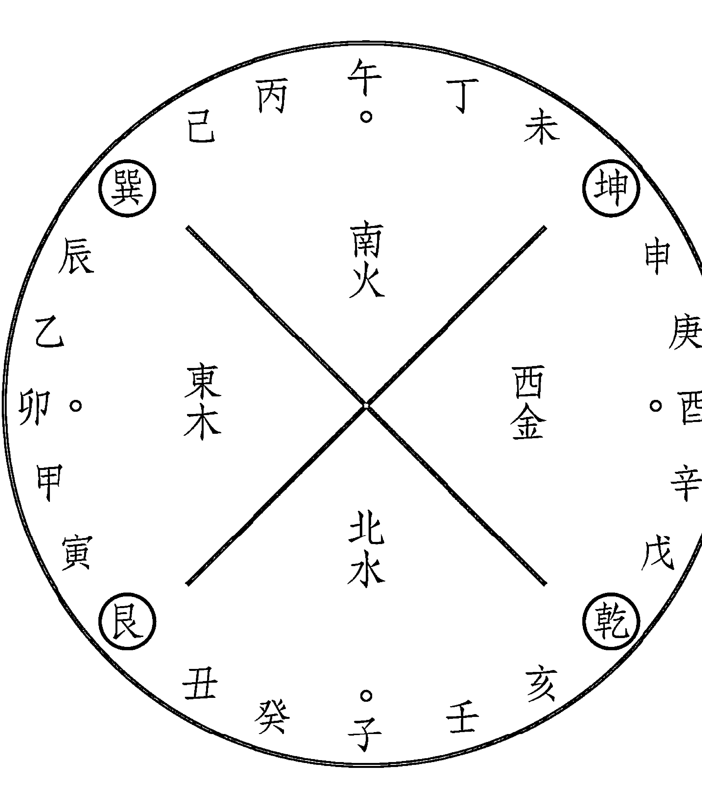

## 第七章 有关阳宅之阴阳五行

## ◎ 阳宅旺衰视其「纳气」：

纳气即论「向房屋来气之磁场方位」的吉凶，即与来气之磁场方位的吉凶有关。而纳气是着重气口；即门向屋向。

个个阳宅主人各有不同的「人极」，而「纳气」与「人极」两者配合得宜与否，就是决定家道旺衰之因素之一。

所谓「人极」，即就个人生辰以阴阳五行理论定出有助于命运趋吉的处世当轴。包括方位、食饵、色彩、人事相性等。

何以同一房屋，甲居住下就运势转旺飞黄腾达，而换来丙君住进则家道日落、灾厄频烦。因为甲君之「人极」与阳宅「纳气」相配得宜，反之，丙君之「人极」与阳宅「纳气」不适宜而趋凶。

## ◎ 阳宅之磁场方位

- 阳宅方位有八卦八方位，一卦分三的二十四山方位及二山合一的十二支向，而另有奇门五行方位的分法。
- 奇门「纳气」有水局、木局、火局、金局的五行方位，以四分法之方位论之（如下页图）
  - 北方水局：以子山为中心，包括亥、壬、子、癸、丑，五山。
  - 东方木局：以卯山为中心，包括寅、甲、卯、乙、辰，五山。
南方火局：以午山为中心，包括巳、丙、午、丁、未，五山。西方金局：以酉山为中心，包括申、庚、酉、辛、戌，五山。
- 天地角位：
东南西北的四方位置各辖五山，计二十山外有坤、巽、艮、乾四山不属于四方位置者，称为「天地角位」。此四位不论吉凶，任何五行来都不吉不凶之方位。
- 经四等分之五行局方位各占七十五度，计三百度。不属于四个天地角位各占十五度，计六十度。

## ◎ 依个人生肖（十二地支）三合定五行局方位。

- 北方水局：水生于申，旺于子，墓于辰；故十二地支生肖是猴、鼠、龙者，属水局。
- 东方木向：木生于亥，旺于卯，墓于未；故十二地支生肖是猪、兔、羊者，属木局。
- 南方火局：火生于寅，旺于午，墓于戌；故十二地支生肖是虎、马、狗者，属火局。
- 西方金局：金生于巳，旺于酉，墓于丑；改十二地支生肖是蛇、鸡、牛者，属金局。

此乃取个人生肖地支三合之帝旺位为其所属五行局方位之定法。是取来龙靠山之理论而论的（后详），如：

## 奇门遁甲

## 阳宅篇

◇ 生肖为猴、鼠、龙者属水局，不宜住离火宅，因为离火宅与水相克，对水局人不吉。
◇ 生肖为猪、兔、羊者属木局，不宜住兑金宅，因为金宅金旺，金克木，对木局人不吉。
◇ 生肖为虎、马、狗者属火局，不宜作坎水宅，因为水宅水旺，水克火，对火局人不吉。
◇ 生肖为蛇、鸡、牛者属金局，不宜作震木宅，因为木宅木旺，金木相克，对金局人不利。

以上是依十二生肖来论住宅吉凶之法，这种论法对一般人易懂，惟属原则性、客观性理论。以十二生肖论坐向之法，可谓是着重于避害避凶依来龙为主的方法。

## ◎ 生辰八字推本命五行喜忌方位。

◇ 四柱八字命式以日柱干之五行为本命五行属性，如日干甲乙为木命，丙丁为火命，戊己为土命，庚辛为金命，壬癸为水命。
◇ 以生辰八字的日干定出本命五行之后，再配合出生月之五行气，就可了解本命五行的强弱旺盛。

而根据五行生克、中和平衡之原则，强旺宜生泄或克制，弱衰宜生扶或比助等，自有其喜、忌。

至此，可决定本命五行之所喜与所忌，而阳宅方位即依此所喜五行方位为吉方，所忌方位为凶。

## ◎ 木命（生日干、甲、乙）

- 春天出生者，木命旺气；春仍残留余寒，最喜能使木暖和的火。故南方火为喜用。阳宅方位以朝向南方为佳。
- 夏天出生者，木命休气；因木根易干燥，需水来滋润，故北方水为喜用。阳宅方位以朝向北方最佳。
- 秋天出生者，木命衰气；秋天之木被金克无生气，需要火来反制金，又需要水来生扶木。故以北方水，南方火为喜用。阳宅方位以朝向北方。
- 冬天出生者，木命相气；火来温木根充实生气，木来生火亦吉，南方火为喜用，东方木亦佳。阳宅方位以朝向南方、东方为佳。

## ◎ 火命（生日干、丙、丁）

- 春天出生者，火命相气，火势略弱，木火来生扶都佳，惟都不须过剩。（若过剩，反以金水为用）原则以坐西向东，坐北朝南，坐西北向东南之宅为佳。
- 夏天的火命：夏火最旺，不能缺水。土来亦可，但不宜多，故亦须以水润。木来无水制火木亦不可。故坐南北向宅，最为理想。

## 奇门遁甲 阳宅篇

◇ 秋天的火命：秋天金旺，火星弱势，能得木来生以助其势为吉。若水来克大凶，金生水连带不佳。宅向以坐西向东，坐西南向东北能得木气为佳。
◇ 冬天的火命：冬天水旺，火最弱，喜木来生而有救，土来制水势亦吉，金来则生水帮凶。火自助吉。宅向以坐西向东，坐北向南，吉。向西、向俱不佳。

## ◎ 土命（生日干、戊、己）

◇ 春天的生命：春天木旺土弱，火来烧木生土最吉。金可制木势，但亦泄土不佳，水来帮木制弱土最凶。宅向以坐北向南，取火势最佳。
◇ 夏天的土命：夏目火旺之时，火炎土燥，喜水来滋润，不忌见水，盖调候为急。夏目水弱，喜见金助。住宅以向北（得水）、向西（得金）为佳。
◇ 秋天的土命：秋月金旺，多泄土气，子旺母衰。喜火制金又生扶。亦喜土来比助扶身。忌水多身弱。宅向以坐北向南（取火）为佳。
◇ 冬天的土命：严寒之时，调候为息，火来保温吉，木来可生火又泄水势，得水火既济之吉。宅向以坐北向南（取火），坐西向东（取木）得吉。

## ◎ 金命（日干、庚、辛）

◇ 春月金命：余寒未尽，不能缺火、土、金生扶都可。金弱见水更泄气，见木损力都不吉。宅向以坐北向南（取火），坐东向西（取金）。
◇ 夏目金命：尤为柔弱，喜见水，得水制火润土，以生金。遇金扶持精壮。见木制土助火克金不佳。宅向以坐南向北（得水），坐东向西（得金）俱吉。
◇ 秋月金命：当权得令之金，刚锐极矣，庚金喜火，锻炼成器，辛金喜水泄秀，用火用水上格。宅向以坐南向北（取水）、坐北向南（取火）俱吉。
◇ 冬月金命：冬月水旺寒冷金弱。有土克水吉，有火则金气温暖。故火、土仍接续之生，俱吉。宅向以坐北向南（取火）得吉。

## ◎ 水命（日干、壬、癸）

◇ 春天之水命：春水休囚劫性滥滔淫，再逢水柱必崩堤。见火，有秉令之木可通其气。自得既济之美。任宅以坐北向南（取火）补运为佳。
◇ 夏天之水命：夏月水干涸，欲得比肩来扶，又须金来生助。火旺涸，土旺干，木旺水泄弱，都不宜。宅向以坐南向北（取水）、坐东向西（取金）为吉。

## # 奇门遁甲 阳宅篇

- ◇ 秋天之水命：水生于秋，母旺子相，宜木火为用，火来财佳，木多子荣兼得泄水势。宅向以坐北向南（取火）、坐西向东（取木）为吉。
- ◇ 冬天之水命：寒威日重，遇火可增暖除寒，水盛母劳金生，徒增寒冻无义，木来可泄强水，宅向宜坐北向南（取火）、坐西向东（取木）俱佳。

## 第八章 「靠山来龙」论大厦楼层吉凶

本章要讨论者，是同一栋高楼大厦之各楼层吉凶。

屋子之靠山在屋后而来龙也从屋子坐方来。

因为来龙即地气，是从下面而上的。所以要讨论同一屋里的各层吉凶，须要从屋坐向也即地气来龙着手。

此与以宅向纳气吉凶论法稍异。（与十二生肖论五行吉坐向则同义）

来龙既然是地气由下升起，故大楼坐气亦由下往上推，并不如屋向、门向之纳气，从对向、屋顶来的。

◇ 大厦内各楼层，可依河图理论分类五行所属：
- 一、六层为水局：一六共水宗
- 二、七层为火局：二七同火道
- 三、八层为木局：三八木为朋
- 四、九层为金局：四九金作友
- 五、十层为土局：五十土同途

注：十层以上以单位数取决，地下一层与上二楼同义，地下二层与上三楼同义。余类推…

## ◎ 依大厦坐向推各楼层旺衰表

(1) 大厦坐向称谓：（坐向依八卦八分法）
- 坐正北向正南、（坐壬子癸三山）坎水宅
- 坐东北向西南、（坐丑艮寅三山）艮土宅
- 坐正东向正西、（坐甲卯乙三山）震木宅
- 坐东南向西北、（坐辰巽巳三山）巽木宅
- 坐正南向正北、（坐丙午丁三山）离火宅
- 坐西南向东北、（坐未坤申三山）坤土宅
- 坐正西向正东、（坐庚酉辛三山）兑金宅
- 坐西北向东南、（坐戌乾亥三山）乾金宅

(2) 各楼层旺衰推法
如大厦是坎水宅（水气旺之大厦）则其各楼为
- 六楼水局：宅水楼水，宅楼比旺，楼旺吉
- 七楼火局：宅水楼火，楼被克，楼死凶
- 八楼木局：宅水楼木，宅生楼，楼旺吉
- 九楼金局：宅水楼金，楼生宅，楼泄气凶
- 十楼土局：宅水楼土，楼克宅，楼伤气凶

依此推例可知坎水宅大厦之一、六、三、八楼为旺，别楼则不旺，二、七楼最差。余类此推法。

## 第九章 二十四山针度与出卦八凶针度

二十四针度是二十四山所占位置范围以度数表示者，子山中央为零度，午山中央为一百八十度。每山各十五度，共三百六十度。

◇ 二十四山针度

- 壬山 三三七・五～三五二・五度
- 子山 三五二・五～七・五度
- 癸山 七・五～二二・五度
- 丑山 二二・五～三七・五度
- 艮山 三七・五～五二・五度
- 寅山 五二・五～六七・五度
- 甲山 六七・五～八二・五度
- 卯山 八二・五～九七・五度
- 乙山 九七・五～一一二・五度
- 辰山 一一二・五～一二七・五度
- 巽山 一二七・五～一四二・五度
- 巳山 一四二・五～一五七・五度
- 丙山 一五七・五～一七二・五度
- 午山 一七二・五～一八七・五度
- 丁山 一八七・五～二〇二・五度
- 未山 二〇二・五～二一七・五度
- 坤山 二一七・五～二三二・五度
- 申山 二三二・五～二四七・五度
- 庚山 二四七・五～二六二・五度
- 酉山 二六二・五～二七七・五度
- 辛山 二七七・五～二九二・五度
- 戌山 二九二・五～三〇七・五度
- 乾山 三〇七・五～三二二・五度
- 亥山 三二二・五～三三七・五度

## 奇门遁甲 阳宅篇

◇ 二十四山的各山，交接界线上分不清的部分，称谓「小空亡」，小空亡部分不论吉凶，任人可用。

◇ 八卦方位，一卦管三山，各卦之交接界线上，有二山交接分不清的部分有八所，谓「出卦八凶」，又称谓「大空亡」，各有六度范围，用之大凶。

◇ 出卦八凶针度

| 方位 | 山向1 | 山向2 | 度数 |
|------|-------|-------|------|
| 坎艮之间 | 丑山兼癸山 | 癸山兼丑山 | 一九・五～二五・五度 |
| 艮震之间 | 寅山兼甲山 | 甲山兼寅山 | 六四・五～七〇・五度 |
| 震巽之间 | 乙山兼辰山 | 辰山兼乙山 | 一〇九・五～一一五・五度 |
| 巽离之间 | 巳山兼丙山 | 丙山兼巳山 | 一五四・五～一六〇・五度 |
| 离坤之间 | 丁山兼未山 | 未山兼丁山 | 一九九・五～二〇五・五度 |
| 坤兑之间 | 申山兼庚山 | 庚山兼申山 | 二四四・五～二五〇・五度 |
| 兑乾之间 | 辛山兼戌山 | 戌山兼辛山 | 二八九・五～二九五・五度 |
| 乾坎之间 | 亥山兼壬山 | 壬山兼亥山 | 三四四・五～三四〇・五度 |

## 坐

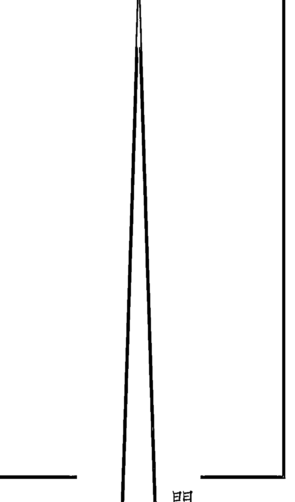

## 门

## 出卦线

## 六度

房屋之中心线若在出卦线上，大凶，任人都住不久。

## 奇门遁甲 阳宅篇

## 出卦图

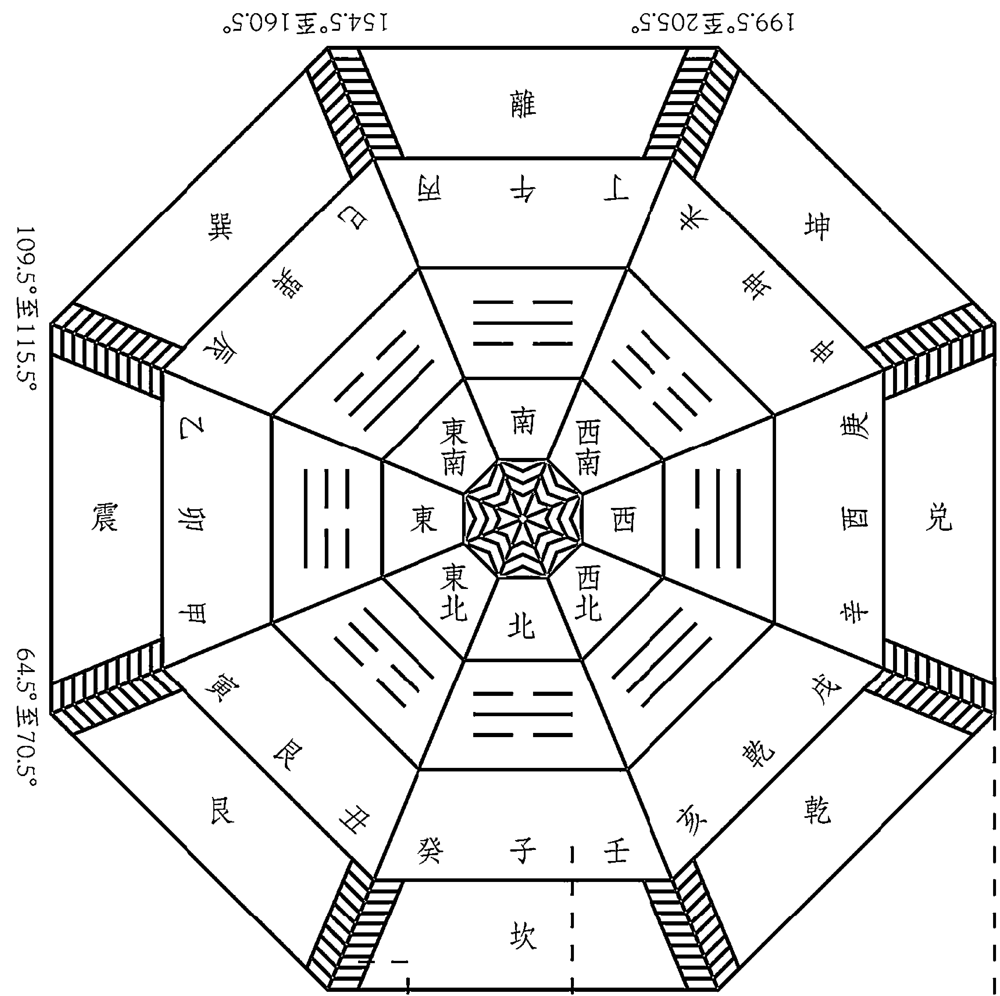

山与山交接处，谓「小空亡」，不论吉凶。
卦与卦交接处「大空亡」，大凶。
大空亡有八处，谓出卦八凶。

大空亡
出卦八凶

◇ 出卦八凶之范围不吉利，财气不旺，破败，若屋子之中心线临此八凶出卦位，此屋大凶。

## 第十章 紫白九星当令法：

此法可用为判断辅助屋内方位之阴阳吉凶，亦可用为选择生男育女之辅助法。

## ◎ 洛书紫白九星：

## ◇ 洛书紫白九星的卦象

- 一白：坎卦、休门、正北方、中男
- 二黑：坤卦、死门、西南方、统三女（老母）
- 三碧：震卦、伤门、正东方、长男
- 四绿：巽卦、杜门、东南方、长女
- 五黄：中宫、太极无卦
- 六白：乾卦、开门、西北方、统三男（老父）
- 七赤：兑卦、惊门、正西方、少女
- 八白：艮卦、生门、东北方、少男
- 九紫：离卦、景门、正南方、中女

## 洛书紫白九星关系图：

| 巽卦 长女 四绿木 东南杜门阴 | 离卦 中女 九紫火 正南景门阴 | 坤卦 统三女 二黑土 西南死门阴 |
|---|---|---|
| 震卦 长男 三碧木 正东伤门阳 | 五黄土 | 兑卦 少女 七赤金 正西惊门阴 |
| 艮卦 少男 八白土 东北生门阳 | 坎卦 中男 一白水 正北休门阳 | 乾卦 统三男 六白金 西北开门阳 |

五黄土、中宫无卦、六白、一白、八白、三碧、四宫位、阳气旺，其他四宫属阴宫。

# 奇門遁甲 陽宅篇

### ◎ 屬陽卦四宮之紫白星陽氣盛衰

三白（六白、一白、八白）及三碧宮位爲陽卦、陽氣旺。
四綠、九紫、二黑、七赤宮位爲陰卦，屬陰氣宮。
此陰陽卦分法與三白（六、一、八白）九紫爲吉，他爲凶的卦象分法略有異。

### ◎ 當令紫白九星盤排法：(以年度爲準)

當令紫白年盤：上元甲子年 中宮起一白
中元甲子年 中宮起四綠
下元甲子年 中宮起七赤
甲子以降各年依陰遁、逆令順布法排盤

當令紫白月盤：四仲年正月：中宮起八白。
四季年正月：中宮起五黃
四孟年正月：中宮起二黑

正月以降各月（節氣）依陰遁逆令順布法排盤：
當令紫白日盤：冬至一立春・甲子日起一白 陽遁
雨水一清明・甲子日起七赤
- (1) 陽遁順令順布法：穀雨一芒種・甲子日起四綠
- 夏至一立秋・甲子日起九紫 陰遁
- (2) 陰遁逆令順布法：處暑一寒霧・甲子日起三碧
- 霜降一大雪・甲子日起六白

## 排盤例：民國八十八年一月十日（戊寅年、小寒節、壬戌日）

- 當令年盤：下元甲子年起七赤 · 逕令至戊寅年 · 二黑 ·
- 當令月盤：戊寅（四孟年正月起二黑）逆令至十二月、九紫 ·
- 當令日盤：小寒壬戌日（冬至一立春、甲子曰起一白）壬戌、五黃。

民國下元戊寅年一月十日 紫白九星盤

# 奇門遁甲 陽宅篇

### 當令年盤

| 一白 | 六白 | 八白 |
|---|---|---|
| 九紫 | 二黑 | 四綠 |
| 五黃 | 七赤 | 三碧 |

### 當令月盤（小寒）

| 八白 | 四綠 | 六白 |
|---|---|---|
| 七赤 | 九紫 | 二黑 |
| 三碧 | 五黃 | 一白 |

### 當令日盤

| 四綠 | 九紫 | 二黑 |
|---|---|---|
| 三碧 | 五黃 | 七赤 |
| 八白 | 一白 | 六白 |

## ◎ 紫白九星屋内阳气旺方判断法

以年盘为重：月盘次之、日盘更次之。

凡属阳卦的紫白九星宫位都属阳旺吉方，但若落宫宫星互不为生助则虽吉不吉。

如民国八十八年一月十日的当令紫白盘（上图三盘）

年盘：一白（水）落巽四（木）东南（宫星相生）阳旺吉。
- 六白（金）落离九（火）（宫星相克）虽吉不吉。
- 八白（土）落坤二（土）西南（宫星相生）阳旺吉。
- 三碧（木）落乾六（金）（宫星相克）虽吉不吉。

当年，屋内巽四东南、坤二西南，阳气旺吉。

月盘：一白（水）落乾六（金）西北（宫星相生）阳旺吉。
- 六白（金）落坤二（土）西南（宫星相生）阳旺吉。
- 八白（土）落巽四（木）（宫星相克）虽吉不吉。
- 三碧（木）落艮八（土）（宫星相克）虽吉不吉。

日盘：一白（水）落坎一（水）正北（宫星比助）阳旺吉。
- 六白（金）落乾六（金）西北（宫星比助）阳旺吉。
- 八白（土）落艮八（土）东北（宫星比助）阳旺吉。
- 三碧（木）落震三（木）正东（宫星比助）阳旺吉。

当年小寒节（十二月令）屋内的阳气旺，应为西北方与西南方，而西南方更与年令阳旺方重叠，旺上加旺。

当年一月十日壬戌，屋内的阳气旺应为正北、西北、东北与正东四方位，而西北与月令阳旺重叠，更旺。

## ◎ 紫白九星生男育女擇生法

應用紫白九星當令陰陽法可有效控制生男或生女，若此法再配合科學擇生法，對欲生男或欲生女者，最有效無比。
雖然全世界的男女人口比例大致均衡，但有的小家庭常有欲求男不得男，欲求女不得女的現象，更有欲求一子、一女都求不得的，這對家庭計劃家庭幸福有影響的。

- ◇ 九星當令陰陽應用法：
  - 求男：擇年紫白、月紫白、日紫白，三盤的陽旺位有重疊的日子，且住宅臥房（臥床）亦與此陽旺位符合，於此日行房可得男子。
  - 求女：擇紫白的年、月、日三盤陰吉宮位重疊之日子，且臥房（臥床）亦合之吉位，皆行房可得女子。（陰吉方位亦要選宮星相生助才算吉）

- ◇ 科學擇生法：
  - 排卵日：求男，於排卵日當天或次日行房，前一段期間須禁慾。
    求女於排卵日前二～三天行房，無須禁慾。
  - 清洗：求男，行房前將小蘇打兩匙加水洗陰道。
    求女，行房前將白醋兩湯匙加水洗陰道。
  - 姿勢：求男，兼用正常位與背面位。
  - 深度：求男宜射於深處，求女宜射於淺處。
  - 高潮：求男，時間越長儘量讓妻子達高潮。求女，時間越短越好，妻子不宜太高潮。
  - 食物：求男，丈夫多食肉类或酸性食物，妻多食蔬菜，碱性食物。求女，两者食物相反。

# 奇門遁甲 陽宅篇

## 第十一章　入宅要領：

搬家入宅與風水宅運相關，不可忽略，除擇吉日吉時且入宅方式恰當外，不能觸犯禁忌，否則會影響家運。

- ◇　入宅須前住人搬走後，加清潔整理，且待隔幾天後，前人或許遺留的煞、霉、窮氣去除後才搬進去。
- ◇　入宅忌先進家俱後進人口，家運會不旺盛。
  人與家俱同進最佳，而人入進時，都不能空手進，家長先進，若家有按神明者，家長捧進去。主婦其次，要帶值錢的，如權狀、金飾、存款簿等…子女進去時亦須各帶物件。
- ◇　米桶須裝有八分滿的米，且米桶上面要置紅包最好置於米桶三天以上（表示有的吃，亦有財）。
  水桶最好也放三分到五分的水，桶裡置十二個硬幣及碗筷二雙。搬進入宅後，碗筷可立刻取出來，但硬幣要置三天。（水桶錢會帶財）。帚把，須新的，入宅後用新帚把不要用舊的。若要當官，用紅紙捲貼於帚把柄或紅帶子串錢，繫於把柄。
- ◇　搬家定要於上午開始搬進去，不要於下午開始搬，上午陽時、下午陰時，而陽宅是忌陰時的。
- ◇　搬進後，有信神，當天要拜拜。白天拜陽神（福德正神），在客廳向外拜，備福金、卦金、三牲等，較週到的、紅圓（一碗裝3、6、12、16個等）及發粿。
  傍晚拜陰神（地基主），從廚房等比較陰的地方往客廳拜。地基主管家興廚房，以飯菜就可，大銀、福金、卦金等。
  不必放鞭炮，但進宅時，屋內要光明，白天也要開灯，愈光愈好。
- ◇ 搬清舊房子後，最好用掃把掃清房內物，由裡掃出外，由樓上掃到樓下。垃圾要自己人拿去丟掉。（掃把與畚箕最好用新的）。沒有掃清，等於全部財氣留下給人。
- ◇ 搬走時不要與人打招呼（與舊人打招呼，表示退後不是前進。）

## 第十二章 商店與辦公廳之風水

### ◎ 商店著重於大門與櫃台：

◇ 大門：
- (1) 商店的大門，最忌設於艮方（東北方），次忌設於坤方（西南方）。
  艮方即「鬼戶」，從此進來者，貴人少，小人多，就是來找麻煩的。坤方即「人門」，從此進來的人客，貪便宜的人多，正直買賣的人少。此兩方位因爲是陰氣深，陽氣少，且是不衛生的地方。
  故若有動火氣者，如廚房、瓦斯爐，避免設於此。此屋內的此二方應有吉星、吉格則凶兆可化解，但須多中吉，不會變成太好。
- (2) 老闆生肖的位也不要設大門或通道，若老闆肖「馬」則「午」位不能做門道。這位屬於老闆，要留給他用，（老闆做什麼都可以）
- (3) 進門設於八門的「開門」，貴客多。

## 留給肖馬老闆之位

| 辰 巳 | 午 | 未 申 |
|---|---|---|
| 卯 |  | 酉 |
| 寅 丑 | 子 | 戌 亥 |

### ◇ 櫃台：
- (1) 櫃台最好設於「生門」方。收入好。若果「生門方」又遇「虎邊」則虎之凶兆減少，其禁忌得解除，故設櫃台無妨。
  右虎邊若逢生門，設櫃檯無妨。
- (2) 櫃台後方須不動方，不能讓人走動，否則失去隱密性。通常是後面牆壁為靠山。櫃檯後面是玻璃窗，可由外面透視進來者，不吉，靠山不牢。
- (3) 吉日良辰開張：非常重要，商家成敗之關鍵。
  選日：黃曆上載有天德、月德、六合、三合、開市、開光等日子都可考慮。但要避開節氣交接前後日子。
- (4) 注意日子沖煞：開幕日子，老闆生肖不要犯沖，大門方向不要犯煞。
  例如：開幕日為民國八十八年一月廿一日（戊寅年大寒）黃曆記載可開市，但此日為大寒後一日，避開為妙，又此日煞來·沖兔12歲（72歲偏沖）；
  因今年大利方是東西，大部份商店大門都喜設東、西方是對的。
  而予定開張日期煞東，巧煞到大門方位，故此日不能用開張日，又若老闆是72歲肖卯，則又偏沖更不可用此日，因煞到大門，又沖老闆生肖。

## ◎ 辦公室

### ◇ 辦公室大門：
- (1) 辦公室的大門方位最好與主管（老闆）的八字本命最喜的方位，
  例如：八字欠水喜水的人，要以坐南朝北門向的屋子做辦公地點。
  因各人本命喜忌不同，前任主管發達過的，此任不一定會同樣發跡，前任衰退的，換人掌舵不一定會再落敗。
- (2) 大門不要與對面屋門相對沖，或沖到對屋牆角，並亦不可沖樓梯或電梯口。
- (3) 大門對著煙囪，電柱，表示天天納汙氣（煙囪）天天受阻擋不順，破財（電柱）。
- (4) 大門用透明玻璃，讓外人能透視內情不佳，須貼上防光色紙陰蔽。
  大門宜設於奇門，尤其是「開門」方位，其次是龍邊。不可設於虎邊，若有奇門則與虎邊，重疊無妨。

### ◆ 辦公室桌位：辦公室風水最重要的
- (1) 主管位置設於較隱密的後方，有實牆且無人走動（靠山好）的位置最好。後面若有窗則靠山弱，易垮台。四邊不靠壁者更兇。
- (2) 主管桌子最好與後面牆平行，不要斜放，若坐位後面實無法靠牆則可用屏風（較重的）可代替靠山作用。
- (3) 坐位後面若掛一幅世界地圖等是好現象，表示靠山多，一般的圖畫如老虎圖不要用，龍畫還可。
- (4) 桌位上方不能有橫樑壓頂，不能有燈壓頭，電燈位置在頭上稍前或稍後才可。
- (5) 主管坐位不可沖向大門，或其單獨辦公的小房門（主管以外的，財務會計人員亦如此，一般職員則無妨）
- (6) 主管坐位在辦公室內部分出的八門奇門方，其次為龍邊。坐向則用其本命八字喜用的五行方位。

### ◇ 辦公室佈置格局：
- (1) 辦公廳以正方形最吉，長方形次吉（商店最吉）三角形爲凶。
  因爲三角形有死角，陰氣盛，方形則無死角，所以陽氣旺。
- (2) 若辦公地點要設神位，宜設在清淨的不動方，不要沖著門，不要設於最後面。設於辦公室的前面或左右。不能沖向廁所。神位後面隔牆有廁所亦不太好 · 神明會不靈。
- (3) 辦公廳若要設廚房，不能設於中心。若無廚房，可設自動飲水器，免得使用電器爐煮水。因爲廚房是表徵財，而電器爐可解釋爲小廚房，亦是財，都需要隱密性。辦公室設電器，常常移動，表示財在移動且衆人外人容易看到，露白，都是不好現象。自動飲水器較有固定性。
- (4) 辦公廳內的走動須流暢，除老闆、主管、財務人員的坐位需穩密而有禁忌外，一般職員注重連繫性、服務性方便就可。
- (5) 與商店的武市不一樣，辦公室有的屬純文市，最好不要與娛樂味較重諸如遊樂場，歌廳、飲食酒家、理髮店等相鄰。會減低旺氣。

## 附錄一 宅形法

六十九種
古代宅形法

## 奇門遁甲
## 陽宅篇

辰巳不足卻為良，居之家蒙大吉昌若是安莊終有利，子孫興旺足牛羊

右短左長不堪居，生財不旺人口處住宅必定子孫愚，先有田蠶後也無

此宅左短右邊長，居子居之大吉昌家內錢財豐盛富，只因次後少兒郎

此房正北有丘墳，明師安莊定有名君子居之官出祿，庶人居之家道榮

此宅卯地有丘墳，後來居之定滅門愚師不辨吉凶理，年久墳前缺子孫

昔日周公相此宅，丑寅空缺聚錢糧家豪富貴長保守，不過仙人怎得知

西南坤地有丘墳，此宅居之漸漸榮若是安裝並造屋，兒孫輩輩主興隆

中央高大號圓丘，修宅安墳在上頭人口財帛多富貴，二千食祿任公侯

仰目之地出賢人，庶人居之亦不貧子孫印授封官職，光顯門庭列九卿

前后有丘不喜歎，安莊修造數年餘
此宅常招凶與吉，得時富貴失時凶

前狹後寬居之穩，富貴平安旺子孫
財帛子孫皆廣有，金珠財寶滿家門

坎兌兩邊道路橫，定主先吉後有凶
人口財帛初年好，不過十年一時空

此宅乾地有丘陵，修宅安莊日見與
女人入宮為妃后，兒孫日後作公卿

西高東下向北宅，正好修工蓋莊家
後代資財石崇富，滿宅家眷六畜強

此宅前後有高沙，居之依師不為差
田財廣有人多喜，處處談揚富家

此地只因道左邊，久住先富後寒貧
富重之人終迪吉，若逢賤者離家園

宅前有水後有丘，十人遇此九人憂
家財初有終耗散，牛羊倒死禍無休

朱元龍虎四神全，男人富貴女人賢
官祿不求而自至，後代兒孫福遠年

# 奇門遁甲 陽宅篇

此宅東北斜道行，宅西大道主亨通
雖然置下田庄産，破敗一時滅無餘

宅前林木在兩傍，乾有丘埠艮有岗
若居此地家富豪，後代兒孫資顯揚

正宅安居正可求，西南水向東北流
雖然重妻别無事，三公九相近王侯

前後左右有坵陵，後面東道遠平平
巽地開門家富貴，不宜兌路子孫沖

寺廟坵墳切要知，不分南北共東西
離宅未有一百步，以後傷人殺子孫

左邊孤墳莫施工，此地安莊甚是凶
疾病纏身終不吉，家中常被鬼賊侵

西來有水向東流，東頭長河九曲溝
後代綿延子孫勝，禾穀田庄歳歳收

前有丘陵後有岡，西邊穩抱水朝陽
東行漫下過一里，此宅安居甚是強

兩邊白虎生災殃，百事難成有死傷
喊人偷盗錢財破，又兼多訟被官妨

**吉宅**：宅东流水势无弱，宅西大道主亨通，因何富贵一齐至，右有白虎左青龙

**吉宅**：后高有陵前近池，西北瞻仰头高危，天赐富贵仓粮足，见孙代代有紫衣

**吉宅**：西有长坡汇远冈，东有河水鹅鸭昌，若居此地多吉庆，代代见孙福禄疆

**吉宅**：住宅西南有水池，西北地势更相宜，艮地有冈多富贵，子孙天赐着罗衣

**凶宅**：南来大门正冲门，速避直行过路人，急取大石宜改镇，免教后人哭声频

**凶宅**：东西有道直冲怀，定主风病疾伤灾，从来多用医不可，见孙难免见伤悲

**吉宅**：此宅方圆四平面，理合观此好兴土，不论宫商角徵羽，家豪富贵旺人丁

**半吉宅**：此宅观灵取此强，却因辰巳有池塘，见孙旺相家资盛，兴小败长有官防

**半凶宅**：左边水来射午宫，先出富贵后贫弱，明师断尽吉凶事，左边大富右边弱

## 奇门遁甲
## 阳宅篇

西北乾宫有水池，安身甚是不相宜，不逢喜事多悲泣，初虽富贵终残疾。

此宅左右水渠长，久后见孙福禄齐，禾麦钱财常富贵，儿孙聪俊圣祖基。

前后高山两相宜，左右两边有沙池，家豪富贵多年代，寿命延年彭祖齐。

中央正面四面高，修尽中宅福有余，牛羊六畜多兴旺，家道富贵出英豪。

左短右长却安然，后面夹稍前面宽，此地修造人口吉，子孙兴旺胜田庄。

东北丘坟在艮方，成家立计有何妨，修造安庄终迪吉，富贵荣华世世昌。

此宅后边有高冈，南下居之第一强，子孙兴旺田宅胜，岁岁年年有陈粮。

前有大山不足论，不可安庄立坟茔，试问明师凶与吉，若居此地定灭门。

此墨西边有水池，人若居之最不宜，牛羊不旺人不吉，先富后贫少人知。

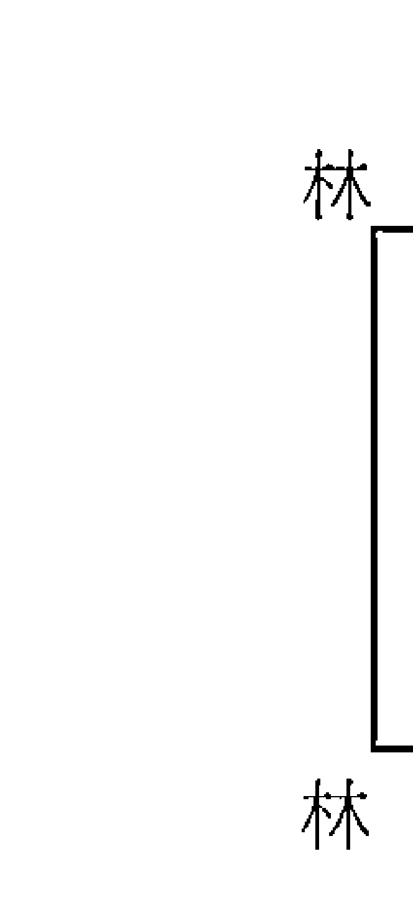

此宅前後有墳林，凡事未通不稱心。家財破敗終無吉，常有非災後又侵。

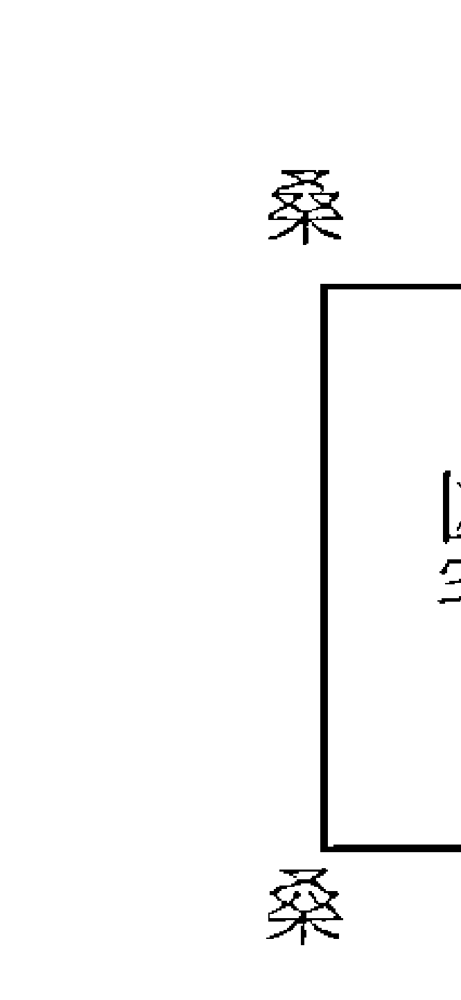

此宅四角有林桑，禍起之時不可當。若遇明師重改造，免教後悔受恓惶。

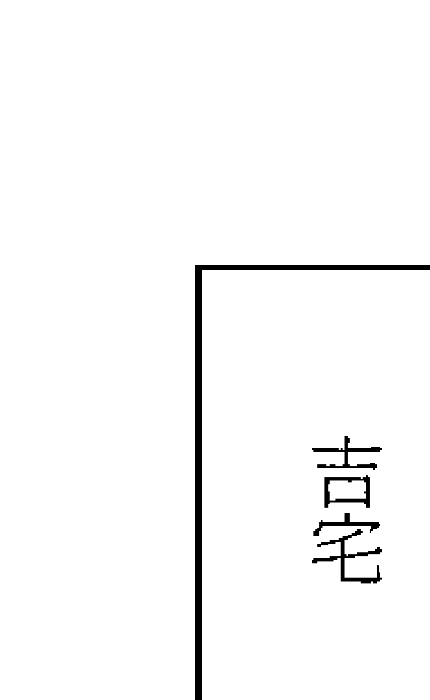

後邊有山可安莊，家財盛茂人最強。若居此地人丁旺，子孫萬石有餘糧。

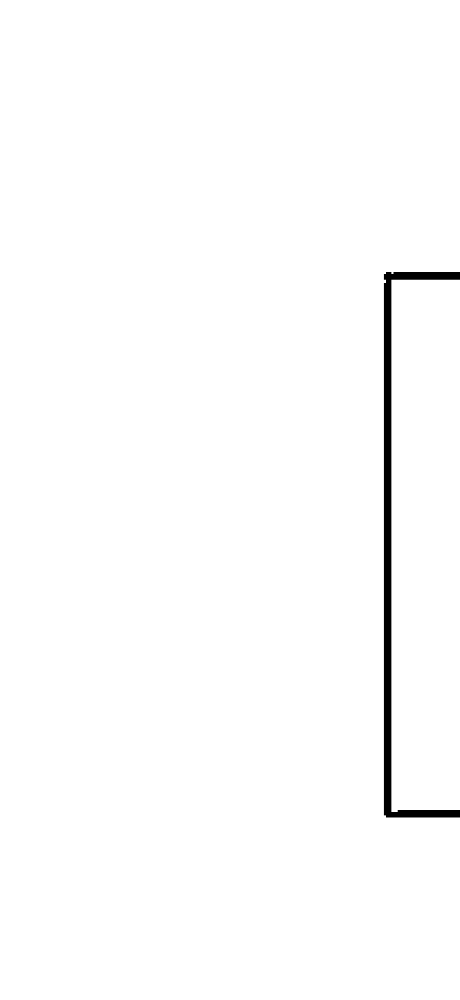

此地觀之又如何，前山後山不堪居。家貧孤寡出逆子，財帛破盡禍有餘。

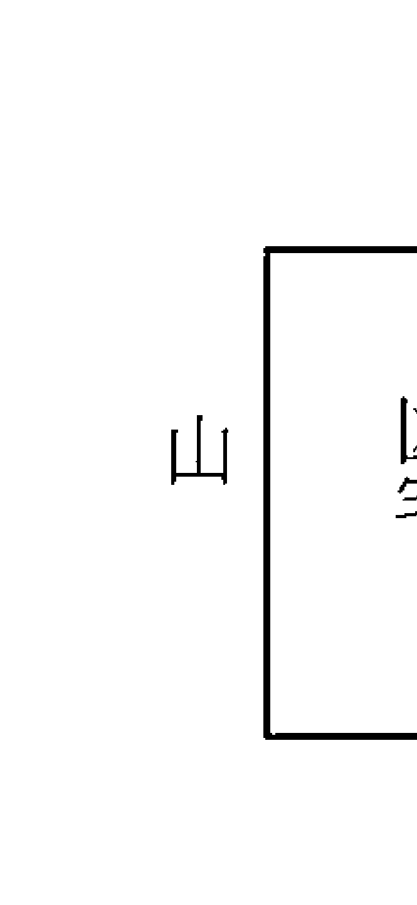

此宅東面有大山，又孤又寡見貧寒。頻過口舌多過難，百事先成後又難。

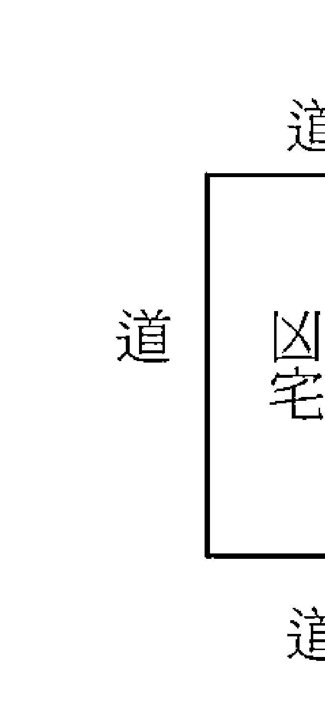

四面交道主凶殃，禍起人家不可當。若不損財災禍死，投河自縊井中亡。

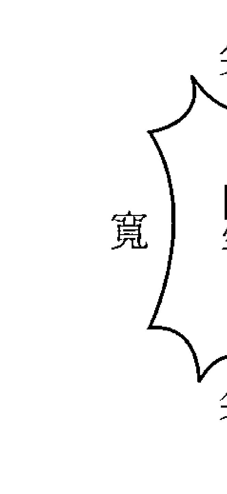

東西寬大兩頭尖，嶺上安墳不足看。此地若無前後勢，宅中男女有人嫌。

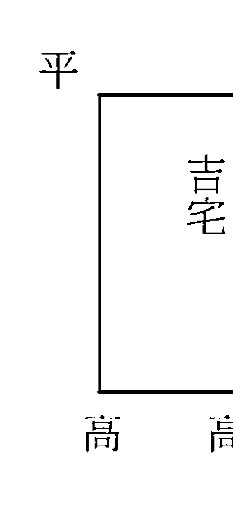

乾坤艮坎四崗高，前平地勢有相饒。立宅居之人口旺，兒孫出眾見英豪。

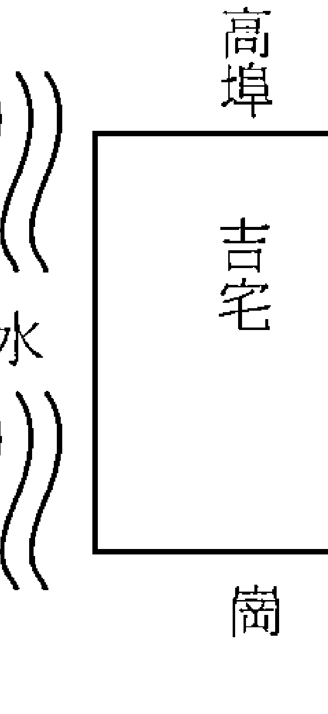

前有高阜後有岡，東來流水西進長。子孫世世居官位，紫袍金帶拜君王。

# 奇門遁甲 陽宅篇

> 凶宅
低下 高 低下
兩邊低下後邊高，婦人守寡受勤勞。
多招接腳並義子，年深猶自出貧消。

> 吉宅
道 道
東西有道在門前，莫把行人段遮攔。
宅內更有車馬過，子孫富貴的安然。

> 凶宅
林 林
林林中不得去安居，田宅莫把作墳坵。
田庄歲歲多耗散，宅內憂鬼成婚。

> 右邊白虎北聯山，左有青龍綠水潺。
若居此地出公相，不入文班入武班。

> 面前一山如人舞，家中定出不進子。
是非之人常入宅，兄弟手足也不安。

> 這個明堂出寡娘，少年眼疾墮胎亡。
癆療氣疾人丁有，流水兒孫實可傷。

## ◎ 附錄二 三元九運陽宅盤

奇門遁甲 三元九運陽宅盤

| 元運範圍 | 盤數 |
|----------|------|
| 上元一～三運 | 144 盤 |
| 中元四～六運 | 144 盤 |
| 下元七～九運 | 144 盤 |

## ◎ 奇門陽宅 定局表 (數字為西曆)

| 元 | 运 | 干支年份（西历年份） |
|----|----|----------------------|
| 上元 | 一运 | 甲子一八六四 乙丑一八六五 丙寅一八六六 丁卯一八六七 戊辰一八六八 己巳一八六九 庚午一八七〇 辛未一八七一 壬申一八七二 癸酉一八七三 甲戌一八七四 乙亥一八七五 丙子一八七六 丁丑一八七七 戊寅一八七八 己卯一八七九 庚辰一八八〇 辛巳一八八一 壬午一八八二 癸未一八八三 |
| 上元 | 二运 | 甲申一八八四 乙酉一八八五 丙戌一八八六 丁亥一八八七 戊子一八八八 己丑一八八九 庚寅一八九〇 辛卯一八九一 壬辰一八九二 癸巳一八九三 甲午一八九四 乙未一八九五 丙申一八九六 丁酉一八九七 戊戌一八九八 己亥一八九九 庚子一九〇〇 辛丑一九〇一 壬寅一九〇二 癸卯一九〇三 |
| 上元 | 三运 | 甲辰一九〇四 乙巳一九〇五 丙午一九〇六 丁未一九〇七 戊申一九〇八 己酉一九〇九 庚戌一九一〇 辛亥一九一一 壬子一九一二 癸丑一九一三 甲寅一九一四 乙卯一九一五 丙辰一九一六 丁巳一九一七 戊午一九一八 己未一九一九 庚申一九二〇 辛酉一九二一 壬戌一九二二 癸亥一九二三 |
| 中元 | 四运 | 甲子一九二四 乙丑一九二五 丙寅一九二六 丁卯一九二七 戊辰一九二八 己巳一九二九 庚午一九三〇 辛未一九三一 壬申一九三二 癸酉一九三三 甲戌一九三四 乙亥一九三五 丙子一九三六 丁丑一九三七 戊寅一九三八 己卯一九三九 庚辰一九四〇 辛巳一九四一 壬午一九四二 癸未一九四三 |
| 中元 | 五运 | 甲申一九四四 乙酉一九四五 丙戌一九四六 丁亥一九四七 戊子一九四八 己丑一九四九 庚寅一九五〇 辛卯一九五一 壬辰一九五二 癸巳一九五三 甲午一九五四 乙未一九五五 丙申一九五六 丁酉一九五七 戊戌一九五八 己亥一九五九 庚子一九六〇 辛丑一九六一 壬寅一九六二 癸卯一九六三 |
| 中元 | 六运 | 甲辰一九六四 乙巳一九六五 丙午一九六六 丁未一九六七 戊申一九六八 己酉一九六九 庚戌一九七〇 辛亥一九七一 壬子一九七二 癸丑一九七三 甲寅一九七四 乙卯一九七五 丙辰一九七六 丁巳一九七七 戊午一九七八 己未一九七九 庚申一九八〇 辛酉一九八一 壬戌一九八二 癸亥一九八三 |
| 下元 | 七运 | 甲子一九八四 乙丑一九八五 丙寅一九八六 丁卯一九八七 戊辰一九八八 己巳一九八九 庚午一九九〇 辛未一九九一 壬申一九九二 癸酉一九九三 甲戌一九九四 乙亥一九九五 丙子一九九六 丁丑一九九七 戊寅一九九八 己卯一九九九 庚辰二〇〇〇 辛巳二〇〇一 壬午二〇〇二 癸未二〇〇三 |
| 下元 | 八运 | 甲申二〇〇四 乙酉二〇〇五 丙戌二〇〇六 丁亥二〇〇七 戊子二〇〇八 己丑二〇〇九 庚寅二〇一〇 辛卯二〇一一 壬辰二〇一二 癸巳二〇一三 甲午二〇一四 乙未二〇一五 丙申二〇一六 丁酉二〇一七 戊戌二〇一八 己亥二〇一九 庚子二〇二〇 辛丑二〇二一 壬寅二〇二二 癸卯二〇二三 |
| 下元 | 九运 | 甲辰二〇二四 乙巳二〇二五 丙午二〇二六 丁未二〇二七 戊申二〇二八 己酉二〇二九 庚戌二〇三〇 辛亥二〇三一 壬子二〇三二 癸丑二〇三三 甲寅二〇三四 乙卯二〇三五 丙辰二〇三六 丁巳二〇三七 戊午二〇三八 己未二〇三九 庚申二〇四〇 辛酉二〇四一 壬戌二〇四二 癸亥二〇四三 |

# 奇門遁甲 陽宅篇

## ◎ 八卦方位 八門 九星 八神 天地盤 紫白九星 之位置及作盤方法

## ◇ 奇門遁甲陽宅盤示意圖（洛書九宮方位及屋向方位）

奇門陽宅盤以洛書九宮為基盤，盤中各宮有奇儀天地盤、八門、九星、八神、紫白九星、等奇門星神配置。因各宮有六層配置且都陽遁排盤，與一般的時盤、月盤、年盤等之五層配置法略異。

| 巽 東南 | 離 正南 | 坤 西南 |
| :---: | :---: | :---: |
| 震 正東 | 紫白星數(定局表) | 兌 正西 |
| 艮 東北 | 坎 正北 | 乾 西北 |

## ◇ 奇門遁甲陽宅盤作盤圖例

第一例：西曆 2009 年建造 定局表查得 2009 為

1.  下元八運
2.  門向子向（屬甲子旬）
3.  屋向震卦，屬坎艮震巽四卦之一，即第初頁）
4.  （八運、門向子丑=1、屋向震=初頁）

故

## 門向 子丑 屋向 震（正東）

| 紫白九星/八神 | 九星 | 天盤奇儀 |
|--------------|------|----------|
| 七衝王 蛇驚癸 | 三輔癸 陰開己 | 五英己 合休丁辛 |
| 六任戊 符死王 | 八 (定局表) 丁 | 一丙禽 丁辛 陳生乙 |
| 二蓬庚 天景戊 | 四心丙 地杜庚 | 九柱乙 雀傷丙 |

+   1.  八門杜門；位於洛書各宮之中列下段，直使、八門宮位轉盤設定法則與時盤相同。
+   2.  九星天輔星；位於洛書各宮之中列上段，直符、九星配置法則與時盤等相同。
+   3.  八神直符；位於洛書各宮之左列下段，八神直符以及其他七神配置與時盤相同。
+   4.  奇儀天地盤；配置於洛書各宮之右列上下段，天盤在上，地盤在下。
+   5.  紫白九星；配置於洛書各宮（包括五中宮），當局盤之定局數即是五中宮之子白星數。如上元一運盤，則一白水星及五中宮之紫白為一數，下元八運盤則此盤五中宮之紫白是八白土星為八數，六宮以下之紫白依紫白飛法配置於各宮。
+   6.  以上排成第一例之陽宅盤

# # 奇門遁甲 陽宅篇

第二例：西曆 1909 年建造 陽宅盤代號 352

三運3、門向巳申5、屋向八卦乾，乾卦（次頁部離艮兌乾之一）次頁故2

門向 巳申 屋向 乾 (西北)

| 二壬癸 陳驚己 | 七衝戊 雀開丁 | 九輔己 地休庚乙 |
| :--- | :--- | :--- |
| 一逢丙 合死戊 | 三 庚 | 五英丁 天生壬 |
| 六心辛 陰景癸 | 八柱王 蛇杜丙 | 四芮禽庚乙 符傷心 |

+   （1）陽宅版代號 352 的 3 指上元三運。5 指門向子丑、寅亥、戌卯、辰酉、申巳、午未六對十二支向的第五申巳，故定為「甲申旬」符首「庚」。2 指屋向第 2 頁陰遁部份四卦坎艮震巽之一）。故此陽宅盤是，上元三運、門向申巳、屋向第 2 頁的乾方。
+   （2）「三運」；地盤排陽遁三局，戊儀由震宮（三宮）發起。
+   （3）「宅干」；屋向「乾」宮位之地盤「辛」儀乃「宅干」。九星直符天禽（與天芮同居）八神直符、直使五死都定於此宮。直使要须以甲申旬的旬支與宅干支的宅支「轉盤」而定宮位。
+   （4）「宅支」；門向六甲旬「甲申旬」支甲申，依序推干支到「宅干辛」所配之「卯」，乃「宅支」。（參考下列走向至辛卯）
+   （5）甲申 - 乙酉 - 丙戌 - 丁亥 - 戊子 - 己丑 - 庚寅 -「辛卯」
+   (6) 此陽宅盤之宅干支乃「辛卯」，其作用與時盤之「時干支」相似。
+   (7) 天盤；天盤符首「庚」乙，加於六乾宮地盤「宅干辛」上，依序推到各宮天盤奇儀。
+   (8) 直符九星、八神直符都由六乾宮與天盤符首宮同宮起發，推排宅盤九宮。
+   (9) 紫白九星、依陽宅定局數（陽三局乃3數），由九宫五中宮起飛癸九宫。

## ◇ 陽宅盤用法

將建築設計、予定入住、購屋居住等，事先探勘取吉避凶用之。

建屋縮尺圖與陽宅盤重貼（屋向、門向等），取捨門向吉凶、屋內各部位之吉凶等。

## 陽宅中心測量法

◇ 無長短房屋中心點取法

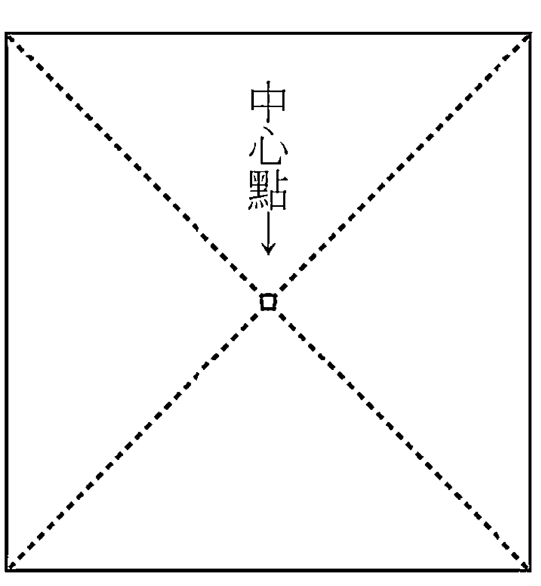

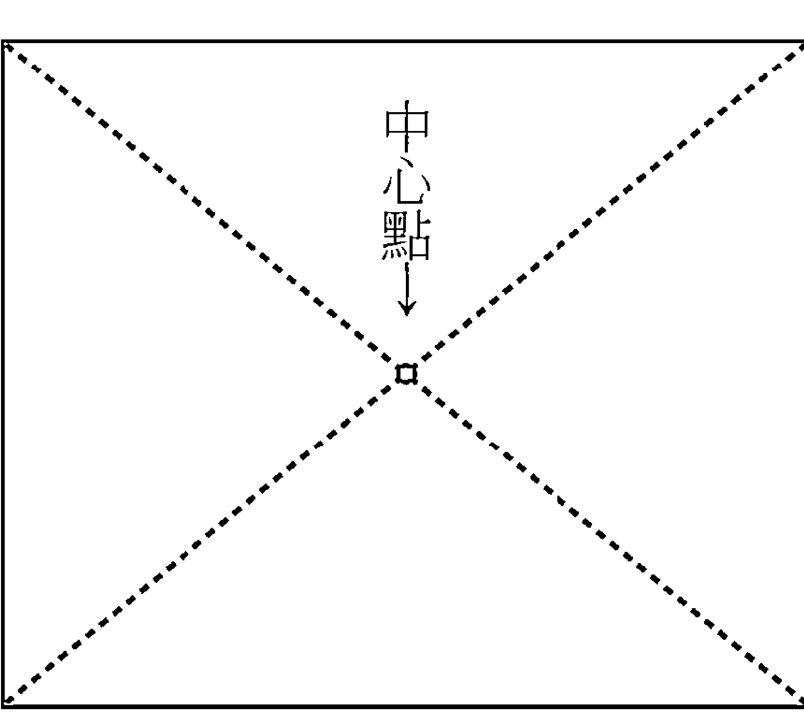

◇ 有長短房屋中心取法

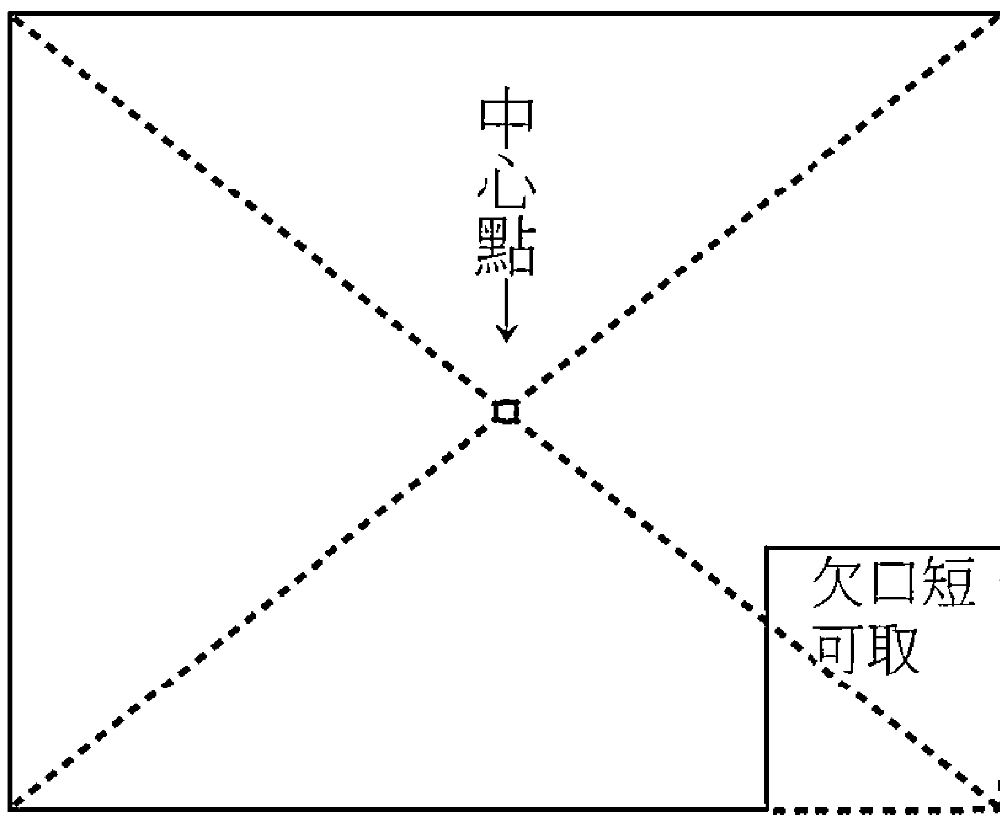

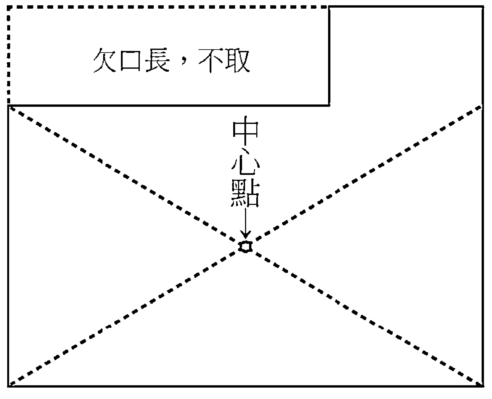

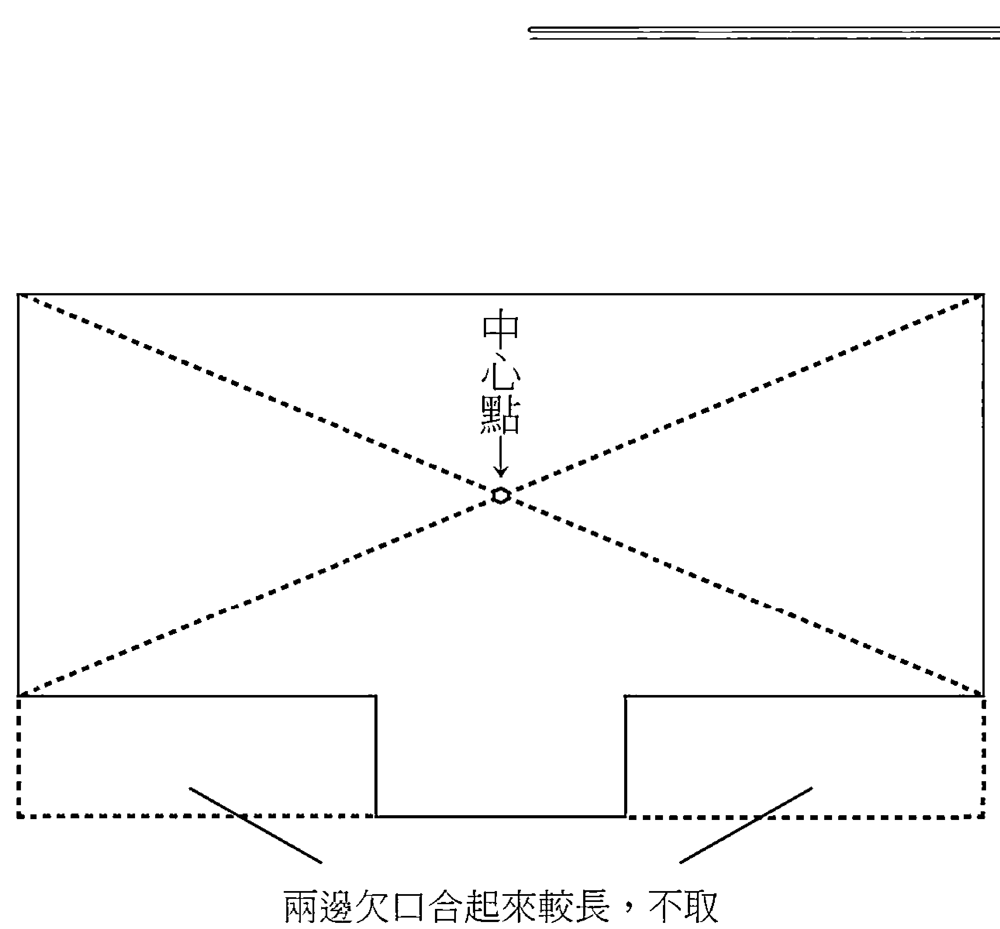

## ◎ 屋向與門向決定法 陽宅盤選取法

◇ 屋向與門向

依下圖（建築預定圖或縮尺圖），得屋向巽掛（東南）、門向寅向（甲寅旬、符首癸）。

◇ 三元九運陽宅盤選取法

8運 = 8  門向寅 = 6

屋向 = 巽（八屋向卦之初頁，坎艮震巽之一故1）

8運是住進預定年，門向寅，即屋向巽是先測量（以羅盤或磁石測定位置（屋向卦及門向之山，而得8數及9數。與預定年限，合成861再套進861代號之陽宅盤。）

## 奇門遁甲
陽宅篇

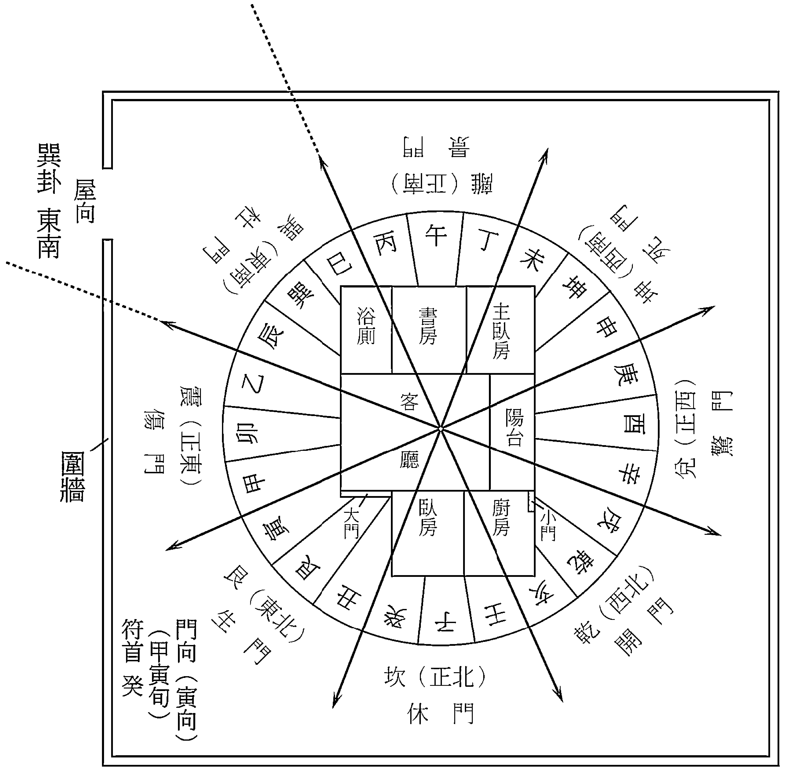

◇ 依 861 代號陽宅盤之奇門吉凶，判斷各該當洛書官位之吉凶。

如下

+   此宅 艮宮：大門八門生門，財吉。
+   巽宮：浴廁 - 朱雀投江，合理。
+   離宮：書房 - 景乙，功課好，利於金榜題名。
+   坤宮：主臥房 - 玉女守門、飛鳥跌穴，最吉、幸福、有財。

## 上元一運 四十八局

| 代號運 | 門向六種支向 | 屋向八卦 |
|--------|--------------|----------|
| 代號1  | (1～6)       | 1. 坎艮震巽 2. 離坤兌乾 |

## 奇門遁甲

陽宅篇

## 第一節 上元一運 四十八局

### 1-1-1 門向 子丑 (子山 壬山 丑山 癸山)

## 屋向 坎 正北

| 九 合 輔 驚 辛 辛 | 五 陳 英 開 乙 乙 | 七 雀 芮禽 休 己壬 己壬 |
|---|---|---|
| 八 陰 衛 死 庚 庚 | 一 壬 | 三 地 柱 生 丁 丁 |
| 四 蛇 任 景 丙 丙 | 六 符 蓮 杜 戊 戊 | 二 天 心 傷 癸 癸 |

此宅以「戊」為符首，「戊辰」為宅干支。
艮宮：景丙吉門。
震宮：戰格。
離宮：開乙奇門。
坤宮：休吉門。
兌宮：生丁奇門、重詐。
此宅為九星奇儀伏吟格。

## 屋向 艮 東北

| 九 陰 衛 生 辛 庚 | 五 合 輔 傷 辛 乙 | 七 陳 英 杜 乙 己壬 |
|---|---|---|
| 八 蛇 任 休 丙 庚 | 一 壬 | 三 雀 芮禽 景 己壬 丁 |
| 四 符 蓮 開 戊 丙 | 六 天 心 驚 癸 戊 | 二 地 柱 死 丁 癸 |

此宅以「戊」為符首，「丙寅」為宅干支。
艮宮：開門吉門、青龍返首、相佐。
震宮：休丙奇門、火入金。
離宮：白虎猖狂。
乾宮：朱雀投江。

## 屋向 震 正東

| 九 蛇 任 死 辛 丙 | 五 陰 衛 驚 乙 庚 | 七 合 輔 開 己壬 辛 |
|---|---|---|
| 八 符 蓮 景 庚 戊 | 一 壬 | 三 陳 英 休 丁 乙 |
| 四 天 心 杜 丙 癸 | 六 地 柱 傷 戊 丁 | 二 雀 芮禽 生 癸 己壬 |

此宅以「戊」為符首、「庚午」為宅干支。
坤宮：開吉門。
兌宮：休乙奇門、玉女守門。
乾宮：生吉門。

## 屋向 巽 東南

| 九 符 蓮 傷 辛 戊 | 五 蛇 任 驚 乙 丙 | 七 陰 衛 景 己壬 庚 |
|---|---|---|
| 八 天 心 生 庚 癸 | 一 壬 | 三 合 輔 死 丁 辛 |
| 四 地 柱 休 丙 丁 | 六 雀 芮禽 開 戊 己壬 | 二 陳 英 驚 癸 乙 |

此宅以「戊」為符首、「辛未」為宅干支。
坎宮：開吉門。
艮宮：休丁奇門、人遁、重詐、玉女守門。
震宮：生吉門。

### 1-1-2 門向 子丑 (子山 壬山 丑山 癸山)

## 屋向 離 正南

| 九 心 癸   天 熱 辛 | 五 蓮 戊   符 開 乙 | 七 任 丙   蛇 休 己壬 |
| 八 柱 丁   地 死 庚 | 一   壬 | 三 衡 庚   陰 生 丁 |
| 四 芮禽 己壬   雀 景 丙 | 六 英 乙   陳 杜 戊 | 二 輔 辛   合 傷 癸 |

此宅「符首」戊、「宅干支」乙丑。
離宮：開吉門、相佐。
坤宮：休丙奇門。
兌宮：生吉門。

## 屋向 坤 西南

| 九 柱 丁   地 景 辛 | 五 心 癸   天 死 乙 | 七 蓮 戊   符 熱 己壬 |
| 八 芮禽 己壬   雀 杜 庚 | 一   壬 | 三 任 丙   蛇 開 丁 |
| 四 英 乙   陳 傷 丙 | 六 輔 辛   合 生 戊 | 二 衡 庚   陰 休 癸 |

此宅「符首」戊、「宅干支」己巳。
坎宮：生吉門。
巽宮：景丁吉門。
兌宮：開丙奇門、天遁。
乾宮：休吉門。

## 屋向 兌 正西

| 九 芮禽 己壬   雀 休 辛 | 五 柱 丁   地 生 乙 | 七 心 癸   天 傷 己壬 |
| 八 英 乙   陳 開 庚 | 一   任 符 杜 丁 | 三 蓮 戊 |
| 四 輔 辛   合 熱 丙 | 六 衡 庚   陰 死 戊 | 二 任 丙   蛇 景 癸 |

此宅「符首」戊、「宅干支」丁卯。
震宮：開乙奇門。
巽宮：休吉門。
離宮：生丁奇門、重詐。
乾宮：景丙吉門。

## 屋向 乾 西北

| 九 英 乙   陳 杜 辛 | 五 芮禽 己壬   雀 景 乙 | 七 柱 丁   地 死 己壬 |
| 八 輔 辛   合 傷 辛 | 一   壬 | 三 心 癸   天 熱 丁 |
| 四 衡 庚   陰 生 丙 | 六 任 丙   蛇 休 戊 | 二 蓮 戊   符 開 癸 |

此宅「符首」戊、「宅干支」癸酉。
坎宮：休丙奇門、飛鳥跌穴。
艮宮：生吉門、金入火。
巽宮：青龍逃走。
兌宮：螣蛇夭矯。
此宅為八門伏吟格。

# 奇門遁甲 陽宅篇

## 1-2-1 門向 寅亥 (寅山 艮山 亥山 乾山)

## 屋向 坎 正北

| 九 衛 庚 合 傷 辛 | 五 輔 辛 陳 杜 乙 | 七 英 乙 雀 景 己壬 |
| :--- | :--- | :--- |
| 八 任 丙 陰 生 庚 | 一 壬 | 三 芮禽 己壬 地 死 丁 |
| 四 蓬 戊 蛇 休 丙 | 六 心 癸 符 開 戊 | 二 柱 丁 天 熬 癸 |

此宅「符首」癸 「宅干支」戊午
坎宮：開吉門
艮宮：休吉門
震宮：生丙奇門、熒惑入白
離宮：白虎猖狂
乾宮：朱雀投江

## 屋向 艮 東北

| 九 任 丙 陰 生 辛 | 五 衛 庚 合 傷 乙 | 七 輔 辛 陳 杜 己壬 |
| :--- | :--- | :--- |
| 八 蓬 戊 蛇 休 庚 | 一 壬 | 三 英 乙 雀 景 丁 |
| 四 心 癸 符 開 丙 | 六 柱 丁 天 熬 戊 | 二 芮禽 乙 地 死 癸 |

此宅「符首」癸 「宅干支」丙辰
艮宮：開吉門、青龍返首、相佐
震門：休吉門
巽宮：生門丙奇、眞詐
兌宮：景乙吉門

## 屋向 震 正東

| 九 蓬 戊 蛇 休 辛 | 五 任 丙 陰 生 乙 | 三 衛 庚 合 傷 己壬 |
| :--- | :--- | :--- |
| 八 心 癸 符 開 庚 | 一 壬 | 三 輔 辛 陳 杜 丁 |
| 四 柱 丁 天 熬 丙 | 六 芮禽 己壬 地 死 戊 | 二 英 乙 雀 景 癸 |

此宅「符首」癸 「宅干支」辛酉
震宮：開吉門
巽宮：宮吉門
離宮：生丙奇門、眞詐
乾宮：景乙吉門

## 屋向 巽 東南

| 九 心 癸 符 開 辛 | 五 蓬 戊 蛇 休 乙 | 七 任 丙 陰 生 乙 |
| :--- | :--- | :--- |
| 八 柱 丁 天 熬 庚 | 一 壬 | 三 衛 庚 合 傷 丁 |
| 四 芮禽 己壬 地 死 丙 | 六 英 乙 雀 景 戊 | 二 輔 辛 陳 杜 癸 |

此宅「符首」癸 「宅干支」庚申
坎宮：景乙吉門
巽宮：開吉門
離宮：宮吉門
坤宮：生丙奇門、眞詐

## 1-2-2 門向 寅亥 (寅山 艮山 亥山 乾山)

## 屋向 離 正南

| 九 柱 丁 天 景 辛 | 五 心 癸 符 死 乙 | 七 蓬 戊 蛇 開 己壬 |
| :--- | :--- | :--- |
| 八 芮禽 己壬 地 杜 庚 | 一 壬 | 三 任 丙 陰 生 丁 |
| 四 英 乙 雀 傷 丙 | 六 輔 辛 陳 休 戊 | 二 衛 庚 合 死 癸 |

此宅「符首」癸、「宅干支」乙卯
坎宮：生吉門
巽宮：景丁吉門
兌宮：開丙奇門、玉女守門

## 屋向 坤 西南

| 九 丙壬 己壬 地 死 辛 | 五 柱 丁 天 癸 乙 | 七 心 癸 符 開 己壬 |
| :--- | :--- | :--- |
| 八 英 乙 雀 景 庚 | 一 壬 | 三 蓬 戊 蛇 休 丁 |
| 四 輔 辛 陳 杜 丙 | 六 衛 庚 合 傷 戊 | 二 任 丙 陰 生 癸 |

此宅「符首」癸、「宅干支」己未
震宮：景乙吉門
坤宮：開吉門
兌宮：休吉門
乾宮：生丙奇門、真詐

## 屋向 兌 正西

| 九 英 乙 雀 癸 辛 | 五 芮禽 己壬 地 開 乙 | 七 柱 丁 天 休 己壬 |
| :--- | :--- | :--- |
| 八 輔 辛 陳 死 庚 | 一 壬 | 三 心 癸 符 生 丁 |
| 四 衛 庚 合 景 丙 | 六 任 丙 陰 杜 戊 | 二 蓬 戊 蛇 傷 癸 |

此宅「符首」癸、「宅干支」丁巳
艮宮：太白入熒
巽宮：青龍逃走
離宮：開吉門
坤宮：休丁奇門
兌宮：生吉門

## 屋向 乾 西北

| 九 輔 辛 陳 杜 辛 | 五 英 乙 雀 景 乙 | 七 芮禽 己壬 地 死 己壬 |
| :--- | :--- | :--- |
| 八 衛 庚 合 傷 庚 | 一 壬 | 三 柱 丁 天 癸 丁 |
| 四 任 丙 陰 生 丙 | 六 蓬 戊 蛇 休 戊 | 二 心 癸 符 開 癸 |

此宅「符首」癸 「宅干支」癸亥
坎宮：休吉門
艮宮：生丙奇門、真詐
震宮：戰格
離宮：景乙吉門
乾宮：開吉門

# 奇門遁甲 陽宅篇

## 1-3-1 門向 卯戌（卯山 甲山 戌山 辛山）

## 屋向 坎 正北

| 九 蓬 戊 合 生 辛 | 五 任 丙 陳 傷 乙 | 七 衛 庚 雀 杜 己壬 |
| :--- | :--- | :--- |
| 八 心 癸 陰 休 庚 | 一 壬 | 三 輔 辛 地 景 丁 |
| 四 柱 丁 蛇 開 丙 | 六 芮禽 己壬 符 戊 | 二 英乙 天 死 癸 |

此宅「符首」己，「宅干支」戊虎
艮宮：開丁奇門
震宮：休吉門

## 屋向 艮 東北

| 九 心 癸 陰 死 辛 | 五 蓬 戊 合 戊 | 七 任 丙 陳 開 己壬 |
| :--- | :--- | :--- |
| 八 柱 丁 蛇 景 庚 | 一 壬 | 三 衛 庚 雀 休 丁 |
| 四 芮禽 己壬 符 杜 丙 | 六 英乙 天 傷 戊 | 二 輔 辛 地 生 癸 |

此宅「符首」己、「宅干支」丙子
震宮：景丁吉門
坤宮：開丙奇門、天遁、飛鳥跌穴

## 屋向 震 正東

| 九 柱 丁 蛇 開 辛 | 五 心 癸 陰 休 乙 | 七 蓬 戊 合 生 己壬 |
| :--- | :--- | :--- |
| 八 芮禽 己壬 符 庚 | 一 壬 | 三 任 丙 陳 傷 丁 |
| 四 英 乙 天 死 丙 | 六 輔 辛 地 景 戊 | 二 衛 庚 雀 杜 癸 |

此宅「符首」己、「宅干支」庚辰
巽宮：開丁奇門
離宮：休吉門
坤宮：生吉門

## 屋向 巽 東南

| 九 芮禽 己壬 符 景 辛 | 五 柱 丁 蛇 死 乙 | 七 心 癸 陰 己壬 |
| :--- | :--- | :--- |
| 八 英 乙 天 杜 庚 | 一 壬 | 三 蓬 戊 合 開 丁 |
| 四 輔 辛 地 傷 丙 | 六 衛 庚 雀 生 戊 | 二 任 丙 陳 休 癸 |

此宅「符首」己、「宅干支」辛己
坎宮：生吉門
兌宮：開吉門
乾宮：休丙奇門

## 1-3-2 門向 卯戌 (卯山 甲山 戌山 辛山)

## 屋向 離 正南

| 九 英 乙 天 驚 辛 | 五 芮禽 己壬 符 開 乙 | 七 柱 丁 蛇 休 己壬 |
| :--- | :--- | :--- |
| 八 輔 辛 地 死 庚 | 壬 | 三 心 庚 陰 生 丁 |
| 四 衛 庚 雀 景 丙 | 六 任 丙 陳 杜 戌 | 二 蓬 戌 合 傷 癸 |

此宅「符首」己、「宅干支」乙亥
艮宮：太白入熒
離宮：開吉門、相佐
坤宮：休丁奇門
兌宮：生吉門

## 屋向 坤 西南

| 九 輔 辛 地 傷 辛 | 五 英 乙 天 杜 乙 | 七 芮禽 己壬 符 景 己壬 |
| :--- | :--- | :--- |
| 八 衛 庚 雀 生 庚 | 壬 | 三 柱 丁 蛇 死 丁 |
| 四 任 丙 陳 休 丙 | 六 蓬 戌 合 開 戌 | 二 心 癸 陰 驚 癸 |

此宅「符首」己、「宅干支」己卯
坎宮：開吉門
艮宮：休丙奇門

## 屋向 兌 正西

| 九 衛 庚 雀 杜 辛 | 五 輔 辛 地 景 乙 | 七 英 乙 天 死 己壬 |
| :--- | :--- | :--- |
| 八 任 丙 陳 傷 庚 | 壬 | 三 芮禽 己壬 符 驚 丁 |
| 四 蓬 戌 合 生 丙 | 六 心 癸 陰 休 戌 | 二 柱 丁 蛇 開 癸 |

此宅「符首」己、「宅干支」丁丑
坎宮：休吉門
艮宮：生吉門
震宮：熒惑入白
乾宮：開丁奇門

## 屋向 乾 西北

| 九 任 丙 陳 杜 辛 | 五 衛 庚 雀 景 乙 | 七 輔 辛 地 死 己壬 |
| :--- | :--- | :--- |
| 八 蓬 戌 合 傷 庚 | 壬 | 三 英 乙 天 驚 丁 |
| 四 心 癸 陰 生 丙 | 六 柱 丁 蛇 休 戌 | 二 芮禽 己壬 符 開 癸 |

此宅「符首」己、「宅干支」癸未
坎宮：休丁奇門
艮宮：生吉門
乾宮：開吉門

# 奇門遁甲 陽宅篇

## 1-4-1 門向 辰酉 (辰山 乙山 酉山 庚山)

## 屋向 坎 正北

| 九 蓬 戊 合 景 辛 | 五 任 丙 陳 死 乙 | 七 衛 庚 雀 驚 己壬 |
| :--- | :--- | :--- |
| 八 心 癸 陰 杜 庚 | 一 壬 | 三 輔 辛 地 開 丁 |
| 四 柱 丁 蛇 傷 丙 | 六 丙禽 己壬 符 生 戊 | 二 英 乙 天 休 癸 |

此宅「符首」壬、「宅干支」戊申
坎宮：生吉門
兌宮：開吉門
乾宮：休乙奇門

## 屋向 艮 東北

| 九 心 癸 陰 傷 辛 | 五 蓬 戊 合 杜 乙 | 七 任 丙 陳 景 己壬 |
| :--- | :--- | :--- |
| 八 柱 丁 蛇 生 庚 | 一 壬 | 三 衛 庚 雀 死 丁 |
| 四 丙禽 己壬 符 休 丙 | 六 英 乙 天 開 戊 | 二 輔 辛 地 驚 癸 |

此宅「符首」壬、「宅干支」丙午
坎宮：開乙奇門
艮宮：休吉門、相佐、青龍返首
震宮：生丁奇門
坤宮：景丙吉門、飛鳥跌穴
兌宮：玉女守門

## 屋向 震 正東

| 九 柱 丁 蛇 杜 辛 | 五 心 癸 陰 景 乙 | 七 蓬 戊 合 死 己壬 |
| :--- | :--- | :--- |
| 八 丙禽 己壬 符 傷 庚 | 一 壬 | 三 任 丙 陳 驚 丁 |
| 四 英 乙 天 生 丙 | 六 輔 辛 地 休 戊 | 二 衛 庚 雀 開 癸 |

此宅「符首」壬、「宅干支」庚戌
坎宮：休吉門
艮宮：生乙奇門
乾宮：開吉門

## 屋向 巽 東南

| 九 丙禽 己壬 符 驚 辛 | 五 柱 丁 蛇 開 乙 | 七 心 癸 陰 休 己壬 |
| :--- | :--- | :--- |
| 八 英 乙 天 死 庚 | 一 壬 | 三 蓬 戊 合 生 丁 |
| 四 輔 辛 地 景 丙 | 六 衛 庚 雀 杜 戊 | 二 任 丙 陳 傷 癸 |

此宅「符首」壬、「宅干支」辛亥
離宮：開丁奇門
坤宮：休吉門
兌宮：生吉門

## 1-4-2 門向 辰酉 (辰山 乙山 酉山 庚山)

## 屋向 離 正南

| 九 英 乙 天 生 辛 | 五 芮禽 己壬 符 傷 乙 | 七 柱 丁 蛇 杜 己壬 |
| :--- | :--- | :--- |
| 八 輔 辛 地 休 庚 | 壬 | 三 心 癸 陰 景 丁 |
| 四 衛 庚 雀 開 丙 | 六 任 丙 陳 鹜 戊 | 二 蓬 戊 合 死 癸 |

此宅「符首」壬、「宅干支」乙巳
艮宮：開吉門、太白入災
震宮：休吉門
巽宮：生乙奇門、青龍逃走
兌宮：騰蛇天矫

## 屋向 坤 西南

| 九 輔 辛 地 休 辛 | 五 英 乙 天 生 乙 | 七 芮禽 己壬 符 傷 己壬 |
| :--- | :--- | :--- |
| 八 衛 庚 雀 開 庚 | 壬 | 三 柱 丁 蛇 杜 丁 |
| 四 任 丙 陳 鹜 丙 | 六 蓬 戊 合 死 戊 | 二 心 癸 陰 景 癸 |

此宅「符首」壬、「宅干支」己酉
艮宮：開吉門、戰格
巽宮：休吉門
離宮：生乙奇門
此局為奇儀伏吟格

## 屋向 兌 正西

| 九 衛 庚 雀 開 辛 | 五 輔 辛 地 休 乙 | 七 英 乙 天 生 己壬 |
| :--- | :--- | :--- |
| 八 任 丙 陳 鹜 庚 | 壬 | 三 芮禽 己壬 符 傷 丁 |
| 四 蓬 戊 合 死 丙 | 六 心 癸 陰 景 戊 | 二 柱 丁 蛇 杜 癸 |

此宅「符首」壬、「宅干支」丁未
震宮：熒惑入白
巽宮：開吉門
離宮：休吉門、白虎猖狂
坤宮：生乙奇門

## 屋向 乾 西北

| 九 任 丙 陳 杜 辛 | 五 衛 庚 雀 景 乙 | 七 輔 辛 地 死 己壬 |
| :--- | :--- | :--- |
| 八 蓬 戊 合 傷 庚 | 壬 | 三 英 乙 天 鹜 丁 |
| 四 心 癸 陰 生 丙 | 六 柱 丁 蛇 休 戊 | 二 芮禽 己壬 符 開 癸 |

此宅「符首」壬、「宅干支」癸丑
坎宮：休丁奇門
艮宮：生吉門
乾宮：開吉門

上元一運四十八局

# 奇門遁甲 陽宅篇

## 1-5-1 門向 巳申 (巳山 巽山 申山 坤山)

## 屋向 坎 正北

| 九 芮禽 己壬 合 開 辛 | 五 柱 丁 陳 休 乙 | 七 心 癸 雀 生 己壬 |
| :--- | :--- | :--- |
| 八 英 乙 陰 煞 庚 | 壬 | 三 蓮 戊 地 傷 丁 |
| 四 輔 辛 蛇 死 丙 | 六 衛 庚 符 景 戊 | 二 任 丙 天 杜 癸 |

- 此宅「符首」庚、「宅干支」戊子
- 巽宮：開吉門
- 離宮：休丁奇門
- 坤宮：生吉門
- 兌宮：玉女守門

## 屋向 艮 東北

| 九 英 乙 陰 休 辛 | 五 芮禽 己壬 合 生 乙 | 七 柱 丁 陳 傷 己壬 |
| :--- | :--- | :--- |
| 八 輔 辛 蛇 開 庚 | 壬 | 三 心 癸 雀 杜 丁 |
| 四 衛 庚 符 煞 丙 | 六 任 丙 天 死 戊 | 二 蓮 戊 地 景 癸 |

- 此宅「符首」庚、「宅干支」丙戌
- 艮宮：青龍返首、太白入癸
- 震宮：開吉門
- 巽宮：休乙奇門、青龍逃走
- 離宮：生吉門
- 兌宮：騰蛇天嬌

## 屋向 震 正東

| 九 輔 辛 蛇 生 辛 | 五 英 乙 陰 傷 乙 | 七 芮禽 己壬 合 杜 己壬 |
| :--- | :--- | :--- |
| 八 衛 庚 符 休 庚 | 壬 | 三 柱 丁 陳 景 丁 |
| 四 任 丙 天 開 丙 | 六 蓮 戊 地 煞 戊 | 二 心 癸 雀 死 癸 |

- 此宅「符首」庚、「宅干支」庚寅
- 此局「奇儀伏吟格」
- 艮宮：開丙奇門、天遁
- 震宮：休吉門、戩格
- 巽宮：生吉門
- 兌宮：景丁吉門

## 屋向 巽 東南

| 九 衛 庚 符 死 辛 | 五 輔 辛 蛇 煞 乙 | 七 英 乙 陰 開 己壬 |
| :--- | :--- | :--- |
| 八 任 丙 天 景 庚 | 壬 | 三 芮禽 己壬 合 休 丁 |
| 四 蓮 戊 地 杜 丙 | 六 心 癸 雀 傷 戊 | 二 柱 丁 陳 生 癸 |

- 此宅「符首」庚、「宅干支」辛卯
- 震宮：景丙吉門、癸惑入白
- 離宮：白虎猖狂
- 坤宮：開乙奇門、地遁、瞑詐
- 兌宮：休吉門
- 乾宮：生丁奇門、朱雀投江

## 1-5-2 門向 巳申（巳山 巽山 申山 坤山）

## 屋向 離 正南

| 九 任 丙 天 傷 辛 | 五 衛 庚 符 杜 乙 | 七 輔 辛 蛇 景 己壬 |
| :--- | :--- | :--- |
| 八 蓮 戊 地 生 庚 | 壬 | 三 英 乙 陰 死 丁 |
| 四 心 癸 雀 休 丙 | 六 柱 丁 陳 開 戊 | 二 芮禽 己壬 合 煞 癸 |

此宅「符首」庚、「宅干支」乙酉
坎宮：開丁奇門
艮宮：休吉門
震宮：生吉門
離宮：相佐

## 屋向 坤 西南

| 九 蓬 戊 地 景 辛 | 五 任 丙 天 死 乙 | 七 衛 庚 符 煞 己壬 |
| :--- | :--- | :--- |
| 八 心 癸 雀 杜 庚 | 壬 | 三 輔 辛 蛇 開 丁 |
| 四 柱 丁 陳 傷 丙 | 六 芮禽 己壬 合 生 戊 | 二 英 乙 陰 休 癸 |

此宅「符首」庚、「宅干支」己丑
坎宮：生吉門
艮宮：玉女守門
兌宮：開吉門
乾宮：休乙奇門、真詐

## 屋向 兌 正西

| 九 心 癸 雀 煞 辛 | 五 蓮 戊 地 開 乙 | 七 任 丙 天 休 己壬 |
| :--- | :--- | :--- |
| 八 柱 丁 陳 死 庚 | 壬 | 三 衛 庚 符 生 丁 |
| 四 芮禽 己壬 合 景 丙 | 六 英 乙 陰 杜 戊 | 二 輔 辛 蛇 傷 癸 |

此宅「符首」庚、「宅干支」丁亥
離宮：開吉門
坤宮：休丙奇門
兌宮：生吉門、相佐

## 屋向 乾 西北

| 九 柱 丁 陳 杜 辛 | 五 心 癸 雀 景 乙 | 七 蓮 戊 地 死 己壬 |
| :--- | :--- | :--- |
| 八 芮禽 己壬 合 傷 庚 | 壬 | 三 任 丙 天 煞 丁 |
| 四 英 乙 陰 生 丙 | 六 輔 辛 蛇 休 戊 | 二 衛 庚 符 開 癸 |

此宅「符首」庚、「宅干支」癸巳
坎宮：休吉門
艮宮：生乙奇門、真詐
乾宮：開吉門

# 奇門遁甲 陽宅篇

## 1-6-1 門向 午未 (午山 丙山 未山 丁山)

## 屋向 坎 正北

## 屋向 艮 東北

| 九 柱 丁 合 死 辛 | 五 心 癸 陳 煞 乙 | 七 蓬 戊 雀 開 己壬 |
| :--- | :--- | :--- |
| 八 芮禽 己壬 陰 景 庚 | 壬 | 三 任 丙 地 休 丁 |
| 四 英 乙 蛇 杜 丙 | 六 輔 辛 符 傷 戊 | 二 衛 庚 天 生 癸 |

| 九 芮禽 己壬 陰 開 辛 | 五 柱 丁 合 休 乙 | 七 心 癸 陳 生 己壬 |
| :--- | :--- | :--- |
| 八 英 乙 蛇 煞 庚 | 壬 | 三 蓬 戊 雀 傷 丁 |
| 四 輔 辛 符 死 丙 | 六 衛 庚 天 景 戊 | 二 任 丙 地 杜 癸 |

此宅「符首」辛、「宅干支」戊戌
坤宮：開吉門
兌宮：休丙奇門、重詐
乾宮：生吉門

此宅「符首」辛、「宅干支」丙申
艮宮：青龍返首、相佐
巽宮：開吉門
離宮：休丁奇門、休詐
坤宮：生吉門

## 屋向 震 正東

## 屋向 巽 東南

| 九 英 乙 地 煞 辛 | 五 芮禽 己壬 陰 開 乙 | 七 柱 丁 合 休 己壬 |
| :--- | :--- | :--- |
| 八 輔 辛 符 死 庚 | 壬 | 三 心 癸 陳 生 丁 |
| 四 衛 庚 天 景 丙 | 六 任 丙 地 杜 戊 | 二 蓬 戊 雀 傷 癸 |

| 九 輔 辛 符 生 辛 | 五 英 乙 蛇 傷 乙 | 七 芮禽 己壬 陰 杜 己壬 |
| :--- | :--- | :--- |
| 八 衛 庚 天 休 庚 | 壬 | 三 柱 丁 合 景 丁 |
| 四 任 丙 天 開 丙 | 六 蓬 戊 雀 煞 戊 | 二 心 癸 陳 死 癸 |

此宅「符首」辛、「宅干支」庚子
艮宮：太白入熒
巽宮：青龍逃走
離宮：開吉門
坤宮：休丁奇門、休詐
兌宮：生吉門、騰蛇天矯

此宅「符首」辛、「宅干支」辛丑
此局為「奇儀伏吟格」
艮宮：開丙奇門、天遁、重詐
震宮：休吉門、戰格
巽宮：生吉門
兌宮：景丁吉門

## 1-6-2 門向 午未 (午山 丙山 未山 丁山)

## 屋向 離 正南

## 屋向 坤 西南

| 九 衛 庚 天 生 辛 | 五 輔 辛 符 傷 乙 | 七 英 乙 蛇 杜 己壬 |
| :--- | :--- | :--- |
| 八 任 丙 地 休 庚 | 壬 | 三 芮禽 己壬 陰 景 丁 |
| 四 蓬 戊 雀 開 丙 | 六 心 癸 陳 熬 戊 | 二 柱 丁 合 死 癸 |

| 九 任 丙 地 傷 辛 | 五 衛 庚 天 杜 乙 | 七 輔 辛 符 景 己壬 |
| :--- | :--- | :--- |
| 八 蓬 戊 雀 生 庚 | 壬 | 三 芮禽 己壬 蛇 死 丁 |
| 四 心 癸 陳 休 丙 | 六 柱 丁 合 開 戊 | 二 芮禽 己壬 陰 熬 癸 |

此宅「符首」辛、「宅干支」乙未
艮宮：開吉門
震宮：休丙奇門、重詐、癸惑入白
巽宮：生吉門
離宮：相佐、白虎猖狂
乾宮：朱雀投江

此宅「符首」辛、「宅干支」己亥
坎宮：開丁奇門、休詐
艮宮：休吉門
震宮：生吉門

## 屋向 兌 正西

## 屋向 乾 西北

| 九 蓬 戊 雀 休 辛 | 五 任 丙 地 生 乙 | 七 衛 庚 天 傷 己壬 |
| :--- | :--- | :--- |
| 八 心 癸 陳 開 庚 | 壬 | 三 輔 辛 符 杜 丁 |
| 四 柱 丁 合 熬 丙 | 六 芮禽 己壬 陰 死 戊 | 二 英 乙 蛇 景 癸 |

| 九 心 癸 陳 杜 辛 | 五 蓬 戊 雀 景 乙 | 七 任 丙 地 死 己壬 |
| :--- | :--- | :--- |
| 八 柱 丁 合 傷 庚 | 壬 | 三 衛 庚 天 熬 丁 |
| 四 芮禽 己壬 陰 生 丙 | 六 英 乙 蛇 休 戊 | 二 輔 辛 符 開 癸 |

此宅「符首」辛、「宅干支」丁酉
震宮：開吉門
巽宮：休吉門
離宮：生丙奇門、重詐

此宅「符首」辛、「宅干支」癸卯
坎宮：休乙奇門
艮宮：生吉門
乾宮：開吉門## 上元二運 四十八局

代號運 門向六種支向 屋向八卦
代號2 - (1～6) - 1. 坎艮震巽
2. 離坤兌乾

## 第二節 上元二運 四十八局

### 2-1-1 門向 子丑 (子山 壬山 丑山 癸山)

## 屋向 坎 正北

| | | |
| --- | --- | --- |
| 一 蓬 乙 合 煞 庚 | 六 任 丁 陳 開 丙 | 八 衛 己 雀 休 戊辛 |
| 九 心 壬 陰 死 己 | 二 辛 | 四 輔 庚 地 生 癸 |
| 五 柱 癸 蛇 景 丁 | 七 芮禽 辛戊 符 柱 乙 | 三 英 丙 天 傷 壬 |

此宅「符首」戊、「宅干支」乙丑
坎宮：相佐、白虎猖狂
艮宮：騰蛇天矯
離宮：開丁奇門
坤宮：休吉門
兌宮：生吉門

## 屋向 艮 東北

| | | |
| --- | --- | --- |
| 一 心 壬 陰 杜 庚 | 六 蓬 乙 合 景 丙 | 八 任 丁 陳 死 戊辛 |
| 九 柱 癸 蛇 傷 己 | 二 辛 | 四 衛 己 雀 驚 癸 |
| 五 芮禽 戊辛 符 生 丁 | 七 英 丙 天 休 乙 | 三 輔 庚 地 開 壬 |

此宅「符首」戊、「宅干支」丁卯
坎宮：休丙奇門
艮宮：生吉門、相佐
離宮：景乙吉門
坤宮：玉女守門
乾宮：開吉門

## 屋向 震 正東

| | | |
| --- | --- | --- |
| 一 柱 癸 蛇 傷 庚 | 六 心 壬 陰 杜 丙 | 八 蓬 乙 合 景 戊辛 |
| 九 芮禽 戊辛 符 生 己 | 二 辛 | 四 任 丁 陳 死 癸 |
| 五 英 丙 天 休 丁 | 七 輔 庚 地 開 乙 | 三 衛 己 雀 驚 壬 |

此宅「符首」戊、「宅干支」己巳
坎宮：開吉門
艮宮：休丙奇門
震宮：聖吉門
坤宮：景乙吉門、青龍逃走
兌宮：玉女守門、朱雀投江

## 屋向 巽 東南

| | | |
| --- | --- | --- |
| 一 芮禽 戊辛 符 開 庚 | 六 柱 癸 蛇 休 丙 | 八 心 壬 陰 生 戊辛 |
| 九 英 丙 天 煞 己 | 二 辛 | 四 蓬 乙 合 傷 癸 |
| 五 輔 庚 地 死 丁 | 七 衛 己 雀 景 乙 | 三 任 丁 陳 杜 壬 |

此宅「符首」戊、「宅干支」庚午
巽宮：開吉門
離宮：休吉門
坤宮：生吉門

# 奇門遁甲 陽宅篇

### 2-1-2 門向 子丑 (子山 任山 丑山 癸山)

## 屋向 離 正南

一 英 丙 | 六 芮禽 辛戊 | 八 柱 癸
天 死 庚 | 符 驚 丙 | 蛇 開 辛戊

九 輔 庚 | 二 | 四 心 壬
地 景 己 | 辛 | 陰 休 癸

五 衝 己 | 七 任 丁 | 三 蓬 乙
雀 杜 丁 | 陳 傷 乙 | 合 生 任

此宅「符首」戊、「宅干支」丙寅
巽宮：熒惑入白
離宮：青龍返首、相佐
坤宮：開吉門
兌宮：休吉門
乾宮：生乙奇門、休詐

## 屋向 坤 西南

一 輔 庚 | 六 英 丙 | 八 芮禽 辛戊
地 生 庚 | 天 傷 丙 | 符 杜 辛戊

九 衝 己 | 二 | 四 柱 癸
雀 休 己 | 辛 | 蛇 景 癸

五 任 丁 | 七 蓬 乙 | 三 心 壬
陳 開 丁 | 合 驚 乙 | 陰 死 壬

此宅「符首」戊、「宅干支」戊辰
此宅「九星奇儀伏吟」局
艮宮：開丁奇門
震宮：休吉門
巽宮：生吉門、戰格

## 屋向 兌 正西

一 衝 己 | 六 輔 庚 | 八 英 丙
雀 杜 庚 | 地 景 丙 | 天 死 辛戊

九 任 丁 | 二 | 四 芮禽 辛戊
陳 傷 己 | 辛 | 符 驚 癸

五 蓬 乙 | 七 心 壬 | 三 柱 癸
合 生 丁 | 陰 休 乙 | 蛇 開 壬

此宅「符首」戊、「宅干支」癸酉
坎宮：休吉門
艮宮：生乙奇門、休詐
離宮：太白入熒
乾宮：開吉門

## 屋向 乾 西北

一 任 丁 | 六 衝 己 | 八 輔 庚
陳 休 庚 | 雀 生 丙 | 地 傷 辛戊

九 蓬 乙 | 二 | 四 英 丙
合 開 己 | 辛 | 天 杜 癸

五 心 壬 | 七 柱 癸 | 三 芮禽 辛戊
陰 驚 丁 | 蛇 死 乙 | 符 景 壬

此宅「符首」戊、「宅干支」壬申
震宮：開乙奇門、地遁、休詐
巽宮：休丁奇門
離宮：生吉門

### 2-2-1 門向 寅亥 (寅山 坤山 亥山 乾山)

## 屋向 坎 正北

| 一 任 丁 六 衡 己 八 輔 庚 |
| 合 休 庚 陳 生 丙 雀 傷 辛戌 |
| 九 蓮 乙 二 辛 四 英 丙 |
| 陰 開 己 地 杜 癸 |
| 五 心 壬 七 柱 癸 三 芮禽 辛戌 |
| 蛇 煞 丁 符 死 乙 天 景 壬 |

此宅「符首」癸、「宅干支」乙卯
坎宮：相佐
艮宮：玉女守門
震宮：開乙奇門、地遁、眞詐
巽宮：休丁奇門、休詐
離宮：生吉門
兌宮：飛鳥跌穴

## 屋向 艮 東北

| 一 蓮 乙 六 任 丁 八 衡 己 |
| 陰 生 庚 合 傷 丙 陳 杜 辛戌 |
| 九 心 壬 二 辛 四 輔 庚 |
| 蛇 休 己 雀 景 癸 |
| 五 柱 癸 七 芮禽 辛戌 三 英 丙 |
| 符 開 丁 天 燕 乙 地 死 壬 |

此宅「符首」癸、「宅干支」丁巳
坎宮：白虎猖狂
艮宮：開吉門、相佐、騰蛇天矯
震宮：休吉門
巽宮：生乙奇門、眞詐

## 屋向 震 正東

| 一 心 壬 六 蓮 乙 八 任 丁 |
| 蛇 開 庚 陰 休 丙 合 生 辛戌 |
| 九 柱 癸 二 辛 四 衡 己 |
| 符 燕 己 陳 傷 癸 |
| 五 芮禽 辛戌 七 英 丙 三 輔 庚 |
| 天 死 丁 地 景 乙 雀 杜 壬 |

此宅「符首」癸、「宅干支」己未
坎宮：景丙吉門
巽宮：開吉門
離宮：休乙奇門、眞詐
坤宮：生丁奇門、休詐

## 屋向 巽 東南

| 一 柱 癸 六 心 壬 八 蓮 乙 |
| 符 燕 庚 蛇 開 丙 陰 休 辛戌 |
| 九 芮禽 辛戌 二 辛 四 任 丁 |
| 天 死 己 合 生 癸 |
| 五 英 丙 七 輔 庚 三 衡 己 |
| 地 景 丁 雀 杜 乙 陳 傷 壬 |

此宅「符首」癸、「宅干支」庚申
艮宮：景丙吉門
離宮：開吉門
坤宮：休乙奇門、眞詐、青龍逃走
兌宮：生丁奇門、休詐、朱雀投江

## 奇门遁甲 阳宅篇

### 2-2-2 门向 寅亥 (寅山 艮山 亥山 乾山)

### 屋向 离 正南

| 一 芮禽 辛戊 六 柱 癸 八 心 壬 | 天 死 庚 符 煞 丙 蛇 开 辛戊 | 九 英 丙 二 辛 四 蓬 乙 | 地 景 己 阴 休 癸 | 五 辅 庚 七 衡 己 三 任 丁 | 雀 杜 丁 陈 伤 乙 合 生 壬 |
| --- | --- | --- | --- | --- | --- |

此宅「符首」癸、「宅干支」丙辰
坎宫：景丙吉门
离宫：相佐、青龙返首
坤宫：开吉门
兑宫：休乙奇门、真诈
乾宫：生丁奇门、休诈

## 屋向 坤 西南

| 一 英 丙 六 芮禽 辛戊 八 柱 癸 | 地 景 庚 天 死 丙 符 煞 辛戊 | 九 辅 庚 二 辛 四 心 任 | 雀 杜 己 蛇 开 癸 | 五 衡 己 七 任 丁 三 蓬 乙 | 陈 伤 丁 合 生 乙 阴 休 壬 |
| --- | --- | --- | --- | --- | --- |

此宅「符首」癸、「宅干支」戊午
坎宫：生丁奇门、休诈
巽宫：景丙吉门、荧惑入白
兑宫：开吉门
乾宫：休乙奇门、真诈

### 屋向 兑 正西

| 一 辅 庚 六 英 丙 八 芮禽 辛戊 | 雀 杜 庚 地 景 丙 天 死 辛戊 | 九 衡 己 二 辛 四 杜 癸 | 陈 伤 己 符 煞 癸 | 五 任 丁 七 蓬 乙 三 心 壬 | 合 生 丁 阴 休 乙 蛇 开 壬 |
| --- | --- | --- | --- | --- | --- |

此宅「符首」癸、「宅干支」癸亥
此宅「满盘伏吟」局
坎宫：休乙奇门、真诈
艮宫：生丁奇门、休诈
巽宫：战格
离宫：景丙吉门：
乾宫：开吉门

## 屋向 乾 西北

| 一 衡 己 六 辅 庚 八 英 丙 | 陈 伤 庚 雀 杜 丙 地 景 辛戊 | 九 任 丁 二 辛 四 芮禽 辛戊 | 合 生 己 天 死 癸 | 五 蓬 乙 七 心 壬 三 柱 癸 | 阴 休 丁 蛇 开 乙 符 煞 壬 |
| --- | --- | --- | --- | --- | --- |

此宅「符首」癸、「宅干支」壬戌
坎宫：开吉门
艮宫：休乙奇门、真诈
震宫：生丁奇门、休诈
离宫：太白入荧
坤宫：景丙吉门

### 2-3-1 門向 卯戌 (卯山 甲山 戌山 辛山)

## 屋向 坎 正北

| 一 芮禽 辛戊 合 傷 庚 | 六 柱 癸 陳 杜 丙 | 八 心 壬 雀 景 辛戊 |
| 九 英 丙 陰 生 己 | 二 辛 | 四 蓬 乙 地 死 癸 |
| 五 輔 庚 蛇 休 丁 | 七 衡 己 符 開 乙 | 三 任 丁 天 煞 壬 |

此宅「符首」己、「宅干支」乙亥
坎宮：開吉門、相佐
艮宮：休吉門
震宮：生丙奇門、飛鳥跌穴、真詐

## 屋向 艮 東北

| 一 英 丙 陰 燎 庚 | 六 芮禽 辛戊 合 開 丙 | 八 柱 癸 陳 休 辛戊 |
| 九 輔 庚 蛇 死 己 | 二 辛 | 四 心 壬 雀 生 癸 |
| 五 衡 己 符 景 丁 | 七 任 丁 天 杜 乙 | 三 蓬 乙 地 傷 壬 |

此宅「符首」己、「宅干支」丁丑
艮宮：相佐
巽宮：熒惑入白
離宮：開吉門
坤宮：休吉門
兌宮：生吉門

## 屋向 震 正東

| 一 輔 庚 蛇 景 庚 | 六 英 丙 陰 死 丙 | 八 芮禽 辛戊 合 煞 辛戊 |
| 九 衡 己 符 杜 己 | 二 辛 | 四 柱 癸 陳 開 癸 |
| 五 任 丁 天 傷 丁 | 七 蓬 乙 地 生 乙 | 三 心 壬 雀 休 壬 |

此宅「符首」己、「宅干支」己卯
此宅「九星奇儀伏吟」格
坎宮：生乙奇門、重詐
艮宮：玉女守門
巽宮：戩格
兌宮：開吉門
乾宮：休吉門

## 屋向 巽 東南

| 一 衡 己 符 生 庚 | 六 輔 庚 蛇 傷 丙 | 八 英 丙 陰 杜 辛戊 |
| 九 任 丁 天 休 己 | 二 辛 | 四 芮禽 辛戊 合 景 癸 |
| 五 蓬 乙 地 開 丁 | 七 心 壬 雀 煞 乙 | 三 柱 癸 陳 死 壬 |

此宅「符首」己、「宅干支」庚辰
艮宮：開乙奇門、重詐
震宮：休丁奇門
巽宮：生吉門
離宮：太白入熒

## 奇门遁甲 阳宅篇

### 2-3-2 门向 卯戌 (卯山 甲山 戌山 辛山)

### 屋向 离 正南

| 一 任 丁 天 休 庚 | 六 衡 己 符 生 丙 | 八 辅 庚 蛇 伤 辛戊 |
| 九 蓬 乙 地 開 己 | 二 辛 | 四 英 丙 阴 杜 癸 |
| 五 心 壬 雀 开 丁 | 七 柱 癸 陈 死 丙 | 三 芮禽 辛戊 合 景 壬 |

此宅「符首」己、「宅干支」丙子
震宫：开乙奇门、地遁、重诈
巽宫：休丁奇门
离宫：生吉门、相佐、青龙返首

## 屋向 坤 西南

| 一 蓬 乙 地 開 庚 | 六 任 丁 天 休 丙 | 八 衡 己 符 生 辛戊 |
| 九 心 壬 雀 开 己 | 二 辛 | 四 辅 庚 蛇 伤 癸 |
| 五 柱 癸 陈 死 丁 | 七 芮禽 辛戊 合 景 乙 | 三 英 丙 阴 杜 壬 |

此宅「符首」己、「宅干支」戊寅
艮宫：腾蛇天矫
巽宫：开乙奇门、重诈
离宫：休丁奇门、人遁
坤宫：生吉门

### 屋向 兑 正西

| 一 心 壬 雀 杜 庚 | 六 蓬 乙 地 景 丙 | 八 任 丁 天 死 辛戊 |
| 九 柱 癸 陈 伤 己 | 二 辛 | 四 衡 己 符 开 癸 |
| 五 芮禽 辛戊 合 生 丁 | 七 英 丙 阴 休 乙 | 三 辅 庚 蛇 開 壬 |

此宅「符首」己、「宅干支」癸未
坎宫：休丙奇门、真诈
艮宫：生吉门
离宫：景乙吉门
乾宫：开吉门

## 屋向 乾 西北

| 一 柱 癸 陈 休 庚 | 六 心 壬 雀 生 丙 | 八 蓬 乙 地 伤 辛戊 |
| 九 芮禽 辛戊 合 開 己 | 二 辛 | 四 任 丁 天 杜 癸 |
| 五 柱 丙 阴 开 丁 | 七 辅 庚 蛇 死 乙 | 三 衡 己 符 景 壬 |

此宅「符首」己、「宅干支」壬午
震宫：开吉门
巽宫：休吉门
离宫：生吉门
兑宫：朱雀投江

### 2-4-1 門向 辰酉 (辰山 乙山 酉山 庚山)

## 屋向 坎 正北

| 一 衡 己 六 輔 庚 八 英 丙 |
| 合 景 庚 陳 死 丙 雀 驚 辛戊 |
| 九 任 丁 二 四 芮禽 辛戊 |
| 陰 杜 己 辛 地 開 癸 |
| 五 蓮 乙 七 心 壬 三 柱 癸 |
| 蛇 傷 丁 符 生 乙 天 休 壬 |

此宅「符首」壬、「宅干支」乙巳
坎宮：生吉門、相佐
離宮：太白入癸
兌宮：開吉門
乾宮：休吉門

## 屋向 艮 東北

| 一 任 丁 六 衡 己 八 輔 庚 |
| 陰 驚 庚 合 開 丙 陳 休 辛戊 |
| 九 蓮 乙 二 四 英 丙 |
| 蛇 死 己 辛 雀 生 癸 |
| 五 心 壬 七 柱 癸 三 芮禽 辛戊 |
| 符 景 丁 天 杜 乙 地 傷 壬 |

此宅「符首」壬、「宅干支」丁未
艮宮：相佐
離宮：開吉門
坤宮：休吉門
兌宮：生丙奇門

## 屋向 震 正東

| 一 蓮 乙 六 任 丁 八 衡 己 |
| 蛇 死 庚 陰 驚 丙 合 開 辛戊 |
| 九 心 壬 二 四 輔 庚 |
| 符 景 己 辛 陳 休 癸 |
| 五 柱 癸 七 芮禽 辛戊 三 英 丙 |
| 天 杜 丁 地 傷 乙 雀 生 壬 |

此宅「符首」壬、「宅干支」己酉
坎宮：白虎猖狂
艮宮：騰蛇天矯
坤宮：開吉門
兌宮：休吉門
乾宮：生丙奇門、飛鳥跌穴

## 屋向 巽 東南

| 一 心 壬 六 蓮 乙 八 任 丁 |
| 符 休 庚 蛇 生 丙 陰 傷 辛戊 |
| 九 柱 癸 二 四 衡 己 |
| 天 開 己 辛 合 杜 癸 |
| 五 芮禽 辛戊 七 英 丙 三 輔 庚 |
| 地 驚 丁 雀 死 乙 陳 景 壬 |

此宅「符首」壬、「宅干支」庚戌
巽宮：開吉門
巽宮：休吉門
離宮：生乙奇門

## 奇门遁甲 阳宅篇

### 2-4-2 门向 辰酉 (辰山 乙山 酉山 庚山)

### 屋向 离 正南

| 一 柱 癸 | 六 心 壬 | 八 蓬 乙 |
| 天 生 庚 | 符 伤 丙 | 蛇 杜 辛戊 |
| 九 芮禽 辛戊 | 二 | 四 任 丁 |
| 地 休 己 | 辛 | 阴 景 癸 |
| 五 英 丙 | 七 辅 庚 | 三 衡 己 |
| 雀 开 丁 | 陈 惊 乙 | 合 死 壬 |

## 屋向 坤 西南

| 一 芮禽 辛戊 | 六 柱 癸 | 八 心 壬 |
| 地 伤 庚 | 天 杜 丙 | 符 景 辛戊 |
| 九 英 丙 | 二 | 四 蓬 乙 |
| 雀 生 己 | 辛 | 蛇 死 癸 |
| 五 辅 庚 | 七 衡 己 | 三 任 丁 |
| 陈 休 丁 | 合 开 乙 | 阴 惊 壬 |

此宅「符首」壬、「宅干支」丙午
艮宫：开丙奇门、天遁、玉女守门
震宫：休吉门
巽宫：生吉门
离宫：相佐、青龙返首
坤宫：青龙逃走
兑宫：景丁吉门、朱雀投江

此宅「符首」壬、「宅干支」戊申
坎宫：开吉门
艮宫：休吉门
震宫：生丙奇门、

### 屋向 兑 正西

| 一 英 丙 | 六 芮禽 辛戊 | 八 柱 癸 |
| 雀 杜 庚 | 地 景 丙 | 天 死 辛戊 |
| 九 辅 庚 | 二 | 四 心 壬 |
| 陈 伤 己 | 辛 | 符 惊 癸 |
| 五 衡 己 | 七 任 丁 | 三 蓬 乙 |
| 合 生 丁 | 阴 休 乙 | 蛇 开 壬 |

此宅「符首」壬、「宅干支」癸丑
坎宫：休丁奇门、人遁、欺诳
艮宫：生吉门
乾宫：开乙奇门

## 屋向 乾 西北

| 一 辅 庚 | 六 英 丙 | 八 芮禽 辛戊 |
| 陈 死 庚 | 雀 惊 丙 | 地 开 辛戊 |
| 九 衡 己 | 二 | 四 柱 癸 |
| 合 景 己 | 辛 | 天 休 癸 |
| 五 任 丁 | 七 蓬 乙 | 三 心 壬 |
| 阴 杜 丁 | 蛇 伤 乙 | 符 生 壬 |

此宅「符首」壬、「宅干支」壬子
此宅「九星奇仪伏吟」格
巽宫：战格
坤宫：开吉门
兑宫：休吉门
乾宫：生吉门

### 2-5-1 門向 巳申 (巳山 巽山 申山 坤山)

## 屋向 坎 正北

| 一 柱 癸 合 生 庚 | 六 心 壬 陳 傷 丙 | 八 蓬 乙 雀 杜 辛戊 |
| 九 芮禽 辛戊 陰 休 己 | 二 辛 | 四 任 丁 地 景 癸 |
| 五 英 丙 蛇 開 丁 | 七 輔 庚 符 驚 乙 | 三 衡 己 天 死 壬 |

此宅「符首」庚、「宅干支」乙酉
艮宮：開丙奇門、天遁
震宮：休吉門
巽宮：生吉門
坤宮：青龍逃走
兌宮：景丁吉門、朱雀投江

## 屋向 艮 東北

| 一 芮禽 辛戊 陰 休 庚 | 六 柱 癸 合 生 丙 | 八 心 壬 陳 傷 辛戊 |
| 九 英 丙 蛇 開 己 | 二 辛 | 四 蓬 乙 雀 杜 癸 |
| 五 輔 庚 符 驚 丁 | 七 衡 己 天 死 乙 | 三 任 丁 地 景 壬 |

此宅「符首」庚、「宅干支」丁亥
震宮：開丙奇門、天遁
巽宮：休吉門
離宮：生吉門
乾宮：景丁吉門

## 屋向 震 正東

| 一 英 丙 蛇 傷 庚 | 六 芮禽 辛戊 陰 杜 丙 | 八 柱 癸 合 景 辛戊 |
| 九 輔 庚 符 生 己 | 二 辛 | 四 心 壬 陳 死 癸 |
| 五 衡 己 天 休 丁 | 七 任 丁 地 開 乙 | 三 蓬 乙 雀 驚 壬 |

此宅「符首」庚、「宅干支」己丑
坎宮：開乙奇門、重詐
艮宮：休吉門
震宮：生吉門
巽宮：飛鳥跌穴、熒惑入白

## 屋向 巽 東南

| 一 輔 庚 符 驚 庚 | 六 英 丙 蛇 開 丙 | 八 芮禽 辛戊 陰 休 辛戊 |
| 九 衡 己 天 死 己 | 二 辛 | 四 柱 癸 合 生 癸 |
| 五 任 丁 地 景 丁 | 七 蓬 乙 雀 杜 乙 | 三 心 壬 陳 傷 壬 |

此宅「符首」庚、「宅干支」庚寅
此宅「九星奇儀伏吟」局
艮宮：景丁吉門
巽宮：敗格
離宮：開丙天遁
坤宮：休吉門
兌宮：生吉門

## 奇门遁甲 阳宅篇

### 2-5-2 门向 巳申 (巳山 巽山 申山 坤山)

### 屋向 离 正南

| 一 衡 己 天 开 庚 | 六 辅 庚 符 休 丙 | 八 英 丙 蛇 生 辛戊 |
| --- | --- | --- |
| 九 任 丁 地 惊 己 | 二 辛 | 四 芮禽 辛戊 阴 伤 癸 |
| 五 蓬 乙 雀 死 丁 | 七 心 壬 陈 景 乙 | 三 柱 癸 合 杜 壬 |

此宅「符首」庚、「宅干支」丙戌
巽宫：开吉门
离宫：休吉门、青龙返首、相佐、太白入荧
坤宫：生丙奇门、天遁

## 屋向 坤 西南

| 一 任 丁 地 死 庚 | 六 衡 己 天 惊 丙 | 八 辅 庚 符 开 辛戊 |
| --- | --- | --- |
| 九 蓬 乙 雀 景 己 | 二 辛 | 四 英 丙 蛇 休 癸 |
| 五 心 壬 陈 杜 丁 | 七 柱 癸 合 伤 乙 | 三 芮禽 辛戊 阴 生 壬 |

此宅「符首」庚、「宅干支」戊子
震宫：景乙吉门
坤宫：开吉门
兑宫：休丙奇门
乾宫：生吉门

### 屋向 兑 正西

| 一 蓬 乙 雀 杜 庚 | 六 任 丁 地 景 丙 | 八 衡 己 天 死 辛戊 |
| --- | --- | --- |
| 九 心 壬 陈 伤 己 | 二 辛 | 四 辅 庚 符 惊 癸 |
| 五 柱 癸 合 生 丁 | 七 芮禽 辛戊 阴 休 乙 | 三 英 丙 蛇 开 壬 |

此宅「符首」庚、「宅干支」癸巳
坎宫：休吉门、白虎猖狂
艮宫：生吉门、腾蛇天矫
离宫：景丁吉门
乾宫：开丙奇门、天遁

## 屋向 乾 西北

| 一 心 壬 陈 景 庚 | 六 蓬 乙 雀 死 丙 | 八 任 丁 地 惊 辛戊 |
| --- | --- | --- |
| 九 柱 癸 合 杜 己 | 二 辛 | 四 衡 己 天 开 癸 |
| 五 芮禽 辛戊 阴 伤 丁 | 七 英 丙 蛇 生 乙 | 三 辅 庚 符 休 壬 |

此宅「符首」庚、「宅干支」壬辰
坎宫：生丙奇门
兑宫：开吉门
乾宫：休吉门## 2-6-1 門向 午未 (午山 丙山 未山 丁山)

## 屋向 坎 正北

| 一 蓮 乙 合 生 庚 | 六 任 丁 陳 傷 丙 | 八 衛 己 雀 杜 辛戌 |
| --- | --- | --- |
| 九 心 壬 陰 休 己 | 二 辛 | 四 輔 庚 地 景 癸 |
| 五 柱 癸 蛇 開 丁 | 七 芮禽 辛戌 符 驚 乙 | 三 英 丙 天 死 壬 |

此宅「符首」辛、「宅干支」乙未
坎宮：白虎猖狂
艮宮：開吉門、騰蛇天矯
震宮：休吉門
巽宮：生乙奇門、休詐

## 屋向 艮 東北

| 一 心 壬 陰 開 庚 | 六 蓮 乙 合 休 丙 | 八 任 丁 陳 生 辛戌 |
| --- | --- | --- |
| 九 柱 癸 蛇 驚 未 | 二 辛 | 四 衛 己 雀 傷 癸 |
| 五 芮禽 辛戌 符 死 丁 | 七 英 丙 天 景 乙 | 三 輔 庚 地 杜 壬 |

此宅「符首」辛、「宅干支」丁酉
坎宮：景丙吉門
巽宮：開吉門
離宮：休乙奇門、休詐
坤宮：生丁奇門

## 屋向 震 正東

| 一 柱 癸 蛇 休 庚 | 六 心 壬 陰 生 丙 | 八 蓮 乙 合 傷 辛戌 |
| --- | --- | --- |
| 九 芮禽 辛戌 符 開 己 | 二 辛 | 四 任 丁 陳 杜 癸 |
| 五 英 丙 天 驚 丁 | 七 輔 庚 地 死 乙 | 三 衛 己 雀 景 壬 |

此宅「符首」辛、「宅干支」己亥
震宮：開吉門
巽宮：休吉門
離宮：生吉門
兌宮：朱雀投江

## 屋向 巽 東南

| 一 芮禽 辛戌 符 杜 庚 | 六 柱 癸 蛇 景 丙 | 八 心 壬 陰 死 辛戌 |
| --- | --- | --- |
| 九 英 丙 天 傷 己 | 二 辛 | 四 蓮 乙 合 驚 癸 |
| 五 輔 庚 地 生 丁 | 七 衛 己 雀 休 乙 | 三 任 丁 陳 開 壬 |

此宅「符首」辛、「宅干支」庚子
坎宮：休吉門
艮宮：生吉門
乾宮：開吉門

## 2-6-2 門向 午未 (午山 丙山 未山 丁山)

## 屋向 離 正南

| 一 英 丙 天 傷 庚 | 六 芮禽 辛戊 符 杜 丙 | 八 柱 癸 蛇 景 辛戊 |
| --- | --- | --- |
| 九 輔 庚 地 生 己 | 二 辛 | 四 心 壬 陰 死 癸 |
| 五 衝 己 雀 休 丁 | 七 任 丁 陳 開 乙 | 三 蓬 乙 合 驚 壬 |

此宅「符首」辛、「宅干支」丙申
坎宮：開丁奇門
艮宮：休吉門
震宮：生吉門
巽宮：癸儀入熒
離宮：青龍返首

## 屋向 坤 西南

| 一 輔 庚 地 景 庚 | 六 英 丙 天 死 丙 | 八 芮禽 辛戊 符 驚 辛戊 |
| --- | --- | --- |
| 九 衝 己 雀 杜 己 | 二 辛 | 四 柱 癸 蛇 開 癸 |
| 五 任 丁 陳 傷 丁 | 七 蓬 乙 合 生 乙 | 三 心 壬 陰 休 壬 |

此宅「符首」辛、「宅干支」戊戌
此宅「九星奇儀伏吟」局
坎宮：生乙奇門、休詐
巽宮：戰格
兌宮：開吉門
乾宮：休吉門

## 屋向 兌 正西

| 一 衝 己 雀 杜 庚 | 六 輔 庚 地 景 丙 | 八 英 丙 天 死 辛戊 |
| --- | --- | --- |
| 九 任 丁 陳 傷 己 | 二 辛 | 四 芮禽 辛戊 符 驚 癸 |
| 五 蓬 乙 合 生 丁 | 七 心 壬 陰 休 乙 | 三 柱 癸 蛇 開 壬 |

此宅「符首」辛、「宅干支」癸卯
此宅「八門反吟」局
坎宮：休吉門
艮宮：生乙奇門、休詐
坤宮：飛鳥跌穴
乾宮：開吉門

## 屋向 乾 西北

| 一 任 丁 陳 死 庚 | 六 衝 己 雀 驚 丙 | 八 輔 庚 地 開 辛戊 |
| --- | --- | --- |
| 九 蓬 乙 合 景 己 | 二 辛 | 四 英 丙 天 休 癸 |
| 五 心 壬 陰 杜 丁 | 七 柱 癸 蛇 傷 乙 | 三 芮禽 辛戊 符 生 壬 |

此宅「符首」辛、「宅干支」壬寅
震宮：景乙吉門
巽宮：玉女守門
坤宮：開吉門
兌宮：休丙奇門
乾宮：生吉門

## 上元三運
四十八局

| 代號運 | 門向六種支向 | 屋向八卦 |
|--------|--------------|----------|
| 代號3  | (1～6)       | 1. 坎艮震巽 2. 離坤兌乾 |

# 奇門遁甲 陽宅篇

### 第三節 ：上元三運 四十八局

### 3-1-1 門向 子丑 (子山 壬山 丑山 癸山)

## 屋向 坎 正北

| 二 芮禽 庚乙 合 休 己 | 七 柱 任 陳 生 丁 | 九 心 辛 雀 傷 庚乙 |
| --- | --- | --- |
| 一 英 丁 陰 開 戊 | 三 庚 | 五 蓬 丙 地 杜 壬 |
| 六 輔 己 蛇 煞 癸 | 八 衛 戊 符 死 丙 | 四 任 癸 天 景 辛 |

- 此宅「符首」戊、「宅干支」丙寅
- 坎宫：青龍返首、相佐
- 震宫：開丁奇门、真诈
- 巽宫：休乙奇门、休诈
- 离宫：生吉门

## 屋向 艮 東北

| 二 英 丁 陰 杜 己 | 七 芮禽 庚乙 合 景 丁 | 九 柱 壬 陳 死 庚乙 |
| --- | --- | --- |
| 一 輔 己 蛇 傷 戊 | 三 庚 | 五 心 辛 雀 煞 壬 |
| 六 衛 戊 符 生 癸 | 八 任 癸 天 休 丙 | 四 蓬 丙 地 開 辛 |

- 此宅「符首」戊、「宅干支」癸酉
- 此宅「八門伏吟」局
- 坎宫：休吉門
- 艮宫：生吉門
- 离宫：景乙吉門
- 乾宫：開丙奇門、天遁、重詐

## 屋向 震 正東

| 二 輔 己 蛇 開 己 | 七 英 丁 陰 休 丁 | 九 芮禽 庚乙 合 生 庚乙 |
| --- | --- | --- |
| 一 衛 戊 符 煞 戊 | 三 庚 | 五 柱 壬 陳 傷 壬 |
| 六 任 癸 天 死 癸 | 八 蓬 丙 地 景 丙 | 四 心 辛 雀 傷 辛 |

- 此宅「符首」戊、「宅干支」戊辰
- 此宅「九星奇儀伏吟、八門反吟」局
- 坎宫：景丙吉門
- 巽宫：開吉門
- 离宫：休丁奇門、真詐
- 坤宫：生乙奇門、休詐、戰格

## 屋向 巽 東南

| 二 衛 戊 符 景 己 | 七 輔 己 蛇 死 丁 | 九 英 丁 陰 煞 庚乙 |
| --- | --- | --- |
| 一 任 癸 天 杜 戊 | 三 庚 | 三 芮禽 庚乙 合 開 壬 |
| 六 蓬 丙 地 傷 癸 | 八 心 辛 雀 生 丙 | 四 柱 壬 陳 休 辛 |

- 此宅「符首」戊、「宅干支」己巳
- 坎宫：生吉門
- 兌宫：開乙奇門、休詐
- 乾宫：休吉門

### 3-1-2 門向 子丑 (子山 壬山 丑山 癸山)

## 屋向 離 正南

| 二 任 癸 天 驚 己 | 七 衛 戊 符 開 丁 | 九 輔 己 蛇 休 庚乙 |
| --- | --- | --- |
| 一 蓬 丙 地 死 戊 | 三 庚 | 五 英 丁 陰 生 壬 |
| 六 心 辛 雀 景 癸 | 八 柱 壬 陳 杜 丙 | 四 芮禽 庚乙 合 傷 辛 |

此宅「符首」戊、「宅干支」丁卯
震宮：飛鳥跌穴
離宮：開吉門、相佐
坤宮：休吉門
兌宮：生丁奇門、真詐
乾宮：青龍逃走

## 屋向 坤 西南

| 二 蓬 丙 地 傷 己 | 七 任 癸 天 杜 丁 | 九 衛 戊 符 景 庚乙 |
| --- | --- | --- |
| 一 心 辛 雀 生 戊 | 三 庚 | 五 輔 己 蛇 死 壬 |
| 六 柱 壬 陳 休 癸 | 八 芮禽 庚乙 合 開 丙 | 四 英 丁 陰 驚 辛 |

此宅「符首」戊、「宅干支」己丑
坎宮：開乙奇門、休詐、太白入熒
艮宮：休吉門
震宮：生吉門
離宮：騰蛇夭矯

上元三運
四十八局

## 屋向 兌 正西

| 二 心 辛 雀 休 己 | 七 蓬 丙 地 生 丁 | 九 任 癸 天 傷 庚乙 |
| --- | --- | --- |
| 一 柱 壬 陳 開 戊 | 三 庚 | 五 衛 戊 符 杜 壬 |
| 六 芮禽 庚乙 合 驚 癸 | 八 英 丁 陰 死 丙 | 四 輔 己 蛇 景 辛 |

此宅「符首」戊、「宅干支」壬申
震宮：開吉門
巽宮：休吉門
離宮：生丙奇門、重詐

## 屋向 乾 西北

| 二 柱 壬 陳 死 己 | 七 心 辛 雀 驚 丁 | 九 蓬 丙 地 開 庚乙 |
| --- | --- | --- |
| 一 芮禽 庚乙 合 景 戊 | 三 庚 | 五 任 癸 天 休 壬 |
| 六 英 丁 陰 杜 癸 | 八 輔 己 蛇 傷 丙 | 四 衛 戊 符 生 辛 |

此宅「符首」戊、「宅干支」辛未
艮宮：朱雀投江
震宮：景乙吉門
坤宮：開丙奇門、天遁、重詐
兌宮：休吉門
乾宮：生吉門

### 3-2-1 門向 寅亥 (寅山 坤山 亥山 乾山)

## 屋向 坎 正北

| 二 英 丁 合 景 巳 | 七 芮禽 庚乙 陳 死 丁 | 九 柱 壬 雀 驚 庚乙 |
| --- | --- | --- |
| 一 輔 己 陰 杜 戊 | 三 庚 | 五 心 辛 地 開 壬 |
| 六 衛 戊 蛇 傷 癸 | 八 任 癸 符 生 丙 | 四 蓬 丙 天 休 辛 |

此宅「符首」癸、「宅干支」甲辰
坎宮：生吉門、青龍返首
巽宮：景丁吉門
兌宮：開吉門
乾宮：休丙門

## 屋向 艮 東北

| 二 輔 己 陰 杜 己 | 七 英 丁 陳 死 丁 | 九 芮禽 庚乙 陣 死 庚乙 |
| --- | --- | --- |
| 一 衛 戊 蛇 傷 戊 | 三 庚 | 五 柱 壬 雀 驚 壬 |
| 六 任 癸 符 生 癸 | 八 蓬 丙 天 休 丙 | 四 心 辛 地 開 辛 |

此宅「符首」癸、「宅干支」癸亥
此宅「滿盤伏吟」
坎宮：休丙奇門
艮宮：生吉門
坤宮：敗格
乾宮：開吉門

## 屋向 震 正東

| 二 衛 戊 蛇 傷 己 | 七 輔 己 陰 杜 丁 | 九 英 丁 合 景 庚乙 |
| --- | --- | --- |
| 一 任 癸 符 生 戊 | 三 庚 | 五 芮禽 庚乙 陣 死 壬 |
| 六 蓬 丙 天 休 癸 | 八 心 辛 地 開 丙 | 四 柱 壬 雀 驚 辛 |

此宅「符首」癸、「宅干支」戊午
坎宮：開吉門
艮宮：休吉門、飛鳥跌穴
震宮：生吉門
坤宮：景丁吉門

## 屋向 巽 東南

| 二 任 癸 符 生 己 | 七 衛 戊 蛇 傷 丁 | 九 輔 己 陰 杜 庚乙 |
| --- | --- | --- |
| 一 蓬 丙 天 休 戊 | 三 庚 | 五 英 丁 合 景 壬 |
| 六 心 辛 地 開 癸 | 八 柱 壬 雀 驚 丙 | 四 芮禽 庚乙 陣 死 辛 |

此宅「符首」癸、「宅干支」己未
艮宮：開吉門
震宮：休丙奇門
巽宮：生吉門
兌宮：景丁吉門

### 3-2-2 門向 寅亥 (寅山 艮山 亥山 乾山)

## 屋向 離 正南

| 二 蓬 丙 天 開 己 | 七 任 癸 符 休 丁 | 九 衡 戊 蛇 生 庚乙 |
| --- | --- | --- |
| 一 心 辛 地 驚 戊 | 三 庚 | 五 輔 己 陰 傷 壬 |
| 六 柱 壬 雀 死 癸 | 八 芮禽 庚乙 陳 景 丙 | 四 英 丁 号 杜 辛 |

此宅「符首」癸、「宅干支」丁巳
坎宮：景乙吉門
巽宮：開丙奇門、天遁
離宮：休吉門、騰蛇天矯
坤宮：生吉門

## 屋向 坤 西南

| 二 心 辛 地 休 己 | 七 蓬 丙 天 生 丁 | 九 任 癸 符 傷 庚乙 |
| --- | --- | --- |
| 一 柱 壬 雀 開 戊 | 三 庚 | 五 衡 戊 蛇 杜 壬 |
| 六 芮禽 庚乙 陳 驚 癸 | 八 英 丁 号 死 丙 | 四 輔 己 陰 景 辛 |

此宅「符首」癸、「宅干支」乙卯
震宮：開吉門
巽宮：休吉門
離宮：生丙奇門、天遁
坤宮：相佐

## 屋向 兌 正西

| 二 柱 任 雀 驚 己 | 七 心 辛 地 開 丁 | 九 蓮 丙 天 休 庚乙 |
| --- | --- | --- |
| 一 芮禽 庚乙 陳 死 戊 | 三 庚 | 五 任 癸 符 生 壬 |
| 六 英 丁 合 景 癸 | 八 輔 己 陰 杜 丙 | 四 衡 戊 蛇 傷 辛 |

此宅「符首」癸、「宅干支」壬戌
艮宮：景丁吉門、朱雀投江
離宮：開吉門
坤宮：休丙奇門、癸儀入熒

## 屋向 乾 西北

| 二 芮禽 庚乙 陳 死 己 | 七 柱 壬 雀 驚 丁 | 九 心 辛 地 開 庚乙 |
| --- | --- | --- |
| 一 英 丁 合 景 戊 | 三 庚 | 五 蓮 丙 天 休 壬 |
| 六 輔 己 陰 杜 癸 | 八 衡 戊 蛇 傷 丙 | 四 任 癸 符 生 辛 |

此宅「符首」癸、「宅干支」辛酉
震宮：景丁吉門
坤宮：開吉門、白虎猖狂
兌宮：休丙奇門
乾宮：生吉門

# 奇門遁甲 陽宅篇

## 3-3-1 門向 卯戌 (子山 壬山 丑山 癸山)

## 屋向 坎 正北

| 二 柱 壬 合 開 己 | 七 心 辛 陳 休 丁 | 九 蓮 丙 雀 生 庚乙 |
| --- | --- | --- |
| 一 芮禽 庚乙 陰 驚 戊 | 三 庚 | 五 任 癸 地 傷 壬 |
| 六 英 丁 蛇 死 癸 | 八 輔 己 符 景 丙 | 四 衛 戊 天 杜 辛 |

- 此宅「符首」己、「宅干支」丙子
- 坎宫：相佐、青龍返首
- 艮宫：朱雀投江
- 巽宫：開吉門
- 離宫：休吉門
- 坤宫：生丙奇門

## 屋向 艮 東北

| 二 芮禽 庚乙 陰 杜 己 | 七 柱 壬 合 景 丁 | 九 心 辛 陳 死 乙 |
| --- | --- | --- |
| 一 英 丁 蛇 傷 戊 | 三 庚 | 五 蓮 丙 雀 驚 壬 |
| 六 輔 己 符 生 癸 | 八 衛 戊 天 休 丙 | 四 任 癸 地 開 辛 |

- 此宅「符首」己、「宅干支」癸未
- 此宅「八門伏吟」局
- 坎宫：休吉門
- 艮宫：生吉門
- 坤宫：白虎猖狂
- 乾宫：開吉門

## 屋向 震 正東

| 二 英 丁 蛇 死 己 | 七 芮禽 庚乙 陰 驚 丁 | 九 柱 壬 合 開 庚乙 |
| --- | --- | --- |
| 一 輔 己 符 景 戊 | 三 庚 | 五 心 辛 陳 休 任 |
| 六 衛 戊 天 杜 癸 | 八 任 癸 地 傷 丙 | 四 蓮 丙 雀 生 辛 |

- 此宅「符首」己、「宅干支」戊寅
- 坤宫：開吉門
- 兌宫：休吉門
- 乾宫：生丙奇門

## 屋向 巽 東南

| 二 輔 己 符 傷 己 | 七 英 丁 蛇 杜 丁 | 九 芮禽 庚乙 陰 景 庚乙 |
| --- | --- | --- |
| 一 衛 戊 天 生 戊 | 三 庚 | 五 柱 壬 合 死 壬 |
| 六 任 癸 地 休 癸 | 八 蓬 丙 雀 開 丙 | 四 心 辛 陳 驚 辛 |

- 此宅「符首」己、「宅干支」己卯
- 坎宫：開丙奇門、天遁
- 艮宫：休吉門
- 震宫：生吉門
- 離宫：玉女守門
- 坤宫：景乙吉門

## 3-3-2 門向 卯戌 (卯山 甲山 戌山 辛山)

## 屋向 離 正南

| 二 衡 戊 天 休 己 | 七 辅 己 符 生 丁 | 九 英 丁 蛇 伤 庚乙 |
| --- | --- | --- |
| 一 任 癸 地 開 戊 | 三 庚 | 五 芮禽 庚乙 阴 杜 壬 |
| 六 蓬 丙 雀 煞 癸 | 八 心 辛 陈 死 丙 | 四 柱 壬 合 景 辛 |

此宅「符首」己、「宅干支」丁丑
震宮：開吉門
巽宮：休吉門
離宮：生吉門、相佐

## 屋向 坤 西南

| 二 任 癸 地 生 己 | 七 衡 戊 天 伤 丁 | 九 辅 己 符 杜 庚乙 |
| --- | --- | --- |
| 一 蓬 丙 雀 休 戊 | 三 庚 | 五 英 丁 蛇 景 壬 |
| 六 心 辛 陈 開 癸 | 八 杜 壬 合 煞 丙 | 四 芮禽 庚乙 阴 死 辛 |

此宅「符首」己、「宅干支」乙亥
艮宮：開吉門
震宮：休丙奇門
巽宮：生吉門
兌宮：景丁吉門
乾宮：青龍逃走

## 屋向 兌 正西

| 二 蓬 丙 雀 景 己 | 七 任 癸 地 死 丁 | 九 衡 戊 天 煞 庚乙 |
| --- | --- | --- |
| 一 心 辛 陈 杜 戊 | 三 庚 | 五 辅 己 符 開 壬 |
| 六 柱 任 合 伤 癸 | 八 芮禽 庚乙 阴 生 丙 | 四 英 丁 蛇 休 辛 |

此宅「符首」己、「宅干支」壬午
坎宮：生乙奇門、填詐、太白入熒
巽宮：景丙吉門、飛鳥跌穴
離宮：騰蛇天矯
兌宮：開吉門

## 屋向 乾 西北

| 二 心 辛 陈 生 己 | 七 蓬 丙 雀 伤 丁 | 九 任 癸 地 杜 庚乙 |
| --- | --- | --- |
| 一 柱 任 合 休 戊 | 三 庚 | 五 衡 戊 天 景 壬 |
| 六 芮禽 庚乙 阴 開 癸 | 八 英 丁 蛇 煞 丙 | 四 辅 己 符 死 辛 |

此宅「符首」己、「宅干支」辛巳
艮宮：開乙奇門、填詐
震宮：休吉門
巽宮：生吉門

## 3-4-1 門向 辰酉 (辰山 乙山 酉山 庚山)

## 屋向 坎 正北

| 二 任 癸 合 死 己 | 七 衡 戊 陳 驚 丁 | 九 輔 己 雀 開 庚乙 |
| --- | --- | --- |
| 一 蓬 丙 陰 景 戊 | 三 庚 | 五 英 丁 地 休 壬 |
| 六 心 辛 地 杜 癸 | 八 柱 壬 符 傷 丙 | 四 芮禽 庚乙 天 生 辛 |

此宅「符首」壬、「宅干支」丙午
坎宮：相佐、青龍返首
震宮：景丙吉門
坤宮：開吉門
兌宮：休丁奇門、重詐
乾宮：生乙奇門、青龍逃走

## 屋向 艮 東北

| 二 蓬 丙 陰 杜 己 | 七 任 癸 合 景 丁 | 九 衡 戊 陳 死 庚乙 |
| --- | --- | --- |
| 一 心 辛 蛇 傷 戊 | | 五 輔 己 雀 驚 壬 |
| 六 柱 壬 符 生 癸 | 八 芮禽 庚乙 天 休 丙 | 四 英 丁 地 開 辛 |

此宅「符首」壬、「宅干支」癸丑
坎宅：休乙奇門、太白入熒
艮宮：生吉門
離宮：騰蛇天矯
乾宮：開丁奇門、重詐

## 屋向 震 正東

| 二 心 辛 蛇 景 己 | 七 蓬 丙 陰 死 丁 | 九 任 癸 合 驚 庚乙 |
| --- | --- | --- |
| 一 柱 壬 符 杜 戊 | 三 庚 | 五 衡 戊 陳 開 壬 |
| 六 芮禽 庚乙 天 傷 癸 | 八 英 丁 地 生 丙 | 四 輔 己 雀 休 辛 |

此宅「符首」壬、「宅干支」戊申
此宅「九星奇儀反吟」
坎宮：生丁奇門、重詐
兌宮：開吉門
乾宮：休吉門

## 屋向 巽 東南

| 二 柱 壬 符 開 己 | 七 心 辛 蛇 休 丁 | 九 蓬 丙 陰 生 庚乙 |
| --- | --- | --- |
| 一 芮禽 庚乙 天 驚 戊 | 三 庚 | 五 任 癸 合 傷 壬 |
| 六 英 丁 地 死 癸 | 八 輔 己 雀 景 丙 | 四 衡 戊 陳 杜 辛 |

此宅「符首」壬、「宅干支」己酉
此宅「八門反吟」
艮宮：朱雀投江
巽宮：開吉門
離宮：休吉門
坤宮：生丙奇門、乘詐# 3-4-2 门向 辰酉 (辰山 乙山 酉山 庚山)

### 屋向 离 正南

| 二 芮禽 庚乙 天生己 | 七 柱 壬 符 伤 丁 | 九 心 辛 蛇 杜 庚乙 |
| --- | --- | --- |
| 一 英 丁 地 休 戊 | 三 庚 | 五 蓬 丙 阴 景 壬 |
| 六 辅 己 雀 开 癸 | 八 衙 戊 陈 惊 丙 | 四 任 癸 合 死 辛 |

此宅「符首」壬、「宅干支」丁未
艮宮：開吉門
震宮：休丁奇門、重詐
巽宮：生乙奇門
坤宮：白虎猖狂
兌宮：景丙吉門、飛鳥跌穴

## 屋向 坤 西南

| 二 英 丁 地 休 己 | 七 芮禽 庚乙 天生 丁 | 九 柱 壬 符 伤 庚乙 |
| --- | --- | --- |
| 一 辅 己 雀 开 戊 | 三 庚 | 五 心 辛 蛇 杜 壬 |
| 六 衙 戊 陈 惊 癸 | 八 任 癸 合 死 丙 | 四 蓬 丙 阴 景 辛 |

此宅「符首」壬、「宅干支」乙巳
震宮：開吉門
巽宮：休丁奇門、重詐
離宮：生乙奇門
坤宮：相佐
乾宮：景丙吉門

### 屋向 兑 正西

| 二 辅 己 雀 伤 己 | 七 英 丁 地 杜 丁 | 九 芮禽 庚乙 天 景 庚乙 |
| --- | --- | --- |
| 一 衙 戊 陈 生 戊 | 三 庚 | 五 柱 壬 符 死 壬 |
| 六 任 癸 合 休 癸 | 八 蓬 丙 阴 开 丙 | 四 心 辛 蛇 惊 辛 |

此宅「符首」壬、「宅干支」壬子
此宅「九星奇儀伏吟」
坎宮：開丙奇門、天遁、重詐
艮宮：休吉門
震宮：生吉門
坤宮：景乙吉門

## 屋向 乾 西北

| 二 衙 戊 陈 景 己 | 七 辅 己 雀 死 丁 | 九 英 丁 地 惊 庚乙 |
| --- | --- | --- |
| 一 任 癸 合 杜 戊 | 三 庚 | 五 芮禽 庚乙 天 开 壬 |
| 六 蓬 丙 阴 伤 癸 | 八 心 辛 蛇 生 丙 | 四 柱 壬 符 休 辛 |

此宅「符首」壬、「宅干支」辛亥
坎宮：生吉門
坤宮：玉女守門
兌宮：開乙奇門
乾宮：休吉門

# 奇門遁甲 陽宅篇

# 3-5-1 門向 巳申 (巳山 巽山 申山 坤山)

## 屋向 坎 正北

| 二 蓬 丙 合 傷 己 | 七 任 癸 陳 杜 丁 | 九 衛 戊 雀 景 庚乙 |
| --- | --- | --- |
| 一 心 辛 陰 生 戊 | 三 庚 | 五 輔 己 地 死 壬 |
| 六 杜 壬 蛇 休 癸 | 八 芮禽 庚乙 符 開 丙 | 四 英 丁 天 驚 辛 |

此宅「符首」庚、「宅干支」丙戌
坎宮：開乙奇門、青龍返首、相佐、太白入癸
艮宮：休吉門
震宮：生吉門
離宮：騰蛇天矯

## 屋向 艮 東北

| 二 心 辛 陰 杜 己 | 七 蓬 丙 合 景 丁 | 九 任 癸 陳 死 庚乙 |
| --- | --- | --- |
| 一 柱 壬 蛇 傷 戊 | 三 庚 | 五 衛 戊 雀 驚 壬 |
| 六 芮禽 庚乙 符 生 癸 | 八 英 丁 天 休 丙 | 四 輔 己 地 開 辛 |

此宅「符首」庚、「宅干支」癸巳
此宅「八門伏吟、九星反吟」格
坎宮：休丁奇門、人遁
艮宮：生乙奇門
離宮：景丙吉門
乾宮：開吉門

## 屋向 震 正東

| 二 柱 壬 蛇 景 己 | 七 心 辛 陰 死 丁 | 九 蓬 丙 合 驚 庚乙 |
| --- | --- | --- |
| 一 芮禽 庚乙 符 杜 戊 | 三 庚 | 五 任 癸 陳 開 壬 |
| 六 英 丁 天 傷 癸 | 八 輔 己 地 生 丙 | 四 衛 戊 雀 休 辛 |

此宅「符首」庚、「宅干支」戊子
坎宮：生吉門
艮宮：朱雀投江
離宮：玉女守門
坤宮：飛鳥跌穴、癸惑入白
兌宮：開吉門
乾宮：休吉門

## 屋向 巽 東南

| 二 芮禽 庚乙 符 休 己 | 七 柱 壬 蛇 生 丁 | 九 心 辛 陰 傷 庚乙 |
| --- | --- | --- |
| 一 英 丁 天 開 戊 | 三 庚 | 五 蓬 丙 合 杜 壬 |
| 六 輔 己 地 驚 癸 | 八 衛 戊 雀 死 丙 | 四 任 癸 陳 景 辛 |

此宅「符首」庚、「宅干支」己丑
震宮：開丁奇門
巽宮：休乙奇門
離宮：生吉門
坤宮：白虎猖狂

# 3-5-2 门向 巳申 (巳山 巽山 丑山 庚山)

### 屋向 离 正南

| 二 英 丁 天 開 己 | 七 芮禽 庚乙 符 休 丁 | 九 柱 壬 蛇 生 庚乙 |
| --- | --- | --- |
| 一 輔 己 地 驚 戊 | 三 庚 | 五 心 辛 陰 傷 壬 |
| 六 衡 戊 雀 死 癸 | 八 任 癸 陳 景 丙 | 四 蓮 丙 合 杜 辛 |

此宅「符首」庚、「宅干支」丁亥
巽宮：開丁奇門
離宮：休乙奇門、相佐
坤宮：生吉門

## 屋向 坤 西南

| 二 輔 己 地 生 己 | 七 英 丁 天 傷 丁 | 九 芮禽 庚乙 符 杜 庚乙 |
| --- | --- | --- |
| 一 衡 戊 雀 休 戊 | 三 庚 | 五 柱 壬 蛇 景 壬 |
| 六 任 癸 陳 開 癸 | 八 蓮 丙 合 驚 丙 | 四 心 辛 陰 死 辛 |

此宅「符首」庚、「宅干支」乙酉
此宅「九星奇儀反吟」
艮宮：陰吉門
震宮：休吉門
巽宮：生吉門
坤宮：相佐、戰格

### 屋向 兑 正西

| 二 衡 戊 雀 死 己 | 七 輔 己 地 驚 丁 | 九 英 丁 天 開 庚乙 |
| --- | --- | --- |
| 一 任 癸 陳 景 戊 | 三 庚 | 五 芮禽 庚乙 符 休 壬 |
| 六 蓮 丙 合 杜 癸 | 八 心 辛 陰 傷 丙 | 四 柱 壬 蛇 生 辛 |

此宅「符首」庚、「宅干支」壬辰
坤宮：開丁奇門
兌宮：休乙奇門
乾宮：生吉門

## 屋向 乾 西北

| 二 任 癸 陳 驚 己 | 七 衡 戊 雀 開 丁 | 九 輔 己 地 休 庚乙 |
| --- | --- | --- |
| 一 蓮 丙 合 死 戊 | 三 庚 | 五 英 丁 天 生 壬 |
| 六 心 辛 陰 景 癸 | 八 柱 壬 蛇 杜 丙 | 四 芮禽 庚乙 符 傷 辛 |

此宅「符首」庚、「宅干支」辛卯
離宮：開吉門
坤宮：休吉門
兌宮：生丁奇門
乾宮：青龍逃走

## 奇门遁甲 阳宅篇

# 3-6-1 门向 午未 (午山 丙山 未山 丁山)

## 屋向 坎 正北

| 二 衡 戊 合 生 己 | 七 辅 己 陈 伤 丁 | 九 英 丁 雀 杜 庚乙 |
| --- | --- | --- |
| 一 任 癸 阴 休 戊 | 三 庚 | 五 芮禽 庚乙 地 景 壬 |
| 六 蓬 丙 蛇 开 癸 | 八 心 辛 符 惊 丙 | 四 柱 壬 天 死 辛 |

此宅「符首」辛、「宅干支」丙申
坎宫：相佐、青龙返首
艮宫：开丙奇门、天遁
震宫：休吉门
巽宫：生吉门

## 屋向 艮 東北

| 二 任 癸 阴 杜 己 | 七 衡 戊 合 景 丁 | 九 辅 己 陈 死 庚乙 |
| --- | --- | --- |
| 一 旌 丙 蛇 伤 戊 | 三 庚 | 五 英 丁 雀 惊 壬 |
| 六 心 辛 符 生 癸 | 八 柱 壬 天 休 丙 | 四 芮禽 庚乙 地 开 辛 |

此宅「符首」辛、「宅干支」癸卯
坎宫：休吉门
艮宫：生吉门
乾宫：开乙奇门、重诈、青龙逃走

## 屋向 震 正東

| 二 蓬 丙 蛇 伤 己 | 七 任 癸 阴 杜 丁 | 九 衡 戊 合 景 庚乙 |
| --- | --- | --- |
| 一 心 辛 符 生 戊 | 三 庚 | 五 辅 己 陈 死 壬 |
| 六 柱 壬 天 休 癸 | 八 芮禽 庚乙 地 开 丙 | 四 英 丁 雀 惊 辛 |

此宅「符首」辛、「宅干支」戊戌
坎宫：开乙奇门、重诈、太白入荧
艮宫：休吉门
震宫：生吉门

## 屋向 巽 東南

| 二 心 辛 符 死 己 | 七 蓬 丙 蛇 惊 丁 | 九 任 癸 阴 开 庚乙 |
| --- | --- | --- |
| 一 柱 壬 天 景 戊 | 三 庚 | 五 衡 戊 合 休 壬 |
| 六 芮禽 庚乙 地 杜 癸 | 八 英 丁 雀 伤 丙 | 四 辅 己 陈 生 辛 |

此宅「符首」辛、「宅干支」己亥
坤宫：开吉门
兑宫：休吉门
乾宫：生吉门

# 3-6-2 門向 午未 (午山 丙山 未山 丁山)

## 屋向 離 正南

| 二 柱 壬 天 驚 己 | 七 心 辛 符 開 丁 | 九 蓬 丙 蛇 休 庚乙 |
| --- | --- | --- |
| 一 芮禽 庚乙 地 死 戊 | 三 庚 | 五 任 癸 陰 生 壬 |
| 六 英 丁 雀 景 癸 | 八 輔 己 陳 杜 丙 | 四 衛 戊 合 傷 辛 |

此宅「符首」辛、「宅干支」丁酉
艮宮：景丁奇門、朱雀投江
離宮：開吉門、相佐、玉女守門
坤宮：休丙奇門、熒惑入白
兌宮：生吉門

## 屋向 坤 西南

| 二 芮禽 庚乙 地 景 己 | 七 柱 壬 天 死 丁 | 九 心 辛 符 驚 庚乙 |
| --- | --- | --- |
| 一 英 丁 雀 杜 戊 | 三 庚 | 五 蓬 丙 蛇 開 壬 |
| 六 輔 己 陳 傷 癸 | 八 衛 戊 合 生 丙 | 四 任 癸 陰 休 辛 |

此宅「符首」辛、「宅干支」乙未
坎宮：生吉門
巽宮：景乙吉門
坤宮：相佐、白虎猖狂
兌宮：開丙奇門、天遁
乾宮：休吉門

## 屋向 兌 正西

| 二 英 丁 雀 死 己 | 七 芮禽 庚乙 地 驚 丁 | 九 柱 壬 天 開 庚乙 |
| --- | --- | --- |
| 一 輔 己 陳 景 戊 | 三 庚 | 五 心 辛 符 休 壬 |
| 六 衛 戊 合 杜 癸 | 八 任 癸 陰 傷 丙 | 四 蓬 丙 蛇 生 辛 |

此宅「符首」辛、「宅干支」壬寅
坤宮：開吉門
兌宮：休吉門
乾宮：生丙奇門、飛鳥跌穴

## 屋向 乾 西北

| 二 輔 己 陳 開 己 | 七 英 丁 雀 休 丁 | 九 芮禽 庚乙 地 生 庚乙 |
| --- | --- | --- |
| 一 衛 戊 合 驚 戊 | 三 庚 | 五 柱 壬 天 傷 壬 |
| 六 任 癸 陰 死 癸 | 八 蓬 丙 蛇 景 丙 | 四 心 辛 符 杜 辛 |

此宅「符首」辛、「宅干支」辛丑
此宅「八門反吟、九星奇儀伏吟」
坎宮：景丙吉門
離宮：休丁奇門
坤宮：生乙奇門、重詐、蛇格

# 中元四运

四十八局

代號運 代號4 – 門向六種支向 (1～6) – 屋向八卦
1. 坎艮震巽
2. 離坤兌乾

# 第四節 中元四運 四十八局

# 4-1-1 門向 子丑 (子山 壬山, 丑山 癸山)

## 屋向 坎 正北

| 三 柱 辛 合 休 戊 | 八 心 庚 陳 生 癸 | 一 蓬 丁 雀 傷 己丙 |
| --- | --- | --- |
| 二 芮禽 己丙 陰 開 乙 | 四 己 | 六 任 壬 地 杜 辛 |
| 七 英 癸 蛇 煞 壬 | 九 輔 戊 符 死 丁 | 五 衡 乙 天 景 庚 |

此宅「符首」戊、「宅干支」丁卯
坎宮：相佐
震宮：開丙奇門、天遁、真詐
巽宮：休吉門
離宮：休吉門
乾宮：景吉門

## 屋向 艮 東北

| 三 芮禽 己丙 陰 景 戊 | 八 柱 辛 合 死 癸 | 一 庚 心 陳 煞 己丙 |
| --- | --- | --- |
| 二 英 癸 蛇 杜 乙 | 四 己 | 六 蓬 丁 雀 開 辛 |
| 七 輔 戊 符 傷 壬 | 九 衡 乙 天 生 丁 | 五 任 壬 地 休 庚 |

此宅「符首」戊、「宅干支」壬申
坎宮：生乙奇門
巽宮：景丙吉門、飛鳥跌穴
坤宮：太白入癸
兌宮：開丁奇門
乾宮：休吉門

## 屋向 震 正東

| 三 英 癸 蛇 生 戊 | 八 芮禽 己丙 陰 傷 癸 | 一 柱 辛 合 杜 己丙 |
| --- | --- | --- |
| 二 輔 戊 符 休 乙 | 四 己 | 六 心 庚 陳 景 辛 |
| 七 衡 乙 天 開 壬 | 九 任 壬 地 煞 丁 | 五 蓬 丁 雀 死 庚 |

此宅「符首」戊、「宅干支」乙丑
艮宮：開乙奇門
震宮：休吉門、相佐
巽宮：生吉門

## 屋向 巽 東南

| 三 輔 戊 符 死 戊 | 八 英 癸 蛇 煞 癸 | 一 芮禽 己丙 陰 開 己丙 |
| --- | --- | --- |
| 二 衡 乙 天 景 乙 | 四 己 | 六 柱 辛 合 休 辛 |
| 七 任 壬 地 杜 壬 | 九 蓬 丁 雀 傷 丁 | 五 心 庚 陳 生 庚 |

此宅「符首」戊、「宅干支」戊辰
此宅「九星奇儀伏吟」格
震宮：景乙吉門
坤宮：開丙奇門、天遁、真詐
兌宮：休吉門
乾宮：生吉門、戰格

## 奇門遁甲

## 陽宅篇

# 4-1-2 門向 子丑 (子山 壬山 丑山 癸山)

## 屋向 離 正南

| 三 衛 乙 天 杜 戊 | 八 輔 戊 符 景 癸 | 一 英 癸 蛇 死 己丙 |
| --- | --- | --- |
| 二 任 壬 地 傷 乙 | 四 己 | 六 芮禽 己丙 陰 驚 辛 |
| 七 蓬 丁 雀 生 壬 | 九 心 庚 陳 休 丁 | 五 柱 辛 合 開 庚 |

此宅「符首」戊、「宅干支」癸酉
坎宫：休吉门
艮宫：生丁奇门
乾宫：开吉门

## 屋向 坤 西南

| 三 任 壬 地 開 戊 | 八 衛 乙 天 休 丁 | 一 輔 戊 符 生 己丙 |
| --- | --- | --- |
| 二 蓬 壬 雀 驚 乙 | 四 己 | 六 英 癸 蛇 傷 辛 |
| 七 心 庚 陳 死 壬 | 九 柱 辛 合 景 丁 | 五 芮禽 己丙 陰 杜 癸 |

此宅「符首」戊、「宅干支」丙寅
巽宫：开吉门
离宫：休乙奇门
坤宫：生吉门、相佐、青龙返首

### 屋向 兑 正西

| 三 蓬 丁 雀 生 戊 | 八 任 壬 地 傷 癸 | 一 衛 乙 天 杜 己丙 |
| --- | --- | --- |
| 二 心 庚 陳 休 乙 | 四 己 | 六 輔 戊 符 景 辛 |
| 七 柱 辛 合 開 壬 | 九 芮禽 己丙 陰 驚 丁 | 五 英 癸 蛇 死 庚 |

此宅「符首」戊、「宅干支」辛未
艮宫：开吉门
震宫：休吉门
巽宫：生丁奇门

## 屋向 乾 西北

| 三 心 庚 陳 驚 戊 | 八 蓬 丁 雀 開 癸 | 一 任 壬 地 休 己丙 |
| --- | --- | --- |
| 二 柱 辛 合 死 乙 | 四 己 | 六 衛 乙 天 生 辛 |
| 七 芮禽 己丙 陰 景 壬 | 九 英 癸 蛇 杜 丁 | 五 輔 戊 符 傷 庚 |

此宅「符首」戊、「宅干支」庚午
坎宫：腾蛇天矫
艮宫：景丙吉门
离宫：开丁奇门、朱雀投江
坤宫：休吉门
兑宫：生乙奇门

# 4-2-1 門向 寅亥 (寅山 艮山 亥山 乾山)

## 屋向 坎 正北

| 三 心 庚 合 死 戊 | 八 蓮 丁 陳 驚 癸 | 一 任 壬 雀 開 己丙 |
| --- | --- | --- |
| 二 柱 辛 陰 景 乙 | 四 己 | 六 衛 乙 地 休 辛 |
| 七 芮禽 己丙 蛇 杜 壬 | 九 英 癸 符 傷 丁 | 五 輔 戊 天 生 庚 |

此宅「符首」癸、「宅干支」丁巳
坎宮：相佐、騰蛇天矯
震宮：白虎猖狂
離宮：朱雀投江
坤宮：開吉門
兌宮：休乙奇門、青龍逃走
乾宮：生吉门

## 屋向 艮 東北

| 三 柱 辛 陰 驚 戊 | 八 心 庚 合 開 癸 | 一 蓮 丁 陳 休 己丙 |
| --- | --- | --- |
| 二 芮禽 己丙 蛇 死 乙 | 四 己 | 六 任 壬 雀 生 辛 |
| 七 英 癸 符 景 壬 | 九 輔 戊 天 杜 丁 | 五 衛 乙 地 傷 庚 |

此宅「符首」癸、「宅干支」壬戌
離宮：開吉門
坤宮：休丁奇門
兌宮：生吉門

## 屋向 震 正東

| 三 芮禽 己丙 蛇 開 戊 | 八 柱 辛 陰 休 癸 | 一 心 庚 合 生 己丙 |
| --- | --- | --- |
| 二 英 癸 符 驚 乙 | 四 己 | 六 任 丁 陳 傷 辛 |
| 七 輔 戊 天 死 壬 | 九 衛 乙 地 景 丁 | 五 任 壬 雀 杜 庚 |

此宅「符首」癸、「宅干支」乙卯
坎宮：景乙吉門
巽宮：開丙奇門、天遁
離宮：休吉門
坤宮：生吉門

## 屋向 巽 東南

| 三 英 癸 符 景 戊 | 八 芮禽 己丙 蛇 死 癸 | 一 柱 辛 陰 驚 己丙 |
| --- | --- | --- |
| 二 輔 戊 天 杜 乙 | 四 己 | 六 心 庚 合 開 辛 |
| 七 衛 乙 地 傷 壬 | 九 任 壬 雀 生 丁 | 五 蓮 丁 陳 休 庚 |

此宅「符首」癸、「宅干支」戊午
坎宮：生吉門
兌宮：開吉門
乾宮：休丁奇門

## 奇門遁甲

## 陽宅篇

# 4-2-2 門向 寅亥 (寅山 艮山 亥山 乾山)

## 屋向 離 正南

| 三 輔 戊 天 杜 戊 | 八 英 癸 符 景 癸 | 一 芮禽 己丙 蛇 死 己丙 |
| --- | --- | --- |
| 二 衛 乙 地 傷 乙 | 四 己 | 六 柱 辛 陰 驚 辛 |
| 七 任 壬 雀 生 壬 | 九 蓬 丁 陳 休 丁 | 五 心 庚 合 開 庚 |

此宅「符首」癸、「宅干支」癸亥
此宅「八門九星奇儀滿盤伏吟」
坎宮：休丁奇門
艮宮：生吉門
乾宮：開吉門、戰格

## 屋向 坤 西南

| 三 衛 乙 地 傷 戊 | 八 輔 戊 天 杜 癸 | 一 英 癸 符 景 己丙 |
| --- | --- | --- |
| 二 任 壬 雀 生 乙 | 四 己 | 六 芮禽 己丙 蛇 死 辛 |
| 七 蓬 丁 陳 休 壬 | 九 心 庚 合 開 丁 | 五 柱 辛 陰 驚 庚 |

此宅「符首」癸、「宅干支」丙辰
坎宮：開吉門
艮宮：休丁奇門
震宮：生吉門

### 屋向 兑 正西

| 三 任 壬 雀 生 戊 | 八 衛 乙 地 傷 癸 | 一 輔 戊 天 杜 己丙 |
| --- | --- | --- |
| 二 蓬 丁 陳 休 乙 | 四 己 | 六 英 癸 符 景 辛 |
| 七 心 庚 合 開 壬 | 九 柱 辛 陰 驚 丁 | 五 芮禽 己丙 蛇 死 庚 |

此宅「符首」癸、「宅干支」辛酉
艮宮：開吉門
震宮：休丁奇門
巽宮：生吉門

## 屋向 乾 西北

| 三 蓬 丁 陳 休 戊 | 八 任 壬 雀 生 癸 | 一 衛 乙 地 傷 己丙 |
| --- | --- | --- |
| 二 心 庚 合 開 乙 | 四 己 | 六 輔 戊 天 杜 辛 |
| 七 柱 辛 陰 驚 壬 | 九 芮禽 己丙 蛇 死 丁 | 五 英 癸 符 景 庚 |

此宅「符首」癸、「宅干支」庚申
震宮：開吉門
巽宮：休丁奇門
離宮：生吉門

# 4-3-1 門向 卯戊 (卯山 甲山 戌山 辛山)

## 屋向 坎 正北

| 三 合 開 戊 蓬 丁 | 八 陳 休 癸 任 壬 | 一 雀 生 己丙 衛 乙 |
| --- | --- | --- |
| 二 陰 驚 乙 心 庚 | 四 己 | 六 地 傷 辛 輔 戊 |
| 七 蛇 死 壬 柱 辛 | 九 符 景 丁 芮禽 己丙 | 五 天 杜 庚 英 癸 |

- 此宅「符首」己、「宅干支」丁丑
- 坎宮：景丙吉門、相佐
- 巽宮：開丁奇門、休詐
- 離宮：休吉門
- 坤宮：生乙奇門

## 屋向 艮 東北

| 三 陰 死 戊 心 庚 | 八 合 驚 癸 蓬 丁 | 一 陳 開 己丙 任 壬 |
| --- | --- | --- |
| 二 蛇 景 乙 柱 辛 | 四 己 | 六 雀 休 辛 衛 乙 |
| 七 符 杜 壬 芮禽 己丙 | 九 天 傷 丁 英 癸 | 五 地 生 庚 輔 戊 |

- 此宅「符首」己、「宅干支」壬午
- 震宮：白虎猖狂
- 離宮：朱雀投江
- 坤宮：開吉門
- 兌宮：休乙奇門、青龍逃走
- 乾宮：生吉門

## 屋向 震 正東

| 三 蛇 生 戊 柱 辛 | 八 陰 傷 癸 心 庚 | 一 合 杜 己丙 蓬 丁 |
| --- | --- | --- |
| 二 符 休 乙 芮禽 己丙 | 四 己 | 六 陳 景 辛 任 壬 |
| 七 天 開 壬 英 癸 | 九 地 驚 丁 輔 戊 | 五 雀 死 庚 衛 乙 |

- 此宅「符首」己、「宅干支」乙亥
- 艮宮：開吉門
- 震宮：休丙奇門、相佐
- 巽宮：生吉門

## 屋向 巽 東南

| 三 符 景 戊 芮禽 己丙 | 八 蛇 死 癸 柱 辛 | 一 陰 驚 己丙 心 庚 |
| --- | --- | --- |
| 二 天 杜 乙 英 癸 | 四 己 | 六 合 開 辛 蓬 丁 |
| 七 地 傷 壬 輔 戊 | 九 雀 生 丁 衛 乙 | 五 陳 休 庚 任 壬 |

- 此宅「符首」己、「宅干支」戊寅
- 坎宮：生乙奇門
- 巽宮：景丙吉門
- 坤宮：太白入熒
- 兌宮：開丁奇門、休詐
- 乾宮：休吉門## 4-3-1 門向 卯戌 (卯山 甲山 戌山 辛山)

屋向 離 正南

| 三 英 癸 | 八 芮禽 己丙 | 一 柱 辛 |
| 天 杜 戊 | 符 景 癸 | 蛇 死 己丙 |
| 二 輔 戊 | 四 | 六 心 庚 |
| 地 傷 乙 | 己 | 陰 惊 辛 |
| 七 衡 乙 | 九 任 壬 | 五 蓬 丁 |
| 雀 生 壬 | 陳 休 丁 | 合 开 庚 |

此宅：「符首」己、「宅干支」癸未
此宅「八門伏吟」局
坎宮：休吉門
艮宮：生乙奇門
離宮：景丙吉門
乾宮：開丁奇門、休詐

屋向 坤 西南

| 三 衡 戊 | 八 英 癸 | 一 芮禽 己丙 |
| 地 傷 戊 | 天 杜 癸 | 符 景 己丙 |
| 二 衡 乙 | 四 | 六 柱 辛 |
| 雀 生 乙 | 己 | 蛇 死 辛 |
| 七 任 壬 | 九 蓬 丁 | 五 心 庚 |
| 陳 休 壬 | 合 开 丁 | 陰 惊 庚 |

此宅「符首」己、「宅干支」丙子
此宅「九星奇儀伏吟」局
坎宮：開丁奇門、休詐
艮宮：休吉門
震宮：生乙奇門
坤宮：景丙吉門
乾宮：戰格

屋向 兑 正西

| 三 衡 乙 | 八 輔 戊 | 一 英 癸 |
| 雀 惊 戊 | 地 开 癸 | 天 休 己丙 |
| 二 任 壬 | 四 | 六 芮禽 己丙 |
| 陳 死 乙 | 己 | 符 生 辛 |
| 七 蓬 丁 | 九 心 庚 | 五 柱 辛 |
| 合 景 壬 | 陰 杜 丁 | 蛇 傷 庚 |

此宅「符首」己、「宅干支」辛巳
艮宮：景丁吉門
離宮：開吉門
坤宮：休吉門
兌宮：生丙奇門

屋向 乾 西北

| 三 任 壬 | 八 衡 乙 | 一 輔 戊 |
| 陳 杜 戊 | 雀 景 癸 | 地 死 己丙 |
| 二 雀 丁 | 四 | 六 英 癸 |
| 合 傷 乙 | 己 | 天 惊 辛 |
| 七 心 庚 | 九 柱 辛 | 五 芮禽 己丙 |
| 陰 生 壬 | 蛇 休 丁 | 符 开 庚 |

此宅「符首」己、「宅干支」庚辰
坎宮：休吉門
艮宮：生吉門
離宮：景乙吉門
乾宮：開丙奇門

## 4-4-1 門向 辰酉 (辰山 乙山 酉山 庚山)

屋向 坎 正北

| 三 英 癸 合 开 戊 | 八 丙禽 己丙 陳 休 癸 | 一 柱 辛 雀 生 己丙 |
| 二 輔 戊 陰 惊 乙 | 四 己 | 六 心 庚 地 傷 辛 |
| 七 衛 乙 蛇 死 壬 | 九 任 壬 符 景 丁 | 五 蓬 丁 天 杜 庚 |

此宅「符首」壬、「宅干支」丁未
此宅「八門反吟」局
坎宮：相佐
巽宮：開吉門
離宮：休丙奇門
坤宮：生吉門

屋向 艮 東北

| 三 輔 戊 陰 惊 戊 | 八 英 癸 合 开 癸 | 一 丙禽 己丙 陳 休 己丙 |
| 二 衛 乙 蛇 死 乙 | 四 己 | 六 柱 辛 雀 生 辛 |
| 七 任 壬 符 景 壬 | 九 蓬 丁 天 杜 丁 | 五 心 庚 地 傷 庚 |

此宅「符首」壬、「宅干支」壬子
此宅「九星奇儀伏吟」局
離宮：開吉門
坤宮：休丙奇門
兌宮：生吉門
乾宮：戰格

屋向 震 正東

| 三 衛 乙 蛇 休 戊 | 八 輔 戊 陰 生 癸 | 一 英 癸 合 傷 己丙 |
| 二 任 壬 符 开 乙 | 四 己 | 六 丙禽 己丙 陳 杜 辛 |
| 七 蓬 丁 天 惊 壬 | 九 心 庚 地 死 丁 | 五 柱 辛 雀 景 庚 |

此宅「符首」壬、「宅干支」乙巳
震宮：開吉門、相佐
巽宮：休乙奇門
離宮：生吉門

屋向 巽 東南

| 三 任 壬 符 傷 戊 | 八 衛 乙 蛇 杜 癸 | 一 輔 戊 陰 景 己丙 |
| 二 蓬 丁 天 生 乙 | 四 己 | 六 英 癸 合 死 辛 |
| 七 心 庚 地 休 壬 | 九 柱 辛 雀 开 丁 | 五 丙禽 己丙 陳 惊 庚 |

此宅「符首」壬、「宅干支」戊申
坎宮：開吉門
艮宮：休吉門
震宮：生丁奇門、玉女守門
乾宮：熒惑入白

中元四運 四十八局

# 奇門遁甲 陽宅篇

### 4-4-2 門向 辰酉 (辰山 乙山 酉山 庚山)

屋向 離 正南

| 三 蓬 丁 天 杜 戊 | 八 任 壬 符 景 癸 | 一 衡 乙 蛇 死 己丙 |
| 二 心 庚 地 傷 乙 | 四 己 | 六 輔 戊 陰 惊 辛 |
| 七 柱 辛 雀 生 壬 | 九 芮禽 己丙 陳 休 丁 | 五 英 癸 合 开 庚 |

此宅「符首」壬、「宅干支」癸丑 此宅「八門伏吟」局 坎宮：休丙奇門 艮宮：生吉門 乾宮：開吉門

屋向 坤 西南

| 三 心 庚 地 景 戊 | 八 蓬 丁 天 死 癸 | 一 任 壬 符 惊 己丙 |
| 二 柱 辛 雀 杜 乙 | 四 己 | 六 衡 乙 蛇 开 辛 |
| 七 芮禽 己丙 陳 傷 壬 | 九 英 癸 合 生 丁 | 五 輔 戊 陰 休 庚 |

此宅「符首」壬、「宅干支」丙午 此宅「九星奇儀反吟」局 坎宮：生吉門、騰蛇天矯 艮宮：飛鳥跌穴 巽宮：白虎猖狂 離宮：朱雀投江 坤宮：相佐、青龍返首 兌宮：開乙奇門、青龍逃走 乾宮：休吉門

屋向 兑 正西

| 三 柱 辛 雀 死 戊 | 八 心 庚 地 惊 癸 | 一 蓬 丁 天 开 己丙 |
| 二 芮禽 己丙 陳 景 乙 | 四 己 | 六 任 壬 符 休 辛 |
| 七 英 癸 合 杜 壬 | 九 輔 戊 陰 傷 丁 | 五 衡 乙 蛇 生 庚 |

此宅「符首」壬、「宅干支」辛亥 巽宮：生丙吉門 坤宮：開丁奇門 兌宮：休吉門 乾宮：生乙奇門

屋向 乾 西北

| 三 芮禽 己丙 陳 开 戊 | 八 柱 辛 雀 休 癸 | 一 心 庚 地 生 己丙 |
| 二 英 癸 合 惊 乙 | 四 己 | 六 蓬 丁 天 傷 辛 |
| 七 輔 戊 陰 死 壬 | 九 衡 乙 蛇 景 丁 | 五 任 壬 符 杜 庚 |

此宅「符首」壬、「宅干支」庚戌 此宅「八門反吟」局 坎宮：景乙吉門 巽宮：開丙奇門、天遁 離宮：休吉門 坤宮：生吉門、太白入熒

## 4-5-1 門向 巳申 (巳山 巽山 申山 坤山)

屋向 坎 正北

| 三 衛 乙 合 惊 戊 | 八 輔 戊 陳 开 癸 | 一 英 癸 雀 休 己丙 |
| 二 任 壬 陰 死 乙 | 四 己 | 六 芮禽 己丙 地 生 辛 |
| 七 蓬 丁 蛇 景 壬 | 九 心 庚 符 杜 丁 | 五 柱 辛 天 傷 庚 |

此宅「符首」庚、「宅干支」丁亥
坎宮：相佐
艮宮：景丁吉門
離宮：開吉門
坤宮：休吉門

屋向 艮 東北

| 三 任 壬 陰 死 戊 | 八 衛 乙 合 惊 癸 | 一 輔 戊 陳 开 己丙 |
| 二 蓬 丁 蛇 景 乙 | 四 己 | 六 英 癸 雀 休 辛 |
| 七 心 庚 符 杜 壬 | 九 柱 辛 天 傷 丁 | 五 芮禽 己丙 地 生 庚 |

此宅「符首」庚、「宅干支」壬辰
震宮：景丁吉門
坤宮：開吉門
兌宮：休吉門
乾宮：生丙奇門、重詐、鳥跌穴、熒惑入白

屋向 震 正東

| 三 蓬 丁 蛇 景 戊 | 八 任 壬 陰 死 癸 | 一 衛 乙 合 惊 己丙 |
| 二 心 庚 符 杜 乙 | 四 己 | 六 輔 戊 陳 开 辛 |
| 七 柱 辛 天 傷 壬 | 九 芮禽 己丙 地 生 丁 | 五 英 癸 雀 休 庚 |

此宅「符首」庚、「宅干支」乙酉
坎宮：生丙奇門、天遁、重詐
巽宮：景丁吉門
兌宮：開吉門
乾宮：休吉門

屋向 巽 東南

| 三 心 庚 符 傷 戊 | 八 蓬 丁 地 杜 癸 | 一 任 壬 陰 景 己丙 |
| 二 柱 辛 天 生 乙 | 四 己 | 六 衛 乙 合 死 辛 |
| 七 芮禽 己丙 地 休 壬 | 九 英 癸 雀 开 丁 | 五 輔 戊 陳 惊 庚 |

此宅「符首」庚、「宅干支」戊子
坎宮：開吉門、玉女守門、騰蛇天矯
艮宮：休丙奇門、重詐
震宮：生吉門、白虎猖狂
離宮：朱雀投江
兌宮：青龍逃走

中元四運 四十八局

# 奇門遁甲 陽宅篇

### 4-5-2 門向 巳申 (巳山 巽山 申山 坤山)

屋向 離 正南

| 三 柱 辛 天 杜 戊 | 八 心 庚 符 景 癸 | 一 蓬 丁 蛇 死 己丙 |
| 二 丙禽 己丙 地 傷 乙 | 四 己 | 六 任 壬 陰 惊 辛 |
| 七 英 癸 雀 生 壬 | 九 輔 戊 陳 休 丁 | 五 衛 乙 合 开 庚 |

此宅「符首」庚、「宅干支」癸巳
此宅「八門伏吟」局
坎宮：休吉門
艮宮：生吉門
乾宮：開乙奇門、休詐

屋向 坤 西南

| 三 丙禽 己丙 地 生 戊 | 八 柱 辛 天 傷 癸 | 一 心 庚 符 杜 己丙 |
| 二 英 癸 雀 休 乙 | 四 己 | 六 蓬 丁 蛇 景 辛 |
| 七 輔 戊 陳 开 壬 | 九 衛 乙 合 惊 丁 | 五 任 壬 陰 死 庚 |

此宅「符首」庚、「宅干支」丙戌
艮宮：開吉門
震宮：休吉門
巽宮：生丙奇門、天遁、重詐
坤宮：青龍返首、相佐、太白入熒
兌宮：景丁吉門

屋向 兑 正西

| 三 英 癸 雀 开 戊 | 八 丙禽 己丙 地 休 癸 | 一 柱 辛 天 生 己丙 |
| 二 輔 戊 陳 惊 乙 | 四 己 | 六 心 庚 符 傷 辛 |
| 七 衛 乙 合 死 壬 | 九 任 壬 陰 景 丁 | 五 蓬 丁 蛇 杜 庚 |

此宅「符首」庚、「宅干支」辛卯
巽宮：開吉門
離宮：休丙奇門、重詐
坤宮：生吉門

屋向 乾 西北

| 三 輔 戊 陳 休 戊 | 八 英 癸 雀 生 癸 | 一 丙禽 己丙 地 傷 己丙 |
| 二 衛 乙 合 开 乙 | 四 己 | 六 柱 辛 天 杜 辛 |
| 七 任 壬 陰 惊 壬 | 九 蓬 丁 蛇 死 丁 | 五 心 庚 符 景 庚 |

此宅「符首」庚、「宅干支」庚寅
此宅「九星奇儀伏吟」局
震宮：開乙奇門、休詐
巽宮：休吉門
離宮：生吉門

## 4-6-1 門向 午未 (午山 丙山 未山 丁山)

## 屋向 坎 正北

| 三 任 壬 合 生 戊 | 八 衛 乙 陳 傷 癸 | 一 輔 戊 雀 杜 己丙 |
| 二 蓬 丁 陰 休 乙 | 四 己 | 六 英 癸 地 景 辛 |
| 七 心 庚 蛇 开 壬 | 九 柱 辛 符 惊 丁 | 五 芮禽 己丙 天 死 庚 |

此宅「符首」辛、「宅干支」丁酉
坎宮：相佐、玉女守門
艮宮：開吉門
震宮：休丁奇門、人遁、與詐
巽宮：生吉門
乾宮：熒惑入白

## 屋向 艮 東北

| 三 蓬 丁 陰 傷 戊 | 八 任 壬 合 杜 癸 | 一 衛 乙 陳 景 己丙 |
| 二 心 庚 蛇 生 乙 | 四 己 | 六 輔 戊 雀 死 辛 |
| 七 柱 辛 符 休 壬 | 九 芮禽 己丙 天 开 丁 | 五 英 癸 地 惊 庚 |

此宅「符首」辛、「宅干支」壬寅
坎宮：開丙奇門、天遁
艮宮：休吉門
震宮：生吉門
坤宮：景乙吉門

## 屋向 震 正東

| 三 心 庚 蛇 休 戊 | 八 蓬 丁 陰 生 癸 | 一 任 壬 合 傷 己丙 |
| 二 柱 辛 符 开 乙 | 四 己 | 六 衛 乙 陳 杜 辛 |
| 七 芮禽 己丙 天 惊 壬 | 九 英 癸 地 死 丁 | 五 輔 戊 雀 景 庚 |

此宅「符首」辛、「宅干支」乙未
坎宮：騰蛇天矯
震宮：開吉門、相佐、白虎猖狂
巽宮：休吉門
離宮：生丁奇門、晉作、朱雀投江
兌宮：青龍逃走

## 屋向 巽 東南

| 三 柱 辛 符 景 戊 | 八 心 庚 蛇 死 癸 | 一 蓬 丁 陰 惊 己丙 |
| 二 芮禽 己丙 天 杜 乙 | 四 己 | 六 任 壬 合 开 辛 |
| 七 英 癸 地 傷 壬 | 九 輔 戊 雀 生 丁 | 五 衛 乙 陳 休 庚 |

此宅「符首」辛、「宅干支」戊戌
坎宮：生吉門
兌宮：開吉門
乾宮：休乙奇門

## 4-6-2 門向 午未 (午山 丙山 未山 丁山)

屋向 離 正南

| 三 芮禽 己丙 天 杜 戊 | 八 柱 辛 符 景 癸 | 一 心 庚 蛇 死 己丙 |
| 二 英 癸 地 傷 乙 | 四 己 | 六 蓬 丁 陰 惊 辛 |
| 七 輔 戊 雀 生 壬 | 九 衡 乙 陳 休 丁 | 五 任 壬 合 开 庚 |

此宅「符首」辛、「宅干支」癸卯
此宅「八門伏吟」局
坎宮：休乙奇門
艮宮：生吉門
乾宮：開吉門

屋向 坤 西南

| 三 英 癸 地 死 戊 | 八 芮禽 己丙 天 惊 癸 | 一 柱 辛 符 开 己丙 |
| 二 輔 戊 雀 景 乙 | 四 己 | 六 心 庚 蛇 休 辛 |
| 七 衡 乙 陳 杜 壬 | 九 任 壬 合 傷 丁 | 五 蓬 丁 陰 生 庚 |

此宅「符首」辛、「宅干支」丙申
坤宮：開吉門、青龍返首、相佐
兌宮：休吉門
乾宮：生丁奇門、休詐

屋向 兑 正西

| 三 輔 戊 雀 景 戊 | 八 英 癸 地 死 癸 | 一 芮禽 己丙 天 惊 己丙 |
| 二 衡 乙 陳 杜 乙 | 四 己 | 六 柱 辛 符 开 辛 |
| 七 任 壬 合 傷 壬 | 九 蓬 丁 陰 生 丁 | 五 心 庚 蛇 休 庚 |

此宅「符首」辛、「宅干支」辛丑
此宅「九星奇儀伏吟」局
坎宮：生丁奇門、休詐
兌宮：開吉門
乾宮：休吉門、賊格

屋向 乾 西北

| 三 衡 乙 陳 惊 戊 | 八 輔 戊 雀 开 癸 | 一 英 癸 地 休 己丙 |
| 二 任 壬 合 死 乙 | 四 己 | 六 芮禽 己丙 天 生 辛 |
| 七 蓬 丁 陰 景 壬 | 九 心 庚 蛇 杜 丁 | 五 柱 辛 符 傷 庚 |

此宅「符首」辛、「宅干支」庚子
艮宮：景丁吉門
離宮：開吉門
坤宮：休吉門
兌宮：生丙奇門、飛鳥跌穴

中元五運 四十八局

代號運 門向六種支向 屋向八卦
代號5 - (1～6) - 1. 坎艮震巽
2. 離坤兌乾

奇門遁甲 陽宅篇

## 第五節 中元五運 四十八局

### 5-1-1 門向 子丑 (子山 壬山 丑山 癸山)

屋向 坎 正北

| 四 蓬 癸 九 任 辛 二 衡 丙 |
| 合 杜 乙 陳 景 壬 雀 死 戊丁 |
| 三 心 己 五 七 輔 乙 |
| 陰 傷 丙 戊 驚 地 庚 |
| 八 柱 庚 一 丙禽 戊丁 六 英 壬 |
| 休 符 生 辛 天 開 癸 地 己 |

此宅「符首」戊、「宅干支」癸酉
此宅「八門伏吟」局
坎宮：休丁奇門
艮宮：生吉門
乾宮：開吉門

屋向 艮 東北

| 四 心 己 九 蓬 癸 二 任 辛 |
| 陰 惊 乙 合 开 壬 陳 休 戊丁 |
| 三 柱 庚 五 七 衡 丙 |
| 死 地 丙 戊 雀 生 庚 |
| 八 丙禽 戊丁 一 英 壬 六 輔 乙 |
| 符 景 辛 天 杜 癸 地 傷 己 |

此宅「符首」戊、「宅干支」辛未
艮宮：景丁吉門
離宮：開吉門
坤宮：休吉門
兌宮：生丙奇門、熒惑入白

屋向 震 正東

| 四 柱 庚 九 心 己 一 蓬 癸 |
| 傷 地 乙 陰 杜 壬 合 景 戊丁 |
| 三 丙禽 戊丁 五 七 任 辛 |
| 符 生 丙 戊 陳 四 庚 |
| 八 英 壬 一 輔 乙 六 衡 丙 |
| 天 休 辛 地 開 癸 雀 惊 己 |

此宅「符首」戊、「宅干支」丙寅
坎宮：開乙奇門、重詐
艮宮：休吉門
震宮：生乙奇門、相佐、青龍返首
坤宮：騰蛇天矯

屋向 巽 東南

| 四 丙禽 戊丁 九 柱 庚 二 心 己 |
| 符 生 乙 蛇 傷 壬 陰 杜 戊丁 |
| 三 英 壬 五 七 蓬 癸 |
| 天 休 丙 戊 合 景 庚 |
| 八 輔 乙 一 衡 丙 六 任 辛 |
| 地 開 辛 雀 惊 癸 陳 死 己 |

此宅「符首」戊、「宅干支」乙丑
艮宮：開乙奇門、重詐
離宮：休吉門
巽宮：生丁奇門、相佐

### 5-1-2 門向 子丑 (子山 壬山 丑山 癸山)

屋向 離 正南

| 四 英 壬 | 九 芮禽 戊丁 | 二 柱 庚 |
| 天 死 乙 | 符 惊 壬 | 蛇 开 戊丁 |
| 三 輔 乙 | 五 | 七 心 己 |
| 地 景 丙 | 戊 | 陰 休 庚 |
| 八 衛 丙 | 一 任 辛 | 六 蓬 癸 |
| 雀 杜 辛 | 陳 傷 癸 | 合 生 己 |

此宅「符首」戊、「宅干支」壬申
震宮：景乙吉門
坤宮：開吉門
兌宮：休吉門
乾宮：生吉門

屋向 坤 西南

| 四 輔 乙 | 九 英 壬 | 二 芮禽 戊丁 |
| 地 开 乙 | 天 休 壬 | 符 生 戊丁 |
| 三 衛 丙 | 五 | 七 柱 庚 |
| 雀 惊 丙 | 戊 | 蛇 傷 庚 |
| 八 任 辛 | 一 蓬 癸 | 六 心 己 |
| 陳 死 辛 | 合 景 癸 | 陰 杜 己 |

此宅「符首」戊、「宅干支」丁卯
此宅「九星奇儀伏吟」「八門反吟」局
巽宮：開乙奇門、重詐
離宮：休吉門
坤宮：生丁奇門、相佐
兌宮：賊格

屋向 兑 正西

| 四 衛 丙 | 九 輔 乙 | 二 英 壬 |
| 雀 杜 乙 | 地 景 壬 | 天 死 戊丁 |
| 三 任 辛 | 五 | 七 芮禽 戊丁 |
| 陳 傷 丙 | 戊 | 符 惊 庚 |
| 八 蓬 癸 | 一 心 己 | 六 柱 庚 |
| 合 生 辛 | 陰 休 癸 | 蛇 开 己 |

此宅「符首」戊、「宅干支」庚午
坎宮：休吉門
艮宮：生吉門
離宮：景乙吉門
坤宮：玉女守門
乾宮：開吉門

屋向 乾 西北

| 四 任 辛 | 九 衛 丙 | 二 輔 乙 |
| 陳 休 乙 | 雀 生 壬 | 地 傷 戊丁 |
| 三 蓬 癸 | 五 | 七 英 壬 |
| 合 开 丙 | 戊 | 天 杜 庚 |
| 八 心 己 | 一 柱 庚 | 六 芮禽 戊丁 |
| 陰 惊 辛 | 蛇 死 癸 | 符 景 己 |

此宅「符首」戊、「宅干支」己巳
震宮：開吉門
巽宮：休吉門、白虎猖狂
離宮：生丙奇門
乾宮：景丁吉門

中元五運 四十八局

## 5-2-1 門向 寅亥 (寅山 艮山 亥山 乾山)

## 屋向 坎 正北

| 四 輔 乙 合 杜 乙 | 九 英 壬 陳 景 壬 | 二 芮禽 戊丁 雀 死 戊丁 |
| --- | --- | --- |
| 三 衛 丙 陰 傷 丙 | 五 戊 | 七 柱 庚 地 煞 庚 |
| 八 任 辛 符 生 辛 | 一 蓬 癸 輔 休 癸 | 六 心 己 天 開 己 |

- 此宅「符首」癸、「宅干支」癸亥
- 此宅「八門九星奇儀滿盤吟」局
- 坎宮: 休吉門
- 艮宮: 生吉門
- 兌宮: 戟格
- 乾宮: 開吉門

### 屋向 艮 東北 5戊寅 酉

| 四 衛 丙 陰 傷 乙 | 九 輔 乙 合 杜 壬 | 二 英 壬 陳 景 戊丁 |
| --- | --- | --- |
| 三 任 辛 蛇 生 丙 | 五 戊 | 七 芮禽 戊丁 雀 死 庚 |
| 八 蓬 癸 符 休 辛 | 一 心 己 天 開 癸 | 六 柱 庚 地 煞 己 |

- 此宅「符首」癸、「宅干支」辛酉
- 坎宮、開吉門
- 艮宮: 休吉門
- 震宮: 生吉門

## 屋向 震 正東

| 四 任 辛 蛇 生 乙 | 九 衛 丙 陰 傷 壬 | 二 輔 乙 合 杜 戊丁 |
| --- | --- | --- |
| 三 蓬 癸 符 休 丙 | 五 戊 | 七 英 壬 陳 景 庚 |
| 八 心 己 天 開 辛 | 一 柱 庚 地 煞 癸 | 六 芮禽 戊丁 雀 死 己 |

- 此宅「符首」癸、「宅干支」丙辰
- 艮宮: 開吉門
- 震宮: 休吉門、青龍編集、相佐
- 巽宮: 生吉門、白虎猖狂

### 屋向 巽 東南 5戊辰 卯

| 四 蓬 癸 符 煞 乙 | 九 任 辛 蛇 開 壬 | 二 衛 丙 陰 休 戊丁 |
| --- | --- | --- |
| 三 心 己 天 死 丙 | 五 戊 | 七 輔 乙 合 生 庚 |
| 八 柱 庚 地 景 辛 | 一 芮禽 戊丁 雀 杜 癸 | 六 英 壬 陳 傷 己 |

- 此宅「符首」癸、「宅干支」乙卯
- 坎宮: 朱雀投江
- 離宮: 開吉門
- 坤宮: 休丙奇門、詐、玉女守門
- 兌宮: 生乙奇門、休詐

## 5-2-2  門向  寅亥  (寅山 艮山 亥山 乾山)

### 屋向  離  正南

| 四心己天開乙 | 九蓬癸符休壬 | 二任辛蛇生戊丁 |
| --- | --- | --- |
| 三柱庚地煞丙 | 五戊 | 七衝丙陰傷庚 |
| 八芮禽戊丁雀死辛 | 一英壬陳景癸 | 六輔乙合杜己 |

此宅「符首」癸、「宅干支」壬戌
震宮：太白入熒
巽宮：開吉門
離宮：休吉門
坤宮：生吉門
兌宮：熒惑入白

### 屋向  坤  西南

| 四柱庚地休乙 | 九心己天生壬 | 二蓬癸符傷戊丁 |
| --- | --- | --- |
| 三芮禽戊丁雀開丙 | 五戊 | 七任辛蛇杜庚 |
| 八英壬陳煞辛 | 一輔乙合死癸 | 六衝丙陰景己 |

此宅「符首」癸、「宅干支」壬戌
震宮：開丁奇門
巽宮：休吉門
離宮：生吉門
坤宮：騰蛇天矯
乾宮：啟丙吉門

### 屋向  兌  正西

| 四芮禽戊丁雀死乙 | 九柱庚地煞壬 | 二心己天開戊丁 |
| --- | --- | --- |
| 三英壬陳景丙 | 五戊 | 七蓬癸符休庚 |
| 八輔乙合杜辛 | 一衝丙陰傷癸 | 六任辛蛇生己 |

此宅「符首」癸、「宅干支」庚申
坎宮：飛鳥跌穴
坤宮：開吉門
兌宮：休吉門

### 屋向  乾  西北

| 四英壬陳景乙 | 九芮禽戊丁雀死壬 | 二柱庚地煞戊丁 |
| --- | --- | --- |
| 三輔乙合杜丙 | 五戊 | 七心己天開庚 |
| 八衝丙陰傷辛 | 一任辛蛇生癸 | 六蓬癸符休己 |

此宅「符首」癸、「宅干支」己未
坎宮：生吉門
兌宮：開吉門
乾宮：休吉門

## 奇門遁甲

## 陽宅篇

## 5-3-1 門向 卯戌 (卯山 甲山 戌山 辛山)

## 屋向 坎 正北

| 四 合 杜 乙 | 九 陳 景 壬 | 二 雀 死 丁 |
| --- | --- | --- |
| 衡 丙 | 輔 乙 | 英 壬 |
| 三 陰 傷 丙 | 五 戊 | 七 地 驚 庚 |
| 任 辛 | | 芮禽 戊丁 |
| 八 蛇 生 辛 | 一 符 休 癸 | 六 天 開 己 |
| 蓬 癸 | 心 己 | 柱 庚 |

此宅「符首」己、「宅干支」癸未
此宅「八門伏吟」局
坎宮：休吉門
艮宮：生吉門
離宮：啓吉門

### 屋向 艮 東北 5乙未 巳

| 四 陰 開 乙 | 九 合 休 壬 | 二 陳 生 戊丁 |
| --- | --- | --- |
| 任 辛 | 衡 丙 | 輔 乙 |
| 三 蛇 驚 丙 | 五 戊 | 七 雀 傷 庚 |
| 蓬 癸 | | 英 壬 |
| 八 符 死 辛 | 一 天 景 癸 | 六 地 杜 己 |
| 心 己 | 柱 庚 | 芮禽 戊丁 |

此宅「符首」己、「宅干支」辛巳
巽宮：開吉門、白虎猖狂
離宮：休丙奇門、休詐
坤宮：生乙奇門

## 屋向 震 正東

| 四 蛇 生 乙 | 九 陰 傷 壬 | 二 合 杜 戊丁 |
| --- | --- | --- |
| 蓬 癸 | 任 辛 | 障 丙 |
| 三 符 休 丙 | 五 戊 | 七 陳 景 庚 |
| 心 己 | | 輔 乙 |
| 八 天 開 辛 | 一 地 驚 癸 | 六 雀 死 己 |
| 柱 庚 | 芮禽 戊丁 | 英 任 |

此宅「符首」己、「宅干支」丙子
艮宮：開吉門
震宮：休吉門、青龍返首、相佐
巽宮：生吉門
兌宮：啓乙吉門

### 屋向 巽 東南 5乙子 甲亥

| 四 符 景 乙 | 九 蛇 死 壬 | 二 陰 驚 戊丁 |
| --- | --- | --- |
| 心 己 | 蓬 癸 | 任 辛 |
| 三 天 杜 丙 | 五 戊 | 七 合 開 庚 |
| 柱 庚 | | 衡 丙 |
| 八 地 傷 辛 | 一 雀 生 癸 | 六 陳 休 己 |
| 芮禽 戊丁 | 英 壬 | 輔 乙 |

此宅「符首」己、「宅干支」乙亥
坎宮：生吉門
震宮：太白入熒
巽宮：相佐
兌宮：開丙奇門、天遊、休詐、熒惑入白
乾宮：休乙奇門

## 5-3-2  門向  卯戌（卯山  甲山  戌山  辛山）

### 屋向  離  正南

| 四 柱 庚 天 死 乙 | 九 心 己 符 驚 壬 | 二 蓬 癸 蛇 開 戊丁 |
| --- | --- | --- |
| 三 芮禽 戊丁 地 景 丙 | 五 戊 | 七 任 辛 陰 休 庚 |
| 八 英 壬 雀 杜 辛 | 一 輔 乙 陳 傷 癸 | 六 衡 丙 合 生 己 |

此宅「符首」己、「宅干支」壬午
震宫：啟丁吉門
坤宫：開吉門、玉女守門、騰蛇天矯
兑宫：休吉門
乾宫：生丙奇門、飛鳥跌穴、休詐

### 屋向  坤  西南  5乙午 丑

| 四 芮禽 戊丁 地 熬 乙 | 九 柱 庚 天 開 壬 | 二 心 己 符 休 戊丁 |
| --- | --- | --- |
| 三 英 壬 雀 死 丙 | 五 戊 | 七 蓬 癸 蛇 生 庚 |
| 八 輔 乙 陳 景 辛 | 一 衡 丙 合 杜 癸 | 六 任 辛 蛇 傷 庚 |

此宅「符首」己、「宅干支」丁丑
艮宫：景乙吉門
離宫：開吉門
坤宫：休吉門、相佐
兑宫：生吉門

### 屋向  兌  正西

| 四 英 壬 雀 休 乙 | 九 芮禽 戊丁 地 生 壬 | 二 柱 庚 天 傷 戊丁 |
| --- | --- | --- |
| 三 輔 乙 陳 開 丙 | 五 戊 | 七 心 己 符 杜 庚 |
| 八 衡 丙 合 驚 辛 | 一 任 辛 陰 死 癸 | 六 蓬 癸 蛇 景 己 |

此宅「符首」己、「宅干支」庚辰
震宫：開乙奇門
巽宫：休吉門
離宫：生丁奇門、重詐

### 屋向  乾  西北  5乙辰 卯

| 四 輔 乙 陳 死 乙 | 九 英 壬 雀 驚 壬 | 二 芮禽 戊丁 地 開 戊丁 |
| --- | --- | --- |
| 三 衡 丙 合 景 丙 | 五 戊 | 七 檻 庚 天 休 庚 |
| 八 任 辛 陰 杜 辛 | 一 蓬 癸 蛇 傷 癸 | 六 心 己 符 生 己 |

此宅「符首」己、「宅干支」己卯
此宅「九星奇儀伏吟」局
震宫：景丙吉門
坤宫：開丁奇門、重詐、玉女守門
兑宫：休吉門、戰格
乾宫：生吉門

## 5-4-1 門向 辰酉 (辰山 乙山 酉山 庚山)

## 屋向 坎 正北

| 四合心己杜乙 | 九陳蓮癸景壬 | 二雀任辛死戊丁 |
| --- | --- | --- |
| 三陰柱庚傷丙 | 五戊 | 七地衝丙驚庚 |
| 八蛇芮禽戊丁生辛 | 一符英壬休癸 | 六天輔乙開己 |

此宅「符首」壬、「宅干支」癸丑
此宅「八門伏吟」局
坎宮：休吉門
艮宮：生丁奇門
震宮：太白入熒
兌宮：熒惑入白
乾宮：開乙奇門、地遁

## 屋向 艮 東北

| 四陰柱庚生乙 | 九合心己傷壬 | 二陳蓮癸杜戊丁 |
| --- | --- | --- |
| 三蛇芮禽戊丁休丙 | 五戊 | 七雀任辛景辛 |
| 八符英壬開辛 | 一天輔乙驚癸 | 六地衝丙死己 |

此宅「符首」壬、「宅干支」辛亥
艮宮：開吉門
震宮、休丁奇門、人遁
巽宮：生吉門
坤宮：騰蛇天矯

## 屋向 震 正東

| 四蛇芮禽戊丁傷乙 | 九陰柱辛杜壬 | 二合心己景戊丁 |
| --- | --- | --- |
| 三符英壬生丙 | 五戊 | 七智蓬癸四庚 |
| 八天輔乙休辛 | 一地衝丙開癸 | 六雀任辛驚己 |

此宅「符首」壬、「宅干支」丙午
坎宮：開丙奇門、天遁、重詐
艮宮：休乙奇門、青龍逃走
震宮：生吉門、相佐、青龍返首
坤宮：玉女守門

## 屋向 巽 東南

| 四符英壬開乙 | 九蛇芮禽戊丁休壬 | 二陰柱庚生戊丁 |
| --- | --- | --- |
| 三天輔乙驚丙 | 五戊 | 七合心己傷庚 |
| 八地衝丙死辛 | 一雀任辛景癸 | 六陳蓮癸杜己 |

此宅「符首」壬、「宅干支」乙巳
巽宮：開吉門、相佐
離宮：休丁奇門
坤宮：生吉門

## 5-4-2 门向 辰酉 (辰山 乙山 酉山 庚山)

### 屋向 离 正南

| 四 輔 乙 天 驚 乙 | 九 英 任 符 開 壬 | 二 芮禽 戊丁 蛇 休 戊丁 |
| --- | --- | --- |
| 三 衡 丙 地 死 丙 | 五 戊 | 七 柱 庚 陰 生 庚 |
| 八 任 辛 雀 景 辛 | 一 蓬 癸 陳 杜 癸 | 六 心 己 合 傷 己 |

此宅「符首」壬、「宅干支」壬子
此宅「九星奇仪伏吟」局
离宫：开吉门
坤宫：休丁奇门
兑宫：生吉门、战格

## 屋向 坤 西南

| 四 柱 丙 地 死 乙 | 九 心 乙 天 驚 壬 | 二 英 壬 符 開 戊丁 |
| --- | --- | --- |
| 三 任 辛 雀 景 丙 | 五 戊 | 七 芮禽 戊丁 蛇 休 庚 |
| 八 蓬 癸 陳 杜 辛 | 一 心 己 合 傷 癸 | 六 柱 庚 陰 生 己 |

此宅「符首」壬、「宅干支」丁未
坤宫：开吉门、相佐
兑宫：休丁奇门
乾宫：生吉门

### 屋向 兑 正西

| 四 任 辛 雀 休 乙 | 九 衡 丙 地 生 壬 | 二 輔 乙 天 傷 戊丁 |
| --- | --- | --- |
| 三 蓬 癸 陳 開 丙 | 五 戊 | 七 英 壬 符 杜 庚 |
| 筱 心 己 合 驚 辛 | 一 柱 庚 陰 死 癸 | 六 芮禽 戊丁 蛇 景 己 |

此宅「符首」壬、「宅干支」庚戌
震宫：开吉门
巽宫：休吉门、白虎猖狂
离宫：生丙奇门、重诈、飞鸟跌穴
乾宫：欲丁吉门

## 屋向 乾 西北

| 四 蓬 癸 陳 傷 己 | 九 任 辛 雀 杜 壬 | 二 衡 丙 地 景 戊丁 |
| --- | --- | --- |
| 三 心 己 合 生 丙 | 五 戊 | 七 輔 乙 天 死 庚 |
| 八 柱 庚 陰 休 辛 | 一 芮禽 戊丁 蛇 開 癸 | 六 英 壬 符 驚 己 |

此宅「符首」壬、「宅干支」己酉
坎宫：开丁奇門、朱雀投江
艮宫：休吉门
震宫：生吉门
坤宫：景丙吉门、玉女守门

中元五运
四十八局

## 5-5-1 門向 巳申 (巳山 巽山 申山 坤山)

## 屋向 坎 正北

| 四 任 辛 合 杜 乙 | 九 衛 丙 陳 景 壬 | 二 輔 乙 雀 死 戊丁 |
| --- | --- | --- |
| 三 蓬 癸 陰 傷 丙 | 五 戊 | 七 英 壬 地 煞 庚 |
| 八 心 己 蛇 生 辛 | 一 柱 庚 符 休 癸 | 六 芮禽 戊丁 天 開 己 |

此宅「符首」庚、「宅干支」癸己
此宅「八門伏吟」局
坎宮：休吉門
艮宮：生吉門
巽宮：白虎猖狂
離宮：景丙吉門
乾宮：開丁奇門

## 屋向 艮 東北

| 四 蓬 癸 陰 景 乙 | 九 任 辛 合 死 壬 | 二 衛 丙 陳 驚 戊丁 |
| --- | --- | --- |
| 三 心 己 蛇 杜 丙 | 五 戊 | 七 輔 乙 雀 開 庚 |
| 八 柱 庚 符 傷 辛 | 一 芮禽 戊丁 天 生 癸 | 六 英 壬 地 休 己 |

此宅「符首」庚、「宅干支」辛卯
坎宮：生丁奇門、朱雀投江
坤宮：玉女守門
兌宮：開乙奇門
乾宮：休吉門

## 屋向 震 正東

| 四 心 己 蛇 死 乙 | 九 蓬 癸 陰 驚 壬 | 二 任 辛 合 開 戊丁 |
| --- | --- | --- |
| 三 柱 庚 符 景 丙 | 五 戊 | 七 衛 丙 陳 休 庚 |
| 八 芮禽 戊丁 天 杜 辛 | 一 英 壬 地 傷 癸 | 六 輔 乙 雀 生 己 |

此宅「符首」庚、「宅干支」丙戌
震宮：青龍返首、相佐、太白入熒
坤宮：開吉門
兌宮：休丙奇門、飛鳥跌穴、熒惑入白
乾宮：生乙奇門

## 屋向 巽 東南

| 屯 柱 庚 符 休 乙 | 九 心 己 蛇 生 壬 | 二 蓬 癸 陰 傷 戊丁 |
| --- | --- | --- |
| 二 芮禽 戊丁 天 開 丙 | 五 戊 | 七 任 辛 合 杜 庚 |
| 八 英 壬 地 煞 辛 | 一 輔 乙 雀 死 癸 | 六 衛 丙 陳 景 己 |

此宅「符首」庚、「宅干支」乙酉
震宮：開丁奇門
巽宮：休吉門、相佐
離宮：生吉門
坤宮：騰蛇天矯
景丙吉門

## 5-5-2 門向 巳申 (巳山 巽山 申山 坤山)

## 屋向 離 正南

| 四 丙禽 戊丁 天 傷 乙 | 九 柱 庚 符 杜 壬 | 二 心 己 蛇 景 戊丁 |
| --- | --- | --- |
| 三 英 壬 地 生 丙 | 五 戊 | 七 蓬 癸 陰 死 庚 |
| 八 輔 乙 雀 休 辛 | 一 衛 丙 陳 開 癸 | 六 任 辛 合 煞 己 |

此宅「符首」庚、「宅干支」壬辰
坎宮：開丙奇門、天遁
艮宮：休乙奇門、青龍逃走
震宮：生吉門

## 屋向 坤 西南

| 四 英 壬 地 生 乙 | 九 丙禽 戊丁 天 傷 壬 | 二 柱 庚 符 杜 戊丁 |
| --- | --- | --- |
| 三 輔 乙 雀 休 丙 | 五 戊 | 七 心 己 蛇 景 庚 |
| 八 衛 丙 陳 開 辛 | 一 任 辛 合 煞 癸 | 六 蓬 癸 陰 四 己 |

此宅「符首」庚、「宅干支」丁亥
艮宮：開丙奇門、天遁
巽宮：休乙奇門
巽宮：生吉門
坤宮：相佐

中元五运
四十八局

### 屋向 兑 正西

| 四 輔 乙 雀 煞 乙 | 九 英 壬 地 開 壬 | 二 丙禽 戊丁 天 休 戊丁 |
| --- | --- | --- |
| 三 衛 丙 陳 死 丙 | 五 戊 | 七 柱 庚 符 生 庚 |
| 八 任 辛 合 景 辛 | 一 蓬 癸 陰 杜 癸 | 六 心 己 蛇 傷 己 |

此宅「符首」庚、「宅干支」兼寅
此宅「九星奇儀伏吟」局
離宮：開吉門
坤宮：休丁奇門
兌宮：生吉門、戰格

## 屋向 乾 西北

| 四 衛 丙 陳 開 乙 | 九 輔 乙 雀 休 壬 | 二 英 壬 地 生 戊丁 |
| --- | --- | --- |
| 三 任 辛 合 煞 丙 | 五 戊 | 七 丙禽 戊丁 天 傷 庚 |
| 八 蓬 癸 陰 死 辛 | 一 心 己 蛇 景 癸 | 六 柱 庚 符 杜 己 |

此宅「符首」庚、「宅干支」己丑
此宅「八門反吟」局
巽宮：開丙奇門、天遁
坤宮：生吉門

# # 奇門遁甲 陽宅篇

## ## 5-6-1 門向 午未 (午山 丙山 未山 丁山)

### ### 屋向 坎 正北

| 四 英 壬 合 杜 乙 | 九 芮禽 戊丁 陳 景 壬 | 二 柱 庚 雀 死 戊丁 |
| --- | --- | --- |
| 三 輔 乙 陰 傷 丙 | 五 戊 | 七 心 己 地 驚 庚 |
| 八 衡 丙 蛇 生 辛 | 一 任 辛 符 休 癸 | 蓬 癸 天 開 己 |

此宅「符首」辛、「宅干支」癸卯
此宅「八門伏吟」局
坎宮：休吉門
艮宮：生丙奇門、飛鳥跌穴
離宮：景丁吉門
乾宮：開吉門

### ### 屋向 艮 東北

| 四 輔 乙 陰 死 乙 | 九 英 壬 合 驚 壬 | 二 芮禽 戊丁 陳 開 戊丁 |
| --- | --- | --- |
| 三 衡 丙 蛇 景 丙 | 五 戊 | 七 柱 庚 雀 休 庚 |
| 八 任 辛 符 杜 辛 | 一 蓬 癸 天 傷 癸 | 六 心 己 地 生 己 |

此宅「符首」辛、「宅干支」辛丑
此宅「九星奇儀伏吟」局
震宮：景丙吉門
坤宮：開丁奇門
兌宮：休吉門、戰格
乾宮：生吉門

### ### 屋向 震 正東

| 四 衡 丙 蛇 景 乙 | 九 輔 乙 陰 死 壬 | 二 英 壬 合 驚 戊丁 |
| --- | --- | --- |
| 三 任 辛 符 杜 丙 | 五 戊 | 七 芮禽 戊丁 陳 開 庚 |
| 八 蓬 癸 天 傷 辛 | 一 心 己 地 生 癸 | 六 柱 庚 雀 休 戊 |

此宅「符首」辛、「宅干支」丙申
坎宮：生吉門
震宮：相佐、青龍返首
兌宮：開丁奇門
乾宮：休吉門

### ### 屋向 巽 東南

| 四 任 辛 符 休 乙 | 九 衡 丙 蛇 生 壬 | 二 輔 乙 陰 傷 戊丁 |
| --- | --- | --- |
| 三 蓬 癸 天 開 丙 | 五 戊 | 七 英 壬 合 杜 庚 |
| 八 心 己 地 驚 辛 | 一 柱 庚 雀 死 癸 | 六 芮禽 戊丁 陳 景 己 |

此宅「符首」辛、「宅干支」乙未
震宮：開吉門
巽宮：休吉門、相佐、白虎猖狂
離宮：生丙奇門
乾宮：景丁吉門

## 5-6-2 門向 午未 (午山 丙山 未山 丁山)

中元五运
四十八局

## 屋向 離 正南

| 四 蓬 癸 天 驚 乙 | 九 任 辛 符 開 壬 | 二 衡 丙 蛇 休 戊丁 |
| --- | --- | --- |
| 三 心 己 地 死 丙 | 五 戊 | 七 輔 乙 陰 生 庚 |
| 八 柱 庚 雀 景 辛 | 一 芮禽 戊丁 陳 杜 癸 | 六 英 壬 合 傷 己 |

- 此宅「符首」辛、「宅干支」壬寅
- 坎宮：朱雀投江
- 離宮：開吉門
- 坤宮：休丙奇門
- 兌宮：生乙奇門、貞詐

## 屋向 坤 西南

| 四 心 己 地 開 乙 | 九 蓬 癸 天 休 壬 | 二 任 辛 符 生 戊丁 |
| --- | --- | --- |
| 三 柱 庚 雀 驚 丙 | 五 戊 | 七 衡 丙 蛇 傷 庚 |
| 八 芮禽 戊丁 陳 死 辛 | 一 英 壬 合 景 癸 | 六 輔 乙 陰 杜 己 |

- 此宅「符首」辛、「宅干支」丁酉
- 此宅「八門反吟」局
- 巽宮：開吉門
- 離宮：休吉門
- 坤宮：生吉門、相佐、玉女守門

## 屋向 兌 正西

| 四 柱 庚 雀 開 乙 | 九 心 己 地 休 任 | 二 蓬 癸 天 生 丁 |
| --- | --- | --- |
| 三 芮禽 戊丁 陳 驚 丙 | 五 戊 | 七 任 辛 符 傷 庚 |
| 八 英 壬 合 死 辛 | 一 輔 乙 陰 景 癸 | 六 衡 丙 蛇 杜 己 |

- 此宅「符首」辛、「宅干支」庚子
- 此宅「八門反吟」局
- 坎宮：景乙吉門
- 巽宮：開吉門
- 離宮：休吉門
- 坤宮：生吉門、螣蛇天矯

## 屋向 乾 西北

| 四 芮禽 戊丁 陳 生 乙 | 九 柱 庚 雀 傷 任 | 二 心 己 地 杜 戊丁 |
| --- | --- | --- |
| 三 英 壬 合 休 丙 | 五 戊 | 七 蓬 癸 天 景 庚 |
| 八 輔 乙 陰 開 辛 | 一 衡 丙 蛇 驚 癸 | 六 任 辛 符 死 己 |

- 此宅「符首」辛、「宅干支」己亥
- 艮宮：開乙奇門、貞詐、青龍逃走
- 震宮：休吉門
- 巽宮：生丁奇門、玉女守門

## 中元六運 四十八局

代號運 門向六種支向 屋向八卦
代號6 - (1～6) - 1. 坎艮震巽 2. 離坤兌乾

## 第六節 中元六運 四十八局

### 6-1-1 門向 子丑 (子山 壬山 丑山 癸山)

## 屋向 坎 正北

| 五 衞 丁 | 一 輔 丙 | 三 英 辛 |
| 合 死 丙 | 陳 驚 辛 | 雀 開 乙癸 |
| 四 任 庚 | 六 | 八 芮禽 乙癸 |
| 陰 景 丁 | 乙 | 地 休 己 |
| 九 蓬 壬 | 二 心 戊 | 七 柱 己 |
| 蛇 杜 庚 | 符 傷 壬 | 天 生 戊 |

此宅「符首」戊、「宅干支」坤宮：開吉門、白虎猖狂兌宮：休乙奇門、重詐乾宮：生吉門

## 屋向 艮 東北

| 五 任 庚 | 一 衞 丁 | 三 輔 丙 |
| 陰 休 丙 | 合 生 辛 | 陳 傷 乙癸 |
| 四 蓬 壬 | 六 | 八 英 辛 |
| 蛇 開 丁 | 乙 | 合 杜 己 |
| 九 心 戊 | 二 柱 己 | 七 芮禽 乙癸 |
| 符 驚 庚 | 天 死 壬 | 輔 景 戊 |

此宅「符首」戊、「宅干支」庚午震宮：開吉門、玉女守門巽宮：休吉門、太白入癸離宮：生丁奇門、休詐乾宮：景乙吉門

## 屋向 震 正東

| 五 蓬 任 | 一 任 庚 | 三 衞 丁 |
| 蛇 驚 丙 | 陰 開 辛 | 合 休 乙癸 |
| 四 心 戊 | 六 | 八 輔 丙 |
| 符 死 丁 | 乙 | 陳 生 己 |
| 九 柱 己 | 二 芮禽 乙癸 | 七 英 辛 |
| 天 景 庚 | 地 杜 壬 | 地 傷 戊 |

此宅「符首」戊、「宅干支」丁卯震宮：相佐離宮：開吉門坤宮：休丁奇門、休詐、朱雀投江兌宮：生丙奇門

## 屋向 巽 東南

| 五 心 戊 | 一 蓬 壬 | 三 任 庚 |
| 符 生 丙 | 蛇 傷 辛 | 陰 杜 乙癸 |
| 四 柱 己 | 六 | 八 衞 丁 |
| 天 休 丁 | 乙 | 合 景 己 |
| 九 芮禽 乙癸 | 二 英 辛 | 七 輔 丙 |
| 地 開 庚 | 雀 驚 壬 | 陳 死 戊 |

此宅「符首」戊、「宅干支」丙寅此宅「九星奇儀反吟」局艮宮：開乙奇門、重詐震宮：休吉門巽宮：生吉門、青龍返首、相佐兌宮：景丁吉門乾宮：飛鳥跌穴

## 中元六運 四十八局

### **奇门遁甲 阳宅篇**

### 6-1-2 门向 子丑 (子山 壬山 丑山 癸山)

### 屋向 离 正南

| 五柱己天開丙 | 一心戊符休辛 | 三蓬壬蛇生乙癸 |
| --- | --- | --- |
| 四芮禽乙癸地驚丁 | 六乙 | 八任庚陰傷己 |
| 九英辛雀死庚 | 二輔丙陳景壬 | 七衝丁合杜戊 |

此宅「符首」戊、「宅干支」辛未
坎宮：景丙吉門
震宮：騰蛇天矯
巽宮：開吉門
離宮：休吉門
坤宮：生吉門

## 屋向 坤 西南

| 五芮禽乙癸地杜丙 | 一柱己天景辛 | 三心戊符死乙癸 |
| --- | --- | --- |
| 四英辛雀傷丁 | 六乙 | 八蓬壬蛇驚己 |
| 九輔丙陳生庚 | 二衝丁合休壬 | 七任庚陰開戊 |

此宅「符首」戊、「宅干支」癸酉
此宅「八門伏吟」局
坎宮：休丁奇門、休詐
艮宮：生丙奇門、熒惑入白
坤宮：相佐
乾宮：開吉門

## 屋向 兌 正西

| 五英辛雀死丙 | 一芮禽乙癸地驚辛 | 三柱己天開乙癸 |
| --- | --- | --- |
| 四輔丙陳景丁 | 六乙 | 八心戊符休己 |
| 九衝丁合杜庚 | 二任庚陰傷壬 | 七蓬壬蛇生戊 |

此宅「符首」戊、「宅干支」己巳
震宮：景丙吉門
離宮：青龍逃走
坤宮：開吉門
兌宮：休吉門
乾宮：生吉門

## 屋向 乾 西北

| 五輔丙陳傷丙 | 一英辛雀杜辛 | 三芮禽乙癸地景乙癸 |
| --- | --- | --- |
| 四衝丁合生丁 | 六乙 | 八柱己天死己 |
| 九任庚陰休庚 | 二蓬壬蛇開壬 | 七心戊符驚戊 |

此宅「符首」戊、「宅干支」戊辰
此宅「九星奇儀伏吟」局
坎宮：開吉門
艮宮：休吉門、戰格
震宮：生丁奇門、休詐
坤宮：景乙吉門

### 6-2-1 门向 寅亥 (寅山 艮山 亥山 乾山)

## 屋向 坎 正北

| 五莲壬 合休丙 | 一任庚 陈生辛 | 三冲丁 雀伤乙癸 |
|---|---|---|
| 四心戊 阴开丁 | 六 乙 | 八辅丙 地杜己 |
| 九柱己 蛇惊庚 | 一芮禽乙癸 符死壬 | 七英辛 天景戊 |

此宅「符首」癸、「宅干支」壬戌
震宫：开吉门
巽宫：休吉门
离宫：生吉门
坤宫：朱雀投江

### 屋向 艮 东北

| 五心戊 阴开丙 | 一蓬壬 合休辛 | 三任庚 陈生乙癸 |
|---|---|---|
| 四柱己 蛇惊丁 | 六 乙 | 八冲丁 雀伤己 |
| 九芮禽乙癸 符死庚 | 二英辛 天景壬 | 七辅丙 地杜戊 |

此宅「符首」癸、「宅干支」庚申
此宅「八门九星奇仪满盘反吟」局
巽宫：开吉门
离宫：休吉门
坤宫：生吉门

### 屋向 震 正东

| 五柱己 蛇杜丙 | 一心戊 阴景辛 | 三蓬壬 合死乙癸 |
|---|---|---|
| 四芮禽乙癸 符伤丁 | 六 乙 | 八任庚 陈惊己 |
| 九英辛 天生庚 | 二辅丙 地休壬 | 七冲丁 雀开戊 |

此宅「符首」癸、「宅干支」丁巳
此宅「八门伏吟」局
坎宫：休丙奇门、重诈
艮宫：生吉门
震宫：相佐、腾蛇天矫
乾宫：开丁奇门

### 屋向 巽 东南

| 五芮禽乙癸 符死丙 | 一柱己 蛇惊辛 | 三心戊 阴开乙癸 |
|---|---|---|
| 四英辛 天景丁 | 六 乙 | 八蓬壬 合休己 |
| 九辅丙 地杜庚 | 二冲丁 雀伤壬 | 七任庚 陈生戊 |

此宅「符首」癸、「宅干支」丙辰
艮宫：荧惑入白
巽宫：相佐、青龙返首
坤宫：开吉门
兑宫：休吉门
乾宫：生吉门

### 6-2-2 門向 寅亥 (寅山 艮山 亥山 乾山)

## 屋向 離 正南

|五 英 辛 天 景 丙|一 芮禽 乙癸 符 死 辛|三 柱 己 蛇 驚 乙癸|
|---|---|---|
|四 輔 丙 地 杜 丁|六 乙|八 心 戊 陰 開 己|
|九 衝 丁 雀 傷 庚|二 任 庚 陳 生 壬|七 蓮 壬 合 休 戊|

此宅「符首」癸、「宅干支」辛酉
坎宮：生吉門
離宮：青龍逃走
兌宮：開吉門
乾宮：休吉門

## 屋向 坤 西南

|五 輔 丙 地 杜 丙|一 英 辛 天 景 辛|三 芮禽 乙癸 符 死 乙癸|
|---|---|---|
|四 衝 丁 雀 傷 丁|六 乙|八 柱 己 蛇 驚 己|
|九 任 庚 陳 生 庚|一 蓬 壬 合 休 壬|七 心 戊 陰 開 戊|

此宅「符首」癸、「宅干支」癸亥
此宅「癸開九星奇儀滿盤伏吟」局
坎宮：休吉門
艮宮：生吉門、敗格
乾宮：開吉門

## 屋向 兌 正西

|五 衝 丁 雀 傷 丙|一 輔 丙 地 杜 辛|三 英 辛 天 景 乙癸|
|---|---|---|
|四 任 庚 陳 生 丁|六 乙|八 芮禽 乙癸 符 死 己|
|九 蓬 壬 合 休 庚|二 心 戊 陰 開 壬|七 柱 己 蛇 驚 戊|

此宅「符首」癸、「宅干支」己未
坎宮：開吉門
艮宮：休吉門
震宮：生吉門
坤宮：白虎猖狂

## 屋向 乾 西北

|五 任 庚 陳 生 丙|一 衝 丁 雀 傷 辛|三 輔 丙 地 杜 乙癸|
|---|---|---|
|四 蓬 壬 合 休 丁|六 乙|八 英 辛 天 景 己|
|九 心 戊 陰 開 庚|二 柱 己 蛇 驚 壬|七 芮禽 乙癸 符 死 戊|

此宅「符首」癸、「宅干支」戊午
艮宮：開吉門
震宮：休吉門
巽宮：生吉門、太白入熒
坤宮：飛鳥跌穴

### 6-3-1 門向 卯戌 (卯山 甲山 戌山 辛山)

## 屋向 坎 正北

| 五任庚合傷丙 | 一衡丁陳杜辛 | 三輔丙雀景乙癸 |
| :--- | :--- | :--- |
| 四蓬壬陰生丁 | 六乙 | 八英辛地死己 |
| 九心戊蛇休庚 | 二柱己符開壬 | 七芮禽乙癸天驚戊 |

此宅「符首」己、「宅干支」壬午
坎宮：開吉門
艮宮：休吉門
震宮：生吉門
坤宮：景丙吉門

## 屋向 艮 東北

| 五蓬壬陰驚丙 | 一任庚合開辛 | 三衡丁陳休乙癸 |
| :--- | :--- | :--- |
| 四心戊蛇死丁 | 六乙 | 八輔丙雀生己 |
| 九柱己符景庚 | 二芮禽乙癸天杜壬 | 七英辛地傷戊 |

此宅「符首」己、「宅干支」庚辰
離宮：開吉門
坤宮：休丁奇門、朱雀投江
兌宮：生丙奇門、飛鳥跌穴

## 屋向 震 正東

| 五心戊蛇生丙 | 一蓬壬陰傷辛 | 三任庚合杜乙癸 |
| :--- | :--- | :--- |
| 四柱己符休丁 | 六乙 | 八衡丁陳景己 |
| 九英禽乙癸天開庚 | 二英辛地驚壬 | 七輔丙雀死戊 |

此宅「符首」己、「宅干支」丁丑
艮宮：開乙奇門
震宮：休吉門、相佐
巽宮：生吉門
兌宮：景丁吉門

## 屋向 巽 東南

| 五柱己符死丙 | 一心戊蛇驚辛 | 三蓬壬陰開癸 |
| :--- | :--- | :--- |
| 四芮禽乙癸天景丁 | 六乙 | 八任庚合休己 |
| 九英辛地杜庚 | 二輔丙雀傷壬 | 七衡丁陳生戊 |

此宅「符首」己、「宅干支」丙子
震宮：景乙吉門、騰蛇夭矯
巽宮：青龍返首、相佐
坤宮：開吉門
兌宮：休吉門
乾宮：生丁奇門

### **奇門遁甲 陽宅篇**

### 6-3-2 門向 卯戌 (卯山 甲山 戌山 辛山)

## 屋向 離 正南

| 五 芮禽 乙癸 天 景 丙 | 一 柱 己 符 死 辛 | 三 心 戊 蛇 驚 乙癸 |
| 四 英 辛 地 杜 丁 | 六 乙 | 八 蓬 壬 陰 開 己 |
| 九 輔 丙 雀 傷 庚 | 二 衡 丁 陳 生 壬 | 七 任 庚 合 休 戊 |

此宅「符首」己、「宅干支」辛巳
坎宮：生丁奇門
艮宮：熒惑入白
巽宮：景乙吉門
兌宮：開吉門
乾宮：休吉門

## 屋向 坤 西南

| 五 英 辛 地 杜 丙 | 一 芮禽 乙癸 天 景 辛 | 三 柱 己 符 死 乙癸 |
| 四 輔 丙 雀 傷 丁 | 六 乙 | 八 心 戊 地 驚 己 |
| 九 衡 丁 陳 生 庚 | 二 任 庚 合 休 壬 | 七 蓬 壬 陰 開 戊 |

此宅「符首」己、「宅干支」癸未
此宅「八門伏吟」局
坎宮：生吉門
艮宮：生丁奇門
離宮：景乙吉門、青龍逃走
坤宮：相佐
乾宮：開吉門

## 屋向 兌 正西

| 五 輔 丙 雀 開 丙 | 一 英 辛 地 休 辛 | 三 芮禽 乙癸 天 生 乙癸 |
| 四 衡 丁 陳 驚 丁 | 六 乙 | 八 柱 己 符 傷 己 |
| 九 任 庚 合 死 庚 | 二 蓬 壬 陰 景 壬 | 七 心 戊 蛇 杜 戊 |

此宅「符首」己、「宅干支」己卯
此宅「八門反吟」「九星奇儀伏吟」局
巽宮：開丙奇門、天遁
離宮：休吉門
坤宮：生乙奇門

## 屋向 乾 西北

| 五 衡 丁 陳 景 丙 | 一 輔 丙 雀 死 辛 | 三 英 辛 地 驚 乙癸 |
| 四 任 庚 合 杜 丁 | 六 乙 | 八 芮禽 乙癸 天 開 己 |
| 九 蓬 壬 陰 傷 庚 | 二 心 戊 蛇 生 壬 | 七 柱 己 符 休 戊 |

此宅「符首」己、「宅干支」戊寅
坎宮：生吉門
巽宮：景丁吉門
坤宮：白虎猖狂
兌宮：開乙奇門、地遁
乾宮：休吉門

### 6-4-1 門向 辰酉 (辰山 乙山 酉山 庚山)

## 屋向 坎 正北

| 五 輔 丙 合 開 丙 | 一 英 辛 陳 休 辛 | 三 芮禽 乙癸 雀 生 乙癸 |
| 四 衝 丁 陰 驚 丁 | 六 乙 | 八 柱 己 地 傷 己 |
| 九 任 庚 蛇 死 庚 | 二 蓬 壬 符 景 壬 | 七 心 戊 天 杜 戊 |

此宅「符首」壬、「宅干支」壬午 此宅「八門反吟」「九星奇儀伏吟」局 艮宮：戰格 巽宮：開丙奇門、天遯、休詐 離宮：休吉門 坤宮：生乙奇門

## 屋向 艮 東北

| 五 衛 丁 陰 死 丙 | 一 輔 丙 合 驚 辛 | 三 英 辛 陳 開 乙癸 |
| 四 任 庚 蛇 景 丁 | 六 乙 | 八 芮禽 乙癸 雀 休 己 |
| 九 蓬 壬 符 杜 庚 | 二 心 戊 天 傷 壬 | 七 柱 己 地 生 戊 |

此宅「符首」壬、「宅干支」庚戌 坤宮：開吉門、白虎猖狂 兌宮：休乙奇門 乾宮：生吉門

## 屋向 震 正東

| 五 任 庚 蛇 休 丙 | 一 衛 丁 陰 生 辛 | 三 輔 丙 合 傷 乙癸 |
| 四 蓬 壬 符 開 丁 | 六 乙 | 八 英 辛 陳 杜 己 |
| 九 心 戊 天 驚 庚 | 二 柱 己 地 死 壬 | 七 芮禽 乙癸 雀 景 戊 |

此宅「符首」壬、「宅干支」丁未 震宮：開吉門、相佐 巽宮：休吉門、太白入熒 離宮：生丁奇門、真詐 乾宮：景乙吉門

## 屋向 巽 東南

| 五 蓬 壬 符 生 丙 | 一 任 庚 蛇 傷 辛 | 三 衛 丁 陰 杜 乙癸 |
| 四 心 戊 天 休 丁 | 六 乙 | 八 輔 丙 合 景 己 |
| 九 柱 己 地 開 辛 | 二 芮禽 乙癸 雀 驚 壬 | 七 英 辛 陳 死 戊 |

此宅「符首」壬、「宅干支」丙午 艮宮：開吉門 震宮：休吉門 巽宮：生吉門、青龍返首、相佐 坤宮：朱雀投江 兌宮：景丙吉門

### **奇門遁甲 陽宅篇**

### 6-4-2 門向 辰酉 (辰山 乙山 酉山 庚山)

## 屋向 離 正南

| 五 心 戊 天 傷 丙 | 一 蓬 壬 符 杜 辛 | 三 任 庚 蛇 景 乙癸 |
| 四 柱 己 地 生 丁 | 六 乙 | 八 衛 丁 陰 死 己 |
| 九 芮禽 乙癸 雀 休 庚 | 二 英 辛 陳 開 壬 | 七 輔 丙 驚 戊 |

- 此宅「符首」壬、「宅干支」辛亥
- 此宅「九星奇儀反吟」局
- 坎宮：開吉門
- 艮宮：休乙奇門
- 震宮：生吉門

## 屋向 坤 西南

| 五 柱 己 地 杜 丙 | 一 心 戊 天 景 辛 | 三 蓬 壬 符 死 癸 |
| 四 芮禽 乙癸 雀 傷 丁 | 六 乙 | 八 任 庚 蛇 驚 己 |
| 九 英 辛 陳 生 庚 | 二 輔 丙 合 休 壬 | 七 衛 丁 陰 開 戊 |

- 此宅「符首」壬、「宅干支」癸丑
- 此宅「八門伏吟」局
- 坎宮：休丙奇門、休詐、飛鳥跌穴
- 艮宮：生吉門
- 巽宮：騰蛇天矯

## 屋向 兌 正西

| 五 芮禽 乙癸 雀 景 丙 | 一 柱 己 地 死 辛 | 三 心 戊 天 驚 乙癸 |
| 四 英 辛 陳 杜 丁 | 六 乙 | 八 蓬 壬 符 開 己 |
| 九 輔 丙 合 傷 庚 | 二 衛 丁 陰 生 壬 | 七 任 庚 蛇 休 戊 |

- 此宅「符首」壬、「宅干支」己酉
- 坎宮：生丁奇門、鳳詐
- 艮宮：炎惑入白
- 巽宮：景乙吉門
- 兌宮：開吉門
- 乾宮：休吉門

## 屋向 乾 西北

| 五 英 辛 陳 驚 丙 | 一 芮禽 乙癸 雀 開 辛 | 三 柱 己 地 休 乙癸 |
| 四 輔 丙 合 死 丁 | 六 乙 | 八 心 戊 天 生 己 |
| 九 衛 丁 陰 景 庚 | 二 任 庚 蛇 杜 壬 | 七 蓬 壬 符 傷 戊 |

- 此宅「符首」壬、「宅干支」戊申
- 艮宮：景丁吉門
- 離宮：開乙奇門、青龍逃走
- 坤宮：休吉門
- 兌宮：生吉門

### 6-5-1 门向 巳申 （巳山 巽山 申山 坤山）

## 屋向 坎 正北

| | | |
|---|---|---|
| 五 英 辛 合 鹰 丙 | 一 芮禽 乙癸 陈 开 辛 | 三 柱 己 雀 休 乙癸 |
| 四 辅 丙 阴 死 丁 | 六 乙 | 八 心 戊 地 生 己 |
| 九 衝 丁 九 景 庚 | 二 任 庚 符 杜 壬 | 七 蓬 壬 天 伤 戊 |

此宅「符首」庚、「宅干支」壬辰
艮宫：景丁吉门
离宫：开乙奇门、青龙逃走
坤宫：休吉门
兑宫：生吉门

### 屋向 艮 东北

| | | |
|---|---|---|
| 五 辅 丙 阴 开 丙 | 一 英 辛 合 休 辛 | 三 芮禽 乙癸 陈 生 乙癸 |
| 四 衡 丁 蛇 鹰 丁 | 六 乙 | 八 柱 己 雀 伤 己 |
| 九 任 庚 符 死 庚 | 二 蓬 壬 天 景 壬 | 七 心 戊 地 杜 戊 |

此宅「符首」庚、「宅干支」庚寅
此宅「八门反吟」「九星奇仪伏吟」局
艮宫：贼格
巽宫：开丙奇门、天遁、真诈
离宫：休吉门
坤宫：生乙奇门

## 中元六运 四十八局

### 屋向 震 正东

| | | |
|---|---|---|
| 五 衡 丁 蛇 开 丙 | 一 辅 丙 阴 休 辛 | 三 英 辛 合 生 乙癸 |
| 四 任 庚 符 鹰 丁 | 六 乙 | 八 芮禽 乙癸 陈 伤 己 |
| 九 蓬 壬 天 死 庚 | 二 心 戊 智 景 壬 | 七 柱 己 雀 杜 戊 |

此宅「符首」庚、「宅干支」丁亥
震宫：相佐
巽宫：开丁奇门
离宫：休丙奇门、真诈

### 屋向 巽 东南

| | | |
|---|---|---|
| 五 任 庚 符 景 丙 | 一 衡 丁 蛇 死 辛 | 三 辅 丙 阴 鹰 乙癸 |
| 一 蓬 壬 天 杜 丁 | 六 乙 | 八 英 辛 合 开 己 |
| 九 心 戊 智 伤 庚 | 二 柱 己 雀 生 壬 | 七 芮禽 乙癸 陈 休 戊 |

此宅「符首」庚、「宅干支」丙戌
巽宫：青龙返首、相佐、太白入荧
兑宫：开吉门
乾宫：休乙奇门

### 6-5-2 門向 巳申（巳山 巽山 申山 坤山）

## 屋向 離 正南

| 五 蓬 壬 天 死 丙 | 一 任 庚 符 驚 辛 | 三 衡 丁 蛇 開 乙癸 |
| --- | --- | --- |
| 四 心 戊 智 景 丁 | 六 乙 | 八 輔 丙 陰 休 己 |
| 九 柱 己 雀 杜 庚 | 二 芮禽 乙癸 陳 傷 壬 | 七 英 辛 合 生 戊 |

此宅「符首」庚、「宅干支」辛卯
坤宫：關丁奇門、朱雀投江
兌宫：休丙奇門、貝詐
乾宫：生吉門

## 屋向 坤 西南

| 五 心 戊 地 杜 丙 | 一 蓬 壬 天 景 辛 | 三 任 庚 符 死 乙癸 |
| --- | --- | --- |
| 四 柱 己 雀 傷 丁 | 六 乙 | 八 衡 丁 蛇 驚 己 |
| 九 芮禽 乙癸 陳 生 庚 | 二 英 辛 合 休 壬 | 七 輔 丙 陰 開 戊 |

此宅「符首」庚、「宅干支」癸巳
此宅「八門伏吟」「九星奇儀反吟」局
坎宫：休吉門
艮宫：生乙奇門
乾宫：關丙奇門、天逝、貝詐

## 屋向 兌 正西

| 五 柱 己 雀 生 丙 | 一 心 戊 地 傷 辛 | 三 蓬 壬 天 杜 乙癸 |
| --- | --- | --- |
| 四 芮禽 乙癸 陳 休 丁 | 六 乙 | 八 任 庚 符 景 己 |
| 九 英 辛 合 開 庚 | 二 輔 丙 陰 驚 壬 | 七 衡 丁 蛇 死 戊 |

此宅「符首」庚、「宅干支」己丑
艮宫：開吉門
震宫：休乙奇門、騰蛇天矯
巽宫：生吉門

## 屋向 乾 西北

| 五 芮禽 乙癸 陳 傷 丙 | 一 柱 己 雀 杜 辛 | 三 心 戊 地 景 乙癸 |
| --- | --- | --- |
| 四 英 辛 合 生 丁 | 六 乙 | 八 蓬 壬 天 死 己 |
| 九 輔 丙 陰 休 庚 | 二 衡 丁 蛇 開 壬 | 七 任 庚 符 驚 戊 |

此宅「符首」庚、「宅干支」戊子
坎宫：關丁奇門
艮宫：休丙奇門、貝詐、癸惑入白
震宫：生吉門## 6-6-1 门向 午未（午山 丙山 未山 丁山）

中元六运
四十八局

## 屋向 坎 正北

| 五 心 戊 合 惊 丙 | 一 蓬 壬 陈 开 辛 | 三 任 庚 雀 休 乙癸 |
| 四 柱 己 阴 死 丁 | 六 乙 | 八 衡 丁 地 生 己 |
| 九 芮禽 乙癸 蛇 景 庚 | 二 英 辛 符 杜 壬 | 七 辅 丙 天 伤 戊 |

此宅「符首」辛、「宅干支」壬寅
此宅「九星奇仪反吟」局
艮宫：景乙吉门
离宫：开吉门
坤宫：休吉门

### 屋向 艮 东北

| 五 柱 己 阴 休 丙 | 一 心 戊 合 生 辛 | 三 蓬 壬 陈 伤 乙癸 |
| 四 芮禽 乙癸 蛇 开 丁 | 六 乙 | 八 任 庚 雀 杜 己 |
| 九 英 辛 符 惊 庚 | 二 辅 丙 天 死 壬 | 七 衡 丁 地 景 戊 |

此宅「符首」辛、「宅干支」庚子
震宫：开乙奇门、螣蛇天矫
巽宫：休吉门
离宫：生吉门
乾宫：景丁吉门、玉女守门

### 屋向 震 正东

| 五 芮禽 乙癸 蛇 死 丙 | 一 柱 己 阴 惊 辛 | 三 心 戊 合 开 乙癸 |
| 四 英 辛 符 景 丁 | 六 乙 | 八 蓬 壬 陈 休 己 |
| 九 辅 丙 天 杜 庚 | 二 衡 丁 地 伤 壬 | 七 任 庚 雀 生 戊 |

此宅「符首」辛、「宅干支」丁酉
艮宫：荧惑入白
坤宫：开吉门
兑宫：休吉门
乾宫：生吉门

### 屋向 巽 东南

| 五 英 辛 符 伤 丙 | 一 芮禽 乙癸 蛇 杜 辛 | 三 柱 己 阴 景 乙癸 |
| 四 辅 丙 天 生 丁 | 六 乙 | 八 心 戊 合 死 己 |
| 九 衡 丁 地 休 庚 | 二 任 庚 雀 开 壬 | 七 蓬 壬 陈 惊 戊 |

此宅「符首」辛、「宅干支」丙申
坎宫：开吉门
艮宫：休丁奇门、重诈
震宫：生丙奇门
离宫：青龙逃走

### 6-6-2 门向 午未（午山 丙山 未山 丁山）

### 屋向 离 正南

| 五 辅 丙 天 生 丙 | 一 英 辛 符 伤 辛 | 三 芮禽 乙癸 蛇 杜 乙癸 |
| 四 衡 丁 地 休 丁 | 六 乙 | 八 柱 己 阴 景 己 |
| 九 任 庚 雀 开 庚 | 二 蓬 壬 陈 骇 壬 | 七 心 戊 合 死 戊 |

此宅「符首」辛、「宅干支」辛丑
此宅「九星奇仪伏吟」局
艮宫：开吉门、战格
震宫：休丁奇门、重诈
巽宫：生丙奇门

### 屋向 坤 西南 6丁丑 卯

| 五 衡 丁 地 杜 丙 | 一 辅 丙 天 景 辛 | 三 英 辛 符 死 乙癸 |
| 四 任 庚 雀 伤 丁 | 八 芮禽 乙癸 蛇 惊 己 |
| 九 蓬 壬 陈 生 庚 | 二 心 戊 合 休 壬 | 七 柱 己 阴 开 戊 |

此宅「符首」辛、「宅干支」癸卯
此宅「八门伏吟」局
坎宫：休吉门
艮宫：生吉门
离宫：景丙吉门
坤宫：相佐：白虎猖狂
乾宫：开吉门

### 屋向 兑 正西

| 五 任 庚 雀 伤 丙 | 一 衡 丁 地 杜 辛 | 三 辅 丙 天 景 乙癸 |
| 四 蓬 任 陈 生 丁 | 八 英 辛 符 死 己 |
| 九 心 戊 合 休 庚 | 二 柱 己 阴 开 壬 | 七 芮禽 乙癸 蛇 惊 戊 |

此宅「符首」辛、「宅干支」己亥
坎宫：开吉门
艮宫：休吉门
巽宫：太白入荧
坤宫：景丙吉门

### 屋向 乾 西北 6丙亥 戌

| 五 蓬 壬 陈 景 丙 | 一 任 庚 雀 死 辛 | 三 衡 丁 地 惊 乙癸 |
| 四 心 戊 合 杜 丁 | 八 辅 丙 天 开 己 |
| 九 柱 己 阴 伤 庚 | 二 芮禽 乙癸 蛇 生 壬 | 七 英 辛 符 休 戊 |

此宅「符首」辛、「宅干支」戊戌
坎宫：生乙奇门
坤宫：朱雀投江
兑宫：开丙奇门、天遁
乾宫：休吉门

## 下元七运
四十八局

代号运 门向六种支向 屋向八卦
代号7 - (1～6) - 1. 坎艮震巽
2. 离坤兑乾

## 第七节 下元七运 四十八局

## 7-1-1 门向 子丑（子山 壬山 丑山 癸山）

## 屋向 坎 正北

| 六 任 己 合 景 丁 | 二 衛 癸 陈 死 庚 | 四 輔 丁 雀 驚 丙壬 |
| 五 蓬 辛 陰 杜 癸 | 七 丙 | 九 英 庚 地 開 戊 |
| 一 心 乙 蛇 傷 己 | 三 柱 戊 符 生 辛 | 八 芮禽 丙壬 天 休 乙 |

此宅「符首」戊、「宅干支」辛未
坎宫：生吉门
坤宫：玉女守门
兑宫：开吉门
乾宫：休丙奇门

### 屋向 艮 东北

| 六 蓬 辛 陰 開 丁 | 二 任 己 合 休 庚 | 四 衛 癸 陳 生 丙壬 |
| 五 心 乙 蛇 驚 癸 | 七 丙 | 九 輔 丁 雀 傷 戊 |
| 一 柱 戊 符 死 己 | 三 芮禽 丙壬 天 景 辛 | 八 英 庚 地 杜 乙 |

此宅「符首」戊、「宅干支」己巳
坎宫：景丙吉门
巽宫：开吉门
离宫：休吉门
坤宫：生吉门

### 屋向 震 正东

| 六 心 乙 蛇 杜 丁 | 二 蓬 辛 陰 景 庚 | 四 任 己 合 死 丙壬 |
| 五 柱 戊 符 傷 癸 | 七 丙 | 九 衛 癸 陳 驚 戊 |
| 一 芮禽 丙壬 天 生 己 | 三 英 庚 地 休 辛 | 八 輔 丁 雀 開 乙 |

此宅「符首」戊、「宅干支」癸酉
此宅「八门伏吟」「九星奇仪反吟」局
坎宫：休吉门
艮宫：生丙奇门
乾宫：开丁奇门

### 屋向 巽 东南

| 六 柱 戊 符 生 丁 | 二 心 乙 蛇 傷 庚 | 四 蓬 辛 陰 杜 丙壬 |
| 五 芮禽 丙壬 天 休 癸 | 七 丙 | 九 任 己 合 景 戊 |
| 一 英 庚 地 開 己 | 三 輔 丁 雀 驚 辛 | 八 衛 癸 陳 死 乙 |

此宅「符首」戊、「宅干支」丁卯
坎宫：玉女守门
艮宫：开吉门
震宫：休丙奇门
巽宫：生吉门、相佐

## 7-1-2 门向 子丑（子山 壬山 丑山 癸山）

### 屋向 离 正南

| 六 芮禽 丙壬 天 燎 丁 | 二 柱 戊 符 開 庚 | 四 心 乙 蛇 休 丙壬 |
| 五 英 庚 地 死 癸 | 七 丙 | 九 蓬 辛 陰 生 戊 |
| 一 輔 丁 雀 景 己 | 三 衝 癸 陳 杜 辛 | 八 任 己 合 傷 乙 |

此宅「符首」戊、「宅干支」庚午
艮宫：景丁吉门
巽宫：玉女守门
离宫：开吉门
坤宫：休乙奇门
兑宫：生吉门

### 屋向 坤 西南 7甲午 申

| 六 英 庚 地 傷 丁 | 二 芮禽 丙壬 天 杜 庚 | 四 柱 戊 符 景 丙壬 |
| 五 輔 丁 雀 生 癸 | 七 丙 | 九 心 乙 蛇 死 戊 |
| 一 衝 癸 陳 休 己 | 三 任 己 合 開 辛 | 八 蓬 辛 陰 燎 乙 |

此宅「符首」戊、「宅干支」壬申
坎宫：开吉门
艮宫：休吉门
震宫：生丁奇门、朱雀投江
坤宫：青龙返首、相佐
乾宫：白虎猖狂

### 屋向 兑 正西

| 六 輔 丁 雀 景 丁 | 二 英 庚 地 死 庚 | 四 芮禽 丙壬 天 燎 丙壬 |
| 五 衝 癸 陳 杜 癸 | 七 丙 | 九 柱 戊 符 開 戊 |
| 二 任 己 合 傷 己 | 三 蓬 辛 陰 生 辛 | 八 心 乙 蛇 休 乙 |

此宅「符首」戊、「宅干支」戊辰
此宅「九星奇仪伏吟」局
坎宫：生吉门
巽宫：景丁吉门
离宫：噉格
兑宫：开吉门
乾宫：休乙奇门

### 屋向 乾 西北 7甲辰 丑

| 六 衝 癸 陳 休 丁 | 二 輔 丁 雀 生 庚 | 四 英 庚 地 傷 壬 |
| 五 任 己 合 開 癸 | 七 丙 | 九 芮禽 丙壬 天 杜 戊 |
| 一 蓬 辛 陰 燎 己 | 三 心 乙 蛇 死 辛 | 八 柱 戊 符 景 乙 |

此宅「符首」戊、「宅干支」乙丑
坎宫：青龙逃走
震宫：开吉门
巽宫：休吉门、腾蛇夭矫
离宫：生丁奇门
兑宫：飞鸟跌穴
乾宫：相佐

## 奇门遁甲 阳宅篇

## 7-2-1 门向 寅亥（寅山 艮山 亥山 乾山）

## 屋向 坎 正北

| 六 合 死 丁 | 二 陈 惊 庚 | 四 雀 开 丙壬 |
| 五 阴 景 癸 | 七 丙 | 九 地 休 戊 |
| 一 蛇 杜 己 | 三 符 伤 辛 | 八 天 生 乙 |

此宅「符首」癸、「宅干支」辛酉
坤宫：开乙奇门
兑宫：休吉门
乾宫：生吉门

### 屋向 艮 东北

| 六 阴 景 丁 | 二 合 死 庚 | 四 陈 惊 丙壬 |
| 五 蛇 杜 癸 | 七 丙 | 九 雀 开 戊 |
| 一 符 伤 己 | 三 天 生 辛 | 八 地 休 乙 |

此宅「符首」癸、「宅干支」己未
坎宫：生吉门
震宫：腾蛇天矫
兑宫：开乙奇门
乾宫：休吉门、白虎猖狂

### 屋向 震 正东

| 六 蛇 杜 丁 | 二 阴 景 庚 | 四 合 死 丙壬 |
| 五 符 伤 癸 | 七 丙 | 九 陈 惊 戊 |
| 一 天 生 己 | 三 地 休 辛 | 八 雀 开 乙 |

此宅「符首」癸、「宅干支」癸亥
此宅「八门九星奇仪满盘伏吟」局
坎宫：休吉门
艮宫：生吉门
离宫：战格
乾宫：开乙奇门

### 屋向 巽 东南

| 六 符 惊 丁 | 二 蛇 开 庚 | 四 阴 休 丙壬 |
| 五 天 死 癸 | 七 丙 | 九 合 生 戊 |
| 一 地 景 己 | 三 雀 杜 辛 | 八 陈 伤 乙 |

此宅「符首」癸、「宅干支」丁巳
坎宫：青龙逃走
巽宫：相佐、腾蛇天矫
离宫：开丁奇门
坤宫：休吉门、太白入荧
兑宫：生丙奇门、天遁、反吟

## 7-2-2 门向 寅亥（寅山 艮山 亥山 乾山）

### 屋向 离 正南

| 六 天 任 生 己 丁 | 二 符 衝 伤 癸 庚 | 四 蛇 輔 杜 丁 壬 |
| 五 地 蓮 休 辛 癸 | 七 丙 | 九 陰 英 景 庚 戊 |
| 一 雀 心 開 乙 己 | 三 陈 柱 驚 戊 辛 | 八 合 芮禽 死 丙壬 乙 |

此宅「符首」癸、「宅干支」庚申
艮宫：开乙奇门、地遁
震宫：休吉门
巽宫：生吉门

## 屋向 坤 西南

| 六 地 蓮 休 辛 丁 | 二 天 任 生 己 庚 | 四 符 衝 伤 癸 丙壬 |
| 五 雀 心 開 乙 癸 | 七 丙 | 九 蛇 輔 杜 丁 戊 |
| 一 陈 柱 驚 戊 己 | 三 合 芮禽 死 丙壬 辛 | 八 陰 英 景 庚 乙 |

此宅「符首」癸、「宅干支」壬戌
震宫：开乙奇门
巽宫：休吉门
离宫：生吉门
坤宫：相佐、青龙返首

### 屋向 兑 正西

| 六 雀 心 開 乙 丁 | 二 地 蓮 休 辛 庚 | 四 天 任 生 己 丙壬 |
| 五 陈 柱 驚 戊 癸 | 七 丙 | 九 符 衝 伤 癸 戊 |
| 一 合 芮禽 死 丙壬 己 | 三 陰 英 景 庚 辛 | 八 蛇 輔 杜 丁 乙 |

此宅「符首」癸、「宅干支」戊午
此宅「九星奇仪反吟」局
巽宫：开乙奇门
离宫：休吉门
坤宫：生吉门

## 屋向 乾 西北

| 六 陈 柱 伤 戊 丁 | 二 雀 心 杜 乙 庚 | 四 地 蓮 景 辛 丙壬 |
| 五 合 芮禽 生 丙壬 癸 | 六 丙 | 九 天 任 死 己 戊 |
| 一 陰 英 休 庚 己 | 三 蛇 輔 開 丁 辛 | 八 符 衝 驚 癸 乙 |

此宅「符首」癸、「宅干支」乙卯
坎宫：开丁奇门
艮宫：休吉门
震宫：生丙奇门、休诈、飞鸟跌穴
巽宫：玉女守门
乾宫：相佐

## 7-3-1 门向 卯戌（卯山 甲山 戌山 辛山）

## 屋向 坎 正北

| 六 英 庚 合 死 丁 | 二 芮禽 丙壬 陈 鹜 庚 | 四 柱 戊 雀 开 丙壬 |
| 五 辅 丁 阴 景 癸 | 七 丙 | 九 心乙 地 休 戊 |
| 一 衡癸 蛇 杜 己 | 三 任己 符 伤 辛 | 八 蓬辛 天 生 乙 |

此宅「符首」己、「宅干支」辛未
履宫：景丁吉门
离宫：荧惑入白
坤宫：开吉门
兑宫：休乙奇门、重诈、玉女守门
乾宫：生吉门、白虎猖狂

### 屋向 艮 东北

| 六 辅 丁 阴 生 丁 | 二 英 庚 合 伤 庚 | 四 芮禽 丙壬 陈 杜 丙壬 |
| 五 衡癸 蛇 休 癸 | 七 丙 | 九 柱 戊 雀 景 戊 |
| 一 任己 符 开 己 | 三 蓬辛 天 鹜 辛 | 八 心乙 地 死 乙 |

此宅「符首」己、「宅干支」己卯
此宅「九星奇仪伏吟」局
艮宫：开吉门
震宫：休吉门
巽宫：生丁奇门、真诈

### 屋向 震 正东

| 六 衡癸 蛇 杜 丁 | 二 辅 丁 阴 景 庚 | 四 英 庚 合 死 丙壬 |
| 五 任己 符 伤 癸 | 七 丙 | 九 芮禽 丙壬 陈 鹜 戊 |
| 一 蓬辛 天 生 己 | 三 心乙 地 休 辛 | 八 柱 戊 雀 开 乙 |

此宅「符首」己、「宅干支」癸未
此宅「八门伏吟」局
坎宫：休乙奇门、重诈、青龙逃走
艮宫：生吉门
巽宫：螣蛇夭矫
离宫：景丁吉门
坤宫：太白入荧
乾宫：开吉门

### 屋向 巽 东南

| 六 任己 符 开 丁 | 二 衡癸 蛇 休 庚 | 四 辅 丁 阴 生 丙壬 |
| 五 蓬辛 天 鹜 癸 | 七 丙 | 九 英 庚 合 伤 戊 |
| 一 心乙 地 死 己 | 三 柱 戊 雀 景 辛 | 八 芮禽 丙壬 陈 杜 乙 |

此宅「符首」己、「宅干支」丁丑
此宅「八门反吟」局
巽宫：开吉门、相佐
离宫：休吉门
坤宫：生丁奇门、真诈、玉女守门

## 7-3-2 门向 卯戌（卯山 甲山 戌山 辛山）

### 屋向 离 正南

| 六 蓬 辛 天 开 丁 | 二 任 己 符 休 庚 | 四 衡 癸 蛇 生 丙壬 |
| 五 心 乙 地 驚 癸 | 七 丙 | 九 輔 丁 陰 傷 戊 |
| 一 柱 戊 雀 死 己 | 三 芮禽 丙壬 陈 景 辛 | 八 英 庚 合 杜 乙 |

此宅「符首」己、「宅干支」庚辰
此宅「八门反吟」局
坎宫：景丙吉门
巽宫：开吉门
离宫：休吉门
坤宫：生吉门

## 屋向 坤 西南

| 六 心 乙 地 驚 丁 | 二 蓬 辛 天 開 庚 | 四 任 己 符 休 丙壬 |
| 五 柱 戊 雀 死 癸 | 七 丙 | 九 衡 癸 蛇 生 戊 |
| 一 芮金 丙壬 陈 景 己 | 三 英 庚 合 杜 辛 | 八 輔 丁 陰 傷 乙 |

此宅「符首」己、「宅干支」壬午
此宅「九星奇仪反吟」局
艮宫：景丙吉门、飞鸟跌穴
离宫：开吉门
坤宫：休吉门、相佐、青龙返首
兑宫：生吉门

### 屋向 兑 正西

| 六 柱 戊 雀 傷 丁 | 二 心 乙 地 杜 庚 | 四 蓬 辛 天 景 丙壬 |
| 五 芮禽 丙壬 陈 生 癸 | 七 丙 | 九 任 己 符 死 戊 |
| 一 英 庚 合 休 己 | 三 輔 丁 陰 開 辛 | 八 衡 癸 蛇 驚 乙 |

此宅「符首」己、「宅干支」戊寅
坎宫：开丁奇门、真诈
艮宫：休吉门
震宫：生丙奇门

## 屋向 乾 西北

| 六 芮禽 丙壬 陈 休 丁 | 一 柱 戊 雀 清 庚 | 四 心 乙 地 傷 壬 |
| 五 英 庚 合 開 癸 | 七 丙 | 九 蓬 辛 天 杜 戊 |
| 一 輔 丁 陰 驚 己 | 三 衡 癸 蛇 死 辛 | 八 任 己 符 景 乙 |

此宅「符首」己、「宅干支」乙亥
震宫：开吉门
巽宫：休丙奇门
离宫：生吉门
乾宫：相佐

## 奇门遁甲 阳宅篇

## 7-4-1 门向 辰酉（辰山 乙山 酉山 庚山）

## 屋向 坎 正北

| 六 蓬 辛 合 景 丁 | 二 任 己 陈 死 庚 | 四 衙 癸 雀 鹜 丙壬 |
| 五 心 乙 阴 杜 癸 | 七 丙 | 九 辅 丁 地 开 戊 |
| 一 柱 戊 蛇 伤 己 | 三 芮禽 丙壬 符 生 辛 | 八 英 庚 天 休 乙 |

此宅「符首」壬、「宅干支」辛亥
坎宫：生丙奇门
兑宫：闭丁奇门、重诈
乾宫：休吉门

### 屋向 艮 东北

| 六 心 乙 阴 伤 丁 | 二 蓬 辛 合 杜 庚 | 四 任 己 陈 景 壬 |
| 五 柱 戊 蛇 生 癸 | 七 丙 | 九 衙 癸 雀 死 戊 |
| 一 芮禽 丙壬 符 休 己 | 三 英 庚 天 开 辛 | 八 符 丁 地 鹜 乙 |

此宅「符首」壬、「宅干支」己酉
此宅「九星奇仪反吟」局
坎宫：闭吉门
艮宫：休丙奇门
巽宫：生吉门

### 屋向 震 正东

| 六 柱 戊 蛇 杜 丁 | 二 心 乙 阴 景 庚 | 四 蓬 辛 合 死 丙壬 |
| 五 芮禽 丙壬 符 伤 癸 | 七 丙 | 九 任 己 陈 鹜 戊 |
| 一 英 庚 天 生 己 | 三 辅 丁 地 休 辛 | 八 衙 癸 雀 开 乙 |

此宅「符首」壬、「宅干支」癸丑
此宅「八门伏吟」局
坎宫：休丁奇门、重诈
艮宫：生吉门
离宫：景乙吉门
乾宫：闭吉门

### 屋向 巽 东南

| 六 芮禽 丙壬 符 杜 丁 | 二 柱 戊 蛇 景 庚 | 四 心 乙 阴 死 丙壬 |
| 五 英 庚 天 伤 癸 | 七 丙 | 九 蓬 辛 合 鹜 戊 |
| 一 辅 丁 地 生 己 | 三 衙 癸 雀 休 辛 | 八 任 己 陈 开 乙 |

此宅「符首」壬、「宅干支」丁未
此宅「八门伏吟」局
坎宫：休吉门
艮宫：生丁奇门、重诈
巽宫：相佐
乾宫：闭吉门

## 7-4-2 门向 辰酉（辰山 乙山 酉山 庚山）

### 屋向 离 正南

| 六 英 庚 天 開 丁 | 二 芮禽 丙壬 符 休 庚 | 四 柱 戊 蛇 生 丙壬 |
| 五 輔 丁 地 驚 癸 | 七 丙 | 九 心 乙 陰 傷 戊 |
| 一 衛 癸 雀 死 己 | 三 任 己 陈 景 辛 | 八 蓬 辛 合 杜 乙 |

此宅「符首」壬、「宅干支」庚戌
此宅「八门反吟」局
震宫：朱雀投江
巽宫：开吉门
离宫：休丙奇门、荧惑入白
坤宫：生吉门
乾宫：白虎猖狂

## 屋向 坤 西南

| 六 輔 丁 地 休 丁 | 二 英 庚 天 生 庚 | 四 芮禽 丙壬 符 傷 丙壬 |
| 五 衛 癸 雀 開 癸 | 七 丙 | 九 柱 戊 蛇 杜 戊 |
| 一 任 己 陈 驚 己 | 三 蓬 辛 合 死 辛 | 八 心 乙 陰 景 乙 |

此宅「符首」壬、「宅干支」壬子
此宅「九星奇仪伏吟」局
震宫：开吉门
巽宫：休丁奇门、重诈
离宫：生吉门、蛇格
坤宫：飞鸟跌穴、青龙返首、相佐
乾宫：景乙吉门

### 屋向 兑 正西

| 六 衛 癸 雀 生 丁 | 二 輔 丁 地 傷 庚 | 四 英 庚 天 杜 丙壬 |
| 五 任 己 陈 休 癸 | 七 丙 | 九 芮禽 丙壬 符 景 戊 |
| 一 蓬 辛 合 開 己 | 三 心 乙 陰 驚 辛 | 八 柱 戊 蛇 死 乙 |

此宅「符首」壬、「宅干支」戊申
坎宫：青龙逃走
艮宫：开吉门
震宫：休吉门
巽宫：生吉门、螣蛇天矫
兑宫：景丙吉门

## 屋向 乾 西北

| 六 任 己 陈 驚 丁 | 二 衛 癸 雀 開 庚 | 四 輔 丁 地 休 丙壬 |
| 五 蓬 辛 合 死 癸 | 七 丙 | 九 英 庚 天 生 戊 |
| 一 心 乙 陰 景 己 | 三 柱 戊 蛇 杜 辛 | 八 芮禽 丙壬 符 傷 乙 |

此宅「符首」壬、「宅干支」乙巳
艮宫：景乙吉门
离宫：开吉门
坤宫：休丁奇门、重诈、人遁
兑宫：生吉门
乾宫：相佐# 奇门遁甲 阳宅篇

## 7-5-1 门向 巳申 （巳山 巽山 申山 坤山）

## 屋向 坎 正北

| 六合 心 乙 生 丁 | 二陈 蓬 辛 伤 庚 | 四雀 任 己 杜 丙壬 |
| 五阴 柱 戊 休 癸 | 七 丙 | 九地 衢 癸 景 戊 |
| 一蛇 芮禽 丙壬 开 己 | 三符 英 庚 惊 辛 | 八天 辅 丁 死 乙 |

此宅「符首」庚、「宅干支」辛卯
艮宫：开丙奇门、天遁
震宫：休吉门
巽宫：生乙奇门、休诈

### 屋向 艮 东北

| 六阴 柱 戊 伤 丁 | 二合 心 乙 杜 庚 | 四陈 蓬 辛 景 丙壬 |
| 五蛇 芮禽 丙壬 生 癸 | 七 丙 | 四雀 任 己 死 戊 |
| 一符 英 庚 休 己 | 三开 辅 丁 开 辛 | 八地 衢 癸 惊 乙 |

此宅「符首」庚、「宅干支」己丑
坎宫：开丁奇门
艮宫：休吉门
震宫：生丙奇门

### 屋向 震 正东

| 六蛇 芮禽 丙壬 杜 丁 | 二阴 柱 戊 景 庚 | 四合 心 乙 死 丙壬 |
| 五符 英 庚 伤 癸 | 七 丙 | 四陈 蓬 辛 惊 戊 |
| 一开 辅 丁 生 己 | 三地 衢 癸 休 辛 | 八雀 任 己 开 乙 |

此宅「符首」庚、「宅干支」癸巳
此宅「八门伏吟」局
坎宫：宫吉门
艮宫：生丁奇门
乾宫：开吉门

### 屋向 巽 东南

| 六符 英 庚 死 丁 | 三蛇 芮禽 丙壬 惊 庚 | 四阴 柱 戊 开 丙壬 |
| 五天 辅 丁 景 癸 | 七 丙 | 四合 心 乙 休 戊 |
| 一地 衢 癸 杜 己 | 三雀 任 己 伤 辛 | 四陈 蓬 辛 生 乙 |

此宅「符首」庚、「宅干支」丁亥
震宫：开丁吉门、玉女守门、朱雀投江
巽宫：相佐
离宫：飞鸟跌穴、荧惑入白
坤宫：开吉门
兑宫：休乙奇门、休诈
乾宫：生吉门、白虎猖狂

## 7-5-2 門向 巳申 (巳山 巽山 申山 坤山)

## 屋向 離 正南

| 六 輔 丁 天 休 丁 | 二 英 庚 符 生 庚 | 四 芮禽 丙壬 蛇 傷 丙壬 |
| 五 衝 癸 地 開 癸 | 七 | 九 柱 戊 陰 杜 戊 |
| 一 任 己 雀 驚 己 | 三 蓬 辛 陳 死 辛 | 八 心 乙 合 景 乙 |

此宅「符首」庚、「宅干支」庚寅
此宅「九星奇儀伏吟」局
震宮：開吉門
巽宮：休丁奇門
離宮：生吉門、戰格
乾宮：景乙吉門

## 屋向 坤 西南

| 六 衛 癸 地 驚 丁 | 二 輔 丁 天 開 庚 | 四 英 庚 符 休 丙壬 |
| 五 任 己 雀 死 癸 | 七 | 九 芮禽 丙壬 蛇 生 戊 |
| 一 蓬 辛 陳 景 己 | 三 心 乙 合 杜 辛 | 八 柱 戊 陰 傷 乙 |

此宅「符首」庚、「宅干支」壬辰
坎宮：青龍逃走
巽宮：騰蛇天矯
離宮：開丁奇門
坤宮：休吉門、青龍返首、太白入熒
兌宮：生丙奇門、天遁

## 屋向 兌 正西

| 六 任 己 雀 景 丁 | 二 衝 癸 地 死 庚 | 四 輔 丁 天 驚 丙壬 |
| 五 蓬 辛 陳 杜 癸 | 七 | 九 英 庚 符 開 戊 |
| 一 心 乙 合 傷 己 | 三 柱 戊 陰 生 辛 | 八 芮禽 丙壬 蛇 休 乙 |

此宅「符首」庚、「宅干支」戊子
坎宮：生吉門
巽宮：玉女守門
兌宮：開吉門
乾宮：休丙奇門

## 屋向 乾 西北

| 六 蓬 辛 陳 開 丁 | 二 任 己 雀 休 庚 | 四 衝 癸 地 生 丙壬 |
| 五 心 乙 合 驚 癸 | 七 | 九 輔 丁 天 傷 戊 |
| 一 柱 戊 陰 死 己 | 三 芮禽 丙壬 蛇 景 辛 | 八 英 庚 符 杜 乙 |

此宅「符首」庚、「宅干支」乙酉
此宅「八門反吟」局
坎宮：景丙吉門
巽宮：開吉門
離宮：休吉門
坤宮：生吉門

## 7-6-1 門向 午未 （午山 丙山 未山 丁山）

## 屋向 坎 正北

| 六輔丁 合傷丁 | 二英庚 陳杜庚 | 四芮禽丙壬 雀景丙壬 |
| 五衝癸 陰生癸 | 七丙 | 九柱戊 地死戊 |
| 一任己 蛇休己 | 三蓬辛 符開辛 | 八心乙 天驚乙 |

此宅「符首」辛、「宅干支」辛丑
此宅「九星奇儀伏吟」局
坎宮：開吉門
艮宮：休吉門
震宮：生吉門
離宮：戰格
坤宮：景丙吉門

## 屋向 艮 東北

| 六衝癸 陰景丁 | 二輔丁 合死庚 | 四英庚 陳驚丙壬 |
| 五任己 蛇杜癸 | 七丙 | 九芮禽丙壬 雀開戊 |
| 一蓬辛 符傷己 | 三心乙 天生辛 | 八柱戊 地休乙 |

此宅「符首」辛、「宅干支」己亥
坎宮：生乙奇門、青龍逃走
巽宮：騰蛇天矯
兌宮：開丙奇門、天遁
乾宮：休吉門

## 屋向 震 正東

| 六任己 蛇杜丁 | 二衝癸 陰景庚 | 四輔丁 合死丙壬 |
| 五蓬辛 符傷癸 | 七丙 | 九英庚 陳驚戊 |
| 一心乙 天生己 | 三柱戊 地休辛 | 八芮禽丙壬 雀開乙 |

此宅「符首」辛、「宅干支」癸卯
此宅「八門伏吟」局
坎宮：休吉門
艮宮：生乙奇門
乾宮：開丙奇門、天遁

## 屋向 巽 東南

| 六蓬辛 符休丁 | 二任己 蛇生庚 | 四衝癸 陰傷丙壬 |
| 五心乙 天開癸 | 七丙 | 九輔丁 合杜戊 |
| 一柱戊 地驚己 | 三芮禽丙壬 雀死辛 | 八英庚 陳景乙 |

此宅「符首」辛、「宅干支」丁酉
坎宮：飛鳥跌穴
震宮：開乙奇門
巽宮：休吉門、相佐、玉女守門
離宮：生吉門

## 7-6-2 门向 午未 (午山 丙山 未山 丁山)

### 屋向 离 正南

| 六 心 乙 | 二 蓬 辛 | 四 任 己 |
| 天 死 丁 | 符 惊 庚 | 蛇 开 丙壬 |
| 五 柱 戊 | 七 | 九 衝 癸 |
| 地 景 癸 | 丙 | 阴 休 戊 |
| 一 芮禽 丙壬 | 三 英 庚 | 八 辅 丁 |
| 雀 杜 己 | 陈 伤 辛 | 合 生 乙 |

此宅「符首」辛、「宅干支」庚子
此宅「九星奇仪反吟」局
坤宫：开吉门
兑宫：休吉门
乾宫：生丁奇门、休诈

## 屋向 坤 西南

| 六 柱 戊 | 二 心 乙 | 四 蓬 辛 |
| 地 开 丁 | 天 休 庚 | 符 生 丙壬 |
| 三 芮禽 丙壬 | 七 | 九 任 己 |
| 雀 惊 癸 | 丙 | 蛇 伤 戊 |
| 一 英 庚 | 三 辅 丁 | 八 衝 癸 |
| 陈 死 己 | 合 景 辛 | 阴 杜 乙 |

此宅「符首」辛、「宅干支」壬寅
此宅「八门反吟」局
坎宫：景丁吉门
巽宫：开吉门
离宫：休乙奇门
坤宫：生吉门、青龙返首、相佐

### 屋向 兑 正西

| 六 芮禽 丙壬 | 二 柱 戊 | 四 心 乙 |
| 雀 惊 丁 | 地 开 庚 | 天 休 丙壬 |
| 五 英 庚 | 七 | 九 蓬 辛 |
| 陈 死 癸 | 丙 | 符 生 戊 |
| 一 辅 丁 | 三 衝 癸 | 八 任 己 |
| 合 景 己 | 阴 杜 辛 | 蛇 伤 乙 |

此宅「符首」辛、「宅干支」戊戌
艮宫：景丁吉门
离宫：开吉门
坤宫：休乙奇门
兑宫：生吉门

## 屋向 乾 西北

| 六 英 庚 | 二 芮禽 丙壬 | 四 柱 戊 |
| 陈 惊 丁 | 雀 开 庚 | 地 休 丙壬 |
| 五 辅 丁 | 七 | 九 心 乙 |
| 合 死 癸 | 丙 | 天 生 戊 |
| 一 衝 癸 | 三 任 己 | 八 蓬 辛 |
| 陈 景 己 | 蛇 杜 辛 | 符 伤 乙 |

此宅「符首」辛、「宅干支」乙未
离宫：开丙奇门、天遁
坤宫：休吉门
兑宫：生乙奇门
乾宫：相佐、白虎猖狂

## 下元八运
### 四十八局

| 代號運 | 門向六種支向 | 屋向八卦 |
| --- | --- | --- |
| 代號8 | (1～6) | 1. 坎艮震巽 2. 離坤兌乾 |

## 第八節 下元八運 四十八局

## 8-1-1 門向 子丑 (子山 壬山 丑山 癸山)

## 屋向 坎 正北

| 七 英 己 合 開 癸 | 三 芮禽 丁辛 陳 休 己 | 五 柱 乙 雀 生 丁辛 |
| 六 輔 癸 陰 驚 壬 | 八 丁 | 一 心 丙 地 傷 乙 |
| 二 衝 壬 蛇 死 戊 | 四 任 戊 符 景 庚 | 九 蓬 庚 天 杜 丙 |

此宅「符首」戊、「宅干支」庚午
此宅「八門反吟」局
巽宮：開吉門
離宮：休丁奇門
坤宮：生乙奇門、玉女守門、青龍逃走
乾宮：太白入癸

## 屋向 艮 東北

| 七 輔 癸 陰 傷 癸 | 三 英 己 合 杜 己 | 五 芮禽 丁辛 陳 景 丁辛 |
| 六 衝 壬 蛇 生 壬 | 八 丁 | 一 柱 乙 雀 死 乙 |
| 二 任 戊 符 休 戊 | 四 蓬 庚 天 開 庚 | 九 心 丙 地 驚 丙 |

此宅「符首」戊、「宅干支」戊辰
此宅「九星奇儀伏吟」局
坎宮：閉吉門、戰格
艮宮：休吉門
震宮：生吉門
坤宮：景丁吉門

## 屋向 震 正東

| 七 衝 壬 蛇 驚 癸 | 三 輔 癸 陰 開 己 | 五 英 己 合 休 丁辛 |
| 六 任 戊 符 死 壬 | 八 丁 | 一 芮禽 丁辛 陳 生 乙 |
| 二 蓬 庚 天 景 戊 | 四 心 丙 地 杜 庚 | 九 柱 乙 雀 傷 丙 |

此宅「符首」戊、「宅干支」壬申
坎宮：癸惑入白
離宮：開吉門
坤宮：休吉門
兌宮：生丁奇門、玉女守門、白虎猖狂

## 屋向 巽 東南

| 七 任 戊 符 杜 癸 | 三 衝 壬 蛇 景 己 | 五 輔 癸 陰 死 丁辛 |
| 六 蓬 庚 天 傷 壬 | 八 丁 | 一 英 己 合 驚 乙 |
| 二 心 丙 地 生 戊 | 四 柱 乙 雀 休 庚 | 九 芮禽 丁辛 陳 開 丙 |

此宅「符首」戊、「宅干支」癸酉
此宅「八門伏吟」局
坎宮：休乙奇門
艮宮：生丙奇門、天遁、重詐、飛鳥跌穴
乾宮：閉丁奇門

## 8-1-2 門向 子丑 (子山 壬山 丑山 癸山)

## 屋向 離 正南

| 七 輔 庚 | 二 任 戊 | 五 衛 壬 |
| 天 生 癸 | 符 傷 己 | 蛇 杜 丁辛 |
| 六 心 丙 | 八 | 一 輔 癸 |
| 地 休 壬 | 丁 | 陰 景 乙 |
| 二 柱 乙 | 四 芮禽 丁辛 | 九 英 己 |
| 雀 開 戊 | 陳 驚 庚 | 合 死 丙 |

此宅「符首」戊、「宅干支」己巳
艮宮：開乙奇門
震宮：休丙奇門、重詐
巽宮：生吉門

## 屋向 坤 西南

| 七 心 丙 | 三 蓬 庚 | 五 任 戊 |
| 地 死 癸 | 天 驚 己 | 符 開 丁辛 |
| 六 柱 乙 | 八 | 一 衛 壬 |
| 雀 景 壬 | 丁 | 蛇 休 乙 |
| 二 芮禽 丁辛 | 四 英 己 | 九 輔 癸 |
| 陳 杜 戊 | 合 傷 庚 | 陰 生 丙 |

此宅「符首」戊、「宅干支」辛未
此宅「九星奇儀反吟」局
震宮：景乙吉門
坤宮：開吉門、相佐
兌宮：休吉門
乾宮：生吉門

## 屋向 兌 正西

| 七 柱 乙 | 三 心 丙 | 五 蓬 庚 |
| 雀 休 癸 | 地 生 己 | 天 傷 丁辛 |
| 六 芮禽 丁辛 | 八 | 一 任 戊 |
| 陳 開 壬 | 丁 | 符 杜 乙 |
| 二 英 己 | 四 輔 癸 | 九 衛 壬 |
| 合 驚 戊 | 陰 死 庚 | 蛇 景 丙 |

此宅「符首」戊、「宅干支」乙丑
震宮：開丁奇門
巽宮：休乙奇門
離宮：生丙奇門、重詐
兌宮：相佐

## 屋向 乾 西北

| 七 芮禽 丁辛 | 三 柱 乙 | 五 心 丙 |
| 陳 景 癸 | 雀 死 己 | 地 驚 丁辛 |
| 六 英 己 | 八 | 一 蓬 庚 |
| 合 杜 壬 | 丁 | 天 開 乙 |
| 二 輔 癸 | 四 衛 壬 | 九 任 戊 |
| 陰 傷 戊 | 蛇 生 庚 | 符 休 丙 |

此宅「符首」戊、「宅干支」丙寅
坎宮：生吉門
巽宮：景丁吉門、朱雀投江
兌宮：開吉門
乾宮：休吉門、青龍返首、相佐

## 8-2-1 门向 寅亥 (寅山 艮山 亥山 乾山)

## 屋向 坎 正北

| 七 合 煞 癸 柱 乙 | 三 陈 开 己 心 丙 | 五 雀 休 丁辛 蓬 庚 |
| 六 阴 死 壬 芮禽 丁辛 | 八 丁 | 一 地 生 乙 任 戊 |
| 二 蛇 景 戊 英 己 | 四 符 杜 庚 辅 癸 | 九 天 伤 丙 衡 壬 |

此宅「符首」癸、「宅干支」庚申
离宫：开丙奇门、天遁
坤宫：休吉门
兑宫：生吉门

### 屋向 艮 东北

| 七 阴 死 癸 芮禽 丁辛 | 三 合 煞 己 柱 乙 | 五 陈 开 丁辛 心 丙 |
| 六 蛇 景 壬 英 己 | 八 丁 | 一 雀 休 乙 蓬 庚 |
| 二 符 杜 戊 辅 癸 | 四 天 伤 庚 衡 壬 | 九 地 生 丙 任 戊 |

此宅「符首」癸、「宅干支」戊午
巽宫：朱雀投江
坤宫：开丙奇门、天遁
乾宫：生吉门

### 屋向 震 正东

| 七 地 景 癸 英 己 | 三 阴 死 己 芮禽 丁辛 | 五 合 煞 丁辛 柱 乙 |
| 六 符 杜 壬 辅 癸 | 八 丁 | 一 陈 开 乙 心 丙 |
| 二 天 伤 戊 衡 壬 | 四 地 生 庚 任 戊 | 九 雀 休 丙 蓬 庚 |

此宅「符首」癸、「宅干支」壬戌
坎宫：生吉门
坤宫：青龙逃走
兑宫：开丙奇门、天遁
乾宫：宫吉门、太白入荧

### 屋向 巽 东南

| 七 符 杜 癸 辅 癸 | 三 蛇 景 己 英 己 | 五 阴 死 丁辛 芮禽 丁辛 |
| 六 天 伤 壬 衡 壬 | 八 丁 | 一 合 煞 乙 柱 乙 |
| 二 地 生 戊 任 戊 | 四 雀 休 庚 蓬 庚 | 九 陈 开 丙 心 丙 |

此宅「符首」癸、「宅干支」癸亥
此宅「八门九星奇仪满盘伏吟」局
坎宫：生吉门、战格
艮宫：生吉门
乾宫：开丙奇門、天遁

## 8-2-2 門向 寅亥 (寅山 艮山 亥山 乾山)

## 屋向 離 正南

| 七 衛 壬 | 三 輔 癸 | 五 英 己 |
| 天 傷 癸 | 符 杜 己 | 蛇 景 丁辛 |
| 六 任 戊 | 八 | 一 芮禽 丁辛 |
| 地 生 壬 | 丁 | 陰 死 乙 |
| 二 蓬 庚 | 四 心 丙 | 九 柱 乙 |
| 雀 休 戊 | 陳 開 庚 | 合 熒 丙 |

此宅「符首」癸、「宅干支」己未
坎宮：開丙奇門、天遁
艮宮：休吉門
震宮：生吉門
兌宮：白虎猖狂

## 屋向 坤 西南

| 七 任 戊 | 三 衛 壬 | 五 輔 癸 |
| 地 生 癸 | 天 傷 己 | 符 杜 丁辛 |
| 六 蓬 庚 | 八 | 一 英 己 |
| 雀 休 壬 | 丁 | 蛇 景 乙 |
| 二 心 丙 | 四 柱 乙 | 九 芮禽 丁辛 |
| 陳 開 戊 | 合 熒 庚 | 陰 死 丙 |

此宅「符首」癸、「宅干支」辛酉
艮宮：開丙奇門、天遁
震宮：休吉門
巽宮：休吉門
坤宮：相佐、玉女守門、騰蛇天矯

## 屋向 兌 正西

| 七 蓬 庚 | 三 任 戊 | 五 衛 壬 |
| 雀 生 癸 | 地 傷 己 | 天 杜 丁辛 |
| 六 心 丙 | 八 | 一 輔 癸 |
| 陳 休 壬 | 丁 | 符 景 乙 |
| 二 柱 乙 | 四 芮禽 丁辛 | 九 英 己 |
| 合 開 戊 | 陰 熒 庚 | 蛇 死 丙 |

此宅「符首」癸、「宅干支」乙卯
艮宮：開乙奇門、休詐
震宮：休丙奇門
巽宮：生吉門
兌宮：相佐

## 屋向 乾 西北

| 七 心 丙 | 三 蓬 庚 | 五 任 戊 |
| 陳 開 癸 | 雀 休 己 | 地 生 丁辛 |
| 六 柱 乙 | 八 | 一 衛 壬 |
| 合 熒 壬 | 丁 | 天 傷 乙 |
| 二 芮禽 丁辛 | 四 英 己 | 九 輔 癸 |
| 陰 死 戊 | 蛇 景 庚 | 符 杜 丙 |

此宅「符首」癸、「宅干支」丙辰
此宅「九星奇儀反吟」局
巽宮：開丙奇門、天遁
離宮：休吉門
坤宮：生吉門
乾宮：青龍返首、相佐

## 8-3-1 门向 卯戌 (卯山 甲山 戌山 辛山)

## 屋向 坎 正北

| 七 心 丙 合 休 癸 | 三 蓬 庚 陈 生 己 | 五 任 戊 雀 伤 丁辛 |
| 六 柱 乙 阴 开 壬 | 八 丁 | 一 衡 壬 地 杜 乙 |
| 二 芮禽 丁辛 蛇 惊 戊 | 四 英 己 符 死 庚 | 九 辅 癸 天 景 丙 |

此宅「符首」己、「宅干支」庚辰
此宅「九星奇仪反吟」局
震宫：开乙奇门，值符
巽宫：休丙奇门、休诈
离宫：生吉门

### 屋向 艮 东北

| 七 柱 乙 阴 景 癸 | 三 心 丙 合 死 己 | 五 蓬 庚 陈 惊 丁辛 |
| 六 芮禽 丁辛 蛇 杜 壬 | 八 丁 | 一 任 戊 雀 开 乙 |
| 二 英 己 符 伤 戊 | 四 辅 癸 天 生 庚 | 九 衡 壬 地 休 丙 |

此宅「符首」己、「宅干支」戊寅
坎宫：生吉门
巽宫：景乙吉门
离宫：飞鸟跌穴
乾宫：休吉门

### 屋向 震 正东

| 七 芮禽 丁辛 蛇 惊 癸 | 三 柱 乙 阴 开 己 | 五 心 丙 合 休 丁辛 |
| 六 英 己 符 死 壬 | 八 丁 | 一 蓬 庚 陈 生 乙 |
| 二 辅 癸 天 景 戊 | 四 衡 壬 地 杜 庚 | 九 任 戊 雀 伤 丙 |

此宅「符首」己、「宅干支」壬午
巽宫：朱雀投江
离宫：开乙奇门、值符
坤宫：休丙奇门、休诈
兑宫：生吉门

### 屋向 巽 东南

| 七 英 己 符 杜 癸 | 三 芮禽 丁辛 蛇 景 己 | 五 柱 乙 阴 死 丁辛 |
| 六 辅 癸 天 伤 壬 | 八 丁 | 一 心 丙 合 惊 乙 |
| 二 衡 壬 地 生 戊 | 四 任 戊 雀 休 庚 | 九 蓬 庚 陈 开 丙 |

此宅「符首」己、「宅干支」癸未
坎宫：休吉门
艮宫：生吉门
离宫：景丁吉门、玉女守门
坤宫：青龙逃走
乾宫：开吉门、太白入荧

## 8-3-2 門向 卯戌 (卯山 甲山 戌山 辛山)

## 屋向 離 正南

| 七 輔 癸 | 三 英 己 | 五 芮禽 丁辛 |
| :--- | :--- | :--- |
| 天 傷 癸 | 符 杜 己 | 蛇 景 丁辛 |
| 六 衛 壬 | 八 | 一 柱 乙 |
| 地 生 壬 | 丁 | 陰 死 乙 |
| 二 任 戊 | 四 蓬 庚 | 九 心 丙 |
| 雀 休 戊 | 陳 開 庚 | 合 驚 丙 |

此宅「符首」己、「宅干支」己卯
此宅「九星奇儀伏吟」局
坎宮：開吉門、戰格
艮宮：休吉門
震宮：生吉門
坤宮：景丁吉門、玉女守門

## 屋向 坤 西南

| 七 衛 壬 | 三 輔 癸 | 五 英 己 |
| :--- | :--- | :--- |
| 地 生 癸 | 天 傷 己 | 符 杜 丁辛 |
| 六 任 戊 | 八 | 一 芮禽 丁辛 |
| 雀 休 壬 | 丁 | 蛇 景 乙 |
| 二 蓬 庚 | 四 心 丙 | 九 柱 乙 |
| 陳 開 戊 | 合 驚 庚 | 陰 死 丙 |

此宅「符首」己、「宅干支」辛巳
坎宮：癸惑入白
艮宮：閉吉門
震宮：休吉門
巽宮：生吉門
坤宮：相佐
兌宮：景丁吉門、玉女守門

## 屋向 兌 正西

| 七 任 戊 | 三 衛 壬 | 五 輔 癸 |
| :--- | :--- | :--- |
| 雀 開 癸 | 地 休 己 | 天 生 丁辛 |
| 六 蓬 庚 | 八 | 一 英 己 |
| 陳 驚 壬 | 丁 | 符 傷 乙 |
| 二 心 丙 | 四 柱 乙 | 九 芮禽 丁辛 |
| 合 死 戊 | 陰 景 庚 | 蛇 杜 丙 |

此宅「符首」己、「宅干支」乙亥
此宅「八門反吟」局
坎宮：景乙吉門
巽宮：閉吉門
離宮：休吉門
坤宮：生吉門、騰蛇天矯
兌宮：相佐

## 屋向 乾 西北

| 七 蓬 庚 | 三 任 戊 | 五 衛 壬 |
| :--- | :--- | :--- |
| 陳 傷 癸 | 雀 杜 己 | 地 景 丁辛 |
| 六 心 丙 | 八 | 一 輔 癸 |
| 合 生 壬 | 丁 | 天 死 乙 |
| 二 柱 乙 | 四 芮禽 丁辛 | 九 英 己 |
| 陰 休 戊 | 蛇 開 庚 | 符 驚 丙 |

此宅「符首」己、「宅干支」丙子
坎宮：閉丁奇門
艮宮：休乙奇門、貞詐
震宮：生丙奇門、休詐
坤宮：玉女守門
乾宮：相佐、青龍返首## 8-4-1 門向 辰酉 (辰山 乙山 酉山 庚山)

## 屋向 坎 正北

| 七 芮禽 丁辛 合 生 癸 | 三 柱 乙 陳 傷 己 | 五 心 丙 雀 杜 丁辛 |
| 六 英 己 陰 休 壬 | 八 丁 | 一 蓬 庚 地 景 乙 |
| 二 輔 癸 蛇 開 戌 | 四 衛 壬 符 驚 庚 | 九 任 戌 天 死 丙 |

此宅「符首」壬、「宅干支」庚戌
艮宫：开吉门
震宫：休吉门
巽宫：生丁奇门、休诈、朱雀投江

### 屋向 艮 东北

| 七 英 己 陰 開 癸 | 三 芮禽 丁辛 合 休 己 | 五 柱 乙 陳 生 丁辛 |
| 六 輔 癸 蛇 驚 壬 | 八 丁 | 一 心 丙 雀 傷 乙 |
| 二 衛 壬 符 死 戌 | 四 任 戌 天 景 庚 | 九 蓬 庚 地 杜 丙 |

此宅「符首」壬、「宅干支」戊申
此宅「八门反吟」局
巽宫：开吉门
离宫：休丁奇门、休诈
坤宫：生乙奇门、青龙逃走
乾宫：太白入荧

### 屋向 震 正东

| 七 輔 癸 蛇 休 癸 | 三 英 己 陰 生 己 | 五 芮禽 丁辛 合 傷 丁辛 |
| 六 衛 壬 符 開 壬 | 八 丁 | 一 柱 乙 陳 杜 乙 |
| 二 任 戌 天 驚 戌 | 四 蓬 庚 地 死 庚 | 九 心 丙 雀 景 丙 |

此宅「符首」壬、「宅干支」壬子
此宅「九星奇仪伏吟」局
坎宫：战格
震宫：开吉门
巽宫：休吉门
乾宫：景丙吉门

### 屋向 巽 东南

| 七 衛 壬 符 杜 癸 | 三 輔 癸 蛇 景 己 | 五 英 己 陰 死 丁辛 |
| 六 任 戌 天 傷 壬 | 八 丁 | 一 芮禽 丁辛 合 驚 乙 |
| 二 蓬 庚 地 生 戌 | 四 心 丙 雀 休 庚 | 九 柱 乙 陳 開 丙 |

此宅「符首」壬、「宅干支」癸丑
此宅「八门伏吟」局
坎宫：休丙奇门、荧惑入白
艮宫：生吉门
兑宫：白虎猖狂
乾宫：开乙奇门

## 奇门遁甲 阳宅篇

## 8-4-2 門向 辰酉 (辰山 乙山 酉山 庚山)

### 屋向 离 正南

| 七任戊天景癸 | 三衡壬符死己 | 五辅癸蛇惊丁辛 |
| 六蓬庚地杜壬 | 八 丁 | 一英己阴开乙 |
| 二心丙雀伤戊 | 四柱乙陈生庚 | 九芮禽丁辛合休丙 |

此宅「符首」壬、「宅干支」己酉
坎宫：生乙奇门
坤宫：腾蛇天矫
兑宫：开吉门
乾宫：休丁奇门、人遁、休诈

## 屋向 坤 西南

| 七蓬庚地死癸 | 三任戊天煞己 | 五衡壬符开丁辛 |
| 六心丙雀景壬 | 八 丁 | 一辅癸蛇休乙 |
| 二柱乙陈杜戊 | 四芮禽丁辛合伤庚 | 九英己阴生丙 |

此宅「符首」壬、「宅干支」辛亥
震宫：景丙吉门、飞鸟跌穴
坤宫：开吉门、相佐
兑宫：休吉门
乾宫：生吉门

### 屋向 兑 正西

| 七心丙雀伤癸 | 三蓬庚地杜己 | 五任戊天景丁辛 |
| 六柱乙陈生壬 | 八 丁 | 一衡壬符死乙 |
| 二芮禽丁辛合休戊 | 四英己阴开庚 | 九辅癸地惊丙 |

此宅「符首」壬、「宅干支」乙巳
此宅「九星奇仪反吟」局
坎宫：开吉门
艮宫：休丁奇门、休诈
震宫：生乙奇门
兑宫：相佐

## 屋向 乾 西北

| 七柱乙陈休癸 | 三心丙雀生己 | 五蓬庚地伤丁辛 |
| 六芮禽丁辛合开壬 | 八 丁 | 一任戊天杜乙 |
| 二英己阴惊戊 | 四辅癸蛇死庚 | 九衡壬符景丙 |

此宅「符首」壬、「宅干支」丙午
震宫：开丁奇门、休诈
巽宫：休乙奇门
离宫：生丙奇门
坤宫：玉女守门
乾宫：相佐、青龙返首

## 8-5-1 門向 已申 (已山 巽山 申山 坤山)

## 屋向 坎 正北

| 七 輔 癸 合 死 癸 | 四 英 己 陳 驚 己 | 五 芮禽 丁辛 雀 開 丁辛 |
| 六 衛 壬 陰 景 壬 | 八 | 一 柱 乙 地 休 乙 |
| 二 任 戊 蛇 杜 戊 | 四 蓬 庚 符 傷 庚 | 九 心 丙 天 生 心 |

此宅「符首」庚、「宅干支」庚寅
此宅「九星奇仪伏吟」局
坎宫：战格
坤宫：开丁奇门
兑宫：休乙奇门、重诈
乾宫：生丙奇门

### 屋向 艮 东北

| 七 衛 壬 陰 驚 癸 | 三 輔 癸 合 開 己 | 五 英 己 陳 休 丁辛 |
| 六 任 戊 蛇 死 壬 | 八 | 一 芮禽 丁辛 雀 生 乙 |
| 二 蓬 庚 符 景 戊 | 四 心 丙 天 杜 庚 | 九 柱 乙 地 傷 丙 |

此宅「符首」庚、「宅干支」戊子
坎宫：荧惑入白
离宫：开吉门
坤宫：休吉门
兑宫：生丁奇门

### 屋向 震 正东

| 七 任 戊 蛇 開 癸 | 三 衛 壬 陰 休 己 | 五 輔 癸 合 生 丁辛 |
| 六 蓬 庚 符 驚 壬 | 八 | 一 英 己 陳 傷 乙 |
| 二 心 丙 天 死 戊 | 四 柱 乙 地 景 庚 | 九 芮禽 丁辛 雀 杜 丙 |

此宅「符首」庚、「宅干支」壬辰
此宅「八门反吟」局
坎宫：景乙吉门
巽宫：开吉门
离宫：休吉门
坤宫：生吉门、腾蛇天矫

### 屋向 巽 东南

| 七 蓬 庚 符 杜 癸 | 三 任 戊 蛇 景 己 | 五 衛 壬 陰 死 丁辛 |
| 六 心 丙 天 傷 壬 | 八 | 一 輔 癸 合 驚 乙 |
| 二 柱 乙 地 生 戊 | 四 芮禽 丁辛 雀 休 庚 | 九 英 己 陳 開 丙 |

此宅「符首」庚、「宅干支」癸巳
此宅「八门伏吟」局
坎宫：休丁奇门、玉女守门
艮宫：生乙奇门、重诈
乾宫：开吉门

## 8-5-2 門向 巳申 (巳山 巽山 申山 坤山)

### 屋向 离 正南

| 七心丙 | 三蓬庚 | 五任戊 |
| 天景癸 | 符死己 | 蛇惊丁辛 |
| 六柱乙 | 八 | 一衡壬 |
| 地杜壬 | 丁 | 阴开乙 |
| 二芮禽丁辛 | 四英己 | 九辅癸 |
| 雀伤戊 | 陈生庚 | 合休丙 |

此宅「符首」庚、「宅干支」己丑
此宅「九星奇仪反吟」局
坎宫：生吉门
巽宫：景丙吉门
兑宫：开吉门
乾宫：休吉门

## 屋向 坤 西南

| 七柱乙 | 三心丙 | 五蓬庚 |
| 地伤癸 | 天杜己 | 符景丁辛 |
| 六芮禽丁辛 | 八 | 一任戊 |
| 雀生壬 | 丁 | 蛇死乙 |
| 二英己 | 四辅癸 | 九衡壬 |
| 陈休戊 | 合开庚 | 阴惊丙 |

此宅「符首」庚、「宅干支」辛卯
坎宫：开吉门
艮宫：休吉门
震宫：生丁奇门
坤宫：相佐

### 屋向 兑 正西

| 七芮禽丁辛 | 三柱乙 | 五心丙 |
| 雀惊癸 | 地开己 | 天休丁辛 |
| 六英己 | 八 | 一蓬庚 |
| 陈死壬 | 丁 | 符生乙 |
| 二辅癸 | 四衡壬 | 九任戊 |
| 合景戊 | 阴杜庚 | 蛇伤丙 |

此宅「符首」庚、「宅干支」乙酉
巽宫：朱雀投江
离宫：开乙奇门、重诈、地遁
坤宫：休丙奇门
兑宫：生吉门、相佐

## 屋向 乾 西北

| 七英己 | 三芮禽丁辛 | 五柱乙 |
| 陈生癸 | 雀伤己 | 地杜丁辛 |
| 六辅癸 | 八 | 一心丙 |
| 合休壬 | 丁 | 天景乙 |
| 二衡壬 | 四任戊 | 九蓬庚 |
| 阴开戊 | 蛇惊庚 | 符死丙 |

此宅「符首」庚、「宅干支」丙戌
艮宫：开吉门
震宫：休吉门
巽宫：生吉门
坤宫：青龙逃走
兑宫：景丙吉门
乾宫：青龙返首、相佐、太白入癸

## 8-6-1 門向 午未 (午山 丙山 未山 丁山)

## 屋向 坎 正北

| 七 蓬 庚 合 開 癸 | 三 任 戊 陳 休 己 | 五 衛 壬 雀 生 丁辛 |
| 六 心 丙 陰 驚 壬 | 八 | 一 輔 癸 地 傷 乙 |
| 二 柱 乙 蛇 死 戊 | 四 芮禽 丁辛 符 景 庚 | 九 英 己 天 杜 丙 |

此宅「符首」辛、「宅干支」庚子
此宅「八门反吟」局
坎宫：景丁吉门
巽宫：开吉门
离宫：休吉门
坤宫：生吉门

### 屋向 艮 东北

| 七 心 丙 陰 生 癸 | 三 蓬 庚 合 傷 己 | 五 任 戊 陳 杜 丁辛 |
| 六 柱 乙 蛇 休 壬 | 八 | 一 衛 壬 雀 景 乙 |
| 二 芮禽 丁辛 符 開 戊 | 四 英 己 天 驚 庚 | 九 輔 癸 地 死 丙 |

此宅「符首」辛、「宅干支」戊戌
此局「九星奇仪反吟」局
艮宫：开丁奇门
震宫：休乙奇门
巽宫：生丙奇门、真诈

### 屋向 震 正东

| 七 柱 乙 蛇 休 癸 | 三 心 丙 陰 生 己 | 五 蓬 庚 合 傷 丁辛 |
| 六 芮禽 丁辛 符 開 壬 | 八 | 一 任 戊 陳 杜 乙 |
| 二 英 己 天 驚 戊 | 四 輔 癸 地 死 庚 | 九 衛 壬 雀 景 丙 |

此宫「符首」辛、「宅干支」壬寅
震宫：开丁奇门
巽宫：休乙奇门
离宫：生丙奇门、真诈

### 屋向 巽 东南

| 七 芮禽 丁辛 符 杜 癸 | 三 柱 乙 蛇 景 己 | 五 心 丙 陰 死 丁辛 |
| 六 英 己 天 傷 壬 | 八 | 一 蓬 庚 合 驚 乙 |
| 二 輔 癸 地 生 戊 | 四 衛 壬 雀 休 庚 | 九 任 戊 陳 開 丙 |

此宅「符首」辛、「宅干支」癸卯
此宅「八门伏吟」局
坎宫：休吉门
艮宫：生吉门
巽宫：朱雀投江
离宫：景乙吉门
坤宫：玉女守门、飞鸟跌穴

## 奇门遁甲 阳宅篇

## 8-6-2 門向 午未 (午山 丙山 未山 丁山)

### 屋向 离 正南

| 七 英 乙 天 傷 癸 | 三 芮禽 丁辛 符 杜 己 | 五 柱 乙 蛇 景 丁辛 |
| 六 輔 癸 地 生 壬 | 八 丁 | 一 心 丙 陰 死 乙 |
| 二 衡 壬 雀 休 戊 | 四 任 戊 陳 開 庚 | 九 蓬 庚 合 驚 丙 |

此宅「符首」辛、「宅干支」己亥
坎宫：开吉门
艮宫：休吉门
震宫：生吉门
坤宫：景乙吉门、青龙逃走
乾宫：太白入癸

## 屋向 坤 西南

| 七 輔 癸 地 景 癸 | 三 英 己 天 死 己 | 五 芮禽 丁辛 符 驚 丁辛 |
| 六 衛 壬 雀 杜 壬 | 八 丁 | 一 柱 乙 蛇 開 乙 |
| 二 任 戊 陳 傷 戊 | 四 蓬 庚 合 生 庚 | 九 心 丙 陰 休 丙 |

此宅「符首」辛、「宅干支」辛丑
此宅「九星奇仪伏吟」局
坎宫：生吉门、战格
坤宫：相佐
兑宫：开乙奇门
乾宫：休丙奇门、娱诈

### 屋向 兑 正西

| 七 衛 壬 雀 驚 癸 | 三 輔 癸 地 開 己 | 三 英 己 天 休 丁辛 |
| 六 任 戊 陳 死 壬 | 八 丁 | 一 芮禽 丁辛 符 生 乙 |
| 二 蓬 庚 合 景 戊 | 四 心 丙 陰 杜 庚 | 九 柱 乙 蛇 傷 丙 |

此宅「符首」辛、「宅干支」乙未
坎宫：癸惑入白
离宫：开吉门
坤宫：宫吉门
兑宫：生丁奇门、相佐、白虎猖狂

## 屋向 乾 西北

| 七 任 戊 陳 死 癸 | 三 衛 壬 雲 驚 己 | 五 輔 癸 地 開 丁辛 |
| 六 蓬 庚 合 景 壬 | 八 丁 | 一 英 己 天 休 乙 |
| 二 心 丙 陰 杜 戊 | 四 柱 乙 蛇 傷 庚 | 九 芮禽 丁辛 符 生 丙 |

此宅「符首」辛、「宅干支」丙申
坤宫：开吉门、腾蛇天矫
兑宫：休吉门
乾宫：生丁奇门、青龙返首、相佐

## 下元九运 四十八局

| 代号运 | 门向六种支向 | 屋向八卦 |
| :--- | :--- | :--- |
| 代号9 | (1～6) | 1. 坎艮震巽 2. 离坤兑乾 |

## 第九节 下元九运 四十八局

## 9-1-1 門向 子丑 (子山 壬山 丑山 癸山)

## 屋向 坎 正北

| 八 心 丁 合 傷 壬 | 四 蓮 己 陳 杜 戊 | 六 任 乙 雀 景 癸庚 |
| 七 柱 丙 陰 生 辛 | 九 癸 | 二 衝 辛 地 死 丙 |
| 三 芮禽 癸庚 蛇 休 乙 | 五 英 戊 符 開 己 | 一 輔 壬 天 驚 丁 |

此宅「符首」戊、「宅干支」己巳
此宅「九星奇仪反吟」局
坎宫：开吉门
艮宫：休吉门
震宫：生丙奇门、鸟诈
坤宫：景乙吉门

### 屋向 艮 东北

| 八 柱 丙 陰 開 壬 | 四 心 丁 合 休 戊 | 六 蓮 己 陳 生 癸庚 |
| 七 芮禽 癸庚 蛇 驚 辛 | 九 癸 | 二 任 乙 雀 傷 丙 |
| 三 英 戊 符 死 乙 | 五 輔 壬 天 景 己 | 一 衝 辛 地 杜 丁 |

此宅「符首」戊、「宅干支」乙丑
此宅「八门反吟」局
艮宫：相佐
巽宫：开丙奇门、天遁、真诈
离宫：休低奇门、休诈
坤宫：生吉门

### 屋向 震 正东

| 八 芮禽 癸庚 蛇 生 壬 | 四 柱 丙 陰 傷 戊 | 六 心 丁 合 杜 癸庚 |
| 七 英 戊 符 休 辛 | 九 癸 | 二 蓮 己 陳 景 丙 |
| 三 輔 壬 天 開 乙 | 五 衝 辛 地 驚 己 | 一 任 乙 雀 四 丁 |

此宅「符首」戊、「宅干支」辛未
艮宫：开吉门
震宫：休吉门
巽宫：生吉门
离宫：飞鸟跌穴
坤宫：朱雀投江

### 屋向 巽 东南

| 八 英 戊 符 驚 壬 | 四 芮禽 癸庚 蛇 開 戊 | 六 柱 丙 陰 休 癸庚 |
| 七 輔 壬 天 死 辛 | 九 癸 | 二 心 丁 合 生 丙 |
| 三 衝 辛 地 景 乙 | 五 任 乙 雀 杜 己 | 一 蓮 己 陳 傷 丁 |

此宅「符首」戊、「宅干支」壬申
艮宫：白虎猖狂
离宫：开吉门
坤宫：休丙奇门、真诈、荧惑入白
兑宫：生丁奇门、休诈

## 9-1-2 門向 子丑 (子山 壬山 丑山 癸山)

### 屋向 离 正南

| 八 輔 壬 天 景 壬 | 四 英 戊 符 死 戊 | 六 芮禽 癸庚 蛇 驚 癸庚 |
| 七 衛 辛 地 杜 辛 | 九 癸 | 二 柱 丙 陰 開 丙 |
| 三 任 乙 雀 傷 乙 | 五 蓬 己 陳 生 己 | 一 心 丁 合 休 丁 |

此宅「符首」戊、「宅干支」戊辰
此宅「九星奇仪伏吟」局
坎宫：生吉门
坤宫：战格
兑宫：开丙奇门、天遁、真诈
乾宫：休丁奇门、休诈

## 屋向 坤 西南

| 八 衛 辛 地 休 壬 | 四 輔 壬 天 生 戊 | 六 英 戊 符 傷 癸庚 |
| 七 任 乙 雀 開 辛 | 九 癸 | 二 芮禽 癸庚 蛇 杜 丙 |
| 三 蓬 己 陳 驚 乙 | 五 心 丁 合 死 己 | 一 柱 丙 陰 景 丁 |

此宅「符首」戊、「宅干支」庚午
震宫：开乙奇门、白虎猖狂
巽宫：休吉门
离宫：生吉门
兑宫：太白入荧
乾宫：景丙吉门、玉女守门

### 屋向 兑 正西

| 八 任 乙 雀 傷 壬 | 四 衛 辛 地 杜 戊 | 六 輔 壬 天 景 癸庚 |
| 七 蓬 己 陳 生 辛 | 九 癸 | 二 英 戊 符 死 丙 |
| 三 心 丁 合 休 乙 | 五 柱 丙 陰 開 己 | 一 芮禽 癸庚 蛇 驚 丁 |

此宅「符首」戊、「宅干支」丙寅
坎宫：开丙奇门、真诈、天遁
艮宫：休丁奇门、休诈
震宫：生吉门
兑宫：青龙返首、相佐
乾宫：腾蛇天矫

## 屋向 乾 西北

| 八 蓬 己 陳 死 壬 | 四 任 乙 雀 驚 戊 | 六 衛 辛 地 開 癸庚 |
| 七 心 丁 合 景 辛 | 九 癸 | 二 輔 壬 天 休 丙 |
| 三 柱 丙 陰 杜 乙 | 五 芮禽 癸庚 蛇 傷 己 | 一 英 戊 符 生 丁 |

此宅「符首」戊、「宅干支」丁卯
震宫：景丁吉门、玉女守门
坤宫：开吉门
兑宫：休吉门
乾宫：生吉门、相佐

## 奇门遁甲 阳宅篇

## 9-2-1 門向 寅亥 (寅山 艮山 亥山 乾山)

## 屋向 坎 正北

| 八 蓬 己 合 休 壬 | 四 任 乙 陳 生 戊 | 六 衝 辛 雀 傷 癸庚 |
| 七 心 丁 陰 開 辛 | 九 癸 | 二 輔 壬 地 杜 丙 |
| 三 柱 丙 蛇 驚 乙 | 五 芮禽 癸庚 符 死 己 | 一 英 戊 天 景 丁 |

此宅「符首」癸、「宅干支」己未
震宫：开丁奇门、真诈
巽宫：吉门
离宫：生乙奇门

### 屋向 艮 东北

| 八 心 丁 陰 生 壬 | 四 蓬 己 合 傷 戊 | 六 任 乙 陳 杜 癸庚 |
| 七 柱 丙 蛇 休 辛 | 九 癸 | 二 衝 辛 雀 景 丙 |
| 三 芮禽 癸庚 符 開 乙 | 五 英 戊 天 驚 己 | 一 輔 壬 地 死 丁 |

此宅「符首」癸、「宅干支」乙卯
此宅「九星奇仪反吟」局
艮宫：开吉门、相佐
震宫：休丙奇门
巽宫：生丁奇门、真诈
乾宫：玉女守门

### 屋向 震 正东

| 八 柱 丙 蛇 驚 壬 | 四 心 丁 陰 開 戊 | 六 蓬 己 合 休 癸庚 |
| 七 芮禽 癸庚 符 死 辛 | 九 癸 | 二 任 乙 陳 生 丙 |
| 三 英 戊 天 景 己 | 五 輔 壬 地 杜 己 | 一 衝 辛 雀 傷 丁 |

此宅「符首」癸、「宅干支」辛酉
离宫：开丁奇门、真诈
坤宫：吉门
兑宫：生乙奇门

### 屋向 巽 东南

| 八 芮禽 癸庚 符 死 壬 | 四 柱 丙 蛇 驚 戊 | 六 心 丁 陰 開 癸庚 |
| 七 英 戊 天 景 辛 | 九 癸 | 二 蓬 己 合 休 丙 |
| 三 輔 壬 地 杜 乙 | 五 衝 辛 雀 傷 己 | 一 任 乙 陳 生 丁 |

此宅「符首」癸、「宅干支」壬戌
坤宫：开丁奇门、真诈、朱雀投江
兑宫：吉门
乾宫：生乙奇门

## 9-2-2 門向 寅亥 (寅山 艮山 亥山 乾山)

### 屋向 离 正南

| 八 英 戊 | 四 芮禽 癸庚 | 六 柱 丙 |
| 天 景 壬 | 符 死 戊 | 蛇 驚 癸庚 |
| 七 輔 壬 | 九 | 二 心 丁 |
| 地 杜 辛 | 癸 | 阴 開 丙 |
| 三 衞 辛 | 五 任 乙 | 一 蓮 己 |
| 雀 傷 乙 | 陳 生 己 | 合 休 丁 |

此宅「符首」癸、「宅干支」戊午
坎宫：生乙奇门
艮宫：白虎猖狂
坤宫：荧惑入白
兑宫：开丁奇门、暝诈
乾宫：休吉门

## 屋向 坤 西南

| 八 輔 壬 | 四 英 戊 | 六 芮禽 癸庚 |
| 地 杜 壬 | 天 景 戊 | 符 死 癸庚 |
| 七 衞 辛 | 九 | 二 柱 丙 |
| 雀 傷 辛 | 癸 | 蛇 驚 丙 |
| 三 任 乙 | 五 蓬 己 | 一 心 丁 |
| 陳 生 乙 | 合 休 己 | 阴 開 丁 |

此宅「符首」癸、「宅干支」庚申
此宅「九星奇仪伏吟」局
坎宫：休吉门
艮宫：生乙奇门
坤宫：战格
乾宫：开丁奇门、暝诈

### 屋向 兑 正西

| 八 衞 辛 | 四 輔 壬 | 六 英 戊 |
| 雀 傷 壬 | 地 杜 戊 | 天 景 癸庚 |
| 七 任 乙 | 九 | 二 芮禽 癸庚 |
| 陳 生 辛 | 癸 | 符 死 丙 |
| 三 蓬 己 | 五 心 丁 | 一 柱 丙 |
| 合 休 乙 | 阴 開 己 | 蛇 驚 丁 |

此宅「符首」癸、「宅干支」丙辰
坎宫：开丁奇门、暝诈
艮宫：休吉门
震宫：生乙奇门、青龙逃走
兑宫：青龙返首、相佐、太白入荧

## 屋向 乾 西北

| 八 任 乙 | 四 衞 辛 | 六 輔 壬 |
| 陳 開 壬 | 雀 休 戊 | 地 生 癸庚 |
| 七 蓮 己 | 九 | 二 英 戊 |
| 合 驚 辛 | 癸 | 天 傷 丙 |
| 三 心 丁 | 五 柱 丙 | 一 芮禽 癸庚 |
| 阴 死 乙 | 蛇 景 己 | 符 杜 丁 |

此宅「符首」癸、「宅干支」丁巳
坎宫：景丙吉门
巽宫：开乙奇门
离宫：休吉门
坤宫：生吉门
乾宫：相佐、螣蛇天矫

# 奇門遁甲 陽宅篇

# 9-3-1 門向 卯戌 (卯山 甲山 戌山 辛山)

## 屋向 坎 正北

| 八 輔 壬 合 景 壬 | 四 英 戊 陳 死 戊 | 六 芮禽 癸庚 雀 驚 癸庚 |
| --- | --- | --- |
| 七 衝 辛 陰 杜 辛 | 九 癸 | 二 柱 丙 地 開 丙 |
| 三 任 乙 蛇 傷 乙 | 二 蓬 己 符 生 己 | 一 心 丁 天 休 丁 |

此宅「符首」己、「宅干支」己卯
此宅「九星奇儀伏吟」局
坎宮：生吉門
坤宮：戰格
兌宮：開丙奇門、天遁、重詐
乾宮：休丁奇門、玉女守門

## 屋向 艮 東北

| 八 衝 辛 陰 驚 壬 | 四 符 壬 合 開 戊 | 六 英 戊 陳 休 癸庚 |
| --- | --- | --- |
| 七 任 乙 蛇 死 辛 | 九 癸 | 二 芮禽 癸庚 雀 生 丙 |
| 三 蓬 己 符 景 乙 | 五 心 丁 天 杜 己 | 一 柱 丙 地 傷 丁 |

此宅「符首」己、「宅干支」乙亥
艮宮：相佐
震宮：青龍逃走
離宮：開吉門
坤宮：休吉門
兌宮：休吉門、太白入熒

## 屋向 震 正東

| 八 任 乙 蛇 傷 壬 | 四 衝 辛 陰 杜 戊 | 六 輔 壬 合 景 癸庚 |
| --- | --- | --- |
| 七 蓬 己 符 生 辛 | 九 癸 | 二 英 戊 陳 死 丙 |
| 三 心 丁 天 休 乙 | 五 柱 丙 地 開 己 | 一 芮禽 癸庚 雀 驚 丁 |

此宅「符首」己、「宅干支」辛巳
坎宮：開丙奇門、天遁、重詐、飛鳥跌穴
艮宮：休丁奇門
震宮：生吉門
乾宮：騰蛇夭矯

## 屋向 巽 東南

| 八 蓬 己 符 開 壬 | 四 任 乙 蛇 休 戊 | 六 衝 辛 陰 生 癸庚 |
| --- | --- | --- |
| 七 心 丁 天 驚 辛 | 九 癸 | 二 輔 壬 合 傷 丙 |
| 三 柱 丙 地 死 乙 | 五 芮禽 癸庚 雀 景 己 | 一 英 戊 陳 杜 丁 |

此宅「符首」己、「宅干支」壬辰
此宅「八門反吟」局
巽宮：開吉門
離宮：休乙奇門
坤宮：生吉門

# 9-3-2 門向 卯戌 (卯山 甲山 戌山 辛山)

## 屋向 離 正南

| 八 心 丁 天 驚 壬 | 四 蓮 己 符 開 戊 | 六 任 乙 蛇 休 癸庚 |
| 七 柱 丙 九 地 辛 | 癸 | 二 衝 辛 陰 生 丙 |
| 三 芮禽 癸庚 雀 景 乙 | 五 英 戊 陳 杜 己 | 一 輔 壬 合 傷 丁 |

此宅「符首」己、「宅干支」戊寅
此宅「九星奇儀反吟」局
離宮：開吉門
坤宮：休乙奇門

## 屋向 坤 西南

| 八 柱 丙 地 死 壬 | 四 心 丁 天 驚 戊 | 六 蓮 己 符 開 癸庚 |
| 七 芮禽 癸庚 雀 景 辛 | 九 癸 | 二 任 乙 蛇 休 丙 |
| 三 英 戊 陳 杜 乙 | 五 輔 壬 合 傷 己 | 一 衝 辛 陰 生 丁 |

此宅「符首」己、「宅干支」庚辰
坤宮：開吉門
兌宮：休乙奇門
乾宮：生吉門

## 屋向 兌 正西

| 八 芮禽 癸庚 雀 生 壬 | 四 柱 丙 地 傷 戊 | 六 心 丁 天 杜 癸庚 |
| 七 英 戊 九 陳 休 辛 | 癸 | 二 蓬 己 符 景 丙 |
| 三 輔 壬 合 開 乙 | 五 衝 辛 陰 驚 己 | 一 任 乙 蛇 死 丁 |

此宅「符首」己、「宅干支」丙子
艮宮：開吉門
震宮：休吉門
巽宮：生吉門
坤宮：朱雀投江
兌宮：青龍返首、相佐

## 屋向 乾 西北

| 八 英 戊 陳 休 壬 | 四 芮禽 癸庚 雀 生 戊 | 六 柱 丙 地 傷 癸庚 |
| 七 輔 壬 九 合 開 辛 | 癸 | 二 心 丁 天 杜 丙 |
| 三 衝 辛 陰 驚 乙 | 五 任 乙 蛇 死 己 | 一 蓬 己 符 景 丁 |

此宅「符首」己、「宅干支」丁丑
艮宮：白虎猖狂
震宮：開吉門
巽宮：休吉門
離宮：生吉門
坤宮：癸惑入白
乾宮：相佐

# 9-4-1 門向 辰酉 (辰山 乙山 酉山 庚山)

## 屋向 坎 正北

| 八 柱 丙 合 傷 壬 | 四 心 丁 陳 杜 戊 | 六 蓬 己 雀 景 癸庚 |
| 七 芮禽 癸庚 陰 生 辛 | 九 癸 | 二 任 乙 地 死 丙 |
| 三 英 戊 蛇 休 乙 | 五 輔 壬 符 開 己 | 一 衝 辛 天 驚 丁 |

此宅「符首」壬、「宅干支」乙酉
坎宮：開吉門
艮宮：休吉門
震宮：生吉門
離宮：玉女守門

## 屋向 艮 東北

| 八 芮禽 癸庚 陰 生 壬 | 四 柱 丙 合 傷 戊 | 六 心 丁 陳 杜 癸庚 |
| 七 英 戊 蛇 休 辛 | 九 癸 | 二 蓬 己 雀 景 丙 |
| 一 輔 壬 符 開 乙 | 五 衝 辛 天 驚 己 | 一 柱 乙 地 死 丁 |

此宅「符首」壬、「宅干支」乙巳
艮宮：開吉門、相佐
震宮：休吉門
巽宮：生吉門
坤宮：玉女守門、朱雀投江

## 屋向 震 正東

| 八 英 戊 蛇 生 壬 | 四 芮禽 癸庚 陰 傷 戊 | 六 柱 丙 合 杜 癸庚 |
| 七 輔 壬 符 休 辛 | 九 癸 | 二 心 丁 陳 景 丙 |
| 三 衝 辛 天 開 乙 | 五 任 乙 地 驚 己 | 一 蓬 己 雀 死 丁 |

此宅「符首」壬、「宅干支」辛亥
艮宮：開吉門、白虎猖狂
震宮：休吉門
巽宮：生吉門
兌宮：景丁吉門

## 屋向 巽 東南

| 八 輔 壬 符 景 壬 | 四 英 戊 蛇 死 戊 | 六 芮禽 癸庚 陰 驚 癸庚 |
| 七 衝 辛 天 杜 辛 | 九 癸 | 二 柱 丙 合 開 丙 |
| 三 任 乙 地 傷 乙 | 五 蓬 己 雀 生 己 | 一 心 丁 陳 休 丁 |

此宅「符首」壬、「宅干支」壬子
此宅「九星奇儀伏吟」局
坎宮：生吉門
坤宮：戰格
兌宮：開丙奇門、天遁、休詐
乾宮：休丁奇門

# 9-4-2 門向 辰酉 (辰山 乙山 酉山 庚山)

## 屋向 離 正南

| 八 衝 辛 天 死 壬 | 四 輔 壬 符 驚 戊 | 六 英 戊 蛇 開 癸庚 |
| 七 任 乙 地 景 辛 | 九 癸 | 二 芮禽 癸庚 陰 休 丙 |
| 三 蓮 己 雀 杜 乙 | 五 心 丁 陳 傷 己 | 一 柱 丙 合 生 丁 |

此宅「符首」壬、「宅干支」戊申；震宮：景乙吉門、青龍逃走；坤宮：開吉門；兌宮：休吉門、太白入熒；乾宮：生丙奇門、休詐

## 屋向 坤 西南

| 八 任 乙 地 驚 壬 | 四 衝 辛 天 開 戊 | 六 輔 壬 符 休 癸庚 |
| 七 蓮 己 雀 死 辛 | 九 癸 | 二 英 戊 蛇 生 丙 |
| 三 心 丁 陳 景 乙 | 五 柱 丙 合 杜 己 | 一 芮禽 癸庚 陰 傷 丁 |

此宅「符首」壬、「宅干支」庚戌；艮宮：景丁吉門；離宮：開吉門；坤宮：休吉門；兌宮：生吉門

## 屋向 兌 正西

| 八 蓮 己 雀 開 壬 | 四 任 乙 地 休 戊 | 六 衝 辛 天 生 癸庚 |
| 七 心 丁 陳 驚 辛 | 九 癸 | 三 輔 壬 符 傷 丙 |
| 三 柱 丙 合 死 乙 | 五 芮禽 癸庚 陰 景 己 | 一 英 戊 蛇 杜 丁 |

此宅「符首」壬、「宅干支」丙午；此宅「八門反吟」局；巽宮：開吉門；離宮：休乙奇門、重詐；坤宮：生吉門；兌宮：青龍返首、相佐；乾宮：玉女守門

## 屋向 乾 西北

| 八 心 丁 陳 休 壬 | 四 蓬 己 雀 生 戊 | 六 任 乙 地 傷 癸庚 |
| 七 柱 丙 合 開 辛 | 九 癸 | 二 衝 辛 天 杜 丙 |
| 三 芮禽 癸庚 陰 驚 乙 | 五 英 戊 蛇 死 己 | 一 輔 壬 符 景 丁 |

此宅「符首」壬、「宅干支」丁未；震宮：開丙奇門、天遁、休詐；巽宮：休丁奇門；離宮：生吉門；乾宮：相佐

下元九運 四十八局

# 9-5-1 門向 巳申 (巳山 巽山 申山 坤山)

## 屋向 坎 正北

| 八 蓬 己 合 傷 壬 | 四 任 乙 陳 杜 戊 | 六 衝 辛 雀 景 癸庚 |
| 七 心 丁 陰 生 辛 | 九 癸 | 二 輔 壬 地 死 丙 |
| 三 柱 丙 蛇 休 乙 | 五 芮禽 癸庚 符 開 己 | 一 英 戊 天 驚 丁 |

此宅「符首」庚、「宅干支」己丑
坎宮：開吉門
艮宮：休丙奇門
震宮：生丁奇門、顯詐

## 屋向 艮 東北

| 八 心 丁 陰 驚 壬 | 四 蓬 己 合 開 戊 | 六 任 乙 陳 休 癸庚 |
| 七 柱 丙 蛇 死 辛 | 九 癸 | 二 衝 辛 雀 生 丙 |
| 三 芮禽 癸庚 符 景 乙 | 五 英 戊 天 杜 己 | 一 輔 壬 地 傷 丁 |

此宅「符首」庚、「宅干支」乙酉
此宅「九星奇儀反吟」局
艮宮：相佐
離宮：開吉門
坤宮：休乙奇門
兌宮：生吉門

## 屋向 震 正東

| 八 柱 丙 蛇 景 壬 | 四 心 丁 陰 死 戊 | 六 蓬 己 合 驚 癸庚 |
| 七 芮禽 癸庚 符 杜 辛 | 九 癸 | 一 任 乙 陳 開 丙 |
| 三 英 戊 天 傷 乙 | 五 輔 壬 地 生 己 | 一 衝 辛 雀 休 丁 |

此宅「符首」庚、「宅干支」辛卯
坎宮：生吉門
巽宮：景丙吉門
離宮：玉女守門
兌宮：開乙奇門
乾宮：休吉門

## 屋向 巽 東南

| 八 芮禽 癸庚 符 休 壬 | 四 柱 丙 蛇 生 戊 | 六 心 丁 陰 傷 癸庚 |
| 七 英 戊 天 開 辛 | 九 癸 | 二 蓬 己 合 杜 丙 |
| 三 輔 壬 地 驚 乙 | 五 衝 辛 雀 死 己 | 一 任 乙 陳 景 丁 |

此宅「符首」庚、「宅干支」壬辰
震宮：開吉門
巽宮：休吉門
離宮：生丙奇門
乾宮：景乙吉門

# 9-5-2 門向 巳申 (巳山 巽山 申山 坤山)

## 屋向 離 正南

| 八 英 戊 天 生 壬 | 五 芮禽 癸庚 符 傷 戊 | 六 柱 丙 蛇 杜 癸庚 |
| 七 輔 壬 地 休 辛 | 九 癸 | 二 心 丁 陰 景 丙 |
| 三 衝 辛 雀 開 乙 | 五 任 乙 陳 景 己 | 一 蓬 己 合 死 丁 |

此宅「符首」庚、「宅干支」戊子
艮宮：開吉門、白虎猖狂
震宮：休吉門
巽宮：生吉門
坤宮：飛鳥跌穴、熒惑入白
兌宮：景丁吉門
乾宮：玉女守門

## 屋向 坤 西南

| 八 輔 壬 地 開 壬 | 四 英 戊 天 休 戊 | 六 芮禽 癸庚 符 生 癸庚 |
| 七 衝 辛 雀 景 辛 | 九 癸 | 二 柱 丙 蛇 傷 丙 |
| 三 任 乙 陳 死 乙 | 五 蓬 己 合 景 己 | 一 心 丁 陰 杜 丁 |

此宅「符首」庚、「宅干支」庚寅
此宅「九星奇儀伏吟」局
巽宮：開吉門
離宮：休吉門
坤宮：生吉門、戰格

## 屋向 兌 正西

| 八 衝 辛 雀 死 壬 | 四 輔 壬 地 景 戊 | 六 英 戊 天 開 癸庚 |
| 七 任 乙 陳 景 辛 | 九 癸 | 二 芮禽 癸庚 符 休 丙 |
| 二 蓬 己 合 杜 乙 | 五 心 丁 陰 傷 己 | 一 柱 丙 蛇 生 丁 |

此宅「符首」庚、「宅干支」丙戌
震宮：景乙吉門、青龍逃走
坤宮：休吉門
兌宮：休吉門、相佐、太白入熒
乾宮：生丙奇門、天遁

## 屋向 乾 西北

| 八 任 乙 陳 杜 壬 | 四 衝 辛 雀 景 戊 | 六 輔 壬 地 死 癸庚 |
| 七 蓬 己 合 傷 辛 | 九 癸 | 二 英 戊 天 景 丙 |
| 三 心 丁 陰 生 乙 | 五 柱 丙 蛇 休 己 | 一 芮禽 癸庚 符 開 丁 |

此宅「符首」庚、「宅干支」丁亥
坎宮：休丙奇門
艮宮：生丁奇門、真詐
乾宮：開吉門、相佐

# 9-6-1 門向 午未 (午山 丙山 未山 丁山)

## 屋向 坎 正北

| 八 芮禽 癸庚 合 景 壬 | 四 柱 丙 陳 死 戊 | 六 心 丁 雀 景 癸庚 |
| 七 英 戊 陰 杜 辛 | 九 癸 | 二 蓬 己 地 開 丙 |
| 三 輔 壬 蛇 傷 乙 | 五 衝 辛 符 生 己 | 一 任 乙 天 休 丁 |

此宅「符首」辛、「宅干支」己亥
坎宮：生吉門
坤宮：朱雀投江
兌宮：開吉門
乾宮：休乙奇門

## 屋向 艮 東北

| 八 英 戊 陰 傷 壬 | 四 芮禽 癸庚 合 杜 戊 | 六 柱 丙 陳 景 癸庚 |
| 七 輔 壬 蛇 生 辛 | 九 癸 | 二 心 丁 雀 死 丙 |
| 三 衝 辛 符 休 乙 | 五 任 乙 天 開 己 | 一 蓬 己 地 景 丁 |

此宅「符首」辛、「宅干支」乙未
坎宮：開乙奇門、地遁
艮宮：休吉門、相佐、白虎猖狂
震宮：生吉門
坤宮：景丙吉門、癸惑入白

## 屋向 震 正東

| 八 輔 壬 蛇 死 壬 | 四 英 戊 陰 景 戊 | 六 芮禽 癸庚 合 開 癸庚 |
| 七 衝 辛 符 景 辛 | 九 癸 | 二 柱 丙 陳 休 丙 |
| 三 任 乙 天 杜 乙 | 五 蓬 己 地 傷 己 | 一 心 丁 雀 生 丁 |

此宅「符首」辛、「宅干支」辛丑
此宅「九星奇儀伏吟」局
坤宮：開吉門、戰格
兌宮：休丙奇門
乾宮：生丁奇門

## 屋向 巽 東南

| 八 衝 辛 符 休 壬 | 四 輔 壬 蛇 生 戊 | 六 英 戊 陰 傷 癸庚 |
| 七 任 乙 天 開 辛 | 九 癸 | 二 芮禽 癸庚 合 杜 丙 |
| 三 蓬 己 地 景 乙 | 五 心 丁 雀 死 己 | 一 柱 丙 陳 景 丁 |

此宅「符首」辛、「宅干支」壬寅
震宮：開乙奇門、青龍逃走
巽宮：休吉門
離宮：生吉門
兌宮：太白入熒
乾宮：景丙吉門

# 9-6-2 門向 午未 (午山 丙山 未山 丁山)

## 屋向 離 正南

| 八 任 乙 天 開 壬 | 四 衝 辛 符 休 戊 | 六 輔 壬 蛇 生 癸庚 |
| 七 蓬 己 地 驚 辛 | 九 癸 | 二 英 戊 陰 傷 丙 |
| 三 心 丁 雀 死 乙 | 五 柱 丙 陳 景 己 | 一 芮禽 癸庚 合 杜 丁 |

此宅「符首」辛、「宅干支」戊戌
此宅「八門反吟」局
坎宮：景丙吉門
巽宮：開乙奇門
離宮：休吉門
坤宮：生吉門
乾宮：騰蛇夭矯

## 屋向 坤 西南

| 八 蓬 己 地 生 壬 | 四 任 乙 天 傷 戊 | 六 衝 辛 符 杜 癸庚 |
| 七 心 丁 雀 休 辛 | 九 癸 | 二 輔 壬 蛇 景 丙 |
| 三 柱 丙 陳 開 乙 | 五 芮禽 癸庚 合 驚 己 | 一 英 戊 陰 死 丁 |

此宅「符首」辛、「宅干支」庚子
艮宮：開丙奇門、天遁
震宮：休丁奇門
巽宮：生吉門

下元九運 四十八局

## 屋向 兌 正西

| 八 心 丁 雀 休 壬 | 四 蓬 己 地 生 戊 | 六 任 乙 天 傷 癸庚 |
| 七 柱 丙 陳 開 辛 | 九 癸 | 二 衝 辛 符 杜 丙 |
| 三 芮禽 癸庚 合 驚 乙 | 五 英 戊 陰 死 己 | 一 輔 壬 蛇 景 丁 |

此宅「符首」辛、「宅干支」丙申
此宅「九星奇儀反吟」局
震宮：開丙奇門、天遁、飛鳥跌穴
巽宮：休丁奇門
離宮：生吉門
兌宮：青龍返首、相佐

## 屋向 乾 西北

| 八 柱 丙 陳 驚 壬 | 四 心 丁 雀 開 戊 | 六 蓬 己 地 休 癸庚 |
| 七 芮禽 癸庚 合 死 辛 | 九 癸 | 二 任 乙 天 生 丙 |
| 三 英 戊 陰 景 乙 | 五 輔 壬 蛇 杜 己 | 一 衝 辛 符 傷 丁 |

此宅「符首」辛、「宅干支」丁酉
離宮：開丁奇門
坤宮：休吉門
兌宮：生乙奇門
乾宮：玉女守門
