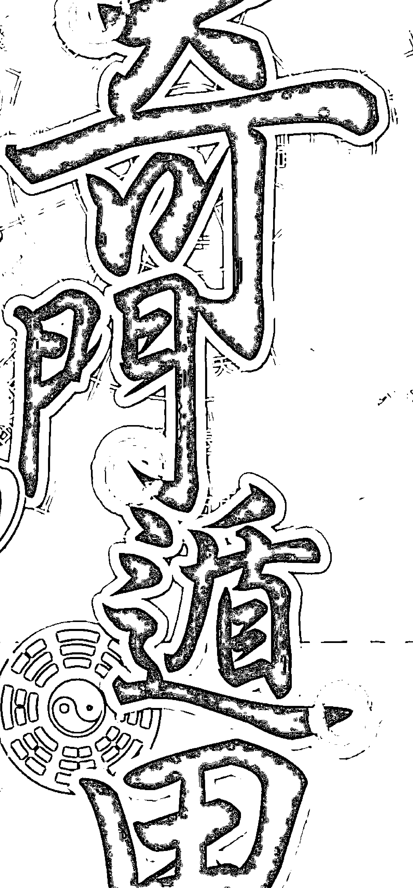
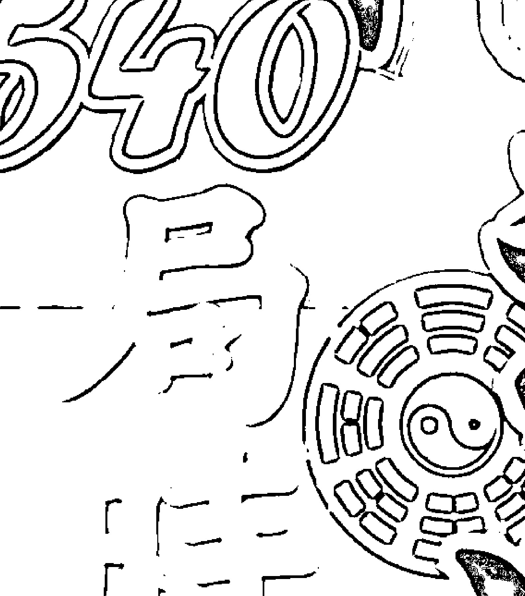
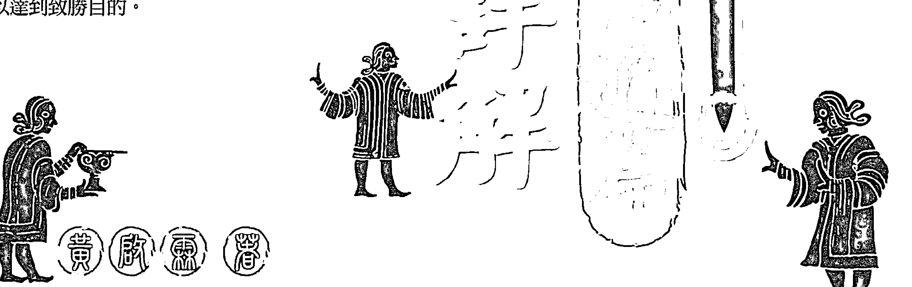
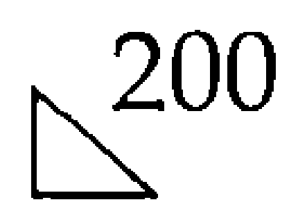

# 知命造運

# 540局

全台第一套完整揭露奇門遁甲「知命造運」訣竅，適用於各種大小考試、業務協商、開發生意、衝刺業績、外交軍事談判、出國、選舉，甚至戀愛求婚等各方面，教您如何在特定的時間與空間內，如何擷取「趨吉避凶」的能源置換力量，以達到致勝目的。

黃胤嘉著

# 目 錄

# 序 言

# 時盤最佳八方位判別法 (吉凶格分數相抵法)

- 八門 三奇
- 九遁 三詐 五假
- 吉格部
- 凶格部

# 陽遁一局 甲己日－戊癸日 六十時盤

- 甲己日 十二時盤
- 乙庚日 十二時盤
- 丙辛日 十二時盤
- 丁壬日 十二時盤
- 戊癸日 十二時盤

# 陽遁二局 甲己日－戊癸日 六十時盤

- 甲己日 十二時盤
- 乙庚日 十二時盤
- 丙辛日 十二時盤
- 丁壬日 十二時盤
- 戊癸日 十二時盤

# 陽遁三局 甲己日—戊癸日 六十時盤

- 甲己日 十二時盤................................106
- 乙庚日 十二時盤................................116
- 丙辛日 十二時盤................................126
- 丁壬日 十二時盤................................135
- 戊癸日 十二時盤................................145

# 陽遁四局 甲己日—戊癸日 六十時盤

- 甲己日 十二時盤................................156
- 乙庚日 十二時盤................................165
- 丙辛日 十二時盤................................174
- 丁壬日 十二時盤................................183
- 戊癸日 十二時盤................................192

# 陽遁五局 甲己日—戊癸日 六十時盤

- 甲己日 十二時盤................................202
- 乙庚日 十二時盤................................211
- 丙辛日 十二時盤................................220
- 丁壬日 十二時盤................................229
- 戊癸日 十二時盤................................238

## 陽遁六局 甲己日一戊癸日 六十時盤

- 甲己日 十二時盤........................................248
- 乙庚日 十二時盤........................................257
- 丙辛日 十二時盤........................................266
- 丁壬日 十二時盤........................................275
- 戊癸日 十二時盤........................................284

## 陽遁七局 甲己日一戊癸日 六十時盤

- 甲己日 十二時盤........................................294
- 乙庚日 十二時盤........................................303
- 丙辛日 十二時盤........................................313
- 丁壬日 十二時盤........................................322
- 戊癸日 十二時盤........................................331

## 陽遁八局 甲己日一戊癸日 六十時盤

- 甲己日 十二時盤........................................342
- 乙庚日 十二時盤........................................352
- 丙辛日 十二時盤........................................362
- 丁壬日 十二時盤........................................371
- 戊癸日 十二時盤........................................380

# 陽遁九局 甲己日－戊癸日 六十時盤

- 甲己日 十二時盤...............................................390
- 乙庚日 十二時盤...............................................400
- 丙辛日 十二時盤...............................................409
- 丁壬日 十二時盤...............................................418
- 戊癸日 十二時盤...............................................427

# 《序言》

人類從個體覓食而成群遊牧，再定居農耕，這個由單數個體形成集落國家的變化過程中，必定遭遇各種大自然變動與外敵侵犯，使得「攻」與「防」的意識及行動因此萌芽。如何發展農耕使國家富庶？如何在外力環伺之下保衛國家並擊敗敵人？如何擴張地盤使國家更加強盛進步？無不關係「攻」、「防」。

古聖先賢長期不斷觀察「宇宙磁場」，配合「陰陽五行」研究邏輯得知：宇宙的「天時」與「八卦方位空間」，就是所謂天時、地利、人和的天地自然定律。而攻防致勝要訣，不外是進攻時選擇「有利於我」的時辰八卦方位；若遇到「有利於他」的時辰方位時，則應保持「有利於我」的防守位置，或設法將「有利於他」轉為「有利於我」的致勝契機。如黃帝發明「指南車」，在戰鬥中靈活運用有利於我、不利於他的時辰八卦方位，機動掌握優勢，而於涿鹿之戰擊敗強敵蚩尤。

黃帝根據天時、地利、人和與陰陽五行之磁場原理，始創原為4320局，再經宰相風后整修為1080局之遁甲時盤。從此，中國的朝代興亡史，也可說是奇門遁甲的推演史。因為，各主要朝代興革的關鍵人物，都具奇門遁甲造詣，如周朝姜子牙、漢朝張子房、三國諸葛孔明等，無一不是輔佐帝王開基建業的功臣，而明朝的劉伯溫，則將遁甲之學發揚光大。

在古代，奇門遁甲之學不但被用於戰鬥爭霸、擴張領域，在帝王治國的政治、建設、法律等方面，也是不可欠缺的重要寶典，但民間是禁學的，所以有「帝王學」之稱。

在現代社會中，奇門遁甲的應用範圍更是廣泛，國家政治、軍事、經濟、外交，工商企業經營、財務投資借貸，以及求取功名、營造感情等的個人家庭及社會活動，都可用來轉禍為福、趨吉避凶。

一般論命術，如紫微斗數或八字推命，功力高段的人，也可正確推斷運勢吉凶。不過，只能做到「知命而趨吉避凶」，但奇門遁甲卻能做到「知命造運而退惡運」，因為它具有「大氣磁場造運」的積極作用，有「不讓命運主宰自己」的攻擊性，這才是遁甲之學的真正存在價值。若合併兩者的功能性，則更得「知命又能造運」的上乘效果。

本全集之入門篇，係依清朝「古今圖書集成」藝術典術數部奇門遁甲之「煙波釣叟歌」為全書架構，並以簡易文字解說歌詞，使讀者明瞭遁甲各項要訣及其來源。後續則有「工具篇」，將遁甲時盤、日盤、月盤、遁甲專用曆等，整編於一書，方便讀者查閱。「陰遁篇」、「陽遁篇」除列出全部遁甲1080局陰陽時盤八方位及其吉凶格之外，並以「比分法」判斷特定方位的吉凶，讀者若有考試、做業務、談判等之需要時，不必自己排算，就能立刻找出最好的時辰與方位，這是坊間前所未見的作法，將使遁甲書籍成為極簡便之工具書，也將使奇門遁甲更能符合現代生活的實際應用。

## 時盤最佳八方位判别法 (吉凶格分數相抵法)

## 一、八門、三奇

**三吉門**

遁甲盤八門的「開休生」三門，謂「吉門」。
此三吉門單獨出現，即有以下吉祥作用：
- 開門：謁見貴人、創業、遠行、皆通達，公明正大則百事百泰。
- 休門：赴任、營造、遷移、萬事和進、和解、娛樂、情緒愉快。
- 生門：三陽開泰、萬物俱生的吉祥門，求財經商、營造、養生、婚嫁之最佳位。

【得50分】

**三奇門**

開休生三吉門的天盤有「乙丙丁三奇」者，謂「奇門」。

【加20分共得70分】

**景門**

雖陽旺，但只屬中吉門。
酷暑炎旺，然陽氣強弩之末，不全吉。利於考試、上書獻策文書之事。
天盤有乙丙丁三奇，則突圍破敵、火攻、發號指令、文件考試有利及第。
天盤有三奇，且進行上述各事項者。

【得40分】
【加20分共得60分】

**傷門**

外華內虛，不能勝其勞，洩其根基太過，諸事皆不利，屬中凶門。
天盤有乙丙丁三奇，則適於索財、漁獵、捕捉、博奕、誤詞、伏兵、訴訟等。
天盤有三奇，且進行上述各事項者。

【0分】
【加50分】

**杜門**

春夏交接期，一陰將至，欲收斂而收不得，欲生旺而力已盡，事情遇阻，中凶門。
天盤有乙丙丁三奇，則逃避災難能得逞，可用於祭祈埋葬。
天盤有三奇，且進行上述各事項者。

【0分】
【加50分】

**死門**

秋天落葉，百事入滅之大凶門，於此時空合適之行事最少，諸事凶兆。屬大凶門。【0分】
天盤有乙丙丁三奇，則可用於行刑、誅戳、弔死送葬、打獵。
天盤有三奇，且進行上述各事項者。【加50分】

**驚門**

物數蒼老，肅殺無生氣之期，諸事不成功，屬凶門。【0分】
天盤有乙丙丁三奇，則可用於爭訟、誤詞、伏兵、捕捉、博奕，都有效果。
天盤三奇，且進行上述各事項者。【加50分】

**乙奇得使**

天盤乙奇加臨於離宮或乾宮【加20分】
通商求財、遷移入宅、婚嫁締盟等吉力旺盛，不須吉門配合亦吉兆。（若地盤是「辛」而形成「青龍逃走」凶格，則乙奇得使的吉兆消失不能用。）

**乙奇昇殿**

天盤乙奇加臨於震宮＋開門、休門、生門【加10分】
乙奇祿吉強化之貴人位，須有三吉門配合始能發揮吉力。

**乙奇旺相**

天盤乙奇加臨於坎宮或巽宮＋開門、休門、生門【加10分】
乙奇吉力增加之生旺位，須三吉門配合始能增吉。

**乙奇入墓**

天盤乙奇入坤宮（入十二長生、乙木墓位、戊宮）【不扣分】
乙奇失卻本來應有特異功能之衰運墓位，吉力無法充分發揮。

**乙奇受制**

天盤乙奇臨兌宮【不扣分】
乙木入金宮而被剋，吉力減少。

**丙奇得使**

天盤丙奇加臨於坎宮或坤宮【加20分】
地位財利、名聲威權、陽氣盛、諸事公開則得勝，忌陰謀，不須吉門，能獨力趨吉。（若地盤是「庚」則形成「火入金」凶格，丙奇得使的吉兆意義消失不能用。）

**丙奇昇殿**

天盤丙奇加臨於離宮＋開門、休門、生門【加10分】
丙奇火旺之貴人位，須配合三吉門始能發揚吉力。

## 時盤最佳八方位判別法

丙奇旺相 天盤丙奇加臨於震宮或巽宮＋開門、休門、生門 【加 10 分】 丙奇火勢龍神助威之位，須三吉門配合始能增吉。

丙奇入墓 天盤丙奇入乾宮（入十二長生、丙火墓位、戌宮） 【不扣分】 丙奇失卻本來應有特異功能之衰運墓位，吉力無法充分發揮。

丙奇受制 天盤丙奇臨坎宮 【不扣分】 丙火入水宮被剋，吉力減少。

丁奇得使 天盤丁奇加臨於艮宮或巽宮 【加 20 分】 和合協調、偵察間諜、潛藏避難、休暇旅遊，皆得吉，能獨力趨吉。（若地盤是「癸」則為「朱雀投江」凶格，丁奇得使的吉兆消失不能用，艮宮也是「丁奇入墓」）

丁奇昇殿 天盤丁奇加臨於兌宮＋開門、休門、生門 【加 10 分】 丁奇臨於長生天神吉位，須配合三吉門始能發揮吉力。

丁奇旺相 天盤丁奇加臨於巽宮或離宮＋開門、休門、生門 【加 10 分】 丁奇之火炎乘旺位，須三吉門配合始能加吉。

丁奇入墓 天盤丁奇入艮宮 【不扣分】 丁奇失卻本來特異功能之衰運墓位，吉力無法充分發揮。

丁奇受制 天盤丁奇臨坎宮 【不扣分】 丁火入水宮被剋，吉力減少。

## 二、九遁、三诈、五假

◎ 天地人遁是奇门遁甲吉格中，最吉格者，比吉门、奇门、三诈更高分。

**天遁**
- 生门+天盘丙+地盘戊
- 生门+天盘丙+地盘丁
- 开门+天盘丙
此时辰方位行事，诸事易达目的，且所得创业财利，吉运持续。移转、婚嫁、远行、学业、升进、修道练武、祈愿等，百事有持续吉效。
【加 30 分】

**人遁**
- 休门+天盘丁+地盘丙
- 休门+天盘丁+八神太阴
此时辰方位行事，人事问题顺调，委托协助、推荐人才、恋爱约会、相亲、求婚、都可成，财运亦吉，交易可得利。
【加 30 分】

**地遁**
- 开门+天盘乙+地盘己
此时辰方位，攻守俱可，攻能得胜，退可隐身遁迹、驻屯、筑城、营造、开矿、修造坟墓、修身仙道等，都可用。
【加 30 分】

**风遁**
- 开门+天盘乙临于巽四宫
- 休门+天盘乙临于巽四宫
- 生门+天盘乙临于巽四宫
此时辰方位可设坛发风，利用风势（资讯）播音宣传（立旗）、作文宣，也可出帆出航、航空飞行、放气球等，都顺利。
【加 30 分】

**云遁**
- 开门+天盘乙+地盘辛
- 休门+天盘乙+地盘辛
- 生门+天盘乙+地盘辛
此时辰方位适于遁藏埋伏、打游击，设法鼓舞士气，策划作战、军备、造武器、设坛祈雨、进行人造雨、修道求仙。
【加 30 分】

## 時盤最佳八方位判別法

**龍遁**

開門＋天盤乙臨於坎一宮　【加30分】
休門＋天盤乙臨於坎一宮
生門＋天盤乙臨於坎一宮
此時辰方位龍神有靈，可設壇祈雨、下船出帆、建造水壩堤防、穿井，又適開通運河、治水等。

**虎遁**

休門＋天盤乙＋地盤辛臨於艮八宮　【加30分】
此時辰方位虎威強勢，適鎮壓暴動、設立關匣、以法術驅鬼鎮邪，新官上任下馬威有效。

**神遁**

生門＋天盤丙＋八神九天　【加30分】
祭禱鬼神，招天兵天將制敵，現代用於雕刻神像，祈願改運。

**鬼遁**

生門＋天盤丁＋八神九地　【加30分】
杜門＋天盤乙＋八神九地
適偵察敵狀、愚弄敵人、散布流言、間諜工作，詭計文章可得逞，中元普渡祭拜可得吉效。

◎三詐比吉門、奇門更高分，吉門得五分利（50分）奇門得七分利（70分），三詐乃奇門再加八神之「太陰、九地、六合」，有「陰門助奇」吉上加吉之效，能得十分利，即與奇門70分，再加30分，得100分。

**真詐**

開門、休門、生門＋天盤三奇（乙丙丁）＋八神、太陰　【加30分】
奇門之吉象，再加上「太陰陰門助奇」，是為「上奇門」。
適合施恩犒賞、布施隱遁、修道求仙、祈祀，經商亦有利。

**重詐**

開門、休門、生門＋天盤三奇（乙丙丁）＋八神九地　【加30分】
奇門之吉象，再加上「九地陰門助奇」，是為「上奇門」。
適雇用人才、認養子女、收帳、買獎券納財、上官赴任等。

**休詐**

開門、休門、生門＋天盤三奇（乙丙丁）＋八神、六合　【加30分】
奇門之吉象，再加上「六合陰門助奇」，是為「上奇門」。
適合求藥治病、祭祈消災、和解和議、媒妁相親、求貴求財。

◎當吉門都已被對方佔去之情況下，則利用剩下吉效薄弱的「傷杜景死驚」五門與奇儀八神等，期望導引我方之勢，得到保守保身之效果組合。五假若能善加應用，則可得到與奇門一般之效能，總加分 70 分以上。

**天假**

景門＋天盤三奇（乙丙丁）＋八神、九天 【加 20 分】

景門雖非吉門，有乙丙丁三奇與九天加臨則似能提高身分膽量，晉謁上司或與人相處較受尊重，求面見、應試，都不被看不起。

**地假**

杜門＋天盤丁己癸＋八神（太陰、九地、六合） 【加 20 分或 70 分】

杜門陰性凶門，再加丁己癸陰干及陰性八神，能得隱密作用之效能。有三種：

- 太陰：隱匿身分行使間諜、偵探、市場調查、情報搜集，可得有利效果。
- 九地：不願曝露身分或不願公開時用之，有利潛藏、埋伏性行動。
- 六合：不願與對方正面敵對，為求和合而欲避開時的避難逃亡有效方位。

**人假**

驚門＋天盤壬＋八神、九天 【加 70 分】

驚門時空能使人心恐慌不安定，利用此可齊嚇、逮捕惡人。但不可用之作惡，如黑社會恐嚇、惡意索財、金光黨使人恍惚騙財等。

**神假**

傷門＋天盤丁、己、癸＋八神、九地 【加 20 分或 70 分】

此時空祭拜神佛祖先，祈福平安，或參列葬儀埋葬等，不會受到陰煞之氣。又可看病、探病，索債（針對陰謀詐欺不還之債權有效）。

**鬼假**

死門＋天盤丁、己、癸＋八神、九地 【加 20 分或 70 分】

於此時空進行超渡亡魂、掃墓等，可化解幽靈殺氣，保平安。

## 三、吉格部

**玉女守門** 八門直使＋地盤丁奇
八門直使＋天盤丁奇 【獨立吉格】
時盤的玉女守門方位時辰，不受同方位宮之吉或凶格之影響，仍保持其吉象，故為獨立吉格。
男女和合、談心求愛、人事和解、娛樂喜宴、生意商談，最有效。平時不易接近之人人事，利用此時辰方位，則易成功。

**青龍返首** 天盤符首＋地盤丙奇 【加 20 分】
陽氣旺盛，喜從天降，求名利、婚嫁、營造、埋葬，百事吉兆吉利。
行事公明則吉，陰謀則凶，遇三吉門更加吉，遇凶門亦中小吉。

**飛鳥跌穴** 天盤丙奇＋地盤符首 【加 20 分】
陽氣旺盛，喜從天降，求名利、婚嫁、營造、埋葬，百事吉兆吉利。
行事公明則吉，陰謀則凶，遇三吉門更加吉，遇凶門亦中小吉。

**相佐** 天盤符首＋地盤乙、丙、丁 【加 20 分】
陽氣旺盛，喜從天降，求名利、婚嫁、營造、埋葬，百事吉兆吉利。行事公明則吉，陰謀則凶，遇三吉門更加吉，遇凶門亦中小吉。(若地盤「丙」則為「青龍返首」，變成「青龍返首」與「相佐」兩種功能)

**懽怡** 天盤乙、丙、丁＋地盤符首 【加 10 分】
情緒愉快，諸事順調發展。
(若天盤「丙」則為「飛鳥跌穴」，變成「飛鳥跌穴」與「懽怡」兩種功能)

**天輔時** 甲日、己日－己巳時 乙日、庚日－甲申時 【加 20 分】
丙日、辛日－甲午時 丁日、壬日－甲辰時
戊日、癸日－甲申時
此為天赦開恩之時辰，此時行事可得天佑神助，提昇奇門效果。
此吉象加分，不只針對單一方位，而是包含整個時辰## 四、凶格部

青龍逃走 天盤乙奇+地盤辛 【扣10分】
失敗、衰退、損失，部下傭人橫領潛逃，兩敗俱傷，百事凶。

白虎猖狂 天盤辛+地盤乙奇 【扣10分】
攻守皆不利、婚嫁不成立、白虎暴虐，商務、營造、皆受驚悲哀。

騰蛇天矯 天盤癸+地盤丁奇 【扣10分】
百事不利、情緒不安，憂愁憂慮、虛驚不斷。

朱雀投江 天盤丁奇+地盤癸 【扣10分】
口論陷阱，訴訟刑獄、文件訴狀、有價證券，皆不利。

火入金局 天盤丙奇+地盤庚 【扣10分】
易遭詐欺陷阱，不宜主動 宜採取迴避策略。

金入火局 天盤庚+地盤丙奇 【扣10分】
南北禍亂，須防敵攻賊襲，部下反叛與下剋上。

飛宮格 天盤符首+地盤庚 【扣10分】
攻守俱敗，出戰易遭取擒，或受意外傷害，宜固守。

伏宮格 天盤庚+地盤符首 【扣10分】
攻守都不利，動則敗，主客皆不利。

刑格 天盤庚+地盤己 【扣10分】
名譽損失，財帛損失，有疾病等潛伏性災害，而且有後遺症。

戰格 天盤庚+地盤庚 【扣10分】
鬥爭激烈，兄弟鬥爭，官災橫禍，大凶。

# 时盘最佳八方位判别法

**上格** 天盘庚+地盘壬 易遭牵制，百事不顺调，行军出战亦凶。 【扣10分】

**大格** 天盘庚+地盘癸 不宜远行，易遭车祸，人财产业破败，图谋不通，求人不在。 【扣10分】

**奇格** 天盘庚+地盘乙奇 天盘庚+地盘丙奇或丁奇 地盘乙者上刻下，主动者虽不败，但亦不利，无好处。 地盘丙丁者下刻上，主动出击或旅游，都无返期。 【扣10分】

- 天盘戊仪临震宫 天盘己仪临坤宫
- 天盘庚仪临艮宫 天盘辛仪临离宫
- 天盘壬仪临巽宫 天盘癸仪临巽宫

符首受刑害，诸事如受肘腋压力，易受阻忧，须谨慎。 【凶兆不至于扣分】

- 甲日－庚午时 乙日－辛巳时
- 丙日－壬辰时 丁日－癸卯时
- 戊日－甲申时 己日－乙丑时
- 庚日－丙子时 辛日－丁酉时
- 壬日－戊寅时 癸日－己未时

此乃龙失精气日月失光明之时辰，纵有奇门亦凶，百事不可行。 时干克日干，阳干克阳干，阴干克阴干之时辰，谓五不遇时，但戌亥时无五不遇时。五不遇时之凶兆扣分，不只针对单一方面位，而是包含整个时辰。 【扣20分】

**天网四张** 癸时时盘的天盘癸所临之方位 癸时盘为伤败、破财、不成就之时辰，尤其是天盘癸之方位。天网四张之凶兆，不只针对单一方面位，而是包含整个时辰。 【不扣分】

**反吟** 八门奇仪九星对冲之时辰，求财无利，婚姻不成，谋事都不成，八门以外，九星奇仪得奇门。则无害。反吟之凶兆，是包含整个时辰。 【凶兆不至于扣分】

# 伏吟

天地同干，八门九星伏于地盘本宫位，是损伤人口、遗失损财，只适宜收敛财货。天蓬加天蓬，死门加死门，庚加庚方位最凶。伏吟之凶兆，是包含整个时辰。
> 【凶兆不至于扣分】

# 阳遁三局

# 甲己日～戊癸日 六十时盘

（甲己日、乙庚日、丙辛日、丁壬日、戊癸日）

## 阳遁一局 甲己日

### 【甲子时】直使：休门 直符：天蓬

八门九星奇仪 伏吟：
天地同干 八门九星伏于地盘本宫位 损伤人口 遗失损财 只宜收敛财货 天蓬加天蓬 死门加死门 庚加庚方位最凶。

| 方位 | 门/奇仪 | 数值 | 解释 |
| :--- | :--- | :--- | :--- |
| 西北 | 开门 | 50 | 谒贵人 创业 远行 皆通达 公明正大则百事百泰 三吉门之一。 |
| 正北 | 休门 | 50 | 赴任 营造 迁移 万事和进 和解 娱乐 情绪愉快 三吉门之一。 |
| 东北 | 生门 | 50 | 三阳开泰 万物俱生 经商 营造 养生 婚嫁 最佳位 三吉门之一。 |
| 东北 | 丙奇 | +20 | 吉门合三奇为奇门 生门吉兆更加吉。 |
| 正东 | 伤门 | | 外华内虚 不能胜其劳 泄其根基太过 诸事皆不利 故凶门。 |
| 正东 | 战格 | -10 | 斗争激烈 兄弟斗争 官灾横祸 大凶。 |
| 东南 | 杜门 | | 春夏交接 一阴将至 欲收敛而收不得 欲生旺而力已尽 中凶门。 |
| 正南 | 景门 | 40 | 酷暑炎旺 然阳气强弩之末 不全吉 利于考试上书献策文书之事。 |
| 正南 | 乙奇 | +20 | 合乙丙丁 则突围破敌 火攻发号指令 文件考试 有利及第。 |
| 正南 | 乙奇得使 | +20 | 通商求财 迁移入宅 婚嫁缔盟等吉力旺盛 不须吉门配合亦吉兆。 |
| 西南 | 死门 | | 秋天落叶 百事入灭之大凶门 此时空合适之行事最少 大凶门。 |
| 西南 | 六仪击刑 | | 符首受刑害 诸事如受肘腋压力易受阻忧 须谨慎。 |
| 正西 | 惊门 | 30 | 物数苍老 肃杀无生气之期 诸事不成功 属凶门。 |
| 正西 | 丁奇 | +50 | 合有三奇 则可用于争讼 误词 伏兵 捕捉 博奕 都有效果。 |

### 【乙丑时】直使：休门 直符：天蓬

己日 五不遇时： -20
此乃龙失精气 日月失光明 之时辰 纵有奇门亦凶 百事不可行。

奇仪九星 反吟：
奇仪九星对冲之时辰 求财无利 婚姻不成 谋事都不成。
得奇门则无害。

| 方位 | 门/奇仪 | 数值 | 解释 |
| :--- | :--- | :--- | :--- |
| 西北 | 伤门 | | 外华内虚 不能胜其劳 泄其根基太过 诸事皆不利 故凶门。 |
| 正北 | 杜门 | | 春夏交接 一阴将至 欲收敛而收不得 欲生旺而力已尽 中凶门。 |
| 正北 | 憧怡 | +10 | 情绪愉快 诸事顺调发展。 |
| 西南 | 乙奇 | +50 | 合三奇则逃避灾难或能得逞 奇仪九星配合得宜 可用于祭祈埋葬。 |
| 东北 | 景门 | 40 | 酷暑炎旺 然阳气强弩之末 不全吉 利于考试上书献策文书之事。 |
| 正东 | 死门 | | 秋天落叶 百事入灭 此时空合适之行事最少 大凶门。 |
| 正东 | 丁奇 | +50 | 合三奇 则可用于行刑 诛戳 吊死 送葬 打猎等。 |
| 正东 | 鬼假 | +20 | 于此时空行超渡亡魂 扫墓等 可化解幽灵杀气 保平安。 |
| 东南 | 惊门 | | 物数苍老 肃杀无生气之期 诸事不成功 属凶门。 |
| 东南 | 六仪击刑 | | 符首受刑害 诸事如肘腋压力易受阻忧 须谨慎。 |
| 正南 | 开门 | 50 | 谒贵人 创业 远行 皆通达 公明正大则百事百泰 三吉门之一。 |
| 正南 | 憧怡 | +10 | 情绪愉快 诸事顺调发展。 |
| 西南 | 休门 | 50 | 赴任 营造 迁移 万事和进 和解 娱乐 情绪愉快 三吉门之一 |
| 西南 | 丙奇 | +20 | 吉门与乙丙丁三奇合配为奇门 吉兆更加 为上吉。 |
| 西南 | 丙奇得使 | +20 | 地位财利 名声威权 阳气盛 诸事公开得胜忌阴谋 能独力得吉象。 |
| 正西 | 生门 | 50 | 三阳开泰 万物俱生 求财 营造 养生 婚嫁 最佳位 三吉门之一。 |
| 正西 | 奇格 | -10 | 地盘丙丁者下剋上 主动出击或旅游无返期。 |

### 【丙寅时】直使：休门 直符：天蓬

| 方位 | 门/奇仪 | 数值 | 说明 |
| :--- | :--- | :--- | :--- |
| 西北 | 死门 | | 秋天落叶 百事入灭 此时空合适之行事最少 大凶门。 |
| 西北 | 丁奇 | 50 | 合三奇 则可用于行刑 诛戳 吊死 送葬 打猎等。 |
| 西北 | 朱雀投江 | -10 | 口论陷阱 诉讼刑狱 文件诉状 有价证券 皆不利。 |
| 西北 | 鬼假 | +30 | 于此时空行超渡亡魂 扫墓等 可化解幽灵杀气 保平安。 |
| 正北 | 惊门 | | 物数苍老 肃杀无生气之期 诸事不成功 属凶门。 |
| 东北 | 开门 | 50 | 谒贵人 创业 远行 皆通达 公明正大则百事百泰 三吉门之一。 |
| 东北 | 青龙返首 | +20 | 阳气旺盛 喜从天降 求名利 婚嫁 营造 埋葬 百事吉兆吉利。 |
| 东北 | 相佐 | +20 | 吉力与青龙返首相同。 |
| 正东 | 休门 | 50 | 赴任 营造 迁移 万事和进 和解 娱乐 情绪愉快 三吉门之一。 |
| 正东 | 丙奇 | +20 | 吉门合三奇为奇门 休门吉兆更加吉 行事忌阴私谋略。 |
| 正东 | 丙奇旺相 | +10 | 丙奇火势龙神助威之位 须三吉门配合始能增吉。 |
| 正东 | 火入金局 | -10 | 易遭欺诈陷阱 不宜主动 宜采取回避策略。 |
| 东南 | 生门 | 50 | 三阳开泰 万物俱生 求财 营造 养生 婚嫁 最佳位 三吉门之一。 |
| 正南 | 伤门 | | 外华内虚 不能胜其劳 泄其根基太过 诸事皆不利 故凶门。 |
| 正南 | 白虎猖狂 | -10 | 攻守皆不利 婚嫁不成立 白虎暴虐 商务营造皆受惊悲哀。 |
| 西南 | 杜门 | 50 | 春夏交接 一阴将至 欲收敛而收不得 欲生旺而力已尽 中凶门。 |
| 西南 | 乙奇 | +20 | 合三奇 则逃难或能得逞 奇仪九星配合得宜 可用于祭祈埋葬。 |
| 西南 | 乙奇入墓 | | 乙奇失却本来应有特异功能之衰运墓位 凶兆显露。 |
| 正西 | 景门 | 40 | 酷暑炎旺 然阳气强弩之末 不全吉 利于考试上书献策文书之事。 |

### 【丁卯时】直使：休门 直符：天蓬

| 方位 | 门/奇仪 | 数值 | 说明 |
| :--- | :--- | :--- | :--- |
| 西北 | 景门 | 40 | 酷暑炎旺 然阳气强弩之末 不全吉 利于考试上书献策文书之事。 |
| 西北 | 丙奇 | +20 | 合乙丙丁 则突围破敌 火攻发号指令 文件考试 有利及第。 |
| 西北 | 丙奇入墓 | | 丙奇失却本来特异功能之衰运墓位 凶兆显露。 |
| 正北 | 死门 | | 秋天落叶 百事入灭 此时空合适之行事最少 大凶门。 |
| 正北 | 伏宫格 | -10 | 攻守主客皆不利 易遭攻击 主动出击亦易败退。 |
| 东北 | 惊门 | | 物数苍老 肃杀无生气之期 诸事不成功 属凶门。 |
| 正东 | 开门 | 50 | 谒贵人 创业 远行 皆通达 公明正大则百事百泰 三吉门之一。 |
| 正东 | 乙奇 | +20 | 吉门合三奇为奇门 开门吉兆更加吉。 |
| 正东 | 乙奇升殿 | +10 | 乙奇禄吉强化之贵人位 须有三吉门配合 始能发挥吉力。 |
| 东南 | 休门 | 50 | 赴任 营造 迁移 万事和进 和解 娱乐 情绪愉快 三吉门之一。 |
| 东南 | 六仪击刑 | | 符首受刑害 诸事如受肘腋压力 易受阻忧 须谨慎。 |
| 正南 | 生门 | 50 | 三阳开泰 万物俱生 求财 营造 养生 婚嫁 最佳位 三吉门之一。 |
| 正南 | 丁奇 | +20 | 吉门合三奇 为奇门 生门吉兆更加吉。 |
| 正南 | 丁奇旺相 | +10 | 丁奇之火炎乘旺位 须三吉门配合始能加吉。 |
| 正南 | 重诈 | +30 | 奇门之吉象 再加上「九地阴门助奇」是为「上奇门」。 |
| 正南 | 鬼遁 | +20 | 适侦察敌状 愚弄敌人 散布流言 间谍工作 诡计文章可得逞。 |
| 西南 | 伤门 | | 外华内虚 不能胜其劳 泄其根基太过 诸事皆不利 故凶门。 |
| 正西 | 杜门 | | 春夏交接 一阴将至 欲收敛而收不得 欲生旺而力已尽 中凶门。 |
| 正西 | 相佐 | +20 | 阳气旺盛 喜从天降 求名利 婚嫁 营造 埋葬 百事吉兆吉利。 |

### 【戊辰时】直使：休门 直符：天蓬

九星奇仪 伏吟：
天地盘同干 九星伏于地盘本宫位 是损伤人口 遗失损财凶兆。
只宜收敛财货 天蓬加天蓬 庚加庚（战格）之方位最凶。

| 方位 | 门/奇仪 | 分数/调整 | 吉凶解释 |
| :--- | :--- | :--- | :--- |
| 西北 | 伤门 | | 外华内虚 不能胜其劳 泄其根基太过 诸事皆不利 故凶门。 |
| 正北 | 杜门 | | 春夏交接 一阴将至 欲收敛而收不得 欲生旺而力已尽 中凶门。 |
| 东北 | 景门 | 40 | 酷暑炎旺 然阳气强弩之末 不全吉 利于考试上书献策文书之事。 |
| 东北 | 丙奇 | +20 | 合乙丙丁 则突围破敌 火攻发号指令 文件考试 有利及第。 |
| 正东 | 死门 | | 秋天落叶 百事入灭 此时空合适之行事最少 大凶门。 |
| 正东 | 战格 | -10 | 斗争激烈 兄弟斗争 官灾横祸 大凶。 |
| 东南 | 惊门 | | 物数苍老 肃杀无生气之期 诸事不成功 属凶门。 |
| 正南 | 开门 | 50 | 谒贵人 创业 远行 皆通达 公明正大则百事百泰 三吉门之一。 |
| 正南 | 乙奇 | +20 | 吉门合三奇 为奇门 开门吉兆更加吉。 |
| 正南 | 乙奇得使 | +20 | 通商求财 迁移入宅 婚嫁缔盟等吉力旺盛 不须吉门配合亦吉兆。 |
| 西南 | 休门 | 50 | 赴任 营造 迁移 万事和进 和解 娱乐 情绪愉快 三吉门之一。 |
| 西南 | 六仪击刑 | | 符首受刑害 诸事如肘腋压力易受阻忧 须谨慎。 |
| 正西 | 生门 | 50 | 三阳开泰 万物俱生 求财 营造 养生 婚嫁 最佳位 三吉门之一。 |
| 正西 | 丁奇 | +20 | 吉门合三奇 为奇门 生门吉兆更加吉。 |
| 正西 | 丁奇升殿 | +10 | 丁奇临于长生天神吉位 须配合三吉门始能发挥吉力。 |
| 正西 | 重诈 | +30 | 奇门之吉象 再加上「九地阴门助奇」为「上奇门」。 适雇用人才 认养子女 商业 收款 奖券 纳财 上官赴任等。 |
| 正西 | 鬼遁 | +30 | 适侦察敌状 愚弄敌人 散布流言 间谍工作 诡计文章可得逞。 中元普渡祭拜可得吉效。 |

### 【己巳时】直使：休门 直符：天蓬

天辅时：+20
此乃天赦开恩之时辰 此时行事 可得天佑神助 提升奇门效果。

| 方位 | 门/奇仪 | 分数/调整 | 吉凶解释 |
| :--- | :--- | :--- | :--- |
| 西北 | 休门 | 50 | 赴任 营造 迁移 万事和进 和解 娱乐 情绪愉快 三吉门之一。 |
| 西北 | 大格 | -10 | 不宜远行 易遭车祸 人财产业破败 图谋不通 求人不在。 |
| 正北 | 生门 | 50 | 三阳开泰 万物俱生 求财 营造 养生 婚嫁 最佳位 三吉门之一。 |
| 东北 | 伤门 | | 外华内虚 不能胜其劳 泄其根基太过 诸事皆不利 故凶门。 |
| 东北 | 乙奇 | +50 | 合三奇则适于索财 渔猎 捕捉 博奕 诡词 伏兵 诉讼等 能得利。 |
| 正东 | 杜门 | | 春夏交接 一阴将至 欲收敛而收不得 欲生旺而力已尽 中凶门。 |
| 东南 | 景门 | 40 | 酷暑炎旺 然阳气强弩之末 不全吉 利于考试上书献策文书之事。 |
| 东南 | 丁奇 | +20 | 合乙丙丁 则突围破敌 火攻发号指令 文件考试 有利及第。 |
| 东南 | 丁奇得使 | +20 | 和合协调 侦察间谍 潜藏避难 休暇旅游等 皆得吉 能独力趋吉。 |
| 正南 | 死门 | | 秋天落叶 百事入灭 此时空合适之行事最少 大凶门。 |
| 西南 | 惊门 | | 物数苍老 肃杀无生气之期 诸事不成功 属凶门。 |
| 正西 | 开门 | 50 | 谒贵人 创业 远行 皆通达 公明正大则百事百泰 三吉门之一。 |
| 正西 | 丙奇 | +20 | 吉门合三奇 为奇门 开门吉兆更加吉。 |
| 正西 | 天遁 | +30 | 此时辰方位行事 诸事易达目的 且所得创业财利 吉运持续。 |

### 【庚午时】直使：休门 直符：天蓬

甲日 五不遇时： -20
龙失精气 日月失光明之时辰 纵有奇门亦凶 百事不可行。

| 方位 | 门/格 | 数值 | 解释 |
| :--- | :--- | :--- | :--- |
| 西北 | 生门 | 50 | 三阳开泰 万物俱生 求财 营造 养生 婚嫁 最佳位 三吉门之一。 |
| 正北 | 伤门 | | 外华内虚 不能胜其劳 泄其根基太过 诸事皆不利 故凶门。 |
| 正北 | 憧怡 | +10 | 情绪愉快 诸事顺调发展。 |
| 正北 | 神假 | +70 | 行祭拜神佛祖先祈福平安 或参列葬仪埋葬等 不会受到阴煞之气。 |
| 正北 | 丁奇受制 | | 丁火入水宫被克 吉力减少。 |
| 东北 | 杜门 | | 春夏交接 一阴将至 欲收敛而收不得 欲生旺而力已尽 中凶门。 |
| 正东 | 景门 | 40 | 酷暑炎旺 然阳气强弩之末 不全吉 利于考试上书献策文书之事。 |
| 正东 | 六仪击刑 | | 符首受刑害 诸事如受肘腋压力 易受阻忧 须谨慎。 |
| 正东 | 伏宫格 | -10 | 攻守主客 皆不利 易遭攻击 主动出击 亦易败退。 |
| 东南 | 死门 | | 秋天落叶 百事入灭 此时空合适之行事最少 大凶门。 |
| 东南 | 丙奇 | +50 | 合三奇 则可用于行刑 诛戮 吊死 送葬 打猎等。 |
| 正南 | 惊门 | | 物数苍老 肃杀无生气之期 诸事不成功 属凶门。 |
| 正南 | 奇格 | -10 | 地盘乙者上克下 主动者不败 但亦不利 无好处。 |
| 西南 | 开门 | 50 | 谒贵人 创业 远行 皆通达 公明正大则百事百泰 三吉门之一。 |
| 正西 | 休门 | 50 | 赴任 营造 迁移 万事和进 和解 娱乐 情绪愉快 三吉门之一。 |
| 正西 | 乙奇 | +20 | 吉门合三奇为奇门 休门吉兆更加吉 行事忌阴私谋略。 |
| 正西 | 乙奇受制 | | 乙木入金宫而被克 吉力减少。 |

玉女守门 男女和合 谈心求爱 人事和解 娱乐喜宴 生意商谈 最有效。 平时不易接近之人 利用此时辰方位 则易成功（独立吉格）。

### 【辛未时】直使：休门 直符：天蓬

| 方位 | 门/格 | 数值 | 描述 |
| :--- | :--- | :--- | :--- |
| 西北 | 惊门 | | 物数苍老 肃杀无生气之期 诸事不成功 属凶门。 |
| 西北 | 乙奇 | 50 | 合有三奇 则可用于争讼 误词 伏兵 捕捉 博弈 都有效果。 |
| 西北 | 乙奇得使 | +20 | 通商求财 迁移入宅 婚嫁缔盟等吉力旺盛 不须吉门配合亦吉兆。 |
| 正北 | 开门 | 50 | 谒贵人 创业 远行 皆通达 公明正大则百事百泰 三吉门之一。 |
| 东北 | 休门 | 50 | 赴任 营造 迁移 万事和进 和解 娱乐 情绪愉快 三吉门之一。 |
| 东北 | 丁奇 | +20 | 吉门合三奇为奇门 休门吉兆更加吉 行事忌阴私谋略。 |
| 东北 | 丁奇得使 | +20 | 和合协调 侦察间谍 潜藏避难 休暇旅游 皆得吉 能独力趋吉。 |
| 东北 | 人遁 | +30 | 此时辰方位行事 人事问题顺调 委托协助 推荐人才 恋爱约会 相亲 求婚 都可成 财运亦吉 交易可得利。 |
| 东北 | 重诈 | +30 | 奇门之吉象再加上「九地阴门助奇」为「上奇门」。 适雇用人才 认养子女 商业收款 奖券纳财 上官赴任等。 |
| 东北 | 玉女守门 | | 男女和合 谈心求爱 人事和解 娱乐喜宴 生意商谈 最有效。 平时不易接近之人 利用此时辰方位 则易成功（独立吉格）。 |
| 正东 | 生门 | 50 | 三阳开泰 万物俱生 求财 营造 养生 婚嫁 最佳位 三吉门之一。 |
| 东南 | 伤门 | | 外华内虚 不能胜其劳 泄其根基太过 诸事皆不利 故凶门。 |
| 正南 | 杜门 | | 春夏交接 一阴将至 欲收敛而收不得 欲生旺而力已尽 中凶门。 |
| 正南 | 丙奇 | +20 | 合三奇则逃避灾难或能得逞 奇仪九星配合得宜 可用于祭祈埋葬。 |
| 西南 | 景门 | 40 | 酷暑炎旺 然阳气强弩之末 不全吉 利于考试上书献策文书之事。 |
| 西南 | 刑格 | -10 | 名誉损失 财帛损失 有疾病等潜伏性灾害 而且有后遗症。 |
| 西南 | 上格 | -10 | 易遭牵制 百事不顺调 行军出战亦凶。 |
| 正西 | 死门 | | 秋天落叶 百事入灭 此时空合适之行事最少 大凶门。 |

### 【壬申时】直使：休门 直符：天蓬

八门 反吟： 八门与八门本宫位对冲之时辰 求财无利 婚姻不成 谋事都不成。

| 方位 | 门 | 描述 |
| :--- | :--- | :--- |
| 西北 | 杜门 | 春夏交接 一阴将至 欲收敛而收不得 欲生旺而力已尽 中凶门。 |

### 【癸酉時】 直使：休門 直符：天蓬

| 方向 | 門 | 分數 | 描述 |
|------|-----|------|------|
| 大格 | -10 | 不宜遠行 易遭車禍 人財產業破敗 圖謀不通 求人不在。 |
| 正北 | 景門 | 40 | 酷暑炎旺 然陽氣強弩之末 不全吉 利於考試上書獻策文書之事。 |
| 東北 | 死門 | | 秋天落葉 百事入滅 此時空合適之行事最少 大凶門。 |
| 乙奇 | +50 | 合三奇 則可用於行刑 誅戮 弔死 送葬 打獵等。 |
| 正東 | 驚門 | | 物數蒼老 肅殺無生氣之期 諸事不成功 屬凶門。 |
| 東南 | 開門 | 50 | 謁貴人 創業 遠行 皆通達 公明正大則百事百泰 三吉門之一。 |
| 丁奇 | +20 | 吉門合三奇 爲奇門 開門吉兆更加吉。 |
| 丁奇得使 | +20 | 和合協調 偵察間諜 潛藏避難 休暇旅遊等 皆得吉 能獨力趨吉。 |
| 重詐 | +30 | 奇門之吉象 再加上「九地陰門助奇」爲「上奇門」。 |
| | | 適雇用人才 認養子女 商業 收款 獎券 納財 上官赴任等。 |
| 正南 | 休門 | 50 | 赴任 營造 遷移 萬事和進 和解 娛樂 情緒愉快 三吉門之一。 |
| 西南 | 生門 | 50 | 三陽開泰 萬物俱生 求財 營造 養生 婚嫁 最佳位 三吉門之一。 |
| 正西 | 傷門 | | 外華內虛 不能勝其勞 洩其根基太過 諸事皆不利 故凶門。 |
| 丙奇 | +50 | 合三奇 則適於索財 漁獵 捕捉 博奕 誤詞 伏兵 訴訟能得利。 |

#### 八門 伏吟：

八門伏於八門本宮位 是損傷人口 失物損財之兆 只宜收斂財貨。

死門伏死門之方位最凶。

#### 天網四張：

癸時盤 爲傷敗 破財 不成就之時辰 尤其是天盤癸之方位。

| 方向 | 門 | 分數 | 描述 |
|------|-----|------|------|
| 西北 | 開門 | 50 | 謁貴人 創業 遠行 皆通達 公明正大則百事百泰 三吉門之一。 |
| 正北 | 休門 | 50 | 赴任 營造 遷移 萬事和進 和解 娛樂 情緒愉快 三吉門之一。 |
| 丙奇 | +20 | 吉門合三奇 爲奇門 休門吉兆更加吉 行事忌陰私謀略。 |
| 丙奇受制 | | 丙火入水宮被剋 故諸事吉力減少。 |
| 飛鳥跌穴 | +20 | 陽氣旺盛 喜從天降 求名利 婚嫁 營造埋葬 百事吉兆吉利。 |
| | | 行事公明則吉 陰謀則凶 遇三吉門更加吉 遇凶門亦中小吉。 |
| 懽怡 | +10 | 情緒愉快 諸事順調發展。 |
| 東北 | 生門 | 50 | 三陽開泰 萬物俱生 求財 營造 養生 婚嫁 最佳位 三吉門之一。 |
| 金入火 | -10 | 南北禍亂 須防敵攻賊襲 部下反叛與下剋上。 |
| 六儀擊刑 | | 符首受刑害 諸事如受肘腋壓力 易受阻憂 須謹慎。 |
| 奇格 | -10 | 地盤丙丁者下剋上 主動出擊或旅遊 都無返期。 |

- 正東 傷門: 外華內虛 不能勝其勞 洩其根基太過 諸事皆不利 故凶門。
- 東南 杜門: 春夏交接 一陰將至 欲收斂而收不得 欲生旺而力已盡 中凶門。
  - 乙奇 +50: 合三奇 則逃難或能得逞 奇儀九星配合得宜 可用於祭祈埋葬。
  - 青龍逃走 -10: 失敗 衰退 損失 部下傭人橫領潛逃 兩敗俱傷 百事凶。
- 正南 景門: 40 酷暑炎旺 然陽氣強弩之末 不全吉 利於考試上書獻策文書之事。
- 西南 死門: 秋天落葉 百事入滅 此時空合適之行事最少 大凶門。
  - 丁奇 +50: 合三奇 則可用於行刑 誅戮 弔死 送葬 打獵等。
  - 鬼假 +20: 於此時空行超渡亡魂掃墓等 可化解幽靈殺氣 能保平安。
- 正西 驚門: 物數蒼老 肅殺無生氣之期 諸事不成功 屬凶門。
  - 騰蛇天嬌 -10: 百事不利 情緒不安 憂愁憂慮 虛驚不斷。

### 【甲戌時】 直使：死門 直符：天芮

#### 八門九星奇儀 伏吟：

天地盤同干 八門九星伏於地盤本宮位 是損傷人口遺失損財之兆。只宜收斂財貨 天蓬加天蓬 死門加死門 庚加庚之方位最凶。

- 西北 開門: 50 謁貴人 創業 遠行 皆通達 公明正大則百事百泰 三吉門之一。
- 正北 休門: 50 赴任 營造 遷移 萬事和進 和解 娛樂 情緒愉快 三吉門之一。
- 東北 生門: 50 三陽開泰 萬物俱生 求財 營造 養生 婚嫁 最佳位 三吉門之一。
  - 丙奇 +20: 吉門合三奇 為奇門 生門吉兆更加吉。
- 正東 傷門: 外華內虛 不能勝其勞 洩其根基太過 諸事皆不利 故凶門。
  - 戰格 -10: 鬥爭激烈 兄弟鬥爭 官災橫禍 大凶。
- 東南 杜門: 春夏交接 一陰將至 欲收斂而收不得 欲生旺而力已盡 中凶門。
- 正南 景門: 40 酷暑炎旺 然陽氣強弩之末 不全吉 利於考試上書 獻策文書之事。
  - 乙奇 +20: 合乙丙丁 則突圍破敵 火攻 發號指合 文件考試有利及第。
  - 乙奇得使 +20: 通商求財 遷移入宅 婚嫁締盟等 吉力旺盛 不須吉門配合亦吉兆。
  - 天假 +20: 晉謁上司或與人相處 較受尊重 求面見 應試 都不被看不起。
  應酬時 自己雖比他人身分低 但並無自卑感。
- 西南 死門: 秋天落葉 百事入滅 此時空合適之行事最少 大凶門。
  - 六儀擊刑: 符首受刑害 諸事如受肘腋壓力 易受阻憂 須謹慎。
- 正西 驚門: 物數蒼老 肅殺無生氣之期 諸事不成功 屬凶門。
  - 丁奇 +50: 合有三奇 則可用於爭訟 誤詞 伏兵 捕捉 博奕 都有效果。

### 【乙亥時】 直使：死門 直符：天芮

| 方向 | 門 | 數值 | 解釋 |
| :--- | :--- | :--- | :--- |
| 西北 | 傷門 | | 外華內虛 不能勝其勞 洩其根基太過 諸事皆不利 故凶門。 |
| 正北 | 杜門 | | 春夏交接 一陰將至 欲收斂而收不得 欲生旺而力已盡 中凶門。 |
| | 丙奇 | +50 | 合三奇 則逃難或能得逞 奇儀九星配合得宜 可用於祭祈埋葬。 |
| | 丙奇受制 | | 丙火入水宮被剋 故諸事吉力減少。 |
| 東北 | 景門 | 40 | 酷暑炎旺 然陽氣強弩之末 不全吉 利於考試上書獻策文書之事。 |
| | 奇格 | -10 | 地盤丙丁者下剋上 主動出擊或旅遊 都無返期。 |
| | 金入火 | -10 | 南北禍亂 須防禦敵攻賊襲 部下反叛與下剋上。 |
| 正東 | 死門 | | 秋天落葉 百事入滅 此時空合適之行事最少 大凶門。 |
| 東南 | 驚門 | | 物數蒼老 肅殺無生氣之期 諸事不成功 屬凶門。 |
| | 乙奇 | +50 | 合有三奇 則用於爭訟 誤詞 伏兵 捕捉 博奕 都有效果。 |
| | 青龍逃走 | -10 | 失敗 衰退 損失 部下傭人橫領潛逃 兩敗俱傷 百事凶。 |
| 正南 | 開門 | 50 | 謁貴人 創業 遠行 皆通達 公明正大則百事百泰 三吉門之一。 |
| | 相佐 | +20 | 陽氣旺盛 喜從天降 求名利 婚嫁 營造 埋葬 百事吉兆吉利。 |
| | | | 行事公明則吉 陰謀則凶 遇三吉門更加吉 遇凶門亦中小吉。 |
| 西南 | 休門 | 50 | 赴任 營造 遷移 萬事和進 和解 娛樂 情緒愉快 三吉門之一。 |
| | 丁奇 | +20 | 吉門合三奇 為奇門 休門吉兆更加吉 行事忌陰私謀略。 |
| | 懽怡 | +10 | 情緒愉快 諸事順調發展。 |
| 正西 | 生門 | 50 | 三陽開泰 萬物俱生 求財 營造 養生 婚嫁 最佳位 三吉門之一。 |
| | 騰蛇天矯 | -10 | 百事不利 情緒不安 憂愁憂慮 虛驚不斷。 |

## 陽遁一局 乙庚日

### 【丙子時】 直使：死門 直符：天芮

庚日 五不遇時： -20

此乃龍失精氣日月失光明之時辰 縱有奇門亦凶 百事不可行。

#### 九星奇儀 反吟：

奇儀九星對衝之時辰 求財無利 婚姻不成 謀事都不成。
得奇門則無害。

| 方位 | 門/奇儀 | 分值 | 含義 |
| :--- | :--- | :--- | :--- |
| 西北 | 生門 | 50 | 三陽開泰 萬物俱生 求財 營造 養生 婚嫁 最佳位 三吉門之一。 |
| 正北 | 傷門 | | 外華內虛 不能勝其勞 洩其根基太過 諸事皆不利 故凶門。 |
| | 乙奇 | +50 | 合三奇則適於索財 漁獵 捕捉 博奕 誤詞 伏兵 訟訟等 能得利。 |
| 東北 | 杜門 | | 春夏交接 一陰將至 欲收斂而收不得 欲生旺而力已盡 中凶門。 |
| | 青龍返首 | +20 | 陽氣旺盛 喜從天降 求名利 婚嫁 營造 埋葬 百事吉兆吉利。 |
| | | | 行事公明則吉 陰謀則凶 遇三吉門更加吉 遇凶門亦中小吉。 |
| | 相佐 | +20 | 吉力與青龍返首相同。 |
| 正東 | 景門 | 40 | 酷暑炎旺 然陽氣強弩之末 不全吉 利於考試上書獻策文書之事。 |
| | 丁奇 | +20 | 合乙丙丁 則突圍破敵 火攻發號指令 文件考試 有利及第。 |
| 東南 | 死門 | | 秋天落葉 百事入滅 此時空合適之行事最少 大凶門。 |
| | 六儀擊刑 | | 符首受刑害 諸事如受肘腋壓力 易受阻憂 須謹慎。 |
| 正南 | 驚門 | | 物數蒼老 肅殺無生氣之期 諸事不成功 屬凶門。 |
| 西南 | 開門 | 50 | 謁見貴人 創業 遠行 皆通達 公明正大則百事百泰 三吉門之一。 |
| | 丙奇 | +20 | 吉門合三奇為奇門 開門吉兆更加吉。 |
| | 丙奇得使 | +20 | 陽氣盛 地位財利 名聲威權 諸事公開則得勝 忌陰謀 能獨力得。 |
| | 天遁 | +30 | 此時辰方位行事 諸事易達目的 且所得創業財利吉運持續。 |
| | | | 移轉 婚嫁 遠行 學業 昇進 修道練武 祈願等 百事有持續吉效。 |
| | 飛鳥跌穴 | +20 | 陽氣旺盛 喜從天降 求名利 婚嫁 營造埋葬 百事吉兆吉利。 |
| | | | 行事公明則吉 陰謀則凶 遇三吉門更加吉 遇凶門亦中小吉。 |
| | 權怡 | +10 | 情緒愉快 諸事順調發展。 |
| 正西 | 休門 | 50 | 赴任 營造 遷移 萬事和進 和解 娛樂 情緒愉快 三吉門之一。 |
| | 奇格 | -10 | 地盤丙丁者下剋上 主動出擊或旅遊 都無返期。 |

### 【丁丑時】 直使：死門 直符：天芮

#### 八門伏吟：

八門伏於八門本宮位 是損傷人口遺失損財之兆 只宜收斂財貨。
死門加死門之方位最凶。

| 方位 | 門/星/格 | 評分 | 解釋說明 |
|---|---|---|---|
| 西北 | 開門 | 50 | 見貴人 創業 遠行 皆通達 公明正大則百事百泰 三吉門之一。 |
| | 丁奇 | +20 | 吉門合三奇為奇門 開門吉兆更加吉。 |
| | 朱雀投江 | -10 | 口論陷阱 訴訟刑獄 文件訴狀 有價證券 皆不利。 |
| 正北 | 休門 | 50 | 赴任 營造 遷移 萬事和進 和解 娛樂 情緒愉快 三吉門之一。 |
| 東北 | 生門 | 50 | 三陽開泰 萬物俱生 求財 營造 養生 婚嫁 最佳位 三吉門之一。 |
| 正東 | 傷門 | | 外華內虛 不能勝其勞 洩其根基太過 諸事皆不利 故凶門。 |
| | 丙奇 | 50 | 合三奇則適於索財 漁獵 捕捉 博奕 誤詞 伏兵 訴訟等 能得利。 |
| | 火入金 | -10 | 易遭欺詐陷阱 不宜主動 宜採取回避策。 |
| 東南 | 杜門 | | 春夏交接 一陰將至 欲收斂而收不得 欲生旺而力已盡 中凶門。 |
| 正南 | 景門 | 40 | 酷暑炎旺 然陽氣強弩之末 不全吉 利於考試上書獻策文書之事。 |
| | 白虎猖狂 | -10 | 攻守皆不利 婚嫁不成立 白虎暴虐 商務 營造 皆受驚悲哀。 |
| 西南 | 死門 | | 秋天落葉 百事入滅 此時空合適之行事最少 大凶門。 |
| | 乙奇 | 50 | 合三奇 則可用於行刑 誅戮 弔死 送葬 打獵等。 |
| | 懽怡 | +10 | 情緒愉快 諸事順調發展。 |
| | 乙奇入墓 | | 乙奇失卻本來特異功能之衰運墓位 凶兆顯露。 |
| 正西 | 驚門 | | 物數蒼老 肅殺無生氣之期 諸事不成功 屬凶門。 |
| | 相佐 | +20 | 陽氣旺盛 喜從天降 求名利 婚嫁 營造 埋葬 百事吉兆吉利。 |
| | | | 行事公明則吉 陰謀則凶 遇三吉門更加吉 遇凶門亦中小吉。 |

### 【戊寅時】 直使：死門 直符：天芮

| 方位 | 門/星/格 | 評分 | 解釋說明 |
|---|---|---|---|
| 西北 | 死門 | | 秋天落葉 百事入滅 此時空合適之行事最少 大凶門。 |
| | 乙奇 | +50 | 合三奇 則可用於行刑 誅戮 弔死 送葬 打獵等。 |
| | 乙奇得使 | +20 | 通商求財 遷移入宅 婚嫁締盟等 吉力旺盛 不須吉門配合亦得吉。 |
| 正北 | 驚門 | | 物數蒼老 肅殺無生氣之期 諸事不成功 屬凶門。 |
| 東北 | 開門 | 50 | 見貴人 創業 遠行 皆通達 公明正大則百事百泰 三吉門之一。 |
| | 丁奇 | +20 | 吉門合三奇 為奇門 開門吉兆更加吉。 |

丁奇得使 +20 和合協調 偵察間諜 潛藏避難 休暇旅遊等 皆得吉 能獨力趨吉。

| 方向 | 門 | 分數 | 描述 |
|------|----|------|------|
| 正東 | 休門 | 50 | 赴任 營造 遷移 萬事和進 和解 娛樂 情緒愉快 三吉門之一。 |
| 東南 | 生門 | 50 | 三陽開泰 萬物俱生 求財 營造 養生 婚嫁 最佳位 三吉門之一。 |
| 正南 | 傷門 | | 外華內虛 不能勝其勞 洩其根基太過 諸事皆不利 故凶門。 |
| 丙奇 | | 50 | 合三奇則適於索財 漁獵 捕捉 博奕 誤詞 伏兵 訴訟等 能得利。 |
| 西南 | 杜門 | | 春夏交接 一陰將至 欲收斂而收不得 欲生旺而力已盡 中凶門。 |
| 伏宮格 | | -10 | 攻守都不利 動則敗 主客皆不利。 |
| 刑格 | | -10 | 名譽損失 財帛損失 疾病等潛伏性災害 且有後遺症。 |
| 上格 | | -10 | 易遭牽制 百事不順調 行軍出戰亦凶。 |
| 正西 | 景門 | 40 | 酷暑炎旺 然陽氣強弩之末 不全吉 利於考試上書獻策文書之事。 |

### 【己卯時】 直使：死門 直符：天芮

#### 九星奇儀 伏吟：

九星伏於地盤本宮位 是損傷人口 遺失損財之兆 只宜收斂財貨。
天蓬加天蓬 庚加庚（戰格）之方位最凶。

| 方向 | 門 | 分數 | 描述 |
|------|----|------|------|
| 西北 | 驚門 | | 物數蒼老 肅殺無生氣之期 諸事不成功 屬凶門。 |
| 正北 | 開門 | 50 | 見貴人 創業 遠行 皆通達 公明正大則百事百泰 三吉門之一。 |
| 東北 | 休門 | 50 | 赴任 營造 遷移 萬事和進 和解 娛樂 情緒愉快 三吉門之一。 |
| 丙奇 | | +20 | 吉門合三奇為奇門 休門吉兆更加吉 行事忌陰私謀略。 |
| 正東 | 生門 | 50 | 三陽開泰 萬物俱生 求財 營造 養生 婚嫁 最佳位 三吉門之一。 |
| 戰格 | | -10 | 鬥爭激烈 兄弟鬥爭 官災橫禍 大凶。 |
| 東南 | 傷門 | | 外華內虛 不能勝其勞 洩其根基太過 諸事皆不利 故凶門。 |
| 正南 | 杜門 | | 春夏交接 一陰將至 欲收斂而收不得 欲生旺而力已盡 中凶門。 |
| 乙奇 | | +50 | 合三奇則逃難或能得逞 奇儀九星配合得宜 可用於祭祈埋葬。 |
| 乙奇得使 | | +20 | 通商求財 遷移入宅 婚嫁締盟等吉力旺盛 不須吉門配合亦得吉。 |
| 西南 | 景門 | 40 | 酷暑炎旺 然陽氣強弩之末 不全吉 利於考試上書獻策文書之事。 |
| 六儀擊刑 | | | 符首受刑害 諸事如受肘腋壓力 易受阻憂 須謹慎。 |
| 正西 | 死門 | | 秋天落葉 百事入滅 此時空合適之行事最少 大凶門。 |
| 丁奇 | | +50 | 合三奇 則可用於行刑 誅戮 弔死 送葬 打獵等。 |
| 玉女守門 | | | 男女和合 求愛 都有效果 又人事和解 娛樂喜宴 生意商談都最有效 平時不易接近者 可利用此時間方位 能成功（獨立吉格）。 |

### 【庚辰時】 直使：死門 直符：天芮

#### 八門 反吟：

八門與八門本宮位對衝之時辰 求財無利 婚姻不成 謀事都不成。

| 方位 | 門/格局 | 分值 | 吉凶/描述 |
|---|---|---|---|
| 西北 | 杜門 大格 | -10 | 春夏交接 一陰將至 欲收斂而收不得 欲生旺而力已盡 中凶門。 不宜遠行 易遭車禍 人財產業破敗 圖謀不通 求人不在。 |
| 正北 | 景門 | 40 | 酷暑炎旺 然陽氣強弩之末 不全吉 利於考試上書獻策文書之事。 |
| 東北 | 死門 乙奇 | +50 | 秋天落葉 百事入滅 此時空合適之行事最少 大凶門。 合三奇 則可用於行刑 誅戮 弔死 送葬 打獵等。 |
| 正東 | 驚門 飛宮格 | -10 | 物數蒼老 肅殺無生氣之期 諸事不成功 屬凶門。 攻守俱敗 出戰易遭取擒 或受意外傷害 宜固守。 |
| 東南 | 開門 丁奇 丁奇得使 | 50 +20 +20 | 見貴人 創業 遠行 皆通達 公明正大則百事百泰 三吉門之一。 吉門合三奇為奇門 開門吉兆更加吉。 和合協調 偵察間諜 潛藏避難 休暇旅遊等 皆得吉 能獨力趨吉。 |
| 正南 | 休門 | 50 | 赴任 營造 遷移 萬事和進 和解 娛樂 情緒愉快 三吉門之一。 |
| 西南 | 生門 | 50 | 三陽開泰 萬物俱生 求財 營造 養生 婚嫁 最佳位 三吉門之一。 |
| 正西 | 傷門 丙奇 | +50 | 外華內虛 不能勝其勞 洩其根基太過 諸事皆不利 故凶門。 合三奇則適於索財 漁獵 捕捉 博奕 誤詞 伏兵 訴訟能得利。 |

### 【辛巳時】 直使：死門 直符：天芮

乙日 五不遇時： -20

龍失精氣日月失光明之時辰 縱有奇門亦凶 百事不可行。

| 方位 | 門/格局 | 分值 | 吉凶/描述 |
|---|---|---|---|
| 西北 | 休門 丙奇 丙奇入墓 | 50 +20  | 赴任 營造 遷移 萬事和進 和解 娛樂 情緒愉快 三吉門之一。 吉門合三奇為奇門 休門吉兆更加吉 行事忌陰私謀略。 丙奇失卻本來應有特異功能之衰運墓位 吉力無法充分發揮。 |
| 正北 | 生門 | 50 | 三陽開泰 萬物俱生 求財 營造 養生 婚嫁 最佳位 三吉門之一。 |
| 東北 | 傷門 | | 外華內虛 不能勝其勞 洩其根基太過 諸事皆不利 故凶門。 |
| 正東 | 杜門 乙奇 | +50 | 春夏交接 一陰將至 欲收斂而收不得 欲生旺而力已盡 中凶門。 合三奇則逃避災難能得逞 奇儀九星配合得宜 可用於祭祈埋葬。 |
| 東南 | 景門 六儀擊刑 | 40 | 酷暑炎旺 然陽氣強弩之末 不全吉 利於考試上書獻策文書之事。 符首受刑害 諸事如受肘腋壓力 易受阻憂 須謹慎。 |

### 【壬午時】直使：死門 直符：天芮

#### 九星奇儀 伏吟：
九星奇儀伏於地盤本宮位，是損傷人口遺失損財之凶兆。只宜收斂財貨。天蓬加天蓬，庚加庚（戰格）之方位（正北）最凶。

| 方向 | 門 | 數值 | 描述 |
|------|----|------|------|
| 正南 | 死門 | 丁奇 +50 | 秋天落葉，百事入減，此時空合適之行事最少，大凶門。合三奇則可用於行刑、誅戮、弔死、送葬、打獵等。男女和合、談心求愛、人事和解、娛樂喜宴、生意商談，最有效。平時不易接近人事，利用此時辰方位，則易成功（獨立吉格）。 |
| 西南 | 驚門 |  | 物數蒼老，肅殺無生氣之期，諸事不成功，屬凶門。 |
| 正西 | 開門 | 50 | 謁見貴人、創業、遠行，皆通達。公明正大則百事百泰，三吉門之一。 |
| 西北 | 景門 | 50 | 酷暑炎旺，然陽氣強弩之末，不全吉。利於考試上書獻策文書之事。 |
| 正北 | 死門 |  | 秋天落葉，百事入減，此時空合適之行事最少，大凶門。 |
| 東北 | 驚門 | 丙奇 +50 | 物數蒼老，肅殺無生氣之期，諸事不成功，屬凶門。 |
| 正東 | 開門 | 50 六儀擊刑 戰格 -10 | 謁見貴人、創業、遠行，皆通達。公明正大則百事百泰，三吉門之一。符首受刑害，諸事如受肘腋壓力，易受阻憂，須謹慎。 |
| 東南 | 休門 | 50 | 赴任、營造、遷移，萬事和進、和解、娛樂，情緒愉快，三吉門之一。 |
| 正南 | 生門 | 50 乙奇 +20 乙奇得使 +20 | 三陽開泰，萬物俱生。求財、營造、養生、婚嫁，最佳位，三吉門之一。吉門合三奇，為奇門，生門吉兆更加吉。通商求財、遷移入宅、婚嫁締盟等，吉力旺盛，不須吉門配合亦得吉。 |
| 西南 | 傷門 | 六儀擊刑 | 外華內虛，不能勝其勞，洩其根基太過，諸事皆不利，故凶門。符首受刑害，諸事如受肘腋壓力，易受阻憂，須謹慎。 |
| 正西 | 杜門 | 丁奇 +20 | 春夏交接，一陰將至，欲收斂而收不得，欲生旺而力已盡，中凶門。合三奇則逃難或能得逞，奇儀九星配合得宜，可用於祭祈埋葬。 |

### 【癸未時】直使：死門 直符：天芮

#### 八門 伏吟：
八門伏於八門本宮位，是損傷人口遺失損財之兆，只宜收斂財貨。死門加死門（西南）之方位最凶。

#### 天網四張：
癸時盤為傷敗、破財、不成就之時辰，尤其是天盤癸之方位。

| 方位 | 門/奇儀 | 數值 | 解釋 |
| :--- | :--- | :--- | :--- |
| 西北 | 開門 | 50 | 謁見貴人、創業、遠行，皆通達。公明正大則百事百泰，三吉門之一。 |
| 正北 | 門 | 50 | 赴任、營造、遷移，萬事和進、和解、娛樂，情緒愉快，三吉門之一。 |
|  | 丁奇 | +20 | 吉門合三奇為奇門，門吉兆更加吉。行事忌陰私謀略。 |
|  | 丁奇受制 |  | 丁火入水宮被剋，吉力減少。 |
| 東北 | 生門 | 50 | 三陽開泰，萬物俱生。求財、營造、養生、婚嫁，最佳位，三吉門之一。 |
| 正東 | 傷門 |  | 外華內虛，不能勝其勞，洩其根基太過，諸事皆不利，故凶門。 |
| 東南 | 杜門 |  | 春夏交接，一陰將至，欲收斂而收不得，欲生旺而力已盡，中凶門。 |
|  | 丙奇 | +50 | 合三奇，則逃避災難能得逞。奇儀九星配合得宜，可用於祭祈埋葬。 |
| 正南 | 景門 | 40 | 酷暑炎旺，然陽氣強弩之末，不全吉。利於考試上書獻策文書之事。 |
|  | 奇格 | -10 | 地盤乙者上剋下，主動者不敗，但亦不利，無好處。 |
| 西南 | 死門 |  | 秋天落葉，百事入滅，此時空合適之行事最少，大凶門。 |
| 正西 | 驚門 |  | 物數蒼老，肅殺無生氣之期，諸事不成功，屬凶門。 |
|  | 乙奇 | +50 | 合有三奇則用於爭訟、誤詞、伏兵、捕捉、博奕，都有效果。 |

### 【甲申時】 直使：傷門 直符：天衝

**天輔時：+20**
此乃天赦開恩之時辰，行事利用此時，可得天佑神助之奇門效果。

#### 八門九星奇儀 伏吟：
天地盤同干，八門九星伏於地盤本宮位，是損傷人口損財凶兆，只宜收斂財貨。天蓬加天蓬、死門加死門、庚加庚（戰格）之方最凶。

| 方位 | 門/奇儀 | 數值 | 解釋 |
| :--- | :--- | :--- | :--- |
| 西北 | 開門 | 50 | 謁見貴人、創業、遠行，皆通達。公明正大則百事百泰，三吉門之一。 |
| 正北 | 門 | 50 | 赴任、營造、遷移，萬事和進、和解、娛樂，情緒愉快，三吉門之一。 |
| 東北 | 生門 | 50 | 三陽開泰，萬物俱生。求財、營造、養生、婚嫁，最佳位，三吉門之一。 |
|  | 丙奇 | +20 | 吉門合三奇，為奇門，生門吉兆更加吉。 |
|  | 神遁 | +30 | 祭禱鬼神，招天兵天將制敵。現代用於雕刻神像佛像、祈願改運。 |
| 正東 | 傷門 |  | 外華內虛，不能勝其勞，洩其根基太過，諸事皆不利，故凶門。 |
|  | 伏宮格 | -10 | 攻守主客，皆不利。易遭攻擊，主動出擊亦易敗退。 |
|  | 飛宮格 | -10 | 攻守俱敗，出戰易遭擒，意外傷害，宜固守。 |
|  | 戰格 | -10 | 鬥爭激烈，兄弟鬥爭，官災橫禍，大凶。 |
| 東南 | 杜門 |  | 春夏交接，一陰將至，欲收斂而收不得，欲生旺而力已盡，中凶門。 |
| 正南 | 景門 | 40 | 酷暑炎旺，然陽氣強弩之末，不全吉。利於考試上書獻策文書之事。 |
|  | 乙奇 | +20 | 合乙丙丁，則突圍破敵、火攻、發號指令、文件考試，有利及第。 |
|  | 乙奇得使 | +20 | 通商求財、遷移入宅、婚嫁締盟等，吉力旺盛，不須吉門配合亦得吉。 |
| 西南 | 死門 |  | 秋天落葉，百事入滅，此時空合適之行事最少，大凶門。 |
|  | 六儀擊刑 |  | 符首受刑害，諸事如受肘腋壓力，易受阻憂，須謹慎。 |
| 正西 | 驚門 |  | 物數蒼老，肅殺無生氣之期，諸事不成功，屬凶門。 |
|  | 丁奇 | +50 | 合有三奇，則可用於爭訟、誤詞、伏兵、捕捉、博奕，都有效果。 |

### 【乙酉時】直使：傷門 直符：天衡

| 方位 | 門 | 數值 | 描述 |
|------|----|------|------|
| 西北 | 驚門 |  | 物數蒼老，肅殺無生氣之期，諸事不成功，屬凶門。 |
| 正北 | 開門 | 50 | 謁見貴人、創業、遠行，皆通達。公明正大則百事百泰，三吉門之一。 |
|  | 丁奇 | +20 | 吉門合三奇，爲奇門，開門吉兆更加吉。 |
|  | 丁奇受制 |  | 丁火入水宮被剋，吉力減少。 |
| 東北 | 休門 | 50 | 赴任、營造、遷移，萬事和進、和解、娛樂，情緒愉快，三吉門之一。 |
| 正東 | 生門 | 50 | 三陽開泰，萬物俱生。求財、營造、養生、婚嫁，最佳位，三吉門之一。 |
|  | 六儀擊刑 |  | 符首受刑害，諸事如受肘腋壓力，易受阻憂，須謹慎。 |
| 東南 | 傷門 |  | 外華內虛，不能勝其勞，洩其根基太過，諸事皆不利，故凶門。 |
|  | 丙奇 | +50 | 合三奇，則適索財、漁獵、捕捉、博奕、誤詞、伏兵、訴訟等，能得利。 |
| 正南 | 杜門 |  | 春夏交接，一陰將至，欲收斂而收不得，欲生旺而力已盡，中凶門。 |
|  | 相佐 | +20 | 陽氣旺盛，喜從天降。求名利、婚嫁、營造、埋葬，百事吉兆吉利。 |
|  | 奇格 | -10 | 地盤乙者上剋下，主動者不敗，但亦不利，無好處。 |
| 西南 | 景門 | 40 | 酷暑炎旺，然陽氣強弩之末，不全吉。利於考試上書獻策文書之事。 |
| 正西 | 死門 |  | 秋天落葉，百事入滅，此時空合適之行事最少，大凶門。 |
|  | 乙奇 | +50 | 合三奇，則可用於行刑、誅戮、弔死、送葬、打獵等。 |

### 【丙戌時】直使：傷門 直符：天衡

| 方位 | 門 | 數值 | 描述 |
|------|----|------|------|
| 西北 | 景門 | 40 | 酷暑炎旺，然陽氣強弩之末，不全吉。利於考試上書獻策文書之事。 |
| 正北 | 死門 |  | 秋天落葉，百事入滅，此時空合適之行事最少，大凶門。 |
|  | 丙奇 | +50 | 合三奇，則可用於行刑、誅戮、弔死、送葬、打獵等。 |
|  | 丙奇受制 |  | 丙火入水宮被剋，故諸事吉力減少。 |
| 東北 | 驚門 |  | 物數蒼老，肅殺無生氣之期，諸事不成功，屬凶門。 |
|  | 青龍返首 | +20 | 陽氣旺盛，喜從天降。求名利、婚嫁、營造、埋葬，百事吉兆吉利。 |
|  |  |  | 行事公明則吉，陰謀則凶。遇三吉門更加吉，遇凶門亦中小吉。 |
|  | 相佐 | +20 | 與青龍返首吉象相同。 |
|  | 金入火 | -10 | 南北禍亂，須防禦敵攻賊襲，部下反叛下剋上。 |
|  | 六儀擊刑 |  | 符首受刑害，諸事如受肘腋壓力，易受阻憂，須謹慎。 |
|  | 奇格 | -10 | 地盤丙丁者下剋上，主動出擊或旅遊，都無返期。 |
| 正東 | 開門 | 50 | 謁見貴人、創業、遠行，皆通達。公明正大則百事百泰，三吉門之一。 |
| 東南 | 休門 | 50 | 赴任、營造、遷移，萬事和進、和解、娛樂，情緒愉快，三吉門之一。 |
|  | 乙奇 | +20 | 吉門合三奇，為奇門，休門吉兆更加吉。行事忌陰私謀略。 |
|  | 雲遁 | +30 | 此時辰方位適於遁藏埋伏、打游擊、設法鼓舞士氣、策劃作戰、軍備造器、設壇祈雨、人造雨、修道求仙。 |
|  | 風遁 | +30 | 此時辰方位可設壇發風，利用風勢（資訊）播音宣傳（立旗）文宣，又出帆出航、航空飛行、氣球等順利。 |
|  | 真詐 | +30 | 奇門之吉象，再加上「太陰陰門助奇」為「上奇門」。適施恩犒獎、布施、隱遁、修道求仙、祈祀、經營商務亦有利。 |
|  | 青龍逃走 | -10 | 失敗、衰退、損失。部下傭人橫領潛逃，兩敗俱傷，百事凶。 |
| 正南 | 生門 | +50 | 三陽開泰，萬物俱生。求財、營造、養生、婚嫁，最佳位，三吉門之一。 |
| 西南 | 傷門 |  | 外華內虛，不能勝其勞，洩其根基太過，諸事皆不利，故凶門。 |
|  | 丁奇 | 50 | 合三奇則適於索財、漁獵、捕捉、博奕、誤詞、伏兵、訴訟等，能得利。 |
|  | 玉女守門 |  | 男女和合、談心求愛、人事和解、娛樂喜宴、生意商談，最有效。平時不易接近之人利用此時辰方位，則易成功（獨立吉格）。 |
| 正西 | 杜門 |  | 春夏交接，一陰將至，欲收斂而收不得，欲生旺而力已盡，中凶門。 |
|  | 騰蛇天橋 | -10 | 百事不利，情緒不安，憂愁憂慮，虛驚不斷。 |

### 【丁亥時】直使：傷門 直符：天衝

| 方位 | 門/奇儀 | 數值 | 描述 |
|------|----------|------|------|
| 西北 | 傷門 |  | 外華內虛，不能勝其勞，洩其根基太過，諸事皆不利，故凶門。 |
| 正北 | 杜門 |  | 春夏交接，一陰將至，欲收斂而收不得，欲生旺而力已盡，中凶門。 |
|  | 乙奇 | +50 | 逃避災難用之或能得逞。奇儀九星配合得宜，可用於祭祈埋葬。 |
| 東北 | 景門 | 40 | 酷暑炎旺，然陽氣強弩之末，不全吉。利於考試上書獻策文書之事。 |
| 正東 | 死門 |  | 秋天落葉，百事入滅，此時空合適之行事最少，大凶門。 |
|  | 丁奇 | +50 | 合三奇，則可用於行刑、誅戮、弔死、送葬、打獵等。 |
|  | 懽怡 | +10 | 情緒愉快，諸事順調發展。 |
| 東南 | 驚門 |  | 物數蒼老，肅殺無生氣之期，諸事不成功，屬凶門。 |
|  | 六儀擊刑 |  | 符首受刑害，諸事如受肘腋壓力，易受阻憂，須謹慎。 |
| 正南 | 開門 | 50 | 謁見貴人、創業、遠行，皆通達。公明正大則百事百泰，三吉門之一。 |
| 西南 | 休門 | 50 | 赴任、營造、遷移，萬事和進、和解、娛樂，情緒愉快，三吉門之一。 |
|  | 丙奇 | -20 | 吉門合三奇，為奇門，休門吉兆更加吉。行事忌陰私謀略。 |
|  | 丙奇得使 | +20 | 陽氣盛，地位財利、名聲威權，諸事公開則得勝。忌陰謀，能獨力得。 |
| 正西 | 生門 | 50 | 三陽開泰，萬物俱生。求財、營造、養生、婚嫁，最佳位，三吉門之一。 |
|  | 相佐 | +20 | 陽氣旺盛，喜從天降。求名利、婚嫁、營造、埋葬，百事吉兆吉利。 |
|  |  |  | 行事公明則吉，陰謀則凶。遇三吉門更加吉，遇凶門亦中小吉。 |
|  | 奇格 | -10 | 地盤丙丁者下剋上，主動出擊或旅遊，都無返期。 |

## 陽遁一局 丙辛日

### 【戊子時】直使：傷門 直符：天衡

#### 八門 反吟：
八門與八門本宮位對衝之時辰，求財無利，婚姻不成，謀事都不成。

| 方位 | 門/星/奇儀 | 數值/符號 | 解釋 |
|---|---|---|---|
| 西北 | 杜門 |  | 春夏交接，一陰將至，欲收斂而收不得，欲生旺而力已盡，中凶門。 |
|  | 丙奇 | +50 | 合三奇則逃避災難或能得逞。奇儀九星配合得宜，可祭祈埋葬。 |
|  | 丙奇入墓 |  | 丙奇失卻本來應有特異功能之衰運墓位，吉力無法充分發揮。 |
| 正北 | 景門 | 40 | 酷暑炎旺，然陽氣強弩之末，不全吉。利於考試上書獻策文書之事。 |
| 東北 | 死門 |  | 秋天落葉，百事入滅，此時空合適之行事最少，大凶門。 |
| 正東 | 驚門 |  | 物數蒼老，肅殺無生氣之期，諸事不成功，屬凶門。 |
|  | 乙奇 | +50 | 合有三奇，則可用於爭訟、誤詞、伏兵、捕捉、博奕，都有效果。 |
|  | 權怡 | +10 | 情緒愉快，諸事順調發展。 |
| 東南 | 開門 | 50 | 謁貴人、創業、遠行，皆通達。公明正大則百事百泰，三吉門之一。 |
|  | 六儀擊刑 |  | 符首受刑害，諸事如受肘腋壓力，易受阻憂，須謹慎。 |
| 正南 | 休門 | 50 | 赴任、營造、遷移，萬事和進、和解、娛樂，情緒愉快，三吉門之一。 |
|  | 丁奇 | +20 | 吉門合三奇，為奇門，休門吉兆更加吉。行事忌陰私謀略。 |
|  | 丁奇旺相 | +10 | 丁奇之火炎乘旺位，須三吉門配合，始能加吉。 |
| 西南 | 生門 | 50 | 三陽開泰，萬物俱生。求財、營造、養生、婚嫁，最佳位，三吉門之一。 |
| 正西 | 傷門 |  | 外華內虛，不能勝其勞，洩其根基太過，諸事皆不利，故凶門。 |
|  | 玉女守門 |  | 男女和合、談心求愛，都有效果。又人事和解、娛樂喜宴、生意商談，最有效。平時不易接近，可利用此時間方位能得成功（獨立吉格）。 |

### 【己丑時】直使：傷門 直符：天衡

| 方位 | 門/星/奇儀 | 數值/符號 | 解釋 |
|---|---|---|---|
| 西北 | 休門 | 50 | 赴任、營造、遷移，萬事和進、和解、娛樂，情緒愉快，三吉門之一。 |
|  | 乙奇 | +20 | 吉門合三奇，為奇門，休門吉兆更加吉。行事忌陰私謀略。 |
|  | 乙奇得使 | +20 | 通商求財、遷移入宅、婚嫁締盟等，吉力旺盛，不須吉門配合亦吉兆。 |
|  | 真詐 | +30 | 奇門之吉象，再加上「太陰陰門助奇」為「上奇門」。適施恩犒獎、布施、隱遁、修道求仙、祈祀、經營商務亦有利。 |
| 正北 | 生門 | 50 | 三陽開泰，萬物俱生。求財、營造、養生、婚嫁，最佳位，三吉門之一。 |
| 東北 | 傷門 | 丁奇 +50 丁奇入墓 玉女守門 | 外華內虛，不能勝其勞，洩其根基太過，諸事皆不利，故凶門。丁奇失卻本來應有特異功能之衰運墓位，吉力無法充分發揮。男女和合、談心求愛，都有效果。又人事和解、娛樂喜宴、生意商談都最有效。平時不易接近，可利用此時間方位，能成功（獨立吉格）。 |
| 正東 | 杜門 |  | 春夏交接，一陰將至，欲收斂而收不得，欲生旺而力已盡，中凶門。 |
| 東南 | 景門 | 40 | 酷暑炎旺，然陽氣強弩之末，不全吉。利於考試上書獻策文書之事。 |
| 正南 | 死門 | 丙奇 +50 | 秋天落葉，百事入滅，此時空合適之行事最少，大凶門。合三奇，則可用於行刑、誅戮、弔死、送葬、打獵等。 |
| 西南 | 驚門 | 上格 -10 刑格 -10 | 物數蒼老，肅殺無生氣之期，諸事不成功，屬凶門。易遭牽制，百事不順調，行軍出戰亦凶。名譽損失、財帛損失、疾病等潛伏性災害，且有後遺症。 |
| 正西 | 開門 | 50 | 謁貴人、創業、遠行，皆通達。公明正大則百事百泰，三吉門之一。 |

### 【庚寅時】直使：傷門 直符：天衡

#### 九星奇儀 伏吟：
奇儀九星伏於地盤本宮位，是損傷人口、遺失損財之凶兆。只宜收斂財貨。天蓬加天蓬，庚加庚（戰格）之方位最凶。

| 方位 | 門 | 附加項 | 值 | 描述 |
|------|----|--------|----|------|
| 西北 | 死門 |  |  | 秋天落葉，百事入滅，此時空合適之行事最少，大凶門。 |
| 正北 | 驚門 |  |  | 物數蒼老，肅殺無生氣之期，諸事不成功，屬凶門。 |
| 東北 | 開門 |  | 50 | 謁貴人、創業、遠行，皆通達。公明正大則百事百泰，三吉門之一。 |
|  |  | 丙奇 | +20 | 吉門與三奇合配，為奇門，吉兆更加，為上吉。 |
|  |  | 天遁 | +30 | 於此時辰方位行事，諸事易達目的，且對創業財利吉運有持續性。移轉、婚嫁、遠行、學業、昇進、修道、練武、祈願等，百事有持續吉效。 |
| 正東 | 休門 |  | 50 | 赴任、營造、遷移，萬事和進、和解、娛樂，情緒愉快，三吉門之一。 |
|  |  | 伏宮格 | -10 | 攻守主客，皆不利。易遭攻擊，主動出擊，亦易敗退。 |
|  |  | 飛宮格 | -10 | 攻守俱敗，出戰易遭擒，意外傷害，宜固守。 |
|  |  | 戰格 | -10 | 鬥爭激烈，兄弟鬥爭，官災橫禍，大凶。 |
| 東南 | 生門 |  | 50 | 三陽開泰，萬物俱生。求財、營造、養生、婚嫁，最佳位，三吉門之一。 |
| 正南 | 傷門 | 乙奇 | +50 | 外華內虛，不能勝其勞，洩其根基太過，諸事皆不利，故凶門。 |
|  |  | 乙奇得使 | +20 | 通商求財、遷移入宅、婚嫁締盟等，吉力旺盛，不須吉門配合亦得吉。 |

### 【辛卯時】直使：傷門 直符：天衝

| 方位 | 门 | 格 | 数值 | 描述 |
| --- | --- | --- | --- | --- |
| 西南 | 杜門 | 六儀擊刑 地假 | +70 | 春夏交接 一陰將至 欲收斂而收不得 欲生旺而力已盡 中凶門。 符首受刑害 諸事如受肘腋壓力 易受阻憂 須謹慎。 杜門陰性凶門 再加丁己癸陰干及陰性八神 能得隱密作用之效。 不願與對方正面敵對 爲求和合而欲避開時的避難逃亡有效方位。 |
| 正西 | 景門 | 丁奇 | 40 +20 | 酷暑炎旺 然陽氣強弩之末 不全吉 利於考試上書獻策文書之事。 合乙丙丁 則突圍破敵 火攻 發號指令 文件考試有利及第。 |
| 西北 | 生門 | 丁奇 朱雀投江 | 50 +20 -10 | 三陽開泰 萬物俱生 求財 營造 養生 婚嫁 最佳位 三吉門之一。 吉門合三奇 爲奇門 生門吉兆更加吉。 口論陷阱 訴訟刑獄 文件訴狀 有價證券 皆不利。 |
| 正北 | 傷門 | | | 外華內虛 不能勝其勞 洩其根基太過 諸事皆不利 故凶門。 |
| 東北 | 杜門 | | | 春夏交接 一陰將至 欲收斂而收不得 欲生旺而力已盡 中凶門。 |
| 正東 | 景門 | 丙奇 天假 飛鳥跌穴 憧怡 火入金 | 40 +20 +20 +20 +10 -10 | 酷暑炎旺 然陽氣強弩之末 不全吉 利考試上書獻策文書之事。 合乙丙丁 則突圍破敵 火攻 發號指令 文件考試有利及第。 丙奇與九天加臨 則似提高身分膽量 晉謁上司或與人相處 較得尊重 要求面談應試 都不怕被看不起。 陽氣旺盛 喜從天降 求財吊名聲 婚嫁營造埋葬 百事吉兆吉利。 所業君子公明吉小人陰謀凶 遇三吉門更加吉 遇凶門亦中小吉。 情緒愉快 諸事順調發展。 易遭詐欺陷阱 不宜主動 宜採取迴避策。 |
| 東南 | 死門 | | | 秋天落葉 百事入滅 此時空合適之行事最少 大凶門。 |
| 正南 | 驚門 | 白虎猖狂 | -10 | 物數蒼老 肅殺無生氣之期 諸事不成功 屬凶門。 攻守皆不利 婚嫁不成立 白虎暴虐 商務營造 皆受驚悲哀。 |
| 西南 | 開門 | 乙奇 乙奇入墓 地遁 真詐 | 50 +20 +30 +30 | 謁貴人 創業 遠行 皆通達 公明正大則百事百泰 三吉門之一。 吉門與三奇合配 爲奇門 吉兆更加 爲上吉。 乙奇失卻本來應有特異功能之衰運墓位 凶兆顯露。 攻守俱可 攻能得勝 退可隱身遁跡。 如駐屯 築城 營造 開礦 修造墳墓 修身仙道等 都可用。 奇門吉象 再加上「太陰陰門助奇」爲「上奇門」。 適施恩 搞獎 布施 隱遁 修道求仙 祈祀 經營商務亦有利。 |
| 正西 | 休門 | | 50 | 赴任 營造 遷移 萬事和進 和解 娛樂 情緒愉快 三吉門之一。 |

### 【壬辰時】直使：傷門 直符：天衝

#### 天輔時： +20

此乃天赦開恩之時辰 此時行事可得天佑神助 提昇奇門效果。

#### 八門九星奇儀 伏吟：

奇儀八門九星伏於地盤本宮位 是損傷人口 遺失損財之凶兆。只宜收斂財貨 天蓬加天蓬 死門加死門 庚加庚之方位最凶。

丙日 五不遇時： -20 此乃龍失精氣 日月失光明之時辰 縱有奇門亦凶 百事不可行。

| 方向 | 门/条目 | 数值 | 描述 |
|------|---------|------|------|
| 西北 | 景門 | 40 | 酷暑炎旺 然陽氣強弩之末 不全吉 利於考試上書獻策文書之事。 |
| | 乙奇 | +20 | 合乙丙丁 則突圍破敵 火攻發號指令 文件考試 有利及第。 |
| | 乙奇得使 | +20 | 通商求財 遷移入宅 婚嫁締盟等吉力旺盛 不須吉門配合亦吉兆。 |
| 正北 | 死門 | | 秋天落葉 百事入滅 此時空合適之行事最少 大凶門。 |
| 東北 | 驚門 | | 物數蒼老 肅殺無生氣之期 諸事不成功 屬凶門。 |
| | 丁奇 | 50 | 合有三奇 則可用於爭訟 誤詞 伏兵 捕捉 博奕 都有效果。 |
| | 丁奇入墓 | | 丁奇失卻本來應有特異功能之衰運墓位 吉力無法充分發揮。 |
| 正東 | 開門 | 50 | 謁貴人 創業 遠行 皆通達 公明正大則百事百泰 三吉門之一。 |
| 東南 | 休門 | 50 | 赴任 營造 遷移 萬事和進 和解 娛樂 情緒愉快 三吉門之一。 |
| 正南 | 生門 | 50 | 三陽開泰 萬物俱生 求財 營造 養生 婚嫁 最佳位 三吉門之一。 |
| | 丙奇 | +20 | 吉門合三奇為奇門 生門吉兆更加吉。 |
| | 丙奇昇殿 | +10 | 丙奇火旺之貴人位 須配合三吉門始能發揚吉力。 |
| | 神遁 | +30 | 祭禱鬼神 招天兵天將制敵 現代用於雕刻神像佛像 祈願改運。 |
| 西南 | 傷門 | | 外華內虛 不能勝其勞 洩其根基太過 諸事皆不利 故凶門。 |
| | 刑格 | -10 | 名譽損失 財帛損失 疾病等潛伏性災害且有後遺症。 |
| | 上格 | -10 | 易遭牽制 百事不順調 行軍出戰亦凶。 |
| 正西 | 杜門 | | 春夏交接 一陰將至 欲收斂而收不得 欲生旺而力已盡 中凶門。 |

### 【癸巳時】直使：傷門 直符：天衝

天網四張： 癸時盤為傷敗 破財 不成就之時辰 尤其是天盤癸之方位。

八門 伏吟： 八門伏於八門本宮位是損傷人口 遺失損財凶兆 只宜收斂財貨 死門加死門之方位最凶。

| 方向 | 门/条目 | 数值 | 描述 |
|------|---------|------|------|
| 西北 | 開門 | 50 | 謁貴人 創業 遠行 皆通達 公明正大則百事百泰 三吉門之一。 |
| | 大格 | -10 | 不宜遠行 易遭車禍 人財產業破敗。 |
| 正北 | 休門 | 50 | 赴任 營造 遷移 萬事和進 和解 娛樂 情緒愉快 三吉門之一。 |
| 東北 | 生門 | 50 | 三陽開泰 萬物俱生 求財 營造 養生 婚嫁 最佳位 三吉門之一。 |
| | 乙奇 | +20 | 吉門合三奇為奇門 生門吉兆更加吉。 |
| | 真詐 | +30 | 奇門之吉象再加上「太陰陰門助奇」為「上奇門」。 |
| | | | 適施恩犒獎 布施 隱遁修道求仙 祈祀 經營商務亦有利。 |
| 正東 | 傷門 | | 外華內虛 不能勝其勞 洩其根基太過 諸事皆不利 故凶門。 |
| 東南 | 杜門 | | 春夏交接 一陰將至 欲收斂而收不得 欲生旺而力已盡 中凶門。 |
| | 丁奇 | +50 | 逃避災難用之或能得逞 奇儀九星配合得宜 可用於祭祈埋葬。 |
| | 丁奇得使 | +20 | 和合協調 偵察間諜 潛藏避難 休暇旅遊等皆得吉 能獨力趨吉。 |
| 正南 | 景門 | 40 | 酷暑炎旺 然陽氣強弩之末 不全吉 利考試上書獻策文書之事。 |
| 西南 | 死門 | | 秋天落葉 百事入滅 此時空合適之行事最少 大凶門。 |
| 正西 | 驚門 | | 物數蒼老 肅殺無生氣之期 諸事不成功 屬凶門。 |
| | 丙奇 | +50 | 合有三奇 則可用於爭訟 誤詞 伏兵 捕捉 博奕 都有效果。 |

### 【甲午時】直使：杜門 直符：天輔

#### 天輔時： +20

此乃天赦開恩之時辰 此時行事可得天佑神助 提昇奇門效果。

#### 八門九星奇儀 伏吟：

奇儀八門九星伏於地盤本宮位 是損傷人口 遺失損財之凶兆。只宜收斂財貨 天蓬加天蓬 死門加死門 庚加庚之方位最凶。

| 方位 | 門 | 分數 | 解釋 |
| :--- | :--- | :--- | :--- |
| 西北 | 開門 | 50 | 謁貴人 創業 遠行 皆通達 公明正大則百事百泰 三吉門之一。 |
| 正北 | 休門 | 50 | 赴任 營造 遷移 萬事和進 和解 娛樂 情緒愉快 三吉門之一。 |
| 東北 | 生門 | 50 | 三陽開泰 萬物俱生 求財 營造 養生 婚嫁 最佳位 三吉門之一。 |
| | 丙奇 | +20 | 吉門合三奇 為奇門 生門吉兆更加吉。 |
| | 重詐 | +30 | 奇門之吉象 再加上「九地陰門助奇」為「上奇門」。 |
| | | | 適雇用人才 認養子女 商業 收款 獎券 納財 上官赴任等。 |
| 正東 | 傷門 | | 外華內虛 不能勝其勞 洩其根基太過 諸事皆不利 故凶門。 |
| | 戰格 | -10 | 鬥爭激烈 兄弟鬥爭 官災橫禍 大凶。 |
| 東南 | 杜門 | | 春夏交接 一陰將至 欲收斂而收不得 欲生旺而力已盡 中凶門。 |
| 正南 | 景門 | 40 | 酷暑炎旺 然陽氣強弩之末 不全吉 利考試上書獻策文書之事。 |
| | 乙奇 | +20 | 合乙丙丁 則突圍破敵 火攻 發號指今 文件考試有利及第。 |
| | 乙奇得使 | +20 | 通商求財 遷移入宅 婚嫁締盟等 吉力旺盛 不須吉門配合亦得吉。 |
| 西南 | 死門 | | 秋天落葉 百事入滅 此時空合適之行事最少 大凶門。 |
| | 六儀擊刑 | | 符首受刑害 諸事如受肘腋壓力易受阻憂 須謹慎。 |
| 正西 | 驚門 | | 物數蒼老 肅殺無生氣之期 諸事不成功 屬凶門。 |
| | 丁奇 | +50 | 合有三奇 則用於爭訟 誤詞 伏兵 捕捉 博奕 都有效果。 |

### 【乙未時】直使：杜門 直符：天輔

| 方位 | 门 | 条目 | 数值 | 描述 |
|------|-----|------|------|------|
| 西北 | 死門 | | | 秋天落葉 百事入滅 此時空合適之行事最少 大凶門。 |
| | | 丁奇 | +50 | 合三奇 則可用於行刑 誅戮 弔死 送葬 打獵等。 |
| | | 朱雀投江 | -10 | 口論陷阱 訴訟刑獄 文件訴狀 有價證券 皆不利。 |
| 正北 | 驚門 | | | 物數蒼老 肅殺無生氣之期 諸事不成功 屬凶門。 |
| 東北 | 開門 | | 50 | 謁貴人 創業 遠行 皆通達 公明正大則百事百泰 三吉門之一。 |
| 正東 | 休門 | | 50 | 赴任 營造 遷移 萬事和進 和解 娛樂 情緒愉快 三吉門之一。 |
| | | 丙奇 | +20 | 吉門合三奇 為奇門 休門吉兆更加吉 行事忌陰私謀略。 |
| | | 丙奇旺相 | +10 | 丙奇火勢龍神助威之位 須三吉門配合始能增吉。 |
| | | 重詐 | +30 | 奇門之吉象 再加上「九地陰門助奇」為「上奇門」。 |
| | | 火入金 | -10 | 易遭詐欺陷阱 不宜主動 宜採取迴避策。 |
| 東南 | 生門 | | +50 | 三陽開泰 萬物俱生 求財 營造 養生 婚嫁 最佳位 三吉門之一。 |
| 正南 | 傷門 | | | 外華內虛 不能勝其勞 泄其根基太過 諸事皆不利 故凶門。 |
| | | 相佐 | +20 | 陽氣旺盛 喜從天降 求名利 婚嫁 營造 埋葬 百事吉兆吉利。 |
| | | 六儀擊刑 | | 符首受刑害 諸事如受肘腋壓力 易受阻憂 須謹慎。 |
| | | 白虎猖狂 | -10 | 攻守皆不利 婚嫁不成立 白虎暴虐 商務營業 皆受驚悲哀。 |
| 西南 | 杜門 | | | 春夏交接 一陰將至 欲收斂而收不得 欲生旺而力已盡 中凶門。 |
| | | 乙奇 | +50 | 逃避災難用之或能得逞 奇儀九星配合得宜 可用於祭祈埋葬。 |
| | | 乙奇入墓 | | 乙奇失卻本來應有特異功能之衰運墓位 凶兆顯露。 |
| 正西 | 景門 | | 40 | 酷暑炎旺 然陽氣強弩之末 不全吉 利考試上書獻策文書之事。 |

### 【丙申時】直使：杜門 直符：天輔

八門 反吟：

八門與八門本宮位對衝之時辰 是求財無利 婚姻不成 謀事不成。

-   西北 杜門
    -   丙奇 +50
    -   丙奇入墓
    -   春夏交接 一陰將至 欲收斂而收不得 欲生旺而力已盡 中凶門。
    -   逃避災難用之或能得逞 奇儀九星配合得宜 可用於祭祈埋葬。
    -   丙奇失卻本來應有特異功能之衰運墓位 吉力無法充分發揮。

- 正北 景門 40
  -   酷暑炎旺 然陽氣強弩之末 不全吉 利考試上書獻策文書之事。

- 東北 死門
  -   青龍返首 +20
  -   相佐 20
  -   秋天落葉 百事入滅 時空合適之行事最少 大凶門。
  -   陽氣旺盛 喜從天降 求名利 婚嫁 營造 埋葬 百事吉兆吉利。
  -   行事公明則吉 陰謀則凶 遇三吉門更加吉 遇凶門亦中小吉。
  -   吉力與青龍返首相同。

- 正東 驚門
  -   乙奇 +50
  -   物數蒼老 肅殺無生氣之期 諸事不成功 屬凶門。
  -   合有三奇 則可用於爭訟 誤詞 伏兵 捕捉 博奕 都有效果。

- 東南 開門 50
  -   六儀擊刑
  -   謁貴人 創業 遠行 皆通達 公明正大則百事百泰 三吉門之一。
  -   符首受刑害 諸事如受肘腋壓力 易受阻憂 須謹慎。

- 正南 休門 50
  -   丁奇 +20
  -   丁奇旺相 +10
  -   休詐 +30
  -   赴任 營造 遷移 萬事和進 和解 娛樂 情緒愉快 三吉門之一。
  -   吉門合三奇為奇門 休門吉兆更加吉 行事忌陰私謀略。
  -   丁奇之火炎乘旺位 須三吉門配合 始能加吉。
  -   奇門之吉象再加上「六合陰門助奇」是為「上奇門」。
  -   適求藥治病 祈消災 和解和議 媒妁相親 求貴求財。

- 西南 生門 50
  -   三陽開泰 萬物俱生 求財 營造 養生 婚嫁 最佳位 三吉門之一。

- 正西 傷門
  -   外華內虛 不能勝其勞 洩其根基太過 諸事皆不利 故凶門。

### 【丁酉時】直使：杜門 直符：天輔

辛日 五不遇時： -20

此乃龍失精氣日月失光明之時辰 縱有奇門亦凶 百事不可行。

-   西北 景門 40
    -   乙奇 +20
    -   乙奇得使 +20
    -   酷暑炎旺 然陽氣強弩之末 不全吉 利考試上書獻策文書之事。
    -   合乙丙丁 則突圍破敵 火攻發號指令 文件考試 有利及第。
    -   通商求財 遷移入宅 婚嫁締盟等吉力旺盛 不須吉門配合亦得吉。

- 正北 死門
  -   秋天落葉 百事入滅 時空合適之行事最少 大凶門。

- 東北 驚門
  -   丁奇 +50
  -   丁奇入墓
  -   物數蒼老 肅殺無生氣之期 諸事不成功 屬凶門。
  -   合有三奇 則可用於爭訟 誤詞 伏兵 捕捉 博奕 都有效果。
  -   丁奇失卻本來應有特異功能之衰運墓位 吉力無法充分發揮。

- 正東 開門 50
  -   謁貴人 創業 遠行 皆通達 公明正大則百事百泰 三吉門之一。

- 東南 休門 50
  -   赴任 營造 遷移 萬事和進 和解 娛樂 情緒愉快 三吉門之一。

### 【戌戌時】直使：杜門 直符：天輔

正南
生門 50 三陽開泰 萬物俱生 求財 營造 養生 婚嫁 最佳位 三吉門之一。
丙奇 +20 吉門合三奇為奇門 生門吉兆更加吉。
重詐 +30 奇門之吉象再加上「九地陰門助奇」為「上奇門」。適雇用人才 認養子女 商業 收款 獎券 納財 上官赴任等。
丙奇昇殿 +10 丙奇火旺之貴人位 須配合三吉門始能發揮吉力。

西南
傷門 外華內虛 不能勝其勞 洩其根基太過 諸事皆不利 故凶門。
刑格 -10 名譽損失 財帛損失 有疾病等潛伏性災害 而且有後遺症。
上格 -10 易遭牽制 百事不順調 行軍出戰亦凶。

正西
杜門 春夏交接 一陰將至 欲收斂而收不得 欲生旺而力已盡 中凶門。
相佐 +20 陽氣旺盛 喜從天降 求名利 婚嫁 營造 埋葬 百事吉兆吉利。行事公明則吉 陰謀則凶 遇三吉門更加吉 遇凶門亦中小吉。
玉女守門 男女和合 談心求愛 人事和解 娛樂喜宴 生意商談 最有效。平時不易接近之人際 利用此時辰方位則易成功（獨立吉格）。

西北
生門 50 三陽開泰 萬物俱生 求財 營造 養生 婚嫁 最佳位 三吉門之一。
大格 -10 不宜遠行 易遭車禍 人財產業破敗 圖謀不通 求人不在。

正北
傷門 外華內虛 不能勝其勞 洩其根基太過 諸事皆不利 故凶門。

東北
杜門 春夏交接 一陰將至 欲收斂而收不得 欲生旺而力已盡 中凶門。
乙奇 +50 逃避災難用之或能得逞 奇儀九星配合得宜 可用於祭祈埋葬。

正東
景門 40 酷暑炎旺 然陽氣強弩之末 不全吉 利考試上書獻策文書之事。

東南
死門 秋天落葉 百事入滅 此時空合適之行事最少 大凶門。
丁奇 +50 合三奇 則可用於行刑 誅戮 弔死 送葬 打獵等。
丁奇得使 +20 和合協調 偵察間諜 潛藏避難 休暇旅遊等 皆得吉 能獨力趨吉。
憧怡 +10 情緒愉快 諸事順調發展。

正南
驚門 物數蒼老 肅殺無生氣之期 諸事不成功 屬凶門。

西南
開門 50 謁貴人 創業 遠行 皆通達 公明正大則百事百泰 三吉門之一。

正西
休門 50 赴任 營造 遷移 萬事和進 和解 娛樂 情緒愉快 三吉門之一。
丙奇 +20 吉門合三奇 為奇門 休門吉兆更加吉 行事忌陰私謀略。
重詐 +20 奇門之吉象 再加上「九地陰門助奇」為「上奇門」。適雇用人才 認養子女 商業 收款 獎券 納財 上官赴任等。

### 【己亥時】直使：杜門 直符：天輔

| 方位 | 门 | 数字 | 描述 |
|------|-----|------|------|
| 西北 | 驚門 | | 物數蒼老 肅殺無生氣之期 諸事不成功 屬凶門。 |
| 正北 | 開門 | 50 | 謁貴人 創業 遠行 皆通達 公明正大則百事百泰 三吉門之一。 |
| | 丁奇 | +20 | 吉門與三奇合配 為奇門 吉兆更加 為上吉。 |
| | 休詐 | +30 | 奇門之吉象 再加上「六合陰門助奇」是為「上奇門」。 適求藥治病 祭祈消災 和解和議 媒妁相親 求貴求財。 |
| | 丁奇受制 | | 丁火入水宮被剋 吉力減少。 |
| 東北 | 休門 | 50 | 赴任 營造 遷移 萬事和進 和解 娛樂 情緒愉快 三吉門之一。 |
| 正東 | 生門 | 50 | 三陽開泰 萬物俱生 求財 營造 養生 婚嫁 最佳位 三吉門之一。 |
| 東南 | 傷門 | | 外華內虛 不能勝其勞 洩其根基太過 諸事皆不利 故凶門。 |
| | 丙奇 | +50 | 合三奇則 適於索財 漁獵 捕捉 博奕 誤詞 伏兵 訟訟能得利。 |
| | 飛鳥跌穴 | +20 | 陽氣旺盛 喜從天降 求名利 婚嫁 營造埋葬 百事吉兆吉利。 |
| | | | 行事公明則吉 陰謀則凶 遇三吉門更加吉 遇凶門亦中小吉。 |
| | 憧怡 | +10 | 情緒愉快 諸事順調發展。 |
| 正南 | 杜門 | | 春夏交接 一陰將至 欲收斂而收不得 欲生旺而力已盡 中凶門。 |
| | 奇格 | -10 | 地盤乙者上剋下 主動者不敗 但亦不利 無好處。 |
| 西南 | 景門 | 40 | 酷暑炎旺 然陽氣強弩之末 不全吉 利考試上書獻策文書之事。 |
| 正西 | 死門 | | 秋天落葉 百事入滅 此時空合適之行事最少 大凶門。 |
| | 乙奇 | +50 | 合三奇 則可用於行刑 誅戮 弔死 送葬 打獵等。 |
| | 乙奇受制 | | 乙木入金宮而被剋 吉力減少。 |

## 陽遁一局 丁壬日

### 【庚子時】直使：杜門 直符：天輔

| 方向 | 项目 | 数字 | 描述 |
| :--- | :--- | :--- | :--- |
| 西北 | 傷門 |  | 外華內虛 不能勝其勞 洩其根基太過 諸事皆不利 故凶門。 |
| 正北 | 杜門 |  | 春夏交接 一陰將至 欲收斂而收不得 欲生旺而力已盡 中凶門。 |
| 正北 | 丙奇 | +50 | 合三奇 則逃難或能得逞 奇儀九星配合得宜 可用於祭祀埋葬。 |
| 正北 | 丙奇受制 |  | 丙火入水宮被剋 故諸事吉力減少。 |
| 東北 | 景門 | 40 | 酷暑炎旺 然陽氣強弩之末 不全吉 利考試上書獻策文書之事。 |
| 東北 | 六儀擊刑 |  | 符首受刑害 諸事如受肘腋壓力 易受阻憂 須謹慎。 |
| 東北 | 奇格 | -10 | 地盤丙丁者下剋上 主動出擊或旅遊無返期。 |
| 東北 | 金入火 | -10 | 南北禍亂 須防禦敵攻賊襲 部下反叛與下剋上。 |
| 正東 | 死門 |  | 秋天落葉 百事入滅 此時空合適之行事最少 大凶門。 |
| 正東 | 飛宮格 | -10 | 攻守俱敗 出戰易遭取擒 或受意外傷害 宜固守。 |
| 東南 | 驚門 |  | 物數蒼老 蕭殺無生氣之期 諸事不成功 屬凶門。 |
| 東南 | 乙奇 | +50 | 合三奇 則可用於爭訟 誤詞 伏兵 捕捉 博奕 都有效果。 |
| 東南 | 懽怡 | +10 | 情緒愉快 諸事順調發展。 |
| 東南 | 青龍逃走 | -10 | 失敗 衰退 損失 部下橫領潛逃 兩敗俱傷 百事凶。 |
| 正南 | 開門 | 50 | 謁見貴人 創業 遠行 皆通達 公明正大則百事百泰 三吉門之一。 |
| 西南 | 休門 | 50 | 赴任 營造 遷移 萬事和進 和解 娛樂 情緒愉快 三吉門之一。 |
| 西南 | 丁奇 | +20 | 此吉門與丁奇合配 為奇門 吉兆加吉為上吉。 |
| 西南 | 休詐 | +30 | 奇門之吉象 再加上「六合陰門助奇」是為「上奇門」。 |
| 西南 |  |  | 適求藥治病 祭祀消災 和解和議 媒妁相親 求貴求財。 |
| 正西 | 生門 | 50 | 三陽開泰 萬物俱生 求財 營造 養生 婚嫁 最佳位 三吉門之一。 |
| 正西 | 騰蛇天蹻 | -10 | 百事不利 情緒不安 憂愁憂慮 虛驚不斷。 |

### 【辛丑時】直使：杜門 直符：天輔

奇儀九星 伏吟：
天地同干 九星伏於地盤本宮位 是損傷人口 遺失損財之凶兆。
只宜收斂財貨 天蓬加天蓬 庚加庚之方位最凶。

西北 死門 秋天落葉 百事入滅 此時空合適之行事最少 大凶門。

正北 驚門 物數蒼老 肅殺無生氣之期 諸事不成功 屬凶門。
東北 開門 50 謁見貴人 創業 遠行 皆通達 公明正大則百事百泰 三吉門之一。
丙奇 +20 吉門與三奇合配 爲奇門 吉兆更加 爲上吉。
重詐 +30 奇門之吉象 再加上「九地陰門助奇」是爲「上奇門」。
適雇用人才 認養子女 商業 收款 獎券 納財 上官赴任等。
天遁 +30 此時辰方位行事 諸事易達目的 且所得創業財利 吉運持續。
移轉 婚嫁 遠行 學業 昇進 修道練武 祈願等 百事有持續吉效。
正東 休門 50 赴任 營造 遷移 萬事和進 和解 娛樂 情緒愉快 三吉門之一。
戰格 -10 鬥爭激烈 兄弟鬥爭 官災橫禍 大凶。
東南 生門 50 三陽開泰 萬物俱生 求財 營造 養生 婚嫁 最佳位 三吉門之一。
正南 傷門 外華內虛 不能勝其勞 洩其根基太過 諸事皆不利 故凶門。
乙奇 +50 合三奇則適於索財 漁獵 捕捉 博奕 誤詞 伏兵 訴訟等 得利。
乙奇得使 +20 通商求財 遷移入宅 婚嫁締盟等 吉力旺盛 不須吉門配合亦吉兆。
西南 杜門 春夏交接 一陰將至 欲收斂而收不得 欲生旺而力已盡 中凶門。
地假 +70 杜門陰性凶門 再加丁己癸陰干及陰性八神 能得隱密作用之效。
隱匿身分 行使間諜 偵探 市場調查 情報搜集 可得有利效果。
六儀擊刑 符首受刑害 諸事如肘腋壓力 易受阻憂 須謹慎。
正西 景門 40 酷暑炎旺 然陽氣強弩之末 不全吉 利考試上書獻策文書之事。
丁奇 +20 合乙丙丁 則突圍破敵 火攻 發號指令 文件考試有利及第。

### 【壬寅時】直使：杜門 直符：天輔

西北 休門 50 赴任 營造 遷移 萬事和進 和解 娛樂 情緒愉快 三吉門之一。
正北 生門 50 三陽開泰 萬物俱生 求財 營造 養生 婚嫁 最佳位 三吉門之一。
丁奇 +20 此吉門與乙丙丁三奇合配爲奇門 吉兆加吉爲上吉。
休詐 +30 奇門之吉象再加上「六合陰門助奇」是爲「上奇門」。
適求藥治病 祭祈消災 和解和議 媒妁相親 求貴求財。
丁奇受制 丁火入水宮 被剋無功。
東北 傷門 外華內虛 不能勝其勞 洩其根基太過 諸事皆不利 故凶門。
正東 杜門 春夏交接 一陰將至 欲收斂而收不得 欲生旺而力已盡 中凶門。
六儀擊刑 符首受刑害 諸事如肘腋壓力 易受阻憂 須謹慎。
東南 景門 40 酷暑炎旺 然陽氣強弩之末 不全吉 利考試上書獻策文書之事。
丙奇 +20 合乙丙丁 則突圍破敵 火攻發號指令 文件考試 有利及第。

| 方向 | 门/格 | 分数 | 解释 |
| :--- | :--- | :--- | :--- |
|  | 飞鸟跌穴 | +20 | 阳气旺盛 喜从天降 求名利 婚嫁 营造埋葬 百事吉兆吉利。行事公明则吉 阴谋则凶 遇三吉门更加吉 遇凶门亦中小吉。 |
|  | 欢怡 | +10 | 情绪愉快 诸事顺调发展。 |
| 正南 | 死门 |  | 秋天落叶 百事入灭 此时空合适之行事最少 大凶门。 |
|  | 奇格 | -10 | 地盘乙者上剋下 主动者不败 但亦不利 无好处。 |
| 西南 | 惊门 |  | 物数苍老 肃杀无生气之期 诸事不成功 属凶门。 |
| 正西 | 开门 | 50 | 谒见贵人 创业 远行 皆通达 公明正大则百事百泰 三吉门之一。 |
|  | 乙奇 | +20 | 吉门与乙奇合配为奇门 吉兆更加 行事忌阴私谋略。 |

### 【癸卯时】直使：杜门 直符：天辅

- 丁日 五不遇时： -20
  此乃龙失精气日月失光明之时辰 纵有奇门亦凶 百事不可行。
- 八门 伏吟：
  八门伏于八门本宫位 是损伤人口遗失损财之兆 只宜收敛财货。
  死门加死门之方位最凶。
- 九星奇仪 反吟：
  奇仪九星对冲之时辰 是求财无利 婚姻不成 谋事不成。
  得奇门则无害。
- 天网四张：
  癸时盘为伤败 破财 不成就之时辰 尤其是天盘癸之方位。

| 方向 | 门/格 | 分数 | 解释 |
| :--- | :--- | :--- | :--- |
| 西北 | 开门 | 50 | 谒见贵人 创业 远行 皆通达 公明正大则百事百泰 三吉门之一。 |
| 正北 | 休门 | 50 | 赴任 营造 迁移 万事和进 和解 娱乐 情绪愉快 三吉门之一。 |
|  | 乙奇 | +20 | 此吉门与乙奇合配为奇门 吉兆加吉为上吉。 |
|  | 乙奇旺相 | +10 | 乙奇吉力增加之生旺位 须三吉门配合始能增吉。 |
|  | 龙遁 | +30 | 此时辰方位龙神有灵 可设坛祈雨 下船出帆 建造水坝堤防 穿井 适开通运河 治水等。 |
| 东北 | 生门 | 50 | 三阳开泰 万物俱生 求财 营造 养生 婚嫁 最佳位 三吉门之一。 |
| 正东 | 伤门 |  | 外华内虚 不能胜其劳 泄其根基太过 诸事皆不利 故凶门。 |
|  | 丁奇 | +50 | 合三奇则适于索财 渔猎 捕捉 博奕 诬词 伏兵 诉讼等 能得利。 |
| 东南 | 杜门 |  | 春夏交接 一阴将至 欲收敛而收不得 欲生旺而力已尽 中凶门。 |
|  | 六仪击刑 |  | 符首受刑害 诸事如肘腋压力 易受阻忧 须谨慎。 |
| 正南 | 景门 | 40 | 酷暑炎旺 然阳气强弩之末 不全吉 利考试上书献策文书之事。 |

| 方位 | 门/格 | 评分 | 描述 |
| :--- | :--- | :--- | :--- |
| 西南 | 死门 |  | 秋天落葉 百事入滅 此時空合適之行事最少 大凶門。 |
|  | 丙奇 | +50 | 合三奇則可用於行刑 誅戮 吊死 送葬 打獵等。 |
|  | 丙奇得使 | +20 | 地位財利名聲威權 陽氣盛 諸事公開得勝忌陰謀 能獨力得吉象。 |
| 正西 | 驚門 |  | 物數蒼老 肅殺無生氣之期 諸事不成功 屬凶門。 |
|  | 奇格 | -10 | 地盤丁者下剋上 主動出擊旅遊 都無返期。 |

### 【甲辰時】 直使：死門 直符：天禽

天輔時：+20
乃天赦開恩之時辰 利用此時可得天佑神助 提昇奇門效果。

八門九星奇儀 伏吟：
天地盤同干 八門九星伏於地盤本宮位 是損傷人口遺失損財。
天蓬加天蓬 死門加死門 庚加庚（戰格）之方位最凶。

| 方位 | 门/格 | 评分 | 描述 |
| :--- | :--- | :--- | :--- |
| 西北 | 開門 | 50 | 謁見貴人 創業 遠行 皆通達 公明正大則百事百泰 三吉門之一。 |
| 正北 | 休門 | 50 | 赴任 營造 遷移 萬事和進 和解 娛樂 情緒愉快 三吉門之一。 |
| 東北 | 生門 | 50 | 三陽開泰 萬物俱生 吉祥門 求財經商 營造 養生 婚嫁之最佳位。 |
|  | 丙奇 | +20 | 此吉門與丙奇合配 為奇門 吉兆加吉為上吉。 |
| 正東 | 傷門 |  | 外華內虛 不能勝其勞 洩其根基太過 諸事皆不利 故凶門。 |
|  | 戰格 | -10 | 鬥爭激烈 兄弟鬥爭 官災橫禍 大凶。 |
| 東南 | 杜門 |  | 春夏交接 一陰將至 欲收斂而收不得 欲生旺而力已盡 中凶門。 |
| 正南 | 景門 | 40 | 酷暑炎旺 然陽氣強弩之末 不全吉 利考試上書獻策文書之事。 |
|  | 乙奇 | +20 | 合乙丙丁 則突圍破敵 火攻 發號指令 文件考試有利及第。 |
|  | 天假 | +20 | 景門雖非吉門 有乙丙丁三奇與九天加臨 則似提高身分膽量 晉謁上司或與人相處 較得尊重 要求面談應試都不怕被看不起。 |
|  | 乙奇得使 | +20 | 通商求財 遷移入宅 婚嫁締盟等 吉力旺盛 不須吉門配合亦得吉。 |
| 西南 | 死門 |  | 秋天落葉 百事入滅 此時空合適之行事最少 大凶門。 |
|  | 六儀擊刑 |  | 符首受刑害 諸事如受肘腋壓力 易受阻憂 須謹慎。 |
| 正西 | 驚門 |  | 物數蒼老 肅殺無生氣之期 諸事不成功 屬凶門。 |
|  | 丁奇 | +50 | 合有三奇 則可用於爭訟 誤詞 伏兵 捕捉 博奕 都有效果。 |

### 【乙巳時】 直使：死門 直符：天禽

| 方向 | 門/術語 | 數值 | 解釋 |
| :--- | :--- | :--- | :--- |
| 西北 | 死門 |  | 秋天落葉 百事入滅 此時空合適之行事最少 大兇門。 |
| 正北 | 驚門 |  | 物數蒼老 肅殺無生氣之期 諸事不成功 屬兇門。 |
|  | 丙奇 | +50 | 合有三奇 則可用於爭訟 誤詞 伏兵 捕捉 博奕 都有效果。 |
|  | 丙奇受制 |  | 丙火入水宮被剋 故諸事吉力減少。 |
| 東北 | 開門 | 50 | 謁見貴人 創業 遠行 皆通達 公明正大則百事百泰 三吉門之一。 |
|  | 六儀擊刑 |  | 符首受刑害 諸事如受肘腋壓力 易受阻憂 須謹慎。 |
|  | 金入火 | -10 | 南北禍亂 須防禦敵攻賊襲 部下反叛與下剋上。 |
|  | 奇格 | -10 | 地盤丙丁者下剋上 主動出擊或旅遊 都無返期。 |
| 正東 | 休門 | 50 | 赴任 營造 遷移 萬事和進 和解 娛樂 情緒愉快 三吉門之一。 |
| 東南 | 生門 | 50 | 三陽開泰 萬物俱生 吉祥門 求財經商 營造 養生 婚嫁之最佳位。 |
|  | 乙奇 | +20 | 此吉門與乙奇合配 為奇門 吉兆加吉為上吉。 |
|  | 乙奇旺相 | +10 | 乙奇吉力增加之生旺位 須三吉門配合始能增吉。 |
|  | 青龍逃走 | -10 | 失敗 衰退 損失 部下橫領潛逃 兩敗俱傷 百事兇。 |
|  | 雲遁 | +30 | 此時辰方位 適於遁藏埋伏 打游擊 設法鼓舞士氣策劃作戰 軍備造器 設壇祈雨 人造雨 修道求仙。 |
|  | 風遁 | +30 | 此時辰方位可設壇發風 利用風勢（資訊）播音宣傳（立旗）文宣又出帆出航 航空飛行 氣球等順利。 |
| 正南 | 傷門 |  | 外華內虛 不能勝其勞 汩其根基太過 諸事皆不利 故兇門。 |
|  | 相佐 | +20 | 陽氣旺盛 喜從天降 求名利 婚嫁 營造 埋葬 百事吉兆吉利。 行事公明則吉 陰謀則兇 遇三吉門更加吉 遇兇門亦中小吉。 |
| 西南 | 杜門 |  | 春夏交接 一陰將至 欲收斂而收不得 欲生旺而力已盡 中兇門。 |
|  | 丁奇 | +50 | 合三奇則逃難或能得逞 奇儀九星配合得宜 可用於祭祈埋葬。 |
| 正西 | 景門 | 40 | 酷暑炎旺 然陽氣強弩之末 不全吉 利考試上書獻策文書之事。 |
|  | 騰蛇天矯 | -10 | 百事不利 情緒不安 憂愁憂慮 虛驚不斷。 |

### 【丙午時】直使：死門 直符：天禽

奇儀九星 反吟：
奇儀九星對衝之時辰 是求財無利 婚姻不成 謀事不成之兇兆。
得奇門則無害。

| 方向 | 門/術語 | 數值 | 解釋 |
| :--- | :--- | :--- | :--- |
| 西北 | 驚門 |  | 物數蒼老 肅殺無生氣之期 諸事不成功 屬兇門。 |
| 正北 | 開門 | 50 | 謁見貴人 創業 遠行 皆通達 公明正大則百事百泰 三吉門之一。 |
|  | 乙奇 | +20 | 吉門與乙奇合配 為奇門 吉兆更加 行事忌陰私謀略。 |

| 方位 | 门/奇/格局 | 数值 | 解释 |
| :--- | :--- | :--- | :--- |
|  | 乙奇旺相 | +10 | 乙奇吉力增加之生旺位 须三吉门配合始能增吉。 |
|  | 龙遁 | +30 | 此时辰方位龙神有灵 可设坛祈雨 下船出帆 建造水坝堤防 穿井又适开通运河 治水等。 |
| 东北 | 休门 | 50 | 赴任 营造 迁移 万事和进 和解 娱乐 情绪愉快 三吉门之一。 |
|  | 青龙返首 | +20 | 阳气旺盛 喜从天降 求名利 婚嫁 营造 埋葬 百事吉兆吉利。行事公明则吉 阴谋则凶 遇三吉门更加吉 遇凶门亦中小吉。 |
|  | 相佐 | +20 | 吉力与青龙返首相同。 |
| 正东 | 生门 | 50 | 三阳开泰 万物俱生 吉祥门 求财经商 营造 养生 婚嫁之最佳位。 |
|  | 丁奇 | +20 | 此吉门与丁奇合配 为奇门 吉兆加吉为上吉。 |
| 东南 | 伤门 |  | 外华内虚 不能胜其劳 泄其根基太过 诸事皆不利 故凶门。 |
|  | 六仪击刑 |  | 符首受刑害 诸事如受肘腋压力 易受阻忧 须谨慎。 |
| 正南 | 杜门 |  | 春夏交接 一阴将至 欲收敛而收不得 欲生旺而力已尽 中凶门。 |
| 西南 | 景门 | 40 | 酷暑炎旺 然阳气强弩之末 不全吉 利考试上书献策文书之事。 |
|  | 丙奇 | +20 | 合乙丙丁 则突围破敌 火攻 发号指令 文件考试有利及第。 |
|  | 丙奇得使 | +20 | 阳气盛 地位名利威权诸事公开 则得胜 忌阴谋 能独力得吉。 |
|  | 飞鸟跌穴 | +20 | 阳气旺盛 喜从天降 求名利 婚嫁 营造埋葬 百事吉兆吉利。行事公明则吉 阴谋则凶 遇三吉门更加吉 遇凶门亦中小吉。 |
|  | 欢怡 | +10 | 情绪愉快 诸事顺调发展。 |
| 正西 | 死门 |  | 秋天落叶 百事入灭 此时空合适之行事最少 大凶门。 |
|  | 奇格 | -10 | 地盘丙丁者下克上 主动出击或旅游 都无返期。 |
|  | 玉女守门 |  | 男女和合 谈心求爱 人事和解 娱乐喜宴 生意商谈 最有效。平时不易接近之人事 利用此时辰方位 则易成功（独立吉格）。 |

### 【丁未時】直使：死門 直符：天禽

八門 反吟：
八門與八門本宮位對衝之時辰 是求財無利 婚姻不成 謀事不成。

| 方位 | 门/奇/格局 | 数值 | 解释 |
| :--- | :--- | :--- | :--- |
| 西北 | 杜门 |  | 春夏交接 一阴将至 欲收敛而收不得 欲生旺而力已尽 中凶门。 |
|  | 丁奇 | +50 | 合三奇 则逃难得或得逞 奇仪九星配合得宜 可用于祭祈埋葬。 |
|  | 朱雀投江 | -10 | 口论陷阱 诉讼刑狱 文件诉状 有价证券 皆不利。 |
| 正北 | 景门 | 40 | 酷暑炎旺 然阳气强弩之末 不全吉 利考试上书献策文书之事。 |
| 东北 | 死门 |  | 秋天落叶 百事入灭 此时空合适之行事最少 大凶门。 |
| 正东 | 惊门 |  | 物数苍老 肃杀无生气之期 诸事不成功 属凶门。 |

丙奇 +50 合有三奇 則可用於 爭訟 誤詞 伏兵 捕捉 博奕 都有效果。

火入金 -10 易遭詐欺陷阱 不宜主動 宜採取迴避策。

東南 開門 50 見貴人 創業 遠行 皆通達 公明正大則百事百泰 三吉門之一。

正南 休門 50 赴任 營造 遷移 萬事和進 和解 娛樂 情緒愉快 三吉門之一。

六儀擊刑 符首受刑害 諸事如受肘腋壓力 易受阻憂 須謹慎。

白虎猖狂 -10 攻守皆不利 婚嫁不成立 白虎暴虐 商務營業 造營 皆受驚悲哀。

西南 生門 50 三陽開泰 萬物俱生 吉祥門 求財經商 營造 養生 婚嫁之最佳位。

乙奇 +20 此吉門與乙奇合配 為奇門 吉兆加吉為上吉。

懽怡 +10 情緒愉快 諸事順調發展。

乙奇入墓 乙奇失卻本來應有特異功能之衰運墓位 凶兆顯露。

正西 傷門 外華內虛 不能勝其勞 洩其根基太過 諸事皆不利 故凶門。

相佐 +20 陽氣旺盛 喜從天降 求名利 婚嫁 營造 埋葬 百事吉兆吉利。

行事公明則吉 陰謀則凶 遇三吉門更加吉 遇凶門亦中小吉。

### 【戊申時】直使：死門 直符：天禽

壬日 五不遇時： -20

此乃龍失精氣日月失光明之時辰 縱有奇門亦凶 百事不可行。

西北 休門 50 赴任 營造 遷移 萬事和進 和解 娛樂 情緒愉快 三吉門之一。

乙奇 +20 此吉門與乙奇合配為奇門 吉兆加吉為上吉。

乙奇得使 +20 通商求財 遷移入宅 婚嫁締盟等吉力旺盛 不須吉門配合亦吉兆。

正北 生門 50 三陽開泰 萬物俱生 吉祥門 求財經商 營造 養生 婚嫁之最佳位。

東北 傷門 外華內虛 不能勝其勞 洩其根基太過 諸事皆不利 故凶門。

丁奇 50 合三奇則適於索財 漁獵 捕捉 博奕 誤詞 伏兵 訴訟等 能得利。

丁奇入墓 丁奇失卻本來應有特異功能之衰運墓位 吉力無法充分發揮。

正東 杜門 春夏交接 一陰將至 欲收斂而收不得 欲生旺而力已盡 中凶門。

地假 +70 杜門陰性凶門 再加丁己癸陰干及陰性八神 能得隱密作用之效能。

不願曝露身分或不願公開時 有利潛藏 埋伏行動。

東南 景門 40 酷暑炎旺 然陽氣強弩之末 不全吉 利考試上書獻策文書之事。

正南 死門 秋天落葉 百事入滅 此時空合適之行事最少 大凶門。

丙奇 +50 合三奇 則可用於行刑 誅戮 弔死 送葬 打獵等。

西南 驚門 物數蒼老 肅殺無生氣之期 諸事不成功 屬凶門。

刑格 -10 名譽損失 財帛損失 疾病等潛伏性災害且有後遺症。

## 阳遁一局 丁壬日 十二时盘

### 【己酉时】直使：死门 直符：天禽

奇仪九星 伏吟：
天地盘同干 九星伏于地盘本宫位 是损伤人口遗失损财之凶兆。只宜收敛财货 天蓬加天蓬 庚加庚（战格）之方位最凶。

| 方位/描述 | 数值 | 吉凶解释 |
| :--- | :--- | :--- |
| 上格 | -10 | 易遭牵制 百事不顺调 行军出战亦凶。 |
| 正西 开门 | 50 | 谒见贵人 创业 远行 皆通达 公明正大则百事百泰 三吉门之一。 |
| 西北 景门 | 40 | 酷暑炎旺 然阳气强弩之末 不全吉 利考试上书献策文书之事。 |
| 正北 死门 | | 秋天落叶 百事入灭 此时空合适之行事最少 大凶门。 |
| 东北 惊门 | | 物数苍老 肃杀无生气之期 诸事不成功 属凶门。 |
| 丙奇 | +50 | 合有三奇 则可用于争讼 讼词 伏兵 捕捉 博奕 都有效果。 |
| 正东 开门 | 50 | 谒见贵人 创业 远行 皆通达 公明正大则百事百泰 三吉门之一。 |
| 战格 | -10 | 斗争激烈 兄弟斗争 官灾横祸 大凶。 |
| 东南 休门 | 50 | 赴任 营造 迁移 万事和进 和解 娱乐 情绪愉快 三吉门之一。 |
| 正南 生门 | 50 | 三阳开泰 万物俱生 吉祥门 求财经商 营造 养生 婚嫁之最佳位。 |
| 乙奇 | +20 | 此吉门与乙奇合配为奇门 吉兆加吉为上吉。 |
| 乙奇得使 | +20 | 通商求财 迁移入宅 婚嫁缔盟等吉力旺盛 不须吉门配合亦得吉。 |
| 西南 伤门 | | 外华内虚 不能胜其劳 涉其根基太过 诸事皆不利 故凶门。 |
| 六仪击刑 | | 符首受刑害 诸事如肘腋压力 易受阻忧 须谨慎。 |
| 正西 杜门 | | 春夏交接 一阴将至 欲收敛而收不得 欲生旺而力已尽 中凶门。 |
| 丁奇 | +50 | 合三奇则逃避灾难或能得逞 奇仪九星配合得宜 可用于祭祈埋葬。 |

### 【庚戌时】直使：死门 直符：天禽

八门 伏吟：
八门伏于八门本宫位 是损伤人口遗失损财凶兆 只宜收敛财货。死门加死门之方位最凶。

| 方位 | 门/奇/格 | 数值 | 吉凶解释 |
| :--- | :--- | :--- | :--- |
| 西北 | 开门 | 50 | 谒见贵人 创业 远行 皆通达 公明正大则百事百泰 三吉门之一。 |
| | 大格 | -10 | 不宜远行 易遭车祸 人财产业破败 图谋不通 求人不在。 |
| 正北 | 休门 | 50 | 赴任 营造 迁移 万事和进 和解 娱乐 情绪愉快 三吉门之一。 |
| 东北 | 生门 | 50 | 三阳开泰 万物俱生 吉祥门 求财经商 营造 养生 婚嫁之最佳位。 |

## 阳遁一局 丁壬日 十二时盘（续）

+   - 乙奇 +20 此吉门与乙奇合配 为奇门 吉兆加吉为上吉。
- 正东 伤门 外华内虚 不能胜其劳 涉其根基太过 诸事皆不利 故凶门。
- 飞宫格 -10 攻守俱败 出战易遭取擒 或受意外伤害 宜固守。
- 东南 杜门 春夏交接 一阴将至 欲收敛而收不得 欲生旺而力已尽 中凶门。
- 丁奇 +50 合三奇 则逃难或能得逞 奇仪九星配合得宜 可用于祭祈埋葬。
- 丁奇得使 +20 和合协调 侦察间谍 潜藏避难 休暇旅游等 皆得吉 能独立趋吉。
- 正南 景门 40 酷暑炎旺 然阳气强弩之末 不全吉 利考试上书献策文书之事。
- 西南 死门 秋天落叶 百事入灭 此时空合适之行事最少 大凶门。
- 正西 惊门 物数苍老 肃杀无生气之期 诸事不成功 属凶门。
- 丙奇 +50 合有三奇 则可用于争讼 谰词 伏兵 捕捉 博奕 都有效果。

### 【辛亥时】直使：死门 直符：天禽

+   - 西北 伤门 外华内虚 不能胜其劳 涉其根基太过 诸事皆不利 故凶门。
- 丙奇 50 合三奇则适索财 渔猎 捕捉 博奕 谰词 伏兵 诉讼等 能得利。
- 丙奇入墓 丙奇失却本来应有特异功能之衰运墓位 吉力无法充分发挥。
- 正北 杜门 春夏交接 一阴将至 欲收敛而收不得 欲生旺而力已尽 中凶门。
- 东北 景门 40 酷暑炎旺 然阳气强弩之末 不全吉 利考试上书献策文书之事。
- 正东 死门 秋天落叶 百事入灭 此时空合适之行事最少 大凶门。
- 乙奇 +50 合三奇 则可用于行刑 诛戮 吊死 送葬 打猎等。
- 东南 惊门 物数苍老 肃杀无生气之期 诸事不成功 属凶门。
- 六仪击刑 符首受刑害 诸事如受肘腋压力 易受阻忧 须谨慎。
- 正南 开门 50 谒见贵人 创业 远行 皆通达 公明正大则百事百泰 三吉门之一。
- 丁奇 +20 此吉门与丁奇合配 为奇门 吉兆加吉为上吉。
- 丁奇旺相 +10 丁奇之火炎乘旺位 须三吉门配合 始能加吉。
- 西南 休门 50 赴任 营造 迁移 万事和进 和解 娱乐 情绪愉快 三吉门之一。
- 正西 生门 50 三阳开泰 万物俱生 吉祥门 求财经商 营造 养生 婚嫁之最佳位。

## 阳遁一局 戊癸日

### 【壬子时】直使：死门 直符：天禽

奇仪九星 伏吟：
天地盘九星伏于地盘本宫位 是损伤人口 遗失损财之凶兆。
只宜收敛财货 天蓬加天蓬 庚加庚（战格）之方位最凶。

| 方位 | 门/奇/格 | 数值 | 吉凶解释 |
| :--- | :--- | :--- | :--- |
| 西北 | 生门 | 50 | 三阳开泰 万物俱生 求财 营造 养生 婚嫁 最佳位 三吉门之一。 |
| 正北 | 伤门 | | 外华内虚 不能胜其劳 泄其根基太过 诸事皆不利 故凶门。 |
| 东北 | 杜门 | | 春夏交接 一阴将至 欲收敛而收不得 欲生旺而力已尽 中凶门。 |
| 东北 | 丙奇 | +50 | 合三奇则逃难或能得逞 奇仪九星配合得宜 可用于祭祈埋葬。 |
| 正东 | 景门 | 40 | 酷暑炎旺 然阳气强弩之末 不全吉 利考试上书献策文书之事。 |
| 正东 | 战格 | -10 | 斗争激烈 兄弟斗争 官灾横祸 大凶。 |
| 东南 | 死门 | | 秋天落叶 百事入灭 此时空合适之行事最少 大凶门。 |
| 正南 | 惊门 | | 物数苍老 肃杀无生气之期 诸事不成功 属凶门。 |
| 正南 | 乙奇 | +50 | 合三奇 则可用于争讼 谰词 伏兵 捕捉 博弈 都有效果。 |
| 正南 | 乙奇得使 | +20 | 通商求财 迁移入宅 婚嫁缔盟等 吉力旺盛 不须吉门配合亦得吉。 |
| 西南 | 开门 | 50 | 谒贵人 创业 远行 皆通达 公明正大则百事百泰 三吉门之一。 |
| 西南 | 六仪击刑 | | 符首受刑害 诸事如受肘腋压力 易受阻忧 须谨慎。 |
| 正西 | 休门 | 50 | 赴任 营造 迁移 万事和进 和解 娱乐 情绪愉快 三吉门之一。 |
| 正西 | 丁奇 | +20 | 吉门合三奇 为奇门 休门吉兆更加吉 行事忌阴谋私略。 |
| 正西 | 丁奇升殿 | +10 | 丁奇临于长生天神吉位 须配合三吉门 始能发挥吉力。 |

### 【癸丑时】直使：死门 直符：天禽

八门 伏吟：
八门伏于八门本宫位 是损伤人口遗失损财之凶兆。
只宜收敛财货 死门加死门之方位最凶。

天网四张：
癸时盘为伤败 破财 不成就之时辰 尤其是天盘癸之方位。

| 方位 | 门 | 数值 | 吉凶解释 |
| :--- | :--- | :--- | :--- |
| 西北 | 开门 | 50 | 谒贵人 创业 远行 皆通达 公明正大则百事百泰 三吉门之一。 |
| 正北 | 休门 | 50 | 赴任 营造 迁移 万事和进 和解 娱乐 情绪愉快 三吉门之一。 |
| 丁奇 +20 | | 吉门合三奇 为奇门 休门吉兆更加吉 行事忌阴私谋略。 |
| 丁奇受制 | | 丁火入水宫被克 吉力减少。 |
| 东北 生门 50 | | 三阳开泰 万物俱生 求财 营造 养生 婚嫁 最佳位 三吉门之一。 |
| 正东 伤门 | | 外华内虚 不能胜其劳 泄其根基太过 诸事皆不利 故凶门。 |
| 六仪击刑 | | 符首受刑害 诸事如受肘腋压力 易受阻忧 须谨慎。 |
| 东南 杜门 | | 春夏交接 一阴将至 欲收敛而收不得 欲生旺而力已尽 中凶门。 |
| 丙奇 +50 | | 合三奇 则逃难或能得逞 奇仪九星配合得宜 可用于祭祈埋葬。 |
| 正南 景门 40 | | 酷暑炎旺 然阳气强弩之末 不全吉 利考试上书献策文书之事。 |
| 奇格 -10 | | 地盘乙者上克下 主动者不败 但亦不利 无好处。 |
| 西南 死门 | | 秋天落叶 百事入灭 此时空合适之行事最少 大凶门。 |
| 正西 惊门 | | 物数苍老 肃杀无生气之期 诸事不成功 属凶门。 |
| 乙奇 +50 | | 合三奇 则可用于行刑 诛戮 吊死 送葬 打猎等。 |
| 乙奇受制 | | 乙木入金宫而被克 吉力减少。 |

### 【甲寅时】直使：开门 直符：天心

天辅时：+20
此乃天赦开恩之辰 行事利用此时 可得天佑神助 提升效果。

八门九星奇仪 伏吟：
奇仪八门九星伏于地盘本宫位是 损伤人口 损失损财之凶兆。
只宜收敛财货 天蓬加天蓬 死门加死门 庚加庚之方位最凶。

戊日 五不遇时：-20
此乃龙失精气日月失光明之辰 纵有奇门亦凶 百事不可行。

| 方位 | 门/神煞 | 数值 | 解释 |
| :--- | :--- | :--- | :--- |
| 西北 | 开门 | 50 | 谒见贵人 创业 远行 皆通达 公明正大则百事百泰 三吉门之一。 |
| 正北 | 休门 | 50 | 赴任 营造 迁移 万事和进 和解 娱乐 情绪愉快 三吉门之一。 |
| 东北 | 生门 | 50 | 三阳开泰 万物俱生 求财 营造 养生 婚嫁 最佳位 三吉门之一。 |
| 丙奇 | | +20 | 吉门合三奇为奇门 生门吉兆更加吉。 |
| 真诈 | | +30 | 奇门之吉象 再加上「太阴阴门助奇」是为「上奇门」。 适施恩犒奖 布施 隐遁 修道求仙 祈祀 经营商务亦有利。 |
| 正东 | 伤门 | | 外华内虚 不能胜其劳 泄其根基太过 诸事皆不利 故凶门。 |
| 战格 | | -10 | 斗争激烈 兄弟斗争 官灾横祸 大凶。 |
| 东南 | 杜门 | | 春夏交接 一阴将至 欲收敛而收不得 欲生旺而力已尽 中凶门。 |
| 正南 | 景门 | 40 | 酷暑炎旺 然阳气强弩之末 不全吉 利考试上书献策文书之事。 |

### 【乙卯时】直使：开门 直符：天心

| 方位 | 门/神煞 | 吉凶值 | 解释 |
| :--- | :--- | :--- | :--- |
| 西南 | 死门 | | 秋天落叶 百事入灭 此时空合适之行事最少 大凶门。 |
| | 鬼假 | +70 | 于此时空行超渡亡魂 扫墓等 可化解幽灵煞气 保平安。 |
| | 六仪击刑 | | 符首受刑害 诸事如受肘腋压力 易受阻忧 须谨慎。 |
| 正西 | 惊门 | | 物数苍老 肃杀无生气之期 诸事不成功 属凶门。 |
| | 丁奇 | +50 | 合三奇则可用于争讼 谰词 伏兵 捕捉 博奕 都有效果。 |

| 方位 | 门/神煞 | 吉凶值 | 解释 |
| :--- | :--- | :--- | :--- |
| 西北 | 休门 | 50 | 赴任 营造 迁移 万事和进 和解 娱乐 情绪愉快 三吉门之一。 |
| | 大格 | -10 | 不宜远行 易遭车祸 人财产业破败 图谋不通 求人不在。 |
| 正北 | 生门 | 50 | 三阳开泰 万物俱生 求财 营造 养生 婚嫁 最佳位 三吉门之一。 |
| 东北 | 伤门 | | 外华内虚 不能胜其劳 泄其根基太过 诸事皆不利 故凶门。 |
| | 乙奇 | 50 | 合三奇则适于索财 渔猎 捕捉 博奕 谰词 伏兵 诉讼等 能得利。 |
| 正东 | 杜门 | | 春夏交接 一阴将至 欲收敛而收不得 欲生旺而力已尽 中凶门。 |
| | 地假 | +70 | 杜门阴性凶门 再加丁己癸阴干及阴性八神 能得隐密作用之效。 不愿曝露身份或不愿公开时用之 有利潜藏 埋伏性行动。 |
| 东南 | 景门 | 40 | 酷暑炎旺 然阳气强弩之末 不全吉 利考试上书献策文书之事。 |
| | 丁奇 | +20 | 合乙丙丁 则突围破敌 火攻发号指令 文件考试 有利及第。 |
| | 天假 | +20 | 晋谒上司或与人相处较受尊重 求面接应试 都不被看不起。 应酬时自己虽比他人身份低 但并无自卑感。 |
| | 丁奇得使 | +20 | 和合协调 侦察间谍 潜藏避难 休暇旅游等 皆得吉 能独立趋吉。 |
| 正南 | 死门 | | 秋天落叶 百事入灭 此时空合适之行事最少 大凶门。 |
| | 相佐 | +20 | 阳气旺盛 喜从天降 求名利 婚嫁 营造 埋葬 百事吉兆吉利。 行事公明则吉 阴谋则凶 遇三吉门更加吉 遇凶门亦中小吉。 |
| 西南 | 惊门 | | 物数苍老 肃杀无生气之期 诸事不成功 属凶门。 |
| 正西 | 开门 | 50 | 谒见贵人 创业 远行 皆通达 公明正大则百事百泰 三吉门之一。 |
| | 丙奇 | +20 | 吉门与三奇合配为奇门 吉兆更加 为上吉。 |
| | 真诈 | +30 | 奇门之吉象 再加上「太阴阴门助奇」是为「上奇门」。 适施恩犒奖 布施 隐遁 修道求仙 祈祀 经营商务亦有利。 |
| | 天遁 | +30 | 此时辰方位行事 诸事易达目的 且所得创业财利 吉运持续。 移转 婚嫁 远行 学业 昇进 修道练武 祈愿等 百事有持续吉效。 |

## 玉女守门

男女和合 谈心求爱 人事和解 娱乐喜宴 生意商谈 最有效。
平时不易接近之人事 利用此时辰方位 则易成功（独立吉格）。

### 【丙辰时】 直使：开门 直符：天心

| 方位 | 门/奇仪/格 | 说明 |
| :--- | :--- | :--- |
| 西北 | 死门 鬼假 +70 | 秋天落叶 百事入灭 此时空合适之行事最少 大凶门。 于此时空行超渡亡魂 扫墓等 可化解幽灵煞气 保平安。 |
| 正北 | 惊门 丁奇 +50 丁奇受制 | 物数苍老 肃杀无生气之期 诸事不成功 属凶门。 合三奇则可用于争讼 谈判 伏兵 捕捉 博奕 都有效果。 丁火入水宫被克 吉力减少。 |
| 东北 | 开门 50 青龙返首 +20 相佐 +20 | 谒见贵人 创业 远行 皆通达 公明正大则百事百泰 三吉门之一。 阳气旺盛 喜从天降 求名利 婚嫁 营造 埋葬 百事吉兆吉利。 行事公明则吉 阴谋则凶 遇三吉门更加吉 遇凶门亦中小吉。 吉象与青龙返首相同。 |
| 正东 | 休门 50 | 赴任 营造 迁移 万事和进 和解 娱乐 情绪愉快 三吉门之一。 |
| 东南 | 生门 50 丙奇 +20 真诈 +30 丙奇旺相 +10 | 三阳开泰 万物俱生 求财 营造 养生 婚嫁 最佳位 三吉门之一。 吉门合三奇 为奇门 生门吉兆更加吉。 奇门之吉象 再加上「太阴阴门助奇」是为「上奇门」。 适施恩犒奖 布施 隐遁 修道求仙 祈祀 经营商务亦有利。 丙奇火势龙神助威之位 须三吉门配合 始能增吉。 |
| 正南 | 伤门 奇格 -10 | 外华内虚 不能胜其劳 泄其根基太过 诸事皆不利 故凶门。 地盘丙丁者下克上 主动出击旅游 都无返期。 |
| 西南 | 杜门 | 春夏交接 一阴将至 欲收敛而收不得 欲生旺而力已尽 中凶门。 |
| 正西 | 景门 40 乙奇 +20 | 酷暑炎旺 然阳气强弩之末 不全吉 利考试上书献策文书之事。 合乙丙丁 则突围破敌 火攻 发号指令 文件考试有利及第。 |

### 【丁巳时】 直使：开门 直符：天心

| 方位 | 门/奇仪/格 | 说明 |
| :--- | :--- | :--- |
| 西北 | 伤门 | 外华内虚 不能胜其劳 泄其根基太过 诸事皆不利 故凶门。 |
| 正北 | 杜门 丙奇 +50 丙奇得使 +20 | 春夏交接 一阴将至 欲收敛而收不得 欲生旺而力已尽 中凶门。 合三奇 则逃难或能得逞 奇仪九星配合得宜 可用于祭祈埋葬。 丙火入水宫被克 故诸事吉力减少。 |
| 东北 | 景门 40 | 酷暑炎旺 然阳气强弩之末 不全吉 利考试上书献策文书之事。 |
| | 六仪击刑 | 符首受刑害 诸事如受肘腋压力 易受阻忧 须谨慎。 |
| | 金入火 | -10 | 南北祸乱 须防御敌攻贼袭 部下反叛与下克上。 |
| | 奇格 | -10 | 地盘乙者上克下 主动者不败 但亦不利 无好处。 |
| 正东 | 死门 | | 秋天落叶 百事入灭 此时空合适之行事最少 大凶门。 |
| 东南 | 惊门 | | 物数苍老 肃杀无生气之期 诸事不成功 属凶门。 |
| | 乙奇 | +50 | 合三奇则可用于争讼 谰词 伏兵 捕捉 博奕 都有效果。 |
| | 青龙逃走 | -10 | 失败 衰退 损失 部下佣人横领潜逃 两败俱伤 百事凶。 |
| 正南 | 开门 | 50 | 谒见贵人 创业 远行 皆通达 公明正大则百事百泰 三吉门之一。 |
| 西南 | 休门 | 50 | 赴任 营造 迁移 万事和进 和解 娱乐 情绪愉快 三吉门之一。 |
| | 丁奇 | +20 | 吉门合三奇为奇门 休门吉兆更加吉 行事忌阴私谋略。 |
| 正西 | 生门 | 50 | 三阳开泰 万物俱生 求财 营造 养生 婚嫁 最佳位 三吉门之一。 |
| | 相佐 | +20 | 阳气旺盛 喜从天降 求名利 婚嫁 营造 埋葬 百事吉兆吉利。 行事公明则吉 阴谋则凶 遇三吉门更加吉 遇凶门亦中小吉。 |
| | 腾蛇天娇 | -10 | 百事不利 情绪不安 忧愁忧虑 虚惊不断。 |

### 【戊午时】直使：开门 直符：天心

| 方位 | 门/神煞/格 | 数值 | 解释 |
| :--- | :--- | :--- | :--- |
| 西北 | 惊门 | | 物数苍老 肃杀无生气之期 诸事不成功 属凶门。 |
| | 丁奇 | +50 | 合三奇则可用于争讼 谰词 伏兵 捕捉 博奕 都有效果。 |
| | 憧怡 | +20 | 情绪愉快 诸事顺调发展。 |
| | 朱雀投江 | -10 | 口论陷阱 诉讼刑狱 文件诉状 有价证券 皆不利。 |
| 正北 | 开门 | 50 | 谒见贵人 创业 远行 皆通达 公明正大则百事百泰 三吉门之一。 |
| 东北 | 休门 | 50 | 赴任 营造 迁移 万事和进 和解 娱乐 情绪愉快 三吉门之一。 |
| 正东 | 生门 | 50 | 三阳开泰 万物俱生 求财 营造 养生 婚嫁 最佳位 三吉门之一。 |
| | 丙奇 | +20 | 吉门合三奇为奇门 生门吉兆更加吉。 |
| | 真诈 | +30 | 奇门之吉象 再加上「太阴阴门助奇」是为「上奇门」。 适施恩犒奖 布施 隐遁 修道求仙 祈祀 经营商务亦有利。 |
| | 丙奇旺相 | +10 | 丙奇火势龙神助威之位 须三吉门配合始能增吉。 |
| | 火入金 | -10 | 易遭欺诈陷阱 不宜主动 宜取回避策。 |
| 东南 | 伤门 | | 外华内虚 不能胜其劳 泄其根基太过 诸事皆不利 故凶门。 |
| 正南 | 杜门 | | 春夏交接 一阴将至 欲收敛而收不得 欲生旺而力已尽 中凶门。 |
| | 白虎猖狂 | -10 | 攻守皆不利 婚嫁不成立 白虎暴虐 商务营造皆受惊悲。 |

陽遁一局 戊癸日 十二時盤

酷暑炎旺 然陽氣強弩之末 不全吉 利考試上書獻策文書之事。
合乙丙丁 則突圍破敵 火攻發號指令 文件考試 有利及第。
乙奇失卻本來應有特異功能之衰運墓位 吉力無法充分發揮。

秋天落葉 百事入滅 此時空合適之行事最少 大凶門。
於此時空行超渡亡魂 掃墓等 可化解幽靈煞氣 保平安。

### 【己未時】直使：開門　直符：天心

癸日 五不遇時： -20
此乃龍失精氣 日月失光明之時辰 縱有奇門亦凶 百事不可行。

| 方向 | 門 | 數值 | 描述 |
|------|----|------|------|
| 西北 | 生門 | 50 | 三陽開泰 萬物俱生 求財 營造 養生 婚嫁 最佳位 三吉門之一。 |
|  | 丙奇 | +20 | 吉門合三奇為奇門 生門吉兆更加吉。 |
|  | 真詐 | +30 | 奇門之吉象 再加上「太陰陰門助奇」是為「上奇門」。 適施恩犒獎 布施 隱遁 修道求仙 祈祀 經營商務亦有利。 |
|  | 飛鳥跌穴 | +20 | 陽氣旺盛 喜從天降 求名利 婚嫁 營造埋葬 百事吉兆吉利。 行事公明則吉 陰謀則凶 遇三吉門更加吉 遇凶門亦中小吉。 |
|  | 懽怡 | +10 | 情緒愉快 諸事順調發展。 |
| 正北 | 傷門 |  | 外華內虛 不能勝其勞 洩其根基太過 諸事皆不利 故凶門。 |
| 東北 | 杜門 |  | 春夏交接 一陰將至 欲收斂而收不得 欲生旺而力已盡 中凶門。 |
| 正東 | 景門 | 40 | 酷暑炎旺 然陽氣強弩之末 不全吉 利考試上書獻策文書之事。 |
|  | 乙奇 | +20 | 合乙丙丁 則突圍破敵 火攻發號指令 文件考試 有利及第。 |
| 東南 | 死門 |  | 秋天落葉 百事入滅 此時空合適之行事最少 大凶門。 |
|  | 鬼假 | +70 | 於此時空行超渡亡魂 掃墓等 可化解幽靈煞氣 保平安。 |
| 正南 | 驚門 |  | 物數蒼老 肅殺無生氣之期 諸事不成功 屬凶門。 |
|  | 丁奇 | 50 | 合三奇則可用於爭訟 誤詞 伏兵 捕捉 博弈 都有效果。 |
| 西南 | 開門 | 50 | 見貴人 創業 遠行 皆通達 公明正大則百事百泰 三吉門之一。 |
| 正西 | 休門 | 50 | 赴任 營造 遷移 萬事和進 和解 娛樂 情緒愉快 三吉門之一。 |

### 【庚申時】直使：開門　直符：天心

| 方向 | 門 | 數值 | 描述 |
|------|----|------|------|
| 西北 | 景門 | 40 | 酷暑炎旺 然陽氣強弩之末 不全吉 利考試上書獻策文書之事。 |
|  | 乙奇 | +20 | 合乙丙丁 則突圍破敵 火攻 發號指令 文件考試有利及第。 |
|  | 乙奇得使 | +20 | 通商求財 遷移入宅 婚嫁締盟等 吉力旺盛 不須吉門配合亦吉兆。 |
|  | 懽怡 | +10 | 情緒愉快 諸事順調發展。 |
| 正北 | 死門 |  | 秋天落葉 百事入滅 此時空合適之行事最少 大凶門。 |
|  | 鬼假 | +70 | 於此時空行超渡亡魂掃墓等 可化解幽靈煞氣 保平安。 |
| 東北 | 驚門 |  | 物數蒼老 肅殺無生氣之期 諸事不成功 屬凶門。 |
|  | 丁奇 | +50 | 合三奇則可用於爭訟 誤詞 伏兵 捕捉 博弈 都有效果。 |
|  | 丁奇入墓 |  | 丁奇失卻本來應有特異功能之衰運墓位 吉力無法充分發揮。 |
| 正東 | 開門 | 50 | 謁見貴人 創業 遠行 皆通達 公明正大則百事百泰 三吉門之一。 |
|  | 飛宮格 | -10 | 攻守俱敗 出戰易遭擒或受意外傷害 宜固守。 |
| 東南 | 休門 | 50 | 赴任 營造 遷移 萬事和進 和解 娛樂 情緒愉快 三吉門之一。 |
| 正南 | 生門 | 50 | 三陽開泰 萬物俱生 求財 營造 養生 婚嫁 最佳位 三吉門之一。 |
|  | 丙奇 | +20 | 吉門合三奇 為奇門 生門吉兆更加吉。 |
|  | 真詐 | +30 | 奇門之吉象 再加上「太陰陰門助奇」是為「上奇門」。 適施恩犒獎 布施 隱遁 修道求仙 祈祀 經營商務亦有利。 |
|  | 丙奇昇殿 | +10 | 丙奇火旺之貴人位 須配合三吉門始能發揚吉力。 |
| 西南 | 傷門 |  | 外華內虛 不能勝其勞 洩其根基太過 諸事皆不利 故凶門。 |
|  | 刑格 | -10 | 名譽損失 財帛損失 疾病等潛伏性災害 且有後遺症。 |
|  | 上格 | -10 | 易遭牽制 百事不順調 行軍出戰亦凶。 |
| 正西 | 杜門 |  | 春夏交接 一陰將至 欲收斂而收不得 欲生旺而力已盡 中凶門。 |

### 【辛酉時】直使：開門 直符：天心

八門九星奇儀 反吟：
八門九星奇儀對衝之時辰 是求財無利 婚姻不成 謀事不成。
八門反吟以外 得奇門則無害。

- 西北：杜門 春夏交接 一陰將至 欲收斂而收不得 欲生旺而力已盡 中凶門。
- 正北：景門 40 酷暑炎旺 然陽氣強弩之末 不全吉 利考試上書獻策文書之事。
  - 乙奇 +20：合乙丙丁 則突圍破敵 火攻 發號指令 文件考試有利及第。
- 東北：死門 秋天落葉 百事入滅 此時空合適之行事最少 大凶門。
  - 鬼假 +70：於此時空行超渡亡魂掃墓等 可化解幽靈煞氣 保平安。
- 正東：驚門 物數蒼老 肅殺無生氣之期 諸事不成功 屬凶門。
  - 丁奇 +50：合三奇 則可用於爭訟 誤詞 伏兵 捕捉 博弈 都有效果。
- 東南：開門 50 謁見貴人 創業 遠行 皆通達 公明正大則百事百泰 三吉門之一。

## 六儀擊刑

符首受刑害 諸事如受肘腋壓力 易受阻憂 須謹慎。

| 方位 | 門/格局 | 數值 | 說明 |
| :--- | :--- | :--- | :--- |
| 正南 | 休門 | 50 | 赴任 營造 遷移 萬事和進 和解 娛樂 情緒愉快 三吉門之一。 |
| 西南 | 生門 | 50 | 三陽開泰 萬物俱生 求財 營造 養生 婚嫁 最佳位 三吉門之一。 |
| | 丙奇 | +20 | 吉門合三奇 為奇門 生門吉兆更加吉。 |
| | 真詐 | +30 | 奇門之吉象 再加上「太陰陰門助奇」是為「上奇門」。 適施恩犒獎 布施 隱遁 修道求仙 祈祀 經營商務亦有利。 |
| | 丙奇得使 | +20 | 陽氣盛 地位名利威權諸事公開 則得勝 忌陰謀 能獨力得吉。 |
| 正西 | 傷門 | | 外華內虛 不能勝其勞 洩其根基太過 諸事皆不利 故凶門。 |
| | 奇格 | -10 | 地盤丙丁者下剋上 主動出擊或旅遊 都無返期。 |

### 【壬戌時】直使：開門 直符：天心

| 方位 | 門/格局 | 數值 | 說明 |
| :--- | :--- | :--- | :--- |
| 西北 | 生門 | 50 | 三陽開泰 萬物俱生 求財 營造 養生 婚嫁 最佳位 三吉門之一。 |
| | 丙奇 | +20 | 吉門合三奇 為奇門 生門吉兆更加吉。 |
| | 真詐 | +30 | 奇門之吉象 再加上「太陰陰門助奇」是為「上奇門」。 適施恩犒獎 布施 隱遁 修道求仙 祈祀 經營商務亦有利。 |
| | 飛鳥跌穴 | +20 | 陽氣旺盛 喜從天降 求名利 婚嫁 營造埋葬 百事吉兆吉利。 行事公明則吉 陰謀則凶 遇三吉門更加吉 遇凶門亦中小吉。 |
| | 懽怡 | +10 | 情緒愉快 諸事順調發展。 |
| | 丙奇入墓 | | 丙奇失卻本來應有特異功能之衰運墓位 吉力無法充分發揮。 |
| 正北 | 傷門 | | 外華內虛 不能勝其勞 洩其根基太過 諸事皆不利 故凶門。 |
| 東北 | 杜門 | | 春夏交接 一陰將至 欲收斂而收不得 欲生旺而力已盡 中凶門。 |
| 正東 | 景門 | 40 | 酷暑炎旺 然陽氣強弩之末 不全吉 利考試上書獻策文書之事。 |
| | 乙奇 | +20 | 合乙丙丁 則突圍破敵 火攻 發號指令 文件考試有利及第。 |
| 東南 | 死門 | | 秋天落葉 百事入滅 此時空合適之行事最少 大凶門。 |
| | 鬼假 | +70 | 於此時空行超渡亡魂掃墓等 可化解幽靈煞氣 保平安。 |
| 正南 | 驚門 | | 物數蒼老 肅殺無生氣之期 諸事不成功 屬凶門。 |
| | 丁奇 | 50 | 合三奇則可用於爭訟 誤詞 伏兵 捕捉 博弈 都有效果。 |
| 西南 | 開門 | 50 | 謁見貴人 創業 遠行 皆通達 公明正大則百事百泰 三吉門之一。 |
| 正西 | 休門 | 50 | 赴任 營造 遷移 萬事和進 和解 娛樂 情緒愉快 三吉門之一。 |

### 【癸亥時】直使：開門 直符：天心

八門九星奇儀 伏吟：
八門九星奇儀伏於地盤本宮位 是損傷人口遺失損財之凶兆。只宜收斂財貨 天蓬加天蓬 死門加死門 庚加庚(戰格)之方最凶。

天網四張：
癸時盤為傷敗 破財 不成就之時辰 尤其是天盤癸之方位。

| 方位 | 門 | 數值 | 解釋 |
| --- | --- | --- | --- |
| 西北 | 開門 | 50 | 謁見貴人 創業 遠行 皆通達 公明正大則百事百泰 三吉門之一。 |
| 正北 | 休門 | 50 | 赴任 營造 遷移 萬事和進 和解 娛樂 情緒愉快 三吉門之一。 |
| 東北 | 生門 | 50 | 三陽開泰 萬物俱生 求財 營造 養生 婚嫁 最佳位 三吉門之一。 |
| | 丙奇 | +20 | 吉門合三奇 為奇門 生門吉兆更加吉。 |
| | 真詐 | +30 | 奇門之吉象 再加上「太陰陰門助奇」是為「上奇門」。 適施恩犒獎 布施 隱遁 修道求仙 祈祀 經營商務亦有利。 |
| 正東 | 傷門 | | 外華內虛 不能勝其勞 洩其根基太過 諸事皆不利 故凶門。 |
| | 戰格 | -10 | 鬥爭激烈 兄弟鬥爭 官災橫禍 大凶。 |
| 東南 | 杜門 | | 春夏交接 一陰將至 欲收斂而收不得 欲生旺而力已盡 中凶門。 |
| 正南 | 景門 | 40 | 酷暑炎旺 然陽氣強弩之末 不全吉 利考試上書獻策文書之事。 |
| | 乙奇 | +20 | 合乙丙丁 則突圍破敵 火攻 發號指令 文件考試有利及第。 |
| | 乙奇得使 | +20 | 通商求財 遷移入宅 婚嫁締盟等 吉力旺盛 不須吉門配合亦吉兆。 |
| 西南 | 死門 | | 秋天落葉 百事入滅 此時空合適之行事最少 大凶門。 |
| | 鬼假 | +70 | 於此時空行超渡亡魂掃墓等 可化解幽靈煞氣 保平安。 |
| | 六儀擊刑 | | 符首受刑害 諸事如受肘腋壓力 易受阻憂 須謹慎。 |
| 正西 | 驚門 | | 物數蒼老 肅殺無生氣之期 諸事不成功 屬凶門。 |
| | 丁奇 | +50 | 合三奇則可用於爭訟 誤詞 伏兵 捕捉 博弈 都有效果。 |

# 陽遁二局

甲己日～戊癸日　六十時盤

（甲己日、乙庚日、丙辛日、丁壬日、戊癸日）

## 陽遁二局 甲己日

### 【甲子時】直使：死門 直符：天芮

八門九星奇儀 伏吟：
八門九星奇儀 伏於地盤本宮位 是損傷人口遺失損財之凶兆。
只宜收斂財貨 天蓬加天蓬 死門加死門 庚加庚之方位最凶。

| 方位 | 門類/名稱 | 數值 | 解釋 |
| :--- | :--- | :--- | :--- |
| 西北 | 開門 | 50 | 謁見貴人 創業 遠行 皆通達 公明正大則百事百泰 三吉門之一。 |
| 正北 | 休門 | 50 | 赴任 營造 遷移 萬事和進 和解 娛樂 情緒愉快 三吉門之一。 |
| | 乙奇 | +20 | 吉門與乙丙丁三奇合配為奇門 吉兆更加 為上吉。 |
| | 乙奇旺相 | +10 | 乙奇吉力增加之生旺位 須三吉門配合始能增吉。 |
| | 休詐 | +30 | 奇門之吉象 再加上「六合陰門助奇」是為「上奇門」。 適求藥治病 祈祭消災 和解和議 媒妁相親 求貴求財。 |
| | 龍遁 | +30 | 此時辰方位龍神有靈 可設壇祈雨 下船出帆 建造水壩堤防 穿井 又適開通運河 治水等。 |
| 東北 | 生門 | 50 | 三陽開泰 萬物俱生 吉祥門 求財經商 營造 養生 婚嫁之最佳位。 |
| | 丁奇 | +30 | 此吉門與丙奇合配為奇門 吉兆加吉為上吉。 |
| | 丁奇得使 | +20 | 和合協調 偵察間諜 潛藏避難 休暇旅遊等 皆得吉 能獨力趨吉。 |
| 正東 | 傷門 | | 傷門外華內虛 不能勝其勞 洩其根基太過 故凶 諸事皆不利。 |
| 東南 | 杜門 | | 春夏交接 一陰將至 欲收斂而收不得 欲生旺而力已盡 事遇阻。 |
| | 戰格 | -10 | 鬥爭激烈 兄弟鬥爭 官災橫禍 大凶。 |
| 正南 | 景門 | 40 | 酷暑炎旺 然陰陽強弩之末 不全吉 利考試上書獻策文書之事。 |
| | 丙奇 | +20 | 得丙奇則可突圍破敵 火攻 發號指令 文件有利 考試及第。 |
| | 丙奇昇殿 | +10 | 丙奇火旺之貴人位 須配合三吉門 始能發揚吉力。 |
| | 天假 | +20 | 景門雖非吉門 有乙丙丁三奇與九天加臨 則似提高身分膽量 晉謁 上司或與人相處較得尊重 要求面談應試都不怕被看不起。 |
| 西南 | 死門 | | 秋天落葉百事入滅之大凶門 於此時合適之事最少 諸事凶兆。 |
| 正西 | 驚門 | | 物數蒼老 肅殺無生氣 諸事不成功 屬凶門。 |

### 【乙丑時】直使：死門 直符：天芮

己日 五不遇時：-20
龍失精氣日月失光明之時辰 縱有奇門亦凶 百事不可行。

## 陽遁二局 甲己日 十二時盤

| 方位 | 門/奇/格 | 數值 | 解釋 |
|---|---|---|---|
| 西北 | 傷門 | | 傷門外華內虛 不能勝其勞 洩其根基太過 故凶 諸事皆不利。 |
| | 丙奇 | +50 | 若配有三奇 則適於索財 漁獵 捕捉 博弈能得吉利吉兆。 |
| | 丙奇入墓 | | 丙奇失卻本來應有特異功能之衰運墓位 吉力無法充分發揮。 |
| 正北 | 杜門 | | 春夏交接 一陰將至 欲收斂而收不得 欲生旺而力已盡 事遇阻。 |
| | 相佐 | +20 | 陽氣旺盛 喜從天降 求名利 婚嫁 營造 埋葬 百事吉兆吉利。 |
| | 白虎猖狂 | -10 | 行事公明則吉 陰謀則凶 遇三吉門更加吉 遇凶門亦中小吉。 |
| | | | 攻守皆不利 婚嫁不成立 白虎暴虐 商務營業 造營 皆受驚悲哀。 |
| 東北 | 景門 | 40 | 酷暑炎旺 然陰陽強弩之末不全吉 利考試上書獻策文書之事。 |
| | 螣蛇天矯 | -10 | 百事不利 情緒不安 憂愁憂慮 虛驚不斷。 |
| 正東 | 死門 | | 秋天落葉百事入滅之大凶門 於此時合適之事最少 諸事凶兆。 |
| 東南 | 驚門 | | 物數蒼老 肅殺無生氣 諸事不成功 屬凶門。 |
| | 乙奇 | +50 | 合乙奇 爭訟 誤詞 伏兵 捕捉 博弈 都有效可行。 |
| 正南 | 開門 | 50 | 謁見貴人 創業 遠行 皆通達 公明正大則百事百泰 三吉門之一。 |
| | 丁奇 | +20 | 吉門與三奇合配為奇門 吉兆更加 為上吉。 |
| | 丁奇旺相 | +10 | 丁奇之火炎乘旺位 須三吉門配合始能加吉。 |
| 西南 | 休門 | 50 | 赴任 營造 遷移 萬事和進 和解 娛樂 情緒愉快 三吉門之一。 |
| | 六儀擊刑 | | 符首受刑害 諸事如受肘腋壓力 易受阻憂 須謹慎。 |
| 正西 | 生門 | 50 | 三陽開泰 萬物俱生 吉祥門 求財經商 營造 養生 婚嫁之最佳位。 |
| | 大格 | -10 | 不宜遠行 易遭車禍 人財產業破敗 圖謀不通 求人不在。 |

### 【丙寅時】 直使：死門 直符：天芮

| 方位 | 門/奇/格 | 數值 | 解釋 |
|---|---|---|---|
| 西北 | 生門 | 50 | 三陽開泰 萬物俱生 吉祥門 求財經商 營造 養生 婚嫁之最佳位。 |
| | 乙奇 | +20 | 此吉門與三奇合配 為奇門 吉兆加吉為上吉。 |
| | 乙奇得使 | +20 | 通商求財 遷移入宅 婚嫁締盟等 吉力旺盛 不須吉門配合亦得吉。 |
| | 休詐 | +30 | 奇門之吉象 再加上「六合陰門助奇」是為「上奇門」。 |
| | | | 適求藥治病 祭祈消災 和解和議 媒妁相親 求貴求財。 |
| 正北 | 傷門 | | 傷門外華內虛 不能勝其勞 洩其根基太過 故凶 諸事皆不利。 |
| | 丁奇 | +50 | 合三奇則爭訟 誤詞 伏兵 捕捉 博弈 都有效可行。 |
| | 丁奇受制 | | 丁火入水宮被剋 吉力減少。 |
| 東北 | 杜門 | | 春夏交接 一陰將至 欲收斂而收不得 欲生旺而力已盡 事遇阻。 |
| 正東 | 景門 | 40 | 酷暑炎旺 然陽氣強弩之末 不全吉 利考試上書獻策文書之事。 |
| | 刑格 | -10 | 名譽損失 財帛損失 疾病等潛伏性災害 且有後遺症。 |
| 東南 | 死門 |  | 秋天落葉 百事入滅之大凶門 於此時合適之事最少 諸事凶兆。 |
| | 丙奇 | +50 | 若配得乙丙丁三奇 則可用於行刑 誅戳 吊死送葬 打獵。 |
| | 火入金 | -10 | 易遭詐欺陷阱 不宜主動 宜採取迴避策。 |
| 正南 | 驚門 |  | 物數蒼老 肅殺無生氣之期 諸事不成功 屬凶門。 |
| | 青龍返首 | +20 | 陽氣旺盛 喜從天降 求名利 婚嫁 營造 埋葬 百事吉兆吉利。 |
| | 相佐 | +20 | 吉力吉兆與青龍返首相同。 |
| | 六儀擊刑 |  | 符首受刑害 諸事如受肘腋壓力 易受阻憂 須謹慎。 |
| 西南 | 開門 | 50 | 謁見貴人 創業 遠行 皆通達 公明正大則百事百泰 三吉門之一。 |
| 正西 | 休門 | 50 | 赴任 營造 遷移 萬事和進 和解 娛樂 情緒愉快 三吉門之一。 |

### 【丁卯時】直使：死門    直符：天芮

八門 伏吟：
八門伏於八門本宮位 是損傷人口遺失損財之兆 只宜收斂財貨 死門加死門之方位最凶。

九星奇儀 反吟：
九星奇儀對衝之時辰 是求財無利 婚姻不成 謀事不成 八門反吟以外 得奇門則無害。

| 方向 | 門 | 數值 | 描述 |
|------|----|------|------|
| 西北 | 開門 | 50 | 謁見貴人 創業 遠行 皆通達 公明正大則百事百泰 三吉門之一。 |
|  | 上格 | -10 | 易遭牽制 百事不順調 行軍出戰亦凶。 |
| 正北 | 休門 | 50 | 赴任 營造 遷移 萬事和進 和解 娛樂 情緒愉快 三吉門之一。 |
|  | 丙奇 | +20 | 吉門與三奇合配 為奇門 吉兆更加 行事忌陰私謀略。 |
|  | 丙奇受制 |  | 丙火入水宮被剋 故諸事吉力減少。 |
| 東北 | 生門 | 50 | 三陽開泰 萬物俱生 求財 營造 養生 婚嫁最佳位 三吉門之一。 |
|  | 相佐 | +20 | 陽氣旺盛 喜從天降 求名利 婚嫁 營造 埋葬 百事吉兆吉利。 |
| 正東 | 傷門 |  | 外華內虛 不能勝其勞 洩其根基太過 諸事皆不利 故凶門。 |
| 東南 | 杜門 |  | 春夏交接 一陰將至 欲收斂而收不得 欲生旺而力已盡 事遇阻。 |
|  | 六儀擊刑 |  | 符首受刑害 諸事如受肘腋壓力 易受阻憂 須謹慎。 |
| 正南 | 景門 | 40 | 酷暑炎旺 然陽氣強弩之末 不全吉 利考試上書獻策文書之事。 |
|  | 乙奇 | +20 | 得乙奇則可突圍破敵 火攻 發號指令 文件有利 考試及第。 |
|  | 乙奇得使 | +20 | 通商求財 遷移入宅 婚嫁締盟等 吉力旺盛 不須吉門配合亦得吉。 |

| 方位 | 门/格 | 评注 |
|------|-------|------|
| 西南 | 死门 | 秋天落叶 百事入灭之大凶门 于此 时合宜之事最少 诸事凶兆。 情绪愉快 诸事顺调发展。 男女和合 谈心求爱 人事和解 娱乐喜宴 生意商谈 最有效。 平时不易接近之人事 利用此时辰方位则易成功 (独立吉格)。 |
| | 懽怡 | +10 |
| | 玉女守门 | |
| 正西 | 惊门 | 物数苍老 肃杀无生气之期 诸事不成功 属凶门。 |

### 【戊辰时】

直使：死门        直符：天芮

九星奇仪 伏吟：
天地同干 九星伏于地盘本宫位 是损伤人口遗失损财之兆。
只宜收敛财货 庚加庚 天蓬加天蓬之方位最凶。

| 方位 | 门/格 | 数值 | 评注 |
|------|-------|------|------|
| 西北 | 死门 | | 秋天落叶 百事入灭之大凶门 于此 时合宜之事最少 诸事凶兆。 |
| 正北 | 惊门 | | 物数苍老 肃杀无生气之期 诸事不成功 属凶门。 |
| | 乙奇 | +50 | 合乙奇则争讼 误词 伏兵 捕捉 博奕 都有效可行。 |
| 东北 | 开门 | 50 | 谒见贵人 创业 远行 皆通达 公明正大则百事百泰 三吉门之一。 |
| | 丁奇 | +20 | 吉门与乙丙丁三奇合配 为奇门 吉兆更加 行事忌阴私谋略。 |
| | 丁奇得使 | +20 | 和合协调 侦察间谍 潜藏避难 休暇旅游等 皆得吉 能独力趋吉。 |
| 正东 | 休门 | 50 | 赴任 营造 迁移 万事和进 和解 娱乐 情绪愉快 三吉门之一。 |
| 东南 | 生门 | 50 | 三阳开泰 万物俱生 吉祥门 求财经商 营造 养生 婚嫁之最佳位。 |
| | 战格 | -10 | 斗争激烈 兄弟斗争 官灾横祸 大凶。 |
| 正南 | 伤门 | | 伤门外华内虚 不能胜其劳 泄其根基太过 故凶 诸事皆不利。 |
| | 丙奇 | +50 | 配有丙奇则适于 索财 渔猎 捕捉 博打 能得吉利吉兆。 |
| 西南 | 杜门 | | 春夏交接 一阴将至 欲收敛而收不得 欲生旺而力已尽 事遇阻。 |
| 正西 | 景门 | 40 | 酷暑炎旺 然阳气强弩之末 不全吉 利考试上书献策文书之事。 |

### 【己巳时】

直使：死门        直符：天芮

天辅时： +20
此乃天赦开恩之时辰 此时行事可得天佑神助 提升奇门效果。

| 方位 | 门/格 | 数值 | 评注 |
|------|-------|------|------|
| 西北 | 惊门 | | 物数苍老 肃杀无生气 诸事不成功 属凶门。 |
| 正北 | 开门 | 50 | 谒见贵人 创业 远行 皆通达 公明正大则百事百泰 三吉门之一。 |
| | 奇格 | -10 | 地盘乙者上剋下 主动者不败 但亦不利 无好处。 |

| 方位 | 门与奇仪 | 分值 | 吉凶描述与额外说明 |
|---|---|---|---|
| 东北 | 休门 丙奇 | 50 +20 | 赴任 营造 迁移 万事和进 和解 娱乐 情绪愉快 三吉门之一。 此吉门与丙奇合配为奇门 吉兆加吉为上吉。 |
| 正东 | 生门 | 50 | 三阳开泰 万物俱生 吉祥门 求财经商 营造 养生 婚嫁之最佳位。 |
| 东南 | 伤门 六仪击刑 | | 伤门外华内虚 不能胜其劳 泄其根基太过 故凶 诸事皆不利。 符首受刑害 诸事如受肘腋压力 易受阻忧 须谨慎。 |
| 正南 | 杜门 | | 春夏交接 一阴将至 欲收敛而收不得 欲生旺而力已尽 事遇阻。 |
| 西南 | 景门 乙奇 乙奇入墓 青龙逃走 懽怡 | 40 +20 -10 +10 | 酷暑炎旺 然阳气强弩之末 不全吉 利考试上书献策文书之事。 得乙奇则可突围破敌 火攻 发号指令 文件有利 考试及第。 乙奇失却本来应有特异功能之衰运墓位 吉力无法充分发挥。 失败 衰退 损失 部下横领潜逃 两败俱伤 百事凶。 情绪愉快 诸事顺调发展。 |
| 正西 | 死门 丁奇 玉女守门 朱雀投江 | 50 -10 | 秋天落叶 百事入灭之大凶门 于此时合宜之事最少 诸事凶兆。 配得丁奇则可用于行刑 诛戮 吊死送葬 打猎。 男女和合 谈心求爱 人事和解 娱乐喜宴 生意商谈 最有效。 平时不易接近之人利用此时辰方位则易成功（独立吉格）。 口舌陷阱 诉讼刑狱 文件诉状 有价证券 皆不利。 |

### 【庚午时】直使：死门 直符：天芮

甲日 五不遇时：-20
此乃龙失精气日月失光明之时辰 纵有奇门亦凶 百事不可行。

八门 反吟：
八门对冲之时辰 是求财无利 婚姻不成 谋事不成之凶兆。

| 方位 | 门与奇仪 | 分值 | 吉凶描述与额外说明 |
|---|---|---|---|
| 西北 | 杜门 丁奇 | 50 | 春夏交接 一阴将至 欲收敛而收不得 欲生旺而力已尽 事遇阻。 合丁奇 逃避灾难能得逞 奇仪九星配合得宜 可用于祭祈埋葬。 |
| 正北 | 景门 | 40 | 酷暑炎旺 然阳气强弩之末 不全吉 利考试上书献策文书之事。 |
| 东北 | 死门 奇格 六仪击刑 | 50 -10 | 秋天落叶 百事入灭之大凶门 于此时合宜之事最少 诸事凶兆。 地盘丙丁者下克上 主动出击或旅游无返期。 符首受刑害 诸事如受肘腋压力 易受阻忧 须谨慎。 |
| 正东 | 惊门 丙奇 | 50 | 物数苍老 肃杀无生气 诸事不成功 属凶门。 合丙奇 争讼 误词 伏兵 捕捉 博奕 都有效可行。 |
| 东南 | 开门 飞宫格 | 50 -10 | 谒见贵人 创业 远行 皆通达 公明正大则百事百泰 三吉门之一。 攻守俱败 出战易遭擒 意外伤害 宜固守。 |

## 阳遁二局 甲巳日 十二时盘

| 方位 | 门 | 数值 | 解释 |
|------|-----|------|------|
| 正南 | 休门 | 50 | 赴任 营造 迁移 万事和进 和解 娱乐 情绪愉快 三吉门之一。 |
| 西南 | 生门 | 50 | 三阳开泰 万物俱生 吉祥门 求财经商 营造 养生 婚嫁之最佳位。 |
| 正西 | 伤门 | | 伤门外华内虚 不能胜其劳 泄其根基太过 故凶 诸事皆不利。 |
| | 乙奇 | +50 | 配有乙丙丁三奇 则适于索财 渔猎捕捉 博打 能得吉利吉兆。 |

### 【辛未时】直使：死门 直符：天芮

九星奇仪 伏吟：
九星奇仪伏于地盘本宫位 是损伤人口遗失损财之兆。
只宜收敛财货 天蓬加天蓬 庚加庚（战格）之方位最凶。

| 方位 | 门/象 | 数值 | 解释 |
|------|-------|------|------|
| 西北 | 休门 | 50 | 赴任 营造 迁移 万事和进 和解 娱乐 情绪愉快 三吉门之一。 |
| 正北 | 生门 | 50 | 三阳开泰 万物俱生 求财 营造 养生 婚嫁最佳位 三吉门之一。 |
| | 乙奇 | +20 | 此吉门与乙奇合配为奇门 吉兆加吉为上吉。 |
| | 乙奇旺相 | +10 | 乙奇吉力增加之生旺位 须三吉门配合始能增吉。 |
| | 休诈 | +30 | 奇门之吉象 再加上「六合阴门助奇」是为「上奇门」。 |
| | 龙遁 | +30 | 此时辰方位龙神有灵 可设坛祈雨 下船出帆 建造水坝堤防 穿井 又适开通运河 治水等。 |
| 东北 | 伤门 | | 伤门外华内虚 不能胜其劳 泄其根基太过 故凶 诸事皆不利。 |
| | 丁奇 | +50 | 配有乙丙丁三奇 则适于索财 渔猎 捕捉 博打 能得吉利吉兆。 |
| | 丁奇入墓 | | 丁奇失却本来应有特异功能之衰运墓位 吉力无法充分发挥。 |
| 正东 | 杜门 | | 春夏交接 一阴将至 欲收敛而收不得 欲生旺而力已尽 事遇阻。 |
| 东南 | 景门 | 40 | 酷暑炎旺 然阳气强弩之末 不全吉 利考试上书献策文书之事。 |
| | 战格 | -10 | 斗争激烈 兄弟斗争 官灾横祸 大凶。 |
| 正南 | 死门 | | 秋天落叶 百事入灭之大凶门 于此时合宜之事最少 诸事凶兆。 |
| | 丙奇 | +50 | 配得乙丙丁三奇 则可用于行刑 诛戮 吊死送葬 打猎。 |
| 西南 | 惊门 | | 物数苍老 肃杀无生气之期 诸事不成功 属凶门。 |
| 正西 | 开门 | 50 | 谒见贵人 创业 远行 皆通达 公明正大则百事百泰 三吉门之一。 |

### 【壬申时】直使：死门 直符：天芮

| 方位 | 门 | 数值 | 解释 |
|------|-----|------|------|
| 西北 | 景门 | 40 | 酷暑炎旺 然阳气强弩之末 不全吉 利考试上书献策文书之事。 |
| 正北 | 死门 | | 秋天落叶 百事入灭之大凶门 于此时合宜之事最少 诸事凶兆。 |

| 方向 | 门 | 数字 | 描述 |
|------|----|------|------|
| 东北 | 惊门 | | 物数苍老 肃杀无生气 诸事不成功 属凶门。 |
| 正东 | 开门 | 50 | 见贵人 创业 远行 皆通达 公明正大则百事百泰 三吉门之一。 乙奇 +20: 吉门与乙奇合配为奇门 吉兆更加 行事忌阴私谋略。 休诈 +30: 奇门之吉象 再加上「六合阴门助奇」是为「上奇门」。 适求药治病 祭祈消灾 和解和议 媒妁相亲 求奇贵求财。 地遁 +30: 攻守俱可 攻能得胜 退可隐身遁迹 如驻屯 筑城 营造 都可。 乙奇升殿 +10: 乙奇禄吉强化之贵人位 须有三吉门配合始能发挥吉力。 |
| 东南 | 休门 | 50 | 赴任 营造 迁移 万事和进 和解 娱乐 情绪愉快 三吉门之一。 丁奇 +20: 吉门与乙丙丁三奇合配 为奇门 吉兆更加 为上吉。 丁奇得使 +20: 和合协调 侦察间谍 潜藏避难 休暇旅游等 皆得吉 能独力趋吉。 |
| 正南 | 生门 | 50 | 三阳开泰 万物俱生 吉祥门 求财经商 营造 养生 婚嫁之最佳位。 |
| 西南 | 伤门 | | 伤门外华内虚 不能胜其劳 泄其根基太过 故凶 诸事皆不利。 伏宫格 -10: 攻守主客 皆不利 易遭攻击 主动出击 亦易败退。 |
| 正西 | 杜门 | | 春夏交接 一阴将至 欲收敛而收不得 欲生旺而力已尽 事遇阻。 丙奇 +50: 逃避灾难用之或能得逞 奇仪九星配合得宜 可用于祭祈埋葬。 |

### 【癸酉时】直使：死门 直符：天芮

八门 伏吟：
八门伏于八门本宫位 是损伤人口遗失损财之兆 只宜收敛财货。
死门加死门之方位最凶。

天网四张：
癸时盘为伤败 破财 不成就之时辰 尤其是天盘癸之方位。

| 方向 | 门 | 数字 | 描述 |
|------|----|------|------|
| 西北 | 开门 | 50 | 见贵人 创业 远行 皆通达 公明正大则百事百泰 三吉门之一。 |
| 正北 | 休门 | 50 | 赴任 营造 迁移 万事和进 和解 娱乐 情绪愉快 三吉门之一。 |
| 东北 | 生门 | 50 | 三阳开泰 万物俱生 求财 营造 养生 婚嫁最佳位 三吉门之一。 乙奇 +20: 吉门与乙丙丁三奇合配 为奇门 吉兆加吉为上吉。 休诈 +30: 奇门之吉象 再加上「六合阴门助奇」是为「上奇门」。 适求药治病 祭祈消灾 和解和议 媒妁相亲 求贵求财。 |
| 正东 | 伤门 | | 伤门外华内虚 不能胜其劳 泄其根基太过 故凶 诸事皆不利。 丁奇 +50: 配有丁奇则适于索财 渔猎 捕捉 博打 能得吉利吉兆。 |
| 东南 | 杜门 | | 春夏交接 一阴将至 欲收敛而收不得 欲生旺而力已尽 事遇阻。 |
| 正南 | 景门 | 40 | 酷暑炎旺 然阳气强弩之末 不全吉 利考试上书献策文书之事。 |

奇格 -10 地盘丙丁者下克上 主动出击或旅游 都无返期。
金入火 -10 南北祸乱 须防御敌攻贼袭 部下反叛与下克上。

| 方向 | 项目 | 数值 | 描述 |
|------|------|------|------|
| 西南 | 死门 | | 秋天落叶 百事入灭之大凶门 于此时候适合之事最少 诸事凶兆。 |
| | 丙奇 | +50 | 配得丙奇 则可用于行刑 诛戮 吊死送葬 打猎。 |
| | 丙奇得使 | +20 | 阳气盛 地位名利权威诸事公开得胜 忌阴谋 能独力得吉象。 |
| | 懽怡 | +10 | 情绪愉快 诸事顺调发展。 |
| 正西 | 惊门 | | 物数苍老 肃杀无生气之期 诸事不成功 属凶门。 |

### 【甲戌时】直使：伤门 直符：天冲

八门九星奇仪 伏吟：
八门九星奇仪伏于地盘本宫位 是损伤人口遗失损财之凶兆。
只宜收敛财货 天蓬加天蓬 死门加死门 庚加庚之方位最凶。

| 方向 | 门/格 | 数值 | 描述 |
|------|------|------|------|
| 西北 | 开门 | 50 | 谒见贵人 创业 远行 皆通达 公明正大则百事百泰 三吉门之一。 |
| 正北 | 休门 | 50 | 赴任 营造 迁移 万事和进 和解 娱乐 情绪愉快 三吉门之一。 |
| | 乙奇 | +20 | 吉门与乙丙丁三奇合配为奇门 吉兆更加 为上吉。 |
| | 乙奇旺相 | +10 | 乙奇吉力增加之生旺位 须三吉门配合始能增吉。 |
| | 重诈 | +30 | 奇门之吉象 再加上「九地阴门助奇」为「上奇门」。 |
| | | | 适雇用人才 认养子女 商业收款 奖券纳财 上官赴任等。 |
| | 龙遁 | +30 | 此时辰方位龙神有灵 可设坛祈雨 下船出帆 建造水坝堤防 穿井 |
| | | | 通运河 治水等。 |
| 东北 | 生门 | 50 | 三阳开泰 万物俱生 吉祥门 求财经商 营造 养生 婚嫁之最佳位。 |
| | 丁奇 | +20 | 此吉门与乙丙丁三奇合配为奇门 吉兆加吉为上吉。 |
| | 丁奇得使 | +20 | 和合协调 侦察间谍 潜藏避难 休暇旅游等 皆得吉 能独力趋吉。 |
| 正东 | 伤门 | | 伤门外华内虚 不能胜其劳 泄其根基太过 故凶 诸事皆不利。 |
| 东南 | 杜门 | | 春夏交接 一阴将至 欲收敛而收不得 欲生旺而力已尽 事遇阻。 |
| | 战格 | -10 | 争激烈 兄弟斗争 官灾横祸 大凶。 |
| 正南 | 景门 | 40 | 酷暑炎旺 然阳气强弩之末 不全吉 利考试上书献策文书之事。 |
| | 丙奇 | +20 | 得丙奇则可突围破敌 火攻 发号指令 文件有利 考试及第。 |
| 西南 | 死门 | | 秋天落叶 百事入灭之大凶门 于此时候适合之事最少 诸事凶兆。 |
| 正西 | 惊门 | | 物数苍老 肃杀无生气 诸事不成功 属凶门。 |

### 【乙亥时】直使：伤门 直符：天冲

| 方位 | 门/奇/格 | 分数 | 解释 |
| :--- | :--- | :--- | :--- |
| 西北 | 惊门 | | 物数苍老 肃杀无生气 诸事不成功 属凶门。 |
| | 丁奇 | +50 | 合丁奇 争讼 误词 伏兵 捕捉 博奕 都有效可行。 |
| 正北 | 开门 | 50 | 谒见贵人 创业 远行 皆通达 公明正大则百事百泰 三吉门之一。 |
| | 相佐 | +20 | 阳气旺盛 喜从天降 求名利 婚嫁 营造 埋葬 百事吉兆吉利。 |
| | | | 行事公明则吉 阴谋则凶 遇三吉门更加吉 遇凶门亦中小吉。 |
| 东北 | 休门 | 50 | 赴任 营造 迁移 万事和进 和解 娱乐 情绪愉快 三吉门之一。 |
| | 奇格 | -10 | 地盘丙丁者下克上 主动出击或旅游 无返期。 |
| 正东 | 生门 | 50 | 三阳开泰 万物俱生 吉祥门 求财经商 营造 养生 婚嫁之最佳位。 |
| | 丙奇 | +20 | 吉门与丙奇合配为奇门 吉兆加吉为上吉。 |
| | 丙奇旺相 | +10 | 丙奇火势龙神助威之位 须三吉门配合始能增吉。 |
| | 飞鸟跌穴 | +20 | 阳气旺盛 喜从天降 求名利 婚嫁 营造 埋葬 百事吉兆吉利。 |
| | | | 行事公明则吉 阴谋则凶 遇三吉门更加吉 遇凶门亦中小吉。 |
| | 真诈 | +30 | 奇门之吉象 再加上「太阴阴门助奇」是为「上奇门」。 |
| | | | 适施恩犒奖 布施 隐遁 修道 求仙 祈祀 经营商务亦有利。 |
| | 权怡 | +10 | 情绪愉快 诸事顺调发展。 |
| 东南 | 伤门 | | 伤门外华内虚 不能胜其劳 泄其根基太过 故凶 诸事皆不利。 |
| 正南 | 杜门 | | 春夏交接 一阴将至 欲收敛而收不得 欲生旺而力已尽 事遇阻。 |
| 西南 | 景门 | 40 | 酷暑炎旺 然阳气强弩之末 不全吉 利考试上书献策文书之事。 |
| 正西 | 死门 | | 秋天落叶 百事入灭之大凶门 于此时合宜之事最少 诸事凶兆。 |
| | 乙奇 | +50 | 配得乙奇则可用于行刑 诛戮 吊死送葬 打猎。 |

## 阳遁二局 乙庚日

### 【丙子时】直使：伤门 直符：天冲

庚日 五不遇时： -20

此乃龙失精气日月失光明之时辰 纵有奇门亦凶 百事不可行。

| 方位 | 门 | 数值 | 描述 |
|------|----|------|------|
| 西北 | 景门 | 40 | 酷暑炎旺 然阳气强弩之末 不全吉 利考试上书献策文书之事。 |
| 正北 | 死门 | | 秋天落叶 百事入灭之大凶门 于此 时合通之事最少 诸事凶兆。 |
| 东北 | 惊门 | | 物数苍老 肃杀无生气 诸事不成功 属凶门。 |
| 正东 | 开门 | 50 | 谒见贵人 创业 远行 皆通达 公明正大则百事百泰 三吉门之一。 |
|  | 乙奇 | +20 | 吉门与乙丙丁三奇合配为奇门 吉兆更加 行事忌阴私谋略。 |
|  | 乙奇异殿 | +10 | 乙奇禄吉强化之贵人位 须有三吉门配合 始能发挥吉力。 |
|  | 重诈 | +30 | 奇门之吉象 再加上「九地阴门助奇」为「上奇门」。 |
|  |  |  | 适雇用人才 认养子女 商业 收款 奖券 纳财 上官赴任等。 |
|  | 地遁 | +30 | 此时辰方位 攻守俱可 攻能得胜 退可隐身遁迹 如驻屯 筑城 营造 开矿 修造坟墓 修身仙道等 都可用。 |
|  | 懽怡 | +10 | 情绪愉快 诸事顺调发展。 |
| 东南 | 休门 | 50 | 赴任 营造 迁移 万事和进 和解 娱乐 情绪愉快 三吉门之一。 |
|  | 丁奇 | +20 | 吉门与乙丙丁三奇合配 为奇门 吉兆更加 行事忌阴私谋略。 |
|  | 丁奇得使 | +20 | 和合协调 侦察间谍 潜藏避难 休假旅游等 皆得吉 能独力趋吉。 |
| 正南 | 生门 | 50 | 三阳开泰 万物俱生 吉祥门 求财经商 营造 养生 婚嫁之最佳位。 |
|  | 青龙返首 | +20 | 阳气旺盛 喜从天降 求名利 婚嫁 营造 埋葬 百事吉兆吉利。 |
|  |  |  | 行事公明则吉 阴谋则凶 遇三吉门更加吉 遇凶门亦中小吉。 |
|  | 相佐 | +20 | 吉力与青龙返首相同。 |
| 西南 | 伤门 | | 伤门外华内虚 不能胜其劳 泄其根基太过 故凶 诸事皆不利。 |
| 正西 | 杜门 | | 春夏交接 一阴将至 欲收敛而收不得 欲生旺而力已尽 事遇阻。 |
|  | 丙奇 | +50 | 合三奇则逃避灾难能得逞 奇仪九星配合得宜 可用于祭祈埋葬。 |

### 【丁丑时】直使：伤门 直符：天冲

| 方位 | 门 | 数值 | 描述 |
|------|----|------|------|
| 西北 | 伤门 | | 伤门外华内虚 不能胜其劳 泄其根基太过 故凶 诸事皆不利。 |
|  | 乙奇 | +50 | 配有乙奇则适于索财 渔猎 捕捉 博打 都能得吉利吉兆。 |

### 【戊寅時】直使：傷門 直符：天衝

#### 八門 反吟：

八門與八門本宮位對衝之時辰 是求財無利 婚姻不成 謀事不成。

| 方位 | 門 / 奇儀 | 數值 | 說明 |
|---|---|---|---|
| 正北 | 杜門 | | 春夏交接 一陰將至 欲收斂而收不得 欲生旺而力已盡 事遇阻。 |
| | 乙奇 | +50 | 逃避災難用之或能得逞 奇儀九星配合得宜 可用於祭祈埋葬。 |
| | 乙奇受制 | | 乙木入金宮而被剋 吉力減少。 |
| 東北 | 景門 | 40 | 酷暑炎旺 然陽氣強弩之末 不全吉 利考試上書獻策文書之事。 |
| | 相佐 | +20 | 陽氣旺盛 喜從天降 求財帛名聲婚嫁營造埋葬 百事吉兆吉利。 |
| | | | 行事公明則吉 陰謀則凶 遇三吉門更加吉 遇凶門亦中小吉。 |
| 正東 | 死門 | | 秋天落葉 百事入滅之大凶門 於此時合適之事最少 諸事凶兆。 |
| | 刑格 | -10 | 名譽損失 財帛損失 疾病等潛伏性災害 且有後遺症。 |
| | 伏宮格 | -10 | 攻守主客皆不利 易遭攻擊 主動出擊亦易敗退。 |
| 東南 | 驚門 | | 物數蒼老 肅殺無生氣 諸事不成功 屬凶門。 |
| | 丙奇 | +50 | 爭訟 誤詞 伏兵 捕捉 博奕 都有效可行。 |
| | 火入金 | -10 | 易遭詐欺陷阱 不宜主動 宜取迴避策。 |
| 正南 | 開門 | 50 | 謁見貴人 創業 遠行 皆通達 公明正大則百事百泰 三吉門之一。 |
| | 六儀擊刑 | | 符首受刑害 諸事如受肘腋壓力 易受阻憂 須謹慎。 |
| 西南 | 休門 | 50 | 赴任 營造 遷移 萬事和進 和解 娛樂 情緒愉快 三吉門之一。 |
| 正西 | 生門 | 50 | 三陽開泰 萬物俱生 求財 營造 養生 婚嫁最佳位 三吉門之一。 |
| 西北 | 杜門 | | 春夏交接 一陰將至 欲收斂而收不得 欲生旺而力已盡 事遇阻。 |
| | 丙奇 | +50 | 逃避災難用之或能得逞 奇儀九星配合得宜 可用於祭祈埋葬。 |
| | 丙奇入墓 | | 丙奇失卻本來應有特異功能之衰運墓位 吉力無法充分發揮。 |
| 正北 | 景門 | 40 | 酷暑炎旺 然陽氣強弩之末 不全吉 利考試上書獻策文書之事。 |
| | 白虎猖狂 | -10 | 攻守皆不利 婚嫁不成立 白虎暴虐 商務 造營 皆受驚悲哀。 |
| 東北 | 死門 | | 秋天落葉 百事入滅之大凶門 於此時合適之事最少 諸事凶兆。 |
| | 螣蛇天矯 | -10 | 百事不利 情緒不安 憂愁憂慮 虛驚不斷。 |
| 正東 | 驚門 | | 物數蒼老 肅殺無生氣 諸事不成功 屬凶門。 |
| 東南 | 開門 | 50 | 謁見貴人 創業 遠行 皆通達 公明正大則百事百泰 三吉門之一。 |
| | 乙奇 | +20 | 吉門與乙丙丁三奇合配 為奇門 吉兆更加 行事忌陰私謀略。 |
| | 乙奇旺相 | +10 | 乙奇吉力增加之生旺位 須三吉門配合始能增吉。 |

重詐 +30 奇門之吉象 再加上「九地陰門助奇」爲「上奇門」。適雇用人才 認養子女 商業 收款 獎券 納財 上官赴任等。

風遁 +30 此時辰方位可設壇發風 利用風勢（資訊）播音宣傳 立旗（文宣）又出帆出航 航空飛行 氣球等順利。

| 方位 | 門/格局 | 分數 | 解釋 |
|---|---|---|---|
| 正南 | 休門 | 50 | 赴任 營造 遷移 萬事和進 和解 娛樂 情緒愉快 三吉門之一。 |
| | 丁奇 | +20 | 吉門與乙丙丁三奇合配 爲奇門 吉兆更加 行事忌陰私謀略。 |
| | 丁奇旺相 | +10 | 丁奇之火災乘旺位 須三吉門配合 始能加吉。 |
| | 人遁 | +30 | 此時辰方位人事問題順調 委託協助 推薦人才 戀愛約會 相親 求婚都可成 財運亦吉 交易可得利。 |
| 西南 | 生門 | 50 | 三陽開泰 萬物俱生 吉祥門 求財經商 營造 養生 婚嫁之最佳位。 |
| | 六儀擊刑 | | 符首受刑害 諸事如受肘腋壓力 易受阻憂 須謹慎。 |
| 正西 | 傷門 | | 傷門外華內虛 不能勝其勞 洩其根基太過 故凶 諸事皆不利。 |
| | 大格 | -10 | 不宜遠行 易遭車禍 人財產業破敗。 |

### 【己卯時】直使：傷門 直符：天衝

奇儀九星 伏吟：天地盤同干 九星伏於地盤本宮位 是損傷人口遺失損財之凶兆。只宜收斂財貨 天蓬加天蓬 庚加庚（戰格）之方位最凶。

| 方位 | 門/奇儀 | 分數 | 解釋 |
|---|---|---|---|
| 西北 | 休門 | 50 | 赴任 營造 遷移 萬事和進 和解 娛樂 情緒愉快 三吉門之一。 |
| 正北 | 生門 | 50 | 三陽開泰 萬物俱生 吉祥門 求財經商 營造 養生 婚嫁之最佳位。 |
| | 乙奇 | +20 | 吉門與乙奇合配 爲奇門 吉兆更加 行事忌陰私謀略。 |
| | 乙奇旺相 | +10 | 乙奇吉力增加之生旺位 須三吉門配合始能增吉。 |
| | 重詐 | +30 | 奇門之吉象 再加上「九地陰門助奇」爲「上奇門」。適雇用人才 認養子女 商業 收款 獎券 納財 上官赴任等。 |
| | 龍遁 | +30 | 此時辰方位龍神有靈 可設壇祈雨 下船出帆 建造水壩堤防 穿井又適開通運河 治水等。 |
| 東北 | 傷門 | | 傷門外華內虛 不能勝其勞 洩其根基太過 故凶 諸事皆不利。 |
| | 丁奇 | +50 | 配有丁奇則適於索財 漁獵 捕捉 博打 能得吉利吉兆。 |
| | 丁奇入墓 | | 丁奇失卻本來應有特異功能之衰運墓位 吉力無法充分發揮。 |
| | 玉女守門 | | 男女和合 談心求愛 人事和解 娛樂喜宴 生意商談 最有效。平時不易接近之事 利用此時辰方位則易成功（獨立吉格）。 |
| 正東 | 杜門 | | 春夏交接 一陰將至 欲收斂而收不得 欲生旺而力已盡 故凶門。 |
| 東南 | 景門 | 40 | 酷暑炎旺 然陽氣強弩之末 不全吉 利考試上書獻策文書之事。 |
| | 戰格 | -10 | 闘爭激烈 兄弟闘爭 官災橫禍 大凶。 |
| 正南 | 死門 | | 秋天落葉 百事入滅之大凶門 於此時合適之事最少 諸事凶兆。 |
| | 丙奇 | +50 | 配得丙奇則可用於行刑 誅戮 吊死送葬 打獵。 |
| 西南 | 驚門 | | 物數蒼老 肅殺無生氣 諸事不成功 屬凶門。 |
| 正西 | 開門 | 50 | 謁見貴人 創業 遠行 皆通達 公明正大則百事百泰 三吉門之一。 |

### 【庚辰時】直使：傷門　直符：天衝

| 方位 | 門/格 | 分數 | 解釋 |
|---|---|---|---|
| 西北 | 死門 | | 秋天落葉 百事入滅之大凶門 於此時合適之事最少 諸事凶兆。 |
| 正北 | 驚門 | | 物數蒼老 肅殺無生氣 諸事不成功 屬凶門。 |
| 東北 | 開門 | 50 | 謁見貴人 創業 遠行 皆通達 公明正大則百事百泰 三吉門之一。 |
| | 乙奇 | +20 | 吉門與乙丙丁三奇合配 為奇門 吉兆更加 行事忌陰私謀略。 |
| | 重詐 | +30 | 奇門之吉象 再加上「九地陰門助奇」為「上奇門」。適雇用人才 認養子女 商業 收款 獎券 納財 上官赴任等。 |
| 正東 | 休門 | 50 | 赴任 營造 遷移 萬事和進 和解 娛樂 情緒愉快 三吉門之一。 |
| | 丁奇 | +20 | 吉門與乙丙丁三奇合配 為奇門 吉兆更加 行事忌陰私謀略。 |
| | 慮怡 | +10 | 情緒愉快 諸事順調發展。 |
| 東南 | 生門 | 50 | 三陽開泰 萬物俱生 吉祥門 求財經商 營造 養生 婚嫁之最佳位。 |
| | 飛宮格 | -10 | 攻守俱敗 出戰易遭擒 意外傷害 宜固守。 |
| 正南 | 傷門 | | 傷門外華內虛 不能勝其勞 洩其根基太過 故凶 諸事皆不利。 |
| | 奇格 | -10 | 地盤丙丁者下剋上 主動出擊或旅遊無返期。 |
| | 金入火 | -10 | 南北禍亂 須防禦敵攻賊襲 部下反叛與下剋上。 |
| 西南 | 杜門 | | 春夏交接 一陰將至 欲收斂而收不得 欲生旺而力已盡 事遇阻。 |
| | 丙奇 | +50 | 逃避災難用之或能得逞 奇儀九星配合得宜 可用於祭祈埋葬。 |
| | 丙奇得使 | +20 | 陽氣盛 地位財利名聲威權諸事公開得勝 忌陰謀 能獨力得吉象。 |
| 正西 | 景門 | 40 | 酷暑炎旺 然陽氣強弩之末 不全吉 利考試上書獻策文書之事。 |

### 【辛巳時】直使：傷門　直符：天衝

乙日 五不遇時： -20 此乃龍失精氣日月失光明之時辰 縱有奇門亦凶 百事不可行。

## 陽遁二局 乙庚日 十二時盤

| 方位 | 門 | 數值 | 說明 |
|---|---|---|---|
| 西北 | 生門 | 50 | 三陽開泰 萬物俱生 吉祥門 求財經商 營造 養生 婚嫁之最佳位。 |
| | 丙奇 | +20 | 吉門與丙奇合配爲奇門 吉兆更加 行事忌陰私謀略。 |
| | 丙奇入墓 | | 丙奇失卻本來應有特異功能之衰運墓位 吉力無法充分發揮。 |
| | 真詐 | +30 | 奇門之吉象 再加上「太陰陰門助奇」是爲「上奇門」。 適施恩犒獎 布施 隱遁修道求仙 祈祀 經營商務亦有利。 |
| 正北 | 傷門 | | 傷門外華內虛 不能勝其勞 淩其根基太過 故凶 諸事皆不利。 |
| | 白虎猖狂 | -10 | 攻守皆不利 婚嫁不成立 白虎暴虐 商務營業造營 皆受驚悲哀。 |
| 東北 | 杜門 | | 春夏交接 一陰將至 欲收斂而收不得 欲生旺而力已盡 事遇阻。 |
| | 騰蛇天矯 | -10 | 百事不利 情緒不安 憂愁憂慮 虛驚不斷。 |
| 正東 | 景門 | | 酷暑炎旺 然陽氣強弩之末 不全吉 利考試上書獻策文書之事。 |
| 東南 | 死門 | | 秋天落葉 百事入滅之大凶門 於此時合適之事最少 諸事凶兆。 |
| | 乙奇 | +50 | 配得乙奇則可用於行刑 誅戮 吊死送葬 打獵。 |
| 正南 | 驚門 | | 物數蒼老 肅殺無生氣 諸事不成功 屬凶門。 |
| | 丁奇 | +50 | 爭訟 誤詞 伏兵 捕捉 博奕 都有效可行。 |
| 西南 | 開門 | 50 | 謁見貴人 創業 遠行 皆通達 公明正大則百事百泰 三吉門之一。 |
| | 六儀擊刑 | | 符首受刑害 諸事如肘腋壓力 易受阻憂 須謹慎。 |
| 正西 | 休門 | 50 | 赴任 營造 遷移 萬事和進 和解 娛樂 情緒愉快 三吉門之一。 |
| | 大格 | -10 | 不宜遠行 易遭車禍 人財產業破敗。 |

### 【壬午時】直使：傷門 直符：天衝

| 方位 | 門 | 數值 | 說明 |
|---|---|---|---|
| 西北 | 景門 | 40 | 酷暑炎旺 然陽氣強弩之末 不全吉 利考試上書獻策文書之事。 |
| 正北 | 死門 | | 秋天落葉 百事入滅之大凶門 於此時合適之事最少 諸事凶兆。 |
| | 奇格 | -10 | 地盤乙者上剋下 主動者不敗 但亦不利 無好處。 |
| 東北 | 驚門 | | 物數蒼老 肅殺無生氣 諸事不成功 屬凶門。 |
| | 丙奇 | +50 | 爭訟 誤詞 伏兵 捕捉 博奕 都有效可行。 |
| 正東 | 開門 | 50 | 謁見貴人 創業 遠行 皆通達 公明正大則百事百泰 三吉門之一。 |
| | 六儀擊刑 | | 符首受刑害 諸事如受肘腋壓力 易受阻憂 須謹慎。 |
| 東南 | 休門 | 50 | 赴任 營造 遷移 萬事和進 和解 娛樂 情緒愉快 三吉門之一。 |
| | 六儀擊刑 | | 符首受刑害 諸事如受肘腋壓力 易受阻憂 須謹慎。 |
| 正南 | 生門 | 50 | 三陽開泰 萬物俱生 吉祥門 求財經商 營造 養生 婚嫁之最佳位。 |
| 西南 | 傷門 | | 傷門外華內虛 不能勝其勞 淩其根基太過 故凶 諸事皆不利。 |
| | 乙奇 | +50 | 逃避災難用之或能得逞 奇儀九星配合得宜 可用於祭祈埋葬。 |
| | 乙奇入墓 | | 乙奇失卻本來應有特異功能之衰運墓位 吉力無法充分發揮。 |
| | 青龍逃走 | -10 | 失敗 衰退 損失 部下橫領潛逃 兩敗俱傷 百事凶。 |
| 正西 | 杜門 | | 春夏交接 一陰將至 欲收斂而收不得 欲生旺而力已盡 事遇阻。 |
| | 丁奇 | +50 | 合三奇則逃避災難能得逞 奇儀九星配合得宜 可用於祭祈埋葬。 |
| | 朱雀投江 | -10 | 口諂陷阱 訴訟刑獄 文件訴狀 有價證券 皆不利。 |

### 【癸未時】直使：傷門 直符：天衝

#### 八門 伏吟：

八門伏於八門本宮位 是損傷人口遺失損財之凶兆。只宜收斂財貨 死門加死門之方位最凶。

#### 九星奇儀 反吟：

九星奇儀對衝 是求財無利 婚姻不成 謀事不成 得奇門則無害。

#### 天網四張：

癸時盤為傷敗 破財 不成就之時辰 尤其是天盤癸之方位。

| 方位 | 門/奇儀 | 數值 | 說明 |
|---|---|---|---|
| 西北 | 開門 | 50 | 謁見貴人 創業 遠行 皆通達 公明正大則百事百泰 三吉門之一。 |
| | 上格 | -10 | 易遭牽制 百事不順調 行軍出戰亦凶。 |
| 正北 | 休門 | 50 | 赴任 營造 遷移 萬事和進 和解 娛樂 情緒愉快 三吉門之一。 |
| | 丙奇 | +20 | 吉門與乙丙丁三奇合配 為奇門 吉兆更加 為上吉。 |
| | 丙奇受制 | | 丙火入水宮被剋 故諸事吉力減少。 |
| | 真詐 | +30 | 奇門之吉象 再加上「太陰陰門助奇」是為「上奇門」。適施恩犒獎 布施 隱遁 修道求仙 祈祀。經營商務亦有利。 |
| 東北 | 生門 | 50 | 三陽開泰 萬物俱生 吉祥門 求財經商 營造 養生 婚嫁之最佳位。 |
| 正東 | 傷門 | | 傷門外華內虛 不能勝其勞 洩其根基太過 故凶 諸事皆不利。 |
| 東南 | 杜門 | | 春夏交接 一陰將至 欲收斂而收不得 欲生旺而力已盡 事遇阻。 |
| | 六儀擊刑 | | 符首受刑害 諸事如肘腋壓力 易受阻憂 須謹慎。 |
| 正南 | 景門 | 40 | 酷暑炎旺 然陽氣強弩之末 不全吉 利考試上書獻策文書之事。 |
| | 乙奇 | +20 | 得乙丙丁三奇 則突圍破敵 火攻 發號指令 文件有利 考試及第。 |
| | 乙奇得使 | +20 | 通商求財 遷移入宅 婚嫁締盟等 吉力旺盛 不須吉門配合亦得吉。 |
| 西南 | 死門 | | 秋天落葉 百事入滅之大凶門 於此時合適之事最少 諸事凶兆。 |
| | 丁奇 | +50 | 合三奇則可用於行刑 誅戮 吊死 送葬 打獵等。 |
| 正西 | 驚門 | | 物數蒼老 肅殺無生氣 諸事不成功 屬凶門。 |

### 【甲申時】直使：杜門　直符：天輔

天輔時：+20 乃天赦開恩之時辰 行事利用此時可得天佑神助 提昇奇門效果。

#### 八門奇儀九星 伏吟：

八門九星奇儀伏於地盤本宮位 是損傷人口遺失損財之凶兆。只宜收斂財貨 天蓬加天蓬 死門加死門 庚加庚之方位最凶。

| 方位 | 門/奇/格 | 數值 | 說明 |
|---|---|---|---|
| 西北 | 開門 | 50 | 謁見貴人 創業 遠行 皆通達 公明正大則百事百泰 三吉門之一。 |
| 正北 | 開門 | 50 | 赴任 營造 遷移 萬事和進 和解 娛樂 情緒愉快 三吉門之一。 |
| | 乙奇 | +20 | 吉門與乙奇合配為奇門 吉兆更加 為上吉。 |
| | 乙奇旺相 | +10 | 乙奇吉力增加之生旺位 須三吉門配合始能增吉。 |
| | 龍遁 | +30 | 此時辰方位龍神有靈 可設壇祈雨 下船出帆 建造水壩堤防 穿井 又適開通運河 治水等。 |
| 東北 | 生門 | 50 | 三陽開泰 萬物俱生 吉祥門 求財經商 營造 養生 婚嫁之最佳位。 |
| | 丁奇 | +20 | 吉門與丁奇合配為奇門 吉兆加吉為上吉。 |
| | 丁奇得使 | +20 | 和合協調 偵察間諜 潛藏避難 休暇旅遊等 皆得吉 能獨力趨吉。 |
| | 重詐 | +30 | 奇門之吉象 再加上「九地陰門助奇」為「上奇門」。適雇用人才 認養子女 商業 收款 獎券 納財 上官赴任等。 |
| | 鬼遁 | +30 | 適偵察敵狀 愚弄敵人 散布流言 間諜工作 詭計文章可得逞。中元普渡祭拜可得吉效。 |
| 正東 | 傷門 | | 傷門外華內虛 不能勝其勞 洩其根基太過 故凶 諸事皆不利。 |
| 東南 | 杜門 | | 春夏交接 一陰將至 欲收斂而收不得 欲生旺而力已盡 事遇阻。 |
| | 伏宮格 | -10 | 攻守主客皆不利 易遭攻擊 主動出擊亦易敗退。 |
| | 飛宮格 | -10 | 攻守俱敗 出戰易遭擒 意外傷害 宜固守。 |
| | 戰格 | -10 | 鬥爭激烈 兄弟鬥爭 官災橫禍 大凶。 |
| 正南 | 景門 | 40 | 酷暑炎旺 然陽氣強弩之末 不全吉 利考試上書獻策文書之事。 |
| | 丙奇 | +20 | 得丙奇則可突圍破敵 火攻 發號指令 文件有利 考試及第。 |
| 西南 | 死門 | | 秋天落葉 百事入滅之大凶門 於此時合適之事最少 諸事凶兆。 |
| 正西 | 驚門 | | 物數蒼老 肅殺無生氣 諸事不成功 屬凶門。 |

### 【乙酉時】直使：杜門　直符：天輔

| 方位 | 門/格局 | 分數 | 解釋 |
|---|---|---|---|
| 西北 | 死門 | | 秋天落葉 百事入滅之大凶門 於此時合適之事最少 諸事凶兆。 |
| 正北 | 驚門 | | 物數蒼老 肅殺無生氣 諸事不成功 屬凶門。 |
| | 相佐 | +20 | 陽氣旺盛 喜從天降 求名利 婚嫁 營造 埋葬 百事吉兆吉利。 |
| | 奇格 | -10 | 地盤乙者上剋下 主動者不敗 但亦不利 無好處。 |
| 東北 | 開門 | 50 | 謁見貴人 創業 遠行 皆通達 公明正大則百事百泰 三吉門之一。 |
| | 丙奇 | +20 | 吉門與丙奇合配為奇門 吉兆更加 行事忌陰私謀略。 |
| | 天遁 | +30 | 此時辰方位行事 諸事易達目的 且所得創業財利吉運持續。移轉 婚嫁 遠行 學業 昇進 修道練武 祈願等 百事有持續吉效。 |
| 正東 | 休門 | 50 | 赴任 營造 遷移 萬事和進 和解 娛樂 情緒愉快 三吉門之一。 |
| | 六儀擊刑 | | 符首受刑害 諸事如受肘腋壓力易受阻憂 須謹慎。 |
| 東南 | 生門 | 50 | 三陽開泰萬物俱生吉祥門 求財經商 營造 養生 婚嫁之最佳位。 |
| | 六儀擊刑 | | 符首受刑害 諸事如受肘腋壓力 易受阻憂 須謹慎。 |
| 正南 | 傷門 | | 傷門外華內虛 不能勝其勞 洩其根基太過 故凶 諸事皆不利。 |
| 西南 | 杜門 | | 春夏交接一陰將至 欲收斂而收不得 欲生旺而力已盡 事遇阻。 |
| | 乙奇 | +50 | 逃避災難用之或能得逞 奇儀九星配合得宜 可用於祭祈埋葬。 |
| | 青龍逃走 | -10 | 失敗 衰退 損失 部下橫領潛逃 兩敗俱傷 百事凶。 |
| | 乙奇入墓 | | 乙奇失卻本來特異功能之衰運墓位 凶兆顯露。 |
| 正西 | 景門 | 40 | 酷暑炎旺 然陽氣強弩之末 不全吉 利考試上書獻策文書之事。 |
| | 丁奇 | +20 | 得丁奇則可突圍破敵 火攻 發號指令 文件有利 考試及第。 |
| | 朱雀投江 | -10 | 口論陷阱 訴訟刑獄 文件訴狀 有價證券 皆不利。 |

### 【丙戌時】直使：杜門　直符：天輔

#### 八門 反吟：

八門與八門本宮位對沖之時辰 是求財無利 婚姻不成 謀事不成。

| 方位 | 門/格局 | 分數 | 解釋 |
|---|---|---|---|
| 西北 | 杜門 | | 春夏交接 一陰將至 欲收斂而收不得 欲生旺而力已盡 事遇阻。 |
| | 地假 | +20 | 杜門陰性凶門 再加丁己癸陰干陰性八神 能得隱密作用之效能。不願與對方敵對 為和合而欲避開時的避難逃亡方位。 |
| 正北 | 景門 | 40 | 酷暑炎旺 然陽氣強弩之末 不全吉 利考試上書獻策文書之事。 |
| 東北 | 死門 | | 秋天落葉 百事入滅之大凶門 於此時合適之事最少 諸事凶兆。 |
| | 乙奇 | +50 | 若配得乙丙丁三奇 則可用於行刑 誅戮 弔死送葬 打獵。 |
| 正東 | 驚門 | | 物數蒼老 肅殺無生氣 諸事不成功 屬凶門。 |

### 丁亥時 直使：杜門 直符：天輔

- 丁奇 +50：合丁奇争讼 诬词 伏兵 捕捉 博弈 都有效可行。
- 東南 開門 50：谒见贵人 创业 远行 皆通达 公明正大则百事百泰 三吉门之一。
- 正南 休門 50：赴任 营造 迁移 万事和进 和解 娱乐 情绪愉快 三吉门之一。
- 青龍返首 +20：阳气旺盛 喜从天降 求名利 婚嫁 营造 埋葬 百事吉兆吉利。
- 相佐 +20：吉力吉兆与青龍返首相同。
- 金入火 -10：南北祸乱 须防御敌攻贼袭 部下反叛与下克上。
- 奇格 -10：地盘丙丁者下克上 主动出击或旅游 都无返期。
- 西南 生門 50：三阳开泰 万物俱生 吉祥门 求财经商 营造 养生 婚嫁之最佳位。
- 丙奇 +20：此吉门与乙丙丁三奇合配为奇门 吉兆加吉为上吉。
- 丙奇得使 +20：和合协调 侦察间谍 潜藏避难 休暇旅游等皆得吉 能独力趋吉。
- 天遁 +30：此时辰方位行事 诸事易达目的 且所得创业财利 吉运持续。
- 移转 婚嫁 远行 学业 昇进 修道练武 祈愿等 百事有持续吉效。
- 正西 傷門：伤门外华内虚 不能胜其劳 泄其根基太过 故凶 诸事皆不利。

- 西北 景門 40：酷暑炎旺 然阳气强弩之末 不全吉 利考试上书献策文书之事。
- 丁奇 +20：得乙丙丁三奇 则突围破敌 火攻 发号指令 文件有利 考试及第。
- 正北 死門：秋天落叶 百事入灭之大凶门 于此时合适之事最少 诸事凶兆。
- 東北 驚門：物数苍老 肃杀无生气 诸事不成功 属凶门。
- 相佐 +20：阳气旺盛 喜从天降 求名利 婚嫁 营造 埋葬 百事吉兆吉利。
- 六仪击刑：符首受刑害 诸事如受肘腋压力 易受阻忧 须谨慎。
- 奇格 -10：地盘丙丁者下克上 主动出击或旅游 无返期。
- 正東 門 50：谒见贵人 创业 远行 皆通达 公明正大则百事百泰 三吉门之一。
- 丙奇 +20：吉门与丙奇合配为奇门 吉兆更加 行事忌阴私谋略。
- 丙奇旺相 +10：丙奇火势龙神助威之位 须三吉门配合始能增吉。
- 天遁 +30：此时辰方位行事 诸事易达目的 且所得创业财利 吉运持续。
- 移转 婚嫁 远行 学业 昇进 修道练武 祈愿等 百事有持续吉效。
- 東南 休門 50：赴任 营造 迁移 万事和进 和解 娱乐 情绪愉快 三吉门之一。
- 正南 生門 50：三阳开泰 万物俱生 吉祥门 求财经商 营造 养生 婚嫁之最佳位。
- 西南 傷門：伤门外华内虚 不能胜其劳 泄其根基太过 故凶 诸事皆不利。
- 正西 杜門：春夏交接 一阴将至 欲收敛而收不得 欲生旺而力已尽 事遇阻。
- 乙奇 +50：合三奇则逃避灾难能得逞 奇仪九星配合得宜 可用于祭祈埋葬。

## 陽遁二局 丙辛日

### 【戊子時】直使：杜門 直符：天輔

- 西北 生門 50：三阳开泰 万物俱生 吉祥门 求财经商 营造 养生 婚嫁之最佳位。
- 正北 傷門：伤门外华内虚 不能胜其劳 泄其根基太过 故凶 诸事皆不利。
- 東北 杜門：春夏交接 一阴将将至 欲收敛而收不得 欲生旺而力已尽 故凶门。
    - 玉女守门 男女和合 谈心求爱 人事和解 娱乐喜宴 生意商谈 最有效。
    - 平时不易接近之人 利用此时辰方位则易成功 (独立吉格)。
- 正東 景門 40：酷暑炎旺 然阳气强弩之末 不全吉 利考试上书献策文书之事。
    - 乙奇 +20：得乙丙丁三奇 则突围破敌 火攻 发号指令 文件有利 考试及第。
- 東南 死門：秋天落叶 百事入灭之大凶门 于此时合适之事最少 诸事凶兆。
    - 丁奇 +50：配得丁奇则可用于行刑 诛戮 吊死送葬 打猎。
    - 丁奇得使 +20：和合协调 侦察间谍 潜藏避难 休暇旅游等 皆得吉 能独力趋吉。
    - 欢怡 +10：情绪愉快 诸事顺调发展。
    - 鬼假 +20：于此时空行超渡亡魂扫墓等 可化解幽灵煞气 保平安。
- 正南 驚門：物数苍老 肃杀无生气 诸事不成功 属凶门。
- 西南 門 50：谒见贵人 创业 远行 皆通达 公明正大则百事百泰 三吉门之一。
- 正西 休門 50：赴任 营造 迁移 万事和进 和解 娱乐 情绪愉快 三吉门之一。
    - 丙奇 +20：吉门与乙丙丁三奇合配 为奇门吉兆更加 为上吉。

### 【己丑時】直使：杜門 直符：天輔

- 西北 驚門：物数苍老 肃杀无生气 诸事不成功 属凶门。
    - 乙奇 +50：争讼 诬词 伏兵 捕捉 博弈 都有效可行。
    - 乙奇受制：乙木入金宫而被克 吉力减少。
- 正北 門 50：谒见贵人 创业 远行 皆通达 公明正大则百事百泰 三吉门之一。
    - 丁奇 +20：吉门与丁奇合配 为奇门 吉兆更加 行事忌隐私谋略。
    - 重诈 +30：奇门之吉象 再加上“九地阴门助奇”是为“上奇门”。
    - 适雇用人才 认养子女 商业 收款 奖券 纳财 上官赴任等。
    - 丁奇受制：丁火入水宫被克 吉力减少。
- 東北 休門 50：赴任 营造 迁移 万事和进 和解 娱乐 情绪愉快 三吉门之一。
- 正東 生門 50：三阳开泰 万物俱生 吉祥门 求财经商 营造 养生 婚嫁最佳位。 刑格 -10：名誉损失 财帛损失 疾病等潜伏性灾害 且有后遗症。
- 東南 傷門：伤门外华内虚 不能胜其劳 泄其根基太过 故凶 诸事皆不利。 丙奇 +50：合三奇则索财 渔猎 捕捉 博弈 诬词 伏兵 诉讼能得利。 飞鸟跌穴 +20：阳气旺盛 喜从天降 求名利 婚嫁 营造埋葬 百事吉兆吉利。 行事公明则吉 阴谋则凶 遇三吉门更加吉 遇凶门亦中小吉。 懂怡 +10：情绪愉快 诸事顺调发展。 火入金 -10：易遭欺诈陷阱 不宜主动 宜取回避策。
- 正南 杜門：春夏交接一阴将至 欲收敛而收不得 欲生旺而力已尽 事遇阻。 六仪击刑：符首受刑害 诸事如受肘腋压力 易受阻忧 须谨慎。
- 西南 景門 40：酷暑炎旺 然阳气强弩之末 不全吉 利考试上书献策文书之事。
- 正西 死門：秋天落叶 百事入灭之大凶门 于此时合适之事最少 诸事凶兆。

### 【庚寅時】 直使：杜門 直符：天輔

九星奇仪 伏吟：
奇仪九星伏于地盘本宫位 是损伤人口遗失损财之凶兆。
只宜收敛财货 天蓬加天蓬 庚加庚（战格）之方位最凶。

- 西北 傷門：伤门外华内虚 不能胜其劳 泄其根基太过 故凶 诸事皆不利。
- 正北 杜門：春夏交接 一阴将至 欲收敛而收不得 欲生旺而力已尽 事遇阻。 乙奇 +50：逃避灾难用之或能得逞 奇仪九星配合得宜 可用于祭祈埋葬。
- 東北 景門 40：酷暑炎旺 然阳气强弩之末 不全吉 利考试上书献策文书之事。 丁奇 +20：得丁奇 则可突围破敌 火攻 发号指令 文件有利 考试及第。 丁奇入墓：丁奇失却本来应有特异功能之衰运墓位 吉力无法充分发挥。
- 正東 死門：秋天落叶 百事入灭之大凶门 于此时合适之事最少 诸事凶兆。
- 東南 驚門：物数苍老 肃杀无生气 诸事不成功 属凶门。 伏宮格 -10：攻守主客皆不利 易遭攻击 主动出击亦易败退。 飞宮格 -10：攻守俱败 出战易遭擒 意外伤害 宜固守。 战格 -10：斗争激烈 兄弟阋墙 官灾横祸 大凶。
- 正南 門 50：谒见贵人 创业 远行 皆通达 公明正大则百事百泰 三吉门之一。 丙奇 +20：吉门与乙丙丁三奇合配为奇门 吉兆更加 行事忌阴私谋略。 丙奇昇殿 +10：丙奇火旺之贵人位 须配合三吉门 始能发扬吉力。 天遁 +30：此时辰方位行事 诸事易达目的 且所得创业财利吉运持续。 移转 婚嫁 远行 学业 昇进 修道练武 祈愿等 百事有持续吉效。

| 方向 | 门 | 数值 | 描述 |
|------|----|------|------|
| 西南 | 休門 | 50 | 赴任 营造 迁移 万事和进 和解 娱乐 情绪愉快 三吉门之一。 |
| 正西 | 生門 | 50 | 三阳开泰 万物俱生 吉祥门 求财经商 营造 养生 婚嫁之最佳位。 |

### 【辛卯時】直使：杜門 直符：天輔

| 方向 | 门 | 数值 | 描述 |
|------|----|------|------|
| 西北 | 死門 | | 秋天落叶 百事入灭之大凶门 于此时合适之事最少 诸事凶兆。 |
| 正北 | 驚門 | | 物数苍老 肃杀无生气 诸事不成功 属凶门。 |
| 東北 | 門 | 50 | 谒见贵人 创业 远行 皆通达 公明正大则百事百泰 三吉门之一。 |
| 正東 | 休門 | 50 | 赴任 营造 迁移 万事和进 和解 娱乐 情绪愉快 三吉门之一。 |
| | 乙奇 | +20 | 吉门与乙奇合配为奇门 吉兆更加 为上吉。 |
| | 乙奇昇殿 | +10 | 乙奇禄吉强化之贵人位 须有三吉门配合始能发挥吉力。 |
| 东南 | 生門 | 50 | 三阳开泰 万物俱生 吉祥门 求财经商 营造 养生 婚嫁之最佳位。 |
| | 丁奇 | +20 | 吉门与丁奇合配为奇门 吉兆更加 为上吉。 |
| | 丁奇得使 | +20 | 和合协调 侦察间谍 潜藏避难 休暇旅游等皆得吉 能独力趋吉。 |
| | 憱怡 | +10 | 情绪愉快 诸事顺调发展。 |
| | 重诈 | +30 | 奇门之吉象 再加上“九地阴门助奇”为“上奇门”。适雇用人才 认养子女 商业 收款 奖券 纳财 上官赴任等。 |
| | 鬼遁 | +30 | 适侦察敌状 悬弄敌人 散布流言 间谍工作 诡计文章可得逞。中元普渡祭拜可得吉效。 |
| 正南 | 傷門 | | 傷门外华内虚 不能胜其劳泄其根基太过 故凶 诸事皆不利。 |
| 西南 | 杜門 | | 春夏交接一阴将至 欲收敛而收不得 欲生旺而力已尽 事遇阻。 |
| 正西 | 景門 | 40 | 酷暑炎旺 然阳气强弩之末 不全吉 利考试上书献策文书之事。 |
| | 丙奇 | +20 | 得丙奇则可突围破敌 火攻 发号指令 文件有利 考试及第。 |

### 【壬辰時】直使：杜門 直符：天輔

丙日 五不遇時： -20
此乃龙失精气日月失光明之时辰 纵有奇门亦凶 百事不可行。
奇仪九星 反吟：
奇仪九星对冲之时辰 是求财无利 婚姻不成 谋事不成之凶兆。
得奇门则无害。

## 陽遁二局 丙辛日 十二時盤

| 方向 | 门 | 数值 | 吉凶解释 |
|------|----|------|----------|
| 西北 | 休門 | 50 上格 -10 | 赴任 营造 迁移 万事和进 和解 娱乐 情绪愉快 三吉门之一。 易遭牵制 百事不顺调 行军出战亦凶。 |
| 正北 | 生門 | 50 丙奇 +20 丙奇受制 | 三阳开泰 万物俱生 吉祥门 求财经商 营造 养生 婚嫁之最佳位。 吉门与丙奇合配 为奇门 吉兆加吉为上吉。 丙火入水宫被克 故诸事吉力减少。 |
| 東北 | 傷門 |  | 傷门外华内虚 不能胜其劳 泄其根基太过 故凶 诸事皆不利。 |
| 正東 | 杜門 | 地假 +70 | 春夏交接 一阴将至 欲收敛而收不得 欲生旺而力已尽 事遇阻。 杜门阴性凶门 再加丁己癸阴及阴性八神 能得隐密作用之效能。 不愿与对方敌对 为和合而欲避开时的避难逃亡有效方位。 |
| 東南 | 景門 | 40 六儀擊刑 | 酷暑炎旺 然阳气强弩之末 不全吉 利考试上书献策文书之事。 符首受刑害 诸事如受肘腋压力 易受阻忧 须谨慎。 |
| 正南 | 死門 | 乙奇得使 +20 | 秋天落叶 百事入灭 此时空合适之行事最少 大凶门。 通商求财 迁移入宅 婚嫁缔盟等 吉力旺盛 不须吉门配合亦得吉。 |
| 西南 | 驚門 | 丁奇 +50 | 物数苍老 肃杀无生气之期 诸事不成功 属凶门。 合三奇则可用于争讼 诬词 伏兵 捕捉 博弈 都有效果。 |
| 正西 | 門 | 50 | 谒见贵人 创业 远行 皆通达 公明正大则百事百泰 三吉门之一。 |

### 【癸巳時】直使：杜門 直符：天輔

#### 八門 伏吟：

八门伏于八门本宫位 是损伤人口遗失损财之兆 只宜收敛财货。
死门加死门之方位最凶。

#### 天网四张：

癸时盘为伤败 破财 不成就之时辰 尤其是天盘癸之方位。

| 方向 | 门 | 数值 | 吉凶解释 |
|------|----|------|----------|
| 西北 | 門 | 50 丙奇 +20 天遁 +30 丙奇入墓 | 谒见贵人 创业 远行 皆通达 公明正大则百事百泰 三吉门之一。 吉门与乙丙丁三奇合配为奇门 吉兆更加 行事忌阴私谋略。 此时辰方位行事 诸事易达目的 且所得创业财利 吉运持续。 移转 婚嫁 远行 学业 昇进 修道练武 祈愿等 百事有持续吉效。 丙奇失却本来应有特异功能之衰运墓位 吉力无法充分发挥。 |
| 正北 | 休門 | 50 白虎猖狂 -10 | 赴任 营造 迁移 万事和进 和解 娱乐 情绪愉快 三吉门之一。 攻守皆不利 婚嫁不成立 白虎暴虐 商业造营 皆受惊悲哀。 |
| 東北 | 生門 | 50 騰蛇天嬌 -10 | 三阳开泰 万物俱生 吉祥门 求财经商 营造 养生 婚嫁之最佳位。 百事不利 情绪不安 忧愁忧虑 虚惊不断。 |
| 正東 | 傷門 |  | 傷门外华内虚 不能胜其劳 泄其根基太过 故凶 诸事皆不利。 |
| 東南 | 杜門 | | 春夏交接一阴将至 欲收敛而收不得 欲生旺而力已尽 事遇阻。 |
| | 乙奇 | +50 | 逃避灾难用之或能得逞 奇仪九星配合得宜 可用于祭祈埋葬。 |
| | 懽怡 | +10 | 情绪愉快 诸事顺调发展。 |
| 正南 | 景門 | 40 | 酷暑炎旺 然阳气强弩之末 不全吉 利考试上书献策文书之事。 |
| | 丁奇 | +20 | 得丁奇则可突围破敌 火攻 发号指今 文件有利 考试及第。 |
| 西南 | 死門 | | 秋天落叶 百事入灭之大凶门 于此时合适之事最少 诸事凶兆。 |
| | 六儀擊刑 | | 符首受刑害 诸事如肘腋压力 易受阻忧 须谨慎。 |
| 正西 | 驚門 | | 物数苍老 肃杀无生气 诸事不成功 属凶门。 |
| | 大格 | -10 | 不宜远行 易遭车祸 人财产业破败。 |

### 【甲午時】直使：死門　直符：天禽

天辅时：+20
此乃天赦开恩之时刻 行事利用此时可得天佑神助 提升奇门效果。
八门九星奇仪 伏吟：
天地奇仪同干 八门九星伏于地盘本宫位 为损伤人口遗失损财。
只宜收敛财货 天蓬加天蓬 死门加死门 庚加庚(战格)之方最凶。

| 方位 | 门/奇仪 | 数值 | 解释 |
|---|---|---|---|
| 西北 | 門 | 50 | 谒见贵人 创业 远行 皆通达 公明正大则百事百泰 三吉门之一。 |
| 正北 | 休門 | 50 | 赴任 营造 迁移 万事和进 和解 娱乐 情绪愉快 三吉门之一。 |
| | 乙奇 | +20 | 吉门与乙奇合配 为奇门 吉兆更加 为上吉。 |
| | 乙奇旺相 | +10 | 乙奇吉力增加之生旺位 须三吉门配合始能增吉。 |
| | 休诈 | +30 | 奇门之吉象 再加上“六合阴门助奇”是为“上奇门”。 适求药治病 祭祈消灾 和解和议 媒妁相亲 求奇贵求财。 |
| | 龙遁 | +30 | 此时辰方位龙神有灵 可设坛祈雨 下船出帆 建造水坝堤防 穿井 又适开通运河 治水等。 |
| 東北 | 生門 | 50 | 三阳开泰 万物俱生 吉祥门 求财经商 营造 养生 婚嫁之最佳位。 |
| | 丁奇 | +20 | 此吉门与乙丙丁三奇合配 为奇门 吉兆加吉为上吉。 |
| | 丁奇得使 | +20 | 和合协调 侦察间谍 潜藏避难 休暇旅游等皆得吉 能独力趋吉。 |
| 正東 | 傷門 | | 傷门外华内虚 不能胜其劳 泄其根基太过 故凶 诸事皆不利。 |
| 東南 | 杜門 | | 春夏交接 一阴将至 欲收敛而收不得 欲生旺而力已尽 事遇阻。 |
| | 战格 | -10 | 斗争激烈 兄弟阋墙 官灾横祸 大凶。 |
| 正南 | 景門 | 40 | 酷暑炎旺 然阳气强弩之末 不全吉 利考试上书献策文书之事。 |
| | 丙奇 | +20 | 得乙丙丁三奇 则突围破敌 火攻 发号指令 文件有利 考试及第。 |
| | 天假 | +20 | 景门虽非吉门 有乙丙丁三奇与九天加临 则似提高身分胆量 晋谒上司或与人相处较得尊重 要求面谈应试都不怕被看不起。 |
| 西南 | 死門 | | 秋天落叶 百事入灭之大凶门 于此时合适之事最少 诸事凶兆。 |
| 正西 | 驚門 | | 物数苍老 肃杀无生气 诸事不成功 属凶门。 |

### 【乙未時】直使：死門 直符：天禽

- 西北 死門：秋天落叶 百事入灭之大凶门 于此时合适之事最少 诸事凶兆。
    - 丙奇 +50：配得丙奇 则可用于行刑 诛戮 吊死送葬 打猎。
    - 丙奇入墓：丙奇失却本来应有特异功能之衰运基位 吉力无法充分发挥。
- 正北 驚門：物数苍老 肃杀无生气 诸事不成功 属凶门。
    - 相佐 +20：阳气旺盛 喜从天降 求名利 婚嫁 营造 埋葬 百事吉兆吉利。
    - 行事公明则吉 阴谋则凶 遇三吉门更加吉 遇凶门亦中小吉。
    - 白虎猖狂 -10：攻守皆不利 婚嫁不成立 白虎暴虐 商务造营 皆受惊悲哀。
- 東北 門 50：见贵人 创业 远行 皆通达 公明正大则百事百泰 三吉门之一。
    - 騰蛇天嬌 -10：百事不利 情绪不安 忧愁忧虑 虚惊不断。
- 正東 休門 50：赴任 营造 迁移 万事和进 和解 娱乐 情绪愉快 三吉门之一。
- 東南 生門 50：三阳开泰 万物俱生 求财 营造 养生 婚嫁最佳位 三吉门之一。
    - 乙奇 +20：吉门与乙奇合配 为奇门 吉兆更加 为上吉。
    - 乙奇旺相 +10：乙奇吉力增加之生旺位 须三吉门配合始能增吉。
    - 休诈 +30：奇门之吉象 再加上“六合阴门助奇”是为“上奇门”。
    - 适求药治病 祭祈消灾 和解和议 媒妁相亲 求贵求财。
    - 风遁 +30：此方位可设坛发风 利用风势（资讯） 播音宣传 立旗（文宣） 又出帆出航 航空飞行 气球等顺利。
- 正南 傷門：伤门外华内虚 不能胜其劳 泄其根基太过 故凶 诸事皆不利。
    - 丁奇 +50：配有丁奇则适于 索财 渔猎 捕捉 博打 能得吉利吉兆。
- 西南 杜門：春夏交接 一阴将至 欲收敛而收不得 欲生旺而力已尽 事过阻。
    - 六儀擊刑：符首受刑害 诸事如受肘腋压力 易受阻忧 须谨慎。
- 正西 景門 40：酷暑炎旺 然阳气强弩之末 不全吉 利考试上书献策文书之事。
    - 大格 -10：不宜远行 易遭车祸 人财产业破败。

### 【丙申時】直使：死門　直符：天禽

- 西北 驚門：物数苍老 肃杀无生气 诸事不成功 属凶门。 乙奇 +50：争讼 诬词 伏兵 捕捉 博弈 都有效可行。 乙奇受制：乙木入金宫而被克 吉力减少。
- 正北 門 50：谒见贵人 创业 远行 皆通达 公明正大则百事百泰 三吉门之一。 丁奇 +20：吉门与丁合配 为奇门 吉兆更加 行事忌阴私谋略。 丁奇受制：丁火入水宫被克 吉力减少。
- 東北 休門 50：赴任 营造 迁移 万事和进 和解 娱乐 情绪愉快 三吉门之一。
- 正東 生門 50：三阳开泰 万物俱生 吉祥门 求财经商 营造 养生 婚嫁之最佳位。 刑格 -10：名誉损失 财帛损失 疾病等潜伏性灾害 且有后遗症。
- 東南 傷門：伤门外华内虚 不能胜其劳 泄其根基太过 故凶 诸事皆不利。 丙奇 +50：配有丙奇则适于索财 渔猎 捕捉 博打 能得吉利吉兆。 火入金 -10：易遭欺诈陷阱 不宜主动 宜取回避策。
- 正南 杜門：春夏交接 一阴将至 欲收敛而收不得 欲生旺而力已尽 事遇阻。 青龍返首 +20：阳气旺盛 喜从天降 求名利 婚嫁 营造 埋葬 百事吉兆吉利。 相佐 +20：吉力吉兆与青龍返首相同。 行事公明则吉 阴谋则凶 遇三吉门更加吉 遇凶门亦中小吉。 六儀擊刑：符首受刑害 诸事如受肘腋压力 易受阻忧 须谨慎。
- 西南 景門 40：酷暑炎旺 然阳气强弩之末 不全吉 利考试上书献策文书之事。
- 正西 死門：秋天落叶 百事入灭之大凶门 于此时合适之事最少 诸事凶兆。

### 【丁酉時】直使：死門　直符：天禽

辛日 五不遇時： -20：此乃龙失精气日月失光明之时辰 纵有奇门亦凶 百事不可行。

八门九星奇仪 反吟：天地奇仪同干 八门九星对冲时 是求财无利 婚姻不成 谋事不成。 八门反吟以外 得奇门则无害。

- 西北 杜門：春夏交接 一阴将至 欲收敛而收不得 欲生旺而力已尽 事遇阻。 上格 -10：易遭牵制 百事不顺调 行军出战亦凶。
- 正北 景門 40：酷暑炎旺 然阴阳强弩之末 不全吉 利考试上书献策文书之事。

## 陽遁二局 丁壬日

### 【戊戌時】直使：死門 直符：天禽

九星奇儀 伏吟：
奇儀同干 九星伏於地盤本宮位 是損傷人口遺失損財之凶兆。
只宜收斂財貨 天蓬加天蓬 庚加庚（戰格）之方位最凶。

西北 休門 50
赴任 營造 遷移 萬事和進 和解 娛樂 情緒愉快 三吉門之一。

正北 生門 50
三陽開泰 萬物俱生 吉祥門 求財經商 營造 養生 婚嫁之最佳位。

乙奇 +20
此吉門與三奇合配 爲奇門 吉兆加吉爲上吉。

乙奇旺相 +10
乙奇吉力增加之生旺位 須三吉門配合始能增吉。

龍遁 +30
此時辰方位龍神有靈 可設壇祈雨 下船出帆 建造水壩堤防 穿井 又適開通運河 治水等。

休詐 +30
奇門之吉象 再加上「六合陰門助奇」是為「上奇門」。適求藥治病 祭祈消災 和解和議 媒妁相親 求貴求財。

西南 生門 50
三陽開泰 萬物俱生 求財 營造 養生 婚嫁最佳位 三吉門之一。

丁奇 +20
此吉門與乙丙丁三奇合配 爲奇門 吉兆加吉爲上吉。

懽怡 +10
情緒愉快 諸事順調發展。

正西 傷門
傷門外華內虛 不能勝其勞 洩其根基太過 故凶 諸事皆不利。

| 方向 | 门名 | 数字 | 描述 |
|---|---|---|---|
| 東北 | 傷門 |  | 傷門外華内虛 不能勝其勞 洩其根基太過 故凶 諸事皆不利。 |
|  | 丁奇 | +50 | 合丁奇 爭訟 誤詞 伏兵 捕捉 博奕 都有效可行。 |
|  | 丁奇入墓 |  | 丁奇失卻本來應有特異功能之衰運墓位 吉力無法充分發揮。 |
| 正東 | 杜門 |  | 春夏交接 一陰將至 欲收斂而收不得 欲生旺而力已盡 事遇阻。 |
| 東南 | 景門 | 40 | 酷暑炎旺 然陽氣強弩之末 不全吉 利考試上書獻策文書之事。 |
|  | 戰格 | -10 | 闘爭激烈 兄弟闘爭 官災橫禍 大凶。 |
| 正南 | 死門 |  | 秋天落葉 百事入滅之大凶門 於此時合適之事最少 諸事凶兆。 |
|  | 丙奇 | +50 | 若配得丙奇則可用於行刑 誅戮 吊死送葬 打獵。 |
| 西南 | 驚門 |  | 物數蒼老 肅殺無生氣 諸事不成功 屬凶門。 |
| 正西 | 開門 | 50 | 謁見貴人 創業 遠行 皆通達 公明正大則百事百泰 三吉門之一。 |

### 【己亥時】直使：死門 直符：天禽

| 方向 | 门名/奇 | 数字 | 描述 |
|---|---|---|---|
| 西北 | 景門 | 40 | 酷暑炎旺 然陽氣強弩之末 不全吉 利考試上書獻策文書之事。 |
| 正北 | 死門 |  | 秋天落葉 百事入滅之大凶門 於此時合適之事最少 諸事凶兆。 |
|  | 奇格 | -10 | 地盤乙者上剋下 主動者不敗 但亦不利 無好處。 |
| 東北 | 驚門 |  | 物數蒼老 肅殺無生氣 諸事不成功 屬凶門。 |
|  | 丙奇 | +50 | 合丙奇 爭訟 誤詞 伏兵 捕捉 博奕 都有效可行。 |
| 正東 | 開門 | 50 | 謁見貴人 創業 遠行 皆通達 公明正大則百事百泰 三吉門之一。 |
|  | 六儀擊刑 |  | 符首受刑害 諸事如受肘腋壓力 易受阻憂 須謹慎。 |
| 東南 | 休門 | 50 | 赴任 營造 遷移 萬事和進 和解 娛樂 情緒愉快 三吉門之一。 |
|  | 六儀擊刑 |  | 符首受刑害 諸事如受肘腋壓力 易受阻憂 須謹慎。 |
| 正南 | 生門 | 50 | 三陽開泰 萬物俱生 求財 營造 養生 婚嫁最佳位 三吉門之一。 |
| 西南 | 傷門 |  | 外華内虛 不能勝其勞 洩其根基太過 諸事皆不利 故凶門。 |
|  | 乙奇 | +50 | 配有乙奇則適於索財 漁獵 捕捉 博打 能得吉利吉兆。 |
|  | 青龍逃走 | -10 | 失敗 衰退 損失 部下橫領潛逃 兩敗俱傷 百事凶。 |
|  | 懽怡 | +10 | 情緒愉快 諸事順調發展。 |
| 正西 | 杜門 |  | 春夏交接 一陰將至 欲收斂而收不得 欲生旺而力已盡 事遇阻。 |
|  | 丁奇 | +50 | 合丁奇 逃難用之能得逞 奇儀九星配合得宜 可用於祭新埋葬。 |
|  | 朱雀投江 | -10 | 口論陷阱 訴訟刑獄 文件訴狀 有價證券 皆不利。 |

### 【庚子時】直使：死門 直符：天禽

八門 伏吟：
八門伏於八門本宮位 是損傷人口遺失損財之凶兆。
只宜收斂財貨 死門加死門 之方位最凶。

| 方位 | 門/奇儀 | 數值 | 解釋 |
| :--- | :--- | :--- | :--- |
| 西北 | 開門 | 50 | 謁見貴人 創業 遠行 皆通達 公明正大則百事百泰 三吉門之一。 |
|  | 丁奇 | +20 | 吉門與三奇合配 為奇門 吉兆更加 為上吉。 |
| 正北 | 休門 | 50 | 赴任 營造 遷移 萬事和進 和解 娛樂 情緒愉快 三吉門之一。 |
| 東北 | 生門 | 50 | 三陽開泰 萬物俱生 求財 營造 養生 婚嫁最佳位 三吉門之一。 |
|  | 六儀擊刑 | | 符首受刑害 諸事如受肘腋壓力 易受阻憂 須謹慎。 |
|  | 奇格 | -10 | 地盤丙丁者下剋上 主動出擊或旅遊 無返期。 |
| 正東 | 傷門 | | 傷門外華內虛 不能勝其勞 洩其根基太過 故凶 諸事皆不利。 |
|  | 丙奇 | +50 | 配有丙奇則適於索財 漁獵 捕捉 博打 能得吉利吉兆。 |
| 東南 | 杜門 | | 春夏交接 一陰將至 欲收斂而收不得 欲生旺而力已盡 事遇阻。 |
|  | 飛宮格 | -10 | 攻守俱敗 出戰易遭擒 意外傷害 宜固守。 |
| 正南 | 景門 | 40 | 酷暑炎旺 然陰陽強弩之末 不全吉 利考試上書獻策文書之事。 |
| 西南 | 死門 | | 秋天落葉 百事入滅之大凶門 於此時合適之事最少 諸事凶兆。 |
| 正西 | 驚門 | | 物數蒼老 肅殺無生氣 諸事不成功 屬凶門。 |
|  | 乙奇 | +50 | 合乙奇爭訟 誤詞 伏兵 捕捉 博奕 都有效可行。 |

### 【辛丑時】直使：死門 直符：天禽

奇儀九星 伏吟：
天地盤同干 九星伏於地盤本宮位 是損傷人口遺失損財之凶兆。
只宜收斂財貨 天蓬加天蓬 庚加庚之方位最凶。

| 方位 | 門/奇儀 | 數值 | 解釋 |
| :--- | :--- | :--- | :--- |
| 西北 | 傷門 | | 傷門外華內虛 不能勝其勞 洩其根基太過 故凶 諸事皆不利。 |
| 正北 | 杜門 | | 春夏交接 一陰將至 欲收斂而收不得 欲生旺而力已盡 事遇阻。 |
|  | 乙奇 | +50 | 合乙奇用逃避災難或能得逞 奇儀九星配合得宜 用於祭新埋葬。 |
| 東北 | 景門 | 40 | 酷暑炎旺 然陽氣強弩之末 不全吉 利考試上書獻策文書之事。 |
|  | 丁奇 | +20 | 得丁奇則可突圍破敵 火攻 發號指令 文件有利 考試及第。 |

#### 丁奇入墓

| 方向 | 门 | 分数 | 解释 |
|------|----|------|------|
| 正东 | 死门 | | 秋天落葉 百事入滅之大凶門 於此時合適之事最少 諸事凶兆。 |
| 东南 | 惊门 | | 物數蒼老 肅殺無生氣 諸事不成功 屬凶門。 |
|  | 战格 | -10 | 闘爭激烈 兄弟闘爭 官災橫禍。 |
| 正南 | 开门 | 50 | 謁見貴人 創業 遠行 皆通達 公明正大則百事百泰 三吉門之一。 |
|  | 丙奇 | +20 | 吉門與乙丙丁三奇合配 爲奇門 吉兆更加 行事忌陰私謀略。 |
|  | 丙奇昇殿 | +10 | 丙奇火旺之貴人位 須配合三吉門 始能發揚吉力。 |
|  | 天遁 | +30 | 此時辰方位行事 諸事易達目的 且所得創業財利 吉運持續。 |
|  | | | 移轉 婚嫁 遠行 學業 昇進 修道練武 祈願等 百事有持續吉效。 |
| 西南 | 休门 | 50 | 赴任 營造 遷移 萬事和進 和解 娛樂 情緒愉快 三吉門之一。 |
| 正西 | 生门 | 50 | 三陽開泰 萬物俱生 求財 營造 養生 婚嫁最佳位 三吉門之一。 |

### 【壬寅時】直使：死門 直符：天禽

| 方向 | 门 | 分数 | 解释 |
|------|----|------|------|
| 西北 | 生门 | 50 | 三陽開泰 萬物俱生 吉祥門 求財經商 營造 養生 婚嫁之最佳位。 |
| 正北 | 伤门 | | 傷門外華內虛 不能勝其勞 洩其根基太過 故凶 諸事皆不利。 |
| 东北 | 杜门 | | 春夏交接一陰將至 欲收斂而收不得 欲生旺而力已盡 事遇阻。 |
| 正东 | 景门 | 40 | 酷暑炎旺 然陽氣強弩之末 不全吉 利考試上書獻策文書之事。 |
|  | 乙奇 | +20 | 得乙奇則可突圍破敵 火攻 發號指令 文件有利 考試及第。 |
| 东南 | 死门 | | 秋天落葉 百事入滅之大凶門 於此時合適之事最少 諸事凶兆。 |
|  | 丁奇 | +50 | 配得丁奇則可用於行刑 誅戳 弔死送葬 打獵。 |
|  | 丁奇得使 | +20 | 和合協調 偵察間諜 潛藏避難 休暇旅遊等 皆得吉 能獨力趨吉。 |
|  | 玉女守門 | | 男女和合 談心求愛 人事和解 娛樂喜宴 生意商談 最有效。 |
|  | | | 平時不易接近之人事 利用此時辰方位則易成功（獨立吉格）。 |
| 正南 | 惊门 | | 物數蒼老 肅殺無生氣 諸事不成功 屬凶門。 |
| 西南 | 开门 | 50 | 謁見貴人 創業 遠行 皆通達 公明正大則百事百泰 三吉門之一。 |
|  | 伏宫格 | -10 | 攻守主客皆不利 易遭攻擊 主動出擊 亦易敗退。 |
| 正西 | 休门 | 50 | 赴任 營造 遷移 萬事和進 和解 娛樂 情緒愉快 三吉門之一。 |
|  | 丙奇 | +20 | 吉門與乙丙丁三奇合配爲奇門 吉兆更加 行事忌陰私謀略。 |

### 【癸卯時】直使：死門 直符：天禽 丁日 五不遇時：-20

## 阳遁二局 丁壬日 十二时盘

此乃龙失精气日月失光明之时辰 纵有奇门亦凶 百事不可行。

#### 八门 伏吟：

八门伏于八门本宫位 是损伤人口遗失损财之兆 只宜收敛财货。

死门加死门之方位最凶。

#### 天网四张：

癸时盘为伤败 破财 不成就之时辰 尤其是天盘癸之方位。

| 方向 | 门/格 | 数值 | 说明 |
| :--- | :--- | :--- | :--- |
| 西北 | 开门 | 50 | 谒见贵人 创业 远行 皆通达 公明正大则百事百泰 三吉门之一。 |
| 正北 | 休门 | 50 | 赴任 营造 迁移 万事和进 和解 娱乐 情绪愉快 三吉门之一。 |
| 东北 | 生门 | 50 | 三阳开泰 万物俱生 吉祥门 求财经商 营造 养生 婚嫁之最佳位。 |
|  | 乙奇 | +20 | 吉门与乙奇合配为奇门 吉兆更加 行事忌阴私谋略。 |
|  | 休诈 | +30 | 奇门之吉象 再加上「六合阴门助奇」是为「上奇门」。 |
|  | | | 适求药治病 祭祈消灾 和解和议 媒妁相亲 求贵求财。 |
| 正东 | 伤门 | | 伤门外华内虚 不能胜其劳 泄其根基太过 故凶 诸事皆不利。 |
|  | 丁奇 | +50 | 配有丁奇则适于索财 渔猎 捕捉 博打 能得吉利吉兆。 |
| 东南 | 杜门 | | 春夏交接 一阴将至 欲收敛而收不得 欲生旺而力已尽 事遇阻。 |
| 正南 | 景门 | 40 | 酷暑炎旺 然阳气强弩之末 不全吉 利考试上书献策文书之事。 |
|  | 金入火 | -10 | 南北祸乱 须防御敌攻贼袭 部下反叛与下剋上。 |
|  | 奇格 | -10 | 地盘丙丁者下剋上 主动出击或旅游 无返期。 |
| 西南 | 死门 | | 秋天落叶 百事入灭之大凶门 于此时合适之事最少 诸事凶兆。 |
|  | 丙奇 | +50 | 若配得乙丙丁三奇 则可用于行刑 诛戮 吊死送葬 打猎。 |
|  | 丙奇得使 | +20 | 阳气盛 地位名利威权诸事公开得胜 忌阴谋 能独力得吉象。 |
|  | 飞鸟跌穴 | +20 | 阳气旺盛 喜从天降 求名利 婚嫁 营造埋葬 百事吉兆吉利。 |
|  | | | 行事公明则吉 阴谋则凶 遇三吉门更加吉 遇凶门亦中小吉。 |
|  | 欢怡 | +10 | 情绪愉快 诸事顺调发展。 |
| 正西 | 惊门 | | 物数苍老 肃杀无生气 诸事不成功 属凶门。 |

### 【甲辰时】直使：开门 直符：天心

天辅时：+20

此乃天赦开恩之时辰 行事利用此时可得天佑神助 提昇效果。

#### 八门九星奇仪 伏吟：

天地盘同干 八门九星伏于地盘本宫 是损伤人口遗失损财之兆。

只宜收敛财货 天蓬加天蓬 死门加死门 庚加庚之方位最凶。

| 方位 | 門 | 分數 | 附加項 | 說明 |
| :--- | :--- | :--- | :--- | :--- |
| 西北 | 開門 | 50 | | 謁見貴人 創業 遠行 皆通達 公明正大則百事百泰 三吉門之一。 |
| 正北 | 休門 | 50 | | 赴任 營造 遷移 萬事和進 和解 娛樂 情緒愉快 三吉門之一。 |
|  | | +20 | 乙奇 | 吉門與乙奇合配 為奇門 吉兆更加 行事忌陰私謀略。 |
|  | | +10 | 乙奇旺相 | 乙奇吉力增加之生旺位 須三吉門配合始能增吉。 |
|  | | +30 | 龍遯 | 此時辰方位龍神有靈 可設壇祈雨 下船出帆 建造水壩堤防 穿井又適開通運河 治水等。 |
| 東北 | 生門 | 50 | | 三陽開泰 萬物俱生 求財 營造 養生 婚嫁最佳位 三吉門之一。 |
|  | | +20 | 丁奇 | 吉門與丁奇合配 為奇門 吉兆更加 行事忌陰私謀略。 |
|  | | +20 | 丁奇得使 | 和合協調 偵察間諜 潛藏避難 休暇旅遊等 皆得吉 能獨力趨吉。 |
|  | | +30 | 真詐 | 奇門之吉象 再加上「太陰陰門助奇」是為「上奇門」。適施恩犒奨 布施 隱遁 修道求仙 祈祀 經營商務亦有利。 |
| 正東 | 傷門 | | | 傷門外華內虛 不能勝其勞 洩其根基太過 故凶 諸事皆不利。 |
| 東南 | 杜門 | | | 春夏交接 一陰將至 欲收斂而收不得 欲生旺而力已盡 事遇阻。 |
|  | | -10 | 戰格 | 鬥爭激烈 兄弟鬥爭 官災橫禍 大凶。 |
| 正南 | 景門 | 40 | | 酷暑炎旺 然陽氣強弩之末 不全吉 利考試上書獻策文書之事。 |
|  | | +20 | 丙奇 | 得丙奇則可突圍破敵 火攻 發號指令 文件有利 考試及第。 |
| 西南 | 死門 | | | 秋天落葉 百事入滅之大凶門 於此時合適之事最少 諸事凶兆。 |
| 正西 | 驚門 | | | 物數蒼老 肅殺無生氣 諸事不成功 屬凶門。 |

### 【乙巳時】 直使：開門  直符：天心

| 方位 | 門 | 分數 | 附加項 | 說明 |
| :--- | :--- | :--- | :--- | :--- |
| 西北 | 休門 | 50 | | 赴任 營造 遷移 萬事和進 和解 娛樂 情緒愉快 三吉門之一。 |
| 正北 | 生門 | 50 | | 三陽開泰 萬物俱生 吉祥門 求財經商營造 養生 婚嫁最佳位。 |
|  | | +20 | 相佐 | 陽氣旺盛 喜從天降 求名利 婚嫁 營造 埋葬 百事吉兆吉利。行事公明則吉 陰謀則凶 遇三吉門更加吉 遇凶門亦中小吉。 |
| 東北 | 傷門 | | | 傷門外華內虛 不能勝其勞 洩其根基太過 故凶 諸事皆不利。 |
|  | | 50 | 乙奇 | 配有乙奇則適於索財 漁獵捕捉 博打 能得吉利吉兆。 |
| 正東 | 杜門 | | | 春夏交接 一陰將至 欲收斂而收不得 欲生旺而力已盡 事遇阻。 |
|  | | +50 | 丁奇 | 逃避災難用之或能得逞 奇儀九星配合得宜 可用於祭祈埋葬。 |
|  | | +20 | 地假 | 杜門陰性凶門 再加丁己癸陰干及陰性八神 能得隱密作用之效能。隱匿身分 行使間諜 偵探 市場調查 情報搜集 可得有利效果。 |
| 東南 | 景門 | 40 | | 酷暑炎旺 然陽氣強弩之末 不全吉 利考試上書獻策文書之事。 |
| 正南 | 死門 | | | 秋天落葉 百事入滅之大凶門 於此時合適之事最少 諸事凶兆。 |
|  | 奇格 | -10 | | 地盤丙丁者下剋上 主動出擊或旅遊 都無返期。 |
|  | 金入火 | -10 | | 南北禍亂 須防禦敵攻賊襲 部下反叛與下剋上。 |
| 西南 | 驚門 | | | 物數蒼老 肅殺無生氣 諸事不成功 屬凶門。 |
|  | 丙奇 | +50 | | 合丙奇 爭訟 誤詞 伏兵 捕捉 博奕 都有效可行。 |
|  | 丙奇得使 | +20 | | 陽氣盛 地位名利威權諸事公開得勝 忌陰謀 能獨力得吉象。 |
| 正西 | 開門 | 50 | | 謁見貴人 創業 遠行 皆通達 公明正大則百事百泰 三吉門之一。 |

### 【丙午時】直使：開門 直符：天心

西北 死門
秋天落葉 百事入滅之大凶門 於此時合適之事最少 諸事凶兆。

正北 驚門
物數蒼老 肅殺無生氣 諸事不成功 屬凶門。

奇格 -10
地盤乙者上剋下 主動者不敗 但亦不利 無好處。

東北 開門 50
謁見貴人 創業 遠行 皆通達 公明正大則百事百泰 三吉門之一。

丙奇 +20
吉門與乙丙丁三奇合配 為奇門 吉兆更加 行事忌陰私謀略。

天遁 +30
此時辰方位行事 諸事易達目的 且所得創業財利 吉運持續。
移轉 婚嫁 遠行 學業 昇進 修道練武 祈願等 百事有持續吉效。

玉女守門
男女和合 談心求愛 人事和解 娛樂喜宴 生意商談 最有效。
平時不易接近之人利用此時辰方位則易成功（獨立吉格）。

正東 休門 50
赴任 營造 遷移 萬事和進 和解 娛樂 情緒愉快 三吉門之一。

六儀擊刑
符首受刑害 諸事如受肘腋壓力 易受阻憂 須謹慎。

東南 生門 50
三陽開泰 萬物俱生 吉祥門 求財經商 營造 養生 婚嫁最佳位。

六儀擊刑
符首受刑害 諸事如受肘腋壓力 易受阻憂 須謹慎。

正南 傷門
傷門外華內虛 不能勝其勞 洩其根基太過 故凶 諸事皆不利。

青龍返首 +20
陽氣旺盛 喜從天降 求名利 婚嫁 營造 埋葬 百事吉兆吉利。
行事公明則吉 陰謀則凶 遇三吉門更加吉 遇凶門亦中小吉。

相佐 +20
吉力吉兆與青龍返首相同。

西南 杜門
春夏交接 一陰將至 欲收斂而收不得 欲生旺而力已盡 事遇阻。

乙奇 +50
合乙奇逃難用之能得逞 奇儀九星配合得宜 可用於祭祈埋葬。

青龍逃走 -10
失敗 衰退 損失 部下橫領潛逃 兩敗俱傷 百事凶。

正西 景門 40
酷暑炎旺 然陽氣強弩之末 不全吉 利考試上書獻策文書之事。

丁奇 +20
得丁奇則可突圍破敵 火攻 發號指令 文件有利 考試及第。

朱雀投江 -10
口論陷阱 訴訟刑獄 文件訴狀 有價證券 皆不利。

### 【丁未時】

直使：開門 直符：天心

| 方向 | 門/神 | 數值 | 解釋 |
|------|------|------|------|
| 西北 | 傷門 | | 傷門外華内虛 不能勝其勞 洩其根基太過 故凶 諸事皆不利。 |
| 正北 | 杜門 | | 春夏交接 一陰將至 欲收斂而收不得 欲生旺而力已盡 事遇阻。 |
| 東北 | 景門 | 40 | 酷暑炎旺 然陽氣強弩之末 不全吉 利考試上書獻策文書之事。 |
| | 相佐 | +20 | 陽氣旺盛 喜從天降 求名利 婚嫁營造 埋葬 百事吉兆吉利。 |
| | | | 行事公明則吉 陰謀則凶 遇三吉門更加吉 遇凶門亦中小吉。 |
| 正東 | 死門 | | 秋天落葉 百事入滅之大凶門 於此時合適之事最少 諸事凶兆。 |
| | 乙奇 | +50 | 配得乙奇則可用於行刑 誅戮 吊死送葬 打獵。 |
| 東南 | 驚門 | | 物數蒼老 肅殺無生氣 諸事不成功 屬凶門。 |
| | 丁奇 | +50 | 合丁奇 爭訟 誤詞 伏兵 捕捉 博奕 都有效可行。 |
| | 丁奇得使 | +20 | 和合協調 偵察間諜 潛藏避難 休暇旅遊等 皆得吉 能獨力趨吉。 |
| 正南 | 開門 | 50 | 謁見貴人 創業 遠行 皆通達 公明正大則百事百泰 三吉門之一。 |
| 西南 | 休門 | 50 | 赴任 營造 遷移 萬事和進 和解 娛樂 情緒愉快 三吉門之一。 |
| 正西 | 生門 | 50 | 三陽開泰 萬物俱生 求財 營造 養生 婚嫁最佳位 三吉門之一。 |
| | 丙奇 | +20 | 吉門與乙丙丁三奇 合配爲奇門 吉兆更加 行事忌陰私謀略。 |

### 【戊申時】

直使：開門 直符：天心

壬日 五不遇時： -20

此乃龍失精氣日月失光明之時辰 縱有奇門亦凶 百事不可行。

| 方向 | 門/神 | 數值 | 解釋 |
|------|------|------|------|
| 西北 | 驚門 | | 物數蒼老 肅殺無生氣之期 諸事不成功 屬凶門。 |
| | 丁奇 | +50 | 合三奇 則可用於爭訟 誤詞 伏兵 捕捉 博奕 都有效果。 |
| | 憙怡 | +10 | 情緒愉快 諸事順調發展。 |
| 正北 | 開門 | 50 | 謁見貴人 創業 遠行 皆通達 公明正大則百事百泰 三吉門之一。 |
| 東北 | 休門 | 50 | 赴任 營造 遷移 萬事和進 和解 娛樂 情緒愉快 三吉門之一。 |
| | 六儀擊刑 | | 符首受刑害 諸事如受肘腋壓力 易受阻憂 須謹慎。 |
| | 奇格 | -10 | 地盤丙丁者下剋上 主動出擊或旅遊 都無返期。 |
| 正東 | 生門 | 50 | 三陽開泰 萬物俱生 求財 營造 養生 婚嫁最佳位 三吉門之一。 |
| | 丙奇 | +20 | 此吉門與三奇合配 爲奇門 吉兆加吉爲上吉。 |
| | 丙奇旺相 | +10 | 丙奇火勢龍神助威之位 須三吉門配合 始能增吉。 |
| 東南 | 傷門 | | 外華内虛 不能勝其勞 洩其根基太過 諸事皆不利 故凶門。 |
| 正南 | 杜門 | | 春夏交接 一陰將至 欲收斂而收不得 欲生旺而力已盡 中凶門。 |
| 西南 | 景門 | 40 | 酷暑炎旺 然陽氣強弩之末 不全吉 利考試上書獻策文書之事。 |
| 正西 | 死門 | | 秋天落葉 百事入滅 此時空合適之行事最少 大凶門。 |
| | 乙奇 | +50 | 合三奇則可用於行刑 誅戮 弔死 送葬 打獵等。 |

### 【己酉時】直使：開門 直符：天心

| 方向 | 門 | 數值 | 描述 |
|------|----|------|------|
| 西北 | 生門 | 50 | 三陽開泰 萬物俱生 求財 營造 養生 婚嫁最佳位 三吉門之一。 |
| | 丙奇 | +20 | 此吉門與三奇合配 爲奇門 吉兆更加 爲上吉。 |
| | 丙奇入墓 | | 丙奇失卻本來應有特異功能之衰運基位 凶兆顯露。 |
| | 飛鳥跌穴 | +20 | 陽氣旺盛 喜從天降 求名利 婚嫁 營造埋葬 百事吉兆吉利。 行事公明則吉 陰謀則凶 遇三吉門更加吉 遇凶門亦中小吉。 |
| | 憧怡 | +10 | 情緒愉快 諸事順調發展。 |
| 正北 | 傷門 | | 傷門外華內虛 不能勝其勞 洩其根基太過 故凶 諸事皆不利。 |
| | 白虎猖狂 | -10 | 攻守皆不利 婚嫁不成立 白虎暴虐 商務營業造營 皆受驚悲哀。 |
| 東北 | 杜門 | | 春夏交接 一陰將至 欲收斂而收不得 欲生旺而力已盡 事遇阻。 |
| | 騰蛇天蹻 | -10 | 百事不利 情緒不安 憂愁憂慮 虛驚不斷。 |
| 正東 | 景門 | 40 | 酷暑炎旺 然陽氣強弩之末 不全吉 利考試上書獻策文書之事。 |
| 東南 | 死門 | | 秋天落葉 百事入滅之大凶門 於此時合適之事最少 諸事凶兆。 |
| | 乙奇 | +50 | 若配得乙丙丁三奇 則可用於行刑 誅戮 弔死送葬 打獵。 |
| 正南 | 驚門 | | 物數蒼老 肅殺無生氣 諸事不成功 屬凶門。 |
| | 丁奇 | +50 | 合三奇 則可用於爭訟 誤詞 伏兵 捕捉 博奕 都有效果。 |
| 西南 | 開門 | 50 | 謁見貴人 創業 遠行 皆通達 公明正大則百事百泰 三吉門之一。 |
| | 六儀擊刑 | | 符首受刑害 諸事如受肘腋壓力 易受阻憂 須謹慎。 |
| 正西 | 休門 | 50 | 赴任 營造 遷移 萬事和進 和解 娛樂 情緒愉快 三吉門之一。 |
| | 大格 | -10 | 不宜遠行 易遭車禍 人財產業破敗 圖謀不通 求人不在。 |

### 【庚戌時】直使：開門 直符：天心

九星奇儀 反吟： 天地盤同干 九星對衝之時辰 是求財無利 婚姻不成 謀事不成。 得奇門則無害。

| 方位 | 名稱 | 數值 | 描述 |
| :--- | :--- | :--- | :--- |
| 西北 | 景門 | 40 | 酷暑炎旺 然陽氣強弩之末 不全吉 利考試上書獻策文書之事。 |
| | 伏宮格 | -10 | 攻守主客皆不利 易遭攻擊 主動出擊 亦易敗退。 |
| | 上格 | -10 | 易遭牽制 百事不順調 行軍出戰 亦凶。 |
| 正北 | 死門 | | 秋天落葉 百事入滅之大凶門 於此時合適之事最少 諸事凶兆。 |
| | 丙奇 | +50 | 配得丙奇則可用於行刑 誅戳 吊死送葬 打獵。 |
| | 丙奇受制 | | 丙火入水宮被剋 故諸事吉力減少。 |
| 東北 | 驚門 | | 物數蒼老 肅殺無生氣 諸事不成功 屬凶門。 |
| 正東 | 開門 | 50 | 謁見貴人 創業 遠行 皆通達 公明正大則百事百泰 三吉門之一。 |
| 東南 | 休門 | 50 | 赴任 營造 遷移 萬事和進 和解 娛樂 情緒愉快 三吉門之一。 |
| | 六儀擊刑 | | 符首受刑害 諸事如受肘腋壓力 易受阻憂 須謹慎。 |
| | 飛宮格 | -10 | 攻守俱敗 出戰易遭擒 意外傷害 宜固守。 |
| 正南 | 生門 | 50 | 三陽開泰 萬物俱生 求財 營造 養生 婚嫁最佳位 三吉門之一。 |
| | 乙奇 | +20 | 此吉門與乙奇合配 爲奇門 吉兆更加 爲上吉。 |
| | 乙奇得使 | +20 | 通商求財 遷移入宅 婚嫁締盟等 吉力旺盛 不須吉門配合亦得吉。 |
| 西南 | 傷門 | | 傷門外華內虛 不能勝其勞 洩其根基太過 故凶 諸事皆不利。 |
| | 丁奇 | 50 | 配有丁奇則適於索財 漁獵 捕捉 博打 能得吉利吉兆。 |
| 正西 | 杜門 | | 春夏交接 一陰將至 欲收斂而收不得 欲生旺而力已盡 事遇阻。 |
| | 地假 | +70 | 杜門陰性凶門 再加丁己癸陰干及陰性八神 能得隱密作用之效能。 |
| | | | 不願與對方敵對 爲和合而欲避開時的避難逃亡有效。 |

### 【辛亥時】直使：開門 直符：天心

八門 反吟：
八門與八門本宮位對衝之時辰 是求財無利 婚姻不成 謀事不成。

| 方位 | 名稱 | 數值 | 描述 |
| :--- | :--- | :--- | :--- |
| 西北 | 杜門 | | 春夏交接 一陰將至 欲收斂而收不得 欲生旺而力已盡 事遇阻。 |
| | 丁奇 | +50 | 逃避災難用之或能得逞 奇儀九星配合得宜 可用於祭祈埋葬。 |
| | 地假 | +20 | 杜門陰性凶門 再加丁己癸陰干及陰性八神 能得隱密作用之效能。 |
| | | | 隱匿身分 行使間諜 偵探 市場調查 情報搜集 可得有利效果。 |
| | 憧怡 | +10 | 情緒愉快 諸事順調發展。 |
| 正北 | 景門 | 40 | 酷暑炎旺 然陽氣強弩之末 不全吉 利考試上書獻策文書之事。 |
| 東北 | 死門 | | 秋天落葉 百事入滅之大凶門 於此時合適之事最少 諸事凶兆。 |
| | 奇格 | -10 | 地盤丙丁者下剋上 主動出擊或旅遊 都無返期。 |
| 正東 | 驚門 | | 物數蒼老 肅殺無生氣 諸事不成功 屬凶門。 |
| | 丙奇 | 50 | 合丙奇 爭訟 訟詞 伏兵 捕捉 博奕 都有效可行。 |
| 東南 | 開門 | 50 | 謁見貴人 創業 遠行 皆通達 公明正大則百事百泰 三吉門之一。 |
| 正南 | 休門 | 50 | 赴任 營造 遷移 萬事和進 和解 娛樂 情緒愉快 三吉門之一。 |
| 西南 | 生門 | 50 | 三陽開泰 萬物俱生 求財 營造 養生 婚嫁最佳位 三吉門之一。 |
| 正西 | 傷門 | | 傷門外華內虛 不能勝其勞 洩其根基太過 故凶 諸事皆不利。 |
| | 乙奇 | +50 | 配有乙奇則適於索財 漁獵 捕捉 博打 能得吉利吉兆。 |

## 阳遁二局 戊癸日

### 【壬子時】直使：开门 直符：天心

奇仪九星 伏吟：
天地盘同干 九星伏于地盘本宫位 是损伤人口遗失损财之凶兆
只宜收歛财货 天蓬加天蓬 庚加庚（战格）之方位最凶。

| 方向 | 门 | 数字 | 描述 |
|------|----|------|------|
| 西北 | 生门 | 50 | 三阳开泰 万物俱生 求财 营造 养生 婚嫁最佳位 三吉门之一。 |
| 正北 | 伤门 | | 伤门外华内虚 不能胜其劳 泄其根基太过 故凶 诸事皆不利。 |
| | 乙奇 | +50 | 配有乙奇则适于索财 渔猎 捕捉 博打 能得吉利吉兆。 |
| 东北 | 杜门 | | 春夏交接 一阴将至 欲收歛而收不得 欲生旺而力已尽 事遇阻。 |
| | 丁奇 | +50 | 合丁奇逃难用之能得逞 奇仪九星配合得宜 可用于祭新埋葬。 |
| | 丁奇入墓 | +20 | 丁奇失却本来应有特异功能之衰运墓位 吉力无法充分发挥。 |
| | 地假 | +20 | 杜门阴性凶门 再加丁己癸阴干及阴性八神 能得隐密作用之效能。隐匿身分 行使间谍 侦探 市场调查 情报搜集 可得有利效果。 |
| 正东 | 景门 | | 酷暑炎旺 然阳气强弩之末 不全吉 利考试上书献策文书之事。 |
| 东南 | 死门 | | 秋天落叶 百事入灭之大凶门 于此时候合适之事最少 诸事凶兆。 |
| | 战格 | -10 | 鬭争激烈 兄弟鬭争 官灾横祸 大凶。 |
| 正南 | 惊门 | | 物数苍老 肃杀无生气 诸事不成功 属凶门。 |
| | 丙奇 | +50 | 合丙奇 争讼 谬词 伏兵 捕捉 博奕 都有效可行。 |
| 西南 | 开门 | 50 | 谒见贵人 创业 远行 皆通达 公明正大则百事百泰 三吉门之一。 |
| 正西 | 休门 | 50 | 赴任 营造 迁移 万事和进 和解 娱乐 情绪愉快 三吉门之一。 |

### 【癸丑時】直使：开门 直符：天心

八门 伏吟：
八门伏于八门本宫位 是损伤人口遗失损财凶兆 只宜收歛财货。
死门加死门之方位最凶。

天网四张：
合癸时盘为伤败 破财 不成就之时辰 尤其是天盘癸之方位。

| 方向 | 门 | 数字 | 描述 |
|------|----|------|------|
| 西北 | 开门 | 50 | 谒见贵人 创业 远行 皆通达 公明正大则百事百泰 三吉门之一。 |
| | 乙奇 | +20 | 吉门与乙奇合配 为奇门 吉兆更加 行事忌阴私谋略。 |
| | 乙奇受制 | | 乙木入金宫而被克 吉力减少。 |
| | 憧恬 | +10 | 情绪愉快 诸事顺调发展。 |
| 正北 | 休门 | 50 | 赴任 营造 迁移 万事和进 和解 娱乐 情绪愉快 三吉门之一。 |
| | 丁奇 | +20 | 吉门与丁奇合配 为奇门 吉兆更加 为上吉。 |
| | 丁奇受制 | | 丁火入水宫被克 吉力减少。 |
| | 人遁 | +30 | 此时辰方位 人事问题顺调 委托协助 推荐人才 恋爱约会 相亲求婚 都可成 财运亦吉 交易可得利。 |
| | 真诈 | +30 | 奇门之吉象 再加上“太阴阴门助奇”是为“上奇门”。适施恩犒奖 布施 隐遁 修道求仙 祈祀 经营商务亦有利。 |
| 东北 | 生门 | 50 | 三阳开泰 万物俱生 求财 营造 养生 婚嫁最佳位 三吉门之一。 |
| 正东 | 伤门 | | 伤门外华内虚 不能胜其劳 淡其根基太过 故凶 诸事皆不利。名誉损失 财帛损失 疾病等 潜伏性灾害 且有后遗症。 |
| | 刑格 | -10 | |
| 东南 | 杜门 | | 春夏交接一阴将至 欲收欽而收不得 欲生旺而力已尽 事遇阻。 |
| | 丙奇 | +50 | 合丙奇 逃难或能得逞 奇仪九星配合得宜 可用于祭祈埋葬。 |
| | 金入火 | -10 | 南北祸乱 须防御敌攻贼袭 部下反叛与下克上。 |
| 正南 | 景门 | 40 | 酷暑炎旺 然阳气强弩之末 不全吉 利考试上书献策文书之事。 |
| | 六仪击刑 | | 符首受刑害 诸事如受肘腋压力 易受阻忧 须谨慎。 |
| 西南 | 死门 | | 秋天落叶 百事入灭之大凶门 于此合适之事最少 诸事凶兆。 |
| 正西 | 惊门 | | 物数苍老 肃杀无生气 诸事不成功 属凶门。 |

### 【甲寅时】直使：惊门 直符：天柱

- 天辅时：+20 此乃天赦开恩之时辰 行事利用此时可得天佑神助 提升奇门效果。
- 戊日 五不遇时：-20 此乃龙失精气日月失光明之时辰 纵有奇门亦凶 百事不可行。
- 八门九星奇仪 伏吟：天地盘同干 八门九星伏于地盘本宫位 是损伤人口遗失损财之兆 只宜收敛财货 天蓬加大蓬 死门加死门 庚加庚之方位最凶。

| 方向 | 门 | 数字 | 描述 |
|------|----|------|------|
| 西北 | 开门 | 50 | 谒见贵人 创业 远行 皆通达 公明正大则百事百泰 三吉门之一。 |
| 正北 | 休门 | 50 | 赴任 营造 迁移 万事和进 和解 娱乐 情绪愉快 三吉门之一。 |
| | 乙奇 | +20 | 吉门与乙奇合配为奇门 吉兆更加 为上吉。 |
| | 乙奇旺相 | +10 | 乙奇吉力增加之生旺位 须三吉门配合始能增吉。 |
| | 真诈 | +30 | 奇门之吉象 再加上「太阴阴门助奇」是为「上奇门」。适施恩犒奖 布施 隐遁 修道求仙 祈祀 经营商务亦有利。 |
| | 龙遁 | +30 | 此时辰方位龙神有灵 可设坛祈雨 下船出帆 建造水坝堤防 穿井 又适开通运河 治水等。 |
| 东北 | 生门 | 50 | 三阳开泰 万物俱生 求财 营造 养生 婚嫁最佳位 三吉门之一。 |
| | 丁奇 | +20 | 吉门与丁奇合配 为奇门 吉兆更加 为上吉。 |
| | 丁奇得使 | +20 | 和合协调 侦察间谍 潜藏避难 休暇旅游等 皆得吉 能独力趋吉。 |
| | 真诈 | +30 | 奇门之吉象 再加上「六合阴门助奇」是为「上奇门」。适求药治病 祭祈消灾 和解和议 媒妁相亲 求贵求财。 |
| 正东 | 伤门 | | 伤门外华内虚 不能胜其劳 泄其根基太过 故凶 诸事皆不利。 |
| 东南 | 杜门 | | 春夏交接 一阴将至 欲收歛而收不得 欲生旺而力已尽 事遇阻。 |
| | 战格 | -10 | 斗争激烈 兄弟斗争 官灾横祸 大凶。 |
| 正南 | 景门 | 40 | 酷暑炎旺 然阳气强弩之末 不全吉 利考试上书献策文书之事。 |
| | 丙奇 | +20 | 合乙丙丁 则突围破敌 火攻发号指令 文件考试 有利及第。 |
| 西南 | 死门 | | 秋天落叶 百事入灭之大凶门 于此时合适之事最少 诸事凶兆。 |
| 正西 | 惊门 | | 物数苍老 肃杀无生气 诸事不成功 属凶门。 |

### 【乙卯時】直使：驚門 直符：天柱

| 方向 | 門/神 | 描述 |
|------|------|------|
| 西北 | 景門 | 酷暑炎旺 然陽氣強弩之末 不全吉 利考試上書獻策文書之事。 |
| 正北 | 死門 | 秋天落葉 百事入滅之大凶門 於此時合適之事最少 諸事凶兆。 |
| | 相佐 | +20 陽氣旺盛 喜從天降 求名利 婚嫁 營造 埋葬 百事吉兆吉利。所業君子公明吉 小人陰謀凶 遇三吉門更加吉 遇凶門亦中小吉。 |
| 東北 | 驚門 | 物數蒼老 肅殺無生氣 諸事不成功 屬凶門。 |
| | 玉女守門 | 男女和合 談心求愛 人事和解 娛樂喜宴 生意商談 最有效。平時不易接近之人 利用此時辰方位則易成功（獨立吉格）。 |
| 正東 | 開門 | 50 見貴人 創業 遠行 皆通達 公明正大則百事百泰 三吉門之一。 |
| | 乙奇 | +20 吉門與乙奇合配 爲奇門 吉兆更加 行事忌陰私謀略。 |
| | 乙奇昇殿 | +10 乙奇祿吉強化之貴人位 須有三吉門配合 始能發揮吉力。 |
| | 真詐 | +30 奇門之吉象 再加上「太陰陰門助奇」是爲「上奇門」。適施恩犒獎 布施 隱遁 修道求仙 祈祀 經營商務亦有利。 |
| | 地遁 | +30 此時辰方位攻守俱可 攻能得勝 退可隱身遁跡。如駐屯 築城 營造 開礦 修造墳墓 修身 仙道等都可用。 |
| 東南 | 休門 | 50 赴任 營造 遷移 萬事和進 和解 娛樂 情緒愉快 三吉門之一。 |
| | 丁奇 | +20 吉門與丁奇合配 為奇門 吉兆更加 行事忌陰私謀略。 |
| | 丁奇得使 | +20 和合協調 偵察間諜 潛藏避難 休暇旅遊等 皆得吉 能獨力趨吉。 |
| | 休詐 | +30 奇門之吉象 再加上「六合陰門助奇」是為「上奇門」。適求藥治病 祭祈消災 和解和議 媒妁相親 求貴求財。 |
| 正南 | 生門 | 50 三陽開泰 萬物俱生 求財 營造 養生 婚嫁最佳位 三吉門之一。 |
| 西南 | 傷門 | 傷門外華內虛 不能勝其勞 洩其根基太過 故凶 諸事皆不利。 |
| 正西 | 杜門 | 春夏交接 一陰將至 欲收斂而收不得 欲生旺而力已盡 事遇阻。 |
| | 丙奇 | +50 合丙奇 逃難用之或能得逞 奇儀九星配合得宜 可用祭祈埋葬。 |
| | 權怡 | +10 情緒愉快 諸事順調發展。 |
| | 飛鳥跌穴 | +20 陽氣旺盛 喜從天降 求財帛名聲 婚嫁 營造 埋葬 百事吉兆吉利。行事君子公明吉 小人陰謀凶 遇三吉門更加吉 遇凶門亦中小吉。 |
| 西北 | 生門 | 50 三陽開泰 萬物俱生 求財 營造 養生 婚嫁最佳位 三吉門之一。 |
| | 丁奇 | +20 吉門與丁奇合配 為奇門 吉兆更加 行事忌陰私謀略。 |
| | 休詐 | +30 奇門之吉象 再加上「六合陰門助奇」是為「上奇門」。適求藥治病 祭祈消災 和解和議 媒妁相親 求貴求財。 |
| 正北 | 傷門 | 傷門外華內虛 不能勝其勞 洩其根基太過 故凶 諸事皆不利。 |
| 東北 | 杜門 | 春夏交接 一陰將至 欲收斂而收不得 欲生旺而力已盡 事遇阻。 |
| | 六儀擊刑 | 符首受刑害 諸事如受肘腋壓力 易受阻憂 須謹慎。 |
| | 奇格 | -10 地盤丙丁者下剋上 主動出擊或旅遊 無返期。 |
| 正東 | 景門 | 40 酷暑炎旺 然陽氣強弩之末 不全吉 利考試上書獻策文書之事。 |
| | 丙奇 | +20 得丙奇則可突圍破敵 火攻 發號指令 文件有利 考試及第。 |
| 東南 | 死門 | 秋天落葉 百事入滅之大凶門 於此時合適之事最少 諸事凶兆。 |
| 正南 | 驚門 | 物數蒼老 肅殺無生氣 諸事不成功 屬凶門。 |
| | 青龍返首 | +20 陽氣旺盛 喜從天降 求財帛名聲 婚嫁 營造 埋葬 百事吉兆吉利。所業君子公明吉 小人陰謀凶 遇三吉門更加吉 遇凶門亦中小吉。吉力吉兆與青龍返首相同。 |
| | 相佐 | +20 |
| 西南 | 開門 | 50 謁見貴人 創業 遠行 皆通達 公明正大則百事百泰 三吉門之一。 |
| 正西 | 休門 | 50 赴任 營造 遷移 萬事和進 和解 娛樂 情緒愉快 三吉門之一。 |
| | 乙奇 | +20 吉門與乙奇合配 為奇門 吉兆更加 行事忌陰私謀略。 |

### 【丙辰時】直使：驚門 直符：天柱

### 【丁己時】直使：驚門 直符：天柱

恬怡 +10 情緒愉快 諸事順調發展。

真詐 +30 奇門之吉象 再加上「太陰合門助奇」是為「上奇門」。 適施恩犒奬 布施 隱遁 修道求仙 祈祀 經營商務亦有利。

- 西北
  - 死門 +50 秋天落葉 百事入滅之大凶門 於此時合適之事最少 諸事凶兆。
  - 丙奇 +50 配得丙奇則可用於行刑 誅戮 弔死送葬 打獵。
  - 丙奇入墓 丙奇失卻本來應有特異功能之衰運墓位 凶兆顯露。
- 正北
  - 驚門 物數蒼老 肅殺無生氣 諸事不成功 屬凶門。
  - 白虎猖狂 -10 攻守皆不利 婚嫁不成立 白虎暴虐 商務營業 造營 皆受驚悲哀。
- 東北
  - 開門 50 見貴人 創業 遠行 皆通達 公明正大則百事百泰 三吉門之一。
  - 相佐 +20 陽氣旺盛 喜從天降 求財帛名聲 婚嫁 營造 埋葬 百事吉兆吉利。 所業君子公明吉 小人陰謀凶 遇三吉門更加吉 遇凶門亦中小吉。
  - 騰蛇天嬌 -10 百事不利 情緒不安 憂愁憂慮 虛驚不斷。
- 正東
  - 休門 50 赴任 營造 遷移 萬事和進 和解 娛樂 情緒愉快 三吉門之一。
- 東南
  - 生門 50 三陽開泰 萬物俱生 求財 營造 養生 婚嫁最佳位 三吉門之一。
  - 乙奇 +20 此吉門與乙奇合配 為奇門 吉兆加吉為上吉。
  - 乙奇旺相 +10 乙奇吉力增加之生旺位 須三吉門配合始能增吉。
  - 真詐 +30 奇門之吉象 再加上「太陰合門助奇」是為「上奇門」。 適施恩犒奬 布施 隱遁 修道求仙 祈祀 經營商務亦有利。
  - 風遁 +30 方位可設壇發風 利用風勢（資訊） 播音宣傳 立旗（文宣） 又出帆出航 航空飛行 氣球等 順利。
- 正南
  - 傷門 傷門外華內虛 不能勝其勞 洩其根基太過 故凶 諸事皆不利。
  - 丁奇 +50 配有丁奇則適於索財 漁獵 捕捉 博打 能得吉利吉兆。
- 西南
  - 杜門 春夏交接 一陰將至 欲收斂而收不得 欲生旺而力已盡 事遇阻。
  - 六儀擊刑 符首受刑害 諸事如肘腋壓力 易受阻憂 須謹慎。
- 正西
  - 景門 40 酷暑炎旺 然陽氣強弩之末 不全吉 利考試上書獻策文書之事。
  - 大格 -10 不宜遠行 易遭車禍 人財產業破敗。

### 【戊午時】直使：驚門 直符：天柱

| 方位 | 门/象 | 分数/吉凶 | 说明 |
| :--- | :--- | :--- | :--- |
| 西北 | 休门 | 50 | 赴任 營造 遷移 萬事和進 和解 娛樂 情緒愉快 三吉門之一。 |
|  | 乙奇 | +20 | 吉門與乙奇合配為奇門 吉兆更加 行事忌陰私謀略。 |
|  | 乙奇得使 | +20 | 通商求財 遷移入宅 婚嫁締盟等 吉力旺盛 不須吉門配合亦得吉。 |
|  | 真詐 | +30 | 奇門之吉象 再加上「太陰合門助奇」是為「上奇門」。 |
|  |  |  | 適施恩犒獎 布施 隱遁 修道求仙 祈祀 經營商務亦有利。 |
| 正北 | 生門 | 50 | 三陽開泰 萬物俱生 求財 營造 養生 婚嫁最佳位 三吉門之一。 |
|  | 丁奇 | +20 | 吉門與丁奇合配 為奇門 吉兆更加 行事忌陰私謀略。 |
|  | 丁奇受制 |  | 丁火入水宮被剋 吉力減少。 |
|  | 休詐 | +30 | 奇門之吉象 再加上「六合陰門助奇」是為「上奇門」。 |
|  |  |  | 適求藥治病 祭祈消災 和解和議 媒妁相親 求貴求財。 |
| 東北 | 傷門 |  | 傷門外華內虛 不能勝其勞 洩其根基太過 故凶 諸事皆不利。 |
| 正東 | 杜門 |  | 春夏交接 一陰將至 欲收斂而收不得 欲生旺而力已盡 事遇阻。 |
|  | 刑格 | -10 | 名譽損失 財帛損失 疾病等潛伏性災害 且有後遺症。 |
| 東南 | 景門 | 40 | 酷暑炎旺 然陽氣強弩之末 不全吉 利考試上書獻策文書之事。 |
|  | 丙奇 | +20 | 得丙奇則可突圍破敵 火攻 發號指令 文件有利 考試及第。 |
|  | 火入金 | -10 | 易遭詐欺陷阱 不宜主動 宜採取迴避策。 |
| 正南 | 死門 |  | 秋天落葉 百事入滅之大凶門 於此時合適之事最少 諸事凶兆。 |
|  | 六儀擊刑 |  | 符首受刑害 諸事如肘腋壓力 易受阻憂 須謹慎。 |
| 西南 | 驚門 |  | 物數蒼老 肅殺無生氣 諸事不成功 屬凶門。 |
| 正西 | 開門 | 50 | 謁見貴人 創業 遠行 皆通達 公明正大則百事百泰 三吉門之一。 |

### 【己未時】直使：驚門  直符：天柱

癸日 五不遇時：-20
此乃龍失精氣日月失光明之時辰 縱有奇門亦凶 百事不可行。

八門九星奇儀 反吟：
奇儀八門九星對衝之時辰 求財無利 婚姻不成 謀事不成。
八門反吟以外 若得奇門則無害。

| 方位 | 门/象 | 分数/吉凶 | 说明 |
| :--- | :--- | :--- | :--- |
| 西北 | 杜門 |  | 春夏交接 一陰將至 欲收斂而收不得 欲生旺而力已盡 事遇阻。 |
|  | 上格 | -10 | 易遭牽制 百事不順調 行軍出戰亦凶。 |
| 正北 | 景門 | 40 | 酷暑炎旺 然陽氣強弩之末 不全吉 利考試上書獻策文書之事。 |
|  | 丙奇 | +20 | 合乙丙丁則突圍破敵 火攻發號指令 文件考試 有利及第。 |
|  | 丙奇受制 |  | 丙火入水宮被剋 故諸事吉力減少。 |
| 東北 | 死門 | | 秋天落葉 百事入滅之大凶門 於此時合適之事最少 諸事凶兆。 |
| 正東 | 驚門 | | 物數蒼老 肅殺無生氣 諸事不成功 屬凶門。 |
| 東南 | 開門 | 50 | 謁見貴人 創業 遠行 皆通達 公明正大則百事百泰 三吉門之一。 |
| | 六儀擊刑 | | 符首受刑害 諸事如受肘腋壓力 易受阻憂 須謹慎。 |
| 正南 | 休門 | 50 | 赴任 營造 遷移 萬事和進 和解 娛樂 情緒愉快 三吉門之一。 |
| | 乙奇 | +20 | 吉門與乙奇合配 為奇門 吉兆更加 行事忌陰私謀略。 |
| | 乙奇得使 | +20 | 通商求財 遷移入宅 婚嫁締盟等吉力旺盛 不須吉門配合亦得吉。 |
| | 真詐 | +30 | 奇門之吉象 再加上「太陰合門助奇」是為「上奇門」。 適施恩犒奬 布施 隱遁 修道求仙 祈祀 經營商務亦有利。 |
| 西南 | 生門 | 50 | 三陽開泰 萬物俱生 求財 營造 養生 婚嫁最佳位 三吉門之一。 |
| | 丁奇 | +20 | 吉門與丁奇合配 為奇門 吉兆更加 行事忌陰私謀略。 |
| | 休詐 | +30 | 奇門之吉象 再加上「六合陰門助奇」是為「上奇門」。 適求藥治病 祭祈消災 和解和議 媒妁相親 求貴求財。 |
| 正西 | 傷門 | | 傷門外華內虛 不能勝其勞 洩其根基太過 故凶 諸事皆不利。 |

### 【庚申時】直使：驚門 直符：天柱

| 方位 | 门 | 数值 | 描述 |
|------|----|------|------|
| 西北 | 傷門 | | 傷門外華內虛 不能勝其勞 洩其根基太過 故凶 諸事皆不利。 |
| 正北 | 杜門 | | 春夏交接 一陰將至 欲收斂而收不得 欲生旺而力已盡 事過阻。 |
| | 奇格 | -10 | 地盤乙者上剋下 主動者不敗 但亦不利 無好處。 |
| 東北 | 景門 | 40 | 酷暑炎旺 然陽氣強弩之末 不全吉 利考試上書獻策文書之事。 |
| | 丙奇 | +20 | 得丙奇則可突圍破敵 火攻 發號指令 文件有利 考試及第。 |
| 正東 | 死門 | | 秋天落葉 百事入滅之大凶門 於此時合適之事最少 諸事凶兆。 |
| | 六儀擊刑 | | 符首受刑害 諸事如受肘腋壓力 易受阻憂 須謹慎。 |
| 東南 | 驚門 | | 物數蒼老 肅殺無生氣 諸事不成功 屬凶門。 |
| | 飛宮格 | -10 | 攻守俱敗 出戰易遭取擒 或受意外傷害 宜固守。 |
| | 六儀擊刑 | | 符首受刑害 諸事如受肘腋壓力 易受阻憂 須謹慎。 |
| 正南 | 開門 | 50 | 謁見貴人 創業 遠行 皆通達 公明正大則百事百泰 三吉門之一。 |
| 西南 | 休門 | 50 | 赴任 營造 遷移 萬事和進 和解 娛樂 情緒愉快 三吉門之一。 |
| | 乙奇 | +20 | 吉門與乙奇合配 為奇門 吉兆更加 為上吉。 |
| | 乙奇入墓 | | 乙奇失卻本來應有特異功能之衰運墓位 凶兆顯露。 |
| | 真詐 | +30 | 奇門之吉象 再加上「太陰合門助奇」是為「上奇門」。 適施恩犒奬 布施 隱遁修道求仙 祈祀 經營商務亦有利。 |
| 正西 | 生門 | 50 | 三陽開泰 萬物俱生 吉祥門 求財經商 營造 養生 婚嫁之最佳位。 |
| | 丁奇 | +20 | 吉門與丁奇合配 為奇門 吉兆更加 為上吉。 |
| | 丁奇昇殿 | +10 | 丁奇臨於長生天神吉位 須配合三吉門 始能發揮吉力。 |
| | 休詐 | +30 | 奇門之吉象 再加上「六合陰門助奇」是為「上奇門」。 適求藥治病 祭祈消災 和解和議 媒妁相親 求貴求財。 |
| | 恬怡 | +10 | 情緒愉快 諸事順調發展。 |
| | 朱雀投江 | -10 | 口論陷阱 訴訟刑獄 文件訴狀 有價證券 皆不利。 |

### 【辛酉時】直使：驚門 直符：天柱

| 方位 | 门/象 | 分数/吉凶 | 说明 |
| :--- | :--- | :--- | :--- |
| 西北 | 休門 | 50 | 赴任 營造 遷移 萬事和進 和解 娛樂 情緒愉快 三吉門之一。 |
| | 乙奇 | +20 | 吉門與乙奇合配 為奇門 吉兆更加 行事忌陰私謀略。 |
| | 乙奇得使 | +20 | 通商求財 遷移入宅 婚嫁締盟等吉力旺盛 不須吉門配合亦得吉。 |
| | 真詐 | +30 | 奇門之吉象 再加上「太陰合門助奇」是為「上奇門」。 適施恩犒奬 布施 隱遁 修道求仙 祈祀 經營商務亦有利。 |
| 正北 | 生門 | 50 | 三陽開泰 萬物俱生 吉祥門 求財經商 營造 養生 婚嫁之最佳位。 |
| | 丁奇 | +20 | 吉門與丁奇合配為奇門 吉兆更加 行事忌陰私謀略。 |
| | 丁奇受制 |  | 丁火入水宮被剋 吉力減少。 |
| | 休詐 | +30 | 奇門之吉象 再加上「六合陰門助奇」是為「上奇門」。 適求藥治病 祭祈消災 和解和議 媒妁相親 求貴求財。 |
| 東北 | 傷門 |  | 傷門外華內虛 不能勝其勞 洩其根基太過 故凶 諸事皆不利。 |
| 正東 | 杜門 |  | 春夏交接 一陰將至 欲收斂而收不得 欲生旺而力已盡 事遇阻。 |
| | 刑格 | -10 | 名譽損失 財帛損失 疾病等潛伏性災害 且有後遺症。 |
| 東南 | 景門 | 40 | 酷暑炎旺 然陽氣強弩之末 不全吉 利考試上書獻策文書之事。 |
| | 丙奇 | +20 | 得丙奇則可突圍破敵 火攻 發號指令 文件有利 考試及第。 |
| | 火入金 | -10 | 易遭詐欺陷阱 不宜主動 宜採取迴避策。 |
| 正南 | 死門 |  | 秋天落葉 百事入滅之大凶門 於此時合適之事最少 諸事凶兆。 |
| | 六儀擊刑 |  | 符首受刑害 諸事如受肘腋壓力 易受阻憂 須謹慎。 |
| 西南 | 驚門 |  | 物數蒼老 肅殺無生氣 諸事不成功 屬凶門。 |
| 正西 | 開門 | 50 | 見貴人 創業 遠行 皆通達 公明正大則百事百泰 三吉門之一。 |

### 【壬戌時】直使：驚門 直符：天柱

方向 | 門/項 | 數值 | 描述
---|---|---|---
西北 | 驚門 | | 物數蒼老 肅殺無生氣 諸事不成功 屬凶門。
正北 | 開門 | 50 | 謁見貴人 創業 遠行 皆通達 公明正大則百事百泰 三吉門之一。
東北 | 休門 | 50 | 赴任 營造 遷移 萬事和進 和解 娛樂 情緒愉快 三吉門之一。
東北 | 乙奇 | +20 | 吉門與乙奇合配 為奇門 吉兆更加 行事忌陰私謀略。
東北 | 真詐 | +30 | 奇門之吉象 再加上「太陰合門助奇」是為「上奇門」。
正東 | 生門 | 50 | 三陽開泰 萬物俱生 求財 營造 養生 婚嫁最佳位 三吉門之一。
正東 | 丁奇 | +20 | 吉門與丁奇合配為奇門 吉兆更加 行事忌陰私謀略。
正東 | 休詐 | +30 | 奇門之吉象 再加上「六合陰門助奇」是為「上奇門」。
東南 | 傷門 | | 傷門外華內虛 不能勝其勞 洩其根基太過 故凶 諸事皆不利。
正南 | 杜門 | | 春夏交接 一陰將至 欲收斂而收不得 欲生旺而力已盡 事遇阻。
正南 | 奇格 | -10 | 地盤丙丁者下剋上 主動出擊或旅遊 都無返期。
正南 | 金入火 | -10 | 南北禍亂 須防禦敵攻賊襲 部下反叛與下剋上。
西南 | 景門 | 40 | 酷暑炎旺 然陽氣強弩之末 不全吉 利考試上書獻策文書之事。
西南 | 丙奇 | +20 | 得丙奇則可突圍破敵 火攻 發號指令 文件有利 考試及第。
西南 | 丙奇得使 | +20 | 陽氣盛 地位名利威權諸事公開得勝 忌陰謀 能獨力得吉象。
正西 | 死門 | | 秋天落葉 百事入滅之大凶門 於此時合適之事最少 諸事凶兆。

### 【癸亥時】直使：驚門 直符：天柱

奇儀八門九星 伏吟：
天地盤同干 八門九星伏於地盤本宮位 是損傷人口遺失損財之兆
只宜收斂財貨 天蓬加天蓬 死門加死門 庚加庚（戰格）之方最凶。

天網四張：
癸時盤爲傷敗 破財 不成就之時辰 尤其是天盤癸之方位。

方向 | 門/項 | 數值 | 描述
---|---|---|---
西北 | 開門 | 50 | 謁見貴人 創業 遠行 皆通達 公明正大則百事百泰 三吉門之一。
正北 | 休門 | 50 | 赴任 營造 遷移 萬事和進 和解 娛樂 情緒愉快 三吉門之一。
正北 | 乙奇 | +20 | 吉門與乙奇合配 為奇門 吉兆更加 行事忌陰私謀略。
正北 | 乙奇旺相 | +10 | 乙奇吉力增加之生旺位 須三吉門配合始能增吉。

此時辰方位龍神有靈 可設壇祈雨 下船出帆 建造水壩堤防 穿井又適開通運河 治水等。

奇門之吉象 再加上「太陰合門助奇」是為「上奇門」。適施恩犒獎 布施 隱遁 修道求仙 祈祀 經營商務亦有利。

三陽開泰 萬物俱生 求財 營造 養生 婚嫁最佳位 三吉門之一。

吉門與丁奇合配 為奇門 吉兆更加 行事忌陰私謀略。

丁奇失卻本來應有特異功能之衰運墓位 吉力無法充分發揮。

奇門之吉象 再加上「六合陰門助奇」是為「上奇門」。適求藥治病 祭祈消災 和解和議 媒妁相親 求貴求財。

傷門外華內虛 不能勝其勞 洩其根基太過 故凶 諸事皆不利。

春夏交接 一陰將至 欲收斂而收不得 欲生旺而力已盡 事遇阻。

鬥爭激烈 兄弟鬥爭 官災橫禍 大凶。

酷暑炎旺 然陽氣強弩之末 不全吉 利考試上書獻策文書之事。

得丙奇則可突圍破敵 火攻 發號指令 文件有利 考試及第。

秋天落葉 百事入滅之大凶門 於此時合適之事最少 諸事凶兆。

物數蒼老 肅殺無生氣 諸事不成功 屬凶門。

# 陽遁二十二局

甲己日～戊癸日 六十時盤

（甲己日、乙庚日、丙辛日、丁壬日、戊癸日）

## 陽遁三局 甲己日

### 【甲子時】

直使：傷門 直符：天衝

八門九星奇儀 伏吟：

天地盤同干 八門九星伏於地盤本宮位 是損傷人口遺失損財。
只宜收斂財貨 天蓬加天蓬 死門加死門 庚加庚之方位最凶。

| 方位 | 門/奇/格 | 數值/加成 | 說明 |
|---|---|---|---|
| 西北 | 開門 | 50 | 謁見貴人 創業 遠行 皆通達 公明正大則百事百泰 三吉門之一。 |
| 正北 | 休門 | 50 | 赴任 營造 遷移 萬事和進 和解 娛樂 情緒愉快 三吉門之一。 |
|  | 丙奇 | +20 | 吉門與丙奇合配 為奇門 吉兆更加 行事忌陰私謀略。 |
|  | 丙奇受制 |  | 丙火入水宮被剋 故諸事吉力減少。 |
|  | 重詐 | +30 | 奇門之吉象 再加上「九地陰門助奇」為「上奇門」。 適雇用人才 認養子女 商業 收款 獎券 納財 上官赴任等。 |
| 東北 | 生門 | 50 | 三陽開泰 萬物俱生 求財 營造 養生 婚嫁最佳位 三吉門之一。 |
| 正東 | 傷門 |  | 傷門外華內虛 不能勝其勞 洩其根基太過 故凶 諸事皆不利。 |
|  | 六儀擊刑 |  | 符首受刑害 諸事如受肘腋壓力 易受阻憂 須謹慎。 |
| 東南 | 杜門 |  | 春夏交接 一陰將至 欲收斂而收不得 欲生旺而力已盡 事遇阻。 |
| 正南 | 景門 | 40 | 酷暑炎旺 然陽氣強弩之末 不全吉 利考試上書獻策文書之事。 |
|  | 丁奇 | +20 | 得丁奇 則可突圍破敵 火攻 發號指令 文件有利 考試及第。 |
| 西南 | 死門 |  | 秋天落葉 百事入滅之大凶門 於此時合適之事最少 諸事凶兆。 |
|  | 乙奇 | +50 | 配得乙奇則可用於行刑 誅戮 弔死送葬 打獵。 |
|  | 乙奇入墓 |  | 乙奇失卻本來應有特異功能之衰運墓位 凶兆顯露。 |
|  | 奇格 | -10 | 地盤乙者上剋下 主動者雖不敗 但亦不利 無好處。 |
| 正西 | 驚門 |  | 物數蒼老 肅殺無生氣 諸事不成功 屬凶門。 |

### 【乙丑時】

直使：傷門 直符：天衝

己日 五不遇時： -20

此乃龍失精氣日月失光明之時辰 縱有奇門亦凶 百事不可行。

| 方位 | 門/奇 | 數值/加成 | 說明 |
|---|---|---|---|
| 西北 | 驚門 |  | 物數蒼老 肅殺無生氣 諸事不成功 屬凶門。 |
|  | 丁奇 | +50 | 合丁奇 爭訟 誤詞 伏兵 捕捉 博奕 都有效可行。 |
| 正北 | 開門 | 50 | 謁見貴人 創業 遠行 皆通達 公明正大則百事百泰 三吉門之一。 |
|  | 乙奇 | +20 | 吉門與三奇合配 為奇門 吉兆更加 為上吉。 |
|  | 乙奇旺相 | +10 | 乙奇吉力增加之生旺位 須三吉門配合始能增吉。 |
|  | 休詐 | +30 | 奇門之吉象 再加上「六合陰門助奇」是為「上奇門」。 適求藥治病 祭祈消災 和解和議 媒妁相親 求貴求財。 |
|  | 龍遁 | +30 | 此時辰方位龍神有靈 可設壇祈雨 下船出帆 建造水壩堤防 穿井 又適開通運河 治水等。 |
|  | 金入火 | -10 | 乙奇吉力增加之生旺位 須三吉門配合始能增吉。 |
| 東北 | 休門 | 50 | 赴任 營造 遷移 萬事和進 和解 娛樂 情緒愉快 三吉門之一。 |
| 正東 | 生門 | 50 | 三陽開泰 萬物俱生 求財 營造 養生 婚嫁最佳位 三吉門之一。 |
| 東南 | 傷門 |  | 傷門外華內虛 不能勝其勞 洩其根基太過 故凶 諸事皆不利。 |
|  | 丙奇 | +50 | 若配有丙奇 則適於索財 漁獵 捕捉 博打得吉利吉兆。 |
| 正南 | 杜門 |  | 春夏交接 一陰將至 欲收斂而收不得 欲生旺而力已盡 事遇阻。 |
|  | 騰蛇天矯 | -10 | 百事不利 情緒不安 憂愁憂慮 虛驚不斷。 |
| 西南 | 景門 | 40 | 酷暑炎旺 然陽氣強弩之末 不全吉 利考試上書獻策文書之事。 |
|  | 相佐 | +20 | 陽氣旺盛 喜從天降 求名利 婚嫁 營造 埋葬 百事吉兆吉利。 行事公明則吉 陰謀則凶 遇三吉門更加吉 遇凶門亦中小吉。 |
|  | 飛宮格 | -10 | 攻守俱敗 出戰易遭擒 意外傷害 宜固守。 |
| 正西 | 死門 |  | 秋天落葉 百事入滅之大凶門 於此時合適之事最少 諸事凶兆。 |

### 【丙寅時】直使：傷門 直符：天衝

方向 | 門/神 | 分數 | 吉凶與描述
---|---|---|---
西北 | 景門 | 40 | 酷暑炎旺 然陽氣強弩之末 不全吉 利考試上書獻策文書之事。
正北 | 死門 |  | 秋天落葉 百事入滅之大凶門 於此時合適之事最少 諸事凶兆。
 | 青龍返首 | +20 | 陽氣旺盛 喜從天降 求名利 婚嫁 營造 埋葬 百事吉兆吉利。 行事公明則吉 陰謀則凶 遇三吉門更加吉 遇凶門亦中小吉。
 | 相佐 | +20 | 吉力吉兆與青龍返首相同。
東北 | 驚門 |  | 物數蒼老 肅殺無生氣 諸事不成功 屬凶門。
正東 | 開門 | 50 | 謁見貴人 創業 遠行 皆通達 公明正大則百事百泰 三吉門之一。
 | 丁奇 | +20 | 吉門與三奇合配 為奇門 吉兆更加 為上吉。
 | 真詐 | +30 | 奇門之吉象 再加上「太陰合門助奇」是為「上奇門」。 適施恩犒獎 布施 隱遁 修道求仙 祈祀 經營商務亦有利。
 | 恬怡 | +10 | 情緒愉快 諸事順調發展。
東南 | 休門 | 50 | 赴任 營造 遷移 萬事和進 和解 娛樂 情緒愉快 三吉門之一。

| 名稱 | 分數 | 描述 |
| :--- | :--- | :--- |
| 乙奇 | +20 | 吉門與三奇合配 為奇門 吉兆更加 行事忌陰私謀略。 |
| 乙奇昇殿 | +10 | 乙奇祿吉強化之貴人位 須有三吉門配合 始能發揮吉力。 |
| 風遁 | +30 | 此時辰方位可設壇發風 利用風勢（資訊）播音宣傳（立旗）文宣 又出帆出航 航空飛行 氣球等 順利。 |
| 休詐 | +30 | 奇門之吉象 再加上「六合陰門助奇」是為「上奇門」。 適求藥治病 祭祈消災 和解和議 媒妁相親 求貴求財。 |
| 刑格 | -10 | 名譽損失 財帛損失 疾病等潛伏性災害 且有後遺症。 |
| 正南 生門 | 50 | 三陽開泰 萬物俱生 求財 營造 養生 婚嫁最佳位 三吉門之一。 |
| 西南 傷門 |  | 傷門外華內虛 不能勝其勞 洩其根基太過 故凶 諸事皆不利。 |
| 白虎猖狂 | -10 | 攻守皆不利 婚嫁不成立 白虎暴虐 商務 營業造營 皆受驚悲哀。 |
| 正西 杜門 |  | 春夏交接 一陰將至 欲收斂而收不得 欲生旺而力已盡 事遇阻。 |
| 丙奇 | +50 | 合丙奇 逃避災難或能得逞 奇儀九星配合得宜 可用於祭祈埋葬。 |

### 【丁卯時】直使：傷門 直符：天衝

| 方位 | 名稱 | 分數 | 描述 |
| :--- | :--- | :--- | :--- |
| 西北 | 傷門 |  | 傷門外華內虛 不能勝其勞 洩其根基太過 故凶 諸事皆不利。 |
|  | 乙奇 | +50 | 配有乙奇則適於索財 漁獵 捕捉 博打 能得吉利吉兆。 |
|  | 青龍逃走 | -10 | 失敗 衰退 損失 部下橫領潛逃 兩敗俱傷 百事凶。 |
| 正北 | 杜門 |  | 春夏交接 一陰將至 欲收斂而收不得 欲生旺而力已盡 事遇阻。 |
| 東北 | 景門 | 40 | 酷暑炎旺 然陽氣強弩之末 不全吉 利考試上書獻策文書之事。 |
| 正東 | 死門 |  | 秋天落葉百事入滅之大凶門 於此時合適之事最少 諸事凶兆。 |
|  | 丙奇 | +50 | 配得丙奇則可用於行刑 誅戳 吊死送葬 打獵。 |
|  | 飛鳥跌穴 | +20 | 陽氣旺盛 喜從天降 求名利 婚嫁 營造埋葬 百事吉兆吉利。 |
|  | 憙怡 | +10 | 情緒愉快 諸事順調發展。 |
| 東南 | 驚門 |  | 物數蒼老 肅殺無生氣 諸事不成功 屬凶門。 |
|  | 六儀擊刑 |  | 符首受刑害 諸事如受肘腋鐵砲壓力 易受阻憂 須謹慎。 |
| 正南 | 開門 | 50 | 謁見貴人 創業 遠行 皆通達 公明正大則百事百泰 三吉門之一。 |
|  | 相佐 | +20 | 陽氣旺盛 喜從天降 求名利 婚嫁 營造 埋葬 百事吉兆吉利。 |
|  |  |  | 行事公明則吉 陰謀則凶 遇三吉門更加吉 遇凶門亦中小吉。 |
| 西南 | 休門 | 50 | 赴任營造 遷移 萬事和進 和解 娛樂 情緒愉快 三吉門之一。 |
|  | 六儀擊刑 |  | 符首受刑害 諸事如受肘腋鐵砲壓力 易受阻憂 須謹慎。 |
| 正西 | 生門 | 50 | 三陽開泰 萬物俱生 求財 營造 養生 婚嫁最佳位 三吉門之一。 |

- 丁奇 +20 吉門與丁奇合配 為奇門 吉兆更加 行事忌陰私謀略。
- 丁奇昇殿 +10 丁奇臨於長生天神吉位 須配合三吉門 始能發揮吉力。
- 真詐 +30 奇門之吉象 再加上「太陰陰門助奇」是為「上奇門」。適施恩犒獎 布施 隱遁 修道求仙 祈祀 經營商務亦有利。

### 【戊辰時】直使：傷門 直符：天衝

八門 反吟：八門與八門本宮位對衝之時辰 是求財無利 婚姻不成 謀事不成。

九星奇儀 伏吟：天地盤同干 九星伏於地盤本宮位 是損傷人口遺失損財凶兆只宜收斂財貨 天蓬加天蓬 庚加庚之方位最凶。

| 方向 | 門/項目 | 數字 | 描述 |
|------|----------|------|------|
| 西北 | 杜門 |  | 春夏交接 一陰將至 欲收斂而收不得 欲生旺而力已盡 事遇阻。 |
| 正北 | 景門 | 40 | 酷暑炎旺 然陽氣強弩之末 不全吉 利考試上書獻策文書之事。 |
| 正北 | 丙奇 | +20 | 若得三奇則可突圍破敵 火攻 發號指令 文件有利 考試及第。 |
| 正北 | 丙奇受制 |  | 丙火入水宮被剋 故諸事吉力減少。 |
| 東北 | 死門 |  | 秋天落葉 百事入滅之大凶門 於此時合適之事最少 諸事凶兆。 |
| 正東 | 驚門 |  | 物數蒼老 肅殺無生氣 諸事不成功 屬凶門。 |
| 正東 | 六儀擊刑 |  | 符首受刑害 諸事如受肘腋壓力 易受阻憂 須謹慎。 |
| 東南 | 開門 | 50 | 謁見貴人 創業 遠行 皆通達 公明正大則百事百泰 三吉門之一。 |
| 正南 | 休門 | 50 | 赴任 營造 遷移 萬事和進 和解 娛樂 情緒愉快 三吉門之一。 |
| 正南 | 丁奇 | +20 | 吉門與三奇合配 為奇門 吉兆更加 行事忌陰私謀略。 |
| 正南 | 丁奇旺相 | +10 | 丁奇之火炎乘旺位 須三吉門配合 始能加吉。 |
| 正南 | 人遁 | +30 | 此時辰方位 人事問題順調 委託協助 推薦人才 戀愛約會 相親求婚 都可成 財運亦吉 交易可得利。 |
| 正南 | 真詐 | +30 | 奇門之吉象 再加上「太陰陰門助奇」是為「上奇門」。適施恩犒獎 布施 隱遁 修道求仙 祈祀 經營商務亦有利。 |
| 西南 | 生門 | 50 | 三陽開泰 萬物俱生 求財 營造 養生 婚嫁最佳位 三吉門之一。 |
| 西南 | 乙奇 | +20 | 此吉門與三奇 合配為奇門 吉兆加吉為上吉。 |
| 西南 | 乙奇入墓 |  | 乙奇失卻本來應有特異功能之衰運墓位 凶兆顯露。 |
| 西南 | 休詐 | +30 | 奇門之吉象 再加上「六合陰門助奇」是為「上奇門」。適求藥治病 祭祈消災 和解和議 媒妁相親 求貴求財。 |
| 西南 | 戰格 | -10 | 鬥爭激烈 兄弟鬥爭 官災橫禍 大凶。 |

奇格 -10 地盤乙者上剋下 主動者不敗 但亦不利 無好處。
正西 傷門 傷門外華內虛 不能勝其勞 洩其根基太過 故凶 諸事皆不利。

### 【己巳時】直使：傷門 直符：天衝

天輔時：+20
此乃天赦開恩之時辰 行事利用是時可得天佑神助 提昇效果。

| 方位 | 門/格 | 分數 | 解釋 |
|---|---|---|---|
| 西北 | 休門 | 50 | 赴任 營造 遷移 萬事和進 和解 娛樂 情緒愉快 三吉門之一。 |
| 正北 | 生門 | 50 | 三陽開泰 萬物俱生 求財 營造 養生 婚嫁最佳位 三吉門之一。 |
| 東北 | 傷門 | | 傷門外華內虛 不能勝其勞 洩其根基太過 故凶 諸事皆不利。 |
| | 丙奇 | +50 | 配有丙奇 則適於索財 漁獵 捕捉 博打 能得吉利吉兆。 |
| 正東 | 杜門 | | 春夏交接 一陰將至 欲收斂而收不得 欲生旺而力已盡 事遇阻。 |
| 東南 | 景門 | 40 | 酷暑炎旺 然陽氣強弩之末 不全吉 利考試上書獻策文書之事。 |
| 正南 | 死門 | | 秋天落葉 百事入滅之大凶門 於此時合適之事最少 諸事凶兆。 |
| 西南 | 驚門 | | 物數蒼老 肅殺無生氣 諸事不成功 屬凶門。 |
| | 丁奇 | +50 | 爭訟 誤詞 伏兵 捕捉 博奕 都有效可行。 |
| 正西 | 開門 | 50 | 謁見貴人 創業 遠行 皆通達 公明正大則百事百泰 三吉門之一。 |
| | 乙奇 | +20 | 吉門與三奇合配 為奇門 吉兆更加 為上吉。 |
| | 乙奇受制 | | 乙木入金宮而被剋 吉力減少。 |
| | 休詐 | +30 | 奇門之吉象 再加上「六合陰門助奇」是為「上奇門」。 |
| | | | 適求藥治病 祭祈消災 和解和議 媒妁相親 求貴求財。 |
| | 上格 | -10 | 易遭牽制 百事不順調 行軍出戰亦凶。 |

### 【庚午時】直使：傷門 直符：天衝

甲日 五不遇時：-20
此乃龍失精氣日月失光明之時辰 縱有奇門亦凶 百事不可行。

| 方位 | 門/格 | 分數 | 解釋 |
|---|---|---|---|
| 西北 | 死門 | | 秋天落葉 百事入滅 此時空合適之行事最少 大凶門。 |
| | 丁奇 | +50 | 合三奇則可用於行刑 誅戮 吊死 送葬 打獵等。 |
| 正北 | 驚門 | | 物數蒼老 肅殺無生氣 諸事不成功 屬凶門。 |
| | 乙奇 | +50 | 合乙奇 爭訟 誤詞 伏兵 捕捉 博奕 都有效可行。 |
| | 金入火 | -10 | 南北禍亂 須防禦敵攻賊襲 部下反叛與下剋上。 |

奇格 -10 地盤丙丁者下剋上 主動出擊或旅遊 都無返期。
東北 開門 50 謁見貴人 創業 遠行 皆通達 公明正大則百事百泰 三吉門之一。
正東 休門 50 赴任 營造 遷移 萬事和進 和解 娛樂 情緒愉快 三吉門之一。
東南 生門 50 三陽開泰 萬物俱生 求財 營造 養生 婚嫁最佳位 三吉門之一。
丙奇 +20 此吉門與三奇合配 為奇門 吉兆加吉為上吉。
丙奇旺相 +10 丙奇火勢龍神助威之位 須三吉門配合 始能增吉。
重詐 +30 奇門之吉象 再加上「九地陰門助奇」為「上奇門」。
適雇用人才 認養子女 商業 收款 獎券 納財 上官赴任等。
正南 傷門 傷門外華內虛 不能勝其勞 洩其根基太過 故凶 諸事皆不利。
騰蛇天矯 -10 百事不利 情緒不安 憂愁憂慮 虛驚不斷。
玉女守門 男女和合 談心求愛都有效果 人事和解 娛樂喜宴 生意商談
都最有效 平時不易接近者 可利用此時間方位 能成功(獨立吉格)。
西南 杜門 春夏交接 一陰將至 欲收斂而收不得 欲生旺而力已盡 事遇阻。
相佐 +20 陽氣旺盛 喜從天降 求名利 婚嫁 營造 埋葬 百事吉兆吉利。
行事公明則吉 陰謀則凶 遇三吉門更加吉 遇凶門亦中小吉。
飛宮格 -10 攻守俱敗 出戰易遭擒 意外傷害 宜固守。
正西 景門 40 酷暑炎旺 然陽氣強弩之末 不全吉 利考試上書獻策文書之事。

### 【辛未時】 直使：傷門 直符：天衡

西北 生門 50 三陽開泰 萬物俱生 求財 營造 養生 婚嫁最佳位 三吉門之一。
正北 傷門 傷門外華內虛 不能勝其勞 洩其根基太過 故凶 諸事皆不利。
東北 杜門 春夏交接 一陰將至 欲收斂而收不得 欲生旺而力已盡 事遇阻。
丁奇 +50 合丁奇 逃難用之能得逞 奇儀九星配合得宜 可用於祭祈埋葬。
朱雀投江 -10 口論陷阱 訴訟刑獄 文件訴狀 有價證券 皆不利。
地假 +30 杜門陰性凶門 再加丁己癸陰干及陰性八神 能得隱密作用之效。
隱匿身分 行使間諜 偵探 市場調査 情報搜集 可得有利效果。
正東 景門 40 酷暑炎旺 然陽氣強弩之末 不全吉 利考試上書獻策文書之事。
乙奇 +20 若得三奇則可突圍破敵 火攻 發號指令 文件有利 考試及第。
懽怡 +10 情緒愉快 諸事順調發展。
伏宮格 -10 攻守主客皆不利 易遭攻擊 主動出擊 亦易敗退。
東南 死門 秋天落葉 百事入滅之大凶門 於此時合適之事最少 諸事凶兆。
六儀擊刑 符首受刑害 諸事如受肘腋壓力 易受阻憂 須謹慎。

| 方位 | 門/神 | 數值 | 解釋 |
|---|---|---|---|
| 正南 | 驚門 六儀擊刑 | | 物數蒼老 肅殺無生氣 諸事不成功 屬凶門。 符首受刑害 諸事如受肘腋壓力 易受阻憂 須謹慎。 |
| 西南 | 開門 | 50 | 謁見貴人 創業 遠行 皆通達 公明正大則百事百泰 三吉門之一。 |
| | 丙奇 | +20 | 吉門與三奇合配 為奇門 吉兆更加 為上吉。 |
| | 丙奇得使 | +20 | 陽氣盛 地位名利威權諸事公開得勝 忌陰謀 能獨力得。 |
| | 天遁 | +30 | 此時辰方位行事 諸事易達目的 且所得創業財利 吉運持續。 移轉 婚嫁 遠行 學業 昇進 修道練武 祈願等 百事有持續吉效。 |
| | 重詐 | +30 | 奇門之吉象 再加上「九地陰門助奇」之為「上奇門」。 適雇用人才 認養子女 商業 收款 獎券 納財 上官赴任等。 |
| | 火入金 | -10 | 易遭詐欺陷阱 不宜主動 宜取迴避策。 |
| 正西 | 休門 | 50 | 赴任 營造 遷移 萬事和進 和解 娛樂 情緒愉快 三吉門之一。 |

### 【壬申時】直使：傷門　直符：天衝

**九星奇儀 反吟：**
奇儀九星對衝 是求財無利 婚姻不成 謀事不成 得奇門則無害。

| 方位 | 門/神 | 數值 | 解釋 |
|---|---|---|---|
| 西北 | 景門 | 40 | 酷暑炎旺 然陽氣強弩之末 不全吉 利考試上書獻策文書之事。 |
| 正北 | 死門 | | 秋天落葉 百事入滅之大凶門 於此時合適之事最少 諸事凶兆。 |
| | 丁奇 | +50 | 若配得丁奇 則可用於行刑 誅戮 吊死送葬 打獵。 |
| | 丁奇受制 | | 丁火入水宮被剋 吉力減少。 |
| 東北 | 驚門 | | 物數蒼老 肅殺無生氣 諸事不成功 屬凶門。 |
| | 乙奇 | +50 | 合乙奇 爭訟 誤詞 伏兵 捕捉 博奕 都有效可行。 |
| | 大格 | -10 | 不宜遠行 易遭車禍 人財產業破敗 圖謀不通 求人不在。 |
| | 六儀擊刑 | | 符首受刑害 諸事如受肘腋壓力 易受阻憂 須謹慎。 |
| 正東 | 開門 | 50 | 謁見貴人 創業 遠行 皆通達 公明正大則百事百泰 三吉門之一。 |
| 東南 | 休門 | 50 | 赴任 營造 遷移 萬事和進 和解 娛樂 情緒愉快 三吉門之一。 |
| 正南 | 生門 | 50 | 三陽開泰 萬物俱生 求財 營造 養生 婚嫁最佳位 三吉門之一。 |
| | 丙奇 | +20 | 此吉門與三奇合配 為奇門 吉兆加吉為上吉。 |
| | 丙奇昇殿 | +10 | 丙奇火旺之貴人位 須配合三吉門 始能發揚吉力。 |
| | 天遁 | +30 | 此時辰方位行事 諸事易達目的 且所得創業財利 吉運持續。 移轉 婚嫁 遠行 學業 昇進 修道練武 祈願等 百事有持續吉效。 |
| | 重詐 | +30 | 奇門之吉象 再加上「九地陰門助奇」為「上奇門」。 適雇用人才 認養子女 商業 收款 獎券 納財 上官赴任等。 |

西南 傷門 傷門外華內虛 不能勝其勞 洩其根基太過 故凶 諸事皆不利。
正西 杜門 春夏交接 一陰將至 欲收斂而收不得 欲生旺而力已盡 事遇阻。

### 【癸酉時】

直使：傷門 直符：天衝

#### 八門 伏吟：

八門伏於八門本宮位 是損傷人口遺失損財之凶兆。只宜收斂財貨 死門加死門（西南）之方位最凶。

#### 天綱四張：

癸時盤為傷敗 破財 不成就之時辰 尤其是天盤癸之方位。

| 方向 | 項目 | 數字 | 描述 |
|------|------|------|------|
| 西北 | 開門 | 50 | 謁見貴人 創業 遠行 皆通達 公明正大則百事百泰 三吉門之一。 |
| 西北 | 丙奇 | +20 | 吉門與三奇合配 為奇門 吉兆更加 為上吉。 |
| 西北 | 天遁 | +30 | 此時辰方位行事 諸事易達目的 且所得創業財利 吉運持續。 |
| 西北 | 重詐 | +30 | 奇門之吉象 再加上「九地陰門助奇」為「上奇門」。 |
| 西北 | 丙奇得使 | +20 | 陽氣盛 地位名利威權諸事公開 則得勝 忌陰謀 能獨力得吉。 |
| 正北 | 休門 | 50 | 赴任 營造 遷移 萬事和進 和解 娛樂 情緒愉快 三吉門之一。 |
| 東北 | 生門 | 50 | 三陽開泰 萬物俱生 求財 營造 養生 婚嫁最佳位 三吉門之一。 |
| 正東 | 傷門 |  | 傷門外華內虛 不能勝其勞 洩其根基太過 故凶 諸事皆不利。 |
| 東南 | 杜門 |  | 春夏交接 一陰將至 欲收斂而收不得 欲生旺而力已盡 事遇阻。 |
| 東南 | 丁奇 | +50 | 合丁奇 逃難用之能得逞 奇儀九星配合得宜 可用於祭祈埋葬。 |
| 東南 | 丁奇得使 | +20 | 和合協調 偵察間諜 潛藏避難 休暇旅遊等 皆得吉 能獨力趨吉。 |
| 東南 | 地假 | +20 | 杜門陰性凶門 再加丁己癸陰干及陰性八神 能得隱密作用之效能。 |
| 正南 | 景門 | 40 | 酷暑炎旺 然陽氣強弩之末 不全吉 利考試上書獻策文書之事。 |
| 正南 | 乙奇 | +20 | 若得三奇則可突圍破敵 火攻 發號指令 文件有利 考試及第。 |
| 正南 | 乙奇得使 | +20 | 通商求財 遷移入宅 婚嫁締盟等吉力旺盛 不須吉門配合亦得吉。 |
| 正南 | 奇格 | -10 | 地盤乙者上剋下 主動者不敗 但亦不利 無好處。 |
| 西南 | 死門 |  | 秋天落葉 百事入滅之大凶門 於此時合適之事最少 諸事凶兆。 |
| 正西 | 驚門 |  | 物數蒼老 肅殺無生氣 諸事不成功 屬凶門。 |

### 【甲戌時】直使：杜門 直符：天輔

八門九星奇儀 伏吟：奇儀八門九星 伏於地盤本宮位 是損傷人口遺失損財之凶兆。只宜收斂財貨 天蓬加天蓬 死門加死門 庚加庚之方位最凶。

| 方位 | 項目 | 分數 | 解釋 |
|------|------|------|------|
| 西北 | 開門 | 50 | 謁見貴人 創業 遠行 皆通達 公明正大則百事百泰 三吉門之一。 |
| 正北 | 休門 | 50 | 赴任 營造 遷移 萬事和進 和解 娛樂 情緒愉快 三吉門之一。 |
|  | 丙奇 | +20 | 吉門與三奇合配 為奇門 吉兆更加 行事忌陰私謀略。 |
|  | 丙奇受制 |  | 丙火入水宮被剋 故諸事吉力減少。 |
| 東北 | 生門 | 50 | 三陽開泰 萬物俱生 求財 營造 養生 婚嫁最佳位 三吉門之一。 |
| 正東 | 傷門 |  | 傷門外華內虛 不能勝其勞 洩其根基太過 故凶 諸事皆不利。 |
|  | 六儀擊刑 |  | 符首受刑害 諸事如受肘腋壓力 易受阻憂 須謹慎。 |
| 東南 | 杜門 |  | 春夏交接 一陰將至 欲收斂而收不得 欲生旺而力已盡 事遇阻。 |
| 正南 | 景門 | 40 | 酷暑炎旺 然陽氣強弩之末 不全吉 利考試上書獻策文書之事。 |
|  | 丁奇 | +20 | 得丁奇 則可突圍破敵 火攻 發號指令 文件有利 考試及第。 |
| 西南 | 死門 |  | 秋天落葉 百事入滅之大凶門 於此時合適之事最少 諸事凶兆。 |
|  | 乙奇 | 50 | 若配得乙奇則可用於行刑 誅戮 吊死送葬 打獵。 |
|  | 乙奇入墓 |  | 乙奇失卻本來應有特異功能之衰運墓位 凶兆顯露。 |
|  | 奇格 | -10 | 地盤乙者上剋下 主動者不敗 但亦不利 無好處。 |
|  | 戰格 | -10 | 鬥爭激烈 兄弟鬥爭 官災橫禍 大凶。 |
| 正西 | 驚門 |  | 物數蒼老 肅殺無生氣 諸事不成功 屬凶門。 |

### 【乙亥時】直使：杜門 直符：天輔

| 方位 | 項目 | 分數 | 解釋 |
|------|------|------|------|
| 西北 | 死門 |  | 秋天落葉 百事入滅 此時空合適之行事最少 大凶門。 |
|  | 乙奇 | +50 | 合三奇則可用於行刑 誅戮 吊死 送葬 打獵等。 |
|  | 乙奇受制 |  | 乙木入金宮而被剋 吉力減少。 |
| 正北 | 驚門 |  | 物數蒼老 肅殺無生氣之期 諸事不成功 屬凶門。 |
| 東北 | 開門 | 50 | 謁貴人 創業 遠行 皆通達 公明正大則百事百泰 三吉門之一。 |
| 正東 | 休門 | 50 | 赴任 營造 遷移 萬事和進 和解 娛樂 情緒愉快 三吉門之一。 |
|  | 丙奇 | +20 | 三吉門合三奇為奇門 吉兆加吉之上吉門。 |
|  | 丙奇旺相 | +10 | 丙奇火勢龍神助威之位 須三吉門配合始能增吉。 |

## 阳遁三局 甲己日 十二时盘

| 方向 | 门/奇仪 | 数字 | 描述 |
|------|---------|------|------|
| 东南 | 生门 | 50 | 三阳开泰 万物俱生 求财 经商 营造 养生 婚嫁 最佳位 三吉门之一。 |
| | 六仪击刑 | | 符首受刑害 诸事如受肘腋压力之阻忧 须谨慎。 |
| 正南 | 伤门 | | 外华内虚 不能胜其劳 洩其根基太过 诸事皆不利 故凶门。 |
| 西南 | 杜门 | | 春夏交接一阴将至 欲收敛而收不得 欲生旺而力已尽 诸行被阻。 |
| | 相佐 | +20 | 阳气旺盛 喜从天降 求名利 婚嫁 营造 埋葬 百事吉兆吉利。 行事公明则吉 阴谋则凶 遇三吉门更加吉 遇凶门亦中小吉。 |
| | 六仪击刑 | | 符首受刑害 诸事如受肘腋压力之阻忧 须谨慎。 |
| 正西 | 景门 | 40 | 酷暑炎旺 然阳气强弩之末 不全吉 利考试上书献策文书之事。 |
| | 丁奇 | +20 | 合丁奇 则可突围破敌 火攻 发号指令 文件有利 考试及第。 |

## 阳遁三局 乙庚日

### 【丙子时】直使：杜门 直符：天辅

庚日 五不遇时： -20
此乃龙失精气日月失光明之时辰 纵有奇门亦凶 百事不可行。

八门 反吟：
八门与八门本宫位对冲之时辰 是求财无利 婚姻不成 谋事不成。

| 方向 | 门/格局 | 数值 | 解释 |
| :--- | :--- | :--- | :--- |
| 西北 | 杜门 | | 春夏交接 一阴将至 欲收敛而收不得 欲生旺而力已尽 事遇阻。 |
| 正北 | 景门 | 40 | 酷暑炎旺 然阳气强弩之末 不全吉 利考试上书献策文书之事。 |
| | 青龙返首 | +20 | 阳气旺盛 喜从天降 求名利 婚嫁 营造 埋葬 百事吉兆吉利。 |
| | | | 行事公明则吉 阴谋则凶 遇三吉门更加吉 遇凶门亦中小吉。 |
| | 相佐 | +20 | 吉力吉兆与青龙返首相同。 |
| 东北 | 死门 | | 秋天落叶 百事入灭之大凶门 于此时合适之事最少 诸事凶兆。 |
| | 丁奇 | +50 | 若配得丁奇 则可用于行刑 诛戮 吊死送葬 打猎。 |
| | 朱雀投江 | -10 | 口论陷阱 诉讼刑狱 文件诉状 有价证券 皆不利。 |
| 正东 | 惊门 | | 物数苍老 肃杀无生气 诸事不成功 属凶门。 |
| | 乙奇 | +50 | 合乙奇则争讼 误词 伏兵 捕捉 博奕 都有效可行。 |
| 东南 | 开门 | 50 | 谒见贵人 创业 远行 皆通达 公明正大则百事百泰 三吉门之一。 |
| | 六仪击刑 | | 符首受刑害 诸事如受肘腋压力 易受阻忧 须谨慎。 |
| 正南 | 休门 | 50 | 赴任 营造 迁移 万事和进 和解 娱乐 情绪愉快 三吉门之一。 |
| | 六仪击刑 | | 符首受刑害 诸事如受肘腋压力 易受阻忧 须谨慎。 |
| 西南 | 生门 | 50 | 三阳开泰 万物俱生 求财 营造 养生 婚嫁最佳位 三吉门之一。 |
| | 丙奇 | +20 | 此吉门与三奇合配 为奇门 吉兆加吉为上吉。 |
| | 丙奇得使 | +20 | 阳气盛 地位名利威权诸事公开得胜 忌阴谋 能独立得吉。 |
| | 火入金 | -10 | 易遭欺诈陷阱 不宜主动 宜取回避策。 |
| 正西 | 伤门 | | 伤门外华内虚 不能胜其劳 洩其根基太过 故凶 诸事皆不利。 |
| | 神假 | +70 | 于此时空行祭拜神佛祖先 祈福平安 或参列葬仪埋葬等 不会受到 |
| | | | 阴煞之气 又可看病探病 索债（针对阴谋欺诈不还之债权）。 |

### 【丁丑时】直使：杜门 直符：天辅

| 方向 | 门 | 数字 | 描述 |
|------|----|------|------|
| 西北 | 景门 | 40 | 酷暑炎旺 然阳气强弩之末 不全吉 利考试上书献策文书之事。 |
| 正北 | 死门 |  | 秋天落叶 百事入灭之大凶门 于此时合适之事最少 诸事凶兆。 |
| 东北 | 惊门 |  | 物数苍老 肃杀无生气 诸事不成功 属凶门。 |
|  | 丙奇 | +50 | 合丙奇则争讼 误词 伏兵 捕捉 博奕 都有效可行。 |
| 正东 | 开门 | 50 | 谒见贵人 创业 远行 皆通达 公明正大则百事百泰 三吉门之一。 |
| 东南 | 休门 | 50 | 赴任 营造 迁移 万事和进 和解 娱乐 情绪愉快 三吉门之一。 |
| 正南 | 生门 | 50 | 三阳开泰 万物俱生 求财 营造 养生 婚嫁最佳位 三吉门之一。 |
|  | 相佐 | +20 | 阳气旺盛 喜从天降 求名利 婚嫁 营造 埋葬 百事吉兆吉利。 |
|  |  |  | 行事公明则吉 阴谋则凶 遇三吉门更加吉 遇凶门亦中小吉。 |
| 西南 | 伤门 |  | 伤门外华内虚 不能胜其劳 洩其根基太过 故凶 诸事皆不利。 |
|  | 丁奇 | +50 | 合丁奇则争讼 误词 伏兵 捕捉 博奕 都有效可行。 |
| 正西 | 杜门 |  | 春夏交接 一阴将至 欲收敛而收不得 欲生旺而力已尽 事遇阻。 |
|  | 乙奇 | +50 | 合乙奇则逃难用之 能得逞 奇仪九星配合得宜 可用于祭祈埋葬。 |
|  | 上格 | -10 | 易遭牵制 百事不顺调 行军出战亦凶。 |

### 【戊寅时】直使：杜门 直符：天辅

| 方向 | 门 | 数字 | 描述 |
|------|----|------|------|
| 西北 | 生门 | 50 | 三阳开泰 万物俱生 求财 营造 养生 婚嫁最佳位 三吉门之一。 |
|  | 丙奇 | +20 | 此吉门与丁奇合配 为奇门 吉兆加吉为上吉。 |
|  | 丙奇入墓 |  | 丙奇失却本来应有特异功能之衰运墓位 吉力无法充分发挥。 |
| 正北 | 伤门 |  | 伤门外华内虚 不能胜其劳 洩其根基太过 故凶 诸事皆不利。 |
|  | 神假 | +70 | 此时空行祭拜神佛祖先 祈福平安 或参列葬仪埋葬等 不会受到 |
|  |  |  | 阴煞之气 又可看病探病 索债（针对阴谋欺诈不还之债权）。 |
| 东北 | 杜门 |  | 春夏交接 一阴将至 欲收敛而收不得 欲生旺而力已尽 事遇阻。 |
| 正东 | 景门 | 40 | 酷暑炎旺 然阳气强弩之末 不全吉 利考试上书献策文书之事。 |
| 东南 | 死门 |  | 秋天落叶 百事入灭之大凶门 于此时合适之事最少 诸事凶兆。 |
|  | 丁奇 | +50 | 若配得丁奇 则可用于行刑 诛戮 吊死送葬 打猎。 |
|  | 丁奇得使 | +20 | 和合协调 侦察间谍 潜藏避难 休暇旅游等 皆得吉 能独立趋吉。 |
|  | 惧怡 | +10 | 情绪愉快 诸事顺调发展。 |
| 正南 | 惊门 |  | 物数苍老 肃杀无生气 诸事不成功 属凶门。 |
|  | 乙奇 | +50 | 合乙奇则争讼 误词 伏兵 捕捉 博奕 都有效可行。 |
|  | 乙奇得使 | +20 | 通商求财 迁移入宅 婚嫁缔盟等吉力旺盛 不须吉门配合亦得吉。 |
|  | 奇格 | -10 | 地盘丙丁者下克上 主动出击或旅游 都无返期。 |
| 西南 | 开门 | 50 | 谒见贵人 创业 远行 皆通达 公明正大则百事百泰 三吉门之一。 |
| 正西 | 休门 | 50 | 赴任 营造 迁移 万事和进 和解 娱乐 情绪愉快 三吉门之一。 |

### 【己卯时】 直使：杜门 直符：天辅

九星奇仪 伏吟：
奇仪九星伏于地盘本宫位 是损伤人口遗失损财之凶兆。
只宜收敛财货 天蓬加天蓬 庚加庚（战格）之方位最凶。

| 方向 | 门/格/奇 | 数值 | 解释 |
| :--- | :--- | :--- | :--- |
| 西北 | 惊门 | | 物数苍老 肃杀无生气 诸事不成功 属凶门。 |
| 正北 | 开门 | 50 | 谒见贵人 创业 远行 皆通达 公明正大则百事百泰 三吉门之一。 |
| | 丙奇 | +20 | 吉门与三奇合配 为奇门 吉兆更加 为上吉。 |
| | 丙奇得使 | +20 | 阳气盛 地位名利威权诸事公开得胜 忌阴谋 能独立得吉兆。 |
| | 天遁 | +30 | 此时辰方位行事 诸事易达目的 且所得创业财利 吉运持续。 移转 婚嫁 远行 学业 昇进 修道练武 祈愿等 百事有持续吉效。 |
| 东北 | 休门 | 50 | 赴任 营造 迁移 万事和进 和解 娱乐 情绪愉快 三吉门之一。 |
| 正东 | 生门 | 50 | 三阳开泰 万物俱生 求财 营造 养生 婚嫁最佳位 三吉门之一。 |
| | 六仪击刑 | | 符首受刑害 诸事如受肘腋压力 易受阻忧 须谨慎。 |
| 东南 | 伤门 | | 伤门外华内虚 不能胜其劳 洩其根基太过 故凶 诸事皆不利。 |
| 正南 | 杜门 | | 春夏交接 一阴将至 欲收敛而收不得 欲生旺而力已尽 事遇阻。 |
| | 丁奇 | +50 | 若配得丁奇 则可用于行刑 诛戮 吊死送葬 打猎。 |
| | 玉女守门 | | 男女和合 谈心求爱 人事和解 娱乐喜宴 生意商谈最有效。 平时不易接近之人人事 利用此时辰方位则易成功（独立吉格）。 |
| 西南 | 景门 | 40 | 酷暑炎旺 然阳气强弩之末 不全吉 利考试上书献策文书之事。 |
| | 乙奇 | +20 | 若得三奇则可突围破敌 火攻 发号指令 文件有利 考试及第。 |
| | 乙奇入墓 | | 乙奇失却本来应有特异功能之衰运墓位 凶兆显露。 |
| | 奇格 | -10 | 地盘乙者上克下 主动者不败 但亦不利 无好处。 |
| | 战格 | -10 | 斗争激烈 兄弟斗争 官灾横祸 大凶。 |
| 正西 | 死门 | | 秋天落叶 百事入灭之大凶门 于此时合适之事最少 诸事凶兆。 |

### 【庚辰时】 直使：杜门 直符：天辅

| 方向 | 门/仪 | 数值 | 解释 |
| :--- | :--- | :--- | :--- |
| 西北 | 伤门 | | 伤门外华内虚 不能胜其劳 洩其根基太过 故凶 诸事皆不利。 |
| | 乙奇 | +50 | 若配有三奇则适于索财 渔猎 捕捉 博打 能得吉利吉兆。 |
| | 乙奇受制 |  | 乙木入金宫而被克 吉力减少。 |
| | 青龙逃走 | -10 | 失败 衰退 损失 部下横领潜逃 两败俱伤 百事凶。 |
| 正北 | 杜门 |  | 春夏交接 一阴将至 欲收敛而收不得 欲生旺而力已尽 事遇阻。 |
| 东北 | 景门 | 40 | 酷暑炎旺 然阳气强弩之末 不全吉 利考试上书献策文书之事。 |
| 正东 | 死门 |  | 秋天落叶 百事入灭之大凶门 于此时合适之事最少 诸事凶兆。 |
| | 丙奇 | +50 | 配得丙奇则可用于行刑 诛戮 吊死送葬 打猎。 |
| 东南 | 惊门 |  | 物数苍老 肃杀无生气 诸事不成功 属凶门。 |
| | 六仪击刑 |  | 符首受刑害 诸事如受肘腋压力 易受阻忧 须谨慎。 |
| 正南 | 开门 | 50 | 谒见贵人 创业 远行 皆通达 公明正大则百事百泰 三吉门之一。 |
| 西南 | 休门 | 50 | 赴任 营造 迁移 万事和进 和解 娱乐 情绪愉快 三吉门之一。 |
| | 相佐 | +20 | 阳气旺盛 喜从天降 求名利 婚嫁 营造 埋葬 百事吉兆吉利。 |
| |  |  | 行事公明则吉 阴谋则凶 遇三吉门更加吉 遇凶门亦中小吉。 |
| | 六仪击刑 |  | 符首受刑害 诸事如受肘腋压力 易受阻忧 须谨慎。 |
| | 飞宫格 | -10 | 攻守俱败 出战易遭擒 意外伤害 宜固守。 |
| 正西 | 生门 | 50 | 三阳开泰 万物俱生 求财 营造 养生 婚嫁最佳位 三吉门之一。 |
| | 丁奇 | +20 | 此吉门与三奇合配 为奇门 吉兆加吉为上吉。 |
| | 丁奇昇殿 | +10 | 丁奇临于长生天神吉位 须配合三吉门 始能发挥吉力。 |

### 【辛巳时】 直使：杜门 直符：天辅

乙日 五不遇时： -20
此乃龙失精气日月失光明之时辰 纵有奇门亦凶 百事不可行。

九星奇仪 反吟：
奇仪九星对冲之时辰 是求财无利 婚姻不成 谋事不成。
得奇门则无害。

| 方向 | 门/仪 | 数值 | 解释 |
| :--- | :--- | :--- | :--- |
| 西北 | 死门 | | 秋天落叶 百事入灭之大凶门 于此时合适之事最少 诸事凶兆。 |
| 正北 | 惊门 |  | 物数苍老 肃杀无生气 诸事不成功 属凶门。 |
| | 丁奇 | +50 | 合丁奇 则争讼 误词 伏兵 捕捉 博奕 都有效可行。 |
| | 丁奇受制 |  | 丁火入水宫被克 吉力减少。 |
| 东北 | 开门 | 50 | 谒见贵人 创业 远行 皆通达 公明正大则百事百泰 三吉门之一。 |
| | 乙奇 | +20 | 吉门与三奇合配 为奇门 吉兆更加 为上吉。 |
| | 真诈 | +30 | 奇门之吉象 再加上“太阴阴门助奇”是为“上奇门”。 |
| | 大格 | -10 | 适施恩犒奖 布施 隐遁 修道求仙 祈祀 经营商务亦有利。 |
| | 六仪击刑 | | 不宜远行 易遭车祸 人财产业破败 图谋不通 求人不在。 |
| | | | 符首受刑害 诸事如受肘腋压力 易受阻忧 须谨慎。 |
| 正东 | 休门 | 50 | 赴任 营造 迁移 万事和进 和解 娱乐 情绪愉快 三吉门之一。 |
| 东南 | 生门 | 50 | 三阳开泰 万物俱生 求财 营造 养生 婚嫁最佳位 三吉门之一。 |
| 正南 | 伤门 | | 伤门外华内虚 不能胜其劳 洩其根基太过 故凶 诸事皆不利。 |
| | 丙奇 | +50 | 若配有三奇则适于索财 渔猎 捕捉 博打 能得吉利吉兆。 |
| 西南 | 杜门 | | 春夏交接 一阴将至 欲收敛而收不得 欲生旺而力已尽 事遇阻。 |
| | 地假 | +70 | 杜门阴性凶门 再加丁己癸阴干及阴性八神 能得隐密作用之效能。 |
| | | | 隐匿身份 行使间谍 侦探 市场调查 情报搜集 可得有利效果。 |
| | 上格 | -10 | 易遭牵制 百事不顺调 行军出战亦凶。 |
| 正西 | 景门 | 40 | 酷暑炎旺 然阳气强弩之末 不全吉 利考试上书献策文书之事。 |

### 【壬午时】直使：杜门 直符：天辅

| 方向 | 门/格/奇 | 数值 | 解释 |
| :--- | :--- | :--- | :--- |
| 西北 | 休门 | 50 | 赴任 营造 迁移 万事和进 和解 娱乐 情绪愉快 三吉门之一。 |
| | 丁奇 | +20 | 吉门与三奇合配 爲奇门 吉兆更加 行事忌阴私谋略。 |
| 正北 | 生门 | 50 | 三阳开泰 万物俱生 吉祥门 求财经商 营造 养生 婚嫁之最佳位。 |
| | 乙奇 | +20 | 此吉门与乙丙丁三奇合配 爲奇门 吉兆加吉为上吉。 |
| | 真诈 | +30 | 奇门之吉象 再加上“太阴阴门助奇”是为“上奇门”。 |
| | | | 适施恩犒奖 布施 隐遁 修道求仙 祈祀 经营商务亦有利。 |
| | 奇格 | -10 | 地盘丙丁者下克上 主动出击或旅游 都无返期。 |
| | 金入火 | -10 | 南北祸乱 须防御敌攻贼袭 部下反叛与下克上。 |
| | 龙遁 | +30 | 此时辰方位龙神有灵 可设坛祈雨 下船出帆 建造水坝堤防 穿井 |
| | | | 又适开通运河 治水等。 |
| 东北 | 伤门 | | 伤门外华内虚 不能胜其劳 洩其根基太过 故凶 诸事皆不利。 |
| 正东 | 杜门 | | 春夏交接 一阴将至 欲收敛而收不得 欲生旺而力已尽 事遇阻。 |
| 东南 | 景门 | 40 | 酷暑炎旺 然阳气强弩之末 不全吉 利考试上书献策文书之事。 |
| | 丙奇 | +20 | 得丙奇则可突围破敌 火攻 发号指令 文件有利 考试及第。 |
| | 飞鸟跌穴 | +20 | 阳气旺盛 喜从天降 求名利 婚嫁 营造埋葬 百事吉兆吉利。 |
| | | | 行事公明则吉 阴谋则凶 遇三吉门更加吉 遇凶门亦中小吉。 |
| | 惧怡 | +10 | 情绪愉快 诸事顺调发展。 |
| 正南 | 死门 | | 秋天落叶 百事入灭之大凶门 于此时合适之事最少 诸事凶兆。 |
| | 鬼假 | +20 | 于此时空行超渡亡魂扫墓等 可化解幽灵杀气 保平安。 |
| | 腾蛇天矫 | -10 | 百事不利 情绪不安 忧愁忧虑 虚惊不断。 |
| 西南 | 惊门 | | 物数苍老 肃杀无生气 诸事不成功 属凶门。 |
| 正西 | 开门 | 50 | 谒见贵人 创业 远行 皆通达 公明正大则百事百泰 三吉门之一。 |

### 【癸未时】直使：杜门 直符：天辅

**八门 伏吟：**

八门伏于八门本宫位 是损伤人口遗失损财之凶兆。
只宜收敛财货 死门加死门之方位最凶。

**天网四张：**

癸时盘为伤败 破财 不成就之时辰 尤其是天盘癸之方位。

| 方向 | 门 | 数值 | 描述 |
| --- | --- | --- | --- |
| 西北 | 开门 | 50 | 谒见贵人 创业 远行 皆通达 公明正大则百事百泰 三吉门之一。 |
| 正北 | 休门 | 50 | 赴任 营造 迁移 万事和进 和解 娱乐 情绪愉快 三吉门之一。 |
| 东北 | 生门 | 50 | 三阳开泰 万物俱生 求财 营造 养生 婚嫁最佳位 三吉门之一。 |
| 正东 | 伤门 | | 伤门外华内虚 不能胜其劳 洩其根基太过 故凶 诸事皆不利。 |
| | 丁奇 | +50 | 合丁奇 则争讼 误词 伏兵 捕捉 博奕 都有效可行。 |
| 东南 | 杜门 | | 春夏交接 一阴将至 欲收敛而收不得 欲生旺而力已尽 事遇阻。 |
| | 乙奇 | +50 | 逃避灾难用之或能得逞 奇仪九星配合得宜 可用于祭祈埋葬。 |
| | 惧怡 | +10 | 情绪愉快 诸事顺调发展。 |
| | 伏宫格 | -10 | 攻守主客皆不利 易遭攻击 主动出击 亦易败退。 |
| | 刑格 | -10 | 名誉损失 财帛损失 疾病等潜伏性灾害 且有后遗症。 |
| 正南 | 景门 | 40 | 酷暑炎旺 然阳气强弩之末 不全吉 利考试上书献策文书之事。 |
| 西南 | 死门 | | 秋天落叶 百事入灭之大凶门 于此时合适之事最少 诸事凶兆。 |
| | 白虎猖狂 | -10 | 攻守皆不利 婚嫁不成立 白虎暴虐 商务 造营 皆受惊悲哀。 |
| 正西 | 惊门 | | 物数苍老 肃杀无生气 诸事不成功 属凶门。 |
| | 丙奇 | +50 | 合丙奇则争讼 误词 伏兵 捕捉 博奕 都有效可行。 |

### 【甲申时】直使：死门 直符：天禽

天辅时：+20
乃天赦開恩之時辰 行事利用此時可得天佑神助 提昇奇門效果。

#### 八門奇儀九星 伏吟：
八門九星奇儀伏於地盤本宮位 是損傷人口遺失損財之凶兆。
只宜收斂財貨 天蓬加天蓬 死門加死門 庚加庚之方位最凶。

| 方位 | 門/星 | 數值 | 描述 |
|------|-------|------|------|
| 西北 | 開門 | 50 | 謁見貴人 創業 遠行 皆通達 公明正大則百事百泰 三吉門之一。 |
| 正北 | 開門 | 50 | |
| | 丙奇 | +20 | 吉門與丙奇合配 為奇門 吉兆更加 為上吉。 |
| | 丙奇得使 | +20 | 陽氣盛 地位名利威權諸事公開得勝 忌陰謀 能獨力得。 |
| | 休詐 | +30 | |
| 東北 | 生門 | 50 | 三陽開泰 萬物俱生 求財 營造 養生 婚嫁最佳位 三吉門之一。 |
| 正東 | 傷門 | | 傷門外華內虛 不能勝其勞 洩其根基太過 故凶 諸事皆不利。 |
| | 六儀擊刑 | | 符首受刑害 諸事如受肘腋壓力 易受阻憂 須謹慎。 |
| 東南 | 杜門 | | 春夏交接 一陰將至 欲收斂而收不得 欲生旺而力已盡 事遇阻。 |
| | 地假 | +70 | 杜門陰性凶門 再加丁己癸陰干及陰性八神 能得隱密作用之效能。不願暴露身分或不願公開時用之 有利潛藏 埋伏性行動。 |
| 正南 | 景門 | 40 | 酷暑炎旺 然陽氣強弩之末 不全吉 利考試上書獻策文書之事。 |
| | 丁奇 | +20 | 得丁奇 則可突圍破敵 火攻 發號指令 文件有利 考試及第。 |
| | 天假 | +20 | 景門雖非吉門 有乙丙丁三奇與九天加臨 則似提高身分膽量 晉謁上司或與人相處較得尊重 面談 應試 都不怕被看不起。 |
| 西南 | 死門 | | 秋天落葉 百事入滅之大凶門 於此時合適之事最少 諸事凶兆。 |
| | 乙奇 | +50 | 若配得乙奇則可用於行刑 誅戮 吊死送葬 打獵。 |
| | 乙奇入墓 | | 乙奇失卻本來應有特異功能之衰運墓位 吉力無法充分發揮。 |
| | 相佐 | +20 | 陽氣旺盛 喜從天降 求名利 婚嫁 營造 埋葬 百事吉兆吉利。行事公明則吉 陰謀則凶 遇三吉門更加吉 遇凶門亦中小吉。 |
| | 懽怡 | +10 | 情緒愉快 諸事順調發展。 |
| | 戰格 | -10 | 闘爭激烈 兄弟闘爭 官災橫禍 大凶。 |
| | 伏宮格 | -10 | 攻守主客皆不利 易遭攻擊 主動出擊 亦易敗退。 |
| 正西 | 驚門 | | 物數蒼老 肅殺無生氣 諸事不成功 屬凶門。 |
| | | | 赴任 營造 遷移 萬事和進 和解 娛樂 情緒愉快 三吉門之一。 |

### 【乙酉時】直使：死門 直符：天禽

#### 九星奇儀 伏吟：
九星奇儀伏於地盤本宮位 是損傷人口遺失損財之凶兆。
只宜收斂財貨 天蓬加天蓬 庚加庚（戰格）之方位最凶。

| 方位 | 門 | 分數 | 描述 |
|------|----|------|------|
| 西北 | 死門 | | 秋天落葉 百事入滅之大凶門 於此時合適之事最少 諸事凶兆。 |
| 正北 | 驚門 | | 物數蒼老 肅殺無生氣 諸事不成功 屬凶門。 |
| | | +50 | 合丙奇則爭訟 誤詞 伏兵 捕捉 博奕 都有效可行。 |
| | | | 丙奇受制 丙火入水宮被剋 故諸事吉力減少。 |
| 東北 | 開門 | 50 | 謁見貴人 創業 遠行 皆通達 公明正大則百事百泰 三吉門之一。 |
| 正東 | 休門 | 50 | 赴任 營造 遷移 萬事和進 和解 娛樂 情緒愉快 三吉門之一。 |
| | | | 六儀擊刑 符首受刑害 諸事如受肘腋壓力 易受阻憂 須謹慎。 |
| 東南 | 生門 | 50 | 三陽開泰 萬物俱生 求財 經商 營造 養生 婚嫁 最佳位 三吉門之一。 |
| 正南 | 傷門 | | 傷門外華內虛 不能勝其勞 洩其根基太過 故凶 諸事皆不利。 |
| | | +50 | 配有丁奇則適於索財 漁獵 捕捉 博打 能得吉利吉兆。 |
| 西南 | 杜門 | | 春夏交接 一陰將至 欲收斂而收不得 欲生旺而力已盡 事遇阻。 |
| | | +50 | 合三奇則逃避災難能得逞 奇儀九星配合得宜 可用於祭祈埋葬。 |
| | | | 乙奇入墓 乙奇失卻本來應有特異功能之衰運墓位 凶兆顯露。 |
| | | +20 | 相佐 陽氣旺盛 喜從天降 求名利 婚嫁 營造 埋葬 百事吉兆吉利。 |
| | | | 行事公明則吉 陰謀則凶 遇三吉門更加吉 遇凶門亦中小吉。 |
| | | +10 | 懽怡 情緒愉快 諸事順調發展。 |
| | | -10 | 奇格 地盤乙者上剋下 主動者不敗 但亦不利 無好處。 |
| | | -10 | 伏宮格 攻守主客皆不利 易遭攻擊 主動出擊 亦易敗退。 |
| | | -10 | 戰格 闘爭激烈 兄弟闘爭 官災橫禍 大凶。 |
| 正西 | 景門 | 40 | 酷暑炎旺 然陽氣強弩之末 不全吉 利考試上書獻策文書之事。 |

### 【丙戌時】直使：死門 直符：天禽

| 方位 | 門 | 分數 | 描述 |
|------|----|------|------|
| 西北 | 驚門 | | 物數蒼老 肅殺無生氣之期 諸事不成功 屬凶門。 |
| | | +50 | 合三奇則可用於爭訟 誤詞 伏兵 捕捉 博奕 都有效果。 |
| 正北 | 開門 | 50 | 謁貴人 創業 遠行 皆通達 公明正大則百事百泰 三吉門之一。 |
| | | +20 | 吉門與三奇合配 為奇門 吉兆更加 為上吉。 |
| | | +10 | 乙奇旺相 乙奇吉力增加之生旺位 須三吉門配合始能增吉。 |
| | - 青龙返首 +20: | | 阳气旺盛 喜从天降 求名利 婚嫁 营造 埋葬 百事吉兆吉利。 行事公明则吉 阴谋则凶 遇三吉门更加吉 遇凶门亦中小吉。 |
| | - 相佐 +20: | | 吉力吉兆同青龙返首。 |
| | - 金入火 -10: | | 南北祸乱 须防御贼贼袭击 部下反叛与下克上。 |
| | - 奇格 -10: | | 地盘丙 是下克上 主动出击 则败退 旅游亦不利。 |
| | - 龙遁 +30: | | 此时辰方位龙神有灵 可设坛祈雨 下船出帆 建造水坝堤防 穿井 又适开通运河 治水等。 |

| 方向 | 门 | 分数 | 描述 |
|------|----|------|------|
| 东北 | 休门 | 50 | 赴任 营造 迁移等 万事和进 和解 娱乐等情绪愉快 三吉门之一。 |
| 正东 | 生门 | 50 | 三阳开泰 万物俱生 求财 经商 营造 养生 婚嫁 最佳位 三吉门之一。 |
| 东南 | 伤门 | | 外华内虚 不能胜其劳 泄其根基太过 诸事皆不利 故凶门。 |
| | 丙奇 | +50 | 伤门合丙奇 索财 渔猎 捕捉 博奕等 有利。 |
| 正南 | 杜门 | | 春夏交接 一阴将至 欲收敛而收不得 欲生旺而力已尽 中凶门。 |
| | 腾蛇天矫 | -10 | 百事不利 情绪不安 忧愁忧虑 虚惊不断。 |
| 西南 | 景门 | 40 | 酷暑炎旺 然阳气强弩之末 不全吉 利于考试上书献策文书之事。 |
| 正西 | 死门 | | 秋天落叶 百事入灭 此时空合适之行事最少 大凶门。 |
| | 鬼假 | +70 | 于此时空超渡亡魂 可化解幽灵煞气而保平安。 |

### 【丁亥時】直使：死門 直符：天禽

八门 反吟：
八门与本宫位对冲之时辰方位 求财无利 婚姻不成 谋事不成。

| 方向 | 门 | 分数 | 描述 |
|------|----|------|------|
| 西北 | 杜门 | | 春夏交接 一阴将至 欲收敛而收不得 欲生旺而力已尽 事遇阻。 |
| | 丙奇 | +50 | 合丙奇 逃难用之或能得逞 奇仪九星配合得宜 可用于祭祈埋葬。 |
| | 丙奇入墓 | | 丙奇失却本来应有特异功能之衰运墓位 吉力无法充分发挥。 |
| 正北 | 景门 | 40 | 酷暑炎旺 然阳气强弩之末 不全吉 利考试上书献策文书之事。 |
| 东北 | 死门 | | 秋天落叶 百事入灭之大凶门 于此时间合适之事最少 诸事凶兆。 |
| 正东 | 惊门 | | 物数苍老 肃杀无生气 诸事不成功 属凶门。 |
| 东南 | 开门 | 50 | 谒见贵人 创业 远行 皆通达 公明正大则百事百泰 三吉门之一。 |
| | 丁奇 | +20 | 吉门与三奇合配 为奇门 吉兆更加 为上吉。 |
| | 丁奇得使 | +20 | 和合协调 侦察间谍 潜藏避难 休暇旅游等皆得吉 能独力趋吉。 |
| 正南 | 休门 | 50 | 赴任 营造 迁移 万事和进 和解 娱乐 情绪愉快 三吉门之一。 |
| | 乙奇 | +20 | 此吉门与乙奇合配 为奇门 吉兆加吉为上吉。 |
| | 乙奇得使 | +20 | 通商求财 迁移入宅 婚嫁缔盟等吉力旺盛 不须吉门配合亦得吉。 |
| | - 相佐 +20: | | 陽氣旺盛 喜從天降 求名利 婚嫁 營造 埋葬 百事吉兆吉利。行事公明則吉 陰謀則凶 遇三吉門更加吉 遇凶門亦中小吉。 |
| | - 奇格 -10: | | 地盤丙丁者下剋上 主動出擊或旅遊 都無返期。 |
| 西南 | 生門 | 50 | 三陽開泰 萬物俱生 求財 營造 養生 婚嫁最佳位 三吉門之一。 |
| 正西 | 傷門 | | 傷門外華內虛 不能勝其勞 洩其根基太過 故凶 諸事皆不利。 |

## 陽遁三局 丙辛日

### 【戊子時】 直使：死門 直符：天禽

| 方向 | 門/星 | 數值 | 描述 |
|------|-------|------|------|
| 西北 | 休門 | 50 | 赴任 營造 遷移 萬事和進 和解 娛樂 情緒愉快 三吉門之一。 |
| 正北 | 生門 | 50 | 三陽開泰 萬物俱生 求財 營造 養生 婚嫁最佳位 三吉門之一。 |
| 東北 | 傷門 | | 傷門外華內虛 不能勝其勞 洩其根基太過 故凶 諸事皆不利。 |
| | 丁奇 | +50 | 合丁奇 則爭訟 誤詞 伏兵 捕捉 博奕 都有效可行。 |
| | 丁奇入墓 | | 丁奇失卻本來應有特異功能之衰運墓位 凶兆顯露。 |
| | 朱雀投江 | -10 | 口論陷阱 訟訟刑獄 文件訴狀 有價證券 皆不利。 |
| 正東 | 杜門 | | 春夏交接 一陰將至 欲收斂而收不得 欲生旺而力已盡 事遇阻。 |
| | 乙奇 | +50 | 合乙奇 逃難或能得逞 奇儀九星配合得宜 可用於祭祈埋葬。 |
| 東南 | 景門 | 40 | 酷暑炎旺 然陽氣強弩之末 不全吉 利考試上書獻策文書之事。 |
| | 六儀擊刑 | | 符首受刑害 諸事如受肘腋壓力 易受阻憂 須謹慎。 |
| 正南 | 死門 | | 秋天落葉 百事入滅之大凶門 於此時合適之事最少 諸事凶兆。 |
| | 玉女守門 | | 男女和合 談心求愛 人事和解 娛樂喜宴 生意商談最有效。 |
| | | | 平時不易接近之人人事 利用此時辰方位則易成功（獨立吉格）。 |
| | 六儀擊刑 | | 符首受刑害 諸事如受肘腋壓力 易受阻憂 須謹慎。 |
| 西南 | 驚門 | | 物數蒼老 肅殺無生氣 諸事不成功 屬凶門。 |
| | 丙奇 | +50 | 合丙奇 爭訟 誤詞 伏兵 捕捉 博奕 都有效可行。 |
| | 丙奇得使 | +20 | 陽氣盛 地位財利名聲威權諸事公開得勝 忌陰謀 能獨力得。 |
| | 飛鳥跌穴 | +20 | 陽氣旺盛 喜從天降 求名利 婚嫁 營造埋葬 百事吉兆吉利。 |
| | | | 行事公明則吉 陰謀則凶 遇三吉門更加吉 遇凶門亦中小吉。 |
| | 懽怡 | +10 | 情緒愉快 諸事順調發展。 |
| | 火入金 | -10 | 易遭詐欺陷阱 不宜主動 宜採取迴避策。 |
| 正西 | 開門 | 50 | 謁見貴人 創業 遠行 皆通達 公明正大則百事百泰 三吉門之一。 |

### 【己丑時】 直使：死門 直符：天禽

| 方向 | 門 | 數值 | 描述 |
|------|----|------|------|
| 西北 | 景門 | 40 | 酷暑炎旺 然陽氣強弩之末 不全吉 利考試上書獻策文書之事。 |
| 正北 | 死門 | | 秋天落葉 百事入滅之大凶門 於此時合適之事最少 諸事凶兆。 |
| 東北 | 驚門 | | 物數蒼老 肅殺無生氣 諸事不成功 屬凶門。 |

天假 +20 景門雖非吉門 有乙丙丁三奇與九天加臨 則似提高身分膽量 晉謁上司或與人相處較得尊重 面談應試都不怕被看不起。

- **西南 死門**: 秋天落葉 百事入滅之大凶門 於此時合適之事最少 諸事凶兆。
- **乙奇 +50**: 若配得乙奇則可用於行刑 誅戮 吊死送葬 打獵。
- **乙奇入墓**: 乙奇失卻本來應有特異功能之衰運墓位 吉力無法充分發揮。
- **相佐 +20**: 陽氣旺盛 喜從天降 求名利 婚嫁 營造 埋葬 百事吉兆吉利。
- **懽怡 +10**: 情緒愉快 諸事順調發展。
- **飛宮格 -10**: 攻守俱敗 出戰易遭擒 意外傷害 宜固守。
- **伏宮格 -10**: 攻守都不利 動則敗 主客皆不利。
- **戰格 -10**: 闘爭激烈 兄弟闘爭 官災橫禍 大凶。
- **奇格 -10**: 地盤乙者上剋下 主動者雖不敗 但亦不利 無好處。

正西 驚門: 物數蒼老 肅殺無生氣 諸事不成功 屬凶門。

### 【辛卯時】直使：死门 直符：天禽

- **西北 傷門**: 傷門外華內虛 不能勝其勞 洩其根基太過 故凶 諸事皆不利。
  - **乙奇 +50**: 若配有三奇 則適於索財 漁獵 捕捉 博打能得吉利吉兆。
  - **乙奇受制**: 乙木入金宮而被剋 吉力減少。
  - **青龍逃走 -10**: 失敗 衰退 損失 部下橫領潛逃 兩敗俱傷 百事凶。
- **正北 杜門**: 春夏交接 一陰將至 欲收斂而收不得 欲生旺而力已盡 事遇阻。
- **東北 景門 40**: 酷暑炎旺 然陽氣強弩之末 不全吉 利考試上書獻策文書之事。
- **正東 死門**: 秋天落葉 百事入滅之大凶門 於此時合適之事最少 諸事凶兆。
  - **丙奇 +50**: 配得丙奇則可用於行刑 誅戮 吊死送葬 打獵。
- **東南 驚門**: 物數蒼老 肅殺無生氣 諸事不成功 屬凶門。
  - **六儀擊刑**: 符首受刑害 諸事如受肘腋壓力 易受阻憂 須謹慎。
- **正南 開門 50**: 謁見貴人 創業 遠行 皆通達 公明正大則百事百泰 三吉門之一。
- **西南 休門 50**: 赴任 營造 遷移 萬事和進 和解 娛樂 情緒愉快 三吉門之一。
  - **六儀擊刑**: 符首受刑害 諸事如受肘腋壓力 易受阻憂 須謹慎。
- **正西 生門 50**: 三陽開泰 萬物俱生 求財 營造 養生 婚嫁最佳位 三吉門之一。
  - **丁奇 +20**: 此吉門與三奇合配 為奇門 吉兆加吉為上吉。
  - **丁奇昇殿 +10**: 丁奇臨於長生天神吉位 須配合三吉門 始能發揮吉力。

### 【壬辰時】 直使：死門 直符：天禽

丙日 五不遇時：-20 此乃龍失精氣日月失光明之時辰 縱有奇門亦凶 百事不可行。

| 方位 | 門 | 數值 | 說明 |
|------|----|------|------|
| 西北 | 生門 | 50 | 三陽開泰 萬物俱生 吉祥門 求財經商 營造 養生 婚嫁之最佳位。 |
| 正北 | 傷門 | | 傷門外華內虛 不能勝其勞 洩其根基太過 故凶 諸事皆不利。 |
| 東北 | 杜門 | | 春夏交接 一陰將至 欲收斂而收不得 欲生旺而力已盡 事遇阻。 |
| | 丙奇 | +50 | 合丙奇逃難或能得逞 奇儀九星配合得宜 可用於祭祈埋葬。 |
| 正東 | 景門 | 40 | 酷暑炎旺 然陽氣強弩之末 不全吉 利考試上書獻策文書之事。 |
| 東南 | 死門 | | 秋天落葉 百事入滅之大凶門 於此時合適之事最少 諸事凶兆。 |
| 正南 | 驚門 | | 物數蒼老 肅殺無生氣 諸事不成功 屬凶門。 |
| 西南 | 開門 | 50 | 見貴人 創業 遠行 皆通達 公明正大則百事百泰 三吉門之一。 |
| | 丁奇 | +20 | 吉門與三奇合配 爲奇門 吉兆更加 爲上吉。 |
| | 懽怡 | +10 | 情緒愉快 諸事順調發展。 |
| 正西 | 休門 | 50 | 赴任 營造 遷移 萬事和進 和解 娛樂 情緒愉快 三吉門之一。 |
| | 乙奇 | +20 | 吉門與三奇合配 爲奇門 吉兆更加 行事忌險私謀略。 |
| | 上格 | -10 | 易遭牽制 百事不順調 行軍出戰 亦凶。 |

### 【癸巳時】 直使：死門 直符：天禽

八門 伏吟：八門伏於八門本宮位 是損傷人口損失損財之兆 只宜收斂財貨 死門加死門之方位最凶。

九星奇儀 反吟：奇儀九星對衝 求財無利 婚姻不成 謀事不成 得奇門則無害。

天網四張：癸時盤爲傷敗 破財 不成就之時辰 尤其是天盤癸之方位。

| 方位 | 門 | 數值 | 說明 |
|------|----|------|------|
| 西北 | 開門 | 50 | 見貴人 創業 遠行 皆通達 公明正大則百事百泰 三吉門之一。 |
| 正北 | 休門 | 50 | 赴任 營造 遷移 萬事和進 和解 娛樂 情緒愉快 三吉門之一。 |
| | 丁奇 | +20 | 吉門與三奇合配 爲奇門 吉兆更加 行事忌險私謀略。 |
| | 人遁 | +30 | 此時辰方位行事 人事問題順調 委託協助 推薦人才 戀愛約會相親 求婚 都可成 財運亦吉 交易可得利。 |

| 方位 | 门 | 数值 | 描述 |
|------|----|------|------|
| 东北 | 生门 | 50 | 三阳开泰 万物俱生 吉祥门 求财经商 营造 养生 婚嫁之最佳位。 |
| | 乙奇 | +20 | 此吉门与乙奇合配 为奇门 吉兆加吉为上吉。 |
| | 六仪击刑 | | 符首受刑害 诸事如受肘腋压力 易受阻忧 须谨慎。 |
| | 大格 | -10 | 不宜远行 易遭车祸 人财产业破败 图谋不通 求人不在。 |
| 正东 | 伤门 | | 伤门外华内虚 不能胜其劳 泄其根基太过 故凶 诸事皆不利。 |
| 东南 | 杜门 | | 春夏交接 一阴将至 欲收敛而收不得 欲生旺而力已尽 事遇阻。 |
| 正南 | 景门 | 40 | 酷暑炎旺 然阳气强弩之末 不全吉 利考试上书献策文书之事。 |
| | 丙奇 | +20 | 得丙奇则可突围破敌 火攻 发号指令 文件有利 考试及第。 |
| 西南 | 死门 | | 秋天落叶 百事入灭之大凶门 于此此时合造之事最少 诸事凶兆。 |
| 正西 | 惊门 | | 物数苍老 肃杀无生气 诸事不成功 属凶门。 |

### 【甲午时】直使：开门 直符：天心

天辅时：+20
此乃天赦开恩之时辰 行事利用此时可得天佑神助 提升奇门效果。

八门九星奇仪 伏吟：
天地盘同干 八门九星伏于地盘本宫位 是损伤人口遗失损财凶兆
只宜收敛财货 天蓬加天蓬 死门加死门 庚加庚(战格)之方最凶。

| 方位 | 门 | 数值 | 描述 |
|------|----|------|------|
| 西北 | 开门 | 50 | 谒见贵人 创业 远行 皆通达 公明正大则百事百泰 三吉门之一。 |
| 正北 | 休门 | 50 | 赴任 营造 迁移 万事和进 和解 娱乐 情绪愉快 三吉门之一。 |
| | 丙奇 | +20 | 吉门与三奇合配 为奇门 吉兆更加 行事忌阴私谋略。 |
| | 丙奇得使 | +20 | 阳气盛 地位名利权威诸事公开得胜 忌阴谋 能独力得吉。 |
| 东北 | 生门 | 50 | 三阳开泰 万物俱生 求财 营造 养生 婚嫁最佳位 三吉门之一。 |
| 正东 | 伤门 | | 伤门外华内虚 不能胜其劳 泄其根基太过 故凶 诸事皆不利。 |
| | 六仪击刑 | | 符首受刑害 诸事如受肘腋压力 易受阻忧 须谨慎。 |
| 东南 | 杜门 | | 春夏交接 一阴将至 欲收敛而收不得 欲生旺而力已尽 事遇阻。 |
| 正南 | 景门 | 40 | 酷暑炎旺 然阳气强弩之末 不全吉 利考试上书献策文书之事。 |
| | 丁奇 | +20 | 得丁奇 则可突围破敌 火攻 发号指令 文件有利 考试及第。 |
| 西南 | 死门 | | 秋天落叶 百事入灭之大凶门 于此此时合造之事最少 诸事凶兆。 |
| | 乙奇 | +50 | 若配得乙奇则可用于行刑 诛戮 吊死送葬 打猎。 |
| | 乙奇入墓 | | 乙奇失却本来应有特异功能之衰运墓位 吉力无法充分发挥。 |
| | 奇格 | -10 | 地盘乙者上刻下 主动者虽不败 但亦不利 无好处。 |
| | 战格 | -10 | 斗争激烈 兄弟斗争 官灾横祸 大凶。 |

### 【乙未时】直使：开门 直符：天心

西北 休门 50 赴任 营造 迁移 万事和合 和解 娱乐 情绪愉快 三吉门之一。

正北 生门 50 三阳开泰 万物俱生 求财 营造 养生 婚嫁最佳位 三吉门之一。

东北 伤门 伤门外华内虚 不能胜其劳 泄其根基太过 故凶 诸事皆不利。

正东 杜门 春夏交接 一阴将至 欲收敛而收不得 欲生旺而力已尽 事遇阻。
丁奇 +50 逃避灾难用之或能得逞 奇仪九星配合得宜 可用于祭祈埋葬。

东南 景门 40 酷暑炎旺 然阳气强弩之末 不全吉 利考试上书献策文书之事。
乙奇 +20 若得三奇则可突围破敌 火攻 发号指令 文件有利 考试及第。
刑格 -10 名誉损失 财帛损失 疾病等潜伏性灾害 且有后遗症。

正南 死门 秋天落叶 百事入灭之大凶门 于此时合宜之事最少 诸事凶兆。

西南 惊门 物数苍老 肃杀无生气 诸事不成功 属凶门。
相佐 +20 阳气旺盛 喜从天降 求名利 婚嫁 营造 埋葬 百事吉兆吉利。
行事公明则吉 阴谋则凶 遇三吉门更加吉 遇凶门亦中小吉。
白虎猖狂 -10 攻守皆不利 婚嫁不成立 白虎暴虐 商务 营业 造营 皆受惊悲哀。
飞宫格 -10 攻守俱败 出战易遭擒 意外伤害 宜固守。

正西 开门 50 谒见贵人 创业 远行 皆通达 公明正大则百事百泰 三吉门之一。
丙奇 +20 吉门与三奇合配 为奇门 吉兆更加 为上吉。
天遁 +30 此时辰方位行事 诸事易达目的 且所得创业 财利 吉运持续。
移转 婚嫁 远行 学业 昇进 修道练武 祈愿等 百事有持续吉效。

### 【丙申时】直使：开门 直符：天心

西北 死门 秋天落叶 百事入灭之大凶门 于此时合宜之事最少 诸事凶兆。

正北 惊门 物数苍老 肃杀无生气 诸事不成功 属凶门。
青龙返首 +20 阳气旺盛 喜从天降 求名利 婚嫁 营造 埋葬 百事吉兆吉利。
行事公明则吉 阴谋则凶 遇三吉门更加吉 遇凶门亦中小吉。
相佐 +20 吉象与青龙返首相同。

| 方位 | 门/奇/星 | 数值 | 解释 |
|------|-----------|------|------|
| 东北 | 开门 | 50 | 谒见贵人 创业 远行 皆通达 公明正大则百事百泰 三吉门之一 |
| | 丙奇 | +20 | 吉门与三奇合配 为奇门 吉兆更加 为上吉 |
| | 天遁 | +30 | 此时辰方位行事 诸事易达目的 且所得创业财利 吉运持续 |
| | | | 移转 婚嫁 远行 学业 昇进 修道练武 祈愿等 百事有持续吉效 |
| 正东 | 休门 | 50 | 赴任 营造 迁移 万事和合 和解 娱乐 情绪愉快 三吉门之一 |
| 东南 | 生门 | 50 | 三阳开泰 万物俱生 吉祥门 求财 经商 营造 养生 婚嫁最佳位 |
| 正南 | 伤门 | | 伤门外华内虚 不能胜其劳 泄其根基太过 故凶 诸事皆不利 |
| 西南 | 杜门 | | 春夏交接一阴将至 欲收敛而收不得 欲生旺而力已尽 事遇阻 |
| | 丁奇 | +50 | 逃避灾难或能得逞 奇仪九星配合得宜 可用于祭祈埋葬 |
| 正西 | 景门 | 40 | 酷暑炎旺 然阳气强弩之末 不全吉 利考试上书献策文书之事 |
| | 乙奇 | +20 | 得乙奇则可突围破敌 火攻 发号指令 文件有利 考试及第 |
| | 上格 | -10 | 易遭牵制 百事不顺调 行军出战亦凶 |

### 【丁酉时】 直使：开门 直符：天心

辛日 五不遇时： -20
此乃龙失精气日月失光明之时辰 纵有奇门亦凶 百事不可行。

| 方位 | 门/奇/星 | 数值 | 解释 |
|------|-----------|------|------|
| 西北 | 伤门 | | 伤门外华内虚 不能胜其劳 泄其根基太过 故凶 诸事皆不利 |
| 正北 | 杜门 | | 春夏交接 一阴将至 欲收敛而收不得 欲生旺而力已尽 事遇阻 |
| 东北 | 景门 | 40 | 酷暑炎旺 然阳气强弩之末 不全吉 利考试上书献策文书之事 |
| | 丁奇 | +20 | 若得三奇则可突围破敌 火攻 发号指令 文件有利 考试及第 |
| | 丁奇入墓 | | 丁奇失却本来应有特异功能之衰运墓位 凶兆显露 |
| | 朱雀投江 | -10 | 口谕陷阱 讼讼刑狱 文件诉状 有价证券 皆不利 |
| 正东 | 死门 | | 秋天落叶 百事入灭之大凶门 于此时合宜之事最少 诸事凶兆 |
| | 乙奇 | +50 | 配得乙奇则可用于行刑 诛戮 吊死送葬 打猎 |
| 东南 | 惊门 | | 物数苍老 肃杀无生气 诸事不成功 属凶门 |
| | 人假 | +70 | 惊门时空 能使人心恐慌不安定 利用此可用于胁吓 逮捕恶人 |
| | | | 但不可用之作恶 如黑社会恐吓索财 金光党 使人恍惚 骗财等 |
| | 六仪击刑 | | 符首受刑害 诸事如受肘腋压力 易受阻忧 须谨慎 |
| 正南 | 开门 | 50 | 谒见贵人 创业 远行 皆通达 公明正大则百事百泰 三吉门之一 |
| | 相佐 | +20 | 阳气旺盛 喜从天降 求名利 婚嫁 营造 埋葬 百事吉兆吉利 |
| | | | 行事公明则吉 阴谋则凶 遇三吉门更加吉 遇凶门亦中小吉 |
| | 六仪击刑 | | 符首受刑害 诸事如受肘腋压力 易受阻忧 须谨慎 |

阳遁三局 丙辛日 十二时盘

玉女守门
男女和合 谈心求爱 人事和解 娱乐喜宴 生意商谈最有效。
平时不易接近之人利用此时辰方位则易成功（独立吉格）。

西南 休门 50
丙奇 +20
丙奇得使 +20
火入金 -10
赴任 营造 迁移 万事和合 和解 娱乐 情绪愉快 三吉门之一。
吉门与三奇合配 为奇门 吉兆更加 行事忌阴私谋略。
阳气盛 地位名利威权诸事公开得胜 忌阴谋 能独力得吉兆。
易遭欺诈陷阱 不宜主动 宜采取回避策。

正西 生门 50
三阳开泰 万物俱生 求财 营造 养生 婚嫁最佳位 三吉门之一。

### 【戊戌时】 直使：开门 直符：天心

西北 惊门
丁奇 +50
欢怡 +10
物数苍老 肃杀无生气 诸事不成功 属凶门。
合丁奇 则争讼 误词 伏兵 捕捉 博奕 都有效可行。
情绪愉快 诸事顺调发展。

正北 开门 50
乙奇 +20
乙奇旺相 +10
重诈 +30
奇格 -10
金入火 -10
龙遁 +30
谒见贵人 创业 远行 皆通达 公明正大则百事百泰 三吉门之一。
吉门与乙奇合配 为奇门 吉兆更加 行事忌阴私谋略。
乙奇吉力增加之生旺位 须三吉门配合始能增吉。
奇门之吉象 再加上「九地阴门助奇」为「上奇门」。
适雇用人才 认养子女 商业 收款 奖券 纳财 上官赴任等。
地盘丙丁者下剋上 主动出击或旅游 都无返期。
南北祸乱 须防御敌攻贼袭 部下反叛与下剋上。
此时辰方位龙神有灵 可设坛祈雨 下船出帆 建造水坝堤防 穿井
又适开通运河 治水等。

东北 休门 50
赴任 营造 迁移 万事和合 和解 娱乐 情绪愉快 三吉门之一。

正东 生门 50
三阳开泰 万物俱生 求财 营造 养生 婚嫁最佳位 三吉门之一。

东南 伤门
丙奇 +50
伤门外华内虚 不能胜其劳 泄其根基太过 故凶 诸事皆不利。
若配有三奇则适于索财 渔猎 捕捉 博打 能得吉利吉兆。

正南 杜门
地假 +70
腾蛇天骄 -10
春夏交接 一阴将至 欲收敛而收不得 欲生旺而力已尽 事遇阻。
杜门阴性凶门 再加丁己癸阴干及阴性八神 能得隐密作用。
隐匿身份 行使间谍 侦探 市场调查 情报搜集 可得有利效果。
百事不利 情绪不安 忧愁忧虑 虚惊不断。

西南 景门 40
酷暑炎旺 然阳气强弩之末 不全吉 利考试上书献策文书之事。

正西 死门
秋天落叶 百事入灭之大凶门 于此时合宜之事最少 诸事凶兆。

### 【己亥时】直使：开门 直符：天心

#### 九星奇仪 反吟：

奇仪九星对冲之时辰 是求财无利 婚姻不成 谋事不成。

得奇门则无害。

| 方位 | 门/奇仪 | 数值 | 描述 |
|------|---------|------|------|
| 西北 | 生门    | 50   | 三阳开泰 万物俱生 求财 营造 养生 婚嫁最佳位 三吉门之一。 |
| 正北 | 伤门    |      | 伤门外华内虚 不能胜其劳 泄其根基太过 故凶 诸事皆不利。 |
|      | 丁奇    | +50  | 合丁奇 则争讼 误词 伏兵 捕捉 博奕 都有效可行。 |
|      | 丁奇受制 |      | 丁火入水宫被克 吉力减少。 |
| 东北 | 杜门    |      | 春夏交接 一阴将至 欲收敛而收不得 欲生旺而力已尽 事遇阻。 |
|      | 乙奇    | +50  | 合乙奇 逃难或能得逞 奇仪九星配合得宜 可用于祭祈埋葬。 |
|      | 大格    | -10  | 不宜远行 易遭车祸 人财产业破败 图谋不通 求人不在。 |
|      | 六仪击刑 |      | 符首受刑害 诸事如受肘腋压力 易受阻忧 须谨慎。 |
|      | 鬼遁    | +30  | 适于侦察敌状 愚弄敌人 散布流言 间谍工作 诡计文章可得逞。 中元普渡祭拜可得吉效。 |
| 正东 | 景门    | 40   | 酷暑炎旺 然阳气强弩之末 不全吉 利考试上书献策文书之事。 |
| 东南 | 死门    |      | 秋天落叶 百事入灭之大凶门 于此时合宜之事最少 诸事凶兆。 |
| 正南 | 惊门    |      | 物数苍老 肃杀无生气 诸事不成功 属凶门。 |
|      | 丙奇    | +50  | 合丙奇则争讼 误词 伏兵 捕捉 博奕 都有效可行。 |
| 西南 | 开门    | 50   | 见贵人 创业 远行 皆通达 公明正大则百事百泰 三吉门之一。 |
| 正西 | 休门    | 50   | 赴任 营造 迁移 万事和合 和解 娱乐 情绪愉快 三吉门之一。 |

## 阳遁三局 丁壬日

【庚子时】直使：开门 直符：天心

| 方向 | 门/神煞 | 分数 | 解说 |
|------|---------|------|------|
| 西北 | 景门 | 40 | 酷暑炎旺 然阳气强弩之末 不全吉 利考试上书献策文书之事。 |
| 正北 | 死门 | | 秋天落叶 百事入灭之大凶门 于此时合宜之事最少 诸事凶兆。 |
| 东北 | 惊门 | | 物数苍老 肃杀无生气 诸事不成功 属凶门。 |
| 正东 | 开门 | 50 | 谒见贵人 创业 远行 皆通达 公明正大则百事百泰 三吉门之一。 |
| | 丁奇 | +20 | 吉门与三奇合配 为奇门 吉兆更加 为上吉。 |
| | 玉女守门 | | 男女和合 谈心求爱 人事和解 娱乐喜宴 生意商谈最有效 平时不易接近之人人事 利用此时辰方位则易成功（独立吉格）。 |
| 东南 | 休门 | 50 | 赴任 营造 迁移 万事和合 和解 娱乐 情绪愉快 三吉门之一。 |
| | 乙奇 | +20 | 吉门与乙丙丁三奇合配 为奇门 吉兆更加 为上吉。 |
| | 乙奇旺相 | +10 | 乙奇吉力增加之生旺位 须三吉门配合始能增吉。 |
| | 风遁 | +30 | 此时辰方位 可设坛发风 利用风势（信息）播音宣传（立旗）文宣 又出帆出航 航空飞行 气球等 顺利。 |
| | 重诈 | +30 | 奇门之吉象 再加上「九地阴门助奇」之为「上奇门」。适雇用人才 认养子女 商业 收款 奖券 纳财 上官赴任等。 |
| | 刑格 | -10 | 名誉损失 财帛损失 疾病等潜伏性灾害 且有后遗症。 |
| 正南 | 生门 | 50 | 三阳开泰 万物俱生 求财 营造 养生 婚嫁最佳位 三吉门之一。 |
| 西南 | 伤门 | | 伤门外华内虚 不能胜其劳 泄其根基太过 故凶 诸事皆不利。 |
| | 相佐 | +20 | 阳气旺盛 喜从天降 求名利 婚嫁 营造 埋葬 百事吉兆吉利。 行事公明则吉 阴谋则凶 遇三吉门更加吉 遇凶门亦中小吉。 |
| | 白虎猖狂 | -10 | 攻守皆不利 婚嫁不成立 白虎暴虐 商务 营业 造营 皆受惊悲哀。 |
| | 飞宫格 | -10 | 攻守俱败 出战易遭擒 意外伤害 宜固守。 |
| 正西 | 杜门 | | 春夏交接一阴将至 欲收敛而收不得 欲生旺而力已尽 事遇阻。 |
| | 丙奇 | +50 | 合丙奇则逃难用之能得逞 奇仪九星配合得宜 可用于祭祈埋葬。 |

【辛丑时】直使：开门 直符：天心
八门 反吟：
八门与八门本宫位对冲之时辰 求财无利 婚姻不成 谋事不成。
九星奇仪 伏吟：

天地同干 九星伏于地盘本宫位 是损伤人口遗失损财之凶兆。只宜收敛财货 天蓬加天蓬 庚加庚方位最凶。

| 方向 | 门 | 分数 | 奇门 | 描述 |
|------|----|------|------|------|
| 西北 | 杜门 |  |  | 春夏交接 一阴将至 欲收敛而收不得 欲生旺而力已尽 事遇阻。 |
| 正北 | 景门 | 40 | 丙奇 (+20) | 酷暑炎旺 然阳气强弩之末 不全吉 利考试上书献策文书之事。若得三奇则可突围破敌 火攻 发号指令 文件有利 考试及第。 |
|  |  |  | 丙奇受制 | 丙火入水宫被克 故诸事吉力减少。 |
| 东北 | 死门 |  |  | 秋天落叶 百事入灭之大凶门 于此时合宜之事最少 诸事凶兆。 |
| 正东 | 惊门 |  |  | 物数苍老 肃杀无生气 诸事不成功 属凶门。 |
|  |  |  | 六仪击刑 | 符首受刑害 诸事如受肘腋压力 易受阻忧 须谨慎。 |
| 东南 | 开门 | 50 |  | 谒见贵人 创业 远行 皆通达 公明正大则百事百泰 三吉门之一。 |
| 正南 | 休门 | 50 |  | 赴任 营造 迁移 万事和合 和解 娱乐 情绪愉快 三吉门之一。 |
|  |  |  | 丁奇 (+20) | 此吉门与丁奇合配 为奇门 吉兆加吉为上吉。 |
|  |  |  | 丁奇旺相 (+10) | 丁奇之火炎乘旺位 须三吉门配合 始能加吉。 |
| 西南 | 生门 | 50 |  | 三阳开泰 万物俱生 求财 营造 养生 婚嫁最佳位 三吉门之一。 |
|  |  |  | 乙奇 (+20) | 此吉门与三奇合配 为奇门 吉兆加吉为上吉。 |
|  |  |  | 乙奇入墓 | 乙奇失却本来应有特异功能之衰运墓位 凶兆显露。 |
|  |  | 重诈 (+30) |  | 奇门之吉象 再加上「九地阴门助奇」之为「上奇门」。适雇用人才 认养子女 商业 收款 奖券 纳财 上官赴任等。 |
|  |  | 奇格 (-10) |  | 地盘乙者上剋下 主动者不败 但亦不利 无好处。 |
|  |  | 战格 (-10) |  | 斗争激烈 兄弟斗争 官灾横祸 大凶。 |
| 正西 | 伤门 |  |  | 伤门外华内虚 不能胜其劳 泄其根基太过 故凶 诸事皆不利。 |

### 【壬寅时】直使：开门 直符：天心

| 方向 | 门 | 分数 | 奇门 | 描述 |
|------|----|------|------|------|
| 西北 | 生门 | 50 |  | 三阳开泰 万物俱生 求财 营造 养生 婚嫁最佳位 三吉门之一。 |
|  |  |  | 丙奇 (+20) | 此吉门与三奇合配 为奇门 吉兆加吉为上吉。 |
|  |  |  | 丙奇入墓 | 丙奇失却本来应有特异功能之衰运墓位 吉力无法充分发挥。 |
|  |  | 飞鸟跌穴 (+20) |  | 阳气旺盛 喜从天降 求名利 婚嫁 营造埋葬 百事吉兆吉利。行事公明则吉 阴谋则凶 遇三吉门更加吉 遇凶门亦中小吉。 |
|  |  | 欢怡 (+10) |  | 情绪愉快 诸事顺调发展。 |
| 正北 | 伤门 |  |  | 伤门外华内虚 不能胜其劳 泄其根基太过 故凶 诸事皆不利。 |
| 东北 | 杜门 |  |  | 春夏交接 一阴将至 欲收敛而收不得 欲生旺而力已尽 事遇阻。 |

| 方向 | 项目 | 数值 | 描述 |
|------|------|------|------|
| 正东 | 景门 | 40 | 酷暑炎旺 然阳气强弩之末 不全吉 利考试上书献策文书之事。 |
| 东南 | 死门 |  | 秋天落叶 百事入灭之大凶门 于此时合宜之事最少 诸事凶兆。 |
|  | 丁奇 | +50 | 若配得乙丙丁三奇 则可用于行刑 诛戮 吊死送葬 打猎。 |
|  | 丁奇得使 | +20 | 和合协调 侦察间谍 潜藏避难 休暇旅游等 皆得吉 能独力趋吉。 |
| 正南 | 惊门 |  | 物数苍老 肃杀无生气 诸事不成功 属凶门。 |
|  | 乙奇 | +50 | 合乙奇则争讼 误词 伏兵 捕捉 博奕 都有效可行。 |
|  | 乙奇得使 | +20 | 通商求财 迁移入宅 婚嫁缔盟等 吉力旺盛 不须吉门配合亦得吉。 |
|  | 奇格 | -10 | 地盘丙丁者下剋上 主动出击或旅游 都无返期。 |
| 西南 | 开门 | 50 | 谒见贵人 创业 远行 皆通达 公明正大则百事百泰 三吉门之一。 |
| 正西 | 休门 | 50 | 赴任 营造 迁移 万事和合 和解 娱乐 情绪愉快 三吉门之一。 |

### 【癸卯时】直使：开门 直符：天心

**八门 伏吟：**
八门伏于八门本宫位 是损伤人口 失物损财之兆 只宜收敛财货。
死门伏死门之方位最凶。

**天网四张：**
癸时盘为伤败 破财 不成就之时辰 尤其是天盘癸之方位。

**丁日 五不遇时： -20**
此乃龙失精气日月失光明之时辰 纵有奇门亦凶 百事不可行。

| 方向 | 项目 | 数值 | 描述 |
|------|------|------|------|
| 西北 | 开门 | 50 | 谒贵人 创业 远行 皆通达 公明正大则百事百泰 三吉门之一。 |
|  | 乙奇 | +20 | 吉门与三奇合配 为奇门 吉兆更加 为上吉。 |
|  | 欢怡 | +10 | 情绪愉快 诸事顺调发展。 |
|  | 云遁 | +30 | 此时辰方位适于遁藏埋伏 打游击 设法鼓舞士气 策划作战 军备造器 设坛祈雨 人造雨 修道求仙。 |
|  | 重诈 | +30 | 奇门之吉象 再加上「九地阴门助奇」为「上奇门」。适雇用人才 认养子女 商业 收款 奖券 纳财 上官赴任等。 |
|  | 青龙逃走 | -10 | 失败 衰退 损失 部下横领潜逃 两败俱伤 百事凶。 |
|  | 伏宫格 | -10 | 攻守主客皆不利 易遭攻击 主动出击 亦易败退。 |
| 正北 | 休门 | 50 | 赴任 营造 迁移 万事和合 和解 娱乐 情绪愉快 三吉门之一。 |
| 东北 | 生门 | 50 | 三阳开泰 万物俱生 求财 经商 营造 养生 婚嫁 最佳位 三吉门之一。 |
| 正东 | 伤门 |  | 伤门外华内虚 不能胜其劳 泄其根基太过 故凶 诸事皆不利。 |
|  | 丙奇 | 50 | 若配有三奇则适于索财 渔猎 捕捉 博打 能得吉利吉兆。 |

### 【甲辰時】

直使：驚門 直符：天柱

天輔時：+20
此乃天赦開恩之時辰 行事利用此時可得天佑神助 提昇奇門效果。

#### 八門九星奇儀 伏吟：

天地盤同干 八門九星伏於地盤本宮位 是損傷人口遺失損財
只宜收斂財貨 天蓬加天蓬 死門加死門 庚加庚(戰格)之方最凶。

西北 開門 50
謁見貴人 創業 遠行 皆通達 公明正大則百事百泰 三吉門之一。

正北 休門 50
赴任 營造 遷移 萬事和進 和解 娛樂 情緒愉快 三吉門之一。

丙奇 +20
吉門與三奇合配 爲奇門 吉兆更加 行事忌陰私謀略。

丙奇受制
丙火入水宮被剋 故諸事吉力減少。

真詐 +30
奇門之吉象 再加上「太陰陰門助奇」是爲「上奇門」。
適施恩犒獎 布施 隱遁 修道求仙 祈祀 經營商務亦有利。

東北 生門 50
三陽開泰 萬物俱生 求財 營造 養生 婚嫁最佳位 三吉門之一。

正東 傷門 六儀擊刑
傷門外華內虛 不能勝其勞 洩其根基太過 故凶 諸事皆不利。符首受刑害 諸事如受肘腋壓力 易受阻憂 須謹慎。

東南 杜門
春夏交接 一陰將至 欲收斂而收不得 欲生旺而力已盡 事遇阻。

正南 景門 40 丁奇 +20
酷暑炎旺 然陽氣強弩之末 不全吉 利考試上書獻策文書之事。得丁奇 則可突圍破敵 火攻 發號指令 文件有利 考試及第。

西南 死門 乙奇 +50 乙奇入墓 奇格 -10
秋天落葉 百事入滅之大凶門 於此時合適之事最少 諸事凶兆。若配得乙奇則可用於行刑 誅戳 吊死送葬 打獵。乙奇失卻本來應有特異功能之衰運墓位 凶兆顯露。地盤乙者上剋下 主動者不敗 但亦不利 無好處。

### 【乙巳时】 直使：惊门 直符：天柱

| 方位 | 门/格 | 数值 | 解释 |
| :--- | :--- | :--- | :--- |
| 西北 | 景门 | 40 | 酷暑炎旺 然阳气强弩之末 不全吉 利考试上书献策文书之事。 |
|  | 丙奇 | +20 | 得丙奇则可突围破敌 火攻 发号指令 文件有利 考试及第。 |
|  | 丙奇入墓 | | 丙奇失却本来应有特异功能之衰运墓位 凶兆显露。 |
| 正北 | 死门 | | 秋天落葉 百事入灭之大凶门 于此时合适之事最少 诸事凶兆。 |
| 东北 | 惊门 | | 物数苍老 肃杀无生气 诸事不成功 属凶门。 |
| 正东 | 开门 | 50 | 谒见贵人 创业 远行 皆通达 公明正大则百事百泰 三吉门之一。 |
| 东南 | 休门 | 50 | 赴任 营造 迁移 万事和进 和解 娱乐 情绪愉快 三吉门之一。 |
|  | 丁奇 | +20 | 吉门与三奇合配 为奇门 吉兆更加 行事忌阴私谋略。 |
|  | 丁奇得使 | +20 | 和合协调 侦察间谍 潜藏避难 休假旅游等 皆得吉 能独力趋吉。 |
|  | 重诈 | +30 | 奇门之吉象 再加上「九地阴门助奇」为「上奇门」。 |
|  | | | 适雇用人才 认养子女 商业 收款 奖券 纳财 上宫赴任等。 |
| 正南 | 生门 | 50 | 三阳开泰 万物俱生 求财 经商 营造 养生 婚嫁 最佳位 三吉门之一。 |
|  | 乙奇 | +20 | 此吉门与乙奇合配 为奇门 吉兆加吉为上吉。 |
|  | 乙奇得使 | +20 | 通商 求财 迁移入宅 婚嫁缔盟等吉力旺盛 不须吉门配合亦得吉。 |
|  | 奇格 | -10 | 地盘丙丁者下剋上 主动出击或旅游 都无返期。 |
| 西南 | 伤门 | | 伤门外华内虚 不能胜其劳 淫其根基太过 故凶 诸事皆不利。 |
|  | 相佐 | +20 | 阳气旺盛 喜从天降 求名利 婚嫁 营造 埋葬 百事吉兆吉利。 |
|  | | | 行事公明则吉 阴谋则凶 遇三吉门更加吉 遇凶门亦中小吉。 |
|  | 飞宫格 | -10 | 攻守俱败 出战易遭擒 意外伤害 宜固守。 |
| 正西 | 杜门 | | 春夏交接 一阴将至 欲收敛而收不得 欲生旺而力已尽 事遇阻。 |

### 【丙午时】 直使：惊门 直符：天柱

| 方位 | 门/格 | 数值 | 解释 |
| :--- | :--- | :--- | :--- |
| 西北 | 生门 | 50 | 三阳开泰 万物俱生 求财 经商 营造 养生 婚嫁 最佳位 三吉门之一。 |
|  | 乙奇 | +20 | 此吉门与三奇合配 为奇门 吉兆加吉为上吉。 |
|  | 乙奇受制 | | 乙木入金宫而被剋 吉力减少。 |
|  | 云遁 | +30 | 此时辰方位 适于遁藏埋伏 打游击 设法鼓舞士气 策划作战 军备造器 設壇新雨 人造雨 修道求仙。 |
|  | 青龍逃走 | -10 | 失敗 衰退 損失 部下橫領潛逃 兩敗俱傷 百事凶。 |
| 正北 | 傷門 | | 傷門外華內虛 不能勝其勞 洩其根基太過 故凶 諸事皆不利。 |
|  | 青龍返首 | +20 | 陽氣旺盛 喜從天降 求名利 婚嫁 營造 埋葬 百事吉兆吉利。 |
|  | | | 行事公明則吉 陰謀則凶 遇三吉門更加吉 遇凶門亦中小吉。 |
|  | 相佐 | +20 | 吉力吉兆與青龍返首相同。 |
| 東北 | 杜門 | | 春夏交接 一陰將至 欲收斂而收不得 欲生旺而力已盡 事遇阻。 |
| 正東 | 景門 | 40 | 酷暑炎旺 然陽氣強弩之末 不全吉 利考試上書獻策文書之事。 |
|  | 丙奇 | +20 | 若得三奇則可突圍破敵 火攻 發號指令 文件有利 考試及第。 |
| 東南 | 死門 | | 秋天落葉 百事入滅之大凶門 於此時合適之事最少 諸事凶兆。 |
|  | 六儀擊刑 | | 符首受刑害 諸事如受肘腋壓力 易受阻憂 須謹慎。 |
| 正南 | 驚門 | | 物數蒼老 肅殺無生氣 諸事不成功 屬凶門。 |
|  | 玉女守門 | | 男女和合 談心求愛 人事和解 娛樂喜宴 生意商談最有效。 |
|  | | | 平時不易接近之人事物 利用此時辰方位則易成功（獨立吉格）。 |
| 西南 | 開門 | 50 | 謁見貴人 創業 遠行 皆通達 公明正大則百事百泰 三吉門之一。 |
|  | 六儀擊刑 | | 符首受刑害 諸事如受肘腋壓力 易受阻憂 須謹慎。 |
| 正西 | 休門 | 50 | 赴任 營造 遷移 萬事和進 和解 娛樂 情緒愉快 三吉門之一。 |
|  | 丁奇 | +20 | 吉門與三奇合配 爲奇門 吉兆更加 行事忌陰私謀略。 |
|  | 丁奇昇殿 | +10 | 丁奇臨於長生天神吉位 須配合三吉門 始能發揮吉力。 |
|  | 懽怡 | +10 | 情緒愉快 諸事順調發展。 |
|  | 重詐 | +30 | 奇門之吉象 再加上「九地陰門助奇」爲「上奇門」。 |
|  | | | 適雇用人才 認養子女 商業 收款 獎券 納財 上官赴任等。 |

### 【丁未時】 直使：驚門 直符：天柱

西北 死門
秋天落葉 百事入滅 此時空合適之行事最少 大凶門。

正北 驚門
物數蒼老 肅殺無生氣 諸事不成功 屬凶門。

東北 開門 50
謁見貴人 創業 遠行 皆通達 公明正大則百事百泰 三吉門之一。

正東 休門 50
赴任 營造 遷移 萬事和進 和解 娛樂 情緒愉快 三吉門之一。

丁奇 +20
吉門與乙丙丁三奇合配 爲奇門 吉兆更加 爲上吉。

重詐 +30
奇門之吉象 再加上「九地陰門助奇」爲「上奇門」。
適雇用人才 認養子女 商業 收款 獎券 納財 上官赴任等。

東南 生門 50
三陽開泰 萬物俱生 求財 營造 養生 婚嫁最佳位 三吉門之一。

| 项目 | 分数 | 描述 |
|---|---|---|
| 乙奇 | +20 | 此吉門與三奇合配 爲奇門 吉兆加吉爲上吉。 |
| 乙奇旺相 | +10 | 乙奇吉力增加之生旺位 須三吉門配合始能增吉。 |
| 刑格 | -10 | 名譽損失 財帛損失 疾病等潛伏性災害 且有後遺症。 |
| **正南** | **傷門** | 傷門外華內虛 不能勝其勞 洩其根基太過 故凶 諸事皆不利。 |
|  | 相佐 | +20 | 陽氣旺盛 喜從天降 求名利 婚嫁 營造 埋葬 百事吉兆吉利。 |
|  | | 行事公明則吉 陰謀則凶 遇三吉門更加吉 遇凶門亦中小吉。 |
| **西南** | **杜門** | 春夏交接 一陰將至 欲收斂而收不得 欲生旺而力已盡 事遇阻。 |
|  | 白虎猖狂 | -10 | 攻守皆不利 婚嫁不成立 白虎暴虐 商務 營業 造營 皆受驚悲哀。 |
| **正西** | **景門** | 40 | 酷暑炎旺 然陽氣強弩之末 不全吉 利考試上書獻策文書之事。 |
|  | 丙奇 | +20 | 若得三奇則可突圍破敵 火攻 發號指令 文件有利 考試及第。 |
|  | 飛鳥跌穴 | +20 | 陽氣旺盛 喜從天降 求名利 婚嫁 營造 埋葬 百事吉兆吉利。 |
|  | | 行事公明則吉 陰謀則凶 遇三吉門更加吉 遇凶門亦中小吉。 |
|  | 權怡 | +10 | 情緒愉快 諸事順調發展。 |

### 【戊申时】直使：惊门　直符：天柱

**壬日 五不遇时：-20**
龍失精氣日月失光明之時辰 縱有奇門亦凶 百事不可行。

#### 九星奇仪 反吟：

奇儀九星對衝之時辰 求財無利 婚姻不成 謀事不成。
得奇門則無害。

| 方向 | 门/项 | 分数 | 描述 |
|---|---|---|---|
| **西北** | **休门** | 50 | 赴任 營造 遷移 萬事和進 和解 娛樂 情緒愉快 三吉門之一。 |
| **正北** | **生门** | 50 | 三陽開泰 萬物俱生 求財 經商 營造 養生 婚嫁 最佳位 三吉門之一。 |
|  | 丁奇 | +20 | 吉門與三奇合配爲奇門 吉兆更加 行事忌陰私謀略。 |
|  | 丁奇受制 | | 丁火入水宮被剋 吉力無功。 |
|  | 重诈 | +30 | 奇門之吉象 再加上「九地陰門助奇」爲「上奇門」。 |
|  | | | 適雇用人才 認養子女 商業 收款 獎券 納財 上官赴任等。 |
|  | 鬼遁 | +30 | 適偵察敵狀 愚弄敵人 散布流言 間諜工作 詭計文章可得逞。 |
|  | | | 中元普渡祭拜可得吉效。 |
| **东北** | **伤门** | | 傷門外華內虛 不能勝其勞 洩其根基太過 故凶 諸事皆不利。 |
|  | 乙奇 | +50 | 若配有三奇則適於索財 漁獵 捕捉 博打 能得吉利吉兆。 |
|  | 大格 | -10 | 不宜遠行 易遭車禍 人財產業破敗 圖謀不通 求人不在。 |
|  | 六仪击刑 | | 符首受刑害 諸事如受肘腋壓力 易受阻憂 須謹慎。 |
| **正東** | **杜門** | | 春夏交接 一陰將至 欲收斂而收不得 欲生旺而力已盡 事遇阻。 |
| **東南** | **景門** | 40 | 酷暑炎旺 然陽氣強弩之末不全吉 利考試上書獻策文書之事。 |
| **正南** | **死門** | | 秋天落葉 百事入滅之大凶門 於此時合適之事最少 諸事凶兆。 |
|  | 丙奇 | +50 | 若配得丙奇則可用於行刑 誅戮 吊死送葬 打獵。 |
| **西南** | **驚門** | | 物數蒼老 肅殺無生氣 諸事不成功 屬凶門。 |
| **正西** | **開門** | 50 | 謁見貴人 創業 遠行 皆通達 公明正大則百事百泰 三吉門之一。 |

### 【己酉時】

直使：驚門 直符：天柱

#### 八门反吟：

八门与八门本宫位对冲之时辰 是求财无利 婚姻不成 谋事不成。

| 方向 | 门 | 数字 | 描述 |
|------|------|------|------|
| 西北 | 杜門 | | 春夏交接 一陰將至 欲收斂而收不得 欲生旺而力已盡 事遇阻。 |
| 正北 | 景門 | 40 | 酷暑炎旺 然陽氣強弩之末 不全吉 利考試上書獻策文書之事。 |
| 東北 | 死門 | | 秋天落葉 百事入滅之大凶門 於此時合適之事最少 諸事凶兆。 |
|  | 丁奇 | +50 | 若配得乙奇則可用於行刑 誅戮 吊死送葬 打獵。 |
|  | 丁奇入墓 | | 丁奇失卻本來應有特異功能之衰運墓位 凶兆顯露。 |
|  | 朱雀投江 | -10 | 口論陷阱 訟訟刑獄 文件訴狀 有價證券 皆不利。 |
|  | 鬼假 | +20 | 於此時空行超渡亡魂掃墓等 可化解幽靈煞氣 保平安。 |
| 正東 | 驚門 | | 物數蒼老 肅殺無生氣 諸事不成功 屬凶門。 |
|  | 乙奇 | +50 | 合乙奇則爭訟 誤詞 伏兵 捕捉 博奕 都有效可行。 |
| 東南 | 開門 | 50 | 謁見貴人 創業 遠行 皆通達 公明正大則百事百泰 三吉門之一。 |
|  | 六儀擊刑 | | 符首受刑害 諸事如受肘腋壓力 易受阻憂 須謹慎。 |
| 正南 | 休門 | 50 | 赴任 營造 遷移 萬事和進 和解 娛樂 情緒愉快 三吉門之一。 |
|  | 六儀擊刑 | | 符首受刑害 諸事如受肘腋壓力 易受阻憂 須謹慎。 |
| 西南 | 生門 | 50 | 三陽開泰 萬物俱生 求財 經商 營造 養生 婚嫁最佳位 三吉門之一。 |
|  | 丙奇 | +20 | 此吉門與三奇合配為奇門 吉兆加吉為上吉。 |
|  | 真詐 | +30 | 奇門之吉象 再加上「太陰陰門助奇」是為「上奇門」。 |
|  | | | 適施恩犒獎 布施 隱遁 修道求仙 祈祀 經營商務亦有利。 |
|  | 火入金 | -10 | 易遭詐欺陷阱 不宜主動 宜採取迴避策。 |
| 正西 | 傷門 | | 傷門外華內虛 不能勝其勞 洩其根基太過 故凶 諸事皆不利。 |

### 【庚戌時】

| 方位 | 门/神/格 | 数值 | 解释 |
| :--- | :--- | :--- | :--- |
| 西北 | 傷門 丙奇 丙奇入墓 | +50 | 傷門外華内虛 不能勝其勞 洩其根基太過 故凶 諸事皆不利。 若配有三奇則適於索財 漁獵 捕捉 博打 能得吉利吉兆。 丙奇失卻本來應有特異功能之衰運墓位 吉力無法充分發揮。 |
| 正北 | 杜門 地假 | +70 | 春夏交接 一陰將至 欲收斂而收不得 欲生旺而力已盡 事遇阻。 杜門陰性凶門 再加丁己癸陰干及陰性八神 能得隱密作用之效能。 不願與對方敵對 爲和合而欲避開時的避難逃亡有效方位。 |
| 東北 | 景門 | 40 | 酷暑炎旺 然陽氣強弩之末 不全吉 利考試上書獻策文書之事。 |
| 正東 | 死門 | | 秋天落葉 百事入滅之大凶門 於此時合適之事最少 諸事凶兆。 |
| 東南 | 驚門 丁奇 丁奇得使 玉女守門 | +50 +20 | 物數蒼老 肅殺無生氣 諸事不成功 屬凶門。 合丁奇 則爭訟 誤詞 伏兵 捕捉 博奕 都有效可行。 和合協調 偵察間諜 潛藏避難 休暇旅遊等 皆得吉 能獨力趨吉。 男女和合 談心求愛 人事和解 娛樂喜宴 生意商談最有效。 平時不易接近之人 利用此時辰方位則易成功（獨立吉格）。 |
| 正南 | 開門 乙奇 乙奇得使 奇格 | 50 +20 +20 -10 | 謁見貴人 創業 遠行 皆通達 公明正大則百事百泰 三吉門之一。 吉門與三奇合配 爲奇門 吉兆更加 爲上吉。 通商求財 遷移入宅 婚嫁締盟等 吉力旺盛 不須吉門配合亦得吉。 地盤丙丁者下剋上 主動出擊或旅遊 都無返期。 |
| 西南 | 休門 相佐 飛宮格 | 50 +20 -10 | 赴任營造 遷移 萬事和進 和解 娛樂 情緒愉快 三吉門之一。 陽氣旺盛 喜從天降 求名利 婚嫁 營造 埋葬 百事吉兆吉利。 行事公明則吉 陰謀則凶 遇三吉門更加吉 遇凶門亦中小吉。 攻守俱敗 出戰易遭擒 意外傷害 宜固守。 |
| 正西 | 生門 | 50 | 三陽開泰 萬物俱生 求財 經商 營造 養生 婚嫁最佳位 三吉門之一。 |

### 【辛亥時】直使：驚門　直符：天柱

| 方位 | 门/神/格 | 数值 | 解释 |
| :--- | :--- | :--- | :--- |
| 西北 | 休門 | 50 | 赴任 營造 遷移 萬事和進 和解 娛樂 情緒愉快 三吉門之一。 |
| 正北 | 生門 | 50 | 三陽開泰 萬物俱生 求財 經商 營造 養生 婚嫁 最佳位 三吉門之一。 |
| 東北 | 傷門 丙奇 | +50 | 傷門外華内虛 不能勝其勞 洩其根基太過 故凶 諸事皆不利。 配有丙奇 則適於索財 漁獵 捕捉 博打 能得吉利吉兆。 |
| 正東 | 杜門 地假 | +70 | 春夏交接 一陰將至 欲收斂而收不得 欲生旺而力已盡 事遇阻。 杜門陰性凶門 再加丁己癸陰干及陰性八神 能得隱密作用之效能。 不願與對方敵對 爲和合而欲避開時的避難逃亡有效方位。 |
| 東南 | 景門 | 40 | 酷暑炎旺 然陽氣強弩之末 不全吉 利考試上書獻策文書之事。 |
| 正南 | 死門 | | 秋天落葉 百事入滅之大凶門 於此時合適之事最少 諸事凶兆。 |
| 西南 | 驚門 | | 物數蒼老 肅殺無生氣 諸事不成功 屬凶門。 |
|  | 丁奇 | +50 | 合丁奇 則爭訟 誤詞 伏兵 捕捉 博奕 都有效可行。 |
|  | 玉女守門 | | 男女和合 談心求愛 人事和解 娛樂喜宴 生意商談最有效。 |
|  | | | 平時不易接近之人事 利用此時辰方位則易成功（獨立吉格）。 |
| 正西 | 開門 | 50 | 謁見貴人 創業 遠行 皆通達 公明正大則百事百泰 三吉門之一。 |
|  | 乙奇 | +20 | 吉門與三奇合配 為奇門 吉兆更加 為上吉。 |
|  | 乙奇受制 | | 乙木入金宮而被剋 吉力減少。 |
|  | 懽怡 | +10 | 情緒愉快 諸事順調發展。 |
|  | 伏宮格 | -10 | 攻守主客皆不利 易遭攻擊 主動出擊 亦易敗退。 |
|  | 上格 | -10 | 易遭牽制 百事不順調 行軍出戰亦凶。 |

## 阳遁三局 戊癸日

### 【壬子时】直使：惊门 直符：天柱

#### 九星奇仪 伏吟：

天地盘同干 九星伏于地盘本宫位 是损伤人口遗失损财之凶兆。
只宜收歛财货 天蓬加天蓬 庚加庚（战格）之方位最凶。

| 方向 | 门/格 | 数值 | 说明 |
|---|---|---|---|
| 西北 | 惊门 | | 物数苍老 肃杀无生气 诸事不成功 属凶。 |
| 正北 | 开门 | 50 | 谒见贵人 创业 远行 皆通达 公明正大则百事百泰 三吉门之一。 |
|  | 丙奇 | +20 | 吉门与三奇合配 为奇门 吉兆更加 为上吉。 |
|  | 丙奇得使 | +20 | 阳气盛 地位名利威权诸事公开则得胜 忌阴谋 能独力得吉。 |
|  | 天遁 | +30 | 此时辰方位行事 诸事易达目的 且所得创业财利 吉运持续。 |
|  | | | 移转 婚嫁 远行 学业 昇进 修道练武 祈愿等 百事有持续吉效。 |
|  | 真诈 | +30 | 奇门之吉象 再加上「太阴阴门助奇」是为「上奇门」。 |
|  | | | 适施恩犒奖 布施 隐遁修道求仙 祈祀 经营商务亦有利。 |
| 东北 | 休门 | 50 | 赴任 营造 迁移 万事和进 和解 娱乐 情绪愉快 三吉门之一。 |
| 正东 | 生门 | 50 | 三阳开泰 万物俱生 求财 营造 养生 婚嫁最佳位 三吉门之一。 |
|  | 六仪击刑 | | 符首受刑害 诸事如受肘腋压力 易受阻忧 须谨慎。 |
| 东南 | 伤门 | | 外华内虚 不能胜其劳 淹其根基太过 诸事皆不利 故凶门。 |
| 正南 | 杜门 | | 春夏交接 一阴将至 欲收歛而收不得 欲生旺而力已尽 中凶门。 |
|  | 丁奇 | +50 | 合三奇则逃避灾难能得逞 奇仪九星配合得宜 可用于祭祈埋葬。 |
|  | 地假 | +20 | 杜门阴性凶门 再加丁己癸阴干及阴性八神 能得隐密作用之效能。 |
|  | | | 不愿暴露身分或不愿公开时用之 有利潜藏 埋伏性行动。 |
| 西南 | 景门 | 40 | 酷暑炎旺 然阳气强弩之末 不全吉 利考试上书献策文书之事。 |
|  | 乙奇 | +20 | 若得乙奇则可突围破敌 火攻 发号指令 文件有利 考试及第。 |
|  | 乙奇入墓 | | 乙奇失却本来特异功能之衰运墓位 凶兆显露。 |
|  | 天假 | +20 | 景门虽非上吉门 然谒见上司或与人相处较受尊重 求面见应试都 |
|  | | | 不被看不起 应酬时 自己虽比他人身分低 但并无自卑感。 |
|  | 奇格 | -10 | 地盘乙者上克下 主动者不败 但亦不利 无好处。 |
|  | 战格 | -10 | 斗争激烈 兄弟斗争 官灾横祸 大凶。 |
| 正西 | 死门 | | 秋天落叶 百事入灭之大凶门 于此时合适合事最少 诸事凶兆。 |

### 【癸丑時】 直使：驚門 直符：天柱

天網四張：
癸時盤爲傷敗 破財 不成就之時辰 尤其是天盤癸之方位。

#### 八門 伏吟：
八門伏於八門本宮位 是損傷人口遺失損財凶兆 只宜收斂財貨。死門加死門之方位最凶。

| 方位 | 門/格 | 數值 | 解釋 |
| :--- | :--- | :--- | :--- |
| 西北 | 開門 | 50 | 謁見貴人 創業 遠行 皆通達 公明正大則百事百泰 三吉門之一。 |
| | 丁奇 | +20 | 吉門與三奇合配 爲奇門 吉兆更加 爲上吉。 |
| | 重詐 | +30 | 奇門之吉象 再加上「九地陰門助奇」之爲「上奇門」。適雇用人才 認養子女 商業 收款 獎券 納財 上官赴任等。 |
| 正北 | 休門 | 50 | 赴任 營造 遷移 萬事和進 和解 娛樂 情緒愉快 三吉門之一。 |
| | 乙奇 | +20 | 吉門與乙奇合配 爲奇門 吉兆更加 行事忌陰私謀略。 |
| | 乙奇旺相 | +10 | 乙奇吉力增加之生旺位 須三吉門配合始能增吉。 |
| | 金入火 | -10 | 南北禍亂 須防禦敵攻賊襲 部下反叛與下剋上。 |
| | 奇格 | -10 | 地盤丙丁者下剋上 主動出擊或旅遊 都無返期。 |
| | 龍遯 | +30 | 此時辰方位龍神有靈 可設壇祈雨 下船出帆 建造水壩堤防 穿井 又適開通運河 治水等。 |
| 東北 | 生門 | 50 | 三陽開泰 萬物俱生 求財 營造 養生 婚嫁最佳位 三吉門之一。 |
| 正東 | 傷門 | | 外華內虛 不能勝其勞 洩其根基太過 諸事皆不利 故凶門。 |
| 東南 | 杜門 | | 春夏交接 一陰將至 欲收斂而收不得 欲生旺而力已盡 中凶門。 |
| | 丙奇 | +50 | 合三奇則逃避災難能得逞 奇儀九星配合得宜 可用於祭祈埋葬。 |
| 正南 | 景門 | 40 | 酷暑炎旺 然陽氣強弩之末 不全吉 利考試上書獻策文書之事。 |
| | 騰蛇天蹺 | -10 | 百事不利 情緒不安 憂愁憂慮 虛驚不斷。 |
| 西南 | 死門 | | 秋天落葉 百事入滅 此時空合適之行事最少 大凶門。 |
| 正西 | 驚門 | | 物數蒼老 肅殺無生氣之期 諸事不成功 屬凶門。 |

### 【甲寅時】 直使：生門 直符：天任

#### 天輔時： +20
天赦開恩之時辰 行事利用此時可得天佑神助 提昇奇門效果。

#### 戊日 五不遇時： -20
此乃龍失精氣日月失光明之時辰 縱有奇門亦凶 百事不可行。

#### 八門九星奇儀 伏吟：
天地盤同干 八門九星伏於地盤本宮位 是損傷人口遺失損財凶兆 只宜收斂財貨 天蓬加天蓬 死門加死門 庚加庚(戰格)之方最凶。

| 方位 | 門/奇儀 | 數值 | 說明 |
| :--- | :--- | :--- | :--- |
| 西北 | 開門 | 50 | 謁見貴人 創業 遠行 皆通達 公明正大則百事百泰 三吉門之一。 |
| 正北 | 休門 | 50 | 赴任 營造 遷移 萬事和進 和解 娛樂 情緒愉快 三吉門之一。 |
| | 丙奇 | +20 | 吉門與三奇合配 爲奇門 吉兆更加 行事忌陰私謀略。 |
| | 丙奇得使 | +20 | 陽氣盛 地位名利威權諸事公開得勝 忌陰謀 能獨力得。 |
| 東北 | 生門 | 50 | 三陽開泰 萬物俱生 吉祥門 求財 經商 營造 養生 婚嫁最佳位。 |
| 正東 | 傷門 | | 傷門外華內虛 不能勝其勞 淩其根基太過 故凶 諸事皆不利。 |
| | 六儀擊刑 | | 符首受刑害 諸事如受肘腋壓力 易受阻憂 須謹慎。 |
| 東南 | 杜門 | | 春夏交接 一陰將至 欲收斂而收不得 欲生旺而力已盡 事遇阻。 |
| | 地假 | +70 | 杜門陰性凶門 再加丁己癸陰干及陰性八神 能得隱密作用之效能。隱匿身分 行使間諜 偵探 市場調查 情報搜集 可得有利效果。 |
| 正南 | 景門 | 40 | 酷暑炎旺 然陽氣強弩之末 不全吉 利考試上書獻策文書之事。 |
| | 丁奇 | +20 | 若得三奇則可突圍破敵 火攻 發號指令 文件有利 考試及第。 |
| 西南 | 死門 | | 秋天落葉 百事入滅之大凶門 於此時合適之事最少 諸事凶兆。 |
| | 乙奇 | +50 | 若配得乙奇則可用於行刑 誅戳 弔死送葬 打獵。 |
| | 乙奇入墓 | | 乙奇失卻本來應有特異功能之衰運墓位 凶兆顯露。 |
| | 戰格 | -10 | 鬥爭激烈 兄弟鬥爭 官災橫禍 大凶。 |
| | 奇格 | -10 | 地盤乙者上剋下 主動者不敗 但亦不利 無好處。 |
| 正西 | 驚門 | | 物數蒼老 肅殺無生氣 諸事不成功 屬凶門。 |

### 【乙卯時】 直使：生門 直符：天任

#### 九星奇儀 伏吟：
奇儀九星對衝 是求財無利 婚姻不成 謀事不成 得奇門則無害。

| 方位 | 門/奇儀 | 數值 | 說明 |
| :--- | :--- | :--- | :--- |
| 西北 | 景門 | 40 | 酷暑炎旺 然陽氣強弩之末 不全吉 利考試上書獻策文書之事。 |
| 正北 | 死門 | | 秋天落葉 百事入滅 此時空合適之行事最少 大凶門。 |
| | 丁奇 | +50 | 合三奇則可用於行刑 誅戳 弔死 送葬 打獵等。 |
| | 丁奇受制 | | 丁火入水宮 被剋吉力無功。 |
| 東北 | 驚門 | | 物數蒼老 肅殺無生氣 諸事不成功 屬凶門。 |
| | 乙奇 | +50 | 合乙奇則爭訟 誤詞 伏兵 捕捉 博奕 都有效可行。 |
| | 憧怡 | +10 | 情緒愉快 諸事順調發展。 |
| | 伏宮格 | -10 | 攻守主客皆不利 易遭攻擊 主動出擊 亦易敗退。 |
| | 大格 | -10 | 不宜遠行 易遭車禍 人財產業破敗 圖謀不通 求人不在。 |
| | 六儀擊刑 | | 符首受刑害 諸事如受肘腋壓力 易受阻憂 須謹慎。 |
| 正東 | 開門 | 50 | 謁見貴人 創業 遠行 皆通達 公明正大則百事百泰 三吉門之一。 |
| 東南 | 休門 | 50 | 赴任 營造 遷移 萬事和進 和解 娛樂 情緒愉快 三吉門之一。 |
| 正南 | 生門 | 50 | 三陽開泰 萬物俱生 求財 經商 營造 養生 婚嫁最佳位 三吉門之一。 |
| | 丙奇 | +20 | 吉門合三奇爲奇門 生門吉兆更加吉。 |
| | 丙奇升殿 | +10 | 丙奇火旺之貴人位 須配合三吉門 始能發揚吉力。 |
| | 天遁 | +30 | 此時辰方位行事 諸事易達目的 且所得創業財利 吉運持續。移轉 婚嫁 遠行 學業 昇進 修道練武 祈願等 百事有持續吉效。 |
| | 神遁 | +30 | 祭拜鬼神 招天兵天將制敵 現代用於雕刻神像佛像 祈願改運。 |
| | 玉女守門 | | 男女和合 談心求愛 人事和解 娛樂喜宴 生意商談最有效 平時不易接近之人事 利用此時辰方位則易成功（獨立吉格）。 |
| 西南 | 傷門 | | 外華內虛 不能勝其勞 洩其根基太過 諸事皆不利 故凶門。 |
| | 相佐 | +20 | 陽氣旺盛 喜從天降 求名利 婚嫁 營造 埋葬 百事吉兆吉利。行事公明則吉 陰謀則凶 遇三吉門更加吉 遇凶門亦中小吉。 |
| | 飛宮格 | -10 | 攻守俱敗 出戰易遭擒 意外傷害 宜固守。 |
| 正西 | 杜門 | | 春夏交接 一陰將至 欲收斂而收不得 欲生旺而力已盡 中凶門。 |

### 【丙辰時】 直使：生門 直符：天任

| 方位 | 門/奇儀 | 數值 | 說明 |
| :--- | :--- | :--- | :--- |
| 西北 | 休門 | 50 | 赴任 營造 遷移 萬事和進 和解 娛樂 情緒愉快 三吉門之一。 |
| | 丙奇 | +20 | 此吉門與丙奇合配 爲奇門 吉兆加吉爲上吉。 |
| | 丙奇入墓 | | 丁奇失卻本來應有特異功能之衰運墓位 吉力無法充分發揮。 |
| 正北 | 生門 | 50 | 三陽開泰 萬物俱生 求財 經商 營造 養生 婚嫁最佳位 三吉門之一。 |
| | 青龍返首 | +20 | 陽氣旺盛 喜從天降 求名利 婚嫁 營造 埋葬 百事吉兆吉利。行事公明則吉 陰謀則凶 遇三吉門更加吉 遇凶門亦中小吉。 |
| | 相佐 | +20 | 吉力吉兆與青龍返首相同。 |
| 東北 | 傷門 | | 外華內虛 不能勝其勞 洩其根基太過 諸事皆不利 故凶門。 |
| 正東 | 杜門 | | 春夏交接 一陰將至 欲收斂而收不得 欲生旺而力已盡 中凶門。 |
| | 地假 | +70 | 杜門陰性凶門 再加丁己癸陰干及陰性八神 能得隱密作用之效能。隱匿身分 行使間諜 偵探 市場調查 情報搜集 可得有利效果。 |
| 東南 | 景門 | 40 | 酷暑炎旺 然陽氣強弩之末 不全吉 利考試上書獻策文書之事。 |
| | 丁奇 | 60 | 若得三奇則可突圍破敵 火攻 發號指令 文件有利 考試及第。 |
| | 丁奇得使 | +20 | 和合協調 偵察間諜 潛藏避難 休暇旅遊等 皆得吉 能獨力趨吉。 |
| 正南 | 死門 | | 秋天落葉 百事入滅 此時空合適之行事最少 大凶門。 |
| | 乙奇 | +50 | 配得乙奇則可用於行刑 誅戮 吊死送葬 打獵。 |
| | 乙奇得使 | +20 | 通商求財 遷移入宅 婚嫁締盟等 吉力旺盛 不須吉門配合亦得吉。 |
| | 奇格 | -10 | 地盤丙丁者下剋上 主動出擊旅遊 都無返期。 |
| 西南 | 驚門 | | 物數蒼老 肅殺無生氣 諸事不成功 屬凶門。 |
| 正西 | 開門 | 50 | 謁見貴人 創業 遠行 皆通達 公明正大則百事百泰 三吉門之一。 |

### 【丁己時】 直使：生門 直符：天任

#### 八門 反吟：
八門與八門本宮位對衝之時辰 是求財無利 婚姻不成 謀事不成。

| 方位 | 門/奇儀 | 數值 | 解釋 |
| :--- | :--- | :--- | :--- |
| 西北 | 杜門 | | 春夏交接 一陰將至 欲收斂而收不得 欲生旺而力已盡 中凶門。 |
| | 丁奇 | +50 | 合丁奇 逃難用之能得逞 奇儀九星配合得宜 可用於祭祈埋葬。 |
| | 地假 | +20 | 杜門陰性凶門 再加丁己癸陰干及陰性八神 能得隱密作用之效能。不願與對方敵對 爲和合而欲避開時的避難逃亡有效方位。 |
| 正北 | 景門 | 40 | 酷暑炎旺 然陽氣強弩之末 不全吉 利考試上書獻策文書之事。 |
| | 乙奇 | +20 | 若得三奇則可突圍破敵 火攻 發號指令 文件有利 考試及第。 |
| | 金入火 | -10 | 南北禍亂 須防禦敵攻賊襲 部下反叛與下剋上。 |
| | 奇格 | -10 | 地盤丙丁者下剋上 主動出擊或旅遊 都無返期。 |
| 東北 | 死門 | | 秋天落葉 百事入滅 此時空合適之行事最少 大凶門。 |
| 正東 | 驚門 | | 物數蒼老 肅殺無生氣 諸事不成功 屬凶門。 |
| 東南 | 開門 | 50 | 謁見貴人 創業 遠行 皆通達 公明正大則百事百泰 三吉門之一。 |
| | 丙奇 | +20 | 吉門與三奇合配 爲奇門 吉兆更加 爲上吉。 |
| | 丙奇旺相 | +10 | 丙奇火勢龍神助威之位 須三吉門配合 始能增吉。 |
| | 天遁 | +30 | 此時辰方位行事 諸事易達目的 且所得創業財利 吉運持續。移轉 婚嫁 遠行 學業 昇進 修道練武 祈願等 百事有持續吉效。 |
| 正南 | 休門 | 50 | 赴任 營造 遷移 萬事和進 和解 娛樂 情緒愉快 三吉門之一。 |
| | 相佐 | +20 | 陽氣旺盛 喜從天降 求名利 婚嫁 營造 埋葬 百事吉兆吉利。行事公明則吉 陰謀則凶 遇三吉門更加吉 遇凶門亦中小吉。 |
| | 騰蛇天矯 | -10 | 百事不利 情緒不安 憂愁憂慮 虛驚不斷。 |
| 西南 | 生門 | 50 | 三陽開泰 萬物俱生 求財 營造 養生 婚嫁最佳位 三吉門之一。 |
| 正西 | 傷門 | | 外華內虛 不能勝其勞 洩其根基太過 諸事皆不利 故凶門。 |

### 【戊午時】 直使：生門 直符：天任

| 方位 | 門 | 數值 | 解釋 |
| :--- | :--- | :--- | :--- |
| 西北 | 驚門 | | 物數蒼老 肅殺無生氣之期 諸事不成功 屬凶門。 |
| 正北 | 開門 | 50 | 謁見貴人 創業 遠行 皆通達 公明正大則百事百泰 三吉門之一。 |
| 東北 | 休門 | 50 | 赴任 營造 遷移 萬事和進 和解 娛樂 情緒愉快 三吉門之一。 |
| | 丙奇 | +20 | 此吉門與三奇合配 爲奇門 吉兆加吉爲上吉。 |
| | 飛鳥跌穴 | +20 | 陽氣旺盛 喜從天降 求名利 婚嫁 營造 埋葬 百事吉兆吉利。行事公明則吉 陰謀則凶 遇三吉門更加吉 遇凶門亦中小吉。 |
| | 懽怡 | +10 | 情緒愉快 諸事順調發展。 |
| 正東 | 生門 | 50 | 三陽開泰 萬物俱生 求財 經商 營造 養生 婚嫁最佳位 三吉門之一。 |
| 東南 | 傷門 | | 外華內虛 不能勝其勞 洩其根基太過 諸事皆不利 故凶門。 |
| 正南 | 杜門 | | 春夏交接 一陰將至 欲收斂而收不得 欲生旺而力已盡 中凶門。 |
| | 地假 | +70 | 杜門陰性凶門 再加丁己癸陰干及陰性八神 能得隱密作用之效能。隱匿身分 行使間諜 偵探 市場調査 情報搜集 可得有利效果。 |
| 西南 | 景門 | 40 | 酷暑炎旺 然陽氣強弩之末 不全吉 利於考試上書獻策文書之事。 |
| | 丁奇 | +20 | 合乙丙丁則突圍破敵 火攻發號指令 文件考試有利及第。 |
| 正西 | 死門 | | 秋天落葉 百事入滅 此時空合適之行事最少 大凶門。 |
| | 乙奇 | +50 | 合三奇則可用於行刑 誅戮 吊死 送葬 打獵等。 |
| | 上格 | -10 | 易遭牽制 百事不順調 行軍出戰亦凶。 |

### 【己未時】 直使：生門 直符：天任

#### 癸日 五不遇時： -20
此乃龍失精氣日月失光明之時辰 縱有奇門亦凶 百事不可行。

| 方位 | 門 | 數值 | 解釋 |
| :--- | :--- | :--- | :--- |
| 西北 | 死門 | | 秋天落葉 百事入滅 此時空合適之行事最少 大凶門。 |
| | 乙奇 | +50 | 合三奇則可用於行刑 誅戮 吊死 送葬 打獵等。 |
| | 乙奇受制 | | 丁火入水宮被剋 吉力減少。 |
| | 青龍逃走 | -10 | 失敗 衰退 損失 部下橫領潛逃 兩敗俱傷 百事凶。 |
| 正北 | 驚門 | | 物數蒼老 肅殺無生氣之期 諸事不成功 屬凶門。 |

## 陽遁三局 戊癸日 十二時盘

| 方位 | 門/奇儀 | 度數 | 解釋 |
| :--- | :--- | :--- | :--- |
| 東北 | 開門 | 50 | 謁見貴人 創業 遠行 皆通達 公明正大則百事百泰 三吉門之一。 |
| 正東 | 休門 | 50 | 赴任 營造 遷移 萬事和進 和解 娛樂 情緒愉快 三吉門之一。 |
| | 丙奇 | +20 | 吉門與三奇合配 爲奇門 吉兆更加 行事忌陰私謀略。 |
| | 丙奇旺相 | +10 | 丙奇火勢龍神助威之位 須三吉門配合 始能增吉。 |
| 東南 | 生門 | 50 | 三陽開泰 萬物俱生 求財 經商 營造 養生 婚嫁最佳位 三吉門之一。 |
| | 六儀擊刑 | | 符首受刑害 諸事如受肘腋壓力 易受阻憂 須謹慎。 |
| 正南 | 傷門 | | 外華內虛 不能勝其勞 洩其根基太過 諸事皆不利 故凶門。 |
| 西南 | 杜門 | | 春夏交接 一陰將至 欲收斂而收不得 欲生旺而力已盡 中凶門。 |
| | 地假 | +70 | 杜門陰性凶門 再加丁己癸陰干及陰性八神 能得隱密作用之效能。隱匿身分 行使間諜 偵探 市場調查 情報搜集 可得有利效果。 |
| | 六儀擊刑 | | 符首受刑害 諸事如受肘腋壓力 易受阻憂 須謹慎。 |
| 正西 | 景門 | 40 | 酷暑炎旺 然陽氣強弩之末 不全吉 利考試上書獻策文書之事。 |
| | 丁奇 | +20 | 若得三奇則可突圍破敵 火攻 發號指令 文件有利 考試及第。 |

### 【庚申時】 直使：生門 直符：天任

#### 八門九星奇儀 反吟：
奇儀八門九星對沖之時辰 是求財無利 婚姻不成 謀事不成。八門反吟以外 得奇門則無害。

| 方位 | 門/奇儀 | 度數 | 解釋 |
| :--- | :--- | :--- | :--- |
| 西北 | 杜門 | | 春夏交接 一陰將至 欲收斂而收不得 欲生旺而力已盡 中凶門。 |
| | 地假 | +70 | 杜門陰性凶門 再加丁己癸陰干及陰性八神 能得隱密作用之效能。隱匿身分 行使間諜 偵探 市場調查 情報搜集 可得有利效果。 |
| 正北 | 景門 | 40 | 酷暑炎旺 然陽氣強弩之末 不全吉 利考試上書獻策文書之事。 |
| | 丁奇 | +20 | 合乙丙丁 則突圍破敵 火攻 發號指令 文件考試 有利及第。 |
| | 丁奇受制 | | 丁火入水宮被克 吉力減少。 |
| 東北 | 死門 | | 秋天落葉 百事入滅 此時空合適之行事最少 大凶門。 |
| | 乙奇 | +50 | 合三奇則可用於行刑 誅戮 吊死 送葬 打獵等。 |
| | 憧怡 | +10 | 情緒愉快 諸事順調發展。 |
| | 伏宮格 | -10 | 攻守主客皆不利 易遭攻擊 主動出擊 亦易敗退。 |
| | 大格 | -10 | 不宜遠行 易遭車禍 人財產業破敗 圖謀不通 求人不在。 |
| | 六儀擊刑 | | 符首受刑害 諸事如受肘腋壓力 易受阻憂 須謹慎。 |
| 正東 | 驚門 | | 物數蒼老 肅殺無生氣之期 諸事不成功 屬凶門。 |
| 東南 | 開門 | 50 | 謁見貴人 創業 遠行 皆通達 公明正大則百事百泰 三吉門之一。 |
| 正南 | 休門 | 50 | 赴任 營造 遷移 萬事和進 和解 娛樂 情緒愉快 三吉門之一。 |
| | 丙奇 | +20 | 吉門合三奇爲奇門 休門吉兆更加吉 行事忌陰私謀略。 |
| | 丙奇昇殿 | +10 | 丙奇火旺之貴人位 須配合三吉門 始能發揚吉力。 |
| 西南 | 生門 | 50 | 三陽開泰 萬物俱生 求財 經商 營造 養生 婚嫁最佳位 三吉門之一。 |
| | 飛宮格 | -10 | 南北禍亂 須防敵攻賊襲 部下反叛與下剋上。 |
| 正西 | 傷門 | | 外華內虛 不能勝其勞 洩其根基太過 諸事皆不利 故凶門。 |

### 【辛酉時】 直使：生門 直符：天任

| 方位 | 門 | 數值 | 描述 |
| :--- | :--- | :--- | :--- |
| 西北 | 生門 | 50 | 三陽開泰 萬物俱生 求財 經商 營造 養生 婚嫁最佳位 三吉門之一。 |
| 正北 | 傷門 | | 外華內虛 不能勝其勞 洩其根基太過 諸事皆不利 故凶門。 |
| 東北 | 杜門 | | 春夏交接 一陰將至 欲收斂而收不得 欲生旺而力已盡 中凶門。 |
| | 地假 | +70 | 杜門陰性凶門 再加丁己癸陰干及陰性八神 能得隱密作用之效能。隱匿身分 行使間諜 偵探 市場調查 情報搜集 可得有利效果。 |
| 正東 | 景門 | 40 | 酷暑炎旺 然陽氣強弩之末 不全吉 利考試上書獻策文書之事。 |
| | 丁奇 | +20 | 合乙丙丁 則突圍破敵 火攻發號指令 文件考試 有利及第。 |
| 東南 | 死門 | | 秋天落葉 百事入滅 此時空合適之行事最少 大凶門。 |
| | 乙奇 | +50 | 合三奇則可用於行刑 誅戮 吊死 送葬 打獵等。 |
| | 刑格 | | 名譽損失 財帛損失 疾病等潛伏性災害 且有後遺症。 |
| 正南 | 驚門 | | 物數蒼老 肅殺無生氣之期 諸事不成功 屬凶門。 |
| 西南 | 開門 | 50 | 謁見貴人 創業 遠行 皆通達 公明正大則百事百泰 三吉門之一。 |
| | 白虎猖狂 | -10 | 攻守皆不利 婚嫁不成立 白虎暴虐 商務 造營 皆受驚悲哀。 |
| 正西 | 休門 | 50 | 赴任 營造 遷移 萬事和進 和解 娛樂 情緒愉快 三吉門之一。 |
| | 丙奇 | +20 | 吉門與丙奇合配 爲奇門 吉兆更加 行事忌陰私謀略。 |

### 【壬戌時】 直使：生門 直符：天任

| 方位 | 門 | 數值 | 描述 |
| :--- | :--- | :--- | :--- |
| 西北 | 傷門 | | 外華內虛 不能勝其勞 洩其根基太過 諸事皆不利 故凶門。 |
| 正北 | 杜門 | | 春夏交接 一陰將至 欲收斂而收不得 欲生旺而力已盡 中凶門。 |
| | 地假 | +70 | 杜門陰性凶門 再加丁己癸陰干及陰性八神 能得隱密作用之效能。隱匿身分 行使間諜 偵探 市場調查 情報搜集 可得有利效果。 |
| 東北 | 景門 | 40 | 酷暑炎旺 然陽氣強弩之末 不全吉 利考試上書獻策文書之事。 |

# 陽遁三局 戊癸日 十二時盤

+   丁奇 +20 合乙丙丁則突圍破敵 火攻有發號指令 文件考試 有利及第。
懽怡 +10 情緒愉快 諸事順調發展。
朱雀投江 -10 口論陷阱 訴訟刑獄 文件訴狀 有價證券 皆不利。

+   正東 死門 秋天落葉 百事入滅 此時空合適之行事最少 大凶門。
乙奇 +50 合三奇則可用於行刑 誅戮 吊死 送葬 打獵等。

+   東南 驚門 物敷蒼老 肅殺無生氣之期 諸事不成功 屬凶門。
六儀擊刑 符首受刑害 諸事如受肘腋壓力 易受阻憂 須謹慎。

+   正南 開門 50 謁見貴人 創業 遠行 皆通達 公明正大則百事百泰 三吉門之一。
六儀擊刑 符首受刑害 諸事如受肘腋壓力 易受阻憂 須謹慎。

+   西南 休門 50 赴任 營造 遷移 萬事和進 和解 娛樂 情緒愉快 三吉門之一。
丙奇 +20 吉門合三奇 爲奇門 休門吉兆更加吉 行事忌陰私謀略。
火入金 -10 易遭詐欺陷阱 不宜主動 宜採取迴避策。

+   正西 生門 50 三陽開泰 萬物俱生 求財 經商 營造 養生 婚嫁 最佳位 三吉門之一。

【癸亥時】直使：生門 直符：天任

天網四張：
癸時盤爲傷敗 破財 不成就之時辰 尤其是天盤癸之方位。

八門九星奇儀 伏吟：
天地盤同干 八門九星伏於地盤本宮 是損傷人口遺失損財之兆
只宜收斂財貨 天蓬加天蓬 死門加死門 庚加庚之方位最凶。

+   西北 開門 50 謁見貴人 創業 遠行 皆通達 公明正大則百事百泰 三吉門之一。

+   正北 休門 50 赴任 營造 遷移 萬事和進 和解 娛樂 情緒愉快 三吉門之一。
丙奇 +20 吉門合三奇 爲奇門 休門吉兆更加吉 行事忌陰私謀略。
丙奇得使 +10 陽氣盛 地位名利威權諸事公開 則得勝 忌陰謀 能獨力得吉。

+   東北 生門 50 三陽開泰 萬物俱生 求財 經商 營造 養生 婚嫁最佳位 三吉門之一。

+   正東 傷門 外華內虛 不能勝其勞 洩其根基太過 諸事皆不利 故凶門。
六儀擊刑 符首受刑害 諸事如受肘腋壓力 易受阻憂 須謹慎。

+   東南 杜門 春夏交接 一陰將至 欲收斂而收不得 欲生旺而力已盡 中凶門。
地假 +70 杜門陰性凶門 再加丁己癸陰干及陰性八神 能得隱密作用之效能。
隱匿身分 行使間諜 偵探 市場調查 情報搜集 可得有利效果。

+   正南 景門 40 酷暑炎旺 然陽氣強弩之末 不全吉 利考試上書獻策文書之事。
丁奇 +20 合乙丙丁 則突圍破敵 火攻發號指令 文件考試 有利及第。

| 方位 | 类别 | 说明 |
| --- | --- | --- |
| 西南 | 死門 | 秋天落葉 百事入滅 此時空合適之行事最少 大凶門。 |
| 西南 | 乙奇 +50 | 合三奇則可用於行刑 誅戮 弔死 送葬 打獵等。 |
| 西南 | 乙奇入墓 | 乙奇失卻本來特異功能之衰運墓位 凶兆顯露。 |
| 西南 | 戰格 -10 | 闘爭激烈 兄弟闘爭 官災橫禍 大凶。 |
| 西南 | 奇格 -10 | 地盤乙者上剋下 主動者不敗 但亦不利 無好處。 |
| 正西 | 驚門 | 物數蒼老 肅殺無生氣之期 諸事不成功 屬凶門。 |

# 陽遁四局

## 甲己日～戊癸日  六十時盤

（甲己日、乙庚日、丙辛日、丁壬日、戊癸日）

## 陽遁四局 甲己日

### 【甲子時】直使：杜門 直符：天輔

八門九星奇儀 伏吟：
天地盤同干 八門九星伏於地盤本宮位 是損傷人口遺失損財凶兆
只宜收斂財貨 天蓬加天蓬 死門加死門 庚加庚之方位最凶。

| 方位 | 项目 | 分数 | 描述 |
|------|------|------|------|
| 西北 | 開門 | 50 | 見貴人 創業 遠行 皆通達 公明正大則百事百泰 三吉門之一。 |
| 西北 | 戰格 | -10 | 鬥爭激烈 兄弟鬥爭 官災橫禍 大凶。 |
| 正北 | 休門 | 50 | 赴任 營造 遷移 萬事和進 和解 娛樂 情緒愉快 三吉門之一。 |
| 正北 | 丁奇 | +20 | 吉門合三奇 爲奇門 休門吉兆更加吉 行事忌陰私謀略。 |
| 正北 | 丁奇受制 | | 丁火入水宮被剋 吉力減少。 |
| 東北 | 生門 | 50 | 三陽開泰 萬物俱生 求財 經商 營造 養生 婚嫁最佳位 三吉門之一。 |
| 正東 | 傷門 | | 外華內虛 不能勝其勞 洩其根基太過 諸事皆不利 故凶門。 |
| 正東 | 乙奇 | +50 | 合三奇則適於索財 漁獵 捕捉 博奕 誤詞 伏兵 訴訟等 能得利。 |
| 東南 | 杜門 | | 春夏交接 一陰將至 欲收斂而收不得 欲生旺而力已盡 中凶門。 |
| 正南 | 景門 | 40 | 酷暑炎旺 然陽氣強弩之末 不全吉 利考試上書獻策文書之事。 |
| 西南 | 死門 | | 秋天落葉 百事入滅 此時空合適之行事最少 大凶門。 |
| 西南 | 丙奇 | +50 | 合三奇則可用於行刑 誅戮 弔死 送葬 打獵等。 |
| 西南 | 丙奇得使 | +20 | 陽氣盛 地位名利威權諸事公開 則得勝 忌陰謀 能獨力得吉。 |
| 西南 | 六儀擊刑 | | 符首受刑害 諸事如受肘腋壓力 易受阻憂 須謹慎。 |
| 正西 | 驚門 | | 物數蒼老 肅殺無生氣之期 諸事不成功 屬凶門。 |

### 【乙丑時】直使：杜門 直符：天輔

己日 五不遇時：+20
此乃龍失精氣日月失光明之時辰 縱有奇門亦凶 百事不可行。

| 方位 | 项目 | 分数 | 描述 |
|------|------|------|------|
| 西北 | 死門 | | 秋天落葉 百事入滅 此時空合適之行事最少 大凶門。 |
| 西北 | 丁奇 | +50 | 合三奇則可用於行刑 誅戮 弔死 送葬 打獵等。 |
| 正北 | 驚門 | | 物數蒼老 肅殺無生氣之期 諸事不成功 屬凶門。 |
| 東北 | 開門 | 50 | 見貴人 創業 遠行 皆通達 公明正大則百事百泰 三吉門之一。 |
| 東北 | 乙奇 | +20 | 吉門與三奇合配 爲奇門 吉兆更加 爲上吉。 |

## 阳遁四局 甲己日 十二时盘

| 方位 | 门名/术语 | 数值 | 描述 |
| :--- | :--- | :--- | :--- |
| 正东 | 休门 | 50 | 赴任 营造 迁移 万事和进 和解 娱乐 情绪愉快 三吉门之一。 六仪击刑 符首受刑害 诸事如受肘腋压力 易受阻忧 须谨慎。 相佐 +20 阳气旺盛 喜从天降 求名利 婚嫁 营造 埋葬 百事吉兆吉利。 行事公明则吉 阴谋则凶 遇三吉门更加吉 遇凶门亦中小吉。 |
| 东南 | 生门 | 50 | 三阳开泰 万物俱生 求财 经商 营造 养生 婚嫁最佳位 三吉门之一。 六仪击刑 符首受刑害 诸事如受肘腋压力 易受阻忧 须谨慎。 |
| 正南 | 伤门 | | 外华内虚 不能胜其劳 泄其根基太过 诸事皆不利 故凶门。 丙奇 +50 合三奇则适于索财 渔猎 捕捉 博奕 谬词 伏兵 诉讼等 能得利。 |
| 西南 | 杜门 | | 春夏交接 一阴将至 欲收敛而收不得 欲生旺而力已尽 中凶门。 |
| 正西 | 景门 | 40 | 酷暑炎旺 然阳气强弩之末 不全吉 利考试上书献策文书之事。 |

### 【丙寅時】直使：杜門　直符：天輔

#### 八门　反吟：

八门与八门本宫位对冲之时辰　是求财无利　婚姻不成　谋事不成。

| 方位 | 门名/术语 | 数值 | 描述 |
| :--- | :--- | :--- | :--- |
| 西北 | 杜门 | | 春夏交接 一阴将至 欲收敛而收不得 欲生旺而力已尽 中凶门。 丙奇 +50 合三奇 则逃难或能得逞 奇仪九星配合得宜 可用于祭祀埋葬。 丙奇入墓 丙奇失却本来应有特异功能之衰运墓位 吉力无法充分发挥。 地假 +20 杜门阴性凶门 再加丁己癸阴干及阴性八神 能得隐密作用之效能。 隐匿身分 行使间谍 侦探 市场调查 情报搜集 可得有利效果。 火入金 -10 易遭诈欺陷阱 不宜主动 宜采取回避策。 |
| 正北 | 景门 | 40 | 酷暑炎旺 然阳气强弩之末 不全吉 利考试上书献策文书之事。 |
| 东北 | 死门 | | 秋天落叶 百事入灭 此时空合适之行事最少 大凶门。 上格 -10 易遭牵制 百事不顺调 行军出战亦凶。 六仪击刑 符首受刑害 诸事如受肘腋压力 易受阻忧 须谨慎。 |
| 正东 | 惊门 | | 物数苍老 肃杀无生气之期 诸事不成功 属凶门。 丁奇 +50 合三奇则可用于争讼 谬词 伏兵 捕捉 博奕 都有效果。 |
| 东南 | 开门 | 50 | 谒见贵人 创业 远行 皆通达 公明正大则百事百泰 三吉门之一。 六仪击刑 符首受刑害 诸事如受肘腋压力 易受阻忧 须谨慎。 |
| 正南 | 休门 | 50 | 赴任 营造 迁移 万事和进 和解 娱乐 情绪愉快 三吉门之一。 乙奇 +20 吉门与三奇合配 为奇门 吉兆更加 行事忌阴私谋略。 乙奇得使 +20 通商求财 迁移入宅 婚嫁缔盟等吉力旺盛 不须吉门配合亦得吉。 |
| 西南 | 生门 | 50 | 三阳开泰 万物俱生 求财 经商 营造 养生 婚嫁最佳位 三吉门之一。 |

青龍返首 +20 陽氣旺盛 喜從天降 求名利 婚嫁 營造 埋葬 百事吉兆吉利。
行事公明則吉 陰謀則凶 遇三吉門更加吉 遇凶門亦中小吉。

相佐 +20 吉力吉兆與青龍返首相同。

正西 傷門 傷門外華內虛 不能勝其勞 洩其根基太過 故凶 諸事皆不利。

### 【丁卯時】 直使：杜門 直符：天輔

西北 | 景門 | 40 | 酷暑炎旺 然陽氣強弩之末 不全吉 利考試上書獻策文書之事。
乙奇 | +20 | 合乙丙丁則突圍破敵 火攻 發號指令 文考試 有利及第。
乙奇受制 | | 乙木入金宮而被剋 吉力減少。
天假 | +20 | 景門雖非吉門 有乙丙丁三奇與九天加臨 則似提高身分膽量
謁上司或與人相處較得尊重 要求面談應試都不怕被看不起。

正北 | 死門 | | 秋天落葉 百事入滅 此時空合適之行事最少 大凶門。
相佐 | +20 | 陽氣旺盛 喜從天降 求名利 婚嫁 營造 埋葬 百事吉兆吉利。
行事公明則吉 陰謀則凶 遇三吉門更加吉 遇凶門亦中小吉。

東北 驚門 物數蒼老 肅殺無生氣之期 諸事不成功 屬凶門。

正東 | 開門 | 50 | 謁見貴人 創業 遠行 皆通達 公明正大則百事百泰 三吉門之一。
丙奇 | +20 | 吉門與三奇合配 為奇門 吉兆更加 為上吉。
丙奇旺相 | +20 | 丙奇火勢龍神助威之位 須三吉門配合始能增吉。
天遁 | +30 | 此時辰方位行事 諸事易達目的 且所得創業財利 吉運持續。
移轉 婚嫁 遠行 學業 昇進 修道練武 祈願等 百事有持續吉效。
真詐 | +30 | 奇門之吉象 再加上「太陰陰門助奇」是為「上奇門」。
適施恩犒獎 布施 隱遁 修道求仙 祈祀 經營商務亦有利。

東南 | 休門 | 50 | 赴任 營造 遷移 萬事和進 和解 娛樂 情緒愉快 三吉門之一。

正南 | 生門 | 50 | 三陽開泰 萬物俱生 求財 經商 營造 養生 婚嫁最佳位 三吉門之一。
大格 | -10 | 不宜遠行 易遭車禍 人財產業破敗 圖謀不通 求人不在。

西南 | 傷門 | | 外華內虛 不能勝其勞 洩其根基太過 諸事皆不利 故凶門。
丁奇 | +50 | 合三奇則適於索財 漁獵 捕捉 博奕 誤詞 伏兵 訴訟等 能得利。

正西 杜門 春夏交接 一陰將至 欲收斂而收不得 欲生旺而力已盡 中凶門。

### 【戊辰時】 直使：杜門 直符：天輔

九星奇儀 伏吟：

天地盤同干 九星伏於地盤本宮位 是損傷人口遺失損財之凶兆。
只宜收斂財貨 天蓬加天蓬 庚加庚（戰格）之方位最凶。

| 方位 | 門/神/格 | 分數 | 說明 |
|---|---|---|---|
| 西北 | 生門 | 50 | 三陽開泰 萬物俱生 求財 經商 營造 養生 婚嫁最佳位 三吉門之一。 |
| | 戰格 | -10 | 鬥爭激烈 兄弟鬥爭 官災橫禍 大凶。 |
| 正北 | 傷門 | | 外華內虛 不能勝其勞 洩其根基太過 諸事皆不利 故凶門。 |
| | 丁奇 | +50 | 合三奇則適於索財 漁獵 捕捉 博奕 誤詞 伏兵 訴訟 能得利。 |
| | 丁奇受制 | | 丁火入水宮被剋 吉力減少。 |
| 東北 | 杜門 | | 春夏交接 一陰將至 欲收斂而收不得 欲生旺而力已盡 中凶門。 |
| 正東 | 景門 | 40 | 酷暑炎旺 然陽氣強弩之末 不全吉 利考試上書獻策文書之事。 |
| | 乙奇 | +20 | 合乙丙丁則突圍破敵 火攻 發號指令 文件考試 有利及第。 |
| | 天假 | +20 | 謁上司或與人相處較受尊重 求面見應試都不被看不起。 應酬時自己雖比他人身分低 但並無自卑感。 |
| 東南 | 死門 | | 秋天落葉 百事入滅 此時空合適之行事最少 大凶門。 |
| 正南 | 驚門 | | 物數蒼老 肅殺無生氣之期 諸事不成功 屬凶門。 |
| 西南 | 開門 | 50 | 謁見貴人 創業 遠行 皆通達 公明正大則百事百泰 三吉門之一。 |
| | 丙奇 | +20 | 吉門與丙奇合配 為奇門 吉兆更加 為上吉。 |
| | 丙奇得使 | +20 | 陽氣盛 地位名利威權諸事公開得勝 忌陰謀 能獨力得。 |
| | 天遁 | +30 | 此時辰方位行事 諸事易達目的 且所得創業財利 吉運持續。 移轉 婚嫁 遠行 學業 昇進 修道練武 祈願等 百事有持續吉效。 |
| | 真詐 | +30 | 奇門之吉象 再加上「太陰陰門助奇」是為「上奇門」。 適施恩犒賞 布施 隱遁 修道求仙 祈祀 經營商務 亦有利。 |
| | 六儀擊刑 | | 符首受刑害 諸事如受肘腋壓力 易受阻憂 須謹慎。 |
| 正西 | 休門 | 50 | 赴任 營造 遷移 萬事和進 和解 娛樂 情緒愉快 三吉門之一。 |

### 【己己時】直使：杜門 直符：天輔

天輔時：+20
天赦開恩之時辰 行事利用此時 可得天佑神助 提昇奇門效果。

| 方位 | 門/神/格 | 分數 | 說明 |
|---|---|---|---|
| 西北 | 驚門 | | 物數蒼老 肅殺無生氣之期 諸事不成功 屬凶門。 |
| | 丙奇 | +50 | 合三奇則可用於爭訟 誤詞 伏兵 捕捉 博奕 都有效果。 |
| | 丙奇入墓 | | 丙奇失卻本來應有特異功能之衰運墓位 凶兆顯露。 |
| | 火入金 | -10 | 易遭詐欺陷阱 不宜主動 宜採取迴避策。 |

| 方位 | 门/格局 | 分数 | 解释 |
|---|---|---|---|
| 正北 | 開門 | 50 | 謁見貴人 創業 遠行 皆通達 公明正大則百事百泰 三吉門之一 |
| 東北 | 休門 | 50 | 赴任 營造 遷移 萬事和進 和解 娛樂 情緒愉快 三吉門之一 |
| | 上格 | -10 | 易遭牽制 百事不順調 行軍出戰亦凶 |
| | 六儀擊刑 | | 符首受刑害 諸事如受肘腋壓力 易受阻憂 須謹慎 |
| 正東 | 生門 | 50 | 三陽開泰 萬物俱生 求財 經商 營造 養生 婚嫁最佳位 三吉門之一 |
| | 丁奇 | +20 | 吉門合三奇為奇門 生門吉兆更加吉 |
| 東南 | 傷門 | | 外華內虛 不能勝其勞 洩其根基太過 諸事皆不利 故凶門 |
| | 六儀擊刑 | | 符首受刑害 諸事如受肘腋壓力 易受阻憂 須謹慎 |
| 正南 | 杜門 | | 春夏交接 一陰將至 欲收斂而收不得 欲生旺而力已盡 中凶門 |
| | 乙奇 | +50 | 合三奇則逃避災難能得逞 奇儀九星配合得宜 可用於祭祈埋葬 |
| | 乙奇得使 | +20 | 通商求財 遷移入宅 婚嫁締盟等 吉力旺盛 不須吉門配合亦得吉 |
| 西南 | 景門 | 40 | 酷暑炎旺 然陽氣強弩之末 不全吉 利考試上書獻策文書之事 |
| | 青龍返首 | +20 | 陽氣旺盛 喜從天降 求名利 婚嫁 營造 埋葬 百事吉兆吉利 |
| | | | 行事公明則吉 陰謀則凶 遇三吉門更加吉 遇凶門亦中小吉 |
| | 相佐 | +20 | 吉力吉兆與青龍返首相同 |
| 正西 | 死門 | | 秋天落葉 百事入滅 此時空合適之行事最少 大凶門 |

### 【庚午時】 直使：杜門 直符：天輔

甲日 五不遇時：-20
此乃龍失精氣日月失光明之時辰 縱有奇門亦凶 百事不可行。

九星奇儀 反吟：
奇儀九星對衝之時 求財無利 婚姻不成 謀事不成 得奇門則無害。

| 方位 | 门/格局 | 分数 | 解释 |
|---|---|---|---|
| 西北 | 傷門 | | 外華內虛 不能勝其勞 洩其根基太過 諸事皆不利 故凶門 |
| | 飛宮格 | -10 | 攻守俱敗 出戰易遭取擒 或受意外傷害 宜固守 |
| 正北 | 杜門 | | 春夏交接 一陰將至 欲收斂而收不得 欲生旺而力已盡 中凶門 |
| | 騰蛇天矯 | -10 | 百事不利 情緒不安 憂愁憂慮 虛驚不斷 |
| 東北 | 景門 | 40 | 酷暑炎旺 然陽氣強弩之末 不全吉 利考試上書獻策文書之事 |
| | 丙奇 | +20 | 合乙丙丁則突圍破敵 火攻發號指令 文件考試 有利及第 |
| 正東 | 死門 | | 秋天落葉 百事入滅 此時空合適之行事最少 大凶門 |
| | 白虎猖狂 | -10 | 攻守皆不利 婚嫁不成立 白虎暴虐 商務營造 皆受驚悲哀 |
| 東南 | 驚門 | | 物數蒼老 肅殺無生氣之期 諸事不成功 屬凶門 |
| | 伏宮格 | -10 | 攻守主客皆不利 易遭攻擊 主動出擊 亦易敗退 |

### 【辛未時】 直使：杜門 直符：天輔

| 方位 | 門/神煞 | 數值 | 說明 |
| :--- | :--- | :--- | :--- |
| 西北 | 死門 | | 秋天落葉 百事入滅 此時空合適之行事最少 大凶門。 |
| 正北 | 驚門 | | 物數蒼老 肅殺無生氣之期 諸事不成功 屬凶門。 |
| | 丙奇 | +50 | 合三奇則可用於爭訟 誤詞 伏兵 捕捉 博奕 都有效果。 |
| | 丙奇受制 | | 丙火入水宮被剋 故諸事吉力減少。 |
| 東北 | 開門 | 50 | 謁見貴人 創業 遠行 皆通達 公明正大則百事百泰 三吉門之一。 |
| 正東 | 休門 | 50 | 赴任 營造 遷移 萬事和進 和解 娛樂 情緒愉快 三吉門之一。 |
| | 奇格 | -10 | 地盤乙者上剋下 主動者不敗 但亦不利 無好處。 |
| 東南 | 生門 | 50 | 三陽開泰 萬物俱生 求財 經商 營造 養生 婚嫁最佳位 三吉門之一。 |
| | 丁奇 | +20 | 吉門合三奇為奇門 生門吉兆更加吉。 |
| | 丁奇得使 | +20 | 和合協調 偵察間諜 潛藏避難 休暇旅遊等 皆得吉 能獨力趨吉。 |
| | 懽怡 | +10 | 情緒愉快 諸事順調發展。 |
| 正南 | 傷門 | | 外華內虛 不能勝其勞 洩其根基太過 諸事皆不利 故凶門。 |
| 西南 | 杜門 | | 春夏交接 一陰將至 欲收斂而收不得 欲生旺而力已盡 中凶門。 |
| | 乙奇 | +50 | 合三奇則逃避災難能得逞 奇儀九星配合得宜 可用於祭祈埋葬。 |
| | 乙奇入墓 | | 乙奇失卻本來應有特異功能之衰運墓位 凶兆顯露。 |
| 正西 | 景門 | 40 | 酷暑炎旺 然陽氣強弩之末 不全吉 利考試上書獻策文書之事。 |

### 【壬申時】 直使：杜門 直符：天輔

| 方位 | 門 | 數值 | 說明 |
| :--- | :--- | :--- | :--- |
| 西北 | 休門 | 50 | 赴任 營造 遷移 萬事和進 和解 娛樂 情緒愉快 三吉門之一。 |

方位 | 门/格局 | 评分 | 说明
:--- | :--- | :--- | :---
正北 | 生门 | 50 | 三阳开泰 万物俱生 求财 经商 营造 养生 婚嫁最佳位 三吉门之一。
| 乙奇 | +20 | 吉门合三奇 为奇门 生门吉兆更加吉。
| 乙奇旺相 | +10 | 乙奇吉力增加之生旺位 须三吉门配合始能增吉。
| 龙遁 | +30 | 此时辰方位龙神有灵 可设坛祈雨 下船出帆 建造水坝堤防 穿井 又适开通运河 治水等。
东北 | 伤门 | | 外华内虚 不能胜其劳 泄其根基太过 诸事皆不利 故凶门。
正东 | 杜门 | | 春夏交接 一阴将至 欲收敛而收不得 欲生旺而力已尽 中凶门。
东南 | 景门 | 40 | 酷暑炎旺 然阳气强弩之末 不全吉 利考试上书献策文书之事。
| 丙奇 | +20 | 合乙丙丁则突围破敌 火攻 发号指令 文件考试 有利及第。
| 飞鸟跌穴 | +20 | 阳气旺盛 喜从天降 求名利 婚嫁 营造 埋葬 百事吉兆吉利。
| | | 行事公明则吉 阴谋则凶 遇三吉门更加吉 遇凶门亦中小吉。
| 懽怡 | +10 | 情绪愉快 诸事顺调发展。
正南 | 死门 | | 秋天落叶 百事入灭 此时空合适之行事最少 大凶门。
西南 | 惊门 | | 物数苍老 肃杀无生气之期 诸事不成功 属凶门。
| 金入火 | -10 | 南北祸乱 须防御敌攻贼袭 部下反叛与下克上。
| 奇格 | -10 | 地盘丙丁者下克上 主动出击或旅游 都无返期。
| 刑格 | -10 | 名誉损失 财帛损失 有疾病等潜伏性灾害 而且有后遗症。
正西 | 开门 | 50 | 谒见贵人 创业 远行 皆通达 公明正大则百事百泰 三吉门之一。
| 丁奇 | +20 | 吉门与三奇合配 为奇门 吉兆更加 为上吉。
| 丁奇升殿 | +10 | 丁奇临于长生天神吉位 须配合三吉门 始能发挥吉力。

### 【癸酉时】直使：杜门 直符：天辅

天网四张：
癸时盘为伤败破财 不成就之时辰 尤其是天盘癸之方位。

八门 伏吟：
八门伏于八门本宫位 是损伤人口遗失损财之兆 只宜收敛财货。死门加死门之方位最凶。

方位 | 门/格局 | 评分 | 说明
:--- | :--- | :--- | :---
西北 | 开门 | 50 | 谒见贵人 创业 远行 皆通达 公明正大则百事百泰 三吉门之一。
正北 | 休门 | 50 | 赴任 营造 迁移 万事和进 和解 娱乐 情绪愉快 三吉门之一。
| 奇格 | -10 | 地盘丙丁者下克上 主动出击或旅游 都无返期。
东北 | 生门 | 50 | 三阳开泰 万物俱生 求财 经商 营造 养生 婚嫁最佳位 三吉门之一。
| 丁奇 | +20 | 吉门合三奇 为奇门 生门吉兆更加吉。
| 丁奇得使 | +20 | 和合协调 侦察间谍 潜藏避难 休暇旅游等 皆得吉 能独力趋吉。
正东 | 伤门 | | 外华内虚 不能胜其劳 泄其根基太过 诸事皆不利 故凶门。
东南 | 杜门 | | 春夏交接 一阴将至 欲收敛而收不得 欲生旺而力已尽 中凶门。
| 乙奇 | 50 | 合三奇则逃避灾难能得逞 奇仪九星配合得宜 可用于祭祈埋葬。
| 忆怡 | +10 | 情绪愉快 诸事顺调发展。
正南 | 景门 | 40 | 酷暑炎旺 然阳气强弩之末 不全吉 利考试上书献策文书之事。
西南 | 死门 | | 秋天落叶 百事入灭 此时空合适之行事最少 大凶门。
正西 | 惊门 | | 物数苍老 肃杀无生气之期 诸事不成功 属凶门。
| 丙奇 | 50 | 合三奇则可用于争讼 误词 伏兵 捕捉 博奕 都有效果。

### 【甲戌时】直使：死门 直符：天禽

八门九星奇仪 伏吟：
天地盘同干 八门九星伏于地盘本宫位 是损伤人口失财之兆。只宜收敛财货 天蓬加天蓬 死门加死门 庚加庚(战格)之方最凶。

- 西北 开门 50: 谒见贵人 创业 远行 皆通达 公明正大则百事百泰 三吉门之一。
- 战格 -10: 斗争激烈 兄弟斗争 官灾横祸 大凶。
- 正北 休门 50: 赴任 营造 迁移 万事和进 和解 娱乐 情绪愉快 三吉门之一。
- 丁奇 +20: 吉门与三奇合配为奇门 吉兆更加 行事忌阴私谋略。
- 休诈 +30: 奇门之吉象 再加上“六合阴门助奇”是为“上奇门”。适求药治病 祭祈消灾 和解和议 媒妁相亲 求贵求财。
- 丁奇受制: 丁火入水宫被克 吉力减少。
- 东北 生门 50: 三阳开泰 万物俱生 求财 经商 营造 养生 婚嫁最佳位 三吉门之一。
- 正东 伤门: 外华内虚 不能胜其劳 泄其根基太过 诸事皆不利 故凶门。
- 乙奇 +50: 合三奇则适索财 渔猎 捕捉 博奕 误词 伏兵 诉讼等 能得利。
- 东南 杜门: 春夏交接 一阴将至 欲收敛而收不得 欲生旺而力已尽 中凶门。
- 正南 景门 40: 酷暑炎旺 然阳气强弩之末 不全吉 利考试上书献策文书之事。
- 西南 死门: 秋天落叶 百事入灭 此时空合适之行事最少 大凶门。
- 丙奇 +50: 合三奇则可用于行刑 诛戮 吊死 送葬 打猎等。
- 青龙返首 +20: 阳气旺盛 喜从天降 求名利 婚嫁 营造 埋葬 百事吉兆吉利。
- 相佐 +20: 吉力吉兆与青龙返首相同。
- 飞鸟跌穴 +20: 吉力吉兆与青龙返首相同。

### 【乙亥时】直使：死门 直符：天禽

- 西北 死门 秋天落叶 百事入灭 此时空合适之行事最少 大凶门。
- 乙奇 +50 合三奇则可用于行刑 诛戮 吊死 送葬 打猎等。
- 乙奇受制 乙木入金宫而被克 吉力减少。

- 正北 惊门 物数苍老 肃杀无生气之期 诸事不成功 属凶门。

- 东北 开门 50 谒见贵人 创业 远行 皆通达 公明正大则百事百泰 三吉门之一。

- 正东 休门 50 赴任 营造 迁移 万事和进 和解 娱乐 情绪愉快 三吉门之一。
- 丙奇 +20 吉门与三奇合配 为奇门 吉兆更加 行事忌阴私谋略。
- 丙奇旺相 +10 丙奇火势龙神助威之位 须三吉门配合 始能增吉。
- 相佐 +20 阳气旺盛 喜从天降 求名利 婚嫁 营造 埋葬 百事吉兆吉利。行事公明则吉 阴谋则凶 遇三吉门更加吉 遇凶门亦中小吉。

- 东南 生门 50 三阳开泰 万物俱生 求财 经商 营造 养生 婚嫁最佳位 三吉门之一。

- 正南 伤门 外华内虚 不能胜其劳 泄其根基太过 诸事皆不利 故凶门。
- 大格 -10 攻守主客皆不利 易遭攻击 主动出击 亦易败退。

- 西南 杜门 春夏交接 一阴将至 欲收敛而收不得 欲生旺而力已尽 中凶门。
- 丁奇 +50 合三奇则逃避灾难能得逞 奇仪九星配合得宜 可用于祭祈埋葬。
- 惺怡 +10 情绪愉快 诸事顺调发展。
- 地假 +20 杜门阴性凶门 再加丁己癸阴干及阴性八神 能得隐密作用之效能。不愿与对方敌对 为和合而欲避开时的避难逃亡有效方位。

- 正西 景门 40 酷暑炎旺 然阳气强弩之末 不全吉 利考试上书献策文书之事。

## 阳遁四局 乙庚日

### 【丙子时】直使：死门 直符：天禽

庚日 五不遇时：-20
此乃龙失精气日月失光明之时辰 纵有奇门亦凶 百事不可行。

九星奇仪 伏吟：
天地盘同干 九星伏于地盘本宫位 是损伤人口遗失损财之凶兆。只宜收敛财货 天蓬加天蓬 庚加庚之方位最凶。

方向 | 名称 | 分数 | 解释
:--- | :--- | :--- | :---
西北 | 惊门 | -10 | 物数苍老 肃杀无生气之期 诸事不成功 属凶门。
| 战格 | -10 | 斗争激烈 兄弟斗争 官灾横祸 大凶。
正北 | 开门 | 50 | 谒见贵人 创业 远行 皆通达 公明正大则百事百泰 三吉门之一。
| 丁奇 | +20 | 吉门与丁奇合配 为奇门 吉兆更加 为上吉。
| 丁奇受制 | | 丁火入水宫被克 吉力减少。
| 休诈 | +30 | 奇门之吉象 再加上“六合阴门助奇”是为“上奇门”。适求药治病 祭祈消灾 和解和议 媒妁相亲 求贵求财。
东北 | 休门 | 50 | 赴任 营造 迁移 万事和进 和解 娱乐 情绪愉快 三吉门之一。
正东 | 生门 | 50 | 三阳开泰 万物俱生 求财 经商 营造 养生 婚嫁最佳位 三吉门之一。
| 乙奇 | +20 | 吉门合三奇 为奇门 生门吉兆更加吉。
| 乙奇升殿 | +10 | 乙奇禄吉强化之贵人位 须有三吉门配合 始能发挥吉力。
东南 | 伤门 | | 外华内虚 不能胜其劳 泄其根基太过 诸事皆不利 故凶门。
正南 | 杜门 | | 春夏交接 一阴将至 欲收敛而收不得 欲生旺而力已尽 中凶门。
西南 | 景门 | 40 | 酷暑炎旺 然阳气强弩之末 不全吉 利考试上书献策文书之事。
| 丙奇 | +20 | 合乙丙丁则突围破敌 火攻发号指令 文件考试 有利及第。
| 丙奇得使 | +20 | 阳气盛 地位名利威权诸事公开则得胜 忌阴谋 能独力得吉。
| 青龙返首 | +20 | 阳气旺盛 喜从天降 求名利 婚嫁 营造 埋葬 百事吉兆吉利。
| | | 行事公明则吉 阴谋则凶 遇三吉门更加吉 遇凶门亦中小吉。
| 相佐 | +20 | 吉力吉兆与青龙返首相同。
| 飞鸟跌穴 | +20 | 吉力吉兆与青龙返首相同。
| 懽怡 | +10 | 情绪愉快 诸事顺调发展。
正西 | 死门 | | 秋天落叶 百事入灭 此时空合适之行事最少 大凶门。

### 【丁丑时】直使：死门 直符：天禽

八门 反吟：
八门与八门本宫位对冲之时辰 是求财无利 婚姻不成 谋事不成。

方向 | 门名 | 分数/格 | 解释
:--- | :--- | :--- | :---
西北 | 杜门 | | 春夏交接 一阴将至 欲收敛而收不得 欲生旺而力已尽 中凶门。
正北 | 景门 | 40 | 酷暑炎旺 然阳气强弩之末 不全吉 利考试上书献策文书之事。
| 丙奇 | +20 | 合乙丙丁则突围破敌 火攻发号指令 文件考试 有利及第。
| 丙奇受制 | | 丙火入水宫被克 故诸事吉力减少。
| 相佐 | +20 | 阳气旺盛 喜从天降 求名利 婚嫁 营造 埋葬 百事吉兆吉利。
| | | 行事公明则吉 阴谋则凶 遇三吉门更加吉 遇凶门亦中小吉。
东北 | 死门 | | 秋天落叶 百事入灭 此时空合适之行事最少 大凶门。
正东 | 惊门 | | 物数苍老 肃杀无生气之期 诸事不成功 属凶门。
| 奇格 | -10 | 地盘乙者上克下 主动者不败 但亦不利 无好处。
东南 | 开门 | 50 | 谒见贵人 创业 远行 皆通达 公明正大则百事百泰 三吉门之一。
| 丁奇 | +20 | 吉门与三奇合配为奇门 吉兆更加 为上吉。
| 丁奇得使 | +20 | 和合协调 侦察间谍 潜藏避难 休暇旅游等 皆得吉 能独力趋吉。
| 休诈 | +30 | 奇门之吉象 再加上“六合阴门助奇”是为“上奇门”。适求药治病 祭祈消灾 和解和议 媒妁相亲 求贵求财。
正南 | 休门 | 50 | 赴任 营造 迁移 万事和进 和解 娱乐 情绪愉快 三吉门之一。
西南 | 生门 | 50 | 三阳开泰 万物俱生 求财 经商 营造 养生 婚嫁最佳位 三吉门之一。
| 乙奇 | +20 | 吉门合三奇为奇门 生门吉兆更加吉。
| 乙奇入墓 | | 乙奇失却本来应有特异功能之衰运墓位 吉力无法充分发挥。
| 栏怡 | +10 | 情绪愉悦 诸事顺调发展。
正西 | 伤门 | | 外华内虚 不能胜其劳 泄其根基太过 诸事皆不利 故凶门。

### 【戊寅时】直使：死门 直符：天禽

方向 | 门名 | 分数/格 | 解释
:--- | :--- | :--- | :---
西北 | 休门 | 50 | 赴任 营造 迁移 万事和进 和解 娱乐 情绪愉快 三吉门之一。
正北 | 生门 | 50 | 三阳开泰 万物俱生 求财 经商 营造 养生 婚嫁最佳位 三吉门之一。
| 乙奇 | +20 | 吉门合三奇 为奇门 生门吉兆更加吉。
| 乙奇旺相 | +10 | 乙奇吉力增加之生旺位 须三吉门配合始能增吉。
| 龙遁 | +30 | 此时辰方位龙神有灵 可设坛祈雨 下船出帆 建造水坝堤防 穿井 又适开通运河 治水等。
东北 | 伤门 | | 外华内虚 不能胜其劳 泄其根基太过 诸事皆不利 故凶门。
正东 | 杜门 | | 春夏交接 一阴将至 欲收敛而收不得 欲生旺而力已尽 中凶门。
东南 | 景门 | 40 | 酷暑炎旺 然阳气强弩之末 不全吉 利考试上书献策文书之事。
| 丙奇 | +20 | 合乙丙丁则突围破敌 火攻发号指令 文件考试 有利及第。
正南 | 死门 | | 秋天落叶 百事入灭 此时空合适之行事最少 大凶门。
西南 | 惊门 | | 物数苍老 肃杀无生气之期 诸事不成功 属凶门。
| 奇格 | -10 | 地盘丙丁者下克上 主动出击或旅游 都无返期。
| 刑格 | -10 | 名誉损失 财帛损失 有疾病等潜伏性灾害 而且有后遗症。
| 金入火 | -10 | 南北祸乱 须防御敌攻贼袭 部下反叛与下克上。
| 伏宫格 | -10 | 攻守主客皆不利 易遭攻击 主动出击 亦易败退。
正西 | 开门 | 50 | 谒见贵人 创业 远行 皆通达 公明正大则百事百泰 三吉门之一。
| 丁奇 | +20 | 此吉门与丁奇合配 为奇门 吉兆加吉为上吉。
| 丁奇升殿 | +10 | 丁奇临于长生天神吉位 须配合三吉门 始能发挥吉力。
| 休诈 | +30 | 奇门之吉象 再加上“六合阴门助奇”是为“上奇门”。 适求药治病 祭祈消灾 和解和议 媒妁相亲 求贵求财。

### 【己卯时】直使：死门 直符：天禽

九星奇仪 伏吟：
九星奇仪伏于地盘本宫位 是损伤人口遗失损财之凶兆。只宜收敛财货 天蓬加天蓬 庚加庚（战格）之方位（正北）最凶。

方向 | 门 | 数值 | 解释
:--- | :--- | :--- | :---
西北 | 景门 | 40 | 酷暑炎旺 然阳气强弩之末 不全吉 利考试上书献策文书之事。
| 战格 | -10 | 斗争激烈 兄弟斗争 官灾横祸 大凶。
正北 | 死门 | | 秋天落叶 百事入灭 此时空合适之行事最少 大凶门。
| 丁奇 | +50 | 合三奇则可用于行刑 诛戮 吊死 送葬 打猎等。
| 丁奇受制 | | 丁火入水宫被克 吉力减少。
| 玉女守门 | | 男女和合 谈心求爱 人事和解 娱乐喜宴 生意商谈最有效 平时不易接近之人利用此时辰方位则易成功（独立吉格）。
东北 | 惊门 | | 物数苍老 肃杀无生气之期 诸事不成功 属凶门。
正东 | 开门 | 50 | 谒见贵人 创业 远行 皆通达 公明正大则百事百泰 三吉门之一。
| 乙奇 | +20 | 吉门与三奇合配 为奇门 吉兆更加 为上吉。
| 乙奇升殿 | +10 | 乙奇禄吉强化之贵人位 须有三吉门配合 始能发挥吉力。
东南 | 休门 | 50 | 赴任 营造 迁移 万事和进 和解 娱乐 情绪愉快 三吉门之一。
正南 | 生门 | 50 | 三阳开泰 万物俱生 求财 经商 营造 养生 婚嫁最佳位 三吉门之一。
西南 | 伤门 | | 外华内虚 不能胜其劳 泄其根基太过 诸事皆不利 故凶门。
| 丙奇 | +50 | 合三奇则适于索财 渔猎 捕捉 博奕 误词 伏兵 讼讼 能得利。
| 丙奇得使 | +20 | 阳气盛 地位名利威权诸事公开则得胜 忌阴谋 能独力得吉。
| 飞鸟跌穴 | +20 | 阳气旺盛 喜从天降 求名利 婚嫁 营造 埋葬 百事吉兆吉利。
| | | 行事公明则吉 阴谋则凶 遇三吉门更加吉 遇凶门亦中小吉。
| 栾怡 | +10 | 情绪愉快 诸事顺调发展。
| 青龙返首 | +20 | 阳气旺盛 喜从天降 求名利 婚嫁 营造 埋葬 百事吉兆吉利。
| | | 行事公明则吉 阴谋则凶 遇三吉门更加吉 遇凶门亦中小吉。
| 相佐 | +20 | 吉力吉兆与青龙返首相同。
| 六仪击刑 | | 符首受刑害 诸事如受肘腋压力 易受阻忧 须谨慎。
正西 | 杜门 | | 春夏交接 一阴将至 欲收敛而收不得 欲生旺而力已尽 中凶门。

### 【庚辰时】直使：死门 直符：天禽

八门 伏吟：
八门伏于八门本宫位 是损伤人口遗失损财之兆 只宜收敛财货。死门加死门之方位最凶。

方位 | 门/名 | 分数 | 说明
:--- | :--- | :--- | :---
西北 | 开门 | 50 | 谒见贵人 创业 远行 皆通达 公明正大则百事百泰 三吉门之一。
| 丙奇 | +20 | 吉门与三奇合配 为奇门 吉兆更加 为上吉。
| 丙奇入墓 | | 丙奇失却本来应有特异功能之衰运墓位 凶兆显露。
| 天遁 | +30 | 此时辰方位行事 诸事易达目的 且所得创业财利 吉运持续。移转 婚嫁 远行 学业 昇进 修道练武 祈愿等 百事有持续吉效。
| 火入金 | -10 | 易遭诈欺陷阱 不宜主动 宜采取回避策。
| 飞宫格 | -10 | 攻守俱败 出战易遭擒 意外伤害 宜固守。
正北 | 休门 | 50 | 赴任 营造 迁移 万事和进 和解 娱乐 情绪愉快 三吉门之一。
东北 | 生门 | 50 | 三阳开泰 万物俱生 求财 经商 营造 养生 婚嫁最佳位 三吉门之一。
| 上格 | -10 | 易遭牵制 百事不顺调 行军出战亦凶。
| 六仪击刑 | | 符首受刑害 诸事如受肘腋压力 易受阻忧 须谨慎。
正东 | 伤门 | | 外华内虚 不能胜其劳 泄其根基太过 诸事皆不利 故凶门。
| 丁奇 | +50 | 合三奇则适于索财 渔猎 捕捉 博奕 误词 伏兵 讼讼 能得利。
东南 | 杜门 | | 春夏交接 一阴将至 欲收敛而收不得 欲生旺而力已尽 中凶门。

### 【辛酉時】

直使：死門
直符：天禽

乙日 五不遇時：-20
此乃龍失精氣日月失光明之時辰 縱有奇門亦凶 百事不可行。

| 方位 | 項目 | 數值 | 描述 |
|------|------|------|------|
| 正南 | 景門 | 40 | 酷暑炎旺 然陽氣強弩之末 不全吉 利考試上書獻策文書之事。 |
|      | 六儀擊刑 | | 符首受刑害 諸事如受肘腋壓力 易受阻憂 須謹慎。 |
|      | 乙奇 | +20 | 合乙丙丁則突圍破敵 火攻發號指令 文件考試 有利及第。 |
|      | 乙奇得使 | +20 | 通商求財 遷移入宅 婚嫁締盟等吉力旺盛 不須吉門配合亦吉。 |
| 西南 | 死門 | | 秋天落葉 百事入滅 此時空合適之行事最少 大凶門。 |
| 驚門 | | 物數蒼老 肅殺無生氣之期 諸事不成功 屬凶門。 |
| 西北 | 傷門 | | 外華內虛 不能勝其勞 洩其根基太過 諸事皆不利 故凶門。 |
| 正北 | 杜門 | | 春夏交接 一陰將至 欲收斂而收不得 欲生旺而力已盡 中凶門。 |
|      | 奇格 | -10 | 地盤丙丁者下剋上 主動出擊 或旅遊 都無返期。 |
| 東北 | 景門 | 40 | 酷暑炎旺 然陽氣強弩之末 不全吉 利考試上書獻策文書之事。 |
|      | 丁奇 | +20 | 合乙丙丁則突圍破敵 火攻發號指令 文件考試 有利及第。 |
|      | 丁奇入墓 | | 丁奇失卻本來應有特異功能之衰運墓位 吉力無法充分發揮。 |
| 正東 | 死門 | | 秋天落葉 百事入滅 此時空合適之行事最少 大凶門。 |
| 東南 | 驚門 | | 物數蒼老 肅殺無生氣之期 諸事不成功 屬凶門。 |
|      | 乙奇 | +50 | 合三奇則可用於爭訟 誤詞 伏兵 捕捉 博奕 都有效果。 |
| 正南 | 開門 | 50 | 謁見貴人 創業 遠行 皆通達 公明正大則百事百泰 三吉門之一。 |
| 西南 | 休門 | 50 | 赴任 營造 遷移 萬事和進 和解 娛樂 情緒愉快 三吉門之一。 |
| 正西 | 生門 | 50 | 三陽開泰 萬物俱生 求財 經商 營造 養生 婚嫁最佳位 三吉門之一。 |
|      | 丙奇 | +20 | 吉門合三奇 為奇門 生門吉兆更加吉。 |

### 【壬午時】

直使：死門
直符：天禽

九星奇儀 反吟：
奇儀九星對衝 是求財無利 婚姻不成 謀事不成 得奇門則無害。

| 方位 | 項目 | 數值 | 描述 |
|------|------|------|------|
| 西北 | 生門 | 50 | 三陽開泰 萬物俱生 求財 經商 營造 養生 婚嫁最佳位 三吉門之一。 |
| 正北 | 傷門 | | 外華內虛 不能勝其勞 洩其根基太過 諸事皆不利 故凶門。 |
|      | 騰蛇天矯 | -10 | 百事不利 情緒不安 憂愁憂慮 虛驚不斷。 |
| 東北 | 杜門 | +50 | 春夏交接 一陰將至 欲收斂而收不得 欲生旺而力已盡 中凶門。 |
|      | 丙奇 | +50 | 合三奇則逃避災難能得逞 奇儀九星配合得宜 可用於祭祈埋葬。 |
| 正東 | 景門 | 40 | 酷暑炎旺 然陽氣強弩之末 不全吉 利考試上書獻策文書之事。 |
|      | 白虎猖狂 | -10 | 攻守皆不利 婚嫁不成立 白虎暴虐 商務營造 皆受驚悲哀。 |
| 東南 | 死門 | | 秋天落葉 百事入滅 此時空合適之行事最少 大凶門。 |
| 正南 | 驚門 | | 物數蒼老 肅殺無生氣之期 諸事不成功 屬凶門。 |
|      | 丁奇 | +50 | 合三奇則可用於爭訟 誤詞 伏兵 捕捉 博奕 都有效果。 |
|      | 朱雀投江 | -10 | 口諂陷阱 訴訟刑獄 文件訴狀 有價證券 皆不利。 |
| 西南 | 開門 | 50 | 謁見貴人 創業 遠行 皆通達 公明正大則百事百泰 三吉門之一。 |
| 正西 | 休門 | 50 | 赴任 營造 遷移 萬事和進 和解 娛樂 情緒愉快 三吉門之一。 |
|      | 乙奇 | +20 | 吉門與三奇合配 爲奇門 吉兆更加 行事忌陰私謀略。 |
|      | 青龍逃走 | -10 | 失敗 衰退 損失 部下橫領潛逃 兩敗俱傷 百事凶。 |
|      | 雲遁 | +30 | 此時辰方位適於遁藏埋伏 打游擊 設法鼓舞士氣 策劃作戰 軍備造器 設壇祈雨 人造雨 修道求仙。 |

### 【癸未時】

直使：死門
直符：天禽

八門 伏吟：
八門伏於八門本宮位 是損傷人口遺失損財之兆 只宜收斂財貨。
死門加死門之方位最凶。

天網四張：
癸時盤爲傷敗 破財 不成就之時辰 尤其是天盤癸之方位。

| 方位 | 項目 | 數值 | 描述 |
|------|------|------|------|
| 西北 | 開門 | 50 | 謁見貴人 創業 遠行 皆通達 公明正大則百事百泰 三吉門之一。 |
|      | 丁奇 | +20 | 吉門與三奇合配 爲奇門 吉兆更加 爲上吉。 |
|      | 休詐 | +30 | 奇門之吉象 再加上「六合陰門助奇」是爲「上奇門」。適求藥治病 祭祈消災 和解和議 媒妁相親 求貴求財。 |
| 正北 | 休門 | 50 | 赴任 營造 遷移 萬事和進 和解 娛樂 情緒愉快 三吉門之一。 |
| 東北 | 生門 | 50 | 三陽開泰 萬物俱生 求財 經商 營造 養生 婚嫁最佳位 三吉門之一。 |
|      | 乙奇 | +20 | 吉門合三奇 爲奇門 生門吉兆更加吉。 |
| 正東 | 傷門 | | 外華內虛 不能勝其勞 洩其根基太過 諸事皆不利 故凶門。 |
|      | 六儀擊刑 | | 符首受刑害 諸事如受肘腋壓力 易受阻憂 須謹慎。 |
| 東南 | 杜門 | | 春夏交接 一陰將至 欲收斂而收不得 欲生旺而力已盡 中凶門。 |
|      | 六儀擊刑 | | 符首受刑害 諸事如受肘腋壓力 易受阻憂 須謹慎。 |

### 【甲申時】

直使：開門
直符：天心

天輔時：+20
天赦開恩之時辰 行事利用此時可得天佑神助 提昇奇門效果。

八門九星奇儀 伏吟：
天地盤同干 八門九星伏於地盤本宮位 是損傷人口遺失損財。
只宜收斂財貨 天蓬加天蓬 死門加死門 庚加庚之方位最凶。

| 項目 | 數值 |
| :--- | :--- |
| 開門 | 50 |
| 戰格 | -10 |
| 飛宮格 | -10 |
| 伏宮格 | -10 |
| 休門 | 50 |
| 丁奇 | +20 |
| 丁奇受制 | |
| 生門 | 50 |
| 傷門 | |
| 乙奇 | +50 |
| 杜門 | |
| 景門 | 40 |
| 丙奇 | +20 |
| 死門 | |
| 丙奇 | +50 |
| 丙奇得使 | +20 |
| 六儀擊刑 | |
| 鬼假 | +20 |
| 驚門 | |

### 【乙酉時】

直使：開門
直符：天心

| 方向 | 門 | 數值 | 描述 |
| --- | --- | --- | --- |
| 西北 | 休門 | 50 | 赴任 營造 遷移 萬事和進 和解 娛樂 情緒愉快 三吉門之一。 |
| 正北 | 生門 | 50 | 三陽開泰 萬物俱生 求財 經商 營造 養生 婚嫁最佳位 三吉門之一。 |
| | 丙奇 | +20 | 吉門合三奇為奇門 生門吉兆更加吉。 |
| | 丙奇受制 | | 丙火入水宮被剋 故諸事吉力減少。 |
| | 天遁 | +30 | 此時辰方位行事 諸事易達目的 且所得創業財利 吉運持續。 移轉 婚嫁 遠行 學業 昇進 修道練武 祈願等 百事有持續吉效。 |
| | 重詐 | +30 | 奇門之吉象 再加上「九地陰門助奇」之為「上奇門」。 適雇用人才 認養子女 商業 收款 獎券 納財 上官赴任等。 |
| 東北 | 傷門 | | 外華內虛 不能勝其勞 洩其根基太過 諸事皆不利 故凶門。 |
| 正東 | 杜門 | | 春夏交接 一陰將至 欲收斂而收不得 欲生旺而力已盡 中凶門。 |
| | 相佐 | +20 | 陽氣旺盛 喜從天降 求名利 婚嫁 營造 埋葬 百事吉兆吉利。 |
| | 奇格 | -10 | 地盤乙者上剋下 主動者不敗 但亦不利 無好處。 |
| 東南 | 景門 | 40 | 酷暑炎旺 然陽氣強弩之末 不全吉 利考試上書獻策文書之事。 |
| | 丁奇 | +20 | 合乙丙丁則突圍破敵 火攻 發號指令 文件考試 有利及第。 |
| | 丁奇得使 | +20 | 和合協調 偵察間諜 潛藏避難 休暇旅遊等 皆得吉 能獨力趨吉。 |
| 正南 | 死門 | | 秋天落葉 百事入滅 此時空合適之行事最少 大凶門。 |
| 西南 | 驚門 | | 物數蒼老 肅殺無生氣之期 諸事不成功 屬凶門。 |
| | 乙奇 | +50 | 合三奇則可用於爭訟 誤詞 伏兵 捕捉 博奕 都有效果。 |
| | 乙奇入墓 | | 乙奇失卻本來應有特異功能之衰運墓位 凶兆顯露。 |
| 正西 | 開門 | 50 | 謁見貴人 創業 遠行 皆通達 公明正大則百事百泰 三吉門之一。 |

### 【丙戌時】

直使：開門
直符：天心

| 方向 | 門 | 數值 | 描述 |
| --- | --- | --- | --- |
| 西北 | 死門 | | 秋天落葉 百事入滅 此時空合適之行事最少 大凶門。 |
| 正北 | 驚門 | | 物數蒼老 肅殺無生氣之期 諸事不成功 屬凶門。 |
| | 乙奇 | +50 | 合三奇則可用於爭訟 誤詞 伏兵 捕捉 博奕 都有效果。 |
| 東北 | 開門 | 50 | 謁見貴人 創業 遠行 皆通達 公明正大則百事百泰 三吉門之一。 |
| 正東 | 休門 | 50 | 赴任 營造 遷移 萬事和進 和解 娛樂 情緒愉快 三吉門之一。 |
| 東南 | 生門 | 50 | 三陽開泰 萬物俱生 求財 經商 營造 養生 婚嫁最佳位 三吉門之一。 |
| | 丙奇 | +20 | 吉門合三奇為奇門 生門吉兆更加吉。 |

丙奇旺相 +10
丙奇火勢龍神助威之位 須三吉門配合 始能增吉。

天遁 +30
此時辰方位行事 諸事易達目的 且所得創業財利 吉運持續。移轉 婚嫁 遠行 學業 昇進 修道練武 祈願等 百事有持續吉效。

重詐 +30
奇門之吉象 再加上「九地陰門助奇」之為「上奇門」。適雇用人才 認養子女 商業 收款 獎券 納財 上官赴任等。

正南 傷門 六儀擊刑
外華內虛 不能勝其勞 洩其根基太過 諸事皆不利 故凶門。符首受刑害 諸事如受肘腋壓力 易受阻憂 須謹慎。

西南 杜門 青龍返首 +20
陽氣旺盛 喜從天降 求名利 婚嫁 營造 埋葬 百事吉兆吉利。相佐 +20 吉力吉兆與青龍返首相同。奇格 -10 地盤丙丁者下剋上 主動出擊或旅遊 都無返期。金入火 -10 南北禍亂 須防禦敵攻賊襲 部下反叛與下剋上。

正西 景門 40
酷暑炎旺 然陽氣強弩之末 不全吉 利考試上書獻策文書之事。丁奇 +20 合乙丙丁則突圍破敵 火攻 發號指令 文件考試 有利及第。

### 【丁亥時】

直使：開門
直符：天心

西北 傷門
外華內虛 不能勝其勞 洩其根基太過 諸事皆不利 故凶門。

正北 杜門 相佐 +20
陽氣旺盛 喜從天降 求名利 婚嫁 營造 埋葬 百事吉兆吉利。奇格 -10 地盤丙丁者下剋上 主動出擊或旅遊 都無返期。

東北 景門 40
酷暑炎旺 然陽氣強弩之末 不全吉 利考試上書獻策文書之事。丁奇 +20 合乙丙丁則突圍破敵 火攻 發號指令 文件考試 有利及第。丁奇入墓 丁奇失卻本來應有特異功能之衰運墓位 吉力無法充分發揮。

正東 死門
秋天落葉 百事入滅 此時空合適之行事最少 大凶門。

東南 驚門 乙奇 +50
合三奇則可用於爭訟 誤詞 伏兵 捕捉 博奕 都有效果。

正南 開門 50
謁見貴人 創業 遠行 皆通達 公明正大則百事百泰 三吉門之一。

西南 休門 50
赴任 營造 遷移 萬事和進 和解 娛樂 情緒愉快 三吉門之一。

正西 生門 50
三陽開泰 萬物俱生 求財 經商 營造 養生 婚嫁最佳位 三吉門之一。丙奇 +20 吉門合三奇為奇門 生門吉兆更加吉。重詐 +30 奇門之吉象 再加上「九地陰門助奇」之為「上奇門」。適雇用人才 認養子女 商業 收款 獎券 納財 上官赴任等。

## 陽遁四局 丙辛日

### 【戊子時】

直使：開門
直符：天心

九星奇儀 反吟：
奇儀九星對沖之辰 是求財無利 婚姻不成 謀事不成。
得奇門則無害。

| 方位 | 門/奇儀 | 數值 | 解釋 |
| :--- | :--- | :--- | :--- |
| 西北 | 驚門 | | 物數蒼老 肅殺無生氣之期 諸事不成功 屬凶門。 |
| 正北 | 開門 | 50 | 謁見貴人 創業 遠行 皆通達 公明正大則百事百泰 三吉門之一。 |
| | 玉女守門 | | 男女和合 談心求愛 人事和解 娛樂喜宴 生意商談最有效。 平時不易接近之人利用此時辰方位則易成功（獨立吉格）。 |
| | 騰蛇天矯 | -10 | 百事不利 情緒不安 憂愁憂慮 虛驚不斷。 |
| 東北 | 休門 | 50 | 赴任 營造 遷移 萬事和進 和解 娛樂 情緒愉快 三吉門之一。 |
| | 丙奇 | +20 | 吉門與丙奇合配 為奇門 吉兆更加 行事忌陰私謀略。 |
| | 重詐 | +30 | 奇門之吉象 再加上「九地陰門助奇」之為「上奇門」。 適雇用人才 認養子女 商業 收款 獎券 納財 上官赴任等。 |
| 正東 | 生門 | 50 | 三陽開泰 萬物俱生 求財 經商 營造 養生 婚嫁最佳位 三吉門之一。 |
| | 白虎猖狂 | -10 | 攻守皆不利 婚嫁不成立 白虎暴虐 商務營造 皆受驚悲哀。 |
| 東南 | 傷門 | | 外華內虛 不能勝其勞 洩其根基太過 諸事皆不利 故凶門。 |
| 正南 | 杜門 | | 春夏交接 一陰將至 欲收斂而收不得 欲生旺而力已盡 中凶門。 |
| | 丁奇 | +50 | 合三奇則逃避災難能得逞 奇儀九星配合得宜 可用於祭祈埋葬。 |
| | 朱雀投江 | -10 | 口論陷阱 訴訟刑獄 文件訴狀 有價證券 皆不利。 |
| 西南 | 景門 | 40 | 酷暑炎旺 然陽氣強弩之末 不全吉 利考試上書獻策文書之事。 |
| 正西 | 死門 | | 秋天落葉 百事入滅 此時空合適之行事最少 大凶門。 |
| | 乙奇 | +50 | 合三奇則可用於行刑 誅戮 吊死 送葬 打獵等。 |
| | 青龍逃走 | -10 | 失敗 衰退 損失 部下橫領潛逃 兩敗俱傷 百事凶。 |

### 【己丑時】

直使：開門
直符：天心

| 方位 | 門/奇儀 | 數值 | 解釋 |
| :--- | :--- | :--- | :--- |
| 西北 | 生門 | 50 | 三陽開泰 萬物俱生 求財 經商 營造 養生 婚嫁最佳位 三吉門之一。 |
| 正北 | 傷門 | | 外華內虛 不能勝其勞 洩其根基太過 諸事皆不利 故凶門。 |
| | 乙奇 | +50 | 合三奇則適於索財 漁獵 捕捉 博奕 誤詞 伏兵 訴訟能得。 |
| 東北 | 杜門 | | 春夏交接 一陰將至 欲收斂而收不得 欲生旺而力已盡 中凶門。 |
| 正東 | 景門 | 40 | 酷暑炎旺 然陽氣強弩之末 不全吉 利考試上書獻策文書之事。 |
| 東南 | 死門 | | 秋天落葉 百事入滅 此時空合適之行事最少 大凶門。 |
| | 丙奇 | +50 | 合三奇則可用於行刑 誅戮 吊死 送葬 打獵等。 |
| | 鬼假 | +20 | 於此時空行超渡亡魂掃墓等 可化解幽靈煞氣 保平安。 |
| 正南 | 驚門 | | 物數蒼老 肅殺無生氣之期 諸事不成功 屬凶門。 |
| | 六儀擊刑 | | 符受刑害 諸事如受肘腋壓力 易受阻憂 須謹慎。 |
| 西南 | 開門 | 50 | 謁見貴人 創業 遠行 皆通達 公明正大則百事百泰 三吉門之一。 |
| | 青龍返首 | +20 | 陽氣旺盛 喜從天降 求名利 婚嫁 營造 埋葬 百事吉兆吉利。 行事公明則吉 陰謀則凶 遇三吉門更加吉 遇凶門亦中小吉。 |
| | 相佐 | +20 | 吉力吉兆與青龍返首相同。 |
| | 金入火 | -10 | 南北禍亂 須防禦敵攻賊襲 部下反叛與下剋上。 |
| | 刑格 | -10 | 名譽損失 財帛損失 疾病等潛伏性災害 且有後遺症。 |
| 正西 | 休門 | 50 | 赴任 營造 遷移 萬事和進 和解 娛樂 情緒愉快 三吉門之一。 |
| | 丁奇 | +20 | 吉門與三奇合配 為奇門 吉兆更加 行事忌陰私謀略。 |
| | 丁奇昇殿 | +10 | 丁奇臨於長生天神吉位 須配合三吉門 始能發揮吉力。 |

### 【庚寅時】

直使：開門
直符：天心

#### 奇儀九星 伏吟：

天地盤同干 九星伏於地盤本宮位 是損傷人口遺失損財之凶兆。
只宜收斂財貨 天蓬加天蓬 庚加庚（戰格）之方位最凶。

| 方位 | 門/格 | 數值 | 說明 |
|------|-------|------|------|
| 西北 | 景門 | 40 | 酷暑炎旺 然陽氣強弩之末 不全吉 利考試上書獻策文書之事。 |
| | 伏宮格 | -10 | 攻守主客皆不利 易遭攻擊 主動出擊 亦易敗退。 |
| | 飛宮格 | -10 | 攻守俱敗 出戰易遭擒 意外傷害 宜固守。 |
| | 戰格 | -10 | 闘爭激烈 兄弟闘爭 宮災橫禍 大凶。 |
| 正北 | 死門 | | 秋天落葉 百事入滅 此時空合適之行事最少 大凶門。 |
| | 丁奇 | +50 | 合三奇則可用於行刑 誅戮 吊死 送葬 打獵等。 |
| | 丁奇受制 | | 丁火入水宮被剋 吉力減少。 |
| 東北 | 驚門 | | 物數蒼老 肅殺無生氣之期 諸事不成功 屬凶門。 |
| 正東 | 開門 | 50 | 謁見貴人 創業 遠行 皆通達 公明正大則百事百泰 三吉門之一。 |
| | 乙奇 | +20 | 吉門與三奇合配 為奇門 吉兆更加 爲上吉。 |
| | 乙奇昇殿 | +10 | 乙奇祿吉強化之貴人位 須有三吉門配合 始能發揮吉力。 |

### 【辛卯時】

直使：開門
直符：天心

#### 八門 反吟：

八門與八門本宮位對衝之時辰 是求財無利 婚姻不成 謀事不成。

| 項目 | 數值 | 描述 |
| :--- | :--- | :--- |
| 休詐 | +30 | 奇門之吉象 再加上「六合陰門助奇」是爲「上奇門」。 適求藥治病 祭祈消災 和解和議 媒妁相親 求貴求財。 |
| 東南 休門 | 50 | 赴任 營造 遷移 萬事和進 和解 娛樂 情緒愉快 三吉門之一。 |
| 正南 生門 | 50 | 三陽開泰 萬物俱生 求財 經商 營造 養生 婚嫁最佳位 三吉門之一。 |
| 西南 傷門 | | 外華內虛 不能勝其勞 洩其根基太過 諸事皆不利 故凶門。 |
| 丙奇 | +50 | 合三奇則適於索財 漁獵 捕捉 博奕 誤詞 伏兵 訟訟能得利。 |
| 丙奇得使 | +20 | 陽氣盛 地位名利威權諸事公開得勝 忌陰謀 能獨力得。 |
| 神假 | +30 | 此時空行祭拜神佛祖先 祈福平安 或參列葬儀埋葬等 不會受到 陰煞之氣 又可看病探病 索債（針對陰謀詐欺不還之債權）。 |
| 六儀擊刑 | | 符首受刑害 諸事如受肘腋壓力 易受阻憂 須謹慎。 |
| 正西 杜門 | | 春夏交接 一陰將至 欲收斂而收不得 欲生旺而力已盡 中凶門。 |

| 項目 | 數值 | 描述 |
| :--- | :--- | :--- |
| 西北 杜門 | | 春夏交接 一陰將至 欲收斂而收不得 欲生旺而力已盡 中凶門。 |
| 丁奇 | +50 | 合三奇則逃避災難能得逞 奇儀九星配合得宜 可用於祭祈埋葬。 |
| 歡怡 | +10 | 情緒愉快 諸事順調發展。 |
| 正北 景門 | 40 | 酷暑炎旺 然陽氣強弩之末 不全吉 利考試上書獻策文書之事。 |
| 東北 死門 | | 秋天落葉 百事入滅 此時空合適之行事最少 大凶門。 |
| 乙奇 | +50 | 合三奇則可用於行刑 誅戮 吊死 送葬 打獵等。 |
| 正東 驚門 | | 物數蒼老 肅殺無生氣之期 諸事不成功 屬凶門。 |
| 六儀擊刑 | | 符首受刑害 諸事如受肘腋壓力 易受阻憂 須謹慎。 |
| 東南 開門 | 50 | 見貴人 創業 遠行 皆通達 公明正大則百事百泰 三吉門之一。 |
| 六儀擊刑 | | 符首受刑害 諸事如受肘腋壓力 易受阻憂 須謹慎。 |
| 正南 休門 | 50 | 赴任 營造 遷移 萬事和進 和解 娛樂 情緒愉快 三吉門之一。 |
| 丙奇 | +20 | 吉門與三奇合配 爲奇門 吉兆更加 行事忌陰私謀略。 |
| 丙奇昇殿 | +10 | 丙奇火旺之貴人位 須配合三吉門 始能發揚吉力。 |
| 重詐 | +30 | 奇門之吉象 再加上「九地陰門助奇」之爲「上奇門」。 適雇用人才 認養子女 商業 收款 獎券 納財 上官赴任等。 |
| 西南 生門 | 50 | 三陽開泰 萬物俱生 求財 經商 營造 養生 婚嫁最佳位 三吉門之一。 |
| 正西 傷門 | | 外華內虛 不能勝其勞 洩其根基太過 諸事皆不利 故凶門。 |

### 【壬辰時】直使：開門 直符：天心

丙日 五不遇時：-20
此乃龍失精氣日月失光明之時辰 縱有奇門亦凶 百事不可行。

| 方位 | 門/神/格 | 分數 | 解說 |
| :--- | :--- | :--- | :--- |
| 西北 | 生門 | 50 | 三陽開泰 萬物俱生 求財 經商 營造 養生 婚嫁最佳位 三吉門之一。 |
| 西北 | 丙奇 | +20 | 吉門合三奇 為奇門 生門吉兆更加吉。 |
| 西北 | 飛鳥跌穴 | +20 | 陽氣旺盛 喜從天降 求名利 婚嫁 營造 埋葬 百事吉兆吉利。 |
| 西北 | 權怡 | +10 | 情緒愉快 諸事順調發展。 |
| 西北 | 重詐 | +30 | 奇門之吉象 再加上「九地陰門助奇」之為「上奇門」。適雇用人才 認養子女 商業 收款 獎券 納財 上宮赴任等。 |
| 西北 | 火入金 | -10 | 易遭詐欺陷阱 不宜主動 宜採取迴避策。 |
| 正北 | 傷門 | | 外華內虛 不能勝其勞 洩其根基太過 諸事皆不利 故凶門。 |
| 東北 | 杜門 | | 春夏交接 一陰將至 欲收斂而收不得 欲生旺而力已盡 中凶門。 |
| 東北 | 上格 | -10 | 易遭牽制 百事不順調 行軍出戰亦凶。 |
| 東北 | 六儀擊刑 | | 符首受刑害 諸事如受肘腋壓力 易受阻憂 須謹慎。 |
| 正東 | 景門 | 40 | 酷暑炎旺 然陽氣強弩之末 不全吉 利考試上書獻策文書之事。 |
| 正東 | 丁奇 | +20 | 合乙丙丁則突圍破敵 火攻發號指令 文件考試 有利及第。 |
| 東南 | 死門 | | 秋天落葉 百事入滅 此時空合適之行事最少 大凶門。 |
| 東南 | 六儀擊刑 | | 符首受刑害 諸事如受肘腋壓力 易受阻憂 須謹慎。 |
| 正南 | 驚門 | | 物數蒼老 肅殺無生氣之期 諸事不成功 屬凶門。 |
| 正南 | 乙奇 | +50 | 合三奇則可用於爭訟 誤詞 伏兵 捕捉 博奕 都有效果。 |
| 正南 | 乙奇得使 | +20 | 通商求財 遷移入宅 婚嫁締盟等 吉力旺盛 不須吉門配合亦得吉。 |
| 西南 | 開門 | 50 | 謁見貴人 創業 遠行 皆通達 公明正大則百事百泰 三吉門之一。 |
| 正西 | 休門 | 50 | 赴任 營造 遷移 萬事和進 和解 娛樂 情緒愉快 三吉門之一。 |

### 【癸巳時】直使：開門 直符：天心

天網四張：
癸時盤為傷敗 破財 不成就之時辰 尤其是天盤癸之方位。

八門 伏吟：
八門伏於八門本宮位 是損傷人口遺失損財之兆 只宜收斂財貨。死門加死門之方位最凶。

| 方位 | 門/神/格 | 分數 | 解說 |
| :--- | :--- | :--- | :--- |
| 西北 | 開門 | 50 | 見貴人 創業 遠行 皆通達 公明正大則百事百泰 三吉門之一。 |
| 西北 | 乙奇 | +20 | 吉門與乙奇合配 爲奇門 吉兆更加 爲上吉。 |
| 西北 | 乙奇得使 | +20 | 通商求財 遷移入宅 婚嫁締盟等 吉力旺盛 不須吉門配合亦得吉。 |
| 西北 | 慵怡 | +10 | 情緒愉快 諸事順調發展。 |
| 西北 | 休詐 | +30 | 奇門之吉象 再加上「六合陰門助奇」是爲「上奇門」。適求藥治病 祭祈消災 和解和議 媒妁相親 求貴求財。 |
| 正北 | 休門 | 50 | 赴任 營造 遷移 萬事和進 和解 娛樂 情緒愉快 三吉門之一。 |
| 東北 | 生門 | 50 | 三陽開泰 萬物俱生 求財 經商 營造 養生 婚嫁最佳位 三吉門之一。 |
| 正東 | 傷門 | | |
| 正東 | 丙奇 | +50 | 合三奇則適於索財 漁獵 捕捉 博奕 誤詞 伏兵 訴訟能得利。 |
| 正東 | 神假 | +20 | 於此時空行祭拜神佛祖先 祈福平安 或參列葬儀埋葬等 不會受到陰煞之氣 又可看病探病 索債（針對陰謀詐欺不還之債權）。 |
| 東南 | 杜門 | | 春夏交接 一陰將至 欲收斂而收不得 欲生旺而力已盡 中凶門。 |
| 正南 | 景門 | 40 | 酷暑炎旺 然陽氣強弩之末 不全吉 利考試上書獻策文書之事。 |
| 正南 | 大格 | -10 | 不宜遠行 易遭車禍 人財產業破敗 圖謀不通 求人不在。 |
| 西南 | 死門 | | |
| 西南 | 丁奇 | +50 | 合三奇則可用於行刑 誅戮 吊死 送葬 打獵等。 |
| 正西 | 驚門 | | 物數蒼老 肅殺無生氣之期 諸事不成功 屬凶門。 |

### 【甲午時】直使：驚門 直符：天柱

天輔時：-20 天赦開恩之時辰 行事利用此時可得天佑神助 提昇奇門效果。

八門九星奇儀 伏吟：
天地盤同于 八門九星伏於地盤本宮位 是損傷人口遺失損財兆。只宜收斂財貨 天蓬加天蓬 死門加死門 庚加庚之方位最凶。

| 方位 | 門/神/格 | 分數 | 解說 |
| :--- | :--- | :--- | :--- |
| 西北 | 開門 | 50 | 見貴人 創業 遠行 皆通達 公明正大則百事百泰 三吉門之一。 |
| 西北 | 戰格 | -10 | 鬥爭激烈 兄弟相互鬥爭 災難橫禍之大凶格。 |
| 正北 | 休門 | 50 | 赴任 營造 遷移 和解 娛樂 都情緒愉快 百事吉 三吉門之一。 |
| 正北 | 丁奇 | +20 | 吉門合三奇 爲奇門 休門吉兆更加吉 行事忌陰私謀略。 |
| 正北 | 人遁 | +30 | 此時辰方位行事 人事問題順調 委託協助 推薦人才 戀愛約會 相親 求婚 都可成 財運亦吉 交易可得利。 |
| 正北 | 休詐 | +30 | 奇門之吉象 再加上「六合陰門助奇」是爲「上奇門」。適求藥治病 祭祈消災 和解和議 媒妁相親 求貴求財。 |
| 東北 | 生門 | 50 | 三陽開泰 萬物俱生 求財 經商 營造 養生 婚嫁最佳位 三吉門之一。 |
| 正東 | 傷門 | | 外華內虛 不能勝其勞 洩其根基太過 諸事皆不利 故凶門。 |
| 正東 | 乙奇 | +50 | 合三奇則適於索財 漁獵 捕捉 博奕 諛詞 伏兵 訴訟 能得利。 |
| 東南 | 杜門 | | 春夏交接 一陰將至 欲收斂而收不得 欲生旺而力已盡 中凶門。 |
| 正南 | 景門 | 40 | 酷暑炎旺 然陽氣強弩之末 不全吉 利考試上書獻策文書之事。 |
| 西南 | 死門 | | 秋天落葉 百事入滅 此時空合適之行事最少 大凶門。 |
| 西南 | 丙奇 | +50 | 合三奇則可用於行刑 誅戮 吊死 送葬 打獵等。 |
| 西南 | 丙奇得使 | +20 | 陽氣盛 地位名利威權諸事公開則得勝 忌陰謀 能獨力得吉。 |
| 西南 | 六儀擊刑 | | 符首受刑害 諸事如受肘腋壓力 易受阻憂 須謹慎。 |
| 正西 | 驚門 | | 物數蒼老 肅殺無生氣之期 諸事不成功 屬凶門。 |

### 【乙未時】直使：驚門 直符：天柱

九星奇儀 反吟：
奇儀九星對衝之時辰 是求財無利 婚姻不成 謀事不成。得奇門則無害

| 方位 | 門/神/格 | 分數 | 解說 |
| :--- | :--- | :--- | :--- |
| 西北 | 景門 | 40 | 酷暑炎旺 然陽氣強弩之末 不全吉 利考試上書獻策文書之事。 |
| 正北 | 死門 | | 秋天落葉 百事入滅 此時空合適之行事最少 大凶門。 |
| 正北 | 騰蛇天矯 | -10 | 情緒不安 憂愁憂慮 虛驚不斷 百事不利。 |
| 正北 | 鬼假 | +70 | 此時空可超渡亡魂等 可化解幽靈煞氣而保平安。 |
| 東北 | 驚門 | | 物數蒼老 肅殺無生氣之期 諸事不成功 屬凶門。 |
| 東北 | 丙奇 | +50 | 合三奇則可用於爭訟 諛詞 伏兵 捕捉 博奕 都有效果。 |
| 正東 | 開門 | 50 | 謁貴人 創業 遠行 皆通達 公明正大則百事百泰 三吉門之一。 |
| 正東 | 相佐 | +20 | 陽氣旺盛 喜從天降 求名利 婚嫁 營造 埋葬 百事吉兆吉利。 |
| 正東 | 白虎猖狂 | -10 | 行事公明則吉 陰謀則凶 遇三吉門更加吉 遇凶門亦中小吉。 |
| 東南 | 休門 | 50 | 赴任 營造 遷移 和解 娛樂 皆情緒愉快 百事吉 三吉門之一。 |
| 正南 | 生門 | 50 | 三陽開泰 萬物俱生 求財 經商 營造 養生 婚嫁最佳位 三吉門之一。 |
| 正南 | 丁奇 | +20 | 吉門合三奇 爲奇門 生門吉兆更加吉。 |
| 正南 | 朱雀投江 | -10 | 口論陷阱 訴訟刑獄 文件訴狀 有價證券 皆不利。 |
| 正南 | 真詐 | +30 | 奇門之吉象 再加上「太陰陰門助奇」是爲「上奇門」。適施恩犒獎 布施 隱遁 修道求仙 祈祀 經營商務亦有利。 |
| 西南 | 傷門 | | 外華内虛 不能勝其勞 洩其根基太過 諸事皆不利 故凶門。 |
| 正西 | 杜門 | | 春夏交接 一陰將至 欲收斂而收不得 欲生旺而力已盡 中凶門。 |
| 正西 | 乙奇 | +50 | 合三奇則逃避災難能得逞 奇儀九星配合得宜 可用於祭祈埋葬。 |
| 正西 | 青龍逃走 | -10 | 失敗 衰退 損失 部下傭人橫領潛逃 兩敗俱傷 百事凶。 |

### 【丙申時】直使：驚門 直符：天柱

| 方位 | 門/神/格 | 分數 | 解說 |
| :--- | :--- | :--- | :--- |
| 西北 | 生門 | 50 | 三陽開泰 萬物俱生 求財 經商 營造 養生 婚嫁最佳位 三吉門之一。 |
| 西北 | 丁奇 | +20 | 吉門合三奇 爲奇門 生門吉兆更加吉。 |
| 西北 | 真詐 | +30 | 奇門之吉象 再加上「太陰陰門助奇」是爲「上奇門」。適施恩犒獎 布施 隱遁 修道求仙 祈祀 經營商務亦有利。 |
| 正北 | 傷門 | | 外華内虛 不能勝其勞 洩其根基太過 諸事皆不利 故凶門。 |
| 東北 | 杜門 | | 春夏交接 一陰將至 欲收斂而收不得 欲生旺而力已盡 中凶門。 |
| 東北 | 乙奇 | +50 | 合三奇則逃避災難能得逞 奇儀九星配合得宜 可用於祭祈埋葬。 |
| 正東 | 景門 | 40 | 酷暑炎旺 然陽氣強弩之末 不全吉 利考試上書獻策文書之事。 |
| 正東 | 六儀擊刑 | | 符首受刑害 諸事如受肘腋壓力 易受阻憂 須謹慎。 |
| 東南 | 死門 | | 秋天落葉 百事入滅 此時空合適之行事最少 大凶門。 |
| 東南 | 鬼假 | +70 | 於此時空行超渡亡魂掃墓等 可化解幽靈煞氣 保平安。 |
| 東南 | 六儀擊刑 | | 符首受刑害 諸事如受肘腋壓力 易受阻憂 須謹慎。 |
| 正南 | 驚門 | | 物數蒼老 肅殺無生氣之期 諸事不成功 屬凶門。 |
| 正南 | 丙奇 | +50 | 合三奇則可用於爭訟 誤詞 伏兵 捕捉 博奕 都有效果。 |
| 西南 | 開門 | 50 | 謁貴人 創業 遠行 皆通達 公明正大則百事百泰 三吉門之一。 |
| 西南 | 青龍返首 | +20 | 陽氣旺盛 喜從天降 求名利 婚嫁 營造 埋葬 百事吉兆吉利。行事公明則吉 陰謀則凶 遇三吉門更加吉 遇凶門亦中小吉。 |
| 西南 | 相佐 | +20 | 吉力吉兆與青龍返首同。 |
| 正西 | 休門 | 50 | 赴任 營造 遷移 和解 娛樂皆情緒愉快 百事吉 三吉門之一。 |
| 正西 | 伏宮格 | -10 | 攻守俱敗 易遭攻擊或有意外傷害 固守佳。 |

### 【丁酉時】直使：驚門 直符：天柱

辛日 五不遇時： -20
此乃龍失精氣日月失光明之時辰 縱有奇門亦凶 百事不可行。

| 方位 | 門/神/格 | 分數 | 解說 |
| :--- | :--- | :--- | :--- |
| 西北 | 死門 | | 秋天落葉 百事入滅 此時空合適之行事最少 大凶門。 |
| 西北 | 丙奇 | +50 | 合三奇則可用於行刑 誅戳 吊死 送葬 打獵等。 |
| 西北 | 丙奇入墓 | | 丙奇失卻本來應有特異功能之衰運墓位 凶兆顯露。 |
| 西北 | 火入金 | -10 | 易遭詐欺陷阱 不宜主動 宜採取迴避策。 |
| 正北 | 驚門 | | 物數蒼老 肅殺無生氣之期 諸事不成功 屬凶門。 |
| 正北 | 相佐 | +20 | 陽氣旺盛 喜從天降 求名利 婚嫁 營造 埋葬 百事吉兆吉利。 |
| 正北 | 玉女守門 | | 男女和合 談心求愛 人事和解 娛樂喜宴 生意商談最有效。平時不易接近之人利用 此時辰方位則易成功（獨立吉格）。 |
| 東北 | 開門 | 50 | 謁上司貴人 創業 遠行等 諸事公明正大 則百事百泰 屬三吉門。 |
| 東北 | 六儀擊刑 | | 符首受刑害 諸事如受肘腋壓力 易受阻憂 須謹慎。 |
| 東北 | 上格 | -10 | 易被牽制 百事不順調 行軍出戰亦凶。 |
| 正東 | 休門 | 50 | 赴任 營造 遷移 和解 娛樂等情緒愉快 百事吉 三吉門之一。 |
| 正東 | 丁奇 | +20 | 三吉門合三奇 謂奇門 吉兆加吉的上吉。 |
| 正東 | 人遁 | +30 | 此時辰方位行事 人事問題順調 委託協助推薦人才 戀愛約會 相親 求婚 都可成 財運亦吉 交易可得利。 |
| 正東 | 真詐 | +30 | 奇門之吉象 再加上「太陰陰門助奇」是為「上奇門」。適施恩犒獎 布施 隱遁 修道求仙 祈祀 經營商務亦有利。 |
| 東南 | 生門 | 50 | 三陽開泰 萬物俱生 求財 經商 營造 養生 婚嫁最佳位 三吉門之一。 |
| 東南 | 六儀擊刑 | | 符首受刑害 諸事如受肘腋壓力 易受阻憂 須謹慎。 |
| 正南 | 傷門 | | 外華內虛 不能勝其勞 洩其根基太過 諸事皆不利 故凶門。 |
| 正南 | 乙奇 | +50 | 合三奇則適於索財 漁獵 捕捉 博奕 誤詞 伏兵 訴訟能得利。 |
| 正南 | 乙奇得使 | +20 | 通商求財 遷移入宅 婚嫁締盟吉 無須吉門配合 亦能獨力得吉。 |
| 西南 | 杜門 | | 春夏交接 一陰將至 欲收斂而收不得 欲生旺而力已盡 中凶門。 |
| 正西 | 景門 | 40 | 酷暑炎旺 然陽氣強弩之末 不全吉 利考試上書獻策文書之事。 |

### 【戊戌時】直使：驚門 直符：天柱

| 方位 | 門/神/格 | 分數 | 解說 |
| :--- | :--- | :--- | :--- |
| 西北 | 休門 | 50 | 赴任 營造 遷移 萬事和進 和解 娛樂 情緒愉快 三吉門之一。 |
| 西北 | 乙奇 | +20 | 吉門與乙奇合配 為奇門 吉兆更加 行事忌陰私謀略。 |
| 西北 | 乙奇得使 | +20 | 通商求財 遷移入宅 婚嫁締盟等吉力旺盛 不須吉門配合 亦得吉。 |
| 正北 | 生門 | 50 | 三陽開泰 萬物俱生 求財 經商 營造 養生 婚嫁最佳位 三吉門之一。 |
| 東北 | 傷門 | | 傷門外華內虛 不能勝其勞 洩其根基太過 故凶 諸事皆不利。 |
| 東北 | 神假 | +70 | 祭拜神佛祖先 祈福平安 或參列葬儀埋葬等 不會受到陰煞之氣 又可看病探病 索債（針對陰謀詐欺不還之債權）。 |
| 正東 | 杜門 | | 春夏交接 一陰將至 欲收斂而收不得 欲生旺而力已盡 中凶門。 |
| 正東 | 丙奇 | +50 | 合三奇則逃避災難能得逞 奇儀九星配合得宜 可用於祭祈埋葬。 |
| 東南 | 景門 | 40 | 酷暑炎旺 然陽氣強弩之末 不全吉 利考試上書獻策文書之事。 |
| 正南 | 死門 | | 秋天落葉 百事入滅 此時空合適之行事最少 大凶門。 |
| 正南 | 大格 | -10 | 不宜遠行 易遭車禍 人財產業破敗 圖謀不通 求人不在。 |
| 西南 | 驚門 | | 物數蒼老 肅殺無生氣之期 諸事不成功 屬凶門。 |
| 西南 | 丁奇 | +50 | 合三奇則可用於爭訟 誤詞 伏兵 捕捉 博奕 都有效果。 |
| 正西 | 開門 | 50 | 謁見貴人 創業 遠行 皆通達 公明正大則百事百泰 三吉門之一。 |

### 【己亥時】直使：驚門 直符：天柱

八門 反吟：
八門與八門本宮位對衝之時辰 是求財無利 婚姻不成 謀事不成。

| 方位 | 門/神/格 | 分數 | 解說 |
| :--- | :--- | :--- | :--- |
| 西北 | 杜門 | | 春夏交接 一陰將至 欲收斂而收不得 欲生旺而力已盡 中凶門。 |
| 西北 | 丁奇 | +50 | 合三奇則逃避災難能得逞 奇儀九星配合得宜 可用於祭祈埋葬。 |
| 西北 | 地假 | +20 | 杜門陰性凶門 再加丁己癸陰干及陰性八神 能得隱密作用之效能。隱匿身分 行使間諜 偵探 市場調查 情報搜集 可得有利效果。 |
| 正北 | 景門 | 40 | 酷暑炎旺 然陽氣強弩之末 不全吉 利考試上書獻策文書之事。 |
| 東北 | 死門 | | 秋天落葉 百事入滅 此時空合適之行事最少 大凶門。 |
| 東北 | 乙奇 | +50 | 合三奇則可用於行刑 誅戮 吊死 送葬 打獵等。 |
| 正東 | 驚門 | | 物數蒼老 肅殺無生氣之期 諸事不成功 屬凶門。 |
| 正東 | 六儀擊刑 | | 符首受刑害 諸事如受肘腋壓力 易受阻憂 須謹慎。 |
| 東南 | 開門 | 50 | 謁見貴人 創業 遠行 皆通達 公明正大則百事百泰 三吉門之一。 |
| 東南 | 六儀擊刑 | | 符首受刑害 諸事如受肘腋壓力 易受阻憂 須謹慎。 |
| 正南 | 休門 | 50 | 赴任 營造 遷移 萬事和進 和解 娛樂 情緒愉快 三吉門之一。 |
| 正南 | 丙奇 | +20 | 吉門與丙奇合配 為奇門 吉兆更加 行事忌陰私謀略。 |
| 正南 | 丙奇昇殿 | +10 | 丙奇火旺之貴人位 須配合三吉門 始能發揚吉力。 |
| 西南 | 生門 | 50 | 三陽開泰 萬物俱生 求財 經商 營造 養生 婚嫁最佳位 三吉門之一。 |
| 西南 | 青龍返首 | +20 | 陽氣旺盛 喜從天降 求名利 婚嫁 營造 埋葬 百事吉兆吉利。 |
| 西南 | 相佐 | +20 | 吉力吉兆與青龍返首相同。 |
| 正西 | 傷門 | | 外華內虛 不能勝其勞 洩其根基太過 諸事皆不利 故凶門。 |
| 正西 | 伏宮格 | -10 | 攻守都不利 動則敗 主客皆不利。 |

## 陽遁四局 丁壬日

### 【庚子時】直使：驚門 直符：天柱

| 方向 | 門/神/格 | 分數 | 解說 |
|------|----------|------|------|
| 西北 | 傷門 | -10 | 外華内虛 不能勝其勞 洩其根基太過 諸事皆不利 故凶門。 |
| 正北 | 杜門 | -10 | 春夏交接 一陰將至 欲收斂而收不得 欲生旺而力已盡 中凶門。 |
| 東北 | 景門 | 40 | 酷暑炎旺 然陽氣強弩之末 不全吉 利考試上書獻策文書之事。 |
| 東北 | 丁奇 | +20 | 合乙丙丁則突圍破敵 火攻 發號指令 文件考試 有利及第。 |
| 東北 | 丁奇入墓 | | 丁奇失卻本來應有特異功能之衰運墓位 吉力無法充分發揮。 |
| 正東 | 死門 | | 秋天落葉 百事入滅 此時空合適之行事最少 大凶門。 |
| 東南 | 驚門 | | 物數蒼老 肅殺無生氣之期 諸事不成功 屬凶門。 |
| 東南 | 乙奇 | +50 | 合三奇則可用於爭訟 誤詞 伏兵 捕捉 博奕 都有效果。 |
| 正南 | 開門 | 50 | 謁貴人 創業 遠行 皆通達 公明正大則百事百泰 三吉門之一。 |
| 西南 | 休門 | 50 | 赴任 營造 遷移 和解 娛樂 都情緒愉快 百事吉 三吉門之一。 |
| 正西 | 生門 | 50 | 三陽開泰 萬物俱生 求財 經商 營造 養生 婚嫁最佳位 三吉門之一。 |
| 正西 | 丙奇 | +20 | 吉門合三奇 為奇門 生門吉兆更加吉。 |
| 正西 | 飛鳥跌穴 | +20 | 陽氣旺盛 喜從天降 求名利 婚嫁 營造埋葬 百事吉兆吉利。行事公明則吉 陰謀則凶 遇三吉門更加吉 遇凶門亦中小吉。 |
| 正西 | 懽怡 | +10 | 情緒愉快 諸事順調發展。 |
| 正西 | 神遁 | +30 | 祭拜鬼神 招天兵天將制敵 現代用於雕刻神像佛像 祈願改運。 |

### 【辛丑時】直使：驚門 直符：天柱

九星奇儀 伏吟：
天地盤同干 九星伏於地盤本宮位 是損傷人口遺失損財之凶兆。只宜收斂財貨 天蓬加天蓬 庚加庚（戰格）之方位最凶。

| 方向 | 門/神/格 | 分數 | 解說 |
|------|----------|------|------|
| 西北 | 休門 | 50 | 赴任 營造 遷移 和解 娛樂 都情緒愉快 百事吉 三吉門之一。 |
| 西北 | 戰格 | -10 | 闘爭激烈 兄弟相互闘爭 災難橫禍之大凶格。 |
| 正北 | 生門 | 50 | 三陽開泰 萬物俱生 求財 經商 營造 養生 婚嫁最佳位 三吉門之一。 |
| 正北 | 丁奇 | +20 | 吉門合三奇 為奇門 生門吉兆更加吉。 |

### 【壬寅時】直使：驚門 直符：天柱

丁奇受制 丁火入水宮被剋 吉力減少。
真诈 +30 三奇門之吉象 更加太陰謂「太陰陰門助奇」則「上奇門」。
適施恩犒奬 隱遁 修道 求仙術 祈祀 商務經營 亦有利。

| 方向 | 門名 | 分數 | 描述 |
| :--- | :--- | :--- | :--- |
| 東北 | 傷門 | | 外華內虛 不能勝其勞 洩其根基太過 諸事皆不利 故凶門。 |
| 正東 | 杜門 | | 春夏交接 一陰將至 欲收斂而收不得 欲生旺而力已盡 中凶門。 |
| | 乙奇 | +50 | 合三奇則逃避災難能得逞 奇儀九星配合得宜 可用於祭祀埋葬。 |
| 東南 | 景門 | 40 | 酷暑炎旺 然陽氣強弩之末 不全吉 利考試上書獻策文書之事。 |
| 正南 | 死門 | | 秋天落葉 百事入滅 此時空合適之行事最少 大凶門。 |
| | 鬼假 | +70 | 於此時空行超渡亡魂掃墓等 可化解幽靈煞氣 保平安。 |
| 西南 | 驚門 | | 物數蒼老 肅殺無生氣之期 諸事不成功 屬凶門。 |
| | 丙奇 | +50 | 合三奇則可用於爭訟 謀詞 伏兵 捕捉 博奕 都有效果。 |
| | 丙奇得使 | +20 | 陽氣盛 地位名利威權諸事公開則得勝 忌陰謀 能獨力得吉。 |
| | 六儀擊刑 | | 符首受刑害 諸事如受肘腋壓力 易受阻憂 須謹慎。 |
| 正西 | 開門 | 50 | 謁貴人 創業 遠行 皆通達 公明正大則百事百泰 三吉門之一。 |
| 西北 | 驚門 | | 物數蒼老 肅殺無生氣之期 諸事不成功 屬凶門。 |
| 正北 | 開門 | 50 | 謁見貴人 創業 遠行 皆通達 公明正大則百事百泰 三吉門之一。 |
| | 丙奇 | +20 | 吉門與丙奇合配 為奇門 吉兆更加 行事忌陰私謀略。 |
| | 丙奇得使 | +20 | 陽氣盛 地位名利威權諸事公開則得勝 忌陰謀 能獨力得吉。 |
| | 天遁 | +30 | 此時辰方位行事 諸事易達目的 且所得創業財利 吉運持續。 |
| | | | 移轉 婚嫁 遠行 學業 昇進 修道練武 祈願等 百事有持續吉效。 |
| 東北 | 休門 | 50 | 赴任 營造 遷移 萬事和進 和解 娛樂 情緒愉快 三吉門之一。 |
| 正東 | 生門 | 50 | 三陽開泰 萬物俱生 求財 經商 營造 養生 婚嫁最佳位 三吉門之一。 |
| | 奇格 | -10 | 地盤乙者上剋下 主動者不敗 但亦不利 無好處。 |
| 東南 | 傷門 | | 外華內虛 不能勝其勞 洩其根基太過 諸事皆不利 故凶門。 |
| | 丁奇 | +50 | 合三奇則適於索財 漁獵 捕捉 博奕 謀詞 伏兵 訴訟 能得利。 |
| | 丁奇得使 | +20 | 和合協調 偵察間諜 潛藏避難 休暇旅遊等 皆得吉 能獨力趨吉。 |
| 正南 | 杜門 | | 春夏交接 一陰將至 欲收斂而收不得 欲生旺而力已盡 中凶門。 |
| 西南 | 景門 | 40 | 酷暑炎旺 然陽氣強弩之末 不全吉 利考試上書獻策文書之事。 |
| | 乙奇 | +20 | 合乙丙丁則突圍破敵 火攻發號指令 文件考試 有利及第。 |
| | 乙奇入墓 | | 乙奇失卻本來應有特異功能之衰運墓位 吉力無法充分發揮。 |
| 正西 | 死門 | | 秋天落葉 百事入滅 此時空合適之行事最少 大凶門。 |

### 【癸卯時】直使：驚門 直符：天柱

丁日 五不遇時： -20
此乃龍失精氣日月失光明之時辰 縱有奇門亦凶 百事不可行。

八門 伏吟：
八門伏於八門本宮位 是損傷人口遺失損財之兆 只宜收斂財貨。
死門加死門之方位最凶。

天網四張：
癸時盤爲傷敗 破財 不成就之時辰 尤其是天盤癸之方位。

| 方位 | 項目 | 數值 | 說明 |
| --- | --- | --- | --- |
| 西北 | 開門 | 50 | 謁見貴人 創業 遠行 皆通達 公明正大則百事百泰 三吉門之一。 |
| 正北 | 休門 | 50 | 赴任 營造 遷移 萬事和進 和解 娛樂 情緒愉快 三吉門之一。 |
|  | 乙奇 | +20 | 吉門與三奇合配 爲奇門 吉兆更加 行事忌陰私謀略。 |
|  | 乙奇旺相 | +10 | 乙奇吉力增加之生旺位 須三吉門配合 始能增吉。 |
|  | 龍遁 | +30 | 此時辰方位龍神有靈 可設壇祈雨 下船出帆 建造水壩堤防 穿井又適開通運河 治水等。 |
| 東北 | 生門 | 50 | 三陽開泰 萬物俱生 求財 經商 營造 養生 婚嫁最佳位 三吉門之一。 |
| 正東 | 傷門 | - | 外華內虛 不能勝其勞 洩其根基太過 諸事皆不利 故凶門。 |
|  | 神假 | +70 | 於此時空行祭拜神佛祖先 祈福平安 或參列葬儀埋葬等 不會受到陰煞之氣 又可看病探病 索債（針對陰謀詐欺不還之債權）。 |
| 東南 | 杜門 | - | 春夏交接 一陰將至 欲收斂而收不得 欲生旺而力已盡 中凶門。 |
|  | 丙奇 | +50 | 合三奇則逃避災難能得逞 奇儀九星配合得宜 可用於祭祈埋葬。 |
| 正南 | 景門 | 40 | 酷暑炎旺 然陽氣強弩之末 不全吉 利考試上書獻策文書之事。 |
| 西南 | 死門 | - | 秋天落葉 百事入滅 此時空合適之行事最少 大凶門。 |
|  | 金入火 | -10 | 南北禍亂 須防禦敵攻賊襲 部下反叛與下剋上。 |
|  | 奇格 | -10 | 地盤乙者上剋下 主動者不敗 但亦不利 無好處。 |
|  | 刑格 | -10 | 名譽損失 財帛損失 疾病等潛伏性災害 且有後遺症。 |
| 正西 | 驚門 | - | 物數蒼老 肅殺無生氣之期 諸事不成功 屬凶門。 |
|  | 丁奇 | +50 | 合三奇則可用於爭訟 謀詞 伏兵 捕捉 博奕 都有效果。 |
|  | 歡怡 | +10 | 情緒愉快 諸事順調發展。 |

### 【甲辰時】 直使：生門　直符：天任

#### 天輔時：　+20
此乃天赦開恩之時辰　行事利用此時可得天佑神助　提昇效果。

#### 八門九星奇儀　伏吟：
奇儀八門九星伏於地盤本宮位　是損傷人口　損失損財之凶兆。
只宜收斂財貨　天蓬加天蓬　死門加死門　庚加庚之方位最凶。

| 方向 | 門/神 | 分數 | 說明 |
| :--- | :--- | :--- | :--- |
| 西北 | 開門 | 50 | 謁見貴人　創業　遠行　皆通達　公明正大則百事百泰　三吉門之一。 |
| | 戰格 | -10 | 鬥爭激烈　兄弟鬥爭　官災橫禍　大凶。 |
| 正北 | 休門 | 50 | 赴任　營造　遷移　萬事和進　和解　娛樂　情緒愉快　三吉門之一。 |
| | 丁奇 | +20 | 吉門與三奇合配　為奇門　吉兆更加　行事忌陰私謀略。 |
| | 丁奇受制 | | 丁火入水宮被剋　吉力減少。 |
| 東北 | 生門 | 50 | 三陽開泰　萬物俱生　求財　經商　營造　養生　婚嫁最佳位　三吉門之一。 |
| 正東 | 傷門 | | 外華內虛　不能勝其勞　洩其根基太過　諸事皆不利　故凶門。 |
| | 乙奇 | +50 | 合三奇則適於索財　漁獵　捕捉　博奕　謀詞　伏兵　訴訟　能得利。 |
| 東南 | 杜門 | | 春夏交接　一陰將至　欲收斂而收不得　欲生旺而力已盡　中凶門。 |
| 正南 | 景門 | 40 | 酷暑炎旺　然陽氣強弩之末　不全吉　利考試上書獻策文書之事。 |
| 西南 | 死門 | | 秋天落葉　百事入滅　此時空合適之行事最少　大凶門。 |
| | 丙奇 | +50 | 合三奇則可用於行刑　誅戳　弔死　送葬　打獵等。 |
| | 丙奇得使 | +20 | 陽氣盛　地位名利威權諸事公開則得勝　忌陰謀　能獨力得吉。 |
| | 六儀擊刑 | | 符首受刑害　諸事如受肘腋壓力　易受阻憂　須謹慎。 |
| 正西 | 驚門 | | 物數蒼老　肅殺無生氣之期　諸事不成功　屬凶門。 |

### 【乙巳時】 直使：生門　直符：天任

| 方向 | 門/神 | 分數 | 說明 |
| :--- | :--- | :--- | :--- |
| 西北 | 景門 | 40 | 酷暑炎旺　然陽氣強弩之末　不全吉　利考試上書獻策文書之事。 |
| 正北 | 死門 | | 秋天落葉　百事入滅　此時空合適之行事最少　大凶門。 |
| | 奇格 | -10 | 地盤丙丁者下剋上　主動出擊或旅遊　都無返期。 |
| 東北 | 驚門 | | 物數蒼老　肅殺無生氣之期　諸事不成功　屬凶門。 |
| | 丁奇 | +50 | 合三奇則可用於爭訟　謀詞　伏兵　捕捉　博奕　都有效果。 |
| | 丁奇入墓 | | 丁奇失卻本來應有特異功能之衰運墓位　吉力無法充分發揮。 |
| | 歡怡 | +10 | 情緒愉快　諸事順調發展。 |

## 陽遁四局 丁壬日 十二時盤

| 方位 | 門/奇/星 | 系數 | 解釋 |
|---|---|---|---|
| 正東 | 開門 相佐 | 50 +20 | 謁見貴人 創業 遠行 皆通達 公明正大則百事百泰 三吉門之一。 陽氣旺盛 喜從天降 求名利 婚嫁 營造 埋葬 百事吉兆吉利。 行事公明則吉 陰謀則凶 遇三吉門更加吉 遇凶門亦中小吉。 |
| 東南 | 休門 乙奇 乙奇旺相 風遁 | 50 +20 +10 | 赴任 營造 遷移 萬事和進 和解 娛樂 情緒愉快 三吉門之一。 吉門與乙奇合配 為奇門 吉兆更加 行事忌陰私謀略。 乙奇吉力增加之生旺位 須三吉門配合始能增吉。 此時辰方位 可設壇發風 利用風勢（資訊） 播音宣傳（立旗）又 出帆出航 航空飛行 氣球等 順利。 |
| 正南 | 生門 | 50 | 三陽開泰 萬物俱生 求財 經商 營造 養生 婚嫁最佳位 三吉門之一。 |
| 西南 | 傷門 | | 外華內虛 不能勝其勞 洩其根基太過 諸事皆不利 故凶門。 |
| 正西 | 杜門 丙奇 |  +50 | 春夏交接 一陰將至 欲收斂而收不得 欲生旺而力已盡 中凶門。 合三奇則逃避災難能得逞 奇儀九星配合得宜 可用於祭祈埋葬。 |

### 【丙午時】直使：生門 直符：天任

#### 奇儀九星 反吟：
奇儀九星對衝之時辰 是求財無利 婚姻不成 謀事不成。
得奇門則無害。

| 方位 | 門/奇/星 | 系數 | 解釋 |
|---|---|---|---|
| 西北 | 休門 | 50 | 赴任 營造 遷移 萬事和進 和解 娛樂 情緒愉快 三吉門之一。 |
| 正北 | 生門 騰蛇天矯 | 50 -10 | 三陽開泰 萬物俱生 求財 經商 營造 養生 婚嫁最佳位 三吉門之一。 百事不利 情緒不安 憂愁憂慮 虛驚不斷。 |
| 東北 | 傷門 丙奇 飛鳥跌穴 歡怡 |  +50 +20 +10 | 外華內虛 不能勝其勞 洩其根基太過 諸事皆不利 故凶門。 合三奇則適於索財 漁獵 捕捉 博奕 謀詞 伏兵 訴訟能得利。 陽氣旺盛 喜從天降 求名利 婚嫁 營造 埋葬 百事吉兆吉利。 行事公明則吉 陰謀則凶 遇三吉門更加吉 遇凶門亦中小吉。 情緒愉快 諸事順調發展。 |
| 正東 | 杜門 白虎猖狂 |  -10 | 春夏交接 一陰將至 欲收斂而收不得 欲生旺而力已盡 中凶門。 攻守皆不利 婚嫁不成立 白虎暴虐 商務營造 皆受驚悲哀。 |
| 東南 | 景門 | 40 | 酷暑炎旺 然陽氣強弩之末 不全吉 利考試上書獻策文書之事。 |
| 正南 | 死門 丁奇 朱雀投江 |  +50 -10 | 秋天落葉 百事入滅 此時空合適之行事最少 大凶門。 合三奇則可用於行刑 誅戮 吊死 送葬 打獵等。 口論陷阱 訴訟刑獄 文件訴狀 有價證券 皆不利。 |
| 西南 | 驚門 | | 物數蒼老 肅殺無生氣之期 諸事不成功 屬凶門。 |
| 正西 | 開門 | 50 | 謁見貴人 創業 遠行 皆通達 公明正大則百事百泰 三吉門之一。 |
| | 乙奇 | +20 | 吉門與乙奇合配 為奇門 吉兆更加 為上吉。 |
| | 青龍返首 | +20 | 陽氣旺盛 喜從天降 求名利 婚嫁 營造 埋葬 百事吉兆吉利。 行事公明則吉 陰謀則凶 遇三吉門更加吉 遇凶門亦中小吉。 |
| | 相佐 | +20 | 吉力吉兆與青龍返首相同。 |
| | 青龍逃走 | -10 | 失敗 衰退 損失 部下橫領潛逃 兩敗俱傷 百事凶。 |
| | 雲遁 | +30 | 此時辰方位適於遁藏埋伏 打游擊 設法鼓舞士氣 策劃作戰 軍備造器 設壇祈雨 人造雨 修道求仙。 |

### 【丁未時】直使：生門 直符：天任

#### 八門 反吟：
八門與八門本宮位對衝之時辰 是求財無利 婚姻不成 謀事不成。

| 方向 | 門 | 奇儀 | 分數 | 描述 |
|------|----|------|------|------|
| 西北 | 杜門 | - | - | 春夏交接 一陰將至 欲收斂而收不得 欲生旺而力已盡 中凶門。 |
| | | 丁奇 | +50 | 合三奇則逃避災難能得逞 奇儀九星配合得宜 可用於祭祈埋葬。 |
| 正北 | 景門 | - | 40 | 酷暑炎旺 然陽氣強弩之末 不全吉 利考試上書獻策文書之事。 |
| | 相佐 | - | +20 | 陽氣旺盛 喜從天降 求名利 婚嫁 營造 埋葬 百事吉兆吉利。 行事公明則吉 陰謀則凶 遇三吉門更加吉 遇凶門亦中小吉。 |
| 東北 | 死門 | - | - | 秋天落葉 百事入滅 此時空合適之行事最少 大凶門。 |
| | | 乙奇 | +50 | 合三奇則可用於行刑 誅戳 弔死 送葬 打獵等。 |
| | | 歡怡 | +10 | 情緒愉快 諸事順調發展。 |
| 正東 | 驚門 | - | - | 物數蒼老 肅殺無生氣之期 諸事不成功 屬凶門。 |
| | 六儀擊刑 | - | - | 符首受刑害 諸事如受肘腋壓力 易受阻憂 須謹慎。 |
| 東南 | 開門 | - | 50 | 謁見貴人 創業 遠行 皆通達 公明正大則百事百泰 三吉門之一。 |
| | 六儀擊刑 | - | - | 符首受刑害 諸事如受肘腋壓力 易受阻憂 須謹慎。 |
| 正南 | 休門 | - | 50 | 赴任 營造 遷移 萬事和進 和解 娛樂 情緒愉快 三吉門之一。 |
| | | 丙奇 | +20 | 吉門與三奇合配 為奇門 吉兆更加 行事忌陰私謀略。 |
| | | 丙奇昇殿 | +10 | 丙奇火旺之貴人位 須配合三吉門 始能發揚吉力。 |
| 西南 | 生門 | - | 50 | 三陽開泰 萬物俱生 求財 經商 營造 養生 婚嫁最佳位 三吉門之一。 |
| 正西 | 傷門 | - | - | 外華內虛 不能勝其勞 洩其根基太過 諸事皆不利 故凶門。 |

### 【戊申時】直使：生門 直符：天任

壬日 五不遇時：-20
此乃龍失精氣日月失光明之時辰 縱有奇門亦凶 百事不可行。

西北 驚門
丙奇 +50
丙奇入墓
火入金 -10
物數蒼老 肅殺無生氣之期 諸事不成功 屬凶門。
合三奇則可用於爭訟 謀詞 伏兵 捕捉 博奕 都有效果。
丙奇失卻本來應有特異功能之衰運墓位 凶兆顯露。
易遭詐欺陷阱 不宜主宜 採取迴避策。

正北 開門 50
謁見貴人 創業 遠行 皆通達 公明正大則百事百泰 三吉門之一。

東北 休門 50
六儀擊刑
伏宮格 -10
赴任 營造 遷移 萬事和進 和解 娛樂 情緒愉快 三吉門之一。
符首受刑害 諸事如受肘腋壓力 易受阻憂 須謹慎。
攻守主客皆不利 易遭攻擊 主動出擊 亦易敗退。

正東 生門 50
丁奇 +20
玉女守門
三陽開泰 萬物俱生 求財 經商 營造 養生 婚嫁最佳位 三吉門之一。
吉門合三奇 為奇門 生門吉兆更加吉。
男女和合 談心求愛 人事和解 娛樂喜宴 生意商談最有效
平時不易接近之人 事 利用此時辰方位則易成功 (獨立吉格)。

東南 傷門
六儀擊刑
外華內虛 不能勝其勞 洩其根基太過 諸事皆不利 故凶門。
符首受刑害 諸事如受肘腋壓力 易受阻憂 須謹慎。

正南 杜門
乙奇 +50
乙奇得使 +20
春夏交接 一陰將至 欲收斂而收不得 欲生旺而力已盡 中凶門。
合三奇則逃避災難能得逞 奇儀九星配合得宜 可用於祭祈埋葬。
通商求財 遷移入宅 婚嫁締盟等吉力旺盛 不須吉門配合 亦得吉。

西南 景門 40
春夏交接 一陰將至 欲收斂而收不得 欲生旺而力已盡 中凶門。

正西 死門
秋天落葉 百事入減 此時空合適之行事最少 大凶門。

### 【己酉時】直使：生門 直符：天任

#### 奇儀九星 反吟：
奇儀九星對衝之時辰 求財無利 婚姻不成 謀事都不成
得奇門則無害。

西北 死門
秋天落葉 百事入減 此時空合適之行事最少 大凶門。

正北 驚門
騰蛇天驕 -10
物數蒼老 肅殺無生氣之期 諸事不成功 屬凶門。
百事不利 情緒不安 憂愁憂慮 虛驚不斷。

東北 開門 50
丙奇 +20
謁見貴人 創業 遠行 皆通達 公明正大則百事百泰 三吉門之一。
吉門與三奇合配 為奇門 吉兆更加 為上吉。

| 名称 | 數值 | 描述 |
|------|------|------|
| 天遁 | +30 | 此時辰方位行事 諸事易達目的 且所得創業財利 吉運持續。 移轉 婚嫁 遠行 學業 昇進 修道練武 祈願等 百事有持續吉效。 |
| 飛鳥跌穴 | +20 | 陽氣旺盛 喜從天降 求名利 婚嫁 營造 埋葬 百事吉兆吉利。 行事公明則吉 陰謀則凶 遇三吉門更加吉 遇凶門亦中小吉。 |
| 歡怡 | +10 | 情緒愉快 諸事順調發展。 |

| 方向 | 門 | 數值 | 描述 |
|------|----|------|------|
| 正東 | 休門 | 50 | 赴任 營造 遷移 萬事和進 和解 娛樂 情緒愉快 三吉門之一。 |
| | 白虎猖狂 | -10 | 攻守皆不利 婚嫁不成立 白虎暴虐 商務營造 皆受驚悲哀。 |
| 東南 | 生門 | 50 | 三陽開泰 萬物俱生 求財 經商 營造 養生 婚嫁最佳位 三吉門之一。 |
| 正南 | 傷門 | | 外華內虛 不能勝其勞 洩其根基太過 諸事皆不利 故凶門。 |
| | 丁奇 | +50 | 合三奇則適於索財 漁獵 捕捉 博奕 謀詞 伏兵 訴訟能得利。 |
| | 朱雀投江 | -10 | 口論陷阱 訴訟刑獄 文件訴狀 有價證券 皆不利。 |
| 西南 | 杜門 | | 春夏交接 一陰將至 欲收斂而收不得 欲生旺而力已盡 中凶門。 |
| | 青龍返首 | +20 | 陽氣旺盛 喜從天降 求名利 婚嫁 營造 埋葬 百事吉兆吉利。 行事公明則吉 陰謀則凶 遇三吉門更加吉 遇凶門亦中小吉。 |
| | 相佐 | +20 | 吉力吉兆與青龍返首相同。 |
| 正西 | 景門 | 40 | 酷暑炎旺 然陽氣強弩之末 不全吉 利考試上書獻策文書之事。 |
| | 乙奇 | +20 | 合乙丙丁則突圍破敵 火攻發號指令 文件考試 有利及第。 |
| | 青龍逃走 | -10 | 失敗 衰退 損失 部下橫領潛逃 兩敗俱傷 百事凶。 |

### 【庚戌時】直使：生門 直符：天任

#### 八門 反吟：
八門與八門本宮位對衝之時辰 是求財無利 婚姻不成 謀事不成。

| 方向 | 門 | 數值 | 描述 |
|------|----|------|------|
| 西北 | 杜門 | | 春夏交接 一陰將至 欲收斂而收不得 欲生旺而力已盡 中凶門。 |
| | 飛宮格 | +10 | 攻守俱敗 出戰易遭擒 意外傷害 宜固守。 |
| 正北 | 景門 | 40 | 酷暑炎旺 然陽氣強弩之末 不全吉 利考試上書獻策文書之事。 |
| | 乙奇 | +20 | 合乙丙丁則突圍破敵 火攻發號指令 文件考試 有利及第。 |
| 東北 | 死門 | | 秋天落葉 百事入滅 此時空合適之行事最少 大凶門。 |
| 正東 | 驚門 | | 物數蒼老 肅殺無生氣之期 諸事不成功 屬凶門。 |
| 東南 | 開門 | 50 | 謁見貴人 創業 遠行 皆通達 公明正大則百事百泰 三吉門之一。 |
| | 丙奇 | +20 | 吉門與三奇合配 為奇門 吉兆更加 為上吉。 |
| | 丙奇旺相 | +10 | 丙奇火勢龍神助威之位 須三吉門配合 始能增吉。 |
| | 天遁 | +30 | 此時辰方位行事 諸事易達目的 且所得創業財利 吉運持續。 |

## 阳遁四局 丁壬日 十二时盘

| 方位 | 门/格局 | 数值 | 解释 |
| :--- | :--- | :--- | :--- |
| (上方总述) | | | 移转 婚嫁 远行 学业 昇进 修道练武 祈愿等 百事有持续吉效。 |
| 正南 | 休门 六仪击刑 | 50 | 赴任 营造 迁移 万事和进 和解 娱乐 情绪愉快 三吉门之一。 符首受刑害 诸事如受肘腋压力 易受阻忧 须谨慎。 |
| 西南 | 生门 奇格 金入火 刑格 | 50 -10 -10 -10 | 三阳开泰 万物俱生 求财 经商 营造 养生 婚嫁最佳位 三吉门之一。 地盘丙丁者下克上 主动出击或旅游 都无返期。 南北祸乱 须防御敌攻贼袭 部下反叛与下克上。 名誉损失 财帛损失 疾病等潜伏性灾害 且有后遗症。 |
| 正西 | 伤门 丁奇 |  +50 | 外华内虚 不能胜其劳 浅其根基太过 诸事皆不利 故凶门。 合三奇则适于索财 渔猎 捕捉 博弈 谋词 伏兵 诉讼能得利。 |

### 【辛亥时】直使：生门 直符：天任

| 方位 | 门/格局 | 数值 | 解释 |
| :--- | :--- | :--- | :--- |
| 西北 | 生门 乙奇 乙奇得使 | 50 +20 +20 | 三阳开泰 万物俱生 求财 经商 营造 养生 婚嫁最佳位 三吉门之一。 吉门合三奇 为奇门 生门吉兆更加吉。 通商求财 迁移入宅 婚嫁缔盟等吉力旺盛 不须吉门配合 亦得吉。 |
| 正北 | 伤门 | | 外华内虚 不能胜其劳 浅其根基太过 诸事皆不利 故凶门。 |
| 东北 | 杜门 地假 |  +70 | 春夏交接 一阴将至 欲收敛而收不得 欲生旺而力已尽 中凶门。 杜门阴性凶门 再加丁己癸阴干及阴性八神 能得隐密作用之效能。 不愿与对方敌对 为和合而欲避开时的避难逃亡有效方位。 |
| 正东 | 景门 丙奇 | 40 +20 | 酷暑炎旺 然阳气强弩之末 不全吉 利考试上书献策文书之事。 合乙丙丁则突围破敌 火攻 发号指令 文件考试 有利及第。 |
| 东南 | 死门 | | 秋天落叶 百事入灭 此时空合适之行事最少 大凶门。 |
| 正南 | 惊门 大格 |  -10 | 物数苍老 肃杀无生气之期 诸事不成功 属凶门。 不宜远行 易遭车祸 人财产业破败 图谋不通 求人不在。 |
| 西南 | 开门 丁奇 | 50 +20 | 谒见贵人 创业 远行 皆通达 公明正大则百事百泰 三吉门之一。 吉门与三奇合配 为奇门 吉兆更加 为上吉。 |
| 正西 | 休门 | 50 | 赴任 营造 迁移 万事和进 和解 娱乐 情绪愉快 三吉门之一。 |

## 阳遁四局 戊癸日

### 【壬子时】直使：生门 直符：天任

九星奇仪 伏吟：
天地盘同干 九星伏于地盘本宫位 是损伤人口遗失损财凶兆。
只宜收敛财货 天蓬加天蓬 庚加庚（战格）之方位最凶。

| 方位 | 门 | 数值 | 描述 |
| :--- | :--- | :--- | :--- |
| 西北 | 伤门 | 战格 -10 | 外华内虚 不能胜其劳 泄其根基太过 诸事皆不利 故凶门。 斗争激烈 兄弟斗争 官灾横祸 大凶。 |
| 正北 | 杜门 | 丁奇 +50 丁奇受制 | 春夏交接 一阴将至 欲收敛而收不得 欲生旺而力已尽 中凶门。 合三奇则逃避灾难能得逞 奇仪九星配合得宜 可用于祭祀埋葬。 丁火入水宫被克 吉力减少。 |
| 东北 | 景门 | 40 | 酷暑炎旺 然阳气强弩之末 不全吉 利考试上书献策文书之事。 |
| 正东 | 死门 | 乙奇 +50 | 秋天落叶 百事入灭 此时空合适之行事最少 大凶门。 合三奇则可用于行刑 诛戮 吊死 送葬 打猎等。 |
| 东南 | 惊门 | | 物数苍老 肃杀无生气之期 诸事不成功 属凶门。 |
| 正南 | 开门 | 50 | 谒见贵人 创业 远行 皆通达 公明正大则百事百泰 三吉门之一。 |
| 西南 | 休门 | 50 | 赴任 营造 迁移 万事和进 和解 娱乐 情绪愉快 三吉门之一。 |
| | 丙奇 | +20 | 吉门与三奇合配 为奇门 吉兆更加 行事忌阴私谋略。 |
| | 丙奇得使 | +20 | 阳气盛 地位名利威权诸事公开则得胜 忌阴谋 能独力得吉。 |
| | 六仪击刑 | | 符首受刑害 诸事如受肘腋压力 易受阻忧 须谨慎。 |
| 正西 | 生门 | 50 | 三阳开泰 万物俱生 求财 经商 营造 养生 婚嫁最佳位 三吉门之一。 |

### 【癸丑时】直使：生门 直符：天任

八门 伏吟：
八门伏于八门本宫位 是损伤人口遗失损财 只宜收敛财货。
死门伏死门之方位最凶。
天网四张：
癸时盘为伤败 破财 不成就之时辰 尤其是天盘癸之方位。

| 方位 | 门 | 数值 | 描述 |
| :--- | :--- | :--- | :--- |
| 西北 | 开门 | 50 | 谒见贵人 创业 远行 皆通达 公明正大则百事百泰 三吉门之一。 |
| 正北 | 休门 | 50 | 赴任 营造 迁移 万事和进 和解 娱乐 情绪愉快 三吉门之一。 |

## 阳遁四局 戊癸日 十二时盘

| 方向 | 项目 | 分数 | 解释 |
| :--- | :--- | :--- | :--- |
| | 丙奇 | +20 | 吉门合三奇 为奇门 休门吉兆更加吉 行事忌阴私谋略。 |
| | 丙奇得使 | +20 | 阳气盛 地位名利威权诸事公开则得胜 忌阴谋 能独力得吉。 |
| 东北 | 生门 | 50 | 三阳开泰 万物俱生 求财 经商 营造 养生 婚嫁最佳位 三吉门之一。 |
| 正东 | 伤门 | | 外华内虚 不能胜其劳 泄其根基太过 诸事皆不利 故凶门。 |
| | 奇格 | -10 | 地盘乙奇上克下 主动者不败 但亦不利 无好处。 |
| 东南 | 杜门 | | 春夏交接 一阴将至 欲收敛而收不得 欲生旺而力已尽 中凶门。 |
| | 丁奇 | +50 | 合三奇则逃避灾难能得逞 奇仪九星配合得宜 可用于祭祀埋葬。 |
| | 丁奇得使 | +20 | 和合协调 侦察间谍 潜藏避难 休暇旅游等 皆得吉 能独力趋吉。 |
| 正南 | 景门 | 40 | 酷暑炎旺 然阳气强弩之末 不全吉 利考试上书献策文书之事。 |
| 西南 | 死门 | | 秋天落叶 百事入灭 此时空合适之行事最少 大凶门。 |
| | 乙奇 | +50 | 合三奇则可用于行刑 诛戮 吊死 送葬 打猎等。 |
| | 乙奇入墓 | | 乙奇失却本来应有特异功能之衰运墓位 吉力无法充分发挥。 |
| 正西 | 惊门 | | 物数苍老 肃杀无生气之期 诸事不成功 属凶门。 |

### 【甲寅时】直使：景门 直符：天英

天辅时：+20
天赦开恩之辰时 行事利用此时 可得天佑神助 提升奇门效果。
戊日 五不遇时：-20
此乃龙失精气日月失光明之辰时 纵有奇门亦凶 百事不可行。
八门九星奇仪 伏吟：
天地盘同干 八门九星伏于地盘本宫位 是损伤人口遗失损财之兆
只宜收敛财货 天蓬加天蓬 死门加死门 庚加庚之方位最凶。

| 方向 | 项目 | 分数 | 解释 |
| :--- | :--- | :--- | :--- |
| 西北 | 开门 | 50 | 谒见贵人 创业 远行 皆通达 公明正大则百事百泰 三吉门之一。 |
| | 战格 | -10 | 斗争激烈 兄弟斗争 官灾横祸 大凶。 |
| 正北 | 休门 | 50 | 赴任 营造 迁移 万事和进 和解 娱乐 情绪愉快 三吉门之一。 |
| | 丁奇 | +20 | 吉门与丁奇合配 为奇门 吉兆更加 为上吉。 |
| | 丁奇受制 | | 丁火入水宫被克 吉力无功。 |
| 东北 | 生门 | 50 | 三阳开泰 万物俱生 求财 经商 营造 养生 婚嫁最佳位 三吉门之一。 |
| 正东 | 伤门 | | 外华内虚 不能胜其劳 泄其根基太过 诸事皆不利 故凶门。 |
| | 乙奇 | +50 | 合三奇则适于索财 渔猎 捕捉 博弈 谋词 伏兵 诉讼 能得利。 |
| 东南 | 杜门 | | 春夏交接 一阴将至 欲收敛而收不得 欲生旺而力已尽 中凶门。 |
| 正南 | 景门 | 40 | 酷暑炎旺 然阳气强弩之末 不全吉 利考试上书献策文书之事。 |
| 西南 | 死门 | | 秋天落叶 百事入灭 此时空合适之行事最少 大凶门。 |
| | 丙奇 | +50 | 合三奇则可用于行刑 诛戮 吊死 送葬 打猎等。 |
| | 丙奇得使 | +20 | 阳气盛 地位名利威权诸事公开则得胜 忌阴谋 能独力得吉。 |
| | 六仪击刑 | | 符首受刑害 诸事如受肘腋压力 易受阻忧 须谨慎。 |
| 正西 | 惊门 | | 物数苍老 肃杀无生气之期 诸事不成功 属凶门。 |

### 【乙卯时】直使：景门 直符：天英

八门 反吟：
八门与八门本宫位对冲之时辰 是求财无利 婚姻不成 谋事不成。

| 方位 | 门/条目 | 数值 | 说明 |
| :--- | :--- | :--- | :--- |
| 西北 | 杜门 | | 春夏交接 一阴将至 欲收敛而收不得 欲生旺而力已尽 中凶门。 |
| 正北 | 景门 | 40 | 酷暑炎旺 然阳气强弩之末 不全吉 利考试上书献策文书之事。 |
| | 乙奇 | +20 | 合乙丙丁则突围破敌 火攻 发号指令 文件考试 有利及第。 |
| | 玉女守门 | | 男女和合 谈心求爱 人事和解 娱乐喜宴 生意商谈最有效 平时不易接近之人利用此时辰方位则易成功（独立吉格）。 |
| 东北 | 死门 | | 秋天落叶 百事入灭 此时空合适之行事最少 大凶门。 |
| 正东 | 惊门 | | 物数苍老 肃杀无生气之期 诸事不成功 属凶门。 |
| | 相佐 | +20 | 阳气旺盛 喜从天降 求名利 婚嫁 营造 埋葬 百事吉兆吉利。 行事公明则吉 阴谋则凶 遇三吉门更加吉 遇凶门亦中小吉。 |
| 东南 | 开门 | 50 | 见贵人 创业 远行 皆通达 公明正大则百事百泰 三吉门之一。 |
| | 丙奇 | +20 | 吉门与三奇合配 为奇门 吉兆更加 为上吉。 |
| | 丙奇旺相 | +10 | 丙奇火势龙神助威之位 须三吉门配合 始能增吉。 |
| | 天遁 | +30 | 此时辰方位行事 诸事易达目的 且所得创业财利 吉运持续。 移转 婚嫁 远行 学业 昇进 修道练武 祈愿等 百事有持续吉效。 |
| 正南 | 休门 | 50 | 赴任 营造 迁移 万事和进 和解 娱乐 情绪愉快 三吉门之一。 |
| 西南 | 生门 | 50 | 三阳开泰 万物俱生 求财 经商 营养 婚嫁最佳位 三吉门之一。 |
| | 奇格 | -10 | 地盘丙丁者下克上 主动出击或旅游 都无返期。 |
| | 刑格 | -10 | 名誉损失 财帛损失 疾病等潜伏性灾害 且有后遗症。 |
| | 金入火 | -10 | 南北祸乱 须防御敌攻贼袭 部下反叛与下克上。 |
| 正西 | 伤门 | | 外华内虚 不能胜其劳 泄其根基太过 诸事皆不利 故凶门。 |
| | 丁奇 | +50 | 合三奇则适于索财 渔猎 捕捉 博弈 谋词 伏兵 诉訟能得利。 |

### 【丙辰时】直使：景门 直符：天英

| 方向 | 门 | 数值 | 描述 |
| :--- | :--- | :--- | :--- |
| 西北 | 惊门 | | 物数苍老 肃杀无生气之期 诸事不成功 属凶门。 |
| 正北 | 开门 | 50 | 谒见贵人 创业 远行 皆通达 公明正大则百事百泰 三吉门之一。 |
| | 奇格 | -10 | 地盘丙丁者下克上 主动出击或旅游 都无返期。 |
| 东北 | 休门 | 50 | 赴任 营造 迁移 万事和进 和解 娱乐 情绪愉快 三吉门之一。 |
| | 丁奇 | +20 | 吉门与三奇合配 为奇门 吉兆更加 行事忌阴私谋略。 |
| | 丁奇得使 | +20 | 和合协调 侦察间谍 潜藏避难 休暇旅游等 皆得吉 能独力趋吉。 |
| 正东 | 生门 | 50 | 三阳开泰 万物俱生 求财 经商 营造 养生 婚嫁最佳位 三吉门之一。 |
| 东南 | 伤门 | | 外华内虚 不能胜其劳 泄其根基太过 诸事皆不利 故凶门。 |
| | 乙奇 | +50 | 合三奇则适于索财 渔猎 捕捉 博弈 谋词 伏兵 诉讼能得利。 |
| 正南 | 杜门 | | 春夏交接 一阴将至 欲收敛而收不得 欲生旺而力已尽 中凶门。 |
| 西南 | 景门 | 40 | 酷暑炎旺 然阳气强弩之末 不全吉 利考试上书献策文书之事。 |
| | 青龙返首 | +20 | 阳气旺盛 喜从天降 求名利 婚嫁 营造 埋葬 百事吉兆吉利。 |
| | | | 行事公明则吉 阴谋则凶 遇三吉门更加吉 遇凶门亦中小吉。 |
| | 相佐 | +20 | 吉力吉兆与青龙返首相同。 |
| 正西 | 死门 | | 秋天落叶 百事入灭 此时空合适之行事最少 大凶门。 |
| | 丙奇 | +50 | 合三奇则可用于行刑 诛戮 吊死 送葬 打猎等。 |

### 【丁巳时】直使：景门 直符：天英

九星奇仪 反吟：
奇仪八门九星对冲之时辰 是求财无利 婚姻不成 谋事不成。
得奇门则无害。

| 方向 | 门 | 数值 | 描述 |
| :--- | :--- | :--- | :--- |
| 西北 | 生门 | 50 | 三阳开泰 万物俱生 求财 经商 营造 养生 婚嫁最佳位 三吉门之一。 |
| 正北 | 伤门 | | 外华内虚 不能胜其劳 泄其根基太过 诸事皆不利 故凶门。 |
| | 相佐 | +20 | 阳气旺盛 喜从天降 求名利 婚嫁 营造 埋葬 百事吉兆吉利。 |
| | 腾蛇天矫 | -10 | 百事不利 情绪不安 忧愁忧虑 虚惊不断。 |
| 东北 | 杜门 | | 春夏交接 一阴将至 欲收敛而收不得 欲生旺而力已尽 中凶门。 |
| | 丙奇 | +50 | 合三奇则逃避灾难能得逞 奇仪九星配合得宜 可用于祭祀埋葬。 |
| 正东 | 景门 | 40 | 酷暑炎旺 然阳气强弩之末 不全吉 利考试上书献策文书之事。 |
| 东南 | 死门 | | 秋天落叶 百事入灭 此时空合适之行事最少 大凶门。 |
| | 白虎猖狂 | -10 | 攻守皆不利 婚嫁不成立 白虎暴虐 商务营造 皆受惊悲哀。 |
| 正南 | 惊门 | | 物数苍老 肃杀无生气之期 诸事不成功 属凶门。 |
| | 丁奇 | +50 | 合三奇则可用于争讼 谋词 伏兵 捕捉 博弈 都有效果。 |
| | 欢怡 | +10 | 情绪愉快 诸事顺调发展。 |
| | 朱雀投江 | -10 | 口论陷阱 诉讼刑狱 文件诉状 有价证券 皆不利。 |
| 西南 | 开门 | 50 | 谒见贵人 创业 远行 皆通达 公明正大则百事百泰 三吉门之一。 |
| 正西 | 休门 | 50 | 赴任 营造 迁移 万事和进 和解 娱乐 情绪愉快 三吉门之一。 |
| | 乙奇 | +20 | 吉门与乙奇合配 为奇门 吉兆更加 行事忌阴私谋略。 |
| | 重诈 | +30 | 奇门之吉象 再加上「九地阴门助奇」为「上奇门」。 适合雇用人才 认养子女 商业 收款 奖券 纳财 上官赴任等。 |
| | 云遁 | +30 | 此时辰方位适于遁藏埋伏 打游击 设法鼓舞士气 策划作战 军备 造器 设坛祈雨 人造雨 修道求仙。 |
| | 青龙逃走 | -10 | 失败 衰退 损失 部下横领潜逃 两败俱伤 百事凶。 |

### 【戊午时】直使：景门 直符：天英

| 方位 | 门类/神煞 | 吉凶值 | 解释 |
| :--- | :--- | :--- | :--- |
| 西北 | 休门 | 50 | 赴任 营造 迁移 万事和进 和解 娱乐 情绪愉快 三吉门之一。 |
| | 丁奇 | +20 | 吉门与丁奇合配 为奇门 吉兆更加 行事忌阴私谋略。 |
| 正北 | 生门 | 50 | 三阳开泰 万物俱生 求财 经商 营造 养生 婚嫁最佳位 三吉门之一。 |
| 东北 | 伤门 | | 外华内虚 不能胜其劳 泄其根基太过 诸事皆不利 故凶门。 |
| | 乙奇 | +50 | 合三奇则适于索财 渔猎 捕捉 博弈 谋词 伏兵 诉讼能得利。 |
| 正东 | 杜门 | | 春夏交接 一阴将至 欲收敛而收不得 欲生旺而力已尽 中凶门。 |
| | 六仪击刑 | | 符首受刑害 诸事如受肘腋压力 易受阻忧 须谨慎。 |
| 东南 | 景门 | 40 | 酷暑炎旺 然阳气强弩之末 不全吉 利考试上书献策文书之事。 |
| | 六仪击刑 | | 符首受刑害 诸事如受肘腋压力 易受阻忧 须谨慎。 |
| 正南 | 死门 | | 秋天落叶 百事入灭 此时空合适之行事最少 大凶门。 |
| | 丙奇 | +50 | 合三奇则可用于行刑 诛戮 吊死 送葬 打猎等。 |
| | 飞鸟跌穴 | +20 | 阳气旺盛 喜从天降 求名利 婚嫁 营造 埋葬 百事吉兆吉利。 |
| | | | 行事公明则吉 阴谋则凶 遇三吉门更加吉 遇凶门亦中小吉。 |
| | 欢怡 | +10 | 情绪愉快 诸事顺调发展。 |
| 西南 | 惊门 | | 物数苍老 肃杀无生气之期 诸事不成功 属凶门。 |
| 正西 | 开门 | 50 | 谒见贵人 创业 远行 皆通达 公明正大则百事百泰 三吉门之一。 |

### 【己未时】 直使：景门 直符：天英

癸日 五不遇时： -20
此乃龙失精气日月失光明之时辰 纵有奇门亦凶 百事不可行。

| 方位 | 门名/奇名 | 数值 | 解释 |
| :--- | :--- | :--- | :--- |
| 西北 | 惊门 | | 物数苍老 肃杀无生气之期 诸事不成功 属凶门。 |
| 正北 | 开门 | 50 | 谒见贵人 创业 远行 皆通达 公明正大则百事百泰 三吉门之一。 |
| | 奇格 | -10 | 地盘丙丁者下克上 主动出击或旅游 都无返期。 |
| 东北 | 休门 | 50 | 赴任 营造 迁移 万事和进 和解 娱乐 情绪愉快 三吉门之一。 |
| | 丁奇 | +20 | 吉门与三奇合配 为奇门 吉兆更加 行事忌阴私谋略。 |
| | 丁奇得使 | +20 | 和合协调 侦察间谍 潜藏避难 休暇旅游等皆得吉 能独力趋吉。 |
| 正东 | 生门 | 50 | 三阳开泰 万物俱生 求财 经商 营造 养生 婚嫁最佳位 三吉门之一。 |
| 东南 | 伤门 | | 外华内虚 不能胜其劳 泄其根基太过 诸事皆不利 故凶门。 |
| | 乙奇 | +50 | 合三奇则适于索财 渔猎 捕捉 博弈 谋词 伏兵 诉讼 能得利。 |
| 正南 | 杜门 | | 春夏交接 一阴将至 欲收敛而收不得 欲生旺而力已尽 中凶门。 |
| 西南 | 景门 | 40 | 酷暑炎旺 然阳气强弩之末 不全吉 利考试上书献策文书之事。 |
| | 青龙返首 | +20 | 阳气旺盛 喜从天降 求名利 婚嫁 营造 埋葬 百事吉兆吉利。 |
| | | | 行事公明则吉 阴谋则凶 遇三吉门更加吉 遇凶门亦中小吉。 |
| | 相佐 | +20 | 吉力吉兆与青龙返首相同。 |
| 正西 | 死门 | | 秋天落叶 百事入灭 此时空合适之行事最少 大凶门。 |
| | 丙奇 | +50 | 合三奇则可用于行刑 诛戮 吊死 送葬 打猎等。 |

### 【庚申时】 直使：景门 直符：天英

| 方位 | 门名/奇名 | 数值 | 解释 |
| :--- | :--- | :--- | :--- |
| 西北 | 景门 | 40 | 酷暑炎旺 然阳气强弩之末 不全吉 利考试上书献策文书之事。 |
| | 飞宫格 | -10 | 攻守俱败 出战易遭擒 意外伤害 宜固守。 |
| 正北 | 死门 | | 秋天落叶 百事入灭 此时空合适之行事最少 大凶门。 |
| | 丙奇 | +50 | 合三奇则可用于行刑 诛戮 吊死 送葬 打猎等。 |
| | 丙奇受制 | +20 | 丙火入水宫被克 故诸事吉力减少。 |
| 东北 | 惊门 | | 物数苍老 肃杀无生气之期 诸事不成功 属凶门。 |
| 正东 | 开门 | 50 | 谒见贵人 创业 远行 皆通达 公明正大则百事百泰 三吉门之一。 |
| | 奇格 | -10 | 地盘乙者上克下 主动者不败 但亦不利 无好处。 |
| 东南 | 休门 | 50 | 赴任 营造 迁移 万事和进 和解 娱乐 情绪愉快 三吉门之一。 |

### 【辛酉時】直使：景門 直符：天英

| 方向 | 門/儀 | 數值 | 解釋 |
| :--- | :--- | :--- | :--- |
| 西北 | 死門 |  | 秋天落葉 百事入滅 此時空合適之行事最少 大凶門。 |
|  | 丙奇 | +50 | 合三奇則可用於行刑 誅戮 弔死 送葬 打獵等。 |
|  | 丙奇入墓 |  | 丙奇失卻本來應有特異功能之衰運墓位 凶兆顯露。 |
|  | 火入金 | -10 | 易遭詐欺陷阱 不宜主動 宜採取迴避策。 |
| 正北 | 驚門 |  | 物數蒼老 肅殺無生氣之期 諸事不成功 屬凶門。 |
| 東北 | 開門 | 50 | 謁見貴人 創業 遠行 皆通達 公明正大則百事百泰 三吉門之一。 |
|  | 上格 | -10 | 易遭牽制 百事不順調 行軍出戰亦凶。 |
|  | 六儀擊刑 |  | 符首受刑害 諸事如受肘腋壓力 易受阻憂 須謹慎。 |
| 正東 | 休門 | 50 | 赴任 營造 遷移 萬事和進 和解 娛樂 情緒愉快 三吉門之一。 |
|  | 丁奇 | +20 | 吉門與三奇合配 為奇門 吉兆更加 行事忌陰私謀略。 |
| 東南 | 生門 | 50 | 三陽開泰 萬物俱生 求財 經商 營造 養生 婚嫁最佳位 三吉門之一。 |
|  | 六儀擊刑 |  | 符首受刑害 諸事如受肘腋壓力 易受阻憂 須謹慎。 |
| 正南 | 傷門 |  | 外華內虛 不能勝其勞 泄其根基太過 諸事皆不利 故凶門。 |
|  | 乙奇 | +50 | 合三奇則適於索財 漁獵 捕捉 博奕 誤詞 伏兵 訴訟能得利。 |
|  | 乙奇得使 | +20 | 通商求財 遷移入宅 婚嫁締盟等 吉力旺盛 不須吉門配合亦得吉。 |
|  | 憺怡 | +10 | 情緒愉快 諸事順調發展。 |
| 西南 | 杜門 |  | 春夏交接 一陰將至 欲收斂而收不得 欲生旺而力已盡 中凶門。 |
| 正西 | 景門 | 40 | 酷暑炎旺 然陽氣強弩之末 不全吉 利考試上書獻策文書之事。 |

### 【壬戌時】⊙直使：景門 ⊙直符：天英

| 方向 | 門 | 解釋 |
| :--- | :--- | :--- |
| 西北 | 傷門 | 外華內虛 不能勝其勞 泄其根基太過 諸事皆不利 故凶門。 |
| 正北 | 杜門 | 春夏交接 一陰將至 欲收斂而收不得 欲生旺而力已盡 中凶門。 |
| 東北 | 景門 | 40 酷暑炎旺 然陽氣強弩之末 不全吉 利考試上書獻策文書之事。 |
| 正東 | 死門 | 秋天落葉 百事入滅 此時空合適之行事最少 大凶門。 |
|  | 丙奇 | +50 合三奇則可用於行刑 誅戮 弔死 送葬 打獵等。 |
| 東南 | 驚門 | 物數蒼老 肅殺無生氣之期 諸事不成功 屬凶門。 |
| 正南 | 開門 | 50 謁見貴人 創業 遠行 皆通達 公明正大則百事百泰 三吉門之一。 |
|  | 伏宮格 | -10 攻守主客皆不利 易遭攻擊 主動出擊 亦易敗退。 |
|  | 大格 | -10 不宜遠行 易遭車禍 人財產業破敗 圖謀不通 求人不在。 |
| 西南 | 休門 | 50 赴任 營造 遷移 萬事和進 和解 娛樂 情緒愉快 三吉門之一。 |
|  | 丁奇 | +20 吉門與三奇合配 為奇門 吉兆更加 行事忌陰私謀略。 |
|  | 人遁 | +30 時辰方位 人事問題順調 委託協助推薦人才 戀愛約會 相親 求婚 都可成 財運亦吉 交易可得利。 |
| 正西 | 生門 | 50 三陽開泰 萬物俱生 求財 經商 營造 養生 婚嫁最佳位 三吉門之一。 |

### 【癸亥時】直使：景門 直符：天英

#### 八門九星奇儀 伏吟：

天地盤同干 八門九星伏於地盤本宮位 是損傷人口遺失損財之兆 只宜收斂財貨 天蓬加天蓬 死門加死門 庚加庚（戰格）之方最凶。

#### 天網四張：

癸時盤為傷敗 破財 不成就之時辰 尤其是天盤癸之方位。

| 方向 | 門 | 數值 | 描述 |
| :--- | :--- | :--- | :--- |
| 西北 | 開門 | 50 | 謁見貴人 創業 遠行 皆通達 公明正大則百事百泰 三吉門之一。 |
|  | 戰格 | -10 | 關爭激烈 兄弟闘爭 官災橫禍 大凶。 |
| 正北 | 休門 | 50 | 赴任 營造 遷移 萬事和進 和解 娛樂 情緒愉快 三吉門之一。 |
|  | 丁奇 | +20 | 吉門與三奇合配 為奇門 吉兆更加 行事忌陰私謀略。 |
|  | 丁奇受制 |  | 丁火入水宮被剋 吉力減少。 |
| 東北 | 生門 | 50 | 三陽開泰 萬物俱生 求財 經商 營造 養生 婚嫁最佳位 三吉門之一。 |
| 正東 | 傷門 |  | 外華內虛 不能勝其勞 洩其根基太過 諸事皆不利 故凶門。 |
|  | 乙奇 | +50 | 合三奇則適於索財 漁獵 捕捉 博奕 誤詞 伏兵 訴訟能得利。 |
| 東南 | 杜門 |  | 春夏交接 一陰將至 欲收斂而收不得 欲生旺而力已盡 中凶門。 |
| 正南 | 景門 | 40 | 酷暑炎旺 然陽氣強弩之末 不全吉 利考試上書獻策文書之事。 |
| 西南 | 死門 |  | 秋天落葉 百事入滅 此時空合適之行事最少 大凶門。 |
|  | 丙奇 | +50 | 合三奇則可用於行刑 誅戮 弔死 送葬 打獵等。 |
|  | 丙奇得使 | +20 | 陽氣盛 地位名利威权诸事公开则得胜 忌阴谋 能独力得吉。 |
|  | 六儀擊刑 |  | 符首受刑害 诸事如受肘腋压力 易受阻忧 须谨慎。 |
| 正西 | 驚門 |  | 物数苍老 肃杀无生气之期 诸事不成功 属凶门。 |

## # (陽遁五局)

甲己日～戊癸日 六十時盤

- 甲己日
- 乙庚日
- 丙辛日
- 丁壬日
- 戊癸日

## 阳遁五局 甲己日

### 【甲子时】 直使：死门 直符：天禽

#### 八门九星奇仪 伏吟：

天地盘同干 八门九星伏于地盘本宫位 是损伤人口遗失损财。
只宜收敛财货 天蓬加天蓬 死门加死门 庚加庚之方位最凶。

| 方位 | 门/奇仪 | 数值 | 说明 |
| :--- | :--- | :--- | :--- |
| 西北 | 开门 | 50 | 谒见贵人 创业 远行 皆通达 公明正大则百事百泰 三吉门之一。 |
| 正北 | 休门 | 50 | 赴任 营造 迁移 万事和进 和解 娱乐 情绪愉快 三吉门之一。 |
| 东北 | 生门 | 50 | 三阳开泰 万物俱生 求财 经商 营造 养生 婚嫁 最佳位 三吉门之一。 |
| 正东 | 伤门 | | 外华内虚 不能胜其劳 泛其根基太过 诸事皆不利 故凶门。 |
|  | 丙奇 | +50 | 合三奇则适于索财 渔猎 捕捉 博弈 误词 伏兵 诉讼 能得利。 |
| 东南 | 杜门 | | 春夏交接 一阴将至 欲收敛而收不得 欲生旺而力已尽 中凶门。 |
|  | 乙奇 | +50 | 合三奇则逃避灾难得逞 奇仪九星配合得宜 可用于祭祈埋葬。 |
|  | 鬼遁 | +30 | 适侦察敌状 愚弄敌人 散布流言 间谍工作 诡计文章可得逞。 |
|  | | | 中元普渡祭拜可得吉效。 |
| 正南 | 景门 | 40 | 酷暑炎旺 然阳气强弩之末 不全吉 利考试上书献策文书之事。 |
| 西南 | 死门 | | 秋天落叶 百事入灭 此时空合适之行事最少 大凶门。 |
|  | 丁奇 | +50 | 合三奇则可用于行刑 诛戮 吊死 送葬 打猎等。 |
|  | 懽怡 | +10 | 情绪愉快 诸事顺调发展。 |
|  | 相佐 | +20 | 阳气旺盛 喜从天降 求名利 婚嫁 营造 埋葬 百事吉兆吉利。 |
|  | | | 行事公明则吉 阴谋则凶 遇三吉门更加吉 遇凶门亦中小吉。 |
|  | 玉女守门 | | 男女和合 谈心求爱 人事和解 娱乐喜宴 生意商谈最有效 |
|  | | | 平时不易接近之人事 利用此时辰方位则易成功（独立吉格）。 |
| 正西 | 惊门 | | 物数苍老 肃杀无生气之期 诸事不成功 属凶门。 |
|  | 战格 | -10 | 斗争激烈 兄弟斗争 官灾横祸 大凶。 |

### 【乙丑时】 直使：死门 直符：天禽

己日 五不遇时：-20
此乃龙失精气日月失光明之时辰 纵有奇门亦凶 百事不可行。

| 方位 | 门 | 说明 |
| :--- | :--- | :--- |
| 西北 | 死门 | 秋天落叶 百事入灭 此时空合适之行事最少 大凶门。 |
| 正北 | 驚門 | 物數蒼老 肅殺無生氣之期 諸事不成功 屬凶門。 |
|  | 丙奇 | +50 合三奇則可用於爭訟 誤詞 伏兵 捕捉 博奕 都有效果。 |
|  | 丙奇受制 | +20 丙火入水宮被剋 故諸事吉力減少。 |
| 東北 | 開門 | 50 謁見貴人 創業 遠行 皆通達 公明正大則百事百泰 三吉門之一。 |
|  | 乙奇 | +20 吉門與乙奇合配 爲奇門 吉兆更加 爲上吉。 |
|  | 青龍逃走 | -10 失敗 衰退 損失 部下橫領潛逃 兩敗俱傷 百事凶。 |
|  | 重詐 | +30 奇門之吉象 再加上「九地陰門助奇」之爲「上奇門」。 適雇用人才 認養子女 商業 收款 獎券 納財 上官赴任等。 |
|  | 雲遁 | +30 此時辰方位 適於遁藏埋伏 打游擊 設法鼓舞士氣 策劃作戰 軍備造器 設壇祈雨 人造雨 修道求仙。 |
| 正東 | 休門 | 50 赴任 營造 遷移 萬事和進 和解 娛樂 情緒愉快 三吉門之一。 |
| 東南 | 生門 | 50 三陽開泰 萬物俱生 求財 經商 營造 養生 婚嫁 最佳位 三吉門之一。 |
|  | 丁奇 | +20 吉門合三奇 爲奇門 生門吉兆更加吉。 |
|  | 丁奇得使 | +20 和合協調 偵察間諜 潛藏避難 休假旅遊等 皆得吉 能獨力趨吉。 |
|  | 相佐 | +20 陽氣旺盛 喜從天降 求名利 婚嫁 營造 埋葬 百事吉兆吉判。 行事公明則吉 陰謀則凶 遇三吉門更加吉 遇凶門亦中小吉。 |
| 正南 | 傷門 | 外華內虛 不能勝其勞 渙其根基太過 諸事皆不利 故凶門。 |
|  | 上格 | -10 易遭牽制 百事不順調 行軍出戰亦凶。 |
| 西南 | 杜門 | 春夏交接 一陰將至 欲收斂而收不得 欲生旺而力已盡 中凶門。 |
|  | 地假 | +70 杜門陰性凶門 再加丁己癸陰干及陰性八神 能得隱密作用之效。 隱匿身分 行使間諜 偵探 市場調查 情報搜集 可得有利效果。 |
|  | 六儀擊刑 | 符首受刑害 諸事如受肘腋壓力 易受阻憂 須謹慎。 |
| 正西 | 景門 | 40 酷暑炎旺 然陽氣強弩之末 不全吉 利考試上書獻策文書之事。 |

### 【丙寅時】直使：死門 直符：天禽

| 方向 | 门 | 吉凶 | 说明 |
| :--- | :--- | :--- | :--- |
| 西北 | 驚門 | （无） | 物數蒼老 肅殺無生氣之期 諸事不成功 屬凶門。 |
|  | 丙奇 | +50 | 合三奇則可用於爭訟 誤詞 伏兵 捕捉 博奕 都有效果。 |
|  | 丙奇入墓 | | 丙奇失卻本來應有特異功能之衰運墓位 凶兆顯露。 |
| 正北 | 開門 | 50 | 謁見貴人 創業 遠行 皆通達 公明正大則百事百泰 三吉門之一。 |
|  | 乙奇 | +20 | 吉門與乙奇合配 爲奇門 吉兆更加 爲上吉。 |
|  | 乙奇旺相 | +10 | 乙奇吉力增加之生旺位 須三吉門配合始能增吉。 |
|  | 重詐 | +30 | 奇門之吉象 再加上「九地陰門助奇」是爲「上奇門」。 |
|  | 龍遁 | +30 | 適雇用人才 認養子女 商業 收款 獎券 納財 上官赴任等。此時辰方位龍神有靈 可設壇祈雨 下船出帆 建造水壩堤防 穿井。又適開通運河 治水等。 |
| 東北 | 休門 | 50 | 赴任 營造 遷移 萬事和進 和解 娛樂 情緒愉快 三吉門之一。 |
| 正東 | 生門 | 50 | 三陽開泰 萬物俱生 求財 經商 營造 養生 婚嫁 最佳位 三吉門之一。 |
|  | 丁奇 | +20 | 吉門合三奇 為奇門 生門吉兆更加吉。 |
|  | 青龍返首 | +20 | 陽氣旺盛 喜從天降 求名利 婚嫁 營造 埋葬 百事吉兆吉利。行事公明則吉 陰謀則凶 遇三吉門更加吉 遇凶門亦中小吉。 |
|  | 相佐 | +20 | 吉力吉兆與青龍返首相同。 |
|  | 六儀擊刑 | | 符首受刑害 諸事如受肘腋壓力 易受阻憂 須謹慎。 |
| 東南 | 傷門 | | 外華內虛 不能勝其勞 洩其根基太過 諸事皆不利 故凶門。 |
|  | 奇格 | -10 | 地盤乙者上剋下 主動者不敗 但亦不利 無好處。 |
| 正南 | 杜門 | | 春夏交接 一陰將至 欲收斂而收不得 欲生旺而力已盡 中凶門。 |
|  | 地假 | +70 | 杜門陰性凶門 再加丁己癸陰干及陰性八神 能得隱密作用之效。隱匿身分 行使間諜 偵探 市場調查 情報搜集 可得有利效果。 |
| 西南 | 景門 | 40 | 酷暑炎旺 然陽氣強弩之末 不全吉 利考試上書獻策文書之事。 |
|  | 騰蛇天矯 | -10 | 百事不利 情緒不安 憂愁憂慮 虛驚不斷。 |
| 正西 | 死門 | | 秋天落葉 百事入滅 此時空合適之行事最少 大凶門。 |

### 【丁卯時】

直使：死门 直符：天禽

#### 八門 反吟：

八門與八門本宮位對沖之時辰 是求財無利 婚姻不成 謀事不成。

#### 九星奇儀 伏吟：

天地盤同干 九星伏於地盤本宮位 是損傷人口遺失損財之凶兆 只宜收斂財貨 天蓬加天蓬 死門加死門 庚加庚之方位最凶。

| 方位 | 门 | 分数 | 描述 |
| :--- | :--- | :--- | :--- |
| 西北 | 杜門 | +70 | 春夏交接 一陰將至 欲收斂而收不得 欲生旺而力已盡 中凶門。杜門陰性凶門 再加丁己癸陰干及陰性八神 能得隱密作用之效。隱匿身分 行使間諜 偵探 市場調查 情報搜集 可得有利效果。 |
| 正北 | 景門 | 40 | 酷暑炎旺 然陽氣強弩之末 不全吉 利考試上書獻策文書之事。 |
| 東北 | 死門 | | 秋天落葉 百事入滅 此時空合適之行事最少 大凶門。 |
| 正東 | 驚門 | | 物數蒼老 肅殺無生氣之期 諸事不成功 屬凶門。 |
|  | 丙奇 | +50 | 合三奇則可用於爭訟 誤詞 伏兵 捕捉 博奕 都有效果。 |
| 東南 | 開門 | 50 | 謁見貴人 創業 遠行 皆通達 公明正大則百事百泰 三吉門之一。 |
|  | 乙奇 | +20 | 吉門與乙奇合配 爲奇門 吉兆更加 爲上吉。 |
|  | 乙奇旺相 | +20 | 乙奇吉力增加之生旺位 須三吉門配合 始能增吉。 |
|  | 風遁 | +30 | 此時辰方位可設壇發風 利用風勢(資訊)播音宣傳(立旗)文宣 又出帆出航 航空飛行 氣球等 順利。 |
|  | 重詐 | +30 | 奇門之吉象 再加上「九地陰門助奇」之爲「上奇門」。適雇用人才 認養子女 商業 收款 獎券 納財 上宮赴任等。 |
| 正南 | 休門 | 50 | 赴任 營造 遷移 萬事和進 和解 娛樂 情緒愉快 三吉門之一。 |
| 西南 | 生門 | 50 | 三陽開泰 萬物俱生 求財 經商 營造 養生 婚嫁 最佳位 三吉門之一。 |
|  | 丁奇 | +20 | 吉門合三奇 爲奇門 生門吉兆更加吉。 |
|  | 相佐 | +20 | 陽氣旺盛 喜從天降 求名利 婚嫁 營造 埋葬 百事吉兆吉利。 |
|  | 憧怡 | +10 | 情緒愉快 諸事順調發展。 |
| 正西 | 傷門 | | 外華內虛 不能勝其勞 洩其根基太過 諸事皆不利 故凶門。 |
|  | 戰格 | -10 | 鬥爭激烈 兄弟鬥爭 官災橫禍 大凶。 |

### 【戊辰時】直使：死門 直符：天禽

#### 九星奇儀 伏吟：

天地盤同干 九星伏於地盤本宮位 是損傷人口遺失損財之凶兆。
只宜收斂財貨 天蓬加天蓬 死門加死門 庚加庚之方位最凶。

| 位置 | 项目 | 分数 | 描述 |
| :--- | :--- | :--- | :--- |
| 西北 | 休門 | 50 | 赴任 營造 遷移 萬事和進 和解 娛樂 情緒愉快 三吉門之一。 |
| 正北 | 生門 | 50 | 三陽開泰 萬物俱生 求財 經商 營造 養生 婚嫁 最佳位 三吉門之一。 |
| 東北 | 傷門 | | 外華內虛 不能勝其勞 洩其根基太過 諸事皆不利 故凶門。 |
| 正東 | 杜門 | | 春夏交接 一陰將至 欲收斂而收不得 欲生旺而力已盡 中凶門。 |
|  | 丙奇 | +50 | 合三奇則逃避災難能得逞 奇儀九星配合得宜 可用於祭祈埋葬。 |
| 東南 | 景門 | 40 | 酷暑炎旺 然陽氣強弩之末 不全吉 利考試上書獻策文書之事。 |
|  | 乙奇 | +20 | 合乙丙丁則突圍破敵 火攻發號指令 文件考試 有利及第。 |
| 正南 | 死門 | | 秋天落葉 百事入滅 此時空合適之行事最少 大凶門。 |
| 西南 | 驚門 | | 物數蒼老 肅殺無生氣之期 諸事不成功 屬凶門。 |
|  | 丁奇 | +50 | 合三奇則可用於爭訟 誤詞 伏兵 捕捉 博奕 都有效果。 |
|  | 憧怡 | +10 | 情緒愉快 諸事順調發展。 |
|  | 相佐 | +10 | 陽氣旺盛 喜從天降 求名利 婚嫁 營造 埋葬 百事吉兆吉利。 |
| 正西 | 開門 | 50 | 謁見貴人 創業 遠行 皆通達 公明正大則百事百泰 三吉門之一。 |
|  | 战格 | -10 | 闘爭激烈 兄弟闘爭 官災橫禍 大凶。 |

### 【己巳時】直使：死門 直符：天禽

天輔時：+20
天赦開恩之時辰 行事利用此時可得天佑神助 提昇奇門效果。

| 方位 | 門/奇 | 分數 | 描述 |
| :--- | :--- | :--- | :--- |
| 西北 | 景門 | 40 | 陽氣旺盛 喜從天降 求名利 婚嫁 營造 埋葬 百事吉兆吉利。 行事公明則吉 陰謀則凶 遇三吉門更加吉 遇凶門亦中小吉。 |
|  | 丁奇 | +20 | |
| 正北 | 死門 | | 秋天落葉 百事入滅 此時空合適之行事最少 大凶門。 |
|  | 大格 | -10 | 不宜遠行 易遭車禍 人財產業破敗。 |
| 東北 | 驚門 | | 物數蒼老 肅殺無生氣之期 諸事不成功 屬凶門。 |
| 正東 | 開門 | 50 | 見貴人 創業 遠行 皆通達 公明正大則百事百泰 三吉門之一。 |
| 東南 | 休門 | 50 | 赴任 營造 遷移 萬事和進 和解 娛樂 情緒愉快 三吉門之一。 |
|  | 白虎猖狂 | -10 | 攻守皆不利 婚嫁不成立 白虎暴虐 商務營造 皆受驚悲哀。 |
| 正南 | 生門 | 50 | 三陽開泰 萬物俱生 求財 經商 營造 養生 婚嫁 最佳位 三吉門之一。 |
|  | 丙奇 | +20 | 吉門合三奇 為奇門 生門吉兆更加吉。 |
|  | 丙奇昇殿 | +10 | 丙奇火旺之貴人位 須配合三吉門 始能發揚吉力。 |
| 西南 | 傷門 | | 外華內虛 不能勝其勞 洩其根基太過 諸事皆不利 故凶門。 |
|  | 乙奇 | +50 | 合三奇則適於索財 漁獵 捕捉 博奕 誤詞 伏兵 訴訟 能得利。 |
|  | 乙奇入墓 | | 乙奇失卻本來應有特異功能之衰運墓位 凶兆顯露。 |
|  | 懽怡 | +10 | 情緒愉快 諸事順調發展。 |
| 正西 | 杜門 | | 外華內虛 不能勝其勞 洩其根基太過 諸事皆不利 故凶門。 |

### 【庚午時】直使：死門 直符：天禽

甲日 五不遇時： -20
此乃龍失精氣日月失光明之時辰 縱有奇門亦凶 百事不可。

#### 八門 伏吟：

八門伏於地盤本宮位 是損傷人口遺失損財之兆 只宜收斂財貨。
死門加死門之方位最凶。

| 方位 | 門/格 | 分數 | 描述 |
| :--- | :--- | :--- | :--- |
| 西北 | 開門 | 50 | 見貴人 創業 遠行 皆通達 公明正大則百事百泰 三吉門之一。 |
|  | 刑格 | -10 | 名譽損失 財帛損失 疾病等潛伏性災害 且有後遺症。 |

## 陽遁五局 甲己日 十二時盤

| 方向 | 門/神 | 吉凶值 | 說明 |
| :--- | :--- | :--- | :--- |
| 正北 | 休門 | 50 | 赴任 營造 遷移 萬事和進 和解 娛樂 情緒愉快 三吉門之一。 |
| 東北 | 生門 | 50 | 三陽開泰 萬物俱生 求財 經商 營造 養生 婚嫁 最佳位 三吉門之一。 |
| 正東 | 傷門 | | 外華內虛 不能勝其勞 洩其根基太過 諸事皆不利 故凶門。 |
| 東南 | 杜門 | | 春夏交接 一陰將至 欲收斂而收不得 欲生旺而力已盡 中凶門。 |
| | 丙奇 | 50 | 合三奇則逃避災難能得逞 奇儀九星配合得宜 可用於祭祈埋葬。 |
| 正南 | 景門 | 40 | 酷暑炎旺 然陽氣強弩之末 不全吉 利考試上書獻策文書之事。 |
| | 乙奇 | +20 | 合乙丙丁則突圍破敵 火攻發號指令 文件考試 有利及第。 |
| | 乙奇得使 | +20 | 通商求財 遷移入宅 婚嫁締盟等吉力旺盛 不須吉門配合亦吉兆。 |
| 西南 | 死門 | | 秋天落葉 百事入滅 此時空合適之行事最少 大凶門。 |
| | 玉女守門 | | 男女和合 談心求愛 人事和解 娛樂喜宴 生意商談最有效。平時不易接近之人利用此時辰方位則易成功（獨立吉格）。 |
| 正西 | 驚門 | | 物數蒼老 肅殺無生氣之期 諸事不成功 屬凶門。 |
| | 丁奇 | +50 | 合三奇則可用於爭訟 謊詞 伏兵 捕捉 博奕 都有效果。 |
| | 飛宮格 | -10 | 攻守俱敗 出戰易遭擒 意外傷害 宜固守。 |

### 【辛未時】直使：死門 直符：天禽

> 九星奇儀 反吟：
奇儀九星對衝之時辰 是求財無利 婚姻不成 謀事不成
得奇門則無害。

| 方向 | 門/神 | 吉凶值 | 說明 |
| :--- | :--- | :--- | :--- |
| 西北 | 傷門 | | 傷門外華內虛 不能勝其勞 洩其根基太過 故凶 諸事皆不利。 |
| | 乙奇 | +50 | 若配有乙奇則適於索財 漁獵 捕捉 博打 能得吉利吉兆。 |
| | 乙奇受制 | | 乙木入金宮而被剋 吉力減少。 |
| 正北 | 杜門 | | 春夏交接 一陰將至 欲收斂而收不得 欲生旺而力已盡 中凶門。 |
| 東北 | 景門 | 40 | 酷暑炎旺 然陽氣強弩之末 不全吉 利考試上書獻策文書之事。 |
| | 丁奇 | +20 | 合乙丙丁則突圍破敵 火攻 發號指令 文件考試 有利及第。 |
| | 丁奇入墓 | +20 | 丁奇失卻本來應有特異功能之衰運墓位 吉力無法充分發揮。 |
| 正東 | 死門 | | 秋天落葉 百事入滅 此時空合適之行事最少 大凶門。 |
| | 奇格 | -10 | 地盤丙丁者下剋上 主動出擊 或旅遊 都無返期。 |
| | 金入火 | -10 | 南北禍亂 須防禦敵攻賊襲 部下反叛與下剋上。 |
| 東南 | 驚門 | | 物數蒼老 肅殺無生氣之期 諸事不成功 屬凶門。 |
| 正南 | 開門 | 50 | 謁見貴人 創業 遠行 皆通達 公明正大則百事百泰 三吉門之一。 |
| 西南 | 休門 | 50 | 赴任 營造 遷移 萬事和進 和解 娛樂 情緒愉快 三吉門之一。 |

### 【壬申時】直使：死門 直符：天禽

| 方向 | 門/神 | 吉凶值 | 說明 |
| :--- | :--- | :--- | :--- |
| 西北 | 生門 | 50 | 三陽開泰 萬物俱生 求財 經商 營造 養生 婚嫁 最佳位 三吉門之一。 |
| | 丙奇 | +20 | 吉門合三奇 爲奇門 生門吉兆更加吉。 |
| | 火入金 | -10 | 易遭詐欺陷阱 不宜主動 宜採取迴避策。 |
| 正北 | 傷門 | | 外華內虛 不能勝其勞 洩其根基太過 諸事皆不利 故凶門。 |
| 東北 | 杜門 | | 春夏交接 一陰將至 欲收斂而收不得 欲生旺而力已盡 中凶門。 |
| | 丙奇 | +50 | 合三奇則逃避災難能得逞 奇儀九星配合得宜 可用於祭祈埋葬。 |
| 正東 | 景門 | 40 | 酷暑炎旺 然陽氣強弩之末 不全吉 利考試上書獻策文書之事。 |
| | 乙奇 | +20 | 合乙丙丁則突圍破敵 火攻發號指令 文件考試 有利及第。 |
| 東南 | 死門 | | 秋天落葉 百事入滅 此時空合適之行事最少 大凶門。 |
| | 六儀擊刑 | | 符首受刑害 諸事如肘腋壓力 易受阻憂 須謹慎。 |
| 正南 | 驚門 | | 物數蒼老 肅殺無生氣之期 諸事不成功 屬凶門。 |
| | 丁奇 | +50 | 合三奇則可用於爭訟 謊詞 伏兵 捕捉 博奕 都有效果。 |
| 西南 | 開門 | 50 | 謁見貴人 創業 遠行 皆通達 公明正大則百事百泰 三吉門之一。 |
| | 奇格 | -10 | 地盤丙丁者下剋上 主動出擊或旅遊 都無返期。 |
| | 伏宮格 | -10 | 攻守俱敗 出戰易遭擒 或受意外傷害 宜固守。 |
| 正西 | 休門 | 50 | 赴任 營造 遷移 萬事和進 和解 娛樂 情緒愉快 三吉門之一。 |

### 【癸酉時】直使：死門 直符：天禽

八門 伏吟：
八門伏於八門本宮位 是損傷人口遺失損財之兆 只宜收斂財貨
死門加死門之方位最凶。
天網四張：
癸時盤爲傷敗 破財 不成就之時辰 尤其是天盤癸之方位。

| 方向 | 門/神 | 吉凶值 | 說明 |
| :--- | :--- | :--- | :--- |
| 西北 | 開門 | 50 | 謁見貴人 創業 遠行 皆通達 公明正大則百事百泰 三吉門之一。 |
| 正北 | 休門 | 50 | 赴任 營造 遷移 萬事和進 和解 娛樂 情緒愉快 三吉門之一。 |
| | 丁奇 | +20 | 吉門與丁奇合配 爲奇門 吉兆更加 行事忌隱私謀略。 |
| | 丁奇受制 | | 丁火入水宮被剋 吉力減少。 |

## 陽遁五局 甲己日 十二時盤

| 方位 | 門/神 | 吉凶值 | 說明 |
| :--- | :--- | :--- | :--- |
| 東北 | 生門 | 50 | 三陽開泰 萬物俱生 求財 經商 營造 養生 婚嫁 最佳位 三吉門之一。 |
| | 六儀擊刑 | | 符首受刑害 諸事如受肘腋壓力 易受阻憂 須謹慎。 |
| 正東 | 傷門 | | 外華內虛 不能勝其勞 洩其根基太過 諸事皆不利 故凶門。 |
| 東南 | 杜門 | | 春夏交接 一陰將至 欲收斂而收不得 欲生旺而力已盡 中凶門。 |
| | 地假 | +70 | 杜門陰性凶門 再加丁己癸陰干及陰性八神 能得隱密作用之效。不願與對方敵對 為和合而欲避開時的避難逃亡有效方位。 |
| | 六儀擊刑 | | 符首受刑害 諸事如受肘腋壓力 易受阻憂 須謹慎。 |
| 正南 | 景門 | 40 | 酷暑炎旺 然陰陽強弩之末不全吉 利考試上書獻策文書之事。 |
| | 六儀擊刑 | | 符首受刑害 諸事如受肘腋壓力 易受阻憂 須謹慎。 |
| 西南 | 死門 | | 秋天落葉 百事入滅 此時空合適之行事最少 大凶門。 |
| | 丙奇 | +50 | 合三奇則可用於行刑 誅戮 吊死 送葬 打獵等。 |
| | 丙奇得使 | +20 | 陽氣盛 地位名利威權諸事公開則得勝 忌陰謀 能獨力得吉。 |
| | 飛鳥跌穴 | +20 | 陽氣旺盛 喜從天降 求名利 婚嫁 營造 埋葬 百事吉兆吉利。 |
| | 懽怡 | +10 | 情緒愉快 諸事順調發展。 |
| | 玉女守門 | | 男女和合 談心求愛 人事和解 娛樂喜宴 生意商談最有效。平時不易接近之人 利用此時辰方位則易成功（獨立吉格）。 |
| 正西 | 驚門 | | 物數蒼老 肅殺無生氣之期 諸事不成功 屬凶門。 |
| | 乙奇 | +50 | 合三奇則可用於爭訟 謊詞 伏兵 捕捉 博奕 都有效果。 |

### 【甲戌時】直使：開門 直符：天心

八門九星奇儀 伏吟：
奇儀同干 八門九星伏於地盤本宮位 是損傷人口遺失損財之兆。
只宜收斂財貨 天蓬加天蓬 死門加死門 庚加庚之方位最凶。

| 方位 | 門/神 | 吉凶值 | 說明 |
| :--- | :--- | :--- | :--- |
| 西北 | 開門 | 50 | 謁見貴人 創業 遠行 皆通達 公明正大則百事百泰 三吉門之一。 |
| 正北 | 休門 | 50 | 赴任 營造 遷移 萬事和進 和解 娛樂 情緒愉快 三吉門之一。 |
| 東北 | 生門 | 50 | 三陽開泰 萬物俱生 求財 經商 營造 養生 婚嫁 最佳位 三吉門之一。 |
| 正東 | 傷門 | | 外華內虛 不能勝其勞 洩其根基太過 諸事皆不利 故凶門。 |
| | 丙奇 | +50 | 合三奇則適於索財 漁獵 捕捉 博奕 謊詞 伏兵 訴訟 能得利。 |
| 東南 | 杜門 | | 春夏交接 一陰將至 欲收斂而收不得 欲生旺而力已盡 中凶門。 |
| | 乙奇 | +50 | 合三奇則逃避災難能得逞 奇儀九星配合得宜 可用於祭祀埋葬。 |
| 正南 | 景門 | 40 | 酷暑炎旺 然陽氣強弩之末 不全吉 利考試上書獻策文書之事。 |
| | 丁奇 | +50 | 合三奇則可用於行刑 誅戮 吊死 送葬 打獵等。 |
| | 鬼假 | +20 | 於此時空行超渡亡魂 掃墓等 可化解幽靈煞氣 能保平安。 |
| 西南 | 死門 | | 秋天落葉 百事入滅 此時空合適之行事最少 大凶門。 |
| 正西 | 驚門 | | 物數蒼老 肅殺無生氣之期 諸事不成功 屬凶門。 |
| | 戰格 | -10 | 闘爭激烈 兄弟闘爭 官災橫禍 大凶。 |

### 【乙亥時】 直使：開門 直符：天心

九星奇儀 反吟：
奇儀九星對衝 是求財無利 婚姻不成 謀事不成 得奇門則無害。

| 方位 | 門/神 | 吉凶值 | 說明 |
| :--- | :--- | :--- | :--- |
| 西北 | 休門 | 50 | 赴任 營造 遷移 萬事和進 和解 娛樂 情緒愉快 三吉門之一。 |
| | 乙奇 | +20 | 此吉門與乙奇合配 為奇門 吉兆加吉為上吉。 |
| | 乙奇得使 | +20 | 通商求財 遷移入宅 婚嫁締盟等吉力旺盛 不須吉門配合亦得吉。 |
| | 懽怡 | +10 | 情緒愉快 諸事順調發展。 |
| 正北 | 生門 | 50 | 三陽開泰 萬物俱生 求財 經商 營造 養生 婚嫁 最佳位 三吉門之一。 |
| 東北 | 傷門 | | 外華內虛 不能勝其勞 洩其根基太過 諸事皆不利 故凶門。 |
| | 丁奇 | +50 | 合三奇則適於索財 漁獵 捕捉 博奕 謊詞 伏兵 訟訟能得利。 |
| | 丁奇入墓 | | 丁奇失卻本來應有特異功能之衰運墓位 吉力無法充分發揮。 |
| | 神假 | +20 | 於此時空行祭拜神佛祖先 祈福平安 或參列葬儀埋葬等 不會受陰煞之氣 又可看病探病 索債（針對陰謀詐欺不還之債權）。 |
| 正東 | 杜門 | | 春夏交接 一陰將至 欲收斂而收不得 欲生旺而力已盡 中凶門。 |
| | 金入火 | -10 | 南北禍亂 須防禦敵攻賊襲 部下反叛與下剋上。 |
| | 奇格 | -10 | 地盤丙丁者下剋上 主動出擊或旅遊 都無返期。 |
| 東南 | 景門 | 40 | 酷暑炎旺 然陽氣強弩之末 不全吉 利考試上書獻策文書之事。 |
| | 相佐 | +20 | 陽氣旺盛 喜從天降 求名利 婚嫁 營造 埋葬 百事吉兆吉利。 |
| 正南 | 死門 | | 秋天落葉 百事入滅 此時空合適之行事最少 大凶門。 |
| 西南 | 驚門 | | 物數蒼老 肅殺無生氣之期 諸事不成功 屬凶門。 |
| 正西 | 開門 | 50 | 謁見貴人 創業 遠行 皆通達 公明正大則百事百泰 三吉門之一。 |
| | 丙奇 | +20 | 吉門與丙奇合配 為奇門 吉兆更加 為上吉。 |
| | 天遁 | +30 | 此時辰方位行事 諸事易達目的 且所得創業財利 吉運持續。移轉 婚嫁 遠行 學業 昇進 修道練武 祈願等 百事有持續吉效。 |
| | 休詐 | +30 | 奇門之吉象 再加上「六合陰門助奇」是為「上奇門」。 |
| | 火入金 | -10 | 適求藥治病 祭祈消災 和解和議 媒妁相親 求貴求財。易遭 詐欺陷阱 不宜主動 宜採取迴避策。 |

## 陽遁五局 乙庚日

### 【丙子時】直使：開門 直符：天心

庚日 五不遇日：-20
此乃龍失精氣日月失光明之時辰 縱有奇門亦凶 百事不可行。

| 方位 | 門/神 | 吉凶值 | 說明 |
| :--- | :--- | :--- | :--- |
| 西北 | 死門 | | 秋天落葉 百事入滅 此時空合適之行事最少 大凶門。 |
| 正北 | 驚門 | | 物數蒼老 肅殺無生氣之期 諸事不成功 屬凶門。 |
| | 丁奇 | +50 | 合三奇則可用於爭訟 謊詞 伏兵 捕捉 博奕 都有效果。 |
| | 丁奇受制 | | 丁火入水宮被剋 吉力減少。 |
| | 朱雀投江 | -10 | 口論陷阱 訴訟刑獄 文件訴狀 有價證券 皆不利。 |
| 東北 | 開門 | 50 | 謁見貴人 創業 遠行 皆通達 公明正大則百事百泰 三吉門之一。 |
| | 六儀擊刑 | | 符首受刑害 諸事如受肘腋壓力 易受阻憂 須謹慎。 |
| 正東 | 休門 | 50 | 赴任 營造 遷移 萬事和進 和解 娛樂 情緒愉快 三吉門之一。 |
| | 青龍返首 | +20 | 陽氣旺盛 喜從天降 求名利 婚嫁 營造 埋葬 百事吉兆吉利。行事公明則吉 陰謀則凶 遇三吉門更加吉 遇凶門亦中小吉。 |
| | 相佐 | +20 | 吉力吉兆與青龍返首相同。 |
| 東南 | 生門 | 50 | 三陽開泰 萬物俱生 求財 經商 營造 養生 婚嫁 最佳位 三吉門之一。 |
| | 六儀擊刑 | | 符首受刑害 諸事如受肘腋壓力 易受阻憂 須謹慎。 |
| 正南 | 傷門 | | 外華內虛 不能勝其勞 洩其根基太過 諸事皆不利 故凶門。 |
| | 六儀擊刑 | | 符首受刑害 諸事如受肘腋壓力 易受阻憂 須謹慎。 |
| 西南 | 杜門 | | 春夏交接 一陰將至 欲收斂而收不得 欲生旺而力已盡 中凶門。 |
| | 丙奇 | +50 | 合三奇則逃避災難能得逞 奇儀九星配合得宜 可用於祭祈埋葬。 |
| | 丙奇得使 | +20 | 陽氣盛 地位名利威權諸事公開則得勝 忌陰謀 能獨力得吉。 |
| 正西 | 景門 | 40 | 酷暑炎旺 然陽氣強弩之末 不全吉 利考試上書獻策文書之事。 |
| | 乙奇 | +20 | 合乙丙丁則突圍破敵 火攻發號指令 文件考試 有利及第。 |

### 【丁丑時】直使：開門 直符：天心

| 方位 | 門/神 | 吉凶值 | 說明 |
| :--- | :--- | :--- | :--- |
| 西北 | 傷門 | | 外華內虛 不能勝其勞 洩其根基太過 諸事皆不利 故凶門。 |
| 正北 | 杜門 | | 春夏交接 一陰將至 欲收斂而收不得 欲生旺而力已盡 中凶門。 |
| | 丙奇 | +50 | 合三奇則逃避災難能得逞 奇儀九星配合得宜 可用於祭祈埋葬。 |
| | 丙奇受制 | | 丙火入水宮被剋 故諸事吉力減少。 |
| 東北 | 景門 | 40 | 酷暑炎旺 然陽氣強弩之末 不全吉 利考試上書獻策文書之事。 |
| | 乙奇 | +20 | 合乙丙丁則突圍破敵 火攻發號指令 文件考試 有利及第。 |
| | 青龍逃走 | -10 | 失敗 衰退 損失 部下橫領潛逃 兩敗俱傷 百事凶。 |
| 正東 | 死門 | | 秋天落葉 百事入滅 此時空合適之行事最少 大凶門。 |
| 東南 | 驚門 | | 物數蒼老 肅殺無生氣之期 諸事不成功 屬凶門。 |
| | 丁奇 | +50 | 合三奇則可用於爭訟 謊詞 伏兵 捕捉 博奕 都有效果。 |
| | 丁奇得使 | +20 | 和合協調 偵察間諜 潛藏避難 休暇旅遊等 皆得吉 能獨力趨吉。 |
| 正南 | 開門 | 50 | 謁見貴人 創業 遠行 皆通達 公明正大則百事百泰 三吉門之一。 |
| | 上格 | -10 | 易遭牽制 百事不順調 行軍出戰亦凶。 |
| 西南 | 休門 | 50 | 赴任 營造 遷移 萬事和進 和解 娛樂 情緒愉快 三吉門之一。 |
| | 相佐 | +20 | 陽氣旺盛 喜從天降 求名利 婚嫁 營造 埋葬 百事吉兆吉利。行事公明則吉 陰謀則凶 遇三吉門更加吉 遇凶門亦中小吉。 |
| | 六儀擊刑 | | 符首受刑害 諸事如受肘腋壓力 易受阻憂 須謹慎。 |
| 正西 | 生門 | 50 | 三陽開泰 萬物俱生 求財 經商 營造 養生 婚嫁 最佳位 三吉門之一。 |

### 【戊寅時】直使：開門 直符：天心

| 方位 | 門/神 | 吉凶值 | 說明 |
| :--- | :--- | :--- | :--- |
| 西北 | 驚門 | | 物數蒼老 肅殺無生氣之期 諸事不成功 屬凶門。 |
| 正北 | 開門 | 50 | 謁見貴人 創業 遠行 皆通達 公明正大則百事百泰 三吉門之一。 |
| | 丙奇 | +20 | 吉門與三奇合配 為奇門 吉兆更加 為上吉。 |
| | 丙奇得使 | +20 | 陽氣盛 地位名利威權諸事公開則得勝 忌陰謀 能獨力得吉。 |
| | 天遁 | +30 | 此時辰方位行事 諸事易達目的 且所得創業財利 吉運持續。移轉 婚嫁 遠行 學業 昇進 修道練武 祈願等 百事有持續吉效。 |
| | 休詐 | +30 | 奇門之吉象 再加上「六合陰門助奇」為「上奇門」。適求藥治病 祭祈消災 和解和議 媒妁相親 求貴求財。 |
| 東北 | 休門 | 50 | 赴任 營造 遷移 萬事和進 和解 娛樂 情緒愉快 三吉門之一。 |
| | 乙奇 | +20 | 吉門與乙丙丁三奇合配 為奇門 吉兆更加 為上吉。 |
| | 青龍逃走 | -10 | 失敗 衰退 損失 部下橫領潛逃 兩敗俱傷 百事凶。 |
| | 雲遁 | +30 | 此時辰方位 適於遁藏埋伏 打游擊 設法鼓舞士氣 策劃作戰 軍備造器 設壇祈雨 人造雨 修道求仙。 |
| | 虎遁 | +30 | 此時辰方位虎威強勢 適鎮壓暴動 設立關匣 以法術驅鬼鎮邪又新官下馬威有效。 |
| 正東 | 生門 | 50 | 三陽開泰 萬物俱生 求財 經商 營造 養生 婚嫁 最佳位 三吉門之一。 |
| 東南 | 傷門 | | 外華內虛 不能勝其勞 洩其根基太過 諸事皆不利 故凶門。 |
| | 丁奇 | +50 | 合三奇則適於索財 漁獵 捕捉 博奕 謊詞 伏兵 訴訟能得利。 |
| | 丁奇得使 | +20 | 和合協調 偵察間諜 潛藏避難 休暇旅遊等 皆得吉 能獨力趨吉。 |
| | 神假 | +20 | 於此時空行祭拜神佛祖先 祈福平安 或參列葬儀埋葬等 不會受陰煞之氣 又可看病探病 索債（針對陰謀詐欺不還之債權）。 |
| 正南 | 杜門 | | 春夏交接 一陰將至 欲收斂而收不得 欲生旺而力已盡 中凶門。 |
| | 上格 | -10 | 易遭牽制 百事不順調 行軍出戰亦凶。 |
| 西南 | 景門 | 40 | 酷暑炎旺 然陽氣強弩之末 不全吉 利考試上書獻策文書之事。 |
| | 相佐 | +20 | 陽氣旺盛 喜從天降 求名利 婚嫁 營造 埋葬 百事吉兆吉利。 |
| | 六儀擊刑 | | 符首受刑害 諸事如受肘腋壓力 易受阻憂 須謹慎。 |
| 正西 | 死門 | | 秋天落葉 百事入滅之大凶門 於此時合適之事最少 諸事凶兆。 |

### 【己卯時】直使：開門 直符：天心

奇儀九星 伏吟：
天地盤九星伏於地盤本宮位 是損傷人口遺失損財之凶兆。
只宜收斂財貨 天蓬加天蓬 庚加庚（戰格）之方位最凶。

| 方位 | 門/神 | 吉凶值 | 說明 |
| :--- | :--- | :--- | :--- |
| 西北 | 生門 | 50 | 三陽開泰 萬物俱生 求財 經商 營造 養生 婚嫁 最佳位 三吉門之一。 |
| 正北 | 傷門 | | 外華內虛 不能勝其勞 洩其根基太過 諸事皆不利 故凶門。 |
| 東北 | 杜門 | | 春夏交接 一陰將至 欲收斂而收不得 欲生旺而力已盡 中凶門。 |
| 正東 | 景門 | 40 | 酷暑炎旺 然陽氣強弩之末 不全吉 利考試上書獻策文書之事。 |
| | 丙奇 | +20 | 合乙丙丁則突圍破敵 火攻發號指令 文件考試 有利及第。 |
| 東南 | 死門 | | 秋天落葉 百事入滅 此時空合適之行事最少 大凶門。 |
| | 乙奇 | +50 | 合三奇則可用於行刑 誅戮 吊死 送葬 打獵等。 |
| 正南 | 驚門 | | 物數蒼老 肅殺無生氣之期 諸事不成功 屬凶門。 |
| 西南 | 開門 | 50 | 謁見貴人 創業 遠行 皆通達 公明正大則百事百泰 三吉門之一。 |
| | 丁奇 | +20 | 吉門與三奇合配 為奇門 吉兆更加 為上吉。 |
| | 重詐 | +30 | 奇門之吉象 再加上「九地陰門助奇」之為「上奇門」。 |
| | 玉女守門 | | 男女和合 談心求愛 人事和解 娛樂喜宴 生意商談最有效。平時不易接近之人利用此時辰方位則易成功（獨立吉格）。 |

| 方位 | 門名/格局 | 分數 | 說明 |
|---|---|---|---|
| 正西 | 休門 | 50 | 赴任 營造 遷移 萬事和進 和解 娛樂 情緒愉快 三吉門之一。 |
| 正西 | 戰格 | -10 | 鬥爭激烈 兄弟鬥爭 官災橫禍 大凶。 |

### 【庚辰時】直使：開門　直符：天心

| 方位 | 門名/格局 | 分數 | 說明 |
|---|---|---|---|
| 西北 | 景門 | 40 | 酷暑炎旺 然陽氣強弩之末 不全吉 利考試上書獻策文書之事。 |
| 正北 | 死門 | | 秋天落葉 百事入滅 此時空合適之行事最少 大凶門。 |
| 東北 | 驚門 | | 物數蒼老 肅殺無生氣之期 諸事不成功 屬凶門。 |
| 東北 | 丙奇 | +50 | 合三奇則可用於爭訟 誤詞 伏兵 捕捉 博弈 都有效果。 |
| 正東 | 開門 | 50 | 謁見貴人 創業 遠行 皆通達 公明正大則百事百泰 三吉門之一。 |
| 正東 | 乙奇 | +20 | 吉門與三奇合配 為奇門 吉兆更加 為上吉。 |
| 正東 | 乙奇昇殿 | +10 | 乙奇祿吉強化之貴人位 須有三吉門配合 始能發揮吉力。 |
| 東南 | 休門 | 50 | 赴任 營造 遷移 萬事和進 和解 娛樂 情緒愉快 三吉門之一。 |
| 東南 | 六儀擊刑 | | 符首受刑害 諸事如受肘腋壓力 易受阻憂 須謹慎。 |
| 正南 | 生門 | 50 | 三陽開泰 萬物俱生 求財 經商 營造 養生 婚嫁 最佳位 三吉門之一。 |
| 正南 | 丁奇 | +20 | 吉門合三奇 為奇門 生門吉兆更加吉。 |
| 正南 | 丁奇旺相 | +10 | 丁奇之火炎乘旺位 須三吉門配合 始能加吉。 |
| 正南 | 重詐 | +30 | 奇門之吉象 再加上「九地陰門助奇」之為「上奇門」。 |
| 正南 | | | 適雇用人才 認養子女 商業 收款 獎券 納財 上官赴任等。 |
| 正南 | 鬼遁 | +30 | 適偵察敵狀 愚弄敵人 散布流言 間諜工作 詭計文章可得逞。 |
| 正南 | | | 中元普渡祭拜可得吉效。 |
| 西南 | 傷門 | | 外華內虛 不能勝其勞 洩其根基太過 諸事皆不利 故凶門。 |
| 西南 | 奇格 | -10 | 地盤丙丁者下剋上 主動出擊 或旅遊 都無返期。 |
| 正西 | 杜門 | | 春夏交接 一陰將至 欲收斂而收不得 欲生旺而力已盡 中凶門。 |
| 正西 | 飛宮格 | -10 | 攻守俱敗 出戰易遭擒 意外傷害 宜固守。 |

### 【辛巳時】直使：開門　直符：天心

乙日 五不遇時： -20
此乃龍失精氣日月失光明之時辰 縱有奇門亦凶 百事不可行。

#### 八門 反吟：
八門與八門本宮位對衝之時辰 求財無利 婚姻不成 謀事不成。

### 【壬午時】直使：開門 直符：天心

| 方向 | 門 | 數值 | 解釋 |
|------|----------|------|----------------------------------------------------------------------|
| 西北 | 杜門 | +50 | 春夏交接 一陰將至 欲收斂而收不得 欲生旺而力已盡 中凶門。 |
| 西北 | | +10 | 合三奇則逃避災難能得逞 奇儀九星配合得宜 可用於祭祈埋葬。 |
| 西北 | | +20 | 情緒愉快 諸事順調發展。 |
| 西北 | | | 杜門陰性凶門 再加丁己癸陰干及陰性八神 能得隱密作用之效。 |
| 西北 | | | 不願暴露身分 或不願公開時用之 有利潛藏 埋伏性行動。 |
| 正北 | 景門 | 40 | 酷暑炎旺 然陽氣強弩之末 不全吉 利考試上書獻策文書之事。 |
| 正北 | | -10 | 不宜遠行 易遭車禍 人財產業破敗 圖謀不通 求人不在。 |
| 東北 | 死門 | | 秋天落葉 百事入滅 此時空合適之行事最少 大凶門。 |
| 正東 | 驚門 | | 物數蒼老 肅殺無生氣之期 諸事不成功 屬凶門。 |
| 東南 | 開門 | 50 | 謁見貴人 創業 遠行 皆通達 公明正大則百事百泰 三吉門之一。 |
| 東南 | | -10 | 攻守皆不利 婚嫁不成立 白虎暴虐 商務營造 皆受驚悲哀。 |
| 正南 | 休門 | 50 | 赴任 營造 遷移 萬事和進 和解 娛樂 情緒愉快 三吉門之一。 |
| 正南 | | +20 | 此吉門與丙奇合配 為奇門 吉兆加吉為上吉。 |
| 正南 | | | 丙奇火旺之貴人位 須配合三吉門 始能發揚吉力。 |
| 正南 | | +30 | 奇門之吉象 再加上「六合陰門助奇」是為「上奇門」。 |
| 正南 | | | 適求藥治病 祭祈消災 和解和議 媒妁相親 求貴求財。 |
| 西南 | 生門 | 50 | 三陽開泰 萬物俱生 求財 經商 營造 養生 婚嫁 最佳位 三吉門之一。 |
| 西南 | | +20 | 吉門合三奇 為奇門 生門吉兆更加吉。 |
| 西南 | | | 乙奇失卻本來應有特異功能之衰運墓位 凶兆顯露。 |
| 正西 | 傷門 | | 外華內虛 不能勝其勞 洩其根基太過 諸事皆不利 故凶門。 |

| 方向 | 門 | 數值 | 解釋 |
|------|----------|------|----------------------------------------------------------------------|
| 西北 | 生門 | 50 | 三陽開泰 萬物俱生 求財 經商 營造 養生 婚嫁 最佳位 三吉門之一。 |
| 西北 | | +20 | 吉門合三奇 為奇門 生門吉兆更加吉。 |
| 西北 | | | 丙奇失卻本來應有特異功能之衰運墓位 吉力無法充分發揮。 |
| 西北 | | +30 | 奇門之吉象 再加上「六合陰門助奇」是為「上奇門」。 |
| 西北 | | | 適求藥治病 祭祈消災 和解和議 媒妁相親 求貴求財。 |
| 西北 | | +20 | 陽氣旺盛 喜從天降 求名利 婚嫁 營造 埋葬 百事吉兆吉利。 |
| 西北 | | | 行事公明則吉 陰謀則凶 遇三吉門更加吉 遇凶門亦中小吉。 |
| 西北 | | +10 | 情緒愉快 諸事順調發展。 |
| 正北 | 傷門 | | 外華內虛 不能勝其勞 洩其根基太過 諸事皆不利 故凶門。 |
| 正北 | | +50 | 合三奇則適於索財 漁獵 捕捉 博弈 誤詞 伏兵 訴訟 能得利。 |

### 【癸未時】直使：開門 直符：天心

#### 八門 伏吟：
八門伏於八門本宮位 是損傷人口遺失損財之兆 只宜收斂財貨。
死門加死門之方位最凶。

#### 天網四張：
癸時盤為傷敗 破財 不成就之時辰 尤其是天盤癸之方位。

| 方位 | 門/格 | 數值 | 描述 |
|------|-------|------|------|
| 東北 | 杜門 | | 春夏交接 一陰將至 欲收斂而收不得 欲生旺而力已盡 中凶門。 |
| 正東 | 景門 | 40 | 酷暑炎旺 然陽氣強弩之末 不全吉 利考試上書獻策文書之事。 |
| | 丁奇 | +20 | 合乙丙丁則突圍破敵 火攻發號指令 文件考試 有利及第。 |
| | 六儀擊刑 | | 符首受刑害 諸事如受肘腋壓力 易受阻憂 須謹慎。 |
| 東南 | 死門 | | 秋天落葉 百事入滅 此時空合適之行事最少 大凶門。 |
| | 奇格 | -10 | 地盤乙者上剋下 主動者不敗 但亦不利 無好處。 |
| 正南 | 驚門 | | 物數蒼老 肅殺無生氣之期 諸事不成功 屬凶門。 |
| 西南 | 開門 | 50 | 謁見貴人 創業 遠行 皆通達 公明正大則百事百泰 三吉門之一。 |
| | 騰蛇天矯 | -10 | 百事不利 情緒不安 憂愁憂慮 虛驚不斷。 |
| | 玉女守門 | | 男女和合 談心求愛 人事和解 娛樂喜宴 生意商談最有效 平時不易接近之人利用此時辰方位則易成功（獨立吉格）。 |
| 正西 | 休門 | 50 | 赴任 營造 遷移 萬事和進 和解 娛樂 情緒愉快 三吉門之一。 |

丁奇 +50：合三奇則可用於爭訟 誤詞 伏兵 捕捉 博弈 都有效果。

### 【甲申時】直使：驚門 直符：天柱

天輔時：+20
天赦開恩之時辰 行事利用此時可得天佑神助 提昇奇門效果。

#### 八門九星奇儀 伏吟：
八門九星奇儀伏於地盤本宮位 是損傷人口遺失損財之凶兆。只宜收斂財貨 天蓬加天蓬 死門加死門 庚加庚之方位最凶。

| 方向 | 門 | 數值 | 描述 |
|------|----|------|------|
| 西北 | 開門 | 50 | 謁見貴人 創業 遠行 皆通達 公明正大則百事百泰 三吉門之一。 |
| 正北 | 休門 | 50 | 赴任 營造 遷移 萬事和進 和解 娛樂 情緒愉快 三吉門之一。 |
| 東北 | 生門 | 50 | 三陽開泰 萬物俱生 求財 經商 營造 養生 婚嫁 最佳位 三吉門之一。 |
| 正東 | 傷門 | | 外華內虛 不能勝其勞 洩其根基太過 諸事皆不利 故凶門。 |
| | 丙奇 | +50 | 合三奇則適於索財 漁獵 捕捉 博弈 誤詞 伏兵 訴訟 能得利。 |
| 東南 | 杜門 | | 春夏交接 一陰將至 欲收斂而收不得 欲生旺而力已盡 中凶門。 |
| | 乙奇 | +50 | 合三奇則逃避災難能得逞 奇儀九星配合得宜 可用於祭祈埋葬。 |
| 正南 | 景門 | 40 | 酷暑炎旺 然陽氣強弩之末 不全吉 利考試上書獻策文書之事。 |
| 西南 | 死門 | | 秋天落葉 百事入滅 此時空合適之行事最少 大凶門。 |
| | 丁奇 | +50 | 合三奇則可用於行刑 誅戮 吊死 送葬 打獵等。 |
| 正西 | 驚門 | | 物數蒼老 肅殺無生氣之期 諸事不成功 屬凶門。 |
| | 戰格 | -10 | 鬥爭激烈 兄弟鬥爭 官災橫禍 大凶。 |
| | 飛宮格 | -10 | 攻守俱敗 出戰易遭取擒 或受意外傷害 宜固守。 |
| | 伏宮格 | -10 | 攻守都不利 動則敗 主客皆不利。 |

### 【乙酉時】直使：驚門 直符：天柱

| 方向 | 門 | 數值 | 描述 |
|------|----|------|------|
| 西北 | 景門 | 40 | 酷暑炎旺 然陽氣強弩之末 不全吉 利考試上書獻策文書之事。 |
| | 丙奇 | +20 | 合乙丙丁則突圍破敵 火攻 發號指令 文件考試 有利及第。 |
| | 丙奇入墓 | | 丙奇失卻本來應有特異功能之衰運墓位 吉力無法充分發揮。 |
| 正北 | 死門 | | 秋天落葉 百事入滅 此時空合適之行事最少 大凶門。 |
| | 乙奇 | +50 | 合三奇則可用於行刑 誅戮 吊死 送葬 打獵等。 |
| 東北 | 驚門 | | 物數蒼老 肅殺無生氣之期 諸事不成功 屬凶門。 |
| 正東 | 開門 | 50 | 謁見貴人 創業 遠行 皆通達 公明正大則百事百泰 三吉門之一。 |
| | 丁奇 | +20 | 吉門與三奇合配 為奇門 吉兆更加 為上吉。 |
| | 六儀擊刑 | | 符首受刑害 諸事如受肘腋壓力 易受阻憂 須謹慎。 |
| 東南 | 休門 | 50 | 赴任 營造 遷移 萬事和進 和解 娛樂 情緒愉快 三吉門之一。 |
| | 奇格 | -10 | 地盤乙者上剋下 主動者不敗 但亦不利 無好處。 |
| | 相佐 | +20 | 陽氣旺盛 喜從天降 求名利 婚嫁 營造 埋葬 百事吉兆吉利。 |
| | | | 行事公明則吉 陰謀則凶 遇三吉門更加吉 遇凶門亦中小吉。 |
| 正南 | 生門 | 50 | 三陽開泰 萬物俱生 求財 經商 營造 養生 婚嫁 最佳位 三吉門之一。 |
| 西南 | 傷門 | | 外華內虛 不能勝其勞 洩其根基太過 諸事皆不利 故凶門。 |
| | 螣蛇天嬌 | -10 | 百事不利 情緒不安 憂愁憂慮 虛驚不斷。 |
| 正西 | 杜門 | | 春夏交接 一陰將至 欲收斂而收不得 欲生旺而力已盡 中凶門。 |

### 【丙戌時】直使：驚門 直符：天柱

#### 九星奇儀 反吟：
奇儀九星對衝之時辰 是求財無利 婚姻不成 謀事不成。
得奇門則無害。

| 方向 | 門名 | 數值/增減 | 描述 |
|---|---|---|---|
| 西北 | 生門 | 50 | 三陽開泰 萬物俱生 求財 經商 營造 養生 婚嫁 最佳位 三吉門之一。 |
| | 乙奇 | +20 | 吉門合三奇 為奇門 生門吉兆更加吉。 |
| | 乙奇得使 | +20 | 通商求財 遷移入宅 婚嫁締盟等吉力旺盛 不須吉門配合亦得吉。 |
| 正北 | 傷門 | | 外華內虛 不能勝其勞 洩其根基太過 諸事皆不利 故凶門。 |
| 東北 | 杜門 | | 春夏交接 一陰將至 欲收斂而收不得 欲生旺而力已盡 中凶門。 |
| | 丁奇 | +50 | 合三奇則逃避災難能得逞 奇儀九星配合得宜 可用於祭祈埋葬。 |
| | 丁奇入墓 | +20 | 丁奇失卻本來應有特異功能之衰運墓位 吉力無法充分發揮。 |
| 正東 | 景門 | 40 | 酷暑炎旺 然陽氣強弩之末 不全吉 利考試上書獻策文書之事。 |
| | 青龍返首 | +20 | 陽氣旺盛 喜從天降 求名利 婚嫁 營造 埋葬 百事吉兆吉利。 |
| | | | 行事公明則吉 陰謀則凶 遇三吉門更加吉 遇凶門亦中小吉。 |
| | 相佐 | +20 | 吉力吉兆與青龍返首相同。 |
| | 金入火 | -10 | 南北禍亂 須防禦敵攻賊襲 部下反叛與下剋上。 |
| | 奇格 | -10 | 地盤丙丁者下剋上 主動出擊或旅遊 都無返期。 |
| 東南 | 死門 | | 秋天落葉 百事入滅 此時空合適之行事最少 大凶門。 |
| 正南 | 驚門 | | 物數蒼老 肅殺無生氣之期 諸事不成功 屬凶門。 |
| 西南 | 開門 | 50 | 見貴人 創業 遠行 皆通達 公明正大則百事百泰 三吉門之一。 |

### 【丁亥時】直使：驚門　直符：天柱

| 方位 | 門/神 | 數值 | 解釋 |
| :--- | :--- | :--- | :--- |
| 西北 | 死門 | | 秋天落葉 百事入滅 此時空合適之行事最少 大凶門。 |
| 正北 | 驚門 | | 物數蒼老 肅殺無生氣之期 諸事不成功 屬凶門。 |
| 東北 | 開門 | 50 | 謁見貴人 創業 遠行 皆通達 公明正大則百事百泰 三吉門之一。 |
| | 丙奇 | +20 | 吉門與三奇合配 為奇門 吉兆更加 為上吉。 |
| | 天遁 | +30 | 此時辰方位行事 諸事易達目的 且所得創業財利 吉運持續。 移轉 婚嫁 遠行 學業 昇進 修道練武 祈願等 百事有持續吉效。 |
| 正東 | 休門 | 50 | 赴任 營造 遷移 萬事和進 和解 娛樂 情緒愉快 三吉門之一。 |
| | 乙奇 | +20 | 吉門與三奇合配 為奇門 吉兆更加 行事忌陰私謀略。 |
| | 乙奇昇殿 | +10 | 乙奇祿吉強化之貴人位 須有三吉門配合 始能發揮吉力。 |
| 東南 | 生門 | 50 | 三陽開泰 萬物俱生 求財 經商 營造 養生 婚嫁 最佳位 三吉門之一。 |
| | 六儀擊刑 | | 符首受刑害 諸事如受肘腋壓力 易受阻憂 須謹慎。 |
| 正南 | 傷門 | | 外華內虛 不能勝其勞 洩其根基太過 諸事皆不利 故凶門。 |
| | 丁奇 | +50 | 合三奇則適於索財 漁獵 捕捉 博弈 誤詞 伏兵 訴訟 能得利。 |
| 西南 | 杜門 | | 春夏交接 一陰將至 欲收斂而收不得 欲生旺而力已盡 中凶門。 |
| | 相佐 | +20 | 陽氣旺盛 喜從天降 求名利 婚嫁 營造 埋葬 百事吉兆吉利。 行事公明則吉 陰謀則凶 遇三吉門更加吉 遇凶門亦中小吉。 |
| | 奇格 | -10 | 地盤丙丁者下剋上 主動出擊或旅遊 都無返期。 |
| 正西 | 景門 | 40 | 酷暑炎旺 然陽氣強弩之末 不全吉 利考試上書獻策文書之事。 |

## 阳遁五局 丙辛日

### 【戊子时】直使：惊门 直符：天柱

- 西北 休门 50 赴任 营造 迁移 万事和进 和解 娱乐 情绪愉快 三吉门之一。
- 正北 生门 50 三阳开泰 万物俱生 求财 经商 营造 养生 婚嫁 最佳位 三吉门之一。
- 东北 伤门 外华内虚 不能胜其劳 泄其根基太过 诸事皆不利 故凶门。
- 丙奇 +50 合三奇则适于索财 渔猎 捕捉 博奕 诙词 伏兵 诉讼 能得利。
- 正东 杜门 春夏交接 一阴将至 欲收敛而收不得 欲生旺而力已尽 中凶门。
- 乙奇 +50 合三奇则逃避灾难能得逞 奇仪九星配合得宜 可用于祭祈埋葬。
- 东南 景门 40 酷暑炎旺 然阳气强弩之末 不全吉 利考试上书献策文书之事。
- 六仪击刑 符首受刑害 诸事如受肘腋压力 易受阻忧 须谨慎。
- 正南 死门 秋天落叶 百事入灭 此时空合适之行事最少 大凶门。
- 丁奇 +50 合三奇则可用于行刑 诛戮 吊死 送葬 打猎等。
- 西南 惊门 物数苍老 肃杀无生气之期 诸事不成功 属凶门。
- 相佐 +20 阳气旺盛 喜从天降 求名利 婚嫁 营造 埋葬 百事吉兆吉利。
行事公明则吉 阴谋则凶 遇三吉门更加吉 遇凶门亦中小吉。
- 奇格 -10 地盘丙丁者下剋上 主动出击 或旅游 都无返期。
- 玉女守门 男女和合 谈心求爱 人事和解 娱乐喜宴 生意商谈最有效。
平时不易接近之人 事利用此时辰方位则易成功（独立吉格）。
- 正西 开门 50 谒见贵人 创业 远行 皆通达 公明正大则百事百泰 三吉门之一。

### 【己丑时】直使：惊门 直符：天柱

八门 反吟：
八门与八门本宫位对冲之时辰 是求财无利 婚姻不成 谋事不成。

- 西北 杜门 春夏交接 一阴将至 欲收敛而收不得 欲生旺而力已尽 中凶门。
- 刑格 -10 名誉损失 财帛损失 疾病等潜伏性灾害 且有后遗症。
- 正北 景门 40 酷暑炎旺 然阳气强弩之末 不全吉 利考试上书献策文书之事。
- 东北 死门 秋天落叶 百事入灭 此时空合适之行事最少 大凶门。
- 正东 惊门 物数苍老 肃杀无生气之期 诸事不成功 属凶门。
- 东南 开门 50 谒见贵人 创业 远行 皆通达 公明正大则百事百泰 三吉门之一。

## 阳遁五局 丙辛日 十十二时盘

| 方位 | 门/星/奇仪 | 分数 | 解释 |
|------|------------|------|------|
| | 丙奇 | +20 | 吉门与三奇合配 为奇门 吉兆更加 为上吉。 |
| | 丙奇旺相 | +10 | 丙奇火势龙神助威之位 须三吉门配合 始能增吉。 |
| | 天遁 | +30 | 此时辰方位行事 诸事易达目的 且所得创业财利 吉运持续。移转 嫁 远行 学业 昇进 修道练武 祈愿等 百事有持续吉效。 |
| 正南 | 休门 | 50 | 赴任 营造 迁移 万事和进 和解 娱乐 情绪愉快 三吉门之一。 |
| | 乙奇 | +20 | 吉门与三奇合配 为奇门 吉兆更加 行事忌阴私谋略。 |
| | 乙奇得使 | +20 | 通商求财 迁移入宅 婚嫁缔盟等吉力旺盛 不须吉门配合亦得吉。 |
| 西南 | 生门 | 50 | 三阳开泰 万物俱生 求财 经商 营造 养生 婚嫁 最佳位 三吉门之一。 |
| 正西 | 伤门 | | 外华内虚 不能胜其劳 泄其根基太过 诸事皆不利 故凶门。 |
| | 丁奇 | +50 | 合三奇则适于索财 渔猎 捕捉 博奕 诙词 伏兵 诉讼 能得利。 |
| | 惧怡 | +10 | 情绪愉快 诸事顺调发展。 |

### 【庚寅时】直使：惊门 直符：天柱

九星奇仪 伏吟：
天地盘同干 九星伏于地盘本宫位 是损伤人口遗失损财凶兆。
只宜收敛财货 天蓬加天蓬 庚加庚（战格）之方位最凶。

| 方位 | 门/星/奇仪 | 分数 | 解释 |
|------|------------|------|------|
| 西北 | 伤门 | | 外华内虚 不能胜其劳 泄其根基太过 诸事皆不利 故凶门。 |
| 正北 | 杜门 | | 春夏交接 一阴将至 欲收敛而收不得 欲生旺而力已尽 中凶门。 |
| | 地假 | +70 | 杜门阴性凶门 再加丁己癸阴干及阴性八神 能得隐密作用之效。隐匿身分 行使间谍 侦探 市场调查 情报搜集 可得有利效果。 |
| 东北 | 景门 | 40 | 酷暑炎旺 然阳气强弩之末 不全吉 利考试上书献策文书之事。 |
| 正东 | 死门 | | 秋天落叶 百事入灭 此时空合适之行事最少 大凶门。 |
| | 丙奇 | +50 | 合三奇则可用于行刑 诛戮 吊死 送葬 打猎等。 |
| 东南 | 惊门 | | 物数苍老 肃杀无生气之期 诸事不成功 属凶门。 |
| | 乙奇 | +50 | 合三奇则可用于争讼 诙词 伏兵 捕捉 博奕 都有效果。 |
| 正南 | 开门 | 50 | 谒见贵人 创业 远行 皆通达 公明正大则百事百泰 三吉门之一。 |
| 西南 | 休门 | 50 | 赴任 营造 迁移 万事和进 和解 娱乐 情绪愉快 三吉门之一。 |
| | 丁奇 | +20 | 吉门与三奇合配 为奇门 吉兆更加 行事忌阴私谋略。 |
| 正西 | 生门 | 50 | 三阳开泰 万物俱生 求财 经商 营造 养生 婚嫁 最佳位 三吉门之一。 |
| | 战格 | -10 | 斗争激烈 兄弟斗争 官灾横祸 大凶。 |
| | 飞宫格 | -10 | 攻守俱败 出战易遭取擒 或受意外伤害 宜固守。 |
| | 伏宫格 | -10 | 攻守都不利 动则败 主客皆不利。 |

### 【辛卯时】 直使：惊门 直符：天柱

- 西北 休门 50 赴任 营造 迁移 万事和进 和解 娱乐 情绪愉快 三吉门之一。
- 正北 生门 50 三阳开泰 万物俱生 求财 经商 营造 养生 婚嫁 最佳位 三吉门之一。
- 丁奇 +20 吉门合三奇 为奇门 生门吉兆更加吉。
- 朱雀投江 -10 口论陷阱 诉讼刑狱 文件诉状 有价证券 皆不利。
- 东北 伤门 外华内虚 不能胜其劳 泄其根基太过 诸事皆不利 故凶门。
- 六仪击刑 符首受刑害 诸事如受肘腋压力 易受阻忧 须谨慎。
- 正东 杜门 春夏交接 一阴将至 欲收敛而收不得 欲生旺而力已尽 中凶门。
- 东南 景门 40 酷暑炎旺 然阳气强弩之末 不全吉 利考试上书献策文书之事。
- 六仪击刑 符首受刑害 诸事如受肘腋压力 易受阻忧 须谨慎。
- 正南 死门 秋天落叶 百事入灭 此时空合适之行事最少 大凶门。
- 六仪击刑 符首受刑害 诸事如受肘腋压力 易受阻忧 须谨慎。
- 西南 惊门 物数苍老 肃杀无生气之期 诸事不成功 属凶门。
- 丙奇 +50 合三奇则可用于争讼 诙词 伏兵 捕捉 博奕 都有效果。
- 丙奇得使 +20 阳气盛 地位名利威权诸事公开则得胜 忌阴谋 能独力得吉。
- 玉女守门 男女和合 谈心求爱 人事和解 娱乐喜宴 生意商谈最有效。
平时不易接近之人利用此时辰方位则易成功（独立吉格）。
- 正西 开门 50 谒见贵人 创业 远行 皆通达 公明正大则百事百泰 三吉门之一。
- 乙奇 +20 吉门与三奇合配 为奇门 吉兆更加 为上吉。
- 懽怡 +10 情绪愉快 诸事顺调发展。

### 【壬辰时】 直使：惊门 直符：天柱

丙日 五不遇时：-20
此乃龙失精气日月失公明之时辰 纵有奇门亦凶 百事不可行。

- 西北 惊门 物数苍老 肃杀无生气之期 诸事不成功 属凶门。
- 正北 开门 50 谒见贵人 创业 远行 皆通达 公明正大则百事百泰 三吉门之一。
- 丙奇 +20 吉门与丁奇合配 为奇门 吉兆更加 为上吉。
- 丙奇得使 +20 阳气盛 地位名利威权诸事公开则得胜 忌阴谋 能独力得吉。
- 天遁 +30 此时辰方位行事 诸事易达目的 且所得创业财利 吉运持续。
移转 婚嫁 远行 学业 昇进 修道练武 祈愿等 百事有持续吉效。

| 方位 | 门/格局 | 数值 | 说明 |
|------|----------|------|------|
| 东北 | 休门 | 50 | 赴任 营造 迁移 万事和进 和解 娱乐 情绪愉快 三吉门之一。 |
| | 乙奇 | +20 | 吉门与三奇合配 为奇门 吉兆更加 行事忌阴私谋略。 |
| | 云遁 | +30 | 此时辰方位 适于遁藏埋伏 打游击 设法鼓舞士气 策划作战 军备造器 设坛祈雨 人造雨 修道求仙。 |
| | 虎遁 | +30 | 此时辰方位虎威强势 适镇压暴动 设立关匝 以法术驱鬼镇邪又新官下马威有效。 |
| | 青龙逃走 | -10 | 失败 衰退 损失 部下横领潜逃 两败俱伤 百事凶。 |
| 正东 | 生门 | 50 | 三阳开泰 万物俱生 求财 经商 营造 养生 婚嫁 最佳位 三吉门之一。 |
| 东南 | 伤门 | | 外华内虚 不能胜其劳 泄其根基太过 诸事皆不利 故凶门。 |
| | 丁奇 | +50 | 合三奇则适于索财 渔猎 捕捉 博奕 诙词 伏兵 诉讼 能得利。 |
| | 丁奇得使 | +20 | 和合协调 侦察间谍 潜藏避难 休暇旅游等 皆得吉 能独力趋吉。 |
| 正南 | 杜门 | | 春夏交接 一阴将至 欲收敛而收不得 欲生旺而力已尽 中凶门。 |
| | 上格 | -10 | 易遭牵制 百事不顺调 行军出战亦凶。 |
| 西南 | 景门 | 40 | 酷暑炎旺 然阳气强弩之末 不全吉 利考试上书献策文书之事。 |
| | 六仪击刑 | | 符首受刑害 诸事如受肘腋压力 易受阻忧 须谨慎。 |
| 正西 | 死门 | | 秋天落叶 百事入灭 此时空合适之行事最少 大凶门。 |

### 【癸巳时】直使：惊门 直符：天柱

天网四张：
癸时盘为伤败 破财 不成就之时辰 尤其是天盘癸之方位。

八门 伏吟：
八门伏于八门本宫位是 损伤人口遗失损财之兆 只宜收敛财货。
死门加死门之方位最凶。

| 方位 | 门/格局 | 数值 | 说明 |
|------|----------|------|------|
| 西北 | 开门 | 50 | 谒见贵人 创业 远行 皆通达 公明正大则百事百泰 三吉门之一。 |
| | 丁奇 | +20 | 吉门与三奇合配 为奇门 吉兆更加 为上吉。 |
| 正北 | 休门 | 50 | 赴任 营造 迁移 万事和进 和解 娱乐 情绪愉快 三吉门之一。 |
| | 大格 | -10 | 不宜远行 易遭车祸 人财产业破败 图谋不通 求人不在。 |
| 东北 | 生门 | 50 | 三阳开泰 万物俱生 求财 经商 营造 养生 婚嫁 最佳位 三吉门之一。 |
| 正东 | 伤门 | | 外华内虚 不能胜其劳 泄其根基太过 诸事皆不利 故凶门。 |
| 东南 | 杜门 | | 春夏交接 一阴将至 欲收敛而收不得 欲生旺而力已尽 中凶门。 |
| | 白虎猖狂 | -10 | 攻守皆不利 婚嫁不成立 白虎暴虐 商务营造 皆受惊悲哀。 |
| 正南 | 景门 | 40 | 酷暑炎旺 然阳气强弩之末 不全吉 利考试上书献策文书之事。 |

| 标识 | 数值/门 | 描述 |
|------|---------|------|
| 丙奇 | +20 | 合乙丙丁则突围破敌 火攻发号指令 文件考试 有利及第。 |
| 西南 | 死门 | 秋天落叶 百事入灭 此时空合适之行事最少 大凶门。 |
| 乙奇 | +50 | 合三奇则可用于行刑 诛戮 吊死 送葬 打猎等。 |
| 乙奇入墓 | | 乙奇失却本来应有特异功能之衰运墓位 凶兆显露。 |
| 正西 | 惊门 | 物数苍老 肃杀无生气之期 诸事不成功 属凶门。 |

### 【甲午时】 直使：生门 直符：天任

天辅时：+20
天赦开恩之时辰 行事利用此时可得天佑神助 提升奇门效果。

八门九星奇仪 伏吟：
天地盘同干 八门九星伏于地盘本宫位 是损伤人口遗失损财凶兆。
只宜收敛财货 天蓬加天蓬 死门加死门 庚加庚（战格）之方最凶。

| 方向 | 门/奇 | 数值 | 描述 |
|------|-------|------|------|
| 西北 | 门 | 50 | 谒见贵人 创业 远行 皆通达 公明正大则百事百泰 三吉门之一。 |
| 正北 | 休门 | 50 | 赴任 营造 迁移 万事和进 和解 娱乐 情绪愉快 三吉门之一。 |
| 东北 | 生门 | 50 | 三阳开泰 万物俱生 求财 经商 营造 养生 婚嫁 最佳位 三吉门之一。 |
| 正东 | 伤门 | | 外华内虚 不能胜其劳 泄其根基太过 诸事皆不利 故凶门。 |
| | 丙奇 | +50 | 合三奇则适于索财 渔猎 捕捉 博奕 诙词 伏兵 讼讼能得利。 |
| 东南 | 杜门 | | 春夏交接 一阴将至 欲收敛而收不得 欲生旺而力已尽 中凶门。 |
| | 乙奇 | +50 | 合三奇则逃避灾难能得逞 奇仪九星配合得宜 可用于祭祈埋葬。 |
| 正南 | 景门 | 40 | 酷暑炎旺 然阳气强弩之末 不全吉 利考试上书献策文书之事。 |
| 西南 | 死门 | | 秋天落叶 百事入灭 此时空合适之行事最少 大凶门。 |
| | 丁奇 | +50 | 合三奇则可用于行刑 诛戮 吊死 送葬 打猎等。 |
| 正西 | 惊门 | | 物数苍老 肃杀无生气之期 诸事不成功 属凶门。 |
| | 战格 | -10 | 斗争激烈 兄弟斗争 官灾横祸 大凶。 |

### 【乙未时】 直使：生门 直符：天任

| 方向 | 门/奇 | 数值 | 描述 |
|------|-------|------|------|
| 西北 | 景门 | 40 | 酷暑炎旺 然阳气强弩之末 不全吉 利考试上书献策文书之事。 |
| | 丁奇 | +20 | 合乙丙丁则突围破敌 火攻 发号指令 文件考试 有利及第。 |
| 正北 | 死门 | | 秋天落叶 百事入灭 此时空合适之行事最少 大凶门。 |
| | 大格 | -10 | 不宜远行 易遭车祸 人财产业破败 图谋不通 求人不在。 |

### 【丙申时】 直使：生门 直符：天任

| 方位 | 门/神 | 分值 | 吉凶描述 |
| :--- | :--- | :--- | :--- |
| 东北 | 惊门 | | 物数苍老 肃杀无生气之期 诸事不成功 属凶门。 |
| 正东 | 开门 | 50 | 谒见贵人 创业 远行 皆通达 公明正大则百事百泰 三吉门之一。 |
| 东南 | 休门 | 50 | 赴任 营造 迁移 万事和进 和解 娱乐 情绪愉快 三吉门之一。 |
| | 相佐 | +20 | 阳气旺盛 喜从天降 求名利 婚嫁 营造 埋葬 百事吉兆吉利。 |
| | | | 行事公明则吉 阴谋则凶 遇三吉门更加吉 遇凶门亦中小吉。 |
| | 白虎猖狂 | -10 | 攻守皆不利 婚嫁不成立 白虎暴虐 商务营造 皆受惊悲哀。 |
| 正南 | 生门 | 50 | 三阳开泰 万物俱生 求财 经商 营造 养生 婚嫁 最佳位 三吉门之一。 |
| | 丙奇 | +20 | 吉门合三奇 为奇门 生门吉兆更加吉。 |
| | 丙奇升殿 | +10 | 丙奇火旺之贵人位 须配合三吉门 始能发扬吉力。 |
| 西南 | 伤门 | | 外华内虚 不能胜其劳 泄其根基太过 诸事皆不利 故凶门。 |
| | 乙奇 | +50 | 合三奇则适于索财 渔猎 捕捉 博奕 诙词 伏兵 诉訟能得利。 |
| | 乙奇入墓 | | 乙奇失却本来应有特异功能之衰运墓位 吉力无法充分发挥。 |
| 正西 | 杜门 | | 春夏交接 一阴将至 欲收敛而收不得 欲生旺而力已尽 中凶门。 |

| 方位 | 门/神 | 分值 | 吉凶描述 |
| :--- | :--- | :--- | :--- |
| 西北 | 休门 | 50 | 赴任 营造 迁移 万事和进 和解 娱乐 情绪愉快 三吉门之一。 |
| | 刑格 | -10 | 名誉损失 财帛损失 疾病等潜伏性灾害 且有后遗症。 |
| 正北 | 生门 | 50 | 三阳开泰 万物俱生 求财 经商 营造 养生 婚嫁 最佳位 三吉门之一。 |
| 东北 | 伤门 | | 外华内虚 不能胜其劳 泄其根基太过 诸事皆不利 故凶门。 |
| 正东 | 杜门 | | 春夏交接 一阴将至 欲收敛而收不得 欲生旺而力已尽 中凶门。 |
| | 青龙返首 | +20 | 阳气旺盛 喜从天降 求名利 婚嫁 营造 埋葬 百事吉兆吉利。 |
| | | | 行事公明则吉 阴谋则凶 遇三吉门更加吉 遇凶门亦中小吉。 |
| | 相佐 | +20 | 吉力吉兆与青龙返首相同。 |
| 东南 | 景门 | 40 | 酷暑炎旺 然阳气强弩之末 不全吉 利考试上书献策文书之事。 |
| | 丙奇 | +20 | 合乙丙丁则突围破敌 火攻发号指令 文件考试 有利及第。 |
| 正南 | 死门 | | 秋天落叶 百事入灭 此时空合适之行事最少 大凶门。 |
| | 乙奇 | +50 | 合三奇则可用于行刑 诛戮 吊死 送葬 打猎等。 |
| | 乙奇得使 | +20 | 通商求财 迁移入宅 婚嫁缔盟等吉力旺盛 不须吉门配合 亦吉兆。 |
| 西南 | 惊门 | | 物数苍老 肃杀无生气之期 诸事不成功 属凶门。 |
| 正西 | 开门 | 50 | 谒见贵人 创业 远行 皆通达 公明正大则百事百泰 三吉门之一。 |
| | 丁奇 | +20 | 吉门与三奇合配 为奇门 吉兆更加 为上吉。 |
| | 丁奇升殿 | +10 | 丁奇临于长生天神吉位 须配合三吉门 始能发挥吉力。 |

### 【丁酉时】 直使：生门 直符：天任

辛日 五不遇时： -20
此乃龙失精气日月失光明之时辰 纵有奇门亦凶 百事不可行。
奇仪八门九星 反吟：
奇仪八门九星对冲之时辰 是求财无利 婚姻不成 谋事不成。
八门反吟以外 得奇门则无害。

| 方位 | 门 | 奇仪/状态 | 数值 | 说明 |
|------|----|------------|------|------|
| 西北 | 杜门 | 乙奇 | +50 | 春夏交接 一阴将至 欲收敛而收不得 欲生旺而力已尽 中凶门。合三奇则逃避灾难能得逞 奇仪九星配合得宜 可用于祭祈埋葬。乙奇受制 | 乙木入金宫而被克 吉力减少。 |
| 正北 | 景门 | | 40 | 酷暑炎旺 然阳气强弩之末 不全吉 利考试上书献策文书之事。 |
| 东北 | 死门 | 丁奇 | +50 | 秋天落叶 百事入灭 此时空合适之行事最少 大凶门。合三奇则可用于行刑 诛戮 吊死 送葬 打猎等。 |
| | | 丁奇入墓 | | 丙奇失却本来应有特异功能之衰运墓位 吉力无法充分发挥。 |
| | | 憺怡 | +10 | 情绪愉快 诸事顺调发展。 |
| 正东 | 惊门 | 金入火 | -10 | 物数苍老 肃杀无生气之期 诸事不成功 属凶门。南北祸乱 须防御敌攻贼袭 部下反叛与下克上。 |
| | | 奇格 | -10 | 地盘丙丁者下克上 主动出击 或旅游 都无返期。 |
| 东南 | 开门 | | 50 | 谒见贵人 创业 远行 皆通达 公明正大则百事百泰 三吉门之一。 |
| 正南 | 休门 | | 50 | 赴任 营造 迁移 万事和进 和解 娱乐 情绪愉快 三吉门之一。 |
| 西南 | 生门 | | 50 | 三阳开泰 万物俱生 求财 经商 营造 养生 婚嫁 最佳位 三吉门之一。 |
| | | 相佐 | +20 | 阳气旺盛 喜从天降 求名利 婚嫁 营造 埋葬 百事吉兆吉利。行事公明则吉 阴谋则凶 遇三吉门更加吉 遇凶门亦中小吉。玉女守门 | 男女和合 谈心求爱 人事和解 娱乐喜宴 生意商谈最有效。平时不易接近之人 事 利用此时辰方位则易成功（独立吉格）。 |
| 正西 | 伤门 | 丙奇 | 50 | 外华内虚 不能胜其劳 泄其根基太过 诸事皆不利 故凶门。合三奇则适于索财 渔猎 捕捉 博奕 诙词 伏兵 诉讼 能得利。 |
| | | 火入金 | -10 | 易遭欺诈陷阱 不宜主动 宜采取回避策。 |

### 【戊戌时】 直使：生门 直符：天任

九星奇仪 反吟：
九星奇仪 对冲之时辰 是求财无利 婚姻不成 谋事不成。
得奇门则无害。

## 陽遁五局 丁壬日

### 【己亥時】直使：生門 直符：天任

| 方向 | 门/奇 | 数值 | 描述 |
|------|-------|------|------|
| 西北 | 驚門 | | 物數蒼老 肅殺無生氣之期 諸事不成功 屬凶門。 |
|      | 乙奇 | +50 | 合三奇則可用於爭訟 誤詞 伏兵 捕捉 博奕 都有效果。 |
|      | 乙奇受制 | | 乙木入金宮而被剋 吉力減少。 |
| 正北 | 開門 | 50 | 谒見貴人 創業 遠行 皆通達 公明正大則百事百泰 三吉門之一。 |
| 东北 | 休門 | 50 | 赴任 營造 遷移 萬事和進 和解 娛樂 情緒愉快 三吉門之一。 |
|      | 丁奇 | +20 | 吉門與三奇合配 為奇門 吉兆更加 行事忌險私謀略。 |
|      | 丁奇得使 | +20 | 和合協調 偵察間諜 潛藏避難 休暇旅遊等 皆得吉 能獨力趨吉。 |
|      | 權怡 | +10 | 情緒愉快 諸事順調發展。 |
| 正东 | 生門 | 50 | 三陽開泰 萬物俱生 求財 經商 營造 養生 婚嫁 最佳位 三吉門之一。 |
|      | 金入火 | -10 | 南北禍亂 須防禦敵攻賊襲 部下反叛與下剋上。 |
|      | 奇格 | -10 | 地盤丙丁者下剋上 主動出擊 或旅遊 都無返期。 |
| 东南 | 傷門 | | 外華內虛 不能勝其勞 洩其根基太過 諸事皆不利 故凶門。 |
|      | 神假 | +70 | 於此時空行祭拜神佛祖先 祈福平安 或參列葬儀埋葬等 不會受到陰煞之氣 又可看病探病 索債（針對陰謀詐欺不還之債權）。 |
| 正南 | 杜門 | | 春夏交接 一陰將至 欲收斂而收不得 欲生旺而力已盡 中凶門。 |
| 西南 | 景門 | 40 | 酷暑炎旺 然陽氣強弩之末 不全吉 利考試上書獻策文書之事。 |
|      | 相佐 | +20 | 陽氣旺盛 喜從天降 求名利 婚嫁 營造 埋葬 百事吉兆吉利。 行事公明則吉 陰謀則凶 遇三吉門更加吉 遇凶門亦中小吉。 |
| 正西 | 死門 | | 秋天落葉 百事入滅 此時空合適之行事最少 大凶門。 |
|      | 丙奇 | +50 | 合三奇則可用於行刑 誅戳 吊死 送葬 打獵等。 |
|      | 火入金 | -10 | 易遭詐欺陷井 不宜主動 宜採取迴避策。 |

### 【己亥時】直使：生門 直符：天任

| 方向 | 门/奇 | 数值 | 描述 |
|------|-------|------|------|
| 西北 | 死門 | | 秋天落葉 百事入滅 此時空合適之行事最少 大凶門。 |
| 正北 | 驚門 | | 物數蒼老 肅殺無生氣之期 諸事不成功 屬凶門。 |
|      | 丙奇 | +50 | 合三奇則可用於爭訟 誤詞 伏兵 捕捉 博奕 都有效果。 |
|      | 丙奇受制 | | 丙火入水宮被剋 故諸事吉力減少。 |
| 东北 | 開門 | 50 | 谒見貴人 創業 遠行 皆通達 公明正大則百事百泰 三吉門之一。 |
|      | 乙奇 | +20 | 吉門與三奇合配 為奇門 吉兆更加 為上吉。 |
|      | 權怡 | +10 | 情緒愉快 諸事順調發展。 |
|      | 真詐 | +30 | 奇門之吉象 再加上「太陰陰門助奇」為「上奇門」。 適施恩犒獎 布施 隱遁 修道求仙 祈祀 經營商務亦有利。 |

| 方向/术语 | 门 | 数值 | 描述 |
|-----------|----|------|------|
| 雲遁 |  | +30 | 適於遁藏埋伏 打游擊 設法鼓舞士氣 策劃作戰 軍備 設壇祈雨 人造雨 修道求仙。 |
| 青龍逃走 |  | -10 | 失敗 衰退 損失 部下橫領潛逃 兩敗俱傷 百事凶。 |
| 正東 | 休門 | 50 | 赴任 營造 遷移 萬事和進 和解 娛樂 情緒愉快 三吉門之一。 |
| 東南 | 生門 | 50 | 三陽開泰 萬物俱生 求財 經商 營造 養生 婚嫁 最佳位 三吉門之一。 |
| 東南 | 丁奇 | +20 | 吉門合三奇 為奇門 生門吉兆更加吉。 |
| 東南 | 丁奇得使 | +20 | 和合協調 偵察間諜 潛藏避難 休暇旅遊等 皆得吉 能獨力趨吉。 |
| 東南 | 玉女守門 |  | 男女和合 談心求愛 人事和解 娛樂喜宴 生意商談最有效 平時不易接近之人 事 利用此時辰方位則易成功（獨立吉格）。 |
| 正南 | 傷門 |  | 外華內虛 不能勝其勞 洩其根基太過 諸事皆不利 故凶門。 |
| 正南 | 上格 | -10 | 易遭牽制 百事不順調 行軍出戰亦凶。 |
| 西南 | 杜門 |  | 春夏交接 一陰將至 欲收斂而收不得 欲生旺而力已盡 中凶門。 |
| 西南 | 地假 | +70 | 杜門陰性凶門 再加丁己癸陰干及陰性八神 能得隱密作用之效 不願暴露身分 或不願公開時用之 有利潛藏 埋伏性行動。 |
| 西南 | 六儀擊刑 |  | 符首受刑害 諸事如受肘腋壓力 易受阻憂 須謹慎。 |
| 正西 | 景門 | 40 | 酷暑炎旺 然陽氣強弩之末 不全吉 利考試上書獻策文書之事。 |

### 【庚子時】直使：生門 直符：天任

#### 八門 反吟：

八門與八門本宮位對沖之時辰 是求財無利 婚姻不成 謀事不成。

| 方向 | 門/星/格 | 數值 | 描述 |
|---|---|---|---|
| 西北 | 杜門 |  | 春夏交接 一陰將至 欲收斂而收不得 欲生旺而力已盡 中凶門。 |
|  | 丙奇 | +50 | 合三奇則逃避災難能得逞 奇儀九星配合得宜 可用於祭祈埋葬。 |
|  | 丙奇入墓 |  | 丙奇失卻本來應有特異功能之衰運墓位 吉力無法充分發揮。 |
| 正北 | 景門 | 40 | 酷暑炎旺 然陽氣強弩之末 不全吉 利考試上書獻策文書之事。 |
|  | 乙奇 | +20 | 合乙丙丁則突圍破敵 火攻 發號指令 文件考試 有利及第。 |
| 東北 | 死門 |  | 秋天落葉 百事入滅 此時空合適之行事最少 大凶門。 |
| 正東 | 驚門 |  | 物數蒼老 肅殺無生氣之期 諸事不成功 屬凶門。 |
|  | 丁奇 | +50 | 合三奇則可用於爭訟 誤詞 伏兵 捕捉 博奕 都有效果。 |
|  | 六儀擊刑 |  | 符首受刑害 諸事如受肘腋壓力 易受阻憂 須謹慎。 |
| 東南 | 開門 | 50 | 謁見貴人 創業 遠行 皆通達 公明正大則百事百泰 三吉門之一。 |
|  | 奇格 | -10 | 地盤乙者上剋下 主動者不敗 但亦不利 無好處。 |
| 正南 | 休門 | 50 | 赴任 營造 遷移 萬事和進 和解 娛樂 情緒愉快 三吉門之一。 |
| 西南 | 生門 | 50 | 三陽開泰 萬物俱生 求財 經商 營造 養生 婚嫁 最佳位 三吉門之一。 |
|  | 騰蛇天矯 | -10 | 百事不利 情緒不安 憂愁憂慮 虛驚不斷。 |
|  | 玉女守門 |  | 男女和合 談心求愛 人事和解 娛樂喜宴 生意商談最有效 平時不易接近之人人事 利用此時辰方位則易成功（獨立吉格）。 |
| 正西 | 傷門 |  | 外華內虛 不能勝其勞 洩其根基太過 諸事皆不利 故凶門。 |
|  | 飛宮格 | -10 | 攻守俱敗 出戰易遭擒 意外傷害 宜固守。 |

### 【辛丑時】直使：生門 直符：天任

#### 奇儀九星 伏吟：

天地盤同干 九星伏於地盤本宮位 是損傷人口遺失損財凶兆 只宜收斂財貨 天蓬加天蓬 庚加庚之方位最凶。

| 方向 | 門/星/格 | 數值 | 描述 |
|---|---|---|---|
| 西北 | 生門 | 50 | 三陽開泰 萬物俱生 求財 經商 營造 養生 婚嫁 最佳位 三吉門之一。 |
| 正北 | 傷門 |  | 外華內虛 不能勝其勞 洩其根基太過 諸事皆不利 故凶門。 |

| 方向 | 门 | 数字 | 描述 |
|------|----|------|------|
| 东北 | 杜門 | | 春夏交接 一陰將至 欲收斂而收不得 欲生旺而力已盡 中凶門。 |
| 正東 | 景門 | 40 | 酷暑炎旺 然陽氣強弩之末 不全吉 利考試上書獻策文書之事。 |
|      | 丙奇 | +20 | 合乙丙丁則突圍破敵 火攻 發號指令 文件考試 有利及第。 |
| 東南 | 死門 | | 秋天落葉 百事入滅 此時空合適之行事最少 大凶門。 |
|      | 乙奇 | +50 | 合三奇則可用於行刑 誅戮 吊死 送葬 打獵等。 |
| 正南 | 驚門 | | 物數蒼老 肅殺無生氣之期 諸事不成功 屬凶門。 |
| 西南 | 開門 | 50 | 見貴人 創業 遠行 皆通達 公明正大則百事百泰 三吉門之一。 |
|      | 丁奇 | +20 | 吉門與三奇合配 為奇門 吉兆更加 為上吉。 |
| 正西 | 休門 | 50 | 赴任 營造 遷移 萬事和進 和解 娛樂 情緒愉快 三吉門之一。 |
|      | 戰格 | -10 | 鬥爭激烈 兄弟鬥爭 官災橫禍 大凶。 |

### 【壬寅時】直使：生門 直符：天任

| 方向 | 门 | 数字 | 描述 |
|------|----|------|------|
| 西北 | 傷門 | | 外華內虛 不能勝其勞 洩其根基太過 諸事皆不利 故凶門。 |
| 正北 | 杜門 | | 春夏交接 一陰將至 欲收斂而收不得 欲生旺而力已盡 中凶門。 |
|      | 丁奇 | +50 | 合三奇則逃避災難能得逞 奇儀九星配合得宜 可用於祭祈埋葬。 |
|      | 丁奇受制 | | 丁火入水宮被剋 吉力減少。 |
|      | 朱雀投江 | -10 | 口論陷阱 訟訟刑獄 文件訴狀 有價證券 皆不利。 |
| 東北 | 景門 | 40 | 酷暑炎旺 然陽氣強弩之末 不全吉 利考試上書獻策文書之事。 |
|      | 伏宮格 | -10 | 攻守主客皆不利 易遭攻擊 主動出擊 亦易敗退。 |
|      | 六儀擊刑 | | 符首受刑害 諸事如受肘腋壓力 易受阻憂 須謹慎。 |
| 正東 | 死門 | | 秋天落葉 百事入滅 此時空合適之行事最少 大凶門。 |
|      | 鬼假 | +70 | 於此時空行超渡亡魂掃墓等 可化解幽靈煞氣 保平安。 |
| 東南 | 驚門 | | 物數蒼老 肅殺無生氣之期 諸事不成功 屬凶門。 |
|      | 六儀擊刑 | | 符首受刑害 諸事如受肘腋壓力 易受阻憂 須謹慎。 |
| 正南 | 開門 | 50 | 見貴人 創業 遠行 皆通達 公明正大則百事百泰 三吉門之一。 |
| 西南 | 休門 | 50 | 赴任 營造 遷移 萬事和進 和解 娛樂 情緒愉快 三吉門之一。 |
|      | 丙奇 | +20 | 吉門與三奇合配 為奇門 吉兆更加 行事忌陰私謀略。 |
|      | 丙奇得使 | +20 | 陽氣盛 地位名利威權諸事公開則得勝 忌陰謀 能獨力得吉。 |
| 正西 | 生門 | 50 | 三陽開泰 萬物俱生 求財 經商 營造 養生 婚嫁 最佳位 三吉門之一。 |
|      | 乙奇 | +20 | 吉門合三奇 為奇門 生門吉兆更加吉。 |
|      | 乙奇受制 | | 乙木入金宮而被剋 吉力減少。 |
|      | 真詐 | +30 | 奇門之吉象 再加上「太陰陰門助奇」為「上奇門」。 適施恩犒獎 布施 隱遁 修道求仙 祈祀 經營商務 亦有利。 |

### 【癸卯時】直使：生門 直符：天任

丁日 五不遇時： -20
此乃龍失精氣日月失光明之時辰 縱有奇門亦凶 百事不可行。

八門 伏吟：
八門伏於八門本宮位 是損傷人口遺失損財之兆 只宜收斂財貨。
死門加死門之方位最凶。

天網四張：
癸時盤爲傷敗 破財 不成就之時辰 尤其是 天盤癸之方位。

| 方位 | 门 | 数值 | 描述 |
|------|----|------|------|
| 西北 | 開門 | 50 | 見貴人 創業 遠行 皆通達 公明正大則百事百泰 三吉門之一。 |
| 正北 | 休門 | 50 | 赴任 營造 遷移 萬事和進 和解 娛樂 情緒愉快 三吉門之一。 |
| 東北 | 生門 | 50 | 三陽開泰 萬物俱生 求財 經商 營造 養生 婚嫁 最佳位 三吉門之一。 |
| | 丙奇 | +20 | 吉門合三奇 爲奇門 生門吉兆更加吉。 |
| | 飛鳥跌穴 | +20 | 陽氣旺盛 喜從天降 求名利 婚嫁 營造 埋葬 百事吉兆吉利。 行事公明則吉 陰謀則凶 遇三吉門更加吉 遇凶門亦中小吉。 |
| | 憙怡 | +10 | 情緒愉快 諸事順調發展。 |
| 正東 | 傷門 | | 外華內虛 不能勝其勞 洩其根基太過 諸事皆不利 故凶門。 |
| | 乙奇 | +50 | 合三奇則適於索財 漁獵 捕捉 博奕 誤詞 伏兵 訴訟能得利。 |
| 東南 | 杜門 | | 春夏交接 一陰將至 欲收斂而收不得 欲生旺而力已盡 中凶門。 |
| | 六儀擊刑 | | 符首受刑害 諸事如受肘腋壓力 易受阻憂 須謹慎。 |
| 正南 | 景門 | 40 | 酷暑炎旺 然陽氣強弩之末 不全吉 利考試上書獻策文書之事。 |
| | 丁奇 | +20 | 合乙丙丁則突圍破敵 火攻發號指令 文件考試 有利及第。 |
| 西南 | 死門 | | 秋天落葉 百事入滅 此時空合適之行事最少 大凶門。 |
| | 奇格 | -10 | 地盤丙丁者下剋上 主動出擊 或旅遊 都無返期。 |
| 正西 | 驚門 | | 物數蒼老 肅殺無生氣之時期 諸事不成功 屬凶門。 |

### 【甲辰時】直使：景門 直符：天英

天輔時： +20
乃天赦開恩之時辰 行事利用此時可得天佑神助 提昇奇門效果。

八門九星奇儀 伏吟：

天地盤同干 八門九星伏於地盤本宮位 是損傷人口遺失損財之兆 天蓬加天蓬 死門加死門 庚加庚（戰格）之方位最凶。

| 方位 | 门/奇 | 数值 | 描述 |
|------|-------|------|------|
| 西北 | 開門 | 50 | 謁見貴人 創業 遠行 皆通達 公明正大則百事百泰 三吉門之一。 |
| 正北 | 休門 | 50 | 赴任 營造 遷移 萬事和進 和解 娛樂 情緒愉快 三吉門之一。 |
| 東北 | 生門 | 50 | 三陽開泰 萬物俱生 求財 經商 營造 養生 婚嫁 最佳位 三吉門之一。 |
| 正東 | 傷門 | | 外華內虛 不能勝其勞 洩其根基太過 諸事皆不利 故凶門。 |
|  | 丙奇 | +50 | 合三奇則適於索財 漁獵 捕捉 博奕 誤詞 伏兵 訴訟能得利。 |
| 東南 | 杜門 | | 春夏交接 一陰將至 欲收斂而收不得 欲生旺而力已盡 中凶門。 |
|  | 乙奇 | +50 | 合三奇則逃避災難能得逞 奇儀九星配合得宜 可用於祭祈埋葬。 |
| 正南 | 景門 | 40 | 酷暑炎旺 然陽氣強弩之末 不全吉 利考試上書獻策文書之事。 |
| 西南 | 死門 | | 秋天落葉 百事入滅 此時空合適之行事最少 大凶門。 |
|  | 丁奇 | +50 | 合三奇則可用於行刑 誅戳 弔死 送葬 打獵等。 |
| 正西 | 驚門 | | 物數蒼老 肅殺無生氣之期 諸事不成功 屬凶門。 |
|  | 戰格 | -10 | 鬥爭激烈 兄弟鬥爭 官災橫禍 大凶。 |

### 【乙巳時】直使：景門 直符：天英

八門 反吟：
八門與八門本宮位對衝之時辰 是求財無利 婚姻不成 謀事不成。

| 方位 | 门/奇 | 数值 | 描述 |
|------|-------|------|------|
| 西北 | 杜門 | | 春夏交接 一陰將至 欲收斂而收不得 欲生旺而力已盡 中凶門。 |
| 正北 | 景門 | 40 | 酷暑炎旺 然陽氣強弩之末 不全吉 利考試上書獻策文書之事。 |
| 東北 | 死門 | | 秋天落葉 百事入滅 此時空合適之行事最少 大凶門。 |
|  | 丙奇 | +50 | 合三奇則可用於行刑 誅戳 弔死 送葬 打獵等。 |
| 正東 | 驚門 | | 物數蒼老 肅殺無生氣之期 諸事不成功 屬凶門。 |
|  | 乙奇 | +50 | 合三奇則可用於爭訟 誤詞 伏兵 捕捉 博奕 都有效果。 |
| 東南 | 開門 | 50 | 謁見貴人 創業 遠行 皆通達 公明正大則百事百泰 三吉門之一。 |
|  | 六儀擊刑 | | 符首受刑害 諸事如受肘腋壓力 易受阻憂 須謹慎。 |
|  | 相佐 | +20 | 陽氣旺盛 喜從天降 求名利 婚嫁 營造 埋葬 百事吉兆吉利。 行事公明則吉 陰謀則凶 遇三吉門更加吉 遇凶門亦中小吉。 |
| 正南 | 休門 | 50 | 赴任 營造 遷移 萬事和進 和解 娛樂 情緒愉快 三吉門之一。 |
|  | 丁奇 | +20 | 吉門與三奇合配 為奇門 吉兆更加 行事忌陰私謀略。 |
|  | 丁奇旺相 | +10 | 丁奇之火炎乘旺位 須三吉門配合 始能加吉。 |
|  | 憨怡 | +10 | 情緒愉快 諸事順調發展。 |
| 西南 | 生門 | 50 | 三陽開泰 萬物俱生 求財 經商 營造 養生 婚嫁 最佳位 三吉門之一。 |
|  | 奇格 | -10 | 地盤丙丁者下剋上 主動出擊 或旅遊 都無返期。 |
| 正西 | 傷門 | | 外華內虛 不能勝其勞 洩其根基太過 諸事皆不利 故凶門。 |

### 【丙午時】直使：景門 直符：天英

| 方向 | 门 | 分数 | 描述 |
|------|----|------|------|
| 西北 | 驚門 | | 物數蒼老 肅殺無生氣之期 諸事不成功 屬凶門。 |
| 正北 | 開門 | 50 | 見貴人 創業 遠行 皆通達 公明正大則百事百泰 三吉門之一。 |
|  | 丙奇 | +20 | 吉門與丙奇合配 為奇門 吉兆更加 行事忌陰私謀略。 |
|  | 丙奇得使 | +20 | 陽氣盛 地位名利威權諸事公開則得勝 忌陰謀 能獨力得吉。 |
|  | 天遁 | +30 | 此時辰方位行事 諸事易達目的 且所得創業財利 吉運持續。 移轉 婚嫁 遠行 學業 昇進 修道練武 祈願等 百事有持續吉效。 |
|  | 重詐 | +30 | 奇門之吉象 再加上「九地陰門助奇」之為「上奇門」。 適雇用人才 認養子女 商業 收款 獎券 納財 上官赴任等。 |
| 東北 | 休門 | 50 | 赴任 營造 遷移 萬事和進 和解 娛樂 情緒愉快 三吉門之一。 |
|  | 乙奇 | +20 | 吉門與三奇合配 為奇門 吉兆更加 行事忌陰私謀略。 |
|  | 雲遁 | +30 | 此時辰方位適於遁藏埋伏 打游擊 設法鼓舞士氣 策劃作戰 軍備 造器 設壇祈雨 人造雨 修道求仙。 |
|  | 虎遁 | +30 | 此時辰方位虎威強勢 適鎮壓暴動 設立關匝 以法術驅鬼鎮邪 又新官下馬威有效。 |
|  | 青龍逃走 | -10 | 失敗 衰退 損失 部下橫領潛逃 兩敗俱傷 百事凶。 |
| 正東 | 生門 | 50 | 三陽開泰 萬物俱生 求財 經商 營造 養生 婚嫁 最佳位 三吉門之一。 |
|  | 青龍返首 | +20 | 陽氣旺盛 喜從天降 求名利 婚嫁 營造 埋葬 百事吉兆吉利。 行事公明則吉 陰謀則凶 遇三吉門更加吉 遇凶門亦中小吉。 |
|  | 相佐 | +20 | 吉力吉兆與青龍返首相同。 |
| 東南 | 傷門 | | 外華內虛 不能勝其勞 洩其根基太過 諸事皆不利 故凶門。 |
|  | 丁奇 | +50 | 合三奇則適於索財 漁獵 捕捉 博奕 誤詞 伏兵 訴訟 能得利。 |
|  | 丁奇得使 | +20 | 和合協調 偵察間諜 潛藏避難 休閒旅遊等 皆得吉 能獨力趨吉。 |
| 正南 | 杜門 | | 春夏交接 一陰將至 欲收斂而收不得 欲生旺而力已盡 中凶門。 |
|  | 伏宮格 | -10 | 攻守主客皆不利 易遭攻擊 主動出擊 亦易敗退。 |
| 西南 | 景門 | 40 | 酷暑炎旺 然陽氣強弩之末 不全吉 利考試上書獻策文書之事。 |
|  | 玉女守門 | | 男女和合 談心求愛 人事和解 娛樂喜宴 生意商談最有效 平時不易接近之人 人事 利用此時辰方位則易成功（獨立吉格）。 |

平時不易接近之人利用此時辰方位則易成功（獨立吉格）。
秋天落葉 百事入減 此時空合適之行事最少 大凶門。

### 【丁未時】 直使：景門 直符：天英

| 方位 | 門/奇儀 | 數值 | 解釋 |
| :--- | :--- | :--- | :--- |
| 西北 | 生門 | 50 | 三陽開泰 萬物俱生 求財 經商 營造 養生 婚嫁 最佳位 三吉門之一。 |
| | 刑格 | -10 | 名譽損失 財帛損失 疾病等潛伏性災害 且有後遺症。 |
| 正北 | 傷門 | | 外華內虛 不能勝其勞 淺其根基太過 諸事皆不利 故凶門。 |
| 東北 | 杜門 | | 春夏交接 一陰將至 欲收斂而收不得 欲生旺而力已盡 中凶門。 |
| 正東 | 景門 | 40 | 酷暑炎旺 然陽氣強弩之末 不全吉 利考試上書獻策文書之事。 |
| 東南 | 死門 | | 秋天落葉 百事入減 此時空合適之行事最少 大凶門。 |
| | 丙奇 | +50 | 合三奇則可用於行刑 誅戮 吊死 送葬 打獵等。 |
| 正南 | 驚門 | | 物數蒼老 肅殺無生氣之期 諸事不成功 屬凶門。 |
| | 乙奇 | +50 | 合三奇則可用於爭訟 誤詞 伏兵 捕捉 博奕 都有效果。 |
| | 乙奇得使 | +20 | 通商求財 遷移入宅 婚嫁締盟等吉力旺盛 不須吉門配合 亦得吉。 |
| | 懽怡 | +20 | 情緒愉快 諸事順調發展。 |
| 西南 | 開門 | 50 | 謁見貴人 創業 遠行 皆通達 公明正大則百事百泰 三吉門之一。 |
| | 相佐 | +20 | 陽氣旺盛 喜從天降 求名利 婚嫁 營造 埋葬 百事吉兆吉利。 |
| | | | 行事公明則吉 陰謀則凶 遇三吉門更加吉 遇凶門亦中小吉。 |
| 正西 | 休門 | 50 | 赴任 營造 遷移 萬事和進 和解 娛樂 情緒愉快 三吉門之一。 |
| | 丁奇 | +20 | 吉門與三奇合配 為奇門 吉兆更加 行事忌陰私謀略。 |
| | 丁奇昇殿 | +10 | 丁奇臨於長生天神吉位 須配合三吉門 始能發揮吉力。 |

### 【戊申時】 直使：景門 直符：天英

壬日 五不遇時： -20
此乃龍失精氣日月失光明之時辰 縱有奇門亦凶 百事不可行。

| 方位 | 門/奇儀 | 數值 | 解釋 |
| :--- | :--- | :--- | :--- |
| 西北 | 休門 | 50 | 赴任 營造 遷移 萬事和進 和解 娛樂 情緒愉快 三吉門之一。 |
| | 刑格 | -10 | 名譽損失 財帛損失 疾病等潛伏性災害 且有後遺症。 |
| 正北 | 生門 | 50 | 三陽開泰 萬物俱生 求財 經商 營造 養生 婚嫁 最佳位 三吉門之一。 |
| 東北 | 傷門 | | 外華內虛 不能勝其勞 淺其根基太過 諸事皆不利 故凶門。 |
| 正東 | 杜門 | | 春夏交接 一陰將至 欲收斂而收不得 欲生旺而力已盡 中凶門。 |
| 東南 | 景門 | 40 | 酷暑炎旺 然陽氣強弩之末 不全吉 利考試上書獻策文書之事。 |
| | 丙奇 | +20 | 合乙丙丁則突圍破敵 火攻發號指令 文件考試 有利及第。 |
| 正南 | 死門 | | 秋天落葉 百事入滅 此時空合適之行事最少 大凶門。 |
| | 乙奇 | +50 | 合三奇則可用於行刑 誅戮 吊死 送葬 打獵等。 |
| | 乙奇得使 | +20 | 通商求財 遷移入宅 婚嫁締盟等吉力旺盛 不須吉門配合 亦得吉。 |
| | 懽怡 | +10 | 情緒愉快 諸事順調發展。 |
| 西南 | 驚門 | | 物數蒼老 肅殺無生氣之期 諸事不成功 屬凶門。 |
| | 相佐 | +20 | 陽氣旺盛 喜從天降 求名利 婚嫁 營造 埋葬 百事吉兆吉利。 |
| | | | 行事公明則吉 陰謀則凶 遇三吉門更加吉 遇凶門亦中小吉。 |
| 正西 | 開門 | 50 | 謁見貴人 創業 遠行 皆通達 公明正大則百事百泰 三吉門之一。 |
| | 丁奇 | +20 | 吉門與三奇合配 為奇門 吉兆更加 為上吉。 |
| | 丁奇昇殿 | +10 | 丁奇臨於長生天神吉位 須配合三吉門 始能發揮吉力。 |

### 【己酉時】直使：景門 直符：天英

| 方位 | 門/奇儀 | 數值 | 解釋 |
| :--- | :--- | :--- | :--- |
| 西北 | 驚門 | | 物數蒼老 肅殺無生氣之期 諸事不成功 屬凶門。 |
| 正北 | 開門 | 50 | 謁見貴人 創業 遠行 皆通達 公明正大則百事百泰 三吉門之一。 |
| | 丁奇 | +20 | 吉門與三奇合配 為奇門 吉兆更加 為上吉。 |
| | 丁奇受制 | | 丁火入水宮被剋 吉力減少。 |
| | 朱雀投江 | -10 | 口舌陷阱 訴訟刑獄 文件訴狀 有價證券 皆不利。 |
| 東北 | 休門 | 50 | 赴任 營造 遷移 萬事和進 和解 娛樂 情緒愉快 三吉門之一。 |
| | 六儀擊刑 | | 符首受刑害 諸事如受肘腋壓力 易受阻憂 須謹慎。 |
| 正東 | 生門 | 50 | 三陽開泰 萬物俱生 求財 經商 營造 養生 婚嫁 最佳位 三吉門之一。 |
| 東南 | 傷門 | | 外華內虛 不能勝其勞 洩其根基太過 諸事皆不利 故凶門。 |
| | 六儀擊刑 | | 符首受刑害 諸事如受肘腋壓力 易受阻憂 須謹慎。 |
| 正南 | 杜門 | | 春夏交接 一陰將至 欲收斂而收不得 欲生旺而力已盡 中凶門。 |
| | 六儀擊刑 | | 符首受刑害 諸事如受肘腋壓力 易受阻憂 須謹慎。 |
| 西南 | 景門 | 40 | 酷暑炎旺 然陽氣強弩之末 不全吉 利考試上書獻策文書之事。 |
| | 丙奇 | +20 | 合乙丙丁則突圍破敵 火攻發號指令 文件考試 有利及第。 |
| | 丙奇得使 | +20 | 陽氣盛 地位名利威權諸事公開則得勝 忌陰謀 能獨力得吉。 |
| | 玉女守門 | | 男女和合 談心求愛 人事和解 娛樂喜宴 生意商談最有效 平時不易接近之人利用此時辰方位則易成功（獨立吉格）。 |
| 正西 | 死門 | | 秋天落葉 百事入滅 此時空合適之行事最少 大凶門。 |
| | 乙奇 | +50 | 合三奇則可用於行刑 誅戮 吊死 送葬 打獵等。 |

### 【庚戌時】直使：景門 直符：天英

| 方位 | 門/奇儀 | 數值 | 解釋 |
| :--- | :--- | :--- | :--- |
| 西北 | 景門 | 40 | 酷暑炎旺 然陽氣強弩之末 不全吉 利考試上書獻策文書之事。 |
| | 丁奇 | +20 | 合乙丙丁則突圍破敵 火攻 發號指令 文書考試 有利及第。 |
| | 玉女守門 | | 男女和合 談心求愛 人事和解 娛樂喜宴 生意商談最有效 平時不易接近之人利用此時辰方位則易成功（獨立吉格）。 |
| 正北 | 死門 | | 秋天落葉 百事入滅 此時空合適之行事最少 大凶門。 |
| | 大格 | -10 | 不宜遠行 易遭車禍 人財產業破敗 圖謀不通 求人不在。 |
| 東北 | 驚門 | | 物數蒼老 肅殺無生氣之期 諸事不成功 屬凶門。 |
| 正東 | 開門 | 50 | 謁見貴人 創業 遠行 皆通達 公明正大則百事百泰 三吉門之一。 |
| 東南 | 休門 | 50 | 赴任 營造 遷移 萬事和進 和解 娛樂 情緒愉快 三吉門之一。 |
| | 白虎猖狂 | -10 | 攻守皆不利 婚嫁不成立 白虎暴虐 商務營造 皆受驚悲哀。 |
| 正南 | 生門 | 50 | 三陽開泰 萬物俱生 求財 經商 營造 養生 婚嫁 最佳位 三吉門之一。 |
| | 丙奇 | +20 | 吉門合三奇 為奇門 生門吉兆更加吉。 |
| | 丙奇昇殿 | +10 | 丙奇火旺之貴人位 須配合三吉門 始能發揚吉力。 |
| | 重詐 | +30 | 奇門之吉象 再加上「九地陰門助奇」之為「上奇門」。 |
| | 飛鳥跌穴 | +20 | 陽氣旺盛 喜從天降 求名利 婚嫁 營造 埋葬 百事吉兆吉利。 行事公明則吉 陰謀則凶 遇三吉門更加吉 遇凶門亦中小吉。 |
| | 歡怡 | +10 | 情緒愉快 諸事順調發展。 |
| 西南 | 傷門 | | 外華內虛 不能勝其勞 洩其根基太過 諸事皆不利 故凶門。 |
| | 乙奇 | +50 | 合三奇則適於索財 漁獵 捕捉 博奕 誤詞 伏兵 訴訟能得利 |
| | 乙奇入墓 | | 乙奇失卻本來應有特異功能之衰運墓位 吉力無法充分發揮。 |
| 正西 | 杜門 | | 春夏交接 一陰將至 欲收斂而收不得 欲生旺而力已盡 中凶門。 |
| | 飛宮格 | -10 | 攻守俱敗 出戰易遭擒 意外傷害 宜固守。 |

### 【辛亥時】直使：景門 直符：天英

| 方位 | 門/奇儀 | 數值 | 解釋 |
| :--- | :--- | :--- | :--- |
| 西北 | 死門 | | 秋天落葉 百事入滅 此時空合適之行事最少 大凶門。 |
| | 丙奇 | +50 | 合三奇則可用於行刑 誅戮 吊死 送葬 打獵等。 |
| | 丙奇入墓 | | 丙奇失卻本來應有特異功能之衰運墓位 吉力無法充分發揮。 |
| 正北 | 驚門 | | 物數蒼老 肅殺無生氣之期 諸事不成功 屬凶門。 |
| | 乙奇 | +50 | 合三奇則可用於爭訟 誤詞 伏兵 捕捉 博奕 都有效果。 |
| 東北 | 開門 | 50 | 謁見貴人 創業 遠行 皆通達 公明正大則百事百泰 三吉門之一。 |
| 正東 | 休門 | 50 | 赴任 營造 遷移 萬事和進 和解 娛樂 情緒愉快 三吉門之一。 |
| | 丁奇 | +20 | 吉門與三奇合配 為奇門 吉兆更加 行事忌陰私謀略。 |
| | 人遁 | +30 | 此時辰方位 人事問題順調 委託協助推薦人才 戀愛約會 相親求婚 都可成 財運亦吉 交易可得利。 |
| | 六儀擊刑 | | 符首受刑害 諸事如受肘腋壓力 易受阻憂 須謹慎。 |
| 東南 | 生門 | 50 | 三陽開泰 萬物俱生 求財 經商 營造 養生 婚嫁 最佳位 三吉門之一。 |
| | 奇格 | -10 | 地盤乙者上剋下 主動者不敗 但亦不利 無好處。 |
| 正南 | 傷門 | | 外華內虛 不能勝其勞 洩其根基太過 諸事皆不利 故凶門。 |
| 西南 | 杜門 | | 春夏交接 一陰將至 欲收斂而收不得 欲生旺而力已盡 中凶門。 |
| | 螣蛇天矯 | -10 | 百事不利 情緒不安 憂愁憂慮 虛驚不斷。 |
| 正西 | 景門 | 40 | 酷暑炎旺 然陽氣強弩之末 不全吉 利考試上書獻策文書之事。 |

## 陽遁五局 戊癸日

### 【壬子時】直使：景門 直符：天英

九星奇儀 伏吟：
天地盤同干 九星伏於地盤本宮位 是損傷人口遺失損財凶兆。
只宜收斂財貨 天蓬加天蓬 庚加庚（戰格）之方位最凶。

| 方位 | 門/奇儀 | 數值 | 解說 |
| :--- | :--- | :--- | :--- |
| 西北 | 傷門 | | 外華內虛 不能勝其勞 洩其根基太過 諸事皆不利 故凶門。 |
| 正北 | 杜門 | | 春夏交接 一陰將至 欲收斂而收不得 欲生旺而力已盡 中凶門。 |
| 東北 | 景門 | 40 | 酷暑炎旺 然陽氣強弩之末 不全吉 利考試上書獻策文書之事。 |
| 正東 | 死門 | | 秋天落葉 百事入滅 此時空合適之行事最少 大凶門。 |
| | 丙奇 | +50 | 合三奇則可用於行刑 誅戮 吊死 送葬 打獵等。 |
| 東南 | 驚門 | | 物數蒼老 肅殺無生氣之期 諸事不成功 屬凶門。 |
| | 乙奇 | +50 | 合三奇則可用於爭訟 誤詞 伏兵 捕捉 博奕 都有效果。 |
| 正南 | 開門 | 50 | 謁見貴人 創業 遠行 皆通達 公明正大則百事百泰 三吉門之一。 |
| 西南 | 休門 | 50 | 赴任 營造 遷移 萬事和進 和解 娛樂 情緒愉快 三吉門之一。 |
| | 丁奇 | +20 | 吉門與三奇合配 為奇門 吉兆更加 行事忌陰私謀略。 |
| 正西 | 生門 | 50 | 三陽開泰 萬物俱生 求財 經商 營造 養生 婚嫁 最佳位 三吉門之一。 |
| | 戰格 | -10 | 關爭激烈 兄弟闘爭 官災橫禍 大凶。 |

### 【癸丑時】直使：景門 直符：天英

八門 伏吟：
八門伏於八門本宮位是 損傷人口失勿損財之兆 只宜收斂財貨。
死門伏死門之方位最凶。

九星奇儀 反吟：
奇儀九星對衝之時辰 求財無利 婚姻不成 謀事不成。
得奇門則無害。

天網四張：
癸時盤爲傷敗 破財 不成就之時辰 尤其是天盤癸之方位。

| 方位 | 門/奇儀 | 數值 | 解說 |
| :--- | :--- | :--- | :--- |
| 西北 | 開門 | 50 | 謁見貴人 創業 遠行 皆通達 公明正大則百事百泰 三吉門之一。 |
| | 乙奇 | +20 | 吉門與三奇合配 為奇門 吉兆更加 為上吉。 |
| | 乙奇得使 | +20 | 通商求財 遷移入宅 婚嫁締盟等吉力旺盛 不須吉門配合亦得吉。 |
| | 地遁 | +30 | 此時辰方位攻守俱可 攻能得勝 退可隱身遁跡 駐屯 築城 營造 開礦 修造墳墓 修身仙道等 都可用。 |
| 正北 | 休門 | 50 | 赴任 營造 遷移 萬事和進 和解 娛樂 情緒愉快 三吉門之一。 |
| 東北 | 生門 | 50 | 三陽開泰 萬物俱生 求財 經商 營造 養生 婚嫁 最佳位 三吉門之一。 |
| | 丁奇 | +20 | 吉門合三奇 為奇門 生門吉兆更加吉。 |
| | 丁奇得使 | +20 | 和合協調 偵察間諜 潛藏避難 假期旅遊等 皆得吉 能獨力趨吉。 |
| 正東 | 傷門 | | 外華內虛 不能勝其勞 洩其根基太過 諸事皆不利 故凶門。 |
| | 金入火 | -10 | 南北禍亂 須防禦敵攻賊襲 部下反叛與下剋上。 |
| | 奇格 | -10 | 地盤丙丁者下剋上 主動出击 或旅遊 都無返期。 |
| 東南 | 杜門 | | 春夏交接 一陰將至 欲收斂而收不得 欲生旺而力已盡 中凶門。 |
| | 地假 | +70 | 杜門陰性凶門 再加丁己癸陰干及陰性八神 能得隱密作用之效能。 不願與對方敵對 為和合而欲避開時的避難逃亡有效方位。 |
| 正南 | 景門 | 40 | 酷暑炎旺 然陽氣強弩之末 不全吉 利考試上書獻策文書之事。 |
| 西南 | 死門 | | 秋天落葉 百事入滅 此時空合適之行事最少 大凶門。 |
| 正西 | 驚門 | | 物數蒼老 肅殺無生氣之期 諸事不成功 屬凶門。 |
| | 丙奇 | +50 | 合三奇則可用於爭訟 誤詞 伏兵 捕捉 博奕 都有效果。 |
| | 火入金 | -10 | 易遭詐欺陷阱 不宜主動 宜採取回避策。 |

### 【甲寅時】直使：休門 直符：天蓬

- 天輔時：+20 天赦開恩之辰 行事利用此時可得天佑神助 提昇奇門效果。
- 戊日 五不遇時：-20 此乃龍失精氣日月失光明之辰 縱有奇門亦凶 百事不可行。
- 八門九星奇儀 伏吟： 天地盤同干 八門九星伏於地盤本宮位 是損傷人口遺失損財凶兆 只宜收歛財貨 天蓬加天蓬 死門加死門 庚加庚（戰格）之方最凶。

| 方位 | 門/奇儀 | 數值 | 解說 |
| :--- | :--- | :--- | :--- |
| 西北 | 開門 | 50 | 謁見貴人 創業 遠行 皆通達 公明正大則百事百泰 三吉門之一。 |
| 正北 | 休門 | 50 | 赴任 營造 遷移 萬事和進 和解 娛樂 情緒愉快 三吉門之一。 |
| 東北 | 生門 | 50 | 三陽開泰 萬物俱生 求財 經商 營造 養生 婚嫁 最佳位 三吉門之一。 |
| 正東 | 傷門 | | 外華內虛 不能勝其勞 洩其根基太過 諸事皆不利 故凶門。 |
| | 丙奇 | +50 | 合三奇則適於索財 漁獵 捕捉 博奕 誤詞 伏兵 訴訟能得利。 |
| 東南 | 杜門 | | 春夏交接 一陰將至 欲收斂而收不得 欲生旺而力已盡 中凶門。 |
| | 乙奇 | +50 | 合三奇則逃避災難能得逞 奇儀九星配合得宜 可用於祭新埋葬。 |
| 正南 | 景門 | 40 | 酷暑炎旺 然陽氣強弩之末 不全吉 利考試上書獻策文書之事。 |
| 西南 | 死門 | | 秋天落葉 百事入滅 此時空合適之行事最少 大凶門。 |
| | 丁奇 | +50 | 合三奇則可用於行刑 誅戮 吊死 送葬 打獵等。 |
| 正西 | 驚門 | | 物數蒼老 肅殺無生氣之期 諸事不成功 屬凶門。 |
| | 戰格 | -10 | 鬥爭激烈 兄弟鬥爭 官災橫禍 大凶。 |

### 【乙卯時】直使：休門 直符：天蓬

| 方位 | 門/奇儀 | 數值 | 解說 |
| :--- | :--- | :--- | :--- |
| 西北 | 傷門 | | 外華內虛 不能勝其勞 洩其根基太過 諸事皆不利 故凶門。 |
| 正北 | 杜門 | | 春夏交接 一陰將至 欲收斂而收不得 欲生旺而力已盡 中凶門。 |
| | 丁奇 | +50 | 合三奇則逃避災難能得逞 奇儀九星配合得宜 可用於祭新埋葬。 |
| | 丁奇受制 | | 丁火入水宮被剋 吉力減少。 |
| | 懽怡 | +10 | 情緒愉快 諸事順調發展。 |
| | 朱雀投江 | -10 | 口舌陷阱 訴訟刑獄 文件訴狀 有價證券 皆不利。 |
| 東北 | 景門 | 40 | 酷暑炎旺 然陽氣強弩之末 不全吉 利考試上書獻策文書之事。 |
| | 六儀擊刑 | | 符首受刑害 諸事如受肘腋壓力 易受阻憂 須謹慎。 |
| 正東 | 死門 | | 秋天落葉 百事入滅 此時空合適之行事最少 大凶門。 |
| 東南 | 驚門 | | 物數蒼老 肅殺無生氣之期 諸事不成功 屬凶門。 |
| | 相佐 | +20 | 陽氣旺盛 喜從天降 求名利 婚嫁 營造 埋葬 百事吉兆吉利。 行事公明則吉 陰謀則凶 遇三吉門更加吉 遇凶門亦中小吉。 |
| | 六儀擊刑 | | 符首受刑害 諸事如受肘腋壓力 易受阻憂 須謹慎。 |
| 正南 | 開門 | 50 | 謁見貴人 創業 遠行 皆通達 公明正大則百事百泰 三吉門之一。 |
| 西南 | 休門 | 50 | 赴任 營造 遷移 萬事和進 和解 娛樂 情緒愉快 三吉門之一。 |
| | 丙奇 | +20 | 此吉門與丙奇合配 為奇門 吉兆加吉為上吉。 |
| | 丙奇得使 | +20 | 陽氣盛 地位名利威權諸事公開則得勝 忌陰謀 能獨力得吉。 |
| | 真詐 | +30 | 奇門之吉象 再加上「太陰陰門助奇」是為「上奇門」。 適施恩犒獎 布施 隱遁 修道求仙 祈祀 經營商務亦有利。 |
| | 玉女守門 | | 男女和合 談心求愛 人事和解 娛樂喜宴 生意商談最有效 平時不易接近之人利用此時辰方位則易成功（獨立吉格）。 |
| 正西 | 生門 | 50 | 三陽開泰 萬物俱生 求財 經商 營造 養生 婚嫁 最佳位 三吉門之一。 |
| | 乙奇 | +20 | 吉門合三奇 為奇門 生門吉兆更加吉。 |

休诈 +30 奇门之吉象 再加上「六合阴门助奇」是为「上奇门」。 适求药治病 祭祈消灾 和解和议 媒妁相亲 求贵求财。

### 【丙辰时】直使：休门 直符：天蓬

| 方位 | 门/奇/格 | 分数 | 解释 |
|---|---|---|---|
| 西北 | 死门 丁奇 | +50 | 秋天落叶 百事入灭 此时空合适之行事最少 大凶门。 合三奇则可用于行刑 诛戮 吊死 送葬 打猎等。 |
| 正北 | 惊门 伏宫格 大格 | -10 -10 | 物数苍老 肃杀无生气之期 诸事不成功 属凶门。 攻守主客皆不利 易遭攻击 主动出击 亦易败退。 不宜远行 易遭车祸 人财产业破败 图谋不通 求人不在。 |
| 东北 | 开门 | 50 | 谒见贵人 创业 远行 皆通达 公明正大则百事百泰 三吉门之一。 |
| 正东 | 休门 青龙返首 相佐 | 50 +20 +20 | 赴任 营造 迁移 万事和进 和解 娱乐 情绪愉快 三吉门之一。 阳气旺盛 喜从天降 求名利 婚嫁 营造 埋葬 百事吉兆吉利。 吉力吉兆与青龙返首相同。 |
| 东南 | 生门 白虎猖狂 | 50 -10 | 三阳开泰 万物俱生 求财 经商 营造 养生 婚嫁 最佳位 三吉门之一。 攻守皆不利 婚嫁不成立 白虎暴虐 商务营造 皆受惊悲哀。 |
| 正南 | 伤门 丙奇 | +50 | 外华内虚 不能胜其劳 泄其根基太过 诸事皆不利 故凶门。 合三奇则适于索财 渔猎 捕捉 博弈 诬词 伏兵 诉讼 能得利。 |
| 西南 | 杜门 乙奇 乙奇入墓 | +50 | 春夏交接 一阴将至 欲收敛而收不得 欲生旺而力已尽 中凶门。 合三奇则逃避灾难能得逞 奇仪九星配合得宜 可用于祭祈埋葬。 乙奇失却本来应有特异功能之衰运墓位 吉力无法充分发挥。 |
| 正西 | 景门 | 40 | 酷暑炎旺 然阳气强弩之末 不全吉 利考试上书献策文书之事。 |

### 【丁巳时】直使：休门 直符：天蓬

| 方位 | 门/奇/格 | 分数 | 解释 |
|---|---|---|---|
| 西北 | 景门 丙奇 丙奇入墓 | 40 +20 | 酷暑炎旺 然阳气强弩之末 不全吉 利考试上书献策文书之事。 合乙丙丁则突围破敌 火攻 发号指令 文件考试 有利及第。 丙奇失却本来应有特异功能之衰运墓位 吉力无法充分发挥。 |
| 正北 | 死门 乙奇 懽怡 | +50 +10 | 秋天落叶 百事入灭 此时空合适之行事最少 大凶门。 合三奇则可用于行刑 诛戮 吊死 送葬 打猎等。 情绪愉快 诸事顺调发展。 |

### 【戊午时】直使：休门 直符：天蓬

| 方位 | 门/格 | 分数 | 描述 |
|---|---|---|---|
| 东北 | 惊门 | | 物数苍肃 杀无生气之期 诸事不成功 属凶门。 |
| 正东 | 开门 | 50 | 谒见贵人 创业 远行 皆通达 公明正大则百事百泰 三吉门之一。 |
| | 丁奇 | +20 | 吉门与三奇合配 为奇门 吉兆更加 为上吉。 |
| | 六仪击刑 | | 符首受刑害 诸事如受肘腋压力 易受阻忧 须谨慎。 |
| 东南 | 休门 | 50 | 赴任 营造 迁移 万事和进 和解 娱乐 情绪愉快 三吉门之一。 |
| | 奇格 | -10 | 地盘乙者上克下 主动者不败 但亦不利 无好处。 |
| 正南 | 生门 | 50 | 三阳开泰 万物俱生 求财 经商 营造 养生 婚嫁 最佳位 三吉门之一。 |
| 西南 | 伤门 | | 外华内虚 不能胜其劳 泄其根基太过 诸事皆不利 故凶门。 |
| | 相佐 | +20 | 阳气旺盛 喜从天降 求名利 婚嫁 营造 埋葬 百事吉兆吉利。 |
| | 螣蛇天娇 | -10 | 百事不利 情绪不安 忧愁忧虑 虚惊不断。 |
| 正西 | 杜门 | | 春夏交接 一阴将至 欲收敛而收不得 欲生旺而力已尽 中凶门。 |
| 西北 | 伤门 | | 外华内虚 不能胜其劳 泄其根基太过 诸事皆不利 故凶门。 |
| | 丙奇 | +50 | 合三奇则适于索财 渔猎 捕捉 博弈 诬词 伏兵 诉讼 能得利。 |
| | 丙奇入墓 | | 丙奇失却本来应有特异功能之衰运墓位 吉力无法充分发挥。 |
| 正北 | 杜门 | | 春夏交接 一阴将至 欲收敛而收不得 欲生旺而力已尽 中凶门。 |
| | 乙奇 | +50 | 合三奇则逃避灾难能得逞 奇仪九星配合得宜 可用于祭祈埋葬。 |
| | 懽怡 | +10 | 情绪愉快 诸事顺调发展。 |
| 东北 | 景门 | 40 | 酷暑炎旺 然阳气强弩之末 不全吉 利考试上书献策文书之事。 |
| 正东 | 死门 | | 秋天落叶 百事入灭 此时空合适之行事最少 大凶门。 |
| | 丁奇 | +50 | 合三奇则可用于行刑 诛戮 弔死 送葬 打猎等。 |
| | 六仪击刑 | | 符首受刑害 诸事如受肘腋压力 易受阻忧 须谨慎。 |
| 东南 | 惊门 | | 物数苍老 肃杀无生气之期 诸事不成功 属凶门。 |
| | 奇格 | -10 | 地盘乙者上克下 主动者不败 但亦不利 无好处。 |
| 正南 | 开门 | 50 | 谒见贵人 创业 远行 皆通达 公明正大则百事百泰 三吉门之一。 |
| 西南 | 休门 | 50 | 赴任 营造 迁移 万事和进 和解 娱乐 情绪愉快 三吉门之一。 |
| | 相佐 | +20 | 阳气旺盛 喜从天降 求名利 婚嫁 营造 埋葬 百事吉兆吉利。 |
| | 玉女守门 | | 男女和合 谈心求爱 人事和解 娱乐喜宴 生意商谈最有效 平时不易接近之人利用此时辰方位则易成功（独立吉格）。 |
| | 螣蛇天娇 | -10 | 百事不利 情绪不安 忧愁忧虑 虚惊不断。 |
| 正西 | 生门 | 50 | 三阳开泰 万物俱生 求财 经商 营造 养生 婚嫁 最佳位 三吉门之一。 |

### 【己未时】直使：休门 直符：天蓬

癸日 五不遇时：-20
此乃龙失精气日月失光明之时辰 纵有奇门亦凶 百事不可行。

| 方位 | 门/神 | 数值 | 吉凶解释 |
|---|---|---|---|
| 西北 | 休门 | 50 | 赴任 营造 迁移 万事和进 和解 娱乐 情绪愉快 三吉门之一。 |
| 正北 | 生门 | 50 | 三阳开泰 万物俱生 求财 经商 营造 养生 婚嫁 最佳位 三吉门之一。 |
| 东北 | 伤门 | | 外华内虚 不能胜其劳 泄其根基太过 诸事皆不利 故凶门。 |
| | 丙奇 | +50 | 合三奇则适于索财 渔猎 捕捉 博弈 诬词 伏兵 诉讼 能得利。 |
| 正东 | 杜门 | | 春夏交接 一阴将至 欲收敛而收不得 欲生旺而力已尽 中凶门。 |
| | 乙奇 | +50 | 合三奇则逃避灾难能得逞 奇仪九星配合得宜 可用于祭祈埋葬。 |
| 东南 | 景门 | 40 | 酷暑炎旺 然阳气强弩之末 不全吉 利考试上书献策文书之事。 |
| | 六仪击刑 | | 符首受刑害 诸事如受肘腋压力 易受阻忧 须谨慎。 |
| 正南 | 死门 | | 秋天落叶 百事入灭 此时空合适之行事最少 大凶门。 |
| | 丁奇 | +50 | 合三奇则可用于行刑 诛戮 吊死 送葬 打猎等。 |
| 西南 | 惊门 | | 物数苍老 肃杀无生气之期 诸事不成功 属凶门。 |
| | 奇格 | -10 | 地盘丙丁者下克上 主动出击或旅游 都无返期。 |
| 正西 | 开门 | | 谒见贵人 创业 远行 皆通达 公明正大则百事百泰 三吉门之一。 |

### 【庚申时】直使：休门 直符：天蓬

| 方位 | 门/神/格 | 数值 | 吉凶解释 |
|---|---|---|---|
| 西北 | 生门 | 50 | 三阳开泰 万物俱生 求财 经商 营造 养生 婚嫁 最佳位 三吉门之一。 |
| 正北 | 伤门 | | 外华内虚 不能胜其劳 泄其根基太过 诸事皆不利 故凶门。 |
| | 丙奇 | +50 | 合三奇则适于索财 渔猎 捕捉 博弈 诬词 伏兵 诉讼 能得利。 |
| | 飞鸟跌穴 | +20 | 阳气旺盛 喜从天降 求名利 婚嫁 营造 埋葬 百事吉兆吉利。 |
| | 惊怡 | +10 | 情绪愉快 诸事顺调发展。 |
| | 丙奇受制 | | 丙火入水宫被克 故诸事吉力减少。 |
| 东北 | 杜门 | | 春夏交接 一阴将至 欲收敛而收不得 欲生旺而力已尽 中凶门。 |
| | 乙奇 | +50 | 合三奇则逃避灾难能得逞 奇仪九星配合得宜 可用于祭祈埋葬。 |
| | 青龙逃走 | -10 | 失败 衰退 损失 部下横领潜逃 两败俱伤 百事凶。 |
| 正东 | 景门 | 40 | 酷暑炎旺 然阳气强弩之末 不全吉 利考试上书献策文书之事。 |
| 东南 | 死门 | | 秋天落叶 百事入灭 此时空合适之行事最少 大凶门。 |
| | 丁奇 | +50 | 合三奇则可用于行刑 诛戮 吊死 送葬 打猎等。 |
| 正南 | 惊门 | | 物数苍老 肃杀无生气之期 诸事不成功 属凶门。 |
| | 上格 | -10 | 易遭牵制 百事不顺调 行军出战亦凶。 |
| 西南 | 开门 | 50 | 谒见贵人 创业 远行 皆通达 公明正大则百事百泰 三吉门之一。 |
| | 六仪击刑 | | 符首受刑害 诸事如受肘腋压力 易受阻忧 须谨慎。 |
| 正西 | 休门 | 50 | 赴任 营造 迁移 万事和进 和解 娱乐 情绪愉快 三吉门之一。 |
| | 飞宫格 | -10 | 攻守俱败 出战易遭擒 意外伤害 宜固守。 |

### 【辛酉时】直使：休门 直符：天蓬

和合协调 侦察间谍 潜藏避难 休暇旅游等 皆得吉 能独力趋吉。

| 方位 | 门/格 | 数值 | 说明 |
| :--- | :--- | :--- | :--- |
| 正南 | 惊门 | | 物数苍老 肃杀无生气之期 诸事不成功 属凶门。 |
| | 上格 | -10 | 易遭牵制 百事不顺调 行军出战亦凶。 |
| 西南 | 开门 | 50 | 谒见贵人 创业 远行 皆通达 公明正大则百事百泰 三吉门之一。 |
| | 六仪击刑 | | 符首受刑害 诸事如受肘腋压力 易受阻忧 须谨慎。 |
| 正西 | 休门 | 50 | 赴任 营造 迁移 万事和进 和解 娱乐 情绪愉快 三吉门之一。 |
| | 飞宫格 | -10 | 攻守俱败 出战易遭擒 意外伤害 宜固守。 |

### 【壬戌时】直使：休门 直符：天蓬

奇仪八门九星 反吟：
奇仪 八门九星对冲之时辰 是求财无利 婚姻不成 谋事不成
八门反吟以外 得奇门则无害。

| 方位 | 门/奇 | 数值 | 说明 |
| :--- | :--- | :--- | :--- |
| 西北 | 杜门 | | 春夏交接 一阴将至 欲收敛而收不得 欲生旺而力已尽 中凶门。 |
| | 乙奇 | +50 | 合三奇则逃避灾难能得逞 奇仪九星配合得宜 可用于祭祈埋葬。 |
| | 乙奇受制 | | 乙木入金宫而被克 吉力减少。 |
| 正北 | 景门 | 40 | 酷暑炎旺 然阳气强弩之末 不全吉 利考试上书献策文书之事。 |
| 东北 | 死门 | | 秋天落叶 百事入灭 此时空合适之行事最少 大凶门。 |
| | 丁奇 | +50 | 合三奇则可用于行刑 诛戮 吊死 送葬 打猎等。 |
| | 丁奇入墓 | | 丁奇失却本来应有特异功能之衰运墓位 吉力无法充分发挥。 |
| 正东 | 惊门 | | 物数苍老 肃杀无生气之期 诸事不成功 属凶门。 |
| | 金入火 | -10 | 南北祸乱 须防御敌攻贼袭 部下反叛与下克上。 |
| | 奇格 | -10 | 地盘丙丁者下克上 主动出击 或旅游 都无返期。 |
| 东南 | 开门 | 50 | 谒见贵人 创业 远行 皆通达 公明正大则百事百泰 三吉门之一。 |
| 正南 | 休门 | 50 | 赴任 营造 迁移 万事和进 和解 娱乐 情绪愉快 三吉门之一。 |
| 西南 | 生门 | 50 | 三阳开泰 万物俱生 求财 经商 营造 养生 婚嫁 最佳位 三吉门之一。 |
| 正西 | 伤门 | | 外华内虚 不能胜其劳 泄其根基太过 诸事皆不利 故凶门。 |
| | 丙奇 | +50 | 合三奇则适于索财 渔猎 捕捉 博弈 诬词 伏兵 诉讼 能得利。 |
| | 火入金 | -10 | 易遭诈欺陷阱 不宜主动 宜采取回避策。 |

### 【癸亥时】直使：休门 直符：天蓬

奇仪八门九星 伏吟：
天地盘同干 八门九星伏于地盘本宫位 是损伤人口遗失损财之兆
只宜收敛财货 天蓬加天蓬 死门加死门 庚加庚(战格)之方最凶。
天网四张：
癸时盘为伤败 破财 不成就之时辰 尤其是天盘癸之方位。

| 方位 | 门/奇 | 分数 | 说明 |
| :--- | :--- | :--- | :--- |
| 西北 | 开门 | 50 | 谒见贵人 创业 远行 皆通达 公明正大则百事百泰 三吉门之一。 |
| 正北 | 休门 | 50 | 赴任 营造 迁移 万事和进 和解 娱乐 情绪愉快 三吉门之一。 |
| 东北 | 生门 | 50 | 三阳开泰 万物俱生 求财 经商 营造 养生 婚嫁 最佳位 三吉门之一。 |
| 正东 | 伤门 | | 外华内虚 不能胜其劳 泄其根基太过 诸事皆不利 故凶门。 |
| | 丙奇 | +50 | 合三奇则适于索财 渔猎 捕捉 博弈 诬词 伏兵 诉讼 能得利。 |
| 东南 | 杜门 | | 春夏交接 一阴将至 欲收敛而收不得 欲生旺而力已尽 中凶门。 |
| | 乙奇 | +50 | 合三奇则逃避灾难能得逞 奇仪九星配合得宜 可用于祭祈埋葬。 |
| 正南 | 景门 | 40 | 酷暑炎旺 然阳气强弩之末 不全吉 利考试上书献策文书之事。 |
| 西南 | 死门 | | 秋天落叶 百事入灭 此时空合适之行事最少 大凶门。 |
| | 丁奇 | +50 | 合三奇则可用于行刑 诛戮 吊死 送葬 打猎等。 |
| 正西 | 惊门 | | 物数苍老 肃杀无生气之期 诸事不成功 属凶门。 |
| | 战格 | -10 | 斗争激烈 兄弟斗争 官灾横祸 大凶。 |

# 【阳遁六局】

甲己日～戊癸日 六十时盘

（甲己日、乙庚日、丙辛日、丁壬日、戊癸日）

## 阳遁六局 甲己日

### 【甲子时】直使：开门 直符：天心

奇仪八门九星 伏吟：
天地盘同干 八门九星伏于地盘本宫位 损伤人口遗失损财之兆。
只宜收敛财货 天蓬加天蓬 死门加死门 庚加庚之方位最凶。

- 西北 开门 50 谒见贵人 创业 远行 皆通达 公明正大则百事百泰 三吉门之一。
- 正北 休门 50 赴任 营造 迁移 万事和进 和解 娱乐 情绪愉快 三吉门之一。
- 东北 生门 50 三阳开泰 万物俱生 求财 营造 养生 婚嫁 最佳位 三吉门之一。
- 战格 -10 斗争激烈 兄弟斗争 官灾横祸 大凶。
- 六仪击刑 符首受刑害 诸事如受肘腋压力 易受阻忧 须谨慎。
- 正东 伤门 外华内虚 不能胜其劳 泄其根基太过 诸事皆不利 故凶门。
- 丁奇 +50 合三奇则适于索财 渔猎 捕捉 博弈 诬词 伏兵 诉讼 能得利。
- 东南 杜门 春夏交接 一阴将至 欲收敛而收不得 欲生旺而力已尽 中凶门。
- 丙奇 +50 合三奇则逃避灾难能得逞 奇仪九星配合得宜 可用于祭祈埋葬。
- 正南 景门 40 酷暑炎旺 然阳气强弩之末 不全吉 利考试上书献策文书之事。
- 六仪击刑 符首受刑害 诸事如受肘腋压力 易受阻忧 须谨慎。
- 西南 死门 秋天落叶 百事入灭 此时空合适之行事最少 大凶门。
- 乙奇 +50 合三奇则可用于行刑 诛戮 吊死 送葬 打猎等。
- 乙奇入墓 乙奇失却本来应有特异功能之衰运墓位 凶兆显露。
- 鬼假 +30 于此时空行超渡亡魂 扫墓等 可化解幽灵煞气 保平安。
- 正西 惊门 物数苍老 肃杀无生气之期 诸事不成功 属凶门。

### 【乙丑时】直使：开门 直符：天心

己日 五不遇时：-20
此乃龙失精气日月失光明之时辰 纵有奇门亦凶 百事不可行。

- 西北 休门 50 赴任 营造 迁移 万事和进 和解 娱乐 情绪愉快 三吉门之一。
- 伏宫格 -10 攻守都不利 动则败 主客皆不利。
- 正北 生门 50 三阳开泰 万物俱生 求财 营造 养生 婚嫁 最佳位 三吉门之一。
- 丁奇 +20 吉门合三奇 为奇门 生门吉兆更加吉。
- 丁奇受制 休诈 +30 丁火入水宫被克 吉力无功。奇门之吉象 再加上「六合阴门助奇」为「上奇门」。适求药治病 祭祈消灾 和解和议 媒妁相亲 求贵求财。
- 东北 伤门 外华内虚 不能胜其劳 泄其根基太过 诸事皆不利 故凶门。
- 丙奇 +50 合三奇则适于索财 渔猎 捕捉 博弈 诬词 伏兵 诉讼 能得利。
- 火入金 -10 易遭诈欺陷阱 不宜主动 宜取回避策。
- 正东 杜门 春夏交接 一阴将至 欲收敛而收不得 欲生旺而力已尽 中凶门。
- 东南 景门 40 酷暑炎旺 然阳气强弩之末 不全吉 利考试上书献策文书之事。
- 乙奇 +20 合乙丙丁则突围破敌 火攻发号指令 文件考试 有利及第。
- 六仪击刑 符首受刑害 诸事如受肘腋压力 易受阻忧 须谨慎。
- 正南 死门 秋天落叶 百事入灭 此时空合适之行事最少 大凶门。
- 西南 惊门 物数苍老 肃杀无生气之期 诸事不成功 属凶门。
- 相佐 +20 阳气旺盛 喜从天降 求名利 婚嫁 营造 埋葬 百事吉兆吉利。
- 行事公明则吉 阴谋则凶 遇三吉门更加吉 遇凶门亦中小吉。
- 正西 开门 50 谒见贵人 创业 远行 皆通达 公明正大则百事百泰 三吉门之一。

### 【丙寅时】直使：开门 直符：天心

#### 九星奇仪 反吟：

奇仪九星对冲之时辰 是求财无利 婚姻不成 谋事不成 得奇门则无害。

| 方向 | 门/奇/仪 | 分数 | 描述 |
|---|---|---|---|
| 西北 | 死门 | | 秋天落叶 百事入灭 此时空合适之行事最少 大凶门。 |
| | 丙奇 | +50 | 合三奇则可用于行刑 诛戮 吊死 送葬 打猎等。 |
| | 丙奇入墓 | | 丙奇失却本来应有特异功能之衰运墓位 凶兆显露。 |
| | 飞鸟跌穴 | +20 | 阳气旺盛 喜从天降 求名利 婚嫁 营造 埋葬 百事吉兆吉利。 |
| | 懽怡 | +10 | 行事公明则吉 阴谋则凶 遇三吉门更加吉 遇凶门亦中小吉。 |
| | | | 情绪愉快 诸事顺调发展。 |
| 正北 | 惊门 | | 物数苍老 肃杀无生气之期 诸事不成功 属凶门。 |
| 东北 | 开门 | 50 | 谒见贵人 创业 远行 皆通达 公明正大则百事百泰 三吉门之一。 |
| | 乙奇 | +20 | 吉门与乙奇合配 为奇门 吉兆更加 为上吉。 |
| | 重诈 | +30 | 奇门之吉象 再加上「九地阴门助奇」为「上奇门」。适雇用人才 认养子女 商业 收款 奖券 纳财 上官赴任等。 |
| 正东 | 休门 | 50 | 赴任 营造 迁移 万事和进 和解 娱乐 情绪愉快 三吉门之一。 |

### 【丁卯時】直使：開門 直符：天心

| 方向 | 門/格局 | 評分 | 解釋 |
|---|---|---|---|
| 東南 | 生門 | 50 | 三陽開泰 萬物俱生 求財 營造 養生 婚嫁 最佳位 三吉門之一。 |
| | 青龍返首 | +20 | 陽氣旺盛 喜從天降 求名利 婚嫁 營造 埋葬 百事吉兆吉利。 |
| | 相佐 | +20 | 行事公明則吉 陰謀則凶 遇三吉門更加吉 遇凶門亦中小吉。 |
| | | | 吉力吉兆與青龍返首相同。 |
| 正南 | 傷門 | | 外華內虛 不能勝其勞 洩其根基太過 諸事皆不利 故凶門。 |
| 西南 | 杜門 | | 春夏交接 一陰將至 欲收斂而收不得 欲生旺而力已盡 中凶門。 |
| | 大格 | -10 | 不宜遠行 易遭車禍 人財產業破敗 圖謀不通 求人不在。 |
| | 奇格 | -10 | 地盤丙丁者下剋上 主動出擊或旅遊 都無返期。 |
| 正西 | 景門 | 40 | 酷暑炎旺 然陽氣強弩之末 不全吉 利考試上書獻策文書之事。 |
| | 丁奇 | +20 | 合乙丙丁則突圍破敵 火攻 發號指令 文件考試 有利及第。 |
| 西北 | 傷門 | | 外華內虛 不能勝其勞 洩其根基太過 諸事皆不利 故凶門。 |
| 正北 | 杜門 | | 春夏交接 一陰將至 欲收斂而收不得 欲生旺而力已盡 中凶門。 |
| | 乙奇 | +50 | 合三奇則逃避災難能得逞 奇儀九星配合得宜 可用於祭祈埋葬。 |
| | 乙奇旺相 | +10 | 乙奇吉力增加之生旺位 須三吉門配合始能增吉。 |
| | 地假 | +20 | 杜門陰性凶門 再加丁己癸陰干及陰性八神 能得隱密作用之效。 |
| | | | 不願暴露身分或不願公開時用之 有利潛藏 埋伏性行動。 |
| | 鬼遁 | +30 | 適偵察敵狀 愚弄敵人 散布流言 間諜工作 詭計文章可得逞 |
| | | | 中元普渡祭拜可得吉效。 |
| 東北 | 景門 | 40 | 酷暑炎旺 然陽氣強弩之末 不全吉 利考試上書獻策文書之事。 |
| 正東 | 死門 | | 秋天落葉 百事入滅 此時空合適之行事最少 大凶門。 |
| | 相佐 | +20 | 陽氣旺盛 喜從天降 求名利 婚嫁 營造 埋葬 百事吉兆吉利。 |
| | | | 行事公明則吉 陰謀則凶 遇三吉門更加吉 遇凶門亦中小吉。 |
| 東南 | 驚門 | | 物數蒼老 肅殺無生氣之期 諸事不成功 屬凶門。 |
| | 六儀擊刑 | | 符首受刑害 諸事如受肘腋壓力 易受阻憂 須謹慎。 |
| 正南 | 開門 | 50 | 謁見貴人 創業 遠行 皆通達 公明正大則百事百泰 三吉門之一。 |
| 西南 | 休門 | 50 | 赴任 營造 遷移 萬事和進 和解 娛樂 情緒愉快 三吉門之一。 |
| | 丁奇 | +20 | 吉門與丁奇合配 為奇門 吉兆更加 行事忌陰私謀略。 |
| | 朱雀投江 | -10 | 口舌陷阱 訟訟刑獄 文件訴狀 有價證券 皆不利。 |
| | 休詐 | +30 | 奇門之吉象 再加上「六合陰門助奇」為「上奇門」。 |
| | | | 適求藥治病 祭祈消災 和解和議 媒妁相親 求貴求財。 |

### 【戊辰时】直使：开门　直符：天心

奇仪九星 伏吟：
天地盘同干 九星伏于地盘本宫位是 损伤人口遗失损财之凶兆。
只宜收歛财货 天蓬加天蓬 庚加庚（战格）之方位最凶。

| 方位 | 门 | 数值 | 说明 |
| :--- | :--- | :--- | :--- |
| 西北 | 惊门 | | 物数苍老 肃杀无生气之期 诸事不成功 属凶门。 |
| 正北 | 开门 | 50 | 谒见贵人 创业 远行 皆通达 公明正大则百事百泰 三吉门之一。 |
| 东北 | 休门 | 50 | 赴任 营造 迁移 万事和进 和解 娱乐 情绪愉快 三吉门之一。 |
| | 六仪击刑 | | 符首受刑害 诸事如受肘腋压力 易受阻忧 须谨慎。 |
| | 战格 | -10 | 斗争激烈 兄弟斗争 官灾横祸 大凶。 |
| 正东 | 生门 | 50 | 三阳开泰 万物俱生 求财 营造 养生 婚嫁 最佳位 三吉门之一。 |
| | 丁奇 | +20 | 吉门合三奇 为奇门 生门吉兆更加吉。 |
| | 休诈 | +30 | 奇门之吉象 再加上「六合阴门助奇」为「上奇门」。适求药治病 祭祈消灾 和解和议 媒妁相亲 求贵求财。 |
| 东南 | 伤门 | | 外华内虚 不能胜其劳 泄其根基太过 诸事皆不利 故凶门。 |
| | 丙奇 | +50 | 合三奇则适于索财 渔猎 捕捉 博奕 讼词 伏兵 诉讼 能得利。 |
| 正南 | 杜门 | | 春夏交接 一阴将至 欲收歛而收不得 欲生旺而力已尽 中凶门。 |
| | 六仪击刑 | | 符首受刑害 诸事如受肘腋压力 易受阻忧 须谨慎。 |
| 西南 | 景门 | 40 | 酷暑炎旺 然阳气强弩之末 不全吉 利考试上书献策文书之事。 |
| | 乙奇 | +20 | 合乙丙丁则突围破敌 火攻 发号指令 文件考试 有利及第。 |
| | 乙奇入墓 | | 乙奇失却本来应有特异功能之衰运墓位 凶兆显露。 |
| 正西 | 死门 | | 秋天落叶 百事入灭 此时空合适之行事最少 大凶门。 |

### 【己巳时】直使：开门　直符：天心

天辅时：+20
天赦开恩之时辰 行事利用此时 可得天佑神助 提昇奇门效能。

| 方位 | 门 | 数值 | 说明 |
| :--- | :--- | :--- | :--- |
| 西北 | 生门 | 50 | 三阳开泰 万物俱生 求财 营造 养生 婚嫁 最佳位 三吉门之一。 |
| 正北 | 伤门 | | 外华内虚 不能胜其劳 泄其根基太过 诸事皆不利 故凶门。 |
| 东北 | 杜门 | -10 | 易遭牵制 百事不顺调 行军出战亦凶。 |
| | 丁奇 | +50 | 合三奇则逃避灾难能得逞 奇仪九星配合得宜 可用于祭祀埋葬。 |
| | 丁奇入墓 | | 丁奇失却本来应有特异功能之衰运墓位 吉力无法充分发挥。 |
| | 地假 | +20 | 杜门阴性凶门 再加丁己癸阴干及阴性八神 能得隐密作用之效。 |
| | | | 不愿与对方敌对 为和合而欲避开时的避难逃亡有效方位。 |
| 正东 | 景门 | 40 | 酷暑炎旺 然阳气强弩之末 不全吉 利考试上书献策文书之事。 |
| | 丙奇 | +20 | 合乙丙丁则突围破敌 火攻 发号指令 文件考试 有利及第。 |
| 东南 | 死门 | | 秋天落叶 百事入灭 此时空合适之行事最少 大凶门。 |
| 正南 | 惊门 | | 物数苍老 肃杀无生气之期 诸事不成功 属凶门。 |
| | 乙奇 | +50 | 合三奇则可用于争讼 讼词 伏兵 捕捉 博奕 都有效果。 |
| | 青龙逃走 | -10 | 失败 衰退 损失 部下横领潜逃 两败俱伤 百事凶。 |
| 西南 | 开门 | 50 | 谒见贵人 创业 远行 皆通达 公明正大则百事百泰 三吉门之一。 |
| | 六仪击刑 | | 符首受刑害 诸事如受肘腋压力 易受阻忧 须谨慎。 |
| 正西 | 休门 | 50 | 赴任 营造 迁移 万事和进 和解 娱乐 情绪愉快 三吉门之一。 |

### 【庚午时】直使：开门 直符：天心

甲日 五不遇时： -20
此乃龙失精气日月失光明之时辰 纵有奇门亦凶 百事不可行。

| 方向 | 门/格 | 分数 | 解释 |
|------|-------|------|------|
| 西北 | 景门 | 40 | 酷暑炎旺 然阳气强弩之末 不全吉 利考试上书献策文书之事。 |
| | 乙奇 | +20 | 合乙丙丁则突围破敌 火攻发号指令 文件考试 有利及第。 |
| | 乙奇受制 | | 乙木入金宫而被克 吉力减少。 |
| | 惊怡 | +10 | 情绪愉快 诸事顺调发展。 |
| 正北 | 死门 | | 秋天落叶 百事入灭 此时空合适之行事最少 大凶门。 |
| 东北 | 惊门 | | 物数苍老 肃杀无生气之期 诸事不成功 属凶门。 |
| | 飞宫格 | -10 | 攻守俱败 出战易遭擒 意外伤害 宜固守。 |
| 正东 | 开门 | 50 | 谒见贵人 创业 远行 皆通达 公明正大则百事百泰 三吉门之一。 |
| | 玉女守门 | | 男女和合 谈心求爱 人事和解 娱乐喜宴 生意商谈最有效 |
| | | | 平时不易接近之人事 利用此时辰方位则易成功（独立吉格）。 |
| 东南 | 休门 | 50 | 赴任 营造 迁移 万事和进 和解 娱乐 情绪愉快 三吉门之一。 |
| | 金入火 | -10 | 南北祸乱 须防御敌攻贼袭 部下反叛与下克上。 |
| | 奇格 | -10 | 地盘丙丁者下克上 主动出击 或旅游 都无返期。 |
| 正南 | 生門 | 50 | 三陽開泰 萬物俱生 求財 營造 養生 婚嫁 最佳位 三吉門之一。 |
| | 丁奇 | +20 | 此吉門與丁奇合配 爲奇門 吉兆加吉爲上吉。 |
| | 丁奇旺相 | +10 | 丁奇之火炎乘旺位 須三吉門配合 始能加吉。 |
| | 休詐 | +30 | 奇門之吉象 再加上「六合陰門助奇」爲「上奇門」。適求藥治病 祭祈消災 和解和議 媒妁相親 求貴求財。 |
| 西南 | 傷門 | | 外華內虛 不能勝其勞 洩其根基太過 諸事皆不利 故凶門。 |
| | 丙奇 | +50 | 合三奇則適於索財 漁獵 捕捉 博奕 訟詞 伏兵 訴訟 能得利。 |
| | 丙奇得使 | +20 | 陽氣盛 地位名利威權諸事公開則得勝 忌陰謀 能獨力得吉。 |
| 正西 | 杜門 | | 春夏交接 一陰將至 欲收斂而收不得 欲生旺而力已盡 中凶門。 |

### 【辛未時】直使：開門 直符：天心

八門 反吟：
八門與八門本宮位對衝 是求財無利 婚姻不成 謀事不成。

| 方位 | 門/格 | 數值 | 吉凶描述 |
| :--- | :--- | :--- | :--- |
| 西北 | 杜門 | | 春夏交接 一陰將至 欲收斂而收不得 欲生旺而力已盡 中凶門。 |
| | 丁奇 | +50 | 合三奇則逃避災難能得逞 奇儀九星配合得宜 可用於祭祈埋葬。 |
| | 地假 | +20 | 杜門陰性凶門 再加丁己癸陰干及陰性八神 能得隱密作用之效。不願與對方敵對爲和合而欲避開時的避難逃亡有效方位。 |
| | 憧怡 | +10 | 情緒愉快 諸事順調發展。 |
| 正北 | 景門 | 40 | 酷暑炎旺 然陽氣強弩之末 不全吉 利考試上書獻策文書之事。 |
| | 丙奇 | +20 | 合乙丙丁則突圍破敵 火攻發號指令 文件考試 有利及第。 |
| | 丙奇受制 | | 丙火入水宮被剋 故諸事吉力減少。 |
| 東北 | 死門 | | 秋天落葉 百事入滅 此時空合適之行事最少 大凶門。 |
| 正東 | 驚門 | | 物數蒼老 肅殺無生氣之期 諸事不成功 屬凶門。 |
| | 乙奇 | +50 | 合三奇則可用於爭訟 訟詞 伏兵 捕捉 博奕 都有效果。 |
| | 騰蛇天嬌 | -10 | 百事不利 情緒不安 憂愁憂慮 虛驚不斷。 |
| 東南 | 開門 | 50 | 謁見貴人 創業 遠行 皆通達 公明正大則百事百泰 三吉門之一。 |
| 正南 | 休門 | 50 | 赴任 營造 遷移 萬事和進 和解 娛樂 情緒愉快 三吉門之一。 |
| 西南 | 生門 | 50 | 三陽開泰 萬物俱生 求財 營造 養生 婚嫁 最佳位 三吉門之一。 |
| 正西 | 傷門 | | 外華內虛 不能勝其勞 洩其根基太過 諸事皆不利 故凶門。 |
| | 刑格 | -10 | 名譽損失 財帛損失 有疾病等潛伏性災害 而且有後遺症。 |

### 【壬申時】直使：開門　直符：天心

| 方位 | 門/格 | 數值 | 吉凶描述 |
|---|---|---|---|
| 西北 | 生門 | 50 | 三陽開泰 萬物俱生 求財 營造 養生 婚嫁 最佳位 三吉門之一。 |
| 正北 | 傷門 | | 外華內虛 不能勝其勞 洩其根基太過 諸事皆不利 故凶門。 |
| 東北 | 杜門 | | 春夏交接 一陰將至 欲收斂而收不得 欲生旺而力已盡 中凶門。 |
| 正東 | 景門 | 40 | 酷暑炎旺 然陽氣強弩之末 不全吉 利考試上書獻策文書之事。 |
| | 奇格 | -10 | 地盤丙丁者下剋上 主動出擊 或旅遊 都無返期。 |
| 東南 | 死門 | | 秋天落葉 百事入滅 此時空合適之行事最少 大凶門。 |
| | 丁奇 | +50 | 合三奇則可用於行刑 誅戮 吊死 送葬 打獵等。 |
| | 丁奇得使 | +20 | 和合協調 偵察間諜 潛藏避難 休暇旅遊等 皆得吉 能獨力趨吉。 |
| 正南 | 驚門 | | 物數蒼老 肅殺無生氣之期 諸事不成功 屬凶門。 |
| | 丙奇 | +50 | 合三奇則可用於爭訟 訟詞 伏兵 捕捉 博奕 都有效果。 |
| 西南 | 開門 | 50 | 謁見貴人 創業 遠行 皆通達 公明正大則百事百泰 三吉門之一。 |
| | 白虎猖狂 | -10 | 攻守皆不利 婚嫁不成立 白虎暴虐 商務營造 皆受驚悲哀。 |
| 正西 | 休門 | 50 | 赴任 營造 遷移 萬事和進 和解 娛樂 情緒愉快 三吉門之一。 |
| | 乙奇 | +20 | 吉門與乙奇合配 爲奇門 吉兆更加 行事忌陰私謀略。 |
| | 重詐 | +30 | 奇門之吉象 再加上「九地陰門助奇」爲「上奇門」。適雇用人才 認養子女 商業 收款 獎券 納財 上官赴任等。 |

### 【癸酉時】直使：開門　直符：天心

天網四張：
癸時盤爲傷敗 破財 不成就之時辰 尤其是天盤癸之方位。

八門 伏吟：
八門伏於八門本宮位 是損傷人口遺失損財之兆 只宜收斂財貨。
死門加死門之方位最凶。

| 方位 | 門/格 | 數值 | 吉凶描述 |
|---|---|---|---|
| 西北 | 開門 | 50 | 謁見貴人 創業 遠行 皆通達 公明正大則百事百泰 三吉門之一。 |
| | 伏宮格 | -10 | 攻守主客皆不利 易遭攻擊 主動出擊 亦易敗退。 |
| 正北 | 休門 | 50 | 赴任 營造 遷移 萬事和進 和解 娛樂 情緒愉快 三吉門之一。 |
| | 丁奇 | +20 | 吉門與丁奇合配 爲奇門 吉兆更加 行事忌陰私謀略。 |
| | 丁奇受制 | | 丁火入水宮被剋 吉力無功。 |
| | 休詐 | +30 | 奇門之吉象 再加上「六合陰門助奇」爲「上奇門」。適求藥治病 祭祈消災 和解和議 媒妁相親 求貴求財。 |
| 東北 | 生門 | 50 | 三陽開泰 萬物俱生 求財 營造 養生 婚嫁 最佳位 三吉門之一。 |
| | 丙奇 | +20 | 此吉門與丙奇合配 爲奇門 吉兆加吉爲上吉。 |
| | 火入金 | -10 | 易遭詐欺陷阱 不宜主動 宜採取回避策。 |
| 正東 | 傷門 | | 外華內虛 不能勝其勞 洩其根基太過 諸事皆不利 故凶門。 |
| 東南 | 杜門 | | 春夏交接 一陰將至 欲收斂而收不得 欲生旺而力已盡 中凶門。 |
| | 乙奇 | +50 | 合三奇則逃避災難能得逞 奇儀九星配合得宜 可用於祭祈埋葬。 |
| | 六儀擊刑 | | 符首受刑害 諸事如肘腋壓力易受阻憂 須謹慎。 |
| | 鬼遁 | +30 | 此時辰方位適偵察敵狀 愚弄敵人 散布流言 間諜 詭計文章都得逞 中元普渡祭拜可得吉效。 |
| | 地假 | +20 | 杜門陰性凶門 再加丁己癸陰干及陰性八神 能得隱密作用之效。不願暴露身分或不願公開時用之 有利潛藏 埋伏性行動。 |
| 正南 | 景門 | 40 | 酷暑炎旺 然陽氣強弩之末 不全吉 利考試上書獻策文書之事。 |
| 西南 | 死門 | | 秋天落葉 百事入滅 此時空合適之行事最少 大凶門。 |
| | 相佐 | +20 | 陽氣旺盛 喜從天降 求名利 婚嫁 營造 埋葬 百事吉兆吉利。行事公明則吉 陰謀則凶 遇三吉門更加吉 遇凶門亦中小吉。 |
| 正西 | 驚門 | | 物數蒼老 肅殺無生氣之期 諸事不成功 屬凶門。 |

### 【甲戌时】直使：惊门 直符：天柱

奇仪八门九星 伏吟：
天地盘同干 八门九星伏于地盘本宫位 损伤人口遗失损财之兆。只宜收斂财货 天蓬加天蓬 死门加死门 庚加庚(战格)之方最凶。

| 方向 | 门 | 数值 | 详细解释 |
|------|----|------|----------|
| 西北 | 开门 | 50 | 谒见贵人 创业 远行 皆通达 公明正大则百事百泰 三吉门之一。 |
| 正北 | 休门 | 50 | 赴任 营造 迁移 万事和进 和解 娱乐 情绪愉快 三吉门之一。 |
| 东北 | 生门 | 50 | 三阳开泰 万物俱生 求财 营造 养生 婚嫁 最佳位 三吉门之一。 |
| | 六仪击刑 | | 符首受刑害 诸事如受肘腋压力 易受阻忧 须谨慎。 |
| | 战格 | -10 | 阅争激烈 兄弟阋争 官灾横祸 大凶。 |
| 正东 | 伤门 | | 外华内虚 不能胜其劳 泄其根基太过 诸事皆不利 故凶门。 |
| | 丁奇 | +50 | 合三奇则适于索财 渔猎 捕捉 博奕 讼词 伏兵 诉讼 能得利。 |
| 东南 | 杜门 | | 春夏交接 一阴将至 欲收敛而收不得 欲生旺而力已尽 中凶门。 |
| | 丙奇 | +50 | 合三奇则逃避灾难能得逞 奇仪九星配合得宜 可用于祭祈埋葬。 |
| 正南 | 景门 | 40 | 酷暑炎旺 然阳气强弩之末 不全吉 利考试上书献策文书之事。 |
| | 六儀擊刑 | | 符首受刑害 諸事如受肘腋壓力 易受阻憂 須謹慎。 |
| 西南 | 死門 | | 秋天落葉 百事入滅 此時空合適之行事最少 大凶門。 |
| | 乙奇 | +50 | 合三奇則可用於行刑 誅戮 吊死 送葬 打獵等。 |
| | 乙奇入墓 | | 乙奇失卻本來應有特異功能之衰運墓位 凶兆顯露。 |
| 正西 | 驚門 | | 物數蒼老 肅殺無生氣之期 諸事不成功 屬凶門。 |

### 【乙亥時】直使：驚門 直符：天柱

| 方向 | 项目 | 数值 | 描述 |
|------|------|------|------|
| 西北 | 景門 | 40 | 酷暑炎旺 然陽氣強弩之末 不全吉 利考試上書獻策文書之事。 |
| 正北 | 死門 | | 秋天落葉 百事入滅 此時空合適之行事最少 大凶門。 |
| | 上格 | -10 | 易遭牽制 百事不順調 行軍出戰亦凶。 |
| 東北 | 驚門 | | 物數蒼老 肅殺無生氣之期 諸事不成功 屬凶門。 |
| | 丁奇 | +50 | 合三奇則可用於爭訟 訟詞 伏兵 捕捉 博奕 都有效果。 |
| | 丁奇入墓 | | 丁奇失卻本來應有特異功能之衰運墓位 吉力無法充分發揮。 |
| | 玉女守門 | | 男女和合 談心求愛 人事和解 娛樂喜宴 生意商談最有效 平時不易接近之人 利用此時辰方位則易成功（獨立吉格）。 |
| 正東 | 開門 | 50 | 謁見貴人 創業 遠行 皆通達 公明正大則百事百泰 三吉門之一。 |
| | 丙奇 | +20 | 吉門與丙奇合配 爲奇門 吉兆更加 爲上吉。 |
| | 丙奇旺相 | +10 | 丙奇火勢龍神助威之位 須三吉門配合 始能增吉。 |
| | 天遁 | +30 | 此時辰方位行事 諸事易達目的 且所得創業財利 吉運持續。 移轉 婚嫁 遠行 學業 昇進 修道練武 祈願等 百事有持續吉效。 |
| 東南 | 休門 | 50 | 赴任 營造 遷移 萬事和進 和解 娛樂 情緒愉快 三吉門之一。 |
| 正南 | 生門 | 50 | 三陽開泰 萬物俱生 求財 營造 養生 婚嫁 最佳位 三吉門之一。 |
| | 乙奇 | +20 | 吉門合三奇 爲奇門 生門吉兆更加吉。 |
| | 雲遁 | +30 | 此時辰方位適於遁藏埋伏 打游擊 設法鼓舞士氣 策劃作戰 軍備 造器 設壇祈雨 人造雨 修道求仙。 |
| | 青龍逃走 | -10 | 失敗 衰退 損失 部下橫領潛逃 兩敗俱傷 百事凶。 |
| 西南 | 傷門 | | 外華內虛 不能勝其勞 洩其根基太過 諸事皆不利 故凶門。 |
| | 相佐 | +20 | 陽氣旺盛 喜從天降 求名利 婚嫁 營造 埋葬 百事吉兆吉利。行事公明則吉 陰謀則凶 遇三吉門更加吉 遇凶門亦中小吉。 |
| | 六儀擊刑 | | 符首受刑害 諸事如受肘腋壓力 易受阻憂 須謹慎。 |
| 正西 | 杜門 | | 春夏交接 一陰將至 欲收斂而收不得 欲生旺而力已盡 中凶門。 |

## 阳遁六局 乙庚日

### 【丙子时】直使：惊门 直符：天柱

庚日 五不遇时：-20
此乃龙失精气日月失光明之时辰 纵有奇门亦凶 百事不可行。

| 方位 | 项目 | 数值 | 说明 |
|------|------|------|------|
| 西北 | 生门 | 50 | 三阳开泰 万物俱生 求财 营造 养生 婚嫁 最佳位 三吉门之一。 |
| 西北 | 丁奇 | +20 | 吉门合三奇 为奇门 生门吉兆更加吉。 |
| 正北 | 伤门 | | 外华内虚 不能胜其劳 泄其根基太过 诸事皆不利 故凶门。 |
| 正北 | 丙奇 | +50 | 合三奇则适于索财 渔猎 捕捉 博奕 谈判 伏兵 诉讼 能得利。 |
| 正北 | 丙奇受制 | | 丙火入水宫被克 故诸事吉力减少。 |
| 东北 | 杜门 | | 春夏交接 一阴将至 欲收敛而收不得 欲生旺而力已尽 中凶门。 |
| 正东 | 景门 | 40 | 酷暑炎旺 然阳气强弩之末 不全吉 利考试上书献策文书之事。 |
| 正东 | 乙奇 | +20 | 合乙丙丁则突围破敌 火攻发号指令 文件考试 有利及第。 |
| 正东 | 天假 | +20 | 谒上司或与人相处较受尊重 求面见应试都不被看不起。 |
| 正东 | 腾蛇天矫 | -10 | 百事不利 情绪不安 忧愁忧虑 虚惊不断断。 |
| 东南 | 死门 | | 秋天落叶 百事入灭 此时空合适之行事最少 大凶门。 |
| 东南 | 青龙返首 | +20 | 阳气旺盛 喜从天降 求名利 婚嫁 营造 埋葬 百事吉兆吉利。 |
| 东南 | 相佐 | +20 | 吉力吉兆与青龙返首相同。 |
| 正南 | 惊门 | | 物数苍老 肃杀无生气之期 诸事不成功 属凶门。 |
| 西南 | 开门 | 50 | 谒见贵人 创业 远行 皆通达 公明正大则百事百泰 三吉门之一。 |
| 正西 | 休门 | 50 | 赴任 营造 迁移 万事和进 和解 娱乐 情绪愉快 三吉门之一。 |
| 正西 | 刑格 | -10 | 名誉损失 财帛损失 疾病等潜伏性灾害 且有后遗症。 |
| 正西 | 伏宫格 | -10 | 攻守主客皆不利 易遭攻击 主动出击 亦易败退。 |

### 【丁丑时】直使：惊门 直符：天柱

奇仪九星 反吟：
奇仪九星对冲之时辰 是求财无利 婚姻不成 谋事不成
得奇门则无害。

| 方向 | 门 | 数值 | 描述 |
|------|----|------|------|
| 西北 | 死门 | +50 | 秋天落叶 百事入灭 此时空合适之行事最少 大凶门。 |
| 西北 | 丙奇 | +50 | 合三奇则可用于行刑 诛戮 吊死 送葬 打猎等。 |
| 西北 | 丙奇入墓 | | 丙奇失却本来应有特异功能之衰运墓位 吉力无法充分发挥。 |
| 正北 | 惊门 | | 物数苍老 肃杀无生气之期 诸事不成功 属凶门。 |
| 东北 | 开门 | 50 | 谒见贵人 创业 远行 皆通达 公明正大则百事百泰 三吉门之一。 |
| 东北 | 乙奇 | +20 | 吉门与乙奇合配 为奇门 吉兆更加 为上吉。 |
| 正东 | 休门 | 50 | 赴任 营造 迁移 万事和进 和解 娱乐 情绪愉快 三吉门之一。 |
| 正东 | 相佐 | +20 | 阳气旺盛 喜从天降 求名利 婚嫁 营造 埋葬 百事吉兆吉利。 |
| 正东 | | | 行事公明则吉 阴谋则凶 遇三吉门更加吉 遇凶门亦中小吉。 |
| 东南 | 生门 | +20 | 三阳开泰 万物俱生 求财 营造 养生 婚嫁最佳位 三吉门之一。 |
| 正南 | 伤门 | | 外华内虚 不能胜其劳 泄其根基太过 诸事皆不利 故凶门。 |
| 西南 | 杜门 | | 春夏交接 一阴将至 欲收敛而收不得 欲生旺而力已尽 中凶门。 |
| 西南 | 大格 | -10 | 攻守主客皆不利 易遭攻击 主动出击 亦易败退。 |
| 西南 | 奇格 | -10 | 地盘乙者上剋下 主动者不败 但亦不利 无好处。 |
| 正西 | 景门 | 40 | 酷暑炎旺 然阳气强弩之末 不全吉 利考试上书献策文书之事。 |
| 正西 | 丁奇 | +20 | 合乙丙丁则突围破敌 火攻发号指令 文件考试 有利及第。 |
| 正西 | 欢怡 | +10 | 情绪愉快 诸事顺调发展。 |

### 【戊寅时】直使：惊门 直符：天柱

| 方向 | 门 | 数值 | 描述 |
|------|----|------|------|
| 西北 | 休门 | 50 | 赴任 营造 迁移 万事和进 和解 娱乐 情绪愉快 三吉门之一。 |
| 正北 | 生门 | 50 | 三阳开泰 万物俱生 求财 营造 养生 婚嫁 最佳位 三吉门之一。 |
| 东北 | 伤门 | | 外华内虚 不能胜其劳 泄其根基太过 诸事皆不利 故凶门。 |
| 正东 | 杜门 | | 春夏交接 一阴将至 欲收敛而收不得 欲生旺而力已尽 中凶门。 |
| 正东 | 奇格 | -10 | 地盘丙丁者下剋上 主动出击或旅游都无返期。 |
| 东南 | 景门 | 40 | 酷暑炎旺 然阳气强弩之末 不全吉 利考试上书献策文书之事。 |
| 东南 | 丁奇 | +20 | 合乙丙丁则突围破敌 火攻发号指令 文件考试 有利及第。 |
| 东南 | 丁奇得使 | +20 | 和合协调 侦察间谍 潜藏避难 休暇旅游等 皆得吉 能独力趋吉。 |
| 正南 | 死门 | | 秋天落叶 百事入灭 此时空合适之行事最少 大凶门。 |
| 正南 | 丙奇 | +50 | 合三奇则可用于行刑 诛戮 吊死 送葬 打猎等。 |
| 西南 | 惊门 | | 物数苍老 肃杀无生气之期 诸事不成功 属凶门。 |
| 西南 | 白虎猖狂 | -10 | 攻守皆不利 婚嫁不成立 白虎暴虐 商务营造 皆受惊悲哀。 |
| 正西 | 开门 | 50 | 谒见贵人 创业 远行 皆通达 公明正大则百事百泰 三吉门之一。 |

## 阳遁六局 乙庚日 十二时盘

- 乙奇 +20 吉门与乙奇合配 为奇门 吉兆更加 为上吉。
- 欢怡 +10 情绪愉快 诸事顺调发展。
- 地遁 +30 此时辰方位攻守俱可 攻能得胜 退可隐身遁迹 驻屯 筑城 开矿 修造坟墓 修身仙道等都可用。

### 【己卯时】 直使：惊门  直符：天柱

八门 反吟：
八门与八门本宫位对冲之时辰 是求财无利 婚姻不成 谋事不成。

奇仪九星 伏吟：
天地盘同干 九星伏于地盘本宫位 是损伤人口遗失损财之凶兆。
只宜收敛财货 天蓬加天蓬 庚加庚（战格）之方位最凶。

| 方位 | 门/神煞 | 数值 | 解释 |
|---|---|---|---|
| 西北 | 杜门 | | 春夏交接 一阴将至 欲收敛而收不得 欲生旺而力已尽 中凶门。 |
| 正北 | 景门 | 40 | 酷暑炎旺 然阳气强弩之末 不全吉 利考试上书献策文书之事。 |
| 东北 | 死门 | | 秋天落叶 百事入灭 此时空合适之行事最少 大凶门。 |
| 东北 | 六仪击刑 | | 符首受刑害 诸事如受肘腋压力 易受阻忧 须谨慎。 |
| 东北 | 战格 | -10 | 斗争激烈 兄弟斗争 官灾横祸 大凶。 |
| 正东 | 惊门 | | 物数苍老 肃杀无生气之期 诸事不成功 属凶门。 |
| 正东 | 丁奇 | +50 | 合三奇则可用于争讼 误词 伏兵 捕捉 博奕 都有效果。 |
| 正东 | 玉女守门 | | 男女和合 谈心求爱 人事和解 娱乐喜宴 生意商谈最有效 平时不易接近之事 利用此时辰方位则易成功（独立吉格）。 |
| 东南 | 开门 | 50 | 谒见贵人 创业 远行 皆通达 公明正大则百事百泰 三吉门之一。 |
| 东南 | 丙奇 | +20 | 吉门与丙奇合配为奇门 吉兆更加 为上吉。 |
| 东南 | 丙奇旺相 | +10 | 丙奇火势龙神助威之位 须三吉门配合 始能增吉。 |
| 东南 | 天遁 | +30 | 此时辰方位行事 诸事易达目的 且所得创业财利 吉运持续。 移转 婚嫁 远行 学业 昇进 修道练武 祈愿等 百事有持续吉效。 |
| 正南 | 休门 | 50 | 赴任 营造 迁移 万事和进 和解 娱乐 情绪愉快 三吉门之一。 |
| 正南 | 六仪击刑 | | 符首受刑害 诸事如受肘腋压力 易受阻忧 须谨慎。 |
| 西南 | 生门 | 50 | 三阳开泰 万物俱生 求财 营造 养生 婚嫁 最佳位 三吉门之一。 |
| 西南 | 乙奇 | 70 | 吉门合三奇 为奇门 生门吉兆更加吉。 |
| 西南 | 乙奇入墓 | | 乙奇失却本来应有特异功能 之衰运墓位 凶兆显露。 |
| 正西 | 伤门 | | 外华内虚 不能胜其劳 泄其根基太过 诸事皆不利 故凶门。 |

### 【庚辰时】直使：惊门　直符：天柱

| 方位 | 门/项目 | 数值 | 描述 |
|------|---------|------|------|
| 西北 | 伤门 | | 外华内虚 不能胜其劳 泄其根基太过 诸事皆不利 故凶门。 |
| 正北 | 杜门 | | 春夏交接 一阴将至 欲收敛而收不得 欲生旺而力已尽 中凶门。 |
| 正北 | 乙奇 | +50 | 合三奇则逃避灾难能得逞 奇仪九星配合得宜 可用于祭祈埋葬。 |
| 东北 | 景门 | 40 | 酷暑炎旺 然阳气强弩之末 不全吉 利考试上书献策文书之事。 |
| 东北 | 飞宫格 | -10 | 主客皆不利 攻守两败宜固守 出将会遭擒。 |
| 正东 | 死门 | | 秋天落叶 百事入灭 此时空合适之行事最少 大凶门。 |
| 正东 | 六仪击刑 | | 符首受刑害 诸事如肘腋压力易受阻忧 须谨慎。 |
| 东南 | 惊门 | | 物数苍老 肃杀无生气之期 诸事不成功 属凶门。 |
| 东南 | 六仪击刑 | | 符首受刑害 诸事如肘腋压力易受阻忧 须谨慎。 |
| 正南 | 开门 | 50 | 谒见贵人 创业 远行 皆通达 公明正大则百事百泰 三吉门之一。 |
| 西南 | 休门 | 50 | 赴任 营造 迁移 万事和进 和解 娱乐 情绪愉快 三吉门之一。 |
| 西南 | 丁奇 | +20 | 吉门与丁奇合配 为奇门 吉兆更加 行事忌阴私谋略。 |
| 西南 | 朱雀投江 | -10 | 口谕陷阱 诉訟刑獄 文件诉狀 有价证券 皆不利。 |
| 正西 | 生门 | 50 | 三阳开泰 万物俱生 求财 营造 养生 婚嫁 最佳位 三吉门之一。 |
| 正西 | 丙奇 | +20 | 吉门合三奇 为奇门 生门吉兆更加吉。 |
| 正西 | 飞鸟跌穴 | +20 | 阳气旺盛 喜从天降 求名利 婚嫁 营造 埋葬 百事吉兆吉利。 |
| 正西 | | | 行事公明则吉 阴谋则凶 遇三吉门更加吉 遇凶门亦中小吉。 |
| 正西 | 欢怡 | +10 | 情绪愉快 诸事顺调发展。 |

### 【辛巳时】直使：惊门　直符：天柱

乙日 五不遇时： -20 此乃龙失精气日月失光明之时辰 纵有奇门亦凶 百事不可行。

| 方位 | 门/项目 | 数值 | 描述 |
|------|---------|------|------|
| 西北 | 休门 | 50 | 赴任 营造 迁移 万事和进 和解 娱乐 情绪愉快 三吉门之一。 |
| 正北 | 生门 | 50 | 三阳开泰 万物俱生 求财 营造 养生 婚嫁 最佳位 三吉门之一。 |
| 正北 | 丁奇 | +20 | 吉门合三奇 为奇门 生门吉兆更加吉。 |
| 正北 | 丁奇受制 | | 丁火入水宫被剋 吉力减少。 |
| 东北 | 伤门 | | 外华内虚 不能胜其劳 泄其根基太过 诸事皆不利 故凶门。 |
| 东北 | 丙奇 | +50 | 合三奇则适于索财 渔猎 捕捉 博奕 误词 伏兵 诉訟 能得利。 |
| 东北 | 火入金 | -10 | 易遭欺诈陷阱 不宜主动 宜采取回避策。 |
| 正东 | 杜门 | | 春夏交接 一阴将至 欲收敛而收不得 欲生旺而力已尽 中凶门。 |
| 东南 | 景门 | 40 | 酷暑炎旺 然阳气强弩之末 不全吉 利考试上书献策文书之事。 |
| 东南 | 乙奇 | +20 | 合乙丙丁则突围破敌 火攻发号指令 文件考试 有利及第。 |
| 东南 | 天假 | +20 | 景门虽非吉门 有乙丙丁三奇与九天加临 则似提高身份胆量晋谒上司或与人相处较得尊重 面谈 应试 都不畏被看不起。 |
| 东南 | 六仪击刑 | | 符首受刑害 诸事如受肘腋压力 易受阻忧 须谨慎。 |
| 正南 | 死门 | | 秋天落叶 百事入灭 此时空合适之行事最少 大凶门。 |
| 西南 | 惊门 | | 物数苍老 肃杀无生气之期 诸事不成功 属凶门。 |
| 正西 | 开门 | 50 | 谒见贵人 创业 远行 皆通达 公明正大则百事百泰 三吉门之一。 |

### 【壬午时】直使：惊门 直符：天柱

| 项 | 数字 | 描述 |
| --- | --- | --- |
| 西北 惊门 | | 物数苍老 肃杀无生气之期 诸事不成功 属凶门。 |
| 西北 乙奇 | +50 | 合三奇则可用于争讼 误词 伏兵 捕捉 博奕 都有效果。 |
| 西北 乙奇受制 | | 乙木入金宫而被剋 吉力减少。 |
| 正北 开门 | 50 | 谒见贵人 创业 远行 皆通达 公明正大则百事百泰 三吉门之一。 |
| 东北 休门 | 50 | 赴任 营造 迁移 万事和进 和解 娱乐 情绪愉快 三吉门之一。 |
| 正东 生门 | 50 | 三阳开泰 万物俱生 求财 营造 养生 婚嫁 最佳位 三吉门之一。 |
| 东南 伤门 | | 外华内虚 不能胜其劳 泄其根基太过 诸事皆不利 故凶门。 |
| 东南 金入火 | -10 | 南北祸乱 须防御敌攻贼袭 部下反叛与下剋上。 |
| 东南 奇格 | -10 | 地盘丙丁者下剋上 主动出击 或旅游 都无返期。 |
| 正南 杜门 | | 春夏交接 一阴将至 欲收敛而收不得 欲生旺而力已尽 中凶门。 |
| 正南 丁奇 | +50 | 合三奇则逃避灾难能得逞 奇仪九星配合得宜 可用于祭祈埋葬。 |
| 西南 景门 | 40 | 酷暑炎旺 然阳气强弩之末 不全吉 利考试上书献策文书之事。 |
| 西南 丙奇 | +20 | 合乙丙丁则突围破敌 火攻 发号指令 文件考试 有利及第。 |
| 西南 丙奇得使 | +20 | 阳气盛 地位名利威权诸事公开则得胜 忌阴谋 能独力得吉。 |
| 正西 死门 | | 秋天落叶 百事入灭 此时空合适之行事最少 大凶门。 |

### 【癸未时】直使：惊门 直符：天柱

天网四张：
癸时盘为伤败 破财 不成就之时辰 尤其是天盘癸之方位。

八门 伏吟：
八门伏于八门本宫位 是损伤人口遗失损财凶兆 只宜收敛财货。死门加死门之方位最凶。

| 方位 | 门/格局 | 分数 | 说明 |
|---|---|---|---|
| 西北 | 开门 | 50 | 谒见贵人 创业 远行 皆通达 公明正大则百事百泰 三吉门之一。 |
| 正北 | 休门 | 50 | 赴任 营造 迁移 万事和进 和解 娱乐 情绪愉快 三吉门之一。 |
| 正北 | 上格 | -10 | 易遭牵制 百事不顺调 行军出战亦凶。 |
| 东北 | 生门 | 50 | 三阳开泰 万物俱生 求财 营造 养生 婚嫁 最佳位 三吉门之一。 |
| 东北 | 丁奇 | +20 | 吉门合三奇 为奇门 生门吉兆更加吉。 |
| 东北 | 丁奇得使 | +20 | 和合协调 侦察间谍 潜藏避难 休暇旅游等 皆得吉 能独力趋吉。 |
| 正东 | 伤门 | | 外华内虚 不能胜其劳 泄其根基太过 诸事皆不利 故凶门。 |
| 正东 | 丙奇 | +50 | 合三奇则适于索财 渔猎 捕捉 博奕 误词 伏兵 诉訟能得利。 |
| 东南 | 杜门 | | 春夏交接 一阴将至 欲收敛而收不得 欲生旺而力已尽 中凶门。 |
| 正南 | 景门 | 40 | 酷暑炎旺 然阳气强弩之末 不全吉 利考试上书献策文书之事。 |
| 正南 | 乙奇 | +20 | 合乙丙丁则突围破敌 火攻 发号指令 文件考试 有利及第。 |
| 正南 | 天假 | +20 | 景门虽非吉门 有乙丙丁三奇与九天加临 则似提高身份胆量 谒上司或与人相处较得尊重 应酬 面谈 应试都不怕被看不起。 |
| 正南 | 青龙逃走 | -10 | 失败 衰退 损失 部下横领潜逃 两败俱伤 百事凶。 |
| 西南 | 死门 | | 秋天落叶 百事入灭 此时空合适之行事最少 大凶门。 |
| 西南 | 相佐 | +20 | 阳气旺盛 喜从天降 求名利 婚嫁 营造 埋葬 百事吉兆吉利。 |
| 西南 | | | 行事公明则吉 阴谋则凶 遇三吉门更加吉 遇凶门亦中小吉。 |
| 西南 | 六仪击刑 | | 符首受刑害 诸事如受肘腋压力 易受阻忧 须谨慎。 |
| 正西 | 惊门 | | 物数苍老 肃杀无生气之期 诸事不成功 属凶门。 |

### 【甲申时】直使：生门 直符：天任

天辅时：+20
此乃天赦开恩之时辰 行事利用之可得天佑神助 提升奇门效果。

奇仪八门九星 伏吟：
天地盘同干 八门九星伏于地盘本宫位是损伤人口遗失损财之兆。只宜收敛财货 天蓬加天蓬 死门加死门 庚加庚(战格)之方最凶。

| 方位 | 门 | 分数 | 说明 |
|---|---|---|---|
| 西北 | 开门 | 50 | 谒见贵人 创业 远行 皆通达 公明正大则百事百泰 三吉门之一。 |
| 正北 | 休门 | 50 | 赴任 营造 迁移 万事和进 和解 娱乐 情绪愉快 三吉门之一。 |
| 东北 | 生门 | 50 | 三阳开泰 万物俱生 求财 营造 养生 婚嫁 最佳位 三吉门之一。 |
| 东北 | 六仪击刑 | | 符首受刑害 诸事如受肘腋压力 易受阻忧 须谨慎。 |
| 东北 | 伏宫格 | -10 | 主客皆不利 攻守两败 宜固守 出将会遭擒。 |
| 东北 | 飞宫格 | -10 | 攻守主客皆不利 易遭攻击 主动出击 亦易败退。 |
| 东北 | 战格 | -10 | 斗争激烈 兄弟斗争 宫灾横祸 大凶。 |
| 正东 | 伤门 | | 外华内虚 不能胜其劳 泄其根基太过 诸事皆不利 故凶门。 |
| 正东 | 丁奇 | +50 | 合三奇则适于索财 渔猎 捕捉 博奕 误词 伏兵 诉訟 能得利。 |
| 东南 | 杜门 | | 春夏交接 一阴将至 欲收敛而收不得 欲生旺而力已尽 中凶门。 |
| 东南 | 丙奇 | +50 | 合三奇则逃避灾难能得逞 奇仪九星配合得宜 可用于祭祈埋葬。 |
| 正南 | 景门 | 40 | 酷暑炎旺 然阳气强弩之末 不全吉 利考试上书献策文书之事。 |
| 正南 | 六仪击刑 | | 符首受刑害 诸事如肘腋压力易受阻忧 须谨慎。 |
| 西南 | 死门 | | 秋天落叶 百事入灭 此时空合适之行事最少 大凶门。 |
| 西南 | 乙奇 | +50 | 合三奇则可用于行刑 诛戮 吊死 送葬 打猎等。 |
| 西南 | 乙奇入墓 | | 乙奇失却本来应有特异功能之衰运墓位 吉力无法充分发挥。 |
| 正西 | 惊门 | | 物数苍老 肃杀无生气之期 诸事不成功 属凶门。 |

### 【乙酉时】直使：生门 直符：天任

奇仪九星 反吟：
奇仪九星对冲之时辰 是求财无利 婚姻不成 谋事不成。
得奇门则无害。

| 项目 | 数字 | 描述 |
|------|------|------|
| 西北 景门 | 40 | 酷暑炎旺 然阳气强弩之末 不全吉 利考试上书献策文书之事。 |
| 西北 丙奇 | +20 | 合乙丙丁则突围破敌 火攻 发号指令 文件考试 有利及第。 |
| 西北 丙奇入墓 | | 丙奇失却本来应有特异功能之衰运墓位 凶兆显露。 |
| 正北 死门 | | 秋天落叶 百事入灭 此时空合适之行事最少 大凶门。 |
| 东北 惊门 | | 物数苍老 肃杀无生气之期 诸事不成功 属凶门。 |
| 东北 乙奇 | +50 | 合三奇则可用于争讼 误词 伏兵 捕捉 博奕 都有效果。 |
| 东北 欢怡 | +10 | 情绪愉快 诸事顺调发展。 |
| 正东 开门 | 50 | 谒见贵人 创业 远行 皆通达 公明正大则百事百泰 三吉门之一。 |
| 东南 休门 | 50 | 赴任 营造 迁移 万事和进 和解 娱乐 情绪愉快 三吉门之一。 |
| 正南 生门 | 50 | 三阳开泰 万物俱生 求财 营造 养生 婚嫁 最佳位 三吉门之一。 |
| 西南 伤门 | | 外华内虚 不能胜其劳 泄其根基太过 诸事皆不利 故凶门。 |
| 西南 相佐 | +20 | 阳气旺盛 喜从天降 求名利 婚嫁 营造 埋葬 百事吉兆吉利。 |
| | | 行事公明则吉 阴谋则凶 遇三吉门更加吉 遇凶门亦中小吉。 |

## 陽遁六局 丙辛日

### 【丙戌時】直使：生門 直符：天任

| 方位 | 門/奇/格 | 數值 | 描述 |
|---|---|---|---|
|  | 奇格 | -10 | 地盤乙者上剋下，主動者不敗，但亦不利，無好處。 |
|  | 大格 | -10 | 不宜遠行，易遭車禍，人財產業破敗。 |
| 正西 | 杜門 | | 春夏交接，一陰將至，欲收斂而收不得，欲生旺而力已盡，中凶門。 |
|  | 丁奇 | +50 | 合三奇則逃避災難能得逞，奇儀九星配合得宜，可用於祭祈埋葬。 |

### 【丁亥時】直使：生門 直符：天任

八門 反吟：

八門與八門本宮位對沖之時辰，求財無利，婚姻不成，謀事都不成。

| 方位 | 門/奇/格 | 數值 | 描述 |
|---|---|---|---|
| 西北 | 休門 | 50 | 赴任、營造、遷移，萬事和進、和解、娛樂，情緒愉快，三吉門之一。 |
|  | 乙奇 | +20 | 吉門與乙奇合配，為奇門，吉兆更加，行事忌陰私謀略。 |
|  | 乙奇得使 | +20 | 通商求財、遷移入宅、婚嫁締盟等吉力旺盛，不須吉門配合，亦吉兆。 |
| 正北 | 生門 | 50 | 三陽開泰，萬物俱生，吉祥門，求財經商、營造、養生、婚嫁之最佳位。 |
| 東北 | 傷門 | | 外華內虛，不能勝其勞，洩其根基太過，諸事皆不利，故凶門。 |
| 正東 | 杜門 | | 春夏交接，一陰將至，欲收斂而收不得，欲生旺而力已盡，中凶門。 |
| 東南 | 景門 | 40 | 酷暑炎旺，然陽氣強弩之末，不全吉，利考試上書獻策文書之事。 |
|  | 青龍返首 | +20 | 陽氣旺盛，喜從天降，求名利、婚嫁、營造、埋葬，百事吉兆吉利。 |
|  |  |  | 行事公明則吉，陰謀則凶，遇三吉門更加吉，遇凶門亦中小吉。 |
|  | 相佐 | +20 | 吉力吉兆與青龍返首相同。 |
|  | 奇格 | -10 | 地盤丙丁者下剋上，主動出擊或旅遊，都無返期。 |
|  | 金入火 | -10 | 南北禍亂，須防禦敵攻賊襲、部下反叛與下剋上。 |
| 正南 | 死門 | | 秋天落葉，百事入滅，此時空合適之行事最少，大凶門。 |
|  | 丁奇 | +50 | 合三奇則可用於行刑、誅戮、吊死、送葬、打獵等。 |
| 西南 | 驚門 | | 物數蒼老，肅殺無生氣之期，諸事不成功，屬凶門。 |
|  | 丙奇 | +50 | 合三奇則可用於爭訟、誤詞、伏兵、捕捉、博奕，都有效果。 |
|  | 丙奇得使 | +20 | 陽氣盛，地位名利威權諸事公開則得勝，忌陰謀，能獨力得吉。 |
| 正西 | 開門 | 50 | 謁見貴人、創業、遠行，皆通達，公明正大則百事百泰，三吉門之一。 |

八門 反吟：

八門與八門本宮位對沖之時辰，求財無利，婚姻不成，謀事都不成。

| 方位 | 門 | 數值 | 描述 |
|---|---|---|---|
| 西北 | 杜門 | | 春夏交接，一陰將至，欲收斂而收不得，欲生旺而力已盡，中凶門。 |
| 正北 | 景門 | 40 | 酷暑炎旺，然陽氣強弩之末，不全吉，利考試上書獻策文書之事。 |
| 東北 | 死門 | | 秋天落葉，百事入滅，此時空合適之行事最少，大凶門。 |
| 正東 | 驚門 | | 物數蒼老，肅殺無生氣之期，諸事不成功，屬凶門。 |
|  | 相佐 | +20 | 陽氣旺盛，喜從天降，求名利、婚嫁、營造、埋葬，百事吉兆吉利。 |
|  |  |  | 行事公明則吉，陰謀則凶，遇三吉門更加吉，遇凶門亦中小吉。 |
|  | 奇格 | -10 | 地盤丙丁者下剋上，主動出擊或旅遊，都無返期。 |
| 東南 | 開門 | 50 | 謁見貴人、創業、遠行，皆通達，公明正大則百事百泰，三吉門之一。 |
|  | 丁奇 | +20 | 吉門與丁奇合配，為奇門，吉兆更加，為上吉。 |
|  | 丁奇得使 | +20 | 和合協調、偵察間諜、潛藏避難、休暇旅遊等，皆得吉，能獨力趨吉。 |
| 正南 | 休門 | 50 | 赴任、營造、遷移，萬事和進、和解、娛樂，情緒愉快，三吉門之一。 |
|  | 丙奇 | +20 | 吉門與丙奇合配，為奇門，吉兆更加，行事忌陰私謀略。 |
|  | 丙奇昇殿 | +10 | 丙奇火旺之貴人位，須配合三吉門，始能發揚吉力。 |
|  | 真詐 | +30 | 奇門之吉象，再加上「太陰陰門助奇」為「上奇門」。 |
|  |  |  | 適施恩犒獎、布施、隱遁修道求仙、祈祀、經營商務亦有利。 |
| 西南 | 生門 | 50 | 三陽開泰，萬物俱生，求財、營造、養生、婚嫁，最佳位，三吉門之一。 |
|  | 白虎猖狂 | -10 | 攻守皆不利，婚嫁不成立，白虎暴虐，商務營造，皆受驚悲哀。 |
| 正西 | 傷門 | | 外華內虛，不能勝其勞，洩其根基太過，諸事皆不利，故凶門。 |
|  | 乙奇 | +50 | 合三奇則適於索財、漁獵、捕捉、博奕、誤詞、伏兵、訴訟，能得利。 |

### 【戊子時】直使：生門 直符：天任

| 方位 | 門/奇/格局 | 值 | 描述 |
| :--- | :--- | :--- | :--- |
| 西北 | 驚門 | | 物數蒼老，肅殺無生氣之期，諸事不成功，屬凶門。 |
| 正北 | 開門 | 50 | 謁見貴人、創業、遠行，皆通達，公明正大則百事百泰，三吉門之一。 |
|  | 丁奇 | +20 | 吉門與丁奇合配，為奇門，吉兆更加，為上吉。 |
|  | 丁奇受制 | | 丁火入水宮被剋，吉力減少。 |
| 東北 | 休門 | 50 | 赴任、營造、遷移，萬事和進、和解、娛樂，情緒愉快，三吉門之一。 |
|  | 丙奇 | +20 | 吉門與三奇合配，為奇門，吉兆更加，行事忌陰私謀略。 |
|  | 飛鳥跌穴 | +20 | 陽氣旺盛，喜從天降，求名利、婚嫁、營造、埋葬，百事吉兆吉利。 |
|  |  |  | 行事公明則吉，陰謀則凶，遇三吉門更加吉，遇凶門亦中小吉。 |
|  | 歡怡 | +10 | 情緒愉快，諸事順調發展。 |
|  | 真詐 | +30 | 奇門之吉象，再加上「太陰陰門助奇」為「上奇門」。 |
|  |  |  | 適施恩犒獎、布施、隱遁、修道求仙、祈祀、經營商務亦有利。 |
|  | 火入金 | -10 | 易遭詐欺陷阱，不宜主動，宜採取迴避策。 |
| 正東 | 生門 | 50 | 三陽開泰，萬物俱生，求財、營造、養生、婚嫁，最佳位，三吉門之一。 |
|  | 玉女守門 | | 男女和合、談心求愛、人事和解、娛樂喜宴、生意商談最有效。 |
|  |  |  | 平時不易接近之人、事，利用此時辰方位則易成功（獨立吉格）。 |
| 東南 | 傷門 | | 外華內虛，不能勝其勞，洩其根基太過，諸事皆不利，故凶門。 |
|  | 乙奇 | +50 | 合三奇則適於索財、漁獵、捕捉、博奕、誤詞、伏兵、訴訟，能得利。 |
|  | 六儀擊刑 | | 符首受刑害，諸事如受肘腋壓力，易受阻憂，須謹慎。 |
| 正南 | 杜門 | | 春夏交接期，陰將至，欲收斂而收不得，欲生旺而力已盡，事遇阻。 |
| 西南 | 景門 | 40 | 酷暑炎旺，然陰陽強弩之末不全吉，利考試上書獻策文書之事。 |
| 正西 | 死門 | | 秋天落葉，百事入滅之大凶門，於此時合適之事最少，諸事凶兆。 |

### 【己丑時】直使：生門 直符：天任

| 方位 | 門/奇/格局 | 值 | 描述 |
| :--- | :--- | :--- | :--- |
| 西北 | 死門 | | 秋天落葉，百事入滅，此時空合適之行事最少，大凶門。 |
|  | 丁奇 | +50 | 合三奇則可用於行刑、誅戮、吊死、送葬、打獵等。 |
| 正北 | 驚門 | | 物數蒼老，肅殺無生氣之期，諸事不成功，屬凶門。 |
|  | 丙奇 | +50 | 合三奇，則可用於爭訟、誤詞、伏兵、捕捉、博奕，都有效果。 |

#### 丙奇受制

| 方向 | 門 | 數值 | 解释 |
|------|----|------|------|
| 東北 | 開門 | 50 | 謁見貴人、創業、遠行，皆通達，公明正大則百事百泰，三吉門之一。 |
| 正東 | 休門 | 50 | 赴任、營造、遷移，萬事和進、和解、娛樂，情緒愉快，三吉門之一。 |
|  | 乙奇 | +20 | 吉門與乙奇合配，為奇門，吉兆更加，行事忌陰私謀略。 |
|  | 乙奇昇殿 | +10 | 乙奇祿吉強化之貴人位，須有三吉門配合，始能發揮吉力。 |
|  | 騰蛇天矯 | -10 | 百事不利，情緒不安，憂愁憂慮，虛驚不斷。 |
| 東南 | 生門 | 50 | 三陽開泰，萬物俱生，求財、營造、養生、婚嫁，最佳位，三吉門之一。 |
| 正南 | 傷門 | | 外華內虛，不能勝其勞，洩其根基太過，諸事皆不利，故凶門。 |
| 西南 | 杜門 | | 春夏交接，一陰將至，欲收斂而收不得，欲生旺而力已盡，中凶門。 |
| 正西 | 景門 | 40 | 酷暑炎旺，然陽氣強弩之末，不全吉，利考試上書獻策文書之事。 |
|  | 刑格 | -10 | 名譽損失、財帛損失，有疾病等潛伏性災害，而且有後遺症。 |

### 【庚寅時】 直使：生門 直符：天任

八門 反吟：

八門與八門本宮位對衝之時辰，是求財無利、婚姻不成、謀事不成。

奇儀九星 伏吟：

天地盤同干，九星伏於地盤本宮位，是損傷人口、遺失損財之凶兆。只宜收斂財貨，天蓬加天蓬、庚加庚（戰格）之方位最凶。

| 方向 | 門 | 數值 | 解释 |
|------|----|------|------|
| 西北 | 杜門 | | 春夏交接，一陰將至，欲收斂而收不得，欲生旺而力已盡，中凶門。 |
| 正北 | 景門 | 40 | 酷暑炎旺，然陽氣強弩之末，不全吉，利考試上書獻策文書之事。 |
| 東北 | 死門 | | 秋天落葉，百事入滅，此時空合適之行事最少，大凶門。 |
|  | 六儀擊刑 | | 符首受刑害，諸事如受肘腋壓力，易受阻憂，須謹慎。 |
|  | 伏宮格 | -10 | 攻守主客皆不利，易遭攻擊，主動出擊亦易敗退。 |
|  | 飛宮格 | -10 | 主客皆不利，攻守兩敗，宜固守，出將會遭擒。 |
|  | 戰格 | -10 | 鬥爭激烈，兄弟鬥爭，官災橫禍，大凶。 |
| 正東 | 驚門 | | 物數蒼老，肅殺無生氣之期，諸事不成功，屬凶門。 |
|  | 丁奇 | +50 | 合三奇則可用於爭訟、誤詞、伏兵、捕捉、博奕，都有效果。 |
| 東南 | 開門 | 50 | 謁見貴人、創業、遠行，皆通達，公明正大則百事百泰，三吉門之一。 |
|  | 丙奇 | +20 | 吉門與丙奇合配，為奇門，吉兆更加，為上吉。 |
|  | 天遁 | +30 | 此時辰方位行事，諸事易達目的，且所得創業財利，吉運持續。 |
|  |  |  | 移轉、婚嫁、遠行、學業、昇進、修道練武、祈願等，百事有持續吉效。 |
|  | 真詐 | +30 | 奇門之吉象，再加上「太陰陰門助奇」為「上奇門」。 |
|  |  |  | 適施恩犒獎、布施、隱遁、修道求仙、祈祀、經營商務亦有利。 |
| 正南 | 休門 | 50 | 赴任、營造、遷移，萬事和進、和解、娛樂，情緒愉快，三吉門之一。 |
|  | 六儀擊刑 | | 符首受刑害，諸事如受肘腋壓力，易受阻憂，須謹慎。 |
| 西南 | 生門 | 50 | 三陽開泰，萬物俱生，求財、營造、養生、婚嫁，最佳位，三吉門之一。 |
|  | 乙奇 | +20 | 吉門與乙奇合配，為奇門，吉兆更加，行事忌陰私謀略。 |
|  | 乙奇入墓 | | 乙奇失卻本來應有特異功能之衰運墓位，凶兆顯露。 |
| 正西 | 傷門 | | 外華內虛，不能勝其勞，洩其根基太過，諸事皆不利，故凶門。 |

### 【辛卯時】直使：生門 直符：天任

| 方位 | 門 | 數值 | 描述 |
|------|----|------|------|
| 西北 | 生門 | 50 | 三陽開泰，萬物俱生，求財、營造、養生、婚嫁，最佳位，三吉門之一。 |
| 正北 | 傷門 | | 外華內虛，不能勝其勞，洩其根基太過，諸事皆不利，故凶門。 |
|  | 乙奇 | +50 | 合三奇則適於索財、漁獵、捕捉、博奕、誤詞、伏兵、訴訟，能得利。 |
| 東北 | 杜門 | | 春夏交接，一陰將至，欲收斂而收不得，欲生旺而力已盡，中凶門。 |
| 正東 | 景門 | 40 | 酷暑炎旺，然陽氣強弩之末，不全吉，利考試上書獻策文書之事。 |
|  | 六儀擊刑 | | 符首受刑害，諸事如受肘腋壓力，易受阻憂，須謹慎。 |
| 東南 | 死門 | | 秋天落葉，百事入滅，此時空合適之行事最少，大凶門。 |
|  | 六儀擊刑 | | 符首受刑害，諸事如受肘腋壓力，易受阻憂，須謹慎。 |
| 正南 | 驚門 | | 物數蒼老，肅殺無生氣之期，諸事不成功，屬凶門。 |
| 西南 | 開門 | 50 | 謁見貴人、創業、遠行，皆通達，公明正大則百事百泰，三吉門之一。 |
|  | 丁奇 | +20 | 吉門與丁奇合配，為奇門，吉兆更加，為上吉。 |
|  | 朱雀投江 | -10 | 口論陷阱、訴訟刑獄、文件訴狀、有價證券，皆不利。 |
| 正西 | 休門 | 50 | 赴任、營造、遷移，萬事和進、和解、娛樂，情緒愉快，三吉門之一。 |
|  | 丙奇 | +20 | 吉門與丙奇合配，為奇門，吉兆更加，行事忌陰私謀略。 |
|  | 真詐 | +30 | 奇門之吉象，再加上「太陰陰門助奇」為「上奇門」。 |
|  |  |  | 適施恩犒獎、布施、隱遁、修道求仙、祈祀、經營商務亦有利。 |

### 【壬辰時】直使：生門 直符：天任

丙日 五不遇時：-20

此乃龍失精氣、日月失光明之時辰，縱有奇門亦凶，百事不可行。

| 方位 | 門 | 描述 |
|------|----|------|
| 西北 | 傷門 | 外華內虛，不能勝其勞，洩其根基太過，諸事皆不利，故凶門。 |

### 【癸巳時】直使：生門　直符：天任

天網四張：

癸時盤為傷敗、破財、不成之時辰，尤其是天盤癸之方位。

八門 伏吟：

八門伏於八門本宮位，是損傷人口、遺失損財之凶兆。只宜收斂財貨，死門加死門之方位最凶。

奇儀九星 反吟：

奇儀九星對衝之時辰，是求財無利、婚姻不成、謀事不成之凶兆。得奇門則無害。

| 方位 | 門/奇/格 | 數值 | 描述 |
|---|---|---|---|
| 正北 | 杜門 | | 春夏交接，一陰將至，欲收斂而收不得，欲生旺而力已盡，中凶門。易遭牽制，百事不順調，行軍出戰亦凶。 |
| 東北 | 景門 | 40 | 酷暑炎旺，然陽氣強弩之末，不全吉，利考試上書獻策文書之事。 |
|  | 丁奇 | +20 | 合乙丙丁則突圍破敵，火攻發號指令，文件考試，有利及第。 |
|  | 丁奇入墓 | | 丁奇失卻本來應有特異功能之衰運墓位，吉力無法充分發揮。 |
|  | 懽怡 | +10 | 情緒愉快，諸事順調發展。 |
| 正東 | 死門 | | 秋天落葉，百事入滅，此時空合適之行事最少，大凶門。 |
|  | 丙奇 | +50 | 合三奇則可用於行刑、誅戮、吊死、送葬、打獵等。 |
| 東南 | 驚門 | | 物數蒼老，肅殺無生氣之期，諸事不成功，屬凶門。 |
| 正南 | 開門 | 50 | 謁見貴人、創業、遠行，皆通達，公明正大則百事百泰，三吉門之一。 |
|  | 乙奇 | +20 | 吉門與乙奇合配，為奇門，吉兆更加，為上吉。 |
|  | 雲遁 | +30 | 此時辰方位適於遁藏埋伏、打游擊、設法鼓舞士氣、籌劃作戰、軍備造器、設壇祈雨、人造雨、修道求仙。 |
|  | 青龍逃走 | -10 | 失敗、衰退、損失，部下橫領潛逃，兩敗俱傷，百事凶。 |
| 西南 | 休門 | 50 | 赴任、營造、遷移，萬事和進、和解、娛樂，情緒愉快，三吉門之一。 |
|  | 六儀擊刑 | | 符首受刑害，諸事如受肘腋壓力，易受阻憂，須謹慎。 |
| 正西 | 生門 | 50 | 三陽開泰，萬物俱生，求財、營造、養生、婚嫁，最佳位，三吉門之一。 |
| 西北 | 開門 | 50 | 謁見貴人、創業、遠行，皆通達，公明正大則百事百泰，三吉門之一。 |
|  | 丙奇 | +20 | 吉門與丙奇合配，為奇門，吉兆更加，為上吉。 |
|  | 天遁 | +30 | 此時辰方位行事，諸事易達目的，且所得創業財利，吉運持續。移轉、婚嫁、遠行、學業、昇進、修道練武、祈願等，百事有持續吉效。 |
|  | 真詐 | +30 | 奇門之吉象，再加上「太陰陰門助奇」為「上奇門」。 |
|  |  |  | 適施恩犒獎、布施、隱遁、修道求仙、祈祀、經營商務亦有利。 |
|  | 丙奇入墓 | | 丙奇失卻本來應有特異功能之衰運墓位，吉力無法充分發揮。 |

| 方位 | 門/奇儀/格 | 數值 | 含義 |
|---|---|---|---|
| 正北 | 休門 | 50 | 赴任、營造、遷移，萬事和進、和解、娛樂，情緒愉快，三吉門之一。 |
| 東北 | 生門 | 50 | 三陽開泰，萬物俱生，求財、營造、養生、婚嫁，最佳位，三吉門之一。 |
|  | 乙奇 | +20 | 此吉門與乙奇合配，為奇門，吉兆加吉為上吉。 |
|  | 歡怡 | +20 | 情緒愉悅，諸事順調發展。 |
| 正東 | 傷門 | | 外華內虛，不能勝其勞，洩其根基太過，諸事皆不利，故凶門。 |
| 東南 | 杜門 | | 春夏交接，一陰將至，欲收斂而收不得，欲生旺而力已盡，中凶門。 |
| 正南 | 景門 | 40 | 酷暑炎旺，然陽氣強弩之末，不全吉，利考試上書獻策文書之事。 |
| 西南 | 死門 | | 秋天落葉，百事入滅，此時空合適之行事最少，大凶門。 |
|  | 相佐 | +20 | 陽氣旺盛，喜從天降，求名利、婚嫁、營造、埋葬，百事吉兆吉利。 |
|  |  |  | 行事公明則吉，陰謀則凶，遇三吉門更加吉，遇凶門亦中小吉。 |
|  | 奇格 | -10 | 地盤乙者上剋下，主動者不敗，但亦不利，無好處。 |
|  | 大格 | -10 | 不宜遠行，易遭車禍，人財產業破敗。 |
| 正西 | 驚門 | | 物數蒼老，肅殺無生氣之期，諸事不成功，屬凶門。 |
|  | 丁奇 | +50 | 合三奇則可用於爭訟、誤詞、伏兵、捕捉、博奕，都有效果。 |

### 【甲午時】直使：景門 直符：天英

天輔時：+20

此乃天赦開恩之時辰，行事利用此時可得天佑神助，提昇奇門效果。

八門九星奇儀 伏吟：

天地盤同干，八門九星伏於地盤本宮位，損傷人口、遺失損財之兆。只宜收斂財貨，天蓬加天蓬、死門加死門、庚加庚（戰格）之方最凶。

| 方位 | 門/奇儀/格 | 數值 | 含義 |
|---|---|---|---|
| 西北 | 開門 | 50 | 見貴人、創業、遠行，皆通達，公明正大則百事百泰，三吉門之一。 |
| 正北 | 休門 | 50 | 赴任、營造、遷移，萬事和進、和解、娛樂，情緒愉快，三吉門之一。 |
| 東北 | 生門 | 50 | 三陽開泰，萬物俱生，求財、營造、養生、婚嫁，最佳位，三吉門之一。 |
|  | 六儀擊刑 | | 符首受刑害，諸事如受肘腋壓力，易受阻憂，須謹慎。 |
|  | 戰格 | -10 | 鬥爭激烈，兄弟鬥爭，官災橫禍，大凶。 |
| 正東 | 傷門 | | 外華內虛，不能勝其勞，洩其根基太過，諸事皆不利，故凶門。 |
|  | 丁奇 | +50 | 合三奇則適於索財、漁獵、捕捉、博奕、誤詞、伏兵、訴訟，能得利。 |
|  | 神假 | +20 | 此時空祭拜神佛祖先、祈福平安或參列葬儀埋葬等，不會受到陰煞之氣；又可看病探病、索債（針對陰謀詐欺不還之債權）。 |

阳遁六局 丙辛日 十二时盘

| 方向 | 门 | 符号 | 数字 | 描述 |
|------|----|------|------|------|
| 东南 | 杜门 | 丙奇 | +50 | 春夏交接 一陰將至 欲收斂而收不得 欲生旺而力已盡 中凶門。 合三奇則逃避災難能得逞 奇儀九星配合得宜 可用於祭祈埋葬。 |
| 正南 | 景门 | 六儀擊刑 | 40 | 酷暑炎旺 然陽氣強弩之末 不全吉 利考試上書獻策文書之事。 符首受刑害 諸事如受肘腋壓力 易受阻憂 須謹慎。 |
| 西南 | 死门 | 乙奇入墓 | +50 | 秋天落葉 百事入滅 此時空合適之行事最少 大凶門。 合三奇則可用於行刑 誅戮 吊死 送葬 打獵等。 乙奇失卻本來應有特異功能之衰運墓位 凶兆顯露。 |
| 正西 | 惊门 |  |  | 物數蒼老 肅殺無生氣之期 諸事不成功 屬凶門。 |

乙未时 直使：景门 直符：天英

八门 反吟：

八门与八门本宫位对冲之时辰，是求财无利，婚姻不成，谋事不成。

| 方向 | 门 | 符号 | 数字 | 描述 |
|------|----|------|------|------|
| 西北 | 杜门 | 地假 | +70 | 春夏交接 一陰將至 欲收斂而收不得 欲生旺而力已盡 中凶門。 杜門陰性凶門 再加丁己癸陰干及陰性八神 能得隱密作用之效能。 隱匿身分行使 間諜 偵探 市場調情報搜集 可得有利效果。 |
| 正北 | 景门 |  | 40 | 酷暑炎旺 然陽氣強弩之末 不全吉 利考試上書獻策文書之事。 |
| 东北 | 死门 |  |  | 秋天落葉 百事入滅 此時空合適之行事最少 大凶門。 |
| 正东 | 惊门 | 奇格 | -10 | 物數蒼老 肅殺無生氣之期 諸事不成功 屬凶門。 地盤丙丁者下剋上 主動出擊 或旅遊 都無返期。 |
| 东南 | 开门 | 丁奇, 丁奇得使, 重詐 | +20, +20, +30 | 謁見貴人 創業 遠行 皆通達 公明正大則百事百泰 三吉門之一。 吉門與丁奇合配為奇門 吉兆更加 為上吉。 和合協調 偵察間諜 潛藏避難 休暇旅遊等 皆得吉 能獨力趨吉。 奇門之吉象 再加上「九地陰門助奇」為「上奇門」。 適雇用人才 認養子女 商業 收款 獎券 納財 上官赴任等。 |
| 正南 | 休门 | 丙奇, 丙奇昇殿, 飛鳥跌穴, 惧怡 | +20, +10, +20, +10 | 赴任 營造 遷移 萬事和進 和解 娛樂 情緒愉快 三吉門之一。 吉門與丙奇合配 為奇門 吉兆更加 行事忌陰私謀略。 丙奇火旺之貴人位 須配合三吉門 始能發揚吉力。 陽氣旺盛 喜從天降 求名利 婚嫁 營造 埋葬 百事吉兆吉利。 情緒愉快 諸事順調發展。 |
| 西南 | 生门 | 相佐, 白虎猖狂 | +20, -10 | 三陽開泰 萬物俱生 求財 營造 養生 婚嫁 最佳位 三吉門之一。 陽氣旺盛 喜從天降 求名利 婚嫁 營造 埋葬 百事吉兆吉利。 攻守皆不利 婚嫁不成立 白虎暴虐 商務 營造 皆受驚悲哀。 |

- 西北 惊门：物数苍老 肃杀无生气之期 诸事不成功 属凶门。
- 正北 丁奇 +50：合三奇则适于索财 渔猎 捕捉 博弈 诬词 伏兵 诉讼 能得利。
- 丁奇受制：丁火入水宫被克 吉力减少。
- 刑格 -10：名声损失 财帛损失 有疾病等潜伏性灾害 而且有后遗症。

丙申时 直使：景门 直符：天英

- 西北 惊门：物数苍老 肃杀无生气之期 诸事不成功 属凶门。
- 正北 开门 50：谒见贵人 创业 远行 皆通达 公明正大则百事百泰 三吉门之一。
- 上格 -10：易遭牵制 百事不顺调 行军出战亦凶。
- 东北 休门 50：赴任 营造 迁移 万事和进 和解 娱乐 情绪愉快 三吉门之一。
- 丁奇 +20：吉门与丁奇合配 为奇门 吉兆更加 行事忌阴私谋略。
- 丁奇得使 +20：和合协调 侦察间谍 潜藏避难 休暇旅游等 皆得吉 能独力趋吉。
- 重诈 +30：奇门之吉象 再加上「九地阴门助奇」为「上奇门」。适雇用人才 认养子女 商业 收款 奖券 纳财 上官赴任等。
- 正东 生门 50：三阳开泰 万物俱生 求财 营造 养生 婚嫁 最佳位 三吉门之一。
- 丙奇 +20：此吉门与丙奇合配 为奇门 吉兆加吉为上吉。
- 丙奇升殿 +10：丙奇火旺之贵人位 须配合三吉门 始能发扬吉力。
- 神遁 +30：祭祷鬼神 招天兵天将制敌 现代用于雕刻神像佛像 祈愿改运。
- 天遁 +30：此时辰方位行事 诸事易达目的 且所得创业财利 吉运持续。移转 婚嫁 远行 学业 升进 修道练武 祈愿等 百事有持续吉效。
- 东南 伤门：外华内虚 不能胜其劳 泄其根基太过 诸事皆不利 故凶门。
- 青龙返首 +20：阳气旺盛 喜从天降 求名利 婚嫁 营造 埋葬 百事吉兆吉利。
- 相佐 +20：吉力吉兆与青龙返首相同。
- 正南 杜门：春夏交接 一阴将至 欲收敛而收不得 欲生旺而力已尽 中凶门。
- 惧怡 +10：情绪愉快 诸事顺调发展。
- 青龙逃走 -10：失败 衰退 损失 部下横领潜逃 两败俱伤 百事凶。
- 西南 景门 40：酷暑炎旺 然阳气强弩之末 不全吉 利考试上书献策文书之事。
- 正西 死门：秋天落叶 百事入灭 此时空合适之行事最少 大凶门。

丁酉时 直使：景门 直符：天英

辛日 五不遇时：-20
此乃龙失精气日月失光明之时辰 纵有奇门亦凶 百事不可行。

阳遁六局 丙辛日 十二时盘

| 方位 | 门/奇仪 | 数值 | 说明 |
| :--- | :--- | :--- | :--- |
| 西北 | 生门 | 50 | 三阳开泰 万物俱生 求财 营造 养生 婚嫁 最佳位 三吉门之一。 |
| 正北 | 伤门 | | 外华内虚 不能胜其劳 泄其根基太过 诸事皆不利 故凶门。 |
| | 丁奇 | +50 | 合三奇则适于索财 渔猎 捕捉 博弈 诬词 伏兵 诉讼 能得利。 |
| | 丁奇受制 | | 丁火入水宫被克 吉力减少。 |
| | 神假 | +20 | 于此时空行祭拜神佛祖先 祈福平安或参列葬仪埋葬等 不会受到阴煞之气 又可看病探病 索债（针对阴谋诈欺不还之债权）。 |
| 东北 | 杜门 | | 春夏交接 一阴将至 欲收敛而收不得 欲生旺而力已尽 中凶门。 |
| | 丙奇 | +50 | 合三奇则逃避灾难能得逞 奇仪九星配合得宜 可用于祭祈埋葬。 |
| | 火入金 | -10 | 易遭诈欺陷阱 不宜主动 宜采取回避策。 |
| 正东 | 景门 | 40 | 酷暑炎旺 然阳气强弩之末 不全吉 利考试上书献策文书之事。 |
| | 相佐 | +20 | 阳气旺盛 喜从天降 求名利 婚嫁 营造 埋葬 百事吉兆吉利。 |
| | 玉女守门 | | 男女和合 谈心求爱 人事和解 娱乐喜宴 生意商谈最有效。 平时不易接近之人时 利用此时辰方位则易成功（独立吉格）。 |
| 东南 | 死门 | | 秋天落叶 百事入灭 此时空合适之行事最少 大凶门。 |
| | 乙奇 | +50 | 合三奇则可用于行刑 诛戮 吊死 送葬 打猎等。 |
| | 六仪击刑 | | 符首受刑害 诸事如受肘腋压力 易受阻忧 须谨慎。 |
| 正南 | 惊门 | | 物数苍老 肃杀无生气之期 诸事不成功 属凶门。 |
| 西南 | 开门 | 50 | 谒见贵人 创业 远行 皆通达 公明正大则百事百泰 三吉门之一。 |
| 正西 | 休门 | 50 | 赴任 营造 迁移 万事和进 和解 娱乐 情绪愉快 三吉门之一。 |

戊戌时 直使：景门 直符：天英

| 方位 | 门/奇仪 | 数值 | 说明 |
| :--- | :--- | :--- | :--- |
| 西北 | 休门 | 50 | 赴任 营造 迁移 万事和进 和解 娱乐 情绪愉快 三吉门之一。 |
| 正北 | 生门 | 50 | 三阳开泰 万物俱生 求财 营造 养生 婚嫁 最佳位 三吉门之一。 |
| | 乙奇 | +20 | 此吉门与乙奇合配 为奇门 吉兆加吉为上吉。 |
| | 乙奇旺相 | +10 | 乙奇吉力增加之生旺位 须三吉门配合始能增吉。 |
| | 龙遁 | +30 | 此时辰方位龙神有灵 可设坛祈雨 下船出帆 建造水坝堤防 穿井又适开通运河 治水等。 |
| 东北 | 伤门 | | 外华内虚 不能胜其劳 泄其根基太过 诸事皆不利 故凶门。 |
| 正东 | 杜门 | | 春夏交接 一阴将至 欲收敛而收不得 欲生旺而力已尽 中凶门。 |
| | 六仪击刑 | | 符首受刑害 诸事如受肘腋压力 易受阻忧 须谨慎。 |
| 东南 | 景门 | 40 | 酷暑炎旺 然阳气强弩之末 不全吉 利考试上书献策文书之事。 |
| | 六仪击刑 | | 符首受刑害 诸事如受肘腋压力 易受阻忧 须谨慎。 |
| 正南 | 死门 伏宫格 | -10 | 秋天落叶 百事入灭 此时空合适之行事最少 大凶门。 攻守主客皆不利 易遭攻击 主动出击 亦易败退。 |
| 西南 | 惊门 丁奇 朱雀投江 | +50 -10 | 物数苍老 肃杀无生气之期 诸事不成功 属凶门。 合三奇则可用于争讼 诬词 伏兵 捕捉 博弈 都有效果。 口论陷阱 诉讼刑狱 文件诉状 有价证券 皆不利。 |
| 正西 | 开门 丙奇 天遁 | 50 +20 +30 | 谒见贵人 创业 远行 皆通达 公明正大则百事百泰 三吉门之一。 吉门与丙奇合配 为奇门 吉兆更加 为上吉。 此时辰方位行事 诸事易达目的 且所得创业财利 吉运持续。 移转 婚嫁 远行 学业 升进 修道练武 祈愿等 百事有持续吉效。 |

己亥时 直使：景门 直符：天英

| 方位 | 门/奇/格局 | 数值 | 说明 |
|---|---|---|---|
| 西北 | 惊门 乙奇 乙奇受制 | +50 | 物数苍老 肃杀无生气之期 诸事不成功 属凶门。 合三奇则可用于争讼 诬词 伏兵 捕捉 博弈 都有效果。 乙木入金宫而被克 吉力减少。 |
| 正北 | 开门 | 50 | 谒见贵人 创业 远行 皆通达 公明正大则百事百泰 三吉门之一。 |
| 东北 | 休门 | 50 | 赴任 营造 迁移 万事和进 和解 娱乐 情绪愉快 三吉门之一。 |
| 正东 | 生门 | 50 | 三阳开泰 万物俱生 求财 营造 养生 婚嫁 最佳位 三吉门之一。 |
| 东南 | 伤门 奇格 金入火 | -10 -10 | 外华内虚 不能胜其劳 泄其根基太过 诸事皆不利 故凶门。 地盘丙丁者下克上 主动出击或旅游 都无返期。 南北祸乱 须防御敌攻贼袭 部下反叛与下克上。 |
| 正南 | 杜门 丁奇 欢怡 地假 | +50 +10 +20 | 春夏交接 一阴将至 欲收敛而收不得 欲生旺而力已尽 中凶门。 合三奇则逃避灾难能得逞 奇仪九星配合得宜 可用于祭祈埋葬。 情绪愉快 诸事顺调发展。 杜门阴性凶门 再加丁己癸阴干及阴性八神 能得隐密作用之效能。 隐匿身分 行使间谍 侦探 市场调查 情报搜集 可得有利效果。 |
| 西南 | 景门 丙奇 丙奇得使 天假 | 40 +20 +20 +20 | 酷暑炎旺 然阳气强弩之末 不全吉 利考试上书献策文书之事。 合乙丙丁则突围破敌 火攻 发号指令 文件考试 有利及第。 阳气盛 地位名利威权诸事公开则得胜 忌阴谋 能独力得吉。 景门虽非吉门 有乙丙丁三奇与九天加临 则似提高身分胆量 谒上司或与人相处较得尊重 应酬 面谈 应试都不怕被看不起。 |
| 正西 | 死门 | | 秋天落叶 百事入灭 此时空合适之行事最少 大凶门。 |

阳遁六局 丁壬日

庚子时 直使：景门 直符：天英

| 方位 | 门 | 数值 | 解释 |
|------|----|------|------|
| 西北 | 景门 | 40 | 酷暑炎旺 然阳气强弩之末 不全吉 利考试上书献策文书之事。 |
| | 丁奇 | +20 | 合乙丙丁则突围破敌 火攻 发号指令 文件考试 有利及第。 |
| | 玉女守门 | | 男女和合 谈心求爱 人事和解 娱乐喜宴 生意商谈最有效。 平时不易接近之人 利用此时辰方位则易成功 (独立吉格)。 |
| 正北 | 死门 | | 秋天落叶 百事入灭 此时空合适之行事最少 大凶门。 |
| | 丙奇 | +50 | 合三奇则可用于行刑 诛戮 吊死 送葬 打猎等。 |
| | 丙奇受制 | +20 | 丙火入水宫被克 故诸事吉力减少。 |
| 东北 | 惊门 | | 物数苍老 肃杀无生气之期 诸事不成功 属凶门。 |
| | 飞宫格 | -10 | 攻守俱败 出战易遭擒 意外伤害 宜固守。 |
| 正东 | 开门 | 50 | 谒见贵人 创业 远行 皆通达 公明正大则百事百泰 三吉门之一。 |
| | 乙奇 | +20 | 吉门与乙奇合配 为奇门 吉兆更加 为上吉。 |
| | 乙奇升殿 | +10 | 乙奇禄吉强化之贵人位 须有三吉门配合 始能发挥吉力。 |
| | 螣蛇天矫 | -10 | 百事不利 情绪不安 忧愁忧虑 虚惊不断。 |
| 东南 | 休门 | 50 | 赴任 营造 迁移 万事和进 和解 娱乐 情绪愉快 三吉门之一。 |
| 正南 | 生门 | 50 | 三阳开泰 万物俱生 求财 营造 养生 婚嫁 最佳位 三吉门之一。 |
| 西南 | 伤门 | | 外华内虚 不能胜其劳 泄其根基太过 诸事皆不利 故凶门。 |
| 正西 | 杜门 | | 春夏交接 一阴将至 欲收敛而收不得 欲生旺而力已尽 中凶门。 |
| | 刑格 | -10 | 名誉损失 财帛损失 有疾病等潜伏性灾害 而且有后遗症。 |

辛丑时 直使：景门 直符：天英

奇仪九星 伏吟：
天地盘同干 九星伏于地盘本宫位 是损伤人口遗失损财之凶兆。
宜收敛财货 天蓬加天蓬 庚加庚之方位最凶。

| 方位 | 门 | 数值 | 解释 |
|------|----|------|------|
| 西北 | 死门 | | 秋天落叶 百事入灭 此时空合适之行事最少 大凶门。 |
| 正北 | 惊门 | | 物数苍老 肃杀无生气之期 诸事不成功 属凶门。 |
| 东北 | 开门 | 50 | 谒见贵人 创业 远行 皆通达 公明正大则百事百泰 三吉门之一。 |
| | 六仪击刑 | | 符首受刑害 诸事如受肘腋压力 易受阻忧 须谨慎。 |
| 正东 | 战格 | -10 | 斗争激烈 兄弟斗争 官灾横祸 大凶。 |
| | 休门 | 50 | 赴任 营造 迁移 万事和进 和解 娱乐 情绪愉快 三吉门之一。 |
| | 丁奇 | +20 | 吉门与丁奇合配 为奇门 吉兆更加 行事忌阴私谋略。 |
| | 重诈 | +30 | 奇门之吉象 再加上「九地阴门助奇」为「上奇门」。 适雇用人才 认养子女 商业 收款 奖券 纳财 上官赴任等。 |
| 东南 | 生门 | 50 | 三阳开泰 万物俱生 求财 营造 养生 婚嫁 最佳位 三吉门之一。 |
| | 丙奇 | +20 | 此吉门与丙奇合配 为奇门 吉兆加吉为上吉。 |
| | 丙奇旺相 | +10 | 丙奇火势龙神助威之位 须三吉门配合 始能增吉。 |
| | 神遁 | +30 | 祭祷鬼神 招天兵天将制敌 现代用于雕刻神像佛像 祈愿改运。 |
| 正南 | 伤门 | | 外华内虚 不能胜其劳 泄其根基太过 诸事皆不利 故凶门。 |
| | 六仪击刑 | | 符首受刑害 诸事如受肘腋压力 易受阻忧 须谨慎。 |
| 西南 | 杜门 | | 春夏交接 一阴将至 欲收敛而收不得 欲生旺而力已尽 中凶门。 |
| | 乙奇 | +50 | 合三奇则逃避灾难能得逞 奇仪九星配合得宜 可用于祭祈埋葬。 |
| | 乙奇入墓 | | 乙奇失却本来应有特异功能之衰运墓位 凶兆显露。 |
| 正西 | 景门 | 40 | 酷暑炎旺 然阳气强弩之末 不全吉 利考试上书献策文书之事。 |

壬寅时 直使：景门 直符：天英

奇仪九星 反吟：
奇仪九星对冲之时辰 是求财无利 婚姻不成 谋事不成之凶兆。
得奇门则无害。

| 方向 | 门/格/仪 | 数值 | 解释 |
| :--- | :--- | :--- | :--- |
| 西北 | 伤门 | | 外华内虚 不能胜其劳 泄其根基太过 诸事皆不利 故凶门。 |
| | 丙奇 | +50 | 合三奇则适于索财 渔猎 捕捉 博弈 诬词 伏兵 诉讼 能得利。 |
| | 丙奇入墓 | | 丙奇失却本来应有特异功能之衰运墓位 凶兆显露。 |
| 正北 | 杜门 | | 春夏交接 一阴将至 欲收敛而收不得 欲生旺而力已尽 中凶门。 |
| 东北 | 景门 | 40 | 酷暑炎旺 然阳气强弩之末 不全吉 利考试上书献策文书之事。 |
| | 乙奇 | +20 | 合乙丙丁则突围破敌 火攻发号指令 文件考试 有利及第。 |
| 正东 | 死门 | | 秋天落叶 百事入灭 此时空合适之行事最少 大凶门。 |
| 东南 | 惊门 | | 物数苍老 肃杀无生气之期 诸事不成功 属凶门。 |
| 正南 | 开门 | 50 | 谒见贵人 创业 远行 皆通达 公明正大则百事百泰 三吉门之一。 |
| 西南 | 休门 | 50 | 赴任 营造 迁移 万事和进 和解 娱乐 情绪愉快 三吉门之一。 |
| | 大格 | -10 | 攻守主客皆不利 易遭攻击 主动出击 亦易败退。 |
| | 奇格 | -10 | 地盘乙者上克下 主动者不败 但亦不利 无好处。 |
| 正西 | 生门 | 50 | 三阳开泰 万物俱生 求财 营造 养生 婚嫁 最佳位 三吉门之一。 |
| | 丁奇 | +20 | 吉门合三奇 为奇门 生门吉兆更加吉。 |
| | 丁奇升殿 | +10 | 丁奇临于长生天神吉位 须配合三吉门 始能发挥吉力。 |
| | 重诈 | +30 | 奇门之吉象 再加上「九地阴门助奇」为「上奇门」。 |
| | 鬼遁 | +30 | 适雇用人才 认养子女 商业 收款 奖券 纳财 上官赴任等。 适侦察敌状 愚弄敌人 散布流言 间谍工作 诡计文章可得逞。 中元普渡祭拜可得吉效。 |

癸卯时 直使：景门 直符：天英

丁日 五不遇时：-20
此乃龙失精气日月失光明之时辰 纵有奇门亦凶 百事不可行。
天网四张：
癸时盘为伤败 破财 不成就之时辰 尤其是天盘癸之方位。
八门 伏吟：
八门伏于八门本宫位 是损伤人口遗失损财之凶兆 只宜收敛财货。
死门加死门之方位最凶。

| 方向 | 门/格/仪 | 数值 | 解释 |
| :--- | :--- | :--- | :--- |
| 西北 | 开门 | 50 | 谒见贵人 创业 远行 皆通达 公明正大则百事百泰 三吉门之一。 |
| 正北 | 休门 | 50 | 赴任 营造 迁移 万事和进 和解 娱乐 情绪愉快 三吉门之一。 |
| 东北 | 生门 | 50 | 三阳开泰 万物俱生 求财 营造 养生 婚嫁 最佳位 三吉门之一。 |
| 正东 | 伤门 | | 外华内虚 不能胜其劳 泄其根基太过 诸事皆不利 故凶门。 |
| | 奇格 | -10 | 地盘丙丁者下克上 主动出击 或旅游 无返期。 |
| 东南 | 杜门 | | 春夏交接 一阴将至 欲收敛而收不得 欲生旺而力已尽 中凶门。 |
| | 丁奇 | +50 | 合三奇则逃避灾难能得逞 奇仪九星配合得宜 可用于祭祈埋葬。 |
| | 丁奇得使 | +20 | 和合协调 侦察间谍 潜藏避难 休暇旅游等 皆得吉 能独力趋吉。 |
| | 地假 | +20 | 杜门阴性凶门 再加丁己癸阴干及阴性八神 能得隐密作用之效能。 不愿暴露身分或不愿公开时用之 有利潜藏 埋伏性行动。 |
| 正南 | 景门 | 40 | 酷暑炎旺 然阳气强弩之末 不全吉 利考试上书献策文书之事。 |
| | 丙奇 | +20 | 合乙丙丁则突围破敌 火攻发号指令 文件考试 有利及第。 |
| | 飞鸟跌穴 | +20 | 阳气旺盛 喜从天降 求名利 婚嫁 营造 埋葬 百事吉兆吉利。 行事公明则吉 阴谋则凶 遇三吉门更加吉 遇凶门亦中小吉。 |
| | 欢怡 | +10 | 情绪愉快 诸事顺调发展。 |
| | 天假 | +20 | 景门虽非吉门 有乙丙丁三奇与九天加临 则似提高身分胆量。 |
| | 地盘丙丁者下克上 主动出击 或旅游 无返期。 |

晉謁上司或與人相處較得尊重 應酬 面談 應試都不怕被看不起。

| 方向 | 项目 | 数值 | 描述 |
|------|------|------|------|
| 西南 | 死门 |  | 秋天落葉 百事入滅 此時空合適之行事最少 大凶門。 |
|  | 相佐 | +20 | 陽氣旺盛 喜從天降 求名利 婚嫁 營造 埋葬 百事吉兆吉利。 |
|  | 白虎猖狂 | -10 | 攻守皆不利 婚嫁不成立 白虎暴虐 商務營造 皆受驚悲哀。 |
| 正西 | 驚門 |  | 物數蒼老 肅殺無生氣之期 諸事不成功 屬凶門。 |
|  | 乙奇 | +50 | 合三奇則可用於爭訟 誤詞 伏兵 捕捉 博奕 都有效果。 |
|  | 乙奇受制 |  | 乙木入金宮而被剋 吉力減少。 |

### 【甲辰時】直使：休門    直符：天蓬

天輔時：+20
此乃天赦開恩之時辰 行事利用此時可得天佑神助 提昇奇門效果。
奇儀八門九星 伏吟：
天地盤同干 八門九星伏於地盤本宮位 損傷人口遺失損財之兆。
只宜收斂財貨 天蓬加天蓬 死門加死門 庚加庚之方位最凶。

| 方向 | 门 | 数值 | 描述 |
|------|----|------|------|
| 西北 | 開門 | 50 | 謁見貴人 創業 遠行 皆通達 公明正大則百事百泰 三吉門之一。 |
| 正北 | 休門 | 50 | 赴任 營造 遷移 萬事和進 和解 娛樂 情緒愉快 三吉門之一。 |
| 東北 | 生門 | 50 | 三陽開泰 萬物俱生 求財 營造 養生 婚嫁 最佳位 三吉門之一。 |
|  | 六儀擊刑 |  | 符首受刑害 諸事如受肘腋壓力 易受阻憂 須謹慎。 |
|  | 戰格 | -10 | 鬥爭激烈 兄弟鬥爭 宮災橫禍 大凶。 |
| 正東 | 傷門 |  | 外華內虛 不能勝其勞 淺其根基太過 諸事皆不利 故凶門。 |
|  | 丁奇 | +50 | 合三奇則適於索財 漁獵 捕捉 博奕 誤詞 伏兵 訴訟能得利。 |
| 東南 | 杜門 |  | 春夏交接 一陰將至 欲收斂而收不得 欲生旺而力已盡 中凶門。 |
|  | 丙奇 | +50 | 合三奇則逃避災難能得逞 奇儀九星配合得宜 可用於祭祈埋葬。 |
| 正南 | 景門 | 40 | 酷暑炎旺 然陽氣強弩之末 不全吉 利考試上書獻策文書之事。 |
|  | 六儀擊刑 |  | 符首受刑害 諸事如受肘腋壓力 易受阻憂 須謹慎。 |
| 西南 | 死門 |  | 秋天落葉 百事入滅 此時空合適之行事最少 大凶門。 |
|  | 乙奇 | +50 | 合三奇則可用於行刑 誅戮 吊死 送葬 打獵等。 |
|  | 乙奇入墓 |  | 乙奇失卻本來應有特異功能之衰運墓位 吉力無法充分發揮。 |
| 正西 | 驚門 |  | 物數蒼老 肅殺無生氣之期 諸事不成功 屬凶門。 |

## 陽遁六局 丁壬日 十二時盤

### 【乙巳時】直使：休門 直符：天蓬

| 方位 | 門/神 | 分數 | 解釋 |
| :--- | :--- | :--- | :--- |
| 西北 | 傷門 丁奇 | +50 | 外華內虛 不能勝其勞 洩其根基太過 諸事皆不利 故凶門。 合三奇則適於索財 漁獵 捕捉 博奕 誤詞 伏兵 訴訟能得利。 |
| 正北 | 杜門 丙奇 丙奇受制 飛鳥跌穴 懽怡 | +50  +20 +10 | 春夏交接 一陰將至 欲收斂而收不得 欲生旺而力已盡 中凶門。 合三奇則逃避災難能得逞 奇儀九星配合得宜 可用於祭祈埋葬。 丙火入水宮被剋 故諸事吉力減少。 陽氣旺盛 喜從天降 求名利 婚嫁 營造 埋葬 百事吉兆吉利。 行事公明則吉 陰謀則凶 遇三吉門更加吉 遇凶門亦中小吉。 情緒愉快 諸事順調發展。 |
| 東北 | 景門 | 40 | 酷暑炎旺 然陽氣強弩之末 不全吉 利考試上書獻策文書之事。 |
| 正東 | 死門 乙奇 騰蛇天矯 | +50 -10 | 秋天落葉 百事入滅 此時空合適之行事最少 大凶門。 合三奇則可用於行刑 誅戮 吊死 送葬 打獵等。 百事不利 情緒不安 憂愁憂慮 虛驚不斷。 |
| 東南 | 驚門 |  | 物數蒼老 肅殺無生氣之期 諸事不成功 屬凶門。 |
| 正南 | 開門 | 50 | 謁見貴人 創業 遠行 皆通達 公明正大則百事百泰 三吉門之一。 |
| 西南 | 休門 相佐 | 50 +20 | 赴任 營造 遷移 萬事和進 和解 娛樂 情緒愉快 三吉門之一。 陽氣旺盛 喜從天降 求名利 婚嫁 營造 埋葬 百事吉兆吉利。 行事公明則吉 陰謀則凶 遇三吉門更加吉 遇凶門亦中小吉。 |
| 正西 | 生門 刑格 | 50 -10 | 三陽開泰 萬物俱生 求財 營造 養生 婚嫁 最佳位 三吉門之一。 名譽損失 財帛損失 有疾病等潛伏性災害 而且有後遺症。 |

### 【丙午時】直使：休門 直符：天蓬

| 方位 | 門/神 | 分數 | 解釋 |
| :--- | :--- | :--- | :--- |
| 西北 | 死門 |  | 秋天落葉 百事入滅 此時空合適之行事最少 大凶門。 |
| 正北 | 驚門 乙奇 懽怡 | +50 +10 | 物數蒼老 肅殺無生氣之期 諸事不成功 屬凶門。 合三奇則可用於爭訟 誤詞 伏兵 捕捉 博奕 都有效果。 情緒愉快 諸事順調發展。 |
| 東北 | 開門 | 50 | 謁見貴人 創業 遠行 皆通達 公明正大則百事百泰 三吉門之一。 |
| 正東 | 休門 玉女守門 | 50 | 赴任 營造 遷移 萬事和進 和解 娛樂 情緒愉快 三吉門之一。 男女和合 談心求愛 人事和解 娛樂喜宴 生意商談最有效 平時不易接近之人利用此時辰方位則易成功（獨立吉格）。 |

## 六儀擊刑

符首受刑害 諸事如受肘腋壓力 易受阻憂 須謹慎。

| 方向 | 门/事件 | 分数 | 描述 |
|------|---------|------|------|
| 東南 | 生門 | 50 | 三陽開泰 萬物俱生 求財 營造 養生 婚嫁 最佳位 三吉門之一。 |
| | 青龍返首 | +20 | 陽氣旺盛 喜從天降 求名利 婚嫁 營造 埋葬 百事吉兆吉利。 |
| | 相佐 | +20 | 吉力與青龍返首相同。 |
| | 六儀擊刑 | | 符首受刑害 諸事如受肘腋壓力 易受阻憂 須謹慎。 |
| 正南 | 傷門 | | 外華內虛 不能勝其勞 洩其根基太過 諸事皆不利 故凶門。 |
| 西南 | 杜門 | | 春夏交接 一陰將至 欲收斂而收不得 欲生旺而力已盡 中凶門。 |
| | 丁奇 | +50 | 合三奇則逃避災難能得逞 奇儀九星配合得宜 可用於祭祀埋葬。 |
| | 地假 | +20 | 杜門陰性凶門 再加丁己癸陰干及陰性八神 能得隱密作用之效能。 |
| | 朱雀投江 | -10 | 口論陷阱 訴訟刑獄 文件訴狀 有價證券 皆不利。 |
| 正西 | 景門 | 40 | 酷暑炎旺 然陽氣強弩之末 不全吉 利考試上書獻策文書之事。 |
| | 丙奇 | +20 | 合乙丙丁則突圍破敵 火攻發號指令 文件考試 有利及第。 |

### 【丁未時】直使：休門 直符：天蓬

| 方向 | 门/事件 | 分数 | 描述 |
|------|---------|------|------|
| 西北 | 景門 | 40 | 酷暑炎旺 然陽氣強弩之末 不全吉 利考試上書獻策文書之事。 |
| | 乙奇 | +20 | 合乙丙丁則突圍破敵 火攻 發號指令 文件考試 有利及第。 |
| | 乙奇受制 | | 乙木入金宮而被剋 吉力減少。 |
| 正北 | 死門 | | 秋天落葉 百事入滅 此時空合適之行事最少 大凶門。 |
| | 鬼假 | +70 | 於此時空行超渡亡魂 掃墓等 可化解幽靈煞氣 保平安。 |
| 東北 | 驚門 | | 物數蒼老 肅殺無生氣之期 諸事不成功 屬凶門。 |
| 正東 | 開門 | 50 | 謁見貴人 創業 遠行 皆通達 公明正大則百事百泰 三吉門之一。 |
| | 相佐 | +20 | 陽氣旺盛 喜從天降 求名利 婚嫁 營造 埋葬 百事吉兆吉利。 |
| 東南 | 休門 | 50 | 赴任 營造 遷移 萬事和進 和解 娛樂 情緒愉快 三吉門之一。 |
| | 金入火 | -10 | 南北禍亂 須防禦敵攻賊襲 部下反叛與下剋上。 |
| | 奇格 | -10 | 地盤丙丁者下剋上 主動出擊 或旅遊 都無返期。 |
| 正南 | 生門 | 50 | 三陽開泰 萬物俱生 求財 營造 養生 婚嫁 最佳位 三吉門之一。 |
| | 丁奇 | +20 | 此吉門與丁奇合配 為奇門 吉兆加吉為上吉。 |
| | 丁奇旺相 | +10 | 丁奇之火炎乘旺位 須三吉門配合 始能加吉。 |
| | 真詐 | +30 | 奇門之吉象 再加上「太陰陰門助奇」為「上奇門」。適施恩犒獎 布施 隱遁 修道求仙 祈祀 經營商務亦有利。 |

### 【戊申時】直使：休門    直符：天蓬

壬日 五不遇時：-20
此乃龍失精氣日月失光明之時辰 縱有奇門亦凶 百事不可行。

| 方位 | 門/格 | 分數 | 解釋 |
|---|---|---|---|
| 西北 | 傷門 | | 外華內虛 不能勝其勞 洩其根基太過 諸事皆不利 故凶門。 |
| 正北 | 杜門 | | 春夏交接 一陰將至 欲收斂而收不得 欲生旺而力已盡 中凶門。 |
| | 上格 | -10 | 易遭牽制 百事不順調 行軍出戰亦凶。 |
| 東北 | 景門 | 40 | 酷暑炎旺 然陽氣強弩之末 不全吉 利考試上書獻策文書之事。 |
| | 丁奇 | +20 | 合乙丙丁則突圍破敵 火攻發號指令 文件考試 有利及第。 |
| | 丁奇入墓 | +20 | 丁奇失卻本來應有特異功能之衰運墓位 吉力無法充分發揮。 |
| 正東 | 死門 | | 秋天落葉 百事入滅 此時空合適之行事最少 大凶門。 |
| | 丙奇 | +50 | 合三奇則可用於行刑 誅戮 吊死 送葬 打獵等。 |
| 東南 | 驚門 | | 物數蒼老 肅殺無生氣之期 諸事不成功 屬凶門。 |
| 正南 | 開門 | 50 | 謁見貴人 創業 遠行 皆通達 公明正大則百事百泰 三吉門之一。 |
| | 乙奇 | +20 | 吉門與乙奇合配 為奇門 吉兆更加 為上吉。 |
| | 青龍逃走 | -10 | 失敗 衰退 損失 部下橫領潛逃 兩敗俱傷 百事凶。 |
| | 雲遁 | +20 | 此時辰方位適於遁藏埋伏 打游擊 設法鼓舞士氣 策劃作戰 軍備 造器 設壇祈雨 人造雨 修道求仙。 |
| 西南 | 休門 | 50 | 赴任 營造 遷移 萬事和進 和解 娛樂 情緒愉快 三吉門之一。 |
| | 六儀擊刑 | | 符首受刑害 諸事如受肘腋壓力 易受阻憂 須謹慎。 |
| 正西 | 生門 | 50 | 三陽開泰 萬物俱生 求財 營造 養生 婚嫁 最佳位 三吉門之一。 |

### 【己酉時】直使：休門    直符：天蓬

| 方位 | 門/格 | 分數 | 解釋 |
|---|---|---|---|
| 西北 | 休門 | 50 | 赴任 營造 遷移 萬事和進 和解 娛樂 情緒愉快 三吉門之一。 |
| 正北 | 生門 | 50 | 三陽開泰 萬物俱生 求財 營造 養生 婚嫁 最佳位 三吉門之一。 |
| | 丁奇 | +20 | 吉門合三奇 為奇門 生門吉兆更加吉。 |
| | 丁奇受制 | | 丁火入水宮被剋 吉力減少。 |
| | 懽怡 | +10 | 情緒愉快 諸事順調發展。 |
| | 真詐 | +30 | 奇門之吉象 再加上「太陰陰門助奇」為「上奇門」。適施恩犒獎 布施 隱遁 修道求仙 祈祀 經營商務亦有利。 |
| 東北 | 傷門 | | 外華內虛 不能勝其勞 洩其根基太過 諸事皆不利 故凶門。 |
| | 丙奇 | +50 | 合三奇則適於索財 漁獵 捕捉 博奕 誤詞 伏兵 訟訟能得利。 |
| | 火入金 | -10 | 易遭詐欺陷阱 不宜主動 宜採取迴避策。 |
| 正東 | 杜門 | | 春夏交接 一陰將至 欲收斂而收不得 欲生旺而力已盡 中凶門。 |
| 東南 | 景門 | 40 | 酷暑炎旺 然陽氣強弩之末 不全吉 利考試上書獻策文書之事。 |
| | 乙奇 | +20 | 合乙丙丁則突圍破敵 火攻發號指令 文件考試 有利及第。 |
| | 六儀擊刑 | | 符首受刑害 諸事如受肘腋壓力 易受阻憂 須謹慎。 |
| 正南 | 死門 | | 秋天落葉 百事入滅 此時空合適之行事最少 大凶門。 |
| | 鬼假 | +70 | 於此時空行超渡亡魂掃墓等 可化解幽靈煞氣 保平安。 |
| 西南 | 驚門 | | 物數蒼老 肅殺無生氣之期 諸事不成功 屬凶門。 |
| 正西 | 開門 | 50 | 謁見貴人 創業 遠行 皆通達 公明正大則百事百泰 三吉門之一。 |

### 【庚戌時】直使：休門　直符：天蓬

| 方向 | 项目 | 得分 | 描述 |
|------|------|------|------|
| 西北 | 生門 | 50 | 三陽開泰 萬物俱生 求財 營造 養生 婚嫁 最佳位 三吉門之一。 |
| 正北 | 傷門 | | 外華內虛 不能勝其勞 洩其根基太過 諸事皆不利 故凶門。 |
| 東北 | 杜門 | | 春夏交接 一陰將至 欲收斂而收不得 欲生旺而力已盡 中凶門。 |
| | 飛宮格 | -10 | 攻守俱敗 出戰易遭擒 意外傷害 宜固守。 |
| 正東 | 景門 | 40 | 酷暑炎旺 然陽氣強弩之末 不全吉 利考試上書獻策文書之事。 |
| | 奇格 | -10 | 地盤丙丁者下剋上 主動出擊或旅遊 都無返期。 |
| 東南 | 死門 | | 秋天落葉 百事入滅 此時空合適之行事最少 大凶門。 |
| | 丁奇 | +50 | 合三奇則可用於行刑 誅戮 吊死 送葬 打獵等。 |
| | 丁奇得使 | +20 | 和合協調 偵察間諜 潛藏避難 休暇旅遊等 皆得吉 能獨力趨吉。 |
| 正南 | 驚門 | | 物數蒼老 肅殺無生氣之期 諸事不成功 屬凶門。 |
| | 丙奇 | +50 | 合三奇則可用於爭訟 誤詞 伏兵 捕捉 博奕 都有效果。 |
| 西南 | 開門 | 50 | 謁見貴人 創業 遠行 皆通達 公明正大則百事百泰 三吉門之一。 |
| | 白虎猖狂 | -10 | 攻守皆不利 婚嫁不成立 白虎暴虐 商務 營造 皆受驚悲哀。 |
| 正西 | 休門 | 50 | 赴任 營造 遷移 萬事和進 和解 娛樂 情緒愉快 三吉門之一。 |
| | 乙奇 | +20 | 吉門合三奇 爲奇門 休門吉兆更加吉 行事忌陰私謀略。 |
| | 乙奇受制 | | 乙木入金宮而被剋 吉力減少。 |

### 【辛亥時】 直使：休門 直符：天蓬

九星奇仪 反吟：
九星奇儀對衝之時辰 是求財無利 婚姻不成 謀事不成之凶兆
得奇門則無害。

| 方向 | 门 | 奇 | 数值 | 描述 |
|------|----|----|------|------|
| 西北 | 驚門 | 丙奇 | +50 | 合三奇則可用於爭訟 誤詞 伏兵 捕捉 博奕 都有效果。 丙奇入墓 丙奇失卻本來應有特異功能之衰運墓位 凶兆顯露。 |
| 正北 | 開門 | | 50 | 謁見貴人 創業 遠行 皆通達 公明正大則百事百泰 三吉門之一。 |
| 東北 | 休門 | 乙奇 | 50 | 赴任 營造 遷移 萬事和進 和解 娛樂 情緒愉快 三吉門之一。   吉門合三奇 爲奇門 休門吉兆更加吉 行事忌陰私謀略。 |
| 正東 | 生門 | | 50 | 三陽開泰 萬物俱生 求財 營造 養生 婚嫁 最佳位 三吉門之一。 |
| 東南 | 傷門 | | | 外華內虛 不能勝其勞 洩其根基太過 諸事皆不利 故凶門。 |
| 正南 | 杜門 | | | 春夏交接 一陰將至 欲收斂而收不得 欲生旺而力已盡 中凶門。 |
| 西南 | 景門 | 大格 | 40 | 酷暑炎旺 然陽氣強弩之末 不全吉 利考試上書獻策文書之事。   攻守主客皆不利 易遭攻擊 主動出擊 亦易敗退。   奇格 -10 地盤乙者上剋下 主動者不敗 但亦不利 無好處。 |
| 正西 | 死門 | 丁奇 | +50 | 秋天落葉 百事入滅 此時空合適之行事最少 大凶門。   合三奇則可用於行刑 誅戮 吊死 送葬 打獵等。 |

## 陽遁六局 戊癸日

### 【壬子時】直使：休門　直符：天蓬

#### 八門 反吟：

八門對沖之時辰 是求財無利 婚姻不成 謀事不成。

#### 奇儀九星 伏吟：

天地盤同干 九星伏於地盤本宮位 是損傷人口遺失損財之凶兆

只宜收斂財貨 庚加庚（戰格） 天蓬加天蓬之方位最凶。

西北 杜門 春夏交接 一陰將至 欲收斂而收不得 欲生旺而力已盡 中凶門。
正北 景門 40 酷暑炎旺 然陽氣強弩之末 不全吉 利考試上書獻策文書之事。
東北 死門 秋天落葉 百事入滅之大凶門 於此時合適之事最少 諸事凶兆。
六儀擊刑 符首受刑害 諸事如受肘腋壓力 易受阻憂 須謹慎。
戰格 -10 闘爭激烈 兄弟闘爭 官災橫禍 大凶。
正東 驚門 物數蒼老 肅殺無生氣之期 諸事不成功 屬凶門。
丁奇 +50 合三奇則可用於爭訟 誤詞 伏兵 捕捉 博奕 都有效果。
東南 開門 50 謁見貴人 創業 遠行 皆通達 公明正大則百事百泰 三吉門之一。
丙奇 +20 吉門與丙奇合配 為奇門 吉兆更加 為上吉。
丙奇旺相 +10 丙奇火勢龍神助威之位 須三吉門配合 始能增吉。
天遁 +30 此時辰方位行事 諸事易達目的 且所得創業財利 吉運持續。
移轉 婚嫁 遠行 學業 昇進 修道練武 祈願等 百事有持續吉效。
休詐 +30 奇門之吉象 再加上「六合陰門助奇」為「上奇門」。
適求藥治病 祭祈消災 和解和議 媒妁相親 求貴求財。
正南 休門 50 赴任 營造 遷移 萬事和進 和解 娛樂 情緒愉快 三吉門之一。
六儀擊刑 符首受刑害 諸事如受肘腋壓力 易受阻憂 須謹慎。
西南 生門 50 三陽開泰 萬物俱生 吉祥門 求財經商 營造 養生 婚嫁之最佳位。
乙奇 +20 此吉門與乙奇合配 為奇門 吉兆加吉為上吉。
乙奇入墓 乙奇失卻本來特異功能之衰運墓位 凶兆顯露。
正西 傷門 傷門外華內虛 不能勝其勞 洩其根基太過 故凶 諸事皆不利。
神假 +70 於此時空行祭拜神佛祖先 祈福平安或參列葬儀埋葬等 不會受到
陰煞之氣 又可看病探病 索債（針對陰謀詐欺不還之債權）。

### 【癸丑時】直使：休門 直符：天蓬

天網四張：

癸時盤爲傷敗、破財、不成就之時辰，尤其是天盤癸之方位。

#### 八門 伏吟：

八門伏於八門本宮位，是損傷人口、遺失損財之凶兆，只宜收斂財貨。死門加死門之方位最凶。

| 方位 | 門/項目 | 數值 | 描述 |
|------|---------|------|------|
| 西北 | 開門 | 50 | 謁見貴人、創業、遠行，皆通達。公明正大則百事百泰，三吉門之一。 |
| 西北 | 丁奇 | +20 | 吉門與丁奇合配，爲奇門，吉兆更加，爲上吉門。 |
| 西北 | 真詐 | +30 | 奇門之吉象，再加上「太陰陰門助奇」爲「上奇門」。適施恩犒獎、布施、隱遁修道求仙、祈祀、經營商務亦有利。 |
| 正北 | 休門 | 50 | 赴任、營造、遷移，萬事和進、和解、娛樂、情緒愉快，三吉門之一。 |
| 正北 | 丙奇 | +20 | 吉門與丙奇合配，爲奇門，吉兆更加。行事忌陰私謀略。 |
| 正北 | 飛鳥跌穴 | +20 | 陽氣旺盛，喜從天降，求名利、婚嫁、營造、埋葬，百事吉兆吉利。行事公明則吉，陰謀則凶，遇三吉門更加吉，遇凶門亦中小吉。 |
| 正北 | 懽怡 | +10 | 情緒愉快，諸事順調發展。 |
| 正北 | 休詐 | +30 | 奇門之吉象，再加上「六合陰門助奇」爲「上奇門」。適求藥治病、祭祈消災、和解和議、媒妁相親、求貴求財。 |
| 正北 | 丙奇受制 | - | 丙火入水宮被剋，故諸事吉力減少。 |
| 東北 | 生門 | 50 | 三陽開泰，萬物俱生，吉祥門。求財經商、營造、養生、婚嫁之最佳位。 |
| 正東 | 傷門 | - | 傷門外華內虛，不能勝其勞，洩其根基太過，故凶，諸事皆不利。 |
| 正東 | 乙奇 | +50 | 若配有乙奇則適於索財、漁獵、捕捉、博打，能得吉利吉兆。 |
| 正東 | 騰蛇天嬌 | -10 | 百事不利，情緒不安，憂愁憂慮，虛驚不斷。 |
| 東南 | 杜門 | - | 春夏交接，一陰將至，欲收斂而收不得，欲生旺而力已盡，中凶門。 |
| 東南 | 地假 | +70 | 杜門陰性凶門，再加丁己癸陰干及陰性八神，能得隱密作用之效能。不願暴露身分或不願公開時用之，有利潛藏、埋伏性行動。 |
| 正南 | 景門 | 40 | 酷暑炎旺，然陽氣強弩之末，不全吉。利考試上書獻策文書之事。 |
| 西南 | 死門 | - | 秋天落葉，百事入滅之大凶門，於此時合適之事最少，諸事凶兆。 |
| 西南 | 相佐 | +20 | 陽氣旺盛，喜從天降，求名利、婚嫁、營造、埋葬，百事吉兆吉利。行事公明則吉，陰謀則凶，遇三吉門更加吉，遇凶門亦中小吉。 |
| 正西 | 驚門 | - | 物數蒼老，肅殺無生氣，諸事不成功，屬凶門。 |
| 正西 | 刑格 | -10 | 名譽損失、財帛損失、疾病等潛伏性災害，且有後遺症。 |

### 【甲寅時】 直使：死門 直符：天芮

戊日 五不遇時：-20

此乃龍失精氣、日月失光明之時辰，縱有奇門亦凶，百事不可行。

天輔時：+20

此乃天赦開恩之時辰，行事利用之可得天佑神助，提昇奇門效果。

#### 奇儀八門九星 伏吟：

天地盤同干，八門九星伏於地盤本宮位，損傷人口、遺失損財之兆。只宜收斂財貨。庚加庚、死門加死門、天蓬加天蓬之方位最凶。

西北 開門 50 謁見貴人、創業、遠行，皆通達。公明正大則百事百泰，三吉門之一。

正北 休門 50 赴任、營造、遷移，萬事和進、和解、娛樂、情緒愉快，三吉門之一。

東北 生門 50 三陽開泰，萬物俱生，求財、營造、養生、婚嫁最佳位，三吉門之一。

六儀擊刑 符首受刑害，諸事如受肘腋壓力，易受阻憂，須謹慎。

戰格 -10 鬥爭激烈，兄弟鬥爭，官災橫禍，大凶。

正東 傷門 外華內虛，不能勝其勞，洩其根基太過，諸事皆不利，故凶門。

丁奇 +50 若配有丁奇，則適於索財、漁獵、捕捉、博打，能得吉利吉兆。

東南 杜門 春夏交接，一陰將至，欲收斂而收不得，欲生旺而力已盡，中凶門。

丙奇 +50 逃避災難用之或能得逞，奇儀九星配合得宜，可用於祭祈埋葬。

正南 景門 40 酷暑炎旺，然陽氣強弩之末，不全吉。利考試上書獻策文書之事。

六儀擊刑 符首受刑害，諸事如受肘腋壓力，易受阻憂，須謹慎。

西南 死門 秋天落葉，百事入滅之大凶門，於此時合適之事最少，諸事凶兆。

乙奇 +50 配得乙奇則可用於行刑、誅戮、吊死、送葬、打獵。

乙奇入墓 乙奇失卻本來應有特異功能之衰運墓位，吉力無法充分發揮。

相佐 +20 陽氣旺盛，喜從天降，求名利、婚嫁、營造、埋葬，百事吉兆吉利。行事公明則吉，陰謀則凶，遇三吉門更加吉，遇凶門亦中小吉。

懽怡 +10 情緒愉快，諸事順調發展。

正西 驚門 物數蒼老，肅殺無生氣之期，諸事不成功，屬凶門。

### 【乙卯時】 直使：死門 直符：天芮

#### 奇儀九星 伏吟：

天地盤同干，九星伏於地盤本宮位，是損傷人口、遺失損財之凶兆。只宜收斂財貨。庚加庚、天蓬加天蓬之方位最凶。

## 陽遁六局 戊癸日 十二時盤

| 方位 | 門 | 數值 | 解釋 |
|------|----|------|------|
| 西北 | 傷門 |  | 傷門外華內虛，不能勝其勞，洩其根基太過，故凶，諸事皆不利。 |
| 正北 | 杜門 |  | 春夏交接期，陰將至，欲收斂而收不得，欲生旺而力已盡，事遇阻。 |
| 東北 | 景門 | 40 | 酷暑炎旺，然陰陽強弩之末不全吉，利考試上書獻策文書之事。 |
|  | 六儀擊刑 |  | 符首受刑害，諸事如肘腋壓力，易受阻憂，須謹慎。 |
|  | 戰格 | -10 | 闘爭激烈，兄弟闘爭，官災橫禍，大凶。 |
| 正東 | 死門 |  | 秋天落葉，百事入滅之大凶門，於此時合適之事最少，諸事凶兆。 |
|  | 丁奇 | +50 | 配得丁奇，則可用於行刑、誅戮、吊死、送葬、打獵。 |
|  | 玉女守門 |  | 男女和合、談心求愛、人事和解、娛樂喜宴、生意商談最有效。平時不易接近之人事，利用此時辰方位則易成功（獨立吉格）。 |
| 東南 | 驚門 |  | 物數蒼老，肅殺無生氣之期，諸事不成功，屬凶門。 |
|  | 丙奇 | +50 | 合三奇則可用於爭訟、誤詞、伏兵、捕捉、博奕，都有效果。 |
| 正南 | 開門 | 50 | 謁見貴人、創業、遠行，皆通達。公明正大則百事百泰，三吉門之一。 |
|  | 六儀擊刑 |  | 符首受刑害，諸事如受肘腋壓力，易受阻憂，須謹慎。 |
| 西南 | 休門 | 50 | 赴任、營造、遷移，萬事和進、和解、娛樂、情緒愉快，三吉門之一。 |
|  | 乙奇 | +20 | 吉門與乙奇合配，為奇門，吉兆更加。行事忌陰私謀略。 |
|  | 乙奇入墓 |  | 乙奇失卻本來應有特異功能之衰運墓位，吉力無法充分發揮。 |
|  | 相佐 | +20 | 陽氣旺盛，喜從天降，求名利、婚嫁、營造、埋葬，百事吉兆吉利。行事公明則吉，陰謀則凶，遇三吉門更加吉，遇凶門亦中小吉。 |
|  | 懽怡 | +10 | 情緒愉快，諸事順調發展。 |
| 正西 | 生門 | 50 | 三陽開泰，萬物俱生，求財、營造、養生、婚嫁最佳位，三吉門之一。 |

### 【丙辰時】直使：死門 直符：天芮

| 方位 | 門 | 數值 | 解釋 |
|------|----|------|------|
| 西北 | 生門 | 50 | 三陽開泰，萬物俱生，求財、營造、養生、婚嫁最佳位，三吉門之一。 |
| 正北 | 傷門 |  | 外華內虛，不能勝其勞，洩其根基太過，諸事皆不利，故凶門。 |
|  | 丁奇 | +50 | 合三奇則索財、漁獵、捕捉、博奕、誤詞、伏兵、訴訟，能得利。 |
|  | 丁奇受制 |  | 丁火入水宮被剋，吉力減少。 |
| 東北 | 杜門 |  | 春夏交接，一陰將至，欲收斂而收不得，欲生旺而力已盡，中凶門。 |
|  | 丙奇 | +50 | 合三奇則逃避災難能得逞，奇儀九星配合得宜，可用於祭祈埋葬。 |
|  | 火入金 | -10 | 易遭詐欺陷阱，不宜主動，宜採取迴避策。 |
| 正東 | 景門 | 40 | 酷暑炎旺，然陽氣強弩之末，不全吉。利考試上書獻策文書之事。 |
| 東南 | 死門 |  | 秋天落葉，百事入滅，此時空合適之行事最少，大凶門。 |
|  | 乙奇 | +50 | 合三奇則可用於行刑、誅戮、吊死、送葬、打獵等。 |
|  | 乙奇旺相 | +10 | 乙奇吉力增加之生旺位，須三吉門配合始能增吉。 |
|  | 青龍返首 | +20 | 陽氣旺盛，喜從天降，求名利、婚嫁、營造、埋葬，百事吉兆吉利。行事公明則吉，陰謀則凶，遇三吉門更加吉，遇凶門亦中小吉。 |
|  | 相佐 | +20 | 吉力吉兆與青龍返首相同。 |
|  | 六儀擊刑 |  | 符首受刑害，諸事如受肘腋壓力，易受阻憂，須謹慎。 |

| 方向 | 門 | 分值 | 解釋 |
|---|---|---|---|
| 正南 | 驚門 |  | 物數蒼老，肅殺無生氣之期，諸事不成功，屬凶門。 |
| 西南 | 開門 | 50 | 見貴人、創業、遠行，皆通達。公明正大則百事百泰，三吉門之一。 |
| 正西 | 休門 | 50 | 赴任、營造、遷移，萬事和進、和解、娛樂、情緒愉快，三吉門之一。 |

### 【丁巳時】直使：死門    直符：天芮

#### 八門 伏吟：

八門伏於八門本宮位，是損傷人口、遺失損財凶兆，只宜收斂財貨。死門加死門之方位最凶。

| 方向 | 項目 | 分值 | 解釋 |
|---|---|---|---|
| 西北 | 開門 | 50 | 見貴人、創業、遠行，皆通達。公明正大則百事百泰，三吉門之一。 |
|  | 丁奇 | +20 | 吉門與丁奇合配，為奇門，吉兆更加，為上吉。 |
| 正北 | 休門 | 50 | 赴任、營造、遷移，萬事和進、和解、娛樂、情緒愉快，三吉門之一。 |
|  | 丙奇 | +20 | 吉門與丙奇合配，為奇門，吉兆更加。行事忌陰私謀略。 |
|  | 丙奇得使 | +20 | 陽氣盛，地位名利威權，諸事公開則得勝。忌陰謀，能獨力得吉。 |
|  | 重詐 | +30 | 奇門之吉象，再加上「九地陰門助奇」為「上奇門」。適雇用人才、認養子女、商業、收款、獎券、納財、上官赴任等。 |
| 東北 | 生門 | 50 | 三陽開泰，萬物俱生，求財、營造、養生、婚嫁最佳位，三吉門之一。 |
| 正東 | 傷門 |  | 外華內虛，不能勝其勞，洩其根基太過，諸事皆不利，故凶門。 |
|  | 乙奇 | 50 | 合三奇則索財、漁獵、捕捉、博奕、誤詞、伏兵、訴訟，能得利。 |
|  | 相佐 | +20 | 陽氣旺盛，喜從天降，求名利、婚嫁、營造、埋葬，百事吉兆吉利。行事公明則吉，陰謀則凶，遇三吉門更加吉，遇凶門亦中小吉。 |
|  | 螣蛇天矯 | -10 | 百事不利，情緒不安，憂愁憂慮，虛驚不斷。 |
| 東南 | 杜門 |  | 春夏交接，一陰將至，欲收斂而收不得，欲生旺而力已盡，中凶門。 |
| 正南 | 景門 | 40 | 酷暑炎旺，然陽氣強弩之末，不全吉。利考試上書獻策文書之事。 |
| 西南 | 死門 |  | 秋天落葉，百事入滅，此時空合適之行事最少，大凶門。 |
| 正西 | 驚門 |  | 物數蒼老，肅殺無生氣之期，諸事不成功，屬凶門。 |
|  | 刑格 | -10 | 名譽損失、財帛損失、疾病等潛伏性災害，且有後遺症。 |

### 【戊午時】直使：死門 直符：天芮

| 方位 | 門 | 奇儀 | 分值 | 解釋 |
| --- | --- | --- | --- | --- |
| 西北 | 死門 |  |  | 秋天落葉，百事入滅，此時空合適之行事最少，大凶門。 |
|  |  | 乙奇 | +50 | 合三奇則可用於行刑、誅戮、吊死、送葬、打獵等。 |
|  |  | 乙奇得使 | +20 | 通商求財、遷移入宅、婚嫁締盟等，吉力旺盛，不須吉門配合亦吉兆。 |
| 正北 | 驚門 |  |  | 物數蒼老，肅殺無生氣之期，諸事不成功，屬凶門。 |
| 東北 | 開門 | 50 |  | 謁見貴人、創業、遠行，皆通達。公明正大則百事百泰，三吉門之一。 |
| 正東 | 休門 | 50 |  | 赴任、營造、遷移，萬事和進、和解、娛樂、情緒愉快，三吉門之一。 |
| 東南 | 生門 | 50 |  | 三陽開泰，萬物俱生，求財、營造、養生、婚嫁最佳位，三吉門之一。 |
|  |  | 奇格 | -10 | 地盤丙丁者下剋上，主動出擊或旅遊，都無返期。 |
|  |  | 金入火 | -10 | 南北禍亂，須防禦敵攻賊襲、部下反叛與下剋上。 |
| 正南 | 傷門 |  |  | 外華內虛，不能勝其勞，洩其根基太過，諸事皆不利，故凶門。 |
|  |  | 丁奇 | +50 | 合三奇則索財、漁獵、捕捉、博奕、誤詞、伏兵、訴訟能得利。 |
| 西南 | 杜門 |  |  | 春夏交接，一陰將至，欲收斂而收不得，欲生旺而力已盡，中凶門。 |
|  |  | 丙奇 | +50 | 合三奇則逃避災難能得逞，奇儀九星配合得宜，可用於祭祈埋葬。 |
|  |  | 丙奇得使 | +20 | 陽氣盛，地位名利威權，諸事公開則得勝。忌陰謀，能獨力得吉。 |
|  |  | 飛鳥跌穴 | +20 | 陽氣旺盛，喜從天降，求名利、婚嫁、營造、埋葬，百事吉兆吉利。行事公明則吉，陰謀則凶，遇三吉門更加吉，遇凶門亦中小吉。 |
|  |  | 權怡 | +10 | 情緒愉快，諸事順調發展。 |
| 正西 | 景門 | 40 |  | 酷暑炎旺，然陽氣強弩之末，不全吉。利考試上書獻策文書之事。 |

### 【己未時】直使：死門 直符：天芮

癸日 五不遇時：-20

此乃龍失精氣、日月失光明之時辰，縱有奇門亦凶，百事不可行。

| 方位 | 門 | 奇儀 | 分值 | 解釋 |
| --- | --- | --- | --- | --- |
| 西北 | 驚門 |  |  | 物數蒼老，肅殺無生氣之期，諸事不成功，屬凶門。 |
| 正北 | 開門 | 50 |  | 謁見貴人、創業、遠行，皆通達。公明正大則百事百泰，三吉門之一。 |
| 東北 | 休門 | 50 |  | 赴任、營造、遷移，萬事和進、和解、娛樂、情緒愉快，三吉門之一。 |
| 正東 | 生門 | 50 |  | 三陽開泰，萬物俱生，求財、營造、養生、婚嫁最佳位，三吉門之一。 |
|  |  | 奇格 | -10 | 地盤丙丁者下剋上，主動出擊或旅遊，都無返期。 |
| 東南 | 傷門 |  |  | 外華內虛，不能勝其勞，洩其根基太過，諸事皆不利，故凶門。 |
|  |  | 丁奇 | +50 | 合三奇則索財、漁獵、捕捉、博奕、誤詞、伏兵、訴訟能得利。 |
|  |  | 丁奇得使 | +20 | 和合協調、偵察間諜、潛藏避難、休暇旅遊等，皆得吉，能獨力趨吉。 |

| 方位 | 門/神 | 數值 | 說明 |
| :--- | :--- | :--- | :--- |
| 正南 | 杜門 |  | 春夏交接，一陰將至，欲收斂而收不得，欲生旺而力已盡，中凶門。 |
|  | 丙奇 | +50 | 合三奇則逃避災難能得逞，奇儀九星配合得宜，可用於祭祈埋葬。 |
| 西南 | 景門 | 40 | 酷暑炎旺，然陽氣強弩之末，不全吉。利考試上書獻策文書之事。 |
|  | 白虎猖狂 | -50 | 攻守皆不利，婚嫁不成立。白虎暴虐，商務營造皆受驚悲哀。 |
| 正西 | 死門 |  | 秋天落葉，百事入滅，此時空合適之行事最少，大凶門。 |
|  | 乙奇 | +50 | 合三奇則可用於行刑、誅戮、吊死、送葬、打獵等。 |
|  | 乙奇受制 |  | 乙木入金宮而被剋，吉力減少。 |

### 【庚申時】直使：死門 直符：天芮

#### 奇儀八門九星 反吟：

天地盤同干，八門九星伏於地盤本宮位，損傷人口、遺失損財之兆。只宜收斂財貨。庚加庚(戰格)、天蓬加天蓬、死門加死門之方位最凶。

| 方位 | 門/神 | 數值 | 說明 |
| :--- | :--- | :--- | :--- |
| 西北 | 杜門 |  | 春夏交接，一陰將至，欲收斂而收不得，欲生旺而力已盡，中凶門。 |
|  | 丙奇 | +50 | 合三奇則逃避災難能得逞，奇儀九星配合得宜，可用於祭祈埋葬。 |
|  | 丙奇入墓 |  | 丙奇失卻本來應有特異功能之衰運墓位，吉力無法充分發揮。 |
| 正北 | 景門 | 40 | 酷暑炎旺，然陽氣強弩之末，不全吉。利考試上書獻策文書之事。 |
| 東北 | 死門 |  | 秋天落葉，百事入滅，此時空合適之行事最少，大凶門。 |
|  | 乙奇 | +50 | 合三奇則可用於行刑、誅戮、吊死、送葬、打獵等。 |
|  | 飛宮格 | -10 | 攻守俱敗，出戰易遭取擒，或受意外傷害，宜固守。 |
| 正東 | 驚門 |  | 物數蒼老，肅殺無生氣之期，諸事不成功，屬凶門。 |
| 東南 | 開門 | 50 | 謁見貴人、創業、遠行，皆通達。公明正大則百事百泰，三吉門之一。 |
| 正南 | 休門 | 50 | 赴任、營造、遷移，萬事和進、和解、娛樂、情緒愉快，三吉門之一。 |
| 西南 | 生門 | 50 | 三陽開泰，萬物俱生，求財、營造、養生、婚嫁最佳位，三吉門之一。 |
|  | 奇格 | -10 | 地盤乙者上剋下，主動者不敗，但亦不利，無好處。 |
|  | 大格 | -10 | 不宜遠行，易遭車禍，人財產業破敗，圖謀不通，求人不在。 |
|  | 伏宮格 | -10 | 攻守主客皆不利，易遭攻擊，主動出擊亦易敗退。 |
| 正西 | 傷門 |  | 外華內虛，不能勝其勞，洩其根基太過，諸事皆不利，故凶門。 |
|  | 丁奇 | +50 | 合三奇則索財、漁獵、捕捉、博奕、誤詞、伏兵、訴訟，能得利。 |

### 【辛酉時】直使：死門 直符：天芮

## 陽遁六局 戊癸日 十二時盤

| 方位 | 門/奇/格局 | 吉凶值 | 解釋 |
|---|---|---|---|
| 西北 | 休門 | 50 | 赴任、營造、遷移、萬事和進、和解、娛樂、情緒愉快，三吉門之一。 |
| 正北 | 生門 | 50 | 三陽開泰，萬物俱生，求財、營造、養生、婚嫁最佳位，三吉門之一。 |
|  | 上格 | -10 | 易遭牽制，百事不順調，行軍出戰亦凶。 |
| 東北 | 傷門 |  | 外華內虛，不能勝其勞，洩其根基太過，諸事皆不利，故凶門。 |
|  | 丁奇 | +50 | 合三奇則索財、漁獵、捕捉、博奕、誤詞、伏兵、訴訟，能得利。 |
|  | 丁奇入墓 |  | 丁奇失卻本來應有特異功能之衰運墓位，吉力無法充分發揮。 |
| 正東 | 杜門 |  | 春夏交接，一陰將至，欲收斂而收不得，欲生旺而力已盡，中凶門。 |
|  | 丙奇 | +50 | 合三奇則逃避災難能得逞，奇儀九星配合得宜，可用於祭祈埋葬。 |
| 東南 | 景門 | 40 | 酷暑炎旺，然陽氣強弩之末，不全吉。利考試上書獻策文書之事。 |
| 正南 | 死門 |  | 秋天落葉，百事入滅，此時空合適之行事最少，大凶門。 |
|  | 乙奇 | +50 | 合三奇則可用於行刑、誅戮、吊死、送葬、打獵等。 |
|  | 青龍逃走 | -10 | 失敗、衰退、損失，部下橫領潛逃，兩敗俱傷，百事凶。 |
| 西南 | 驚門 |  | 物數蒼老，肅殺無生氣之期，諸事不成功，屬凶門。 |
|  | 六儀擊刑 |  | 符首受刑害，諸事如受肘腋壓力，易受阻憂，須謹慎。 |
| 正西 | 開門 | 50 | 謁見貴人、創業、遠行，皆通達。公明正大則百事百泰，三吉門之一。 |

### 【壬戌時】直使：死門 直符：天芮

| 方位 | 門/奇/格局 | 吉凶值 | 解釋 |
|---|---|---|---|
| 西北 | 景門 | 40 | 酷暑炎旺，然陽氣強弩之末，不全吉。利考試上書獻策文書之事。 |
| 正北 | 死門 |  | 秋天落葉，百事入滅，此時空合適之行事最少，大凶門。 |
|  | 乙奇 | +50 | 合三奇則可用於行刑、誅戮、吊死、送葬、打獵等。 |
| 東北 | 驚門 |  | 物數蒼老，肅殺無生氣之期，諸事不成功，屬凶門。 |
| 正東 | 開門 | 50 | 謁見貴人、創業、遠行，皆通達。公明正大則百事百泰，三吉門之一。 |
|  | 六儀擊刑 |  | 符首受刑害，諸事如受肘腋壓力，易受阻憂，須謹慎。 |
| 東南 | 休門 | 50 | 赴任、營造、遷移、萬事和進、和解、娛樂、情緒愉快，三吉門之一。 |
|  | 六儀擊刑 |  | 符首受刑害，諸事如受肘腋壓力，易受阻憂，須謹慎。 |
| 正南 | 生門 | 50 | 三陽開泰，萬物俱生，求財、營造、養生、婚嫁最佳位，三吉門之一。 |
| 西南 | 傷門 |  | 外華內虛，不能勝其勞，洩其根基太過，諸事皆不利，故凶門。 |
|  | 丁奇 | +50 | 合三奇則索財、漁獵、捕捉、博奕、誤詞、伏兵、訴訟，能得利。 |
|  | 懼怡 | +10 | 情緒愉快，諸事順調發展。 |
|  | 朱雀投江 | -10 | 口論陷阱、訴訟刑獄、文件訴狀、有價證券，皆不利。 |
| 正西 | 杜門 |  | 春夏交接，一陰將至，欲收斂而收不得，欲生旺而力已盡，中凶門。 |
|  | 丙奇 | +50 | 合三奇則逃避災難能得逞，奇儀九星配合得宜，可用於祭祈埋葬。 |

### 【癸亥時】直使：死門 直符：天芮

天網四張：
癸時盤爲傷敗 破財 不成就之時辰 尤其是天盤癸之方位。

奇儀八門九星 伏吟：
天地盤同干 八門九星伏於地盤本宮位 損傷人口遺失損財之兆。
只宜收斂財貨 庚加庚 死門加死門 天蓬加天蓬之方位最凶。

| 方向 | 門/項 | 數字 | 描述 |
|------|-------|------|------|
| 西北 | 開門 | 50 | 謁見貴人 創業 遠行 皆通達 公明正大則百事百泰 三吉門之一。 |
| 正北 | 休門 | 50 | 赴任 營造 遷移 萬事和進 和解 娛樂 情緒愉快 三吉門之一。 |
| 東北 | 生門 | 50 | 三陽開泰 萬物俱生 求財 營造 養生 婚嫁最佳位 三吉門之一。 |
|  | 六儀擊刑 |  | 符首受刑害 諸事如受肘腋壓力 易受阻憂 須謹慎。 |
|  | 戰格 | -10 | 鬥爭激烈 兄弟鬥爭 官災橫禍 大凶。 |
| 正東 | 傷門 |  | 外華內虛 不能勝其勞 洩其根基太過 諸事皆不利 故凶門。 |
|  | 丁奇 | +50 | 合三奇則索財 漁獵 捕捉 博奕 誤詞 伏兵 訟訟 能得利。 |
| 東南 | 杜門 |  | 春夏交接 一陰將至 欲收斂而收不得 欲生旺而力已盡 中凶門。 |
|  | 丙奇 | +50 | 合三奇則逃避災難能得逞 奇儀九星配合得宜 可用於祭祈埋葬。 |
| 正南 | 景門 | 40 | 酷暑炎旺 然陽氣強弩之末 不全吉 利考試上書獻策文書之事。 |
|  | 六儀擊刑 |  | 符首受刑害 諸事如受肘腋壓力 易受阻憂 須謹慎。 |
| 西南 | 死門 |  | 秋天落葉 百事入滅 此時空合適之行事最少 大凶門。 |
|  | 乙奇 | +50 | 合三奇則可用於行刑 誅戳 吊死 送葬 打獵等。 |
|  | 相佐 | +20 | 陽氣旺盛 喜從天降 求名利 婚嫁 營造 埋葬 百事吉兆吉利。 |
|  |  |  | 行事公明則吉 陰謀則凶 遇三吉門更加吉 遇凶門亦中小吉。 |
|  | 懽怡 | +10 | 情緒愉快 諸事順調發展。 |
|  | 乙奇入墓 |  | 乙奇失卻本來應有特異功能之衰運墓位 吉力無法充分發揮。 |
| 正西 | 驚門 |  | 物數蒼老 肅殺無生氣之期 諸事不成功 屬凶門。 |

## 【陽遁七局】

甲己日～戊癸日  六十時盤

- 甲己日
- 乙庚日
- 丙辛日
- 丁壬日
- 戊癸日

## 陽遁七局 甲己日

### 【甲子時】直使：驚門 直符：天柱

奇儀八門九星 伏吟：
天地盤同干 八門九星伏於地盤本宮位 是損傷人口 遺失損財凶兆
宜收斂財貨 庚加庚 死門加死門 天蓬加天蓬之方位最凶。

| 方位 | 門/神 | 分數 | 吉凶描述 |
| :--- | :--- | :--- | :--- |
| 西北 | 開門 | 50 | 謁見貴人 創業 遠行 皆通達 公明正大則百事百泰 三吉門之一。 |
|  | 乙奇 | +20 | 吉門與乙奇合配 為奇門 吉兆更加 為上吉。 |
|  | 乙奇得使 | +20 | 通商求財 遷移入宅 婚嫁締盟等 吉力旺盛 不須吉門配合亦吉兆。 |
| 正北 | 休門 | 50 | 赴任 營造 遷移 萬事和進 和解 娛樂 情緒愉快 三吉門之一。 |
| 東北 | 生門 | 50 | 三陽開泰 萬物俱生 求財 營造 養生 婚嫁 最佳位 三吉門之一。 |
| 正東 | 傷門 |  | 外華內虛 不能勝其勞 洩其根基太過 諸事皆不利 故凶門。 |
| 東南 | 杜門 |  | 春夏交接 一陰將至 欲收斂而收不得 欲生旺而力已盡 中凶門。 |
|  | 丁奇 | +50 | 合三奇則逃避災難能得逞 奇儀九星配合得宜 可用於祭祈埋葬。 |
|  | 丁奇得使 | +20 | 和合協調 偵察間諜 潛藏避難 休暇旅遊等 皆得吉 能獨力趨吉。 |
| 正南 | 景門 | 40 | 酷暑炎旺 然陽氣強弩之末 不全吉 利考試上書獻策文書之事。 |
|  | 戰格 | -10 | 鬥爭激烈 兄弟鬥爭 官災橫禍 大凶。 |
| 西南 | 死門 |  | 秋天落葉 百事入滅 此時空合適之行事最少 大凶門。 |
|  | 丙奇 | +50 | 合三奇則可用於行刑 誅戳 吊死 送葬 打獵等。 |
|  | 丙奇得使 | +20 | 陽氣盛 地位名利威權諸事公開則得勝 忌陰謀 能獨力得吉。 |
| 正西 | 驚門 |  | 物數蒼老 肅殺無生氣之期 諸事不成功 屬凶門。 |

### 【乙丑時】直使：驚門 直符：天柱

己日 五不遇時：-20
此乃龍失精氣日月失光明之時辰 縱有奇門亦凶 百事不可行。

| 方位 | 門/神 | 分數 | 解釋 |
| :--- | :--- | :--- | :--- |
| 西北 | 景門 | 40 | 酷暑炎旺 然陽氣強弩之末 不全吉 利考試上書獻策文書之事。 |
|  | 相佐 | +20 | 陽氣旺盛 喜從天降 求名利 婚嫁 營造 埋葬 百事吉兆吉利。 |
|  |  |  | 行事公明則吉 陰謀則凶 遇三吉門更加吉 遇凶門亦中小吉。 |
| 正北 | 死門 |  | 秋天落葉 百事入滅 此時空合適之行事最少 大凶。 |
|  | 乙奇 | +50 | 合三奇則可用於行刑 誅戳 吊死 送葬 打獵等。 |
| 東北 | 驚門 | -10 | 失敗 衰退 損失 部下橫領潛逃 兩敗俱傷 百事凶。 物數蒼老 肅殺無生氣之期 諸事不成功 屬凶門。 |
| 正東 | 開門 | 50 | 謁見貴人 創業 遠行 皆通達 公明正大則百事百泰 三吉門之一。 |
| 東南 | 休門 | 50 | 赴任 營造 遷移 萬事和進 和解 娛樂 情緒愉快 三吉門之一。 |
|  | 螣蛇天矯 | -10 | 百事不利 情緒不安 憂愁憂慮 虛驚不斷。 |
|  | 六儀擊刑 |  | 符首受刑害 諸事如受肘腋壓力 易受阻憂 須謹慎。 |
| 正南 | 生門 | 50 | 三陽開泰 萬物俱生 求財 營造 養生 婚嫁 最佳位 三吉門之一。 |
|  | 丁奇 | +20 | 此吉門與丁奇合配 為奇門 吉兆加吉為上吉。 |
|  | 丁奇旺相 | +10 | 丁奇之火炎乘旺位 須三吉門配合 始能加吉。 |
| 西南 | 傷門 |  | 外華內虛 不能勝其勞 溲其根基太過 諸事皆不利 故凶門。 |
|  | 金入火 | -10 | 南北禍亂 須防禦敵攻賊襲 部下反叛與下克上。 |
|  | 奇格 | -10 | 地盤丙丁者下克上 主動出擊或旅遊 都無返期。 |
|  | 上格 | -10 | 易遭牽制 百事不順調 行軍出戰亦凶。 |
| 正西 | 杜門 |  | 春夏交接 一陰將至 欲收斂而收不得 欲生旺而力已盡 中凶門。 |
|  | 丙奇 | +50 | 合三奇則逃避災難能得逞 奇儀九星配合得宜 可用於祭祈埋葬。 |
|  | 飛鳥跌穴 | +20 | 陽氣旺盛 喜從天降 求名利 婚嫁 營造 埋葬 百事吉兆吉利。 行事公明則吉 陰謀則凶 遇三吉門更加吉 遇凶門亦中小吉。 |
|  | 悽怡 | +10 | 情緒愉快 諸事順調發展。 |

### 【丙寅時】直使：驚門 直符：天柱

| 方位 | 門/神 | 分數 | 解釋 |
| :--- | :--- | :--- | :--- |
| 西北 | 生門 | 50 | 三陽開泰 萬物俱生 求財 營造 養生 婚嫁 最佳位 三吉門之一。 |
|  | 白虎猖狂 | -10 | 攻守皆不利 婚嫁不成立 白虎暴虐 商務 營造 皆受驚悲哀。 |
| 正北 | 傷門 |  | 外華內虛 不能勝其勞 溲其根基太過 諸事皆不利 故凶門。 |
| 東北 | 杜門 |  | 春夏交接 一陰將至 欲收斂而收不得 欲生旺而力已盡 中凶門。 |
| 正東 | 景門 | 40 | 酷暑炎旺 然陽氣強弩之末 不全吉 利考試上書獻策文書之事。 |
|  | 丁奇 | +20 | 合乙丙丁則突圍破敵 火攻 發號指令 文件考試 有利及第。 |
|  | 朱雀投江 | -10 | 口論陷阱 訴訟刑獄 文件訴狀 有價證券 皆不利。 |
| 東南 | 死門 |  | 秋天落葉 百事入滅 此時空合適之行事最少 大凶門。 |
|  | 奇格 | -10 | 地盤丙丁者下克上 主動出擊或旅遊 都無返期。 |
| 正南 | 驚門 |  | 物數蒼老 肅殺無生氣之期 諸事不成功 屬凶門。 |
|  | 丙奇 | +50 | 合三奇則可用於爭訟 诙詞 伏兵 捕捉 博奕 都有效果。 |
|  | 人假 | +20 | 人假時空能使人心恐慌不安 可利用此特性脅嚇逮捕惡人，但不可用於黑社會恐嚇 惡意索財 金光黨 使人恍惚騙財作惡。 易遭詐欺陷阱 不宜主動 宜採取迴避策。 |
| 西北 | 開門 | 50 | 謁見貴人 創業 遠行 皆通達 公明正大則百事百泰 三吉門之一。 |
|  | 青龍返首 | +20 | 陽氣旺盛 喜從天降 求名利 婚嫁 營造 埋葬 百事吉兆吉利。 行事公明則吉 陰謀則凶 遇三吉門更加吉 遇凶門亦中小吉。 |
|  | 相佐 | +20 | 吉力吉兆與青龍返首相同。 |
| 正北 | 休門 | 50 | 赴任 營造 遷移 萬事和進 和解 娛樂 情緒愉快 三吉門之一。 |
|  | 乙奇 | +20 | 吉門與乙奇合配 為奇門 吉兆更加 行事忌陰私謀略。 |
|  | 懽怡 | +10 | 情緒愉快 諸事順調發展。 |
|  | 乙奇受制 |  | 乙木入金宮而被剋 吉力減少。 |

### 【丁卯時】直使：驚門 直符：天柱

- 西南 開門 +50 見貴人 創業 遠行 皆通達 公明正大則百事百泰 三吉門之一。
  - 青龍返首 +20 陽氣旺盛 喜從天降 求名利 婚嫁 營造 埋葬 百事吉兆吉利。
  - 相佐 +20 吉力吉兆與青龍返首相同。
- 正西 休門 50 赴任 營造 遷移 萬事和進 和解 娛樂 情緒愉快 三吉門之一。
  - 乙奇 +20 吉門與乙奇合配 為奇門 吉兆更加 行事忌陰私謀略。
  - 懽怡 +10 情緒愉快 諸事順調發展。
  - 乙奇受制 乙木入金宮而被剋 吉力減少。
- 西北 死門 秋天落葉 百事入滅 此時空合適之行事最少 大凶門。
- 正北 驚門 物數蒼老 肅殺無生氣之期 諸事不成功 屬凶門。
  - 丁奇 +50 合三奇則可用於爭訟 誤詞 伏兵 捕捉 博奕 都有效果。
  - 玉女守門 男女和合 談心求愛 人事和解 娛樂喜宴 生意商談最有效 平時不易接近之人利用此時辰方位則易成功（獨立吉格）。
- 東北 開門 50 見貴人 創業 遠行 皆通達 公明正大則百事百泰 三吉門之一。
  - 刑格 -10 名譽損失 財帛損失 有疾病等潛伏性災害 而且有後遺症。
  - 六儀擊刑 符首受刑害 諸事如受肘腋壓力 易受阻憂 須謹慎。
- 正東 休門 50 赴任 營造 遷移 萬事和進 和解 娛樂 情緒愉快 三吉門之一。
  - 丙奇 +20 吉門合三奇 為奇門 休門吉兆更加吉 行事忌陰私謀略。
  - 丙奇旺相 +10 丙奇火勢龍神助威之位 須三吉門配合 始能增吉。
- 東南 生門 50 三陽開泰 萬物俱生 求財 營造 養生 婚嫁 最佳位 三吉門之一。
  - 相佐 +20 陽氣旺盛 喜從天降 求名利 婚嫁 營造 埋葬 百事吉兆吉利。
  - 行事公明則吉 陰謀則凶 遇三吉門更加吉 遇凶門亦中小吉。
- 正南 傷門 外華內虛 不能勝其勞 泄其根基太過 諸事皆不利 故凶門。
  - 乙奇 +50 合三奇則適於索財 漁獵 捕捉 博奕 誤詞 伏兵 訴訟能得利。
  - 乙奇得使 +20 通商求財 遷移入宅 婚嫁締盟等 吉力旺盛 不須吉門配合亦得吉。
- 西南 杜門 春夏交接 一陰將至 欲收斂而收不得 欲生旺而力已盡 中凶門。
- 正西 景門 40 酷暑炎旺 然陽氣強弩之末 不全吉 利考試上書獻策文書之事。

### 【戊辰時】直使：驚門 直符：天柱

奇儀九星 伏吟：
天地盤同干 九星伏於地盤本宮位 是損傷人口遺失損財之凶兆。
只宜收斂財貨 庚加庚（戰格） 天蓬加天蓬 之方位最凶。

| 方位 | 門/神/格 | 得分 | 解釋 |
| :--- | :--- | :--- | :--- |
| 西北 | 休門 | 50 | 赴任 營造 遷移 萬事和進 和解 娛樂 情緒愉快 三吉門之一。 |
|  | 乙奇 | +20 | 吉門合三奇 為奇門 休門吉兆更加吉 行事忌陰私謀略。 |
|  | 乙奇得使 | +20 | 通商求財 遷移入宅 婚嫁締盟等吉力旺盛 不須吉門配合 亦吉兆。 |
| 正北 | 生門 | 50 | 三陽開泰 萬物俱生 求財 營造 養生 婚嫁 最佳位 三吉門之一。 |
| 東北 | 傷門 |  | 外華內虛 不能勝其勞 洩其根基太過 諸事皆不利 故凶門。 |
| 正東 | 杜門 |  | 春夏交接 一陰將至 欲收斂而收不得 欲生旺而力已盡 中凶門。 |
| 東南 | 景門 | 40 | 酷暑炎旺 然陽氣強弩之末 不全吉 利考試上書獻策文書之事。 |
|  | 丁奇 | +20 | 合乙丙丁則突圍破敵 火攻 發號指令 文件考試 有利及第。 |
|  | 丁奇得使 | +20 | 和合協調 偵察間諜 潛藏避難 休暇旅遊等 皆得吉 能獨力趨吉。 |
| 正南 | 死門 |  | 秋天落葉 百事入滅 此時空合適之行事最少 大凶門。 |
|  | 戰格 | -10 | 鬥爭激烈 兄弟鬥爭 官災橫禍 大凶。 |
| 西南 | 驚門 |  | 物數蒼老 肅殺無生氣之期 諸事不成功 屬凶門。 |
|  | 丙奇 | +50 | 合三奇則可用於爭訟 誤詞 伏兵 捕捉 博奕 都有效果。 |
|  | 丙奇得使 | +20 | 陽氣盛 地位名利威權諸事公開則得勝 忌陰謀 能獨力得吉。 |
|  | 人假 | +20 | 人假時空能使人心恐慌不安 可利用此特性脅嚇逮捕惡人 但不可用於黑社會恐嚇 惡意索財 金光黨 使人恍惚騙財作惡。 |
| 正西 | 開門 | 50 | 見貴人 創業 遠行 皆通達 公明正大則百事百泰 三吉門之一。 |

### 【己巳時】直使：驚門 直符：天柱

天輔時：+20
此乃天赦開恩之時辰 行事利用此時可得天佑神助 提昇奇門效果。

八門 反吟：
八門與八門本宮位對衝之時辰 是求財無利 婚姻不成 謀事不成。

| 方位 | 門/格 | 得分 | 解釋 |
| :--- | :--- | :--- | :--- |
| 西北 | 杜門 |  | 春夏交接 一陰將至 欲收斂而收不得 欲生旺而力已盡 中凶門。 |
|  | 奇格 | -10 | 地盤乙者上剋下 主動者不敗 但亦不利 無好處。 |
| 正北 | 景門 | 40 | 酷暑炎旺 然陽氣強弩之末 不全吉 利考試上書獻策文書之事。 |
|  | 丙奇 | +20 | 合乙丙丁則突圍破敵 火攻 發號指令 文件考試 有利及第。 |
|  | 天假 | +20 | 景門雖非吉門 有乙丙丁三奇與九天加臨 則似提高身分膽量 晉謁上司或與人相處較得尊重 應酬 面談 應試都不怕被看不起。 |
|  | 丙奇受制 |  | 丙火入水宮被剋 故諸事吉力減少。 |
| 東北 | 死門 |  | 秋天落葉 百事入滅 此時空合適之行事最少 大凶門。 |
| 正東 | 驚門 |  | 物數蒼老 肅殺無生氣之期 諸事不成功 屬凶門。 |
|  | 乙奇 | +50 | 合三奇則可用於爭訟 誤詞 伏兵 捕捉 博奕 都有效果。 |
| 東南 | 開門 | 50 | 見貴人 創業 遠行 皆通達 公明正大則百事百泰 三吉門之一。 |
| 正南 | 休門 | 50 | 赴任 營造 遷移 萬事和進 和解 娛樂 情緒愉快 三吉門之一。 |
| 西南 | 生門 | 50 | 三陽開泰 萬物俱生 求財 營造 養生 婚嫁 最佳位 三吉門之一。 |
| 正西 | 傷門 |  | 外華內虛 不能勝其勞 洩其根基太過 諸事皆不利 故凶門。 |
|  | 丁奇 | +50 | 合三奇則適於索財 漁獵 捕捉 博奕 誤詞 伏兵 訴訟能得利。 |
|  | 懽怡 | +10 | 情緒愉快 諸事順調發展。 |

### 【庚午時】直使：驚門 直符：天柱

庚日 五不遇時： -20
此乃龍失精氣日月失光明之時辰 縱有奇門亦凶 百事不可行。

| 方位 | 門/神 | 得分 | 解釋 |
| :--- | :--- | :--- | :--- |
| 西北 | 傷門 |  | 外華內虛 不能勝其勞 洩其根基太過 諸事皆不利 故凶門。 |
| 正北 | 杜門 |  | 春夏交接 一陰將至 欲收斂而收不得 欲生旺而力已盡 中凶門。 |
| 東北 | 景門 | 40 | 酷暑炎旺 然陽氣強弩之末 不全吉 利考試上書獻策文書之事。 |
|  | 丁奇 | +20 | 合乙丙丁則突圍破敵 火攻發號指令 文件考試 有利及第。 |
|  | 丁奇入墓 |  | 丁奇失卻本來應有特異功能之衰運墓位 吉力無法充分發揮。 |
| 正東 | 死門 |  | 秋天落葉 百事入滅 此時空合適之行事最少 大凶門。 |
|  | 大格 | -10 | 不宜遠行 易遭車禍 人財產業破敗。 |
| 東南 | 驚門 |  | 物數蒼老 肅殺無生氣之期 諸事不成功 屬凶門。 |
|  | 丙奇 | +50 | 合三奇則可用於爭訟 誤詞 伏兵 捕捉 博奕 都有效果。 |
|  | 人假 | +20 | 人假時空能使人心恐慌不安 可利用此特性脅嚇逮捕惡人 但不可用於黑社會恐嚇 惡意索財 金光黨 使人恍惚騙財作惡。 |
|  | 玉女守門 |  | 男女和合 談心求愛 人事和解 娛樂喜宴 生意商談最有效 平時不易接近之人時 利用此時辰方位則易成功（獨立吉格）。 |
| 正南 | 開門 | 50 | 見貴人 創業 遠行 皆通達 公明正大則百事百泰 三吉門之一。 |
|  | 飛宮格 | -10 | 攻守俱敗 出戰易遭擒 意外傷害 宜固守。 |

### 【辛未時】 直使：驚門 直符：天柱

- 西北 休門 50 赴任 營造 遷移 萬事和進 和解 娛樂 情緒愉快 三吉門之一。
  - 丙奇 +20 吉門與丙奇合配 為奇門 吉兆更加 行事忌陰私謀略。
  - 丙奇入墓 丙奇失卻本來應有特異功能之衰運墓位 凶兆顯露。
- 正北 生門 50 三陽開泰 萬物俱生 求財 營造 養生 婚嫁 最佳位 三吉門之一。
- 東北 傷門 外華內虛 不能勝其勞 洩其根基太過 諸事皆不利 故凶門。
  - 乙奇 +50 合三奇則適於索財 漁獵 捕捉 博奕 誤詞 伏兵 訟訴 能得利。
- 正東 杜門 春夏交接 一陰將至 欲收斂而收不得 欲生旺而力已盡 中凶門。
- 東南 景門 40 酷暑炎旺 然陽氣強弩之末 不全吉 利考試上書獻策文書之事。
- 正南 死門 秋天落葉 百事入滅 此時空合適之行事最少 大凶門。
- 西南 驚門 物數蒼老 肅殺無生氣之期 諸事不成功 屬凶門。
  - 丁奇 +50 合三奇則可用於爭訟 誤詞 伏兵 捕捉 博奕 都有效果。
  - 玉女守門 男女和合 談心求愛 人事和解 娛樂喜宴 生意商談最有效 平時不易接近之人利用此時辰方位則易成功（獨立吉格）。
- 正西 開門 50 見貴人 創業 遠行 皆通達 公明正大則百事百泰 三吉門之一。
  - 伏宮格 -10 攻守主客皆不利 易遭攻擊 主動出擊 亦易敗退。

### 【壬申時】 直使：驚門 直符：天柱

- 西北 驚門 物數蒼老 肅殺無生氣之期 諸事不成功 屬凶門。
  - 白虎猖狂 -10 攻守皆不利 婚嫁不成立 白虎暴虐 商務 營造 皆受驚悲哀。
- 正北 開門 50 見貴人 創業 遠行 皆通達 公明正大則百事百泰 三吉門之一。
- 東北 休門 50 赴任 營造 遷移 萬事和進 和解 娛樂 情緒愉快 三吉門之一。
- 正東 生門 50 三陽開泰 萬物俱生 求財 營造 養生 婚嫁 最佳位 三吉門之一。
  - 丁奇 +20 此吉門與丁奇合配 為奇門 吉兆加吉為上吉。
  - 朱雀投江 -10 口論陷阱 訴訟刑獄 文件訴狀 有價證券 皆不利。

## 陽遁七局 乙庚日

### 【癸酉時】直使：驚門 直符：天柱

天網四張：癸時盤為傷敗、破財、不成就之時辰，尤其是天盤癸之方位。

八門 伏吟：八門伏於八門本宮位，是損傷人口、遺失損財之凶兆，只宜收斂財貨，死門加死門之方位最凶。

奇儀九星 反吟：奇儀九星對衝，是求財無利、婚姻不成、謀事不成，得奇門則無害。

| 方向 | 門 | 奇格/數字 | 描述 |
| :--- | :--- | :--- | :--- |
| 東南 | 傷門 | 奇格 -10 | 外華內虛，不能勝其勞，洩其根基太過，諸事皆不利，故凶門。 地盤丙丁者下剋上，主動出擊或旅遊，都無返期。 |
| 正南 | 杜門 | 丙奇 +50 | 春夏交接，一陰將至，欲收斂而收不得，欲生旺而力已盡，中凶門。 合三奇則逃避災難能得逞，奇儀九星配合得宜，可用於祭祈埋葬。 |
|  |  | 火入金 -10 | 易遭詐欺陷阱，不宜主動，宜採取迴避策。 |
| 西南 | 景門 | 40 | 酷暑炎旺，然陽氣強弩之末，不全吉，利考試上書獻策文書之事。 |
|  |  | 青龍返首 +20 | 陽氣旺盛，喜從天降，求名利、婚嫁、營造、埋葬，百事吉兆吉利。 行事公明則吉，陰謀則凶，遇三吉門更加吉，遇凶門亦中小吉。 |
|  |  | 相佐 +20 | 吉力吉兆與青龍返首相同。 |
| 正西 | 死門 |  | 秋天落葉，百事入滅，此時空合適之行事最少，大凶門。 |
|  |  | 乙奇 +50 | 合三奇則可用於行刑、誅戮、吊死、送葬、打獵等。 |
|  |  | 懂怡 +10 | 情緒愉快，諸事順調發展。 |
|  |  | 乙奇受制 | 乙木入金宮而被剋，吉力減少。 |
| 西北 | 開門 | 50 | 見貴人，創業、遠行，皆通達，公明正大則百事百泰，三吉門之一。 |
|  |  | 丁奇 +20 | 吉門與丁奇合配，為奇門，吉兆更加，為上吉。 |
| 正北 | 休門 | 50 | 赴任、營造、遷移，萬事和進、和解、娛樂，情緒愉快，三吉門之一。 |
| 東北 | 生門 | 50 | 三陽開泰，萬物俱生，求財、營造、養生、婚嫁，最佳位，三吉門之一。 |
|  |  | 丙奇 +20 | 吉門合三奇，為奇門，生門吉兆更加吉。 |
|  |  | 神遁 +30 | 祭禱鬼神，招天兵天將制敵，現代用於雕刻神像佛像，祈願改運。 |
| 正東 | 傷門 |  | 外華內虛，不能勝其勞，洩其根基太過，諸事皆不利，故凶門。 |
|  |  | 六儀擊刑 | 符首受刑害，諸事如受肘腋壓力，易受阻憂，須謹慎。 |
| 東南 | 杜門 |  | 春夏交接，一陰將至，欲收斂而收不得，欲生旺而力已盡，中凶門。 |
|  |  | 乙奇 +50 | 合三奇則逃避災難能得逞，奇儀九星配合得宜，可用於祭祈埋葬。 |

### 【甲戌時】直使：生門　直符：天任

八門九星奇儀 伏吟：
天地盤同干，八門九星伏於地盤本宮位，是損傷人口、遺失損財。只宜收斂財貨，天蓬加天蓬、死門加死門、庚加庚（戰格）之方最凶。

| 方位 | 門/神/儀 | 數值 | 解釋 |
| :--- | :--- | :--- | :--- |
| 西北 | 開門 | 50 | 謁見貴人，創業、遠行，皆通達，公明正大則百事百泰，三吉門之一。 |
|  | 乙奇 | +20 | 吉門與乙奇合配，為奇門，吉兆更加，為上吉。 |
|  | 重詐 | +30 | 奇門之吉象，再加上「九地陰門助奇」為「上奇門」。 適雇用人才、認養子女、商業、收款、獎券、納財、上官赴任等。 |
| 正北 | 休門 | 50 | 赴任、營造、遷移，萬事和進、和解、娛樂，情緒愉快，三吉門之一。 |
| 東北 | 生門 | 50 | 三陽開泰，萬物俱生，求財、營造、養生、婚嫁，最佳位，三吉門之一。 |
| 正東 | 傷門 |  | 外華內虛，不能勝其勞，洩其根基太過，諸事皆不利，故凶門。 |
| 東南 | 杜門 |  | 春夏交接，一陰將至，欲收斂而收不得，欲生旺而力已盡，中凶門。 |
|  | 丁奇 | +50 | 合三奇則逃避災難能得逞，奇儀九星配合得宜，可用於祭祈埋葬。 |
|  | 丁奇得使 | +20 | 和合協調、偵察間諜、潛藏避難、休暇旅遊等，皆得吉，能獨力趨吉。 |
|  | 地假 | +20 | 杜門陰性凶門，再加丁己癸陰干及陰性八神，能得隱密作用之效能。 隱匿身分、行使間諜、偵探、市場調査、情報搜集，可得有利效果。 |
| 正南 | 景門 | 40 | 酷暑炎旺，然陽氣強弩之末，不全吉，利考試上書獻策文書之事。 |
|  | 戰格 | -10 | 鬥爭激烈、兄弟鬥爭、官災橫禍，大凶。 |
| 西南 | 死門 |  | 秋天落葉，百事入滅，此時空合適之行事最少，大凶門。 |
|  | 丙奇 | +50 | 合三奇則可用於行刑、誅戮、吊死、送葬、打獵等。 |
|  | 丙奇得使 | +20 | 陽氣盛，地位名利威權諸事公開則得勝，忌陰謀，能獨力得吉。 |
| 正西 | 驚門 |  | 物數蒼老，肅殺無生氣之期，諸事不成功，屬凶門。 |

### 【乙亥時】直使：生門　直符：天任

| 方位 | 門/神/儀 | 數值 | 解釋 |
| :--- | :--- | :--- | :--- |
| 西北 | 開門 | 50 | 謁見貴人，創業、遠行，皆通達，公明正大則百事百泰，三吉門之一。 |
|  | 乙奇 | +20 | 吉門與乙奇合配，為奇門，吉兆更加，為上吉。 |
|  | 重詐 | +30 | 奇門之吉象，再加上「九地陰門助奇」為「上奇門」。 適雇用人才、認養子女、商業、收款、獎券、納財、上官赴任等。 |
| 正北 | 休門 | 50 | 赴任、營造、遷移，萬事和進、和解、娛樂，情緒愉快，三吉門之一。 |
| 東北 | 生門 | 50 | 三陽開泰，萬物俱生，求財、營造、養生、婚嫁，最佳位，三吉門之一。 |
| 正東 | 傷門 |  | 外華內虛，不能勝其勞，洩其根基太過，諸事皆不利，故凶門。 |
| 東南 | 杜門 |  | 春夏交接，一陰將至，欲收斂而收不得，欲生旺而力已盡，中凶門。 |
|  | 丁奇 | +50 | 合三奇則逃避災難能得逞，奇儀九星配合得宜，可用於祭祈埋葬。 |
|  | 丁奇得使 | +20 | 和合協調、偵察間諜、潛藏避難、休暇旅遊等，皆得吉，能獨力趨吉。 |
|  | 地假 | +20 | 杜門陰性凶門，再加丁己癸陰干及陰性八神，能得隱密作用之效能。 隱匿身分、行使間諜、偵探、市場調査、情報搜集，可得有利效果。 |
| 正南 | 景門 | 40 | 酷暑炎旺，然陽氣強弩之末，不全吉，利考試上書獻策文書之事。 |
|  | 戰格 | -10 | 鬥爭激烈、兄弟鬥爭、官災橫禍，大凶。 |
| 西南 | 死門 |  | 秋天落葉，百事入滅，此時空合適之行事最少，大凶門。 |
|  | 丙奇 | +50 | 合三奇則可用於行刑、誅戮、吊死、送葬、打獵等。 |
|  | 丙奇得使 | +20 | 陽氣盛，地位名利威權諸事公開則得勝，忌陰謀，能獨力得吉。 |
| 正西 | 驚門 |  | 物數蒼老，肅殺無生氣之期，諸事不成功，屬凶門。 |

### 【丙子時】直使：生門 直符：天任

庚日 五不遇時：-20
此乃龍失精氣日月失光明之時辰，縱有奇門亦凶，百事不可行。
奇儀九星 反吟：
天地盤同干，九星伏於地盤本宮位，是損傷人口遺失損財之凶兆。
只宜收斂財貨，天蓬加天蓬、庚加庚（戰格）之方位最凶。

| 方位 | 門/星/儀 | 分值 | 解說 |
| :--- | :--- | :--- | :--- |
| 西北 | 休門 | 50 | 赴任、營造、遷移，萬事和進、和解、娛樂，情緒愉快，三吉門之一。 |
|  | 真詐 | +30 | 奇門之吉象，再加上「太陰陰門助奇」為「上奇門」。 |
|  | 人遁 | +30 | 此時辰方位，人事問題順調，委託協助、推薦人才、戀愛約會、相親求婚都可成，財運亦吉，交易可得利。 |
| 正北 | 生門 | 50 | 三陽開泰，萬物俱生，求財、營造、養生、婚嫁，最佳位，三吉門之一。 |
| 東北 | 傷門 |  | 外華內虛，不能勝其勞，洩其根基太過，諸事皆不利，故凶門。 |
|  | 丙奇 | +50 | 合三奇則適於索財、漁獵、捕捉、博奕、誤詞、伏兵、訴訟能得利。 |
|  | 飛鳥跌穴 | +20 | 陽氣旺盛，喜從天降，求名利、婚嫁、營造、埋葬，百事吉兆吉利。 |
|  | 懽怡 | +10 | 情緒愉快，諸事順調發展。 |
| 正東 | 杜門 |  | 春夏交接，一陰將至，欲收斂而收不得，欲生旺而力已盡，中凶門。 |
|  | 六儀擊刑 |  | 符首受刑害，諸事如受肘腋壓力，易受阻憂，須謹慎。 |
| 東南 | 景門 | 40 | 酷暑炎旺，然陽氣強弩之末，不全吉，利考試上書獻策文書之事。 |
|  | 乙奇 | +20 | 合乙丙丁則突圍破敵，火攻發號指令，文件考試，有利及第。 |
| 正南 | 死門 |  | 秋天落葉，百事入滅，此時空合適之行事最少，大凶門。 |
| 西南 | 驚門 |  | 物數蒼老，肅殺無生氣之期，諸事不成功，屬凶門。 |
|  | 青龍返首 | +20 | 陽氣旺盛，喜從天降，求名利、婚嫁、營造、埋葬，百事吉兆吉利。 |
|  | 相佐 | +20 | 吉力吉兆與青龍返首相同。 |
| 正西 | 開門 | 50 | 謁見貴人，創業、遠行，皆通達，公明正大則百事百泰，三吉門之一。 |

### 【丁丑時】直使：生門 直符：天任

八門 反吟：

八門與八門本宮位對衝之時辰，是求財無利、婚姻不成、謀事不成。

| 方向 | 門 | 數值 | 描述 |
| :--- | :--- | :--- | :--- |
| 西北 | 杜門 |  | 春夏交接，一陰將至，欲收斂而收不得，欲生旺而力已盡，中凶門。 |
|  | 丙奇 | +50 | 合三奇則逃避災難能得逞，奇儀九星配合得宜，可用於祭祈埋葬。 |
|  | 丙奇入墓 |  | 丙奇失卻本來應有特異功能之衰運墓位，凶兆顯露。 |
| 正北 | 景門 | 40 | 酷暑炎旺，然陽氣強弩之末，不全吉，利考試上書獻策文書之事。 |
| 東北 | 死門 |  | 秋天落葉，百事入滅，此時空合適之行事最少，大凶門。 |
|  | 乙奇 | +50 | 合三奇則可用於行刑、誅戮、吊死、送葬、打獵等。 |
|  | 懽怡 | +10 | 情緒愉快，諸事順調發展。 |
| 正東 | 驚門 |  | 物數蒼老，肅殺無生氣之期，諸事不成功，屬凶門。 |
| 東南 | 開門 | 50 | 謁見貴人，創業、遠行，皆通達，公明正大則百事百泰，三吉門之一。 |
|  | 相佐 | +20 | 陽氣旺盛，喜從天降，求名利、婚嫁、營造、埋葬，百事吉兆吉利。 行事公明則吉，陰謀則凶，遇三吉門更加吉，遇凶門亦中小吉。 |
| 正南 | 休門 | 50 | 赴任、營造、遷移，萬事和進、和解、娛樂，情緒愉快，三吉門之一。 |
| 西南 | 生門 | 50 | 三陽開泰，萬物俱生，求財、營造、養生、婚嫁，最佳位，三吉門之一。 |
|  | 丁奇 | +20 | 吉門合三奇，為奇門，生門吉兆更加吉。 |
|  | 眞詐 | +30 | 奇門之吉象，再加上「太陰陰門助奇」為「上奇門」。 適施恩犒獎、布施、隱遁、修道求仙、祈祀、經營商務亦有利。 |
|  | 玉女守門 |  | 男女和合、談心求愛、人事和解、娛樂喜宴、生意商談最有效。 平時不易接近之人利用此時辰方位則易成功（獨立吉格）。 |
| 正西 | 傷門 |  | 外華內虛，不能勝其勞，洩其根基太過，諸事皆不利，故凶門。 |

### 【戊寅時】直使：生門　直符：天任

| 方向 | 門 | 數值 | 描述 |
| :--- | :--- | :--- | :--- |
| 西北 | 驚門 |  | 物數蒼老，肅殺無生氣之期，諸事不成功，屬凶門。 |
| 正北 | 開門 | 50 | 謁見貴人，創業、遠行，皆通達，公明正大則百事百泰，三吉門之一。 |
|  | 丁奇 | +20 | 吉門與丁奇合配，為奇門，吉兆更加，為上吉。 |
|  | 眞詐 | +30 | 奇門之吉象，再加上「太陰陰門助奇」為「上奇門」。 適施恩犒獎、布施、隱遁、修道求仙、祈祀、經營商務亦有利。 |
|  | 丁奇受制 |  | 丁火入水宮被剋，吉力減少。 |
| 東北 | 休門 | 50 | 赴任、營造、遷移，萬事和進、和解、娛樂，情緒愉快，三吉門之一。 |
| 正東 | 生門 | 50 | 三陽開泰，萬物俱生，求財、營造、養生、婚嫁，最佳位，三吉門之一。 |
|  | 丙奇 | +20 | 吉門合三奇，為奇門，生門吉兆更加吉。 |
|  | 丙奇旺相 | +10 | 丙奇火勢龍神助威之位，須三吉門配合，始能增吉。 |
| 東南 | 傷門 |  | 外華內虛，不能勝其勞，洩其根基太過，諸事皆不利，故凶門。 |
| 正南 | 杜門 |  | 春夏交接，一陰將至，欲收斂而收不得，欲生旺而力已盡，中凶門。 |
|  | 乙奇 | +50 | 合三奇則逃避災難能得逞，奇儀九星配合得宜，可用於祭祈埋葬。 |
|  | 乙奇得使 | +20 | 通商求財、遷移入宅、婚嫁締盟等，吉力旺盛，不須吉門配合亦得吉。 |
|  | 鬼遁 | +30 | 此時空適偵察敵狀、愚弄敵人、散布流言、間諜、詭計文章都得逞。 中元普渡祭拜可得吉效。 |
| 西南 | 景門 | 40 | 酷暑炎旺，然陽氣強弩之末，不全吉，利考試上書獻策文書之事。 |
| 正西 | 死門 |  | 秋天落葉，百事入滅，此時空合適之行事最少，大凶門。 |

六儀擊刑：符首受刑害，諸事如受肘腋壓力，易受阻憂，須謹慎。
伏宮格：-10，攻守主客皆不利，易遭攻擊，主動出擊，亦易敗退。
刑格：-10，名譽損失，財帛損失，有疾病等潛伏性災害，而且有後遺症。

### 【己卯時】直使：生門　直符：天任

奇儀九星 伏吟：
天地盤同干，九星伏於地盤本宮位，是損傷人口遺失損財之凶兆。只宜收斂財貨，天蓬加天蓬、庚加庚之方位最凶。

| 方位 | 門/格/奇 | 數值 | 解释 |
| :--- | :--- | :--- | :--- |
| 西北 | 死門 |  | 秋天落葉，百事入滅，此時空合適之行事最少，大凶門。 |
|  | 乙奇 | +50 | 合三奇則可用於行刑、誅戮、吊死、送葬、打獵等。 |
|  | 乙奇受制 | +20 | 乙木入金宮而被剋，吉力減少。 |
| 正北 | 驚門 |  | 物數蒼老，肅殺無生氣之期，諸事不成功，屬凶門。 |
| 東北 | 開門 | 50 | 謁見貴人，創業、遠行，皆通達，公明正大則百事百泰，三吉門之一。 |
| 正東 | 休門 | 50 | 赴任、營造、遷移，萬事和進、和解、娛樂，情緒愉快，三吉門之一。 |
| 東南 | 生門 | 50 | 三陽開泰，萬物俱生，求財、營造、養生、婚嫁，最佳位，三吉門之一。 |
|  | 丁奇 | +20 | 此吉門與丁奇合配，為奇門，吉兆加吉為上吉。 |
|  | 丁奇得使 | +20 | 和合協調、偵察間諜、潛藏避難、休假旅遊等，皆得吉，能獨力趨吉。 |
|  | 真詐 | +30 | 奇門之吉象，再加上「太陰陰門助奇」為「上奇門」。適施恩犒獎、布施、隱遁、修道求仙、祈祀、經營商務亦有利。 |
|  | 玉女守門 |  | 男女和合、談心求愛、人事和解、娛樂喜宴、生意商談最有效，平時不易接近之人事物，利用此時辰方位則易成功（獨立吉格）。 |
| 正南 | 傷門 | -10 | 外華內虛，不能勝其勞，洩其根基太過，諸事皆不利，故凶門。 |
|  | 戰格 | -10 | 鬥爭激烈、兄弟鬥爭、官災橫禍，大凶。 |
| 西南 | 杜門 | +50 | 春夏交接，一陰將至，欲收斂而收不得，欲生旺而力已盡，中凶門。 |
|  | 丙奇 | +50 | 合三奇則逃避災難能得逞，奇儀九星配合得宜，可用於祭祈埋葬。 |
| 正西 | 景門 | 40 | 酷暑炎旺，然陽氣強弩之末，不全吉，利考試上書獻策文書之事。 |

### 【庚辰時】直使：生門 直符：天任

八門 反吟：
八門與八門本宮位對衝之時辰，是求財無利、婚姻不成、謀事不成。

| 方向 | 門/格 | 數字 | 描述 |
| :--- | :--- | :--- | :--- |
| 西北 | 杜門 | 奇格 -10 | 春夏交接，一陰將至，欲收斂而收不得，欲生旺而力已盡，中凶門。 地盤乙者上剋下，主動者不敗，但亦不利，無好處。 |
| 正北 | 景門 | 40 | 酷暑炎旺，然陽氣強弩之末，不全吉，利考試上書獻策文書之事。 |
|  | 丙奇 | +20 | 合乙丙丁則突圍破敵，火攻發號指令，文件考試，有利及第。 |
|  | 丙奇受制 | +20 | 丙火入水宮被剋，故諸事吉力減少。 |
| 東北 | 死門 |  | 秋天落葉，百事入滅，此時空合適之行事最少，大凶門。 |
| 正東 | 驚門 | 乙奇 +50 | 物數蒼老，肅殺無生氣之期，諸事不成功，屬凶門。 合三奇則可用於爭訟、誤詞、伏兵、捕捉、博奕，都有效果。 |
| 東南 | 開門 | 50 | 謁見貴人，創業、遠行，皆通達，公明正大則百事百泰，三吉門之一。 |
| 正南 | 休門 | 50 | 赴任、營造、遷移，萬事和進、和解、娛樂，情緒愉快，三吉門之一。 |
|  | 飛宮格 | -10 | 主客皆不利，攻守兩敗，宜固守，出將會遭擒。 |
| 西南 | 生門 | 50 | 三陽開泰，萬物俱生，求財、營造、養生、婚嫁，最佳位，三吉門之一。 |
| 正西 | 傷門 | 丁奇 +50 | 外華內虛，不能勝其勞，洩其根基太過，諸事皆不利，故凶門。 合三奇則適於索財、漁獵、捕捉、博奕、誤詞、伏兵、訴訟，能得利。 |

### 【辛巳時】直使：生門 直符：天任

乙日 五不遇時： -20
此乃龍失精氣日月失光明之時辰，縱有奇門亦凶，百事不可行。

| 方向 | 門/格 | 數字 | 描述 |
| :--- | :--- | :--- | :--- |
| 西北 | 生門 | 50 | 三陽開泰，萬物俱生，求財、營造、養生、婚嫁，最佳位，三吉門之一。 |
|  | 白虎猖狂 | -10 | 攻守皆不利，婚嫁不成立，白虎暴虐，商務營造，皆受驚悲哀。 |
| 正北 | 傷門 |  | 外華內虛，不能勝其勞，洩其根基太過，諸事皆不利，故凶門。 |

## 陽遁七局 乙庚日 十二時盤

### 【壬午時】
直使：生門　　直符：天任

九星奇儀 反吟：
奇儀九星對沖之時辰 是求財無利 婚姻不成 謀事不成之凶兆。
得奇門則無害。

| 方位 | 門/奇/格 | 數值 | 解釋 |
|---|---|---|---|
| 東北 | 杜門 | | 春夏交接 一陰將至 欲收斂而收不得 欲生旺而力已盡 中凶門。 |
| 正東 | 景門 | 40 | 酷暑炎旺 然陽氣強弩之末 不全吉 利考試上書獻策文書之事。 |
| | 丁奇 | +20 | 合乙丙丁則突圍破敵 火攻發號指令 文件考試 有利及第。 |
| | 朱雀投江 | -10 | 口論陷阱 訟訟刑獄 文件訴狀 有價證券 皆不利。 |
| 東南 | 死門 | | 秋天落葉 百事入滅 此時空合適之行事最少 大凶門。 |
| | 奇格 | -10 | 地盤丙丁者下剋上 主動出擊或旅遊 都無返期。 |
| 正南 | 驚門 | | 物數蒼老 肅殺無生氣之期 諸事不成功 屬凶門。 |
| | 丙奇 | +50 | 合三奇則可用於爭訟 誤詞 伏兵 捕捉 博弈 都有效果。 |
| | 火入金 | -10 | 易遭詐欺陷阱 不宜主動 宜採取迴避策。 |
| 西南 | 開門 | 50 | 謁見貴人 創業 遠行 皆通達 公明正大則百事百泰 三吉門之一。 |
| 正西 | 休門 | 50 | 赴任 營造 遷移 萬事和進 和解 娛樂 情緒愉快 三吉門之一。 |
| | 乙奇 | +20 | 吉門與乙奇合配 為奇門 吉兆更加 行事忌陰私謀略。 |
| | 重詐 | +30 | 奇門之吉象 再加上「九地陰門助奇」為「上奇門」。 |
| | | | 適雇用人才 認養子女 商業 收款 獎券 納財 上官赴任等。 |
| 西北 | 傷門 | | 外華內虛 不能勝其勞 洩其根基太過 諸事皆不利 故凶門。 |
| | 丁奇 | +50 | 合三奇則適於索財 漁獵 捕捉 博弈 誤詞 伏兵 訟訟能得利。 |
| 正北 | 杜門 | | 春夏交接 一陰將至 欲收斂而收不得 欲生旺而力已盡 中凶門。 |
| 東北 | 景門 | 40 | 酷暑炎旺 然陽氣強弩之末 不全吉 利考試上書獻策文書之事。 |
| | 丙奇 | +20 | 合乙丙丁則突圍破敵 火攻 發號指令 文件考試 有利及第。 |
| | 飛鳥跌穴 | +20 | 陽氣旺盛 喜從天降 求名利 婚嫁 營造 埋葬 百事吉兆吉利。 |
| | 懽怡 | +10 | 行事公明則吉 陰謀則凶 遇三吉門更加吉 遇凶門亦中小吉。 |
| | | | 情緒愉快 諸事順調發展。 |
| 正東 | 死門 | | 秋天落葉 百事入滅 此時空合適之行事最少 大凶門。 |
| | 六儀擊刑 | | 符首受刑害 諸事如受肘腋壓力 易受阻憂 須謹慎。 |
| 東南 | 驚門 | | 物數蒼老 肅殺無生氣之期 諸事不成功 屬凶門。 |
| | 乙奇 | +50 | 合三奇則可用於爭訟 誤詞 伏兵 捕捉 博弈 都有效果。 |
| 正南 | 開門 | 50 | 謁見貴人 創業 遠行 皆通達 公明正大則百事百泰 三吉門之一。 |
| 西南 | 休門 | 50 | 赴任 營造 遷移 萬事和進 和解 娛樂 情緒愉快 三吉門之一。 |
| | 青龍返首 | +20 | 陽氣旺盛 喜從天降 求名利 婚嫁 營造 埋葬 百事吉兆吉利。 |
| | 相佐 | +20 | 吉力吉兆與青龍返首相同。 |
| | 六儀擊刑 | | 符首受刑害 諸事如受肘腋壓力 易受阻憂 須謹慎。 |
| 正西 | 生門 | 50 | 三陽開泰 萬物俱生 求財 營造 養生 婚嫁 最佳位 三吉門之一。 |

### 【癸未時】
直使：生門 直符：天任

天网四张：
癸时盘为伤败 破财 不成就之时辰 尤其是天盘癸之方位。

八门 伏吟：
八门伏于八门本宫位 是损伤人口遗失损财之凶兆 只宜收敂财货
死门加死门之方位最凶。

| 方位 | 門/術語 | 數值 | 描述 |
|---|---|---|---|
| 西北 | 開門 | 50 | 謁見貴人 創業 遠行 皆通達 公明正大則百事百泰 三吉門之一。 |
| 正北 | 休門 | 50 | 赴任 營造 遷移 萬事和進 和解 娛樂 情緒愉快 三吉門之一。 |
| | 乙奇 | +20 | 吉門與乙奇合配 為奇門 吉兆更加 行事忌陰私謀略。 |
| | 雲遁 | +30 | 此時辰方位適於遁藏埋伏 打游擊 設法鼓舞士氣 策劃作戰 軍備造器 設壇祈雨 人造雨 修道求仙。 |
| | 龍遁 | +30 | 此時辰方位龍神有靈 可設壇祈雨 下船出帆 建造水壩堤防 穿井又適開通運河 治水等。 |
| | 重詐 | +30 | 奇門之吉象 再加上「九地陰門助奇」為「上奇門」。適雇用人才 認養子女 商業 收款 獎券 納財 上官赴任等。 |
| | 青龍逃走 | -10 | 失敗 衰退 損失 部下橫領潛逃 兩敗俱傷 百事凶。 |
| 東北 | 生門 | 50 | 三陽開泰 萬物俱生 求財 營造 養生 婚嫁 最佳位 三吉門之一。 |
| 正東 | 傷門 | | 外華內虛 不能勝其勞 洩其根基太過 諸事皆不利 故凶門。 |
| 東南 | 杜門 | | 春夏交接 一陰將至 欲收敂而收不得 欲生旺而力已盡 中凶門。 |
| | 螣蛇天矯 | -10 | 百事不利 情緒不安 憂愁憂慮 虛驚不斷。 |
| | 六儀擊刑 | | 符首受刑害 諸事如受肘腋壓力 易受阻憂 須謹慎。 |
| 正南 | 景門 | 40 | 酷暑炎旺 然陽氣強弩之末 不全吉 利考試上書獻策文書之事。 |
| | 丁奇 | +20 | 合乙丙丁則突圍破敵 火攻 發號指令 文件考試 有利及第。 |
| 西南 | 死門 | | 秋天落葉 百事入滅 此時空合適之行事最少 大凶門。 |
| 正西 | 驚門 | | 物數蒼老 肅殺無生氣之期 諸事不成功 屬凶門。 |
| | 丙奇 | +50 | 合三奇則可用於爭訟 誤詞 伏兵 捕捉 博弈 都有效果。 |
| | 金入火 | -10 | 南北禍亂 須防禦敵攻賊襲 部下反叛與下剋上。 |
| | 奇格 | -10 | 地盤丙丁者下剋上 主動出擊或旅遊 都無返期。 |
| | 上格 | -10 | 易遭牽制 百事不順調 行軍出戰亦凶。 |

### 【甲申時】
直使：景門 直符：天英

天輔時：+20 此乃天赦開恩之時辰 行事利用此時可得天佑神助 提昇奇門效果。

奇儀八門九星 伏吟：
天地盤同干 八門九星伏於地盤本宮位 是損傷人口 遺失損財 只宜收斂財貨 天蓬加天蓬 死門加死門 庚加庚（戰格）之方最凶。

| 方位 | 門/術語 | 數值 | 描述 |
|---|---|---|---|
| 西北 | 開門 | 50 | 謁見貴人 創業 遠行 皆通達 公明正大則百事百泰 三吉門之一。 |
| | 乙奇 | +20 | 吉門與乙奇合配 為奇門 吉兆更加 為上吉。 |
| | 乙奇得使 | +20 | 通商求財 遷移入宅 婚嫁締盟等 吉力旺盛 不須吉門配合 亦吉。 |
| | 休詐 | +30 | 奇門之吉象 再加上「六合陰門助奇」為「上奇門」。適求藥治病 祭祈消災 和解和議 媒妁相親 求貴求財。 |
| 正北 | 休門 | 50 | 赴任 營造 遷移 萬事和進 和解 娛樂 情緒愉快 三吉門之一。 |
| 東北 | 生門 | 50 | 三陽開泰 萬物俱生 求財 營造 養生 婚嫁 最佳位 三吉門之一。 |
| 正東 | 傷門 | | 外華內虛 不能勝其勞 洩其根基太過 諸事皆不利 故凶門。 |
| | 神假 | +70 | 祭拜神佛祖先 祈福平安 或參列葬儀埋葬等 不會受到陰煞之氣。又可看病探病 索債（針對陰謀詐欺不還之債權） |
| 東南 | 杜門 | | 春夏交接 一陰將至 欲收斂而收不得 欲生旺而力已盡 中凶門。 |
| | 丁奇 | +50 | 合三奇則逃避災難能得逞 奇儀九星配合得宜 可用於祭祈埋葬。 |
| | 丁奇得使 | +20 | 和合協調 偵察間諜 潛藏避難 休暇旅遊 皆得吉 能獨力趨吉。 |
| 正南 | 景門 | 40 | 酷暑炎旺 然陽氣強弩之末 不全吉 利考試上書獻策文書之事。 |
| | 伏宮格 | -10 | 攻守主客皆不利 易遭攻擊 主動出擊 亦易敗退。 |
| | 飛宮格 | -10 | 攻守俱敗 出戰易遭擒 意外傷害 宜固守。 |
| | 戰格 | -10 | 鬥爭激烈 兄弟鬥爭 官災橫禍 大凶。 |
| 西南 | 死門 | | 秋天落葉 百事入滅之大凶門 於此時合適之事最少 諸事凶兆。 |
| | 丙奇 | +50 | 合三奇則可用於行刑 誅戮 吊死 送葬 打獵等。 |
| | 丙奇得使 | +20 | 陽氣盛 地位名利威權諸事公開則得勝 忌陰謀 能獨力得吉。 |
| 正西 | 驚門 | | 物數蒼老 肅殺無生氣之期 諸事不成功 屬凶門。 |

### 【乙酉時】
直使：景門 直符：天英

八門 反吟：
八門與八門本宮位對衝之時辰 是求財無利 婚姻不成 謀事不成。

| 方位 | 門/術語 | 數值 | 描述 |
|---|---|---|---|
| 西北 | 杜門 | | 春夏交接 一陰將至 欲收斂而收不得 欲生旺而力已盡 中凶門。 |
| | 相佐 | +20 | 陽氣旺盛 喜從天降 求名利 婚嫁 營造 埋葬 百事吉兆吉利。行事公明則吉 陰謀則凶 遇三吉門更加吉 遇凶門亦中小吉。 |
| | 奇格 | -10 | 地盤丙丁者下剋上 主動出擊或旅遊 都無返期。 |
| 正北 | 景門 | 40 | 酷暑炎旺 然陽氣強弩之末 不全吉 利考試上書獻策文書之事。 |
| | 丙奇 | +20 | 合乙丙丁則突圍破敵 火攻 發號指令 文件考試 有利及第。 |
| | 丙奇受制 | +20 | 丙火入水宮被剋 故諸事吉力減少。 |
| 東北 | 死門 | | 秋天落葉 百事入滅 此時空合適之行事最少 大凶門。 |
| 正東 | 驚門 | | 物數蒼老 肅殺無生氣之期 諸事不成功 屬凶門。 |
| | 乙奇 | +50 | 合三奇則可用於爭訟 誤詞 伏兵 捕捉 博弈 都有效果。 |
| 東南 | 開門 | 50 | 謁見貴人 創業 遠行 皆通達 公明正大則百事百泰 三吉門之一。 |
| 正南 | 休門 | 50 | 赴任 營造 遷移 萬事和進 和解 娛樂 情緒愉快 三吉門之一。 |
| 西南 | 生門 | 50 | 三陽開泰 萬物俱生 求財 營造 養生 婚嫁 最佳位 三吉門之一。 |
| 正西 | 傷門 | | 外華內虛 不能勝其勞 洩其根基太過 諸事皆不利 故凶門。 |
| | 丁奇 | +50 | 合三奇則適於索財 漁獵 捕捉 博弈 誤詞 伏兵 訴訟能得利。 |
| | 地盤乙者上剋下 | | 主動者不敗 但亦不利 無好處。 |

### 【丙戌時】
直使：景門 直符：天英

| 方位 | 門/術語 | 數值 | 描述 |
|---|---|---|---|
| 西北 | 驚門 | | 物數蒼老 肅殺無生氣之期 諸事不成功 屬凶門。 |
| 正北 | 開門 | 50 | 謁見貴人 創業 遠行 皆通達 公明正大則百事百泰 三吉門之一。 |
| | 乙奇 | +20 | 吉門與乙奇合配 為奇門 吉兆更加 為上吉。 |
| | 休詐 | +30 | 奇門之吉象 再加上「六合陰門助奇」為「上奇門」。適求藥治病 祭祈消災 和解和議 媒妁相親 求貴求財。 |
| | 青龍逃走 | -10 | 失敗 衰退 損失 部下橫領潛逃 兩敗俱傷 百事凶。 |
| | 雲遁 | +30 | 此時辰方位適於遁藏埋伏 打游擊 設法鼓舞士氣 策劃作戰 軍備造器 設壇祈雨 人造雨 修道求仙。 |
| | 龍遁 | +30 | 此時辰方位龍神有靈 可設壇祈雨 下船出帆 建造水壩堤防 穿井 又適開通運河 治水等。 |
| 東北 | 休門 | 50 | 赴任 營造 遷移 萬事和進 和解 娛樂 情緒愉快 三吉門之一。 |
| 正東 | 生門 | 50 | 三陽開泰 萬物俱生 求財 營造 養生 婚嫁 最佳位 三吉門之一。 |
| 東南 | 傷門 | | 外華內虛 不能勝其勞 洩其根基太過 諸事皆不利 故凶門。 |
| | 神假 | +70 | 祭拜神佛祖先 祈福平安 或參列葬儀埋葬等 不會受到陰煞之氣。又可看病探病 索債（針對陰謀詐欺不還之債權）。 |
| | 燔蛇天矯 | -10 | 百事不利 情緒不安 憂愁憂慮 虛驚不斷。 |
| 正南 | 杜門 | | 春夏交接 一陰將至 欲收斂而收不得 欲生旺而力已盡 中凶門。 |
| | 丁奇 | +50 | 合三奇則逃避災難能得逞 奇儀九星配合得宜 可用於祭祈埋葬。 |
| | 懽怡 | +10 | 情緒愉快 諸事順調發展。 |
| 西南 | 景門 | 40 | 酷暑炎旺 然陽氣強弩之末 不全吉 利考試上書獻策文書之事。 |
| | 青龍返首 | +20 | 陽氣旺盛 喜從天降 求名利 婚嫁 營造 埋葬 百事吉兆吉利。行事公明則吉 陰謀則凶 遇三吉門更加吉 遇凶門亦中小吉。 |
| | 相佐 | +20 | 吉力吉兆與青龍返首相同。 |
| | 奇格 | -10 | 地盤丙丁者下剋上 主動出擊或旅遊 都無返期。 |
| | 上格 | -10 | 易遭牽制 百事不順調 行軍出戰亦凶。 |
| | 金入火 | -10 | 南北禍亂 須防敵攻賊襲 部下反叛與下剋上。 |
| 正西 | 死門 | | 秋天落葉 百事入滅 此時空合適之行事最少 大凶門。 |
| | 丙奇 | +50 | 合三奇則可用於行刑 誅戮 吊死 送葬 打獵等。 |

### 【丁亥時】
直使：景門 直符：天英

| 方位 | 門/術語 | 數值 | 描述 |
|---|---|---|---|
| 西北 | 生門 | 50 | 三陽開泰 萬物俱生 求財 營造 養生 婚嫁 最佳位 三吉門之一。 |
| | 白虎猖狂 | -10 | 攻守皆不利 婚嫁不成立 白虎暴虐 商務 營造 皆受驚悲哀。 |
| 正北 | 傷門 | | 外華內虛 不能勝其勞 洩其根基太過 諸事皆不利 故凶門。 |
| 東北 | 杜門 | | 春夏交接 一陰將至 欲收斂而收不得 欲生旺而力已盡 中凶門。 |
| | 地假 | +70 | 杜門陰性凶門 再加丁己癸陰干及陰性八神 能得隱密作用之效能。不願暴露身分或不願公開時用之 有利潛藏 埋伏性行動。 |
| 正東 | 景門 | 40 | 酷暑炎旺 然陽氣強弩之末 不全吉 利考試上書獻策文書之事。 |
| | 丁奇 | +20 | 合乙丙丁則突圍破敵 火攻 發號指令 文件考試 有利及第。 |
| | 天假 | +20 | 謁上司或與人相處較受尊重 求面見應試都不被看不起。應酬時自己雖比他人身分低 但並無自卑感。 |
| | 玉女守門 | | 男女和合 談心求愛 人事和解 娛樂喜宴 生意商談最有效 平時不易接近之人利用此時辰方位則易成功（獨立吉格）。 |
| | 朱雀投江 | -10 | 口論陷阱 訴訟刑獄 文件訴狀 有價證券 皆不利。 |
| 東南 | 死門 | | 秋天落葉 百事入滅 此時空合適之行事最少 大凶門。 |
| | 相佐 | +20 | 陽氣旺盛 喜從天降 求名利 婚嫁 營造 埋葬 百事吉兆吉利。行事公明則吉 陰謀則凶 遇三吉門更加吉 遇凶門亦中小吉。 |
| | 奇格 | -10 | 地盤丙丁者下剋上 主動出擊或旅遊 都無返期。 |
| 正南 | 驚門 | | 物數蒼老 肅殺無生氣之期 諸事不成功 屬凶門。 |
| | 丙奇 | +50 | 合三奇則可用於爭訟 誤詞 伏兵 捕捉 博弈 都有效果。 |
| | 飛鳥跌穴 | +20 | 陽氣旺盛 喜從天降 求名利 婚嫁 營造 埋葬 百事吉兆吉利。行事公明則吉 陰謀則凶 遇三吉門更加吉 遇凶門亦中小吉。 |
| | 懽怡 | +10 | 情緒愉快 諸事順調發展。 |
| | 火入金 | -10 | 易遭詐欺陷阱 不宜主動 宜採取迴避策。 |
| 西南 | 開門 | 50 | 謁見貴人 創業 遠行 皆通達 公明正大則百事百泰 三吉門之一。 |
| 正西 | 休門 | 50 | 赴任 營造 遷移 萬事和進 和解 娛樂 情緒愉快 三吉門之一。 |
| | 乙奇 | +20 | 吉門與乙奇合配 為奇門 吉兆更加 行事忌陰私謀略。 |
| | 乙奇受制 | | 乙木入金宮而被剋 吉力減少。 |
| | 休詐 | +30 | 奇門之吉象 再加上「六合陰門助奇」為「上奇門」。適求藥治病 祭祈消災 和解和議 媒妁相親 求貴求財。 |

## 陽遁七局 丙辛日

### 【戊子時】
直使：景門 直符：天英

| 方向 | 門 | 數值 | 描述 |
|------|----|------|------|
| 西北 | 休門 | 50 | 赴任 營造 遷移 萬事和進 和解 娛樂 情緒愉快 三吉門之一。 |
| | 丙奇 | +20 | 吉門與丙奇合配 為奇門 吉兆更加 行事忌陰私謀略。 |
| | 丙奇入墓 | | 丙奇失卻本來應有特異功能之衰運墓位 吉力無法充分發揮。 |
| 正北 | 生門 | 50 | 三陽開泰 萬物俱生 求財 營造 養生 婚嫁 最佳位 三吉門之一。 |
| 東北 | 傷門 | | 外華內虛 不能勝其勞 洩其根基太過 諸事皆不利 故凶門。 |
| | 乙奇 | +50 | 合三奇則適於索財 漁獵 捕捉 博弈 誤詞 伏兵 訴訟能得利。 |
| 正東 | 杜門 | | 春夏交接 一陰將至 欲收斂而收不得 欲生旺而力已盡 中凶門。 |
| 東南 | 景門 | 40 | 酷暑炎旺 然陽氣強弩之末 不全吉 利考試上書獻策文書之事。 |
| | 玉女守門 | | 男女和合 談心求愛 人事和解 娛樂喜宴 生意商談最有效 平時不易接近之人利用此時辰方位則易成功（獨立吉格）。 |
| 正南 | 死門 | | 秋天落葉 百事入滅 此時空合適之行事最少 大凶門。 |
| | 鬼假 | +70 | 於此時空行超渡亡魂 掃墓等 可化解幽靈煞氣 能保平安。 |
| 西南 | 驚門 | | 物數蒼老 肅殺無生氣之期 諸事不成功 屬凶門。 |
| | 丁奇 | +50 | 合三奇則可用於爭訟 誤詞 伏兵 捕捉 博弈 都有效果。 |
| 正西 | 開門 | 50 | 見貴人 創業 遠行 皆通達 公明正大則百事百泰 三吉門之一。 |

### 【己丑時】
直使：景門 直符：天英

| 方向 | 門 | 數值 | 描述 |
|------|----|------|------|
| 西北 | 驚門 | | 物數蒼老 肅殺無生氣之期 諸事不成功 屬凶門。 |
| 正北 | 開門 | 50 | 見貴人 創業 遠行 皆通達 公明正大則百事百泰 三吉門之一。 |
| | 丁奇 | +20 | 吉門與丁奇合配 為奇門 吉兆更加 為上吉。 |
| | 丁奇受制 | | 丁火入水宮被剋 吉力減少。 |
| 東北 | 休門 | 50 | 赴任 營造 遷移 萬事和進 和解 娛樂 情緒愉快 三吉門之一。 |
| | 刑格 | -10 | 名譽損失 財帛損失 疾病等潛伏性災害 且有後遺症。 |
| | 六儀擊刑 | | 符首受刑害 諸事如受肘腋壓力 易受阻憂 須謹慎。 |
| 正東 | 生門 | 50 | 三陽開泰 萬物俱生 求財 營造 養生 婚嫁 最佳位 三吉門之一。 |
| | 丙奇 | +20 | 吉門合三奇 為奇門 生門吉兆更加吉。 |
| | 丙奇旺相 | +10 | 丙奇火勢龍神助威之位 須三吉門配合 始能增吉。 |

### 【庚寅時】直使：景門 直符：天英

| 方向 | 门/星 | 数值 | 解释 |
| --- | --- | --- | --- |
| 東南 | 傷門 |  | 外華內虛 不能勝其勞 洩其根基太過 諸事皆不利 故凶門。 |
| 正南 | 杜門 |  | 春夏交接 一陰將至 欲收斂而收不得 欲生旺而力已盡 中凶門。 |
|  | 乙奇 | +50 | 合三奇則逃避災難能得逞 奇儀九星配合得宜 可用於祭祀埋葬。 |
|  | 乙奇得使 | +20 | 通商求財 遷移入宅 婚嫁締盟等 吉力旺盛 不須吉門配合亦得吉。 |
|  | 憧怡 | +10 | 情緒愉快 諸事順調發展。 |
| 西南 | 景門 | 40 | 酷暑炎旺 然陽氣強弩之末 不全吉 利考試上書獻策文書之事。 |
| 正西 | 死門 |  | 秋天落葉 百事入減 此時空合適之行事最少 大凶門。 |

奇儀九星 伏吟：
天地盤同干 九星伏於地盤本宮位 是損傷人口遺失損財之凶兆。
只宜收斂財貨 天蓬加天蓬 庚加庚（戰格）之方位最凶。

| 方向 | 门/星 | 数值 | 解释 |
| --- | --- | --- | --- |
| 西北 | 景門 | 40 | 酷暑炎旺 然陽氣強弩之末 不全吉 利考試上書獻策文書之事。 |
|  | 乙奇 | +20 | 合乙丙丁則突圍破敵 火攻 發號指令 文件考試 有利及第。 |
|  | 乙奇得使 | +20 | 通商求財 遷移入宅 婚嫁締盟等 吉力旺盛 不須吉門配合亦得吉。 |
| 正北 | 死門 |  | 秋天落葉 百事入減 此時空合適之行事最少 大凶門。 |
| 東北 | 驚門 |  | 物數蒼老 肅殺無生氣之期 諸事不成功 屬凶門。 |
| 正東 | 開門 | 50 | 謁見貴人 創業 遠行 皆通達 公明正大則百事百泰 三吉門之一。 |
| 東南 | 休門 | 50 | 赴任 營造 遷移 萬事和進 和解 娛樂 情緒愉快 三吉門之一。 |
|  | 丁奇 | +20 | 吉門與丁奇合配 為奇門 吉兆更加 行事忌陰私謀略。 |
|  | 丁奇得使 | +20 | 和合協調 偵察間諜 潛藏避難 休暇旅遊等 皆得吉 能獨力趨吉。 |
| 正南 | 生門 | 50 | 三陽開泰 萬物俱生 求財 營造 養生 婚嫁 最佳位 三吉門之一。 |
|  | 飛宮格 | -10 | 攻守俱敗 出戰易遭取擒 或受意外傷害 宜固守。 |
|  | 伏宮格 | -10 | 攻守都不利 動則敗 主客皆不利。 |
|  | 戰格 | -10 | 關爭激烈 兄弟鬥爭 官災橫禍 大凶。 |
| 西南 | 傷門 |  | 外華內虛 不能勝其勞 洩其根基太過 諸事皆不利 故凶門。 |
|  | 丙奇 | +50 | 合三奇則適於索財 漁獵 捕捉 博奕 誤詞 伏兵 訴訟能得利。 |
|  | 丙奇得使 | +20 | 陽氣盛 地位名利威權諸事公開則得勝 忌陰謀 能獨力得吉。 |
| 正西 | 杜門 |  | 春夏交接 一陰將至 欲收斂而收不得 欲生旺而力已盡 中凶門。 |

### 【辛卯時】直使：景門 直符：天英

#### 奇儀九星 反吟：

奇儀九星對衝之時辰 是求財無利 婚姻不成 謀事不成之凶兆。

得奇門則無害。

| 方位 | 門/奇/星 | 分數 | 解說 |
|---|---|---|---|
| 西北 | 死門 丁奇 丁奇入墓 |  +50  | 秋天落葉 百事入滅 此時空合適之行事最少 大凶門。 合三奇則可用於行刑 誅戮 吊死 送葬 打獵等。 丁奇失卻本來應有特異功能之衰運墓位 凶兆顯露。 |
| 正北 | 驚門 |  | 物數蒼老 肅殺無生氣之期 諸事不成功 屬凶門。 |
| 東北 | 開門 丙奇 天遁 | 50 +20 +30 | 謁見貴人 創業 遠行 皆通達 公明正大則百事百泰 三吉門之一。 吉門與丙奇合配 為奇門 吉兆更加 為上吉。 此時辰方位行事 諸事易達目的 且所得創業財利 吉運持續。 移轉 婚嫁 遠行 學業 昇進 修道練武 祈願等 百事有持續吉效。 |
| 正東 | 休門 六儀擊刑 | 50 | 赴任 營造 遷移 萬事和進 和解 娛樂 情緒愉快 三吉門之一。 符首受刑害 諸事如受肘腋壓力 易受阻憂 須謹慎。 |
| 東南 | 生門 乙奇 乙奇旺相 風遁 休詐 | 50 +20 +10 +30 +30 | 三陽開泰 萬物俱生 求財 營造 養生 婚嫁 最佳位 三吉門之一。 吉門合三奇 為奇門 生門吉兆更加吉。 乙奇吉力增加之生旺位 須三吉門配合始能增吉。 此時辰方位可設壇發風 利用風勢（資訊） 播音宣傳（立旗）文宣 又出帆出航 航空飛行 氣球等 順利。 奇門之吉象 再加上「六合陰門助奇」為「上奇門」。 適求藥治病 祭祈消災 和解和議 媒妁相親 求貴求財。 |
| 正南 | 傷門 六儀擊刑 |  | 外華內虛 不能勝其勞 洩其根基太過 諸事皆不利 故凶門。 符首受刑害 諸事如受肘腋壓力 易受阻憂 須謹慎。 |
| 西南 | 杜門 六儀擊刑 |  | 春夏交接 一陰將至 欲收斂而收不得 欲生旺而力已盡 中凶門。 符首受刑害 諸事如受肘腋壓力 易受阻憂 須謹慎。 |
| 正西 | 景門 | 40 | 酷暑炎旺 然陽氣強弩之末 不全吉 利考試上書獻策文書之事。 |

### 【壬辰時】 直使：景門 直符：天英

丙日 五不遇時：-20

此乃龍失精氣 日月失光明之時辰 縱有奇門亦凶 百事不可行。

| 方位 | 門 | 解說 |
|---|---|---|
| 西北 | 傷門 | 外華內虛 不能勝其勞 洩其根基太過 諸事皆不利 故凶門。 |
| 正北 | 杜門 | 春夏交接 一陰將至 欲收斂而收不得 欲生旺而力已盡 中凶門。 |

| 方向 | 项目 | 分数 | 描述 |
|------|------|------|------|
|      | 乙奇 | +50 | 合三奇則逃避災難能得逞 奇儀九星配合得宜 可用於祭祈埋葬。 |
|      | 青龍逃走 | -10 | 失敗 衰退 損失 部下橫領潛逃 兩敗俱傷 百事凶。 |
| 東北 | 景門 | 40 | 酷暑炎旺 然陽氣強弩之末 不全吉 利考試上書獻策文書之事。 |
| 正東 | 死門 |  | 秋天落葉 百事入滅 此時空合適之行事最少 大凶門。 |
| 東南 | 驚門 |  | 物數蒼老 肅殺無生氣之期 諸事不成功 屬凶門。 |
|      | 騰蛇天嬌 | -10 | 百事不利 情緒不安 憂愁憂慮 虛驚不斷。 |
|      | 六儀擊刑 |  | 符首受刑害 諸事如受肘腋壓力 易受阻憂 須謹慎。 |
| 正南 | 開門 | 50 | 謁見貴人 創業 遠行 皆通達 公明正大則百事百泰 三吉門之一。 |
|      | 丁奇 | +20 | 吉門與丁奇合配 為奇門 吉兆更加 為上吉。 |
|      | 丁奇旺相 | +10 | 丁奇之火災乘旺位 須三吉門配合 始能加吉。 |
|      | 憧怡 | +10 | 情緒愉快 諸事順調發展。 |
| 西南 | 休門 | 50 | 赴任 營造 遷移 萬事和進 和解 娛樂 情緒愉快 三吉門之一。 |
|      | 青龍返首 | +20 | 陽氣旺盛 喜從天降 求名利 婚嫁 營造 埋葬 百事吉兆吉利。 行事公明則吉 陰謀則凶 遇三吉門更加吉 遇凶門亦中小吉。 |
|      | 相佐 | +20 | 吉力吉兆與青龍返首相同。 |
|      | 上格 | -10 | 易遭牽制 百事不順調 行軍出戰亦凶。 |
|      | 奇格 | -10 | 地盤丙丁者下剋上 主動出擊或旅遊 都無返期。 |
|      | 金入火 | -10 | 南北禍亂 須防禦敵攻賊襲 部下反叛與下剋上。 |
| 正西 | 生門 | 50 | 三陽開泰 萬物俱生 求財 營造 養生 婚嫁 最佳位 三吉門之一。 |
|      | 丙奇 | +20 | 吉門合三奇 為奇門 生門吉兆更加吉。 |
|      | 天遁 | +30 | 此時辰方位行事 諸事易達目的 且所得創業財利 吉運持續。 移轉 婚嫁 遠行 學業 昇進 修道練武 祈願等 百事有持續吉效。 |

### 【癸巳時】直使：景門 直符：天英

天網四張：

癸時盤為傷敗 破財 不成就之時辰 尤其是天盤癸之方位。

八門 伏吟：

八門伏於八門本宮位是 損傷人口遺失損財之凶兆 只宜收斂財貨。
死門加死門之方位最凶。

| 方向 | 門 | 分數 | 描述 |
|------|----|------|------|
| 西北 | 開門 | 50 | 謁見貴人 創業 遠行 皆通達 公明正大則百事百泰 三吉門之一。 |
| 正北 | 休門 | 50 | 赴任 營造 遷移 萬事和進 和解 娛樂 情緒愉快 三吉門之一。 |
| 東北 | 生門 | 50 | 三陽開泰 萬物俱生 求財 營造 養生 婚嫁 最佳位 三吉門之一。 |
|  | 丁奇 | +20 | 吉門合三奇 爲奇門 生門吉兆更加吉。 |
|  | 丁奇得使 | +20 | 和合協調 偵察間諜 潛藏避難 休暇旅遊等 皆得吉 能獨力趨吉。 |
| 正東 | 傷門 |  | 外華內虛 不能勝其勞 洩其根基太過 諸事皆不利 故凶門。 |
|  | 大格 | -10 | 不宜遠行 易遭車禍 人財產業破敗。 |
| 東南 | 杜門 |  | 春夏交接 一陰將至 欲收斂而收不得 欲生旺而力已盡 中凶門。 |
|  | 丙奇 | +50 | 合三奇則逃避災難能得逞 奇儀九星配合得宜 可用於祭祈埋葬。 |
|  | 六儀擊刑 |  | 符首受刑害 諸事如受肘腋壓力 易受阻憂 須謹慎。 |
| 正南 | 景門 | 40 | 春夏交接 一陰將至 欲收斂而收不得 欲生旺而力已盡 中凶門。 |
| 西南 | 死門 |  | 秋天落葉 百事入滅 此時空合適之行事最少 大凶門。 |
|  | 乙奇 | +50 | 合三奇則可用於行刑 誅戮 弔死 送葬 打獵等。 |
|  | 乙奇入墓 |  | 乙奇失卻本來應有特異功能之衰運墓位 吉力無法充分發揮。 |
| 正西 | 驚門 |  | 物數蒼老 肅殺無生氣之期 諸事不成功 屬凶門。 |

### 【甲午時】直使：休門 直符：天蓬

天輔時： +20
此乃天赦開恩之時辰 行事利用此時可得天佑神助 提昇奇門效果。

奇儀八門九星 伏吟：
天地盤同干 八門九星伏於地盤本宮位 是損傷人口 遺失損財。
宜收斂財貨 天蓬加天蓬 死門加死門 庚加庚（戰格）之方最凶。

| 方向 | 门/星 | 数值 | 解释 |
| --- | --- | --- | --- |
| 西北 | 開門 | 50 | 謁見貴人 創業 遠行 皆通達 公明正大則百事百泰 三吉門之一。 |
|  | 乙奇 | +20 | 吉門與乙奇合配 爲奇門 吉兆更加 爲上吉。 |
|  | 乙奇得使 | +20 | 通商求財 遷移入宅 婚嫁締盟等 吉力旺盛 不須吉門配合亦得吉。 |
| 正北 | 休門 | 50 | 赴任 營造 遷移 萬事和進 和解 娛樂 情緒愉快 三吉門之一。 |
| 東北 | 生門 | 50 | 三陽開泰 萬物俱生 求財 營造 養生 婚嫁 最佳位 三吉門之一。 |
| 正東 | 傷門 |  | 外華內虛 不能勝其勞 洩其根基太過 諸事皆不利 故凶門。 |
| 東南 | 杜門 |  | 春夏交接 一陰將至 欲收斂而收不得 欲生旺而力已盡 中凶門。 |
|  | 丁奇 | +50 | 合三奇則逃避災難能得逞 奇儀九星配合得宜 可用於祭祈埋葬。 |
|  | 丁奇得使 | +20 | 和合協調 偵察間諜 潛藏避難 休暇旅遊等 皆得吉 能獨力趨吉。 |
|  | 地假 | +20 | 杜門陰性凶門 再加丁己癸陰干及陰性八神 能得隱密作用之效能。不願與對方敵對 爲和合而欲避開時的避難逃亡有效方位。 |
| 正南 | 景門 | 40 | 酷暑炎旺 然陽氣強弩之末 不全吉 利考試上書獻策文書之事。 |
|  | 戰格 | -10 | 鬥爭激烈 兄弟鬥爭 官災橫禍 大凶。 |

### 【乙未時】直使：休門 直符：天蓬

| 方向 | 门/星 | 数值 | 解释 |
| --- | --- | --- | --- |
| 西北 | 傷門 |  | 外華內虛 不能勝其勞 洩其根基太過 諸事皆不利 故凶門。 |
|  | 相佐 | +20 | 陽氣旺盛 喜從天降 求名利 婚嫁 營造 埋葬 百事吉兆吉利。行事公明則吉 陰謀則凶 遇三吉門更加吉 遇凶門亦中小吉。 |
|  | 白虎猖狂 | -10 | 攻守皆不利 婚嫁不成立 白虎暴虐 商務 營造 皆受驚悲哀。 |
| 正北 | 杜門 |  | 春夏交接 一陰將至 欲收斂而收不得 欲生旺而力已盡 中凶門。 |
| 東北 | 景門 | 40 | 酷暑炎旺 然陽氣強弩之末 不全吉 利考試上書獻策文書之事。 |
| 正東 | 死門 |  | 秋天落葉 百事入滅 此時空合適之行事最少 大凶門。 |
|  | 丁奇 | +50 | 合三奇則可用於行刑 誅戮 吊死 送葬 打獵等。 |
|  | 朱雀投江 | -10 | 口論陷阱 訴訟刑獄 文件訴狀 有價證券 皆不利。 |
| 東南 | 驚門 |  | 物數蒼老 肅殺無生氣之期 諸事不成功 屬凶門。 |
|  | 奇格 | -10 | 地盤丙丁者下剋上 主動出擊 或旅遊 無返期。 |
| 正南 | 開門 | 50 | 謁見貴人 創業 遠行 皆通達 公明正大則百事百泰 三吉門之一。 |
|  | 丙奇 | +20 | 吉門與丙奇合配 為奇門 吉兆更加 為上吉。 |
|  | 天遁 | +30 | 此時辰方位行事 諸事易達目的 且所得創業財利 吉運持續。移轉 婚嫁 遠行 學業 昇進 修道練武 祈願等 百事有持續吉效。 |
|  | 丙奇昇殿 | +10 | 丙奇火旺之貴人位 須配合三吉門 始能發揚吉力。 |
|  | 火入金 | -10 | 易遭詐欺陷阱 不宜主動 宜採取迴避策。 |
| 西南 | 休門 | 50 | 赴任 營造 遷移 萬事和進 和解 娛樂 情緒愉快 三吉門之一。 |
| 正西 | 生門 | 50 | 三陽開泰 萬物俱生 求財 營造 養生 婚嫁 最佳位 三吉門之一。 |
|  | 乙奇 | +20 | 吉門合三奇 為奇門 生門吉兆更加吉。 |
|  | 乙奇受制 |  | 乙木入金宮而被剋 吉力減少。 |

### 【丙申時】直使：休門 直符：天蓬

| 左侧信息 | 右侧描述 |
|----------|----------|
| 西北 死門 | 秋天落葉 百事入滅 此時空合適之行事最少 大凶門。 |
| 正北 驚門 丁奇 +50 憧怡 +10 | 物數蒼老 肅殺無生氣之期 諸事不成功 屬凶門。 合三奇則可用於爭訟 誤詞 伏兵 捕捉 博奕 都有效果。 情緒愉快 諸事順調發展。 |
| 東北 開門 刑格 -10 六儀擊刑 | 謁見貴人 創業 遠行 皆通達 公明正大則百事百泰 三吉門之一。 名譽損失 財帛損失 疾病等潛伏性災害 且有後遺症。 符首受刑害 諸事如受肘腋壓力 易受阻憂 須謹慎。 |
| 正東 休門 丙奇 +20 | 赴任 營造 遷移 萬事和進 和解 娛樂 情緒愉快 三吉門之一。 吉門與丙奇合配 為奇門 吉兆更加 行事忌陰私謀略。 |
| 東南 生門 | 三陽開泰 萬物俱生 求財 營造 養生 婚嫁 最佳位 三吉門之一。 |
| 正南 傷門 乙奇 +50 乙奇得使 +20 | 外華內虛 不能勝其勞 洩其根基太過 諸事皆不利 故凶門。 合三奇則適於索財 漁獵 捕捉 博奕 誤詞 伏兵 訴訟能得利。 通商求財 遷移入宅 婚嫁締盟等 吉力旺盛 不須吉門配合亦得吉。 |
| 西南 杜門 青龍返首 +20 相佐 +20 | 春夏交接 一陰將至 欲收斂而收不得 欲生旺而力已盡 中凶門。 陽氣旺盛 喜從天降 求名利 婚嫁 營造 埋葬 百事吉兆吉利。 行事公明則吉 陰謀則凶 遇三吉門更加吉 遇凶門亦中小吉。 吉力吉兆與青龍返首相同。 |
| 正西 景門 | 酷暑炎旺 然陽氣強弩之末 不全吉 利考試上書獻策文書之事。 |

### 【丁酉時】直使：休門 直符：天蓬

辛日 五不遇時：-20
此乃龍失精氣日月失光明之時辰 縱有奇門亦凶 百事不可行。

| 左侧信息 | 右侧描述 |
|----------|----------|
| 西北 景門 奇格 -10 | 酷暑炎旺 然陽氣強弩之末 不全吉 利考試上書獻策文書之事。 地盤乙者上剋下 主動者不敗 但亦不利 無好處。 |
| 正北 死門 丙奇 +50 丙奇受制 飛鳥跌穴 +20 憧怡 +10 | 秋天落葉 百事入滅 此時空合適之行事最少 大凶門。 合三奇則可用於行刑 誅戳 吊死 送葬 打獵等。 丙火入水宮被剋 故諸事吉力減少。 陽氣旺盛 喜從天降 求名利 婚嫁 營造 埋葬 百事吉兆吉利。 行事公明則吉 陰謀則凶 遇三吉門更加吉 遇凶門亦中小吉。 情緒愉快 諸事順調發展。 |
| 東北 驚門 | 物數蒼老 肅殺無生氣之期 諸事不成功 屬凶門。 |
| 正東 開門 乙奇 +20 | 謁見貴人 創業 遠行 皆通達 公明正大則百事百泰 三吉門之一。 吉門與乙奇合配 為奇門 吉兆更加 為上吉。 |
|  | 乙奇昇殿 +10 乙奇祿吉強化之貴人位 須有三吉門配合 始能發揮吉力。 |
| 東南 休門 50 赴任 營造 遷移 萬事和進 和解 娛樂 情緒愉快 三吉門之一。 |
|  | 相佐 +20 陽氣旺盛 喜從天降 求名利 婚嫁 營造 埋葬 百事吉兆吉利。行事公明則吉 陰謀則凶 遇三吉門更加吉 遇凶門亦中小吉。 |
|  | 玉女守門 男女和合 談心求愛 人事和解 娛樂喜宴 生意商談最有效。平時不易接近之人利用此時辰方位則易成功（獨立吉格）。 |
| 正南 生門 50 三陽開泰 萬物俱生 求財 營造 養生 婚嫁 最佳位 三吉門之一。 |
| 西南 傷門 外華內虛 不能勝其勞 洩其根基太過 諸事皆不利 故凶門。 |
| 正西 杜門 春夏交接 一陰將至 欲收斂而收不得 欲生旺而力已盡 中凶門。 |
|  | 丁奇 +50 合三奇則逃避災難能得逞 奇儀九星配合得宜 可用於祭祈埋葬。 |
|  | 地假 +20 杜門陰性凶門 再加丁己癸陰干及陰性八神 能得隱密作用之效能。不願與對方敵對 為和合而欲避開時的避難逃亡有效方位。 |

### 【戊戌時】直使：休門 直符：天篷

| 方向 | 门/星 | 数值 | 解释 |
| --- | --- | --- | --- |
| 西北 | 傷門 |  | 外華內虛 不能勝其勞 洩其根基太過 諸事皆不利 故凶門。 |
| 正北 | 杜門 |  | 春夏交接 一陰將至 欲收斂而收不得 欲生旺而力已盡 中凶門。 |
|  | 地假 | +70 | 杜門陰性凶門 再加丁己癸陰干及陰性八神 能得隱密作用之效能。隱匿身分 行使間諜 偵探 市場調査 情報搜集 可得有利效果。 |
| 東北 | 景門 | 40 | 酷暑炎旺 然陽氣強弩之末 不全吉 利考試上書獻策文書之事。 |
|  | 丁奇 | +20 | 合乙丙丁則突圍破敵 火攻 發號指令 文件考試 有利及第。 |
|  | 丁奇得使 | +20 | 和合協調 偵察間諜 潛藏避難 休暇旅遊等 皆得吉 能獨力趨吉。 |
| 正東 | 死門 |  | 秋天落葉 百事入滅 此時空合適之行事最少 大凶門。 |
|  | 大格 | -10 | 攻守主客皆不利 易遭攻擊 主動出擊 亦易敗退。 |
| 東南 | 驚門 |  | 物數蒼老 肅殺無生氣之期 諸事不成功 屬凶門。 |
|  | 丙奇 | +50 | 合三奇則可用於爭訟 誤詞 伏兵 捕捉 博奕 都有效果。 |
|  | 六儀擊刑 |  | 符首受刑害 諸事如受肘腋壓力 易受阻憂 須謹慎。 |
| 正南 | 開門 | 50 | 謁見貴人 創業 遠行 皆通達 公明正大則百事百泰 三吉門之一。 |
| 西南 | 休門 | 50 | 赴任 營造 遷移 萬事和進 和解 娛樂 情緒愉快 三吉門之一。 |
|  | 乙奇 | +20 | 吉門與乙奇合配 為奇門 吉兆更加 行事忌陰私謀略。 |
|  | 乙奇入墓 |  | 乙奇失卻本來應有特異功能之衰運墓位 凶兆顯露。 |
| 正西 | 生門 | 50 | 三陽開泰 萬物俱生 求財 營造 養生 婚嫁 最佳位 三吉門之一。 |

## 陽遁七局 丁壬日

### 【己亥時】直使：休門 直符：天蓬

西北 休門 50 赴任 營造 遷移 萬事和進 和解 娛樂 情緒愉快 三吉門之一。

正北 生門 50 三陽開泰 萬物俱生 求財 營造 養生 婚嫁 最佳位 三吉門之一。

乙奇 +20 此吉門與乙奇合配 爲奇門 吉兆加吉爲上吉。

憧怡 +10 情緒愉快 諸事順調發展。

雲遁 +30 此時辰方位適於遁藏埋伏 打游擊 設法鼓舞士氣 策劃作戰 軍備造器 設壇祈雨 人造雨 修道求仙。

龍遁 +30 此時辰方位龍神有靈 可設壇祈雨 下船出帆 建造水壩堤防 穿井又適開通運河 治水等。

青龍逃走 -10 失敗 衰退 損失 部下橫領潛逃 兩敗俱傷 百事凶。

東北 傷門 外華內虛 不能勝其勞 洩其根基太過 諸事皆不利 故凶門。

正東 杜門 春夏交接 一陰將至 欲收斂而收不得 欲生旺而力已盡 中凶門。

東南 景門 40 酷暑炎旺 然陽氣強弩之末 不全吉 利考試上書獻策文書之事。

騰蛇天嬌 -10 百事不利 情緒不安 憂愁憂慮 虛驚不斷。

正南 死門 秋天落葉 百事入滅 此時空合適之行事最少 大凶門。

丁奇 +50 合三奇則可用於行刑 誅戮 弔死 送葬 打獵等。

西南 驚門 物數蒼老 肅殺無生氣之期 諸事不成功 屬凶門。

上格 -10 易遭牽制 百事不順調 行軍出戰亦凶。

奇格 -10 地盤丙丁者下剋上 主動出擊 或旅遊 都無返期。

金入火 -10 南北禍亂 須防禦敵攻賊襲 部下反叛與下剋上。

正西 開門 50 謁見貴人 創業 遠行 皆通達 公明正大則百事百泰 三吉門之一。

丙奇 +20 吉門與丙奇合配 爲奇門 吉兆更加 行事忌陰私謀略。

天遁 +30 此時辰方位行事 諸事易達目的 且所得創業財利 吉運持續移轉 婚嫁 遠行 學業 昇進 修道練武 祈願等 百事有持續吉效。

### 【庚子時】直使：休門 直符：天蓬

奇儀九星 反吟：奇儀九星對衝之時辰 是求財無利 婚姻不成 謀事不成得奇門則無害。

| 方位 | 門/格/奇 | 數值 | 描述 |
| :--- | :--- | :--- | :--- |
| 西北 | 生門 | 50 | 三陽開泰 萬物俱生 求財 營造 養生 婚嫁 最佳位 三吉門之一。 |
| | 丁奇 | +20 | 此吉門與丁奇合配 爲奇門 吉兆加吉爲上吉。 |
| | 休詐 | +30 | 奇門之吉象 再加上「六合陰門助奇」爲「上奇門」。 適求藥治病 祭祈消災 和解和議 媒妁相親 求貴求財。 |
| 正北 | 傷門 | | 外華內虛 不能勝其勞 洩其根基太過 諸事皆不利 故凶門。 |
| | 伏宮格 | -10 | 攻守主客皆不利 易遭攻擊 主動出擊 亦易敗退。 |
| 東北 | 杜門 | | 春夏交接 一陰將至 欲收斂而收不得 欲生旺而力已盡 中凶門。 |
| | 丙奇 | +50 | 合三奇則逃避災難能得逞 奇儀九星配合得宜 可用於祭祈埋葬。 |
| 正東 | 景門 | 40 | 酷暑炎旺 然陽氣強弩之末 不全吉 利考試上書獻策文書之事。 |
| | 六儀擊刑 | | 符首受刑害 諸事如受肘腋壓力 易受阻憂 須謹慎。 |
| 東南 | 死門 | | 秋天落葉 百事入滅 此時空合適之行事最少 大凶門。 |
| | 乙奇 | +50 | 合三奇則可用於行刑 誅戮 吊死 送葬 打獵等。 |
| 正南 | 驚門 | | 物數蒼老 肅殺無生氣之期 諸事不成功 屬凶門。 |
| | 飛宮格 | -10 | 攻守俱敗 出戰易遭擒 意外傷害 宜固守。 |
| | 六儀擊刑 | | 符首受刑害 諸事如受肘腋壓力 易受阻憂 須謹慎。 |
| 西南 | 開門 | 50 | 謁見貴人 創業 遠行 皆通達 公明正大則百事百泰 三吉門之一。 |
| | 六儀擊刑 | | 符首受刑害 諸事如受肘腋壓力 易受阻憂 須謹慎。 |
| 正西 | 休門 | 50 | 赴任 營造 遷移 萬事和進 和解 娛樂 情緒愉快 三吉門之一。 |

### 【辛丑時】直使：休門 直符：天蓬

九星奇儀 伏吟：天地盤同干 九星伏於地盤本宮位 是損傷人口遺失損財凶兆只宜收斂財貨 天蓬加天蓬 庚加庚之方位最凶。

| 方位 | 門 | 描述 |
| :--- | :--- | :--- |
| 西北 | 驚門 | 物數蒼老 肅殺無生氣之期 諸事不成功 屬凶門。 |
| | 乙奇 | +50 | 合三奇則可用於爭訟 誤詞 伏兵 捕捉 博奕 都有效果。 |
| | 乙奇得使 | +20 | 通商求財 遷移入宅 婚嫁締盟等 吉力旺盛 不須吉門配合亦得吉。 |
| 正北 | 開門 | 50 | 謁見貴人 創業 遠行 皆通達 公明正大則百事百泰 三吉門之一。 |
| 東北 | 休門 | 50 | 赴任 營造 遷移 萬事和進 和解 娛樂 情緒愉快 三吉門之一。 |
| 正東 | 生門 | 50 | 三陽開泰 萬物俱生 求財 營造 養生 婚嫁 最佳位 三吉門之一。 |
| 東南 | 傷門 | | 外華內虛 不能勝其勞 洩其根基太過 諸事皆不利 故凶門。 |
| | 丁奇 | +50 | 合三奇則適於索財 漁獵 捕捉 博奕 誤詞 伏兵 訴訟 能得利。 |
| | 丁奇得使 | +20 | 和合協調 偵察間諜 潛藏避難 休暇旅遊等 皆得吉 能獨力趨吉。 |
| 正南 | 杜門 | | 春夏交接 一陰將至 欲收斂而收不得 欲生旺而力已盡 中凶門。 |
| | 戰格 | -10 | 闘爭激烈 兄弟闘爭 官災橫禍 大凶。 |
| 西南 | 景門 | 40 | 酷暑炎旺 然陽氣強弩之末 不全吉 利考試上書獻策文書之事。 |
| | 丙奇 | +20 | 合乙丙丁則突圍破敵 火攻 發號指令 文件考試 有利及第。 |
| | 丙奇得使 | +20 | 陽氣盛 地位名利威權諸事公開則得勝 忌陰謀 能獨力得吉。 |
| 正西 | 死門 | | 秋天落葉 百事入滅 此時空合適之行事最少 大凶門。 |

### 【壬寅時】直使：休門 直符：天蓬

八門 反吟：
八門與八門本宮位對沖之時辰 是求財無利 婚姻不成 謀事不成。

| 方位 | 門/奇/格局 | 數值 | 吉凶/说明 |
|---|---|---|---|
| 西北 | 杜門 | | 春夏交接 一陰將至 欲收斂而收不得 欲生旺而力已盡 中凶門。 |
| | 地假 | +70 | 杜門陰性凶門 再加丁己癸陰干及陰性八神 能得隱密作用之效能。 隱匿身分 行使間諜 偵探 市場調査 情報搜集 可得有利效果。 |
| 正北 | 景門 | 40 | 酷暑炎旺 然陽氣強弩之末 不全吉 利考試上書獻策文書之事。 |
| | 丁奇 | +20 | 合乙丙丁則突圍破敵 火攻 發號指令 文件考試 有利及第。 |
| | 丁奇受制 | | 丁火入水宮被剋 吉力減少。 |
| | 懽怡 | +10 | 情緒愉快 諸事順調發展。 |
| 東北 | 死門 | | 秋天落葉 百事入滅 此時空合適之行事最少 大凶門。 |
| | 刑格 | -10 | 名譽損失 財帛損失 疾病等潛伏性災害 且有後遺症。 |
| | 六儀擊刑 | | 符首受刑害 諸事如受肘腋壓力 易受阻憂 須謹慎。 |
| 正東 | 驚門 | | 物數蒼老 肅殺無生氣之期 諸事不成功 屬凶門。 |
| | 丙奇 | +50 | 合三奇則可用於爭訟 誤詞 伏兵 捕捉 博奕 都有效果。 |
| 東南 | 開門 | 50 | 謁見貴人 創業 遠行 皆通達 公明正大則百事百泰 三吉門之一。 |
| 正南 | 休門 | 50 | 赴任 營造 遷移 萬事和進 和解 娛樂 情緒愉快 三吉門之一。 |
| 西南 | 乙奇 | +20 | 吉門與乙奇合配 爲奇門 吉兆更加 行事忌陰私謀略。 |
| | 乙奇得使 | +20 | 通商求財 遷移入宅 婚嫁締盟等 吉力旺盛 不須吉門配合亦得吉。 |
| | 生門 | 50 | 三陽開泰 萬物俱生 求財 營造 養生 婚嫁 最佳位 三吉門之一。 |
| | 青龍返首 | +20 | 陽氣旺盛 喜從天降 求名利 婚嫁 營造 埋葬 百事吉兆吉利。 行事公明則吉 陰謀則凶 遇三吉門更加吉 遇凶門亦中小吉。 |
| | 相佐 | +20 | 吉力吉兆與青龍返首相同。 |
| 正西 | 傷門 | | 外華內虛 不能勝其勞 洩其根基太過 諸事皆不利 故凶門。 |

### 【癸卯時】直使：休門 直符：天蓬

丁日 五不遇時：-20
此乃龍失精氣日月失光明之時辰 縱有奇門亦凶 百事不可行。

天網四張：
癸時盤為傷敗 破財 不成就之時辰 尤其是天盤癸之方位。

八門 伏吟：
八門伏於八門本宮位 是損傷人口遺失損財之凶兆 只宜收歛財貨。
死門加死門之方位最凶。

| 方位 | 門/項 | 數值 | 解釋 |
|---|---|---|---|
| 西北 | 開門 | 50 | 謁見貴人 創業 遠行 皆通達 公明正大則百事百泰 三吉門之一。 |
| | 丙奇 | +20 | 吉門與丙奇合配 為奇門 吉兆更加 為上吉。 |
| | 丙奇入墓 | | 丙奇失卻本來應有特異功能之衰運墓位 凶兆顯露。 |
| | 天遁 | +30 | 此時辰方位行事 諸事易達目的 且所得創業財利 吉運持續。 移轉 婚嫁 遠行 學業 昇進 修道練武 祈願等 百事有持續吉效。 |
| 正北 | 休門 | 50 | 赴任 營造 遷移 萬事和進 和解 娛樂 情緒愉快 三吉門之一。 |
| 東北 | 生門 | 50 | 三陽開泰 萬物俱生 求財 營造 養生 婚嫁 最佳位 三吉門之一。 |
| | 乙奇 | +20 | 此吉門與乙奇合配 為奇門 吉兆加吉為上吉。 |
| 正東 | 傷門 | | 外華內虛 不能勝其勞 洩其根基太過 諸事皆不利 故凶門。 |
| 東南 | 杜門 | | 春夏交接 一陰將至 欲收斂而收不得 欲生旺而力已盡 中凶門。 |
| 正南 | 景門 | 40 | 酷暑炎旺 然陽氣強弩之末 不全吉 利考試上書獻策文書之事。 |
| 西南 | 死門 | | 秋天落葉 百事入滅 此時空合適之行事最少 大凶門。 |
| | 丁奇 | +50 | 合三奇則可用於行刑 誅戮 弔死 送葬 打獵等。 |
| 正西 | 驚門 | | 物數蒼老 肅殺無生氣之期 諸事不成功 屬凶門。 |

### 【甲辰時】直使：死門 直符：天芮

天輔時： +20

此乃天赦開恩之時辰 行事利用此時可得天佑神助 提昇奇門效果。

奇儀八門九星 伏吟：
天地盤同干 八門九星伏於地盤本宮位 是損傷人口遺失損財凶兆
只宜收斂財貨 天蓬加天蓬 死門加死門 庚加庚之方位最凶。

| 方位 | 項目 | 分數 | 描述 |
|------|------|------|------|
| 西北 | 開門 | 50 | 請見貴人 創業 遠行 皆通達 公明正大則百事百泰 三吉門之一。 |
|      | 乙奇 | +20 | 吉門與乙奇合配 爲奇門 吉兆更加 爲上吉。 |
|      | 乙奇得使 | +20 | 通商求財 遷移入宅 婚嫁締盟等吉力旺盛 不須吉門配合 亦吉兆。 |
|      | 真詐 | +30 | 奇門之吉象 再加上「太陰陰門助奇」爲「上奇門」。 適施恩犒獎 布施 隱遁 修道求仙 祈祀 經營商務亦有利。 |
| 正北 | 休門 | 50 | 赴任 營造 遷移 萬事和進 和解 娛樂 情緒愉快 三吉門之一。 |
| 東北 | 生門 | 50 | 三陽開泰 萬物俱生 求財 營造 養生 婚嫁 最佳位 三吉門之一。 |
| 正東 | 傷門 |    | 外華內虛 不能勝其勞 洩其根基太過 諸事皆不利 故凶門。 |
| 東南 | 杜門 |    | 春夏交接 一陰將至 欲收斂而收不得 欲生旺而力已盡 中凶門。 |
|      | 丁奇 | +50 | 合三奇則逃避災難能得逞 奇儀九星配合得宜 可用於祭祈埋葬。 |
|      | 丁奇得使 | +20 | 和合協調 偵察間諜 潛藏避難 休暇旅遊等 皆得吉 能獨力趨吉。 |
|      | 地假 | +20 | 杜門陰性凶門 再加丁己癸陰干及陰性八神 能得隱密作用之效能。 不顧暴露身分或不願公開時用之 有利潛藏 埋伏性行動。 |
| 正南 | 景門 | 40 | 酷暑炎旺 然陰陽強弩之末 不全吉 利考試上書獻策文書之事。 |
|      | 戰格 | -10 | 鬥爭激烈 兄弟鬥爭 官災橫禍 大凶。 |
| 西南 | 死門 |    | 秋天落葉 百事入滅 此時空合適之行事最少 大凶門。 |
|      | 丙奇 | +50 | 合三奇則可用於行刑 誅戮 弔死 送葬 打獵等。 |
|      | 丙奇得使 | +20 | 陽氣盛 地位名利威權諸事公開則得勝 忌陰謀 能獨力得吉。 |
|      | 青龍返首 | +20 | 陽氣旺盛 喜從天降 求名利 婚嫁 營造 埋葬 百事吉兆吉利。 行事公明則吉 陰謀則凶 遇三吉門更加吉 遇凶門亦中小吉。 |
|      | 飛鳥跌穴 | +20 | 吉力吉兆與青龍返首相同。 |
|      | 相佐 | +20 | 吉力吉兆與上述青龍返首相同。 |
|      | 懽怡 | +10 | 情緒愉快 諸事順調發展。 |
| 正西 | 驚門 |    | 物數蒼老 肅殺無生氣之期 諸事不成功 屬凶門。 |

### 【乙巳時】直使：死門 直符：天芮

| 方位 | 項目 | 數值 | 描述 |
|------|------|------|------|
| 西北 | 傷門 |  | 外華內虛 不能勝其勞 洩其根基太過 諸事皆不利 故凶門。 |
|      | 丙奇 | +50 | 合三奇則適於索財 漁獵 捕捉 博奕 誤詞 伏兵 訴訟 能得利。 |
|      | 丙奇入墓 |  | 丙奇失卻本來應有特異功能之衰運墓位 凶兆顯露。 |
|      | 相佐 | +20 | 陽氣旺盛 喜從天降 求名利 婚嫁 營造 埋葬 百事吉兆吉利。 |
| 正北 | 杜門 |  | 春夏交接 一陰將至 欲收斂而收不得 欲生旺而力已盡 中凶門。 |
| 東北 | 景門 | 40 | 酷暑炎旺 然陽氣強弩之末 不全吉 利考試上書獻策文書之事。 |
|      | 乙奇 | +20 | 合乙丙丁則突圍破敵 火攻 發號指令 文件考試 有利及第。 |
| 正東 | 死門 |  | 秋天落葉 百事入滅 此時空合適之行事最少 大凶門。 |
| 東南 | 驚門 |  | 物數蒼老 肅殺無生氣之期 諸事不成功 屬凶門。 |
| 正南 | 開門 | 50 | 謁見貴人 創業 遠行 皆通達 公明正大則百事百泰 三吉門之一。 |
| 西南 | 休門 | 50 | 赴任 營造 遷移 萬事和進 和解 娛樂 情緒愉快 三吉門之一。 |
|      | 丁奇 | +20 | 吉門與丁奇合配 為奇門 吉兆更加 行事忌陰私謀略。 |
|      | 懽怡 | +10 | 情緒愉快 諸事順調發展。 |
|      | 重詐 | +30 | 奇門之吉象 再加上「九地陰門助奇」之 為「上奇門」。 適雇用人才 認養子女 商業 收款 獎券 納財 上官赴任等。 |
|      | 人遁 | +30 | 此時辰方位行事 人事問題順調 委託協助推薦人才 戀愛約會 相親 求婚 都可成 財運亦吉 交易可得利。 |
| 正西 | 生門 | 50 | 三陽開泰 萬物俱生 求財 營造 養生 婚嫁 最佳位 三吉門之一。 |

### 【丙午時】直使：死門 直符：天芮

#### 九星奇儀 伏吟：
天地盤同干 九星伏於地盤本宮位 是損傷人口遺失損財之凶兆 只宜收斂財貨 天蓬加天蓬 庚加庚（戰格）之方位最凶。

| 方位 | 項目 | 數值 | 描述 |
|------|------|------|------|
| 西北 | 生門 | 50 | 三陽開泰 萬物俱生 求財 營造 養生 婚嫁 最佳位 三吉門之一。 |
|      | 乙奇 | +20 | 此吉門與乙奇合配 為奇門 吉兆加吉為上吉。 |
|      | 乙奇得使 | +20 | 通商求財 遷移入宅 婚嫁締盟等吉力旺盛 不須吉門配合 亦吉兆。 |
|      | 真詐 | +30 | 奇門之吉象 再加上「太陰陰門助奇」為「上奇門」。 適施恩犒獎 布施 隱遁 修道求仙 祈祀 經營商務亦有利。 |
| 正北 | 傷門 |  | 外華內虛 不能勝其勞 洩其根基太過 諸事皆不利 故凶門。 |
| 東北 | 杜門 |  | 春夏交接 一陰將至 欲收斂而收不得 欲生旺而力已盡 中凶門。 |
| 正東 | 景門 | 40 | 酷暑炎旺 然陽氣強弩之末 不全吉 利考試上書獻策文書之事。 |
| 東南 | 死門 |  | 秋天落葉 百事入滅 此時空合適之行事最少 大凶門。 |
|      | 丁奇 | +50 | 合三奇則可用於行刑 誅戮 弔死 送葬 打獵等。 |
|      | 丁奇得使 | +20 | 和合協調 偵察間諜 潛藏避難 休暇旅遊等 皆得吉 能獨力趨吉。 |
|      | 鬼假 | +20 | 於此時空行超渡亡魂 掃墓等 可化解幽靈煞氣 能保平安。 |
|      | 玉女守門 |  | 男女和合 談心求愛 人事和解 娛樂喜宴 生意商談最有效 平時不易接近之人 利用此時辰方位則易成功（獨立吉格）。 |
| 正南 | 驚門 |  | 物數蒼老 肅殺無生氣之期 諸事不成功 屬凶門。 |
|      | 戰格 | -10 | 闘爭激烈 兄弟闘爭 官災橫禍 大凶。 |
| 西南 | 開門 | 50 | 謁見貴人 創業 遠行 皆通達 公明正大則百事百泰 三吉門之一。 |
|      | 丙奇 | +20 | 吉門與丙奇合配 為奇門 吉兆更加 為上吉。 |
|      | 青龍返首 | +20 | 陽氣旺盛 喜從天降 求名利 婚嫁 營造 埋葬 百事吉兆吉利。 |
|      | 相佐 | +20 | 吉力吉兆與青龍返首相同。 |
|      | 飛鳥跌穴 | +20 | 吉力吉兆與青龍返首相同。 |
|      | 憧怡 | +10 | 情緒愉快 諸事順調發展。 |
|      | 天遁 | +30 | 此時辰方位行事 諸事易達目的 且所得創業財利 吉運持續。 移轉 婚嫁 遠行 學業 昇進 修道練武 祈願等 百事有持續吉效。 |
| 正西 | 休門 | 50 | 赴任 營造 遷移 萬事和進 和解 娛樂 情緒愉快 三吉門之一。 |

### 【丁未時】直使：死門 直符：天芮

八門 伏吟：
八門伏於八門本宮位 是損傷人口遺失損財之凶兆 只宜收斂財貨。
死門加死門之方位最凶。

| 方位 | 門 | 數值 | 描述 |
|------|----|------|------|
| 西北 | 開門 | 50 | 謁見貴人 創業 遠行 皆通達 公明正大則百事百泰 三吉門之一。 |
| 正北 | 休門 | 50 | 赴任 營造 遷移 萬事和進 和解 娛樂 情緒愉快 三吉門之一。 |
| 東北 | 生門 | 50 | 三陽開泰 萬物俱生 求財 營造 養生 婚嫁 最佳位 三吉門之一。 |
|      | 丁奇 | +20 | 此吉門與丁奇合配 為奇門 吉兆加吉為上吉。 |
|      | 丁奇得使 | +20 | 和合協調 偵察間諜 潛藏避難 休暇旅遊等 皆得吉 能獨力趨吉。 |
|      | 重詐 | +30 | 奇門之吉象 再加上「九地陰門助奇」為「上奇門」。 適雇用人才 認養子女 商業 收款 獎券 納財 上官赴任等。 |
|      | 鬼遁 | +30 | 適偵察敵狀 愚弄敵人 散布流言 間諜工作 詭計文章可得逞 |中元普渡祭拜可得吉效。

| 方位 | 门/神 | 数值 | 解释 |
|---|---|---|---|
| 正東 | 傷門 大格 | -10 | 外華內虛 不能勝其勞 洩其根基太過 諸事皆不利 故凶門。 不宜遠行 易遭車禍 人財產業破敗。 |
| 東南 | 杜門 丙奇 相佐 | +50 +20 | 春夏交接 一陰將至 欲收斂而收不得 欲生旺而力已盡 中凶門。 合三奇則逃避災難能得逞 奇儀九星配合得宜 可用於祭祈埋葬。 陽氣旺盛 喜從天降 求名利 婚嫁 營造 埋葬 百事吉兆吉利。 |
| | 六儀擊刑 | | 行事公明則吉 陰謀則凶 遇三吉門更加吉 遇凶門亦中小吉。 符首受刑害 諸事如受肘腋壓力 易受阻憂 須謹慎。 |
| 正南 | 景門 | 40 | 酷暑炎旺 然陽氣強弩之末 不全吉 利考試上書獻策文書之事。 |
| 西南 | 死門 乙奇 乙奇入墓 憧怡 | 50 +10 | 秋天落葉 百事入滅 此時空合適之行事最少 大凶門。 合三奇則可用於行刑 誅戳 弔死 送葬 打獵等。 乙奇失卻本來應有特異功能之衰運墓位 吉力無法充分發揮。 情緒愉快 諸事順調發展。 |
| 正西 | 驚門 | | 物數蒼老 肅殺無生氣之期 諸事不成功 屬凶門。 |

### 【戊申時】直使：死門 直符：天芮

壬日 五不遇時：-20
此乃龍失精氣日月失光明之時辰 縱有奇門亦凶 百事不可行。

| 方位 | 门/神 | 数值 | 解释 |
|---|---|---|---|
| 西北 | 死門 | | 秋天落葉 百事入滅 此時空合適之行事最少 大凶門。 |
| 正北 | 驚門 乙奇 青龍逃走 | +50 -10 | 物數蒼老 肅殺無生氣之期 諸事不成功 屬凶門。 合三奇則可用於爭訟 誤詞 伏兵 捕捉 博奕 都有效果。 失敗 衰退 損失 部下橫領潛逃 兩敗俱傷 百事凶。 |
| 東北 | 開門 | 50 | 謁見貴人 創業 遠行 皆通達 公明正大則百事百泰 三吉門之一。 |
| 正東 | 休門 | 50 | 赴任 營造 遷移 萬事和進 和解 娛樂 情緒愉快 三吉門之一。 |
| 東南 | 生門 騰蛇天矯 六儀擊刑 | 50 -10 | 三陽開泰 萬物俱生 求財 營造 養生 婚嫁 最佳位 三吉門之一。 百事不利 情緒不安 憂愁憂慮 虛驚不斷。 符首受刑害 諸事如受肘腋壓力 易受阻憂 須謹慎。 |
| 正南 | 傷門 丁奇 神假 | +50 +20 | 外華內虛 不能勝其勞 洩其根基太過 諸事皆不利 故凶門。 合三奇則適於索財 漁獵 捕捉 博奕 誤詞 伏兵 訴訟能得利。 於此時空行祭拜神佛祖先 祈福平安或參列葬儀埋葬等 不會受到 陰煞之氣 又可看病探病 索債（針對陰謀詐欺不還之債權）。 |
| 西南 | 杜門 | | 春夏交接 一陰將至 欲收斂而收不得 欲生旺而力已盡 中凶門。 |

- 伏宫格 -10 攻守主客皆不利 易遭攻击 主动出击 亦易败退。
- 奇格 -10 地盘丙丁者下剋上 主动出击或旅游 都无返期。
- 上格 -10 易遭牵制 百事不顺调 行军出战亦凶。
- 金入火 -10 南北祸乱 须防御敌攻贼袭 部下反叛与下剋上。

正西 景门 40 酷暑炎旺 然阳气强弩之末 不全吉 利考试上书献策文书之事。
丙奇 +20 合乙丙丁则突围破敌 火攻发号指令 文件考试 有利及第。

### 【己酉時】直使：死门 直符：天芮

九星奇仪 反吟：
奇仪九星对冲之时辰 是求财无利 婚姻不成 谋事不成。
得奇门则无害。

| 方位 | 门/星 | 数值 | 说明 |
| :--- | :--- | :--- | :--- |
| 西北 | 震门 | | 物数苍老 肃杀无生气之期 诸事不成功 属凶门。 |
| | 丁奇 | +50 | 合三奇则可用于争讼 谡词 伏兵 捕捉 博奕 都有效果。 |
| | 丁奇入墓 | | 丁奇失却本来应有特异功能之衰运墓位 吉力无法充分发挥。 |
| 正北 | 开门 | 50 | 谒见贵人 创业 远行 皆通达 公明正大则百事百泰 三吉门之一。 |
| 东北 | 休门 | 50 | 赴任 营造 迁移 万事和进 和解 娱乐 情绪愉快 三吉门之一。 |
| | 丙奇 | +20 | 吉门与丙奇合配 为奇门 吉兆更加 行事忌阴谋略。 |
| 正东 | 生门 | 50 | 三阳开泰 万物俱生 求财 营造 养生 婚嫁 最佳位 三吉门之一。 |
| 东南 | 伤门 | | 外华内虚 不能胜其劳 泄其根基太过 诸事皆不利 故凶门。 |
| | 乙奇 | +50 | 合三奇则适于索财 渔猎 捕捉 博奕 谡词 伏兵 诉讼能得利 |
| 正南 | 杜门 | | 春夏交接 一阴将至 欲收敛而收不得 欲生旺而力已尽 中凶门。 |
| 西南 | 景门 | 40 | 酷暑炎旺 然阳气强弩之末 不全吉 利考试上书献策文书之事。 |
| 正西 | 死门 | | 秋天落叶 百事入灭 此时空合适之行事最少 大凶门。 |

### 【庚戌時】直使：死门 直符：天芮

八门 反吟：
八门与八门本宫位对冲之时辰 是求财无利 婚姻不成 谋事不成。

| 方位 | 门/星 | 数值 | 说明 |
| :--- | :--- | :--- | :--- |
| 西北 | 杜门 | | 春夏交接 一阴将至 欲收敛而收不得 欲生旺而力已尽 中凶门。 |
| | 白虎猖狂 | -10 | 攻守皆不利 婚嫁不成立 白虎暴虐 商务 营造 皆受惊悲哀。 |
| 正北 | 景门 | 40 | 酷暑炎旺 然阳气强弩之末 不全吉 利考试上书献策文书之事。 |
| 东北 | 死门 | | 秋天落叶 百事入灭 此时空合适之行事最少 大凶门。 |
| 正东 | 惊门 | | 物数苍老 肃杀无生气之期 诸事不成功 属凶门。 |
| | 丁奇 | +50 | 合三奇则可用于争讼 谋词 伏兵 捕捉 博奕 都有效果。 |
| | 朱雀投江 | -10 | 口论陷阱 诉讼刑狱 文件诉状 有价证券 皆不利。 |
| 东南 | 开门 | 50 | 谒见贵人 创业 远行 皆通达 公明正大则百事百泰 三吉门之一。 |
| | 奇格 | -10 | 地盘丙丁者下克上 主动出击或旅游 都无返期。 |
| 正南 | 休门 | 50 | 赴任 营造 迁移 万事和进 和解 娱乐 情绪愉快 三吉门之一。 |
| | 丙奇 | +20 | 吉门合三奇 为奇门 休门吉兆更加吉 行事忌阴私谋略。 |
| | 丙奇升殿 | +10 | 丙奇火旺之贵人位 须配合三吉门 始能发扬吉力。 |
| | 火入金 | -10 | 易遭诈欺陷阱 不宜主动 宜采取回避策。 |
| | 飞宫格 | -10 | 攻守俱败 出战易遭擒 意外伤害 宜固守。 |
| 西南 | 生门 | 50 | 三阳开泰 万物俱生 求财 营造 养生 婚嫁 最佳位 三吉门之一。 |
| 正西 | 伤门 | | 外华内虚 不能胜其劳 泄其根基太过 诸事皆不利 故凶门。 |
| | 乙奇 | +50 | 合三奇则适于索财 渔猎 捕捉 博奕 谋词 伏兵 诉讼 能得利。 |

### 【辛亥時】直使：死门 直符：天芮

- 西北 休门 50 赴任 营造 迁移 万事和进 和解 娱乐 情绪愉快 三吉门之一。
- 奇格 -10 地盘乙者上克下 主动者不败 但亦不利 无好处。
- 正北 生门 50 三阳开泰 万物俱生 求财 营造 养生 婚嫁 最佳位 三吉门之一。
- 丙奇 +20 吉门合三奇 为奇门 生门吉兆更加吉。
- 东北 伤门 外华内虚 不能胜其劳 泄其根基太过 诸事皆不利 故凶门。
- 正东 杜门 春夏交接 一阴将至 欲收敛而收不得 欲生旺而力已尽 中凶门。
- 乙奇 +50 合三奇则逃避灾难能得逞 奇仪九星配合得宜 可用于祭祈埋葬。
- 东南 景门 40 酷暑炎旺 然阳气强弩之末 不全吉 利考试上书献策文书之事。
- 正南 死门 秋天落叶 百事入灭 此时空合适之行事最少 大凶门。
- 西南 惊门 物数苍老 肃杀无生气之期 诸事不成功 属凶门。
- 正西 开门 50 谒见贵人 创业 远行 皆通达 公明正大则百事百泰 三吉门之一。
- 丁奇 +20 吉门与三奇合配 为奇门 吉兆更加 为上吉。
- 丁奇升殿 +10 丁奇临于长生天神吉位 须配合三吉门 始能发挥吉力。
- 重诈 +30 奇门之吉象 再加上「九地阴门助奇」为「上奇门」。
适雇用人才 认养子女 商业 收款 奖券 纳财 上官赴任等。

## 陽遁七局 戊癸日

### 【壬子時】直使：死門 直符：天芮

奇儀 九星 伏於地盤本宮位 是損傷人口遺失損財之兆 只宜收斂財貨 天蓬加天蓬 庚加庚（戰格）位最凶。

| 方位 | 门/元素 | 数值 | 说明 |
|------|---------|------|------|
| 西北 | 景門 | 40 | 酷暑炎旺 然陽氣強弩之末 不全吉 利考試上書獻策文書之事。 |
| | 乙奇 | +20 | 若得三奇則可突圍破敵 火攻 發號指今 文件有利 考試及第。 |
| | 乙奇受制 | +20 | 乙木入金宮而被剋 吉力減少。 |
| 正北 | 死門 | | 秋天落葉 百事入滅 此時空合適之行事最少 大凶門。 |
| 東北 | 驚門 | | 物數蒼老 肅殺無生氣之期 諸事不成功 屬凶門。 |
| 正東 | 開門 | 50 | 謁見貴人 創業 遠行 皆通達 公明正大則百事百泰 三吉門之一。 |
| 東南 | 休門 | 50 | 赴任 營造 遷移 萬事和進 和解 娛樂 情緒愉快 三吉門之一。 |
| | 丁奇 | +20 | 吉門合三奇 爲奇門 休門吉兆更加吉 行事忌陰私謀略。 |
| | 丁奇得使 | +20 | 和合協調 偵察間諜 潛藏避難 休暇旅遊等 皆得吉 能獨力趨吉。 |
| | 重詐 | +30 | 奇門之吉象 再加上「九地陰門助奇」爲「上奇門」。 適雇用人才 認養子女 商業 收款 獎券 納財 上官赴任等。 |
| 正南 | 生門 | 50 | 三陽開泰 萬物俱生 求財 營造 養生 婚嫁 最佳位 三吉門之一。 |
| | 戰格 | -10 | 闘爭激烈 兄弟闘爭 官災橫禍 大凶。 |
| 西南 | 傷門 | | 外華內虛 不能勝其勞 洩其根基太過 諸事皆不利 故凶門。 |
| | 丙奇 | +50 | 合三奇則適於索財 漁獵 捕捉 博奕 諛詞 伏兵 訴訟能得利。 |
| | 丙奇得使 | +20 | 陽氣盛 地位名利威權諸事公開則得勝 忌陰謀 能獨力得吉。 |
| | 青龍返首 | +20 | 陽氣旺盛 喜從天降 求名利 婚嫁 營造 埋葬 百事吉兆吉利。 |
| | 相佐 | +20 | 吉力吉兆與青龍返首相同。 |
| | 飛鳥跌穴 | +20 | 吉力吉兆與青龍返首相同。 |
| | 懽怡 | +10 | 情緒愉快 諸事順調發展。 |
| 正西 | 杜門 | | 春夏交接 一陰將至 欲收斂而收不得 欲生旺而力已盡 中凶門。 |

### 【癸丑時】直使：死門 直符：天芮

天網四張：
癸时盘为伤败 破财 不成就之时辰 尤其是天盘癸之方位。

八门 伏吟：
八门伏于八门本宫位是 损伤人口遗失损财凶兆 只宜收敛财货。
死门加死门之方位最凶。

| 方位 | 门/格 | 数值 | 解释 |
| :--- | :--- | :--- | :--- |
| 西北 | 开门 | 50 | 谒见贵人 创业 远行 皆通达 公明正大则百事百泰 三吉门之一。 |
| 正北 | 休门 | 50 | 赴任 营造 迁移 万事和进 和解 娱乐 情绪愉快 三吉门之一。 |
| | 丁奇 | +20 | 吉门合三奇 为奇门 休门吉兆更加吉 行事忌阴私谋略。 |
| | 丁奇受制 | | 丁火入水宫被克 吉力减少。 |
| | 重诈 | +30 | 奇门之吉象 再加上「九地阴门助奇」是为「上奇门」。
适雇用人才 认养子女 商业 收款 奖券 纳财 上官赴任等。 |
| 东北 | 生门 | 50 | 三阳开泰 万物俱生 求财 营造 养生 婚嫁 最佳位 三吉门之一。 |
| | 刑格 | -10 | 名誉损失 财帛损失 疾病等潜伏性灾害 且有后遗症。 |
| | 六仪击刑 | | 符首受刑害 诸事如受肘腋压力 易受阻忧 须谨慎。 |
| 正东 | 伤门 | | 外华内虚 不能胜其劳 泄其根基太过 诸事皆不利 故凶门。 |
| | 丙奇 | +50 | 合三奇则适于索财 渔猎 捕捉 博奕 谤诃 伏兵 诉讼 能得利。 |
| 东南 | 杜门 | | 春夏交接 一阴将至 欲收敛而收不得 欲生旺而力已尽 中凶门。 |
| 正南 | 景门 | 40 | 酷暑炎旺 然阳气强弩之末 不全吉 利考试上书献策文书之事。 |
| | 乙奇 | +20 | 合乙丙丁则突围破敌 火攻 发号指令 文件考试 有利及第。 |
| | 乙奇得使 | +20 | 通商求财 迁移入宅 婚嫁缔盟等吉力旺盛 不须吉门配合 亦吉。 |
| 西南 | 死门 | | 秋天落叶 百事入灭 此时空合道之行事最少 大凶门。 |
| 正西 | 惊门 | | 物数苍老 肃杀无生气之期 诸事不成功 属凶门。 |

### 【甲寅時】直使：傷門 直符：天冲

- 天辅时： +20
  此乃天赦开恩之时辰 行事利用此时可得天佑神助 提昇奇门效果。
- 戊日 五不遇时： -20
  此乃龙失精气日月失光明之时辰 纵有奇门亦凶 百事不可行。
- 奇仪八门九星 伏吟：
  天地盘同干 八门九星伏于地盘本宫位 是损伤人口遗失损财凶兆
  宜收敛财货 天蓬加天蓬 死门加死门 庚加庚（战格）之方最凶。

西北 开门 50 谒见贵人 创业 远行 皆通达 公明正大则百事百泰 三吉门之一。
- 乙奇 +20 吉門與三奇合配 為奇門 吉兆更加 為上吉。
- 乙奇得使 +20 通商求財 遷移入宅 婚嫁締盟等吉力旺盛 不須吉門配合 亦吉兆。
- 正北 休門 50 赴任 營造 遷移 萬事和進 和解 娛樂 情緒愉快 三吉門之一。
- 東北 生門 50 三陽開泰 萬物俱生 求財 營造 養生 婚嫁最佳位 三吉門之一。
- 正東 傷門 傷門外華內虛 不能勝其勞 洩其根基太過 故凶 諸事皆不利。
- 東南 杜門 春夏交接 一陰將至 欲收斂而收不得 欲生旺而力已盡 中凶門。
- 丁奇 +50 合三奇則逃避災難能得逞 奇儀九星配合得宜 可用於祭祈埋葬。
- 丁奇得使 +20 和合協調 偵察間諜 潛藏避難 休暇旅遊等 皆得吉 能獨力趣吉。
- 正南 景門 40 酷暑炎旺 然陽氣強弩之末 不全吉 利考試上書獻策文書之事。
- 戰格 -10 闘爭激烈 兄弟闘爭 官災橫禍 大凶。
- 西南 死門 秋天落葉 百事入滅 此時空合適之行事最少 大凶門。
- 丙奇 +50 合三奇則可用於行刑 誅戮 吊死 送葬 打獵等。
- 丙奇得使 +20 陽氣盛 地位名利威權諸事公開則得勝 忌陰謀 能獨力得吉。
- 正西 驚門 物數蒼老 肅殺無生氣之期 諸事不成功 屬凶門。

### 【乙卯時】 直使：傷門 直符：天衝

- 西北 驚門 物數蒼老 肅殺無生氣之期 諸事不成功 屬凶門。
- 相佐 +20 陽氣旺盛 喜從天降 求名利 婚嫁 營造 埋葬 百事吉兆吉利。
- 行事公明則吉 陰謀則凶 遇三吉門更加吉 遇凶門亦中小吉。
- 正北 開門 50 謁見貴人 創業 遠行 皆通達 公明正大則百事百泰 三吉門之一。
- 丁奇 +20 吉門與丁奇合配 為奇門 吉兆更加 為上吉。
- 丁奇受制 丁火入水宮被剋 吉力無功。
- 東北 休門 50 赴任 營造 遷移 萬事和進 和解 娛樂 情緒愉快 三吉門之一。
- 刑格 -10 名譽損失 財帛損失 疾病等潛伏性災害 且有後遺症。
- 六儀擊刑 符首受刑害 諸事如受肘腋壓力 易受阻憂 須謹慎。
- 正東 生門 50 三陽開泰 萬物俱生 求財 營造 養生 婚嫁 最佳位 三吉門之一。
- 丙奇 +20 此吉門與丙奇合配 為奇門 吉兆加吉為上吉。
- 丙奇旺相 +10 丙奇火勢龍神助威之位 須三吉門配合 始能增吉。
- 飛鳥跌穴 +20 陽氣旺盛 喜從天降 求名利 婚嫁 營造 埋葬 百事吉兆吉利。
- 行事公明則吉 陰謀則凶 遇三吉門更加吉 遇凶門亦中小吉。
- 憧怡 +10 情緒愉快 諸事順調發展。
- 休詐 +30 奇門之吉象 再加上「六合陰門助奇」為「上奇門」。
適求藥治病 祭新消災 和解和議 媒妁相親 求貴求財。

- 東南 傷門: 外華内虛 不能勝其勞 洩其根基太過 諸事皆不利 故凶門。
- 玉女守門: 男女和合 談心求愛 人事和解 娛樂喜宴 生意商談最有效
- 平時不易接近之人事 利用此時辰方位則易成功（獨立吉格）。
- 正南 杜門: 春夏交接 一陰將至 欲收斂而收不得 欲生旺而力已盡 中凶門。
- 乙奇 +50: 合三奇則逃避災難能得逞 奇儀九星配合得宜 可用於祭祈埋葬。
- 乙奇得使 +20: 通商求財 遷移入宅 婚嫁締盟等吉力旺盛 不須吉門配合 亦吉。
- 西南 景門 40: 酷暑炎旺 然陽氣強弩之末 不全吉 利考試上書獻策文書之事。
- 正西 死門: 秋天落葉 百事入滅 此時空合適之行事最少  大凶門。

### 【丙辰時】直使：傷門 直符：天衡

- 西北 景門 40: 酷暑炎旺 然陽氣強弩之末 不全吉 利考試上書獻策文書之事。
- 奇格 -10: 地盤乙者上剋下 主動者不敗 但亦不利 無好處。
- 正北 死門: 秋天落葉 百事入滅 此時空合適之行事最少  大凶門。
- 丙奇 +50: 合三奇則可用於行刑 誅戳 弔死 送葬 打獵等。
- 丙奇受制 +20: 丙火入水宮被剋 故諸事吉力減少。
- 東北 驚門: 物數蒼老 肅殺無生氣之期 諸事不成功 屬凶門。
- 正東 開門 50: 謁見貴人 創業 遠行 皆通達 公明正大則百事百泰 三吉門之一。
- 乙奇 +20: 吉門與乙奇合配 為奇門 吉兆更加 為上吉。
- 乙奇昇殿 +10: 乙奇祿吉強化之貴人位 須有三吉門配合 始能發揮吉力。
- 惟怡 +10: 情緒愉快 諸事順調發展。
- 東南 休門 50: 赴任 營造 遷移 萬事和進 和解 娛樂 情緒愉快 三吉門之一。
- 正南 生門 50: 三陽開泰 萬物俱生 求財 營造 養生 婚嫁 最佳位 三吉門之一。
- 西南 傷門: 外華内虛 不能勝其勞 洩其根基太過 諸事皆不利 故凶門。
- 青龍返首 +20: 陽氣旺盛 喜從天降 求名利 婚嫁 營造 埋葬 百事吉兆吉利。
- 行事公明則吉 陰謀則凶 遇三吉門更加吉  遇凶門亦中小吉。
- 相佐 +20: 吉力吉兆與青龍返首相同。
- 正西 杜門: 春夏交接 一陰將至 欲收斂而收不得 欲生旺而力已盡 中凶門。
- 丁奇 +50: 合三奇則逃避災難能得逞 奇儀九星配合得宜 可用於祭祈埋葬。

### 【丁巳時】直使：傷門 直符：天衡

### 【戊午時】直使：傷門 直符：天衡

奇儀八門九星 反吟：
奇儀八門九星對衝之時辰 是求財無利 婚姻不成 謀事不成。
八門反吟以外 得奇門則無害。

| 方位 | 门/神 | 数值 | 解释 |
| :--- | :--- | :--- | :--- |
| 西北 | 傷門 | | 外華內虛 不能勝其勞 洩其根基太過 諸事皆不利 故凶門。 |
| | 乙奇 | +50 | 合三奇則逃避災難能得逞 奇儀九星配合得宜 可用於祭祈埋葬。 |
| | 青龍逃走 | -10 | 失敗 衰退 損失 部下橫領潛逃 兩敗俱傷 百事凶。 |
| 正北 | 杜門 | | 春夏交接 一陰將至 欲收斂而收不得 欲生旺而力已盡 中凶門。 |
| 東北 | 景門 | 40 | 酷暑炎旺 然陽氣強弩之末 不全吉 利考試上書獻策文書之事。 |
| 正東 | 死門 | | 秋天落葉 百事入滅 此時空合適之行事最少 大凶門。 |
| 東南 | 驚門 | | 物數蒼老 肅殺無生氣之期 諸事不成功 屬凶門。 |
| | 相佐 | +20 | 陽氣旺盛 喜從天降 求名利 婚嫁 營造 埋葬 百事吉兆吉利。 |
| | | | 行事公明則吉 陰謀則凶 遇三吉門更加吉 遇凶門亦中小吉。 |
| | 騰蛇天矯 | -10 | 百事不利 情緒不安 憂愁憂慮 虛驚不斷。 |
| | 六儀擊刑 | | 符首受刑害 諸事如受肘腋壓力 易受阻憂 須謹慎。 |
| 正南 | 開門 | 50 | 謁見貴人 創業 遠行 皆通達 公明正大則百事百泰 三吉門之一。 |
| | 丁奇 | +20 | 吉門與丁奇合配 為奇門 吉兆更加 為上吉。 |
| | 丁奇旺相 | +10 | 丁奇之火炎乘旺位 須三吉門配合 始能加吉。 |
| 西南 | 休門 | 50 | 赴任 營造 遷移 萬事和進 和解 娛樂 情緒愉快 三吉門之一。 |
| | 金入火 | -10 | 南北禍亂 須防禦敵攻賊襲 部下反叛與下剋上。 |
| | 奇格 | -10 | 地盤丙丁者下剋上 主動出擊或旅遊 都無返期。 |
| | 上格 | -10 | 易遭牽制 百事不順調 行軍出戰亦凶。 |
| 正西 | 生門 | 50 | 三陽開泰 萬物俱生 求財 營造 養生 婚嫁 最佳位 三吉門之一。 |
| | 丙奇 | +20 | 吉門合三奇 為奇門 生門吉兆更加吉。 |
| | 天遁 | +30 | 此時辰方位行事 諸事易達目的 且所得創業財利 吉運持續。 |
| | | | 移轉 婚嫁 遠行 學業 昇進 修道練武 祈願等 百事有持續吉效。 |
| 西北 | 杜門 | | 春夏交接 一陰將至 欲收斂而收不得 欲生旺而力已盡 中凶門。 |
| | 丁奇 | +50 | 合三奇則逃避災難能得逞 奇儀九星配合得宜 可用於祭祈埋葬。 |
| 正北 | 景門 | 40 | 酷暑炎旺 然陽氣強弩之末 不全吉 利考試上書獻策文書之事。 |
| 東北 | 死門 | | 秋天落葉 百事入滅 此時空合適之行事最少 大凶門。 |
| | 丙奇 | +50 | 合三奇則可用於行刑 誅戳 弔死 送葬 打獵等。 |

### 【己未時】 直使：傷門 直符：天衡

癸日 五不遇時： -20
此乃龍失精氣日月失光明之時辰 縱有奇門亦凶 百事不可行。

| 方位 | 門與附加項 | 分數 | 描述 |
| :--- | :--- | :--- | :--- |
| 正東 | 驚門 六儀擊刑 | | 物數蒼老 肅殺無生氣之期 諸事不成功 屬凶門。 符首受刑害 諸事如受肘腋壓力 易受阻憂 須謹慎。 |
| 東南 | 開門 乙奇 乙奇旺相 風遁 | 50 +20 +10 +30 | 謁見貴人 創業 遠行 皆通達 公明正大則百事百泰 三吉門之一。 吉門與乙奇合配 為奇門 吉兆更加 為上吉。 乙奇吉力增加之生旺位 須三吉門配合始能增吉。 此時辰方位可設壇發風 利用風勢 (資訊) 播音宣傳 (立旗) 文宣 又出帆出航 航空飛行 氣球等 順利。 |
| 正南 | 休門 六儀擊刑 | 50 | 赴任 營造 遷移 萬事和進 和解 娛樂 情緒愉快 三吉門之一。 符首受刑害 諸事如受肘腋壓力 易受阻憂 須謹慎。 |
| 西南 | 生門 六儀擊刑 | 50 | 三陽開泰 萬物俱生 求財 營造 養生 婚嫁 最佳位 三吉門之一。 符首受刑害 諸事如受肘腋壓力 易受阻憂 須謹慎。 |
| 正西 | 傷門 | | 外華內虛 不能勝其勞 洩其根基太過 諸事皆不利 故凶門。 |
| 西北 | 休門 白虎猖狂 | 50 -10 | 赴任 營造 遷移 萬事和進 和解 娛樂 情緒愉快 三吉門之一。 攻守皆不利 婚嫁不成立 白虎暴虐 商務營造 皆受驚悲哀。 |
| 正北 | 生門 | 50 | 三陽開泰 萬物俱生 求財 營造 養生 婚嫁 最佳位 三吉門之一。 |
| 東北 | 傷門 | | 外華內虛 不能勝其勞 洩其根基太過 諸事皆不利 故凶門。 |
| 正東 | 杜門 丁奇 懽怡 騰蛇天矯 |  +50 +10 -10 | 春夏交接 一陰將至 欲收斂而收不得 欲生旺而力已盡 中凶門。 合三奇則逃避災難能得逞 奇儀九星配合得宜 可用於祭祈埋葬。 情緒愉快 諸事順調發展。 百事不利 情緒不安 憂愁憂慮 虛驚不斷。 |
| 東南 | 景門 奇格 | 40 -10 | 酷暑炎旺 然陽氣強弩之末 不全吉 利考試上書獻策文書之事。 地盤丙丁者下剋上 主動出擊或旅遊 都無返期。 |
| 正南 | 死門 丙奇 火入金 |  +50 -10 | 秋天落葉 百事入滅 此時空合適之行事最少 大凶門。 合三奇則可用於行刑 誅戮 吊死 送葬 打獵等。 易遭詐欺陷阱 不宜主動 宜採取迴避策。 |
| 西南 | 驚門 | | 物數蒼老 肅殺無生氣之期 諸事不成功 屬凶門。 |
| 正西 | 開門 乙奇 | 50 +20 | 謁貴人 創業 遠行 皆通達 公明正大則百事百泰 三吉門之一。 吉門與三奇合配 為奇門 吉兆更加 為上吉。 |

### 【庚申时】 直使：伤门 直符：天冲

| 方位 | 门/格局 | 数值 | 解释 |
|---|---|---|---|
| 西北 | 死门 | | 秋天落叶 百事入灭 此时空合適之行事最少 大凶门。 |
| | 丙奇 | +50 | 合三奇则可用於行刑 诛戮 吊死 送葬 打猎等。 |
| | 丙奇入墓 | | 丙奇失卻本來應有特異功能之衰運墓位 凶兆顯露。 |
| 正北 | 惊门 | | 物數蒼老 肅殺無生氣之期 諸事不成功 屬凶门。 |
| 东北 | 开门 | 50 | 谒贵人 创业 远行 皆通达 公明正大则百事百泰 三吉门之一。 |
| | 乙奇 | +20 | 吉門與三奇合配 為奇门 吉兆更加 為上吉。 |
| | 地遁 | +30 | 时辰方位 攻守俱可 攻能得胜 退可隐身遁跡 駐屯 築城 營造 |
| | | | 開礦 修造墳墓 修身仙道等 都可用。 |
| 正东 | 休门 | 50 | 赴任 營造 遷移 萬事和进 和解 娛樂 情緒愉快 三吉门之一。 |
| 东南 | 生门 | 50 | 三陽開泰 萬物俱生 求財 營造 養生 婚嫁 最佳位 三吉门之一。 |
| 正南 | 伤门 | | 外華內虛 不能勝其勞 洩其根基太過 諸事皆不利 故凶门。 |
| | 飞宫格 | -10 | 攻守俱敗 出戰易遭取擒 或受意外傷害 宜固守。 |
| 西南 | 杜门 | | 春夏交接 一陰將至 欲收斂而收不得 欲生旺而力已盡 中凶门。 |
| | 丁奇 | +50 | 合三奇則逃避災難能得逞 奇儀九星配合得宜 可用於祭祈埋葬。 |
| 正西 | 景门 | 40 | 春夏交接 一陰將至 欲收斂而收不得 欲生旺而力已盡 中凶门。 |

### 【辛酉时】 直使：伤门 直符：天冲

| 方位 | 门/格局 | 数值 | 解释 |
|---|---|---|---|
| 西北 | 生门 | 50 | 三陽開泰 萬物俱生 求財 營造 養生 婚嫁 最佳位 三吉门之一。 |
| 正北 | 伤门 | | 外華內虛 不能勝其勞 洩其根基太過 諸事皆不利 故凶门。 |
| 东北 | 杜门 | | 春夏交接 一陰將至 欲收斂而收不得 欲生旺而力已盡 中凶门。 |
| | 丁奇 | +50 | 合三奇則逃避災難能得逞 奇儀九星配合得宜 可用於祭祈埋葬。 |
| 正东 | 景门 | 40 | 酷暑炎旺 然陽氣強弩之末 不全吉 利考試上書獻策文書之事。 |
| | 伏宫格 | -10 | 攻守都不利 動則敗 主客皆不利。 |
| | 大格 | -10 | 不宜遠行 易遭車禍 人財產業破敗 圖謀不通 求人不在。 |
| 东南 | 死门 | | 秋天落叶 百事入灭 此时空合適之行事最少 大凶门。 |
| | 丙奇 | +50 | 合三奇则可用於行刑 诛戮 吊死 送葬 打猎等。 |
| | 六仪击刑 | | 符首受刑害 諸事如受肘腋壓力 易受阻憂 須謹慎。 |
| 正南 | 惊门 | | 物數蒼老 肅殺無生氣之期 諸事不成功 屬凶门。 |
| 西南 | 开门 | 50 | 谒贵人 创业 远行 皆通达 公明正大则百事百泰 三吉门之一。 |

| 项目 | 数值 | 描述 |
|------|------|------|
| 乙奇 | +20 | 吉門與三奇合配 爲奇門 吉兆更加 爲上吉。 |
| 乙奇入墓 |  | 乙奇失卻本來應有特異功能之衰運墓位 凶兆顯露。 |
| 正西 休門 | 50 | 赴任 營造 遷移 萬事和進 和解 娛樂 情緒愉快 三吉門之一。 |

### 【壬戌時】直使：傷門    直符：天衝

| 方向 | 门 | 数值 | 描述 |
|------|----|------|------|
| 西北 | 景門 | 40 | 酷暑炎旺 然陽氣強弩之末 不全吉 利考試上書獻策文書之事。 |
|      | 奇格 | -10 | 地盤乙者上剋下 主動者雖不敗 但亦不利 無好處。 |
| 正北 | 死門 |  | 秋天落葉 百事入滅 此時空合適之行事最少 大凶門。 |
|      | 丙奇 | +50 | 合三奇則可用於行刑 誅戮 吊死 送葬 打獵等。 |
|      | 丙奇受制 |  | 丙火入水宮被剋 故諸事吉力減少。 |
| 東北 | 驚門 |  | 物數蒼老 肅殺無生氣之期 諸事不成功 屬凶門。 |
| 正東 | 開門 | 50 | 謁貴人 創業 遠行 皆通達 公明正大則百事百泰 三吉門之一。 |
|      | 乙奇 | +20 | 吉門與三奇合配 爲奇門 吉兆更加 爲上吉。 |
|      | 乙奇昇殿 | +10 | 乙奇祿吉強化之貴人位 須有三吉門配合 始能發揮吉力。 |
|      | 懽怡 | +10 | 情緒愉快 諸事順調發展。 |
| 東南 | 休門 | 50 | 赴任 營造 遷移 萬事和進 和解 娛樂 情緒愉快 三吉門之一。 |
| 正南 | 生門 | 50 | 三陽開泰 萬物俱生 求財 營造 養生 婚嫁 最佳位 三吉門之一。 |
| 西南 | 傷門 |  | 外華內虛 不能勝其勞 洩其根基太過 諸事皆不利 故凶門。 |
|      | 青龍返首 | +20 | 陽氣旺盛 喜從天降 求名利 婚嫁 營造 埋葬 百事吉兆吉利。 |
|      |  |  | 行事公明則吉 陰謀則凶 遇三吉門更加吉 遇凶門亦中小吉。 |
|      | 相佐 | +20 | 吉力吉兆與青龍返首相同。 |
| 正西 | 杜門 |  | 春夏交接 一陰將至 欲收斂而收不得 欲生旺而力已盡 中凶門。 |
|      | 丁奇 | +50 | 合三奇則逃避災難能得逞 奇儀九星配合得宜 可用於祭祈埋葬。 |

### 【癸亥時】直使：傷門    直符：天衝

天網四張：

癸時盤爲傷敗 破財 不成就之時辰 尤其是天盤癸之方位。

奇儀八門九星 伏吟：

天地盤同干 八門九星伏於地盤本宮位 是損傷人口遺失損財凶兆

宜收斂財貨 死門加死門 天蓬加天蓬 庚加庚(戰格)之方位最凶。

| 方向 | 门/奇/格局 | 数值 | 吉凶解释 |
|---|---|---|---|
| 西北 | 開門 | 50 | 謁見貴人 創業 遠行 皆通達 公明正大則百事百泰 三吉門之一。 |
| | 乙奇 | +20 | 吉門與乙奇合配 為奇門 吉兆更加 為上吉。 |
| | 乙奇得使 | +20 | 通商求財 遷移入宅 婚嫁締盟等 吉力旺盛 不須吉門配合亦得吉。 |
| 正北 | 休門 | 50 | 赴任 營造 遷移 萬事和進 和解 娛樂 情緒愉快 三吉門之一。 |
| 東北 | 生門 | 50 | 三陽開泰 萬物俱生 求財 營造 養生 婚嫁 最佳位 三吉門之一。 |
| 正東 | 傷門 | | 外華內虛 不能勝其勞 洩其根基太過 諸事皆不利 故凶門。 |
| 東南 | 杜門 | | 春夏交接 一陰將至 欲收斂而收不得 欲生旺而力已盡 中凶門。 |
| | 丁奇 | +50 | 合三奇則逃避災難能得逞 奇儀九星配合得宜 可用於祭祈埋葬。 |
| | 丁奇得使 | +20 | 和合協調 偵察間諜 潛藏避難 休暇旅遊 皆得吉 能獨力趨吉。 |
| 正南 | 景門 | 40 | 酷暑炎旺 然陽氣強弩之末 不全吉 利考試上書獻策文書之事。 |
| | 戰格 | -10 | 鬥爭激烈 兄弟鬥爭 官災橫禍 大凶。 |
| 西南 | 死門 | | 秋天落葉 百事入滅之大凶門 於此時合適之事最少 諸事凶兆。 |
| | 丙奇 | +50 | 若配得丙奇則可用於行刑 誅戮 吊死送葬 打獵。 |
| | 丙奇得使 | +20 | 陽氣盛 地位名利威權諸事公開則得勝 忌陰謀 能獨力得吉。 |
| 正西 | 驚門 | | 物數蒼老 肅殺無生氣之期 諸事不成功 屬凶門。 |

# 《陽遁八局》

## 甲己日～戊癸日 六十時盤

（甲己日、乙庚日、丙辛日、丁壬日、戊癸日）

## 阳遁八局 甲己日

### 【甲子时】直使：生门 直符：天任

八门九星奇仪 伏吟：
天地盘同干 八门九星伏于地盘本宫位 是损伤人口遗失损财凶兆
只宜收敛财货 天蓬加天蓬 死门加死门 庚加庚之方位最凶。

| 方向 | 门/仪 | 分数 | 解释 |
|---|---|---|---|
| 西北 | 开门 | 50 | 谒见贵人 创业 远行 皆通达 公明正大则百事百泰 三吉门之一。 |
| | 丙奇 | +20 | 吉门与丙奇合配 为奇门 吉兆更加 为上吉。 |
| | 丙奇入墓 | | 丙奇失却本来应有特异功能之衰运墓位 吉力无法充分发挥。 |
| | 重诈 | +30 | 奇门之吉象 再加上「九地阴门助奇」为「上奇门」。 |
| | | | 适雇用人才 认养子女 商业 收款 奖券 纳财 上官赴任等。 |
| | 天遁 | +30 | 此时辰方位行事 诸事易达目的 且所得创业财利 吉运持续。 |
| | | | 移转 婚嫁 远行 学业 昇进 修道练武 祈愿等 百事有持续吉效。 |
| 正北 | 休门 | 50 | 赴任 营造 迁移 万事和进 和解 娱乐 情绪愉快 三吉门之一。 |
| | 战格 | -10 | 斗争激烈 兄弟斗争 官灾横祸 大凶。 |
| 东北 | 生门 | 50 | 三阳开泰 万物俱生 求财 营造 养生 婚嫁 最佳位 三吉门之一。 |
| 正东 | 伤门 | | 外华内虚 不能胜其劳 浅其根基太过 诸事皆不利 故凶门。 |
| 东南 | 杜门 | | 春夏交接 一阴将至 欲收敛而收不得 欲生旺而力已尽 中凶门。 |
| | 六仪击刑 | | 符首受刑害 诸事如受肘腋压力 易受阻忧 须谨慎。 |
| | 地假 | +70 | 杜门阴性凶门 再加丁己癸阴干及阴性八神 能得隐密作用之效能。 |
| | | | 隐匿身分 行使间谍 侦探 市场调查 情报搜集 可得有利效果。 |
| 正南 | 景门 | 40 | 酷暑炎旺 然阳气强弩之末 不全吉 利考试上书献策文书之事。 |
| 西南 | 死门 | | 秋天落叶 百事入灭 此时空合適之行事最少 大凶门。 |
| | 丁奇 | +50 | 合三奇则可用于行刑 诛戮 吊死 送葬 打猎等。 |
| 正西 | 惊门 | | 物数苍老 肃杀无生气之期 诸事不成功 属凶门。 |
| | 乙奇 | +50 | 合三奇则可用于争讼 误词 伏兵 捕捉 博奕 都有效果。 |
| | 乙奇受制 | | 乙木入金宫而被剋 吉力减少。 |

### 【乙丑时】直使：生门 直符：天任

己日 五不遇时： -20
此乃龙失精气日月失光明之时辰 纵有奇门亦凶 百事不可行。

| 方向 | 門 | 分數與描述 |
|------|-----|------------|
| 西北 | 景門 | 40 酷暑炎旺 然陽氣強弩之末 不全吉 利考試上書獻策文書之事。 |
| 正北 | 死門 | 秋天落葉 百事入滅 此時空合適之行事最少 大凶門。 |
| 東北 | 驚門 | 物數蒼老 肅殺無生氣之期 諸事不成功 屬凶門。 |
| 正東 | 開門 | 50 謁見貴人 創業 遠行 皆通達 公明正大則百事百泰 三吉門之一。 丁奇 +20 吉門與丁奇合配 為奇門 吉兆更加 為上吉。 |
| 東南 | 休門 | 50 赴任 營造 遷移 萬事和進 和解 娛樂 情緒愉快 三吉門之一。 乙奇 +20 吉門與乙奇合配 為奇門 吉兆更加 行事忌陰私謀略。 風遁 +30 此時辰方位可設壇發風 利用風勢（資訊） 播音宣傳（立旗）文宣 又出帆出航 航空飛行 氣球等 順利。 |
| 正南 | 生門 | 50 三陽開泰 萬物俱生 求財 營造 養生 婚嫁 最佳位 三吉門之一。 丙奇 +20 此吉門與丙奇合配 為奇門 吉兆加吉為上吉。 丙奇旺相 +10 丙奇火勢龍神助威之位 須三吉門配合 始能增吉。 重詐 +30 奇門之吉象 再加上「九地陰門助奇」為「上奇門」。 適雇用人才 認養子女 商業 收款 獎券 納財 上官赴任等。 |
| 西南 | 傷門 | 外華內虛 不能勝其勞 洩其根基太過 諸事皆不利 故凶門。 奇格 -10 地盤丙丁者下剋上 主動出擊或旅遊 都無返期。 |
| 正西 | 杜門 | 春夏交接 一陰將至 欲收斂而收不得 欲生旺而力已盡 中凶門。 相佐 +20 陽氣旺盛 喜從天降 求名利 婚嫁 營造 埋葬 百事吉兆吉利。 行事公明則吉 陰謀則凶 遇三吉門更加吉 遇凶門亦中小吉。 |

### 【丙寅時】直使：生門    直符：天任

| 方向 | 門 | 分數與描述 |
|------|-----|------------|
| 西北 | 休門 | 50 赴任 營造 遷移 萬事和進 和解 娛樂 情緒愉快 三吉門之一。 青龍返首 +20 陽氣旺盛 喜從天降 求名利 婚嫁 營造 埋葬 百事吉兆吉利。 行事公明則吉 陰謀則凶 遇三吉門更加吉 遇凶門亦中小吉。 相佐 +20 吉力吉兆與青龍返首相同。 |
| 正北 | 生門 | 50 三陽開泰 萬物俱生 求財 營造 養生 婚嫁 最佳位 三吉門之一。 |
| 東北 | 傷門 | 外華內虛 不能勝其勞 洩其根基太過 諸事皆不利 故凶門。 |
| 正東 | 杜門 | 春夏交接 一陰將至 欲收斂而收不得 欲生旺而力已盡 中凶門。 地假 +70 杜門陰性凶門 再加丁己癸陰干及陰性八神 能得隱密作用之效能。 不願與對方正面敵對 為求和合而欲避開時的避難逃亡有效方位。 |
| 東南 | 景門 | 40 酷暑炎旺 然陽氣強弩之末 不全吉 利考試上書獻策文書之事。 丁奇 +20 合乙丙丁則突圍破敵 火攻 發號指令 文件考試 有利及第。 |

### 【丁卯時】直使：生門 直符：天任

#### 八門奇儀九星 反吟：
八門奇儀九星對衝之時辰 是求財無利 婚姻不成 謀事不成
八門以外得奇門則無害。

| 方位 | 門/奇/格 | 數值 | 描述 |
|---|---|---|---|
| 正南 | 朱雀投江 | -10 | 口論陷阱 訟訟刑獄 文件訴狀 有價證券 皆不利。 |
| | 死門 | | 秋天落葉 百事入滅 此時空合適之行事最少 大凶門。 |
| | 乙奇 | +50 | 合三奇則可用於行刑 誅戮 吊死 送葬 打獵等。 |
| | 乙奇得使 | +20 | 通商求財 遷移入宅 婚嫁締盟等 吉力旺盛 不須吉門配合亦得吉。 |
| 西南 | 驚門 | | 物數蒼老 肅殺無生氣之期 諸事不成功 屬凶門。 |
| | 丙奇 | +50 | 合三奇則可用於爭訟 誤詞 伏兵 捕捉 博奕 都有效果。 |
| | 丙奇得使 | +20 | 陽氣盛 地位名利威權諸事公開則得勝 忌陰謀 能獨力得吉。 |
| 正西 | 開門 | 50 | 謁見貴人 創業 遠行 皆通達 公明正大則百事百泰 三吉門之一。 |
| | 奇格 | -10 | 地盤乙者上剋下 主動者不敗 但亦不利 無好處。 |
| 西北 | 杜門 | | 春夏交接 一陰將至 欲收斂而收不得 欲生旺而力已盡 中凶門。 |
| | 地假 | +70 | 杜門陰性凶門 再加丁己癸陰干及陰性八神 能得隱密作用之效能。 隱匿身分 行使間諜 偵探 市場調查 情報搜集 可得有利效果。 |
| 正北 | 景門 | 40 | 酷暑炎旺 然陽氣強弩之末 不全吉 利考試上書獻策文書之事。 |
| 東北 | 死門 | | 秋天落葉 百事入滅 此時空合適之行事最少 大凶門。 |
| | 丁奇 | +50 | 合三奇則可用於行刑 誅戮 吊死 送葬 打獵等。 |
| | 丁奇入墓 | | 丁奇失卻本來應有特異功能之衰運墓位 吉力無法充分發揮。 |
| | 憱怡 | +10 | 情緒愉快 諸事順調發展。 |
| 正東 | 驚門 | | 物數蒼老 肅殺無生氣之期 諸事不成功 屬凶門。 |
| | 乙奇 | +50 | 合三奇則可用於爭訟 誤詞 伏兵 捕捉 博奕 都有效果。 |
| 東南 | 開門 | 50 | 謁見貴人 創業 遠行 皆通達 公明正大則百事百泰 三吉門之一。 |
| | 丙奇 | +20 | 吉門與丙奇合配 為奇門 吉兆更加 為上吉。 |
| | 天遁 | +30 | 此時辰方位行事 諸事易達目的 且所得創業財利 吉運持續。 移轉 婚嫁 遠行 學業 昇進 修道練武 祈願等 百事有持續吉效。 |
| | 重詐 | +30 | 奇門之吉象 再加上「九地陰門助奇」為「上奇門」。 適雇用人才 認養子女 商業 收款 獎券 納財 上官赴任等。 |
| 正南 | 休門 | 50 | 赴任 營造 遷移 萬事和進 和解 娛樂 情緒愉快 三吉門之一。 |
| | 刑格 | -10 | 名譽損失 財帛損失 疾病等潛伏性災害 且有後遺症。 |
| 西南 | 生門 | 50 | 三陽開泰 萬物俱生 求財 營造 養生 婚嫁 最佳位 三吉門之一。 |
| | 相佐 | +20 | 陽氣旺盛 喜從天降 求名利 婚嫁 營造 埋葬 百事吉兆吉利。 行事公明則吉 陰謀則凶 遇三吉門更加吉 遇凶門亦中小吉。 |
| | 玉女守門 | | 男女和合 談心求愛 人事和解 娛樂喜宴 生意商談最有效 平時不易接近之人利用此時辰方位則易成功（獨立吉格）。 |
| 正西 | 傷門 | | 外華內虛 不能勝其勞 洩其根基太過 諸事皆不利 故凶門。 |

### 【戊辰時】直使：生門 直符：天任

#### 奇儀九星 伏吟：
天地盤同干 九星伏於地盤本宮位 是損傷人口遺失損財凶兆
只宜收斂財貨 天蓬加天蓬 庚加庚之方位最凶。

| 方位 | 門/狀態 | 數值 | 解釋 |
| :--- | :--- | :--- | :--- |
| 西北 | 驚門 | | 物數蒼老 肅殺無生氣之期 諸事不成功 屬凶門。 |
| | 丙奇 | +50 | 合三奇則可用於爭訟 誤詞 伏兵 捕捉 博奕 都有效果。 |
| | 丙奇入墓 | | 丙奇失卻本來應有特異功能之衰運墓位 凶兆顯露。 |
| 正北 | 開門 | 50 | 謁見貴人 創業 遠行 皆通達 公明正大則百事百泰 三吉門之一。 |
| | 戰格 | -10 | 闘爭激烈 兄弟闘爭 官災橫禍 大凶。 |
| 東北 | 休門 | 50 | 赴任 營造 遷移 萬事和進 和解 娛樂 情緒愉快 三吉門之一。 |
| 正東 | 生門 | 50 | 三陽開泰 萬物俱生 求財 營造 養生 婚嫁 最佳位 三吉門之一。 |
| 東南 | 傷門 | | 傷門外華內虛 不能勝其勞 洩其根基太過 故凶 諸事皆不利。 |
| | 六儀擊刑 | | 符首受刑害 諸事如受肘腋壓力 易受阻憂 須謹慎。 |
| 正南 | 杜門 | | 春夏交接 一陰將至 欲收斂而收不得 欲生旺而力已盡 中凶門。 |
| | 地假 | +70 | 杜門陰性凶門 再加丁己癸陰干及陰性八神 能得隱密作用之效能。 不願與對方正面敵對 爲求和合而欲避開時的避難逃亡有效方位。 |
| 西南 | 景門 | 40 | 酷暑炎旺 然陽氣強弩之末 不全吉 利考試上書獻策文書之事。 |
| | 丁奇 | +20 | 合乙丙丁則突圍破敵 火攻 發號指令 文件考試 有利及第。 |
| 正西 | 死門 | | 秋天落葉 百事入滅 此時空合適之行事最少 大凶門。 |
| | 乙奇 | +50 | 合三奇則可用於行刑 誅戮 吊死 送葬 打獵等。 |
| | 乙奇受制 | | 乙奇失卻本來應有特異功能之衰運墓位 吉力無法充分發揮。 |

### 【己巳時】直使：生門 直符：天任

天輔時：+20 此乃天赦開恩之時辰 行事利用此時可得天佑神助 提昇奇門效果。

| 方位 | 門 | 數值 | 說明 |
|---|---|---|---|
| 西北 | 死門 | | 秋天落葉 百事入滅 此時空合適之行事最少 大凶門。 |
| 正北 | 驚門 | | 物數蒼老 肅殺無生氣之期 諸事不成功 屬凶門。 |
| | 丁奇 | +50 | 合三奇則可用於爭訟 誤詞 伏兵 捕捉 博奕 都有效果。 |
| | 丁奇受制 | | 丁火入水宮被剋 吉力減少。 |
| 東北 | 開門 | 50 | 謁貴人 創業 遠行 皆通達 公明正大則百事百泰 三吉門之一。 |
| | 乙奇 | +20 | 吉門與三奇合配 為奇門 吉兆更加 為上吉。 |
| | 憱怡 | +10 | 情緒愉快 諸事順調發展。 |
| 正東 | 休門 | 50 | 赴任 營造 遷移 萬事和進 和解 娛樂 情緒愉快 三吉門之一。 |
| | 丙奇 | +20 | 吉門與丙奇合配 為奇門 吉兆更加 行事忌陰私謀略。 |
| | 丙奇旺相 | +10 | 丙奇火勢龍神助威之位 須三吉門配合始能增吉。 |
| | 重詐 | +30 | 奇門之吉象 再加上「九地陰門助奇」為「上奇門」。 適雇用人才 認養子女 商業 收款 獎券 納財 上宮赴任等。 |
| 東南 | 生門 | 50 | 三陽開泰 萬物俱生 求財 營造 養生 婚嫁 最佳位 三吉門之一。 |
| | 大格 | -10 | 不宜遠行 易遭車禍 人財產業破敗。 |
| 正南 | 傷門 | | 外華內虛 不能勝其勞 洩其根基太過 諸事皆不利 故凶門。 |
| 西南 | 杜門 | | 春夏交接 一陰將至 欲收斂而收不得 欲生旺而力已盡 中凶門。 |
| 正西 | 景門 | 40 | 酷暑炎旺 然陽氣強弩之末 不全吉 利考試上書獻策文書之事。 |

### 【庚午時】直使：生門 直符：天任

甲日 五不遇時：-20 此乃龍失精氣日月失光明之時辰 縱有奇門亦凶 百事不可行。

#### 八門 反吟：
八門與八門本宮位對沖之時辰 是求財無利 婚姻不成 謀事不成。

| 方位 | 門 | 數值 | 說明 |
|---|---|---|---|
| 西北 | 杜門 | | 春夏交接 一陰將至 欲收斂而收不得 欲生旺而力已盡 中凶門。 |
| | 奇格 | -10 | 地盤丙丁者下剋上 主動出擊或旅遊 都無返期。 |
| | 金入火 | -10 | 南北禍亂 須防禦敵攻賊襲 部下反叛與下剋上。 |
| 正北 | 景門 | 40 | 酷暑炎旺 然陽氣強弩之末 不全吉 利考試上書獻策文書之事。 |
| | 飛宮格 | -10 | 攻守俱敗 出戰易遭擒 意外傷害 宜固守。 |
| 東北 | 死門 | | 秋天落葉 百事入滅 此時空合適之行事最少 大凶門。 |
| 正東 | 驚門 | | 物數蒼老 肅殺無生氣之期 諸事不成功 屬凶門。 |
| 東南 | 開門 | 50 | 謁見貴人 創業 遠行 皆通達 公明正大則百事百泰 三吉門之一。 |
| 正南 | 休門 | 50 | 赴任 營造 遷移 萬事和進 和解 娛樂 情緒愉快 三吉門之一。 |
| | 丁奇 | +20 | 吉門與丁奇合配 為奇門 吉兆更加 行事忌陰私謀略。 |
| | 丁奇旺相 | +10 | 丁奇之火炎乘旺位 須三吉門配合 始能加吉。 |
| 西南 | 生門 | 50 | 三陽開泰 萬物俱生 求財 營造 養生 婚嫁 最佳位 三吉門之一。 |
| | 乙奇 | +20 | 吉門合三奇 為奇門 生門吉兆更加吉。 |
| | 乙奇入墓 | | 乙奇失卻本來應有特異功能之衰運墓位 凶兆顯露。 |
| | 青龍逃走 | -10 | 失敗 衰退 損失 部下橫領潛逃 兩敗俱傷 百事凶。 |
| | 雲遁 | +30 | 此時辰方位適於遁藏埋伏 打游擊 設法鼓舞士氣 策劃作戰 軍備造器 設壇祈雨 人造雨 修道求仙。 |
| | 玉女守門 | | 男女和合 談心求愛 人事和解 娛樂喜宴 生意商談最有效 平時不易接近之人 利用此時辰方位則易成功（獨立吉格）。 |
| 正西 | 傷門 | | 外華內虛 不能勝其勞 洩其根基太過 諸事皆不利 故凶門。 |
| | 丙奇 | +50 | 合三奇則適於索財 漁獵 捕捉 博奕 誤詞 伏兵 訴訟能得利。 |

### 【辛未時】直使：生門 直符：天任

#### 奇儀九星 反吟：
奇儀九星對衝之時辰 是求財無利 婚姻不成 謀事不成。
得奇門則無害。

| 方向 | 門/奇 | 分數 | 描述 |
|------|-------|------|------|
| 西北 | 生門 | 50 | 三陽開泰 萬物俱生 求財 營造 養生 婚嫁 最佳位 三吉門之一。 |
| 正北 | 傷門 | | 外華內虛 不能勝其勞 洩其根基太過 諸事皆不利 故凶門。 |
| 東北 | 杜門 | | 春夏交接 一陰將至 欲收斂而收不得 欲生旺而力已盡 中凶門。 |
| | 丁奇 | +50 | 合三奇則逃避災難能得逞 奇儀九星配合得宜 可用於祭祈埋葬。 |
| | 丁奇入墓 | | 丁奇失卻本來應有特異功能之衰運墓位 吉力無法充分發揮。 |
| | 憙怡 | +10 | 情緒愉快 諸事順調發展。 |
| 正東 | 景門 | 40 | 酷暑炎旺 然陽氣強弩之末 不全吉 利考試上書獻策文書之事。 |
| | 乙奇 | +20 | 合乙丙丁則突圍破敵 火攻 發號指令 文件考試 有利及第。 |
| 東南 | 死門 | | 秋天落葉 百事入滅 此時空合適之行事最少 大凶門。 |
| | 丙奇 | +50 | 合三奇則可用於行刑 誅戮 吊死 送葬 打獵等。 |
| 正南 | 驚門 | | 物數蒼老 肅殺無生氣之期 諸事不成功 屬凶門。 |
| | 刑格 | -10 | 名譽損失 財帛損失 疾病等潛伏性災害 且有後遺症。 |
| 西南 | 開門 | 50 | 謁見貴人 創業 遠行 皆通達 公明正大則百事百泰 三吉門之一。 |
| | 相佐 | +20 | 陽氣旺盛 喜從天降 求名利 婚嫁 營造 埋葬 百事吉兆吉利。 行事公明則吉 陰謀則凶 遇三吉門更加吉 遇凶門亦中小吉。 |
| 正西 | 休門 | 50 | 赴任 營造 遷移 萬事和進 和解 娛樂 情緒愉快 三吉門之一。 |

### 【壬申時】直使：生門 直符：天任

| 方位 | 門/奇/格 | 數值 | 描述 |
|---|---|---|---|
| 西北 | 傷門 | | 外華內虛 不能勝其勞 泄其根基太過 諸事皆不利 故凶門。 |
| | 乙奇 | +50 | 合三奇則適於索財 漁獵 捕捉 博奕 誤詞 伏兵 訴訟 能得利。 |
| | 乙奇受制 | +20 | 乙木入金宮而被剋 吉力減少。 |
| 正北 | 杜門 | | 春夏交接 一陰將至 欲收斂而收不得 欲生旺而力已盡 中凶門。 |
| | 丙奇 | +50 | 合三奇則逃避災難能得逞 奇儀九星配合得宜 可用於祭祈埋葬。 |
| | 丙奇受制 | | 丙火入水宮被剋 故諸事吉力減少。 |
| | 火入金 | -10 | 易遭詐欺陷阱 不宜主動 宜採取迴避策。 |
| 東北 | 景門 | 40 | 酷暑炎旺 然陽氣強弩之末 不全吉 利考試上書獻策文書之事。 |
| | 伏宮格 | -10 | 攻守主客皆不利 易遭攻擊 主動出擊 亦易敗退。 |
| | 六儀擊刑 | | 符首受刑害 諸事如受肘腋壓力 易受阻憂 須謹慎。 |
| 正東 | 死門 | | 秋天落葉 百事入滅 此時空合適之行事最少 大凶門。 |
| | 六儀擊刑 | | 符首受刑害 諸事如受肘腋壓力 易受阻憂 須謹慎。 |
| 東南 | 驚門 | | 物數蒼老 肅殺無生氣之期 諸事不成功 屬凶門。 |
| | 六儀擊刑 | | 符首受刑害 諸事如受肘腋壓力 易受阻憂 須謹慎。 |
| 正南 | 開門 | 50 | 謁見貴人 創業 遠行 皆通達 公明正大則百事百泰 三吉門之一。 |
| 西南 | 休門 | 50 | 赴任 營造 遷移 萬事和進 和解 娛樂 情緒愉快 三吉門之一。 |
| | 六儀擊刑 | | 符首受刑害 諸事如受肘腋壓力 易受阻憂 須謹慎。 |
| 正西 | 生門 | 50 | 三陽開泰 萬物俱生 求財 營造 養生 婚嫁 最佳位 三吉門之一。 |
| | 丁奇 | +20 | 乙丙丁 吉門合三奇 為奇門 生門吉兆更加吉。 |
| | 丁奇昇殿 | +10 | 丁奇臨於長生天神吉位 須配合三吉門 始能發揮吉力。 |
| | 白虎猖狂 | -10 | 攻守皆不利 婚嫁不成立 白虎暴虐 商務營造 皆受驚悲哀。 |
| | 玉女守門 | | 男女和合 談心求愛 人事和解 娛樂喜宴 生意商談最有效 平時不易接近之人利用此時辰方位則易成功（獨立吉格）。 |

### 【癸酉時】直使：生門 直符：天任

天網四張：癸時盤爲傷敗 破財 不成就之時辰 尤其是天盤癸之方位。

#### 八門 伏吟：
八門伏於八門本宮位 是損傷人口遺失損財凶兆 只宜收斂財貨。
死門加死門之方位最凶。

| 方位 | 門/奇/神 | 分值 | 解释 |
|---|---|---|---|
| 西北 | 開門 | 50 | 謁見貴人 創業 遠行 皆通達 公明正大則百事百泰 三吉門之一。 |
| | 丁奇 | +20 | 吉門與丁奇合配 爲奇門 吉兆更加 爲上吉。 |
| 正北 | 休門 | 50 | 赴任 營造 遷移 萬事和進 和解 娛樂 情緒愉快 三吉門之一。 |
| | 乙奇 | +20 | 吉門與三奇合配 爲奇門 吉兆更加 行事忌陰私謀略。 |
| | 乙奇旺相 | +10 | 乙奇吉力增加之生旺位 須三吉門配合始能增吉。 |
| | 龍遁 | +30 | 此時辰方位龍神有靈 可設壇祈雨 下船出帆 建造水壩堤防 穿井 又適開通運河 治水等。 |
| 東北 | 生門 | 50 | 三陽開泰 萬物俱生 求財 營造 養生 婚嫁 最佳位 三吉門之一。 |
| | 丙奇 | +20 | 吉門合三奇 爲奇門 生門吉兆更加吉。 |
| | 天遁 | +30 | 此時辰方位行事 諸事易達目的 且所得創業財利 吉運持續。 移轉 婚嫁 遠行 學業 昇進 修道練武 祈願等 百事有持續吉效。 |
| | 重詐 | +30 | 奇門之吉象 再加上「九地陰門助奇」爲「上奇門」。 適雇用人才 認養子女 商業 收款 獎券 納財 上官赴任等。 |
| | 飛鳥跌穴 | +20 | 陽氣旺盛 喜從天降 求名利 婚嫁 營造 埋葬 百事吉兆吉利。 行事公明則吉 陰謀則凶 遇三吉門更加吉 遇凶門亦中小吉。 |
| | 權怡 | +10 | 情緒愉快 諸事順調發展。 |
| 正東 | 傷門 | | 外華內虛 不能勝其勞 洩其根基太過 諸事皆不利 故凶門。 |
| | 上格 | -10 | 易遭牽制 百事不順調 行軍出戰亦凶。 |
| 東南 | 杜門 | | 春夏交接 一陰將至 欲收斂而收不得 欲生旺而力已盡 中凶門。 |
| 正南 | 景門 | 40 | 酷暑炎旺 然陽氣強弩之末 不全吉 利考試上書獻策文書之事。 |
| 西南 | 死門 | | 秋天落葉 百事入滅 此時空合適之行事最少 大凶門。 |
| | 螣蛇天蹺 | -10 | 百事不利 情緒不安 憂愁憂慮 虛驚不斷。 |
| 正西 | 驚門 | | 物數蒼老 肅殺無生氣之期 諸事不成功 屬凶門。 |

### 【甲戌時】直使：景門 直符：天英

#### 奇儀八門九星 伏吟：
天地盤同干 八門九星伏於地盤本宮位 是損傷人口遺失損財凶兆 宜收斂財貨 天蓬加天蓬 死門加死門 庚加庚（戰格）之方最凶。

| 方位 | 門/格/奇 | 分值 | 解释 |
| :--- | :--- | :--- | :--- |
| 西北 | 開門 | 50 | 谒见贵人 创业 远行 皆通达 公明正大则百事百泰 三吉门之一。 |
| | 丙奇 | +20 | 吉门与三奇合配 为奇门 吉兆更加 为上吉。 |
| | 丙奇入墓 | | 丙奇失却本来应有特异功能之衰运墓位 吉力无法充分发挥。 |
| | 天遁 | +30 | 此时辰方位行事 诸事易达目的 且所得创业财利 吉运持续。 |
| | 休诈 | +30 | 奇门之吉象 再加上「六合阴门助奇」为「上奇门」。适求药治病 祭祈消灾 和解和议 媒妁相亲 求贵求财。 |
| 正北 | 休门 | 50 | 赴任 营造 迁移 万事和进 和解 娱乐 情绪愉快 三吉门之一。 |
| | 战格 | -10 | 斗争激烈 兄弟斗争 官灾横祸 大凶。 |
| 东北 | 生门 | 50 | 三阳开泰 万物俱生 求财 营造 养生 婚嫁 最佳位 三吉门之一。 |
| 正东 | 伤门 | | 外华内虚 不能胜其劳 浅其根基太过 诸事皆不利 故凶门。 |
| 东南 | 杜门 | | 春夏交接 一阴将至 欲收敛而收不得 欲生旺而力已尽 中凶门。 |
| | 六仪击刑 | | 符首受刑害 诸事如肘腋压力 易受阻忧 须谨慎。 |
| 正南 | 景门 | 40 | 酷暑炎旺 然阳气强弩之末 不全吉 利考试上书献策文书之事。 |
| 西南 | 死门 | | 秋天落叶 百事入灭 此时空合适之行事最少 大凶门。 |
| | 丁奇 | 50 | 合三奇则可用于行刑 诛戮 吊死 送葬 打猎等。 |
| 正西 | 惊门 | | 物数苍老 肃杀无生气之期 诸事不成功 属凶门。 |
| | 乙奇 | +50 | 合三奇则可用于争讼 诬词 伏兵 捕捉 博奕 都有效果。 |
| | 乙奇受制 | | 乙木入金宫而被剋 吉力减少。 |

### 【乙亥时】直使：景门 直符：天英

#### 八门 反吟：
八门与八门本宫位对冲之时辰 是求财无利 婚姻不成 谋事不成。

| 方位 | 门/格/奇 | 分值 | 解释 |
| :--- | :--- | :--- | :--- |
| 西北 | 杜门 | | 春夏交接 一阴将至 欲收敛而收不得 欲生旺而力已尽 中凶门。 |
| | 丁奇 | +50 | 合三奇则逃避灾难能得逞 奇仪九星配合得宜 可用于祭祈埋葬。 |
| 正北 | 景门 | 40 | 酷暑炎旺 然阳气强弩之末 不全吉 利考试上书献策文书之事。 |
| | 乙奇 | +20 | 合乙丙丁则突围破敌 火攻 发号指令 文件考试 有利及第。 |
| 东北 | 死门 | | 秋天落叶 百事入灭 此时空合适之行事最少 大凶门。 |
| | 丙奇 | +50 | 合三奇则可用于行刑 诛戮 吊死 送葬 打猎等。 |
| 正东 | 惊门 | | 物数苍老 肃杀无生气之期 诸事不成功 属凶门。 |
| | 上格 | -10 | 易遭牵制 百事不顺调 行军出战亦凶。 |
| 东南 | 开门 | 50 | 谒见贵人 创业 远行 皆通达 公明正大则百事百泰 三吉门之一。 |

| 方向 | 门 | 数字 | 描述 |
|------|----|------|------|
| 正南 | 休门 | 50 | 赴任 营造 迁移 万事和进 和解 娱乐 情绪愉快 三吉门之一。 |
| 西南 | 生门 | 50 | 三阳开泰 万物俱生 求财 营造 养生 婚嫁 最佳位 三吉门之一。 |
|      | 腾蛇天矫 | -10 | 百事不利 情绪不安 忧愁忧虑 虚惊不断。 |
| 正西 | 伤门 |    | 外华内虚 不能胜其劳 泄其根基太过 诸事皆不利 故凶门。 |
|      | 相佐 | +20 | 阳气旺盛 喜从天降 求名利 婚嫁 营造 埋葬 百事吉兆吉利。行事公明则吉 阴谋则凶 遇三吉门更加吉 遇凶门亦中小吉。 |

## 阳遁八局 乙庚日

### 【丙子时】 直使：景门 直符：天英

庚日 五不遇时： -20
此乃龙失精气日月失光明之时辰 纵有奇门亦凶 百事不可行。

| 方向 | 项目 | 数值 | 描述 |
|------|------|------|------|
| 西北 | 惊门 |  | 物数苍老 肃杀无生气之期 诸事不成功 属凶门。 |
| 西北 | 青龙返首 | +20 | 阳气旺盛 喜从天降 求名利 婚嫁 营造 埋葬 百事吉兆吉利。行事公明则吉 阴谋则凶 遇三吉门更加吉 遇凶门亦中小吉。 |
| 西北 | 相佐 | +20 | 吉力吉兆与青龙返首相同。 |
| 正北 | 开门 | 50 | 谒见贵人 创业 远行 皆通达 公明正大则百事百泰 三吉门之一。 |
| 正北 | 丁奇 | +20 | 吉门与丁奇合配 为奇门 吉兆更加 为上吉。 |
| 正北 | 丁奇受制 |  | 丁火入水宫被克 吉力减少。 |
| 东北 | 休门 | 50 | 赴任 营造 迁移 万事和进 和解 娱乐 情绪愉快 三吉门之一。 |
| 东北 | 乙奇 | +20 | 吉门与三奇合配 为奇门 吉兆更加 行事忌阴私谋略。 |
| 东北 | 真诈 | +30 | 奇门之吉象 再加上「太阴阴门助奇」为「上奇门」。适施恩犒奖 布施 隐遁 修道求仙 祈祀 经营商务亦有利。 |
| 正东 | 生门 | 50 | 三阳开泰 万物俱生 求财 营造 养生 婚嫁 最佳位 三吉门之一。 |
| 正东 | 丙奇 | +20 | 吉门合三奇 为奇门 生门吉兆更加吉。 |
| 正东 | 丙奇旺相 | +10 | 丙奇火势龙神助威之位 须三吉门配合始能增吉。 |
| 正东 | 休诈 | +30 | 奇门之吉象 再加上「六合阴门助奇」为「上奇门」。适求药治病 祈消灾 和解和议 媒妁相亲 求贵求财。 |
| 东南 | 伤门 |  | 外华内虚 不能胜其劳 泄其根基太过 诸事皆不利 故凶门。 |
| 东南 | 大格 | -10 | 不宜远行 易遭车祸 人财产业破败。 |
| 正南 | 杜门 |  | 春夏交接 一阴将至 欲收敛而收不得 欲生旺而力已尽 中凶门。 |
| 西南 | 景门 | 40 | 酷暑炎旺 然阳气强弩之末 不全吉 利考试上书献策文书之事。 |
| 西南 | 玉女守门 |  | 男女和合 谈心求爱 人事和解 娱乐喜宴 生意商谈最有效 平时不易接近之人事 利用此时辰方位则易成功（独立吉格）。 |
| 正西 | 死门 |  | 秋天落叶 百事入灭 此时空合适之行事最少 大凶门。 |

### 【丁丑时】 直使：景门 直符：天英

### 【戊寅时】 直使：景门 直符：天英

| 方位 | 门/奇 | 得分 | 解释 |
|------|--------|------|------|
| 西北 | 生门 | 50 | 三阳开泰 万物俱生 求财 营造 养生 婚嫁 最佳位 三吉门之一。 |
| | 乙奇 | +20 | 此吉门与乙奇合配 为奇门 吉兆加吉为上吉。 |
| | 乙奇得使 | +20 | 通商求财 迁移入宅 婚嫁缔盟等吉力旺盛 不须吉门配合 亦吉兆。 |
| | 真诈 | +30 | 奇门之吉象 再加上「太阴阴门助奇」为「上奇门」。 |
| | | | 适施恩犒奖 布施 隐遁 修道求仙 祈祀 经营商务亦有利。 |
| 正北 | 伤门 | | 外华内虚 不能胜其劳 泄其根基太过 诸事皆不利 故凶门。 |
| | 丙奇 | +50 | 合三奇则适于索财 渔猎 捕捉 博奕 误词 伏兵 诉訟能得利。 |
| | 丙奇受制 | | 丙火入水宫被克 故诸事吉力减少。 |
| | 火入金 | -10 | 易遭欺诈陷阱 不宜主动 宜采取回避策。 |
| 东北 | 杜门 | | 春夏交接 一阴将至 欲收敛而收不得 欲生旺而力已尽 中凶门。 |
| | 六仪击刑 | | 符首受刑害 诸事如受肘腋压力 易受阻忧 须谨慎。 |
| 正东 | 景门 | 40 | 酷暑炎旺 然阳气强弩之末 不全吉 利考试上书献策文书之事。 |
| | 六仪击刑 | | 符首受刑害 诸事如受肘腋压力 易受阻忧 须谨慎。 |
| 东南 | 死门 | | 秋天落叶 百事入灭 此时空合适之行事最少 大凶门。 |
| | 六仪击刑 | | 符首受刑害 诸事如受肘腋压力 易受阻忧 须谨慎。 |
| 正南 | 惊门 | | 物数苍老 肃杀无生气之期 诸事不成功 属凶门。 |
| 西南 | 开门 | 50 | 谒见贵人 创业 远行 皆通达 公明正大则百事百泰 三吉门之一。 |
| | 相佐 | +20 | 阳气旺盛 喜从天降 求名利 婚嫁 营造 埋葬 百事吉兆吉利。 |
| | | | 行事公明则吉 阴谋则凶 遇三吉门更加吉 遇凶门亦中小吉。 |
| | 六仪击刑 | | 符首受刑害 诸事如受肘腋压力 易受阻忧 须谨慎。 |
| 正西 | 休门 | 50 | 赴任 营造 迁移 万事和进 和解 娱乐 情绪愉快 三吉门之一。 |
| | 丁奇 | +20 | 吉门与三奇合 为奇门 吉兆更加 行事忌阴私谋略。 |
| | 丁奇升殿 | +10 | 丁奇临于长生天神吉位 须配合三吉门 始能发挥吉力。 |

| 方位 | 门/奇 | 得分 | 解释 |
|------|--------|------|------|
| 西北 | 休门 | 50 | 赴任 营造 迁移 万事和进 和解 娱乐 情绪愉快 三吉门之一。 |
| 正北 | 生门 | 50 | 三阳开泰 万物俱生 求财 营造 养生 婚嫁 最佳位 三吉门之一。 |
| 东北 | 伤门 | | 外华内虚 不能胜其劳 泄其根基太过 诸事皆不利 故凶门。 |
| 正东 | 杜门 | | 春夏交接 一阴将至 欲收敛而收不得 欲生旺而力已尽 中凶门。 |
| | 丁奇 | +50 | 合三奇则逃避灾难能得逞 奇仪九星配合得宜 可用于祭祈埋葬。 |
| 东南 | 景门 | 40 | 酷暑炎旺 然阳气强弩之末 不全吉 利考试上书献策文书之事。 |
| | 乙奇 | +20 | 合乙丙丁则突围破敌 火攻 发号指令 文件考试 有利及第。 |

- 正南 死门
  丙奇 +50
  飞鸟跌穴 +20
  权怡 +10
  秋天落叶 百事入灭 此时空合适之行事最少 大凶门。
  合三奇则可用于行刑 诛戳 吊死 送葬 打猎等。
  阳气旺盛 喜从天降 求名利 婚嫁 营造 埋葬 百事吉兆吉利。
  行事公明则吉 阴谋则凶 遇三吉门更加吉 遇凶门亦中小吉。
  情绪愉快 诸事顺调发展。
- 西南 惊门
  奇格 -10
  物数苍老 肃杀无生气之期 诸事不成功 属凶门。
  地盘丙丁者下克上 主动出击或旅游 都无返期。
- 正西 开门
  50
  谒见贵人 创业 远行 皆通达 公明正大则百事百泰 三吉门之一。

### 【己卯时】直使：景门 直符：天英

#### 奇仪九星 伏吟：

天地盘同干 九星伏于地盘本宫位 是损伤人口遗失损财凶兆
只宜收敛财货 天蓬加天蓬 庚加庚之方位最凶。

- 西北 惊门
  丙奇 +50
  丙奇入墓
  物数苍老 肃杀无生气之期 诸事不成功 属凶门。
  合三奇则可用于争讼 误词 伏兵 捕捉 博奕 都有效果。
  丙奇失却本来应有特异功能之衰运墓位 凶兆显露。
- 正北 开门
  50
  战格 -10
  谒见贵人 创业 远行 皆通达 公明正大则百事百泰 三吉门之一。
  斗争激烈 兄弟斗争 官灾横祸 大凶。
- 东北 休门
  50
  赴任 营造 迁移 万事和进 和解 娱乐 情绪愉快 三吉门之一。
- 正东 生门
  50
  三阳开泰 万物俱生 求财 营造 养生 婚嫁 最佳位 三吉门之一。
- 东南 伤门
  六仪击刑
  外华内虚 不能胜其劳 泄其根基太过 诸事皆不利 故凶门。
  符首受刑害 诸事如受肘腋压力 易受阻忧 须谨慎。
- 正南 杜门
  春夏交接 一阴将至 欲收敛而收不得 欲生旺而力已尽 中凶门。
- 西南 景门
  40
  丁奇 +20
  玉女守门
  酷暑炎旺 然阳气强弩之末 不全吉 利考试上书献策文书之事。
  若得丁奇 则可突围破敌 火攻 发号指令 文件有利 考试及第。
  男女和合 谈心求爱 人事和解 娱乐喜宴 生意商谈最有效
  平时不易接近之人 事 利用此时辰方位则易成功（独立吉格）。
- 正西 死门
  乙奇 +50
  乙奇受制
  秋天落叶 百事入灭 此时空合适之行事最少 大凶门。
  合三奇则可用于行刑 诛戳 吊死 送葬 打猎等。
  乙木入金宫而被克 吉力减少。

### 【庚辰时】直使：景门 直符：天英

奇仪九星 反吟：
奇仪九星对冲之时辰 是求财无利 婚姻不成 谋事不成。
得奇门则无害。

| 方位 | 门/奇/格 | 评分 | 说明 |
| --- | --- | --- | --- |
| 西北 | 景门 | 40 | 酷暑炎旺 然阳气强弩之末 不全吉 利考试上书献策文书之事。 |
| 正北 | 死门 |  | 秋天落叶 百事入灭 此时空合适之行事最少 大凶门。 |
|  | 飞宫格 | -10 | 攻守俱败 出战易遭取擒 或受意外伤害 宜固守。 |
| 东北 | 惊门 |  | 物数苍老 肃杀无生气之期 诸事不成功 属凶门。 |
|  | 丁奇 | +50 | 合三奇则可用于争讼 误词 伏兵 捕捉 博奕 都有效果。 |
|  | 丁奇入墓 |  | 丁奇失却本来应有特异功能之衰运墓位 吉力无法充分发挥。 |
| 正东 | 开门 | 50 | 谒见贵人 创业 远行 皆通达 公明正大则百事百泰 三吉门之一。 |
|  | 乙奇 | +20 | 吉门与乙奇合配 为奇门 吉兆更加 为上吉。 |
|  | 乙奇升殿 | +10 | 乙奇禄吉强化之贵人位 须有三吉门配合 始能发挥吉力。 |
|  | 真诈 | +30 | 奇门之吉象 再加上「太阴阴门助奇」为「上奇门」。 |
|  |  |  | 适施恩犒奖 布施 隐遁 修道求仙 祈祀 经营商务亦有利。 |
| 东南 | 休门 | 50 | 赴任 营造 迁移 万事和进 和解 娱乐 情绪愉快 三吉门之一。 |
|  | 丙奇 | +20 | 吉门与丙奇合配 为奇门 吉兆更加 行事忌阴私谋略。 |
|  | 丙奇旺相 | +10 | 丙奇火势龙神助威之位 须三吉门配合 始能增吉。 |
|  | 休诈 | +30 | 奇门之吉象 再加上「六合阴门助奇」为「上奇门」。 |
|  |  |  | 适求药治病 祈消灾 和解和议 媒妁相亲 求贵求财。 |
| 正南 | 生门 | 50 | 三阳开泰 万物俱生 求财 营造 养生 婚嫁 最佳位 三吉门之一。 |
|  | 刑格 | -10 | 名誉损失 财帛损失 疾病等潜伏性灾害 且有后遗症。 |
| 西南 | 伤门 |  | 外华内虚 不能胜其劳 泄其根基太过 诸事皆不利 故凶门。 |
| 正西 | 杜门 |  | 春夏交接 一阴将至 欲收敛而收不得 欲生旺而力已尽 中凶门。 |

### 【辛巳时】直使：景门 直符：天英

乙日 五不遇时：-20
此乃龙失精气日月失光明之时辰 纵有奇门亦凶 百事不可行。

| 方位 | 门/奇/格 | 评分 | 说明 |
| --- | --- | --- | --- |
| 西北 | 死门 |  | 秋天落叶 百事入灭 此时空合适之行事最少 大凶门。 |
|  | 乙奇 | +50 | 合三奇则可用于行刑 诛戮 吊死 送葬 打猎等。 |
|  | 乙奇受制 |  | 乙木入金宫而被克 吉力减少。 |

| 方位 | 项目 | 数字 | 描述 |
|------|------|------|------|
| 正北 | 惊门 | 50 | 物数苍老 肃杀无生气之期 诸事不成功 属凶门。 |
| | 丙奇 | 50 | 合三奇则可用于争讼 诋词 伏兵 捕捉 博奕 都有效果。 |
| | 丙奇受制 | | 丙火入水宫被克 故诸事吉力减少。 |
| | 火入金 | -10 | 易遭欺诈陷阱 不宜主动 宜采取回避策。 |
| 东北 | 开门 | 50 | 见贵人 创业 远行 皆通达 公明正大则百事百泰 三吉门之一。 |
| | 六仪击刑 | | 符首受刑害 诸事如受肘腋压力 易受阻忧 须谨慎。 |
| 正东 | 休门 | 50 | 赴任 营造 迁移 万事和进 和解 娱乐 情绪愉快 三吉门之一。 |
| | 六仪击刑 | | 符首受刑害 诸事如受肘腋压力 易受阻忧 须谨慎。 |
| 东南 | 生门 | 50 | 三阳开泰 万物俱生 求财 营造 养生 婚嫁 最佳位 三吉门之一。 |
| | 六仪击刑 | | 符首受刑害 诸事如受肘腋压力 易受阻忧 须谨慎。 |
| 正南 | 伤门 | | 外华内虚 不能胜其劳 泄其根基太过 诸事皆不利 故凶门。 |
| 西南 | 杜门 | | 春夏交接 一阴将至 欲收敛而收不得 欲生旺而力已尽 中凶门。 |
| | 六仪击刑 | | 符首受刑害 诸事如受肘腋压力 易受阻忧 须谨慎。 |
| | 相佐 | +20 | 阳气旺盛 喜从天降 求名利 婚嫁 营造 埋葬 百事吉兆吉利。 行事公明则吉 阴谋则凶 遇三吉门更加吉 遇凶门亦中小吉。 |
| 正西 | 景门 | 40 | 酷暑炎旺 然阳气强弩之末 不全吉 利考试上书献策文书之事。 |
| | 丁奇 | +20 | 合乙丙丁则突围破敌 火攻 发号指令 文件考试 有利及第。 |
| | 白虎猖狂 | -10 | 攻守皆不利 婚嫁不成立 白虎暴虐 商务营造 皆受惊悲哀。 |
| | 玉女守门 | | 男女和合 谈心求爱 人事和解 娱乐喜宴 生意商谈最有效 平时不易接近之人利用此时辰方位则易成功（独立吉格）。 |

### 【壬午时】 直使：景门 直符：天英

| 方位 | 项目 | 数字 | 描述 |
|------|------|------|------|
| 西北 | 伤门 | | 外华内虚 不能胜其劳 泄其根基太过 诸事皆不利 故凶门。 |
| 正北 | 杜门 | | 春夏交接 一阴将至 欲收敛而收不得 欲生旺而力已尽 中凶门。 |
| 东北 | 景门 | 40 | 酷暑炎旺 然阳气强弩之末 不全吉 利考试上书献策文书之事。 |
| 正东 | 死门 | | 秋天落叶 百事入灭 此时空合适之行事最少 大凶门。 |
| 东南 | 惊门 | | 物数苍老 肃杀无生气之期 诸事不成功 属凶门。 |
| | 丁奇 | +50 | 合三奇则可用于争讼 诋词 伏兵 捕捉 博奕 都有效果。 |
| | 朱雀投江 | -10 | 口谕陷阱 诉訟刑狱 文件诉状 有价证券 皆不利。 |
| 正南 | 开门 | 50 | 见贵人 创业 远行 皆通达 公明正大则百事百泰 三吉门之一。 |
| | 乙奇 | +20 | 吉门与三奇合配 为奇门 吉兆更加 为上吉。 |

## 阳遁八局 乙庚日 十二时盘

| 条目 | 分数 | 描述 |
|------|------|------|
| 乙奇得使 | +20 | 通商求财 迁移入宅 婚嫁缔盟等 吉力旺盛 不须吉门配合 亦吉。 |
| 欢怡 | +10 | 情绪愉快 诸事顺调发展。 |
| 地遁 | +20 | 时辰方位 攻守俱可 攻能得胜 退可隐身遁迹 驻屯 筑城 营造 开矿 修造坟墓 修身仙道等 都可用。 |
| 真诈 | +30 | 奇门之吉象 再加上「太阴阴门助奇」为「上奇门」。适施恩犒奖 布施 隐遁 修道求仙 祈祀 经营商务亦有利。 |

| 方向 | 条目 | 分数 | 描述 |
|------|------|------|------|
| 西南 | 休门 | 50 | 赴任 营造 迁移 万事和进 和解 娱乐 情绪愉快 三吉门之一。 |
| | 丙奇 | +20 | 吉门与三奇合配 为奇门 吉兆更加 行事忌阴私谋略。 |
| | 丙奇得使 | +20 | 阳气盛 地位名利威权诸事公开则得胜 忌阴谋 能独力得吉。 |
| | 休诈 | +30 | 奇门之吉象 再加上「六合阴门助奇」为「上奇门」。适求药治病 祈消灾 和解和议 媒妁相亲 求贵求财。 |

| 方向 | 条目 | 分数 | 描述 |
|------|------|------|------|
| 正西 | 生门 | 50 | 三阳开泰 万物俱生 求财 营造 养生 婚嫁 最佳位 三吉门之一。 |
| | 奇格 | -10 | 地盘乙者上克下 主动者不败 但亦不利 无好处。 |

### 【癸未时】直使：景门 直符：天英

天网四张：
癸时盘为伤败 破财 不成就之时辰 尤其是天盘癸之方位。

#### 八门 伏吟：
八门伏于八门本宫位 是损伤人口遗失损财凶兆 只宜收敛财货。
死门加死门之方位最凶。

| 方向 | 条目 | 分数 | 描述 |
|------|------|------|------|
| 西北 | 开门 | 50 | 谒见贵人 创业 远行 皆通达 公明正大则百事百泰 三吉门之一。 |
| | 奇格 | -10 | 地盘丙丁者下克上 主动出击或旅游 都无返期。 |
| | 金入火 | -10 | 南北祸乱 须防御敌攻贼袭 部下反叛与下克上。 |
| 正北 | 休门 | 50 | 赴任 营造 迁移 万事和进 和解 娱乐 情绪愉快 三吉门之一。 |
| 东北 | 生门 | 50 | 三阳开泰 万物俱生 求财 营造 养生 婚嫁 最佳位 三吉门之一。 |
| 正东 | 伤门 | | 外华内虚 不能胜其劳 泄其根基太过 诸事皆不利 故凶门。 |
| 东南 | 杜门 | | 春夏交接 一阴将至 欲收敛而收不得 欲生旺而力已尽 中凶门。 |
| 正南 | 景门 | 40 | 酷暑炎旺 然阳气强弩之末 不全吉 利考试上书献策文书之事。 |
| | 丁奇 | +20 | 合乙丙丁则突围破敌 火攻 发号指令 文书考试 有利及第。 |
| | 欢怡 | +10 | 情绪愉快 诸事顺调发展。 |
| | 六仪击刑 | | 符首受刑害 诸事如受肘腋压力 易受阻忧 须谨慎。 |
| | 玉女守门 | | 男女和合 谈心求爱 人事和解 娱乐喜宴 生意商谈最有效 平时不易接近之人事 利用此时辰方位则易成功（独立吉格）。 |

- 西南 死门: 秋天落叶 百事入灭 此时空合适之行事最少 大凶门。
  - 乙奇 +50: 合三奇则可用于行刑 诛戳 吊死 送葬 打猎等。
  - 乙奇入墓: 乙奇失却本来应有特异功能之衰运墓位 凶兆显露。
  - 青龙逃走 -10: 失败 衰退 损失 部下佣人横领潜逃 两败俱伤 百事凶。
- 正西 惊门: 物数苍老 肃杀无生气之期 诸事不成功 属凶门。
  - 丙奇 +50: 合三奇则可用于争讼 误词 伏兵 捕捉 博奕 都有效果。

### 【甲申时】 直使：休门 直符：天蓬

天辅时：+20 此乃天赦开恩之时辰 行事利用此时可得天佑神助 提升奇门效果。

#### 奇仪八门九星 伏吟：天地盘同干 八门九星伏于地盘本宫位 是损伤人口遗失损财凶兆 只宜收敛财货 天蓬加天蓬 死门加死门 庚加庚(战格)之方最凶。

- 西北 开门 50: 谒见贵人 创业 远行 皆通达 公明正大则百事百泰 三吉门之一。
  - 丙奇 +20: 吉门与三奇合配 为奇门 吉兆更加 为上吉。
  - 丙奇入墓: 丙奇失却本来应有特异功能之衰运墓位 凶兆显露。
  - 天遁 +30: 此时辰方位行事 诸事易达目的 且所得创业财利 吉运持续。移转 婚嫁 远行 学业 升进 修道练武 祈愿等 百事有持续吉效。
- 正北 休门 50: 赴任 营造 迁移 万事和进 和解 娱乐 情绪愉快 三吉门之一。
  - 战格 -10: 斗争激烈 兄弟斗争 官灾横祸 大凶。
  - 飞宫格 -10: 攻守俱败 出战易遭取擒 或受意外伤害 宜固守。
  - 伏宫格 -10: 攻守都不利 动则败 主客皆不利。
- 东北 生门 50: 三阳开泰 万物俱生 求财 营造 养生 婚嫁 最佳位 三吉门之一。
- 正东 伤门: 外华内虚 不能胜其劳 泄其根基太过 诸事皆不利 故凶门。
- 东南 杜门: 春夏交接 一阴将至 欲收敛而收不得 欲生旺而力已尽 中凶门。
  - 六仪击刑: 符首受刑害 诸事如受肘腋压力 易受阻忧 须谨慎。
  - 地假 +70: 杜门阴性凶门 再加丁己癸阴干及阴性八神 能得隐密作用之效能。不愿与对方正面敌对 为求和合而欲避开时的避难逃亡有效方位。
- 正南 景门 40: 酷暑炎旺 然阳气强弩之末 不全吉 利考试上书献策文书之事。
- 西南 死门: 秋天落叶 百事入灭 此时空合适之行事最少 大凶门。
  - 丁奇 +50: 合三奇则可用于行刑 诛戳 吊死 送葬 打猎等。

## 陽遁八局　乙庚日　十二時盤

| 方位 | 门 | 数值 | 描述 |
|---|---|---|---|
| 正西 | 驚門 |  | 物數蒼老 肅殺無生氣之期 諸事不成功 屬凶門。 |
|  | 乙奇 | +50 | 合三奇則可用於爭訟 誤詞 伏兵 捕捉 博奕 都有效果。 |
|  | 乙奇受制 |  | 乙木入金宮而被剋 吉力減少。 |

### 【乙酉時】直使：休門　直符：天蓬

| 方位 | 门/神 | 数值 | 描述 |
|---|---|---|---|
| 西北 | 傷門 |  | 外華內虛 不能勝其勞 洩其根基太過 諸事皆不利 故凶門。 |
| 正北 | 杜門 |  | 春夏交接 一陰將至 欲收斂而收不得 欲生旺而力已盡 中凶門。 |
| 東北 | 景門 | 40 | 酷暑炎旺 然陽氣強弩之末 不全吉 利考試上書獻策文書之事。 |
| 正東 | 死門 |  | 秋天落葉百事入滅之大凶門 於此時合適之事最少 諸事凶兆。 |
| 東南 | 驚門 |  | 物數蒼老 肅殺無生氣之期 諸事不成功 屬凶門。 |
|  | 丁奇 | +50 | 合三奇則可用於爭訟 誤詞 伏兵 捕捉 博奕 都有效果。 |
|  | 朱雀投江 | -10 | 口論陷阱 訴訟刑獄 文件訴狀 有價證券 皆不利。 |
| 正南 | 開門 | 50 | 謁貴人 創業 遠行 皆通達 公明正大則百事百泰 三吉門之一。 |
|  | 乙奇 | +20 | 吉門與三奇合配 為奇門 吉兆更加 為上吉。 |
|  | 乙奇得使 | +20 | 通商求財 遷移入宅 婚嫁締盟等吉力旺盛 不須吉門配合 亦得吉。 |
|  |  |  | 時辰方位攻守俱可 攻能得勝 退可隱身遁跡 駐屯 築城 營造 |
|  | 地遁 | +30 | 開礦 修造 墳墓 修身仙道 等都可用。 |
|  |  |  | 奇門之吉象 再加上「九地陰門助奇」是為「上奇門」。 |
|  | 重詐 | +30 | 適僱用人才 認養子女 商業 收款 獎券 納財 上官赴任等。 |
| 西南 | 休門 | 50 | 赴任 營造 遷移 萬事和進 和解 娛樂 情緒愉快 三吉門之一。 |
|  | 丙奇 | +20 | 吉門與三奇合配 為奇門 吉兆更加 行事忌陰私謀略。 |
|  | 丙奇得使 | +20 | 陽氣盛 地位名利威權諸事公開則得勝 忌陰謀 能獨力得吉。 |
| 正西 | 生門 | 50 | 三陽開泰 萬物俱生 求財 營造 養生 婚嫁 最佳位 三吉門之一。 |
|  | 相佐 | +20 | 陽氣旺盛 喜從天降 求名利 婚嫁 營造 埋葬 百事吉兆吉利。 |
|  |  |  | 行事公明則吉 陰謀則凶 遇三吉門更加吉 遇凶門亦中小吉。 |
|  | 奇格 | -10 | 地盤乙者上剋下 主動者不敗 但亦不利 無好處。 |

### 【丙戌時】直使：休門　直符：天蓬

| 方位 | 门/神 | 数值 | 描述 |
|---|---|---|---|
| 西北 | 死門 |  | 秋天落葉 百事入滅 此時空合適之行事最少 大凶門。 |
|  | 青龍返首 | +20 | 陽氣旺盛 喜從天降 求名利 婚嫁 營造 埋葬 百事吉兆吉利。 |
|  |  |  | 行事公明則吉 陰謀則凶 遇三吉門更加吉 遇凶門亦中小吉。 |
|  |  |  | 吉力吉兆與青龍返首相同。 |
|  |  |  | 南北禍亂 須防禦敵攻賊襲 部下反叛與下剋上。 |
|  |  |  | 地盤丙丁者下剋上 主動出擊或旅遊 都無返期。 |

| 名称 | 数值 | 描述 |
|------|------|------|
| 相佐 | +20 | 吉力吉兆與青龍返首相同。 |
| 金入火 | -10 | 南北禍亂 須防禦敵攻賊襲 部下反叛與下剋上。 |
| 奇格 | -10 | 地盤丙丁者下剋上 主動出擊或旅遊 都無返期。 |

| 方向 | 门 | 数值 | 描述 |
|------|-----|------|------|
| 正北 | 驚門 |  | 物數蒼老 肅殺無生氣之期 請事不成功 屬凶門。 |
| 東北 | 開門 | 50 | 謁見貴人 創業 遠行 皆通達 公明正大則百事百泰 三吉門之一。 |
| 正東 | 休門 | 50 | 赴任 營造 遷移 萬事和進 和解 娛樂 情緒愉快 三吉門之一。 |
| 東南 | 生門 | 50 | 三陽開泰 萬物俱生 求財 營造 養生 婚嫁 最佳位 三吉門之一。 |
| 正南 | 傷門 |  | 外華內虛 不能勝其勞 洩其根基太過 諸事皆不利 故凶門。 |
|  | 丁奇 | +50 | 合三奇則適於索財 漁獵 捕捉 博奕 誤詞 伏兵 訟訟能得利。 |
|  | 六儀擊刑 |  | 符首受刑害 諸事如受肘腋壓力 易受阻憂 須謹慎。 |
| 西南 | 杜門 |  | 春夏交接 一陰將至 欲收斂而收不得 欲生旺而力已盡 中凶門。 |
|  | 乙奇 | +50 | 合三奇則逃避災難能得逞 奇儀九星配合得宜 可用於祭祈埋葬。 |
|  | 乙奇入墓 |  | 乙奇失卻本來應有特異功能之衰運墓位 凶兆顯露。 |
|  | 鬼遁 | +30 | 適偵察敵狀 愚弄敵人 散布流言 間諜工作 詭計文章可得逞 |
|  | 青龍逃走 | -10 | 中元普渡祭拜可得吉效。 |
|  |  |  | 失敗 衰退 損失 部下僞人橫領潛逃 兩敗俱傷 百事凶。 |
| 正西 | 景門 | 40 | 酷暑炎旺 然陽氣強弩之末 不全吉 利考試上書獻策文書之事。 |
|  | 丙奇 | +20 | 合乙丙丁則突圍破敵 火攻 發號指令 文件考試 有利及第。 |
|  | 天假 | +20 | 謁見上司或與人相處較受尊重 求面見 應試 都不被看不起。 |
|  |  |  | 應酬時自己雖比他人身分低 但並無自卑感。 |

### 【丁亥時】直使：休門 直符：天蓬

| 方向 | 门 | 数值 | 描述 |
|------|-----|------|------|
| 西北 | 景門 | 40 | 酷暑炎旺 然陽氣強弩之末 不全吉 利考試上書獻策文書之事。 |
| 正北 | 死門 |  | 秋天落葉 百事入減 此時空合適之行事最少 大凶門。 |
| 東北 | 驚門 |  | 物數蒼老 肅殺無生氣之期 請事不成功 屬凶門。 |
| 正東 | 開門 | 50 | 謁貴人 創業 遠行 皆通達 公明正大則百事百泰 三吉門之一。 |
|  | 丁奇 | +20 | 吉門與三奇合配 爲奇門 吉兆更加 爲上吉。 |
| 東南 | 休門 | 50 | 赴任 營造 遷移 萬事和進 和解 娛樂 情緒愉快 三吉門之一。 |
|  | 乙奇 | +20 | 吉門合三奇 爲奇門 休門吉兆更加吉 行事忌陰私謀略。 |
|  | 重詐 | +30 | 奇門之吉象 再加上「九地陰門助奇」是爲「上奇門」。 |
|  |  |  | 適雇用人才 認養子女 商業 收款 獎券 納財 上官赴任等。 |

## 陽遁八局 乙庚日 十二時盤

風遁 +30 此時辰方位可設壇發風 利用風勢（資訊）播音宣傳（立旗）文宣 又出帆出航 航空飛行 氣球等 順利。

正南 生門 50 三陽開泰 萬物俱生 求財 營造 養生 婚嫁 最佳位 三吉門之一。

丙奇 +20 吉門合三奇 為奇門 生門吉兆更加吉。

丙奇昇殿 +10 丙奇火旺之貴人位 須配合三吉門 始能發揚吉力。

神遁 +30 祭禱鬼神 招天兵天將制敵 現代用於雕刻神像佛像 祈願改運。

西南 傷門 傷門外華內虛 不能勝其勞 洩其根基太過 故凶 諸事皆不利。

相佐 +20 陽氣旺盛 喜從天降 求名利 婚嫁 營造 埋葬 百事吉兆吉利。行事公明則吉 陰謀則凶 遇三吉門更加吉 遇凶門亦中小吉。

奇格 -10 地盤丙丁者下剋上 主動出擊或旅遊 都無返期。

正西 杜門 春夏交接 一陰將至 欲收斂而收不得 欲生旺而力已盡 中凶門。

## 阳遁八局 丙辛日

### 【戊子时】直使：休门 直符：天蓬

| 方向 | 项目 | 分数 | 描述 |
|------|------|------|------|
| 西北 | 伤门 乙奇 乙奇入墓 | +50 | 外华内虚 不能胜其劳 泄其根基太过 诸事皆不利 故凶门。 合三奇则适于索财 渔猎 捕捉 博奕 误词 伏兵 诉讼 能得利。 乙奇失却本来应有特异功能之衰运墓位 吉力无法充分发挥。 |
| 正北 | 杜门 丙奇 丙奇受制 飞鸟跌穴 惃怡 火入金 | +50  +20 +10 -10 | 春夏交接 一阴将至 欲收敛而收不得 欲生旺而力已尽 中凶门。 合三奇则逃避灾难得逞 奇仪九星配合得宜 可用于祭祈埋葬。 丙火入水宫被克 故诸事吉力减少。 阳气旺盛 喜从天降 求名利 婚嫁 营造 埋葬 百事吉兆吉利。 行事公明则吉 阴谋则凶 遇三吉门更加吉 遇凶门亦中小吉。 情绪愉快 诸事顺调发展。 易遭诈欺陷阱 不宜主动 宜采取回避策。 |
| 东北 | 景门 六仪击刑 | 40 | 酷暑炎旺 然阳气强弩之末 不全吉 利考试上书献策文书之事。 符首受刑害 诸事如受肘腋压力 易受阻忧 须谨慎。 |
| 正东 | 死门 六仪击刑 |  | 秋天落叶 百事入灭 此时空合适之行事最少 大凶门。 符首受刑害 诸事如受肘腋压力 易受阻忧 须谨慎。 |
| 东南 | 惊门 六仪击刑 |  | 物数苍老 肃杀无生气 诸事不成功 属凶。 符首受刑害 诸事如受肘腋压力 易受阻忧 须谨慎。 |
| 正南 | 开门 | 50 | 谒见贵人 创业 远行 皆通达 公明正大则百事百泰 三吉门之一。 |
| 西南 | 休门 六仪击刑 玉女守门 | 50 | 赴任 营造 迁移 万事和进 和解 娱乐 情绪愉快 三吉门之一。 符首受刑害 诸事如受肘腋压力 易受阻忧 须谨慎。 男女和合 谈心求爱 人事和解 娱乐喜宴 生意商谈最有效 平时不易接近之人事 利用此时辰方位则易成功（独立吉格）。 |
| 正西 | 生门 丁奇 丁奇升殿 白虎猖狂 | 50 +20 +10 -10 | 三阳开泰 万物俱生 求财 营造 养生 婚嫁 最佳位 三吉门之一。 吉门合三奇 為奇门 生门吉兆更加吉。 丁奇临于长生天神吉位 须配合三吉门 始能发挥吉力。 攻守皆不利 婚嫁不成立 白虎暴虐 商务营造 皆受惊悲哀。 |

### 【己丑时】直使：休门 直符：天蓬

奇仪九星 反吟：

奇儀九星對衝之時辰 是求財無利 婚姻不成 謀事不成 得奇門則無害。

| 方位 | 门 | 分数 | 描述 |
|------|----|------|------|
| 西北 | 休門 | 50 | 赴任 營造 遷移 萬事和進 和解 娛樂 情緒愉快 三吉門之一。|
| 正北 | 生門 | 50 | 三陽開泰 萬物俱生 求財 營造 養生 婚嫁 最佳位 三吉門之一。|
| 東北 | 傷門 |  | 外華內虛 不能勝其勞 洩其根基太過 諸事皆不利 故凶門。 丁奇 +50 合三奇則適於索財 漁獵 捕捉 博奕 誤詞 伏兵 訴訟能得利。 丁奇入墓 +20 丁奇失卻本來應有特異功能之衰運墓位 吉力無法充分發揮。|
| 正東 | 杜門 |  | 春夏交接 一陰將至 欲收斂而收不得 欲生旺而力已盡 中凶門。 乙奇 +50 合三奇則逃避災難能得逞 奇儀九星配合得宜 可用於祭新埋葬。 鬼遁 +30 適偵察敵狀 愚弄敵人 散布流言 間諜工作 詭計文章可得逞 中元普渡祭拜可得吉效。|
| 東南 | 景門 | 40 | 酷暑炎旺 然陽氣強弩之末 不全吉 利考試上書獻策文書之事。 丙奇 +20 合乙丙丁則突圍破敵 火攻 發號指令 文件考試 有利及第。 天假 +20 謁見上司或與人相處較受尊重 求面見 應試 都不被看不起。 應酬時自己雖比他人身分低 但並無自卑感。|
| 正南 | 死門 |  | 秋天落葉 百事入滅 此時空合適之行事最少 大凶門。 刑格 -10 名譽損失 財帛損失 疾病等潛伏性災害 且有後遺症。|
| 西南 | 驚門 |  | 物數蒼老 肅殺無生氣之期 諸事不成功 屬凶門。|
| 正西 | 開門 | 50 | 謁見貴人 創業 遠行 皆通達 公明正大則百事百泰 三吉門之一。|

### 【庚寅時】直使：休門 直符：天蓬

#### 奇儀九星 伏吟：

天地盤同干 九星伏於地盤本宮位 是損傷人口遺失損財凶兆只宜收斂財貨 天蓬加天蓬 庚加庚（戰格）之方位最凶。

| 方位 | 门 | 分数 | 描述 |
|------|----|------|------|
| 西北 | 生門 | 50 | 三陽開泰 萬物俱生 求財 營造 養生 婚嫁 最佳位 三吉門之一。 丙奇 +20 吉門合三奇 為奇門 生門吉兆更加吉。 丙奇入墓  丙奇失卻本來應有特異功能之衰運墓位 凶兆顯露。 神遁 +30 祭禱鬼神 招天兵天將制敵 現代用於雕刻神像佛像 祈願改運。|
| 正北 | 傷門 |  | 外華內虛 不能勝其勞 洩其根基太過 諸事皆不利 故凶門。 飛宮格 -10 攻守俱敗 出戰易遭取擒 或受意外傷害 宜固守。 伏宮格 -10 攻守都不利 動則敗 主客皆不利。|

| 方向 | 门 | 数值 | 描述 |
|------|----|------|------|
|  | 戰格 | -10 | 鬥爭激烈 兄弟闘爭 官災橫禍 大凶。 |
| 東北 | 杜門 |  | 春夏交接 一陰將至 欲收斂而收不得 欲生旺而力已盡 中凶門。 |
| 正東 | 景門 | 40 | 酷暑炎旺 然陽氣強弩之末 不全吉 利考試上書獻策文書之事。 |
| 東南 | 死門 |  | 秋天落葉 百事入滅 此時空合適之行事最少 大凶門。 |
| 東南 | 六儀擊刑 |  | 符首受刑害 諸事如肘腋壓力 易受阻憂 須謹慎。 |
| 正南 | 驚門 |  | 物數蒼老 肅殺無生氣之期 諸事不成功 屬凶門。 |
| 西南 | 開門 | 50 | 謁貴人 創業 遠行 皆通達 公明正大則百事百泰 三吉門之一。 |
| 西南 | 丁奇 | +20 | 吉門與三奇合配 為奇門 吉兆更加 為上吉。 |
| 正西 | 休門 | 50 | 赴任 營造 遷移 萬事和進 和解 娛樂 情緒愉快 三吉門之一。 |
| 正西 | 乙奇 | +20 | 吉門合三奇 為奇門 休門吉兆更加吉 行事忌陰私謀略。 |
| 正西 | 乙奇受制 |  | 乙木入金宮而被剋 吉力減少。 |
| 正西 | 重詐 | +30 | 奇門之吉象 再加上「九地陰門助奇」為「上奇門」。 |
|  |  |  | 適雇用人才 認養子女 商業 收款 獎券 納財 上官赴任等。 |

### 【辛卯時】直使：休門 直符：天蓬

| 方向 | 门 | 数值 | 描述 |
|------|----|------|------|
| 西北 | 驚門 |  | 物數蒼老 肅殺無生氣之期 諸事不成功 屬凶門。 |
| 正北 | 開門 | 50 | 謁見貴人 創業 遠行 皆通達 公明正大則百事百泰 三吉門之一。 |
| 東北 | 休門 | 50 | 赴任 營造 遷移 萬事和進 和解 娛樂 情緒愉快 三吉門之一。 |
| 正東 | 生門 | 50 | 三陽開泰 萬物俱生 求財 營造 養生 婚嫁 最佳位 三吉門之一。 |
| 正東 | 丁奇 | +20 | 吉門合三奇 為奇門 生門吉兆更加吉。 |
| 東南 | 傷門 |  | 外華內虛 不能勝其勞 洩其根基太過 諸事皆不利 故凶門。 |
| 東南 | 乙奇 | +50 | 合三奇則適於索財 漁獵 捕捉 博奕 誤詞 伏兵 訴訟能得利。 |
| 正南 | 杜門 |  | 春夏交接 一陰將至 欲收斂而收不得 欲生旺而力已盡 中凶門。 |
| 正南 | 丙奇 | +50 | 合三奇則逃避災難能得逞 奇儀九星配合得宜 可用於祭祈埋葬。 |
| 西南 | 景門 | 40 | 酷暑炎旺 然陽氣強弩之末 不全吉 利考試上書獻策文書之事。 |
| 西南 | 相佐 | +20 | 陽氣旺盛 喜從天降 求名利 婚嫁 營造 埋葬 百事吉兆吉利。 |
| 西南 |  |  | 行事公明則吉 陰謀則凶 遇三吉門更加吉 遇凶門亦中小吉。 |
| 西南 | 奇格 | -10 | 地盤丙丁者下剋上 主動出擊或旅遊 都無返期。 |
| 正西 | 死門 |  | 秋天落葉 百事入滅 此時空合適之行事最少 大凶門。 |

### 【壬辰時】直使：休門 直符：天蓬

#### 丙日 五不遇時： -20

此乃龍失精氣日月失光明之時辰 縱有奇門亦凶 百事不可行。

#### 八門 反吟：

八門與本宮位對沖之時辰 是求財無利 婚姻不成 謀事不成。

- 西北 杜門 丁奇 +50
- 正北 景門 40 乙奇 +20 憧怡 +10
- 東北 死門 丙奇 +50
- 正東 驚門 上格 -10
- 東南 開門 50
- 正南 休門 50
- 西南 生門 50 螣蛇天矯 -10
- 正西 傷門

春夏交接 一陰將至 欲收斂而收不得 欲生旺而力已盡 中凶門。
合三奇則逃避災難能得逞 奇儀九星配合得宜 可用於祭祈埋葬。

酷暑炎旺 然陽氣強弩之末 不全吉 利考試上書獻策文書之事。
合乙丙丁則突圍破敵 火攻 發號指令 文件考試 有利及第。
情緒愉快 諸事順調發展。

秋天落葉 百事入滅 此時空合適之行事最少 大凶門。
合三奇則可用於行刑 誅戮 吊死 送葬 打獵等。

物數蒼老 肅殺無生氣之期 諸事不成功 屬凶門。
易遭牽制 百事不順調 行軍出戰亦凶。

謁見貴人 創業 遠行 皆通達 公明正大則百事百泰 三吉門之一。

赴任 營造 遷移 萬事和進 和解 娛樂 情緒愉快 三吉門之一。

三陽開泰 萬物俱生 求財 營造 養生 婚嫁 最佳位 三吉門之一。
百事不利 情緒不安 憂愁憂慮 虛驚不斷。

外華內虛 不能勝其勞 洩其根基太過 諸事皆不利 故凶門。

### 【癸巳時】直使：休門 直符：天蓬

#### 天網四張：

癸時盤爲傷敗 破財 不成就之時辰 尤其是天盤癸之方位。

#### 八門 伏吟：

八門伏於八門本宮位是 損傷人口遺失損財凶兆 只宜收斂財貨。
死門加死門之方位最凶。

- 西北 開門 50
- 正北 休門 50 丁奇 +20 丁奇受制 憧怡 +10 玉女守門

謁見貴人 創業 遠行 皆通達 公明正大則百事百泰 三吉門之一。

赴任 營造 遷移 萬事和進 和解 娛樂 情緒愉快 三吉門之一。

吉門與三奇合配 爲奇門 吉兆更加 行事忌陰私謀略。

丁火入水宮被剋 吉力減少。

情緒愉快 諸事順調發展。

男女和合 談心求愛 人事和解 娛樂喜宴 生意商談最有效

| 方位 | 門 | 數值 |
|------|----|------|
| 東北 | 生門 | 50 |
|      | 乙奇 | +20 |
|      | 重詐 | +30 |
| 正東 | 傷門 |      |
|      | 丙奇 | +50 |
| 東南 | 杜門 |      |
|      | 大格 | -10 |
| 正南 | 景門 | 40 |
| 西南 | 死門 |      |
| 正西 | 驚門 |      |

平時不易接近之人事 利用此時辰方位則易成功（獨立吉格）。
三陽開泰 萬物俱生 求財 營造 養生 婚嫁 最佳位 三吉門之一。
吉門合三奇 為奇門 生門吉兆更加吉。
奇門之吉象 再加上「九地陰門助奇」為「上奇門」。
適雇用人才 認養子女 商業 收款 獎券 納財 上官赴任等。

外華內虛 不能勝其勞 洩其根基太過 諸事皆不利 故凶門。
合三奇則適於索財 漁獵 捕捉 博奕 誤詞 伏兵 訟訟 能得利。

春夏交接 一陰將至 欲收斂而收不得 欲生旺而力已盡 中凶門。
攻守主客皆不利 易遭攻擊 主動出擊 亦易敗退。

酷暑炎旺 然陽氣強弩之末 不全吉 利考試上書獻策文書之事。

秋天落葉 百事入滅 此時空合適之行事最少 大凶門。

物數蒼老 肅殺無生氣之期 諸事不成功 屬凶門。

### 【甲午時】直使：死門 直符：天芮

天輔時： +20
此乃天赦開恩之時辰 行事利用此時可得天佑神助 提昇奇門效果。

奇儀八門九星 伏吟：
天地盤同干 八門九星伏於地盤本宮位 是損傷人口遺失損財凶兆
宜收斂財貨 天蓬加天蓬 死門加死門 庚加庚（戰格）之方最凶。

| 方位 | 門/格 | 數值 |
|------|-------|------|
| 西北 | 開門 | 50 |
|      | 丙奇 | +20 |
|      | 丙奇入墓 |      |
|      | 天遁 | +30 |
|      | 真詐 | +30 |
| 正北 | 休門 | 50 |
|      | 戰格 | -10 |
| 東北 | 生門 | 50 |
| 正東 | 傷門 |      |
| 東南 | 杜門 |      |
|      | 六儀擊刑 |      |

謁見貴人 創業 遠行 皆通達 公明正大則百事百泰 三吉門之一。
吉門與三奇合配 為奇門 吉兆更加 為上吉。
丙奇失卻本來應有特異功能之衰運墓位 凶兆顯露。
此時辰方位行事 諸事易達目的 且所得創業財利 吉運持續。
移轉 婚嫁 遠行 學業 昇進 修道練武 祈願等 百事有持續吉效。
奇門之吉象 再加上「太陰陰門助奇」為「上奇門」。
適施恩犒獎 布施 隱遁 修道求仙 祈祀 經營商務亦有利。

赴任 營造 遷移 萬事和進 和解 娛樂 情緒愉快 三吉門之一。
鬥爭激烈 兄弟鬥爭 官災橫禍 大凶。

三陽開泰 萬物俱生 求財 營造 養生 婚嫁 最佳位 三吉門之一。

外華內虛 不能勝其勞 洩其根基太過 諸事皆不利 故凶門。

春夏交接 一陰將至 欲收斂而收不得 欲生旺而力已盡 中凶門。
符首受刑害 諸事如受肘腋壓力 易受阻憂 須謹慎。

### 【乙未時】直使：死門 直符：天芮

| 方位 | 项目 | 分数 | 描述 |
|------|------|------|------|
| | 地假 | +70 | 杜门阴性凶门 再加丁己癸阴干及阴性八神 能得隐密作用之效能。不愿暴露身份或不愿公开时用之 有利潜藏 埋伏性行动。 |
| 正南 | 景门 | 40 | 酷暑炎旺 然阳气强弩之末 不全吉 利考试上书献策文书之事。 |
| 西南 | 死门 | | 秋天落叶 百事入减 此时空合适之行事最少 大凶门。 |
| | 丁奇 | +50 | 合三奇则可用于行刑 诛戳 吊死 送葬 打猎等。 |
| | 相佐 | +20 | 阳气旺盛 喜从天降 求名利 婚嫁 营造 埋葬 百事吉兆吉利。 |
| | 权怡 | +10 | 情绪愉快 诸事顺调发展。 |
| | 玉女守门 | | 男女和合 谈心求爱 人事和解 娱乐喜宴 生意商谈最有效 平时不易接近之人利用此时辰方位则易成功（独立吉格）。 |
| 正西 | 惊门 | | 物数苍老 肃杀无生气之期 诸事不成功 属凶门。 |
| | 乙奇 | +50 | 合三奇则可用于争讼 误词 伏兵 捕捉 博奕 都有效果。 |
| | 乙奇受制 | | 乙木入金宫而被克 吉力减少。 |
| 西北 | 伤门 | | 外华内虚 不能胜其劳 泄其根基太过 诸事皆不利 故凶门。 |
| | 乙奇 | +50 | 合三奇则适于索财 渔猎 捕捉 博奕 误词 伏兵 诉讼能得利。 |
| | 乙奇受制 | +20 | 乙木入金宫而被克 吉力减少。 |
| 正北 | 杜门 | | 春夏交接 一阴将至 欲收敛而收不得 欲生旺而力已尽 中凶门。 |
| | 丙奇 | +50 | 合三奇则逃避灾难能得逞 奇仪九星配合得宜 可用于祭祈埋葬。 |
| | 火入金 | -10 | 易遭欺诈陷阱 不宜主动 宜采取回避策。 |
| 东北 | 景门 | 40 | 酷暑炎旺 然阳气强弩之末 不全吉 利考试上书献策文书之事。 |
| | 六仪击刑 | | 符首受刑害 诸事如受肘腋压力 易受阻忧 须谨慎。 |
| 正东 | 死门 | | 秋天落叶 百事入减 此时空合适之行事最少 大凶门。 |
| | 六仪击刑 | | 符首受刑害 诸事如受肘腋压力 易受阻忧 须谨慎。 |
| 东南 | 惊门 | | 物数苍老 肃杀无生气之期 诸事不成功 属凶门。 |
| | 六仪击刑 | | 符首受刑害 诸事如受肘腋压力 易受阻忧 须谨慎。 |
| 正南 | 开门 | 50 | 谒见贵人 创业 远行 皆通达 公明正大则百事百泰 三吉门之一。 |
| 西南 | 休门 | 50 | 赴任 营造 迁移 万事和进 和解 娱乐 情绪愉快 三吉门之一。 |
| | 六仪击刑 | | 符首受刑害 诸事如受肘腋压力 易受阻忧 须谨慎。 |
| 正西 | 生门 | 50 | 三阳开泰 万物俱生 求财 营造 养生 婚嫁 最佳位 三吉门之一。 |
| | 丁奇 | +20 | 吉门合三奇 为奇门 生门吉兆更加吉。 |
| | 丁奇昇殿 | +10 | 丁奇临于长生天神吉位 须配合三吉门 始能发挥吉力。 |
| | 相佐 | +20 | 阳气旺盛 喜从天降 求名利 婚嫁 营造 埋葬 百事吉兆吉利。 |
| | 白虎猖狂 | -10 | 攻守皆不利 婚嫁不成立 白虎暴虐 商务营造 皆受惊悲哀。 |

### 【丙申時】直使：死門 直符：天芮

| 方位 | 项目 | 分数 | 描述 |
|------|------|------|------|
| 西北 | 生门 | 50 | 三阳开泰 万物俱生 求财 营造 养生 婚嫁 最佳位 三吉门之一。 |
| | 丁奇 | +20 | 吉门合三奇 为奇门 生门吉兆更加吉。 |
| | 青龙返首 | +20 | 阳气旺盛 喜从天降 求名利 婚嫁 营造 埋葬 百事吉兆吉利。 |
| | 相佐 | +20 | 吉力吉兆与青龙返首相同。 |
| 正北 | 伤门 | | 外华内虚 不能胜其劳 泄其根基太过 诸事皆不利 故凶门。 |
| | 乙奇 | +50 | 合三奇则适于索财 渔猎 捕捉 博奕 误词 伏兵 讼讼 能得利。 |
| 东北 | 杜门 | | 春夏交接 一阴将至 欲收敛而收不得 欲生旺而力已尽 中凶门。 |
| | 丙奇 | +50 | 合三奇则逃避灾难能得逞 奇仪九星配合得宜 可用于祭祈埋葬。 |
| 正东 | 景门 | 40 | 酷暑炎旺 然阳气强弩之末 不全吉 利考试上书献策文书之事。 |
| | 上格 | -10 | 易遭牵制 百事不顺调 行军出战亦凶。 |
| 东南 | 死门 | | 秋天落叶 百事入灭 此时空合适之行事最少 大凶门。 |
| 正南 | 惊门 | | 物数苍老 肃杀无生气之期 诸事不成功 属凶门。 |
| 西南 | 开门 | 50 | 谒见贵人 创业 远行 皆通达 公明正大则百事百泰 三吉门之一。 |
| | 騰蛇天矫 | -10 | 百事不利 情绪不安 忧愁忧虑 虚惊不断。 |
| 正西 | 休门 | 50 | 赴任 营造 迁移 万事和进 和解 娱乐 情绪愉快 三吉门之一。 |

### 【丁酉時】直使：死門 直符：天芮

辛日 五不遇时： -20
此乃龙失精气日月失光明之时辰 纵有奇门亦凶 百事不可行。

#### 奇仪八门九星 伏吟：
天地盘同干 八门九星伏于地盘本宫位 是损伤人口遗失损财凶兆
只宜收敛财货 天蓬加天蓬 死门加死门 庚加庚(战格)之方最凶。

| 方位 | 项目 | 分数 | 描述 |
|------|------|------|------|
| 西北 | 开门 | 50 | 谒见贵人 创业 远行 皆通达 公明正大则百事百泰 三吉门之一。 |
| | 丙奇 | +20 | 吉门与三奇合配 为奇门 吉兆更加 为上吉。 |
| | 丙奇入墓 | | 丙奇失却本来应有特异功能之衰运墓位 吉力无法充分发挥。 |
| | 天遁 | +30 | 此时辰方位行事 诸事易达目的 且所得创业财利 吉运持续。移转 婚嫁 远行 学业 昇进 修道练武 祈愿等 百事有持续吉效。 |
| | 真诈 | +30 | 奇门之吉象 再加上「太阴阴门助奇」为「上奇门」。适施恩犒奖 布施 隐遁 修道求仙 祈祀 经营商务亦有利。 |
| 正北 | 休门 | 50 | 赴任 营造 迁移 万事和进 和解 娱乐 情绪愉快 三吉门之一。 |
| | 战格 | -10 | 斗争激烈 兄弟斗争 官灾横祸 大凶。 |
| 东北 | 生门 | 50 | 三阳开泰 万物俱生 求财 营造 养生 婚嫁 最佳位 三吉门之一。 |
| 正东 | 伤门 | | 外华内虚 不能胜其劳 凌其根基太过 诸事皆不利 故凶门。 |
| 东南 | 杜门 | | 春夏交接 一阴将至 欲收敛而收不得 欲生旺而力已尽 中凶门。 |
| | 六仪击刑 | | 符首受刑害 诸事如受肘腋压力 易受阻忧 须谨慎。 |
| | 地假 | +70 | 杜门阴性凶门 再加丁己癸阴干及阴性八神 能得隐密作用之效能。不愿暴露身份或不愿公开时用之 有利潜藏 埋伏性行动。 |
| 正南 | 景门 | 40 | 酷暑炎旺 然阳气强弩之末 不全吉 利考试上书献策文书之事。 |
| 西南 | 死门 | | 秋天落叶 百事入灭 此时空合适之行事最少 大凶门。 |
| | 丁奇 | +50 | 合三奇则可用于行刑 诛戳 吊死 送葬 打猎等。 |
| | 相佐 | +20 | 阳气旺盛 喜从天降 求名利 婚嫁 营造 埋葬 百事吉兆吉利。 |
| | 权怡 | +10 | 情绪愉快 诸事顺调发展。 |
| | 玉女守门 | | 男女和合 谈心求爱 人事和解 娱乐喜宴 生意商谈最有效 平时不易接近之人 事 利用此时辰方位则易成功（独立吉格）。 |
| 正西 | 惊门 | | 物数苍老 肃杀无生气之期 诸事不成功 属凶门。 |
| | 乙奇 | 50 | 合三奇则可用于争讼 误词 伏兵 捕捉 博奕 都有效果。 |
| | 乙奇受制 | | 乙木入金宫而被克 吉力减少。 |

### 【戊戌時】直使：死門 直符：天芮

#### 奇仪九星 反吟：
奇仪九星对冲之时辰 是求财无利 婚姻不成 谋事不成 得奇门则无害。

| 方位 | 项目 | 分数 | 描述 |
|------|------|------|------|
| 西北 | 死门 | | 秋天落叶 百事入灭 此时空合适之行事最少 大凶门。 |
| | 鬼假 | +70 | 于此时空行超渡亡魂 扫墓等 可化解幽灵煞气 能保平安。 |
| 正北 | 惊门 | | 物数苍老 肃杀无生气之期 诸事不成功 属凶门。 |
| 东北 | 开门 | 50 | 谒见贵人 创业 远行 皆通达 公明正大则百事百泰 三吉门之一。 |
| | 丁奇 | +20 | 吉门与三奇合配 为奇门 吉兆更加 为上吉。 |
| | 丁奇得使 | +20 | 和合协调 侦察间谍 潜藏避难 休暇旅游等 皆得吉 能独力趋吉。 |
| 正东 | 休门 | 50 | 赴任 营造 迁移 万事和进 和解 娱乐 情绪愉快 三吉门之一。 |
| | 乙奇 | +20 | 吉门合三奇 为奇门 休门吉兆更加吉 行事忌阴私谋略。 |
| | 乙奇昇殿 | +10 | 乙奇禄吉强化之贵人位 须有三吉门配合 始能发挥吉力。 |
| 东南 | 生门 | 50 | 三阳开泰 万物俱生 求财 营造 养生 婚嫁 最佳位 三吉门之一。 |
| | 丙奇 | +20 | 吉门合三奇 为奇门 生门吉兆更加吉。 |
| | 丙奇旺相 | +10 | 丙奇火势龙神助威之位 须三吉门配合 始能增吉。 |
| | 真诈 | +30 | 奇门之吉象 再加上「太阴阴门助奇」为「上奇门」。 |
| | | | 适施恩犒奖 布施 隐遁 修道求仙 祈祀 经营商务亦有利。 |
| 正南 | 伤门 | | 外华内虚 不能胜其劳 泄其根基太过 诸事皆不利 故凶门。 |
| | 刑格 | -10 | 名誉损失 财帛损失 疾病等 潜伏性灾害 且有后遗症。 |
| 西南 | 杜门 | | 春夏交接 一阴将至 欲收敛而收不得 欲生旺而力已尽 中凶门。 |
| 正西 | 景门 | 40 | 酷暑炎旺 然阳气强弩之末 不全吉 利考试上书献策文书之事。 |

### 【己亥時】直使：死門    直符：天芮

| 方向 | 门名 | 分数 | 解释 |
|---|---|---|---|
| 西北 | 惊门 | | 物数苍老 肃杀无生气之期 诸事不成功 属凶门。 |
| | 奇格 | -10 | 地盘丙丁者下克上 主动出击或旅游 都无返期。 |
| | 金入火 | -10 | 南北祸乱 须防御敌攻贼袭 部下反叛与下克上。 |
| 正北 | 开门 | 50 | 谒贵人 创业 远行 皆通达 公明正大则百事百泰 三吉门之一。 |
| 东北 | 休门 | 50 | 赴任 营造 迁移 万事和进 和解 娱乐 情绪愉快 三吉门之一。 |
| 正东 | 生门 | 50 | 三阳开泰 万物俱生 求财 营造 养生 婚嫁 最佳位 三吉门之一。 |
| 东南 | 伤门 | | 外华内虚 不能胜其劳 泄其根基太过 诸事皆不利 故凶门。 |
| 正南 | 杜门 | | 春夏交接 一阴将至 欲收敛而收不得 欲生旺而力已尽 中凶门。 |
| | 丁奇 | +50 | 合三奇则逃避灾难能得逞 奇仪九星配合得宜 可用于祭祈埋葬。 |
| | 六仪击刑 | | 符首受刑害 诸事如受肘腋压力 易受阻忧 须谨慎。 |
| 西南 | 景门 | 40 | 酷暑炎旺 然阳气强弩之末 不全吉 利考试上书献策文书之事。 |
| | 乙奇 | +20 | 合乙丙丁则突围破敌 火攻 发号指令 文考试 有利及第。 |
| | 乙奇入墓 | | 乙奇失却本来应有特异功能之衰运墓位 凶兆显露。 |
| | 憱怡 | +10 | 情绪愉快 诸事顺调发展。 |
| | 青龙逃走 | -10 | 失败 衰退 损失 部下横领潜逃 两败俱伤 百事凶。 |
| 正西 | 死门 | | 秋天落叶 百事入灭 此时空合适之行事最少 大凶门。 |
| | 丙奇 | +50 | 合三奇则可用于行刑 诛戳 吊死 送葬 打猎等。 |

## 阳遁八局 丁壬日

### 【庚子時】直使：死門 直符：天芮

#### 八门 反吟：
八门与八门本宫位对冲之时辰 是求财无利 婚姻不成 谋事不成。

| 方向 | 门/项目 | 分数 | 解释 |
|------|---------|------|------|
| 西北 | 杜门 | | 春夏交接 一阴将至 欲收敛而收不得 欲生旺而力已尽 中凶门。 |
| 正北 | 景门 | 40 | 酷暑炎旺 然阳气强弩之末 不全吉 利考试上书献策文书之事。 |
| | 丁奇 | +20 | 合乙丙丁则突围破敌 火攻 发号指令 文件考试 有利及第。 |
| | 丁奇受制 | | 丁火入水宫被克 吉力减少。 |
| | 飞宫格 | -10 | 攻守俱败 出战易遭取擒 或受意外伤害 宜固守。 |
| 东北 | 死门 | | 秋天落叶 百事入灭 此时空合适之行事最少 大凶门。 |
| | 乙奇 | +50 | 合三奇则可用于行刑 诛戳 吊死 送葬 打猎等。 |
| 正东 | 惊门 | | 物数苍老 肃杀无生气之期 诸事不成功 属凶门。 |
| | 丙奇 | +50 | 合三奇则可用于争讼 误词 伏兵 捕捉 博奕 都有效果。 |
| 东南 | 开门 | 50 | 谒见贵人 创业 远行 皆通达 公明正大则百事百泰 三吉门之一。 |
| | 大格 | -10 | 攻守主客皆不利 易遭攻击 主动出击 亦易败退。 |
| 正南 | 休门 | 50 | 赴任 营造 迁移 万事和进 和解 娱乐 情绪愉快 三吉门之一。 |
| 西南 | 生门 | 50 | 三阳开泰 万物俱生 求财 营造 养生 婚嫁 最佳位 三吉门之一。 |
| 正西 | 伤门 | | 外华内虚 不能胜其劳 泄其根基太过 诸事皆不利 故凶门。 |
| | 神假 | +70 | 于此时空行祭拜神佛祖先 祈福平安或参列葬仪埋葬等 不会受到 阴煞之气 又可看病探病 索债（针对阴谋诈欺不还之债权）。 |

### 【辛丑時】直使：死門 直符：天芮

#### 奇仪九星 伏吟：
天地盘同干 九星伏于地盘本宫位 是损伤人口遗失损财之凶兆。
只宜收敛财货 天蓬加天蓬 庚加庚（战格）之方位最凶。

| 方向 | 门/项目 | 分数 | 解释 |
|------|---------|------|------|
| 西北 | 休门 | 50 | 赴任 营造 迁移 万事和进 和解 娱乐 情绪愉快 三吉门之一。 |
| | 丙奇 | +20 | 吉门与丙奇合配 为奇门 吉兆更加 行事忌阴私谋略。 |
| | 丙奇入墓 | | 丙奇失却本来应有特异功能之衰运墓位 凶兆显露。 |
| | 真诈 | +30 | 奇门之吉象 再加上「太阴阴门助奇」为「上奇门」。 |
| 正北 | 生门 | 50 | 三阳开泰 万物俱生 求财 营造 养生 婚嫁 最佳位 三吉门之一。 |
| | 战格 | -10 | 斗争激烈 兄弟斗争 官灾横祸 大凶。 |
| 东北 | 伤门 | | 外华内虚 不能胜其劳 泄其根基太过 诸事皆不利 故凶门。 |
| 正东 | 杜门 | | 春夏交接 一阴将至 欲收敛而收不得 欲生旺而力已尽 中凶门。 |
| 东南 | 景门 | 40 | 酷暑炎旺 然阳气强弩之末 不全吉 利考试上书献策文书之事。 |
| | 六仪击刑 | | 符首受刑害 诸事如受肘腋压力 易受阻忧 须谨慎。 |
| 正南 | 死门 | | 秋天落叶 百事入灭 此时空合适之行事最少 大凶门。 |
| 西南 | 惊门 | | 物数苍肃 杀无生气之期 诸事不成功 属凶门。 |
| | 丁奇 | +50 | 合三奇则可用于争讼 误词 伏兵 捕捉 博弈 都有效果。 |
| | 相佐 | +20 | 阳气旺盛 喜从天降 求名利 婚嫁 营造 埋葬 百事吉兆吉利。 |
| | | | 行事公明则吉 阴谋则凶 遇三吉门更加吉 遇凶门亦中小吉。 |
| | 擁怡 | +10 | 情绪愉快 诸事顺调发展。 |
| 正西 | 开门 | 50 | 谒见贵人 创业 远行 皆通达 公明正大则百事百泰 三吉门之一。 |
| | 乙奇 | +20 | 吉门与三奇合配 为奇门 吉兆更加 为上吉。 |
| | 乙奇受制 | | 乙木入金宫而被克 吉力减少。 |

### 【壬寅時】直使：死門 直符：天芮

| 方向 | 門 | 數字 | 描述 |
|------|----|------|------|
| 西北 | 景门 | 40 | 酷暑炎旺 然阳气强弩之末 不全吉 利考试上书献策文书之事。 |
| 正北 | 死门 | | 秋天落叶 百事入灭 此时空合适之行事最少 大凶门。 |
| | 鬼假 | +70 | 于此时空行超渡亡魂 扫墓等 可化解幽灵煞气 能保平安。 |
| 东北 | 惊门 | | 物数苍肃 杀无生气之期 诸事不成功 属凶门。 |
| 正东 | 开门 | 50 | 谒见贵人 创业 远行 皆通达 公明正大则百事百泰 三吉门之一。 |
| | 丁奇 | +20 | 吉门与丁奇合配 为奇门 吉兆更加 为上吉。 |
| 东南 | 休门 | 50 | 赴任 营造 迁移 万事和进 和解 娱乐 情绪愉快 三吉门之一。 |
| | 乙奇 | +20 | 吉门与乙奇合配 为奇门 吉兆更加 行事忌阴私谋略。 |
| 正南 | 生门 | 50 | 三阳开泰 万物俱生 求财 营造 养生 婚嫁 最佳位 三吉门之一。 |
| | 丙奇 | +20 | 此吉门与三奇合配 为奇门 吉兆加吉为上吉。 |
| | 丙奇昇殿 | +10 | 丙奇火旺之贵人位 须配合三吉门 始能发扬吉力。 |
| | 真诈 | +30 | 奇门之吉象 再加上「太阴阴门助奇」为「上奇门」。 |
| | | | 适施恩犒奖 布施 隐遁 修道求仙 祈祀 经营商务亦有利。 |
| 西南 | 伤门 | | 外华内虚 不能胜其劳 泄其根基太过 诸事皆不利 故凶门。 |
| | 奇格 | -10 | 地盘丙丁者下克上 主动出击或旅游 都无返期。 |
| 正西 | 杜门 | | 春夏交接 一阴将至 欲收敛而收不得 欲生旺而力已尽 中凶门。 |

### 【癸卯時】直使：死門 直符：天芮

丁日 五不遇时；-20
此乃龙失精气日月失光明之时辰 纵有奇门亦凶 百事不可行。

#### 天网四张：
癸时盘为伤败 破财 不成就之时辰 尤其是天盘癸之方位。

#### 八门 伏吟：
八门伏于八门本宫位 是损伤人口遗失损财凶兆 只宜收敛财货。
死门加死门之方位最凶。

| 方位 | 門 | 數值 | 解釋 |
|---|---|---|---|
| 西北 | 开门 | 50 | 谒见贵人 创业 远行 皆通达 公明正大则百事百泰 三吉门之一。 |
| 正北 | 休门 | 50 | 赴任 营造 迁移 万事和进 和解 娱乐 情绪愉快 三吉门之一。 |
| 东北 | 生门 | 50 | 三阳开泰 万物俱生 求财 营造 养生 婚嫁 最佳位 三吉门之一。 |
| 正东 | 伤门 | | 外华内虚 不能胜其劳 泄其根基太过 诸事皆不利 故凶门。 |
| 东南 | 杜门 | | 春夏交接 一阴将至 欲收敛而收不得 欲生旺而力已尽 中凶门。 |
| | 丁奇 | +50 | 合三奇则逃避灾难能得逞 奇仪九星配合得宜 可用于祭祈埋葬。 |
| | 朱雀投江 | -10 | 口论陷阱 诉讼刑狱 文件诉状 有价证券 皆不利。 |
| 正南 | 景门 | 40 | 酷暑炎旺 然阳气强弩之末 不全吉 利考试上书献策文书之事。 |
| | 乙奇 | +20 | 合乙丙丁则突围破敌 火攻 发号指令 文件考试 有利及第。 |
| | 乙奇得使 | +20 | 通商求财 迁移入宅 婚嫁缔盟等吉力旺盛 不须吉门配合 亦吉兆。 |
| 西南 | 死门 | | 秋天落叶 百事入灭 此时空合适之行事最少 大凶门。 |
| | 丙奇 | +50 | 合三奇则可用于行刑 诛戮 吊死 送葬 打猎等。 |
| | 丙奇得使 | +20 | 阳气盛 地位名利威权诸事公开则得胜 忌阴谋 能独力得吉。 |
| | 飞鸟跌穴 | +20 | 阳气旺盛 喜从天降 求名利 婚嫁 营造 埋葬 百事吉兆吉利。 |
| | | | 行事公明则吉 阴谋则凶 遇三吉门更加吉 遇凶门亦中小吉。 |
| | 憧怡 | +10 | 情绪愉快 诸事顺调发展。 |
| | 玉女守门 | | 男女和合 谈心求爱 人事和解 娱乐喜宴 生意商谈最有效 |
| | | | 平时不易接近之人 事 利用此时辰方位则易成功 (独立吉格)。 |
| 正西 | 惊门 | | 物数苍老 肃杀无生气之期 诸事不成功 属凶门。 |
| | 奇格 | -10 | 地盘乙者上克下 主动者虽不败 但亦不利 无好处。 |

### 【甲辰时】直使：伤门　直符：天冲

天辅时：+20
此乃天赦开恩之时辰，行事利用此时可得天佑神助，提升奇门效果。

奇仪八门九星　伏吟：
天地盘同干，八门九星伏于地盘本宫位，是损伤人口、遗失损财凶兆。宜收敛财货，天蓬加天蓬、死门加死门、庚加庚（战格）之方最凶。

| 方位 | 门/奇/星 | 数值 | 说明 |
| --- | --- | --- | --- |
| 西北 | 开门 | 50 | 谒见贵人、创业、远行，皆通达。公明正大则百事百泰，三吉门之一。 |
| 西北 | 丙奇 | +20 | 吉门与三奇合配，为奇门，吉兆更加，为上吉。 |
| 西北 | 丙奇入墓 | | 丙奇失却本来应有特异功能之衰运墓位，吉力无法充分发挥。 |
| 西北 | 天遁 | +30 | 此时辰方位行事，诸事易达目的，且所得创业财利、吉运持续。 |
| 西北 | | | 移转、婚嫁、远行、学业、昇进、修道练武、祈愿等，百事有持续吉效。 |
| 正北 | 休门 | 50 | 赴任、营造、迁移、万事和进、和解、娱乐、情绪愉快，三吉门之一。 |
| 正北 | 战格 | -10 | 斗争激烈、兄弟斗争、官灾横祸，大凶。 |
| 东北 | 生门 | 50 | 三阳开泰、万物俱生，求财、营造、养生、婚嫁，最佳位，三吉门之一。 |
| 正东 | 伤门 | | 外华内虚，不能胜其劳，泄其根基太过，诸事皆不利，故凶门。 |
| 东南 | 杜门 | | 春夏交接，一阴将至，欲收敛而收不得，欲生旺而力已尽，中凶门。 |
| 东南 | 六仪击刑 | | 符首受刑害，诸事如受肘腋压力，易受阻忧，须谨慎。 |
| 正南 | 景门 | 40 | 酷暑炎旺，然阳气强弩之末，不全吉，利考试上书献策文书之事。 |
| 西南 | 死门 | | 秋天落叶，百事入灭，此时空合适之行事最少，大凶门。 |
| 西南 | 丁奇 | +50 | 合三奇则可用于行刑、诛戮、吊死、送葬、打猎等。 |
| 正西 | 惊门 | | 物数苍老，肃杀无生气之期，诸事不成功，属凶门。 |
| 正西 | 乙奇 | +50 | 合三奇则可用于争讼、误词、伏兵、捕捉、博奕，都有效果。 |
| 正西 | 乙奇受制 | | 乙木入金宫而被克，吉力减少。 |

### 【乙巳时】直使：伤门　直符：天冲

奇仪九星　反吟：
奇仪九星对冲之时辰是，求财无利，婚姻不成，谋事不成。得奇门则无害。

- 西北 惊门 物数苍老，肃杀无生气之期，诸事不成功，属凶门。
- 正北 开门 50 谒见贵人、创业、远行，皆通达。公明正大则百事百泰，三吉门之一。

| 方向 | 门/奇/格局 | 数值 | 解释 |
|---|---|---|---|
| 东北 | 休门 | 50 | 赴任、营造、迁移、万事和进、和解、娱乐、情绪愉快，三吉门之一。 |
| | 丁奇 | +20 | 吉门与三奇合配，为奇门，吉兆更加，行事忌阴私谋略。 |
| | 丁奇得使 | +20 | 和合协调、侦察间谍、潜藏避难、休暇旅游等，皆得吉，能独立趋吉。 |
| | 休诈 | +30 | 奇门之吉象，再加上“六合阴门助奇”为“上奇门”。适求药治病、祈消灾、和解和议、媒妁相亲、求贵求财。 |
| 正东 | 生门 | 50 | 三阳开泰、万物俱生，求财、营造、养生、婚嫁，最佳位，三吉门之一。 |
| | 乙奇 | +20 | 吉门合三奇，为奇门，生门吉兆更加吉。 |
| | 乙奇升殿 | +10 | 乙奇禄吉强化之贵人位，须有三吉门配合，始能发挥吉力。 |
| | 憧怡 | +10 | 情绪愉快，诸事顺调发展。 |
| 东南 | 伤门 | | 外华内虚，不能胜其劳，泄其根基太过，诸事皆不利，故凶门。 |
| | 丙奇 | 50 | 合三奇则适于索财、渔猎、捕捉、博奕、误词、伏兵、诉訟能得利。 |
| 正南 | 杜门 | | 春夏交接，一阴将至，欲收敛而收不得，欲生旺而力已尽，中凶门。 |
| | 刑格 | -10 | 名誉损失、财帛损失、疾病等，潜伏性灾害，且有后遗症。 |
| 西南 | 景门 | 40 | 酷暑炎旺，然阳气强弩之末，不全吉，利考试上书献策文书之事。 |
| 正西 | 死门 | | 秋天落叶，百事入灭，此时空合适之行事最少，大凶门。 |
| | 相佐 | +20 | 阳气旺盛，喜从天降，求名利、婚嫁、营造、埋葬，百事吉兆吉利。行事公明则吉，阴谋则凶，遇三吉门更加吉，遇凶门亦中小吉。 |

### 【丙午时】直使：伤门 直符：天衡

| 方向 | 门/奇/格局 | 数值 | 解释 |
|---|---|---|---|
| 西北 | 景门 | 40 | 酷暑炎旺，然阳气强弩之末，不全吉，利考试上书献策文书之事。 |
| | 青龙返首 | +20 | 阳气旺盛，喜从天降，求名利、婚嫁、营造、埋葬，百事吉兆吉利。行事公明则吉，阴谋则凶，遇三吉门更加吉，遇凶门亦中小吉。 |
| | 相佐 | +20 | 吉力吉兆与青龙返首相同。 |
| 正北 | 死门 | | 秋天落叶，百事入灭，此时空合适之行事最少，大凶门。 |
| 东北 | 惊门 | | 物数苍老，肃杀无生气之期，诸事不成功，属凶门。 |
| 正东 | 开门 | 50 | 谒见贵人、创业、远行，皆通达。公明正大则百事百泰，三吉门之一。 |
| | 丁奇 | +20 | 吉门与丁奇合配，为奇门，吉兆更加，为上吉。 |
| | 憧怡 | +10 | 情绪愉快，诸事顺调发展。 |
| | 休诈 | +30 | 奇门之吉象，再加上“六合阴门助奇”为“上奇门”。适求药治病、祈消灾、和解和议、媒妁相亲、求贵求财。 |
| 东南 | 休门 | 50 | 赴任、营造、迁移、万事和进、和解、娱乐、情绪愉快，三吉门之一。 |
| | 乙奇 | +20 | 吉门与乙奇合配，为奇门，吉兆更加，行事忌阴私谋略。 |
| | 乙奇旺相 | +10 | 乙奇吉力增加之生旺位，须三吉门配合，始能增吉。 |
| | 风遁 | +30 | 此时辰方位，可设坛发风，利用风势（资讯），播音宣传（立旗文宣），又出帆出航、航空飞行、气球等，顺利。 |
| 正南 | 生门 | 50 | 三阳开泰、万物俱生，求财、营造、养生、婚嫁，最佳位，三吉门之一。 |
| | 丙奇 | +20 | 吉门合三奇，为奇门，生门吉兆更加吉。 |
| | 丙奇升殿 | +10 | 丙奇火旺之贵人位，须配合三吉门，始能发扬吉力。 |
| 西南 | 伤门 | | 外华内虚，不能胜其劳，泄其根基太过，诸事皆不利，故凶门。 |
| | 奇格 | -10 | 地盘丙丁者下克上，主动出击或旅游，都无返期。 |
| | 玉女守门 | | 男女和合、谈心求爱、人事和解、娱乐喜宴、生意商谈最有效。平时不易接近之人事，利用此时辰方位则易成功（独立吉格）。 |
| 正西 | 杜门 | | 春夏交接，一阴将至，欲收敛而收不得，欲生旺而力已尽，中凶门。 |

### 【丁未时】直使：伤门　直符：天衡

西北 伤门 外华内虚，不能胜其劳，泄其根基太过，诸事皆不利，故凶门。

正北 杜门 春夏交接，一阴将至，欲收敛而收不得，欲生旺而力已尽，中凶门。
- 丁奇 +50 合三奇则逃避灾难能得逞，奇仪九星配合得宜，可用于祭祈埋葬。
- 丁奇受制 丁火入水宫被克，吉力减少。
- 地假 +20 杜门阴性凶门，再加丁己癸阴干及阴性八神，能得隐密作用之效能。不愿与对方正面敌对，求和合而欲避开时的避难逃亡有效方位。

东北 景门 40 酷暑炎旺，然阳气强弩之末，不全吉，利考试上书献策文书之事。
- 乙奇 +20 合乙丙丁则突围破敌，火攻、发号指令、文件考试，有利及第。

正东 死门 秋天落叶，百事入灭，此时空合适之行事最少，大凶门。
- 丙奇 50 合三奇则可用于行刑、诛戮、吊死、送葬、打猎等。
- 飞鸟跌穴 +20 阳气旺盛，喜从天降，求名利、婚嫁、营造、埋葬，百事吉兆吉利。
  > 行事公明则吉，阴谋则凶，遇三吉门更加吉，遇凶门亦中小吉。
- 憺怡 +10 情绪愉快，诸事顺调发展。

东南 惊门 物数苍老，肃杀无生气之期，诸事不成功，属凶门。
- 大格 -10 不宜远行，易遭车祸，人财产业破败。

正南 开门 50 谒见贵人、创业、远行，皆通达。公明正大则百事百泰，三吉门之一。

西南 休门 50 赴任、营造、迁移、万事和进、和解、娱乐、情绪愉快，三吉门之一。
- 相佐 +20 阳气旺盛，喜从天降，求名利、婚嫁、营造、埋葬，百事吉兆吉利。
  > 行事公明则吉，阴谋则凶，遇三吉门更加吉，遇凶门亦中小吉。

正西 生门 50 三阳开泰、万物俱生，求财、营造、养生、婚嫁，最佳位，三吉门之一。

### 【戊申时】直使：伤门　直符：天冲

壬日 五不遇时：-20
此乃龙失精气、日月失光明之时辰，纵有奇门亦凶，百事不可行。

八门　反吟：
八门与八门本宫位对冲之时辰是，求财无利，婚姻不成，谋事不成。

| 方位 | 门/格 | 分数 | 解释 |
| :--- | :--- | :--- | :--- |
| 西北 | 杜门 | | 春夏交接期，阴将至，欲收敛而收不得，欲生旺而力已尽，事遇阻。 |
| | 金入火 | -10 | 南北祸乱，须防御敌攻贼袭，部下反叛与下克上。 |
| | 奇格 | -10 | 地盘丙丁者下克上，主动出击或旅游，无返期。 |
| 正北 | 景门 | 40 | 酷暑炎旺，然阳气强弩之末，不全吉，利考试上书献策文书之事。 |
| 东北 | 死门 | | 秋天落叶，百事入灭，此时空合适之行事最少，大凶门。 |
| 正东 | 惊门 | | 物数苍老，肃杀无生气之期，诸事不成功，属凶门。 |
| 东南 | 开门 | 50 | 谒见贵人、创业、远行，皆通达。公明正大则百事百泰，三吉门之一。 |
| 正南 | 休门 | 50 | 赴任、营造、迁移、万事和进、和解、娱乐、情绪愉快，三吉门之一。 |
| | 丁奇 | +20 | 吉门与三奇合配，为奇门，吉兆更加，行事忌阴私谋略。 |
| | 丁奇旺相 | +10 | 丁奇之火炎乘旺位，须三吉门配合，始能加吉。 |
| | 休诈 | +30 | 奇门之吉象，再加上“六合阴门助奇”为“上奇门”。适求药治病、祭祈消灾、和解和议、媒妁相亲、求贵求财。 |
| 西南 | 生门 | 50 | 三阳开泰、万物俱生，求财、营造、养生、婚嫁，最佳位，三吉门之一。 |
| | 乙奇 | +20 | 此吉门与三奇合配，为奇门，吉兆加吉为上吉。 |
| | 云遁 | +30 | 此时辰方位适于遁藏埋伏、打游击、设法鼓舞士气、策划作战、军备造器、设坛祈雨、人造雨、修道求仙。 |
| | 乙奇入墓 | | 乙奇失却本来应有特异功能之衰运墓位，吉力无法充分发挥。 |
| | 青龙逃走 | -10 | 失败、衰退、损失、部下横领潜逃、两败俱伤，百事凶。 |
| 正西 | 伤门 | | 外华内虚，不能胜其劳，泄其根基太过，诸事皆不利，故凶门。 |
| | 丙奇 | 50 | 合三奇则适于索财、渔猎、捕捉、博奕、误词、伏兵、诉訟能得利。 |

### 【己酉时】直使：伤门　直符：天冲

西北 休门 50 赴任、营造、迁移、万事和进、和解、娱乐、情绪愉快，三吉门之一。
- 丁奇 +20 吉门与三奇合配，为奇门，吉兆更加，行事忌阴私谋略。
- 人遁 +30 时辰方位人事问题顺调，委托协助、推荐人才、恋爱约会、相亲、求婚都可成，财运亦吉，交易可得利。
- 休诈 +30 奇门之吉象，再加上“六合阴门助奇”为“上奇门”。适求药治病、祭祈消灾、和解和议、媒妁相亲、求贵求财。

| 方向 | 门名 | 分数 | 描述 |
|------|------|------|------|
| 正北 | 生门 | 50 | 三阳开泰、万物俱生，求财、营造、养生、婚嫁，最佳位，三吉门之一。 |
| | 乙奇 | 70 | 此吉门与三奇合配，为奇门，吉兆加吉为上吉。 |
| | 乙奇旺相 | +10 | 乙奇吉力增加之生旺位，须三吉门配合始能增吉。 |
| | 龙遁 | +30 | 此时辰方位龙神有灵，可设坛祈雨、下船出帆、建造水坝堤防穿井，又适开通运河、治水等。 |
| 东北 | 伤门 | | 外华内虚，不能胜其劳，泄其根基太过，诸事皆不利，故凶门。 |
| | 丙奇 | +50 | 合三奇则适于索财、渔猎、捕捉、博奕、误词、伏兵、诉訟能得利。 |
| 正东 | 杜门 | | 春夏交接，一阴将至，欲收敛而收不得，欲生旺而力已尽，中凶门。 |
| | 伏宫格 | -10 | 攻守主客皆不利，易遭攻击，主动出击，亦易败退。 |
| | 上格 | -10 | 易遭牵制，百事不顺调，行军出战亦凶。 |
| 东南 | 景门 | 40 | 酷暑炎旺，然阳气强弩之末，不全吉，利考试上书献策文书之事。 |
| 正南 | 死门 | | 秋天落叶，百事入灭，此时空合适之行事最少，大凶门。 |
| 西南 | 惊门 | | 物数苍老，肃杀无生气之期，诸事不成功，属凶门。 |
| | 腾蛇天骄 | -10 | 百事不利，情绪不安、忧愁忧虑、虚惊不断。 |
| 正西 | 开门 | 50 | 谒见贵人、创业、远行，皆通达。公明正大则百事百泰，三吉门之一。 |

### 【庚戌时】

直使：伤门　直符：天衡

| 方向 | 门名 | 分数 | 描述 |
|------|------|------|------|
| 西北 | 死门 | | 秋天落叶，百事入灭，此时空合适之行事最少，大凶门。 |
| 正北 | 惊门 | | 物数苍老，肃杀无生气之期，诸事不成功，属凶门。 |
| | 飞宫格 | -10 | 攻守俱败，出战易遭取擒，或受意外伤害，宜固守。 |
| 东北 | 开门 | 50 | 谒见贵人、创业、远行，皆通达。公明正大则百事百泰，三吉门之一。 |
| 正东 | 休门 | 50 | 赴任、营造、迁移、万事和进、和解、娱乐、情绪愉快，三吉门之一。 |
| 东南 | 生门 | 50 | 三阳开泰、万物俱生，求财、营造、养生、婚嫁，最佳位，三吉门之一。 |
| | 丁奇 | +20 | 吉门与三奇合配，为奇门，吉兆更加，行事忌阴私谋略。 |
| | 朱雀投江 | -10 | 口舌陷阱、诉訟刑狱、文件诉状、有价证券，皆不利。 |
| | 休诈 | +30 | 奇门之吉象，再加上“六合阴门助奇”为“上奇门”。适求药治病、祭祈消灾、和解和议、媒妁相亲、求贵求财。 |

## 阳遁八局 丁壬日 十二时盘

| 方向 | 门 | 奇/格 | 得分 | 描述 |
|------|----|-------|------|------|
| 正南 | 伤门 | | | 外华内虚，不能胜其劳，泄其根基太过，诸事皆不利，故凶门。 |
| | | 乙奇 | +50 | 合三奇则适于索财、渔猎、捕捉、博奕、误词、伏兵、诉訟能得利。 |
| | | 乙奇得使 | +20 | 通商求财、迁移入宅、婚嫁缔盟等，吉力旺盛，不须吉门配合亦得吉。 |
| 西南 | 杜门 | | | 春夏交接，一阴将至，欲收敛而收不得，欲生旺而力已尽，中凶门。 |
| | | 丙奇 | +50 | 合三奇则逃避灾难能得逞，奇仪九星配合得宜，可用于祭祈埋葬。 |
| | | 丙奇得使 | +20 | 阳气盛，地位名利威权诸事公开则得胜，忌阴谋，能独立得吉。 |
| 正西 | 景门 | | 40 | 酷暑炎旺，然阳气强弩之末，不全吉，利考试上书献策文书之事。 |
| | | 奇格 | -10 | 地盘乙者上克下，主动者不败，但亦不利，无好处。 |

### 【辛亥时】直使：伤门　直符：天冲

| 方向 | 门 | 奇/格 | 得分 | 描述 |
|------|----|-------|------|------|
| 西北 | 生门 | | 50 | 三阳开泰、万物俱生，求财、营造、养生、婚嫁，最佳位，三吉门之一。 |
| 正北 | 伤门 | | | 外华内虚，不能胜其劳，泄其根基太过，诸事皆不利，故凶门。 |
| | | 丁奇 | +50 | 合三奇则适于索财、渔猎、捕捉、博奕、误词、伏兵、诉訟能得利。 |
| | | 玉女守门 | | 男女和合、谈心求爱、人事和解、娱乐喜宴、生意商谈最有效。平时不易接近之人利用此时辰方位则易成功（独立吉格）。 |
| 东北 | 杜门 | | | 春夏交接，一阴将至，欲收敛而收不得，欲生旺而力已尽，事遇阻。 |
| | | 乙奇 | +50 | 逃避灾难用之或能得逞，奇仪九星配合得宜，可用于祭祈埋葬。 |
| 正东 | 景门 | | 40 | 酷暑炎旺，然阳气强弩之末，不全吉，利考试上书献策文书之事。 |
| | | 丙奇 | +20 | 若得丙奇则可突围破敌，火攻、发号指令、文件有利，考试及第。 |
| | | 飞鸟跌穴 | +20 | 阳气旺盛，喜从天降，求名利、婚嫁、营造、埋葬，百事吉兆吉利。 |
| | | | | 行事公明则吉，阴谋则凶，遇三吉门更加吉，遇凶门亦中小吉。 |
| | | 懂怡 | +10 | 情绪愉快，诸事顺调发展。 |
| 东南 | 死门 | | | 秋天落叶，百事入灭，此时空合适之行事最少，大凶门。 |
| | | 大格 | -10 | 攻守主客皆不利，易遭攻击，主动出击，亦易败退。 |
| 正南 | 惊门 | | | 物数苍老，肃杀无生气之期，诸事不成功，属凶门。 |
| 西南 | 开门 | | 50 | 谒见贵人、创业、远行，皆通达。公明正大则百事百泰，三吉门之一。 |
| | | 相佐 | +20 | 阳气旺盛，喜从天降，求名利、婚嫁、营造、埋葬，百事吉兆吉利。 |
| | | | | 行事公明则吉，阴谋则凶，遇三吉门更加吉，遇凶门亦中小吉。 |
| 正西 | 休门 | | 50 | 赴任、营造、迁移、万事和进、和解、娱乐、情绪愉快，三吉门之一。 |

## 阳遁八局 戊癸日

【壬子时】 直使：伤门 直符：天衡

**奇仪九星 伏吟：**
天地盘同干 九星伏于地盘本宫位是 损伤人口遗失损财之凶兆。
只宜收敛财货 天蓬加天蓬 庚加庚（战格）之方位最凶。

| 方位 | 门/奇仪 | 数值 | 解说 |
| :--- | :--- | :--- | :--- |
| 西北 | 景门 丙奇 丙奇入墓 | 40 +20 | 酷暑炎旺 然阳气强弩之末 不全吉 利考试上书献策文书之事。 若得丙奇则 可突围破敌 火攻 发号指令 文件有利 考试及第。 丙奇失却本来应有特异功能之衰运墓位 凶兆显露。 |
| 正北 | 死门 战格 |  -10 | 秋天落叶 百事入灭 此时空合适之行事最少 大凶门。 斗争激烈 兄弟斗争 官灾横祸 大凶。 |
| 东北 | 惊门 | | 物数苍老 肃杀无生气之期 诸事不成功 属凶门。 |
| 正东 | 开门 | 50 | 谒见贵人 创业 远行 皆通达 公明正大则百事百泰 三吉门之一。 |
| 东南 | 休门 六仪击刑 | 50 | 赴任 营造 迁移 万事和进 和解 娱乐 情绪愉快 三吉门之一。 符首受刑害 诸事如受肘腋压力 易受阻忧 须谨慎。 |
| 正南 | 生门 | 50 | 三阳开泰 万物俱生 求财 营造 养生 婚嫁 最佳位 三吉门之一。 |
| 西南 | 伤门 丁奇 玉女守门 |  +50 | 外华内虚 不能胜其劳 泄其根基太过 诸事皆不利 故凶门。 合三奇则适于索财 渔猎 捕捉 博奕 误词 伏兵 诉讼 能得利。 男女和合 谈心求爱 人事和解 娱乐喜宴 生意商谈最有效 平时不易接近之人事 利用此时辰方位则易成功（独立吉格）。 |
| 正西 | 杜门 乙奇 乙奇受制 |  +50 | 春夏交接 一阴将至 欲收敛而收不得 欲生旺而力已尽 中凶门。 合三奇则逃避灾难能得逞 奇仪九星配合得宜 可用于祭祈埋葬。 乙木入金宫而被剋 吉力减少。 |

【癸丑时】 直使：伤门 直符：天衡

**天网四张：**
癸时盘为伤败 破财 不成就之时辰 尤其是天盘癸之方位。

**八门 伏吟：**
八门伏于八门本宫位是 损伤人口遗失损财凶兆 只宜收敛财货。
死门加死门之方位最凶。

| 方位 | 门 | 分数 | 解释 |
| :--- | :--- | :--- | :--- |
| 西北 | 开门 | 50 | 谒见贵人 创业 远行 皆通达 公明正大则百事百泰 三吉门之一。 |
|  | 乙奇 | +20 | 吉门与三奇合配 为奇门 吉兆更加 为上吉。 |
|  | 乙奇得使 | +20 | 通商求财 迁移入宅 婚嫁缔盟等吉力旺盛 不须吉门配合 亦吉兆。 |
| 正北 | 休门 | 50 | 赴任 营造 迁移 万事和进 和解 娱乐 情绪愉快 三吉门之一。 |
|  | 丙奇 | +20 | 吉门与丙奇合配 为奇门 吉兆更加 行事忌阴私谋略。 |
|  | 丙奇受制 | | 丙火入水宫被剋 故诸事吉力减少。 |
|  | 火入金 | -10 | 易遭诈欺陷阱 不宜主动 宜采取回避策。 |
| 东北 | 生门 | 50 | 三阳开泰 万物俱生 求财 营造 养生 婚嫁 最佳位 三吉门之一。 |
|  | 六仪击刑 | | 符首受刑害 诸事如受肘腋压力 易受阻忧 须谨慎。 |
| 正东 | 伤门 | | 外华内虚 不能胜其劳 洩其根基太过 诸事皆不利 故凶门。 |
|  | 六仪击刑 | | 符首受刑害 诸事如受肘腋压力 易受阻忧 须谨慎。 |
| 东南 | 杜门 | | 春夏交接 一阴将至 欲收敛而收不得 欲生旺而力已尽 中凶门。 |
|  | 六仪击刑 | | 符首受刑害 诸事如受肘腋压力 易受阻忧 须谨慎。 |
| 正南 | 景门 | 40 | 酷暑炎旺 然阳气强弩之末 不全吉 利考试上书献策文书之事。 |
| 西南 | 死门 | | 秋天落叶 百事入灭 此时空合适之行事最少 大凶门。 |
|  | 六仪击刑 | | 符首受刑害 诸事如受肘腋压力 易受阻忧 须谨慎。 |
| 正西 | 惊门 | | 物数苍老 肃杀无生气之期 诸事不成功 属凶门。 |
|  | 丁奇 | +50 | 合三奇则可用于争讼 误词 伏兵 捕捉 博奕 都有效果。 |
|  | 白虎猖狂 | -10 | 攻守皆不利 婚嫁不成立 白虎暴虐 商务营造 皆受惊悲哀。 |

### 【甲寅时】 直使：杜门 直符：天辅

天辅时：+20
此乃天赦开恩之辰 行事利用此时可得天佑神助 提升效果。

戊日 五不遇时：-20
此乃龙失精气日月失光明之时辰 纵有奇门亦凶 百事不可行。

奇仪八门九星 伏吟：
天地盘同干 八门九星伏于地盘本宫位 是损伤人口遗失损财凶兆
只宜收敛财货 天蓬加天蓬 死门加死门 庚加庚（战格）之方最凶。

| 方位 | 门 | 分数 | 解释 |
| :--- | :--- | :--- | :--- |
| 西北 | 开门 | 50 | 谒见贵人 创业 远行 皆通达 公明正大则百事百泰 三吉门之一。 |
|  | 丙奇 | +20 | 吉门与三奇合配为奇门 吉兆更加 为上吉。 |
|  | 丙奇入墓 | | 丙奇失却本来应有特异功能之衰运墓位 吉力无法充分发挥。 |
|  | 天遁 | +30 | 此时辰方位行事 诸事易达目的 且所得创业财利 吉运持续。 |
| 正北 | 休门 | 50 | 赴任 营造 迁移 万事和进 和解 娱乐 情绪愉快 三吉门之一。 |
|  | 战格 | -10 | 斗争激烈 兄弟斗争 官灾横祸 大凶。 |
| 东北 | 生门 | 50 | 三阳开泰 万物俱生 求财 营造 养生 婚嫁 最佳位 三吉门之一。 |
| 正东 | 伤门 | | 外华内虚 不能胜其劳 洩其根基太过 诸事皆不利 故凶门。 |
| 东南 | 杜门 | | 春夏交接 一阴将至 欲收敛而收不得 欲生旺而力已尽 中凶门。 |
|  | 六仪击刑 | | 符首受刑害 诸事如受肘腋压力 易受阻忧 须谨慎。 |
| 正南 | 景门 | 40 | 酷暑炎旺 然阳气强弩之末 不全吉 利考试上书献策文书之事。 |
| 西南 | 死门 | | 秋天落叶 百事入灭 此时空合适之行事最少 大凶门。 |
|  | 丁奇 | +50 | 合三奇则可用于行刑 诛戮 吊死 送葬 打猎等。 |
| 正西 | 惊门 | | 物数苍老 肃杀无生气之期 诸事不成功 属凶门。 |
|  | 乙奇 | +50 | 合三奇则可用于争讼 误词 伏兵 捕捉 博奕 都有效果。 |
|  | 乙奇受制 | | 乙木入金宫而被剋 吉力减少。 |

### 【乙卯时】 直使：杜门 直符：天辅

| 方向 | 门/项 | 数字 | 描述 |
| :--- | :--- | :--- | :--- |
| 西北 | 死门 | | 秋天落叶 百事入灭 此时空合适之行事最少 大凶门。 |
| 正北 | 惊门 | | 物数苍老 肃杀无生气之期 诸事不成功 属凶门。 |
|  | 丁奇 | +50 | 合三奇则可用于争讼 误词 伏兵 捕捉 博奕 都有效果。 |
|  | 丁奇受制 | | 丁火入水宫被剋 吉力减少。 |
| 东北 | 开门 | 50 | 谒见贵人 创业 远行 皆通达 公明正大则百事百泰 三吉门之一。 |
|  | 乙奇 | +20 | 吉门与乙奇合配 为奇门 吉兆更加 为上吉。 |
|  | 休诈 | +30 | 奇门之吉象 再加上「六合阴门助奇」为「上奇门」。 适求药治病 祭祈消灾 和解和议 媒妁相亲 求贵求财。 |
| 正东 | 休门 | 50 | 赴任 营造 迁移 万事和进 和解 娱乐 情绪愉快 三吉门之一。 |
|  | 丙奇 | +20 | 吉门与三奇合配 为奇门 吉兆更加 行事忌阴私谋略。 |
|  | 丙奇旺相 | +10 | 丙奇火势龙神助威之位 须三吉门配合 始能增吉。 |
| 东南 | 生门 | 50 | 三阳开泰 万物俱生 求财 营造 养生 婚嫁 最佳位 三吉门之一。 |
|  | 伏宫格 | -10 | 攻守都不利 动则败 主客皆不利。 |
|  | 大格 | -10 | 不宜远行 易遭车祸 人财产业破败 图谋不通 求人不在。 |
| 正南 | 伤门 | | 外华内虚 不能胜其劳 洩其根基太过 诸事皆不利 故凶门。 |
| 西南 | 杜门 | | 春夏交接 一阴将至 欲收敛而收不得 欲生旺而力已尽 中凶门。 |
|  | 玉女守门 | | 男女和合 谈心求爱 人事和解 娱乐喜宴 生意商谈最有效 |
|  | | | 平时不易接近之人事 利用此时辰方位则易成功（独立吉格）。 |
| 正西 | 景门 | 40 | 酷暑炎旺 然阳气强弩之末 不全吉 利考试上书献策文书之事。 |
|  | 相佐 | +20 | 阳气旺盛 喜从天降 求名利 婚嫁 营造 埋葬 百事吉兆吉利。 |
|  | | | 行事公明则吉 阴谋则凶 遇三吉门更加吉 遇凶门亦中小吉。 |

### 【丙辰时】 直使：杜门 直符：天辅

八门奇仪九星 反吟：
八门奇仪九星对冲时辰 是求财无利 婚姻不成 谋事不成
八门以外得奇门则无害。

| 方向 | 名称 | 数值 | 描述 |
| :--- | :--- | :--- | :--- |
| 正西 | 景门 相佐 | 40 +20 | 酷暑炎旺 然阳气强弩之末 不全吉 利考试上书献策文书之事。 阳气旺盛 喜从天降 求名利 婚嫁 营造 埋葬 百事吉兆吉利。 行事公明则吉 阴谋则凶 遇三吉门更加吉 遇凶门亦中小吉。 |
| 西北 | 杜门 青龙返首 相佐 |  +20 +20 | 春夏交接 一阴将至 欲收敛而收不得 欲生旺而力已尽 事遇阻。 阳气旺盛 喜从天降 求名利 婚嫁 营造 埋葬 百事吉兆吉利。 行事公明则吉 阴谋则凶 遇三吉门更加吉 遇凶门亦中小吉。 吉力吉兆与青龙返首相同。 |
| 正北 | 景门 | 40 | 酷暑炎旺 然阳气强弩之末 不全吉 利考试上书献策文书之事。 |
| 东北 | 死门 丁奇 丁奇入墓 |  +50  | 秋天落叶 百事入灭 此时空合适之行事最少 大凶门。 合三奇则可用于行刑 诛戮 吊死 送葬 打猎等。 丁奇失却本来应有特异功能之衰运墓位 吉力无法充分发挥。 |
| 正东 | 惊门 乙奇 |  +50 | 物数苍老 肃杀无生气之期 诸事不成功 属凶门。 合三奇则可用于争讼 误词 伏兵 捕捉 博奕 都有效果。 |
| 东南 | 开门 丙奇 天遁 飞鸟跌穴 懽怡 | 50 +20 +30 +20 +10 | 谒见贵人 创业 远行 皆通达 公明正大则百事百泰 三吉门之一。 吉门与丙奇合配 为奇门 吉兆更加 为上吉。 此时辰方位行事 诸事易达目的 且所得创业财利 吉运持续。 移转 婚嫁 远行 学业 昇进 修道练武 祈愿等 百事有持续吉效。 阳气旺盛 喜从天降 求名利 婚嫁 营造 埋葬 百事吉兆吉利。 行事公明则吉 阴谋则凶 遇三吉门更加吉 遇凶门亦中小吉。 情绪愉快 诸事顺调发展。 |
| 正南 | 休门 刑格 | 50 -10 | 赴任 营造 迁移 万事和进 和解 娱乐 情绪愉快 三吉门之一。 名誉损失 财帛损失 疾病等潜伏性灾害 且有后遗症。 |
| 西南 | 生门 | 50 | 三阳开泰 万物俱生 求财 营造 养生 婚嫁 最佳位 三吉门之一。 |
| 正西 | 伤门 | | 外华内虚 不能胜其劳 洩其根基太过 诸事皆不利 故凶门。 |

### 【丁巳时】 直使：杜门 直符：天辅

| 方位 | 门类 | 数值 | 说明 |
| :--- | :--- | :--- | :--- |
| 西北 | 景门 | 40 | 酷暑炎旺 然阳气强弩之末 不全吉 利考试上书献策文书之事。 |
|  | 丁奇 | +20 | 若得三奇则可突围破敌 火攻 发号指令 文件有利 考试及第。 |
| 正北 | 死门 | | 秋天落叶 百事入灭 此时空合适之行事最少 大凶门。 |
|  | 乙奇 | +50 | 合三奇则可用于行刑 诛戮 吊死 送葬 打猎等。 |
| 东北 | 惊门 | | 物数苍老 肃杀无生气之期 诸事不成功 属凶门。 |
|  | 丙奇 | +50 | 合三奇则可用于争讼 误词 伏兵 捕捉 博奕 都有效果。 |
| 正东 | 开门 | 50 | 谒见贵人 创业 远行 皆通达 公明正大则百事百泰 三吉门之一。 |
|  | 上格 | -10 | 易遭牵制 百事不顺调 行军出战亦凶。 |
| 东南 | 休门 | 50 | 赴任 营造 迁移 万事和进 和解 娱乐 情绪愉快 三吉门之一。 |
| 正南 | 生门 | 50 | 三阳开泰 万物俱生 求财 营造 养生 婚嫁 最佳位 三吉门之一。 |
| 西南 | 伤门 | | 外华内虚 不能胜其劳 洩其根基太过 诸事皆不利 故凶门。 |
|  | 相佐 | +20 | 阳气旺盛 喜从天降 求名利 婚嫁 营造 埋葬 百事吉兆吉利。 |
|  | | | 行事公明则吉 阴谋则凶 遇三吉门更加吉 遇凶门亦中小吉。 |
|  | 螣蛇天蹺 | -10 | 百事不利 情绪不安 忧愁忧虑 虚惊不断。 |
| 正西 | 杜门 | | 春夏交接 一阴将至 欲收敛而收不得 欲生旺而力已尽 中凶门。 |

### 【戊午时】 直使：杜门 直符：天辅

| 方位 | 门类 | 数值 | 说明 |
| :--- | :--- | :--- | :--- |
| 西北 | 生门 | 50 | 三阳开泰 万物俱生 求财 营造 养生 婚嫁 最佳位 三吉门之一。 |
| 正北 | 伤门 | | 外华内虚 不能胜其劳 洩其根基太过 诸事皆不利 故凶门。 |
| 东北 | 杜门 | | 春夏交接 一阴将至 欲收敛而收不得 欲生旺而力已尽 中凶门。 |
| 正东 | 景门 | 40 | 酷暑炎旺 然阳气强弩之末 不全吉 利考试上书献策文书之事。 |
| 东南 | 死门 | | 秋天落叶 百事入灭 此时空合适之行事最少 大凶门。 |
|  | 丁奇 | +50 | 合三奇则可用于行刑 诛戮 吊死 送葬 打猎等。 |
|  | 憧怡 | +10 | 情绪愉快 诸事顺调发展。 |
|  | 朱雀投江 | -10 | 口论陷阱 诉讼刑狱 文件诉状 有价证券 皆不利。 |
| 正南 | 惊门 | | 物数苍老 肃杀无生气之期 诸事不成功 属凶门。 |
|  | 乙奇 | +50 | 合三奇则可用于争讼 误词 伏兵 捕捉 博奕 都有效果。 |
|  | 乙奇得使 | +20 | 通商求财 迁移入宅 婚嫁 缔盟等吉力旺盛 不须吉门配合亦得吉。 |
| 西南 | 开门 | 50 | 谒见贵人 创业 远行 皆通达 公明正大则百事百泰 三吉门之一。 |

## 阳遁八局 戊癸日 十二时盘

丙奇 +20 吉门与乙奇合配 为奇门 吉兆更加 为上吉。

丙奇得使 +20 阳气盛 地位名利威权诸事公开则得胜 忌阴谋 能独力得吉。

天遁 +30 此时辰方位行事 诸事易达目的 且所得创业财利 吉运持续。

移转 婚嫁 远行 学业 昇进 修道练武 祈愿等 百事有持续吉效。

正西 休门 50 赴任 营造 迁移 万事和进 和解 娱乐 情绪愉快 三吉门之一。
奇格 -10 地盘乙者上克下 主动者不败 但亦不利 无好处。

### 【己未时】 直使：杜门 直符：天辅

癸日 五不遇时：-20
此乃龙失精气日月失光明之时辰 纵有奇门亦凶 百事不可行。

西北 惊门 物数苍老 肃杀无生气之期 诸事不成功 属凶门。
乙奇 +50 合三奇则可用于争讼 误词 伏兵 捕捉 博奕 都有效果。
乙奇入墓 乙奇失却本来应有特异功能之衰运墓位 凶兆显露。

正北 开门 50 谒见贵人 创业 远行 皆通达 公明正大则百事百泰 三吉门之一。
丙奇 +20 吉门与丙奇合配 为奇门 吉兆更加 为上吉。
丙奇受制 丙火入水宫被克 故诸事吉力减少。
天遁 +30 此时辰方位行事 诸事易达目的 且所得创业财利 吉运持续。
火入金 -10 易遭诈欺陷阱 不宜主动 宜采取回避策。

东北 休门 50 赴任 营造 迁移 万事和进 和解 娱乐 情绪愉快 三吉门之一。
六仪击刑 符首受刑害 诸事如受肘腋压力 易受阻忧 须谨慎。

正东 生门 50 三阳开泰 万物俱生 求财 营造 养生 婚嫁 最佳位 三吉门之一。
六仪击刑 符首受刑害 诸事如受肘腋压力 易受阻忧 须谨慎。

东南 伤门 外华内虚 不能胜其劳 洩其根基太过 诸事皆不利 故凶门。
六仪击刑 符首受刑害 诸事如受肘腋压力 易受阻忧 须谨慎。

正南 杜门 春夏交接 一阴将至 欲收敛而收不得 欲生旺而力已尽 中凶门。

西南 景门 40 酷暑炎旺 然阳气强弩之末 不全吉 利考试上书献策文书之事。

正西 死门 秋天落叶 百事入灭 此时空合适之行事最少 大凶门。
丁奇 +50 合三奇则可用于行刑 诛戮 吊死 送葬 打猎等。
白虎猖狂 -10 攻守皆不利 婚嫁不成立 白虎暴虐 商务营造 皆受惊悲哀。

### 【庚申时】 直使：杜门 直符：天辅

| 方位 | 门 | 数值 | 解释 |
| :--- | :--- | :--- | :--- |
| 西北 | 伤门 | | 外华内虚 不能胜其劳 洩其根基太过 诸事皆不利 故凶门。 |
| 正北 | 杜门 飞宫格 |  -10 | 春夏交接 一阴将至 欲收敛而收不得 欲生旺而力已尽 中凶门。 攻守俱败 出战易遭取擒 或受意外伤害 宜固守。 |
| 东北 | 景门 | 40 | 酷暑炎旺 然阳气强弩之末 不全吉 利考试上书献策文书之事。 |
| 正东 | 死门 丁奇 |  +50 | 秋天落叶 百事入灭 此时空合适之行事最少 大凶门。 合三奇则可用于行刑 诛戮 吊死 送葬 打猎等。 |
| 东南 | 惊门 乙奇 憧怡 |  +50 +10 | 物数苍老 肃杀无生气之期 诸事不成功 属凶门。 合三奇则可用于争讼 误词 伏兵 捕捉 博奕 都有效果。 情绪愉快 诸事顺调发展。 |
| 正南 | 开门 丙奇 丙奇升殿 天遁 | 50 +20 +10 +30 | 谒见贵人 创业 远行 皆通达 公明正大则百事百泰 三吉门之一。 吉门与三奇合配 为奇门 吉兆更加 为上吉。 丙奇火旺之贵人位 须配合三吉门 始能发扬吉力。 此时辰方位行事 诸事易达目的 且所得创业财利 吉运持续。 移转 婚嫁 远行 学业 昇进 修道练武 祈愿等 百事有持续吉效。 |
| 西南 | 休门 奇格 | 50 -10 | 赴任 营造 迁移 万事和进 和解 娱乐 情绪愉快 三吉门之一。 地盘丙丁者下克上 主动出击或旅游 都无返期。 |
| 正西 | 生门 | 50 | 三阳开泰 万物俱生 求财 营造 养生 婚嫁 最佳位 三吉门之一。 |

### 【辛酉时】 直使：杜门 直符：天辅

| 方位 | 门 | 数值 | 解释 |
| :--- | :--- | :--- | :--- |
| 西北 | 死门 丁奇 |  +50 | 秋天落叶 百事入灭 此时空合适之行事最少 大凶门。 合三奇则可用于行刑 诛戮 吊死 送葬 打猎等。 |
| 正北 | 惊门 乙奇 |  +50 | 物数苍老 肃杀无生气之期 诸事不成功 属凶门。 合三奇则可用于争讼 误词 伏兵 捕捉 博奕 都有效果。 |
| 东北 | 开门 丙奇 天遁 | 50 +20 +30 | 谒见贵人 创业 远行 皆通达 公明正大则百事百泰 三吉门之一。 吉门与丙奇合配 为奇门 吉兆更加 为上吉。 此时辰方位行事 诸事易达目的 且所得创业财利 吉运持续。 移转 婚嫁 远行 学业 昇进 修道练武 祈愿等 百事有持续吉效。 |
| 正东 | 休门 上格 | 50 -10 | 赴任 营造 迁移 万事和进 和解 娱乐 情绪愉快 三吉门之一。 易遭牵制 百事不顺调 行军出战亦凶。 |

### 【壬戌时】直使：杜门 直符：天辅

| 方位 | 门/星/格 | 数值/吉凶 | 解释 |
| :--- | :--- | :--- | :--- |
| 东南 | 生门 | 50 | 三阳开泰 万物俱生 求财 营造 养生 婚嫁 最佳位 三吉门之一。 |
| 正南 | 伤门 |  | 外华内虚 不能胜其劳 泄其根基太过 诸事皆不利 故凶门。 |
| 西南 | 杜门 |  | 春夏交接 一阴将至 欲收敛而收不得 欲生旺而力已尽 中凶门。 |
| 西南 | 相佐 | +20 | 阳气旺盛 喜从天降 求名利 婚嫁 营造 埋葬 百事吉兆吉利。 |
|  |  |  | 行事公明则吉 阴谋则凶 遇三吉门更加吉 遇凶门亦中小吉。 |
| 西南 | 螣蛇天矫 | -10 | 百事不利 情绪不安 忧愁忧虑 虚惊不断。 |
| 西南 | 玉女守门 |  | 男女和合 谈心求爱 人事和解 娱乐喜宴 生意商谈最有效。 |
|  |  |  | 平时不易接近之人人事 利用此时辰方位则易成功（独立吉格）。 |
| 正西 | 景门 | 40 | 物数苍老 肃杀无生气之期 诸事不成功 属凶门。 |

| 方位 | 门/星/格 | 数值/吉凶 | 解释 |
| :--- | :--- | :--- | :--- |
| 西北 | 休门 | 50 | 赴任 营造 迁移 万事和进 和解 娱乐 情绪愉快 三吉门之一。 |
| 西北 | 金入火 | -10 | 南北祸乱 须防御敌攻贼袭 部下反叛与下克上。 |
| 西北 | 奇格 | -10 | 地盘丙丁者下克上 主动出击或旅游 都无返期。 |
| 正北 | 生门 | 50 | 三阳开泰 万物俱生 求财 营造 养生 婚嫁 最佳位 三吉门之一。 |
| 东北 | 伤门 |  | 外华内虚 不能胜其劳 泄其根基太过 诸事皆不利 故凶门。 |
| 正东 | 杜门 |  | 春夏交接 一阴将至 欲收敛而收不得 欲生旺而力已尽 中凶门。 |
| 东南 | 景门 | 40 | 酷暑炎旺 然阳气强弩之末 不全吉 利考试上书献策文书之事。 |
| 正南 | 死门 |  | 秋天落叶 百事入灭 此时空合道之行事最少 大凶门。 |
| 正南 | 丁奇 | +50 | 合三奇则可用于行刑 诛戮 吊死 送葬 打猎等。 |
| 西南 | 惊门 |  | 物数苍老 肃杀无生气之期 诸事不成功 属凶门。 |
| 西南 | 乙奇 | +50 | 合三奇则可用于争讼 谬词 伏兵 捕捉 博弈 都有效果。 |
| 西南 | 乙奇入墓 |  | 乙奇失却本来应有特异功能之衰运墓位 凶兆显露。 |
| 西南 | 青龙逃走 | -10 | 失败 衰退 损失 部下横领潜逃 两败俱伤 百事凶。 |
| 正西 | 开门 | 50 | 谒见贵人 创业 远行 皆通达 公明正大则百事百泰 三吉门之一。 |
| 正西 | 丙奇 | +20 | 吉门与三奇合配 为奇门 吉兆更加 为上吉。 |
| 正西 | 天遁 | +30 | 此时辰方位行事 诸事易达目的 且所得创业财利 吉运持续。 |
|  |  |  | 移转 婚嫁 远行 学业 昇进 修道练武 祈愿等 百事有持续吉效。 |

### 【癸亥时】直使：杜门 直符：天辅

天网四张：癸时盘为伤败 破财 不成就之时辰 尤其是天盘癸之方位。

#### 奇仪八门九星 伏吟：

天地盘同干 八门九星伏于地盘本宫位 是损伤人口遗失损财凶兆 宜收敛财货 死门加死门天蓬加天蓬 庚加庚（战格）之方位最凶。

| 方位 | 门 | 门数值 | 奇 | 奇数值 | 星 | 星数值 | 解释 |
| :--- | :--- | :--- | :--- | :--- | :--- | :--- | :--- |
| 西北 | 门 | 50 | 丙奇 | +20 | 天辅 | +30 | 谒见贵人 创业 远行 皆通达 公明正大则百事百泰 三吉门之一。 吉门与丙奇合配 为奇门 吉兆更加 为上吉。 此时辰方位行事 诸事易达目的 且所得创业财利 吉运持续。 移转 婚嫁 远行 学业 昇进 修道练武 祈愿等 百事有持续吉效。 |
|  | 丙奇入墓 |  |  |  |  |  | 丙奇失却本来应有特异功能之衰运墓位 吉力无法充分发挥。 |
| 正北 | 休门 | 50 |  |  |  |  | 赴任 营造 迁移 万事和进 和解 娱乐 情绪愉快 三吉门之一。 |
|  | 战格 | -10 |  |  |  |  | 斗争激烈 兄弟斗争 官灾横祸 大凶。 |
| 东北 | 生门 | 50 |  |  |  |  | 三阳开泰 万物俱生 求财 营造 养生 婚嫁 最佳位 三吉门之一。 |
| 正东 | 伤门 |  |  |  |  |  | 外华内虚 不能胜其劳 泄其根基太过 诸事皆不利 故凶门。 |
| 东南 | 杜门 |  |  |  |  |  | 春夏交接期 一阴将至 欲收敛而收不得 欲生旺而力已尽 事遇阻。 |
|  | 六仪击刑 |  |  |  |  |  | 符首受刑害 诸事如肘腋压力 易受阻忧 须谨慎。 |
| 正南 | 景门 | 40 |  |  |  |  | 春夏交接 一阴将至 欲收敛而收不得 欲生旺而力已尽 中凶门。 |
| 西南 | 死门 |  | 丁奇 | +50 |  |  | 秋天落叶 百事入灭 此时空合适之行事最少 大凶门。 合三奇则可用于行刑 诛戳 吊死 送葬 打猎等。 |
| 正西 | 惊门 |  | 乙奇 | +50 |  |  | 物数苍老 肃杀无生气之期 诸事不成功 属凶门。 合三奇则可用于争讼 误词 伏兵 捕捉 博弈 都有效果。 |
|  | 乙奇受制 |  |  |  |  |  | 乙木入金宫而被克 吉力减少。 |

# 阳遁九局

甲己日～戊癸日 六十时盘

+   (甲己日、乙庚日、丙辛日、丁壬日、戊癸日)

## 阳遁九局 甲己日

### 【甲子时】直使：景门 直符：天英

奇仪八门九星 伏吟：
天地盘同干 八门九星伏于地盘本宫位 是损伤人口遗失损财。
宜收敛财货 天蓬加天蓬 死门加死门 庚加庚（战格）之方最凶。

| 方位 | 门/神 | 数值 | 吉凶分析 |
| :--- | :--- | :--- | :--- |
| 西北 | 开门 | 50 | 谒见贵人 创业 远行 皆通达 公明正大则百事百泰 三吉门之一。 |
|  | 丁奇 | +20 | 吉门与丁奇合配 为奇门 吉兆更加 为上吉。 |
|  | 休诈 | +30 | 奇门之吉象 再加上「六合阴门助奇」为「上奇门」。适求药治病 祭祈消灾 和解和议 媒妁相亲 求贵求财。 |
| 正北 | 休门 | 50 | 赴任 营造 迁移 万事和进 和解 娱乐 情绪愉快 三吉门之一。 |
| 东北 | 生门 | 50 | 三阳开泰 万物俱生 求财 营造 养生 婚嫁 最佳位 三吉门之一。 |
|  | 乙奇 | +20 | 此吉门与三奇合配 为奇门 吉兆加吉为上吉。 |
| 正东 | 伤门 |  | 外华内虚 不能胜其劳 泄其根基太过 诸事皆不利 故凶门。 |
| 东南 | 杜门 |  | 春夏交接 一阴将至 欲收敛而收不得 欲生旺而力已尽 中凶门。 |
|  | 六仪击刑 |  | 符首受刑害 诸事如受肘腋压力 易受阻忧 须谨慎。 |
| 正南 | 景门 | 40 | 酷暑炎旺 然阳气强弩之末 不全吉 利考试上书献策文书之事。 |
| 西南 | 死门 |  | 秋天落叶 百事入灭 此时空合适之行事最少 大凶门。 |
|  | 战格 | -10 | 斗争激烈 兄弟斗争 官灾横祸 大凶。 |
|  | 大格 | -10 | 不宜远行 易遭车祸 人财产业破败 图谋不通 求人不在。 |
| 正西 | 惊门 |  | 物数苍老 肃杀无生气之期 诸事不成功 属凶门。 |
|  | 丙奇 | +50 | 合三奇则可用于争讼 误词 伏兵 捕捉 博弈 都有效果。 |

### 【乙丑时】直使：景门 直符：天英

己日 五不遇时：-20
此乃龙失精气日月失光明之时辰 纵有奇门亦凶 百事不可行。
八门 反吟：
八门与八门本宫位对冲之时辰 是求财无利 婚姻不成 谋事不成。

| 方位 | 门 | 数值 | 吉凶分析 |
| :--- | :--- | :--- | :--- |
| 西北 | 杜门 |  | 春夏交接 一阴将至 欲收敛而收不得 欲生旺而力已尽 中凶门。 |
| 正北 | 景门 | 40 | 酷暑炎旺 然阳气强弩之末 不全吉 利考试上书献策文书之事。 |
| 东北 | 死门 |  | 秋天落叶 百事入灭 此时空合适之行事最少 大凶门。 |
|  | 相佐 | +20 | 阳气旺盛 喜从天降 求名利 婚嫁 营造 埋葬 百事吉兆吉利。行事公明则吉 阴谋则凶 遇三吉门更加吉 遇凶门亦中小吉。 |
| 正东 | 惊门 |  | 物数苍老 肃杀无生气之期 诸事不成功 属凶门。 |
| 东南 | 开门 | 50 | 谒见贵人 创业 远行 皆通达 公明正大则百事百泰 三吉门之一。 |
|  | 丙奇 | +20 | 吉门与三奇合配 为奇门 吉兆更加 为上吉。 |
|  | 丙奇旺相 | +10 | 丙奇火势龙神助威之位 须三吉门配合 始能增吉。 |
|  | 天遁 | +30 | 此时辰方位行事 诸事易达目的 且所得创业财利 吉运持续。移转 婚嫁 远行 学业 昇进 修道练武 祈愿等 百事有持续吉效。 |
|  | 真诈 | +30 | 奇门之吉象 再加上「太阴阴门助奇」为「上奇门」。适施恩犒奖 布施 隐遁 修道求仙 祈祀 经营商务亦有利。 |
| 正南 | 休门 | 50 | 赴任 营造 迁移 万事和进 和解 娱乐 情绪愉快 三吉门之一。 |
|  | 丁奇 | +20 | 吉门合三奇 为奇门 休门吉兆更加吉 行事忌阴私谋略。 |
|  | 丁奇旺相 | +10 | 丁奇之火炎乘旺位 须三吉门配合 始能加吉。 |
|  | 懽怡 | +10 | 情绪愉快 诸事顺调发展。 |
|  | 休诈 | +30 | 奇门之吉象 再加上「六合阴门助奇」为「上奇门」。适求药治病 祭祈消灾 和解和议 媒妁相亲 求贵求财。 |
| 西南 | 生门 | 50 | 三阳开泰 万物俱生 求财 营造 养生 婚嫁 最佳位 三吉门之一。 |
| 正西 | 伤门 |  | 外华内虚 不能胜其劳 泄其根基太过 诸事皆不利 故凶门。 |
|  | 乙奇 | +50 | 合三奇则适于索财 渔猎 捕捉 博弈 误词 伏兵 诉訟能得利。 |
|  | 乙奇受制 |  | 乙木入金宫而被克 吉力减少。 |

### 【丙寅时】直使：景门 直符：天英

| 方位 | 门 | 分数 | 解释 |
| :--- | :--- | :--- | :--- |
| 西北 | 惊门 |  | 物数苍老 肃杀无生气之期 诸事不成功 属凶门。 |
|  | 奇格 | -10 | 地盘丙丁者下克上 主动出击或旅游 都无返期。 |
|  | 螣蛇天矫 | -10 | 百事不利 情绪不安 忧愁忧虑 虚惊不断。 |
| 正北 | 开门 | 50 | 谒见贵人 创业 远行 皆通达 公明正大则百事百泰 三吉门之一。 |
|  | 丙奇 | +20 | 吉门与三奇合配 为奇门 吉兆更加 为上吉。 |
|  | 丙奇得使 | +20 | 阳气盛 地位名利威权诸事公开则得胜 忌阴谋 能独力得吉。 |
|  | 天遁 | +30 | 此时辰方位行事 诸事易达目的 且所得创业财利 吉运持续。移转 婚嫁 远行 学业 昇进 修道练武 祈愿等 百事有持续吉效。 |
|  | 真诈 | +30 | 奇门之吉象 再加上「太阴阴门助奇」为「上奇门」。适施恩犒奖 布施 隐遁 修道求仙 祈祀 经营商务亦有利。 |
| 东北 | 休门 | 50 | 赴任 营造 迁移 万事和进 和解 娱乐 情绪愉快 三吉门之一。 |
|  | 丁奇 | +20 | 吉门与三奇合配 为奇门 吉兆更加 行事忌阴私谋略。 |
|  | 丁奇得使 | +20 | 和合协调 侦察间谍 潜藏避难 休暇旅游 皆得吉 能独力趋吉。 |
|  | 休诈 | +30 | 奇门之吉象 再加上「六合阴门助奇」为「上奇门」。适求药治病 祭祈消灾 和解和议 媒妁相亲 求贵求财。 |
| 正东 | 生门 | 50 | 三阳开泰 万物俱生 求财 营造 养生 婚嫁 最佳位 三吉门之一。 |
| 东南 | 伤门 |  | 外华内虚 不能胜其劳 泄其根基太过 诸事皆不利 故凶门。 |
|  | 乙奇 | +50 | 合三奇则适于索财 渔猎 捕捉 博弈 误词 伏兵 讼訟 能得利。 |
| 正南 | 杜门 |  | 春夏交接 一阴将至 欲收敛而收不得 欲生旺而力已尽 中凶门。 |
|  | 六仪击刑 |  | 符首受刑害 诸事如受肘腋压力 易受阻忧 须谨慎。 |
| 西南 | 景门 | 40 | 酷暑炎旺 然阳气强弩之末 不全吉 利考试上书献策文书之事。 |
| 正西 | 死门 |  | 秋天落叶 百事入灭 此时空合适之行事最少 大凶门。 |
|  | 青龙返首 | +20 | 阳气旺盛 喜从天降 求名利 婚嫁 营造 埋葬 百事吉兆吉利。行事公明则吉 阴谋则凶 遇三吉门更加吉 遇凶门亦中小吉。 |
|  | 相佐 | +20 | 吉力吉兆与青龙返首相同。 |

### 【丁卯时】直使：景门　直符：天英

| 方位 | 门/奇/格 | 数值 | 解释 |
| :--- | :--- | :--- | :--- |
| 西北 | 生门 | 50 | 三阳开泰 万物俱生 求财 营造 养生 婚嫁 最佳位 三吉门之一。 |
|  | 相佐 | +20 | 阳气旺盛 喜从天降 求名利 婚嫁 营造 埋葬 百事吉兆吉利。行事公明则吉 阴谋则凶 遇三吉门更加吉 遇凶门亦中小吉。 |
| 正北 | 伤门 |  | 外华内虚 不能胜其劳 泄其根基太过 诸事皆不利 故凶门。 |
|  | 刑格 | -10 | 名誉损失 财帛损失 疾病等 潜伏性灾害 且有后遗症。 |
| 东北 | 杜门 |  | 春夏交接 一阴将至 欲收敛而收不得 欲生旺而力已尽 中凶门。 |
|  | 丙奇 | +50 | 合三奇则逃避灾难能得逞 奇仪九星配合得宜 可用于祭祈埋葬。 |
| 正东 | 景门 | 40 | 酷暑炎旺 然阳气强弩之末 不全吉 利考试上书献策文书之事。 |
|  | 丁奇 | +50 | 若得三奇则可突围破敌 火攻 发号指令 文件有利 考试及第。 |
|  | 玉女守门 |  | 男女和合 谈心求爱 人事和解 娱乐喜宴 生意商谈 最有效。 |
|  |  |  | 平时不易接近之人人事 利用此时辰方位则易成功（独立吉格）。 |
| 东南 | 死门 |  | 秋天落叶 百事入灭 此时空合适之行事最少 大凶门。 |
|  | 懽怡 | +10 | 情绪愉快 诸事顺调发展。 |
| 正南 | 惊门 |  | 物数苍老 肃杀无生气之期 诸事不成功 属凶门。 |
|  | 乙奇 | +50 | 合三奇则可用于争讼 误词 伏兵 捕捉 博弈 都有效果。 |
|  | 乙奇得使 | +20 | 通商求财 迁移入宅 婚嫁缔盟等 吉力旺盛 不须吉门配合亦得吉。 |
| 西南 | 开门 | 50 | 见贵人 创业 远行 皆通达 公明正大则百事百泰 三吉门之一。 |
| 正西 | 休门 | 50 | 赴任 营造 迁移 万事和进 和解 娱乐 情绪愉快 三吉门之一。 |

### 【戊辰时】直使：景门 直符：天英

奇仪九星 伏吟：
天地盘同干 九星伏于地盘本宫位 是损伤人口遗失损财之凶兆。
只宜收敛财货 天蓬加天蓬 庚加庚（战格）之方位最凶。

| 方位 | 门 | 数值 | 解释 |
| :--- | :--- | :--- | :--- |
| 西北 | 休门 | 50 | 赴任 营造 迁移 万事和进 和解 娱乐 情绪愉快 三吉门之一。 |
|  | 丁奇 | +20 | 吉门与丁奇合配 为奇门 吉兆更加 行事忌阴私谋略。 |
|  | 休诈 | +30 | 奇门之吉象 再加上「六合阴门助奇」为「上奇门」。适求药治病 祭祈消灾 和解和议 媒妁相亲 求贵求财。 |
| 正北 | 生门 | 50 | 三阳开泰 万物俱生 求财 营造 养生 婚嫁 最佳位 三吉门之一。 |
| 东北 | 伤门 |  | 外华内虚 不能胜其劳 泄其根基太过 诸事皆不利 故凶门。 |
|  | 乙奇 | +50 | 合三奇则适于索财 渔猎 捕捉 博弈 误词 伏兵 诉訟 能得利。 |
| 正东 | 杜门 |  | 春夏交接 一阴将至 欲收敛而收不得 欲生旺而力已尽 中凶门。 |
| 东南 | 景门 | 40 | 酷暑炎旺 然阳气强弩之末 不全吉 利考试上书献策文书之事。 |
|  | 六仪击刑 |  | 符首受刑害 诸事如受肘腋压力 易受阻忧 须谨慎。 |
| 正南 | 死门 |  | 秋天落叶 百事入灭 此时空合适之行事最少 大凶门。 |
| 西南 | 惊门 |  | 物数苍老 肃杀无生气之期 诸事不成功 属凶门。 |
|  | 战格 | -10 | 斗争激烈 兄弟斗争 官灾横祸 大凶。 |
|  | 大格 | -10 | 不宜远行 易遭车祸 人财产业破败。 |
| 正西 | 开门 | 50 | 见贵人 创业 远行 皆通达 公明正大则百事百泰 三吉门之一。 |
|  | 丙奇 | +20 | 吉门与三奇合配 为奇门 吉兆更加 为上吉。 |
|  | 天遁 | +30 | 此时辰方位行事 诸事易达目的 且所得创业财利 吉运持续。移转 婚嫁 远行 学业 昇进 修道练武 祈愿等 百事有持续吉效。 |
|  | 真诈 | +30 | 奇门之吉象 再加上「太阴阴门助奇」为「上奇门」。适施恩犒赏 布施 隐遁 修道求仙 祈祀 经营商务亦有利。 |

### 【己巳时】直使：景门 直符：天英

天辅时：+20
此乃天赦开恩之时辰 行事利用此时可得天佑神助 提升奇门效果。
奇仪九星 反吟：
奇仪九星对冲之时辰 是求财无利 婚姻不成 谋事不成。
得奇门则无害。

| 方位 | 门/格/仪 | 分数 | 说明 |
| :--- | :--- | :--- | :--- |
| 西北 | 惊门 |  | 物数苍老 肃杀无生气之期 诸事不成功 属凶门。 |
|  | 神假 | +70 | 惊门时空 能使人心恐慌不安定 利用此可用于胁吓 逮捕恶人。不可用之作恶 如黑社会恐吓 恶意索财 金光党 使人恍惚骗财等。 |
| 正北 | 开门 | 50 | 谒见贵人 创业 远行 皆通达 公明正大则百事百泰 三吉门之一。 |
| 东北 | 休门 | 50 | 赴任 营造 迁移 万事和进 和解 娱乐 情绪愉快 三吉门之一。 |
|  | 奇格 | -10 | 地盘乙者上克下 主动者不败 但亦不利 无好处。 |
|  | 六仪击刑 |  | 符首受刑害 诸事如受肘腋压力 易受阻忧 须谨慎。 |
| 正东 | 生门 | 50 | 三阳开泰 万物俱生 求财 营造 养生 婚嫁 最佳位 三吉门之一。 |
|  | 丙奇 | +20 | 此吉门与三奇合配 为奇门 吉兆加吉为上吉。 |
|  | 丙奇旺相 | +10 | 丙奇火势龙神助威之位 须三吉门配合 始能增吉。 |
|  | 真诈 | +30 | 奇门之吉象 再加上「太阴阴门助奇」为「上奇门」。适施恩犒奖 布施 隐遁 修道求仙 祈祀 经营商务亦有利。 |
| 东南 | 伤门 |  | 外华内虚 不能胜其劳 泄其根基太过 诸事皆不利 故凶门。 |
|  | 丁奇 | 50 | 合三奇则适于索财 渔猎 捕捉 博弈 误词 伏兵 诉訟 能得利。 |
|  | 丁奇得使 | +20 | 和合协调 侦察间谍 潜藏避难 休暇旅游等 皆得吉 能独力趋吉。 |
| 正南 | 杜门 |  | 春夏交接 一阴将至 欲收敛而收不得 欲生旺而力已尽 中凶门。 |
| 西南 | 景门 |  | 酷暑炎旺 然阳气强弩之末 不全吉 利考试上书献策文书之事。 |
|  | 乙奇 | 50 | 若得三奇则可突围破敌 火攻 发号指合 文件有利 考试及第。 |
|  | 乙奇入墓 |  | 乙奇失却本来应有特异功能之衰运墓位 凶兆显露。 |
| 正西 | 死门 |  | 秋天落叶 百事入灭 此时空合适之行事最少 大凶门。 |

### 【庚午时】直使：景门 直符：天英

甲日 五不遇时：-20
此乃龙失精气日月失光明之时辰 纵有奇门亦凶 百事不可行。

| 方位 | 门/奇 | 分数 | 说明 |
| :--- | :--- | :--- | :--- |
| 西北 | 景门 | 40 | 酷暑炎旺 然阳气强弩之末 不全吉 利考试上书献策文书之事。 |
|  | 丙奇 | +20 | 若得三奇则可突围破敌 火攻 发号指合 文件有利 考试及第。 |
|  | 丙奇入墓 |  | 丙奇失却本来应有特异功能之衰运墓位 吉力无法充分发挥。 |

## 玉女守门 男女和合 谈心求爱 人事和解 娱乐喜宴 生意商谈 最有效。
平时不易接近之人事 利用此时辰方位则易成功（独立吉格）。

| 方位 | 门/格局 | 吉凶值 | 解释 |
| :--- | :--- | :--- | :--- |
| 正北 | 死门 | | 秋天落叶 百事入灭 此时空合适之行事最少 大凶门。 |
| | 丁奇 | +50 | 配得丁奇 则可用于行刑 诛戮 吊死送葬 打猎。 |
| | 丁奇受制 | | 丁火入水宫被克 吉力减少。 |
| 东北 | 惊门 | | 物数苍老 肃杀无生气之期 诸事不成功 属凶门。 |
| 正东 | 开门 | 50 | 谒见贵人 创业 远行 皆通达 公明正大则百事百泰 三吉门之一。 |
| | 乙奇 | +20 | 吉门与乙奇合配 为奇门 吉兆更加 为上吉。 |
| | 乙奇升殿 | +10 | 乙奇禄吉强化之贵人位 须有三吉门配合 始能发挥吉力。 |
| | 云遁 | +30 | 此时辰方位适于遁藏埋伏 打游击 设法鼓舞士气 策划作战 军备 造器 设坛祈雨 人造雨 修道求仙。 |
| | 青龙逃走 | -10 | 失败 衰退 损失 部下横领潜逃 两败俱伤 百事凶。 |
| 东南 | 休门 | 50 | 赴任 营造 迁移 万事和进 和解 娱乐 情绪愉快 三吉门之一。 |
| 正南 | 生门 | 50 | 三阳开泰 万物俱生 求财 营造 养生 婚嫁 最佳位 三吉门之一。 |
| 西南 | 伤门 | | 外华内虚 不能胜其劳 泄其根基太过 诸事皆不利 故凶门。 |
| | 飞宫格 | -10 | 攻守俱败 出战易遭取擒 或受意外伤害 宜固守。 |
| 正西 | 杜门 | | 春夏交接 一阴将至 欲收敛而收不得 欲生旺而力已尽 中凶门。 |
| | 金入火 | -10 | 南北祸乱 须防御敌攻贼袭 部下反叛与下克上。 |
| | 奇格 | -10 | 地盘丙丁者下克上 主动出击旅游 都无返期。 |

### 【辛未时】直使：景门 直符：天英

| 方位 | 门/格局 | 吉凶值 | 解释 |
| :--- | :--- | :--- | :--- |
| 西北 | 死门 | | 秋天落叶 百事入灭 此时空合适之行事最少 大凶门。 |
| | 乙奇 | +50 | 合三奇则可用于行刑 诛戮 吊死 送葬 打猎等。 |
| | 乙奇受制 | +20 | 乙木入金宫而被克 吉力减少。 |
| 正北 | 惊门 | | 物数苍老 肃杀无生气之期 诸事不成功 属凶门。 |
| 东北 | 开门 | 50 | 谒见贵人 创业 远行 皆通达 公明正大则百事百泰 三吉门之一。 |
| 正东 | 休门 | 50 | 赴任 营造 迁移 万事和进 和解 娱乐 情绪愉快 三吉门之一。 |
| | 六仪击刑 | | 符首受刑害 诸事如受肘腋压力 易受阻忧 须谨慎。 |
| 东南 | 生门 | 50 | 三阳开泰 万物俱生 吉祥门 求财经商 营造 养生 婚嫁之最佳位。 |
| | 六仪击刑 | | 符首受刑害 诸事如受肘腋压力 易受阻忧 须谨慎。 |
| | 上格 | -10 | 易遭牵制 百事不顺调 行军出战亦凶。 |
| 正南 | 伤门 | | 外华内虚 不能胜其劳 泄其根基太过 诸事皆不利 故凶门。 |
| | 丙奇 | +50 | 合三奇则适于索财 渔猎 捕捉 博弈 诙谐 伏兵 诉讼 能得利。 |
| | 飞鸟跌穴 | +20 | 阳气旺盛 喜从天降 求名利 嫁娶 营造 埋葬 百事吉兆吉利。 |
| | 惟怡 | +10 | 情绪愉快 诸事顺调发展。 |
| 西南 | 杜门 | | 春夏交接 一阴将至 欲收敛而收不得 欲生旺而力已尽 中凶门。 |
| | 丁奇 | +50 | 合三奇则逃避灾难能得逞 奇仪九星配合得宜 可用于祭祈埋葬。 |
| | 朱雀投江 | -10 | 口论陷阱 诉讼刑狱 文件诉状 有价证券 皆不利。 |
| | 地假 | +20 | 杜门阴性凶门 再加丁己癸阴干及阴性八神 能得隐密作用之效能。 |
| | | | 不愿与对方敌对 为和合而欲避开时的避难逃亡有效方位。 |
| 正西 | 景门 | 40 | 酷暑炎旺 然阳气强弩之末 不全吉 利考试上书献策文书之事。 |

### 【壬申时】 直使：景门 直符：天英

| 方向 | 门/项 | 数值 | 额外项/数值 | 解释 |
| :--- | :--- | :--- | :--- | :--- |
| 西北 | 伤门 | | | 外华内虚 不能胜其劳 泄其根基太过 诸事皆不利 故凶门。 |
| 正北 | 杜门 | | | 春夏交接 一阴将至 欲收敛而收不得 欲生旺而力已尽 中凶门。 |
| | | | 乙奇 +50 | 合三奇则逃避灾难能得逞 奇仪九星配合得宜 可用于祭祈埋葬。 |
| 东北 | 景门 | 40 | | 酷暑炎旺 然阳气强弩之末 不全吉 利考试上书献策文书之事。 |
| | | | 白虎猖狂 -10 | 攻守皆不利 婚嫁不成立 白虎暴虐 商务营造 皆受惊悲哀。 |
| 正东 | 死门 | | | 秋天落叶 百事入灭 此时空合适之行事最少 大凶门。 |
| 东南 | 惊门 | | | 物数苍老 肃杀无生气之期 诸事不成功 属凶门。 |
| 正南 | 开门 | 50 | | 谒见贵人 创业 远行 皆通达 公明正大则百事百泰 三吉门之一。 |
| | | | 伏宫格 -10 | 攻守主客皆不利 易遭攻击 主动出击 亦易败退。 |
| 西南 | 休门 | 50 | | 赴任 营造 迁移 万事和进 和解 娱乐 情绪愉快 三吉门之一。 |
| | | | 丙奇 +20 | 吉门与三奇合配 为奇门 吉兆更加 行事忌阴私谋略。 |
| | | | 火入金 -10 | 易遭欺诈陷阱 不宜主动 宜采取回避策。 |
| | | | 真诈 +30 | 奇门之吉象 再加上「太阴阴门助奇」为「上奇门」。 |
| | | | | 适施恩犒奖 布施 隐遁 修道求仙 祈祀 经营商务亦有利。 |
| 正西 | 生门 | 50 | | 三阳开泰 万物俱生 求财 营造 养生 嫁娶 最佳位 三吉门之一。 |
| | | | 丁奇 +20 | 此吉门与丁奇合配 为奇门 吉兆加吉为上吉。 |
| | | | 丁奇升殿 +10 | 丁奇临于长生天神吉位 须配合三吉门 始能发挥吉力。 |
| | | | 休诈 +30 | 奇门之吉象 再加上「六合阴门助奇」为「上奇门」。 |
| | | | | 适求药治病 祭祈消灾 和解和议 媒妁相亲 求贵求财。 |

### 【癸酉时】直使：景门　直符：天英

天网四张：
癸时盘为伤败 破财 不成就之时辰 尤其是天盘癸之方位。

八门 伏吟：
八门伏于八门本宫位 是损伤人口遗失损财之凶兆 只宜收敛财货。
死门加死门之方位最凶。

| 方位 | 项目 | 值 | 描述 |
| :--- | :--- | :--- | :--- |
| 西北 | 开门 | 50 | 谒见贵人 创业 远行 皆通达 公明正大则百事百泰 三吉门之一。 |
| | 丙奇 | +20 | 吉门与三奇合配 为奇门 吉兆更加 为上吉。 |
| | 丙奇入墓 | | 丙奇失却本来应有特异功能之衰运墓位 吉力无法充分发挥。 |
| | 天遁 | +30 | 此时辰方位行事 诸事易达目的 且所得创业财利 吉运持续。 |
| | 真诈 | +30 | 奇门之吉象 再加上「太阴阴门助奇」为「上奇门」。适施恩犒奖 布施 隐遁 修道求仙 祈祀 经营商务亦有利。 |
| 正北 | 休门 | 50 | 赴任 营造 迁移 万事和进 和解 娱乐 情绪愉快 三吉门之一。 |
| | 丁奇 | +20 | 吉门与三奇合配 为奇门 吉兆更加 行事忌阴私谋略。 |
| | 丁奇受制 | | 丁火入水宫被克 吉力减少。 |
| | 休诈 | +30 | 奇门之吉象 再加上「六合阴门助奇」为「上奇门」。适求药治病 祭祈消灾 和解和议 媒妁相亲 求贵求财。 |
| 东北 | 生门 | 50 | 三阳开泰 万物俱生 求财 营造 养生 婚嫁 最佳位 三吉门之一。 |
| 正东 | 伤门 | | 外华内虚 不能胜其劳 泄其根基太过 诸事皆不利 故凶门。 |
| | 乙奇 | +50 | 合三奇则适于索财 渔猎 捕捉 博弈 诙词 伏兵 诉讼能得利。 |
| | 青龙逃走 | -10 | 失败 衰退 损失 部下横领潜逃 两败俱伤 百事凶。 |
| 东南 | 杜门 | | 春夏交接 一阴将至 欲收敛而收不得 欲生旺而力已尽 中凶门。 |
| 正南 | 景门 | 40 | 酷暑炎旺 然阳气强弩之末 不全吉 利考试上书献策文书之事。 |
| 西南 | 死门 | | 秋天落叶 百事入灭 此时空合适之行事最少 大凶门 |
| | 飞宫格 | -10 | 攻守俱败 出战易遭擒 意外伤害 宜固守。 |
| 正西 | 惊门 | | 物数苍老 肃杀无生气之期 诸事不成功 属凶门。 |
| | 奇格 | -10 | 地盘丙丁者下克上 主动出击或旅游 都无返期。 |
| | 金入火 | -10 | 南北祸乱 须防御敌攻贼袭 部下反叛与下克上。 |

### 【甲戌时】直使：休门　直符：天蓬

#### 八门九星奇仪 伏吟：

天地盘同干 八门九星伏于地盘本宫位 是损伤人口遗失损财凶兆。
宜收敛财货 天蓬加天蓬 死门加死门 庚加庚（战格）之方最凶。

| 方位 | 门/奇仪 | 分数 | 解释 |
| :--- | :--- | :--- | :--- |
| 西北 | 开门 | 50 | 谒见贵人 创业 远行 皆通达 公明正大则百事百泰 三吉门之一。 |
| | 丁奇 | +20 | 吉门与丁奇合配 为奇门 吉兆更加 为上吉。 |
| 正北 | 休门 | 50 | 赴任 营造 迁移 万事和进 和解 娱乐 情绪愉快 三吉门之一。 |
| 东北 | 生门 | 50 | 三阳开泰 万物俱生 求财 营造 养生 婚嫁 最佳位 三吉门之一。 |
| | 乙奇 | +20 | 吉门与三奇合配 为奇门 吉兆加吉为上吉。 |
| 正东 | 伤门 | | 外华内虚 不能胜其劳 泄其根基太过 诸事皆不利 故凶门。 |
| 东南 | 杜门 | | 春夏交接 一阴将至 欲收敛而收不得 欲生旺而力已尽 中凶门。 |
| | 六仪击刑 | | 符首受刑害 诸事如受肘腋压力 易受阻忧 须谨慎。 |
| 正南 | 景门 | 40 | 酷暑炎旺 然阳气强弩之末 不全吉 利考试上书献策文书之事。 |
| 西南 | 死门 | | 秋天落叶 百事入灭 此时空合适之行事最少 大凶门。 |
| | 战格 | -10 | 斗争激烈 兄弟斗争 官灾横祸 大凶。 |
| | 大格 | -10 | 不宜远行 易遭车祸 人财产业破败。 |
| 正西 | 惊门 | | 物数苍老 肃杀无生气之期 诸事不成功 属凶门。 |
| | 丙奇 | +50 | 合三奇则可用于争讼 诙词 伏兵 捕捉 博弈 都有效果。 |

### 【乙亥时】直使：休门　直符：天蓬

| 方位 | 门/奇仪 | 分数 | 解释 |
| :--- | :--- | :--- | :--- |
| 西北 | 伤门 | | 外华内虚 不能胜其劳 泄其根基太过 诸事皆不利 故凶门。 |
| | 丙奇 | +50 | 合三奇则适于索财 渔猎 捕捉 博弈 诙词 伏兵 诉讼 能得利。 |
| | 丙奇入墓 | | 丙奇失却本来应有特异功能之衰运墓位 吉力无法充分发挥。 |
| 正北 | 杜门 | | 春夏交接 一阴将至 欲收敛而收不得 欲生旺而力已尽 中凶门。 |
| | 丁奇 | +50 | 合三奇则逃避灾难能得逞 奇仪九星配合得宜 可用于祭祈埋葬。 |
| | 丁奇受制 | | 丁火入水宫被克 吉力减少。 |
| | 懽怡 | +10 | 情绪愉快 诸事顺调发展。 |
| 东北 | 景门 | 40 | 酷暑炎旺 然阳气强弩之末 不全吉 利考试上书献策文书之事。 |
| | 相佐 | +20 | 阳气旺盛 喜从天降 求名利 婚嫁 营造 埋葬 百事吉兆吉利。 |
| | | | 行事公明则吉 阴谋则凶 遇三吉门更加吉 遇凶门亦中小吉。 |
| 正东 | 死门 | | 秋天落叶 百事入灭 此时空合适之行事最少 大凶门。 |
| | 乙奇 | +50 | 合三奇则可用于行刑 诛戮 吊死 送葬 打猎等。 |

## 阳遁九局 甲巳日 十二时盘

- **青龙逃走** (-10)：失败 衰退 损失 部下横领潜逃 两败俱伤 百事凶。
- **东南 惊门**：物数苍老 肃杀无生气之期 诸事不成功 属凶门。
- **正南 开门** (50)：谒见贵人 创业 远行 皆通达 公明正大则百事百泰 三吉门之一。
- **西南 休门** (50)：赴任 营造 迁移 万事和进 和解 娱乐 情绪愉快 三吉门之一。
- **正西 生门** (50)：三阳开泰 万物俱生 求财 营造 养生 婚嫁 最佳位 三吉门之一。
- **金入火** (-10)：南北祸乱 须防御敌攻贼袭 部下反叛与下克上。
- **奇格** (-10)：地盘丙丁者下克上 主动出击或旅游 都无返期。

## 阳遁九局 乙庚日

### 【丙子时】直使：休门　直符：天蓬

庚日 五不遇时：-20
此乃龙失精气日月失光明之时辰 纵有奇门亦凶 百事不可行。

| 方位 | 门/象 | 数值 | 解释 |
| :--- | :--- | :--- | :--- |
| 西北 | 死门 | | 秋天落叶 百事入灭 此时空合适之行事最少 大凶门。 |
| | 乙奇 | +50 | 合三奇则可用于行刑 诛戳 吊死 送葬 打猎等。 |
| | 乙奇受制 | | 乙木入金宫而被克 吉力减少。 |
| 正北 | 惊门 | | 物数苍老 肃杀无生气之期 诸事不成功 属凶门。 |
| 东北 | 开门 | 50 | 谒见贵人 创业 远行 皆通达 公明正大则百事百泰 三吉门之一。 |
| 正东 | 休门 | 50 | 赴任 营造 迁移 万事和进 和解 娱乐 情绪愉快 三吉门之一。 |
| | 六仪击刑 | | 符首受刑害 诸事如受肘腋压力 易受阻忧 须谨慎。 |
| 东南 | 生门 | 50 | 三阳开泰 万物俱生 求财 营造 养生 婚嫁 最佳位 三吉门之一。 |
| | 六仪击刑 | | 符首受刑害 诸事如受肘腋压力 易受阻忧 须谨慎。 |
| | 上格 | -10 | 易遭牵制 百事不顺调 行军出战亦凶。 |
| 正南 | 伤门 | | 外华内虚 不能胜其劳 泄其根基太过 诸事皆不利 故凶门。 |
| | 丙奇 | +50 | 合三奇则适于索财 渔猎 捕捉 博弈 诙词 伏兵 诉讼 能得利。 |
| 西南 | 杜门 | | 春夏交接 一阴将至 欲收敛而收不得 欲生旺而力已尽 中凶门。 |
| | 丁奇 | +50 | 合三奇则逃避灾难能得逞 奇仪九星配合得宜 可用于祭祈埋葬。 |
| | 朱雀投江 | -10 | 口论陷阱 诉讼刑狱 文件诉状 有价证券 皆不利。 |
| 正西 | 景门 | 40 | 酷暑炎旺 然阳气强弩之末 不全吉 利考试上书献策文书之事。 |
| | 青龙返首 | +20 | 阳气旺盛 喜从天降 求名利 婚嫁 营造 埋葬 百事吉兆吉利。 |
| | | | 行事公明则吉 阴谋则凶 遇三吉门更加吉 遇凶门亦中小吉。 |
| | 相佐 | +20 | 吉力吉兆与青龙返首相同。 |

### 【丁丑时】直使：休门　直符：天蓬

| 方位 | 门/象 | 数值 | 解释 |
| :--- | :--- | :--- | :--- |
| 西北 | 景门 | 40 | 酷暑炎旺 然阳气强弩之末 不全吉 利考试上书献策文书之事。 |
| | 相佐 | +20 | 阳气旺盛 喜从天降 求名利 婚嫁 营造 埋葬 百事吉兆吉利。 |
| | | | 行事公明则吉 阴谋则凶 遇三吉门更加吉 遇凶门亦中小吉。 |
| 正北 | 死门 | | 秋天落叶 百事入灭 此时空合适之行事最少 大凶门。 |
| | 乙奇 | +50 | 合三奇则可用于行刑 诛戳 吊死 送葬 打猎等。 |
| | 权怡 | +10 | 情绪愉快 诸事顺调发展。 |
| 东北 | 惊门 | | 物数苍老 肃杀无生气之期 诸事不成功 属凶门。 |
| | 白虎猖狂 | -10 | 攻守皆不利 婚嫁不成立 白虎暴虐 商务营造 皆受惊悲哀。 |
| 正东 | 开门 | 50 | 谒见贵人 创业 远行 皆通达 公明正大则百事百泰 三吉门之一。 |
| 东南 | 休门 | 50 | 赴任 营造 迁移 万事和进 和解 娱乐 情绪愉快 三吉门之一。 |
| 正南 | 生门 | 50 | 三阳开泰 万物俱生 求财 营造 养生 婚嫁 最佳位 三吉门之一。 |
| 西南 | 伤门 | | 外华内虚 不能胜其劳 泄其根基太过 诸事皆不利 故凶门。 |
| | 丙奇 | +50 | 合三奇则适于索财 渔猎 捕捉 博弈 诙词 伏兵 诉讼能得利。 |
| | 火入金 | -10 | 易遭欺诈陷阱 不宜主动 宜采取回避策。 |
| 正西 | 杜门 | | 春夏交接 一阴将至 欲收敛而收不得 欲生旺而力已尽 中凶门。 |
| | 丁奇 | +50 | 合三奇则逃避灾难能得逞 奇仪九星配合得宜 可用于祭祈埋葬。 |

### 【戊寅时】 直使：休门 直符：天蓬

#### 奇仪九星 反吟：

奇仪九星对冲之时辰 是求财无利 婚姻不成 谋事不成之凶兆。 得奇门则无害。

| 方向 | 门/奇仪 | 数值 | 描述 |
| :--- | :--- | :--- | :--- |
| 西北 | 伤门 | | 外华内虚 不能胜其劳 泄其根基太过 诸事皆不利 故凶门。 |
| 正北 | 杜门 | | 春夏交接 一阴将至 欲收敛而收不得 欲生旺而力已尽 中凶门。 |
| 东北 | 景门 | 40 | 酷暑炎旺 然阳气强弩之末 不全吉 利考试上书献策文书之事。 |
| | 六仪击刑 | | 符首受刑害 诸事如受肘腋压力 易受阻忧 须谨慎。 |
| | 奇格 | -10 | 地盘乙者上克下 主动者不败 但亦不利 无好处。 |
| 正东 | 死门 | | 秋天落叶 百事入灭 此时空合适之行事最少 大凶门。 |
| | 丙奇 | +50 | 合三奇则可用于行刑 诛戳 吊死 送葬 打猎等。 |
| 东南 | 惊门 | | 物数苍老 肃杀无生气之期 诸事不成功 属凶门。 |
| | 丁奇 | +50 | 合三奇则可用于争讼 诙词 伏兵 捕捉 博弈 都有效果。 |
| | 丁奇得使 | +20 | 和合协调 侦察间谍 潜藏避难 休暇旅游等 皆得吉 能独力趋吉。 |
| 正南 | 开门 | 50 | 谒见贵人 创业 远行 皆通达 公明正大则百事百泰 三吉门之一。 |
| 西南 | 休门 | 50 | 赴任 营造 迁移 万事和进 和解 娱乐 情绪愉快 三吉门之一。 |
| | 乙奇 | +20 | 吉门与三奇合配 为奇门 吉兆更加 行事忌阴私谋略。 |
| | 乙奇入墓 | | 乙奇失却本来应有特异功能之衰运墓位 凶兆显露。 |
| 正西 | 生门 | 50 | 三阳开泰 万物俱生 求财 营造 养生 嫁娶 最佳位 三吉门之一。 |

### 【己卯時】直使：休門 直符：天蓬

奇儀九星 伏吟：
天地盤同干 九星伏於地盤本宮位 是損傷人口遺失損財之凶兆。只宜收斂財貨 天蓬加天蓬 庚加庚（戰格）之方位最凶。

| 方位 | 門/星/格 | 分數 | 說明 |
|---|---|---|---|
| 西北 | 休門 丁奇 玉女守門 | 50 +20 | 赴任 營造 遷移 萬事和進 和解 娛樂 情緒愉快 三吉門之一。 吉門與丁奇合配 爲奇門 吉兆更加 行事忌陰私謀略。 男女和合 談心求愛 人事和解 娛樂喜宴 生意商談 最有效。 平時不易接近之人事 利用此時辰方位則易成功（獨立吉格）。 |
| 正北 | 生門 | 50 | 三陽開泰 萬物俱生 求財 營造 養生 婚嫁 最佳位 三吉門之一。 |
| 東北 | 傷門 乙奇 |  +50 | 外華內虛 不能勝其勞 洩其根基太過 諸事皆不利 故凶門。 合三奇則適於索財 漁獵 捕捉 博奕 誤詞 伏兵 訴訟 能得利。 |
| 正東 | 杜門 | | 春夏交接 一陰將至 欲收斂而收不得 欲生旺而力已盡 中凶門。 |
| 東南 | 景門 六儀擊刑 | 40 | 酷暑炎旺 然陽氣強弩之末 不全吉 利考試上書獻策文書之事。 符首受刑害 諸事如受肘腋壓力 易受阻憂 須謹慎。 |
| 正南 | 死門 | | 秋天落葉 百事入滅 此時空合適之行事最少 大凶門。 |
| 西南 | 驚門 戰格 大格 |  -10 -10 | 物數蒼老 肅殺無生氣之期 諸事不成功 屬凶門。 鬥爭激烈 兄弟鬥爭 官災橫禍 大凶。 不宜遠行 易遭車禍 人財產業破敗。 |
| 正西 | 開門 丙奇 天遁 重詐 | 50 +20 +30 +30 | 謁見貴人 創業 遠行 皆通達 公明正大則百事百泰 三吉門之一。 吉門與三奇合配 爲奇門 吉兆更加 爲上吉。 此時辰方位行事 諸事易達目的 且所得創業財利 吉運持續。 移轉 婚嫁 遠行 學業 昇進 修道練武 新願等 百事有持續吉效。 奇門之吉象 再加上「九地陰門助奇」爲「上奇門」。 適雇用人才 認養子女 商業 收款 獎券 納財 上官赴任等。 |

### 【庚辰時】直使：休門 直符：天蓬

| 方位 | 門 | 分數 | 說明 |
|---|---|---|---|
| 西北 | 生門 | 50 | 三陽開泰 萬物俱生 求財 營造 養生 婚嫁 最佳位 三吉門之一。 |
| 正北 | 傷門 | | 外華內虛 不能勝其勞 洩其根基太過 諸事皆不利 故凶門。 |
| 東北 | 杜門 | | 春夏交接 一陰將至 欲收斂而收不得 欲生旺而力已盡 中凶門。 |
| 正東 | 景門 | 40 | 酷暑炎旺 然陽氣強弩之末 不全吉 利考試上書獻策文書之事。 |
| 東南 | 死門 丙奇 | 50 +50 | 秋天落葉 百事入滅 此時空合適之行事最少 大凶門。 合三奇則可用於行刑 誅戮 吊死 送葬 打獵等。 |
| 正南 | 驚門 丁奇 | 50  | 物數蒼老 肅殺無生氣之期 諸事不成功 屬凶門。 合三奇 則可用於爭訟 誤詞 伏兵 捕捉 博奕 都有效果。 |
| 西南 | 開門 飛宮格 六儀擊刑 | 50 -10  | 見貴人 創業 遠行 皆通達 公明正大則百事百泰 三吉門之一。 攻守俱敗 出戰易遭擒 意外傷害 宜固守。 符首受刑害 諸事如受肘腋壓力 易受阻憂 須謹慎。 |
| 正西 | 休門 乙奇 乙奇受制 | 50 +20  | 赴任 營造 遷移 萬事和進 和解 娛樂 情緒愉快 三吉門之一。 吉門與三奇合配 為奇門 吉兆更加 行事忌陰私謀略。 乙木入金宮而被剋 吉力減少。 |

### 【辛巳時】直使：休門 直符：天蓬

乙日 五不遇時： -20
此乃龍失精氣日月失光明之時辰 縱有奇門亦凶 百事不可行。

| 方位 | 門 | 分數 | 說明 |
|---|---|---|---|
| 西北 | 驚門 螣蛇天矯 奇格 |  -10 -10 | 物數蒼老 肅殺無生氣之期 諸事不成功 屬凶門。 百事不利 情緒不安 憂愁憂慮 虛驚不斷。 地盤丙丁者下剋上 主動出擊或旅遊 都無返期。 |
| 正北 | 開門 丙奇 飛鳥跌穴 懽怡 天遁 重詐 丙奇得使 | 50 +20 +20 +10 +30 +30 +20 | 見貴人 創業 遠行 皆通達 公明正大則百事百泰 三吉門之一。 吉門與丙奇合配 為奇門 吉兆更加 為上吉。 陽氣旺盛 喜從天降 求名利 婚嫁 營造 埋葬 百事吉兆吉利。 行事公明則吉 陰謀則凶 遇三吉門更加吉 遇凶門亦中小吉。 情緒愉快 諸事順調發展。 此時辰方位行事 諸事易達目的 且所得創業財利 吉運持續。 移轉 婚嫁 遠行 學業 昇進 修道練武 祈願等 百事有持續吉效。 奇門之吉象 再加上「九地陰門助奇」為「上奇門」。 適雇用人才 認養子女 商業 收款 獎券 納財 上官赴任等。 陽氣盛 地位名利威權諸事公開則得勝 忌陰謀 能獨力得吉。 |
| 東北 | 休門 丁奇 丁奇得使 玉女守門 | 50 +20 +20  | 赴任 營造 遷移 萬事和進 和解 娛樂 情緒愉快 三吉門之一。 吉門與三奇合配 為奇門 吉兆更加 行事忌陰私謀略。 和合協調 偵察間諜 潛藏避難 休暇旅遊等 皆得吉 能獨力趨吉。 男女和合 談心求愛 人事和解 娛樂喜宴 生意商談 最有效。 平時不易接近之人 利用此時辰方位則易成功（獨立吉格）。 |
| 正東 | 生門 | 50 | 三陽開泰 萬物俱生 求財 營造 養生 婚嫁 最佳位 三吉門之一。 |
| 東南 | 傷門 乙奇 |  +50 | 外華內虛 不能勝其勞 洩其根基太過 諸事皆不利 故凶門。 合三奇則適於索財 漁獵 捕捉 博奕 誤詞 伏兵 訴訟 能得利。 |
| 正南 | 杜門 六儀擊刑 |   | 春夏交接 一陰將至 欲收斂而收不得 欲生旺而力已盡 中凶門。 符首受刑害 諸事如受肘腋壓力 易受阻憂 須謹慎。 |
| 正南 | 景門 | 40 | 酷暑炎旺 然陽氣強弩之末 不全吉 利考試上書獻策文書之事。 |
| 正西 | 死門 | | 秋天落葉 百事入滅 此時空合適之行事最少 大凶門。 |

### 【壬午時】直使：休門 直符：天蓬

**八門 反吟：**
八門與八門本宮位對衝之時辰 是求財無利 婚姻不成 謀事不成。

| 方位 | 門 | 數值 | 描述 |
|---|---|---|---|
| 西北 | 杜門 | | 春夏交接 一陰將至 欲收斂而收不得 欲生旺而力已盡 中凶門。 |
| 正北 | 景門 伏宮格 刑格 | 40 -10 -10 | 酷暑炎旺 然陽氣強弩之末 不全吉 利考試上書獻策文書之事。 攻守主客皆不利 易遭攻擊 主動出擊 亦易敗退。 名譽損失 財帛損失 疾病等 潛伏性災害 且有後遺症。 |
| 東北 | 死門 丙奇 |  +50 | 秋天落葉 百事入滅 此時空合適之行事最少 大凶門。 合三奇則可用於行刑 誅戳 弔死 送葬 打獵等。 |
| 正東 | 驚門 丁奇 |  +50 | 物數蒼老 肅殺無生氣之期 諸事不成功 屬凶門。 合三奇則可用於爭訟 誤詞 伏兵 捕捉 博奕 都有效果。 |
| 東南 | 開門 | 50 | 謁見貴人 創業 遠行 皆通達 公明正大則百事百泰 三吉門之一。 |
| 正南 | 休門 乙奇 乙奇得使 | 50 +20 +20 | 赴任 營造 遷移 萬事和進 和解 娛樂 情緒愉快 三吉門之一。 吉門與三奇合配 為奇門 吉兆更加 行事忌陰私謀略。 通商求財 遷移入宅 婚嫁締盟等 吉力旺盛 不須吉門配合亦得吉。 |
| 西南 | 生門 | 50 | 三陽開泰 萬物俱生 求財 營造 養生 婚嫁 最佳位 三吉門之一。 |
| 正西 | 傷門 | | 外華內虛 不能勝其勞 洩其根基太過 諸事皆不利 故凶門。 |

### 【癸未時】直使：休門 直符：天蓬

**天網四張：**
癸時盤為傷敗 破財 不成就之時辰 尤其是天盤癸之方位。

**八門 伏吟：**
八門伏於八門本宮位 是損傷人口遺失損財之凶兆 只宜收斂財貨。死門加死門之方位最凶。

## 陽遁九局 乙庚日 十二時盤

| 方向 | 門 | 分數 | 說明 |
| --- | --- | --- | --- |
| 西北 | 開門 | 50 | 謁見貴人 創業 遠行 皆通達 公明正大則百事百泰 三吉門之一。 |
| 正北 | 休門 | 50 | 赴任 營造 遷移 萬事和進 和解 娛樂 情緒愉快 三吉門之一。 |
| 東北 | 生門 | 50 | 三陽開泰 萬物俱生 求財 營造 養生 婚嫁 最佳位 三吉門之一。 |
| 正東 | 傷門 | | 外華內虛 不能勝其勞 洩其根基太過 諸事皆不利 故凶門。 |
| 東南 | 杜門 丙奇 |  +50 | 春夏交接 一陰將至 欲收斂而收不得 欲生旺而力已盡 中凶門。 合三奇則逃避災難能得逞 奇儀九星配合得宜 可用於祭祈埋葬。 |
| 正南 | 景門 丁奇 天假 | 40 +20 +20 | 酷暑炎旺 然陽氣強弩之末 不全吉 利考試上書獻策文書之事。 若得三奇則可突圍破敵 火攻 發號指令 文件有利 考試及第。 謁見上司或與人相處較受尊重 求面見 應試都不被看不起。 應酬時自己雖比他人身分低 但並無自卑感。 |
| 西南 | 死門 六儀擊刑 飛宮格 |   -10 | 秋天落葉 百事入滅 此時空合適之行事最少 大凶門。 符首受刑害 諸事如受肘腋壓力 易受阻憂 須謹慎。 攻守俱敗 出戰易遭擒 意外傷害 宜固守。 |
| 正西 | 驚門 乙奇 乙奇受制 |  +50  | 物數蒼老 肅殺無生氣之期 諸事不成功 屬凶門。 合三奇則可用於爭訟 誤詞 伏兵 捕捉 博奕 都有效果。 乙木入金宮而被剋 吉力減少。 |

### 【甲申時】直使：死門 直符：天芮

天輔時：+20
此乃天赦開恩之時辰 行事利用此時可得天佑神助 提昇奇門效果。
奇儀八門九星 伏吟：
天地盤同干 八門九星伏於地盤本宮位 是損傷人口遺失損財。宜收斂財貨 天蓬加天蓬 死門加死門 庚加庚（戰格）之方最凶。

| 方向 | 門 | 分數 | 說明 |
| --- | --- | --- | --- |
| 西北 | 開門 丁奇 真詐 | 50 +20 +30 | 謁見貴人 創業 遠行 皆通達 公明正大則百事百泰 三吉門之一。 吉門與丁奇合配 為奇門 吉兆更加 為上吉。 奇門之吉象 再加上「太陰陰門助奇」為「上奇門」。 適施恩犒獎 布施 隱遁 修道求仙 祈祀 經營商務亦有利。 |
| 正北 | 休門 | 50 | 赴任 營造 遷移 萬事和進 和解 娛樂 情緒愉快 三吉門之一。 |
| 東北 | 生門 乙奇 | 50 +20 | 三陽開泰 萬物俱生 求財 營造 養生 婚嫁 最佳位 三吉門之一。 此吉門與丁奇合配 為奇門 吉兆加吉為上吉。 |
| 正東 | 傷門 | | 外華內虛 不能勝其勞 洩其根基太過 諸事皆不利 故凶門。 |
| 東南 | 杜門 六儀擊刑 |   | 春夏交接 一陰將至 欲收斂而收不得 欲生旺而力已盡 中凶門。 符首受刑害 諸事如受肘腋壓力 易受阻憂 須謹慎。 |
| 正南 | 景門 | 40 | 酷暑炎旺 然陽氣強弩之末 不全吉 利考試上書獻策文書之事。 |
| 西南 | 死門 伏宮格 飛宮格 戰格 大格 |  -10 -10 -10 -10 | 秋天落葉 百事入滅 此時空合適之行事最少 大凶門。 攻守都不利 動則敗 主客皆不利。 攻守俱敗 出戰易遭取擒 或受意外傷害 宜固守。 闘爭激烈 兄弟鬩爭 官災橫禍 大凶。 不宜遠行 易遭車禍 人財產業破敗。 |
| 正西 | 驚門 丙奇 |  +50 | 物數蒼老 肅殺無生氣之期 諸事不成功 屬凶門。 合三奇則可用於爭訟 誤詞 伏兵 捕捉 博弈 都有效果。 |

### 【乙酉時】直使：死門 直符：天芮

奇儀九星 反吟：
奇儀九星對衝之時辰 是求財無利 婚姻不成 謀事不成之凶兆。得奇門則無害。

| 方位 | 門/格/奇 | 分值 | 解释 |
|---|---|---|---|
| 西北 | 傷門 | | 外華內虛 不能勝其勞 洩其根基太過 諸事皆不利 故凶門。 |
| 正北 | 杜門 | | 春夏交接 一陰將至 欲收斂而收不得 欲生旺而力已盡 中凶門。 |
| 東北 | 景門 相佐 奇格 六儀擊刑 | 40 +20 -10  | 酷暑炎旺 然陽氣強弩之末 不全吉 利考試上書獻策文書之事。 陽氣旺盛 喜從天降 求名利 婚嫁 營造 埋葬 百事吉兆吉利。 行事公明則吉 陰謀則凶 遇三吉門更加吉 遇凶門亦中小吉。 地盤乙者上剋下 主動者不敗 但亦不利 無好處。 符首受刑害 諸事如受肘腋壓力 易受阻憂 須謹慎。 |
| 正東 | 死門 丙奇 |  +50 | 秋天落葉 百事入滅 此時空合適之行事最少 大凶門。 合三奇則可用於行刑 誅戮 吊死 送葬 打獵等。 |
| 東南 | 驚門 丁奇 丁奇得使 |  +50 +20 | 物數蒼老 肅殺無生氣之期 諸事不成功 屬凶門。 合三奇則可用於爭訟 誤詞 伏兵 捕捉 博弈 都有效果。 和合協調 偵察間諜 潛藏避難 休暇旅遊等 皆得吉 能獨力趨吉。 |
| 正南 | 開門 | 50 | 謁見貴人 創業 遠行 皆通達 公明正大則百事百泰 三吉門之一。 |
| 西南 | 休門 乙奇 乙奇入墓 慾怡 | 50 +20  +10 | 赴任 營造 遷移 萬事和進 和解 娛樂 情緒愉快 三吉門之一。 吉門與三奇合配 為奇門 吉兆更加 行事忌陰私謀略。 乙奇失卻本來應有特異功能之衰運墓位 凶兆顯露。 情緒愉快 諸事順調發展。 |
| 正西 | 生門 | 50 | 三陽開泰 萬物俱生 求財 營造 養生 婚嫁 最佳位 三吉門之一。 |

### 【丙戌時】直使：死門 直符：天芮

| 方位 | 門/奇/神 | 數字 | 描述 |
|---|---|---|---|
| 西北 | 生門 丙奇 天遁 丙奇入墓 | 50 +20 +30  | 三陽開泰 萬物俱生 求財 營造 養生 婚嫁 最佳位 三吉門之一。 此吉門與丁奇合配 爲奇門 吉兆加吉爲上吉。 此時辰方位行事 諸事易達目的 且所得創業財利 吉運持續。 移轉 婚嫁 遠行 學業 昇進 修道練武 祈願等 百事有持續吉效。 丙奇失卻本來應有特異功能之衰運墓位 吉力無法充分發揮。 |
| 正北 | 傷門 丁奇 丁奇受制 |  +50  | 外華內虛 不能勝其勞 洩其根基太過 諸事皆不利 故凶門。 合三奇則適於索財 漁獵 捕捉 博奕 誤詞 伏兵 訟訟能 得利。 丁火入水宮被剋 吉力減少。 |
| 東北 | 杜門 地假 |  +70 | 合三奇則適於索財 漁獵 捕捉 博奕 誤詞 伏兵 訟訟能 得利。 杜門陰性凶門 再加丁己癸陰干及陰性八神 能得隱密作用之效能。 不願與對方敵對 爲和合而欲避開時的避難逃亡有效方位。 |
| 正東 | 景門 乙奇 青龍逃走 | 40 +20 -10 | 酷暑炎旺 然陽氣強弩之末 不全吉 利考試上書獻策文書之事。 若得三奇則可突圍破敵 火攻 發號指令 文件有利 考試及第。 失敗 衰退 損失 部下橫領潛逃 兩敗俱傷 百事凶。 |
| 東南 | 死門 | | 秋天落葉 百事入滅 此時空合適之行事最少 大凶門。 |
| 正南 | 驚門 | | 物數蒼老 肅殺無生氣之期 諸事不成功 屬凶門。 |
| 西南 | 開門 | 50 | 謁見貴人 創業 遠行 皆通達 公明正大則百事百泰 三吉門之一。 |
| 正西 | 休門 青龍返首 相佐 金入火 | 50 +20 +20 -10 | 赴任 營造 遷移 萬事和進 和解 娛樂 情緒愉快 三吉門之一。 陽氣旺盛 喜從天降 求名利 婚嫁 營造 埋葬 百事吉兆吉利。 行事公明則吉 陰謀則凶 遇三吉門更加吉 遇凶門亦中小吉。 吉力吉兆與青龍返首相同。 南北禍亂 須防禦敵攻賊襲 部下反叛與下剋上。 |

### 【丁亥時】直使：死門 直符：天芮

八門 伏吟：
八門伏於八門本宮位 是損傷人口遺失損財之凶兆 只宜收斂財貨。死門加死門之方位最凶。

| 方位 | 門/奇/神 | 數字 | 描述 |
|---|---|---|---|
| 西北 | 開門 相佐 螣蛇天矯 奇格 | 50 +20 -10 -10 | 謁見貴人 創業 遠行 皆通達 公明正大則百事百泰 三吉門之一。 陽氣旺盛 喜從天降 求名利 婚嫁 營造 埋葬 百事吉兆吉利。 百事不利 情緒不安 憂愁憂慮 虛驚不斷。 地盤丙丁者下剋上 主動出擊或旅遊 都無返期。 |
| 正北 | 休門 丙奇 丙奇得使 | 50 +20 +20 | 赴任 營造 遷移 萬事和進 和解 娛樂 情緒愉快 三吉門之一。 吉門與三奇合配 為奇門 吉兆更加 行事忌陰私謀略。 陽氣盛 地位名利威權諸事公開則得勝 忌陰謀 能獨力得吉。 |
| 東北 | 生門 丁奇 丁奇得使 真詐 | 50 +20 +20 +30 | 三陽開泰 萬物俱生 求財 營造 養生 婚嫁 最佳位 三吉門之一。 此吉門與丁奇合配 為奇門 吉兆加吉為上吉。 和合協調 偵察間諜 潛藏避難 休暇旅遊等 皆得吉 能獨力趨吉。 奇門之吉象 再加上「太陰陰門助奇」為「上奇門」。 適施恩犒獎 布施 隱遁 修道求仙 祈祀 經營商務亦有利。 |
| 正東 | 傷門 | | 外華內虛 不能勝其勞 洩其根基太過 諸事皆不利 故凶門。 |
| 東南 | 杜門 乙奇 |  +50 | 春夏交接 一陰將至 欲收斂而收不得 欲生旺而力已盡 中凶門。 合三奇則逃避災難能得逞 奇儀九星配合得宜 可用於祭祈埋葬。 |
| 正南 | 景門 六儀擊刑 | 40  | 酷暑炎旺 然陽氣強弩之末 不全吉 利考試上書獻策文書之事。 符首受刑害 諸事如受肘腋壓力 易受阻憂 須謹慎。 |
| 西南 | 死門 | | 秋天落葉 百事入滅 此時空合適之行事最少 大凶門。 |
| 正西 | 驚門 | | 物數蒼老 肅殺無生氣之期 諸事不成功 屬凶門。 |

## 陽遁九局 丙辛日

### 【戊子時】直使：死門　直符：天芮

| 方位 | 门/格局 | 数值 | 解说 |
|------|----------|------|------|
| 西北 | 死門 玉女守門 | | 秋天落葉 百事入滅 此時空合適之行事最少 大凶門。 男女和合 談心求愛 人事和解 娛樂喜宴 生意商談 最有效。 平時不易接近之人利用此時辰方位則易成功（獨立吉格）。 |
| 正北 | 驚門 乙奇 | +50 | 物數蒼老 肅殺無生氣之期 諸事不成功 屬凶門。 合三奇則可用於爭訟 誤詞 伏兵 捕捉 博弈 都有效果。 |
| 東北 | 開門 白虎猖狂 | 50 -10 | 謁見貴人 創業 遠行 皆通達 公明正大則百事百泰 三吉門之一。 攻守皆不利 婚嫁不成立 白虎暴虐 商務營造 皆受驚悲哀。 |
| 正東 | 休門 | 50 | 赴任 營造 遷移 萬事和進 和解 娛樂 情緒愉快 三吉門之一。 |
| 東南 | 生門 | 50 | 三陽開泰 萬物俱生 求財 營造 養生 婚嫁 最佳位 三吉門之一。 |
| 正南 | 傷門 | | 外華內虛 不能勝其勞 洩其根基太過 諸事皆不利 故凶門。 |
| 西南 | 杜門 丙奇 飛鳥跌穴 懽怡 火入金 | +50 +20 +10 -10 | 春夏交接 一陰將至 欲收斂而收不得 欲生旺而力已盡 中凶門。 合三奇則逃避災難能得逞 奇儀九星配合得宜 可用於祭祈埋葬。 陽氣旺盛 喜從天降 求名利 婚嫁 營造 埋葬 百事吉兆吉利。 行事公明則吉 陰謀則凶 遇三吉門更加吉 遇凶門亦中小吉。 情緒愉快 諸事順調發展。 易遭詐欺陷阱 不宜主動 宜採取迴避策。 |
| 正西 | 景門 丁奇 | 40 +20 | 酷暑炎旺 然陽氣強弩之末 不全吉 利考試上書獻策文書之事。 若得三奇則可突圍破敵 火攻 發號指令 文件有利 考試及第。 |

### 【己丑時】直使：死門　直符：天芮

| 方位 | 门/格局 | 数值 | 解说 |
|------|----------|------|------|
| 西北 | 驚門 | | 物數蒼老 肅殺無生氣之期 諸事不成功 屬凶門。 |
| 正北 | 開門 刑格 | 50 -10 | 謁見貴人 創業 遠行 皆通達 公明正大則百事百泰 三吉門之一。 名譽損失 財帛損失 有疾病等潛伏性災害 且有後遺症。 |
| 東北 | 休門 丙奇 | 50 +20 | 赴任 營造 遷移 萬事和進 和解 娛樂 情緒愉快 三吉門之一。 吉門與三奇合配 為奇門 吉兆更加 行事忌陰私謀略。 |
| 正東 | 生門 丁奇 | 50 +20 | 三陽開泰 萬物俱生 求財 營造 養生 婚嫁 最佳位 三吉門之一。 此吉門與丁奇合配 為奇門 吉兆加吉為上吉。 |
| 東南 | 傷門 | | 外華內虛 不能勝其勞 泄其根基太過 諸事皆不利 故凶門。 |
| 正南 | 杜門 | | 春夏交接 一陰將至 欲收斂而收不得 欲生旺而力已盡 中凶門。 |
|  | 乙奇 | +50 | 合三奇則逃避災難能得逞 奇儀九星配合得宜 可用於祭祈埋葬。 |
|  | 乙奇得使 | +20 | 通商求財 遷移入宅 婚嫁締盟等 吉力旺盛 不須吉門配合亦得吉。 |
| 西南 | 景門 | 40 | 酷暑炎旺 然陽氣強弩之末 不全吉 利考試上書獻策文書之事。 |
| 正西 | 死門 | | 秋天落葉 百事入滅 此時空合適之行事最少 大凶門。 |

### 【庚寅時】直使：死門 直符：天芮

> 八門 反吟：
八門與八門本宮位對衝之時辰 是求財無利 婚姻不成 謀事不成。
九星奇儀 伏吟；
天地盤同干 九星伏於地盤本宮位 是損傷人口遺失損財凶兆。
只宜收斂財貨 天蓬加天蓬 庚加庚（戰格）之方位最凶。

| 方向 | 门/仪 | 分数 | 解释 |
|---|---|---|---|
| 西北 | 杜门 | | 春夏交接期 一阴将至 欲收敛而收不得 欲生旺而力已尽 事遇阻。 |
|  | 丁奇 | +50 | 逃避灾难用之或能得逞 奇仪九星配合得宜 可用于祭祈埋葬。 |
|  | 地假 | +20 | 杜门阴性凶门 再加丁己癸阴干及阴性八神 能得隐密作用之效能。 隐匿身分行使间谍 侦探 市场调查 情报搜集 可得有利效果。 |
| 正北 | 景门 | 40 | 酷暑炎旺 然阳气强弩之末 不全吉 利考试上书献策文书之事。 |
| 东北 | 死门 | | 秋天落叶 百事入灭之大凶门 于此时合适之事最少 诸事凶兆。 |
|  | 乙奇 | +50 | 若配得乙奇则可用于行刑 诛戮 吊死送葬 打猎。 |
| 正东 | 惊门 | | 物数苍老 肃杀无生气 诸事不成功 属凶。 |
| 东南 | 开门 | 50 | 谒见贵人 创业 远行 皆通达 公明正大则百事百泰 三吉门之一。 |
|  | 六仪击刑 | | 符首受刑害 诸事如肘腋压力 易受阻忧 须谨慎。 |
| 正南 | 休门 | 50 | 赴任 营造 迁移 万事和进 和解 娱乐 情绪愉快 三吉门之一。 |
| 西南 | 生门 | 50 | 三阳开泰 万物俱生 求财 营造 养生 婚嫁最佳位 三吉门之一。 |
|  | 大格 | -10 | 不宜远行 易遭车祸 人财产业破败 图谋不通 求人不在。 |
|  | 飞宫格 | -10 | 攻守俱败 出战易遭擒 意外伤害 宜固守。 |
|  | 伏宫格 | -10 | 攻守都不利 动即败 宜固守。 |
|  | 战格 | -10 | 斗争激烈 兄弟斗争 官灾横祸 大凶。 |
| 正西 | 伤门 | | 伤门外华内虚 不能胜其劳 泄其根基太过 故凶 诸事皆不利。 |

### 【辛卯时】直使：死门 直符：天芮

| 方位 | 门与数值 | 解释 |
| :--- | :--- | :--- |
| 西北 | 休门 50 | 赴任 营造 迁移 万事和进 和解 娱乐 情绪愉快 三吉门之一。 |
| 正北 | 生门 50 | 三阳开泰 万物俱生 求财 营造 养生 婚嫁 最佳位 三吉门之一。 |
| 东北 | 伤门 | 外华内虚 不能胜其劳 泻其根基太过 诸事皆不利 故凶门。 |
| 正东 | 杜门 | 春夏交接 一阴将至 欲收敛而收不得 欲生旺而力已尽 中凶门。 |
| 东南 | 景门 40 | 酷暑炎旺 然阳气强弩之末 不全吉 利考试上书献策文书之事。 |
|  | 丙奇 +20 | 得丙奇则可突围破敌 火攻 发号指令 文件有利 考试及第。 |
| 正南 | 死门 | 秋天落叶 百事入灭 此时空合适之行事最少 大凶门。 |
|  | 丁奇 +50 | 合三奇则可用于行刑 诛戮 吊死 送葬 打猎等。 |
|  | 玉女守门 | 男女和合 谈心求爱 人事和解 娱乐喜宴 生意商谈 最有效。 |
|  | | 平时不易接近之人事 利用此时辰方位则易成功 (独立吉格)。 |
| 西南 | 惊门 | 物数苍老 肃杀无生气之期 诸事不成功 属凶门。 |
|  | 六仪击刑 | 符首受刑害 诸事如受肘腋压力 易受阻忧 须谨慎。 |
| 正西 | 开门 50 | 谒见贵人 创业 远行 皆通达 公明正大则百事百泰 三吉门之一。 |
|  | 乙奇 +20 | 吉门与三奇合配 为奇门 吉兆更加 为上吉。 |
|  | 乙奇受制 | 乙木入金宫而被克 吉力减少。 |

### 【壬辰时】直使：死门 直符：天芮

丙日 五不遇时：-20
此乃龙失精气日月失光明之时辰 纵有奇门亦凶 百事不可行。

| 方位 | 门与数值 | 解释 |
| :--- | :--- | :--- |
| 西北 | 景门 40 | 酷暑炎旺 然阳气强弩之末 不全吉 利考试上书献策文书之事。 |
|  | 乙奇 +20 | 若得三奇则可突围破敌 火攻 发号指令 文件有利 考试及第。 |
|  | 乙奇得使 +20 | 通商求财 迁移入宅 婚嫁缔盟等 吉力旺盛 不须吉门配合亦得吉。 |
| 正北 | 死门 | 秋天落叶 百事入灭 此时空合适之行事最少 大凶门。 |
| 东北 | 惊门 | 物数苍老 肃杀无生气之期 诸事不成功 属凶门。 |
| 正东 | 开门 50 | 谒见贵人 创业 远行 皆通达 公明正大则百事百泰 三吉门之一。 |
|  | 六仪击刑 | 符首受刑害 诸事如受肘腋压力 易受阻忧 须谨慎。 |
| 东南 | 休门 50 | 赴任 营造 迁移 万事和进 和解 娱乐 情绪愉快 三吉门之一。 |
|  | 上格 | -10 | 易遭牵制 百事不顺调 行军出战亦凶。 |
|  | 六仪击刑 | | 符首受刑害 诸事如受肘腋压力 易受阻忧 须谨慎。 |
| 正南 | 生门 50 | 三阳开泰 万物俱生 求财 营造 养生 婚嫁 最佳位 三吉门之一。 |
|  | 丙奇 +20 | 此吉门与丙奇合配 为奇门 吉兆加吉为上吉。 |
|  | 丙奇升殿 +10 | 丙奇火旺之贵人位 须配合三吉门 始能发扬吉力。 |
|  | 天遁 +30 | 此时辰方位行事 诸事易达目的 且所得创业财利 吉运持续。 |
|  | | 移转 婚嫁 远行 学业 昇进 修道练武 祈愿等 百事有持续吉效。 |
| 西南 | 伤门 | 外华内虚 不能胜其劳 泄其根基太过 诸事皆不利 故凶门。 |
|  | 丁奇 +50 | 合三奇则适于索财 渔猎 捕捉 博奕 谀词 伏兵 诉讼 能得利。 |
|  | 惧怕 +10 | 情绪愉快 诸事顺调发展。 |
|  | 朱雀投江 -10 | 口论陷阱 诉讼刑狱 文件诉状 有价证券 皆不利。 |
| 正西 | 杜门 | 春夏交接 一阴将至 欲收敛而收不得 欲生旺而力已尽 中凶门。 |
|  | 地假 +70 | 杜门阴性凶门 再加丁己癸阴干及阴性八神 能得隐密作用之效能。 |
|  | | 不愿与对方敌对 为和合而欲避开时的避难逃亡有效方位。 |

### 【癸巳時】 直使：死门 直符：天芮

天网四张：
癸时盘为伤败 破财 不成就之时辰 尤其是天盘癸之方位。

奇仪八门九星 伏吟：
天地盘同干 八门九星伏于地盘本宫位 是损伤人口遗失损财凶兆
宜收敛财货 死门加死门 天蓬加天蓬 庚加庚（战格）之方位最凶。

| 方向 | 项目 | 数值 | 描述 |
|---|---|---|---|
| 西北 | 开门 | 50 | 谒见贵人 创业 远行 皆通达 公明正大则百事百泰 三吉门之一。 |
|  | 丁奇 | +20 | 吉门与丁奇合配 为奇门 吉兆更加 为上吉。 |
|  | 真诈 | +30 | 奇门之吉象 再加上「太阴阴门助奇」为「上奇门」。 |
|  | | 适施恩犒奖 布施 隐遁 修道求仙 祈祀 经营商务亦有利。 |
| 正北 | 休门 | 50 | 赴任 营造 迁移 万事和进 和解 娱乐 情绪愉快 三吉门之一。 |
| 东北 | 生门 | 50 | 三阳开泰 万物俱生 求财 营造 养生 婚嫁 最佳位 三吉门之一。 |
|  | 乙奇 | +20 | 此吉门与三奇合配 为奇门 吉兆加吉为上吉。 |
| 正东 | 伤门 | | 外华内虚 不能胜其劳 泄其根基太过 诸事皆不利 故凶门。 |
| 东南 | 杜门 | | 春夏交接 一阴将至 欲收敛而收不得 欲生旺而力已尽 中凶门。 |
|  | 六仪击刑 | | 符首受刑害 诸事如受肘腋压力 易受阻忧 须谨慎。 |
| 正南 | 景门 | 40 | 酷暑炎旺 然阳气强弩之末 不全吉 利考试上书献策文书之事。 |

### 【甲午時】直使：傷門　直符：天衡

天輔時：+20
此乃天赦開恩之時辰 行事利用此時可得天佑神助 提昇奇門效果。

奇儀八門九星 伏吟：
天地盤同干 八門九星伏於地盤本宮位 是損傷人口遺失損財凶兆
宜收斂財貨 天蓬加天蓬 死門加死門 庚加庚（戰格）之方最凶。

- 西北　開門　　50　　謁見貴人 創業 遠行 皆通達 公明正大則百事百泰 三吉門之一。
　　　丁奇　　+20　　吉門與三奇合配 為奇門 吉兆更加 為上吉。
- 正北　休門　　50　　赴任 營造 遷移 萬事和進 和解 娛樂 情緒愉快 三吉門之一。
- 東北　生門　　50　　三陽開泰 萬物俱生 求財 營造 養生 婚嫁 最佳位 三吉門之一。
　　　乙奇　　+20　　此吉門與三奇合配 為奇門 吉兆加吉為上吉。
- 正東　傷門　　　　　　外華內虛 不能勝其勞 洩其根基太過 諸事皆不利 故凶門。
- 東南　杜門　　　　　　春夏交接 一陰將至 欲收斂而收不得 欲生旺而力已盡 中凶門。
　　　六儀擊刑　　　　符首受刑害 諸事如受肘腋壓力 易受阻憂 須謹慎。
- 正南　景門　　40　　酷暑炎旺 然陽氣強弩之末 不全吉 利考試上書獻策文書之事。
- 西南　死門　　　　　　秋天落葉 百事入滅 此時空合適之行事最少 大凶門。
　　　戰格　　-10　　鬥爭激烈 兄弟鬥爭 官災橫禍 大凶。
　　　大格　　-10　　不宜遠行 易遭車禍 人財產業破敗 圖謀不通 求人不在。
- 正西　驚門　　　　　　物數蒼老 肅殺無生氣之期 諸事不成功 屬凶門。
　　　丙奇　　+50　　合三奇則可用於爭訟 誤詞 伏兵 捕捉 博奕 都有效果。

### 【乙未時】 直使：傷門 直符：天衝

| 方向 | 元素 | 数值 | 描述 |
|------|------|------|------|
| 西北 | 驚門 |  | 物數蒼老 肅殺無生氣之期 諸事不成功 屬凶門。 |
| 正北 | 開門 | 50 | 謁見貴人 創業 遠行 皆通達 公明正大則百事百泰 三吉門之一。 |
|  | 乙奇 | +20 | 吉門與三奇合配 爲奇門 吉兆更加 爲上吉。 |
|  | 乙奇旺相 | +10 | 乙奇吉力增加之生旺位 須三吉門配合始能增吉。 |
|  | 地遁 | +30 | 此時辰方位 攻守俱可 攻能得勝 退可隱身遁跡 駐屯 築城 營造 開礦 修造墳墓 修身仙道等 都可用。 |
|  | 龍遁 | +30 | 此時辰方位龍神有靈 可設壇祈雨 下船出帆 建造水壩堤防 穿井 又適開通運河 治水等。 |
| 東北 | 休門 | 50 | 赴任 營造 遷移 萬事和進 和解 娛樂 情緒愉快 三吉門之一。 |
|  | 相佐 | +20 | 陽氣旺盛 喜從天降 求名利 婚嫁 營造 埋葬 百事吉兆吉利。 |
|  | | | 行事公明則吉 陰謀則凶 遇三吉門更加吉 遇凶門亦中小吉。 |
|  | 白虎猖狂 | -10 | 攻守皆不利 婚嫁不成立 白虎暴虐 商務 營造 皆受驚悲哀。 |
| 正東 | 生門 | 50 | 三陽開泰 萬物俱生 求財 營造 養生 婚嫁 最佳位 三吉門之一。 |
| 東南 | 傷門 |  | 外華內虛 不能勝其勞 洩其根基太過 諸事皆不利 故凶門。 |
| 正南 | 杜門 |  | 春夏交接 一陰將至 欲收斂而收不得 欲生旺而力已盡 中凶門。 |
|  | 地假 | +70 | 杜門陰性凶門 再加丁己癸陰干及陰性八神 能得隱密作用之效能。不願與對方敵對 爲和合而欲避開時的避難逃亡有效方位。 |
| 西南 | 景門 | 40 | 酷暑炎旺 然陽氣強弩之末 不全吉 利考試上書獻策文書之事。 |
|  | 丙奇 | +20 | 得三奇 則可突圍破敵 火攻 發號指令 文件有利 考試及第。 |
|  | 火入金 | -10 | 易遭詐欺陷阱 不宜主動 宜採取迴避策。 |
| 正西 | 死門 |  | 秋天落葉 百事入滅 此時空合適之行事最少 大凶門。 |
|  | 丁奇 | +50 | 合三奇則可用於行刑 誅戮 弔死 送葬 打獵等。 |

### 【丙申時】 直使：傷門 直符：天衝

奇儀九星 反吟：

奇儀九星對衝之時辰 是求財無利 婚姻不成 謀事不成。
得奇門則無害。

| 方向 | 元素 | 数值 | 描述 |
|------|------|------|------|
| 西北 | 景門 | 40 | 酷暑炎旺 然陽氣強弩之末 不全吉 利考試上書獻策文書之事。 |
| 正北 | 死門 |  | 秋天落葉 百事入滅 此時空合適之行事最少 大凶門。 |
| 东北 | 惊门 | | 物数苍老 肃杀无生气之期 诸事不成功 属凶门。 |
|  | 奇格 | -10 | 地盘乙者上剋下 主动者不败 但亦不利 无好处。 |
|  | 六仪击刑 | | 符首受刑害 诸事如受肘腋压力 易受阻忧 须谨慎。 |
| 正东 | 开门 | 50 | 谒见贵人 创业 远行 皆通达 公明正大则百事百泰 三吉门之一。 |
|  | 丙奇 | +20 | 吉门与丙奇合配 为奇门 吉兆更加 为上吉。 |
|  | 丙奇旺相 | +10 | 丙奇火势龙神助威之位 须三吉门配合 始能增吉。 |
|  | 天遁 | +30 | 此时辰方位行事 诸事易达目的 且所得创业财利 吉运持续。 |
|  | | | 移转 婚嫁 远行 学业 昇进 修道练武 祈愿等 百事有持续吉效。 |
|  | 飞鸟跌穴 | +20 | 阳气旺盛 喜从天降 求名利 婚嫁 营造 埋葬 百事吉兆吉利。 |
|  | | | 行事公明则吉 阴谋则凶 遇三吉门更加吉 遇凶门亦中小吉。 |
|  | 憧怡 | +10 | 情绪愉快 诸事顺调发展。 |
| 东南 | 休门 | 50 | 赴任 营造 迁移 万事和进 和解 娱乐 情绪愉快 三吉门之一。 |
|  | 丁奇 | +20 | 吉门与丁奇合配 为奇门 吉兆更加 行事忌阴私谋略。 |
|  | 丁奇得使 | +20 | 和合协调 侦察间谍 潜藏避难 休假旅游等 皆得吉 能独力趋吉。 |
| 正南 | 生门 | 50 | 三阳开泰 万物俱生 求财 营造 养生 婚嫁 最佳位 三吉门之一。 |
| 西南 | 伤门 | | 外华内虚 不能胜其劳 泄其根基太过 诸事皆不利 故凶门。 |
|  | 乙奇 | 50 | 合三奇则适于索财 渔猎 捕捉 博奕 谀词 伏兵 诉讼 能得利。 |
|  | 乙奇入墓 | | 乙奇失却本来应有特异功能之衰运墓位 吉力无法充分发挥。 |
| 正西 | 杜门 | | 春夏交接 一阴将至 欲收歛而收不得 欲生旺而力已尽 中凶门。 |
|  | 青龙返首 | +20 | 阳气旺盛 喜从天降 求名利 婚嫁 营造 埋葬 百事吉兆吉利。 |
|  | | | 行事公明则吉 阴谋则凶 遇三吉门更加吉 遇凶门亦中小吉。 |
|  | 相佐 | +20 | 吉力吉兆与青龙返首相同。 |

### 【丁酉时】直使：伤门 直符：天衝

辛日 五不遇时： -20
此乃龙失精气日月失光明之时辰 纵有奇门亦凶 百事不可行。

| 方向 | 门/项目 | 数值 | 描述 |
|------|---------|------|------|
| 西北 | 伤门 | | 外华内虚 不能胜其劳 泄其根基太过 诸事皆不利 故凶门。 |
|  | 相佐 | +20 | 阳气旺盛 喜从天降 求名利 婚嫁 营造 埋葬 百事吉兆吉利。 |
|  | | | 行事公明则吉 阴谋则凶 遇三吉门更加吉 遇凶门亦中小吉。 |
|  | 玉女守门 | | 男女和合 谈心求爱 人事和解 娱乐喜宴 生意商谈 最有效。 |
|  | | | 平时不易接近之人事 利用此时辰方位则易成功（独立吉格）。 |
| 正北 | 杜门 | | 春夏交接 一阴将至 欲收歛而收不得 欲生旺而力已尽 中凶门。 |

| 方位 | 门/格 | 分数 | 说明 |
| :--- | :--- | :--- | :--- |
| 東北 | 景門 | 40 | 酷暑炎旺 然陽氣強弩之末 不全吉 利考試上書獻策文書之事。 |
| 正東 | 死門 | | 秋天落葉 百事入滅 此時空合適之行事最少 大凶門。 |
| | 伏宮格 | -10 | 攻守主客皆不利 易遭攻擊 主動出擊 亦易敗退。 |
| 東南 | 驚門 | | 物數蒼老 肅殺無生氣之期 諸事不成功 屬凶門。 |
| | 丙奇 | +50 | 合三奇則可用於爭訟 誤詞 伏兵 捕捉 博奕 都有效果。 |
| 正南 | 開門 | 50 | 謁見貴人 創業 遠行 皆通達 公明正大則百事百泰 三吉門之一。 |
| | 丁奇 | +20 | 吉門與三奇合配 爲奇門 吉兆更加 爲上吉。 |
| | 丁奇旺相 | +10 | 丁奇之火炎乘旺位 須三吉門配合 始能加吉。 |
| 西南 | 休門 | 50 | 赴任 營造 遷移 萬事和進 和解 娛樂 情緒愉快 三吉門之一。 |
| | 六儀擊刑 | | 符首受刑害 諸事如受肘腋壓力 易受阻憂 須謹慎。 |
| 正西 | 生門 | 50 | 三陽開泰 萬物俱生 求財 營造 養生 婚嫁 最佳位 三吉門之一。 |
| | 乙奇 | +20 | 此吉門與丁奇合配 爲奇門 吉兆加吉爲上吉。 |
| | 乙奇受制 | | 乙木入金宮而被剋 吉力減少。 |

### 【戊戌時】直使：傷門　直符：天衡

#### 八门 反吟：

八門與八門本宮位對沖之時辰 是求財無利 婚姻不成 謀事不成。

| 方位 | 门/格 | 分数 | 说明 |
| :--- | :--- | :--- | :--- |
| 西北 | 杜門 | | 春夏交接 一陰將至 欲收斂而收不得 欲生旺而力已盡 中凶門。 |
| | 地假 | +70 | 杜門陰性凶門 再加丁己癸陰干及陰性八神 能得隱密作用之效能。不願與對方敵對 爲和合而欲避開時的避難逃亡有效方位。 |
| | 騰蛇天矯 | -10 | 百事不利 情緒不安 憂愁憂慮 虛驚不斷。 |
| | 奇格 | -10 | 地盤丙丁者下剋上 主動出擊或旅遊 都無返期。 |
| 正北 | 景門 | 40 | 酷暑炎旺 然陽氣強弩之末 不全吉 利考試上書獻策文書之事。 |
| | 丙奇 | +20 | 得三奇 則可突圍破敵 火攻 發號指令 文件有利 考試及第。 |
| | 丙奇受制 | | 丙火入水宮被剋 故諸事吉力減少。 |
| 東北 | 死門 | | 秋天落葉 百事入滅 此時空合適之行事最少 大凶門。 |
| | 丁奇 | +50 | 合三奇則可用於行刑 誅戮 吊死 送葬 打獵等。 |
| | 丁奇入墓 | | 丁奇失卻本來應有特異功能之衰運墓位 吉力無法充分發揮。 |
| 正東 | 驚門 | | 物數蒼老 肅殺無生氣之期 諸事不成功 屬凶門。 |
| 東南 | 開門 | 50 | 謁見貴人 創業 遠行 皆通達 公明正大則百事百泰 三吉門之一。 |
| | 乙奇 | +20 | 吉門與三奇合配 爲奇門 吉兆更加 爲上吉。 |
| | 乙奇旺相 | +10 | 乙奇吉力增加之生旺位 須三吉門配合始能增吉。 |

- 风遁 +30: 此时辰方位 可设坛发风 利用风势(资讯)播音宣传(立旗)文宣。又出帆出航 航空飞行 气球等 顺利。
- 正南 休门 50: 赴任 营造 迁移 万事和进 和解 娱乐 情绪愉快 三吉门之一。六仪击刑 符首受刑害 诸事如受肘腋压力 易受阻忧 须谨慎。
- 西南 生门 50: 三阳开泰 万物俱生 求财 营造 养生 婚嫁 最佳位 三吉门之一。
- 正西 伤门: 外华内虚 不能胜其劳 泄其根基太过 诸事皆不利 故凶门。

## ### 【己亥时】直使：伤门 直符：天衡

- 西北 休门 50: 赴任 营造 迁移 万事和进 和解 娱乐 情绪愉快 三吉门之一。乙奇 +20: 吉门与三奇合配 为奇门 吉兆更加 行事忌阴私谋略。乙奇得使 +20: 通商求财 迁移入宅 婚嫁缔盟等吉力旺盛 不须吉门配合亦吉兆。
- 正北 生门 50: 三阳开泰 万物俱生 求财 营造 养生 婚嫁 最佳位 三吉门之一。
- 东北 伤门: 外华内虚 不能胜其劳 泄其根基太过 诸事皆不利 故凶门。
- 正东 杜门: 春夏交接 一阴将至 欲收敛而收不得 欲生旺而力已尽 中凶门。六仪击刑 符首受刑害 诸事如受肘腋压力 易受阻忧 须谨慎。
- 东南 景门 40: 酷暑炎旺 然阳气强弩之末 不全吉 利考试上书献策文书之事。六仪击刑 符首受刑害 诸事如受肘腋压力 易受阻忧 须谨慎。上格 -10: 易遭牵制 百事不顺调 行军出战亦凶。
- 正南 死门: 秋天落叶 百事入灭 此时空合适之行事最少 大凶门。丙奇 +50: 合三奇则可用于行刑 诛戮 吊死 送葬 打猎等。
- 西南 惊门: 物数苍老 肃杀无生气之期 诸事不成功 属凶门。丁奇 +50: 合三奇则可用于争讼 误词 伏兵 捕捉 博奕 都有效果。朱雀投江 -10: 口论陷阱 诉讼刑狱 文件诉状 有价证券 皆不利。
- 正西 开门 50: 谒见贵人 创业 远行 皆通达 公明正大则百事百泰 三吉门之一。

## 陽遁九局 丁壬日

### 【庚子時】直使：傷門 直符：天衝

| 方位 | 門/格 | 分數 | 解釋 |
| :--- | :--- | :--- | :--- |
| 西北 | 死門 | | 秋天落葉 百事入滅 此時空合適之行事最少 大凶門。 |
| 正北 | 驚門 | | 物數蒼老 肅殺無生氣之期 諸事不成功 屬凶門。 |
| | 刑格 | -10 | 名譽損失 財帛損失 疾病等潛伏性災害 且有後遺症。 |
| 東北 | 開門 | 50 | 謁見貴人 創業 遠行 皆通達 公明正大則百事百泰 三吉門之一。 |
| | 丙奇 | +20 | 吉門與丙奇合配 為奇門 吉兆更加 為上吉。 |
| | 天遁 | +30 | 此時辰方位行事 諸事易達目的 且所得創業財利 吉運持續。移轉 婚嫁 遠行 學業 昇進 修道練武 祈願等 百事有持續吉效。 |
| 正東 | 休門 | 50 | 赴任 營造 遷移 萬事和進 和解 娛樂 情緒愉快 三吉門之一。 |
| | 丁奇 | +20 | 吉門與三奇合配 為奇門 吉兆更加 行事忌陰私謀略。 |
| | 懽怡 | +10 | 情緒愉快 諸事順調發展。 |
| 東南 | 生門 | 50 | 三陽開泰 萬物俱生 求財 營造 養生 婚嫁 最佳位 三吉門之一。 |
| 正南 | 傷門 | | 外華內虛 不能勝其勞 淺其根基太過 諸事皆不利 故凶門。 |
| | 乙奇 | +50 | 合三奇則適於索財 漁獵 捕捉 博奕 誤詞 伏兵 訴訟能 得利。 |
| | 乙奇得使 | +20 | 通商求財 遷移入宅 婚嫁締盟等 吉力旺盛 不須吉門配合亦得吉。 |
| 西南 | 杜門 | | 春夏交接 一陰將至 欲收斂而收不得 欲生旺而力已盡 中凶門。 |
| | 飛宮格 | -10 | 攻守俱敗 出戰易遭取擒 或受意外傷害 宜固守。 |
| 正西 | 景門 | 40 | 酷暑炎旺 然陽氣強弩之末 不全吉 利考試上書獻策文書之事。 |

### 【辛丑時】直使：傷門 直符：天衝

奇儀九星 伏吟：
天地盤同干 九星伏於地盤本宮位 是損傷人口遺失損財凶兆。
只宜收斂財貨 天蓬加天蓬 死門加死門 庚加庚之方位最凶。

| 方位 | 門/格 | 分數 | 解釋 |
| :--- | :--- | :--- | :--- |
| 西北 | 生門 | 50 | 三陽開泰 萬物俱生 求財 營造 養生 婚嫁 最佳位 三吉門之一。 |
| | 丁奇 | +20 | 此吉門與丁奇合配 為奇門 吉兆加吉為上吉。 |
| 正北 | 傷門 | | 外華內虛 不能勝其勞 淺其根基太過 諸事皆不利 故凶門。 |
| | 神假 | +70 | 祭拜神佛祖先 祈福平安 或參列葬儀埋葬等 不會受到陰煞之氣。又可看病探病 索債（針對陰謀詐欺不還之債權）。 |
| 東北 | 杜門 | | 春夏交接 一陰將至 欲收斂而收不得 欲生旺而力已盡 中凶門。 |
| | 乙奇 | +50 | 合三奇則逃避災難能得逞 奇儀九星配合得宜 可用於祭祈埋葬。 |
| 正東 | 景門 | 40 | 酷暑炎旺 然陽氣強弩之末 不全吉 利考試上書獻策文書之事。 |
| 東南 | 死門 | | 秋天落葉 百事入滅 此時空合適之行事最少 大凶門。 |
| | 六儀擊刑 | | 符首受刑害 諸事如受肘腋壓力 易受阻憂 須謹慎。 |
| 正南 | 驚門 | | 物數蒼老 肅殺無生氣之期 諸事不成功 屬凶門。 |
| 西南 | 開門 | 50 | 謁見貴人 創業 遠行 皆通達 公明正大則百事百泰 三吉門之一。 |
| | 戰格 | -10 | 鬥爭激烈 兄弟鬥爭 官災橫禍 大凶。 |
| | 大格 | -10 | 不宜遠行 易遭車禍 人財產業破敗 圖謀不通 求人不在。 |
| 正西 | 休門 | 50 | 赴任 營造 遷移 萬事和進 和解 娛樂 情緒愉快 三吉門之一。 |
| | 丙奇 | +20 | 吉門與三奇合配 為奇門 吉兆更加 行事忌陰私謀略。 |

### 【壬寅時】 直使：傷門 直符：天衝

- 西北 景門 40: 酷暑炎旺 然陽氣強弩之末 不全吉 利考試上書獻策文書之事。丙奇 +20: 得三奇 則可突圍破敵 火攻 發號指令 文件有利 考試及第。丙奇入墓: 丙奇失卻本來應有特異功能之衰運墓位 吉力無法充分發揮。
- 正北 死門: 秋天落葉 百事入滅 此時空合適之行事最少 大凶門。丁奇 +50: 合三奇則可用於行刑 誅戮 吊死 送葬 打獵等。丁奇受制: 丁火入水宮被剋 吉力減少。
- 東北 驚門: 物數蒼老 肅殺無生氣之期 諸事不成功 屬凶門。
- 正東 開門 50: 謁見貴人 創業 遠行 皆通達 公明正大則百事百泰 三吉門之一。乙奇 +20: 吉門與乙奇合配 為奇門 吉兆更加 為上吉。乙奇昇殿 +10: 乙奇祿吉強化之貴人位 須有三吉門配合 始能發揮吉力。懽怡 +10: 情緒愉快 諸事順調發展。青龍逃走 -10: 失敗 衰退 損失 部下橫領潛逃 兩敗俱傷 百事凶。雲遁 +30: 此時辰方位適於遁藏埋伏 打游擊 設法鼓舞士氣 策劃作戰 軍備造器 設壇祈雨 人造雨 修道求仙。
- 東南 休門 50: 赴任 營造 遷移 萬事和進 和解 娛樂 情緒愉快 三吉門之一。
- 正南 生門 50: 三陽開泰 萬物俱生 求財 營造 養生 婚嫁 最佳位 三吉門之一。
- 西南 傷門: 外華內虛 不能勝其勞 洩其根基太過 諸事皆不利 故凶門。
- 正西 杜門: 奇格 -10: 地盤丙丁者下剋上 主動出擊或旅遊 都無返期。地假 +70: 杜門陰性凶門 再加丁己癸陰干及陰性八神 能得隱密作用之效能。不願與對方敵對 為和合而欲避開時 的避難逃亡有效方位。金入火 -10: 南北禍亂 須防禦敵攻賊襲 部下反叛與下剋上。

### 【癸卯時】直使：傷門 直符：天衝

丁日 五不遇時： -20
此乃龍失精氣日月失光明之時辰 縱有奇門亦凶 百事不可行。
天網四張：
癸時盤為傷敗 破財 不成就之時辰 尤其是天盤癸之方位。
八門 伏吟：
八門伏於八門本宮位 是損傷人口遺失損財凶兆 只宜收斂財貨。
死門加死門之方位最凶。

| 方位 | 門/格局 | 分數 | 說明 |
| :--- | :--- | :--- | :--- |
| 西北 | 開門 | 50 | 謁見貴人 創業 遠行 皆通達 公明正大則百事百泰 三吉門之一。 |
| 正北 | 休門 | 50 | 赴任 營造 遷移 萬事和進 和解 娛樂 情緒愉快 三吉門之一。 |
| | 刑格 | -10 | 名譽損失 財帛損失 疾病等潛伏性災害 且有後遺症。 |
| 東北 | 生門 | 50 | 三陽開泰 萬物俱生 求財 營造 養生 婚嫁 最佳位 三吉門之一。 |
| | 丙奇 | +20 | 此吉門與丁奇合配 為奇門 吉兆加吉為上吉。 |
| 正東 | 傷門 | | 外華內虛 不能勝其勞 洩其根基太過 諸事皆不利 故凶門。 |
| | 丁奇 | +50 | 合三奇則適於索財 漁獵 捕捉 博奕 誤詞 伏兵 訴訟 能得利。 |
| | 懽怡 | +10 | 情緒愉快 諸事順調發展。 |
| | 玉女守門 | | 男女和合 談心求愛 人事和解 娛樂喜宴 生意商談 最有效。平時不易接近之人利用此時辰方位則易成功（獨立吉格）。 |
| 東南 | 杜門 | | 春夏交接 一陰將至 欲收斂而收不得 欲生旺而力已盡 中凶門。 |
| | 地假 | +70 | 杜門陰性凶門 再加丁己癸陰干及陰性八神 能得隱密作用之效能。不願曝露身分或不願公開時用之 有利潛藏 埋伏性行動。 |
| 正南 | 景門 | 40 | 酷暑炎旺 然陽氣強弩之末 不全吉 利考試上書獻策文書之事。 |
| | 乙奇 | +20 | 若得三奇則可突圍破敵 火攻 發號指令 文件有利 考試及第。 |
| | 乙奇得使 | +20 | 通商求財 遷移入宅 婚嫁締盟等 吉力旺盛 不須吉門配合亦得吉。 |
| | 天假 | +20 | 景門雖非上吉門 然謁見上司或與人相處較受尊重 求面見 應試都不被看不起 應酬時自己雖比他人身分低 但並無自卑感。 |
| 西南 | 死門 | | 秋天落葉 百事入滅 此時空合適之行事最少 大凶門。 |
| | 飛宮格 | -10 | 攻守俱敗 出戰易遭擒 意外傷害 宜固守。 |

### 【甲辰時】 直使：杜門 直符：天輔

天輔時：+20
此乃天赦開恩之時辰 行事利用此時可得天佑神助 提昇奇門效果。
奇儀八門九星 伏吟：
天地盤同干 八門九星伏於地盤本宮位 是損傷人口遺失損財凶兆。
只宜收斂財貨 天蓬加天蓬 死門加死門 庚加庚（戰格）之方最凶。

- 西北 開門 50: 謁見貴人 創業 遠行 皆通達 公明正大則百事百泰 三吉門之一。丁奇 +20: 吉門與三奇合配 爲奇門 吉兆更加 爲上吉。
- 正北 休門 50: 赴任 營造 遷移 萬事和進 和解 娛樂 情緒愉快 三吉門之一。
- 東北 生門 50: 三陽開泰 萬物俱生 求財 營造 養生 婚嫁 最佳位 三吉門之一。乙奇 +20: 此吉門與三奇合配 爲奇門 吉兆加吉爲上吉。重詐 +30: 奇門之吉象 再加上「九地陰門助奇」爲「上奇門」。適雇用人才 認養子女 商業 收款 獎券 納財 上官赴任等。
- 正東 傷門: 外華內虛 不能勝其勞 洩其根基太過 諸事皆不利 故凶門。
- 東南 杜門: 六儀擊刑 符首受刑害 諸事如受肘腋壓力 易受阻憂 須謹慎。
- 正南 景門 40: 酷暑炎旺 然陽氣強弩之末 不全吉 利考試上書獻策文書之事。
- 西南 死門: 戰格 -10: 闘爭激烈 兄弟闘爭 官災橫禍 大凶。大格 -10: 不宜遠行 易遭車禍 人財產業破敗 圖謀不通 求人不在。
- 正西 驚門: 丙奇 +50: 合三奇則可用於爭訟 誤詞 伏兵 捕捉 博奕 都有效果。

### 【乙巳時】 直使：杜門 直符：天輔

- 西北 死門: 乙奇 +50: 合三奇則可用於行刑 誅戮 吊死 送葬 打獵等。乙奇得使 +20: 通商求財 遷移入宅 婚嫁締盟等 吉力旺盛 不須吉門配合亦得吉。
- 正北 驚門: 物數蒼老 肅殺無生氣之期 諸事不成功 屬凶門。

| 方位 | 门/格局 | 数字 | 解释 |
| :--- | :--- | :--- | :--- |
| 東北 | 開門 | 50 | 謁見貴人 創業 遠行 皆通達 公明正大則百事百泰 三吉門之一。 |
| | 相佐 | +20 | 陽氣旺盛 喜從天降 求名利 婚嫁 營造 埋葬 百事吉兆吉利。行事公明則吉 陰謀則凶 遇三吉門更加吉 遇凶門亦中小吉。 |
| 正東 | 休門 | 50 | 赴任 營造 遷移 萬事和進 和解 娛樂 情緒愉快 三吉門之一。 |
| | 六儀擊刑 | | 符首受刑害 諸事如受肘腋壓力 易受阻憂 須謹慎。 |
| 東南 | 生門 | 50 | 三陽開泰 萬物俱生 求財 營造 養生 婚嫁 最佳位 三吉門之一。 |
| | 上格 | -10 | 易遭牽制 百事不順調 行軍出戰亦凶。 |
| | 六儀擊刑 | | 符首受刑害 諸事如受肘腋壓力 易受阻憂 須謹慎。 |
| 正南 | 傷門 | | 外華內虛 不能勝其勞 洩其根基太過 諸事皆不利 故凶門。 |
| | 丙奇 | +50 | 合三奇則適於索財 漁獵 捕捉 博奕 誤詞 伏兵 訴訟 能得利。 |
| 西南 | 杜門 | | 春夏交接 一陰將至 欲收斂而收不得 欲生旺而力已盡 中凶門。 |
| | 丁奇 | +50 | 合三奇則逃避災難能得逞 奇儀九星配合得宜 可用於祭祈埋葬。 |
| | 朱雀投江 | -10 | 口論陷阱 訴訟刑獄 文件訴狀 有價證券 皆不利。 |
| | 玉女守門 | | 男女和合 談心求愛 人事和解 娛樂喜宴 生意商談 最有效。平時不易接近之人 利用此時辰方位則易成功（獨立吉格）。 |
| 正西 | 景門 | 40 | 酷暑炎旺 然陽氣強弩之末 不全吉 利考試上書獻策文書之事。 |

### 【丙午時】直使：杜門 直符：天輔

#### 八門 反吟

八門與八門本宮位對沖之時辰 是求財無利 婚姻不成 謀事不成。

| 方位 | 门/格局 | 数字 | 解释 |
| :--- | :--- | :--- | :--- |
| 西北 | 杜門 | | 春夏交接 一陰將至 欲收斂而收不得 欲生旺而力已盡 中凶門。 |
| | 玉女守門 | | 男女和合 談心求愛 人事和解 娛樂喜宴 生意商談 最有效。平時不易接近之人 利用此時辰方位則易成功（獨立吉格）。 |
| 正北 | 景門 | 40 | 酷暑炎旺 然陽氣強弩之末 不全吉 利考試上書獻策文書之事。 |
| | 刑格 | -10 | 名譽損失 財帛損失 疾病等潛伏性災害 且有後遺症。 |
| 東北 | 死門 | | 秋天落葉 百事入滅 此時空合適之行事最少 大凶門。 |
| | 丙奇 | +50 | 合三奇則可用於行刑 誅戮 吊死 送葬 打獵等。 |
| 正東 | 驚門 | | 物數蒼老 肅殺無生氣之期 諸事不成功 屬凶門。 |
| | 丁奇 | +50 | 合三奇則可用於爭訟 誤詞 伏兵 捕捉 博奕 都有效果。 |
| 東南 | 開門 | 50 | 謁見貴人 創業 遠行 皆通達 公明正大則百事百泰 三吉門之一。 |
| 正南 | 休門 | 50 | 赴任 營造 遷移 萬事和進 和解 娛樂 情緒愉快 三吉門之一。 |
| | 乙奇 | +20 | 吉門與三奇合配 為奇門 吉兆更加 行事忌陰私謀略。 |

## 阳遁九局 丁壬日 十二时盘

乙奇得使 +20 通商求财 迁移入宅 婚嫁缔盟等 吉力旺盛 不须吉门配合亦得吉。
重诈 +30 奇门之吉象 再加上「九地阴门助奇」为「上奇门」。
适雇用人才 认养子女 商业 收款 奖券 纳财 上官赴任等。

- 西南 生门 50: 三阳开泰 万物俱生 求财 营造 养生 婚嫁 最佳位 三吉门之一。
- 正西 伤门: 外华内虚 不能胜其劳 泄其根基太过 诸事皆不利 故凶门。
青龙返首 +20 阳气旺盛 喜从天降 求名利 婚嫁 营造 埋葬 百事吉兆吉利。
行事公明则吉 阴谋则凶 遇三吉门更加吉 遇凶门亦中小吉。
相佐 +20 吉力吉兆与青龙返首相同。

### 【丁未时】直使：杜门 直符：天辅

奇仪九星 反吟：
奇仪九星对冲之时辰 是求财无利 婚姻不成 谋事不成。
得奇门则无害。

- 西北 景门 40: 酷暑炎旺 然阳气强弩之末 不全吉 利考试上书献策文书之事。相佐 +20: 阳气旺盛 喜从天降 求名利 婚嫁 营造 埋葬 百事吉兆吉利。行事公明则吉 阴谋则凶 遇三吉门更加吉 遇凶门亦中小吉。
- 正北 死门: 秋天落叶 百事入灭 此时空合适之行事最少 大凶门。
- 东北 惊门: 物数苍老 肃杀无生气之期 诸事不成功 属凶门。奇格 -10: 地盘乙者上刻下 主动者不败 但亦不利 无好处。六仪击刑: 符首受刑害 诸事如受肘腋压力 易受阻忧 须谨慎。
- 正东 开门 50: 谒见贵人 创业 远行 皆通达 公明正大则百事百泰 三吉门之一。丙奇 +20: 吉门与丙奇合配 为奇门 吉兆更加 为上吉。天遁 +30: 此时辰方位行事 诸事易达目的 且所得创业财利 吉运持续。移转 婚嫁 远行 学业 昇进 修道练武 祈愿等 百事有持续吉效。休诈 +30: 奇门之吉象 再加上「六合阴门助奇」为「上奇门」。适求药治病 祈消灾 和解和议 媒妁相亲 求贵求财。
- 东南 休门 50: 赴任 营造 迁移 万事和进 和解 娱乐 情绪愉快 三吉门之一。丁奇 +20: 吉门与丙奇合配 为奇门 吉兆更加 行事忌阴私谋略。丁奇得使 +20: 和合协调 侦察间谍 潜藏避难 休假旅游等 皆得吉 能独力趋吉。欢怡 +10: 情绪愉快 诸事顺调发展。
- 正南 生门 50: 三阳开泰 万物俱生 求财 营造 养生 婚嫁 最佳位 三吉门之一。
- 西南 伤门: 外华内虚 不能胜其劳 泄其根基太过 诸事皆不利 故凶门。

## 陽遁九局 丁壬日 十二時盤

- 乙奇 +50 合三奇則適於索財 漁獵 捕捉 博奕 誤詞 伏兵 訴訟能得利。
- 乙奇入墓 乙奇失卻本來應有特異功能之衰運墓位 凶兆顯露。
- 正西 杜門 春夏交接 一陰將至 欲收斂而收不得 欲生旺而力已盡 中凶門。

### 【戊申時】直使：杜門 直符：天輔

壬日 五不遇時： -20
此乃龍失精氣日月失光明之時辰 縱有奇門亦凶 百事不可行。

| 方向 | 项目 | 数值 | 描述 |
|------|------|------|------|
| 西北 | 生門 | 50 | 三陽開泰 萬物俱生 求財 營造 養生 婚嫁 最佳位 三吉門之一。 |
| | 丙奇 | +20 | 此吉門與丁奇合配 為奇門 吉兆加吉為上吉。 |
| | 天遁 | +30 | 於此時辰方位行事 諸事易達目的 且對創業財利吉運 有持續性。 |
| | 休詐 | +30 | 奇門之吉象 再加上「六合陰門助奇」為「上奇門」。適求藥治病 祈新消災 和解和議 媒妁相親 求貴求財。 |
| | 丙奇入墓 | | 丙奇失卻本來應有特異功能之衰運墓位 凶兆顯露。吉兆減吉。 |
| 正北 | 傷門 | | 外華內虛 不能勝其勞 泄其根基太過 諸事皆不利 故凶門。 |
| | 丁奇 | +50 | 合三奇則適於索財 漁獵 捕捉 博奕 誤詞 伏兵 訴訟能得利。 |
| 東北 | 杜門 | | 春夏交接 一陰將至 欲收斂而收不得 欲生旺而力已盡 中凶門。 |
| 正東 | 景門 | 40 | 酷暑炎旺 然陽氣強弩之末 不全吉 利考試上書獻策文書之事。 |
| | 乙奇 | +20 | 合三奇則 突圍破敵 火攻 發號指令 文件考試 有利及第。 |
| | 青龍逃走 | -10 | 失敗 衰退 損失 部下橫領潛逃 兩敗俱傷 百事凶。 |
| 東南 | 死門 | | 秋天落葉 百事入滅 此時空合適之行事最少 大凶門。 |
| 正南 | 驚門 | | 物數蒼老 肅殺無生氣之期 諸事不成功 屬凶門。 |
| 西南 | 開門 | 50 | 謁見貴人 創業 遠行 皆通達 公明正大則百事百泰 三吉門之一。 |
| 正西 | 休門 | 50 | 赴任 營造 遷移 萬事和進 和解 娛樂 情緒愉快 三吉門之一。 |
| | 奇格 | -10 | 地盤丙丁者下剋上 主動出擊或旅遊 都無返期。 |
| | 金入火 | -10 | 南北禍亂 須防禦敵攻賊襲 部下反叛與下剋上。 |

### 【己酉時】直使：杜門 直符：天輔

| 方向 | 项目 | 数值 | 描述 |
|------|------|------|------|
| 西北 | 驚門 | | 物數蒼老 肅殺無生氣之期 諸事不成功 屬凶門。 |
| 正北 | 開門 | 50 | 謁見貴人 創業 遠行 皆通達 公明正大則百事百泰 三吉門之一。 |

## 陽遁九局 丁壬日 十二時盤

| 方位 | 門/星 | 值 | 描述 |
|------|-------|----|------|
| 東北 | 休門 | 50 | 赴任 營造 遷移 萬事和進 和解 娛樂 情緒愉快 三吉門之一。 |
| 正東 | 生門 | 50 | 三陽開泰 萬物俱生 求財 營造 養生 婚嫁 最佳位 三吉門之一。 |
| 東南 | 傷門 | | 外華內虛 不能勝其勞 洩其根基太過 諸事皆不利 故凶門。 |
| | 丙奇 | +50 | 合三奇則適於索財 漁獵 捕捉 博奕 誤詞 伏兵 訴訟能得利。 |
| | 飛鳥跌穴 | +20 | 陽氣旺盛 喜從天降 求名利 婚嫁 營造 埋葬 百事吉兆吉利。 |
| | | | 行事公明則吉 陰謀則凶 遇三吉門更加吉 遇凶門亦中小吉。 |
| | 憧怡 | +10 | 情緒愉快 諸事順調發展。 |
| 正南 | 杜門 | | 春夏交接 一陰將至 欲收斂而收不得 欲生旺而力已盡 中凶門。 |
| | 丁奇 | 50 | 合三奇則逃避災難能得逞 奇儀九星配合得宜 可用於祭祈埋葬。 |
| | 玉女守門 | | 男女和合 談心求愛 人事和解 娛樂喜宴 生意商談 最有效。 |
| | | | 平時不易接近之人利用此時辰方位則易成功（獨立吉格）。 |
| 西南 | 景門 | 40 | 酷暑炎旺 然陽氣強弩之末 不全吉 利考試上書獻策文書之事。 |
| | 六儀擊刑 | | 符首受刑害 諸事如受肘腋壓力 易受阻憂 須謹慎。 |
| 正西 | 死門 | | 秋天落葉 百事入滅 此時空合適之行事最少 大凶門。 |
| | 乙奇 | +50 | 合三奇則可用於行刑 誅戮 吊死 送葬 打獵等。 |
| | 乙奇受制 | | 乙木入金宮而被剋 吉力減少。 |

### 【庚戌時】直使：杜門 直符：天輔

| 方位 | 門/星 | 值 | 描述 |
|------|-------|----|------|
| 西北 | 傷門 | | 外華內虛 不能勝其勞 洩其根基太過 諸事皆不利 故凶門。 |
| | 奇格 | -10 | 地盤丙丁者下剋上 主動出擊或旅遊 都無返期。 |
| | 騰蛇天矯 | -10 | 百事不利 情緒不安 憂愁憂慮 虛驚不斷。 |
| 正北 | 杜門 | | 春夏交接 一陰將至 欲收斂而收不得 欲生旺而力已盡 中凶門。 |
| | 丙奇 | +50 | 合三奇則逃避災難能得逞 奇儀九星配合得宜 可用於祭祈埋葬。 |
| | 丙奇得使 | +20 | 陽氣盛 地位名利威權諸事公開則得勝 忌陰謀 能獨力得吉。 |
| 東北 | 景門 | 40 | 酷暑炎旺 然陽氣強弩之末 不全吉 利考試上書獻策文書之事。 |
| | 丁奇 | +20 | 若得三奇則可突圍破敵 火攻 發號指令 文件有利 考試及第。 |
| | 丁奇得使 | +20 | 和合協調 偵察間諜 潛藏避難 休暇旅遊等 皆得吉 能獨力趨吉。 |
| 正東 | 死門 | | 秋天落葉 百事入滅 此時空合適之行事最少 大凶門。 |
| 東南 | 驚門 | | 物數蒼老 肅殺無生氣之期 諸事不成功 屬凶門。 |
| | 乙奇 | +50 | 合三奇則可用於爭訟 誤詞 伏兵 捕捉 博奕 都有效果。 |
| | 憧怡 | +10 | 情緒愉快 諸事順調發展。 |
| 正南 | 開門 | 50 | 謁見貴人 創業 遠行 皆通達 公明正大則百事百泰 三吉門之一。 |
| 西南 | 休門 | 50 | 赴任 營造 遷移 萬事和進 和解 娛樂 情緒愉快 三吉門之一。 |
| 正西 | 生門 | 50 | 三陽開泰 萬物俱生 求財 營造 養生 婚嫁 最佳位 三吉門之一。 |

### 【辛亥時】直使：杜門 直符：天輔

| 方向 | 门/格 | 值 | 解释 |
| :--- | :--- | :--- | :--- |
| 西北 | 死門 | | 秋天落葉 百事入滅 此时空合适之行事最少 大凶门。 |
| 正北 | 驚門 | | 物数苍老 肃杀无生气之期 诸事不成功 属凶门。 |
| | 乙奇 | +50 | 合三奇则可用于争讼 误词 伏兵 捕捉 博奕 都有效果。 |
| 东北 | 開門 | 50 | 谒见贵人 创业 远行 皆通达 公明正大则百事百泰 三吉门之一。 |
| | 白虎猖狂 | -10 | 攻守皆不利 婚嫁不成立 白虎暴虐 商务营造 皆受惊悲哀。 |
| 正东 | 休門 | 50 | 赴任 营造 迁移 万事和进 和解 娱乐 情绪愉快 三吉门之一。 |
| 东南 | 生門 | 50 | 三阳开泰 万物俱生 求财 营造 养生 婚嫁 最佳位 三吉门之一。 |
| 正南 | 傷門 | | 外华内虚 不能胜其劳 泄其根基太过 诸事皆不利 故凶门。 |
| 西南 | 杜門 | | 春夏交接 一阴将至 欲收敛而收不得 欲生旺而力已尽 中凶门。 |
| | 丙奇 | +50 | 合三奇则逃避灾难得逞 奇仪九星配合得宜 可用于祭祈埋葬。 |
| | 火入金 | -10 | 易遭欺诈陷阱 不宜主动 宜采取回避策。 |
| 正西 | 景門 | 40 | 酷暑炎旺 然阳气强弩之末 不全吉 利考试上书献策文书之事。 |
| | 丁奇 | +20 | 若得三奇则可突围破敌 火攻 发号指令 文件有利 考试及第。 |

## 陽遁九局 戊癸日

### 【壬子時】直使：杜門 直符：天輔

奇儀九星 伏吟：
天地盤同干 九星伏於地盤本宮位 是損傷人口遺失損財之凶兆。
只宜收斂財貨 天蓬加天蓬 庚加庚（戰格）之方位最凶。

| 方位 | 門/奇儀 | 數值 | 解釋 |
| :--- | :--- | :--- | :--- |
| 西北 | 休門 | 50 | 赴任 營造 遷移 萬事和進 和解 娛樂 情緒愉快 三吉門之一。 |
| | 丁奇 | +20 | 吉門與丁奇合配 為奇門 吉兆更加 行事忌陰私謀略。 |
| 正北 | 生門 | 50 | 三陽開泰 萬物俱生 求財 營造 養生 婚嫁 最佳位 三吉門之一。 |
| 東北 | 傷門 | | 外華內虛 不能勝其勞 瀉其根基太過 諸事皆不利 故凶門。 |
| | 乙奇 | +50 | 合三奇則適於索財 漁獵 捕捉 博奕 誤詞 伏兵 訴訟能得利。 |
| 正東 | 杜門 | | 春夏交接 一陰將至 欲收斂而收不得 欲生旺而力已盡 中凶門。 |
| 東南 | 景門 | 40 | 酷暑炎旺 然陽氣強弩之末 不全吉 利考試上書獻策文書之事。 |
| | 六儀擊刑 | | 符首受刑害 諸事如受肘腋壓力 易受阻憂 須謹慎。 |
| 正南 | 死門 | | 秋天落葉 百事入滅 此時空合適之行事最少 大凶門。 |
| 西南 | 驚門 | | 物數蒼老 肅殺無生氣之期 諸事不成功 屬凶門。 |
| | 戰格 | -10 | 鬥爭激烈 兄弟鬥爭 官災橫禍 大凶。 |
| | 大格 | -10 | 不宜遠行 易遭車禍 人財產業破敗 圖謀不通 求人不在。 |
| 正西 | 開門 | 50 | 謁見貴人 創業 遠行 皆通達 公明正大則百事百泰 三吉門之一。 |
| | 丙奇 | +20 | 吉門與三奇合配 為奇門 吉兆更加 為上吉。 |
| | 天遁 | +30 | 此時辰方位行事 諸事易達目的 且所得創業財利 吉運持續。 |
| | | | 移轉 婚嫁 遠行 學業 昇進 修道練武 祈願等 百事有持續吉效。 |
| | 休詐 | +30 | 奇門之吉象 再加上「六合陰門助奇」為「上奇門」。 |
| | | | 適求藥治病 祭祈消災 和解和議 媒妁相親求貴求財。 |

### 【癸丑時】直使：杜門 直符：天輔

天網四張：
癸時盤為傷敗 破財 不成就之時辰 尤其是天盤癸之方位。
八門 伏吟：
八門伏於八門本宮位 是損傷人口遺失損財之凶兆 宜收斂財貨。
死門加死門之方位最凶。

| 方向 | 门/格 | 分值 | 解释 |
|---|---|---|---|
| 西北 | 開門 | 50 | 謁見貴人 創業 遠行 皆通達 公明正大則百事百泰 三吉門之一。 |
| | 騰蛇天矯 | -10 | 百事不利 情緒不安 憂愁憂慮 虛驚不斷。 |
| | 奇格 | -10 | 地盤丙丁者下剋上 主動出擊或旅遊 都無返期。 |
| 正北 | 休門 | 50 | 赴任 營造 遷移 萬事和進 和解 娛樂 情緒愉快 三吉門之一。 |
| | 丙奇 | +20 | 吉門與丙奇合配 為奇門 吉兆更加 行事忌陰私謀略。 |
| | 丙奇得使 | +20 | 陽氣盛 地位名利威權諸事公開則得勝 忌陰謀 能獨力得吉。 |
| | 休詐 | +30 | 奇門之吉象 再加上「六合陰門助奇」為「上奇門」。 |
| | （无） | （无） | 適求藥治病 祭祈消災 和解和議 媒妁相親 求貴求財。 |
| 東北 | 生門 | 50 | 三陽開泰 萬物俱生 求財 營造 養生 婚嫁 最佳位 三吉門之一。 |
| | 丁奇 | +20 | 此吉門與丁奇合配 為奇門 吉兆加吉為上吉。 |
| | 丁奇得使 | +20 | 和合協調 偵察間諜 潛藏避難 休暇旅遊等 皆得吉 能獨力趨吉。 |
| 正東 | 傷門 | （无） | 外華內虛 不能勝其勞 洩其根基太過 諸事皆不利 故凶門。 |
| 東南 | 杜門 | （无） | 春夏交接 一陰將至 欲收斂而收不得 欲生旺而力已盡 中凶門。 |
| | 乙奇 | +50 | 合三奇則逃避災難能得逞 奇儀九星配合得宜 可用於祭祈埋葬。 |
| | 憧怡 | +10 | 情緒愉快 諸事順調發展。 |
| | 鬼遁 | +30 | 適偵察敵狀 愚弄敵人 散布流言 間諜工作 詭計文章可得逞 |
| | （无） | （无） | 中元普渡祭拜 可得吉效。 |
| 正南 | 景門 | 40 | 酷暑炎旺 然陽氣強弩之末 不全吉 利考試上書獻策文書之事。 |
| | 六儀擊刑 | （无） | 符首受刑害 諸事如受肘腋壓力 易受阻憂 須謹慎。 |
| 西南 | 死門 | （无） | 秋天落葉 百事入滅 此時空合適之行事最少 大凶門。 |
| | 飛宮格 | -10 | 攻守俱敗 出戰易遭擒 意外傷害 宜固守。 |
| 正西 | 驚門 | （无） | 物數蒼老 肅殺無生氣之期 諸事不成功 屬凶門。 |

### 【甲寅時】直使：死門 直符：天禽

天輔時： +20
此乃天赦開恩之時辰 行事利用此時可得天佑神助 提昇奇門效果。

戊日 五不遇時： -20
此乃龍失精氣日月失光明之時辰 縱有奇門亦凶 百事不可行。

奇儀八門九星 伏吟：
天地盤同干 八門九星伏於地盤本宮位是損傷人口遺失損財凶兆。
宜收斂財貨 天蓬加天蓬 死門加死門 庚加庚（戰格）之方最凶。

| 方位 | 門/奇儀 | 數值 | 解釋 |
| :--- | :--- | :--- | :--- |
| 西北 | 開門 | 50 | 謁見貴人 創業 遠行 皆通達 公明正大則百事百泰 三吉門之一。 |

## 阳遁九局 戊癸日 十二时盘

- 丁奇 +20 吉门与丁奇合配 为奇门 吉兆更加 为上吉。
- 真詐 +30 奇门之吉象 再加上「太阴阴门助奇」为「上奇门」。适施恩犒奖 布施 隐遁 修道求仙 祈祀 经营商务亦有利。
- 正北 休门 50 赴任 营造 迁移 万事和进 和解 娱乐 情绪愉快 三吉门之一。
- 东北 生门 50 三阳开泰 万物俱生 求财 营造 养生 婚嫁 最佳位 三吉门之一。
- 乙奇 +20 此吉门与三奇合配 为奇门 吉兆加吉为上吉。
- 正东 伤门 外华内虚 不能胜其劳 泄其根基太过 诸事皆不利 故凶门。
- 东南 杜门 春夏交接 一阴将至 欲收敛而收不得 欲生旺而力已尽 中凶门。
- 六仪击刑 符首受刑害 诸事如受肘腋压力 易受阻忧 须谨慎。
- 正南 景门 40 酷暑炎旺 然阳气强弩之末 不全吉 利考试上书献策文书之事。
- 西南 死门 秋天落叶 百事入灭 此时空合适之行事最少 大凶门。
- 战格 -10 阈争激烈 兄弟阈争 宫灾横祸 大凶。
- 飞宫格 -10 攻守俱败 出战易遭擒 意外伤害 宜固守。
- 大格 -10 不宜远行 易遭车祸 人财产业破败 图谋不通 求人不在。
- 正西 惊门 物数苍老 肃杀无生气之期 诸事不成功 属凶门。
- 丙奇 +50 合三奇则可用于争讼 误词 伏兵 捕捉 博奕 都有效果。

### 【乙卯时】直使：死门 直符：天禽

奇仪九星 反吟：
奇仪九星对冲之时辰 是求财无利 婚姻不成 谋事不成。
得奇门则无害。

- 西北 死门 秋天落叶 百事入灭 此时空合适之行事最少 大凶门。
- 玉女守门 男女和合 谈心求爱 人事和解 娱乐喜宴 生意商谈 最有效。平时不易接近之人事 利用此时辰方位则易成功（独立吉格）。
- 正北 惊门 物数苍老 肃杀无生气之期 诸事不成功 属凶门。
- 东北 开门 50 谒见贵人 创业 远行 皆通达 公明正大则百事百泰 三吉门之一。
- 相佐 +20 阳气旺盛 喜从天降 求名利 婚嫁 营造 埋葬 百事吉兆吉利。行事公明则吉 阴谋则凶 遇三吉门更加吉 遇凶门亦中小吉。
- 奇格 -10 地盘乙者上剋下 主动者不败 但亦不利 无好处。
- 六仪击刑 符首受刑害 诸事如受肘腋压力 易受阻忧 须谨慎。
- 正东 休门 50 赴任 营造 迁移 万事和进 和解 娱乐 情绪愉快 三吉门之一。
- 丙奇 +20 吉门与丙奇合配 为奇门 吉兆更加 行事忌阴私谋略。

| 方位 | 条目 | 数值 | 说明 |
| ---- | ---- | ---- | ---- |
| | 丙奇旺相 | +10 | 丙奇火勢龍神助威之位 須三吉門配合 始能增吉。 |
| 東南 | 生門 | 50 | 三陽開泰 萬物俱生 求財 營造 養生 婚嫁 最佳位 三吉門之一。 |
| | 丁奇 | +20 | 此吉門與丁奇合配 爲奇門 吉兆加吉爲上吉。 |
| | 丁奇得使 | +20 | 和合協調 偵察間諜 潛藏避難 休暇旅遊 皆得吉 能獨力趨吉。 |
| | 真詐 | +30 | 奇門之吉象 再加上「太陰陰門助奇」爲「上奇門」。 適施恩犒獎 布施 隱遁 修道求仙 祈祀 經營商務亦有利。 |
| 正南 | 傷門 | | 外華內虛 不能勝其勞 洩其根基太過 諸事皆不利 故凶門。 |
| 西南 | 杜門 | | 春夏交接 一陰將至 欲收斂而收不得 欲生旺而力已盡 中凶門。 |
| | 乙奇 | +50 | 合三奇則逃避災難能得逞 奇儀九星配合得宜 可用於祭祈埋葬。 |
| | 乙奇入墓 | | 乙奇失卻本來特異功能之衰運墓位 凶兆顯露 吉兆減少。 |
| | 憧怡 | +10 | 情緒愉快 諸事順調發展。 |
| 正西 | 景門 | 40 | 酷暑炎旺 然陽氣強弩之末 不全吉 利考試上書獻策文書之事。 |

### 【丙辰時】直使：死門 直符：天禽

| 方位 | 条目 | 数值 | 说明 |
| ---- | ---- | ---- | ---- |
| 西北 | 驚門 | | 物數蒼老 肅殺無生氣之期 諸事不成功 屬凶門。 |
| | 丙奇 | +50 | 合三奇則可用於爭訟 誤詞 伏兵 捕捉 博弈 都有效果。 |
| | 丙奇入墓 | | 丙奇失卻本來應有特異功能之衰運墓位 吉力無法充分發揮。 |
| 正北 | 開門 | 50 | 見貴人 創業 遠行 皆通達 公明正大則百事百泰 三吉門之一。 |
| | 丁奇 | +20 | 吉門與三奇合配 爲奇門 吉兆更加 爲上吉。 |
| | 丁奇受制 | | 丁火入水宮被剋 吉力減少。 |
| | 真詐 | +30 | 奇門之吉象 再加上「太陰陰門助奇」爲「上奇門」。 適施恩犒獎 布施 隱遁 修道求仙 祈祀 經營商務亦有利。 |
| 東北 | 休門 | 50 | 赴任 營造 遷移 萬事和進 和解 娛樂 情緒愉快 三吉門之一。 |
| 正東 | 生門 | 50 | 三陽開泰 萬物俱生 求財 營造 養生 婚嫁 最佳位 三吉門之一。 |
| | 乙奇 | +20 | 此吉門與丁奇合配 爲奇門 吉兆加吉爲上吉。 |
| | 乙奇昇殿 | +10 | 乙奇祿吉強化之貴人位 須有三吉門配合 始能發揮吉力。 |
| | 青龍逃走 | -10 | 失敗 衰退 損失 部下橫領潛逃 兩敗俱傷 百事凶。 |
| | 雲遁 | +30 | 此時辰方位適於遁藏埋伏 打游擊 設法鼓舞士氣 策劃作戰 軍備造器 設壇祈雨 人造雨 修道求仙。 |
| 東南 | 傷門 | | 外華內虛 不能勝其勞 洩其根基太過 諸事皆不利 故凶門。 |
| 正南 | 杜門 | | 春夏交接 一陰將至 欲收斂而收不得 欲生旺而力已盡 中凶門。 |
| 西南 | 景門 | 40 | 酷暑炎旺 然陽氣強弩之末 不全吉 利考試上書獻策文書之事。 |

## 陽遁九局 戊癸日 十二時盤

### 【丁巳時】直使：死門 直符：天禽

八門反吟：

八門與八門本宮位對衝之時辰，是求財無利，婚姻不成，謀事不成。

| 方位 | 條目 | 數值 | 描述 |
|------|------|------|------|
| 正西 | 死門 |  | 秋天落葉，百事入滅，此時空合適之行事最少，大凶門。 |
|  | 丙奇 | +50 | 若配得丙奇則可用於行刑、誅戮、弔死送葬、打獵。 |
|  | 青龍返首 | +20 | 陽氣旺盛，喜從天降，求名利、婚嫁、營造、埋葬，百事吉兆吉利。行事公明則吉，陰謀則凶，遇三吉門更加吉，遇凶門亦中小吉。 |
|  | 相佐 | +20 | 吉力吉兆與青龍返首相同。 |
|  | 奇格 | -10 | 地盤丙丁者下剋上，主動出擊或旅遊，都無返期。 |
|  | 金入火 | -10 | 南北禍亂，須防禦敵攻賊襲、部下反叛與下剋上。 |
| 西北 | 杜門 |  | 春夏交接，一陰將至，欲收斂而收不得，欲生旺而力已盡，中凶門。 |
|  | 相佐 | +20 | 陽氣旺盛，喜從天降，求名利、婚嫁、營造、埋葬，百事吉兆吉利。行事公明則吉，陰謀則凶，遇三吉門更加吉，遇凶門亦中小吉。 |
|  | 奇格 | -10 | 地盤丙丁者下剋上，主動出擊或旅遊，都無返期。 |
|  | 螣蛇天蹻 | -10 | 百事不利，情緒不安，憂愁憂慮，虛驚不斷。 |
| 正北 | 景門 | 40 | 酷暑炎旺，然陽氣強弩之末，不全吉，利考試上書獻策文書之事。 |
|  | 丙奇 | +20 | 得三奇，則可突圍破敵、火攻、發號指令、文件有利、考試及第。 |
|  | 丙奇得使 | +20 | 陽氣盛，地位名利威權諸事公開則得勝，忌陰謀，能獨力得吉。 |
| 東北 | 死門 |  | 秋天落葉，百事入滅，此時空合適之行事最少，大凶門。 |
|  | 丁奇 | +50 | 合三奇則可用於行刑、誅戮、弔死、送葬、打獵等。 |
|  | 丁奇得使 | +20 | 和合協調、偵察間諜、潛藏避難、休暇旅遊等，皆得吉，能獨力趨吉。 |
|  | 玉女守門 |  | 男女和合、談心求愛、人事和解、娛樂喜宴、生意商談，最有效。平時不易接近之人，利用此時辰方位則易成功（獨立吉格）。 |
| 正東 | 驚門 |  | 物數蒼老，肅殺無生氣之期，諸事不成功，屬凶門。 |
| 東南 | 開門 | 50 | 謁見貴人、創業、遠行，皆通達，公明正大則百事百泰，三吉門之一。 |
|  | 乙奇 | +20 | 吉門與乙奇合配，為奇門，吉兆更加，為上吉。 |
|  | 乙奇旺相 | +10 | 乙奇吉力增加之生旺位，須三吉門配合始能增吉。 |
|  | 風遁 | +30 | 此時辰方位，可設壇發風，利用風勢（資訊），播音宣傳（立旗）、文宣，又出帆出航、航空飛行、氣球等，順利。 |
| 正南 | 開門 | 50 | 赴任、營造、遷移，萬事和進、和解、娛樂，情緒愉快，三吉門之一。 |
|  | 六儀擊刑 |  | 符首受刑害，諸事如受肘腋壓力，易受阻憂，須謹慎。 |
| 西南 | 生門 | 50 | 三陽開泰，萬物俱生，求財、營造、養生、婚嫁，最佳位，三吉門之一。 |
| 正西 | 傷門 |  | 外華内虛，不能勝其勞，洩其根基太過，諸事皆不利，故凶門。 |

### 【戊午時】直使：死門 直符：天禽

| 方位 | 條目 | 數值 | 描述 |
|------|------|------|------|
| 西北 | 休門 | 50 | 赴任、營造、遷移，萬事和進、和解、娛樂，情緒愉快，三吉門之一。 |
| 正北 | 生門 | 50 | 三陽開泰，萬物俱生，求財、營造、養生、婚嫁，最佳位，三吉門之一。 |
|  | 乙奇 | +20 | 此吉門與丁奇合配，為奇門，吉兆加吉為上吉。 |
|  | 乙奇旺相 | +10 | 乙奇吉力增加之生旺位，須三吉門配合，始能增吉。 |
|  | 龍遁 | +30 | 此時辰方位龍神有靈，可設壇祈雨、下船出帆、建造水壩堤防、穿井，又適開通運河、治水等。 |
| 東北 | 傷門 |  | 外華内虛，不能勝其勞，洩其根基太過，諸事皆不利，故凶門。 |
|  | 白虎猖狂 | -10 | 攻守皆不利，婚嫁不成立，白虎暴虐，商務營造，皆受驚悲哀。 |
| 正東 | 杜門 |  | 春夏交接，一陰將至，欲收斂而收不得，欲生旺而力已盡，中凶門。 |
| 東南 | 景門 | 40 | 酷暑炎旺，然陽氣強弩之末，不全吉，利考試上書獻策文書之事。 |
| 正南 | 死門 |  | 秋天落葉，百事入滅，此時空合適之行事最少，大凶門。 |
| 西南 | 驚門 |  | 物數蒼老，肅殺無生氣之期，諸事不成功，屬凶門。 |
|  | 丙奇 | +50 | 合三奇則可用於爭訟、調詞、伏兵、捕捉、博弈，都有效果。 |
|  | 飛鳥跌穴 | +20 | 陽氣旺盛，喜從天降，求名利、婚嫁、營造、埋葬，百事吉兆吉利。行事公明則吉，陰謀則凶，遇三吉門更加吉，遇凶門亦中小吉。 |
|  | 歡怡 | +10 | 情緒愉快，諸事順調發展。 |
|  | 火入金 | -10 | 易遭詐欺陷阱，不宜主動，宜採取迴避策。 |
| 正西 | 開門 | 50 | 謁見貴人、創業、遠行，皆通達，公明正大則百事百泰，三吉門之一。 |
|  | 丁奇 | +20 | 吉門與三奇合配，為奇門，吉兆更加，為上吉。 |
|  | 丁奇昇殿 | +20 | 丁奇臨於長生天神吉位，須配合三吉門，始能發揮吉力。 |
|  | 眞詐 | +30 | 奇門之吉象，再加上「太陰陰門助奇」為「上奇門」。適施恩犒獎、布施、隱遁、修道求仙、祈祀、經營商務亦有利。 |

### 【己未時】直使：死門 直符：天禽

- 癸日 五不遇時： -20
- 此乃龍失精氣日月失光明之時辰，縱有奇門亦凶，百事不可行。

## 阳遁九局 戊癸日 十二时盘

| 方位 | 门 | 数值 | 说明 |
|---|---|---|---|
| 西北 | 景门 | 40 | 酷暑炎旺，然阳气强弩之末，不全吉，利考试上书献策文书之事。 |
| 正北 | 死门 刑格 | -10 | 秋天落叶，百事入灭，此时空合適之行事最少，大凶门。名誉损失、财帛损失、疾病等潜伏性灾害，且有后遗症。 |
| 东北 | 惊门 丙奇 | +50 | 物数苍老，肃杀无生气之期，诸事不成功，属凶门。合三奇则可用于争讼、调词、伏兵、捕捉、博弈，都有效果。 |
| 正东 | 开门 丁奇 真诈 | 50 +20 +30 | 谒见贵人、创业、远行，皆通达，公明正大则百事百泰，三吉门之一。吉门与丁奇合配，为奇门，吉兆更加，为上吉。奇门之吉象，再加上「太阴阴门助奇」为「上奇门」。适施恩犒奖、布施、隐遁、修道求仙、祈祀、经营商务亦有利。 |
| 东南 | 休门 | 50 | 赴任、营造、迁移，万事和进、和解、娱乐，情绪愉快，三吉门之一。 |
| 正南 | 生门 乙奇 乙奇得使 | 50 +20 +20 | 三阳开泰，万物俱生，求财、营造、养生、婚嫁，最佳位，三吉门之一。此吉门与丁奇合配，为奇门，吉兆加吉为上吉。通商求财、迁移入宅、婚嫁缔盟等，吉力旺盛，不须吉门配合亦得吉。 |
| 西南 | 伤门 |  | 外华内虚，不能胜其劳，泄其根基太过，诸事皆不利，故凶门。 |
| 正西 | 杜门 |  | 春夏交接，一阴将至，欲收敛而收不得，欲生旺而力已尽，中凶门。 |

### 【庚申時】直使：死門 直符：天禽

奇仪八门九星 伏吟：
天地盘同干，八门九星伏于地盘本宫位，是损伤人口遗失损财凶兆。宜收敛财货，天蓬加天蓬，死门加死门，庚加庚（战格）之方最凶。

| 方位 | 门 | 数值 | 说明 |
|---|---|---|---|
| 西北 | 开门 丁奇 真诈 | 50 +20 +30 | 谒见贵人、创业、远行，皆通达，公明正大则百事百泰，三吉门之一。吉门与丁奇合配，为奇门，吉兆更加，为上吉。奇门之吉象，再加上「太阴阴门助奇」为「上奇门」。适施恩犒奖、布施、隐遁、修道求仙、祈祀、经营商务亦有利。 |
| 正北 | 休门 | 50 | 赴任、营造、迁移，万事和进、和解、娱乐，情绪愉快，三吉门之一。 |
| 东北 | 生门 乙奇 | 50 +20 | 三阳开泰，万物俱生，求财、营造、养生、婚嫁，最佳位，三吉门之一。此吉门与乙奇合配，为奇门，吉兆加吉为上吉。 |
| 正东 | 伤门 |  | 外华内虚，不能胜其劳，泄其根基太过，诸事皆不利，故凶门。 |
| 东南 | 杜门 六仪击刑 |  | 春夏交接，一阴将至，欲收敛而收不得，欲生旺而力已尽，中凶门。符首受刑害，诸事如受肘腋压力，易受阻忧，须谨慎。 |
| 正南 | 景门 | 40 | 酷暑炎旺，然阳气强弩之末，不全吉，利考试上书献策文书之事。 |
| 西南 | 死门 |  | 秋天落叶，百事入灭，此时空合適之行事最少，大凶门。 |
|  | 飛宮格 | -10 | 攻守俱敗，出战易遭取擒，或受意外伤害，宜固守。 |
|  | 伏宮格 | -10 | 攻守都不利，动则败，主客皆不利。 |
|  | 戰格 | -10 | 斗争激烈，兄弟斗争，官灾横祸，大凶。 |
|  | 大格 | -10 | 不宜远行，易遭车祸，人财产业破败，图谋不通，求人不在。 |
| 正西 | 驚門 |  | 物数苍老，肃杀无生气之期，诸事不成功，属凶门。 |
|  | 丙奇 | +50 | 合三奇则可用于争讼、调词、伏兵、捕捉、博弈，都有效果。 |

### 【辛酉時】直使：死門 直符：天禽

| 方位 | 门/奇 | 分数 | 解释 |
| :--- | :--- | :--- | :--- |
| 西北 | 傷門 |  | 外華內虛，不能勝其勞，洩其根基太過，諸事皆不利，故凶門。 |
| 正北 | 杜門 |  | 春夏交接，一陰將至，欲收斂而收不得，欲生旺而力已盡，中凶門。 |
| 東北 | 景門 | 40 | 酷暑炎旺，然陽氣強弩之末，不全吉，利考試上書獻策文書之事。 |
| 正東 | 死門 |  | 秋天落葉，百事入滅，此時空合適之行事最少，大凶門。 |
| 東南 | 驚門 |  | 物數蒼老，肅殺無生氣之期，諸事不成功，屬凶門。 |
|  | 丙奇 | +50 | 合三奇則可用於爭訟、調詞、伏兵、捕捉、博弈，都有效果。 |
| 正南 | 開門 | 50 | 謁見貴人、創業、遠行，皆通達，公明正大則百事百泰，三吉門之一。 |
|  | 丁奇 | +20 | 吉門與三奇合配，為奇門，吉兆更加，為上吉。 |
|  | 丁奇旺相 | +10 | 丁奇之火炎乘旺位，須三吉門配合，始能加吉。 |
|  | 真詐 | +30 | 奇門之吉象，再加上「太陰陰門助奇」為「上奇門」。適施恩犒獎、布施、隱遁、修道求仙、祈祀、經營商務亦有利。 |
| 西南 | 休門 | 50 | 赴任、營造、遷移，萬事和進、和解、娛樂，情緒愉快，三吉門之一。 |
|  | 六儀擊刑 |  | 符首受刑害，諸事如受肘腋壓力，易受阻憂，須謹慎。 |
| 正西 | 生門 | 50 | 三陽開泰，萬物俱生，求財、營造、養生、婚嫁，最佳位，三吉門之一。 |
|  | 乙奇 | +20 | 此吉門與丁奇合配，為奇門，吉兆加吉為上吉。 |
|  | 乙奇受制 |  | 乙木入金宮而被剋，吉力減少。 |

### 【壬戌時】直使：死門 直符：天禽

| 方位 | 门/奇 | 分数 | 解释 |
| :--- | :--- | :--- | :--- |
| 西北 | 生門 | 50 | 三陽開泰，萬物俱生，求財、營造、養生、婚嫁，最佳位，三吉門之一。 |
|  | 乙奇 | +20 | 此吉門與丁奇合配，為奇門，吉兆加吉為上吉。 |
|  | 乙奇得使 | +20 | 通商求財、遷移入宅、婚嫁締盟等吉力旺盛，不須吉門配合，亦吉兆。 |
| 正北 | 傷門 |  | 外華內虛，不能勝其勞，洩其根基太過，諸事皆不利，故凶門。 |
| 東北 | 杜門 |  | 春夏交接，一陰將至，欲收斂而收不得，欲生旺而力已盡，中凶門。 |
| 正東 | 景門 | 40 | 酷暑炎旺，然陽氣強弩之末，不全吉，利考試上書獻策文書之事。 |
|  | 六儀擊刑 |  | 符首受刑害，諸事如受肘腋壓力，易受阻憂，須謹慎。 |
| 東南 | 死門 |  | 秋天落葉，百事入滅，此時空合適之行事最少，大凶門。 |
|  | 上格 | -10 | 易遭牽制，百事不順調，行軍出戰亦凶。 |
|  | 六儀擊刑 |  | 符首受刑害，諸事如受肘腋壓力，易受阻憂，須謹慎。 |
| 正南 | 驚門 |  | 物數蒼老，肅殺無生氣之期，諸事不成功，屬凶門。 |
|  | 丙奇 | +50 | 合三奇則可用於爭訟、調詞、伏兵、捕捉、博弈，都有效果。 |
| 西南 | 開門 | 50 | 謁見貴人、創業、遠行，皆通達，公明正大則百事百泰，三吉門之一。 |
|  | 丁奇 | +20 | 吉門與丁奇合配，為奇門，吉兆更加，為上吉。 |
|  | 歡怡 | +10 | 情緒愉快，諸事順調發展。 |
|  | 朱雀投江 | -10 | 口論陷阱、訴訟刑獄、文件訴狀、有價證券，皆不利。 |
|  | 真詐 | +30 | 奇門之吉象，再加上「太陰陰門助奇」為「上奇門」。適施恩犒獎、布施、隱遁、修道求仙、祈祀、經營商務亦有利。 |
| 正西 | 休門 | 50 | 赴任、營造、遷移，萬事和進、和解、娛樂，情緒愉快，三吉門之一。 |

### 【癸亥時】

直使：死門 直符：天禽

天網四張：

癸時盤為傷敗、破財、不成就之時辰，尤其是天盤癸之方位。

奇儀八門九星 伏吟：

天地盤同干，八門九星伏於地盤本宮位，是損傷人口遺失損財凶兆。

宜收斂財貨，死門加死門，天蓬加天蓬，庚加庚（戰格）之方位最凶。

| 方位 | 門 | 數值 | 描述 |
|------|------|------|------|
| 西北 | 開門 | 50 | 謁見貴人、創業、遠行，皆通達，公明正大則百事百泰，三吉門之一。 |
|  | 丁奇 | +20 | 吉門與丁奇合配，為奇門，吉兆更加，為上吉。 |
|  | 真詐 | +30 | 奇門之吉象，再加上「太陰陰門助奇」為「上奇門」。適施恩犒獎、布施、隱遁、修道求仙、祈祀、經營商務亦有利。 |
| 正北 | 休門 | 50 | 赴任、營造、遷移，萬事和進、和解、娛樂，情緒愉快，三吉門之一。 |
| 東北 | 生門 | 50 | 三陽開泰，萬物俱生，求財、營造、養生、婚嫁，最佳位，三吉門之一。 |
|  | 乙奇 | +20 | 此吉門與丁奇合配，為奇門，吉兆加吉為上吉。 |
| 正東 | 傷門 |  | 傷門外華內虛，不能勝其勞，洩其根基太過，故凶，諸事皆不利。 |
| 東南 | 杜門 |  | 春夏交接，一陰將至，欲收斂而收不得，欲生旺而力已盡，中凶門。 |
|  | 六儀擊刑 |  | 符首受刑害，諸事如受肘腋壓力，易受阻憂，須謹慎。 |
| 正南 | 景門 | 40 | 酷暑炎旺，然陽氣強弩之末，不全吉，利考試上書獻策文書之事。 |
| 西南 | 死門 |  | 秋天落葉，百事入滅，此時空合適之行事最少，大凶門。 |
|  | 戰格 | -10 | 斗爭激烈，兄弟鬥爭，官災橫禍，大凶。 |
|  | 飛宮格 | -10 | 攻守俱敗，出戰易遭取擒，或受意外傷害，宜固守。 |
|  | 伏宮格 | -10 | 攻守都不利，動則敗，主客皆不利。 |
|  | 大格 | -10 | 不宜遠行，易遭車禍，人財產業破敗，圖謀不通，求人不在。 |
| 正西 | 驚門 |  | 物數蒼老，肅殺無生氣之期，諸事不成功，屬凶門。 |
|  | 丙奇 | +50 | 合三奇則可用於爭訟、調詞、伏兵、捕捉、博弈，都有效果。 |

奇門遁甲【陽遁篇】：陽遁540局時盤詳解 / 黃啟霖 作. --一版.-- 臺北縣新店市:大堯文化, 2007.11
448面:19X26公分.-- (風水解碼:3)
ISBN 978-986-6792-28-1(平裝)
1.奇門遁甲
292.5 96021165

風水解碼 03

# 奇門遁甲【陽遁篇】——陽遁540局時盤詳解

- 作 者/黃啟霖
- 封面設計/阿飛工作室
- 發行 人/李錫敏
- 出 版/大堯文化
- 地 址/新北市新店區新潭路一段102-10號
- 電 話/02-2911-9906
- 傳 真/02-8919-3501
- 網 址/http://warmth-4u.com/
- E-mail / warmth12@seed.net.tw
- 製版印刷/東豪印刷事業有限公司
- 出版日期/2013年11月
- 定 價/400元

# 大堯文創出版社