# 长川固态电池技术开发

## 锂电新时代

### 电子工业出版社

# 第1节 总论：奇门遁甲应用概论

## 1、奇门遁甲简述

奇门遁甲是一个断事的方法，类似计算机的辅助设计，给人们提供一个参谋作用。

每一个机构在事业的发展过程中间，每一个个人在人生的道路上，多多少少会碰到一些困惑的，举棋不定的事情。这个时候我们可以用各种各样的方法去分析思考，如果我们懂了奇门遁甲及其断局的方法，我们就多了一个参谋来帮助我们趋吉避凶，这对我们的人生和事业都会有帮助。

奇门遁甲是一个把天时、地利、人和综合起来的模型，因此我们来断事情的时候，就要选择合适的时机和方位，以及合适的态度去处理问题。但它是一个发展中的模型，不可能 100% 的断准，就如同我们的天气预报，它不可能百分之一百准。所以断奇门时应该告诉人家，我只给你提供八成的信息，并不是绝对的。

## 2、奇门断局的基本思路

### ① 断局的两个原则

**a、急则从神**

当我们突然遇到很紧迫的事件时，想利用奇门遁甲来进行分析，但是没有时间坐下来细细的分析，这个时候就要“从神”。所谓“从神”，就是向着值符落宫的方向去行动。比如值符在震木宫，在东方，你就向东边运动。所以“急则从神”就是从值符。

**b、缓则从门**

如果我们有足够的时间来冷静的分析奇门遁甲局，就要以“门”作为重要的思考。古人说过：“天时不如地利，地利不如人和”。“门”反映的就是人和，即人际关系和人事，所以是很重要的。剩下的“九星”和“八卦九宫”则反映了天时和地利，“八神”是一种辅助的外力。

### ② 断局的四个避开

**a、避开“五不遇时”**

“五不遇时”就是时干克日干，而且是阳克阳、阴克阴，也叫做“七杀”，是一种凶兆。比如我们发射卫星，就不应该选择“五不遇时”的时刻去发射，否则天地的条件就不尽人意了。

**b、避开“时干入墓”**

时干指预测的事情，事情入墓就令人纠结，而且情况不明。

**c、避开“六仪击刑”**

由地支相刑引发的戊、己、庚、辛、壬、癸，受到了冲刑，就叫“六仪击刑”，往往是大凶的兆头。

**d、避开庚跟其他三奇六仪的组合**

因为庚金克甲木，把统帅甲木克制了，因此它跟其它的奇仪组合起来以后，往往产生凶的兆应。所以这四个避开应该尽量做到，同时我们应该尽量选择有三奇和三吉门“开门”、“休门”、“生门”相结合的格局，因为这种格局我们去行事和行动是有利的。

### ③ 八神的辅助作用

**a、“九天之上好扬兵”**

在北宋歌诀《烟波钓叟歌》中写到“九天之上好扬兵”，说明遇到了“九天”，军队就可以去征战打仗。

**b、“九地潜藏可立营”**

如果军队遇到了“九地”，最好潜藏起来，驻扎营地。

**c、“伏兵但向太阴位”**

如果要埋伏士兵，那就看“太阴”，“太阴”就是很隐蔽的意思，你的伏兵在那里就不容易被发现了。

**d、“若逢六合利逃形”**

指“六合”在哪一宫，你就向那个方向去运动，这样有利于撤退。这就是八神辅助作用里关键的四句话，主要是用于战争。

### ④ 参数的能量状态

参数除了吉凶以外，它的能量状态也极为重要。一个吉祥的参数，如果能量很弱，那也吉不了多少。一个凶的参数，如果能量很弱，它也凶不了多少。

八门或九星，它们就可以按五行旺、相、休、囚、死来确定能量状态，共有五种状态，有时候八神也会按这个原则来考虑。

天干的能量状态更加的仔细，它会随着不同的时令有 12 个状态，分别称为“长生”、“沐浴”、“冠带”、“临官”、“帝旺”，这是一个能量逐步上升的阶段。然后能量到了极点“帝旺”以后，就开始下降，变成了“衰”、“病”、“死”、“墓”、“绝”。直到能量完全消失以后，就要重新去聚积能量，于是有两个酝酿能量的状态“胎”和“养”。

学习奇门的过程中，能量状态一定要牢牢记住，在断局的时候，一定要把涉及到的参数能量标注出来。

### ⑤ 奇门局的主客动静

**a、十天干与主客动静**

断局的时候，还要判断主客动静，主客动静根据奇门局来判断。比如我们遇到的时间叫“时干”。10 个天干里前 5 个天干，利客利行动；如果我们遇到 10 个天干里后面的 5 个天干，则利主利静。

**b、伏吟局、反吟局与主客动静**

如果遇到伏吟局，将会有利于主人有利于安静。如果遇到了反吟局，就有利于客人有利于行动。

**c、天地能量转换与主客动静**

另外天盘生地盘，就是说天盘把它的能量给了地盘，有利于主有利于静。反过来，地盘生了天盘，地把它的能量给了天盘，就有利于客有利于行动。这就是一些能量相互转移的特点。

### ⑥ 奇门基本盘面分析

奇门遁甲在断局以前，首先要选择主要参数。因为 64 个参数搅成一团去分析问题，是搞不清楚的。我们要针对所测问题，把主要的参数选择出来，然后来分析它们的相互作用和关系，这样就可以更准确、有效、省时地进行断局。

当我们拿到一个奇门局的时候，第一步要对基本的盘面有一个基本的了解，叫作基本盘面分析，或者叫基本局面分析。通常要做如下 5 条：

**a、第一条**
标注问事的年干（太岁）；标注月干，同时要标出月支，也就是月令，以确定奇门局中的五行旺衰；还要标注日干，它通常代表问测者，也可能是行动的主要人物；还要标注时干，它代表了整个事件。这里特别要提一提，每个日子都有日空，每个时辰都有时空，这四个地支的空一定要标注在奇门局里面，因为空意味着事情不落实，意味着有玄机和可能出现的凶的现象。

**b、第二条**
要观察一下这个奇门局，有没有“六仪击刑”，有没有“入墓”，如果有的话一定要标注。因为“六仪击刑”是个凶兆，“入墓”是纠结，情况不明，甚至有凶兆。

**c、第三条**
确定马星的位置。每个时辰有一个最活跃的力量，称为马星。它会让事情动起来，把“墓”和“空”打掉。

**d、第四条**
观察一下这个奇门局，有没有伏吟和反吟现象；有没有“天显时格”。因为这将对我们断局产生影响，比如伏吟局有利于主人，有利于安静；反吟局，有利于客人，有利于采取行动等等。“天显时格”则表面上是星门干伏吟局，看起来好像是一个纠结的奇门局，但是预测遇到“天显时格”，往往是经过纠结，经历波折，最后都能够达到比较好的效果。所以我们必须注明六甲时辰遇到的“天显时格”。

**e、第五条**
我们断事的时候，奇门局中当事者参数的确定，目前有两种不同意见。一种认为以问事的日干作为主要的当事人，也有认为日干的力量不足，应该用当事人的年命来判断，这样会更准一点。个人倾向于用当事人的年命，因为这样信息量可能更强烈一点。

### ⑦ 奇门断局的注意事项

**a、参数落宫的信息**
首先会分析主要参数落宫，也就是宫内参数的情况，这称为细节，也称为小局。

**b、落宫之间关系**
讨论主要参数落宫之间的关系，落宫之间的关系主要是看它们五行的生克制化，这种关系更重要，是一个宏观大局。

**c、注意伏吟局和反吟局**
伏吟局表示你问的事情很难变化，变化很慢。反吟局则表示事情容易变化，变化的速度比较快。

**d、注意内盘外盘的问题**
内盘就是阳局的左盘 8、3、4、1；阴局的右盘 9、2、7、6。内盘往往代表小的数字，比如讲快慢，小的数字就是快，大的数字就是慢，讲钱数，小的数字就钱少，大的数字就钱多。另外内盘表示事情发生的快，发生的临近。

外盘就是阳局的右盘 9、2、7、6 和阴局的左盘 8、3、4、1。外盘表示大数，大的数字代表时间长，代表钱数多，也代表久远、长远，也代表缓慢。

### ⑧ 奇门应期的确定

奇门断局中，应期的确定难度最大，也比较有分歧。应期就是所预测事情发生的时间。断应期主要有三条建议。

**a、逢空逢墓**
断应期通常用地支来分析。地支逢空逢墓，被冲空或者填空，通常就是应期。

**b、值使落宫**
可以看值使落宫的数字，就值使门落在哪宫，这个宫有哪几个数字，然后根据外盘内盘，就可以确定取哪个数字更加的可靠。

**c、马星**
马星的动作很重要，马星冲动对宫或者冲动本宫，往往是定应期的一个思考。定应期应该在实践的过程中慢慢积累经验。

## 3、预测师的道德要求

我们为人他人预测一定要注意道德方面的要求。

### ① 实事求是
无论断什么局，容易的局也好，疑难的局也好，都需要仔细谨慎。一定要实事求是，绝不能像江湖人那样搞虚诈，搞夸大，吓唬人，诈钱，这种行为是可耻的，不可取的。

### ② 保护隐私
有问必答，不问不答，注意保护求测人的隐私。

### ③ 善良正义
凡是指导人家用奇门的人自身要从善、从正，不能以获利为目的去引导对方做不好的事情。我们要让对方通过奇门局选择善良和正义的行为。唯有这样，奇门才是帮助人，不是危害人。所以这些基本的原则和道理是每一个学习奇门的同学必须深刻认识到的。希望同学们都能按照这个要求去断奇门，相信大家一定能够做到。

# 第2节 奇门测健康与疾病

## 1、疾病的参数

**① 天芮星**
它是病星，是疾病的代号。天芮星的落宫在很大程度上反映了一个人生病的部位，以及生病的严重程度。

**② 八门**
八门的吉和凶，反映了患者的抗病能力。八门吉抗病能力强，八门凶抗病能力差。譬如死门，说明患者病很重，抗病能力已经到了很困难的阶段。

**③ 八神**
反映外力对这个患者的影响，包括整个外部的环境，治疗的条件等等。

**④ 天干**
天芮病星落宫的天干，将会反映这个人病的部位。哪个天干最旺，意味着病在哪个部位的可能性最大。

**⑤ 天芮星落宫的五行**
天芮病星落宫的五行旺衰也会反映病的部位。

**⑥ 时干**
反映的是整个病的情况，如果时干反映的情况跟天芮病星反映的情况有冲突，一般情况下会更多地关注天芮病星的情况来分析。

## 2、治疗的参数

一个人病的情况了解了以后，如何去治疗就涉及到找医生的问题。在奇门遁甲中，医生的参数如下：

- 西医——天心星
- 中医——乙奇

如果天心星的落宫可以克天芮病星的落宫，就说明西医有能力、有办法去治疗疾病。同理，如果乙奇的落宫能克天芮病星的落宫，就说明中医有能力、有办法去治疗疾病。如果不是相克的情况，而是其它的情况，那就只能调理和进行一般性的辅助治疗。

## 3、奇门测疾病的步骤

**① 要断病的部位**
看天芮星落宫；再看天干的旺和衰，旺的天干为病的部位；同时兼顾落宫，这个宫的落宫旺，那么这个宫的五行也是病的部位。

**② 看患者年命的落宫**
年命为求测患者出生年份的年干，反映他当前的状况，也就是抗病的能力。如果当前的状况不好，周围的参数也会反映出疾病的情况。

**③ 看时干的辅助信息**
关于疾病的辅助信息。

**④ 确定治疗方向**
需要看天心星（西医）、乙奇（中医）跟病的关系，确定这个病到底如何来治疗。

**⑤ 重病死亡应期的确定**
如果是一个重病，很可能中西医都治不了，那么就有个死亡的问题。这也就涉及到病人的死亡日期问题，即所谓的断应期。重病死亡的应期一般有两个判断标准：

**a、冲动病宫的时候**
**b、填实病宫的时候**

这是我们断应期的主要依据。当然我们也会兼顾值使门所报出来的数字，二者结合来断这个重病者可能死亡的时期，以便家属有一个心理准备。

**⑥ 十干宫位对应疾病图**

| 宫位与方位 | 体内对应部位 | 体表对应部位 | 天干特指 |
| :--- | :--- | :--- | :--- |
| **巽木宫：辰巽巳** | 肝胆，经络，食道，神经 | 左肩臂，左耳 | 巽又指：气口，输卵管，气血，风疾 |
| **离火宫：丙午丁火** | 心脑血系统，小肠 | 头部，面部，口腔 | 丙又指：炎症，热症 丁又指：奇经，乳房 |
| **坤土宫：未坤申** | 脾胃，腹部，食道，胰脏，女阴部 | 右臂，右耳，肌肉 |  |
| **震木宫：甲卯乙木** | 肝胆，淋巴，神经，肝经 | 左胁，左腿，足部 | 甲又指：头颈部 乙又指：口刃，颈部 |
| **兑金宫：庚酉辛金** | 肺，呼吸系统，大肠 | 右胁，右腿，皮肤，口舌，牙齿 | 庚又指：骨骼，筋骨，肺宫 辛又指：胸腔，骨骼，精子，卵子 |
| **艮土宫：寅艮丑** | 脾胃，消化系统 | 左腿，背，鼻子，乳房 |  |
| **坎水宫：壬子癸水** | 肾，耳，子宫，膀胱，骨髓 泌尿系统，内分泌，血液 | 外阴部 | 壬又指：淋巴，管道，乳腺 癸又指：生殖系统，排卵，胎儿 |
| **乾金宫：戊乾亥** | 肺，骨骼，筋骨，大肠，脑 | 右臂，右耳，肌肉 |  |

## 4、奇门案例（一）

这是一个女子来问病，询问身体情况，除此什么也没说。那么遇到这种情况，我们怎么去预测她的身体和疾病呢？

首先标出求测时间 2016 年 5 月 2 号戌时；接着选择主要的参数（天芮星、八门、八神、天干、时干）进行分析，直接把它标注出来，然后对一个奇门局的基本局面做一个分析。

**① 确定干支时间**
年：丙申年，丙为太岁。
月：壬辰月，壬为月干；辰月土旺。
日：甲申（庚）日，日干庚。
时：甲戌（己）时，时干己。

**② 标出空亡**
奇门断局中需要把空亡标注出来。这个局中，空亡为午空、未空、申空、酉空。如果疾病所在的宫逢空，那么病就即使严重也没那么严重，所以空是非常重要的。

**③ 标注六仪击刑、入墓和马星**
在奇门局中标注出“六仪击刑”和“入墓”。因为“六击”可能会让病加重，“入墓”有可能面临死亡的威胁，所以这些信号必须标注出来。

**a、六仪击刑（六击）**
戊己没有“六仪击刑”，庚辛没有“六仪击刑”，壬癸没有“六仪击刑”，该奇门局没有六仪击刑。

**b、入墓**
接着标注“入墓”，艮土宫双丁入墓，巽木宫没有入墓，坤土宫没有入墓，乾金宫也没有入墓。

**c、马星**
接着标注马星。戌时的马星为申，冲向寅的方向，就把双丁入墓给冲掉了。

**④ 注意伏吟和反吟**
最后要判断一下，有没有伏吟和反吟。如果有伏吟，说明她的病已经很久了，即使要治疗也不是短期能治好。如果有反吟，说明患者的病情有过很多次的反复，这都是不好的现象。在这一个奇门局中，我们看到了天英星、景门都在原来的故乡，离火宫丙丙落在一起，这就叫星门干伏吟局。

**⑤ 找出关键参数**
到这里，这个奇门局的基本情况我们都分析完了，下面我们需要把关键的参数寻找出来。

**a、** 首先是天芮病星，在坤土宫。
**b、** 然后我们把患者的年命找出来，这个患者生于公历 1972 年 2 月 8 号，因此她的年命是壬子年，我们把壬找到。
**c、** 然后我们把天心星（西医）、乙奇（中医）找到。

主要的参数标注出来，下面我们就可以来分析病情了。

**⑥ 分析疾病情况**

**a、分析天芮落宫的天干**
我们首先看天芮病星的落宫，也就是看病在哪个部位，主要看天干的情况。天干这里出现了辛加辛，然后辛本来在中央 5 宫，到 2 宫处于帝旺状态，又临天禽星，就很旺，所以辛这个病应该是问题比较大的病。而且，土旺金也旺了，那么“辛”这个病可能就会是肺部的病，也可能反映的是体内有小的息肉或者小的粒子。然后戊在这个宫进入了衰病之地，不算是很旺的状态，但是，也会产生某些系统的阻力。总而言之，结论是这个人有可能呼吸系统有问题，因为辛金对应呼吸系统，也有可能体内某些部位长了小的粒子或者小的息肉。

**b、分析天芮落宫的五行**
另外这个宫是坤土宫，是女性的宫，所以她的病也可能涉及到女性的特有的病，比如子宫的病，比如乳腺的病。但具体结论如何我们还要结合其它的参数来进一步的分析。

**c、分析天芮落宫的“八门”“八神”**
我们继续看八门，天芮落宫临死门，说明病得不轻，自己的抗病能力也有问题。接着看八神，天芮落宫临六合，合代表多，因此这位女性可能患有多种疾病。

**d、分析空亡**
现在天芮落宫逢未空，申空，说明病还没有发作，没那么像分析的那样很重。如果一旦这个空被填实或者被冲动的话，这个病就会加剧了。

**e、分析年命**
下面我们再来看看年命本身反映出来的病况，年命在乾金宫，壬水在这个地方处于一个临官的状态，因此壬水本身是旺的，说明年命还是旺的，对于疾病有一定的抵抗力。这里年命的落宫涉及到了壬水的病，涉及到了乾金宫的病，另外里面都是金和水的关系，因此她的病又出现了刚才分析过的金的病，但是还有可能是水的病。水的病很可能跟肾和女性疾病有关系，比如像子宫的病或者乳腺方面的病都可能有关联。

**f、分析医生的情况**
接着分析医生的情况，我们发现医生跟开门在一起，说明这个患者有可能动过手术或者需要手术。

**g、分析时干**
我们再来看看时干所反映的一些情况，时干己土，在这里属于衰病之地，说明涉及到衰病了。临伤门，说明这个病很可能跟手术有关系。另外这个宫是木宫，因此，病可能跟木的系统还有一定关系。通常如果一个女性得病，遇到了水和木，通常会构成乳腺的问题，因为木代表纤维，水代表乳汁，水和木容易产生乳腺的问题。

**h、结论与治疗方法**
综合上面的情况来分析，这位患者有多种疾病，可能有呼吸系统的病，可能有肾系统的病，也可能有妇科的乳腺病。这些病应该说是严重的，不过好在没有发作，所以患者现在还是可以积极的治疗。接着分析医生的情况，我们可以看到病星落宫和中医（乙奇）落宫的关系为病星克中医，所以恐怕中医治疗当前是成效不大的。我们看西医（天心星）落宫跟病星落宫的关系是土生金，所以这个病需要西医来做必要的治理。但是不管怎么讲，即使靠西医来治疗，治好也基本不可能。这时候就要依靠病人自己的良好心态，健康规律的日常生活以及适当的营养和运动来减弱疾病对她的冲击，以使自己能够健康，能够逐步恢复，使自己活得更长久一点。

**⑦ 结果反馈**
以上就是对这个女性问病的判断结果。以下是患者本人的反馈情况。她本人患有肾结石，乳腺癌，耳朵还有一些症状，去年还得了肺炎，曾经做过五次手术。通过反馈情况，我们可以看出，事实基本能对上我们所分析的病情。

## 5、奇门案例（二）

这是一位女性来问她父亲疾病的情况，她告诉我们她的父亲得了重病。预测时间为 2016 年 12 月 2 号 17:48。

那么这个奇门局同样的要做个基本局的分析，下面我们把有关的参数标注出来。

**① 确定干支时间**
- 年：丙申年，丙为太岁。
- 月：己亥月，己为月干；亥月水旺。
- 日：戊午日，日干戊。
- 时：辛酉时，时干辛。

**② 标出空亡、六击、入墓、马星及反吟伏吟**

**a、空亡**
我们把逢空标注出来，双子双丑空亡。

# 第 3 节 奇门测生育

## 1、胎产预测的 3 种情况
-   ① 胎儿问题
妇女已经怀孕，询问胎儿的状况；
-   ② 生育问题
生育分娩的时候，剖腹产和顺产选择，以及有没有难产等情况的发生；
-   ③ 不孕（育）问题
不孕不育的原因及解决方法。

## 2、生育的相关参数
### ① 胎儿的参数
胎儿的参数为癸水。
只要分析它落宫的参数就能知道胎儿的吉凶。如果凶，说明胎儿可能会有一些问题。如果不凶或者吉祥，那么胎儿没什么问题或者很好。

### ② 分娩的参数
分娩主要看“分娩宫”——坤土宫。
它包含的参数显示了顺产或者剖腹产的概率情况，还有难产的概率情况。

### ③ 不孕不育的参数
通常是看夫妇双方的终身局。
终身局后面课程会讲到，但是断病的时候我们会简要地进行应用。
终身局就是把一个人的出生年、月、日、时、分作为起局的参数，这样得出的奇门局就叫终身局。
从终身局里，可以分别看出不怀孕到底是谁的原因，即男方的原因或者女方的原因。

#### a、男方不育参数
男方主要看精子的问题，精子的参数是辛金。

#### b、女方不孕参数
女方主要看卵细胞的问题，卵细胞的参数是癸水。
如果出现了问题该怎么解决，下面我们会深入讨论。

## 3、奇门案例（一）
第一个案例是询问孕妇在分娩时需不需要剖腹产的情况。我们首先对奇门局做一个基本的分析。

### ① 确定干支时间
-   年：壬午年，壬为太岁。
-   月：庚戌月，庚为月干，戌月土旺。
-   日：辛亥日，日干辛。
-   时：丙申时，时干丙。

### ② 标出空亡、六击、入墓、马星及反吟伏吟
#### a、空亡
我们把空亡标注上，寅空、卯空、辰空、巳空。
#### b、六仪击刑（六击）
然后标注“六击”，己六击。
#### c、入墓
标注入墓，即乙入墓、戊入墓。
#### d、马星
接着标注马星，现在为申时，马星为寅，对着申冲过去，乙入墓就不见了。
#### e、伏吟反吟
该奇门局没有反吟和伏吟。

### ③ 找出关键参数
-   a、因为讨论的是分娩问题，主要参看“分娩宫”——坤土宫
-   b、孕妇的参数——天芮星
-   c、医生的参数——天心星（西医）

### ④ 分析各参数情况
#### a、分析坤土宫参数
坤土宫的参数有天柱星，代表了破敌，破军，破某一个地方；还有“开门”，代表了开刀手术，已经显示出了剖腹产的信息。
另外旁边的参数也很凶，说明这个不剖腹产就要难产的，必须剖腹产。临白虎很凶，临己六击很凶。
这些情况告诉我们，这个妇女分娩的时候，恐怕需要剖腹产。

#### b、分析天芮星落宫的参数
孕妇通常用天芮星表示，天芮星在离火宫，临惊门，惊门代表惊慌和金属刀具，再一次表现出现了手术之象。

#### c、分析天心星（西医）落宫的参数
我们再来看看医生的情况，看医生会采取什么手段解决问题。
西医为天心星，在兑金宫又代表金属刀具。因此这个孕妇很可能不是顺产，而要执行剖腹产。

### ⑤ 结果反馈
一个月以后，该孕妇实施了剖腹产，婴儿顺利降生。

## 4、奇门案例（二）
下面我们讲第二个案例。有一个学员咨询，他的弟媳怀孕两个月了，到医院去检查，医生的判断是胎停了，想知道医生是否误诊。
预测时间为 2018 年 8 月 3 号 13:58。
下面我们对这个奇门局进行基本的分析。

### ① 确定干支时间
-   年：戊戌年，戌为太岁。
-   月：己未月，己为月干；未月土旺。
-   日：丁卯日，日干丁。
-   时：丁未时，时干丁。

### ② 标出六击、入墓、马星及反吟伏吟
#### a、六仪击刑（六击）
首先标出“六击”，己六击，癸六击。
#### b、入墓
再标出入墓，辛入墓、癸入墓、乙入墓。
#### c、马星
标出马星，未时马星为巳，冲亥，辛入墓就没有了。
#### d、伏吟反吟
该奇门局没有伏吟和反吟。

### ③ 找出关键参数
-   a、过去胎儿的参数——地盘癸水
-   b、医生的参数——天心星（西医）
-   c、目前胎儿的参数——天盘癸水

### ④ 分析各参数情况
#### a、分析地盘癸水落宫的参数
胎儿的参数是癸水，过去的情况看地盘，所以地盘的癸水代表预测时间以前的胎儿情况。
地盘癸水入墓，是一个不好的征兆；
“己六击”也是不好的征兆；然后临天心星，表示需要由医生来处理；
临杜门，代表胎儿的情况往后发展有阻力；临六合，表示多方面因素造成了这种现状。
以此可以作出判断，医生的诊断基本没有错，应该是胎儿出了问题。

#### b、分析天盘癸水落宫的参数
胎儿的参数为癸水，天盘表示目前及未来的情况。所以天盘的癸水代表目前及未来胎儿的状况。
天盘癸水在巽木宫，“癸六击”是一个不好的现象，另外癸加辛为大凶，而且表示疾病大凶；虽然临生门是好的因素，但是很可惜，这表示将来的可能情况，目前胎儿已经出了问题，所以不可能再更改这个事实了。

### ⑤ 结果反馈
最后，事实证明医生的判断是正确的。

## 5、奇门案例（三）——丈夫终身局
现在我们来讨论第三个案例。三年以前，一对 33 岁的夫妇托人来咨询，为什么结婚那么多年，始终不能怀孕。
针对这个问题，我们分析的基本依据是夫妇双方的终身奇门局，即依据夫妇双方各自的出生年、月、日、时、分所起的奇门局。看看他们先天条件对于生育有没有影响。男的看精子（辛金）情况；女的看卵细胞（癸水）的情况。现在我们分别以他们的出生年月日时分，起一个奇门局。
如图，为丈夫的终身局，我们先对这个奇门局进行基本的分析。

### ① 确定干支时间
-   年：壬戌年，壬为年干。
-   月：甲辰（壬）月，壬为月干，辰月土旺。
-   日：庚辰日，日干庚。
-   时：庚辰时，时干庚。

### ② 标出空亡、六击、入墓、马星及反吟伏吟
#### a、空亡
标注出空亡，双申双酉空亡。
#### b、六仪击刑（六击）
标出“六击”，壬六击。
#### c、入墓
标出入墓，壬入墓。
#### d、马星
接着标注马星。辰时马星为寅，冲向申，把双申的空给削弱了。
#### e、伏吟反吟
该奇门局没有反吟和伏吟。

### ③ 找出关键参数
-   a、青年以前的精子状况——地盘辛金
-   b、青年之后的精子状况——天盘辛金
-   c、医生的参数——乙（中医）、天心星（西医）

### ④ 分析各参数情况
#### a、分析地盘辛金落宫的参数
精子的参数是辛金，地盘代表过去的情况，所以地盘辛金代表青年以前的精子状况。
因为这位丈夫已经 33 岁了，所以我们不必看地盘的辛金。

#### b、分析天盘辛金落宫的参数
精子的参数是辛金，天盘代表目前和未来的情况，所以天盘辛金代表青年以后的精子状况。
因为这位丈夫已经 33 岁了，所以我们重点分析天盘辛金的落宫参数。
天盘的辛金临死门，又临太阴，说明精子死亡的很多，也就是说丈夫的精子有问题，很难形成有生命力的精子，因此对怀孕有所影响。

#### c、分析医生的相关参数
接着我们要给出相应的治疗方案，看看西医、中医能不能治好他的疾病。
奇门局中，乙奇代表中医，天心星代表西医，西医和中医都不克天芮病星，不克精子辛金，因此都有一些治疗上的问题。其中，天心星跟辛金是相生的关系，乙奇跟辛金也是相生的关系，表明了医生不能去治疗这个疾病，只能协助调理。对于男性而言，主要是靠自己的生活调理和环境调理。

## 6、奇门案例（三）——妻子终身局
下面再看看女性卵细胞的情况。
这张奇门图是以她的出生年、月、日、时，起的终身局。我们先进行基本的分析。

### ① 确定干支时间
-   年：壬戌年，壬为年干。
-   月：丙午月，丙为月干；午月火旺。
-   日：丙子日，日干丙。
-   时：癸巳时，时干癸。

### ② 标出空亡、六击、入墓、马星及反吟伏吟
#### a、空亡
标出空亡，申空、酉空、午空、未空。
因为午月旺，所以午空不为真空。
#### b、六仪击刑（六击）
标出六击，己六击。
#### c、入墓
标出入墓，丁入墓，癸入墓，戊入墓。
#### d、马星
马星，巳时马星为亥，冲巳，则戊入墓就不存在了。
#### e、伏吟反吟
该奇门局存在门伏吟，说明所预测的事情持续时间很长了，时间不短了。

### ③ 找出关键参数
-   a、“分娩宫”——坤土宫
-   b、卵细胞——癸水
-   c、医生的参数——乙奇（中医）、天心星（西医）

### ④ 分析各参数情况
#### a、分析坤土宫的参数
首先看坤土宫，它集中很多重要的信息。
卵细胞癸水入墓；
己六击，被打击了；
临死门，死亡，很凶险；
临天蓬星，外环境很不好；
临六合，多种原因使得她卵细胞有问题；
逢空，意味着卵细胞很少很少，几乎没有产生，所以需要用医生来进行治疗。

#### b、分析医生的相关参数
首先看天心星（西医）跟卵细胞和疾病的关系。天心星跟卵细胞是相生的关系，跟疾病也是一种相生的关系，说明西医对这个女性效果不大。
接着看乙奇中医，分析发现中医乙奇可以去克卵细胞，说明中医调理对这个女性应该是有效的。

### ⑤ 夫妻终身局的分析结论
根据两个人的终身局分析，我们得到一个结论，这对夫妇长期没有怀孕，双方都有问题。男的精子有问题，女的卵细胞有问题，女方通过中医可以比较全面的改善，男方需要做必要的调理来改善，想彻底解决他的精子问题还是有一定困难。

### ⑥ 易学的解决方案
针对他们的问题，可以从易经和奇门的角度，适当的来帮助他们创造一个有利于怀孕的条件。
首先需要看两个人的八字情况。从这两个人的生辰八字我们可以判断，当水旺的时候，双方的身体处在最佳的状态，也就是说能够改善他们的精子和卵细胞状况。

#### a、居住地点的选择
所以他们要选择的居住地点，最好是水旺的地方，比如大连、秦皇岛等等。

#### b、怀孕时机的选择
选择的时机为亥月、子月水旺的时候；怀孕的时辰为亥时、子时水旺的时候。

#### c、房间环境的布置
另外房间里面需要做必要的环境处理，比如床北低南高，意味着水旺。房间里的色调应该选择水的色调，譬如蓝颜色或者深色调。
希望这对夫妇在接受医生的调理的同时，也能按照易经八字奇门的方法，做必要的环境选择。

### ⑦ 结果反馈
最后这对夫妇听取了意见，认认真真的按照参考意见去做了。他们选择居住在大连，按照指定的时间，从事了房事准备怀孕，最后的反馈结果如下。
预测的时间为 2015 年 4 月 16 号，根据解决方案，他们在 2016 年 7 月 23 号，生下了一个儿子。

# 第 4 节 奇门测婚姻

## 1、婚恋的相关参数
-   ① 妻子（女朋友）的参数——乙
-   ② 丈夫（男朋友）的参数——庚
-   ③ 婚姻（恋爱）的参数——六合
-   ④ 第三者的参数
    -   a、男小三——丙
    -   b、女小三——丁

这三者之间的关系大体上可以判断婚姻是否和美。
断婚姻的主要思路就是讨论这五个参数之间的相互关系，从而分析出恋爱婚姻的情况，以及解决方案。

## 2、奇门案例（一）
我们首先介绍第一个实例。一个已婚男士，生于1973年（癸丑年），他来咨询婚姻问题，并没有说任何情况。
预测的时间为2015年7月20号巳时。
我们首先对这个奇门局进行基本盘面的分析。

### ① 确定干支时间
-   年：乙未年，乙为太岁。
-   月：癸未月，癸为月干；未月土旺。
-   日：丁酉日，日干丁。
-   时：乙巳时，时干乙。

### ② 标出空亡、六击、入墓、马星及反吟伏吟
#### a、空亡
标出空亡，辰空，巳空，寅空，卯空。
#### b、六仪击刑（六击）
标出“六击”，戊六击，壬六击，癸六击。
#### c、入墓
标出入墓，壬入墓，乙入墓。
#### d、马星
标出马星，巳时马星为亥，冲巳，壬入墓就冲掉了。
#### e、伏吟反吟
该奇门局没有反吟和伏吟。

### ③ 找出关键参数
-   a、男士年命——癸（1973 癸丑）
-   b、婚姻——六合
-   c、妻子——乙
-   d、丈夫——庚
-   e、女情人——丁
-   f、男情人——丙

### ④ 分析各参数情况
#### a、分析夫妻感情——乙、庚的关系
首先来看看妻子和丈夫之间的感情关系，那就是乙和庚的关系。妻子乙在坤土宫，丈夫庚在坎水宫，土克水，说明了妻子对丈夫有所不满。

#### b、分析夫妻对婚姻的态度——乙、庚与六合的关系
再看婚姻跟丈夫和妻子的关系。婚姻六合落宫跟丈夫庚落宫的关系是土克水，婚姻拒绝丈夫，意思是丈夫的婚姻很难维持了。

婚姻落宫跟妻子乙落宫的关系是对冲，说明有冲突，但是为比和，目前还算和谐。

总的来说，目前这对夫妻的婚姻出现了问题，丈夫做的事情让老婆感到了不满意。

#### c、分析男、女小三的原因——乙、庚与丙、丁的关系

这个奇门局中，我们发现丁（女小三）跟庚落宫的关系是金生水，说明有其他的女性在追求这位丈夫，矛盾恐怕就诞生在这里。

再来看看女方跟其他的男性（丙）的关系，关系为对冲比和。意思是关系和谐，但是为对冲，所以不会构成问题。

因此，这对夫妻主要的问题在丈夫方面，他可能跟其他女性进行了过密地交往，引起了老婆的不满，所以婚姻出现了危机。

问测者（丈夫）反馈，他确实有一个女的相好。他决定离婚，想问妻子同意离婚的条件有哪些？

#### d、分析离婚的条件（1）——财产问题

男子是癸丑年生人，癸为年命。根据戊癸合，女方这个年命和代号就是戊。

戊既是女方的信号，又是钱财的表现。戊落宫是震木宫，“戊六”代表破财，然后戊落宫克乙所在的坤土宫，说明要破财来解决这个问题。所以男方如果真要离婚的话，恐怕需要花钱。

#### e、分析离婚的条件（2）——子女问题

离婚后子女将倾向于跟谁走。我们以时干代表子女。

时干与妻子乙同宫，所以孩子愿意跟着母亲。而孩子跟男方的关系为相克，所以子女不大喜欢跟父亲在一起。

分析的结果就是男方如果要离婚的话，子女归妻子。

#### f、分析离婚的条件（3）——财产数目的确定

离婚需要支付一笔费用，具体的数目看戊落宫。

戊落宫为震木宫。数字为3、4、8。阴局取大数4和8，因为逢空不可能那么大，很可能要减半，所以为2到4。

分析结果就是他要拿出赔偿的经费，数字在2和4之间。根据当时的财力情况，应该是200万到400万。

### ⑤ 结果反馈

大约一个月后，双方协议离婚。一个女儿跟了母亲，丈夫给了妻子300万。

## 3、奇门案例（二）

下面我们介绍第二个案例。有一个恋爱中的女孩子咨询该不该和男朋友结婚？

预测时间为2010年3月19号18点。

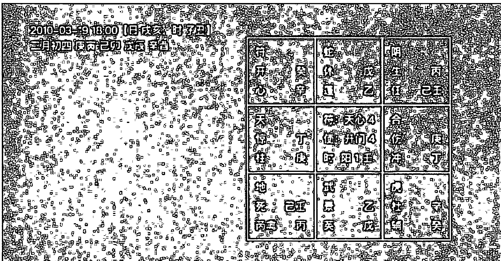

下面我们对这个奇门局进行基本的盘面分析。

### ① 确定干支时间

年：庚寅年，庚为太岁。
月：己卯月，己为月干；卯月木旺。
日：戊辰日，日干戊。
时：辛酉时，时干辛。

### ② 标出空亡、六击、入墓、马星及反吟伏吟

#### a、空亡

标出空亡，戌空、亥空、子空、丑空。

#### b、六仪击刑（六击）

标出“六击”，己六击，癸六击。

#### c、入墓

标出入墓，己入墓，辛入墓。

#### d、马星

标注马星，酉时马星为亥，对着巳冲过去，辛入墓就没有了。

#### e、伏吟反吟

该奇门局有星反吟，门反吟，干反吟，叫星门干反吟。反吟指的是要变化，要快，事情要变要快。

### ③ 找出关键参数

- a、女方——乙
- b、男方——庚
- c、婚姻——六合

### ④ 分析各参数情况

a、分析男方的情况——庚落宫
庚在兑金宫，是一个庚帝旺的宫，说明男性状态很旺。而且他跟婚姻参数“六合”在一起。

b、分析女方的情况——乙落宫
女方乙落宫在坎水宫，逢空。说明她思考的事情现在还没落实，也就是要不要落实结婚。

c、分析男女双方的关系——乙、庚的关系
发现庚的落宫金生乙的落宫水，金生水，说明男方很爱女方。

d、分析双方对婚姻的态度——乙、庚与六合的关系

婚姻“六合”落宫也是生女方和男方，表明双方都是想结婚的，而且婚姻是相生或者比和的关系。

所以分析结果为这对年轻的男女应该结婚了，恭喜他们。

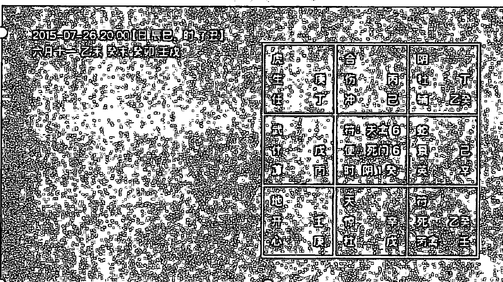

## 4、奇门案例（三）

下面分析第三个婚姻奇门局。男方咨询婚姻。

我们首先对这个奇门局进行盘面的基本分析。

- ① 确定干支时间

年：乙未年，乙为太岁。
月：癸未月，癸为月干；未月土旺。
日：癸卯日，日干癸。
时：壬戌时，时干壬。

### ② 标出空亡、六击、入墓、马星及反吟伏吟

a、空亡
标出空亡，辰空，巳空，子空，丑空。

b、六仪击刑（六击）
标出“六击”，戊六击，庚六击。

c、入墓
标出入墓，庚入墓，乙入墓，癸入墓。

d、马星
标出马星，戌时马星为申，冲寅，去掉了乙入墓。

e、伏吟反吟
该奇门局没有反吟和伏吟。

### ③ 找出关键参数

- a、男方（丈夫）——庚
- b、女方（妻子）——乙
- c、婚姻——六合
- d、女小三——丁
- e、男小三——丙

### ④ 分析各参数情况

a、分析妻子的情况——乙落宫

乙入墓，说明妻子心里很纠结。

b、分析丈夫的情况——庚落宫

庚处在长生的状态，因为长生为旺，所以庚表面上是逢空的，不为真空。但是毕竟有些空，说明做丈夫的不太履行他的责任。

c、分析男女双方的关系——乙、庚的关系

乙庚落宫的关系为金克木，妻子克丈夫，妻子对丈夫不满。

d、分析双方对婚姻的态度——乙、庚与六合的关系

丈夫“庚”跟婚姻“六合”的关系为木生火，意思是丈夫愿意维持婚姻。

但是婚姻对老婆来讲，火克金，婚姻已经让老婆产生了巨大的危机，再考虑乙和庚的关系又很紧张，所以婚姻是要出现危机的。

这时候需要分析一下第三者的问题。

e、分析男方和女小三的关系——庚、丁的关系

首先看男方的外遇情况。

找到代表女情人的“丁”，庚下临丁，至少说明在以前他应该有女情人，而且参数比较好，外环境不错，临生门说明过去跟女情人的关系是不错的。临白虎，说明这种关系很有压力。

那么现在他跟女情人如何？看天盘的女情人“丁”，双方关系为木克土，克这个女情人。但是女情人“丁”在沐浴冠带的地方，桃花之地，所以她还是不愿意跟这个丈夫完全分手。这里丈夫逢了空，虽然旺，但终是有一点空，为空克。他跟女情人私下多少还是有来往。

而且女情人可能怀孕了。因为丁下临癸，癸往往代表胎儿，当然丁底下有胎儿不见得这个女情人一定有胎儿，还要看旁边的参数是不是帮助她有胎儿。临杜门，代表躲起来；临太阴，代表暗中，说明这个女情人丁暗中躲了起来，干了男女之事，因此发生怀孕有胎儿的可能性是比较大的，当然不是完全肯定。

根据这个局来看，女情人影响了这对夫妻的婚姻。

f、分析女方和男小三的关系——乙、丙的关系

接着分析女方的外遇情况。那就看丙跟乙的关系。

先看地盘丙与丁的关系，它们的关系为金克木，女方克男方，说明女方过去没有过密的男朋友或者男情人。

再看天盘丙与丁的关系。天盘丙现在在离火宫，火克金，也不可能有过密的男方或者男情人去追这个女方。

因此可以判断婚姻出问题主要是男方的责任。

# 第 5 节 奇门辅助测风水

风水主要讨论的是人居环境与人的关系，对于风水来讲，主要是现场考察为主，奇门断风水只是一种辅助的手段。

## 1、风水的相关参数

- ① 总体风水——时干
- ② 房屋——生门
  - a、新房子——生门临“值符”
  - b、高档房子——生门临九天
  - c、旧、低档房子——生门临九地
- ③ 地段——死门
- ④ 房主——日干、年命
- ⑤ 周边环境参数
  - a、河流、小溪——壬、癸
  - b、树木——乙
  - c、尖高物（电线杆、路灯、旗杆等）——丁奇

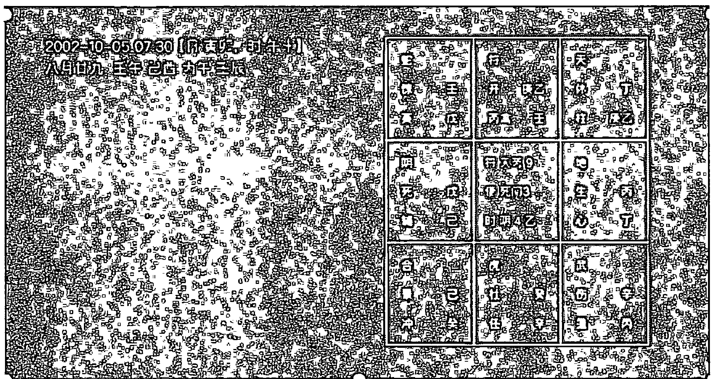

## 2、奇门案例（一）

我们来介绍第一个实例。求测某一个宅基地的风水。预测的时间是2002年10月5号上午7:30。

我们首先对这个奇门局进行基本局面的分析。

### ① 确定干支时间

年：壬午年，壬为太岁。
月：己酉月，己为月干；酉月金旺。
日：丙午日，日干丙。
时：壬辰时，时干壬。

### ② 标出空亡、六击、入墓、马星及反吟伏吟

#### a、空亡

标出空亡，寅空，卯空，午空，未空。

#### b、六仪击刑（六击）

标出六击，戊六击，壬六击。

#### c、入墓

标出入墓，己入墓，壬入墓，乙入墓，丙入墓。

#### d、马星

标出马星，辰时马星在寅，冲申，就把乙入墓给冲掉了。

#### e、伏吟反吟

该奇门局没有反吟和伏吟。

### ③ 找出关键参数

- a、总体风水——时干
- b、地段——死门
- c、房屋——生门
- d、屋主——日干

咨询风水，主要看各个参数与屋主（日干、年命）的关系。

### ④ 分析各参数情况

a、分析总体风水情况——时干

我们首先看总体的风水情况。
时干壬在巽木宫，存在壬入墓，壬六击。说明外环境压抑，有一些入墓的现象，这都是不利的因素。
九星为天英，也反映了周围的环境，星性中平，并不是特别好。
临惊门，人际关系有口舌是非。
临螣蛇，住在那里有很多事情纠缠。
壬加戊是一个好的现象，有所改善。
总体来说，这个宅基地还是存在一些问题。

b、分析屋主与整体风水的关系——时干、日干的关系

日干表示屋主，日干落宫为金，金克时干落宫木，说明人可以掌控宅基地的风水，当然如果相生就更好了。

c、分析地段的情况——死门

再来看看地段的情况。地段为死门，遇到“戊六击”和卯空，不是很理想。

临天辅星说明这个地段是一个文化区域。

临太阴，临死门不好，说明过去可能这里有一些意外的死亡现象。

戊加己也不好。

整体来说，利弊还是很明显的，利益不是很大；站在屋主日干的角度来讲，仍然是金克木，说明他可以控制这个地段。

d、分析房屋的情况——生门

房屋临天心，说明房屋周围的邻居还是可以的。

临九地说明房屋还是陈旧了一点。

丙加丁，丙说明这个房子周围有电源的设备，丁说明边上有尖高物，比如有路灯，或者是杆子等等。

总体来说情况还是可以的。

根据这些分析，我们发现这个宅基地的风水利弊都有一些。当然听起来，宅基地本身可能弊多了一点。至于是否居住，需要房主自己做一个判断。

### ⑤ 结果反馈

事后，房主反馈，确实宅基地及其周围风水的问题多一些，住的也不是特别舒适，当然也有有利的地方。总的来说，我们的分析是被验证了。

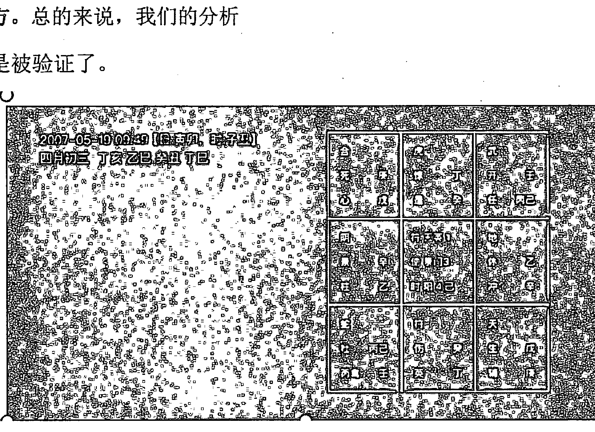

## 3、奇门案例（二）

下面我们介绍第二个案例。有一个公司老总问测一下公司和厂房的风水问题。
问测的时间是2007年5月19号早晨9:49。
下面我们对这个奇门图进行基本的分析。
① 确定干支时间
年：丁亥年，丁为太岁。
月：乙巳月，乙为月干；巳月火旺。
日：癸丑日，日干癸。
时：丁巳时，时干丁。

### ② 标出空亡、六击、入墓、马星及反吟伏吟

#### a、空亡

标出空亡，寅空，卯空，子空，丑空。

#### b、六仪击刑（六击）

标出六击，己六击。

#### c、入墓

标出入墓，己入墓，戊入墓。

#### d、马星

标出马星，巳时马星在亥，冲巳，冲掉了戊入墓。

#### e、伏吟反吟

该奇门局存在星和干反吟。

### ③ 找出关键参数

- a、整体风水格局——星干反吟
- b、公司——开门
- c、地段——死门
- d、厂房——生门
- e、厂长（屋主）——日干

### ④ 分析各参数情况

a、分析整体风水情况——星干反吟

首先整体奇门盘的格局——星干反吟。这是一种纠结的状态，说明风水处在一个反复变化的过程中，这一点是令人有一些担忧的。

b、分析公司的情况——开门

以开门代表公司，现在遇到了己六击，说明公司办公有压力。临天任，外环境还是不错的。临玄武，那里有一些虚诈的事情。壬加己、壬加丙都是一些不好的兆头，所谓的凶兆。总体来说，公司在那里还是有一些弊端，利益小了点。

c、分析地段的情况——死门

地段看死门。公司所在的地段外环境临天心，是好的。临六合，六合代表多，说明这个地皮周围有很多不同的机构在那里办公。

d、分析厂房的情况——生门

下面我们来看看厂房，也就是生门落宫的情况。
生门落乾金宫，说明厂房周围的环境是不错的。
临天辅星，有文化设施。
临九天，说明厂房是一个新的厂房。

戊加庚反映了一个不吉利的情况，而且戊原先入墓，被马星冲掉，戊加庚也反映了换地盘，厂房有可能要动，再加上有马星出现，所以这个厂房用不久，将来会搬迁。

e、分析老总与各参数的关系——日干与各参数的关系

接着分析公司跟老总的关系。可以发现公司开门克日干，说明在那里办公对老总的压力很大，不太理想。
老总跟地段死门是相生的关系，还是行的。
老总跟厂房生门的关系也是相生的关系，对老总来讲是可以的。

### ⑤ 分析结果

综合分析，我们认为公司在里办公问题比较大，厂房在那里不稳定，恐怕要搬迁。地段也有利有弊，暂时在这里还可以，时间久了，恐怕要动迁。

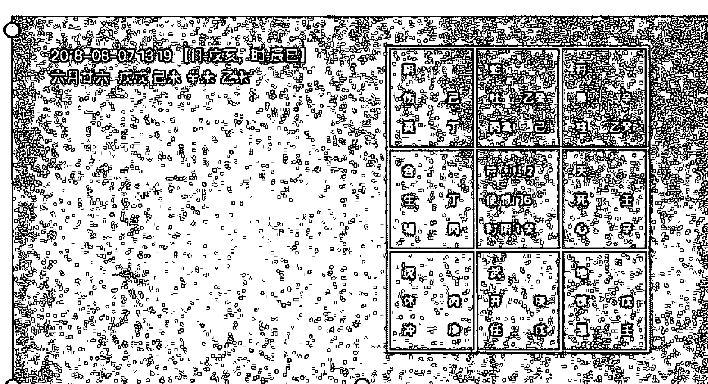

## 4、奇门案例（三）

现在我们介绍第三个案例。咨询新买的别墅风水。预测时间为2018年8月7号13:19。
首先对这个奇门局进行基本的分析。

### ① 确定干支时间

年：戊戌年，戌为太岁。
月：己未月，己为月干；未月土旺。
日：辛未日，日干辛。
时：乙未时，时干乙。

### ② 标出空亡、六击、入墓、马星及反吟伏吟

a、空亡
- 标出空亡，戌空，亥空，辰空，巳空。

b、六仪击刑（六击）
- 标出六击，庚六击。

c、入墓
- 标出入墓，庚入墓，乙入墓，癸入墓，戊入墓。

d、马星
- 标出马星，未时马星在巳，冲亥，戊入墓就被冲掉了。

e、伏吟反吟
- 该奇门局没有反吟和伏吟。

### ③ 找出关键参数

- 总体风水——时干
- 屋主——日干
- 地段——死门
- 房屋——生门

### ④ 分析各参数情况

a、分析总体风水情况——时干

我们首先分析时干，就是房屋的总体风水。时干乙在离火宫为长生，说明总体的风水应该处在一个旺相的状态。

临天芮，说明还有一些问题。

临杜门，说明人际关系还有一些阻力，住在那里的人与人来往不多。

临螣蛇，说明住在那里会有一些事务纠缠。

乙加己、癸加己这种组合，也是不太理想。

乙木表示周围有树林。

癸水表示周围有一个小溪。

己土说明周围有一些小的山岗。

b、分析地段的情况——死门

接着分析地段死门的情况。

地段临天心，外环境不错。
临九天，这个地段是一个高档的地段。
壬加辛，有一些纠缠的现象。
总体来说这个地段相当不错。

c、分析房屋的情况——生门

再来分析别墅本身的情况，房屋为生门。
临天辅星，房子周围外环境不错，也很有文化气息。
临六合，代表多，说明周围还有不少的楼。
丁加丙，格局是好的。
丙代表周围可能有一些电源装置。
丁表示有路灯在别墅边上。

d、分析屋主与各参数的情况——日干与各参数的关系

日干辛在坤土宫，临天柱，说明为了买这个别墅花了不少钱。
临值符，说明房主在那里有很多贵人帮忙。
临景门，说明那个地段红火，但是有两个入墓。
辛加癸、辛加乙都是不好的征兆，所以住在那里会有一些事情让他感到不满意。
辛帝旺，说明他住在那里的个人状态还是不错的。

时干落宫生日干落宫，我们来看看这一个总体风水对它是一个相生的关系，总体风水还是不错的。
跟地段也是相生关系。只不过这个别墅对他有一些冲克的现象，好在土旺，日干辛帝旺，所以木宫无力去冲克这个房主。总体来看，房主任住在那里是适宜的。

### ⑤ 结果反馈

分析结束之后，在场的这位同学讲，分析的结果基本上都符合的实际情况。

# 第 6 节 奇门测一生

## 1、终身局的相关参数

这一讲的主要内容是用奇门来预测一生的宏观情况，也叫奇门终身局的分析。

- ① 一生整体情况——日干
- ② 事业状况——开门
- ③ 疾病情况——天芮
特别注意天芮跟伤门、死门、惊门的关系。

a、如果天芮克伤门，一生中要特别注意受伤的事故；
b、如果天芮克死门，一生中要特别注意重大的疾病；
c、如果天芮克惊门，一生中要特别注意心理上的问题。

### ④ 婚恋状况

- a、女方——乙
- b、男方——庚
- c、婚恋本身——六合

### ⑤ 财运情况

- a、工资收入——生门
- b、聚财能力——戊
- c、求测人——日干

生门跟戊相生、比和，就容易挣比较多的钱。

最后这个财富是积累起来还是花出去了，要跟日干的五行关系进行比较。

### ⑥ 子女情况

- a、子女——时干
- b、父母——年干
- c、求测人——日干

### ⑦ 流年状况分析

#### a、流年的确定

以出生年的属相作为起点，那时虚岁为1岁。循环一轮，再次回到这个属相，虚岁就是13岁；继续循环，就变成25岁、37岁等等。

那么轮到属相的下一年，就是2岁，再过一轮14岁，再过一轮26岁，这样循环12个地支，就可以把流年逐一进行分析了。

#### b、反吟伏吟

终身局存在伏吟或反吟，往往代表一生比较纠结。

伏吟局一生遇到很多事情要改变比较难，比较慢；反吟局则代表纠结，事情老在变化，处在反复之中。

但是有一个例外，终身局为天显时格，即六甲时辰诞生的人，他们的终身局是星门伏吟，一生虽然会经历波折和坎坷，但是最后的结果是好的，这是天显时格的特点。

## 2、奇门案例（一）

第一个案例是一位女士的终身局。

这位女士诞生于1967年11月12号7:13。

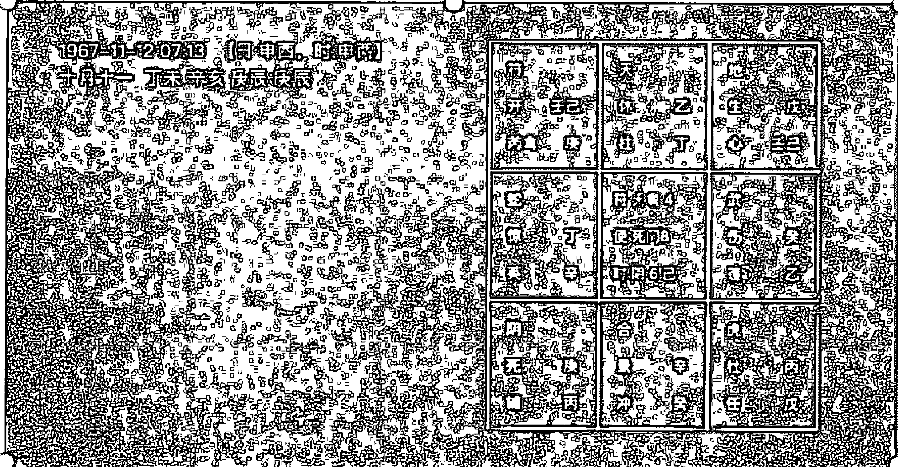

我们首先对这个局进行基本的分析。

### ① 确定干支时间

年：丁未年，年干丁。
月：辛亥月，月干辛，亥月水旺。
日：庚辰日，日干庚。
时：庚辰时，时干庚。

### ② 标出空亡、六击、入墓、马星及反吟伏吟

#### a、空亡

标出空亡，双申空，双酉空。

#### b、六仪击刑（六击）

标出六击，己六击，庚六击，壬六击。

#### c、入墓

标出入墓，庚入墓，壬入墓，丙入墓，戊入墓。

#### d、马星

标出马星，辰时马星在寅，对着申，庚入墓不存在了。

#### e、伏吟反吟

该奇门局存在门反吟。

### ③ 分析各参数情况

#### a、分析整体格局

首先，这个大格局是门反吟，说明命主一辈子在人际关系上有所反复纠结。

#### b、分析日干落宫参数

“生命的核心”日干在艮土宫。
临天辅，说明一生外环境还是不错的，容易跟文化界打交道；
临死门，反映了人际关系处理得比较失败，因此要学会处理人际关系；
临太阴，暗中有人帮忙的；
庚加丙，这个组合称之为“太白入荧”，不吉，贼必来，经常有人会来干扰。
这就是这位命主一辈子宏观的吉和不吉的情况。

#### c、分析日干职业倾向

日干落宫也会反映出命主一辈子职业的倾向。
临天辅，代表会选择文化教育类的事业；临死门，表示地产事业或者殡仪、丧葬的事业；临太阴，表示中介；
庚金，有两个解释，一个是跟公安相关的工作，一个是跟金属矿物相关的工作；丙代表能源，电力的工作；
整个宫是艮土宫，表示含有矿物的事业。
此奇门盘大体上反映了命主比较适合的职业取向，当然干其他也不是不可以，但是就先天条件而言，就是我们上面讨论的这些职业取向。

d、分析事业情况——开门

事业开门临值符，有贵人帮助，同时值符也代表自己会当一个单位的负责人，一般情况下是第二把手；

己加庚、壬加庚，事业上会有一些纠缠不利的事情，需要命主自己加以调整；

事业落宫跟命主的关系是木克土，说明这辈子事业对命主有比较大的压力；

事业落宫存在六击和入墓，是一个有压力，而且纠结的事业。

e、分析疾病的情况——天芮

天芮病星在巽木宫，木宫克天芮土，因此天芮不容易旺起，有病也容易被治愈；

接着分析天干，有壬入墓，不旺，己临帝旺而且临禽，所以会出现己的问题。庚长生，庚的问题也要注意，也就是说存在阴土和阳金的问题，己土通常是涉及到脾胃，另外己土也跟女性的阴部有关，庚更多的反映消化系统、大肠；

所以将来如果有病的话，最主要的病是脾胃消化系统的病，也可能会涉及到女性的妇科问题；

临开门，说明这个病不会突然很凶；临值符，有好的外因，所以不会有迅速严重的疾病来冲击这位命主；

伤门克天芮宫，一辈子不容易有重大的受伤事故，而且逢空；

f、分析婚姻的情况

乙代表女方妻子，也就是命主本人；庚代表丈夫；六合代表婚姻。

乙庚的关系是火生土，说明他们夫妻自身感情和相处应该没问题；婚姻六合本身有了一些问题，因为婚姻这个落宫在水宫，克妻子的火宫，然后丈夫的庚金在土宫，克这个婚姻的水宫，所以婚姻容易波动，夫妻双方都要加以注意，否则会引发不利的后果；

女方跟丙的关系是火克金，所以女方不可能跟其他的异性有过多的交往。男方跟丁的关系也是相克的，也不可能跟其他的异性有更多的交往。更多的可能是由于其它的原因引发了他们之间的问题。譬如看看是不是钱的问题，戊代表钱财，钱财跟婚姻是一种相克的关系，就是夫妻会因为经济问题而争吵。

g、分析子女情况

h、分析父母的关系

接着分析父母的关系，父母看年干，命主跟年干的关系是木生火，

彼此相生的关系，因此跟父母关系也非常好。

i、分析流年运势

流年运势分析，把未羊年作为虚岁 1 岁、13 岁、25 岁等；然后

到了申猴年就是 2 岁、14 岁、26 岁等。同学们可以自行把每个宫的年龄标注出来，然后每一个年龄段落宫里的参数，就是这个年龄段可能发生的事情。

3、奇门案例（二）

现在我们介绍第二个终身奇门局。这是一位男士的终身局。

诞生于 1963 年 2 月 27 号寅时。

我们首先对这个奇门局进行基本的分析。

① 确定干支时间

年：癸卯年，癸为太岁。
月：甲寅（癸）月，月干癸，寅月木旺。
日：辛丑日，日干辛。
时：庚寅时，时干庚。

② 标出空亡、六击、入墓、马星及反吟伏吟 a、空亡

标出空亡，辰空，巳空，午空，未空。

b、六仪击刑（六击）

标出六击，双庚六击，双辛六击。

c、入墓

标出入墓，双庚入墓，双乙入墓，双癸入墓，双戊入墓。

d、马星

标出马星，寅时马星在申，冲寅，去掉一个庚入墓。

e、伏吟反吟

该奇门局存在九星伏吟，星干伏吟，八门反吟。

③ 分析各参数情况

况a、分析整体格局

星干伏吟加上门反吟，说明命主这一生心态比较纠结，想做的事情会比较难做，也做得慢，有时候会反复，这是命主的宏观的特点。

b、分析日干落宫参数

-   命主日干位于离火宫，存在辛六击，说明命主一生压力比较大，逢空减轻了压力；
- 临天英，外环境中平；
- 临休门，人际关系还不错；
- 临六合，公共关系也还不错，只不过压力太大，纠结的很。

c、分析日干职业倾向

-   日干临天英加上离火宫，表示信息技术、传媒广告；
- 临休门，为休闲产业；
- 临六合，中介与人合作；

d、分析事业情况——开门

接着分析事业开门的情况。

临天辅，事业的外环境是好的；

临太阴，暗中有人庇护；

丙加丙，本来丙奇和丙奇是好的，但是它们两个内斗，所以还造成了一些紧张状态；逢空，事业有时候不落实；

跟日干的关系总的来说是好的，木生火，事业利命主，因此总体来讲事业是旺这个命主的。

e、分析疾病的情况——天芮

接着分析身体的情况，天芮病星落宫存在癸入墓，不够旺，乙虽然也入墓，但是临禽，所以乙将来是疾病的主要考虑因素；

落宫是坤土宫，当然现在没旺，所以木的病是主流，木的病主要反映肝胆系统或者纤维系统，所以命主应该注意肝胆系统和纤维系统的健康；

临生门，说明内因好，命主自己的抗病能力比较强；

临白虎，说明外因不好，也就是说得病以后的外部环境及外因助力不够；

伤门没有被天芮所克，所以一生不容易有重大的受伤事故；

惊门克天芮星，所以一生不容易有心理方面的疾病；

死门也没有被天芮病星所克，所以也不会突然发生意外、疾病等

重大问题。

f、分析婚姻的情况

乙代表妻子，庚代表丈夫，二者落宫是土土比和而且对冲，这种格局我们称之为和而不同，夫妻关系是和谐的，但是有不同的意见；六合落宫离火宫生丈夫的艮土宫，也生妻子的坤土宫，因此婚姻应该是稳定的。

g、分析财运的情况

分析财运的情况，主要看戊跟生门的关系。生门的落宫土生戊的落宫乾金宫，因此财运不错，利于慢慢聚集财富；

日干跟生门是相生的，而且生门旺，赚钱的运气不错；
日干跟戊的关系属于火克金，表示要聚成财富，命主是要费一番心血的。

h、分析子女的情况

子女用时干表示，时干跟日干是相生的，因此命主跟子女的关系保持良好。

i、分析父母的情况

父母用年干表示，日干跟年干的关系又是相生的，因此跟父母的关系也是融洽的，应该是一个孝子。

j、分析流年运势

流年运势的分析，取他属相卯兔落宫为 1 岁、13 岁、25 岁等，然后到了辰龙年就是 2 岁、14 岁、26 岁等。同学们可以把流年都标注在每一个地支和宫的旁边，以便选取参数进行分析。

第 7 节
奇门测寻人

这几年来经常会遇到老人因为糊涂或者痴呆走失，小孩迷路走失，以及成年人由于各种各样的原因离家出走，都需要寻找他们。

1、寻人的相关参数

-   ① 走失者——年命、或日干、或者用六亲关系
- ② 走失方向
a、开始走失的方向——六合落宫 b、最后落脚的方向——年命、或日干落宫
- ③ 不是走失，需要确认躲藏地——杜门落宫
- ④ 需要断相反方向的情况 a、反吟局——落宫在东，人却往西走，断方向需要往反方向断
c、落宫逢空——落宫在东，逢空，说明人已经离开，往反方向移动，即向西前进。
- ⑤ 走失远近的判断——内盘为近，外盘为远
- ⑥ 走失之人是否安全——走失者年命或者日干落宫

2、寻人的12种情况

-   ① 时干宫与走失者同宫，容易回来；
- ② 时干宫生走失者落宫，容易回来；
- ③ 走失者生时干落宫，反而不容易回来，说明走失的人喜欢某件事情，自愿离开，不容易回来；
- ④ 走失者与时干宫互克，不容易回来；
- ⑤ 走失者，如果旺相，又临开门、休门、生门、杜门，不容易回来，因为他在外面过得挺好，不想回来；
- ⑥ 走失者休囚

不旺，且临伤、惊、死、景四门，只是有消息，有消息不一定容易回来；
-   ⑦ 走失者临九地、太阴躲得比较深；
- ⑧ 走失者如果临九天，说明远走高飞；
- ⑨ 走失者临玄武，有可能被拐骗；
- ⑩ 走失者临螣蛇，被纠缠，或被扣留下来；
- ⑪ 走失者临值符、六合，不逢空，可能是安全的；
- ⑫ 伏吟，走失者难回来；反吟，走失者容易回来。

3、奇门案例（一）

我们首先看第一个实例。

2016 年 3 月 2 号，早晨 6 点钟，一个 16 岁的女孩子离开家去上学，但她并没有去学校，后来也联络不上她，家长就报警了，并发了寻人启事。现在我们用奇门局来断一下，这个女孩子到底怎么回事。

首先我们对这个奇门局进行基本盘面的分析。

① 确定干支时间

年：丙申年，丙为太岁。
月：庚寅月，庚为月干；寅月木旺。
日：癸未日，日干癸。
时：乙卯时，时干乙。

② 标出空亡、六击、入墓、马星及反吟伏吟 a、空亡

标出空亡，申空、酉空、子空、丑空。

b、六仪击刑（六击）

标出六击，庚六击，壬六击。

c、入墓

标出入墓，庚入墓、壬入墓、乙入墓、癸入墓。

d、马星

标出马星，卯时马星在巳，对着亥冲过去，壬入墓不见了

e、伏吟反吟

该奇门局存在星干反吟，反吟局是人容易回来的信息。

③ 分析各参数情况 a、分析走失者过去的情况——地盘年命落宫

女孩子生于 2000 年（庚辰年），年命为庚。

艮土宫存在天盘庚，坤土宫存在地盘庚。地盘庚是截止到问事时刻之前的情况，天盘庚是问事当前和进一步要发展的情况。

先分析女孩子在预测之前已经发生的情况，地盘庚在坤土宫，处于临官状态，个人状态还是不错的。

跟时干在一起，是一种容易回来的迹象；

星干反吟也是容易回来的迹象。

临天任，外环境不错；临杜门，说明她藏起来了；临白虎，外力并没有帮助她多少，所以她躲起来生活还是蛮不舒服的。

乙入墓、癸入墓都是躲起来的征兆，当然乙癸、乙庚这些参数组合起来，躲起来都不太理想，心情是纠结的，但是人是平安的，没有生命之忧。

b、分析走失者未来的情况——天盘年命落宫

天盘庚在艮土宫入墓，是一个纠结的状态；临天芮，存在一些问题，说明她在外面躲藏是有问题的；临开门，人际关系不错，她躲藏地方的人对她还不错；临值符，有贵人帮忙；癸加乙、庚加乙都是有一些问题产生，但是也没有生命的忧虑。分析到现在，这个走失的人目前没有生命的问题，她出去是由于她个人的原因，状态总体来说还说得过去。

c、分析走失者的存亡问题——年命、死门落宫的关系

在寻找之前，我们还可以进一步来看看生命的生死问题，主要看死门生克。

死门主管死亡的事情，死门在乾金宫，不克地盘的年命庚金，也不克天盘的年命庚金，进一步说明没有生命之忧。

d、分析走失者的藏身地点——杜门

躲藏地点用杜门表示，走失者会躲在杜门的方向，也就是西南方向；阳局外盘，躲得还比较远；逢空，可以看对宫，所以它很可能由西南到了东北方向。

e、确定走失者找到的时间——杜门出空、值使门

能够找到的时间，就是杜门不逢空的时间，申不空，或者丑不空，这两个时间可以找到。具体天数可以参考值使门，值使死门在乾金宫，数字为 1、4、6、9，阳局外盘取大数 6 和 9。这就有几种可能情况，6 天到 9 天，或者 16 天到 19 天，最大的可能是 46 天到 49 天，她会回来，所以家里也不必担心。

④ 结果反馈

最后反馈结果就是这个女孩不愿意参加中考，想外出打工，不想读书，因此离家到了梅州打工，最后经同事劝说以后，她决定回家。

去。在 2016 年 4 月 10 号回家，离家一共 39 天。在我们刚才讨论的最长的时间 46 天到 49 天之前返回了家里面。

4、奇门案例（二）

下面我们介绍第二个案例。

2017 年 1 月 9 号上午 10 点左右，家长得到消息，他们的 16 岁女儿离家后没有去学校，于是家长就去寻找，同时发了布告。发布告的原因是他们的女儿早一天曾经遭到七名女生的围打，担心女孩子有事。这件事情发生在河北张家口赤城县，按照她离家出走的时间起奇门局。

首先我们对这个奇门局进行基本局面的分析。

**① 确定干支时间**

-   * 年：丙申年，丙为太岁。
* 月：辛丑月，辛为月干，丑月土旺。
* 日：丙申日，日干丙。
* 时：癸巳时，时干癸。

**② 标出空亡、六击、入墓、马星及反吟伏吟**

-   * a、空亡
  * 标出空亡，辰空、巳空、午空、未空。
* b、六仪击刑（六击）

标出六击，己六击。

c、入墓

标出入墓，丁入墓，丙入墓。

d、马星

标出马星，巳时马星在亥，对着巳冲过去，把丙入墓给去掉。

e、伏吟反吟

该奇门局存在门伏吟，这对寻人来讲增加了难度。

③ 分析各参数情况 a、分析走失者过去的情况——地盘年命落宫

女孩子生于 2001 年（辛巳年），年命为辛。

把她的年命在局里找出来，地盘辛反映的是以前的情况，天盘辛则出现在坎水宫，下面我们来分析这个女孩的地盘年命辛，落在坤土宫。

地盘辛属于帝旺，逢空，出现了问题；遇到了己六击，是一个凶象；临天冲，外环境不错；

临死门跟九天，很凶，死亡的征兆，上天堂的征兆；己加辛，游魂入墓，人死了以后灵魂到墓里头，都是非常凶的。己加戊又加死门，也是凶。

所以这个宫给我们一个非常不好的消息，很可能这个女孩子有一个生死存亡的危险。

b、分析走失者未来的情况——天盘年命落宫

其实对于她现在和未来的天盘命宫，我们可以分析，也可以不分析，因为地盘的年命已经很凶了，那我们就来分析一下。

首先，死门克天盘年命；
其次，天盘年命落宫为坎水宫，也是死亡征兆，所以很不乐观。

c、分析走失者的位置——地盘年命

依照年命来看，如果这个女孩子的尸体没有被移动的话，本来应该出现在西南方向，因为逢空，就要看东北方向。

d、分析是否遇害——地盘年命、天蓬的关系

假设有人害死了她，那天蓬星就可以表示这个罪犯。

这个局中，天蓬跟年命的关系是木克土宫，克地盘年命落宫，说明有人可能害死了这个女孩子，但是逢空，也可能没有实施这个计划。

所以现在可能出现两种情况，一个是尸体可能出现的地方；一个是杜门，女孩子可能潜藏的地方。

e、确定走失者找到的时间

冲空的时候可能就是应期，所以对冲死门落宫的时间，即丑和未的时间是很可能的。

分析值使门，可以知道经过多少天能找到走失者。值使门是杜门，在巽木宫数字为 3、4、5、8，阳局取小数，即 3 到 4。

3 到 4 有几个可能性，一个是 3 天到 4 天，一个是 13 天到 14 天。

f、分析公安干警的情况

公安干警用庚金或者伤门表示，武警用白虎表示，伤门克死门落宫，所以公安干警有可能去把她找到。

④ 结果反馈

事情的结果是第四天，女孩父母在东山脚下发现了女儿的尸体，说明 3 到 4 天是可以找到的。公安检查的结果，女孩子是坠落死亡，排除了他杀。

| 九宫格图表 |
| :---: |
| (图表内容无法精确识别，显示为包含天干地支、数字、符号的九宫布局) |
| 图片内文字：2016-04-30 20:00 农历三月廿四 丙申年 壬辰月 壬午日 庚戌时 甲寅旬 |
| 子丑空 月将: 酉 |

5、奇门案例（三）

下面我们分析第三个实例。有一位家属紧急的问测老人走失的事情。

咨询的时间为 2016 年 4 月 30 号 20 点。

首先对这个奇门局进行基本盘面的分析。

-   ① 确定干支时间

年：丙申年，丙为太岁。
月：壬辰月，壬为月干；辰月土旺。
日：壬午日，日干壬。
时：庚戌时，时干庚。

② 标出空亡、六击、入墓、马星及伏吟反吟

**a、空亡**
标出空亡，申空，酉空，寅空，卯空。

**b、六仪击刑（六击）**
该奇门局没有六仪击刑。

**c、入墓**
标出入墓，己入墓，辛入墓，乙入墓，戊入墓。

**d、马星**
标出马星，戌时马星在申，冲寅，乙入墓去掉。

**e、伏吟反吟**

该奇门局没有伏吟反吟。

③ 分析各参数情况

a、分析走失者过去的情况——地盘年命落宫

老人人生于 1933 年（癸酉年），老人的年命为癸。

首先看老人的地盘年命癸的情况。地盘年命在坎水宫，癸水处于临官旺相，自身的状态不错；临天柱，外环境不好；

临死门，回家遇到了巨大的阻力，应该很紧张；临太阴，如果没有生命危险，这个太阴就是荫庇，属于好的现象，如果有生命危险，那太阴就是阴间了，是死人的征兆，好在癸水是临官旺相，应该问题不大；上临庚，庚代表公安，说明已经得到了公安的保护。

b、分析走失者未来的情况——天盘年命落宫

天盘的年命癸在震木宫，处于长生位，所以老太太个人状态不错；
临天蓬，外环境不好；
临开门，人际关系很好，有人会协助她；
临白虎，精神压力很大。

总体来讲老太太走失以后心里非常慌乱，很焦虑，但是由于受到
警察的保护，没有生命之忧，因此是可以寻找回来的。

c、预测什么时候有消息反馈——丁奇

丁奇代表消息，现在是戊入墓，所以消息还不明朗。
但是到了戌亥的时候，乾金宫旺，就可能有消息传来。所以在戌
时或者亥时，老人应该有回家的消息。

④ 结果反馈

刚刚断完这个局不久，时间还在戌时，对方很快就反馈
了。警察不久之前刚刚把老人送回了家，果然是受到了警察保护，被警察送回了家。

第 8 节奇门测寻物

现实生活中，经常有人会遗失东西，或者粗心丢了东西，也可能
东西被小偷偷了，也可能是遇到了抢劫，那么这些事情发生以后，

如何去找到它呢？这就是这一讲要回答的问题。

1、寻物的相关参数

-   ① 失物的总体参数——时干
- ② 依据失物特点定类象
- ③ 失主——日干
- ④ 小偷——玄武
-   a、玄武落宫克失物的落宫，失物被偷；
-   b、如果玄武跟失物在同宫，为顺手牵羊。
- ⑤ 抢劫犯——天蓬星

天蓬落宫克失物落宫或者天蓬跟失物同宫为失物被抢走。

-   ⑥ 刑警——伤门
- ⑦ 武警——白虎
- ⑧ 失物的远近

失物在内盘为近，失物在外盘为远。

-   ⑨ 失物的方位——失物落宫

⑩ “反吟伏吟”的含义

反吟局，失物容易回；伏吟局不易找到。

⑪ 日干、失物的关系

失主日干和失物在同宫或者失物落宫生失主落宫容易找到。

⑫ 本人遗失——日干、玄武日干临玄武

是自身迷糊，不知放哪里了。

2、奇门案例（一）

首先来看第一个实例。有位同学问测，某一个机要仓库的钥匙找不到了。

预测时间为 2016 年 12 月 11 号 19:18。

我们首先对这个奇门局进行基本的分析。

-   1. 确定干支时间
   年：丙申年，丙为太岁。

月：庚子月，庚为月干。
日：丁卯日，日干丁。
时：庚戌时，庚时干。

② 标出空亡、六击、入墓、马星及反吟伏吟 a、空亡

标出空亡，戌空、亥空、寅空、卯空。

b、六仪击刑（六击）

该奇门局没有六击。

c、入墓

标出入墓，乙入墓，丙入墓。

d、马星

标出马星，戌时马星在申，对着寅冲过去，乙入墓被去掉了。

e、伏吟反吟

该奇门局没有反吟伏吟。

③ 分析各参数情况 a、分析

偷盗的因素——时干、玄武的关系

玄武表示小偷，时干代表失物。

判断小偷跟失物的关系，就是判断玄武跟时干的关系。如果二者是相生的关系，既不是小偷克失物，也不是小偷跟失物在同宫，那就不是小偷偷盗。

#### b、分析失主和失物的关系——日干、时干的关系

失物时干庚金和失主日干丁火，分别在兑金宫和乾金宫，二者是比和的关系，因此失物应该可以找到。

#### c、分析失物钥匙的位置——丁（钥匙的类象）

为了确定失物钥匙的位置，除了看时干以外，还要看失物的类象。钥匙通常用丁来表示，如果钥匙在原地丢了没有动的话，要看地盘的丁。

地盘的丁在兑金宫，跟休门在一起，说明钥匙可能丢在了休闲的地方，周围会有一些树林。如果那里没有，也可能这个钥匙被移动过，就需要看天盘丁。

天盘丁在乾金宫，乾金宫代表圆形的东西；临天柱代表金属的东西，所以这把钥匙可能在一个圆形的金属桶里头。临九地，可能是犄角旮旯里，所以这又是一个可能地方，但是逢空，通常逢空要看对宫的信息。

当然，如果在西北偏僻地方的圆形筒里找到了，也就不需要查看对宫了；如果没找到，就要看对宫，对宫在东南方向，东南方向出现的是死、阴、己土、戊土，那么这个东西很可能在东南方向的一个死角里，阴和己都代表脏乱的地方，所以可能是杂物垃圾堆放的地方。

根据这个信息，第一应该在西边找，第二应该在西北边找。如果都找不到，就往东南边找。

#### d、确定找到的应期

找到失物的时间，需要填空。本奇门局戌空、亥空，因为预测时间为戌时，所以已经填空了，所以在亥时不空的时候就可以找到。

### ④ 结果反馈

该名同学反馈如下，大约在 21:50 左右，也就是亥时，在东南方向一层食堂的车库旁的一个纸箱里头，找到了这把钥匙，有可能清洁员见到钥匙以后就放在纸箱上面了。

## 3、奇门案例（二）

下面我们看第二个案例。一名同学想知道她的一 个装有很多首饰的贵重首饰盒放到哪里去了。

预测时间是 2016 年 9 月 23 号 9:39。

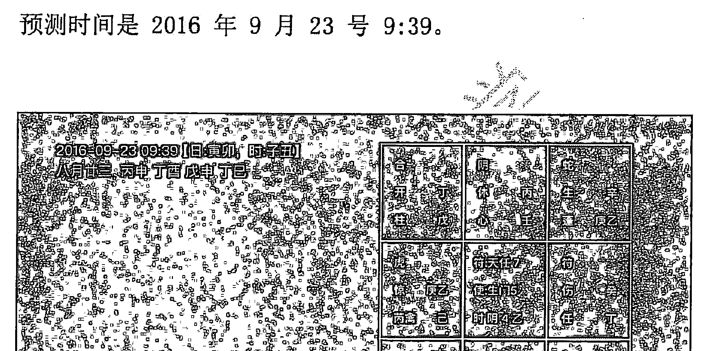

我们首先对这个奇门局进行基本的分析。

### ① 确定干支时间
- 年：丙申年，丙为太岁。
- 月：丁酉月，丁为月干；酉月金旺。
- 日：戊申日，日干戊。
- 时：丁巳时，时干丁。

### ② 标出空亡、六击、入墓、马星及反吟伏吟

#### a、空亡

标出空亡，寅空，卯空，子空，丑空。

#### b、六仪击刑（六击）

该奇门局没有六击。

#### c、入墓

标出入墓，乙入墓，丙入墓。

#### d、马星

标出马星，巳时马星在亥，冲巳，把丙入墓给去掉了。

#### e、伏吟反吟

该奇门局存在门反吟了，这是失物容易找到的一个信息。

### ③ 分析各参数情况

#### a、确定失物首饰盒的宫位——辛（首饰盒的类象）

首饰盒的失物类象用辛金表示。地盘的辛金在坎水宫，天盘的辛金在坤土宫。

#### b、分析偷盗的因素——时干、玄武的关系

首先寻找到玄武和时干，分析它们两个宫位的关系。发现时干克玄武，木宫克土宫，所以不是被小偷偷盗。

#### c、分析强盗的因素——时干、天蓬星的关系

天蓬星代表强盗，该奇门局时干克天蓬，所以这个首饰盒可能是自己遗失。

#### d、确定寻找的可能性——日干、时干的关系

确定寻找的可能性，就是分析失主日干跟失物时干的关系。它们的关系是水生木，说明失主需要费点功夫去寻找到这个失物。

#### e、确定失物的位置

确定失物的位置，第一看类象的落宫，如果类象落宫找不到，还可以看时干的落宫。首先看地盘辛金（首饰盒），它在坎水宫，在北边；临戊，说明首饰很值钱；临天辅，说明失物可能在北边充满学习、文化的地方；临景门，可能是化妆的地方。如果找不到，也可能在坤土宫，生活起居的地方，人活动的地方，在家里。

#### f、确定失物的距离远近

因为是阴局，首饰盒应该在家里或者近处，生活场所也可以去找。如果找不到，就有可能在时干所在的地方，即巽木宫东南方向。

巽木宫有开门和天柱星，这种组合往往指金属的柜子，需要用特殊的钥匙去打开，通常为保险柜，六合就是首饰盒。失物时干丁底下有个戊，说明这个失物很贵重。

#### g、确定找到的应期

因为预测时间是巳时，如果首饰盒在西南方向的坤土宫，那么应该在未申时应该有消息。如果在所谓的北边，就需要等到子不空的时候，即子时才能发现。如果在东南方向，就要等到辰时或者巳时。当然还有其他可能的时间，即马星的时间，所以戌时、亥时也可能。

### ④ 结果反馈

最后这位同学在北边没找到；在西南边也没有找到；在寻找东南面的时候，她突然想起在搬家的时候，把这个首饰盒放到这个朋友家去了，因为是阴局外盘，所以离得比较远。确实那个朋友在东南方向走的稍微远一点，于是第二天她立即跟这个同学取得了联系，同时到这个同学家里面，在保险柜里找到了这个价值连城的首饰盒。

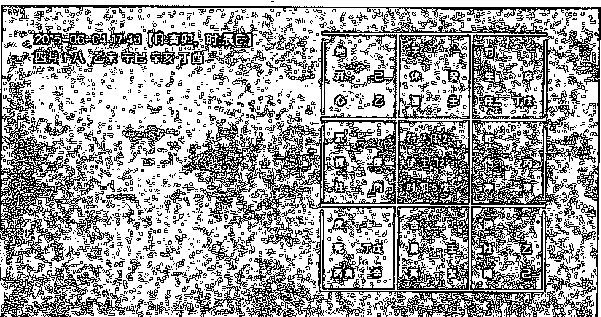

## 4、奇门案例（三）

现在我们介绍第三个案例。这个案例发生在课堂上，一名同学的一辆凯美瑞小汽车被盗了，就在一个多小时以前被盗，咨询一下这个车如何能够找到。

我们对这个奇门局进行基本局面的分析。

### ① 确定干支时间
- 年: 乙未年, 乙为太岁。
- 月: 辛巳月, 辛为月干。
- 日: 辛亥日, 日干辛。
- 时: 丁酉时, 时干丁。

### ② 标出空亡、六击、入墓、马星及反吟伏吟

#### a、空亡

标出空亡，寅空，卯空，辰空，巳空。

#### b、六仪击刑（六击）

该奇门局没有六击。

#### c、入墓

标出入墓，丁入墓，乙入墓。

#### d、马星

标出马星，酉时马星在亥，对着巳，把乙入墓给去掉了。

#### e、反吟伏吟

该奇门局存在星干门反吟，反吟局表示容易找回失物。

### ③ 分析各参数情况

#### a、分析偷盗和失物的关系——伤门（汽车）、天蓬星的关系

首先把偷汽车的信号找出来，因为他偷的是大物件，所以用天蓬星来表示大盗。另外汽车类象为伤门，找到伤门，然后分析一下天蓬和汽车的关系。天蓬的离火宫克汽车的兑金宫，所以确实是大盗偷了这辆汽车。反吟局告诉我们容易找到这个失物。

#### b、确定寻找的可能性——日干、时干的关系

再来看看时干和日干的关系，也就是失物和失主的关系。二者的关系是对冲而比和，也就是可以找到的意思。

#### c、确定失物汽车的位置——伤门（汽车类象）

伤门落宫在兑金宫，汽车一开始应该是停在了西边；临丙加庚，意思是贼逃走了，把车放在了西边；因为是反吟局，所以也可能又到了东边。

#### d、分析大盗的情况——天蓬星落宫

大盗天蓬星落宫临休门，临癸水，说明大盗进行了休息，休息的原因是癸水临了休门，癸水为石油，休门为停止，结合起来就是大盗偷了这辆汽车，因为石油没了，不得不停住。

综上所述，建议同学到公安机关调取有关录像，车子应该是一路上由西向东开的。

#### e、确定找到的应期

时间的确定上，因为申时正好冲动了对宫，对宫中的丁也代表消息，所以消息在申时传来，这辆汽车后来很快就找到了。

### ④ 结果反馈

后来通过公安的录像，查清了这辆汽车由西向东行驶的路线，最后这辆汽车在东边找到。

# 第 9 节 奇门测天气

## 1、天气的参数
- ① 雨天
  - a、雨——天柱星
  - b、雨神——天蓬
  - c、下雨的标志——天柱加壬水或癸水、天蓬加壬水或癸水
- ② 晴天
  - 晴天的标志——天阴星、景门、九天
- ③ 风天
  - a、风——天辅
  - b、大风——白虎
  - c、风（或雷）——伤门
- ④ 阴天
  - a、阴天——太阴
  - b、多云、云层厚——戊、己
- ⑤ 风和日丽——六合
- ⑥ 打雷
  - a、打雷——震木宫、天冲、丙、丁
  - b、闪电、彩虹——螣蛇
- ⑦ 雪天
  - 下雪的标志——天心星（冬天）、天柱星（冬天）

总而言之，要结合这些参数的组合，以及它们的类象，然后做出合理的、概率比较高的天气分析。

## 2、奇门案例（一）

下面来讨论第一个关于天气的案例。当时正在下暴雨，有一个同学中午必须外出办事，咨询中午会不会有雨。

预测时间为 2016 年 6 月 29 号 8:00。

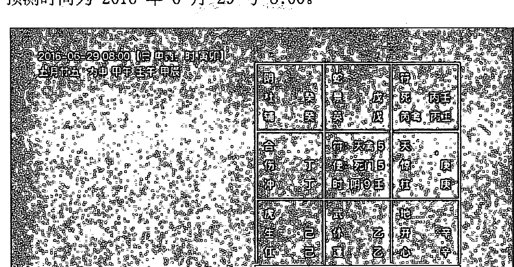

首先对这个奇门图进行基本的分析。

### 1. 确定干支时间
- 年：丙申年，丙为太岁。
- 月：甲午（辛）月，辛为月干；午月火旺。
- 日：壬午日，日干壬。
- 时：甲辰（壬）时，时干壬。

### 2. 标出空亡、六击、入墓、马星及反吟伏吟

#### a、空亡

标出空亡，申空，酉空，寅空，卯空。

#### b、六仪击刑（六击）

标出六击，双癸六击。

#### c、入墓

标出入墓，双己入墓。

#### d、马星

标出马星，辰时马星在寅，冲申。

#### e、伏吟反吟

该奇门局存在星门干伏吟。

### ③ 分析各参数情况

#### a、分析预测时间的天气情况——时支落宫

首先来看天气的情况，预测的时间是辰时，落在巽木宫。这个宫中，双癸水受到了六击；临天辅代表有风；临杜门有时候也代表闪电。因此有风暴、暴雨的感觉，现在也是天气阴沉，有雨水。

#### b、分析所求时间的天气情况——所求时间时支（午）的落宫

到了中午，时间就变成了午时，落宫在离火宫。临天英、景门都是天晴的表现；戊土加戊土表示云层很厚；因此到了中午天就晴了，但是云层很厚。

#### c、分析其他下雨的信息

接着检查一下其他的方面有没有下雨的信息。譬如看天柱星落宫，它并没有碰到壬水癸水，也就没有下雨的迹象。天蓬星虽然在坎水宫，但是它遇到了两个乙，也没有壬水癸水，因此整个格局没有持续下雨的可能性。

综合分析，结论是到了中午，雨就会停，没有进一步下雨的消息。

### ④ 结果反馈

预测的情况被验证了。

## 3、奇门案例（二）

下面我们介绍第二个案例。一名同学要搭乘当天下午 4 点的飞机，所以他很想知道那时候的天气情况。

预测的时间是 2016 年 6 月 29 号 16 点。

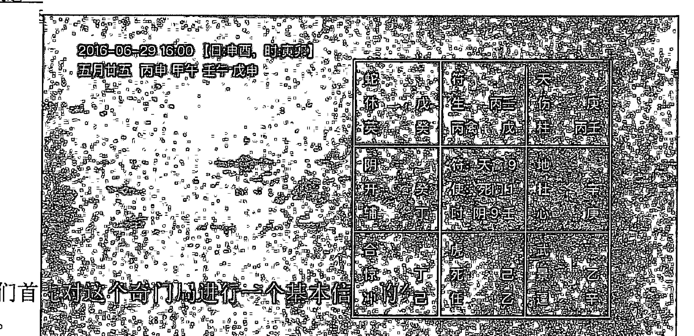

我们首先对这个奇门局进行一个基本简要的分析。

### ① 确定干支时间
- 年：丙申年，丙为太岁。
- 月：甲午（辛）月，辛为月干；午月火旺。
- 日：壬午日，日干壬。
- 时：戊申时，时干戊。

### ② 标出空亡、六击、入墓、马星及反吟伏吟
- a、空亡：标出空亡，申空，酉空，寅空，卯空。
- b、六仪击刑（六击）：标出六击，癸六击。
- c、入墓：标出入墓，丁入墓，己入墓，乙入墓。
- d、马星：标出马星，申时马星在寅，冲申，把乙入墓去掉了。
- e、伏吟反吟：该奇门局没有伏吟反吟。

### ③ 分析各参数情况

#### a. 分析所求时间的天气情况——所求时间时支（申）的落宫

下午四点是申时，申在坤土宫。存在雨师天柱星；临壬水，有下雨的迹象；临伤门，伤门代表风雷；因此这三个参数构成了风、雷、暴雨，所以在申时可能会有这样的天气。但是暴雨天气一般不会持续太久，所以我们可以分析下酉时的情况。

#### b. 分析酉时的天气情况——酉时的落宫

看酉时天气情况，就需要看酉时落宫的情况，酉时在兑金宫，兑金宫没有任何跟下雨相关的信息，因此推断到了 17 点（酉时）以后，就没有风暴雨了，所以飞机不会受到影响。

### ④ 结果反馈

预测结果得到了验证。

## 4、奇门案例（三）

下面我们介绍第三个断天气的案例。有同学下午2点半乘飞机，想知道天气情况会怎么样。

预测的时间是 2015 年 7 月 31 号中午 12 点。

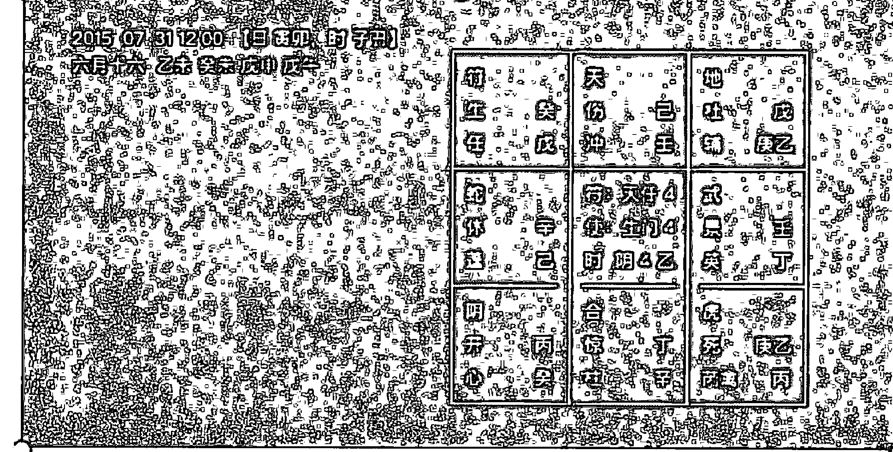

首先对这个奇门局进行一个基本的分析。

### ① 确定干支时间
- 年：乙未年，乙为太岁。
- 月：癸未月，癸为月干；未月土旺。
- 日：戊申日，日干戊。
- 时：戊午时，时干戊。

### ② 标出空亡、六击、入墓、马星及反吟伏吟

#### a、空亡

标出空亡，寅空，卯空，子空，丑空。

#### b、六仪击刑（六击）

标出六击，癸六击。

#### c、入墓

标出入墓，乙入墓，壬入墓，丙入墓。

#### d、马星

标出马星，午时的马星在申，乙入墓不存在了。

#### e、反吟伏吟

我们再来看看有没有反吟、伏吟，整个局的观察并没有发现有反吟和伏吟。

### ③ 分析各参数情况

#### a、分析下雨的信息

看有没有下雨就找天柱星，天柱星在坎水宫，但是它面临的天干是丁和辛，并不能构成下雨的一个结果。然后再来看天蓬星，它在震木宫遇到辛和己，也不是下雨的迹象。

#### b、分析所求时间的天气情况——所求时间时支（未）的落宫

下午 2 点半，也就是未时，它的落宫在坤土宫。未时土旺；临天辅代表有一些风；戊土、坤土都代表云层比较厚，带有一点阴天的感觉；所以下午两点半应该是有风的多云天气。

### ④ 结果反馈

下午两点半的天气情况跟我们所断是一致的。

# 第 10 讲 奇门测出行

生活中，我们难免要探亲访友，需要坐交通工具，那么这个工具能否准时安全的到达，就是我们每个人所关心的问题，所以这一讲就要回答这个问题。

## 1、出行的相关参数
- 1. 出行者——日干、或者年命
- 2. 地面交通工具（火车、汽车、轮船）——伤门
- 3. 空中交通工具（飞机）——开门
- 4. 水陆交通工具——陆路用景门、水路用休门
- 5. 飞机起飞——天冲
- 6. 飞机停在跑道——景门
- 7. 飞机航路——九天

## 2、预测出行吉凶的思路

出行的安全问题主要看出行方向的落宫参数。出行方向落宫参数吉，说明那个地方安全度高，而且如果那个宫生出行者，或者跟出行者比和，就都是比较顺畅的外出。如果出行的宫凶，而且这个宫又克出行者，那么出行就不顺畅，会有一些问题。

如果出行的宫虽然凶，但是出行者能克出行方向的宫，虽然不顺，但是问题不大。另外如果遇到庚加丙，意味着路上容易遇到盗贼、小偷；如果遇到了丙加庚，一路上容易遇到火灾、着火的现象。

当然还有一些跟天气有关的参数，我们在上一讲刚刚讲过，那么天气也会影响交通，尤其是影响飞机的起飞等等。

## 3、奇门案例（一）

首先介绍第一个案例。一位同学问，他坐飞机飞往上海，已经耽误一个多小时了，问这架飞机到底什么时候能够起飞？

预测的时间是 2018 年 5 月 25 号 12:33。

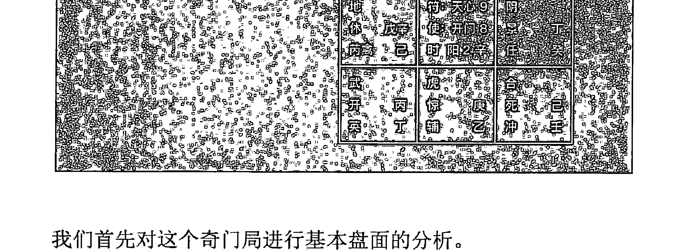

我们首先对这个奇门局进行基本盘面的分析。

### ① 确定干支时间
- 年：戊戌年，戊为太岁。
- 月：丁巳月，丁为月干；巳月火旺。
- 日：丁巳日，日干丁。
- 时：丙午时，时干丙。

### ② 标出空亡、六击、入墓、马星及反吟伏吟

#### a、空亡

标出空亡，子空、丑空、寅空、卯空。

#### b、六仪击刑（六击）

标出六击，戊六击，癸六击。

#### c、入墓

标出入墓，丁入墓，乙入墓。

#### d、马星

标出马星，午时马星在申，冲寅，乙入墓不存在了。

#### e、反吟伏吟

该奇门局没有反吟伏吟。

### ③ 找出关键参数
- a、飞机——开门
- b、起飞——天冲
- c、航线（航路）——九天

### ④ 分析各参数情况

#### a、分析飞机的情况——开门、天冲

开门落宫逢双空，说明飞机还无法正常的起飞。天冲星在乾金宫临死门，说明起飞遇到了阻力；临六合，表示有多种原因造成起飞不了，它在等待时间。

#### b、分析航路的情况——九天

九天落宫临天柱星加癸，说明航路上有雨；存在六击说明有暴风雨；所以飞机是要晚点了。

#### c、确定起飞时间——冲动天冲星落宫

要想让飞机起飞，一定要让天冲星落宫动起来，现在是午时，午时落宫不能让天冲星动起来，所以就得顺延下去，而且很可能会推迟得比较晚，很可能会推迟到戌时亥时，因为戌时、亥时落宫冲动了天冲星，从而让飞机起飞了。所以，不是戌时起飞，就是亥时起飞，说明延误时间比较长。

### ⑤ 结果反馈

该名同学最后反馈，飞机飞往上海方向，也就是东南方向，有暴雨，所以飞机延误了。暴雨于 21:11 戌时结束，亥时开始登机，到了 22:40，亥时快结束的时候，飞机起飞，然后到了次日 00:20 飞机抵达上海。

## 4、奇门案例（二）

接下来讲解第二个奇门案例。一位同学买好了当天下午 2:55 飞往南方的飞机票，但是他一看天气好像有些问题，因此他就决定改坐了上午 10 点多的动车去往南方了。所以他想看看航班是不是如他所判断会出现问题。

问测的时间是 2016 年 7 月 20 号 14:55。

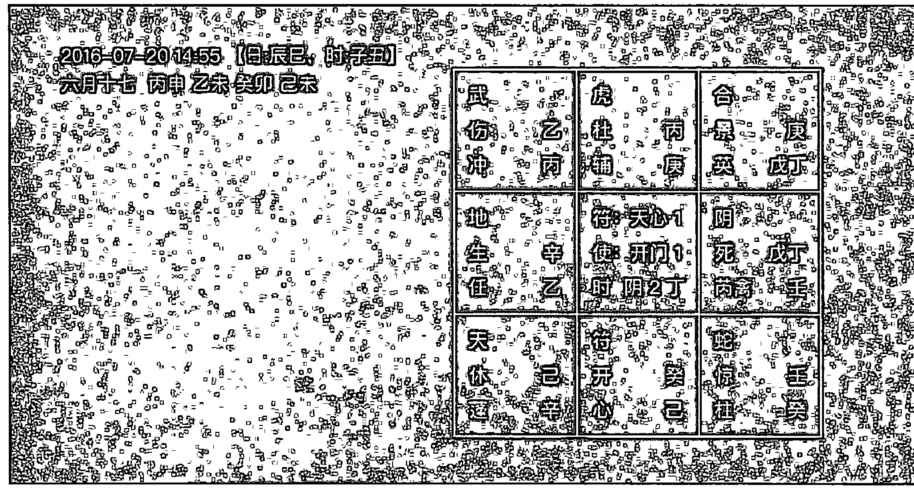

首先对这个奇门局进行基本的分析。

### ① 确定干支时间
- 年：丙申年，丙为太岁。
- 月：乙未月，乙为月干；未月土旺。
- 日：癸卯日，日干癸。
- 时：己未时，时干己。

### ② 标出空亡、六击、入墓、马星及反吟伏吟
- **a、空亡**：标出空亡，辰空，巳空，子空，丑空。
- **b、六仪击刑（六击）**：该奇门局没有六击。
- **c、入墓**：标出入墓，己入墓。
- **d、马星**：标出马星，未时马星在巳冲亥，巳空就没有了。
- **e、伏吟反吟**：该奇门局没有伏吟反吟。

### ③ 分析各参数情况

#### a、分析事情本身、及和预测人的关系——时干、日干

预测的事情为该不该放弃坐飞机，然后改坐动车，也就是时干代表的事情。时干落宫中时干逢空，另外又入墓，说明坐飞机这件事情恐怕有点悬；同时时干宫克日干宫，恐怕也不太吉利。因此考虑还是要换动车走。

#### b、分析天气（下雨）因素——天柱星

天柱星临壬水、癸水，是下雨的景象。

#### c、分析飞机的情况——开门

开门表示飞机，逢空，情况有点悬了，是不利起飞的一个因素。

#### d、分析起飞的情况——天冲星

天冲星也逢空，临伤门，临玄武，都是不好的参数，会否影响起飞，令人担忧。

#### e、分析航路的情况——九天

九天表示航路，逢入墓、逢空，己加辛又是一个很不好的组合，即“游魂入墓”，所以航路恐怕也存在问题。

### ④ 结果反馈反馈的情况是，火车没受到太多天气因素的影响，因为没有严重的天气去影响它，所以坐动车是没问题的，飞机确实有雷暴雨不能飞，最后取消了。

## 5、奇门案例（三）

下面介绍第三个关于出行的奇门案例。

我们有一位同学在北京听课，他要回深圳，他要坐当天晚上 8 点的飞机，问航班能否正常起飞。

预测的时间是 2016 年 5 月 22 号 16 点。

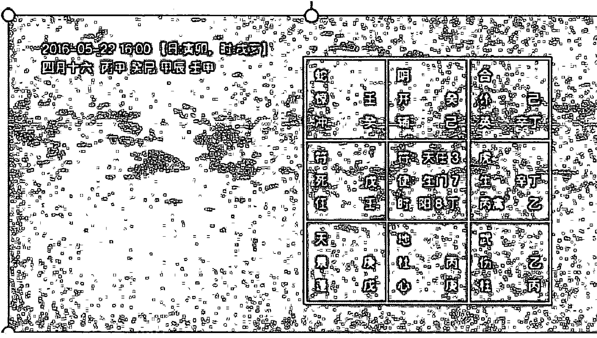

首先对奇门局进行基本盘面的分析。

### ① 确定干支时间
年：丙申年，丙为太岁。
月：癸巳月，癸为月干；巳月火旺。
日：甲辰（壬）日，日干壬。
时：壬申时，时干壬。

### ② 标出空亡、六击、入墓、马星及反吟伏吟
a、空亡
标出空亡，寅空，卯空，戌空，亥空。

b、六仪击刑（六击）
标出六击，戊六击，己六击，庚六击，壬六击，癸六击。

c、入墓
标出入墓，庚入墓，壬入墓，乙入墓，丙入墓。

d、马星
马星，申时马星在寅，对着申冲过去，因此庚入墓不存在了。

e、伏吟反吟
该奇门局不存在反吟伏吟。

### ③ 分析各参数情况
a、分析天气（下雨）因素——天柱星
天柱星临乙和丙，没有下雨的迹象；
天蓬星面临的是庚和戊，也没有下雨的迹象。

b、分析飞机的情况——开门
飞机开门周围的参数正常，飞机没问题。

c、分析起飞的情况——天冲星
天冲星落宫有六击有入墓，所以起飞可能会晚一点。

d、分析航路的情况——九天
九天表示航路，逢空，六击，说明有些问题，但是没有太凶的征兆，所以飞机可以起飞，但是在航路上，会遇到一些六击、逢空现象，说明航路上会有一些颠簸，让人感到不舒坦。

因此，今天晚上 8 点半起飞的航班不会受到天气影响，是可以起飞的。

e、确定起飞的时间
起飞时间的确定需要等到冲动天冲星的时候，现在天冲星的对宫戌空、亥空，等它们填空的时候，就可以冲动天冲星，飞机也就起飞了。

所以很可能是在戌时的末尾、亥时的起点，两个地支都不空的时候就冲动了巽木宫的天冲星，这个时候飞机就起飞了。

### ④ 结果反馈
这位同学晚上到了飞机场，然后起飞以前反馈了信息，确实他是按时地登上了飞机，但是起飞时间是晚上 9 点多一点点，亥时起飞的，所以我们刚才断的信息是正确的。

# 第 11 节 奇门断时运

## 1、时运预测的相关参数
- ① 问测者——年命、日干
- ② 事业方面
  a、事业/官场——开门
  b、法院、官司——惊门
  c、犯罪之人——辛
  d、纪检部门——杜门
- ③ 身体方面——天芮星
- ④ 婚恋方面
  a、女方——乙
  b、男方——庚
  c、婚恋本身——六合
  d、男小三——丙
  e、女小三——丁
- ⑤ 财运方面
  a、收入、利润——生门
  b、聚财的能力——戊
- ⑥ 子女、长辈方面
  a、子女——时干
  b、老人——年干
- ⑦ 事情的整体情况——时干

## 2、奇门案例（一）
我们来介绍第一个实例，一个企业家想预测一下个人近期的时运。

预测的时间为 2018 年 7 月 31 号 14:19。

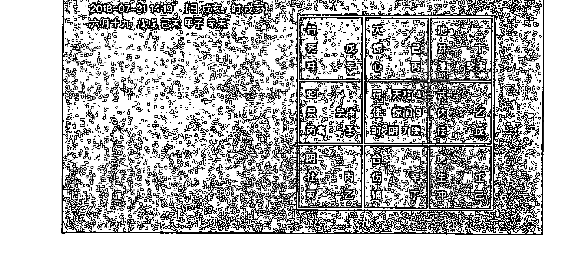

首先对这个奇门局进行一个基本盘面的分析。

### ① 确定干支时间
年：戊戌年，戊为太岁。
月：己未月，己为月干，未月土旺。
日：甲子（戊）日，日干戊。
时：辛未时，时干辛。

### ② 标出空亡、六击、入墓、马星及反吟伏吟
a、空亡
标注出空亡，双戌空，双亥空。
b、六仪击刑（六击）
该奇门局没有六仪击刑。
c、入墓
标出入墓，辛入墓，癸入墓。
d、马星
标出马星，未时在巳，冲亥，把辛入墓给去掉了。
e、伏吟反吟
该奇门局没有反吟伏吟。

### ③ 分析各参数情况
a、分析预测者总体运势情况——年命落宫
该企业家生于 1975 年 1 月 22 号，甲寅（癸）年生人，年命为癸，癸的落宫反映了企业家运势的总体情况。

年命癸在震木宫，处于长生位，长生意味着旺相，所以企业家自身的状态是一个旺相的状态；临天芮，说明身上还有一些问题，但总体状态还是可以的；天芮也反映了外环境现在有些问题；临景门，人际关系中平；

临螣蛇、癸加壬都是非常纠缠的意思，说明近期他有很多事务，或者有令人烦恼的事情纠缠着他；

庚加壬称为“太白退位”，音信难通，所以信息获知的比较少，因此自己有一些担忧。

b、分析身体情况——天芮星落宫
另外天芮星也反映身体的一些情况，目前临景门、临螣蛇不会那么凶，但是也要注意。譬如比较旺的这个宫是庚临禽，庚临禽，临禽就比较旺；癸长生也比较旺，壬水已经到了死地，那么最重要的是金水，自己要注意。

庚金主要代表大肠的方面的问题，癸水代表肾这方面的问题，另外，水生木，木表示肝胆的问题。

作为命主，主要注意这三方面问题，也就是大肠方面、肾方面、还有肝胆方面。

c、分析事业的情况——开门
事业用开门表示。

开门属金，在坤土宫为土生金，因此事业本身还是旺相的状态；而且未月土旺，事业还是一个旺的状态。

但是临天蓬，外环境挑战压力比较大；

临九地，一个说明有地护，跟当地的配合比较好，有人也保护着他；也意味着事业高度还不够。

癸入墓，事业方面还有一些令人纠结的地方。

丁加癸为“雀投江”，是个不好的迹象，是一个凶相。

总体来说，这个事业是旺的，但是当前情况不太理想。好在他的年命癸在震木宫，可以克事业所在的坤土宫，因此个人对这个事业的把控还是没有问题的。

d、分析婚恋情况
乙代表妻子，庚代表丈夫，六合代表婚姻。

乙所在的兑金宫克了丈夫庚所在的震木宫，所以，妻子对丈夫有所意见。

六合婚姻对妻子和丈夫都是一个相生的关系，所以婚姻总体还是稳定的，只是夫妻可能有一些争论，或者丈夫有时候的一些行动不让妻子满意。

总体来看，婚姻当前没有什么大碍。

e、分析当前经济情况——生门、戊
生门代表挣钱、利润，在乾金宫，逢双空，说明目前挣钱情况不好，利润也不好。

同时生门跟戊（聚财能力）的关系为乾金宫克震木宫，生门利润的宫克了聚财戊的宫，因此钱财的情况不太好；而且马星在这个宫活动，说明钱财在变动；临天柱，说明破费很多；戊加辛为“龙折足”，说明确实钱花多了；临死门，说明钱财方面遇到了比较大的阻力；临值符，说明有贵人帮忙，所以困难还是可以克服的；值符还有另外一个概念，就是领导，可能有些钱是花在领导的身上。

f、分析当前企业家的状态——时干
时干辛在坎水宫，处在长生之地，整体来说，事情还是令人满意的；

辛加丁是一个好的格局，说明命主能够得到很多好处；

临天辅，总体来说，外环境还是好的；

临伤门，需要处理好各种各样的人际关系；再加上临六合，说明公共关系处理得还是不太妥当。

## 3、奇门案例（二）
现在我们介绍第二个案例。

有一位同学问测，某一个老板因为合作诈骗被举报了，人也被扣了，问这件事情将来会发展成什么样的后果？

问测的时间为 2016 年 7 月 8 号 10:34。

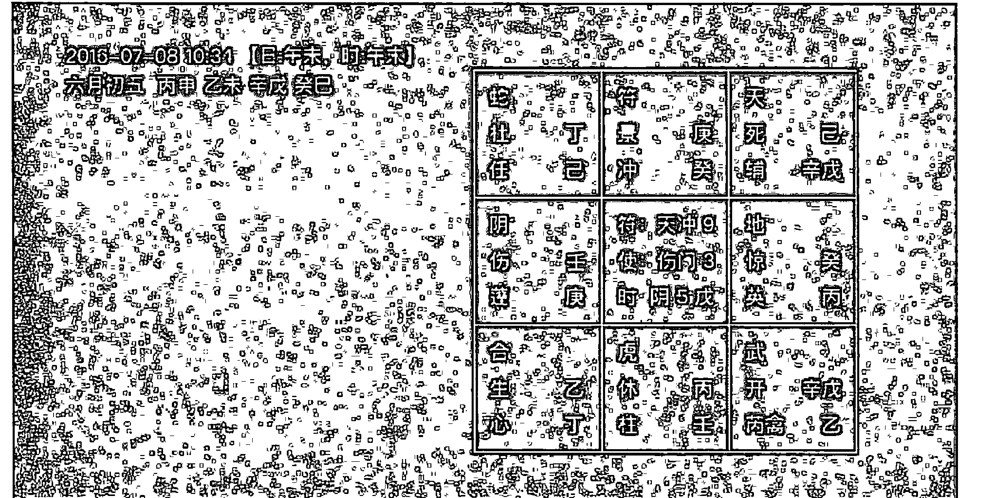

首先对这个奇门局进行基本盘面的分析。

### ① 确定干支时间
年：丙申年，丙为太岁。
月：乙未月，乙为月干；未月土旺。
日：辛未日，日干辛。
时：癸巳时，时干癸。

### ② 标出空亡、六击、入墓、马星及反吟伏吟
a、空亡
标出空亡，双午空，双未空，因为未旺，所以双未空就不存在了。

b、六仪击刑（六击）
标出六击，己六击。

c、入墓
标出入墓，丁入墓，乙入墓。

d、马星
标出马星，巳时马星在亥，冲巳，乙入墓不存在了。

e、伏吟反吟
该奇门局存在门伏吟。门伏吟说明人事关系很难变化，这个被扣的现象可能要维持下去。

### ③ 分析各参数情况
这个老板生于 1962 年，壬寅年，年命为壬。他因为合作诈骗被举报，他就是一个罪人，罪人通常用辛金表示。

a、分析老板总体运势情况——年命落宫
首先看一下这个老板年命落宫的参数情况，年命壬在震木宫处于死地，个人情况并不好；
临天蓬，外环境相当不好；
临伤门，人生受到了重大挫伤；
临太阴，死地临太阴当然不好，暗中处在一个很不好的地方；
壬加庚称为“太白擒蛇”，被抓住了，当然最后会给他一个公正的结果，有罪判罪，重罪重判。

b、分析罪犯的因素——辛落宫
如果把他看成一个罪人，罪人的落宫在乾金宫。辛金在这个宫里处在沐浴、冠带之地，说明他的事情还在发酵之中。
临天芮，（图中字出错，不是卯，应该是戊。）罪人临天芮，说明这个罪人存在着问题；而且临戊，说明跟钱财有关，他犯诈骗钱财的罪名；
辛加乙，名为“虎猖狂”，是一个很凶的格局，说明这个罪人犯的事很大；
戊加乙，加开门，总体来说还算是好的，就是坏中还给他带来一些略微好的因素；
临玄武，不好，说明他有诈骗行为。
所以这个宫告诉我们，这一个罪人有诈骗行为，这件事情是严重的、问题大的，将来跟开门连在一起，开门代表法院，表示法院将来是要审理的。

c、分析案件的发展
案件的主管是值符，现在逢双午空，所以目前可能不会马上采取行动，对他进行判决。需要过一段时间才能进行判决。
还需要进一步的收集证据，证据是六合，证据跟法院的关系是土生金，说明证据走向了法院。
诉状（景门）目前还没落实，因为逢空，所以需要进一步的准备诉状，当然这个诉状在火宫，克金宫，说明诉状还不是太有力量，但是诉状可以进一步完善，随着时间的推移，到了金秋时节，也就是从夏季的末月转入到金秋时节以后，所有的有关文字和证据，法院慢慢会收集落实，这样对罪人的宣判就可以进行了。

d、确定宣判时间——冲克年命
宣判的时间很可能是冲克他年命的时间，时干对冲年命，恐怕这件事情就要有眉目了，所以酉月被判的可能性比较大。

### ④ 结果反馈
最后，这位同学反馈的结果是，到了 8 月 23 号（酉月从 9 月初开始），就是接近酉月，在酉月之前传出来消息，这个人将被宣判，刑期大概是无期徒刑。

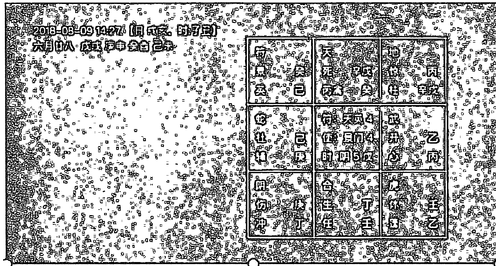

## 4、奇门案例（三）
现在我们讨论第三个案例。有一位女性要问测一下她近期的情况。

预测的时间是 2018 年 8 月 9 号 14:27。

首先进行基本盘面的分析。

### ① 确定干支时间
年：戊戌年，戊为太岁。
月：庚申月，庚为月干；申月金旺。
日：癸酉日，日干癸。
时：己未时，时干己。

### ② 标出空亡、六击、入墓、马星及反吟伏吟
a、空亡
标出空亡，戌空，亥空，子空，丑空。
b、六仪击刑（六击）
标出六击，庚六击，辛六击，癸六击。
c、入墓
标出入墓，庚入墓，丁入墓，乙入墓。
d、马星
标出马星，未时马星在巳，冲亥。马星就把乙入墓给冲掉了。
e、伏吟反吟
该奇门局没有反吟伏吟。

### ③ 分析各参数情况
a、分析预测者总体运势情况——年命、日干落宫
这位问测的女性生于 1983 癸亥年，年命为癸；年命和日干为同一个字，信息很集中，出现在巽木宫。

年命、日干癸六击，压力很大，心事重重；
临天英，外环境中平一般；临景门，人际关系中平一般；临值符，有贵人帮助；

癸加己，称为“网盖地户”，最好躲避一下可能发生的灾难或者问题；临马星，说明这一段时间会有些事情发生一些变化。

b、分析身体情况——天芮星落宫
天芮星作为疾病的代号，在离火宫遇到了辛六击，说明病对她还是有影响的；

具体哪个部位的疾病，主要看天干哪个最旺，就说明哪个病是最主要的。

戌为帝旺；

辛临病地，临六击也有问题；

癸处在一个绝地，并不是最重要的；

另外这个宫位是心脑血管的部位。

因此她可能的身体情况就是头部心脑血管遇到了阻力，受到了打击，所以要特别注意心脑血管的问题；另外就是脾胃的问题，因为戊是帝旺，戊表示消化系统的问题。主要注意这两个方面的疾病，而且这两个病还不能掉以轻心，因为临死门，发展下去是很凶的。

九天加死门，是一个不好的兆头，是一个上天堂的兆头。所以这位女士近期应该进行体检，来了解一下自己心脑血管和消化系统到底病的情况如何。

c、分析治疗方案——天心星（西医）、乙（中医）
天芮落宫克中医、西医的落宫，说明中西医要彻底解决她的问题存在难度，主要还是依靠自己心情的调理，以及适当的医学的调理。

当然，如果到了秋天，金的力量很大，反过来也可以克这个病，所以可能治病的最好时机应该在金秋时节。

d、分析婚恋情况
命主是女性，乙代表命主，也代表妻子；庚代表丈夫；婚姻是六合。

首先看丈夫跟妻子的关系。即庚和乙的关系。宏观的格局，土生金，说明夫妻之间大的感情方面还是好的。但是作为丈夫，入墓、六击，说明丈夫可能近期心情不好，压力很大，需要注意一下丈夫的情况。

然后分析男女双方跟婚姻的关系。命主，也就是妻子，跟婚姻是金生水的关系，愿意去维护这一段婚姻；但是丈夫跟婚姻是一种相克的关系，说明他对婚姻有一些想法，逢空，说明他自身存在压力和纠结的情况，还反映了作为丈夫，他的责任尽的比较少，因此引发了对婚姻的那种淡薄。所以希望妻子多关心丈夫，使得婚姻能够稳定。

e、分析当前事情本身的状态——时干
时干代表事情本身，时干己处于衰病之地，事情总体来说不是太满意；
临天辅，外环境还是好的；
临杜门，前进道路上有了阻力；
临螣蛇，这些阻力很纠缠人；
己加庚，一个不好的征兆，也表示存在阻力的问题。

总体来说，这位女士在这一段时间，遇到了一些阻力，包括身体、夫妻关系等方面，其实只要处理好了，这些阻力都可以克服掉，仍然可以走好人生的道路。

# 第 12 节 奇门测商贸

## 1、商业的主要方面及相关参数
- ① 开店
  a、开设的店铺——开门
  b、问测者——年命、日干
  c、顾客——时干
  d、投资——戊
  e、利润——生门
- ② 买卖房产
  a、住宅（整栋楼）——生门
  b、商品房（住宅加配套环境）——时干
  c、买卖双方——年命
  d、中介——六合
- ③ 买卖货物
  a、货主——值符
  b、买主——值使
  c、货物——时干
  d、资本——戊
  e、利润——生门
  f、中介——六合
  g、竞争者、竞价者——月干
  h、行情——景门
- ④ 商业合作
  a、公司——开门
  b、合作双方——年命
  c、投资——戊
  d、利润——生门
  e、整体合作情况——时干

## 2、奇门案例（一）
首先介绍第一个实例。有一位同学问测，他要跟人合作开一家公司，问是否妥当。

预测时间为 2010 年 10 月 16 号 14 点。

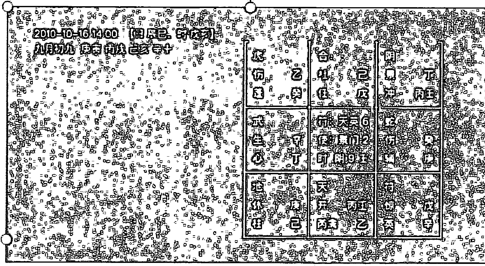

下面我们对这个奇门局进行基本盘面的分析。

### ① 确定干支时间
年：庚寅年，庚为太岁。
月：丙戌月，丙为月干；戌月土旺。
日：己亥日，日干己。
时：辛未时，时干辛。

### ② 标出空亡、六击、入墓、马星及反吟伏吟
a、空亡
标出空亡，辰空，巳空，戌空，亥空；因为戌月旺，戌空不为真空，去掉。

b、六仪击刑（六击）
标出六击，庚六击，癸六击。

c、入墓
标出入墓，庚入墓，己入墓，戊入墓。

d、马星
标出马星，未时马星在巳，冲亥，这样戊入墓就不见了。

e、伏吟反吟
该奇门局没有反吟伏吟。

### ③ 分析各参数情况
此案例为合作办公司，所以我们按照合作办公司的情况来选择参数。

新公司用开门表示。合作双方用各自年命表示。预测者生于癸卯年，另一方为庚戌年，癸为预测者年命，庚为对方年命。

a、分析公司的情况——开门
临九天，说明这家公司的档次比较高；
临丙乙，丙加乙是个好现象；
壬加乙，也是好现象；总体来说，这家公司还是不错的；
临月干丙，说明很多同事朋友也关注这个公司；
临坎水宫，开门属金，金生水，所以开门目前是软弱的，因为公司还没有成立。

b、分析预测者的情况——预测者年命
预测者年命为癸。
癸处于病地，说明问测人最近的情况不是特别旺，有一些问题；
临天辅，他的外环境是好的；
临伤门，人际关系有一点问题，另外他本人可能也受到一些挫折的事情；
临腾蛇，很多事情纠缠；
癸加庚，为“太白入网”，也是一个凶相；
总的来说，问测的同学近期外形势是好的，其他的一些情况不太好，很多事情在纠缠，所以要静静考虑，干一点新的事情。

c、分析对方的情况——对方年命
对方年命为庚。
在艮土宫处于入墓状态、六击状态，所以对方的状态不是太好；
临天柱，说明对方最近破财比较多；
临休门，说明他事情不是特别旺盛，经常处在休停状态；
临九地，两个解读，一个解读，当地还是有人帮他；另一个解读，说明当前这个不太好的情况已经有一段时间了；
庚加己，也不是一个好现象，所以对方的情况也不是很理想；

d、分析公司跟双方的关系——开门、年命
问测者的年命跟公司是相生的关系，说明问测的同学很愿意搞这家公司；
对方的年命克这家公司，说明很想掌控这个公司。

e、分析公司的经济效益情况——戊、生门的关系
戊是投资，生门是利润。戊的宫克生门的宫，金克木，说明赚钱比较辛苦，可以赚，但是赚得很辛苦，也赚不了太大的钱。

最后办不办，请这位同学根据这些信息自己做决断。

## 3、奇门案例（二）
现在我们讨论第二个案例。一位华人朋友在美国买房子，询问价格合不合理，应该怎么办。

预测时间为 2016 年 2 月 21 日 18:20。

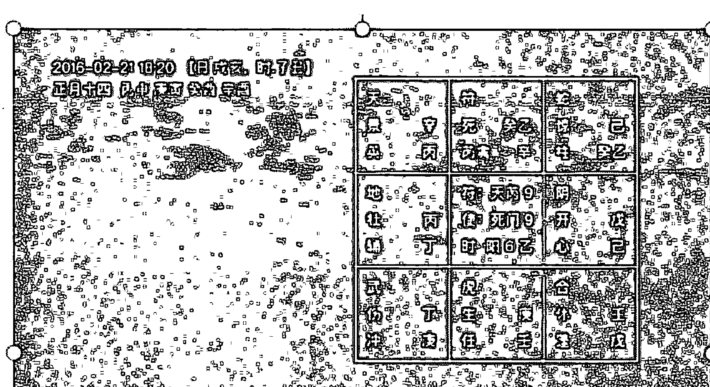

首先对这个奇门局进行基本盘面的分析。

### ① 确定干支时间
年：丙申年，丙为太岁。
月：庚寅月，庚为月干；寅月木旺。
日：癸酉日，日干癸。
时：辛酉时，时干辛。

### ② 标出空亡、六击、入墓、马星及反吟伏吟
a、空亡
标出空亡，戌空，亥空，子空，丑空。
b、六仪击刑（六击）
标出六击，己六击，庚六击，辛六击。
c、入墓
标出入墓，乙入墓，丙入墓。

# 第 13 节 奇门测工作

## 1、测工作的相关参数

| 序号 | 参数         | 说明                 |
| ---- | ------------ | -------------------- |
| ①    | 问测者       | 年命、日干           |
| ②    | 新单位、新岗位 | 开门                 |
| ③    | 军事部门、纪检部门 | 杜门                 |
| ④    | 主管部门、上级领导 | 太岁                 |
| ⑤    | 竞争者       | 月干                 |
| ⑥    | 群众         | 时干                 |
| ⑦    | 工作变动的信号 | a、反吟局 b、马星 c、壬水、癸水 |

## 2、奇门案例（一）

我们来看第一个案例。一名同学的闺蜜要预测一下她在内部能不能进行工作调动。

预测时间为 2016 年 12 月 26 号 16:39。

下面我们对奇门局进行基本盘面的分析。

### ① 确定干支时间

年：丙申年，丙为太岁。

月：庚子月，庚为月干；子月水旺。

日：壬午日，日干壬。

时：戊申时，时干戊。

### ② 标出空亡、六击、入墓、马星及反吟伏吟

#### a、空亡

标出空亡，申空、酉空、寅空、卯空。

#### b、六仪击刑（六击）

标出六击，己六击。

#### c、入墓

标出入墓，丁入墓，辛入墓，乙入墓。

#### d、马星

标出马星，申时马星在寅，冲申，丁入墓就不存在了。

#### e、伏吟反吟

该奇门局没有反吟和伏吟。

### ③ 分析各参数情况

闺蜜出生于 1980 庚申年，原部门的领导也是 1980 庚申年生，新部门领导是 1971 辛亥年生，我们可以将年命标注出来。

#### a、分析闺蜜情况——年命（闺蜜）

闺蜜的年命庚，在坤土宫处在临官的位置上，说明本人状态不错。

逢空、六击，说明了她还是很纠结，有很多的压力和思考。

临天冲，外环境是好的。

临惊门，说明有一些口舌是非、不同意见。

临玄武，在工作问题上心里感到很虚。

庚加壬、庚加己，也是一些不好的组合，对她原有的工作会有一些影响。

#### b、分析新工作、新领导的情况——开门、年命（新领导）

闺蜜的年命跟新岗位是土生金的关系，说明她很想去，但是逢空，这个愿望没有落实；她跟新领导的关系也是同样的，相生，关系为土生金，但是也逢空，说明新领导还没有跟她发生工作上的联系。新领导临开门，说明事业还是很棒的。辛加丁，各方面遇到的机会也很好，也反映了这个新岗位是不错的，机会很多。临天辅，说明文化层次也比较高。临九地，说明这个岗位不是现在才有的，这个岗位已经有很多人做了很长时间了。

#### c、分析原领导跟闺蜜的关系——年命（闺蜜）、年命（原领导）

原来的领导跟闺蜜是一个木克土的关系。逢空，说明是一个弱克，也说明原来的领导多多少少对这个闺蜜有些意见和看法。因此在这种情况下，这个闺蜜就动了这个念头，想离开原来的领导，换一个新工作。

#### d、确定换工作的应期——填空、冲空、值使门

事情的应期确定，首先看空亡。落空需要被填实和冲实，那个时候事情就能得到应验，譬如年命宫被填实或者新岗位宫被填实，那就是申月、酉月。当然现在是子月，根据现实情况推断，换工作不可能那么长时间，那么就选择对冲空亡，也就是寅申冲，即到了寅月能实现；或者是选择卯酉冲空亡，即到了卯月，事情就能得到落实，这都是有可能的时间。

当然还要参考值使死门给出的时间。死门落离火宫，数字为 2、3、7、9，阳局，取大数，即 7 到 9。再考虑逢空的因素，也就可能是申日，酉日，也可能是寅日，卯日，当然时间长一点可能就延伸到月了，但是如果自己努力的话，也可以让这个调动进展的快一点。第二种可能是 17 天到 19 天。然后就是 27 天到 29 天，最长不会超过卯月，现在是子月，不会超过卯月就是不会超过两三个月。

### ④ 结果反馈

最后这个闺蜜反馈，她是在 2017 年 1 月 16 号，即 21 天以后的某日，把工作调动成功了，大体上接近了 19 天和 21 天，然后是在卯酉冲的时候，即卯把酉空给冲掉了，开门就落实了，所以基本上符合这个奇门局的应期分析。

## 3、奇门案例（二）

同学们，下面我们来讨论第二个案例。

有一名同学想分析一下是继续干老工作，还是调到新的工作单位去做新工作，希望来判断一下。

预测时间是 2016 年 12 月 12 号未时。

我们首先对这个奇门局进行基本盘面的分析。

### ① 确定干支时间

年：丙申年，丙为太岁。

月：庚子月，庚为月干；子月水旺。

日：戊辰日，日干戊。

时：己未时，时干己。

### ② 标出空亡、六击、入墓、马星及反吟伏吟

#### a、空亡

标出空亡，戌空、亥空、子空、丑空，因为子月旺，所以子空不考虑。

#### b、六仪击刑（六击）

该奇门局没有六击。

#### c、入墓

标出入墓，乙入墓，丙入墓。

#### d、马星

标出马星，未时马星在巳，冲亥，这样丙入墓就不见了。

#### e、伏吟反吟

该奇门局不存在伏吟反吟。

### ③ 分析各参数情况

该同学出生于 1984 甲子戊年，年命和日干同宫，所以信息就更加集中了。

#### a、分析本人的情况——年命、日干

他的年命落在离火宫，临天辅，说明外环境是好的，但是面临的人际关系有一定的阻力；临九地，说明这个工作做的时间也比较长了；戊加壬，称为“青龙入网”，说明工作被束缚，这也是他当前的状态。

#### b、分析老工作的情况——地盘开门

老工作用地盘的开门表示。
在乾金宫，临天任星，说明外部的挑战压力比较大。
临惊门，有口舌之争。
临六合，有多方面的不利因素。
丁加丙，还是一个比较好的组合，说明周围的很多事情，对他这个工作还是起了好作用。
逢空，说明老工作对他来说不太兴旺。

#### c、分析他跟老工作的关系——年命、地盘开门

他跟老工作的关系为火克金，说明他对老工作已经不太满意了。
但是为空克，说明不一定是真正的不满意，只有一点感觉想变动。
时干（事情主体）临马星，所以他问的这件事情就是要变动的。

#### d、分析新工作的情况——天盘开门

新工作岗位在坎水宫，说明外环境不错；
临天心，临太阴，说明新的地方暗中有人护着；
丙辛合，而且是日月相会，说明这是一个不错的工作；
但是这个工作跟问测者的关系为水克火，说明对问测者有很大的工作压力；
然而年命戊和日干戊处在帝旺的位置，说明个人的力量很强，处在一个旺相的状态。所以对于这样一种工作压力，估计他也能扛起来。

所以应该说，老工作新工作各有利弊，就老工作而言，我们这位同学完全可以把控，只不过这个工作目前已经有了新的压力，而且逢空又不太兴旺，所以就产生了变动的念头。新工作看来还是不错的，当然压力会有所增加。

#### e、分析主管部门、高层领导跟求测者的关系——值符、太岁、年命

主管部门和主管领导用值符表示，从主管部门和主管领导来讲，跟他的关系为木生火的相生关系，说明领导对他的感觉还不错。

另外我们来看高层的领导太岁，跟求测者是一个冲克的关系，说明高层领导可能对他有一些看法，所以新工作有利也有弊。

### ④ 结果反馈

那么最后到底如何选择，还需要这位同学自行考虑。后来我们得到了反馈，他还是去了新的工作部门，新工作的主管领导对他表示了很大的欢迎。

## 4、奇门案例（三）

下面我们介绍第三个案例。

一位母亲来问测她女儿的工作要不要变化，如果需要变化的话，她是去做网络技术工作，还是另外一个做房地产拆迁的工作。

预测时间为 2017 年 2 月 27 号 23:26。

首先对这个奇门局进行基本盘面的分析。

### ① 确定干支时间

年：丁酉年，丁为太岁。
月：壬寅月，壬为月干；寅月木旺。
日：丙戌日，日干丙。
时：戊子时，时干戊。

### ② 标出空亡、六击、入墓、马星及反吟伏吟

#### a、空亡
标出空亡，双午空，双未空。

#### b、六仪击刑（六击）
标出六击，庚六击，辛六击，癸六击。

#### c、入墓
标出入墓，庚入墓，癸入墓，戊入墓。

#### d、马星
标出马星，子时马星在寅，冲申，这样庚入墓就不存在了。

#### e、反吟伏吟
该奇门局没有反吟伏吟。

### ③ 分析各参数情况

女儿出生年为 1975 乙卯年，年命为乙，乙在巽木宫。

#### a、分析女儿的情况——年命（女儿）
我们首先来看看这个女儿的当前状态，然后看看要不要去干新的工作。

乙在沐浴冠带之地，说明她处在一个酝酿发展的状态；乙临禽，说明个人情况还不错；癸六击，说明压力很大；临伤门，说明人际关系还是出现了一些问题；临白虎，说明外力对她也有一些不利之处；乙加丙，是好的；癸加丙，不好；

总体来讲，这个女儿自身状态不错，只是遇到了一些问题，使她感觉到要不要变动一下，而且临癸水，也是一种流动的暗示。

#### b、分析老工作情况——地盘开门
老工作用地盘开门表示，地盘开门在乾金宫。

临天任星，说明老工作的外环境还是不错的；

临惊门，说明口舌是非多了一点；

临值符，说明老工作还是有贵人帮忙的，而且值符也代表主管领导，说明主管领导跟她关系也还是可以的。

戊入墓，说明老工作有令人纠结的地方；

庚加戊，说明出现了变动的信号，因为庚加戊叫换地盘，表示老工作要动一动。

#### c、分析新工作的情况——天盘开门
新工作用开门表示。

临天冲，说明新工作的外环境是好的；

临螣蛇，说明新工作也会有比较多的纠缠；

丁壬合，总的来说还是一个好的结果，有高层领导会去关照这个新工作。

#### d、分析新老工作和女儿的关系——开门、年命
老工作跟她年命是金克木，说明老工作对她压力很大；新工作跟她的关系是水生木，说明新工作欢迎她去做。所以结论就是他的女儿适合变动工作。

#### e、确定新工作的方向
网络技术的代号是丁奇，生门代表房地产拆迁的工作。丁奇跟她相生，说明网络技术工作适合她。
房地产工作跟他是木木比和，也是适合的。
网络技术临天冲星，外环境好；房地产工作临天英星，外环境中平；
网络工作临腾蛇，说明业务工作比较纠缠；房地产工作临六合，说明打交道的人很多，而且辛加丁是一个好的组合，因为得奇；另外生门也代表挣钱，临六合说明得钱的渠道比较多，当然外环境不如网络技术工作。
因此各有利弊，需要由她自身来选择。

### ④ 结果反馈
最后反馈的消息是他女儿决定变化工作了。听说去了房地产部门，因为那里收入情况好一些，另外就是不需要动太多的脑筋去做技术工作。

# 第14节 奇门测应聘与考试

## 1、应聘与考试的相关参数

| 序号 | 参数               | 说明 |
| ---- | ------------------ | ---- |
| ①    | 应聘者、考试者     | 日干、年命 |
| ②    | 面试主考者         | 值符 |
| ③    | 面试副考者         | 值使 |
| ④    | 笔试考题           | 景门 |
| ⑤    | 笔试答题           | 丁奇 |
| ⑥    | 竞争者             | 月干 |
| ⑦    | 考分的确定         | 景门、丁奇、值使门的关系 |
| ⑧    | 中小学             | 景门 |
| ⑨    | 大学、研究生       | 天辅 |
| ⑩    | 招生办             | 值符 |
| ⑪    | 大学领导           | 太岁 |

## 2、奇门案例（一）

一个同学来问测，他朋友的女儿正在上海参加应聘的面试，问应聘面试的情况将会怎么样。

预测时间为 2018 年 7 月 27 号 14:30。

实际上这个时间是面试的时间，属于事发局，因为面试已经确定了准确的时间，我们就能分析出当时环境下应聘者的情况，所以用事发局预测是可以的，当然也可以用问事局预测。

### ① 确定干支时间

年：戊戌年，戊为太岁。
月：己未月，己为月干；未月土旺。
日：庚申日，日干庚。
时：癸未时，时干癸。

### ② 标出空亡、六击、入墓、马星及反吟伏吟

#### a、空亡
标出空亡，子丑空，申酉空。

#### b、六仪击刑（六击）
标出六击，戊六击，壬六击。

#### c、入墓
标出入墓，己入墓，壬入墓，乙入墓，丙入墓。

#### d、马星
标出马星，未时马星在巳，冲亥，就把壬入墓给去掉了。

#### e、伏吟反吟
该奇门局存在门伏吟。

说明这是一个令人纠结的局，说明应聘人心里很忐忑不安，是纠结的。

### ③ 找出关键参数

该女孩生于 1993 年 2 月 2 号，壬申年生人，预测中我们知道年命，尽量用年命来表示求测者。

| 序号 | 参数               | 代表符号 |
| ---- | ------------------ | -------- |
| a    | 面试者             | 壬（年命） |
| b    | 竞争者             | 己（月干） |
| c    | 事情本身           | 癸（时干） |
| d    | 面试主考官         | 天冲星（值符） |
| e    | 面试副考官         | 伤门（值使） |

### ④ 分析各参数情况

#### a、分析应聘者的情况——年命（应聘者）
应聘者的年命壬，在巽木宫遇到了六击，说明存在一定的问题；临天英星，说明外环境只是中平；临杜门，说明这次应聘存在阻力；临九地，说明在当地有人向着她；壬加戊，为“小蛇化龙”，一条小蛇要变成一条龙了，说明有前景，有前途。

#### b、分析竞争者的情况——月干
月干在艮土宫，逢空、入墓，说明情况不是特别理想，当然应聘者年命遇到六击也有问题，但是他这里既入墓又逢空，问题就更多了一点。

天冲星，说明他的外环境是好的；

临生门，说明他很有生命力，人际关系也好；

临值符，说明有贵人相助，而且值符还是主考官，跟他在一个宫，说明值符欣赏一些竞争者。

己加癸，不好，因为己是墓，癸是网，墓加网，是指的竞争者的阻力。

所以说双方各有长处，各有短处。

#### c、分析应聘者跟主考官、副考官的关系——年命、值符、值使
值符为主考官，值使为副考官。

对于应聘者，她跟值符的关系是木克土的关系，但是现在未月土旺，木克土属于弱克，但不管怎么样，她将用自己的能力去征服主考。

另外马星在这里起了很重要的作用，马星是个动力，加强了应聘者的动力，去争取主考官对她的肯定。

然后她跟副考官属于木木比和。

#### d、分析竞争者跟主考官、副考官的关系——月干、值符、值使
竞争者跟主考官在一宫，说明主考官欣赏他；

但是副考官克他，说明副考官对竞争者并不太欣赏，所以这一点上应聘者占了一个先机。

#### e、分析应聘者和竞争者的关系——年命（应聘者）、月干
应聘者和竞争者的关系属于木克土，应聘者克竞争者。

所以总体来看，应聘者略占优势，如果仅仅就是一场面试的话，那么应该说应聘者的胜算比较大。

### ⑤ 结果反馈
最后我们得到的消息是，这一位女孩子参加应聘，然后通过了。

## 3、奇门案例（二）

我们现在来看第二个案例。这是一位同学问测，在河南参加高考的一位女同学能否考上清华。

预测时间为 2015 年 6 月 25 号 10:35。

我们首先对这个奇门局进行基本的分析。

### ① 确定干支时间

年：乙未年，乙为太岁。

月：壬午月，壬为月干；午月火旺。

日：壬申日，日干壬。

时：乙巳时，时干乙。

### ② 标出空亡、六击、入墓、马星及反吟伏吟

- a、空亡

标出空亡，戌亥空，寅卯空。

- b、六仪击刑（六击）

标出六击，戊六击，己六击，辛六击，壬六击。

- c、入墓

标出入墓，丁入墓，壬入墓，乙入墓，丙入墓。

- d、马星

标出马星，巳时马星在亥，对着巳冲过去，把丙入墓给冲掉了。

- e、伏吟反吟

该奇门局没有伏吟和反吟。

### ③ 找出关键参数

考生生于 1998 年，戊寅年生，戊是考生的年命。

- a、考生——戊（年命）、
- b、考题——景门
- c、答题——丁奇
- d、招生办——天任星（值符）
- e、大学——天辅星

#### f、考试本身——乙

（时干）

### ④ 分析各参数情况

#### a、分析考生的情况——年命

戊在离火宫为帝旺，说明考生的状态相当的不错，而且月令巳火旺，戊就更旺了。

临天冲，说明她面临的外环境是好的；
临开门，说明面临的人和人的关系是好的；
临九天，说明有外面帮助的力量；
辛六击，说明压力还是大的；
戊加辛，为“龙折足”，说明考分会损失一些。

#### b、分析考题、答题和考生的关系——景门、丁奇、年命

考题、答题在同在艮土宫入墓和逢空，入墓说明考题和答题的时候，考生有一点纠结，
逢空说明答题可能有遗漏之处。

年命跟考题、答题的关系是火生土，说明考生会全力以赴去答题，
所以考试的基本情况应该还是不错的。

#### c、分析招生办跟考生的关系——值符、年命

招办将来跟她的关系为木生火，说明招办对这个学生很欣赏。

#### d、分析大学跟考生的关系——天辅星、年命

大学跟她的关系为火生土，说明她很愿意上她所选择的大学。

#### e、分析考试分数——结合模拟考试情况、景门、丁奇

她的模拟考试情况大概在 700 分左右，满分是 750 分，应该算是很高的分数。当然，清华录取的分数在河南也是比较高的。景门和丁奇都在艮土宫，艮宫的数字 5、7、8、10。那么我们考虑到这是个阴局，是外盘，所以要取大数 8 到 10；因为逢空，这个分数可能会打点折扣，但是考虑到她的状态很好，所以打了折扣也不应该很大；根据她平时模拟考试是 700 分左右，那么结合这个 8 和 10，应该能断出大概她的成绩在 680 到 700 之间。

### ⑤ 结果反馈

最后反馈的消息是该名女孩高考考分 688，跟判断大体上是一致的，最后她被清华大学成功录取。

## 3、奇门案例（三）

一个同学他的女儿在北京考高中，想预测考试的成绩以及能否考上理想的高中。他的女儿学习不错，希望能够上清华附中，如果考不了那么好，那么其它一些重点学校也是他女儿所考虑的。

预测时间为 2017 年 7 月 2 号 7:35。

首先对这个奇门局进行基本盘面的分析。

### ① 确定干支时间

- 年：丁酉年，丁为太岁。
- 月：丙午月，丙为月干；午月火旺。
- 日：庚寅日，日干庚。
- 时：庚辰时，时干庚。

### ② 标出空亡、六击、入墓、马星及反吟伏吟

- a、空亡

标出空亡，午空、未空、申空、酉空；因为午月旺，午空就没有了。

- b、六仪击刑（六击）

标出六击，己六击，庚六击，壬六击。

- c、入墓

标出入墓，庚入墓，壬入墓，丙入墓，戊入墓。

- d、马星

标出马星，辰时马星在寅，对着申冲过去，就把庚入墓给去掉。

- e、反吟伏吟

该奇门局存在门反吟，表示考生反复又忐忑不安的一种格局

### ③ 找出关键参数

女孩子出生的时间为 2002 壬午年，所以壬就是这位考生的年命。

- a、考生——壬（年命）
- b、考题——景门
- c、答题——丁奇
- d、招生办——值符
- e、中小学——景门

### ④ 分析各参数情况

- a、分析考生的情况——年命

年命壬六击，壬入墓，说明考生压力很大，心里很纠结。

临天芮星，说明外环境是有压力的。

临开门，说明人跟人的状态关系不错。

临值符，说明有贵人相助，而且跟招办在一个宫，说明招办对这个考生很欣赏。

壬加庚，己加庚，说明有一些问题。

- b、分析考题跟考生的关系——景门、年命

考题跟考生的关系，就是景门跟年命的关系，属于水生木，说明考题很适合这位考生。

- c、分析答题跟考生的关系——丁奇、年命

两个宫都是木宫，木木比和，应该说答得还是不错的。

- d、分析考题的情况——景门

考题临天冲，临六合，说明这个考题是具有综合性，赶上形势的考题。

辛加癸，说明考题有难度，不小心就容易答错。

- e、分析答题的情况——丁奇

答题的情况，临天英星，说明考生的外环境一般；临惊门，说明答题的时候比较紧张；临螣蛇，说明答题的时候心里也比较纠结；

丁加辛，也是一个不够理想的格局，很容易丢掉一些题的分数。

综合来看，考的还可以，但不是很理想，招办还是很欣赏她的，说明中学还是有可能接受她的。但到底考上什么样的高中还是由分数决定。

#### f、分析考试分数——结合模拟考试情况、景门、丁奇

她的模拟考试成绩是 541 分。现在我们来看看可能出现的成绩。景门在坎水宫为 1、6。然后答题丁奇在震木宫为 3、4。

首先看景门，因为是阴局，景门在外盘，按理应该取大数 6，但是景门在水宫，它属火，因此它被削弱了，所以不可能达到 6，
达到 5 的可能性大，也跟她模拟考试的实际情况比较吻合。

然后答题应该取 4 和 8 这两个数字，丁在这里处在一个衰病之地，而且周围的参数又不太好，所以取 8 的可能性就小，取 4 的可能性就大。

所以考试成绩大体上判断应该是 544 分左右。然后依据分数线来决定考取的学校。

### ⑤ 结果反馈

最后反馈的消息是，整个考题的满分为 580 分，她的考分是 542
分，应该说判断还是很准确的。但是这个考分不能满足清华附中的要求，但是达到了另一所重点中学北京二十中的要求，于是她考上了北京二十中。

# 第 15 节 奇门测招投标

- 1、测招投标的相关参数
  ① 我方情况——日干
  ② 竞争对手——月干
  ③ 标的物——时干
  ④ 评标小组组长——值符
  ⑤ 评标小组组员——值使
  ⑥ 竞标价——戊落宫数字、值使门数字、时干数字

## 2、奇门案例（一）

第一个实例是一位房地产集团的老总问测土地竞拍。

预测时间为 2015 年 9 月 29 号 7:58。

首先对这个奇门局进行基本盘面的分析。

### ① 确定干支时间

- 年：乙未年，乙为太岁。
- 月：乙酉月，乙为月干；酉月金旺。
- 日：戊申日，日干戊。
- 时：丙辰时，时干丙。

### ② 标出空亡、六击、入墓、马星及反吟伏吟

- a、空亡

标出空亡，寅空，卯空，子空，丑空。

- b、六仪击刑（六击）

该奇门局没有六仪击刑。

- c、入墓

标出入墓，乙入墓，丙入墓。

- d、马星

标出马星，辰时马星在寅，冲申，马星就把乙入墓给冲掉了。

- e、伏吟反吟

该奇门局没有伏吟反吟。

### ③ 分析各参数情况

- a、分析我方的情况——日干

戊在艮土宫，处在长生之地，说明我方的状态好；

虽然逢空，但是因为长生，所以也不是真正的空，另外马星在搅动，给予了动力。

临天辅，说明外环境不错。

临杜门，说明招标过程中间还是遇到了不少阻力。

临九地，说明地方上有人会给予支持帮助。

戊加癸，叫做“青龙华盖”，虽然有一些阻力，但总体来看状态还是不错的。

- b、分析竞争者的情况——月干

乙在巽木宫，处于沐浴，冠带，状态中等。

乙临禽，不错，说明有大贵人帮忙。

临死门，阻力很大。

临白虎，挑战很大。

乙加戊，不吉之兆。

庚加戊，也是阻力，另外也换手的意思，即要到手的东西可能很难到手，需要换手。

- c、分析双方跟评标组长和组员的关系——日干、月干、值符、值使

评标组长用值符表示，值使生门表示组员，他们在一个宫，说明意见是一致的。
我方与评选组组长和组员的关系是土生金，说明我方积极地争取组长和组员他们对这个投标的支持。
竞争者跟组长和组员的关系为金克木，而且力量很强，说明评标的组长和组员很不支持竞争者。

- d、分析竞争者与我方的关系——日干、月干

竞争者跟我方的关系为木克土，表面上看竞争者的力量是要克掉我方的，但是因为酉月金旺，所以克也没那么大的力量；
另外戊又处在长生，他很难克动，最多是个势均力敌，不相上下；
加之组长组员他不向着竞争者，因此我方胜出的概率就大大增加了。

- e、分析竞争者的个数——月干

竞争者的数量我们可以看巽木宫，巽宫的数字是 3、4、5、8，阴局取大数 5 到 8，那么大概有 5 到 8 家竞争者可能参与了竞争。

### ④ 结果反馈

综合分析，还是我方略微占优，取得了招标的胜利。实际最后结果也是如此，我方赢得了这个地皮。

## 3、奇门案例（二）

第二个案例是一位同学的朋友问测一个项目的招投标的情况。

预测时间为 2017 年 4 月 30 号酉时。

我们首先对这个奇门局进行基本面的分析。

### ① 确定干支时间

- 年：丁酉年，丁为太岁。
- 月：甲辰（壬）月，壬为月干；辰月土旺。
- 日：丁亥日，日干丁。
- 时：己酉时，时干己。

### ② 标出空亡、六击、入墓、马星及反吟伏吟

- a、空亡

标出空亡，午空、未空、寅空、卯空。

- b、六仪击刑（六击）

标出六击，己六击。

- c、入墓

标出入墓，丁入墓，丙入墓。

- d、马星

标出马星，酉时马星在亥，冲巳，马星把丙入墓给去掉了。

- e、伏吟反吟

该奇门局不存在伏吟反吟。

### ③ 找出关键参数

- a、我方——丁（日干）
- b、竞争者——壬（月干）
- c、标的物——己（时干）
- d、评标组长——天心星（值符）
- e、组员——开门（值使）

### ④ 分析各参数情况

- a、分析我方的情况——日干

丁处于临官的状态，说明我方状态不错；

临天任，说明我方外环境是好的；

临惊门，说明有些问题心里还是很不踏实，很慌乱。

临太阴，说明暗中有人保护；

丁加丙，是有好的结果，就周围的其他因素的影响是好的。

总体来看，优势是主要的，弱势是次要。

- b、分析竞争者的情况——月干

壬处于死地，说明竞争者状态不太好。

临天心，说明它的外环境是好的，跟我方一样。

临景门，说明他的人事关系应该比我方强。

临值符，说明它临大贵人，还跟组长在一起。

壬加己，是一个不好的结果。

因此竞争者状态还是不错的。

我方和竞争者都逢空，一个是午空，一个是卯空。最重要的差异是我方处在临官的状态，对方处在死地的状态，这是比较大的差别。

- c、分析双方跟评标组长和组员的关系——日干、月干、值符、值使

值符生我方，说明组长向着我方；

我方生组员值使，说明我们要去争取组员的支持。

月干竞争者跟组长在一起，说明关系也不错，当然没有我方更占有优势；

组员跟他的关系是木克土，他想搞定组员，但是土旺，他很难搞定。

竞争双方大体上各有优劣，不相上下。

- d、分析竞争者与我方的关系——日干、月干

竞争者生我方，说明竞争者会因为自己的失误，造成我们有利的态势。

所以经过一些分析，还是我方略微胜出。

#### e、分析招投标钱数——戊、时干、值使

这个项目是千万量级的。那么招投标的底价的大概范围就可以确定了，接下来就分析下可能的数字。

一个是看戊的落宫，它在坎水宫，数字为 1、6；

另外看时干的落宫，它在坤土宫，数字为 2、5、8、10；

还需要看值使（开门）的落宫，同在坤土宫；因此参考数字就从坤土宫和坎水宫的数字中选择。

现在是阳局，戊处在内盘，就要往小的数字里走，就是 6 向 1 运动；

然后坤土宫数字为2、5、8、10，它在外盘取大数，即8和10，
因为逢空很虚，所以取数应该在4到5之间；

这就构成了两对参数，综合分析下来，就是6向1去运动，运动的结果估计为4到5。所以最后的标价估计在5000万上下。

### ⑤ 结果反馈

最后反馈这个项目确实是5000万的标价。

## 4、奇门案例（三）

下面介绍第三个案例。

预测时间为2005年6月11号15点。

首先对这个奇门局进行基本盘面的分析。

### ① 确定干支时间

- 年：乙酉年，乙为太岁。
- 月：壬午月，壬为月干；午月火旺。
- 日：丙寅日，日干丙。
- 时：丙申时，时干丙。

### ② 标出空亡、六击、入墓、马星及反吟伏吟

- a、空亡

标出空亡，戌空、亥空、辰空、巳空。

- b、六仪击刑（六击）

标出六击，己六击，庚六击，辛六击。

- c、入墓

标出入墓，丁入墓，庚入墓，辛入墓，乙入墓，癸入墓，戊入墓。

- d、马星

标出马星，申时马星在寅，对着申冲过去，丁入墓就不存在了。

- e、伏吟反吟

该奇门局没有伏吟反吟。

### ③ 找出关键参数

- a、我方——丙（日干）
- b、竞争者——壬（月干）
- c、标的物——丙（时干）
- d、评标组长——天英星（值符）
- e、组员——景门（值使）

### ④ 分析各参数情况

- a、分析我方的情况——日干
我方的情况用日干表示；
日干的落宫在震木宫，和时干（标的物）同宫，这是一个好的信号。

临天辅，说明外环境很好；
临生门，说明人事关系很好；
临九天，说明老天爷保佑；
丙加丁，这个格局非常有利于我方。
丙处在沐浴之地，说明它还在酝酿状态，不是最后状态。

- b、分析竞争者的情况——月干
逢双空，还逢入墓，说明状态很差；
临天蓬，说明外环境很不好；
临惊门，说明内心很紧张；
临白虎，说明压力很大，缺乏贵人；
壬加戊，是一个好兆头，是一个小蛇化龙的状态；
但是总体的情况还是不如我方。

- c、分析双方跟评标组长和组员的关系——日干、月干、值符、值使

我方跟组长的关系是木木比和，说明关系还是可以的；

我方跟组员的关系是木克土，因为现在火旺，土也旺，所以木就弱一点，是一个弱克。

竞争者跟组长的关系是金克木，壬在宫内处在一个临官的状态，还是不错的，只可惜逢空太厉害，又入墓，现在又火旺，金的力量就弱了，所以要克组长也是有难度的；竞争者跟组员的关系是土生金，是向着竞争者的。

总体来说，我方的各个参数，天时地利人和，比起对方来说还是要好的，因此可以断，我方这次招投标能够取胜。

### ⑤ 结果反馈

事后结果就是我方这家公司拿到了这个标。

# 第 16 节 奇门测讨债

## 1、测讨债的相关参数

- ① 债主——值符。
- ② 欠债人——天乙（值符对应的故乡星）
- ③ 讨债人——伤门
- ④ 法院——开门
- ⑤ 检察院——杜门
- ⑥ 公安——庚

## 2、奇门案例（一）

下面我们介绍第一个实例。一个同学问测，别人欠了他的钱，如何去讨债？

预测的时间为 2016 年 5 月 29 号 17:40。

首先对这个奇门局进行基本盘面的分析。

### ① 确定干支时间

- 年：丙申年，丙为太岁。
- 月：癸巳月，癸为月干；巳月火旺。
- 日：辛亥日，日干辛。
- 时：丁酉时，时干丁。

### ② 标出空亡、六击、入墓、马星及反吟伏吟

- a、空亡

标出空亡，寅空，卯空，辰空，巳空，但是巳月旺，巳空不为真空。

- b、六仪击刑（六击）

该奇门局没有六仪击刑。

- c、入墓

标出入墓，丁入墓，乙入墓。

- d、马星

标出马星，酉时马星在亥，冲巳，乙入墓就不存在了。

- e、伏吟反吟

该奇门局存在星门干反吟，说明讨债这件事情反反复复，不容易解决。

### ③ 标注相关参数

- a、债主（问测者）——值符
- b、欠债的人——天芮星（天乙）
- c、讨债人——伤门

### ④ 分析各参数情况

- a、分析债主的情况——值符

债主值符本身属土在坤土宫，说明债主的状态是旺的；临天任星，说明外环境不错；

临生门，说明人事关系也不错；
辛加戊，说明在钱的问题上债主出了差错；
辛加丁，是一个好的结果，也许他能得到一些理想的事情发生。

- b、分析欠债人的情况——天芮星（天乙）

欠债人天乙是天芮星，属土，在艮土宫，说明他自身的情况还是可以的；
跟时干（事情本身）在一起，时干跟戊在一起，说明涉及到钱的问题；
逢空、入墓，说明还是不太好；
临死门，说明前进有很大的阻力；
临白虎，说明有很大的压力；
戊加辛，为“龙折足”，说明钱财出了不少问题；
丁加辛，也是一个不好的结果。
因此欠债人的状态远远不如债主的状态。

- c、分析债主跟欠债人的关系——值符、天乙

他们彼此之间的关系为土土比和而对冲，说明他们关系不错，但肯定是和而不同，有不同的意见，这种情况要钱是比较难的，因为他们有很多瓜葛的关系，也不好张口。

- d、分析讨债人跟欠债人的关系——伤门、天乙

伤门跟欠债人的关系为土生金，说明他们彼此关系还是可以的，
所以讨债人也很难克动欠债人，让他把钱吐出来。

- e、分析讨债人跟债主的关系——伤门、值符

讨债人跟债主关系也不错，也是相生的关系，说明如果要雇用讨债人，那他跟双方关系都不错，所以这个事情只能协商解决。

- f、分析大格局情况

因为这是一个反吟局，说明需要反反复复地协商来解决，所以，
解决起来有难度，时间会长又反复多次。

- g、分析还款钱数——戊

债务还款的钱数需要看戊，戊在艮土宫，数字为 5、7、8、10，
因为是阳局内盘，所以数字就是 5 到 7；
因为戊在这个宫是长生的，所以是有力量的，说明这个钱不会因为逢空而减少，所以它钱数应该是 5 和 7，也就是说可能在550
万到 770 万左右，最大不会超过 777 万。

### ⑤ 结果反馈

反馈的消息是欠债人欠了债主 777 万，暂时还债还是有困难的。
所以双方协商，债主同意等待欠债人，在他的公司上市或者盈利的情况下再找他催讨债务。

## 3、奇门案例（二）

现在我们讨论第二个案例。一位同学发问他放出去的款项能不能收回来？怎么样能取得效果？

问测时间为 2016 年 10 月 29 号 14:20。

首先对这个奇门局进行基本盘面的分析。

### ① 确定干支时间

- 年：丙申年，丙为太岁。
- 月：戊戌月，戊为月干；戌月土旺。
- 日：甲申（庚）日，日干庚。
- 时：辛未时，时干辛。

### ② 标出空亡、六击、入墓、马星及反吟伏吟

- a、空亡
标出空亡，午空、未空、戌空、亥空，因为戌月旺，戌空不为真。

空。

#### b、六仪击刑（六击）

标出六击，壬六击。

#### c、入墓

标出入墓，丁入墓，壬入墓。

#### d、马星

标出马星，未时马星在巳，对着亥而去，壬入墓不见了。

#### e、反吟伏吟

该奇门局存在星干反吟，说明这是一个反复纠结的局。

### ③ 标注相关参数

- a、债主——值符 b、欠债人——天芮星（天乙）

### ④ 分析各参数情况

#### a、分析债主的情况——值符

债主逢空，但是值符属土在坤土宫还是旺的；临天任，说明外环境还可以；临惊门，说明有口舌之争，这个口舌之争涉及到钱的问题，也就是债务的问题；戊加辛，说明债主的钱损失了；戊加丁，说明还有一些好的现象等待着他。

#### b、分析欠债人的情况——天芮星（天乙）

欠债人跟时干在一起，指的就是欠债这个事情；而且地盘天干为戊，说明这件事情就是一个钱的问题；天芮属土，在艮土宫旺相，说明他本身的状态还是不错的；临伤门，说明人事关系有问题，自己也受了很多挫伤；临白虎，说明压力仍然很大；辛加戊，为“囚龙被伤”，说明他被伤了；丁加戊，说明也有好的一面；入墓，说明仍然是纠结的；总而言之，状态不是太理想。

#### c、分析债主和欠债人的关系——值符、天乙

他们两个之间的关系，又是土土比和而对冲，说明相处和谐，但是有不同意见，难以达成共识，所以欠债人很难痛快地把钱还给债主。

#### d、分析讨债人和欠债人的关系——伤门、天乙

讨债人伤门跟欠债人在一起，说明他也不好意思去开口，就是彼此关系很好，抹不开面子，难以张口，所以要想拿回钱，靠债主本人和讨债人都不行。

#### e、分析公安、法院、检察院讨债的情况——庚、欠债人

公安是庚金，如果请公安出面来干预，他与欠债人的关系为木克土，说明是有一定效果的；但是目前土旺也很难克动，但是不管怎么样，可以去动动它；另外，马星也是动的意思，所以动用司法公安是可能的。

开门是法院，杜门是检察院。现在看来，公安和检察院都可以克欠债人，法院目前还不能克，所以这个款想收回来，就要动用公安或者检察院的力量来协助了。

#### f、分析大格局情况

整体大格局为星干反吟，说明事情的发展还得反复几下。

## 4、奇门案例（三）

第三个案例。一位同学问测，他把钱借出去了，什么时候能够还回来？

预测时间为 2016 年 12 月 23 号 15:52。

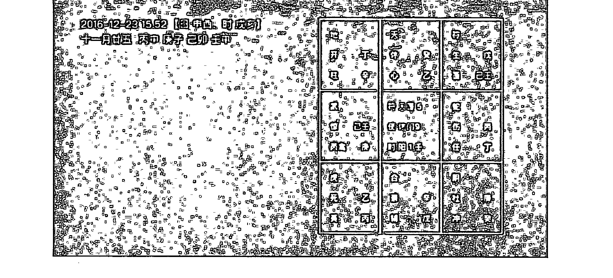

首先对这个奇门局进行基本盘面的分析。

### ① 确定干支时间

年：丙申年，丙为太岁。

月：庚子月，庚为月干；子月水旺。

日：己卯日，日干己。

时：壬申时，时干壬。

### ② 标出空亡、六击、入墓、马星及反吟伏吟

- a、空亡: 标出空亡，申空，酉空，戌空，亥空。
- b、六仪击刑（六击）: 标出六击，己六击。
- c、入墓: 标出入墓，辛入墓。
- d、马星: 标出马星，申时马星在寅，对着申冲过去，申空就被冲掉了。
- e、伏吟反吟: 该奇门局存在门反吟，人事关系反复。

### ③ 标注相关参数

- a、债主——值符 b、欠债人——天芮星（天乙） c、讨债人——伤门

### ④ 分析各参数情况

#### a、分析债主的情况——值符

值符属土，在坤土宫，是一个旺相状态；临天蓬，说明当前的外环境不好；临生门，说明当前还有一些钱，人事关系也还不错；戊加壬，戊加己，都是一个不好的周围现象；临六击，说明这个债主压力比较大，迫切地希望把钱的问题解决了。

#### b、分析欠债人的情况——天乙

债主天芮星是属土，在木宫为木克土，所以是一个非旺相状态；临惊门，说明心里很慌乱；临玄武，说明会搞一些虚假动作；壬加庚，己加庚，说明周围的这些状态对于欠债人不利。总而言之，欠债人情况不太好，比债主情况要差。

#### c、分析债主和欠债人之间的关系——值符、天乙

他们之间的关系是欠债人克债主，水旺木就旺，所以欠债人克债主克得比较厉害，也就是说他不愿意还债，债主很难把钱收回来，靠自己收债有困难。

#### d、分析讨债人和欠债人的关系——伤门、天乙

讨债人伤门在兑金宫，属于金克木，但是逢空，相当于没有力量去克，那么到了酉月，就有可能去克，问题现在是子月，到酉月

## 第 17 节

### 奇门测诉讼

## 1、诉讼的相关参数

- ① 原告——值符
- ② 被告——天乙（值符的故乡星）
- ③ 律师——惊门
- ④ 诉状——景门
- ⑤ 证据——六合
- ⑥ 法院——开门
- ⑦ 传票——丁奇
- ⑧ 罪人——辛
- ⑨ 牢狱之灾的信号

罪人（辛）跟天牢（壬）、天网（癸）相连接，也就是辛加壬、辛加癸容易有牢狱之灾；或者是辛加辛，也容易构成牢狱之灾。

## 2、奇门案例（一）

某一位女同学，因为合同执行的时候发生了纠纷，所以她就反诉对方，问测这次诉讼的情况和结果。

我们首先对这个奇门局进行基本盘面的分析。

### ① 确定干支时间

年：丙申年，丙为太岁。

月：辛丑月，辛为月干；丑月土旺。

日：辛亥日，日干辛。

时：己亥时，时干己。

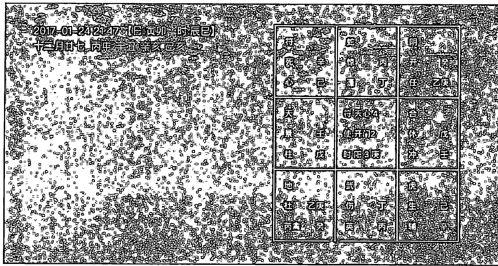

### ② 标出空亡、六击、入墓、马星及反吟伏吟

#### a、空亡

标出空亡，寅空，卯空，辰空，巳空。

#### b、六仪击刑（六击）

标出六击，戊六击，庚六击。

#### c、入墓

标出入墓，庚入墓，辛入墓，乙入墓，癸入墓。

#### d、马星

标出马星，亥时马星在巳，冲亥，辛入墓就不见了。

#### e、伏吟反吟

该奇门局存在星干反吟，说明整个案子有一个反复的过程。

### ③ 标注主要参数

- a、原告——值符（值符、年命辛、日干辛都在同一个宫，信息非常集中）
- b、被告——天辅星（天乙）
- c、律师——惊门
- d、诉状——景门
- e、证据——六合
- f、法院——开门

### ④ 分析各参数情况

#### a、分析原告情况——值符

值符在巽木宫，辛在那里本来是入墓状态，令人纠结，但是被马星冲掉，所以本身的心态可以恢复的相对平静一点。

值符土受到了木宫所克，土被制。

临死门，说明原告往前走阻力很大。

临天心，说明外部的形势好。

辛加己，说明自己跟自己有点过不去，是一个凶格。

逢空，说明它作为原告，力量不足。

#### b、分析被告情况——天辅星（天乙）

被告天辅在乾金宫，是木在金宫，金克木，处于一个被囚的状态。

临生门，说明人际关系生机勃勃，阻力较小。

临白虎，说明挑战压力也比较大。

时干和被告同宫，说明被告和这件事情连在一起。

己加辛，为游魂入墓，是一个不好的状态。

#### c、分析被告和原告的关系——值符、天辅星（天乙）

被告金宫克原告木宫，金克木，而且土旺、金旺，所以被告还是处在比较不利的位置。

#### d、分析证据和诉状对双方的关系——景门（诉状）、六合（证据）、值符、天辅星（天乙）

原告跟诉状木木比和；跟证据是金克木，对原告不利。

被告，证据对他有利，为金金比和；跟诉状属于金克木，说明被告会全力以赴把诉状写好。

诉状逢空，说明现在还不够落实。

#### e、分析法院跟双方的关系——开门、值符、天辅星（天乙）

法院原告跟法院的关系是木克土，土旺，开门属金也旺，说明原告要克动法院，要说服法院还是有难度的。

法院跟被告是相生关系，土生金，说明法院方面是比较有利于被告的。

#### f、分析律师跟双方的关系——惊门、值符、天辅星（天乙）

值符（原告）生律师，关系为木生火。

律师克被告（天乙），从这里可以看到一丝希望，也就是说如果原告能够聘到很好的律师，这个律师又能够全力以赴地去为原告服务的话，就有可能使原告取得一些有利条件。

#### g、分析结论及确定应对策略

所以结论就是被告处在比较有利的地位，原告的地位不是太有利，但是如果律师使用得当，原告是可以争取到有利条件的。另外整个大局星干反吟，说明这个诉讼不会一下子解决，会有反复。

所以原告需要采取的措施，一是聘请好律师，二是准备更充分且有利于自己的证据，诉状还要写得更好，否则这场官司没办法打赢。

## 3、奇门案例（二）

下面我们介绍第二个案例。有一位同学起诉对方借款一直不还，问官司能否胜诉。

预测时间为 2016 年 9 月 27 号 15:46。

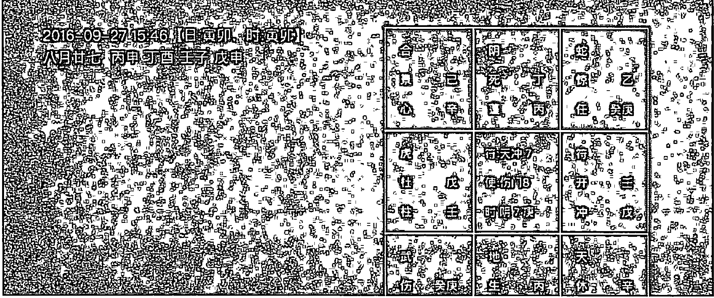

首先我们对这个奇门局进行基本盘面的分析。

### ① 确定干支时间

- 年：丙申年，丙为太岁。
- 月：丁酉月，丁为月干；酉月金旺。
- 日：壬子日，日干壬。
- 时：戊申时，时干戊。

### ② 标出空亡、六击、入墓、马星及反吟伏吟

- a、空亡：标出空亡，双寅空，双卯空。
- b、六仪击刑（六击）：标出六击，戊六击，庚六击。
- c、入墓：标出入墓，庚入墓，辛入墓，己入墓，癸入墓。
- d、马星：标出马星，申时马星在寅，对着申冲过去，庚入墓就消失了。
- e、伏吟反吟：该奇门局存在星干反吟。

### ③ 标注主要参数

- a、原告——值符（值符、日干在同一个宫，信息集中）
- b、被告——天柱星（天乙）
- c、律师——惊门
- d、诉状——景门
- e、证据——六合
- f、法院——开门

### ④ 分析各参数情况

#### a、分析原告的情况——值符

原告的落宫在兑金宫，原告处在一个酉月金旺的宫里面。他和法院开门在一起，说明法院和原告关系是好的。临天冲，说明外环境不错，有利于原告。壬加戊，为“小蛇化龙”，也是好的。因此原告处在一个非常有利的状态。

#### b、分析被告的状态——天柱星（天乙）

被告天柱星属金，在震宫，属于金克木，它处于震木宫的死地，这个情况就不太好。临杜门，说明他要往前走阻力很大，他打官司的状态很不利。临白虎，说明他的压力很大。庚六击，说明很凶。逢双卯空，说明非常的虚弱。戊加壬，是“龙入网”的一个不好信息，还是说明被告的状态很不好。

#### c、分析被告和原告的关系——值符、天柱星（天乙）

原告属金克被告木，而且金很旺，所以被告恐怕要败诉。

#### d、分析证据和诉状对双方的关系——景门（诉状）、六合（证据）、值符、天柱星（天乙）

诉状和证据都在巽木宫。跟被告是木木比和，说明被告掌握了一定的证据，诉状写的也还可以。跟原告是金克木，说明原告会全力以赴搞定证据，搞定诉状。

#### e、分析法院跟双方的关系——开门、值符、天柱星（天乙）

律师跟原告是土生金的关系，说明律师很有利于原告。律师跟被告是木克土的关系，说明他很想搞定这个律师，但他很弱，因为他在木宫，木现在很弱，想克土很难。

#### f、分析结论及确定应对策略

综合上述的信息，我们可以比较肯定的判断原告胜诉。但是应该注意这是一个星干反吟的局，说明这个案子会经过反复才能取得胜诉。

## 4、奇门案例（三）

有位女同学因为买房产引发了诉讼，咨询诉讼结果。我们的同学是原告，对方是被告。

预测时间为 2016 年 2 月 27 号 16 点。

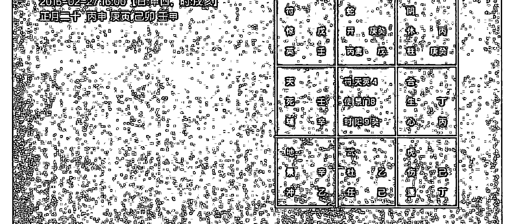

然后对奇门局的进行基本盘面的分析。

### ① 确定干支时间

年：丙申年，丙为太岁。

月：庚寅月，庚为月干；寅月木旺。

日：己卯日，日干己。

时：壬申时，时干壬。

### ② 标出空亡、六击、入墓、马星及反吟伏吟

#### a、空亡

标出空亡，申空，酉空，戌空，亥空。

#### b、六仪击刑（六击）

标出六击，壬六击。

#### c、入墓

标出入墓，壬入墓，癸入墓。

#### d、马星

标出马星，申时马星在寅，冲申，马星就把癸入墓给去掉了。

#### e、伏吟反吟

该奇门局不存在伏吟反吟。

### ③ 标注主要参数

- a、原告——值符
- b、被告——天辅星（天乙）
- c、诉状——景门
- d、证据——六合
- e、法院——开门
- f、律师——惊门

### ④ 分析各参数情况

#### a、分析原告的情况——值符

原告在巽木宫，值符属土，木克土，值符不旺，也就是原告不旺。临六击，入墓，说明原告状态不够理想。临太阴，说明外环境一般。临惊门，跟律师站在一起，同时也表示跟官司纠缠在一起。戊加壬，是“龙入网”，也不好。所以原告的状态并不很理想。

#### b、分析被告的情况——天辅星（天乙）

被告天辅在巽木宫，天辅属木，这样就是木木比和，天辅的状态属于旺相。临死门，说明被告往前走阻力很大。临九天，说明有比较高明的贵人帮他。壬加辛，为“螣蛇相缠”，两条蛇在纠缠，很不好。所以被告的状态既有好的地方，也有不好的地方；当然原告的状态可能比被告还弱一些。

#### c、分析被告和原告的关系——值符、天辅星（天乙）

他们二者之间的关系属于木木比和，说明他们二者最后不得不走向协商和解。

#### d、分析证据、诉状、法院等对双方的关系——景门（诉状）、六合（证据）、开门（法院）、值符、天辅星（天乙）

诉状跟诉讼双方的关系都是木克土，因为五行一样，所以参数五行之间的关系都类同了，包括跟法院的关系等等，所以这个局其他的关系暂时不分析也可以，因为原告和被告都属于木行，总体情况只能来比较双方力量的旺和衰。

#### e、分析结论及确定应对策略

综合来看，诉讼双方中，被告的力量相对要旺一点，原告的力量要相对弱一点，所以他们在较量的过程中间，被告可能会略微占一点上风，但是他们跟法院、证据、诉状及律师的关系基本雷同，所以最后结果会走向协商和解，但是原告可能在经济上会让一些利益给被告，来解决这场纠纷。

### ⑤ 结果反馈

事实也反映了这样的判断结果。

## 第 18 节

### 奇门测案件

## 1、测案件的相关参数

- ① 普通罪犯（小偷等）——玄武
- ② 重犯、杀人犯——天蓬星
- ③ 犯人——辛
- ④ 罪犯的特征
    - a、辛落宫的参数
    - b、罪犯老奸巨猾——天蓬临庚
    - c、惯犯——天蓬加辛
    - d、案犯在逃——天蓬，壬加癸
- ⑤ 作案的手段
    - a、动用车船——天蓬临伤门
    - b、动用火器（枪支弹药等）——天蓬临景门
    - c、动用匕首刀具——天蓬临庚、辛
    - d、动用绳索、掐脖子——天蓬临巽木宫、或螣蛇
    - e、动用木棍——天蓬临伤门、或者杜门
- ⑥ 罪犯的逃逸方向——六合
- ⑦ 罪犯躲藏的地点——杜门
- ⑧ 寻找死者尸体——死门
- ⑨ 犯罪原因
    - a. 谋财害命——死门加戊
    - b. 情杀、奸杀——死门加乙庚、或丁壬、或临桃花沐浴状态
- ⑩ 司法力量
    - a. 一般的公安——庚金
    - b. 刑警——伤门
    - c. 武警——白虎
    - d. 专案组——值使

## 2、奇门案例（一）

这个案例是一位同学在课堂上发问的。他来自于广西，当时刚刚接到了电话，广西发生了一个杀人的案子，想询问一下案犯逃到哪里去了，大概什么时候可以抓到案犯。

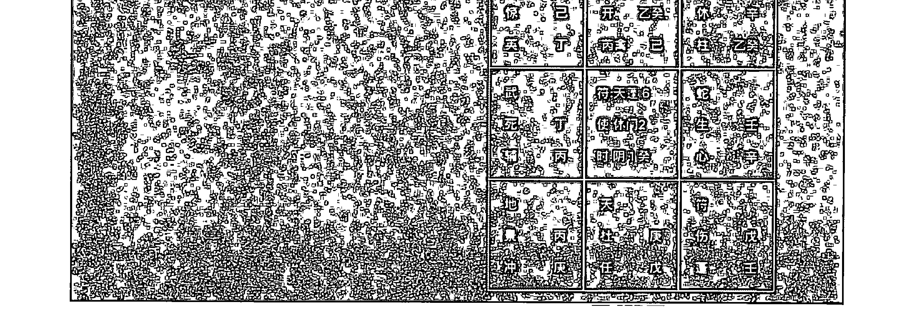

首先对奇门局进行基本盘面的分析。

### ① 确定干支时间

- 年：丙申年，丙为太岁。
- 月：丙申月，丙为月干；申月金旺。
- 日：己卯日，日干己。
- 时：壬申时，时干壬。

### ② 标出空亡、六击、入墓、马星及反吟伏吟

#### a、空亡

标出空亡，申空，酉空，戌空，亥空。因为现在申月旺，所以申不为空。

#### b、六仪击刑（六击）

标出六击，庚六击。

#### c、入墓

标出入墓，庚入墓，乙入墓，癸入墓，戊入墓。

#### d、马星

标出马星，申时马星在寅，冲申，这样庚入墓就不见了。

#### e、伏吟反吟

该奇门局没有伏吟反吟。

### ③ 标注相关参数

- a、杀人犯——天蓬星
- b、公安干警——庚
- c、刑警——伤门
- d、武警——白虎
- e、案犯逃窜方向——六合
- f、案犯躲藏地——杜门

### ④ 分析各参数情况

#### a、分析杀人犯的情况——天蓬星

杀人犯天蓬星在乾金宫，逢空入墓，说明还不能确定他到底躲在哪里，以及抓到他的时间。

临伤门，说明他凶残地伤害了被害人。

临戊，说明这个人是因为钱财杀人。

临值符，说明暗中还有人在保护他，那当然就是他的同伙了。

临壬，说明他在逃逸，因为临壬就是一个逃逸的信号。临乾金宫，也加剧了因为钱财而害命的信息。

#### b、分析案犯的逃跑方向——六合、杜门

- 六合在南边，说明案犯曾经往南边逃；
- 杜门在北边，说明他接着又运动到北边躲了起来；
- 杜门临九天，说明躲得远一些，而且还是在外盘，所以案犯是往稍微远的地方跑了；
- 杜门临天任，说明躲藏的地方是比较隐蔽和稳定的；
- 杜门在坎水宫，说明案犯一定是躲在水边；
- 杜门临地盘戊，说明躲藏的地方有一个高的土山，因此他应该是躲藏在临水的土山里面；
- 庚加戊，表示换地盘，说明他在考虑要不要换一个地方去躲藏。

#### c、分析司法力量跟罪犯的关系——伤门、庚、白虎、天蓬

- 伤门刑警跟天蓬同宫，说明刑警已经发现了他，离他已经很近了。
- 庚金是公安，说明公安也可以去协助破案。
- 天蓬落宫生庚金落宫，所以天蓬也会落在公安的手里。
- 白虎是武警，在巽木宫，天蓬在乾金宫，说明罪犯克武警，说明不需要出动武警；又因为双方为对冲关系，离得太远，他也可以拒绝这样一种追踪的方式。

因此只需要刑警和公安两种力量就可以比较快的抓到杀人犯。

#### d、分析躲藏地点的远近——杜门

根据之前的信息，杀人犯躲在事发地的北侧，距离稍微远一些，因为杜门落坎水宫，坎水宫的数字是 1 和 6，因为案犯躲得比较远，所以我们不取 1 而取 6，即他躲在 6 里地以外的地方。

#### e、确定抓获案犯的时间

分析该奇门盘，天蓬落宫出空的时候，也就是戌不空时就容易抓到了；另外时干不逢空的时候也有可能，因为说明这件事情落实了，也就是酉时；所以总体来看，应该在酉时、戌时能够追踪到案犯，把他抓获。

### ⑤ 结果反馈

最后的事实是当天下午 18 点半，也就是酉时接近戌时的时候，案犯被抓获了。抓获的地点大约就在北侧略偏东的地方，距离六里地左右，确实是在一个临水边的山洞里躲着。

## 3、奇门案例（二）

现在我们介绍第二个案例。这个案例是我们河南的一位同学在课堂上发问的，说他接到了一个电话，他的一个好朋友是河南某地一个公司的老总，被绑架了，想知道至今为止这位老总的吉凶情况，以及案子可能发展的情况。

预测时间为 2016 年 4 月 24 日 11:02。

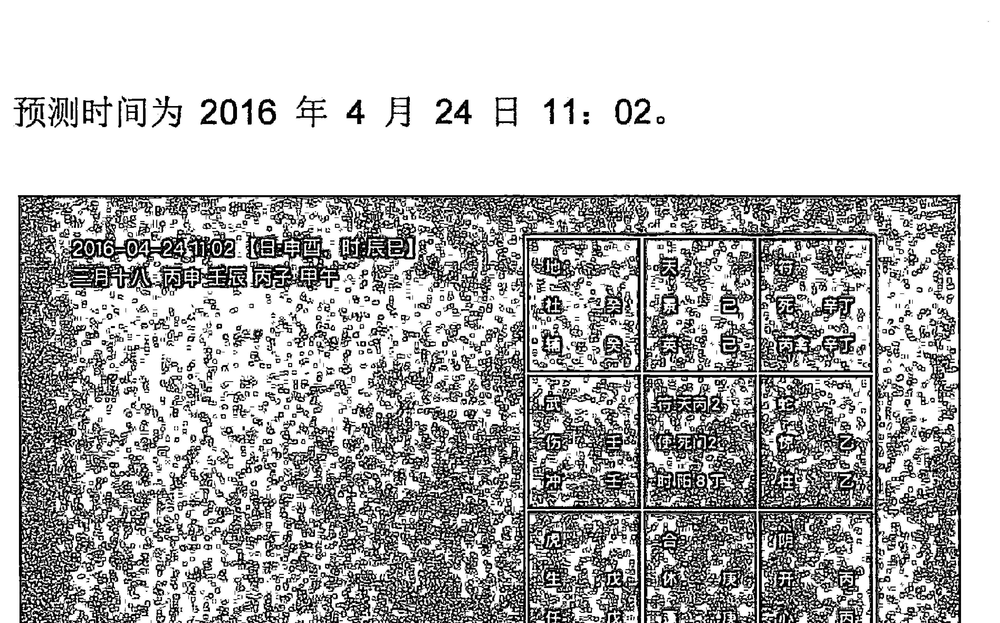

我们首先对奇门局进行基本盘面的分析。

### ① 确定干支时间

年：丙申年，丙为太岁。

月：壬辰月，壬为月干；辰月土旺。

日：丙辰日，日干丙。

时：甲午（辛）时，时干辛。

### ② 标出空亡、六击、入墓、马星及反吟伏吟

- a、空亡
标出空亡，申空，酉空，辰空，巳空；辰月旺，所以巳不为空。

- b、六仪击刑（六击）
标出六击，癸六击。

- c、入墓
标出入墓，双丙入墓。

- d、马星
标出马星，午时马星在申，冲寅，申空就没有了。

- e、伏吟反吟
该奇门局是一个星门干伏吟局。

### ③ 标注相关参数

- a、老总年命——甲寅（癸）
- b、绑架犯——天蓬
- c、公安——庚金
- d、刑警——伤门
- e、武警——白虎

### ④ 分析各参数情况

- a、分析老总的情况——年命
年命落宫为巽木宫，癸六击，这是很凶的一个信号；临杜门，可以表示被绑架关押的地方；临九地，说明他被绑架在很隐蔽幽深的地方；临天辅，说明附近有文化教育机构；年命逢空，说明命可能丢了；然后我们还可以参考值符，因为按照古书奇门遁甲所说，年命逢空，值符逢空，命可能就不保了。值符在坤土宫逢空，当然它被马星冲动，但是依然存在一些空的力量，所以这两个空的结合基本上可以判断被绑架者已经死亡。

- b、分析事件本身的情况——时干
时干表示被绑架这件事情。临死门，表达了一个死亡的信息；死门临辛金，说明作案时使用了刀具；另外，天蓬星落宫临庚金，也代表了金属刀具，说明案犯是使用金属刀具害死了被绑架者。

- c、分析绑架犯的情况——天蓬星
绑架犯天蓬星在坎水宫，坎水宫为天蓬的故乡，所以天蓬是旺相的，因此罪犯相对年龄会小一点；坎水宫数字是 1、6，因为是阳局，数字要往小里取，但是天蓬旺相，所以这个数字还需要适当大一点，所以 1 到 6 我们取中间，就取 3；坎卦也指代中年男子，又因为天蓬旺相，所以该犯罪分子比中年还要年轻一些，最多是一个中青年，估计犯罪分子年龄就是 30 岁左右；临六合，说明犯罪分子不止一个人，很可能是 3 个人，因为这里的数字是 3；临庚，公安跟天蓬在一起，说明公安已经发现了他的踪迹。

- d、分析案犯躲藏的方向——杜门
杜门在东南方向，说明案犯曾经绑架了这位老总，放在东南方向的房间里；另外，他们逃走的路线也是往东南方向。

- e、分析刑警、武警跟案犯的关系——伤门、白虎、天蓬
伤门跟案犯的关系为水生木，说明案犯可能会投入到刑警的怀抱中而被抓住；当然武警的力量更厉害，离他的宫很近，而且关系是土克水，说明武警可以抓到案犯；结论就是三支公安力量无论哪一支，都能来解决这个案子，抓住杀人犯，当然武警的力量最好，这就是我们对整个案子的基本判断。

### ⑤ 结果反馈
事后新闻报道，这位老总被绑架杀害。绑架犯在索取了赎金之后，害死了被绑架者，然后向东南的福建省福州市潜逃，之后我们的公安部门把三名嫌疑犯全部抓获，这三名嫌疑犯的年龄分别为 25 岁、26 岁、28 岁，都是 30 岁左右，因此奇门的信息恰好地反映了整个案件的经过。

## 4、奇门案例（三）
下面我们介绍第三个案子。这个案例是一则新闻报道，一名广东外语外贸大学的女学生在校园内被害，警方对此发出了通报。我们主要分析案犯的情况，能否抓住，以及抓住的时间。问测时间，也就是新闻报道的时间为 2016 年 12 月 20 号 21:

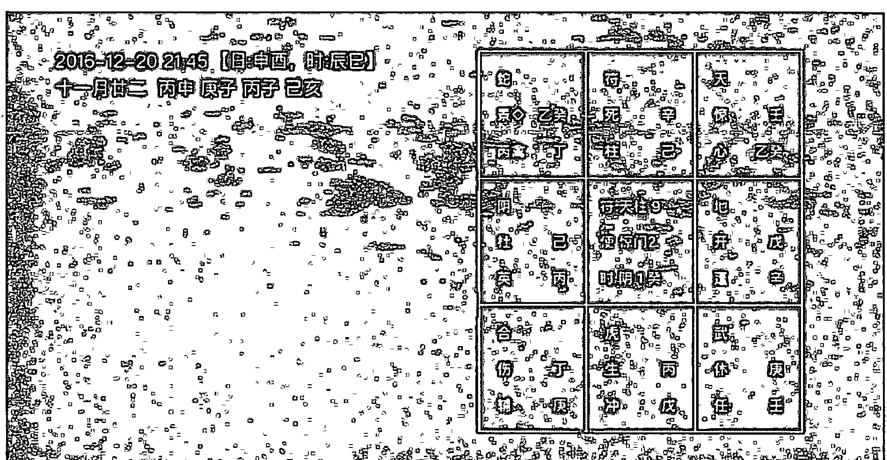

首先对奇门局进行基本盘面的分析。

### ① 确定干支时间
- 年：丙申年，丙为太岁。
- 月：庚子月，庚为月干；子月水旺。
- 日：丙子日，日干丙。
- 时：己亥时，时干己。

### ② 标出空亡、六击、入墓、马星及反吟伏吟

#### a、空亡
标出空亡，申空、酉空、辰空、巳空。

#### b、六仪击刑（六击）
标出六击，庚六击，辛六击，癸六击。

#### c、入墓
标出入墓，丁入墓，庚入墓，乙入墓，癸入墓。

#### d、马星
标出马星，亥时马星在巳，冲亥，这样就把巳空给冲掉了。

#### e、伏吟反吟
该奇门局不存在伏吟反吟。

### ③ 标注相关参数
- a、杀人犯——天蓬
- b、公安——庚
- c、刑警——伤门
- d、武警——白虎
- e、躲藏地——杜门
- f、逃逸方向——六合

### ④ 分析各参数情况

#### a、分析杀人犯的情况——天蓬星
杀人犯天蓬处在兑金宫。临开门，临辛金，说明他用金属刀具大开杀戒；临戊，说明犯罪目的是为了钱财；天蓬临辛，说明是个惯犯。

#### b、分析案犯躲藏的方向——杜门
杜门在东边震木宫，临太阴，说明他躲在东边阴暗的角落里；天干己土，说明他躲藏的比较深。

#### c、分析公安、武警、刑警跟案犯的关系——庚、白虎、伤门、天蓬
公安（庚）跟天蓬，金金比和，说明公安可能发现他。武警（白虎）跟天蓬的关系为金生水，它很可能不得不投降武警，举手投降。刑警（伤门）跟他的关系是土生金，说明刑警要花费比较多的力量去抓捕杀人犯。最后还是可以抓到杀人犯的。

#### d、确定抓获案犯的时间
案犯被抓捕的时间，一个是入墓被冲开的时候，一个是逢空被打开的时候。丁可以表示发现杀人犯的消息，丁在艮土宫入墓，说明现在还没有消息，如果到了丑或寅的时间，丁入墓就可能被冲开而有案犯的消息；或者在未和申的时间，因为对冲，也可以得到消息。另外值使惊门也会告诉我们抓捕的时间，值使惊门在坤土宫，数字为 2、5、8、10，阴局取小数，也就 2 到 5，因为逢空，也就 1 到 3了，说明在 1 到 3天之内，武警或者公安比较容易发现他。

### ⑤ 结果反馈
最后结果是第二天丁丑日，上午十点多一点，也就是巳时，抓获了案犯。

# 第 19 节 奇门测比赛

## 1、比赛的相关参数
- ① 主队——地盘日干
- ② 客队——天盘日干
- ③ 主裁判——值符
- ④ 副裁判（边裁）——值使
- ⑤ 教练——景门
- ⑥ 观众——时干
- ⑦ 比分——景门、值使
- ⑧ 金牌——辛

## 2、奇门案例（一）——上半场
首先我们介绍第一个案例。预测世界杯第 53 场 1/8 决赛巴西对墨西哥的比赛。比赛上半场的时间为 2018 年 7 月 2 号 22:17。

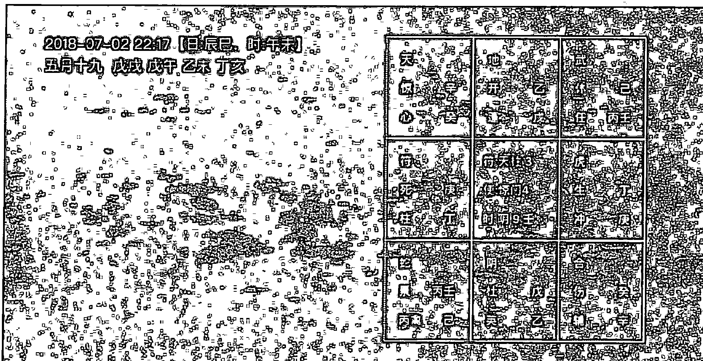

首先要对上半场的比赛进行基本盘面的分析。

### ① 确定干支时间
年：戊戌年，戊为太岁。
月：戊午月，戊为月干；午月火旺。
日：乙未日，日干乙。天盘地盘的日干可以分别代表两个队伍。我们以远近分主客，其中，墨西哥离比赛的场地近一点，巴西离比赛的场地远一点，所以墨西哥离得近是主队，巴西离的远是客队。客队用天盘日干，主队用地盘日干，所以巴西就是天盘乙，墨西哥队就是地盘乙。
时：丁亥时，时干丁。

### ② 标出空亡、六击、入墓、马星及反吟伏吟
- a、空亡
标出空亡，辰空，巳空，午空，未空，午月午空不为真空。
- b、六仪击刑（六击）
标出六击，己六击，癸六击。
- c、入墓
标出入墓，己入墓，辛入墓。
- d、马星
标出马星，亥时马星在巳，冲亥而去，这样就把辛入墓给去了。
- e、伏吟反吟
该奇门局存在星干反吟，星干反吟利客，也就是利巴西。

### ③ 分析各参数情况

#### a、分析两队各自的优势劣势——天盘乙（巴西）、地盘乙（墨西哥）
巴西天盘乙是长生状态，这是个优势；墨西哥的地盘乙处在衰病之地，是不利的。天盘乙临天蓬，说明外环境不利，挑战压力大；地盘乙临天英，中平，既不有利也不没利。天盘乙临开门，吉门有利；地盘乙临杜门，中平之门，但是要注意杜门在足球比赛的时候，往往也代表守门守得比较紧，所以，尽管是个中平门，还是要给他加分的。天盘乙临九地，说明踢的水平还不够高，应该减分；地盘乙临太阴，说明暗中有人帮他，所以是一个好的现象。巴西格局为乙加戊，为“阴害阳门”，是不好的；墨西哥格局为戊加乙，临杜门，也是不好的。巴西队天盘乙在离火宫，离火宫是旺的宫；墨西哥队地盘乙在坎水宫，是一个弱宫；这两个宫的关系为水克火，但基本上是一个弱克。整体格局为反吟局，利客，所以对巴西是有好处的。

#### b、统计双方的优势劣势
经过分析统计，巴西有 3 个优势，3 个劣势；墨西哥队有 3 个优势，2 个劣势，2 个中平。双方优势劣势基本相同，可能上半场墨西哥踢得比巴西队要强一点，但因为很接近，也很可能踢成平手，实际结果也确实如此。

## 3、奇门案例（一）——下半场
比赛下半场的时间为 2018 年 7 月 2 号 23 点 17

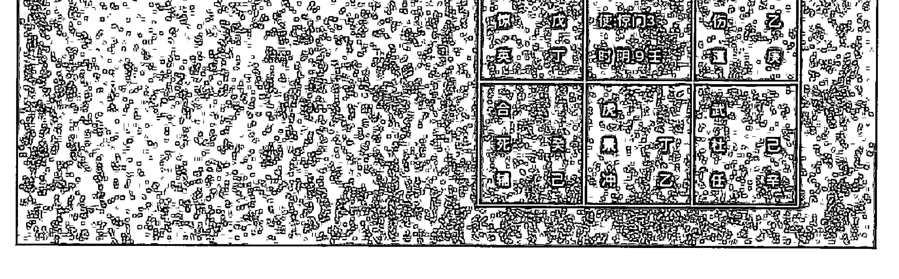

首先对这个奇门局进行基本盘面的分析。

### ① 确定干支时间
年：戊戌年，戊为太岁。
月：戊午月，戊为月干；午月火旺。
日：丙申日，丙为日干。
时：戊子时，时干戊。

### ② 标出空亡、六击、入墓、马星及反吟伏吟
- a、空亡
标出空亡，辰空、巳空、午空、未空，午月午空不为真空。
- b、六仪击刑（六击）
标出六击，戊六击，壬六击，癸六击。
- c、入墓
标出入墓，己入墓，壬入墓。
- d、马星
标出马星，子时马星在寅，冲申，把己入墓给去掉了。
- e、伏吟反吟
该奇门局存在门反吟。门反吟利客，利巴西。

### ③ 分析各参数情况
- a、分析两队各自的优势劣势——天盘丙（巴西）、地盘丙（墨西哥）
巴西天盘丙，在巽木宫，为临官，这是好的；墨西哥地盘丙在衰病之地，是差的。巴西天盘丙遇到了六击、入墓和逢空，是不好的；墨西哥地盘丙也遇到了逢空，不好。巴西队天盘丙临天芮星，不好，说明有问题；墨西哥临天心，是好的。巴西队临开门，好的；墨西哥队临生门，也是好的。巴西队临螣蛇，不好；墨西哥队临九天，好的。巴西队的天干组合为壬加癸，丙加癸，不好；墨西哥的天干组合为辛加丙，辛加壬，也不好。巴西队在巽木宫，因为火旺，所以巽木宫算衰；墨西哥在坤土宫，因为火生土，所以坤土宫较旺；这两个宫的关系是木克土，虽然为弱克，但还是对墨西哥队有所不利，所以这里应该给巴西队加分。总体格局为门反吟，利客，也要给巴西队加分。

- b、统计双方的优势劣势
经过分析统计，巴西有 4 个优势，4 个劣势；墨西哥有 3 个优势，3 个劣势。结果应该说非常接近，巴西的优势多一个，但是劣势也多一个。但是这个时候要考虑到子时水旺，水旺对这两个队伍都有影响，因为水生木，巴西队木宫在子时就会旺起来，这时候土的力量就要被消耗掉了，所以巴西的优势更大一点，因此可以大体上判断巴西队应该胜出。

- c、确定比赛得分——值使门
首先，这个两队实力很接近，所以比分不会差距很大，一般会是小胜，只胜几个球。值使门惊门在震木宫，数字应该是 3、4、8，因为是小胜，最大的数也不可能超过 3，而且这个宫存在六击，所以胜球的数小于 3 个，结果应该是赢 1 到 2 个球。

### ④ 结果反馈
最后的比赛的结果为，上半场巴西对墨西哥 0 比 0 打平；下半场比分为 2 比 0，巴西取得了胜利，大体上符合奇门的判断。

## 4、奇门案例（二）——上半场
现在我们断第二个案例。预测这一次世界杯的半决赛，克罗地亚队对阵英格兰队的情况。比赛开始的时间为 2018 年 7 月 12 号 2:17。

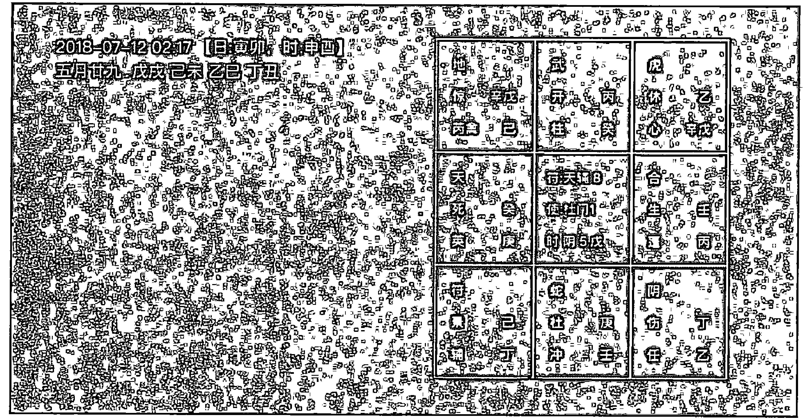

首先进行基本盘面的分析。

### ① 确定干支时间
年：戊戌年，戊为太岁。
月：己未月，己为月干；未月土旺。
日：乙巳日，日干乙。地盘乙是主队，主队是克罗地亚，因为离的比赛场地近；客队就为英格兰队，以天盘乙表示。
时：丁丑时，时干丁。

### ② 标出空亡、六击、入墓、马星及反吟伏吟

#### a、空亡
标出空亡，寅空，卯空，申空，酉空。

#### b、六仪击刑（六击）
该奇门局没有六仪击刑。

#### c、入墓
标出入墓，丁入墓，己入墓，辛入墓，乙入墓（坤宫），乙入墓（乾宫）。

#### d、马星
标出马星，巳时马星在亥，冲巳，就把乙入墓（乾宫）给去掉了。

#### e、伏吟反吟
该奇门局不存在伏吟反吟。

### ③ 分析各参数情况

#### a、分析两队各自的优势劣势——天盘日干乙（英格兰）、地盘日干乙（克罗地亚）
克罗地亚队地盘乙，入墓，但被马星冲掉，马星是要加分的，是增加动量的；英国天盘乙，入墓，没有被去掉，所以就出现了问题。克罗地亚地盘乙，临天任星，是好的；英国临天心星，也是好的。克罗地亚临伤门，伤门虽然是一个凶门，但是在踢足球的时候代表了杀伤力，起到一个好的作用；英国临休门，休门本身是一个吉门，但是踢得太悠闲了，这个吉门就变成了一个中平的门。克罗地亚临太阴，说明暗中有相助的力量，这是好的；英国临白虎，白虎说明太急躁了，踢球不能过于急躁，所以白虎不好。克罗地亚队的天干组合为丁加乙，是好的；英格兰队的天干组合为乙加辛和乙加戊，干组合差一点。英格兰队和克罗地亚队的关系为土生金，英国队生克罗地亚队，对克罗地亚队有利。但是要注意，英格兰队整个宫是旺的，因为未月土旺，所以它坤土旺。

#### b、统计双方的优势劣势
分析统计得出，克罗地亚队有 5 个优势，基本上没有反映出太大的劣势；英格兰队有 2 个优势，3 个劣势。所以克罗地亚应该踢得比英格兰队好，这是我们对上半场的基本分析。

## 5、奇门案例（二）——下半场
下面我们分析下半场。时间为 2018 年 7 月 12 号 3:17。

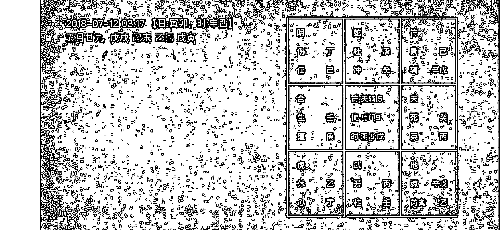

### ① 确定干支时间
年：戊戌年，戊为太岁。
月：己未月，己为月干，未月土旺。
日：乙巳日，日干乙。分别对应主客两队。天盘乙对应客队英格兰队，地盘乙则对应主队克罗地亚队。
时：戊寅时，时干戊。

### ② 标出空亡、六击、入墓、马星及反吟伏吟
- a、空亡
标出空亡，寅空，卯空，申空，酉空。
- b、六仪击刑（六击）
标出六击，己六击。
- c、入墓
标出入墓，丁入墓，乙入墓，戊入墓。
- d、马星
标出马星，寅时马星在申，对着寅冲过去，马星去掉了乙入墓。
- e、伏吟反吟
该奇门局没有反吟伏吟。

### ③ 分析各参数情况

#### a、分析两队各自的优势劣势——天盘日干乙（英格兰）、地盘日干乙（克罗地亚）
克罗地亚地盘乙是入墓状态，尽管被冲掉一个墓，还剩下一个墓，所以这是要减分的；英格兰队天盘乙是帝旺的状态，要加分的。克罗地亚队临马星，是有利的。地盘乙临天芮星，不好；英格兰队临天心星，好。克罗地亚队临惊门，说明踢得太紧张，慌乱了，不好；英格兰队临休门，中平，踢得太悠闲，但是是吉门。克罗地亚队临九地，发挥的水平不够高；英格兰队临白虎，踢得太急躁，也是有问题的。克罗地亚队戊加乙，辛加乙，天干组合不够理想；英格兰队乙加丁，干组合是好的。比赛双方的落宫关系为土生金，生克罗地亚队，这样就给克罗地亚队加分了。

- b、统计双方的优势劣势
经过统计分析，克罗地亚有 2 个优势，5 个劣势；英格兰有 2 个优势，2 个劣势。因为现在为寅时木旺，所以就把寅空给去掉了，所以时辰给英格兰队加了分。所以综合考虑，克罗地亚队为 2 优 5 劣，英格兰队为 3 优 2 劣，所以英格兰队表现要略强一些。根据这个基本分析来看，这两队各有优劣。上半场克罗地亚队的优势明显一点，下半场英格兰队优势明显一点，结合两个队的历史情况分析，二队的实力也是比较接近的，所以对于这个大格局的判断，应该踢成平局，也就是说在加时赛以前应该踢成平局。

- c、分析加时赛的情况
因为是半决赛，所以必须得决出胜负来，如果平局了，就需要进行加时赛。加时赛取决于整体的一个力量，因为在上半场和下半场两个队的落宫都是生克罗地亚队的，这是非常重要的一个大格局（宫对宫的关系），整个优势在克罗地亚队这一边。加时赛基本上也还是落在下半场里面，所以基本上克罗地亚队的优势略强一点，所以预测克罗地亚队会以极微弱的优势战胜英格兰队，最多赢一个球。

- d、确定比赛得分——景门、值使门
比分通常需要结合实际情况，看景门和值使门得出判断。景门落在坤土宫，数字为 2、5、8、10，阴局取 2 和 5，因为逢空也就 1 到 3 个球，因为存在六击，所以比分不会差很多，最多一个球的关系。值使杜门在离火宫，数字为 2、3、7、9，阴局取 2 和 3，所以最多就是 1 个球和 2 个球的关系，这就是基本的分数情况。

### ④ 结果反馈
最后克罗地亚队以 2 比 1 战胜了英格兰队，大体上符合奇门局的分析。

## 6、奇门案例（三）
预测世界杯决赛，法国队对阵克罗地亚队的结果。比赛时间为 2018 年 7 月 15 日 23:17，上下半场都在一个时区。

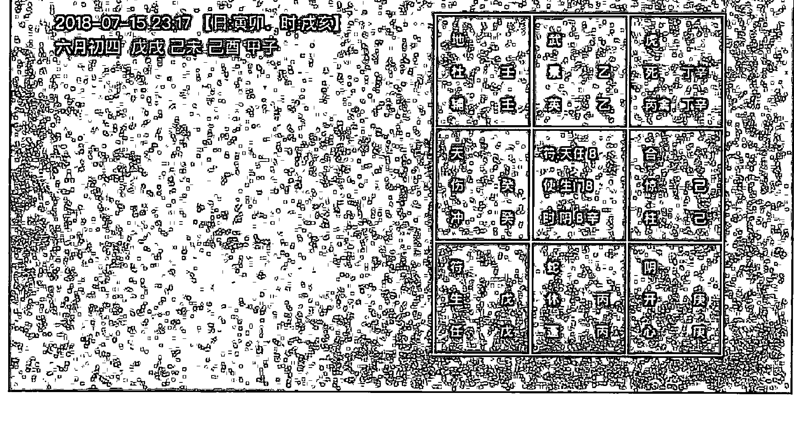

### ① 分析各参数情况

#### a、整体格局分析
从离宫参数分析可以得出，该奇门局为星门干伏吟。

#### b、分析两队各自的优势劣势——天盘日干己、地盘日干己
因为该奇门局为伏吟局，所以两个队都在兑金宫。其中，克罗地亚离比赛场地近，所以克罗地亚是主队，那法国队就是客队。因为伏吟局，两个队同宫，所以他们所有的参数都应该是一样的。所以伏吟局判断比赛，应该参考这句话——“利主更利实力”。意思就是伏吟局中，主队沾光；另外，谁有实力就显得更加重要，所以一般就按实力来判断。经过查询世界足联的排名，我们得知法国队排第七，而克罗地亚排名第二十，所以这场球比较容易断，就是根据实力，法国队应该是胜的。因为这两个历史排名差距也不是很大，所以结果为小胜，法国队胜 1 到 2 个球。

### ② 结果反馈
比赛最后的结果是法国队以 2 个球的优势取得了胜利。

# 第 20 节 奇门测航天发射

## 1、航天的相关参数
- ① 点火——丁
- ② 起飞——天冲
- ③ 入轨——九天
- ④ 开舱门——开门
- ⑤ 发射事情本身——时干
- ⑥ 发射的时辰

#### a、天显时格——吉
如果航天发射选择天显时格，那么吉祥的机会多一点，所谓天显时格是一个全伏吟局，但是是六甲时辰发射的。

#### b、五不遇时——凶
航天发射要避开“五不遇时”，五不遇时是一个很凶的时刻。

从地条件讲，也就是时干克日干，阳克阳，阴克阴，就会发生五不遇时的状态。

## 2、奇门案例（一）

首先看第一个案例。预测中国长城号火箭搭载发射通讯卫星。
发射的具体时间为 2017 年 6 月 19 号 00:11。

首先对这个奇门局进行基本局面的分析。

- ① 确定干支时间
- 年：丁酉年，丁为太岁。
- 月：丙午月，丙为月干；午月火旺。
- 日：丁丑日，日干丁。
- 时：庚子时，时干庚。

- ② 标出空亡、六击、入墓、马星及反吟伏吟
- a、空亡
标出空亡，申酉空，辰巳空。
- **b、六仪击刑（六击）**
标出六击，壬六击。
- **c、入墓**
标出入墓，壬入墓，癸入墓，戊入墓。
- **d、马星**
标出马星，子时马星在寅，对着申冲过去，这样就把癸入墓给冲掉了，当然也会冲动这个申空。
- **e、伏吟反吟**
该奇门局不存在伏吟和反吟。

### ③ 标注相关参数
- a、点火——丁
- b、起飞——天冲
- c、入轨——九天
- d、事情本身——时干

### ④ 分析各参数情况
- a、分析点火情况——丁
丁到了病地，说明点火多少会有一些小问题；
临天心星，说明外环境是好的；
临休门，说明人际关系，合作配合的情况是好的；
临玄武，说明可能有些小问题引发了虚惊；
丁下临辛，也说明有一些问题，但是可控，因为丁火克辛金；所以点火总的来说是没有啥问题。

- b、分析起飞情况——天冲星
临杜门，说明有一定的阻力；辛加庚、辛加癸，也说明有阻力，有一些问题；临值符，说明会有好机会或贵人帮助，解决这些阻力的问题；所以起飞最后应该还是正常的。

- c、分析入轨情况——九天
九天属金，在这里受到了火宫的冲克，所以九天有一点弱，相当于被克，处于一个死地；临天任，说明轨道飞行是稳定的；临伤门，说明入轨的过程中间有挫伤和问题；乙加戊，也说明有一些问题；总体来说，这次发射可能在入轨上会有一些问题。那么基于这个分析，我们认为可能入轨以后要做轨道的调整，然后让卫星进入正常的工作状态。

- d、分析事情整体情况——时干
时干庚处在一个病地，不好；临天芮，说明有一些问题；临惊门，说明有一些让人紧张的事情发生；临六合，六合属木，落坎宫水生木，所以六合是旺的，说明各方面的力量会通力合作，把这些问题给解决。
总而言之，整个发射过程是正常的，只是入轨以后有一些问题需要调整。

- ⑤ 结果反馈
最后的事实是大概在 16 天之内，经过十次的轨道调整，这颗通信卫星正常地进入轨道，开始正常的工作，这就是我们要讲的第一个案例。

## 3、奇门案例（二）

第二个案例是长征号火箭发射，结果飞行出现了异常情况，发射任务失败了。现在我们回过头来看看原因。
发射的时间为 2017 年 7 月 2 号 19:23。

首先对这个奇门局进行基本盘面的分析。

- ① 确定干支时间
- 年：丁酉年，丁为太岁。
- 月：丙午月，丙为月干；午月火旺。
- 日：庚寅日，日干庚。
- 时：丙戌时，时干丙。

### ② 标出空亡、六击、入墓、马星及反吟伏吟
- ### a、空亡
标出空亡，双午空，双未空；但因为午月火旺，午空就不存在了。
- ### b、六仪击刑（六击）
标出六击，己六击，庚六击，壬六击。
- ### c、入墓
标出入墓，庚入墓，壬入墓，丙入墓，戊入墓。
- ### d、马星
标出马星，戌时马星在申，对着寅冲过去，因此马星可以把庚入墓给去掉。
- ### e、伏吟反吟
该奇门局没有伏吟和反吟。

### ③ 分析各参数情况
- ### a、分析时辰情况
这个发射的时辰存在问题，时干丙火克日干庚，为“五不遇时”，所以此时的天地条件就很糟糕了。
- ### b、分析点火情况——丁
丁临天英，中平，说明外环境还可以；
临休门，说明合作配合也不错；
临九天，说明贵人帮忙；
丁加辛，说明存在小问题，但丁火能够控制辛金，所以点火没啥问题；
- ### c、分析起飞情况——天冲星
临惊门，说明让人感到紧张；
临螣蛇，说明让人感到纠缠；
辛加癸，对于航天发射来说，是一个很不好的组合。因为辛加癸叫“日月失明，误入天网”，就是说这次起飞，让太阳月亮都失去了光辉，而且你误入了天网，发射到天网里头去了，并不是很顺畅的轨道上去，因此起飞以后，出问题的可能性很大。因为起飞出了问题，后面也就不存在入轨的情况了。
- ### d、分析事情整体情况——时干
时干丙在乾金宫。
临天任，说明外环境还可以；临死门，又临太阴，不好的组合，说明这件事情很凶，要死亡，要失败；而且还存在两个入墓；
当然丙加戊表面上看是不错的，叫“鸟跌穴”，但是飞的东西跌到下面来，就是不好的一个征兆了，因此这次发射很可能出问题，所以最后这次发射任务是失利的，失败的。
所以以后我们一定要选择很好的天时地利的条件，避开“五不遇时”来发射航天器，另外技术上要严格的检查，不要出现技术上的漏洞，这是航天发射给我们的教训。

## 4、奇门案例（三）

第三个案例是我们国人都十分关心的神七飞天，这是一个很重要的任务，因为我们的宇航员不仅要进入太空，而且还要打开舱门，从航天器里面走出来，挥动我们的国旗向全世界展示，因此这次发射是非常重要的。
发射的时间为 2008 年 9 月 25 号 21:06。

下面我们对这个奇门局进行基本盘面的分析。

- ① 确定干支时间
- 年：戊子年，戊为太岁。
- 月：辛酉月，辛为月干；酉月金旺。
- 日：戊辰日，日干戊。
- 时：癸亥时，时干癸。

- ② 标出空亡、六击、入墓、马星及反吟伏吟
- a、空亡
标出空亡，戌空，亥空，子空，丑空。
- b、六仪击刑（六击）
该奇门局没有六击。
- c、入墓
标出入墓，双辛入墓，双癸入墓。
- d、马星
标出马星，亥时马星在巳，冲亥，马星让双辛入墓不存在了。
- e、伏吟反吟
该奇门局存在星门干伏吟。这个局应该是令人纠结的，因为它并不是天显时格的星门干伏吟。

- ③ 标注相关参数
- a、点火——丁
- b、起飞——天冲
- c、入轨——九天
- d、开舱门——开门
- e、九地——返回地面

- ④ 分析各参数情况
- a、分析点火情况——丁
临天蓬，说明外环境还是有相当大的挑战；
临休门，说明整个技术队伍，配合地像一家人一样；
临玄武，说明点火的过程中间还是有点心里发虚；
丁加丁，是一个非常好的组合，是一个得奇的组合，因此点火最后应该没有太大问题。
- b、分析起飞情况——天冲
临伤门，说明可能会有一些问题，有一点挫伤；
临六合，又在它本宫，因此六合力量很大，说明各方面的配合使得起飞，应该是成功的；
虽然壬加壬，说明情况很纠缠，但是影响不大，起飞不会有问题。
- c、分析入轨情况——九天
九天属金，在兑金宫金旺，因此入轨很兴旺；
当然挑战很大，因为天柱加惊门，还有戊加戊伏吟，都是一些挑战的现象，但是入轨还是可以克服的，还是可以比较好的进入轨道；
- d、分析开舱门的情况——开门
临天心，说明打开舱门外环境是好的，就是选择了那个场合、那个时间，打开舱门是合适的。
临九地，说明还是有互相保护的一个作用；
但是逢两个空，让人有一些心惊胆战；
己加己，为“地户逢鬼”，说明容易出怪事，因此打开舱门的过程中间，会有一些让人感到惊讶不已的事情，当然最后因为外环境不错，互相又有保护，这个问题还是可以解决的。
- e、分析返回地面的情况——九地
返回地面的参数九地，跟开舱门的开门同宫，因此各方面的情况也类似，尽管我们很纠结于己加己，害怕意外的发生，但好在最后外环境不错，配合的也不错，还是能够安全着地的。

- ⑤ 结果反馈
神七飞天当时最令人担忧的一个环节，就是打开舱门的那个环节，好在费了很大的劲，总算把舱门打开了，然后我们的国旗就在太空飘扬，圆满完成了任务，后来三个宇航员也安全地返回了地面。

# 第21节 奇门测战争

## 1、测战争的主要参数
- 1. 进攻者（侵略者）——庚金
- 2. 防守者——值符
- 3. 保密——杜门
- 4. 贼必来——庚加丙（格局）
- 5. 贼逃走——丙加庚（格局）
- 6. 进军破敌——九天加天柱
- 7. 埋伏——九地

## 2、“四渡赤水”
同学们可能都听说过毛主席指挥的四渡赤水，这是毛主席在1935年初，遵义会议之后所指挥的最初的重大的战争。
毛主席完美地演绎了他的军事才华，使得红军跳出了国民党的包围圈，渡过了金沙江，北上建立了根据地以及进行抗日活动，这是我们中华民族的转折点。
下面我们来看一看毛主席的“四渡赤水”如何用奇门遁甲予以解读。

- ① 一渡赤水
当年红军在遵义开会，结束了当年博古以及李德等的极左的军事路线，确立了以毛主席为首的军事领导。
遵义会议之后，为了北上建立根据地和抗日，因此红军决定跳出国民党的包围圈，因此开始进行“一渡赤水”，由东边向西边渡。
当时是从赤水、元厚、土城三个地方出发，渡过赤水向西部的扎西红军集结，因为那个地方国民党力量很薄弱。
同时电令张国焘向南运动和中央红军在扎西汇合，共谋抗日救国的大业。但是张国焘并没有执行中央的命令，而是带领他的部队向北方运动离开了扎西。这样红军到了扎西以后，中央红军的力量就比较单薄了。

- ② 二渡赤水
为了避免国民党集结力量来包围红军，在毛主席领导下红军决定“二渡赤水”，由西边又返回到东边，渡过赤水以后，红军在东边打了几个大胜仗，攻下了娄山关、遵义和桐梓这三个城市。毛主席在兴奋之余专门写下了《忆秦娥·娄山关》这首词。

- ③ 三渡赤水
然后“二渡”占领城市并不是红军的目的，因为红军的目的是北上建立根据地抗日。因此红军开始“三渡赤水”，再次向西运动渡过赤水。为了掩护部队能够“三渡赤水”，一部分红军佯攻鲁班场，牵引国民党的力量，大部队就渡过赤水到达了四川的古蔺本地集结。实际上这也是一个战略动作，寻找机会跳出国民党的包围圈北上。

- ④ 四渡赤水
然后毛主席利用蒋介石到了贵阳坐镇这样一个特殊的时机，发动了第四次的渡赤水，所谓“四渡赤水”。
“四渡赤水”是毛主席这辈子最满意的一次战略指挥，毛主席称之为神来之笔。也就是说红军从古蔺迅速地渡过赤水以后，向东运动，然后向南运动去包围佯攻贵阳。那个时候在贵阳指挥的蒋介石开始恐慌，于是命令在云南的龙云把他的滇军从金沙江调离来保卫他。
同时红军还有一部分力量佯攻昆明，因此龙云的滇军兵就分两路去保卫贵阳和昆明，而把贵阳和昆明的中间地段留出了大空档。毛主席就指挥红军穿插在这样的空档里面，轻松地跳出了国民党中央军和地方军的包围，迅速地渡过了金沙江北上，后来过雪山、草地，到达了陕北延安建立了根据地，实现了北上抗日的目标。当然最后还击败了国民党，建立了新中国。
下面我们用奇门局对“四渡赤水”进行分析描写。

## 3、奇门案例（一）——一渡赤水
我们首先来看一渡赤水。
一渡赤水的时间为 1935 年 1 月 29 号寅时。

进行基本盘面的分析。

- ① 确定干支时间
- 年：甲戌（己）年，己为太岁；
- 月：丁丑月，丁为月干；丑月土旺；
- 日：乙巳日，日干乙；
- 时：戊寅时，时干戊。

- ② 标出空亡、六击、入墓、马星及反吟伏吟
- a、空亡
标出空亡，寅空，卯空，申空，酉空。
- b、六仪击刑（六击）
标出六击，庚六击，辛六击。
- c、入墓
标出入墓，庚入墓，乙入墓，癸入墓，戊入墓。
- d、马星
标出马星，寅时马星在申，冲寅，乙入墓就不存在了。
- e、反吟伏吟
该奇门局不存在反吟伏吟。

- ③ 标注主要参数
- a、进攻者国军——庚金
- b、防守者红军——值符

- ④ 分析各参数情况
- a、分析红军的情况——值符
值符临休门，这是一个吉门，说明红军军民一家。
临太岁，说明领导跟部队非常亲密。
临天柱，说明红军面临着巨大的压力。
己加戊加休门，为“犬遇青龙”，门吉随意，说明红军有一个好的结果。
- b、分析国军的情况——庚金
国军处胎地，说明还在准备之中。
临天任，说明外环境对他们有利。
临杜门，说明他们保密工作做的可以。
临六合，说明参与围剿红军的部队不止一个，有多支部队。
庚加丁，表示太白受刑，说明国军围剿红军自作自受。
逢空，说明他进攻的愿望最后也是要落空的。
- c、分析敌我双方关系——庚金、值符
红军在乾金宫旺，因为土旺金也旺，克国军震木宫，所以应该说最后的胜利属于红军。
红军临天柱，说明红军有些牺牲；
国军临杜门，说明我们对他们的情报掌握也不到位；所以一渡赤水虽然成功，但因为情报问题，伤亡多了一点。

## 4、奇门案例（二）——二渡赤水
一渡赤水之后，由于张国焘没有带领红军去扎西跟中央红军会合，所以中央红军不得不二渡赤水，由西边返回东边。下面我们来看二渡赤水的奇门解读。
二渡赤水的时间为 1935 年 2 月 18 日辰时。

下面对这个奇门局进行基本盘面的分析。

- 1. 确定干支时间
年：乙亥年，乙为太岁。
月：戊寅月，戊为月干；寅月木旺。
日：乙丑日，日干乙。
时：庚辰时，时干庚。

- ② 标出空亡、六击、入墓、马星及反吟伏吟
- a、空亡
标出空亡，戌空，亥空，申空，酉空。
- b、六仪击刑（六击）
标出六击，癸六击。
- c、入墓
标出入墓，丁入墓，丙入墓。
- d、马星
庚辰时，马星在寅位，寅申冲，所以马星把丁入墓给冲掉了。
- e、伏吟反吟
该奇门局存在星干反吟。这是个返回的格局，所以二渡赤水是由西边返回到东边。

- ③ 标注主要参数
- a、进攻者国军——庚金
- b、防守者红军——值符

- ④ 分析各参数情况
- a、分析红军的情况——值符
临天英星，说明外环境中平。
临死门，说明拼死跟国民党军队决斗，当然伤亡会比较大。
己加庚，为“刑格”，表示容易被人谋害，牺牲可能会多一点。
与太岁的关系为水生木，说明红军仅仅跟随党中央，听党指挥。
- b、分析国军的情况——庚金
庚金处沐浴之地，沐浴代表桃花酒色，说明国军沉迷于酒色之中，
花天酒地。
临天蓬，说明外环境不是很有力。
临生门，说明军队还是很有生气的。
临白虎，说明他们的压力很大。
庚加己，表示不和，表示国军内部不和。
- c、分析敌我双方的关系——庚金、值符
双方的关系为水克火，说明我们的红军比较强。最后我们的红军
拿下了娄山关、遵义和桐梓，虽然付出了牺牲，但是取得了胜利，
毛主席因此很高兴，写下了《忆秦娥·娄山关》。

## 5、奇门案例（三）——三渡赤水
下面我们来看三渡赤水的奇门解读。
三渡赤水的时间为 1935 年 3 月 16 日卯时。

首先对这个奇门局进行基本盘面的分析。

- ① 确定干支时间
年：乙亥年，乙为太岁。
月：己卯月，己为月干；卯月木旺。
日：辛卯日，日干辛。
时：辛卯时，时干辛。

- ② 标出空亡、六击、入墓、马星及反吟伏吟
- a、空亡
标出空亡，双午空，双未空。
- b、六仪击刑（六击）
标出六击，戊六击，己六击，癸六击。
- c、入墓
该奇门局没有入墓。
- d、马星
标出马星，卯时马星在巳，冲亥。
- e、伏吟反吟
该奇门局存在门反吟，又是一个返回的迹象。

- ③ 分析各参数情况
红军参数值符落在兑金宫，国军参数庚金也在兑金宫，二者同宫，所以国共双方的基本情况大体相同。
它们的关系为金金比和，所以两支军队要不假打，要不打不起来。所以三渡赤水基本上没有大的战争爆发，只是红军佯攻了鲁班场，然后渡过赤水，再次向西面运动，目的是迷惑国军，搅乱国民党军的战略部署，结果红军达到了自己的战略目标。

## 6、奇门案例（四）——四渡赤水
下面我们来看看四渡赤水的奇门解读。
四渡赤水的时间为 1935 年 3 月 22 号未时。

首先对这个奇门局进行基本盘面的分析。

- ① 确定干支时间
- 年：乙亥年，乙为太岁。
- 月：己卯月，己为月干；卯月木旺。
- 日：丁酉日，日干丁。
- 时：丁未时，时干丁。

- ② 标出空亡、六击、入墓、马星及反吟反吟
- a、空亡
标出空亡，辰空，巳空，寅空，卯空，因为卯月旺，卯空不为真。
- b、六仪击刑（六击）
标出六击，戌六击。
- c、入墓
标出入墓，己入墓，乙入墓。
- d、马星
标出马星，未时马星在巳，冲亥，巳空就没有了。
- e、伏吟反吟
该奇门局不存在伏吟反吟。

- ③标注主要参数
- a、红军——值符
- b、国军——庚金

- ④分析各参数情况
- a、分析红军的情况——值符
临天柱，说明外环境挑战压力很大。
临伤门，一方面对敌军有杀伤力，另一方面自身也有一定的伤亡。
壬加丁，代表动，说明红军还要由南方向别的方向运动。
实际上，四渡赤水中，红军迅速地从河西的古蔺渡过赤水，南渡乌江，佯攻贵阳，使得贵阳的蒋介石非常紧张，不得不调动龙云驻扎在金沙江的主力部队。
- b、分析国军的情况——庚金
国军在巽木宫处在帝旺的位置，说明还是有相当的实力。
- 临天禽，说明外环境不错。
- 临生门，说明部队有生命力和战斗力。
- 临九天，说明走了很多路。
- 临马星，说明马星推动着他们运动。
可惜国民党军队的运动是愚蠢的，他们的移动仅仅是为了保卫他们的太岁（蒋介石），结果部队向贵阳、昆明支援，造成了贵阳和昆明之间大片的空白区域，毛主席领导军队从中穿插，如入无人之境，最后巧妙地渡过了金沙江北上，过雪山草地，然后到达延安建立根据地，实现了北上抗日的重要目标。
- c、分析红军前进方向的情况——坎水宫（北方）
戊加丙，叫“龙返首”，说明一条巨龙要返回来了，由南到北，经过水的区域，然后踏上北上抗日的大道。
最后红军长征取得了非常好的成果，毛主席写下了《七律·长征》，其中有两句“金沙水拍云崖暖，大渡桥横铁索寒”。就是跟四渡赤水紧密相连。

## 第22节 奇门测选举# 1、预测选举的相关参数

-   ① 候选人——年命
-   ② 总统位——开门
-   ③ 选民——时干

## 2、奇门案例（一）

第一个案例关于 2016 年美国总统选举，希拉里对特朗普的这场竞选。时间为 2016 年 11 月 9 号 12 点。

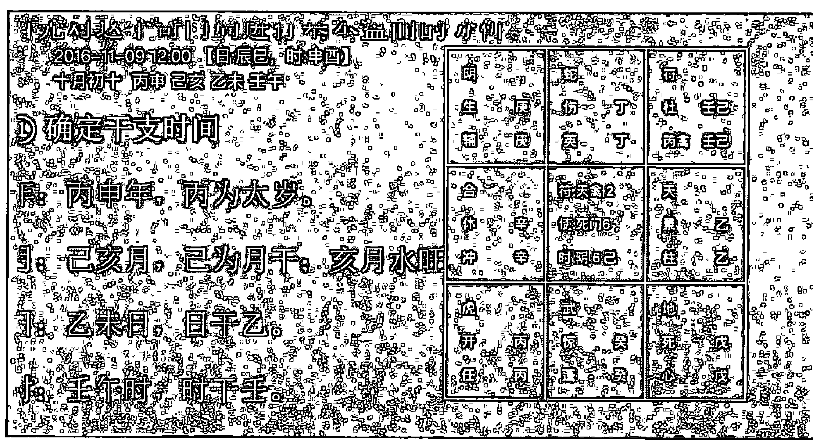

-   ② 标出空亡、六击、入墓、马星及反吟伏吟

#### a、空亡

标出空亡，辰巳空，申酉空。

#### b、六仪击刑（六击）

标出六击，双己六击。

#### c、入墓

标出入墓，双戊入墓。

#### d、马星

标出马星，午时马星在申，冲寅，申空就没了。

#### e、伏吟反吟

该奇门局存在星干伏吟。

### ③ 标注主要参数

-   - a、希拉里（生于 1947 丁亥年）——丁
-   - b、特朗普（生于 1946 丙戌年）——丙

### ④ 分析各参数情况

#### a、分析希拉里情况——丁

丁处于临官的状态，说明个人状态不错。

临天英，说明外环境中平。

临伤门，说明跟选民人际关系不太理想，有伤害之处。

临螣蛇，说明有外力纠缠它，而不是帮她。

丁加丁，容易得奇，也就是能够得到意外的喜事。

#### b、分析特朗普的情况——丙

丙在长生之地，说明状态也非常好，具有向上生长的力量。

临天任，比天英好。

临开门，比伤门好。

临白虎，跟螣蛇差不多，都是有挑战。

丙加丙，说明自己跟自己过不去。

#### c、分析总统位与二者的关系——开门、丁、丙

开门和特朗普在一起，说明很容易拿到手。

希拉里在离火宫生开门，说明要自己去争取。

由此分析，希拉里的优势小于特朗普。

#### d、分析选民与二者的关系——时干、丁、丙

时干跟希拉里的关系为火生土，说明希拉里要争取选民。

特朗普跟选民是对冲比和关系，说明和而不同。

这两个情况基本还是类同的。

但是从个人状态和总统位的状态，特朗普还是略微胜出，所以断特朗普以微弱的胜利取得了总统的位置。

### ⑤ 结果反馈

事实就如我们所断的那样。

## 3、奇门案例（二）

下面我们看第二个案例。2008 年美国总统选举，奥巴马对麦凯恩。预测的时间为 2008 年 11 月 4 号 12 点半。

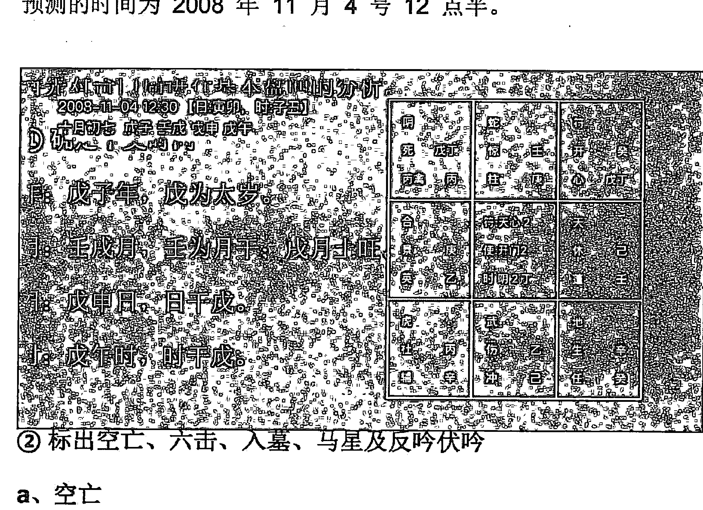

### ② 标出空亡、六击、入墓、马星及反吟伏吟

-   a、空亡

标出空亡，寅空，卯空，子空，丑空。

-   b、六仪击刑（六击）

该奇门局没有六击。

#### c、入墓

标出入墓，癸入墓。

#### d、马星

标出马星，午时马星在申，冲寅，癸入墓就不见了。

#### e、伏吟反吟

该奇门局没有伏吟反吟。

### ③ 标注主要参数

-   a、奥巴马（生于 1961 辛丑年）——辛
-   b、麦凯恩（生于 1936 丙子年）——丙

### ④ 分析各参数情况

#### a、分析奥巴马情况——辛

奥巴马在乾金宫，处于沐浴、冠带的状态，说明处于酝酿之中。

临天任，外环境是好的。

临生门，说明充满了生命力，人际关系是好的。

临九地，说明各地还是保护他的。

辛加癸，为“天牢华盖”，说明有很多不明朗的因素。

戌月旺，所以在乾宫还是有好处的。

#### b、分析麦凯恩情况——丙

麦凯恩丙临长生之地，好的。

逢双空，削弱不少。

丙加辛，也是好的。

临天辅，说明外环境是好的。

临杜门，说明人际关系不如奥巴马。

临白虎，说明压力过大。

总体来说看，奥巴马的情况应该比麦凯恩好一些。

#### 分析总统位与双方的关系——开门、丙、辛

总统位与奥巴马的关系为土生金，总统位向奥巴马招手。

总统位跟麦凯恩土土比和对冲，所以奥巴马对于总统位占了优势。

#### 分析选民与双方的关系——时干、丙、辛

时干跟奥巴马属于金克木的关系，说明奥巴马要想办法控制选民去支持他。

麦凯恩跟选民的关系为木克土，因此对麦凯恩是不利的。

#### 分析选举双方的关系——丙、辛

两者的关系为麦凯恩生奥巴马，所以二者的关系还是有利于奥巴马的。

所以奥巴马还是容易赢得大选。

# 结果反馈

奥巴马赢得了这次大选。

## 4、奇门案例（三）

第三个案例是关于 2016 年台湾地区领导人选举，我们来预测一下当时三位候选人蔡英文、朱立伦、宋楚瑜谁会当选台湾地区领导人。预测的时间为 2016 年 1 月 9 号 10 点。

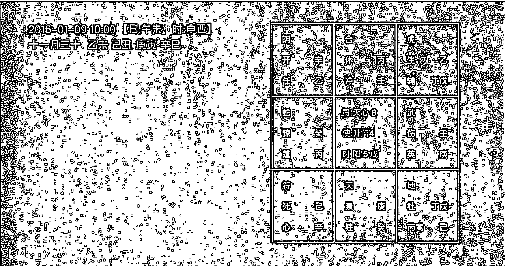

首先对奇门局进行一个基本盘面的分析。

-   ① 确定干支时间

年：乙未年，乙为太岁。
月：己丑月，己为月干；丑月土旺。
日：庚寅日，日干庚。
时：辛巳时，时干辛。

-   ② 标出空亡、六击、入墓、马星及反吟伏吟

-   a、空亡

标出空亡，午空、未空、申空、酉空。

-   b、六仪击刑（六击）

该奇门局没有六击。

-   c、入墓

标出入墓，己入墓，辛入墓，乙入墓，戊入墓。

-   d、马星

标出马星，巳时马星在亥，冲巳，戊入墓就不见了。

-   e、伏吟反吟

该奇门局存在门反吟，因此选举的过程是反复的。

### ③ 标注主要参数

-   a、蔡英文（生于 1956 丙申年）——丙
-   b、朱立伦（生于 1961 辛丑年）——辛
-   c、宋楚瑜（生于 1942 壬午年）——壬
-   d、总统位——开门
-   e、选民——时干

### ④ 分析各参数情况

-   a、分析朱立伦情况——辛

辛入墓，说明状态差一点。

临天任，说明外环境不错。

临开门，好，而且跟总统位在一起。

临太阴，说明暗中有人帮忙。

辛加乙，为“虎猖狂”，不好，说明时干选民很猖狂，对他有所不利。

#### b、分析蔡英文情况——丙

丙处在帝旺，说明状态很好。

临天冲，说明外环境好。

临休门，说明人际关系好。

临六合，说明多方面有力量支持他。

丙加壬，为火入网，差一点。

另外逢空，但是因为她帝旺，所以不能称为逢空。

#### c、分析宋楚瑜的情况——壬

壬处在沐浴状态，说明他在酝酿。

逢空，说明力量很弱。

临天英，说明外环境一般。

临伤门，说明选民对他没好感。

临玄武，说明光讲空话。

壬加庚，加“太白擒蛇”。

综合分析，蔡英文情况最佳，朱立伦次之，宋楚瑜最差。

#### d、分析总统位与选举三方的关系——开门、丙、辛、壬

朱立伦跟开门总统位在一起，看起来很不错，但是开门生蔡英文，说明总统位向蔡英文招手，而宋楚瑜克开门位，但是为空克，就没有力量拿下总统位。

#### e、分析选民与选举三方的关系——时干、丙、辛、壬

因为时干辛与开门同宫，所以分析结论如上面对开门的分析。

#### f、分析选举三方的相互关系——丙、辛、壬

朱立伦生蔡英文，有利于蔡英文，蔡英文克宋楚瑜，宋楚瑜更加难受。

总而言之，蔡英文情况最好，朱立伦其次，宋楚瑜最差。所以最后应该蔡英文胜出。

### ⑤ 结果反馈

蔡英文赢得大选。