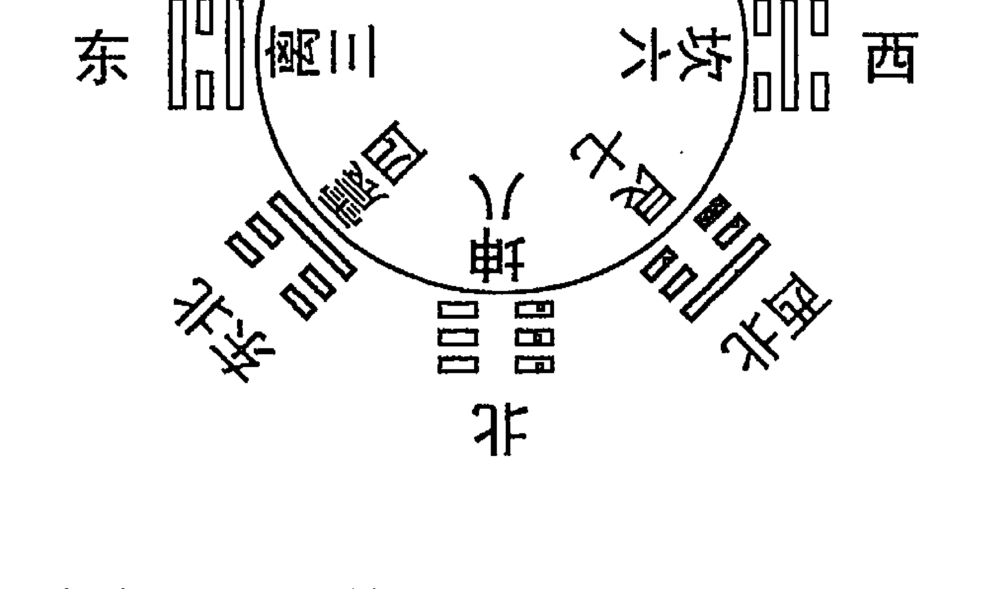
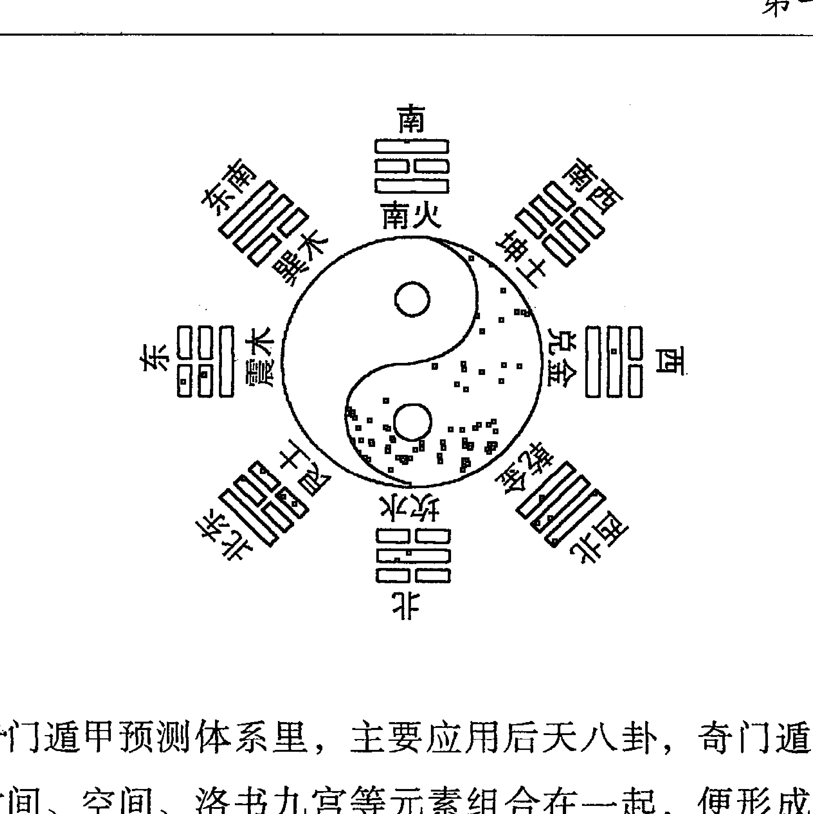
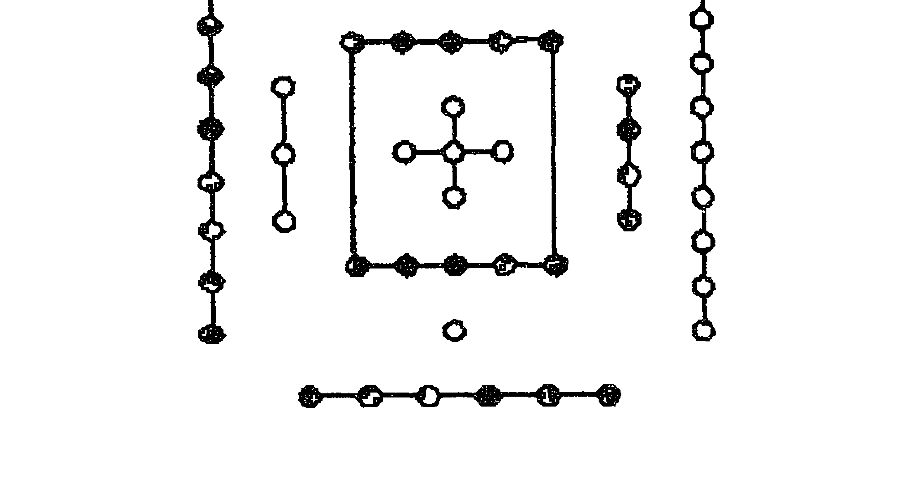
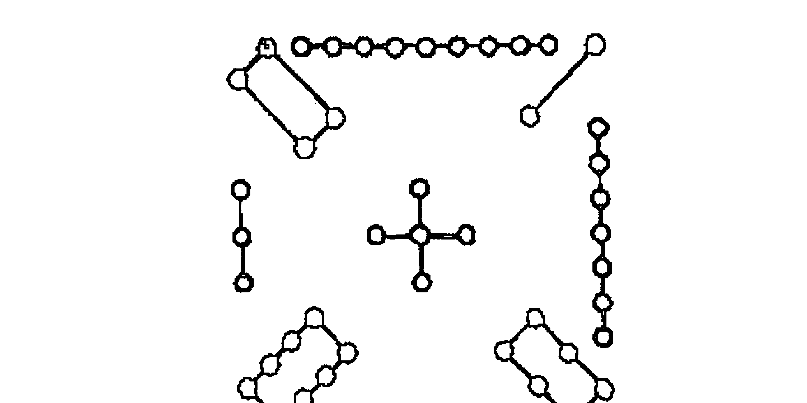
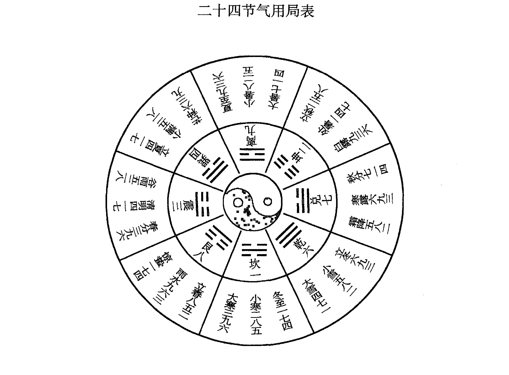
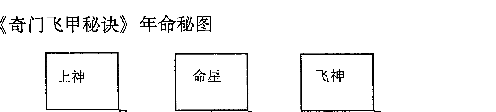
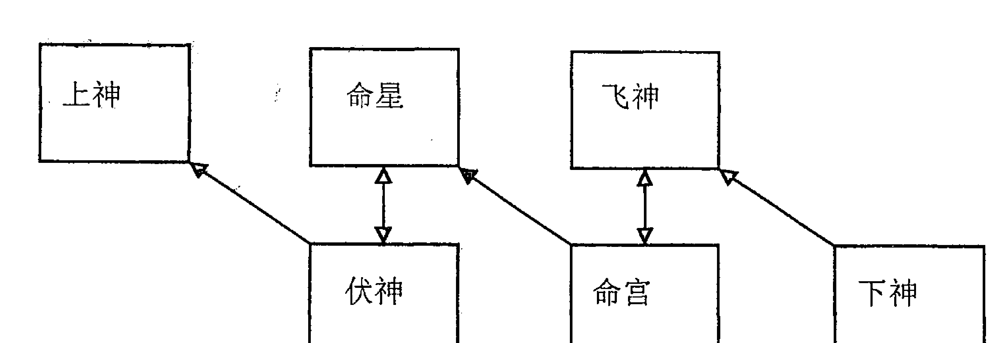
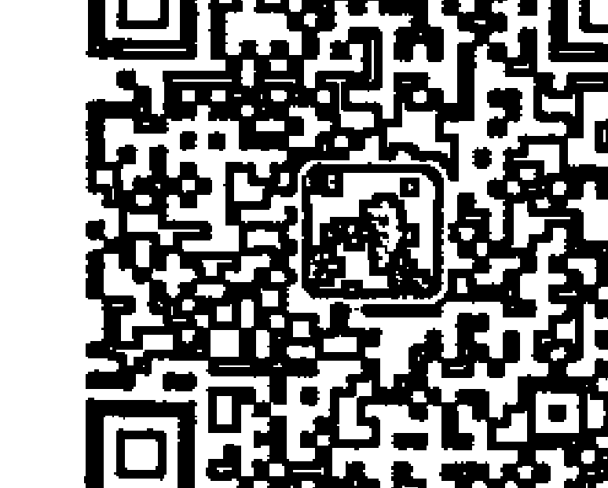
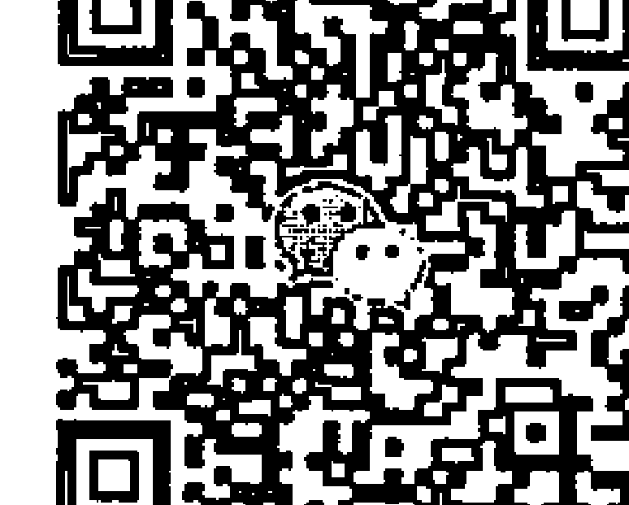

# 奇门飞甲秘诀

# 前言

在包罗万象、源远流长的易学文化当中，有一个被称之为“帝王之术”、“方术之王”的术数之学，它可以未卜先知，未雨绸缪，运筹帷幄，转败为胜。神奇的九星八门，玄奥的三奇六仪，让无数人为此如痴如醉，它就是中国方术集大成者——奇门遁甲。

奇门遁甲是先贤们经过对自然的长期观察，反复验证，总结出来的一种利用时间和方位进行人事活动的预测学、决策学和运筹学。清代《四库全书》称奇门遁甲“于方术之中，最有理致”，民间有传“学会奇门遁，来人不用问”，这都是对奇门遁甲的极高评价。奇门遁甲之所以被称为帝王之术、方术之王，不仅因为它可以未卜先知，未雨绸缪，更重要的是因为它能把天地自然力量为我所用，选择时空趋吉避凶，斡旋造化，是一门夺天地造化，取日月辉光的学问和技术。正因为此门绝学功效强大，威力强悍，古时有的朝代为了稳固统治，严令禁止民间研习，致使奇门遁甲的传承几近中断。

奇门遁甲流传至今，衍生出很多种类，主要分为转盘和飞盘两种。这两种盘式运用时，精髓不同，各有千秋。《奇门飞甲秘诀》主要讨论的是民间承传中最为隐秘，又极为灵验的飞盘奇门遁甲。所谓飞盘，指的是奇门遁甲盘式中星门神仪均以九宫飞布的方式排布的模式。这种结构更为立体、缜密，占测运筹更为灵验、有效。飞盘奇门遁甲历来少有人研习，一直蒙着一层神秘的面纱。民间使用飞盘奇门遁甲的高手更是深藏不露，鲜有出世。因为飞盘奇门占测尤为灵验，运筹常有奇效，方法却异常简单，所以研习者往往视为绝密，传承中均口传心授，不着笔墨，致使飞盘奇门遁甲仍然深藏民间，鲜为人知，未能广泛流传。

笔者研习奇门遁甲师承于多位老师。第一位我的恩师王悟道长，第二位是民间奇门遁甲应用大师卫选民老师。

恩师王悟，陕西宝鸡人，道士，现80岁高龄，自幼学医学道，神通术数，尤精于奇门遁甲和金口诀，对时运变迁，人事兴衰明察于心。恩师断事如神，出神入化，当地人视若神明。现在他老人家潜心修道，步入出世修行的精深境界。

在研习奇门遁甲过程中，我还遇到另外一位人物，就是民间奇门遁甲应用大师卫选民。他使用奇门遁甲精准快捷，分秒之间就可以知道问事人的来意因由。卫老师为人朴实，他与我亦师亦友，在研习奇门遁甲的路上，我们又有很多新的发现。

笔者师传于恩师，深造于民间，有幸得几位奇门遁甲大师的承传，深入透彻地研究了飞盘奇门遁甲体系，并在大量实战的基础上不断验证、总结。春去夏来，秋来冬往，历时十几载，虽然不能达到洞彻于心、匠心独运的水平，但是也算是有些心得，感悟颇多。

飞盘奇门遁甲特点突出，布局推演，尤为缜密，其间多有秘法，与传统转盘大相径庭。单宫单线，一锤定音。飞甲三才，一针见血。飞神伏神，明其主客。命宫命星，知其因果。先锋游星，知己知彼。符庚对决，兆显战机。暗干阴神，窥知阴私。六亲读象，细致入微……更有造藏选择，时方运筹，堪舆宅法，商战兵法的高层秘诀，为飞盘趋避选择的上乘法典。飞盘奇门遁甲虽然秘法甚多，但法变理不变，万法归一宗，其核心在于主客动静，先后因果。明主客，晓因果，占测时通观盘局，如隔岸观火，洞察秋毫；运筹时临机动用，如神灵相助，事半功倍。

承传经典，不能抱守残缺，为了拯救、继承和发扬飞盘奇门遁甲这一国学绝技，笔者思量再三，决定把师传诀窍及经验总结分享给易学同好。《奇门飞甲秘诀》深入而系统地探讨飞盘奇门遁甲的理论和用法，并以大量实例阐释飞盘奇门遁甲预测、决策、运筹及宅法的技巧，尽量把飞盘奇门遁甲的全貌展现给读者，希望对研习同好有所帮助。

前几年笔者发布了《神奇金口诀》一书，受到广大易学爱好者的普遍欢迎，对金口诀预测术的普及与发展起到一些推动作用。笔者也希望，通过《奇门飞甲秘诀》的出版发行，能对飞盘奇门遁甲的应用与发展，对中国易学文化的普及昌盛，对中国文化遗产的挽救、继承和发扬作出应有的贡献。

由于时间紧迫，本书难免有疏漏不足之处，还请方家指正。

王大正
2014年2月
甲午年丙寅月于西安

# 第一章 入式

## 第一节 概述

奇门遁甲与太乙、大六壬并称为三式，为高层次的术数学。太乙推衍天数国运，奇门遁甲抉择军机地理，大六壬占卜民间百事。古时有“精通三式乃为神”之说，说明三式在术数领域的崇高地位。三式之中，又以奇门遁甲最为强悍，融预测、决策、运筹、宅法四种功能于一体。

奇门遁甲在承传之中，形成多个门类。按时间分为年家奇门、月家奇门、日家奇门、时家奇门。按排布方式分为转盘奇门、飞盘奇门。各个门类各执一词，多有争议。笔者以为，每个门类只是用法不同，各有所长。

《奇门飞甲秘诀》主要讲述少人通晓、极为灵验的飞盘奇门遁甲。所谓飞盘，指的是奇门遁甲的星门神仪全部按九宫跳涧飞布的盘式。这种盘式严丝合缝，极为缜密，包含了时空的巨量信息。在理想状态下，飞盘奇门判断毫发无差，应验如有神助，而方法却超乎简单，只用一宫，就是飞盘单宫法。飞盘奇门遁甲重视值符、值使、时干、年命，以地盘为先天根基，天盘为后天动向，审视事件前后因果，主客动静，使用十分快捷，常有奇效。

《奇门飞甲秘诀》缘何叫做“飞甲”？原因是奇门遁甲以“甲”为尊，其遁藏于六仪之下，值符为六甲，天盘值符为飞动，动者兆显玄机，寓意六甲飞动于天，星门神仪随其而动，所以谓之“飞甲”。

飞盘奇门遁甲由八卦、干支、河图、洛书、九星、九神、八门构成，是立体化的数理模型。模型为天盘、地盘、人盘三才架构，对时空进行了完美模拟。通过对象数模型的解读，我们就可以知晓事物发展的规律，从而趋吉避凶，为我所用。

奇门遁甲是中国古代综合性最强的术数之一，在易学应用上达到了前所未有的高度。尤其是飞盘奇门遁甲，更为立体、缜密，在挖掘信息与吉凶趋避中可谓出奇制胜，出神入化。此门术数，是中国易学文化的瑰宝，无愧于“帝王之术”、“方术之王”的称号。

## 第二节 源流

关于奇门遁甲的源流，可以根据其构成要素所形成的时代来分析考究。具体是天干地支、洛书九宫与八门等基本构成要素，我们分别简要论述如下。

先从天干地支的系统分析，天干和地支的应用早在黄帝时期就已经产生了，从出土的商代甲骨文中有关于六十花甲子的记载可以说明，干支文化产生的历史已相当久远。

根据孔子的《周易·系辞》上明确记载“河出图，洛出书，圣人则之”以及《周易·说卦》中所列后天八卦的排列可以推断，洛书九宫的出现也是比较早的。

奇门遁甲中的八门是在八卦知识之后才产生的，八门排列的理论依据也是依据《周易》的后天八卦。八门的方位与后天八卦方位一一对应，因此八门的理论只能产生于《周易》之后，通过对《后汉书·高彪传》一书关于八门记载的研究表明八门之说在先秦时代就已经产生了。

据正史《后汉书·方术传序》研究得知，遁甲为方术中的一类，属于占卜的范畴。除此之外，葛洪的《抱朴子》也有关于遁甲的史料记载，从中可以看出葛洪应当将遁甲术广泛流传。此后一直到南北朝至隋代，市面上出现了大量的奇门遁甲书籍，各种关于奇门遁甲的论著愈来愈多，得到了快速的发展。

从以上几点研究及分析说明奇门遁甲术的起源比较早，是一门自成体系但却与历法、星相和易经八卦又不同的独立学科。从历史时空上，奇门遁甲术应源于周，发于汉，兴盛于南北朝，这点大概可以确定。

关于作者，现行大部分版本都会讲到奇门遁甲源于黄帝，风后演之，姜太公简之，张良再简之，诸葛亮和刘伯温精通，为治国安邦的上乘典籍。也有人怀疑作者另有其人，是精通奇门遁甲的隐者托名著书，方便被人们接受。奇门遁甲流传至今，肯定是经过很多大能之人不断总结、补充、完善而形成的一套严密的理论体系和操作方法，这些都是我们需要继承和发扬的国学精粹。

## 第三节 构成

奇门遁甲是由阴阳、五行、八卦、干支、河图、洛书、九星、九神、八门等要素构成，每种元素既是相互独立的个体又是相互关联、密不可分的整体，需要读者熟练的掌握。以下就对这些构成元素进行简要的说明，为读者后面的学习打好基础。

《黄帝阴符经》上讲“八卦甲子，神机鬼藏”，即是说，奇门遁甲的神妙之处均藏在八卦和甲子之中。所以，要想学好奇门遁甲，那必须要有扎实的八卦和干支基础，这样才能更好理解星、门、神、仪的真实含义，可以在短时间内学会这门绝学。

### 1、阴阳

阴阳学说是将宇宙万物分为阴与阳两大系统，认为一切事物的形成、变化与发展存在于阴阳二气之中并由此引发。比如最初的阴阳现象来自阳光的背向，物体向阳的一面为阳，背面的一面为阴。由此，可以引申出更为广泛的解释自然界与社会界的所有现象，比如明暗、寒热、昼夜、内外、动静、男女、强弱、奇偶、进退等等，这些事物都是既相互对立又互相依存，处于统一的矛盾体当中。但这些阴阳关系并不是一成不变的，而是随着外界条件的改变而变化，阴中有阳，阳中有阴，阴阳相互包含而存在。其主要表现特征为：

- **阴阳互根**：阴为阳根，阳为阴根，互存互依，互相为用。比如刚柔并济等。
- **阴阳消长**：阴阳始终处于此消彼长，彼进此退的动态平衡中，量变时处存在。比如敌强我弱、敌退我进等。
- **阴阳转化**：在一定条件下，阴阳发生质的变化，各自向其对立面转化，也就是说量变引起质变。比如物极必反、乐极生悲、否极泰来等。

阴阳学说是人们认识宇宙、改造世界的唯物辩证的世界观与认识论。宇宙间任何事物都处于既相互独立又相互存在的矛盾统一体中，所以我们在用奇门遁甲判断一件事情时，不能片面地、静止地去看待，而是应该用全面地、变化地、发展地眼光去看待，这点在预测中极为重要。

### 2、五行

五行是把自然界的事物和现象取象比类，划分为金、水、木、火、土五种基本物质属性。比如从方位上，金为西、木为东、水为北、火为南、土为中；从颜色上，金为白、木为青、水为黑、火为红、土为黄；从五脏上，金为肺、木为肝、水为肾、火为心、土为脾等等。金、水、木、火、土这五种物质之间不断的相互运动和作用，使得自然界各种事物和现象不断的发展与变化，便形成了自然界万物生长与消亡的规律。五行之间又分为相生与相克两种情况，五行相生关系为金生水、水生木、木生火、火生土、土生金；五行相克关系为金克木、木克土、土克水、水克火、火克金。五行间的相生、相克体现出自然界的各种事物之间，在其相互制约中发生着周期性变化。有了相生相克，世间万物才能够维持一种相对固定与稳定的平衡和谐状态。

我们在论述五行之间相生、相克的关系，要时刻把握住一个度的问题，也就是说五行生克阴阳的问题，宋末徐大升对这种辨证关系有精辟的论述，现摘录于下：

> 金赖土生，土多金埋；土赖火生，火多土焦；火赖木生、木多火赤；木赖水生，水多木漂；水赖金生，金多水浊。
> 金能生水，水多金沉；水能生木，木盛水缩；木能生火，火多木焚；火能生土。土多火晦；土能生金，金多土变。
> 金能克木，木坚金缺；木能克土，土重木折；土能克水，水多土流；水能克火，火炎水热；火能克金，金多火熄。
> 金衰遇火，必见销熔；火弱逢水，必为熄灭；水弱逢土，必为淤塞；土衰遇木，必遭倾陷；木弱逢金，必为砍斫。
> 强金得水，方挫其锋；强水得木，方泄其势；强木得火，方化其顽；强火得土，方止其焰；强土得金，方止其害。

### 3、八卦

八卦是中国先哲根据自然规律发现并创造的一种认识世界的宇宙模型。它用“-”和“- -”两个基本符号不断演绎，形成了一个庞大的易学理论系统，为人类认识宇宙提供了一个极具价值的工具。八卦分为先天八卦与后天八卦，先天八卦有乾、兑、离、震、## 奇门飞甲秘诀

巽，坎、艮、坤，它的卦数排列顺序是乾一、兑二、离三、震四、巽五、坎六、艮七、坤八。先天八卦是取自然之象而来，乾为天，为明日高悬，所以居上，在南方，在前位；坤为地，居高天之下，为北方，居后位；离为火，为明日初生之象，在东方；坎为水，为日落之地，处西方。先天八卦的五行分配是乾属金性、兑属金性、离属火性、震属木性、巽属木性、坎属水性、艮属土性、坤属土性。以下是先天八卦图。



后天八卦又称为文王八卦，是以震卦为起始点，位列正东，按顺时针方向，依次为巽卦，东南；离卦，正南；坤卦，西南；兑卦，正西；乾卦，西北；坎卦，正北；艮卦，东北。按照卦数的排列顺序是坎一、坤二、震三、巽四、五为中宫、乾六、兑七、艮八、离九。后天八卦可模拟人事、气候之变化，比如二十四节气，震为春分，巽为立夏，离为夏至，坤为立秋，兑为秋分，乾为立冬，坎为冬至，艮为立春。又比如人物属性上乾为父亲，坤为母亲，震为长男，巽为长女，坎为中男，离为中女，艮为少男，兑为少女。邵子曰：“乾统三男于西北，坤统三女于西南，乾、坎、艮、震为阳，巽、离、坤、兑为阴”。以下是后天八卦图。



在奇门遁甲预测体系里，主要应用后天八卦，奇门遁甲将后天八卦与时间、空间、洛书九宫等元素组合在一起，便形成了地盘的九宫格局，九宫除了具有时间和空间特定的方位等信息内容外，还具有万物的象义。

### 4、天干

干支是天干与地支的合称，天干包括甲、乙、丙、丁、戊、己、庚、辛、壬、癸十个；地支包括子、丑、寅、卯、辰、巳、午、未、申、酉、戌、亥十二个。天干与地支都有阴阳和五行的属性。

- ①天干阴阳
甲、丙、戊、庚、壬属阳；乙、丁、己、辛、癸属阴。

- ②天干含义
甲是拆的意思，指万物剖符甲而出也。
乙是轧的意思，指万物出生，抽轧而出。
丙是炳的意思，指万物炳然著见。
丁是强的意思，指万物丁壮。
戊是茂的意思，指万物茂盛。
己是纪的意思，指万物有形可纪识。
庚是更的意思，指万物收敛有实。
辛是新的意思，指万物初新皆收成。
壬是任的意思，指阳气任养万物之下。
癸是揆的意思，指万物可揆度。

#### ③天干配五行

- 甲、乙同属木，甲为阳木，乙为阴木；
- 丙、丁同属火，丙为阳火，丁为阴火；
- 戊、己同属土，戊为阳土，己为阴土；
- 庚、辛同属金，庚为阳金，辛为阴金；
- 壬、癸同属水，壬为阳水，癸为阴水。

#### ④天干配方位

甲、乙东方，丙、丁南方，戊、己中央，庚、辛西方，壬、癸北方。

#### ⑤十干化合

甲己化合土，乙庚化合金，丙辛化合水，丁壬化合木，戊癸化合火。其中甲、己之合为中正之合，乙、庚之合为仁义之合，丙、辛之合为权威之合，丁、壬之合为淫荡之合，戊、癸之合为无情之合。

#### ⑥天干冲

甲与庚冲，乙与辛冲，丙与壬冲，丁与癸冲（戊与己同为土合而不冲）。

### 5、地支

地支包括子、丑、寅、卯、辰、巳、午、未、申、酉、戌、亥十二个。

#### ①地支阴阳

子、寅、辰、午、申、戌属阳；丑、卯、巳、未、酉、亥属阴。

#### ②地支含义

子是兹的意思，指万物兹萌于既动之阳气下。
丑是纽，阳气在上未降。
寅是移，引的意思，指万物始生寅然也。
卯是茂，言万物茂也。
辰是震的意思，物经震动而长。
巳是起，指阳气之盛。
午是仵的意思，指万物盛大枝柯密布。
未是味，万物皆成有滋味也。
申是身的意思，指万物的身体都已成就。
酉是老的意思，万物之老也。
戌是灭的意思，万物尽灭。
亥是核的意思，万物收藏。

#### ③地支配五行

- 寅、卯同属木，寅为阳木，卯为阴木；
- 巳、午同属火，午为阳火，巳为阴火；
- 申、酉同属金，申为阳金，酉为阴金；
- 亥、子同属水，子为阳水，亥为阴水；
- 辰、戌、丑、未同属土，辰、戌为阳土，丑、未为阴土。

#### ④地支配方位

寅、卯、辰东方，巳、午、未南方，申、酉、戌西方，亥、子、丑北方。

#### ⑤地支配四季十二月

- 春：寅正月，卯二月，辰三月；
- 夏：巳四月，午五月，未六月；
- 秋：申七月，酉八月，戌九月；
- 冬：亥十月，子十一月，丑十二月。（辰戌丑未又称四季月）

#### ⑥十二支六合（简称六合）

子与丑合，寅与亥合，卯与戌合，辰与酉合，巳与申合，午与未合。六合中分合中有生、合中有克两种。寅与亥合，辰与酉合，午与未合为合中有生；子与丑合，卯与戌合，巳与申合为合中有克。

#### ⑦十二支三合成局（简称三合）

申子辰合化水局，亥卯未合化木局，寅午戌合化火局，巳酉丑合化金局。

#### ⑧十二支冲（简称六冲）

子午相冲，丑未相冲，寅申相冲，卯酉相冲，辰戌相冲，巳亥相冲。

地支相冲，即处于相对位置的地支两两互相冲克。有吉有凶，吉事逢冲不吉，凶事逢冲不凶。八门、九星若逢相冲位置，则为反吟。

#### ⑨十二支相害（简称六害）

子未相害，丑午相害，寅巳相害，卯辰相害，申亥相害，酉戌相害。

地支相害，即受害、被害之意，凡遇害，则代表破财、凶灾、上当受骗、损伤人口等。

#### ⑩十二支相刑（简称三刑）

子刑卯，卯刑子，为无礼之刑；
寅刑巳，巳刑申，申刑寅，为无恩之刑；
丑刑未，未刑戌，戌刑丑，为恃势之刑；
辰、午、酉、亥为自刑。

地支相刑，即地支之间相互对立刑克，凡遇刑，则代表挫折不顺、触犯刑法和纪律、人体多痛苦疾病等。

#### ⑪地支关系速记法

| 巳 | 午 | 未 | 申 |
|---|---|---|---|
| 辰 |  | 酉 |  |
| 卯 |  | 戌 |  |
| 寅 | 丑 | 子 | 亥 |

- 横对为六合
- 三角为三合
- 对角为六冲
- 直对为六害

### 6、六十甲子

六十甲子是中华民族最早、最伟大的发明创造。六十甲子最古老的用途是纪年、纪月、纪日、纪时。纪年为60年一个周期，纪月为5年一个周期，纪日为60天一个周期，纪时为5天一个周期。

#### 六十甲子干支表

| 甲子 | 乙丑 | 丙寅 | 丁卯 | 戊辰 | 己巳 | 庚午 | 辛未 | 壬申 | 癸酉 |
| :--- | :--- | :--- | :--- | :--- | :--- | :--- | :--- | :--- | :--- |
| 甲戌 | 乙亥 | 丙子 | 丁丑 | 戊寅 | 己卯 | 庚辰 | 辛巳 | 壬午 | 癸未 |
| 甲申 | 乙酉 | 丙戌 | 丁亥 | 戊子 | 己丑 | 庚寅 | 辛卯 | 壬辰 | 癸巳 |
| 甲午 | 乙未 | 丙申 | 丁酉 | 戊戌 | 己亥 | 庚子 | 辛丑 | 壬寅 | 癸卯 |
| 甲辰 | 乙巳 | 丙午 | 丁未 | 戊申 | 己酉 | 庚戌 | 辛亥 | 壬子 | 癸丑 |
| 甲寅 | 乙卯 | 丙辰 | 丁巳 | 戊午 | 己未 | 庚申 | 辛酉 | 壬戌 | 癸亥 |

### 7、河图

河图洛书是中国先哲最早用数的排列与组合来揭示天体运行规律的符号。《周易·系辞》曰：“天一地二，天三地四，天五地六，天七地八，天九地十，天数五，地数五，五位相得而各有合，天数二十有五，地数三十，凡天地之数五十有五，此所以成变化而行鬼神也。”河图的五行数，又叫天地生成数。即天一生水，地六成之；地二生火，天七成之；天三生木，地八成之；地四生金，天九成之；天五生土，地十成之。生数居内而成数居外，天数为阳为奇，天数五个，即一、三、五、七、九，相加为二十五，地数为阴为偶，地数五个，即二、四、六、八、十，相加为三十，天数二十五，地数三十，天地二数相加，即天地数五十五。从河图的五行数之中不难看出，逢单数由天生，地来成之，逢双数，由地生，天来成之。

生地成、地生天成体现了同气相求的原理，同时也包含着阴阳和谐的原理。《太玄经》曰：“一与六共宗而居乎北，二与七为朋而居乎南，三与八同道而居乎东，四与九为友而居乎西，五与五相守而居乎中。”，从先哲对天象观测的客观因素上来看，水星于每天一时（子时）和六时（巳时）出现于北方；每月一、六（初一、初六、十一、十六、二十一、二十六），日月会水星于北方；每年十一月、六月，黄昏时见于北方；火星于每天二时（丑时）和七时（午时）出现于南方；每月二、七，日月会火星于南方；每年二月、七月，黄昏时见于南方；木星于每天三时（寅时）和八时（未时）出现于东方；每月三、八，日月会木星于东方；每年三月、八月，黄昏时见于东方；金星每天四时（卯时）和九时（申时）出现于西方；每月四、九，日月会金星于西方；每年四月、九月，黄昏时见于西方；土星每天五时（辰时）和十时（酉时）出现于中央；每月五、十，日月会土星于中央；每年五月、十月，黄昏时见于天中。由此可以得出，河图的科学性源于先哲对天文的长期观察与潜心研究，是天体运行规律和人事运动法则的完美演绎。以下是河图。



### 8、洛书

洛书之数共有四十五个黑白圆圈构成，白圈为奇数，黑圈为偶数。由一至九九个数布列九宫。五为中数居于中宫。一三七九为奇数为阳数，位居四正，一在北方，三在东方，九在南方，七在西方；二四六八为偶数为阴数，位居四隅，八在东北，四在东南，二在西南，六在西北。其特点是无论是横竖及对角线三个数相加，和数都是十五。根据《洛书九星图》记载，主要是依据北斗斗柄所指辨方定位，中宫五星称“五帝座”乃北极帝星之座，为五行之首，居中央而临御四方；“五帝座”下方为“北极”一星，恒居北方，以此定位；北极对宫南方是“天纪”九星；正东方是“河北”三星；正西面是“七公”七星；“天纪”之左是“四辅”四星；“天纪”之右是“虎贲”二星；北极之左是“华盖”八星；“北极”之右是“天厨”六星。这种按照洛书排列的星图的完美组合很好的反应了星体间运行的规律。以下是洛书。



### 9、九宫

奇门遁甲的九宫模式来源于洛书。《黄帝九宫经》曰：“戴九履一，左三右七，二四为肩，六八为足，五居中宫，兑御得失。”意思是指1、2、……9这九个数字在九宫格中以洛书格局为基础所组成的排列方式。洛书九宫以一、三、七、九为奇数，亦称阳数；二、四、六、八为偶数，亦称阴数。阳数为主，位居四正，代表天气；阴数为辅，位居四隅，代表地气；五居中，属土气，位居中宫。洛书九宫中每个数字都蕴含着二十四节气的变化，奇门遁甲的局数的确定就来源于此。以下是九宫图。

| 4 | 9 | 2 |
|---|---|---|
| 3 | 5 | 7 |
| 8 | 1 | 6 |

九宫为奇门遁甲的地盘盘式，永恒不动。

### 10、三奇六仪

奇门遁甲中三奇指的是乙、丙、丁三干，分别代表天上的日、月、星三位。乙属木，为日奇；丙属火，为月奇；丁属火，为星奇。六仪指的是天干中的戊、己、庚、辛、壬、癸六位。其中六甲甲子、甲戌、甲申、甲午、甲辰、甲寅六位分别置于戊、己、庚、辛、壬、癸六者之中。在奇门遁甲中，六甲与六仪要作为一个整体来用，即表示为甲子戊、甲戌己、甲申庚、甲午辛、甲辰壬、甲寅癸。

### 11、九星

在天文学中，一白贪狼、二黑巨门、三碧禄存、四绿文曲、五黄廉贞、六白武曲、七赤破军这七个星宿称为北斗七星，在斗柄破军与武曲之间有二颗星，一颗星为右弼而不现排在九，一颗为左辅常见排在八。这样就一共配成九星，如此便用此九星来概括宇宙万象，解释宇宙间特殊的运行变化。此九星在奇门遁甲中用天蓬星、天芮星、天冲星、天辅星、天禽星、天心星、天柱星、天任星、天英星这九星来表示。九星一般主事物的性质性情，飞动于天盘。

### 12、九神

飞盘奇门遁甲中有九神，分别是值符、腾蛇、太阴、六合、白虎（伏有勾陈）、太常、玄武（伏有朱雀）、九地、九天。九神是自然界隐性的神秘力量，他们神通广大、变幻莫测，每个神都有其独特的性格。九神一般主事情吉凶象义，它们在天、地、人盘皆有。

### 13、八门

# 第一章 入式

在奇门遁甲中，用八门代表人事，八门在奇门的预测中极为重要。八门有休门、死门、伤门、杜门、开门、惊门、生门、景门。一般而言，开门、休门、生门为三吉门，死门、惊门、伤门为三凶门，杜门、景门为中平。八门一般主事情所处的时空状态，飞布于人盘。

## 第四节 盘式

奇门遁甲的结构为三才结构，包含了天、地、人三个方面。天、地、人分别代表天时、地利、人和，是几乎所有的术数的基本结构。六爻中上面两爻为天，中间两爻为人，下面两爻为地。金口诀中，人元为天，贵神和将神为人，地分为地。奇门遁甲中，天盘为天，地盘为地，人盘为人。天盘包含有九星、天盘九神、天盘三奇六仪；地盘包含有九宫、地盘九神、地盘三奇六仪；人盘包含有八门、阴神、暗干。整个奇门盘中的所有元素交织在一起，组合成了一个体系庞大、内容丰富、结构合理、信息完备的奇门遁甲体系。

- 1. 天盘：所谓天盘，指的是飞动于天的元素组合，包含九星、天盘九神、天盘奇仪。奇门遁甲，用九星模拟天体运动，用天蓬、天芮、天冲、天辅、天禽、天心、天柱、天任、天英来表示，九星，代表天体运动对人产生的影响，其随时干飞布，一时一变。天盘法天，因此，凡占天时，与九星息息相关，以九星为主。天盘九神，为动中之神，吉凶应兆迅速，其跟随九星运动。

- 2. 地盘：所谓地盘，指的就是九宫、地盘九神、地盘奇仪的组合。地盘，是人的先天根基，最初归属。地盘法地，所以，凡占地利如迁移、坟葬、阳宅等，首重地盘。

- 3. 人盘：所谓人盘，指的是八门、阴神、暗干。阴神、暗干为八门所带，另有用法，平时不常用，本书不做讨论。八门有休门、死门、伤门、杜门、开门、惊门、生门、景门，其随时支飞布。门在奇门遁甲中属于十分紧要的元素，尤其在选择运筹时，门的吉凶对效果影响很大，用奇用门，以得门为上，得奇次之。八门法人，所以凡事谋为、出行、趋避等，首重八门。

以下是飞盘奇门遁甲的一个完整的盘局：

| 六 英 癸 | 地 禽 戊 | 常 柱 丙 |
| :--- | :--- | :--- |
| 开 | 死 | 杜 |
| 天 巽 己 | 六 离 癸 | 蛇 坤 辛 |
| 白 任 丁 | 阴 蓬 壬 | 符 冲 庚 |
| 中 | 惊 | 景 |
| 符 震 庚 | 地 中 戊 | 常 兑 丙 |
| 天 辅 己 | 玄 心 乙 | 蛇 芮 辛 |
| 休 | 伤 | 生 |
| 白 艮 丁 | 阴 坎 壬 | 玄 乾 乙 |

我们以离九宫为例说明：

- 天盘：九星为天禽、九神为九地、六仪为甲子戊；
- 人盘：八门为死门；
- 地盘：九宫为离宫、九神为六合、六仪为甲寅癸。

奇门遁甲本身是三才结构，为天盘、人盘、地盘三者。九神为贯穿于天地人的特殊能量，分为天九神、地九神、人九神（也叫阴神）。九神为天地人三盘皆有，主管万事的吉凶象义。近人大多用天盘神，忽视地盘神，又有研习者把天盘神单独作为一盘叫做神盘，号称奇门遁甲盘式为天、地、人、神四盘，此为大缪，误导很多研习者，读者不可不察。

飞盘奇门较转盘奇门的模型更为缜密，体系更为庞大，象数更为系统。但其预测、选择、运筹、宅法的方法却极为简捷，四种用法均为单宫、单线法，简捷明了（后续章节我们会具体分析飞盘的

## 第五节 功用

奇门遁甲被研习者推崇到至高无上的地位，诸如“学会奇门遁，来人不用问”的评价，被称为“帝王之术”、“方术之王”，“于方术之中，最有理致”，“精通三式乃为神”等等。奇门遁甲有这么神奇么？奇门遁甲到底有哪些功用？

笔者提出四种功用：占测、选择、运筹、宅法四种。

占测即是预测，是提前预知，事先知道整个事件的发展、过程、变化和结果，做到心中有数，这属于基础层次的功能，“学会奇门遁，来人不用问”就是此功能的最佳描述。《奇门飞甲秘诀》占法为单宫法、单线法，以命星、命宫、飞神、伏神为主线，以“异宫不论生克，同宫以决枯荣”来决断。复杂的问题，以天符、地符、值使、干宫、支宫、命星、命宫来占测。预测是事先知道，是后续功用的基础。

选择分两种，一种是在预测出结果之后所作出的判断、决定和取舍。另一种是针对人间百事如婚娶、出行、修造等的日时择吉。选择的目的是做到对预测结果应对自如、未雨绸缪，针对日常百事择吉加福、避灾求宁，属于中等层次的功能。《奇门飞甲秘诀》后续章节对两种选择均做了详细的讨论。

运筹是通过对时间和空间的选择，找出最适合自己事态发展的特定时空进行动作或行动，借助天地自然力量提高目标的成功率，取得欲谋求的结果，这属于高等层次的功能。运筹为奇门遁甲最重要的功用，是借助自然能量夺天地造化，取日月辉光的学问和技术。《奇门飞甲秘诀》提出时、方、机三种运筹之法，用之以实战，往往有神奇效果。

宅法是通过风水占测及选时择方，对阴阳宅室进行风水布局的改运之法。提升运气，改善环境，亦为高层次的功能。《奇门飞甲秘诀》在屋宅风水占测与布局方面做了细致入微的解读，给出了动、静、化、补、通五种布局方法。

未卜先知是所有预测技术最基本的功能，选择、运筹、宅法才是奇门遁甲真正强大威悍的地方。奇门遁甲的功能不仅仅体现在人事吉凶的预测方面，更在夺天地之造化，取日月之辉光的改运方面。奇门遁甲古时隶属于兵书，在选择军机方位、野宿安营、行择吉道、行兵进退等军事方面效果神奇。其兵法原则即为高层次用法，于现代社会，多用于指导商战，往往未雨绸缪，出奇制胜。更为神秘之处在于地理风水的占卜、选择和动作方面。我们知道地理风水与家脉延续、运势荣昌等息息相关，影响着整个家族的命脉，而奇门遁甲的盘局不仅可以占测家族运势的发展变化，并且可以通过时空的选择与动作，消除风水不吉的因素，增强风水吉利的因素，化腐朽为神奇，加强我们自身运势。

近人用奇门遁甲，多在预测方面，似乎奇门遁甲就是用来预测的，这是未明奇门遁甲的精妙之处。其实预测只是奇门遁甲体系的冰山一角，奇门遁甲被称为“帝王之术”、“方术之王”，最主要的原因是其在选择、运筹和宅法方面的功能。所以，作为奇门遁甲研习者，需要进一步深挖奇门遁甲的用途，重视在选择、运筹、宅法方面的应用，研究更高级、更深入的内容，把这门学问的能量发挥出来，为人们所用。

奇门遁甲四种功用，功效强大，威力强悍，自古以来为帝王将相所重视，也是历代奇门遁甲研习同好孜孜以求的。《奇门飞甲秘诀》全本，从占测、选择、运筹、宅法四大方面依次论述，其间多有秘法，读者悉心领会。

注：关注笔者微信公众号 wdzyes、wdzwkt 或个人号 wdzvip1、wdzvip2，可以阅读笔者最新案例分析及更多更有价值的内容。

# 第二章 布局

奇门遁甲的布局是指以式盘为演算工具，按照一定的程式进行排布与推演的术数方法，主要包括定局和起局两个步骤，其中定局主要是以天文学为背景，以二十四节气与六十花甲子为依据，以正授、超神、接气为补充来演绎、推理的。起局主要是以定局所得的局数为前提，以当时运算的时空为背景，按照一定的程序对式盘中三奇六仪、八门、九星、九神等元素进行排布与推演。《奇门飞甲秘诀》讲述的是飞盘奇门遁甲，其他布局方式不在我们讨论范围之内。

## 第一节 定局方法

奇门遁甲的定局来源于古时的天文历法，按天文历法，一年有二十四个节气，每个节气大约有十五天，每五天称为一元，每个节气正好分为上元、中元、下元三元，每一天是十二个时辰，一元正好包含六十个时辰，恰好对应六十甲子一个循环周期。在奇门遁甲中，九宫图很好的揭示了二十四节气运行的周期规律。

以坎一宫北方对应冬至、小寒、大寒三个节气；艮八宫东北方对应立春、雨水、惊蛰三个节气；震三宫东方对应春分、清明、谷雨三个节气；巽四宫东南方对应立夏、小满、芒种三个节气；离九宫南方对应夏至、小暑、大暑三个节气；坤二宫西南方对应立秋、## 奇门飞甲秘诀

处暑、白露三个节气；兑七宫西方对应秋分、寒露、霜降三个节气；乾六宫西北方对应立冬、小雪、大雪三个节气。

奇门遁甲分为阳遁九局与阴遁九局，合起来共十八局。按古人规定，从冬至那一刻起始用阳遁，一直到夏至终止；从夏至那一刻起始用阴遁，一直到冬至结束。在九宫图中从坎一宫开始，接着艮八宫、震三宫、巽四宫所对应的节气全部用阳遁起局；从离九宫开始，接着坤二宫、兑七宫、乾六宫所对应的节气全部用阴遁起局。

我们以冬至为例说明，此时冬至节对应坎一宫，由于遁甲中阳遁、阴遁的局数是以其宫数来定的，故冬至节上元五天就用阳遁一局，然后六仪分别在二宫、三宫、四宫、五宫、六宫依次排布循环完毕，所以冬至中元就用阳遁七局。接着六仪再依次分别在八宫、九宫、一宫、二宫、三宫排布循环结束，所以冬至下元就用阳遁四局，这就是冬至节上、中、下三元分别用阳遁一、七、四局的原理。依据同样原理，小寒节上、中、下三元分别用阳遁二、八、五三局，大寒节上、中、下三元分别用阳遁三、九、六三局。由于立春、雨水、惊蛰三个节气对应艮八宫，所以立春上、中、下三元分别用阳遁八、五、二三局；雨水上、中、下三元分别用阳遁九、六、三三局；惊蛰上、中、下三元分别用阳遁一、七、四三局。由于春分、清明、谷雨三个节气对应震三宫，所以春分上、中、下三元分别用阳遁三、九、六三局，清明上、中、下三元分别用阳遁四、一、七三局，谷雨上、中、下三元分别用阳遁五、二、八三局。由于立夏、小满、芒种三个节气对应巽四宫，所以立夏上、中、下三元分别用阳遁四、一、七三局，小满上、中、下三元分别用阳遁五、二、八三局，芒种上、中、下三元分别用阳遁六、三、九三局。

对于坎、艮、震、巽这些宫位中的第二个节气与第三个节气的上元用几局，我们按阳遁顺排定之，即坎一宫冬至上元用阳遁一局，故小寒上元用阳遁二局，大寒上元自然用阳遁三局；艮八宫为立春、雨水、惊蛰三个节气，因立春上元为阳遁八局，故雨水上元为阳遁九局，惊蛰上元为阳遁一局；震三宫为春分、清明、谷雨三个节气，因春分上元为阳遁三局，故清明上元为阳遁四局，谷雨上元为阳遁五局；巽四宫为立夏、小满、芒种三个节气，因立夏上元为阳遁四局，故小满上元为阳遁五局，芒种上元为阳遁六局。

九局，惊蛰上元为阳遁一局；同理，震三宫为春分、清明、谷雨三个节气，因春分上元为阳遁三局，故清明上元为阳遁四局，谷雨上元为阳遁五局；巽四宫为立夏、小满、芒种三个节气，因巽宫第一个节气为立夏，立夏上元为阳遁四局，故小满上元为阳遁五局，芒种上元为阳遁六局。

下面我们接着讲解阴遁局数的确定，以夏至为例，此时夏至节对应离九宫，故夏至节上元五天就用阴遁九局，按照阳顺阴逆的排列规则，然后六仪分别在八宫、七宫、六宫、五宫、四宫依次逆向排布完毕，所以夏至中元就用阴遁三局；接着六仪再依次分别在二宫、一宫、九宫、八宫、七宫逆向排布循环结束，所以夏至下元就用阴遁六局，这就是夏至节上、中、下三元分别用阴遁九、三、六局的原理。依据同样原理，小暑节上、中、下三元自然就用阴遁八、二、五三局，大暑节上、中、下三元分别用阴遁七、一、四三局。由于立秋、处暑、白露三个节气对应坤二宫，所以立秋上、中、下三元分别用阴遁二、五、八三局。同理，处暑上、中、下三元分别用阴遁一、四、七三局。白露上、中、下三元分别用阴遁九、三、六三局。由于秋分、寒露、霜降三个节气对应兑七宫，所以秋分上、中、下三元分别用阴遁七、一、四三局。寒露上、中、下三元分别用阴遁六、九、三三局。霜降上、中、下三元分别用阴遁五、八、二三局。由于立冬、小雪、大雪三个节气对应乾六宫，所以立冬上、中、下三元分别用阴遁六、九、三三局。小雪上、中、下三元分别用阴遁五、八、二三局。大雪上、中、下三元分别用阴遁四、七、一三局。

由于阴遁局的排法与阳遁局的排法相反，故离、坤、兑、乾四宫位中所对应的第二个节气与第三个节气的上元用几局，按阴遁逆排来定，离九宫夏至上元用阴遁九局，故小暑上元用阴遁八局，大暑上元自然用阴遁七局。同理，坤二宫中从立秋节开始，故立秋上元用阴遁二局，处暑上元用阴遁一局，白露上元自然用阴遁九局；兑七宫从秋分开始，故秋分上元用阴遁七局，寒露上元用阴遁六局，霜降上元用阴遁五局；乾六宫从立冬开始，故立冬上元用阴遁六局，小雪上元用阴遁五局，大雪上元用阴遁四局。

以上就是一年二十四节气中阴遁、阳遁不同局数的排法。

按照干支历法，从天干来论，一共有十个，而每个节气中上、中、下三元都各对应为五天，自然每一元的第一天只能是甲或己，每一元的第一天叫做符头。从地支来论，一共有十二个，这样在每个节气上、中、下三元的分布规律中就形成：子、午、卯、酉为上元的第一天地支，寅、申、巳、亥为中元的第一天地支，辰、戌、丑、未为下元的第一天地支。
综合而论，如果符头的地支是子、午、卯、酉，即四仲，则这五天就用该节气的上元局；如果符头的地支是寅、申、巳、亥，即四孟，则这五天就用该节气的中元局；如果符头的地支是辰、戌、丑、未，即四季，则这五天就用该节气的下元局。换言之，上元符头的日干支分别为甲子、甲午、己卯、己酉；中元符头的日干支分别为甲寅、甲申、己巳、己亥；下元符头的日干支分别为甲辰、甲戌、己丑、己未。掌握了这个规律，就可以根据每一天的干支来确定其属于上、中、下三元中的哪一元，然后再结合二十四节气就可以判断出这一天应该用那个局数。

### 奇门阳遁歌：

冬至惊蛰一七四，小寒二八五依次。
大寒春分三九六，立春八五二成局。
雨水九六三无失，清明立夏四一七。
谷雨小满五二八，芒种六三九为法。

### 奇门阴遁歌：

夏至白露九三六，小暑八二五阴局。
大暑秋分七一四，立秋二五八宫次。
处暑一四七为是，霜降小雪五八二。
寒露立冬六九三，大雪四七一宫识。

### 二十四节气用局表



## 第二节 起局九步

- 1. 确定时间

先把阳历时间的年、月、日、时，换算成干支纪年法，查万年历即可得出。一般年月日万年历一查便知，时辰需要五子元遁来确定。

比如：阳历 2012 年 11 月 30 日 20 点 32 分。

首先我们需要找出2012年11月30日这一天的干支，经查询万年历为：壬辰年 辛亥月 乙未日。晚上20点32分的时辰干支我们使用五子元遁法求得，以下是五子元遁口诀。

> 甲己还加甲，乙庚丙作初，
> 丙辛从戊起，丁壬庚子居，
> 戊癸何方发，壬子是真途。

这段歌诀的意思是：日天干为甲或己的，从这一天的子时起甲子，然后按甲子、乙丑、丙寅……的顺序往下排，便可求得今日十二个时辰的天干。日天干为乙或庚的，从这一天的子时起丙子，然后按丙子、丁丑、戊寅、己卯……的顺序往下排，便可求得今日十二个时辰的天干。日天干为丙或辛的，从这一天的子时起戊子，然后按戊子、己丑、庚寅、辛卯……依次往下排，便可求得今日十二个时辰的天干。日天干为丁或壬的，从这一天的子时起庚子，然后按庚子、辛丑、壬寅、癸卯、甲辰……依次往下排，便可求得今日十二个时辰的天干。日天干为戊或癸的，从这一天的子时起壬子，然后按壬子、癸丑、甲寅、乙卯、丙辰……依次往下排，便可求得今日十二个时辰的天干。

比如上例20点32分属于一天十二地支的戌时，11月30日这一天是乙未日，按照五子元遁口诀，日干是乙，根据“乙、庚丙作初”的口诀，这一天子时应从丙子数起，然后按丁丑、戊寅、己卯、庚辰、辛巳、壬午、癸未、甲申、乙酉、丙戌……依次往下排，这样就把20点32分这一具体求测时辰的干支丙戌找出来了。

2012年11月30日20点32分的时空干支如下：
干支：壬辰年 辛亥月 乙未日 丙戌时

- 2、确定局数

根据60甲子密布盘局的运行规律和24节气的对应关系，我们采用置闰法定局。
置闰法推算比较复杂，一般查奇门专用万年历即可。另外，现在有很多电脑或手机排盘软件，可直接排出完整的盘局。查万年历可知，2012年11月30日20点32分为阴遁四局。

- 3、布地盘三奇六仪

使用哪一局，就把甲子戊排在对应的哪一宫。比如阴遁四局，就把甲子戊先排在巽四宫地盘上。
在九宫格中布地盘三奇六仪，必须记住一个固定的顺序，那就是“戊、己、庚、辛、壬、癸、丁、丙、乙”。六甲分别隐遁在“戊、己、庚、辛、壬、癸”之下，六仪的顺序是固定不变的。根据上步所定的局数，我们就把甲子戊排在4宫，其它六仪保持上面的顺序不变，按“阳顺阴逆”的规则排列九宫。上面的例子为阴遁4局，则甲子戊坐于巽4宫，接着按戊、己、庚、辛、壬、癸、丁、丙、乙永远不变的顺序，依据阴遁逆飞，将己、庚、辛、壬、癸、丁、丙、乙分别布在3、2、1、9、8、7、6、5宫内，三奇六仪的排列六仪顺时三奇逆飞，六仪逆时三奇顺飞，两者是相反的，排列如下：

| 巽 戊 | 离 壬 | 坤 庚 |
| :---: | :---: | :---: |
| 震 己 | 中 乙 | 兑 丁 |
| 艮 癸 | 坎 辛 | 乾 丙 |

- 4、确定值符与值使

值符星与值使门指的是时辰旬首所坐宫位对应的九星与八门。在奇门遁甲中，十个时辰为一句，旬首六甲所对应的是值符星与值使门，掌管着这十个时辰的吉凶。我们以11月30日乙未日丙戌时这例说明，丙戌时的旬首是甲申，甲申遁在庚下。现在地盘庚在坤二宫，坤二宫所对应的九星是天芮星，八门是死门，由此就可以确定当值的值符星是天芮星，值使门是死门。

- 5、飞布地盘九神

确定了值符、值使，直接在地盘值符宫飞布地盘九神，以值符、腾蛇、太阴、六合、白虎、太常、玄武、九地、九天按阳顺阴逆飞布九宫。

本例中，值符在坤二宫，为阴遁。则在坤二开始，值符在坤逆行，腾蛇在坎，太阴在离，依次飞布。

| 地 巽 戊 | 阴 离 壬 | 符 坤 庚 |
| :--- | :--- | :--- |
| 天 震 己 | 玄 中 乙 | 虎 兑 丁 |
| 六 艮 癸 | 蛇 坎 辛 | 常 乾 丙 |

- 6、飞布天盘三奇六仪

找出值符星与值使门后，我们按照值符加时干，旬首甲申庚加在求测的时干丙上，丙火在乾宫，阴遁逆行，飞布出天盘的三奇六仪，排列如下：

| 壬 | 乙 | 丁 |
| :--- | :--- | :--- |
| 地 巽 戊 | 阴 离 壬 | 符 坤 庚 |
| 癸 | 辛 | 己 |
| 天 震 己 | 玄 中 乙 | 虎 兑 丁 |
| 戊 | 丙 | 庚 |
| 六 艮 癸 | 蛇 坎 辛 | 常 乾 丙 |

- 7、飞布九星

甲申庚所临九星为天芮，天芮与甲申庚一起飞入乾宫。九星一律顺飞，顺序为：天蓬星、天芮星、天冲星、天辅星、天禽星、天心星、天柱星、天任星、天英星。九星顺飞九宫，排列如下：

| 英 壬 | 禽 乙 | 柱 丁 |
| :--- | :--- | :--- |
| 地 巽 戊 | 阴 离 壬 | 符 坤 庚 |
| 任 癸 | 蓬 辛 | 冲 己 |
| 天 震 己 | 玄 中 乙 | 白 兑 丁 |
| 辅 戊 | 心 丙 | 芮 庚 |
| 六 艮 癸 | 蛇 坎 辛 | 常 乾 丙 |

- 8、飞布天盘九神

甲申庚、天芮星和九神值符一同飞入乾宫，九神阳顺阴逆飞布九宫。现为阴遁，逆飞如下：

| 阴 英 壬 | 玄 禽 乙 | 虎 柱 丁 |
| :--- | :--- | :--- |
| 地 巽 戊 | 阴 离 壬 | 符 坤 庚 |
| 六 任 癸 | 蛇 蓬 辛 | 天 冲 己 |
| 天 震 己 | 玄 中 乙 | 虎 兑 丁 |
| 地 辅 戊 | 常 心 丙 | 符 芮 庚 |
| 六 艮 癸 | 蛇 坎 辛 | 常 乾 丙 |

- 9、飞布八门

值使加时支，阳顺阴逆走。现为阴遁，值使门按时辰逆走。值使门死门甲申时位于坤二宫，乙酉时在坎一宫，丙戌时在离九宫。值使门丙戌时在9宫，其他门顺序飞布，八门飞布一律顺飞，次序为：休门、死门、伤门、杜门、中五、开门、惊门、生门、景门。中五无门，以“中”替代。壬辰年辛亥月乙未日丙戌时，阴遁四局，值符为天芮，值使为死门。

| 阴 英 壬 | 玄 禽 乙 | 白 柱 丁 |
| :--- | :--- | :--- |
| 开 | 死 | 杜 |
| 地 巽 戊 | 阴 离 壬 | 符 坤 庚 |
| 六 任 癸 | 蛇 蓬 辛 | 天 冲 己 |
| 中 | 惊 | 景 |
| 天 震 己 | 玄 中 乙 | 白 兑 丁 |
| 地 辅 戊 | 常 心 丙 | 符 芮 庚 |
| 休 | 伤 | 生 |
| 六 艮 癸 | 蛇 坎 辛 | 常 乾 丙 |

至此，一个完整的飞盘奇门遁甲局就推演完成了，可以进行占测、选择、运筹和宅法运用了。
在此我们需要强调几个要点：

- 1. 在排布天、地盘的三奇六仪时，是依据“阳顺阴逆”的原则来飞布九宫的，阳遁顺飞，阴遁逆飞。
- 2. 在九星的排布过程中，不分阴遁与阳遁，始终按“蓬、芮、冲、辅、禽、心、柱、任、英”的顺序顺飞九宫。
- 3. 在八门的排布过程中，不分阴遁与阳遁，始终按“休、死、伤、杜、中、开、惊、生、景”的顺序顺飞九宫。
- 4. 天盘、地盘九神的排布顺序有阴遁、阳遁之别，阳遁顺飞，阴遁逆飞。

## 第三节 关于置闰

在奇门遁甲的定局中，每个节气所用的上、中、下三元，既与节气有关，又与日干支有关。一年有二十四个节气，每个节气有十五天，这样共计是三百六十天，而实际上地球绕太阳运行一周所用的时间是三百六十五又四分之一天，一年差了五又四分之一天，三年约差出一个节气，为了调整二十四节气与奇门遁甲上、中、下三元的对应关系，古代先哲多数主张用置闰法来解决这一矛盾，以保持以甲、己日为符头，奇门遁甲用局从日干支就可以确定下来。

在传统历法中，二十四节气是按照地球绕太阳运行的实际时间、度数制定的，即每一个节气平均为十五又五分之一天，不是正好十五天。这样以来，每个节气交节的这一天，并不能都与符头即上元头一天的日干支碰到一起，有时在这个节气的前头，有时则落在后头，只在个别情况下和节气是同一天，由此就出现了三种情况：

第一种情况，交节的这一天正好碰上上元符头，即日干支为甲子、甲午、己卯、己酉，古人称之为“正授”。但是，这种情况实际上并不多见。

第二种情况，节气上元的头一天跑到节气的前边，即符头先至而节气未到，这叫“超神”。这种情况比较多见。

第三种情况，节气上元的头一天落到节气的后边，即符头未到而节气先至，这叫“接气”。这种情况一般在置闰后多见。

在实际应用中，大部分情况都是上元符头在节气的前边，即“超神”的情况比较多见，这种差距，有时只有一、二天，有时可达三、五天，最多能达九天以上。当上元符头超过节气九天的时候，就需要置闰。所谓置闰，就是接着这个节气下元的最后一天，再从上元第一天开始，把这个节气的上、中、下三元重复一遍。这样重复十五天后，本来是“超神”，一下子就变为“接气”了，即上元符头跑到下一个节气的后边了。所以在用置闰时有一个规定，就是只有在芒种和大雪这两个节气时才能置闰。因为芒种在夏至前，属于阳遁的最后一个节气；大雪在冬至节前，属于阴遁的最后一个节气。从冬至开始实行阳遁，从夏至开始实行阴遁，为了使符头与节气尽量接近和一致，故在改变阴阳遁之前，把符头调整好，使符头与节气不要差得太远。如果在别的节气置闰，就容易使阴阳混淆，把应该阳遁的时间搞到阴遁里边去，或把应该阴遁的时间搞到阳遁中来。

奇门遁甲的排盘方法有置闰、拆补、茅山法等，《奇门飞甲秘诀》遵从古法，为置闰法，这点请读者留意。

注：关注笔者微信公众号 wdzyes、wdzwkt 或个人号 wdzvip1、wdzvip2，可以阅读笔者最新案例分析及更多更有价值的内容。

# 第三章 象义

象义指的是奇门遁甲中每个符号及其符号组合所代表的意思或事物，表达了奇门遁甲占测运筹与人间百事的对应关系，主要包括三奇、六仪、八门、九星、九神等象义，每种符号分别代表了宇宙间不同事物的特征，都具有特定的意义，我们在断事、决策、运筹时主要就是依据这些不同符号的象义进行演绎推理，并做出具体的分析、判断与谋划。

## 第一节 三奇

奇门遁甲中的三奇指的是乙、丙、丁三位。关于三奇的解说，大体上有两种说法：
一种是根据宇宙天象而来，甲、戊、庚为天上三奇，壬、辛、癸为地上三奇，乙、丙、丁为人中三奇。奇门遁甲用的是人中三奇，代表天上的日、月、星三位。乙属木，为日奇，取其传说日出于东方乙。丙属火，为月奇，传说月照交丙而明。丁属火，为星奇，为广袤天空中的群星。
另一种是根据古代兵法而论，在奇门遁甲中，甲为天干之首，五行属木，代表军中主帅，甲木最怕庚金克制，甲如受损，则群龙无首。因此须将甲隐藏并保护起来，不让其受到庚金的伤害。古代兵书中认为乙奇为甲木之妹，为阴木，代表阴柔貌美的女子，能与庚相合，认为把乙嫁给庚作为妻子，庚得到了乙，则因贪合忘克，因此把乙作为一奇。丙和丁都属火，为甲木所生，为甲木之子女，庚为金，受丙、丁火之克制，有护卫甲木之责，故奇门遁甲中以乙、丙、丁此三者为奇。乙、丙、丁三奇在奇门遁甲中都有其特殊的象义。

乙奇具有曲折、弧形、拐弯、犹豫、通道、窗户、床铺、花草、妻子、木制品、种植植物、中草药、肝胆、食道、脖颈等象义。

丙奇具有威严、刚烈、暴躁、权柄、悖乱、灶具、烟囱、烧伤、血光、肿胀、火炮、电子产品、小肠、额头、背肩、嘴唇等象义。

丁奇具有希望、文章、证件、蜡烛、情人、香火、烟酒、针刺、眼睛、心脏、打火机、叉路口等象义。

## 第二节 六仪

仪，为仪仗的意思。古代主帅出行要列仪仗，臣子、士卒、奴婢前呼后拥，簇拥着主帅，击鼓鸣号，场面壮观。奇门遁甲便以此取意，分别以六甲甲子、甲戌、甲申、甲午、甲辰、甲寅六位各置于戊、己、庚、辛、壬、癸六干之中，

> 《阴符经》说“六甲六仪本同名”。

故六甲与六仪常作为一个整体来用。分别是甲子戊、甲戌己、甲申庚、甲午辛、甲辰壬、甲寅癸。简单描述为戊、己、庚、辛、壬、癸。

戊具有资产、土建、肚腹、会计、银行、钱财、房产、陶器、院墙、桥梁、高楼、胃部、鼻子、高大等象义。

己具有垃圾、地皮、地狱、库房、田土、私欲、贪婪、阴沟、天井、菜园、坟墓、脾脏、增生等象义。

庚具有阻隔、障碍、道路、刀剑、仇敌、铁塔、桥梁、冶炼、军队、军警、司法、筋骨、大肠、肺部等象义。

辛具有金属、首饰、玉石、戒指、镜子、珠宝、金钱、错误、罪犯、门窗、小道、颗粒、气管等象义。

壬具有牢狱、变动、流动、更换、江河、湖泊、河道、肾脏、黑痣、血液、膀胱、泌尿系统等象义。

癸具有困窘、井池、束缚、拘留、污浊、坑侧、水产、养殖、娱乐、运输、网络、黑暗、泌尿、肾脏等象义。

## 第三节 八门

八门的产生源于八卦，是先哲对天文、地理长期观测的经验总结。八门按空间分为休门、死门、伤门、杜门、开门、惊门、生门、景门八个方位。每个方位都隐含着不同的吉凶，揭示了事物与方位之间的特殊联系。世间万物的运动、变化与发展莫不受到这八个空间方位的影响。在飞盘奇门的预测体系中，用的也是八门，分别为休门、死门、伤门、杜门、中五、开门、惊门、生门、景门。其中，中五无门，以“中”表示。八门加中五，与九宫图数字排列的顺序一致。八门飞布于人盘，代表人和，是随着时间的不断变化而呈一定的规律变化。

- 1. 休门

在北方坎宫，属水，为阴气之位，坎者、陷也，居五行之首而生万物，不敢与离火相敌，故曰休门。表示养息、安适、等候时机、养精蓄锐等，属于吉利之门。旺于冬季，特别是子月，相于秋，休于春，囚于夏，死于四季末月。休门居坎宫为伏吟，居离宫反吟，居巽宫入墓，居坤、艮二宫受克，居乾、兑二宫大吉，居震宫次吉。

利于拜访谒贵、上官赴任、迁移嫁娶、经商修造、求谋远行等。

### 2、死门
在西南坤宫，属土，为刑戮之门，坤者，顺也，因与艮土对待复生，有生则有死，故曰死门。表示绝境、死亡、无望、破灭等，属于凶门。旺于秋季，特别是未、申月，相于夏，囚于冬，死于春。居坤宫伏吟，居艮宫反吟，居巽宫入墓，居震宫受克，居离宫生旺大凶，居坎宫被迫大凶，居乾、兑二宫相生为休。不利吉事，只宜吊死送丧、刑戮争战、捕猎杀牲、塞水填基、网兽筌鱼等。

### 3、伤门
在东方震宫，属木，为六害之门，震者，动也，动而受兑金之克，故曰伤门。表示伤残、损失、败退等，属于凶门，旺于春，特别是卯月，相于冬，休于夏，囚于季月，死于秋。伤门居震宫伏吟，居兑宫反吟，居坤宫入墓，居坎宫生旺大凶，居乾宫受制，居艮宫被迫大凶，居离宫泄气。不利经商、出行、赴任、修造、嫁娶等。但适宜于索债、捕盗、渔猎、赌钱、征伐、收货、兴讼、求神等。

### 4、杜门
在东南巽宫，属木，为闭塞之门，巽者，入也，受乾金对宫之克，敛迹退藏以避之，故曰杜门。表示杜塞、阻碍、不通、闭塞、封闭等，属于小凶，亦为中平，旺于春季，特别是辰、巳月，相于冬，休于夏，囚于四季月，死于秋。杜门居巽宫伏吟，居乾宫反吟，居坤宫入墓，居兑宫受克，居艮宫被迫，居坎宫受生，居震宫比和，居离宫泄气。杜门为藏形之方，适宜于躲灾避难、隐伏讨逆、捕盗剿贼、诛戮凶暴、防洪筑堤、填塞坑坎、判决隐狱等，余事皆不利。

### 5、开门
在西北乾宫，属金，为显扬之门，乾者，健也，乾为天行健而不息，因对宫巽木受克而杜绝，造化终无闭绝之理，闭则复开，故曰开门。表示顺利、通畅、开创、制造等，属于吉利之门，旺于秋季，特别是戌、亥月，相于四季末，休于冬，囚于春，死于夏。开门居乾宫伏吟，居巽宫反吟，居艮宫入墓，居离宫受制，居坤宫大吉，居兑宫旺相，居坎宫次吉，居震宫为迫。开门大吉，利于开业经商，求财谒贵、征战远行、考学参军、嫁娶迁移、造葬穿井、添人进口、治病求医、开疆拓土等。

### 6、惊门
在西方兑宫，属金，为奸谋之门，兑者，悦也，因对震宫而感动，故曰惊门。表示震惊、险情、惶恐、不宁、破损、是非等，属于凶门，旺于秋，特别酉月，相于四季月，休于冬，囚于春，死于夏。居兑宫伏吟，居震宫反吟、居巽宫为迫；居艮宫入墓，居离宫受制，居坎宫泄气，居坤宫受生，居乾宫比和。主惊恐、创伤、官非之事。适宜斗讼官司、掩捕盗贼、蛊惑乱众、虚诈诡谲、攻击伏兵、赌博游戏，其余事不可为。

### 7、生门
在东北艮宫，属土，为通泰之门，艮者，止也，天地生物之化育，不能终止，终止则复生，生而不息，故曰生门。表示生存、生长、发展等，属于吉利之门，旺于四季月，特别是丑、寅之月，相于夏，休于秋，囚于冬，死于春，生门居艮宫伏吟，居坤宫反吟，居巽宫入墓，居震宫受克，居离宫大吉，居乾、兑二宫次吉，居坎宫被迫。生门大吉，利于交易求财、经营修造、上官赴任、婚姻嫁娶、远行商贾、竞技博戏、造葬入宅等，但不宜埋葬治丧。

### 8、景门
在南方离宫，属火，为进奏之门，离者，丽也，因对坎水涵太阳日精，重明丽于天中，化万物之故，故曰景门。表示诱惑、假象、虚幻、血光、艳丽、文书等，属于小吉，亦为中平，旺于夏，特别是午月，相于春，休于四季月，囚于秋，死于冬。居离宫伏吟，居坎宫反吟，居乾宫入墓，居兑宫被迫，居震、巽二宫生旺，居坤、艮二宫生宫为休。宜献策筹谋、选士荐贤、拜职遣使、火攻杀戮、求贤访士、上书拜谒、受道觅职等，余者不利。

## 第四节 九星
九星代表天时，代表天上运行的星体，象征着天道运行的规律，具体可指代自然界的气象变化，社会的大环境或政治条件，人事的先天禀性或性情等客观因素，在测人事时可以以九星来判断人的性格特征及其心性本质。

奇门遁甲中的九星是指天蓬星、天芮星、天冲星、天辅星、天禽星、天心星、天柱星、天任星、天英星。在主客关系上一般以天盘九星为客，地盘九宫为主。

- 1、天蓬星
原名贪狼星，与北方一宫坎卦相对应，五行属水。主阴寒、盗窃、机密、隐私等，属于凶星，具有无拘无束、动荡不安、不拘小节、胆大妄为、机灵过人、敢作敢为、敢于冒险、足智多谋、暗中行事、阴险狡诈、贪婪好色等特性。天蓬为盗星，可以代表杀人犯、抢劫犯、冒险的事等。见蓬必有风险，不正当。

天蓬星临宫，宜安抚边境，修筑城池，兴作土木，培垫堤防，屯兵固守；余事不利，不宜嫁娶、营造、搬迁、经商、出行等。

- 2、天芮星
原名巨门星，与西南方二宫坤卦相对应，五行属土。主疫病、死亡、破裂、陷害、伤灾等，属于凶星，具有心思细腻、条理分明、做事踏实、注重细节、欲望强烈、疾病缠身、精神不佳、阴邪污毒、瑕疵缺陷等特性。

天芮星临宫，适宜受业师长、交纳朋友、屯兵固守，不宜用兵、嫁娶、争讼、迁徙、修造等。

- 3、天冲星
原名禄存星，与东方三宫震卦相对应，五行属木。主易动、惊恐、震荡、进取等，因其吉利程度不如天心、天任、天辅三星，故属于次吉之星，具有雷厉风行、工作麻利、为人豪爽、敢打敢冲、心直口快、好出风头、冲动鲁莽、勇于开拓、不顾后果、奋勇前进、积极进取等特性。天冲星为冲动之星。可以代表莽夫、军官等冲动型人物或事物。
天冲星临宫，宜于选将出师，征伐交战，鸣金击鼓，摇旗呐喊，其他一般不利。

### 4、天辅星
原名文曲星，与东南四宫巽卦相对应，五行属木。主柔和、文教、随和、涵养、仁慈、慈爱、教化等，属于大吉之星。具有谦顺、仁义、文雅虚心、修养含蓄、仁慈面善、和谐融洽、相互谦让、胸怀博大、谦虚护佑、优柔寡断、没有主见、信奉佛道等特性。
天辅星临宫百事皆宜，选将、求贤、出行、经商、婚娶、修造、移徙、埋葬、请客均吉，特别利于升学、考官、文化、教育、艺术等。

### 5、天禽星
原名廉贞星，与中央五宫相对应，五行属土。土生万物，中宫是皇权所在之地，故为大吉之星。具有忠诚讲信、方正厚道、善良仁慈、稳重可靠、贵人扶持、平和公平、贵人扶持、一派正气等特性。
天禽星临宫，百事皆宜，四时皆吉。

### 6、天心星
原名武曲星，与四宫天辅文曲星相对，处西北六宫乾位，五行属金。主圆润、通达、刚健、珍奇等，属于大吉之星。具有心性清高、深谋远虑、远见卓识、聪明能干、精明有智、才华横溢、乐善好施、攻于心计、能屈能伸、阴柔细腻、策划周密、进退自如、措施得当、惩恶助善等特性。天心星为才华之星，攻于心计，有心眼，能屈能伸。可以代表管理人员、医生、医药、宗教人士。

天心星临宫，利于扬威、布阵、破敌、求仙、访道、合药、治病、气功、出行、求财、修造、婚嫁、见贵等，惩恶助善，百事吉昌。

### 7、天柱星
原名破军星，与西方七宫兑卦相对应，五行属金。主杀戮、萧条、毁折、惊怪等，属于凶星。具有喜杀好战、心直口快、能说会道、好斗争讼、破坏毁折、惊恐怪异、独立行事、能言善辩、顶天立地、弃旧图新、力挽狂澜、独当一面、敢于挑战等特性。

天柱星临宫，宜于修筑营垒、训练士卒、屯兵固守，不宜出战、交兵、经商、远行等，否则车破马伤、士卒败亡、意外伤灾。

### 8、天任星
原名左辅星，与东北八宫艮卦相对应，五行属土。主沉稳、实诚、忍耐、尊崇等，属于吉星。具有忠厚老实、任劳任怨、固执任性、辛苦劳碌、洗耳恭听、谦虚温和、慈心忍让等特性。天任星为操劳之星，可以代表农夫、员工、劳动者等。

天任星临宫，宜安邦、建邑、求谋、修方、应试、安民、求名、教化、上官、见贵、商贾、嫁娶，百事皆吉，四时皆宜。

### 9、天英星
原名右弼星，与南方九宫离卦相对应，五行属火。主绚丽、明朗、暴躁、信息、名声，名利等，属于中平之星或小凶之星。具有声名远播、如日中天、大放光明、美丽大方、性子急躁、夺人眼球、刺激耀眼、色彩斑斓、红色血光等特性。

天英星临宫，宜谋划、献策、上书、宴会、面君、谒贵等，不宜求财、考官、嫁娶、迁徙等。

## 第五节 九神
奇门遁甲中的九神，他们神通广大，变幻莫测，具有神灵庇护、增强气势的作用，是奇门遁甲判断重要的依据。我们可以根据九神判定事体的吉凶祸福，如果遇到吉神，就会得到该神的庇护或帮助，如果遇到凶神，则会带来不顺或某种凶灾。诸神都有其各自的禀性、性情。比如所乘为太阴，太阴乃阴祐之神，其性阴私、暗昧、神秘，能给我们带来阴柔、雅静、美好的气场。九天为威悍之神，其性刚烈好斗，威武难屈，能给我们带来宣扬、奔放、轰烈的气场等。《奇门法窍》说道：“值符乃天乙之神，腾蛇乃虚诈之神，太阴乃阴祐之神，六合乃护卫之神，白虎乃凶暴之神，玄武乃盗拓之神，九地乃坚固之神，九天乃威悍之神，勾陈乃牵滞之神，朱雀乃文明之神。”转盘为八神，飞盘为九神，多出一神，为太常。值符主贵，腾蛇主怪，太阴主谋，六合主合，白虎主凶，太常主享，玄武主盗，九地主守，九天主动。

- 1、值符
值符位居中央，是诸神之元首，九星之领袖，盖天始于甲，地始于子，故谓万汇之尊者，举甲子而六甲在其中矣，故名值符，其体属木，为甲木之化身，天之至吉之神。其神所到之处，百恶消散，诸凶寂灭。所畏者唯太白庚金也，忌入墓，吉处不吉，凶处更凶。其性尊贵、精美、豪华、高尚、名贵、高档等。值符主长者、贵人、领导、公吏、贵重、珍宝、钱物等事为应。

- 2、腾蛇
腾蛇是丁火之化气，其性属阴，纳于兑宫，位居南方离地，为文书。其神性柔而口毒，专司惊恐怪异，火光，妖蛊之事，又名玉女，六丁乃六甲之阴神，为神之最灵，举丁卯而六丁尽在其中矣。
其性虚诈、惊吓、变化多端、羁留盘诘、毒辣、牵缠、妖魔鬼魅、虚幻不实等。腾蛇主官司、牵连、罗网、兴风作雨、惊恐、怪异等事为应。

### 3、太阴
太阴是辛金之化气，其性属阴。纳于巽宫。位镇西方兑地，为少女。其神好隐匿，暗昧，欺瞒，妻妾之事，阴阳到此则无化育。自甲至癸其数穷，自子至酉其数将尽，故名太阴。其性具护佑之功，利密谋策划、避难藏身、老谋深算、暗中行事等。太阴主道德、贤人、夫妇、阴私等事为应。

### 4、六合
六合是乙木之化气，其性属阴。纳于坤宫，位镇东方震地，其神好和平，专司婚姻，交易，中间，媒牙之事。乃六甲之妹，配庚为妻，怀庚之胎归妹于家，自甲至己其数六，故名六合。六合所临之方，利于谈判、交易、合作、婚姻嫁娶、酒食筵会等。六合主车书、华彩、酒食、宴会、婚姻、交易等事为应。

### 5、白虎（伏有勾陈）
白虎是庚金之化气，其性为阳，纳于震宫，位镇西方兑地，其神好杀，专司兵戈、杀伐、争斗、道路、疾病、争讼、死丧之事。自甲至庚其数七，故名白虎。神之最凶者。又主威权、财帛、刑伤、孝服哭泣、凶恶怪异、斗打、词讼、血光、骨折、交通事故等。白虎主疾病、死伤、勾连、损伤、牵扯、牢役、勾引、打斗、兵戈、医巫、晦气、血光、钱物等事为应。

### 6、太常
太常是五行之化气，位镇中宫，专司祭祀、衣帛、羔仔、酒食之事。与吉门并则吉，与凶门并则凶。随六甲值符游遍八方，遇金则从金，遇水则从水。其性无常，故名太常。太常主文章、印绶、衣物、服饰、赏赐、绢帛、田地、五谷等事为应。

## 奇门飞甲秘诀
### 7、玄武（伏有朱雀）
玄武是壬水之化气，其性属阳，纳于乾宫，位镇北方坎地。其神好阴谋、贼害、偷盗，专司盗贼逃亡之事。水为黑色，得中央黄土而成玄，故名玄武。其性阴私、虚假、暧昧、昏迷、淫邪、奸诈、圆滑、扰乱等。玄武主盗窃、惊恐、贪污、行贿、丢失、云雨、公诉、文字、口舌等事为应。

### 8、九地
九地是坤土的化身，其性格好静。所主者宜柔顺恭维之事。亦抄生杀大权，半吉半凶之神，忌畏受制入墓，春夏生，秋冬杀。司君后女主之柄，坤纳乙癸，举六乙丑而六乙在其中矣，自乙至癸其数九，故名九地。九地为坚牢、稳固之神，其性格柔顺安静，有滋生万物、厚载之德。九地之方，利于屯兵固守，潜藏万物，播种养殖。九地主女人、皇后、衣服、稻豆、埋葬、走兽等事为应。

### 9、九天
九天是乾金的化身，性格刚猛好动。所主宜名正言顺之事。得其时令而畅通无阻，至吉之神，若得奇得门用之万神汇集，百事大兴。不得奇得门，亦不为凶。忌畏入墓而力减。乾纳甲壬，举甲子而六甲在其中矣，天始于甲，自甲至壬其数九，故名九天。九天为威悍之神，九天之方可以排兵布阵，擂鼓呐喊，行军打仗。用神上乘九天吉神，可以主动出击，大展宏图。九天主文书、印信、枪棒、利器、火灾、飞鸟等事为应。

> 注：关注笔者微信公众号 wdzyes、wdzwkt 或个人号 wdzvip1、wdzvip2，可以阅读笔者最新案例分析及更多更有价值的内容。

# 第四章 主应
本章所述，为奇门遁甲的十干克应及八门克应，这些内容在后面的占测及运筹时会用到，为固定格式。

## 第一节 十干克应
十干克应主要讲解的是三奇六仪在天盘与地盘之间相互组合所形成的各种主客关系，每种克应都有其内涵，掌握了这些克应，可以帮助我们了解主客之间的关系，判断谋求事件的过程细节，是占测、运筹必须熟悉的内容。

- 1. **戊加戊：（青龙伏吟）**
凡事闭塞，静守为吉。宜贯彻始终，踏实努力。伏吟，凡事闭塞，静守为好。凡事无利、道路闭塞、不动为好，生意、钱财，资金需求要比预期的多，另外伏吟主本地，主内部，主迟，如果是六甲之时问事，尚可谋为行动。测疾病一般主胃部肿胀、不舒服。

- 2. **戊加己：（贵人入狱）**
公私皆不利，用之有阻。门生宫，诸事大吉，门克宫，有始无终。坐吃山空。宜踏实稳步，同心协力。因为戊为钱财、己为地户，测财运主钱财入地户、破财之意、测官司主坐牢，测合伙投资主各怀鬼胎。唯有等待冲了墓库之时，才能有所转机。

- 3、戊加庚：（值符飞宫）
吉事不成，凶事更凶。怀才不遇，苦节独行。好景不长，功亏一篑。求财无利，测病凶，动辄招咎，换地方。因为甲为青龙、为吉神，庚为白虎、为阻隔凶神，甲遇庚主相战，主转移逃跑、变换地方、钱财损失、资金挪动、病情转移等，所以测好事不吉，凶事更凶。

- 4、戊加辛：（青龙折足）
吉门可为，凶门灾失。吉门有生助，尚能谋事；若逢凶门，主招灾、失财，或有足疾、折伤事。因为此格甲子戊与甲午辛为子午相冲格，主变动、变化，测什么都主动，主破财、犯错。易招灾、徒劳，故勿轻许诺言，多管闲事，尤其忌讳投资。测疾病一般主增生之类的病。

- 5、戊加壬：（青龙入天牢）
公事私事、阴阳皆不利。落落寡合，寂寞不安。宫克、门守，诸事耗散。以智慧破解困难、阻碍。此格天盘为甲子戊，地盘为甲辰壬。由于壬为天牢，甲为青龙，子水又入辰墓，故曰“青龙入天牢”，属凶格，不论是公开的事情还是隐蔽的事情都不利。好事坏事都主曲折变化，投资会亏本，测婚姻、求财、工作主失败，不稳定，办不成事，运气不好等。

- 6、戊加癸：（青龙华盖）
吉门招福，门凶怪异，多破败。得景门，名丙化龙升，门宫相生，诸事大吉。宜专一、互信。因为甲为青龙，癸为地网，故名华盖，其吉凶由门来定，即逢吉门为吉，可招福临门；逢凶门为凶，事多不成。合格主人或事必有牵连，事物有绊。做买卖与人合作，测事与他人有关，测病为多种病，测出行合住主走不了，不能脱身。

- 7、戊加乙：（青龙合会）
吉事更吉，凶事更凶。门吉则吉，门凶则凶。战利主客诸事大吉，加三吉门尤吉。主合伙，贵人相助，牵连多人多事，墙上有广告、字画等，测疾病一般主多种疾病。

- 8、戊加丙：(青龙返首)
凡事大吉大利，逢凶化吉。先难后易。逢门迫、入墓、击刑，吉事成凶。此格在奇门中为吉格，凡求好事诸如求婚、求学、求财、求官、出行、出国、建造、出征、打仗等，均大吉大利。但如果格局遇上门迫（即门克宫，特别是凶门克宫）、入墓（如甲子戊落乾六宫人戊墓）或击刑（如甲子戊落震三宫形成子卯刑），则吉的程度大减，吉事不成，甚至吉事成凶。此格预测疾病，一般主病情反复、严重之意。

- 9、戊加丁：(青龙耀明)
利谒贵求名，大吉大利。门生宫为吉，门克宫，值墓迫，事多反复，招惹是非。此格在奇门中为吉格，诸如求名、谒贵，求婚、求学、求官、求财等大吉大利。由于甲子戊为主帅，宜见上级领导、遇贵人；丁奇主文书、主文明、为奇迹、为希望，故利于求取功名富贵。但是，如果丁奇入墓（如丁奇落艮八宫人丑墓）或遇门迫（门克宫，特别是凶门克宫），则吉利的程度大减，甚至会招惹是非。此格预测疾病，一般主动手术，病情有转机。

- 10、己加戊：(犬遇青龙)
门吉谋望遂喜，门凶多阻，枉劳心机。万事大吉，喜悦重逢，荐拔、如愿、受重视。此格如果门吉，则谋事得以实观，为施展才华、遇贵人帮忙、贵人出资。如果门凶，则枉费心机。

- 11、己加己：(地户逢鬼)
病者必死，百事不遂。凡事自败难圆，进退不决，终为不吉。阻碍，染病。小人太多，都是见不得人的事，想美事。测事为暗地之事，不光明。测病遇此格，发凶或必死。求谋好事不成，可暂不谋为，谋为则凶。

- 12、己加庚：(刑格反名)
词讼先动者不利，遇阴星有谋害之情。掌权不久，隐私被揭，官灾色难，耽于淫佚。庚为阻隔不通，所以不宜谋事，词讼先动者不利，如临阴星则有谋害之可能。刑格主难受、别扭。伤害心灵或伤害肉体，刑罚。测出行主道路不通，要返回来。

- 13、己加辛：(游魂入墓)
遇阴邪鬼魅做祟。大人鬼魂，小人家祟。因小失大，华而不实，小口邪祟，本末倒置。游魂入墓，易招小人，受人暗算。测房子，主人鬼相侵，住宅易遭阴邪鬼魅作祟，不干净，阴气重。凡事须小心谨慎为妥。

- 14、己加壬：(地网高张)
狡童佚女，奸情伤杀。百事无成，参商各别。儿女不肖，女性失贞、不和。己为地户，壬为天网，己在上，壬在下，故名“地网高张”凶格。凡事不吉，谋为不利，甲戌己与甲辰壬又有辰、戌相冲，逢冲必动，事情多变故，主口舌是非，诉讼之事。

- 15、己加癸：(地刑玄武)
疾病垂危，词讼囚狱。男女疾病重危，有囚人讼狱之灾。诸事谋为反复难成，病危、官讼、好事成悲。因为甲戌己加甲寅癸。己土克癸水，主男女疾病垂危，有囚狱词讼之灾。癸又为天网，主犯法坐牢或凶伤疾病之事。

- 16、己加乙：(地户逢星)
墓神不明，遁迹隐形为宜。诸事难圆，诸般暗昧，又名墓神不明。利于男女私事，婚姻。己为地户，为坟墓。乙为日奇，主做事犹豫不决，拿不定主意，看不清方向，理不清头绪，前途不明朗。测疾病主不能确诊、怀疑，测前途为渺茫。宜遁迹隐形，宜退不宜进。

- 17、己加丙：(火悖地户)
阳人相害，阴人淫污。男人以冤相害，女人必致淫污。凡为有阻，屈而不伸，宜迟缓吉。防疾病，失贞。此格阴阳颠倒，丙为悖乱，己为地户，故曰“火悖地户”凶格，主相互谋害，麻烦是非，由于私心而引发问题，如果男人遇此格，容易冤冤相害；女人则易被人奸污。

- 18、己加丁：（朱雀入墓）
文状词讼，先曲后直。诸事难吉，先费后益，而主祯祥。防祸从口出。此格天盘甲戊己，地盘丁奇。因戊、丑为火墓，丁奇为朱雀，故名“朱雀入墓”，主事情须在曲折中求，不可冒进，坚持下去，困难、曲折和磨难会有转机，前途就会有光明。主事先曲后直，先凶后吉。

- 19、庚加戊：（天乙伏宫）
谋为百事皆凶。百事不可，必有凶应。恩反成仇，谪降、破财、动荡不安，众叛亲离，官商不利。先破后成。少男少女堕落，天道公理无存，官讼。庚甲又到一起，庚在上克甲，大凶，主破财伤人，百事不可谋。最忌合作求财。飞宫格，主换地方，变动之意，不变不行。

- 20、庚加己：（官符刑格）
官司被重刑。最忌讼事。所为不吉，宜守旧。贪花恋酒，为情惹祸，家庭风波。此格庚在上，己在下。故名“官府刑格”，主有官司是非，因官司被判刑，住牢狱更凶。庚为阻隔之神、为凶的符号，但己为地户为丑为庚之墓地，所以二者相遇，无论主客都不吉利。测合伙主相互伤害，官司是非。刑格主难受、别扭，心灵或肉体上受到伤害等。

- 21、庚加庚：（太白同宫、又名战格）
官灾横祸，兄弟雷攻。大凶。交通事故，官司刑狱，阅墙操戈，飞灾横祸。二个凶神相遇，必然相互争斗、打架、争执，主同事、朋友或兄弟之间不和，不仅不利谋事，而且还容易招来官灾横祸。冲格，战格。最不利合作，合作必斗打。测公司主内部乱套，内外忧患，为重组之象。

- 22、庚加辛：（白虎干格、又名太白刑格）

## 奇门飞甲秘诀

远行车折马死。远行必凶，车祸血光。交通事故，阻碍不顺，伏奸反叛，男女不和。庚辛金为白虎，二者相遇，主打架、受伤、犯错。因冲动而发生斗打之事。

### 23、庚加壬：(小格、也叫移荡格)
远行迷失道路，男女音信皆阻难通。百事敛踪。迷途、意外损失，纠缠难解，华而不实。壬水主流荡，庚为阻隔之神，故主远行迷失道路，音信不通。冲格，移荡格，小格，主动荡不安，忧患，频繁跑动。

### 24、庚加癸：(反吟大格)
行人不至，官讼不息。官司破财，生产母子皆伤。诸事不宜，图谋反害。满招损、破产，动辄招咎。此格甲申庚与甲寅癸之间寅申相冲相刑，故为大凶之格。庚又为道路，所以多主车祸，行人不至，官讼不息。

### 25、庚加乙：(太白逢星)
退吉进凶，为客有利。谋为不利。苦乐参半，宜守不宜进，乐极生悲。此格庚克乙、乙庚又相合，所以为客有利，为主就不利了，只宜退不宜进了。合格，主利于合作事，测出行主有别的事牵连。举事不宜动。

### 26、庚加丙：(太白入荧)
为客进利，为主破财。占贼必来，防贼盗、失财、欺诈、侵占，劳心劳力。此格天盘为庚，地盘为丙。天盘为客为动为进，地盘为主为静为守，现在作为敌人、仇人、盗贼、阻隔之神的庚金主动进攻来了，虽然丙火能克庚金，但丙火在下，处于不利和被动状态，故曰“白入荧”凶格，又叫“贼来”格。占贼，贼必来，须防敌人来偷营，盗贼入室来抢劫，所以以固守为好。此格测盗贼，主小偷还来。

### 27、庚加丁：(金屋藏娇、又叫亭亭之格)
因私匿或男女关系起官司是非，门吉有救，门凶事必凶。诸事不利，反复不定。失角留齿，一得一失，宜小不宜大。此格测感情主丈夫有情人，口舌是非。家庭纠纷。测事业，因自己的私欲引起官司，因私损公被人控告。

### 28、辛加戊：（困龙被伤）
官司破财，屈抑守吉，妄动招灾祸殃。不和、不遇，官事不利，积弊如山，意外受伤。此格甲午辛在天盘，甲子戊在地盘。甲受到金冲克，所以被困受伤，正身陷困境之象，主凶，故曰“困龙被伤”格，如果委曲求全、安分守己尚可，妄动则带来祸殃，或吃官司，或破财。冲格主破财，测什么事都主破财，也主工作受到苦难，处于困境之中。

### 29、辛加己：（入狱自刑）
奴仆背主，狱讼难伸。背叛，败诉，水至清则无鱼，人至察则无徒。此格天盘为辛，地盘为己，辛为罪人，己为地户为监狱，故曰“入狱自刑”格。主错误由自己造成，奴仆背主，有苦诉讼难伸。遇此格千万注意不能合作，千万别帮人，帮了则会变成仇人。也主官司、求财破败，自怨自艾，有苦难言。

### 30、辛加庚：（天狱自刑、又名白虎出力）
刀刃相接，主客相残，逊让退避尚可，强进血溅衣衫。诸事反复、争论，迟滞，伤病、血光。此格庚辛同类相残，主斗打、争执。硬碰硬，口舌、官司、阻隔，不利合作。

### 31、辛加辛：（伏吟天庭）
公废私就，讼狱自罹罪名。凡为不利，所图不就。纷争、阻滞、误会，口舌是非。此格甲午辛加甲午辛。午午自刑，辛又名天狱、天庭，主错误，错上加错。故名“伏吟天庭”格，主为事自破，进退不果，公废私就，讼狱自罹罪名。

### 32、辛加壬：（凶蛇入狱）
两男争女，讼狱不息，先动者失理。此格辛为牢狱，壬为凶蛇，故名“凶蛇入狱”格，主争讼不息，先动失理。因男女关系口舌是非，也主竞争。测感情主两男争女，容易出现婚外恋，三角恋。被发现而引起斗打。测事则表示发生连锁官司，牵动多人多面。

### 33、辛加癸：(天牢华盖、又名虎投地网)
日月失明，误入天网，动辄乖张。误会、落入圈套，口舌是非，考试不利。此格辛为天牢，癸为华盖，故名“天牢华盖”格，主失误，判断错误，误入歧途。

### 34、辛加乙：(白虎猖狂)
家败人亡，远行多殃，尊长不喜，车船俱伤。家破人亡，飞灾横祸，女防失贞，破财官司。此格辛在上，乙在下，辛金主动冲克乙木，故曰“虎猖狂”凶格，测婚姻遇此格，一般皆主男人主动离婚，把家拆散。动格，冲格，一般利客不利主，利于主动去做。

### 35、辛加丙：(干合悖师)
荧惑出现，占求雨则无，占天晴则旱，测事因财致讼。求谋可成，防因财致讼。知足为富，祸起于微。此格辛在上，丙在下，阴阳颠倒了，虽然二者仍然相合，但吉的程度就减了，故曰“干合悖师”格，即阴干辛与悖师丙相合，如果门吉则事也吉，门凶则事凶，如果合作求财，容易因财致讼。合格，测事合作投资，因钱财与他人发生官司争斗。只要合作，肯定出口舌官司是非。

### 36、辛加丁：(狱神得奇)
经商获倍利，囚人逢赦免。有始无终，多耗散，惟利求名，官讼，赦罪。此格天盘为甲午辛，地盘为丁奇，甲午辛为罪人，故曰“狱神得奇”格。如果经商求财，可以获得加倍的利润；办其他事也会有意外的收获；如果犯了错误，也会免予处分，坐牢狱的囚犯，也会获得赦免。但不利于婚姻，主第三者插足或是犯错误。

### 37、壬加戊：(小蛇化龙)
男人发达，女产婴童。诸事有始无终，官讼、求名得胜。攀龙附凤。此格壬为小蛇，甲为青龙，水生木，测事主有贵人相助。测投资有贵人出资，测企业公司发展主大有发展前途，要上新台阶。但遇六仪击刑则会因财致祸。

### 38、壬加己：（反吟蛇刑）
官司败诉，大祸将至，顺守可吉，词讼理屈。诸事谋为不成，吉事成凶。考试、诉讼不利。此格壬在上，己在下，甲辰壬与甲戌己辰戌相冲，壬又为蛇，故名“反吟蛇刑”凶格。辰戌相冲，逢冲必乱，妄动必凶。主口舌是非多。

### 39、壬加庚：（太白擒蛇）
刑狱公平，立判邪正。操之过急则失败。此格壬主流动，庚是阻隔，办事主有阻隔、有难度。凡作为难以进展，但遇词讼，则会刑狱公平，立判邪正。

### 40、壬加辛：（腾蛇相缠）
若有谋望，被人欺瞒。忧惊、反复。克己复礼，逢凶化吉。讼凶。此格壬在上，辛在下。辛金入辰墓，辰墓中有壬水，壬为腾蛇，又为天网，故名“腾蛇相缠”格，纵得吉门，也不能安宁，若有谋望，被人欺瞒。

### 41、壬加壬：（天狱自刑、又名蛇入地罗）
外人缠绕，内事索索。诸事破败，凡为不利。内外不安，枉费心力。此格甲辰壬加甲辰壬，壬为天罗，又名天狱，辰辰自刑，故名“天狱自刑”格。主求谋无成，祸患起于内部，诸事主破败，如果遇吉门吉星，尚可缓解困顿的处境。

### 42、壬加癸：（天罗地网、又名幼女奸淫）
幼女奸淫，家有丑声外扬。凡事不宜图谋，计穷无生意，受累、伤病。此格阳水在上，阴水在下，二水相遇，阴阳交和，玄武水又主暧昧之事，主有家丑外扬之事发生，如果门吉，尚可称为“风流男女”，如果星凶，说明本质上坏，且本性难改，故必然反福为祸，因男女暧昧之事招来凶灾，诸事不利。此格测感情婚姻主情感混乱、家庭关系复杂。

### 43、壬加乙：（小蛇得势）
男子禄马，女子温柔，男子嗟呀，占孕生子。此格甲辰壬为“小蛇”，得“日奇”乙相助，故曰“小蛇得势”，主女人柔顺，男人发达，如果测孕育，可生儿子，有工作有俸禄，艰难中有大的突破、进展，有贵人相助。

### 44、壬加丙：（水蛇入火）
官灾刑禁，络绎不绝。凡事不利，求谋反凶。美景不久，坐失良机。此格主客互相冲克，天盘壬又名“水蛇”，故名“水蛇入火”格，也是凶格，主官灾刑禁，口舌是非，络绎不绝，两败俱伤，多主不利。

### 45、壬加丁：（干合蛇刑）
文书牵连，贵人匆匆，男吉女凶。诸事有阻，谋为暗昧。利于文书。此格壬在上，丁在下，丁壬相合，壬又为小蛇，故名曰“干合蛇刑”格。因天盘壬为阳为男，遇丁奇相合，自然为吉，而地盘丁为阴为女，上有天罗壬盖头，毕竟不吉。合格，一般利于合作，谈判，聚会、交易等。

### 46、癸加戊：（天乙合会）
贵人相助，婚财皆喜。吉人赞助成合，若门凶迫制官非灾祸。诸事难吉，宜私谋、迟缓，宜小事，不宜大事。此格甲子戊与甲寅癸，子水生寅木，戊与癸合，主客呈相生相合关系，故曰“天乙会合”格。吉凶由门来决定，即逢吉门为吉，宜谋事求财，婚姻喜美，有吉人赞助成合，如逢凶门，或门宫迫制（即门宫相克），则反而会招来祸害和官司是非。合格一般利于合作，也主与别人多有牵连。

### 47、癸加己：（华盖地户）
男女占之，音信皆阻，躲灾避难为吉。罔费心力。惟利于求名、官讼。音讯阻隔，男女纷争。此格癸为天网，己为地户，纯阴不生，纯阳不长。干什么都不利。

### 48、癸加庚：（太白入网）
暴力争讼，自罹罪责。求谋无益，家丑外扬，老少不良，顽固，堕落。此格癸在上，庚在下，癸又名地网，庚为太白，故名“太白入网”格。由于寅申相冲相刑，所以凡事无成，吉事也易成空。又主以暴力争讼，斗打冲突，捣乱破坏，自罹罪责等。

### 49、癸加辛：(网盖天牢)
占病占讼，死罪难逃。先费后益。忌逾越，诉讼、疾病凶。此格癸在上、辛在下。癸为地网，辛为天牢，故名“网盖天牢”格。主官司败诉，牢狱伤灾。死罪难逃。

### 50、癸加壬：(复见螣蛇)
嫁娶重婚，后嫁无子，不保年华。凡事不利，无定见，难图谋。婚姻、产育、小口、治病不吉。此格癸在上，壬在下，阴阳颠倒。癸、壬均为水蛇，故名“复见螣蛇”格。主重复之意，重操旧业，事情多反复，事物多变化等。

### 51、癸加癸：(天网四张)
行人失伴，病讼皆伤。凡事自败，宜守旧。官讼、疾病皆凶。此格癸为地网。上边是网，下边也是网，故名“天网四张”格，天网四张，不可谋事，只宜退避。如果强行谋事，不仅无成，还会带来凶灾。故主牢狱伤残，疾病伤灾，利静不利动。

### 52、癸加乙：(华盖逢星)
贵人禄位，常人平安。诸事有益，得扶助，迟吉，升进。此格癸在上为客，乙在下为主，癸为地网，但高者可为华盖，故名曰“华盖逢星”格，癸虽然多为凶的符号，但现在癸为用神，又得日奇相助，故对癸来说为吉。如果得吉门，则贵人禄位，常人平安；如果得凶门，自然就又凶了，主希望被网罩住，有志难伸，办事不成，不得志。

### 53、癸加丙：(华盖悖格)
上人见喜，常人技艺。贵贱逢之皆不利。阻滞、忧惊。无可无不可，宜固守。此格阴水癸在上，阳火丙在下。癸高者可称“华盖”，丙又为“悖师”，故名“华盖悖师”格，贵贱逢之皆不利，易犯小人，只有修养高超、能屈能伸、善于因势利导的上等人物才能变不利为有利。

### 54、癸加丁：（腾蛇天矫）
文书口舌官司，火焚难逃。百事不宜，求吉反凶。此格癸在上，丁在下，地网阴水遇阴火，癸又名腾蛇，蛇被火烧烤，自然弯曲摆动不已，故名曰“蛇天矫”凶格，主文书、契约错失、官非、火灾，冤屈、反目。

### 55、乙加戊：（阴害阳门）
利阴害阳，逢凶门墓迫，破财人伤。利于阴人，不利阳人，宜旅游、婚姻，门吉尚可。此格乙奇在天盘为客，甲子戊在地盘为主，为客必然主动进攻，这时乙木就会克戊土，故曰“阴害阳门”（戊为阳土为天门，己为阴土为地户）。喜欢暗中行事，不利公开，利女人，不利男人。也就是说对女人或隐蔽性的事情有利，对男人或公开性的事情不利。如果门吉，尚可谋为；门凶、门迫，则破财伤人。

### 56、乙加己：（日奇入墓）
被土暗昧，门凶事必凶，得生、开二吉门为地遁。此格天盘为乙奇，地盘为甲戌己。由于己为乙木之墓，故曰“日奇入墓”格，即乙奇被土埋没。如果门凶，事必凶。如果门吉，则有救；得开门则为地遁吉格。

### 57、乙加庚：（日奇被刑）
为争讼财产，夫妻怀有私意。有风遁格，临巽、逢开门。此格乙木在上，庚金在下，虽然乙、庚合为夫妻，但阴在上，阳在下，违反常规，庚金刑克乙木，故曰“日奇被刑”格，测感情婚姻，往往主夫妻之间感情不合或未婚先居。

### 58、乙加辛：（青龙逃走）
奴仆拐带，六畜皆伤。人亡财破，奸害，奴仆拐带，测婚为女逃男。有虎遁格、云遁格。此格乙在上，辛在下，乙为青龙，辛为白虎，辛金冲克乙木，而且是阴克阴，故曰“龙逃走”凶格，主家败人亡，远行多殃。

### 59、乙加壬：（日奇天罗）
尊卑悖乱，官灾是非。尊卑悖乱，官讼是非，有人谋害之事。利旅游、婚姻。此格乙奇在天盘，甲辰壬在地盘，由于壬为天罗，乙为日奇，故曰“日奇入天罗”凶格，主以下犯上，诉讼斗打，小人陷害谋害，背后使坏等事。

### 60、乙加癸：（日奇地网）
宜遁迹修道，隐匿藏形，躲灾避难等事。遁迹修道，先败后成，有龙遁格。此格乙奇在上，甲寅癸在下。癸水虽生乙木，但癸为地网，故曰“日奇入地网”凶格，宜退不宜进，以躲灾避难为吉。

### 61、乙加乙：（日奇伏吟）
只宜安分守己，不利谒贵求名。宜积粮藏宝，莳花种果。此格乙乙比肩，故曰“日奇伏吟”格，不宜见上层领导和贵人。不宜求名求利，只宜安分守己，尽职尽责，伏吟利主，宜静不宜动，宜守不宜进。切忌虚幻不切实际之事，不可妄动。

### 62、乙加丙：（奇仪顺遂）
吉星迁官，凶星婚变。吉星，迁官晋职，凶星，夫妻反目，离别。此格天盘为日奇，地盘为月奇，乙木又生丙火，故曰“奇仪顺遂”格，谋事多吉，在测婚中，乙奇代表妻子，丙奇代表第三者男人，如果乙奇临吉星，说明此人在官场关系处理得好，故能迁官晋职；如果乙奇临凶星，主此女红杏出墙、与第三者男人在一起，其家庭则夫妻反目成仇、生离死别。

### 63、乙加丁：（奇仪相佐）
文书事吉，百事可为。此格天盘为乙奇，地盘为丁奇，乙木生丁火，故名“奇仪相佐”吉格，最利文书考试、文章票据、合作求谋，百事可为。

### 64、丙加戊：（飞鸟跌穴）
百事吉祥，不劳而获。谋为洞彻，可做大事。吉上加吉，名利双收。详日时干支、门、宫生克而用之。此格丙为客、戊为主，甲木生丙火，丙火生戊土仍是主客相生，主主静，客主动，丙火是甲木的儿子，现在主动回到母亲身边，故曰“鸟跌穴”，为奇门吉格。对谋求好事大吉大利，诸如求婚、求学、求财、求官等，不用费多大周折，便可成功。如果遇上门迫（特别是凶门克宫），入墓（如丙入乾六宫戊墓）或者击刑（如在震三宫，地盘甲戊形成子卯刑），则吉的程度会大减，甚至吉事不成，反而变凶。此格如测疾病，则表示病情严重。

### 65、丙加己：（火悖入刑）
囚人刑杖，文书不行，吉门则得吉，凶门转凶。此格丙奇在上，下遇甲戌己，因丙火入戊墓，故曰“火悖入刑”格，逢吉门得吉，逢凶门得凶，凡事欲为失意且迟。文章极处无奇，人品极处无求。

### 66、丙加庚：（荧入太白）
门户破财，盗贼耗失。吉不抵凶，增灾乐祸。诸事宜守旧，不可谋。此格天盘为丙奇，地盘为庚，丙为朱雀、为荧惑火星，庚为太白金星，故曰“荧入太白”。由于阳火克阳金，二者争战不已，故谋求好事，遇此为大凶格，主门户破财，盗贼耗失、事业难成。预测战争，庚为敌人、仇人、贼盗，天盘有丙火克制庚金，所谓“火入金乡贼即去”，则主敌人、仇人、贼盗不来，自然退去之意。

### 67、丙加辛：（月奇相合）
谋事成就，病人不凶。此格丙在上，辛在下，丙火克辛金，丙为月奇为阳，又与阴金辛相合，故曰“月奇相合”吉格。遇此格凡事谋划能成，疾病伤残不为凶，赞天地之化育，福自天来，宜求医治病。

### 68、丙加壬：（火入天网）
为客不利，是非颇多。诸事吉而不实，宜小事，不宜大事，宜未雨绸缪。此格天盘为丙，地盘为壬。由于壬、丙对冲，壬又为天罗，故曰“火入天罗”凶格，为客不利，动荡不安，是非颇多。

### 69、丙加癸：(月奇地网)
阴人害事，灾祸频生。乌云掩目，防小人、陷阱，似吉实凶。此格天盘为丙奇，地盘为癸水，癸水克丙火，癸在下又名地网，故曰“月奇地网”格，凡事暗昧不明，容易由阴人、小人谋害，引起麻烦，招来灾祸。

### 70、丙加乙：(日月并行)
公事私事，谋为皆吉。公私吉庆。祸福无常，宜节制。此格丙奇在上，乙奇在下，即阳在上，阴在下，木火通明，故曰“日月并行”吉格，公谋私为皆为吉利。

### 71、丙加丙：(月奇悖师)
文书逼迫，破耗遗失，单据票证不明遗失。招咎、失败。此格天地盘皆为丙奇，即月奇伏吟，由于丙的性格暴躁，办事容易偏激过火，不守常规，主客二个丙到一起，犹如午午自刑一样，更加重了丙奇的缺点，故曰“月奇悖师”格，主文书逼迫，破耗遗失，尤其是票据、文章方面容易损坏、遗失。

### 72、丙加丁：(星奇朱雀)
文书吉利，常人安乐。宜静。得生门，名天遁，宜献策上书，求谒纳贤，大吉。此格天盘为丙，地盘为丁，阳在上、阴在下，丙火又名朱雀，丁为星奇，故曰“星奇朱雀”，二奇阴阳互补，自然为吉，所以主贵人文书吉利，常人平静安乐，如果再逢开、休、生三吉门，则为天遁吉格。占测文书票据大吉，办事顺心如意。

### 73、丁加戊：(青龙转光)
官人升迁，常人威昌。宜文艺，固守。此格丁奇在天盘，甲子戊在地盘，主客又相生，故为吉格，名曰“青龙转光”，因甲木生丁火，丁火在上，光明更加显著，所以诸如求婚、求学、求财、求官等好事会更加顺利。遇此吉格，主事业发达、声名卓著，如果遇到入墓或门迫之时，吉的程度会大减，甚至招来祸患。

### 74、丁加己：（火入勾陈）
奸私仇冤，事因女人。情投意美，私合有趣。防情海生波，奸计，小人。此格天盘丁奇，地盘为甲戌己，由于戌为阳火之库，己（对应地支为丑）为阴火之库，己土又名勾陈，故曰“火入勾陈”格，主有阴私之事，谋求不利，奸私仇冤，暗藏私意，招人陷害，事因女人。

### 75、丁加庚：（星奇受阻）
年月日时格，文书阻隔，行人必归。凡事强图而反复，问讯阻隔，心诚则灵。此格天盘丁奇，地盘庚，丁为文书，庚为阻隔之神，故曰“星奇受阻”格，庚主文书阻隔、消息不通；但是如果是外出之人或走失之人，遇庚受阻，则主道路不通，行人必归。

### 76、丁加辛：（朱雀入狱）
罪人释囚，官人失位。求谋不利，诸事艰难，玉石俱焚，贬谪、反背。此格天盘丁奇，地盘甲午辛，甲午辛为罪人，辛又为监狱，故曰“朱雀入狱”格，从地盘辛的角度看，上遇丁奇，自然为吉，主“罪人释囚”；如果从天盘丁奇来看，丁奇为官人，为贵人，遇到辛，主有牢狱之灾，官职被剥，故主官人失位。

### 77、丁加壬：（奇仪相合）
贵人恩诏，讼狱公平。诸事顺遂，贵人接近。鹤鸣九帛，声闻于天。此格天盘丁，地盘壬，名“奇仪相合”格，因丁与壬相合，壬又为天罗，与讼狱有关，主凡事有成，贵人相助，讼狱公平。

### 78、丁加癸：（朱雀投江）
文书口舌，音信沉溺。人情反复，文书错误，官司败诉，防溺水、口舌、目疾。此格丁在上，癸在下，丁为阴火，癸为阴水，又为地网，二者又对冲，故曰“雀投江”凶格，主文书口舌是非，经官动府，词讼不利，音信沉溺不到。

### 79、丁加乙：（玉女生奇）
人遁吉格；贵人加官进禄，常人婚姻财喜。逢生门、太阴，名人遁，逢开门、休门、九地，名鬼遁。吉。此格主客关系虽然颠倒，但仍是相生关系，由于丁为玉女，得到乙奇相生，故曰“玉女生奇”格，主贵人加官晋爵，常人婚姻财帛有喜。利于考试文章。

### 80、丁加丙：（星随月转）
贵人越级高升，常人乐中生悲。百事吉庆，大有施为。非分之才毋苟得。此格主客颠倒，变为阴在上，阳在下，故曰“星随月转”。贵人遇此可越级高升，常人遇此往往不能忍受“阴阳颠倒”的状态，容易乐里生悲，造成不幸。

### 81、丁加丁：（星奇伏吟）
文书即至，喜事遂心。此格由于丁奇最灵，其他天干伏吟都不吉、不宜动，唯独丁奇伏吟，仍然为吉，主文书、信息即至，喜事遂心，万事如意，有意想不到的惊喜发生。

## 第二节 八门克应
八门克应主要讲解的是奇门遁甲盘式门与门、门与奇仪之间相互组合所形成的各种动、静关系，奇门遁甲中八门克应分为静应和动应两种，静应主要用于静时占验，动应主要用于出行见验。

### 1、休门
来此门者，主有吉庆之事；出此门者，行二十里，见长吏大人或引猪羊车马等人及见跛足人，行三五十里，见蛇属水中等物。

#### 休门静应
- 休加休：求财、进人口、谒贵吉，朝见、上官、修造、大利。
- 休加生：主得阴人财物。谒贵谋望，虽迟应吉。
- 休加伤：主上官喜庆，求财不得。有亲故分产。变动事不吉。
- 休加杜：主破财，失物难寻。

## 奇门飞甲秘诀

休加景：主求望文书印信事不至，反招口舌小凶。

休加死：主求文书印信官司事，或僧道，远行事，不吉，占病凶。

休加惊：主损财、招非并疾病、惊恐事。

休加开：主开张店铺及见贵、求财、喜庆事，大吉。

休加戊：财物和合。

休加乙：求谋重，不得；求轻，可得。

休加丙：文书和合喜庆。

休加丁：百讼休歇。

休加己：暗昧不宁，后吉。

休加庚：文书词讼先结后解。

休加辛：疾病退愈，失物不得。

休加壬：阴人词讼牵连。

休加癸：阴人词讼牵连。

#### 休门动应

休加休：一里或十一里，逢青衣夫妻歌唱为应。

休加生：八里或十八里，逢妇人下黑土黄土或皂衣公吏人。

休加伤：三里或十三里，逢匠人拿木棍或皂衣公吏人。

休加杜：四里或十四里，逢青衣妇人拉或抱孩童边走边唱。

休加景：九里或十九里，逢皂衣公吏人骑骡马或乘车。

休加死：二里或十二里，逢孝服人哭泣，更有绿衣人相伴。

休加惊：七里或十七里，逢皂衣人打足，妇人拉、抱孩童。

休加开：六里或十六里，逢人打架叹气，畜物争斗。

### 2、死门

来此门者，报仇、行间、设伏、争斗，主有凶恶等事，宜谨防之；出此门者，行三五十里，牛骡骑犊血光死伤或逢丧葬之事，二十里见哭泣或疾病皂衣人或枷锁重囚应之。

#### 死门静应

- 死加死：主官而留，印信无气，凶。
- 死加惊：主因官司不给，忧疑患病，凶。
- 死加开：主见贵人，求印信文书事大利。
- 死加休：主求财物事不吉，若问生道求方吉。
- 死加生：主丧事，求财得，占病死者复生。
- 死加伤：主官事动而被刑杖，凶。
- 死加杜：主破财，妇人风疾，凶。
- 死加景：主因文契印信财产事见官，迭怒后喜，不凶。
- 死加戊：主作伪财。
- 死加乙：主求事不成。
- 死加丙：主信息忧疑。
- 死加丁：主老阳人疾病。
- 死加己：主病讼牵连不已，凶。
- 死加庚：主女人生产，母子俱凶。
- 死加辛：主盗贼失脱难获。
- 死加壬：主讼人自讼自招。
- 死加癸：主嫁娶事凶。

#### 死门动应

- 死加死：二里或十二里逢妇人哭泣，凶。
- 死加惊：七里或十七里，逢丧哭泣或死畜物类。
- 死加开：六里或十六里，逢开坟、哭泣或是见畜类争斗。
- 死加休：一里或十一里，逢青衣妇人哭泣。
- 死加生：八里或十八里，逢孝子拿生物大恸。
- 死加伤：三里或十三里，逢人抬棺材。
- 死加杜：四里或十四里，逢埋葬及纸扎彩色物。
- 死加景：九里或十九里，逢重孝人哭泣，退吉进凶。

### 3、伤门

来此门者，主有凶恶争斗、损害等事；出此门者，三十里或三里见损伤之物，或争斗血光之人，或扭猪产妇犬吠牛鸣小人交争应之。

#### 伤门静应

- 伤加伤：主变动、远得折伤，凶。
- 伤加杜：主变动、失脱、官司，桎梏，百事皆凶。
- 伤加景：主文书印信、口舌，若是生非。
- 伤加死：主官司印信凶，出行大忌，占病凶。
- 伤加惊：主亲人疾病忧惧，媒伐不利，凶。
- 伤加开：主贵人、开张、走失、变动之事，不利。
- 伤加休：主男人变动，或托人办事，财名不利。
- 伤加生：主房产、种植业，凶。
- 伤加戊：主失脱难获。
- 伤加乙：主求谋不得，反防盗失财。
- 伤加丙：主道路损失。
- 伤加丁：主音信不至。
- 伤加己：主财散人病。
- 伤加庚：主讼狱被刑杖，凶。
- 伤加辛：主讼狱被刑杖，凶。
- 伤加壬：主因盗牵连。
- 伤加癸：讼狱被冤，有理难伸。

#### 伤门动应

- 伤加伤：三里或十三里，逢二车堵塞道路争行。
- 伤加杜：四里或十四里，逢公吏人及木匠伐树，并有妇人抱小儿经过。
- 伤加景：九里或十九里，逢色衣人骑骡马坐车经过。
- 伤加死：二里或十二里，逢埋葬及孝服人哭泣。
- 伤加惊：七里或十七里，逢人争斗及赶牲畜，并有妇人与少女同行。
- 伤加开：六里或十六里，逢人拆墙安门解板或二猪相咬。
- 伤加休：一里或十一里，逢老妇与少男同行。
- 伤加生：八里或十八里，逢人伐树或培土。

### 4、杜门

来此门者，主抑塞耗失忘命追寻之事；出此门者，四十里或四里，见修筑、惊惶之事，或见凶恶之人，或暴风急雨应之。

#### 杜门静应

- 杜加杜：主因父母疾病，田宅出脱，事凶。
- 杜加景：主文书印信阻隔，阳人小口疾病。
- 杜加死：主田宅文书失落，官司破财，小凶。
- 杜加惊：主门户内忧疑惊恐，并有词讼事。
- 杜加开：主见贵人官长，谋事主先破己财后吉。
- 杜加休：主求财有益。
- 杜加生：主阳人小口破财及田宅，求财不成。
- 杜加伤：主兄弟相争田产，破财。
- 杜加戊：主谋事不成，密处求财得。
- 杜加乙：主宜暗求阳人财物，得主不明至讼。
- 杜加丙：主文契遗失。
- 杜加丁：主阳人人狱。
- 杜加己：主私害人招非。
- 杜加庚：主因女人讼狱被刑。
- 杜加辛：主打伤人，词讼阳人小口凶。
- 杜加壬：主奸盗事，凶。
- 杜加癸：主百事皆阻，病者不食。

#### 杜门动应

- 杜加杜：四里或十四里，逢妇人引孩子童着绿衣。
- 杜加景：九里或十九里，逢孕妇着色衣或公吏人骑赤马或开、坐红车。

### 5、开门

来此门者，主封赐、进献、求请、谒取、吉庆等事；出此门者，六十里或六里有人执持酒食牵牛骑马，或紫衣阴人，或四十里遇相识之人应之。

#### 开门静应

- 开加开：主贵人宝物财喜。
- 开加休：主见贵人财喜及开张铺店，贸易大吉。
- 开加生：主见贵人，谋望所求遂意。
- 开加伤：主变动、更改、移徙，事皆不吉。
- 开加杜：主失脱，刊印书契小凶。
- 开加景：主见贵人，因文书事不利。
- 开加死：主官司惊忧，先忧后喜。
- 开加惊：主百事不利。
- 开加戊：财名俱得。
- 开加乙：小财可求。
- 开加丙：贵人印绶。
- 开加丁：远行必至。
- 开加己：事绪不定。
- 开加庚：道路词讼，谋为两歧。
- 开加辛：阴人道路。
- 开加壬：远得有失，注意破财。
- 开加癸：阴人失财小凶。

#### 开门动应

- 开加开：六里、六十里见贵人及打斗者为应。
- 开加休：一里、十一里，逢四足畜物相斗，妇人著皂衣及文人言功名事。
- 开加生：八里、十八里，逢阴人并四足物，或阳人言争产财帛事。
- 开加伤：三里、十三里，逢妇人车马，随人弄火。
- 开加杜：四里、十四里，逢阳人急唱，或僧道为应。
- 开加景：九里、十九里，逢贵人骑马坐车，或拿文书为应。
- 开加死：二里、十二里，逢老人啼哭，或开土埋葬为应。
- 开加惊：七里、十七里，逢兄妹同行为应。

### 6、惊门

来此门者，主惊走、失逃、诡诈、虚惊、凶逆之事；出此门者，行七里见大惊小怪之事，或阴人道路阻隔车伤马骡鸦鸣雀噪应之。

#### 惊门静应

- 惊加惊：主疾病、忧疑、惊疑。
- 惊加开：主忧疑、官司、惊恐，又主上见喜，不凶。
- 惊加休：主求财事或因口舌求财事迟吉。
- 惊加生：主因妇人生忧惊，或因求财生忧惊，皆吉。
- 惊加伤：主因商议同谋害人，事泄惹讼，凶。
- 惊加杜：主因失脱破财惊恐，不凶。
- 惊加景：主词讼不息，小口疾病，凶。
- 惊加死：主因宅中怪异而生是非，凶。
- 惊加戊：主损财，信阻。
- 惊加乙：主谋财不得。
- 惊加丙：主文书印信惊恐。
- 惊加丁：主词讼牵连。
- 惊加己：主恶犬伤人成讼。
- 惊加庚：主道路损折、贼盗，凶。
- 惊加辛：主女人成讼，凶。
- 惊加壬：主官司囚禁，病者大凶。
- 惊加癸：主被盗，失物难获。

#### 惊门动应

- 惊加惊：七里或十七里，逢二女吵闹，傍人说打官司事。
- 惊加开：六里或十六里，逢官吏役人争讼。
- 惊加休：一里或十一里，逢青衣妇人说官司。
- 惊加生：八里或十八里，逢女人引孩童赶牛，小儿拿吃的东西。
- 惊加伤：三里或十三里，逢男女吵闹，打孩子，宜退不宜进，若强进有车折马死，凶。
- 惊加杜：四里或十四里，逢僧道同行或男女相商。
- 惊加景：九里或十九里，逢色衣妇人说官司。
- 惊加死：二里或十二里，逢女人哭泣及丧亡事情。

### 7、生门

来此门者，主进献、归投、吉庆等事；出此门者，行八里见贵人乘马或遇公私官吏之人应之。

#### 生门静应

- 生加生：主远行、求财吉。
- 生加伤：主亲友变动，道路不吉。
- 生加杜：主阴谋，阴人破财，不利。
- 生加景：主阴人、小口不宁及文书事，后吉。
- 生加死：主田宅官司，病主难救。
- 生加惊：主尊长财产、词讼，病迟愈，吉。
- 生加开：主见贵人，求财大发。
- 生加休：主阴人处求望财利吉。
- 生加戊：嫁娶、求财、谒贵皆吉。
- 生加乙：主阴人生产，迟吉。
- 生加丙：主贵人、印绶、婚姻、书信喜事。
- 生加丁：主词讼、婚姻、财利大吉。
- 生加己：主得贵人维持，吉。
- 生加庚：主财产争议破产，不利。
- 生加辛：主产妇疾病，后吉。
- 生加壬：主遗失财后得，贼盗易获。
- 生加癸：主婚姻不成，余事皆吉。

#### 生门动应

- 生加生：八里或十八里，逢朱衣贵人。
- 生加休：一里或十一里，逢皂衣人及打钱人。
- 生加伤：三里或十三里，逢公吏人持棍，或培土栽树。
- 生加杜：四里或十四里，逢人拿彩色物品边走边唱并长叹息人。
- 生加景：九里或十九里，逢贵人车马多人相随。
- 生加死：二里或十二里，逢孝服人哭泣。
- 生加惊：七里或十七里，逢人赶畜，及有人讲诉讼事情。
- 生加开：六里或十六里，逢贵车马并有蛇咬猪者。

### 8、景门

来此门者，主上书、索债、争婚、诉讼等事；出此门者，主九十里或九里见惊恐盗贼火光失物，或有风雨疾病中途逢劫，或见蛇火，或见罪人应之。

#### 景门静应

- 景加景：主文状未动有预先见之意，内有小口忧患。
- 景加死：主官讼，因田宅事争竟啾唧。
- 景加惊：主阳人小口疾病事凶。
- 景加开：主官人升迁，吉；求文印更吉。
- 景加休：主文书遗失，争讼不休。
- 景加生：主阴人生产大喜，更主求财旺利，行人皆吉。
- 景加伤：主姻亲亲眷小口口舌。
- 景加杜：主失脱文书，散财后平。
- 景加戊：主因财产词讼。远行吉。
- 景加乙：主讼事不成。
- 景加丙：主文书急迫火速不利。
- 景加丁：主因文书印状招非。
- 景加己：主官事牵连。
- 景加庚：主讼人自讼。
- 景加辛：主阴人词讼。
- 景加壬：主因贼牵连。
- 景加癸：主因奴婢刑。

#### 景门动应

- 景加景：九里或十九里，逢人抱文书，更有火光惊恐。
- 景加死：二里或十二里，逢孝服人哭泣，色衣人骑马或开、坐车。
- 景加惊：七里或十七里，逢争讼争斗，宜避之。
- 景加开：六里或十六里，逢人成队行走，官人骑马。
- 景加休：一里或十一里，逢女人哭泣，与卖鱼人并行。
- 景加生：八里或十八里，逢小儿赶牛，人背钱以袋和箱装之。
- 景加伤：三里或十三里，逢色衣女人坐车或乘骡马。
- 景加杜：四里或十四里，逢老少女领黑衣童孩行。

注：关注笔者微信公众号 wdzyes、wdzwkt 或个人号 wdzvip1、wdzvip2，可以阅读笔者最新案例分析及更多更有价值的内容。

# 第五章 格局

奇门遁甲的格局指的是天地人盘式中九神、九星、奇仪、八门等诸要素叠加在一起所构成的组合关系，尤其是三奇、三吉门、特殊十干克应的组合关系。每种格局都有其特定的符号、特征及含义，我们可以以此来预测人生的吉凶祸福，并选择最佳的时间和方位来趋吉避凶，化解灾咎。

奇门遁甲的格局分为吉格和凶格两大类。一般认为三奇、吉门、吉星、吉神等要素搭配在一起为吉格。六仪、凶门、凶星、凶神等要素搭配在一起为凶格。星、门、宫、三奇、六仪之间五行属性为相生或比和的关系为吉格。五行相刑、相冲、相克、相害或入墓的组合关系为凶格。另外，奇门遁甲中庚金一般主阻隔、不顺、灾厄等信息，所以格局中一般遇到庚金都以凶论。

## 第一节 吉格

- 1、青龙返首（又名龙回首）
天盘甲子戊加地盘丙奇，即戊加丙，因甲木为青龙，丙为火，木生火，丙火为甲木之子，母子相顾，母亲回过头来看儿子，故名“龙回首”。遇此格局宜就职、诉讼、迁移、求财、建造等，百事皆吉。通常代表宾主相投、长幼情深、尊卑和睦、父子荣耀等信息。如果遇到门克宫，或地盘为震三宫（子卯相刑），则吉事变凶。

- 2、飞鸟跌穴（又名鸟跌穴）
天盘丙奇加地盘甲子戊，即丙加戊（与“龙回首”正好相反），因丙火为南方朱雀，回到母亲甲木身边，好象鸟儿归巢一般，故名“鸟跌穴”。因木火相生，故为吉格。宜就职、求财、诉讼、建造、婚姻、嫁娶等，百事皆吉。

- 3、九遁
九遁主要用于军事上的攻守进退、埋伏截击、安营扎寨、修桥穿井、水陆交战等等。现代主要用于婚姻嫁娶、官职升迁、考试求学、生意买卖、谈判交易、建筑修造等，九遁的组成有的虽然天地盘组成的主客关系不佳，但只要遇到三吉门或吉神，也为吉。大多数遁都是三奇与三吉门的组合，自然为吉。九遁分别为：天、地、人、神、鬼、风、云、龙、虎。

天遁：天盘丙奇（月奇），门盘生门，地盘丁奇（星奇）。二奇并生门，二火生艮土（生门属土，位于艮宫），故为吉格。宜祷求福、利于征战、上书献策、求官进职、修身隐迹、剪恶除暴等，百事生旺，利行军、打仗、出行、买卖、求官、经商、婚姻、交易等。

地遁：天盘乙奇（日奇），门盘开门，地盘六己。己为地户，开门又得日精之蔽，故百事皆吉。宜安营扎寨、藏兵休整、埋伏截击、建筑修造、修道求仙、出阵攻城、丧葬嫁娶、求财经营等。

人遁：天盘丁奇（星奇），门盘休门，神盘太阴。此遁得星精之蔽，宜隐形保身、受道成功、说敌和仇、偷营劫寨、密探设伏、上官谒贵等，利伏藏、和谈、求贤、结婚、交易等，均为吉。

风遁：天盘乙奇（日奇）合开、休、生三吉门之一，下临地盘巽四宫。巽木主风，又得乙奇和吉门，故为风遁。如风从西北方来，宜顺风击敌；如风从东南方来，敌在东南方，不可交战。宜于祷风雨、行垒战、立旌旗、用火攻，用飞砂走石来对付敌军。

云遁：天盘乙奇（日奇），门盘中开、休、生三吉门之一，地盘临六辛。此遁得云精之蔽，可以求雨、立营寨、造军械、设埋伏、掩袭敌人，也利于外出云游、修仙炼道、禾稼生长。

龙遁：天盘乙奇（日奇），门盘中开、休、生三吉门之一，地盘坎（水中有龙）一宫或六癸。此遁可以演练水军、教习水战、把守河渡、修桥穿井、造置水器、筑堤塞河、开渠放水、密送机谋。

虎遁：天盘乙奇（日奇），合休门或生门，临地盘六辛于艮（寅虎）八宫，或天盘甲申庚合开门下临地盘兑宫（庚辛金，均为白虎）都称为虎遁。宜招安设伏、安营扎寨、据险守隘、演武大战、修筑建造、祭风镇邪、驱除妖魔、捕捉射猎等。

神遁：天盘丙奇（月奇）、门盘生门、神盘九天（九天之神）。此遁适宜攻虚、开路、塞河、建庙、塑化神像、教化兵卒、祭祀祈神、建坛点将、训练士兵、阴谋密计、利于攻伐、挥师远征等。

鬼遁：天盘丁奇（星奇），门盘杜门（杜门主闭塞），神盘九地（地狱附鬼之意），或丁奇、开门合九地。此遁宜偷营劫寨、探听军机、设伏攻虚、暗伺动静、禳镇灾邪、超度亡灵等。

以上九遁虽都为吉格，但如果三奇入墓、吉门被迫，那就难以称心如意了。

- 4、三奇得使
三奇得使就是天盘乙、丙、丁加临地盘值使门，具体而言，就是天盘乙奇加临地盘甲戌己或甲午辛，天盘丙奇加临地盘甲子戊或甲申庚，天盘丁奇加临地盘甲辰壬或甲寅癸。也就是说，地盘在甲戌旬或甲午旬，天盘乙奇得使；地盘在甲子旬或甲申旬，丙奇得使；地盘在甲辰旬或甲寅旬，丁奇得使。得使可以用事，若无吉门亦有小助。

- 5、玉女守门
丁奇又名玉女，玉女守门指的是天盘值使门所落之宫临地盘丁奇所在之宫位。具体时间是甲子旬的庚午时，甲戌旬的己卯时，甲申旬的戊子时，甲午旬的丁酉时，甲辰旬的丙午时，甲寅旬的乙卯时。玉女守门格局利嫁娶、造葬、建造、经商、行军、埋伏等，代表宴会、喜乐、酒食、婚姻之事。

- 6、三奇贵人升殿
乙奇临震宫，为日出扶桑，有禄之乡，是贵人升于乙卯正殿。丙奇到离宫，为月照端门，火旺之地，是贵人繁荣昌盛于丙午正殿。丁奇到兑宫，为星见西方，（酉为丁火长生之地）天之神位，是贵人升于丁酉正殿。

三奇贵人升殿格局，乙、丙、丁三奇到而无开、休、生三吉门者，不可用，三奇贵人升殿的宫门无迫、奇无墓才可用。三奇贵人升殿宜出师、远行、征讨、修造、上梁、造葬、交易、求财、嫁娶、迁移等，凡事吉利，遇此格局利于上官、谒贵、得到重用，百事可为。

- 7、天显时格（又名辅大吉时）
甲、己日的甲子时、甲戌时，乙、庚日的甲申时，丙、辛日的甲午时，丁、壬日的甲辰时，戊、癸日的甲寅时，以上所举均是值事的六甲透出之时，或与日干相合之时，虽然此时奇门格局也是伏吟，但不为凶，反而为吉。凡得天显时格者，大利谒贵，又利赦免之事；宜行兵、战斗、上官、参谒、求财、远行等。百事皆利。

- 8、三诈五假
凡做事出行宜用开、休、生三吉门所落之方位，若得乙、丙、丁三奇更好；若不得三奇，也可使用。如果开、休、生三吉门合乙、丙、丁三奇又上乘太阴、六合、九地三阴神相助者，则为三诈，经商、远行、婚娶、上官、赴任、商贾、交易，百事皆吉。具体而言，三吉门合三奇上乘太阴者，叫真诈，宜于施恩、隐遁、求仙、访道、出师、招抚、密谋等。三吉门合三奇上乘六合者，叫休诈，宜合药治疫、祛邪祈祷。三吉门合三奇上乘九地者，叫重诈，宜求财、拜谒、投爵、设伏、进人口等。三诈中吉门为上，奇其次，诈再次，奇门皆合者为上吉。

五假，是天假、地假、人假、神假、鬼假。所谓假是指借锐气来用事，事情符合其气则有利，否则谋为必凶。五假，如果遇到门迫或奇仪入墓，则由吉转凶。

景门合乙、丙、丁三奇，上乘九天，叫天假，宜争战诉讼、见贵求官、上书献策、扬兵颁号、申明盟约；杜门合丁、己、癸，上乘九地或太阴或六合，叫地假，宜潜藏埋伏、逃亡躲灾、谋探私事、侦察捕捉、闭关修炼；惊门合六壬上乘九天，叫人假，宜捕捉逃亡、授擒匿寇；伤门合丁、己、癸，上乘九地，叫神假（又叫物假），宜埋藏伏藏、祈祷、索债、捕捉、交易、伏藏等；死门合丁、己、癸，上乘九地，叫鬼假（又叫神假），宜超度亡灵、扶重安民、破土修茔、伐邪、狩猎、超荐等。

- 9、三奇之灵
三奇乙、丙、丁，四吉神太阴、六合、九地、九天，三吉门开、休、生，各有其一，其所临之方，为吉道清灵，用事俱吉。此格实为三诈之变格，名虽有异，其理一也，当活用之。

- 10、奇游禄位
乙奇到震（卯为乙木临官禄地）、丙奇到巽（巳为丙临官禄地），丁奇到离（午为丁火临官禄地），为本禄之位，合三吉门，宜上官卦任、抚恤将士、众情悦服、人才重用、求财祈福等各种谋为皆有利。乙奇到震和升殿实为一理。丙奇到巽，丁奇到离，皆为旺地，对于三奇而言，落于地盘旺宫，自然其吉加强。

- 11、欢怡
乙、丙、丁三奇临六甲值符之宫为欢怡。凡事谋为皆有利，抚恤将士，众情悦服。这里主要是针对六甲值符而言的，遇三奇之助，故为吉应，人才得以重用，才华得以施展。

- 12、奇仪相合
乙庚、丙辛、丁壬为奇合，戊癸、甲己为仪合，得吉门凡事有和合之象，行兵宜激励士气、申盟号令、招抚纳降，主和解、和好、和谐之意。

### 13、门宫和义

凡宫生门为“和”，遇吉门凡事皆吉；门生宫为“义”，遇吉门凡事均利。

## 第二节 凶格

接着我们继续介绍奇门遁甲中常用的凶格：

### 1、青龙逃走（又名“龙逃走”）

天盘乙奇，加地盘六辛，即乙加辛。乙木为青龙，辛金为白虎，辛金克乙木，为虎强龙弱，弱龙敌不过强虎，故名龙逃走。阴克阴，主凶。此时不宜举兵、战斗、行动，凡事宜静守为宜，动则主凶、将士逃窜、临阵败亡、财利俱损、身遭残毁、百事皆凶。测企业主人才流失、君子遭遇困境而逃离等。测婚一般主女方主动提出离婚。

### 2、白虎猖狂（又名“虎猖狂”）

天盘六辛，加地盘乙奇，即辛加乙。与“龙逃走”正好相反。辛金白虎在天盘横行，乙木青龙覆于地盘受克无制，故名虎猖狂。阴克阴，主凶。此时举事主客两伤，出入有惊恐，远行多灾祸，婚姻修造大凶。不宜行兵、谋财虚耗、小人是非，最忌行船，婚姻、修造等。凡占测遇到白虎猖狂凶格，主人才不得重用，君子受制于小人之手，正义得不到伸张，邪恶势力压制正气力量。测婚一般主男方主动提出离婚。

### 3、朱雀投江（又名“雀投江”）

天盘丁奇，加地盘六癸。即丁加癸。丁属阴火，为南方朱雀，癸为阴水，似江河，丁火遭受癸水之克制，恰好象征天上朱雀落入地下江河之中，故名“雀投江”。阴水克阴火，主凶。如果此时举事，主文书牵连、音信沉溺、官司口舌、惊恐怪异、奸谋诡诈、石沉大海等，凡遇此格不宜上官入市、婚嫁、迁徙、远行、升学、考试等。百事凶。

### 4、腾蛇天矫（又名“蛇天矫”）

天盘六癸，加地盘丁奇。即癸加丁。与“雀投江”正好相反，癸属阴水，为北方玄武、龟蛇，丁属阴火。天上癸犹如腾蛇跌入地下火中被烧而屈曲难伸，故名“蛇天矫”。阴水克阴火，主凶。主动作虚惊、盗贼水火、文书迟至等，兵家遇此格，须防对方使用妖术、火攻等。故百事不利、虚惊不宁、文书官司。占病遇到此格，主心脏有疾患。

### 5、荧入太白（又名“荧入白”或“火入金乡”）

天盘丙奇，加地盘六庚。即丙加庚。丙火为荧惑火星，庚金为太白金星，丙火加到庚金之上，天盘丙火为动来克制地盘庚金，故名“荧入太白”。阳火克阳金，庚为贼人，故有火入金乡贼即去之应。凡征战得此格，须乘胜追击，敌兵溃藏受损，有不战自败、束手就擒之意。

### 6、太白入荧（又名“白入荧”）

天盘六庚，加地盘丙奇，即庚加丙，为太白入荧，与“荧入白”正好相反，按理庚金最怕丙火之克，今明知地盘有丙火，却依然加临其上，足见庚金之威猛、强盛，此格比“荧入白”更凶。兵占遇到此格主盗贼必来，须防贼来偷营，以固守为吉，切莫主动出兵。现代社会若占得此格局，须防小偷侵入家中。

### 7、大格

天盘六庚，加地盘六癸，即庚加癸，叫大格。庚为甲申庚，癸为甲寅癸，申寅相冲、相刑、相克，凡求谋百事不利，求人不在，阻隔不前，经商破财，出行车破马死，只利于捕盗，抓犯人。大格主大的纷争、战乱，如果占测战争，遇到大格主战斗打响、两军对垒。

### 8、上格（又名“小格”）

天盘六庚，加地盘六壬。即庚加壬。此格为小凶格局，主远行失迷道路，求谋破财得病。凡占事遇小格，多主变动、迁移。庚加壬又名移荡格，测职业，多主变动、更换。

### 9、刑格

天盘六庚，加地盘六己。即庚加己。因甲申庚位有未，甲戌己位有戌，未刑戌，故名刑格。此格比较凶，行兵大凶、战阵丧亡，出行中途堵隔，诸事不利，多主官司受刑、经商破财、出行患病，凡占此格百事不利。

### 10、奇格

天盘六庚，加地盘乙、丙、丁三奇。庚加乙，乙与庚合，又称合格。庚加丙，为白入荧，主贼来，所以又称贼格。庚加丁，丁火克庚金，又称破格。三奇格出行用兵均主大凶。

### 11、伏宫格

天盘六庚，加地盘六甲值符宫，即庚加戊。表现为庚克甲的格局，甲木为首、为头，上有庚金克制，甲木固然动弹不得，只能俯首地下，故名伏宫格。此格大凶，主客皆不利。求人不在，等人不来。出行主路上遇盗贼，或车折马死，百事不顺。

### 12、飞宫格

天盘六甲值符，加地盘六庚。即戊加庚，表现为甲加庚的格局，与伏宫格正好相反，故名飞宫格。同样大凶，尤不利客。奇门占测中一般以天盘为客，地盘为主，天盘值符六甲，遭到地盘庚金克杀，自然更加不利。作战主败亡，大将遭擒；经商主破财。百事皆凶，宜静不宜动，以固守为吉，只要一动，必招灾咎。

### 13、飞干格

天盘日干，加地盘六庚。遇到地盘凶星庚金克制，必然大凶，须飞离庚金才能避祸，故名飞干格。征战主主客皆伤，皆为不利。出行主有飞灾横祸。求事多主遭遇不测、遇上灾厄、身陷困境等信息，总之大凶。

### 14、天盘六庚加地盘年干、月干、日干、时干（即地盘上三奇六仪十天干中，与当年年干、月干、日干、时干相同者），分别称为岁格、月格、日格、时格。

庚为阻隔、凶伤之神，年、月、日、时的天干见之分别为用神受阻，凡此时主行兵、远行、谋事皆为不利。只宜捕捉盗贼或寻找走失之人。对于现代破案、失物、行人走失等，遇此格则反而为吉。

### 15、六仪击刑

天盘值符，加地盘与值符相刑的宫。具体而言，即：

- 天盘甲子戊，加地盘震三宫（子刑卯）；
- 天盘甲戌己，加地盘坤二宫（戌刑未）；
- 天盘甲申庚，加地盘艮八宫（申刑寅）；
- 天盘甲午辛，加地盘离九宫（午自刑）；
- 天盘甲辰壬，加地盘巽四宫（辰自刑）；
- 天盘甲寅癸，加地盘巽四宫（寅刑巳）。

上述六甲落宫形成击刑，都是六甲所含地支与地盘暗含的地支所形成的刑格。除此之外，天盘与地盘三奇六仪之间也可能形成击刑格。如天盘甲午辛加地盘甲午辛，形成午午自刑；甲辰壬加甲辰壬，可形成辰辰自刑；甲申庚加甲寅癸，可形成申寅相刑等等。六仪击刑极凶，即使六仪为值符，也不可用。轻者闹矛盾、破财；重者有病痛之苦、伤害之灾或诉讼、牢狱之难。若再遇天网四张格，必被捕捉，有牢狱之灾。

### 16、三奇入墓

天盘乙奇，加地盘乾六宫（乙木为阴木，长生于午，帝旺在寅，墓在戌）；天盘丙奇，加地盘乾六宫（戌为丙火之墓）；天盘丁奇，加地盘艮八宫（丁为阴火，长生酉，帝旺在巳，墓在丑）。三奇入墓，难以发挥其力量，百事不宜，谋事尽休，忌行军；凡事吉的不吉，凶的不凶，无力之象。

## 奇门飞甲秘诀

### 17、三奇受制

丙奇、丁奇加临地盘坎一宫，或遇地盘六仪壬、癸水，为火入水乡；乙奇加临地盘乾六宫、兑七宫，或遇地盘六仪庚、辛金，为木入金乡，均受克制，故名三奇受制，又叫三奇受刑，三奇吉的作用难以发挥，此时不可行动。当然还需依据月令，分析三奇和宫的旺衰，作出具体合理的判断。

### 18、时干入墓

时干入墓指的是用事之时辰天干在天盘，加临地盘所在之宫正是它的墓地，比如：丙戌时，丙属阳火，火墓在戌，因而天盘丙加地盘乾六宫，即为时干丙入墓；壬辰时，壬属阳水，水墓在辰，天盘壬加地盘巽四宫，即为时干壬入墓；癸未时，癸属阴水，墓在未，因而天盘癸加地盘坤二宫，即为时干癸入墓；戊戌时，戊为阳土，墓在戌，天盘戊加地盘乾六宫，即为时干戊入墓；己丑时，己属阴土，墓在丑，因而天盘己加地盘艮八宫时即为时干己入墓；丁丑时，丁属阴火，墓在丑，因而天盘丁加地盘艮八宫时，即为时干入墓。时干入墓之时，百事不宜，忌出师行兵，但在具体的应用中，还需根据时干的旺衰来判断是入墓还是入库。如果入墓，则凶的程度大，事情难以成功；如果入库，则暂时受困，待库冲出之时，可望成功。

### 19、门迫

门迫是说人盘八门与地盘九宫之间的关系。其中门克宫为迫，宫克门为制，门生宫为和，宫生门为义。

比如惊门、开门属金，临震三宫、巽四宫，为金克木；休门属水，临离九宫，为水克火；伤门、杜门属木，临坤二宫、艮八宫，为木克土；生门、死门属土，临坎一宫，为土克水；景门属火，临乾六宫、兑七宫，为火克金均为门克宫，故名门迫。

吉门被迫（吉门克宫），吉事不吉，做不成，甚至还会有相反的结果；如果凶门被迫（凶门克宫），事更凶，事情办不成，强办还会带来灾祸。在具体实战应用中，还须结合月令判断门与宫的旺衰。休囚之门克不动旺相之宫，旺相之门能克休囚之宫。

### 20、伏吟

伏吟分为星伏吟、门伏吟、六甲伏吟三种情况。凡九星落在本宫不动，称为星伏吟；八门落在本宫不动，称为门伏吟；六甲值符落在本宫不动，比如甲子戊加甲子戊，甲午辛加甲午辛等，称为值符伏吟。九星伏吟，说明天时不利；八门伏吟，说明人和欠佳。星、门都伏吟，更是不利。

凡六甲之时，门、星、符皆为伏吟。伏吟在时间上主慢、主迟，在空间上主近、主本地、主内部。伏吟一般为不吉。伏吟不宜动，动则破财、损耗、伤人、伤物。

但伏吟利主，此时宜收敛财货、讨债催款；比如某单位欠自己公司财物，宜去讨债催款。如果是体育竞赛，则利于主方，主方多赢。

天显时，伏吟一般不为凶，反而为吉。具体吉凶还须结合用神所临星、门、神、格局等因素来定。

### 21、反吟

反吟是指九星、八门、六甲落到与它相对冲的地盘宫内，故有星反吟、门反吟、六甲反吟三种情况。如天蓬星在坎一宫，落到离九宫，则为星反吟；休门本在坎一宫，落到离九宫，则为门反吟；天盘甲子戊加临地盘甲午辛，因子午相冲，故名六甲反吟。

反吟在时间上主快、主速，在空间上主远、主外地、主外部。反吟在事物上主反复。一般也为凶。反吟利客，如果不主动去努力尽人事，则事情往往会半途而废。比如测婚主反复不成，测求财遇反吟往往主空跑一趟，无利反亏本。测出行，则很可能半途而归。

反吟也有好的一面，比如测体育竞赛，反吟利客队，客队多胜。测行人走失，反吟可回来。测失物，反吟可找回。测刑侦破案，反吟可破案擒贼。测疾病，如果是新病，反吟则愈；如果是久病，反吟主大凶，难愈而亡。

反吟吉凶的程度，也必须结合用神所临星、门、神、格局等因素具体分析判断。

### 22、悖格

天盘丙奇加地盘值符，或天盘值符加地盘丙奇，或丙加年、月、日时干之上，均称为悖格。悖，指违背常理、违背正道。丙为阳火、为天威，性格威猛，过于暴躁，办事容易偏激过火，把事情搞乱。悖格之时举事，多倒行逆施，纲纪紊乱，难达理想，易出乱臣贼子和叛逆之人，此时宜固守，不可轻举妄动，利主不利客，做任何事主紊乱、大凶。但丙又为三奇之一，如遇三吉门，则可用。

### 23、天网四张

天网四张指的是天盘癸加地盘癸的格局，古籍曰“天网四张”不可当，此时用事有灾殃。若是有人强出者，身躯立便见血光。虫禽尚自避于网，事忙匍匐出门墙。意思是说，遇“天网四张”格局，不可举事，举事不成，反有灾祸。天网四张落一、二、三、四宫为网低；落六、七、八、九宫为网高。但逃匿、躲避遇到此格则为吉。

### 24、五不遇时

五不遇时指的是用事时的时辰天干克当日的日干并且是同性相克。具体而言，是指甲日庚午时（庚金克甲木），乙日辛巳时（辛金克乙木），丙日壬辰时（壬水克丙火），丁日癸卯时（癸水克丁火），戊日甲寅时（甲木克戊土），己日乙丑时（乙木克己土），庚日丙子时（丙火克庚金），辛日丁酉时（丁火克辛金），壬日戊申时（戊土克壬水），癸日己未时（己土克癸水）。

预测遇到五不遇时时，事多不顺，但不一定都凶，这需要结合用神所临星、门、神、格局等因素综合判断。实践证明，出行、谒贵、求学、求婚、求财、求官、出国、上任等等用事之时，最好避开五不遇时为妥。

注：关注笔者微信公众号 wdzyes、wdzwkt 或个人号 wdzvip1、wdzvip2，可以阅读笔者最新案例分析及更多更有价值的内容。

# 第六章 要论

本章为《奇门飞甲秘诀》的重点章节，一共十五论，对飞盘奇门遁甲的要点进行了深入的讨论。这十五个要点，看似是基本概念，但其蕴含了与传统转盘绝然不同的内涵，应引起重视。这些要点在占测和运筹时经常使用，虽然是简单的内容，但因为理解的深度不同，使用效果有天壤之别。能把本章论述的十五个要点吃透，飞盘奇门遁甲的运用会上升一个很大的台阶。

## 第一节 论时干

奇门遁甲中，时干是一个十分特殊的元素，它是一盘之关窍、一局之主宰。所谓时干，是时空四柱表示时辰干支中的天干。如丙寅时，丙就为此局的时干。

《奇门飞甲秘诀》讲的是时家奇门，所有机要都由时干传达开来，为一局的关键元素。时干宫中符号所蕴含的信息对预测事物的定性起着重要作用。预测中，时干往往代表着事体的大致状况，表示事物的一般形态。如时干乘白虎，事件大概与凶暴、损坏有关。时干遇开门，一般表示与工作有关或事态公开化。时干落空亡，事情就会落空，就做不成，就失败。时干宫中有死门，表明事情不好办，或办不成。时干宫中有杜门，表明遇到了堵塞，不好办或难办。

时干宫中有庚，庚为阻隔、阻力、障碍、难度，表明不顺，办不成。运筹中，时干表示此时的总体吉凶状态。比如，时干遇开门，此时不宜做隐蔽私密之事，容易泄密；时干入墓击刑，此时万事不宜。当然，在具体运用时，需要结合其他因素详细分解判断。

这里我们要提及一个概念叫做“局势”。何谓局势？时干所乘九神，即为此时辰的局势。如时干乘玄武，此局即为玄武局。局势体现了一局整体的吉凶象义，白虎局犯凶，玄武局犯盗，腾蛇局犯惊，六合局主和合，太常局主宴请，值符局主见贵，太阴局主谋划，九地局主迟静，九天局主速动。

比如2013年11月26日15时，阴遁五局，值符天芮落七宫 值使死门落九宫，癸巳年癸亥月丙申日丙申时局。

| 六 任 丁 | 地 辅 己 | 常 心 乙 |
| :--- | :--- | :--- |
| 开 | 死 | 杜 |
| 地 巽 己 | 阴 离 癸 | 符 坤 辛 |
| --- | --- | --- |
| 白 柱 丙 | 阴 英 癸 | 符 芮 辛 |
| 中 | 惊 | 景 |
| 天 震 庚 | 玄 中 戊 | 白 兑 丙 |
| --- | --- | --- |
| 天 冲 庚 | 玄 禽 戊 | 蛇 蓬 壬 |
| 休 | 伤 | 生 |
| 六 艮 丁 | 蛇 坎 壬 | 常 乾 乙 |

时干丙坐兑宫，九神为白虎，此局为白虎局，可顺不可犯。此时测事运筹，均有凶象，用神如果再犯刑克，一般均主凶厄。

时干丙飞入震宫，乘白虎临庚金，时干克出，白虎犯凶，天柱星反吟，为多处逢凶的状态，预测事件一般与打斗伤损有关，表示此时的时空状态不吉。

这里需要注意的是，我们一般讨论的时干宫，指的是地盘时干所坐之宫，并非天盘时干所落之宫。比如上局时干宫为兑宫，而非震宫。

## 第二节 论符使

所谓“遁甲”，是把甲子、甲戌、甲申、甲午、甲辰、甲寅隐遁于戊、己、庚、辛、壬、癸之下。六甲轮流值日，轮到谁，谁就是值符，相应的门就是值使。值符、值使是奇门遁甲体系中最为紧要的两个元素，是奇门遁甲的核心。值符为一局之总管，值使为一局之使者；值符发号施令，值使听候执行。两者掌祸福之机，司吉凶之权。

值符为值班的六甲，一般表示头领、尊贵的意思。值符所到之处，凶气消散，恶人远遁，为吉利之神。所以，值符在奇门遁甲中首先是管大局，充分的体现了事件、时空的大局势、大环境。所以，占测要准确，运筹要灵验，必须看懂值符。看不懂，就是看不清大局。大局不清楚，想通过细节来揣摩大局，就如同盲人摸象，只执一端，是管中窥豹，难得其实。

奇门遁甲特别强调值符的重要性，值符是事物的核心与趋势。比如预测时，年命遇到了值符，那都是重要的大事。同时，年命乘值符之人可以掌控局势，为尊贵之人。占测时，遇到值符即为高贵掌权、官方背景的含义。在占测敌我对抗的时候，一般以值符为我方，六庚为对方。是因为甲畏庚克，七杀克我最凶，值符要吉利，就是要回避六庚。所以，一般占测中以值符为吉利，以六庚为凶险。

值符就同皇帝、主席、元帅，是发布命令者，代表着事物的发展方向。但发布的命令，需要一个执行者。这个执行者就是值使，如同一家企业有董事长（或投资人），就需要有总经理。一个负责决策，一个负责执行。

值使在奇门遁甲中代表了执行层面的信息，很多格局都和值使有关。比如地盘丁奇遇值使为玉女守门，“甲子值符得庚午时、甲戌值符己卯时、甲申值符戊子时、甲午值符丁酉时、甲辰值符丙午时、甲寅值符乙卯时，值此六时则值使遁于丁奇所在之宫，丁为玉女，故曰：玉女守门时也。此时利谋秘密、阴私之事，乘玉女守门方出，人不能见。又宜营建宴会、和乐之事，若遇三奇吉门值使，又得太阴临合地户，宜福食远行、出入皆吉。”有时，值使的意义甚至会大于值符，所谓“县官不如现管”，值符管大事，值使管小事，对于一些无关紧要的小事件，看值使就可以了。值符、值使均吉，为决策英明，执行到位。值符吉而值使凶，为君令睿智、臣子昏沉。值符凶而值使吉，为君上糊涂，臣下英豪。值符值使均凶，为上下昏庸，百无一成。”

值符随时干，值使随时支。值符属于天干系统，值使属于地支系统。两者随着时辰干支一时一移，互为表里，前后贯穿。

## 第三节 论中五

关于中宫，存在较多争议，有主张中五寄于二宫的，也有主张寄于四维宫（坤、乾、巽、艮）的。很多研习奇门遁甲的人被这个问题困惑，迟迟不得进展。

《奇门飞甲秘诀》论中五，中宫为元首所在之地，元首所在，其他都要回避。古时高级别的官员出行办事，队伍先行人员就会举旗向老百姓示意“回避”。这个空间为专用空间，常人不能逾越。所以，中五是一个常人不能呆的地方，这里没有进出之门。这样，则形成中五无门，不得进出。经云：“游三避五”，其实说的就是遇到中五要回避，不回避则有不测之险。另外，“游三避五”还有一层意思是选择开休生三吉门，回避伤杜景死惊五个门。

飞盘模式为九宫跳涧，八门飞布时的顺序为休门、死门、伤门、杜门、中五、开门、惊门、生门、景门，起局排布八门时遇到中五就空一个位子跳过去。预测时，见到中五则可以判断事件没有门路，不成之象。运筹时，见到中五一般不可用，回避中五的时空。
本书所讲的是八门，中五无门。这个模式下，不存在寄宫问题。笔者认为，飞盘模式严丝合缝，更为严密、细致，判断就更为精准、灵验。

## 第四节 论主客

主客问题是奇门遁甲的核心问题。战场上是主动出击还是以逸待劳？商场上是先发制人还是后发制人？人际交往主动好还是被动好？这些问题都是主客问题。

主客选择属于奇门遁甲运筹的范畴，主要目的就是通过对行动时间和方位的选择增加办事的成功率。比如军事行动、找人办事等活动中，如何选择最佳的时间和方位更有利于成功。此时此方利客，我们可以选择为客方主动出击；此时此方利主，我们就可以选择为主以逸待劳。主客动静是奇门遁甲运筹的灵魂。主客判断反了，办事效果就南辕北辙，事与愿违。理清主客，才能让自然的神秘力量为我所用，办事运筹方能应验如神。

近人在研习奇门遁甲的时候基本舍弃了主客这一最为关键的因素，用神落宫根本没有区分主客关系。比如年命落宫，所落之宫里的所有元素都成了年命的元素，不分天地两盘，不分主客动静，不分利我利他，皆为年命信息。比如年命见玄武，传统占测弄不清是被人偷盗，还是偷盗别人；见伤门，是伤自己还是伤他人。此为奇门遁甲研习的重大误区，望读者重视之。《奇门飞甲秘诀》占测和运筹的所有方法、技巧，全部建立在主客动静的基础之上。要知道，不分主客，吉凶难明。

那么主客是如何判定的呢？奇门经典《烟波钓叟歌》曰：“天自为客地为主，六甲推兮无差理”，一语点破主客实质。而《奇门秘籍大全》论主客曰：“奇门之应候，时有先后，应有主客，以彼此、人我而推之。”又例举利主、利客情况，从中可知，大凡多动、主动之象为客，反之为主。《奇门秘籍大全》中详细论述了主客取用之原则：“凡主客，动静不定，变化莫测。故主客，不定之象。或以先动为客，后动为主；或以动为客，静为主；或以先声为客，以后声为主；或以天盘为客，地盘为主。……或以阳为客，阴为主；或反客为主，反主为客。……故善用奇门者，先分主客，然后再明占法。”

我们可以从以下几个方面来判断：从动静来说，动者为客，静者为主；从行动先后来，先动者为客，后动者为主；从态度来分，积极主动为客，消极被动为主；主动出击为客，消极固守为主。

奇门遁甲模型中，天盘为动，地盘为静，则以天盘为客，地盘为主。奇门遁甲以天盘地盘生克关系来判断主客关系。若天盘星生地盘宫，则利主；地盘宫生天盘星则利客；天盘星克地盘宫，即星克宫，则利客；地盘宫克天盘星，即宫克星，则利主。由此主客利弊了然于胸，为主为客可根据需要来选择。

在判断天盘和地盘的主客关系时还要结合十干克应的格局来分析，比如：“白虎猖狂（辛金克乙木）、”腾蛇天矫“（癸水克丁水）都不利主，而利于客（因客克主）；而”青龙逃走“（乙加辛）、”朱雀投江（丁加癸）虽为凶格，却是为主不害（因主克客），应该为主，不要为客：又如伏吟格，就应按兵不动，以逸待劳：反吟格，就应主动出击。

同时，还有一个次要因素可以来判断为主还是为客：时辰。以时辰而论，五阳时利客，即甲、乙、丙、丁、戊五个时辰为阳，利于客；打仗宜主动出击，日常生活适宜远行、求财、上任、迁徙、## 第六章 要论

嫁娶、起造等等。己、庚、辛、壬、癸为五阴时，利于为主，军事上宜按兵不动，后发制人，商战上宜采取守势，等待时机。

主客选择以天地盘为主要依据，以格局为辅助依据，以时辰为补充依据。三者主客利弊统一，办事效果最佳；如果相互有违，则以天地盘为重点参考，办事亦可顺遂。

古人编有《主客歌》可供我们参考：

> 天盘动用占为客，地盘安静占主穴。
> 细看星宫奇门知，察其刑克吉凶决。
> 分其日月旺相方，更辨其方云气色。
> 假如天蓬加九宫，旺相之月在秋冬。
> 喜逢壬癸亥子日，北方黑气客有功。
> 若还天英加一地，冬时北方主反利。
> 奇门星位仿此推，人在时方分仔细。

这就是说，无论从奇门格局来看，还是从天盘地盘星门宫的刑冲克害生合来看，都还必须同时看其方的旺相休囚，这样才能更准确地判断是利主还是利客。

知道了如何判断利主利客，那么我们做事时，就可以机动灵活，随机应变，此时利主，我就做主；此时利客，我就做客；此方利主，我就为主；此方利客，我就为客。总之，择时择方，从而确定自己行动的动、静、先、后，以提高做事的成功率。

古代时期，奇门遁甲应用于军事，能巧夺天地造化，抓住绝佳战机，这些都是经过时局的主客分析才能完成的。一时一局，各个方位主客分明。什么时间什么方位有战机可以利用，则由此时地方进行相应的军事行动，这样可以提高军事行动的成功率。

现代社会，根据主客思想，奇门遁甲可以广泛应用于人们的各类活动中，以提高成功率。比如拜访领导、商业谈判、出行办事等选择最佳时空，利用时空力量趋吉避凶，达成愿望。

总而言之，奇门遁甲的直接目的，就是助人趋吉避凶。人生随时面临着选择与竞争，这就不可避免牵扯到利主利客的问题，故更应从哲理上把握主客的深刻内涵。面临抉择、竞争考验时，奇门遁甲思维中的主客概念，更容易帮助人们准确地把握所处形势，以便做出最符合实际、最有利的判断和选择。利主则为主，利客则为客。飞盘奇门遁甲体系的这种思辨逻辑，为人生的进退取舍，提供了重要理论依据和操作方法。

## 第五节 论所主

奇门遁甲三才模型是模拟一个组织在一个时辰内各方位的能量状态，尤其是极为近似的模拟了军队组织。我们知道，一个组织中，一般会有领导者，主管重大决策。有管理者，负责领导意志的执行。有操作者，负责各项细节的落实。组织结构越严密，纪律越强，组织的生命力就越大。军队是世界上结构最严密、纪律最强、战斗力最好的组织。军队中，有最高指挥官（元首、司令、统帅），负责军事行动的全盘决策；有执行决策、协调内外的执行官（将军、先锋），负责最高指挥官命令的执行；有战斗在第一线的士兵，负责战局细节的逐步推进。军队组织从元首到士兵，存在很多部门和岗位，每个部门和岗位分担的任务和职责不同，他们之间需要紧密的配合才能发挥组织的效能。

奇门遁甲极为近似的模拟了军队组织，盘式中有代表元首的值符，代表军官的值使，代表士兵的三奇六仪，代表星辰力量的九星，代表神秘力量的九神等等。由于飞盘模式严丝合缝，更为缜密，更为形象的模拟出了具有战斗力的军队组织，所以古时作战的奇门遁甲常常是飞盘模式，著名的《黄石公奇门七十二局军中应验神符经》就是飞盘。

飞盘模式的核心是星、门、神、仪。那么，飞盘奇门遁甲中星、门、神、仪所表达的重点有什么不同呢？一般来说，九星主性质性情，八门主时空状态，九神主吉凶象义，格局主过程细节。研习者很少有人能深刻理解这几句话的真实含义。星门神仪这四个方面各有所主，表述了一件事物的完整信息，无论是从现象、本质，外延、内涵，还是性质、状态、过程、象义等方面都体现的淋漓尽致，丰满充盈。四方面指代是不同的，不可把这四个方面概念混淆。这点必须引起读者的足够重视，研习者如果不明星门神仪的真实含义及区别，就难以驾驭奇门遁甲这门神奇之术。

比如测人，以九星代表性格，遇天冲星为雷厉风行之人，是在描述性质性情；八门代表状态，遇惊门为惊恐不安，是在描述时空状态；九神代表吉凶，乘值符为万事安泰，是在描述吉凶象义；格局代表过程，遇丁加癸朱雀投江为音信全无，是在描述过程细节。

比如2011年7月7日9时，阴遁六局，值符天蓬落九宫，值使休门落七宫，辛卯年甲午月癸亥日丁巳时。

```
常 禽 己 | 符 蓬 癸 | 地 冲 辛
--- | --- | ---
惊 | 伤 | 中
玄 巽 庚 | 蛇 离 丁 | 天 坤 壬
玄 辅 庚 | 白 心 戊 | 阴 任 丙
开 | 生 | 休
地 震 辛 | 常 中 己 | 六 兑 乙
蛇 英 丁 | 天 芮 壬 | 六 柱 乙
死 | 杜 | 景
阴 艮 丙 | 符 坎 白 乾 戊
```

时干为丁火为事体，为求测之事，丁加丙格局为“星随月转”，说明事件是贵人高升，常人不顺。时干临天英星，此事的性质为火类文明之事；临死门，则表示此事的状态为封闭不通；乘腾蛇说明此事缠绕变化，吉凶无常。

奇门遁甲星、门、神、仪权限不同，各有职责，预测和运筹时不能把各个元素所主混淆。

星门神仪的几个关键元素：值符、值使、时干。值符星为统领，代表大局。值使为执行，代表具体。时干为事体，代表事情本身。

## 第六节 论时空

奇门遁甲就是时空哲学，时间代表天时，空间代表地利，人们的活动代表人和。中国术数无一例外的都是建立在时空哲学思想之上的。古人认知宇宙，以宇为时间，宙为空间。人们在某一时间的某一空间从事相关的活动一定体现了此时空的特征。天时、地利、人和能达成统一，则最有利于人们愿望的实现。三者达成两成，也能促进事件的成功。三者只有一个，则费心劳力，事倍功半。三者无一，必然失败。

那么时间和空间是通过什么来影响人们的活动呢？答案是“能量”。时间和空间可以用五行表示。时间上，子年为水，午年为火；空间上，东方为木，西方为金。五行是具有能量的，体现在旺衰上，如果在火旺的时间和火旺的空间办事，五行火的能量就主宰了这个时空，受火生助者吉，受火克制者凶。奇门遁甲的预测和运筹，其本质就是分析某一时空各类五行力量的比拼，力量强大者获胜。能把握五行能量的强弱是成功预测、运筹的前提条件。

对于奇门遁甲的时空，还存在共局与个局的问题。奇门遁甲一时一局，这个局对所有人来说是一样的，这叫“共局”。“共局”反映的是人们共性的问题，是具有共同规律的局。那么，某个人或某件事在这个共同时空（共局）的吉凶如何判断呢？这要提到一个概念，叫做“个局”。所谓“个局”，指的是只针对某个人或某件事的局。个局就是在共局中融入了当事人的信息的局，如年命、方位等用神因素入局后，就形成了针对当事人的个局。

奇门遁甲预测，就是把涉及到的个局因素进行五行力量的对比，看各类力量对当事人所问之事最终是有利还是有害来判定结果。奇门遁甲运筹，同样是利用共局与个局各类力量的对比，选择主客，以达成自己目的的方法。这些内容后续章节会逐一详细解说。

## 第七节 论旺衰

五行旺衰是奇门遁甲的重要内容，而很多奇门遁甲研习者，往往被庞大的符号系统迷惑住了，只从简单象义来判断，忽视了旺衰，其判断的准确率始终不高，更谈不上高层次的运用。五行旺衰看似简单，实际上比较复杂，是历来术数研究者往往难以掌握的。笔者尽量从简明、易懂的角度入手，引导读者深入浅出的进入门厅，然后达到全面领会、快速掌握、灵活运用。

奇门遁甲旺衰分为两个方面。一是四时旺衰，为外部环境对事体状态的影响因素。二是方位旺衰，为事体本身的旺衰因素。判断旺衰时，两者要参看，缺一不可。

- 1. 四时旺衰

四时旺衰是年月日时干支的旺衰情况，以月令为主，兼看其他干支，类似于四柱预测学的旺衰原则。

五行旺衰分为旺、相、休、囚、死五种状态。

所谓旺，代表事物发展到顶峰时期的状态，是事物生命力旺盛，内力强大的意思；比如，寅木在春天旺，午火在夏天旺等。

所谓相，代表事物受旺气所生的状态，是事物活力旺盛，内力比较强大的意思；如午火在春天，木旺生火，此时午火属于相。

所谓休，代表生助旺气的事物的状态，是事物退休，休息，不起作用的意思；又如春天木旺，亥水来生木，木原本就很旺，亥水就可以休息了，所以亥水此时处于休的状态。

所谓囚，代表克制旺气五行的事物状态，是事物处于困境，没有力量的意思；比如春天寅木旺，庚金来克木，弱金克木不动，庚金就处于囚的状态了。

所谓死，代表旺气五行克制的事物状态，是事物被压制，完全丧失能力的意思；比如春天寅木旺，木来克未土，未土无力抵制，就处于死的状态。

旺、相、休、囚、死的旺衰次序为：旺最旺，相次旺，休为小衰，囚为中衰，死为最衰。我们可以这么来记忆：当令者旺，令生者相，生令者休，克令者囚，令克者死。

一年有春夏秋冬四季，五行在四个季节的旺衰各不相同。

### 五行四季旺衰表

|      | 木  | 火  | 水  | 金  | 土  |
| :--- | :-- | :-- | :-- | :-- | :-- |
| 春季 | 旺  | 相  | 休  | 囚  | 死  |
| 夏季 | 休  | 旺  | 囚  | 死  | 相  |
| 季末 | 囚  | 休  | 死  | 相  | 旺  |
| 秋季 | 死  | 囚  | 相  | 旺  | 休  |
| 冬季 | 相  | 死  | 旺  | 休  | 囚  |

比如八门中的休门，五行属水，春季为休的状态，夏季为囚的状态，秋季为相的状态，冬季为旺的状态，季末为死的状态。三奇六仪的判断依然以此为标准，各个元素旺、相、休、囚、死一目了然。

这里需要注意的是，九星的旺衰判断法则有所不同，以我生之月为旺，生我之月为废，我克之月为休，克我之月为囚，与我同行为相。比如水星天蓬星，冬季为相，春季为旺，夏季为休，秋季为废，季末为囚。九星旺衰可以此来判断，在实际运用中只要知道是旺相或是休囚便可。

四时旺衰是奇门遁甲星门神仪旺衰的依据之一。当然，除月令外，还要参看其他干支五行的数量与生克气息的流通。四柱同类五行多者为旺，相生者为旺。比如，春天木旺，但时空四柱一片火海，则要判断成火旺，木相了。

四时旺衰决定了事体外部环境的盛衰情况，外部的旺衰对局内的旺衰起到增减调节的作用。随着局外时空的发展变化，五行之气也随之流转，局内的旺衰气势也随之变化。由此，产生了吉凶的先后，成败的日时。

- 2. 方位旺衰

奇门遁甲是方位之学，九宫八卦各司其职。方位的旺衰规则如下：东方、东南方木旺，南方火旺，西南、东北、中宫土旺；西方、西北方金旺，北方水旺。

星门神仪动飞不同的方位，就表现出不同的旺衰气势。比如天蓬星，落坎宫则为旺相，落坤宫则休囚。丁奇在震宫、离宫最为灵验，到乾宫入墓，到坎宫失光。其他元素依此论断，则旺衰气势可知。

- 3. 旺衰综合取用

时空旺衰一致时，最好判断，吉凶立验。时空不一致时，则要仔细分析。时旺空衰，则局内旺气有减；时衰空旺，局内衰气不衰。旺衰最终要综合时空环境一起来看。

比如看九星的旺衰，分为四时旺衰与落宫旺衰（方位旺衰）两种。九星在四季中随着月份的不断变化而呈现出旺、相、休、囚、废五种不同状态。按照五行生克关系而言，九星各自旺于它生的月份，相于与自己属性相同的月份，休于它克的月份，囚于克它的月份，废于生它的月份。我们以天英星为例，如天英星在巳（四月）、午（五月）两个月，同属火，就属于相的状态，天英星在辰（三月）、未（六月）、戌（九月）、丑（十二月）四个月，因为火能生土，就处于旺的状态。天英星在申（七月）、酉（八月）两个月，火能克金、金当令，天英星就处于休的状态。天英星在亥（十月）、子（十一）两个月，水能克火，水当令，天英星就处于囚的状态。天英星在寅（正月）、卯（二月）两个月，木能生火，木当令，自己本身属性就是火，所以天英星就处于废的状态。其他八个星的旺、相、休、囚、废等四时状态可依次类推。

按落宫讲，九星落到我生之宫最旺，落到与我五行相同之宫为相，落到我克之宫为休，落到生我之宫为废，落到克我之宫为囚。比如天英星五行属火，如果它飞临离九宫则为相，因离宫五行也属火，属于同一种五行，所以这时天英星就处于相的状态。如果天英星，飞临坤二宫或艮八宫，火能生土，这时天英星的作用能得到最大发挥，处于最旺状态。如果天英星飞临乾六宫或兑七宫，天英星属火，乾六宫或兑七宫属金，为落入妻财宫，虽然火能克金，但乾六宫或兑七宫喜欢金，金在乾六宫或兑七宫当令，火发挥不了什么作用，所以天英星就处于休息状态。如果天英星落入震三宫或巽四宫，木能生火，为落入父母宫，因为震三宫或巽四宫属木，木当令自然能生火，就不需要天英星再起作用了，所以就处于废的状态。如果天英星落入坎一宫，水能克火，为落入官鬼宫，因为坎一宫属水，水当令克火，火被囚禁，所以天英星就处于被囚的状态。其他八个星的落宫旺、相、休、囚、废等状态可依次类推。

具体判断时，四时旺衰和方位旺衰要综合判断，才能确保万无一失。

## 第八节 论吉凶

判断吉凶，是术数占测的主要目的，一切信息都是为吉凶这个结果服务的。在具体判断时，什么是吉利，什么是凶厄，要从主客动静、生克旺衰、吉凶象义上综合判断。

何谓凶厄？有以下九种：受克为凶，旺极为凶，衰极为凶，反悔为凶，击刑为凶，入墓为凶，空亡为凶，相冲为凶，凶象为凶。

我的五行受克，一般事件对我不利，为凶。这点在奇门遁甲中最为常见，是判断吉凶的主要依据。

我的五行旺极，一般主盲目自信，目空一切，骄纵无制，最终为危险失败，为凶。

我的五行弱极，一般主没有力量，心灰意冷，无勇气胆量，为凶。即便有五行来生，也可能弱不受生，虚不受补，这样一般以凶论。

我的五行被反悔，一般主以弱克强，鸡蛋碰石头，蚍蜉撼大树，主凶。我的力量过小，去克制强大五行，被反悔主凶。

我的干支击刑，一般为重大灾祸，击刑为受伤、扭曲等灾难。

我的干支入墓，一般为失去作用、隐藏、限制自由等现象，受克入墓，为凶险的信息。

我的干支、用神空亡，一般为空无，所求不成，难以达到所要的目标。

我的干支、用神受冲，为计划变更，半途而返的信息，谋求不成，空忙一场。

我临或遇凶星、凶门、凶神，凶格，此类象义一般主凶。临天蓬，乘玄武，遇白虎，一般均主不吉，以凶论断。

除此之外，一般以吉论，如果遇到受生、五行平衡、乘吉神吉格、吉门吉星为大吉。判断吉凶与判断人体疾病的原理是一样的，总以五行平衡为好，乘吉为好。

这里要注意的是，吉凶是有主客性的，有主凶而客吉，有主吉而客凶。凶神受克凶不起，吉神受克吉不就。

吉凶又有相对性。比如一般开、休、生为三吉门，死、伤、惊为凶门。但预测时要看具体情况，孕妇怀孕遇到开门就不吉利，容易小产。预测肿瘤发展情况遇到生门就不吉利，肿瘤生发，越长越大。又如狩猎用死门，搏戏用伤门。不能一见三吉门，统统言吉；一见凶门，统统言凶。所以，吉凶有相对性，星门神仪要具体问题具体分析。

吉凶又有变化性，一件事吉利，不是一直吉利。一件事凶厄，不是一直凶厄。有些先吉后凶，有些先凶后吉，是动态变化的。在判断吉凶之时，不能死板理解，应灵活分析。

## 第九节 论三奇

奇门遁甲三奇，是十分特殊的三个元素。所谓三奇，为丁、丙、乙。奇门圣灵经曰：“夫奇者，乙丙丁，乃上界之真宰，天上号日月星，地下号乙丙丁，以为天地中万神之主，每月朔旦之日，九十四家年月日时，三百六十神煞将军太岁年禁退星，拱手朝临，安门、出门得三奇多获吉利，五姓大葬、破土、斩草、立卷、安葬、开山、立向、野外、权厝、改卜、新茔、开坟、合葬、附葬，得此三奇到山头或临向者，并不忌。山家墓运阴府九十四家年月日时，三百六十神煞年禁退星太岁将军，土王用事，三元五姓破克，斩草之日，安葬相克日期，皆以不忌，诸神煞怯退六十步，拱手进福，大葬立宅得三奇，子孙发福定如意；上官赴任得奇门，未及三年受皇恩；门上立向得三奇，子孙必定换红衣；求官应举得三奇，定主黄甲绯衣；迎婚嫁娶得三奇，百年谐老共齐眉。”这段话用意说明三奇在奇门遁甲系统的重要作用，在实际占测及运筹中，三奇确实是十分灵验的。尤其丁奇，往往代表者事件的重要玄机。所以，古籍中常论及丁奇的灵验。

三奇发挥作用，也要根据其落宫的状态进行具体判断。

> 大成曰：“得天上三奇到均可解，然三奇有衰旺墓不一。统一岁言之，乙旺于春，丙丁旺于夏；统一日言之，乙旺于昼，丙旺于夜，丁昼夜皆明，而尤旺于星夜，故曰惟丁奇最灵。”“八方言之，乙旺于卯，制于酉，墓于戌；丙旺于午，制于子，墓于戌；丁旺于巳，制于子，墓于丑，三奇同救甲，而衰旺墓制不一，不可不知。”

三奇入墓、受克均减小其效力，这个要注意。

天盘三奇与地盘三奇又有所不同。

> 《奇门法窍》云：“然地下三奇，一座五日，与诸煞同驯熟，天上三奇乃忽然加临，诸煞起而后退地下三奇，如有司恒，居习熟人，每不知畏，天上三奇如巡，方一时历一宫，奸宄闻风远避，故地下三奇终不若天上三奇之灵应也，确有至理，非止为选择，凡用奇门，悉皆准此，即以天上论，而乙奇尤利于夜，丁奇昼夜皆同（以其为日月星是也）。

天盘三奇所到之处，因其处于飞动之中，动处为玄机所在，所以更为灵验。

## 第十节 论长生

十二长生在命学中是用来描述人生的十二种运势，在奇门遁甲中来表示天干的十二种状态，是奇门遁甲比较常用的。十二长生分别为：长生，沐浴，冠带，临官，帝旺，衰，病，死，墓，绝，胎，养。这十二个状态就叫十二长生。十二长生所代表的状态不同，以下是他们的不同寓意。

- 长生：婴儿刚出世，或新事物刚产生时，具有欣欣向荣的气息。
- 沐浴：又称“败”。婴儿降生后须洗去污垢；新事物初登台，很不完善。
- 冠带：从小儿到青年，可以穿衣戴帽，显得仪表堂堂；新事物也进入了华秀的阶段。
- 临官：又称“进禄”。人长成后，可以出仕做官，或挣钱养家；新事物也已成熟，地位日益巩固。
- 帝旺：人到壮年，身体和智力都到了鼎盛阶段，最能全面发挥一个人的作用；新事物已至完善，被世所公认。然而旺极必衰，无论是人是事，到了鼎盛阶段，也同时播下了衰败的种子。
- 衰：这是一个质的变化期，人至此感到气衰神弱，力不从心；新事物至此已成旧事物，该面临其他新事物的挑战了。
- 病：人逐渐衰老，便要百病丛生；旧事物千疮百孔，积重难返。
- 死：人衰老之后，继之就是肉体的死亡。
- 墓：事物死亡后遗迹被送进博物馆，或被收于仓库。
- 绝：又被称“受气”、“胞”。人在未受孕前，母腹内空空荡荡；万物未产生前，无形无象。
- 胎：即受胎，指人受孕时，或万物在地中萌芽时。
- 养：就是成形，人在母腹中成形，万物在地中成形。

十二长生中，长生、冠带、临官、帝旺代表旺盛的运势，称为“四旺运”，败、死、墓、绝，代表恶劣的运势，称为“四恶运”，衰、病、胎、养代表平淡的运势。

命学中，十二长生描述的是一个人生老病死的过程中，存在的客观规律，也比喻世间万物，春生，夏长，秋收，冬藏的规律。在奇门遁甲中，十二长生表示了十个天干在不同方位所处的状态。

### 天干十二长生表

|    | 长生 | 沐浴 | 冠带 | 临官 | 帝旺 | 衰  | 病  | 死  | 墓  | 绝  | 胎  | 养  |
| :-- | :-- | :-- | :-- | :-- | :-- | :-- | :-- | :-- | :-- | :-- | :-- | :-- |
| 甲 | 亥  | 子  | 丑  | 寅  | 卯  | 辰  | 巳  | 午  | 未  | 申  | 酉  | 戌  |
| 乙 | 午  | 巳  | 辰  | 卯  | 寅  | 丑  | 子  | 亥  | 戌  | 酉  | 申  | 未  |
| 丙 | 寅  | 卯  | 辰  | 巳  | 午  | 未  | 申  | 酉  | 戌  | 亥  | 子  | 丑  |
| 丁 | 酉  | 申  | 未  | 午  | 巳  | 辰  | 卯  | 寅  | 丑  | 子  | 亥  | 戌  |
| 戊 | 寅  | 卯  | 辰  | 巳  | 午  | 未  | 申  | 酉  | 戌  | 亥  | 子  | 丑  |
| 己 | 酉  | 申  | 未  | 午  | 巳  | 辰  | 卯  | 寅  | 丑  | 子  | 亥  | 戌  |
| 庚 | 巳  | 午  | 未  | 申  | 酉  | 戌  | 亥  | 子  | 丑  | 寅  | 卯  | 辰  |
| 辛 | 子  | 亥  | 戌  | 酉  | 申  | 未  | 午  | 巳  | 辰  | 卯  | 寅  | 丑  |
| 壬 | 申  | 酉  | 戌  | 亥  | 子  | 丑  | 寅  | 卯  | 辰  | 巳  | 午  | 未  |
| 癸 | 卯  | 寅  | 丑  | 子  | 亥  | 戌  | 酉  | 申  | 未  | 午  | 巳  | 辰  |

奇门遁甲十干落宫预测经验。

临长生，表示力量大，源源不断。也主事物新生，很有生机。测财运，主财源滚滚，不断生发。长生包含有出生、生长、来源、起点、帮助、依靠、靠长、哺育、源泉、根子、原始、苏醒、获救、救助、产生、寻找、得到、发生等意思。

临沐浴，为不成熟，不完整。测事容易半途而废，难以为继。另外，沐浴也代表桃花，恋情。测婚恋，临沐浴就是谈恋爱。测运气，临沐浴不顺利。沐浴含有洗澡、入水、裸体、淫乱、淫亵、脱衣、恩泽、好处、有利、暴露、光秃秃、光溜、光滑、享受、坦诚、大小便、睡觉、破败、难看、无耻、滋润、照顾，薄弱点，致命处，除去防卫，不设防，无防护能力等意思。

临冠带、临官为落禄地，为职位，为收获。测职位最喜欢见临官，往往主成功之象。测财运，为发展状态的主要阶段，力强旺盛。

冠带含有穿衣、正装、和衣、打扮、包装、装饰、衣服、升级、荣誉、戴帽、入伍、遮盖、外表、表彰、嘉奖、防护、保管、获得证书等意思。临冠含有公家的、官府、有病、灾祸、有男人在身边、离死不远、巴结当官的、阿谀奉迎、出仕、当官、拍马屁、有官运、有地位、公务员、自力更生、自我努力、成长、快要成功、国营、危险、忧虑、发愿、变化、神出鬼没等意思。

临帝旺表示力量到达顶峰。物极必反，达到了极点就有问题。此时要急流勇退，隐藏身迹。测事为发展到最好的时候，谦恭避让为吉，继续发展为凶。老人测病不宜见帝旺，往往是凶兆。年轻人宜帝旺，为发展有力度，有冲劲。测事，这时就不能激进，要保守行事。帝旺含有荣发、发达、得意、精神、兴奋、神气、有力、雄壮、高大、擅长、强大、辉煌、欣欣向荣、腾达、有权、极限、高潮、顶点、到头、终点、结局等意思。

临衰、病地代表事物发展气势减弱，测官运为官运无力，测财运为求财难得。衰含有无力、软弱、衰弱、弱小、不景气、弱智、败落、力小、倒霉、退缩、没靠山、弱点、胆小、虚弱、矮小、无能、没本事、不学无术、高不成低不就、不敢反抗等意思。病含有疾病、病灶、瘟神、讨厌、憎恨、仇人、仇视、不足之处、缺点、欠缺、毛病、弱点、漏洞、把柄、要害、心病、腐败、问题、伤损、需要吃药、寻欢、想小孩等意思。

临死地也为不吉，表示终结，完结。事到死地，表示到此为止，难以继续。死含有死亡、钻牛角尖、不灵活、不能变通、滞留、终结、完蛋、认死理、一条道走到黑、没有余地、不景气、无生气、无活力、呆板、笨拙、想不开、心胸狭窄、无退路、寂静、安静、可怕等意思。

临墓地，为入墓，为受困，为凶象。测人测事都不宜入墓，施展不开，行迹匿藏，不能发挥。财运不开，官运不通，病情恶化，人情离散，均为不吉。墓含有包容、收藏、埋藏、关闭、收拾、存放、管理、管制、属于、控制、操纵、指挥、包含、囊括、陷阱、不自由、入迷、受管束、隐藏、保护、护卫、围栏、仓库、权限、昏沉、糊涂、黑暗、不流畅、不畅通、结束、阻力、堵塞、暗昧、不明白、痴迷、想不开等意思。

临绝地，为化骨为灰，永绝生机。一般见到绝地，表示事情已经到了绝迹的地步，无回天之力。绝含有无退路、危险、绝地、绝境、悬崖、分手、断绝、背水一战、失望、心灰意冷、死心、无可救药、无能为力、无情冷酷、停止、消失、无影无踪等意思。

临胎、养为酝酿、计划、考虑之中，伏蛰、韬晦之象。也表示所问之事在计划当中，没有什么具体发展的动向和迹象。胎含有怀胎、酝酿、初步打算、计划、形成、先天的、与生俱来的、天生的、本性难移、初级、勾连、牵挂、操心、想法、幼稚、弱小、年龄小、起步、胎为小墓、遗传的、命中带的、有点想不通、反映迟钝等。养主狐疑，含有出生、生长、寄托、收养、休养、疗养、休息、依靠、营养、滋养、扶助、怀疑、不放心、不踏实、心虚、操心、不安，过继、培养、养育、弱小、扶持等意思。

## 第十一节 论空亡

空亡，顾名思义，就是空无，消亡之意，表示事物的状态为没有、不实、消失。预测遇到空亡，一般主信息不实、事物空无、徒劳无功。

在奇门遁甲中，空亡分为地支空亡和天干空亡。空亡一般指时辰空亡，有时也会用到日辰空亡。

### 1、地支空亡

地支空亡即六甲旬空，指的是在十天干与十二地支两两搭配的过程中，十个为一旬，当十干已经用完，这时剩下的两个地支就属于六甲旬空。

> 诀曰：
甲子旬中无戌亥，甲戌旬中无申酉，
甲申旬中无午未，甲午旬中无辰巳，
甲辰旬中无寅卯，甲寅旬中无子丑。

这就是说甲子旬中戌、亥空；甲戌旬中申、酉空；甲申旬中午、未空；甲午旬中辰、巳空；甲辰旬中寅、卯空；甲寅旬中子、丑空。

### 2、天干空亡

天干空亡，也叫符头空亡，是由于地支六甲旬空而导致的天干空亡。比如，甲子旬中戌亥空，“戌”空亡时甲戌己中的“戌”也是空亡，此时可以看做己土空亡。
所以，甲子旬中己空亡，甲戌旬中庚空亡，甲申旬中辛空亡，甲午旬中壬空亡，甲辰旬中癸空亡，甲寅旬中戊空亡。
注意：这里的符头概念指的是六甲值符，并非起局时确定上中下三元第一天的甲、己“符头”。

### 3、坐空落空

根据天盘、地盘位置不同，空亡又分为坐空和落空。
所谓坐空，是指地盘中的九神、三奇六仪坐守的方位空亡。比如甲子旬中戌亥空，也就是乾宫空亡。坐守在乾宫的地盘九神、三奇六仪为坐空。
所谓落空，是指天盘的九神、九星、三奇六仪及八门落人的方位空亡。比如甲子旬中戌亥空，乾宫空亡，此时乾宫天盘的九神、九星、三奇六仪及八门叫做落空。
奇门遁甲预测见空亡，一般代表信息虚假、生命消亡、事体不成、万事皆无、不吉不凶，有时也代表空门之人、僧侣道士。具体分析时要分清楚是坐空还是落空，不能混淆。当事人坐空，空在自身；当事人落空，空在事体。

旺相空亡，过旬始通。衰死空亡，终究为空。

## 第十二节 论马星

马星通常是指驿马，驿马在古时以马为交通工具，经常往返于驿站之间传递信息。所以驿马主奔波、走动、变化、外出、搬家、调动、转职、升迁等与移动有关的意象。

马星的查法：

- 申子辰时马在寅，
- 寅午戌时马在申，
- 巳酉丑时马在亥，
- 亥卯未时马在巳。

在奇门遁甲中，马星代表动态变化，星门神仪谁带马星，谁就在动。测工作，用神临马星，表明工作变动。测出行，用神临马星，表明必要出行。测事情，用神临马星，表明在外多在家少，或者正在活动。测疾病，用神临马星，表明病情处于动态之中。测消息，用神临马星，表明文书类传播，或有文书、消息要传来。开门、九天、马星、反吟组合，代表事情被传的拂拂扬扬，人尽皆知。测企业状况，用神临马星，表明企业要迁址，店铺要搬迁。

占测中，宜静时见马星为凶，宜动时见马星为吉。马星逢合，马被合住，动不起来。马星逢冲，犹如骏马脱缰，主事情迅速、马不停蹄之象。

## 第十三节 论反吟

反吟在奇门遁甲中是一个比较特殊的格局，遇到反吟，一般主计划变更、职位调动、婚姻离异等信息。

何谓反吟？反吟是双方五行为对立、相冲的关系。相冲主散、主动、主变，凡事遇冲，皆为变乱不安之象。人遇冲，人情离散。事遇冲，反复乖张。遇反吟一般为计划变更，人情反复。

《奇门飞甲秘诀》反吟又分星反吟、门反吟、干支反吟。

星反吟，为九星落人对冲之宫，如天蓬落人离宫，天柱落人震宫。星反吟主长久事、重大事的反复变化，遇到星反吟为环境、职位、婚姻、资财等有性质变化，为重大变动。尤其值符、年命逢冲，为事件与我有变乱，难安其动，为战略改变，计划变更。旺星反吟，为局面失去控制，陷人被动之中。

门反吟，为八门落人对冲之宫，如死门落人艮宫，开门落人巽宫。门反吟主门户变动，行人走失，为行动状态变化。遇到门反吟，为占测事物有行为变化，状态调整，为战术改变，地点变化。旺相门反，为门内之争，宜调整战术，以变应变。

干支反吟，为甲戌己加甲辰壬、甲戌己落巽宫等地支相冲之格局。干支反吟主过程细节变化、反复。一般遇到干支反吟，为细节调整，过程变化。

凡遇反吟，均为冲克关系，主反复、变化、变更之象，测人为失信小人，言行不一。测事为反复不定，事体离散。职位主变，谋财主失，出行主返，和合主散，新病主愈，陈病主死……

如遇星门干支俱反，为天地大变，《奇门飞甲秘诀》称为移宗换祖，主过继抱养、坟茔迁徙、招婿入赘、改换门户等。

反吟的吉凶是因预测事件的不同而不同，不能一律言凶。测婚姻反吟为分离、反复，婚姻宜伏吟为长久。测职位变动，反吟为变动，伏吟为不动，官居高位不想退休宜伏吟不宜反吟，官居低位想升迁宜反吟不宜伏吟。占测想求变化宜反吟，想求安定宜伏吟。测拘押，逢冲则放。测出行，逢冲则返。

## 第十四节 论墓库

入墓、入库是奇门遁甲经常使用的两个概念。何谓墓库，墓库就是星门神仪坐落的地方是其五行墓地，墓库的本意具有收藏、收敛、收容、装载、躲避的意思。休囚逢墓库叫入墓，就是入坟墓的意思，这叫死墓。旺相入墓库，叫入库，为暂时之象，冲墓之时墓库得开。

从五行上说，五行木的墓库为未，在坤宫。五行火的墓库为戌，在乾宫。五行金的墓库为丑，在艮宫。五行水的墓库为辰，在巽宫。简而论之，五行墓库，金墓在丑，木墓在未，水土墓在辰，火墓在戌。奇门遁甲的墓库主要指的是奇仪墓库，以干支的十二长生墓地来判别，壬水、辛金墓库在辰，丙火、乙木、戊土墓库在戌，庚金、丁火、己土墓库在丑，甲木、癸水墓库在未。除了天干的十二长生入墓，还要看五行墓库。就是说，丁火、己土的墓库在丑也在戌，乙木的墓库在戌也在未，辛金的墓库在辰也在丑，癸水的墓库在未也在辰。

入墓库，指的是受限、躲避的含义。吉神入墓，吉事不吉；凶神入墓，凶事不凶。旺相入库，遇库收敛，逢冲得开。死衰入墓，遇墓更凶，逢冲不开。奇门遁甲盘局之中，天盘入墓为浅，地盘入墓为深，具体运用时需灵活判别。

预测吉凶，用神入库，表明不作为，遇事无能为力，束手无策，有志难伸。用神入墓，有被囚困、关押、深藏、躲藏之象。如果遇到入墓、空亡、白虎等凶格组合，有可能人已死亡。

测词讼案件、官司事项，当事人年命入墓库，表明人遇到了麻烦，如果再见到辛、壬、癸者，表明被关押、拘留。预测企业经营，时干入墓，代表产品积压（库存多），质量差。领导入墓，领导不支持，不管不问。员工入墓，员工闹情绪，消极抵抗。

如果用神遇到墓库，产生击刑、空亡、反吟、门迫等情况，一般主坟茔不安，为坟墓上的风水问题。

在预测判断时，入墓、入库在叫法上一般都统称为入墓，只是简化了叫法而已。

## 第十五节 论四值

所谓四值，即年月日时。奇门遁甲预测常常会遇到用神临四值或者用神就是四值的情况。比如年命临年干，代表与长辈或领导相关事宜。

年月日时四干，所代表的象义有所不同。年为祖上、祖先、根基、君、国家、父母；月为父母、长辈、州府、臣、官方、兄弟；日为自己、妻妾、兄弟、姐妹；时为子孙、晚辈、奴仆、六畜、下属。

一般用神遇到四值或者本身就是四值的时候，要注意分析四值有关的信息。四值是六亲系统的补充，并不是严格的六亲规定，是一种笼统的信息，这种笼统的信息可以反映事件的更多内容。

遇到用神与四值同宫，年克用神为一年不顺，月克用神为一月不顺，日克用神为一日不顺，时克用神为一时不顺。同理，年生用神为一年顺意，月生用神为一月顺意，日生用神为一日顺意，时生用神为一时顺意。

四值有四天干和四地支，占测以天干为主，地支另有用法。总宜四值生年命用神，不宜四值克年命用神。

# 第六章 要论

# 第七章 占法

“学会奇门遁，来人不用问。”这是人们对奇门遁甲预测的高度评价，古时任何一门术数都很难超越。然而面对奇门遁甲盘式中的九宫八卦、主客动静、星门神仪，往往使人头昏眼花，无法下手。所以有人讲，学习奇门遁甲十个人中有九个疯。当然这涉及到奇门遁甲另外一个领域：法术奇门，但也表明，掌握奇门遁甲预测是有难度的。

尤其是转盘奇门遁甲，要分析一件事情的吉凶成败，更为复杂，既要看日干宫、时干宫，又要看值符宫、值使宫，还要看用神宫、年命宫……，没等把各个宫位看完，自己思路先乱了。这种“横看成岭侧成峰，远近高低各不同”均要参看的方式让一大批奇门遁甲爱好者和研习者望而生畏。很多人学习很多年，依然徘徊在精妙大门之外，往往让人叹息“吾门一入深似海，非是真人莫进来”。

而《奇门飞甲秘诀》占法则异常简单，单宫单线，判断没有含糊不清，断语一针见血。笔者主张占测要铁口直断，要拿刀往肉上砍，切莫下的断语含含糊糊，像是说任何人都一样，不痛不痒。《奇门飞甲秘诀》方法很简单，核心就是抓住主客动静，占断时一目了然，直击核心，迅速给出结果。

## 第一节 占法纲领

> > 《奇门遁甲秘籍大会》说：“奇门上盘像天，中盘像人，下盘像地。上盘像天，九星也；中盘像人，八门也；下盘像地，九宫也。用法则首重九星，因九星是天盘，吉凶由天故也。凡星克门吉，门克星凶。凡出行趋避者，首重八门，以八门为人盘，吉凶由人自取故也。凡门生宫、宫生门吉，门克宫、宫克门凶，伤人事故凶。凡造葬迁移者，首重九宫，以九宫为地盘，迁移等事皆由地而起也。故门宫相生俱吉，相克俱凶。苟得此意而推之，凡事关天人者无不可以类通。妙哉！此示人以用法。”

> > 《奇门法窍》云：“又论三盘占法，出行趋避首重八门，八门，人盘也，吉凶由自取也，凡门克宫者，吉；宫克门者，凶。修造者，首重九宫，九宫即地盘也，凡事皆由地盘而起者，故门生宫，吉；宫生门亦吉，不宜相克。”

以上文字对奇门遁甲占法的要领做了归纳，其意思是九星为天道，九宫为地道，八门为人道。预测时分清事件的性质，是预测天时、地理还是人和，性质不同，重点各异。预测天时比如天气、国运、农产等大的事件，以九星为主；预测地理、风水、军争等重视方位的事件，以九宫为主；预测财、官、婚姻、交易等人事事件，以八门为主。这些是大的原则，是纲领性的指导，具体占测时还要根据不同事物具体分析。

## 第二节 单宫占法

奇门遁甲预测，自古以来出现的各类方法不下十几种，加上布局方式的不同又增加很多变化。其中有些方法是对奇门遁甲原始意义的误解误传，导致研习者在运用时不能掌握和驾驭奇门遁甲。

传统奇门遁甲判断事件的成败，以不同用神所落之宫之间的生克来判断，比如“开门落宫克日干落宫，求职不成”之类。《奇门飞甲秘诀》占测运筹，建立在“异宫不论生克，同宫以决枯荣”的思想基础之上，一切信息从同一宫中得出，不看两个宫位之间的生克。同宫生克为实质性、本质性生克，是成败的决定因素；不同宫位之间不存在实质性生克，为参考性、趋势性生克，为辅助因素。占测与运筹，就是要抓住实质生克这个核心。抓住这个关键，才能真正用好奇门遁甲。奇门遁甲的主客动静、吉凶格局，入墓击刑、反吟伏吟、门迫等讲的都是同一宫内天、地、人的三才关系，这是奇门遁甲的原始本意。

《奇门飞甲秘诀》为单宫占法，只论同宫之内的各类关系。成败吉凶出自同一宫内，由单宫决出。同宫之内，主客动静分明，生克旺衰清晰，不存在含糊不清的判断。这样，判断起来一目了然，直击核心，可以达到简便快捷，一锤定音的效果。

不同宫位之间的生克为趋势性、辅助性关系，有宫克和星克两种。宫克为地盘用神的相互作用，如坐坎宫的用神克坐离宫的用神。星克为九星之间的相互作用，如临天蓬的用神克临天英的用神。其实宫克和星克的本质一样的，一个用神坐了坎宫，其所临九星一定是天蓬，其他以此类推。不同宫位之间的作用关系是参考性的因素，一般用在判断各个用神之间的亲疏关系，相生者亲近，相克者疏远。

奇门遁甲占测时，这种关系有时也会用到。
《奇门飞甲秘诀》在判断时，主要以同宫之内天盘、地盘和人盘
作用关系为主，以宫与宫、星与星的作用关系为辅来占断吉凶。

同时，《奇门飞甲秘诀》又为单线占法。何谓单线，就是盘局一
个生克象义对应一个结果。奇门遁甲同一宫内的每一种关系都代表
了事件的某种象义，没有无缘无故的生，也没有无缘无故的克，有
生克时就有针对的象，针对的事件。盘局与事件的关系是一一对应
的，比如年命入墓，就代表当事人陷入困境，无所作为。反吟就主
计划变更，中途反悔。一个因素就是一个结果，不是由很多因素才
判断出一个结果。传统转盘奇门遁甲预测一件事，往往以“横看成
岭侧成峰，远近高低各不同”的思路来分析。比如看职位，看日干
宫、时干宫、开门宫、年命宫、值符宫、值使宫、年干宫、月干宫
等等，由多个因素来判定一个结果，满盘皆看。所谓参考的因素多，
分析的就全面，要从前到后，从左到右，多层次、多侧面来分析。
众多参考因素不等看完，早就进入了迷魂大阵，拔不出腿了。奇门
遁甲一盘元素众多，决策元素超过三个宫位就有矛盾的地方出现，
三个以上的宫位参考更无从下手。这样，判断往往信息过多而混淆，
主客不明，主次不清，甚至相互矛盾。可以说吉，也可以说凶。最
终造成吉凶无定，无法论断的结果。很多人研习奇门多年而不能精
进，主要原因就是被困在用神繁多而无从取舍上。

任何事物的发展都是要抓住关键因素、主要矛盾，不能胡子眉
毛一起抓。如同一军只能有一个统帅，一个事物只能有一个主线。
无论多么复杂的问题，其中必有一个决定全局，关系重大的核心、
关键。如果排除枝节因素的干扰，抓住关键，就会抓一发而动全身，
解决问题，控制全局。

事实证明，奇门遁甲预测与运筹，无论阴遁还是阳遁，无论是
问官还是问财，只要抓住主要矛盾，任何预测难题都可迎刃而解。
很多研习奇门遁甲的朋友水平一直不能精进，原因就是不分轻重缓
急，“眉毛胡子一把抓”，结果什么也抓不着。

《奇门飞甲秘诀》为单宫占法，具体判断时又为单线占法，抓住了最核心、最关键的本质。单宫、单线占法思路简捷，脉络清晰，判断结果百无一失，灵验异常。这点在后面章节中我们会展开来讲，读者悉心领会。

如问仕途，即看年命与伏神（后面我们会详细讲解）的关系，年命旺相则吉，衰死则凶，空亡无实权，马星快变动，伏吟慢，反吟快，击刑官司口舌……

比如 2008 年 4 月 7 日 6 时，阳遁七局，值符天蓬落三宫，值使休门落一宫，戊子年丙辰月丁丑日癸卯时，陕西长安县政府领导张某问职位是否变动，年命戊午。

| 蛇 芮 壬 | 玄 柱 戊 | 天 英 庚 |
|----------|----------|----------|
| 杜       | 景       | 死       |
| 六 巽 丁 | 天 离 庚 | 蛇 坤 壬 |
|----------|----------|----------|
| 符 蓬 辛 | 阴 冲 癸 | 虎 禽 丙 |
| 伤       | 中       | 惊       |
| 阴 震 癸 | 虎 中 丙 | 玄 兑 戊 |
|----------|----------|----------|
| 常 心 乙 | 地 任 己 | 六 辅 丁 |
| 生       | 休       | 开       |
| 地 艮 己 | 符 坎 辛 | 常 乾 乙 |

年命戊土，所带九星为天柱星。伏神为离宫，坐六庚。戊土天柱星到离宫受克，为伏神克年命，不吉。戊加庚为飞宫格，主换地方，此地不必他地。甲子戊在离宫为子午冲，受冲则变动。年命带玄武，为因自己贼谋之事被追求动，为暗中调遣。景门不吉不凶，宴请通融可得无碍。戊土天柱星由兑入离，为不吉之象。

综合后判断其职位必然变化，不会升职，找关系后可暗中平调他方。实际情况是因为张某私用公款，上级调查，后通过关系而自保，平调至陕西眉县任职。

## 第三节 天地飞伏

《奇门飞甲秘诀》判断为单宫单线，主客清晰，生克分明，占测时，提纲挈领，直击要害，占测速度极快。所以，飞盘模式虽然更为缜密、立体，但用法却很简捷灵验，星门神仪各得其所，主客旺衰一目了然，为易学术数的上乘门类。

奇门遁甲预测与运筹，抓住核心、要点、关键，才能达到一语中的，一锤定音。万莫把次要因素当主要因素，更不能把毫无关系的因素拿来参考，这样只能造成主次不分，主客不明，吉凶无定，成败无果。要知道：“失之毫厘，谬以千里”。

《奇门飞甲秘诀》的盘式结构我们在前面已经做了说明，这里我们重点再详细论述下天盘和地盘。

奇门遁甲预测与运筹要看主客动静，天盘有九星、九神、三奇六仪动飞于天，动者在天为客；地盘有九宫、九神、三奇六仪静伏于地，静者在地为主。天盘动，地盘静；天盘为客，地盘为主。天盘代表现在、将来，地盘代表过去、以往。天盘落宫为飞人、落入；地盘入宫为坐宫、伏宫、守宫。这样的结构，天盘飞，地盘伏，我们称之为天地飞伏。

天盘自本宫飞起，一时一变，历时十个时辰再归本宫，此时即换符、使。地盘坐守本宫，九宫恒久不变，九神及奇仪五日一变，即要换局。以此往复，年月日时吉凶各有不同，千变万化，皆源自于星门神仪的动飞、静伏。

天盘飞，为发动，主现在及未来事，为事物的发展动向；地盘伏，为坐守，主现在及过去事，为事物的根基因由。发动者，事之发展，为发展动向，显示结果。所以，天盘应“果”。坐守者，事之## 第四节 年命秘图

根基、本质，为事物的本来面目，事件的发起原因。所以，地盘应“因”。天地飞伏的结构就代表了万事万物的因果关系。
天地飞伏是奇门遁甲盘式动态变化的形象阐释，九神、九星、九宫、三奇六仪各司其职，主客动静一目了然。《奇门飞甲秘诀》后续章节的占测、选择、运筹及宅法均建立在天地飞伏、主客动静的基础上，每一盘、每一局都用，须臾不可离。倘若不知、不用天地飞伏、主客动静，则无法驾驭奇门遁甲，依旧在奇门遁甲精妙大门之外。

年命是《奇门飞甲秘诀》占测十分紧要的元素，为当事人信息集中之处。经云：“夫用遁之法，不惟本命行年，未见精妙，必人生年命乘本局吉星奇门生旺之方，始得神将护持，无不利也。若命人因死刑克之宫，而又加以恶星，虽所谋事合生开吉门，终不为美。故遣将先择其年命利者为主，否则当候值符移易可也。”

> 经云：“夫用遁之法，不惟本命行年，未见精妙，必人生年命乘本局吉星奇门生旺之方，始得神将护持，无不利也。若命人因死刑克之宫，而又加以恶星，虽所谋事合生开吉门，终不为美。故遣将先择其年命利者为主，否则当候值符移易可也。”

年命为当事人出生的年份，此年天干为年命，此年地支为属相。比如戊子年生，年命则为戊，属相则为鼠；辛酉年生，年命则为辛，属相则为鸡；其他以此类推。如遇甲年，则以六仪代表，如甲寅年出生，以甲寅癸表示，癸为年命。《奇门飞甲秘诀》重点讨论年干，属相运用另有他法，这里我们不展开讲。

《奇门飞甲秘诀》占测，对于涉及个人运势、事务的类别，均用年命。以年命为中心，有多种元素发生作用。作用之处，我们来解读当事人的过去、现在、未来。这便形成了一幅前后呼应、斑斓多彩的图画，这幅图画，称之为“年命秘图”。

## 《奇门飞甲秘诀》年命秘图



上图即谓年命秘图，图中共涉及到六种元素，分别是命星、命宫、飞神、伏神、上神、下神，他们各有所指。

- 1、命星指的是天盘年命所临九星，代表当事人在事件中所表现出的性情性质，所求动向。
- 2、命宫指的是地盘年命所坐九宫，代表当事人在事件中的先天根基、自身条件、运势特点。
- 3、飞神为命宫上临之星，其动于天盘，临于命宫之上，代表当事人现在和过去所拥有的或所遇到的事物。
- 4、伏神为命星下临之宫，其静于地盘，临于命星之下，代表当事人现在和未来所谋求的或所遇到的事物。
- 5、上神指的是事件之后的发展态势，为伏神飞变而来。即伏神动飞之后的天盘之星。比如伏神为乾宫，上神即是天盘天心星。
- 6、下神指的是事件最前的根气因由，为飞神伏变而来。即飞神伏坐之后的地盘之宫。比如飞神为天英星，下神即是离宫。

指的是上下两种元素之间都可以发生生克关系，比如飞神与命宫之间的生克关系，命星与伏神之间的生克关系。

指的是事件的先前状态及后来特征两者之间的联系。比如下神为起始之因，要看下神之未来状况可看飞神。命宫为自身根气、运势，若看命宫未来的所求动向可看命星。伏神为所求之事，若看伏神的未来情况，可看上神。

如此推占，一个事件的来龙去脉，前因后果全部清晰、直观地呈现出来。究其细节，可以轻松分析出事件的起因缘由、发展过程、利害关系、吉凶得失、结果状态等等。

“年命秘图”为《奇门飞甲秘诀》占测的重器，一局得开，万象明朗，为飞盘占法至关重要的内容。由此，问事人到前，布局推理，则如见其肺腑，窥其机密。

## 第五节 命星命宫

个人的运势兴衰、谋求成败均以年命为根本，飞盘系统以年命代表当事人。

年命既立，又有命星命宫。

前面讲过，命星指的是天盘年命所临九星，代表当事人在事件中所表现出的性情性质，所求动向。命宫指的是地盘年命所坐九宫，代表当事人在事件中的先天根基、自身条件、运势特点。一般命星测事件，命宫测运势。

命星、命宫是一对孪生。命宫为静，命星为动；命宫为主，命星为客。占测时，命宫为体，命星为用；命宫为里，命星为表；命宫为因由，命星为结果；命宫测运势，命星测事件。这就是奇门遁甲年命的主客动静，占测时至关重要。不明主客动静，难入奇门遁甲之门。

命星、命宫对当事人的重要性有所不同。伤命星，尤可救；伤命宫，动根本。

年命所临九星为命星，为当事人此一阶段的性情性质，如遇天蓬为非正规方式，遇天冲为急于求成。年命遇八门，为人此一阶段的时空状态，如遇休门主体养生息，遇死门则运势低迷。年命乘九神，为此人此时的吉凶象义，乘白虎易伤人，乘腾蛇易作怪。年命

## 第六节 飞神伏神

《奇门飞甲秘诀》占测，又有飞神、伏神。

何谓飞神？命宫上临之星为飞神，其动于天盘，临于命宫之上，代表当事人现在和过去所拥有的或所遇到的事物。何谓伏神？命星下临之宫为伏神，其静于地盘，临于命星之下，代表当事人现在和未来所谋求的或所遇到的事物。

测事时，一般以年命为当事人，命宫代表自身根气，命星代表所求动向，飞神为先前所逢，伏神为后来所遇。测未来成败，以命星和伏神为主，伏神生命星，事易成；命星生伏神，事难成；命星克伏神，事易成；伏神克命星，事难成；命星伏神比和，事也可成。测过去根气因由，以命宫和飞神的生克为主，飞神生命宫，根基厚实；命宫生飞神，元气耗泄；命宫克飞神，掌控在我；飞神克命宫，根气受伤；命宫飞神比和，尚有实力。

总之，以命星、命宫为体，飞神、伏神为用。飞伏生命、命克飞伏吉，飞伏克命、命生飞伏凶，比和平吉。

命星、命宫、飞神、伏神四大元素构成了奇门遁甲预测的四个纲领性用神。事件的前因后果、利他还是利我、成败与否皆由这四个元素决定。

## 第七节 上神下神

实战预测时，问事人除了会问及谋求事件的成败与否，还会问及成功以后好不好？比如谋求职位，如果成功，那担任新职位顺不顺，后续发展如何？此时要用到一个元素叫做上神。

何谓上神，上神指的是事件之后的发展态势，为伏神飞变而来，即伏神动飞之后的天盘之星。比如伏神为乾宫，上神即是天盘天心星。此所谓：“伏神飞变为上神。”

与此对应，很多事又要分析其过去因由。比如看财，飞神为过去所遇之财。如要预测此财之来路、大小、因何所得等等，则要用到一个元素叫做下神。

何谓下神？下神指的是事件最前的因由，为飞神伏变而来，即飞神伏坐之后的地盘之宫。比如飞神为天英星，下神即是离宫。此所谓：“飞神伏变为下神。”

上神下神用到较少，但其深究事件因由、远瞻后续顺逆十分灵验。

我们再看一下年命秘图。



下神、飞神、命宫、命星、伏神、上神这六个要素就构成了最为完整的事件发展脉络。由此，一个事件的来龙去脉、前因后果则如影像般活灵活现。下神为起始之因，飞神为所遇之物，命宫为先天根基，命星为后天动向，伏神为所求之事，上神为未来发展。前后珠联璧合，首尾遥相呼应，构成了五彩斑斓、形神兼备的故事发展脉络。其起因、过程、结果、利害、吉凶、得失一览无余，丝毫无差。

加之天地九神、吉凶格局、八门状态，则前后首尾更严丝合缝、斑斓多彩。更有灵机动静，主客往来，书不尽言，言不尽意，天地昭昭，万灵渺渺，读者自悟也。

## 第八节 符使秘图

年命秘图指的是涉及个人运势、事务的占测，当占测对象是组织形式（军队、企业），或者要占测来意无年命时，则要用到符使秘图。所谓符使秘图，指的是以值符和值使为中心的关系图。符使秘图是每个局都具有的，判断时多要参考。

值符随时干，为一局之总管；值使随时支，为一局之使者。值符分为天地两盘，奇门遁甲典籍中有称天盘值符为天乙，地盘值符为地乙。《奇门飞甲秘诀》中称天盘值符为天符，地盘值符为地符。天符飞动于天，为谋求动向；地符静守于地，为根基元气。天符之下为时干，时干之宫称为“干宫”，主天符动时所遇，为谋求事体。地符之上所逢的九星，称之为“游星”，主地符静时所逢，为先前所有或所遇。

时干时支为一局之枢纽，星门神仪均因其而定。时干时支先行，值符值使相随。值符加时干，值使加时支。时干又分天地两盘，天盘时干为先锋，地盘时干之宫为干宫。值使加时支，时支之宫为支宫。值符、值使代表我，时干、时支代表所谋事体。值符为我，时干为事；值使为我，时支为事。

## 奇门飞甲秘诀

符使秘图主要用在两个方面。一方面是两个组织之间的合作、对抗的占测。另一方面是占测来意，“学会奇门遁，来人不用问”，主要就是使用符使秘图来占断，无年命或占测较为复杂的事件时，使用符使秘图。

符使秘图是奇门遁甲构架的核心，也是奇门遁甲选时用局的根本。能读懂、悟透符使秘图，奇门遁甲的各类用法、诀窍、难题等都迎刃而解。

年命与值符、值使根据具体情况可以独立运用，也可以综合运用。比如商战，看企业状态，以值符为我方来判断；测竞争对手状态，以六庚为对方来判断；测企业投资人的运势、个人状态，则用其投资人年命来判断。符使秘图和年命秘图在实战预测中是经常综合运用的，掌握此点，灵活运用，奇门遁甲的占测已入上乘。

## 第九节 四金七要

奇门遁甲被称为可上测天、下测地，中测人事的神术，但人事万千，千变万化，纷乱复杂，各有不同，如何能抓住占测的主要纲领，把复杂繁乱的信息理顺，化繁为简，化多为少，快速给出判断结果呢？

《奇门飞甲秘诀》占测系统中，值符、值使、年命、时干四者最为紧要，称为四金。再分天地两盘，值使只为人盘一个，为天符、地符、值使、先锋、干宫、命星、命宫七个，称为七要。

四金七要为奇门遁甲占断必看之处，所有的信息莫不包含于此。时干为占断时的总信息，一般主谋求事体，为事体的总反映。值符、值使为十个时辰之统帅，是这十个时辰盘局的总纲领，值符随干而行，值使随支而动，千变万化，万象延伸。值符为占断时的总管，值使为使者。值符、值使、时干为时局共有，对任何人都一样，称为“共局”，为共同时空。年命为个人信息的具体体现，只针对当事人个人，称为个局，为个体时空。共局为大局、大势，反映的是时空整体的综合信息。个局为局部、个体，反映的是所问具体事件的信息。共局和个局之间又有千丝万缕的联系，共局为凶，个局即便吉祥也带有凶厄之气，为吉中有凶；共局为吉，个局即便凶厄也带有吉祥之气，为凶中有吉。两者均凶为真凶实厄，两者均吉为万事吉昌。

四金七要为众多信息的汇聚之地，化繁为简的精要之处。如要直入核心，快速占断，则取年命。年命为一人之根本，吉凶之司命。所以，个人占断最紧要的就是年命。占局无年命，或者是组织之间的合作、对抗情况下的占测，则以值符、值使、时干为用，悉心推

## 第十节 飞甲小三才

三才是中国古人分析万事万物的基本思维模式，以天、地、人三者为谋事成功的三个方面，我们常说的天时、地利、人和就是这个意思。三才思想也是所有术数的基本结构，尤其奇门遁甲，以天盘、人盘、地盘为盘式结构，这个结构我们可以叫做天地大三才，模拟万事万物的运行规律。

在具体占测时，运用三才思想，可以模拟出所预测事件的三才结构，叫做飞甲小三才。所谓飞甲小三才，指的是飞神、年命、伏神这三者的结构。飞神在天上，主天时；伏神在地下，主地利；年命在中间，主人和。即命星、命宫合为一体，以星代宫，列于中间。

例如，年命为己、命星为天心、命宫为乾宫，乘九地。伏神为坤宫，乘太阴、癸。飞神为天蓬，乘六合、丁。飞甲小三才可由下图表示：

- 飞神：六合 天蓬 丁      天
- 年命：九地 天心 己      人
- 伏神：太阴 天芮 癸      地

如上所示，年命生飞神为耗气，不占天时。伏神生年命为进气，占地利。可判断当事人先天不足，后天得势。

飞神为天时，与命宫的关系代表了当事人的根基元气，先天薄厚。伏神为地利，与命星的关系代表了当事人的当下谋求，成败顺逆。年命为人和，代表当事人的状态。

占测时，总宜飞伏生命，命克飞伏为得时得地；飞伏克命，命生飞伏为失时失地。加之九神相遇，奇仪克应，八门飞布，事之因果由结果概览无余。

# 第七章 占法

如此，一人到前，其吉凶成败瞬时明了。

若占测时以值符为用神，则飞甲小三才为游星、值符、干宫，分析值符的天时、地利、人和状况，灵活运用，唯在心悟。

飞甲小三才为《奇门飞甲秘诀》占测功用的精髓，主要用在有和合关系或对抗关系的占测之中，分析各方的实力状态，其立意至深，用法极简，占测尤验。飞甲小三才虽然简易，确属上乘，为飞盘大统之法，占测中经常要用到，读者须熟练掌握。

## 第十一节 三大关系

根据占测涉及人数及关系不同，《奇门飞甲秘诀》把人事分为三大类别：单人类、和合类、对抗类。

所谓单人类，指的是占测一个人的财资、职位、学业、疾病等，没有涉及其他人，以年命为用，以受生得气为吉，以受克失气为凶，属于单人占测。

所谓和合类，指的是两人婚姻、双方合作、多方介入的合作关系。和合的目的是荣辱与共，合作共赢。测婚姻为两人相生好和，测合作为双方相生共利。凡测婚姻、合作、见贵等均为和合关系。

所谓对抗类，指的是两军对垒、双方竞争、多方作战的对抗关系。对抗的目的是你下我上、你死我活，测军事为我克他取胜，使对方消亡；测竞争为我克他得利，使对方失败。凡测军争、竞赛、竞争、官司等均为对抗关系。对抗类还包含一种关系是官匪关系，这类关系官方为正，匪方为邪，犹如猫与鼠、狼与羊，强方为弱方的天敌，此方面主要运用在刑侦案件和贪腐案件的占测中，后面章节我们会讨论到。

三大类别几乎包含了人间事务和人物的所有关系，清晰、理解和运用三大关系是占测应验准确的基本功。三类关系在具体占测时会互相交叉，和合对抗相互转化，单人年命时时介入，读者运用时悉心领悟，久而久之则得心应手，随心所欲。

## 第十二节 和合虚实

和合关系的预测，以各方年命为主，观其各方的命星、命宫、飞神、伏神的状态，来判断合作成功与否。比如测婚姻，双方年命坐宫、落宫没有空亡击刑、凶神凶格一般主成。有一方带刑犯墓，格神俱凶为婚姻不成，强行结合，后必分离。占测和合，最宜见六合、太阴，为有利于合作。忌见白虎、玄武，为破坏性、欺骗性，不利合作。

双方背景深浅、根基薄厚、性情相貌、求谋动向、虚实吉凶皆在命星、命宫之内。我坐空亡，我虚而他实；他坐空亡，彼虚而我实。总之，我凶他吉，他吉我凶，皆主难成。

和合是否成功，以双方飞甲小三才决出，须要双方皆为吉利，虽不为全吉，亦不能过凶，才能成功。否则，和合为不成，如果强合一处，以后还得分崩离析。判断方法，后续章节我们会详细解读。

## 第十三节 符庚对决

人事关系中，有一类关系是不能和平共处的，资源有限，只能被一方占有，协商不果，不免产生激烈对抗。比如战争、竞争、竞技等，均为对抗类关系。正所谓：“一山不容二虎，日月不可同辉。”

这种对抗关系的失败方轻则败走他方，重则身形消亡。《奇门飞甲秘诀》占测此类关系，一般以值符为我方，六庚为对方，观其各自飞甲小三才的天时、地利情况，判断双方坐宫、落宫的旺衰吉凶，分析双方的实力状态，以实力强大旺盛的一方胜出。未战而观胜败，

> 如《孙子兵法》云：“夫未战而庙算胜者，……，吾以此观之，胜负见矣。”

比如占测体育竞技，冠军就一个，必然相争。以值符为我方，六庚为对方，以其坐宫、落宫判断各方的实力状态，乘吉神吉格受生为实力雄厚、训练有素、准备充分，可获全胜；乘凶神凶格受克为实力欠缺、准备不周，匆忙应战，败走麦城。

占胜败，最喜见三奇、三吉门，为攻其不备，出奇制胜。

商战中，行业竞争在所难免。如占测投标，以值符为我方，以六庚为竞争对手。吉者胜出，凶者败走。商业活动是一个特别的门类，其中有商业合作，又有行业竞争，需要具体问题具体分析，我们在后面章节单独列出进行系统论述。

符、庚代表了两个组织的对抗关系，如果是两个人的对抗，例如两人竞争一个岗位或两人一局比赛，则以双方年命为用神，以各自命星、命宫的吉凶状态分析，强大旺盛的一方胜出，以飞甲小三才判断，占天时、地利多者胜出。

## 第十四节 六亲读象

奇门遁甲占测体系中存在着相互交织、错综复杂的六亲关系。六亲关系，是所有预测术数的通用概念，能灵活运用六亲，可以提高预测的准确度和精细度。

所谓六亲，即

- 父母
- 妻财
- 官鬼
- 兄弟
- 子孙
- 自己

## 奇门飞甲秘诀

六亲的界定，以生我者为父母，我生者为子孙，克我者为官鬼，我克者为妻财，与我同者为兄弟。比如以五行木为我，则生我者为水，水即为父母。我生者为火，火即为子孙。克我者为金，金即为官鬼。我克者为土，土即为妻财。与我相同者为木，木即为兄弟。奇门遁甲立局本意，就是以甲为我，六庚为鬼杀，以甲木儿女丙丁火制约六庚，为食伤制官鬼，保护甲木。立局起始，所依据得就是六亲关系。

不同的六亲在占测中代表了不同的象义，分列如下。
父母为庇护者，凡一切可以庇护我的事物、人物均为父母信息。比如：长辈、教师、文书、证件等。
官鬼为制约者，凡一切能制约我，限制我的事物、人物均为官鬼信息。比如：领导、法官、工作、丈夫、疾病、凶手、盗贼、鬼怪等。
妻财为我掌控者，凡一切我能够掌控、驱使、享用的事物、人物均为妻财信息。比如：妻子、财资、下属等。
子孙为消耗者，凡需要我付出、耗泄我的事物、人物均为子孙信息。比如：晚辈、员工、物品、兵卒等。子孙克官鬼，所以警察、医生、医药等也代表子孙。
兄弟为与我同者，凡与我同类的事物、人物均为兄弟信息。比如：同事、朋友、同辈、同学等。兄弟之间易产生攀比、竞争，所以兄弟也指代竞争对手、敌方。

占测过程中，运用六亲关系，则判断的更为详细。如何运用，《奇门飞甲秘诀》给出几种方法。

- 1、时干六亲
所谓时干六亲，是以时干为我，其他奇仪为六亲。时干为一局关窍，我们讲的是时盘奇门，可以以时干为中心来排布六亲。比如时干为壬，庚辛为父母，甲乙为子孙，戊己为官鬼，丙丁为妻财，癸水为兄弟。又如丁火，甲乙木为父母，壬癸水为官鬼，以庚辛金为妻财，以戊己土为子孙，以丙火为兄弟。占测时，遇到哪个六亲，即为此六亲代表的一类事件。

### 2、年命六亲

所谓年命六亲，是以年命为我，其他奇仪为六亲。年命为《奇门飞甲秘诀》占测的核心用神，年命之干的六亲也代表当事人所遇到的六亲类事务。

### 3、活六亲法

《奇门飞甲秘诀》使用更多的是活六亲法。盘局之内，五行众多，皆可为我。以哪种五行为中心，六亲就是此五行的六亲。比如测竞争对手，以六庚为中心，戊己就是六庚的父母，代表竞争对手的父母类事件；壬癸就是六庚的子孙，代表竞争对手的子孙类事件。天干可论，星门神仪皆可论之。比如以天蓬为中心，则兑宫、乾宫为天蓬的父母宫，震宫、巽宫为天蓬的子孙宫，艮宫、坤宫、中宫为天蓬的官鬼宫，离宫为天蓬的妻财宫，坎宫为天蓬的兄弟宫。以此类推，神而化之，灵机活用，明目了然。

以上三种方法在占测中时常用到，有先定六亲，随而推演，又有推演之中，再论六亲。使用时还需要因事而用，因人而用，不可拘泥。这里要注意的是，六亲的确定方式不同，用法各有差异，六亲指代也各有侧重，不能彼此混用。笔者提倡活六亲法，随局势而变，随用神而应，灵活运用，以心应局。

六亲之中，又有正偏，正者为阴与阳比，阳与阴比，阴阳调和，正统光明；偏者为阴与阴比，阳与阳比，阴阳不调，偏暗一隅。类似八字的十神，如此逐一推演，事物判断细如毫发，无不明了。《奇门飞甲秘诀》六亲的正偏用法比较复杂，我们不展开讲述。预测生辰命局的六亲，《奇门飞甲秘诀》是以出生时间的日干来定六亲，以九宫排大运，分析人生的荣辱兴衰。

六亲的概念和用法是所有预测学通用的，如同五行生克一样，并非飞盘奇门遁甲所独有。六亲系统本来是一个很简单的方便之法，## 第十五节 暗干阴神

《奇门飞甲秘诀》又有暗干阴神，为一局占测之辅助，用以占测更为隐秘的信息。暗干阴神随门飞布，属于人盘，主人事行动隐蔽的深层信息。又有飞干、飞支，为六十甲子密布盘局，其意极深，鬼神莫测。此节列出其名，读者知之即可，不必深究。

## 第十六节 灵机三法

奇门遁甲之所以被称为“式”，是其在推演运用时有很强的逻辑性，有一些固定格式，依据格式，吉凶成败很容易判定。但在实际运用过程中，奇门遁甲占测还存在很大的灵活性，要同时运用逻辑思维、形象思维和灵感思维来占测。以下三种灵活运用之法，是读者需要理解和掌握的。

-   1、活用神法

以上章节判断，皆重年命。如果不知道年命，则用活用神法。

> 《奇门统宗》说：“奇门占法要分动静之用，静则只查值符、值使、时干，看其生克衰旺如何。动则专看方向，盖动者机之先见者也。如闻南方之事则占离位，闻北方之事则占坎位。”这里提出的是一种静看值符、值使、时干生克衰旺，动则看问事人方位的断卦方法。如听到南方动静，则看离宫；闻北方动静，则看坎宫。如看到红色衣服，可以看离宫。听到3声响，则看震宫。以方位为来人，地盘为当事人，为坐宫，坐宫对应的天盘星为飞星，以此类比命星、命宫来判断。

也可以以来人姓名笔画、所在方位、所写文字、所穿服色……灵机取数，得数以10除取余数化出年命。比如“杨”姓，“杨”字笔画数为8，辛可当做年命。以年命为首取，无年命以灵机取用，此为活用神法，以此类推，亦为准验。

运用灵机占法时，不要犹豫不决，要根据灵感迅速确定，以第一灵感为主，正所谓：“触机而占，百占百验。”

-   2、换时局法

一个时辰预测一件事很简单，即便多人预测，年命不同也好应对。难在一个时辰多人问事，年命亦有重复。此时就要用到换时局法，分为换时辰法和换局数法。

换时辰法是指随机换一个时辰，从十二个时辰中抽出一个时辰，以新的时辰为准重新起出一局，以新局为基础进行判断。

换局数法是指随机换局数，从阴、阳遁九局随机抽出一个局数，重新布局，以新局进行判断。也可以以农历年月日时数字相加布局，以农历的年月日时加出数字除以9，以余数定局数，以夏至、冬至分阴阳遁。例如2013癸巳年农历3月初5辰时，6（巳）加3加5加5（辰）=19，19/9余数是1，则为阳遁1局。

也可以时辰和局数两者同换，以新局进行判断。

-   3、灵机心法

奇门遁甲预测，也可以用灵机心法。所谓灵机心法，是指起局不按常规方法、判断也不按常规方法的一种灵活之法。

> 《玄机赋》中有这样一段话：“六壬以射覆为先锋，奇门以克应为微妙。触机即发，物来顺应。凡有所遇，恍惚之中或用当下正时，或随便撮取一时布局推占。云翳雨蒙，皆用此法，不必搜求时刻，只要静心理会，无有不验。”奇门遁甲预测达到高层次后，即便不用盘式，也能精准预测出吉凶成败，皆以“人以心上起经纶”为高层心法。这种境界是建立在功底扎实，经验丰富的基础上而得出，读者可由浅入深，逐步迈入高层。

奇门遁甲预测，之所以可以灵机取用，是因为一切预测均是逻辑思维、形象思维和灵感思维综合使用才能准验，并不是完全的固定格式。预测之时又有内感、外应。内感为灵感运用，感而遂通；外应为局外动静，动而显兆。所有预测术运用到高层，皆为心法。心随机动，才是最高境界。

以上是针对预测而言，对于时方运筹，则有不同。《玄机赋》中有这样一句“超神接气能久悟，择日临方是此真”，是说明奇门遁甲占测可以灵机取局用时，但运筹时则要选择讲究交节时刻，必须用严格正时，方能有效。《奇门飞甲秘诀》后续章节的选择、运筹、宅法所使用的盘局，均为严格的正时之局。

注：关注笔者微信公众号 wdzyes、wdzwkt 或个人号 wdzvip1、wdzvip2，可以阅读笔者最新案例分析及更多更有价值的内容。

# 第八章 应期

通过以上章节的学习，我们可以轻松的预测事件的成败吉凶。那么，更进一步，事件成于何时，败于何时呢？这就要确定应期。确定应期是所有预测术数里比较难的，需要更为深入的分析。

《奇门飞甲秘诀》确定应期的方法，总结起来可以叫做病药诀。占测事件病在哪里，药到之时即为应期。假如占测求财，伏神旺而坐空为病，填实冲突的时间即为药，药到病除，为求财成功的时间。

> 病药诀曰：“凡占应期，必观病处。无药可医，事无期限；犹有可救，需待药期。病在空亡，填冲时反空为实；疾在墓库，墓时病气更深，冲时墓库得开；和合之疾，冲时离散，刑时反目；反吟之病，合时无咎，刑时大祸；病在击刑，合冲时则解。病在合者缺一，全局时愈。病因死衰，旺相时药到病除；病因旺相，休囚时手到春回。远应年月，近应日时，药随病走，先遇为应。回春妙手，难治不治之症；绝处逢生，生机现于用药之时。五行作用，应在常理；象义幻化，应在灵机……，八卦甲子，神机鬼藏，天地飞伏，各显兆应，潜心推究，无不应验。”

病药法是预测应期的不二法门，其中又有诸多变化，但万变不离其宗，深刻理解和掌握病药诀，对于一般的应期判断如庖丁解牛，游刃有余。

列举一例，以滴水观海，洞悉应期之法。2013 年 12 月 16 日 16 时，问事人摸号选定一车位，后发现该车位紧邻消防逃生门（疑违反消防规定），要求换一车位，占能否换成，活时课（丁亥命）。

公元：2013年12月16日16时阴7局
干支：癸巳年 甲子月 丙辰日 丙申时（辰巳，壬）
值符：天辅 值使：杜门

| 常 任 乙 | 符 辅 辛 | 地 心 己 |
| 开 | 死 | 杜 |
| 符 巽 辛 | 白 离 丙 | 阴 坤 癸 |
| --- | --- | --- |
| 玄 柱 戊 | 白 英 丙 | 阴 芮 癸 |
| 中 | 惊 | 景 |
| 蛇 震 壬 | 天 中 庚 | 玄 兑 戊 |
| --- | --- | --- |
| 蛇 冲 壬 | 天 禽 庚 | 六 蓬 丁 |
| 休 | 伤 | 生 |
| 常 艮 乙 | 六 坎 丁 | 地 乾 己 |

分析：
年命为丁亥，天蓬为命星，乾宫为伏神，伏生命为事来生我，可成之象。生门与宫相生，无空亡、击刑等凶格凶神。唯一年命丁火入戌墓为病，需冲墓时方成。今日就为辰日，辰戌冲，当日可成。
笔者判断车位可以换成功，当日可成。问事人反馈说当日去申请办理，异常顺利，当天就换成功了。
这个例子丁火入戌墓为病处，辰日为药期。
注：关注笔者微信公众号 wdzyes、wdzwkt 或个人号 wdzvip1、wdzvip2，可以阅读笔者最新案例分析及更多更有价值的内容。

# 第九章 类占

类占是针对我们日常生活中经常预测的事件按类别做以详细分析的章节，目的在于使读者能更为深入的理解和掌握《奇门飞甲秘诀》的占断方法。

本章一共十四个类别，每个类别的侧重不同，有各自不同的占断思路和方法。这些思路和方法也是经验的积累，笔者把这些毫无保留的予以分享。同时，每章都配有大量实例，希望读者能悉心领悟，有所收获。

## 第一节 经营求财

财为养命之源，上至国家，下至百姓，经济历来是国计民生的命脉。贸易往来的频繁程度决定着经济的繁荣盛衰。在经济全球化的今天，经济形式多种多样，新办企业层出不穷，交易活动日益频繁，经济成为人类社会中密不可分的重要内容。芸芸众生中有的靠祖上基业日进斗金，大发横财；有的靠朋友合伙开办经营；有的靠个人独立运营；有的靠开店小本经营；有的靠上班稳定收入；有的靠街头买卖为生。商海风云变幻莫测，尤其是大企业，商战决策，动则资金重大，往往更加谨慎。奇门遁甲作为中国传统经典，对求财活动的占测与运筹有很大的指导作用，可以做到未雨绸缪、运筹帷幄。求财吉祥则可以主动出击，抓住机会，主动谋求；求财不吉，则要做更多准备，韬光养晦，以待时机。

> 《奇门飞甲秘诀》论求财，以年命为求财之人，命宫代表自身根气，命星代表求财动向，飞神为先前之财，伏神为所求之财。

以命宫和飞神的关系判断求财人的实力状态和财运根气。飞神生命宫，为财运亨通，财源滚滚。飞神克命宫，为财运阻塞，破财损失。命宫生飞神，为财气消耗，财运不佳。命宫克飞神，为握财在手，财气盈余。命宫和飞神比和，为财运尚好，稍有财气。命宫乘吉神吉格受生愈吉，代表自身状态佳、准备充分，具备求财的实力和条件；命宫乘凶神凶格受克愈凶，代表自身状态处于运势低潮，欠考虑、实力不允、条件较差或准备不够充分等。

以命星和伏神的关系判断求财人当前所问的求财结果。伏神生命星，为比较容易，求财可得。伏神克命星，求财艰辛，不能如愿，因求财而损财。命星生伏神，为消耗财气，入不敷出。命星克伏神，为强行求财，所求如愿。命星和伏神比和，为求财平顺，略有盈余。命星乘吉神吉格受生愈吉，代表求财顺利，事如人愿；命星乘凶神凶格受克愈凶，代表投资失败，破财收场。

命宫、命星均吉为财力十足，获利较大；两者均凶为根气不足，所求艰难。命宫、命星俱宜旺相，不宜衰废，更以得奇得门为上吉。

命星为年命所临之星，代表了当事人在求财过程中的心理、行为及性情。命星为天蓬星，主欲冒风险，以不正规方式求财。命星为天芮星，主欲望强烈，阴沉老练。命星为天冲星，为急于求成，行动迅速，说做就做，雷厉风行。命星为天辅星，为考虑周全，三思而后行，往往失去最佳时机。命星为天禽星，为中规中矩，按部就班，诚信守法的求财。命星为天心星，为积极筹划，善于用人，多边交涉来求财。命星为天柱星，为不按规矩，过于莽撞，以口才和胆量求财。命星为天任星，为反应迟钝，行动缓慢，踏实肯干，保守求财。命星为天英星，为表面工作做的好，事情落实较难，以文化求财。

八门为求财过程的时空状态，吉门事吉，凶门事凶。命宫遇之为运势，命星遇之为事件。遇开门，为开局良好，办事通畅。遇休门，为风平浪静，稳中求财。遇生门，为万事生发、求谋顺意。遇伤门，意味着多有伤害，矛盾重重。遇到杜门，主求谋闭塞，不能通畅。遇景门，需要酒食宴会，请客送礼。遇死门，为办事封闭，信息阻隔，需要等待。遇惊门，要多费口舌，多方交涉。遇中五无门，万事不吉，求财难得。一般遇开、休、生三吉门，主求财吉利，办事顺遂；其他门多有阻隔，办事困难。

九神为求财过程中的吉凶象义，年命乘值符为高档经营，国营，为管理有方，经营得当。乘腾蛇为管理混乱，时好时坏，经营不稳，无头绪。乘太阴主暗下交易，密谋谈判，暗中策划，管理细致。乘六合主多种经营，合伙交易，多人买卖。乘白虎主交易有阻，经营困难，易出意外事故，年命乘白虎临天蓬星很可能为黑社会性质的交易。乘太常主遵纪守法，诚信经营，口碑载道，交易获利。乘玄武主欺诈交易，不正当经营，非法无证经营，内部管理无序，从中捣鬼。乘九地主平稳交易，踏实合作，发展稳步推进，起伏不大，保守经营。乘九天主前景广阔，大有作为，市场广阔，声名远扬。九神分为天九神和地九神，年命乘吉神遇飞、伏吉神愈吉，乘凶神遇飞、伏凶神愈凶。

格局为求财的过程细节。命宫遇之为运势，命星遇之为事件。遇乙加辛青龙逃走，求财不顺，意欲退出，主求财凶阻，逃离之象。遇辛加乙白虎猖狂，为求财遇难，容易发生意外伤害。遇癸加丁腾蛇天矫，为求财中容易出现人情反复，不守信用，求财艰难。遇丁加癸朱雀投江，为求财不利，如果是买卖求财的话，主货物卖不出去，不讲诚信。遇丙加庚荧入太白为贼即去，应当买货。遇庚加丙太白入荧为贼即来，应当卖货，但要留意欺骗。遇戊加丙青龙返首主求财易得，上手容易，不费劲，且戊加丙为生气，对自己有利，收益颇丰。遇丙加戊飞鸟跌穴主求财过程中不费力，门槛低，垂手可得，十分容易，主求财中多费气力。遇乙加丁，主求财过程中适宜合伙求财，也主逢贵人相助，也主求财中往往给别人做嫁衣。遇戊加辛，主求财过程中容易出现货物损坏、钱不到位等财帛有损之事。遇到九遁各格，应当随机应变去求财，不可死板。遇到三诈、五假格，应当精心策划设计去求财，切忌鲁莽、冲动。遇到三奇得使，经纪人从中效力，帮助得财，求财过程中有贵人相助。遇到玉女守门，坐地经营适宜发财，即主坐地求财，不必外出。遇到伏宫、飞宫，应当到别处去求财，出外求财。遇到伏干、飞干，应当与他人共同求财，合伙经营。遇到大格、小格，难以求利，经营艰难，举步维艰。遇到刑格、悖格，应当及早脱身，求财不利反亏本。遇到五不遇时，求财不得，空费心力，白忙活。遇到六仪击刑，此处难以求财，求财则身心受到伤害，不赚反亏。遇到入墓，纵然见利，却不能得手，资金被套，周转困难，身陷囹圄。遇到反吟为计划变更，合作破裂，求财最忌反吟，变数太多，无以适从。遇到伏吟为求财迟缓，需要耐心等待。遇到门迫，即使怀宝却难以出售，无人眷顾。遇马星，成败迅速，很快会有结果。命星克伏神，外出求财吉利。命宫克飞神，坐地经营吉利。

年命坐空（命宫空亡）为自身问题，实力不足或心有狐疑，劳而无成，进取无功；年命落空（伏神空亡）为事体问题，为事体不实，事情有阻，信息虚假。

关于求财，还包括投资，开店，交易，合伙，买货，卖货，借贷，讨债等多种类型，其中交易买卖中又包含物品的真假优劣、交易顺利与否等情况，皆从命宫和飞神、命星和伏神的关系以及格局等要素来判断。

《奇门飞甲秘诀》商战章节，还有经营求财及企业发展方面占测、选择、运筹和宅法的详细内容。

### 实例解析

例1、2009年11月6日21时，西安购通网络技术有限公司田世企田总来访，咨询其新型商业模式（消费返利）项目是否会成功，前景如何。据田总介绍，消费返利是一个大型平台，把商家、消费者共同融入到生产消费环节中，成为一体。商家、消费者由原来的买卖关系变成深度合作关系，年命84年甲子。

-   公元：2009年11月6日21时阴9局
-   干支：己丑年甲戌月乙卯日丁亥时（午未空辛空）
-   值符：天柱值使：惊门

| 天任己 | 六辅癸 | 蛇心辛 |
| 六巽癸 | 地离戊 | 常坤丙 |
| 符柱庚 | 地英戊 | 常芮丙 |

分析：田总年命甲子戊在离宫坐空，为准备不足，实力欠缺。戊又为资本，坐空为本钱不够。加之甲子戊与离宫午火相冲，反吟之象，命宫受冲，必动根本，为拿自己的所有资产投入这个项目。命宫受飞神天辅来生，主有人投资。戊癸相合，为合作。乘六合来生，为多人投资，天辅为巽，先天数字为5，为5人投资。命星天英飞入中宫，命星生伏神为耗气，戊加壬为青龙入天牢，困窘之象。戊为资本，壬为大水，为投资花费很快很多，资金逢空，花费又大，项目必然难以为继，以失败而告终。时干丁为项目，临天冲乘白虎，为需要快速启动运作的项目，而项目负责人田总年命乘九地，为缓慢、迟滞，加之坐空，为能力欠佳，准备不足。

笔者布局后判断：“此项目是合作项目，目前投资这个项目的人比较多，可能有5个人。你自己也把身家性命都寄托于此，几乎动用了所有积蓄。但项目运作时机不成熟，虽然多人合作，但资金仍然不足，团队能力欠佳。希望慎之又慎，强行运作，会遭受失败。”当时田总对这个项目信心百倍，认为是我分析错了，没有听从我的劝告，和其他投资人依然按原计划启动项目。

2011年3月，刚过完年，再次遇到田总，得知消费返利项目最后失败了。主要原因不是合作问题，是资金断裂导致项目无法继续实施，另外团队人员也没有能力运作这个项目。后来再次与田总聊天，说道购通平台，他说这个项目从头到尾一共有4个人和他合作，算上他为5个。当初抱的希望太大，现实却很残酷。田总结失败经验有两点：第一、没有强有力资本支持的项目，看似美妙动人，实际上可能是危险深渊。第二、没有强有力的人才，好的项目也会沦为失败。

例2、

西安一个房地产开发商的王老板（年命癸巳）在临潼开发了几栋楼盘，09年就开始启动，中间问题很多，到2012年年底项目还是没有多大进展，尤其是资金不到位，到处借贷。因为借贷，王总多次来问卦。2013年全年楼盘基本销售完毕，算下来盈亏基本持平。唯一获利的就是这几栋楼盘商业部分的超市。超市部分有人与王总谈合作，陆陆续续谈了好几个人，都是到最后关头没有谈成。此次又有人来谈合作，看样子几乎板上钉钉了，王总心里不踏实，前来问卦。合作对象为冯总69年己酉年、张总72年壬子年两人。

-   公历时间：2014年1月8日10时
-   当日干支：癸巳年 乙丑月 己卯日 己巳时
-   时局旬空：戌亥（时）己空
-   阳遁二局 值符天芮落三宫 值使死门落七宫

| 蛇 冲 己<br>生<br>阴 巽 庚 | 朱 任 丁<br>杜<br>地 离 丙 | 天 蓬 乙<br>开<br>符 坤 戊 |
|---|---|---|
| 符 芮 戊<br>惊<br>蛇 震 己 | 阴 辅 庚<br>景<br>六 中 辛 | 勾 心 壬<br>死<br>常 兑 癸 |
| 常 柱 癸<br>伤<br>朱 艮 丁 | 地 英 丙<br>中<br>天 坎 乙 | 六 禽 辛<br>休<br>勾 乾 壬 |

分析：冯总69年年命为己酉，甲戌己为符头空亡，没有实力，不具备合作的条件。命宫在震，甲子戊与命宫击刑，为资金受损。命宫克飞神天芮，尚有气势。遇惊门反吟，其运势反复，根基不稳。命星飞入巽宫，甲戌己与巽宫辰相冲，为反吟，主计划变更，行为反复，恐中途变卦，言行不一。年命乘腾蛇，为惊恐怪异，难以实现之前承诺。命星与伏神比和，为平顺。遇庚为庚格，为阻力。冯总的合作定然难以实现，紧要原因是符头空亡，年命落宫反吟。

张总72年年命为壬子，命宫虽受飞神天禽来生，但命宫在乾为坐空，甲辰壬又在乾宫反吟，主实力不佳，也主反复。命乘白虎为军人出身，乾为首，为干部。命星天心临兑宫，遇死门，壬加癸，癸正好是王总年命，主与王总沟通紧密。张总合作不成的关键在年命坐空、反吟，命星遇死门。

我分析后说：“此次合作恐怕还是有始无终，谈不成的。72年这个人可能是军人出身，带有头衔，与你谈的比较紧密，他很想谈成这个项目。69年这个人没有实力，资金不够，有心无力，很多承诺可能要食言。要让超市正常运营，至少需要1500万的投资才行。目前这几个人都是实力不够，恐怕还得等等再说。”王总当即反馈说：“是啊，72年这个人是军队干部，转业后想做些生意，很想以合作或者租赁的方式。69 年的想直接买断，但从侧面打听，两人实力都不够，这个项目确实需要 1500 万才行。”

后来再见到王总，他们 3 人的合作没有谈成，项目临事搁置。

谈合作最忌反吟，为计划变更，中途反悔。

例 3、2010 年 4 月 12 日晚上，西安月美月子餐公司寇总来到笔者办公室，咨询月美月子餐困境如何突破，前景如何。寇总创立月美月子餐，是想在孕产行业做一个高端的实体品牌。经过一番筹备，2009 年年底正式运营。运营之初，寇总信心百倍，当一切准备就绪，开始开拓市场的时候却发现市场不好做，很艰难。几个月下来，资本金已经消耗殆尽，开始负债经营，艰难之中想到要占测。同时是当夜子时了，寇总为 82 年壬戌生人。

公元：2010 年 4 月 12 日 0 时 阳 7 局
干支：庚寅年 庚辰月 壬辰日 庚子时 (辰巳空 壬空)
值符：天蓬 值使：休门

| 勾 禽 丙<br>惊<br>六 巽 丁 | 符 蓬 辛<br>伤<br>天 离 庚 | 阴 冲 癸<br>中<br>蛇 坤 壬 |
|-----------------------------|-----------------------------|-----------------------------|
| 六 辅 丁<br>开<br>阴 震 癸 | 常 心 乙<br>生<br>勾 中 丙 | 地 任 己<br>休<br>朱 兑 戊 |
|-----------------------------|-----------------------------|-----------------------------|
| 天 英 庚<br>死<br>地 艮 己 | 蛇 芮 壬<br>杜<br>符 坎 辛 | 朱 柱 戊<br>景<br>常 乾 乙 |

分析：

年命为 82 年壬戌，命宫在坤，飞神天冲来克，遇中五无门，为准备不足，实力尚差，先天根基不占天时。命星落坎，命克伏神，为求谋有收获。可惜年命甲辰壬为符头空亡，资本不够，处于虚弱。

# 第九章 例占

月美月子餐在 2010 庚寅年、2012 辛卯年最为艰难，木旺年份，耗年命壬水，克命星天芮，这两年天冲木旺，克制命宫。

笔者告诉寇总，月美月子餐恐怕是一个鸡肋项目，获利不多，劳力太大，项目复杂，不好运营，建议寇总尽早放弃，机会成本太大了。寇总当时回应，开弓难有回头箭，付出这么多，不能付诸东流，还想力挽狂澜，改变困局。

结果之后几年，企业一直处于盈亏平衡点，2011 年和 2012 年公司最为低谷，亏损 60 多万，到 2012 年，员工人困马乏，筋疲力尽，始终未能突破困局。年底，寇总经历了艰难的决定，壮士断腕，停止运营。

后来再分析还有一条信息，月子餐为孕产、餐饮行业，命宫在坤，坤主产妇、饮食。飞神天冲来克，对产妇、饮食不利，也是这个项目难以成功的一个因素。

例 4、赵总是陕西电视台著名主持人，改行后进入商界，成为一个成功的女商人。一日，她打电话问一件 4 人合作事宜，四人合伙开办一个稀有金属项目前景如何？能否合作成功？另外谁当法人合适？一女 63 年年命癸卯，一男 68 年年命戊申，另外两人 69 年年命己酉。

- 公历时间：2013 年 12 月 17 日 15 时
- 当日干支：癸巳年 甲子月 丁巳日 戊申时
- 时局旬空：寅卯（时）癸空
- 阴遁七局 值符天冲落七宫 值使伤门落八宫

## 奇门飞甲秘诀

|      | 六 英 丙 | 地 禽 庚 | 常 柱 戊 |
| :--- | :--- | :--- | :--- |
|      | 生       | 杜       | 开       |
| 天 巽 辛 | 六 离 丙 | 蛇 坤 癸 |

分析：四人年命分别为戊、己、癸，戊与癸合且落同一宫，癸与己又落同一宫，大象为合作之意。又年命戊的命星为天柱星，己的命星为天心星，皆主金属一类，为旺气且不空不破，成功之象。时干为事体为甲子戊，先锋入坤受生，大吉之象。

至于谁可当法人，我们一一分析：

63 年命癸卯，命宫生飞神为耗气，命星生伏神也为耗气，且癸加己，名为华盖地户，男女测之，音信皆阻。命星为带天芮星，上乘腾蛇，此人运气低迷，变化不断。又为符头空亡，难当法人。

68 年命戊申，命宫克飞神，命星天柱星受伏神所生，又上乘太常，衣食无忧，且戊加癸为“青龙华盖”，吉格都吉招福，临开门，为办事雷厉风行，果断，可获成功。故此人可当法人。

69 年命己酉，命宫受飞神所生进气，命星生伏神耗气，主喜忧参半。己加丁为“朱雀入墓”，文状词讼，先曲后直。当法人也可，就怕到时证件难以办妥。

据此，笔者告诉赵总，项目是非常好的项目，土生金之象，戊申年人可以做法人。后来得知，赵总这一项目为稀有金属独门生意，靠官方关系获得，保守计算，一年有 1000 万的纯利润。

### 例5、此例取之于卫老师笔记。1997年10月26日8时，谭文龙向卫老师预测运气，准备入手酒店生意，预测其发展情况，年命丙午。

公历时间：1997年10月26日8时
当日干支：丁丑年 庚戌月 辛丑日 壬辰时
时局旬空：午未（时）辛空
阴遁八局 值符天心落四宫 值使开门落七宫

| 符 心 庚<br>伤<br>阴 巽 壬 | 白 芮 丁<br>生<br>玄 离 乙 | 阴 辅 壬<br>休<br>白 坤 丁 |
| :--- | :--- | :--- |
| 蛇 禽 辛<br>死<br>六 震 癸 | 天 柱 己<br>杜<br>蛇 中 辛 | 玄 英 乙<br>开<br>天 兑 己 |
| 常 蓬 丙<br>惊<br>地 艮 戊 | 六 冲 癸<br>景<br>常 坎 丙 | 地 任 戊<br>中<br>符 乾 庚 |

卫老师笔记描写大概意思为：此店面不会经营很长时间，为色情性质，最后要赔本关门，建议不要做了。谭某不听劝告，执意行事。后来，听朋友说，谭某酒店就是色情服务，遇到官方严打，生意转向惨淡。不到1年，生意关闭，欠了许多债。

笔者分析：
年命为丙午，命宫在坎，飞神天冲来消耗，癸加丙为灭火，年命受克。景门反吟，水火不容。由此判断先天不足，天时不允。命星天蓬飞入艮宫，为胆大好色，天蓬加太常为色情享受，为色情行业。伏神为艮，克命星天蓬。年月日时全为土，天蓬处于死衰状态。惊门为惊恐，生意必不能长久。

例6、2001年，笔者还在上大学，闲暇之余研习奇门，断局练手，临近放假时候，同宿舍的同学让我为其堂哥测运势。然后在网上通过QQ为其堂哥测运。其堂哥占问求测一笔生意能否做成，年命为壬子。

- 公历时间：2001年6月26日13时
- 当日干支：辛巳年 甲午月 庚申日 癸未时
- 时局旬空：申酉（时）庚空
- 阴遁六局 值符天禽落一宫 值使门落五宫

| 玄任丙<br>杜<br>蛇巽庚 | 蛇辅庚<br>景<br>常离丁 | 天心戊<br>死<br>六坤壬 |
| :--- | :--- | :--- |
| 地柱乙<br>伤<br>阴震辛 | 常英丁<br>中<br>符中己 | 六芮壬<br>惊<br>地兑乙 |
| 阴冲辛<br>生<br>玄艮丙 | 符禽己<br>休<br>白坎癸 | 白蓬癸<br>开<br>天乾戊 |

#### 分析：

命宫在坤，生飞神天心。命星为天芮，飞入兑宫生伏神。皆为耗气，故知此生意虚脱、耗费。命宫坐空，在兑宫又落空，均主不成之象。命星为天芮星，主医药之类，也主自己身体有病症，上乘六合，交易和合之事，此人还很乐意干此事，此事就是他的事业。壬又为天牢，主刑狱，牢狱之意，临惊门，主惊恐。

时干为癸水，临天蓬乘白虎，为白虎局，为非法货品，黑社会性质。

分析完后，我对他堂哥说：

> “你很痴迷这单生意，但最好别做，是非法性质，不但伤己，而且害人，轻则对自己身体无益，重则牢狱之灾。”

他堂哥听完后，急着追问：

> “你看果真会碰到牢狱嘛。”

我说：

> “你的命宫临了死门，走投无路之意，戊加壬又是青龙入天牢，不是之前进去过吧？”

他堂哥听了，顿时很沮丧：“哎！说实话吧，我做的是毒品生意，几年前我就不读书了，跟了一帮流氓在社会混，游手好闲，从此染上了毒品，我现在很后悔，但却没有退路，毒瘾一发作，我就难受啊，也曾想试图戒掉，但发现很难，现在我感觉人生无路了。之前是被抓进去过，花了些钱，很快出来，这些家人亲戚都不知道。”

## 第二节 工作就业

职位发展是我们每个人都要面临的问题，就业、晋升过程中有很多艰难。官场上，升迁更是明争暗斗。各行各业，莫衷一是，能否顺利求职晋升，不外乎几个要点，首先是个人的时运问题，这包含自身的条件与当时的运气，然后就是外界环境，比如国家政策、单位考核、工作方位、人际关系等。如果两者能达到和谐统一，工作就一帆风顺。如果有一方面不足，困难就会比较多。在奇门遁甲中，对仕宦前途、工作就业的占测阐述地比较详细，从盘局上可以判断出求测人当时自身条件和运气，然后从天时、地利及人和等三个方面逐一论及，来看工作事态的变化与发展。

> 《奇门飞甲秘诀》论工作，以年命为当事人，命宫为当事人官运根基，命星代表当事人职业动向，飞神为先前之职，伏神为所求之职。

以命宫和飞神的关系判断当事人的能力、品德、过往业绩、职位状态等情况。飞神生命宫，为领导器重，工作顺心。飞神克命宫，为工作劳累，压力大，不得重用。命宫生飞神，为讨好领导，付出和回报不平衡，容易满腹牢骚。命宫克飞神，为能力强，工作老练，易出成绩，可堪大任。命宫和飞神比和，为工作平稳，无大业绩也无大错误。命宫乘吉神吉格受生愈吉，代表工作能力强、技术全面、状态佳，具备工作或求职的实力和条件；命宫乘凶神凶格受克愈凶，代表工作能力弱、运势低迷、考虑不周、状态差、准备不够充分等。

以命星和伏神的关系判断当事人所谋职位的成败、待遇、能否胜任、领导是否器重、职位变化等情况。伏神生命星，为求职可成，提拔重用，能得到一个好的发展机会和平台。伏神克命星，为求职难成，单位不接收或领导不提拔。命星生伏神，为劳心费力争取，难以达成。勉强可成，但工作辛劳，力不从心，终为不吉。命星克伏神，为能力强，单位看中或领导认可，所求可成。命星和伏神比和，为平顺，所谋可成。命星乘吉神吉格受生愈吉，代表求职顺利，如愿以偿；命星乘凶神凶格受克愈凶，代表职业倾颓，职位迟滞。

命宫、命星俱宜旺相，不宜衰废，更以得奇得门为吉。

工作应聘、求谋成功之后，当事人往往关心单位或岗位之后的发展前景问题，这些均以伏神、上神等进一步分析。

命星代表了当事人在求职（或工作）中的个性特点、心理性情、处事原则、工作风格等。命星为天蓬星，为胆大心细，勇于开拓，善于投机。命星为天芮星，为工作马虎，易出差错，往往难堪大任。命星为天冲星，为雷厉风行，执行力强，容易急功近利，冒冒失失。命星为天辅星，为做事周详，思虑全面，想得多做得少，缺乏执行力。命星为天禽星，为按部就班，按原则办事。命星为天心星，为能力突出，办事有方，是管理型人才，善于谋划全局。命星为天柱星，为有闯劲，口才好，适合开拓性工作。命星为天任星为工作踏实，刻苦勤奋，是任劳任怨的操作性人才。命星为天英星，为工作热情高涨，态度积极，人际关系好。

八门为求职（或工作）过程的时空状态，吉门事吉，凶门事凶。命宫遇之为运势，命星遇之为事件。遇开门为前途光明，求职顺达。遇休门为平稳过渡，任务轻松。遇生门为事业兴旺，万事顺意。遇伤门，意味着职位受损，因职位而伤害到自己。遇到杜门主求职封闭，受到堵塞，关节不通。遇景门主信息往来，求职有消息。遇死门为杳无音信，职位遭损，需等待时机。遇惊门因工作而牵连多方，口舌是非。遇中五无门，万事不吉，求职升迁难得。一般遇开、休、生三吉门，主求职升迁吉利，万事顺意；其他门多有阻隔，求职升迁艰难。

九神为求职（或工作）过程中的吉凶象义。年命乘值符主工作能力强，办事能力高，可为领导岗位，高级干部。乘腾蛇主诡诈，心眼多，工作思路常变，长于低头做事，短于抬头看路。乘太阴主城府深，善于策划谋划，能在规划部门工作。乘六合主办事周全，能胜任多种任务，善于合作谈判，顾全大局。乘白虎主直爽，脾气暴，性子烈，有闯劲，适合做艰难的开拓性工作。乘太常为懒散，重享受，轻工作，按部就班。乘玄武主阴私暧昧，不能安心工作，常有小手脚小动作，聪明反被聪明误。乘九地主稳重、迟钝，工作易推拖拉，不能按时完成任务。乘九天主狂傲，吆喝声大，工作动静大，喜欢炫耀，爱说大话。九神分为天九神和地九神，年命乘吉神遇飞、伏吉神愈吉，乘凶神遇飞、伏凶神愈凶。

格局为求职（或工作）的过程细节。命宫遇之为运势，命星遇之为事件。遇戊加丙青龙返首格局，主职位即将被提拔或升迁，主工作顺遂，事事得意，事业成功。遇丙加戊飞鸟跌穴格局，主职位或官运长久，薪俸丰厚，也主工作中多损耗精力，体力透支，一般有好的职位机会。遇辛加乙白虎猖狂格局对求职、工作、职位升迁不利，前程未卜，前途无望，为求职多奔波，工作多费心，多周折。遇乙加辛青龙逃走格局，主任职的地方难以稳定，工作调离或变换之象，职位对我不利，工作压抑，压力大。遇丙加庚荧入太白格局，主应当谨防小人告状，黑马杀出。遇庚加丙太白入荧格局，工作中也应当慎防各种不顺。遇癸加丁腾蛇夭矫格局，主任职的地方预示着将要发生变化，为要求调换职位。遇丁加癸朱雀投江格局，主文书问题，工作证件或文书不能顺利下达。遇到各种遁格，利于求职求谋，任官授职得以实现。逢见各假局，应当自行主动提出辞呈，自动辞职离开。遇到三诈门，利于求取奖掖和荐举。遇到三奇得使，主职位、官运亨通，上下欢悦，内外和顺。遇到玉女守门，主任职的地方称心如意，满心欢喜。遇到伏宫、飞宫，虽可位居高层、要职，却会获罪并受到严厉处罚。遇到飞干、伏干，主职位上将会受到别人的指控而受罚。遇到大格、小格，将招致人民怨恨而任期不满便被罢官免职，或因客户抱怨而职业停滞或开除。遇到刑格、悖格，主与同事关系不和而仕途或职位上多不顺利，工作上多遭排挤。遇到年、月、日、时逢悖格，预示着将来必有事端。遇到五不遇时，主职位上难以被调选或主官运不佳。遇到六仪击刑、地网天罗，主任职期间将会受到伤害。遇到三奇入墓，主所任官职不会得到显耀，工作上得不到上司赏识，职位上得不到升迁。遇到反吟、门迫，主任职的地方不佳，任职的职位不称心等。命星受伏神之克，求谋不成，工作不利于我。命宫受飞神之克，官运气数低迷，难以有好的官运仕途。

经过反复验证，一般年命遇到九星反吟，八门反吟，干支反吟均主换地方、换环境、调动之象。遇到马星，也为调动的信息。如果遇到伏吟，反而不吉，为岗位无变化，保持原样的信息，调动工作宜动不宜静。

年命坐空（命空空亡）为自身问题，能力不行或心有疑虑，进取不成，劳而无功。年命落空（伏神空亡）为职位信息虚假，升迁受阻，事体不实等。有职位遇空亡，为革职或有职无权。

## ## 实例解析

例1、西安某机关新旧领导班子交替更换之际，张副局长来我家找到我，让我为其预测升迁一事，看能否被竞选成正职。与其相争的一个人姓刘，也是个副职。张副局长年命癸卯，刘副局长年命乙未。

公历时间：2011 年 11 月 3 日 18 时
当日干支：辛卯年 戊戌月 壬戌日 己酉时
时局旬空：寅卯（时）癸空
阴遁二局 值符天柱落一宫 值使惊门落二宫

玄 蓬 己 | 蛇 心 癸 | 天 任 辛
六 巽 丙 | 地 离 庚 | 常 坤 戊
地 英 庚 | 常 芮 戊 | 六 辅 丙
白 震 乙 | 阴 中 丁 | 符 兑 壬
阴 禽 丁 | 符 柱 壬 | 白 冲 乙
天 艮 辛 | 玄 坎 己 | 蛇 乾 癸

#### 分析：

刘副局长年命乙未，命宫生飞神为泄气，命星受伏神所克，主局面被动，大环境对刘副局长选举不利，上乘白虎，主办事犀利，作风硬朗。惜年命在震三宫坐空地，在乾六宫为入墓，且临死门无望，综合断之，主竞选困难重重，很难胜出。

张副局长年命癸卯，命宫克飞神，主为竞选一事，可谓下足了功夫，但命星受伏神所克，也主有一定的阻力。上乘腾蛇主事体多变，貌合神离。干空主自己心里不踏实，没底气，甲寅癸与甲申庚冲主变动、变化。综合断之，应是张副局长最后竞选成功。

另外刘副局长年命乙与张副局长年命癸同宫，主此二人交锋对决，竞争激烈，张副局长命星克刘副局长命星，主张副局长胜出。

> 分析完后，我说：“你们二人现在的运势都处于低潮期，但相比较，你略胜一筹，对手可谓一点反击的力度都没有，可放宽心思，最终必当选。”

当即选出结果后，张局长就给我打来了电话，说老局长办理了离休手续，为了填补目前局里位置的空缺，相关部门抓紧时间进行了投票选举，最终我稍有胜出，被当选为局长，成了局里的一把手，并说抽个时间一定当面道谢。

例2、2004年11月15日10时，西安芭蕾美容连锁公司部门主管张女士来咨询工作调动，公司有11个连锁店，目前在做人员调整。张女士问自己岗位会不会变化，是继续留在总部，还是涉外做店长。她想留在西安总部，家离得近，不愿意继续涉外任职。笔者问其生年，为79己未年生人。

公元：2004年11月15日10时阴5局
干支：甲申年 乙亥月 戊戌日 丁巳时（子丑空 戌空）
值符：天英 值使：景门

| 白禽戊<br>惊<br>常巽己 | 天蓬壬<br>伤<br>符离癸 | 玄冲庚<br>中<br>地坤辛 |
| :--- | :--- | :--- |
| 常辅己<br>开<br>玄震庚 | 六心乙<br>生<br>白中戊 | 蛇任丁<br>休<br>阴兑丙 |
| 符英癸<br>死<br>蛇艮丁 | 地芮辛<br>杜<br>天坎壬 | 阴柱丙<br>景<br>六乾乙 |

#### 分析：

年命己未，命宫巽宫，甲戌己与巽宫辰相冲，冲为反吟，问职位必然有动。惊门来克，为公司多费口舌劝服张女士。命宫既动，命星飞入震宫，震宫为东方，应西安东方的店面。开门主开拓、起始，为新开的店面。己加庚，为阻隔，为困难。开设新店，难度较大，必须委任一能力强为店长。

笔者判断说：“工作必然是要变动的，不可能继续呆在总部，此次变动要到东边，为新开的店面，工作挑战比较大，公司认为你的能力可以胜任，会委派你去的。”

结果在 2004 年 12 月 29 日 11 点打电话反馈说：“我被调任到临潼任店长，是西安的东边，王老师预测的很准。虽然我力争留在总部，但临潼店是个大店，也刚开起来，公司鉴于我的业务能力和我谈话，给的条件也比较优厚，最终还是去临潼当店长了。”

例 3、毕业前夕，是大学生开始找工作的忙碌季节。经朋友介绍，李莉找到我，说她们班的同学差不多都已经签约了，还剩下她跟几个外地的同学，很是着急，便急切占问能否顺利应聘到她当地的一所高中任教，年命辛酉。

- 公历时间：2003 年 8 月 14 日 20 时
- 当日干支：癸未年 庚申月 己未日 甲戌时
- 时局旬空：申酉（时）庚空
- 阴遁八局 值符天柱落七宫 值使惊门落七宫

六辅壬 | 地英乙 | 常芮丁
杜     | 景     | 死
六巽壬 | 地离乙 | 常坤丁
白冲癸 | 阴禽辛 | 符柱己
伤     | 中     | 惊
白震癸 | 阴中辛 | 符兑己
天任戊 | 玄蓬丙 | 蛇心庚
生     | 休     | 开
天艮戊 | 玄坎丙 | 蛇乾庚

#### 分析：

命星落中宫，本无果。又辛加辛伏吟天庭，凡为不利，所图不就，主所谋艰难，辛为错，也代表错失良机，主同学李莉曾错过了很多就职的机会。但上乘太阴主密谋策划，阴神庇护。命星又得旺气，主请客送礼方可化解，此局大局伏吟，主迟缓，节奏慢。甲午辛逢子为冲动，为变动的时间。

看完后我对李莉说：“此局须花费大量钱财，动用关系方可录用。还有就是这件事情迟缓，不能着急。工作的事要到年底12月了，那个时候工作可以安定下来。”

后来再见到李莉，她就激动不已：“谢谢你当初为我预测指点迷途，给了我一些忠告，我本以为凭借自己的真才实学就能应聘上，可是左等右等一直没有消息。后来就托人找关系，幸好临村的一个大伯在当地教育局有人，然后动了关系，花了些钱，这才在去年12月顺利进入了我们当地的高中，要不是你当初的那些话，我的事情估计就黄了，还一直在家傻等呢，你真是我的贵人啊。”

例4、周某是毕业好几年的一名打工族，大学期间读的是服装设计专业，毕业后在社会上打拼了几年，但始终感觉不得志。2005年5月5日16时遇到笔者，让我预测一下看能否进一家服装设计公司上班。这家公司实力雄厚，是个上市公司，周某年命戊午。

- 公历时间：2005年5月5日16时
- 当日干支：乙酉年 庚辰月 己丑日 壬申时
- 时局旬空：戌亥（时）己空
- 阳遁八局 值符天任落三宫 值使生门落七宫

蛇 英 己 | 朱 禽 丁 | 天 柱 乙
中 | 休 | 伤
常 巽 癸 | 蛇 离 己 | 六 坤 辛
符 任 戊 | 阴 蓬 庚 | 勾 冲 壬
杜 | 开 | 生
勾 震 壬 | 朱 中 丁 | 天 兑 乙
常 辅 癸 | 地 心 丙 | 六 芮 辛
景 | 死 | 惊
符 艮 戊 | 阴 坎 庚 | 地 乾 丙分析：

命宫受上神所克，命星受伏神所克，主确实时运不济，工作辛劳，艰难，受人歧视，不堪重重用。甲子戊在震三宫又击刑，主为工作受到了打击，身心受到折磨，戊加壬青龙入天牢也主曲折变化，工作失败，不稳定，办不成事，运气不好。但命星乘旺气，又临值符，主主管领导看重，受到上司恩惠。

看完局后，我说道：“你这次找工作，可谓是一线生机，命悬一线，你这次应聘，只有主管领导对你很看好，其他方面都不行，你大胆应聘便是，而且会很快得到消息。如果没错的话应在丁丑日就能签订合同。”

同学应聘成功后，在第一时间给我打来电话，说三天后签订合同，九天后就可以上班，而且待遇不菲，很喜欢这个工作。应聘那天，面试完以后，主管领导单独留下了我，跟我谈了很多，说我口才、交际等方面不及别人，其他考官对我评价也不高，但唯有主管领导看中了我的技术，说我在这方面有天赋，所以就录用了我，再次向老同学表示感谢。

事后再分析，觉得成功的可能性是很小的，唯其占了值符，又很旺相，景门、杜门与年命相生，可谓绝处逢生，险胜。

例5、朋友雷杰浩的一个亲戚在政府部门上班，听说我会奇门遁，便找到我，让我为其占测工作能否调动成功，年命壬寅。

- 公历时间：2006年6月25日11时
- 当日干支：丙戌年 甲午月 乙酉日 壬午时
- 时局旬空：申酉（时）庚空
- 阴遁三局 值符天芮落八宫 值使死门落三宫

奇门飞甲秘诀

| 白柱癸 | 天冲戊 | 玄禽丙 |
| :---: | :---: | :---: |
| 伤 | 生 | 休 |
| 地巽乙 | 阴离辛 | 符坤己 |
| --- | --- | --- |
| 常心丁 | 六任壬 | 蛇蓬庚 |
| 死 | 杜 | 开 |
| 天震戊 | 玄中丙 | 白兑癸 |
| --- | --- | --- |
| 符芮己 | 地辅乙 | 阴英辛 |
| 惊 | 景 | 中 |
| 六艮壬 | 蛇坎庚 | 常乾丁 |

分析：

命宫在艮，飞神天芮比和。己加壬为冲格，命宫与飞神反吟，主变动之象。命星飞入中宫，与中五比和。均主时机成熟，正是调换工作之际。乘六合，主有贵人相助，通过人际关系可成就此事。局中命星壬加丙为水蛇入火，主官灾刑禁，络绎不绝，凡事不利，美景不久，坐失良机。又临杜门，主闭塞，不通，消息受阻之象。看其职位竞争，天庚、地庚格局都很好，也是大利升迁，庚为符头空亡，现在午月，进入申月就不空了。

分析完，我说：“此局大利升迁，调动，你有关系，有人脉，可谓小事一桩。但唯一需要注意的是把此次调动盯紧一些，切莫错失最佳时机，尤其是农历7月，此时容易有人与你竞争。”

他说：“我省里有人，调动工作一事，应该十拿九稳。至于你说的消息闭塞一事，现代社会信息发达，应该是不成立的。”

后来雷杰浩谈到此事，说他亲戚关于调动一事，太过于麻痹大意，根本就不当作一回事，认为他堂哥在省里有关系就能得成，谁知最后被人捷足先登了，人家市里的关系成了，他们省里的关系没成，坐失良机。

例6、笔者在给一个客户考察其乡下屋宅风水时遇到其村孙某问事。孙某为中年男子，小学文化水平，一直靠打工维持生计，找不到合适的发展，寻思着想出去外面闯一闯试试自己的运气，问问自己可否闯一闯，年命癸亥。

公历时间：2005年7月6日20时
当日干支：乙酉年 壬午月 辛卯日 戊戌时
时局旬空：辰巳（时）壬空
阴遁六局 值符天冲落六宫 值使伤门落八宫

| 阴蓬癸<br>生<br>天巽庚 | 玄心戊<br>杜<br>六离丁 | 白任丙<br>开<br>蛇坤壬 |
| --- | --- | --- |
| 六英丁<br>惊<br>符震辛 | 蛇芮壬<br>景<br>地中己 | 天辅庚<br>死<br>常兑乙 |
| 地禽己<br>伤<br>白艮丙 | 常柱乙<br>中<br>阴坎癸 | 符冲辛<br>休<br>玄乾戊 |

分析：

命宫在坎，受飞神天柱所生，主底气十足，劲头大，乘太阴为做好了出外寻工作的一切准备。命星为天蓬星，主性格强势，非去不可。但命星生伏神，主虚脱耗气，下临庚，为阻隔之象，必然受阻，随临生门，可惜生门受制，赚不到钱，又甲寅癸与甲申庚相冲，主反复多变，半途而废，寅巳又相刑，难受煎熬，尤其年命落空地，无果而返之象。

据此，我对他说：“你的想法是积极正确的，但出去之后，可能无功而返，找不到好工作，赚不到钱。” 孙某由于求成心切，果断决定外出，没听我言。

后来在外坚持不到二个月，由于条件艰苦恶劣，工资待遇又差，最终辞工而回。

例7、党某是一家科研院所科技部的干部，2014年1月17日12时给我发短信说看看其弟弟的事业发展，年命为82年壬戌。

公元：2014年1月17日12时阳8局

干支：癸巳年 乙丑月 戊子日 戊午时（子丑空 戊空）

值符：天辅 值使：杜门

| 常英己<br>景<br>符巽癸 | 蛇禽丁<br>中<br>常离己 | 六柱乙<br>惊<br>地坤辛 |
| :---: | :---: | :---: |
| 勾任戊<br>生<br>天震壬 | 朱蓬庚<br>休<br>蛇中丁 | 天冲壬<br>伤<br>六兑乙 |
| --- | --- | --- |
| 符辅癸<br>杜<br>勾艮戊 | 阴心丙<br>开<br>朱坎庚 | 地芮辛<br>死<br>阴乾丙 |

分析：

命宫在震宫，乘九天为涉外、想离开原来单位。克制生门、飞神天任，不服管教，与单位领导同事关系不好。飞神为时干，乘白虎，主混乱凶象。命星入兑，天冲反吟，伤门仍然反吟，为天地大变，更换工作之象。05年天地反吟，08年震宫击刑，11年天冲当令，既冲又刑，均有换环境之象。

据此，我回复说：“你弟弟年轻冲动，在单位人际关系很差，现在想离开原单位另图发展，明年春节后便可变动。另外，你弟弟在05年、08年、2011年都应该换过工作，这样换来换去也不是办法，还是安心稳定的工作比较好。”

党某随即打电话过来：“我弟弟的脾气被家里人惯坏了，单位关系确实差，05年、08年、11年确实都换了工作，老呆不住，愁死我们家里人了。”

第三节 升学考试

求学就业，每个人都要历经无数考试，从上学时代的月考、期中考、期末考、中考、高考、研究生考等，到社会上的就业考、招聘考、职称考、成人考、公务员考、事业单位考等等。考试名目与种类繁多，专业技术性强，这类考试是选拔人才的关卡，也是人生命运的转折线。在升学考试方面，奇门遁甲可以对涉及考试的各个相关因素进行定象，对考试成败、名次前后、分数高低等做以判断，对当事人报填志愿、择录学校等有极大的指导作用。

《奇门飞甲秘诀》论考试，以年命为考生，命宫代表考生天赋根基、平时底子，命星代表考生考试动向、考场发挥，飞神为现在学校或学业，伏神为所考学校或学业。

以命宫和飞神的关系来判断考生的学习基础、水平实力、用功程度等。飞神生命宫，为天赋好，学习能力强，平时成绩优秀。飞神克命宫，为脑子不开窍，愚笨，不思进取。命宫生飞神，为天资差，学习领悟慢，方法不得当，学习吃力。命宫克飞神，为学习刻苦，勤奋用功，废寝忘食。命宫和飞神比和，为学习良好，成绩平稳。命宫乘吉神吉格受生愈吉，代表学习能力强，学习状态佳，考前准备充分，具备考试或升学的条件；命宫乘凶神凶格受克愈凶，代表天资愚钝，学习能力弱，成绩差，考前准备不充分，思想懈怠等。

以命星和伏神的关系来判断考生当前的考试状态、心理素质、临场发挥、能否考上等问题。伏神生命星，为成绩斐然，超常发挥，榜上有名。伏神克命星，为考试失利，名落孙山。命星生伏神，为使出浑身解数，答题效率不高，分数较低。命星克伏神，为全力以赴赴，不负众望，成绩较高。命星和伏神比和，为考试平平，成绩趋于中等。命星乘吉神吉格受生愈吉，代表考生考试发挥好，名列前茅，能实现自己的理想，考上如意的学校；命星乘凶神凶格受克愈凶，代表考生考试败落，分数不够，不能被正常录取。

命宫、命星俱宜旺相，不宜衰废，更以得奇得门为吉。

考生报考学校综合实力如何，发展前景怎样等信息可从伏神、上神等要素做进一步的推理分析。

命星代表了考生学习、考试时的心理素质、学习特点、心性特征、考试态度等。命星为天蓬星，主考生智慧超群，善于变通，也可能考试作弊。命星为天芮星，主考生学习踏实，成绩平实。命星为天冲星，主考生学的快忘的也快，作答迅速，容易出现纰漏。命星为天辅星，主考生思考问题全面，文科突出，天生勤奋。命星为天禽星，主考生考试诚实，遵守纪律。命星为天心星，主考生理科突出，学习上喜争第一。命星为天柱星，主考生贪玩，想象力好，善于讨论。命星为天任星，主考生勤奋踏实，听从老师安排。命星为天英星，主考生爱学习，有了成绩也爱炫耀。

八门为考生学习、考试过程中的时空状态，吉门事吉，凶门事凶。命星遇之为考时，命宫遇之为平时。遇开门为思路创新，学业有成。遇休门为游刃有余，轻松应对。遇生门为名次上升，学习优良。遇伤门，为爱争名次，总想强过别人。遇到杜门主思维钝化，思路打不开。遇景门主热情高，喜欢学习。遇死门为不开窍，钻牛角尖，厌恶学习。遇惊门主情绪不稳，怯场惊慌。遇中五无门，为没有方法，不得要领，学习难有进步。一般遇开、休、生三吉门，主学习顺利，考试易成功；其他门多有不顺，考试升学较难。

九神为考生学习、考试过程中的吉凶象义。年命乘值符为人正直，成绩好，为班干部。乘腾蛇为变化，学习不稳定，忽前忽后。乘太阴爱思考，喜欢钻研，动脑子。乘六合主不偏科，各门功课齐头并进。乘白虎通常主成绩好，积极上进，答题速度快。乘太常主懒散，效率不高，按部就班。乘玄武主脑子转得快，悟性高，学习好。乘九地主思想迟钝，进步缓慢。乘九天主进步快速，好高骛远。九神分为天九神和地九神。年命乘吉神遇飞、伏吉神愈吉，乘凶神遇飞、伏凶神愈凶。

格局为考生学习、考试的过程细节。命宫遇之为平时，命星遇之为考时。遇戊加丙青龙返首，主考生学业水平高，学习成绩高，主学习上事倍功半，以巧治学，有好的学习方法，可获名次。遇丙加戊飞鸟跌穴，主专业突出，榜上有名，名震一方，主学习中废寝忘食，学习刻苦。遇辛加乙白虎猖狂，主考生不踏实，好高骛远，不能实现自己的理想。遇乙加辛青龙逃走，主考试发挥失常，心生退意。遇丙加庚荧入太白，主考试不会考中，报考志愿不被录取，去了自己不愿意的学校或地方。遇庚加丙太白入荧，主考试名次不高，填报志愿可放低要求。遇癸加丁腾蛇夭矫，主考生难以入选，考试分数低。遇丁加癸朱雀投江，主考生答题失误，理解偏差，分数不理想。遇到天遁、人遁，主该考生为拔尖生，领头雁，为学习标兵，榜上有名。遇到虎遁、龙遁，主超常发挥，高中魁元。遇到三诈、五假，主经历困难或找人疏通才能如愿。遇到三奇得使、玉女守门，主校方保送，贵人帮助。遇到飞宫、伏宫，主中途变化。遇到刑格、悖格，主试卷填涂错误，字号差错。遇到五不遇时，主考生运势低，发挥失常。遇到六仪击刑，主考生考试心里素质低，晕场，惊惶。遇到入墓、罗网，只要命星、命宫吉利，可以考中。遇到反吟为发挥失常，遇到伏吟、门迫，均为不利。年命临辛，主经常违反校规校纪。临乙、丁奇，得人帮助。临丙，有乱子。临庚，有阻力。年命临景门乘腾蛇、玄武，或丁壬合主不思学业，沉迷于上网、玩动漫、打游戏等。临白虎、天蓬为打架斗殴，不思进取。临太阴、六合、丁、丙为早恋信息。命宫临马星为不能安心学习，心猿意马。命星临马星，为考试能中，变换地方。

年命坐空（命空空亡）为考生自身问题，无力学习，不思进取，胸无大志；年命落空（伏神空亡）为考试无望，没被录取，资格取消，没有达到理想等。

实例解析

例1、赵总是我的老客户，他女儿赵兰芳现在一所高中教书，因为年轻，想提升一下自己，故在年底参加了全国研究生考试，不知道结果如何，便让我给她预测一下，看能否被录取。年命82年壬戌。

公历时间：2006年3月17日16时
当日干支：丙戌年 辛卯月 乙巳日 甲申时
时局旬空：午未（时）辛空
阳遁四局 值符天心落六宫 值使开门落六宫

| 地辅戊<br>杜<br>地巽戊 | 六英癸<br>景<br>六离癸 | 常芮丙<br>死<br>常坤丙 |
| :---: | :---: | :---: |
| 朱冲乙<br>伤<br>朱震乙 | 天禽己<br>中<br>天中己 | 蛇柱辛<br>惊<br>蛇兑辛 |
| --- | --- | --- |
| 阴任壬<br>生<br>阴艮壬 | 勾蓬丁<br>休<br>勾坎丁 | 符心庚<br>开<br>符乾庚 |

分析：

大局伏吟，主闭伏不动之象，好的名牌大学很难考上。命宫在艮，命星也入艮，壬加壬天狱自刑，主自己内心不安，恐慌之兆。年命遇岁破，时破。综合分析，考试不理想，难以如愿。

据此，我对赵总说：“女儿考试发挥不好，内心慌乱，成绩不理想。恐怕考不上理想大学，还得再读一年。”赵总对女儿考试其实还抱了很大希望，心里希望我算错。

后来，结果出来，赵总女儿名落孙山，连调剂分配的分数线也没达到。

例2、李晖是西安交通大学管理学院的研究生，毕业前问论文答辩是否可以顺利通过，81年年命辛酉。

公历时间：2005年5月27日10时
当日干支：乙酉年 辛巳月 辛亥日 癸巳时
时局旬空：午未（时）辛空
阳遁五局 值符天柱落一宫 值使惊门落七宫

| 六蓬癸<br>杜<br>朱巽乙 | 天心己<br>景<br>阴离壬 | 蛇任辛<br>死<br>勾坤丁 |
| :---: | :---: | :---: |
| 阴英壬<br>伤<br>常震丙 | 勾芮丁<br>中<br>地中戊 | 朱辅乙<br>惊<br>符兑庚 |
| --- | --- | --- |
| 地禽戊<br>生<br>蛇艮辛 | 符柱庚<br>休<br>六坎癸 | 常冲丙<br>开<br>天乾己 |

分析：

81年年命为辛酉，命宫在艮，戊加辛子午相冲反吟，乘腾蛇主答辩变更、反复。甲午辛符头空亡、坐墓，为自身水平欠佳，论文质量还需要提高。飞神天禽与命宫比和，尚有实力，没有大的问题。命星天任落入坤宫，命星与伏神反吟，反复之象，遇死门为封闭，需要重新答辩。伏神为坤，数字为2，答辩两次。

我依问事时间起局判断，第一次很可能通不过，需要答辩2次。

结果论文第一次因为一个小的问题，答辩老师没有通过。后来李晖对论文进行了修改，第二次答辩，顺利通过。

例3、2007年3月24日16时，朋友田书贵特地找我为其预测考博士情况。他是大学里的一名教师，今年报考了人大的博士并参加了考试，不知能否被录取，年命78年戊午。

公元：2007年3月24日16时
当日干支：丁亥年 癸卯月 丁巳日 戊申时
时局旬空：寅卯（时）癸空
阳遁九局 值符天辅落九宫 值使杜门落八宫

| 勾任乙<br>景<br>符巽壬 | 符辅壬<br>中<br>常离戊 | 阴心丁<br>惊<br>地坤庚 |
| :---: | :---: | :---: |
| 六柱丙<br>生<br>天震辛 | 常英戊<br>休<br>蛇中癸 | 地芮庚<br>伤<br>六兑丙 |
| --- | --- | --- |
| 天冲辛<br>杜<br>勾艮乙 | 蛇禽癸<br>开<br>朱坎己 | 朱蓬己<br>死<br>阴乾丁 |

分析：

命宫在离，受飞神天辅来生，为吉利，主复习准备充分，考试信心十足。年命甲子戊与离九宫反吟，也主变动，离升之象。但命星入中，生伏神为耗气，虚脱我也。中宫休门受制，戊癸又相合，合则不动，难以离开之象。最不利的是命星落空（甲寅癸为符头空亡），伏神空亡，空在事体，为白忙活一场，考试录取很难如愿。

据此，我说：“你对这次考博可谓是用心，复习也很充分，考试也发挥的不错，但恐怕考试录取这件事本身的问题会导致失败，此次考博希望不大，等来年再试试吧。”

后得知田书贵考博分数比较高，因名额限制没有被录取，现继续在大学教书。

例4、公务员现在很吃香，很多人为之都挤破了头皮，有些好的职位能达到几千人争一个名额，可见考试难度之大。唐婉莉是一名研究生，报考了国家公务员考试，占问能否考上？年命82年壬戌。

公历时间：2006年10月15日14时
当日干支：丙戌年 戊戌月 丁丑日 丁未时
时局旬空：寅卯（时）癸空
阴遁三局 值符天任落六宫 值使生门落五宫

| 阴心丁<br>惊<br>白巽乙 | 玄芮己<br>伤<br>天离辛 | 白辅乙<br>中<br>玄坤己 |
| :---: | :---: | :---: |
| 六禽丙<br>开<br>常震戊 | 蛇柱癸<br>生<br>六中丙 | 天英辛<br>休<br>蛇兑癸 |
| --- | --- | --- |
| 地蓬庚<br>死<br>符艮壬 | 常冲戊<br>杜<br>地坎庚 | 符任壬<br>景<br>阴乾丁 |

分析：

命宫在艮，克飞神天蓬，为学习刻苦用功之象，命星为天任星落入乾宫，乘值符，主考生勤奋踏实，生乾宫为耗气，主为考试而辛劳，多付出，艰辛。乘值符，遇到贵人，有人帮助。命星人乾，下临丁奇，又临景门，主考试得胜。甲辰壬与乾宫又冲，冲则动，主变化，录制之象。命宫坐空亡，四柱一片土，艮宫为虚空，填实为应期。

据此，我对唐婉莉说：“你对这次考试可谓够操劳的，考试成绩应该没啥问题，关键是有人扶持你，能助你一臂之力，可以考上。应该春节一过就会有信息，你现在什么也别想，好好复习备考吧。”

唐婉莉说，为了这次考试，每天晚上都要看书复习到深夜，但就是这样，心里还是很忐忑，不安，毕竟公务员考试竞争是异常激烈。

第二年春，唐婉莉给我发来短信，说其顺利的考上了国家公务员。在面试的时候，有个面试官很明显偏向于她，对她所学的专业很感兴趣，发问的问题也很多，她的回答面试官也感到非常满意，面试成绩非常高，最终在3月份被录取。

例5、最近几年，在就业形势不是很好的大环境下，公务员、事业单位、村官等选拔性考试可谓如火如荼，很多人都拥挤上来。西安建筑设计院蒋卫军今年报考了本地事业单位的招聘考试，特地找到笔者占问能否考上，年命83年癸亥。

公历时间：2003年7月16日8时
当日干支：癸未年 己未月 庚寅日 庚辰时
时局旬空：申酉（时）庚空

| 天禽戊<br>休<br>符巽己 | 六蓬壬<br>开<br>白离癸 | 蛇冲庚<br>生<br>阴坤辛 |
| :---: | :---: | :---: |
| 符辅己<br>景<br>蛇震庚 | 地心乙<br>死<br>天中戊 | 常任丁<br>杜<br>玄兑丙 |
| --- | --- | --- |
| 白英癸<br>中<br>常艮丁 | 阴芮辛<br>惊<br>六坎壬 | 玄柱丙<br>伤<br>地乾乙 |

分析：

命宫在离，受飞神天蓬克制，说明为这次考试准备不充分，乘白虎逢夏人离，不吉之象。命星天英落入艮宫，生伏神耗泄，遇中五无门，考试希望渺茫。癸加丁腾蛇天矫主文书、契约错失、百事不宜，求吉反凶。

“此次考试不要抱太大希望，权当历练吧，待日后有机会再考。”

后偶然一次见到蒋卫军，他说现在在一家公司上班，那次事业单位考试很失败，连分数线都没上。

例6、2004年3月22日14时，朋友高明打电话，说起他姑姑的孩子今年高考，看能否考上大学，孩子年命87年丁卯。

# 第九章 例占

公历时间：2004年3月22日14时

当日干支：甲申年 丁卯月 庚子日 癸未时

时局旬空：申酉（时）庚空

阳遁九局 值符天蓬落五宫 值使休门落一宫

| 天英 杜 六巽壬 | 勾禽 景 天离戊 | 朱柱 死 蛇坤庚 |
| :---: | :---: | :---: |
| 地任 伤 阴震辛 | 符蓬 中 勾中癸 | 阴冲 惊 朱兑丙 |
| 六辅 生 地艮乙 | 常心 休 符坎己 | 蛇芮 开 常乾丁 |

#### 分析：

命宫在乾，受飞神天芮来生，遇开门，主平时成绩不错，学习还算可以。命星落入坎宫，生伏神，为耗气，丁火入坎宫，主火入水乡，考试不利，丁加己主火入勾陈，主隐私小人之事，论考试难录取。

> “由此，我对高明说：“孩子平时在学校读书成绩不错，但今年高考有点运气不畅，考试发挥失常，恐怕难以完成心愿，等来年再战吧。””

暑假后，见到高明，说孩子没有考上本科，准备换个高中再复读一年。

例7、邻居冯女士的孩子在学校的平时成绩一直处于中等程度水平，马上孩子就要参加高考，冯女士放心不下，专门抽了个时间找到我占问其儿子今年高考情况，看能否考上大学，年命88年戊辰。

公历时间：2007年6月9日8时

当日干支：丁亥年 丙午月 甲戌日 戊辰时

## 奇门飞甲秘诀

时局旬空：戌亥（时）己空

阳遁九局 值符天英落九宫 值使景门落四宫

| 勾 辅 壬 景 勾 巽 壬 | 符 英 戊 中 符 离 戊 | 阴 芮 庚 惊 阴 坤 庚 |
| :---: | :---: | :---: |
| 六 冲 辛 生 六 震 辛 | 常 禽 癸 休 常 中 癸 | 地 柱 丙 伤 地 兑 丙 |
| 天 任 乙 杜 天 艮 乙 | 蛇 蓬 己 开 蛇 坎 己 | 朱 心 丁 死 朱 乾 丁 |

#### 分析：

此局全盘伏吟，为静止之象，占问考试升学不吉，不动之象。考试要有环境变换，需要盘局中出现冲动才行。遇中门，主考试无望。

年命落入离宫，甲子戊与午相冲，为动。命星为天英星，乘旺气，主学业，文化。上乘值符，为得神助，贵人相遇。综合判断，主有一线生机，逢夏必动，考上好大学的可能性很小，可以考上二本类学校。

> “孩子考试一本无望，但二本应该没什么问题。”

冯女士听后，欣慰的说：“只要能考上二本，我就心满意足了。”

高考结束后，考试成绩出来了，邻居冯女士反馈说其儿子考上了二本，全家欢喜，准备邀请我去参加他儿子的答谢宴。

## 第四节 恋爱婚姻

婚姻是每个人人生中一件神圣而重要的大事，两人从相恋、相知、相爱一直到步入婚姻的殿堂，可谓是酸甜幸福掺入其中。一旦结婚以后，夫妻之间的婚姻生活将面临实实在在的油、盐、酱、醋、茶，时间一久，难免会出现各种各样的问题，比如分居、打闹、婚外情甚至出现离婚等。奇门遁甲在夫妻婚姻关系方面的预测可谓是非常的详尽完备，从恋爱双方的性格特征、各自的家庭背景、两人的感情程度以及婚后的幸福指数等等诸方面可以比较清晰的进行判断。

《奇门飞甲秘诀》论恋爱婚姻，属于和合类关系的占断，以双方年命为用神，命宫代表背景条件，命星代表婚恋动向，飞神为先前所逢，伏神为当下所遇。

占测婚恋成败，以双方命星为主，命宫为辅判断。命星均乘吉神吉格受生为婚姻易成，蝴蝶双飞。有一方乘凶神凶格受克为婚姻难成，有缘无分。双方都乘凶神凶格受克为婚姻不成，分手离别。男方空亡，男方虚假。女方反吟，女方反悔。击刑为别扭难解，入墓为逃避躲藏，均为情悲离散，两条红线无缘牵，难成之象。占测婚姻，喜见太阴、六合，男方乘之为男方决心要娶，女方乘之为女方决心要嫁。占婚姻情感，不宜见白虎、腾蛇、六庚、击刑等，为矛盾重重，家道不安。占测婚外情，不宜见庚、丁、乙、丙、玄武、暗合等，主男盗女娼，背里偷情。

占测先前婚恋，以命宫为主，命星为辅判断。命宫乘吉神吉格受生为幸福美满，命宫乘凶神凶格受克为婚恋不幸。命宫坐空为晚婚未婚，反吟为分手离异……，先前状态以命宫判断。

占测婚恋双方家庭背景、经济条件，以命宫和飞神的关系来判断。飞神生命宫，为家丰业厚，资产雄厚，出身高贵，名望贵族，背景条件好。飞神克命宫，为不得祖业，出身卑微，家庭拮据，六亲无靠，白手起家。命宫生飞神，为勉强支撑，经济紧张，思虑过多，付出多，回报少。命宫克飞神，为勤劳致富，不畏艰难，迎难而上，家资尚厚。命宫和飞神比和，为家庭背景平平，出身普通，思想健康，积极向上。命宫乘吉神吉格受生愈吉，代表家庭背景好，经济条件好，物质、精神上能得到满足，财力旺盛，房子宽敞；命宫乘凶神凶格受克愈凶，代表家庭经济拮据，出身穷困，财气衰弱等。

占测双方当前婚恋状态、所持态度，以命星和伏神的关系来判断。伏神生命星，为家人同意，亲朋道贺，有婚恋机缘。伏神克命星，为家人反对，状态不佳，机缘不显。命星生伏神，为感情多付出，遇事多忍让，一厢情愿。命星克伏神，为辛苦追求，爱的至深，追的艰辛。命星和伏神比和，为随缘发展，一切靠缘分。

如问婚后幸福与否，则可从伏神、上神等因素去判断。

占断双方相貌、性情，以各自命星判断。天蓬星主肥头大耳，胆子大，善冒险，有头脑，不服输，有主见，多心计，聪明智慧，心狠手黑，阴险狡诈，智深多谋，皮肤黝黑。天芮星主贪婪，儒弱，固执，迟钝，憨厚，温顺，脸上有雀斑、黑痣，腰粗。天冲星主直爽，性急，果断，豪爽，倔强，易怒，办事麻利，不拖泥带水，没耐性。天辅星主文雅，有气质，有教养，礼貌待人，心慈目善，漂亮含蓄，谈吐不凡。天心星主有心计，有能力，心眼多，有责任心，有同情心，有管理才能，里里外外一把手，有所作为，相貌平静美丽。天柱星主能说会道，爱出风头，重情重义，男人胡子硬，女人爱唱歌、跳舞，声音清脆响亮。天任星主诚恳，谨慎，固执，守信，忠厚老实，勤勤恳恳，任劳任怨，相貌丑陋，驼身驼背。天英星主性急，冲动，易怒，重礼，讲理，大方，聪明好学，虚心做事，个子高，头发短，脸红脾气大，皮肤白里透红。

八门为恋爱婚姻过程中的时空状态，吉门事吉，凶门事凶。命星遇之为以后，命宫遇之为先前。遇开门，为婚姻美满，共同发展。遇休门，为感情深厚，相敬如宾。遇生门，为夫妻和谐，日久情深。遇伤门，为感情波折，多有争吵。遇到杜门，主沟通有障碍，多有赌气。遇景门主多憧憬，酒食宴会，幸福甜美。遇死门，为双方关系僵持，有名无实。遇惊门，主多有矛盾，口舌是非，意见不一。遇中五无门，婚姻不吉，非口舌打斗即为分手离异。一般遇开、休、生三吉门，主前景美好，婚姻易成；其他门主婚姻多阻隔，难以顺遂。

九神为恋爱婚姻过程中的吉凶象义。年命乘值符，为人高贵，高雅，气质不凡，条件好，地位高，人缘好。乘腾蛇主虚诈不实，变化多端，反复不一，男的阴阳怪气，三心二意，暗中隐私；女的清秀，苗条，狡猾，淫褒不贞。乘太阴主人心地善良，心思缜密、细腻，自私，隐瞒，不喜声张，温顺内向。乘六合主人乐观，大方，态度随和，乐意，愿意，希望成就和合事。乘白虎主破坏，阻隔，亦主男、女双方各有伤病之灾厄，婚姻难成。乘太常主你情我义，诚心交往，相互爱慕，实心实意。乘玄武主欺骗，隐瞒，各怀私意，暗有不实之情，多为不良，男主偷情、偷盗之事，女主感情不专，非贞洁之女。乘九地主婚姻平稳，没有波澜变化。乘九天主心高气傲，好高骛远，择偶条件过高，难以实现。九神分为天九神和地九神。年命乘吉神遇飞、伏吉神愈吉，乘凶神遇飞、伏凶神愈凶。

格局为恋爱婚姻的过程细节、重点事件等。命宫遇之为先前，命星遇之为以后。遇戊加丙青龙返首，主男、女回首先前恋情，为浪子回头，佳作之合。遇丙加戊飞鸟跌穴，主鸟有巢穴，人有家室。遇辛加乙白虎猖狂、乙加辛青龙逃走等，主男女相伤，难成眷属。遇癸加丁腾蛇天矫，主变迁作怪、奇事横生。遇丁加癸朱雀投江，主明珠暗投，一朵鲜花插在牛粪上。遇丙加庚荧入太白、庚加丙太白入荧，主男女各怀私意，情外有情，难成天作之合。遇到天遁、人遁格，主女子非常贤惠，勤俭，守妇道，支持夫业，是个非常好的贤内助。遇到三诈门、五假格、丁、丙，主为小三，第三者。遇到三奇得使，主女家家庭富裕，贵气临门，豪华壮丽，嫁妆丰盈。遇到玉女守门，主妻子当家，持家有方。遇到伏干、飞干，主常有一个针尖，一个麦芒，针锋相对。遇到飞宫、伏宫，主喜新厌旧，三心二意。遇到大格、小格，主鳏寡孤独，孤独寂寞。遇到刑格、悖格，主男女暴强，常惹乱子。遇到五不遇时，主婚姻有变，宜多忍耐。遇到六仪击刑，主性情猖狂，桀骜不驯。遇到入墓、罗网，主遭受委屈，忍气吞声。遇到反吟、门迫，主婚变、灾殃，宜谨慎处事。

预测婚姻，最忌见反吟，反吟为冲，冲则散。一般预测婚姻，无论结婚与否，男方女方，只要见反吟，均为不能长久的信息。马星为动，也不利婚姻。婚姻最喜伏吟，伏吟主慢，主静。婚姻和合就是要相安无事，宜静不宜动，伏吟为长命百岁，白头到老的信息。

年命坐空（命宫空亡），主情意虚假，心有狐疑。年命落空（命星落空）为所求为空，婚情不实。男方临之，事在男方；女方临之，事在女方。

### 实例解析

例1、小胡在同龄人当中算是大龄男青年了，虽然现在社会晚婚晚育的很多，但对于越来越难的婚姻问题，还是让人很操心。2006年9月29日8时，小胡给我打来电话，说近期与其女友发生了一些感情危机，来求测与其女友的感情发展如何。小胡年命79年己未，其女友年命82年壬戌。

- 公历时间：2006年9月29日8时
- 当日干支：丙戌年 丁酉月 辛酉日 壬辰时
- 时局旬空：午未（时）辛空
- 阴遁四局 值符天芮落九宫 值使死门落三宫

| 常 心 丙 伤 地 巽 戊 | 玄 禽 乙 死 天 震 己 | 蛇 蓬 辛 惊 六 艮 癸 |
| :---: | :---: | :---: |
| 符 芮 庚 生 阴 离 壬 | 白 柱 丁 杜 玄 中 乙 | 天 冲 己 景 蛇 坎 辛 |
| 地 辅 戊 休 符 坤 庚 | 阴 英 壬 开 白 兑 丁 | 六 任 癸 中 常 乾 丙 |

#### 分析：

小胡年命为己未，命宫在震，克飞神天禽，遇死门为心情极其糟糕，飞神乘玄武，小胡遇到贼谋之事，九天上遇玄武，为涉外阴私。命星天冲落入坎宫，受伏神所生，主在外愉悦。命星为天冲星，主小胡做事易冲动，不计后果，行事莽撞。己加辛游魂入墓，主因小失大，华而不实，节外生枝，弄巧成拙，又上乘九天，主外出，见异思迁之意，综合起来看是在外有别的恋情事。景门反吟，甲午辛受冲，为半途出事。下临辛主错误，已经犯错。时干为壬，乘太阴，为阴私和合之事。

据此，我对小胡说：“你在外面怎么还联系一个水蛇腰的女子，性欲强，会来事，可惜反吟受冲，你们之间发生变故，九天加腾蛇，谣言四起啊。”
小胡反馈说：“瞒不过王老师，在外面这个也是没办法，不过现在就是因为这个女子，闹的满城风雨，女朋友知道了，这下我确实难办了。”

女友年命壬，命宫在离生飞神，主脱气，年命坐空主对小胡失望，已然无结婚的想法，内心空了。命星为天英星，主轰轰烈烈，是非分明，上乘太阴，主心思缜密。另外，命星入兑，丁壬相合，主女友现被另一男子所追求，遇开门为公开化。

据此，我说：“此事全在于你，一心多用，做事冲动，犯下错误，追悔莫及。你女友已经死心，不愿与你交往下去，难成眷属。另外，她现在也有追求者，都公开化了。”

小胡后悔道：“我出差在外，认识这位女生，水蛇腰，会来事，我确实喜欢。后来因为一点小事，和这个女生发生争吵，矛盾出现后，这个女生给女朋友打了电话。女友和我大吵了一架，一气之下便回了老家，现在电话也打不通了。女友是有人追求的，我也是刚刚知道，他们单位有一个男的对她穷追不舍了好久。现在，单位都知道我们之间的事了，为此事我也很尴尬。”

后来得知，女友始终没有原谅小胡的过错，断绝了关系，从此不再来往。小胡与外面这个女生也没在一起，失去联系。

由此，笔者感叹，感情还是需要专一，人是自私的动物，尤其在感情上。看似聪明的人左右结缘，实际上是最笨的人。

例2、2011年5月28日2时，一女子莫名造访，前来占问感情，她说：“之前交往过很多朋友，都是处几天就断绝了关系，感觉很累，家人对我的婚事很上心，催的很紧，也常常给我把关，目前有一名男子一直追求我，王老师给看看能否修成正果？”女子年命84年甲子，男子年命83年癸亥。

- 公历时间：2011年5月28日2时
- 当日干支：辛卯年 癸巳月 癸未日 癸丑时
- 时局旬空：寅卯（时）癸空
- 阳遁五局 值符天英落一宫 值使景门落九宫

| 六冲丙杜勾巽乙 | 天任辛景符离壬 | 蛇蓬癸死阴坤丁 |
| :---: | :---: | :---: |
| 阴芮丁伤六震丙 | 勾辅乙中常中戊 | 朱心己惊地兑庚 |
| 地柱庚生天艮辛 | 符英壬休蛇坎癸 | 常禽戊开朱乾己 |

#### 分析：

女子年命甲子戊，命宫在中，受飞神天辅来克，主家人不同意自己的想法，飞神乘白虎为强烈反对。命星入乾，生伏神为耗泄，为感情付出太多，戊加己贵人入狱主各怀私意。

男子年命癸，年命为干空，主心无结婚之打算，心无诚意。命宫在坎，上乘腾蛇，主狡诈多变，飞神与命宫反吟，主离变之象。命星入坤，受伏神所克，遇死门，为婚事不成。癸加丁螣蛇天矫，主背信弃义，出尔反尔，不够实诚。甲寅癸在坤宫受冲，也主变化之兆，种种迹象表明，此男子必然生变，婚姻必然不成。

分析完，我说：“此婚事，男女双方家人朋友都反对，此婚姻难成，而且与男方交往过程中男友必然生变。”

此女说道：“我在婚姻上感觉很失败，心里很痛苦，近期还破了财，感觉什么都不顺，家人也反对我们俩的婚事。哎，我到底改怎么办才好呢。”

过了一段时间，此女找到笔者预测其他事情，说起婚姻，男方的心早已生变，认识了别人女人，现在已经断绝了关系，不再来往。

例3、朋友唐茜茜来找我预测，说有人给她介绍了一个对象，看是否合适，能否喜结连理，唐茜茜年命82年壬戌，男子年命78年戊午。

公历时间：2008年11月19日12时

当日干支：戊子年 癸亥月 癸亥日 戊午时

时局旬空：子丑（时）戊空

阴遁三局 值符天柱落三宫 值使惊门落三宫

| 天任壬生六巽乙 | 六辅乙杜地离辛 | 蛇心丁开常坤己 |
| :---: | :---: | :---: |
| 符柱癸惊白震戊 | 地英辛景阴中丙 | 常芮己死符兑癸 |
| 白冲戊伤天艮壬 | 阴禽丙中玄坎庚 | 玄蓬庚休蛇乾丁 |

#### 分析：

唐茜茜年命甲辰壬，命宫在艮，受飞神所克，主家庭背景不佳。命星入巽，受伏神所克，年命在巽宫辰辰自刑，由于自己的原因导致问题。年命又坐空，主心无诚意。上乘九天，主经常外出，心无眷顾。综合判断，困难重重，任务艰巨。

男子年命戊戌。戊为干空，事主男子，代表男子无成婚之想法，不上心。命宫在震，受飞神所克，主家庭背景也不好，上乘白虎，惊门是门迫反吟，必然不吉，婚姻难成之象。甲子戊在震三宫击刑，也主婚姻上出问题，

据此，我说：“此事难成，男女双方都心不诚，各有想法。实在不是一家人，没有缘分。这个男的有可能是军人或公安。”

唐茜茜反馈说：“现在这个男朋友是警察，我由于工作关系也老出差，不过我感觉他还行，再交往看看。”

后来唐茜茜再见到我说：“我们刚开始谈得很是投机，但随着我们交往的加深，越来越感觉对方都不太合适，我经常出差，他也越来越忙，共同语言少了，就和平分手了。”

例4、韩女士的婚姻很是不幸，早些年其丈夫因车祸身亡，一直处于单身，而且还要操持着整个家庭，很是辛苦，最近相识了一名男子，那男子苦苦追求，故韩女士特来找我，让我帮她看看能否结合？韩女士年命1963年癸卯，男方年命不知。

公历时间：2009年5月15日20时

当日干支：己丑年 己巳月 庚申日 丙戌时

时局旬空：午未（时）辛空

阳遁七局 值符天英落五宫 值使景门落二宫

| 天任 己 勾 巽 丁 | 辅 丁 朱 离 庚 | 心 乙 惊 阴 壬 |
| :---: | :---: | :---: |
| 死 | 景 | 惊 |
| 地柱 戊 伤 六 震 癸 | 符 英 庚 中 常 中 丙 | 阴 芮 壬 开 地 兑 戊 |
| 六 冲 癸 开 天 艮 己 | 常 禽 丙 生 蛇 坎 辛 | 蛇 蓬 辛 杜 朱 乾 乙 |

#### 分析：

韩女士年命癸卯，命宫在震，受飞神所克，天柱乘六合反吟，测婚姻最忌反吟，主早年婚姻不幸。命星为天冲星，主韩女士性格果断，强势，易受外界干扰，控制不住自己的情绪。命星入艮，克伏神，很想把握自己的婚姻。艮宫癸加己华盖地户主男女占之，音信皆阻，罔费心力，男女纷争。乘六合问事，都是很想成全的意思。
男方不知年命，可以时干为对方，干宫在中，贼即来，为不实之象。飞人坎宫，丙火失光。甲午辛坎宫反吟，为变化之象。
分析完，我说道：“此事对你来说，你是特别愿意嫁给对方，你很希望能够组建一个新的家庭，但需要注意一点，交往期间，会出现男女纷争之事，结局不好，此婚难成。”

韩女士听完，诚恳的点点头，表示顺其自然。

后来再见到韩女士，她说：“王老师你说的真对，当初我确实想死心塌地跟随他过完我这下半辈子，可是谁知那男的用情不专，心无善意，他还有另外的女人，我们争吵了几次，就再也不联系了。”

离异女子的再婚已经成为一个社会问题，笔者希望她们都能找到自己如意的另一半。

例5、2010年3月16日8时，一名中年女子慕名而来，让我测其婚姻情况。说其自己喜欢上一个男子，不想与老公继续过了，想离婚与另外一名男子结婚，看能成否。69年生人，年命己酉。

公历时间：2010年3月16日8时

当日干支：庚寅年 己卯月 乙丑日 庚辰时

时局旬空：申酉（时）庚空

阳遁三局 值符天辅落五宫 值使杜门落一宫

| 天 冲 戊 惊 符 巽 己 | 勾 任 癸 伤 常 离 丁 | 朱 蓬 丙 中 地 坤 乙 |
| :---: | :---: | :---: |
| 地 芮 乙 开 天 震 戊 | 符 辅 己 生 蛇 中 庚 | 阴 心 辛 休 六 兑 壬 |
| 六 柱 壬 死 勾 艮 癸 | 常 英 丁 杜 朱 坎 丙 | 蛇 禽 庚 景 阴 乾 辛 |

#### 分析：

从女方的年命己来论，命宫在巽，甲戊己与巽宫相冲，主自己想离开自己的老公，另谋新生活。遇惊门，常与老公争吵。命星天辅飞入中宫，下临庚，为有第三方男人，天辅克宫，强欲占有。

看第三方男子，为庚，又为时干，庚为符头空亡，主此男子不情愿。庚乘腾蛇，主怪异多变。庚飞人乾宫，加辛为白虎干格主阻礙不顺，伏奸反叛，男女不和。二者相遇，必然相伤。临景门克宫为门迫，也主不顺，事情会暴露。

看完，我说道：“你特别想与此男子生活，但事情会出现阻隔，变化，暴露，不顺等，还是与丈夫好好的过日子吧。”

说完，此女子很是忧伤，她说自己的丈夫经常出差，离多聚少，认识的此男子是自己以前的老相好，特别想跟他在一起，但一想到自己的孩子与丈夫的不容易，却又于心不忍，故现在骑虎难下，矛盾重重。

在我的再三劝解下，她最终打消了离婚的念头。

例6、小肖是一家国有企业的一名会计，2007年11月28日14时找我求测姻缘。小肖目前处了两个男朋友，不知道该如何取舍，让我帮她出出主意，最终会与那个男子结婚。女方年命乙丑，两男子年命分别为张大春83年癸亥、周建军86年丙寅。

- 公历时间：2007年11月28日14时
- 当日干支：丁亥年 辛亥月 丙寅日 乙未时
- 时局旬空：辰巳（时）壬空
- 阴遁五局 值符天芮落六宫 值使死门落一宫

| 宫1 | 宫2 | 宫3 |
| :---: | :---: | :---: |
| 阴 英 癸 中 地 巽 己 | 玄 禽 戊 休 阴 离 癸 | 白 柱 丙 伤 符 坤 辛 |
| 六 任 丁 杜 天 震 庚 | 蛇 蓬 壬 开 玄 中 戊 | 天 冲 庚 生 白 兑 丙 |
| 地 辅 己 景 六 艮 丁 | 常 心 乙 死 蛇 坎 壬 | 符 芮 辛 惊 常 乾 乙 |

## 奇门飞甲秘诀

分析：

男子年命癸，命宫在离，生飞神为耗泄，休门反吟，门户变动。命星天英入巽，受伏神所生，但落空处。乘太阴，为有心计，谋算。癸加己主私欲，代表此人有自私的一面，隐瞒事情，对女方不够坦诚。临中门也是无果之象。

男子年命丙，命宫在兑，与天冲反吟，为反复之象，应为是刚与以前的女友分手不久。庚加丙为贼即来，应主以前女友被人追求成功，自己落单。命星入坤，丙辛合，为成就之象。命星天柱又为游星，受坤宫所生，为吉利。年命乘白虎，主性格外向，难做敢为。

据此，我说：“这两个男子都是与以前女友分手不久，张大春（癸亥年）还和以前女友联系，没分干净，他内心空无矛盾，这个不是你的选择。丙戌这个男子还可以，以前女友是被人追上后离开他的，现在他对你一往情深，你们可以喜结连理。”

小肖说：“确实，他们两个都是与前女友分手不久，两个人我都觉得不错，我们再接触看看吧。”

时隔多年，再见到小肖，她说：“王老师说的太对了，上次预测后，张大春（癸亥）对我追的紧，原本打算和他交往下去，拒绝周建军（丙戌）。后来发现张大春老和原来的女友纠缠不清，屡次说谎，我无法忍受。周建军虽被拒绝，一直还惦记我，我们又走到一起，他对我很好，我们在2010年春节结婚了。”

## 第五节 怀孕分娩

怀孕分娩是每个孕妇所关心的头等大事，也是整个家庭的殷切期盼。现在医学医疗条件发达，怀孕分娩一般不成什么问题，但人们对孕妇及胎儿的健康状况还是十分重视，运用奇门遁甲能对怀孕与否则、胎儿性别、胎儿健康、孕妇健康、预产日期、顺产与否等事宜进行提前预测与决策，确保有备无患。现代医学发达，术数能预测的医学全部可以提前预知，所以孕产类别我们没有作为专项深入研究，以下为经验总结，一般准确率还比较高，有兴趣的读者可在此基础上再深入挖掘，总结经验。

《奇门飞甲秘诀》论孕产，以产妇年命为自身，命宫代表产室子宫，主孕育期间。命星代表产时身体，主生产之时。以飞神为胎儿，主孩子先天生机。伏神为产婴，主孩子后天健康。下神为受孕之时，上神为产后成长。临产预测以命星为主，命宫为辅。孕期预测以命宫为主，命星为辅。

占测怀孕与否，以年命遇六丁、六甲、时干，落胎养之地、子孙之宫，或带子孙干支为受孕，反之则无。

占测胎儿性别，一般以飞神胎儿来决定，阳星为男孩，阴星为女孩，天禽为双生。为何以飞神，而不以伏神确定性别？原因是胎儿性别由孕期决定，孕期主先天之故。男女判断，还有以命宫所遇之门、天干的阴阳确定等方法。

占测孕期安全如何，以产妇命宫判断。飞神生命宫，为孕妇健康，胎儿消耗。飞神克命宫，为母子不安，身体遭损。命宫生飞神，为子泄母气，体弱病虚。命宫克飞神，为母子惊忧，子息气弱。命宫和飞神比和，为母子安泰，身康体健。命宫乘吉神吉格受生愈吉，代表母子营养好，身体棒，吉祥之兆；命宫乘凶神凶格受克愈凶，代表母子羸弱，不安泰，防止早产、流产等凶兆。

占测生产顺利与否，以产妇命星、伏神判断。产妇乘凶，妈妈难产。胎儿乘凶，孩子有危。具体来讲，伏生命，为子恋母腹，胎气消耗，晚产难产。伏克命，为不利产母，母亲有忧危，惊险。命生伏，为最吉，符合天道，生产顺利，母子平安。命克伏，为子息不安，有惊险、刑伤。命与伏比和，孕期平安，生产顺利。

命星与伏神主要代表生产之时，命宫与飞神主要代表孕育期间。孕期与产时有因果关系，孕期凶，产时吉为吉中有凶。孕期吉，产时凶为凶中有吉。孕期不宜反吟，产时不宜伏吟。

占测胎儿先天体质如何，以飞神判断，乘吉神吉格受生为元气十足，生机勃发，为体能健康之人。乘凶神凶格受克，为先天亏损，体弱多病，需后天加强锻炼，增强体魄。飞神胎儿最怕刑冲，不宜白虎刑伤，旺气来克，如见白虎反吟，为大凶之兆，主胎死腹中。

产妇、胎儿俱宜旺相，不宜衰废，更以得奇得门为吉。

产妇命星代表了从怀孕到生产整个过程中的心理、行为。命星为天蓬星，主孕妇胆大心细，不太注意安全。命星为天芮星，主孕妇体弱多病，需要防止生病影响胎儿。命星为天冲星，主孕妇孕期情绪不稳定，易发怒，家人需格外关照。命星为天辅星，主孕妇心情愉悦，给孩子做胎教。命星为天禽星，主孕妇沉稳、坚守、格外小心。命星为天心星，主孕妇有孕产知识，以科学方法应对孕产。命星为天柱星，主孕期生理反应大，经常找家人麻烦，絮叨不安。命星为天任星，主孕妇心态平静，比较冷静。命星为天英星，主孕妇虚浮，孕期反应大，心烦意乱。

八门为孕妇从怀孕到生产过程中的时空状态，吉门事吉，凶门事凶。命宫遇之为孕期，命星遇之为产时。遇开门，孕期不宜，产时平安。遇休门，为生产平顺，吉利。遇生门，孕期胎儿生长好，产时安泰吉祥。遇伤门，孕期急防撞击跌倒，产时平安，可能剖腹产。遇到杜门，孕期吉祥，生产艰难。遇景门，孕期平安，产时吉祥。遇死门，孕期胎儿难以生长，产时为凶。遇惊门，胎神不宁，生产有阻。遇中五无门，万事不利，孕产难成。

九神为孕产过程中的吉凶象义，产妇年命乘值符主母子平安，康健，上天护佑，生产顺利。乘螣蛇主动了胎气，邪气入侵。乘太阴主天神保佑，母子平顺，安康。乘六合主母子吉祥安泰，一团和气，有可能是多胎。乘白虎主母子有灾厄，手术，生产主剖腹。乘太常主母子营养均衡，膳食合理。乘玄武主昏昧，无计划，缺乏孕产常识。乘九地主胎气平稳，脉相柔和，生产主晚产、迟缓。乘九天主胎相不稳，生产主早产、迅速。九神为天九神和地九神。年命乘吉神遇飞、伏吉神愈吉，乘凶神遇飞、伏凶神愈凶。

格局为孕产期间的过程细节。命宫遇之为孕期，命星遇之为产时。遇戊加丙青龙返首，为子恋母腹，母恋子息，主晚产、迟滞。遇丙加戊飞鸟跌穴，主占问生产很吉祥，主顺产。遇辛加乙白虎猖狂，主母有惊险。遇乙加辛青龙逃走，主胎儿有惊惶。遇癸加丁腾蛇天矫，主怀孕不吉祥，防范接生人暗中使鬼。遇丁加癸朱雀投江，主生育很晚，预产期推迟，生产时应当防备小产、难产。遇丙加庚荧入太白、庚加丙太白入荧，主生产有快有迟。遇到九遁格，虽然多有吉利，但其中还是有小的凶险，应时刻留心孕妇胎儿的最新动态，及早做好应急措施。遇到诈假格，虽然并不是凶格，但怀胎和生产时却有疑忌。遇到玉女守门，最终都是吉祥安顺的。遇到伏干、飞干，主产妇有忧，应做好孕妇的检查工作。遇到飞宫、伏宫，主婴儿有难，应做好胎儿的检测工作。遇到刑格、悖格，主胎前产后都不吉昌。遇到反吟，即使生产很迅速也会遇到困难。遇到六仪击刑，主孕产有凶祸灾殃。遇到入墓、罗网，主生产不顺利。孕期宜静不宜动，忌见反吟、马星。产时宜动不宜静，忌见伏吟。

孕妇年命坐空落空主未孕，假孕，不能怀孕，先兆流产，早产，堕胎等信息。

另外，也可以以产妇的胎位之宫为胎宫，以胎宫上临之星为胎儿。以其八门、九星、奇仪、九神之生克象义来判断。

### 实例解析

例 1、一女未婚，在电信上班，每日几乎都要加班到很晚，今日慌忙找到我说其例假都过了好几天还没到来，让我预测其是否怀孕，如果现在怀孕的话，对她的工作升职有影响，年命庚申。

公历时间：2005年3月23日16时

当日干支：乙酉年 己卯月 丙午日 丙申时

时局旬空：辰巳（时）壬空
阳遁四局 值符天柱落二宫 值使惊门落九宫

| 阴 英 癸 | 地 禽 己 | 符 柱 辛 |
| 死 | 惊 | 景 |
| 朱 巽 戊 | 阴 离 癸 | 坤 丙 |
| 蛇 任 壬 | 六 蓬 丁 | 常 冲 乙 |
| 休 | 伤 | 中 |
| 常 震 乙 | 地 中 己 | 符 兑 辛 |
| 朱 辅 戊 | 天 心 庚 | 勾 芮 丙 |
| 开 | 生 | 杜 |
| 蛇 艮 壬 | 六 坎 丁 | 天 乾 庚 |

分析：

年命为庚申，不落胎地，不带六甲，不落时干子孙宫，地盘庚临杜门反吟，又受制，主闭塞难通，天盘庚虽临生门，但属于门迫。综合断之，主没有怀孕，命宫在乾，受飞神天芮所生，但丙来克庚，上乘白虎，主手术之象。命星落入坎动，生伏神为耗气，下临丁火克庚，也主手术事，应动手术两次。庚临坎宫，为隐私孕育，主人流，堕胎之事。

我对他说：“应该没有怀孕，放心便是，以前是否曾堕胎两次，要好好保护自己的身体啊。”她说：“因为还没结婚，工作压力又大，不得已堕了两次胎。”

后经医院检查，确实没有怀孕。

例 2、朋友的堂姐预产期到了，朋友给其堂姐及其家人打电话，可怎么也打不通，不知道发生了什么事，心急如焚。清晨 6 点打来电话，问其堂姐是否已经生产，生产平安否，其堂姐年命甲寅。

公历时间：2005 年 10 月 10 日 6 时
当日干支：乙酉年 丙戌月 丁卯日 癸卯时
时局旬空：辰巳（时）壬空
阴遁六局 值符天冲落一宫 值使伤门落三宫

|  |  |  |
|---|---|---|
| 玄 心 戊<br>杜<br>天 巽 庚 | 蛇 茵 壬<br>景<br>六 离 丁 | 天 辅 庚<br>死<br>蛇 坤 壬 |
| 地 禽 己<br>伤<br>符 震 辛 | 常 柱 乙<br>中<br>地 中 己 | 六 英 丁<br>惊<br>常 兑 乙 |
| 阴 蓬 癸<br>生<br>白 艮 丙 | 符 冲 辛<br>休<br>阴 坎 癸 | 白 任 丙<br>开<br>玄 乾 戊 |

分析：

命宫在坎，生飞神天冲为耗泄，生产耗泄为吉。命星人艮，受伏神所克，为顺产之象。年命乘太阴，主佑护，庇佑，安全之象，临生门主生产有利，平安顺利之象。八门伏吟，主生产缓慢。飞神为胎儿，天冲星阳星，故生男，乘值符，顺利之象。

我说：“目前还未生产，不过生产过程比较慢，当母子平安，会生产一男孩。”朋友说：“生什么都好，只要母子平安就成，我就放心了。”

几天后朋友反馈在辰日生产一男婴，母子平安。

例3、西安电视台某主持人怀孕不长时间，在外面走动晒晒太阳，完了回家上楼梯时，不小心摔了一下，顿时感觉腹痛，就赶紧上医院检查。医生检查说没有什么大事，让她回去观察。她不放心打电话我预测吉凶，看是否还有意外，有没有什么大问题，年命81年辛酉。

公历时间：2009年7月4日22时

当日干支：己丑年 庚午月 庚戌日 丁亥时

时局旬空：午未（时）辛空

阴遁八局 值符天心落二宫 值使开门落三宫

| 地 任 戊<br>惊<br>阴 巽 壬 | 阴 辅 壬<br>伤<br>玄 离 乙 | 符 心 庚<br>中<br>白 坤 丁 |
| 天 柱 己<br>开<br>六 震 癸 | 玄 英 乙<br>生<br>蛇 中 辛 | 白 芮 丁<br>休<br>天 兑 己 |
| 六 冲 癸<br>死<br>地 艮 戊 | 蛇 禽 辛<br>杜<br>常 坎 丙 | 常 蓬 丙<br>景<br>符 乾 庚 |

分析：
命宫在中，天英来生，说明孕妇体质良好，但胎儿耗气，先天气弱。乙加辛为龙逃走，有凶险之象。玄武加腾蛇，怪异之象。命星飞人坎宫，为子午冲格，目前怀孕时间很短，离产时还早，还在孕期之中，孕期最怕冲动，凶险之兆。

时干为事，可看时干落宫情况断之，时干宫在坤，丁上乘白虎，为凶神恶煞，白虎吃子，孝服之神。带天芮星病星，生天心为耗气，大凶之兆。

我说：“此事应多凶险，时刻观察，不可麻痹大意啊。”

六天后，再去医院检查，已经听不到胎音了。

例4、刘氏夫妻结婚已经多年了，还没有孩子，吃药看医无数，也不见有效，今特来求占，看命中是否有无子嗣。妻子年命庚申，丈夫年命戊午。

公历时间：2010年1月20日14时

当日干支：己丑年 丁丑月 庚午日 癸未时

时局旬空：申酉（时）庚空

阳遁九局 值符天蓬落五宫 值使休门落一宫

| 天英杜六巽壬 | 勾禽景天离戊 | 朱柱死蛇坤庚 |
| 地任伤阴震辛 | 符蓬中勾中癸 | 阴冲惊朱兑丙 |
| 六辅生地艮乙 | 常心休符坎己 | 蛇芮开常乾丁 |

分析：

妻子年命庚申，命宫在坤，生飞神为耗气，庚金受坤宫丙火，入乾宫受丁火克制。庚为干空，坐坤宫空亡，遇死门，气息不吉。命星落入乾宫，乾宫开门、庚、丁，主手术动刀之象，应在07年丁火之年。命星生伏神为耗气，命星又为天芮星，主病患，也主妻子在生殖上有问题，上乘腾蛇，主疾病环绕，失眠之象。

丈夫年命戊午，甲子戊在离宫受冲，主变化，变动，命星受伏神所生，上乘九天，也主变化之意，主事业上有变动或出外。丈夫身体上没什么大碍。盘局八门伏吟，主所求之事缓慢。

“此局应多注意妻子的身体，手术难免，07年应该做过大手术。你睡眠不足，影响健康，要多休息。关于孕产，你们慢慢打算，此事不要着急，得慢慢来。”

“07年的时候因为宫外孕大出血做过手术，切除了一侧的卵巢，差点命都没了。医生说我手术后的那一侧盆腔粘连，只能药物控制，但是没办法除根了。我现在晚上根本睡不着，身体虚弱。”

例5、刘某妻子已经怀孕九个多月了，感觉腹内常胎动不安，去医院检查一切正常，放心不下，刘某因此特地来寻笔者测占，看其妻子生产吉凶如何，刘某妻子年命戊申。

公历时间：2003 年 11 月 25 日 16 时

当日干支：癸未年 癸亥月 壬寅日 戊申时

时局旬空：寅卯（时）癸空

阴遁八局 值符天辅落八宫 值使杜门落九宫

| | | |
|---|---|---|
| 白 英 乙 | 天 禽 辛 | 玄 柱 己 |
| 符 巽 壬 | 白 离 乙 | 阴 坤 丁 |
| 常 任 戊 | 六 蓬 丙 | 蛇 冲 癸 |
| 蛇 震 癸 | 天 中 辛 | 玄 兑 己 |
| 符 辅 壬 | 地 心 庚 | 阴 芮 丁 |
| 常 艮 戊 | 六 坎 丙 | 地 乾 庚 |

分析：

命宫在艮，受飞神天辅所克，伤门迫命，胎动不安。命星天任星落入震宫，又受伏神天冲所克，本主顺产，甲子戊在震宫击刑，主生产过程中危难重重，危机四伏，又戊与癸合，皆主难产之象。击刑加惊门反吟，主剖腹产，反吟主计划变更。伏神为腾蛇，胎儿可能有脐绕颈现象。

产妇命宫空亡，产婴伏神又空亡，皆主难产不顺，胎儿生长发育不好。好在亥月寅日预测，空亡为旺空，过旬不空。

“依据局势看，生产时会遭遇不顺，有脐绕颈现象，恐怕顺产不成，要改变计划，剖腹产才行，生产时可能会有大出血，让医院提前做好应对准备。”

事后刘某打来电话，再三感谢我为他提前预测，幸好早有所准备。其妻子及医生都一致认为顺产可行，但在临生产时，由于胎儿胎位变化，加之脐绕颈，顺产不成，又大量出血。遂紧急改换医院至西安第四医院，进行了破腹产。当时情景确实很危险，虽然艰难，还是生下一男婴，最终母子平安。

事后再看，多处反吟，为计划改变之意。顺产改为破腹产，医院改至第四医院，均是反吟之故。

例6、朋友王鹏突然给我打电话说其妻子腹痛，是不是快要生产，急忙要我预测吉凶如何，其妻子年命丙辰。

公历时间：2005年6月22日20时
当日干支：乙酉年 壬午月 丁丑日 庚戌时
时局旬空：寅卯（时）癸空
阳遁九局 值符天辅落二宫 值使杜门落一宫

| 阴 心 丁 惊 符 巽 壬 | 地 芮 庚 伤 常 离 戊 | 符 辅 壬 中 地 坤 庚 |
| 蛇 禽 癸 开 天 震 辛 | 六 柱 丙 生 蛇 中 癸 | 常 英 戊 休 兑 兑 丙 |
| 朱 蓬 己 死 勾 艮 乙 | 天 冲 辛 杜 朱 坎 己 | 勾 任 乙 景 阴 乾 丁 |

分析：

临产预测，以命星为主，命宫为辅。命宫在兑，天英来克，为产前疼痛难忍之象。命星天柱飞入中宫，受伏神所生，上乘六合，为子恋母腹，晚产之象。飞神为天英为阴，应为女孩。

我说：“放心吧，比较缓慢，但平安，可能是一美丽公主。”

几天后，朋友王鹏反馈：“多谢王老师，媳妇顺利产下一女婴，八斤左右。”

## 第六节 出行吉凶

当今，交通工具多种多样并日趋发达，出行、出国已经是人们生活中不可分割的一部分，比如出差、旅行、访友探亲等，但无论如何，出行中最重要的就是安全问题，安全有了保障，其他才能得以顺利进行。在奇门遁甲中，可以提前预知出行是否安全、出行是否受阻、何时出行有利、何时归来顺畅以及乘坐何种交通工具等都可以显像出来，为我们的出行指亮前程、安心出行。

《奇门飞甲秘诀》论出行，以年命为出行之人，命宫代表居守之宅，命星代表所去动向，飞神为家中之应，伏神为出行所遇，目的地的位置为出行之方。

占测出行，以命星落宫和出行之方为主判断。伏神生命星，为出行顺畅，畅通无阻，一切顺遂。伏神克命星，为遭遇不测，遭受罹难。命星生伏神，为钱财耗费，耗神费力。命星克伏神，为克服困难，出行顺意。命星和伏神比和，为出行平安，顺达。命星乘吉神吉格受生愈吉，代表出行有奇遇，贵人多相助，上天多眷顾，出行圆满；命星乘凶神凶格受克愈凶，代表出行遭麻烦，旅途遇不顺。再看出行之方，天盘为我为客，地盘为他为主，宜地盘生天盘、天盘克地盘、天地比和，为出行顺利，畅通顺达；忌见地盘克天盘，天盘生地盘，为道途阻塞，举步维艰。

占测当事人家中之应，出行缘由，可以有命宫及飞神来判断。命宫受克，耗泄，为在家中不安，被迫出行。命宫受生、克出，为自己主动出行，有所谋求。命宫干支逢合，有事羁留。命星反吟，中途返回。干支空亡，空手而归。路途最怕击刑，无灾便是祸。命宫、命星俱宜旺相，不宜衰废，更以得奇得门为吉。

占出行，首重八门。以命星所遇八门、出行之方所遇八门为主。吉门事吉，凶门事凶。遇开门，为出行畅通无阻，出行一片光明。遇休门，为出行平安，旅途安康。遇生门，为出行顺意，风雨无阻。遇伤门，意味着出行遭遇不测，途中出行事故。遇到杜门，主出行路途受堵，道路不畅通，出行受阻。遇景门，主出行阳光明媚，风光宜人。遇死门，为出行遇难，遭遇不测。遇惊门，主出行受到惊吓，途中发生口舌。遇中五无门，主出行不畅，难以出行。一般遇开、休、生三吉门，主出行顺利，万事吉祥；其他门出行多有阻隔，艰难不顺。所去之方分主客，以九星为主。我为客方宜他生我，我克他，比和；不宜他克我，我生他。

九神为出行的吉凶象义，以出行之方、命星落宫为主。乘值符主出行顺利，行程安泰，巧遇喜乐之事。乘腾蛇主途中多变，遭遇不测、麻烦。乘太阴主出行安全，有计划，安排合理。乘六合主集体出行，结伴旅行，出行顺遂、平安。乘白虎主出行有阻隔，办事遇到麻烦。乘太常主出行欢畅，心情愉悦，酒食宴会。乘玄武主偷偷出行，随意性强。乘九地主出行平稳迟缓，办事迟滞。乘九天主紧急出行，走的远，声势大。九神分为天九神和地九神。吉神遇吉神愈吉，凶神遇凶神愈凶。出行之方，地盘不宜见白虎、玄武、腾蛇，为不顺。更不能遇凶神而遭克，为祸尤甚。

命星格局为出行所遇细节。命星遇丙加庚荧入太白格局主出行中应当防备意外失火与遭遇劫匪盗劫。遇庚加丙太白入荧格局主出行中应当防备物品意外丢失。遇癸加丁腾蛇夭矫格局主出行途中应防止口舌是非事发生，与他人发生争执，闹的不愉快，不欢而散。遇丁加癸朱雀投江格局主尽量不要长途旅行，防止意外事故发生，受困于途中，与外界断绝联系，杳无音信。遇到伏干、飞干，主出行途中前后发生变故，事体变化，行程计划改变，中途返回等。遇到伏宫、飞宫，主旅行途中住店、住宿多有灾殃，应防止被盗、伤害等事发生。遇到大格、小格，出行应防止船祸、车灾，乘坐交通工具应多加小心。

## 奇门遁甲秘诀

工具须时时提防，处处留心。遇到刑格、悖格，出行主遭遇盗贼、打劫、争斗、伤害等事，谨防破财伤人。遇到五不遇时，不可远去，去则遭遇不测。遇到六仪击刑，不可外出，出则遭遇不顺。遇到入墓、罗网，切记不要轻装到凶险之地旅行，比如登山、游泳、冒险等。主道路迷途，陷入困境，遭遇不测，难以脱身，身心俱害。遇到伏吟、门迫，主进退两难，受困一方，途中不顺。遇马星主行动迅速，雷厉风行。遇到反吟，常常会半途而返。坐空、落空均主出行不成或出行不顺。

### 实例解析

例1、朋友徐晓华准备第二天到华山去旅游，知道我会周易，闲聊时让我预测其出行吉凶如何，年命丁未。
公历时间：2006年11月2日20时
当日干支：丙戌年 戊戌月 乙未日 丙戌时
时局旬空：午未（时）辛空
阴遁六局 值符天辅落八宫 值使杜门落二宫

|   |   |   |
|---|---|---|
| 白英丁 | 天禽己 | 玄柱乙 |
| 开 | 死 | 杜 |
| 符巽庚 | 白离丁 | 阴坤壬 |
| 常任丙 | 六蓬癸 | 蛇冲辛 |
| 中 | 惊 | 景 |
| 蛇震辛 | 天中己 | 玄兑乙 |
| 符辅庚 | 地心戊 | 阴芮壬 |
| 休 | 伤 | 生 |
| 常艮丙 | 六坎癸 | 地乾戊 |

分析：
年命为丁未，在离九宫为坐空，命宫生飞神为耗气，又临死门，为出行准备不够充分，多耗脱，不宜出行，在家为好。命星受伏神所生，可以出行，但上乘白虎，主凶神恶煞，疾病之神，下又临庚，主阻隔。落巽宫，主风，伤风感冒之症。虽临开门为吉，但属于门迫不吉。看出行方位，华山在西安之东，看震宫，天任星受克，利主不利客。东方为腾蛇之地，腾蛇为怪异之神。

我说：“此次出行没有充分准备好，当注意身体有疾患，伤风感冒需要多留心。”徐晓华心意已决，决然出行登华山。

回来后，再见到笔者，说：“还真被你说中了，路上吹了冷风，受了风寒。后来感冒了，头痛的厉害，晚上痛了一宿，也不见好。”

例2、西安佳林服装公司马林飞马总这几年销售外贸服装尾货，生意还不错。每次进货，都要到广州、深圳等地。现在早已入冬，气候变冷，马林飞这次准备到广州跑趟生意，因路途遥远，路况又不好，来占问出行吉凶如何，年命乙巳。

公历时间：2006年12月12日18时
当日干支：丙戌年 庚子月 乙亥日 乙酉时
时局旬空：午未（时）辛空
阴遁一局 值符天任落二宫 值使生门落七宫

| 地蓬戊 中 白巽丁 | 阴心壬 休 天离己 | 符任庚 伤 玄坤乙 |
| 天英己 杜 常震丙 | 玄芮乙 开 六中癸 | 白辅丁 生 蛇兑辛 |
| 六禽癸 景 符艮庚 | 蛇柱辛 死 地坎戊 | 常冲丙 惊 阴乾壬 |

分析：
命宫在坤，命宫与飞神比和反吟，伤门迫宫，年命坐空，乙庚合，上临庚，为阻隔，堵塞。出行前准备不足，中途而返之象。命星入中，天地比和，下临六合，有事羁绊。乙加癸日奇地网主宜退不宜进，以躲灾避难为吉。

看出行方位，广州在西安东南，看巽宫，天蓬入巽为耗气，遇中门为无路，下临白虎为凶方，坤宫庚加伤门，巽宫白虎加丁，均为交通事故的信息。

分析完后，我说：“此次出行必有阻隔，可能会遇到交通事故，没有人身安全问题。不能顺利完成交易，家中有事羁绊，中途而返之象，建议还是不去了。”

马林飞听后说：“既然人身安全上没啥问题，去一次也无妨。”

年底相见，马林飞反馈道：“确实如王老师所说，出行期间，行至商洛市，还未出省，就与一辆比亚迪轿车相撞。当时车速不快，没有人员伤亡，双方车子都是轻微损伤，很快就处理完了。继续行驶，接到老婆电话，孩子生病高烧，急性肠胃炎，立即回家，没有到广州完成尾货批发。”

事后分析，马林飞年命乙巳，时干也为乙，为孩子。孩子坐坤，上为庚，庚为大肠，天芮人中主疾病，又乘玄武，为肠胃疾病。

例3、陕西渭南一客户刘女士打来电话，说丈夫这几天准备到西安进货，天气预报说这几天要下雪，问能顺利进货吗？丈夫年命乙巳。

- 公历时间：2006年11月20日14时
- 当日干支：丙戌年 己亥月 癸丑日 己未时
- 时局旬空：子丑（时）戊空
- 阴遁五局 值符天英落四宫 值使景门落四宫

| 符 英 癸 | 白 禽 戊 | 阴 柱 丙 |
| 景 | 中 | 惊 |
| 常 巽 己 | 符 离 癸 | 地 坤 辛 |
| 蛇 任 丁 | 天 蓬 壬 | 玄 冲 庚 |
| 生 | 休 | 伤 |
| 玄 震 庚 | 白 中 戊 | 阴 兑 丙 |
| 常 辅 己 | 六 心 乙 | 地 芮 辛 |
| 杜 | 开 | 死 |
| 蛇 艮 丁 | 天 坎 壬 | 六 乾 乙 |

分析：命宫在乾，受飞神所生，本主无碍。乾宫白虎猖狂，遇死门，乙坐乾宫为入墓，与命不利。命星天心飞入坎宫，生伏神为耗泄，不利的信息。

出行方位，西安在渭南的西南方位。西南，天柱受生，丙辛和，遇惊门为惊吓。

分析完，我说：“出行可能不会太顺利，应是路上出了车祸，腿部，肝部容易受伤，建议不要去了。”

妻子听后说：“那就不让他去了。”

一个月后，听刘女士反馈说：
“当时劝他不要进货，但他认为没事，周易预测不科学，坚持到西安进货。在途中与一小面包车相撞，他满身是伤，腿部及肝部严重。你说这人真犟，不让去，非要去，都气死我了。当时有人赶紧把他送往了西京医院，因治疗及时，没有大问题，现在还在恢复。”

例4、2010年8月21日8时，我们一行人到西安楼观台观光。出发前，一人提出预测下路途见验，笔者起局后说：
“此次出行，恐怕会遇到火灾之类。”
众人笑说：
“哪有那么巧的事，我们这里离楼观台很近，而且一路平坦，都是好走的路，你在说笑吧。”
后上车出发，当车行至途中时，突然车后轮胎下面冒出黑烟，后备箱随即升出了火苗，见状，大家纷纷下车，司机赶紧用灭火器灭火，最终火被熄灭，大家虚惊一场。

公元：2010年8月21日8时阴5局
干支：庚寅年 甲申月 癸卯日 丙辰时（子丑空 戌空）
值符：天英 值使：景门

| 六 心 乙 | 地 芮 辛 | 常 辅 己 |
| 常 巽 己 | 符 离 癸 | 地 坤 辛 |
| 白 禽 戊 | 阴 柱 丙 | 符 英 癸 |
| 玄 震 庚 | 白 中 戊 | 阴 兑 丙 |
| 天 蓬 壬 | 玄 冲 庚 | 蛇 任 丁 |
| 蛇 艮 丁 | 天 坎 壬 | 六 乾 乙 |

分析：
楼观台在西安西边，看兑宫，天英主火，景门主火，丙又为阳火，一片火海，应为有火一事。
时干为事体，为丙火，干宫在兑，遇景门，天英星属火克兑宫，均主火灾信息。先锋入中，带天柱星，主火势急速，迅猛，乘太阴，主庇护，护佑，并无造成人员伤亡。下临白虎主凶事，遇惊门，主惊吓。干宫癸水克丙火，中宫丙火生戊土，火势受制耗泄，主火势得到控制。

例5、2007年04月20日16时，上官静找到我求测驾照考试一事，说现在驾照考试国家管控的比较严格，心里没底，想求测下那天驾照考试情况如何，能否考试如愿以偿，拿到驾照。年命壬寅。
公历时间：2007年04月20日16时
当日干支：丁亥年 甲辰月 甲申日 壬申时
时局旬空：戌亥（时）己空

# 第九章 类占

### 阳遁二局 值符天芮落六宫 值使死门落一宫

| 地英丙 中 阴巽庚 | 六禽辛 休 地离丙 | 常柱癸 伤 符坤戊 |
| 玄任丁 杜 蛇震己 | 天蓬乙 开 六中辛 | 蛇冲己 生 常兑癸 |
| 阴辅庚 景 玄艮丁 | 勾心壬 死 天坎乙 | 符芮戊 惊 勾乾壬 |

年命为壬，命宫在乾宫，为坐空，看来此事不作美，恐怕要空跑一趟，甲辰壬在乾宫受冲，主计划变更。命星天心星落入坎宫，生伏神为泄气，白费力。乘勾陈（白虎）凶神，临死门，前途不通，走投无路之象。

我说：“你这次出行到外地考试很是不顺，考试不成，很难如愿。建议在家多练练，下批次再去。”

上官静没听我的劝告，执意要去。后来听她说，到了考场，因考驾照的人太多，不得已最后大家协商采取摸号的办法进行，谁摸到谁先考。上官静运气太差，没摸到号，无缘这次考试，最后失望而归，没办法只好等下次考试。

例6、肖经理是西安唐XX美容产品经理，公司委派其去大荔县（西安东北方位）美容店处理店面产品事宜，问办事顺利否？

- 公元：2005年5月31日8时 阳2局
- 干支：乙酉年 辛巳月 乙卯日 庚辰时（申酉空 庚空）
- 值符：天冲 值使：伤门

| 符 冲 己<br>惊<br>蛇 巽 庚 | 常 任 丁<br>伤<br>朱 离 丙 | 地 蓬 乙<br>中<br>天 坤 戊 |
| 天 芮 戊<br>开<br>符 震 己 | 蛇 辅 庚<br>生<br>阴 中 辛 | 六 心 壬<br>休<br>勾 兑 癸 |
| 勾 柱 癸<br>死<br>常 艮 丁 | 朱 英 丙<br>杜<br>地 坎 乙 | 阴 禽 辛<br>景<br>六 乾 壬 |

分析：
东北方位门反吟，主计划变更，路途反复，死门反吟更凶。死门主闭塞不通，万物尽伤，死门之方，除了狩猎行刑，万事不宜。癸加丁为腾蛇夭矫，怪事频生。虽然天柱到艮为受生，但星门神仪均凶，丁奇入墓失去作用。总体来看，为办事不能如愿，为反悔、反复之象。合作遇反吟，主分离、散伙，不能长久，此事为合作终结，反复之象。

笔者演局判断：“办事不顺利，对方不会配合工作，你们会起矛盾，互不相让。原因是你们产品质量有问题，货物供应上也不及时。去时注意言语分寸，协调好你们产品的处理，莫要争执。”肖经理听我说完，竖起大拇指说：“我们本批次的产品确实有一点小瑕疵，但并不影响使用。此次去大荔县店面，应该没什么问题。”后来再见到肖经理，知道其出行后，店方老板极不配合，双方闹了不愉快。肖经理返回公司后，县城老板要求退货，与公司相持，最终退货了事。

## 第七节 行人走失

虽然现代社会交通发达、方便快捷，信息通畅，但现代社会条件因素复杂多变，家人出走或行人走失，往往在瞬间改变人的命运。所以，走失之人往往令家人无比揪心与忐忑。尤其是走失行人在外的安全情况、身体状况、出意外否、现在何方、何时归来、能否找寻等问题，更是求测人最关心的问题。奇门遁甲可根据求测人的时空很好的对走失人的体貌特征、出行方位、藏匿地点、旅途平安、能否回来等问题都给予了回答，方便参考寻人。

《奇门遁甲秘诀》论走失，以年命为走失之人，命宫为走失因由，命星代表走失动向，飞神为所居之家，伏神为走失之方。

占测走失因由，以命宫和飞神的关系来判断。飞神生命宫，为家中安泰，因自己的原因出走。飞神克命宫，为家宅不宁，因家人的原因被迫出走。命宫生飞神，为身心消耗，无力支持，无奈出走。命宫克飞神，为不听人劝，闹矛盾气愤出走。命宫和飞神比和，为与家人关系平淡出走。具体因由再看星门神仪，年命乘螣蛇、玄武为糊涂，可能走失人神志不清。乘太阴、六合、丁、丙、乙、庚，有可能是因为恋情出走。年命下临辛、癸、己，或丁壬同宫或带桃花，可能有暧昧不明、隐私之事发生。乘白虎、六庚、天芮、死门等，可能是因为赌气出走。命宫乘吉神吉格受生愈吉，代表走失者身体无恙，心里健康，思维正常，一般没有什么凶险；命宫乘凶神凶格受克愈凶，代表走失人神智不清、缺乏理智、身心有异，出行在外可能要饱受艰辛。

占测在外顺利与否，以命星和伏神的关系来判断。伏神生命星，为有贵人相助，收留救济，指点迷途，一般能够返回。伏神克命星，为出行不顺，受到限制，一般会知难而返。命星生伏神，为在外消耗，困顿不堪，遭受煎熬，一般会返回。命星克伏神，为出走之方亦不愿停留，有可能还要变换地方，不如意，不顺利。命星和伏神比和，为在外安全，一般没有什么凶险。命星乘吉神吉格受生愈吉，代表在外吉顺，得到贵人的救助，可平安返家；命星乘凶神凶格受克愈凶，代表在外遭遇不顺，坎坷困窘，更容易主动回来。神智不清者，须命宫、命星均要吉祥受生才能返回；神智清者，一般都可以返回，在外受生迟回家，在外受克早回家。如果命星、命宫格局过于凶险，可能有性命之忧，难以回家。遇白虎、六庚、腾蛇等组合旺气来克，为刀剑之险。遇天蓬、壬、癸、击刑、死门、入墓等组合旺气来克，为水溺之凶。遇天英、丁、丙、腾蛇、击刑等组合旺气来克为火烧之难。死门、击刑、入墓、六庚、白虎、腾蛇集聚来克，身亡他乡。

命宫、命星俱宜旺相，不宜衰废，更以得奇得门为吉。

占行人走失状态，再看命星所遇八门。吉门事吉，凶门事凶。命星遇开门，为走失者在外和顺，平安顺达。遇休门，为在外无恙，贵人收留休养。遇生门，为在外康健，所谋顺遂。遇伤门，为在外不顺，遇到麻烦，受到伤害。遇到杜门，主闭塞不通，行走艰难。遇景门，主走容易被收留，平顺。遇死门，为浑浑噩噩，穷苦潦倒，急欲思返。遇惊门，主在外身心不宁，惊恐度日。遇中五无门，主走投无路，思乡心切。一般遇开、休、生三吉门，主走失者在外顺利，平安，吉祥；其他门多有不顺，艰难，凶险。命宫所遇之门，为在家中状态。

占测出走方位，一般以命星落宫为行人方位，或命星受生之方为行人方位。

命星代表了走失者出走的思想、心理和性情。命星为天蓬星，主失去理智，甘冒风险，豁出去了。命星为天芮星，主可能身体有疾病，倍受煎熬，烦闷想不通。命星为天冲星，主一时冲动，不计后果。命星为天辅星，主心高气傲，不能委屈忍受，毅然离去。命星为天禽星，主想法得不到尊重，气愤而走。命星为天心星，主思维缜密，计划周密而出走。命星为天柱星，主因口舌矛盾而出走，去他方也容易有口舌。命星为天任星，主反应迟缓，不善言辞，出走后一般易辛苦。命星为天英星，主火气大，气愤出行。

九神为走失过程中的吉凶象义，命星乘九神代表自身所有，伏神乘九神（命星下临）代表出行所遇。值符主平安无事，有人帮助。腾蛇主路途变化颇多，奇事横生。太阴主思谋已久，有贵人帮忙。六合主结伴而走，有人收留。白虎慎防刑伤，避免打斗。太常主衣食无忧，身体无恙。命星乘玄武主糊涂或欺骗别人，下遇玄武主被人欺骗。九地主倔强或早有出走的想法。九天主远走高飞，远离他乡，不思回还。九神分为天九神和地九神。年命为吉神遇飞、伏吉神愈吉，凶神遇飞、伏凶神愈凶。

命星所遇格局为出走细节。命星遇戊加丙青龙返首、丙加戊飞鸟跌穴等，主思家心切，可以归来，家人不必担心。遇辛加乙白虎猖狂，主在外惹事，强被羁留。遇乙加辛青龙逃走，主他地也不如意，还要换个地方，迟迟不能还乡。遇癸加丁腾蛇夭矫，主在路上遇到灾难或得病。遇丁加癸朱雀投江，主在外四处流浪，左右彷徨而不归。遇丙加庚荧入太白，主音信全无，归家无期。命星遇庚加丙太白入荧，主不必远寻，即将到家。遇到遁格，主一般都可以归来。遇到三诈、五假乘白虎、朱雀、腾蛇，主出走者在外必有书信寄来或在外有消息传来。遇到飞干、伏干，主不想归来。遇到伏宫、飞宫，主流落他乡，居于荒郊野岭之地。遇到大格、小格，主在外迁延时日，迟迟不归。遇到刑格、悖格，主与家人相伤害，有不吉利之事发生。遇到六仪击刑，主在外遇到麻烦，纠缠不清，身心疲愈，难以脱身，不得归来。遇到罗网四张，主在外受困，不得脱身，不易归来之意。遇到反吟、伏吟、门迫，应分远近，一般伏吟主难回，反吟主速回。遇到庚格代表在外受阻，也主能返回。

年命坐空（命宫空亡）为自身空亡，吉凶不定，入空见墓为大凶；年命落空（伏神空亡）为在外游离，漫无目的，四处闲散，吉不吉，凶不凶。

### 实例解析

例1、2006年3月27日16时，汪女士打电话过来，说是孩子一天一夜没回家了，预测孩子走失吉凶，何时回来。汪女士说，昨天孩子上学后，晚上一夜没回家，亲朋好友，他的学校和同学电话都打遍了，都说不知道。附近也找了个遍都没有找到，手机也关机。现在都一天一夜了，家里人很着急，儿子年命丁卯。

- 公历时间：2006年3月27日16时
- 当日干支：丙戌年 辛卯月 乙卯日 甲申时
- 时局旬空：午未（时）辛空
- 阳遁九局 值符天芮落二宫 值使死门落二宫

| 阴 辅 壬 | 地 英 戊 | 符 芮 庚 |
| 杜 | 景 | 死 |
| 阴 巽 壬 | 地 离 戊 | 符 坤 庚 |
| 蛇 冲 辛 | 六 禽 癸 | 常 柱 丙 |
| 伤 | 中 | 惊 |
| 蛇 震 辛 | 六 中 癸 | 常 兑 丙 |
| 朱 任 乙 | 天 蓬 己 | 勾 心 丁 |
| 生 | 休 | 开 |
| 朱 艮 乙 | 天 坎 己 | 勾 乾 丁 |

分析：
此局大盘伏吟，定主孩子走不远，应没走出本区，孩子年命丁卯，丁加丁星奇伏吟主文书即至，信息即至，喜事遂心。乘勾陈（白虎）主此孩子胆大，什么都不怕，本为凶相，好在伏吟不动，没有生克。丁奇在乾宫为库，受冲则开。

我对汪女士说：“孩子就在本区，没有走远，在外也平安，没什么事，可能是因为恋爱原因。明天（辰日）应该就回家了。”
汪女士说：“你看这孩子，现在眼看天就要黑了，人还没回来，给亲戚朋友都打电话了，都说没见，真的着急。”
后果然孩子在第二天下午酉时回到了家，汪女士来电表示感谢。
至于出走原因，汪女士也没反馈。

例2、西安高新一中的老师赵老师给我打来电话，说他们班级有个女孩离校出走，已经好几天了，家长找到学校，很是焦急。让我给测下这个女孩在外是否安全，什么时候能回来，年命丁卯。

公历时间：2003年4月5日10时
当日干支：癸未年 乙卯月 戊申日 丁巳时
时局旬空：子丑（时）戊空
阳遁六局 值符天芮落三宫 值使死门落五宫

| 蛇 冲 丁 | 朱 任 庚 | 天 蓬 壬 |
| 休 | 开 | 生 |
| 阴 巽 丙 | 地 离 辛 | 符 坤 癸 |
| 符 芮 癸 | 阴 辅 丙 | 勾 心 戊 |
| 景 | 死 | 杜 |
| 蛇 震 丁 | 六 中 乙 | 常 兑 己 |
| 常 柱 己 | 地 英 辛 | 六 禽 乙 |
| 中 | 惊 | 伤 |
| 朱 艮 庚 | 天 坎 壬 | 勾 乾 戊 |

分析：
年命为丁，命宫在震，克制飞神天芮，天芮为老师，景门为火，应该是与老师发生不愉快而出走。命星为天冲星，主性格倔强，要强，上乘腾蛇，主脾气怪异，也主性格不稳，说翻脸就翻脸。命星飞人巽宫，与伏神比和，遇休门，临丙奇，都主在外吉利，平安，无大碍，能回来。局中见丙丁火比和，在巽宫受生，为火气，故主生气而出走。明日为酉，天冲星受冲，当回。

我分析道：“这女娃是不是在学校与谁吵架了，然后一气之下离开了学校？现在在外平安，可放心，明天酉日可回。”
赵老师说：“具体情况我也不知道是怎么回事，听其他老师说，上课时的老师批评了她几句，可能老师的话很不中听，这女孩很气愤，当场甩门而出了。”
后赵老师又打来电话说，这个女孩在第二日（酉日）返回了学校。

例3、杜家夫妇经营一家餐馆，经常找我预测。此次又找到笔者，说其老父亲昨日一夜为归，至今还没有音信。当时因家庭琐事儿媳妇嘟囔了几句，老父亲感觉心里很委屈，不吭声就离开了家。当时儿媳妇也没把这当成一回事，认为没什么要紧的，谁知道晚上竟然没回家，找了大半个晚上，也不见踪影。前来预测吉凶，看老父亲在外如何，何时能归，老父亲年命甲午。

公历时间：2006年10月24日16时
当日干支：丙戌年 戊戌月 丙戌日 丙申时
时局旬空：辰巳（时）壬空

阴遁八局 值符天禽落一宫 值使门落三宫

|   | 一 | 二 | 三 |
| :--- | :--- | :--- | :--- |
| **天盘** | 玄 任 戊 | 蛇 辅 壬 | 天 心 庚 |
| **地盘** | 蛇 巽 壬 | 常 离 乙 | 六 坤 丁 |
| **门** | 开 | 死 | 杜 |
| **天盘** | 地 柱 己 | 常 英 乙 | 六 芮 丁 |
| **地盘** | 阴 震 癸 | 符 中 辛 | 地 兑 己 |
| **门** | 中 | 惊 | 景 |
| **天盘** | 阴 冲 癸 | 符 禽 辛 | 白 蓬 丙 |
| **地盘** | 玄 艮 戊 | 白 坎 丙 | 天 乾 庚 |
| **门** | 休 | 伤 | 生 |

分析：
老父亲年命甲午辛，命宫在中，飞神天英生助，为吉祥。惊门## 第九章 类占

为口舌，乙加辛为龙逃走，为口舌气愤而走。命星飞入坎宫，克伏神，主老父亲在外无甚大碍，上乘值符，主在外平安，受到别人恩惠，照顾，帮助。丙辛合，主有人收留，临伤门，主伤心，心情很不爽。但甲午辛在坎宫受冲，反吟，主返回。冲则动，主回，子日当为应期。

我说：“你老父亲在外很好，有人收留，很多人也都给予了帮助，后日子日必归。”

儿媳妇说：“听王老师你一席话，我们夫妻二人就放心多了，另外我们也需要检讨自己，老人嘛，干了一辈子了，挺不容易的，那么多好心人来帮他，我们也得让他享受一个好的晚年。”

后来他们夫妻二人反馈他的老父亲于26日（子日）回到家里。

例4、经朋友介绍，一老太太突然找到笔者，急切的说：“我家的小孙子丢了，找了好多天都没有找到，不知道吉凶如何，王老师帮我测测吧。”其孙年命戊子。

- 公历时间：2013年10月23日18时
- 当日干支：癸巳年 壬戌月 壬戌日 己酉时
- 时局旬空：寅卯（时）癸空
- 阴遁三局 值符天任落二宫 值使生门落三宫

| | | |
|---|---|---|
| 地 蓬 庚 景 白 巽 乙 | 阴 心 丁 中 天 离 辛 | 符 任 壬 惊 玄 坤 己 |
| 天 英 辛 生 常 震 戊 | 玄 芮 己 休 六 中 丙 | 白 辅 乙 伤 蛇 兑 癸 |
| 六 禽 丙 杜 符 艮 壬 | 蛇 柱 癸 开 地 坎 庚 | 常 冲 戊 死 阴 乾 丁 |

#### 分析：

年命为戊辰，甲子戊在震三宫为击刑，主刑伤，灾难，年命又坐空，虽临生门，但受制，命宫生飞神又为泄气，不吉祥。命星落入乾宫，受伏神旺气所克，又临死门，且年命戊在乾宫为入墓。主凶多吉少，难以回天矣。

> > 我说：“此局凶多吉少，恐遭迫害，早作心里准备，万事皆由命，听天由命吧。”

至今其家孙子仍杳无音信，不知何处，家人早已经没了希望。

## 第八节 钱物丢失

钱物丢失是人们日常生活中难免会出现的现象，丢失钱物有大小贵重之分，紧要轻缓之别，有的钱物当下就可以寻回，有的则须多费周折，有的则很难追回。凡此种种，皆会给失物者带来不便，常常令失物者百般无奈。飞盘奇门遁甲可根据丢失钱物时的时空，对何处丢失，自己遗失还是他人盗取，能否寻回等诸要问题作了详细的回答，为失物者寻回失物提供一些有利的线索。

《奇门飞甲秘诀》论钱物丢失，以年命为失物之人，伏神为所失之物，上神为所失方向。坎宫为近水、地名含有水的地方，离宫为近火、地名含有火的地方，兑、乾为金属之地，或地名含有金的地方，震、巽为近木、或地名含有木的地方，艮、坤、中为土重之地，或地名含有土的地方。

占测失物能否寻回，以命星和伏神的关系来判断。伏神生命星，为钱物来寻我，可以找回。伏神克命星，为钱物欲脱离与我，一般主难以寻回。命星生伏神，为耗脱，主因寻钱物而损耗，耗费。命星克伏神，为仔细找寻钱物，钱物可寻。命星和伏神比和，主寻物艰难，难度大。命星乘吉神吉格受生愈吉，代表失而复得，因失得福；命星乘凶神凶格受克愈凶，代表因财致祸，钱物难寻。命星带天蓬、乘玄武一般主自己迷失或粗心大意而失。伏神带天蓬，乘玄武一般主盗贼谋害。

占测财物丢失现在何方，一般以上神落宫为所在地，或上神受生之方为所在之方。

占测失物，也可以以值符为失主，时干为失物。天符克干宫，干宫生天符，两者比和，失物可以找回。干宫克天符，天符生干宫，难以寻回。

失物品位，也可以以干宫、先锋落宫或者生先锋之宫为物品丢失的方位。

丢失遇反吟，一般物品可寻。遇空亡，寻物不见。击刑物品有损伤，难寻。入墓，难寻。自身空亡，原因在于自己，由于自己的疏忽而钱物丢失。钱物空亡为财物散去，转移地方，难寻之象。

### 实例解析

例1、徐老板在当地经营了一家超市，生意还不错，就在今天下午有事出去了一趟，回来后发现收银台的现金少了两千多元，然后随即报案，可警方到现场后也没发现什么可疑的地方，问了几个嫌疑人，也没查出什么结果。晚上徐老板给我打电话，让我给测测是否可以寻见，徐老板年命甲寅。

- 公历时间：2006年10月10日20时
- 当日干支：丙戌年 戊戌月 壬申日 庚戌时
- 时局旬空：寅卯（时）癸空
- 阴遁九局 值符天禽落七宫 值使门落八宫

| 六 芮 丙 | 地 柱 庚 | 常 英 戊 |
|---|---|---|
| 休 | 开 | 生 |
| 蛇 巽 癸 | 常 离 戊 | 六 坤 丙 |
| 白 蓬 乙 | 阴 冲 丁 | 符 禽 壬 |
| 景 | 死 | 杜 |
| 阴 震 丁 | 符 中 壬 | 地 兑 庚 |
| 天 心 辛 | 玄 任 己 | 蛇 辅 癸 |
| 中 | 惊 | 伤 |
| 玄 艮 己 | 白 坎 乙 | 天 乾 辛 |

分析：
徐老板年命甲寅癸，命星天辅落乾宫，受伏神所克，主钱财难以寻回。乘腾蛇，主复杂多变，自己迷糊。遇伤门，主缺失，钱财丢失，损失之意，癸为符头空亡，主自己原因，也主谋望难成，钱财难寻，下临辛，由于自己的失误造成了损失。伏神为钱财，辛在艮宫为入墓，主钱财难回，乘九天，主此时钱财在外，在路上，遇中门，无果之象，辛加己入狱自刑主财被困难回。
分析完我说：“此钱很难追回了，权当是受了一次教训吧。”
事后，此事就一直杳无消息了。

例2、今日与几个朋友一起去登华山，路上我们有说有笑，可谓是玩的很尽兴，这时突然一个朋友一摸自己的口袋大惊道：“我的手机？我的手机怎么不见了？”。我起局分析，80年庚申。

- 公历时间：2009年10月13日16时
- 当日干支：己丑年 甲戌月 辛卯日 丙申时
- 时局旬空：辰巳（时）壬空
- 阴遁三局 值符天英落五宫 值使景门落七宫

| 蛇 任 壬 | 常 辅 乙 | 六 心 丁 |
|---|---|---|
| 开 | 死 | 杜 |
| 常 巽 乙 | 符 离 辛 | 地 坤 己 |
| 阴 柱 癸 | 符 英 辛 | 地 芮 己 |
| 中 | 惊 | 景 |
| 玄 震 戊 | 白 中 丙 | 阴 兑 癸 |
| 玄 冲 戊 | 白 禽 丙 | 天 蓬 庚 |
| 休 | 伤 | 生 |
| 蛇 艮 壬 | 天 坎 庚 | 六 乾 丁 |

分析：

朋友年命为庚，命星为天蓬落乾宫，遇生门，为遗失之象，上乘九天，主在外路上丢失。伏神为乾宫，临丁，丁为火，为手机。丁火在乾宫为入墓，主难以寻回。上神天心落入坤，受生，主手机完好，无损坏。但遇杜门，上乘六合，也主手机被人拿走，不能找回之象。丁加己火入勾陈主手机人牢，难以寻回。

分析完我对朋友说：“是不是我们刚才坐车时丢掉的，手机很难找回，等回去再买个新的吧。”

听完后，朋友用我的手机给他的号码打电话，结果显示无人接听，回到西安也没寻到，再后来就买了一部新手机使用。

例3、2010年3月13日17时，笔者在名典咖啡厅与几位朋友聊天，其中一朋友杜某说有事先行一步。他离开咖啡厅不到10分钟又跑上来，说来时骑得电动车不见了，大家帮找找。其他朋友随即下楼帮忙找电动车，此时我起局分析情况。

```
公元：2010年3月13日17时 阳4局
干支：庚寅年 己卯月 壬戌日 己酉时（寅卯空 癸空）
值符：天任 值使：生门
```

| 列1 | 列2 | 列3 |
| --- | --- | --- |
| 天柱辛<br>生<br>常巽戊 | 勾冲乙<br>杜<br>蛇离癸 | 朱禽己<br>开<br>六坤丙 |
| 地心庚<br>惊<br>勾震乙 | 符任壬<br>景<br>朱中己 | 阴蓬丁<br>死<br>天兑辛 |
| 六芮丙<br>伤<br>符艮壬 | 常辅戊<br>中<br>阴坎丁 | 蛇英癸<br>休<br>地乾庚 |

分析：

杜某年命为70年庚戌，命宫在乾，受飞神天英来克，为运气不佳。命星落震，震宫空亡，为求谋落空，物品难回。惊门反吟，一般主物品可寻回，但落空亡，难以寻见。伏神震宫乘白虎，为凶恶之神，破财难寻。此局时干为己，乘玄武贼神，为玄武局。天符为公安，时干为贼人。天符与干宫比和，案件难破。壬加己为凶蛇入户，辰戌相冲，逢之为破。笔者见满盘皆凶，遇到贼人，早已远遁，失车难寻。后来大家找了半天，依然没有找到。杜某停放电动车时上锁后再三检查，确保安全后才上咖啡厅来的，应该是遇到专业盗窃车辆的团伙。

例4、小李的母亲生病住院，一个人在医院陪护，一直忙活到晚上凌晨1点多，实在坚持不住就在病床床沿上休息了一会儿，醒来时一摸口袋，空荡荡的，手机不见了，翻遍了整个病床也没找到，于是借用别人的手机给我发了个短信求助，小李年命己未。

- 公历时间：2011年9月22日2时
- 当日干支：辛卯年 丁酉月 庚辰日 丁丑时
- 时局旬空：申酉（时）庚空
- 阴遁七局 值符天心落一宫 值使开门落三宫

| | | |
|---|---|---|
| 玄英 丙<br>惊<br>阴巽 辛 | 蛇禽 庚<br>伤<br>玄离 丙 | 天柱 戊<br>中<br>白坤 癸 |
| 地任 乙<br>开<br>六震 壬 | 常蓬 丁<br>生<br>蛇中 庚 | 六冲 壬<br>休<br>天兑 戊 |
| 阴辅 辛<br>死<br>地艮 乙 | 符心 己<br>杜<br>常坎 丁 | 白芮 癸<br>景<br>符乾 己 |

第二天早上醒来才看到短信内容，于是按失物时间起局预测，分析完，我短信回复道：“手机应该没有丢，位置应在黑色容器内，编制织物上放着，金属附近。”

我刚回复完信息没几分钟，小李就给我打来了电话，说他的手机在车子上找到了，就在驾驶室的织物座椅上放着，车子是黑色的。昨天因忙碌了一天，脑子确实不够使唤，一时迷糊，就压根没往车子哪方面想。

#### 分析：

小李年命己未，命星天心落坎宫，生伏神为耗泄，主劳心过度，疲愈，临丁，丁为手机，正应寻找手机之象。乘值符，主有贵人帮扶，遇杜门，脑子受堵，思维迟钝，反应不过来，迷糊状态。

手机丁落入中宫，带天蓬星，主放在带水或黑色容器的地方，太常为衣服织物类，下临庚，为金属物，也主阻隔之意，为黑色汽车。遇生门，手机当能寻回。

例5、西安市城中村杨家村的杜大娘把八千多元的现金放在家里备用，孙子快过生日了，却发现钱不见了，找了半天也没找到，很是着急，怀疑是否被人偷走。便打电话急切求占钱财是否丢失，能否寻见，杜大娘年命己丑。

- 公元：2012年3月30日11时 阳6局
- 干支：壬辰年 癸卯月 庚寅日 壬午时（申酉空 庚空）
- 值符：天柱 值使：惊门

| 六蓬壬<br>朱巽丙 | 天心戊<br>阴离辛 | 蛇任庚<br>勾坤癸 |
| --- | --- | --- |
| 阴英辛<br>常震丁 | 勾芮癸<br>地中乙 | 朱辅丙<br>符兑己 |
| 地禽乙<br>蛇艮庚 | 符柱己<br>六坎壬 | 常冲丁<br>天乾戊 |

#### 分析：

杜大娘年命己丑，命星天柱落坎宫，生伏神为耗泄，主苦苦寻找之象，乘值符，主吉昌。遇死门，主进入死胡同，暂时很难寻到突破口。

钱物动变情况看伏神，甲戌己与甲辰壬在坎宫受冲，冲主变化，变动，主钱物更改地方，更换位置，壬在巽宫为入墓，主暂时出不来，被覆盖之意。上神为天蓬乘六合，主钱物被裹，巽宫又是木，必是放于木质柜子当中。

分析完，我说：“此钱不失，定是移了地方，当从东南屋子的木质家具中寻求，好像被类似布的东西裹住。”

结果：杜大娘便把家里的衣柜，床头柜，抽屉等木质家具重新都翻了一遍，尤其注意裹住物的寻找，后来果然在家里东南角衣柜的一个角落里寻见，严严实实包裹了好几层。后来杜大娘回忆了起来，平时只有杜大娘一人在家，由于怕有人进屋偷钱，便把钱包裹起来转移了地方，放到了衣柜最下边的角落里。

## 第九节 官司诉讼

人们生活在整个社会大家庭中人与人之间难免会出现一些纠纷、矛盾，公司机构或社会团体组织之间也难免会出现一些摩擦或对抗，在此过程中如果事体轻微，则和解了事，如果事态严重，则必然走法律程序。现代社会法制健全，个人维权意识强，孰是孰非，定要落个公平、输赢。在奇门遁甲中，对个人纠纷及团体机构间的官司都能清晰的描述出来，对于双方实力、运气、胜败等问题都能把握到位。

《奇门飞甲秘诀》论官司诉讼，属于对抗类的关系占断，以原告、被告双方年命为用神，对比两者命星、命宫的气势，以强大吉祥一方获胜。命宫为根基，命星为动向，飞神为诉讼证据，伏神为法官所判。命宫、命星乘吉神吉格受生者胜，命宫、命星乘凶神凶格受克者败。皆以双方飞甲小三才之天时、地利、人和判断，得时得地者胜，失时失地者败。

占测原告、被告双方有理无理，证据是否确凿、完整、有利，能否得到律师有力的帮助等，以命宫和飞神的关系来判断。飞神生命宫，为证据确凿，论证有力，诉讼有理，有贵人相助。飞神克命宫，为证据难寻，难以据理，不得理。命宫生飞神，为苦寻证据，辛劳付出，钱财、人力、物质多损耗而难得。命宫克飞神，为证据收集有力，为官司胜诉而奋力不退。命宫和飞神比和，为官司得理，人证物证齐全，处境安然，其理自明。命宫乘吉神吉格受生愈吉，代表占主动，证据有利，官司胜算大；命宫乘凶神凶格受克愈凶，代表证据不利，处于被动局面。
占测官司结果，以各自命星和伏神的关系来判断。伏神生命星，为铁证如山，证据十足，官司得胜。伏神克命星，为枉费心机，白费力气，败诉收场。命星生伏神，为官司付出，耗费太过，很难胜诉。命星克伏神，为官司多奔波，奋力得胜。命星和伏神比和，为公堂得以公证，官司判平。命星乘吉神吉格受生愈吉，代表法官倾向于我，官司占得上风，得理胜诉；命星乘凶神凶格受克愈凶，代表官司得败，难以伸张，其案难翻。双方各自格局相似之下，则要综合对比两者命星、命宫的吉凶旺衰，以得气吉祥者一方胜出。

命星代表了原告、被告双方在官司诉讼中的仇视心理及行为表现，体现了原告、被告双方的性情变化。命星为天蓬星，主费尽心机，收买法官，暗中制约对方。命星为天芮星，主冤仇积深，诉讼掌握不住节奏，容易出错。命星为天冲星，盛气凌人，斥责对方。命星为天辅星，主旁征博引，口齿伶俐，攻击对方。命星为天禽星，主沉稳老道，以理压制。命星为天心星，主以理服人，用证据说话。命星为天柱星，主唇枪舌辩，互不饶人。命星为天任星，主沉着冷静，稳健应对。命星为天英星，主撕破脸皮，抬上桌面，火焰味十足。

八门为原告、被告双方的时空状态，命星所遇为诉讼之时，命宫所遇为先前准备。吉门事吉，凶门事凶。遇开门，为官司公开，明朗，冤屈昭雪，诉讼的开。遇休门，为证据得力，轻松诉讼。遇生门，为有利证据越来越多，前景明确，胜诉得以保障。遇伤门，为官司伤害，胜败之中多有损耗。遇到杜门，主阻隔。遇景门，主诉状得理，容易胜利。遇死门，为运气极差，很容易败诉。遇惊门，主公堂舌辩，争辩激烈。遇中五无门，不吉，官司败诉。一般遇开、休、生三吉门，主所处的时空佳，占得地利，有助于官司的取胜；其他门主所处的时空差，官司难赢，多破败，损耗，伤害。

九神为官司诉讼过程中的吉凶象义，分为天九神和地九神。年命为吉神遇吉神愈吉，为凶神遇凶神愈凶。对于双方年命，吉神可乘也可遇，凶神可乘不可遇。年命乘值符主得贵气，浩然正气，有社会背景，不惧怕官司。乘螣蛇主拿捏不定，反复对症，复杂多变。乘太阴主思虑缜密，细腻，善于布局。乘六合主和解，与人和好，化解矛盾。乘白虎为强势，非要争个鱼死网破，斗争到底。乘太常为处事安然，稳如泰山，胜算把握大。乘玄武主投机，偷梁换柱，暗中操纵。乘九地主行动拖沓，错过时机。乘九天主装腔作势，到处宣扬，唯恐天下不知，气势凶。所遇之神，不宜见白虎、螣蛇、玄武凶神来克，为败诉逢灾，也不宜值符、九天、太阴吉神来克，为不得贵人相助，容易败诉。

命星格局是官司诉讼细节。命星遇戊加丙青龙返首，主重申，对诉讼不利，应更换好的律师，重新梳理材料与证据。命星遇丙加戊飞鸟跌穴格局主官司不祥，易败诉。命星遇辛加乙白虎猖狂、乙加辛青龙逃走等格局，主法庭审判不公，法官偏袒一方，容易出现冤案、错案等。遇到九遁，主行贿，官司可获胜诉。遇到三诈、五假，主寻找关系，走后门，请托权贵，效果必定很好，官司可逆转，可以胜诉。遇到三奇得使，主司法机关为事主效力。遇到玉女守门，主有阴毒小人从中为害。遇到悖格，主官司拖延时间长，需要历时日久才会消除，官司才可结束。遇到五不遇时，主法庭审判不公，胡乱证词，有理反成无理。遇到六仪击刑，主涉讼犹豫不决，难以痛下决断，拖泥带水，心有疑虑。遇到三奇入墓、天罗地网，主不宜官司诉讼，对自己不利。遇到反吟、伏吟、门迫，主此案件反复难定，需要多次反复进行。遇马星为迅速，很快就有结果。

原告空亡为原告问题，主原告主动撤诉或败诉，证据虚假，证据不足，官司无成。被告空亡，为被告问题，主被告无心打官司，缺席公堂，官司不成等。

### 实例解析

例1、下午时分，做钢材生意的女老板苗女士找到笔者，说其儿子现在遇到了麻烦，让我预测下该怎么办? 其儿子年命为85年乙丑。

- 公历时间：2008年11月4日16时
- 当日干支：戊子年 壬戌月 戊申日 庚申时
- 时局旬空：子丑（时）戊空
- 阴遁二局 值符天心落九宫 值使开门落九宫

| 常 蓬 己<br>休<br>阴 巽 丙 | 符 心 癸<br>开<br>玄 离 庚 | 地 任 辛<br>生<br>白 坤 戊 |
|---|---|---|
| 玄 英 庚<br>景<br>六 震 乙 | 白 芮 戊<br>死<br>蛇 中 丁 | 阴 辅 丙<br>杜<br>天 兑 壬 |
| 蛇 禽 丁<br>中<br>地 艮 辛 | 天 柱 壬<br>惊<br>常 坎 己 | 六 冲 乙<br>伤<br>符 乾 癸 |

#### 分析：

儿子年命为乙，命宫在震宫，被庚合住。命星飞入乾宫，入墓，必是被困之象，限制了人身自由，命星受伏神克制，伏神乾宫乘值符，值符为官方，为公安克命，癸为天网，儿子被拘押之象。命宫在震，生飞神为耗气，飞神为天英，又遇景门，必是消息已经公开，命星天冲落人乾，受伏神所克，危难重重，临伤门，必有所伤害、打斗，上乘六合，为多人伤害。

> > 我说：“你的孩子易冲动，与人滋事生非，打架斗殴了，现在被公安拘留。此事已公开化，而且还是打群架，性质恶劣呀。”

> > 苗女士说：“是啊，我儿子在学校跟同学发生纠纷，几个人把人家同学给打伤了，同学住进了医院，我儿子也被公安局抓了。请王老师预测一下，我儿子能否被判刑？愁死我了。”

> > 我说：“目前只能向人家赔礼道歉，破财消灾了，准备3万多元钱破费吧。”

后来苗女士反馈，给对方赔礼道歉并赔偿医药费，疏通关系等等共花费三万多元才了事，儿子才被释放。

例2、2007年5月8日10时，做养殖生意的陈女士找到笔者，只说预测一下运势，年命辛卯。

- 公历时间：2007年5月8日10时
- 当日干支：丁亥年 乙巳月 壬寅日 乙巳时
- 时局旬空：寅卯（时）癸空
- 阳遁一局 值符天禽落九宫 值使门落六宫

| 勾英乙 | 符禽壬 | 阴柱丁 |
|---|---|---|
| 伤 | 生 | 休 |
| 天巽辛 | 勾离乙 | 朱坤己 |
| 六任丙 | 常蓬戊 | 地冲庚 |
| 死 | 杜 | 开 |
| 地震庚 | 符中壬 | 阴兑丁 |
| 天辅辛 | 蛇心癸 | 朱芮己 |
| 惊 | 景 | 中 |
| 六艮丙 | 常坎戊 | 蛇乾癸 |

分析：

陈女士年命辛卯，命宫在巽宫，入墓，主不得翻身，被困之象，又生飞神天英为耗泄，人不敷出，遇伤门主打斗，受到伤害，做生意则破败，搞养殖则出现赔本之事。乙加辛龙逃走，举步维艰，心欲退出。乘九天，主思想动荡。命星天辅落入艮宫，克伏神，想尽力挽回，丙辛相合，受困于生意。遇惊门，则主口舌是非，扰乱之象。年命又落空，不得志，所谋不遂之意。

据此，我说：“你搞的养殖业效益不行，惨淡的很，困境难以突破。惊门为口舌，伤门主打斗。你怎么还与人闹出官司了？”

陈女士很惊奇，说：“就是，就是，我现在确实是步履维艰，生意赔的一塌糊涂，不得已借了别人的钱，但谁料想，又赔了进去。对方来要债，我无力偿还。债主把我告上了法庭，我实在是没办法。王老师看看我该怎么办呢？”

论官司胜负，看符庚对决。值符为我，在离宫，天禽星受生，# 例3、2010年4月26日

遇生门，且无门迫受制，壬加乙小蛇得势，主对我方有利，有贵人相助。此宫无空无迫，主官司得胜之象。

六庚为对方，天庚飞人兑宫，临天冲星主步步紧逼，得理不饶人，想置对方于死地之意。天冲人兑为星反吟，主计划变更之象，主官司失利。天庚下临丁，丁为文书，主已经上书起诉，遇开门主诉状受理。上乘九地，主缓慢之象，此官司必然漫长拖沓。

据此，我说：“你们的官司比较复杂，反复争斗，甚至会打斗，需要留意。但最终对你有利，说到底还得有所赔偿。”

过了好几个月，再次见到陈女士，陈女士向我反馈：“债主多次到我家逼债，气势很凶，还雇人把我一间厂房砸了，然后我把对方也起诉了，对方多次到法院，要求法院出面。就这样一来二去，对方打砸我的厂房，最后我以很少的钱赔付对方了事。”

- 公历时间：2010年4月26日0时
- 当日干支：庚寅年 庚辰月 丙午日 戊子时
- 时局旬空：午未（时）辛空
- 阳遁八局 值符天蓬落八宫 值使休门落五宫

| 常 心 丙<br>景<br>六 巽 癸 | 蛇 芮 辛<br>中<br>天 离 己 | 六 辅 癸<br>惊<br>蛇 坤 辛 |
|--------------------------|--------------------------|--------------------------|
| 勾 禽 丁<br>生<br>阴 震 壬 | 朱 柱 乙<br>休<br>勾 中 丁 | 天 英 己<br>伤<br>朱 兑 乙 |
| 符 蓬 庚<br>杜<br>地 艮 戊 | 阴 冲 壬<br>开<br>符 坎 庚 | 地 任 戊<br>死<br>常 乾 丙 |

#### 分析：

以值符为我方，六庚为对方。盘局中值符就是六庚，天地同宫。此象为势均力敌，和局之象。地符在坎，生助游星天冲，为耗气，开门生宫为进气。主我方还有一定实力。天符落入艮宫，受克，为经营不善，亏损之象。庚加戊为伏宫格，此地不比他地，换环境。甲申庚在艮宫入墓有反吟，主计划变更，战略调整。值符为天蓬星，具有无赖，烂账特性，见戊，正是钱财引起的问题。

时干为事体，戊落乾宫为入墓，主此事目前陷入僵局，一时难有定断。戊为钱财，天任生宫，为财耗泄之象。遇死门，主没有退路。乘九地，此事费时，漫长延缓。下临丙为火，为电，又是乾宫属金，必涉及到火电一类。

据此，我说：“你们是因为经济账目上出的问题，涉及到电力一类，此事陷入困境，需反复交涉，沟通才能解决。你们公司业务也需要调整了，目前的业务再很难搞下去。”

潘女士说：“目前我公司入不敷出，没有销路，已经亏损了，现在电力部门又上门催要电费，欠了一百多万的债款。我们目前实在是拿不出那么多的钱，最后人家把我们告上了法庭。”

我说：“欠债还钱，天经地义，但你们两家可以继续商谈，由法院出面，相互谅解，最终要和解此事，费用减半。”

到了年底，经理潘女士向我道谢：“多亏了王老师提前预测，听了王老师的话，我们一直坚持走和解，协商，谈判的路线，对方作出了让步，最终以六七十万的债务了却了此事。”

# 例4、做建材生意的老板胡女士最近可谓家里琐事烦心，大老远跑到笔者这里，想咨询与其亲戚家的官司如何？事态能发展到如何地步。对方年命1961年辛丑，丈夫年命为1982年壬戌。

- 公历时间：2013年8月11日16时
- 当日干支：癸巳年 庚申月 己酉日 壬申时
- 时局旬空：戌亥（时）己空
- 阴遁二局 值符天芮落七宫 值使死门落三宫

| 六任辛伤地巽丙 | 地辅丙生阴离庚 | 常心癸休符坤戊 |
| :--- | :--- | :--- |
| 白柱壬死天震乙 | 阴英庚杜玄中丁 | 符芮戊开白兑壬 |
| 天冲乙惊六艮辛 | 玄禽丁景蛇坎己 | 蛇蓬己中常乾癸 |

#### 分析：

丈夫年命为壬，命宫在兑，受飞神天芮所生，又遇开门，必是生机盎然，生龙活虎之象。命星天柱落入震，克制伏神，星反吟，又乘白虎，必是凶恶，不要命的主，遇死门，也主气运阻塞。天柱加白虎加死门临震宫，这种组合为十分不吉的信息，打架斗殴，凶事发生。

对方年命为辛，命宫在艮，受飞神天冲所克，又遇惊门，主有口舌争端，乙加辛龙逃走，凶伤之事。命星天任落入巽宫，受伏神所克，也是不测之预兆。遇伤门，必是受到伤害。辛入艮墓，为收藏之象。辛飞巽，丙辛又合，象征躺在床上不能动弹之象。年命乘六合，为说和之象。

据此，我说：“你丈夫是不是把人给打了，而且打的很严重，对方受伤很严重，现在卧在床上不得动弹。”

胡女士说：“可不是嘛，两家本来就是亲戚，对方还是我的长辈呢。也不知因为什么事，我这个长辈骂了我丈夫两句，我丈夫就出手把人家给打伤了，现在我丈夫也被关押了起来。他们现在已经上诉，把我们给告上法庭了。您看下此事改该怎么办？”

我说：“你不必着急，稍等时日，对方会主动妥协下来，与你家”

# 第十节 刑事案件

随着法制的健全，依法治国，人们生命财产越来越有保障。然而，总有一些不法分子闲散于社会各个阶层，小到偷鸡摸狗，大到抢劫杀人，给社会增添了很多不安定因素，危害到人们的生命财产安全。刑事犯罪的种类有偷盗、抢劫、杀人、贪污等，皆为社会毒瘤，需要及时侦破。刑事案件一般都比较复杂，其中不乏要案、难案，为此公安机关处心积虑，刑侦分析，将不法分子等一网打尽，绳之以法。但其中有些案件至今也难以侦破，有些案件甚至长达数十年之久。在《奇门飞甲秘诀》中，我们可以对歹徒的体貌特征、作案动机、作案工具、逃跑方向、能否抓到等问题进行分析，可以得出一些有利于案件侦破的线索，帮助破案。

> 《奇门飞甲秘诀》论刑事案件，以受害者年命为当事人，以值符为官方、警方，以时干为罪犯、匪方。警匪关系犹如猫捉老鼠，为对抗关系中特殊的一种。

占测当事人吉凶，其年命乘凶神凶格受克为凶，凶极则为危及性命；年命乘吉神吉格受生为吉，一般不会有凶险，不至丧命。

罪犯特征，一般以时干之星、神、仪来判断，结合其旺衰确定其年龄、职业、长相、性格等。时干临星为罪犯心性，临天蓬为大犯、要犯，心狠手辣。临天芮为阴沉老练，下手歹毒。临天冲为冲动犯错，过失案犯。临天辅为技术性案犯，高智商犯罪。临天禽为高级案犯，可能有深厚背景。临天心为心机较深，善于周旋的案犯，不易捕获。临天任为沉稳固执，宁死顽抗。临天英为虚浮之犯，爱张扬，易出差错被捕。时干乘神为罪犯的吉凶象义，乘值符为高科技犯罪，或与官方勾结。乘腾蛇为狡猾善变，狡兔三窟，诈骗诱拐，追捕难成。乘太阴为老奸巨猾，密谋犯罪，证据难以考证。乘六合为多人合伙作案，受人指使，或为惯犯。乘白虎为凶残，有军警背景，反侦查能力强。乘太常为挥霍无度，花天酒地，因财害命。乘玄武为小贼，机灵狡猾，行踪诡秘。乘九地为作案老练，阴遁藏匿，难以捕获。乘九天为胆大包天，快速逃窜，远逃他乡，亡命天涯。

作案手段、工具细节，以受害人年命组合来判断。其年命坐宫、落宫组合见六庚、白虎、辛、天柱金旺气来克，多为尖刀、匕首等金属器械。组合见天英、丙、丁、景门火旺气来克，多为枪支弹药、火药爆炸等凶器。组合见天蓬、玄武、壬、癸水旺气来克，多为用水溺亡或藏尸水库水坑。组合见天芮、戊、己、九地、人墓、死门土旺气来克，多为土坑土窑，埋葬尸首。组合见腾蛇、伤门、杜门、乙木旺气来克，多为绳索勒死，木器撞击。

受害原因以受害人年命之命星、命宫来判断。临甲子戊为钱财之争，临六合、太阴、丁、丙为情受害，临死门、天英、丙、天冲为一时冲动，意气之争而受害。罪犯作案动机以天地时干来判断，与上同法。

寻找受害人方位，以命星落宫、受克之方为受害、藏匿方位。

占测罪犯逃匿方位，以天盘时干落宫、或天盘时干受生之方为其逃跑方位。

占测罪犯犯案后的状态，以天盘时干落宫来判断。受克为凶，在外胆战心惊；受生为吉，在外逍遥自在。

占测能否破案，以天符和干宫的关系来判断。天符与干宫同宫，生克分明。天符克干宫，为警方积极侦破，案件可破；干宫克天符，为罪犯狡猾，不留线索，案件难破；天符生干宫，警方费尽心力，线索证据不足，案件难破；干宫生天符，为犯人思过，投案自首；两者比和，一般案件难破。天地值符乘吉神吉格受生，主警方贮备精良，决心侦破，积极梳理侦查、推理分析。天地值符乘凶神凶格受克，主警方线索太少，证据不足，难以展开侦破工作，徒劳无功。天地时干乘吉神吉格受生，主罪犯狡猾，销声匿迹，在外逍遥。天地时干乘凶神凶格受克，主罪犯忙于逃窜、藏匿、隐伏、奔波等，颠簸流离，逃窜无门，终被抓捕。值符乘旺气、反吟、九天克干宫，为人赃俱获，破案神速。值符乘衰气、九地、伏吟为侦破迟滞。时干临值符、太岁、月干为官匪勾结，案件难破。时干遇庚格，一般可以破案。

值符加时干同宫，此宫格局为警匪斗智斗勇的细节。警方值符遇辛加乙白虎猖狂，相当于罪犯时干遇乙加辛龙逃走。此时，罪犯难逃，易于破案。警方乙加辛龙逃走，罪犯辛加乙虎猖狂，难以破案。警方戊加丙青龙返首，主抓捕顺利，出动即成。罪犯戊加丙青龙返首，主投案自首，落入法网。警方丙加戊飞鸟跌穴，为深入匪方，却难告破。罪犯丙加戊飞鸟跌穴，是逃匿无门，自投罗网。其他癸加丁、丁加癸等诸格局以理解之，则警匪智勇之争可窥全貌。警方遇到九遁，主利于侦察。罪犯时干遇到玉女守门，一般在其家中可以抓获。天盘时干为飞宫、伏宫均为换环境、地方，狡兔三窟，难以抓获。天盘时干遇壬、癸、辛为自投罗网。

警方坐空为警方问题，主不思案情，无心破案，制造虚假信息等。警方落空，为有心无力，证据不足，破案无果。罪犯坐空，主一无所有，万念俱灰；罪犯落空，犯罪无获，饱受惊险。

破案日期，以时干受克、入墓、击刑等凶的年月日时判断。

这里需要注意的是，奇门遁甲可以给破案提供一些线索，帮助破案人员更为全面合理的进行刑侦分析，但不能替代刑侦破案的基本原则和方法，更不能以此作为证据。

### 实例解析

例1、2005年1月1日19点，笔者接到朋友刘总的电话问事。

刘总是宝鸡一家建材企业的投资人，他与另外一家公司谭总谈合作项目，什么条件都谈好了，约好日期准备签合同。约定时间到了，但怎么也打不通谭总的电话，询问公司其他人也都找不到。这个项目收益相当不错，刘总耗费时间大半年，急于促成，到签订合同的节骨眼上联系不到谭总，恐再有变故。谭总为76年丙辰。

公元：2005年1月1日19时阳7局
干支：甲申年 丙子月 乙酉日 丙戌时 (午未空 辛空)
值符：天英 值使：景门

| 第一列 | 第二列 | 第三列 |
|--------|--------|--------|
| 天 任 己<br>死<br>勾 巽 丁 | 勾 辅 丁<br>惊<br>符 离 庚 | 朱 心 乙<br>景<br>阴 坤 壬 |
| 地 柱 戊<br>休<br>六 震 癸 | 符 英 庚<br>伤<br>常 中 丙 | 阴 芮 壬<br>中<br>地 兑 戊 |
| 六 冲 癸<br>开<br>天 艮 己 | 常 禽 丙<br>生<br>蛇 坎 辛 | 蛇 蓬 辛<br>杜<br>朱 乾 乙 |

分析：谭总76年丙辰，丙为年命，命宫在中宫，命星在坎宫。值符六庚为官方公安，伤门为赌博，庚加丙为太白人萤贼即来，伤门迫命宫，因赌被公安抓捕之象。命宫坐中宫，受飞神天英来生，天英又为值符，表示人无大碍，不会涉及人身安全。命星天禽飞人坎宫，遇辛为天牢，丙加辛，辛来合丙，均主受困拘押。命星飞人坎宫，天禽克坎为命克伏，遇生门迫宫，均为利客，表示问题并不严重。那么何时放出? 甲午辛在坎宫受冲反吟，拘押遇反吟必然释放。1月4日为戊子日，子午冲破天牢，人被放出。丙为时干，为太常局，太常主酒食宴会，朋友娱乐。代表谭总和朋友一起打牌娱乐，遇到贼即来，是被人举报的。

> > 笔者判断说：“你的合作伙谭总伴并不是因为合作项目的问题回避，是其他原因。局象上有关押、受限的意思，可能是被关押或受困。原因应该是多人赌博被公安抓捕。不要紧，3天后应该会有消息，你们的合作没问题的。”

2005年1月4日12点接到刘总电话，说是谭总是被公安抓起来了，原因是他和朋友打牌涉赌，被人举报，抓了现行，被拘禁了3天，1月4日出来的。之后，刘总和谭总的合作顺利签订。

例2、粮油店老板侯先生找到笔者，说一名男子在他那里购买了粮油不但不给钱，还把一店里的伙计打伤，之后便逃之夭夭，侯先生随即报了案，但过了几天也没任何消息，心里感觉不安，便找到笔者要求用易经给分析下案犯能否被抓到？

- 公历时间：2008年8月28日20时
- 当日干支：戊子年 庚申月 庚子日 丙戌时
- 时局旬空：午未（时）辛空
- 阴遁四局 值符天芮落六宫 值使死门落九宫

| 宫位1 | 宫位2 | 宫位3 |
|-------|-------|-------|
| 阴 英 壬<br>开<br>地 巽 戊 | 玄 禽 乙<br>死<br>阴 离 壬 | 白 柱 丁<br>杜<br>符 坤 庚 |
| 六 任 癸<br>中<br>天 震 己 | 蛇 蓬 辛<br>惊<br>玄 中 乙 | 天 冲 己<br>景<br>白 兑 丁 |
| 地 辅 戊<br>休<br>六 艮 癸 | 常 心 丙<br>伤<br>蛇 坎 辛 | 符 芮 庚<br>生<br>常 乾 丙 |

分析：判断破案，以值符为警方，时干为案犯。时干宫在乾，值符天芮生宫，为警方耗泄，抓捕有难度。时干飞入坎宫，下临辛金，为一惯犯，临天心星，为工于心计，聪明之贼。生坎宫为耗泄，乘太常主逍遥法外，花费大手大脚。遇伤门，应与店员打斗，打上店员。丙辛合，目前在外消遣。值符为天芮星，地符空亡在申月不空，生天柱游星为耗泄，主公安抓捕有难度，多耗费精力。此局值符宫庚丙同宫，为贼即来，为庚格，主丙日案犯可捕获。

分析完，我说：“侯先生请放心，这个案子能破，贼人可以抓住，但要晚一些罢了。丙午日能抓住，也就是6天后吧。”

侯先生反馈，此案犯于六日后被警察在另一家超市抓获。

例3、开美容美发店的老板娘汤女士找到我，说其丈夫被拘留了，故来占问其丈夫吉凶如何，事态严重否？何时能放出来？丈夫年命乙。

公历时间：2009年11月18日10时
当日干支：己丑年 乙亥月 丁卯日 乙巳时
时局旬空：寅卯（时）癸空
阴遁五局 值符天蓬落六宫 值使休门落九宫

| 阴 任 丁<br>中<br>玄 巽 己 | 玄 辅 己<br>休<br>蛇 离 癸 | 白 心 乙<br>伤<br>天 坤 辛 |
|---------------------------|---------------------------|---------------------------|
| 六 柱 丙<br>杜<br>地 震 庚 | 蛇 英 癸<br>开<br>常 中 戊 | 天 芮 辛<br>生<br>六 兑 丙 |
| 地 冲 庚<br>景<br>阴 艮 丁 | 常 禽 戊<br>死<br>符 坎 壬 | 符 蓬 壬<br>惊<br>白 乾 乙 |

分析：

丈夫年命为乙，命宫在乾，年命为入墓。命星入坤，在坤宫也为入墓，正应监牢拘禁之象。命宫见白虎，主搞投机倒把，凶事，造假等活动。生飞神天蓬为泄气，又临惊门，必做贼心虚，担心受怕之象。壬为天牢，值符为警察，被抓捕之象。

命星天心人坤，临乙加辛龙逃走，想脱离困境，出狱。临伤门，伤及无辜，非善良之辈。命星为天心星主有一定的组织能力，圆滑，乘白虎，主胆大伤人，敢作敢为。

年命与警察值符同宫，且命星受伏神所生，故事态不会很严重，警察对他会网开一面，可以放出来。何时会放，冲墓之日为应期，寅日冲坤，乃是解禁之日。

我说：“你丈夫是不是涉嫌诈骗被抓，现在在监牢里很想出来，不过不大要紧，后天寅日差不多可以放出。”

汤女士说：“好好的理发店铺不好好经营，整日跟一些闲散的，不三不四的人混在一起，听人说这次被拘留就是因为去诈骗，但他不是主谋，不知道会不会有事。”

几日后，汤女士来电，丈夫与丙寅日出狱，他丈夫在此次诈骗活动中属于最边缘的，责任最小的，教育一番后被放出。

### 例4、

现在，针对小孩有各种的培训班，前不久钱女士给儿子报了一家一对一培训班给孩子补习功课，缴了 3000 元费用。谁知才上了几天课，这家培训班就突然关门，销声匿迹了。孩子家长有好几个人报了案，但警察一直没有找到这家培训机构的负责人。钱女士来问事情发展如何，培训班负责人能否被抓到。

- 公历时间：2007 年 3 月 21 日 10 时
- 当日干支：丁亥年 癸卯月 甲寅日 己巳时
- 时局旬空：戌亥（时）己空

| 六冲辛天任乙蛇蓬己 | 生 杜 开 | 勾巽壬符离戊阴坤庚 |
|-------------------|----------|---------------------|
| 阴芮庚勾辅壬朱心丁 | 惊 景 死 | 六震辛常中癸地兑丙 |
| 地柱丙符英戊常禽癸 | 伤 中 休 | 天艮乙蛇坎己朱乾丁 |

#### 分析：

先看案犯时干为己，为符头空亡，主案犯已畏罪潜逃。干宫在坎，与公安值符天英反吟相冲，主计划变更，行踪不定。值符受冲克，抓捕比较难。案犯乘腾蛇，狡诈多变，临天蓬星为主胆子大，携款金额数量大。天盘时干飞入坤宫受克，甲戊己在坤宫又是击刑，主必不得安宁，恐慌。又遇庚格，为自投罗网。

值符为天英星，受时干宫所克，主公安局干警局面很被动，一时难以展开抓捕，遇中门，没有任何思路与头绪，无法展开侦察，抓捕工作。天英星在坎宫受冲，也主警方多次调整计划、思路。综合分析，警方目前破获此案难度极大。

> “钱女士，此案目前抓捕工作很难，公安机关很被动。但这个负责人一定能抓住，需要时间。恐怕要到立秋，坤宫当令时才能有个结果。”

> “无论如何，不管案犯跑到天涯海角，只要能被绳之以法，我们大家都舒心了，决不能让这类人目的得逞，破坏社会。不然，我们老百姓就只有遭殃的份。”

后经钱女士反馈得知，此案于秋季申月才破获，案犯被抓获归案，给受害者做了赔偿。

## 第十一节 人体疾病

现今，医疗条件极大改善，医学技术突飞猛进，医学手段发达，以前的常见病症根本就不算什么问题，但是随着社会的发展，新的病症也在不断的增多并且很多杂症很难治愈。另外，现代科学也不能对病人的病情提前预知，只有当病人的病灶出现以后才得以治疗，这显然给患者增加了痛楚。利用奇门遁甲测病，可提前预知病情，已患疾病，可以从病因产生、病情缓重、求医指导、治疗效果等方面作一全面而系统的预测，从而为患者减轻一些不必要的麻烦，甚至还可以为患者提供一些良好的决策。

《奇门飞甲秘诀》判断疾病，以年命为患者，命宫代表患者先天机能，命星代表患者后天身体。飞神为老病，伏神为新病。占测疾病，以飞神、年命、伏神飞甲小三才判断，总宜人克病，不宜病克人。

占测患者身体的先天条件、久病可否治好，以命宫和飞神的关系来判断。飞神生命宫，为元气十足，身体健壮，有病易治。飞神克命宫，为先天不足，身体不康，病难治疗。命宫生飞神，为精气耗散，元气有伤，体能逐渐衰退，病不好治。命宫克飞神，为身坚志坚，坚持锻炼，抵抗力强，病易转好。命宫和飞神比和，为身体无恙，健康状况良好，可治。命宫乘吉神吉格受生愈吉，代表机能强健，精神气足，有病治愈快；命宫乘凶神凶格受克愈凶，代表先天受损，体能欠缺，精神萎缩，易生有病灾，有病难医治。

占测患者新病、是否可以治愈，以命星和伏神的关系来判断。伏神生命星，为病情好转，康复有望。伏神克命星，病势转重，医治微效。命星生伏神，为病情恶化，机能消耗。命星克伏神，为坚持用药，与病魔作斗争，主动治疗，逐渐转好。命星和伏神比和，为病势平稳，逐渐向健康发展。命星乘吉神吉格受生愈吉，代表遇到良医，病魔尽除，身体好转，精神大振；命星乘凶神凶格受克愈凶，代表身弱气虚，脉弱息短，病势难控，病情严重，处于危境。命宫、命星俱宜旺相平和，不宜衰废。

占测所患何病，要寻求根源，人之所以为生病，从中医五行上来讲，就是人体原有的五行平衡被打破，薄弱的地方就会损伤导致生病。以年命为患者，以命星、命宫星、门、神、仪综合判断所患何病，一般从以下四种情况来分析病症。

1.  受克为病。哪种五行受克，这种五行代表的器官脏腑就会生病。比如，天英星落坎宫，水克火，一般主心脏、血液、头脑、眼睛等疾病。
2.  旺极为病。哪种五行旺而无治，无法克泄，也会生出病来。如天冲落坎宫，又在冬春季节，木旺极，没有耗泄，肝胆系统易憋出病来。
3.  衰极为病。哪种五行过衰，代表这种五行的器脏也容易病变。如天芮在春天落震宫，土气过衰，为脾胃系统疾病。
4.  反悔为病。哪种五行被反悔，代表这种五行的器官就容易生病。比如庚金弱，又在春季、木旺日子时辰、在震宫克制甲乙木，庚金被反悔，为肺气之病。
5.  凶的象义为病。在奇门遁甲中，遇到天芮、杜门、死门、庚都代表不通，临到哪个位置，哪个位置就会病变。中医讲“通则不痛，痛则不通”，就是堵塞之意思。遇到丁、丙、天英、景门为炎症，临到哪里，为哪里有炎症。

具体来说，以命宫、命星所临之星门神仪生克象义组合判断疾病种类和原因。

古人在研究疾病时，总结了很多歌诀，现摘录奇门遁甲经常会用到的歌诀如下。

歌诀一：
甲胆乙肝丙小肠，丁心戊胃己脾乡；
庚是大肠辛属肺，壬系膀胱癸肾藏；
三焦亦向壬中寄，包络同归人癸乡。

歌诀二：
甲头乙顶丙肩求，丁心戊肋己属腹；
庚是脐轮辛属股，壬胫癸足一身由。

歌诀三：
子属膀胱水道耳，丑为胞肚及脾乡；
寅胆发脉并两手，卯本十指内肝方；
辰土为皮肩胸类，巳面咽齿下宾肛；
午火精神司眼目，未土胃腕隔脊梁；
申金大肠经络肺，酉中精血小肠藏；
戌土命门腿踝足，亥水为头及肾囊；
若依此法推人病，歧伯雷公也播扬。

歌诀四：
午头巳未两肩均，左右二膊是辰申；
卯酉双肋寅戌腿，丑亥属脚子为阴。

歌诀五：
乾首坤腹坎耳傍，震足巽股艮手留；
兑口离目分八卦，凡看疾病此推求。

以上歌诀，可以帮助我们判断疾病象义，具体来讲有五行干支和八卦病症两类，罗列如下，供读者参考。

1、五行干支
木：肝、胆、头、项、关节、筋脉、眼、神经、肢体、毛发。
甲：头、胆。乙：肝、项。寅：臂、肢、胆、筋、脉、发、毛、风门穴。卯：肝、胸、目、手、爪、筋。

火：小肠、心、肩、血液、经血、脸部、牙齿、舌头、腹部、神经、血管、血压。丙：肩、小肠。丁：心、血液。巳：面、牙齿、心胞络、三焦、咽喉。午：心腹、小肠、目、舌、神气。

土：脾、胃、肋胁、腹、背、胸、肺、肚、皮肉、肿块。戊：胃、肋胁（天干）；背、肺（地支）。辰：背、胸、项、肩、皮肤。戊：命门、胸、筋、臀、腿、膝、足。己：脾、腹。丑：肚、腹、脾、肌、肉。未：脾、胸、胃、腹、口、唇、齿。

金：肺、大肠、肝、脐、股、声咳、气管、鼻、皮肤、痔疮、呼吸系统、骨骼、牙齿。庚：肠、脐。辛：肺、股。申：声咳、肺、大肠、筋骨、经络、音声。酉：肺、鼻、皮毛、声。

水：肾、膀胱、胫、足、头、会阴、尿道、阴气、腰、耳、子宫、疝气、生殖系统、血液、汗。壬：膀胱、胫。癸：肾、足、精。子：会阴、耳、腰、液、溺。亥：肾、头、阴囊、髓、精。

## 奇门遁甲秘诀

2、八卦病症

- 坎宫：泌尿生殖系统，外阴，小肠，丹田，寒疾，遗精，疝气，血液，耳，肛门，肾脏，膀胱，内分泌系统。
- 坤宫：右臂，右耳，右手，肌肤，疮，右肩，消化系统，脾胃，食道，胰脏，腹，泌尿系统，肾，女性生殖器。
- 震宫：左肋，左腰，足部，目盲，耳聋，皮肤，肝胆，左肺，血虚，痨症，吐血，失眠，惊悸。
- 巽宫：左臂，左耳，头发，股，肱，神经，左肩，肝胆，血管，经络，气血，胃口，中风，三焦虚炎，伤感风热。
- 乾宫：右脚，头部，疮，脊髓，筋骨，大肠，膀胱，便闭，肺，男性生殖器。
- 兑宫：右肋，右腰，额角，口舌，牙齿，肛门，肺部，气管，右肺，咽喉，胸膈，咳嗽，噎疾，喘急，喑哑。
- 艮宫：左腿，左脚，鼻子，背，脚气，麻木，风湿，疮，手指，关节，脚趾，乳房，脾，肠胃，消化系统，虚胀，静脉曲张。
- 离宫：头部，眼部，面部，小肠，心脏，心血管，脑血管。

古籍中有一段占病的论述，对我们提高对疾病的占测很有帮助，摘录如下：

夫疾病皆因五行不和，即人身五脏不和也。盖五行通于五脏，六腑通于九窍，凡十干受病属六腑，十二支受病属五脏。丙丁己午火局南离，主病在上；壬癸亥子水局北坎，主病在下；甲乙寅卯属震，主病在左；庚辛申酉属兑，主病在右；戊己辰戌丑未属坤艮，主病在脾胃及中脘。诸风晕掉、眼光日昏，血不调畅、早年落发、筋青瓜枯，属肝家甲乙寅卯木受亏主病故也；诸脓血疮疥、舌苦喑哑者，属心家丙丁巳午火受亏主病故也；浮肿、脚气、黄肿、口臭、翻胃、脾寒膈热者，属脾家戊己辰戌丑未土受亏主病故也；鼻塞酒齄、语蹇气结、咳嗽喊者，属肺家庚辛申酉受亏主病故也；白浊、白带、霍乱、泻痢、疝气小肠，属肾家壬癸亥子受亏主病故也。

甲乙见庚辛申酉多者，内主肝胆惊悸、劳瘵、手足顽麻、筋骨疼痛；外主头目眩晕、口眼歪斜、左瘫右痪，叠扑损伤。遇丙丁火多无水相济，则痰喘咯血、中风不语、皮肤干燥，内热口干。女人主血气欠调、有孕者堕胎。小儿急慢惊风、夜啼咳嗽、面色青黶是也。丙丁见壬癸亥子多者，内主心气疼痛、颠痫舌强、口痛咽哑、急慢惊风、语言蹇涩；外主潮热发狂、眼暗失明、小肠疝气、疮疥脓血、小便淋浊。妇女主干血气经脉不调。小儿主痘疹、疥癣，面色红赤是也。戊己见甲乙寅卯多者，内主脾胃不和，翻胃隔食、气噎蛊胀泄泻黄肿、择拣饮食、呕吐恶心；外主右手沉重、湿毒流注、胸腹痞塞。妇女主饮食不甘、吞酸、虚弱、呵欠困倦。小儿主五疳五软、内热好睡、面色痿黄是也。庚辛见丙丁巳午多者，内主肠风痔漏、粪后下血、痰火咳嗽、气喘吐血、魈魉失魂、虚烦劳症；外主皮肤枯燥、肺风鼻赤、疽肿发背、脓血无力。妇女主痰嗽、血产。小儿主脓血、痢疾、面色黄白是也。壬癸见戊己辰戌丑未多者，内主遗精盗汗夜梦鬼交、血浊虚损、寒战咬牙、耳聋眼盲、伤寒感冒；外主风虫牙痛、偏坠肾气、腰痛膝痛、淋沥、吐泻、怕冷恶寒。女人白带鬼胎、经水不调。小儿主耳中生疮、小肠疼痛、夜间作吵、面色黧黑是也。

赋云：筋骨疼痛，盍因木被金伤；眼目暗昏，必是火遭水克；土虚逢木旺之乡，脾伤定论；金弱遇火炎之地，血疾无疑。又云：木逢金克，定主腰肋之灾；火被水伤，必主眼目之疾；心肺喘满，亦干金火相刑；脾胃损伤，盍因土水战克。支水干头有火遭，必腹病心懵；支火干头有水遇，则内障睛盲。炎上烦焦蒸土曜，头秃眼昏；润下纯湿无土制，肾虚耳闭；荧惑乘旺临离巽，中风失音；太白坚利合兑坤，兵前落魄。又云：心受病，口不能言；肝受病，目不能视；脾受病，口不能食；肺受病，鼻不能嗅；肾受病，耳不能听，各从所主，以证虚实。

噫！人病百端，理无二焉，望问闻切，乃医家之妙用；生克制化，为术士之玄征，若能参究根源标本，不离斯法。论曰：康泰生于和合，疾病起于刑伤。究五行衰旺之理，推百病表里之详，内应五脏，外属四肢。且如木气休囚，两鬓消疏而不发；火临死绝，双瞳昏暗而无光；火中隐土少水制，则心神恍惚；木下藏金无水收，则腿足损伤。甲乙兑生逢壬癸，醉乡而死；丙丁坎育遇庚辛，沟港而亡。水盛木浮，多生泄痢；土重金埋，常病气高。诸风掉眩，乙木旺而辛金衰；疼痒疮痍，丁火盛而癸水弱；痞塞肿满，只因己土太过；愤郁病痿，盖为辛金不及。甲乙能伤戊己，无赦而缺唇；丙丁善克庚辛，少制而暗哑。火中有土，项生瘰疬之灾；水中有土，腹患蛊肿之病。用神受制而被刑，亡于棒杖；上下逢鬼而无救，死作悬梁。四柱重冲多凶而他乡丧体，五行衰败不足而瘟疫亡身。水败腰驼，莫用轩岐之法；金刑龟背，安施卢扁之方。庚辛气秀，西方见木而亡于兵刃；甲乙败绝，坤南无水，而骨肉飞；辛巳、丙申遇刑，臂虚而人生六指；己卯、戊寅逢敌，胃弱而常病疮疽；乙未、甲午逢金，人多鳌头；癸卯、己丑相刑，病生腰膝；甲申、乙酉，幼年多病肝经；辛卯、庚寅，晚年劳伤筋骨。丙火上炎，丈夫每忌于身心；丁火下湿，女人虚痨而血产。日时衰败，大患难疗；干支刑害，小疾不疗。气相得而安和，气相逆而灾殄。病症不离于六脉，死生难越乎五行，细究兴衰，万不失一。

《内经》云：东方实西方虚，泻南方补北方。东方实者，木太过也；西方虚者，金不及也；泻南方者，火太过也；补北方者，水不及也。是以五行太过不及，皆主疾也。若水升而火降，火降而金清，金清而木平，木平而土不及克，五脏各得中和之气，疾病何自生焉？《阴阳书》：金刚火强，自刑其方，木落归本，水流趋东。所以论三刑，刑则残害，言太过而身疾也。若只取不及为疾，必有一偏之失。

凡五行有死绝而成疾者：水死绝，多肾气腰足攻注，滑泄便溺不利之疾；火死绝，主肠气结塞、惊悸健忘，精神不安之疾；木死绝虚风目涩眩晕，筋急、爪甲枯悴、喜怒颠倒，择饮择食之疾；金死绝，主气虚喘急、咳嗽、皮毛焦燥干啬、骨节疼痛、涕泪、大肠泄痢、便血之疾；土死绝，主面黄、减食、隔噎吐逆、肢体怠惰、喜卧嗜睡、多思足虑、耳聋、神浊健忘、少喜动作之疾。有相克而成疾者：金火相克，生旺则疡疮臃肿，死绝则痨瘵呕血；土木相克，生旺主疲闷昏眩、风麻、小肠疾痛肿，死绝主吐食症块，疽癖积滞之疾，或主中风；金木相克，生旺主肢足骨节不完、眼目之疾，死绝主气虚精脱、痨疾瘫痪之疾；水土相克，主脾湿泄泻、中满痰嗽不利之疾。有相生而生疾者：火木相生，生旺则上盛隔壅，目赤头风；死绝则伤寒作狂、闷乱疾。火土相生，生旺则胃实；死绝则唇焦红气、热结大便不利。金水相生，生旺则气滞，死绝则睛滑；水木相生，生旺则呕吐胃虚；死绝则精败、伤寒粘疟。金土相生，生旺则多虚无肌肉，死绝肠鸣茧作。凡水土木相逢于无气之处，主蛊气肠胀、吐逆之疾；凡金水火相逢于无气之地，主痢疾，金主大肠，水火守之，阴阳不和也。凡水逢土，多主翻胃疾；土多而无水气疏之，主聋瞶疾。盖肾水不流则翻胃，气不能则为聩也。

占测疾病，要掌握最常出现的病症，以下为日常占验中经常会遇到的情况。

戊主胃、鼻、肚腹，性质为增生物，肿瘤，为大而厚，落离宫多主头部出现肿胀，起疙瘩，血液循环系统受阻，出现脑血栓，脑梗等；落坎宫多主子宫肌瘤增生，输卵管或尿道受阻，前列腺肥大等；落中宫，震、兑宫多主肠胃，腰椎增生，后背酸痛；落巽、坤宫多主乳腺增生，乳腺癌等；落乾、艮宫多主腿部静脉曲张，麻木，酸痛，结肠等。己主面、口腔、腹部、脾脏，性质为长出物，也有腐烂，增生之意，见壬、癸落离宫多主面部出现脓疮、粉刺、青春痘等，己落坎宫多主有痔疮。庚主大肠、筋骨，性质为阻碍，堵塞，不通畅之意，见壬、癸落离宫多主血栓，脑瘤，血脂瘤；落坎宫多主腹部肿胀、子宫肌瘤；落中宫、兑宫多主腰椎间盘突出，腰椎增生。辛主肺、支气管，又为呼吸系统，性质为错误，颗粒，辛落兑、乾、离宫多主支气管肺部疾病，咽炎等；落中宫主病在腰椎；见戊、己多为骨刺或骨质增生；见丙、丁多主肺炎，支气管炎，肺结核病。壬主血液、动脉、膀胱、泌尿系统，又主头发、腋下，性质为流动，游离状态。落离宫多为心脑疾病；落乾宫多为脑病、腿病；落坎宫多为生殖泌尿系统疾病；落震、巽二宫多为肝胆、心脏、腿脚之病；落巽宫多主腿脚四肢有问题。落坎宫多主糖尿病，膀胱，肾功能有问题。落坤宫多主食道，耳朵，脖子有问题。癸主肾、泌尿、输卵管、尿道、静脉、足部、性病；癸的性质为脏的液体；落中、兑、坎宫多主性生殖功能疾病；落离宫多主神经，脑血管疾病；落巽宫多主腿脚伤灾；落坤宫多主皮肤病；癸见戊、己落坎宫多主糖尿病。丁主眼睛、心脏、牙齿，性质为炎症、针灸、手术等，落离、兑、乾宫多主眼睛有病患，近视，青光眼等；其它宫位多主病灶发炎，有炎症，需要手术治疗等。比如测牙齿好坏，丁加乙主牙齿不齐，变形，丁加庚、辛主牙齿结实，坚固，丁加壬、癸主牙齿不洁，爱出血。丙主额头、肩、背、嘴唇，体内则主小肠，丙的性质为炎症，上火，主烧伤，烫伤，血光肿胀，病灶部位发炎红肿，伤口有血之象。落离宫多主头部肿胀，眼睛有血丝；落坎宫多主阴道、子宫发炎。乙主肝胆、食道、脖颈、神经、背部，乙的性质为弯曲，管道，通道等；落离、巽宫一般多主脖子、食道、颈椎，落坎宫多主男性生殖器，女性输卵管、阴道。落中宫多主大肠、小肠、十二指肠等；落乾、艮宫多主膝盖，脚，脖子；乙加己落震、兑宫多主脂肪肝等。

如果命宫、命星遇白虎、腾蛇、玄武旺气来克，加之六庚、死门、击刑、入墓等，为重大疾病、癌症，难以医治。去医院或上手术前测之逢到丙加戊、戊加丙，易出凶险。天芮加死门加庚又无三奇，恐有癌症。年命乘腾蛇，可能是传染病。新病逢冲则好，久病逢冲可能有生命危险。逢白虎、庚、丁、开门将要做手术。老怕帝旺新怕衰，老年人五行不能过旺，年轻人五行不宜过衰。

占测患病的位置，以九宫模拟人体部位判断。

《黄帝九宫经》曰：“戴九履一，左三右七，二四为肩，六八为足，五居中宫，兑御得失。”

根据奇门遁甲的象、数、理模型，以奇门遁甲的九宫摹拟人体，以离九宫代表头部，巽四宫代表左臂，坤二宫代表右臂，震三宫代表左肋、左腰，兑七宫代表或肋、右腰，艮八宫代表左腿，乾六宫代表右腿，坎一宫代表泌尿生殖系统。然后根据各个宫位元素的生克象义，判断患病位置。

八门为病情状态，吉门事吉，凶门事凶。命星遇之为新病，命宫遇之为老病。遇开门，为可遇到良医，治疗有望，开门加丁、庚可能要动手术。遇休门，为伤寒泻痢，能巧遇名医，主体养生息，疾病可医。遇生门，为救助有望，重获新生，占病发展遇生门有时是病情继续生发，未为全吉。遇伤门，为抽搐伤寒，筋骨受损，病势加重，疾病转移或扩散，向不良方向转化。遇到杜门，主无处求医，消息封闭，杜门也主经络不通，落离宫遇庚为脑梗。遇景门，主病有炎症火气，宜注意消炎降火。遇死门，为疑难杂症，器官病变严重，或有肿瘤，医治无门。遇惊门，主疾病扩散或病变，引起并发症等。遇中五无门，求医难寻，疾病难医。一般遇开、休、生三吉门，主求医有望，疾病可医，药到病除，根除隐患；其他门多有阻隔，难以医治。

九神为医疗过程中的吉凶象义，分为天九神和地九神。年命乘吉神遇飞、伏吉神愈吉，乘凶神遇凶飞、伏神愈凶。年命乘值符主治疗环境好，医疗护理高档，医生技术一流。乘腾蛇主惊恐，病情不稳，时好时坏，变化不定，病症怪异，邪气附体。乘太阴主体弱无力，无精打采。乘六合主病症多处，复杂难医，疾病缠身。乘白虎主意外伤害，伤病严重，性质恶劣，白虎临伤门、马星主车祸引起，临景门主刀光血影，临死门主伤疤；白虎落宫主受伤部位，比如白虎临乾宫可能是头部受伤。乘太常主药物控制，人不离药，病情稳定，太常遇劫煞为毒药。乘玄武主病因不详，诊断不明，头晕目眩，怪物作祟。乘九地主病情稳定，也主顽疾、慢性病，昏沉、昏迷等象。乘九天主丧魂落魄，高处摔落，病来如山倒。

占测病情及治疗细节，以命星、命星格局来判断。命星遇之为病证，命宫遇之为病因。遇戊加丙青龙返首、丙加戊飞鸟跌穴格局，主吉课反而成凶，只有当命星或命宫无伤，才可以说吉。遇辛加乙白虎猖狂、遇乙加辛青龙逃走，主凶中有吉，如果遇到刑格等，则以凶论。遇丙加庚荧入太白，主病情将会加重，病情恶化，向不利方向发展。遇庚加丙太白入荧，主病会自动好转，不必惊慌。遇癸加丁腾蛇天矫，主会遇到怪异的事情，可能是鬼怪邪气附身，应当用偏方、方术等法救治。遇丁加癸朱雀投江，主可能会危及生命，难以解救。遇到地遁临命宫，主其人必死，已在黄泉路上。遇到鬼遁和五假当权，主其病凶险，难以治愈。遇到鬼遁、人遁，主凶兆，有后患。遇到鬼假、人假，主凶的征兆，当遇凶险。遇到三诈，主病情将有反复。遇到三奇得使，主对疾病有利，病情很快就要退去。遇到玉女守门，主旧病难以除根，顽固，不会被治愈。遇到伏干、飞干，主病情诊断不明，药不对症。遇到飞宫、伏宫，主病灶转移，病人不安，家人惊恐。遇到大格、小格，主胸闷而大小便不通畅。遇到刑格、悖格，主肢体脉络相互伤害，对五脏六腑损害严重。遇到五不遇时，主病将严重，关乎人命。遇到六仪击刑，主此病为恶病，伤人。遇到入墓、罗网，主疾病难以医治，反复不断。遇到反吟、门迫、马星，主疾病反复，屡遭凶殃。遇到伏吟为久病不愈，陈年老病。入墓为住院或昏迷，不好治疗。

年命坐空（命宫空亡），主医院转移，病原扩散，如果乘凶空亡，可能不在人世；年命落空（伏神空亡）为查不出病因，病体虚弱，病灶扩散等。

### 实例解析

例1、住在同一个小区的朱女士家的小孩病情严重，住院治疗一些天，医院方面下了病危通知书，说是无力回天了。朱女士心灰意冷，悲痛欲绝。无奈找到笔者，占问孩子危险与否还有救治的希望，以便做好心理准备，小孩年命06年丙戌。

公历时间：2007年1月6日16时
当日干支：丙戌年 辛丑月 庚子日 甲申时
时局旬空：午未（时）辛空
阳遁八局 值符天蓬落一宫 值使休门落一宫

| 六 辅 癸 | 天 英 己 | 蛇 芮 辛 |
| :--- | :--- | :--- |
| 杜       | 景       | 死       |
| 六 巽 癸 | 天 离 己 | 蛇 坤 辛 |
| 阴 冲 壬 | 勾 禽 丁 | 朱 柱 乙 |
| 伤       | 中       | 惊       |
| 阴 震 壬 | 勾 中 丁 | 朱 兑 乙 |
| 地 任 戊 | 符 蓬 庚 | 常 心 丙 |
| 生       | 休       | 开       |
| 地 艮 戊 | 符 坎 庚 | 常 乾 丙 |

分析：

小孩年命为丙，命宫在乾，丙加丙月奇悖师主身体状况不佳，丙火在乾宫为入墓，主小孩昏迷不醒，病情危矣。丙火主血液，乾宫属金，为呼吸系统，火金相战，主气血不足，呼吸困难。但此局全局伏吟，主事态稳定，不会有大的变化。命星为天心星，上乘太常，又临开门，不空不破，应该可以度过难关。年命入墓，辰日冲墓得开，是转机之日。

于是笔者告诉她：“小孩病情虽然极度严重，生命垂危，但奇门盘局上显示此病能有所挽救，应该可以挺过去。为了保险，还是在医院多多留心观察。到辰日，也就是10日那天，应该有所好转。过不了辰日，就比较凶了。”

朱女士听完我说的话，矛盾重重，她说：“孩子在医院确实是呼吸困难，一直戴着氧气，昏迷不醒，诊断是血液方面的病。”

过了些许日子，朱女士见到我说：“真的很感激王老师，当时医院都说没得治了，我们只好把孩子抱回家里，谁知回到家里第四天，就是10号早上，奇迹出现了，明显感觉孩子气色好转，脸色也红润。身体状况平稳，修养了一段时间可以下地走路了，现在情况都比较好，看来奇门的力量的确很厉害，太谢谢了。”

例2、张晓光是一名律师，也是一个孝子。2007年3月23日8时，找到笔者占问其母亲病情。院方诊断其母亲得的是严重的尿毒症，医生说很难治愈。他问母亲疾病如何？在风水上有什么好的方法治疗没？其母亲年命庚辰。

公历时间：2007年3月23日8时
当日干支：丁亥年 癸卯月 丙辰日 壬辰时
时局旬空：午未（时）辛空
阳遁九局 值符天芮落四宫 值使死门落一宫

| 符 芮 庚 | 常 柱 丙 | 地 英 戊 |
| :--- | :--- | :--- |
| 中 | 休 | 伤 |
| 阴 巽 壬 | 地 离 戊 | 符 坤 庚 |
| 天 蓬 己 | 蛇 冲 辛 | 六 禽 癸 |
| 杜 | 开 | 生 |
| 蛇 震 辛 | 六 中 癸 | 常 兑 丙 |
| 勾 心 丁 | 朱 任 乙 | 阴 辅 壬 |
| 景 | 死 | 惊 |
| 朱 艮 乙 | 天 坎 己 | 勾 乾 丁 |

分析：

庚为年命，命宫在坤，伤门迫命，命宫空亡，皆为不利因素。飞神天英来生，为有气。命星为天芮星，当是有病之兆，命星入巽宫，受伏神所克，主危机四伏，又临中门，无希望，可见病情之严重。甲申庚在巽宫又相刑，也主顽疾难医。幸好上乘值符，主危中得救。命宫戊加庚飞宫格，此地不比他地；庚加壬为移荡格主动荡。均主换环境，换地方。综合看来，没有尿毒症的信息，值符为头，坤为腹，应为头脑食腹方面的疾病。

“现在你母亲的病情是很严重，但并不像院方的医生说的无药可救，奇门局上显示有动的迹象，而且局上显示不应是尿毒症的信息，院方可能诊断有误，可以尝试下转往其他医院治疗，兴许能获得一线生机。”

“只要有一丝希望，我也要去尝试一下。”

后转院，医生重新做了诊断，说是严重性贫血，先前的医院诊断错误。后经过慢慢的治疗调养，其母亲的身体渐渐好转了。

例3、正在案头看书，突然接到曾女士打来的电话，电话那头哭泣泣：“王老师，我女儿正在抢救室抢救，麻烦你给我女儿占一卦吧，看能否渡过难关。”电话那边泣不成声，其女儿年命癸酉。

公元：2011年10月26日9时阴8局
干支：辛卯年 戊戌月 甲寅日 己巳时（戊己空）

| 第一列 | 第二列 | 第三列 |
| --- | --- | --- |
| 六 禽 辛<br>景<br>白 巽 壬 | 地 蓬 丙<br>中<br>天 离 乙 | 常 冲 癸<br>惊<br>玄 坤 丁 |
| 白 辅 壬<br>生<br>常 震 癸 | 阴 心 庚<br>休<br>六 中 辛 | 符 任 戊<br>伤<br>蛇 兑 己 |
| 天 英 乙<br>杜<br>符 艮 戊 | 玄 芮 丁<br>开<br>地 坎 丙 | 蛇 柱 己<br>死<br>阴 乾 庚 |

#### 分析：

年命为甲寅癸，落坤宫为入墓，上乘太常，主酒食、医药。占时为巳日巳时，双重劫煞在寅，年命乘太常临劫煞主吃了毒药，也主灾难，劫难。命星为天冲星主做事冲动，不顾后果，临惊门为凶门，主惊恐之事。癸加丁螣蛇天矫凶格主煎熬，痛苦，摇头摆尾之象。且年命甲寅癸在坤宫受冲，一片凶象。癸水入墓逢劫煞，反吟相冲，危在旦夕。

分析完，我对曾女士说：“你孩子是不是服毒了。”刚一说完，曾女士更是呜咽起来：“你说说王老师，现在的孩子怎么这么不听话，不懂事呢，昨晚就没完成作业，玩了一宿手机，今早就说了她两句，说完我就到我房间去整理衣物，也没在意多少，后来感觉不对劲，到女儿房间一看，女儿竟然喝了以前用剩下的毒药，于是赶紧送往附近的医院。”

我说：“抓紧时间抢救吧，时间就是生命。”

后来得知其女儿抢救无效，离开了人间。

事后笔者留意考察了其风水，在房子东边，正在开工建设楼盘，距离很近，震宫白虎动后伤人之故。

例4、吴女士母亲年事已高，又身患多种疾病，现在身体极度虚弱，故来占问其母亲能否挺过今年，母亲年命乙卯。

公历时间：2005年3月19日14时
当日干支：乙酉年 己卯月 壬寅日 丁未时
时局旬空：寅卯（时）癸空
阳遁七局 值符天芮落四宫 值使死门落五宫

| 符 芮 壬 | 常 柱 戊 | 地 英 庚 |
| :---: | :---: | :---: |
| 休 | 开 | 生 |
| 阴 巽 丁 | 地 离 庚 | 符 坤 壬 |
| 天 蓬 辛 | 蛇 冲 癸 | 六 禽 丙 |
| 景 | 死 | 杜 |
| 蛇 震 癸 | 六 中 丙 | 常 兑 戊 |
| 勾 心 乙 | 朱 任 己 | 阴 辅 丁 |
| 中 | 惊 | 伤 |
| 朱 艮 己 | 天 坎 辛 | 勾 乾 乙 |

#### 分析：

其母年命乙卯，命宫在乾，乙奇人墓，天辅星反吟，命宫受冲。老人病最怕冲，年命乘白虎，为白虎发凶。命星人艮，受伏神所生，但寅卯空亡，没有生力。遇中五无门，百般不宜。乙加己为日奇入墓，主乙奇被土埋没。均主走投无路之象，又乘勾陈（白虎）主孝服，凶恶之神。辰日冲动命宫，此日恐有不测。

于是我告之曰：“赶紧回家看看吧，此局大凶而且紧要，老太太恐怕挺不过后天。”

吴女士随即迅速离开。

几日后听到吴女士之母已经离世的消息，在21日甲辰日早上去世的。

例5、庞国政是西安某高中的教师，找到我预测其父亲之病，他说他跑了好几家医院，都说其父亲之病不好医治，便让我从易学方面给看看，父1951年年命辛卯。

公元：2008年7月24日16时 阴7局
干支：戊子年 己未月 乙丑日 甲申时（午未空 辛空）
值符：天禽 值使：中门

| 蛇 辅 辛 | 常 英 丙 | 六 芮 癸 |
|----------|----------|----------|
| 杜 | 景 | 死 |
| 蛇 巽 辛 | 常 离 丙 | 六 坤 癸 |
| 阴 冲 壬 | 符 禽 庚 | 地 柱 戊 |
| 伤 | 中 | 惊 |
| 阴 震 壬 | 符 中 庚 | 地 兑 戊 |
| 玄 任 乙 | 白 蓬 丁 | 天 心 己 |
| 生 | 休 | 开 |
| 玄 艮 乙 | 白 坎 丁 | 天 乾 己 |

#### 分析：

其父年命为辛酉，命宫在巽，伏吟，甲午辛为入墓，不吉利。乘腾蛇，主此病为疑难杂症，而且反复发作。遇杜门，主堵塞，没有什么好的医疗手段。甲午辛与甲午辛又是午午自刑，也主刑伤，痛苦。甲申旬午未空，辛为符头空亡。辛加辛，辛为细管道，在巽宫，巽为风，为气流，当为咽道，食道。此局辛为干空，老人测病最怕见空，空则主亡。此局大盘伏吟，病当期长。旧病怕冲，戌月冲巽宫，子月冲甲午辛，这两个时间都是难过的坎。

分析完，我说：“你父亲当是食道上的疾病，平时呼吸不通畅，不能进食，极度难受。此病确实难医，10月国庆是个坎，12月是个坎，早作心里准备。”

庞国政说：“医院都检查出是食道癌，还有严重的肺炎，看来此病确实难以医治。”

两个月后（戌月），庞国政反馈说其父亲驾鹤西去了。

## 第十二节 竞技比赛

大至国家体育盛事，小至民间博戏，竞技比赛可以说是现代社会发展比较活跃的产物，竞技比赛细分又分为个人赛与团体赛两种。在比赛过程中，孰赢孰败往往寓意着国家的实力强弱、团队的荣耀耻辱以及个人的是非得失。运用奇门遁甲，可以对比赛双方实力对比、赛时运气、赛中状况、比赛输赢等问题作出提前预知。

《奇门飞甲秘诀》论竞技比赛，属于对抗类的关系占断。如果是两个人的比赛，以双方年命为用神。如果是两个组织的比赛，则以值符和六庚为用神，值符为我方，六庚为对方。以双方飞甲小三才之天时、地利、人和判断，以乘吉神吉格受生为得时得地，主胜，以乘凶神凶格受克为失时失地，主败。

占测双方实力根基，技术水准如何，以命宫（地盘值符、六庚）和其飞神的关系来判断。飞神生命宫，为实力超群，技术高超，水平一流，技压群雄。飞神克命宫，为技不如人，有失水准，难以进展与突破。命宫生飞神，为技术受限，难以施展，不能突破自我。命宫克飞神，为拼命练习，坚持不懈，勇往直前，劲头十足，顽强。命宫飞神比和，为实力与技术尚可，能体现出应有的水平。命宫乘吉神吉格受生愈吉，代表技术精湛，队员实力猛，团队合作强，凝聚力高；命宫乘凶神凶格受克愈凶，代表队员拖垮懒散，实力欠佳。

占测双方比赛的现场表现及结果，以命星（天盘值符、六庚）和其伏神的关系来判断。伏神生命星，为技术发挥好，战术灵活，轻松夺冠。伏神克命星，主漏洞百出，发挥失常，容易败北。命星生伏神，为比赛吃力，技术不能奏效，遇到劲敌，被挤出局。命星克伏神，为奋力比赛，勇敢，努力淘汰对方。命星伏神比和，为水平得到发挥，平顺。命星（天盘值符、六庚）乘吉神吉格受生愈吉，代表表现出色，发挥正常，一般能取得胜利；命星（天盘值符、六庚）乘凶神凶格受克愈凶，代表表现欠佳，不在状态，破绽多，难以取胜，容易失败。命宫、命星俱宜旺相，不宜衰废。

占测比赛双方战术特点，以其命星（天盘值符、六庚之星）来判断。命星为天蓬星，主英勇顽强，进攻强悍勇猛。命星为天芮星，主打法死板，不灵活，容易失分。命星为天冲星，主激进冒失，急躁不稳，容易出错。命星为天辅星，主强调技术，技压群雄。命星为天禽星，主技术全面，综合实力强。命星为天心星，主注重全局，善用策略。命星为天柱星，主遇强更强，喜欢对抗，讲究战术。命星为天任星，主不灵活，刻板，容易失分。命星为天英星，主比赛积极，热情高涨，竞争激烈。

八门为各自的时空状态，吉门事吉，凶门事凶。总宜我方遇吉门，对方遇凶门。天盘遇之为现场状态，地盘遇之为赛前状态。

九神为比赛的吉凶象义，分为天九神和地九神。吉神遇吉神愈吉，凶神遇凶神愈凶。乘值符主气势压人，技术精湛。乘腾蛇主战术多变，难于应对。乘太阴主战术精湛，算计精准。乘六合主配合得当，凝聚一心。乘白虎主果断勇猛，进攻猛烈。乘太常主沉稳应战，平稳有度。乘玄武主战术诡诈，出其不意。乘九地主老练沉稳，防线坚固。乘九天主声势浩大，善于进攻。

占测战局细节，以命星（天符、天庚）格局来判断。命星遇戊加丙青龙返首，主越战越勇，容易获胜。遇丙加戊飞鸟跌穴，主全局谋划，战略战术并重，方可获胜。遇辛加乙白虎猖狂，容易取得胜利。遇乙加辛青龙逃走，主胆怯回避，乱了方寸，容易失败。遇癸加丁腾蛇天娇，为表现很好，压制对方。遇丁加癸朱雀投江，主思路不明，战术混乱，难以掌握主动。坐空无实力，落空状态差。一般遇到吉格为现场表现精彩，屡屡得分；遇到凶格为状态不佳，容易败北。

### 实例解析

例1、KTV的总经理宋朝晨对星光大道很痴迷，可谓是个老观众，在2013总决赛的第三场比赛中宋经理对1号挑战者宋潮很好，在比赛之前，就让笔者给他预测下看挑战者宋潮能否会晋级。于是我按挑战者宋潮的腰间的号码所对应宫位进行分析占断。另外还有一名挑战者高原天籁组合，腰间号码是3。

- 公历时间：2014年1月4日20时
- 当日干支：癸巳年 甲子月 乙亥日 丙戌时
- 时局旬空：午未（时）辛空
- 阳遁四局 值符天心落二宫 值使开门落八宫

| 阴 任 壬<br>死<br>地 巽 戊 | 地 辅 戊<br>惊<br>六 离 癸 | 符 心 庚<br>景<br>常 坤 丙 |
| 蛇 柱 辛<br>休<br>朱 震 乙 | 六 英 癸<br>伤<br>天 中 己 | 常 芮 丙<br>中<br>蛇 兑 辛 |
| 朱 冲 乙<br>开<br>阴 艮 壬 | 天 禽 己<br>生<br>勾 坎 丁 | 勾 蓬 丁<br>杜<br>符 乾 庚 |

#### 分析：

1号挑战者宋潮，坎宫分析，天禽星克坎宫，为幕后群众基础差，观众不看好，虽遇生门，但为门迫不吉。天蓬飞入乾宫受生，乘勾陈（白虎）必是胆大，豁出去了，奋力一搏，遇杜门且受制，主关节不通，丁奇入墓，发挥不好。后面的关估计会被淘汰出局，下临庚也主被阻之意。

3号挑战者高原天籁组合，震宫分析，天柱星克震宫，主观众开始对其评价也不高，议论纷纷。遇休门，为发挥平稳。天柱反吟，为改变策略。天冲飞入艮宫，主奋力直追，遇开门为前途光明，形势大好。

分析完，我对宋经理说：“宋潮估计会让你失望，随着比赛进程的推进，1号宋潮会被淘汰出局，相反3号挑战者会胜出。”

结果：在第二关，宋潮淘汰出局，高原天籁最后成功晋级。

例2、中国好声音大家喜爱的节目之一，笔者对此也比较感兴趣，关注着谁会获胜，尤其是喜欢汪峰与庾澄庆这两队，今日闲暇，起了一个飞盘奇门局，测汪峰与庾澄庆这两个队哪个队实力更强，能否获得冠军。汪峰1971年辛亥，庾澄庆1961年辛丑。

公历时间：2013年8月11日10时
当日干支：癸巳年庚申月己酉日己巳时
时局旬空：戌亥（时）己空
阴遁二局 值符天芮落一宫 值使死门落六宫

| 玄禽丁 蛇蓬己 天冲乙 |
| 地巽丙 阴离庚 符坤戊 |
| 地辅丙 常心癸 六任辛 |
| 天震乙 玄中丁 白兑壬 |
| 阴英庚 符芮戊 白柱壬 |
| 六艮辛 蛇坎己 常乾癸 |

#### 分析：

由于汪峰年命辛亥与庾澄庆年命辛丑都是辛，所以在此采用活法预测，分别看每个队的年支落宫占断，汪峰年支为亥，看乾宫，庾澄庆年支为丑看艮宫。

汪峰年支为亥，乾宫分析，天柱星与乾宫比和为吉，但遇死门，主前景渺茫，干癸又坐空，主希望破灭，与冠军无缘。中宫分析，干癸带天心落入中宫受伏神所生，主群众基础好，观众支持率高，乘太常，主才艺才气高，舞台艺术效果好，遇休门但受制，也主发挥欠佳。

庾澄庆年支为丑，艮宫分析，天英星生艮宫为得气，能得到观众的认可，遇杜门，主前景受阻。兑宫分析，干辛带天任生兑宫，为耗泄，耗脱自己的力量，遇伤门，主出现大的失误，受到了影响，乘六合为妥协派，甘愿认输，投降。辛加壬凶蛇入狱主失败。

分析完，我认定这两个队都没有晋级冠军的资格，唯汪峰队优势明显高于庚澄庆队。

结果：中国好声音第二季落幕，汪峰队张恒远获亚军，庚澄庆队金润吉“垫底”获第四名。

例3、广州恒大与首尔队的足球赛可谓是牵动着国人的心，它代表着国足的最高水准。此次比赛分主客场两回合比赛，10月26日进行首回合比赛，恒大客场打首尔队，11月初回中国主场打首尔。两回合的比赛最终决定本年度亚冠冠军归属？是恒大？首尔？笔者按照第二场比赛的时间起局预测。

公历时间：2013年11月9日20时
当日干支：癸巳年癸亥月己卯日甲戌时
时局旬空：申酉（时）庚空
阴遁六局 值符天禽落五宫 值使门落五宫

| 蛇 辅 庚<br>蛇 巽 庚 | 常 英 丁<br>常 离 丁 | 六 芮 壬<br>六 坤 壬 |
| 阴 冲 辛<br>阴 震 辛 | 符 禽 己<br>符 中 己 | 地 柱 乙<br>地 兑 乙 |
| 玄 任 丙<br>玄 艮 丙 | 白 蓬 癸<br>白 坎 癸 | 天 心 戌<br>天 乾 戌 |

#### 分析：

值符为广州恒大队，天禽星主技能全面，综合实力强，但临中门，又已加己地户逢鬼，进退不决，故运气不畅，难以发挥出应有的技术。

六庚为首尔 FC 队，天辅星主技术过硬，靠技术打拼。又庚加庚太白同宫（又名战格），兄弟雷攻。主你争我抢，场面火爆，比赛异常激烈，上乘腾蛇，主战术多变，死缠烂打，临杜门，发挥欠佳。庚为符头空亡，主准备不足，发挥失常，恐不得胜，难以如愿。

两相比较，广州恒大队可能以微弱优势获胜，首尔 FC 队无望，遗憾落败。屡次验证，符头空亡事难成。

结果：2013 年 11 月 09 日，广东省广州市，2013 亚冠决赛颁奖仪式举行。广州恒大捧起冠军奖杯。广州恒大战胜首尔 FC 中国男子足球亚洲称王。

央广网北京 11 月 9 日消息 2013 年亚冠决赛次回合比赛在广州恒大主场广州天河体育场进行，首回合广州恒大同首尔 FC 战成 2 比 2 平。第 58 分钟埃尔克森破门领先，首尔 FC 第 62 分钟扳平比分，最终双方 90 分钟战罢，恒大以总比分 3 - 3 客场进球优势，夺得亚冠冠军，创造了中超球队在亚冠联赛中的历史。

## 第十三节 运势吉凶

一命二运三风水，命先天注定，运后天争取，命好不如运好，本节重点讨论如何用奇门遁甲预测运势吉凶。

任何事情的盛衰成败，都与自己的运势相关，运势的好坏是决定或影响着人生的成败。运气好者，一夜就可咸鱼翻身；运气背者，瞬间就会落个一败涂地。但凡成事者，自己运势的高低、顺逆、大小等不可不察，不可不察。何时等待时机，何时主动出击，何时养精蓄锐，何时以退为进等等，都基于自身运势高低起伏，存于人心洞察微妙之间。只有洞悉自己运势的变化规律，才能掌握顺逆的旋律，成为自己命运的主宰。

在《奇门飞甲秘诀》占测运势，主要以年命、伏神、飞神来判断一个人的命运吉凶祸福，运势的跌宕起伏。具体来讲，以年命为问事人，命宫代表运势根基，命星代表运势动向，飞神为先前所遇，伏神为之后所应。飞甲小三才中，年命乘吉神吉格受生为得时得地，吉利；年命乘凶神凶格受克为失时失地，凶厄。忌逢六庚、击刑、入墓、白虎等旺气来克，为灾难凶险，尤其白虎冲克年命、死门冲迫年命，其人必亡。

测性情，一般以命星为当事人的性情特点。具体来说，有以下一些经验可以参考：为天蓬星敢说敢做，敢于冒险善投机，乱中取胜。为天芮星有问题有存在，也好研究发现问题。为天冲星做事一鸣惊人，轰轰烈烈，不拖泥带水，雷厉风行，有创劲，开拓性，但缺乏谋略。为天辅星主有文化，有修养，遇事周全，行动迟缓。为天禽星为中规中矩，按部就班的做事，不急不慢。为天心星主有管理能力，能屈能伸，有心计，做事善施谋略。为天柱星有独撑局面的能力，力挽狂澜的精神，亦主惊恐是非。为天任星主勤奋积极，有韧性，但固执缺乏开拓精神。天英星注重形象，注重名声，有过于浮夸。奇仪也能体现人的性情，命宫临乙优柔寡断，也代表深思熟虑。临丙主有烦恼和乱子事发生。临丁位常有新奇的点子，出奇制胜。临戊主钱财上有事。临己主贪婪心较强，期待美好的前景。临庚说明遇到了阻力难题。临辛主出现了问题，或犯了错误，有不正确的行为。临壬主有经常性的问题发生。临癸主有经常性的大问题发生。

八门为运势的时空状态，命宫遇之为运势根气，命星遇之为运势动向。遇开门，为气运亨通，万事得开。遇休门，为见贵休闲，运势通达。遇生门，为运势生发，向好的方面发展。遇伤门，为竞争伤害，运势难以顺达。遇杜门，为阻塞不顺，时有烦恼。遇景门，为酒食宴会，运势尚好。遇死门，为运势低迷，落入窘境。遇惊门，为惊恐不安，多有口舌。遇中五，一般不吉利。

九神为运势的吉凶象义，以年命所乘来判断。命宫临值符（或年干太岁）为运势上佳，自身尊贵或有贵人相助，有社会背景，官贵之人，有人撑腰。乘腾蛇则为运势起伏多变，忽好忽坏，多有怪异之事。乘太阴主思虑缜密、细腻，善于布局策划，运势为低稳。乘六合主外交好，人缘关系不错，宜于合伙做事。乘白虎主自身能力强，亦代表压力大，受损失，运势一般主不吉，易与人发生冲突。临太常，爱酒食宴会，享受派，运势尚佳。乘玄武主鬼点子多，脑子来的快，运势主暗中谋划，阴私和合，日后一般都不吉利。乘九地代表行动迟缓，亦错过时机或代表稳重，保守，等待时机，运势为低迷平稳。乘九天主志向远大，胸有谋略或好高骛远，不切合实际，运势主气势好，比较通达。

占测命运变化细节，以命星、命宫格局来判断。见乙加辛、辛加乙，有变动或不利之事，且多为婚灾、破财、分离之事，逢开门、马星、反吟则可能工作有变动。丁加癸、癸加丁遇到惊门，易发生吵架、口舌是非、官司事。戊加庚、庚加戊，钱财有损，凶灾不利，需到别处躲灾避难。庚加丙，凶灾将到，需谨慎防范；丙加庚，凶灾即将离去。庚加己、庚加庚，测凶灾会出现争斗之事，会有被处罚的可能。庚加壬、庚加癸，白虎入天牢，须防凶灾。庚加伤门，会有打斗之事。六庚冲克年命，凶灾易现。壬加辛，易上当受骗，需时刻提防被人欺瞒。癸加壬，婚娶重婚，钱财无利，做事后果不佳。癸加癸，运气阻滞，天网四张，万事不利。六仪击刑、自刑，易出凶灾。三奇入墓，吉事转凶。

测有无凶灾，一般以下几个为重要灾祸的信息：年命乘凶遇壬、癸、辛来克，可能有牢狱之灾；年命乘凶遇伤门、白虎、六庚来克，或有路途凶险；年命乘凶遇死门、天芮、六庚、白虎来克，为重病在身；年命乘凶遇六合、白虎、丁、丙、玄武等来克，为婚灾难平。年命遇值符、值使转危为安，但忌“值符空亡”，为“年命不保”。如果凶的符号重叠加临，则必有重大凶灾。以上均以坐空、坐刑、坐墓等为真切实咎，以落空、落刑、落墓等为尚未凶极。

奇门遁甲可以预测运势，也可以预测命局。以当事人出生时间（生辰八字）起局，判断其一生穷通，富贵贫贱。命中之资财、官职、婚姻、子女、父母、性情的吉凶、有无、大小、早晚均可由生时命局衍出。《奇门飞甲秘诀》演局推命，以出生时间为准，以日干为当事人，以六亲定六事，以九宫排大运，十年一运，以流年、流月干支入局，判断其年月吉凶，星门神仪各应其事，潜心推究，则终生祸福瞬时明了。由于推命盘局比较复杂，这里就不展开讲了。

### 实例解析

例1、今日到一家看风水，女主人突然问起其女子运气及自己运势，我顺便用飞盘奇门遁甲排局占之，其女子年命为己巳，母亲年命为戊申。局式如下：

- 公历时间：2013年12月18日14时
- 当日干支：癸巳年 甲子月 戊午日 已未时
- 时局旬空：子丑（时）戊空
- 阴遁七局 值符天芮落六宫 值使死门落六宫

| 阴英丙 | 玄禽庚 | 白柱戊 |
|---|---|---|
| 地巽辛 | 阴离丙 | 符坤癸 |
| 六任乙 | 蛇蓬丁 | 天冲壬 |
| 天震壬 | 玄中庚 | 白兑戊 |
| 地辅辛 | 常心己 | 符芮癸 |
| 六艮乙 | 蛇坎丁 | 常乾己 |

#### 分析：

女儿年命己巳，乾宫为命宫，天芮为飞神，死门为飞门，皆生命宫，运势顺利。天芮为病星，死门为阻塞，两者加临命宫终有不吉。命宫在乾，为头部。所以，可断其运势顺利，头部有疾病。天芮、死门、己土皆为土气，为肿瘤积塞。癸加己为“凶蛇入户”，应是家里见到蛇或者养蛇。再看坎宫为伏神，天心为命星，命生伏，耗气之象。开门加丁，手术之象。伏神坐空，空在子。08戊子年有动手术之象。母亲年命戊申，兑宫为命宫，天冲为飞神，命克飞反吟，命克门亦反吟。天地反复，门户变动。必然应其有重大转折，人生突变。应在何时？酉年命宫和飞神天冲反吟之时便是应期，为05乙酉年。其命宫带白虎，为性情刚烈。女人求测，不宜过阳，又带天地反吟，为多婚之人。戊为干空，主近期时运不济，所谋不遂。

看完我对这位母亲说：“女儿运势不佳，头部有疾患，08年手术，患病原因定是蛇侵造成。你性格刚烈，多婚之命，05年门户变动，更换工作、搬迁、期间有一场要命的官司，命运发生重大转折。近期时运也不佳，不能与人合作。”

这位母亲很惊奇，随后说：“王老师的确像你所说，女儿之前脖颈患有淋巴肿胀，08年动了手术，病情基本好转，现在老说自己时不时头疼。原先其男友养蛇，整日与蛇为伴。我性格是有些强硬，05年从单位辞职，搬家，期间还打了官司，次年也离婚了。近期与人合作了一项事业，目前毫无进展，全都被老师言中了。”

# 第九章 类占

- 例2、2010年5月12日18点，朋友聚会，有一李女士见笔者会奇门遁甲，说测测运势，年命为己未。笔者直断其09年改换工作，人生转折。李女士眼睛一亮，觉得不可思议。

公元：2010年5月12日18时阳7局
干支：庚寅年 辛巳月 壬戌日 己酉时（寅卯空 癸空）
值符：天芮 值使：死门

| 常 柱 戊<br>生<br>阴 巽 丁 | 蛇 冲 癸<br>杜<br>地 离 庚 | 六 禽 丙<br>开<br>符 坤 壬 |
| 勾 心 乙<br>惊<br>蛇 震 癸 | 朱 任 己<br>景<br>六 中 丙 | 天 蓬 辛<br>死<br>常 兑 戊 |
| 符 芮 壬<br>伤<br>朱 艮 己 | 阴 辅 丁<br>中<br>天 坎 辛 | 地 英 庚<br>休<br>勾 乾 乙 |

#### 分析：

年命己未，命宫在艮，飞神天芮反吟，伤门来克，甲戊己与甲辰壬又反吟，为工作必然天地大变。09年己丑，为天芮与命宫正冲之年，此年辞职。命星落中宫，与宫比和，运气平顺。逢冲则变，屡试不爽。

- 例3、今日郭女士与其好友小林来找我闲聊，小林听郭女士说我会易经，便想预测下其运势吉凶，小林说：“听说王老师的奇门很厉害，能否给我预测下目前运气如何？”小林年命癸丑。

公历时间：2006年12月8日10时
当日干支：丙戌年 庚子月 辛未日 癸巳时
时局旬空：午未（时）辛空

### 阴遁七局 值符天禽落二宫 值使门落五宫

| 地柱 戊 杜 蛇巽辛 | 阴冲 壬 景 常离丙 | 符禽 庚 死 六坤癸 |
| 天心 己 伤 阴震壬 | 玄任 乙 中 符中庚 | 白蓬 丁 惊 地兑戊 |
| 六芮 癸 生 玄艮乙 | 蛇辅 辛 休 白坎丁 | 常英 丙 开 天乾己 |

#### 分析：

小林年命癸丑，命宫在坤，坐空亡，庚加癸为冲格，死门伏吟，均主不吉之象。命星天芮飞入艮宫，为反吟，计划更改之象。庚、乙、六合均为婚恋、合作的信息。

分析完，我说：“你的运气今年多有不顺，8月份与朋友合伙做生意赔本散伙，同时谈的男朋友感情上也出现问题，也是散伙的结局。不过，日后运气会比较好。”

小林听后：“王老师，你说的可真对，今年确实在外地与一朋友合伙做了一桩生意，是搞产品促销的，一直没能赚到钱，后来我又投资了些钱进去，结果最后连本钱都没收回，确实财运差极了。在做生意期间，遇到了一位男士，这位男士曾帮助过我，但后来感觉两人不合适，就散了。日后运气果真能好吗，多谢王老师吉言。”

## 第十四节 各类杂占

实例解析

- 例1、几个道友在一起聊天，一人拿出一奇门遁甲局，让判断其人发生何事？结果如何？

公元：2006年3月13日16时 阳7局

干支：丙戌年 辛卯月 辛丑日 丙申时（辰巳空 壬空）

值符：天蓬 值使：休门

| 天英庚 勾禽丙 朱柱戊 |
| 死 惊 景 |
| 六巽丁 天离庚 蛇坤壬 |
| --- | --- | --- |
| 地任己 符蓬辛 阴冲癸 |
| 休 伤 中 |
| 阴震癸 勾中丙 朱兑戊 |
| --- | --- | --- |
| 六辅丁 常心乙 蛇芮壬 |
| 开 生 杜 |
| 地艮己 符坎辛 常乾乙 |

#### 分析：

时干乘白虎，为白虎局，主凶残之象。值符天蓬为大胆，伤门为搏斗，白虎为凶残，均主打斗。天符落中宫受干宫土克，丙辛合，伤门迫宫，“木来入土为刑狱”，均主关押之象。中宫为5，罚款500。

我们几人各自发表意见，我分析后说：“此人遇到拘押，罚款5数，可能是500元。”道友反馈说：“这个人是外地一个客户张某，因打群架被公安抓捕，罚款500元，教育后放出来了。”

- 例2、2006年8月1日，几个易友聚会，约定好在西部王朝酒店聚一聚，结果快到11点了，还有两个易友未到，便打开手机排盘预测付斌、田淑雅何时能来。付斌丙寅，田淑雅庚午。

公历时间：2006年8月1日10时
当日干支：丙戌年 乙未月 壬戌日 乙巳时
时局旬空：寅卯（时）癸空
阴遁四局 值符天英落五宫 值使景门落八宫

| | | |
|---|---|---|
|蛇 任 癸|常 辅 戊|六 心 丙|
|中|休|伤|
|常 巽 戊|符 离 壬|地 坤 庚|
|阴 柱 丁|符 英 壬|地 芮 庚|
|杜|开|生|
|玄 震 己|白 中 乙|阴 兑 丁|
|玄 冲 己|白 禽 乙|天 蓬 辛|
|景|死|惊|
|蛇 艮 癸|天 坎 辛|六 乾 丙|

#### 分析：

付斌年命丙寅，命宫在乾，生飞神为耗气，丙辛又相合，必是有事被拖住，暂时走不开。命星入坤，受伏神所生，本身无碍，下临庚，主阻拦，阻隔，临伤门，且是门迫，皆主来的慢，但上乘六合，为合约之事，必然不会爽约，只是来迟而已。

田淑雅年命庚午。命宫在坤，生飞神为耗气。命星入兑，生伏神，又为耗气，必主虚脱，上乘九地，也主慢之又慢，必来迟也。此局妙在丙庚同宫，此二人必然中途相遇，一道而来。

分析完，我说：“此二人都遇到了麻烦事，来则必迟，然此二人必同时到达。”

果然后来，在快到十二点的时候，二人同时结伴而来，两人都说家中临时有事，一时走不开，碰巧路上偶遇了，然后一同前来。

- 例3、马教授是西安文理学院的一名教职工，前些日投了一篇学术论文给某期刊。然后和该编辑部联系，得知自己的论文已经发出去给专家评审，不知能否通过，便电话占问所投论文能否被录用，能否在此刊物上发表，马教授年命己酉。

公历时间：2013年12月2日10时

当日干支：癸巳年 癸亥月 壬寅日 乙巳时

时局旬空：寅卯（时）癸空

阴遁八局 值符天辅落九宫 值使杜门落三宫

| 常 任 戊 | 符 辅 壬 | 地 心 庚 |
| 中 | 休 | 伤 |
| 符 巽 壬 | 白 离 乙 | 阴 坤 丁 |
| --- | --- | --- |
| 玄 柱 己 | 白 英 乙 | 阴 芮 丁 |
| 杜 | 开 | 生 |
| 蛇 震 癸 | 天 中 辛 | 玄 兑 己 |
| --- | --- | --- |
| 蛇 冲 癸 | 天 禽 辛 | 六 蓬 丙 |
| 景 | 死 | 惊 |
| 常 艮 戊 | 六 坎 丙 | 地 乾 庚 |

#### 分析：

年命为己，命宫在兑，飞神天芮来生，遇生门，主文章质量好，技术含量高。命星飞人震宫，反吟又落空亡，主所问事情难成。命星克伏神，主期盼急切，命星为天柱星，主性格刚，做事直爽。上乘玄武主暗中操作，遇杜门主闭塞不通，命星天柱星在震三宫为反吟，主计划变更，还是改投其它刊物为佳。

我说：“必不能录用，不会在此刊物上刊登，应早作打算，还是改往其它期刊投递为好。”

马教授事后反馈：“我询问他们编辑部好多次了，每次都说还在评审当中，拖了很长时日，无奈，我撤稿改投其他刊物了。”

- 例4、一日，朋友寇总来访，谈话间突然想预测一件事，说是有人邀请自己到企业做咨询项目，是关于企业绩效考核方面的。半年时间，对方已经答应给20万作为报酬。看看此事能办成不？年命为82年壬戌。

公历时间：2014年1月8日8时
当日干支：癸巳年 乙丑月 己卯日 戊辰时
时局旬空：戌亥（时）己空
阳遁二局 值符天芮落二宫 值使死门落六宫

| 阴 辅 庚 景
阴 巽 庚 | 地 英 丙 中
地 离 丙 | 符 芮 戊 惊
符 坤 戊 |
| 蛇 冲 己 生
蛇 震 己 | 六 禽 辛 休
六 中 辛 | 常 柱 癸 伤
常 兑 癸 |
| 朱 任 丁 杜
朱 艮 丁 | 天 蓬 乙 开
天 坎 乙 | 勾 心 壬 死
勾 乾 壬 |

#### 分析：

此局年命甲辰壬，命宫命星皆在乾宫，辰戌相冲，主计划变更，为不能按原计划实现。大盘为伏吟，主闭伏不动，此事还是稳妥为好，近期难有大的作为。年命壬落乾宫伏吟，又坐、落空亡，此事落空，主空想，白忙活，杳无音信，不了了之之意。上乘勾陈（白虎）为凶神，又遇死门，此事必无结果。

“该干什么就干什么吧，此事就当什么都没发生，对方只不过是口头说说罢了，无果之象。”

后来朋友说此事果然未再提起，一直没有消息。

- 例5、今年的火车票甚是难买，虽然国家施行了网上订票，人们大多几乎不用到售票点排队等候，但网上购票稍有延误，半个小时之内就哄抢而光，春节前回家购票难度的确还很大。2013年12月30日8时，韩师傅急切求占自己到西安火车站买火车票能否买到，年命辛亥。

公元时间：2013年12月30日8时
当日干支：癸巳年 甲子月 庚午日 庚辰时
时局旬空：申酉（时）庚空
阳遁七局 值符天任落九宫 值使生门落五宫

| 第一列 | 第二列 | 第三列 |
|--------|--------|--------|
| 勾 冲 癸<br>惊<br>常 巽 丁 | 符 任 己<br>伤<br>蛇 离 庚 | 阴 蓬 辛<br>中<br>六 坤 壬 |
| 六 芮 壬<br>开<br>勾 震 癸 | 常 辅 丁<br>生<br>朱 中 丙 | 地 心 乙<br>休<br>天 兑 戊 |
| 天 柱 戊<br>死<br>符 艮 己 | 蛇 英 庚<br>杜<br>阴 坎 辛 | 朱 禽 丙<br>景<br>地 乾 乙 |

#### 分析：

命星飞人坤宫，受伏神所克，买票艰难，临中门无果之象，又落空地，必难如愿。辛加壬凶蛇入狱主竞争，哄抢火车票之象，综合分析，火车票必是买不到。年命为辛，甲午辛在坎宫受冲，飞神天英反吟，主计划更改，年命乘太阴，主谋划，算计，主改变策略，方法才行。

我说：“火车票你买不到，要换其他方式购买。”

几天后韩师傅反馈：“我到了西安火车站，下车一看人山人海，排队买票的人排成了长龙，都排到城墙边上了，要是排队得排到啥时候啊，于是赶紧给女儿打电话，让她从网上看看能否买到，后来女儿在网上购到火车票，共花700多元。”

- 例6、小曾在西安明德门一小区租了一间房屋，后来不租了，办理手续时，房东死活压着 500 元押金不退。与我闲聊时问房子 500 元的押金可否退回，年命 79 年己未。

公元：2009 年 12 月 22 日 11 时阳 7 局

干支：己丑年 丙子月 辛丑日 甲午时（辰巳空 壬空）

值符：天蓬 值使：休门

| 六 辅 丁 | 天 英 庚 | 蛇 芮 壬 |
| 杜 | 景 | 死 |
| 六 巽 丁 | 天 离 庚 | 蛇 坤 壬 |
| 阴 冲 癸 | 勾 禽 丙 | 朱 柱 戊 |
| 伤 | 中 | 惊 |
| 阴 震 癸 | 勾 中 丙 | 朱 兑 戊 |
| 地 任 己 | 符 蓬 辛 | 常 心 乙 |
| 生 | 休 | 开 |
| 地 艮 己 | 符 坎 辛 | 常 乾 乙 |

#### 分析：

全局伏吟，为静态，为不动之象，主此事很难有落实。年命己未，均在艮宫，乘九地，天任星，生门一片土象，闭塞不动，难以索回。

时干为事体，天蓬星主贼盗，不讲理，伏吟主难缠。

后来小曾要了几次，押金最终都没退回。

- 例7、任春亮给我发来短信，让我给他预测打麻将如何，他说今日应约去亲戚家玩耍，到亲戚家少不了要搓上几座麻将，让我赶紧起个奇门局看此次打牌如何，能赢到钱否？年命为 76 年丙辰。

公历时间：2007 年 12 月 23 日 12 时

当日干支：丁亥年 壬子月 辛卯日 甲午时

时局旬空：辰巳（时）壬空

阴遁一局 值符天柱落七宫 值使惊门落七宫

| 六辅丁 | 地英己 | 常芮乙 |
|---|---|---|
| 杜 | 景 | 死 |
| 六巽丁 | 地离己 | 常坤乙 |
| 白冲丙 | 阴禽癸 | 符柱辛 |
| 伤 | 中 | 惊 |
| 白震丙 | 阴中癸 | 符兑辛 |
| 天任庚 | 玄蓬戊 | 蛇心壬 |
| 生 | 休 | 开 |
| 天艮庚 | 玄坎戊 | 蛇乾壬 |

#### 分析：

大局伏吟，主静，主坐庄稳如泰山。年命遇伤门，适宜打牌，赌博，比赛，狩猎等。命星乘白虎，主气焰嚣张，打牌一鼓作气，丙加丙月奇悖师，也主打牌局势凶猛，激进，火药味十足。

据此，笔者说：“此次打牌，必然一鼓作气，连克敌手。”

任春亮回来后给我反馈，到了亲戚家后，就开始上座打麻将，从第一把开始一直就赢，坐庄数次，而自己并未拿出半点本钱，到最后共贏利三百多元。

- 例8、2014年1月21日早上，笔者去4S店保养汽车，回来后车子停放在小区路边。刚下车，一辆奔驰小越野就撞到我的车尾，尾灯被撞碎了。车上下来一剪发矮个女的，她知道是自己的责任，主动说：“我的责任，先给你300，随后不够再补给你。”笔者见此，开车去修尾灯，花了869元。再打电话给这女的时，对方不接电了。我遂以撞车的时间起局，看看结果如何。

公元：2014年1月21日10时 阳5局
干支：癸巳年 乙丑月 壬辰日 乙巳时（寅卯空 癸空）
值符：天英 值使：景门

| 符 英 壬<br>伤<br>勾 巽 乙 | 常 禽 戊<br>生<br>符 离 壬 | 地 柱 庚<br>休<br>阴 坤 丁 |
|---------------------------|---------------------------|---------------------------|
| 天 任 辛<br>死<br>六 震 丙 | 蛇 蓬 癸<br>杜<br>常 中 戊 | 六 冲 丙<br>开<br>地 兑 庚 |
| 勾 辅 乙<br>惊<br>天 艮 辛 | 朱 心 己<br>景<br>蛇 坎 癸 | 阴 芮 丁<br>中<br>朱 乾 己 |

#### 分析：

以六庚为对方，地庚在兑，与天冲反吟，丙加庚为贼即去，为食言逃避之象。六庚上丙下丁，一起夹克，宜强行索取。

以值符为我，地符在离，生天禽为耗气，主损失。天符入巽宫受生，气势强旺，可追回部分损失。

笔者到第二天晚上再次打电话，接电话的是一男子，胡搅蛮缠，口气颇大，死活不配合理赔。笔者不愿为此过于周折，遂说：“就这么一点小事，没必要如此，都有保险，你执意不赔偿，那只能报警或起诉。”对方听此，担心事大，愿意再支付300元了事。笔者不愿与这种人多费口舌，收钱走人。

事后再看，时干乙乘白虎，为凶事，时干宫伤门为车辆，为车受损。先锋入艮，遇惊门费口舌，乙加辛为龙逃走，回避之象。

笔者感叹，有钱和有德是两码事，德不载物，终究无成。

- 例9、朋友带孩子来笔者家里做客，小侄女很是活泼开朗，刚上小学，看见我的奇门遁甲书，便奇怪的问：“叔叔，这是什么书？”我开玩笑说这是上知天文，下晓地理的书。她眨了眨眼，说：“那你测测我那天凌晨4点多就起身了，干什么了？”，说完就嘎嘎嘎笑了。

公历时间：2014年1月10日4时

当日干支：癸巳年 乙丑月 辛巳日 庚寅时

时局旬空：午未（时）辛空

阳遁二局 值符天辅落四宫 值使杜门落一宫

| 符 辅 庚<br>惊<br>符 巽 庚 | 常 英 丙<br>伤<br>常 离 丙 | 地 芮 戊<br>中<br>地 坤 戊 |
| 天 冲 己<br>开<br>天 震 己 | 蛇 禽 辛<br>生<br>蛇 中 辛 | 六 柱 癸<br>休<br>六 兑 癸 |
| 勾 任 丁<br>死<br>勾 艮 丁 | 朱 蓬 乙<br>杜<br>朱 坎 乙 | 阴 心 壬<br>景<br>阴 乾 壬 |

#### 分析：

以时干为事体，伏吟于巽宫，庚为大肠，下临庚，庚加庚太白同宫，为兄弟雷攻，巳申相刑，主肚腹内部乱发作，肠炎发作，犹如刀绞一般。临惊门，主惊吓。好在临天辅星为值符，又乘值符，无甚大碍。

我说道：“你凌晨4点多起来，想必是身体不适，不是拉肚子，就是肠胃出问题，出了一身虚汗，是不是？”

小侄女睁大了双眼，很惊讶：“你是怎么知道的，是不是我爸爸告诉你了，肯定是，肯定是。那天可把我吓坏了，半夜突然感觉肚子疼痛难忍，然后睡不着，起了床就拉稀。第二天到医院诊断为急性肠胃炎，打了几天吊瓶好了。”

注：关注笔者微信公众号 wdzyes、wdzwkt 或个人号 wdzvip1、wdzvip2，可以阅读笔者最新案例分析及更多更有价值的内容。

# 第十章 来意

“学会奇门遁，来人不用问”这句话是指问事人未开口，预测师已经知道对方来意，并能判断出事件的起因结果。这句话看似神奇，其实并非神话。能够达到来人不用问境界的研习者是很多的，来意预测并非不可逾越。

尤其飞盘奇门遁甲，模型立体，象义彰显，更容易预测来意。

测来意，重在值符、值使和时干，三者为来意的关键。时辰为一局主宰，值符随时干，值使随时支。时之干支，符使相随。测来意，首先看时干宫、时支宫。时干宫其实就是天盘值符所落之宫，时支宫其实就是值使所落之宫。值符、值使为我，代表问事之人，时干宫、时支宫为事，代表想问之事。一盘两宫，生克分明，象义自显，来意即在其中。欲求缘由结果，再深入分析先锋、干宫、天符、地符、游星、值使、支宫的生克象义。

来人方位代表问事人，也是预测来意的一个重要参考。以地盘方位为来人，以所来方位或所坐方位为主。从吉方来，测事吉利；从凶方来，测事凶厄。因何吉凶，则以坐宫及上临之星、门、神、仪的生克象义判断。

乘临乙、庚、丙、丁、六合、太阴、和合、沐浴者多为测婚恋情感；乘临死门、天芮、天蓬、白虎、玄武多主疾病灾祸；乘临惊门、天柱、击刑、壬、癸多为官司口舌；乘临开门、值符、值使、年干、月干、临官多为仕途职位；乘临生门、甲子戊、六合多为求财……## 第十章 来意

测来意，九神是重要参考。乘值符为官贵之人，为职位、前途而来。乘螣蛇为病灾鬼怪，为疾病、怪异之事而来。乘太阴为密谋阴私，为筹划、婚姻而来。乘六合为和合，为合作、婚姻而来。乘白虎为凶残，为灾祸、打斗而来。乘太常为享乐，为酒食、拜访而来。乘玄武为偷盗，为贼谋、失物而来。乘九地为隐蔽，为土地、避让而来。乘九天为涉外出行，为远处事宜而来。

预测来意，重在读象，星门神仪、天地飞伏、旺衰生克的吉凶象义需要结合逻辑思维、形象思维、灵感思维判断，通过类比联想，关注问事人的行走坐卧，主客动静来把握。其所闻何事、结果如何均可由盘局读出。加之格局细节、六亲读象、暗干阴神，测来意触类旁通，拨云见日，则一人到前，已如见其肺腑矣。

古籍中有一段歌诀论及来意，摘录如下：

## 占来意法

- 玉女守门得使奇，兼之三奇逢六仪。此利阴私和合事，斯道通明宜秘之。
- 开休生位六丁来，占者婚姻不许猜。更得阴私多妙事，不然好女自徘徊。
- 伤上玉女例言凶，衙役求医往向东。妻妾必然是患病，更逢女子带*雄。
- 杜门玉女不寻常，婢妾随逃在路旁。走进前来问端的，令往南方是那方。
- 景门玉女事何明，女附男肩会有情。更兼酒食多欢畅，和合阴私竟有成。
- 守门玉女在坤方，孀妇攀门望约郎。占事必应妻妾病，一番愁绪一悲伤。
- 星奇玉女到惊门，口舌相争口舌深。虽有阴亲何乐处，必须布置事多逃。
- 值符反首符开处，所问行人必定来。

## 奇门飞甲秘诀

- 惊门知有何音信，逆旅穷途坤死乖。
- 景上兵戈多斗杀，杜门祈祷福安排。
- 伤门捕猎应寻物，休与生门事事谐。
- 飞鸟跌穴利修方，移徙迁居其吉昌。
- 伤门死门俱不利，休生门位两修良。
- 丙奇临戊遇生门，天遁月精能蔽形。国事功名从此数，陆迁天遁任游行。
- 乙奇临己多开门，地遁日精宜蔽形。田财交易兼坟墓，家宅移来此位亭。
- 休门临丁号太阴，是为人遁得星精。合伙求财无外意，门遁三刑是病人。
- 神遁生门与丙奇，九天相合始相宜。消灾保福皆能庇，精炼修丹任所行。
- 生门九地合丁奇，开门九天乙共之。丙奇加在艮宫内，鬼遁名之吉可推。迁官纳婿并六甲，其中从此辨高低。
- 龙遁休门合乙奇，如临坎位可施为。造船应寻真的事，试问来人占验无。
- 虎遁乙奇合庚辛，无凶无吉在休门。步武投戈应遇验，伤门访察事非轻。
- 休门开位乙奇辛，震上逢之云遁真。乍雨乍晴天气改，异途事业得维新。
- 休生门同日奇来，巽上逢之风遁排。招安讨检为决胜，捕捉逃亡彼既乖。
- 三奇会景合九天，天假祥和格自然。忧处勿忧多喜信，全生避难事无惩。
- 丁己会合杜门中，更得三星天隐宫。财货不愁连价卖，乃为地假妙无穷。

每事问来多得意，失物寻人无隐踪。六个壬符合九天，惊门人假妙难言。学艺门张皆获吉，如临门迫未为安。

丁己癸合在伤门，九地太阴六合真。诸格遇之尽有益，如占病患不宜侵。

丁己癸合死门来，三隐宫中事可偕。占问求财并合伙，以凶变吉必生财。

休开又与三奇得，临著太阴是真诈。谋望人求获大功，彼此相生主胜吉。

休门开上会三奇，九地临之重诈宜。参奇谒异能进步，行藏出入总无亏。

乙奇加己与加辛，得使三奇可问程。若问奴婢应纳宠，不然换一侧房人。

丙奇甲子甲庚申，吏役公差到我门。继女继男多适意，填室来家喜气盈。

玉女得使骑龙虎，得龙偏房续后人。

天乙生门合九天，三胜三宫奇可言。出门从此多生发，访友寻人遇路间。

天辅时藏有吉星，官司宜解罪宜深。甲己日逢乙庚申，丙辛日下五临支。丁壬从辰戌癸寅，赦有恩泽凶不成。

月将加时取太冲，太冲各处日奇逢。此是机关天马诀，行人迁职竟成功。有难急逃往此下，如山剑戟总无凶。

君家如欲行私情，须究天三地四门。天三月四加时取，从魁小吉太冲临。地四建除危定，合此时辰私路亨。

出行并得地私门，并照奇逢百事宁。

借问地私何处起，天乙贵人加贵人。冬至顺行阳顺数，夏至逆数阴逆行。六合太常太阴处，此是地私多吉星。

己上吉格时有八，决人来意细潜心。

青龙逃走乙加辛，失脱逃亡问可寻。

白虎猖狂辛加乙，官司户役可藏行。

朱雀投江丁问癸，鸡鸣飞怪抑何深。

螣蛇天矫癸加丁，不问更移是病人。

丙加庚兮荧入白，交意之中口舌深。

庚丙太白入荧惑，盗贼蜂攒在那村。

庚加日上是伏干，承继招嗣意有成。

庚加天乙为伏宫，更改移居不一同。再临门迫言身病，白手求财总是空。

飞宫之格符加庚，凶险飞来一布惊。

庚加六癸为大格，远望行人未转程。

庚加六壬为上格，六甲生男乾坤寻。

庚加六己为刑格，加景来人疑吉人。

丙临日干悖格是，新娶妻房是二婚。

庚加太岁为岁格，日月时中总忌庚。

天网四张时上癸，举止行藏必昧心。

此是奇门入髓诀，克己穷功应若神。

古籍中还有一段占人物的方法，用来占测来人的身份、相貌、性情，也属于来意占测范畴，摘录如下：

## 占人物

若占来者是何人，但见值符飞与临。六仪三奇相互换，何宫何地细穿寻。

甲子值符加艮方，天星六丙下来藏。吉格之中龙返首，贵格来时着紫裳。

甲丙居同在巽宫，衙门官吏贵人从。甲丙如居震上长，来者半仙及释翁。离位景门居甲丙，武官边士论英雄。坤死如逢甲丙者，带孝儒家与医同。惊门甲丙来相逢，作乐讴歌侮相公。开门如遇甲加丙，高贵绯衣命仆童。

青龙返首加休坎，贵人酒醉解何弘。丙加甲子值符门，贵人骑马见水泮。飞鸟跌穴居生上，小贵擎拳打老人。

伤门丙甲如逢遇，仆执花笺请贵人。杜门跌穴居于上，长女穿蓝抬轿行。景内丙甲无门迫，华丽衣人暗修兵。丙甲如遇坤死上，老人乘轿会亲情。惊门丙甲媒人氏，从役相随鼓乐新。惟有开门加丙甲，马嘶人喊振纷纭。

值符甲戊乙奇临，得使之人有吉星。如在死门为入墓，带孝阴人手捧人。乙己惊门尤不可，蒙童幼女日相争。开门乙己如临位，贵客长须似道真。乙己休门如遇此，外方来客裹形行。生门乙己如相遇，未冠童生面带赤。乙己如逢伤位上，负包衣士答乡民。杜门乙己逢相克，道姑托钵过门庭。景上如逢乙与己，手持花罩是庖人。

甲申值符加丙奇，荧入太白不相宜。休门醉客多狂士，诈侮佯颠近水推。加艮生门浑不吉，浪子擎拳打小妮。伤门荧白来逢遇，撒发披头硬汉欺。

## 奇门飞甲秘诀

- 丙丁临杜死门迫，方外僧人化绵衣。景门此格如来到，破眼渔家卖蚌归。荧入太白逢坤地，抬轿扛盘是脚儿。兑上相逢庚上丙，卖糖老汉女男咿。开门荧入来投库，老汉呼童备马骑。
- 六丙符奇甲申随，庚加丙兮不奇门。纵遇休生非吉兆，主客相争利静人。
- 太白入荧在伤门，屈足跛人路上奔。杜门庚丙来相遇，寡妇稀毛头若僧。离宫庚丙不宜来，咳嗽心胃不畅怀。更遇天心玄武集，破衣瞽者莫疑猜。死门庚丙来居上，大腹无文一老呆。惊门庚丙装库下，好唱优人腹有才。太白荧惑逢开地，老者捶胸欺小孩。坎休宫中加白荧，丰姿俊雅喜形骸。生门太白入荧惑，裹体村夫东北来。
- 甲午值符乙奇临，逃走青龙非吉星。加在休门为云遁，年迈儒家气象凌。加艮合生为虎遁，九流高士半虚名。伤门遇此龙逃走，草莽村人顶帽行。杜门加此为风遁，烧香燃烛一善人。景门龙走不为吉，放泼牙人及众群。乙辛加在死门上，扒头老者执油瓶。惊兑之中龙生甲，讴歌女最娉婷。开门甲午如逢乙，宰畜屠人衣润身。
- 日奇之上六辛符，白虎猖狂凶事多。离在艮宫成虎遁，如穿人物象风魔。伤门符到虎猖狂，鼓乐喧喧仔细详。
- 九天若也相临处，掌里阴阳吉可藏。
- 白虎猖狂加杜门，负拿包裹女逃生。
- 景门如逢六辛乙，婢女将来探问亲。
- 辛乙加于坤死内，牧羊稚子浅前行。
- 猖狂发纵居惊上，婢遗小女孩门庭。
- 开门如遇辛加乙，近宫骑马急如星。
- 坎休白虎猖狂至，将臂猜拳是提人。
- 六癸加丁蛇天矫，门符虽好不丰饶。开门近贵兼奴隶，急急忙忙不惮劳。
- 休门六癸加丁上，买酒孩童跌在桥。
- 腾蛇天矫生艮上，乞儿卖药负皮毛。
- 伤上癸丁加九地，木土泥水醉酡酊。
- 六癸加丁杜巽上，弹词女辈甚风骚。
- 景六癸丁如遇此，红眼佳人笑倩娇。
- 癸加丁在坤方使，老妇簪冠穿道袍。
- 六丁加癸甲寅符，朱雀投江气不苏。不遇昭明多损失，举动难安莫远途。
- 坎宫丁癸值符休，妇女携儿面带羞。
- 生门朱雀投江至，外方乞者手牵猴。
- 伤门丁癸来回化，作伐浑婆弄舌头。
- 景门丁癸加符使，虾蟹渔娘连舆勾。
- 杜门丁癸投江遇，卖绢丝者是女流。
- 惊门丁癸私禀妇，满面腌臜粉与油。
- 朱雀投江在开上，换针磨镜两相投。
- 死门玉女加于癸，污秽肩担过我眸。

## 又法占人物

- 大格天庚加地癸，值符须是甲寅中。如在凶门生艮库，文墨之人礼貌恭。
- 伤门大格多颠险，投吏公差谁向东。庚加六癸东南杜，披发儿童貌不庸。景门如遇庚加癸，眼目昏花得女从。死门大格来经此，老妇披麻苦与同。惊门鼓唇摇舌妇，开位长人面带红。休门庚癸来相遇，乐道仙翁手拍筒。
- 庚如加在甲辰符，上格为灾事莫图。如在杜门庚与使，弄蛇花子打头颅。景门庚壬若加此，不尴不尬一村夫。坤死如加在上格，补锡钉碗一穷徒。庚辰如在惊门上，击磬摇铃道者多。开门上格凶为轻，点翠穿花卖货奴。休上庚辰遇上格，卖盐好汉协强徒。生门如得庚辰遇，弄瓦挑砖樵采哥。上格如逢伤震位，放鹞擎鹰过我途。
- 乙丙青龙失水蓬，吉不呈祥凶不凶。如加坤死嫌投库，孝服哀哉是固穷。惊门乙丙遇螣蛇，能画能诗贵近奢。开六日奇来入墓，皓首穷儒心自嗟。乙丙加休得水龙，风流俊雅在其中。天星如遇符六合，士女歌声美正浓。乙丙生门亦遇奇，失时君子富流儿。青龙失水逢伤震，卖卜医家有望儒。杜门乙丙和无迫，花街女子美人痴。
- 六丙时加地下丁，无刑无迫正奇门。加在开门飞贵格，月奇投库有何欣。游行虽是宦家子，跃马扬鞭拟失惊。加在休门奇又合，挈盒提拿是贵亲。
- 生艮门宫遇丙丁，贵家公子谒亲朋。伤门遇此为奇特，繁杂偏多子弟门。杜门六丙逢丁伴，女女男男赌骰盆。景门武士兼文士，旁遇烧香妖道人。死上丙丁如门迫，乡愚富宦逊繁文。丙丁惊位如逢着，士女娇姿可悦心。
- 乙丁丙死奇投墓，丑陋阴人无复新。惊门六丁加乙上，艳妆小女哭过门。开上乙丁奇吉门，才子佳人会有情。休门玉女加六乙，贵客同来探可人。乙丁加生奇正得，贵公路遇意何深。伤门六乙加丁上，巧画丹青雕纂生。杜门如得奇来至，美髯仙家道学精。
- 庚若飞来遇值符，伏干之格事多辜。此时利客不利主，细详符使亦无讹。加在生门奇不现，拟是挑砖断磨哥。如在伤门庚在克，补毡箍桶两相磨。杜门遇有庚相犯，钉秤缘绳在路途。景门庚在非高出，卖纸缝皮打铁夫。死门伏干加非利，修网缦纱负货奴。惊门庚伏重金器，打锡铜决不差池。开门道吉非为吉，篦头按脉自经过。休门庚伏穿人物，摸蟹淘沙水面波。天上太白皆若是，伏干飞干差不多。

此歌诀所描述的是值符、值使、时干、时支及来人方位灵活运用之法，读者可先囫囵吞枣，再灵机动占。

### 实例解析

例1、2010年1月4日中午，西安某土鸡蛋厂老总芦广军打电话，当时笔者在宝鸡回西安的高速路上，芦总很急切。到西安后，与芦总相见于一咖啡厅，芦总只言看妻子如何，妻子壬子年。

公历时间：2010年1月4日17时

当日干支：己丑年 丙子月 甲寅日 癸酉时

时局旬空：戌亥（时）己空

### 阳遁七局 值符天柱落三宫 值使惊门落七宫

| 蛇 任 己 | 朱 辅 丁 | 天 心 乙 |
| :--- | :--- | :--- |
| 杜 | 景 | 死 |
| 朱 巽 丁 | 阴 离 庚 | 勾 坤 壬 |
| 符 柱 戊 | 阴 英 庚 | 勾 芮 壬 |
| 伤 | 中 | 惊 |
| 常 震 癸 | 地 中 丙 | 符 兑 戊 |
| 常 冲 癸 | 地 禽 丙 | 六 蓬 辛 |
| 生 | 休 | 开 |
| 蛇 艮 己 | 六 坎 辛 | 天 乾 乙 |

#### 分析：

命宫在坤，死门加死门，乘白虎为凶煞，生飞神天心而耗泄，一片凶相。命星落兑，天芮又生伏神，又耗泄。丑年岁破在坤，寅日日冲在坤，均冲克命宫，白虎宜静不宜动，冲动白虎，则凶事产生。年命为壬子，子为属相，甲子戊值符在东，为击刑，九星反吟，应凶。

据此，笔者说：“妻子的情况很糟糕，是重大灾祸，非伤即亡。你们家西南方位可能有动工现象，动工时间会产生凶事。”

这样一句话，勾起芦总无限感慨，说：“妻子以1个月前上吊自杀了，不知道她怎么想的，一定与她抑郁疾病有关。家西南方是一工地建筑，正在2个月前在开坑打地基，这个与妻子遭遇有关吗？”

笔者说：“肯定有关的，白虎不动没事，现在是太岁、日子都冲，冲则动，代表西南方有动工的迹象。白虎发动，则事件凶啊。”

此例子排盘无意间用了拆补法，依然可以分析出事件的来龙去脉，占测重在心法，触机而占，百占百验。
后来对芦总的家居环境做了系统的风水处理，不提。

案例2、以下案例是笔者老师卫老师奇门遁甲笔记中记载的一个案例。98年闰5月初二晚上9点30分，有人问卫老师美国总统克林顿来访中国，他现在在何处。卫老师演局后说应该是北京以西或地名含有“西”的地方，应该是“西安”。结果打开电视，新闻正在报道克林顿到访西安。

公元：1998年6月25日21时 阴3局
干支：戊寅年 戊午月 癸卯日 癸亥时（子丑，戊）
值符：天柱 值使：惊门

| 六辅乙 | 地英辛 | 常芮己 |
| :--- | :--- | :--- |
| 杜 | 景 | 死 |
| 六巽乙 | 地离辛 | 常坤己 |
| 白冲戊 | 阴禽丙 | 符柱癸 |
| 伤 | 中 | 惊 |
| 白震戊 | 阴中丙 | 符兑癸 |
| 天任壬 | 玄蓬庚 | 蛇心丁 |
| 生 | 休 | 开 |
| 天艮壬 | 玄坎庚 | 蛇乾丁 |

#### 分析：

值符天柱星，为西方元首，伏吟于兑宫，为西方，为北京以西或地名有一个“西”字。众多城市中比较符合元首到访的条件只有西安了。故，断为西安。

注：关注笔者微信公众号 wdzyes、wdzwkt 或个人号 wdzvip1、wdzvip2，可以阅读笔者最新案例分析及更多更有价值的内容。

## ## 第十一章 择法

古时择日，讲究甚多，凡开业、嫁娶、订婚、纳采、搬家、求嗣、修造、动土、裁衣、祭祀、祈福、安香、开光、谢土、造庙、造桥、破土、安门、作厕、筑堤、入宅、出火、作灶、开池、伐木、冠笄、问名、安床、开容、起基、修坟、安葬、立碑、入殓、移柩、成服、除服、交易、纳财、立券、作染、造船、挂匾、出行、入学、赴任、捕捉、栽种、破屋、上梁、掘井、见贵、开仓、修门……均要择日。要如此严格要求，则人们的日常生活全被这些日子时辰给弄的神魂颠倒了。我们这里讲述的择日，是指一些重大事件的择日，如开业、婚娶、动工、出行等，这些是人们生活中有深远影响的活动，是有必要选个吉祥的日子，其他没有长远影响的择日不在我们的讨论范围之内。

人生吉凶由天时、地利、人和三者共同决定，择吉属于天时范畴。天时一为生辰八字，一为行事日课。人生关键的一些活动中，如果不注意择日，使用了不合适的日课，给当事人会带来很多不便甚至凶险。所以，在重大活动筹办之时，需要选择一个好的日子及时辰，这样人生重大活动才能更好的往前发展。人生命局如车，运途如路。好车跑好路，一帆风顺；好车跑坏路，多有阻塞；差车跑好路，稍有顺利；差车跑坏路，艰难险阻。其中，择日如钥匙，吉时启动，提升运途，凶时启动，或有危险。

对于择吉，古时的理论和方法层出不穷，有以老黄历选择，有以八字用神选择，有以太阴太阳星宿选择，有以河洛吊星选择……，光门派就有斗首、造命、从辰、紫白、天星、乌兔、演禽、大卦、河洛、连山等等，如果各个方法都用上，则没有一日是吉利的。择日是一门综合性学问，单靠一门一派也很难解决实际问题。在实践中，需要多种用法综合使用，抓住关键，这样才能找出更为有用的日子。

经云：“奇门日用选择，则诸众可废然，可配合斗首五行、太阳、吉凶星煞，无有避忌而又能合于奇门，方为万吉。若造宅、迁葬之家，往往有算至十余月或十余年而后得，盖欲求其纯吉无凶者，甚难也。”《大成》曰：“奇门选择，凡一切太岁三煞凶神恶曜俱不忌，盖奇者，奇兵也，门者，门第也，吉门到座，如人入琼楼宝殿，则尘纷不得而扰之，又如入相府侯门，窃盗不得而与焉，兼之三奇加临，如人君在内，大将守门之象，一切诸煞，悉行远避，故死者安，而生者迪吉，又合凶煞之足云哉。”

一般择日，奇门遁甲不避神煞（不用顾忌其他择日方法的吉凶），乘吉神吉格受生，无空亡、墓刑、反吟、门迫等，为吉利可用。如果要求万吉之时，则可配合斗首五行、太阳、吉凶星煞等方法进行择日，这种诸说都参考的方法得一万吉之时，数十年难得。应对一般的择日，只用奇门遁甲即可。

比如选择结婚日子，以双方年命回避空亡、击刑、入墓、反吟、门迫、白虎、玄武等日时，如乘吉神吉格受生即为可用，得三奇及三吉门最佳。

以此类推，各类活动均须选择用神天地两盘乘吉神吉格受生的日时；回避乘凶神凶格受克的日时。尤其回避者：白虎、螣蛇、玄武、死门、入墓、击刑、反吟、门迫诸多凶时。

奇门遁甲另一种选择，是在预测结果后，给出的决定取舍。比如测求财，为不成损财时，建议当事人不要继续。这也是一种选择，关于这方面，在本书类占部分有很多案例。此种选择，往往功效奇大，但十分隐秘，治病于未发之时，先胜于未战之刻。预测出了结果，进而进行决策取舍，所以奇门遁甲也是决策学。

关于风水造葬的择日，我们单独在宅法章进行系统论述。

### 实例解析

案例1、2010年5月，延总给自己的儿子选取结婚的日子，大概时间在国庆前后，笔者依据两人的生辰年月择日，最终选择2010年10月3日12时，男方年命1987年丁卯，女方年命1989年己巳。

公元：2010年10月3日12时阴1局

干支：庚寅年 乙酉月 丙戌日 甲午时（辰巳，壬）

值符：天柱 值使：惊门

| 六 辅 丁<br>杜<br>六 巽 丁 | 地 英 己<br>景<br>地 离 己 | 常 芮 乙<br>死<br>常 坤 乙 |
| :--- | :--- | :--- |
| 白 冲 丙<br>伤<br>白 震 丙 | 阴 禽 癸<br>中<br>阴 中 癸 | 符 辛 柱<br>惊<br>符 兑 辛 |
| 天 任 庚<br>生<br>天 艮 庚 | 玄 蓬 戊<br>休<br>玄 坎 戊 | 蛇 心 壬<br>开<br>蛇 乾 壬 |

#### 分析：

大局伏吟，利于婚姻，为长久之事。时干甲午辛伏吟，与值符同宫。男方乘六合吉神，天辅吉星，女方乘九地吉神，天英吉星，不空不破，为结婚良时。

从四柱来看，寅午戌三合火局，丙日贵人在猪和鸡，月令为贵人，旺相有力。

注：关注笔者微信公众号 wdzyes、wdzwkt 或个人号 wdzvip1、wdzvip2，可以阅读笔者最新案例分析及更多更有价值的内容。

# 第十二章 运筹

在《史记·高祖本纪》中，记载了汉高祖刘邦在评论谋士张良时，说了一句千古名言：“夫运筹帷幄之中，决胜于千里之外，吾不如子房。”意思是未战之时，在小小的军帐之内作出正确的部署，能决定千里之外战场上的胜负，在这点上，刘邦自认不如张良。这个典故用来说明事前运筹的重要作用，运筹的好与坏，决定了结局的利与弊。

所谓运筹，指的是事前合理谋划，做出对胜负利害有利于我方的部署，以达到全局胜利的各类活动。术数的专用术语叫做“趋吉避凶”，追求吉利而回避凶恶。

奇门遁甲最主要的、最关键的、最有效的功能就是趋吉避凶，就是运筹，是一门取日月辉光，夺天地造化的神奇学问和技术。近人用奇门遁甲，大多数还停留在预测占卜的层面，未能深入运用奇门遁甲的本原功能。奇门遁甲最大的功用不是预测，而是运筹。预测的目的是先知，预先知道，知道归知道，但如何改变、改善？就要用到趋吉避凶的运筹之术。运筹就是使用各种方法把不利化为有利，把不能变成可能，是改善之法，改变之法。清代著名的天星名家魏青江在《阳宅大成》中说道：“太阳帝星压百煞，奇门不到亦徒然。”可见奇门的作用是何等的重要。同时在运筹范围之内，各类术数未能有超过奇门遁甲者。奇门遁甲之所以被称为“帝王之术、方术之王”，就是因为其运筹的功效强大异常，“非他术可比”。

## 第一节 运筹三法

《奇门飞甲秘诀》运筹有三个方法：时、方、机，分别如下。

- 第一类、选方，时间确定选空间。
- 第二类、选时，空间确定选时间。
- 第三类、选机，时空未定自由选择。

比如考试，时间已经由学校确定下来，那从什么方位前来应试？这就是要选择一个利我的空间。

兵家决战，各自已经占据了空间位置，则选择一个利我的时间进行作战。这种情况在选择时一般比较少见，具体运用时可以迂回到最佳方位再进行活动，成为第三类选择。

这种情况在实际运用中最多，拜访、谈判、出行等等，时间和空间可以自由选择，此种最有利于我方行动。前两种在时间和空间上都有所限制，第三种能够运用好，会很大的促进所谋事件的成功几率。

实际上，奇门遁甲运筹的方法要比占测方法简单的多，只需要把可能行动的时间都排布出来，从中选择有利于我方的空间。

何为有利于我？他生我为利我，我克他为利我，得门得奇为利我，乘符使旺相为利我……那么，如何达到“运筹帷幄之中，决胜千里之外”趋吉避凶的效果呢？

运筹之法，重在选择。决断于天地飞伏两盘。利主时做主，坐守得利；利客时做客，动而求谋。前面章节《论主客》中已经把运筹方法全盘托出，其精要均在主客动静之中，为主为客，操之在我。无论主客，得三吉门、三奇、符使、旺相、吉神吉格更吉，办事运筹则如虎添翼、如臂加长，往往有神奇效果。

其实，选择之法简单易懂，极为便捷。在用事时间段内，把每个时局排布出来，选择其中最佳组合的时局和方位。比如谈恋爱欲使女方倾心于我，则把约会时间和方位提前排布，总以女方位置地盘生助天盘，天盘克制地盘，得奇门、吉格、旺相为好，女方带有六合、太阴、干合为最好。此时此方，我为客去约她，则多有进益。又如访贵办事，则把时间约到贵人地盘生助天盘，天盘克制地盘，得奇门、吉格、旺相为好，贵人方带有符使、九天、太阴为最好。此时此方，我为客拜访他，则多有获益。又如商业活动合作方来见我，则把其约定到天盘生助地盘，地盘克制天盘的时间和方位，得奇门、吉格、旺相为好，合作方带六合、太阴、干合为最好。此时此方，他为客约见我，则对我补益。再如狩猎，以去方天盘克地盘，地盘生天盘为好，得死门迫宫、凶格、地盘衰弱为好，天盘带有白虎最妙。此时此方，杀气腾腾，我为客去狩猎，满载而归。其他各类运筹，理法相通，唯读者自悟也。

运筹时，一般天地两盘均不得见击刑、空亡、入墓、反吟、庚格、五不遇时等凶格，也不宜见白虎、腾蛇、玄武等凶神。凶时凶方，只宜吊丧与行刑，其他万事，均不可谋为。

用奇用门，又有不同。既得吉门，又有三奇为最佳，奇门皆到，万里红光；光有吉门而没有奇，叫作得门不得奇，也算作吉，可用；如果光有三奇而没有吉门，叫作得奇不得门，则差之，要慎用；既不得奇也不得门，就是凶的方位，不能用。既得奇门，不能入墓、空亡、受克、迫制等，为奇门受伤，难以发挥效果。

经云：“夫用遁之法，不推本命行年，未见精妙，必人生年命乘本局吉星奇门生旺之方，始得神将护持，无不利也。若命人囚死刑克之宫，而又加以恶星，虽所谋事合生开吉门，终不为美，故遣将先择其年命利者为主，否则当候值符移易可也。”故而，运筹选时选方，如果能再能配合年命，再年命受生，乘吉神吉格的时间动作，则效果就更好了。

## 奇门飞甲秘诀

运筹之法，以方位为主要，以年命为辅助。两者合一，效果最佳。方位吉，年命凶，仍可用。方位凶，年命吉，不可用。运筹为时空选择之法，尤重方位。运筹时只看主客动静，极为简单，一句话概括就是：“选择有利于我方的时间和空间进行动作。”

> 《奇门一得》曰：“如上梁安葬，赴任远行，商贾出入，婚姻谋为，求名请谒，家宅等类，只宜地盘奇仪为主，天盘九星奇仪八门为客。大抵要天盘生合地盘为主吉，有官贵相助，诸凡不逢阻隔，进益多端。如地盘生合天盘为次吉，则多耗散，为事费力，始终劳碌，诸事迟缓，宜求谋请托，事可得妥。如天盘诸星克地盘诸星，若谋为一切等事多招非厄，口舌重迭，成为自败，忧惊不免。如地盘诸星克天盘诸星，是为有势，凡事虽强，恐后无益，谓之我克者休，故诸事有始无终；惟宜求名，官事得吉，若战为主，百战百胜，奏凯而归。若天盘与地盘诸星比和，门宫亦然；或门生宫，宫生门；或门宫比和诸星，或地盘生天盘诸星，或天盘生地盘诸星，主客皆吉。如地盘临衰墓死绝之宫，逢天盘相克，大利为客，为主大凶，凡为诸事，主有灾非，吉事成凶，忧惊重见，永不为吉。如地盘临生旺得令之宫，逢天盘衰囚诸星相克者，是失令之客不能伤我得令之主，客反招其咎。如地盘之星虽在衰墓失令之宫，逢天盘诸星相生者，为主目下未逢，幸得其生，若交我旺之日时而大吉也。天盘与地盘同论，余仿此。”

以上所述，是以地盘为我，为主的情况下的运筹之法。当我为客时，以上运筹方法可以反过来运用。读者在运筹选择时，以时、方、机三类运筹具体分析，选择有利于自己的时空动作。这样，可把自然界的隐秘力量为我所用，提高办事的成功率，也是改善命运的方法之一。

日常生活中，常用到的运筹有考试、访贵、审判、出行、讨债、狩猎、买卖、求爱等等，各类方法相通，读者可灵活运用。

当然，实事求是的讲，奇门遁甲的作用能量虽然很大，往往有奇效，但绝不能让一只小羊变成猛虎，让一个穷人变成巨富。这里面存在因果问题。所以，运筹也不是万能的。奇门遁甲运筹的作用是消除负面能量，加强正面能量，而不能使日月颠倒，无中生有。读者宜清醒认识奇门遁甲的功能作用，不能夸大其实。

## 第二节 克应微妙

经云：“六壬以射覆为先锋，奇门以克应为微妙。”古籍中对奇门遁甲克应做了大篇幅的记载，但其用法却少有提及。研习者大多不明白克应的功效和用法。笔者根据师传及经验，对克应略做揭示。

所谓“克应”，指的是运筹选择之时，如果遇到与事前择局克应的有关事件，则表明此次运筹选择已经起作用了，如果未遇到，此次运筹可能效果不明显。比如考试运筹，事前择局用事之时的克应是：“有跛足人送物至”，结果路上遇到此类事件，证明运筹有效。如无遇到，为选局效果不大。克应，是奇门遁甲中非常神秘的内容，是奇门的精妙之处。

那么如何查验克应？克应分很多种：三奇静应，三奇路应，三奇会门克应，三奇会使克应，十干克应，九神克应，八门克应，九星克应等等。

克应之法，重在符、使、方位。如：天任星值午时，主西方黄色禽鸟飞来，僧道一儒士同行为应。作用后四十日得贵人财宝，紫衣人进宅，生贵子，吉。意思是说，选择此时，有西方黄色鸟类飞来，有僧道儒结伴的克应。在这个时候造作、用事，四十日会得到贵人的财物，生儿子，为吉利。克应出现，说明了择吉的成功，它是审查择吉效果的重要标志。

克应中的事物、人物、动物、物件等到今日已经发生很多变化，需要变通。如古法克应为“骑驴”，现代应为骑摩托、电动车；古法克应“打红灯笼”，现代应为提红色水壶、提红色皮包等。理法相同，读者自悟。

克应时须注意，“克应之法，以符使论之方验，然墓制者不验，旬空者不验，刑冲者不验；其所以验者，必须配以干支、配以纳音、配以宫位、配以旺衰，则巨细昭然矣”克应秘诀，奥妙无穷。克应又分造葬克应、趋避克应，这里暂不做详细介绍。

### 实例解析

案例1、2013年12月28日晚上21点到凌晨1点，6个朋友一起打牌，其中4人上局，笔者及另外一个朋友在局外选择局上一人下注。局上分别坐乾宫、艮宫、巽宫、坤宫，笔者依据奇门遁甲选择西北方位朋友。牌局结束时，西北方大赢，共赢3000元，笔者分得1500元；东北方赢，共1700元，东南方赢，共100元，坤宫朋友输得最多，共4800元。

当日干支：癸巳年 甲子月 戊辰日 癸亥时（子丑，戊）

阳遁一局 值符天心落六宫 值使开门落六宫

| 地 辅 辛<br>杜<br>地 巽 辛 | 六 英 乙<br>景<br>六 离 乙 | 常 芮 己<br>死<br>常 坤 己 |
| 朱 冲 庚<br>伤<br>朱 震 庚 | 天 禽 壬<br>中<br>天 中 壬 | 蛇 柱 丁<br>惊<br>蛇 兑 丁 |
| 阴 任 丙<br>生<br>阴 艮 丙 | 勾 蓬 戊<br>休<br>勾 坎 戊 | 符 心 癸<br>开<br>符 乾 癸 |

分析：
此运筹为时间确定，选空间。
选择牌局方位，依据对抗性关系来选择。四个方位对比，只有乾宫值符、开门、天心星一团吉象，癸加癸天网四张对牌局意义不大，为最吉。东北方位生门、天任、太阴、丙奇亦吉，不占值符，为次之。东南方位天辅、杜门、九地仍可，为平顺。唯西南方位死门、天芮、己加己，为最不吉，运气最差。所以，笔者选择西北方下注，小有收获。

例2、刘总是常来笔者这里的客户，他的儿子今年参加中考，孩子平时学习不是太好，很担心中考不能过分数线，询问我在易学方面有什么方法可以给孩子考试有帮助的。笔者认为考试还是需要靠自己的平时学习，依靠易学的方法不是终究之法。刘总再三要求，勉强为其找了一个方位。孩子年命99年己卯。

公元：2012年6月23日8时 阴3局
干支：壬辰年 丙午月 乙卯日 庚辰时（申酉，庚）
值符：天芮 值使：死门

| | | |
|---|---|---|
| 玄 禽 丙<br>休<br>地 巽 乙 | 蛇 蓬 庚<br>开<br>阴 离 辛 | 天 冲 戊<br>生<br>符 坤 己 |
| 地 辅 乙<br>景<br>天 震 戊 | 常 心 丁<br>死<br>玄 中 丙 | 六 任 壬<br>杜<br>白 兑 癸 |
| 阴 英 辛<br>中<br>六 艮 壬 | 符 芮 己<br>惊<br>蛇 坎 庚 | 白 柱 癸<br>伤<br>常 乾 丁 |

分析：

此案例也是时间确定选空间，中考是国家统一的，所以只能在其确定的时间范围内选择一个利于行动的方位。

八个方位，唯有正北格局较好，非常利客。天盘天芮克制地盘坎宫，乘值符为贵气。年命己卯，命宫坐空又受克，命星刚好也落入坎宫，克坎为利客。国家考试时间是确定的，命宫不吉，只能在这个时间选择一个利我的方位。

随后让孩子先一天晚上住宿于考场正南方的酒店，考试9点开始（真太阳时为8点20多），于考试前向考场进发，进入考场后认真答题便可。

此例笔者本没有抱什么希望，后来刘总专程提了一大堆礼物来感谢，说是孩子这次考试超常发挥，以前都是中下游，这次竟然考入全班前10名，多亏奇门遁甲的帮助，非要向我道谢。

例3、笔者一次应邀参加饭局，饭局上认识了一个叫刘文军的小伙子。后来小刘找到笔者，说他知道奇门遁甲可以选择时空，转败为胜，让我帮帮他。原来，小刘是西安一家管理咨询公司的业务员，他跟踪了一家国有企业，这家企业打算引进战略管理工具：平衡计分卡。小刘和这家企业接触多次，一直没有谈下这个项目。他打听到有北京、上海等几个大的管理咨询公司也在洽谈，小刘的公司处于劣势。这个项目预算80万，利润丰厚。小刘说这个项目对他意义重大，今年的任务就靠这个项目来完成了。

笔者选了一局，为2009年5月16日9点到11点，方位正东。

公元：2009年5月16日9时 阳7局

干支：己丑年 己巳月 辛酉日 癸巳时（午未，辛）

值符：天英 值使：景门

| 蛇蓬辛<br>杜<br>勾巽丁 | 朱心乙<br>景<br>符离庚 | 天任己<br>死<br>阴坤壬 |
| 符英庚<br>伤<br>六震癸 | 阴芮壬<br>中<br>常中丙 | 勾辅丁<br>惊<br>地兑戊 |
| 常禽丙<br>生<br>天艮己 | 地柱戊<br>休<br>蛇坎辛 | 六冲癸<br>开<br>朱乾乙 |

分析：

正东为震宫，天英为客受生，巳月天英为有气，乘值符为贵人帮忙，庚加癸为冲格，主竞争变化，为弱势求变。震宫乘六合，将目标客户置于六合处，使其容易合作。伤门也为竞争，遇伤门主竞争有力度。

选完我对小刘说：“你事先把拜访客户的时间约到5月16日早上10点左右。当日一清早你先到客户正西方位停留上半个小时左右，到9点40分开始往东边客户单位走。时间方位就是这样，剩下的靠你自己的能力了。”

小刘依此照做，好些天也没给我反馈，我想着这次选局可能失败了吧。过了一个多月，小刘激动的打来电话，说合同签下来了，预付款支付了30多万，这个项目算是拿下来了。

原来，小刘当天约见的客户不是说话算数的领导，只是负责执行的部门主管，他们简单的聊了聊。小刘看希望不大，准备返回。刚要给主管说再见，这时管事的领导进来询问平衡计分卡工作进度。小刘见机与领导攀谈起来，领导对竞争的几家先前就熟悉了，这次看小刘的资料很全面，也想就近选择一家单位展开合作，领导当天就把合同签了。小刘回来好些天，预付款一直没交付，担心这事黄了。所以，没给我反馈。直到一个月后，预付款打了30万，这个项目算是真正确定了。

电话中小刘激动万分，说：“论实力，我们与其他几家差远了，我是抱着一丝希望去谈业务，没打算能成。后来真成了，真是个意外啊，看来奇门遁甲确实能运筹乾坤，王老师把这个方法教给我吧。”

注：关注笔者微信公众号 wdzyes、wdzwkt 或个人号 wdzvip1、wdzvip2，可以阅读笔者最新案例分析及更多更有价值的内容。

# 第十三章 宅法

关于风水，几千年来让无数人为之痴迷，帝王将相用之巩固江山，寻常百姓用之谋求财利。都是希望有个安定之所，得到住宅的庇护。自古以来，风水流派繁多，大的派系就有十几个。各种理论和方法层出不穷，在实践当中也多有应验。总体来讲，风水分为形势、理气两种，以扶山、补龙、相主为主，结合住宅人的生辰来具体勘测与布置。

古有“太乙明天道，奇门晓地理”之说，奇门遁甲是从一个时辰的动作调整，让某一吉利方位的短期效应延长，激发风水能量的偷巧之术，是风水学的完善和补充。奇门遁甲本为方位之学，应用在风水上有其独到之处。尤其选时修造，效果是立竿见影。虽不能将风水问题统统解决，往往能抓住实质核心，布局运筹，常有奇效。

风水又分阴宅阳宅，阴宅为祖先坟墓，管一个家族的荣辱兴衰；阳宅为家庭住房，管一个家庭的吉凶祸福。下面我们主要分析阳宅，阴宅本书暂不讨论。

## 第一节 风水占测

用奇门遁甲进行风水占测分为两种：现场勘测和盘局占测。一个是到宅屋现场看，一个是未到现场以时局推占。

### 1、现场勘测

看一个住宅的风水好坏，最好是能到现场勘测，要勘测几个方面。

首先要看其坐向吉凶，坐方为住宅背后所靠，主一家之根气；向方为住宅前面所临，主一家之气运。坐与向，是一户住宅非常紧要的两个方位，为住宅的根基。看一家人丁如何，看其坐方吉凶旺衰；看一家财气如何，看其向方吉凶旺衰。山管人丁水管财，坐方受克，人丁不旺；向方受克，财资不佳。

其次主要再看三个元素：门、主、灶，这三个元素为阳宅三要。门为入户门，为一家出入的气口关窍，最为紧要，主一家人之财官气势。主为所住之人，为卧室，有吉有凶，主每个人的具体运势状态。灶为厨房，为一家人吃食之所，主一家人之精神健康。

奇门遁甲占测风水，把坐、向、门、主、灶这五个位置当做重点来勘测，则一家人风水的穷通兴衰，富贵贫贱可得而知之。

占测风水，以地盘为宅位，天盘为理气。为何要这样定位？地盘为静，天盘为动。宅为人生养之地，坐守之处。理气为日月星辰的周期性运动对宅位的影响。判断吉凶，总以地盘得生助为吉，地盘受克制为凶。地盘克天盘，可居住；天盘克地盘为宅受克，不可居住；天地比和，尚可居。如果天盘是男主人或女主人命星受克，也是对主不利的信息。宅位地盘均忌空亡、击刑、入墓、反吟等凶格，尤其不得临白虎、玄武等凶神。坐、向临之，主大祸在家；门临之，主家人不宁；主、灶临之为身体欠康。主即为家人年命，以命星、命宫分析，谁临凶，谁倒霉。

同时，值符为整宅，值使为大门。亦乘吉神吉格受生为吉，乘凶神凶格受克为凶。值符坐宫落宫，集中反应了宅中所出人物的性情，体现了这家人的基本性格特征。天蓬星为值符旺相临吉格、吉门则宅中多出聪明机智、敢作敢为之人，利文途官禄，多从事风险性职业，若落休囚死废之地多为胆大妄为，奸猾狡诈之辈，多是盗匪之徒，易遇贼盗破财，酒色成灾，流荡夭亡的凶险之事。天芮星为值符落旺地，宅中之人大都授道交友、置田兴家、妇人掌权。临死废之地则性恶霸道、贪得无厌之徒。宅中疾病丛生，代代不止。天冲星为值符落旺相之地，宅中多出直爽豪迈、雷厉风行的人物。亦出军人、武职之人或体育人才。临死废之地则易招惹官非诉讼、车祸、兄弟刑伤，出鲁莽好动之人。天辅星为值符落旺地，宅中之人大都文雅有风度，有文化教养、宗教信仰等，多出科技文化教育人才。临死废之地多为清平的知识分子、平庸软弱、体弱多病、优柔寡断之辈。天禽星为值符落旺地为大家族，宅中多出当官掌权之人，为人大多品质端正、忠正无私。若临死废之地，多有名无实，有才难伸。天心星为值符落旺地，宅中之人多才华横溢，能屈能伸，有真才实学的栋梁之材，多出医、卜、星、相方面的人才。临死废之地，官场是非、刑妻伤子、易患头胸病痛，则多出有手艺辛勤之人。天柱星为值符落旺地，宅中多出中流砥柱，敢说敢作，独撑一方之辈，多出演艺界人才或雄辩演说之人。临死废之地，则为人出谋划策的幕僚或说唱之辈。天任星为值符旺相得地，宅中多出诚实善良、朴实厚道之人，利置业旺产、田园丰足，多出农技或建筑设计方面的人才，临死废之地则穷困平庸，谋为阻滞，多为农民或体力劳动者。天英星为值符落旺地，宅中之人大多有气魄有风度、谈吐不俗、声名远扬，多出文化科技事业人才。临死废之地多为贪暴昏庸、暴戾无常、性暴易躁之辈。易招火灾回禄、文字官司、心脑眼疾。九星值符的旺衰是衡量一座住宅吉凶贵贱层次的依据，值符为吉星又旺相得地者必是人才辈出，财源广进之宅。值符休囚死废又与凶格、凶门为伍者必是灾殃不断、破败不堪之宅。

房宅的坐方和向方，也体现了一家人之性情特征，与值符相互参照，具体再看家人之年命，则家中所出人物就可以全面的分析出来。

星门神仪既明，还要看形势之善恶。凶神凶格之处，最忌再见## 奇门飞甲秘诀

凶砂恶水。凶恶峦头一般八煞影响最大，为射、破、探、冲、插、反、断、走八种，实战中最常见的有路冲、角射、插煞、刀割、反弓等。奇门遁甲盘局得凶，外部再遇到以上凶砂，必然凶上加凶。两者叠加，加之以动，凶砂正对坐、向、门、主、灶，为祸尤甚。

吉的方面，坐、向、门、主、灶五方，乘值符为新房，名贵豪华，气势旺盛。九天为高大气派，气宇轩昂。青龙返首，预示着住宅充实，财官生旺。临丙加戊住宅雕梁画栋，藏风聚气。玉女守门家中清洁，环境好、卫生条件好。临天遁宅舆高大，地遁坚固稳重，人遁一团和气，风遁通风良好，云遁视线开阔，龙遁身心舒畅，虎遁庄严肃穆，神遁气宇不凡。遇生门，产业收入丰厚。遇开门，工作事业路路畅通。遇休门，家内悠闲平静，压力较小。乘三奇为得天护佑，宅气充盈。得天心星值符临开门，常出政府官要。得天蓬值符临生门，为暴发户。得天辅值符临景门，常有学者教授。

凶的方面，坐、向、门、主、灶五方，首先是九神的白虎、玄武，凡临之，外有凶砂，均有灾祸。格局中，青龙逃走乙加辛、辛加乙白虎猖狂有煞气出现要伤人，经常会有重病、重伤。癸加丁螣蛇天娇、丁加癸住宅内有鬼祟神怪为患，会引发官司、灾害。伏干、飞干家宅欠顺，地下恐有古墓引起灾殃。伏宫、飞宫有小人嫉妒陷害而遭祸灾。大格庚加癸、小格庚加壬住宅遇此必有有害的煞气出现冲射房屋引起不利。刑格、悖格家中有官灾伤病出现。庚加丙盗出现贼怪。丙加庚要防火灾破财之事。六仪击刑是最凶的，如果有凶砂发动，很容易造成人的死亡，击刑如果遇到吉门，那么凶的程度会减轻。白虎临宅家中必出疾病刑伤之人。螣蛇入宅家中多虚惊怪异。天蓬带白虎人宅出不遵纪守法者。八门也表现了不同的时空状态，死门落坎、震、巽，乘凶神凶格，加上凶砂，往往会造成死、病等重大问题。伤门落坤、艮、乾、兑，乘凶神凶格凶砂，往往主宅内有人会重病至开刀住院，要不就是身体受损。景门落坎、兑、乾，景门主血光，有凶砂凶神凶格的话，很容易发生死人。

# 第十三章 宅法

占测风水，到现场勘测最能找出问题所在，再结合玄空紫白、形势峦头可以全面有效的进行风水勘测与调理。

### 2、盘局预测

如不能到现场，则预测的信息量就稍有欠缺，以值符、值使、时干、时支、年命为主进行判断。

逢生旺之处为吉方，逢克战之处为凶方。不伤符使、年命为吉宅，克战符使、年命为凶宅。

总以地盘受生得气，多吉神吉格为上佳；忌地盘受克受泄，多凶神凶格为不佳。得奇得门者，为天佑之宅。

具体判断，以上节现场勘测之生克象义触类旁通，举一反三，则一宅之吉凶悔吝，彰明较著矣。

时干宫、时支宫所临，可以判断房宅的吉凶象义。临值符、值使多为新房，名贵之宅，有官贵之气。乘腾蛇主建筑物或房屋内有怪异、灵异之类信息，遇到丁奇、死门家中必有拜神的香火供奉。乘太阴代表粮仓、玉器、拜神用品、家中佣人，为住宅低矮，光线不足或家中有佣人。乘六合代表藏风聚气，气场稳定，门户严谨，家中婚姻之事。乘白虎代表看得见的煞气或物体，白虎临在哪一物体上哪一物体就产生煞气，支宫乘白虎，大门就有问题。庚为道路临白虎则道路有煞气，丙为灶具、烟囱临白虎则会出现煞气，冲克或年命、符使都会发生凶伤之灾。乘太常代表酒食宴会，为家人喜好迎来送往，好交朋友，重伙食享受，为家中的餐厅、饮食器具等。乘玄武代表看不见的煞气，玄武临在哪一物体或哪一方就会产生看不见的煞气，冲克年命、符使就会发生盗窃、口舌是非、小人陷害等事。乘九地代表房屋低矮，低层楼房，住宅中的暗室、储藏间、地下室，现代建筑的商住楼房一层多数都有地下室。乘九天代表明堂、院落、高层住宅，楼房则代表楼前的空地，为住宅高大有气势。

住宅四面八方，内外摆设，也可以在盘局中窥测出来。九宫八卦分东西南北中，每一宫的符号组合都代表了此宫摆放的物品。具体来说，我们可以以以下的象义来判断。

## 奇门飞甲秘诀

甲为高大的家俱，为柱子，横梁，为乔木，一般以六甲符头的象义来确定。

乙为小型低矮的家俱，为檩子，床，窗户，饭桌，为灌木。乙乘值符是高档名贵的床，临庚辛为金属床，临值使为旧床，临值使或开门，天冲星床冲着门窗。乙加辛临景门或惊门床有响动，睡不踏实或经常移动；乙加丙，乙加戊北方的房屋为火炕，土炕；乙加壬床下潮湿有下水管道；乙临惊门，死门，腾蛇常做怪梦。乙临符使，住宅周围多花草树木。

丙为灶具，明火，烟囱，灯光。符使、年命临丙加丙，九天，景门，天芮星，天冲星，白虎符号，容易引发火灾，食物中毒，烧伤，烫伤。丙休囚入墓临死门，灶具不常用，冷锅冷灶，临天芮星食物易引起疾病。丙加丁，丙加壬癸临伤门，死门，马星，煤气管道或自来水管道易泄露。丙临值使门，开门乘白虎，天芮星冲克年命，锅台、烟囱对着大门有不良气场。丙加丁，九天临生门，宅子光线好，阳光充足。丙加己入死墓乘太阴临生门，宅子光线暗淡。

丁为电子产品，电话，台灯，丁字路，十字路，香火。丁加乙窗户或床边有电话，灯或其它电子物品。丁加癸，丁加壬（可理解为冒热气的水，如是灯则灯不亮了或不太亮了）代表水瓶，洗浴室，水塔。生门临丁宅子临十字路或丁字路口。丁加戊为路灯，丁落旺地临死门乘腾蛇，太阴，家中供有神佛及祖先牌位且香火旺，落死墓衰绝之地香火不旺或无供奉。

戊为高地、高岗、房屋、大树、院墙、桥梁、砖瓦、电线杆、烧制的锅、碗之类器物，戊为地上之物。符使临戊多为高大建筑物或房屋地势高，院中有大树或房中有水泥横梁，住宅旁有电线杆，桥梁等。戊加庚辛多为电线杆，戊加壬癸临天蓬多为桥梁，落值使门宫房门对着桥梁，河流。戊加丙，戊加丁，戊加庚临景门，开门，惊门，天英星，天芮星乘白虎组合为变压器，变电站，通电塔，强大磁场。戊入死墓绝地或临击刑，空亡或乘白虎，玄武，主院墙破损残缺或无院落，乘九天旺相院墙高大，乘腾蛇弯曲，九地低矮，六合与人合用一个院墙。

己为阴沟、地户、阴宅、地皮、天井、阳台、坟墓、园圃、己为地皮地下之物。己落旺地临吉天井气场好，聚财。己加己，己加辛临太阴，玄武，天井低矮潮湿，己加戊临九天天井开阔阳光充足，临值符藏风聚气结构严谨，临乙旺相花草丛生，乘腾蛇天井不方整，白虎大，九地低矮，临庚辛不平，易产生有害气体。符使临己再遇太阴，阳宅下面有坟墓或阴沟，不吉。

庚为道路、铁路、屋脊、大型金属建筑物。符使临庚房屋临近大路，值使临庚门前为大路，再遇庚加辛道路不平，庚在哪宫哪方有路。符使临庚上乘玄武，房屋附近的道路常有小偷来，临值使必到你家。

辛为粮仓（小颗粒状的粮食）、门窗、锅碗瓢盆、电线杆、产生有害气体的墙角、小路、死人骨骸，辛为小形金属物品。符使临辛，一是有有害墙角对着门窗，二是电线杆或小路对着门窗，三是房屋下面有死人骨骸。符使临辛宅子都有问题，因辛为错误。

壬为门、水井、自来水、大河、小路（流动的特性，壬加杜：路到头了）、蛇形物、壬为动水、净水。符使临壬居住河边或附近。壬加丁家中自来水不畅，壬加庚有堵塞之象。壬加己为暗流，为地下之河或建筑物下曾经是河流。壬加戊河上有大坝，桥梁。

癸为下水道、污水、阴沟水、厕所、卫生间、其它不洁水。癸一般为静水。符使临癸房屋潮湿或地下有排污管道，影响人的皮肤或血液，泌尿系统，再临天芮星，必得病。

## 第二节 风水布局

占测屋宅风水之后，坐、向、门、主、灶五方多少会发现一些问题，那么如何处理这些问题呢？这节我们讲解《奇门飞甲秘诀》风水布局之法。

风水布局与应期判断理法相通，皆在病药之间，《奇门飞甲秘诀》称之为《病药法诀》。

> > 病药法诀:“逢克通关，逢刑用合，逢墓用冲，逢冲用合，逢衰用补，逢空用填，总以生我旺我为好。逢凶神凶格处，使其安静；逢吉神吉格处，使其发动。先观其病，再用良方。方剂有五法，动静化补通。动法有五，金动、水动、木动、火动、土动。静法有一，去动为空。化法视凶而泄，使凶神臣服。补法视我而用，补我五行元气。通法遇关而施，化敌为友……”

以上文字虽然简短，但句句为真，字字珠玑，研习者不得不重视。

病药法诀提出风水调理的五种方法：动、静、化、补、通。这五种方法各有其妙，一般改造风水无非通过这五种方式来展开。

- 第一、动法。吉神吉格的方位，使此方位吉利气息运动起来，让吉气弥漫于整个屋宅。比如放置动态装置，需水动时为水车、鱼缸、风水轮等，需土动时为牛槽马滚，其他以此类推。
- 第二、静法。凶神凶格的方位，使此方凶恶气息安静不动，防止其弥漫于整个屋宅。凶方凡有发动之物品，全部拆掉去除。比如凶方有电视机、音响、水车等，把物品拆移到别处。
- 第三、化法。凶神凶格方位的物品无法去除，比如音响只能放在此处，或者屋宅凶方外面有动工建造。此时用化法，化其星、宫凶恶之气，来削弱其凶的力量，使其不能为凶。火为凶，用土化之。土为凶，用金化之。其他以此类推。
- 第四、补法。代表我的地方气息衰弱，则用生助我的五行物品来补，让我旺相起来。我为水，则用金水来补。我为木，则用水木来补。其他以此类推。
- 第五、通法。凡刑冲克墓空，均主不通，为关卡，要通关护主。逢克通关，比如遇到主为木，金来克我，可用水化解克战之危，化干戈为玉帛。逢刑用合，比如子卯相刑，主为子，可在卯的位置放置一只狗的吉祥物，以解子卯相刑之苦。逢墓用冲，比如主为木，遇未为木墓，可在未方放置一只生肖牛的物品，冲未得开，使木重获自由。逢冲用合，比如子午相冲，主为子，可在冲的午方放置一只羊工艺品，来起到化解子午冲的作用。关卡打通，则万事顺畅。

动、静、化、补、通是《奇门飞甲秘诀》风水调理的上乘之法，此五法在风水布局中屡试屡验，应验速效。风水布局，一定要认清主客，为谁服务，弄不清这点，往往会南辕北辙，适得其反。《奇门飞甲秘诀》宅法调理，查病用药，药到病除。

宅法中还有一个十分灵验的简捷之法，叫做下罗盘法，选择一定的时间和方位，开坑将事先准备好的罗盘埋入，指针与盘面正对，再辅之以特殊处理，可以催官，催桃花，催财等。此法在特殊的时空内，可以改变人的思维，笔者尝试多次，屡有奇验。

## 第三节 造葬择日

造葬动土分为竖造、安葬、修方三类。竖造为新建宅基，安葬为下葬亡人，修方为偏修一偶。安葬修造择日，主要看要动工的方位，审查动处的吉凶利害，不动的方位不用理会。因为有动则有变，“吉凶生乎动”。修造坐山，则看坐山；修造乾宫，则查乾宫。如果修造部分为多个位置，则以最开始动工的方位为主，其他为辅。如果要动工的位置有坐山或朝向，这两个方位必须为吉，需要更为严格的挑选日子。因为这两个方位对屋宅的影响深远，不可忽视。一般安葬在一个时辰可以完成（大型坟墓除外），为全部为动，则以其坐山和朝向吉利为标准。竖造需要时间久，动工时需要坐山和朝向吉利，并要开始动工时的方位为吉利。修方只动一部分，只要动工方位为吉利，不禁忌坐向。奇门遁甲要发挥功效，就必须有“动”来催应。否则，吉利的方位没有“动”，纵得奇门吉格吉神格局之助，也难于发挥功效，局就成了是无用的废局。奇门择日用法其秘密就在于“动”，研习高手一般秘而不宣，致使一些奇门同好虽然依葫芦画瓢，照本宣科，但是实际功效则差强人意，白璧微瑕，皆因不知“动”之故。

那么，怎么挑选动方吉利的日子呢？

首先要回避以下几点凶恶时间。安葬、竖造动方指的是坐山、朝向；修方指的是动工之处。动处吉凶最为紧要，首先回避凶神恶煞之处。

- 1. **凶神不可用**

动方不能有白虎，尤其地盘白虎，白虎主血光，有虎必伤人。白虎是最凶之神，可能会有人口死亡，重大损害，伤病；官司，刑事等。安葬时尤其禁忌地盘白虎临坐山、朝向，主重大伤害。

再须回避腾蛇、玄武凶神。腾蛇引怪异，造成住户失眠、精神不好；玄武逢盗贼，大则官非，小则口舌、破财。

- 2. **凶门不可用**

动方不能有死门，死门发动必应凶险，引起畜死人伤，降低运势。伤门、惊门等也须回避。

- 3. **击刑不可用**

动方临击刑，灾祸立至。

- 4. **凶格不可用**

动方辛加乙虎猖狂，引起惊诈、破损、伤害事件。乙加辛龙逃走，修造后容易有损失、破败。癸加丁蛇天矫会引起虚惶、争斗、不宁。丁加癸雀投江，引起口舌争讼、水患。庚加庚战格，容易引发家庭内部的争斗，矛盾。庚加己刑格，引发刑罚、破财、损名。庚加丙太白入荧，惹贼、招祸、破财。丙加庚荧入太白，惹贼、招祸、破财。庚加戊天乙伏宫，百事皆凶。其它的如年格、月格、日格、时格、大格、小格等，主要指的是不协调，有争斗。

- 5. **反吟不可用**

星门反吟，深藏祸害，引发门户变动，家庭不和。伏吟之局，以甲申庚加甲申庚，死门加死门，天蓬星加天蓬星为最凶，一般易遭破财甚至损失人口。反吟之局如遇凶神凶门，出事更快。

- 6. **空亡不可用**

空亡不能用，用之大凶。尤其死门空亡带白虎、击刑，死门空亡，家败人亡，为大凶之兆。

- 7. **入墓不能用**

入墓为凶，妄动墓开，土气勃发，为凶。

- 8. **再回避五黄、戊己、三煞、岁破等凶煞方位，方为万全。**

在动方需要符合以下几个条件，为吉利：

- 1. 天地盘星宫相互生助。

天盘生地盘，天地盘比和，比较吉利。相互生助吉利，相互克战凶危。

- 2. 天地九神为吉神。

天九神、地九神临值符、太阴、六合、九天、九地为吉神。临白虎、玄武、腾蛇为凶神，虽有吉门也不可用。均以地盘九神吉则为吉尤喜，凶则为祸尤凶。

- 3. 所遇之门为三吉门

有休、生、开为三吉，吉门要与落宫相生或比和才算吉利，门迫宫、宫制门，不可用。

- 4. 所到奇仪为三奇

乙、丙、丁三奇临方时，为可用。忌入墓、凶格。

- 5. 照临九星为吉星

以天心、天英、天辅、天任为吉星，一般为可用。

星门神仪吉利相生的日子都可以作为安葬修造的时间，万吉日时很难得到，有数年或十数年而难得。大体上避开凶的日时基本都可以动土，要好中求好，则再查看星门神仪吉利多者而定。

奇门遁甲择日是以“扶龙、补山、相主”为原则，针对阳宅竖造，在开山立向时，首选必须坐山、朝向得奇门吉格，然后还要求主人年命吉祥受生。针对阴宅安葬，首重补龙，即是来龙的方位上要得吉祥的星门神仪，再要坐、向吉利，最后还要与生人年命生合为佳。其他如入宅、开业等，奇门遁甲择日则要以向上为主，要向上得吉神吉格。对于阳宅的修方，则要以修造方位为重，再配合主人年命，为上佳。

这里需要注意的是，奇门遁甲用以风水勘测与布局，往往能起到立竿见影、发福迅速的效果。但这并不表明，奇门遁甲可以替代其他风水学问和技术。近人研习奇门遁甲，往往过于夸大奇门遁甲的作用，宣扬只此一门便可解决所有问题。这种态度是不客观的，是经不起实践检验的。风水一脉，有其独立的峦头、理气、择日体系，不是奇门遁甲一门可以囊括完的。用奇门遁甲进行风水布局、造葬择日，一定是建立在符合风水学理的基础上，切不可抛弃风水原理独论奇门，这样会误人子弟，贻害不浅。

要全面的对住宅风水进行考察，则要用到风水学本身的技术，对形势、理气、命主、择日等具体情况进行分析。择日方面亦须参考紫白五黄、年月三煞、大小月建、岁破、戊己大煞等诸多星煞，择日为更吉。奇门遁甲宅法奥妙之处，在于一个时辰内通过动修来改换吉凶状态，为宅主营造一个短期内气势良好的风水局，解决一些当下的实际问题，往往有神奇的效果。

# 第十三章 宅法

奇门遁甲宅法起局有三种：占局、山局和年局。占局为勘测之时的占测之局，山局为二十四山化二十四节气的坐向之局，年局为60甲子三元一年一变的变化之局。这几种盘式各有所异，用法不同。奇门遁甲宅法更为深层次的内容，涉及到穿山七十二龙、透地六十龙、先天后天、二十八星宿、定局纳亲等方面，这里不继续讨论了。

总之，在风水占测、布局、造葬、择日活动中，奇门遁甲是风水师的第三只眼睛，是非常得力的工具，排局布阵，增强气运，效果迅速。奇门遁甲研习者，需要深明其理，紧查动应，对于一般的风水问题，基本都可以应付自如。

实例解析（本书案例提供了若干占局，山局和年局较为复杂，没有列出）

例1、陈少健笔者一个客户，2006年10月16日9时邀请笔者到其家勘测风水。此房为八运午山子向下卦，起出现场占局。

公元：2006年10月16日9时 阴3局
干支：丙戌年 戊戌月 戊寅日 丁巳时（子丑，戊）
值符：天柱 值使：惊门

| 阴 禽 丙 | 玄 蓬 庚 | 白 冲 戊 |
| 惊 | 伤 | 中 |
| 六 巽 乙 | 地 离 辛 | 常 坤 己 |
| 六 辅 乙 | 蛇 心 丁 | 天 任 壬 |
| 开 | 生 | 休 |
| 白 震 戊 | 阴 中 丙 | 符 兑 癸 |
| 地 英 辛 | 常 芮 己 | 符 柱 癸 |
| 死 | 杜 | 景 |
| 天 艮 壬 | 玄 坎 庚 | 蛇 乾 丁 |

#### 分析：

午山在离宫，天蓬克宫反吟，家中常有涉外之人，天蓬到坐，其家人胆大心细。子向在坎，天芮克宫落空亡。向方空亡，有财难聚。大门在震宫，乘白虎，甲子戊空亡又击刑，为凶方破财之象。天辅与宫比和，乘六合，带乙奇为吉利。厨房在巽，太阴加惊门，不利饮食健康，家人常做梦受惊。主卧在坤，戊己为大煞。陈少健为甲寅年，爱人为丁巳年，甲寅癸命宫、命星均为吉利。丁巳命星、命宫也均为吉利。

陈少健为一传媒公司老总，正应天柱值符象义。爱人丁巳年命，常做梦，命临腾蛇之故。妻子与老公一起创业，能力很强，是公司的核心骨干，命宫坐太岁、月令之故。家人常有肠胃不适，天冲白虎克宫、死门反吟之故。

运用动、静、化、补、通为其处理。大门处白虎盘踞，甲子戊击刑空亡，宜合不宜冲，放置瓷质吉祥物狗一只，合住卯木，不让其为害。主卧处白虎克宫，遇中门，用火泄其气，于坤位房顶挂红辣椒、中国结。戊己为大煞，在坤位地面处放置五帝钱2串。向处为空，在正北放置米老鼠吉祥物一只，以纳财气。

外部局势前后左右为合局，无凶煞来犯，砂水平和为吉利。

另外，用玄空紫白，吊星诸法处理，不提。

### 例2、

婚姻幸福是每一个人都希望得到的，而对马女士来说，这是一场灾难。马女士与丈夫白手起家，在小县城做的很顺利，不断壮大，可谓事业成功，家庭幸福。后来，因为业务需要，全家搬到西安来发展。没过几年，丈夫认识了其他女人，沾染了吃喝嫖赌的习气，从此家庭矛盾四起。丈夫有家不回，对妻子和两个孩子不闻不理，最后要和妻子离婚，与小三结婚。双方亲戚朋友都来劝阻，丈夫铁心要离。马女士心力交瘁，想过要放弃这个婚姻，但一想到两个孩子，不忍心让孩子遭罪。经朋友介绍找到笔者，看能不能帮助她。笔者去其住宅勘测，该宅为八运子山午向下卦，使用占局判断及布置。

公元：2011年5月7日10时阳8局

干支：辛卯年 癸巳月 壬戌日 乙巳时（寅卯，癸）

值符：天冲 值使：伤门

| 玄英己伤蛇巽癸 | 阴禽丁生离己 | 虎柱乙休坤辛 |
| 常任戊死震壬 | 地蓬杜中丁 | 符冲开兑乙 |
| 蛇辅癸惊艮戊 | 六心景坎庚 | 天芮中乾丙 |

#### 分析：

值符天冲入兑反吟，白虎盘踞冲克天冲，时干为乙乘白虎，为白虎凶局，皆为婚姻反悖，家道不和。值使伤门在巽，上有玄武，下有腾蛇，阴私怪异，甲戊己反吟，甲寅癸相刑，不睦之兆。

人户门在正北，景门反吟，丙加庚为贼即去，不利婚姻。厨房在西北，丙火六合入墓，家无和合。

丈夫年命为己酉，命宫在离，飞神为天禽，乘太阴，带丁奇，均主阴私和合。命星入巽，甲戊己反吟，乘玄武，为因小三而与老婆分离之象。

马女士年命戊申，命宫受飞神天辅克制，坐空亡，遇惊门担惊受怕。命星天任受伏神震宫克制，甲子戊击刑，遇死门走投无路。

此住宅极为不利婚姻，当初买房入住在风水上就有问题。

笔者用动、静、化、补、通进行了布局。在正西方布水局，在东北、正东布火局，同时东北方布木局，正北布木局，东南方用光局并布置吉祥物狗，正南方书写一“壬”字挂在窗外，并设水局等等。

择日布置完后，笔者告诉马女士：“这个风水布置很费力气，至于能不能挽救你的婚姻，我不敢打保票。布局后可能有金钱损失，车辆碰撞的事，但不会有人身安全问题，你就试试吧。”

说实话，看了马女士的住宅风水，听了她的讲述，笔者觉得这段婚姻很难挽救，并没有把握能转变危局。笔者也感叹，人们都追求财富、金钱，最后达到目标却忘了目的，人生的目的地还在亲情之中，在爱之中。没有爱，财富再多也是枉然。

时隔快半年了，一直没有马女士的消息。一天，她突然打电话来，说要见我。再次见到马女士时，整个人都年轻了几岁。原来，布置完风水局后一个多月，丈夫的小三就跟别人跑了，跑前骗走了差不多20万元。之后老公还是不愿回家，赌博时被抓了，马女士找人托关系才把他弄出来。老公在家没呆几天，又和狐朋狗友吃喝嫖赌，一次开车把别人的宝马车撞了，给他的朋友打电话借1万元钱理赔，没一个人借他。最后还是马女士出马，送去了1万元。此时，马女士老公才良心发现，幡然悔悟，原来家才是最美的地方，老婆才是最关心自己的人。马女士说：“通过这些事，让我和老公都明白了怎么样维护一个家，老公和以前相比大变样，我们现在很幸福，这要多感谢王老师。”

笔者感叹，人生最容易忽视的就是爱你的人，望天下夫妻和和睦睦，幸福美满。

注：关注笔者微信公众号 wdzyes、wdzwkt 或个人号 wdzvip1、wdzvip2，可以阅读笔者最新案例分析及更多更有价值的内容。

# 第十四章 商战

当今国家以经济建设为中心，大力发展市场经济。对于个人来讲，创立公司、获取利润成为大多数人的追求。对于企业来讲，扩大规模、打造名牌成为企业主的追求。企业无论大小，均以盈利为目标，兼顾自身的社会价值。然而现实情况是，商海弄潮儿有富甲一方的，有处于风尖浪口的，有在十面围城中的，有倾家荡产的，更有锒铛入狱的……正所谓：商场如战场，风起云涌，变化无常。

这里是一个江湖，是一个战场。企业市场的争夺战、跨国公司的兼并战、网络商家的火拼战、广告传媒的围堵战、业务公关的遭遇战等等。大到国家、中到公司、小到个人，谁也逃脱不了这场争名夺利的战争。如何求生存求发展，商人、政客、学者都在寻找良方妙策。

中外古今对商战的论述不绝于书，在这众多的学术理论和技术当中，中国的奇门遁甲在对抗胜败方面的应用达到至高境界，被推崇到“帝王之术”的地位。

奇门遁甲是兵家的思想，是用整体观来分析问题并解决问题。“奇门遁甲”运用星门神仪的排布规律，结合企业所处的时空状态，占测企业面临的各种机会与挑战，为企业主提供全面深入的决策参考。通过对企业场所环境风水的布置，消除对企业不利的负能量，增强对企业有利的正能量，达到帮助企业未卜先知、未雨绸缪、出奇制胜、转败为胜的目的。

“奇门遁甲”的长处，在于剖析事理透彻，统筹方法有效，诸如此类。

商海谈判，提前进行主客吉凶的方位布置，将有利于争取对方的认同或造成对方屈服于自己的意志之下的时空状态，进而达成谈判对我方有利的结果。

奇门遁甲在商战中往往能出奇制胜，就是因为它可以帮助企业主合理地配置资源，巧妙的制定战略战术，利用自然界的隐性能量为企业服务，达到意想不到的效果。

## 第一节 企业经营判断

年命为企业主，飞神代表资本实力，伏神代表所谋动向。

值符为高层，值使为中层，时干为利润，时支为产品，六庚为竞争对手。

- 1、企业主运势
  企业主的价值观、性格、作风直接决定了企业的状态，他的运势和企业的运势直接相关。
  以企业主命宫、命星、飞神、伏神来判断企业主个人的运势。命星、命宫乘吉神吉格受生，表明本人事业顺利，处于上升时期。命星、命宫乘凶神凶格受克，运势低潮，难以发展。
  年命临九星为其近阶段的性情行为。临天柱星话语较多，办事快捷。临天蓬星想以不正当方式经营，走擦边球。临天芮星，善于结交朋友，善于学习，贪财。
  年命与九神的关系：乘值符，有组织能力，善于当经理，气宇轩昂，能发挥团队作用。乘腾蛇，狡猾多变，策略常改。乘太阴，宜策划问题，易犯小人。乘六合，善于待人接物，谈判。乘白虎，脾气直爽暴躁，人际关系不佳。乘太常，宜在文化部门，搞文艺宣传，丰富职工生活。乘玄武，宜搞投机，不干正经事，偷税漏税，连蒙带骗，主暧昧，办事情不光明磊落。乘九地，稳重，但易钻牛角尖。乘九天，性格外向，有利于主动，格局衰则好高骛远，半途而废。

  年命遇八门为其当下状态，一般以遇三吉门好，其余差或一般。年命加开门，事业心强，工作顺利。

  年命遇到六仪击刑，难受、压力大、疲劳、损失、受伤、车祸、受批评、辞职。年命入墓，无作为，遇事束手无策，能力不能发挥或遇到棘手之事。年命加丙，遇到乱子。年命加庚，有阻力，主凶。年命加己，遇到隐晦，私欲之事。年命加辛，预测人的设想不正确，办事情不正确。年命遇刑格，主事业不顺利。年命遇悖格，做事没有顺序，办事混乱，无秩序。年命加壬、癸，难以发展，主凶。年命加地盘壬，主走动、出行。如遇庚加己破大财。反吟主重大变革，企业的战略方向要变。伏吟，主发展缓慢，马星为行动迅速，空亡为实力不足或求谋不成。

### 2、资金状况

飞神为企业资本。旺相生命宫为资金多，衰资克命宫为资金少。最喜欢见甲子戊、生门，为资金雄厚。不宜见壬、癸，为资金流动大，周转紧张。空亡无实力，击刑有损失，反吟为进出频繁，入墓为资金被套。遇合为资金被占压，遇冲为投资受损。

### 3、高层及中层

值符和值使基本决定了一个企业的整体状态，决策层和执行层是企业两大支柱，全面的反应了企业的人事、财务、产品、销售等状态。

值符为高层，值使为中层。总以旺相乘吉神吉格受生为能力强，办事快。以休囚乘凶神凶格受克为能力差，难以胜任。遇空亡，为群龙无首或毫无能力。遇击刑，为内部矛盾、执行不力。遇反吟，为调动频繁、决策常变。乘白虎为雷厉风行，办事极快。乘太阴为擅长谋划，执行欠缺。乘九地为人员臃肿，执行力差。乘玄武为内外勾连，有所企图。遇开门为企业有开拓精神、积极发展。遇死门为企业一团死气，濒临危险……，其他星门神仪仿此。

### 4、产品、利润及员工

时支宫为产品，时干宫为利润。时干、时支又可以代表员工。时干时支宫旺相，逢吉门、吉神、吉格，为产品好、利润大。时支宫逢值符，产品高档、是名牌。时支宫逢腾蛇或入墓，产品变质，质量不保。时支宫逢太阴，质量好、很精致。时支宫逢六合，品种多、多元化经营。时支宫逢玄武，为假货、为产品不合格。时支宫逢白虎，为残次品、损耗大。时支宫逢九地，库存大，存放时间长。时支宫逢九天，为畅销、好销售。见空亡为没有库存，货物短缺；击刑为产品质量有问题，无法销售。其他仿此，无凶既为合格产品，销售好。

时干宫上临值符，时支宫上临为值使。时干、时支宫克符使，为产品利润不好或亏损；时干、时支宫生符使，为产品利润丰厚；符使克时干、时支宫，为通过管理及资源调配收获利润；符使生时干、时支宫，为事倍功半，空费气力，效果比较差。最宜见生门、甲子戊为利丰厚。符使之分，值符应先，值使应后；时干应前，时支应后。由先吉而后凶，有先凶而后吉。先后吉凶，皆在符使及干支之中。

### 5、竞争对手

以六庚为竞争对手，以其所带所临的九星、九神、八门、奇仪的旺衰生克来判断竞争对手和同行的状态。六庚临天蓬，胆大挑衅，不正当竞争，天蓬加白虎为黑社会性质。临天心，工于心计，善于管理。临天英，好面子，外面风光。临天芮，内心毒辣，不择手段。临天辅，以文会友，比较文雅，有层次，为儒商。

六庚乘腾蛇，为主意不定，策略常变。乘太阴，暗地里行事，也为诡诈、密谋。乘白虎，好竞争，攻击性强，毫无包容。乘玄武，主暧昧、投机，搞小动作、违法，欺骗，不讲理。乘九地，动作迟缓、待机而动，固执。乘九天，或者庚加丙，主外向，或者大张旗鼓的开拓市场。六庚乘六合，是谈判高手，总欲化竞争为合作。

## 第二节 商战诸事预测

- 1、投资
  投资项目是企业发展过程中会遇到的新机遇，投资可否，会不会盈利是企业主最为关心的问题。预测实践中，预测投资项目成败占了很大部分。占测商战投资，还是以企业主或投资人的年命为主要参考，以年命的命宫、命星、飞神、伏神来判断投资项目是否可投、顺利与否。以命宫为根基薄厚，命星为所求动向，伏神为投资项目，飞神为资金实力。总以命宫、命星旺相受生，乘吉神吉格为容易投资；以飞神强壮有力生命宫为好，是资金实力雄厚之象。伏神生命星，命星克伏神为投资成功，可获利润；伏神克命星、命星生伏神，为投资难以收回成本。
  另外，以击刑、门迫、入墓、反吟等判断投资期间之问题难题。项目投资，往往会在这些难题上戛然而止。

- 2、合作
  谈项目合作，则以双方或多方年命的命星、命宫、伏神、飞神来判断其状态如何。双方乘吉神吉格受生，合作容易成；双方有一方或两者都乘凶神凶格受克，合作不容易成；双方有一方带击刑、入墓、反吟、门迫、空亡者，不容易成。空亡为有心无力或信息虚假，反吟为中途变卦，进退反复；击刑尤为严重，为合作不成而反目。临年干、值符者，为实力雄厚，带有官方性质；临白虎、天冲、天柱者，为合作成败速分；带白虎、玄武不宜合作；带六合、太阴

### 3、竞标

竞标为竞争关系，以值符为我方，六庚为对方。乘吉神吉格受生，不落空亡，不受击刑，无入墓反吟者，容易拿到竞标；乘凶神凶格受克，坐落空亡，带击刑、反吟、入墓、门迫等，不容易拿到竞标。

### 4、借贷

借贷为两个人的合作关系，以双方年命占之。债权方年命需乘吉神吉格受生，无空亡击刑、反吟入墓等，容易借贷成功；反之，则难借贷。债务方年命判断其还贷能力，乘吉神吉格受生，无空亡击刑、反吟门迫等为有偿还能力；否则，有借无还。

### 5、官讼

官讼为双方的对抗关系，以值符为我方，六庚为对方。总以我方占吉神吉格受生，无空亡墓迫、反吟击刑为我方胜诉；反之，则对方胜诉。官讼忌见壬、癸重叠，为牢狱之象；临白虎、玄武相加者，斗讼必然激烈；如见天蓬、白虎、死门相加者，为重大纠纷案件。

## 第三节 商战决策运筹

商场如战场，在企业的商务活动中往往需要分析各类商业机会、内外交涉、合作谈判、拜访客户或领导、应对竞争等等商业事务。奇门遁甲模型古时用于兵战，选择运筹吉时吉方进行有利于我方的军事部署，提高战争的成功率。这些思想、经验和方法完全可以运用到当今的商业活动当中，往往会表现出很神奇的效果。

奇门遁甲运筹三种类型：时、方、机。即为时间确定选空间、空间确定选时间、时空未定自由选择。商战运筹的实际经验一般是时间和空间可以自由选择的。比如谈判，时间可以事先约定，空间可以事先布置。

奇门遁甲商战运筹，依然是主客动静的运用。利主时我为主，利客时我为客。以得吉神吉格受生我吉，以得凶神凶格为凶。能得奇门者，往往出奇制胜。

- 1、重要谈判
  谈判运筹，先选有利格局，以生我、我克为好，然后得吉神吉格，无击刑、人墓、反吟、门迫、空亡等，方可谈判。谈判具体又可分为合作性谈判与竞争性谈判两大类，我们分别论述之。

  合作性谈判，需要事先找出合作双方都有利的格局，以生我、我克、比和的格局为佳，合作双方得吉神吉格，无击刑、人墓、反吟、门迫、空亡等，这样双方才能合作长久、愉快，关系密切，荣辱与共，最终达到双赢。如果其中一方出现凶神凶格、人墓、击刑等不利因素，均不可用。在凶的时间和方位进行谈判，往往表示合作期间会出现一方撤资、退出、中断协议等情况。

  竞争性谈判，需要事先找出利于我方，不利于对方的格局，对我方而言，选择生我、我克、比和、吉神吉格，无击刑、人墓、反吟、门迫、空亡等的格局。对对方而言，要找出克他、他生、凶神凶格，有击刑、人墓、反吟、门迫、空亡等的格局。然后进行谈判，如此可以提高我方的成功率，让对方处于被动位置。

- 2、拜访贵人
  事业的成功，企业的发展，谈判的顺利，合同的签订，一些重要的客户或领导是必须要拜访的。选择利于我方的时间和方位进行拜访或约见，可以提高拜访有利于我的结果。根据用事时间选出来的时间和方位，确定是为客还是为主。为主时，约见贵人到我处，以天盘生助地盘，地盘克制天盘及比和为可用。以天盘克制地盘，地盘生天盘为不可用。为客时，约见贵人到他处，以地盘生助天盘，天盘克制地盘及比和为可用。以地盘克制天盘，天盘生地盘为不可用。加之以吉神吉格，方位万全。

  拜访选时选方，其实是实战中使用最多的一类。很多事件都有由一些关键人物的支持才得以开展，在好的时间和方位进行拜访行动，非常有利于谋求事件的进行。如此，可以以小见大，起到四两拨千斤的作用。

- 3、签订合同
  合同的签订一般是在口头协商后进行的书面契约。选择好的时间和方位进行合同签订，能避免后续合作过程中的一些不愉快。选择时，在可以签约的时间段内，选择有利于我方的吉时吉方，以生我、我克为佳，避免出现凶神凶格，击刑、入墓、反吟、门迫、空亡等不利因素，无论主客皆须有利，如此合同签订后有利于我方。

  合作本为双方互利共赢的事情，如果太过计较利我利他，反而对合作有负面影响。合同签约的择时择方也须本着相互信任，相互辅助的态度进行，否则，聪明反被聪明误，竹篮打水一场空。

- 4、用人选择
  用人得当，则事情可起到推波助澜的作用，用人失当，则犹如马谡失街亭，影响大局。企业用人也一样，一些重要岗位的干部任命，也需要安排与岗位相匹配的人才。奇门遁甲观人才任用，以正时起局，以命星、命宫乘吉神吉格受生者为人品优良，真才实学，有利于企业的发展。以命星、命宫乘凶神凶格受克者为责任心差，能力欠缺，不利于工作的开展。企业领导干部年命不宜击刑、入墓、反吟、伏吟，均为工作能力欠佳，不利工作。

  故用人犹如用将，将良，则企业力强；将衰，则企业危弱。任命新干部，可选命星、命宫符合要求的人委以重任，往往可事半功倍。企业用人是一门大学问，具体任命还应看其性格与岗位的匹配，以往经验，品德能力等等。

## 第四节 企业宅法布局

企业风水与屋宅风水理法相通，屋宅主要勘测坐、向、门、主、灶五个方位，企业办公场地主要勘察的是坐、向、门、主、财五个方位。所谓财，指的是财务室，为企业财气聚拢之地。

坐方为企业背后所靠，主企业的根基，气脉，主宰着公司运行的地运长短、发展规模。向方为企业前面所临，主企业的财源气势与前景。门为企业内部气势的关键，代表企业员工的前途未来、职位高低、薪酬多寡等。主为老总办公室，为企业核心，代表企业的战略决策、规划计划、发展方向。财为财务人员办公室，为企业利润、出纳、账目、统计、审计的总指标，反映企业的财运气势盈亏聚散等情况。

坐、向、门、主、财这五个位置为企业风水勘测的重点，勘测方法与屋宅方法相同，这五方的星门神仪、生克旺衰、吉凶象义等反映了整个公司的时运长短，兴衰成败，企业的各类信息便可了然于胸。

企业风水，也是最好到现场勘测，能看出很多具体的问题。根据奇门遁甲布局，再结合玄空紫白，河洛吊星等要求进行全面的分析和布置。

勘测之后如何布局？依据《病药法诀》进行处理，与屋宅处理方法相同。

病药法诀：“逢克通关，逢刑用合，逢墓用冲，逢冲用合，逢衰用补，逢空用填，总以生我旺我为好。逢凶神凶格处，使其安静；逢吉神吉格处，使其发动。先观其病，再用良方。方剂有五法，动静化补通。动法有五，金动、水动、木动、火动、土动。静法有一，去动为空。化法视凶而泄，使凶神臣服。补法视我而用，补我五行元气。通法遇关而施，化敌为友……

对于吉方可不予处理或催动吉方，让吉上加吉。凶方必须要经过化解才行，使用的方法依然是动、静、化、补、通。

不同的是，在具体使用动、静、化、补、通时所放置的风水用品需要根据企业的实际需要来布置。企业是大型企业，用水动可能要进行水池景观等大的修造。企业如果小，则可放置鱼缸、水车等物品。企业更讲究气派、文化，在选择风水用品时依据企业的文化、价值观来布置。

另外，风水布置最好做于无形，不能有很明显的风水符号，诸如太极图、八卦镜等，人一眼就能看出来。最好是把带有符号用品用特殊方法虚掩，在符合建筑原则的基础上，从美观、实用、风水上达到协调统一。这样，才是上乘的风水布局。

### 实例解析

例1、王总是西安红鼎广告传媒公司的老总，是常来我处的客户。2012年11月5日10时，王总找到笔者，说：“最近1年不知道咋回事，公司老出事故，这一年已经有两个员工在户外广告施工时从高处掉下来摔伤了，而且往年的几个大客户没缘由的把业务中断了，这一年背到家了，王老师帮我看看是不是风水的原因？有什么办法改善下？”笔者随即被接到位于西安浐灞的公司，公司为七运艮山坤向下卦，是2011年国庆搬入的，至今1年多了。

- 公元：2012年11月5日10时 阴9局
- 干支：壬辰年 庚戌月 庚午日 辛巳时（申酉，庚）
- 值符：天任 值使：生门

| 宫位 | 神 | 星 | 门 | 天盘 | 地盘 |
|---|---|---|---|---|---|
| 巽四宫 | 白虎 | 天辅 | 景门 | 癸 | 癸 |
| 离九宫 | 玄武 | 天芮 | 惊门 | 丙 | 戊 |
| 坤二宫 | 太阴 | 天心 | 死门 | 辛 | 丙 |
| 震三宫 | 六合 | 天禽 | 休门 | 壬 | 丁 |
| 中五宫 | 腾蛇 | 天柱 | 伤门 | 庚 | 壬 |
| 兑七宫 | 九天 | 天英 | 中门 | 戊 | 庚 |
| 艮八宫 | 九地 | 天蓬 | 开门 | 乙 | 己 |
| 坎一宫 | 值符 | 天冲 | 生门 | 丁 | 乙 |
| 乾六宫 | 太常 | 天任 | 杜门 | 己 | 辛 |

分析：

值符天任落乾宫生宫，为耗气，杜门反吟，主风水大势为消耗。值使生门落坎宫迫宫，还是有财可求。

坐山在艮，天蓬为游星，受地符克制。同时，天蓬本宫为坎，生门为值使在坎，坎为支宫。时支为员工，天蓬受克，生门迫宫，为员工遭殃。另外，时干也主员工，干宫辛坐乾宫无碍，先锋飞人巽宫，辛又人墓，遇死门，与巽宫白虎反吟，辛加癸为虎投地网，均主员工摔伤的信息。

向方在坤，天辅乘白虎克宫，癸水入墓，财物状况欠佳。

大门在巽，正好是时干先锋落处，损伤员工。

财务室在正南，没有太大问题，唯甲子戊与宫相冲，为资金紧张。

王总为丁巳年生人，命宫在震，克天禽为有财，休门生宫旺气势。命星在坎，得值使门，又受宫生，表明还是很有财气的。

根据动、静、化、补、通进行布置。大门巽方，布置大型水局。东北艮方，布置大型金局。正北坎方，布置金局，西南坤方，布置火局并使其安静。正南离方，布置吉祥物羊。

后来再见到王总，说是没有再发生员工工伤事件，公司业务逐步恢复到以前的水平。

注：关注笔者微信公众号 wdzyes、wdzwkt 或个人号 wdzvip1、wdzvip2，可以阅读笔者最新案例分析及更多更有价值的内容。

# 第十五章 兵法

孙子兵法云：“兵者，国之大事，死生之地，存亡之道，不可不察也。” 战乱时期，一个国家的军事力量决定了其是否可以打败对手，赢得战争；和平时期，一个国家的军事力量反映了其国际地位和话语权。两军交战，除了各国的经济、政治、文化、技术和人心向背外，好的战略决策和战术实施必不可少，往往能在战场上赢得主动，战胜敌手。关于军事方面的研究和论事，历史上出现了很多经典论著。著名的有《孙子兵法》、《孙膑兵法》、《吴子》、《六韬》、《尉缭子》、《司马法》、《太白阴经》、《虎钤经》、《纪效新书》、《练兵实纪》……，国外有的克劳塞维茨的《战争论》、马汉的《海权对历史的影响》、利德尔.哈特的《战略论》、若米尼的《战争艺术概论》、索科洛夫斯基的《军事战略》、杜黑的《制空权》、柯林斯的《大战略》等等。这些论著对军事胜战之道做了深入的分析，提出一系列的军事战略战术。古今中外著名战役中的元帅将领，主要是通过这些军事原则进行军事部署和作战的。

以上军事论述可以称作阳兵法，有阳就有阴，把天地自然能量应用在军事作战的方法统称为阴兵法。《易经》是研究天文地理、自然法则的学问，其中多处论及军事。众多易经术数流派中，能作为阴兵法代表者的只有奇门遁甲一门。奇门遁甲源于军事上的排兵布阵，最初主要也是用于军事上的预测和决策。古时奇门遁甲叫做《阴符》、《遁甲》，归类为兵法。帝王将相，尤其将领军师多会研习。所谓奇门，是有三奇，有三吉门，奇门之方，出奇制胜，为阴法，为诡道，与正规决战完全不同。古今征战，时空内都是杀伐凶气，关乎人命，不能不察。

奇门遁甲古籍中有大量篇幅讨论到军事作战的原则、时机、方法，我们这里分享一下这些宝贵的经验。

# 第十五章 兵法

## 第一节 胜负预测

奇门遁甲中以六甲为元帅和主将，遁在六仪之下，而六甲最怕六庚来克（庚金克甲为七杀，最凶），所以古人就以甲与庚这一对矛盾双方来代表战争的双方。一般以值符为我方，以六庚为敌手。以值符、六庚的坐宫、落宫判断各方的实力状态，乘吉神吉格受生，为实力雄厚、训练有素、准备充分，可获全胜；乘凶神凶格受克，为实力欠缺、准备不周，匆忙应战，败走麦城。两相对比，谁强谁弱，立刻得出，未战而知胜败。以旺相休囚论，旺相者为胜，休囚者为负。

天地九神为军争攻守的主宰，疆场杀凶亡死须以九神吉凶象义为主判断。

值符为我方，临九神永为值符。六庚为对方，所临九神不断变换。六庚临白虎，为凶暴之军，行动迅速，对方可能迅猛出击，防其打闪电战。六庚临六合，为畏死之军，兵将没有斗志，此时我方应乘势进攻，降者收编，顽者战降。六庚临玄武，为诡诈之军，其行动多诡秘机动，难测其实，防其游击战法。但玄武为小盗，贪图富贵，内心退缩。我方宜扬兵造势，恩威并用，诱之以利，使其招降。六庚临九地，为设伏之军，其阴谋秘计甚多，擅长埋伏。此时我方不宜急躁进攻，只宜严防固守，待机而动。六庚临九天，为威慑之军，声势浩大，善于攻击，兵锋锐利，所向披靡。此时，我军不可与其兵锋交错，正面应敌，只宜避其锋芒，另寻战机。六庚临太阴，为深谋之军，暗计图谋，所设极深，奇思妙略，事事周全。此时我军非得上吉，不可进军，否则身陷囹圄，难以自保。六庚临腾蛇，为虚耗之军，其行动部署半实半虚，此时我军宜佯攻试之，其实力虚实便可知，再择机而速战，可获全胜。六庚临太常，为宴享之军，畏敌思退，疏于军备，军无纲纪，攻无谋略。此时，我军宜奋起直击，可一战而定。如果六庚为值符，则是主、客同宫，双方棋逢对手，不分胜负。

双方格局为战术细节，值符、六庚双方乘格局不同，亦有不同。遇戊加丙者，一战成功，入墓、击刑则凶。丙加戊，伏兵必胜，人墓、为主时戊落三宫则不利。丙加丁加生门天遁，博弈利大张旗鼓，所战必克。乙加己加开门地遁，利安营扎寨，埋伏奇兵。丁加休加太阴人遁，利侦察敌情。丙加生加九天神遁，利阴谋诡计及空战。丁加杜加九地鬼遁，可偷劫对方。乙加休龙遁，宜水战海战，修桥，掩捕敌人。乙加生落艮虎遁，宜招抚、征讨对方，可威震远方。乙加开休生落巽风遁，可先避敌锋芒，再顺势击敌，也利劫敌辎重。乙加开休生加辛云遁，遇敌应该退避三舍为吉。凡遇三诈格，应该设计谋取胜。太阴加三吉门加三奇真诈，利出兵诈敌，宜张扬。九地加三吉门加三奇重诈，利诱敌取胜，宜收服敌人兵将，笼络人才。六合加三吉门加三奇休诈，利出兵诈敌，收降，平定叛乱。凡遇五假格局，需要变换战略、战术或阵型才能成功。天假，利出兵扬师誓师、建议谋划。地假宜潜伏、安营，散布谣言，刺探敌情，偷袭敌方军营。人假宜设伏兵，设计诈降，或诓骗敌人，掩饰我方行动。神假利假借、托名有利于我方的舆论，慑服敌人心。物假宜假借器具，虚诈恐吓对方。三奇得使各级指挥会竭尽全力指挥战斗。玉女守门，可设计谋，行阴私之事，利诱敌人我控制区域作战。天三门，宜招抚敌人。地四户，利设埋伏。地私门可潜藏，天马为逃难之方。

## 奇门飞甲秘诀

乙加辛，慎防打败仗。辛加乙不可图谋，只宜逃亡隐匿。癸加丁军心动摇，应鼓舞士气，稳定军心。丁加癸利主不利客，只宜静守，慎防敌方使用离间计。伏干格，做好防备工作，以抵御突袭的敌军。飞干格，小心落入敌人设下的圈套。伏宫格敌人强大，应避其锋芒。飞宫格，先头部队失利。庚加癸大格，预防在先，严防敌人劫掠。庚加壬小格，谨慎行动，须防敌人设下伏兵。庚加己刑格，损失惨重，战斗无利。悖格，军中会出现混乱，惊扰之事。年格（庚加年干），防主营生变乱之事。月格，谨防指挥员受伤。日格、时格，不利交战。五不遇时，为客不利，切勿进攻征伐。庚加丙，利客不利主，宜进攻，若敌方诈退，必然会返回。丙加庚，利主不利客，宜退却，若敌退，穷寇莫追。逢壬癸罗网，小心敌人设陷阱。反吟利客，伏吟利主，应视格局再确定为主还是为客再行动。三奇入墓或受制，内部不团结、不协调。丙、丁落坎或加地盘壬、癸，为火入水乡不利。乙落乾、兑，或地盘庚、辛，木入金乡，此乘为三奇受制。六仪击刑，战斗有利但己方却有受损。逢空亡、门迫或制，防线虽牢固但要防敌人冲击。

凡预测敌人来不来，以六庚为用神，六庚落内四宫为来，落外四宫为不来。阳遁时，坎、艮、震、巽为内，离、坤、兑、乾为外；阴遁时，坎、艮、震、巽为外，离、坤、兑、乾为内。又太白入荧主贼来，荧入太白主贼去。如果贼已入境，看六庚在内四宫，为不去；在外四宫中为去。又天盘六庚受地盘之克，表示贼安营不稳，自惊而退。如果天盘六庚克宫，再乘玄武、天蓬或白虎，则必然大战一场。乘九天，大张声势，鸣鼓而进。乘九地，则偃旗息鼓而来。

测攻守，值符为守方，六庚为攻方。任一方临伤门、击刑，战争惨烈。庚乘九天声势大，乘九地偃旗息鼓，临杜门悄悄发起进攻，遇到土遁空亡，可能是挖地道而来。

## 第二节 出奇制胜

凡预测派遣何人为宜，从众将中找年命坐、落之宫乘吉神吉格受生者出战，可破敌将。

"兵者，诡道也"，所以要"出其不意，攻其不备"。运用奇门遁甲，重在寻找战机，出奇制胜。军争之地，风云变化，战机时现，稍纵即逝。正所谓兵无常势，水无常形。如何抓住有利战机，出其不意的打击敌人，取得作战主动权是每一个军事将领都要重视的。

奇门遁甲盘局一时一变，九宫内外吉凶更迭，天地自然总会兆显战机。未战之时，运时择方，战机一显，则动而攻人，静而设伏，乘虚而人，攻其不备。此时，不分值符六庚，均以主客动静而定，利主则为主，利客则为客。

选择战时战方，要把可能作战的时局全部排出，从中选择主客力量对比悬殊的格局，哪个力量强大，我就做哪方，然后结合具体的军事部署而调兵遣将，则攻守自如，提高战斗胜利的成功率。

> 经云："春不东伐，夏不南征，秋莫西攻，冬毋北击。"又云："太岁之方，岂容冲犯。月健之地，切勿施为。"

意思是旺气之方不宜攻击，如春天木旺，不宜攻击东方；太岁为一年主宰，可坐不可向；月健吉凶力强，不宜攻打。这几点可以权益参考，还须结合战场上的具体情况而定。

> "值符方，值使方，生门方，九地方，九天方。"

这五个方位均为可背不可向，值符、值使为一局主宰，为贵气，不宜攻打；生门方可背不可向，所谓要"背生击死"，就是把自己最好置于生门方位，把敌人置于死门方位，这样才行。九地是埋伏之神，恐遭设伏，不可攻打。九天是威悍之神，兵锋正盛，不能攻打。孙子兵法云："善守者藏于九地之下，善攻者动于九天之上。"可背不可向。以上九神方，皆以地盘为主。

其次我方需要占据有利的方位。有利方位最吉者为三胜宫，宜背而用之。三胜宫为："值符、生门、九天"三个方位。战时战方，宜坐值符方、生门方、九天方，这三个方位为吉神护佑之方，敌人难以攻破之地。如果加之旺相气盛，则更为有利。

总之，对敌作战，选择我方在吉方，置敌于凶方的时间进行攻守。攻打之时方，仍须天盘克地盘，地盘生天盘；坐守之时方，仍须地盘克天盘，天盘生地盘。总宜我方生旺，带威悍之九星九神。

作战时，一般敌我双方的方位是有定有变的。方位定时，重在选时，我旺敌衰，我吉敌凶时作战；方位变时，重在权宜，可于战前迂回至吉方，待时机一到，即可进攻。奇门遁甲时时方方，吉凶常变，时机兆显，迅速异常。一千零八十局，局局记印于胸，兵战运筹，临机活用，则可常出奇兵，未战而先胜，为胜战之司命。

这里要说明的是，奇门遁甲军事运筹有一个前提：双方实力势均力敌或实力虽有差异，但不至于太悬殊。如果一方过于弱小，想通过奇门遁甲运筹战胜威悍强大的军队，难度是很大的，胜算很小，最多能在局部战役上取得相对优势。奇门遁甲运筹是在两军实力不悬殊时，为了争抢一线胜筹，在战局关键时刻运用的造化之法，虽有奇效，亦需自身强大。

两军对垒之时，主要还是靠双方将领依据军事原则进行部署，不能完全依靠奇门遁甲。如果能两者结合，则能有更好的效果。

# 后记

至此，《奇门飞甲秘诀》终于完稿了。

研习易学，为的是能够提高我们认知世界的宽度和深度，能够提高我们工作生活的质量和品质。奇门遁甲在这点上，有着得天独厚的优势，尤其飞盘奇门遁甲，可以帮助人们更深人的了解自己，更有效的改善运势。

但精进之路，是艰辛和快乐并存的，艰辛在不得真法而进步缓慢，快乐在日有心得而感悟开怀。每一种学问和技术，要达到举一反三、融会贯通的状态，都是要付出很多辛勤和汗水。但"锲而不舍，金石可镂"，吾与读者诸君共勉之。

奇门遁甲作为术数领域的一颗璀璨明珠，被视为占测趋避的至高法典，上可辅助君王建立不朽功业，中可趋吉避凶修道成真以出世，下可幕市指点迷津以醒愚顽。但其还不是究竟根本之法，依然属于人心之外的方便法门。修道先修心，道德才为根本。心猿意马，德不载道。心不厚实，道难以成。只靠道德人心之外的技术来改善命运，是舍本逐末，舍近求远。所以，无论我们研习风水、奇门遁甲，还是金口诀，我们应当以建立功业为要，以积善修身为切，以占卜趋避为次。

笔者研习术数，终感难以与命抗争。何谓命运？现在之所受，为过去之因；现在之所为，为未来之果。改善命运的终究之法在于了明因果，修炼心性。古人云："积善之家，必有余庆；积不善之家，必有余殃。"吾与读者诸君再勉之。

《奇门飞甲秘诀》的完稿得到诸多同好的大力支持，也感谢一直关心和关注本书的各地学员，他们给予笔者很多的动力和支持。

最后，欢迎读者来信来函，如果对本书有学术上的交流与问题，请与笔者联系，切磋提高。

-   私人微信：wdzvip1、wdzvip2
-   微信公众号：wdzwkt、wdzyes
-   Q Q：800001835
-   网站：www.wangdazheng.com
-   电话：4000－323－001 029－88236020





王大正

2014年2月18日

甲午年丙寅月于西安