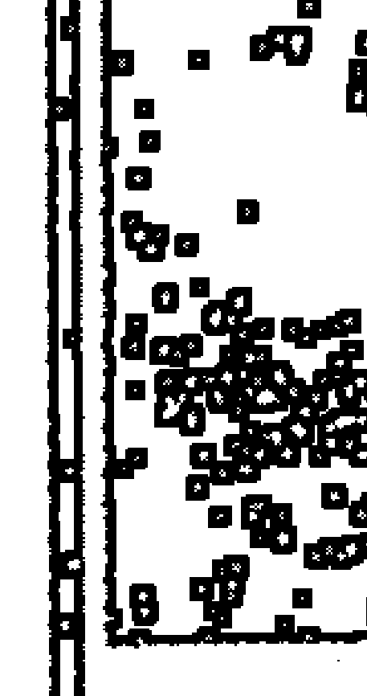
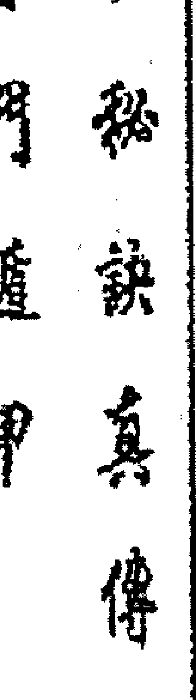
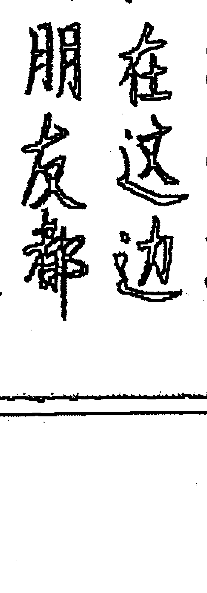
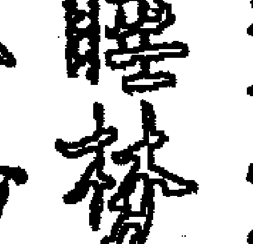

# 姜太公奇门遁甲十二宫取用神

## 千字文

赤道人老传 太古 大道
赤道人 太古 大道
火龙道人

## 遁甲金函玉镜

## 三元入式奇门法甲

太公奇门遁甲道人
千口口口口门秘法奇甲道人

## 姜太公奇门遁甲排神煞篇

## 太公奇门十一宫

适宫，近德宫、兄弟宫、仆役宫；夫妻宫、官禄宫、子女宫、田宅宫；财帛宫、福德宫、疾厄宫、父母宫

+   一近、二兄、三偶、四子、五财、六疾、七迁、八友、九宫、十因、十一福、十二父

记忆的时候，最好把数字一起记忆，将来方好理解。

### 迁宫

迁宫在命盘十二宫中占有很重要的位置。迁宫是命盘的核心，一个人的吉凶祸福都要以迁宫为基准。迁宫显示了人的先天命运和后天命运，包括人的性格、品德、容貌、才华、机遇、思想、精神、爱好、适宜的职业、环境、一生工作和事业发展的状况，人生的顺逆轨迹等，都在命宫中显现出来。迁宫是统辖个人终身吉凶祸福所在的中心宫位。迁宫代表本人的运气，也代表事情的成败。运气顺则一顺百顺，运气不顺喝凉水都会呛着，平地走路都会栽跟头，因此运气可以代表一切所问的事情。

如果看六亲取用。

从爷爷宫位起运宫的话，自己的运宫正好是爷爷的配偶，也就是本人的祖母位，民间说的奶奶的位置。

从母亲的宫位上起运宫，运宫正好是母亲的父亲宫位，也就是自己的外公位，民间所说的姥爷的位置。

从父亲的宫位起运宫的话，自己的运宫正好是父亲的兄弟位，也就是自己的伯父或叔父位。

从配偶宫起运的话，自己的运宫正好是配偶的父亲位...偶的祖爻位……等等等。依此方式去推，周而复始，能推出许多亲人的宫位。

这宫又是配偶的福德宫，代表你是否能够给配偶带来福报，带来幸福。只有自己的运气好，才会给配偶，给爱人带来福报。同样祸福相依，如果配偶没有福气，没有福报，同样也会影响自己的运气不顺，运气不好。因此，千万不要说配偶没有福气，没有福气，是因为自己的运气不好，才会让配偶没有福气。自己的运气不好，配偶将会无福消受。为了能够给配偶带来福报，也为了能够让自己的运气顺一些，好一些，那就尽量让你的配偶，让你的爱人有福气。

## 姜太公奇门遁甲 中吕宫秘诀真传 飞龙道人

虔罐里去，女人在家里享福，千万不要让你的男人在外面风风两雨的创业挣钱，还要回家洗衣做饭收拾家务，你的先生没有了福气，自己也就什么事情都不会顺利，可以扪心自问的想一想山人说的是不是有道理。真正的改变命运之道是以德报怨，能够做到厚德载物才是王者之道。伴侣幸福，享福。男人尽量让自己的配偶掉到钱罐里去。那么怎么能够看出来一个女人到底旺不旺夫呢？当你要看运气宫位了，自己的运气宫位正好是爱人的福禄位，一个女人如果想自己的运气好的话，那么尽量让自己的爱人幸福起来，爱人有福气了，有福了，自己的运气才会顺起来，这就好比一个怨妇，天天埋怨自己的爱人无能，没有出息，这样的女人同样，自己的运气也起不来，也旺不起来。一个女人要想运气旺的话，就是配偶的福德位置，自己要给配偶带来福气，带来福报，能够让自己的先生享福，所以女人的运气旺，才会给配偶带来福报。如果一个女人运气不旺的话，不但自己做什么事情都不顺，同样也会耗损配偶的福报，说明自己不旺配偶，配偶就会辛苦而劳碌，无论成功与不成功，都没有福气和福报。

从事业宫起运的话，自己的运宫就是事业的财帛宫，代表事业上的收入旺盛与否好坏，因此运气旺则说明事业会财源广进，不但事业做得好，而且能够财运也特别旺，如果运宫不旺的话则说明事业上会破财，生意做得不好，财运也不会旺。

财帛宫上起运，自己的运宫又是财帛的事业宫，也代表自己投资能不能把事业做好，能不能把事业做得大，投资会竹篮打水一场空，运气旺投资事业顺利，就会做的红红火火，如果运气不旺就不适合投资做事业，投资事业就会处处不顺，就会出现很多阻碍，就会犯小人等等。

### 中宫秘诀真传

因此，以运气宫来讲，他本身就代表了财、官、运。所以，一个人如果运气旺的话，做什么事情都会顺利。运气一旺百事亨通，就是这个道理。在一测一测的情况下，我们预测往往只看运气宫位就行了，运气旺事情就会顺利，就会没有阻碍，会时来运转，绝处逢生，会得天时、地利、人和就是这个道理。如果运气不旺的话，即使所做的事情能够成功，然而也会有非常多的坎坷、诸事不顺，犯小人，犯口舌，多阻碍，甚至成功的背后要付出惨重的代价，可以说是得不偿失。

### 案例一

天下没有平白无故的成功者，成功者的背后都要付出更大的努力和艰辛。2008年我开通了面向全国免费电话预测服务，可以说那一年的预测让我身经百战，没有一年来免费电话预测服务，更加不会有我今天的成功，所以成功无捷径。很多易学爱好者认为，花几千元或者上万元，参加几天的培训就可以成为易学大师，就可以鹤立鸡群而功成名就，其实简直就是痴心妄想。他是一个北京的一个客户，我称之为丁总，他是一个开发商的老总，打电话预测想竞标一个小区的楼房建设，问我能否成功。

### 中宫秘歌真传
姜太公奇门遁甲
飞龙道人
：19.

当 时 我 的 预 测 其 实 就 是 非 常 的 简 单 而 直 接 ， 完 全 按 照 运 宫 来 看 ， 只 要 运 宫 旺 ， 事 情 就 能 成 ， 没 有 冲 克 事 情 就 会 顺 利 ， 就 是 这 么 简 单 。 记 得 是 运 宫 在 凶 门 ， 而 且 犯 冲 而 不 得 月 令 ， 我 开 口 就 断 事 情 不 能 成 。 总 说 找 了 很 多 的 大 师 预 测 都 说 不 能 够 成 功 ， 问 我 师 父 有 改 变 命 运 的 办 法 ， 能 够 让 此 次 投 标 顺 利 。 我 说 ， 即 使 有 能 让 成 功 的 方 法 ， 你 也 不 会 顺 利 ， 因 为 你 的 运 气 位 在 凶 门 ， 恐 怕 会 出 凶 事 。 丁 总 开 口 说 道 ， 只 要 能 成 功 就 行 ， 你 先 不 用 管 凶 与 不 凶 的 事 情 ， 我 只 想 成 功 竞 标 ， 不 管 你 用 什么道法都可以。

我说，如果你肯定会成功。丁总开玩笑说，老董啊，咱们打一个赌吧。如果事情不成功怎么办。其实现在想一想，那个时候我是年少轻狂。我开口说到，如果我不成功，我永远不踏进北京半步。丁总说好。现在回想起来，姜还是老的辣啊，我的本意那个时候想去北京发展，但是话不说不透，砂锅不打不漏。别人都和你打赌了，为什么自己不和别人打赌呢？于是我摆了北斗七星阵法，让他人做他...

恭喜啊，投标成功了，正式批文没有下来，但事情已经定了下来。老董你真神啊，你和我家乡的一个老太算的一样。当时你一说我就火冒三丈。我说道，丁总啊，当时你说我找了很大帅说预测都不会竞标成功，我才和你打赌可以帮你。现在你竞标成功了，我说我和你家多老太太算的一样，你这话也不对前言啊？那么丁总，我在和你打一个赌吧。丁总惊奇的问道，打什么赌啊？我开口说道，现在已经确定你中标了，正式批文没有下来对吧？丁总说对啊。我说道，那我就在和你打一个赌，我赌你正式批文下不来，如果你的正式批文能够下来的话，我...

老董啊，你不要生气啊，我刚刚和你开玩笑的，等你来北京我请你吃饭。于是我打电话挂掉了。以那以后我不再和别人下赌注了，因为在利益面前往往都是见利忘义，一个人多次被别人算，时间长了也就不会轻易的相信一个人了。

事情虽然成功了，一年后在北京一个徒弟那里，丁总也去拜访了我。我问他那一次投标感觉如何，丁总说道，老董啊，真的不好意思，给我道歉。另外我得知他在施工的过程中，一个员工从楼上掉了下来，失去了生命。丁总感叹道，当时你说即使成功了也不会顺利，当时我想，只要成功了害怕没有钱挣吗？出了那次以外我更加佩服你的神算。通过上述的例子，一个人如果运气不旺的话，即使事情成功了，也不会顺利，中途一定会出现种种的阻碍和困难，绝对不会轻而易举的让你成功的。

### 兄弟宫

兄弟宫主要看兄弟姐妹之间的情感，兄弟姐妹的多少。之所以兄弟宫排在迁宫的后面，是因为因为有了自己才有兄弟姐妹。如果没有自己何来的兄弟姐妹呢。在顺治皇帝归山诗中说道：来时糊涂去我谁是我，生我之时我是谁，长大成人方是我，合眼朦胧又是谁？人生有的时候两眼一闭亲朋好友，恩爱情仇全部化为乌有。世人都知道打虎亲兄弟，上阵父子兵。有父母就有亲情，父母是亲情的纽带。兄弟姐妹是血肉同胞，打断骨头连着筋。父母在世亲情就合相聚，就会有一个大家庭的和和睦睦。如果父母不在世了，兄弟姐妹要相处的好坏，好就多多走动，不好可能就会老死不相往来。

古代的曹操之子曹植所写七步诗中表述了兄弟姐妹之情，“煮豆燃豆萁，豆在釜中泣。本是同根生，相煎何太急。”意思是兄弟姐妹之间，不要为了权力和金钱，兄弟之间兵戎相见，相互残杀。

兄弟姐妹也要分阴阳学说：

从阳的来论，如古代杨家将之七郎八虎，兄弟情深可以抛头颅洒热血而血战沙场，真正演绎了打虎亲兄弟上阵父子兵。而桃园三结义之刘美张，不求同年同月同日生，但求同年同月同日死，可以为了兄弟情义两肋插刀，可以为了兄弟情义抛头颅洒热血，等等兄弟之情，千古美谈。

以阴的方面来论兄弟姐妹，古代李世民和李建成兄弟之间的玄武门之变，晋文公重耳千里追杀自己的侄子晋怀公，被誉为印度最伟大的皇帝阿育王更是亲手杀死二十余名兄弟后登上皇位等等等等不胜举。不光在古代，如今天在社会也是物欲横流，往往兄弟姐妹手足之情，一奶同胞之兄弟姐妹为了一点利益，可以做到大打出手，相互残害，或者互相之间诽谤谣言，甚至老死不相往来，归根结底都是欲望和金钱。

### 案例一

一别已二十七年之久，见到恩师连忙下跪行礼。恩师问我是谁，师父说：是小童啊。在师父的道观看一个月的斗母宫，那个时候也是我得抑郁症的时候，对奇门遁甲有太多的困惑。当时看斗母宫，看着年龄大的给斗母磕头之时，还没有起身，我便暗暗起卦，他们的言凶祸福只等待我来验证。在信众快要起身之时，我便说：你先不要起身，斗母说你身体某某处有病。我们家是世代行医，对于通过来预测疾病简直是信手拈来。信众都会惊讶的说道，你是怎么知道的啊？我便会开口说道，斗母告诉我的啊，并且我还知道你兄弟姐妹多少个，子女多少个，头胎男孩还是女孩。当时可以说是这是都症期间，一段时间竟然在道观名声大振，那个时期简直是如神助一般，说什么都非常灵验。我想坏了，果然不出我所料，这个消息传到我的思师耳中。一日在斗母宫回来，恩师找我谈话，问道：小童啊，听说你在斗母宫算卦非常神奇，是真的吗？我哪里敢直言啊，我说道，师父我学奇门遁甲有一点学疯了，看见谁都给算卦，有的对，有的不对，十个里面九个是错误的，就有那么一个蒙对了，还传到恩师的耳中，师父千万不要生气啊，因为恩师在道观比较反对算卦占卜的。我看了一眼恩师，见恩师并没有生气的意思，恩师继续说到，你用的什么预测方法，大家都把你传神了，你给我预测一下，我来看看你的水平有没有那么神奇。我一吓坏了，我说道，师父呀，您是跳出三界外，不在五行中，我哪里敢给师父算啊，就是算也算不准啊。这么的吧，师父可以叫一个俗家弟子来，徒儿就算一倒是可以的。师父一听急忙把做饭的大姐叫过来让我预测，其实我心里非常明白，如果测对了，我还能在师父身边呆着，如果测的不对，恐怕我也没有脸面在呆下去了。

在道观做饭的大姐过来了，我用太公奇门给她起了一局，她的运宫在辰土，兄弟宫在卯木，木的五行数为3，这说明她兄弟姐妹三人啊。可是为了在师父眼前露一手，我就赌一把，因为卯木后天卦在震，先天八卦是离，离为火，火的五行数为2，因此离为女，离为火，火的五行数为2，因此我断定她是两女一男。但是她排行老几呢？运在坎共为长女，兄弟宫在震为长男，我有一点不敢肯定。因此为了让师父信服，我干脆赌一把。我开口和做饭的大姐说到，你是兄妹三人对不对？做饭的大姐回答道，对呀，你是听谁说的？我问道，你和谁说过吗？做饭的大姐说道，谁都没有说啊，就连你师父我也没有提过。我开口笑道，那你说我能听谁说的？这个师父开口说道，小童啊，这个预测这么神奇啊，难怪他们都说你算卦神奇。明天你不用去看斗母宫了，你在山下看三官殿吧。通过上面的话，其实有很多时候算叫做好听，其实有的一句话赌对了就会声名显赫，一句话赌输了就会颜面无存。

如果看六亲取用：

兄弟宫可以判断兄弟姐妹的个数多寡等。

从父亲宫之起运宫的话，兄弟宫正好是父亲的配偶位，父亲的配偶就是母亲位。故而从兄弟宫可以预测母亲的信息。

以配偶的宫位起运宫的话，父亲宫正好是自己的兄弟位，因此以兄弟宫为男命可以看出父亲的信息。女命可以看公公的信息。

以财帛宫起运兄弟宫正好是自己的田宅位，因宅是收藏现金的地方，为财之库。如果兄弟宫旺的话代表本人有财库，能够存住财，能够装下金银珠宝等等。但如果兄弟宫不旺的话，代表本人财库没有大门，这边进财那边出财，命里过着月光族的生活，甚至终生财运不聚，日子过着总是紧巴巴的。这样说兄弟宫旺则会兄弟和睦，兄弟和睦则会财运广进，能够存住财运，能够有财库。从因宅宫起运，兄弟宫正好是财帛宫，兄弟宫旺则代表家宅财运不旺，没有财运，家里存不住财。

从事业起运宫，自己的兄弟宫正好是事业的疾厄宫，会不会因为创业而积劳成疾，包括企业会不会带来伤害，包括员工是会不会受伤害等。从疾厄宫起运兄弟宫正好是事业位，由此看见兄弟宫是代表事业上会不会有严重的事故，包括身体体会不会因为事业而带来意外伤害等。

从迁移起运，自己的兄弟宫正好是交友宫，代表兄弟能够成为朋友，和朋友能够成为兄弟。古代多少英雄好汉义结金兰，一同打拼天下和事业，能够共享荣华富贵，能够肝胆相照，能够忠肝义胆，甚至为了朋友能上刀山下火海，肝脑涂地而付出生命。为什么说亲朋好友打山容易寻江河山难呢？为了利益不惜牺牲对又有多少兄弟姐妹为了利益而形同陌路，连朋友都不如。并且还能够看出来一个人在外交朋友的能力，朋友的多寡，是不是交下肯为自己肝胆相照的朋友。兄弟宫旺则在外朋友很多，一呼百应；有事情的时候能够做到人走茶凉，多酒肉朋友等。因此兄弟能判断您的交际手腕及能力，及与外界人缘之因果关系。

从子女起运，自己的兄弟宫旺，正好是子女的福德宫，这就说明自己的兄弟宫旺就会给子女带来福气，子女能够靠着大树好乘凉，能够借上自己的运势，自己也能够帮助子女。如果兄弟宫衰弱的话，则代表子女借不上自己的光，自己不能给子女带来福报，不能福佑子孙，儿孙自有儿孙福的命运，一切就看子女宫自己的福报。如果子女宫旺，自己的福德宫旺的话，则说明不靠父母，不靠祖上。其他宫位以此而断。从田宅宫起运，兄弟宫正好是田宅的财位。兄弟宫旺的话，说明家宅的财运也旺，也说明家里的风水旺财运；如果兄弟宫衰弱的话，说明家里的风水不旺财运，也代表家里风水不好，家里财运不旺，存不住钱财。这么多象到底应哪一个呢？就要参考本位来判断。

### 案例一

2009年应福清谢总的邀请。当时那个老总家里是金碧辉煌，楼房建设得比市政府派头还大，而且楼房面南背北。自己在楼房前面建约高尔夫球场，东边是体育馆，右边是游泳池。一看布局就是过路阴阳的布局。我徒弟正好也是本地风水高手，也是学的过路阴阳一派的。看完后老总问我，你看这里的风水格局呢？是不是出了什么问题才把我请过来给我看？那也不能说是徒弟布的局不好啊，于是开口说道，你这里的风水是找高人布的局。

一个老总笑着说，不止一位高手看过。我也笑着说道：“那今天我就说一点其他高手没有看到的吧，因为是徒弟把我请过来。”话都说到了这个份上了，也不能让徒弟丢脸啊。我指了指他的楼房说道，你建这座楼房的时候地下挖出来一个坟墓，而且是一个女子的坟墓，对还是不对？此时徒弟偷偷的给我竖起了一个大拇指。那位老总开口说道，董道长啊，就是因为这里挖出来坟墓，我心里耿耿于怀，请了很多风水高手，都是谈论这里不好，那里不好，其实他们不知道，对我好不好，可是请来的人都没有看出来。我就是想问一问我建房的时候挖出来坟墓对我好不好，也不敢声张，毕竟还要考征一下他们的水平和技术。

我告诉老总，你的风水布局绝对没有问题的，其他风水高手过来看也不会看出来什么问题的，除了我说的坟墓事情，已经影响到你的身体了。你现在睡眠不好，身体虚弱，甚至晚上会出现异梦，我说的话你应该懂得。老总笑道，是不是就是你说的房子下面的女鬼会出现在我的梦里啊？我说的，对的，所以我说你下面是一个女鬼，如令有缠身之象，因此你会夜梦到她。

当时老总问我，你还能看出来什么来？我暗自用太公奇门起了一卦，当时是兄弟宫逢天克地冲，我说道，你不仅兄弟必克其母。老总斩钉截铁的说道，你说的都不对。看他的表情不是在开玩笑，我又用了一个道法，从配偶宫起运，兄弟宫不是他配偶的爸爸吗？于是开口说道，如果你不克兄弟，不克母亲，你娶妻以后，你会把你岳父克死。说出来这句话我也是很担心说错。如果说错了是不是在咒骂他岳父早死吗？而且我的断言是他岳父已经驾鹤西去了。因此断卦和上战场打仗是一样的，如果错了那就是战死沙场。可是如果不说出一点绝活，模棱两可的话也不会震惊对方，也达不到铁口直断的效果。所以我开口断他岳父已死，就是这个道理。

此时的老总已经被我震惊，伸出双手握着我的手，说道：'董道长乃神人也。' 就是我父亲去世了。通过断兄弟宫，我用了一个取向没有对上，于是才用第三个取向。所以太公奇门的弟子一定要把兄弟宫的取用神学好，方能思维开阔。

### 配偶宫

配偶宫可以判断婚姻的好坏，配偶的长相与性情。命理有几次婚姻，就是多少次婚姻。如果配偶宫旺的话婚姻就会如意，如果婚姻宫休囚的话，婚姻就不会如意，如果婚姻宫旺而得到生助的话，那就克配偶。如果婚姻宫受到冲克的话，那就说明夫妻之间就会有争吵。最差也是相敬如宾的感觉。

如果看六亲取用，此宫是配偶的父亲的兄弟宫，也就是大爷和叔叔、姨姨。从兄弟宫起逆，配偶宫又是母亲的宫位，因此判断兄弟、阿姨也可以有断兄弟姊妹宫，因此判断兄弟、阿姨的情况看配偶宫位。

从福德宫起运，配偶宫正好是福德的财帛位，婚姻宫好能够给自己带来财运，又能给自己带来福气，因此女人福德宫好，说明配偶会给自己带来金玉满堂，也会给自己带来福报。如果是男人配偶宫好的话，说明女人会给自己带来福报和福气，也会给自己带来财运。如果配偶宫不好的话，说明配偶败财，也会让自己财运好。所有婚姻感情好的人财运就好，就会有福气。

### 案例

2005年来到昆仑山的龙凤宫，看瑶池店，进来一位女士抽签，抽签的时候，我当进心中暗自用太公奇门给她起了一卦，她的配偶宫非常衰弱，这就说明这位女士婚姻进入虚弱的状态啊，但是应该怎样表现呢？总不能说一些专业术语，之乎者也的讲了一大堆，顾客听的似懂非懂，这就是很多预测师在预测的时候，专业术语太多，什么犯冲克啊，什么不旺啊，等等专业术语，所以顾客只能听懂一半，还是连猜带蒙的理解其中意识，因此这是预测时候的一种禁忌，是不可以带专业术语的。

这位女士抽完签以后让我给解签。我开口说道，你的婚姻不好，该女士听完大惊失色，说道，师父，难道我会离婚？我继续开口说到，离婚不会，是因为你的命理在婚姻上属于靠山山倒，靠水水干，你在生活之中你爱人的力量。你是家里的顶梁柱。家里的生活完全靠你来支撑着这个家，并且你的爱人还想做生意，是干什么赔什么。因为他的命理财星不旺，就是没有财运。他不做生意就是在挣钱，该女子惊奇的问道，前面师父说的都对，可是为什么他不做生意就是挣钱啊？我开口笑道。他不给你赔钱不就是挣钱吗？女子也笑道，师父说的太对了，这个签真的很灵验啊，那师父又如何改变命运，能让我自己活得不会那么辛苦，让自己的爱人能够挣钱，我也能享清福呢？

我又开口笑道，让你爱人辛辛苦苦的去做生意，你想清清静静的享福，你命理不带，还是别做梦了。该女士又问道，难道不能改变吗？我说能啊，那得你去求瑶池金母了。我可没有那个本事改变你的命运，于是，该女士非常虔诚的去给瑶池金母磕头，祈求爱人的事业能够成功名就，至于后事如何，山人也不得而知。

女人配偶宫如果旺的话，她就会有福气啊。女人千万不要有怨恨之心，自己的丈夫没有本事，没有能耐，那是你自己没有那个命，再好的男人，在旺的男人都会被你克的事业不顺，身体不好，做什么事情都不会成功，女人应该怀有感恩之心，自己的丈夫不旺，他没有嫌弃自己就是自己的福报，辛苦一点那是自己的命。

吾有一个弟子，年轻的时候叱咤风云的做生意，可是目前为什么也没有发迹呢？有时她感叹我为什么不能像其他女人一样享福呢？自己为什么要那么辛苦，我们看看她的八字，配偶宫被自己的八字，地支来冲，天干化泄，这就说明他克爱人啊，克什么呢？一看土星进入，就是太公奇门的土星进入，这说明克爱人的身体啊，因为不是天克地冲，因此慢慢的爱人就会进入疾病缠身的状态，以至于终身带疾，但她的配偶宫不旺啊，这说明自己本人靠不上爱人，配偶不得力女人就会很辛苦，很劳碌，如今配偶的病根本就无法工作和挣钱，所有的负担都在她一个人身上，原因就是自己的配偶宫不旺啊，女人用太公奇门看自己的配偶宫旺不旺，就知道自己能否借上爱人的力量，配偶会不会给自己带来福气，一目了然。

## 王宫秘诀真传 姜太公奇门遁甲

飞龙道人

如果女人的配偶宫旺的话，就说明配偶能够给自己带来福报和福气，自己就不用那么辛辛苦苦的工作，只要学会花钱就可以了，根本不用自己去风吹，日晒，雨淋的做生意，也不用风风火火的去创业。更不用忙里忙外的既要照顾家，又要忙于挣钱，所以，看了我们的八字和命理，就知道一切都是命，半点不由人。除非修行可以改变命运。

从阴宅起运，配偶宫正好是阴宅的疾病位，代表阴宅的厨房位。也因为此配偶宫如果旺的话，家里人就会身体健康，无灾无病，反之则会疾病丛生，家里不断药。这也说明配偶宫如果旺的话，家里的风水也好，人丁兴旺就会无灾无病，家里不用到外都是药罐子，也不会出现长期吃药的人，更不会出现卧床不起病人，所以，无论男女，配偶宫一定要兴旺才行。否则不但自己没有福气，借不上爱人的力量，并且自己还会辛辛苦苦。家里人丁会疾病缠身而药不离身。

事业宫起运，配偶宫正好是迁移宫，代表出外创业或者说事业的外部环境的好坏。配偶宫如果旺的话，说明一个人在外面事业如如意，多遇贵人，走到哪里事业上都会顺顺利利，同时代表着婚姻美好稳定。但是如果说配偶宫不旺的话，说明事业上发展也不会太顺利，影响事业的稳定，出外创业也不顺利，所有配偶宫旺说明事业上也会顺利。

这也说明一个男人娶的太太如果她的八字配偶宫不旺的话，就会影响到自己在外创业的能力，顺不顺，会不会平安。如果自己的太太八字配偶宫旺的话，说明配偶会给自己带来福和福气，也会让自己在外面多遇贵人，出入平安，而且在外创业也会一帆风顺，从而女人旺男人，自己事业就会顺风顺水，功成名就。

### 子女宫

如果看大来取用，子女宫可看出子女的多寡和是否有作为子女，晚年能否有子女养老，子女是否孝顺，与子女的感情如何，有无难产，剖腹产，人工流产等现象。子女宫是表示子女的容貌、个性、才华，健康状况，吉凶祸福，以及本人的生育能力。子女在成长的过程中，是否有凶险，是子女是来报恩的还是来寻仇的，都要从子女宫星显示出来。

从子女宫里也可以推断出自己的学生，门徒，弟子，晚辈，与自己的关系如何，会不会被属下背叛，出卖或拉后腿，还要配合交友宫同看，至于外能不能结交到好的朋友，可配合迁移宫来论。子女是夫妻感情之结晶，故以子女宫里也可知其人性生活与生殖能力的强弱与好坏。更可以子女宫而得居之间关系及相互影响的程度。也可以子女宫里来看生意合伙人的对象之好坏。因为子女是男女双方共同创造出来的，所以，可论适合不适合与人共同创业，可不可以得到同甘共苦的朋友及合伙人，共同开创美好的事业。而又可以子女宫看其人之物质基础与精神，构想之好坏，更可得知其人之岳母之个性及母与本人之间的关系如何，都可以从子女宫得知其大概。还可以看出子女的多寡，几男几女，头胎男孩女孩等等。

往往我们在看子女多少个的时候，基本上是看五行之数，最开始我是以八卦定子女个数的，后来发现有问题，然后开始试用地支来判断子女个数，记得在2005年元月时的培训班上，当时孔老师的子女宫在乾宫成土的位置，根据五行数是水1，火2，木3，金4，土5，金5。根据孔老师的年龄来断，不可旺相加，即是1，6为水，2，7为火，3，8为木。4，9为金。5，0为土。因为乾卦五行为金，5，0为土。根据孔老师的年龄来断，不可能有4个孩子，但是介于八卦主外像，地支主肉像，地支为戊土，土为5数，但是在培训班上我大胆的断定孔老师没有儿子，至少5个女儿。孔老师反馈为了要儿子，已经是五朵金花了，至今没有儿子。从那时起我就开始看她支定子女数，不在看八卦，就是这个道理。

但说到这里，大家一定会问，我是根据什么来定没有儿子的呢？其实很简单，子女宫在乾卦，乾卦为后天八卦，乾卦为阳，而乾卦先天八卦对应的是艮卦，艮卦为阴，纯阴必转阴，因此我断孔老师没有儿子，就是这个道理。

### 实例一

在举一个例子，在真武宫的时候，家母的弟子王道长现在已经年之久，对母亲照顾的一直是鞍前马后，可以说是一位好徒第，后来想和我学习奇门遁甲，于是我传授了他太公奇门绝技，并且在真武宫道观开始算命，也算是报答他照顾母亲的恩情吧。因为他替我尽了孝道，于是毫无保留的传授了他。记得一天中午，我正好从大殿路过，王道长正在给客户算命，见我过来喊道：“董帅兄，我用你传授的断子女的方法不对，我算错了，我当时连卦都没有看，我问他到，你算他多少个孩子啊，王道长回答道：“我看她八个孩子，我看该女子，年龄在60多岁，我开口问该女士，你有三个孩子对吧，该女士说对啊，你怎么知道的？”我问：“王道长，他的子女宫是不是在寅木或者卯木？”王道长说：“对啊，她的子女宫在卯木，我说，你的子女宫来看，不可能有八个孩子，你为什么不断出八个子女呢？”王道长吓的不敢言语，我继续问该女子：“你有两个女儿一个儿子对吧？”该女子连连称是，这是王道长好像开窍了，说到：“董师兄是根据先天离卦为火，离为阴，所以为女孩，离火为二，因此为两个女儿对吗？”我开口笑道：“王道长厉害啊。”

王道长继续说道：“董师兄你不用问了，我来问她。该女士，你姊妹七个对吗？”该女士达到，对呀。”王道长继续问道，是四女三男对不对，该女子急忙称誉道：王道长真是神封啊。通过上面的例子，告诉大家学习预测要活学活用，事后我问王道长，为什么断该女士两个姊妹，非要断姊妹七个啊？王道长笑了，说到，董师兄啊，你不是告诉我要看年龄的吗？她都已多岁了，那个时候没有计划生育，不可能是兄妹两个啊，所以我肯定断七个，董师兄的今日的话让我醍醐灌顶，受益终身啊。

再加上子女宫不实受到天克地冲，在金华時候徒万来拜访我，當時拿了好吃的，徒万都知道師父饞，進来的時候我暗自起了一封，正好被日子沖克了子女宮，上臨「白虎」，為女被沖克，我开口说道，徒儿啊，你身边怎么会跟着一个小女孩啊，是不是打胎了，这个小女孩想投胎转世到你家里来，给你当女儿，是来报恩的，你怎么会忍心伤害她的生命啊？现在在你进来的的时候，她也跟你一起来了，你难道晚上做梦的时候就没有梦见小女孩叫你妈妈吗？当时徒儿伸出舌头都吓傻了，惊奇的问道，师父，你是怎么知道的啊，我开口说的，师父能看见这个小女孩，你焉能瞒得过为师啊，现在她都不知道是我算出来的，只不过我加以绘声绘色的形容了一下而已。后来我帮助处理了一下，不在梦里叫她妈妈了。因为此子女宫是不能受到天冲地克，必然会克伤子女。

六亲方面，子女宫是配偶的兄弟姊妹宫位，可以看配偶的兄弟姐妹情况。

从福德宫起运，子女宫正好是疾厄宫，子女宫旺说明身体特别好，能够多子多福，这也说明一个人的生育能力就强，如果子女宫不旺的话，也代表一个人的性欲不强，容易出现性冷淡，容易婚姻感情不好，或者相敬如宾，不能如胶似漆的夫妻感情，并且生育能力也不强，不爱怀孕或者容易流产。

从迁移宫起运，子女宫正好是固宅宫，可以看出一个人在外的能力和积蓄，也主在外是否有存款和小金库。故而子女宫旺的话，主在外有固产和积蓄，如果衰弱的话，主在外很难有积蓄，容易过着月光族的生活，并且没有存款。

从固宅起运，子女宫正好是固宅的迁移宫，主家里人在外是否能够出入平安，能否顺利，故而子女宫旺主一个人在外会出入平安。

如果子女宫不旺的话，主人丁不兴旺，出入不顺利，在外不平安。

交友宫又代表奴仆宫，以交友起运，子女宫正好是交友的事业宫。如果子女宫旺的话，说明与朋友能够共创辉煌的事业，也代表手下得力，员工会为自己的事业尽心尽力。如果子女宫不旺的话，说明与朋友创业会失败，手下员工不得力。

### 财帛宫

财帛宫是养命之宫位，财又为养命之源，是人生在世不可缺少的，对于每个人来说至关重要。一个人是财旺还是财弱，是贫穷还是富贵，是进财多还是出财多，所得之财，是固定收入，还是经商收入，或额外之收入，都可以从财帛宫显示出来。从财帛宫里可以表现出其财运的好坏，理财的能力，钱财之状况，调度之情形，经济基础之强弱。

财帛宫是子女宫与疾厄宫的中间桥梁，财帛宫的强弱直接影响整个家庭的生计，子女的教育或本人身体的医疗保养皆以财为基本条件，故财帛宫也可推算出一个家庭的精神及思想是否健全，或物资行动之好坏，个人疾厄状况和身体之保养是否得体，同时也以财帛宫看出进财的形式方式，是借贷、抵押、正财、偏财及金额。

财帛宫的对宫为福德宫。福德宫是物资享受和精神享受的宫位，是来财之源。以六亲来看，财帛宫是兄弟的子女宫，可以看出内径、外甥的情况。

财运宫可以看出财运的好坏，财运的旺衰，财运的有无，富贵与荣华。配偶宫上起运，财运宫正好是配偶宫的夫妻。因此财宫可以看出配偶的婚姻状况，对待配偶的观念，包括配偶的婚姻好坏，比如自己的配偶宫逢冲代表自己的婚姻容易出问题，也代表配偶的婚姻出问题，也代表配偶有自毁的倾向。如果财宫逢冲代表配偶有自毁的倾向，也代表配偶的婚姻出问题。同时某人财旺了，婚姻也顺了。如果自己的配偶宫进了桃花星代表自己容易犯桃花，财宫进了桃花星代表配偶容易犯桃花，同时财宫也代表着第二个配偶的情况，往往有一些人一旦发财了，桃花运也来了，就是这个道理。

### 案例一

2008年我面对全国免费预测的时候，那个时候年轻狂，记得一位女子打电话来问卦，还在辰土，配偶宫临曾生。我开口断曰：你现在正在走桃花运，有还是没有？该女士回道：我没有桃花，我听后非常不高兴，我说道：没有就算了，你另请高明。说完就把电话挂断，该女士过了五分钟把电话打过来说道：董老师，我有桃花，我说：哎，有就是有，干嘛说没有啊？该女士默默不作声。如果要是现在，我就不光会那样，直白让人下不来台，我继续说道，不光你有，你的先生也有，而且你的先生想到你离婚，这个我说的对不对，因为财宫正好是配偶宫的配偶宫，在子水，说明有水性杨花之意。水泛滥当然犯桃花了，为什么说男方想离婚呢，因为月干正奸是午火来冲克子水，男子有自毁家园之意，所以断定男子想离婚，女子听后电话那边大哭说到，董老师你救救我，我不想离婚，我当时非常生气的说道，你爱人想离婚不是正合你意吗？你不是也有一个桃花吗？你也犯桃花，他也犯桃花，不是离婚都彼此成全对方吗？你又不是贞洁烈女，你哭什么啊，你应该笑才对啊，此女子听完后如晴天霹雳一般，立刻阻止了哭声，现在回想当时，真的是先知看元畏啊，哪能那么让人下不来台，现在想想当时嘴特别的狠，说话不留情面，现在就不会了，永远找不到那样断卦的感觉了。

女子继续说道：‘师父呀，你救救我吧，我虽然有外遇，但是那个男的并不想娶我，而且我还有孩子，我不想离婚，能不能让我老公不离婚，把他的桃花断了，’我听后说道，你这个人非常自私，就算有我也不会帮你，首先你不说把自己的桃花斩断，而是先要断除你爱人的桃花，你这个人好自私，所以我们道不同不相为谋，你另请高明吧。’说完我电话就挂断了。如今想想，帮助她又能如何呢？成就一段姻缘，解救一个家庭，岂不是人间一美德吗？

通过上面的卦列，我就用了财宫断配偶想离婚就是这个道理。

福德宫对面正好是财帛宫，也代表一个人有钱了是不是会享受，如果财帛宫旺说明一个人就会有福报，不缺钱财，能够有福气起享受财帛，如果财帛宫衰弱的话，说明一个人无福享有财运，哪怕福德宫再旺的话，也只是一个无福享受，人们常说的富贵的身子穷人的命。

### 案例一

2010年我在北京时，朋友带着他弟和弟媳来预测，当八字一报的时候，我和朋友说到，还是不要给他们预测了，我不太会顺情说好话，我怕说出来会让你们回家睡不着觉，朋友的弟媳着急的说道，太帅还是直言吧，你不说我们回去就更加还睡不着觉了，所以太帅还是只告诉我们吧，我看了看朋友的弟媳说道，你是在你爱人的财宫都会说的份上，那我就直言了，你们夫妻二人干什么宫旺，这说明一种情况，你们夫妻二人的福德宫和你爱人的财宫都非常的衰弱，反而到是福德宫，不行，吃啥啥没够，我刚刚说完这句话，他弟媳妇不高兴了，说到：大师那你的意思是我们夫妻二人好吃懒惰，说呗，我一听顶撞我，我们也非常生气，还没有人敢顶撞我呢？我生气的说道：你们夫妻二人投资做什么生意呢？把兄弟姐妹的钱甚至父母的钱都赔了进去，难道我说的干啥啥不行有错吗？你们夫妻二人虽然能吃苦耐劳，可是你们夫妻二人吃饭从来都非常讲究，好客豪爽，即使你们夫妻二人一起生活也不会咸菜就着饭来吃，难道我说到你们吃什么都没有够我说错了吗？好了，就算到这里我分文不取，你们可以走了，我们这莫多的缘分。说完话我起身要回房间，这个时候朋友的舅媳妇马过来赔礼道歉，让我愤怒的心情马上平息。想一想这样的女人真的可以堪称是八面玲珑。你要说她不能挣钱，还真是没有地方说理啊，谁让他们夫妻二人都是福德宫旺，二才宫衰弱呢？有福而无财，可以说是富贵的身子穷人的命呢？所以看财不光要看财宫，还要看财宫的对面福德宫，只有财宫旺而福德宫旺，才可能是富贵双全之命。如果是财宫衰弱，福德宫衰弱，那就是一个苦命之人。

### 疾厄宫

疾厄宫是疾病和灾厄所主，为寿终之宫位。一个人一生有什么疾病和灾厄，会发生什么疾病，都要从疾厄宫里显示出来，所以疾厄宫是判断一个人是长寿还是疾病或灾厄的宫位。单以疾厄宫里看人的疾病是不够全面的。人的疾病是根据中医阴阳五行与发病的原里推断出来的。但不外乎金、木、水、火、土这五种不同的属性。某一种属性过多或严重受制，就会被病。金太过或不及，或受火克，就会得肺病，大肠或呼吸统疾病，于五官则为鼻。疾病宫代表看自己的身体状况，身体的好坏，哪里有病。疾病宫在哪一个宫位，哪一个宫位就是最弱的地方，旺的时候没有病，衰弱的时候早晚都会生病。

但姜太公预测很多阴性信息的病，可以说是诸多预测学的鼻祖，天地人鬼神佛，仙无所不测。但要是具体预测出是何方神圣，何方妖孽，还要多多实践，方能达到炉火纯青的境界。

每一颗星辰都代表一个神，但每一个星辰，飞到八门之中，又各代表一路神仙。九星配八神，为八九七十二。因此姜太公奇门可以道出七十二路神仙。但是最常用的我传授了一路神，是可以改变一个人的命运和运气。

## 十二宫秘诀真传

2005年在绥芬河开卦馆的时候，有一天从外面进来一个老太太，这个老太太长的慈眉善目，而且两眼炯炯有神，说话声音柔和，慢条斯理的讲话，走进来的时候步伐稳重，说话一板一眼没有废话。

一看就是君无戏言之人，很多人会问，什么是君无戏言？不开玩笑，不说儿戏之言。

其实就君无戏言，小人就会鬼话连篇。而老人家进来说话就是慈悲的声音，让人有一种尊敬的感觉，但是我和老人家说话的时候，我的身体以一种特殊的感觉，这种感觉传遍全身，犹如触电流。

## 姜太公奇门遁甲

约感觉，只要她一开口说话，我就有这样的过电感觉，看看老人家我幻想，是不是那位武林高手，内力雄厚，故意试探我的功力呢？我也非常坦诚的问老人家，我喊道，为什么你每一次开口说话我都有全身触电的感觉，电流传遍全身，是不是你练过什么高深莫测的武功，或者说你是武林高手呢？老妈妈笑道，我的感觉和你一样，你每一次说话的时候，我也在电流传遍全身，不会像你那样有内功深厚，试探我吧，我连忙解释道，老妈妈，我可没有深厚的内功，这么说我们之间一定有什么渊源，让我占卜一卦如何？老妈妈讲

## 姜太公奇门秘诀真传

## 飞 龙 人

## 甲

## 道

道，我正式想让你来指点迷津的，近几日总是感觉不舒服，去医院又查不出来是什么病，师傅给好好看看。老妈妈坐下，我起了一卦，运宫正好在兑宫，难怪老妈妈面相那么慈善，再看老妈妈疾病宫在凶门，上临N月，代表疾病缠身之象。可是如果是仙家的话，为什么会被此感应那么强烈呢？我和老妈妈说道，你家里供奉香火，在地方应该属于五大仙，也叫保家仙，你的事情没有那么简单，不然你说话我也不可能有全身电麻的感觉，老妈妈可以明天再过来，晚上我查一下为什么。老妈妈可以明天再过来，晚上我查一下为什么。晚上我打坐查询老妈妈家里的事情，恍

## 姜太公奇门遁甲

道

飞龙人

7.0

## 姜太公奇门遁甲

道

飞龙人

## 姜太公奇门遁甲

飞龙道人

恍恍惚惚我就睡着了，进入了梦境，梦见我去老妈妈的家里，从她家门口楼上那家是红毡铺地，进了他们家的门，看见有三个老太太在厨房摘菜，厨房特别的乱，进不去，没有站脚的地方。我突然从梦境中清醒过来。第二天，老妈妈又来了，我查问的如何？我说，第一，你楼上的那一家应该是一个政府官员，而且身居官职对不对？老妈妈回答是农行行长家，因为梦境楼上是红毡铺地。第一，我说到，你家里供奉了三位仙姑，对不对？因为梦境有三个老太太肯定是仙姑啊。老妈妈回答对。第二，三位仙姑保佑你家衣食足食，五谷丰登。你家

## 十三宫秘诀真传

姜太公奇门遁甲

飞龙道人

里的条件特别好，你根本就不缺钱，但是你仙堂不干净，很久没有打扫了吧？老妈妈反馈说到，家里很干净，就是牌位很多年没有打了，我继续问道，你家香炉的香根很多年也没有打扫了吧，到处飘的都是香灰，老妈妈连忙称赞道，对，对，对，就是很多年没有打扫了你的三位仙姑想让你把仙堂打扫得干干净净，因此你说话我会有感应，是想借我的嘴，言明她们的事情，你能来也是如此的缘分，期望你能好好打扫仙堂，定然会无灾无病。

> “因为厨房没有站脚的地方。”

## 姜太公奇门遁甲

飞龙道人

如果看六亲取用，疾病宫正好是配偶的子女宫，可以看出配偶的生育情况。如果旺相的话说明配偶的性欲强，同时也能代表能生子多子多福，生育能力也强。但如果疾病宫衰弱的话，主配偶容易有性冷淡，夫妻之间就容易相敬如宾，甚至是影响夫妻感情，不能如胶似漆的恩爱缠绵在一起，并且也代表生育能力有问题。从事业宫上起运，疾病宫正好是事业的因宅宫，因此疾病宫旺的话，代表如果事业上做的红红火火的话。一定会置办产业和固定资产，如果疾病宫衰的话，代表事业做的再好的话，也

> 姜太公奇门遁甲真传

> 飞龙道人

中宫秘诀真传

姜太公奇门遁甲

道

飞龙道人

74

没有固产，好比苏东坡和海瑞一样，虽然有名却没有利禄，就是这个道理。疾病宫代表公司、办公室或工厂、店面等营业工作场所的情况。通过疾病宫的道理，我们如果身体好的话，就会给我们带来福报，就会大家大业。如果疾病宫衰弱的话，对自己的事业和固产都会受到影响，散而有一个好的身体不但对家庭有利，而且有利于事业的发展。

从田宅宫起运，疾病宫正好是田宅宫的事业宫，这说明家宅是事业的基础，疾病宫旺的话，家里的风水可以旺自己的事业，如果疾病宫衰弱的话，说明家里的风水不旺自己的事业，

业宫

姜太公奇门遁甲

道

飞龙道人

如果是八字命理带的疾病宫衰弱的话，说明自己的祖宅对自己的事业有影响。这也说明疾病宫代表阳宅的风水旺衰。

### 迁移宫

如果看六亲取用，这宫对面是迁移宫，迁移宫代表一个人的路，代表一个人的名堂，如果迁移宫旺的话，前途无量，走到哪里都能逢凶化吉而遇难成祥。而且能够胸中能藏有万雄兵，做事可以畅通无阻，多得贵人相助。如果迁移宫衰弱的话，代表一个人没有光明大道，人生处处是坎坷，做事多阻碍，甚至是死路可走，而且容易出现车前马后灾，做事不顺，无所作为，处处碰壁。

## 姜太公奇门遁甲

飞道人

迁移宫是一个人是否喜欢外出，是否有迁移或旅游的机会，但也要看时代背景，农业社会时代就像现代的非洲，迁移宫不好，就是走路搭车的份，跑不了多远，纵然跑得远的也看不见得有大作用。迁移宫的重要性就变得举足轻重。

现代更是业绩挂帅的商业时代，只要有好的人脉关系，就有好的业绩好的收入，迁移宫不好的人只有从事技术、生产等工作，甚至连行政都不是很适合。

迁移宫就在命宫的对面，对于命宫有不可忽视的影响力，有加减分的作用，迁移宫若是吉星的组合，纵然命造本身有些叛逆，但外在

十二宫秘诀真传

姜太公奇门遁甲

飞龙道人

环境或遇到的机会都是正面的，命造就会懂得收敛或会受环境的影响而有所改变，相反的，迁移宫组合没什么不好，迁移宫却是空宫一堆，那么一个老实人成长在灯红酒绿的复杂环境，不知不觉中产生了偏斜思想，狡诈了许多。迁移宫也是命主的一个个性，也可以说是在家里以外的个性，以这宫跟迁移宫的属性组合一个比较，你就明白了，命造是喜欢待在家里或喜欢外出，个性是内向或外向，这宫强于迁移宫，命造在家里非常有自信，非常稳当，反之命造在外面比较活泼积极，最极端的是，这宫不旺在家一条虫，出外一条龙，反过来的话，

命造在家里大呼小叫的。迁移宫强的人当然就适合离乡了。离开故乡以后，会渐渐受到迁移宫星座组合的影响。性格变得积极进取，尤其是迁移宫在珍珠宝门。必须离乡才会遇到贵人，若仍留在故乡。发展的机会就辛苦一点，成就小一点。这也是我们命造出生地的原因。假使迁移宫不吉，当命造外出发展，会处处碰壁。

### 案例一

2001年于晋中。当时几位弟子都过来拜访，有老胡、一琴、小戴几位弟子都过来了。自然徒弟都知道师父喜欢美食，中午准备去吃特色菜。其中小戴请求能够算一卦。其实每到一处我不愿意见弟子的原因就是到哪里都算卦，不得安宁啊。没有办法。弟子开口来卦要给面子啊。但是，当卦一出来我一看，心里就是一惊，可祖师爷遗训又不得不讲，算卦不留情，留情卦不灵。我开口对小戴说道，请恕我直言，今天免费送给你一卦，算卦人不赚将死之人的钱。此话一出，令在场所有弟子都震惊。目

不转睛的盯着我。我继续说到，太岁、月令冲克你的迁移宫，你今年出了两次车祸对不对？小戴惊谔的说对呀，整个人看上去都傻了。我又继续说到，由于时辰冲克你的迁移宫，时刻来冲克你的福德宫，故而如果再发生一次车祸，你命休矣。其他在场的弟子一口同声的祈祷到。师父你要救一救他，这个时候小戴吓得急忙磕头，我急忙掺扶着身子。我想到，今天中午你来请客，这叫破财免灾，众弟子一口笑道，夜半三更我开坛做法，给其破车前马后灾，听兰州老胡讲，听了一个月后，小戴果然又出了一次车祸，胳膊擦破一点皮。他

## 十二宫秘诀真传 姜太公奇门遁甲 飞龙道人

还很开心的和另外几个弟子说，师父算的真准，这个月真的出了车祸，好在师父帮我破解，没有生命之忧。通过上面的卦例，我明白了一个道理，如果化解车祸，他事后没有发生车祸，会不会说我们算的不准呢？所以，如果化解灾，既让他发生，又无生命之忧，才会令人心悦诚服。有时看迁移宫还不能光看自己的迁移宫，还要看六亲的迁移宫位，才能看出来亲好友的吉凶祸福来。

### 案例一〇：

2008年新疆弟子邀请看风水，去天山游玩回来后，她的一位朋友邀请请吃饭，其实在我们眼里，最不喜欢别人请吃饭了，因为只要有人请吃饭，不是在酒桌上要求算卦，就是邀请他的朋友来，还是算卦，有的时候应酬这些人都没有办法，人吗，就是爱面子，要给徒弟面子，可是没有办法，不如自己一个人在房间吃泡面，可是在酒店和这位女士见面后，现其相貌是大大的眼睛，炯炯有神，一眼看上去绝对是属于那种窈窕淑女，我好逑的女性，你开口问道：你是新疆人吗？

姜太公奇门遁甲 甲 飞龙 道人

十口宫秘诀真传 太公奇门遁甲 道人 飞龙 道人

该女士回答不是，然后开口说道，师父能给我算一下吗？我也义不容辞答应了。当时起卦时，该女士是说在高宫珍殊门，在戌月、戌月、戌月，时来测，三个戌土冲克配偶宫辰土，我开口说，当时该女士愣了一下，我的脑子急忙问命。当时该女士愣了一下，你是二次婚姻？该女士回答没有，你就是二次婚姻吗？现在家庭以外，还有一个比你年龄小的男孩在一起，我说道，你有没有把握我不会张口，但我心里不爽，因为我一口说，算错，因此她让我特别没有面子，我又继续开

## 姜太公奇门遁甲

口说道，你的爱人发生过两次车祸了对不对，

该女士回道，对的师傅，确实发生了两次车祸，

这时我的徒弟竖起了大拇指，师傅真厉害，

我继续开口说道，你爱人今年不止两次车祸，

该女士回到道，他这个月千万不要让他开车，因为他有两次车祸，

他这个月千万不要让他开车，因为辰为天罗，

戌为地网，他命理犯天罗地网，因此这个月如

果再发生车祸的话，不死也要有刑伤，比如一

个人发生车祸把腿伤残废了，不也和坐牢房一

样吗？该女生急忙问我有没有化解的方法，晚

## 姜太公奇门遁甲

飞龙道人

上我帮她爱人化解后，他要求去宾馆坐一坐，

我说可以，到了宾馆该女士说道，师傅，今天

请你原谅我，你今天说我有两次因为我没有敢

### 中宫秘传

## 姜太公奇门遁甲

龙道人

当着他们面说实话。我在老家确实有过一次婚姻，后来离婚了才来到新疆，后来就在这边结了婚并且有了孩子，我的爱人和身边的朋友都不知道这一件事情，所以特意来向师父道歉来。通过这一件事情，让我明白了，在有外人说话的时候，尤其是涉及到隐私的时候，应该点到为止，你让人家有面子，他才会给你面子。他一定不会给你面子。前车之鉴，胡寿子采纳。福德宫起运的话，迁移宫正好是福德的事业宫，这说明一个人迁移宫旺相的话，不但出门会顺顺利利，而且事业也会顺风顺水。在

如果一个人迁移宫衰弱的话，说明事业也会做的不顺利。没有光明大道，出门处处碰壁，事业多阻碍而致事业不顺。

从配偶宫起运，迁移宫正好是配偶宫的财帛宫，故而迁移宫如果旺的话，说明自己会旺配偶的财运，会给配偶带来福气和财运，如果迁移宫衰弱的话，则代表自己不会给配偶带来财运，甚至影响到配偶的财运的衰弱。

### 交友宫

交友宫，古人称奴仆宫。奴仆是家庭的成员，一代为奴，终生为奴，所以奴仆宫的好坏，可以观察出一个家族的兴衰。奴仆的多少，是对主子忠心，能不能对主子卖力，对主人来说是相当重要的。在社会主义国家，人人都是国家的主人，根除了奴仆关系，随着社会制度和体制的变革，将奴仆宫改为交友宫，把奴仆关系变成了同志或上下级关系。兄弟代表平辈，子女代表晚辈，父母代表长辈。兄弟还代表人际关系中的同志、朋友或同事，子女代表人际关系中的下级，助手或晚辈，父母则视为人际

## 姜太公奇门遁甲

关系中的贵人。上司领导等。从交友宫里可以看出人际关系的好坏，上下级关系是否协调，结交什么样的朋友，对自己有无助益，是否得到朋友的好处，是否受到朋友的伤害。以交友宫里都可以推断出来。而朋友有好有坏，好的朋友可以助一臂之力，坏的朋友可以给你帮倒忙，亦坏事，甚至危及到自己的生命财产的安全。所以结交朋友要慎重。以免身受其害。交友宫又是奴仆宫，可以看出来与朋友的好坏，也代表手下与员工。故而通过旺衰能够看出来朋友的情况，手下的能力等等。

> “在家靠父母，出门靠朋友。”

### 案例一

1998年夏游青岛时，一天算了一两个神奇的卦，现在想起来都历历在目。先说一个和交友宫设有关系的卦。首先应邀请来一家冷饮店，进门坐下来亲属的朋友前来，见面后出于礼貌与男子握手。令我惊奇的是，该男子手软如棉，云游四海还第一次见过这样的手。摸上去似乎就没有骨的感觉。比一般女子的手还要柔软，问其是不是弹钢琴的，对方回答不是，寒暄几句后开始进入正题。当时我就给她起了一问，记得是冒烟哈通宫，代表运气背鸟云笼罩。一个人的运气怎么会好呢？又不是神婆，也不是

玩易学的，我开口断曰，你的运气不好，干什么事情都不顺，和你做生意的人都发财了，而你做同样生意的人都赔钱，因为你是做什么都不顺，干什么都赔钱，因为你是有阴气缠身，明明应该好的事情到你这里就阴差阳错的感觉不了，明明应该挣的买卖，到最后准出一点事让你破财，请恕我直言，因此你干什么事情都不行，对方问我，那你看是什么因此纠着我呢？我开口说到，你的配偶宫被天克地冲，还有父母宫被天克地冲，如果你没有算错的话，应该是一个女子，应该是你的配偶，第二个是一个个男子的孤魂在纠着你，因此你做什么

## 十一宫秘诀真传

姜太公奇门遁甲

飞龙道人

事情都不顺，请问你原配是否健在，此话一出对方急忙起身，向我走过来，当时给我吓了一跳，心里想，这回坏了，大白天约人家配偶死了，这不是找抽型的吗？没有想到对方起身给我深深地鞠了一躬，然后和我握手道，我算了这么多年的卦了，还有一个敢说我的原情况，你说你冷静一下，到底是怎么个情况。对方说，师父啊，我们夫妻二人吵架，我用木棒失手打在太阴穴上了，没有想到一下子打死了，没有抢救过来。长辈早日的倒是有说，前面的话说完令我非常开心，后面的话一说，我有一种被人捧在高空又摔下来的感觉。

## 姜太公奇门遁甲

飞龙道人

虽然我预测他前妻死了是对的，但是长辈早亡的事情没有说对啊，当时我也感觉没有面子，我们继续吃冷饮，他问我怎么办，但是由于还有一件事情没有对上，我就没有管他闲事的欲望了，我说有机会去庙里超度一下吧，就在我们要起身的时候，他说了另外一件事情，他说师父，我媳妇是和我的岳父葬在一个山上，我说把他的姑娘打死了，他能够放过我吗？我说那就是了，你刚才说没有长辈早亡的，让我好没有面子，以后有缘再说吧。我心里不是很愉快，很多人会想，两件事情都算准了，为什么还是心情不愉快啊，其实我们哪

姜太公奇门遁甲

飞龙道人

姜太公奇门遁甲

飞龙道人

一个算命的不精斷神察呢？我毕竟没有预测出来是他的岳父啊？所以此卦让我终身难忘。

### 案例一二

紧接着亲属又把我带到一家宾馆，里面坐着两个男人，看上去都在四十多岁上下，那个时候我才二十五岁，想一想预测走到今天确实不容易，因为年轻所以信服的人比较少，好在我预测敢说，无知者无畏，似乎有初生牛犊不怕虎的感觉，来到房间坐下后，可能是前面预测的并不是很有理想，我心里不是很有愉悦，我问你们哪一个想看看，我还有事，只能预测一个人，其中一个男子过来，看见这个人让我心里舒服了很多，因为他长得是一个笑面，说话不招人烦，而且彬彬有礼的说道，师傅你辛苦了，

中宫秘诀真传

飞龙道人

奇门遁甲

无太奇门遁甲

飞龙道人

你在百忙之中我们还来打扰你真是有一点不好意思，好人长在嘴上，说完后我的心情马上就开心起来，我非常高兴的给他起了一个一看卦我又是一惊，今天是怎么了，五鬼缠身的事情今天都在今天碰上了，他的中宫进来了阴日生，为纯阴之坤卦，中宫被阴气笼罩压制整个八门，八门之中包含着妻财子禄官，哪一门都不旺啊，再看交友宫发动，分明就是好鬼挡道，让他什么都不旺，我当即问他，你事情啊，现在想一想当时的我就是年少无知啊对方还是彬彬有礼，怎么可以用这样的词语呢对方还是彬彬有礼

## 姜太公奇门遁甲

约说道，师父。我没有做过什么伤天害理的事情，只是儿时有两个发小，但是在绥芬河发现一个山洞，我们三个人都进去后，发现一个炮弹，我当时四岁，还有一个是一岁，一个一岁的男孩，二岁的男孩把炮弹扛到了肩上，他们两个比我大，走在前面，由于我比较小，走的比较慢，大的男孩刚出山洞，可怕的事情就发生了，让我至今想起来都毛骨悚然，大的男孩出来就把炮弹往地下一扔，这个时候炮弹就响了，把一岁的男孩炸得什么都没有了，二岁的男孩当场死亡，我在最后面但是就晕了过去，等等我醒来已经经过了医院，所以这么多年了，师父，我没有做过什么伤天害理的事，只是儿时有两个发小，但是在绥芬河发现一个山洞，我们三个人都进去后，发现一个炮弹，我当时四岁，还有一个是一岁，一个一岁的男孩，二岁的男孩把炮弹扛到了肩上，他们两个比我大，走在前面，由于我比较小，走的比较慢，大的男孩刚出山洞，可怕的事情就发生了，让我至今想起来都毛骨悚然，大的男孩出来就把炮弹往地下一扔，这个时候炮弹就响了，把一岁的男孩炸得什么都没有了，二岁的男孩当场死亡，我在最后面但是就晕了过去，等等我醒来已经经过了医院，所以这么多年了，师

### 玄宫秘诀真传

## 姜太公奇门遁甲

> 飞龙道人

又说的外鬼可能就是我儿时的发小，我一听明白了其中的缘由，他继续说道，怎么多年了，做什么事情都不顺，干什么都起不来，师父救一救我，看看怎么处理，当时的我被他一求就忘乎所以，我说晚上回去我给你画一道辟邪符，他们就不会纠缠于你。到了晚上，我画完符后就开始打坐，恍惚之间我就睡着了，在睡梦中有两个人手拿尖刀想来杀我。我见大事不妙急忙就跑，他们两个就在后面追，追了我最后实在跑不动了，就躲在一个墙的背后，他们两个就继续往前追，我恍惚之中从睡梦中醒来，我全身都是汗，想一想都会毛骨悚然，我知道我

## 姜太公奇门遁甲

> 飞龙道人

惹祸了，这道符不能给啊，他们的问题怎么是我的一道符就能够解决呢？第二天我说明缘由，后来给超度后，开始慢慢的运气好转，第一耳去缨旁阿游玩，他们特意安排我，吃水不忘挖井人，好人必有好报。

交友宫对面是兄弟宫，因此如果交友宫旺相的话，朋友可以成为兄弟，手下如兄弟一样，如果交友宫衰弱的话，说明一生很难交下忠肝义胆的朋友，往往朋友不得力，手下员工不一心等。

从福德宫起运，交友宫正好是福德之因宅宫，这就说明交友宫好的话，不但能给自己的带来福气，而且还能给自己带来家业的兴旺，对家宅，工厂等带来福气与福报。从事业宫起运，交友宫正好是事业的父母宫，如果交友宫旺的话，说明事业上的订单特别多，并且手下与员工都能得力，好友也对自己的事业有所帮助。如果交友宫衰弱的话，文书方面会出现差错等等。

## 事业宫

官禄宫古人称为事业宫。那是因为在古代，人们把当官看得很重要，一人做官，鸡犬升天，全家就有了名声和地位。官职越大，社会地位和名声就越高。事业宫是推断一个人在一生中的事业和职业的状况，是一个人的富贵程度，事业发展的方向、创业的能力和社会上的地位与上级关系好坏及事业上的财力是否健全，在其任职的大小等都可以准确地显示出来。可以判断出一个人的就业情形和职位的高低。

事业宫不仅仅代表一个人的官位和创业能力，事业的成败与功名的情况，而且还代表着能否功成名就。能否名留青史，望子孙庇佑要看官禄宫，官禄宫旺的话则可飞黄腾达，能够出人头地，能够光宗耀祖。能够做到锦衣还乡和荣归故里。衰弱的话则碌碌无为而难以功成名就。

### 案例一：

2005年正是我犯抑郁症的时期，很多弟子很诧异，为什么飞龙道人也会得抑郁症啊，其实，都是来源于奇门遁甲。也许你会好奇的问，飞龙道人是不是学奇门遁甲学得走火入魔了啊？你说对了。学习奇门遁甲确实能够走火入魔。

之所以会走火入魔。主要的原因是一个人追求太完美。记得一个徒弟说她得了抑郁症，我说，得抑郁症的人都是有梦想的人，吃饱了就睡，睡醒了就玩，玩够了就喝酒，过着灯红酒绿的生活不可能会得抑郁症。往往得抑郁症都是自己追求的和现实的生活不一样，人才会郁闷。

想不开，故而才会抑郁成疾。徒弟我说话非常经典。但是，我们想一想，那一个行业都有抑郁的人，从事业、婚姻、家庭到广告行业都会有抑郁症患者。而我就是学习奇门遁甲的抑郁症患者之一，也正因为如此，我的奇门遁甲才会有一个更高的突破。一个没有抑郁的人，在一个行业里面不可能会有所突破。只有精益求精的大家才会如此。这就是古人所说，学习奇门遁甲能够学疯了，就是这个道理。

在我抑郁症期间，我回到了师父身边，师父问我，我看哪一个庙。我开始看斗母宫。后来开始看二官殿，其中有一个谢师弟。见我和他看一个殿堂非常不高兴，我也很少和他在一个殿内，我基本上是拿一个蒲团在外一坐，装作睡觉，暗中修炼入定，记得一天清晨，一个香客正好从外面进入殿堂，我也在殿堂内刚刚打扫完卫生，这个香客问谢师弟能不能占卜一卦，谢师弟说可以，于是带领香客坐在殿堂内，让香客写一个字，香客写了一个“龙”字，我也很想杀一杀我谢师弟的傲气，我走过去一看，哦，原来用梅花易数起六爻卦，我暗中用太公奇门起了一局，运在申金，财在辰土，官禄宫在坎水宫，被天克地冲，而且财官发动，一看就是犯官司和破财之象。我开口和香客说道：

你兄妹六个对不对，香客说对呀，我开口继续说到，不对，香客斩钉截铁的说怎么不会，我兄弟姐妹就是五个人，我继续说道，你是兄弟姐妹六人，儿时死了一个人，故而现在是五个人，此时香客都傻了，问道，道长是怎么知道的，我开口说道，你写的“龙”字就体现出来了，我还有事，我扭头离开大殿之内，拿一个蒲团坐在窗外听他们算卦，我心里在想，谢师弟，看你你怎么接招，让你平日目中无人，不把师兄放在眼里。这是谢师弟最后给香客预测，说一条不对，说一条不对，最后香客说我还有事，今天匆忙忙上香出来。没有带钱下一次一定补上，谢师弟说如果你发财了拜拜祖师爷就行了，香客说道。如果我发财了我可以回来重塑金身，香客出了太庙门口正好看见我在殿外坐着，给我鞠了一躬说道，师父我走了。我一看急忙行礼说道，施主不用回来重塑金身了。你眼下不破财，没有官司缠身你就回来上一柱高香，感谢神恩。香客一听马上停下了脚步，请师父再指点我几句，我也是为了震一震我的师弟，因为婚姻宫被冲克和并入。开口说道，你目前已经离异，但没有二婚命，香客说道。我已经离异，但我没有二婚这个师父算错了，我说道。怎么的吧，咱俩打一个赌，

如果你二赌了你赌什么？你现在才四十多岁，你难道就不再娶了吗？香客一听震惊，请师父原谅我的无理之言，师父乃神人也。你去烧一柱高香。回来听下文。其实我此举就是想让谢师弟一看。你算计他没有给你钱，是你没有本事。让谢师弟知道他身上就有钱。香客也化了一百元上完香后，回来我指点下文。这个案例说明，看官禄宫还要参考其他宫位，尤其是财宫，更是如此。接下来发生的事情让我不得不离开恩师。

### 案例一

就在三官殿起卦显示神通后，本来是戏弄他，以后不要目中无人。此一念生出我的因果来了，此时的我想起美猴王孙悟空在菩提老祖那里去学道，因为卖弄，被师父打下山去。一日吉林来的一伙人在三官殿做完道场后，恩师把这一伙人领过来，其中一个男孩问学业，我当即起卦，一看卦我有一些迟疑，问学业父母宫很旺啊，这个男孩学习完全没有问题啊，一定是学习非常好，我在看官禄宫才发现，原来是官禄宫不旺，是典型没有功名之象，我开口说道，你学习非常好，不说名列前茅也可以说是凤毛麟角啊，但是，那又有什么用呢？学习再好不也是为了金榜题名吗？而你命理完全没有功名之象，你每一次考试考取功名之时，不是生病就是出现意外的事情，让你无法前往考场参加考试，即使你能也会出现意外让你名落孙山。我看还是不要背道而驰了，这个孩子眼泪流了下来，当场啼哭不止。他的妈妈突然跪下说师父救救我的孩子，我急忙跪倒把老人家扶起来，他的妈妈说道，孩子在考途中无缘无故晕倒，再不就是出现磕磕碰碰无法参加考试，已经连续考三年大学都没有考上，可是孩子不死心，

平时学习在学校是上等生，就是考试的时候总是不理想，因此来到道观，请求师父帮帮忙。见此情此景，我心里动了，我说好吧。谋事在人成事在天，我帮你成不成那就要看天意了。三官殿已经给你做了道场，我也帮你把。待人走后果然不出一个月，考试的消息下来了，恩师把我叫到房间，说到，小童啊，那个吉林的男孩考试成绩下来了，孩子又一次没有考上，我听后当时脸颊通红，感觉在师父面前特别没有面子，我开口说到，师父啊，第一天我回来师父问我会算命不，我说师父我不会，为什么这么说呢？因为我这么多年，离开恩师十二年之久，在外面也算了这么多年，算准了又如何，能改变命运吗？恩师和徒儿说过，庙里的三官经特别灵，求升学，求子得子，可是在这个小男孩面前，庙里也给念三官经了，我也给做了一下法术，不也是没有考上吗？因此我明白不是三官经有多灵，也不是法术有多灵，而是在人是否有道。古人留下一句很经典的话，叫“得道多助，失道寡助”。我们做道场也好，做法坛也好，都是靠人的修为来感应祖师爷的，和师父聊了几句心里话后，匆匆忙忙的离开师父房间，收拾好行囊以后，凌晨三点背上行囊悄悄的离开道观，在山门外给恩师叩了三个头就走了。

偷偷的磕头，前往昆仑山玉虚宫道场，继续踏上修行之路。如今一别恩师又是十二春秋。

从财宫起运，事业宫正好是财帛宫，因此事业宫也能够看出来钱财投资在事业上的财运如何，事业是否能够财源广进，如果事业宫衰弱的话，说明投资到事业上，很难挣钱，这就像是很多人投资就破财，不投资就是省钱一个道理。

事业宫对面是配偶宫，配偶宫对面是事业宫，广义的讲事业宫起运的话，配偶宫正好是事业的迁移宫，而配偶宫起运的话，事业宫正好是配偶的迁移宫，这说明事业宫旺的话，会给配偶带来好运，也说明配偶对自己的事业是有一定的帮助，如果事业宫衰弱的话，说明配偶的名堂不好，出门不顺利，也代表不但是事业不如意，在婚姻方面也不是顺心如意。

## 田宅宫

古人讲大家大业，而田宅宫是用来装金银珠宝的，因此田宅宫称为财帛之位，是藏财之所，代表人的不动产状况，或不动产的多寡。居住的环境好坏，田宅有无变动，变动的情形，早年、中年、晚年的运程及家庭状况如何，全家人是否安宁，生活是否富裕等都可以从田宅宫推算出来。田宅宫不仅仅看家宅情况，产业和田产的情况，田宅又是代表存储财产和房产宅吉凶的情况，田宅就是家。主要是装人和财物的。田宅宫旺的话，不光代表财运兴旺，而且还代表着人丁平安，子孙旺盛，儿孙满堂。

### 案例一

2009年在绥芬河预测之时，当时我的瑛姐过来看我，中午要请客，我说看看有没有人吧，如果有人我就不去了，如果没有人就过去，当时瑛姐说那兄弟就预测一下有没有人来啊？这么一说我真的没有测过，我只有测，硬着头皮预测了一下，我说10：30会来人预言今天不能和你去吃饭去了，瑛姐我们谈天说地的聊到10：30的时候，瑛姐说我得走了，瑛姐在预约定时间，我心里很明白的一件事情，瑛姐怕我没有面子，赶紧离开，就在我送瑛姐出门之时，刚好进来一位女士前来求测，瑛姐高兴的说，兄弟你预测准了，果然来人预测的，我留面子啊，瑛姐笑了说，你先忙兄弟，就离开了，来人我给预测起盘后，发现来人财运很旺，运气也非常的旺，官禄宫得时相生，我开口说道，你根本不预测，因为你的财运很旺，可以说你走到哪里都很有名气，你的运气这么旺，并且事业在本地也是很有名气，你的唯有一缺，你到哪里我都呼风唤雨，你前面说的都对，我是一洗浴的，在绥芬河应该是有一号，我有时间可以随时光顾，开口笑道，你那里我就不敢光顾了，因为你的田宅宫进入桃花星，你那里不是正规的洗浴中心，我无福消受，该女子笑道，师父去，我肯定有热情的招待，但是请师父直言，有什么讲究，我继续说道，你的田宅宫不但是桃花之地，并且是一个鬼地，由于二黑星进入田宅。说明你那里会阴气笼罩，恐怕是闹鬼吧，此话一出，该女子非常淡定的伸出大拇指说道，师父乃神人也，我来找师父也是其他人介绍，说你算计多么神奇，刚开始我还不信，人是衣服马是鞍，我到哪里去预测都穿的很朴素，多少人被我的外表给迷惑了，预测不是说我财运不好就是事业不顺，没有想到师父不看外表，令我汗颜，我洗浴中心那个地方最早是一片坟地，后来在那里建的房宅，我的小姐们经常做奇奇怪怪的梦，而且经常半夜会吓醒，并且轮番有病，而且有几个小姐经常想自杀，被我及时发现送往医院，我就感觉奇怪，找了很多人都没有看出来，师父能否帮忙化解，怎么化解这里就不说了，就是要说就是田宅宫不可以进入阴气之星，否则人丁不旺，也不可以进入白虎星等等，其实凡是有阴阳，不可以一概而论吧。

### 案例一

2008年前往新疆看风水，风水看完后准备离开之时，石家庄的客户给我打电话，听说我风水非常厉害，于是想邀请我前往看工厂的风水，我说不是你请我看风水我就去的，我得先预测一下你的运气好不好，如果运气不好，命理没有财运，说明你是一个无福之人，好的风水你也担不起来，命理有时终须有，命理无时莫强求，你先把你的八字给我看一看，然后，我一看他的命局，根据现在的年月日时来了，本身田宅宫就是代表家宅和工厂，起卦以后我一看本人的财运非常的旺，说明财运很好啊，再看父母宫他非常的旺，父母主文书啊，发案和订单啊，说明他们工厂的订单很旺啊，再看官禄宫得月令，说明他们产品很有名气啊，再看子女宫进入桃花星，被冲克，一定因为桃花的事情而流产。交友宫临白虎星，白虎主血光之灾，被冲克而发动，交友宫又称奴仆宫位，代表手下和员工，如今被冲克说明他们工厂员工犯血光之灾啊，我和客户说到，根据你的八宅来看，你现在有一个男孩，而且有人为你流产对不对？对方默不作声半天说回答一声对，我又继续说道，你的工厂财运非常旺，不是挣不来钱，并且订单非常多，你的产品可以说是供不应求，并且你的产品很有名气，根本不愁挣不来钱，但是你的工厂风水虽然没有大的毛病，但是唯一美中不足的是，你们工厂的人丁不兴旺，员工总是爱受伤，并且员工有血光之灾，如果我说的对，你可以考虑一下，请我看风水都是先把钱打到我的账户上，然后你考虑一下再做决定，客户预定往返的机票，你考虑一下再做决定，客户马上回答到，师父不用考虑，你把账号给我，我马上把钱打过去，然后安排机票，通过上面的系列，我要告诉你的是，看田宅宫还要看其他几个宫位，方能达到炉火纯青的境界。从子女宫起运，田宅宫正好是子女的迁移宫，如果田宅宫旺的话，说明家宅旺子女，子女有光明的前途，有光明大道可以走，未来也有前途和发展。但是，如果田宅宫衰弱的话，说明阴宅不旺子女，也代表着自己住在什么地方都不旺子女，因此过去古代最好是孩子寄托在别人家来寄养，孩子反而会无灾无难，孩子好养活。

从官禄宫起运，田宅宫正好是官禄宫的兄弟宫，如果田宅宫旺的话，事业上会得到兄弟和哥们儿的帮助。如果田宅宫衰弱的话，在事业上不但容易孤军奋战，而且得不到兄弟和哥们儿的帮助。

## 福德宫

福德宫是一个非常重要的宫位，代表一个人的福气和福报，也可以看出来一个人的寿命和吉凶祸福。

福德宫是表示福气，道德的宫位。可以看出来一个人的品格、德性、修养、风范、心术等。可以看出来一个人的一生的物质享受和精神享受的能力，宗教信仰、宗教的物质享受和精神享受的能力。可以看出来一个人的福分深浅。可以看出来一个人的婚姻家庭生活是不是美满，有无外遇等。都可以从福德宫里推断出来。也可以推断出来一个人的寿命长短。家中所供奉祖先的神主牌位有没有双性之祖先牌位：一个人的疾病状况能否安全渡过病痛之灾等等。

- 人的品格、德性、修养、风范、心术等。
- 宗教信仰、宗教的物质享受和精神享受的能力。
- 婚姻家庭生活是不是美满，有无外遇等。
- 一个人的福分深浅。
- 一个人的寿命长短。

### 案例一

那是在2000年的时候，听到一个惊人的消息，说我的一位弟子死了，当时我非常的惊讶，我急忙拿起电话给他的女友打电话，电话那头痛哭不止，我问是不是人不在了，他说人死了，他也没有看见本人，说是回老家后死的，因为平时和徒弟来往比较默契，经常来往所以相处的感情也是比较好，我又急忙给家里打电话，家里说没有回老家，说是去他的一个大哥那里了，我又和他的那个素未谋面的大哥联系，怎么留言都不回话，我就感觉事有蹊跷，于是起了一卦，看一看人是否健在，他的运宫在坎宫，不受冲克，而且非常的旺相，分明就有桃花之象。再看他的福德宫有壬寅并入，福德宫受到天生助，不可能到寿啊，于是我心生一计，我给他留言，我是这样留言的。‘他大哥您好，虽然我们素未谋面，但是也听说过你，你们的关系非常好，和亲兄弟一般，听说他去了你那里，就没有消息了，我起了一卦，从卦象上看他尚在人间，如果为了躲避情债，没有声名自己的徒儿，如果为了躲避情债，没有，月，众弟子都知道他已不在人世，否则他将永无出头之日，众弟子都知道他已不在人世，就算他出来，近来会给他知道人没有死，近来会给他创造一个简易的麻烦，因此请你转告我的徒儿，三思而后行，希望你转告我的徒儿一声，就算是他死了，他请你当哥哥的好人做到底，把我约话让他泉下有知，他师父的忠告，今日之打扰，容情海涵，尽快与我联系。我的计策果然灵验，第二天他的大哥发了一个竖起大拇指的表情，然后说：，听你徒弟经常说起他师父，今日之断言让我震惊，也让我心悦诚服，我现在有事，回头再和你联系。此话一听更加证明了我的判断，第二天，一个人给我发视频，我一看把我的摄像头对着墙，原来是一个女子，我急忙把视频关闭，我问他你有事吗？她回复说你在找人，我说到你错了，我不找人，因为心里就反感她。她又继续说你找某某人，我回复我不找他。你可以让他本人找我。就这样，我时隔几月，徒弟终于忍不住给我打了电话，我们说了很多的心里话，最后他又公开复活了。

通过上面的案例，让我明白了一件事。福德宫可以看出来一个人的寿命，或者可以看出来一个人的灾难。因此只有福德宫旺的话，人才会长命百岁。寿比南山。

2007年在福建建瓯时，从东边道观来了一位道友，本来是想拜我做师父的，可是恰巧我在海南岛云游。于是就拜我母亲为师父，等我回来后要和我学习。其实我非常反感一个人隔着锅台就上炕的，这样的人早晚都会过河拆桥。这山望着那山高，没有立场而见利忘义之人，可是拜了我母亲为师我又不能表现出来我不高兴的，我也很热情的接待了他。可是就是用种种理由不传授他姜太公奇门遁甲。和我母亲学习，我的伟大母亲很有原则，把太公奇门传授给我，学习就只能和我学习，任何人想和我母亲学习奇门遁甲，那简直是痴心妄想。他始终没有传授他，甚至都不给他聊天的机会，病情严重，问能否度过此劫，我卦一起后，他的父亲远在坎宫虎门，人都进了老虎嘴里了，没命在。再看福德宫被天克地冲，于是我告诉许师弟，不是我撵你走，你父亲活不过三日，你最好现在就回去，否则你连面都看不见。他默不作声地回到房间，其实我心里非常明白他不想离开，他知道我不想留他，过了半个小时时许师弟又来找我说道：董师兄我明天走可不可以，我笑道，你明年在都可以，我话已经说的很明白了，你走晚了你无法送终，可是许师弟没有相信我的话，果然还是第二天下离开了紫云宫道观，第三天在火车上给我发了一个信息，说到，童师兄我后悔没有听你的话，我父亲已经不在人世了，打扰师兄了，以后有机缘再聚吧，就这样我们至今都没有联系。

## 十二宫秘诀真传

飞龙道人

## 姜太公奇门遁甲

飞龙道人

如果看六亲取用，父母宫起运，福德宫正好是父母宫之父母，代表爷爷的宫位。福德宫正好是配偶的宫，因此福德宫旺的话，能够给配偶的事业带来好运，能够旺配偶的事业，如果福德宫弱的话## 姜太公奇门遁甲

### 姜太公奇门遁甲秘传真传
遁甲
道人

若，主配偶的事业不顺，甚至是一无所成。因此，女人福德宫旺的话，就会旺夫，旺丈夫的事业，能够给配偶的事业带来功成名就。如果福德宫衰弱的话，说明一个女人不旺配偶的事业，配偶的事业不旺，什么事情都做不成，说明自己也没有福气，因此福德宫旺相是非常重要的事情，尤其是女人。

从财宫起运的话，福德宫是财宫的迁移宫，因此如果福德宫旺的话，主自己的财路广阔，发财的路子就广阔，如果福德宫衰弱的话，财路不广阔，处处堵塞。

## 十天宫秘訣真傳
姜太公奇门遁甲
聖道人

以官禄宫起运，福德宫正好是事业的配偶宫，这说明一个人的事业做的好，福德宫再旺的话，就会给自己带来福报，带来福气，带来桃花运，尤其是桃花星更是如此。如果事业衰弱的话，福德宫衰弱，不但无福消受，就算桃花星进入的话，也是败事业的桃花星。

## 父母宫

父母宫，又称相貌宫。可以推断出本人的遗传基因及相貌，父母亲的特征，与父母亲的缘分及所受父母的教育如何，父母的社会地位及事业的好坏。同时也可以看出父母亲的婚姻状况及其生死存亡疾病。除此之外，可以看一个人与上司、老板、直系长辈、领导的关系如何，能否得到他们的照顾和重用。还可以推断出某一时期父母的吉凶祸福等。

父母宫代表家长、长辈、读书、走向社会则为师长、直属上司、以国家来论，则为官员、主管机关、政府及其机关、政府团体等。又为文书宫，学历的高低、读书功名、考试科举等。企业格局也可由此宫研判。同时代表师长、教育者，与长辈、上司关系良好者，较容易受提拔，通常能有较大成就，较多发展机遇，能成较大的格局。

姜太公奇门遁甲
道人

## 乾列一。

通常我们看一个人的文化高低，学习好不好，都要看父母宫。另外父母宫还代表文书和证件方面的信息。为什么兄弟宫代表母亲，还要把父母宫定位父亲和母亲的宫位呢？通常我们把父母宫看作是非等等，后来因为一封开始改变了我的思想，那是在2010年于真武宫举办的培训班的时候，其带一弟子进来和我聊天，我见他眼圈发黑，面色晦暗，于是我开口问弟子，你是不是经常和鬼打交道啊，不然怎么会有鬼魅缠身之气呢？弟子回答道，师父呀，我是看阴宅的。

紫微斗数奇门遁甲
乾龙道人

而且经常办超度，眼圈发黑很正常的，已经有一年多了，我笑道，师父我也经常办超度，钱给到了，他偶尔去看看阴宅，怎么师父就不跟圈发黑啊，你的眼圈怎么就和僵尸一样啊？此时弟子还想说什么，话到嘴边又咽了回去，我一看这是不服气啊，在场的弟子也看出来他的表情，那我也不能惯着弟子啊，有错误就要改正才是，我笑着说道，看来师父说的你有一点不服气，那师父就说一下让你服气的事情，看你以后还敢不敢和为师顶嘴，弟子急忙赔礼道歉说到，师父不要生气，徒弟儿哪里敢顶嘴啊，我继续说到，师父还没有把话说完你插嘴，这不就是顶嘴吗？徒弟低头不语，我又说到，你给这个超度，那个超度，你知道吗？徒弟不敢言语，我说你现在就被一个女鬼缠身你知道吗？徒弟不敢言语，我说你现在就被一个女鬼缠身你知道吗？土连冲，上有二鬼发动，阴气笼罩坤宫。并且父母宫中金被月冲克发动，说明你现在有鬼魅缠身影响你的运气，来在坤宫为女，坤为老母，你的长辈有早亡的啊，徒弟说道，啊我能插一句嘴吗？我点头示意可以，徒弟说，师父我们家的长辈，尤其是女子都在啊？没有早亡的，我在一看运宫来土发动，运宫是夫妻的兄弟姐妹的宫位，2002年为女，分明就是姑姑啊，我很生气的说道，你现在就给你父亲打电话话，他有一个姐姐很早就去世了。也就是说你的姑姑，你问一问。徒弟一听急忙跪下，师父徒儿错了。徒儿不是有意识瞒师父，刚开始徒儿确实有一点不服气，我天天给人家办超度亡灵，自己怎么会着邪气啊，我还以为师父是吓唬我呢？不用打电话问了，我爸爸确实有一个姐姐在儿时去世的，师父要救救徒儿啊？看见徒儿坦诚相待，我的气也就烟消云散了。太公奇门具体六亲是哪一位，师父我也是在不断的探索和研究之中，天地万物本为不全，还要弟子们今后不断领悟，才能使姜太公奇门遁甲发扬光大，长江后浪推前浪，为师草年事已高，开始修真悟道，后面的探索留给弟子们举一反三才行，方能悟出其中三昧。

如果看六亲取用，父母宫代表父亲的宫位，同时也代表爷爷、兄弟姐妹，就是伯公、叔公之位。小儿无运，全靠父母照顾扶持，因此父母宫也代表着一个人幼年时候生长的环境。

同时自己的身体和长相也是父母给的，因此可以看出来遗传基因，故而又称为相貌宫。

以财宫起运，父母宫正好是财帛之交友，一是代表支票、钱币、支付契约等。二是代表父母宫旺的话，朋友会很多，也能够给自己带来好的财运和财路。

## 斗數宮秘訣真傳
姜太公奇门遁甲
龍 道人

以交友宮起運，父母宮又是交友之財帛宮，父母宮代表自己與朋友錢財往来之情况，如果父母宮衰弱的話，最好不要和朋友有過大的經濟往来，如果父母宮旺的話，一是能得到朋友的幫助，二是朋友能夠給自己帶來財運。

姜太公奇门遁甲
龍 道人

## 飞龙道人心随笔随

前有古人后有来者，含天地之悠然，独黯然而涕下，东方朔覆射，片刻知事物之隐微。诸葛亮马前定吉凶瞬间。白玉蟾坐端之妙，薄风乌龟之占。古今不少易学家料事如神，易卜断事瞬息之间。

速断以其独特的魅力，使当今不少易学之士，只能雾里观花，自愧不如。

那么速卜的真谛真的深不可测吗？

被誉为中国古代帝王之学的奇门遁甲，以妙算天灾人祸，预测吉凶祸福，纵横古今，妙演玄机，为世人所赞叹。尤其在预测界，无不羡慕向往，甚至为此付出毕生的心血。

## 太乙宫奇门遁甲 紫微道人 甲
随 笔
紫微道人

> 月月沉浮，斗转星移，天演地变，万物繁落。人事错综复杂，各种生命轨迹的运行与天地运行，万物形态共同组成了千姿百态、五彩缤纷的大千世界。
谁能掌握预测绝学的精髓，谁就掌握了破译神数的钥匙，总结神数的千变万化，进入空与时无法分割的全息状态。它的精髓不变，那就是神传，只有得到神传，方能判断于瞬息之间。
何为神传？神传即是灵性与时空间的完全融合。小则无内大而无外，它具有灵性感力的能力的心，它能以任意空间或随意时间打开人与天相互询问的法窍，是宇宙大道借助人的自身灵性以《太公奇门遁甲》的实用技术和方法发挥超越自然的能力。释迦牟尼为寻宇宙之真理走上了弘法度人的道路，这像是释迦牟尼，它是人的飞跃，是人的升华，是永恒灵动借助人的现形展示了它千载神话般的风采。奇门遁甲从它一诞生就充满着神奇灵动传说，九天玄女以九天授书给黄帝，以此有了奇门遁甲，风后演成《奇门遁甲》一书之后，奇门遁甲术就创立了。风后又执局数共计一千零八十局。后来传到姜太公，他删繁就简，将一千零八十局简化为七十二局，七十二局又称《太公奇门遁甲》。挟持周朝王室稳固八百年基业的丰功伟绩，完成了历史赋予他的使命。诸葛亮以隆中出山，扶持汉室宗亲刘备，辅助刘备完成三分天下的宏伟基业，他的神机妙算，都来自于奇门遁甲之术。吾尝究圣人之妙境，但也悟得此中三昧，深得上师真传，多年的实践自悟心得，达到指推指算，便可直通速断吉凶的妙境，为奇门难以速断开了捷径。

## 飞龙道人 谨言

倘能有缘得阅此书，得其《太公奇门遁甲》之实用，故法之人，望能以太公仁爱之心善加利用，将传统神秘文化的迷雾拨开，使读者走出庐山外，独识易学奥秘的真面目。
有缘者定能获此秘本之真传，口诀。
