# 姜太公奇门遁甲风水

# 序言
## 穷算命 富烧香 穷搬家 富挪坟

以前外公教我风水的时候，说“不给穷人看风水”，我当时非常不理解，问为什么不给穷人看风水啊，如果穷人看了风水不就变成富有了吗？

外公的回答是，穷人相信算命不相信风水，我虽然没有继续问，但我心里有诸多疑问？？？

从1991年开馆算命，2005年出山教学太公奇门，没有想到2019年开始传授太公奇门风水《坤遁》，在写序言的时候，我内心此起彼伏，想起了外公的话，想起了预测和算命的那些事。

我越来越不愿意算命，也不愿意去给人家看风水，为什么呢？

从19岁算命到天命之年，这三十年来阅人无数，我发现穷人没有信仰，只想算一算我啥时候发财，根本不懂得书中自有黄金屋的道理。

很久以前我也相信一分耕耘一分收获，慢慢的我发现很多人辛辛苦苦，可是他们辛苦一生，并没有改变自己的命运，他们每日起早贪黑，甚至受着风吹日晒雨淋的干着苦力，付出的汗水远远超过那些满腹经纶的学者，诸多的不解到后来我理解了外公的话穷人只想算命，富人才相信风水。

流传几千年的穷算命，富烧香。穷搬家，富挪坟，是至理名言啊。

但这不是我的困惑，令我最困惑的是，为什么算命的穷，为什么看风水的穷，为什么天天说改变命运，自己的命运都没有改变，还能改变谁呢？

带着诸多疑问，我慢慢的开始探索，三十年来我终于破解了命运奥秘和人生的真谛，于是我决定揭露这个天大的秘密。

在揭露秘密的时候，吾不求有功，但求无过，无愧于天地之心，祈望同修和学者共勉，权当个人拙见，望能起到抛砖引玉之效，吾愿足矣。

## 为什么算命的穷？
## 为什么看风水的穷？
## 为什么改变不了自己的命运？

从业多年经历的太多，也可以说是悲喜交加，我帮助过金榜题名、成就过洞房花烛、也扭转过久逢甘霖、到如今我桃李满天下，我不知道别人是否改变了命运，反正我是改变了自己的人生。

人有悲欢离合，月有阴晴圆缺，有喜就有悲，有阴阳两隔之痛，有重症缠身之苦，有祸起萧墙之危，有寝食不安之苦。可以说家家都有难念的经，看到这些令人痛心。

可是，有多少从事易学的大师和风水大师，能够心生怜悯之心和心生慈悲之心，把别人的痛当成自己的痛，把别人的苦当成自己的苦，没有救苦救难的心，就不配从事这个职业，请不要玷污自己的职业道德，医生的职业是救死扶伤，律师的职业是匡扶正义，预测是就要有别人之痛我之痛，别人之苦我之苦，别人之难我之难，只有上善若水，厚德载物的预测师才是改变自己命运的王道，这既是最大的奥秘。

为什么算命的穷啊，因为不尊重自己的职业道德，天天想的是算命挣多少钱，化解能挣多少钱，看风水能挣多少钱，调风水给人家调成了动物世界，能挣多少钱，这样的风水师，预测是能改变自己的命运吗？你不穷谁穷。

中国上下五千年的文化底蕴，一贯崇尚的是尊师重教，医人医心是一个多么伟大的职业，是人类灵魂的使者，是人生领航的舵手。

请尊重自己的职业，一个崇高而神圣的职业。

> 飞龙道人感悟

# 坤遁风水
太公奇门是奇门遁甲众多流派中的一种，自古以来代代隐秘单传，被尊奉为修身圭臬，治世良策。在古代，专为帝王将相服务，其特殊的服务对象，使得太公奇门在传授时，始终遵循一条亘古不变的原则，那就是将天、地、人、神四盘私下单向传授。

今幸逢盛世，为了弘扬国学，将太公奇门这一绝学发扬光大，飞龙道人决定打破历代祖师代代单传的惯例，公开传授此门风水绝学。

历代帝王将相看风水，一般是从大到小，从宏观到微观，从整体到局部全面分析，而不是仅看一宅的立向就片面判定吉凶祸福。他们运用风水要从大处来讲，选择天然的山川形式，以此建都、开城、开村；往小处来说，则是根据时间的变化，选择合适的环境，用来建宅、立向。所以真正的风水，是遵循自然法则，顺乎天地之道，而不是借助化煞挡煞等外物，挂什么，摆什么，统统都是千篇一律。现在易界有不少所谓的“大师”借助“风水”这个千年不衰的话题，推销一些稀奇古怪、只有他才有的物品，让使用者摆在指定的位置上，狂言唯有这样才可趋吉避凶，达到预想的化解效果。但要知道，将某一位置固定就已不是风水了。被称为群经之首的《易经》之“易”，其中就有“变易”之义，一成不变并不符合事物的发展规律，更别说起到调整风水转运改运的作用了。再如铜铸的麒麟，从原理上来说是利用了物质先天属性来改变磁场，从而起到调整风水的目的，有些大师为了显示他的高超技艺，一定要选用麒麟。其实，凡是铜铸的摆设应该都可以。

太公风水为秘传绝学，《太公风水罗盘》为太公风水的基础篇，为太公风水入门知识，其虽属基础，但取之用于推断日常生活小事，配八卦演九宫，完全可以达到占之则准，卜之则精的效果。既简单又实用，是初学风水人士必不可少的工具。

《太公奇门》源于西周时姜子牙所创的秘宗宝典，原为王佐之道，后秘密流传于华山派，代代隐秘传承。华山秘派多服务于君王，以大格局偏重于国事与人事的预测，当时局动荡或改朝换代时，秘派弟子依天命复出，扶持明主定国得天下！待江山一统时局稳定后，也正是秘派弟子归隐的时期！正因如此，秘派弟子历代多是淡泊名利的大儒。

“太公风水”是秘派奇门之术，在古代中国它被称为帝王之学，其中奥秘不得泄露于外人，所以它是秘中之秘。师父只亲口传授弟子，单线传下来，至今无人得知太公风水之术。

中国古代颇有建树的军师无不精通奇门风水之术，最有名的就是姜太公与诸葛亮，他们在多次战役当中利用奇门之术来排兵布阵，击溃敌军，他们以弱胜强的战役成为古代军事史上的美谈，如今科技的发达，军事已不如以往冷兵器时代简单，因此已无人再将之能用于军事上了。

古代的姜太公、鬼谷子、张良、诸葛亮、刘伯温均会以道御术行兵布阵的奇门绝学。

太公风水入门简捷，理法直观易懂，减轻初学者记忆上的负担，在较短的时间内便可掌握和运用。在实际预测中，只要将“太公风水罗盘”及“命主八字”熟记便可运用自如，给人以神来之感。是目前值得推崇的风水术之一。

为挖掘和弘扬传统文化瑰宝，使之服务于社会，造福于人民，应广大弟子与易友的要求，今将此术公布于众，以求在实践中加以验证，更欢迎易界前辈及同道们评头论足，指正赐教。

# 太公风水罗盘
古有一命二运三风水之说，易经中亦说只有厚德才能载物，故真正的命运之道需要德性成就。“皇帝宅经”上亦有记载“地善，功茂盛；人善，宅吉，财丁两旺。”所以，一个人要想成就一番事业，风水固然重要。但心是根本，德是前提。学习风水的目的就是为了达到天人顺应，吉事有祥，财广福厚，事遂心愿。

但是，事物的不圆满特性决定了无论是家居还是办公，绝大多数的房子都存在着严重的风水问题。尽管风水本身没有好坏之分，但是，再好的房子也要适合它的人来住，也就是人命要与宅运相合才行，风水不光取决于我们熟知的坐北朝南，方方正正，上水下水合理，还取决于外环境的影响，入住的时间，房主的生辰八字等。所谓“福地福人居”，此“福”，其实就是人要与宅相合。

如何挑选适合你的房子，如何布局你的房子，好的风水住宅将会帮助你身体健康、事业兴旺、婚姻美满、子孙满堂！

如何避免因为坏风水而影响自己乃至家人的命运，避免一些不必要的损失甚至灾祸呢？请风水师？但是现在易界鱼龙混杂，即使请到真正的大师，那高昂的费用也是普通大众承受不起的。现在有了《太公风水罗盘》，这将是有缘得此法宝之人的最大福音。

俗话说，求人不如求己，为此，贫道首破太公奇门风水不外传的先例，让昔日帝王风水进入今朝寻常百姓之家，让大众能为自家的风水宝地去布局查勘，特决定推出《太公奇门风水》，这也是贫道出家修道多年的夙愿。

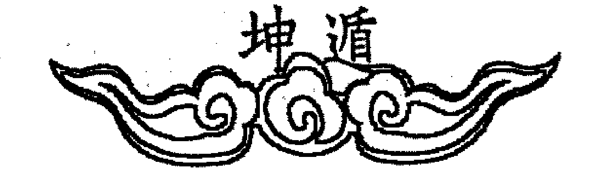

《太公风水》是现代诸多风水流派中最实用的风水绝学之一，是当今风水界实用性最强，应验率最高，理论体系最完整周密的现代住宅实用风水绝学。教程中汇集了姜太公奇门遁甲的风水绝学，可应用于现代居家风水、企业风水、工厂酒楼风水、房地产风水等诸多领域，运用太公风水可聚财旺丁改运等，具有丰富的实践经验和操作方法，实用性强。内容丰富，风水运用方法独特，是一套实用价值极高的经典教程。

本套教程通过大量实用风水图文案例，通俗易懂地介绍现代风水布局之法，只要有小学文化程度的读者就能够读懂，自己能布局风水吉位，运用太公风水专用罗盘，十分钟找到自己的财运位与事业位，十分钟快速的找到孩子的文昌位与功名位等等。

太公风水为姜尚祖师奇门精华，集飞龙道人几十年经验，经过精心整理编著而成。内容切合社会实际，贴近百姓生活，具有很强的实用性和可操作性，人人能懂、人人会用。本教程有大量的案例讲解，很多可以直接套用在现实生活中。

太公风水将易学风水奥秘改编为通俗易懂的入门教程；绘图风水案例分析，将幽深玄奥的风水易理直观表现出来，道教奇门泰斗飞龙道人揭秘风水学中最不为人知的秘密。

> 《太公奇门风水》会给您一个满意的答复。

《太公风水罗盘》更是太公奇门风水的又一利器。它切合实际、通俗易懂，即使对罗盘一窍不通的人，也会在使用罗盘方面很快入门！

罗盘主要由天池、内盘、外盘三大部分组成。

天池：也叫海底，亦就是指南针。

太公风水内盘：有九星、十二宫组成，每个内盘都可以转动。而且还有二十四山，八门等，通过罗盘的运用即可预测吉凶祸福。是太公奇门预测不可缺少的工具，在太公风水中有不可替代的重要作用。

外盘：外盘为正方形，主要是内盘的托盘，太公风水罗盘正面有青龙、白虎、朱雀、玄武四神兽，其威力是以先天之气化后天无形之煞，仿若太公在此，诸神护佑，起到化煞、镇宅、助运、招财的神效。

在办公室内，在自己最常开启的抽屉内放一个开光罗盘，可以为主人助运，防小人侵害，化解煞气。

将罗盘直接挂在家宅、办公室、商业场所、犯阴煞方或通道门口、窗户上、房间内的书桌及书柜上，应在光线明亮处，盘面向外，可以挡煞旺财，使家宅平安，趋吉避凶。随身带一个罗盘也可化煞、辟邪、助运等。

家中若是供奉有财神或者观音之类的神像，在神像下方或后方放一面罗盘，可以大大增加神力，保佑家宅平安。

用罗盘来镇宅。如阳宅中阴气太重，房子内有不良的邪气场存在，小孩无故哭喊，或屋宅处于凶方等，皆可将开光后的罗盘放在屋内，平放在墙角，即可达到兴旺家运，避邪的目的（注意摆放时，要选择吉日吉时）。

用罗盘来招财。将罗盘本命与宅运卦的财位上去，便可收到威猛的招财效果。

如果家宅门窗正对天斩煞，尖角、庙宇、坟场、垃圾场等，都会影响屋内人运势衰退，这样可将罗盘挂在门上或窗前正面朝外，但须南位向上，即可达到趋吉避凶，保家人平安。

注：用太公风水罗盘化煞、镇宅等只是一个方面，还是要根据屋宅主人的八字命理结合实际的风水调整才能达到更好的效果。

# 百善孝为先，最好的风水是孝顺
孝道是打开上等风水的钥匙。

人世间最赚钱的买卖，莫过于为人子女。一声“爸爸”“妈妈”，便轻而易举地换来了两个人对你一生的细心呵护。

且不说幼时勤换尿布，童年时代灯下悉心教导，青年时代日夜牵挂，也不说平日里嘘寒问暖，撒娇包容，就说父母一生忙忙碌碌，辛辛苦苦讨得一点糊口养命钱，便全数付与了子女，人世间，难道还有比为人父母更亏本的买卖了吗？

时光荏苒青春不再，转眼间父母已双鬓微白，看着父母一天天的苍老，许多有孝心的年轻人也想通过努力给父母的余晖添点温度与色彩，只是大多人会觉得无从孝顺起。

大城市的老年人都有养老保险，农村的老人只要能动的，基本上是自食其力，父母不缺衣少食；加上儿女们正青春年少，或求学外地，或谋生在外，或成家立业，肩负更多的责任与压力，生活的烦恼与压力已无暇顾及。

于是，很多人会一边感叹树欲静而风不止，子欲养而亲不待，一边把孝顺这件事儿压到思维的某个角落，只在某个不经意间才会想起。

孝顺难道就是提供衣食住行吗？

尽孝难道就这么难吗？

其实不然，父母都是善良的天使，一个眼神，一句暖语，一点点礼品，早已让他们开心不已。孝顺父母师长，礼敬三宝贤仁，不必四处祈求，至少可得四种福报：颜色端正、气力丰强、健康长寿、事业顺利等。

孝为百善之首。不孝父母，拜佛无益。如果连对自己恩德最大的父母都不能照顾好，一切其他的善只能是伪善。

现在很多人只会跑到外面烧香拜佛，却不知道，在家佛就是父母啊！如果能将对佛菩萨的恭敬心，用在父母身上，那你的福报可就大了！

堂上父母不孝顺，远处求佛有何用？要知道，“家家弥陀佛，户户观世音”啊！

“孝”，是连接上下的通道，以祭祀通天，以传承通地，打开福报的源流，接通福缘慧根。力行孝道，上对得起列祖列宗，下对得起子孙后代，则接通福慧之脉，打开你的财富和幸福之道。

孝道不圆满，人绝对不会圆满。

佛家把一切众生都看成是自己的父母，这是把孝顺父母的心发扬光大，扩大到尽虚空遍法界！所以，佛陀四十九年讲经说法，教给我们的一个“孝”字，是学佛人必修之课程。古圣先贤说，父母是我们的第一大福田。

有人认为，买房子、请保姆、吃大餐、去旅游就是孝顺父母。其实，物质上给父母的享用，这是低层面的“孝”；而高层面的“孝”，应该表现为对父母精神上的敬重和感情上的安慰。

孔子曾经对他的学生们说过，孝敬父母什么最难，难在很难有一颗恭敬的心，经常对父母微笑，经常敬重地对待他们，关心他们的物质生活和精神生活。每天认认真真看着父母的眼睛，跟父母交谈几分钟——不嫌弃，不抱怨，想对父母发脾气时克制一下，始终和颜悦色对待父母，他们就会生活得开开心心的。

老人就像一块有着肥沃土壤的田地，你在这块福田上洒下什么种子，就会收获什么果实。当你供养父母，撒下财富的种子时，未来必定收获财富大树；当你孝顺关爱父母时，等你老了，儿孙就会孝顺关爱您。

为什么会有如此的反作用力呢？因为父母为天，孝敬父母是天道，你对父母和老人的态度，就是对宇宙天地万物的态度。

这个世界，给出什么，就会收获什么，这是宇宙法则。

同修们，现在觉醒，为时不晚。趁老人们还健在，趁我们还在父母身边，趁假期亲人在一起，好好的孝敬父母长辈，放下手机、远离一些电子产品，做一些力所能及的家务，多陪陪家人。

陪陪老人聊聊天，讲一讲你在外的趣事，听一听他们的家常话。不要总等着来日方长，老人们时间毕竟有限。如果条件允许就带上他们，让他们也了解一下外面的变化，如果不允许那就在家陪陪他们吧！

# 百善孝为先，最好的风水是孝顺
未修大道先修人道，善待父母，才是最大的教养。

看一个人是否有教养，只要看他对待父母如何，不善待父母之人，纵使有天大的才能，也只会让人感到十分厌恶，永远无法得到别人的尊重。

一个真正有教养的人，怎么会自己过着锦衣玉食的生活，而让父母过着朝不保夕的生活？

一个真正有教养的人，怎么会自己住着舒适豪华的房子，里面却没有一个房间是养育我们的父母？

一个真正有教养的人，怎么会榨完父母最后一滴血汗钱后，无情抛弃他们不管不顾？

乌鸦有反哺之情，羊羔有跪乳之恩，所有的教养问题，请先建立在善待父母的基础之上，否则一切都是空谈。

孝顺父母，善待父母，这是一件永远不会过时的事情，若你现在还不清楚自己该做什么的话，那么就去孝顺父母吧，这是一件绝对正确的事情。

家庭最好的风水，就是对父母和颜悦色。

有时候，人真的很可笑，父母把我们养大，供我们读书上学，给我们成家立业。可是，等我们挣钱了，遇到喜欢的人，给买礼物，买房子，甚至把钱都交给他，都在所不惜，可是对待父母却吝啬。对待身边同事、朋友或者是陌生人的时候，请他们吃饭，喝酒，山珍海味，说话总是彬彬有礼、言语得体，回到家后，不但不舍得给父母买吃的喝的，甚至还要搜刮父母的血汗钱，跟父母说话却从无顾忌，也不考虑是否伤害到父母。

世界上最可怕的是，拿着父母血汗钱给父母买礼物，究竟是做子女活得太过虚伪？还是说根本就不懂得如何善待父母？

其实善待父母并不困难，只要你好好说话、和颜悦色地与父母相处就可以了。不管生活多么艰难，请莫要以言语伤了父母的心。

善待父母，是一个人最大的福报。

孟子说：“惟孝顺父母，可以解忧。”

善待父母，是身为人子、人女应尽的本分，不掺杂任何的东西，是一种与生俱来的天性。

善待父母便是家庭最好的风水，是一个家庭和睦气氛的关键。若无法善待父母，家里总是乌烟瘴气，没有一点平和气象，即便有再好的风水，也无用处。

风水，不过是术的一种，家风才是最好的风水。

很多风水都不讲孝道，把百善孝为先抛之脑后。

多少人认为自己当不了官，发不了财，诸事不顺和身体不好等，便埋怨风水不好，可就没想想自己是否孝敬父母没有？

其实，孝敬自己的父母，就是最好的风水。

“八德”之首就是孝道。孝就是仁，而仁就是善，这样的人才能德高望重。

从古至今子女善待父母、长辈的伦理道德行为的称赞，因为它是一种文化，在我国伦理道德中占有举足轻重的地位。历朝历代都十分重视孝道。

古代，是一个重孝的社会，帝王把孝视为治国之本，百姓把孝视为立身之基。朝廷为重视孝，还专门设立举孝廉科目，作为选拔人才的标准和形式之一。像汉初，朝廷规定每年要从所属郡国中推举孝、廉各一人。到了东汉，此规定则合二为一，在二十万人中举孝廉一名，凡被推举之人，可到京城为朝廷录用，也可到地方做官。

不孝父母的人，风水再好有何用，德不配位必受其灾。有道德的人能孝感天地，比如神话剧《天仙配》里的董永，卖身葬父，其孝心不仅感动乡邻，还感动了天上的仙女。

幼年时期父母是我们最好的风水，没有父母我们不可能长大成人，没有父母我们吃啥，穿啥，谁来给我们遮风挡雨。

所以，父母才是我们最好的风水，父母老了，父母年迈了，爹娘生咱身，拉扯咱成人，汗水壮咱筋骨肉，恩情比海深，养娘心安稳，敬爹是本分，一个道理传古今，要做孝德人……羊羔方知跪乳，乌鸦反哺报恩，何况人呢？所以，父母年迈我们是父母最好的风水。

我们会发现很多不孝子女，父母把我们养大成人，哺乳之恩完全忘记，现在人只知疼儿疼孙，却忽视了养育自己的双亲。也不想想，你疼儿爱孙为哪般？不就是为了儿孙将来有出息，将来好孝敬自己吗？难道自己的爹娘能不这样想吗？因果循环的道理，自己都不孝敬父母，如何让自己的子女孝敬自己，自己都不尊师，如何让你的徒弟尊师，所以因果循环，就是这个道理。

自古道：孝顺还生孝顺子，忤逆还生忤逆儿。

你不孝敬父母，难道就不怕自己的儿孙以你为榜样吗？所以说，你不孝，其儿孙也决不会多孝的。《报母经》开篇讲道：隔窗望见儿抱孙，我儿只知他儿亲，单等他儿成人后，他儿饿断我儿筋。

# 坤道

纵观历史，凡不孝敬父母的，不仅混得不好，有好下场的也不多。

凡孝子，不仅混得好，还可名留青史。

古代选官重孝，现代又何尝不是？包括企业招人，同样重孝！孝，是仁德。谁不想用仁德之人呢？

能对父母好的人，对别人也不会太差。反之，对自己的父母都不好，别指望他们对别人好。

> 自古道：忠臣孝子人人敬。

凡让人敬仰之人，各方面机会机遇就多，成功的机率就大。这就是好人有好报，确切地说，这就是风水！

现在有很多人为了发财、为了升迁、为了健康、为了诸事顺利等，便不惜花重金不远百里千里去古寺名刹，烧香求神灵保佑。

殊不知，父母才是家中最大的佛，才是家中最大的菩萨，你用求神拜佛的钱，何不用在父母身上呢？这样不仅能落个孝子的美名。

> 老话讲：南里北里烧香，不如在家孝敬爹娘。

家中二老是活佛，何需灵山朝世尊。

可以这么说，凡对爹娘不孝之人，去再多的庙宇，烧再多的高香，为此花再多的钱，也是徒劳的。因为这些神灵前身都是德高之人，故，他们死后才被人们盖寺庙供奉。试想，神灵能保佑那些对爹娘不孝之人吗？

自古就有天佑孝子之说，何况前身是凡人的神灵呢？

凡孝敬父母之人，即使你不去求神拜庙，上天神灵也会眷顾你的。历史上这样故事太多太多了，如古二十四孝之人，他们的孝心，皆感动上苍。如郭举埋儿（不主张）、王祥卧冰、孝感动天的舜等。

如果有人问到底怎样对待父母才算孝呢？那么就告诉你吧。

其实呀，孝敬父母形式是多种多样的，归纳起来不外乎物质和精神两种。

现在时代发展快，人们生存压力大，小孩忙学业，大人忙挣钱。尤其是农村和城市收入低的家庭，夫妇几乎常年在外打工，在物质上孝敬父母有时会跟不上，但精神上总得有吧。实际上，做父母的对儿女的要求很简单，他们也并不图儿女们多少钱财，只要儿女心里有他们，常回家看看就行了。

为何一首《常回家看看》的歌曲能成为经典？据说当夜有数亿人在电视机前感动落泪，数千万游子年后奔家看望双亲。

《百孝篇》上说：行孝不在穷和富，量力尽孝孝不难。富孝荣华来供养，穷孝饮水亦承欢。也就是说富有富的孝法，穷有穷的孝法，虽孝法不同，但毕竟是孝啊！

凡孝敬父母之人，虽然现在穷些，但迟早会富有的。《百孝篇》又云：福禄皆由孝字得，孝子虽贫终能好。

孝文化在中国源远流长，它是一种理念与精神，是为人的立身之本，是社会责任意识的源头，是中华传统文化的重要组成部分。

在国家十分重视传统文化的今天，孝子们不仅可当选各级好人，政府还给他们诸多礼遇。前几年国家又重新规定了新“二十四孝”。

天地重孝孝当先，一个孝字全家安。人只有重孝道，才能拥有好人品，好风水！

只可惜很多世人不知孝，不知孝能感动天。

父母恩如地如天，为人子一辈子报答不完。孝敬父母，是义务，更是责任！

只有孝敬父母，才能拥有最好的风水！

## 人体场能风水学

我们知道风水会影响人的命运，姓名会影响人的命运，八字会影响人的命运，就没有想过人会影响的命运吗？

如果取一个旺夫的女人，哪怕是家徒四壁早晚都会金碧辉煌，如果把扫把星取回家里，哪怕是金碧辉煌也会变得家徒四壁。

如果你的朋友是高官厚禄，比如是皇帝，是省长，是市长，你的命运能不改变吗？

如果你的朋友是富甲天下，那就是靠着大树好乘凉啊，如果你对朋友一贫如洗，朝不保夕，别说他帮你，还要你去周济他的生活，这不就是人影响人的命运吗。

过去古代父母要把男女双方的八字找算命先生要合婚的，为什么啊，不就是看一看两个人相不相克吗？在一起是报恩的还是寻仇的。合不合财啊，朋友在一起做生意也要找算命先生看看合不合财啊，子女看看父母克不克孩子，免得白发人送黑发人啊，有这么一副对联，夫妻是缘、有善缘、有恶缘、缘缘相报。儿女是债、有讨债、有还债、无债不来。这就是人与人的磁场学，也是人与人的风水学啊。

房子是一个能量体，我们每天在屋里面生活，场能的作用每天都在影响着我们，但我们每天接触的人，也是一个能量体，每个人的能量大小和能量的存在形式又各不相同，和一个生你运气的人，旺你财运的人，看见他你就会有愉悦心情的人，见到某个人你就会财源广进的人，和这样的人每天在一起，工作，学习，创业，生活等等，和这样的人在一起就会给自己带来好运，带来吉祥。

如果和一个克自己的人，那就诸事不顺，和一个泄自己运气的人在一起，你就要操心劳累，甚至给自己带来忧愁忧虑，和一个八字相害的人在一起，就会犯小人啊，甚至命丧黄泉被其所害啊。

这就是人与人之间的场能的影响啊，对方和你在一起时，对方就会顺顺利利平安发展，同时你也会连带获得吉利的人，如果你的命运能量恰好增强了对方命运里那些不吉利的能量，削弱了对方命运里那些吉利的能量，那么对方和你在一起时，对方就会麻烦事不断，坏事层出不穷，同时你也会受对方的连累而不断的失去好的机遇或发生坏事。

现实生活中，我们与走鸿运的人合作，就会步步为营啊，就会名利双收啊，就是事事顺利。如果与走败运的人合作，则会处处碰壁，破财犯官，败多成少。

很多人和领导不和，老板不和，辞职离开领导，自己出去创业，最后却成了百万甚至千万富翁。

如果当初不离开领导，就要受排挤打击，根本没有成为亿万富翁的可能，这就是人与人的风水学。

有多少夫妻两地分居时，情深意笃难舍难分；可一旦是每天一起，就天天吵吵闹闹，甚至变得仇深似海。

现实生活中，我们有很多好朋友，但如果你仔细想一想，和哪个朋友在一起就比较顺利，会给你带来好运，和哪个朋友一见面就会发生烦心的事情，事业不顺，家里不顺，其实没有巧合，是磁场不和的原因。

现实生活中，你会先入为主的讨厌一个人，但如果你仔细分析总结一下，你会发现，当你和某些讨厌的人在一起时，接触他以后反而总是好事连连，这种情况的发生，其实也是你和讨厌的人之间命运能量相互作用的结果。

这就是人与人之间的能量的关系，一个人能不能把人克死，听某某算命先生说克夫命和克妻命，还有克父克母的命，为什么有的父母生下孩子，孩子不成人就死了，这是父母克的吗？为什么别人家的孩子又精又灵，他们家的孩子却驾鹤西去。为什么有的孩子一降生父母就没有了，这难道不是克的吗？记得我的一个徒弟别人给介绍对象，问我徒弟做什么职业的，我徒弟说是算命的，对方说我不信算命，我徒弟说了一句话，别人家的老婆没有死，你老婆死了，难道不是你克死的吗？你不信命行吗？

人与人天天在一起，同在一个屋檐下，怎么会没有影响呢？

夫妻天天同床共枕，每天都窃窃私语，怎么会没有影响呢？

人体磁场和宇宙的磁场一样巨大，开心的时候会带领身边的人都开心，生气的时候影响身边人都生气，郁闷的时候会给身边的人带来忧愁和忧虑，人与人在一起相互影响是不可想象的，面对凶残之徒会给我们带来恐惧，面对善良的人给我们带来祥和，面对爱挑理的人给我们带来小心翼翼，很怕说错了那一句话，就会祸从口出，招惹是非。面对爱说爱笑的人，会带动身边所有人快乐，这就是人与人的磁场，会影响身边的人。

人与人的磁场互相交流，互相传染，互相感应，如同风水一样，对人的影响是巨大的。

风水是宅与人的和谐之道，人的磁场是人与人的和谐之道。

因此人与人相处也是风水，要想风水融合，与人相处之道要懂得尊重与包容，不能以暴戾之气处理事情。

和人相处，微笑是很重要的，只要是有微笑的地方必定是和平的、没有纷争的，同时，微笑也是一种国际通用语言，全世界的人都看的懂。

朋友之间要以诚信对待，不能欺骗对方；答应别人的事情就一定要做到，要做到君无戏言，有困难的时候要互相帮助；有福同享，有难同当。

与人相处时，要让自己的心保持平静，要上善若水，以德报怨。不要充满怨恨，常怀怨恨的人，是世上最可怜的人；常怀感恩的人，是世上最幸福的人。

了解别人是体谅之道，宽容别人是和睦之道，接纳别人是群我之道，关怀别人是友爱之道。

不可为自己的利益，而失德伤人；不可为自己的好处，而损人利己。

在这个世界上，每个人都希望过着有尊严的生活，每个人都有相同的机会站在同一立足点出发，至于将来成就如何，则会因个人的努力与才智而有所不同。

因此，不歧视弱势者，并提供他们较优厚的条件，协助他们参予社会生活，也是积极实现尊重的重要作为。

人与人相处要学习与人结缘，不肯结缘，人生会越来越贫穷；肯结善缘，福德会越来越深厚。

要将美丽的善心散布人间，要将芬芳的爱心传播社会，要将清净的真心供养十方，要将彩色的好心与人结缘，从人群中广结善缘，从工作中发挥热忱，从节俭中乐于喜舍，从勤奋中创造明天。

所以我们在和别人相处时要懂得发心，发心帮忙别人，别人也都会很乐意帮忙你，形成一种人与人之间的互利关系。

我们对别人：

- 一、说满口的好话，
- 二、做满手的好事，
- 三、有满面的微笑，
- 四、存满心的欢喜。

这个也是一种和人相处时要特别注意的事情，说满口的好话让别人欢喜，做满手的好事来帮助他人，有满面的微笑来和大众结缘。

# 坤道

在和他人相处时，千万不能闹翻脸，物品坏了可以修复，情义损坏难以弥补，所以我们要珍惜人与人之间的情分，不要因为一件事而破坏情义，这是非常令人惋惜的。

- 做人要像一面镜子，时刻自我观照；
- 做人要像一只皮箱，随时提放自知；
- 做人要像一本簿子，不断记录功过；
- 做人要像一支蜡烛，永远照亮别人；
- 做人要像一个时钟，分秒珍惜生命。

我们要尊重他人，不能因为是不同种族而歧视他人，要尊重别人的自由，尊重生命的价值，尊重大众的拥有，尊重天地的生机。

和人相处时，要诚实，不欺骗，要包容，学人长处不忌妒；容人短处，不计较，要站在别人的立场去想，临事须替别人想，可是论人要先从自己想，要布施、要结缘，接受的要知感恩，懂得布施则更具智慧。我们也要多说好话，常行好事、时时反省，常常欢喜，这样才会有个圆满的人生。

啥是坏风水，自私自利是最坏的风水，一个心胸狭隘的人，一个自以为是的人，一个不知羞耻，一个没有责任心，我们谁会和这样的人做朋友，损人利己的人和谁能处的长长久久，不知道感恩的人最后一定会把自己的路堵死。

因此，人品决定人脉，人脉决定事业的成败，做人就要上善若水，只有厚德载物才是这个世界上最好的风水。

## 太公奇门风水“旺门星和丧门星”论

天地有阴阳，阴阳先生还是要分阴阳，我今天讲的阴阳先生可不是看阳宅的为阳，看阴宅的为阴，而是阴阳先生分为两种命。

一个是旺门星的命，一个是丧门星的命。

作为风水师，首先就要修德，也许很多人会认为修德和风水师有什么关系呢？今天我就通过讲解旺门星和丧门星，让弟子们去参悟，如果你们真的懂了，我在传授你们真正的“小乘风水”。

简单的来讲，风水师来到你的家里，你的家里突然好事就来了，或者生意兴隆，或者喜事连连，或者贵人登门等等，这样的风水师就是旺门星。

你们有没有这样一种感觉，你去谁的店铺，谁的店铺就会生意兴隆，卖货也比平时多了，几天不开张，你一去就开张了。这就是旺门星的人，但是，旺门星的人，本人未必会行旺运，而是他走到哪里，就会给别人带来好运。

这样的风水师一定是厚德载物，他就是一个有道德的风水师，有修养的风水师。

还有一种风水师就是“丧门星”。

他去谁的家里调风水，调完风水不但运气不好，反而破财，吵架，疾病缠身，或者发生官非口舌等事情，很多人说没有调好风水，是他的水平不行，错，他就是一个“丧门星”，是他无德，不能够厚德载物，走到哪里，去了谁家，都不会给他家带来好运的。

如果一个有德的风水师走到哪里，就会一福压百祸，这家明明不好，他去了生意也好了，疾病也好了，财运也旺了。

这就是我多年来不传风水的理由，我怕培养出来的都是丧门星弟子。

因此，师父今天告诉你们，看风水的人一定要修德，没有德的风水师，怎么救人，我的一个广东的学生罗大师，也是专业从事风水的，并且也是桃李满天下，当自己有了外遇以后，他的妻子给我打电话，说你的学生说有了外遇，并且说是妻子前世作孽，他这一世就要对她惩罚，天哪，难道你是判官，用自己的外遇来惩罚自己的妻子，这样的风水师去人家调风水，能给人家带来好运吗？满心邪气，说出缺德的话，天地都不容，天地都会惩罚他，怎么给人家调风水。

所以，一个没有道德的人，技术再好，满身邪气的人，不但无法给人家带来福气，反而会给人家带来晦气。

你看很多大和尚，也许他并不懂风水，他去人家指点了一下，人家的运气就好了，不顺的事情也顺了，这是因为大和尚他有功德，用他的德给人家就会带来福气，为什么我们选择拜师父都要选择一个德高望重的人，不就是为了能够给自己带来福气，带来福报，师父修福报，后人可以乘凉吗？

很多人想学习法术，法师难道就不分阴阳吗？

有一些高功，一边吃喝嫖赌舞，一边穿上祖师爷的法衣，去给人家超度亡灵，去给人家祈福消灾，这样的人配高功这两个字吗？

祖师爷看见这样的弟子，会助他吗？

没有祖师爷的帮助，你唱的再好，还踏罡步斗呢？做出那些好看的动作，是唱给神仙听吗，难道你不唱神仙就听不懂吗。

一个有德的高功，要做的既为众生之父，又为众生之子，能够把别人的苦看成是自己的苦，把客户看成是自己的孩子一样去对待，能够把自己当成孩子一样来对待父母，这样的法师才不愧为祖师爷的弟子，才是真正的三宝弟子。

我没有针对某一个人的意思，聊起了阴阳，我的嘴就会口无遮拦的乱讲。

很多风水师为什么都穷，还有贪道，为什么不能够发迹呢？
你风水技术再好，为什么不让自己发起来，为什么不让自己都亲朋好友都富起来，今天给这个看风水看的发了几百万，明天给那个调风水升官了，为什么自己却一贫如洗，这是为什么呢？
今天为师告诉你们，一天进了祖师爷的大门，一辈子都是祖师爷的弟子，一天从事济世救人的职业，一辈子都要有使命感，如果你没有使命感，你就会不顺，就不配当祖师爷的弟子，就会自己遭受磨难。
那你问我为什么祖师爷不让你发财，如果祖师爷让你富有了，有几百万甚至几千万，你还会去济世救人吗？你还会为了几百元钱去给人家指点迷津吗？如果你说我发了我可以免费为人服务，告诉你，不可能，那是废话。
如果你有钱了，还能够去济世救人，还能够给人家指点迷津，还能够不忘初心，你就会富贵，就会一帆风顺，就会所求如愿。
也许你会问，师父，难道你就是那么完美吗？
今天我告诉你，我还真的就不是完美的人！
今天我问你一个问题，师父的心胸宽广吗？
告诉你们，师父的心胸还真的就不宽广！这里最能证明的就是我的弟子小总统。
我们在一起的日子很久了，记得那一年我去他家过年，他的师父每一年都会去他的公司做道场，正好让我赶上了，小总统问我，师父，今年做什么道场比较好，我告诉他说道，你就拜斗吧，年三十下午4点多钟，已经下了一天的雪了，他师父带来六个老道来给做道场，我就开始和他师父斗了起来，我就问他，你拜斗天降大雪，你徒弟问你念什么经能把天先念晴了，然后再拜斗，他师父看了看我，有一点不服气的说道，那半夜让太阳出来呗。

其实我当时就是想和他斗，我叫徒弟，你去点几根香，我师父教我的第一个法术是呼风唤雨，今天我就教你第一个法术拨云见日，偷看了他师父一眼，他师父撇了撇嘴，有冷笑的意思，其他几个道士在旁边观看。

郭光辉去点了五根香，我说道，我念什么你就跟着念，念了几句咒语，把香插到香炉上，我告诉他师父，一刻钟晴天。他师父冷笑。十分钟后，天晴了，但是天还降大雪，太阳从云层里面漏了出来，上有天，下有地，中间有小总统，你们可以问他我有没有说谎。

你们想知道他上完香我心里念的什么吗？

告诉你们吧，徒弟上完香后，我心里在想，祖师爷啊，帮一帮弟子吧，千万不要让弟子丢脸啊，弟子也是想给祖师爷度化一个好弟子，将来能够帮助祖师爷弘扬道场。其实我就念了这么多，也是我的诚信感动了祖师爷，才没有让我在龙口丢脸。

所以，再好的法术也要有祖师爷来相助，再好的经，你就是念上十天八天，祖师爷不来帮忙，有用吗？

所以，你看那些抛妻弃子，吃喝嫖赌舞的法师，整日给人家做道场，超度亡灵，补财库你们说这样的法师有用吗？

所以，拜师要拜有德的师父，请法师要请真正修行的师父，看风水要请厚德载物的风水师，把旺门星请进家里，会行旺运，请回来的是丧门星风水师，大法师，不但不行运，反而会给自己带来不顺，破财，犯官非等。

飞龙道人论述

## 人宅合一论

房子的布局相同，而不同的人确命运不同。

应大连的高女士的邀请，前去给他弟弟看风水，我们来到了一小型超市，当时超市里坐了几个人，他的弟弟很热情的接待了我，然后问我超市的风水好不好，我即告诉高先生，风水再好也并非人人在这里都好，就向你与某某人很好，他处处帮助你，但是他也有不和之人，对于你来讲他是你的贵人，但是对于别人来讲，可能他就是其他人的小人。关键是人要与人相合，风水也是如此，人也要与房宅相合才是好的风水。

高先生着急的问道。董道长，你看这个风水与我相合吗？

我把太公奇门的风水专用罗盘拿了出来。问了高先生的八字，根据房子的座山和朝向推出人宅合一的命盘来。

- 一、超市的大门正好开在了高先生的福禄宫之上，而财位却跑到了卫生间那里，根据这两个方位，我开口说道，高先生，请恕贫道直言，你开的这个超市，你会很享口福的，整天吃吃喝喝的到是不少，如果我没有看错的话，你的超市根本就不赚钱。而且你的钱财流失的会很快，我劝你还是不要经营的好。
- 二、这个时候他的爱人在旁边说道，董道长，那你看看如果我在这里经营超市如何？生意会好吗？

我再次将太公风水罗盘拿出，根据房宅的山向，用她的八字与房子的命盘一合，我便开口笑着说道；你与你爱人的命盘居然是一样，看来“不是一家人、不进一家门”。你在这里也根本没有财运。
- 三、这个时候她的姐姐也好奇的问道；那你看看如果我在这里经营这家

| 方位/宫位 | 关联人员 | 情况描述 |
| :--- | :--- | :--- |
| 超市大门 | 高先生 | 开在福禄宫，主享口福但不赚钱，钱财流失快。 |
| 财位 | （位于卫生间） | 财位不佳，不利财运。 |
| 房宅整体 | 高先生爱人 | 与高先生命盘相同，在此处亦无财运。 |
| 房宅整体 | 高先生姐姐 | （信息中断，后续内容缺失） |超市生意会不会兴旺，我随即用太公风水罗盘根据房宅的山向，用她的八字与房子的命盘一合，高女士的命盘与房宅的大门非常的相合，大门为超市进出的气口，而这个气口正好是高女士的财门。根据这一条我便铁口直断的说道，你若是经营这家超市，定可以门庭若市一般，生意兴隆而客源充足，肯定的说道你会财源广进的。

高女士开口大笑道：董道长你说的太对了，刚刚没有和你直言，请你不要生气，这家超市原来就是我经营的超市，当时生意特别的兴旺，我也是靠这家超市发家的，但是看见弟弟和弟媳妇在家没有什么事情做，就把这家超市给了弟弟来做。没有想到的是，我原来经营的那么兴旺的超市，现在让弟弟经营的却日渐衰落，也请了很多的风水师前来，摆放了很多的风水化煞用品，根本就不管用，所以特别的邀请董道长前来，希望道长能够救活这家超市。

高女士说完后，我却给了她当头一棒，说道：请恕我直言，还是让你弟弟把这家超市转手吧，或者还是由你来经营，从大门的方位来看，第一他在这里大门怎么都开不到吉位。第二他的财位在卫生间，即使你拆掉，楼上依然是卫生间。

风水本身没有好坏之分，关键是要看谁来住。这就好比风水师一样，把自己吹的如何神奇，结果自己却出了车祸等无妄之灾。给这个调成百万富翁，那个升官发财，自己却一贫如洗。给别人调一个省长，市长，局长，自己却无高官厚禄。所以，现在的风水大师认为摆放千奇百怪的吉星物品，就以为能扭转乾坤了，认为万物的一草一木就能改变人的命运，荒谬之极。

我又开口笑道，这个地方与你弟弟还有你的弟媳妇的八字不合，无法改动。这就好比别人住在这间房屋，升迁当上省长后，离开了这个房宅，你说这里的风水是不是很好。高女士答道：那当然了，他都能够当上省长了，这里的风水肯定好啊。

我又笑着说道：那如果你再住进来这里，你是否还会当市长啊。高女士回答道：那怎么可能啊。我笑道，就是啊，这不正是说明有福之地要等待有福之人吗。

高女士说道，请董道长前来就是认可你敢于说实话，我们请了好几个风水师，每个人都说了一大堆，钱没有少花，还买了很多的风水用品，就是不管用，听了董道长才明白，以前只知道人要与人相合，现在知道每个人与房子也要相合。看来我弟弟经营这家超市根本就不合财，既然我与这家超市合财，还是由我来继续经营。非常感谢董道长直言不讳的说出了我的心结，更让我们明白了风水要与人相合的道理。

## 山管人丁水管财

很多太公奇门的弟子经常问到我，师父，我想学太公奇门风水！

下面我就这个话题谈一谈我个人的观点，没有针对某位风水易学大师的意思，如有雷同纯属巧合，请不要对号入座。

现在的风水流派太多，很多风水师去看风水，张嘴闭嘴就谈到什么“山管人丁水管财”之类的话，那么今天师父问你们，为什么说“山管人丁水管财”，这句话的内涵意思是什么？

一个地方的人丁是否兴旺与山有关，财物是否丰富与水有关，山川青秀则人丁兴旺，绿水长流则财富物丰。反之，如果是“穷山恶水”寓意山水恶劣丑陋就难以出聪明能干的人才，就会观念落后、眼界狭窄、不求上进，导致财物贫乏、生活困苦，正所谓穷山恶水出刁民。虽然这句话并不深奥，但从未听风水师说出其中的道理，一个不懂得其中道理的人，怎么能够真正了解风水的意义和内涵呢？

今天，师父就用太公奇门风水的角度和弟子们探讨一下“山管人丁水管财”，其中的道理，纯属个人拙见，希望能够起到抛砖引玉之效。

### 一、首先需要弄明白：为什么说是山管人丁呢？

人虽然为万物之灵，但人不是两栖生物。人，属于草木之人，草木栖息于山林之中，从宏观的角度来论，地球分为两大部分，一部分是山，一部分是水。

山，就是土地，包括山川，就是万物栖息之处，这就是为什么风水学讲究房宅要有靠山，其实就是人要有靠山，也就相当于人靠在山上躺着或者坐着，人就会感觉安稳和安定，这就是为什么房子要有靠山。这就是为什么说山管人丁了。

下面我再从微观的角度来论述山管人丁的道理。

假如房子后面有靠山，山上有参天大树。人，能够感受到山川的灵气，说明后人有成才之人，或者说出栋梁之才的人。背靠大树好乘凉，同时也说明房宅的主人有贵人相助。

如果靠山都是花花草草的，说明后人朋友会很多，会有小财，这就是为什么说山管人丁。

如果房宅靠的是一座秃山，秃山寸草不生，鸟都没有藏身之处，万物生灵都无法生存，人丁又怎么会兴旺呢？

人，是草木之人，不是两栖生物，如果靠山是水，主人丁不兴旺。

应太公奇门弟子邀请前往绍兴去给一客户看风水，客户带到一处老宅，见房后两米处有一个鱼塘，正好是靠山是水，并且鱼塘临子孙位，我告诉弟子说，他家的房子靠山是水，又临子孙位，今年太岁正好冲克房宅的子孙位，主他家孩子出去会出水灾，孩子会溺水而死。

客户听后痛苦不已，反馈今年儿子去水库玩，不幸落水而亡。他的风水就是犯了靠山是水，正好临了子孙位，所以刑克子孙。如果是兄弟位就会刑克兄弟，如果是父母位就会克父母……

所以风水学上靠山不能见水，房宅要有靠山，就是这个道理……

房子后面有靠山，代表人有靠山，有栖息之处，人也是草木之人，因此人丁是不是就会兴旺啊？不一定。

假如靠山是沙漠，是寸草不生黄土高坡，如何养人啊？因此山也要分什么山，山上也要分什么树等等。

### 二、下面我们讲解一下水为什么管财呢？

风水学上为什么说水管财呢？

前面我们讲了，地球上除了山地就是水了，并且水占了百分之七十多，水，能生万物，也能养万物，因此水已经成了万物苍生养命的源泉，财也是养命的源泉，所以才会说，山管人丁水管财。

如果房宅明堂见水，说明出门就会有水喝，也代表出门就会有饭吃，这样的风水你们说好不好？未必。因为水还要分什么水，要是臭水泡子，臭水沟，黄河之水，能喝吗？

所以在风水学中，水，还真的就是财。

所以，向上无水，主财运不旺，但是水要分什么水，是内财还是外财，还要看房在内部布局与外部布局了。

黄土高坡的地方为什么比较贫穷呢？因为水少，不能够养万物，万物生灵没有水就无法生存。何况人呼。

所以，山青水秀就会给人如临仙境、豁然开朗的感觉，在那里生活就会心旷神怡。

如果一个地方的山峰歪斜残破、凶险丑陋，就会给人如临绝境、烦躁不安的感觉。

你看现在山川秀丽的地方，旅游业的发展，人丁就自然兴旺；相反，一个恶劣的环境，不但没人愿意去居住，人丁就不兴旺。

这就是我所要论述的“山管人丁水管财”，其中的奥秘，纯属个人意见，仅供参考。

飞龙道人论述

## 太公风水演义

风水学说认为，一方水土养一方人，而穷山恶水出刁民，但为什么会有那么多的人不相信风水呢？因为大多数风水师不了解历史，不了解建筑学，不了解史前建筑学的渊源，而致使很多人不相信风水，认为风水师迷信，其实是情有可原。

究竟什么是风水？

这要从原始建筑讲起，在远古时期大约在10000年前，最原始的构筑为巢居和穴居为主，前者经历了由树巢，仿生鸟巢居住。后者为原始的半穴居、深袋穴，横穴等居住方式，至今半穴居也没有消失。史前大量遗址如：

-   宁夏海原林子梁遗址，就是利用坡地削出崖壁，横挖窑室而居住，居住呈马蹄形，面积约25平方米。
-   河南偃师汤泉沟遗址，就是居住于窑穴，穴形呈袋状，穴深超过一人的高度，顶盖用斜架和茅草树叶。
-   洛阳孙旗屯半穴居遗址，穴口内收，呈袋形半穴，穴底有火台，盖顶用树枝和茅草铺装。
-   西安半坡遗址，穴直壁50cm-100cm，属于直壁半穴居，入口处设有打叉手雨棚。

以上等等的树居和穴居，最后演变成现在的地面建筑的演变过程。这个发展过程在母系氏族公社时期已经完成。

说了这么多，其实就是为了让大家了解，从古至今我们为什么要修建房子，房子的修建的地点和风水有着非常大的关系，我们肯定不能把房子建在戈壁滩，荒无人烟连水都没有的地方，戈壁滩连鸟都不待的地方，没有水万物都无法生存，更何况于人呢？所以我们修建房子肯定要依山傍水，还要藏风聚气这样才能生存，这就是所谓的山管人丁水管财的道理。

有人说我不信风水！

那他为什么不把房子建在沙漠，建在戈壁滩，建在荒无人烟之地，建在臭水沟旁边，建在没有水的地方，没有食物的地方，这不就是风水吗？

为什么要建在山清水秀，依山傍水，鸟语花香，世外桃源，藏风聚气，宽敞明亮的地方，这不就是风水吗？

有些人说我不相信形法、峦头，房子一出门就是臭水沟，出门有一个大石头堵着门，出门就爬山才能出去这难道不是形法吗？

从古至今，中国第一个王朝建立在夏朝，在晚夏时期的宫殿遗址，已经发掘最早的大型殿址，堪称“华夏文明第一殿”，这标志着中国建筑风水的文明时代。

初期原始社会修建城墙主要是为防御，防避野兽的侵害和其他部落的侵犯，进入皇帝社会后，城墙起到保护国君和国人的职能。

从公元221年，秦始皇灭六国，建立了中国历史第一个真正实现统一的国家，秦始皇集聚全国风水师与能工巧匠，国之栋梁，开始修建驿道，修建长城，广建宫苑，在陵寝等工程上，建置空前庞大的都城令人吃惊，至今遗留下来的阿房宫，骊山陵遗址，可以想象当年的建筑有多大的恢宏气势。

房子其实就是保护我们不受风吹日晒雨淋，蛇虫虎豹的侵害，从历史演义到今天的房子，被称为家居风水，这是最好的阳宅风水定义。

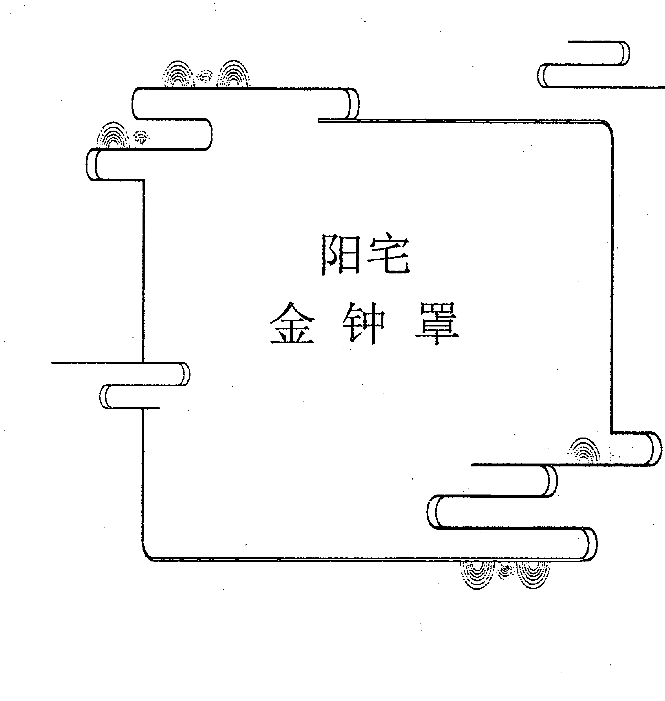

## 阳宅---金钟罩

### 房子是金钟罩  风水是保护伞

原始社会，约五十万年前，中国原始人就已经知道，利用天然的洞穴作为栖身之所，用来遮风挡雨和躲避野兽追击。

古代国家修建城墙可以抵御外敌，百姓修建房屋防盗防贼。

原始人类为避寒暑风雨，防虫蛇猛兽，住在山洞里或树上，这就是所谓的“穴居”和“巢居”。

经过不断进化，古人开始营建房屋。为我们遮风挡雨，免受风吹日晒雨淋之苦，因此，房子是我们的保护伞，也是一个保护我们的金钟罩。

当时的房屋主要有两种，一种是以陕西西安半坡遗址为代表的北方建筑模式——半地穴式房屋和地面房屋；

半地穴式房屋多圆形，地穴有深有浅，以坑壁作墙基或墙壁；坑上搭架屋顶，顶上抹草泥土；有的四壁和屋室中间还立有木柱支撑屋顶。

一种是以浙江余姚河姆渡遗址为代表的长江流域及以南地区的建筑模式——干栏式建筑；一般是用竖立的木桩或竹桩构成高出地面的底架，底架上有大小梁木承托的悬空的地板，其上用竹木、茅草等建造住房。干栏式建筑上面住人，下面饲养牲畜。

从人类的起源，最早居住的是洞穴。可以遮风挡雨，躲避烈日炎炎的盛夏和数九寒冬。能躲避猛兽的攻击，时至今日我国某些偏远地区的黄土高原的窑洞。

居住在“洞穴”之中，有人挖的“洞”，也有天生的山洞，本质上并没有多大的区别，或者正是从山洞得到启发，人们才挖窑洞的。

远古时期的人主要靠采摘野果和食用动物为生，他们久居山洞里了。白天外出狩猎，晚上回山洞睡觉。山洞不仅是人们的栖息之地，慢慢的也成为了生活的重要场所。

原始人所处的时代，洞内是安全的，洞的外界是相当危险的，毒蛇猛兽对人类往往形成严重威胁。一般情况下，洞穴只有一面与外界接触，岩厦与外界的接触面也相应小了很多，这就避免了相当多的危害。

“北京人”所住的山洞，其洞口正对山下，可以观察周围的动静，便于警卫；洞顶较高，也便于守卫。再次，洞穴可以为原始人提供归属感，满足其归属的需要。原始人都是群居。“北京人”所住的山洞，洞里开阔。

既然洞穴也能够满足人的多方面需要，那么我们为何又要去建造房屋呢？

我们试想一下，如果人居住在旷野里，风雨侵袭会使我们疾病缠身。毒蛇和猛兽的攻击会让我们失去生命。就连小小的蚊子，都会让我们寝食不安，命运就会更加悲惨。

如果屋漏又逢连夜雨，让我们难以安身立命，甚至会影响我们的身体和生命。

风水好，回家会让我们过上安逸的生活，出外创业会让我们叱咤风云，能让我们财源广进而名利双收。

中国是一个地大物博，历史悠久的文明古国，中国古建筑在世界古代建筑史上形成了独特的建筑体系，占据着重要的地位，是世界建筑艺术宝库中的一颗璀璨明珠。

古老的建筑是人类栖身之所，也是为了躲避恶劣的自然环境的风雨雷电，巢居也好，住宅也好，能藏风聚气，能防止风吹、日晒、雨淋，还要遮风避雨，与寒冷冰霜，包括狼虫虎豹，抵御猛兽侵袭，抵御外贼的侵入等等，这样的防护才是人类的生存之道。并且还要近水向阳之地，能安居乐业才是风水宝地。

# 坤遁

## 一方水土养一方人

风水学讲：一方水土养一方人，这就形成了人的性格有很大程度的地域性差异。今天我就通过讲解五行来论述一下各地风土人情，这也是我多年来云游四方得出来的经验。说是经验，也许是孤陋寡闻，言语微不足道，望请四方之士海涵。

### 一、北方人的性格

我先从北方的风水讲起。

从风水学上来讲，南方朱雀，北方玄武，东方青龙，西方白虎，而玄武位居北方。

北方为水，属于玄武，玄武为龟蛇，在姜太公奇门遁甲中北为虎门，也是虎口。

什么是玄武呢？玄武亦称玄冥，是龟蛇合体。

东北三省地形以平原和山地为主，东部有长白山脉，北部有小兴安岭，西倚大兴安岭，在山地之间分布着东北地形主要是以平原为主，河流多数都是大河为主，一条长长的河水不会像南方的水一样九转十八弯。东北人长时间饮用此水变得豪爽大方，性格不会拐弯，直来直去。加上气温变化大，冰天雪地的寒冷天气，水变得冰冷，这就使东北人的性格宁折不弯，胆子大讲义气，可以替朋友两肋插刀，喜欢路见不平拔刀相助，东北人也爱管闲事，你求到他时他会乐于助人。但有时也会心狠手辣，匪气十足。

很多人认为东北人好勇斗狠，性格随意而张狂，欠温柔涵养之气息，这与风水学中的玄武有一定的关系，玄武里面的蛇，蛇的特性是人不犯我我不犯人，这也就是东北人的性格，东北人不会主动去欺负谁，但是你不能冒犯我，网络传说东北人的性格是，当你看了陌生人，对方会说，你瞅啥？他会回答，瞅你咋地，不服过来练一练，就这样双方会掐的你死我活。

东北属于水，水能溶于万物，也能生万物，所以东北人都很善良，富有同情心。

为什么东北人打架不计后果，而且东北人打起架来，一定要就近找武器，下死手，专门往脑袋上削，比如石头，砖头等等，专打致命的要害呢？因为东北属于玄武之地，前面我们讲了，玄武里面有蛇，打蛇要打七寸，因此东北人削头部就是这个道理。

大家都说东北人傻狍子，打起架来不要命，东北人打架真的不要命吗？

其实，东北人比谁都爱惜生命，他的不要命是打起架来想要别人的命，而从风水学的角度来讲，东北位居玄武地带，因为玄武里面的蛇。蛇要是咬人就是一招致命，所以东北人打起架来才想要别人的命。

和北京弟子自驾游到贵州千户苗寨，徒弟告诫我说，师父，苗寨人很能喝酒，你要小心点不要被他们灌倒喝多了，我笑了一笑说道，我是东北人还会怕喝酒吗？

北方在坎宫，坎为虎口，因此东北人喜欢吃喝玩乐。东北是中国酒量最大的地方，60度的老白干是东北人的最爱。东北无论男人还是女人，喝酒打架都是一流的，因为蛇也有雌雄，但是蛇从来不会主动去攻击谁，你不惹他，他是不会攻击你的。

很多人对东北人的性格让人感到爱恨交加。北方人的性子豪爽但比较粗野，对人热情、但翻脸时下手也狠。

北方属于水，位居奇门风水的虎口位，所以东北男人一般嘴巴比较甜能忽悠，浓重的东北话最适合讲小品。东北男人容易讨女人喜欢。

### 二、南方人的性格

南方属于火，为朱雀，在太公奇门属于珍珠门，财宝门。

我们都听过“不到东北不知道胆有多小，不到广东不知道钱有多少”。

南方的风水是山多水多，而北方是山多水少，我们说“山管人丁水管财”，所以北方人不会挣钱，南方人会挣钱。东北水是直的，所以东北人说话直来直去，不会拐弯。而南方的水是转来转去的，所以南方人懂得变通，说话不伤人。水又主智，所以南方多水，南方人就聪明。头脑又灵活，懂得经商。

南方为朱雀，朱雀属于鸟，古人说人为财死鸟为食亡，所以南方人敢于冒险、敢为天下先。

广东人什么都敢吃，包括蛇、老鼠、狗、猫、穿山甲、黄鼠狼等等，因为他是朱雀啊？林子大了什么鸟没有啊？所以朱雀只要能吃的他都吃，就是这个道理。

南方山多，山为乾，乾为男人，而地为坤，为女人。山多的地方地就少，因此南方的女人没有地位，但是南方地下有水，因此南方的女人都很能干，也很精明会挣钱。

南方的人为什么迷信，因为南方是朱雀，北方是玄武，玄武和白虎是食肉动物，他不信邪。因此北方地区和西方地区的人信仰的不多。而朱雀和青龙是天上的，因此南方地区和东方地区的人有信仰。逢年过节都在家里做道场，香火不断。祖坟修的比住宅都豪华。

北方地区的人和西方地区的人为什么喜欢吃肉，因为北方是玄武，西方是白虎，都是食肉动物。而朱雀和青龙都不是食肉动物，除了朱雀吃虫子，但还是喜欢吃五谷杂粮的。

南方的人比北方人勤快，是因为早起的鸟儿有食吃，即使是一个小小的虫子，哪怕是一粒稻谷都不会放过，所以南方人无论是小财还是大财，都不会错失良机。相反北方人就不同了，天天想着发财，天天想着挣大钱，因为北方是玄武。玄武是蛇，还有一句经典的话，叫“人心不足蛇吞象”，蛇能吞了大象吗？因此玄武和朱雀恰恰相反，一个小小的虫子和一粒稻谷，玄武是看不上眼的，他宁可像蛇一样去冬眠，也不想去挣小钱。这就容易错失良机，小钱不想挣，大钱挣不来，这是典型东北人的性格。所以北方的人到了冬天就打麻将，聊天，砍大山，过着悠闲的日子。

南方一年四季没有冬天，所以水又暖又甜，长时间饮用了南方的水，人的嘴就会甜，加上朱雀会唱歌，所以南方的人说话不伤人，会哄人，把钱挣到手才是硬道理。北方人就不同了，北方的水是寒冷的，所以北方的人性格生硬，蛇张嘴就咬人，牙齿有毒，所以北方的人不会甜言蜜语，说话易伤人：咋地，爱买不买，磨叽什么，再啰嗦削你。

### 三、东方人的性格

在卦为震，八门之中为日门，代表东方，是太阳升起的地方。

东岳泰山，西岳华山，因此山东典型代表着东方，我们都知道江南出才子，山东出圣人。

像武圣姜太公、文圣孔子、兵圣孙子、智圣诸葛、医圣扁鹊、八仙在山东闹海，七真在山东得道，大家闻名的崂山道士等等举不胜举。

从风水学的论述上讲，为什么山东出圣人和神仙呢？下面为师就通过太公奇门风水来给你讲解一下。

山东被称为孔孟之乡、礼仪之省。山东自古多大将、多忠义之士。

很多人不了解山东，会说山东出响马。从风水学的角度来讲，东方有寅卯辰，寅为老虎，虎啸山河，不干庸庸碌碌之事，想有作为。卯为日出东方，太阳一出，普照万物，因此主名望所以出圣人，出名人。辰龙能行云布雨，龙腾九州。但是，毕竟山东是青龙，古代有一句话叫谢主龙恩，因为青龙主义道德，所以，山东人知道感恩，懂得济世救人，知道仁义道德才是根本，所以山东出忠义之士，山东出良将。即使“水浒传”最终不也是为朝廷效力，上演忠义之士吗？

因此，山东的地理东方属木，木主仁义。因此山东人性格过于耿直，山东极少出阴谋家和皇上，所以说“山东出大将，西方出帝王”因为西方是白虎，主威，主权。

风水学上，山为乾，为男人，地为坤，为女人，泰山的雄伟，所以山东的女人没有地位。以前去山东徒弟家吃饭，女人不让上桌，包括母亲，这在我们东北是绝对不允许的，东北的人情，父母亲如果不上桌，客人是无法吃饭的。因为此事徒弟还让我给训了一顿。也许我不了解山东的礼仪与文化。有一句话说的好，叫入乡随俗。

我记得课文“范进中举”就有这么一段：范进的岳父在范进的家里吃饭，范进的母亲和妻子是在得到范进岳父的邀请和允许后才上桌吃饭的。

山东人从来都是热情待客，不让女人和孩子上桌吃饭是一种待客之道。

山东素有“泰山之云海，华山之雄险”。太阳日出地方，因此泰山是一个有灵气的地方，引来无数的修道之士来山东寻找修仙得道之地，记得七真传里面有这么一段。王重阳度化孙不二的时候说道：山东某某地有一股灵气，能出一位真人，你愿意否？孙不二答到，弟子愿意，王重阳看了看孙不二说道，你去不了……因此山东是一个有灵气的地方，谁能找到这股灵气，就可以得道成真，因此山东引来无数的修道之士，前往山东寻找灵气所在，祈望能得日月之精华，山川之灵气，三年可白日飞升。

### 四、西方人的性格

西方为兑宫，为白虎，在月门。

前面说过，东岳泰山西岳华山，西方为白虎，在太公奇门西方为月宫，为阴，八卦为兑宫，兑为金，金为白，又为少女，因此，如陕西华阴县就出了四大美女的杨贵妃。四川号称中国第一美女大省，身材多娇小，面容秀气，皮肤嫩白，性格鲜明。

西方为阴，兑为阴，月为阴，阴盛阳衰，因此，四川的女孩能力很强，很多男人反倒无能，要靠女人来养。

西方地区的人为什么喜欢吃牛羊肉，因为西方是老虎，和朱雀不一样，虫子他不吃，也吃不饱，喜欢大型的动物，所以像宁夏、甘肃，新疆，陕西等地都喜欢吃牛羊肉。

八卦的兑为口，因此西方的人喜欢吃喝玩乐，但也喜欢诗情画意，并且能歌善舞，人才辈出。比如四川很多人喜欢提笼架鸟，还有不会玩麻将的不是四川人。新疆人能歌善舞等等。

西方为白虎，因此西方地区的人都骁勇善战，过去，由关中人组成的秦军号称“虎狼之师”，令关东诸侯闻风丧胆。

西方多数为黄土高坡，戈壁滩，沙漠等不毛之地，连鸟都没有藏身之地，兔子都没有草吃，因此西方的经济比较贫穷落后。

甘肃有一句叫“春风不度玉门关”、“西出阳关无故人”，这种感觉好凄凉。

和弟子去甘肃看张掖风水，客户的孩子是白血病，祖坟不好，到了张掖一看遍地是戈壁滩。我和客户说道，如果你请我到这里来选地，在本地花上几百元就可以了，何必花重金来请我。后在穆阳给选了一个风水宝地，几个月后告诉我孩子的病情已经好了。

戈壁滩连水都没有，连鸟都无法生存，如果把坟葬在那里，后人怎么能够富得起来。

那么，为什么新疆是西北地区最富裕的省份呢？因为新疆是沙漠，五行之中有没有一个叫沙中金的命？对，沙子里面有黄金。

所以，你看新疆地下有石油，地下有玉石，地下宝贝多，所以新疆就富有。

过去的皇宫就在陕西，就在西方，因为西方是白虎，会大有作为。比如秦始皇的皇陵就在陕西。过去叫皇都。

如果选墓地的话，如果想成名，那就去山东选择一风水宝地，出圣人，出神仙。如果想让后人丰衣足食，会挣钱，在南方选墓地。如果想让后人大有作为的话，可以去西方地区选择一个风水宝地。如果想让后人当抗日英雄的话，那就选择北方吧！

中原地带的风水没有山，很多人都会说高一寸为山，低一寸为水，风水的看法讲究比较多，不是一天两天能够讲得完的。因为中原无山，要看地脉，绝对不是高一寸为山，低一寸为水那么简单，你挖一个坑去打水能打来吗？这些说法属于画饼充饥，还有一些风水师给客户挂上一副山水画，说这样就会有山有水了，你以为你的笔是神笔马良的笔啊，那画一个大饼，就不用做饭了，饿了就吃这个饼吧。

我没有针对某位大师的意思，也许是我孤陋寡闻，飞龙道人个人见解，有妄加评论之感，望请海涵。

飞龙道人论述

## 风水阴阳论

绝密公开了就不再是绝密了，有缘看见这篇文章就是与太公奇门有缘。

从宏观的理论来讲，我们生存在地球之上，一共分为两个家，地上的房子是我们生前的家，地下的墓地是我们死后的家，活着为阳，死了为阴，人的灵魂不灭，这是不是阴阳？

从微观的角度来讲，无论是生死，都活在两个世界，白天一个世界，夜晚一个世界，这是不是阴阳啊？这属不属于阴中有阳，阳中有阴啊？

古代还没有灯火通明的时候，人是日出而作，日落而息，遵循着阴阳的法则，故而阳不侵阴，阴不侵阳。而现在的人活着都是阴阳颠倒，白天像死人一样睡觉，晚上像鬼魂一样活动，眼眶和熊猫眼一样出来吓人。

聊起阴阳，我们都知道，天为阳，地为阴。男人为阳，女人为阴。太阳为阳，月亮为阴。那么，在阴阳的实际运用之中，我们应该如何来通过阴阳进行预测人生呢？

今天为师就通过阴阳来给大家讲述其中的奥秘。

为了能够让大家懂得阴阳，我来举例说明一下，如何把阴阳运用在实际的现实生活之中。

开天辟地，我们先从人讲起；

古代在孩子降生的时候，生出来的是男孩，是阳还是阴？

那么；生出来的是女孩，是阳还是阴？

假如这个孩子降生的时候，天上出现异象，你们说好不好？不一定...

如果天上出现祥云缭绕，或者五色祥云，或者红光满室，或者异香扑鼻，或梦麒麟送子，或梦太阳光照，你说这是阳还是阴？

对，这是阳，那么这样的孩子降生到这样的人家，他的命好不好？

好吧，那么他是来报父母恩的呢还是来寻父母仇的呢？

他会不会给家里带来好运呢？

那要是孩子降生的时候六月飞雪或乌云遮满天，或梦鸡飞狗跳，或者乌鸦乱叫，这样的异象是吉呢还是凶呢？这个还是来报恩的呢还是来败家的呢？

这是不是阴阳的关系？

再比如；你一进他的家里，感觉他的家里阴森森的，或者房间阴暗，有一种不见阳光的感觉，这样的房宅是阴是阳？

是阴就说明他们家里犯阴灾，阴灾是什么灾啊？

阴灾就是病灾，家里人爱生病，钱财聚不住，犯小人，甚至小人诽谤和暗坏，因为阴就是不见阳光。这样的风水你们说好不好？

那么你们一进屋阳光特别充足，从上午到中午到日落前都是阳光充足，感觉进去热火朝天，给人有一种热的窒息的感觉，待上一会儿就会大汗淋淋，你们说这样的房宅是阳呢、还是阴呢？

是阳的话，这样的风水好不好？

不好，那犯什么灾呢？

房子犯阳灾，就阳气太盛，就会给人带来犯官非讼事，破财，能够看得见的是非。

如果有财的风水，一进屋就有一种愉悦的心情，如果是聚财的风水一进屋心理有一种热流的感觉，这样的风水就不犯病，就是一个平安的宅子。旺不旺财另当别论。

那么，你一进房门对面就是佛好不好？

那你一进屋，对面就是供奉的祖宗位好不好？

# 坤遁

不好，为什么不好呢？

南方很多人家，你一进大门，供奉的就是祖宗，一是你一进门迎的就是阴气，其二就是祖宗喜欢安静，什么人都往里进，会打扰他不安宁，这样的风水就会家里出病人，让家宅不安宁，家里的人也会心神不宁，严重的就会破财，犯小人口舌等等。

比如来人也分阴阳，无论是男人还是女人，进屋后不说话，眼睛不看人，脸上阴沉沉的，你说这样的人是阳还是阴？

这样的人运气会好吗？财运会旺吗？你和他能交心吗？诸葛相法里面有这么语句，叫做冷落如冰难交心。因为他阴气太旺。

那来人满面春风，眼睛有神，说话声音洪亮，和你说话让人感觉特别融洽，这样的人是阳还是阴？那这样的人好不好交，他的财运旺不旺？不一定，这要看他的命。

比如走路，有的人走路带风，就像跑一样，着急忙慌的。还有一个人站着或者坐的时候，他的脚都会抖个不停，这样属于阳还是阴。对，属于阳，那这样的命好不好呢？不好，诸葛相法里面有一句话，叫做行走带风福不长，站坐不稳命无官，漂泊不定下命人。因此，你看一个人要破财的时候，他就会心烦意乱，站也不是，坐也不是，这就是一种预感和前兆。

那来人坐在那里稳如泰山，说话声音语气和睦，不高不低，走路也四平八稳，这样的人属于阴还是阳，不对，是阴阳和合，诸葛相法云，坐像坐来站像站，不是高官也是中命人。

那来人坐在那里，低个头，你和他说话他也不看你，眼睛好像有心思，在琢磨什么似的。这样的人属于阳还是阴，属于阴，这样的人是大富大贵的命吗？这样的人你能交下他吗？

来人一看就特别憨厚，憨中带柔，讲话感觉特别柔和，一说话就哈哈的笑，这样的人好不好交？好交，但是，诸葛相法说道，满面笑容心胸假，这样的人说话真一半，假一半，他说的话不能全信，他说大象的时候你就当他在说老鼠就行了，他说有一百万的时候你就当他说五十万就行了，他说没有钱的时候他一定有钱，因此他说话不真实，但是人不坏。

阴阳之道，奥妙无穷，如果你仔细的研究进去，是非常玄妙的。

比如上午来算命的人为阳，他的运气就会不好都好，而下午来算命的人为阴，好都不好，因为是从阳转阴。

因此一半都会赶在上午去算命，下午不去算命，下午为阴，压一个人的运气。那么你们说中午时候去算命好不好？

中午为阳中之阳，为纯阳，这个时候来算命好是好，就是物极必反，纯阳转阴，人容易犯阳灾。

那从人体上来讲，中医首先就是阴阳学，表里，寒热，虚实，所有的一切最后都要归纳为阴阳。

一个人进门脸上苍白，一看就是气血不足，给人的感觉就是无精打采的，这是阴还是阳？是阴，他的身体会好吗？身体不好他的运气会好吗？

那一个人进屋满面红光，一看就是气血旺盛，看上去就是如狼似虎的，这是阴还是阳？属于阳，那这个人的运气好不好？

我在辽宁凤凰山的时候看斗母宫，只要我看见来人满面红光，我就会把这个人叫住……

所以，通过阴阳就可以判断一个人运气。如果白脸的人进来，这个人可不可交？那黑脸的人进来，这个人可不可交？告诉你们，在诸葛相法里面讲到，黑白自古是忠良，五行不和看语言，就是说光凭黑白还不能判断这个人的人品如何？还要从语言来听？

# 坤遁

如果来人语言憨厚，这个人就没有鬼心眼，这样的语言就是阳。

如果来人语言尖里尖气的，声音不正，这样的语声属于阴，鬼心眼多，聪明，要提防。

那来算卦的人一进屋就欲言而止，扭扭捏捏的，这样的人属于阳还是阴？

那来人进屋就喊，师父，给我算一个，这样的人会是算隐私吗？你说他是阳还是阴？

道家的文化讲究一阴一阳谓之道。

有一句话讲得好“孤阴不生，孤阳不长”，一个家庭就一个男人或者就一个女人过日子，他的日子能过好吗？这是犯了孤独星。

比方说很多人发财了，就去山上选择一个风水宝地来盖别墅，刚开始很好，慢慢的就会变成孤宅，这样的房宅人丁和财运也就慢慢的开始行衰运了，因为孤木不能成林，慢慢的人脉就没有了，住宅和庙不一样，庙可以选择一清净之地，因为祖师爷喜欢优雅之地，庙不怕孤，因为有信众，家宅就不可以。

很多相法方面，我不太敢公开来讲，因为人太多，大家到时候都喜欢对号入座，我怕得罪人背后骂我，人言可畏啊。会不会啊？

那我再说一个，天地万物皆有灵性，但是，有一些生灵绝对不能伤害，也不能吃？

现在多动症和自闭症的孩子为什么那么多？

你要是查他三代肯定有伤害过或者吃过这些生灵，要不就是祖宗供奉过这些生灵才会如此？

我去广东给客户看风水，看完风水后宋女士邀请我到她家去吃饭，进屋后看见家里两个男孩子，一看就是小儿多动症，我很隐晦的说道，现在的人啊，吃什么不好，偏偏吃黄鼠狼，杀人偿命欠债还钱，你要了他的命，他就要投胎到他家去报复他，就会生出多动症的孩子。宋女士的爱人问我，那你看我们家的孩子是多动症吗？我问道，你吃过黄鼠狼吗？他说道，吃过啊，而且广东很多人都吃啊。听他的言语感觉不太相信我的话，我便欲言而止的说道，你们家的孩子生性活泼好动，别人家的孩子就是多动症，你们家的孩子就是聪明的好动。其实，作为我们这种职业的人，你信我就指点你，你不信我为什么要自讨没趣呢？

像我自己的后姐夫的孩子我给算卦，卦象父母宫上有腾蛇，我问道，你打过蛇，后姐夫说是的，年轻的时候不但打蛇，并且喜欢吃蛇。我不敢当面说，其实你吃了他，他就会来报复你，他的孩子在家里就是不爱说话，不与人交流，并且懒惰，吃饱了就睡觉，什么都不想做，典型的蛇的习性，蛇爱干活吗，吃饱了就睡觉，再不就冬眠了。

所以，能够成仙得道的生灵千万不能伤害他。

今天我在这里就是一个抛砖引玉，阴阳学说，在日常生活中无处不在，我所叙述的仅仅是冰山一角，我一直想写一部包罗万象的“阴阳悟道学说”。

今天给大家一个考试题，把你们心目中的阴阳给写出来，要求作用到日常的生活之中，我不要空头理论，什么男为阳，女为阴，天为阳，地为阴，没有实际中的意义，写完论文后交给班长……

飞龙道人论述

## 阴阳家宅学说

我们一共分为两个房子，房子是我们生前的家，墓地是我们百年以后的家，人活着为阳，所以房子被称之为阳宅。百年以后两眼一闭为为阴，所以墓地为阴宅。因此才有了阴阳二宅，看风水的被称之为阳宅先生。

从微观的角度来讲，无论是生死，都活在两个世界，白天一个世界，夜晚一个世界，这是不是阴阳啊？这属不属于阴中有阳，阳中有阴啊？

远古时期人们追寻着养生之道，遵循着日出而作，日落而息的阴阳法则，所以，阴阳二字代表着一个太阳，一个月亮。故而在生在世的阴阳法则是，阳不侵阴，阴不侵阳。阳世三间的人白天活动，夜晚修养身心进入梦境，这叫阳不侵阴。而每到夜幕降临之时，便是墓地里面的人，他们白天睡觉，晚上出来活动，这叫阴不侵阳。

如今很多人阴阳颠倒，白天像死人一样睡觉，晚上像鬼魂一样活动，慢慢的就会发现他眼眶跟熊猫眼一样大黑眼圈，一看这样的人运气就会不顺，犯阴灾，有时候还大白天出来吓人。

天地万物与苍生皆分阴阳，聊起阴阳，天为阳，地为阴。男人为阳，女人为阴。

那么，阴阳如何在实际生活中来运用呢？

我们应该如何来通过阴阳进行判断阴阳二宅与人的命运关系呢？

让我们一起来探索阴阳的奥秘与真谛。

在我们还没有出生的时候，我们还有另外的一个家，那就是胎元，我们在母体的时候，母亲是我们最大的保护伞，让我们能够健康成长，保护我们不受伤害。

# 坤道

无论为男还是为女，在母体里的时候，都要靠母爱来护持，母亲十月怀胎的保护，精心柯护我们才会让我们能够顺利的来到这个世界，在我们来到这个世界的时候，也就是降子临产之时，其实一个人的命运就已经有了定盘，贫富贵贱和吉凶寿天就已经定了，古人一语道破天机，命也，运也，时也。

有些人生不逢时，有一些人时来运转，所以风水学上有另外一句话：一命二运三风水，四积阴德五读书，人在做天在看，真正改变命运的王者之道是积善之家必有余庆，孔明仰声长叹曰:“此乃天意,天不灭曹,而周瑜感叹既生瑜何生亮,

人的命运，从盘古开天地，降子临生之时，根据孩子降生的时候，观察是否有异象发生，如果孩子降生来到这个世界，天上出现祥云缭绕，或者五色祥云，或者红光满室，或者异香扑鼻，或梦麒麟送子，或梦太阳光照，这就是吉祥之造，这样的孩子降生到这样的人家，这便是天降大任，金鳞岂非池中物。

天地万物因果循环，有阴必然有果，夫妻是缘，有善缘有恶缘，缘缘相报。儿女是债，有讨债，有还债，无债不来。有的孩子天生就会给家里带来祥瑞，有的孩子生来就是为讨债而来。有的孩子天生就是聪明伶俐，有的孩子生来就傻傻的，甚至得怪病，白血病，把家里的钱都耗尽了，给父母留下外债，他归西而去，这难道不是因果循环吗？

有的孩子降生的时候六月飞雪，或者乌云遮满天，或者梦见鸡飞狗跳，或者乌鸦乱叫，这样的异象是吉呢还是凶呢？这个还是是来报恩的呢还是来败家的呢？

这是不是阴阳的关系？
在比如；你一进他的家里，感觉他的家里阴森森的，或者房间阴暗，有一种不见阳光的感觉，这样的房宅是阴是阳？

是阴就说明他们家里犯阴灾，阴灾是什么灾啊？

阴灾就是病灾，家里人爱生病，钱财聚不住，犯小人，甚至小人诽谤和暗坏，因为阴就是不见阳光。这样的风水你们说好不好？

那么你们一进屋阳光特别充足，从上午到中午到日落前都是阳光充足，感觉进去热火朝天，给人一种热的窒息的感觉，待上一会就会大汗淋淋，你们说这样的房宅是阳呢、还是阴呢？

是阳的话，这样的风水好不好？

不好，那犯什么灾呢？

房子犯阳灾，就阳气太盛，就会给人带来犯官非讼事，破财，能够看得见的是非。

如果有财的风水，一进屋就有一种愉悦的心情，如果是聚财的风水一进屋心里有一种热流的感觉，这样的风水就不犯病，就是一个平安的宅子。旺不旺财另当别论。

那么，你一进房门对面就是佛好不好？

那你一进屋，对面就是供奉的祖宗位好不好？

不好，为什么不好呢？

南方很多人家，你一进大门，供奉的就是祖宗，一是你一进门迎的就是阴气，其二就是祖宗喜欢安静，什么人都往里进，会打扰他不安宁，这样的风水就会家里出病人，让家宅不安宁，家里的人也会心神不宁，严重的就会破财，犯小人口舌等等。

比如来人也分阴阳，无论是男人还是女人，进屋后不说话，眼睛不看人，脸上阴沉沉的，你说这样的人是阳还是阴？

这样的人运气会好吗？财运会旺吗？你和他能交心吗？诸葛相法里面有这么语句，叫做冷落如冰难交心。因为他阴气太旺。

那来人满面春风，眼睛有神，说话声音洪亮，和你说话让人感觉特别融洽，这样的人是阳还是阴？那这样的人好不好交，他的财运旺不旺？不一定，要看他的命。

比如走路，有的人走路带风，就像跑一样，着急忙慌的。还有一个人站着或者坐的时候，他的脚都会抖个不停，这样属于阳还是阴。对，属于阳，那这样的命好不好呢？不好，诸葛相法里面有一句话，叫做行走带风福不长，站坐不稳命无官，漂泊不定下命人。因此，你看一个要破财的时候，他就会心烦意乱，站也不是，坐也不是，这就是一种预感和前兆。

那来人坐在那里稳如泰山，说话声音语气和睦，不高不低，走路也四平八稳，这样的人属于阴还是阳，不对，是阴阳和合，诸葛相法云，坐像坐来站像站，不是高官也是中命人。

那来人坐在那里，低个头，你和他说话他也不看你，眼睛好像有心思，在琢磨什么似的。这样的人属于阳还是阴，属于阴，这样的人是大富大贵的命吗？这样的人你能交下他吗？

来人一看就特别憨厚，憨中带柔，讲话感觉特别柔和，一说话就哈哈的笑，这样的人好不好交？好交，但是，诸葛相法说道，满面笑容心胸假，这样的人说话真一半，假一半，他说的话不能全信，他说大象的时候你就当他在说老鼠就行了，他说有一百万的时候你就当他说五十万就行了，他说没有钱的时候他一定有钱，因此他说话不真实，但是人不坏。

阴阳之道，奥妙无穷，如果你仔细的研究进去，是非常玄妙。

比如上午来算命的人为阳，他的运气就会不好都好，而下午来算命的人为阴，好都不好，因为是从阳转阴。

因此一半都会赶在上午去算命，下午不去算命，下午为阴，压一个人的运气。那么你们说中午时候去算命好不好？

中午为阳中之阳，为纯阳，这个时候来算命好是好，就是物极必反，纯阳转阴，人容易犯阳灾。

那从人体上来讲，中医首先就是阴阳学，表里，寒热，虚实，所有的一切最后都要归纳为阴阳。

一个人进门脸上苍白，一看就是气血不足，给人的感觉就是无精打采的，这是阴还是阳？是阴，他的身体会好吗？身体不好他的运气会好吗？

那一个人进屋满面红光，一看就是气血旺盛，看上去就是如狼似虎的，这是阴还是阳？属于阳，那这个人的运气好不好？

我在辽宁凤凰山的时候，看斗母宫，只要我看见来人满面红光，我就会把这个人叫住……

所以，通过阴阳就可以判断一个人运气。

如果白脸的人进来，这个人可不可交？

那黑脸的人进来，这个人可不可交？

告诉你们，在诸葛相法里面讲到，黑白自古是忠良，五行不和看语言，就是说光凭黑白还不能判断这个人的人品如何？还要从语言来听？

# 坤遁

如果来人语言憨厚，这个人就没有鬼心眼，这样的语言就是阳。

如果来人语言尖里尖气的，声音不正，这样的语声属于阴，鬼心眼多，聪明，要提防。

那来算卦的人一进屋就欲言而止，扭扭捏捏的，这样的人属于阳还是阴？

那来人进屋就喊，师父，给我算一个，这样的人会是算隐私吗？你说他是阳还是阴。

道家的文化讲究一阴一阳谓之道。

有一句话讲得好“孤阴不生，孤阳不长”，一个家庭就一个男人或者就一个女人过日子，他的日子能过好吗？犯了孤独星。

比方说很多人发财了，就去山上选择一个风水宝地，盖起别墅，刚开始很好，慢慢的就会变成孤宅，这样的房宅人丁和财运也就慢慢的开始行衰运了，因为孤木不能成林，慢慢的他的人脉就没有了，住宅和庙不一样，庙可以选择一清净之地，因为祖师爷喜欢优雅之地，庙不怕孤，因为有信众，家宅就不可以。

很多相法方面的我不太敢公开来讲，因为人太多，大家到时候都喜欢对号入座，我怕得罪人，背后骂我，人言可畏啊。会不会啊？

不会、我就多说两个，一个人走路腿往外撇，你们说这是阳还是阴，是阳，那一个人走路腿往里撇，就是罗圈腿，这个是阳还是阴，是阴，那这样人的命好不好？

不好，怎么不好呢？

诸葛相法云，走路鸭子拐，拐的什么都没有了，说明这样的人一天风风火火的，能干，能吃苦，什么生意都想做，折腾来，折腾去，把什么都没有了。

那我在说一个，天地万物皆有灵性，但是，有一些生灵绝对不能伤害，也不能吃？

现在多动症和自闭症的孩子为什么那么多？

你要是查他三代肯定有伤害过或者吃过这些生灵，要不就是祖宗供奉过这些生灵才会如此？

我去广东给客户看风水，看完风水后宋女士邀请我到她家去吃饭，进屋后看见家里两个男孩子，一看就是小儿多动症，我很隐晦的说道，现在的人啊，吃什么不好，偏偏吃黄鼠狼，杀人偿命欠债还钱，你要了他的命，他就要投胎到他家去报复他，就会生出多动症的孩子，宋女士的爱人问我，那你看我们家的孩子是多动症吗？我问道，你吃过黄鼠狼吗？他说道，吃过啊，而且广东很多人都吃啊。听他的言语感觉不太相信我的话，我便欲言而止的说道，你们家的孩子生性活泼好动，别人家的孩子就是多动症，你们家的孩子就是聪明的好动。其实，作为我们这种职业的人，你信我就指点你，你不信我为什么要自讨没趣呢？

# 坤道

看我们家的孩子是多动症吗？我问道，你吃过黄鼠狼吗？他说道，吃过啊，而且广东很多人都吃啊，听他的言语感觉不太相信我的话，我便欲言而止的说道，你们家的孩子生性活泼好动，别人家的孩子就是多动症，你们家的孩子就是聪明好动，其实，作为我们这种职业的人，你信我就指点你，你不信我为什么要自讨没趣呢？

像我自己的后姐夫的孩子我给算卦，卦象父母宫上有腾蛇，我问道，你打过蛇，后姐夫说是的，年轻的时候不但打蛇，并且喜欢吃蛇，我不敢当面说，其实，你吃了他，他就会来报复你，他的孩子在家里就是不爱说话，不和人交流，并且懒惰，吃饱了就睡觉，什么都不想做，典型的蛇的习性，蛇爱干活吗，吃饱了就睡觉，在不就冬眠了。

所以，能够成仙得道的生灵千万不能伤害他。

今天我在这里就是一个抛砖引玉，阴阳学说，在日常生活中无处不在，我所述的仅仅是冰山一角，我一直想写一部包罗万象的“阴阳悟道学说”。

今天给大家一个考试题，把你们心目中的阴阳给写出来，要求作用到日常的生活之中，我不要空头理论，什么男为阳，女为阴，天为阳，地为阴，没有实际中的意义，写完论文后交给班长。

## 五方风水

阳宅风水，人行为龙，路为龙脉。

远古时期，有五方，五地，有五山都归山神爷管，一方土地有一方山神，一山有一山的山神，如华山有华山的山神，泰山有泰山的山神，东西南北中各有五方山神，五方山神还有总山神，又称山神爷。

东方青龙，西方白虎，南方朱雀，北方玄武，所以南方有南方的风水，北方有北方的风水，怎么会一样呢？

南北方从地势上看也不一样，一般风水师能懂一方风水就已经是大师了，因为一方风水养一方人，东方、西方、南方、北方各自方圆就已经很辽阔了，每一方都有万丈方圆。

所以学习风水，一般只需要掌握一方风水即足以，而真正的风水大家如杨筠松，郭璞等等，都用毕生的经历游遍三山五岳，周游天下，这些大家懂得就不是一方风水了，而是懂得五方风水。

风水之道，南方有南方的风水，山水地势方圆不同，规矩也不同。北方有北方的风水，山水地势与南方各不相同，自然北方的风水规矩也不同。

所以，无论到哪一方去看风水，都要入乡随俗，就要按照哪一方的规矩来，都有当地的风水喜忌，看风水的人不能把北方的喜忌带到南方来用，南方的风水师也不能把南方的风水喜忌带到北方来用。因为东南西北中的风水，地势，龙脉的走向各不相同，怎么可以用一种风水之法，代替五方的风水，地势不同，方向不同，五行不同，规矩不同，所以如果只是想成为一方风水师，只需掌握一方风水就能养一方人，又能养自己，学一方风水足以。

而要想成为风水家，就要踏遍三山五岳，懂得看五方风水。

# 坤道

有天，有地，地就是地球，地球在宇宙中转动，地球上有山，有水，人生存在于地球之上。

地球的转动，白天也转，夜晚也转，从白天转到黑天，在从黑天转到白天，地球的转动，就会产生阴阳，转动就有阴阳。

有阴阳就有十二时辰，有十二时辰就有了十二地支。

人生于地球，死了也要死在地球上，宇宙的万物飞禽走兽死了也都要归于地球。

地球包含着万物，养育着万物，人的生存，动物的生存，鸟类飞禽的生存，树木的生存，草木之人的生存，万物的生存，养育着各个万物，植物。

万物包含着飞禽走兽，五草，大海，大河，小溪，河流，整个世界都在地球之中，包含各个国家。

什么是天？山即是天。

什么是地？土地就是地。

人在山上修道，得道后即是在仙山上，仙山即为天，又称别有洞天，在洞中得道，即成道于洞天。

人，有生就有死，生于地球，地球养育了我们，死后也要归于地球，养育地球。

地上的房子是我们生前的家。

地下的墓地是我们死后的家。

人死了灵魂还在，葬的墓地就是我们未来的新家，阴阳两隔，阳的时候我们是白天活动，阴的时候我们是晚上活动。

过去古代，阳的人不占阴人的时间，活人不占死人的地，阴人不占阳人的时间，死人也不占活人的地，所以叫阴阳两隔。阳不犯阴，阴不犯阳。

所以古人的时候日落而息，日出而作，遵循阴阳法则，故而阳不侵阴，阴不侵阳。

而现在很多人都是阴阳颠倒，白天像死人，晚上活动还是像死人，白天死人睡觉，现在很多的人白天睡觉，晚上精神和鬼魂一样晚上活动。

人死了灵魂还在，葬于地下，与人共处于地球之上，生了死，转世轮回为人再生，生与死都离不开地。

天为宇宙，宇宙之中有日球，有月球，日球为太阳，太阳为火，神仙也不能在火里生存，像火一样怎样能养育万物，月球里面也无法养万物，浩瀚的星球里面更是无法养万物。

所以，人也好，鬼也好，神也好，都在地球之上，都在人间，都在人的身边，人也在鬼的身边，人也在神的身边，只是我们看不见而已，阴阳两界，本来就没有分。

所以，无论是万物，还是地球，都与人融为一体。

天，只是天空，天空里面有月亮，有太阳，有星辰，来照耀我们的生存。

所以，何为天，山即为天，人若修道，你在哪里修道得道，哪里就是你的天。

故而古代有三十六洞天，七十二福地，这些洞天福地都是神仙居住，我们是谁身下的弟子，修的好就归到那座山上，哪个洞天而已，这也叫认祖归宗。

## 南方风水

南方为火，但是南方山高地薄，山多了，地就少了，山高成才的就多，为什么当大官的都在南方？山高就有峰，山峰主人旺。

南方水多，则犯桃花，古有水性杨花。

南方有高山，山高有峰，故而南方当官的多。

北方秃山多，秃山无峰，秃山有林而无峰。

南方山高峰险，故出人才，南方水多，水主财旺，这就是风水，所以后人就有才有财。

北方土山多，有山无水，有水无山，风水不合，阴阳不合，土山无峰，有小山包，秃山包，没有山峰，所以就人才稀少，不出人才，水少，后人财不旺。

东方属木，东岳泰山，日出东方，所以东方也出人才，但山东的山峰也不多，所以出人才的也少，但山东出良才，即是山出文人，出文才，如孔子，国家之栋梁，东方为生气，所以东方出神仙，出八仙、全真七子等都在山东修道，在东方得道。

山东地界只有泰山高，而泰山属于中秃山，地厚养人，山也不算太高。

从古至今，东方的山出才子，但不出高官，出人才，东方为龙，日出东方，东方为木，木为栋梁，所以山东出栋梁之才，出文人，出修道的神仙，名人，能工巧匠的也比较多，虽无大财，但山东风水也有小财，但因为地平，所以穷人也多，山峰多，山少，山秃，地平，福建浙江等地，山多地就少。

山为乾卦，为男人；地为坤卦，为女人，为阳多阴少，故女人不容易成才，乾多坤少，男人当家，大男子主义，女人地位不高，才少，女人受气，故女人要敬男人。

东方为木，山少土平，木克土，所以女人苦，富人有，但没有南方有钱人的多。

西方为金，西岳华山，西方为白虎，为权。

所以古代的皇都在西安，为白虎，为掌权。

而且自古东方为青龙，出文人墨客，出才子。西方为白虎，出武将，出帝王。金为少女，故西方出美女，出皇后多。

为什么西方出帝王，因为西方为金。

人最能成才属于木。

西方的金为重金，为金山，为高大，为权威，西方的山有喜马拉雅山脉，昆仑山脉，珠穆朗玛峰等都属于西方，如此高大的乾金之山，什么火能克？故西方为白虎，为权威，为帝王。

为什么皇帝说话叫金口玉牙，开金口，怎么就没有说开木口，开火口，非要说一个人开金口呢？所以还是西方大，金口即是权威。

古有南甜北咸，南方的水也属于甜，因为水是温的，温就代表甜。

北方的水代表咸，北方的水是凉、冷、硬，所以北方的人也不温柔，生硬，出强盗，匪徒，北方也为玄武，所以主暗，主盗。

北方人的脾气就像水一样，硬气，霸气，因为他天天喝生硬的水，所以不光是有霸气，连老虎都称之为东北虎，北方天气寒冷，一年有半年都是天寒地冻，水能不硬吗？地能不硬吗？万物都硬了，人也就生硬了，人喝的水，在吃地里长的，所以人就有刚，就硬。

因此，北方的人男人也刚，女人也刚。

南方人为什么柔，因为水温，所以性柔，因为他天天喝的水是温的，所以一方水土养一方人。

南方为火，故水温，性柔，南方水多，所以聪明，主智，主奸，爱说谎话，山多水必然多，水多因为有山，所以就会水随山转，而流动，不像北方一条直直的大河，不会拐弯，所以北方人说话也不会拐弯抹角，转来转去的，北方人说话直来直去，都是直肠子的性格，南方的水随山转来转去，所以南方人说话不像北方人说话伤人，不会有什么说什么，会变通，他可以说话变来变去的，拐来拐去的，懂得方圆之道，水随山转，顺山势而走，所以南方人会顺情说好话，不会直来直去的用语言伤人。

这就是五方地势水与山而影响人的心性，但东方为木，木性为直，所以山东人性格耿直，倔强，木硬，所以性刚，硬汉子，这就是地势影响人的心性。

西方为金，金美人秀，西方为白虎主权，所以西方出皇帝，开金口，有权，有威，代代出美女，出皇后，出名人，出官门中人，西方为金，我佛如来之所，所以西方的佛教信仰非常好，西方的西藏出家人可以称为活佛，金代表兑，兑为口，代表金口玉牙。

金能生水，代表能生财，主有权，主有帝王之命。

东南西北四方有了，唯独中方没有，中方代表中原，中原代表中土，都是代表中国。

远古时期，中国属于东土，唐僧西天取经，行经各国问其唐长老从何而来，唐三藏答道，吾从东土大唐而来，所谓东土指的就是中国。

东方为青龙，属于中国是龙的传人。

东方为木；木能生火，所以中国人喜欢红色，为木火通明，越来越旺，中国人办喜庆之事，也喜欢红色，代表红红火火，中国人结婚，要张灯结彩，穿的要大红大紫，代表夫妻越来越旺，和和美美。

西方为金；金为白，西方人结婚喜欢穿白色的衣服，为洁白无瑕之意，但中国为东土，五行为木，而白为金，金能克木，如刀劈木会有响声，锯木头会有响声，所以穿白色婚纱结婚，婚后容易夫妻不和，吵吵闹闹。

这就是西方结婚为什么喜欢穿白色，而西方人若穿红色，红为火，火克金，为金不旺，所以西方人不穿大红大紫，否则必然有刑克。

# 坤道

南方风水首先知道南方为火。

房宅以门为主，门户门户，一家出入之口，进进出出都从门走，所以阳宅首要以门为主。

南方为火，门向南，为火，火见火为旺，所以南方房宅向南开门，而南方为火，不宜向北开门，因为水火相克，北门水怎么能克南方火，火火水干，所以主北门不旺。北方后天卦为坎，坎为中男，先天为坤，坤为老母，故而主中男与老母不克死也得多病，也主无财，都克没有了，哪里会有财。

南为火，门向南又为火，火见火不相克，而相容相合，所以主旺，但如果门前有山头，直冲门，还真的不旺，山为天，为南天门，宅口向天门，人怎能担得起来，除了帝王将相可以担起来，否则主人不旺，犯冲克。

南为火，门向西，为金，火克金，火若克金，即为克人，故主伤人，酉为白虎，后天八卦为少女，先天八卦为中男，故主伤少女和中男，男为乾，故先克男。

南方为火，开东门为木，木能生火，为木火通明，门与天相合，主人旺，财旺。

东方为木，树木为材，故而主人成材成器的人多，树木成林，所以主人脉旺，竹子越来越好，松树可成材。

靠山有树，靠山有林，代表有人来维护，代表有靠山，有贵人。

靠山如果为秃山，无林，主没有靠山，没有贵人，没有权威。

靠山上有树木，小竹，小草，也主有大官，也主有小兵小卒，什么样的人脉都有，但山上有穴，不是所有靠山，上山有树木都是如此，靠山有虎穴，有泉水，那即是藏龙卧虎之地，主人安稳，有地位，有权力，有作为，这就是山形，水行，地行。

床为什么要有床头啊，床头就是靠山。

风水之道，以虎为山，以龙为脉。

什么是虎山，即以一座称为山，为虎山。

什么是脉，一条脉称为龙脉，龙脉是由多座虎山连城一片而称为脉，又称山脉。

所以古人称为虎座龙脉。

### 如何确定龙脉呢？

- 以路为脉，一条路也有龙头，也有龙尾，路不可以断，路若断开即为龙脉已断，是不吉，会伤人。
- 剪子谷必然会伤人，无论是山脉，还是路脉都是如此，剪子会伤人。

风水之道，周围的物体，山川河流，任何不吉祥之物，百米之内主自己，百米之外不伤自己。

门、窗前面吉凶非常重要，为望门看，望窗看，如果门前有河水缓而不急，如果是财的话，叫做望门财，在百米内可得此财，百米外只能望而无法得财，正如古人有一句话叫“隔河金不如眼前铜”，这种望门财，望窗财，百米之外，说明是有财而取不到，似有若无，无法到手之财。

如果是百米之内，则主聚财，主人旺，财旺，财源不断，小溪之水，最好涓涓细流，没有大财，也小财不断，水之流动，财源不断。

但是，房子要合水而不冲，不冲才为吉，为财。

但也不能都财旺，都财源不断，别人家都好，为什么他家不好，这里只有一种原因，有阳必然有阴，如果阳宅好，吉，但财运依然不好，说明此家阴宅不好，墓地不吉，故而影响阳宅之不旺，阴阳不和，祖宗的墓不吉，阳宅在好，也旺不起来。祖宗的墓好，阳宅不好，又怎么能旺起来。

天地有阴阳，有白天还有黑夜，有男人还要有女人，孤阴不生，孤阳不长，阴阳和合，万物始生，阴阳宅更是如此。

所以看风水要阴阳合参，还有福地福人居，比如说一个发财的房子，任何人住进去都要发财吗？

一个当官住的房子，任何人住进去都当官吗？

一个不吉祥的房子，任何人都会出凶事吗？

所以，人的八字不同，阴宅不同，住进相同的房子，命运也不相同，山向都是相同，福祸吉凶各不相同，宅与人要相和。

如果一个墓地，无山无水，无树无风，有阳光照耀，说明后人平平淡淡，无灾无难，只是一个平安之地而已。

风水之道是有福之地，还要有福之人来住。吉地吉人居，福地福人住。

### 平原风水

平原就没有山脉，但平原能看见龙脉，没有山何来虎山，何来虎座，所以平原，只看龙脉。

北方多为平原，平原没有山，就没有老虎，没有虎山就没有虎穴，没有虎穴就没有虎威，没有虎威就出不了大官，出不了大有作为之人，这样的地出不了明星，因为明星转世多为百鸟，平原没有山林，鸟兽都不来，所以平原出明星的就少。

但平原地区出文人墨客，平原地区的人都是平常人，因为没有山，没有峰，成才的树就少，故而文人多，百姓多，平常人多，成大材的人少之又少。

因此，没有山的风水好下墓，好立向，有山的风水不好看。

没有山的风水，只要掌握好东南西北就可以了。

南方山高地洼，人又旺，因为南方为火，火生土，地暖，土生万物，所以四季都生万物与人，水能生木，能生万物，这也就代表南方的财也旺。

所以南北的差距就在这里，北方到冬天就天寒地冻，万物冬眠，人也避冬，冰天雪地的天气，就不如南方的风水通畅，生生不息，水暖则流，故而人柔如水，性不刚，山也旺，故而人也旺，山为乾，乾为天，山若旺，代表天就高，故而山若高，阳气旺，阴气也旺。

山高则有灵，山多神也多，地方的神也多，道高一尺魔高一丈，因此神多魔也多，因为山高林旺，有他们的藏身之处，修身之所，长久居此，有固定的生命力。

南方为火，火多人旺。

南方为朱雀，主人口才好，会甜歌蜜语。

南方为火，火能生土，故而财也旺。

山脉与地陵，也有区别。

山脉起伏不断，山连山。

地陵主墓，人死了进墓，墓死了转生人，是循环性的，所以万物，五草，山上的鬼魔也是生生不息，不生不灭。

山脉旺，地脉就主墓多鬼魂多，屈死亡魂就多，所以邪气也就多，因为灵山有灵气，这样便主人，财旺的也有，破财的也有，运气好的也有，运气不好的也有。

如果是本地的墓地凶，而不吉，当他转世的时候，伤害性也大，所以就会出屈死亡魂的多，少亡的也多。

但是北方的这种现象就少，后面会讲北方。

因为屈死亡魂的多，所以让人人都有信仰，有魔就有佛，有鬼就有神，所以南方人人有信仰，信佛也好，信道也好，他都有信仰，这样就可以避免招邪气，避免不顺的事情发生，供奉佛祖可以保佑平平安安，故而南方信仰的人就多，信的旺，人人都信，就不怕邪，就不怕魔，就不怕鬼，什么都不怕。

为什么南方的人没有北方人胆大，因为南方为朱雀，朱雀的胆就小，比如鸟类一吓就跑。

而北方为玄武，玄武具有攻击性，为食肉动物，你惹我，我就攻击你，不服就鱼死网破。

南方为朱雀，朱雀主口，所以南方人会甜歌蜜语，能说会道，加上有山有水，水则山环水转，所以南方多出商人，懂得变通，能挣钱。

北方的水没有山环水转，北方有大河，水弯小，一条直来直去的河，所以北方人的性格也直来直去，不会拐弯，没有南方的水能转来转去，也没有南方人懂得变通。

所以南方的风水出商人，人为财而死，鸟为食而亡，朱雀为鸟，为了吃，为了养家糊口，所以出商人。

但也有一部分是穷人，如做农的，就不会大富，因为南方的风水山多，地就少，地薄所以人就不富，不是米粮仓的地方。

人也有旺衰，旺的特别旺，衰的特别衰，故，南方为朱雀，会昌隆，敢冒险，这是心性的问题，朱雀为鸟，鸟为食而亡，所以敢冒险的原因就在这里。

鸟只是吃不饱，所以南方人都很勤劳，总是想发财，鸟以食为天，所以南方人不求官，求发财。

南方人做墓为什么舍得花钱，修一个墓和建一座房子一样呢？

因为他们想发财，他们知道有白天就有黑夜，有太阳就有月亮，有阳宅就有阴宅，阳宅风水好，阴宅风水更要好上加好，所以南方人见财运不旺就开始选墓地，调理阳宅就是这个道理。

阳宅可以搬，越搬越好，阴宅也是如此，阳人换阳宅，阴人换阴地，这是南方人的天性，懂得阴阳协调的道理。

## 北方

北方为水，属玄武，天一生水。

北方为水，一般会以水为财，但北方没有大海，北方有大江，大河，江河多，海少。

所以南方有海，北方没有海，但北方有江河，江河的水再大，也无法翻江倒海，在大也大不过海洋，南方大海会波涛汹涌，海啸伤人，所以南方多灾，也与海水相关。

而北方水没有海水那么多，但水小也小不到哪里去，所以北方虽然没有大财，但是也不缺财。

北方属水，水生木，但北方的山不高，而且无峰，所以就很少有成才的，也有成材的，但成大材的少。

北方为水，金能生水，北方地里面有金，地理都是宝，有石油，有煤矿都能换来金。

北方风水犯病的少，都是土山，丘陵地带，没有山克人，无形，无相，土包而已。

山不高，峰少，金在土下，不在外表，没有虎山，狼山，鹤山等等，没有金，克不着人，没有白虎，无法吃人，白虎生于地下，卧着，不能虎啸山河，风水上只有龙而无虎，所以克不着人。

北方地里有宝，有金，有财，为土生金，白虎藏于地下，所以凶不起来。

北方为玄武，龟蛇之地，蛇藏于地下，蛇也是龙，能草上飞，出了动也是风云人物。

土生金，金生水，所以北方还是旺，但是旺就是谁都看不见，因为金藏于地下，财富隐藏，不露其美，而藏其里，深藏不露，就属于暗昧的财，有暗的福。

故而北方为玄武，主暗昧，主盗贼。

南为阳，北为阴，南为阳，显露而光明，北为阴，隐藏而暗昧。

阴主静，不主动，故而北方主平安，没有天灾，主福地。

北方为水，水能生金（金藏地下，以水养之），金水相生，主人平安。

北方虽然山无峰，没有高山，成不了大材，但是北方也有福，为暗昧的福，玄武为暗，故而有暗财，有暗福。

## 阳宅

北方的房子为水，如果门向正南开门，子午线上，太正了犯克。因为南为火，水火相克又相冲，他不合居，犯冲，在北方都不能向南开门，立向，不合居，水火不相容。

所以无论是阳宅还是阴宅，都不能下正了，要偏东或者偏西都可以，一般都偏东，东为木，水能生木，日出东方，属阳。虽然水能生木，人会累一点，但是人能旺。

往西，西为金，为日落，金能生水，水性寒，受到金来生则会更阴，寒气加重，后人不能成材，有钱也没有地方花，人死了，钱没有花完，无福享受其福，成不了大材。

另外北方的石头山没有水，金水不相容，如果有山有水，山水相连，金水相生，那就和局了，山上没有水就不合局。山上还没有材，就不成材。

北方栽的松树多，前不栽松后不栽柳，但北方只有柳树，松树为主，都是不吉。

所以北方人很少供奉山神的，也很少有供龙王庙的，因为北方不发大水，没有山，都是土包，山包，认为那里来的什么山神。

这就是很多人不懂的地方，没有山还有路，路就归山神爷管，地也要归山神爷管，没有山，也要归山神爷管。因为他不归土地爷管，古有一方水土养一方人，土地爷管人口的，不是管土地的。只要有上，有田，都归山神爷管。北方的范围不可能没有山，也不可能没有地，也不可能没有路，所以这些都归山神管。但山神爷与土地爷是相和的，一方水土养一方人，土地爷是保护人的，他不会给人打灾。山神爷也是保护人的，也不会让你翻船，也不会让你翻车，但是如果本人要是犯车前马后关，山神爷，土地爷也是没有办法。古人一上山，要先向山磕头，祷告“山神爷我来了”，还有老把头要伐树的时候，先把大红公鸡供奉上，猪头供奉上，雪白的馒头供奉上，敬拜山神爷，让山神爷都吃好，喝好。祷告“弟子今来伐树，保佑弟子平平安安，顺顺利利等等”，然后才去伐树。南方的山灵气多，北方的山上灵气更多，北方山上有五草大仙，都在北方，因为天气不冷不热，很少下雨，炼丹容易，修炼得道，没有人打扰和干扰，所以胡黄半边天。北方为玄武，有他们藏身之处，南方太热，不利他们修行，所以南方他们就不待，一个是因为天气太热，另外一个是因为人太多，还有就是雨水太多，山里怎么修行。龙摆尾，高为头，低为尾。而现在修的大路，就谈不上龙了，只能称之为脉，为一脉，为龙脉。小路称之为龙，也叫龙路。

# 坤道

水往下流，下流为尾，故龙头在上，龙尾下流，龙不低头，龙是抬头的，故而高为头，低为尾。在高的山，也不会把路修到顶峰，因为爬不上去，高为龙头，低为龙尾。什么是龙脉，山上有水往下流，那是龙脉，所以风水有一句话叫入山先观水口。两个山中间有水往下流，但要三环九转叫龙摆尾才能叫龙脉。若两座山中间一条直沟下来，有水流直下而来，这样的龙叫死龙，如死尸直挺挺在那里，这样的风水即使格局再好，也不能用，后人出少亡之人。阳宅的床，床头为龙头，床尾为龙尾，但阳宅的床头一定要与命主相和，人头为龙头，所以床头的方位要与命主的天干相和才行，如我的年干为辛亥，辛为金，就不能向南，南为火，火克金，若向北，金生水，虽然泄金人会很累，但水也可以养金，金无水则为燥金，金为玉石，就会干燥，干枯。人结婚，搬迁时间要与主人相合，不合则容易出事。

## 东方

东方为木，东岳泰山，位居山东，东方最高的山。东方为木，能成材，主文人，主名人，主神人，主修行人多。因为东方木，性直，主仁，山东人肝胆相照，木在人体为肝胆，所以山东人对待亲朋好友能够肝胆相照。从修行者来讲，人若直，修道即可以成功，有耐力，不善变，一心就是修行，树木有根，故，山东为修道之根本，故能得道成真。山东修道的人多，成道的人也多，古时山东成道者最多，如全真七子，八仙等等，山东地带人旺，人多，人直，硬汉子，梁山好汉就出山东。山东的山与地均平，所以山与地相合，天气也不是很热，旭日初升，火又克不着。泰山为木，居东方，日出东方，相合相容为木火通明之象。日出东方，故山东出名人，出才子，出好汉。山东人说话也直，不会说好听的，也不会顺情说好话，但是山东人做事也是直来直去，做事容易成功，仁者无敌，所以很少失败，都有耐力，毅力。但天地万物，有阴就有阳，有好就有坏，有大树就有小树，有小树就有小草，什么树都有，什么鸟都有，所以人也就代表万物，山东人也是如此，故，成材的就成材了，好人也有，坏人也有，但是山东成材的多，所以成道的也多，因为山东名山多，泰山、崂山等，都是古人修道之地，修成之地，有好的风水。山东人肝胆相照，故山东人忠心，忠义的多，哪里都有好人坏人，但是山东人忠义之士，神仙多，即是如此。

# 坤道

东方为木，木能生火，泄木之气。阳宅人住，为阳，居东方为青龙，门向西，西为白虎，为青龙白虎一对，不可分开，也为护法，缺一不可，故阳宅向西开门主吉。山东的山多数都是帽山，形状像济公的帽子，很少象虎山，山东龙口有一个“帽儿山”，说是济公留下来的帽子，所以山东很少有虎山，因为山东虽然在东方，东方为龙，但山东不出真龙，因为山东没有白虎掌权，陕西为西岳华山，为白虎，主权，主威，才出真龙，古代有白虎起青龙，龙虎相合不相斗。人的属相龙虎相斗，但在风水中为四象，从脉学上不相斗的，风水学上称之为一脉“地脉”。朱雀为南方火，但朱雀就像鸟一样，而南方的人也是如此，像鸟一样勤劳，像鸟一样去拼搏。鸟如果饿了就吃，吃完了就拼，没有白天与黑夜，见食就吃，吃了就飞，骗了就飞，吃到嘴里的才是得到。阳宅风水，以人行为龙，即是路为龙。

## 西方

西方为金，为白虎，主威，主权。西方要是住房子，不敢向北，北方为黑煞神，不用说人住，就连庙都不敢向北开门。西方的阳宅，门向东开门为吉，为龙虎交会。

# 坤道

太阳从东方出来，属于火，但不属于南方的火，他属于东方之火，向西南也可以，就是不能开在正南，因为火克金，犯克，再者，正南属于朱雀，为鸟，鸟与老虎不合，也合不到一起去。西方为白虎，出帝王将相，难道西方都当帝王将相了吗？风水之道，要有出帝王将相之地，才出帝王将相的命。甘肃也为西方，沙漠天气，树木少，人也穷，甘的意思虽然主甜，但甘肃没有水，所以，从地名到地势，都是缺水的地方，没有树，没有水，所以就缺财，人才也少，只是白虎当头，主穷山恶水，没有树木，老虎、鸟都没有地方待，都没有吃的，故主穷人多。所以，西方不出帝王就出穷人，帝王只有一个，而穷人却是多之又多。陕西，山西一带，水少而山多，多数为黄土高坡，黄土高坡树少，万物都不生长，成了不毛之地，人能不穷吗？黄土高坡怎么养人，即使发财，也是外地人的居多，因为外来者他的阳宅，阴宅不在此地，这就是风水的力量。本地的墓地草都不长，生物都没有，戈壁滩沙土地，鸟都不待的地方，怎么会有风水，无法养万物，何况人。东南西北中，在中的地方活的都很好，而且财旺，人旺，平安，虽然人没有名气，但也没有大起大落，人主平安。东南西北中，大向即是如此，中原地区怎么下向口都行，因为五方五行不克中央戊己土，但金木水火又离不开四季土，所以五方不克土。

## 五方性情

风水学讲：一方水土养一方人，这就形成了人的性格有很大程度的地域性差异。今天我就通过讲解五行来论各地风土人情，这也是我多年来云游四方得出来的经验，说是经验，也许是孤陋寡闻，言语微不足道，望请四方之士海涵。

### 一、北方人的性格

我先从北方的风水讲起；从风水学上来讲，南方朱雀，北方玄武，东方青龙，西方白虎，而玄武位居北方。北方为水，属于玄武，玄武为龟蛇，在太公奇门北为虎门，也是虎口。什么是玄武呢？玄武亦称玄冥，是龟蛇合体。东北三省地形以平原和山地为主，东部有长白山地，北部有小兴安岭，西倚大兴安岭，在山地之间分布着东北地形主要是以平原为主，河流多数都是大河为主，一条长长的河水不会像南方的水一样九转十八弯。东北人长时间饮用此水变得豪爽大方，性格不会拐弯，直来直去。加上温度变化大，冰天雪地的寒冷天气，水变得冰冷，这就使东北人的性格宁折不弯，胆子大讲义气，可以替朋友两肋插刀，喜欢路见不平拔刀相助，东北人也爱管闲事，你求到他时他会乐于助人。但有时也会心狠手辣，匪气十足。很多人认为东北人好勇斗狠，性格随意而张狂，欠温柔涵养之气息，这与风水学中的玄武有一定的关系，玄武里面的蛇，蛇的特性是人不犯我我不犯人，这也就是东北人的性格，东北人不会主动去欺负谁，但是你不能冒犯我，网络传说东北人的性格是，当你看了陌生人，对方会说，你瞅啥？他会回答，瞅你咋地，不服过来练一练，就这样双方会掐着你死我活。东北属于水，水能溶于万物，也能生万物，所以东北人都很善良，富有同情心，为什么东北人打架不计后果，而且东北人打起架来，一定要就近找武器，下死手，专门往脑袋上削，比如石头，砖头等等，专打致命的要害呢？因为东北属于玄武之地，前面我们讲了，玄武里面有蛇，打蛇要打七寸，因此东北人削头部就是这个道理。大家都说东北人傻狍子，打起架来不要命，东北人打架真的不要命吗？其实，东北人比谁都爱惜生命，他的不要命是打起架来想要别人的命，而从风水学的角度来讲，东北位居玄武地带，因为玄武里面的蛇。蛇要是咬人就是一招致命，所以东北人打起架来才想要别人的命。和北京弟子自驾游到贵州千户苗寨，徒弟告诫我说，师父、苗寨人很能喝酒，你要小心点不要被他们灌喝多了，我笑了一笑说道，我是东北人还会怕喝酒吗？北方在坎宫，坎为虎口，因此东北人喜欢吃喝玩乐。东北是中国酒量最大的地方，60度的老白干是东北人的最爱。东北无论男人还是女人，喝酒打架都是一流的，因为蛇也有雌雄，但是蛇从来不会主动去攻击谁，你不惹他，他是不会攻击你的。很多人对东北人的性格让人爱恨交加。北方人的性子豪爽但比较粗野，对人热情、但翻脸时下手也狠。北方属于水，位居奇门风水的虎口位，所以东北男人一般嘴巴比较甜能忽悠，浓重的东北话最适合讲小品。东北男人容易讨女人喜欢。

### 二、南方人的性格

南方属于火，为朱雀，在太公奇门属于珍珠门，财宝门。我们都听过“不到东北不知道胆有多小，不到广东不知道钱有多少”。南方的风水是山多水多，而北方是山多水少，我们说“山管人丁水管财”，所以北方人不会挣钱，南方人会挣钱。东北水是直的，所以东北人说话直来直去，不会拐弯。而南方的水是转来转去的，所以南方人懂得变通，说话不伤人。水又主智，所以南方多水，南方人就聪明。头脑又灵活，懂得经商。南方为朱雀为，朱雀属于鸟，古人说人为财死鸟为食亡，所以南方人敢于冒险、敢为天下先。广东人为什么都敢吃，包括蛇、老鼠、狗、猫、穿山甲、黄鼠狼等等，因为他是朱雀啊？林子大了什么鸟没有啊？所以朱雀主要能吃的他都吃，就是这个道理。南方山多，山为乾，乾为男人，而地为坤，为女人。山多的地方地就少，因此南方的女人没有地位，但是南方地下有水，因此南方的女人都很能干，也很精明会挣钱。南方的人为什么迷信，因为南方是朱雀，北方是玄武，玄武和白虎是食肉动物，他不信邪。因此北方地区和西方地区的人信仰的不多。而朱雀和青龙是天上的，因此南方地区和东方地区的人有信仰。逢年过节都在家里做道场，香火不断。祖坟修的比住宅都豪华。北方地区的人和西方地区的人为什么喜欢吃肉，因为北方是玄武，西方是白虎，都是食肉动物。而朱雀和青龙都不是食肉动物，除了朱雀吃虫子，但还是喜欢吃五谷杂粮的。南方的人比北方勤快，是因为早起的鸟儿有食吃，即使是一个小小的虫子，哪怕是一粒稻谷都不会放过，所以南方人无论是小财还是大财，都不会错失良机。相反北方人就不同了，天天想着发财，天天想着挣大钱，因为北方是玄武。玄武是蛇，还有一句经典的话，叫“人心不足蛇吞象”，蛇能吞了大象吗？因此玄武和朱雀恰恰相反，一个小小的虫子和一粒稻谷，玄武是看不上眼的，他宁可像蛇一样去冬眠，也不想去挣小钱。这就容易错失良机，小钱不想挣，大钱挣不来，这是典型东北人的性格。所以北方的人到了冬天就打麻将，聊天，砍大山，过着悠闲的过日子。南方一年四季没有冬天，所以水又暖又甜，长时间饮用了南方的水，人的嘴就会甜，加上朱雀会唱歌，所以南方的人说话不伤人，会哄人，把钱挣到手才是硬道理。北方人就不同了，北方的水是寒冷的，所以北方的人性格生硬，蛇张嘴就咬人，牙齿有毒，所以北方的人不会甜言蜜语，说话伤人，咋地，爱买不买，磨叽什么，再啰嗦削你。

### 三、东方人的性格

在卦为震，八门之中为日门，代表东方，是太阳升起的地方。东岳泰山，西岳华山，因此山东典型代表着东方，我们都知道江南出才子，山东出圣人。像武圣姜太公、文圣孔子、兵圣孙子、智圣诸葛、医圣扁鹊、八仙在山东闹海，七真在山东得道，大家闻名的崂山道士等等举不胜从风水学的论述上讲，为什么山东出圣人和神仙呢？下面为师就通过太公奇门风水来给你讲解一下。山东被称为孔孟之乡、礼仪之省。山东自古多大将、多忠义之士。很多人不了解山东，会说山东出响马。从风水学的角度来讲，东方有寅卯辰，寅为老虎，虎啸山河，不干庸庸碌碌，想有作为，卯为日出东方，太阳一出，普照万物，因此主名所以出圣人，出名人。辰龙能行云布雨，龙腾九州。但是，毕竟山东是青龙，古代有一句话叫谢主龙恩，因为青龙主仁义道德，所以，山东人知道感恩，懂得济世救人，知道仁义道德才是根本，所以山东出忠义之士，山东出良将。即使“水浒传”最终不也是为朝廷效力，上演忠义之士吗？因此，山东的地理东方属木，木主仁义。因此山东人性格过于梗直，山东极少出阴谋家和皇上，所以说“山东出大将，西方出帝王”因为西方是白虎，主威，主权。风水学上，山为乾，为男人，地为坤，为女人，泰山的雄伟，所以山东的女人没有地位，以前去山东徒弟家吃饭，女人不让上桌，包括母亲，这在我们东北是绝对不允许的，东北的人情，父母亲如果不上桌，客人是无法吃饭的。因为此事徒弟还让我给训了一顿。也许我不了解山东的礼仪与文化。有一句话说的好，叫入乡随俗。我记得课文“范进中举”就有这么一段：范进的岳父在范进的家里吃饭，范进的母亲和妻子是在得到范进岳父的邀请和允许后才上桌吃饭的。山东人从来都是热情待客，不让女人和孩子上桌吃饭是一种待客之道。山东素有“泰山之云海，华山之雄险”。太阳日出地方，因此泰山是一个有灵气的地方，引来无数的修道之士来山东寻找修仙得道之地，记得七真传里面有这么一段。王重阳度化孙不二的时候说道；“山东某某地有一股灵气，能出一位真人，你愿意否？孙不二达到，弟子愿意，王重阳看了看孙不二说道，你去不了、、、、、、”，因此山东是一个有灵气的地方，谁能找到这股灵气，就可以得道成真，因此山东引来无数的修道之士，前往山东寻找灵气所在，祈望能得日月之精华，山川之灵气，三年可白日飞升。

### 四、西方人的性格

西方为兑宫，为白虎，在月门。前面说过，东岳泰山西岳华山，西方为白虎，在太公奇门西方为月宫，为阴，八卦为兑宫，兑为金，金为白，又为少女，因此，如陕西华阴县就出了四大美女的杨贵妃。四川号称中国第一美女大省，身材多娇小，面容秀气，皮肤嫩白，性格鲜明。西方为阴，兑为阴，月为阴，阴盛阳衰，因此，四川的女孩能力很强，很多男人反倒无能，要靠女人来养。西方地区的人为什么喜欢吃牛羊肉，因为西方是老虎，和朱雀不一样，虫子他不吃，也吃不饱，喜欢大型的动物，所以像宁夏、甘肃，新疆，陕西等地都喜欢吃牛羊肉。八卦的兑为口，因此西方的人喜欢吃喝玩乐，但也喜欢诗情画意，并且能歌善舞，人才辈出。比如四川很多人喜欢提笼架鸟，还有不会玩麻将的不是四川人。新疆人能歌善舞等等。西方为白虎，因此西方地区的人都骁勇善战，过去，由关中人组成的秦军号称“虎狼之师”，令关东诸侯闻风丧胆。西方多数为黄土高坡，戈壁滩，沙漠等地不毛之地，连鸟都没有藏身之地，兔子都没有草吃，因此西方的经济比较贫穷落后。甘肃有一句叫“春风不度玉门关”、“西出阳关无故人”，这种感觉好凄凉。和弟子去甘肃看张掖风水，客户的孩子是白血病，祖坟不好，到了张掖一看遍地是戈壁滩，我和客户说道，如果你请我到这里来选地，在本地花上几百元就可以了，何必花重金来请我，后在穆阳给选了一个风水宝地，几个月后告诉我孩子的病情已经好了。戈壁滩连水都没有，连鸟都无法生存，如果把坟葬在那里，后人怎么能够富得起来。

# 坤道

那么，为什么新疆是西北地区最富裕的省份呢？因为新疆是沙漠，五行之中有没有一个叫沙中金的命？对，沙子里面有黄金。所以，你看新疆地下有石油，地下有玉石，地下宝贝多，所以新疆就富有。过去的皇宫就在陕西，就在西方，因为西方是白虎，会大有作为。比如秦始皇的皇陵就在陕西。过去叫皇都。如果选墓地的话，如果想成名，那就去山东选择一风水宝地，出圣人，出神仙。如果想让后人丰衣足食，会挣钱，在南方去选墓地。如果想让后人大有作为的话，可以选择西方地区选择一个风水宝地。如果想让后人当抗日英雄的话，那就选择北方吧。中原地带的风水，没有山，很多人都会说高一寸为上，低一寸为水，风水的看法讲究比较多，不是一天两天能够讲得完的，因为中原无山，要看地脉，绝对不是高一寸为山，低一寸为水那么简单，你挖一个坑去打水能打来吗？这些说法属于画饼充饥，还有一些风水师给客户卦上一副山水画，说这样就会有山有水了，你以为你的笔是神笔马良的笔啊，那画一个大饼，就不用做饭了，饿了就吃这个饼吧。我没有针对某位大师的意思，也许是我孤陋寡闻，妄加评论，望请海涵。

## 坤道心法

## 坤道心法

所谓一脉相传，就是各传各的法脉，各收各的缘，姜家的孩子永远姓姜，李家的孩子永远姓李，法脉相传。天有天道，人有人道，人世三间，各寻各的缘，各传各的法，各度各的弟子。地有地脉，山有山脉，水有水脉，人要有人脉。阳世三间分为阴阳两界，都在一个地脉之上，但各有各的法规，各有各的戒律。花红世界，七情六欲，缘分虽然是天定，还有事在人为。天上转世下界的仙女、罗汉、神仙，在天上不食五谷，来人间享受着人间美味，看着灯红酒绿的世界，那些莺莺燕燕，彩裙飞舞让这些金童玉女怎么能够不心动。法无定法，没有绝对的是非对错，即以来到人间，生活在红尘之中，就会有三味人生，五味俱全，酸甜苦辣的生活，各应天命。我们无法管束谁对谁错，只是度其有缘之人，传授其法门，使其有一碗饭吃，又能使其回归正道，足以。一个人好的时候，他会赶上吉日吉时来占卜。一个人运气不好的时候，他会赶到阴时来算卦，不吉祥的时辰来算卦。午时或者午刻来算命的人，属于正宗午时，太阳太旺，阳气太盛，火烧眉毛，犯阳煞，有急事而来，会吉中藏凶，从阳转阴，大吉之后必有大凶，福享的太多了，这样的人，不会行善积德，不会去做好事，光知道发财，把财看得太重了，钱太旺了，旺大了，阳气太盛了，已经不养万物了，运气到了最中午的时候了，到了珍珠门了，不知道行善了。从阳转阴，从好转坏。春天属木，土生万物，生生不息，能养万物之土，土生万物，此人能有善心，能帮助别人，运气否极泰来，即使眼前运气不好，也会慢慢的好起来，多做善事，自可时来运转，步步好运。春天之土，谁都愿意帮，只要自己有能力，便会全力以赴，把助人当成使命，并且享受其中的快乐，人也有上进心，事业上将来也会以助人为己任，能普度，能帮助于人，在钱财上能够懂得施舍，能帮助别人，这样的人发财了也会有感恩的心，能舍财，因为土能养万物。多做善事，多做好事，运气会大旺。夏天的土为热土，已经不养万物了，自身旺相，有私心，不能助人，不懂得行善，表面助人，实则助己，火热的太阳，火热的土，不善，难救。天有眼、地有耳、天道、地道、人道。人做善事，做恶事，都有一方土地查一方人，一家之主灶公明察秋毫，善恶自由报，这一方的神灵，一个人每天做的善事与恶事，都会难逃法眼。也不要说善恶有报，有的人出车祸，他为什么要出车祸啊，因为不做善事，都是因果报应。有福报的人会儿孙满堂，没有福报的人为什么膝下无儿无子女，别人为什么不得怪病而他为什么却得怪病，这些都是善恶有报，天地本无私。很多弟子问，为什么老人驾鹤西去后，家里人为什么不走运。中国的风俗，人归西后，在家中停放三日或者七日，哪怕是喜丧，他也是丧事，人死为阴，阴气不散。后人都带重孝，带白色的孝服，怎么能不压运，所以这个运啊，阴阳先生如果不会破解，都得压上几年运，有的人说自从老人西去以后，我的运气## 坤道

反而大旺，一是自身有福气，二是阴阳先生处理的好，后人才会走运。

过去阴阳先生，发丧完事后，都要把家里的每一个人亲自净身消灾，化水净身，有的喝符水，方法虽然不同，但道理相同。现在的阴阳先生，有的只管死人下葬，选择吉日良时，完事后大功告成，也不净宅，不净人，后人的运气怎么会旺？人的阴气不祛除，宅子的阴气不祛除，家宅、人丁怎么能兴旺。

所以，专业的风水师下葬后，要净宅，要贴符安宅，把家里的人净一下，祛除邪气、阴气，后人自然运气大转。

为什么南方人讲究做道场，念经，超度？这些都做了，还有活人呢？人的邪气不除，又有何用呢？

过去的阴阳先生，老人走后，每人化一杯水，杨柳净身，念念咒语。而现在的阴阳先生就缺少这一关键的步骤。

贴上阴阳符，挂上五彩旗，就可以化解了。

## 阴阳两界论

运在坤宫，坤为纯阴，三光不照，邪气阴气正盛。阳世间，阴阳两界，白天人活动，夜晚鬼魂活动。为什么南方人爱招邪气？因为南方人过夜生活，夜晚为阴，邪气正盛。

古代父母都不让孩子夜晚出门，晚上不抱孩子出门，怕撞见邪气。

现在的人专门过夜生活，晚上出去吃饭，正好赶上饿死鬼看你吃饭，他也和你一起吃。他高兴了，让你走走运；他不高兴，给你一点阴邪之气，撞上邪运，邪气扑身，人的运气怎么会旺起来？所以，晚上不能抱孩子出去，小孩子晚上不能出去玩，因为晚上小鬼都出来玩了。

很多人为什么白天病轻，晚上病重？这就是阴气重，得了邪病，撞上鬼神，撞上邪灵，都是晚上得的病。有一些人不敬三光，对着满天星斗看方便……他的运气能好吗？

因为晚上是阴的世界，是人家生存的世界。

## 供奉太岁

太岁头上谁敢动土？犯了太岁，三年、六年、九年、十二年不走运，运气起不来。

太岁谁不怕？中央戊己土都是他的，他的权，他的天下，所以土不可乱动，属于皇天后土。

太岁供好了，他会保佑你。

太岁供不好，他会克你，看你家不顺眼，也会给你带来灾难。

为什么供奉六十甲子？因为六十甲子是天上的太岁，天上的管地下的太岁，供上他就没有灾难了，就可以化解灾难，因为天管地。六十甲子主要是管地，十二个属相，六十甲子一轮回，十二生肖一转动，谁都跑不了十二生肖，千千万万个属相也就是十二个，所以都归六十甲子管。

一个人运气不顺，一个人心地不善良，一个家不积德，他就要克你。好贪，好吃，好坏人。

真正心地不善良就会犯太岁，太岁就要管你。

真正善良的人不犯太岁，都是恶人才会犯太岁。

中央戊己土，东南西北都离不开土。土能生万物，能载万物，但也能杀万物，谁能离开土？

土就是太岁，太岁就管人。

妖魔鬼怪神仙能管，但太岁管不了。他有生杀大权，各有各的管辖，各有各的使命，每个神仙管的不同，而太岁就是管人。

神的朋友都是神。

仙的朋友都是仙。仙要分有道的仙和无道的仙。

# 坤道

人的朋友也分三教九流。你交偷的朋友，他就来偷；你交打仗的朋友，他去打仗，他去打仗你帮不帮啊？帮来帮去就会近朱者赤近墨者黑。所以，人的朋友，有好，有坏。

如果家里供奉的是五草大仙，有正神，有邪神，什么神没有啊。他给这个人打一点灾，来找他一看就好；给那个撒一点灾，来找他一看就好，于是传出来他的仙特别灵验。

久而久之，降神仙的人贪心越重，因果就会越来越重。而那些五草大仙，吃人的嘴短，拿人的手短，谁供奉他，他不分是非黑白，久而久之因果种下。

各地有各地的仙，各方有各方的土地、山神，九州有九州的风雨雷电神。一方水土一方神，一方水土管一方人。

1.  门前有路有光明大道，主吉。
2.  路对面有山，为泰山压顶，山为虎，虎克宅，主克人丁。
3.  路对面如果有水，有光明大路，出门有水喝，主有财，门路广。
4.  门前有水往里来，为水抱，也叫拦腰玉带，适合公门中人，后者拿国家俸禄的，或者拿固定工资的，主财，往里聚财。不适合做生意，因为做生意要人来人往，流动客比较多，适合反攻水。
5.  门前有水往外流，为反水，也叫反弓水，这样的风水意味着人向为求财，或者挣钱都是流动客，或者都是外地人过来消费。如果是走仕途的，不宜居住，不聚财，有财也留不住。

东要高，西要低。

头朝东，脚朝西，东洼一点没有事，大洼就不吉，向口不能太低。

墓是见土就埋，不能见石头。见石头后人出小偷，石偷，石偷，就是这个道理。下葬前面见石头后人也出小偷。

墓下葬见土为金。

# 坤道

下葬也有手拿打狗棒和馒头，后人出要饭的。

人老了下葬袖子要长，不漏手指，后人不偷东西。

手握银钱、银宝，主后人有财。手拿打狗棒，后人不要饭还能干什么？能不穷吗？

古人下葬要金银财宝，主后人有财。

墓的前后左右没有树，主后人无财、无官。

松树不行，杨树最好，但树要在五米以外。

人行路上，以路为龙，先观其路，再观龙头，以龙头方位来定吉凶。

如果龙头在西，西属金，金能生水，看西方是否有水。如果有水，主后人有财。

如果龙头向南，南方为火，火下是否有水。如果有水，则成为风水，达到水火既济。

如果两条龙脉合为一头，这叫二龙戏珠，是最吉、最好的龙脉。

如果龙头向北，北方属水，但是如果北方真的有水，那则属于相合，水与水相合，这也是好龙脉。但是下边如果没有水，则主后人不旺，主凶。

这是春夏秋冬，也属于四象风水，也是四个方位。四象相合，则万事大吉，主后人旺；四象相克，主后人出凶事，出少亡。

风水观气之法，最好是太阳刚刚出来之时，观风水气之吉凶、好坏。若是中年，日丽中天，风水之气就散去，无法观看。

早上风水日出照宅，五色之气最吉，黑气最凶。

风水龙头一定要高，龙尾一定要伏，不能上翘。上翘主后人不安定，龙摆尾。

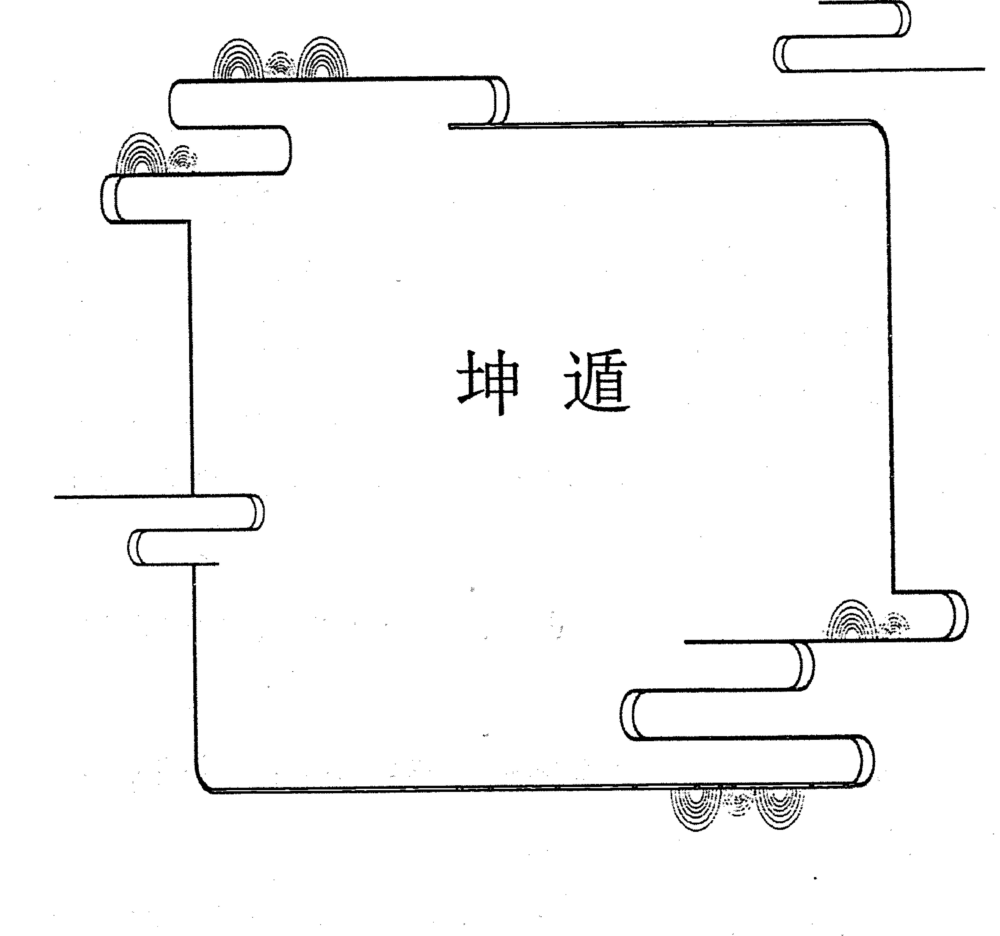

# 坤遁

进门为遁入，出门为遁出。
遁入为后天，遁出为先天。

看民间的房宅就要用民间的语言，不能之乎者也的说一些专业术语，让人感觉你很玄乎，给人一种玄玄乎乎的感觉，说一些让人听不懂的话语。看风水最重要的是入乡随俗，因为对方不是专业人士。什么左有青龙、右有白虎、前有朱雀、后有玄武等等的专业术语，就会给人感觉似懂非懂的感觉。

从古至今，风水讲的是天时地利人和，缺一不可。风水离不开三宝：天有三宝日月星，地有三宝水火风，人有三宝精气神。风水必须要遵循自然规律才行。

戈壁滩也有藏风聚气的地方，可是没有地宝之一的水，就会寸草不生，何谈风水学说？

风水再好也要命好，所以古人说福地福人居是有道理的。再好的风水也要人来住，所以才有了一命二运三风水学说。

比如古时降子临产之时，有的天生异象，或祥云缭绕，或五色光现，或红光满室，或异香扑鼻等等。有的孩子生来就相貌不凡，眼睛充满着灵光之气，一看就知道将来是前程似锦，绝非平庸之人。像这样的孩子降生之后，家宅可以逢凶化吉。还有的孩子临要降生之前，父母梦中出现吉兆，或梦神仙送子，或梦吉星进屋，或梦太阳光照等等。像这样的天降之子，家宅必然兴旺。

也有天生异象，或六月飞雪，或梦见鸡飞狗跳，或梦见家禽走兽，不是野鸡就是野鸭，或乌云遮日等等的异象，就不是吉兆了。这样的孩子降临，家宅怎么能够太平？怎么能够安宁？又怎么能够大富大贵呢？

这样的异象与阳宅无关，是先天的命。其实，从风水学说来讲，百年以后不过是白骨累累葬荒山，一世功名化灰尘，哪怕王侯与将相，一世荣华半点无。但是，为什么后代要给先人选择风水宝地？因为龙泉宝地可以福荫后代子孙。一个人转生好不好与阴宅有着至关重要的原因，说白了就是与墓地有关。

祖坟墓地不好，后人就不旺，后人就不善良，不是穷困潦倒就是各种的不顺，甚至家族都不能兴旺。

像出小偷、出盗贼、出凶犯、犯桃花等等，都是墓地风水不好。

如果墓地风水要好，后人就会一代比一代兴旺，后代子孙就会升官发达，富贵荣华，不但财源广进，而且人丁兴旺。

如果判断墓地风水不好，如果一个家族三代都富不起来，而且一代不如一代，那就是墓的风水不好。

墓地为先天，我们在母体里的时候也是先天。从先天而来到这个世间，人是活的，后天的修为更为重要。近朱者赤近墨者黑，胎元和胎教更为重要。受到先天的影响，我们来到后天的世界，有善恶、好坏之分，这个时候后天的修养也是至关重要的。

但是，真正的王者之道是上善若水，厚德载物。我们看过龙王三太子，哪怕一个人是龙太子转世，如果无恶不作、奸淫掳掠等等的坏事做尽，一样会被扒龙皮、抽龙筋。这就是一个人先天转生再好，不去做善事，尽做伤天害理之事，天地也不容他，又怎能不惩罚他。

这样的人，如果你不知道度化他的心灵，去给他摆个道场，做一场法事，买再多的贡品，不知道忏悔，天地都不容他。一个会遭到天谴雷诛之人，你如何去改变他的命运？

# 坤道

如果一个人转世好，又能继续做善事，又能帮助他人，这些都是后天的教育有关。天地人鬼神都相助于他，就走鸿运，行旺运。

什么是渡人？如何渡人？
治病救人是渡人，指点迷津是渡人，看风水也是渡人之道。但风水先生一定要知道福地福人居。

房宅坏了要修，人心坏了要度，这才是风水之道。
渡人与看风水二者合一，方是人宅合一之道。

人心如果坏了，无恶不作，再好的风水，发再多的财，天都不容之人，如何通过风水来改变他的命运呢？

房宅不好，楼房不吉，你能把他的楼拆了重盖吗？
人修好了，人的运气旺了，房子里面的人也就好了，人不也是房子吗？

看房子一定要先看人，这就是一命二运三风水。有其宅必然会有其人，有其人必有其宅。因为要人宅合一。人有五脏六腑，房子也有五脏六腑。把一个人的心度好了，人的运气也就旺了。

也许你会问，看风水为什么要看人啊？这就是太公奇门风水的秘诀。再好的风水要人来住。风水再好能把傻子变成聪明伶俐吗？风水再好能让瞎子重见光明吗？风水再好能让聋哑人说话吗？所以看风水必须要看人啊。一个什么都不做的人，你说你去给调理房子后财运就旺了，就有财了，那么请问他的财从何来？

一个天地人鬼神都不助他的人，你通过调理风水就能旺起来，怎么可能呢？

古人曰：一命、二运、三风水。一个命不好的人，运气不旺的人，他就是住在皇宫里，也无法改变他的命运。

一个有道的风水先生，就能够厚德载物。他给调完风水，人家就走运了，这样的风水先生天地都会帮助于他。

其实不是，有道的风水师调理完风水之后，家宅的运势旺了，人的运气也就旺了，财运好了，他会说看风水先生真灵。

如果一个风水先生不懂得这个道理，不懂得积善之家必有余庆，去看家宅风水，给人家调理好了以后就离开了。百日之内他没有什么财运，也没有什么大旺的事情，运气也没有什么改变，不但风水师出不了名，还会招来客户的怨恨，调理完啥作用都没有，钱白花了。

一个倒霉的人，做什么生意都不兴旺，运气也不顺，犯小人、口舌，甚至官非。这样的人走到哪里都不顺，住在什么样的房子都不顺，因为他的运气不旺。这就是一命二运三风水的原因。

明白了上面的道理，才能把风水学好。

## 阴阳风水学说

太公奇门风水离不开阴阳。宇宙万物，日月轮回斗转星移，有阴必然有阳。这样说明有阳宅就有阴宅，阴阳二宅其实是息息相通的。阴阳二气虽然看不见摸不着，就好比氧气一样，无色无味却能够给我们带来影响。

今天我就给大家说说风水里面的诀窍。

为什么很多人感觉自己特别倒霉，在哪里生意都不顺，财运也不旺？为什么会这样啊？从风水学的角度来讲，这样的运势属于阴，没有阳光。人属于长期在阴暗之中，说明这个人心地不善良，也不做善事，没有福报和福德的原因。其实就是无德之人。天时地利人和，首先就不占人和啊。

有的人会说我心多善良啊，为什么好人不得好报啊？

善人未必做善事，好人未必做好事，所以他的运气起不来。

如果一个人真的心地善良，又做了很多的好事，他的运气和财运还是不好，那不是阳宅的问题了，而是阴宅不好，是墓地出了问题。这就是太公奇门风水的不传之秘。

如何通过一个人的运气，来判断是阳宅的问题还是阴宅的问题？这里只是简单的说一下，后面我们具体讲解阴宅与阳宅的结合之法。只要一走进阳宅，就可以知道是阴宅出了问题还是阳宅出了问题，这就是坤遁秘诀。

如果一个人心地善良，阳宅风水也好，但就是不聚财，这是先天的慧根不好。人善良未必就会发财，善良不等于一个人就会有钱。

水至清则无鱼，但是这个不能说啊，说了会伤人的。

神仙也有善良的神和凶恶的神，动物有善良也有不善良的。大家都在传授风水绝学，都在传授风水绝技，但所有的风水师都忽略了人道，未修大道。

## 先修人道才是风水绝学的王者之道

一个风水师自身运气都不好，甚至被鬼魅缠身，这样的风水师去别人家看风水，不但不会给人家带来好运，反而给人家带来霉运。风水师把邪气带到他家去，他家的风水怎么会旺起来？这就是为什么有的人请了风水师，看完风水后不但运气没旺起来，财运没有旺起来，反而在百日之内破财，甚至损丁伤人口。这样的风水不是风水师的技术问题，而是风水师本身无德，不能厚德载物的原因。

如果风水师本身财运都不顺，子女都不成材，兄弟姐妹都过着朝不保夕的生活，自己的问题都解决不了，兄弟姐妹都不能让顺起来，还能改变谁呢？是风水师的技术问题还是无德呢？在太公奇门风水来看，一是技术不行，二是无德。

风水虽然和福报有关，也不能谈论德不配位必受其灾。因为我们是去看风水，不能谈是道德和无德的问题出了问题。我们去看风水，就要讲风水，论风水，怎么能够把福德的内容变成风水专业语言才行。

我们看完阳宅后，可以说阳宅的风水影响他的心性，看见谁都会烦，做生意也不稳定，财运时好时坏。风水引起哪些方面的问题，必须得先说风水的问题。

一个人做什么事情都不顺，财运不旺，犯小人官非，他的心情怎么能好呢？如果他的心情特别的好，那他的心得多大呀？

所以我们看完风水，要和福主说，家宅的风水不好，影响了哪些问题：是自己不顺，还是家里不太平；是孩子学习不好，还是财运出了问题；是否犯官非和病灾等等。这样的风水要想要改变，不但风水需要调整，家里得要有一些信仰。得天助就是得天时啊。如果能供奉神仙，就会得到神仙的保佑。想发财就要供财神啊；想让孩子学习好就要供奉文昌帝君啊；想要平安就要供奉观世音菩萨啊。把神仙供奉好了，安排好了，得到菩萨相助，自然就会逢凶化吉啊；得到财神相助就会财源广进啊。这样就会让你的运气旺起来，做什么事情都会顺顺利利，财运好转了，贵人也多了，小人自可远去。

改变了他的心性，知道福佑子孙，懂得积德行善了，懂得做善事了，福报就有了，天地也会助他。这就是上乘风水化解的方法，也是改变命运之道。

天地万物因果循环，佛家讲因果报应，道家讲我命由我不由天。

如果一个人前世把别人杀了，今世你也会被别人所杀。这就好比别人不出车祸，为什么他会出车祸？别人不出凶事，他为什么就会出凶事？这不就是因果报应？如果风水师都不相信因果循环，还有谁会相信呢？

一个有德道的风水师，他能厚德载物。他给人家宅调完风水后，家宅运势就会大旺，这就是大德之人，天地都会相助。他的运气怎么会不起来？他看过的风水怎么会不旺呢？

古代风水师都有道，不但有信仰之心，更加会相信神仙。一个没有信仰之人，怎么能当风水先生？不信仰神仙，神仙怎么会来相助？修行不好之人，怎么会看好风水？怎么能当风水先生。

功德无量的风水先生，去谁家看风水，只要他人一到，就会给他家带来好运、带来吉祥、带来福报。风水之道，就要有德者居之，即是福地福人居。

风水之道，有阴就有阳，有内就有外。所以阳宅风水分为内风水和外风水。

而内风水的摆设都要是吉祥的、圆满的、富贵的、吉祥的才行。

比如一进门口，放一个动物会好吗？动物是畜道，是异类。在门口也好，在客厅也好，床上也好，都主不吉祥。即使摆放的是貔貅，也是不吉祥的。哪里有光吃不拉的啊？风水之道要有进有出才行啊。如果摆放的是龙和麒麟是可以，因为龙和麒麟是吉祥之物。其他不宜摆放不吉祥的物品。
为什么貔貅不行呢？因为貔貅没有屁股，光吃不拉。任何动物不拉也不行啊。要像水一样，有进有出才行。这边流进来那边要流出去，前后通气才行，方能主有进有出。能出能进才叫进财，这才叫转运，也叫时来运转。只进不出叫不通气，不流通如何转运？光有来气没有出气，即为定数。也不能光进不出，也不可能总是有来没有去。

## 何为遁

什么是遁？什么是悟？

遁，即是行走之意。

悟，即是灵性与灵感。

奇门遁即是行遁之意，从中宫遁至八门、八卦之中，才能断定吉凶，这是遁出。

从八门、八卦遁到中宫，为隐藏，即为遁入。出门为遁出，进门为遁入，一进一出都是遁。

遁入家宅：代表家里的吉凶祸福。

遁出家宅：代表在外的吉凶祸福。

从八方哪个方位进入家宅，入门先观气口，根据气口的方位，来断吉凶祸福。

从房间那个方位出来，为遁出，遁到八卦和八门之中，他的吉凶祸福就会出来。

所以，阳宅一进门一出门即为遁入与遁出。遁入看后天八卦，遁出看先天八卦，人的吉凶祸福就无所遁形。

这就是阳宅中的遁。

作为风水先生，对遁更加应该有灵感。有灵感的风水先生，才叫悟。悟即是一种感觉，遁悟即是风水先生一进门和一出门的灵感与感觉。

## 何为灵感与感觉呢？

其实灵感即是心，感觉也是心。我们用心去感应万物苍生，用心去感应万事万物。

因此一进门的感觉，即是灵感。

看见一个人的感觉也是灵感。这种灵感不会欺骗你。能够欺骗我们的往往是眼睛，眼睛会骗人，灵感不会骗人。用眼睛去看人被人骗了，也叫睁眼瞎。

进入要先遁，先去感应。如果进宅感觉心旷神怡，心里特别舒畅，房屋内的摆设看上去特别的顺心，心里就会有愉悦的感觉。这就是遁，也是悟。

如果进入感觉心里不舒畅，家里乱乱的，看着心里就心烦，这样的家宅怎么会平顺？怎么会平安？主人怎么会有好事？烦恼的事就会非常多。

## 孤阴不生，孤阳不长

风水之道，讲的是阴阳平衡，道家称之为孤阴不生，孤阳不长。

1.  如果阳宅只住一个人，称之为孤。孤阴不生，如何生万物？没有阴阳，何来万物生长？所以，阳宅看单身宿舍或者一个人久居独身一个人生活，即没有生机勃勃，又没有兴旺之气。所以单身房宅、单身公寓，以及孤寡老人、孤寡之人、独身一人的日子，很难过的红红火火。这样的家居何来欣欣向荣呢？
2.  如果阳宅一个屋里住进十几个人，是不孤了，是乱了。屋小人多，杂气太乱，五行不同，八字不同，人心不同，怎么会没有烦心之事？怎么会没有烦恼之事？
3.  进屋空空如也，那是仓库。屋里凌乱，有家徒四壁的感觉。这样的风水日子怎么会过的舒心？要啥没有啥。
4.  进屋家里堆积如山，乱乱的到处都是杂物，房间也不整齐，这样的家没有烦心的事才怪呢？
5.  风水之道讲的是阴阳，是阴阳平衡。一个家庭光有阳而无阴，光有男人而无女人，为纯阳，阳气太盛容易犯阳灾，犯官非。这样的风水也主家旺不起来，存不住钱，也代表漏财。风水要有阴和阳，有天有地，有日有月才行。只有乾而没有坤，怎么能称为天地？有天有地，有男有女，才是风水之道。

古时讲天地，讲阴阳，论夫妻之道。天地合而生万物，夫妻合而生子孙。有天有地，有夫有妻，有子孙后代则主阴阳平和。

夫妻合不合，父子合不合，都要通过阳宅风水来论断。推算一个家庭的……富贵贫贱，财旺不旺，旺多少年，衰多少年。若子女与父母和，就会给家庭带来好运，带来旺运。如果孩子与父母不和，则家庭会日渐衰退，即使原本大家大业，也会让子孙败家，出现败家子，就会破败的一无所有，甚至会让家里倾家荡产。

现在有的父母给孩子剖腹产，找算命先生看八字，选择出生的时间，但都忽略了孩子的八字再好，也要与父母相合，相合则家业兴旺，富贵荣华。若八字与父母相克，孩子则会克的父母离别双亲，父母离异，家不兴旺，子女不孝等等。故孩子的八字要与父母相合，家业才能兴旺，才会大家大业。

所以风水先生进屋，首先要看家里人的八字是否相合，这样才会是一个好的风水先生。否则再好的风水，父母和子女的八字相克，犹如仇人一样，子女不孝，不听话，这样的风水家里能安稳吗？

风水再好也要家和万事兴，也要福地福人居。

只有论述一论命，二论运，三论风水才是风水的王者之道。

## 座山定向

定阳宅座山，座向以房子的向为主，不能以门，窗为主。

观看风水之道，为什么有的房子有的人住就犯病，但有的人住就不犯病呢？

房子一定要与人相合，人、即是属相，房子与属相要相合才行，这是非常重要的。

比如房子前面有水，属龙的就会好，龙行水上，也是他的龙宫，如龙得水，当然是吉的。但如果属虎的人，老虎不会游泳，就不吉利了，就容易伤人。

房子犯病一般画虎符，龙符可以化解。

如果房子向西方，西方为白虎，家里有属虎的人就会相合，房子就会人丁兴旺。

如果没有属虎的人，老虎就会去咬人，主伤人。

如果房子向西，西方有山，虎啸山林，老虎大有作为，什么动物，什么生肖在山上都有藏身之处，主山不克人。

角煞也属黑煞克人，人丁不旺，可以用阴阳宝镜或五雷符可以化解。

平原也有好风水，因为沙从水中来，从平原中来，沙中有金，有宝。

## 基础篇

## 太公风水基础篇

### 太公风水起源

传说自伏羲发现河图，这以后差不多过了八百年，当时洪水泛滥，百姓流离失所，大禹临危受命，婚后第四天就率众治水，并且三过家门而不入。各种方法都用过了，大禹始终没有找到治水的良策。后来有一天，他发现一只五色神龟出现在洛水，其甲壳上有此图象，背上的纹理形态如同文字，因此，大禹就发现了「洛书」。结构是载九履一，左三右七，二四为肩，六八为足，以五居中，五方白圈皆阳数，四隅黑点为阴数(见图）。

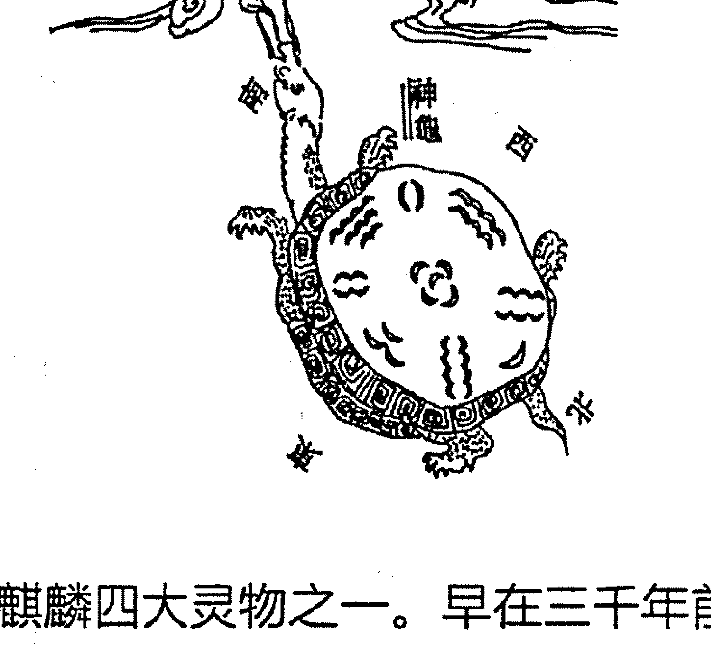

龟为龙、凤、龟、麒麟四大灵物之一。早在三千年前，许多易学先师们就用龟甲作为占卜工具。龟还有她独特的一些功能；如感应地磁好坏，方位吉凶，全息信息的第六感官功能。他还有万年寿龟的福星称号。故道家按此创造出龟吸功。

太公风水缘于河图洛书，周易，奇门。它以阴阳五行学说为理论基础，综合了古人在天文、地理、气象历法、术数宗教、军事占卜、风水预测等方面的知识，经过多年反复实践论证而成。其应用范围广，判断速度快，易学、易懂，为诸多术数门类中的佼佼者。

### 一、撩开太公风水神秘面纱

太公风水预测术神奇，但并不神秘。易学发展了几千年，《周易》古经流传几千年，并且随着时间的推移，愈发显示出强大的生命力，它来源于生活，造福于生活，所以说并不神秘。我们研易者的责任就是要正本清源，撩开其神秘的面纱，还古易之本来面目。

### 二、人人可成为太公风水预测家。

在这个世界上，人是万物之灵，具有的灵性是其它物种不能相比的。人人都具有预测潜能，要系统地学习预测理论，掌握其运用技巧，积累经验，更重要的是要有名师的指点。“学艺三年、不如跟师三天”三天既可以实现你人生的梦想，成为风水预测专家。

### 三、活学活用易理

风水预测术是历经几代几朝智者的呕心沥血不断发展完善的，预测术源于易理，发挥易理，兼容其它门类，你掌握的预测术越多，水平越高，融会贯通，准确度也会越高。但是没有百分之百准确的预测术，如果有人说哪派预测术百分之百准确，不过是狂言。

“太公风水”预测简洁直观。越是深奥的东西，其道理越简单，越是简单的道理，其内涵越丰富。江湖术士故弄玄虚，神神秘秘，实在是让有心钻研者不知何去何从，苏东坡有诗云“不识庐山真面目，只缘身在此山中。”我觉得用来形容此状很形象。那么，怎样才能得识庐山真面目？跳出来。详熟基础知识，把握易理，从现实生活中领悟。只有这样才能提升预测水平，提高人生境界。

实践是检验真理的唯一标准，事实是验证预测的准绳。心动不如行动，说的好不如做得好，智能之门为你敞开，带你快速步入神奇世界，祝你早日登上新的易学高峰。

## 基础篇

万丈高楼起于基下，基础不牢，那楼是盖不高的，会塌掉，我想这样的道理谁都知道，但是又有几个人会去这样做呢？？？……

学习任何一门学问，如果想学好的话，关键就是基础打的牢不牢，如果想达到速断吉凶祸福，五行生克、天干地支、八门八卦等基础更是重点，基础差不多要占到 70%，预测中测十件事如能对九件事就算是高手了，如果测十件事能对十件事，并且对事情的来龙去脉都解析的非常清楚的话，那就非同寻常了，诸如诸葛亮、刘伯温、邵康节等人！

易经的基础方面其重点就是：

- 1. 易理讲的就是整个易经的理，例如八卦类象，你不知道乾卦、坤卦能代表什么？你怎么去预测呢？在实际预测当中，如果出现了乾卦，你知道是什么意思吗？乾可代表父，代表老人，代表男人，代表高大，代表白色，代表西北方向等等。
- 2. 其次，就是易经的基础入门部分，以《太公风水》来说，就是对天干地支的记忆、理解，天干地支的类象，九星、八门、八神、九宫所代表的寓意为何？当然千万不要象上学时那样死记硬背，重点在于理解，能理解其意义了，也说明你就记住了，在实际预测时方能熟练运用，才能做到得心应手。
- 3. 最后就是社会经验，有人要问：学易经与社会经验有何关系？跟你说：关系大了！为什么这样说呢？

再跟大家说一个古代的名人：邵康节，我想学易经的人没有不知道他的，其人术数功夫极高，已入仙境，对整个宇宙的把握亦在掌握之中，与三国时的诸葛亮齐名，传世之书有《观物内篇》、《观物外篇》、《皇极经世》等，其于幼年学易可谓刻苦，有冬不炉、夏不扇之称，以至最近最后达到知微善物的地步，也就是看到一片树叶落下便知道会发生何事了。大家肯定不信，但确实如此，如果大家看了《梅花易数》这本书就知道了，里面有个两只麻雀争落一枝上的占例，他看到后心里一动，起念而占，得卦泽火革（上兑下离）化为泽山咸（上兑下艮），断曰：兑为少女，离为花，是少女折花之象，外互为干，代表老人，在此引申为园丁，下卦动而克体主受伤，内互为巽，巽为股，说明是园丁不知道她而来驱打，少女受惊而摔伤了大腿，又变卦艮为土生体兑卦，且值秋季，金旺火囚，故无大碍，到第二天果然应验！

请问当今之世，有几人能与他的水平相比？

万丈高楼起于基下，基础打的牢不牢，在断卦中基础是至关重要的！

### 太公阳掌基础知识

#### 五行生克基础

##### 五行生克图

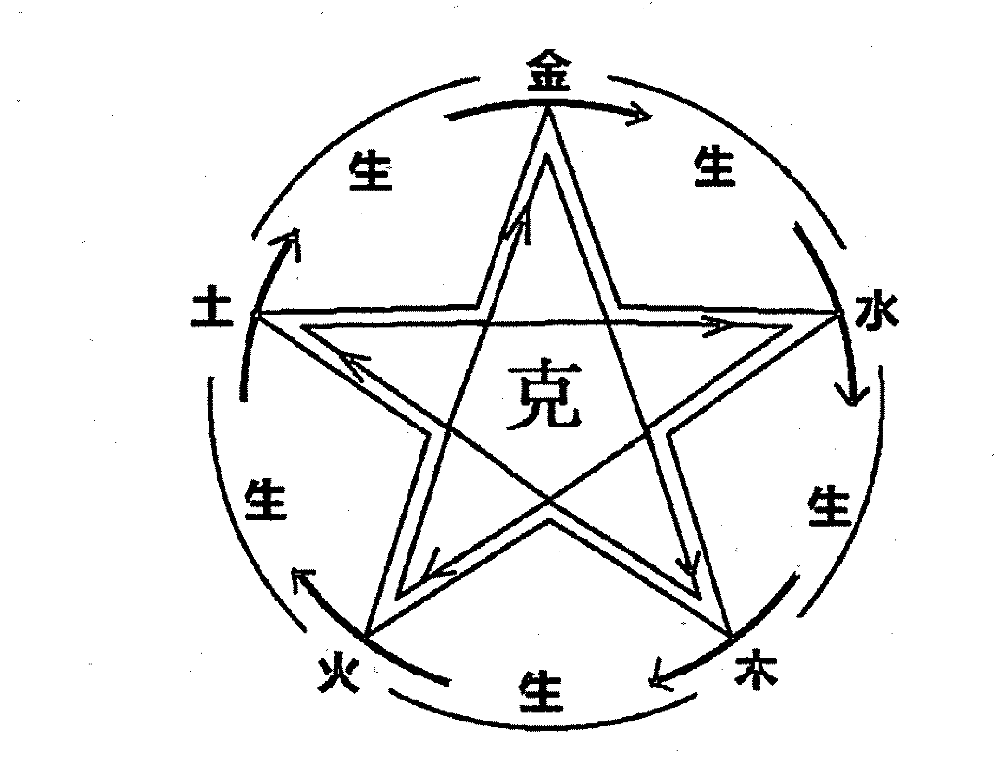

- 五行相生: 金生水, 水生木, 木生火, 火生土, 土生金.
- 五行相克: 金克木, 木克土, 土克水, 水克火, 火克金.

### 五行属性

#### 属火的人

火主礼，其性急，其情恭，其味苦，其色赤。火盛之人头小脚长，上尖下阔，浓眉小耳，精神闪烁，为人谦和恭敬，纯朴急躁。火衰之人则黄瘦尖楞，语言妄诞，诡诈妒毒，做事有始无终。

属火的人大多有不错的统御领导能力及旺盛的企图心，在团体中能肩挑大梁；企图心强，做事果决，能一心一意，迅速达到自己的目标。而且会随着火焰的渐渐燃烧，愈来愈旺盛，始终能勇于面对考验与挫折。缺点是为了达成自己的目标，会采取压倒性强迫他人的手段，采取利己之意见，很少在意他人之立场，有时甚至会以暴力或威胁手段要别人就范。锋芒太露，容易树立敌人。讲话时直接了当，快人快语，不会拐弯抹角，心里想什么就说出来，在人生竞争之舞台上，不失为一个好的竞赛者。但往往急功近利，忽略了人情世故，虽然会拥有好的部属，却难以拉近彼此距离。属火的人，本质上是相当重感情的，在朋友有难时，会相当热心能够挺身而出。

#### 属土的人

土主信，其性重，其情厚，其味甘，其色黄。土盛之人圆腰廓鼻，眉清目秀，口才声重。为人忠孝至诚，度量宽厚，言必行，行必果。土气太过则头脑僵化，愚拙不明，内向好静。不及之人面色忧滞，面扁鼻低，为人狠毒乖戾，不讲信用，不通情理。

属土的人是非常能信守承诺之人，有相当强的亲和力。务实的态度会为自己赢得大众的支持。具有精打细算的能力，他能以自知之明的眼光衡量自己，并充分发挥自己的能力。个性沉稳、工作投入，做事认真严谨，天生的组织者，具有统一的领导能力。但太务实的性格，比较迟缓，比较保守，句句都是不顺耳的实言。不喜欢夸大其词，做事小心翼翼，而且缺乏丰富的想象力，无法对事情做大胆的假设，或去追寻更大的梦想，但他却能严以律己，自爱自重，颇受同事间及上司的喜爱，对于上级交付任务，均能圆满达成。

#### 属金的人

金主义，其性刚，其情烈，其味辣，其色白。金盛之人骨肉相称，面方白净，眉高眼深，体健神清。为人刚毅果断，疏财仗义，深知廉耻。太过则有勇无谋，贪欲不仁，不及则身材瘦小，为人刻薄内毒，喜淫好杀，吝啬贪婪。

本质是较重义气，个性有棱有角，且非常坚强，是个野心家，想得到的东西，无论大小，夜以继日，一心一意朝着目标勇往直前，遇到问题即能马上解决，对于事情的反应很强烈，追求权利及财富的企图心极其旺盛，就象金属的锐利光芒，反应在人际关系上，幽默、机智、活泼，有口才，所以多方面的才能可超越众人，但容易坚持己见，疏于沟通，长久下来，难免会丧失一些机会。常以笑容迎人，但是重名利，占有欲强，追求财富、权利的企图心旺盛，因此内心隐藏着强烈的斗志，随时都想和人一较长短。小心急功近利，却草率从事，不要以为自己才高八斗，没人能凌驾，这种观念将导致失败，并要小心自己的虚荣欲；否则节操不保。所以要适时采纳别人的意见，低调做人，则成功指日可待。

#### 属水的人

水主智，其性聪，其情善，其味咸，其色黑。水旺之人面黑有采，语言清和，为人深思熟虑，足智多谋，学识过人。太过则好说是非，飘荡贪淫。不及则人物短小，性情无常，胆小无略，行事反复。

不可一意孤行，若能收敛自己思想，善于构想，口才极佳，又能接受他人的意见，在人际关系上占了很大的优势，甚至被你利用的人也不会憎恨你，而且对手会在毫无防备你的状态下成为你的囊中物。平时沉默寡言，但一旦开了口，便滔滔不绝，分析事物有条有理，词锋犀利，女性的气势更胜男性，对外八面玲珑，对内则能约束自己，温柔而不拘谨。小心不要太坚持己见，自尊心也只能适度坚持，否则容易树立敌人。水本质柔顺，所以缺点是在精神状态方面会表现出庸懒现象，对事物睁一只眼闭一只眼，不敢面对现实，虽处事圆融，但因缺乏己见及自信，凡事需依赖他人决策，容易变得优柔寡断或人云亦云，甚至被人牵着鼻子走，所以有了计划与想法就要贯彻实行，不要说说而已，这点属水的人宜当心才是。

#### 属木的人

木主仁，其性直，其情和，其味酸，其色青。木盛的人长得丰姿秀丽，骨骼修长，手足细腻，口尖发美，面色青白。为人有博爱恻隐之心，慈祥恺悌之意，清高慷慨，质朴无华。木衰之人则个子瘦长，头发稀少，性格偏狭，嫉妒不仁。木气死绝之人则眉眼不正，项长喉结，肌肉干燥，为人吝啬。

善于运用心机，外表斯文、内敛，相当富有创意，是个仁义道德者，有悲天悯人的胸怀，对于各种事物之分析相当透彻，由于心存善念，故能扶助弱者。心中盘算的大计划，若能付诸行动，成功的机率将会大大提高，但缺点是缺乏耐心和毅力，面对一些挫折，容易显得畏怯，这是属木之人的致命伤；因此保持计划的持续性和长久性是必要的，有了挫折也要勇于面对，这样事情才会峰回路转渐入佳境。男性外表刚毅，内心却很柔和，女性则相反，外表柔弱，内心刚强，不让须眉、才情超拔、但也爱管闲事。有同情心，占有欲也强，脾气不小。男生因温和而人缘佳，但却因此招来一些桃色纠纷，面对诱惑常失去理智，没有抵抗能力。千万不要贪图虚荣而自作聪明，要把人生视为‘安易为上’，有了这种生活态度，才能让你的生活现实安稳。在人生旅程中，必须克制对异性的贪执，处理好关系，否则容易毁了自己的锦绣前程。

### 五行脏腑和部位

木: 肝与胆互为脏腑表里，又属筋骨和四肢。过旺或过衰，较宜患肝，胆，头，颈，四肢，关节，筋脉，眼，神经等方面的疾病

火: 心脏与小肠互为脏腑表里，又属血脉及整个循环系统。过旺或过衰，较宜患小肠，心脏，肩，血液，经血，脸部，牙齿，腹部，舌部等方面的疾病。

土: 脾与胃互为脏腑表里，又属肠及整个消化系统。过旺或过衰，较宜患脾，胃，肋，背，胸，肺，肚等方面的疾病。

金: 肺与大肠互为脏腑表里，又属气管及整个呼吸系统。过旺或过衰，较宜患大肠，肺，脐，咳痰，肝，皮肤，痔疮，鼻气管等方面的疾病。

水: 肾与膀胱互为脏腑表里，又属脑与泌尿系统。过旺或过衰，较宜患肾，膀胱，胫，足，头，肝，泌尿，阴部，腰部，耳，子宫，疝气等方面的疾病。

### 天干地支基础

#### 天干地支顺序含义:

- 十天干 :甲、乙、丙、丁、戊、己、庚、辛、壬、癸。
- 十二地支:子、丑、寅、卯、辰、巳、午、未、申、酉、戌、亥。

甲木属阳: 指森林大树，性质强壮。甲木有恻隐之心，具上进心，好华美的事物而有风雅的性格，进退有情有义，处事负责，但缺乏应变能力，又因常自找烦恼故做事多劳苦。

乙木属阴: 指小树花草之类，性质柔软。乙木富同情心，性情和蔼，外表谦虚，但内心占有欲强，虽有才能，但常烦心。

丙火属阳: 指太阳，炎炎炳照之意。丙火为火之兄，含有朝气蓬勃，热情开朗之意。还含有适合各种社交活动，但也易被误解为好大喜功。

丁火属阴: 指灯火，炉火等，火势不稳定，得时有力，失时无力。丁火为火之妹，具有外静内进，思想缜密的性格。但是多疑与心机重是其缺点。

戊土属阳: 指大地的土，广厚茂盛，又指堤坝之土，有力地防止河川泛滥。戊土诚实，厚重，性情笃实沉稳，为人憨直。

己土属阴: 指田园之土，不如戊土广厚但易栽植。己土重视内涵，多才多艺，行事依循规矩，但度量欠广，易生疑心。

庚金属阳: 指铁，刀剑，矿石等，性质坚硬。庚金精神粗旷豪爽，意气轻燥，性情刚烈而重义气，个性好胜，具有破坏性，人缘佳，容易相处。

辛金属阴: 指珠玉，宝石，砂金。辛金性较阴沉，温润秀气，重感情，虚荣心强而爱好面子，有强烈的自尊心。但缺乏坚强的意志。

壬水属阳: 指大海之水。壬水为水之兄，含有清浊并容，宽宏大度之意，能潜伏和包容，富于勇气。但也有依赖性强，凡事漫不经心之意。

癸水属阴: 指雨露之水，癸水为水之妹，其人平静，柔和，内向，勤勉力行，然而却爱好猜臆，过重原则，不务实际，故内心常生不平，并时有破坏性，喜钻牛角尖的倾向。

### 干支阴阳篇

- 甲乙同属木, 甲为阳, 乙为阴
- 丙丁同属火, 丙为阳, 丁为阴
- 戊己同属土, 戊为阳, 己为阴
- 庚辛同属金, 庚为阳, 辛为阴
- 壬癸同属水, 壬为阳, 癸为阴
- 亥子同属水, 子为阳, 亥为阴
- 寅卯同属木, 寅为阳, 卯为阴
- 巳午同属火，午为阳，巳为阴
- 申酉同属金，申为阳，酉为阴
- 戌未同属土，戌为阳，未为阴
- 辰丑同属土，辰为阳，丑为阴

### 干支方位篇

甲乙东方木
丙丁南方火
戊己中央土
庚辛西方金
壬癸北方水
亥子北方水
寅卯东方木
巳午南方火
申酉西方金
辰戌丑未四季土

# 操作与运用基础

## 太公风水阳宅操作具体步骤

用太公奇门风水堪宅，其运用原理可按照以下两大考虑因素来推断。

第一，即是命理八字与住宅周围的环境影响，运用九星与十二宫的位置，来选择适合的地理位置，为内部因素。而运用九星与十二宫与马路分布的优劣，属外部因素的吉凶。

第二，就是风水本身没有好坏之分，关键是要看谁来住，如不同的夫妻组合在一起，会有不同的命运，风水也是如此，再好的风水也并非人人都能适合，最佳的状态就是人宅合一，有福之地要有福之人居住。

## 第一节 太公奇门风水罗盘

风水的运用原理是时间与空间的相互作用。时间是由天体运动来确立的，而空间的确定则必须依靠罗盘（指南针）。罗盘的测量是否准确直接影响到判断的准确与否。所以太公奇门风水罗盘的重要性在风水操作过程中可谓是占着举足轻重的作用。

## 第二节 如何运用太公罗盘定向

### 一 用罗盘定向须知

1. 用罗盘定向的时候须注意一定不要让罗盘距离所要测的房屋墙壁太近，太近了罗盘磁针会受影响，多数有误差。同时还须注意宅外的环境是否有钢筋铁器等物品，因为这些东西也会使罗盘磁针产生误差，笔者一次为易友新居定向时，因为住宅大楼尚在建造之中，所以宅外堆满钢筋脚手架，正因为这些钢筋竟使罗盘磁针产生偏差，所以在定向时须注意以上情况。
2. 切不可以在房屋内定向，因房屋里皆是钢筋水泥与家用电器，会影响磁针，使判断错误。响磁针度数。
3. 定向时身体的姿势一定要放松，用双手拿住罗盘放在腰间部位，身体的姿势要做到含胸拔背。先用目测罗盘的边线是否与被测房屋的一面（测量时面所对的一侧墙面）平行，感觉达到平行后，看罗盘的水平仪上下是否倾斜，如果倾斜就要将水平仪调整到水平位置（水平仪中水银位置居中）。然后转动罗盘，让罗盘的天盘指针和天池的红线密密重合，看压在与身体保持前后（非左右）关系的红线压在哪个字上，从而定向。这是定向时的身体姿势。
4. 一般定向时要数次才能完成。每次定向要根据不同的距离反复测量，看看是否为同一坐向。
5. 注意周围磁场对罗盘的影响。在定向时，开着的手机、腰间的铁制铜制皮带扣、以及周围的汽车等铁性物质都会对罗盘有影响，所以测理时要远离这些物体。这是也需要特别注意的地方。

### 二 罗盘定向方法

太公奇门风水罗盘定向的方法当以主门为向。最准确的方法是以主门立向。

目前流行的立向方法大约有以下几种。

其中产生最多争议的问题即是数家同居之宅，以私房之门定向与总楼门定向的准确性上何种方法最为精确。台湾著名数术大师钟义民先生即是以前者私门定向为主，而港台亦有一些风水名家则采用以总门定向的方法，所以二种定向的方法争议非常之大。

太公奇门风水经过大量实践及征验，以主门定向准确率要高。所以笔者在此表明自己的观点即太公风水定向应采取以主门定向为准，若不是分房的单独之宅，则以门定向。

而至于定向中根据马路在哪边，哪边即是向首的定法方法，飞龙不敢苟同，因为如此作法，只会造成所有阳宅向首外必定都是见马路。纵观所有古书的阳宅案例，好像大多案例都没有阳宅向首外就是水路的情况。由此可见这种方法并不为古人所采用。

阳宅分别有两种不同的形式，一种为农村民宅，另一种为城市套房。此两种阳宅在实际操作时，有不同安放罗盘的方法。

在这里有一个很好记的方法：出门为向，入门为山。

今将如何安放罗盘的问题，用图形来详细说明。

# 农村阳宅安放罗盘方法

- 1、农村阳宅一般都以大门为向。既然朝向已明，就不存在定向的问题，只要我们应用罗盘，在阳宅大门的中心位放下罗盘，校准罗盘天池中子午针后，就可以测定该房屋的坐山朝向。

山向图如下：

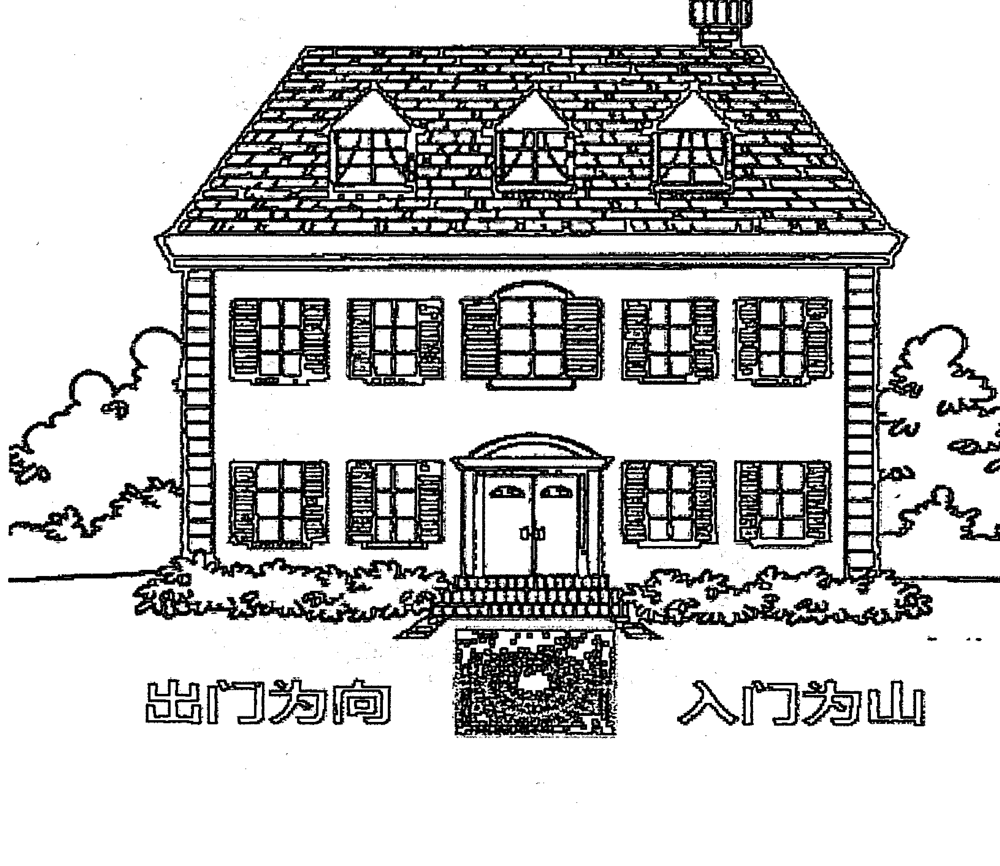

# 坤遁

- 2、我国北方民宅多是四合院，或者左右两边有附带厢房。此厢房多是作客房或厨房以及其它用途。

四合院山向图如下：

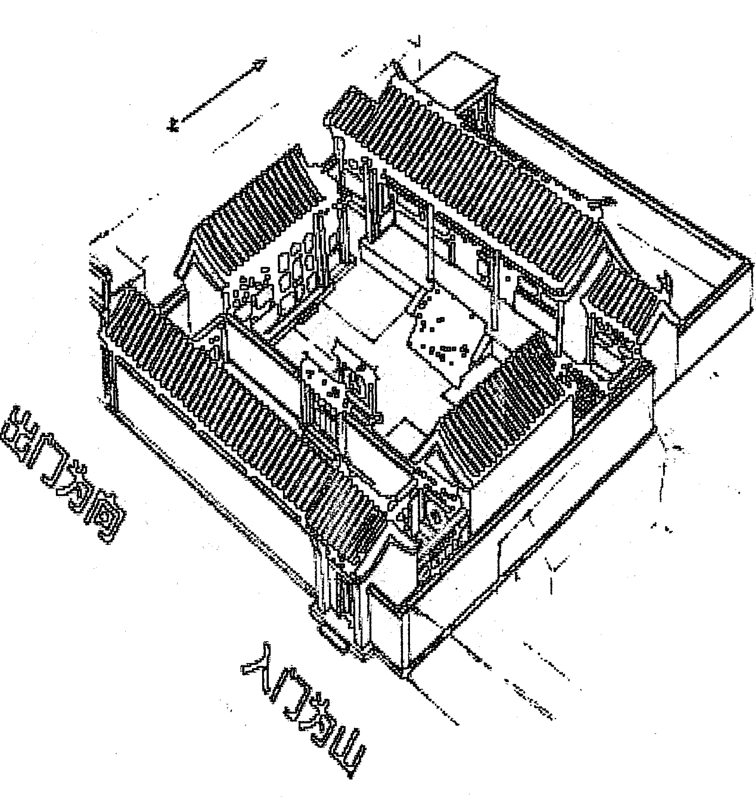

放置罗盘的地方以正房的门坎前平地为主，在此处放罗盘可以测定房屋的朝向。

在房屋门坎前安放罗盘，格定房屋朝向同时还可以分析进口处门路的吉凶。

确定阳宅的坐山朝向后，然后再用罗盘将整座宅院划分八卦宫位。

# 房宅分八卦图

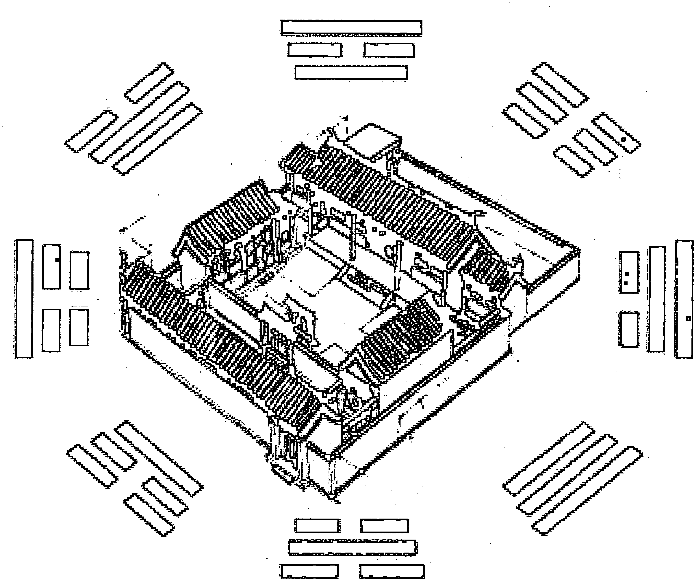

# 套房安放罗盘的方法

很多读者不知如何测定套房的坐山朝向，更不知如何在套房中哪个地方下罗盘。

在下罗盘之前，风水师必须确定套房的大体朝向，然后在朝向或坐山的墙壁处下罗盘，自然就能确定套房在罗盘的准确坐向。

太公奇门本着一屋一太极的下罗盘方法，来确定阳宅的定向。

- 1、客厅定向：
客厅定向为整个套房的大体朝向。
我们可以在客厅中间下罗盘，测定准确的朝向。当测定房屋的准确坐向后，划分整个房屋的八卦宫位。
客厅是房屋的内明堂，人从外面遁入屋中，把外面的气带到内明堂，因此客厅是吸收房屋外部的气。通常客厅的前面都不会有阻碍物体，房子气不能直接进入，除非门开的方位不吉，才用屏风或者玄关来阻挡煞气的进入。

- 2、卧室定向：
卧室为一屋一太极，出门为向，就是把罗盘放在房宅卧室中间来定向，也可以放在卧室的门上来定向，出门的方位就是向。向定准了自然可以划分整个套房的八卦宫位，然后进一步分析八宫吉凶关系。

以门定向的几种情况：

- 一、农村的平房及四合院。用罗盘对准的门口是大院的总门口测量。
- 二、现今的农村大院住房有是几层的楼房，同样用罗盘对准的总门口进行定向，如住宅周围有围栏，围栏的大门不能用来定向。
- 三、位于马路边上的门面房直接就以门面房之门定向。若有些一楼是门面，而二楼以上则是住宅的楼宅，而一楼门面之房是从马路进入而二楼以上的住宅房则由其单元楼门进入时，此时在处理时须看一楼之面门房是否与二楼住宅使用的单元楼门是否相通，若单元楼门不能进入到门面房之房为不相通，则一楼以门面之门定向，而二楼以单元楼门定向。若一楼门面与单元楼门相通，通过单元楼门能够进入到商铺门面房则为相通的情况，此时一楼商铺与二楼以上的住宅皆以单元楼门定向，商铺之门只作气口论。
- 四、大面积有多栋办公楼的厂区定向时，应以该厂的首脑机关所在的楼来立向，而不是以厂门来立向。若工厂只是一个加工车间，并无领导在此内办公，则以厂门立向。
- 五、多层不规则楼房。如现在有很多 L 型、U 型、甚至外型象一本打开竖起来的书的房形。这种情况下此时以整个建筑物的正门为向（一般建筑物的门都会有主次分别）。
- 一、此种房形多见于商场或某营业大楼
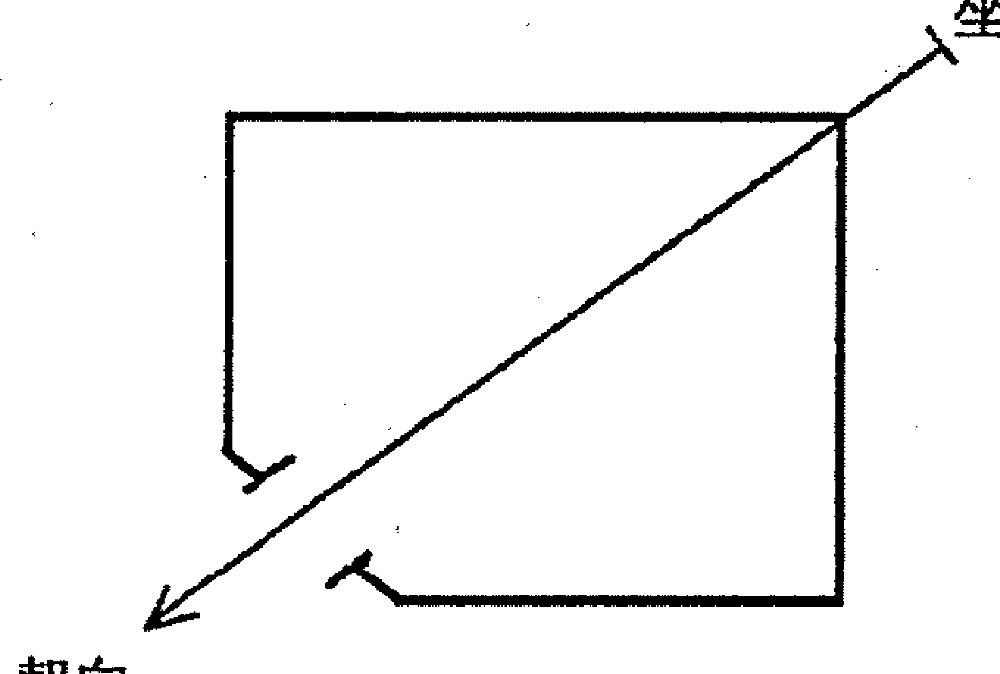
- 二、此种房形多见于商务楼
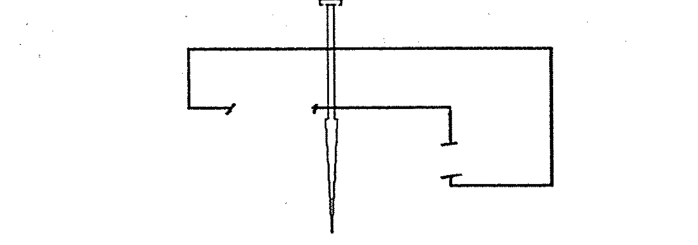
- 三、两个至四个甚至更多出口的高层大厦。此时楼门以正门为准。
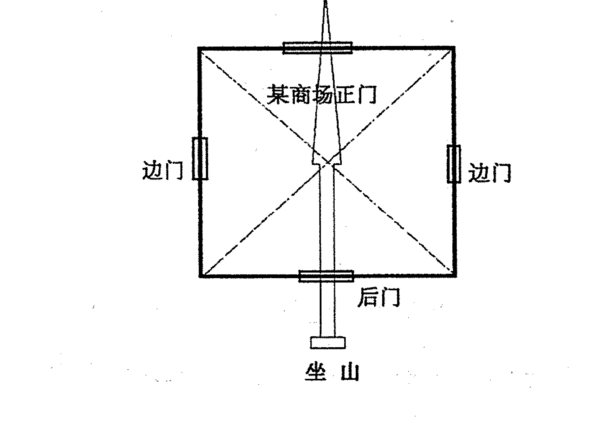
- 四、工厂定向以最高领导办公楼定向，而不以厂门定向
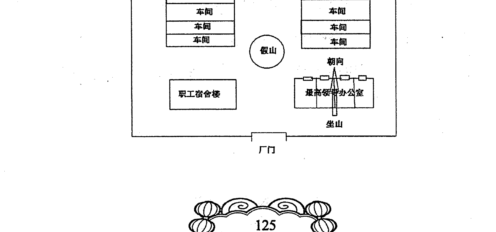
- 五、斜开之门
某些大楼在安门时曾请人来看过风水，可能把门并非开在四周的墙上，而是把门斜开，如遇此种情况依笔者个人见解当仍以门所在的墙作定向。切不可以门定向。举一例说明。
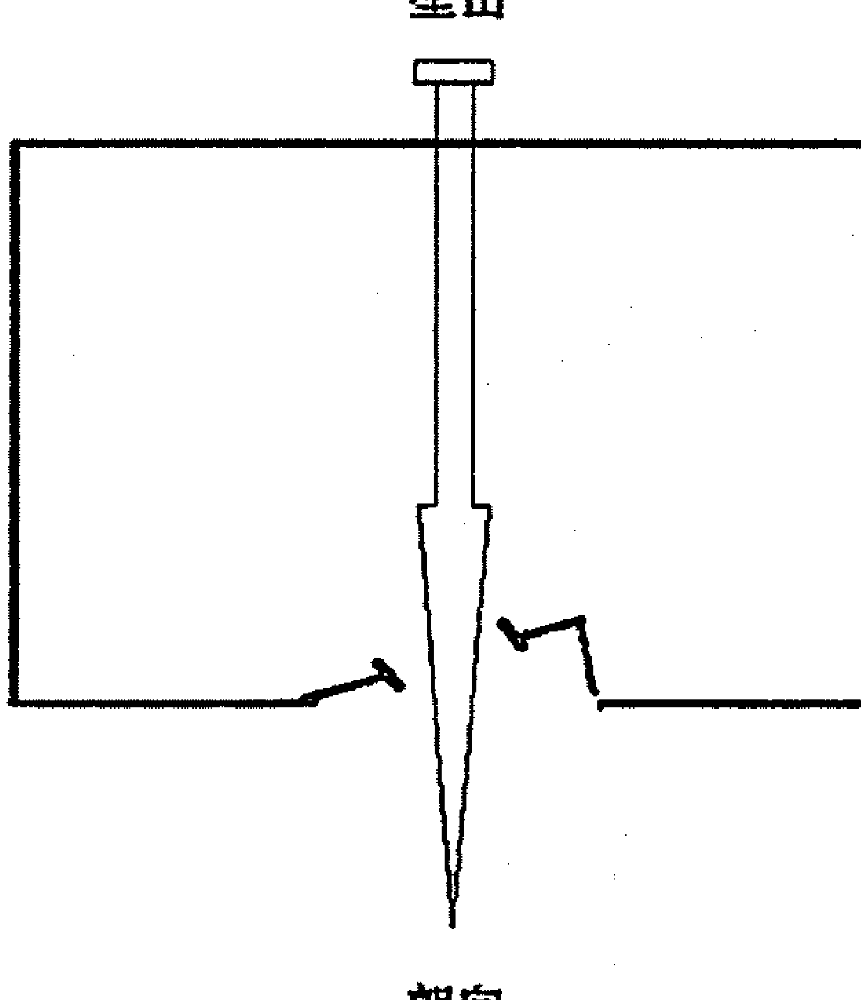
- 六、单元楼底楼为门面，二楼以上为住房，立向时有别
一些小区内的单元楼房一楼为门面房，而二楼为民居住房。此时对待这二种问题时须要区别。若位于公房底楼的门面房，并不用公房的大门出入，而是在靠马路一侧自行开门，如遇此种情况，需以底楼门面房之大门定向。而不用单位之门定向。而二楼以上民居住房则由底楼单元门进出，所以定向仍须以单元楼门定向。若是底楼门面商铺可以从单元楼门内出入，此种情况需以单元楼门定向，而不以商铺临街之门定向。

通过以上分析，相信很多读者已经把握了罗盘在室内的使用方法。

# 太公风水运用基础

## 第一节 太公风水运用原理

太公奇门的八门运用（即东、南、西、北及东南、东北、西南、西北），在阳宅的运用上范围则更大，山川草木及河流包含一切有形有态之物。大到建筑物、马路，小到一宅之床，桌等等都可视为环境。

万物的量子与宇宙的能量息息相关。

## 第二节 先天河图数及运用

相传河图是大禹治水时在一条神龙背上发现的，龙背上有些红黑斑点，而这些斑点的分布规律就称为河图。如图：

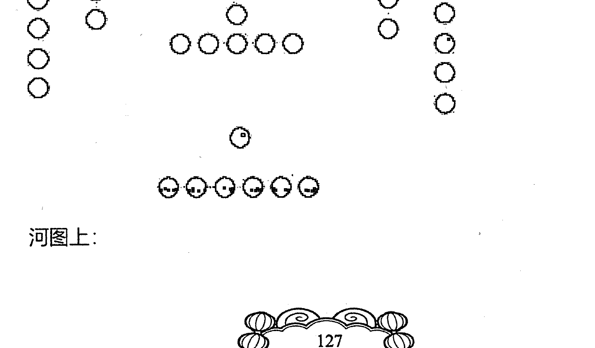

河图上：

北方（下方）1、6属水，此为一六共宗；
南方（上方）2、7属火，此为二七同道；
东方（左方）3、8属木，此为三八为朋；
西方（右方）4、9属金，此为四九为友；
中间斑点为5、10属土，此为五十同途。

其中河图属中一、三、五、七、九属阳；为红色。二、四、六、八、十属阴；故为黑。

然而1,6合水局，2,7合火局，3,8合木局，4,9合金局，称为先天四大局，是风水学的重中之重，龙配穴，向配水，玄机都藏于此，无论任何门派，不懂这先天四大局的奥妙，是不可能触及到风水的真谛，阴宅点穴，阳宅选址，都不离此道，其中有关本门祖师之讯，不立文字，口口相传，择弟子而授阴宅玄机。

## 第三节 奇门与九星

相传洛水出自于一神龟背上，故古人云：“河出图，洛出书”。神龟背上也有斑点，将这些斑点画成表格即现在的魔方阵，横、竖、斜加起来都是十五。

如图：

| 4 | 9 | 2 |
| 3 | 5 | 7 |
| 8 | 1 | 6 |

洛书里数字分布的口诀为：带九履一、左三右七、二四为肩、六八为足。纵横十五数之祖，此虚中实乃众妙之门，这也是太公奇门遁甲风水的灵魂所在。正如天干有十，而地盘干只见九，去对应九宫和九星，此盘又称之为洛书元旦盘或者地盘，其中藏了甲，少了十，在调理风水时，不通此道，正是风水布局不灵，该吉不吉，未见福而祸先至的根源。

洛书里除中五以外，其余八宫从空间含义上又代表着八方。坤为西南、离为正南、巽为东南、震为正东、艮为东北、坎为正北、乾为西北、兑为西南。具体可参看下文九星释意此节。

| 巽 | 离 | 坤 |
| 震 | 五 | 兑 |
| 艮 | 坎 | 乾 |

# 坤遁

## 一：奇门九星释意

一到九之数例是洛书九星，它们包含了数、卦宫、方位、五行属性、阴阳属性以及颜色等等，现将其意义略释如下，为了以后断事的准确性，建议读者最好熟练记忆。

### 水星：
数为一、代表坎卦、属坎宫、在虎门，方位正北方、五行属水、色白通常称为一白水星；属阳，又称黑煞星，主聪明才智，又主官府衙门和情色，其中主吉主凶，离不开时空和大运。

### 土星：
数为二、代表坤卦、属坤宫、在恶门，方位西南方、五行属土、色黑通常称为二黑土星；属阴，又属病符星，是太公奇门派玄妙最多的一颗星，运用得当，也是催财很快的星，运用不当，万贯产业也会盗泄殆尽，尤如进入无底洞，填不满的坑；就如同人参害人无过，黄连救人无功的道理，不是门外之士凭其聪明才智所能参悟的。欲识其中之妙，须得星门地理相结合，又有名师亲指点，方能窥得真机也。

### 日星：
数为三、代表震卦、属震宫、在阳门，方位正东方、五行属木、色碧通常称为三碧木星；属阳，此星有如东升的太阳，温暖普照八方，所到之处，众邪消退，故主声名远播。日星又是一颗催官旺丁的一颗星，星如人一样，都有阴阳两面，它既然称为日星，太阳日出光芒万丈，普照万物，自然主贵气，然必须落对宫位，去对地方，才能显示出它的光芒，让人称羡，要是放在三光不照的黑暗地，如同好花无人赏，也就如红颜薄命的玉美人了。

### 木星：
数为四、代表巽卦、属巽宫、在凶门，方位东南方、五行属木、色绿通常称为四绿星；属阴。此星不得时则显其凶，主意外之灾，是天上飞来之祸，防不胜防，尤如人在路上，突然遇到手持棍棒劫道的土匪，劫财伤命，它虽是木星，凶时主五灾，车灾，水灾，火灾，地震墙塌的土灾，都在此星现，众人不知它也有主吉的一面，就像文昌帝君一样，敬奉他就让你金榜题名，才华出众，大权在握，名利有份，富贵中人，自然也有饱暖思淫欲的一面，运用不当亦主桃花劫，引来争斗是非。

### 天台星：
数为五、代表天心、无定卦，又称中宫、中心方位、五行属土、色黄，通常称为五黄星；是一国之君，三军统帅，帅坐中帐，自然八宫安定各守其职，帅离中宫，领兵亲征，所到之处自是赏罚分明，显其权柄，旺相自是名利双收，因此它是催富聚财的第一星，衰落时，犹如元帅失察，指挥不当，也有全军覆没的灭顶之灾，生大病，破大财，首当其冲，非他星可比。

### 金星：
数为六、代表乾卦、属乾宫、在地门，方位西北方、五行属金、色白、通常称为六白金星；属阳。乾在西北，就像西藏高亢之地，一览众山小，其威自显，又如人体的头，旺相得时，聪明才智第一，公门中人颇多，又像家中老父亲，乾坤生六子，儿女长大，老父退休，儿女供养，自然逍遥自在，不受约束，一旦冲犯他，儿女必会群起而攻之，其灾不亚于太岁头上动土。

### 月星：
数为七、代表兑卦、属兑宫、为阴门，方位正西方、五行属金、色赤、通常称为七赤金星；属阴。即在月亮出没之方，才有月星之称谓，众所周知，嫦娥奔月的传说，月宫有位美丽的少女嫦娥，才引来天蓬元帅醉酒戏嫦娥，岂不知嫦娥心里只等待着后羿这位有情郎，故说她是一颗男人的桃花星，是有情之桃花，并非路边野花，月宫娘娘的富裕也是少有能比的。即是男性的桃花，一旦冲犯，后院着火，引来口舌争执在所难免，搞不好还会让女人争风吃醋割腕自杀，因此月星主手术星。

### 辰星：
数为八、代表艮卦、属艮宫、为天门，方位东北方、五行属土、色白、通常称为八白土星；属阳。斗柄指寅，天下皆春，寅为正月，春天的头一个月，因此艮方是北斗星所在，斗转星移，演义着岁月的变更，人所周知，北斗七星，魁勺萑行毕甫票（不可直呼），北斗主死，就是掌管人的生死，其实不知它也是九颗星，有两颗时隐时现，就是左辅和右弼，又称为：贪巨禄文廉武破辅弼，也就是代表满天的群星，星光灿烂，自然感觉好心情，艮为少男，夜幕将临，美女手挽帅哥的臂膀，花前月下会佳人，问酒讨杏时欲乐，游哉乐哉，因此八白辰星是美女的桃花星，吉时满天星光，衰落时浓云遮光，或不得天时而无光，吉凶若月星同，都有两面性。

### 火星：
数为九、代表离卦、属离宫、为宫门，又叫珍珠门，方位正南方、五行属火、色紫、通常称为九紫火星；属阴，既然九紫火星在离，离宫有午火，说白了就是午时红的发紫的太阳，如日中天之象，驱散一切黑暗，造福八方，既是宫门，像人到最旺时，富贵难于官争，故有宫相，是功名的颠峰，过时则会物极必反而渐衰退，正午的太阳挂在天上，其光如佛珠的牟尼珠，珍珠为财富，他是最大的珍珠，一颗敌万颗，就像珠宝库，所以又称财库。

运去黄金失色，运来顽铁生辉，人有旦夕祸福，月有阴晴圆缺，九星也不离此道，人身本是一小宇宙，受到哪颗星辰的影响，就会演义大同小异的吉凶，唯有斗转星移，大运变迁，运势随之变换尔，没有永远的吉与凶，然人生苦短，年过七十古来稀，古稀之年也不过2万5千天，赶上背运，一运20年，光阴去也，有识之士不甘心受命运的驱使，而想知命改运，望有缘接触到太公奇门风水的人，潜心研究，造福苍生，我心慰矣。

## 第四节 先后天八卦及其之间的内在联系

先天八卦用来配河图，后天八卦用来配洛书。这是一个大原则。

### 一 先天八卦

先天数：乾一，兑二，离三，震四，巽五，坎六，艮七，坤八

| 兑 | 乾 | 巽 |
| 离 | 五 | 坎 |
| 震 | 坤 | 艮 |

在风水中我们经常运用的先天数配后天八卦方位，但在太公风水中运用的数序却应用的是后天数。

### 二 后天八卦：
八卦在太公风水中运用的是数序如下：
后天数：坎一，坤二，震三，巽四，中五，乾六，兑七，艮八，离九。

| 巽 | 离 | 坤 |
| 震 | 五 | 兑 |
| 艮 | 坎 | 乾 |

配上洛书九星颜色简称如下！

一白，二黑，三碧，四绿，五黄，六白，七赤，八白，九紫。

## 天时三元九运
在这里我们讲行深一步的探讨，星辰的生旺衰死之气也随之变化。这在太公风水学运用的最为重要之根本。
三元就是上元、中元、下元，各元均有60年，三元共180年。每一元又分三运，每运20年，三元共九个运，共180年。在太公学中以洛书九星配以九运，如下表：

| 元 | 年份 | 运 |
| :--- | :--- | :--- |
| 上元 | 甲子甲戌20年 | 一白贪狼运 |
| | 甲申甲午20年 | 二黑巨门运 |
| | 甲辰甲寅20年 | 三碧禄存运 |
| 中元 | 甲子甲戌20年 | 四绿文昌运 |
| | 甲申甲午20年 | 五黄廉贞运 |
| | 甲辰甲寅20年 | 六白武曲运 |
| 下元 | 甲子甲戌20年 | 七赤破军运 |
| | 甲申甲午20年 | 八白左辅运 |
| | 甲辰甲寅20年 | 九紫右弼运 |

现将近代年历按三元九运例于下

上元甲子六十年：
甲子甲戌二十年为一运（清同治三年甲子至光绪九年癸未）
甲申甲午二十年为二运（光绪十年甲申至光绪二十九年癸卯）
甲辰甲寅二十年为三运 (光绪三十年甲辰至西元一九二三年癸亥)
中元甲子六十年：
甲子甲戌二十年为四运 (西元一九二四年甲子至一九四三年癸未)
甲申甲午二十年为五运 (西元一九四四年甲申至一九六三年癸卯)
甲辰甲寅二十年为六运 (西元一九六四年甲辰至一九八三年癸亥)
下元甲子六十年：
甲子甲戌二十年为七运 (西元一九八四年甲子至二零零三年癸未)
甲申甲午二十年为八运 (西元二零零四年甲申至二零二三年癸卯)
甲辰甲寅二十年为九运 (西元二零二四年甲辰至二零四三年癸亥)
1984 年至 2003 年为七赤七运，至 2004 年立春后就为八运的开始，如此九运流转周而复始。

## 第五节 空间十二山

凡居屋必先有坐向。论风水，首先要先明坐向。方圆大地，有多少个坐向呢？人们常言“四面八方”是指东西南北四个正方向加之东北、西北、东南、西南，合为八个方向。即是洛书九宫的方位。
十二山向，表示月份和季节。以十二地支来表示。
- 寅、卯、辰、巳、午、未、申、酉、戌、亥、子、丑

### 十二山的阴阳
- 地支阴阳：
子为阳。丑为阴。寅为阳。卯为阴。辰为阳。巳为阴。
午为阳。未为阴。申为阳。酉为阴。戌为阳。亥为阴。

### 八卦的阴阳
- 乾为阳。坎为阳。艮为阳。震为阳。
巽为阴。离为阴。坤为阴。兑为阴。

## 太公风水如何定盘

人宅合一起局法

首先要将太公风水罗盘放于宅的中心点，定出宅的坐向与门向。

山管人丁水管财，遁入为山，回到了保护伞，因此从山上顺推属相，根据属相所落的宫位再逆推生时，时辰所落的宫位即是运宫。如下图：

根据命盘与山向来起盘

如：属相为亥，时辰为卯，住宅的坐向是丑山未向。

- 1. 从山上顺推属相
丑山未向：从丑山上顺推属相（从子鼠丑牛寅虎推到亥），属相亥落宫在子位。
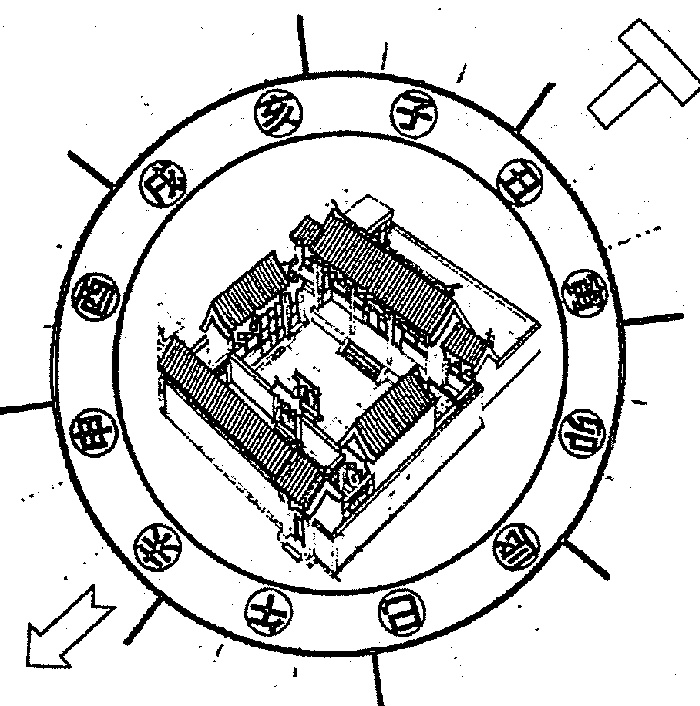
- 2、丑山未向：在从属相所落的宫位（子位）在逆推时辰（八字为卯时）
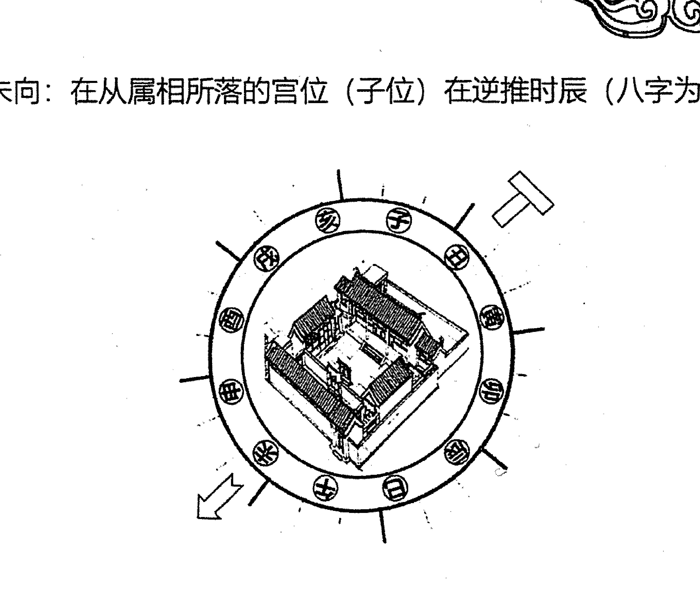
- 3、卯时落在了兑宫的酉位，兑宫酉位定位运宫。在根据运宫然后逆排十二宫位。
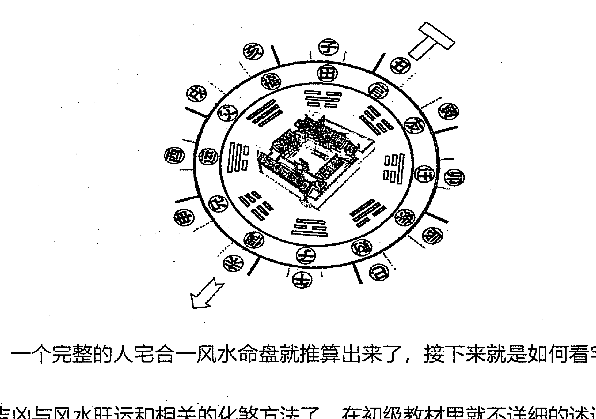

一个完整的人宅合一风水命盘就推算出来了，接下来就是如何看宅命盘的吉凶与风水旺运和相关的化煞方法了，在初级教材里就不详细的述说了。会在太公风水培训班上详细讲解。

# 阳宅择址

天地万物有月圆就有残缺，有日出就有日落，有阴就有阳，有好就有坏，没有十全十美的风水，再好的风水，也有不尽人意的地方！

大江南北看了无数的风水，至少笔者从无碰见过十全十美的好风水！

其实古人对人的生活用一句话就可以代替，家家有本难念的经，这就说明阴晴圆缺不尽相同，是非曲直自有定论，龙生九子都各不相同，何况是人呢？

风水是什么？其实风水就是一个环境学，是保护我们的日常生活起居的保护伞，让我们在宅内不受风雨冰雹的侵害，不受风吹日晒雨淋的侵扰，不受狼虫虎豹的伤害，不受外族人的入侵，这就是风水。

风水也是环境学，居住的环境与我们息息相关，假如房子建立在风口，就会受到风的干扰，所以才要选择藏风聚气的地方来居住。如果把房子建在臭水塘旁边，每天闻到的都是臭气熏天的气味，长久下去就会生病，因此我们修建房屋要选择山清水秀，气味芳香的地方，这就是环境学啊。

房屋为什么要砌高高的院墙啊，不就是为了防止外来生物的侵入吗？房屋为什么要上锁啊，不就是为了防贼吗？

等等的诸多疑问，啥是风水，就是保护我们身心健康不受侵害，风水就是保护伞，风水就是守护神啊。

一栋大楼内可以有几十户人家或者几百户人家居住，更有一些商务大厦里可能存在几百家公司。所以在一层楼面里处在不同宫位内的房屋吉凶命运也不尽相同。

# 坤遁秘籍

坤乾主人

## 坤遁秘籍一

遁；就是风水师一进屋的感觉，如果一进屋感觉浑身都是一种黑气，身体有沉重的感觉，心里有一种不舒服的感觉，就是一种有邪气的感觉，就说明他们家里有邪气。

如果风水师一进屋，感觉浑身清爽，心里舒畅，有愉悦的感觉，说明他们家里有香火，不是供奉神仙，就是供奉仙家，还有另外的一个原因，就是他们家的人善良，乐善好施，积善之家，但是善良的人家未必会有财运。

有财运的风水，风水师一进屋就有一种丰满的感觉，聚财的感觉是一种热气腾腾或身上有一种热流的感觉，这样的风水就不犯病，但是，财和官是两回事，有的人财运很好，但是犯官灾，犯官非，犯口舌，犯小人。

如果风水太旺，阳气太盛，就容易犯官灾，如车前马后灾，犯监狱灾，太旺了就要从官上找，因为太旺为阳，为红，红大了就主凶，是为阳凶，阳灾，而不是阴灾。阴灾包括病人，小人诽谤等等都为阴灾，而阳宅主凶，这种感觉为阳，明白了这个道理很容易感觉出来。

六、所以，一进屋就感觉有阴深深的感觉，就是祖上或者有阴邪之气，犯阴灾，主阴灾。

风水师一进屋就有热气腾腾的感觉，阳气太盛，所以犯阳官，阳灾，包括官非，口舌都是阳灾的问题。

如果风水师一进屋发现四面都有门窗，都能见到太阳，则代表阳气太盛，这样的风水克主人，因为主人是克不动天的，有阴有阳才是阴阳平衡的阴阳之道，阳气太盛就主官灾。

所以，房子都是一面见阳光的，则主旺。如果两面见阳光则主兴旺，但太旺就不吉祥了，若阳宅三面或者四面都有门窗，那就代表阳气太盛，必犯官非、口舌、讼事等灾。

### 坤遁秘籍二

无论是家宅，还是工厂，都不可以住洼地，因为洼地属于阴，阴气太盛，犯病灾，犯阴灾，犯小人。

如果住在太高之地，则主阳气太盛，阳气太盛则犯阳官，犯阳灾。

所以阳宅住在不高，也不低的洼地，即为平地，才是阴阳和合，地气平和，家宅才能平安。

阴气太盛也主不聚财，财来了就会丢，财就会散，主财来财去，财进了就出去。在者阴气太盛容易出凶事，易有病灾，意外之灾等，这是阴灾之气。

但阳宅太高，和墓地一样，风吹而气不聚，也主不吉祥。

### 坤遁秘诀三

人体有五脏六腑，房子同样也有五脏六腑。房子里的五脏六腑也要环环相生，若五脏六腑环环相克，则主灾祸不断，刑克哪一门就刑克哪个六亲，哪一门相克，哪一床相克。都代表着吉凶祸福，相应之位必应其事，必应其人。而房宅的灶若相克则主一家之主，经济之脉五谷是否丰登，则看灶位。

# 阳宅外环境

看阳宅的外环境风水，首先看阳宅四周顺不顺眼，如果顺眼说明出门于外做事顺心。

但阳宅最重要的是阳宅立向，不可以立卯午向，因为午为太阳，卯为日出东方，午为日丽中天，阳气太盛，不可以在正，否则犯阳灾，都要偏一点才行。

进门为一家气口，若门对窗，则主南北相通，东西相克，为玄武克朱雀，白虎战青龙，主家宅不旺，钱财不聚，为阴阳相克，主家庭不和，犯官非、口舌、破财。前进门后出门，主财进来就出去。

进门对着餐桌，你在吃饭的时候可以看见外面的人，外面的人也可以看见餐桌，主挣钱辛苦吃完了就要出去，进进出出主财不聚，主散财，主财外漏，钱财也无法隐藏，有钱谁都能看见，有钱就会有人惦记。

## 灶（为一家之主）

灶为一家之主，人丁兴不兴旺全看灶。

灶不可以对门，灶对门对主人不旺，不但不旺，主人还会辛苦劳碌，无论如何去创业，哪怕每天风风火火的工作，上班，都不聚财。财进来就出去，留不住钱，人丁不旺，留不住人，进进出出主不聚，故灶的向口不能对门。

灶最好要独立的空间，餐厅是独立的空间，这样的风水才是好的风水，也是最好的布局。

这些都是内环境风水，属于五脏六腑内部的风水。

## 外环境风水

外环境风水学，无论是住宅还是工厂，单位，楼房不宜孤，墓地也是如此，不可孤，孤会人丁不兴旺，都孤没有了，为孤寡之像。

这样的风水不是孤人丁，就是孤凶事。至于钱财就更不用说了，人都没有了，哪里还来的财啊？

即使当时聚财，兴旺一时，最终还是空，不会兴旺，主兴旺不会长久。这就好比很多人喜欢住别墅，当时感觉是富贵的象征，独门，独院，护院，但是犯孤主不长久，运不长。

很多人发达了，远离市区，选一幽静之地，盖起了别墅，如东升的太阳，开始感觉很好，但犯了孤，犯了风水大忌，如孤寡老人一样主财，人，房，风水都不兴旺，所以阳宅不能犯孤。

孤树不成林，最后都不行，犯孤。

群居的房子一般不犯病，好比树木成材，他就不犯病，高矮都不犯病，如看地势相同，高主什么，低主什么。

如果两个房子，一个高的，一个矮的房子，高的房子一定压着矮的房子。

如果矮的兴旺而高的不兴旺，那一定是高的房子周围有比他更高的地方，比如树木，灯塔，变压器，或者泰山压顶，或者出门就能望见墓地等等的原因，都对他有影响。

还要看工厂的老板，房子的主人与房子合不合，缺什么？少什么？差什么？缺财要补财，缺金要补金，佛为金身，所以风水缺金，命理缺金，供奉佛主能够化解。

看五行缺什么就补什么，房子很多左右格局一样，朝向一样，房间的格

## 宇宙的能量

## 什么是鸿运

结婚穿红的代表鸿运，吉祥，红红火火，所以中国红代表朝阳，向上，走红运，为阳。

为什么人死了要带孝，要穿白色的呢？

白为孝，也代表着孝子贤孙，白为西，为西方代表西天，人死了往生极乐世界，老人代表祖宗，所以人死了为阴，穿白为阴。

婚房挂上红色，别人就都知道是喜事，代表喜事临门。

而人死了就不能挂红色，因为人死为阴，不能披红挂红，但也不能挂白色，毕竟是阳宅，后人还要生存，所以人死了为什么要请阴阳先生来净宅，把房子的阴气净了，用五谷杂粮来净，因为五谷代表五行，要让房子五行不缺，要让后人五谷丰登，让五行相互制约，让五行平衡。

如果不净宅，房间阴气太盛，后人不走运，犯阴灾，后人不旺，多病，灾难不顺。

红虽然为喜事，但结婚属于红煞，也会犯冲，但红煞不是冲克结婚的人，而是红煞一出门，那种红煞之气会冲到其他人，那么到底都冲哪一些人呢？

红煞一出门，会冲到与新娘属相相克的人，所以，古人在选属什么的先进门，不属什么的后进门，在有找傧相，伴郎，伴娘，都要找与自己相合之人，不能找与新娘犯冲克的人，就是这个道理。

但，当结婚遇到发丧，发丧就是丧事，但红煞遇到白煞，就犯冲克了，

## 那么，究竟是谁能冲克动谁呢？

有的人在结婚的路上遇到死人发丧，感觉是一件晦气的事情，发丧的人遇到结婚的感觉心里不舒服。那么到底谁克谁呢？

其实红白相克时，发丧的人家不好，是红煞打白煞，冲克白煞，对发丧人家不好，因为红煞为阳，白煞为阴，发丧是在白天，红煞有为阳，所以阳对阳为阳气大旺，所以红煞克白煞。

## 东北为什么白天结婚？南方为什么黑天结婚？

白天为红煞，夜晚为黑煞。

北方为阴，白天为阳，为了阴阳平衡，所以北方结婚都是白天结婚，没有晚上结婚的。北方为纯阴之气，阴气太盛的原因所以不能晚上结婚，因此要入乡随乡，一拜天地，二拜高堂，夫妻对拜，最后一下就免了，因为大白天的不能送入洞房。

南方为火，为纯阳之火，如果白天结婚，结婚为红煞，在加上红煞，那就犯克，所以南方晚上结婚，晚上为阴，为阴阳和合，拜完天地就可以直接送入洞房，就可以避免红煞见红煞。

这也就是为什么结婚的见到结婚的不好，因为两个结婚的相遇，即为红煞见红煞，所以结婚的都要准备五谷米和喜糖，遇到结婚的车会给对方的婚车散撒或打五谷米，这就是红煞遇见红煞化解的方法。

# 坤遁阴宅秘籍

讲阴宅的时候，我们先讲一下什么是阴阳，人活着为阳人死了就为阴。什么是阴阳两界呢？阴阳两界分为阳世三间和阴世三间。其实都是阴阳两界。人死为阴，他的墓在哪里，哪里就是他的家，就是他的房子，就是他的地界。

人死虽然为阴，但是也有阴气过重的，如果早亡、少亡。自杀的、孤寡的，没有后代的。凶死的，恶死的，暴死的，凡是所有不是好死的，屈死亡魂的，阴曹地府都不收，流浪大街的地府不收，大庙不留，小庙就更不用说了，更加不会收留了。

人和鬼就是阴阳两界，一个白天活动，一个晚上活动。

人死了，灵魂没有死，人和鬼没有什么两样，生前是人的心性，死了是鬼也有人的心性。人爱看热闹，鬼也爱看热闹，变成鬼他也爱看热闹，哪里有人聚会热闹的地方，鬼也会去看，这个时候有运气不好的，身体不好的，就容易冲到他们，你冲到了他了，他就要跟你要一点钱，因为没有你给他们钱花，要是碰到运气更不好的，他也可以找一个替死鬼，说是阴阳两界，实际都在阳世三间，阳世三间不就是阴阳吗？

何为天，高山就是天。

什么是地府，哪里墓多，哪里就有阴曹地府，哪里就有鬼头来管束这些鬼魂，鬼和人一样，因为鬼就是人变的。

墓地之所以会影响到子孙后代，是因为爹的骨头娘的肉的关系，骨头是父亲给的，肉是母亲给的，所以父母与后代子孙有着血脉相连的关系，与后代子孙息息相通的，无论男女，肉体和骨血都是父母给的，怎么能说墓地管男丁不管女丁呢？女子无论嫁给谁，都是自己的父母所生，骨血变不了，所以墓地管男也管女。

人死了，肉没了，骨头还在，骨灰还在，若人死了，墓地吉祥就会给后人带来兴旺和吉祥，后代子孙就会发达，就会名利双收，风水好的墓地就会富贵荣华，代代兴旺。

人死了如果墓地不吉祥，就会一代不如一代，后人就不会发迹，就不会发达，会疾病缠身，事事不顺的，破财散财。

一般三代不发迹，就是墓地不旺，向口不好，人丁兴旺不起来。墓若下好，几代兴旺，墓地就不可以动，下的穴就正。

# 阳宅秘诀

无论是阳宅还是墓地，都要山清水秀，柳暗花明之地，前后左右看着心里舒畅，这是第一的先决条件，后人有靠山，前面要有光明大道，代表后人有路可以走，前有水，以水为财，代表有财，人气兴旺，又有人缘。

风水再好都要福地福人居，如果不积德，后代子孙也会出事，也会不顺，反到会伤到人丁。

家宅如果于石砬子山上，寸草不生，鸟都不去的地方，怎么会发迹，戈壁滩更是如此，这样的风水出凶恶之人，出暴徒，出强盗，出小偷。

如果家宅前有光明大道，那后人就旺了，说明有路走，前途光明，人生就有光明之道。

阳宅之地洼，就窝在那里不动，若是漩涡之地，不会有太大的能力，游龙浅滩遭虾戏，虎落平阳被犬欺，古人也有高楼，那是富人住的，穷人住不起。

# 化解之道

李世仁

## 坤遁秘籍--化解之道

房子的外格局与内格局的化解方法，看风水先看外格局，现在都是楼房了，外格局不好化解，因为你不能把人家的房子拆了，更不可能把山移走，外格局只能用化解的方法。

### 三叉路---化解方法

如；三岔路口又叫剪子谷的道路，你不可能把道路移走，给拆了，这时就需要化解之道，改变不好的运势，那么剪子一剪一大片，如何来化解呢？化解剪子谷的最好方法是在阴阳宝境上挂上一把剪子，阴阳宝境咒语加上符，再给剪子开了光，就是最好的化解方法。包括什么尖角煞等等，都可以用阴阳宝镜来化解，但必须开光后才能使用，否则不会灵验。

### 指南针---化解之道

积善之家必有余庆，可是有很多人家，又是积善之家，亲朋好友有事就帮助，但是，为什么好人不得好报呢？子孙不旺，财运不旺，后代子孙没有出息，没有成材的，像这样的命运如何化解？

像这样的家，多数都是风水出了问题。

化解这样的风水最好的方法是指南针来化解，指南针代表指引方向，能够给孩子指引方向，孩子能够看到前途，指南针要挂在房子的大梁上，但是一定要把指南针开光，这样的化解方法比挂什么都好，指南针能指南北，东西，来指引方向。

楼房挂指南针，如果让主人好，就挂在房门上，房门为一家之主，所以旺主人，但如果为了让子孙好，就把指南针挂在客厅的中门顶上，正中间，因为房子顶上代表天，属于天棚，开光的指南针挂上也会让孩子聪明。

### 夫妻不和---化解方法

如果家里夫妻不和，整天吵吵闹闹的过日子，化解的方法就要供上灶公灶婆，灶公灶婆为一家之主，也会让家宅夫妻团圆，一家人团团圆圆，虔诚供奉会化解夫妻不和，能让夫妻和和美美的过日子。

### 孩子犯灾---化解方法

如果孩子不好养，总是爱生病，就在阳宅里面供奉张仙，又称送子张仙，张仙是送子的，又能让孩子好养，无灾无难，家中供奉张仙，能看住孩子，孩子就会平平安安的长大，就不会总爱有病，尤其是不好养的孩子，爱有病，有灾的孩子，就供奉张仙。

### 福地福人居

古人认为，房子是人的住所，福地要福人居，再不好的风水，有福之人住进来，就会一福压百祸。

没有福气的人，房子风水再好，他个人没有福报，反而会给自己带来灾难，为什么有的人刚刚当官，官位没有多大就给自己带来了牢狱之灾呢？有的人刚刚发财，刚刚富贵，子女就生无妄之灾，这些都要讲福地福人居，所以，看风水这家人有没有福报很重要。

如某宅邪气过盛，地下有墓，但没有福气的人，邪气就会出来闹，使其人丁不能平安。

有福气的人住进来，有福报的人住进来，邪气反而会来保护他，保佑他好，因为他的慧根好，先天的福报好，道家讲福报三千，功德圆满，百邪不侵，所到之处，万神相助，这就说明一个人要有福报，才是风水改运之术。

## 风水师——道德论

风水师首先要修德，也许很多人会认为，修德与风水有什么关系呢？这里我们先论述一下什么是风水师。

风水师又称阴阳先生，所谓阴阳，即是阳宅与阴宅的关系，二者是密不可分的，但阳宅同样还要分阴阳的关系，所谓阳宅的阳，我们称之为能够看得见，为显性的关系，阳宅还有我们看不见的，隐性的，无法用肉眼看见的，我们称之为隐性的关系。

既然是玄学，玄即为隐性的关系，又称玄之又玄，众妙之门。

阳宅也好，阴宅也好，一看布局，二看气场的能量，比如房子下面是粪坑，或者周围是粪坑，他的气味即是一种气，也是一种能量，这种能量对人体不用我说，大家也知道对人是无益的，对人的运气也是有一定的影响的。

如果住坟场，或周围都是墓地，甚至房子下面都有墓地，那么就说明人与鬼同住在一起，人死了为阴，他的那种阴气，对人体的影响同样也是巨大的，他的能量也是惊人的。

但是民间还有一句话叫鬼怕恶人，为什么会怕恶人呢？因为鬼生前也是人，不光鬼怕恶人，其实人也怕恶人。

鬼除了怕恶人之外，还怕什么人呢？

鬼怕修行人，怕得道之人，还怕阴阳先生，但鬼也不是所有的阴阳先生都怕，这里我们不能称之为怕，因为阴阳先生不是恶人，我们这里称之为敬，一个有德的风水师，以渡人为本，解众生之苦，鬼才会敬重他。

鬼看人和人看人一样要分三六九等，假如皇帝来了你尊不尊，乞丐来了你尊不尊啊？小偷来了你尊吗？当官的来了你尊不尊？这个道理阴阳先生应该懂得。

师父今天告诉你们，看风水的人得要有风水的德，没有德的风水师怎么救人，你的技术再高，自身不注重道德的修养，尽干一些伤天害理的缺德之事，满身邪气，满身晦气，这样的风水师天地都不容，怎样去给人家看风水，你去了别人家里，自身的晦气就严重，他们家怎么会转运，所到之处把晦气带给人家，怎能给人家带来福气呢？

所以，一个有德的人，高道的人，就会给他家带来福气，运气，财气。

一个满身晦气的人去给人家看风水，就会给他的家宅带去阴气。

因此，过去当风水先生，都有仙风道骨，满身正气，有道有德才会给人家带去风调雨顺，才能消灾免难，才能给人家带去福气，这是风水先生自身要修道，要修德，天地都会助他。

一个没有修行的风水师，阴阳先生，无德之人，没有神助，天地都不助他，这样的风水师给人家画符，贴符，怎么会灵，所以道法有一句话是“书符不灵反被鬼欺，画符不灵反被鬼笑”。

这就是一个风水师的修养，看见修行养德是多么的重要。

如果风水师不明白这个道理，光给人家看风水挣钱啊，说什么做善事啊，结果是嘴上说一套，背后做一套，怎么配当风水师啊。

一个风水师要有使命感，要做到众生之苦就是我的苦，众生的难就是我的难，这样的风水师走到哪里，天地人鬼神都敬他，助他这就是道。

飞龙道人的格言，即为众生之父，又为众生之子，要以父爱的形态去对待众生，又能以众生之子的心感化众生，才是风水师的王者之道。

作为风水先生不能有贪心，如果有贪心怎么去渡人，不能因为对方有钱就去杀富济贫，他有钱那是他的福报，我们要积我们自己的功德。

另外一个阴阳先生就应该有使命，祖师爷也会让你发财有钱，如果发达了，有上亿的身价，你还会去看风水吗？还会去渡人吗？

如果发达了，就不去渡人了，祖师爷是不会让你发达的，如果你发达了，还能去渡人，还能够保持初心，那么你的富贵就来了，所以，阴阳先生要有任重而道远的心里。

# 坤遁阳宅秘籍

阳宅风水属于通天达地风水学，风水之道以阳为天，以阴为地，南阳北阴，东升西降，故风水属于通天达地之术。

阳宅风水首论格局，以东南西北为主，现在住的都是高楼大厦，平房很少，除了工厂，住平房的人都很少看风水，说明白了一点，穷人不讲究风水，只会去算算命，看看事。而富人才会看风水，因为富人相信风水的力量与作用。

现在就谈谈风水的外格局，风水外格局远了不用去讲，因为房子对面的山山水水离宅子太远，作用力不如房子的前前后后，左左右右对风水的影响。

现在的楼房格局很难改变，门不好也不能改，但是现在的楼房有的一门二房，有的一门三户，所以就要看住的是东面还是西面，还有的是中间的楼房，风水学中，住在东面为青龙，东方又主升，日出东方，虽然属于旺，但是，人的属相东西面不和，犯克，就会不顺，就主不旺，与属相相和，就会旺。

房宅以主人为主，可以看一家之主的命与楼房是否相和。但风水师进屋后看内阁局，就不能光看主人了，而是以整个家庭成员为主。

现在住楼的门能改吗？根本就改不了，只能变动内格局，外格局不好根本没有办法改变，所以，内格局能变动的首要就是床了，包括内格局放的物品好不好，位置对不对。

现在的楼房，无论哪里的楼房，一进屋首先就是客厅。

# 客厅风水

一、进门为进入，也主进财，因为主人从外面回来要往家里拿东西，就主进财。

二、出门为出去，主出财也主求财。因为出门去商场，去超市，去求人办事就花钱，请客吃饭买东西，都要花钱。同时我们出门上班为了挣钱，做生意为了挣钱，故而主出财，也是求财。

往屋里拿东西，为进，属阳。

往屋外拿东西，为出，属阴。

所以客厅至关重要，一进屋，客厅的摆设是什么，就代表什么事情，如果一开门进屋就是电视机，就会主家里烦恼的事情特别多，也就是说一开门正对着电视机，家里就会有烦恼为什么呢？

电视为阳，为动，一进屋看电视，为阳，为动。

一进屋进入客厅后，坐下了看电视，电视属于娱乐性，就主安养，安乐，就不主动，主静中取乐，看电视属于一种快乐，属于享乐，但是，进门正对着电视，就主有烦恼，主口舌，是非，诽谤，主不平安，还主家里不太平，烦恼，主伤财，因为电视里面演戏的都是外人，一开门就看演戏，电视里面哭哭啼啼，吵吵闹闹什么样的戏都有，这样的风水格局进门属于闹市一般，主凶。

因为戏子什么都演。有哭，有笑，有凶，有鬼片等等什么都有，应有尽有。属于电视对门为闹市，故而主凶。

## 佛堂风水

佛堂之位，是修心养性之地，喜欢安静之地，因此安置佛堂不宜吵吵闹闹的地方，佛要清净，佛堂不能对门更不能有电视机，因为电视吵吵闹闹的地方，更不易对门，因为门是进进出出的地方，什么人都有，女人来月事的时候也要经过，来回的垃圾都要经过佛堂就不干净，也不吉祥。家居风水就不可以，寺庙和道观就可以，因为庙里是众生祈福之地。

南方很多人家进门对着就是祖先，这样的风水也不好，因为祖先为阴，所以就会主散财，不聚财，也发不了财。而且家里病人多，犯病关，为什么呢？

因为祖先毕竟是往生西天极乐世界的人，好比鬼冲门，怎么会好，古人曰；“鬼若望门，家里伤人”。

还有的阳宅风水一出门就是坟，很多墓地离家里很近，出门就能看见坟墓，这叫鬼望门，容易撞外邪，破财。最忌讳的就是自己家的祖坟望自己家的门，这样阴气直接进宅，主后代子孙不旺。

这样的风水，如果是工厂，就伤工厂里面的工人，如果和鬼做邻居，就会犯病关，不走运，财运旺不起来，有钱就有事，宅子前后都是坟，人怎么会旺，运气怎么会旺。

鬼在阴界，宅在阳界，不能人鬼同住一起，不然白天人在房间活动，鬼睡觉，晚上人在房间睡觉，鬼在房间活动，人鬼不能同居。

佛堂对面不能有鞋，鞋也代表邪气，犯邪，这样摆放没有事都会有邪气。因为鞋不能对着吉祥之物。

进门对面不能有鞋架，一只都不可以，但鞋柜可以，因为鞋柜有门，福门如隔山，所以鞋最好放到鞋柜里。

## 吉祥物风水

现在很多人喜欢在家里摆放吉祥物，摆对了方位可以财源广进，家宅平安，人丁兴旺。如果摆错了家里就会吵吵闹闹，烦心事多，诸事不顺，甚至会损丁伤财等。

# 餐桌风水

阳宅风水中，餐桌是至关重要的地方，如果餐桌对着厨房，就代表着有饭吃，因为你在吃饭的时候眼望着厨房，厨房里面都是吃的，代表着有饭吃。

但是很多人家喜欢餐桌喜欢对着电视机，边吃饭边看电视。代表家里即使有饭吃也会有闹心的事情，古人讲，寝食不语，所以，餐桌对面是电视，代表家里有不顺心的事情，因为电视为闹市，吃饭都不安宁，家里怎么会安宁呢？所以家里就会烦恼多，也主家里人挣钱麻烦，挣钱艰难辛苦，农民最喜欢边看电视边吃饭，有的人家厨房与餐厅是分开的，餐厅在单独的一个房间，代表这家人有暗财，进财谁都看不见，有饭吃的财，比在客厅吃饭还要好，看不到的财，私房钱也多。

客厅放餐桌，进财出财都是显露的，因为来人一进屋就能看见餐桌，好比进门就能看见你的钱财，所以能看得见的财就多，暗财运就少。

餐桌对面是电视爱来一些不三不四的人，你不招惹他，他来招惹你。

进门对面是厨房，主什么人都想挣财，财就是钱，钱可以买饭，也是饭碗，所以，一进门对着厨房，一进门对着餐桌，主什么人都来，来人就吃饭，就想分财，争财。

如果别人家一进门就是餐桌，就是厨房，你可以多去他那，就可以分财运，因为进门就有饭吃，别人来我们的家里，主到我们家吃饭，分财，失财。

主客人来了进屋就有饭吃。

## 烟囱风水

楼房的门窗都是固定不变的，想变也变不了，但门与窗在百米以外的都不犯克。

如窗户对着烟筒在一百米以内就犯克，因为在风水学中，烟筒也属于一煞，也是黑煞神的一种，烟雾为黑，代表北方黑煞。所以烟筒对门，对窗户就犯克，克人不旺，犯病关，伤人，又犯官非口舌。

但是，百米以外就不犯克了。

如果犯克，很多人都挂镜子，镜子太小，无法返回，化解不了，用什么来化解呢？

太公奇门的化解方法用桃木剑，开光后，又能辟邪，又能避免犯官灾等。

## 三叉路风水

门对着三叉路，三叉路又叫剪子谷，如果门或窗对着三叉路，太公奇门道法破解方法用剪子，开光后挂在阴阳宝镜上，受持阴阳宝镜咒语，挂在冲着三岔路的地方，就可以化解剪子谷的路口了。

窗户主家人，门主主人，窗户为一户之人，一家之人，而门则只主一家之主，代表一个人。就是站在窗户上看着三叉路口，都犯病。

## 内外格局的化解方法

路，为天地之间，不能犯克，门或窗如果与路犯克，如果和山犯克，如果和水犯克，首先要查户主的属相。

山如果克宅的话，首先要以山分房，山的分房方法，我们要以山为虎，山的虎头代表长子，山的虎尾代表三子，山的虎腰代表二子。

门不是代表玄武就是代表朱雀。如果门克山的话，门克虎腰主克妻，主克二子。

风水学上子女也有克父母的。

门如果是白虎的话，就容易克子，门如果是青龙的话，就能旺子。

阳宅门对着山的虎头，以山为大，门为小，因此门克不了山，反而山会克人。门代表主人，也为一家之主，所以山克主人，也属于长子克主人。

门向东，东方为青龙，对面是山，山为白虎，主青龙白虎相和。

门向西，西方为白虎，对面是山，山为虎山，二虎相争必有一伤，故伤主人。

真武宫道观原有之门向西，是原来的主门，在往前一百米内有一个三叉路口，又名剪子谷，主伤主人，伤财，财不旺，即使把门堵上，看上去还是门，依然不旺财，主伤财，应在门上放一把剪子，开光，既可以化解。

真武宫主门向南，南方见水，水火相克，主人不和，不相和，也主人与人不和，南方为朱雀，朱雀见水，为落水的凤凰不如鸡，水为青龙，主青龙克朱雀，水火相克，所以庙里留不住人，也主人人心不齐，相互克制。

真武宫门前无路，后开的侧门有路，名堂无路可走，为死路。既然无路就主把财路堵死了，应该在真武宫楼下南方扒一个门，这样就会有路可走，主有光明大路，有前途发展，南门为朱雀，有路可走为通气，再见青龙就主相和，主财大王，财源广进。

- 水一；一楼为玄武。
- 火二；二楼为朱雀。
- 木三；三楼为青龙。
- 金四；四楼为白虎。
- 土五；五楼为中堂，代表五行水火木金土。

房间的方位也不能冲克属相，主要是床安放的位置不能冲克属相，因为床是人的穴，故穴不能冲克属相，否则克人。

北方属水，属于黑煞神，属猪的也属于黑煞神。

房宅的主门与卧室的门要相生，不能相克。用太公奇门风水先定十二宫，然后根据门的宫位与床的宫位来定生克关系定吉凶，定十二宫的吉凶祸福与妻财子禄。

如果房宅的主门与卧室门相克，门为虎口，两门相克为二虎相争必有一伤，看谁能克动谁，看谁说的算，这样的风水家宅就爱争吵，爱吵爱闹，还要看房间住的人之间是否相和，如果相和就没有事，不和就犯克，就是夫妻，同一床如同穴，也要看是否相和才行。

故；家宅必须要论人与人是否相和，阴阳是否相和，夫妻为乾坤，也要看是否相和，天为阳，地为阴，也要相和。

现在所有风水师进屋不论主人的属相不论命，只论风水格局，岂不知再好的风水也要人来住，风水再好，家里的人与人之间犯克，人与风水不合，也会偏离风水之道。

一家之主，夫妻合不合，子女克不克，所有古人曰；一命、二运、三风水。

## 水的化解方法

门前是水，如果水犯煞，水不吉，用什么方法化解呢？

今天教吾门内弟子一个法门，如何用太公奇门来化解犯水煞。

化解水煞的最好方法用宝葫芦来化解水灾，葫芦能装水，能聚财，能化解一切水灾，但宝葫芦要开光，用宝葫芦咒语。

宝葫芦还要挂五彩线，得五方财，五方金木水火土，可得五行财。如果没有葫芦也可以用朱砂画葫芦，画一个宝葫芦符就可以化解。

五月节为什么挂葫芦，因为可以化解煞气，可以保佑家宅平安，福禄，吉祥之物。

## 关口的化解之道

如果家里风水不犯病，孩子还爱生病，就要查孩子犯什么灾，犯什么关，属于自己孩子关灾。

属于就要查这个孩子犯什么关，就是与风水无关，犯天，地，水三官，犯什么就要带什么来破关。

犯关不是带什么都可以化解的。什么克他就带什么，五行犯克，就用什么来化解。

如；火克金，可以带金佛，什么能克动佛祖啊，而且一定要是金佛，因为真金不怕火炼，然后用红色的绳子，红属火，火见火就不克金了。

如；水克火怎么化解呢？人不可能带水啊，越带就越克火啊，所以要想让水不克火，可以用龙王爷来克制水啊，因为龙王管水，包括龙为辰，辰为水库，水归库就不犯克了，最好是东海龙王啊，你看西游记的宝贝定海神针，不是在东海龙宫取的宝贝吗？带上龙王爷就与火不相克了，反而会相合，达到水火既济。

还有就是一进屋门，床摆放的东西，看着也吉祥，也不犯病。但是，为什么人还有病呢？

这样的风水属于犯病关，人有阴气，阳气不旺，才犯病。

有一些风水格局很好啊，家宅也属于旺宅，前后左右格局都很好啊。但是，如果人没有福气，也没有福报，这就好比有的人有十分的福气，而他就只有三分福气，这样的命无福消受好的风水，反而会给自己带来无妄之灾，这就是为什么有的风水师给人家调完风水，家里人出病灾，手术，甚至犯官非和伤人丁等，因为风水师不知道福地福人居的道理，嘴上说福地福人居，到了人家就只论宅命，不论人命。

因为无德无福，他享受不了这个家，他就会老爱生病，犯病关。

这就好比有的人，没有福报啊，但是他的爱人有福报，爱人能挣钱也有钱，他也享受不到，孩子再好，他也享受不到，因为他本人做什么事情都不顺，要不就是疾病缠身，无福享受，像这样的风水如何化解呢？

真正的化解方法，就是让他带上佛祖，开上光，就能够把他的阴气散了，这就是很多人都带佛的秘诀。

佛属于天上，天为阳，佛光普照可以除去阴气，阴气散了，病就好了。

# 坤遁论人宅合一

一个宅风水再好，也要看夫妻合不合，犯不犯克，子女与父母犯不犯克，只有先论述人与人之间是否和谐，然后在看人与宅之间是否相克，这才是真正的天人合一风水之道，这才是真正的风水先生。

一个风水师不先把家里人的命看明白，进门就看风水，不懂一命、二运、三风水，怎么能做到天人合一风水和人宅和一的风水呢？

因此很多学员想报名学习风水，首先我就问会太公奇门吗？就是为了让大家明白，不知命如何改命。先把人的命运先算明白了，把一家的命算明白了，然后在看风水，才能达到知命改命。

很多风水先生说给这个调风水发财了，给那个人调完风水当官了，为什么不给自己先调发财了，把自己的财运旺起来，调成身价百万，千万富翁，或者调成高官厚禄，如果做不到是自己学艺不精吗？还是自己没有真本事呢？

其实都不是这个原因，真正的风水之道，要懂得先论命，人与人之间不犯克，夫妻之间的命又相和，子女是来报父母恩情的，人与风水又相和，这样才是天人合一，人宅合一的最好风水。

福地福人居，一个非常好的风水，公司的风水格局也旺，如果让一个傻子去当老板，又有何用，这就好比当年诸葛亮遇到阿斗，再好的风水也要看人，诸葛亮为什么不辅佐张飞，所以风水旺，也要看人的命运才行。

一样不好的房子，有福之人住进去可逢凶化吉，遇难成祥。没有福气的人住进去就会雪上加霜，凶上加凶。所以看房子的风水还要看人命，其次才是人宅合一。

# 坤道

企业风水也要看企业的老总的命运，首先要看老板的运势旺与不旺，衰与不衰才行，如果一个老总有福气，在论风水的东南西北是与他相克还是相和，风水的吉凶祸福自然就会明察秋毫。

如果企业老板没有福气，再好的风水，在旺的风水他也无福享用，甚至会出现无妄之灾，运气不顺，如果在加上风水主凶，那就是凶上加凶。

所以，宅的风水再好，命运不好，运气不好的话，也主不吉。

人若是愚人，是傻子，你让他去经营企业，看是否有发展。

风水与人相克，他也发展不起来，因此，论风水之前，一定要先论命，不然为什么那么多的风水师，还要寄人篱下，还要去阿谀奉承企业老板，官贵富豪等人，还要拿着罗盘去东奔西跑，也无法让自己高官厚禄呢？

有一些风水师整日高谈阔论是如何给别人看风水，他调理后让别人发了几百万，让人家当了局长甚至市长和省长的大话，那为什么不让自己发达富贵呢？拿一个镜子照照自己，看看自己的子孙，就知道自己的水平如何了？

所以，风水再好也要一命二运三风水，四积阴德五读书。

## 吉祥物风水

风水中最好的吉祥物是葫芦，其次是龙和金蟾，家里有孩子的可以供奉麒麟，能让孩子无病无灾，麒麟送子，所以麒麟属于护法神，开光后即有灵气，过去大户人家都供奉麒麟，主子孙后代都兴旺。

貔貅要看与主人是否相和，有没有灵气，保不保佑家宅才行。

属虎的人和八字有寅木的人，不能供貔貅和带貔貅，因为龙生九子，与虎成了龙虎斗的格局。

所以给家宅调理风水，可以用麒麟调理风水，能旺丁，能旺子孙后代。

## 房宅万物论

一个人生存，不可能都生活在房间里，进家门安享生活之乐，出家门为了工作挣钱，所以就要接触的形形色色的人，每一个接触的人，都与自己的运气息息相关。

有阴有阳，有动有静，有天有地，有生有降，有去有回，所以房宅看一个人的格局，代表不了一个人的命运与福报。

房宅再好不可能不出门，也不可能总是待在房屋里，只要生存，就要接触形形色色的人，去各种各样的场所，你所接触的一切人和物，都是风水之物，所接触的一切都会对自己起到生克制化的作用，都会影响者一个人的运气。

所以，人的命运，慧根再好，缘分再好，但得靠自己去发扬，去闯天下。

即使你先天是龙下界转世，即使你是一个秀才，谁又能知道你是秀才呢？真龙天子下界待在屋里不接触人，又有谁知道你呢？

因此，房子再好，也要看人天地之间的万物生灵，包括人与人之间的生克关系，这些风水属于小乘之法，不属于大乘之法。

今天我就给吾门人讲一讲风水的大乘之法。

风水先生一进屋看见屋内乱乱的，这样的风水一看就不清净，家里就会有烦恼的事情，心就会七上八下的，烦乱的事情就多。

风水师一进屋看见房内干干净净的，摆的整整齐齐的，一看就是清净之家，家里烦恼的事情就会少。

上至高官之人，下至平民百姓，还是修道之人，都要有一个窝，这个窝，就是一个家，哪怕家徒四壁也是一个栖息之地，修道之人也要有一个洞去修炼才行，就连动物也得有一个窝。

所以，房宅，古洞，窝都是天地之间，安身立命之处。

# 坤道

# 大乘风水

阴宅；主要看死去的墓地，好不好看墓的地势，墓的前后左右好不好，要看风水格局，这是阴宅，看后人旺不旺。

阳宅；还要看为人处世，接触是阴性信息的还是阳性的信息，包括我们日常生活所接触的人，有阴阳，包括先天的转生，后天的阴阳之气等等，今天我就传授风水学中的大乘之法。

风水师一进屋，就要知道是阳宅的出了问题还是阴宅的问题。

只通阳宅不通阴宅，就不是一个好的风水先生。

只通阴宅不通阳宅，连人都不看就是一个睁眼瞎的风水师。

只知道论述风水不知论人命运，根本就不懂风水。

只要接触人，或者是进入家宅，有没有阴气，有道的人就应该能够感觉，这就是大乘之法。

如果一进屋感觉清爽，心情明亮，说明这家比较干净。

如果一进屋或者接触一个人，感觉有一点点慎得慌，或阴森森，或者心里打了一个寒战，或者本来心情挺开心的，挺愉悦的，心里不知不觉，也没有什么事情发生，突然就高兴不起来了，也不开心了，这个家就有阴气，人有邪气，这就是祖坟的问题，因为阴宅之气与阳宅之气是阴阳相和，息息相通的，所以祖坟的气也会进入阳宅。

如果阴阳二宅不相和，光看阳宅，不会看阴宅，你怎么去改变他家宅的运势，他家里有阴气不变，有鬼魅缠身，这样的阳宅也属于阴宅啊。

所以你光看阳宅，阴宅有病，你怎样解除，如果解除不了，怎么去消灾，

# 坤道

这就是要分阴灾与阳灾。

如果坟不好，风水不好，后人不旺，同样也会影响他的屋，影响他的家，坟茔地不好，后人什么事情都不顺，什么事情凶事都出，严重的后人有生命之灾，甚至后人出疯、癫、傻。这些都属于墓地里的问题，出哑巴，出傻子，出疯子。

阳宅很破，反倒出高官，后人有财，这是为什么呢？

别看他家房子不好，人穷，他家的墓好，旺后人，出高官厚禄，明白这个道理，才是大乘之法，这个不讲明白，你光看房子，房里里面的东西，富人家里琳琅满目，那穷人家呢？穷人家除了床，就是灶，能吃饭就行，穷人还有什么呢？

所以，真正的大乘风水之道，是要阴阳结合，才能达到圆满的境界。

如果一进屋，感觉房宅里面真有阴气，感觉发阴，这种感觉，一定是墓有问题，一般的阴气不会进他的家里，因为阴阳是相通的，阴宅与阳宅是相通的，所以风水师一进屋就要感觉到是阴宅还是阳宅的问题。

还有另外一个问题就是祖上留下来的香根，也会出现这样的感觉，这也是至关重要的，虽然你没有供奉过他，但是，你的祖上受过他的恩惠，享受到了他带来的福报。晚辈不敬他，他也会报复子孙后代，它的怨恨之心就让后代子孙衰败，你不供奉我，我就会在你的家里找麻烦，因为请神容易送神难，你祖上请我来保佑家宅兴旺，就要世世代代供奉，保佑祖上发财，保佑世世代代当官，保佑家里兴旺发达了，后人兴旺了就不供奉了，他能不报复吗？

就好比老人把孩子养大了，培养成才了，你在一脚把老人踢出去，他能不恨你吗？

这些都属于家事，外人能干涉了家事吗？神仙也干涉不了啊，他保佑他子孙后代立下过汗马功劳，神仙如何干涉？后代忘恩负义，让神仙怎么管？

这和放下屠刀立地成佛那是两回事啊，因为后人不是修道和信仰之人，那是不一样的两回事，为师今天给你们讲的这些风水师大乘之法，不懂这个，只懂风水，那是小乘之法。

看家宅的秘诀是；一看阴，二看阳，天就是阳，地就是阴，房宅就是阳，墓地就是阴，再看人，然后看命。

为什么有的人家本来过得富丽堂皇，拥有豪宅别墅，过的很平稳安定的生活，但天公不做美，天降灾难，突然家败，甚至家破人亡，这是为什么呢？

今天我就在此告诉大家，这样的风水与阳宅无关，百分之五十是墓地的原因，百分之五十是出自于供奉神灵所至，不旺后人了，开始让他败了。

比如老辈有出马看病的神仙，五草大仙，仙姑元帅，将军等等，佛一般不会害后代子孙的。多数人家都是供仙家，家宅好了，后代子孙都兴旺了，然后子孙没有继续香火的，就不供奉了，用太公奇门查出来，然后在寻根问祖，最后才是度化他，必须要让其后代子孙懂得感恩方能帮其化解，不能忘记祖宗，也不能忘恩负义，这就是大乘之法。

如果不把阴阳调好，不把人调好，去调整这个风水的家宅，又有何用。

人有阴阳二气，天有天地之灵气，屋也有阴阳反复之气，天气晴朗，阳光明媚，阳气进宅，此为阳也。

天降大雨，阴雨绵绵，阴气进宅，此为阴也。

阳中有阴，阴中有阳，阴阳反复，此为理也。

# 小乘风水

### 卷四下

## 小乘坤遁风水

太公奇门的风水，要懂得遁的秘法，遁，即为隐藏，坤为阴，把坤遁悟明白了，结合起来，才能成为风水之神。

什么是坤；坤为地，阴阳风水就是坤。什么是遁；进进出出即为遁。

怎样才能遁，今天我就先教弟子一个小乘之法，因为修炼大乘之法非朝夕之功，需要百日之久修炼才能出真功夫，才能真正达到大乘之法。

小乘之法先传授吾门内弟子。

风水师一进屋，感觉屋内之气温和，这种气为阳，这就是阳遁。风水师一进屋，感觉屋内之气发凉，这种气为阴，这就是阴遁。

地下有陷入泥潭的感觉，这样的穴好不好呢？

今天告诉大家，这样的感觉好，没有肮脏之物，如果有肮脏之物，下面就不是阳遁或者阴遁。

所谓遁，就是实实在在的地，都是阴气。

## 什么是坤？

如果房宅下面有墓地，空旷或者是金属，那就不是遁的感觉了，那就是坤。

所谓坤；就是一进屋感觉有一种暖气，一种阳气，温和之气，没有阴气杀身的感觉，这叫坤，这样的风水就不犯病。

## 什么是煞气？

如果往屋里一进，有一种阴气杀身的感觉，这叫煞气，这家人家不会太好，即使眼前好，日后不但钱财衰败，人也会出事，出凶事，出暴事，伤人，因为这属于地势带有煞气，就会伤人，伤财。

如果遁下面真的有宝物，你一进屋，一进宅，脚下有一种雾，属于那种轻盈的感觉，这种感觉属于体感，太公奇门的坤遁之法有专门的修炼之法，一百天即可大乘。后面我会专门传授弟子修炼方法，

这种感觉不是踏水的感觉，水是凉性的，而是一种轻松的感觉，有一种进入温泉的感觉，这家的风水地气就好。

## 什么是黑煞之气？

如果进屋脚上、腿上都有踏上又凉，又煞的感觉，那就是黑煞，如果占上了黑煞，就不是净宅的问题了，又不能搬家，也不能卖房，应该如何化解？

这样的风水进屋后感觉有一种慎得慌，这样的风水化解方法，就要请黑煞神把地气移走，方法后面有传授吾门内弟子。

## 什么是祥瑞之气？

一进屋感觉头有一种特别的清凉，这家人就会越来越兴旺，进屋头上清凉，清爽，看哪里都明亮，心情也特别的好，有愉悦的心情，头上有白云缠绕的感觉，这家宅日后必然会大旺。

## 什么是星辰之气？

进屋有一种雾气昭昭的感觉，在头顶旋绕，这种白云的感觉，今天为师就传授于你们。

进屋有这种感觉，说明他家有好的慧根，好的转生，来到家里。说明他们家里必然有一个孩子是从天上转世而来的，头顶才会有这样的感觉，无论是主人，还是孩子，家里必然有一个转世好的人，会给家里带来福气，保证有一个投胎转世好孩子的，给全家带来福气，去看风水能有这样的感觉修炼出来，才是风水的大乘之道。

拿一张房宅的图纸，看一张照片，来给客户看风水，这样的风水之道，永远都无法进入大乘之法，永远修炼不出来上乘风水之道。

因为转生好的人，他头顶有灵光，有灵气。他到哪里都会带来祥和之气，所以上乘风水需要一进屋就能感觉到气的存在，如果有的人带来仙气，就会给这个家带来福报，带来福气，阴邪之气见到这种仙气都会远离，小鬼见到这种仙气更会敬而远之，这个家有天上来的，过路神仙都会相助，小鬼还哪里敢动这个家，所以，风水学上还有一句话叫“一福压百祸”，家里来了一个福星，福将，就是这个道理。

为什么一家之中，有的人家孩子一无所成，有的孩子高官厚禄，因为不可能天上转世的都跑到一家来，但有一个好命的，就会把那个坏命的带起来，就是这个道理，一人得道，九族升天。

不过人有三世，子孙有三代，爷爷积福修孙子，但父母不积德，也会有不好的六畜来投胎转世。

所以，一家之中有特别好的，也有不好的，这要取决于三代是否积福，善恶终有报，都会在儿女，子孙上体现出来，其中的奥秘需要慢慢参悟。

## 坤遁格局论

### 乱糟糟风水

但我们进到人家看风水的时候，发现他们家里特别的乱，看着心情就会烦躁不安，家中太乱对风水造成的影响有哪些，这样的风水首先就会给主人带来烦恼的事情特别多，如果子女宫的位置特别乱，父母就会因为子女的事情而给自己带来烦恼，这样意味着子女不顺才会给父母带来烦恼，因子女给父母会带来各种各样的烦恼，家里能开心得起来吗？

所以我们进门看家里乱糟糟的，尤其是子女宫就会说，这样的风水会因为孩子给父母带来忧愁忧虑，整日开心不起来。

如果疾病位特别的乱，是身体带来烦恼，疾病缠身之苦。家里药就会特别多，吃啥药都不见效。

如果婚姻宫特别的乱，就会给配偶带来各种各样的烦恼，如果在进入桃花星，主配偶犯桃花，搅乱的家庭不宁，因此带来心神不安，寝食难安等等。

明白这个道理太公奇门弟子就可以举一反三了。

总之家中太乱邋邋遢遢影响风水，从风水角度来看对风水的影响是特别大，影响到人们的运势，所以人们应该要让自己的家中保持干净整洁，就不会有烦恼的事情，内心宁静，烦恼的事情就会少。

风水，如果一旦发现了有肮脏的地方，就赶紧去收拾，卫生死角一定要做好，不然会影响到家人的运势，想要有好运气就非常难了。

# 卫生间风水

卫生间是属于排泄的地方，所以卫生间的风水也是很重要的，想要家居风水好，那厕所就应该要保持干净整洁。有很多人就比较懒，也觉得厕所邋遢一点是无所谓的，他们不认为需要清理，这样是会对风水产生一定的影响，有这样的想法是不好的。不要认为厕所本来就是脏乱的就不需要收拾干净，其实厕所更需要保持整洁。长时间不清理厕所的话，那会给我们带来诽谤谣言，更加会带来背后的小人，所以平时还是勤快一点吧，为了自己住的舒服，也让家中的风水好。

卫生间因为是排泄的地方，也是有水的地方，只要马桶一按，水就会流失。如果是财宫落入厕所，也就意味着家里大事小事不断，钱财留不住，甚至坐在家里一按手机，钱财就没有了。

以前家里根本没有厕所，尤其是农村或者平房，厕所都安放在外面，或者公厕。现在厕所都安放在家里，根本不用出门上厕所，这也意味以前的人家坐在家里钱花不出去，想买东西必须出门。而现在厕所都在房子里面，因此现在的人花钱根本不用出门，坐在家里，通过电脑就可以把钱花出去。现在有了淘宝，有了美团，坐在家里就可以买吃的，买喝的，甚至都送到家门口。

但风水最忌讳的是，财宫落到了厕所，也就意味着马桶一按水就没有了。现在手机一按，就可以花钱了。

# 客厅风水

客厅是家里的内名堂。

如果家里客厅特别的小，代表主人小心眼，为人不大气。但是我们不能这样说啊，因为本身小心眼的人你说他不大气，他就会嫉恶如仇啊。因为宁可得罪十个君子也不得罪一个小人，那我们应该怎么说啊？所以我们进屋会说，你遇到的都是不开心的事情，有一点事情就会把你气的不行，有时候因为生气连睡觉都容易惊醒。你是属于别人敬你一尺你敬他一丈，但别人要是对不起你，你也不会甘心任人欺负，有仇不报非君子。其实就是暗示他是一个量小非君子无毒不丈夫。

如果客厅特别大，代表主人宰相肚里能撑船，心中能屯百万雄兵，也代表朋友会很多，为人性格大气，心胸宽阔，亲朋好友有难处都能够全力帮助。所以客厅一定要大，事业才能够越做越大，朋友才会越聚越多。

客厅一定要宽敞整洁，才能纳百万雄兵。客厅不可以堆积太多的物品，东西摆放最好能赏心悦目，家里才能有愉悦的心情。如果客厅像垃圾桶一样随意堆放，乱糟糟的，一定在事业上会有烦心的事情，家里一定会不顺。这样的风水又怎么能过起来日子呢？

# 厨房风水

## 灶王爷

灶王爷是掌管人间饮食烟火的神仙。农历廿三，百姓过小年的日子。根据民俗的说法，这一天是灶王爷上天言好事，把各个家庭一年之中发生的情况向玉皇大帝做汇报。民间百姓在这一天，祭祀灶王爷，祈求灶王爷在玉帝面前多说好话，来年家宅平安，人财两旺。

无论你信不信灶王爷，家家都有灶王爷，只要你有家，家里只要做饭，那个灶就是灶王爷的位置。只要你过年，过小年送的是灶王爷，年三十晚上迎接的是灶王爷。

在福建，广东，浙江等地，供奉灶王爷的比较多，在家中有供奉灶王爷，一般都在厨房设灶王爷的神位以求保佑五谷丰登。那么如何供奉厨房灶王爷呢？

## 太公风水灶台禁忌

从风水学的角度来说，灶王爷主管的灶台，是一家之主，是影响家居风水吉凶的一个关键位置，对人丁的兴旺，财运的充足，都有着直接的作用。

- 1、灶台忌入疾病位。如果疾病在灶台，意味着病从口入，家里会疾病不断，甚至会有疾病缠身的人，也就是幸福病，怎么都治不好的病，终身带疾难以医治好的病，比如糖尿病，乙肝，肺气肿等等疾病，对家人精神有压抑。

- 2、灶台不能正对厨房门。进厨房门就遇见火，代表爱发脾气，烦恼的事情多，多数都是因为钱财的事情而引起，容易有无名之火。财运不好人就会脾气暴躁，经常因为财帛引起家人不和，甚至钱财有损。

- 3、灶台忌背后无靠。背无靠代表灶王爷做的不安稳，家里人就会出现坐立不安的事情。所以灶台要靠墙而放，代表灶王爷有靠，也寓意着主人有靠山，财运稳定，能存住钱财，家人稳定，健康有益。

- 4、厨房灶台宜整洁。厨房灶台，是财源的象征。厨房灶台脏乱不堪，灶台忌下面堆积杂物，代表主人事业、财运焦头烂额，走衰败运。也代表家里挣钱不顺利，烦恼的事情多。灶台下面放放大米和豆油比较好，这代表着家里会五谷丰登而财源广进。因为灶王爷是一家之主，一看家里没有粮食了，没有米、面、油了，那是家没有当好啊。所以厨房整洁，干干净净的，这样的厨房风水就会烦心的事情少啊。

- 5、不食人间烟火。当我们去谁家看风水，一看家里很少做饭，有一种不食人间烟火的感觉，厨房灰尘特别多，柴米油盐一看就不全，没有一个厨房的样子。这样的人家财运一定不会好，也一定不会聚财。一个月都不在家里吃饭，把灶王爷都饿瘦了，家里财运能好吗？即使在外面挣再多的钱，钱也拿不回来，因为一家之主都没有饭吃，你能存住财吗？一个家庭厨房炉灶的使用频率越高，代表这个家庭的气场越旺，人财两旺。长期不在家烧煮食物的家庭，清锅冷灶，事业、财运、婚姻必有衰败之象。

- 6、敬畏灶房。灶君为一家之主，有灶才叫家。腊月二十三，就是灶王爷登天面奏玉帝的日子。即上天言好事，下界保平安。

因此，厨房风水也是很重要的，平时应该要多整理厨房，一定要及时清洁，勤快一点打扫厨房吧，让厨房保持整洁。

## 鞋柜风水

鞋柜一般都摆放在门口，这样的风水好不好呢？

门口为进出的要道，也是咽喉要塞。如果进气和出气都是鞋（邪）气，家里就会发生不顺的事情，无缘无故人就会心情不好，爱发脾气，烦恼的事情就会很多，家里人就和中邪似的，无缘无故的心生烦恼。

所以门口装修是非常重要的，门口的鞋柜不能是敞开的，一定要是鞋柜才行，因为福门如隔山，这样的鞋柜就不犯病。如果鞋柜是敞开式的，比如鞋架，进门就能看见各种各样的鞋放在鞋架上，家里就会有各种各样的烦恼事情。

所以我们一进他们家的门看风水，一看门口堆积的都是鞋放在那里，我们就可以说你家人都和中邪似的，无缘无故爱发脾气，出门做事业不顺，回家还爱生气，无缘无故因为一些鸡毛蒜皮的小事，闹得家里不和睦，有时家里都和仇人一样。这样的风水都是鞋惹得祸。

千里之行始于足下，门口太多的鞋，也犯驿马。我们去看风水，一看门口堆积的鞋特别的多，春夏秋冬四季的鞋都堆放在哪里，就可以说，家里人不爱回家，感觉在家里带着六神无主，出门去玩，吃饭，逛街就会很开心，人不愿意宅在家里，这就是犯驿马的风水。

## 门口外面可以放鞋柜吗？

出门为遁出，从家宅出来干什么去，肯定是去挣钱啊，工作，学习，创业啊。但是很多人都喜欢把鞋架摆在门外，从收纳空间来看的话，这样做是可以节省室内空间，也可以很好的把走廊的空间利用起来。但是要是经常把鞋架摆放在外面，门口就会非常杂乱，这样的风水出门能顺利吗？做事业能顺吗？挣钱也会挣的都是烦恼的钱，不顺的钱，忧愁忧虑的钱。出门办事门口都是鞋，能顺利吗？

门口是一个家的门面，所以可以直接影响出门的吉凶祸福。如果是鞋柜，出门看不见鞋，也可以摆放。

从风水学上来说鞋柜是不宜太高。要是鞋柜太高很容易造成家里的气场紊乱，这样在室内的居住者也会感到十分压抑，运气也会差点。

什么样的鞋柜比较适合呢？其实嵌入式的鞋柜比较适合家居生活。

进门风水在居家风水当中有着很重要的影响，很多人如果是想要家居风水是好的话，对鞋柜风水就要慎重考虑。

# 进门风水宜忌

进门为遁入，遁入家宅的风水非常重要。如果一进门的那一刻，迎来的是什么非常重要。如果进门就见到财神，那一定是财源广进啊。但是家居就不可以啊，因为你不在家里做生意，也不在家里求财啊。如果是在家里办公，在家里做生意，就会财源广进啊。所以我们看商场，店铺啊，都是一进门有守财神关公啊，关公给把门，守住财运，所以关老爷又叫守财神，而且关老爷又是门神，故而做生意的都会供奉关老爷在门口，守住财运。

如果开门见花瓶，比如洗浴，歌厅舞厅等声色场所就好啊。但是如果是家居，就相当不好。开门正对的地方摆一个花瓶，虽然会显得更高雅脱俗些。但从家居风水学来说，会影响夫妻感情以及桃花运。比如婚姻中容易有第三者，比如未婚的男或女，感情迟迟没有着落，有时也和这些有关。

如果花瓶上插的是植物，不开花的那种，就不犯桃花。

# 玄关风水

玄关是阻碍气的进入，防止病气或者煞气直接进入内名堂或者室内。如果开门见屏风或玄关，相信很多人都见过。

如果开门是财位，就不能放屏风或者是玄关，那样会影响财进中堂，主财运受阻。

如果进门是病气，或者是煞气，开门气进入客厅，就是现“穿堂煞”，也就是风水大师常说的穿心煞。

外面的煞气从门进来之后，直接就会冲进客厅空间里面，会将我们客厅平稳的风水布局打散，使我们的家庭运势受到直接影响。情况比较轻的话只会导致短期家庭运势不好，犯病官，犯官非，容易出凶事，容易出现意外伤害。情况严重的话可能会给家人带来一些飞来横祸等不利影响，所以化解穿心煞是非常重要的。

所以玄关和屏风是不能随意摆放的。

# 光线风水

家是我们的避风港，在忙碌的工作后，我们都想要回到一个温暖舒适的家，才能够好好休息。没有安居哪里来的乐业。

但光线一直以来都是影响家居风水的重要因素。

如果说家居中的光线太暗，属于阴宅，犯阴关，犯病关，就会引起小人背后的诽谤，暗坏等等的事情发生。

如果光线太强，进屋有一种热的心里发烦，这样的风水就会犯阳灾，会犯官非口舌等意外的事情发生。

## 家居光线太暗会带来什么影响

### 1、影响居住者的各种运势

房间太暗属于阴，在卦为坤。阴暗的地方待久了，做什么事都会感到不顺利，就会觉得自己特别倒霉，特别悲催，有事没事什么坏事都往自己身上堆，啥不开心的事情都会发生。而且阴暗的时间越长，不但没有好转，还会变的更差。这就是因为居住在昏暗的地方，好运势都被坏运势破坏了。好事喜事通常都是向着阳光的，只有坏东西喜欢在昏暗的地方。这种聚集了大量坏运势的地方就是传说中的衰气房，黑暗房，终日不见阳光。甚至很多年轻人终日拉窗帘，喜欢房间内暗暗的，时间久了人不但会得自闭症，还会导致阴气缠身，什么不顺的事情都会发生。

### 2、破坏人的财运

住在阴暗的房子里的人都不会很有钱，而且会钱财流失的很严重，到最后自己都不知道钱是咋没有的。钱也没有少挣，但是钱都花在哪里去了呢？因为住在昏暗的地方需要长时间的开灯，这样就会产生很多的电费，而且会出现其他问题，需要花钱解决，这样支出就会变多，影响到收入，生活过的很拮据。

### 3、影响身体健康

身体方面，住在一个光线昏暗的房子，首先阴气重就会多梦，也会让人感到很不舒服。特别是身体本来就不好的人，住在这种长期不见光线的房子里，会让身体变得更差。就算是身体好的人，长时间待在这种不见光线的环境里，身体也会逐渐变差，运气变的很差。因为光线照不到，这种地方湿气比较重，湿气重会让人的身体衍生很多疾病。

### 4、影响感情

阴暗的环境待久了就会影响感情方面，也会影响到人的心情。心情不好就会有情绪，情绪控制不好，或者心理总是不开心，不高兴，夫妻就容易冷战，甚至会导致双方发生矛盾和争吵，从而影响夫妻间的感情。

有时在外面心情很好，但一回到家，在昏暗的环境一待，心情也会变差，这就是受房屋运势所影响。

### 5、招来晦气

如果家居里一年360天都不开灯光，也没有光线的射入，甚至白天窗户也不打开来透光透风的话，这样的家居很容易招惹秽气。无论光线是明是暗，都要不时地，通通光线和空气，带来清新的气息，否则房子慢慢就会变得恐怖阴森。

光线昏暗的地方，不但会让人产生不好的感觉，另外更是会影响到人的运势发展。我们需要多注意家里的光线，如果是光线比较暗的话就是要注意进行调整了，时常打开门窗让阳光进入，或是安装灯具进行补给。

# 桃花风水

在桃花盛开的季节，可以说是遍地桃花，那些少男少女（兑女艮男），令无数乾男坤女也近朱者赤近墨者黑，窈窕淑女君子好逑，遇到高富帅的坤女也暗送秋波。

对于许多单身的朋友来说，都是很想让自己的桃花可以更加旺一些。但是桃花有好处同时也有坏处，如果处理不好的话就是会导致桃花泛滥，更是会受到烂桃花的缠身，严重的会因桃花而带来桃花劫。

下面为大家介绍一些会导致烂桃花缠身的家居风水，大家一定要来了解一下，并且在生活要注意注意避免。

- 1、门为桃花位：门是家居中的出入气口，桃花位不宜在门。如果门是桃花位，就代表着出入犯桃花。如果在临煞气，进出比较频繁，不仅会招来烂桃花，还会有桃花劫。

- 2、门尺寸过小：家里的主门通常要比其他的门尺寸稍微大一些。如果门太小的话，就代表进气少，影响家里财运不旺，并且会影响心绪不稳定。如果在临桃花星，容易招惹烂桃花，会容易导致夫妻或情侣两人在一起难以长久。

# 床位风水

如果床安置在财位，等于睡在钱的上面，床下都是钱。如果在床下在放一下元宝，就会财源广进。

如果床安置在病位上，就会疾病缠身，噩梦纷纭，终日身体不舒服。

如果床安置在桃花位，那就人在家中卧，桃花上门来，床上永远不会缺女人。

如果床安置在驿马位，那就属于过着马背上的生活，经常出差或者在外做生意，很少回家睡。

如果床安置在官禄位，那就会旺事业，但这样人就会很累，回家还要工作。

卧室是隐私和安居睡觉休息的地方，一定要注重隐私性，属于私人空间。古人看风水一门二灶三床位。

因此家里的床最忌讳就是放在桃花位，特别是对于女性朋友来说，更是容易惹来烂桃花。

# 学业风水

任何父母都想望子成龙，那个父母都希望孩子能高官厚禄，飞黄腾达而荣归故里。但是，要想孩子能够学有所成，就必须要金榜题名。

当我们进入房子的时候，首先要了解孩子住在哪一个房间，然后给孩子调整内格局风水，也就是先找到孩子的文昌位啊。

如果孩子的文昌位不好，这就说明孩子学习不好啊，学习都不好，不能读书，不能金榜题名，还谈什么高官厚禄。如今的科技时代，大老粗不可能当上高官，这样的风水就不合适孩子住啊。

如果孩子文昌位好的话，再看官禄宫啊。如果官禄宫不好，说明孩子虽然学习好，但是不能金榜题名，到考试的时候发挥的不好。如果官禄宫好的话，说明孩子学习好，又能金榜题名，这就是孩子的好风水啊。

再就是孩子的房间禁忌睡在或者坐在驿马位啊。这些花季少男少女如果在驿马位睡觉或者学习，哪里还有心思学习，整天想的都是到哪里玩，无心学习。

找到孩子的文昌位置，就是孩子爱学习的地方，这样孩子就会进入学习的最佳状态。如果再能利用孩子的官禄位调整，就能够在考试的时候出类拔萃，最终取得较好的成绩。所以正确利用文昌位就是保证学业风水正常的基础。

# 窗户风水

阳宅有进气就要有出气，门为进气，窗户为出气。所以阳宅在风水上都是前有进气为门，后有出气为窗户。如果房子只有进气没有出气，这样的宅子属于貔貅宅，光进不出，光吃不拉，这家人家就会变得越来越小气。门就像嘴一样，这也说明这家人家只会动嘴。什么能光吃不拉啊？什么能只进不出啊？人如果这样就会撑死，憋死。这样的风水就会得病啊，比如肾脏不好，前列腺会有问题，肠胃不好，再就是腿脚不好。所以阳宅最忌的就是前有门后无窗，这样的风水就是第一大病。

因此窗户在家居中都是非常重要的，家居更是不能没有窗户的设置。而加家居风水中窗户也是有重要的影响作用，如果窗户布置不好出现问题的话，则是会破坏家居风水，还会使得家人的运势变得不好。

# 窗户的风水禁忌

- 1. 窗户形状不完整：窗户是重要的通风口，在家居风水中更是有着“风水之眼”的说法，窗户风水在家居风水是非常重要的。家居中的窗户最忌的就是形状不完整了，风水中认为方正、完整的窗户才是好的，这样的窗户才能保证气运的流通，吸进更多的祥瑞之气，给家居风水带来积极的影响。有的人为了好看选择一些三角形或是不规则的窗户形状，这是不正确的，不利气运的流通，破坏家居中稳定的风水气场，还会进一步影响到居住者各方面的运势的发展，这点需要多注意。

- 2. 窗户被阻挡：上面说到窗户是重要的纳气口，同时也是气的重要通道。我们都知道大门不能被遮挡，不然就是会阻得到气的进入，其实家居中的窗户也同样是这样的道理。家居窗户附近最好是保持整洁，不要有杂物的堆放，也不要被一些家居或是其他东西遮挡，这样才能保证气的畅通。同时也建议大家时常打开窗户通风，不但可以通风换气，让居住者感觉更加舒服，同时还可以吸纳更多的财气，帮助提升财运哦。

- 3. 卧室多窗户：家居中的房间都建议大家要设置窗户，这样会更加符合风水原则，有利通风透气和采光，也会更容易房间里拥有好的风水环境。房间有窗户的好处有很多，但是房间中的窗户也不是越多越好的，尤其是对于夫妻卧室来说，窗户的数量不能过多，一般来说一到两扇窗就足够。夫妻卧室的窗户过多对夫妻之间的感情不利，容易给夫妻中的一方招来烂桃花，容易有出轨的情况出现，受到烂桃花的影响，婚姻会受到破坏。

- 4、窗户不干净：家居中的窗户都应该是干净整洁的，窗户玻璃内外或是窗框都要定期清理保持着干净，避免有太多灰尘。都说窗户是“风水之眼”同时也是代表着家人的眼睛，如果窗户不干净的话则是会影响到家人的视力问题，窗户上的灰尘比较多使得家人的视力变差，或是有其他的眼睛问题出现。家居中的窗户保持着干净，则是代表着家人的眼睛明亮，还可以明辨是非，生活中的麻烦事情会变得更加小。

- 5、窗户玻璃禁忌裂痕：夫妻的卧室玻璃有裂痕，代表着夫妻心理有怨言，有裂痕的出现很难破镜重圆。即使夫妻之间不离异，往往也是同床异梦。这样的风水赶紧把破碎的玻璃换了，夫妻就可以破镜重圆了。

# 电视机风水

家庭中电视本身就是不可或缺的一件物品的，很多家庭电视都在客厅。电视是娱乐消遣的，让我们工作之余开心一笑。同时电视里面的节目可以说是五花八门，有啼笑姻缘，富甲天下，有喜怒哀乐，有锅碗瓢盆交响曲，可以说是应有尽有。

但是电视节目里面又哭又笑，又吵又闹，所以电视的位置不好，就会让家庭永无宁日。电视位置不好，如果电视放到了夫妻宫，就会影响到夫妻感情不和，吵吵闹闹过日子，又哭又笑，甚至会大打出手。如果放到了子女位，家里的孩子就会和父母有说有笑，又吵又闹。孩子有时听话的像一只小绵羊，有时候孩子就会不听话，甚至孩子会和父母河东狮吼。孩子的心情也不稳定，有时候孩子还会得抑郁症，无心学习，整日玩耍等等。

如果餐桌前面是电视，或者家里在茶几上吃饭，边吃饭边看电视，这样的风水就会在外面挣钱不顺利，犯小人，犯口舌，挣钱也不舒心等。

卧室摆放电视，卧室是人休息的地方，不是娱乐的地方。如果在房间里面放电视，就会各个方面都不省心。在夫妻位爱人不省心，导致了夫妻之间的矛盾也增加。在子女位孩子不省心，孩子爱吵吵闹闹。在父母位为父母操心，不是有病就是无理取闹。在驿马位出门办事不顺利。所以房间最忌讳放电视。

# 鱼缸风水

山管人丁水管财，因此利用鱼缸来调风水财位是最快的方法。但鱼缸里面必须养鱼，这样鱼在游的时候，水就动起来了，也就是代表着财运动起来。很多人养鱼都是浴缸里塞得满满的鱼，这样风水也不好，鱼多水少意味着挣钱存不住，因为你挣钱了有那么多的鱼在等着吃，等着喝，这样不适合家居风水。如果是企业风水就不会有问题，因为企业鱼多意味着员工多，如果水多鱼少招不上来员工，手下无可用之兵，也无可用之人。

鱼缸适合放在财位，才能把风水财运调整起来。鱼缸的形状也是特别的重要，摆放圆形的鱼缸是最好的。

# 厨灶风水

厨房是一家之主的位置，也是财源的位置。如果开门见灶的话，意味着你能挣多少钱，一目了然。尤其是当官家的风水是最忌讳开门见灶的，这样财运毫无隐私。如果有人送一点礼，毫无隐私，就会大白于天下。所以当官人家的灶都是隐秘的，餐桌有的都是单独一个房间里，吃饭的时候根本就不让你看见。这样的风水他进多少钱，贪污多少钱，外人根本就不知道。

厨房灶台不光是我们烹饪美食的地方，风水中厨房灶台更是代表着财库，也就是财富积蓄。风水的角度上来看财库是不能外露的，不然就是会漏财，家中的财气外露，钱财总是容易很快就消耗了，生活中各项开支都比较大，更是无法把钱都存起来。

# 餐桌风水

开门见餐桌，代表着进屋就有饭吃。可是在风水学上来讲，开门见餐桌不光你进屋有饭吃，别人进屋也有饭吃。这样的风水有一点钱就有人惦记，有钱就有事，无钱就没有事情。因此餐桌是非常重要的，也是家里钱财隐私的地方，因此餐桌最忌的就是开门就能看见餐桌。

餐桌是吃饭的地方，吃饭就要用嘴，因此餐桌绝对不能在疾病位，代表着病从口入。如果是这样的风水，代表着家里人疾病不断，药不断。

## 床下风水

床是修养身心的地方，床底下忌讳放药品，这样就意味着疾病不断。现在的人会有很多的，家里的地方也是有限的，东西多的话那么就没有其他的地方去放，就导致了一些物品堆积的问题。如果是家里的杂物多了起来，那么对人的运势肯定也是会有所影响的。那么床底下是摆放什么东西比较好呢？

### 床底下忌讳放什么东西呢？

首先床底下不能摆放鞋子，虽然将鞋子摆放在床边或者是床底下是很方便的，这样我们起床之后就可以直接穿了，但是鞋子在风水中也代表邪气。首先会做一些奇奇怪怪的梦，让人睡觉都不安稳；再就是如果是床底下摆放了不穿的鞋子，也会影响夫妻之间的感情问题，容易犯桃花，出现的都是破鞋那些事情，肯定很容易会招惹了小三的破坏。

床底下如果是储放了很多的杂物，代表着家里事情特别多，烦心的事情也多，忧愁的事情也多，这样也会造成了夫妻之间有严重的口角，容易造成家庭不和睦。

## 院子鱼池风水

院子为外格局，代表着在外名堂，如果在外面有一个鱼池，也代表着在外求财的情况。因此外格局的鱼池必须在财位，才主财运亨通，财源广进。

### 院子鱼池形状风水

一般院子里的鱼池最好就是选择圆形，这样对主人的财运是有利的。这样的形状的鱼池本来就是可以给大家带来了好的赚钱的机会的，有了赚钱的机会，那么就不需要担心钱的问题，而且这样也有利于主人开拓一些新的赚钱渠道。

## 主卧桃花位

主卧是一家之主的位置，也是夫妻同床共枕的位置。

对于单身的人士来讲，主卧适合住在桃花位，这样床上就会有人陪伴。但桃花来临的时候，结婚后就不能再住桃花位了，那样就会桃花不断，大大的增加了夫妻之间的桃花运，影响婚姻感情，会导致两人之间的感情出现比较大的问题，很容易会让二人之间都是心生外向的，自己或者配偶容易出轨。

## 门对门风水

我们知道门对门的风水是不好的，对人的影响也是很大的，门对门凶的问题很多，不管是对自己还是对别人都是不好的。

但是我们要知道，自家门相对是自己家的事情，卯大劲是家里战争、争吵，不过是内战的问题。但如果自家大门跟别人家大门正对，那就是外战了，肯定是一家旺而一家衰，一家过得红红火火，另外一家就过得特别不顺。这样的风水就应该想办法来化解，也叫二虎相争必有一伤。这样的风水会容易引起两家口舌之争，肯定有一家运势会衰退。

## 沙发风水

客厅在古代叫会客室，居中的厅堂，即客厅，也叫中堂。家里来人或者在自己家里，来人接待都在客厅，就是中堂的意思。

古代山大王也有中堂，放一把椅子，披上老虎皮，叫虎坐中堂，意义是大有作为，百兽之王的意思。

现在人的客厅沙发就是那把椅子，相当于皇帝的龙椅，位置不可动摇，动摇了就坐不安稳，在家里说的不算。单位的办公椅子放的不正确，也会动摇自己的地位，就会给自己带来口舌是非，甚至是官非而犯官灾。

因此，办公椅、沙发的位置，是非常重要的事情。

沙发靠实体墙边摆放，这样能稳定风水镇压邪气，还会有靠山提升贵人运势。

如果家中的沙发是靠窗摆放的，那就是男人靠女人，女人在家中的地位是老大，女人说的算。如果男人想说的算，就要吵吵闹闹去挣大小王。

沙发适合放在官禄位，代表着有地位、有主权，单位代表着权力的象征，是不可以动摇的。

## 落地窗风水

门为进气，窗户为出气。在齐鲁地区，我们会发现门大窗户小，在山东地区男人是大丈夫，女人是没有地位的，有客人来男人吃饭女人不能上桌，女人没有主权。

如今的风水，很多人喜欢落地窗，这样的风水主女人当家做主，男人没有主权。另外在风水学上来讲，进气小出气多，代表着家里进财没有花钱多，另外也代表着男主人挣钱少、能花钱。但这样的风水，女人一旦能挣钱，肯定比男人能挣钱，但也能花钱。

卧室落地窗会引起阴阳不平衡，阳气过盛会犯阳灾，形成了光煞。时间长了之后夫妻之间的感情肯定会受到影响的，很多的争吵也会导致夫妻之间的感情不合。

## 缺角风水

对于缺角风水，有一缺必然会有一旺，有一好必然会有一坏，有一圆必然会有一缺。

在家居风水中每个方位对应家里不同的人、不同的事情，主要是看风水缺角是缺的什么、旺的什么。

如果缺的是财位，那就是说无论怎么挣钱都不够花，钱永远都攒不下，就像是一个无底洞一样，咋挣钱都攒不下。

如果缺的是官禄位，那事业就会不顺，没有功名，不能功成名就，做啥事都不顺，工作不如意，事业不顺，就是干不起来。

如果缺的是子女位，那就是子女缘薄，要么无子，要么子女不在身边，要么孩子寄养在别人家里，孩子很少回家。

因此风水看缺的是什么、旺的是什么。如果凸出的地方是财，那就会财源广进；如果凸出的是官禄位，那事业就会一帆风顺，仕途的会功成名就，企业的就是老总经理啊，也会做得声名显赫。

缺角没有绝对的好和绝对的坏，看是对谁而言。房子要与主人相合，要与房子内的成员相合才行。

## 灶王爷

灶王爷是掌管人间饮食烟火的神仙。农历廿三，百姓过小年的日子。根据民俗的说法，这一天是灶王爷上天言好事，把各个家庭一年之中发生的情况向玉皇大帝做汇报。民间百姓在这一天祭祀灶王爷，祈求灶王爷在玉帝面前多说好话，来年家宅平安，人财两旺。

无论你信不信灶王爷，家家都有灶王爷。只要你有家，家里只要做饭，那个灶就是灶王爷的位置。只要你过年，过小年送的是灶王爷，年三十晚上迎接的是灶王爷。

在福建、广东、浙江等地，供奉灶王爷的比较多。在家中有供奉灶王爷，一般都在厨房设灶王爷的神位以求保佑五谷丰登。那么如何供奉厨房灶王爷呢？

## 太公风水灶台禁忌

从风水学的角度来说，灶王爷主管的灶台，是一家之主，是影响家居风水吉凶的一个关键位置，对人丁的兴旺、财运的充足，都有着直接的作用。

1、灶台忌入疾病位。
如果疾病在灶台，意味着病从口入，家里会疾病不断，甚至会有疾病缠身的人，也就是幸福病，怎么都治不好的病，终身带疾难以医治好的病，比如糖尿病、乙肝、肺气肿等等疾病，对家人精神有压抑。

2、灶台不能正对厨房门。
进厨房门就遇见火，代表爱发脾气，烦恼的事情多，多数都是因为钱财的事情而引起，容易有无名之火。财运不好人就会脾气暴躁，经常因为财帛引起家人不和，甚至钱财有损。

3、灶台忌背后无靠。
背无靠代表灶王爷坐的不安稳，家里人就会出现坐立不安的事情，所以灶台要靠墙而放，代表灶王爷有靠，也寓意着主人有靠山，财运稳定，能存住钱财，家人稳定，健康有益。

4、厨房灶台宜整洁
厨房灶台，是财源的象征。厨房灶台脏乱不堪，灶台忌下面堆积杂物，代表主人事业、财运焦头烂额，走衰败运，也代表家里挣钱不顺利，烦恼的事情多。灶台下面放大米和豆油比较好，这代表着家里会五谷丰登而财源广进。因为灶王爷是一家之主，一看家里没有粮食了，没有米、面、油了，那是家没有当好啊。所以厨房整洁，干干净净的，这样的厨房风水就烦心的事情少。

5、不食人间烟火
当我们去谁家看风水，一看家里很少做饭，有一种不食人间烟火的感觉，厨房灰尘特别多，柴米油盐一看就不全，没有一个厨房的样子。这样的人家财运一定不会好，也一定不会聚财。一个月都不在家里吃饭，把灶王爷都饿瘦了，家里财运能好吗？即使在外面挣再多的钱，钱也拿不回来，因为一家之主都没有饭吃，你能存住财吗？

一个家庭厨房炉灶的使用频率越高，代表这个家庭的气场越旺，人财两旺。长期不在家烧煮食物的家庭，清锅冷灶，事业、财运、婚姻必有衰败之象。

6、敬畏灶房
灶君为一家之主，有灶才叫家。腊月二十三，就是灶王爷登天面奏玉帝的日子，即上天言好事，下界保平安。

# 风水案例

坤道主人

## 太公风水案例

风水首先要确定宅子的吉凶，然后才能确定适合什么样的人来住。但是有一样，凶宅任何人住进去未必都主凶，吉宅任何人住进去未必都吉祥。

为什么这么说呢？比如房子建在沙漠里，荒无人烟而无水之所，这就是没有风水啊，鸟都没有，兔子都不待，万物苍生都没有，沙漠方圆千里都寸草不生，啥人能活啊？再好的房子也不会有人住啊，因为住进去的人不是渴死就得饿死。

那再比如房子建在污水臭水的地方，那种臭气熏天的房子，住时间长了肯定得病啊。所以看风水首先要确定在宅子的吉凶，确定房子的风水吉，再就是适合什么人来住。

所以，太公奇门风水学为人宅合一风水学，再好的风水也要看是谁来住。好的风水不是任何人在这里都升官发财的，皇宫的风水好，但也并非住在皇宫里的每个人都能当皇帝。同是住在皇宫里的人，有升官发财的，有法场冲军的，有当帝王将相的，有命丧黄泉的，等等。因此风水本身没有好坏之分，关键是风水要与人之命理相合方行。

那么，如何来判断风水的吉凶好坏呢？

通过下面真实的案例，让学者能够豁然开朗，达到醍醐灌顶之效果。

### 案例一：将军庙上建阳宅 不死也伤残

2007年的时候，在穆阳镇接管真武宫道观，但是小庙破的，站在庙里房顶漏的能看星星，能赏月，一下雨的时候也是屋漏又逢连夜雨，没有办法只能化缘修建。

其实我平时不愿意看风水，因为只要去看风水就要见陌生人，而我属于性格内向的人，不善于交际和应酬，所以很少出去看风水。

来到穆阳镇真武宫，福安市的朋友曹女士邀请，来请去她租的房子看风水。我说房子又不是你的，干嘛要看啊？她回答了我一句话说，就是我住一天，风水也会影响到我啊，和谁的房子没有关系，但是我住在那里，就和我有关系啊！

她的话语可以说是一语惊醒梦中人啊。以前我认为租房子住，又不是自己家的房子，有一种混日子临时居住的场所，她的话语让我在她身上学到了知识，所以我就义无反顾的答应去看风水了。

当时正好亲自带徒弟实习，领着四个徒弟就去她租的地方看风水。来到她租房子的家门前，曹女士带头就往屋里进，徒弟跟在后面也要往屋里走，我一把拉住徒弟，徒弟退了回来。

曹女士很惊讶的说，咋不进来啊？

我说这个房子我不能进，因为房子里面阴森森的感觉，这是一个凶宅，住进去不死人也要扒一层皮，大病一场。

曹女士惊讶的说，咋会死人啊？没有听说啊。这时候徒弟也问道，师父，为什么会死人啊？师父是咋看的啊？

我拿起我亲手做的太公奇门罗盘，告诉徒弟，你看这个房子坐辰向戌，犯天罗地网，加上4为凶门之星，2为恶门之星，凶恶之星汇聚在一起，不死也要扒一层皮啊。再说她家开的戌门，天天走的是将军的路，这不就是将军出入吗？

徒弟问道，走的是将军的门，那因何不断会出将军的人物，非要说是将军的小庙呢？

我告诉徒弟，阴为恶门的星入中宫啊，所以才断定是将军庙。

我告诉曹女士，你让房东下来请我们进去，我们就进去。如果房东不下来邀请，我们就回去了，房子不看了。

曹女士说，我咋好意思说让人房东下啊请你们来啊？

我和曹女士说道，你就和房东说，你请来的风水师说，这个房子当初建在一个小将军庙上面，他们把一个小小的将军庙扒了，然后在上面建的房子。如果这个房子不死人，就不用下来请我们进去，我们转头就走。

曹女士感觉很无奈的独自上了楼去找房东。不一会曹女士领着女房东下楼，女房东把我们很恭敬的把我们直接请到她的客厅，可以说南方的女子就是会来事，给我们沏茶倒水，言行举止让你感到热情和舒服。女房东坐下后问我，听曹宝丹说我的房子是建在将军庙上面，是您说的吗？我说是的，你当初建房子的时候，这里有一个小小的将军庙，我说的对不对？女房东说是有一个小将军庙，是当地村民用砖头磊的小庙，不大，我认为没有事情，就给扒了，然后修建的房子，这一点是对的。可是道长，你说会死人，你能说说谁死了吗？

其实啊，这也许是我们的职业习惯吧。他能恭恭敬敬的把我们请上楼，我就已经胸有成竹的知道，我前面说的都对了啊，后面我完全可以铁口直断了。

我说道，你爱人死了，而且还死的不明不白，不是死于非命就是被车撞死。女房东接着问，那究竟是死于非命还是被车撞死呢？

其实面对这样的问，谁都没有把握。有的时候我们出去看风水，客户考验我们都是很正常的，那就只能赌啊？

如果是车祸死的，此房东不能咄咄逼人，排除了我的疑惑，我开口直断，你爱人死于非命，加上乾宫为金星，一定是血光之灾啊。所以我继续说道，而且你爱人至今都没有查出来是谁杀死的，对还是不对？

我的话语不但震惊到房东，就连曹女士都震惊到了。曹女士问房东，董道长说的是真的吗？

这时的女房东按耐不住自己，哭的声泪俱下。其实遇到这样的场景，我何成是一个铁石心肠的人呢？

女房东问我能否算出来爱人是谁杀害的，都十八年了，爱人不明不白的被人用刀杀死在家里，一直都没有破案。

我说道，我不是神仙，也算不出来是谁杀害的。如果有那个本事，我就不算命了，可以专门为破案服务了。你要是说让我帮忙化解风水，改变运气，不犯病灾，我到还是乐于助人的。

调完风水后，房东给了我一个大红包，可不是微信红包，那个时候还没有微信呢。

### 案例二：鬼屋居鬼地 屋内吊死鬼

2013年来到山东龙口，看一处老宅。进了老宅一看，屋里阴暗，一看就是犯阴灾啊，进门就可以铁口直断说，这个房子风水不好，出病人，犯阴灾，家里存不住钱，还犯小人。屋里住的老头和老太太，老太太说对对对，我们老两头常年吃药，总是身体不好，大病吧也没有，可是就是小病不断，身体难受。那咋办啊。

我说道，咱先不论咋办，你门前有左手边有一个桥，这个桥下面以前谁家要是有孩子死了，都扔到那里对不对？

老头老太太说对！这个时候老郭往隔壁一个破旧的房子看，我一看房子都有一点塌了，没有人住了，我问老郭，你看啥？老郭说这个房子怪怪的。

我说没有什么怪的，你问问老人家，这家有一个女子大概30多岁吊死在这里，从今以后就没有人住了，所以现在房子塌了，没有人住。

老郭问我，为什么会是吊死鬼啊？我开玩笑的说道，她家的房子对面不就是这个桥吗？这个桥就是奈何桥，她家房梁都漏出来啦，这样的风水不就是出吊死鬼吗？

当时老太太说对，邻居家的女子就是三十多岁在屋里吊死的，从那以后他家就没有人住了。想到这个事我就经常做噩梦，这也是我睡不好觉的原因，经常在梦里吓醒。董道长那咋办啊？

我开玩笑的说道，你住的这个地方是一个阴地，经常有人会想不开，如果把你的房子改成城隍庙就好了。

我告诉老人家，这个地方不要住了，去城里和儿女一起住不是挺好的吗？何苦老两口在这里孤苦伶仃没有人照顾。老人听了我的话，后来进城里和儿子一起住，享天伦之乐。啥是渡人？这就是渡人啊，渡人就是要让人晚年幸福。看风水不是目的，目的是要人们能够幸福安康。

### 案例三：奇形怪状建阳宅 癌症病人惹尘埃

应客户鲁先生的邀请，来到辽宁营口市的盖县去看风水。鲁先生的二层楼很奇怪，我都没有下罗盘，就把风水给断的令房主惊讶。他家的房子门口两边不是圆柱子，而是方形的柱子在房顶，就像少女的两个乳峰一样，加上房子后上有一个塔尖，正好在房子的中间，能看到凸出的尖尖。

进门后我铁口直断，女主人有乳腺癌，男主人有颈椎增生，已经压迫神经，手脚发麻，严重不能下地走路。

鲁先生说道，自从建了这个二层楼，太太后来得了乳腺癌，自己也得了颈椎增生，目前已经压迫神经，两手发麻，头痛的要死。董道长应该咋样化解？

太公风水化解之道自然是不能书写于纸上，请读者见谅。

### 案例四：想死死不起 家里出傻子

2013年应邀前往新加坡讲风水，课后有一女士问，能否去家里给看风水？我说你把图纸画出来就可以了。该女子说，董道长，图纸和场景不一样，两种感觉，还是希望您能亲临现场指导。盛情难却我便答应了她的请求，于是前往该住处。

到了家里一看是一个小别墅，在新加坡能有这样一个房子也算是豪宅了。来这里之前一个朋友和我说，如果她问你喜欢吃什么，你就说喜欢吃猫山王榴莲。我看着朋友说，咋地，你喜欢吃啊？朋友说是。我笑着说可以。但事后福主给拿来二十多个榴莲，结果是我吃过最好吃的榴莲。也许当你吃过最好的以后，我不是崇洋内外的人，可是回国后，我就再也不喜欢吃国内的榴莲了。

拿出太公奇门罗盘定向，为酉山卯向。我从一楼看到二楼，发现他们家的风水布局，包括吉祥物的摆设，风水布局没有问题啊，而且布局来看，她不止请过我一人看过风水，为什么还要请我来看风水呢？一般福主家里没有事，不可能花那么多的钱请我看风水。我继续往别墅后院走，我眼前一亮，看见一个空调的机箱风扇，终于找到她请我看风水的原因了。

我开口断到，你家的风水从财运上来看可以说是财源广进，从事业上看你也有一定的名望，从婚姻上看也不算是大的问题，不过就是离异，这些都是小问题。

该女士说，婚姻离对于一个女人都是小问题，那啥是大问题？

中医有望闻问切，算命和看风水一样当然也有望闻问切了。我继续说道，对，我说的，对于别人来讲，离婚可能是大的问题，但对于你来讲，离婚就是小问题。因为你家里发生的事情，有比离婚更可怕的事情，有比离婚更大的事情，让你彻夜难眠，甚至有一种你想死都不能去死的事情。说白了，你死不起？

这个话一说完，这个女子非但没有哭，脸上也没有表情，非常淡定的说，董道长你就直言，我家里什么事情会让我生不如死？

我心里在想，见你如此淡定，也是女强人中的女强人了，能如此淡定是怕我故弄玄虚还是考验我的技术。本来我说话都口下留德的，从来不说激的话语，怎么说咱也是出自于书香门第家庭，涵养还是有的，但此时我在装涵养，岂不达不到一针见血之效。

我开口说道，别看你家是别墅，感觉很有钱，你也确实不缺钱，但是，你家的风水最大问题就是出傻子，而且还是你的大女儿，这件情足可以让你痛不欲生对不对？

如果你死了，别墅能养她还是钱能照顾她，所以我说你想死你都死不起，我说的对不对？

这个时候的她，已将按耐不住自己的情绪，平时说话彬彬有礼的人，一个落落大方的女人，竟然能一屁股坐在地上嚎啕大哭，在场的人也看着心酸，令我这个铁石心肠的人，竟然也心生怜悯。该女子哭着说道，董道长如果能把我女儿的病看好，你要什么我就给什么，哪怕是让我们母女净身出户，一切财产都给你，我们都心甘情愿。

想一下这个世界，就好比在沙漠里渴的要死的时候，什么金银财宝、富贵荣华都是虚幻一场，真是可怜天下父母心啊。她的心情我非常理解和同情，可是，有很多事情都已经是木已成舟，无法改变的事实。

我经常会犯抑郁症，原因就是看见此时此景，有一种爱莫能助的伤感。

道法：我没有修到能扭转乾坤，让傻子变得和常人一样。
风水：我也做不到让傻子变成又精又灵，聪明伶俐。

有时候我就在想，如果我修成像活佛济公一样，不就能帮上她了吗？也不用遗憾的离开新加坡了吗！

### 案例五：天津大港遭考验 绝处逢生脱险境

2008年在河北唐山教学，当时邢哥的一个朋友想看风水，邢哥谈好价格后，邢哥开车到天津大港去看风水。来到他朋友的公司，老总带我们去看风水。我当时拿出来的罗盘是我第一代设计的，有一点丑，当时已经很好了，能用就行啊。

用罗盘定向为子山午向，可是一出门就是一个大上坡啊，这在风水学上是一个大忌啊。老板按耐不住的问我，你看这个风水怎么样？其实仅凭这一点我便开口说道，你这个工厂卖了吧，你在这里只能赔钱不会挣钱，如果不卖你会继续亏损，尽快止损否则越亏越多。

老板听了我说的话后，开口笑了，说道，董师傅，这个工厂已经卖了，就是钱还没有给我，我想让你先过来看一看这个。听他说完后我非常生气的说道，那你是不信任我了，先让我看看这是是想考验我的风水技术是否过关对吗？

这时候对方老板笑着说道，董师父不要生气，耳听为虚，眼见为实，现在我是佩服的五体投地，晚上安排酒宴再亲自赔罪。我也是不甘心把这个工厂卖了，听了董师傅的风水建议，让我把工厂卖了，这里我发不了财，确实如您所言，从开了这个工厂就一直赔钱，现在卖了也没有什么遗憾。我们现在去我的新工厂看风水。其实我心里有一点不是很愉快，分明就是考验我还说什么不留遗憾，但是想一想，人家凭什么信你啊？别人说你是风水大师你就是大师了，经不起实战考验的风水师，就不是风水师啊。

所以人家花了那么多的钱请我看风水，考验是人之常情。想一想晚上还有美食，马上心情就豁然开朗。

### 案例六：两山夹一沟  穷山恶水出刁民

山西太原的客户请我看风水，我开价后把钱打到银行卡后，给我定了往返的机票。也许很多人很好奇，不都是看完风水后再付钱吗？为什么董道长先要付钱再看风水啊？

以前我经常看风水，走到哪里都是上宾，客户安排吃喝住，住的都是高级宾馆，出入都是豪华酒店，再安排本地游山玩水。这样下来客户给我们身上花的钱比看风水的钱都要多，就感觉在拿人家钱不好意思。因为人家拿你当朋友招待，我们还怎么好意思拿人家钱啊？就好比我，去徒弟那里，徒弟请师父上饭店，徒弟点菜专挑贵的点，我就感觉不好意思。所以经常我自己点菜，是为了让徒弟省钱。有时候去徒弟那里，徒弟问我是否喜欢吃海鲜，我说不喜欢吃，不就是怕徒弟去海鲜大酒店，没有千八百的一餐根本下不来。所以我不忍心让客户多花钱。但这里也有一个问题，客户把看风水的钱提前汇款过来，你去了以后依然还是把你当上宾招待，那种感觉依然非常尴尬。所以，近几年来甚少出去看风水了。

借此机会再吐槽一下，风水师天天在外面跑，把家丢在一边，给太太感觉对家庭不负责任一样。因为她们看的是你出入都是飞来飞去的，在外面有车接车送，住的是豪华酒店，吃的是山珍海味。她感觉自己在家里吃的、住的和你一对比，她感觉心里不平衡，感觉风水师在外面是吃喝玩乐的感觉。其实看风水真的很苦的，旅途劳累辛苦不说，客户的考验，吃饭就要陪聊吧，客户陪你就是你在陪客户，用一句话说是食不知其味，睡觉是寝食难安的感觉。其实在外面是吃不好睡不好的。如果您是同行风水师，看到我这段话一定有很多共鸣的感觉。

来到太原一看是一个开发商，王总让我看一下这里风水，说是大润发也要开发这里。我一看开发的是旧的居民小区，前面的楼房低，两边的旧楼房高于主楼，也就是青龙白虎护卫高于主楼，这典型的是奴欺主的建筑啊。我开口和王总说道，王总啊，当着真人面前咱不说假话，你想开发这里，根本不可能。因为你这里的风水是两山夹一沟，辈辈出小偷。这典型的是穷山恶水出刁民啊。你这里的钉子户很痞啊，你想开发这里，他开出来的条件你根本达不到他的要求。如果我不帮你化解风水格局，你就别做梦了，你开发不了这里。

这时的王总说，董道长不瞒你说，这里我已经放了四年了，虽然每一年地皮都在涨价，我也相当于不亏钱。但是有两家提出来给儿子安排工作，还是要去部队当官，让我做不到啊。如果是要钱的事情，早解决了。那现在应该咋办啊？

我告诉他，你把主楼加高，比两边的青龙白虎高出来不就行了吗？

王总惊讶的说道，董道长，我现在是想拆楼，不是加高楼房。我笑着和王总说道，你呀，在主楼顶上安装一个五星红旗，高于青龙白虎楼房，这样就不会出现奴欺主的现象了。你的楼房就会顺理成章的开发出来。说来也巧，王总的五星红旗立上一个月后，王总告诉我，国家出了一个新的政策，钉子户不敢无理取闹，按照政策赔偿了钉子户的钱。后来给我真武宫道观邮寄了很多山西特产。

这就是风水的两山夹一沟，用在了阳宅风水学上的理论。也许这就是阴阳相同的道理。

### 案例七：两师来斗法显神通 徒弟无奈来顺从

山东龙口弟子郭某来真武宫学习，然后邀我去工厂看风水。当天走的时候，郭某还邀请了另外一个弟子，一起去看风水。其实我心里不是很高兴，因为我和我的弟子根本就不是一个派别的风水。但毕竟是师父嘛，要装作非常大度才行啊。但到了工厂后，咱当师父的不能抢徒弟的风头啊，咱只能徐庶进曹营一言不发啊。

徒弟一番言论后给工厂调理风水。时隔半年工厂的效益依然不好，徒弟又邀请我去看风水。等我到了工厂后，徒弟的师父也在场，咱只能二次徐庶进曹营了。记得当天工厂差不一点着火，幸亏发现及时。

后来和徒弟相处的比较好。快过年了，我不愿意在庙里过年，有一种孤苦伶仃的感觉，就跑到龙口郭弟子家过年。年三十了，徒弟的另外一个师父，是龙口南山道院的王道长，下午4点钟领着四个道院经师来了。因为王道长每年都给徒弟工厂做吉祥道场。

郭弟子问我，师父你看我今年做什么道场好？我说你每年都做什么道场？他说做三官啊。我看了看天气，外面飘着大雪，下了一天了。我就说，你今年做北斗道场啊，拜北斗啊。徒弟去和他的师父王老道讲要拜北斗。王老道说行，就拜北斗。

我又把徒弟叫过来，说，天下这么大的雪，如何拜北斗啊？是不是应该念什么经，把天念晴天了？天上得有日月星辰才能拜斗啊？

徒弟去问他师父王道长，师父，我师父问你，外面天下大雪，没有星星怎么拜北斗啊？能不能像孙悟空一样，拨云见日再做北斗道场？他师父王道长看了看我，很不高兴的说道，那让半夜出太阳得了呗。无论天下不下雨，星斗都在天上。这个时候我发现那个小道童也用眼睛愤愤不平的看着我。哎，真是打虎亲兄弟，上阵师徒兵啊。

见他师父这么说，我和徒弟说，你去点五根香过来，我让你们知道啥是云开日现。我让徒弟手拿清香，我说师父念一句你念一句。念完五句咒语，拜了五方后，我让徒弟把香插入香炉，和他师父说，一刻钟晴天。他师父白眼我一下。我和王道长四个徒弟说，十分钟后可以往外面摆道场，十五分钟晴天。他那四个徒弟说，外面得听郭总的。室内变得格外宁静。外面飘着犹如鹅毛大雪。十分钟到了，天空突然云层像是开了天眼，太阳从云中现出。外面虽然飘着大雪，但阳光照射大地。王道长和他的四个徒弟看着傻了眼。王道长和郭总说，我有一点晕，赶紧让徒弟在外面摆上香案，做了北斗道场。

其实我本不应该和他师父斗法，让他师父下不来台。这就是为什么有二虎相争之说。就好比申公豹和姜太公斗，孙膑和庞涓斗。我和他师父斗，想想这是我的修为不够，有逞强好胜的心理，我之过也。

后来我带着徒弟去武汉学高功。后来在华山玉泉院实习的时候，他师父王道长又来了，我们一起喝酒。这个时候郭弟子接了一个电话，说厂里的生意不好，要面临着关门。

徒弟接完电话回来，说，师父，厂里的生意不好，能不能想一想办法，救救徒弟？我说可以，但是我有一个条件。徒弟说，什么条件师父你说。

我说，第一次你请我看风水，你把我徒弟带过去向让我们一起看，你犯了我的大忌。第二次你请我去看风水，你把我那个徒弟的师父请了过去，让我们一起看风水，依然犯了我的大忌。这一次如果我帮你，从今以后你不准再请任何风水师，我就帮你。徒弟满口答应。

### 案例八：金蟾吐财 为啥无财

2008年到大连水泥厂去看风水。田老板人真的非常好，我说先去看风水，田老板说不着急，车马劳顿先去放松一下。见面了就是朋友，入乡随俗，既来之则安之，董道长还是客随主便吧。就这口才连拒绝的理由都没有，难怪人家能当老板，这就是差距啊。

我们先是去泡了温泉，然后去酒店吃饭喝酒，第二天才带我去水泥厂看风水。说是水泥厂，其实就是一个大型卖水泥的。厂房里面有四个大的水泥罐，我用太公奇门专用罗盘立向，位立午山子向，厂房的门就在子位。但我一看他开车带我进来的路是配偶位。我问田老板，你带我从这里进来，从哪里出去啊？他说从上面的路出去啊。我又问他，那你厂里的水泥车也是这样进，这样出吗？

田老板说对呀。我说，你进来的路是配偶位的路，从配偶门进工厂。我开口笑着说道，田总啊，你是一个甩手掌柜的啊，什么事情你的夫人都给你安排好了，根本就不用你来操心。所以你不过是一个挂牌的老总而已。

田总红着脸说道，妻子来管理水泥厂。我继续说，水泥厂你根本不用操心。你太太管事，厂里她说的算对不对？田老板笑着说，对呀，太太在这里管事。

我又和田老板说，你现在四个水泥罐都装满水泥了对不对？田老板说，你是由透视眼吗？你怎么知道这里面都是满的，董道长神了。

我说不是我有透视眼，是我看了你的风水。你走错了路，你的车和厂里的车每次都是走了不该走的路。所以我断到你的水泥销售的不好，有进无出。你的水泥罐里的水泥销售不出去，才告诉你水泥罐里的水泥是满的。

田老板说，对，就是满的。那我应该怎么走啊，董道长指点一下。我说，只要你听我的，一会咱就实验一下。咱们的车从财位进来，再从财位出去，这样反反复复走上三趟，三天管保你的水泥罐里的水泥出去。

结果第二天田老板的水泥就销售一空。田老板好奇的问，董道长，为啥这条路我们走了几次就财运好了？我告诉田老板，这条路是金蟾路，有进有出才能财源广进啊。你平时从配偶路进来，男人没有地位。你从财位出去，代表金蟾往外吐财，那不破财才怪呢。

经过这一次风水我明白了，一个工厂复活，会帮助多少工人有一条生路。什么是渡人？医生救死扶伤是医疗人的身体，预测算命指点迷津是医心之术，而风水之道是扭转乾坤的药神。

任何事情，路走对了是一条光明之路。如果路走错了，就会进入一条黑暗的路。

### 案例九：山漏骨绝人丁

2000年农历九月份，浙江绍兴韩老板邀请山东淄博弟子去看风水。徒弟知道我爱玩，就一起去了浙江绍兴。说实话我挺喜欢那里，小桥流水有着文人墨客的气息，尤其是孔乙己的故乡，一瓶酒和一盘花生豆度过余生。

绍兴一个农村的客户，家里出事了，请了当地的风水师韩先生。韩先生号称自己用一个指南针就能看风水，但韩先生怕断不出来家里人出啥事了，也是怕丢脸，就请我的徒弟去看风水。徒弟是八宅派的，我们聊了很多门派，但聊到玄空风水的时候，徒弟说玄空不行。我问徒弟，你懂玄空吗？徒弟说不懂。我说你不懂玄空凭啥说玄空风水不行？如果是我谈论风水，我就可以告诉你玄空哪里行，哪里不行。你根本就不懂玄空，就妄加评论。这就好比道听途说一个人不好，你也跟着人家说不好，你都没有见过其人，凭什么评价啊？徒弟被我问的哑口无言。

记得在淄博张店的时候，一客户请他去看风水，我也一同前去。徒弟问我师父这个风水如何？我告诉他，风水好坏我不评价。但我们谈论到玄空的时候，你说玄空不行。今天我就让你看看玄空行在哪里。你告诉福主，就在这里放一个鱼缸，他家的财运明天就会大旺。福主按照我说的买了鱼缸，养了一个富贵猫鱼。第二天我去徒弟办公室，发现他的办公桌上多了几本玄空的书。我惊讶的说道，你不是说玄空不行吗？怎么还看玄空呢？徒弟说师父啊，我知道错了，不应该对玄空有偏见。正如师父说，任何一门学术能流传几千年，一定有他生存的道理。昨天去看的风水，客户说今天生意很好。师父的太公奇门风水目前不传授，我也只能研究一下玄空风水，等师父啥时候正式传授风水的时候我再学习。我看玄空风水书师父你就别笑话我了。

言归正传，客户带着我们三个人来到家里。但看到风水的时候，我偷偷的问了当地的风水师，你根据风水格局来看，他们家会出啥事？当地的风水师一番言论，都没有说道究竟发生了什么事情。我又问了徒弟相同的问题，他的风水评论一听就是一个学派的。

因为这个房子搬过来不久，我们又去看了看以前住的老宅。我一看风水，房子后面有一个鱼池，而且加氧机一直在工作着。根据山向来断，子女宫跑到了鱼池里面啊。因为人不是两栖动物，孩子跑到了水池里，那还能活吗？

他们两个没有看出来发生了什么事情，说是要去看墓地。出了主宅我悄悄地告诉徒弟，因为是请你们看风水，师父不适合抢你们的风头。你就和客户说，你家孩子犯水灾，孩子死了。

徒弟答应后竟然不敢说。我们又来到了一个山脚下，刚刚上山的时候，因为路上石头多，当地的风水师韩先生说，山漏骨绝人丁。我和韩先生说，如果按照你的理论，山上有几百个坟，如果你仅凭路来论断风水绝人丁，那山下的人家都会没有人了。

他们两个看完墓地也没有说出个子午卯酉来。我这个人性格内向也不爱出风头。回到家里正好吃午饭。吃饭的时候，客户说出了实情，孩子放学天气热，几个孩子在水库边上玩。他的儿子在水库边上去涮脚，一下子进去就淹死了。

听到这里我徒弟说，我师父刚刚和我说，你家孩子是让水淹死的。我听了以后蒙圈了，咋还说马后炮的事情呢？给人感觉是在找面子。客户说你师父看出来了？徒弟说当然了，我没敢说。我把话接过来说，你就别丢人了，刚才没有说现在说不是没有面子吗？

我又继续和客户说，你不是死了一个孩子，你是死了两个孩子。还有一个就活了几个月就没有了。对还是不对？

被我一说勾起了客户伤心事，顿时饭桌上就鸦雀无声。这个时候他的太太就开始痛哭流泪，说两个孩子都死了，白发人送黑发人。我们是做了什么孽啊，让我们晚年孤苦伶仃。每到这个时候我都抑郁，为什么会有那么多的可怜人，晚年丧子。

### 案例十：同行是冤家

我现在觉得要将风水学好，若仅凭传统的风水知识，在实际运用中是远远不够的。因为风水师在设计风水时，考虑的角度仅是以吉凶的出发点去设计住宅，欠缺的是美观实用与合理的布局及构思。所以风水师若能兼顾设计原理，不但从吉凶的方面出发，更能兼顾美观实用，这才会有一个质的突破。因为我们需要的是“家”而不仅仅是房子。

这就好比过去的风水大师，比如诸葛亮，刘伯温，徐茂公，还有我们的祖师爷姜尚老祖。试问他们为什么能够走上辉煌的人生？因为他们熟读兵法，真的是上知天文，下知地理。而我们不过就是在纸上看星辰，在纸上学学风水，当然只是一个算命先生了。

记得在哈尔滨时，朋友约我去给她的一个朋友陈总看风水。见了她的朋友后，发现是一家新公司，刚装修好二个多月。没有装修的时候请过哈尔滨某易学教授，看过风水并且布过局了。我一看这个情况，我当即婉言拒绝，说临时有急事，就匆匆离开了。

因别人看过风水并布过局的房子，一般我不会再为其看，因为怕日后惹麻烦。不料第二日好友又来相求，说是其合作伙伴，人情难却。我也碍于好友的面子，只能前往一看。

到其公司门前，我在周围略微走了一圈，便用太公罗盘，定坐立向为子山午向楼，大门开在未的地支上。刚走进其公司内部，就发现在门处设了一个风水玄关，就发觉大师布的局有问题。于是我问陈总是否有公司当时装修及隔间的平面图，陈总便说平面图并无保留。我立刻言无平面图的话没法准确观察，想借此脱身。不料朋友言到，道长稍等片刻，让员工马上用尺当场测量，于是只好坐下品茶等图。

人在座位上坐着，我根据太公命盘飞九星后，目测其公司内办公室的分布情况。看见经理办公室正好在一个疾病星的位置。于是我问其朋友在此办公室内的人是男是女？陈总言是女性。我便对他说，此女性目前应该有皮肤病或者精神非常不安，易发怒而且腰腹经常疼痛，且有风寒疾病的发作。陈总很好奇问我怎么知道，我对陈总说让她问一下，看是不是这样？

过了一会儿陈总便和那个女职员一起过来，陈总还未发言，只见那女职员立刻对我说，我刚才的判断一点没错。最近不知怎么的，身上皮肤起了一块一块的红斑，治也治不好。而且睡觉也不好，总是容易发怒，在特殊的日子要来临之前腰腹特别的疼痛。

我笑笑说是风水问题。陈总这时向我介绍这位女职员，是这家公司的副经理，平时大小事务全由她负责。我心中暗想若是个闲职，可能倒不会如此快速显现，毕竟是刚装修好的公司，在此宫位内受气的时间不长。但事实上她是经理的职位，平时公司内大小的事务她几乎全管，她办公室进出情况非常繁忙。在此动作引动2黑病星，加上天台星遇吉则锦上添花，而遇凶则雪上加霜。所以感应就会如此明显快速。非但此感应会应在其本人人身上，就连整个公司也会受影响。

我用通俗的言语向陈总诉说后，陈总问我有何补救方法。我对他说了以下几点。

-   只要把大门处的屏风拆掉，你的财运会直冲而来。
-   把在离宫的副经理室调至巽宫财务室去，财务室搬到办公区去。办公区搬到仓库的位置，仓库搬到经理室的两个房间去。
-   因其公司震宫外有一空地，我让陈总在此布了一个北斗七星阵，有利于公司名声的增加。

陈总言刚装修好数月，若现在马上又要重新装潢恐太烦琐，问我可有其他方法。我说还有两种方案，第一种就是非改不可，第二种就是另请他人。后得知陈总按太公风水重新改后，公司在一月后财运开始好转，因一笔买卖，获利甚为可观而改变了公司的整个局面。

其实别人看过的风水我不愿意看，不是同行是冤家的心理，而是别人看过的风水我再去看，肯定结果不同啊。一个风水请十个风水师，十个风水师的结论都不同。所以，别人看过的风水我不愿意看，是不想无形之中容易得罪同道中人。

### 案例十一：人宅合一风水

房子的布局相同，而不同的人命运却有不同。

应大连的高女士的邀请，前去给她弟弟看风水。我们来到了一小型超市，当时超市里坐了几个人。他的弟弟很热情的接待了我，然后问我超市的风水好不好。我即告诉高先生，风水再好也并非人人在这里都好。就像你与某某人很好，他处处帮助与你，但是他也有不和之人。对于你来讲他是你的贵人，但是对于别人来讲，可能他就是其他人的的小人。关键是人要与人相合，风水也是如此，人也要与房宅相合才是好的风水。

高先生着急的问道，董道长，你看这个风水与我相合吗？

我把太公奇门的风水专用罗盘拿了出来，问了高先生的八字。根据房子的座山和坐向推出人宅合一的命盘来。

-   一、超市的大门正好开在了高先生的福德上，而财位却跑到了卫生间那里。根据这两个方位，我开口说到，高先生，请恕贫道直言，你开的这个超市，你会很享口福的，整天吃吃喝喝的倒不少。如果我没有看错的话，你的超市根本就不赚钱，而且你的钱财流失的会很快。我劝你还是不要经营的好。

这个时候他的爱人在旁边说到，董道长，那你看看如果我在这里经营超市如何？生意会好吗？我再次将太公风水罗盘拿出，根据房宅的山向，用她的八字与房子的命盘一合，我便开口笑着说道，你与你爱人的命盘居然是一样，看来“不是一家人、不进一家门”。你在这里也根本没有财运。

这个时候她的姐姐又好奇的问道，那你看看如果我在这里经营这家超市生意会不会兴旺？我随即用太公风水罗盘根据房宅的山向，用她的八字与房子的命盘一合。高女士的命盘与房宅的大门非常相合，大门为超市进出的气口，而这个气口正好是高女士的财门。根据这一条我便铁口直断，若是她经营这家超市，一定门庭若市，生意兴隆。

高女士开口大笑道，董道长你说的太对了，刚刚没有和你直言，请你不要生气。这家超市原来就是我经营的超市，当时生意特别的兴旺，我也是靠这家超市发家的。但是看见弟弟和弟媳妇在家没有什么事情做，就把这家超市给了弟弟来做。没有想到的是，我原来经营的那么兴旺的超市，现在让弟弟经营的却日渐衰落。也请了很多的风水师前来，摆放了很多的风水化煞用品，根本就不管用。所以特别的邀请董道长前来，希望道长能够救活这家超市。

在迫切的希望中，而我却给了他当头一棒，说道，请恕我直言，还是让你弟弟把这家超市转手吧，或者还是由你前来经营。从大门的方位来看，他坐不到财位上去。从财位的卫生间来看，即使你拆掉，楼上依然是卫生间。

风水本身没有好坏之分，关键是要看谁来住。这就好比风水师一样，把自己吹的如何神奇，给这个调成百万富翁，那个升官发财，倒不如先把自己的风水调好。给自己调一个省长，市长，局长，或者把自己调成千万富翁，百万富翁，也不用到处去拿一个罗盘给人家看风水了。所以，真正意义上的风水不是简单地摆放一些吉祥物品，就能扭转乾坤。

我又开口笑道，这个地方与你弟弟还有你的弟媳妇的八字不合，无法改动。这就好比别人住在这的房屋，升迁当上省长后，离开了这个房宅。你说这里的风水是不是很好？高女士答道，那当然了，他都能够当上省长了，这里的风水肯定好啊。我又笑着说道，那如果你再住进来，你是否还会当市长啊？高女士回答道，那怎么可能啊。我笑道，就是啊，这不正是说明有福之地要等待有福之人吗。

高女士说道，请董道长前来就是认可你敢于说实话。我们请了好几个风水师，每个人都说了一大堆，钱没有少花，还买了很多的风水用品，就是不管用，听了董道长才明白，以前只知道人要与人相合，现在才知道每个人与房子也要相合。看来我弟弟经营这家超市根本就不会发财，既然我与这家超市合财，还是由我来继续经营。非常感谢董道长直言不讳地说出了我的心结，更让我们明白了风水要与人相合的道理。

## 后记

风水理论永远都是纸上谈兵，各家各派众说纷纭，诸多学者著书立说，但真理永远只有一个，事实胜于雄辩，实践永远是检验真理的唯一标准。

吾不敢谈古论今，更加不敢玄之又玄，毕竟自己才疏学浅，如果我能满腹经纶，或者是才高八斗，我也一定会高谈阔论。

误入易学深似海，吾今痴迷出不来，三十年来易学生涯，越是博览群书，越感觉自己学识浅薄，悔恨当初无知无畏无惧。

诸多道法，未修大道先修人道，真正的王者之道是上善若水，厚德载物。医术可以治病救人，易道可以指点迷津，如此日积月累，直至三千功满，方能修得正果金身，福生无量。

## 飞龙道人格言：

- **能为众生之父：**（注解；把众生当成自己孩子一样去关心和爱护）

- **能为众生之子：**（注解；把众生看成自己父母一样去关怀和呵护）

如此博爱之心方为大道也。

己亥年飞龙道人编著