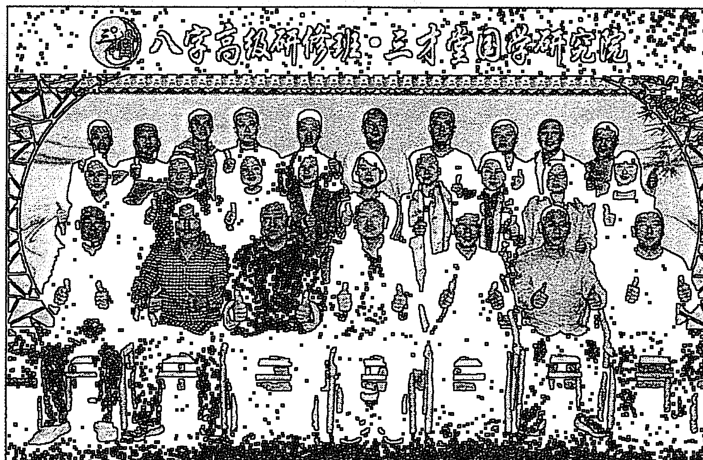
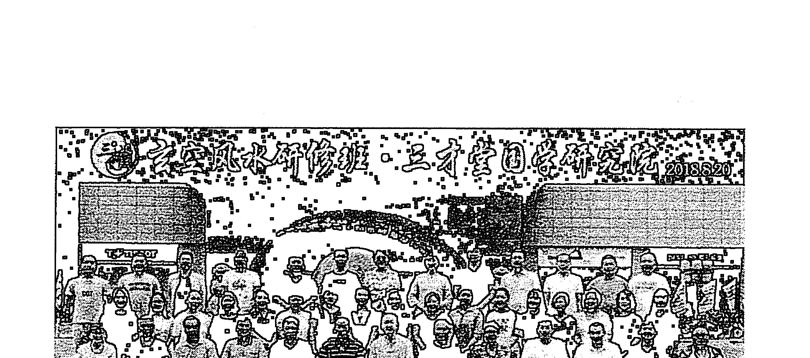
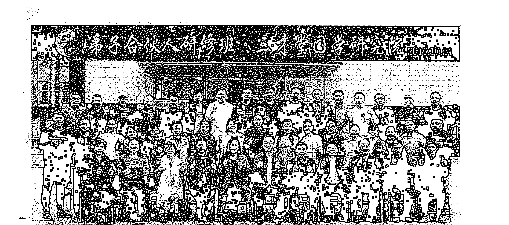

# 宋慧彬奇门遁甲下

宋惠彬 著

## 前言

太乙、奇门、六壬，是《周易》预测中最为高深的三大绝学，合称为“三式”之学；太乙主要用来占测国家大事，国家的兴衰成败，具体说是用来占测国运的；六壬主要用来占测人世间的事情，就是我们日常生活中的事；而《奇门遁甲》之学算是这三式中最厉害的一门学问了，在古今都被誉为“帝王之学”。遁甲术创始之初是用在军事上的，主要是用来行军打仗，三国时的诸葛亮、汉朝张良、明朝的刘伯温等都是《奇门遁甲》高手。

《奇门遁甲》的起源，传说在黄帝时期，有一个黎族首领叫“蚩尤”的人为祸作乱，由于他有兄弟八十一人，且个个铜头铁骨，并具有呼风唤雨的本领，无人能敌。黄帝看到人民生活在“水深火热”之中，心中很是痛苦，于是起兵征讨蚩尤，两军对垒于河北涿鹿，但是由于蚩尤太厉害了，黄帝久战僵持不下，流血千里，不能获胜。黄帝心中郁闷，正烦着时，忽然天上云彩拨开，两个神童出现，称是奉“九天玄女”之命传于黄帝，当即跪拜接受，黄帝接过来打开一看，里面有一本用篆文撰写的龙甲神章；书里除了记载兵器的打造方法，还记载了很多行军打仗遣兵调将的兵法。于是黄帝要他的宰相风后把龙甲神章演译成兵法十三章，孤虚法十二章，创制了奇门遁甲一千零八十局。再接着又制造了指南车，从而打败了蚩尤。奇门遁甲共一千零八十局，后周朝姜太公删成七十二局，再到汉代张良精简到一十八局，就是现在我们看到的奇门遁甲阴阳十八局。

本书最后一节是宋朝赵普著的《烟波钓叟歌》，它是《奇门遁甲》的纲领性著作，遁甲术之大要，已尽包其中；若能熟读细玩，参透要旨，实为掌握奇门一术的捷径。

宋惠彬研究奇门遁甲 20 多年，同时研究其他多种易经学术，在长期的实践总结中，发现实际所有预测术的“根”都是相同的，所以将八字、大六壬、六爻、纳音、金锁玉关、玄空风水等多种学术融入到奇门遁甲中，使奇门遁甲上到一个更高的层次，预测更精细更精准，同一时间，一人一事，多人多事，皆能精准预测，本书共录入实测案例 201 篇，以供大家参考学习。

宋惠彬
2019 年 11 月于北京

## 第二节：财运预测

### 九、买卖房地产：

### 预测纲领：

生门为住宅，死门为地皮，以直符为买房或卖房之人。生死二门乘三奇吉格，说明房屋和地皮好，如果生死二门生直符宫，对买主有利，买后可发达。如果生死二门不得吉格，说明房屋和地皮一般或质量差，如果生死二门生直符宫，则对卖主有利，卖后发达。如是二者比和，则主平安。如果生死二门休囚无力，又乘凶神凶格，说明房屋和地皮不好，如果生死二门宫来克直符宫，则主买后破家败财；如果直符来生此二门落宫，则必因此宅而破败。

又可以日干、年命为买主或卖主，以时干、生门为房屋，或以时干、死门为地皮，看其二者之间的生克关系。

#### 实例（一）：赵女士预测土地

2017年6月12日10时，我在“三才堂易经大师培训基地”，在奇门遁甲初中级研修班，进行现场实际预测，教学员奇门遁甲断卦的方法，内蒙古赵女士预测土地？

四柱：丁酉 丙午 庚午 辛巳 阳3局 直符：天辅直使：杜门

| 虎 生 辛 心 己 | 武 伤 丙 蓬 丁 | 地 空 杜 癸 任 庚 乙 |
|---|---|---|
| 合 休 壬 柱 戊 | 庚 | 天 空 景 戊 冲 壬 |
| 阴 开 庚 乙 芮 禽 癸 | 蛇 惊 丁 英 丙 | 符 马 死 己 辅 辛 |

赵女士年命，1970庚戌年，庚落到艮宫，死门代表土地，落在乾宫，艮土生乾金，午火之月，乾宫死地，说明土地被套之象。

赵女士当即反馈：已经被套4年。

庚落在艮宫，六仪击刑、入墓，艮宫代表房地产，开门入墓，房地产不能开工，说明赵女士因房地产亏钱之象；午火之月，死门落乾宫为死地，说明土地转让的价格极低，临马星，大局反吟，说明可以转让出去；乾宫戌亥，2018戌年、2019亥年可以转让出去。戊代表投资，落在兑宫，生门代表利润，落在巽宫，兑金克巽木，亏钱之象。

赵女士当即反馈：拍地的时候，这块地位置很有优势，后因政府改变城市发展方向，这块地的地理位置失去优势，亏钱转让出去也行呀！

#### 实例（三）：单先生预测拆迁补偿

2017年6月12日16时，我在“三才堂易经大师培训基地”，在奇门遁甲初中级研修班，进行现场实际预测，教学员奇门遁甲断卦的方法，江苏单先生预测房屋拆迁补偿？

四柱：丁酉 丙午 庚午 甲申 阳3局 直符：天禽直使：死门

| 马 地 杜 己 辅 己 | 天 空 景 丁 英 丁 | 空 符 死 庚 乙 芮 禽 乙 |
|---|---|---|
| 武 伤 戊 冲 戊 | 庚 | 蛇 惊 壬 柱 壬 |
| 虎 生 癸 任 癸 | 合 休 丙 莲 丙 | 阴 开 辛 心 辛 |

单先生年命，1976丙辰年，丙落在坎宫，丙与子组成为丙子，丙子六爻纳甲为艮宫的妻财爻，艮卦代表房屋，正应得房屋补偿款之象。

生门代表房屋，落在艮宫，临白虎，代表破坏，正应房屋拆迁之象，艮土克坎水，说明房屋已拆。

单先生当即反馈：拆迁补偿款想要300万，我说：“坎宫1、6数，午火之月，坎宫休囚，取小数，100万”。

#### 实例（四）：叶先生预测卖房

2017年8月28日10时，我在“三才堂易经大师培训基地”，在奇门遁甲初中级研修班，进行现场实际预测，教学员奇门遁甲断卦的方法，上海叶先生预测卖房子？

四柱：丁酉 戊申 丁亥 乙巳 阴4局 直符：天英直使：景门

| 阴 | 蛇 | 符 |
| :--- | :--- | :--- |
| 惊 己 冲 戊 | 开 戊 辅 壬 | 休 壬 英 乙 庚 |
| 空 合 死 癸 任 己 | 乙 | 天 生 乙 庚 芮 禽 丁 |
| 空 虎 景 辛 蓬 癸 | 武 杜 丙 心 辛 | 地 马 伤 丁 柱 丙 |

叶先生年命，1990庚午年，庚落在兑宫，生门代表房屋，落在兑宫，比和同宫，可以卖出。

申金之月，兑宫旺相，现在就是最高价，上临九天，已经是天价。

叶先生当即反馈：房子利润已经翻一倍，回去就卖。

#### 实例（五）：杨女士预测卖房

2018年1月16日16时，我在“三才堂易经大师培训基地”，在奇门遁甲初中级研修班，进行现场实际预测，教学员奇门遁甲断卦的方法，天津杨女士预测卖房子？

四柱：丁酉 癸丑 丙午 丙申 阳5局 直符：天任直使：生门

| 空 蛇 景 丙 冲 乙 | 阴 死 乙 辅 壬 | 合 惊 壬 英 戊 丁 |
|---|---|---|
| 符 杜 辛 任 丙 | | 虎 开 戊 丁 芮 禽 庚 |
| 马 天 伤 癸 蓬 辛 | 地 生 己 心 癸 | 武 休 庚 柱 己 |

杨女士年命，1976 丙辰年，丙落在巽宫，生门代表房屋，落在坎宫，坎水生巽木，房子恋人，卖不出去。

杨女士当即反馈：是抵债的一套别墅，房屋总价高，一直在挂牌，没有卖出去。

#### 实例（六）：李先生预测卖房

2018年8月13日10时，我在“三才堂易经大师培训基地”，在奇门遁甲初中级研修班，进行现场实际预测，教学员奇门遁甲断卦的方法，河南李先生预测卖房子？

四柱：戊戌 庚申 丁丑 乙巳 阴8局 直符：天辅直使：杜门

| 蛇 | 符 | 天 |
| --- | --- | --- |
| 景 癸 冲 壬 | 死 壬 辅 乙 | 惊 乙 英 辛 丁 |
| 空 阴 杜 戊 任 癸 | 辛 | 地 开 辛 丁 芮 禽 己 |
| 空 合 伤 丙 蓬 戊 | 虎 生 庚 心 丙 | 武 马 休 己 柱 庚 |

李先生年命，1977 丁巳年，传统方法，日干丁代表求测人，落在兑宫，时干乙代表房屋，落在坤宫，坤土生兑金，房子恋人，卖不出去；乙+辛为青龙逃走，房子早晚都得卖。

年命丁落在兑宫，临天芮星代表贪婪，生门代表房屋，落在坎宫，兑金生坎水，想卖高价，故舍不得卖方；丙+子组合为丙子，丙子六爻纳甲为艮卦的妻财爻，子水为1、6数，根据当地行情，可以卖到71或76万。

2018年10月，李先生参加奇门遁甲高级班时，房子没有卖出去，再次预测卖房子。

#### 实例（七）：李先生预测卖房

2018年10月30日10时，我在“三才堂易经大师培训基地”，在奇门遁甲高级研修班，进行现场实际预测，教学员奇门遁甲断卦的方法，河南李先生再次预测卖房子？

四柱：戊戌 壬戌 乙未 辛巳 阴5局 直符：天辅直使：杜门

| | | |
|---|---|---|
| 阴 开 任 丁 己 | 蛇 休 冲 庚 癸 | 符 空 生 辅 戊 辛 |
| 合 惊 蓬 壬 庚 |  | 天 空 伤 癸 英 丙 |
| 虎 死 心 乙 丁 | 武 景 柱 丙 壬 | 马 地 杜 芮 禽 戊 辛 乙 |

李先生年命，1977丁巳年，丁落在巽宫，丁+己组合为丁巳，丁巳在大六壬是螣蛇，螣蛇代表犹豫，说明李先生卖房子的时候犹犹豫豫；生门代表房屋，落在坤宫，巽木克坤土，说明急于卖；十二长生状态，地盘戊到坤为病地，因钱的问题还没有卖出去。

李先生当即反馈：想要全款，当地人付不起全款，所以至今未能卖出。

#### 实例（八）：林女士预测卖房

2018年8月15日10时，我在“三才堂易经大师培训基地”，在奇门遁甲初中级研修班，进行现场实际预测，教学员奇门遁甲断卦的方法，福建林女士预测卖房子？

四柱：戊戌 庚申 己卯 己巳 阴2局 直符：天芮直使：死门

| 武 | 虎 | 合 |
|---|---|---|
| 生 己 蓬 丙 | 伤 辛 任 庚 | 杜 乙 冲 丁 戊 |
| 地 | | 阴 |
| 休 癸 心 乙 | 丁 | 景 丙 辅 壬 |
| 天 | 符 | 空 蛇 马 |
| 开 壬 柱 辛 | 惊 丁 戊 芮 禽 己 | 死 庚 英 癸 |

林女士年命，1973癸丑年，癸落在震宫，生门代表房屋，落在巽宫，震巽比和，可以卖出。

三套房子，申金之月，巽宫死地，故小房子好买；临玄武代表投资，为炒房子，2019己亥年春天木月，震巽旺相，逢高价出售。

#### 实例（九）：杨女士预测土地参股

2018年10月30日14时，我在“三才堂易经大师培训基地”，在奇门遁甲高级研修班，进行现场实际预测，教学员奇门遁甲断卦的方法，天津杨女士预测土地参股？

四柱：戊戌 壬戌 乙未 癸未 阴5局 直符：天辅直使：杜门

| 蛇马 杜 庚 冲 己 | 符 景 己 辅 癸 | 天空 死 癸 英 戊 辛 |
|---|---|---|
| 阴 伤 丁 任 庚 | 戊 | 地空 惊 戊 辛 芮 禽 丙 |
| 合 生 壬 蓬 丁 | 虎 休 乙 心 壬 | 武 开 丙 柱 乙 |

杨女士年命，1976丙辰年，丙落在乾宫，死门代表土地，落在坤宫，戊土之月，坤土旺相，坤土生乾金，可以参股。

坤宫临癸，十二长生状态，癸到坤为入墓，戊到坤为病地，戊癸相合，钱被合住，合入癸墓，长期持股之象；辛代表错误，辛+未组合为辛未，辛未六爻纳甲为巽宫的妻财爻，说明投资错误。

杨女士当即反馈：最近几年投资的板块都有问题。

#### 实例（十）：文先生卖房预测

2019年7月16日16时，我在“三才堂易经大师培训基地”，在奇门遁甲高级研修班，进行现场实际预测，教学员奇门遁甲断卦的方法，湖南文先生卖房子预测？

四柱：己亥 辛未 甲寅 壬申 阴2局 直符：天芮直使：死门

| 合 | 阴 | 蛇 |
| 惊 乙 冲 丙 | 开 丙 辅 庚 | 休 庚 英 丁 戊 |
| 虎 死 辛 任 乙 | 丁 | 符 生 丁 戊 芮 禽 壬 |
| 马 武 景 己 蓬 辛 | 地 杜 癸 心 己 | 天 空 伤 壬 柱 癸 |

房本是文先生的老婆，年命1967丁未年，第二个年命丁预测，看地盘丁，落在坤宫；丁+未组合为丁未，丁未六爻纳甲为兑宫父母爻，父母爻代表房屋；戊+申组合为戊申，戊申六爻纳甲为坎宫父母爻，庚+戊为值符伏宫，戊代表钱，钱套在房子里动弹不得；十二长生状态，戊到坤为病地，未土之月，坤宫旺相，说明房价卖的最高。

文先生当即反馈：卖的这套房子是家中最好的房子，挂牌是当地同类房子中的最高价，所以迟迟未能卖出。

## 第三节：婚姻预测

### 预测纲领：

预测恋爱婚姻：以天盘乙奇为女方，天盘庚为男方。如果两者落宫相生或比和，又逢吉门吉格，则恋爱可成，婚姻美满。如果两宫相冲相克，婚事难成，或夫妻关系不好，强成之后必有刑克。

乙奇落宫带击刑，主女性凶恶；六庚落宫带击刑，主男性暴烈；庚金入墓而乘凶格者，刑夫；乙奇入墓而乘凶格者，克妻。

六合为媒人，六合落宫生乙奇落宫，媒人偏向女方；六合落宫生庚落宫，媒人偏向男方。

已婚者，以用神相合之干为配偶的代表符号，以他们二者落宫的生克刑冲害等状态，来判断他们婚姻的美恶吉凶。

主看双方年命落宫，男年命落宫生女年命落宫，为男爱女；女年命落宫生男年命落宫，为女爱男；男女双方年命落宫相生、相比和，婚亦成。

若局中乙、庚落宫相生，但男女年命落宫相克，为始成终散；反之，乙、庚落宫相克，但男女双方年命落宫相生，为始凶终吉；总之，男女双方年命落宫生克关系为最终结果。

于男性而言，丁奇为第三者女人，庚落宫生丁奇落宫，而克乙奇落宫，为弃妻爱妾；庚落宫受乙奇落宫相生，又受丁奇落宫相生，为妻妾同爱一个人之象；若庚落宫既克乙奇落宫，又克丁奇落宫，则为离妻休妾，另选她人；庚落宫克天盘丁奇落宫，同时此宫又生天盘乙奇落宫，为弃妾，与原配破镜重圆；若庚落宫之地盘为丁奇，此宫生天盘乙奇宫，但此宫又被天盘丁奇宫所克制，为求测人被第三者女人所挟持，虽内心欲回归本家，但迫于第三者女人的压力，而无法回归本家。

于女性而言，丙奇为第三者男人；乙落宫生丙奇落宫，而克庚落宫者，为弃夫而爱上另一个男人之象；若乙受庚落宫相生，又受丙奇落宫来相生，为两个男人同爱一个女人之象；若乙落宫既克庚落宫，又克丙奇落宫，则为在与丈夫分手的同时与情人也一刀两断，另选他人；乙落宫克天盘丙奇落宫，同时此宫又生天盘庚落宫，为弃情夫，与原配丈夫破镜重圆；若乙落宫之地盘为丙奇，此宫生天盘庚宫，但此宫又被天盘丙奇落宫所克制，为求测者被第三者男人所挟持，虽欲回归本家而无法回归。

乙奇为妻，丁奇为妾，庚金为夫。若乙、丁奇之落宫生庚之落宫，其女必肯嫁。乙、丁落宫克庚之落宫者，不肯嫁。乙、丁宫相比和者，主妻妾和谐。如乙克丁宫，主妻不能容妾。或丁克乙宫，主妾欲欺妻。若乙丁入空陷、墓绝之宫，主不能成，成亦不利。如庚金宫生乙丁奇之宫，主徒劳无成。

乙奇落宫所临奇仪、门、星、神及格局，代表女方性格、身材、长相及职业状态；庚落宫所临奇仪、门、星、神及格局，代表男方性格、身材、长相及职业状态。

### 一、长相：

测男方长相，主要是以庚或男方年命落宫中的星、门、奇仪来综合判断；测女方长相，主要是以乙或女方年命落宫中的星、门、奇仪来综合判断。

宫中若遇天心星、天辅星、天禽星，开休生景、乙丙丁三奇，主英俊帅气；其它星、门，不带乙丙丁三奇者，长相一般或丑陋。

#### 1、九星：

- 天蓬星：浓眉、脸微黑。
- 天任星：面色发黄、相貌平平。
- 天冲星：个高好动。
- 天辅星：才貌出众。
- 天英星：面色微红、有雀斑或麻点。
- 天芮星：面色发黑或有黑痣斑点，较丑。
- 天禽星：面貌端庄秀丽，为方形脸或圆形脸。
- 天柱星：面白清瘦俊丽。
- 天心星：貌美清秀、肤色较白。

一般说来九星所主：芮、禽、任三土星大多为方脸；天心、天柱大多为圆脸；天辅、天冲大多为长脸，天英大多为圆方脸，天蓬大多为椭圆脸。

#### 2、八门：

临休门，长相英俊；生门，才貌出众；伤门，身材个高，但相貌一般；杜门，身材主高，但相貌一般；景门，较漂亮；死门，貌丑、个矮；惊门，清瘦、心态忧疑；开门，长相白净貌美。

#### 3、十天干：

乙主柔顺、长脸、腰弯、青白肤色、女人温静苗条、娴于世故。

丙主威严、脾气大、圆脸、急躁、额宽、头发稀疏、脸红色。

丁主秀气、有文化，女子性情不定、水性杨花，丁火人头尖、下巴尖、短发。

戊主憨厚、四方脸、有礼貌、讲信用、体胖或冒傻气、粗鲁、不聪明、愚钝或有财利、经济较好，额头方正、鼻头较大、下巴宽圆、大脑门。

己主个子矮小、丑陋、不起眼、面黄肌疲，但温顺沉静。

庚主个子高、清瘦白皙、体型长方、刚健锐利、有威严、长方脸、棱角分明、额头略宽。

辛主瘦高个、体质偏弱、白晰、肤色灰白，女子临辛金三围好。

壬主肤色黑、大眼睛、美丽、双眼皮、可爱、聪明，但性情不专一。

癸主圆脸、偏黑、聪明、顺人情说话，男子则易犯罪等。

### 二、肤色：

中国人属黄色人种，判断时应以黄色为基本基调，以符号的落宫为主，再兼看星、门、奇仪来确定肤色。

#### 1、九宫：

一般用神落入一、六、八宫为白色，为肤色较白，其中落坎一宫不够白，有的肤色还稍黑；三、四宫肤色中等黑白，九宫为面色红润，二宫肤色较黑，七宫白中透红。

其记忆方法可借鉴玄空风水中的：一白水、二黑土、三碧木、四绿木、五黄土、六白金、七赤金、八白土、九紫火。

#### 2、星门：

判断时，需结合落宫来综合判断；年命天干也可以在预测肤色上起辅助判断作用；乙庚是区别男女双方的用神，不能用乙、庚的性质来判断肤色。

天心星、开门为金，肤色较白；天柱星、惊门为金，白里透红；天芮星、死门为土，皮肤较黑，常有雀斑；天禽星，肤色微黄；天英星、景门，面色红润；天辅星、杜门、天冲星、伤门为木，皮肤中等黑白；天任星、生门属土，为黄色；天蓬星主黑或络腮胡须，休门为水，但在判断肤色时，为白色；另外，八神中临白虎的一般也主皮肤白。

#### 3、十天干：

乙主青白肤色，丙主红色，丁主小白脸，戊主黄色，己主黄色，庚金白色，辛金白色，壬水肤色黑，癸水偏黑。

### 三、爱好：

#### 1、八门：

- 临休门：喜欢休闲、游泳、看表演。
- 临生门：喜欢经济、经商、金融、炒房子。
- 临伤门：喜欢开车、运动、打斗、争强好胜。
- 临杜门：喜欢技术、气功、医卜僧道等。
- 临景门：爱玩、游戏、爱喝酒、爱打扮等。
- 临死门：喜神佛、玄学、风水。
- 临惊门：爱演讲、喜欢恐怖片。
- 临开门：对政治感兴趣、官迷，喜欢开创事业等。

#### 2、九星：

- 临天蓬星：好酒好色。
- 临天任性：为所欲为。
- 临天冲星：喜欢运动。
- 临天辅星：喜欢学习。
- 临天英星：喜欢策划。
- 临天芮星：喜欢佛道。
- 临天柱星：喜欢创新。
- 临天心星：喜欢管理。

### 四、声音：

#### 1、八神：

- 临直符：声音浑厚有力、娓娓动听。
- 临腾蛇：声音尖细、拖长音、善变。
- 临太阴：声音时断时续、若隐若现。
- 临六合：声音适中、吐字清晰，语言甜美、左右逢源。
- 临白虎：声音高嗓门、有恐怖气息，让人不寒而栗。
- 临玄武：快言快语、喜怒无常。
- 临九地：慢声慢语、有时是藏着掖着，生怕别人听见。
- 临九天：声音宏亮、高亢、似喇叭，老远就可以听到。

#### 2、九星：

- 临天冲星：声音宏亮、说话语速较快。
- 临天辅星：讲话柔声细语。
- 临天英星：说话火急火燎。
- 临天芮星：语音比较粗矿。
- 临天柱星：嘴巴灵巧或声音突出。
- 临天心星：声音有节奏。
- 临天蓬星：语气忽高忽低。
- 临天任性：语速沉稳。

### 五、表情：

- 临休门：面带微笑、平和。
- 临生门：春风得意，常开怀大笑。
- 临伤门：面带伤悲、忧愁、痛苦之象。
- 临杜门：呆板、不爱说话、面无表情。
- 临景门：和颜悦色、喜悦、快乐。
- 临死门：板着脸、哭丧着脸、不高兴、郁闷的表情。
- 临惊门：惊慌失措、惊恐、诧异、吃惊、喊叫。
- 临开门：严肃、认真、威仪、开心但不嬉皮笑脸。

### 六、身高：

#### 1、九星：

星是先天的，人的先天因素是遗传的。五行木主高，如天冲星、天辅星五行属木，人的身高遗传因素，就像树木一样高挑。土主矮，天芮星属土，多身材矮胖；天柱星旺相，骨架宽大；天任星，身材稍胖或有点驼背。

#### 2、八门：

门代表的是人事，死门五行属土，土主矮，所以断低。伤门、杜门属木，主高。

#### 3、九宫：

九宫是地利，其与星、门搭配，再看旺衰，也决定身高。如伤门虽主身体较高，但落乾宫时，木被金克制，高度就不如伤门落坎宫，因为木落入水宫后是受到了生助，即水生木的关系，所以就旺相，旺相身体就高。

#### 4、旺衰：

一是按后天八卦即九宫、洛书数来判断，二是按先天八卦数，三是按河图数来定身高。取大数还是小数则以天干、八门、九星的旺衰而定，这几个用神符号旺了可以取大数，衰了则取小数。

#### 5、地域：

若求测者为南方人，一般身高较矮；若求测者为我国中部地区的人，身高较高；若为东北一带的人，身高更高。

男子一般以1.70米为准上下浮动厘米数，如落艮宫可定为1.75米或1.78米，女子以1.60米为准上下浮动厘米数，若落巽宫衰可定为1.58米，旺可定为1.64米。

要注意：由于生活条件的改善80、90后出生的人，个子已经普遍的比六七十年代的人个头要高许多。男子应以175厘米，女子以165厘米为标准判断。

另外，八神在判断身高上也有参考作用，临九天主高，临九地主矮等。

### 七、胖瘦：

一般以九星的旺衰来判断胖瘦，因为先天的遗传因素对胖瘦影响很大。天芮星、天任星旺相则属胖人；天蓬星旺相主高胖；天冲星、天辅星、天英星不胖；天柱星旺相骨架宽大；天心星旺相则胖。

上乘螣蛇，一般主瘦，女性苗条。如乙奇落乾宫入墓，但所临的天芮星处于旺相状态，故女方较胖；庚落巽四宫旺相，但宫中的天任星落宫受制，故男方为中等胖瘦。九星得九宫之助为胖，受九宫克为瘦。

### 八、学历：

庚代表男方、乙代表女方，景门代表文凭，天辅星是文曲星代表文化程度的高低，丙丁有时也主文化。玄武为文状元，当宫中格局吉时则聪明，预测学生学习的成绩则成绩上乘，测学习、学历则为吉利的符号。格局凶则迷糊、贪婪、虚诈。

用神落宫临景门或天辅星，景门或天辅星落宫生用神落宫，则说明有文凭，学历较高。若景门落宫乘直符或临太岁，则为高级文凭。景门上乘六合，为有多个文凭。若用神落宫与景门、天辅星落宫相冲克者，学历不高。景门落宫格局逢衰为低文凭。景门落宫上乘螣蛇，为假文凭或国家不认可的文凭。

如男方求问女方的文凭，见乙奇落震宫临官之地，临景门、天辅星为有文凭，临太岁则是高级文凭。玄武为文状元，则此女学习上乘，断女方有名牌大学以上文凭。

### 九、性格：

判断的主要依据是依照星、门、神、仪格局中的符号含义来综合判断性格，逢天辅星、天禽星、天心星、天任星，一般性格温柔，开休生三吉门也吉，值符、太阴、九地均表示为居家过日子的好配偶。但任何事物都有两面性，应具体分析，全面看问题才对。

#### 1、八神：

- 临直符：稳重、善良、宽厚大度、乐善好施。
- 临螣蛇：多疑、心神不定，狡诈不实，反应快。
- 临太阴：文静、内秀、内向、不爱动、喜静、不爱说话。
- 临六合：善解人意、好管闲事、左右逢源、人缘好。
- 临白虎：刚强、好逞能逞强、讲义气、敢说敢动、果断。
- 临玄武：善变、虚伪、贪婪、欺骗人、犯小人、好色。
- 临九地：慢性子、内向、宽厚大气，格局凶则固执愚钝。
- 临九天：急性子、外向、自以为是、想法高、果敢。

#### 2、九星：

- 天蓬星：旺相聪明好动、讲究品味、好诈不实、冒险胆大、雷厉风行，衰弱为游荡之人。
- 天任星：为人厚道、宽容心强、善良、任劳任怨、着实认真；格局凶主固执、愚昧不明、任性。
- 天冲星：好动、易冲动、正直、仁义、刚健、雷厉风行。格局凶则鲁莽、暴躁。
- 天辅星：温柔浪漫、言行高雅、辛苦坚韧、有修养、有学识。衰弱则书生气、老学究、懦弱、迂腐、没主见。
- 天英星：重名气、重礼节、爱说好话、爱奉承、喜怒无常，衰弱脾气急躁、虚荣、爱发火。
- 天芮星：旺相好学、爱读书、爱交友、忠厚大度。格局凶则贪婪、自私、身体不好、保守。
- 天禽星：旺相处事稳重、循规蹈矩、为人诚信。衰则死板、不灵活。
- 天柱星：能言善辩、中流砥柱，什么都看不惯，外冷内热、多情、爱说，衰则性格叛逆、幻想。
- 天心星：威严、威仪、勇敢、多才多艺，有心计、做事周全，衰则歪心眼多、工于心计。

#### 3、八门：

- 休门：性格多迟滞或懒惰、好玩，男女谈婚论嫁最吉利。
- 生门：性格淳厚，凡婚姻事，多以吉论。
- 伤门：争强好胜，论婚姻不吉；女方逢之，爱挑剔；男方逢之，易改变主意。
- 杜门：性格内向，或不轻易暴露自己的意图，或不同意。
- 景门：虚荣、好恋爱、喜游戏；六合临景门，游戏婚姻。
- 死门：心情不愉快，论婚姻不吉，不同意。
- 惊门：心态忧疑、惊恐、口舌是非。
- 开门：开朗、做事公开、保不住密，论婚姻主同意。

#### 4、十天干：

- 临乙奇：温柔、浪漫、胆小、优柔寡断、爱美、微驼背。
- 临丙奇：外柔内刚、好惹乱子、虚荣、霸道、喜权柄。
- 临丁奇：内热外冷、比较柔顺、孤独感或有叛逆心理。
- 临戊土：耿直、憨厚、诚实、固执、保守、呆板、愚钝。
- 临己土：贪心、吝啬、私欲重、爱占小便宜、心胸狭窄。
- 临庚金：刚强勇敢、好争好斗、粗狂豪放、不服输。
- 临辛金：稍冷酷、秀丽、柔中带刚、灵活。
- 临壬水：爱哭、冲动、聪明、宽厚，有时也优柔寡断。
- 临癸水：正直、多情、多愁善感、敏感、胆小、作秀。

人的性格是比较复杂的，很多人具有多重性格，更有很多表里不一者；判断时，要综合考虑。另外，格局也要考虑，如遇刑格，主脾气暴烈，不计后果，易施暴等。

### 十、脾气：

男方测女方，乙奇下临的地盘天干不能带刑；女方测男方，男方天盘天干和地盘天干也不能带刑，若带刑则说明对方脾气极坏。

婚姻出现暴力行为的判断符号是：乙、庚或双方年命落宫休囚并带刑、伤门、白虎，极易出现家庭暴力行为。若不带刑，说明婚姻关系不顺，但不会出现家庭暴力行为。

若用神处旺相之地，宫中带吉门、吉星、吉神，虽然带刑，只能表明对方脾气急躁或在其它事情上不高兴，但不会出现家庭暴力行为。

### 十一、精神：

#### 1、八神：

- 临直符：代表庄重、开心。
- 临螣蛇：代表烦躁、变化无常。
- 临太阴：代表冷静、心思重、不说话。
- 临六合：代表心情舒畅、表情和蔼。
- 临白虎：代表烦躁、冲动、压力大。
- 临玄武：代表迷茫不清、犯小人，投机、行为鬼祟。
- 临九地：代表不动、不理人。
- 临九天：代表兴奋、张扬。

#### 2、八门：

- 临开门：代表活泼、开朗、坦诚、上进。
- 临休门：代表心态平和、平静、有心机。
- 临生门：代表主动求和、健康向上。
- 临伤门：代表多动少静、性急，自尊心强，伤心、烦恼。
- 临杜门：代表窝气、不情愿、不高兴、不表态。
- 临景门：代表有礼貌、爱美、虚心，神采奕奕。
- 临死门：代表死气沉沉、不愉快。
- 临惊门：代表热情大方、拍马屁、有精神紧张等。

### 十二、着装：

用神所落宫：天盘干代表外衣的上衣，地盘天干代表外衣的下衣，九星代表内衣的上衣，八门代表内衣的下衣。

#### 1、品牌：

临直符，主名牌；临玄武，冒牌货；临螣蛇、太阴主杂牌。根据落宫的旺衰来定新旧，旺相为新，休囚死为旧；临休门，喜欢穿休闲服。

#### 2、颜色：

衣服的颜色：甲乙木绿色，丙丁火红粉色，戊己土黄色，庚辛金白色，壬癸水黑色或灰色，景门红色，天辅星绿色，天蓬星黑色。

#### 3、风格：

- 临天蓬星：喜欢穿奇装异服。
- 临天任星：喜穿新衣服。
- 临天冲星：爱穿长装。
- 临天辅星：喜欢穿休闲装或长装。
- 临天英星：衣服整齐。
- 临天芮星：赤胸露背。
- 临天柱星：喜欢穿牛仔装。
- 临天心星：喜欢穿制服或工作装。

### 十三、人品：

预测人品主要依据是格局和八神，人品好的格局是：吉星、吉门、吉神、吉格带三奇、旺相，一般人品都好。如用神宫中逢戊加丙、丙加戊、壬加戊，丙加丁加生门，丁加休门乘太阴等等均是人品好的格局。

人品坏的格局如：庚加日干，日干加庚，庚加戊，戊加庚，庚加己、辛，上乘玄武，此种格局人品若不是一贯性的不好，就是某一件事上人品差。尤其是当用神处衰地、又逢凶星、凶门、凶神的时候坏的一面会更加突出，故择偶时尤需慎重。

### 十四、心眼：

庚为男方、乙为女方，对方用神乘螣蛇主小心眼，惊门、天柱主担忧，螣蛇落入兑七宫也如此，再加上用神处衰病死墓绝状态，说明此人过分谨慎或无端猜疑，遇此种格局应断为小心眼之人。

例如：男方求测女方，以乙奇为女方；乙落兑宫处绝地不旺，宫中逢天心星为考虑问题周到，上乘螣蛇过分谨慎，临死门主执拗、心情不好，综合分析，女方属于小心眼之人。

### 十五、工作：

判断恋爱对象的工作以用神落宫及落宫中的九星、八门、奇仪来综合分析。

#### 1、九宫：

- 坎宫：从事机关事业单位，或与液体有关的部门。
- 艮宫：从事金融、建筑行业。
- 震宫：从事工厂、运输企业。
- 巽宫：从事商业、教育。
- 离宫：从事文化、娱乐、电力、通信、餐饮业。
- 坤宫：从事农业、养殖业等。
- 兑宫：从事说教、律师等。
- 乾宫：从事机关工作。

#### 2、九星：

- 天蓬星：旺相，一般是做大事业的。
- 天任星：从事土建、矿产、农业。
- 天冲星：代表军人、木器行业、运动器械。
- 天辅星：代表老师以及辅助性工作。
- 天英星：代表文化、冶炼、电器、餐饮。
- 天芮星：代表学生、医药、医疗器械、矿产、农业。
- 天柱星：代表说教行业。
- 天心星：代表管理、医卜僧道等。

#### 3、八门：

- 休门：代表公务员、休闲类工作。
- 生门：代表金融、生意、房产以及建筑类工作。
- 伤门：代表军警、运输类。
- 杜门：代表保密、检察院、军队、技术类工作。
- 景门：代表策划、电力、文化、餐饮、通信类工作。
- 死门：代表执法部门、屠夫。
- 惊门：代表律师、演说家、歌星、说教类工作。
- 开门：代表公职人员。

八神中临值符的一般代表有职务，开门与六合同在一宫，多从事两种以上的职业。

工作好坏看开门宫中的符号，遇三奇、吉星、吉神、吉格工作单位就好，否则不理想；开门落宫生乙庚落宫或比和，则工作单位对女方或男方有利，若相克，则不吉利。

### 十六、能力：

年命、乙庚乘值符表明此人大度，有一定领导才能，组织、管理、工作能力强，事业心强，有发展前途，一般情况下会有职务。

凡年命、乙庚临旺相又与开门同宫比和或被开门宫生的，说明在单位有地位，能胜任本职工作。开门克对方的代表符号，或对方代表符号入墓，如女测男，以庚为男方的代表符号，庚落艮八宫为入墓，则说明男方工作能力较差，或不能胜任本职工作。

还要看宫中的星、门及天盘天干与地盘天干搭配形成的格局，遇吉门、吉星、吉格、吉神、三奇的能力强，否则差。

例如格局：戊加丙、丙加戊若不落入乾六宫能力就强，辛加癸、癸加辛其能力、运气就差。

对方的代表符号逢丙为集权式管理者，自己说了算，逢己或癸为施以小恩小惠类处事。对方代表符号入墓则工作表示没有作为、没能力或有能力发挥不出来等。直符和对方代表符号相生、比和，说明直接领导信任。对方代表符号与年干相生、比和或下临年干，说明有后台或大领导支持。

### 十七、财富：

一是看生门宫：生门代表的是钱财、房产、工资收入、投资收入、额外收入等。

生门宫与用神宫的五行生克关系决定得财与否，若生门宫生用神宫，表明财来找你，得财容易；用神宫生生门宫或用神宫克生门宫，表示只有努力才能得到钱财；若生门宫克用神，得财就不易。

得财多少看财星旺衰，生门宫所临天盘九星旺了财多，宫中带三奇，格局好，财也多；反之，财就少。

二是看甲子戊落宫：戊代表资金、现金，戊与用神没有生克的直接关系，它是个独立的代表符号，戊只要旺钱就多；只要衰钱就少。戊在离帝旺，说明资本、现金充足；戊在巽处禄地，表明资金富足；戊在艮处长生，表示资金多。

戊在震击刑，代表损失、极度缺钱、破财等；戊落衰病死墓绝胎养之宫说明资金不多，入墓拿不出来；戊逢庚，主资金转移、钱财遇到了困难、缺乏资金。

逢戊癸合主钱被占压，戊+辛、辛+戊，资金被冲，代表资金流出的快，钱财使用不当；戊+壬，钱财也是流失之象。

戊处衰弱之地逢空亡则没有钱财，若处旺相之地逢空亡，为暂时没有钱财；地盘戊代表原来资金的情况，上临庚，钱逢白虎，表明以前也不富有；遇反吟局，主有宝也难留。

三是看天干：用神天干处禄位或下临天干处在禄位，表明此人有收入、有钱；处于长生、帝旺宫也富有；若用神天干宫处死墓绝之地，再有生门宫克用神宫、戊衰弱击刑逢庚等，钱财就少，不会富有。

### 十八、风流：

用神上乘玄武，同时宫中又带己、辛、壬、癸或桃花这几个符号，可能有过多次性行为，可以称为风流；玄武主暧昧，乙乘玄武，女方风流；庚乘玄武，男方风流；玄武与己、辛、壬、癸同宫，说明风流是多次的。

若只有一种符号，可能恋爱对象有不正确的想法，如财利要求、工作上的非分之念，当然也可能有不检点行为；判断时，还要和其它符号配合，如乙丙关系、庚丁关系等，才能正确判断。

#### 实例（一）：岳女士预测婚姻

2015年3月26日14时，在清华大学总裁班的课堂现场，河南的岳女士，向我求测婚姻？我用奇门遁甲为其详断；岳女士年命：1991辛未年

四柱：乙未 己卯 辛丑 乙未 阳9局 直符：天冲直使：伤门

| 马 阴 空 伤 戊 英 壬 | 合 杜 癸 庚 芮 禽 戊 | 虎 景 丙 柱 癸 庚 |
| 蛇 生 壬 辅 辛 | 癸 | 武 死 丁 心 丙 |
| 符 休 辛 冲 乙 | 天 开 乙 任 己 | 地 惊 己 蓬 丁 |

##### 一、美女桃花运重：

预测原理：

传统婚姻预测方法：乙为妻子，庚为丈夫，乙落在坎宫，临开门，说明为人比较开放；临天任星，说明比较任性，临九天，经常异想天开；庚落在离宫，上乘六合，代表男朋友多，临天芮星为病星，天干十二长生状态，庚到午为沐浴桃花之地；综合说明岳女士的男朋友多，而且多数是有家的，出来找情人的；（乙）坎宫水克离宫火（庚），说明岳女士不喜欢他们，婚姻不成之象。

岳女士当即回答：“是有几个有家男人追求我，但都不是我喜欢的”。

##### 二、您打过胎：

预测原理:

岳女士年命为辛，临直符第一吉神，天冲星吉星，休门吉门，说明岳女士是个极其有能力的人，辛+乙为白虎猖狂，天冲星为冲动，说明岳女士脾气不好，不温柔。

天干十二长生状态，辛到寅为胎地，临白虎猖狂，主血光之灾，为毁胎之象，故我断岳女士打过胎，岳女士当即承认确实打过胎；丙辛合，丙代表岳女士未来的丈夫，丙落在坤宫，（丙）坤土与艮土（辛）比和，说明夫妻双方互相恩爱，此婚必成之象；坤宫有申，组成丙申，正为2016丙申年结婚之象。

岳女士在课上就当即回答说是打过胎；综合预测：岳女士2016年结婚。

#### 实例（二）：北大总裁班女强人婚姻预测

2013年10月25日18时，经北大杨老师介绍，正在北大总裁班学习的张女士打来电话，向我求测婚姻；张女士年命：1978戊午年，老公年命：1977丁巳年

四柱：癸巳 壬戌 甲子 癸酉 阴5局 直符：天禽 直使：死门

| 蛇 杜 英 癸 己 | 符 景 辛 戊 禽 芮 癸 | 天 死 丙 柱 戊 辛 |
|---|---|---|
| 阴 伤 己 辅 庚 | 戊 | 地 惊 乙 心 丙 |
| 合 生 庚 冲 丁 | 虎 休 丁 任 壬 | 空 武 马 开 壬 蓬 乙 |

- 一、你现在走桃花运了，心里有一个你们互相之间喜欢的男人，你想和他在一起，你老公桃花运太重，在外边女人多；

张女士回答：“是有一个男人喜欢我，我也喜欢他，我老公在外边女人太多了”。

#### 预测原理：

传统预测方法：乙代表妻子，庚代表丈夫；乙代表张女士，落在兑宫，临九地，代表为人厚道，临天心星，代表为人正直，乙与酉（兑宫地支酉）组成乙酉，乙酉纳音为泉中水，说明张女士出淤泥而不染，子曰，申子辰见酉为桃花，乙下临丙，丙代表第三者男人，这些信息象组合在一起，说明张女士心里有一个喜欢的男人，但只是心里桃花，而肉体没有出轨之象。

（第三者男人）天盘丙，落在坤宫，（第三者男人丙）坤土宫生兑金宫（乙代表张女士），说明第三者男人非常喜欢张女士，而且主动追求她。

庚代表丈夫，落在艮宫，庚下临丁，丁代表第三者女人，阴遁，艮卦为外盘，艮卦代表房屋、床，说明老公在外边有女人，临六合代表多，说明有多个女人，丁与丑（艮宫地支丑）组成丁丑，丁丑纳音为涧下水，涧下水为流动的水，就是小姐，说明老公还找小姐。

庚代表丈夫，庚落在艮宫，临六合代表多，艮土宫生兑金宫（乙代表张女士），说明张女士老公多之象，也说明张女士将来必然再婚。

- 二、你和你老公的婚姻到头了，你明年还会再婚；张女士回答：“我是想离婚，老公现在基本不回家住了，你看我什么时候能离婚”？

#### 预测原理：

长久婚姻看年命落宫的生克关系：老公年命丁，落在坎宫，丁下临壬，丁壬合为淫荡之合，也说明老公在外女人多。

张女士年命戊，落在离宫，临天禽星，代表为人中正，天禽星来自中五宫，为九五之尊之象，临直符，代表老大，说明张女士是个女强人。

（老公年命丁）坎水宫克离火宫（张女士年命戊），说明此婚必离；大局伏吟，代表慢，现在离不成；甲午年寅月，午年临宫当令，寅月木旺火相，离火宫反克坎水宫，说明是张女士主动离婚之象。

（张女士年命戊）落在离宫，戊下临癸，戊癸合代表夫妻之象，离宫有地支午，说明2014年甲午年再婚之象；天盘癸落在巽宫，巽木宫生离火宫，说明新的老公非常爱她；癸与巳（巽宫地支巳）组成癸巳，癸已是现在年柱，代表长辈，巽（为长女）比离（为中女）大，综合说明他的新老公要比他大很多。

2014年5月，张女士打来电话，说：“我与原配老公春节后离婚了，现在与新男友在一起，他是我北大总裁班的同学，1968戊申年的，比我大10岁，请你帮我选一个结婚的日子”；既然戊癸合这个组合出现在离宫，这也是天意，我为其选“甲午年午月午日午时”结婚。

#### （实例三）：侄子婚姻预测

2017年11月10日10时，我在“三才堂易经大师培训基地”，在奇门遁甲初中级研修班，进行现场实际预测，教学员奇门遁甲断卦的方法，晋先生预测侄子婚姻？

四柱：丁酉 辛亥 辛丑 癸巳 阴9局 直符：天柱 直使：惊门

| 符 | 天空 | 空地 |
|---|---|---|
| 杜 庚 柱 癸 | 景 辛 心 戊 | 死 乙 蓬 壬 丙 |
| 蛇 |  | 武 |
| 伤 壬 丙 芮 禽 丁 | 壬 | 惊 己 任 庚 |
| 阴 | 合 | 虎 马 |
| 生 戊 英 己 | 休 癸 辅 乙 | 开 丁 冲 辛 |

##### 一、不喜欢农村的女孩：

传统方法：庚金代表男方，落在巽宫，亥水之月，巽木旺相，乙奇代表女方，落在坤宫，坤宫休囚，坤卦代表农村，巽木克坤土，说明男方不喜欢农村的女孩。

晋先生当即反馈：家中给介绍两个农村的女孩，他都不同意。

##### 二、子年或午月结婚：

侄子年命，1991辛未年，天干五合代表婚姻，丙辛相合，丙代表未来的妻子，落在震宫，十二长生状态，丙到卯为沐浴桃花，说明妻子长的漂亮；震宫属木，木主高，临螣蛇，说明瘦；临伤门，说明争强好胜，震宫地支卯，地盘丁与卯组成丁卯，丁卯六爻纳甲是兑宫的妻财爻，亥水之月，震宫旺相；综合说明未来的妻子个高、苗条、漂亮，有能力还很有钱；丁壬相合，说明未来的妻子有结过婚之象，或者有过同居生活。

辛落在离宫，亥水之月，离宫为死地，甲午辛+甲子戊为子午相冲，戊代表钱，临空亡，说明男方没有钱；临天心星，临九天，说明虚荣心比较强。

晋先生当即反馈：侄子是厨师，没什么钱，能力现在也有限。

震木生离火，说明是女方喜欢男方，离宫空亡，生不上，必是冲空或填空之时，婚姻才可成；填空为午月，因为下一个午年时间太长；子午相冲，冲空是子年，因为女方的条件很好，男方的条件太差，即将到子月，短时间内能力不会提升那么快，女方不会找他，故判断是子年；也可断是子年午月结婚。

#### （实例四）：外甥婚姻预测

2017年11月10日10时，我在“三才堂易经大师培训基地”，在奇门遁甲高级研修班，进行现场实际预测，教学员奇门遁甲断卦的方法，杨先生预测外甥婚姻？

四柱: 丁酉 辛亥 辛丑 癸巳 阴9局 直符: 天柱 直使: 惊门

| 符 | 天空 | 空地 |
|---|---|---|
| 杜 庚 柱 癸 | 景 辛 心 戊 | 死 乙 蓬 壬 丙 |
| 蛇 | 空 | 武 |
| 伤 壬 丙 芮 禽 丁 | 壬 | 惊 己 任 庚 |
| 阴 | 合 | 虎 马 |
| 生 戊 英 己 | 休 癸 辅 乙 | 开 丁 冲 辛 |

- 一、身边女人多：

外甥年命，1989己巳年，己落在兑宫，兑宫地支有酉，己与酉组成己酉，己酉六爻纳甲是离宫的妻财爻，兑为少女，说明有年轻的女朋友；上乘玄武，玄武代表桃花，说明桃花运重；玄武在大六壬是癸亥，癸亥六爻纳甲是坤宫的妻财爻，坤卦代表老太太，我们不能说老太太是他的女朋友，只能说年龄大的女人是他的女朋友；综合说明外甥身边不缺女人，有年龄大的也有年龄小的。

杨先生当即反馈：外甥在税务局工作，女朋友不断，就是不结婚。

- 二、外甥没有钱：

兑宫地支有酉，己与酉组成己酉，己酉六爻纳甲是离宫的妻财爻，酉金是妻财，亥水之月，酉金休囚，一是年轻的女朋友条件一般，二是他没有钱。

玄武在大六壬是癸亥，癸亥六爻纳甲是坤宫的妻财爻，亥水是妻财，亥为月令，说明年龄大的女朋友条件好，还有钱，玄武代表桃花，也代表贪婪，说明外甥会找个有钱年龄大的女人作为妻子。

杨先生当即反馈：外甥家是农村的，父母是农民，家里没有钱，也没有房子，一定是找个有钱的，求测外甥什么时候能结婚？

外甥税务局工作好，不缺女人，只是选择条件而已；1989己巳年已接近30岁了，按年龄正是男人立业成家之时；故断2019己亥年结婚，原因是年命是己，己亥六爻纳甲是离宫的官鬼爻，官鬼爻代表丈夫，说明2019年就是丈夫的身份了；又癸亥六爻纳甲为坤卦的妻财爻，亥是妻财，说明又是丈夫又有妻子之象。

#### （实例五）：外甥女婚姻预测

2017年6月12日14时，我在“三才堂易经大师培训基地”，在奇门遁甲初中级研修班，进行现场实际预测，教学员奇门遁甲断卦的方法，广东顾先生预测外甥女的婚姻？

四柱：丁酉 丙午 庚午 癸未 阳3局 直符：天辅 直使：杜门

| 马 阴 | 合 | 虎 空 |
|---|---|---|
| 杜 庚 乙 芮 禽 己 | 景 壬 柱 丁 | 死 辛 心 庚 乙 |
| 蛇 |  | 武 空 |
| 伤 丁 英 戊 | 庚 | 惊 丙 蓬 壬 |
| 符 | 天 | 地 |
| 生 己 辅 癸 | 休 戊 冲 丙 | 开 癸 任 辛 |

外甥女年命，1987丁卯年，丁落在震宫，十二长生状态，为病地；丁+卯组合为丁卯，丁卯六爻纳甲为兑宫的妻财爻，组合为有病的妻子，小三之象。天干五合代表婚姻，丁壬相合，壬代表另一方，壬落在离宫，震木生离火，女爱男之象。

壬与午组合为壬午，壬午六爻纳甲为乾宫官鬼爻，说明有权利；丁到离为禄地，说明是有钱人，壬下临丁，丁壬相合为夫妻之道，说明是有家的人，综合说明外甥女喜欢有钱有权的人，但是这样的人都有家，所以迟迟不结婚。

顾先生当即反馈：眼光太高，是否给人做小三不知道。

#### （实例六）：弟弟婚姻预测

2017年10月26日11时，我在“三才堂易经大师培训基地”，在奇门遁甲初中级研修班，进行现场实际预测，教学员奇门遁甲断卦的方法，辽宁高先生预测弟弟婚姻？

四柱：丁酉 庚戌 丙戌 甲午 阴4局 直符：天禽 直使：死门

| 空 阴 | 蛇 | 符 马 |
|---|---|---|
| 杜 壬 辅 壬 | 景 乙 英 乙 | 死 辛 丁 芮 禽 丁 |
| 合 |  | 天 |
| 伤 癸 冲 癸 | 辛 | 惊 己 柱 己 |
| 虎 | 武 | 地 |
| 生 戊 任 戊 | 休 丙 蓬 丙 | 开 庚 心 庚 |

高先生弟弟，1968戊申年，年命戊落在艮宫，戊癸相合，夫妻之道，癸落在震宫，震木克艮土，婚姻不成。

乙奇代表妻子，落在离宫，庚金代表丈夫，落在乾宫，离宫克乾宫，婚姻不成；丁妻代表情人，落在坤宫，十二长生状态，丁到坤为沐浴桃花之地，临马星，坤土生乾金，桃花的女人虽喜欢弟弟，但都是过客。

高先生当即反馈：弟弟这几年有几个女人，一起生活，结婚我都没同意，一看就不是过日子的人。

#### （实例七）：敏女士婚姻预测

2018年8月15日16时，我在“三才堂易经大师培训基地”，在奇门遁甲初中级研修班，进行现场实际预测，教学员奇门遁甲断卦的方法，浙江敏女士婚姻预测？

四柱：戊戌 庚申 己卯 壬申 阴2局 直符：天芮 直使：死门

| 合 | 阴 | 蛇 |
|---|---|---|
| 惊 乙 冲 丙 | 开 丙 辅 庚 | 休 庚 英 丁 戊 |
| 虎 |  | 符 |
| 死 辛 任 乙 | 丁 | 生 丁 戊 芮 禽 壬 |
| 马 武 | 地 | 天 空 |
| 景 己 蓬 辛 | 杜 癸 心 己 | 伤 壬 柱 癸 |

敏女士年命，1963癸卯年，癸落到坎宫，十二长生状态，癸到坎为禄地；戊癸相合，夫妻之道；戊落到兑宫，临直符、生门，说明有钱有权，丁壬相合，为淫荡之合，十二长生状态，壬到兑为沐浴桃花，对方为的是桃花，女方为钱。

敏女士当即反馈：我身边有一个这样的男人，我们都不想结婚。

#### （实例八）：贾女士婚姻预测

2018年8月15日16时，我在“三才堂易经大师培训基地”，在奇门遁甲初中级研修班，进行现场实际预测，教学员奇门遁甲断卦的方法，北京贾女士预测婚姻？

四柱：戊戌 庚申 己卯 壬申 阴2局 直符：天芮 直使：死门

| 合 | 阴 | 蛇 |
|---|---|---|
| 惊 乙 冲 丙 | 开 丙 辅 庚 | 休 庚 英 丁 戊 |
| 虎 死 辛 任 乙 | 丁 | 符 生 丁 戊 芮 禽 壬 |
| 马 武 景 己 蓬 辛 | 地 杜 癸 心 己 | 天 空 伤 壬 柱 癸 |

贾女士年命，1982壬戌年，壬落在乾宫，丁壬相合，夫妻之道，丁落在兑宫，丁下临壬，也是夫妻之道，申金之月，兑宫旺相，临直符、生门，说明有个有家有能力之人，两人互相喜欢，但是男方有家，不能结婚。

贾女士当即反馈：身边确实有一个这样的人，我不想拆散他的家庭，做个蓝颜知己。

#### （实例九）：儿子婚姻预测

2018年8月15日17时，我在“三才堂易经大师培训基地”，在奇门遁甲初中级研修班，进行现场实际预测，教学员奇门遁甲断卦的方法，浙江尹女士为儿子预测婚姻？

四柱：戊戌 庚申 己卯 癸酉 阴2局 直符：天芮 直使：死门

| 虎 杜 辛 任 丙 | 合 景 乙 冲 庚 | 阴 死 丙 辅 丁 戊 |
|---|---|---|
| 武 伤 己 蓬 乙 | 丁 | 蛇 惊 庚 英 壬 |
| 地 生 癸 心 辛 | 天 休 壬 柱 己 | 马 符 空 开 丁 戊 芮 禽 癸 |

儿子的年命，1989己巳年，己落在震宫，临伤门代表打斗，天蓬星为黑社会，临玄武，代表桃花，说明身边女人不断，申金之月，震木死地，说明儿子是个小黑社会。

甲己相合，夫妻之道，甲为直符，落在乾宫，乾金克震木，申金之月，乾宫旺相，优秀的女孩看不上他。

尹女士当即反馈：儿子不听话，带回来的女孩子都不是过日子的人，真是好女孩看不上他。

#### （实例十）：赵女士预测婚姻

2018年8月15日17时，我在“三才堂易经大师培训基地”，在奇门遁甲初中级研修班，进行现场实际预测，教学员奇门遁甲断卦的方法，山东赵女士预测婚姻？

四柱：戊戌 庚申 己卯 癸酉 阴2局 直符：天芮 直使：死门

| 虎 | 合 | 阴 |
|---|---|---|
| 杜 辛 任 丙 | 景 乙 冲 庚 | 死 丙 辅 丁 戊 |
| 武 |  | 蛇 |
| 伤 己 蓬 乙 | 丁 | 惊 庚 英 壬 |
| 地 | 天 | 马 符 空 |
| 生 癸 心 辛 | 休 壬 柱 己 | 开 丁 戊 芮 禽 癸 |

赵女士年命，1992壬申年，第二个年命壬预测，看地盘壬落在兑宫，老公年命也是壬申，第三个年命用八门藏干，惊门藏壬代表老公，落在兑宫，比和同宫，没有离婚之象。

兑宫，十二长生状态，壬到兑为沐浴桃花，天英星代表急脾气，惊门代表吵架，十二长生状态，庚到兑为帝旺，说明赵女士太厉害，本身也招桃花，所以预测婚姻。

赵女士当即反馈：我没有桃花，只是男性朋友多，老公不喜欢，因此而吵架。

#### （实例十一）：闫女士预测婚姻

2018年10月31日10时，我在“三才堂易经大师培训基地”，在奇门遁甲高级研修班，进行现场实际预测，教学员奇门遁甲断卦的方法，天津闫女士预测婚姻？

四柱：戊戌 壬戌 丙申 癸巳 阴5局 直符：天冲 直使：伤门

| 蛇 杜 丁 任 己 | 符 空 景 庚 冲 癸 | 空 天 死 己 辅 戊 辛 |
|---|---|---|
| 阴 伤 壬 蓬 庚 | 戊 | 地 惊 癸 英 丙 |
| 合 生 乙 心 丁 | 虎 休 丙 柱 壬 | 武 马 开 戊 辛 芮 禽 乙 |

闫女士年命，1976丙辰年，丙落在坎宫，一个是1969己酉年，从政；一个是1968戊申年，经商，从政年命己落在坤宫，十二长生状态，己到坤为沐浴桃花，下临辛代表错误，辛+未组合为辛未，辛未六爻纳甲为巽宫的妻财爻，说明易犯钱财上的错误，也就是贪官；现在这个时代，贪官是个危险的行业；临天辅星入墓于未，人品一般；坤土克坎水，从政的男人不适合结婚，但适合桃花。

经商年命戊落在乾宫，临玄武，代表桃花，临天禽星，说明为人厚道，临开门代表公司，戊土之月，乾宫旺相，说明经商也很厉害；乾金生坎水，说明经商的很爱她。

丙落在坎宫，戊土之月，坎宫死地，临休门代表家庭，说明家庭之门已经关闭；丙壬相冲，即使结婚也要被冲散；上乘白虎，白虎在大六壬是庚申，庚申六爻纳甲是震宫的官鬼爻，说明还有其他男人。

闫女士当即反馈：这个年龄不想结婚，搭伙过日子，与经商的男人也说好了，不结婚，一起过日子；我还能再测一个男人吗？我的前夫！

#### （实例十二）：李先生预测婚姻

2019年7月16日18时，我在“三才堂易经大师培训基地”，在奇门遁甲高级研修班，进行现场实际预测，教学员奇门遁甲断卦的方法，广东李先生预测婚姻？

四柱：己亥 辛未 甲寅 癸酉 阴2局 直符：天芮 直使：死门

| 虎 | 合 | 阴 |
|---|---|---|
| 杜 辛 任 丙 | 景 乙 冲 庚 | 死 丙 辅 丁 戊 |
| 武 |  | 蛇 |
| 伤 己 蓬 乙 | 丁 | 惊 庚 英 壬 |
| 地 | 天 | 马 符 空 |
| 生 癸 心 辛 | 休 壬 柱 己 | 开 丁 戊 芮 禽 癸 |

传统方法：庚金为男，乙奇为女，乙落在离，上乘六合说明女朋友多，乙下临庚，十二长生状态，庚为沐浴桃花，景门代表饭局，饭局上认识的，吃完饭带走；乙下临庚，乙庚相合，夫妻之道，说明其中还有有夫之妇。

庚落在兑宫，庚下临壬，十二长生状态，壬到兑为沐浴桃花之地，说明李先生桃花运旺；临惊门代表说，说明李先生会说，善于忽悠女人；临螣蛇，代表易经，用易经忽悠女人之象；离火克兑金，都不能结婚，玩玩而已。

李先生当即反馈：处的女朋友多，处一段就散了，大概有13个女朋友。

李先生年命，1988戊辰年，戊落在乾宫，戊下临癸，戊癸相合，丁癸相冲，过了一段日子就散了之象；戊癸相合，夫妻之道，天盘癸代表未来妻子，落在艮宫，未土之月，艮宫旺相，艮土生乾金，说明未来的老婆非常有能力，也非常爱他。
癸下临辛，辛+丑组合为辛丑，辛丑六爻纳甲为巽卦妻财爻，十二长生状态，辛见寅为胎地，说明李先生2021辛丑年即有老婆，又能当爹。

#### （实例十三）：女儿婚姻预测

2019年10月22日11时，我在“三才堂易经大师培训基地”，在奇门遁甲初中级研修班，进行现场实际预测，教学员奇门遁甲断卦的方法，北京王女士预测女儿未来是否还有婚姻？

四柱：己亥 甲戌 壬辰 丙午 阴3局 直符：天任 直使：生门

| 阴 死 丁 心 乙 | 蛇 惊 庚 蓬 辛 | 符 马 开 壬 任 丙 己 |
|---|---|---|
| 空 合 景 癸 柱 戊 |  | 天 休 戊 冲 癸 |
| 空 虎 杜 丙 己 芮 禽 壬 | 武 伤 辛 英 庚 | 地 生 乙 辅 丁 |

女儿的年命，1984甲子戊，戊落在兑宫，戊癸相合，夫妻之道，临休门，代表家庭，说明有家庭；兑卦代表少女，说明与一个女孩以家庭的形式过日子。

传统方法：乙奇代表女儿，乙下临丁，丁代表玉女，生门代表房屋，说明与女孩在一起过日子，女同性恋之象。

王女士当即反馈：与一个女孩在外租房子住。

#### （实例十四）：韦先生婚姻预测

2019年10月22日17时，我在“三才堂易经大师培训基地”，在奇门遁甲初中级研修班，进行现场实际预测，教学员奇门遁甲断卦的方法，山东韦先生预测婚姻？

四柱：己亥 甲戌 壬辰 己酉 阴3局 直符：天任直使：生门

| 阴 | 蛇 | 符 |
| :--- | :--- | :--- |
| 伤 丁 | 杜 庚 | 景 壬 |
| 心 乙 | 蓬 辛 | 任 丙 己 |
| 空 合 | | 天 |
| 生 癸 | | 死 戊 |
| 柱 戊 | 丙 | 冲 癸 |
| 空 虎 | 武 | 地 马 |
| 休 丙 己 | 开 辛 | 惊 乙 |
| 芮 禽 壬 | 英 庚 | 辅 丁 |

传统方法：庚代表丈夫，落在离宫，十二长生状态，庚到离为沐浴桃花，下临辛为错误，犯桃花了；乙落在乾宫，临惊门，代表说，离火克乾金，戊土之月，离宫休囚，乾宫旺相，克不动，故吵架说不过妻子。

韦先生当即反馈：今年经常吵架，我吵不过她。

韦先生年命，1973癸丑年，癸落在震宫，癸下临戊，十二长生状态，戊到震为沐浴桃花、败地，又为六仪击刑，桃花、破财之象；临生门，房屋破财。

韦先生当即反馈：18年房子最高价，妻子不让卖，19年同意卖，但价格降了，因此经常吵架。

妻子年命，1977丁巳年，丁落在巽宫，丁下临乙，十二长生状态，乙到巽为沐浴桃花，妻子也有桃花之象；癸落在震，震巽比和，为不能离婚。

李先生当即反馈：经常吵架，担心离婚，我有个红颜知己，灵魂伴侣，无话不说。

#### （实例十五）：杨先生婚姻预测

2019年10月23日10时，我在“三才堂易经大师培训基地”，在奇门遁甲初中级研修班，进行现场实际预测，教学员奇门遁甲断卦的方法，湖北杨先生预测婚姻？

四柱：己亥 甲戌 癸巳 丁巳 阴3局 直符：天柱直使：惊门

| 虎 | 合 | 阴 |
|---|---|---|
| 惊 戊 | 开 乙 | 休 辛 |
| 冲 乙 | 辅 辛 | 英 丙 己 |
| 武 | | 蛇 |
| 死 壬 | | 生 丙 己 |
| 任 戊 | 丙 | 芮 禽 癸 |
| 地 空 | 空 天 | 符 马 |
| 景 庚 | 杜 丁 | 伤 癸 |
| 蓬 壬 | 心 庚 | 柱 丁 |

传统方法：庚代表男，乙代表女，乙落在离宫，乙+辛为青龙逃走，女朋友跑了之象，上乘六合，代表女友多。

杨先生当即反馈：有两个女朋友，分手一个。

上乘六合，六合在大六壬是乙卯，乙卯六爻纳甲为坤宫官鬼爻，官鬼爻代表男朋友，说明逃走的女友已经有男友了；临开门，代表开放，上乘六合，说明善于社交。

戌土之月，离宫休囚，说明逃走的女友处事没有原则，和谁都能相处得来，老好人一个；临开门代表白，天辅星落在离宫为旺相，代表个高，离宫2、3、7、9数，戌土之月，离宫为休，休取中间数，3或7，逃走的女友163或167。

杨先生当即反馈：逃走的女友长的白，性格开朗，大大咧咧，身高1.67米。

庚金代表男，落在艮宫，入墓，六仪击刑，又临九地，说明性格内向，脾气不好，生气时就不见女友了，离火生艮土为女爱男，女朋友还要哄着他。

杨先生当即反馈：逃走的女友很爱他。

第二个女友，1991辛未年，辛落在坤宫，临太阴，说明性格内向，太阴+天英星为阴晴不定；十二长生状态，已到坤为沐浴桃花之地，辛+丙为丙辛相合，说明第二个女友也有第三者选择；丙+申组合为丙申，丙申六爻纳甲为艮宫父母爻，父母爻代表房屋，十二长生状态，丙到坤为病地，因父母或房子，结婚之事出问题。

杨先生年命，1983癸亥年，癸落在乾宫，坤土生乾金，说明女友爱他；临天柱星、伤门，主脾气暴躁，婚姻之事又来脾气了。

杨先生当即反馈：第二个女友脾气捉摸不透，现在他父母要求我在城里买房子，我买不起，所以婚姻搁置。

#### （实例十六）：儿子婚姻预测

2019年10月23日11时，我在“三才堂易经大师培训基地”，在奇门遁甲初中级研修班，进行现场实际预测，教学员奇门遁甲断卦的方法，北京黄女士为儿子预测婚姻？

四柱：己亥 甲戌 癸巳 戊午 阴3局 直符：天柱直使：惊门

| | 天 | 地 | 武马 |
|---|---|---|---|
| | 开 丁 | 休 庚 | 生 壬 |
| | 心 乙 | 蓬 辛 | 任 丙 己 |
| 符 | | | 虎 |
| 惊 癸 | | | 伤 戊 |
| 柱 戊 | | 丙 | 冲 癸 |
| 蛇 空 | 空 阴 | | 合 |
| 死 丙 己 | 景 辛 | | 杜 乙 |
| 芮 禽 壬 | 英 庚 | | 辅 丁 |

儿子年命，1989 己巳年，己落在艮宫，甲己相合，夫妻之道，代表婚姻；直符是甲寅癸，落在震宫，震木克艮土，对婚姻不利。

艮宫临壬，壬+寅组合为壬寅，壬寅六爻纳甲为乾宫的妻财爻，2022 壬寅年，己+丑组合为己丑，己丑六爻纳甲为离宫子孙爻，有先怀孕后结婚之象，总之，2022 壬寅年是老婆也有了，孩子也有了。

戊土之月，艮宫旺相，说明儿子很有能力；己+丑组合为己丑，己丑在大六壬是天乙贵人，天乙贵人在奇门遁甲就是值符，值符说明儿子具有一定领导才能；临天芮星病星，说明儿子自身有毛病，土主胖，说明儿子很胖，艮卦为5、7、8、10数，身高1.85米或1.88米，体重250斤或280斤。

黄女士当即反馈：儿子1.88米，体重280斤，因为胖的问题，至今未找到合适的女朋友。

## 第四节：怀孕生育预测

预测纲领：

判断胎儿性别：以坤宫天芮星为母亲，以天盘临坤宫之星为胎儿，阳星为男胎，阴星为女胎。其中天禽星临坤宫为双胞胎，又阳干为男儿，阴干为女儿。又可以坤宫所临之门判断胎儿性别，阳门为男胎，阴门为女胎。又可以日干代表母，时干代表孩子，时干阴阳和所临之星、门来综合判断男女。

判断胎位情况及分娩是否顺利：以坤宫为产室，地盘天芮星为产母，天盘所临之星为胎儿。天盘星生地盘星天芮者，子恋母腹，产迟。天盘星克地盘天芮星者，为子克母，为母凶；地盘天芮星克天盘星者，母克子，主子亡，但得旺相之气，及奇门吉格者则不碍事。如果时干所临天盘星落地盘墓，主子死母腹内；天地两盘如果乘凶门凶格者，子母俱凶。

又以坤宫所临之门为胎儿，坤宫克门，胎不安。门克坤宫，孕妇常病。如果伏吟，为子恋母腹，胎主稳而产迟。上乘白虎，则生产速，因白虎为血光之神。门到坤宫若休囚入墓，可能是死胎。如果临三奇，则为吉利。

判断产期：艮宫天盘所临之干为应期，也可按阴日看庚上之干，阳日看庚下之干等其它断应期的方法进行。

占生男女长命否：看所生时干天盘所落之宫，天蓬为天贼，玄武为偷生，犯此二神，再乘休废无气之时，主不能养。若有奇门、吉格、吉神，再乘旺相之气，主长命富贵。

### 实例（一）：二胎是个女儿

2013年4月15日16时，河北的好朋友于先生打来电话，向我求测他家二胎是男孩还是女孩？我用奇门为其预测：

四柱：癸巳 丙辰 辛亥 丙申 阳4局 直符：天柱直使：惊门

| 空 蛇 死 癸 英 戊 | 天 惊 己 丙 芮 癸 | 符 开 辛 任 己 丙 |
| 武 景 戊 辅 乙 | 己 | 蛇 休 庚 心 辛 |
| 马 虎 杜 乙 冲 壬 | 合 伤 任 丁 | 网 生 丁 篮 庚 |

首先以坤宫所临的九星辨别胎儿，天柱星来自兑卦，兑卦为少女，为阴星，是个女儿；上临辛金，辛为阴干，是个女儿。

兼看坤宫的门，临开门来自乾宫，为阳门，为男孩，这就有些矛盾了；看时干落宫所临的星、门，天芮星来自坤宫为阴星，惊门来自兑宫为阴门，说明是女儿。

综合预测：从五个角度分析，四个方面是女孩，一个方面是男孩，我告知于先生，二胎是个女孩。

2013年6月，于先生打电话说：“老婆顺利生了一个女孩”。

### 实例（二）：恭喜喜得贵子

2014年2月4日17时，正月初五，我北京的好朋友刘先生组织春节聚会，刘先生的妻子向我求测：“宋老师您看我怀的是男孩还是女孩”？

四柱：甲午 丙寅 丙午 丁酉 阳2局 直符：天禽直使：死门

| 空 闕 | 合 | 虎 |
|---|---|---|
| 开 壬 心 庚 | 休 乙 螫 丙 | 生 丁 任 辛 戊 |
| 蛇 | 辛 | 武 |
| 惊 癸 柱 己 |  | 伤 己 冲 癸 |
| 符 | 天 | 地 马 |
| 死 辛 戊 芮 禽 丁 | 天 丙 英 乙 | 杜 庚 辅 壬 |

坤宫的天任星、生门皆来自艮宫，为阳；上临丁为阴干，有些矛盾；时干落宫，时干是丁，同落坤宫，天任星、生门为阳，综合判断是男孩。

2014年10月，刘先生打来电话，说：“老婆顺利生产一男孩，请我给起个名字，第二天开出生证明”。

### （实例三）：为朋友预测求子

2017年11月10日11时，我在“三才堂易经大师培训基地”，在奇门遁甲高级研修班，进行现场实际预测，教学员奇门遁甲断卦的方法，北京学员晋先生为朋友求测孩子？

四柱：丁酉 辛亥 辛丑 甲午 阴9局 直符：天心直使：开门

| 空 虎 | 合 | 阴 马 |
| :--- | :--- | :--- |
| 杜 癸 辅 癸 | 景 戊 英 戊 | 死 壬 丙 芮 禽 丙 |
| 武 伤 丁 冲 丁 | 壬 | 蛇 惊 庚 柱 庚 |
| 地 生 己 任 己 | 天 休 乙 蓬 乙 | 符 开 辛 心 辛 |

#### 一、妻子有病：

妻子年命，1985乙丑年，乙落在坎卦，十二长生状态，乙到子为病地，坎宫代表女性生殖系统，故妻子有病；亥水之月，坎宫旺相，故病不重。

当即反馈：妻子子宫有病，做过手术，现在已无碍。

#### 二、丈夫有病：

丈夫年命，1981辛酉年，落在乾宫，乾卦代表男性生殖系统；辛金又代表精子，甲午辛+甲午辛为午午自刑，十二长生状态，辛到亥为沐浴败地，精子失败之象，综合说明精子质量低；乾宫地支有亥，辛与亥组成为辛亥，辛亥六爻纳甲为巽宫的父母爻，父母爻克子孙爻，故求子无子之象。

> 晋先生当即反馈：丈夫精子存活率低。

#### 三、有儿子命：

上乘直符，直符为天乙之神，故值符等于天乙贵人，大六壬中天乙贵人用干支代表是己丑，己丑六爻纳甲为离卦子孙爻，丑为子孙爻，丑在艮宫，艮卦代表儿子，故有儿子命。

#### 四、阴宅有问题：

阴宅主管后代，死门代表阴宅，落在坤卦伏吟不动，临马星，丙壬相冲，说明阴宅动过之象。

> 晋先生当即反馈：祖坟迁过，迁坟时有二蛇护坟；实际蛇的信息象也有，太阴在大六壬用干支代表为辛酉，辛酉六爻纳甲为巽宫，巽为蛇，坤为二数，两条蛇之象，太阴为荫佑之神，二蛇护棺之意；二蛇护棺之象虽是马后炮，但对各位易友未来取信息象有意义，故写出以供参考。

### （实例四）：李先生求子

2017年8月28日10时，我在“三才堂易经大师培训基地”，在奇门遁甲初中级研修班，进行现场实际预测，教学员奇门遁甲断卦的方法，河南李先生预测求子？

四柱：丁酉 戊申 丁亥 乙巳 阴4局 直符：天英直使：景门

| 阴 | 蛇 | 符 |
| :---: | :---: | :---: |
| 惊 己 冲 戊 | 开 戊 辅 壬 | 休 壬 英 乙 庚 |
| 空 合 死 癸 任 己 | 乙 | 天 生 乙 庚 芮 禽 丁 |
| 空 虎 景 辛 蓬 癸 | 武 杜 丙 心 辛 | 地 马 伤 丁 柱 丙 |

河南李先生，1963癸卯年，癸落在震宫，震卦代表长子，申金之月，震宫死地，临死门、空亡，无子之象；死门为阴宅，阴宅主管后代，父母的坟有问题？

六合在大六壬是乙卯，乙卯纳音是大溪水，震宫为青龙方，金锁玉关风水，东方青龙见水或低洼，不利于长子。

李先生当即反馈：东方明显低洼，下大雨是还有存水的现象；解决方案，东方栽树，3棵或8棵。

### （实例五）：张先生为妹妹求子

2017年8月28日10时，我在“三才堂易经大师培训基地”，在奇门遁甲初中级研修班，进行现场实际预测，教学员奇门遁甲断卦的方法，上海张先生为妹妹预测求子？

四柱：丁酉 戊申 丁亥 乙巳 阴4局 直符：天英直使：景门

| 阴 | 蛇 | 符 |
|---|---|---|
| 惊 己 | 开 戊 | 休 壬 |
| 冲 戊 | 辅 壬 | 英 乙 庚 |
| 空 合 |  | 天 |
| 死 癸 |  | 生 乙 庚 |
| 任 己 | 乙 | 芮 禽 丁 |
| 空 虎 | 武 | 地 马 |
| 景 辛 | 杜 丙 | 伤 丁 |
| 蓬 癸 | 心 辛 | 柱 丙 |

妹妹年命：1979己未年，丈夫1978戊午年，我生者为子孙，年命己土生庚金、辛金，庚金为儿子，辛金为女儿；庚落在兑宫，己落在巽宫，兑金克巽木，无子之象。

妹妹年命己落在巽宫，申金之月，巽宫死地，上临太阴，太阴在大六壬是辛酉，辛酉六爻纳甲为巽宫的官鬼爻，巽卦代表输卵管，说明妹妹身体极差，或者输卵管有病。

张先生当即反馈：妹妹身体极差，输卵管也有问题，至今没有孩子。

### （实例六）：谢先生为姐姐求子

2017年8月28日10时，我在“三才堂易经大师培训基地”，在奇门遁甲初中级研修班，进行现场实际预测，教学员奇门遁甲断卦的方法，广东谢先生为姐姐预测求子？

四柱：丁酉 戊申 丁亥 乙巳 阴4局 直符：天英直使：景门

| 阴 | 蛇 | 符 |
| :--- | :--- | :--- |
| 惊 己 | 开 戊 | 休 壬 |
| 冲 戌 | 辅 壬 | 英 乙 庚 |
| 空 合 | | 天 |
| 死 癸 | | 生 乙 庚 |
| 任 己 | 乙 | 芮 禽 丁 |
| 空 虎 | 武 | 地 马 |
| 景 辛 | 杜 丙 | 伤 丁 |
| 蓬 癸 | 心 辛 | 柱 丙 |

谢先生的姐姐，1979己未年，第二个求测年命己，看地盘己，落在震宫，震卦代表长子，申金之月，震宫死地，临死门、空亡，无子之象；死门为阴宅，阴宅主管后代，婆家的祖坟有问题？

年命己土生庚金、辛金，庚金为儿子，辛金为女儿；庚落在兑宫，己落在震宫，兑金克震木，姐姐命中无子之象。

谢先生当即反馈：姐姐身体极差，至于婆家的祖坟是否有问题，现在不知道，回去看一下。

## 第五节：工作事业预测

预测纲领：

工作就业预测：包括毕业分配、求职就业、竞争上岗、晋升职称、官职升降、工作调动等。

开门、杜门代表官运符号，开门代表文官，杜门代表武官，此二门乘三奇，再得旺相来生求测者日干、年命落宫者，必有升迁之应。

日干代表求测之人，年干代表上级领导，年干落宫来生日干落宫者，必系天子特旨；直符代表顶头上司，直符落宫来生日干落宫，必有上司保举；月干代表同事，月干落宫来生日干落宫，必为同学、朋友、兄弟保举；时干代表下级或单位职工群众，时干落宫来生日干落宫，下属支持。

日干或年命落宫旺相，又得吉门、吉格、吉神者，表示自身条件好，得天时地利；再得开门或杜门相生，则求职得官顺利；如果日干或年命克开门或杜门，经过努力，也能得到工作或官职；如果自身不得天时地利，又受开门或杜门冲克者，必然得不到官职或工作。

能否晋升：一看天时，二看地利，三看人和，四看自身条件和运气；自身条件好，又得年干、直符、开门相生者，必然能晋升，反之则不能。

开门落宫来克日干、年命落宫者，文官必然降调；杜门落宫来克日干、年命落宫者，武职官位降调。

不论文官、武官，反吟主调任，空亡必革职，入墓不仅受到降罚，而且会有牢狱之灾，太岁来克，高层领导不喜；直符来克，上司领导参劾；月干来克，同事来参劾；时干来克，为下属告状。

军队干部和士兵转业或退役：以杜门为官长，以日干为退役之人；如果杜门生日干，主工作需要，领导有意留你，不准转业或退役；如果杜门克日干，则准退；比和者，也准退；如果日干乘青龙逃走或荧入白者，必退役；如果乘白入荧、虎猖狂者，则不可退；如果日干临螣蛇天矫，则可能有官司缠身，欲退不能；如果见大格或雀投江凶格，则可能被辞职。

以开门或杜门所临九星为其人品，乘吉星为好官，乘凶星为昏官；天辅星主文雅，天任星主慈祥、诚信，天心星主正直不阿，天禽星主忠厚公正，天冲星主善良、正直而偏于性急冲动，天英星主昏庸暴烈、鬼主意多，天芮星主贪毒，天柱星主谗言、奸诈，天蓬星主大恶、贪酒色、近匪。

占出任何方：以天盘开门之落宫决之，开门落于内四宫，必近；落于外四宫，必远；再以地盘所带之干分配九州，甲齐、乙东夷、丙楚、丁南蛮、戊韩魏、己中州、庚秦、辛晋、壬燕、癸北狄。

占差遣谁去：专看开门落宫的天干，天干相冲，冲谁的年命天干，就差遣谁去；不冲者，不差遣。

占领批文迟速：六丁宫与直使宫相生则速，相克则迟。

### 实例（一）：李女士预测事业

2015年3月26日14时，在清华大学总裁班的课堂现场，北京的李女士，向我求测事业？我用奇门遁甲为其详断，李女士年命：1972壬子年

四柱：乙未己卯辛丑乙未阳9局直符：天冲直使：伤门

| 合空 伤戊 英壬 | 合 杜癸庚 丙鑫戊 | 虎 景丙 柱癸庚 |
| 蛇 生壬 辅辛 | 癸 | 武 死丁 心丙 |
| 符 休辛 冲乙 | 天 开乙 任己 | 地马 惊己 蓬丁 |

#### 一、工作有变：

预测原理：

李女士年命，1972壬子年，落在震宫，开门代表事业，落在坎宫，临太岁乙奇，坎水生震木，说明有大领导支持。

震宫临生门，代表财运好，临天辅大吉星，说明为人做事文雅，临螣蛇，代表变化，说明李女士的事业有变化，壬下临辛，辛代表错误，说明工作变化有小错误。

李女士反馈：她是律师，过去帮别人打官司基本全胜；今年工作有变，由抗诉的业务转到上市公司的非诉业务。

#### 二、适于辩论型律师：

预测原理：

我为什么说错误，由这个非诉业务，转回抗诉业务呢？地盘辛与卯组成辛卯，辛卯六爻纳甲为巽宫的兄弟爻，兄弟爻代表竞争、对抗，辛金为酉金为兑金，代表口、律师；临螣蛇在大六壬是丁巳，丁巳六爻纳甲为兑宫的官鬼爻，兑为口、律师，螣蛇主善变，说明是个能言善辩善于打官司的律师；综合说明李女士适合于做对抗辩论型的律师，人生事业将更加顺利。

> 李女士当即反馈：“我做辩论性的律师在北京律师界是金牌，但是感觉太累，所以转成非诉业务”。

### 实例（二）：深圳杨先生预测工作

2014年10月18日12时，深圳的朋友杨先生打来电话，向我求测工作的事情？我用奇门遁甲为其预测，杨先生年命：1973癸丑年

四柱：甲午 甲戌 壬戌 丙午 阴3局 直符：天任直使：生门

| 阴 | 螣 | 符 马 |
| :---: | :---: | :---: |
| 死 丁 | 惊 庚 | 开 壬 |
| 心 乙 | 蓬 辛 | 任 丙 己 |
| 空 合 | | 天 |
| 景 癸 | | 杜 戊 |
| 任 戊 | 丙 | 冲 癸 |
| 空 虎 | 武 | 蛇 |
| 柱 丙 己 | 伤 辛 | 生 乙 |
| 芮 壬 | 英 庚 | 辅 丁 |

#### 一、工作必动：

预测原理：

大局反吟，工作必动。

日干壬代表杨先生，壬落在坤宫，临开门为工作，壬与地盘丙相冲，说明工作必动。

#### 二、工作调往东方或北方：

预测原理：

壬落在坤宫，戌土之月，坤宫旺相，旺则喜克泄耗，克## 实例（三）：黄先生求测事业

2017年11月10日14时，我在“三才堂易经大师培训基地”，在奇门遁甲高级研修班，进行现场实际预测，教学员奇门遁甲断卦的方法，广东学员黄先生求测事业？

四柱：丁酉 辛亥 辛丑 乙未 阴9局 直符：天心 直使：开门

| 马武 死丁 冲癸 | 虎空 惊癸 辅戊 | 空合 开戊 英壬丙 |
| 地 景己 任丁 | 壬 | 阴 休壬丙 芮禽庚 |
| 天 杜乙 蓬己 | 符 伤辛 心乙 | 蛇 生庚 柱辛 |

### 一、两份以上工作

黄先生年命，1968戊申年，戊落在坤卦，临开门代表工作，上乘六合代表多，故代表两份以上工作。

黄先生当即反馈：是一家大型公司的总经理。

### 二、合作开国学院

六合又代表合作，坤卦地支有申，戊与申组合戊申，正是黄先生年命，六爻纳甲戊申是坎宫的父母爻，父母爻代表老师，地盘壬与申组合为壬申，壬申六爻纳甲为乾卦的兄弟爻，兄弟爻代表合作，乾卦代表国家，故为合作开国学院，自己做国学老师讲课。

有学员问：“他适合讲什么课”？我说：“阳宅风水课，丙与申组合丙申，丙申六爻纳甲是艮宫子孙爻，艮卦代表阳宅，子孙爻代表学员，教学生阳宅风水之象也”。

又有学员问：“教哪一派的”？我说：“八宅派，艮为宅为八，故为八宅风水；又说‘玄空风水’，壬为水为玄武，坤卦为空，六合在大六壬为乙卯木，木为风，壬为水，故为玄空风水”。

黄先生当即反馈：“我就想和老师学玄空风水，我想讲风水与易经智慧”。

天英星落坤卦为我生之地旺相，说明为人极其有谋略，火主礼，为人注重礼节；上乘六合说明组织能力强，壬长生于申，说明国学院开始于申月。

杨先生当即反馈：预测全对，后经反馈，刚刚经营了一家“国传”国学院；实际卦中也有国传之象，壬申为乾卦，代表国家，申为传送，故为国传，三才堂国学研究院又培养出一个国学院，一位国学大师。

### 实例（四）：李先生求测事业

2017年6月12日，我在“三才堂易经大师培训基地”，在奇门遁甲初中级研修班，进行现场实际预测，教学员奇门遁甲断卦的方法，山东李先生求测未来事业方向？

四柱：丁酉 丙午 庚午 辛巳 阳3局 直符：天辅 直使：杜门

| 虎 | 武 | 地 空 |
|---|---|---|
| 生 辛 | 伤 丙 | 杜 癸 |
| 心 己 | 莲 丁 | 任 庚 乙 |
| 合 | | 天 空 |
| 休 壬 | | 景 戊 |
| 柱 戊 | 庚 | 冲 壬 |
| 阴 | 蛇 | 符 马 |
| 开 庚 乙 | 惊 丁 | 死 己 |
| 芮 禽 癸 | 英 丙 | 辅 辛 |

李先生年命，1974甲寅癸，癸落在坤宫，午火之月，火土旺相，离火生坤土，离宫临玄武，代表玄学，说明适合做易经。

坤与艮比和，坤土代表土地，艮土代表房地产，也适合做土地或房地产行业。

李先生当即反馈：实际我就是想预测是否适合从事易经行业？

### 实例（五）：姚先生弟弟事业

2017年6月12日11时，我在“三才堂易经大师培训基地”，在奇门遁甲初中级研修班，进行现场实际预测，教学员奇门遁甲断卦的方法，上海姚先生为弟弟求测事业？

四柱：丁酉 丙午 庚午 壬午 阳3局 直符：天辅 直使：杜门

武 景 丙 蓬 己 | 地 死 癸 任 丁 | 马 天 空 惊 戊 冲 庚 乙
虎 杜 辛 心 戊 | | 符 空 开 己 辅 壬
合 伤 壬 柱 癸 | 阴 生 庚 乙 芮 禽 丙 | 蛇 休 丁 英 辛

姚先生弟弟年命，1983癸亥年，癸落在离宫，午火之月，离宫旺相，说明弟弟非常有能力。

开门代表文官，落在兑宫，午火之月，兑宫死地，空亡是真空；离火克兑金，空亡克不上，直符代表正职，阴阳辩证法，说明正职没有空缺。

姚先生当即反馈：弟弟工作能力非常强，上边的领导不动，他上不去。

### 实例（六）：贾先生预测事业

2017年6月12日11时，我在“三才堂易经大师培训基地”，在奇门遁甲初中级研修班，进行现场实际预测，教学员奇门遁甲断卦的方法，广东贾先生预测事业方向？

四柱：丁酉 丙午 庚午 壬午 阳3局 直符：天辅 直使：杜门

| 武 | 地 | 马天空 |
| 景 丙 | 死 癸 | 惊 戊 |
| 蓬 己 | 任 丁 | 冲 庚 乙 |
| 虎 | | 符空 |
| 杜 辛 | 庚 | 开 己 |
| 心 戊 | | 辅 壬 |
| 合 | 阴 | 蛇 |
| 伤 壬 | 生 庚 乙 | 休 丁 |
| 柱 癸 | 芮 禽 丙 | 英 辛 |

广东贾先生，1983年癸亥，第四个年命癸预测，看地支亥，亥在乾宫，临螣蛇，代表易经，午火之月，乾宫死地，天英星入墓，说明不适合学习易经。

午火之月，坤土与艮土旺相，坤艮土生乾金，说明适合从事土地或房地产行业。

贾先生当即反馈：我也觉得易经学不好，回去想办法进入房地产行业。

### 实例（七）：葛先生预测事业

2017年8月28日11时，我在“三才堂易经大师培训基地”，在奇门遁甲初中级研修班，进行现场实际预测，教学员奇门遁甲断卦的方法，山西葛先生预测能否从事易经？

四柱：丁酉 戊申 丁亥 丙午 阴4局 直符：天英 直使：景门

| 虎 | 合 | 阴 马 |
|---|---|---|
| 生 辛 | 伤 癸 | 杜 己 |
| 蓬 戊 | 任 壬 | 冲 乙 庚 |
| 空 武 | | 蛇 |
| 休 丙 | | 景 戊 |
| 心 己 | 乙 | 辅 丁 |
| 空 地 | 天 | 符 |
| 开 丁 | 惊 乙 庚 | 死 壬 |
| 柱 癸 | 芮 禽 辛 | 英 丙 |

葛先生年命，1970庚戌年，庚落在坎宫，螣蛇代表易经，螣蛇落在兑宫，兑金生坎水，申金之月，兑宫旺相，必是易经大师，临景门代表书籍，天辅星代表老师，不仅能写书，还能做易经老师。

年命庚落在坎宫，庚与子组成庚子，庚子六爻纳甲是震宫的父母爻，父母爻代表老师、书籍，也说明不仅能写书，还能做易经老师；上临惊门代表说，临九天，说明很会讲课。

### 实例（八）：范先生预测文书

2017年8月28日16时，我在“三才堂易经大师培训基地”，在奇门遁甲初中级研修班，进行现场实际预测，教学员奇门遁甲断卦的方法，广东范先生办理公司手续？

四柱：丁酉 戊申 丁亥 戊申 阴4局 直符：天英 直使：景门

| 符 伤 壬 英 戊 | 天 杜 乙 庚 芮 禽 壬 | 地 景 丁 柱 乙 庚 |
| --- | --- | --- |
| 空 蛇 生 戊 辅 己 | 空 乙 | 武 死 丙 心 丁 |
| 空 阴 马 休 己 冲 癸 | 合 开 癸 任 辛 | 虎 惊 辛 蓬 丙 |

古法占领批文迟速：六丁宫与直使宫相生则速，相克则迟，比和同宫也快。

范先生年命，1962壬寅年，景门代表文书手续，落在坤宫，开门代表公司，落在坎宫，坤土克坎水，手续办不下来。年命落在巽，坎水生巽木，申金之月坎水旺相，说明项目好。

丙奇为过去太岁，为老领导，落在兑宫，土生金生水，坤土生兑金生坎水，通关办事，找过去的老领导；申金之月，兑宫旺相，酉年酉月可以办成。

### 实例（九）：王先生预测文书

2017年8月28日18时，我在“三才堂易经大师培训基地”，在奇门遁甲初中级研修班，进行现场实际预测，教学员奇门遁甲断卦的方法，江西王先生问测公益组织能否拿到执照？

四柱：丁酉 戊申 丁亥 己酉 阴4局 直符：天英 直使：景门

| 天 | 地 | 武 |
|---|---|---|
| 景 乙 庚 芮 禽 戊 | 死 丁 柱 壬 | 惊 丙 心 乙 庚 |
| 空 符 杜 壬 英 己 | 空 乙 | 虎 开 辛 蓬 丁 |
| 空 蛇 马 伤 戊 辅 癸 | 阴 生 己 冲 辛 | 合 休 癸 任 丙 |

王先生年命，1973癸丑年，景门代表执照，落在巽宫，申金之月，巽宫死地，临天芮星代表病星，说明执照有问题，不符合规定，办不下来。

王先生当即反馈：星月荟公益组织，地方政府没有部门接收这个组织，所以一直不给办。

后经王先生反馈：公益组织营业执照一直没有办下来。

### 实例（十）：表妹落户口预测

2017年10月26日10时，我在“三才堂易经大师培训基地”，在奇门遁甲初中级研修班，进行现场实际预测，教学员奇门遁甲断卦的方法，广东张先生预测表妹落农村户口？

四柱：丁酉 庚戌 丙戌 癸巳 阴8局 直符：天心 直使：开门

| 天 杜 丙 蓬 壬 | 地 景 戊 任 乙 | 武 死 癸 冲 辛 丁 |
|---------------------|---------------------|------------------------|
| 空 符 伤 庚 心 癸 | 空 辛 | 虎 惊 壬 辅 己 |
| 空 蛇 马 生 己 柱 戊 | 阴 休 辛 丁 芮 禽 丙 | 合 开 乙 英 庚 |

表妹年命，1985乙丑年，乙落在乾宫，景门代表户口，落在离宫，临九地，代表土地，戊代表钱，落户口，为土地分钱之象，离宫克乾宫，落户口办不成。

张先生当即反馈：表妹的婆家是农村的，表妹是城市户口，想落到婆家，有消息说，村里要集体拆迁改造，可以多分一分钱。

### 实例（十一）：儿子工作预测

2017年10月26日16时，我在“三才堂易经大师培训基地”，在奇门遁甲初中级研修班，进行现场实际预测，教学员奇门遁甲断卦的方法，辽宁张先生为儿子预测工作？

四柱：丁酉 庚戌 丙戌 丙申 阴8局 直符：天禽 直使：死门

| 空 武 惊 丙 蓬 壬 | 虎 开 戊 任 乙 | 合 休 癸 冲 辛 丁 |
| --- | --- | --- |
| 地 死 庚 心 癸 |  | 阴 生 壬 辅 己 |
| 马 天 景 己 柱 戊 | 符 杜 辛 丁 芮 禽 丙 | 蛇 伤 乙 英 庚 |

儿子年命，1986年丙寅，丙落在巽，临玄武代表贪婪，戊土之月，巽宫休囚，空亡是真空，说明能力有限，丙壬相冲，还得换工作。

开门代表工作，落在离宫，巽木生离火，人生工作，说明工作比较累，戊代表钱，说明追求钱累。

张先生当即反馈：儿子原先工资7000元，进入万科是1万，工作确实是比较累。

### 实例（十二）：赵先生预测事业

2017年10月26日16时，我在“三才堂易经大师培训基地”，在奇门遁甲初中级研修班，进行现场实际预测，教学员奇门遁甲断卦的方法，山西赵先生预测事业？

四柱：丁酉 庚戌 丙戌 丙申 阴8局 直符：天禽 直使：死门

| 空 武 | 虎 | 合 |
| 惊 丙 | 开 戊 | 休 癸 |
| 蓬 壬 | 任 乙 | 冲 辛 丁 |
| 地 |  | 阴 |
| 死 庚 |  | 生 壬 |
| 心 癸 | 辛 | 辅 己 |
| 马 天 | 符 | 蛇 |
| 景 己 | 杜 辛 丁 | 伤 乙 |
| 柱 戊 | 芮 禽 丙 | 英 庚 |

赵先生年命，1975乙卯年，乙落在乾宫，临螣蛇，螣蛇代表易经，适合从事易经行业。

伤门为震卦，震为起，天英星为名望，组合为起名，戊土之月，乾宫旺相，名字起的好；乙+亥组合为乙亥，乙亥六爻纳甲为坤宫妻财爻，戌土之月，坤宫旺相，说明很多人找他起名，能赚很多钱。

赵先生当即反馈：现在从事的就是起名公司，一年100多万收入。

### 实例（十三）：金女士预测事业

2017年10月26日17时，我在“三才堂易经大师培训基地”，在奇门遁甲初中级研修班，进行现场实际预测，教学员奇门遁甲断卦的方法，山东金女士预测事业？

四柱：丁酉 庚戌 丙戌 丁酉 阴8局 直符：天禽 直使：死门

| 马 阴 空 杜 壬 辅 壬 | 蛇 景 乙 英 乙 | 符 辛 丁 死 辛 芮 禽 丁 |
| 合 伤 癸 冲 癸 | 辛 | 天 惊 己 柱 己 |
| 虎 生 戊 任 戊 | 武 休 丙 蓬 丙 | 地 开 庚 心 庚 |

日干丙火代表求测人，时干丁火代表工作，丙落在坎宫，临玄武代表玄学，正在学习易经之象；时干丁火落在坤宫，坤土克坎水，离职之象。

金女士年命，1992壬申年，壬落在巽宫，开门代表工作单位，落在乾宫，戌土之月，乾宫旺相，乾金克巽木，伏吟主慢，综合说明离职是时间问题。

后经反馈：金女士于2018年从原单位离职。

### 实例（十四）：高先生预测合约

2018年1月12日16时，我在“三才堂易经大师培训基地”，在奇门遁甲初中级研修班，进行现场实际预测，教学员奇门遁甲断卦的方法，辽宁高先生预测工程签约合同？

四柱：丁酉 癸丑 甲辰 壬申 阳5局 直符：天禽 直使：死门

| 天 | 符 | 蛇 |
|:---:|:---:|:---:|
| 死 壬 英 乙 | 惊 戊 丁 芮 禽 壬 | 开 庚 柱 戊 丁 |
| **地** 景 乙 辅 丙 | **戊** | **阴** 休 己 心 庚 |
| **马 武** 杜 丙 冲 辛 | **虎** 伤 辛 任 癸 | **合 空** 生 癸 蓬 己 |

日干甲辰壬代表高先生，时干壬代表合约，同宫比和，合约可以签成。

高先生年命，1964甲辰壬，壬落在巽宫，入墓，辰辰自刑，临死门、九天，想的太好；景门代表合约，落在震宫，下临丙，十二长生状态为沐浴，代表欲望，乙到震为禄地，说明对方想要大钱回扣，丑土之月，震巽休囚，利润不大。

高先生第三天回来上课，反馈对方主管要利润的70%做为回扣，赚的钱等于都给他了，我没有签约。

### 实例（十五）：王先生预测同仁堂

2018年1月16日16时，我在“三才堂易经大师培训基地”，在奇门遁甲初中级研修班，进行现场实际预测，教学员奇门遁甲断卦的方法，北京王先生预测同仁堂直销？

四柱：丁酉 癸丑 丙午 丙申 阳5局 直符：天任 直使：生门

空 蛇 | 阴 | 合
景 丙 | 死 乙 | 惊 壬
冲 乙 | 辅 壬 | 英 戊 丁
--- | --- | ---
符 | | 虎
杜 辛 | | 开 戊 丁
任 丙 | 戊 | 芮 禽 庚
--- | --- | ---
马 天 | 地 | 武
伤 癸 | 生 己 | 休 庚
蓬 辛 | 心 癸 | 柱 己

王先生年命，1990庚午年，庚落在乾宫，开门代表同仁堂，落在兑宫，乾兑比和，可以做。

乾宫临玄武，玄武在大六壬为癸亥，癸亥六爻纳甲是坤宫的妻财爻，坤卦代表众多人，说明是众多人的钱。

王先生当即反馈：做的是同仁堂直销团队，现在有100多人，利润还可以。

开门落在兑宫，代表同仁堂，兑为金，金主革，改革在企业来说就是转型；丁+酉组合为丁酉，丁酉六爻纳甲为兑宫的兄弟爻，兑为说为销售，有另建销售团队之象。

庚+己为刑格，庚+戌组合为庚戌，庚戌六爻纳甲为震卦的妻财爻，有财被刑之象；乾宫有地支戌、亥，应在2018年或者2019年。

我当即告之王先生：同仁堂的直销团队可以做，也能赚到钱，但是预防2018年或者2019年同仁堂有变？

2019年6月，王先生的合伙人姜女士参加奇门遁甲高级班反馈：同仁堂今年改革，做新零售，我们差一点就升级了，改革后利润大幅下降，这就是刑格之应。

### 实例（十六）：同仁堂直销预测

2019年7月16日16时，我在“三才堂易经大师培训基地”，在奇门遁甲高级研修班，进行现场实际预测，教学员奇门遁甲断卦的方法，北京姜女士预测同仁堂直销？

四柱：己亥 辛未 甲寅 壬申 阴2局 直符：天芮 直使：死门

| 合 | 阴 | 蛇 |
|---|---|---|
| 惊 冲 乙 丙 | 开 辅 丙 庚 | 休 英 庚 丁 戊 |
| 虎 |  | 符 |
| 死 任 辛 乙 | 丁 | 生 芮 禽 丁 戊 壬 |
| 马 武 | 地 | 天 空 |
| 景 蓬 己 辛 | 杜 心 癸 己 | 伤 柱 壬 癸 |

日干甲寅癸代表求测人，落在坎宫，时干壬代表同仁堂项目，落在乾宫，癸+亥组合为癸亥，癸亥六爻纳甲为坤宫妻财爻，坤卦代表众多人，直销之象；天柱星为破军星，金主革，乾金生坎水，赚钱了，但同仁堂要改革了。

姜女士年命，1974甲寅癸，落在坎宫，十二长生状态，癸到坎为禄地，即将就要赚大钱了，赚不到了，杜门代表堵塞，临天心星，说明堵心。

开门代表同仁堂，落在离宫，临天辅星，看似文明；庚+午组合为庚午，庚午六爻纳甲为震宫的子孙爻，子孙爻代表员工，也代表下属的直销团队，临太阴，代表阴谋诡计，丙+庚为贼去了，是庚午子孙爻去了，是逼迫直销人员自己走。

未土之月，离宫休地，坎宫死地，坎水克离火，被反克，被动离开同仁堂之象。

> 我说：“你是与北京王先生一起做的同仁堂吧，他在课上预测过这个事”！

姜女士当即反馈：是与王先生一起做的，我们马上就要升级了，升级后会赚很多钱，同仁堂开始由直销改为新零售，我们赚钱就少了。

> 我说：“这就是同仁堂的谋略，同仁堂开始逼迫你们自己走，收割你们的直销下线团队”。

### 实例（十七）：表姐工作预测

2018年4月1日10时，我在“三才堂易经大师培训基地”，在奇门遁甲初中级研修班，进行现场实际预测，教学员奇门遁甲断卦的方法，陕西贺女士为表姐预测工作？

四柱：戊戌 乙卯 癸亥 丁巳 阳6局 直符：天芮 直使：死门

| 蛇 | 阴 | 合 |
| 杜 己 柱 丙 | 景 戊 心 辛 | 死 壬 蓬 乙 癸 |
| 符 伤 乙 癸 芮 禽 丁 | 乙 | 虎 惊 庚 任 己 |
| 天 空 生 辛 英 庚 | 空 地 休 丙 辅 壬 | 武 马 开 丁 冲 戊 |

表姐年命，1975乙卯年，乙落在震宫，癸+卯组合为癸卯，癸卯六爻纳甲为坤宫的官鬼爻，官鬼爻代表领导，直符也代表领导；丁+卯组合为丁卯，丁卯六爻纳甲为兑宫的妻财爻，妻财代表吃饭，癸丁相冲，与领导发生冲突，吃不好饭。

贺女士当即反馈：表姐与上级领导不和，受压制，吃不好饭，睡不好觉。

开门代表工作，落在乾宫，戊+戊组合为戊戌，戊戌正是太岁，太岁代表大领导，乾金克震木，说明大领导不喜欢她。

乙落在震宫，临伤门，说明性格争强好胜；下临丁，丁奇为过去的太岁，为老领导；天盘丁落在乾宫，找过去的老领导调动工作。

贺女士当即反馈：过去老领导调走时要她，当时现在的老大不让她走，许愿升职，现在老大又认为她当时有二心，又制约她，让他很难受，快疯了。

#### （实例十八）：贺女士预测事业

2018年4月1日15时，我在“三才堂易经大师培训基地”，在奇门遁甲初中级研修班，进行现场实际预测，教学员奇门遁甲断卦的方法，陕西贺女士预测能否成为易经大师？四柱：戊戌 乙卯 癸亥 庚申 阳6局 直符：天芮直使：死门

| 阴 | 合 | 虎 |
| :--- | :--- | :--- |
| 开 戊 | 休 壬 | 生 庚 |
| 心 丙 | 蓬 辛 | 任 乙 癸 |
| 蛇 | 空 | 武 |
| 惊 己 | 空 天 | 伤 丁 |
| 柱 丁 | 乙 | 冲 己 |
| 符 空 | 空 天 | 地 马 |
| 死 乙 癸 | 景 辛 | 杜 丙 |
| 芮 禽 庚 | 英 壬 | 辅 戊 |

贺女士年命，1987丁卯年，丁落到兑宫，十二长生状态，丁到兑为长生之地，说明是个初学者；临玄武代表易经，下临甲戌己，甲戌纳音山头火，丁+酉组合为丁酉，丁酉纳音山下火，山下火到山头火，说明未来易经水平会很高。

己+酉组合为己酉，己酉六爻纳甲为离宫的妻财爻，丁酉六爻纳甲为兑宫的兄弟爻，说明与人合作赚大钱，实际贺女士卖三才堂的风水物，赚了很多钱。

#### （实例十九）：秦女士预测事业

2018年4月1日15时，我在“三才堂易经大师培训基地”，在奇门遁甲初中级研修班，进行现场实际预测，教学员奇门遁甲断卦的方法，陕西秦女士预测能否成为易经大师？

四柱：戊戌 乙卯 癸亥 庚申 阳6局 直符：天芮直使：死门

| 阴 | 合 | 虎 |
| :--- | :--- | :--- |
| 开 心 戊 丙 | 休 蓬 壬 辛 | 生 任 庚 乙 癸 |
| 蛇 | | 武 |
| 惊 柱 己 丁 | 乙 | 伤 冲 丁 己 |
| 符 空 死 芮 乙 癸 禽 庚 | 空 天 景 英 辛 壬 | 地 马 杜 辅 丙 戊 |

秦女士年命，1979己年未，己落在震宫，上临螣蛇，代表易经，卯木之月，震宫旺相，必成易经大师。

己+卯组成为己卯，己卯六爻纳甲为离宫的父母爻，父母爻代表老师、书籍，惊门代表讲课，说明不仅能做老师，还能写书。

丁+卯组合为丁卯，丁卯为兑卦的妻财爻，还能赚到钱，八门反吟，会出现反复学习的现象。

#### （实例二十）：陶女士预测合作

2018年8月13日11时，我在“三才堂易经大师培训基地”，在奇门遁甲初中级研修班，进行现场实际预测，教学员奇门遁甲断卦的方法，河北陶女士预测与电子商务公司合作，帮她做宣传？

四柱：戊戌 庚申 丁丑 丙午 阴8局 直符：天辅直使：杜门

| 武 | 虎 | 合 马 |
| :--- | :--- | :--- |
| 生 己 | 伤 庚 | 杜 丙 |
| 柱 壬 | 心 乙 | 蓬 辛 丁 |
| 空 地 | | 阴 |
| 休 辛 丁 | | 景 戊 |
| 芮 禽 癸 | 辛 | 任 己 |
| 空 天 | 符 | 蛇 |
| 开 乙 | 惊 壬 | 死 癸 |
| 英 戊 | 辅 丙 | 冲 庚 |

陶女士年命，1976 丙辰年，丙落在坤宫，上乘六合，合作之象，辛+未组合为辛未，辛未六爻纳甲为巽卦的妻财爻，巽卦代表传播，杜门为巽卦，落在坤宫入未墓，宣传不好。

开门代表对方公司，落在艮宫，入墓，申金之月，艮土休囚，空亡是真空，天英星为虚荣，上临九天，表面虚荣，实际是假大空，对方公司没有宣传能力，不能合作。

#### （实例二十一）：武先生预测易经公司

2018年8月13日17时，我在“三才堂易经大师培训基地”，在奇门遁甲初中级研修班，进行现场实际预测，教学员奇门遁甲断卦的方法，广东武先生预测开易经公司？

四柱：戊戌 庚申 丁丑 己酉 阴8局 直符：天辅直使：杜门

| 合 | 阴 | 蛇 |
| :--- | :--- | :--- |
| 死 丙 | 惊 戊 | 开 癸 |
| 蓬 壬 | 任 乙 | 冲 辛 丁 |
| 空 虎 | | 符 |
| 景 庚 | 辛 | 休 壬 |
| 心 癸 | | 辅 己 |
| 空 武 | 地 | 天 马 |
| 杜 己 | 伤 辛 丁 | 生 乙 |
| 柱 戊 | 芮 禽 丙 | 英 庚 |

武先生年命，1975乙卯年，乙落在乾宫，开门代表公司，落在坤宫，临螣蛇，螣蛇代表易经，正应易经公司；坤土生乾金，可以开易经公司。

乙庚相合，加盟或与人合作的形式，开易经公司；乙+亥组合为乙亥，乙亥六爻纳甲为坤卦的妻财爻，坤卦代表众多人，说明很多人找他；坤为阴，乾为阳，临马星，走马阴阳风水，实际是金锁玉关，临生门代表阳宅，多看阳宅风水。

#### （实例二十二）：培先生预测事业

2018年8月15日10时，我在“三才堂易经大师培训基地”，在奇门遁甲初中级研修班，进行现场实际预测，教学员奇门遁甲断卦的方法，陕西培先生预测2019年事业？

四柱：戊戌 庚申 己卯 己巳 阴2局 直符：天芮直使：死门

| 武 | 虎 | 合 |
| :--- | :--- | :--- |
| 生 己 | 伤 辛 | 杜 乙 |
| 蓬 丙 | 任 庚 | 冲 丁 戊 |
| 地 | | 阴 |
| 休 癸 | 丁 | 景 丙 |
| 心 乙 | | 辅 壬 |
| 天 | 符 | 空 蛇 马 |
| 开 壬 | 惊 丁 戊 | 死 庚 |
| 柱 辛 | 芮 禽 己 | 英 癸 |

培先生年命，1981辛酉年，第二个年命辛，看地盘辛，落在艮宫，临开门代表店铺，开门入墓，说明风水店铺关门之象。

十二长生状态，壬见寅为病地，寅为医卜僧道，有病的风水师，大财难求，还得好好学习。

2019年培先生参加高级班时反馈：风水店铺已经关门，今年主要的任务就是学习易经。

#### （实例二十三）：夏女士预测事业

2018年8月15日11时，我在“三才堂易经大师培训基地”，在奇门遁甲初中级研修班，进行现场实际预测，教学员奇门遁甲断卦的方法，辽宁夏女士预测健康行业？

四柱：戊戌 庚申 己卯 庚午 阴2局 直符：天芮直使：死门

| 蛇 | 符 | 天马 |
| :--- | :--- | :--- |
| 杜 庚 | 景 丁 戊 | 死 壬 |
| 英 丙 | 芮 禽 庚 | 柱 丁 戊 |
| 阴 | | 地 |
| 伤 丙 | 丁 | 惊 癸 |
| 辅 乙 | | 心 壬 |
| 合 | 虎 | 武空 |
| 生 乙 | 休 辛 | 开 己 |
| 冲 辛 | 任 己 | 蓬 癸 |

夏女士年命，1978戊午年，坎卦代表大健康，年命戊落在离宫，戊+庚为直符飞盘，此地不如它地，临天芮星病星，说明行业选择有毛病；坎水克离火，不适合做大健康行业。

离卦为文化产业，临直符，代表高端文化，即是传统文化行业。

夏女士当即反馈：做大健康行业，不仅没有赚到钱，还惹来了官司。

#### （实例二十四）：韩先生预测事业

2018年10月30日11时，我在“三才堂易经大师培训基地”，在奇门遁甲高级研修班，进行现场实际预测，教学员奇门遁甲断卦的方法，山东韩先生预测事业？

四柱：戊戌 壬戌 乙未 壬午 阴5局 直符：天辅直使：杜门

| 武 | 虎 | 马 合 空 |
| :--- | :--- | :--- |
| 生 丙 | 伤 乙 | 杜 王 |
| 柱 己 | 心 癸 | 蓬 戊 辛 |
| 地 | | 阴 空 |
| 休 戊 辛 | 戊 | 景 丁 |
| 芮 禽 庚 | | 任 丙 |
| 天 | 符 | 蛇 |
| 开 癸 | 惊 己 | 死 庚 |
| 英 丁 | 辅 壬 | 冲 乙 |

韩先生年命，1973癸丑年，预测做房地产顾问，癸落在艮宫，天英星落艮旺相，临九天，太高大上，十二长生状态，癸到艮为沐浴败地，开门入墓，公司不开张之象，综合说明太高大上，不接地气，赚不到钱。

生门代表房地产，落在巽宫，戌土之月，巽宫休囚，说明房地产不景气，上临玄武，代表玄学，说明房地产本身就有易经顾问，巽木克艮土，开发商不找他做房地产顾问。

韩先生当即反馈：房地产顾问项目，一直没有做起来。

#### （实例二十五）：闫女士预测工厂

2018年10月30日14时，我在“三才堂易经大师培训基地”，在奇门遁甲高级研修班，进行现场实际预测，教学员奇门遁甲断卦的方法，天津闫女士预测工厂？

四柱：戊戌 壬戌 乙未 癸未 阴5局 直符：天辅直使：杜门

| 左 | 中 | 右 |
| :--- | :--- | :--- |
| 蛇 马 符 | 景 己 | 天空 |
| 杜 庚 | 辅 癸 | 死 癸 |
| 冲 己 | | 英 戊 辛 |
| 阴 | 戊 | 地 空 |
| 伤 丁 | | 惊 戊 辛 |
| 任 庚 | | 芮 禽 丙 |
| 合 | 虎 | 武 |
| 生 壬 | 休 乙 | 开 丙 |
| 蓬 丁 | 心 壬 | 柱 乙 |

闫女士年命，1976 丙辰年，总经理 1980 庚申年，庚落在巽宫，庚+己为刑格，说明压力山大，戌土之月，巽宫休囚，说明总经理能力有限；巽宫临马星，开门代表工厂，落在乾宫，乾金克巽木，说明总经理快跑了。

开门落在乾宫，年命丙在乾宫，十二长生状态，丙到乾为入墓，临玄武代表迷茫，说明闫女士看不到工厂的前景，及未来发展方向；临天柱星为破军星，金主革，改革在企业来说就是转型，说明工厂需要大刀阔斧的转型。

闫女士当即反馈：由于现在工厂有生产任务，总经理的压力非常大，我看他也快跑了；现在传统行业非常做，我也不知道怎么干才好，我还想把工厂卖掉。

乾宫临乙奇，乙奇代表人才，十二长生状态，乙到乾为入墓，说明人才有能力不发挥；乙+亥组合为乙亥，乙亥六爻纳甲为坤宫的妻财爻，坤卦代表众多人，说明闫女士要把股份分出去，让工厂有能力的高管全部持股，让他们当家做主，发挥他们才能。

闫女士当即说：课后回去就开始研究工厂股份改革的事情。

#### （实例二十六）：医药公司预测

2019年7月16日11时，我在“三才堂易经大师培训基地”，在奇门遁甲高级研修班，进行现场实际预测，教学员奇门遁甲断卦的方法，湖南文先生为朋友预测医药公司？

四柱：己亥 辛未 甲寅 庚午 阴2局 直符：天芮直使：死门

| 蛇 | 符 | 天马 |
| :--- | :--- | :--- |
| 杜 英 庚丙 | 景 芮禽 丁戊庚 | 死 柱 壬丁戊 |
| 阴 | | 地 |
| 伤 辅 丙乙 | 丁 | 惊 心 癸壬 |
| 合 | 虎 | 武空 |
| 生 冲 乙辛 | 休 任 辛己 | 开 蓬 己癸 |

文先生朋友，1977丁巳年，丁落在离宫，临景门，代表战略，临直符为高大尚，说明是个高大上的战略；临天芮星病星，说明战略有毛病；戊代表钱，戊+庚为值符飞盘，钱飞了之象，十二长生状态，庚到离为沐浴败地，经营失败之象。

开门代表公司，落在乾宫，临玄武代表忽悠，癸+亥组合为癸亥，癸亥六爻纳甲为坤宫妻财爻，坤卦代表众多人，忽悠众多人的钱，众筹之象。

己+亥组合为己亥，己亥六爻纳甲为离宫的官鬼爻，公司还要有官司口舌，未土之月，离火休囚，乾宫旺相，离火克乾金，克不动，说明无法掌控公司，公司必然失败。

文先生当即反馈：是个医药公司，资金链断裂，现在正在通过众筹的方式筹钱，重新启动。

#### （实例二十七）：邱先生预测工作

2019年7月17日11时，我在“三才堂易经大师培训基地”，在奇门遁甲高级研修班，进行现场实际预测，教学员奇门遁甲断卦的方法，黑龙江邱先生预测工作？

四柱：己亥 辛未 乙卯 壬午 阴2局 直符：天蓬直使：休门

| 合 | 阴 | 蛇 马 |
| :--- | :--- | :--- |
| 惊 丁 戊 | 开 壬 | 休 癸 |
| 芮 禽 丙 | 柱 庚 | 心 丁 戊 |
| 虎 | | 符 |
| 死 庚 | 丁 | 生 己 |
| 英 乙 | | 蓬 壬 |
| 武 | 地 | 天 空 |
| 景 丙 | 杜 乙 | 伤 辛 |
| 辅 辛 | 冲 己 | 任 癸 |

邱先生年命，1968戊申年，戊落在巽宫，丁+丙为星随月转，配合领导工作；丁+己组合为丁巳，丁巳在大六壬是腾蛇，腾蛇代表易经，上乘六合，代表多，除了纪检委工作，还学习易经，临惊门，代表心惊胆战，还怕纪检委知道学习易经；开门代表纪检委，巽木生离火，说明工作很累。

邱先生当即反馈：我这个年龄，也上不去了，工作又比较累，熬到退休，天天研究易经。

开门代表纪检委，落在离宫，临天柱星为破军星，金主革，离宫为午月，说明纪检委从午月开始改革。

时干壬为纪检委工作，月干辛代表同事，落在乾宫，离火克乾金，说明换了一批同事；年干己为大领导，落在兑宫，离火克兑金，换了大领导；日干乙为求测人，落在坎宫，未土之月，坎宫死地，坎水克离火，有不想干的想法。

邱先生当即反馈：来三才堂学习易经之前，6月份换了大领导，大领导一换，纪检委要调动一大批人，我不在调动之列，换了领导肯定工作不轻松了，是真不愿意干了，但不可能不干，再熬几年就退休了。

#### （实例二十八）：预测儿子当兵

2019年10月22日11时，我在“三才堂易经大师培训基地”，在奇门遁甲初中级研修班，进行现场实际预测，教学员奇门遁甲断卦的方法，河北王先生预测儿子当兵？

四柱：己亥 甲戌 壬辰 丙午 阴3局 直符：天任直使：生门

| 阴 | 蛇 | 符 马 |
| :--- | :--- | :--- |
| 死 丁 | 惊 庚 | 开 壬 |
| 心 乙 | 蓬 辛 | 任 丙 己 |
| 空 合 | | 天 |
| 景 癸 | 丙 | 休 戊 |
| 柱 戊 | | 冲 癸 |
| 空 虎 | 武 | 地 |
| 杜 丙 己 | 伤 辛 | 生 乙 |
| 芮 禽 壬 | 英 庚 | 辅 丁 |

儿子的年命，2001辛巳年，第二个年命辛预测，用地盘辛，落在离宫，震卦代表武人，为军人，戊土之月，震宫休囚，空亡是真空，震木生离火，生不起。

杜门代表军人，落在艮宫，离火生艮土，泄气，当兵也不行，综合说明不适合当兵。

离宫临天蓬星，为高智商犯罪分子，临惊门，能说会道，临螣蛇为虚诈之神，庚+辛为白虎干格，管好了是个大能人，管不好就是个大黑社会。

王先生当即反馈：儿子少林学过武术，好打架；庚+午组合为庚午，庚午六爻纳甲为震宫子孙爻，故适合做生意。

王先生年命庚，也落在离宫，说明父子极像，父亲年轻的时候也喜欢打架，上临螣蛇，螣蛇代表易经，正在三才堂学习易经之象，同时还学习中医。

#### （实例二十九）：李先生预测5G工程

2019年10月22日16时，我在“三才堂易经大师培训基地”，在奇门遁甲初中级研修班，进行现场实际预测，教学员奇门遁甲断卦的方法，陕西林先生预测5G工程？
四柱：己亥 甲戌 壬辰 戊申 阴3局 直符：天任直使：生门

| 天 | 地 | 武 |
| :--- | :--- | :--- |
| 生 戊 | 伤 乙 | 杜 辛 |
| 冲 乙 | 辅 辛 | 英 丙 己 |
| 空 符 | | 虎 |
| 休 壬 | | 景 丙 己 |
| 任 戊 | 丙 | 芮 禽 癸 |
| 空 蛇 马 | 阴 | 合 |
| 开 庚 | 惊 丁 | 死 癸 |
| 蓬 壬 | 心 庚 | 柱 丁 |

林先生年命，1981辛酉年，辛落在坤宫，临玄武，代表迷糊，说明不清楚项目；美国5G信号塔，乾宫临天柱星，戊为火库为信号库，丁为信号，综合说明乾宫可以代表5G信号塔；癸+丁为騰蛇天矫，临死门，说明信号不好，六合为合作项目；坤土生乾金，泄气，说明5G工程赚不到钱，而且信号塔的信号还不好。

林先生当即反馈：与陕西5G信号塔安装公司合作，我负责物业沟通，担心赚不到钱。

## 第六节：行人走失预测

预测纲领：
以问测的时间起奇门局：主要以走失行人的年命为用神，兼看四柱，年干代表长辈，月干代表同辈，时干代表小辈。
用神落宫旺相、乘吉星、吉门、吉格者，人在外平安；
用神落在内盘，人在近处；用神落在外盘，人在远处；行人年命落宫为所去的方向；用神落宫受太岁、月干、日干、时干落宫生扶，有贵人帮助。若用神落宫乘凶门、凶格、凶神、凶星、入墓、空亡、六仪击刑等，则为不吉，大凶之象。
行人走失方向，六合落宫是行人开始走失的方向，中间直符落宫、直使门落宫都可能是其落脚点，而最终找回或死亡的方向中往往是用神落宫的方向。
如果走失之人是有意潜逃，杜门落宫则可能是其躲藏方向。如果九星或八门反吟，或用神宫逢空亡，用神落宫的对冲之宫则可能是其走失之方。又以内盘外盘分其远近，阳遁用神落宫在一八三四，则为内为近，九二七六宫为外为远。阴遁则以九二七六宫为内为近，一八三四宫为外为远。
行人在外安危吉凶，则主要以用神落宫的格局来判断，如果用神旺相，又临三奇、吉门、吉格、吉神、吉星则平安无事；如果用神落宫得太岁、月干、日干或时干宫相生，则为有人帮助；如果用神体囚无力，其人在外必不如意，非困即病；又遇凶星、凶神、凶门、凶格或入墓、空亡、六仪击刑，则不吉或大凶。

行人走失后能否回来？以下述方法进行参断：日干与时干同宫，或时干宫生日干宫者，行人年命落宫生求测者年命落宫者，行人容易找到或自己回来。日干落宫生时干落宫，日干落宫克时干落宫，或时干落宫克日干落宫，求测者年命落宫生行人年命落宫，求测者年命落宫克行人年命落宫，或行人年命落宫克求测者年命落宫者，则行人不易回来。

行人年命落宫乘九地、太阴，为有人潜藏；乘九天，为远走高飞；乘玄武，为被人拐骗；乘螣蛇，为有人盘查、羁留；乘白虎，可能有刑伤、血光；乘直符、六合为安全无恙；伏吟，人难回，反吟，人必回。

行人归期，旬空者，以填实之时日或冲实之时日为应期；逢冲者，以合为应期；逢合者，以冲为应期。

庚格定应期：逢年格者年内归，月格者月内归，日格者当日归，时格者本时即回。又以阴日看庚上之干，阳日看庚下之干为应期。又可看马星，马星动或冲动马星之时为应期。

动物走失：时干为失主，六合为逃走之物，俱以落宫论之。又以六合宫与时干落宫看在内外以分远近。如时干、六合俱在内，易寻；俱在外，难寻。若时干在外，六合在内，易寻；六合在外，时干在内，难寻。

又以六合所在之宫为方向，如得旺相之星，又乘开休生杜四门，不可得，反此可得。乘九地、太阴，有人潜藏；乘九天，远走；玄武，被人盗去；螣蛇，有人盘诘羁押。

### 实例（一）：易友程某老乡失踪预测

2014年7月30日9时，易友程新喜发微信求测，他的老乡程罗筛上山采药失踪，求测人是否安全？四柱：甲午 辛未 壬寅 乙巳 阴1局 直符：天心直使：开门

| 阴 | 蛇 | 符 |
| :--- | :--- | :--- |
| 死 癸乙 | 惊 辛 | 开 壬 |
| 丙金丁 | 柱 己 | 心 乙 |
| 空合 | 天 | |
| 景 己 | 休 戊 | |
| 英 丙 | 癸蓬辛 | |
| 空虎 | 武 | 地马 |
| 社 丁 | 伤 丙 | 生 庚 |
| 韬 庚 | 冲 戊 | 任 壬 |

一、测字术解析姓氏：
以时干乙奇为所求之事，乙奇落巽宫，巽代表禾，地盘丁为兑卦的纳甲天干，兑为口，地支巳的十二消息卦为乾卦，代表王，组合为程，此一宫位可以完全代表程罗筛的信息。

二、人已经不在人间：
丁与己组合为丁巳，丁巳六爻纳甲为兑宫官鬼爻，太阴在大六壬为辛酉，辛酉六爻纳甲为巽宫官鬼爻，癸+丁为螣蛇天蛟，临死门，临太阴代表阴间之意，综合象意此人已不在人间了，寅、卯空亡，次日为卯日填实了，当天或次日找到。
第二天卯日，程新喜回复，人找到了，已死了。

### 实例（二）：王先生岳母失踪预测

2013年9月22日22时，北京的朋友王先生打来电话，求测岳母失踪的事情？岳母年命：1958 戊戌年。

四柱：癸巳 辛酉 辛卯 己亥 阴6局 直符：天冲 直使：伤门

| 空 马 開 癸 蓬 庚 | 蛇 生 丙 任 丁 | 符 伤 辛 冲 己 壬 |
| :--- | :--- | :--- |
| 合 惊 心 戊 辛 | 己 | 天 伤 芮 庚 丁 |
| 虎 死 杜 丁 丙 | 武 景 己 壬 芮 禽 癸 | 地 杜 英 戊 |

**一、跳河自杀了：**

预测原理：年干癸代表长辈，落在巽宫，癸与己组合为癸巳，癸巳六爻纳甲为坤卦父母爻，阴遁巽卦为外盘，为外母，就是岳母；甲申庚、甲寅癸与地支巳，构成寅巳申三刑，大凶；太阴为阴间，酉金之月，巽宫死地，空亡是真空，说明岳母不在人间，在阴间之象；癸巳为长流水，天蓬星代表江河，亥卯未马星在巳，临马星为动为跳，为跳河自杀之象。天盘年命戊，落在震宫，六仪击刑，大凶，上乘六合，六合在大六壬是乙卯，乙卯六爻纳甲为坤卦官鬼爻，阴遁震宫为外盘，为岳母现在已是鬼之象；甲子戊加甲午辛为青龙折足，子午相冲为跳，六合在大六壬是乙卯，乙卯纳音为大溪水，说明在东边跳河自杀之象。

王先生当即说：岳母家东边100米处有一条河。

**二、西北方6天内找到：**

预测原理：

地盘戊落在乾宫为入墓，上临九地为地下，戊与戊组成戊戊，正是岳母年命1958戊戌年，乾宫为西北方，乾为6数，时间为6天，距离为6里或16里，大局反吟，须反复找，也主快；综合预测6天内在西北方6里或16里的河中找到。

26日晚，王先生打来电话，说：“在西北方不超过20里的河中被人发现了，面部朝下趴着”。

## 第七节：丢失财物预测

**预测纲领：**

日干、年命落宫代表失主，时干、特殊用神落宫代表失物；日干、年命与时干、特殊用神同宫者，没有丢失，可以找回；时干、特殊用神落宫乘旺相气来生日干、年命落宫，容易找回失物；日干、年命与时干、特殊用神同落内盘，为财物丢失在家中或附近；日干、年命与时干、特殊用神同落外盘，为财物丢失在外边或远处；总之，失物远近，以日干、年命与时干、特殊用神所落之宫的内外盘决定。反吟者，亦得。落空亡、墓、绝之宫，不得。

- 乾宫：为金镯宝物、铜铁、圆圈之物，又为帽缨、为马。
- 坎宫：为水晶、珍珠、笔墨、一切水中之物，又为猪。
- 艮宫：为山、玉石、器皿、蹬靴之物，又为牛、狗、猫。
- 震宫：为车、船、木器、碧色衣服之物，又为驴、骡。
- 巽宫：为丝绸、缎布、细软之物，又为细长成队之物。
- 离宫：为文明、图书、字画、印信、文券、暖衣之物。
- 坤宫：为铜铁、釜、中空有声、象牙之物，又为牛。
- 兑宫：为金银、首饰、有口对襟之物，又为羊、鸡。

看其有气，便为活生之物，无气即为废旧或损坏之物。

驴、骡、车、船以伤门、天冲主之，牛、羊以死门主之。

看落天盘何宫，即往何方寻之。

用神宫临玄武，财物被人偷去；用神临玄武又或临本人年命、日干，为自己不小心丢失，或者忘记放在哪里；时干、特殊用神宫被玄武、天蓬宫克，为被人盗走，玄武乘阳星为男人盗，乘阴星为女人盗。旺相有气为年青人所为，休囚无气为老年人所为。

凡占何人为盗？天蓬星、玄武落宫代表盗贼，天蓬星、玄武落宫旺相，得奇门、吉格者，乃是贵人所盗；不乘旺相，得凶门、凶格者，乃是小人所盗；以所落之宫的八卦断男、女或老、幼。在内宫为亲近之人，在外宫为他人。

找回时间：以时干、特殊用神生年命、日干之日、时为应期。

或者以庚格来断应期，阳日以庚下之干为应期，阴日以庚上之干为应期；时干、用神入库者，必待冲出之时、日为应期；时干、用神旬空者，以填实或冲实之时、日为应期。

### 实例（一）：婚戒丢失预测

2012年10月10日20时，清华总裁班北京李女士，打来电话向我求测，结婚戒指丢了，是否可以找到？

四柱：壬辰 庚戌 甲辰 甲戌 阴3局 直符：天芮 直使：死门

| 阴 | 蛇 | 符 空 |
| :--- | :--- | :--- |
| 杜 乙 辅 乙 | 景 辛 英 辛 | 死 丙 己 芮 丙 己 |
| 合 |  | 天 空 |
| 伤 戊 冲 戊 | 丙 | 惊 癸 柱 癸 |
| 虎 | 武 | 地 |
| 生 壬 任 壬 | 休 庚 蓬 庚 | 开 丁 心 丁 |

**一、戒指没有丢失：**

**预测原理：**

时干甲戊己代表戒指，落在坤宫，十二长生状态，已到坤为沐浴桃花之地，为结婚戒指之象；临丙为红色，坤为布，大局伏吟，说明在红色的布中，需要反复找；玄武为小偷，落在坎宫，坤土克坎水，不是小偷所为。

日干甲辰壬代表李女士，落在艮宫，甲辰壬+甲辰壬为辰辰自刑，说明是自己所为，临白虎代表压力大；但时干坤宫与日干艮宫比和，可以找到。

**二、末日找到：**

预测原理：

辛金代表戒指，落在离宫，甲午辛+甲午辛为午午自刑，离代表书，李女士年命 1976 丙辰年，丙落在坤宫，临死门，心里不痛快，离火生坤土，可以找到；坤宫空亡，填实可以找到，坤卦有未、申，未申日可以找到，说明可能在南方或西南方的一本书中。

13 日未日中午，李女士打来电话说：“在床头柜里的一本书中，外面包着红色纱布，找到戒指了；回想一下，是我着急做饭摘下后顺手夹在书中，忘记了”。

### 实例（二）：预测钻石项链丢失

2015年2月24日14时，老婆打来电话，说：“她和闺蜜刘女士逛街购物，刘女士说自己的钻石项链没了，让家人找了三次没有找到，向我问测是否丢了？”我当即起局预测：四柱：乙未 戊寅 辛未 乙未 阳6局 直符：天英 直使：景门

| 马 地 空 开 丁 蛇 丙 | 天 休 丙 蛇 辛 | 符 生 辛 英 乙 癸 |
| :--- | :--- | :--- |
| 武 惊 庚 任 丁 | 空 乙 | 蛇 伤 乙 癸 丙 己 |
| 虎 死 壬 垫 庚 | 合 景 戊 心 壬 | 网 杜 己 柱 戊 |

**一、项链没有丢失，须反复查找：**

**预测原理：**

日干辛代表刘女士，落在坤宫，时干乙代表金项链，落在兑宫，兑宫代表金，上乘螣蛇，代表细长的物品，正应金项链之象，（辛代表刘女士）坤土生兑金（时干乙代表金项链），又坤宫（辛+乙）为（日干+时干），说明金项链与刘女士在一起，没丢之象。

刘女士年命1979己未年，己落在乾宫，辛金代表金项链，落在坤宫，临直符代表高档项链，与钻石项链信息符合，（辛为项链）坤土生乾金（年命己），项链不丢之象，坤为土为包，也为服装，又现在是阳遁，坤宫为外盘，故我说先在自己的包或衣服找一下，她说没有；这时我又细看一下坤宫，临生门，生门代表房屋，我说在家中，西南方（坤宫）或西方（兑宫），没有丢；大局反吟，为失而复得之象。

晚上 19 点，刘女士给老婆打来电话说：“找到了，在他家西南方的首饰盒中。”

**二、案例心得：**

这是我预测中的一个小案例，在这个小案例中给了我一个启发；奇门遁甲中，现在是阳遁，那么代表金项链的符号在坤宫与兑宫，皆为外盘，预测时正常应该不在家里，在外边，所以我先说在自己的包里或衣服里找，但是她说没有，奇门遁甲局中又显示没丢，根据上述分析，我告知在家中的西南方或西方，很快可以找到。

那么这个小案例给我的启示是什么呢？就是内盘或外盘是一个相对论，此时刘女士在外边的商场中，实际从‘空间’的角度，相对的外盘就是内盘，在家中；这‘相对论’仅是我个人的小启发，希望能给各位易友在以后的预测实战中带来益处！

### 实例（三）：赵老师丢失车钥匙

2018年8月13日11时，我在“三才堂易经大师培训基地”，在奇门遁甲初中级研修班，进行现场实际预测，教学员奇门遁甲断卦的方法，三才堂赵老师丢失车钥匙预测？

四柱：戊戌 庚申 丁丑 丙午 阴8局 直符：天辅 直使：杜门

| 武 | 虎 | 合 马 |
| :--- | :--- | :--- |
| 生 己 柱 壬 | 伤 庚 心 乙 | 杜 丙 蓬 辛 丁 |
| 地 空 |  | 阴 |
| 休 辛 丁 禽 癸 | 辛 | 景 戊 任 己 |
| 天 空 | 符 | 蛇 |
| 开 乙 英 戊 | 惊 壬 辅 丙 | 死 癸 冲 庚 |

赵老师年命，1990庚午年，日干丁代表求测人，落在震宫，时干丙代表钥匙，落在坤宫，震木克坤土，说明是赵老师自己丢失的。

年命庚落在离宫，临伤门、天心星，组合因车钥匙丢失而伤心，临白虎，代表道路，说明是路上丢失的。

丁奇为钥匙，落在震宫，丁+癸为朱雀投江，申金之月，震宫死地，空亡是真空，震木生离火，从预测原理的角度是找不到了，因为是我们三才堂的老师，我还是希望能找到；

休门代表家庭，震卦代表东方，告之去她家的东边找。

第二天赵老师反馈：车钥匙找到了，东户的邻居在路上捡到的，晚上给送回来了。

这个案例给我们启示：预测丢失财物，丢失的财物宫位生求测人的宫位，无论是否空亡？都有可能找到！这个理论是否成立？还须各位易经爱好者多多实践，以实践验证易学理论，才是真理。

### 实例（四）：岳母丢失古币预测

2019年7月17日15时，我在“三才堂易经大师培训基地”，在奇门遁甲高级研修班，进行现场实际预测，教学员奇门遁甲断卦的方法，湖南文先生预测岳母家丢失的民国古币、袁大头？

四柱：己亥 辛未 乙卯 甲申 阴2局 直符：天英 直使：景门

| 蛇 | 符 空 | 空 天 |
| :--- | :--- | :--- |
| 杜 丙 辅 丙 | 景 庚 英 庚 | 死 丁 戊 芮 禽 戊 |
| 阴 |  | 地 |
| 伤 乙 冲 乙 | 丁 | 惊 壬 柱 壬 |
| 马 合 | 虎 | 武 |
| 生 辛 任 辛 | 休 己 蓬 己 | 开 癸 心 癸 |

玄武代表小偷，落在乾宫，癸+亥组合为癸亥，癸亥六爻纳甲为坤宫妻财爻，坤为古、为民，乾为国，故为民国古币；乾为圆、为大、为头，故为袁大头；玄武代表桃花，坤卦代表老太太，乾卦代表老头，有老头偷出给另一个老太太之象，故我说回家问问岳父。

文先生当即反馈：老岳父认识一个50多岁的老太太，老太太的女儿是做古币生意的，但谁敢问呢？

### 实例（五）：姨丈母娘丢失金镯子

2019年7月17日15时，我在“三才堂易经大师培训基地”，在奇门遁甲高级研修班，进行现场实际预测，教学员奇门遁甲断卦的方法，黑龙江耿先生为姨丈母娘预测丢失金镯子？

四柱：己亥 辛未 乙卯 甲申 阴2局 直符：天英 直使：景门

| 蛇 | 符 空 | 空 天 |
| :--- | :--- | :--- |
| 杜 丙 辅 丙 | 景 庚 英 庚 | 死 丁 戊 芮 禽 戊 |
| 阴 |  | 地 |
| 伤 乙 冲 乙 | 丁 | 惊 壬 柱 壬 |
| 马 合 | 虎 | 武 |
| 生 辛 任 辛 | 休 己 蓬 己 | 开 癸 心 癸 |

姨丈母娘年命，1976丙辰年，丙落在巽宫，辛金代表金镯子，落在艮宫，未土之月，艮宫外盘，临马星，马代表车，丢失在外边的车上；巽木克艮土，自己弄丢的。

耿先生当即反馈：是抱我家儿子出门，坐的出租车，应该是丢在出租车上，但出租车不承认。

## 第八节：人体疾病预测

**预测纲领：**

根据易学象数理模型的摹拟性，奇门预测人体健康与疾病状况，首先以奇门的九宫格摹拟人体，具体要结合八卦五行属性、奇门内盘外盘：

- 坎一宫：在体表代表男女外阴部，在体内又代表血液、肾脏、膀胱、内分泌系统。
- 坤二宫：在体表代表右肩、人体肌肤；在体内又主脾胃、胰脏等消化系统。
- 震三宫：在体表代表左肋、右臂、足部；在体内又代表肝胆、左肺等。
- 巽四宫：在体表代表左肩、头发；在体内又主肝胆、血管、经络、气血等。
- 乾六宫：在体表代表右腿、右脚，又代表头部；在体内又代表脊髓、筋骨、大肠。
- 兑七宫：在体表代表右肋、右臂、牙齿等；兑在体内又代表肺部、气管等。
- 艮八宫：在体表代表左腿、手、乳房，又代表鼻子；在体内又代表肠胃消化系统等。
- 离九宫：在体表代表头部、眼部、面部；在体内又主心脏、心血管、脑血管等。

天芮星代表病神，天芮星所落宫代表病症；天芮星落震、巽宫，不药而愈；天芮星落离宫，目下不重，但病情缠绵；天芮星落坤、兑、乾宫难愈，有病情加重之患；天芮星落艮宫主病情反复、难愈；天芮星落坎宫病情不重，但迁延日久。

以天心星为医者，又以乙奇为医者，所落之宫乘奇门吉格为良医，二神乘旺相之宫，不逢奇门吉格为一般的医生，不得旺相气及奇门吉格为庸医。不论良医、庸医，只要乙奇、天心星落宫克天芮星落宫，其病必有治；若天芮星落宫生乙奇、天心星落宫，主用药或接受治疗后病情虽有所减轻，但不能根治，须长期服药治疗或改用它药方能凑效；若乙奇、天心星落宫生天芮星落宫，则为用药或接受治疗后病情加重，须马上停药或停止治疗，不然会有生命危险；天芮星落宫克乙奇、天心星落宫，则病不能治，用药无效，须用其它方法。

凡测病之病愈后的情况，以天芮星落宫为病，以生死二门推之；天芮星落宫临生门者生，天芮星落宫临死门者死；新病落空亡者生，久病落空亡者死。

主看年命，带死、囚之气、凶神、凶格、不得奇门者亦死；新病落空亡者生，久病落空亡者死。若天芮星落宫乘凶神、凶格，或年命虽得旺相气而被天芮星来冲克年命落宫，亦死；病人年命之干入墓者亦死；死门加生门，死而复生。

占病何日愈：以病人年命为主，以天芮为病神，以生死二门为生死。如日干落在生门，主不死；得死门，难愈，更遇年命休囚得凶星、凶格者必死，其余六门主缠绵。以天芮废没之日为愈期；占儿女病，时干入墓者必死。

### 实例（一）：小梦涵预测生死

2012年8月14日10时，清华国学班山东黄金集团的吕某打来电话，向我求测，说：“我朋友的女儿，小梦涵于7日17时，从三楼坠下，现在昏迷，是否有生还希望？”小梦涵年命：2007丁亥年

四柱：壬辰 戊申 丁未 乙巳 阴8局 直符：天辅 直使：杜门

| 离 | 坎 | 兑 |
| :--- | :--- | :--- |
| 景 癸 冲 壬 | 死 壬 辅 乙 | 惊 乙 英 辛 丁 |
| 空 阖 杜 戊 任 癸 | 空 伤 丙 螣 戊 | 辛 开 辛 丁 芮 己 |
| 空 合 生 庚 心 丙 | 马 休 己 任 庚 | 九地 |

**一、小梦涵的病无法医治，医生也束手无策：**

预测原理：

天芮星代表病星，落在兑宫，旺相，说明是重病；兑卦为毁折，临辛金代表骨，说明是多处骨折之象，辛金又代表手术刀，临开门代表手术，说明做了手术；临九地代表时间长，兑七宫为7天之象。

乙奇代表中医，落在坤宫，（乙奇中医）坤土宫生兑金宫（天芮星病星），说明中医越治病情越重之象，“乙+辛”为青龙逃走，说明医生束手无策，没有能力医治之象。

天心星代表西医，落在坎宫，（天芮星病星）兑金宫生坎水宫（天心星西医），说明西医只是暂缓病情，无法治疗。

吕某回答：“医院经多方会诊，也说没有生还的希望了，但是家里不认可，坚持治疗”。

**二、为小梦涵准备后事吧！3天后辛日重新投胎：**

**预测原理：**

小梦涵年命为丁：落在兑宫，太岁为壬，落在离宫，（太岁壬）离火宫克兑金宫（年命丁），说明今年必死；临九地代表地下、地狱，临开门，说明地狱之门已开，辛与地支酉组成辛酉，辛酉六爻纳甲为巽卦的官鬼爻，说明小梦涵于辛日，将化成魂离开人世之象。

时干乙代表小辈，代表小梦涵：乙落在坤宫，临九天，为升天之象；“乙+辛”为青龙逃走，说明在辛日就升天了，天干十二长生状态，乙到坤宫为胎地，为升天投胎之象；说明小梦涵将在辛日升天投胎之象。

2012年8月19日晚，吕某打来电话，说：“孩子于17日（实际是18日0时）晚走了，只能祝她在天堂好运”！！！

### 实例（二）：侯先生预测疾病

2017年6月12日14时，我在“三才堂易经大师培训基地”，在奇门遁甲初中级研修班，进行现场实际预测，教学员奇门遁甲断卦的方法，广东侯先生预测疾病？

四柱：丁酉 丙午 庚午 癸未 阳3局 直符：天辅 直使：杜门

| 马 阴 杜 庚 乙 芮 禽 己 | 合 景 壬 柱 丁 | 虎 空 死 辛 心 庚 乙 |
| :--- | :--- | :--- |
| 蛇 伤 丁 英 戊 | 庚 | 武 空 惊 丙 蓬 壬 |
| 符 生 己 辅 癸 | 天 休 戊 冲 丙 | 地 开 癸 任 辛 |

侯先生年命，1965乙巳年，第二个人年命乙预测，看地盘乙，落在坤宫，临白虎，白虎在大六壬是庚申，庚申六爻纳甲为震宫官鬼爻，官鬼爻代表疾病，说明是震卦的疾病，震卦代表肝胆，故为肝胆性疾病。

午火之月，坤宫旺相，震宫休囚，故侯先生病情不重。

侯先生当即反馈：肝胆都有病，但都不重。

### 实例（三）：华女士预测疾病

2017年6月12日16时，我在“三才堂易经大师培训基地”，在奇门遁甲初中级研修班，进行现场实际预测，教学员奇门遁甲断卦的方法，山西华女士预测疾病？

四柱：丁酉 丙午 庚午 甲申 阳3局 直符：天禽 直使：死门

| 列1 | 列2 | 列3 |
| :--- | :--- | :--- |
| 马 地 杜 己 辅 己 | 天 空 景 丁 英 丁 | 空 符 死 庚 乙 芮 禽 乙 |
| 武 伤 戊 冲 戊 | 庚 | 蛇 惊 壬 柱 壬 |
| 虎 生 癸 任 癸 | 合 休 丙 蓬 丙 | 阴 开 辛 心 辛 |

华女士年命，1962壬寅年，壬落到兑宫，甲辰壬+甲辰壬为辰辰自刑；临螣蛇，螣蛇在大六壬是丁巳，丁巳六爻纳甲为兑宫官鬼爻，官鬼爻代表疾病，螣蛇代表神经，说明神经有问题。

实际华女士在课堂上表现的思维模式与普通人不同，后经同住一起的学员反馈，行为有点不正常。

### 实例（四）：舅舅疾病预测

2017年8月28日18时，我在“三才堂易经大师培训基地”，在奇门遁甲初中级研修班，进行现场实际预测，教学员奇门遁甲断卦的方法，山东李先生为舅舅预测疾病？

四柱：丁酉 戊申 丁亥 己酉 阴4局 直符：天英 直使：景门

| 天 | 地 | 武 |
| :--- | :--- | :--- |
| 景 乙 庚 芮 禽 戊 | 死 丁 柱 壬 | 惊 丙 心 乙 庚 |
| 空 符 杜 壬 英 己 | 乙 | 虎 开 辛 蓬 丁 |
| 空 蛇 马 伤 戊 辅 癸 | 阴 生 己 冲 辛 | 合 休 癸 任 丙 |

舅舅年命，1965乙巳年，乙落在巽宫，临天芮星病星，疾病就在巽宫，巽为股、神经、胆，申金之月，天芮星旺相，说明病重。

李先生当即反馈：舅舅大腿，夜间神经性疼痛的非常严重，疼的睡不着觉。

### （实例五）：父亲疾病预测

2017年10月26日11时，我在“三才堂易经大师培训基地”，在奇门遁甲初中级研修班，进行现场实际预测，教学员奇门遁甲断卦的方法，江苏周先生为父亲预测疾病？

四柱：丁酉 庚戌 丙戌 甲午 阴8局 直符：天禽直使：死门

空 阴 蛇 符 马
杜 壬 景 乙 死 辛 丁
辅 壬 英 乙 芮 禽 丁
合 天
伤 癸 惊 己
冲 癸 辛 柱 己
虎 武 地
生 戊 休 丙 开 庚
任 戊 蓬 丙 心 庚

父亲年命，1947丁亥年，丁落在坤宫，临天芮星病星，说明有病；坤宫代表胃肠消化系统疾病，直符代表头，或者头部疾病；戌土之月，坤宫旺相，身体现在很健康。

周先生当即反馈：胃肠消化系统不好，但不重，得过轻微脑梗，现在恢复的很好。

### （实例六）：母亲疾病预测

2017年10月26日14时，我在“三才堂易经大师培训基地”，在奇门遁甲初中级研修班，进行现场实际预测，教学员奇门遁甲断卦的方法，四川金先生为母亲预测疾病？

四柱：丁酉 庚戌 丙戌 乙未 阴8局 直符：天禽直使：死门

| 空 蛇 马 | 符 | 天 |
| :--- | :--- | :--- |
| 死 乙 英 壬 | 惊 辛 丁 芮 禽 乙 | 开 己 柱 辛 丁 |
| 阴 景 壬 辅 癸 | 辛 | 地 休 庚 心 己 |
| 合 杜 癸 冲 戌 | 虎 伤 戌 任 丙 | 武 生 丙 蓬 庚 |

母亲年命，1939己卯年，年干丁代表母亲，落在离宫，临天芮星病星，临直符代表头，离宫代表心脏，临惊门代表担心，甲午辛+地盘午为午午自刑，担心自己有心脑血管疾病。

年命己落在坤，戌土之月，坤宫旺相，说明没有大的疾病，天芮星落在离宫为小病缠绵。

金先生当即反馈：母亲总说头晕，要去医院，到医院一检查就好，身体除了老年病，没有其他什么病。

### （实例七）：一卦多断疾病

2017年11月11日10时，我在“三才堂易经大师培训基地”，在奇门遁甲高级研修班，进行现场实际预测，教学员奇门遁甲断卦的方法，3个学员同时预测父母疾病？

四柱：丁酉 辛亥 壬寅 丙午 阴9局 直符：天禽直使：死门

| | | | |
| :---: | :---: | :-----: | :---: |
| 阴 | | 蛇 | | 符 马 |
| 惊 | 癸 | 开 | 戊 | 休 壬 丙 |
| 辅 | 癸 | 英 | 戊 | 芮 禽 丙 |
| 空 合 | | | | 天 |
| 死 | 丁 | | 壬 | 生 | 庚 |
| 冲 | 丁 | | | 柱 | 庚 |
| 空 虎 | | 武 | | 地 |
| 景 | 己 | 杜 | 乙 | 伤 | 辛 |
| 任 | 己 | 蓬 | 乙 | 心 | 辛 |

#### 一、第一个刘女士为父亲预测：

父亲年命，1947丁亥年，丁落在震宫，十二长生状态，丁到卯为病地，说明病在震卦，震代表足、肝，阴遁，震卦为外盘，故病在足。

上乘六合，代表多种疾病，六合在大六壬是乙卯，乙卯六爻纳甲是坤宫的官鬼爻，坤卦代表胃肠消化系统，震宫有地支卯，丁与卯组成丁卯，丁卯六爻纳甲为兑卦的妻财爻，财就是进食、吃饭，也说明有吃饭方面的病，故有消化系统疾病；亥水之月，震宫旺相，旺不为空，故病不重。

刘女士当即反馈：父亲出过车祸，腿脚部受伤，有胃肠炎，现在都无大碍了。

#### 二、第二个孙女士为父亲求测：

父亲年命，1956丙申年，丙落在坤宫，十二长生状态，丙到申为病地，临天芮星病星，故病在坤宫，坤宫代表胃肠，故有胃肠消化系统疾病；上乘值符，直符代表头，故有头部疾病；亥水之月，坤土休囚，故病情比较重。

坤宫有地支申，丙与申组合为丙申，丙申六爻纳甲为艮宫的子孙爻，子孙爻代表医生，子孙爻克官鬼爻，故父亲没有生命危险。

孙女士当即反馈：父亲有胃病，得了脑梗刚刚住完院出来，现在都无大碍了。

#### 三、第三个王先生为父亲求测：

父亲年命，1944甲申年，甲申等于庚，庚落在兑宫，庚+庚为白虎相战，大凶格，白虎在大六壬是庚申，庚申六爻纳甲为震卦的官鬼爻，震卦代表足或肝胆疾病；十二长生状态，庚到酉为帝旺，在八字为羊刃，羊刃主伤灾，兑为口、肺，故有口腔或肺部疾病。

我在课上解读后，对王先生说：“这个卦象没有明显的疾病符号，你既然测病，就一定有病；那么，我这里借用奇门遁甲的庚+庚为白虎相战的白虎，和八字中帝旺等于羊刃，来预测的，既然病情不明显，肯定病不重，你反馈一下给大家，看我测得对不对”？

王先生当即反馈：有胆囊炎，咽喉炎，都不重，自己配药吃，调理中。

当即多名学员喝彩说：“这种测法真没听说过，宋老师的学术真是太全面了，真不是一般人能测得出来的，我们要好好学习宋老师的全部学术体系”。

### （实例八）：为丈夫预测疾病

2018年8月15日10时，我在“三才堂易经大师培训基地”，在奇门遁甲初中级研修班，进行现场实际预测，教学员奇门遁甲断卦的方法，山西张女士为丈夫预测疾病？

四柱：戊戌 庚申 己卯 己巳 阴2局 直符：天芮直使：死门

| 武 | 虎 | 合 |
| :--- | :--- | :--- |
| 生 己 蓬 丙 | 伤 辛 任 庚 | 杜 乙 冲 丁 戊 |
| 地 | | 阴 |
| 休 癸 心 乙 | 丁 | 景 丙 辅 壬 |
| 天 | 符 | 空 蛇 马 |
| 开 壬 柱 辛 | 惊 丁 戊 芮 禽 己 | 死 庚 英 癸 |

丈夫年命，1971辛亥年，辛落在离宫，临白虎，白虎在大六壬是庚申，庚申为震卦的官鬼爻，震为肝胆，说明有肝胆疾病。

天芮星为病星，落在坎宫，主慢性病，或血液疾病，申金之月，坎水旺相，坎水克离火，说明有血液疾病。

张女士当即反馈：肝不太好，经常低血糖，易得糖尿病的信号。

### （实例九）：为大姨姐预测疾病

2018年10月31日14时，我在“三才堂易经大师培训基地”，在奇门遁甲高级研修班，进行现场实际预测，教学员奇门遁甲断卦的方法，辽宁鄂先生为大姨姐预测疾病？

四柱：戊戌 壬戌 丙申 乙未 阴5局 直符：天芮直使：死门

| 马 虎 休 丁 任 己 | 合 生 庚 冲 癸 | 阴 空 伤 己 辅 辛 |
|------------------------|----------------------|------------------------|
| 武 开 壬 蓬 庚   | 戊                   | 蛇 空 杜 癸 英 丙 |
| 地 惊 乙 心 丁   | 天 死 丙 柱 壬 | 符 景 戊 辛 芮 禽 乙 |

大姨姐年命，1971辛亥年，辛落在乾宫，临天芮星病星，戊土之月，天芮星旺相，乾卦为头，直符代表头，说明是头部疾病。

乙、天心星为医生，天心星落在艮宫，入墓，说明西医束手无策，艮土生乾金，越治越重；乾宫有地盘乙，十二长生状态，乙到乾入墓，中医也没有办法，束手无策。

鄂先生当即反馈：开始是抑郁症，后来住院，越住越重，现在变成精神病。

### （实例十）：为母亲预测疾病

2018年10月31日15时，我在“三才堂易经大师培训基地”，在奇门遁甲高级研修班，进行现场实际预测，教学员奇门遁甲断卦的方法，河南潘女士为母亲预测疾病？

四柱：戊戌 壬戌 丙申 丙申 阴5局 直符：天芮直使：死门

| 合 | 阴 | 蛇 空 |
| :--- | :--- | :--- |
| 景 庚 冲 己 | 死 己 辅 癸 | 惊 癸 英 戊 辛 |
| 虎 | 戊 | 符 空 |
| 杜 丁 任 庚 | | 开 戊 辛 芮 禽 丙 |
| 马 武 | 地 | 天 |
| 伤 壬 莲 丁 | 生 乙 心 壬 | 丙 柱 乙 |

母亲年命，1946丙戌年，丙落在乾宫，十二长生状态，丙到乾为入库；戌土之月，乾宫旺相，故身体比较健康，进入老年修养状态。

天芮星病星落在兑宫，兑宫代表肺、大肠、骨；兑宫先天八卦为坎卦，坎卦代表血液，故母亲易得这些方面的疾病，乾兑比和，故不重。

潘女士当即反馈：母亲有三高，高血压心脏病，相对很健康，饭量很大。

### （实例十一）：婆婆疾病预测

2018年10月31日15时，我在“三才堂易经大师培训基地”，在奇门遁甲高级研修班，进行现场实际预测，教学员奇门遁甲断卦的方法，广东刘女士为婆婆预测疾病？

四柱：戊戌 壬戌 丙申 丙申 阴5局 直符：天芮直使：死门

| | | |
|---|---|---|
| 合 景 庚 冲 己 | 阴 死 己 辅 癸 | 蛇 空 惊 癸 英 戊 辛 |
| 虎 杜 丁 任 庚 | 戊 | 符 空 开 戊 辛 芮 禽 丙 |
| 马 武 伤 壬 蓬 丁 | 地 生 乙 心 壬 | 天 休 丙 柱 乙 |

刘女士不知道婆婆的具体年龄，因此我引入了八字六亲体系：

| 男人 | 祖父 | 父亲 | 儿子 | 孙子 | 祖母 | 母亲 | 女儿 | 孙女 | 妻子 |
|---|---|---|---|---|---|---|---|---|---|
| 十神 | 偏印 | 偏财 | 偏官 | 食神 | 伤官 | 正印 | 正官 | 伤官 | 正财 |

| 女人 | 祖父 | 父亲 | 儿子 | 孙子 | 祖母 | 母亲 | 女儿 | 孙女 | 丈夫 |
|---|---|---|---|---|---|---|---|---|---|
| 十神 | 正印 | 正财 | 伤官 | 正印 | 食神 | 偏印 | 食神 | 偏印 | 正官 |

刘女士儿子的年命是庚，伤官癸水是祖母；为什么癸水是祖母呢？庚金克甲木，甲木是庚金的偏财，偏财代表父亲，故甲木是父亲；父亲的母亲是正印，癸水生甲木，癸水是正印，故癸水是甲木的母亲，也就是婆婆，癸水代表婆婆。

第二个癸预测，看地盘癸，落到离宫，上临太阴，代表阴间，又临死门，大凶；太阴在大六壬是辛酉，辛酉六爻纳甲为巽卦的官鬼爻，离卦代表头、心脏，说明婆婆有心脑血管疾病。

刘女士当即反馈：婆婆是脑中风；甲寅癸+甲戌己+午为寅午戌三合火局，一片旺火，火化之象，故己亥年午火之月危险。

2019年刘女士发来微信反馈：婆婆于午月去世。

### （实例十二）：为舅舅预测疾病

2018年10月31日18时，我在“三才堂易经大师培训基地”，在奇门遁甲高级研修班，进行现场实际预测，教学员奇门遁甲断卦的方法，山东韩先生为舅舅预测疾病？

**四柱：戊戌 壬戌 丙申 丁酉 阴5局 直符：天芮直使：死门**

| 地 | 武 | 虎 空 |
|---|---|---|
| 开 乙 心 己 | 休 壬 蓬 癸 | 生 丁 任 戊 辛 |
| 天 | | 合 空 |
| 惊 丙 柱 庚 | 戊 | 伤 庚 冲 丙 |
| 符 | 蛇 | 阴 马 |
| 死 戊 辛 芮 禽 丁 | 景 癸 英 壬 | 杜 己 辅 乙 |

舅舅年命，1971辛亥年，辛落到艮宫，临天芮星病星，天芮星旺相，说明病重；戊土之月，艮宫旺相，艮卦代表胃肠消化系统、鼻子、背等疾病。

乙、天心星代表医生，落在巽宫，巽木克艮土，戊土之月，艮宫旺相，巽宫休囚，克不动，治疗效果不佳，大局反吟，病情反复之象。

韩先生当即反馈：肺癌扩散到背部，现在病情极重，时好时坏。

### （实例十三）：母亲疾病预测

2018年10月31日18时，我在“三才堂易经大师培训基地”，在奇门遁甲高级研修班，进行现场实际预测，教学员奇门遁甲断卦的方法，陕西贺女士为母亲预测疾病？

四柱：戊戌 壬戌 丙申 丁酉 阴5局 直符：天芮直使：死门

| 地 | 武 | 虎 空 |
| :--- | :--- | :--- |
| 开 乙 心 己 | 休 壬 蓬 癸 | 生 丁 任 戊 辛 |
| 天 | | 合 空 |
| 惊 丙 柱 庚 | 戊 | 伤 庚 冲 丙 |
| 符 | 蛇 | 阴 马 |
| 死 戊 辛 芮 禽 丁 | 景 癸 英 壬 | 杜 己 辅 乙 |

母亲年命，1959己亥年，己落在乾宫，戊土之月，乾宫旺相，说明母亲身体相对很健康；临马星，乾宫为戌、亥时，说明晚饭后还出来散步。

乙+亥组合为乙亥，乙亥纳音山头火，山头火代表路灯，乙木为花草，己+亥组合为己亥，己亥纳音平地木，乙亥六爻纳甲为坤宫妻财爻，妻财代表吃饭；说明吃完饭遛食，坤卦为老太太，坤卦代表众多人，一群老太太走之象；乾卦代表西北方，去西北方散步。

贺女士当即反馈：吃完饭与邻居老太太们一起去公园里散步，公园就在西北方。

上临太阴，太阴在大六壬是辛酉，辛酉六爻纳甲为巽卦官鬼爻，巽卦代表胆、神经、血管等；己亥为离宫官鬼爻，亥为水为血液。

贺女士当即反馈：母亲高血脂，胆摘除了，现在主要是右腿静脉堵塞，头里有气泡。

根据贺女士的反馈，乾宫象意都有，虽属于马后炮，我认为也有必要分享给大家，以供大家学习参考；乾宫杜门为堵塞，乾卦代表右腿，故为右腿静脉堵塞；乾卦代表头，头里有气泡；戊土之月，乾宫旺相，故无大碍。

## 第九节：官讼预测

### 预测纲领：

凡预测官司诉讼，直符落宫代表原告，直符落宫的地盘九星为天乙，天乙落宫代表被告，开门落宫代表法官，六合落宫代表证据、证人，景门落宫代表诉讼状、起诉书，惊门代表辩护人、律师，又代表官司口舌。

直符落宫下临螣蛇，主原告牵连多人。天乙落宫下临螣蛇，主被告牵连多人。开门落宫下临螣蛇者，主问官牵连多人。螣蛇落空亡之宫，不牵连。若见庚癸大格，纵是牵连也无妨。

直符落宫克天乙落宫，原告胜；天乙落宫克直符落宫者，被告胜；若二宫比和，主和平解决；若直符落宫生天乙落宫，为原告开始起诉，后来主动求和；若天乙落宫生直符落宫，为被告主动求和。

开门落宫克直符落宫，又克天乙落宫者，为法官铁面无情，公平审判；开门落宫生直符落宫，法官偏向原告；开门落宫生天乙落宫，法官偏向被告；若开门入墓，为法官糊涂，审不明白；开门落宫空亡，不开庭审理；反吟，需重审或换法官审理。

景门代表起诉书，落宫旺相，得三奇吉格者，为言词恳切，不被开门冲克者，必准；惊、景二门不得奇仪吉格，再与开门冲克者，主官法嗔怒不准，即准反招罪责；若惊、景二门入墓，主情词不明，不准；惊、景二门落空亡者，主平空捏词，不准；开门入墓及落空亡者，官不动情，不准。六合逢空亡，为证据、证人不足或没有证据、证人。

直符落宫临戊、生门来生开门落宫者，而开门落宫又来克天乙落宫，且六合落宫逢空亡者，为证据不足，但原告贿赂法官，法官受贿而偏袒原告，不公平执法，加罪于被告。

若天乙落宫临戊、生门来生开门落宫，而六合落宫空亡，开门落宫又来克直符宫者，为证据不足，但法官受贿于被告，不秉公执法，加害于原告。

开门落宫受直符落宫临戊、生门来相生，又受天乙落宫临戊或生门来相生，并且同时开门落宫又冲克景门落宫者，为法官吃完原告又吃被告，但总是拖延受理时间。

又以原告方年命落宫与被告方年命落宫之间的生克关系来决胜负，原告年命落宫克被告年命落宫者，原告胜；被告方年命落宫克原告方年命落宫者，被告胜；原告年命落宫与被告年命落宫比和，为和解。

预测是否判刑：以甲午辛为罪人，以壬为天牢，以癸为地网，甲午辛临壬、癸者，必有牢狱之灾；临三奇，特别是丁奇者，则可能无罪释放。再结合与开门落宫的生克关系，综合来断之。

占临审被责否：以庚格决之，庚金所乘之宫来克直符宫者，主原告被责；克乙奇落宫者，被告受责；克六合宫者，证人受责。若庚金入墓及落空亡之宫，官恕不责。

### 占问罪轻重：

以甲午辛为罪人，开门为法官；如开门落宫生甲午辛之落宫，法官怜悯不加罪；相比和者，罪必轻；相冲克及凶格相乘者，罪必重。若甲午辛落空亡，得奇门吉格相救者，罪必赦宥。

### 占囚禁：

以甲午辛为罪人，辛为天狱，壬为地牢，癸为天网。看日干之落宫下临甲午辛者，主囚禁。甲午辛落宫下临地盘壬、癸者，为误入天牢，待冲破之日，必出。若天盘壬、癸之干下临地盘甲午辛者，为网罗蒙头，主久囚禁。又如天上星仪落地盘墓库及壬癸者，终不出狱，竟作狱底之鬼。若落空亡之宫者，为空狱，不囚禁。

### 实例（一）：朋友官司预测

2015年3月26日16时，在清华大学总裁班的课堂现场，北京的金女士为朋友王先生（化名），向我求测官司？

四柱：乙未 己卯 辛丑 丙申 阳9局 直符：天冲直使：伤门

| 空武 | 地 | 天 |
| :--- | :--- | :--- |
| 休心 丁壬 | 生蓬 己戊 | 伤任 乙癸庚 |
| 虎 | | 符 |
| 开柱 丙辛 | 癸 | 杜冲 辛丙 |
| 马合 | 阴 | 蛇 |
| 惊芮 禽癸庚乙 | 死英 戊己 | 景辅 壬丁 |

#### 一、王先生为人虚诈：

预测原理：

王先生年命，1987丁卯年，丁落在巽宫，临天心星，卯木之月，天心星为囚，说明王先生心机深，丁+壬为淫荡之合，临玄武，代表奸谗小盗之神，玄武主水，代表智，说明王先生为人极其聪明，但是为人比较贪。

丁与已组成为丁巳，丁巳在大六壬是腾蛇，腾蛇为虚诈之神，说明为人虚诈，丁巳六爻纳甲为兑宫的官鬼爻，官鬼爻代表官司，说明现在官司缠身之象。

金女士当即反馈：王先生为人确实虚诈，为人不实在，还很贪婪。

#### 二、官司法院还没有受理：

预测原理：

惊门代表官司口舌，落在艮宫，入金库丑中，为入墓，说明官司还没有开始进入法院程序；（丁为王先生）落在巽宫、（开门代表法院）落在震宫同克艮宫（惊门代表官司），说明能打赢官司之象。

金女士当即反馈：现在只是听说对方起诉了，还没收到法院通知。

### 实例（二）：土地承包官司预测

2014年10月17日16时，北京易友李先生打来电话，向我求测其村里因承包土地而引起的官司，现村委会是原告，承包人是被告。

四柱：甲午 甲戌 辛酉 丙申 阴3局 直符：天英直使：景门

| 空 阴 | 蛇 | 符 |
|---|---|---|
| 生 戊 冲 乙 | 伤 乙 辅 辛 | 杜 辛 英 丙 己 |
| 合 | | 天 |
| 休 壬 任 戊 | 丙 | 景 丙 己 芮 禽 癸 |
| 马 虎 | 武 | 地 |
| 开 庚 蓬 壬 | 惊 丁 心 庚 | 死 癸 柱 丁 |

#### 一、村委会输，承包人胜：

预测原理：

直符代表原告，村委会为原告，直符所落的地盘星天芮星为天乙，天乙代表被告；直符落在坤宫，天芮星落在兑宫，坤土生兑金，被告胜。

日干辛为村委会，落在坤宫，辛+己为入狱自刑，意思是奴仆背主，有苦诉讼难伸，说明原村委会背叛了老百姓，现在## 第十节：考学升学预测

预测纲领：

凡求学考试，如果是考生本人求测，则以日干为考生；如果是父母求测子女考学情况，则以时干为考生；同时，还可看考生年命，以年命为用神。

天辅星为考试院，直符为主考官或监考官，直使为副主考官或副监考官；以丁奇为文章，以景门为试卷，以年干为录取学校。

考生落宫旺相，得三奇、吉门、吉格，又得天辅星、直符、年干相生者，能考入理想学校。考生落宫旺相，得三奇、吉门、吉格克天辅星、直符、年干者，也能考入较好学校。考生落宫休囚无力，又不得奇门吉格者，但得天辅星、直符、年干相生者，虽考试成绩不佳，但也能录取。如果考生落宫死绝入墓或空亡，又得凶门凶格，又受天辅星、直符、年干相克者，定是考不上。

丁奇为文章、景门为试卷，二者落宫状态及天辅星、直符、年干的生克关系，以此来判断考试答题的优劣得分状况。

休门落宫代表数学，生门落宫代表生物学、生理学；伤门落宫代表体育、运动类学科，又代表音乐、舞蹈类等学科；杜门落宫代表物理、化学、气象学等学科；景门落宫代表美术、语文、摄影等学科；死门落宫代表地理、历史；惊门落宫为语言类学科，惊门落内盘，代表播音、主持人、演讲、歌唱类等学科及专业，惊门落外盘代表外语类学科等；开门落宫代表政治。

古代有武试，即考武官，如考武秀才、武举、武状元等。现在可以借用武术比赛或军事科目考试。

古人经验，是以直符为主考官，以天冲星为监考官，以日干或时干为考生，以甲戌己为弓，以甲申庚为箭，以伤门为马，以甲午辛为靶心，以景门为策论。日干或时干旺相，甲申庚落宫克甲午辛落宫，或冲其宫，皆为箭中靶心；再看景门旺相，与直符宫相生，则能考中，反之不中。还可看年命与直符、天冲星落宫的生克关系。

拜师学艺、入山访道：以天芮星为访道之人，以天辅星为传道之人。若天辅星得吉门、吉格来生天芮者，必得高人传授。相比和者，空见人，不传道。相克者，不能见人，或不传道。

拜师学武：以天冲星为武士，以直符为武师或教头。二者相生，主利。彼此相克，不利；如果天冲星就是直符，则大利；遇反吟，伏吟不利。

### 实例（一）：女儿学业预测

2015年1月10日14时，我在河北易经讲课现场预测，清华总裁班辽宁的王女士，为女儿求测学业及未来事业方向，我为其详细预测；女儿：1991辛未年

四柱：甲午 丁丑 丙戌 乙未 阳8局 直符：天芮直使：死门

| 空武马 | 地 | 天 |
| :--- | :--- | :--- |
| 惊壬 冲癸 | 开癸 辅己 | 休己 英丁辛 |
| 虎 | | 符 |
| 死戊 任壬 | 丁 | 生丁辛 芮禽乙 |
| 合 | 阴 | 蛇 |
| 景庚 蓬戊 | 杜丙 心庚 | 伤乙 柱丙 |

#### 一、女儿的未来事业，最佳是从事金融业：

#### 预测原理：

女儿年命是辛，落在兑宫，十二长生状态，辛到兑为禄地，一禄胜千财；临天芮星，天芮星代表学生，说明其现在还在上学之象；临直符为第一吉神，值符在大六壬是己丑，己丑六爻纳甲为离宫子孙爻，子孙爻代表财源，兑宫代表金融，生门代表利息、金融，综合所有象意皆为从事金融行业最佳。

王女士当即反馈：女儿大学时，学的专业就是经济学。

#### 二、女儿下一步去英国还是美国，读博士好：

预测原理：

女儿年命辛，落在兑宫，天英星落在坤宫，阳遁坤宫为外盘，为国外；天英星代表英国，（英国）坤土生兑金（年命辛），所以我断去英国最好。

王女士当即反馈：实际女儿已经考取了英国的学校，并且已经交了学费，只是还想再选择一下，这回经您一测，那就不犹豫了，去英国。

2016年3月，王女士打来电话，向我求测女儿的婚姻，同时告诉我女儿现在英国理工大学读书。

### 实例（二）：考博士选学校预测

2015年2月7日14时，我在河北为企业家讲授易经课程现场，邵女士问测2015年考博士是否考得上？是母校还是外校？我用奇门遁甲为其详断，邵女士年命：1992壬申年

四柱：乙未 戊寅 甲寅 辛未 阳5局 直符：天禽直使：死门

| 马 闇 | 合 | 虎 |
| :--- | :--- | :--- |
| 惊 己 心 乙 | 开 癸 蓬 壬 | 休 辛 任 戊 丁 |
| 蛇 | | 武 |
| 死 庚 杜 丙 | 戊 | 生 丙 冲 庚 |
| 符 | 天 | 地 空 |
| 景 丁 戊 英 丙 辛 | 杜 壬 芮 癸 | 伤 乙 辅 己 |

#### 一、可以考上博士：

预测原理：

邵女士年命，1992壬申年，壬落在坎宫，坎水主智，说明邵女士非常聪明，上临九天，代表志向远大。

太岁年干乙代表学校，落在乾宫，临文昌星天辅星为大吉星，天辅星又代表考试院，临九地，九地代表坤卦，坤卦代表地大物博，为博士之象；乾金生坎水，说明一定能考上博士的学校。

#### 二、考回母校：

#### 预测原理：

邵女士年命壬，落在坎宫，阳遁坎宫为内盘，乙为太岁代表学校，落在乾宫，阳遁乾宫为外盘，一内一外，大局反吟，阴阳相对论，说明要从外边的学校考回母校之象。

邵女士的母亲当即反馈：现在女儿在东北读研究生，想考回原来上大学的母校读博士。

2015年9月，邵女士的母亲给我打来电话，说：“女儿已顺利考回母校，现正式入学，非常感谢！还想请您为女儿预测一下婚姻”？

### （实例三）：电脑软件编程

2018年8月14日16时，我在“三才堂易经大师培训基地”，在奇门遁甲初中级研修班，进行现场实际预测，教学员奇门遁甲断卦的方法，李先生为儿子预测高端软件编程能否学得好？

四柱：戊戌 庚申 戊寅 庚申 阴8局 直符：天冲直使：伤门

| 虎 | 合 | 阴 |
| :--- | :--- | :--- |
| 惊 己 柱 壬 | 开 庚 心 乙 | 休 丙 莲 辛 丁 |
| 武 | | 蛇 |
| 死 辛 丁 芮 禽 癸 | 辛 | 生 戊 任 己 |
| 马 地 空 | 空 天 | 符 |
| 景 乙 英 戊 | 杜 壬 辅 丙 | 伤 癸 冲 庚 |

儿子年命，1990 庚午年，坎宫属水，水主智，临九天为乾卦，为头为脑，丙为电，组合为电脑，杜门代表技术，申金之月，坎水旺相，坎宫代表高端电脑软件编程。

年命庚落在离宫，申金之月，离宫休囚，说明能力不足；坎水克离火，难以学到高水平。

李先生当即反馈：儿子吉利大学学习高端电脑编程。

## 第十一节：刑事犯罪

预测纲领：

玄武代表小偷、小盗、流氓、强奸、轻微犯罪之人；天蓬星代表抢劫、杀人、奸情杀人、重大贪污受贿、黑社会犯罪等用神；辛代表犯错、罪人，凡是犯错误或犯罪之人，都还可同时以六仪辛为用神，来帮助判断之。

罪犯特征，一般以用神落宫旺衰，结合所临星、门、神、三奇六仪，来判断其职业、长相、身高、性格等。玄武、天蓬星落宫临庚，多为老奸巨猾重大案犯；玄武、天蓬星落宫临辛，多为惯犯，或曾被劳教关押过之人；玄武、天蓬星落宫临壬、癸，则多为逃犯。

天蓬星、玄武落在内盘，为本地近处人，或本单位内部人作案；天蓬、玄武落在外盘，为外地或外单位人作案，或外地流窜犯。

作案方法：天蓬星、玄武落宫临伤门，或伤门宫生玄武、天蓬星落宫，为用车做案。天蓬星、玄武宫临景门，或景门宫生玄武、天蓬宫者，多用枪支火药、各种电器设备作案；天蓬星、玄武落宫临螣蛇，多用绳索、链条作案，或用手掐人致死等；天蓬星、玄武落宫临甲、乙、伤门、杜门等，为案犯用木棍将人打伤或致死等；天蓬星、玄武落宫临乙奇者，为案犯用各种药物将人致晕昏迷或毒死等。

古法：六合代表逃犯，杜门代表隐藏方向，死门代表尸首；

死门临甲子戊，因钱财事丧命；死门临丁、壬、丙桃花者，为因奸情所杀致命；死门乘太阴、六合等，为因不可告人之事被杀灭口；死门临辰、午、酉、亥自刑，为被逼自杀身亡；死门落宫临乙奇，为服药身亡。

能否破案？一般以伤门、白虎、直使门落宫代表公安、捕盗之人；

捕盗落宫旺相，冲克天蓬星、玄武落宫者，案件必破；天蓬星、玄武落宫生捕盗落宫，案件易破；局中有年月日时格者，案件易破；不格者，难破。

破案时间：多以庚格而断，庚临年干，一般年内可破；

庚临月干，月内可破；庚临日干，当日可破；庚临时格，本时辰内或表示较短时间内可破。如果一局中同时出现两个庚格，则表示该案一定能破，而且时间较短。

还可以结合阳日看庚下之干，阴日看庚上之干，或时干临阳星看庚下之干，时干临阴星看庚上之干等方法来判断。还可以按旬空出空、马星动，值使门落宫等方法来判断。

另外，古籍中还有“死门加壬，主讼人自讼”和壬临坤宫凶犯自首的经验，也可供参考。

占捕捉：以六合为逃人，以伤门为捕人。如六合宫克伤门宫，不可得，反此易得。伤门宫生六合宫，捕人不实力，必受其赂。伤门、六合同宫，两相通同。值年月日时格，则可获，天网低亦然。

占避难：专以杜门决之，看其落于何方，即以其方避之。再看所乘之干是何干，见戊为贵人潜避。若杜门乘三奇则去无阻隔，大吉。若见庚，须抱木而行，方免凶灾。见辛为天狱，壬为地牢，必不能逃。

若杜门落地盘癸为天网之格，在坎艮二宫，可用三、四尺之木压之而逃；在乾兑二宫，可匍匐而过之；逃方在艮离二宫，网高八、九尺，可挺身而行；若同震、巽二宫，天网盈门，不能逃脱；若同乾兑二宫，木被金克，虽然逃去，后亦拿获。若有三奇吉格落日干之宫者，有救。

### 实例（一）：农民不懂法 蛮干进班房

2014年11月26日10时，易友李先生打来电话，说：“上次你预测我们村里土地承包的官司，昨天村里的100多农民把承包人的两台车给烧了，您预测一下，警察能否抓人”？
我当即起奇门遁甲局为其预测：
四柱：甲午 乙亥 辛丑 癸巳 阴8局 直符：天心直使：开门

| 天 杜 雀 丙 壬 | 空 景 任 戊 乙 | 武 空 死 冲 癸 辛 丁 |
| 符 伤 心 庚 癸 | 辛 | 虎 惊 辅 壬 己 |
| 蛇 生 柱 己 戊 | 阴 休 芮 禽 辛 丁 丙 | 马 合 开 英 乙 庚 |

#### 一、一定会抓人：

#### 预测原理：

时干癸代表村民，落在坤宫，下临辛主犯错误，天冲星代表车，临死门，正应李先生所说的将两台车烧毁之象。

“癸+丁”为腾蛇天矫，为口舌官司，临玄武代表罪犯，天干十二长生状态，癸落到坤宫为入墓，为进监狱之象；伤门代表公安，落在震宫，亥水之月木相土死，震木克坤土，说明警察一定会抓人。

我告诉李先生，警察一定会抓人，李先生又问：“什么时间抓？抓多少人？不是法不责众吗”。

#### 二、抓12人或20人：

预测原理：
亥水之月土囚，取小数，坤宫数字2、5、8、10，取2数，故断抓12人或20人；坤宫空亡，现在不抓人，今天丑日，丑冲未，充实，或未日填实，必抓人，所以是快则今天，慢则一周内。

一周后李先生反馈，说：“开始抓了11人，后来有一个回来自首，正好是12人，数字完全吻合”。

### 实例（二）：电商公司被盗

2015年3月14日12时，北大电商班的山东冯先生经班主任老师介绍，给我打来电话，说：“公司被盗了，公安局到现场查看也没有线索”，宋老师您看这个案子能破吗？小偷能抓到吗？

四柱：乙未 己卯 己丑 庚午 阳4局 直符：天辅直使：杜门

| 虎 | 武 | 蛇 马 |
| :--- | :--- | :--- |
| 惊 庚 开 丁 休 壬 心 戊 蓬 癸 任 己 丙 | | |
| 合 | | 天 |
| 死 辛 柱 乙 | 己 | 生 乙 冲 辛 |
| 阴 | 螣 | 符 空 |
| 景 己 丙 杜 癸 伤 戊 禽 壬 英 丁 任 庚 | | |

#### 一、丢的主要是电器类：

预测原理：
玄武代表小偷，临开门代表公司，落在离宫，离卦代表电器，丁也代表电器，“丁+癸”为朱雀投江，也说明公司电器被盗之象。

冯先生当即反馈：是两台苹果电脑和一台专业给模特拍摄的照相机，关键是这台照相机价值十几万。

#### 二、小偷是你过去的老员工：

#### 预测原理：

阳遁，离宫在外盘，说明玄武这个小偷是外边来的，临开门代表公司，说明小偷曾经在这个公司工作过，大局反吟，又从外边返回公司偷的电器；临天蓬星代表大眼睛，天蓬星为坎卦代表中年，“丁+癸”为戴眼镜，临丁小偷有钥匙，综合说明小偷是个戴眼镜、大眼睛的中年男子，是公司过去的老员工，还有公司钥匙。

白虎代表警察，落在巽宫，巽木生离火；伤门代表警察，落在乾宫，空亡，离火克乾金，说明抓不到他；值使门杜门代表警察，落在坎宫，坎水克离火，卯月木旺火相水休，警察克不动小偷，也就是抓不到小偷；六合代表证据，落在震宫，震木生离火，“丁+癸”为朱雀投江，说明音信皆无，也就是警察因这个案子没有证据而不了了之。

我将综合预测的结果告诉冯先生，冯先生当即说：“您这么一说，和我心里想的基本上是一个人，我去跟警察说一下”；截止2016年春节，冯先生给我拜年，提起这个案子，冯先生说：“警察说没有证据就是那个人偷的，不能随便抓人，我现在也放弃了，钱也不是很多，还浪费我的精力”。

### （实例三）：朋友被通缉

2017年11月11日16时，我在“三才堂易经大师培训基地”，在奇门遁甲高级研修班，进行现场实际预测，教学员奇门遁甲断卦的方法，冯女士说：“我的亲属是警察，昨晚打来电话说，我的好朋友被通缉了，求测能否被抓住？”

四柱: 丁酉 辛亥 壬寅 戊申 阴9局 直符: 天禽直使: 死门

| 蛇 | 符 | 天 |
| :--- | :--- | :--- |
| 蛇 休 戊 英 癸 | 符 生 壬 丙 芮 禽 戊 | 天 伤 庚 柱 壬 丙 |
| 阴 空 开 癸 辅 丁 | 壬 | 地 杜 辛 心 庚 |
| 马 合 空 惊 丁 冲 己 | 虎 死 己 任 乙 | 武 景 乙 蓬 辛 |

#### 1. 与钱有关：

朋友年命，1970庚戌年，庚落在坤宫，十二长生状态，庚到申为禄地，一禄胜千财，说明是大钱；地盘丙到申为病地，综合说明钱有毛病；“庚+丙”为贼必来，说明朋友因钱而被通缉。

冯女士当即反馈：朋友是做资金盘的，真是个大贼。

#### 二、已经被抓：

亥水之月，坤宫为囚，对于贼来说，囚就是监狱；临伤门代表警察，说明和警察在一起，已经被抓住了之象。

冯女士问：“在哪抓住的”，学员云南昆明的田刚接着说：“坤卦代表西南方，临九天，代表天津，天津对于黑龙江就是西南方，可能在天津一带”。

冯女士当即给警察亲属打电话核实，警察说：“早上得到通知，朋友在保定附近的亲戚家，现已被当地警方控制”，保定与天津比邻，学员们都给田刚点赞。

## 第十二节：出国出行预测

### 预测纲领：

日干、年命落宫代表出行之人，时干落宫、所往之方宫位代表目的地；时干落宫、所往之方宫位生日干、年命落宫者吉，出行必顺利；时干落宫、所往之方宫位克日干、年命落宫者凶。若时干落宫、所往之方宫位与日干、年命落宫比和，出行也顺利。

日干、年命落宫乘吉门、吉格、吉星、吉神来克所往之方宫位，也可出行，出行吉利。如果所往之方宫位乘吉门、吉格、吉星、吉神来克日干、年命落宫，最好不要出行，勉强出行必不顺利。所往之方落宫乘凶门、凶格、凶星、凶神来克日干、年命落宫，切莫出行。

如果所往之方为时干空亡之地或为日干之墓地，则不利。如果日干或年命刑、墓、空亡出行方位之宫，也为不利。同时，也可兼看日干与时干的关系，以便帮助判断出行的利弊吉凶。

时干落宫、所往之方宫位，临太白入荧，主遭盗贼；临玄武、天蓬，主路上丢失财物，或遇小偷、劫匪；遇青龙逃走或白虎猖狂凶格，必遭风暴；逢朱雀投江、螣蛇天矫凶格，则有沉船危险。

占出行水陆吉凶：以休、景二门所乘之宫分水旱二路。休门落宫有三奇相乘者，水路吉；景门有三奇者，旱路吉；行船忌青龙逃走、白虎猖狂凶格，主风暴，螣蛇天矫，主凶灾，朱雀投江，主沉溺。

休门为水路，伤门为船，伤加休上为浮、为顺；休加伤上，为舟行水底，主沉溺。水路忌惊门来克，恐伤船。艮无水，利旱路，休加景主泥泞难行。若二门入墓，主关梁阻隔，行动艰难。

景门为旱路，又以伤门为马、为车，遇白入荧凶格易遭盗贼，逢荧入白格则可能碰上火灾，临天蓬、玄武可能被盗或丢失钱物。

如果坐飞机出行，可以九天所临之宫为航线，以开门为飞机，看其临宫状态、格局如何，以定其利弊吉凶。

凡预测出发时间，一般先看日干和时干，如果日干和时干均在内盘，则行期近；如果日干和时干俱在外盘则行期远；日干和时干一内一外，也主行期远。一般以开门落宫地盘所临之干为具体出发时间。

未动身时预测外出归来之期，一般以出门之日的日干落宫下临地盘之干为归来日期。

预测行人归期，一般以庚格来判断。阴日以庚上之干为归期，阳日以庚下之干为归期。逢年格，年内必归；逢月格，月内必归来；逢日格，当日即回；逢时格，本时辰内即归。不逢格，则不归。

何谓不格？乙庚合，不为格；庚金入墓或空亡，不为格。古人经验，又有以天蓬、天芮二星为代表行人的，行人在千里之外以天蓬星为用神，行人在千里之内以天芮星为用神，如果时干临天蓬或天芮，则可归来，时干就是归期；伏吟不来，反吟来；如果用神临三奇和三吉门，三奇六仪又正好是行人的年干，则马上可以回来；如果凶星凶门临行人年干，必有妨碍不能回来。

预测行人在外吉凶，一般以用神及其年命落宫所临星、门、宫、神及其格局、旺衰来判断。

### 实例（一）：港澳旅行 谨防被盗

2015年2月12日18时，清华房地产班山东的董先生给我打来电话，向我求测，春节期间全家港澳游是否顺利？我用奇门遁甲为其预测，董先生年命：1975乙卯年

四柱：乙未 戊寅 己未 癸酉 阳2局 直符：天芮 直使：死门

| 武 | 地 | 天 |
|---|---|---|
| 杜 己 | 景 庚 | 死 丙 |
| 冲 殴 | 辅 丙 | 荚 辛 戊 |

#### 一、天气晴朗、正常出行：

**预测原理：**

开门代表飞机，落在乾宫，乾卦代表大、国家，说明是国航的大飞机；九天代表航线，上临天英星，天英星落在我生之地为旺相，所以是个大晴天；坤土生乾金，说明天气晴朗，飞机正常飞行。

#### 二、谨防女人丢失财物：

**预测原理：**

日干己代表董先生一家，落在巽宫，临玄武，有被盗之象；时干癸代表出行这件事，落在乾宫，癸与亥组成癸亥，癸亥在大六壬是玄武，还是有被盗之象，癸亥在六爻纳甲为坤宫的妻财爻，坤为女人、妻子，临破军星，乾金克巽木；综合说明女人因被盗而破财之象；寅木之月巽宫旺相，不会破大财。

董先生年命乙，落在艮宫，临六合，说明是一家人；出行方向港澳相对于山东是南方离卦的方位，离卦临“庚+丙”为太白荧惑，贼必来之象，离为女人，离为电器，也是女人有电器被盗之象；离火生艮土，不会破大财。

我告知董先生，出行基本顺利，只是注意女人丢失电器类的财物。

春节后，董先生全家出行回来，给我打来一个电话，说：“这次出行基本顺利，仅是老婆吃饭时把手机放在桌子上，走时忘记了，回去取时不见了，幸好是个旧的手机，在您的提醒下，她的苹果手机基本不离手，相机基本不离脖子，但还是丢了一个，这可能是天意吧”！

### 实例（二）：西藏自驾游

2012年6月19日19时，北京的朋友们聚会，吃饭的时候王先生向我求测，他们车队准备西藏自驾游是否顺利？我用奇门遁甲为其预测：

四柱：壬辰 丙午 辛亥 戊戌 阳6局 直符：天英 直使：景门

| 空 鹊 | 武 | 蛇 马 |
| :--- | :--- | :--- |
| 景 壬 | 死 庚 | 惊 丁 |
| 蓖 丙 | 任 辛 | 冲 乙 癸 |
| 合 | | 天 |
| 杜 戊 | 乙 | 开 丙 |
| 心 丁 | | 辅 己 |
| 阴 | 螣 | 符 |
| 伤 己 | 生 乙 癸 | 休 辛 |
| 柱 庚 | 芮 禽 壬 | 英 戊 |

#### 一、基本顺利，有惊无险：

**预测原理：**

日干辛代表王先生的车队，落在乾宫，上临直符第一吉神，出行即使有灾，值符可以百灾俱消；时干戊代表出行这件事，落在震宫，震卦代表车，上临六合，说明车队出行之象，临杜门代表堵塞，于车队来说就是道路不通或堵塞之意。

王先生年命是己，落在艮宫，出行西藏对于北京来说是在西南方的坤卦，临天冲星代表车，“丁+癸”为朱雀投江，音信皆无，有车迷路之象意，坤土与艮土为比和，临惊门，说明没有大灾，有惊无险之象。

综合分析后，我告知王先生，出行基本顺利，但是须有好的向导，小心迷路。王先生说：“我们每个车上都有车载，手机有导航，没大灾就行。”

8月中旬，王先生回北京后来到我处，和我说起此次西藏自驾游的经历，其中说起在无人区的一段路程，天快黑的时候，我们突然迷路了，车载、手机皆没有信号，大家都慌了；但是自从上次您提醒我迷路的事情，我经常想万一迷路怎么办，也到电脑查相关信息，我相对比较冷静的对大家说：“大家跟着我快速延车辙原路返回，回到刚才导航有信号的地方”，于是我们返回到有信号的地方休息了一夜，第二天正好有一台藏民的车路过，他把我们带了出去；这次就是感谢您来的，因为您的提醒，我心里提前有了准备。

### 实例（三）：东南亚旅游

2018年1月16日11时，我在“三才堂易经大师培训基地”，在奇门遁甲初中级研修班，进行现场实际预测，教学员奇门遁甲断卦的方法，山东洪先生预测东南亚旅游？

四柱：丁酉 癸丑 丙午 甲午 阳5局 直符：天任 直使：生门

| 空阴 | 合 | 虎马 |
| :--- | :--- | :--- |
| 杜 乙 | 景 壬 | 死 戊 丁 |
| 辅 乙 | 英 壬 | 芮 禽 丁 |
| 蛇 | | 武 |
| 伤 丙 | | 惊 庚 |
| 冲 丙 | 戊 | 柱 庚 |
| 符 | 天 | 地 |
| 生 辛 | 休 癸 | 开 己 |
| 任 辛 | 蓬 癸 | 心 己 |

洪先生年命，1981 辛酉年，辛落在艮宫，女友1980 庚申年，庚落在兑宫，临玄武，代表桃花，说明是带着女情人去东南亚旅游。

洪先生当即反馈：女友就姓武，我关注的是否安全，到东南亚还要花多少钱？

东南亚是巽宫，丑土之月，巽宫休囚、空亡，艮宫旺相，巽木克艮土，无碍；辛十丑为辛丑，六爻纳甲为巽宫妻财爻，巽为四，再花4000元，2018年洪先生上课反馈又花4000元。

### 实例（四）：文道长山东论道

2019年7月17日17时，我在“三才堂易经大师培训基地”，在奇门遁甲高级研修班，进行现场实际预测，教学员奇门遁甲断卦的方法，广东文道长预测山东论道是否顺利？

四柱：己亥 辛未 乙卯 乙酉 阴2局 直符：天英 直使：景门

| 天 | 地 空 | 空 武 |
| :--- | :--- | :--- |
| 惊 丁 戊 | 开 壬 | 休 癸 |
| 芮 禽 丙 | 柱 庚 | 心 丁 戊 |
| 符 |  | 虎 |
| 死 庚 |  | 生 己 |
| 英 乙 | 丁 | 蓬 壬 |
| 蛇 | 阴 | 合 马 |
| 景 丙 | 杜 乙 | 伤 辛 |
| 辅 辛 | 冲 己 | 任 癸 |

文道长年命，1966丙辰年，去山东潍坊论道，从河北沧州出发，山东潍坊在沧州的东南方；年命丙落在艮宫，临螣蛇，螣蛇代表道士，景门代表文化，天辅星代表老师，以自己道家文化高深，论道之时，必以老师的姿态面对道友论道，丙下临辛，辛代表错误，发表错误言论；东南方是巽宫，未土之月，艮宫旺相，巽宫休囚，巽木克艮土，说明其他道友不服这个老师，必然会发生小的不顺之事。

巽宫临惊门，代表口舌，代表说，上临九天，说破天之象，就是互相吹牛；丁+巳组合为丁巳，丁巳在大六壬是螣蛇，螣蛇代表神经，临天芮星病星，发神经之象；天芮星为学生，文道长地盘年命丙落在巽宫，丁+丙为星随月转，文道长把他道友当学生，让所有人围着他转，听他论道，互相之间谁也不服谁，因此而发生口舌。

文道长三天后，回到沧州参加择日课时反馈：与一女道友辩论，发生口舌，不欢而散。

### 实例（五）：耿先生预测回东北

2019年7月17日17时，我在“三才堂易经大师培训基地”，在奇门遁甲高级研修班，进行现场实际预测，教学员奇门遁甲断卦的方法，黑龙江耿先生预测课后回东北坐飞机是否顺利？

四柱：己亥 辛未 乙卯 乙酉 阴2局 直符：天英 直使：景门

| 天 惊 丁 戊 芮 禽 丙 | 地 空 开 壬 柱 庚 | 空 武 休 癸 心 丁 戊 |
| --- | --- | --- |
| 符 死 庚 英 乙 | 丁 | 虎 生 己 蓬 壬 |
| 蛇 景 丙 辅 辛 | 阴 杜 乙 冲 己 | 合 马 伤 辛 任 癸 |

耿先生年命，1968戊申年，第二个年命戊预测，看地盘戊，落在坤宫，丁火为朱雀为飞机，癸+丁为腾蛇天矫，不能坐飞机。东北是艮卦，临腾蛇代表细长的，丙为火，先天震卦代表车，火车之象；艮坤比和，戌土之月，艮坤旺相，坐火车回东北一切顺利。

耿先生当即反馈：飞机票已经买了，后来临回东北之前，又说老婆不让坐飞机了，让改成火车票。

## 第十三节：体育竞赛预测

预测纲领：凡预测体育竞赛，一般以直符代表裁判，辛金代表金牌，比赛最终胜负结果，由金牌所落之宫与参赛队或个人用神所落之宫的五行生克关系决定。

单人比赛：以年命为用神，不知年命者以比赛队服的颜色五行所属为用神；如果颜色相同，则以所穿服装号码的五行所属为用神；如果号码大于8，则号码除以8的余数为用神。

团队比赛：主要以双方的服装颜色五行所属为用神，如果颜色为多色，以主体颜色的五行为用神；如果同样颜色，以颜色深浅的五行所属为用神。

### 实例（一）：2013年篮球世锦赛

2013年8月9日18:40分，男篮世锦赛第三节刚刚开打，此时中国队穿红色队服领先台北队6分，台北队穿白色队服，我儿子问我，爸爸哪个队能赢？我说台北队赢。

四柱：癸巳 庚申 丁未 己酉 阴8局 值符：天辅 值使：杜门

| 合 | 阴 | 蛇 |
|---|---|---|
| 死 丙 | 惊 戊 | 开 癸 |
| 蓬 壬 | 任 乙 | 冲 辛 丁 |

中国队穿红色队服，红色属火为离卦；台北队穿白色队服，白色属金为兑卦；直符代表裁判，落在兑宫，说明裁判对台北队有利；申金之月金旺火囚，离火克兑金，被兑金反克，说明裁判对中国队不利。

胜负的最终结果还是要看谁得金牌，辛金代表金牌，落在坎宫，坎宫克离宫，说明中国队拿不到金牌；兑宫生坎宫，虽为泄气，但是申月兑金旺相，还是有能力拿金牌。

比赛结果：台北队 96:78 中国队，赢了中国队 18 分。

### 实例（二）：2013 中国好声音决赛

2013年10月7日21:30分，中国好声音的决赛正在直播中，李琦与张恒远对决，我的妻子问我谁是冠军？经网上查询，张恒远1986：丙寅年，李琦1990年1月9日：己巳年。

四柱：癸巳 辛酉 丙午 己亥 阴4局 值符：天蓬 值使：休门

| 空 天 马 | 地 | 武 |
| :--- | :--- | :--- |
| 惊 癸 | 开 己 | 休 戊 |
| 任 戊 | 冲 壬 | 辅 乙 庚 |
| 符 | | 虎 |
| 死 辛 | | 生 壬 |
| 蓬 己 | 乙 | 英 丁 |
| 蛇 | 阴 | 合 |
| 景 丙 | 杜 丁 | 伤 乙 庚 |
| 心 癸 | 柱 辛 | 芮 禽 丙 |

李琦年命是己，落在离宫；张恒远年命是丙，落在艮宫；直符代表裁判，辛金代表金牌，同落在震宫；震木生离火，说明裁判支持李琦，李琦得金牌；震木克艮土，也说明裁判不支持张恒远，张恒远得不到金牌。

当即验证：22点40分，李琦胜出，夺得冠军。

## 第十四节：军事事件预测

### 预测纲领：

奇门遁甲源于古代军事上的排兵布阵，主要是用于军事上的预测和决策。

六甲直符代表元帅或主将，遁在六仪之下，而甲最怕庚来克，所以古人就以甲与庚这一对矛盾双方来代表战争的双方。一般以直符落宫为主方，庚落宫为客方。

直符落宫克庚落宫，则主胜，反之则客胜，以旺相休囚论胜负，旺相者为胜，休囚者为负。如果庚与直符在同宫，则为主、客同宫，二家不分胜负。如果主、客相生，二家可能讲和；也可以日干代表我方，以时干代表敌方，来帮助判断胜负。

预测军事情报和信息，景门代表用神，景门落宫旺相得奇为实信，不得奇为诈信，空亡休因为谣言。

奇门遁甲作为作战计划部署，直符为上级，开门为官长，庚为敌人。如果开门受庚和直符克又休囚入墓而无吉星相助者，则表示计划部署不当，损失惨重，招致上级批评指责；如果直符生开门，而又克庚，则表示计划部署得当，旗开得胜，会得到上级嘉奖提升。

凡预测敌人来不来，以庚为用神，庚落内盘为来，落外盘为不来。又太白入荧主贼来，荧入太白主贼去；如果贼已入境，看庚在内盘，为不去；在外盘为去。又值符落宫克庚落宫，表示贼安营不稳，自惊而退；如果庚克值符落宫，再乘玄武、天蓬或白虎，则必然大战一场；乘九天，大张声势，鸣鼓而进；乘九地，则偃旗息鼓而来；庚下之干即为敌人的来去时间。

凡测攻城，以庚为攻者，以天禽星为守者；庚乘旺相星、门克天禽星落宫，其城必克；如地盘天禽星所乘之宫，得旺相及吉门者，其敌将可擒；反之，守将必死。

凡测守城，以天禽星为守者，以天蓬、庚为攻者；天禽星落宫得休、生、杜、景四门，又旺相，有丙奇，其城不破；如果无吉门旺相，再临开门，天蓬乘庚，则不守。

凡预测派遣何人为宜，从宫中找年命之干被开门所临之干所冲者，即为应派之人。

### 实例（一）：叙利亚内战

2011年4月16日12时，我与易友郭先生在一起吃午饭，郭先生也是一位奇门遁甲研究者，吃饭的时候我们谈起3月份以来的叙利亚内战，巴沙尔政府是否会被反对派推翻？我们一起起了个奇门遁甲局共同预测：

四柱：辛卯 壬辰 辛丑 甲午 阳1局 直符：天辅 直使：杜门

| 空 符 | 蛇 | 阴 马 |
| :--- | :--- | :--- |
| 杜 辛 辅 辛 | 景 乙 英 乙 | 死 壬 己 芮 禽 己 |
| 天 伤 庚 中 庚 | 壬 | 合 惊 丁 柱 丁 |
| 地 生 丙 任 丙 | 武 休 戊 蓬 戊 | 虎 开 癸 心 癸 |

#### 一、三年内难分胜负：

**预测原理：**

直符代表巴沙尔政府，落在巽宫；庚代表反对派，落在震宫；阳遁，震巽宫皆在内盘，故为内战；震宫与巽宫，又为比和，所以难分胜负，巽为3、4、5、8数，震为3、4、8数，综合分析少则3年，多则8年分胜负。

#### 二、反对派略占优势：

**预测原理：**

庚代表反对派，落在震宫，“庚+庚”为白虎战格，上临九天，《孙子兵法》云：“九天之上好扬兵”，说明反对派主动进攻状态，占优势；直符代表巴沙尔政府，落在巽宫，“辛+辛”为午午自刑，说明政府军内部意见不统一，天干十二长生状态，辛到巽为入墓，说明政府军处于防守状态。

庚代表反对派，落在震宫，为进攻方；天禽星代表政府军守方，落在坤宫，辰土之月坤宫旺相，震木克坤土，克不动，而被反克，说明政府军是以守带攻；综合说明还是不分胜负，战争初期反对派略占优势，最终政府军会以守反攻。

### 实例（二）：以攻为守 惩恶扬善

2012年3月17日14时，北大房地产班广东的黄先生给我打来电话，说：“酒楼来了几个人吃霸王餐，还要收保护费，被我们酒楼的人给轰走了，对方扬言今晚找人包围酒楼，一个客人也别想进来，宋老师您给预测一下，对方是吓我，还是会真来闹事”？因为酒楼的风水策划及开业择吉都是我做的，所以我直接就起奇门遁甲局为其预测：

四柱：壬辰 癸卯 丁丑 丁未 阳4局 直符：天任 直使：生门

合 马|虎|武
开 癸|休 己 丙|生 辛
英 戊|芮 禽 癸|柱 己 丙
空 阴| |地
惊 戊| |伤 庚
辅 乙|己|心 辛
空 蛇|符|天
死 乙|景 壬|杜 丁
冲 壬|任 丁|蓬 庚

#### 一、对方一定会回来：

**预测原理：**

八门反吟，说明对方一定还会回来；庚代表对方，落在兑宫，天干十二长生状态，庚到酉为帝旺为羊刃，兑金代表刀，临伤门代表木棒、车辆，说明对方会开着车，带着武器有备而来。

直符代表黄先生，落在坎宫，兑金生坎水，说明对方会向黄先生讲和；究其原因，原来太岁壬落在坎宫，太岁代表政府，说明黄先生有政府背景。

综合分析，我告知黄先生，对方会带武器有备而来，你应提前做好准备，你是不是有政府背景？黄先生回答：“我与政府有关系，我与他们沟通一下”。

#### 二、以攻代守：

**预测原理：**

庚代表对方，落在兑宫，天禽星代表守方代表酒楼，落在离宫，卯木之月火相金囚，离火克兑金，说明守方克进攻方；离宫临白虎，白虎代表警察，离宫代表枪，为警察带枪保卫酒楼之象。

第三天，黄先生给我打来电话，说：“宋老师，真按您预测的，对方来了20多人，带着武器，政府那边提前通知了刑警队，对方刚到，我就打电话过去，刑警队就来了，并抓走了几个人，现在对方老大找中间人来求和，您看怎么办”？我说：“卦象已显示对方会向你求和，得饶人处且饶人，我们开酒楼为的是求财，多个朋友多条路吧”！

## 第十五节：射覆

### 预测纲领：

奇门遁甲射覆，最简单的方法就是直接以时干为用神，时干落宫的星、门、神、八卦及其它干支做辅助参考，以时干作为主体预测。

- 时干临长生，主物新而小；
- 临沐浴，主物润泽；
- 临冠带，主物枯槁；
- 临临官，主物壮；
- 临帝旺，主物近贵；
- 临衰、病及胎、养，皆主废闲物。

总之，综合天干、地支、九星、八门、八神、八卦、六爻纳甲、纳音的信息象进行综合预测。

### 实例（一）：巧断土豪金手机

2014年1月5日18：30时，易友聚会，大家开始谈论射覆，这时易友张女士说：“今天上午我买了一样东西，就在我的这个包内，大家测一下是何物？”我用梅花易数与奇门遁甲同时预测，结果相同，本书只分享奇门遁甲预测：

四柱：癸巳 乙丑 丙子 丁酉 阳5局 直符：天任直使：生门

| 空 虑 | 天 | 符 |
| :--- | :--- | :--- |
| 开 己 心 乙 | 休 癸 蓬 壬 | 生 辛 任 丙 庚 丁 |
| 武 惊 庚 柱 丙 |  戊 | 蛇 伤 丙 冲 庚 |
| 虎 死 戊 丁 芮 禽 辛 | 合 景 壬 英 癸 | 阴 马 杜 乙 辅 己 |

#### 一、你买的是手机：

#### 预测原理：

直接以时干丁，代表所测之物，丁落在艮宫，丁与地支丑组成丁丑，六爻纳甲为兑卦的父母爻，兑卦中的地支酉为鸡，艮卦代表手，组合为手机；父母爻代表文书、电器，丁为火为离卦为电器，辛与丑组合辛丑，六爻纳甲为巽卦，巽卦代表鸡，张女士的包也不大，综合象意是小电器是手机。

张女士说：“你测对了，看看是什么品牌的”？

#### 二、土豪金的苹果 5:

#### 预测原理：

丁与地支丑组成丁丑，六爻纳甲为兑卦，兑为金为圆形为果，丑为牛为坤卦为大地为平，组合为苹果，兑为毁折，兑为口，被吃一口的苹果之象，丑为土为5、10数，综合象意为苹果5手机图标；这里也有猜测的成分，因为以张女士的条件不会买便宜的手机，当时最流行的就是苹果5。

其它象意天芮星、死门皆源于坤卦，代表平，白虎、辛的五行属金，金为圆形为果，戊、艮为土，数字皆为5、10，基本不是土就是金；综合象意还是苹果，而且还是土豪金的，因为当时苹果5手机最火的是土豪金。

我告诉张女士，你买的是土豪金的苹果5；张女士大笑，你也太厉害了，说着就把手机拿出给大家看，接着还问我是怎么测的？然后我给大家讲解了一下奇门遁甲射覆的理论。

### 实例（二）：八宅派风水书

我给大家讲解完奇门遁甲射覆理论后，大家又边喝酒边探讨射覆，我也成了话题主角，这时易友梁先生对我说：“我今天也买了一样东西，就在我那边的背包里，如果这回你射覆对了，我连干三杯，我拜你为师，向你学习奇门遁甲，如果错了，你喝三杯”，我说：我射覆的准确率不是很高，本来就是和大家交流、学习，我试试？我们可以以三杯酒为赌，但是我不收徒”，于是我看了一下时间，此时已是19点多了，我用手机起了一个奇门遁甲局：

四柱：癸巳 乙丑 丙子 戊戌 阳5局 直符：天任直使：生门

| 空 坶 | 天 | 符 马 |
| :--- | :--- | :--- |
| 伤 己 心 乙 | 杜 癸 蓬 壬 | 景 辛 任 戊 丁 |
| 武 生 贵 丙 | 戊 | 蛇 死 丙 冲 禽 |
| 虎 休 戊 丁 丙 蓬 辛 | 合 开 壬 英 癸 | 阴 惊 乙 辅 己 |

#### 一、你买的是风水书：

#### 预测原理：

还是直接以时干戊，代表所测之物，落在艮宫，戊与地支寅组成戊寅，六爻纳甲为坎卦，坎为水，寅为木为风，寅为书籍，也有医、卜、星、道之象意，梁先生也是研究易经的，包内的东西不会大，综合象意是一本风水书。

其它辅助象意，休门在坎为玄武，丁为朱雀，值符是甲午辛，甲为青龙，还临白虎，天禽星为中五官为太极，这就是一个风水图之象；但是只是个辅助信息，主要信息要以时干为主体。

我对梁先生说：“你买的是一本风水书”，梁先生笑着说，是，你再测测是哪个门派的风水书？

#### 二、是八宅派：

#### 预测原理：

首先我在脑子思索常见的风水书籍，玄空风水、金锁玉关、八宅派、杨公风水、三合派等几个重要的门派；再细看艮宫的信息，信息象再明显不过了，艮卦为八，艮为房屋为宅，就是八宅派。

我立即对梁先生说：“是八宅派风水书”，梁先生笑着说：“这回是真服了，也把书拿给大家看，我要拜你为师，学习奇门遁甲，说着就端起杯，连喝三杯”；他喝完后，我说：“我今天射覆有运气的成分，还有我对大家的身份都相对比较了解，平时准确率没有这么高，徒弟我不收，你也是高手，折我寿呢？你喜欢奇门，我们可以交流，互相学习，我今天可不是来收徒的，接着我提了一杯酒敬大家。

### 实例（三）：五块钱与圆珠笔

2019年7月18日10时，我在“三才堂易经大师培训基地”，在奇门遁甲高级研修班，讲到射覆篇章，学员们进行现场实际预测，教学员奇门遁甲断卦的方法，山西焦先生让大家预测书包内之物？

四柱：己亥 辛未 丙辰 癸巳 阴2局 直符：天英直使：景门

| 合 空 | 空 阴 | 虎 |
| 景 辛 | 死 乙 | 杜 己 |
| 任 庚 | 冲 丁 戊 | 蓬 丙 |
| 武 | 蛇 | 地 |
| 伤 癸 | 惊 丙 | 生 壬 |
| 心 乙 | 辅 壬 | 柱 辛 |
| 天 | 符 马 | 丁 |
| 休 丁 戊 | 开 庚 | 芮 禽 己 |
| 英 癸 |  |  |

焦先生年命，1981辛酉年，第二个年命辛预测，看地盘辛，落在艮宫，临天柱星+壬水，为圆珠笔之象；临生门，代表钱，辛为金，艮宫是五数，因焦先生也是六爻老师，在山西开课，大家根据他的特点，直接断五帝钱。

焦先生打开书包，不是五帝钱，是五块钱硬币和圆珠笔；实际大家也都基本断对了。

### 实例（四）：是个关公符

2019年7月18日10时，我在“三才堂易经大师培训基地”，在奇门遁甲高级研修班，讲到射覆篇章，学员们进行现场实际预测，教学员奇门遁甲断卦的方法，陕西柳女士让大家预测手机壳内有什么？

四柱：己亥 辛未 丙辰 癸巳 阴2局 直符：天英直使：景门

| 虎 | 合 空 | 空 阴 |
| :---: | :---: | :---: |
| 杜 己 | 景 辛 | 死 乙 |
| 蓬 丙 | 任 庚 | 冲 丁 戊 |
| 武 | | 蛇 |
| 伤 癸 | | 惊 丙 |
| 心 乙 | 丁 | 辅 壬 |
| 地 | 天 | 符 马 |
| 生 壬 | 休 丁 戊 | 开 庚 |
| 柱 辛 | 芮 禽 己 | 英 癸 |

柳女士的手机壳中物品，手机为离卦，手机壳是保护手机用的，一切保护我的皆是父母爻，巽木、震木生离火，先看震宫，因临玄武，玄武代表神物，天心星为乾卦为纯阳，乙癸六爻纳甲为坤为母，为保护神。

柳女士拿下手机壳，大家一看是关公的财神符，大家断保护神也对；震为武人，玄武在大六壬是癸亥，癸亥六爻纳甲为坤宫妻财爻，组合为武财神，就是关公。

## 第十六节：股票预测

### 预测纲领：

股票预测：日干代表大盘，时干代表股民；或日干代表所测的股票，时干代表买卖这支股票的股民。

预测方法：时干落宫生日干落宫，大盘或所测的股票大涨；时干落宫与日干落宫，同宫或比和，大盘或所测的股票涨；时干落宫克日干落宫，大盘或所测的股票大跌；日干落宫生时干落宫，大盘或所测的股票跌；日干落宫克时干落宫，大盘或所测的股票涨跌？以两个宫位的五行旺衰决之。

涨跌数字：首先以月令为纲领，看日干、时干所落之宫的旺衰，再结合宫的数字，旺则取大数，衰则取小数；以日干落宫定股票大盘的收盘数字，以时干落宫判断涨跌幅的数字；总之以实际情况综合判断取大概数字。

上述的预测方法是最简单、最实用的，准确率也最高，但只适合一卦一测，不适合一卦同测多只股票或大盘。

### 实例（一）：与易友打赌测大盘

2015年8月17日20时，我与易友打赌预测18号的股票大盘涨跌幅度?并约定以200元红包为赌注，我用奇门遁甲起局预测：

四柱：乙未 甲申 乙丑 丙戌 阴2局 直符：天英直使：景门

| 符 生 英 丙 | 天 空 伤 丁 戊 芮 壬 庚 | 空 地 马 柱 丁 戊 |
| 蛇 休 辅 乙 | 丁 | 武 景 心 壬 |
| 阴 开 冲 辛 | 合 惊 任 己 | 虎 死 蓬 癸 |

#### 一、大盘必跌：

#### 预测原理：

时干丙落在震宫，代表股民，临螣蛇主变化，临休门，休门代表退，天干十二长生状态，丙到震为沐浴败地，说明一部分股民要撤退套现，一部分人要亏钱；日干乙落在艮宫，代表大盘，艮宫临开门，开门在艮宫入墓，“乙+辛”为青龙逃走，大凶格；震木克艮土，说明大盘开盘后必大跌。

#### 二、跌向 3800 点：

#### 预测原理：

时干乙代表大盘收盘数字，落在艮宫，数字5、7、8、10数，申金之月土休，取中间数字7或8，为3700点或3800点；时干丙代表跌幅数字，落在震宫，数字3、4、8数，申金之月木死，取小数3，为300点；17号收盘近4000点；两宫位的综合数字说明大盘将跌向3800点或3700点，我当时给出保守数字3800点。

18日：开盘3994点，收盘3748点，跌幅246点，我赢了，当晚易友就给我发来200元打赌红包。

### 实例（二）：与清华美女学员赌大盘

2015年8月20日22点，因为8月份的大盘波动比较大，我那段连续与各种朋友赌大盘，赌资都是小红包，我不是为了红包才预测，我是证明自己的学术体系，用实战检验我预测股票的理论，这是一位清华美女学员打赌的案例，也是用奇门遁甲预测：

四柱：乙未 甲申 戊辰 癸亥 阴2局 直符：天心直使：开门

| 马 虎 | 合 | 阴 |
| :--- | :--- | :--- |
| 杜 丙 | 景 庚 | 死 丁 戊 |
| 辅 丙 | 芮 庚 | 芮 丁 戊 |
| 武 |  | 蛇 |
| 伤 乙 |  | 惊 壬 |
| 冲 乙 | 丁 | 柱 壬 |
| 地 空 | 空 天 | 符 |
| 生 辛 | 休 己 | 开 癸 |
| 任 辛 | 蓬 己 | 心 癸 |

#### 一、大盘必跌：

#### 预测原理：

日干戊代表大盘，落在坤宫，天干十二长生状态，戊到坤为病地，临天芮星病星，临死门，都说明大盘现在就是个病盘；时干癸代表股民，落在乾宫，临值符代表最大的股民，也就是庄家；坤土生乾金为大盘泄气，也说明庄家套现撤退，大盘指数下跌。

#### 二、大盘奔3400点去了：

#### 预测原理：

日干戊代表收盘的数字，落在坤宫，数字是2、5、8、10数，申金之月土休，取中间数字5、8数，大盘20号收盘是3664，既然是跌，一定选5数，也就是3500点左右，所以我说严重的情况奔3400点去了；时干癸代表跌幅的数字，落在乾宫，数字是1、4、6、9数，申金之月金旺，取大数6、9数，主取宫位数，次取五行数，跌幅60点或160点；两个宫位结合判断在3500点左右，严重情况进入3400点区域。

21号大盘最低3490点，收盘是3507点，跌幅159点，我又一次赢了，美女学员给我发了个188元的打赌红包。

以上仅是我那段股票预测中的两个案例，而且那一段预测基本都准确，但是涨跌幅数字一直不能测的非常精确，找我预测的一些朋友几乎都是大股民，股本少则几百万，多则上亿，虽然预测准确与否与我无关，但还是压力很大，因为预测是自然规律，而中国的股市不是自然规律，尽管这段时间基本全都预测对了，我相信一定有幸运的成分在里边，所以我在微信朋友圈宣布本人暂停股票预测；希望看我书的易友用易经预测股票也要谨慎。

### （实例三）：黄先生股票预测

2017年11月10日16时，我在“三才堂易经大师培训基地”，在奇门遁甲高级研修班，进行现场实际预测，教学员奇门遁甲断卦的方法，广东黄先生预测“新大陆”股票？

四柱：丁酉 辛亥 辛丑 丙申 阴9局 直符：天心直使：开门

| 空 阴 | 蛇 | 符 |
|---|---|---|
| 开 壬 丙 芮 禽 癸 | 休 庚 柱 戊 | 生 辛 心 壬 丙 |
| 合 | 天 |
| 惊 戊 英 丁 | 伤 乙 蓬 庚 |
| 马 虎 | 武 | 地 |
| 死 癸 辅 己 | 景 丁 冲 乙 | 杜 己 任 辛 |

#### 一、新大陆股票：

日干辛代表求测的股票，辛落在坤宫，辛=新，直符代表大，壬为水，水主耳（β），生门来源于艮宫，艮卦代表山，坤为二，“β、山、二”组合正式个“陆”，新大陆股票的信息象就在坤宫，时干丙代表股民，地盘丙与辛相合，又亥水之月，坤宫因地，皆为股票套牢之象。

#### 二、股票大跌：

时干丙代表股民，落在巽宫，亥水之月，巽宫旺相，旺不为空，巽木克坤土，说明股民们都在抛售股票，故新大陆股票大跌。

大局反吟，说明反复震荡之象，故建议黄先生逢高抛售。

黄先生当即反馈：新大陆股票买的时候48元，现已跌去一半。

### （实例四）：学员们预测股票

2019年7月18日10时，我在“三才堂易经大师培训基地”，在奇门遁甲高级研修班，进行现场实际预测，教学员奇门遁甲断卦的方法，学员们预测股票？

四柱：己亥 辛未 丙辰 癸巳 阴2局 直符：天英直使：景门

| 虎 | 合 空 | 空 阴 |
|---|---|---|
| 杜 己 蓬 丙 | 景 辛 任 庚 | 死 乙 冲 丁 戊 |
| 武 |  | 蛇 |
| 伤 癸 心 乙 | 丁 | 惊 丙 辅 壬 |
| 地 | 天 | 符 马 |
| 生 壬 柱 辛 | 休 丁 戊 芮 禽 己 | 开 庚 英 癸 |

时干癸代表股民，日干丙代表大盘，癸落在震宫，临玄武代表投资，伤门、天心星组合为伤心，股民投资股票亏损伤心之象。

丙落在兑宫，临螣蛇，代表变化，说明大盘要变，兑金克震木，大盘克股民，说明大盘要跌，兑卦代表金融，买金融股，必赚；我卦还没断完，柳女士当即买了7万元黄金。

8月份，柳女士发来微信反馈：大盘从2900点跌至2700多，我的黄金股独涨。

## 第十七节：阳宅风水预测

### 预测纲领：

日干、年命落宫代表求测人，时干、生门落宫代表阳宅，时干、生门落宫临三奇、吉门、吉星、吉格、吉神，乘旺相之气来生日干、年命落宫者，则此房宅大利主人；时干、生门落宫不临三奇、吉门，但是临吉神、吉星、吉格来生日干、年命落宫，也为吉宅，可以居住。

时干、生门落宫乘凶星、凶神、凶门、凶格来克日干、年命落宫者，为大凶之宅；时干、生门落宫乘玄武、天蓬星来克日干、年命落宫者，此宅易招盗贼或凶杀；时干、生门落宫乘天芮星来克日干、年命落宫者，此宅居住之人经常会闹病；时干、生门落宫乘死门、死气、凶神、凶格、凶星来克日干、年命落宫者，此宅切不可居住，若贸然居之，必有死亡或意外之凶事发生。

古时又有以直符为新宅，直使为旧宅；直符为正屋，直使为侧室；直符为阳宅，直使为阳基之说。

> 《奇门法窍》云：凡占家宅，以直符为人，直符加八门为宅，地盘九星为对门，左宫为左邻，右宫为右邻。

### 实例（一）：阳宅风水预测

2013年3月7日12时，清华总裁班北京的李女士带着她的朋友孙女士请我吃饭，并请我为其预测一下家宅，孙女士年命：1969己酉年
四柱：癸巳 乙卯 壬申 丙午 阳7局 直符：天芮直使：死门

| 地 | 天 | 符 马 |
| :--- | :--- | :--- |
| 死 辅 丁 丁 | 惊 英 庚 庚 | 开 芮 丙 壬 丙 壬 |
| 空 武 景 冲 癸 癸 | 丙 | 蛇 休 柱 戊 戊 |
| 空 虎 杜 任 己 己 | 合 伤 蓬 辛 辛 | 阴 生 心 乙 乙 |

#### 一、此宅有毛病，门开的方向不吉，自从2009年住进此宅以后官司口舌多：

#### 预测原理：

日干壬代表求测人，时干丙代表房屋；丙落在坤宫，十二长生状态，丙到坤为病地，临天芮星病星，说明这个房子有毛病。

日干壬落在坤宫，“丙+丙”为月奇悖师，文书逼迫，破耗遗失；“壬+丙”为水蛇入火，官灾刑禁，络绎不绝，临开门代表公司，丙壬相冲，冲则必动，又临马星；说明孙女士住进此宅，文书官司络绎不绝，为此而不停的跑动，十分疲惫；“甲辰壬+甲辰壬”为辰辰自刑，为此孙女士非常郁闷。

坤卦代表西南方，临开门，说明是西南方开门；开门来自乾卦，乾卦有地支戌，开门带暗支戌冲甲辰壬，为辰戌相冲，说明此处开门不吉。

日干壬与时干丙，同时落在坤宫，坤为牛，牛的地支是丑，说明是2009己丑年入住的。

孙女士当即回答：“是的，自从住进这个房子不论是公司还是家里，官司口舌不断，我就没安心过，现在都郁闷了。”

#### 二、出过车灾，胃肠方面的疾病做过手术：

#### 预测原理：

年命己落在艮宫，艮卦代表房屋，己与丑组成己丑，为2009己丑年，入住此宅。己丑六爻纳甲为离宫的子孙爻，代表子女，己丑纳音为霹雳火，霹雳火就是个暴脾气，临白虎在大六壬为庚申，庚申纳音为石榴木，石榴木生霹雳火，说明孩子的脾气越来越大，艮卦代表房屋，丙午时，寅卯空亡，说明孩子脾气大，不听话，经常不回家。

杜门带暗干丁落在艮宫，艮卦代表手，“手+丁”为打，丁与丑组成丁丑，丁丑纳音为涧下水，涧下水克霹雳火，说明孙女士打过孩子，孩子就不回家了。

己落在艮宫，临白虎代表血光之灾，白虎在大六壬为庚申，庚申六爻纳甲为震宫的官鬼爻，震为车，说明出过车灾。

己落在艮宫，临白虎代表血光之灾，白虎在大六壬为庚申，庚申六爻纳甲为震宫的官鬼爻，杜门带暗支巳，艮卦有地支寅，白虎为庚申，寅巳申三刑，艮卦代表脾胃，说明做过胃肠方面的手术。

己落在艮入地支丑墓，大凶；“己+己”为地户逢鬼，大凶，临白虎大凶之神，又空亡，艮卦代表房屋，说明在此长久居住，人有没了的危险。

孙女士回答：“是的，出过车祸，差一点死了；我做过胃部手术，我的孩子是个女孩，极其不听话，被我打过一次，打完以后，就经常不回家了，现在我都不知道怎么办好了！”

#### 三、这个房子采光不好，阴气又太重：

#### 预测原理：

生门代表房屋，落在乾宫，说明此宅在整个楼盘的西北角；临太阴，代表阴气重，乙与亥组成乙亥，乙亥纳音山头火，但是乙入地支戌墓，山头火入墓，说明采光不好。

己落艮宫，生门代表房屋落在乾宫，艮土生乾金，为人生房子，泄气，说明孙女士住进此宅运气越来越差，不宜居住，尽快搬家。

2013年年底，孙女士打来电话，说：“我的房子6月份就卖了，现在租了一个房子，反而感觉顺了，和女儿的沟通也顺了，孩子也听话了；各种官司口舌都解决了，房子风水太重要了！我还想买个房子，想请您来帮我把一下关。”

### 实例（二）：工厂风水预测及化解

2012年8月30日10时，清华国学班天津的王先生带着他的朋友张总来到我处，张总向我求测他的工厂风水？我用奇门遁甲为其预测：张厂长年命：1975乙卯年

四柱：壬辰 戊申 癸亥 丁巳 阴7局 直符：天芮直使：死门

| 宫位1 | 宫位2 | 宫位3 |
|-------|-------|-------|
| 武 开 丁 莲 辛 | 虎 休 乙 任 丙 | 合 生 壬 冲 庚 癸 |
| 地 惊 己 心 壬 | 庚 | 阴 伤 辛 辅 戊 |
| 天 空 死 戊 柱 乙 | 空 符 景 庚 癸 芮 禽 丁 | 蛇 马 杜 丙 英 己 |

#### 一、你有官司口舌，还有心脏病：

#### 预测原理：
日干癸代表求测人，落在坎宫，临禄地，申金之月，坎宫旺相，说明张总是个有钱人。临天芮星病星，说明身体有病，景门、丁火代表心脏，落在坎宫，为火入水乡，有心脏病之象；“癸+丁”为腾蛇天矫，说明有官司口舌。

#### 二、情人怀孕，风水不吉：

#### 预测原理：

日干癸落在坎宫，“庚+丁”为亭亭之格，因男女关系起官司口舌；丁为时干，代表员工，丁代表玉女、妾，说明张总与女员工有关系；天盘时干丁，落在巽宫，临玄武代表桃花，临开门代表开放，下临辛，代表错误，丁与巳组成丁巳，丁巳在六爻纳甲为兑宫的官鬼爻，辛与巳组成辛巳，辛巳在六爻纳甲为巽宫的子孙爻，综合说明桃花女孩是他的员工，做他的情人，还怀孕了。

综合预测后我对张总说：“你心脏不好，你有口舌官司可能与桃花运有关”；张总面露难色的说：“两样都有，您看看是不是风水有问题”？

开门代表工厂，落在巽宫，八门反吟，风水一定有问题；临天蓬星，代表江河之水，申金之月为废，天蓬星落在巽宫又为我生之地，为旺；综合说明在工厂的东南方有个水沟，春夏水大，秋天水小或无水；在“金锁玉关风水”中，有这么一句话“巽水主淫乱”，在这个工厂环境中验证了。

开门落在巽宫，张总年命乙，落在离宫，申金之月，巽宫死地，巽木生离火，生不动，说明企业现在效益不好。

我对张总说：“你的工厂东南方有一条河沟对吗”？张总回答：“是有，就在工厂东南角的墙外”；我说：“这个东南方有河不好，你的桃花运与此有关，你的工厂效益也不会太好”；张总说：“我就直说吧！今年企业一直不赚钱，现在又出现这个女孩怀孕的事情，女孩就是要与我结婚，现在老婆知道了，天天闹，最近心脏病也犯了，宋老师您看如何解决”？

#### 三、打胎、化解风水：

#### 预测原理：

丁下临辛，辛与巳组成辛巳，辛巳六爻纳甲是巽宫的子孙爻，天干十二长生状态，辛到巽入墓，说明孩子不会出生。

2012壬辰年，辰在巽宫，巽宫不喜水，所以2012年开始应凶了；巽宫喜砂，在巽宫加砂化解即可。

于是，我对张总说：放心，“奇门遁甲信息显现孩子不会出生，多给女孩钱，让她打胎吧！风水也可以化解”。

#### 四、化解方法：

#### 化解原理：

第二天张总请我到其工厂现场实地化解风水，东南方为巽卦，巽为木，木为3、8数，松柏树高大为砂，所以我让其在工厂院内的东南方栽上8棵松柏树，之后又为其工厂其它不合理的地方进行了微调，并告知张总，工厂3个月后效益就会好转，因为3个月后进入亥水之月，巽木宫就旺了。

2013年春节，张总打来电话，给我拜年，说：“自从按你的风水调理后，我的工厂最近刚刚接了几个大单，明年的生产问题解决了，我要到北京去亲自给您拜年”。

### （实例三）：李女士预测阳宅

2017年8月28日14时，我在“三才堂易经大师培训基地”，在奇门遁甲初中级研修班，进行现场实际预测，教学员奇门遁甲断卦的方法，山东李女士预测阳宅？

四柱：丁酉 戊申 丁亥 丁未 阴4局 直符：天英直使：景门

| 马合休任癸戊 | 阴生冲己壬 | 蛇伤辅乙庚戊 |
| :--- | :--- | :--- |
| 空虎开蓬辛己 | 乙 | 符杜英壬丁 |
| 空武惊心丙癸 | 地死柱丁辛 | 天景芮禽乙庚丙 |

李女士年命，1988戊辰年，生门代表房屋，落在离宫，离宫为南方，代表朝阳，上临太阴，说明虽是朝阳，但阴湿，采光不好；申金之月，离宫休囚，因为老房子。

年命戊落在坤宫，离火生坤土，此宅虽老，采光不好，但是对我有益，可以住。

李女士当即反馈：此宅是个老四合院，周边房子高，采光不好，正在做易经书院用。

### （实例四）：一卦多断阳宅风水

2017年11月11日10时，我在“三才堂易经大师培训基地”，在奇门遁甲高级研修班，进行现场实际预测，教学员奇门遁甲断卦的方法，5个学员同时预测阳宅风水？

四柱: 丁酉 辛亥 壬寅 乙巳 阴9局 直符: 天禽直使: 死门

| 武 | 虎 | 合马 |
| :--- | :--- | :--- |
| 死乙 | 惊己 | 开丁 |
| 蓬癸 | 任戊 | 冲壬丙 |
| 空地 | 空 | 阴 |
| 景辛 | 壬 | 休癸 |
| 心丁 | | 辅庚 |
| 空天 | 符 | 蛇 |
| 杜庚 | 伤壬丙 | 生戊 |
| 柱己 | 芮禽乙 | 英辛 |

#### 一、第一个成先生求测：

成先生年命，1973癸丑年，癸落在兑宫，生门代表房屋，落在乾宫，乾兑比和，说明成先生家的风水吉；乾宫代表成先生家的风水环境，上乘螣蛇，螣蛇代表神秘文化、易经，说明成先生在此宅学习易经突飞猛进。

甲子戊+甲午辛，子午相冲，冲则必动，说明房子动了，乾宫有地支亥，辛与亥组成辛亥，辛亥纳音钗钏金，钗钏金是金簪子，是装饰品，说明是装修房子了；亥水之月，乾宫休的状态，刚刚退休的意思，说明刚刚装修过。成先生当即反馈：房子一年前装的修。甲子戊+甲午辛，子午相冲，冲则必动，戊代表钱，说明钱投资出去了，十二长生状态，戊到戌为入墓，说明钱出去后被压住，一时回不来之象。成先生当即反馈：今年又投资买房子了。乾宫地支有戌，戊与戌组成戊戌，戊戌在大六壬是天空，天空代表虚的，乾卦代表功名、名望，说明成先生喜欢虚名。成先生当即反馈：有几个名头比较高的易经协会职位；我给其建议，努力学习易经，达到名副其实。

#### 二、第二个金女士求测：

金女士年命，1962壬寅年，壬落在坎宫，亥水之月坎宫旺相，十二长生状态，壬见子为帝旺，临伤门，代表争强好胜，上乘直符，说明金女士是个女强人。坎宫地支有子，丙与子组成丙子，丙子六爻纳甲是艮宫的妻财爻，艮卦代表房屋，坎宫的象意代表金女士所测的房屋；丙子为艮卦的妻财爻，坎宫旺相，说明住在此宅财运极佳；当即有学员反馈：金女士亿万身家。十二长生状态，乙到子为病地，临天芮星病星，说明此宅风水有问题，坎为北方，金锁玉关风水，坎宫不喜水，坎宫见水，说明破财之象。金女士当即反馈：开的是正北门，这两年生意下降。

#### 三、第三个文女士求测：

文女士年命，1970庚戌年，庚落在艮宫，艮卦代表房屋，亥水之月，艮宫休囚，空亡是真空，上乘九天，说明想法虽大，全部落空。

庚+己为刑格，艮宫地支有丑，己与丑组成己丑，六爻纳甲是离宫的子孙爻，子孙爻代表学员，己丑在大六壬代表贵人，学员又是她的贵人，她又刑学员，说明她对学员的销售能力强，学员都给她送钱。

十二长生状态，庚、己到艮都是入墓，房子是坟墓之象，又空亡，说明此宅无气，不利于居住。

文女士当即反馈：她的学员只要来到课堂上，就都要消费；自从住进此宅，财运下降，存款不增长。

#### 四、第四个金先生求测：

金先生年命，1955乙未年，乙落在巽宫，巽宫有地支巳，乙与巳组成乙巳，六爻纳甲坤宫的父母爻，父母爻代表房屋，说明巽宫代表金先生的房屋；亥水之月，巽宫旺相，说明房屋风水很好；天蓬星落在巽宫旺相，水主智，上乘玄武，代表神秘文化、易经，说明此宅利于金先生学习易经，天蓬星旺相说明巽宫见水，或低洼。

金先生当即反馈：房屋的东南方低洼，学习易经，准备开卦馆。

上临死门，说明代表阴宅，玄武为北方，主阴，综合说明金先生适合从事阴宅，故建议金先生主学民间阴宅风水，尤其是民间下葬等业务。

金先生反馈：准备开卦馆，民间下葬也是重点业务之一。

#### 五、第五个晋先生求测：

晋先生年命，1979己未年，己落在离宫，上乘天任性，天任性来源于艮宫，故天任性也可代表房屋；亥水之月，离宫死地，说明风水不吉；上乘白虎，大凶；临惊门，代表口舌官司；戊代表钱财，甲子戊与地支午，子午相冲，钱被冲飞之象，说明此宅不利于财运。

晋先生当即反馈：刚刚买的新房，搬进一年多，自从住进此宅，财运不佳。

### （实例五）：仓先生调理阳宅

2018年8月13日16时，我在“三才堂易经大师培训基地”，在奇门遁甲初中级研修班，进行现场实际预测，教学员奇门遁甲断卦的方法，北京仓先生为客户调理阳宅，预测此宅风水？

四柱：戊戌 庚申 丁丑 戊申 阴8局 直符：天辅直使：杜门

| 地 | 武 | 虎 |
| :--- | :--- | :--- |
| 伤 辛 丁 | 杜 己 | 景 庚 |
| 芮 禽 壬 | 柱 乙 | 心 辛 丁 |
| 空 天 | | 合 |
| 生 乙 | | 死 丙 |
| 英 癸 | 辛 | 蓬 己 |
| 空 符 马 | 蛇 | 阴 |
| 休 壬 | 开 癸 | 惊 戊 |
| 辅 戊 | 冲 丙 | 任 庚 |

仓先生年命，1978戊午年，客户1972壬子年，年命戊落在乾宫，戊+戊组合为戊戊，戊戊在大六壬为天空，乾为天，乾为马，惊门代表说，申金之月，乾宫旺相，说明仓先生会说，天马行空忽悠客户。

客户年命壬落在艮宫，艮土生乾金，说的客户非常信任他，壬下临戊，戊为钱，说明客户给他很多钱。

生门代表房屋，落在震宫，震木克艮土，房子克人，大凶；十二长生状态，乙到卯为禄地，禄为财，乙+卯组合为乙卯，乙卯六爻纳甲为坤宫官鬼爻，说明此宅有一堆与钱相关的官司口舌，官鬼爻也代表疾病，也说明住在此宅易生病。

申金之月，震宫死地，空亡是真空，说明这个房屋缺东方或者没有地气，大凶。

仓先生当即反馈：震宫缺角，此宅官司疾病一大堆。

### （实例六）：杨女士预测阳宅

2018年10月30日17时，我在“三才堂易经大师培训基地”，在奇门遁甲高级研修班，进行现场实际预测，教学员奇门遁甲断卦的方法，天津杨女士预测阳宅？

四柱：戊戌 壬戌 乙未 乙酉 阴5局 直符：天冲直使：伤门

| 虎 | 合 空 | 空 阴 |
|---|---|---|
| 休 丙 | 生 乙 | 伤 壬 |
| 柱 己 | 心 癸 | 蓬 戊 辛 |
| 武 | | 蛇 |
| 开 戊 辛 | | 杜 丁 |
| 芮 禽 庚 | 戊 | 任 丙 |
| 马 地 | 天 | 符 |
| 惊 癸 | 死 己 | 景 庚 |
| 英 丁 | 辅 壬 | 冲 乙 |

杨女士年命，1976丙辰年，第二年命丙预测，看地盘丙，落在兑宫，生门代表房屋，落在离宫，离火克兑金，说明杨女士的阳宅风水有问题？

金锁玉关风水，一二三四宫位喜砂，六七八九宫位喜水，风水有问题？一定是兑七宫见砂，戌土之月，兑七宫是内盘，内盘看室内的砂，室内的砂主要是厨房或神台。

兑宫临螣蛇，螣蛇代表神佛道，说明西方有佛堂类的物品，佛堂为砂，兑宫不喜砂，七赤水源源来，此宅必然发大财，被砂镇住，则不利于财源。

兑为女儿，故不利于女儿身体健康，兑卦代表肺或大肠，同时也应对宫震宫的疾病，震宫代表肝胆、足、甲状腺等；丁+酉组合为丁酉，丁酉六爻纳甲为兄弟爻，兄弟爻代表劫财之神，故破财；兑卦主口舌官司，天任性来源于艮卦，也代表房屋，星主大，说明是大房子。

杨女士当即反馈：房子是别墅，女儿是甲状腺，公司这几年官司多，有官司肯定要破财，二楼正西方供佛，佛是母亲请来的；这次来学习，老师给我预测风水这一件事，就什么都值了。

### （实例七）：李先生预测阳宅

2019年7月18日15时，我在“三才堂易经大师培训基地”，在奇门遁甲高级研修班，进行现场实际预测，教学员奇门遁甲断卦的方法，广东李先生预测阳宅？

四柱：己亥 辛未 丙辰 丙申 阴2局 直符：天任直使：生门

| 空 符 死 辛 任 丙 | 天 惊 乙 冲 庚 | 地 开 丙 辅 丁 戊 |
| 蛇 景 己 蓬 乙 | 丁 | 武 休 庚 英 壬 |
| 马 阴 杜 癸 心 辛 | 合 伤 壬 柱 己 | 虎 生 丁 戊 芮 禽 癸 |

李先生年命，1988戊辰年，戊落在乾宫，临生门，生门代表房屋，丁十癸为朱雀投江，房子采光不好，乾卦代表西北方，西北朝向，故采光不好。

李先生当即反馈：房子是坐东南向西北。

丁十癸为朱雀投江，又代表口舌官司，说明有房屋官司；戊癸相合，夫妻之道，丁癸相冲，故经常换女朋友。

李先生当即反馈：买了个房子，准备炒房，但房子被法院给查封了，亏了大钱，女朋友换了13个，预测婚姻的时候，我已经说过了。

临白虎，说明西方高大；临天芮星，代表学道，进入此宅后开始喜欢医卜僧道。

李先生当即反馈：住进此宅开始喜欢易经，2018年8月开始学习易经。

戊+戊组合为戊戊，戊戊在大六壬是天空，癸+亥组合为癸亥，癸亥在大六壬是玄武，玄武为大忽悠，癸亥六爻纳甲为坤卦的妻财爻，坤卦代表众多人的钱，玄武代表易经，用易经忽悠钱。

后来其他学员反馈：李先生刚学了不到一年的易经，收易经弟子19.8万元，正应大忽悠之象。

### （实例八）：一卦多断阳宅

2019年10月23日14时，我在“三才堂易经大师培训基地”，在奇门遁甲初中级研修班，讲到阳宅篇，进行现场实际预测，教学员奇门遁甲断卦的方法，一卦多断阳宅风水？

四柱：己亥 甲戌 癸巳 己未 阴3局 直符：天柱值使：惊门

| 马 阴 景 辛 英 乙 | 蛇 死 丙 己 芮 禽 辛 | 符 惊 癸 柱 丙 己 |
| 合 杜 乙 辅 戊 | 丙 | 天 开 丁 心 癸 |
| 虎 空 伤 戊 冲 壬 | 空 武 生 壬 任 庚 | 地 休 庚 蓬 丁 |

一、吉林张先生预测阳宅：

张先生年命，1968戊申年，戊落在艮宫，艮卦代表房屋；临天冲星代表高大，临伤门属木，临白虎属金，戌土之月，艮宫外盘，说明东北方外边有高大的树木或电线杆子类。

白虎在大六壬是庚申，庚申六爻纳甲是震宫官鬼爻，说明东边风水有问题，金锁玉关，东边不喜水，说明东边见水。

张先生当即反馈：东北方有电线杆子，东边开门。

外甥年命，1988戊辰年，辰为龙，震为龙，震宫见水，对外甥不好；金锁玉关风水，卯水属同人，伯道在本身，说明影响外甥婚姻，不进人口。

艮宫见砂，对宫引化，对应坤宫的人，坤宫代表女主人，说明女主人有胃肠消化系统疾病。

张先生当即反馈：外甥未婚，妻子有胃肠消化系统疾病。

二、河南李女士预测阳宅：

李女士年命，1986丙寅年，丙落在离宫，丙+午组合为丙午，丙午六爻纳甲是离宫的父母爻，父母爻代表房屋，临天芮星病星，说明房屋风水有毛病。

螣蛇为巽卦，说明巽宫风水有毛病；金锁玉关风水，巽宫有毛病就是见水，巽水主淫乱，说明犯桃花。

李女士当即反馈：巽宫是卫生间，犯桃花，被老公扫地出门，现在不要烂桃花了，要求化解，我告之用泰山石化解。

丙辛合化水，水代表坎卦，坎卦代表血液、内分泌系统疾病，子砂金钱库，坎宫见水没财库，说明破财；死门代表坤卦，坤卦是西南方，西南方也有问题，坤卦代表胃肠消化系统疾病。

李女士当即反馈：北方开门，门属水，西南方缺角；有内分泌系统疾病和胃肠消化系统疾病，破财。

三、北京王女士预测阳宅：

王女士年命，1982壬戌年，壬落在坎卦，临生门，代表房屋；临玄武，代表水，说明北方见水，坎卦代表血液、内分泌系统、腰部；玄武在大六壬是癸亥，癸亥六爻纳甲是坤卦的妻财爻，坤卦代表西南方，说明坤卦见水。

王女士当即反馈：北方有路，腰椎疼痛，西南方卫生间，坤宫见水，腹部有疾病。

戌土之月，坎宫死地，空亡是真空，说明此宅无地气，有碍于健康和财运。

王女士当即反馈：住进此宅后，全身骨痛严重，财运也不好。

### （实例九）：一卦多断阳宅

2019年10月23日16时，我在“三才堂易经大师培训基地”，在奇门遁甲初中级研修班，讲到阳宅篇，进行现场实际预测，教学员奇门遁甲断卦的方法，一卦多断阳宅风水？

四柱：己亥 甲戌 癸巳 庚申 阴3局 直符：天柱直使：惊门

| 武 | 虎 | 合 |
| :--- | :--- | :--- |
| 生 壬 任 乙 | 伤 戊 冲 辛 | 杜 乙 辅 丙 己 |
| 地 | | 阴 |
| 休 庚 蓬 戊 | 丙 | 景 辛 英 癸 |
| 马 天 空 | 空 符 | 蛇 |
| 开 丁 心 壬 | 惊 癸 柱 庚 | 死 丙 己 芮 禽 丁 |

一、内蒙古张女士预测阳宅：

张女士年命，1976丙辰年，丙+戊组合为丙辰，丙辰六爻纳甲为艮卦兄弟爻，艮卦代表房屋，兄弟爻为劫财之神，说明破财；临天芮星病星，说明房屋风水有毛病。

乾卦代表头，己+亥组合为己亥，己亥六爻纳甲为离卦的官鬼爻，乾卦代表男主人，说明男主人易得心脑血管疾病。

戊土之月，乾宫为内盘，螣蛇代表神佛道，丙丁火代表厨房，说明室内西北方有厨房或神堂。

螣蛇为巽卦，金锁玉关风水，巽卦风水有问题，说明巽宫见水或开门，巽水主淫乱，旺女主人桃花。

张女士当即反馈：东南方开门，西北方是佛堂；刚住进一年多，破财十几万，男主人身体现在没有心脑疾病，住的时间短的原因。

二、陕西景女士预测阳宅：

景女士年命，1970 庚戌年，庚落在震宫，下临戊土，戊土=艮土，艮土代表阳宅，子卯相刑，六仪击刑，说明房子有问题，击刑代表受伤。十二长生状态，戊到震为沐浴桃花，说明犯烂桃花，还破财。

景女士当即反馈：东方缺角，破财几十万，这些年干什么都亏钱；后听其他学员反馈，桃花运很旺。

三、黑龙江李先生预测阳宅：

李先生年命，1979 己未年，己落在乾宫，丙+戊组合为丙戊，丙戊六爻纳甲为艮卦兄弟爻，艮卦代表房屋，兄弟爻为劫财之神，说明破财；临天芮星病星，说明房屋风水有毛病。

戊土之月，乾宫为内盘，螣蛇代表神佛道，丙丁火代表厨房，说明室内西北方有厨房或神堂。

李先生当即反馈：西北方是厨房、佛堂，金锁玉关是砂外砂；刚住进一年多，住进后外边欠账开始收不回来了；身体方面没有问题，住进的时间短。

四、河南成先生预测阳宅：

成先生年命，1962壬寅年，第二个年命壬预测，看地盘壬，壬落在艮宫，艮宫代表房屋，戌土之月，艮宫旺相，房子风水比较好。

开门代表公司、官职，开门落在艮宫，入墓，说明此宅不利于经商或官职。

成先生当即反馈：儿子经商亏损，今年才开始赚钱；自己是政府领导，现在进入半退休状态，所以来学习易经。

成先生反馈西北方是厨房，开门为乾卦，丁火代表厨房，说明西北方是厨房，乾卦厨房不利于男主人；乾卦代表官，乾卦代表头，说明不利于官职，易得心脑血管疾病。

## 第十八节：阴宅风水预测

预测纲领：

古法：星代表龙穴，门代表堂局，星受克则穴不吉，门受克则堂不好，落空亡亦同论。直符吉直使凶，得奇门尚可用，直符凶直使吉，即使有奇也不可用。

占阴宅坟墓，直符代表占事之人，直符所落之宫地盘九星为亡人，直使所落之宫地盘门为亡人之墓。看两宫彼此相生相比和，遇旺地又得三奇六仪扶助为吉；亡人克墓，只可发财不出贵人；墓克亡人，必主官非、口舌、横事；若遇墓生亡人，亡人生直符，又乘吉星、吉门、吉格、吉神，必福荫后人，大吉之象。

凡阴宅坟墓之地，死者居之，吉则招福，凶则招祸；盖祖先灵魂在黄泉之下，安则子孙兴旺，不安则子孙败亡。

若未葬先占葬之吉凶，其法专责死门落宫并天地二盘之星决之，以死门落宫地盘之星为死者，死门落宫天盘之星为生人，死门落宫乘三奇而与地盘之星相生、相比和、不相克制者，主死者安然；地盘之星生天盘之星，天盘之星临三奇者，主存亡俱吉，后必兴旺；若死门落宫与地盘之星落宫相克，主存亡俱不安；地盘之星落宫克天盘之星落宫，不得奇门护持者，主存亡俱凶；死门反吟者，迁之则吉；死门落空亡者，主无地气，家败人亡。再以何干、何神、何格推之，吉星、吉神、吉格、吉干生旺者，吉；凶神、凶格、凶干克制者，凶。

今法：死门落宫代表阴宅。

死门落宫乘吉星、吉神、吉格来生求测者年命落宫者，此阴宅风水吉，必福荫后人；求测人年命落宫克死门落宫，此阴宅风水无灾咎。

死门落宫乘凶星、凶神、凶格来克求测者年命落宫者，此宅风水必大凶；死门落宫来耗泄求测者年命落宫，此阴宅风水不吉利。

### 实例（一）：母亲重病  病因在父亲的坟

2012年11月5日18时，我的一位亲属给我打来电话，说：“老母亲已经卧床一个月，现在不吃不喝是不是到寿了”？

老母亲年命：1941 辛巳年

四柱：壬辰 庚戌 庚午 乙酉 阴8局 直符：天心直使：开门

| 蛇 死 任 己 壬 | 符 空 惊 心 庚 乙 | 空 天 开 蓬 辛 丁 |
|---|---|---|
| 阴 景 辛 丁 丙 禽 癸 | 辛 | 地 休 戊 任 己 |
| 合 杜 乙 英 戊 | 虎 伤 壬 辅 丙 | 武 生 癸 冲 庚 |

- 一、老父亲的坟顶有洞，坟墓的西南方有坑，你去检查一下：

#### 预测原理：

生死之事，重看年命，尹大娘年命为辛巳，辛落在震宫，天干十二长生状态，辛到卯为绝地，临太阴，代表阴间，太阴在大六壬为辛酉，辛酉六爻纳甲为巽宫官鬼爻，临天芮星病星，丁与卯组成为丁卯，丁卯六爻纳甲为兑宫的妻财爻，妻财爻代表饮食吃喝，“丁+癸”为朱雀投江，说明尹大娘现在已经不吃不喝之象；丁卯纳音炉中火，临景门代表离火，为火葬场之象，说明尹大娘现在已经进入鬼门关。

太岁为2012壬辰年，壬落在坎宫，坎水生震木，说明还有救，如果是太岁克年命，那就没救了。

地盘年命辛落在坤宫，上临丙，丙辛合代表夫妻，丙为尹大爷，尹大爷去世多年，坤宫有地盘死门代表坟墓，天干十二长生状态，丙到申为病地，说明可能是尹大爷坟出现了毛病；临开门，坟墓临开门代表坟开了之象，上临九天代表坟的顶部，临空亡，戌月土旺，土空则通，土空了为通则为洞之象，丙与申组成丙申，丙申六爻纳甲为艮卦，艮卦代表鼠，综合说明此坟的坟顶有大的老鼠洞；又丙辛合化水，临天蓬星为大水，说明下雨天，从坟顶的老鼠洞往坟墓里渗水，尹大爷躺在棺木里遇水浸泡不安之象。

坤卦代表平地、西南方，临天蓬星为大水、大雨，丙辛合化水，平地有水，说明坟的西南方有坑。

> 第二天尹女士打来电话说：“坟顶有两个比较大的洞，西南方可能因临坟添坟取土挖了一个坑”。

#### 二、风水调理化解：

#### 化解原理：

祖坟不可以有洞，因为如果有洞，大雨天，必然渗水，严重的情况下，渗入的雨水直接进入棺木中，将棺木中的死者尸骨浸泡，死者不安，生者有灾；所以说，我们要经常到祖坟去检查，发现有洞及时填死。

坟旁有坑，夫妻双方有一人先死了，坟墓旁的坑就相当于为活着的另一半留出来的位置，这个坑具有叫魂的能量，寓意为死去的一方天天影响活着的一方，说：“快来吧！快来吧！位置都挖好了”！时间久了，活着的一方就到这个坑里去了，这是大忌。

民间有一句俗话：“一个萝卜一个坑”，将带樱子的萝卜栽到这个坑里，就相当于顶替尹大娘了”，我又教他一些祭拜的仪式，和祭拜过程中的口诀，就这么简单解决了。

第二天晚上，尹女士打来电话说：“今天上午我们按你的方法办了，刚刚老太太喝了几口米汤，看来有效了”，六天后尹女士又打来电话说：“老太太基本可以自理了，今天带她去浴池洗了个澡”，半个月后尹女士又打来电话说：“我妈现在基本康复了，每天自己上下六楼两次”。

### 实例（二）：孩子重病 病因是在祖坟

2015年3月13日8时，山西的朋友房女士，一早就打来电话，说：“一个老员工一早就给她打电话，对她说，您总说北京有个易经老师的朋友，水平如何如何？我家孩子现在北京北大三院治病，越治越重，现在全身僵硬，肌肉萎缩不能动弹，您能不能请易经老师给孩子预测一下，还有救吗”？

我听完以后当即起奇门局预测，孩子的年命：2006 丙戌年

四柱：乙未 己卯 戊子 丙辰 阳7局 直符：天冲直使：伤门

| 地 | 天 | 符 |
|---|---|---|
| 休 辛 | 生 己 | 伤 癸 |
| 杜 丁 | 任 庚 | 冲 丙 壬 |
| 武 开 乙 | 杜 丁 | 蛇 庚 |
| 心 癸 丙 | 空 合 | 阴 |
| 马 惊 空 | 死 丙 壬 | 景 庚 |
| 柱 戊 | 苟 金 辛 | 菱 乙 |

- 一、孩子生还几率不大：

预测原理：

时干丙代表孩子，孩子年命也是丙，皆落在坎宫，临天芮星病星，上乘六合，说明孩子已经进入综合证阶段，临死门，卯木之月，坎宫休囚，空亡是真空，说明孩子基本无救之象。

乙奇代表中医，天心星代表西医，均落在震宫，震宫数为三，玄武为水为北，开门为乾卦为大，正是北大三院。
坎水生震木为泄气，看似可以延缓病情，可是孩子的年命丙也在坎宫，说明孩子的身体越治越差之象；震宫临玄武主晕，说明北大三院也没有什么好办法。

#### 二、他家祖坟有问题：

#### 预测原理：

坎宫所临的死门代表阴宅，临天芮星病星，说明阴宅有毛病；坎宫空亡，阴宅是空的，这个几率不大，经验告诉我可能是有大的洞；坎宫代表北方，又临壬水，说明阴宅的北方有水或路，不吉。

综合预测后：我告之房女士，这个孩子生还的几率不大；问题出在他家祖坟，祖坟可能有大的洞？北边有大的水或路？您先和他家确认一下吧！北大三院不适合治疗这个孩子的病，让他转院，北京儿童医院更专业些。

第二天，房女士又打来电话，说：“小孩家里人去祖坟看了，坟的正上方塌了一个大坑，北方新修一条路与他家祖坟正对”，这是枪煞呀！金锁玉关坎卦的断语：“壬水没儿郎，先绝是二房，形如一箭去，小口命难长”；房女士又问我能否去给化解一下，我说：“你知道我的价格比较高，阴宅风水调理还必须收费，孩子治病已花去很多钱，我不忍赚这个钱，你让他在家附近找个价格低的风水师，如果有什么不懂的？我可以免费给予指导”。

一周以后，房女士又打来电话，说：“祖坟找人修了，孩子现已转到北京儿童医院，孩子四肢现在已略有知觉了”。

2015年12月，我到山西，房女士在吃饭的时候向朋友提起我给孩子测病测出是阴宅问题？如何准确！我就问：“孩子现在如何”？房女士说：“孩子没了，在儿童医院住了一段时间就回家了，费用太高治不起了”，我听到后，叹息这就是孩子的命呀！卦象已经显示没有多大生还几率，但也要尽力救呀！

### （实例三）：韦先生预测阴宅

2017年11月10日17时，我在“三才堂易经大师培训基地”，在奇门遁甲高级研修班，进行现场实际预测，教学员奇门遁甲断卦的方法，韦先生预测阴宅风水？

四柱：丁酉 辛亥 辛丑 丁酉 阴9局 直符：天心直使：开门

| 空 天 | 地 | 武 |
|---|---|---|
| 休 乙 莲 癸 | 生 己 任 戊 | 伤 丁 冲 壬 丙 |
| 符 开 辛 心 丁 | 壬 | 虎 杜 癸 辅 庚 |
| 蛇 惊 庚 柱 己 | 阴 死 壬 丙 芮 禽 乙 | 合 马 景 戊 英 辛 |

#### 一、阴宅风水有问题：

死门代表阴宅，落在坎宫，临天芮星病星，说明阴宅有病，地盘乙奇，十二长生状态，乙到子为病地，也说明阴宅有病，坎宫代表北方，代表水，金锁玉关风水，北方不喜见水，故判断北方有水或马路。

韦先生当即反馈：祖坟北方紧靠大马路。

#### 二、韦先生大凶：

韦先生年命，1972 壬子年，壬落在坎宫，故韦先生大凶；十二长生状态，壬到子为帝旺，亥水之月，坎宫旺相，帝旺在八字中称为羊刃，羊刃代表刑伤；坎宫代表血液、内分泌系统、腰部；坎宫出问题，金锁玉关应期是子年或午年；故判断韦先生子年或午年有血液或内分泌系统疾病，或是腰部受伤。

韦先生当即反馈：2002 壬午年腰部严重摔伤；预测完韦先生的阴宅后，我开始给学员们讲解“金锁玉关”在奇门遁甲中预测阴宅的妙用。

### （实例四）：哥哥找阴宅

2018年1月16日11时，我在“三才堂易经大师培训基地”，在奇门遁甲初中级研修班，进行现场实际预测，教学员奇门遁甲断卦的方法，福建钟女士为哥哥预测找阴宅？

四柱：丁酉 癸丑 丙午 甲午 阳5局 直符：天任直使：生门

| 空 阴 | 合 | 虎 马 |
|---|---|---|
| 杜 乙 辅 乙 | 景 壬 英 壬 | 死 戊 丁 芮 禽 丁 |
| 蛇 |  | 武 |
| 伤 丙 冲 丙 | 戊 | 惊 庚 柱 庚 |
| 符 | 天 | 地 |
| 生 辛 任 辛 | 休 癸 蓬 癸 | 开 己 心 己 |

哥哥年命，1975乙卯年，乙落在巽宫，丑土之月，巽宫休囚，空亡是真空，太阴也代表阴宅，说明找不到好的阴宅。

死门代表阴宅，落在坤宫，临马星，阴宅宜静不宜动，不吉；临白虎，说明西方白虎高，又全局伏吟，说明没有好阴宅。

十二长生状态，乙到巽为沐浴败地，巽木克坤土，丑土之月，坤宫旺相，被反克，说明找不到好的阴宅之地，福人居福地，哥哥需要积阴德，多做慈善，才可能得好地。

### (实例五)：一卦多测阴宅

2018年11月1日10时，我在“三才堂易经大师培训基地”，在奇门遁甲高级研修班，进行现场实际预测，教学员奇门遁甲断卦的方法，一卦多测阴宅？

四柱：戊戌 壬戌 丁酉 乙巳 阴5局 直符：天蓬直使：休门

| 虎 开 癸 英 己 | 合 休 戊 辛 芮 禽 癸 | 阴 生 丙 柱 戊 辛 |
|---|---|---|
| 空 武 惊 己 辅 庚 | 戊 | 蛇 伤 乙 心 丙 |
| 空 地 死 庚 冲 丁 | 天 景 丁 任 壬 | 符 马 杜 壬 蓬 乙 |

- 一、辽宁鄂先生测阴宅：

鄂先生年命，1973癸丑年，癸落在巽宫，死门代表阴宅，落在艮宫，巽木克艮土，人克祖坟，大凶。

癸+巳组合为癸巳，癸巳六爻纳甲为坤宫的父母爻，上临白虎，代表血光之灾；父母爻代表房屋，说明炒房屋亏损；开门代表公司，八门反吟，公司亏损。

鄂先生当即反馈：下葬后，父亲车灾死亡，公司关门。

十二长生状态，己到巳为阳刃，白虎在大六壬为庚申，庚申六爻纳甲为震卦的官鬼爻，代表官司口舌。

己+巳组合为己巳，己巳六爻纳甲为离宫的兄弟爻，故得兄弟之助；戊土之月，天英星旺相，旺相代表英明；天英星落在巽宫，为废地，故祖坟后代时而英明，时而糊涂。

鄂先生当即反馈：我的易经业务都是朋友介绍的，确实得朋友之助；官司口舌也不少，确实有时候犯糊涂。

- 二、山东潘女士测阴宅：

原则上出嫁的女儿是不能预测父亲家的祖坟，但是父亲家没有男丁，就可以用女儿的年命预测。

潘女士年命，1974甲寅年，第二个年命甲寅癸预测，看地盘癸，落在离宫，死门落在艮宫，离火生艮土，人生祖坟为泄气，不吉；戊癸相合，戊代表财，上乘六合，说明合作或合伙破财；临天芮星病星，离卦代表心脏，说明有心脑血管疾病；休门代表家庭，说明婚姻不好。

潘女士当即反馈：自己离婚了，目前单身，合作破财，姐姐是糖尿病心脏病。

- 三、河北陶女士预测婆家祖坟：

老公年命，1976丙辰年，丙落在坤宫，十二长生状态，戊到坤为病地，戊+申组合为戊申，戊申六爻纳甲为坎宫的父母爻，父母爻代表房屋，临生门代表房屋，说明炒房不赚钱。

陶女士当即反馈：炒商铺与住宅共四套，都不赚钱。

十二长生状态，丙到坤为病地，坤卦代表腹部，说明有腹部疾病。

陶女士当即反馈：嫂子子宫摘除，自己腹部疾病。

- 四、山东韩先生测祖坟：

韩先生年命，1973癸丑年，第三个年命癸预测，八门藏干，景门藏癸，落在坎宫，死门落在艮宫，艮土克坎水，大凶；临天任性代表固执，临景门代表战略，上临九天，说明后代好高骛远。

丁壬相合，淫荡之合，壬+子组合为壬子，壬子在大六壬是天后，戊土之月，坎宫休囚，天后衰时代表淫荡，说明后代出淫荡之人；壬子六爻纳甲为乾卦子孙爻，子孙爻代表投资，说明投资破财。

韩先生当即反馈：未发现淫荡之人，只是家族整体财运下降。

- 五、江苏邹先生测祖坟：

邹先生年命，1979己未年，己落到震宫，死门落到艮宫，震木克艮土，人克祖坟，不吉；十二长生状态，己到震为病地，己+卯组合为己卯，己卯六爻纳甲为离宫的父母爻，父母爻代表老师，说明是有毛病的老师，惊门代表说，很能说。

临玄武，代表桃花，说明桃花旺；玄武在大六壬为癸亥，癸亥六爻纳甲为坤卦妻财爻，震卦代表足，因我知道邹先生开足疗城，故断从事足疗行业财运更不好；震卦有毛病，说明东方见水或低洼。

邹先生当即反馈：做过酒店管理老师，现在不讲了；开足疗城后财运下降，母亲阴宅是公墓，公墓东边整体低。

- 六、天津杨女士测祖坟：

原则上女儿也不能测父亲家的祖坟，但杨女士看我给潘女士测准了，也要测，因为家里只有她一个女儿。

第二个年命丙预测，看地盘丙，落在兑宫，死门落在艮宫，艮土生兑金，大吉；临天心星，说明为人有心计，临伤门，代表争强好胜。

螣蛇在大六壬是丁巳，丁巳六爻纳甲为官鬼爻，官鬼爻代表丈夫，临伤门、天心星，说明因婚姻伤心；乙+酉组合为乙酉，乙酉六爻纳甲为坤卦子孙爻，坤卦代表众多，子孙爻代表投资，说明多方来财。

螣蛇代表神秘文化，奶奶葬后，开始喜欢神秘文化，祖坟很好，尤其对财运。

杨女士当即反馈：财运是很好，但口舌官司多，是不是与祖坟西边高大的树有关；我说：“伤门代表大树，西边白虎树高，故引起口舌官司”。

### （实例六）：耿先生预测阴宅

2019年7月18日17时，我在“三才堂易经大师培训基地”，在奇门遁甲高级研修班，进行现场实际预测，教学员奇门遁甲断卦的方法，黑龙江耿先生预测阴宅？

四柱：己亥 辛未 丙辰 丁酉 阴2局 直符：天任直使：生门

| 空 阴 | 蛇 | 符 |
| :--- | :--- | :--- |
| 开 癸 心 丙 | 休 己 莲 庚 | 生 辛 任 丁 戊 |
| 合 |  | 天 |
| 惊 壬 柱 乙 | 丁 | 伤 乙 冲 壬 |
| 虎 | 武 | 地 马 |
| 死 丁 戊 芮 禽 辛 | 景 庚 英 己 | 杜 丙 辅 癸 |

耿先生年命，1968戊申年，戊落在艮宫，临死门，死门代表阴宅；戊+寅组合为戊寅，戊寅为坎卦的子孙爻，艮卦代表老三，子孙爻是剥官之神，故不利于老三官运，未土之月，坎水为死地，临子孙爻，不旺人丁。

耿先生当即反馈：我就是老三，一个儿子，现在就等着退休了，官运就不想了。

戊寅六爻纳甲为坎卦子孙爻，坎卦代表二房，子孙爻代表投资，说明二房有钱。

耿先生当即反馈：二哥是经商的，生意做得比较大。

上乘白虎，白虎在大六壬是庚申，庚申六爻纳甲为震卦官鬼爻，官鬼爻代表疾病，震卦代表长男，说明长男有病；震卦代表肝胆，先天离卦代表心脏，故有肝胆或心脏疾病。

耿先生当即反馈：大哥有心脏病。

死门代表阴宅，落在艮宫，坐西南向东北之象，临白虎，说明西方高，大局反吟，以后还得迁坟。

耿先生当即反馈：阴宅在西南山坡，坐西南向东北，西方高，东北低。

### （实例七）：一卦多断阴宅

2019年10月23日16时，我在“三才堂易经大师培训基地”，在奇门遁甲初中级研修班，讲到阳宅篇，进行现场实际预测阳宅，教学员奇门遁甲断卦的方法，同样是这个奇门遁甲盘，断完阳宅接着断阴宅，一卦多断阴宅风水？

四柱：己亥 甲戌 癸巳 庚申 阴3局 直符：天柱直使：惊门

| 武 | 虎 | 合 |
|---|---|---|
| 生 壬 任 乙 | 伤 戊 冲 辛 | 杜 乙 辅 丙 己 |
| 地 休 庚 蓬 戊 | 丙 | 阴 景 辛 英 癸 |
| 马 天 空 符 开 丁 心 壬 | 空 符 惊 癸 柱 庚 | 蛇 死 丙 己 芮 禽 丁 |

#### 一、北京何先生预测阴宅：

何先生年命，1980庚申年，第二个年命庚预测，看地盘庚，落在坎宫，戌土之月，坎宫死地，空亡是真空，死门代表阴宅，落在乾宫，戌土之月，乾宫旺相，乾金生坎水，真空生不上，得不到祖上之福；说明坎宫风水有问题，金锁玉关风水，坎宫风水有问题，是北方见水或低洼。

何先生当即反馈：祖坟北方 30 米左右，有深坑。

坎宫见水，子砂金钱库，子水没财库，破财之象；临惊门，代表官司口舌。

何先生当即反馈：以前在北京开公司，后来关门了，2008年因打架，惹了一场大官司；2008戊子年，子在坎宫，坎宫低洼之应。

#### 二、山西杨先生预测阴宅：

杨先生年命，1981 辛酉年，第二个年命辛预测，看地盘辛，落在离宫，死门落在乾宫，离火克乾金，克祖坟，不吉。

离宫有问题，金锁玉关风水，离宫有问题说明见砂，或者高大，甲子戊+甲午辛为子午相冲，戊代表钱，说明破财。

杨先生当即反馈：南方是高山，2014 年开始亏损，连续 5 年，每年关闭一家公司。

#### 三、北京辛女士预测阴宅：

老公年命，1961 辛丑年，第三个年命辛预测，用八门藏干，景门藏辛，景门落在兑宫，死门阴宅落在乾宫，兑乾比和，祖坟比较好。

十二长生状态，癸到兑为病地，癸+酉组合为癸酉，癸酉六爻纳甲为坤卦的子孙爻，坤卦代表土地，子孙爻代表投资，兑卦代表金融，说明投资金融、土地有毛病，亏钱。

兑宫辛、癸是阴干，天英星、景门是阴星、阴门，兑宫为阴卦，说明后代不旺男丁，旺女丁。

辛女士当即反馈：老公投资房地产破财，自己投资金融破财，后代基本都是女孩。

#### 四、河南王先生预测阴宅：

王先生年命，1965 乙巳年，乙落在坤宫，死门阴宅落在乾宫，坤土生乾金，泄气，说明坤宫风水有问题，金锁玉关风水，说明坤宫见水。

> 西南方低洼，祖坟是八运艮山坤向；
> 玄空风水是上山下水，丁财两不利

王先生当即反馈：丁财两不旺，儿子 30 多岁，至今未婚，不进人口。

### （实例八）：一卦多断阴宅

2019年10月23日17时，我在“三才堂易经大师培训基地”，在奇门遁甲初中级研修班，进行现场实际预测，教学员奇门遁甲断卦的方法，一卦多断阴宅？

四柱：己亥 甲戌 癸巳 辛酉 阴3局 直符：天柱直使：惊门

| 蛇 | 符 | 天 |
| :--- | :--- | :--- |
| 死 丙 己 芮 禽 乙 | 惊 癸 柱 辛 | 开 丁 心 丙 己 |
| 阴 |  | 地 |
| 景 辛 英 戊 | 丙 | 休 庚 蓬 癸 |
| 合 空 杜 乙 辅 壬 | 空 虎 伤 戊 冲 庚 | 武 马 生 壬 任 丁 |

#### 一、山西刘先生预测阴宅：

刘先生年命，1991辛未年，辛落在震宫，死门落在巽宫，戊土之月，震巽休囚，震巽比和，祖坟一般；辛下临戊，十二长生状态，戊到震为沐浴桃花之地，戊代表本金，六仪击刑，破财之象。

刘先生当即反馈：大爷爷赌博，输了100多万。

#### 二、内蒙古赵女士预测阴宅：

丈夫年命，1971辛亥年，辛落在离宫，死门阴宅落在巽宫，巽木生离火，大吉；金锁玉关风水，说明离宫见水，旺财之象；临直符代表领导，说明后代旺财旺官。
赵女士当即反馈：南方有水，后代财运很好，都很能说，有领导才能。
十二长生状态，辛到离为病地，离卦代表心脏、小肠，值符代表头，说明后代易得肠道疾病、心脑血管疾病。
赵女士当即反馈：2018年二房做了个肠道手术，公公死于心脑血管疾病，南方有两棵30多年的大树，是否有影响？
大树就是砂，南方有大树，南方对应北方坎宫，因此二房肠道疾病与心脑血管疾病，想办法移除。

#### 三、山西李女士预测阴宅：

老公年命，1969己酉年，己落在巽宫，临死门阴宅，临天芮星病星，死门为坤卦，说明西南方坤宫低，巽宫也低；金锁玉关风水，坤宫见水，代表胃肠消化系统疾病；巽卦代表神经、胆，说明有神经病或胆疾病。

#### 四、江苏真先生预测阴宅：

真先生年命，1982壬戌年，壬落在乾宫，死门落在巽宫，乾宫克巽宫，不吉；戌土之月，乾宫旺相，小凶；临玄武，代表北方，金锁玉关风水，说明北方低洼或见水，北方见水，易得心脑血管疾病。

真先生当即反馈：北方低洼，母亲有脑血管疾病。

#### 五、河南王先生预测阴宅：

王先生年命，1964甲辰年，甲辰壬落在艮宫，死门阴宅落在巽宫，巽木克艮土，金锁玉关风水，说明东北方高大；艮卦为胎卦，不利人丁。

王先生当即反馈：东北方是大棚，后代有损丁现象；天辅星+乙木+六合，蔬菜大棚之象。

#### 六、四川江先生预测阴宅：

江先生年命，1968戊申年，戊落在坎宫，戌土之月，坎宫死地，空亡是真空，说明没有地气，北方有路，路就是水，说明有血液、内分泌疾病；戊+庚为值符飞盘，钱飞了，破财。

江先生当即反馈：北方有路，破财，后代有血液、内分泌方面的疾病。

## 第十九节：人生富贵贫贱

预测纲领：

奇门起局：以求测人的出生时间（年、月、日、时）起局，日干代表求测人，日干所落之宫的星、门、神、格局代表求测人的五种格局：

- 1. 最佳格局：日干得吉神、吉星、吉门、吉格、旺宫，此为大富大贵之人。
- 2. 上佳格局：日干得吉神、吉星、吉门、吉格、旺宫，五个得其四，也为富贵之人。
- 3. 一般格局：日干得吉神、吉星、吉门、吉格、旺宫，五个得其三，为社会中层人士。
- 4. 下等格局：日干得凶神、凶星、凶门、凶格、衰宫，五个得其三四，是下等穷人中的脑力劳动者。
- 5. 最差格局：日干得凶神、凶星、凶门、凶格、衰宫，且日干在死墓绝之地或逢空，必为穷苦之人。

占人生贵贱：其法先明戴九履一，细寻接气、超神，八门配合九宫，九宫要带三奇，年月日时要旺相，八门九宫须推移。离宫，心、眼；乾、艮，头、手；坤巽，左右两肋、两臂；震兑，肝胆、肺、骨；坎为血液、肾；中为腹。

年干父母，月干兄弟，日干本身，时干属儿，推及妻妾，但看乙奇之落宫，庚为夫，定不移。要详细其强弱，即能决其荣枯。旺相得奇，且富且贵；死囚墓绝，极贱极贫。格局要分轻重，命运验其得失，未布局先看孤虚旺相，即开口必辨天地乘时。

太白入乾坤，父母早年沦没；如若临兄弟宫位，手足竟是仇敌；日奇被刑，庄生嗟叹；时干逢之，邓通无儿。

生门产业要得奇，成败分于内外，生克决其得失。生门太白逢冲陷，背祖离乡之客；被冲克，售尽祖父旧园。生在外而身在内，必迁居而发富；身在外而生在内，纵有祖业亦难容；身生二宫俱在内，安享仆马之福；身生俱在外宫，远方创立之人。

日值孤，时值虚，少年无倚；时落孤，日落虚，老后鳏独。命被冲克，乞食道路。日临绝墓，难释愁眉。财旺生官，盖因飞鸟跌穴。鳌头独立，必得青龙返首。

天辅旺相得奇门，文明翰苑。天冲旺相得奇门，威震边疆。天禽位镇中宫得奇门，百官元首。英星右弼合吉格，鼎鼐元勋。天柱直言谏议。天心入垣，医药最良。任为左辅，司衣之职。天芮不可得地，得奇门曹董之流。蓬星位镇北垣，得奇门叛君之贼。

开门有奇，应是文职。伤门得令，定系虎臣。生门得奇，石崇富足。景门合局，丹天文明。惊门入式，好辩之人。乾宫为开，白头出任。死门得奇，职在司刑。

分布八门、星、神、奇仪合局者，豪富豪贵；失局者，下等平人。

开门、心星皆是金，稍有气，医卜星相；若值死囚，手艺辛勤。休门、天蓬同一，木稍有气，兵弁役吏；值死囚，军忤贼人。生门、天任是土宿，得地者，田地富足；若失时，佣工耕耘。伤门、天冲皆为木，稍有气，兵役之首；值死休，马后相奔。杜门、天辅亦是木，稍有气，乃是寒儒；值墓绝，僧道山林。景门、天英是火宿，稍有气，行行威烈之表全；失局，凡治劳碌之人。死门、天芮皆是土，稍有气，赵魏家长；值墓空，孤穷之人。

八门辨别旺相，再论九星。得天蓬星乘时，边疆之将；失地利，军卒贼人。天任得地，田土仆马之富；受克，农圃辛苦之人。天冲有气者，武贵；背时，车船江湖之流。天辅为左枢，得气者，文雅仁官；失地利，僧道、画工。天英火司南离，乘权者，必主文明；背时者，贪暴昏庸。天芮本是黑星，得天时，性恶霸盗；失天时，牧隶佣工。七赤天柱位镇西垣，有气者，舌辩当世；被冲克，优伎乐工。天心原是六白，得地者，才华国柱；若空墓，九流相寻。

青龙返首，鳌头独占。飞鸟跌穴，富而成名。青龙得光，邑长县令。丁加戊，富家之名。白虎猖狂，凶顽之辈。青龙逃走，懦弱之人，更主因妻成败，而且驼背驼身。朱雀投江，刀笔书吏。腾蛇夭矫，毒心小人，失时者，目盲耳聩，乘气者，火焚伤身。太白入荧，惑者进，主先贫后富。荧入太白，荧者退，主家业萧条。天乙太白，太白天乙，多成多败。太白同宫，兄弟雷攻。太白蓬星，妻室常病。蓬星太白，仅薄丑声。

大格者，萍迹四海。小格者，暂时清贫。年月日时四格即六亲而推去看是何宫，测验而为悖戾，无礼相从，推及父母、兄弟、妻子贤否？可以详明。

辛为天狱、壬为天牢，主低下之品，更主抑郁难伸。癸为天网，须看高低，高者，化为华盖，可推贵格；低者，天网缠身，寂寂孤贫。

且忌玉女守门，妻随人行。乙丁妻妾，看是谁亲谁疏，乙奇入墓，妻不生子；丁乙同宫，另续相亲；乙奇在上，妻妾协和；丁加乙上，妾幸夫心。

诸格忌落空亡，吉者更吉，而苦者更苦。若临墓绝之地，无告穷民。八门推来最怕返吟伏吟，亦是凶神。五行配合斯理，取刑在乎一心，余不尽言，同志者识之。

### （实例一）：柳女士奇门与八字

2017年6月，黑龙江柳女士预测八字，我又以奇门遁甲占富贵贫贱合局，八字与奇门遁甲预测基本相符，柳女士生于1970年11月19日14时。

四柱：庚戌 丁亥 癸卯 己未 阴9局 直符：天辅直使：杜门

| 马 地 | 武 | 虎 |
| :--- | :--- | :--- |
| 死 壬 丙 芮 禽 癸 | 惊 庚 柱 戊 | 开 辛 心 壬 丙 |
| 天 |  | 合 |
| 景 戊 英 丁 |  | 休 乙 蓬 庚 |
| 符 空 | 空 蛇 | 阴 |
| 杜 癸 辅 己 | 伤 丁 冲 乙 | 生 己 任 辛 |

日干癸落在艮宫，亥水之月，艮宫休囚，空亡是真空，亥水之月，天辅星为废，说明没有文化；杜门为旺相，临直符吉神，中下等格局，穷人中的脑力劳动者。

天辅为左枢，得气者，文雅仁官；失地利，僧道、画工；天辅星落在艮宫失地，故为医卜僧道；己+丑组合为己丑，己丑六爻纳甲为离宫子孙爻，子孙爻也代表医卜僧道。

柳女士立即反馈：我是初中毕业，2016年开始学习易经，2017年末已入全真教，开始学道。

十二长生状态，癸到艮为沐浴桃花，己+丑组合为己丑，己丑六爻纳甲为离宫子孙爻，子孙爻为剥官之神，说明婚姻必然不顺。

庚金为夫，落在离宫，十二长生状态，庚到离为沐浴桃花之地；上乘玄武，代表桃花，庚+戊为伏宫格，大凶格，丈夫桃花运太旺，也说明柳女士婚姻不顺。

柳女士当即反馈：我现在已经是第三次婚姻。

己+丑组合为己丑，己丑六爻纳甲为离宫子孙爻，子孙爻代表投资，适宜经商；亥水之月，艮宫休囚，弱者喜生助，故喜火土之年、运，八字癸水生于冬天喜火调候为用神，奇门与八字喜用神同步。

柳女士当即反馈：一直做生意，2004年突然火爆，糊里糊涂就发财了，实则八字大运2004年开始运行南方火地。

### （实例二）：贺先生奇门与八字

2019年10月，我在“三才堂易经大师培训基地”，在奇门遁甲高级研修班，进行现场实际预测，教学员奇门遁甲断卦的方法，讲到占人生富贵贫贱？北京贺先生要求预测，生于1980年4月25日8时。

四柱：庚申 庚辰 戊辰 丙辰 阳5局 直符：天蓬直使：休门

| 蛇 生 辛 任 乙 | 阴 伤 丙 冲 壬 | 合 杜 乙 辅 戊 丁 |
| :--- | :--- | :--- |
| 符 休 癸 蓬 丙 | 虎 景 壬 | |
| 空 地 | 空 地 | 武 |
| 马 天 开 己 心 辛 | 惊 庚 柱 癸 | 死 戊 丁 芮 禽 己 |

日干戊落在乾宫，辰土之月，乾宫旺相，临天禽星旺相，说明为人中正，有领导才能；临死门，说明死板、诚实、守信，戊+己为青龙折足，凶格，临凶神玄武，中下等格局，说明是社会中的中下层人士。

临玄武，代表医卜僧道，本人正在学习道家中医养生与易经；玄武又代表忽悠，戊+戊组合为戊戌，戊戌在大六壬是天空，乾为马，说起话来有点天马行空，忽悠的感觉，本来很实在的人，说起话来让人感觉不实在，忽悠。

玄武在大六壬是癸亥，癸亥在六爻纳甲是坤宫的妻财爻，坤宫代表众多人的钱，丁+亥组合为丁亥，丁亥六爻纳甲为兑宫的子孙爻，子孙爻代表学生，说明会有很多学生和他学习中医养生或易经，他能赚到很多钱。

己+亥组合为己亥，己亥六爻纳甲为离宫的官鬼爻，官鬼爻代表疾病，离卦代表心脏，乾卦代表头，亥为血液，易得心脑血管疾病。

生门代表产业，落在巽宫，日干戊土落在乾宫；辰土之月，巽宫为内盘，乾宫为外盘；身在外而生在内，纵有祖业亦难容，实际贺先生老家在东北，到北京创业。

贺先生当即反馈：我不是死板，我做事认真，有心脏病，年前还有几个学员和我学习中医养生。

## 第二十节：其他预测

预测纲领：

占雀噪：以朱雀为主，看朱雀所临何奇、何门以决其事。如开门得奇，主有亲朋至，或行人远归，或主酒食。休门得奇，主有喜事、喜信及婚姻之事。生门得奇，主得田产财物、猪畜之事。若不得三门及门迫、奇墓，俱主无所关系。再看景门临吉格则有喜信，凶格则有忧信或小恼。

占梦吉凶：其法专看螣蛇所乘天盘门仪下临地盘是何门仪，合吉门、吉格者吉，凶格则凶。若落地盘空亡、墓库者，则无吉凶。

占禽鸟怪鸣：其法专看天禽星落宫下临地盘之宫是何干以决之，若天禽落地盘得奇门、吉格者吉，凶格者凶。各以八门配之，吉凶自验。

占何怪：专看螣蛇及所乘星门以决之，若螣蛇落宫在坎，为水怪、神怪；落艮，石怪、山精；落震，木怪、狐狸；落巽，花妖、龙蛇；落离，火怪、鸟怪、人怪、龟鳖；落坤，老妇、牛羊及房屋斧灶怪；落兑，飞禽、羊怪、金银埋久作怪；落乾，猪羊犬骨及铜铁器皿作怪。若不得奇门吉格而居凶格者必至死亡，孝服、官司之凶；落空亡者，无碍。

占幕馆：以天辅为求幕馆之人，以甲子戊、开门为官长。若开门乘三奇吉格来生天辅之宫者，主显官来聘；若仅得甲子戊、开门来生天辅之宫无吉格，主贵人举荐；若开门不乘旺相三奇者，主微官来聘；相比和者，主宾投契；相克制、返吟者，主宾不和；若天辅入墓，宾凶；开门入墓，主凶；落空亡者，终不得馆。

**占书馆：** 以天辅为师长，天芮为弟子；若天芮落宫生天辅宫者，主弟子来聘师长；天辅落宫生天芮落宫者，主师长就弟子或旧徒；天辅落宫克天芮落宫者，师长嫌弟子；天芮克天辅，弟子嫌师长。

若天芮乘旺相气，又得奇门吉格者，必是厚馆；如天芮不得奇门吉格，不乘旺相，其馆必薄；天辅、天芮返吟者，主半途而废；天芮落空亡、墓库者，终不得馆，余仿此。

**占访人：** 以天盘所往之方为我，地盘之星为他，天地二盘相比和者，必见；再得奇门、吉格及天地二盘所得之干相合者，并有酒食；若相克制，主猜忌不见；如临星干入墓，彼在家不肯见；如地盘之星落空亡者，彼实不在家。

**占访友：** 大凡奇门用事，专择方向与时耳；如我欲访友寻人，以所往之方地盘为主，天盘为客，主客要相生合又得吉门、吉星必相遇；若门凶，上下两盘又相克制，则不遇也；庚为年月日时格，值此亦不遇也。

**占人来访：** 以来人所来之方天盘之星为来人为客，地盘所乘之星为主为我，天盘星得奇门来生地盘之星者，为贵客，有益于我，可见；若天盘之星克地盘星，再有凶门、凶格相乘者，必损我之人，不可见。

占干谒：干谒专看休门，以休门宫分为所见之人，时干宫为往见之人；如休门宫生时干宫，而时干宫又有三奇临之，遂意；如相克制又无三奇，不得见或不喜悦，所求不遂；又要彼此二宫旺相，有一处休囚即不吉。若所见之方得休门临之亦相见也。

占谒贵人：现任之官以天盘开门落宫主之，未任致仕官以天盘甲子戊主之，以日干为求谒之人；开门、甲子戊乘旺相气，再得奇门吉格来生日干落宫者，去谒必见，见且有益，所求如意；开门、甲子戊与日干比和者，但求谒主少迟。开门、甲子戊同宫者，主贵人有客，宜稍待。若开门、甲子戊返吟者，主贵人他往，不得见。开门、甲子戊入库，不能见。开门、甲子戊受制，贵人有忧事，不见，见亦无益。开门、甲子戊落宫冲克日干宫者，贵人不喜，枉惹羞辱；若谒武官，看杜门，亦仿此。

占求人推荐：其法以甲子戊为求荐之人，以天乙为推荐之人。若天乙落宫生甲子戊与直符宫者，必推荐，反此不荐。

占童生应试：以天辅星为试官，丁奇为文章，日干为童生。丁奇得门来生，年命日干合吉门、吉格而得天辅来生者，必高取。或年命日干、丁奇合吉门、吉格，不得天辅来生者，亦取。丁奇、年命日干不得吉门、吉格，而被天辅来生者，主文宪施恩，不在文章好歹，亦取。

若返吟、伏吟、入库，主录旧文，不取。落空亡者，必不完篇。惊、伤二门主文卷扯割。休门乘凶神、凶格冲克年命日干者，主文章涂污不取。

占岁考第：以天辅星为试官，日干为试子，丁奇为文章，若天辅来生丁奇及年命日干，再合奇仪吉格乘三吉门者，上吉，主一等。若丁奇、年命日干落景门者，次吉，主二等。得门不得奇，得奇不得门，或与天辅比和者，三等。

如丁奇落空亡之宫，年命日干再得凶神、凶格，四等。倘被天辅来克者，主劣等。

占科举：以直符为正主考，月干为副主考，天乙为廉官，景门、丁奇为文章，日干为士子。直符落宫生日干落宫，景门、丁奇落宫再合吉格者，必高中，月干来生亦然。天乙来生景门、丁奇，主廉官力荐，不生不荐。丁奇、景门落宫克直符、月干之宫者，文卷虽佳，主考不喜；克天乙之落宫，不荐；乘凶格者，文章差池；落空亡、入墓，必犯格式；乘玄武必错讹字迹，不中。

日干落空亡之宫，得直符、月干来生者，文章虽佳，榜上无名。直符、日干、朱雀空亡，文卷不入主考之目。入墓者，亦不中。

占殿试：以景门、丁奇为文章。如岁干所乘之宫来生景门、丁奇之落宫，再得奇门吉格者，必中鼎甲。岁干落宫生景门、丁奇之宫，不得奇门吉格者，必中二甲。岁干落宫不生景门、丁奇之宫，自乘旺相者，中三甲。

岁干不生景门、丁奇之宫，又返吟、入墓者，不中。或克岁干之宫，又有凶神相并，不仅不中，且遭罪戾。

占武科举：以天冲星为监试官，以日干为试士，甲戌己为弓，甲申庚为矢，景门为策论，伤门为马。甲戌己、甲申庚、伤门各乘旺相之宫与日干相生者，主外场合适；克者，主外场阻隔。又以甲午辛为红心，庚加辛宫主矢中红心。庚落艮、乾，矢落四角。巽、震、坤、兑，矢落两旁。落空亡者，矢不中。庚落几宫，计中几矢。若年命日干宫得天冲星来生，更兼景门奇仪有吉格者，必中；反此不中。

占远信：以景门为信，歌曰：“景上投书并破阵”。景门临外界来迟，临内界为速。上带吉格，信吉；凶格，信凶。门迫、投江，无信。

占信息虚实：以景门为信息决之。若景门乘旺相气，又得三奇者为得信。景门休囚，不得三奇而乘朱雀者，为诈信，不可听。景门落空亡、入墓，乃道路之言或狂悖架捏之词，更不可信。

占退役：以开门为官长，以日干为退役之人。若开门生日干，主官有眷恋之情，不准退。开门克日干者，准退，惹官怒责。比和者，准退。又日干乘青龙逃走、荧入白者，必退。若乘白入荧、虎猖狂者，不可退。螣蛇天矫，主惊恐，欲退不能。若见大格与朱雀投江，必革。

占应役：以开门为现任之官，以日干为应役之人。若日干所乘之宫得旺相气，再得奇门吉格，而开门所乘之宫又得奇仪吉格来生日干者，必得官长重用发达。

若日干不得旺相奇仪吉格而被开门生者，主上见喜，小吉。若日干开门彼此相冲克者，不利。

占选妃：以直符为差官，岁干为天子，柱星为室女。室女年命日干为直符所生者，主差官看中，必选。

天柱为直符所生者，亦选。若室女年命日干克所乘之宫，或天柱之落宫为直符所乘之宫来克者，不选。

占选后如何：以岁干所乘之宫与室女年命日干之宫来合天柱之落宫，看岁干之宫来生室女年命日干之宫并天柱之宫者，主上喜隆宠。

若甲子戊之宫来生年命日干及天柱之宫者，主后为王妃贵人。克年命、天柱宫者，主上不喜，仅充下陈。

占朝觐引见：以休门、岁干、年命日干之落宫决之。岁干为天子，日干为引见之人，年命日干得岁干来生，再有三奇相扶者，大吉。

又看休门落宫得奇仪相乘者，主引见天子必喜，而得隆宠。如岁干不生年命日干之落宫亦不相克制，而休门得奇来生年命日干之落宫者，亦吉。若岁干来克年命日干，再入空亡、墓废，并休门不得奇仪吉格者，不利。

占请客：以直符为客，天乙为主。天乙所乘之宫来生直符之宫者，必来。时干生日干者，亦来。天盘星生地盘星者，亦来。反此不来。

占迁移吉凶：以九星及九宫分方向定可否，如此方上有三奇、吉门，再时得天禽，四季皆吉；得天辅，春夏大吉；得天心，秋冬大利，余星俱不利。各以来时占，看何星为天乙定之。

### 占布种五谷：

以九星所乘之门以类推之，乘旺相气而得三奇吉门者皆吉。以开门、天心为麦田，伤门、天冲为稻谷，杜门、天辅为麦稷又为棉花，景门、天英为高粱，休门、天蓬为豆田，死门、天芮为荞麦又为蒜。

各门、各星乘旺相气带三奇吉格者，大收。乘旺相气不得三奇吉格者，薄收。九星内有被克，或值空亡、入墓而得凶格者，歉收不必种。

### 实例（一）：巧测小鬼附体

2014年12月19日12时，我到上海为北大总裁班的张先生企业布局风水，午饭时，张先生说10天前晚上喝酒回来坐出租车，突然感觉有一物扑到他的身上，从此后每天凌晨3点开始失眠，问我是何原因？我用奇门遁甲为其详断。

四柱：甲午 丙子 甲子 庚午 阴4局 直符：天辅直使：杜门

| 阴 | 蛇 | 符 马 |
| :--- | :--- | :--- |
| 休 癸 任 戊 | 生 辛 冲 壬 | 伤 戊 辅 乙 庚 |
| 合 |  | 天 |
| 开 辛 蓬 己 | 乙 | 杜 壬 英 丁 |
| 虎 | 武 | 地 空 |
| 惊 丙 心 癸 | 死 丁 柱 辛 | 景 乙 庚 芮 禽 丙 |

一、你今年去过寺庙，上过香，许过愿：

预测原理：

张先生年命，1966丙午年，丙落在艮宫，丙与寅组成丙寅，艮卦代表山、寺庙，丙寅纳音为炉中火，为香炉之象；天心星代表佛、道，综合象意为去过寺庙烧香拜佛许愿，许愿是烧香的延伸象，即常理。

张先生当即回答：春天去过杭州的寺庙，许过愿。

二、你许给孩子的愿，后来打胎了，小鬼不走：

预测原理：

年命丙落在艮宫，丙与寅组成丙寅，丙寅六爻纳甲为艮卦的官鬼爻，艮卦代表最小的儿子，为小儿变鬼之象；临惊门代表毁折，临白虎凶神代表血光之灾；综合象意为打胎之象，因许愿而来的孩子，即为缘，不想走之象；碍于面子我没有说原因，而问其，你许的愿成功了，来的是儿子，为何打胎了？

张先生当即回答：本来是给大老婆许的愿，情人怀上了，不得不打胎。

实际是情人怀胎的信息象已经很明显了，丙下临癸，天干十二长生状态，癸到艮为沐浴桃花之地，惊门为兑卦，兑卦代表少女、妾；既然许愿要孩子，还打胎，一定是情人怀的，这是常理。

我当即教了张先生一些化解之法，张先生第二天中午打来电话说，睡眠又回到从前了。

### 实例（二）：巧测喜欢大肚弥勒佛

2014年12月27日18时，我在河南为清华总裁班刘先生的朋友预测事业，在酒桌上河南的李女士不停的与刘先生交流，说话声音比较大，影响到我的预测思路，此时正好听说她是1986年的，为了停止李女士的说话，我直接用奇门遁甲为其预测两点，结果极准，李女士无语了，饭桌上又恢复了相对安静。

四柱：甲午 丙子 壬申 己酉 阳7局 直符：天芮直使：死门

| 阴 | 合 | 虎 |
| --- | --- | --- |
| 伤乙 心丁 | 杜辛 蓬庚 | 景己 任丙壬 |
| 空蛇 生戊 柱癸 | 丙 | 武 死癸 冲戊 |
| 空符 休壬丙 芮禽己 | 天 开庚 英辛 | 地马 惊丁 辅乙 |

- 一、你信佛，今年去过寺庙：

预测原理：

李女士年命，1986丙寅年，丙落在艮宫，丙与寅组成丙寅，艮卦代表山、寺庙，丙寅纳音为炉中火，为香炉之象；天芮代表佛龛，综合象意为去过寺庙烧香拜佛，也信佛，即常理。

李女士当即回答：我是信佛，每年都要去寺庙烧香拜佛。

#### 二、你家供佛，而且你喜欢大肚弥勒佛：

预测原理：

休门代表家庭，天芮星代表佛龛，组合家中有佛龛，有佛龛必然供佛；壬与寅组成壬寅，壬寅六爻纳甲为乾卦，乾代表头，乾金见壬水则光亮，故为光头，乾卦代表男人，壬代表大腹之人，综合象意为大肚弥勒佛。

李女士当即回答：我家供的就是大肚弥勒佛，我带的也是大肚弥勒佛，当即从脖子上摘下给我们看，还说太神奇了。

### 实例（三）：电路故障

2013年1月28日16时，李师兄打来电话向我求测，酒店停电了，三个电工都查不出原因？为什么？我当即用奇门遁甲为其预测。

四柱：壬辰 癸丑 甲午 壬申 阳3局 直符：天冲直使：伤门

| 武 | 蛇 | 天 |
| --- | --- | --- |
| 休 辛 | 生 丙 | 伤 癸 |
| 心 己 | 蓬 丁 | 任 庚 乙 |

#### 一、电路遭到破坏：

预测原理：

天芮星为病星为毛病，落在艮宫，临乙奇代表医生，也为电器修理工，上乘六合为多名修理工，正在查找毛病，乙庚合拌，庚为阻隔之神，为查不到毛病出在哪？

时干壬代表事体，落在震宫，十二长生状态为死地，临白虎凶神、天柱星为破军星，为电路遭到破坏，没电了。

#### 二、问题在西北方：

预测原理：

乾宫空亡，必有玄机，腾蛇为电，景门为火为电，天辅星为电线，己+辛为游魂入墓，景门到乾宫为入墓，空亡为零，为0线入墓，坏了。

大局反吟，主反复查找，反吟主快，乾宫为戌、亥时，填实时可找到问题，戌时可找到问题。

当晚20点，李师兄打电话给我，说：“问题找到，是0线的问题，供电局接户线的问题，已解决”，和预测的一模一样。

## 第二十一节：烟波钓叟歌

> 【原文】：
阴阳逆顺妙难穷，二至还乡一九宫，若能了达阴阳理，天地都来一掌中。

【注释】：
阳遁顺布六仪而逆布三奇，阴遁逆布六仪而顺布三奇，其中的玄妙是很难说清楚的，从冬至和夏至分别向坎一宫和离九宫开始布三奇六仪。
如果能够透彻地了解阴阳互转的规律，那么天地万物发展、变化的情形就能够分布在手掌之上，进行推演。

> 【原文】：
轩辕黄帝战蚩尤，涿鹿经年苦未休，偶梦天神授符诀，登坛致祭瑾虔修，龙龟负图出洛水，彩凤衔书碧云里。因命风后演成文，遁甲奇门从此始。

【注释】：
黄帝轩辕氏在涿鹿这个地方与蚩尤进行大会战，厮杀了很多年战事都未能结束。
有一天，他偶尔做了一个梦，梦见天神向他传授符咒，得到符咒之后，他命令风后根据“河图”和“洛书”推演成一种法术，这就是奇门遁甲，于是他登上祭坛，祭祀天神，恭敬而真诚地进行修炼。命风后演成《奇门遁甲》一书之后，奇门遁甲术就创立了。

### 【原文】：
一千八十当时制，太公删为七十二，逮于汉代张子房，一十八局为精艺。

### 【注释】：
风后构拟局数共计一千零八十个，后来传到姜太公，他删繁就简，将一千零八十局简化成为七十二局。到了汉代，刘邦的谋臣张良又进一步简化，成十八局，即阳遁九局，阴遁九局。

### 【原文】：
先从掌中排九宫，纵横十五图其中。

### 【注释】：
奇门遁甲术排局，是把后天八卦和洛书相配合，四正卦即震离兑坎，分别为震东三，离南九，兑西七，坎北一；四隅卦即艮巽坤乾，分别为艮东北八，巽东南四，坤西南二，乾西北六，中央为五。依把九宫排在掌上进行推演，排定后，纵方和横向之数的和均为十五。

### 【原文】：
次将八卦分八节，一气统三为正宗。

### 【注释】：
乾坤定位，山泽通气，雷风相薄，水火不相射，此八卦循序之理。是以八节辅配八卦：冬至主坎，立春主艮，春分主震，立夏主巽，夏至主离，立秋主坤，秋分主兑，立冬主乾。所以八方风动，纳天地之气，化为出入抵向之门户也。一气者，卦气也。
统三者，一气领三候也，如冬至、小寒、大寒统坎，立春、雨水、惊蛰统艮，春分、清明、谷雨统震，立夏、小满、芒种统巽，夏至、小暑、大暑统离，立秋、处暑、白露统坤，秋分、寒露、霜降统兑，立冬、小雪、大雪统乾。
以八宫分布二十四气，此为遁甲奇门之正宗，每卦统三节，每节统三候也。三候者，上、中、下三元为三候也。如冬至一七四、小寒二八五、大寒三九六、立春八五二、雨水九六三、惊蛰一七四、春分三九六、清明四一七、谷雨五二八、立夏四一七、小满五二八、芒种六三九，此为阳遁上中下三元三候起局之法也。
如夏至九三六、小暑八二五、大暑七一四、立秋二五八、处暑一四七、白露九三六、秋分七一四、寒露六九三、霜降五八二、立冬六三九、小雪五八二、大雪四七一，此阴遁上中下三元三候起局之法也。

> 【原文】：
阴阳二遁分顺逆，一气三元人莫测。

> 【注释】：
冬至为一阳之始生，阳气上升，故阳遁顺行，迎生气也，六甲从坎至离止，以一二三四五六七八九顺而进之。夏至为一阴之始生，阴气下降，故阴遁逆行，迎杀气也，六甲从离至坎止，以九八七六五四三二一逆而退之。
以岁气计之，四时代谢，寒暑迭更，三百六十日而一周天，以二至分二遁，体天地阴阳之气，而为人 事之用。若以一卦气论之，一气十五日，五日为一元，十五日为三元，一元六十时，三元共一百八十时，然一气之内，按三元之妙用，节气轮转，浑然无迹，而其间盈缩刻数分秒之不齐，全在神气超接之法以补之。

### 【原文】：
五日都来接一元，接气超神为准则。

### 【注释】：
五日为一元，以甲己为符头，四仲即子、午、卯、酉为上元，四孟即寅、申、巳、亥为中元，四季即辰、戌、丑、未为下元。都来两字必须周六十时耳，其三元之中有节气之迟速，未可据以五日而换一元，故有超接之法为准的。
今时符先节到，则用超，节后符到则用接。视超接之法，节令尚可得其真，气一经置闰，重用元局法可闰，而节令断难准矣，故以二至超接为阴阳生育之根蒂，恰要在此处体会分析明白，以超接二字为主宰故曰：“准的”，犹大匠之准绳，射者之中的也。

### 【原文】：
认取九宫为九星，八门又逐九宫行。

### 【注释】：
认取者，详审之谓也。九宫者，一坎、二坤、三震、四巽、五中、六乾、七兑、八艮、九离也。分者，布列也。九星者，蓬、芮、冲、辅、禽、心、柱、任、英也，以蓬分位
于坎，芮分于坤，冲分于震，辅分于巽，禽分于中，心分于乾，柱分于兑，任分于艮，英分于离也。
八门者，休、死、伤、杜、开、惊、生、景也。逐者，相随而行也，谓休蓬同行，死芮同行，伤冲同行，杜辅同行，开心同行，惊柱同行，生任同行，景英同行。可见自有次第之用法，而吉凶大局定矣。

### 【原文】：
九星逢甲为直符，八门直使自分明。

### 【注释】：
直符者，六仪也，其所用时之旬甲，谓之直符，如某甲在某宫，则某宫中某星就是直符，某门即为直使也。

### 【原文】：
符上之门为直使，十时一易堪凭据。

### 【注释】：
直符之上其门为直使，随直符而十时一易，有所凭依，无杂乱之纷更也。

### 【原文】：
直符常遣加时干，直使逆顺遁宫去。

### 【注释】：
此遁甲奇门之用法，最要认得真切。直符者，系用时之旬甲，乃六仪也，直符所到之处加于所用时干之宫。
直使者，八门也，盖门逐符行。假如阳一局甲子旬，直符在坎一宫，则直使应在休门，占时得甲子时，直使门即在一宫；如乙丑时，则直使门应在二宫；丙寅时，直使门应在三宫。是直使门分顺逆随宫而行，以阳顺阴逆飞布九宫。

【原文】：
六甲原号六仪名，三奇即是乙丙丁。

【注释】：
六甲者，甲子、甲戌、甲申、甲午、甲辰、甲寅也。其甲子隐戊，甲戌隐己，甲申隐庚，甲午隐辛，甲辰隐壬，甲寅隐癸。受甲为仪，谓之六仪也。
经云：“乙居卯位，帝出乎震，丙丁俱抱火德，有离明之象，此三光，所以丽奇于乙丙丁也”。故以乙木为日奇，丙火为月奇，丁火为星奇。

【原文】：
阳遁顺仪奇逆布，阴遁逆仪奇顺行。

【注释】：
阳遁布局之法，如冬至属坎，用一局，即在一宫起甲子戊，顺飞九宫，甲戌已在坤二，甲申庚在震三，甲午辛在巽四，甲辰壬在中五，甲寅癸在乾六，是仪顺布也。三奇者，则丁奇在兑七，丙奇在艮八，乙奇在离九宫也。以戊己庚辛壬癸丁丙乙为次序，顺布一二三四五六七八九之宫，则布阳遁九局顺仪逆奇之捷法也，余局仿此。
阴遁布局之法，如夏至属离，用九局，即在九宫起甲子戊，逆布九宫，甲戌已在艮八，甲申庚在兑七，甲午辛在乾六，甲辰壬在中五，甲寅癸在巽四，是仪逆行也。顺布三奇者，则乙奇在坎一，丙奇在坤二，丁奇在震三宫也。以戊己庚辛壬癸丁丙乙为次序，逆布九八七六五四三二一之宫，则布阴遁九宫逆仪顺奇之捷法也，余局仿此。

### 【原文】：
吉门偶尔合三奇，万事开三万事宜，更合从旁加检点，临宫不可有微疵。

### 【注释】：
门为执事之始，最要关键，门一得吉，所趋正矣。仍须合乙丙丁三奇之灵，大概利于虚惊未可据，谓之全吉，更加检点宫分之有无微疵。
如乙奇临震宫，谓之日出扶桑，融合之气，为吉；兑乃木之绝地，乙奇克则受制。如丙奇临离九宫谓之月照瑞门，身居帝旺为纯吉；而临乾则丙火之墓地，光明暗味，不吉。如丁奇临兑，贵人升殿，为吉；而临于坎则谓之朱雀投江，威德收藏，则不吉也，故谓之临宫不可有微疵也。

### 【原文】：
三奇得使诚堪使，六甲遇之非小补，乙逢犬马丙鼠猴，六丁玉女临龙虎。

### 【注释】：
此法三奇即是乙丙丁矣，然未可执得奇便为堪使。所云得使者，是得直使也。三奇得开休生之直使，更合地盘上之六甲，相为表里，三奇三门得仪神佐之，岂小补哉？
乙奇加甲戌、甲午，丙奇加甲子、甲申，丁奇加甲辰、甲寅，是为犬马鼠猴龙虎之谓也，然以本旬三奇六甲为是也。

### 【原文】：
又有三奇游六仪，号为玉女守门扉，若作阴私合和事，请君但向此中推。

### 【注释】：
此法以地盘丁奇所到之宫为主，遁得本旬直使之门加临，即为玉女守门。其法以甲子旬庚午时、甲戌旬己卯时、甲申旬戊子时、甲午旬丁酉时、甲辰旬丙午时、甲寅旬乙卯时。宜举阴私合和之事，须遇三吉门为宫也。

### 【原文】：
天三门兮地四户，问君此法归何处，天冲小吉与从魁，此是天门私出路，地户除危定与开，举事皆从此方去。

### 【注释】：
古法以乾为天门；此以太冲卯、小吉未、从魁酉为天三门也，又曰天私门。止利于逃行隐迹，乃隐遁之门户也。
其法以月将加所用之正时，顺寻太冲、小吉、从魁所临之方，即是天三门，如正月雨水后，月将是亥，用卯时，以亥加卯，则太冲在未，从魁在丑，小吉在亥，其未丑亥上乃天三门也，余仿此推。
地户者，此以除、危、定、开为地户也。其四者，五行属土，故所加临处，利于屯营、筑城，有城高池深之保障也。
既云地户，地户法以地气将加所用之时，即以建加建，是月分之除、危、定、开日以建加本时，是日分之除、危、定、开时也。如正月建寅，即从寅上起建，顺数，则卯上是除，午上是定，酉上是危，子上是开，其卯、午、子、酉是地四户也。如以建加所用之子时，则丑、未、辰、戌得除、危、定、开，是地四户也。

### 【原文】：
六合太阴太常君，三辰原是地私门，更得奇门相照辉，出门举事总欣欣。

### 【注释】：
地私门者，隐藏、潜伏之谓也。六合卯为本家，太阴酉为本家，太常未为本家。卯酉乃日月出入之门户，所以出门举事吉，更合三奇吉门斯为全美。
但取贵神之法，与六壬稍异，其法以月将加正时，分旦暮寻其方向，旦暮贵人各有分属，以八干四维分配十二支，以分上下，如用乙巽丙丁坤庚时，系上六字，而辰巳午未申酉属阳，是用旦贵也；如用辛乾壬癸艮甲时，系下六字，而成亥子丑寅卯属阴，是用暮贵也。再视贵神临于何宫，以分顺逆。若亥子丑寅卯辰六宫，为阳顺起贵神，求三神阴常六，即是地私门也；若在巳午未申酉戌六宫，为阴逆起贵神，求三神阴常六，即是地私门也。
假如正月雨水后，亥为月将，以甲戊庚日用卯时，卯属下六字，用暮贵，即以亥加卯时，以暮贵在未，未临亥宫，亥为阳支，起贵神顺行，则太常在未，六合在寅，太阴在酉，而未寅酉之方，乃地私门也。
又如甲戊庚日，用午时，午属上六字，用阳贵，以亥将加午时顺行，旦贵在丑，丑临申宫，申为阴支，起贵神逆行，则太阴在戌，太常在子，六合在巳，是戌子巳三方乃地私门也。天三门、地四户、地私门三者，法异而用同，乃遁甲最要之神，若得全和奇门，则所向无阻矣。

### 【原文】：
太冲天马最为贵，卒然有难宜逃避，但当乘驭天马行，
剑戟如山不足畏。

### 【注释】：
神煞有天马，即天马方也。盖太冲以卯为本神，即房宿也，故为天马其所加临处不空不陷不囚不墓，利于骏奔万里。法以月将加所用之正时，视太冲所临之方，即天马方也，更合门奇，纵剑戟如林，有何畏焉？

### 【原文】：
三为生气五为死，胜在三兮衰在五，能知趋三避五时，
造化真机须记取。

### 【注释】：
郭氏元经：曰“五凶三吉就门推，吉有吉兮不用疑”。抑见三吉五凶以门论也。五凶者，乃杜惊伤死景也，又以五为宫分者，止言避五而未及之三，则阴阳驳集之处，岂可不避之乎，故避五以方言之为确论也。

### 【原文】：
就中伏吟为最凶，天蓬加着地天蓬，天蓬若列天英上，
须知即是返吟宫，八门反伏皆如此，死在生兮生在死，就是凶宿得奇门，万事皆凶不堪使。

### 【注释】：
天上地下星伏而不易位，在于本宫，故曰伏吟。天上地下九星动而易位，加于对冲之宫，故曰返吟。死门加于生门曰返吟，死门加于死门曰伏吟。假令吉宿得奇门，值返吟、伏吟之时，亦不堪用事也。

### 【原文】：
六仪击刑何太凶，甲子直符愁向东，戊刑在未申刑虎，寅巳辰辰午自午。

### 【注释】：
此言直符加所刑之地相刑与自刑也。如甲子临三宫，子卯相刑；甲戌临二宫，戌未相刑；甲申临八宫，申寅相刑；甲午临九宫，午自刑；甲辰临四宫，辰自刑；甲寅临四宫，寅巳相刑也。百事谨慎不宜相犯。

### 【原文】：
三奇入墓宜细推，甲日何堪见未方，丙火墓戌丁墓丑，此时诸事不宜为，更兼天乙来临六，月奇临六亦同时。

### 【注释】：
甲为阳木，长生于亥，墓于未，故乙奇临二宫为入墓。丙为阳火，长生于寅，墓于戌，故丙奇临六宫为入墓也。丁为阴火，长生于酉，墓于丑，故丁奇临八宫为入墓也。

### 【原文】：
又有时干入墓宫，课中时下忌相逢，戊戌壬辰兼丙戌，癸未丁丑己丑凶。

### 【注释】：
六甲子一周有六日，时干入墓谓丙戌时丙入戌墓、丁丑时丁入丑墓、壬辰时壬入辰墓、癸未时癸入未墓、己丑时己入丑墓、戊戌时戊入戌墓。凡入墓之时，皆昏迷无气。

【原文】：
五不遇时龙不精，号为日月损光明，时干来克日干上，
甲日须知时忌庚。

【注释】：
盖甲日庚午时、己日乙丑时，乙日辛巳时、庚日丙子时，
丙日壬辰时，丁日癸卯时、壬日戊辰时，戊日甲寅时、癸日
己未时，辛日丁酉时，此时时干克日干，故主客不合，极凶
之时，纵得奇门皆不宜用。

【原文】：
奇与门兮共太阴，三般难得共加临，若还得二亦为吉，
举措行藏必遂心。

【注释】：
谓乙丙丁三奇、开休生三门、太阴六合九地三神，三者
不可兼得。若还得三者，或门与三神会合，或奇与三神会合，
虽未全吉，其谋亦可遂愿矣。

【原文】：
更得直符直使利，兵家用事最为贵，常从此地击其冲，
百战百胜君须记。

【注释】：
直符以言星，直使以言门，若有会合，直符不犯刑墓，
直使不犯迫制，利于行兵谋事。大将屯兵直符直使之本宫，
而进兵于直符直使对冲之宫，战自胜矣。

【原文】：
天乙直符所在宫，大将宜居击对冲，假令直符居离九，天英坐取击天蓬。

【注释】：
天乙者，直符也。主帅居直符之本宫击敌于对冲之宫，如直符居离九宫，故坐英星而击蓬也。其法，在阳遁利于天上直符所居之宫，阴遁利于地下直符所居之宫。

【原文】：
甲乙丙丁戊阳时，神人天上要君知，坐击须凭天上奇，阴时地下亦如此。

【注释】：
得五阳时用事，主清虚之气上浮于天，所谓九天之上好扬兵，故布阵坐击须凭天上三奇，以依神灵赫奕也，甲乙丙丁戊为五阳时。
得五阴时用事，沉厚之气下降于地，其神镇静，所谓九地之下利潜藏，故伏奇固守须凭地下三奇，以藉神灵庇祐也。己庚辛壬癸为五阴时。

【原文】：
若见三奇在五阳，偏宜为客是高强，忽然逢着五阴位，又宜为主好裁详。

【注释】：
此承上文而言也，若五阳之时，而天上三奇在于五阳之东部，利于为客；若五阴之时，而天上三奇在于五阴之西部，利于为主。夫主客之分，用兵最要之机，故黄帝云：“审动静之理，察先后之机”。动则为客，静则为主，主客既定，胜负斯分。其先起者为客，后起者为主。先起者，待敌未动，扬兵而先进；后起者，屯兵偃旗，待敌至而后应之，此主客变通之法也，合三奇用之，百战百胜。

> 【原文】：
直符前三六合位，太阴之神在前二，后一宫中为九天，
后二之神为九地。

> 【注释】：
阳遁，直符、螣蛇、太阴、六合、白虎、玄武、九地、
九天也，直符分顺逆而布之。

> 【原文】：
九天之上好扬兵，九地潜藏可立营，伏兵但向太阴位，
若逢六合利逃形。

> 【注释】：
九天者，言攻之至极也，乃杀伐之气，运在此方，可以
行兵，依此气以扬威武。九地者，言守之至深也，乃朦胧之
气，运在此方可以行兵，依此气结寨安营。太阴之下可埋伏
设险御敌，可遣行间谍。六合之下利避难逃危。此四星各有
所宜，而得奇门乃合此法。

> 【原文】：
天地人分三遁名，天遁月精华盖临，地遁日精紫云蔽，
人遁当知是太阴。生门六丙合六丁，此为天遁自分明。开门
六己合六仪，此是地遁自然临。休门六丁共太阴，欲求人遁
在此中。风云龙虎并鬼神，始知九遁能为用。

### 【注释】：

天遁即生门、丙奇合地盘六丁。地遁即开门、乙奇合地盘六己。人遁即休门、丁奇合太阴。风遁即开、休、生三门合天盘六辛加地己，利水战、火战，飞沙走石。云遁即三门、乙奇加地辛，宜祈祷、雨泽、学道、修仙、隐遁。龙遁即休门、乙奇下临坎宫，宜行船、水战、穿井、通渠。虎遁即三门、六辛临艮，宜探围、射猎、捕捉、出师、战阵。神遁即生门、丙奇合九天，宜出师、大战、赛社、迎神、驱邪、治病。鬼遁即开门、乙奇合九地，宜驱邪、酬神、祭祀。

以上神奇九大遁，最宜隐遁，人莫能窥。惟天地人三遁之时，人间万事无不宜也。

### 【原文】：

> > 丙加甲兮鸟跌穴，甲加丙兮龙返首，只此二者为最吉，百事如意十八九。

### 【注释】：

龙返首者，谓天上六甲临于地下六丙是也。经曰：“飞龙在天，返首顾源”。若举兵利为客，扬威万里，一人可敌万夫，凡百谋为，所向皆宜。

鸟跌穴者，谓天上丙奇临地下六甲是也。经曰：“进飞得地，龙云聚会”。若此时行兵，地辟千里，凡百举事皆利。

### 【原文】：

庚为太白丙荧惑，庚丙相加谁会得，六庚加丙白入荧，六丙加庚荧入白，白入荧兮贼即来，荧入白兮贼即去。

### 【注释】：

太白入荧惑谓天上六庚加地下六丙，乃金入火乡而受克，此时防有贼即来，掩袭以罹其祸。荧惑入太白者，为天上六丙加地下六庚，乃火入金乡而受克，此时不可入敌人之境而索战，若有贼至，必畏而遁去。

> 故兵帐赋云：“荧入白而敌寇自去，白入荧而城垒宜坚”。

### 【原文】：

丙为勃兮庚为格，格则不通悖乱逆。丙加天乙为伏逆，天乙加丙为飞悖，庚加日干为伏干，日干加庚飞干格。加一宫兮战于野，同一宫兮战于国。直符加庚天乙飞，庚加直符天乙伏。庚加癸兮为大格，加己刑格最不宜，加壬之时为小格。又嫌岁月日时逢。更有一般奇格者，六庚慎勿加三奇，此时若也行兵去，匹马只轮无返期。

### 【注释】：

勃者，颠倒也，天上六丙加今日之干为日勃，加时亦然，若用兵则纪律乱矣。凡庚所加皆谓之格。格者，隔绝不通也。庚加年月日时干皆为格，惟宜固守莫先举，然此时行兵多有凶咎，应避此格也。天上六庚加于今日之干为伏干格，此时行兵主客不利。天上所用之干加于地下六庚为飞干格，用兵出战则主客皆有所伤。

天上直符加地下六庚为飞宫格，此时主客皆不利，为宜坚壁固守，出战必遭擒。天上六庚加地下直符之宫为伏宫格，战斗不利为主，不宜。

天上六庚加地下六癸为大格，此时出军车破马死。天上六庚加地下六己为刑格，此时出兵为主不利，士卒逃亡，从此方捕捉反有凶殃。天上六庚加地下六壬为小格，又为伏格，此时不利行兵动众。

天上六庚加地下三奇乙丙丁为奇格，此时行兵，匹马只轮定无返期，又云庚加丙丁奇遇景门英星乃下克上，用兵先举者败，故匹马只轮所向皆失，若庚加乙奇或遇冲辅伤杜两门乃上克下，用兵先举者胜，所向皆克。天盘六庚加于坎一宫谓之加一宫，如天盘庚加地盘庚同在坎宫，为之同一宫，故有战于野，战于国之分也。

### 【原文】：

- 六癸加丁蛇天矫，
- 六丁加癸雀投江。
- 六乙加辛龙逃走。
- 六辛加乙虎猖狂。
- 请观四者是凶神，百事逢之莫措手。

### 【注释】：

天上六癸加地下六丁为天矫格，此时纵合奇门，不宜举事。天上六丁加地下六癸为雀投江格，此格行兵防有丧失之祸，举事主有口舌争斗之祸。

天上六辛加地下六乙为猖狂格，此时行兵主客两伤必见杀戮，为主有暗害之忧。天上六乙加地下六辛为逃走格，此时不宜举兵动众，有败亡之祸。

### 【原文】：

八门若遇开休生，诸事逢之皆称情。伤宜捕猎终须获。杜好逃亡及隐形。景上投书并破阵。惊能擒讼有声名。若问死门何所主，只宜吊死与行刑。

### 【注释】：

此八门所主之吉凶，三吉者，开休生也；五凶者，死伤惊杜景也。曰：“吉者终吉，凶者终凶”。又曰：“凶中有吉，吉中有凶”。各分所主之。吉凶更论有气无气、得令不得令、制迫不制迫，所以要视加临之地位生克归何耳。

休门，休者，美也。得天一生水之义，坎为本宫，在冬得令，在春则休，在夏则囚，在秋则相，在四季月各旺十八日，则受气克无气，在本宫则曰伏吟，临艮则受克，临震则泄气，临巽而入墓，临离则返吟，临坤则受克而被伤，一宫之中，有纯疵之不同也，临兑为败气，在乾则得生，在亥而有助。

死门，死者，不能生息之象也，坤为本宫，在四季各旺十八日为得令，在秋则休，在冬则囚，在夏则相，在春则死，在本宫则伏吟，临兑沐浴也，临乾泄气，临坎门迫，临艮返吟，临震受克，临巽为墓，临离为胎而有生息。

伤门，伤者，残也，万物盛极而反伤，震为本宫，在春则得令，在夏则休，在秋则死，在冬则相，在四季则囚，在本宫则为伏吟，临巽为得地，临离为死，临坤为墓地，又为门迫，临兑受克，又为返吟，临乾为长生，临坎受生，临艮为门迫，临震为帝旺。

杜门，杜者，闭也，主万物有杜塞不通之象，巽为本宫，乾为返吟，于同伤门。

开门，开者，启也，道路坦夷，通利关津，乾为本宫，在秋则得令，在冬则休，在春则囚，在四季则相，在夏则死，在本宫则伏吟，临坎则无气，临艮为墓地，临震门迫，临巽坤兑系长生官旺之乡为有气，临离为受克。

惊门，惊者，动也，惶惑忧疑之象，兑为本宫，在秋得令，在冬则休，在春则囚，在四季则相，在夏则死，在本宫为伏吟，临乾衰病之地，临坎无气之乡，临艮为墓地，临震为门迫，临巽为长生之地，临离受克，临坤为冠带得地。

生门，生者，养也，万物至此而化育成材之象，艮为本宫，在四季月为有气，在本宫为伏吟，在夏为相，在秋则休，在冬则囚，在春则死，临震为受克，临巽为墓地，临离为有气，临坤乾坎系长生冠带临官帝旺之乡为有气，临兑乃败气也。

景门，景者，明也，丽明于天中，万象蒸舒之象，离为本宫，在夏得令，在春为相，在四季为休，在秋则囚，在冬则死，在本宫为伏吟，临坤衰病之地，临兑火至而光熄矣，临乾为墓，临坎为克，又为返吟，临艮为长生之地为有气，临震为沐浴，亦为得气，临巽为旺气始生之地也。

### 【原文】：

蓬任冲辅禽阳星，英芮柱心阴宿名。辅禽心星为上吉，冲任小吉未全亨，大凶逢芮不堪使，小凶英柱不精明。小凶无气变为吉，大凶无气却平平。吉宿更能逢旺相，万举万全功必成。若遇休囚并废没，劝君不必走前程。

### 【注释】：

此言九星之吉凶也。经云：“时下得辅禽心为上吉，冲任为次吉，蓬芮为大凶，柱英为小凶”。

更以五行生旺言之，若大凶之星，得休囚无气，则小凶也；小凶之星，得休囚无气，亦不足忧也；若上吉、次吉之星无气，亦不甚吉也。

| 阳星 | 阴星 | 吉凶 |
| :--- | :--- | :--- |
| 天蓬 | 天芮 | 大凶 |
| 天冲 | 天柱 | 小凶 |
| 天辅 | 天英 | 小凶 |
| 天禽 | 天心 | 上吉 |
| 天任 |  | 次吉 |

### 【原文】：

要识九星配五行，需求八卦考羲经。坎蓬属火离英，中宫坤艮土为营，乾兑为金震巽木，旺相休囚看重轻。
与我同行即为我，我生之月诚为旺，废于父母休于财，囚于鬼兮真不妄。假令水宿号天蓬，旺在初冬与仲冬，相居正二休三四，其余仿此类推同。

### 【注释】：

此言九星配五行生克休囚之理也。经云：“我生之月为相，同类之月为旺，生我之月为废，我克之月为休，克我之月为囚”。

| 五行 | 星名 | 旺相休囚 |
| :--- | :--- | :--- |
| 水星 | 天蓬 | 相于亥子月（水同类），旺于寅卯月（水生木），废于申酉月（金生水），休于巳午月（水克火），囚于辰戌丑未月（土克水） |
| 火星 | 天英 | 相于巳午月（火同类），旺于辰戌丑未月（火生土），废于寅卯月（木生火），休于申酉月（火克金），囚于亥子月（水克火） |
| 木星 | 天冲、天辅 | 相于寅卯月（木同类），旺于巳午月（木生火），废于亥子月（水生木），休于辰戌丑未月（木克土），囚于申酉月（金克木） |
| 金星 | 天心、天柱 | 相于申酉月（金同类），旺于亥子月（金生水），废于辰戌丑未月（土生金），休于寅卯月（金克木），囚于巳午月（火克金） |
| 土星 | 天芮、天禽、天任 | 相于辰戌丑未月（土同类），旺于申酉月（土生金），废于巳午月（火生土），休于亥子月（土克水），囚于寅卯月（木克土） |

### 【原文】：

> 急则从神缓从门，三五反复天道亨。

### 【注释】：

急者，临事于危难之际，不容稍缓，出入抵向，不利于方位，则有从神之法。神者，天上直符所居之方，从此而趋驰之，自得神灵之护佑也。

三者，开休生也。五者，死伤杜惊景也。三五反复者，三吉能凶，五凶能吉，随时变迁，神其用而趋向之，则天道亨通矣。

### 【原文】：

> 十干加伏若加错，入库休囚吉事危。

### 【注释】：

吉凶之枢机皆在于十干加伏，随直使以转运，若宫分加伏有错，则入墓休囚，事之应吉反危矣。

时加六甲，一开一阖，上下交接，又云：“甲为天福，又为青龙，阳开利客，阴开利主，阖则固守，开则扬兵”。

阳星合孟甲，内开外阖；合仲甲，半开阖；合季甲，内外俱开。阴星合孟甲，大阖；合仲甲，内阖外开；合季甲，外大开内半阖。三甲者，甲子、甲午为孟甲，宜静；甲寅、甲申为仲甲，宜潜藏，不可外出；甲辰、甲戌为季甲，凡百谋为大吉。诀云：“时加六甲为开阖，六甲虽同用不同。阳星加开移徒吉，阴星加阖所为凶”。

> > 诀云：“时加六甲为开阖，六甲虽同用不同。阳星加开移徒吉，阴星加阖所为凶”。

时加六乙，往来恍惚，与神俱出。又云：“时加六乙，诸事皆吉，利生百倍”。又云：“六乙为天德，言乙与日奇，凡有往来，从天上乙奇而出，如有神助，不可测也”。

> > 又云：“时加六乙，诸事皆吉，利生百倍”。

> > 又云：“六乙为天德，言乙与日奇，凡有往来，从天上乙奇而出，如有神助，不可测也”。

时加六丙，道路清宁，所愿皆遂，又云：“威德之时，利于为主，不利为客”。又曰：“明堂之下，利于安营”。又云：“六丙天威无不利，敌人亡败莫争功”。丙为月奇，从天上六丙方出，可以制伏兵矣。

> > 又云：“威德之时，利于为主，不利为客”。

> > 又曰：“明堂之下，利于安营”。

> > 又云：“六丙天威无不利，敌人亡败莫争功”。

时加六丁，出幽入冥，至老不刑，刀虽加颈，犹然不惊。又云：“时加六丁，做事康宁”。丁为星奇，从天上六丁而出，随星奇挟玉女入阴中，则人不见鬼不知，敌人不敢侵，将兵主胜。

> > 又云：“时加六丁，做事康宁”。

时加六戊，乘龙万里，不之呵止。又云：“时加六戊，凶神不遇”。又戊为天门，又为天武，若远行当从天上六戊之下而出，挟天武而出天门，虽万里凶恶，不敢危害，扬兵必获大胜。

> > 又云：“时加六戊，凶神不遇”。

时加六己，如神所使，不知六己，出被凶咎。又云：“时加六己明堂，宜秘密潜踪”。己为六合，又为地户，凡隐匿偷营劫寨，当从天上六己之下而出，如神不能见其形，故曰如神所使。

> > 又云：“时加六己明堂，宜秘密潜踪”。

时加六庚，抱木而行，强有出者，必见斗争。又云：“前有凶恶，定主虚惊”。又云：“庚为天狱，事相触犯，必遭刑狱”。此时强有出者，必迫刑宪，惟宜自守。此时将兵利主，不利客。

时加六辛，行遇死人，强有出者，罪罚缠身，又时加六辛，逢着鬼神，求之不遂，横祸来侵。又云：“辛为天庭，宜行刑决狱”。若强有出者，斧钺在前，必遭刑罪。

时加六壬，为吏所禁，强有出入，飞祸将临。又云：“六壬为天牢，又为天贼，宜囚禁罪恶”。若远行出入，必遭罪罚。将兵强欲出入，反被遭擒。

时加六癸，众人莫视，不知六癸，出门即死。又云：“时加六癸，为天网，惟利逃亡”。又癸为华盖、天藏，利于伏匿。又云：“六癸之下利于伏兵隐形”。

总论十干加临之法，非执着一处，盖遁甲之所重者在于故，视今日之时得何干，天上所用之时临于地盘得何干，不入库休囚，吉者终吉矣。

### 【原文】：

斗精为使用为贵，起宫天乙用无遗。

### 【注释】：

使者，直使之门也。其直使十时一易，主宰祸福之权衡，贵在察时按宫精而用之。
天乙者，直符，即六甲之旬首，统领三奇六仪，加诸时干，到处为之起宫，不可溃乱于用也。

### 【原文】：

天为客兮地为主，六甲推之无差理，劝君莫失此玄机，洞澈九宫扶明主。

### 【注释】：

天者，天盘也。客者，用也。地者，地盘也。主者，体也。从奇仪顺逆相推体用，合其理默识者不出口，与心颖悟此中之元妙，纵横九宫，了然于指掌之中也。

### 【原文】：

宫制其门则不迫，门制其宫门迫凶。吉门被迫吉减去，凶遇门迫凶更凶。宫若生门则为义，最吉日合门主宫。

### 【注释】：

宫迫者，谓开惊两门临离宫，火克金也；休门临坤艮二宫，土克水也；生死两门临震巽二宫，木克土也；伤杜两门临乾兑二宫，金克木也；景门临坎宫，水克火也，此宫克门也。凡宫迫门者，为主克客也。

门迫者，开惊二门临震巽二宫，金克木也；休门临离宫，水克火也；生死二门临坎宫，土克水也；伤杜二门临坤艮二宫，木克土也；景门临乾兑二宫，火克金也，此门克宫也。

盖迫者，逼也，急切受制或门受制于宫，或宫受制于门，彼此相抗，扼抑不容，故吉门受制，吉则减吉，凶门受制，凶则愈凶矣。凡门克宫者，为客克主也。

宫生门者，义也，开惊二门临坤艮宫，土生金也；休门临乾兑二宫，金生水也；生死二门临离宫，火生土也；伤杜二门临坎宫，水生木也；景门临震巽二宫，木生火也，此宫生门也。凡生门者为主生客也。

门生宫者，相也，惊开二门临坎宫，金生水也；休门临震巽二宫，水生木也；生死二门临乾兑二宫，土生金也；伤杜二门临离宫，木生火也；景门临坤艮二宫，火生土也，此门生宫也。凡门生宫者，为客生主也。

门宫比和者，如金见金，木见木，土见土，水见水，火见火。合三奇吉格者为上吉，诸事大利，需要分别吉凶四时旺相休囚，断之可也。

### 【原文】：

> > 天网四张无路走，一二网底有路踪，三至四宫行人墓，八九高强任西东。

### 【注释】：

此言时不得六癸也。六癸属阴，乃十干气尽之时也。犯之者，如入网中，幽暗难出，奇神有高下，审定所用之时加诸六癸在何宫。

若在坎一宫则高一尺，在坤二宫则高两尺，随宫言高下也。天网一二尺者，遇之可跨而出，倘高在三尺以上，则不可逃矣，此之时可偃旗息鼓，弃甲匍匐而脱，或吾军陷入敌军或从天门而出，或从玉女而去，或从三奇斩擒，以见血光，臂横刀刃，呼天辅之神号，扬旗擂鼓，举喊震声，并力突出而网破矣。

若敌人来追，则身投网内，可回军奋击，后军必慌忙失措，破阵丧师，或敌人入吾所布之网，敌人作法而奔我军，慎不可追，追则我军投入网中矣。故诀云：“天网四张，万物尽伤，高用匍匐，低用声扬也”。

### 【原文】：

节气推移时候定，阴阳顺逆要精通，三元积数成六纪，天地都成一理中。

### 【注释】：

此言遁甲之理，反覆究详之意。二十四气之转移，皆在七十二候上中下三元也，所以有超接之法，其以节候符合轮转，以为遁甲之妙用。以二至而分阴阳两遁，定元布局不可差谬，故须精通。

### 【原文】：

遁甲此书为正轨，节气准的无过此，请观歌里精微诀，非是真贤莫相与。

### 【注释】：

此言遁甲奇门惟此书为天时节气之正宗，非壬遁等术之可比，故戒妄传。此赋字字珠玑，精研玩味，岂愚昧者所能测识哉？

# 奇门遁甲