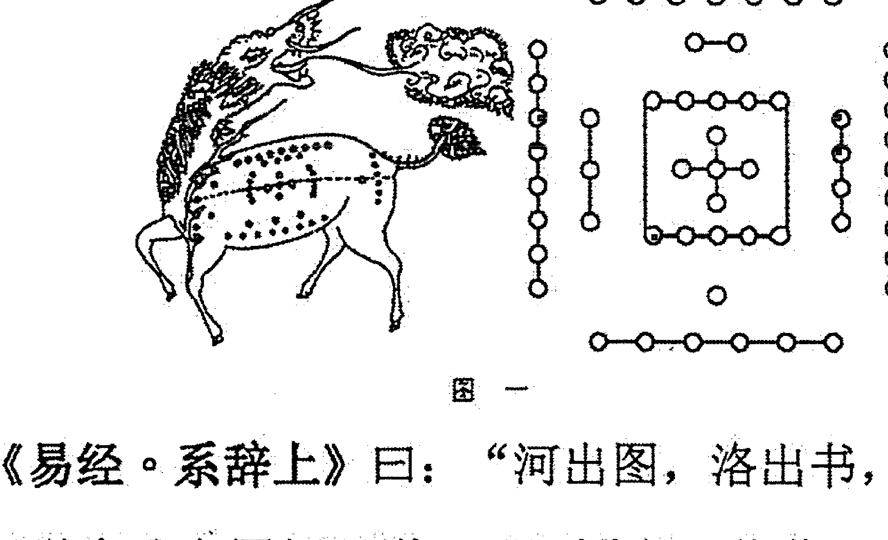
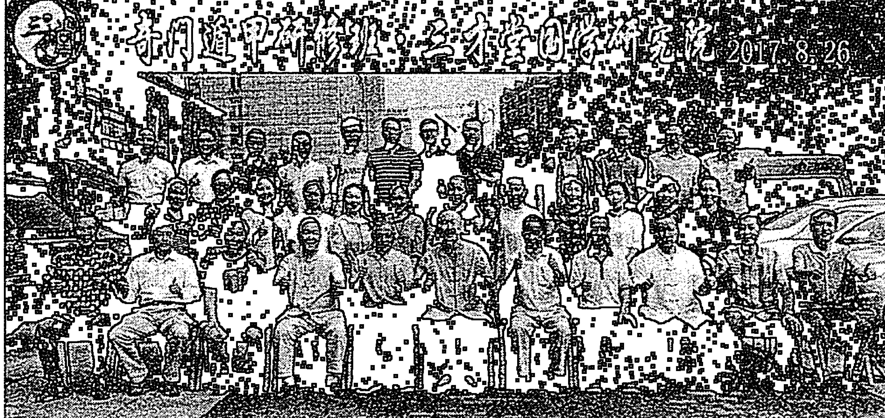
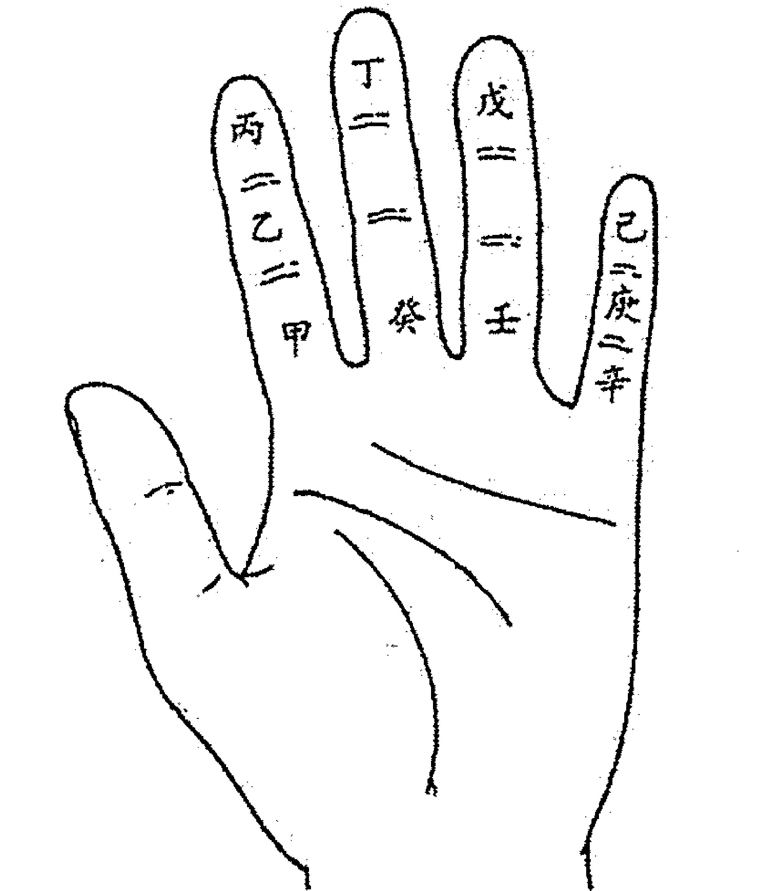
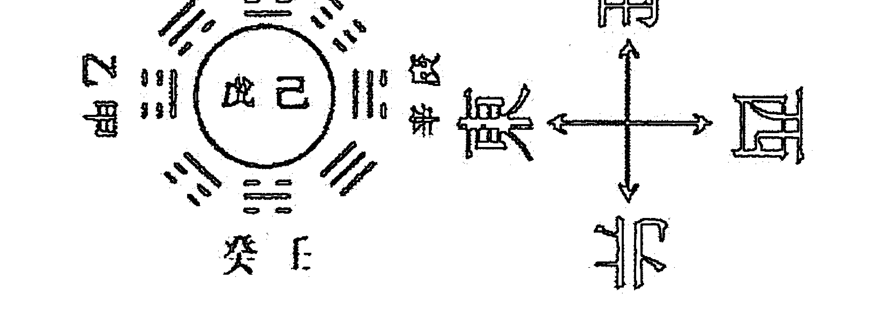
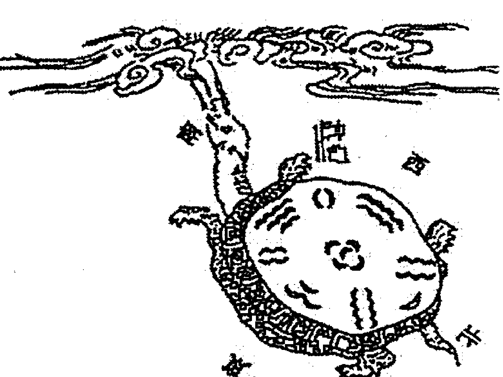
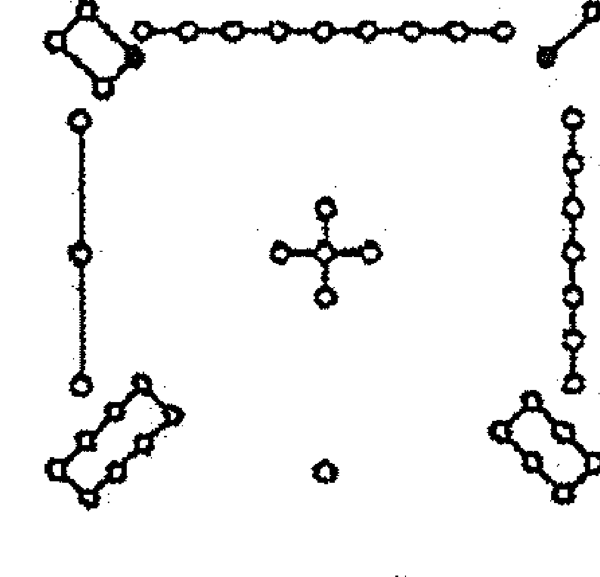
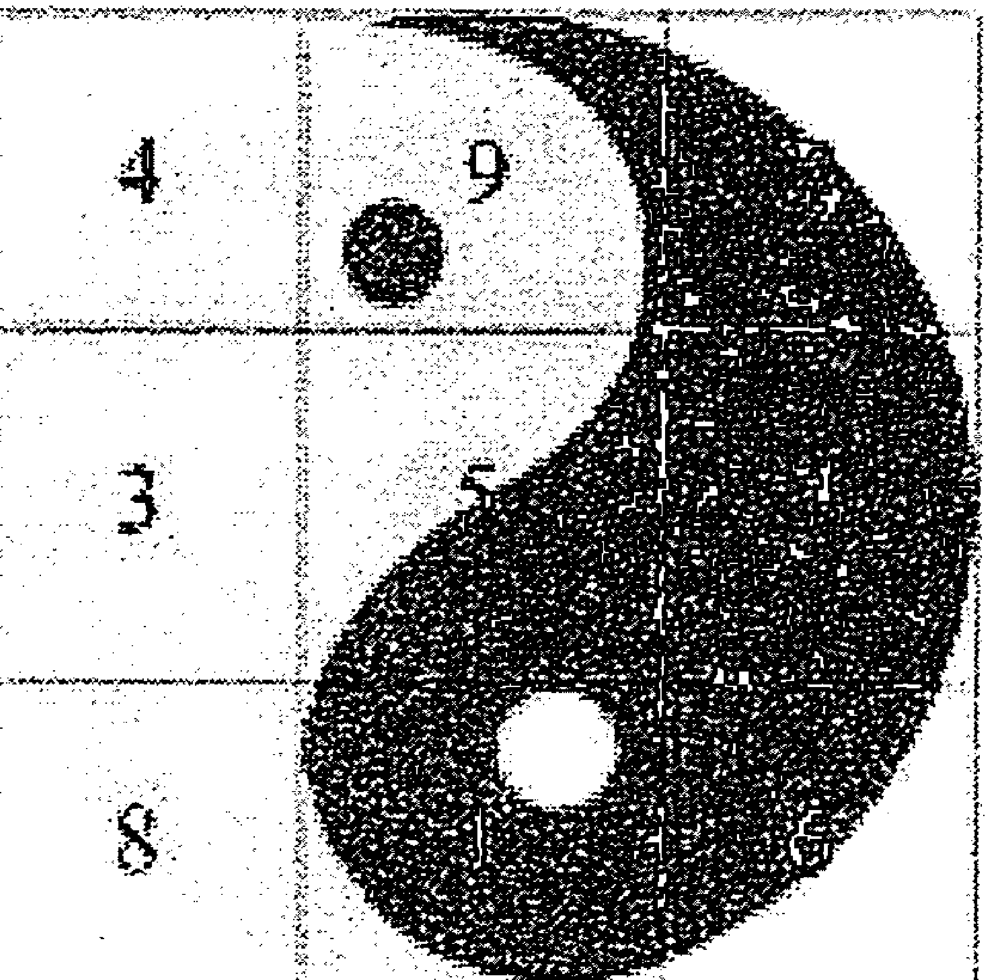
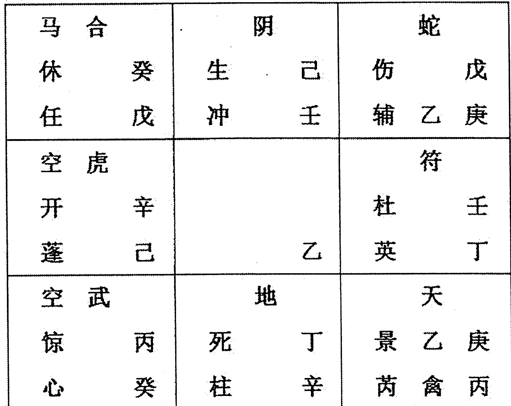
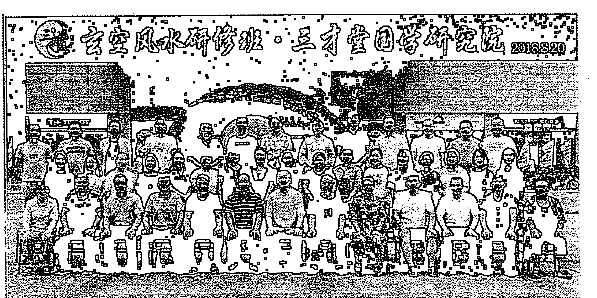

### 奇门遁甲

宋惠彬 著

## 奇门遁甲（上册）

宋惠彬著

## 目录

## 上册

- 前言
- 第一章：易经基础
  - 第一节：易经概论
  - 第二节：阴阳学说
  - 第三节：五行学说
  - 第四节：天干
  - 第五节：地支
  - 第六节：后天八卦
- 第二章：奇门遁甲
  - 第一节：奇门基础
  - 第二节：奇门起局
  - 第三节：常用神煞
- 第三章：奇门克应
  - 第一节：十干克应
  - 第二节：八门克应
  - 第三节：九星克应
  - 第四节：三奇克应
- 第四章：吉凶格局
  - 第一节：吉格
  - 第二节：凶格
  - 第三节：趋吉避凶
- 第五章：预测方法
  - 第一节：主客动静
  - 第二节：用神断卦法
  - 第三节：预测思路
  - 第四节：应期
  - 第五节：九宫全图
- 第六章：实测案例
  - 第一节：天气预测
  - 第二节：财运预测
    - 1. 投资预测
    - 2. 买货求财
    - 3. 卖货求财
    - 4. 借贷预测
    - 5. 放贷预测
    - 6. 索债预测
    - 7. 合伙求财
    - 8. 开店求财

## 下册

- 前言
- 第二节：财运预测
  - 9、投资预测
- 第三节：婚姻预测
- 第四节：怀孕生育
- 第五节：工作事业
- 第六节：行人走失
- 第七节：丢失财物
- 第八节：疾病预测
- 第九节：官讼预测
- 第十节：考试升学
- 第十一节：刑事犯罪
- 第十二节：出国出行
- 第十三节：体育竞赛
- 第十四节：军事预测
- 第十五节：射覆预测
- 第十六节：股票预测
- 第十七节：阳宅风水
- 第十八节：阴宅风水
- 第十九节：人生富贵贫贱
- 第二十节：其他预测
- 第二十一节：烟波钓叟歌

## 前言

太乙、奇门、六壬，是《周易》预测中最为高深的三大绝学，合称为“三式”之学；太乙主要用来占测国家大事，国家的兴衰成败，具体说是用来占测国运的；六壬主要用来占测人世间的事情，就是我们日常生活中的事；而《奇门遁甲》之学算是这三式中最厉害的一门学问了，在古今都被誉为“帝王之学”。遁甲术创始之初是用在军事上的，主要是用来行军打仗，三国时的诸葛亮、汉朝张良、明朝的刘伯温等都是《奇门遁甲》高手。

《奇门遁甲》的起源，传说在黄帝时期，有一个黎族首领叫“蚩尤”的人为祸作乱，由于他有兄弟八十一人，且个个铜头铁骨，并具有呼风唤雨的本领，无人能敌。黄帝看到人民生活在“水深火热”之中，心中很是痛苦，于是起兵征讨蚩尤，两军对垒于河北涿鹿，但是由于蚩尤太厉害了，黄帝久战僵持不下，流血千里，不能获胜。黄帝心中郁闷，正烦着时，忽然天上云彩拨开，两个神童出现，称是奉“九天玄女”之命传于黄帝，当即跪拜接受，黄帝接过来打开一看，里面有一本用篆文撰写的龙甲神章；书里除了记载兵器的打造方法，还记载了很多行军打仗遣兵调将的兵法。于是黄帝要他的宰相风后把龙甲神章演绎成兵法十三章，孤虚法十二章，创制了奇门遁甲一千零八十局。再接着又制造了指南车，从而打败了蚩尤。奇门遁甲共一千零八十局，后周朝姜太公删成七十二局，再到汉代张良精简到一十八局，就是现在我们看到的奇门遁甲阴阳十八局。

本书最后一节是宋朝赵普著的《烟波钓叟歌》，它是《奇门遁甲》的纲领性著作，遁甲术之大要，已尽包其中；若能熟读细玩，参透要旨，实为掌握奇门一术的捷径。

宋惠彬研究奇门遁甲20多年，同时研究其他多种易经学术，在长期的实践总结中，发现实际所有预测术的“根”都是相同的，所以将八字、大六壬、六爻、纳音、金锁玉关、玄空风水等多种学术融入到奇门遁甲中，使奇门遁甲上到一个更高的层次，预测更精细更精准，同一时间，一人一事，多人多事，皆能精准预测，本书共录入实测案例201篇，以供大家参考学习。

宋惠彬
2019年11月于北京

# 第一章：易经基础

## 第一节：《易经》概论

《易经》是中国古代非常重要的一部经典，儒家视为“六经之首”，道家称为“大道之源”。

### 一、《易经》是中国文化之源：

- 1. 群经之首——《易经》：
  《易经》被誉为“群经之首，大道之源”，从伏羲画卦到春秋孔子时期，主要功能就是“占卜”，孔子和他的弟子作十篇诠释《周易》的文章，称为《十翼》，又称《易传》，成为《易经》的一部分，所以说《易经》就是一部“哲学”和“占卜”的著作。
- 2. 《易经》的作者：
  伏羲（作八卦）、周文王（作后天八卦、六十四卦及卦辞）、周公（作爻辞）、孔子（作十翼）。

### 3、《易经》的结构：由《经部》和《传部》组成。

### 4、《周易》二字的含义：

- 1）、周字的解释：
  《系辞》曰：“《易之为书，始终本末，上下回旁，无所不周》，故云“周”；另有《周易》就是周朝的易经之说。
- 2）、易字的几种说法：
  《说文解字》曰：“易，蜥蜴，蝘，守宫也，象形。”
  《容斋随笔》曰：“易者，守宫是矣，亦名蜥蜴；身色无恒，日十二变，以易名经，取其变也。”纬书云：“日月为易，象阴阳也”。《系辞》认为“易”成于“象”；又是“在天成象”，天象莫大于日月，故“日月谓之易”。
- 3）、郑康成曰：“易有三义：‘简易一也，变易二也，不易三也’。

简易：大道至简，把复杂的问题简单化。

变易：万事万物时刻在变，我们要去掌握变化的规律。

不易：万事万物无论如何“变”，“一阴一阳之谓道”是不变的。

## 二、从太极到六十四卦：

> 《易传·系辞上》曰：易有太极，是生两仪，两仪生四象，四象生八卦，八卦定吉凶，吉凶生大业。

### 1、易有太极：

> 《说文解字》曰：“惟初太极，道立于一，造分天地，化成万物”，

太极是天地、乾坤、刚柔、阴阳等一切相对事物的一个混合体；可以将太极视为天地未开、混沌未分阴阳之前的状态。

### 2、太极生两仪：

> 《系辞》曰：“是故‘易’有太极，是生两仪。”

两仪就是对立统一、相辅相成的矛盾事物；最常见的说法是指阴阳，八卦中“— —”代表阴爻，“—”代表阳爻。

### 3、两仪生四象：

两仪在运动对立的过程中，会出现阴与阳的消长，这引起了四种新的状态：“太阳、少阳、少阴、太阴”，这就是四象；四象指的是东方青龙、西方白虎、南方朱雀、北方玄武，此外人们又将春夏秋冬视为四象，又称为四时。

### 4、四象生八卦：

两仪四象进一步演化，由此化生万物；将世间万物归类，可以发现事物的八种形态，古人将其分别由八个卦表示：“乾、兑、离、震、巽、坎、艮、坤”。

### 5、先天八卦：

先天八卦，又称伏羲八卦，传说是由距今七千年的伏羲氏观物取象所作。《周易·系辞传》说：“易有太极，是生两仪，两仪生四象，四象生八卦”。在这个伏羲先天八卦的产生过程中，首先是太极，其次是两仪，再次是四象，最后是八卦，它们是宇宙形成的过程。太极就是一，是道，是天地未分时的浑沌状态。太极动而生阳，静而生阴，是生两仪，一阴一阳就是两仪，故《易·系辞》说：“一阴一阳之谓道”，古人观天下万物之变化，不外乎由太极而生阴阳，故画一奇以象阳，画一偶以象阴。阳就是阳爻，用“—”表示，单为阳之数；阴就是阴爻，用“- -”表示，双为阴之数，这就是构成八卦的基本符号。

一阴一阳这个两仪又各生一阴一阳之象，也就是一分为二，生出四象，四象即少阳、老阳、少阴、老阴，是谓“两仪生四象”。四象再各自生阴生阳（一分为二），生出八卦。即四象生八卦，也就是说在少阳、老阳、少阴、老阴这四象上，分别各加一阳爻或阴爻，“叠之为三”，即产生八种新的符号，即乾一、兑二、离三、震四、巽五、坎六、艮七、坤八，这种八卦排列次序及其卦数，就是先天八卦之数，由右至左，称为先天八卦生成图。先天数的产生，是由浑沌太极，无形无象也无定位，只是一气相生，阴阳次第相加，而自然造化一至八数，故谓“先天”。

从八卦卦爻明显看出，除乾坤两卦是纯阳纯阴卦，震、坎、艮卦都是由一阳爻两阴爻组成，因多数服从少数，故阳爻为大，此三卦为阳卦。巽、离、兑三卦都是由一阴爻两阳爻组成，因多数服从少数，故阴爻为大，此三卦为阴卦。

### 先天八卦图

> 《周易·说卦传》说：“天地定位，山泽通气，雷风相薄，水火不相射。八卦相错，数往者顺，知来者逆，是故易逆数也”。先天八卦是对称平衡的，即阴阳相对。

天地定位：乾南坤北，天居上，地居下，南北对峙，上下相对。从两卦爻象来看，乾是三阳爻组成，为纯阳之卦；坤是三阴爻组成，为纯阴之卦，两卦完全相反。

山泽通气：艮为山，居西北，兑为泽，居东南，泽气于山，为山为雨；山气通于泽，降雨为水为泉。从两卦爻象来看，艮是一阳爻在上，二阴爻在下；兑是一阴爻在上，二阳爻在下，两卦成对待之体。

雷风相薄：震为雷，居东北，巽为风，居西南，相薄者，其势相迫，雷迅风亦烈，风激而雷亦迅。从两卦爻象来看，震是二阴爻在上，一阳爻在下；巽是二阳爻在上，一阴爻在下，八卦成反对之象。

水火不相射：离为日，居东，坎为月，居西，不相射者，离为火，坎为水，得火以济其寒，得水以济其热，不相熄灭。从八卦爻象来看，离是上下为阳爻，中间为阴爻；坎是上下为阴爻，中间为阳爻，两卦亦成对称之体。

先天八卦方位与先天卦数的排列形式，由乾一至震四，系由上而下，再由下而上旋至巽五，由巽五至坤八又由上而下，其路线是S形的曲线；先天八卦乾坤、艮兑、震巽、坎离两两对称平衡，这就是先天八卦方位图中的矛盾对立统一的辩证思想。

## 三、六十四卦：

周文王将八卦两两搭配，得到六十四卦，用来象征各种自然现象和人事现象。

| 1乾 | 2夬 | 3大有 | 4大壮 | 5小畜 | 6需 | 7大畜 | 8泰 |
| :--- | :--- | :--- | :--- | :--- | :--- | :--- | :--- |
| 9履 | 10兑 | 11睽 | 12归妹 | 13中孚 | 14节 | 15损 | 16临 |
| 17同人 | 18革 | 19离 | 20丰 | 21家人 | 22既济 | 23贲 | 24明夷 |
| 25无妄 | 26随 | 27噬嗑 | 28颐 | 29益 | 30震 | 31屯 | 32复 |
| 33姤 | 34大过 | 35鼎 | 36恒 | 37巽 | 38井 | 39蛊 | 40升 |
| 41讼 | 42困 | 43未济 | 44解 | 45涣 | 46坎 | 47蒙 | 48师 |
| 49遁 | 50咸 | 51旅 | 52小过 | 53渐 | 54蹇 | 55艮 | 56谦 |
| 57巽 | 58兑 | 59涣 | 60节 | 61中孚 | 62小过 | 63既济 | 64未济 |

# 第二节：阴阳学说

阴阳学说是我国古代最为核心的哲学思想，事物在阴阳两种相反相成的力量作用下不断的运动、变化、生成、更新。

- 一、阴阳——“一阴一阳之谓道”：

阴阳是中国传统文化的一种宇宙观和方法论，阴阳的矛盾对立统一运动规律是自然界一切事物运动变化的固定规律，是自然界一切事物发生、发展、变化及消亡的根本原因。

《易经》把阴阳看成是宇宙间一切事物运动变化的最根本原因，《系辞》则从哲学的角度概括为“一阴一阳之谓道”，认为阴阳是“道”的基本内涵；道家说：“阴阳相交则万物生，阴阳不交则万物死”，下面笔者用《十二消息卦》中的“地天泰”和“天地否”两个卦来诠释阴阳。

## 十二消息卦

十二消息卦：又称十二辟卦，“息”指阳爻的生长，“消”指阳爻的消失；这十二个卦的卦爻以阴阳消长的次序排列，反映了一年十二个月的节气变化，对应于十二个地支。

寅月对应地天泰卦：上卦3个阴爻代表坤卦，代表地，下卦3个阳爻代表乾卦，代表天，组合为地天泰；坤卦代表阴气，性质是下降，乾卦代表阳气，性质是上升，阴气在上下降与阳气在下上升，则“阴阳二气相交万物生”，寅月立春之时，万物生发，就是“万物复苏，开始生长”；即三阳开泰、万事亨通，所以为“泰”。

申月对应天地否卦：上卦3个阳爻代表乾卦，代表天，下卦3个阴爻代表坤卦，代表地，为天地否；乾卦代表阳气，性质是上升，坤卦代表阴气，性质是下降，阴气在下下降与阳气在上上升，“阴阳二气不相交则万物死”，申月立秋之时，万物秋杀，“古代死刑，秋后问斩”就是顺应天地之道；“否”就是闭塞不通之象，上下不和之意。

## 二、阴阳——《易经》卦象的核心：

八卦卦象就是建立在阴爻“— —”和阳爻“—”的基础上，这两个符号按照阴阳二气消长的规律，经过排列组合成八卦，八卦又经过重叠排列组合成六十四卦。

## 三、阴阳——事物的两个方面：

一阴一阳对立统一、相反相成，现举例如下：

- 阳：天 君 男 上 左 前 远 高 君子 贵 外 暑 白天
- 阴：地 民 女 下 右 后 近 低 小人 贱 内 寒 黑夜

# 第三节：五行学说

五行是构成世界万物的基本元素，正是五行的相互作用，才促进了宇宙万物的变化发展，因此通过五行的分析研究，也就能预测未来，预测人事之吉凶。

## 一、五行简介：

五行指“金、木、水、火、土”五种物质元素，古人认为世间万物都是由这五种元素构成的，事物的运动、变化、发展都是由这五种元素的性质相互作用的结果。

《尚书·洪范》说：“五行：一曰水、二曰火、三曰木、四曰金、五曰土。水曰润下、火曰炎上、木曰曲直、金曰从革、土曰稼穑；润下作咸、炎上作苦、曲直作酸、从革作辛、稼穑作甘”。

## 二、五行的特征：

- “金”的性质：“金曰从革”，金具有肃杀和变革的性质。
- “木”的性质：“木曰曲直”，木具有生长和升发的性质。
- “水”的性质：“水曰润下”，水具有滋润和向下的性质。
- “火”的性质：“火曰炎上”，火具有发热和向上的性质。
- “土”的性质：“土曰稼穑”，土具有长养和化育的性质。

## 三、五行的生克：

### 1、五行相生：

五行相生的关系是：金生水、水生木、木生火、火生土、土生金。

- 水生木：水分可以滋养树木的生长。
- 木生火：木燃烧后可产生火焰。
- 火生土：木通过火燃烧后变成灰。
- 土生金：地下的土中藏有金属。
- 金生水：金属熔化后变成水。

#### 生多为克：

木赖水生，水多木漂；水赖金生，金多水浊；金赖土生，土多金埋；土赖火生，火多土焦；火赖木生，木多火熄。

## 2、五行相克：

五行相克的关系是：金克木、木克土、土克水、水克火、火克金。

金克木：锯或斧头可以砍伐树木。

木克土：树木的生长可以疏松土质的凝结。

土克水：泥土修成河坝可以堵住流水。

水克火：水能扑灭燃烧的火焰。

火克金：火能熔化金属。

### 克中反克：

金能克木，木旺金缺；木能克土，土重木折；土能克水，水多土荡；水能克火，火多水干；火能克金，金多火熄。

### 泄多为克：

金能生水，水多金沉；水能生木，木盛水缩；木能生火，火多木焚；火能生土，土多火毁；土能生金，金多土虚。

## 四、五行旺衰：

五行于春夏秋冬四时，各自所处的状态如下：

| 春天 | 木旺 | 火相 | 水休 | 金囚 | 土死 |
| :--- | :--- | :--- | :--- | :--- | :--- |
| 夏天 | 火旺 | 土相 | 木休 | 水囚 | 金死 |
| 四季月 | 土旺 | 金相 | 火休 | 木囚 | 水死 |
| 秋天 | 金旺 | 水相 | 土休 | 火囚 | 木死 |
| 冬天 | 水旺 | 木相 | 金休 | 土囚 | 火死 |

### 1、四时：

春天为寅、卯月，夏天为巳、午月，四季月为辰、戌、丑、未月，秋天为申、酉月，冬天为亥、子月。

### 2、规律：

当令者为我为旺，我生者为相，生我者为休，克我者为囚，我克者为死。所谓当令就是十二个月地支的五行属性，如寅月，五行属木，木就是当令者，木最旺。

### 3、比喻诠释旺相休囚死：

“旺”就是现在掌权的五行，比喻成皇帝，现在正在执政，大权在握；“我生者为相”，皇帝生的是太子，为将来掌权的人，所以为“相”，又称为“次旺”；“生我者为休”，生我者就是太上皇，此时已经进入“休养”阶段，皇帝已经是最旺的了，不需要他来帮助了；“克我者为囚”，克就是制约、反对，皇帝将制约和反对他的人统统关起来，为“囚”；“我克者为死”，皇帝要克杀的人，就得“死”。

### 4、旺相休囚死力量对比：

旺 > 相 > 休 > 囚 > 死
旺的力量大于相，相的力量大于休，休的力量大于囚，囚的力量大于死。

## 五、河图与五行属性：

《易经·系辞上》曰：“河出图，洛出书，圣人则之。”西汉经学家孔安国解释说：“河图者，伏羲氏王天下，龙马出河，遂则其文，以画八卦”。传说“龙马为天地间的精灵，它的外形非常奇特，马身上长有龙鳞，故称龙马。这匹龙马赤文绿色，高八尺五寸，似骆而有翅，踏水不没”。这匹龙马的旋有次序，形数排列是一、六在后，二、七在前，三、八在左，四、九在右，五、十背中，这就是河图。

河图共有10个数，1、2、3、4、5、6、7、8、9、10。其中1、3、5、7、9为阳，2、4、6、8、10为阴；阳数相加为25，阴数相加得30，阴阳相加共为55数，为天地之数。所以古人说：“天地之数五十有五”，即天地之数为55，“以成变化而行鬼神也”。即万物之数皆由天地之数化生而已。

河图口诀：

- 天一生水，地六成之；
- 地二生火，天七成之；
- 天三生木，地八成之；
- 地四生金，天九成之；
- 天五生土，地十成之。

河图中的点数是五十五，其中一、三、五、七、九是天数，二、四、六、八、十是地数，天数是奇，是阳；地数是偶，是阴，阴阳相索。

据古代哲学家的解释，五行“金、木、水、火、土”的数字源于河图中上、下、左、右、中五组数目。

## 五行属性

| 天干地支 | 五行 | 数字 | 颜色 | 图形 | 五德 | 五脏 | 五味 | 五志 |
|---|---|---|---|---|---|---|---|---|
| 壬癸子亥 | 水 | 1、6 | 黑色 | 波浪形 | 智 | 肾 | 咸 | 恐 |
| 甲乙寅卯 | 木 | 3、8 | 绿色 | 长方形 | 仁 | 肝 | 酸 | 怒 |
| 丙丁巳午 | 火 | 2、7 | 红色 | 三角形 | 礼 | 心 | 苦 | 喜 |
| 戊己辰戌丑未 | 土 | 5、0 | 黄色 | 正方形 | 信 | 脾 | 甜 | 思 |
| 庚辛申酉 | 金 | 4、9 | 白色 | 圆形 | 义 | 肺 | 辛 | 悲 |

## 第四节：天干

## 一、天干：

- 1. 十天干：甲、乙、丙、丁、戊、己、庚、辛、壬、癸
- 2. 天干阴阳：阳干：甲 丙 戊 庚 壬；阴干：乙 丁 己 辛 癸

## 二、十天干的万物类象：

十干的类象分为几个部分：

一是天干的五行属性及其本质所衍生出来的类象，所以甲的类象应含有木的本质特性。

二是从字义上所衍生出来的类象，如甲的字义，有铠甲、壳的意思，所以类象中带有这种特性。

三是十干在八卦五行中的具体位置所衍生出来的类象，如甲木属阳，在后天八卦中属震卦，因此具有震卦的特点。

所有的奇门类象，五行属性及其本质的东西是最为重要的，所以这些最基本的内容，可以向外无限拓展；主要分为天文、地理、人物、性格、疾病、体形容貌、事务、植物、动物、器物用品、其它等十一类。

### 1、甲干：

号为天福之神，为十干之首，位于东方属木，隶属寅木，统东方震木之气。甲为阳木，具有参天向上的本质特征。其为质也为劲，其为性也为真，其为色也青，其为味也酸，其为声也为浊，其与体也方与长，其为用也萌与动。得时则为栋梁，失令则为废材。克战太过则为朽腐无用，生旺太过则漂泊无依。其性过于自负，不能闲于事故。天福之神，宜施恩布德赏功。

- 基本含义：为天福，为首领、元首；为财利，为奖金；为喜庆，为铠甲。
- 天文气象：火星、雷、旭日和风、新星、温暖。
- 地理建筑：森林、大路、桥梁、栋柱，楼梯、电梯、闹市、高楼大厦，风水的龙砂。
- 人物伦常：元首、统帅、家长、主将、主角、楷模、兄长、董事长、师长、医师、法官、高人、君子、劳工；包括领导人、名人。
- 性情性格：刚健、正直、积极；自负、木讷、不圆滑、天真、不拘小节、好大喜功。
- 身体疾病：头面、胆囊、肝、脑神经；痉挛、抽搐、麻痹、呕吐。
- 体形容貌：直、方、高，形体方长，皮肤青白，筋骨强健，国字脸，浓眉秀发。
- 事务分类：创始、政治、总务，农林、木材业、建筑业，监督、起动、虚惊、鼓噪。
- 植物：参天大树，如松树、柏树、杉树等，凡是生长周期快的参天大树都可以用甲表示。
- 动物：布谷鸟、鹤、黄莺、金丝雀、画眉鸟等善于鸣叫的动物，狮、虎、鹿等名贵动物，穿山甲、龟、鳖、贝壳、螺类、螃蟹、虾等带壳的动物。
- 器物用品：笛、箫、鼓等鸣响乐器；体形长方的用具物件，如手杖、棍棒等；用木材做成的家具，如桌、柜等；贵重的物品，如金、玉、珠宝、古董等。
- 其他：青绿色，数主一数，为青龙，直符。

### 2、乙奇：

号为天德之神，为日奇，属甲木之辅佐。位于东方属木，隶属卯木，摄取震木之气。乙为阴木，有弯曲、柔弱的特征。其为质也润，其为性也曲，其为色也碧，其为味也为酸、甘，其为声也为婉转，其为体也柔嫩，其为用也无差。得时为繁华，失令则枯朽。其性矫揉造作，依附世情。天德之神宜施恩赏德，敛恤抚诰。

- 基本含义：为天德，为女人、妻子、多情；为合作、为副手；为善良、为温柔；为弯曲、为间接。
- 天文气象：月孛，和风旭日、山岚、冥王星。
- 地理建筑：公园、草地、果园、花店、门窗、出入口、楼梯，风水的龙砂。
- 人物伦常：医生、护士、女人、妻子、姐妹，高名贤人、文人秀士、僧道九流。
- 性情性格：柔弱、婉转、能伸能屈，矫揉造作，依附世情，平和。
- 身体疾病：肝胆、泪腺、颈部，头发、手指等能弯曲柔软的地方，神经系统、血管，病症为晕眩、过敏等。
- 体形容貌：苗条、皮肤白嫩，骨质松弛，瘦长脸。
- 事务分类：园艺、茶艺、藤类植物编织、手工业等与木草有关事务；婚姻、交易等中介场所；印刷、出版、教育等文化事业；媒妁、和解、说和、旅游等人和事。
- 植物：所有的草类和寄生植物，杨柳、藤蔓等根茎柔软的植物，带有漂柔香气的植物等。
- 动物：所有漂亮的，五彩纷呈的动物，如鸳鸯、斑鸠、山鸡、蝴蝶等，善于弯曲的动物，如蛇、毛毛虫等。
- 器物用品：所有的手工艺品、藤制品；所有的香水，芳香剂，香料；特别柔软的丝织品，文化用品，如文具，笔盒、笔、画布等。
- 其他：碧绿色，黄绿色，数二，婚姻为女方。

### 3、丙奇：

号为天威之神，为月奇，为甲木之子孙，隶属午火而居南方离位。丙火阳火，具有威严、光明、艳丽的特征。其为质为廉，其为性也烈，其为色为紫、赤，其为味也苦、辣，其为声也苍雄，其为体为腹，其为用也抑与扬。得令则辉煌，失令则灰稿。有可大之材而且是不能有恒心，有转变之功而不可干冒犯。其性刚愎自用，惟好趋承。天威之神宜发号施令，以彰雄威。

- 基本含义：为天威、权威、权利、功臣，为暴力、急躁，为反叛、为果断、为性直、为直接、为光明、为情人。
- 天文气象：木星、阳光、电光、新月至满月、热。
- 地理建筑：城门、香火祠堂、富丽堂皇之处、风水的朝案、朝山，观光风景区、旅游场所、灶台、厨房、旱地、剧场、发电厂、化工厂、冶炉等。
- 人物伦常：当权者、指挥能力强、检察官等具有威严性质的人物，司炉工、发电工人、冶炼工人与电热有关的人物，诗人、画家、传教士等，与清廉自洁有关的职业或人；美容师、旅游区工作者等给人美感的职业；还代表眼科医师、化验师、鉴定师、原告等。
- 性情性格：脾气暴躁、刚猛果断、外刚内柔、公正廉洁、刚愎自用、好奉承而虚荣、猛烈而喜怒无常。不能持之以恒、为三分钟热，丙为悖，还具有悖逆之性。
- 身体疾病：眼睛、炎症、斑点等，发炎、发热、烫伤、灼伤等于火热有关的疾病；流产、出血等于血液有关的病（丙为红色，代表血液）；丙还为小肠、为肩、额。
- 体形容貌：丰满、圆脸，少胡须，短发，肤色白里透红。
- 事务分类：考场、法庭、词讼、信息、口舌是非；礼品、美容、娱乐、服饰等行业。
- 植物：牡丹花、鸡冠花等特别美丽的花草类；辣椒、胡椒等生长辛辣果实的植物。
- 动物：孔雀、凤凰、红鹦鹉、喜鹊等特别美丽的动物；螺、蚌、龟等圆形的动物。
- 器物用品：所有发光发热的电器都是丙，锦旗、礼服、裙子等美丽的服饰用品。
- 其他：红色，紫色，数主三数，为朱雀，太阳能。

### 4、丁奇：

号为太阴、玉女，为星奇，为甲木之子孙，位于南方，统巳火而摄未位。丁为阴火，为星星之火，有内助之能和柔媚的特性。丁为玉女，为星之精，善于变化、飞腾，能通人灵性，最利逃亡潜身。丁奇在三奇中代表人，因此预测人事特别灵验。其为质也媚，其为性也顺，其为色也淡红，其为味也苦，其为声也清亮，其为体也秀而扬，其为用也便而捷。得时能销镕暴戾，洞察奸邪。失令则为穷愁呻吟，暗昧难明。投其机则态度轻佻，挡其锐则不可摧。

- 基本含义：为玉女，为第三者、为情人；为文星、文化、教育、文职；为俊秀、文雅、为字体。
- 天文气象：金星、老人星、寿星、祥云、闷热。
- 地理建筑：厨灶、风水的朝案、近处案山，路口、屋檐、墙角等带有转弯的地方。
- 人物伦常：女人、妓女、情人、妾，歌星、演艺人员、画家，考生、文章、说客。
- 性情性格：忠心柔顺，内热外冷，不服输，不易捉摸，具有叛逆的性质；体贴，洞察奸邪，说话带刺，技术一流。
- 身体疾病：心脏、眼球、脉搏、阑尾。
- 体形容貌：秀丽、肤白、粉嫩，细长发，额宽，尖下巴。
- 事务分类：烹饪、火锅、烧烤业。
- 植物：带刺的、带尖的植物或果实，如玫瑰、蔷薇等。
- 动物：荧火虫，能叮咬人的动物，如蛇、蚊、蜂等。
- 器物用品：暗火的厨房用品，如烧箱，微波炉，电炉，电磁炉等，所有装饰性的小灯具，钉子，打火机。
- 其他：淡红色，数主四，为腾蛇，鬼火，为核能。

### 5、戊干：

号为天武，为黄镇将军，有威权，戊土具有中正、包容的特点，在预测中也代表钱财。其为质也烈燥，其为性也耿直，其为味也甘，其为声也刚雄，其为体也涩而深，其为用也卤而粗。得时则豪雄果敢，失令则柔弱疑愚。其性执拗，不可强制。天武之神，宜发号施令，行诛屠戮。

- 基本含义：为天武、征战，财利、财物、资金，为动向、图谋，为中立、长官、领导。
- 天文气象：土星、霞、雾、霜、瘴气。
- 地理建筑：山岭、堤防、墙垣，风水的结穴处、穴星、穴场；寺观、客厅、仓库、停车场。
- 人物伦常：狱警、牧牛人、担保人。戊在遁甲中还代表资金、金钱，因此代表会计、金融机构、出纳、银行职员等；戊土的性质，还可代表房地产商、农民、建筑工人。
- 性情性格：朴实、耿直、固执、坚定，保守、孤立，得时豪放、果敢，失令柔弱、痴愚。
- 身体疾病：胃、脾等消化系统，肉多的地方，如乳房、腹部、臀部、鼻子、背、关节等。
- 体形容貌：形体敦厚、四方脸、肤黄白、身体多肉。
- 事务分类：保险、信贷等行业；国防、关防等单位；仓储、警卫等职业。
- 植物：凡是肉多的生长在地中的植物，如地瓜、萝卜等；生长在土面上肉多的也是，如南瓜、西瓜等。
- 动物：肉多肥胖的动物，如猪、骡、驴等。
- 器物用品：土做的陶器、能包裹物品袋子等。
- 其他：为黄色，数主五数，为勾陈，中央之地，为财神。

### 6、己干：

号为明堂、地户。位离宫而隶未位，具有坤土之德。己土具有策划、欲念、创意的特点，在人性上代表主意多，想法多，花花肠子多，还代表脏乱、下贱、驼背、扭曲、卷曲。其为质也博厚，其为性也坦真，其为味也甘，其为声也婉切，其为体也沉而静，其为用也顺而柔。得时则陶镕器皿，失令则为过时旧物，其性宽宏而不凝滞于物。

- 基本含义：为地户、守旧、陈旧、过去、废品，为顽固、忠厚、老实、丑陋。
- 天文气象：为云雾、烟、湿气、气压。
- 地理建筑：田园、墓地，肮脏丑陋的地方，如坑、沟、厕、下水道、垃圾、湿地；风水的结穴、明堂；又为旧穴、废弃的穴、古墓；宅内的卧室、天井。
- 人物伦常：主妇、妻、产妇，农民、土工，打字员、排版员、服务员；秘书、文书等职业。
- 性情性格：宽宏、厚道、老实、坦白、守纪律、看得开，无为、含蓄、卑微、柔顺、贪心、吝啬。
- 身体疾病：脾、胰、肌肉、腹部、肚脐、乳头，凡是身体上有小块肉的地方都是己；病则代表自闭症、营养不良、黄肿病、疮疽、结石、产厄等。
- 体形容貌：身体单薄，瘦弱丑陋、圆脸。
- 事务分类：城市规划、土地部门等与土有关的行业，妇产科、护理等脏的行业；酒精、发酵、粮食物质等部门。
- 植物：稻谷、棉花等农作物，土中生长的小肉的植物，如山药、土豆等。
- 动物：小而胖且肉多的动物，如螺、蟾蜍，卷曲而没有张开，如蜗牛、冬眠的蛇等。
- 器物用品：内衣裤、卫生用品、鞋子、袜子、垫子等。卷曲不舒展的物品如绳索、线团等；如棺材、装骸骨的瓦瓮；脏臭的物品，如垃圾、大便等。

### 7、庚干：

号天狱之神，为太白金星，隶坤宫而统申位，有白虎的特性，掌司杀伐之权。庚具有阻碍、阻隔、野蛮、肃杀的特性。奇门遁甲以甲为尊，而庚为甲的克星，所以庚与直符之间的对应关系，是一个重要的参考依据。庚金其为质也刚劲，其为性也急锐，其为味也辛辣，其为声也雄尖，其为体也硬直，其为用也暴戾。得时显其专制，失令失其雄威。可柔以化之，不可刚以制之。天狱之神，宜决断刑狱，诛戮邪恶。

- 基本含义：为太白、为天狱，为阻隔、阻碍，为煞气，破坏力，凶险、损害，为对手、仇敌；女人的男方、男友。
- 天文气象：秋冬严霜，春夏暴雨；黄昏时的金星，黎明时的水星。
- 地理建筑：道路、通道、高速公路、铁路，关卡、收费站；钢铁厂、铁矿山等；风水的白虎砂，代表石头。
- 人物伦常：军警、检察官、武术家、屠夫、行刑人；黑社会、劲敌、被告；外科医师、雕刻家、导演等。
- 性情性格：粗暴野蛮、刚强勇敢、好杀；刚健敏锐、坚忍不拔。
- 身体疾病：头骨、骨骼、肺、大肠、甲状腺，骨折、脱臼、硬化、癌症。
- 体形容貌：骨骼健壮、长脸、皮肤白、筋强骨健。
- 事务分类：钢铁、矿业、伐木等行业；军警、稽查、狱政、交通等部门；代表军事、伤灾、交通事故等事。
- 植物：具在刺激味道的植物，如芹菜、蒜、葱、韭菜等。
- 动物：凶猛可怕的动物，如虎，凶猛可怕的昆虫类，如食人蚁、蜈蚣等。
- 器物用品：刀、枪、斧头、锯子伐木工具，汽车、轮船等大刑的金属制品和交通工具。
- 其他：白色，数为七，为白虎，为武爵。

### 8、辛干：

号为天庭之神，气同白虎，掌肃杀之权，威震于西方，隶兑宫而摄酉位，有兑卦的特性。辛金有创新、变革的特性，代表错误、问题的存在。其为质也锐，其为性也刚柔，其为味也辛辣，其为声也铿锵，其为体也沉静，其为用也坚忍。得时则声音最为洪亮，失时则声音悲伤。天庭之神，宜正法，治囚，不宜吉事。

- 基本含义：为天庭、为白虎、为刑罚、囚犯，为首飾、装饰，为困苦、停滞、错误，为小人、缺口。
- 天文气象：秋天、傍晚、星星、秋霜、冰雹。
- 地理建筑：小型的金属加工场所，如打金店，锁厂等，风水的白虎砂，官星。
- 人物伦常：法官、律师、议员、人大代表等，巫婆、祭司、宗教徒；女警、罪犯、犯法者。
- 性情性格：决断、内刚外柔、湿润清秀、自尊虚荣。
- 身体疾病：肺、牙、咽喉、胸腔、刀枪创痛、骨刺、湿疹、粉刺、痘等。
- 体形容貌：修长方正、皮肤嫩白、脸长凹腮、尖下巴。
- 事务分类：行刑、手术、针灸，宗教、创新、改革部门。
- 植物：小麦、天麻、银杏、杏仁等，葱、蒜、韭、荞等。
- 动物：带角和尖喙的动物，如鹰、犀牛等。
- 器物用品：小型的五金制品，牙制品。
- 其他：白色，八数，为太阴。

### 9、壬干：

号为天牢之神，壬水具有流动、蕴藏的意思，也代表困境与迷茫。其为质也润，其为性也淫，其为味也咸，其为声也洪，其为体也圆滑，其为用也流通。得时则济物利人，失令则妨贤害国。其性柔险，可与共忧，不可共荣。天牢之神，宜平讼、诀狱，不宜吉事。

- 基本含义：为天牢、为变化、流动、河海。
- 天文气象：天王星、月蚀、银河，秋露，疾风暴雨。
- 地理建筑：江、河、湖、海、瀑布，风水的龙脉、玄武、后乐。
- 人物伦常：船工、纤夫，孕妇，风流、流氓、淫荡、流浪者，水产、航海、旅游家、自由职业者等。
- 性情性格：现实圆滑、聪明清雅、能容忍万物，外柔内刚等。
- 身体疾病：泌尿系统、血管、生殖系统等器官及疾病；泻、痢疾等病症。
- 体型容貌：皮肤黑、大眼睛、走路不定、长发。
- 事务分类：交通运输、造船、水利工程、消防、渔业与水打交道的行业，流动性强的行业，性行为。
- 植物：生长在水里的水草、藻类，色泽黑色的植物。
- 动物：生活在水里的动物，如鱼类、龟类等；特别灵活的动物，如鼠、狐狸；燕子、猫头鹰、蝙蝠等。
- 器物用品：冰箱、冷气、空调等，润滑油、发油、面霜等；所有的饮料、乳制品。
- 其他：黑色、数主九，为天后。

### 10、癸干：

号天藏之神，癸水主藏，为脏水，代表幽暗不明之事，有流动、淫荡、变化不常的意思。其为质也重，其为性也阴，其为味也浊，其为声也亮，其为体也沉厚，其为用也浅，略无包容含蓄之类。得时则纵容变化，失令则摇尾乞怜。其性憨直，惟知排难解纷，不知察奸烛蔽。天藏之神，宜扬威责罚，积蓄收敛。

- 基本含义：为华盖、为天网，为陷阱、隐藏、遗失、破耗；为脏、厕所，为情感、为痣。
- 天文气象：海王星，黑洞、日蚀，春雨、春露、凝冰等。
- 地理建筑：沼泽、低洼、水井、厕所、下水道、地下室，仓库、后门等，海洋、海岛等；风水的龙脉、鬼星、玄武。
- 人物伦常：潜水员、捕鱼之人，间谍、侦探、线人等。
- 性情性格：潜力丰富、多情、含蓄、沉默、沉溺酒色。
- 身体疾病：肾脏、生殖系统、内分泌系统、听觉、骨髓等疾病，男女的私处、痣、口水、眼泪、鼻涕、汗液、尿溺、白带、眼屎。
- 体型容貌：矮小、黑、丑、圆脸瘦肩，说话小声。
- 事物分类：参谋、阴谋、遗失物、收藏；瓜农、菜农、茶农及囚犯、酒鬼等，代表下层人员，穷困潦倒的人。
- 植物：凡喜水的植物都是，如水稻、荷花、青藻类等。
- 动物：所有的水鸟、生活在潮湿、沼泽地里的动物都是。
- 器物用品：鱼网、网状物，水平仪、清洁剂、淹渍物。
- 其它：淡色、黑色，数主十数，为玄武，鬼神，为冥府。

### 三、天干相冲：

- 甲庚相冲，乙辛相冲
- 丙壬相冲，丁癸相冲

甲乙木居于东方，丙丁火居于南方，庚辛金居于西方，壬癸水居于北方，戊己土居于中央；天干相冲者，两两相冲，东西相对，故东西天干相冲；南北相对，故南北天干相冲；而戊己居于中央，无相对之说，故戊己无冲，天干相冲只有四对，且阳干冲阳干，阴干冲阴干。

## 四、天干五合：

甲己中正合化土，乙庚仁义合化金，丙辛权威合化水，丁壬淫荡合化木，戊癸无情合化火。

> 《考原》曰：“五合者，即五位相得而各有合也；河图数是一与六、二与七、三与八、四与九、五与十皆各有合；以干干之次言之，一为甲、六为己，故甲与己；二为乙、七为庚，故乙与庚合；三为丙、八为辛，故丙与辛合；四为丁、九为壬，故丁与壬；五为戊、十为癸，故戊与癸合”。

化气之理，黄帝《素问》论之最明；《素问》有五运六气，所谓五运者，甲己为土运，乙庚为金运，丙辛为水运，丁壬为木运，戊癸为火运也。

## 第五节：地支

### 一、十二地支：

子、丑、寅、卯、辰、巳、午、未、申、酉、戌、亥
鼠 牛 虎 兔 龙 蛇 马 羊 猴 鸡 狗 猪

### 二、地支对应阴阳五行、方位、季节、月份、时辰：

| 地支 | 阴阳 | 五行 | 方位 | 季节 | 二十四节气 | 月份 | 时辰 |
|---|---|---|---|---|---|---|---|
| 子 | 阳 | 水 | 北方 | 冬天 | 大雪~冬至 | 十一月 | 23~1 |
| 丑 | 阴 | 土 | 东北偏北 | 季冬 | 小寒~大寒 | 十二月 | 1~3 |
| 寅 | 阳 | 木 | 东北偏东 | 春天 | 立春~雨水 | 一月 | 3~5 |
| 卯 | 阴 | 木 | 东方 | 春天 | 惊蛰~春分 | 二月 | 5~7 |
| 辰 | 阳 | 土 | 东南偏东 | 季春 | 清明~谷雨 | 三月 | 7~9 |
| 巳 | 阴 | 火 | 东南偏南 | 夏天 | 立夏~小满 | 四月 | 9~11 |
| 午 | 阳 | 火 | 南方 | 夏天 | 芒种~夏至 | 五月 | 11~13 |
| 未 | 阴 | 土 | 西南偏南 | 季夏 | 小暑~大暑 | 六月 | 13~15 |
| 申 | 阳 | 金 | 西南偏西 | 秋天 | 立秋~处暑 | 七月 | 15~17 |
| 酉 | 阴 | 金 | 西方 | 秋天 | 白露~秋分 | 八月 | 17~19 |
| 戌 | 阳 | 土 | 西北偏西 | 季秋 | 寒露~霜降 | 九月 | 19~21 |
| 亥 | 阴 | 水 | 西北偏北 | 冬天 | 立冬~小雪 | 十月 | 21~23 |

## 三、地支的万物类象：

### 1、子水：

- 概念：首领、名人、智慧、聪明、阴私、奸邪、暗昧、色欲、悲泣。
- 人物：女人、儿童、盗贼、好色之人、旅游之人、科学研究者、化学行业、水上工作者、运输者、从事液体物质经营者、黑衣人、淫乱人。
- 形态：面黑或眼大、身体圆润、皮肤光滑。
- 性情：可圆可方、处事圆滑、上善若水、聪明吉祥。
- 人体：肾、膀胱、血液、血管、卵子、生殖系统、内分泌系统、精液、经血。
- 动物：老鼠、田鼠、蝙蝠、鱼类、喜水动物。
- 植物：水草、芦苇、荷花、水稻等一切水中生长的植物。
- 静物：墨水、颜料、液体物品、盐、饮品。
- 地理：江、河、湖、海、塘、沟渠、道路、水管、厕所、水池、喷泉、水厂、饮料厂、化工厂。
- 方位：正北方。
- 天时：雨、雪、雾、霜。
- 色彩：黑色。

### 2、丑土：

- 概念：忠厚、正直、贤良、福德、丑陋、田宅、房屋、财产、院落。
- 人物：种植者、采矿者、基督徒、教徒。
- 形态：丑陋、矮子、瘸子、驼背、大肚子、秃发人、眼睛、鼻子有毛病者。
- 性情：忠厚、贤良、说话不好听、爱骂人、告状。
- 人体：脾、胃、肠、肛门。
- 动物：牛。
- 植物：地瓜、土豆、山药、植物的根。
- 静物：首饰、珠宝、柜子、尺子、锁、钥匙。
- 地理：主桑园、河流、桥梁、宫殿、礼堂、寺庙、仓库、田园、菜地、监狱、死尸、坟墓。
- 方位：东北偏北。
- 天时：阴天、多云。
- 色彩：黄色。

### 3、寅木：

- 概念：木器、文章、文艺、艺术、教育、喜庆。
- 人物：官员、领导、管理员、丈夫、女婿、文化人、医生、教徒、木匠、艺人、教育工作者。
- 形态：方脸、面色青白、额头大、有胡须、身材魁梧。
- 性情：仁慈、虚伪、伪装、易怒。
- 人体：肝、胆、发、筋、手、指甲。
- 动物：老虎、豹子、猫、狐狸、狗、啄木鸟。
- 植物：高大树木、竹子、果树、花木等。
- 静物：横梁、柱子、电杆、屏风、桌椅、桥梁、竹制品、蔬菜、书籍、文件、衣服、虎画、毛画、山水画。
- 地理：山林、桥梁、丘陵、房山、柱状建筑、寺院。
- 方位：东北偏东。
- 天时：风、云。
- 色彩：绿色。

### 4、卯木：

- 概念：振动、摇摆、急促、流动、文化、艺术、欢乐。
- 人物：长子、艺人。
- 形态：面长、脸色青白、身体细长。
- 性情：冲动、直白、说话不拐弯抹角、性急。
- 人体：十指、毛发、肝、胆、手腕、脚腕、膝盖、肩头。
- 动物：兔子、蝴蝶、蜻蜓、蛐蛐。
- 植物：花草、叶子、植物的茎、农作物。
- 静物：家具、床、柜、窗、茶几、船、车、药材。
- 地理：桥梁、车船、树木、森林、花园、艺苑。
- 方位：正东方。
- 天时：风、雷。
- 色彩：绿色。

### 5、辰土：

- 概念：斗争、死丧、困难、牢狱、官司、迟滞、坚硬、凶怪、打架、焦虑、孕育、恶梦、自缢。
- 人物：黑社会、流氓、无赖、公检法人员、军人、安全工作者、捕猎者、杀人犯、病人、医生、律师、寡妇。
- 形态：圆脸、满脸严肃、冷酷、色黄、多须。
- 性情：心狠手辣、心情冷酷、思想顽固、邪恶多淫。
- 人体：胃、胸、乳、臀、脾、背。
- 动物：龙、蛟、不带翅膀的虫、昆虫类的幼虫。
- 静物：瓷盆、瓦罐、甲胄、渔网、缸瓮、头盔、盆、五谷、米麦、药品、碾磨。
- 地理：走廊、寺观、沟渠、土堆、浅滩、池塘、山包、高岗、坟墓、庄稼地、公检司法机关。
- 方位：东南偏东。
- 天时：龙卷风、台风、飓风、浓云密布。
- 色彩：黄色。

### 6、巳火：

- 概念：怪异、争斗、乞索、虚伪、忧愁、谩骂、犯法。
- 人物：经常做梦的人、怪人、流血受伤的人、爱打架者、犯法者、虚伪狡诈者、乞丐。
- 形态：头发黄、眼目不整、水蛇腰、哈腰、走路摇摆。
- 性情：狡猾善变、神经质、虚伪怪异、精神恍惚。
- 人体：血液、心、面部、口腔、齿、小肠、眼睛、肛门。
- 动物：蛇、蚓、蝉、萤火虫、飞虫、飞鸟、蜥蜴。
- 植物：植物的尖部、藤萝、瓜秧、牵牛、蒺藜、爬山虎等蔓状类植物。
- 静物：文字、文件、文书、书画、证件票据、砖瓦、烟。

### 7、午火：

- 概念：口舌、是非、火光、文书、胎孕、词讼、信息、光彩。
- 人物：善良的人、文化人、广告经营者、导演、演员、制片人、工矿冶炼、电业、兵工、烧伤者、发烧者。
- 形态：目圆、面赤、身体高大。
- 性情：脾气急躁、点火就着。
- 人体：心、目、血液、小肠、头、舌、肚脐。
- 动物：马、鹿、獐、漂亮的鸟类。
- 植物：花、盆景、绿篱、观赏树。
- 静物：电话、信息、手机、文章、电视机、书画、旌旗、枪炮弹药、烟花爆竹、锅炉、暖气。
- 地理：客厅、大厅、厨房、窑燥、电影院、娱乐场所、电站、电子设备厂、炉冶。
- 方位：正南方。
- 天时：闪电、太阳、炎热。
- 色彩：红色。

### 8、未土：

- 概念：衣冠、财帛、酒食、喜庆、温柔谦逊、吝啬消极、守信诚实、固执保守。
- 人物：老妇、吃酒食之人、放羊人、巫师、寡妇、尼姑。
- 形态：肥胖、丰满。
- 性情：豪爽好饮。
- 人体：脊椎、右肩，胃脘、腹腔、小肠、皮肤、肘。
- 动物：羊、雁。
- 植物：农作物、蔬菜。
- 静物：宴会、餐具，甘味食物、酒器、布匹、药品、毒药，衣服、孝服。
- 地理：院、墙堰、田地、砖厂、化工厂、酒店、茶房、典当、仓库、煤矿。
- 方位：西南偏南。
- 天时：燥热。
- 色彩：黄色。

### 9、申金：

- 概念：运动、传递、道路、疾病、精神、意识、传送、失脱、问题、阻隔、困难。
- 人物：军人、公检法、猎人、恶人、首饰加工者、冶炼者、金属加工、汽车制造者、屠宰、穿孝服的人。
- 形态：圆脸、圆眼、脖子粗短、脑门后平、身材肥大。
- 性情：严肃、急躁、不怒而威。

### 10、酉金：

- 概念：密谋、筹划、策划、缜密、精致、细节、完美、金融、经济、市场、交易、买卖。
- 人物：经商人、策划人、细致完美的人、女人、女友、第三者、戴金银首饰的人、歌星、律师、教师、从事说教工作的人、金融工作者、银行工作者、刀伤的人。
- 形态：形貌端庄、面色黄白、声音清脆圆润。
- 性情：文静、文雅、谈吐不凡、细腻认真。
- 人体：右肋、手臂、口、肛门、尿道、阴道、骨骼、经血、大肠。
- 动物：鸡、鸽、鸭、鹅、羊、善鸣叫的鸟类。
- 植物：葱、姜、辣椒、大蒜、冬小麦、辛辣植物。
- 静物：金银、首饰、金属制品、玉石制品、镜子、玻璃。

### 11、戊土：

- 概念：欺诈、虚伪、虚耗、虚假、思考、空虚、伪装、虚幻、缥缈、茫然、不切合实际、宗教。
- 人物：军人、狱警、门卫、长者、教徒、猎人、恶人、黑社会、强盗、建筑者。
- 形态：方脸、眼泡大、嘴唇厚、手掌松软、皮肤干燥。
- 性情：慈祥、宽厚、态度安然。
- 人体：命门、膀胱、腿足、腹部、胃、脾、臀、胸。
- 动物：狗、豺、狼、鹰、大雁。
- 植物：红柳、甘草、枸杞、地黄等沙漠或抗旱的植物。
- 静物：碾磨、瓦器、石块、出土文物、坛子、坚硬之物、干燥之物、变压器、瓷器。
- 地理：高岗、高坡、山岭、寺观、牢狱、冶炼厂、化工厂、堂屋、坟墓、墙垣。
- 方位：西北偏西。
- 天时：云、阴天。
- 色彩：黄色。

### 12、亥水：

- 概念：流动、隐私、肮脏、偷盗、目眩、恍惚、困难、疑惑、争斗、沉溺、索取。
- 人物：儿童、酗酒人、乞丐、盗贼、风流淫荡之人、下流之人、阴谋之人、哭泣之人、腹泻之人。
- 形态：长脸、黑面、手脚也黑、大头。
- 性情：精神恍惚、神经衰弱、聪明伶俐、风流淫荡。
- 人体：肾、膀胱、阴道、血液、体液、分泌物、肛门。
- 动物：猪、熊、鱼虾等水中生长的动物。
- 植物：水草、海带、荷花、芦苇等水中生长的植物。
- 静物：笔墨、酱油、醋、盐、饮料。
- 地理：庭院、墙角、低洼地、江河、湖海、仓库、寺院、楼台、饮料、酒厂、盐场、酱油厂、浴场等。
- 方位：西北偏北。
- 天时：云、阴天。
- 色彩：黑色、深蓝色。

## 四、十二地支刑冲合破害：

### 1、六合：

- 子丑合化土、寅亥合化木、卯戌合化火
- 辰酉合化金、申巳合化水、午未合化土

> 《蠡海集》曰：“阴阳家地支六合者，日、月会于子则斗建丑，日、月会于丑则斗建子，故子与丑合；日、月会于寅则斗建丑，日、月会于丑则斗建寅，故寅与亥合；日、月会于卯则斗建戌，日、月会于戌则斗建卯，故卯与戌合；日、月会于辰则斗建酉，日、月会于酉则斗建辰，故辰与酉合；日、月会于巳则斗建申，日、月会于申则斗建巳，故巳与申合；日、月会于午则斗建未，日、月会于未则斗建午，故午与未合”。

### 2、六冲：

- 子午相冲，丑未相冲，寅申相冲
- 卯酉相冲，辰戌相冲，巳亥相冲

地支共十二个，其相冲共有六对，上面的后天八卦地支图，两两相对，阳支与阳支冲，阴支与阴支冲。

### 3、相害：

- 子未相害，丑午相害，寅巳相害
- 卯辰相害，申亥相害，戌酉相害

地支六害就是破坏六合，如午未合，犹如一对夫妻，子冲午，相当于将夫妻一方冲走，破坏了夫妻关系，而害了另一方，故为相害。

### 4、三合：

申子辰合化水局，亥卯未合化木局
寅午戌合化火局，巳酉丑合金局

> 《考原》曰：“三合者，取生、旺、墓三者以合局也；水生于申、旺于子、墓于辰，故申子辰合水局也；木生于亥、旺于卯、墓于未，故亥卯未合木局也；火生于寅、旺于午、墓于戌，故寅午戌合火局也；金生于巳、旺于酉、墓于丑，故巳酉丑合金局也”。

### 5、三会：

寅卯辰会木局，巳午未会火局
申酉戌会金局，亥子丑会水局

- 寅、卯、辰会东方木局，正、二、三月为春季；万物发生。
- 巳、午、未会南方火局，四、五、六月为夏季；万物茂盛。
- 申、酉、戌会西方金局，七、八、九月为秋季；万物收成。
- 亥、子、丑会北方水局，十、十一、十二月为冬季；万物闭藏。

### 6、论刑：

> 《考原》曰：“相刑之说，翼氏最明；三合刑三会也，盖以巳酉丑刑申酉戌，则巳刑申，酉自刑，丑刑戌也；以寅午戌刑巳午未，则寅刑巳，午自刑，戌刑未也；以申子辰刑寅卯辰，则申刑寅，子刑卯，辰自刑也；以亥卯未刑亥子丑，则亥自刑，卯刑子，未刑丑也”。

- 无礼之刑：子刑卯、卯刑子
- 无恩之刑：寅刑巳、巳刑申、申刑寅
- 恃势之刑：丑刑戌、戌刑未、未刑丑
- 自刑：辰辰、午午、酉酉、亥亥

## 五、干支纪年。

十天干和十二地支按顺序相互搭配构成了下表所示的60个干支，俗称“六十花甲子”；一般用于年、月、日、时的纪序。

### 六十花甲子纳音表：

| 年号 | 公元 | 年命 | 年号 | 公元 | 年命 | 年号 | 公元 | 年命 | 年号 | 公元 | 年命 | 年号 | 公元 | 年命 |
| :--- | :--- | :--- | :--- | :--- | :--- | :--- | :--- | :--- | :--- | :--- | :--- | :--- | :--- | :--- |
| 甲子 | 1924 1984 | 海中金 | 甲戌 | 1934 1994 | 山头火 | 甲申 | 1944 2004 | 泉中水 | 甲午 | 1954 2014 | 沙中金 | 甲辰 | 1964 2024 | 覆灯火 |
| 乙丑 | 1925 1985 | | 乙亥 | 1935 1995 | | 乙酉 | 1945 2005 | | 乙未 | 1955 2015 | | 乙巳 | 1965 2025 | |
| 丙寅 | 1926 1986 | 炉中火 | 丙子 | 1936 1996 | 涧下水 | 丙戌 | 1946 2006 | 屋上土 | 丙申 | 1956 2016 | 山下火 | 丙午 | 1966 2026 | 天河水 |
| 丁卯 | 1927 1987 | | 丁丑 | 1937 1997 | | 丁亥 | 1947 2007 | | 丁酉 | 1957 2017 | | 丁未 | 1967 2027 | |
| 戊辰 | 1928 1988 | 大林木 | 戊寅 | 1938 1998 | 城墙土 | 戊子 | 1948 2008 | 霹雳火 | 戊戌 | 1958 2018 | 平地木 | 戊申 | 1968 2028 | 大驿土 |
| 己巳 | 1929 1989 | | 己卯 | 1939 1999 | | 己丑 | 1949 2009 | | 己亥 | 1959 2019 | | 己酉 | 1969 2029 | |
| 庚午 | 1930 1990 | 路旁土 | 庚辰 | 1940 2000 | 白蜡金 | 庚寅 | 1950 2010 | 松柏木 | 庚子 | 1960 2020 | 壁上土 | 庚戌 | 1970 2030 | 钗钏金 |
| 辛未 | 1931 1991 | | 辛巳 | 1941 2001 | | 辛卯 | 1951 2011 | | 辛丑 | 1961 2021 | | 辛亥 | 1971 2031 | |
| 壬申 | 1932 1992 | 剑锋金 | 壬午 | 1942 2002 | 杨柳木 | 壬辰 | 1952 2012 | 长流水 | 壬寅 | 1962 2022 | 金箔金 | 壬子 | 1972 2032 | 桑柘木 |
| 癸酉 | 1933 1993 | | 癸未 | 1943 2003 | | 癸巳 | 1953 2013 | | 癸卯 | 1963 2023 | | 癸丑 | 1973 2033 | |
| 空亡 | 戌亥 | | 空亡 | 申酉 | | 空亡 | 午未 | | 空亡 | 辰巳 | | 空亡 | 寅卯 | |

## 六、六十花甲起时法：

一天 24 小时，每两个小时为一个时辰，一天共有十二个时辰，固定用地支表示，顺次称为子时、丑时……直到亥时；给每天十二个时辰的地支配上天干，就是六十花甲记时；给时辰配天干是根据当天花甲的天干从子时开始配起的：

> 日上起时歌

甲己还加甲 乙庚丙作初
丙辛从戊起 丁壬庚子居
戊癸何方发 壬子是真途

如：丙子日、辛卯日，天干分别是丙、辛，“丙辛从戊起”，那么当天的子时就是戊子时，丑时就是己丑时，以此类推，其它同理。

注：“奇门遁甲”每天的子时是从前一天晚上的 23 点到当天的凌晨 1 点，1 点至 3 点为丑时，3 点至 5 点为寅时，以此类推，直到当天晚上的 21 点到 23 点为亥时。

年月日的干支都可以从《万年历》中查出，只有时辰的干支需要自己推出，因此，推时辰的方法必须记准、记熟。

## 三、天干十二长生状态表：

天干十二长生状态的规律，首先是阳顺阴逆，凡属阳性天干，其所在宫位之地支排列皆按顺序排列；阴性天干所在宫位之地支皆按逆序来排列。

依次序为：长生、沐浴、冠带、临官、帝旺、衰、病、死、墓、绝、胎、养。这十二种状态深刻地反映了事物从产生到发展、再到新生命开始的宇宙轮回规律，因为十二种状态是以长生为起点的，所以这一现象也被称之为长生十二宫，以天干查询为准：

| 天干 | 长生 | 沐浴 | 冠带 | 临官 | 帝旺 | 衰 | 病 | 死 | 墓 | 绝 | 胎 | 养 |
|---|---|---|---|---|---|---|---|---|---|---|---|---|
| 甲 | 亥 | 子 | 丑 | 寅 | 卯 | 辰 | 巳 | 午 | 未 | 申 | 酉 | 戌 |
| 乙 | 午 | 巳 | 辰 | 卯 | 寅 | 丑 | 子 | 亥 | 戌 | 酉 | 申 | 未 |
| 丙 | 寅 | 卯 | 辰 | 巳 | 午 | 未 | 申 | 酉 | 戌 | 亥 | 子 | 丑 |
| 丁 | 酉 | 申 | 未 | 午 | 巳 | 辰 | 卯 | 寅 | 丑 | 子 | 亥 | 戌 |
| 戊 | 寅 | 卯 | 辰 | 巳 | 午 | 未 | 申 | 酉 | 戌 | 亥 | 子 | 丑 |
| 己 | 酉 | 申 | 未 | 午 | 巳 | 辰 | 卯 | 寅 | 丑 | 子 | 亥 | 戌 |
| 庚 | 巳 | 午 | 未 | 申 | 酉 | 戌 | 亥 | 子 | 丑 | 寅 | 卯 | 辰 |
| 辛 | 子 | 亥 | 戌 | 酉 | 申 | 未 | 午 | 巳 | 辰 | 卯 | 寅 | 丑 |
| 壬 | 申 | 酉 | 戌 | 亥 | 子 | 丑 | 寅 | 卯 | 辰 | 巳 | 午 | 未 |
| 癸 | 卯 | 寅 | 丑 | 子 | 亥 | 戌 | 酉 | 申 | 未 | 午 | 巳 | 辰 |

### 【长生】：

表示万物生长有欣欣向荣的气息，为天干生死十二状态的起点，犹如刚刚出生的婴儿；代表工作、升职、结婚、发财、家庭、事业上新的开始。

### 【沐浴】：

犹如婴儿出生后洗礼，形体柔脆，为衰败运势，又称为“桃花”、“败地”；主其人贪酒色，多是非，甚至淫乱，又代表桃花运。

## 【冠带】
乃沐浴洗礼之后，穿衣戴帽，人长大后，举行成人仪式，加冠扎带以示长成；乃是平常之运，总之，是向好的方面进展。

## 【临官】
犹如人长成后出仕为官，开始兴旺发达，临官亦称为禄，古语：“一禄胜千财”。

## 【帝旺】
犹如人的身体状态在鼎盛之时，运行帝旺，主其人精神焕发，财运、官运等都走向顶峰。

## 【衰】
是指人的身体状态走向衰老，运行衰地，多主生灾、疾病连绵、诸事不顺。

## 【病】
是指人生病了，即将走向灭亡，多灾多病，精神萎靡不振，主运气不好的运程。

## 【死】
犹如人死了，运行死地，万物毁灭；事事倒霉或有骨肉离散，官司口舌，刑狱车祸等凶灾恶祸并临。

## 【墓】
也称为库，墓库，为收藏、封闭、埋藏之意，又如人死后入墓之意；旺时为“库”，衰时为“墓”；墓是不吉利的运程，指人没有发迹，步步倒霉，如有喜神帮助，财源则可广进。

【绝】：
犹如人死后尸骨化尽而绝气，如遇绝地，多有骨肉离散，家破人亡，凶灾恶祸等意外之事发生。

【胎】：
犹如人完全绝气以后，又开始孕育新的生命，预示有发展前途，人逢胎运，平安无事。

【养】：
胎儿已形成，渐渐吸收营养，走向成熟准备出生，人逢养运，也主衣食无忧。

## 第六节：后天八卦
笔者宋惠彬在研究奇门遁甲的过程中，特别注重八卦万物类象，因为它是各种预测术的根，所以本书详细叙述了八卦万物类象的由来，以供各位易学爱好者们参考。

后天八卦是由先天八卦演变出来的，后天八卦图与先天八卦图不同，相传是周朝的圣君周文王所绘，故后天八卦亦名“文王八卦”。

后天八卦图又称文王八卦图，即震卦为起始点，位列正东。按顺时针方向，依次为巽卦，东南；离卦，正南；坤卦，西南；兑卦，正西；乾卦，西北；坎卦，正北；艮卦，东北。如象征节气，则震为春分，巽为立夏，离为夏至，坤为立秋，兑为秋分，乾为立冬，坎为冬至，艮为立春；序数为：坎一、坤二、震三、巽四、中宫，乾六、兑七、艮八、离九。

> 《说卦传》曰：“乾、天也，故称乎父；坤、地也，故称乎母；震一索而得男，故谓之长男；巽一索而得女，故谓之长女；坎再索而得男；故谓之中男；离再索而得女，故谓之中女；艮三索而得男，故谓之少男；兑三索而得女，故谓之少女。”

> 《说卦传》曰：“帝出乎震，齐乎巽，相见乎离，致役乎坤，说言乎兑，战乎乾，劳乎坎，成言乎艮”。邵子曰：“乾统三男于西北，坤统三女于西南，乾、坎、艮、震为阳，巽、离、坤、兑为阴”。

## 乾卦万物类象：
> 《说卦传》中言：“乾为天、为圆、为君、为父、为玉、为金、为寒、为冰、为大赤、为良马……为木果。

乾卦三阳爻，纯阳刚健，故为天，天体圆形运动不息，故为国；天生万物，如君王管理万民，如父亲主管一家一样，故为君、为父。纯阳刚强坚固之象，所以象金、象玉、象冰。阳盛则色极红，故为火红、大赤色。刚健为马，树上的果实是圆形故为木果；由此可知，凡是积极向上的、刚健有力的、权威的、圆形的、男性长辈、珍贵的、寒冷的、坚硬易碎的，在上的等等事物都归于乾卦。

### 一、正象：
乾三连，即乾卦所具有的代表性为上、中、下三爻皆为阳爻的象，为全阳之卦。阳中之阳，强中之强之意象，故代表天（即其象，又名正象）。就广范意义之象（即广象）乃为天、强、高大、宽广、尊、运动不止，明亮、纯静、健全等。

### 二、卦德：
乾卦之德为刚健，表示天体运行、春夏秋冬四时更替不止，任何力量都难以改变其规律性，故刚强而健全。

### 三、概念性的象意：
- 「天时」：天、晴天、晴空、太阳、寒气、霜、雪、冰、雹、霰冰、雹、霰。
- 「地理」：西北方、繁华地、首脑集中地、京都、大城市、形胜高亢之所、名胜古迹、大会堂、广场、寺院、高级住宅、大厦、机关、博物馆、邮电局、金属工厂。
- 「人物」：国家元首、领导人、寺院主持、总经理、老板、祖父、父、老者、名流、厂长、高贵的人、元老、公门人。
- 「人事」：好动少静、严正威武、重情讲义、威严豁达、正直勤勉、自尊高傲。
- 「身体」：头、颈、面部、肋骨、右腿、肺、大肠、骨骼、男性生殖器、精液。
- 「时序」：秋、九十月之交、戌亥年月之时，金年月日时。
- 「动物」：马、天鹅、狮子、大象、龙。
- 「静物」：金玉珠宝、金钱、钟表、镜子、眼镜、圆形金属、神佛物品、首饰、飞机、刀剑、高大物。
- 「屋宿」：公厕、楼台、高堂、大厦、西北向之居。
- 「家宅」：秋占宅兴隆、夏占有祸、冬占冷落、春占吉利。
- 「婚姻」：贵官之眷、有声名之家、秋占宜成、冬夏不利。
- 「饮食」：马肉、多骨、肺、干肉、木果、诸物之首、圆物、辛辣之物。
- 「求名」：有名、宜随内任、刑官、武职、掌权、天使、驿官、宜向西北之任。
- 「谋望」：有成、利公门、宜动中有财、夏占不成、冬占多谋少遂。
- 「交易」：宜金、玉、珍珠、贵货，易成，夏占不利。
- 「求利」：有财，金、玉之利，公门中得财，秋占大利，夏占损财，冬占无财。
- 「出行」：利于出行，宜入京师，利西北之行，夏占不利。
- 「谒见」：利见大人，有德行之人，宜见贵官，可见。
- 「疾病」：头痛、脑淤血、心脏病、肺部疾病、筋骨疾、上焦疾、骨折、骨病。
- 「官讼」：有贵人助，秋占得胜，夏占失理。
- 「坟墓」：宜向西北，宜乾山气脉，宜天穴，宜高，秋占出贵，夏占大凶。
- 「五色」：大赤色、玄色、金色。
- 「姓字」：带金旁者，行位一四九。
- 「数目」：一、四、六、九。
- 「五味」：辛、辣。

## 坤卦万物类象：
> 《说卦传》中言：“坤为地、为母、为布、为釜、为吝啬、为均、为子母牛、为大舆、为文、为众、为柄，其于地也为黑。”

坤卦纯阴，性柔顺、万物生于地、人生于母，故为母；阴柔故为布；明虚能容物、故为釜。阳大阴小，坤阴为小，故为吝啬。万物均生于地，故为均。坤为牛、生生相继，故为子母牛。地载万物如车载，故为大车。地生万物，故为众。操纵万物，故为柄。阴则暗，故为黑。由此可知，凡是消极的、阴柔的、方形的（古天圆地方）、软弱无力的、众多的、厚德的、承载的、辛劳的、静止的、裂开的（卦象三个阴爻中间全部断裂）等等事物都属于坤卦。

### 一、正象：
坤六断，即坤所代表的是上、中、下三爻皆为阴爻的象意，是全阴之卦。故其正象为地，其与乾卦相对应。天为阳气，地为阴气。天为气之父，地为物之母。天主动、地从之。

### 二、卦德：
坤卦卦德为柔顺，表示坤受乾德（即天场）的影响，顺从大自然的规律性，而产生万物。因其质柔，故才能有吸收一切能量的特性。

### 三、概念性象意：
- 「天时」：地、阴云、雾气。
- 「地理」：西南方、原野、田野、平地、盆地、空地、乡村、牧场、农舍、民房、农贸市场、公园、仓库、殡仪馆、肉类加工厂、草场、庄稼地。
- 「人物」：老母、农夫、乡人、众人、老妇人、大腹人、妻子、副手、地产商、皇后、领导夫人、寡妇、建筑工人、女领导、丑陋人、群众、农牧业经营者、胖女人、忠厚之人。
- 「人事」：温柔谦逊、吝啬消极、守信诚实、固执保守。
- 「身体」：腹、脾、肉、胃、女性生殖器、消化器官。
- 「时序」：辰戌丑未月、未申年月日时。
- 「静物」：衣服、瓷器、方形物、方柔之物、水泥、砖瓦、五谷、布帛、丝棉、土中之物、大车、锅瓦、衣服、箱子、日用品、农具、妇女用品、书包、纸张等。
- 「动物」：牛、百兽、牝马。
- 「屋宿」：西南方、村居、田舍、矮屋、土阶、仓库。
- 「家宅」：安稳、多阴气、春占宅舍不安。
- 「饮食」：糙米、小麦、面粉、长于土中的食物、肉类、内脏类食物、芋笋之物。
- 「婚姻」：利于婚姻，宜税产之家、乡村之家或寡妇之家，春占不利。
- 「生产」：易产，春占难产，有损或不利于母，宜西南方。
- 「求名」：有名，宜西南方或教官、农官，守土之职，春占虚名。
- 「交易」：宜利交易，宜田土交易，宜五谷利、贱货、重物、布帛，静中有财，春占不利。
- 「求利」：有利，宜土中之利，贱货重物之利、静中得财，春占无财，多中取利。
- 「谋望」：利求谋，邻里求谋，静中求谋，春占少遂，或谋于妇人。
- 「出行」：可行，宜西南行、宜往乡里行、宜陆行，春不宜。
- 「谒见」：可见，利见乡人，宜见亲朋或阴人，春不宜见。
- 「疾病」：胃疾、消化系统疾病、过度疲劳、失眠、恶心、下痢、便秘、黄疸、皮肤病、伤寒、浮肿、慢性病、癌症。
- 「官讼」：理顺，得众情，讼当解散。
- 「坟墓」：宜向西南之穴，平阳之地、近田野、宜低葬，春不可葬。
- 「姓字」：带土姓人、行位八、五、十。
- 「数目」：二、八、五、十。
- 「五味」：甘、甜。
- 「五色」：黄。

## 震卦万物类象：
> 《说卦传》中言：“震为雷，为龙、为玄黄、为旉、为大涂、为长子、为决躁、为苍筤竹、为萑苇；其于马也，为善鸣，为馵足，为的颡；其于稼也，为反生；其究为健，为蕃鲜。”

震卦两阴爻在上，一阳爻在下，表示一种向上、向外发展的趋势。震为动、为雷。阴在上，有动荡的样子，为龙。乾坤始交，故为玄黄色。阳爻动于初，锐利进取，故决断躁动。震为青绿色，故为小青竹。芦苇上干虚，下茎实，象震阳在下，阴在上之象。震为动，马善动善鸣，为足。震为阳，燥动，故健；初阳在下，故像花生、洋芋、地瓜之土中物，由此可知所有事物都是按卦象、爻象、爻位及卦之性质来类比。

### 一、正象：
震仰盂，即震卦代表的是两阴爻在上，一阳爻在下，表示一种向上，向外发展的趋势，故其正象为雷。秋冬之间潜于两阴之下的阳气，春天到来，便开始向上，向外发展，震动其上之阴气，如春天万物开始生发一样，跃跃欲试，驱阴邪震万物而萌发，如春天的蛰雷。

### 二、卦德：
震卦卦德为奋励（起也），表示阳刚在下不愿被阴邪所压制，而奋起之状，表示不默守成规，不甘落后，勇往直前，故“万物出乎震”（出，生也），震为激发性，主动性。

### 三、概念性象意：
- 「天时」：雷、闪电、雷雨、地震、海啸、火山喷发。
- 「地理」：东方、竹林、树林、草木繁茂的地方、闹市、繁华街道、骚乱场所、广播电台、电影院、歌舞厅、公安机关、军队、机场、战场、运动场、菜市场、停车场、乐器店、夜总会、音乐学院、噪声大的场所、商店、游乐园、公园。
- 「身体」：足、大拇指、肝脏、发、左肋、左手臂、左手。
- 「人物」：长男、长子、歌手、木匠、旅行者、律师、将帅、驾驶员、运动员、军人、飞行员、说大话的人、音乐家、易发怒的人、神经过敏的人、社会活动家。
- 「人事」：意气风发、易怒性急、积极果断、多动少静、刚复自用、勤奋直爽、自尊心强、独断专行、心烦意乱。
- 「时序」：春二月，卯年月日时。
- 「静物」：乐器、鲜花、汽车、山林野味、音响、鼓、棒子、筐、腰带、绳子、箱子。
- 「植物」：树木、草、竹、蔬菜、花卉、盆栽、萑苇、乐器、花草繁茂之物。
- 「动物」：龙、多足类、会鸣叫的昆虫、鲤鱼、善鸣之马。
- 「屋舍」：东向之居，山林之处、楼阁。
- 「家宅」：宅中不时有虚惊，春冬吉，秋占不利。
- 「饮食」：蹄肉、山林野味、醋、酸的水果、樱桃、柠檬、凤梨、桔子、蜜柑、梅子、海藻类、蔬菜类、筋。
- 「婚姻」：有，可成，声名之家、利长男之婚，秋占不利。
- 「求利」：山林竹木之财，宜东方求，动处求财，或山林、竹木茶货之利。
- 「求名」：有名，宜东方之任、施号发令之职、掌刑狱之官、竹茶木税课之任、或闹市司货之职。
- 「生产」：虚惊，胎动不安、头胎必生男，坐宜向东，秋不吉。
- 「疾病」：足疾、扭伤、脚气、癫痫病、肝脏疾病、手足麻痹、毛发病、腿痛、多动症、碰撞性外伤。
- 「谋望」：可望、可求，宜动中谋，秋占不遂。
- 「交易」：利于成交，秋占难成，动而可成，山林、木竹茶货之利。
- 「官讼」：健讼，有虚惊、行移取勘反复。
- 「谒见」：可见，宜见山林之人，利见宜有声名之人。
- 「出行」：宜行，利东方、利山林之人，秋占不宜行、但恐虚惊。
- 「坟墓」：利于东向，山林中穴，秋不利。
- 「姓字」：角音，带木姓人，行位四、八、三。
- 「数目」：四、八、三。
- 「五味」：酸味。
- 「五色」：青、绿、碧。

## 巽卦万物类象：
> 《说卦传》中言：“巽为木、为风、为长女、为绳直、为工、为白、为长、为高、为进退、为木果、为臭；其于人也，为寡发，为广颡，为多白眼，为近利市三倍，其究为躁卦。”

巽卦一阴爻在下，有一种深入地下，向内发展的趋势，表示一种飘动而有渗透性的事物，为入。巽为木为风，风无孔不入，故类为入。木又称为曲直，木匠用黑线绳取直制木，故巽为绳直，为工匠。无色无味，在高空中飘拂，来往不定，故类为高为白为进退为不果为臭。巽二阳一阴，阳多阴少，故为头发稀少，额宽大，眼白多。巽由乾卦初爻变阴而来，乾为金玉，故做生意获三倍巨利，又为震的旁通卦，震阳决躁，故为躁卦。

### 一、正象：
巽下断，巽卦代表一阴爻潜入二阳爻之下，表示一阴深入二阳刚之下，有一种深入地向下、向内发展的趋势。故巽卦正象为风。因是无孔不入的（“针大的眼，斗大的风”）表示一种飘动而有渗透性的事物。

### 二、卦德：
巽卦卦德由于风无孔而不入，渗透性，故为入。表示不管有再小的间隙，它都能在其中存在，在其中运行，并能载运各种能量，故“巽、入也。”“阴阳之气，以雷动，以风行。”

### 三、概念性象意：
- 「天时」：风、大风、旋风、龙卷风、臭气。
- 「地理」：东南方、花木茂盛之地、花果菜园、山林、寺观楼台、过道、长廊、索道、传送带、码头、商店、各种管道、通风口、出入口、芦苇荡、设计院。
- 「人物」：长女、妻子、女朋友、寡妇、秃头、木匠、建筑材料商、木材商、营销员、向导、教师、科技人员、仙道之人、商人、尼姑、狡猾者、流浪者、新闻人员、公关人员、能工巧匠、自由业者。
- 「人事」：优柔寡断、柔和谦逊、心情徘徊、狡猾、虚情假意、超俗世外、华而不实。
- 「身体」：股、胆、呼吸系统、食道、神经、头发、血管、左肩、腋下、乳。
- 「时序」：春夏之交，三月、四月、辰巳月日时。
- 「植物」：柳、芦苇、蔓草类、葡萄、百合、牵牛花、葫芦、玫瑰、丝瓜、竹、松。
- 「静物」：扇子、电风扇、鼓风机、通风机器、木制品、纤维品、香烟、丝绳、药材、铁轨、电线杆、气球、草鞋、椅子、床、风筝、木香、绳、直物、长物、竹木、工巧之器。
- 「动物」：鸡、鸭、鹅、蜜蜂、蜻蜓、蛇、蚯蚓、虫。
- 「屋舍」：东南向之居，寺观、楼台、山林之居。
- 「家宅」：安稳利市，春占吉，秋占不安。
- 「饮食」：山林之味、蔬果、酸味、鸡肉、泥鳅、大蒜、蔬菜、长葱、胡萝卜、芹菜、韭菜。
- 「婚姻」：可成，宜长女之婚，秋占不利。
- 「生产」：易生，头胎产女、秋占损胎、宜向东南坐。
- 「求名」：有名，宜文职，有风宪之力，宜入风宪，宜茶果竹木税货之职，宜东南之任。
- 「求利」：有利三倍，宜山之利、竹货木货之利，秋不利。
- 「交易」：可成，进退不一、交易之利、山林交易、山林木茶之利。
- 「谋望」：可谋旺，有财可成，秋占多谋少遂。
- 「出行」：可行，有出入之利，宜向东南行，秋占不利。
- 「谒见」：可见，利见山林之人，利见文人秀士。
- 「疾病」：股肱之疾、风疾、伤风感冒、气管阻塞、哮喘、支气管炎、中风、神经痛、胆结石、秃头病、食道疾病、毛发病、动脉硬化、胆疾、传染病、淋巴病、忧郁症、血管病。
- 「姓字」：草木旁姓氏、行位五、三、八。
- 「官讼」：宜和，恐遭风宪之责。
- 「坟墓」：宜东南向、山林之穴、多树木，秋占不利。
- 「数目」：三、四、五、八。
- 「五味」：酸味。
- 「五色」：青、绿、碧。

## 坎卦万物类象：
> 《说卦传》中言：坎为水、为沟渎、为隐伏、为矫輮，为弓轮。其于人也，为加忧、为心病、为耳痛、为血卦、为赤。其于马也，为美脊、为亟心、为下手、为薄蹄、为曳。其于舆也，为多眚。为通、为月、为盗。其于木也，为坚多心。

坎卦阳爻居中，阴爻在上下，则外柔内刚，四面向中心性发展的卦；坎为水，无处不流不渗入，故为沟渎、隐伏、险陷、加忧、心痛的现象；水能任意曲直矫柔，弯弓车轮为矫柔所成，坎又为车象，故为弓轮；坎为耳、心痛则耳痛，坎为水、血为水为红色，故为血卦；乾为马，坎得乾卦中爻来；坎阳爻在中为脊背，阳为美故为美脊。阴爻在上，所以为下首，阴爻在下，所以为薄蹄；水擦地而行，故为曳，对于车来说，坎为沟渎、为险陷，故多凶；水流通畅，故坎为通，坎中满，又水寒，故为月之象，为险陷，为盗贼；对于木来说，则内阳刚在中，故有坚硬木心之象。

### 一、正象：
坎中满，即坎卦代表的是两阴爻在外，一阳爻在中间，表示四面向心性发展的趋势。外柔顺，而内刚健。内动而外静，内部交换，旋转向心集聚，为水柔而流动，钢刀也难斩断，故能滴水穿石，表面柔弱而内含刚性，所以坎卦正象为水。

### 二、卦德：
坎卦卦德为险、陷，表示一阳陷于二阴爻之中，有坑穴之象，故易陷落沉溺，如水中旋涡最险，又有向心趋势，故陷；坎北方之卦，为冬至前后万物归藏之季；“坎者，陷也，”水总是存陷于低洼之处，“坎有险”。

### 三、概念性象意：
- 「天时」：雨、雪、云、露、霜、水、深夜、月。
- 「地理」：北方、江河、湖海、泉、井、沟渠、洼地、下水道、鱼池、浴池、酒吧、消防队、妓院、车站、码头、渔场、水库、地下室、洗手间、沟渎、池沼、有水之处。
- 「人物」：中男、江湖之人、舟人、船员、孕妇、水产经营者、盗贼、娼妇、黑社会人物、流动性强的职业、旅游家。
- 「人事」：善谋多智、独立见解、创新思维、外柔内刚、险陷卑下，外示以柔、内存以刚，漂泊不成，随波逐流。
- 「身体」：耳、肾、膀胱、泌尿系统、生殖系统、血液、液体、骨髓、子宫、卵巢、膀胱、内分泌系统、肛门。
- 「时序」：冬十一月、子年月日时。
- 「植物」：水草、海草、荷花、水仙、棱角、芦苇等。
- 「静物」：液体、饮料、酒油、涂料、黑色物、冷藏设备、消防设备、潜水艇、轮子、墨水。
- 「动物」：猪、狐狸、鼠、鱼类、水中动物、水族。
- 「屋舍」：向北之居、近水、水阁、江楼、宅中湿地之处。

## 离卦万物类象：

**「饮食」**：猪肉、冷味、海味、汤、鱼、有带核之物、水中之物、酒类、饮料、海带、盐、酱油、海产品。

**「家宅」**：不安、暗昧、防盗，匪。

**「婚姻」**：利中男之婚，宜北方之婚，不利成婚，不可在辰戌丑未月婚。

**「生产」**：难产有险，宜次胎男，中男，辰戌丑未月有损，宜北向。

**「求名」**：艰难，恐有灾险，宜北方之任，鱼盐河泊之职。

**「求利」**：有财失，宜水边财，恐有失险，宜鱼盐酒货之利，防遗失，防盗。

**「交易」**：不利成交，恐防失陷，宜水边交易，宜鱼盐货，酒之交易，或点水人之交易。

**「谋望」**：不宜谋望，不能成就、秋冬占可谋。

**「出行」**：不宜远行，宜涉舟，宜北方之行，防盗匪；恐遇险阻溺之事。

**「谒见」**：难见，宜见江湖之人，或有水旁姓氏之人。

**「疾病」**：肾病、耳病、水肿、月经不调、性病、妇女病、糖尿病、血液病、膀胱病、尿道病、风寒、遗精、流感等。

**「官讼」**：不利，有阴险，有失、困讼、失陷。

**「坟墓」**：宜北向之穴，近水傍之墓、不利葬。

**「姓字」**：羽音，点水旁之姓氏，行位一、六。

**「数目」**：一、六。

**「五味」**：咸。

**「五色」**：黑。

《说卦传》中言：“离为火、为日、为电、为中女、为甲胄、为戈兵；其于人也，为大腹。为干燥、为鳖、为蟹、为蠃、为蚌、为龟，其于木也，为科上槁。

离与坎卦旁通，正好相反。一阴爻居中，二阳爻在外，为外刚内柔外硬内软之性情，由中心向外发展的趋势，有离散之象；一切鳖、蟹、龟、贝类，士兵的衣甲胄帽等等外刚内柔之物均归类于离卦。离为火，故为燥卦。离中虚对于人来说就像一个大腹便便者；为日、为火，故象闪电；其性炎上故对于树木来言，象枝干枯槁。

### 一、正象：

离中虚，即离卦所代表的上下两爻为阳爻，中间一爻是阴爻（一阴爻陷于二阳爻之中）的事物，表示由中心向外发展的趋势，外刚健，而内柔顺。外动内静，与外部进行交换，如火一样，向外部释放能量；火烛火苗外部可烧毁其他东西，但火的核心却是冷的；而火附着燃烧物上，一但燃烧起来，火必离其原火种；故离卦的正象为火，有离散之意。

### 二、卦德：

离卦卦德为明亮、美丽，离为火、为日、为电，故有照耀之意，所以为明亮；阳刚表示一种向外施放能量，由内向外的发展趋势，由于外刚在不断的发展变化，故美丽日照而万物茁壮而生，千姿百态，故丽。“离也者、明也，万物皆相见”；“离，丽也，日月丽乎天，百谷草木丽乎土”。

### 三、概念性象意：

-   「天时」：太阳、晴天、热天、中午、干旱、彩虹、光、闪电、霓、云霞。
-   「地理」：南方、朝阳的场所、干亢之地、天文台、电子产品、娱乐厅、电影院、图书馆、印刷厂、冶炼厂、电视台、教堂、华丽街道、学校、文化部门、美容院、画廊、殿堂、电厂、广告牌，窑、炉冶之所。
-   「人物」：中年妇女、美人、明星、文人、目疾人、中层干部、美容师、作家、画家、摄影者、影视经营者、编辑、白领人员、艺术家、多情人、幻想者、甲胄之士。
-   「人事」：聪明、名誉、虚心、色情、重礼、爱美、喜欢装扮、知书达理、易冲动、性急暴躁、内心空虚。
-   「身体」：眼睛、心脏、小肠。
-   「时序」：夏五月，午火年月日时。
-   「静物」：火、报刊、图书、字画、票据、证件、执照、照片、电灯、电话、广告、打火机、手机、电动机、锅炉、电脑、电视、复印机、化妆品、电气焊工具、电子电器产品。
-   「动物」：雉、龟、蚌、鳌、蟹、鸟、孔雀、火鸡、萤火虫、甲壳虫。
-   「屋舍」：南舍之居，阳明之宅、明窗、虚室。
-   「家宅」：安稳、平善、冬占不安。
-   「饮食」：雉肉、煎炒、干脯之体、熟肉、烧烤类食物、有苦味的食物、贝类、蟹、虾、红色食物。
-   「婚姻」：不成，利中女之婚，夏占可成，冬占不利。
-   「生产」：易生，产中女，冬占有损，坐宜向南。
-   「求名」：有名，宜南方之职，文官之任，宜炉冶亢场之职。
-   「求利」：有财，宜南方求，有文书之财，冬占有失。
-   「交易」：可成，宜有文书之交易。
-   「出行」：可行，宜动向南方，就文书之行，冬不宜行，不宜行舟。
-   「谒见」：可见南方人，冬占不顺，秋见文书考案人士。
-   「官讼」：易散，文书动，词讼明辨。
-   「疾病」：心脏病、眼疾、视力减退、近视、色盲、脸部疾病、失眠、烫伤、热症。
-   「坟墓」：南向之墓，无树林之所，阳穴。夏占出文人，冬占不利。
-   「姓字」：徽音，带火字旁姓氏，行位三、二、七。
-   「数目」：二、三、七、九。
-   「五色」：赤、紫、红。
-   「五味」：苦。

## 艮卦万物类象：

> 《说卦传》中言：“艮为山、为径路，为小石、为门阙、为果蓏、阍寺、为指、为狗、为鼠、为黔喙之属，其于木也，为坚多节”。

艮卦一阳爻在上，二阴爻在下，表示表面实内里虚，上实下虚的事物。也表示事物一种向下的发展趋势，事物发展到了顶点，必须谨慎，否则就要向相反方向发展；并且表示事物有阻碍，困难，停止不前，为山为止，一阳爻在坤土之上，故有小路，小石的象征；上画阳爻，下二阴爻中间虚空，就如门的象征；木草的果实均在上部，不在根，为阳之象，所以艮卦为果实之象；艮为山，山上有寺庙，故为寺；山阻止人的道路，故艮为止；手能止住物体。狗吠使人惊吓止住不前，老鼠牙齿尖刚，乌鸦在喙，均为艮之象；又为小石，故坚硬多节的木，也为艮象。

### 一、正象：

艮覆碗，即艮卦所代表的一阳爻在上、二阴爻在下的卦象；阳少阴多，故阳小阴大，上小下大有山象，所以艮卦的正象为山。表示一种向下向内发展的趋势，同时也表示一个事物发展到了顶点，必须谨慎，否则就要向相反方向发展；还有一层意思，就是表示有阻碍，困难，因为上山是很艰苦的，费气力的；还能表示表面实的，内里虚的，上实下虚的事物。

### 二、卦德：

艮卦卦德为静止，因为山是上小下大，是稳定的，还因为上到了山顶，再往前走就要走到下坡路了，“上山容易，下山难。”所以就必须停住脚步，观察分析好，因势利导。“艮、止也”，“艮其止，止其所也”。

### 三、概念性象意：

-   「天时」：阴天、云彩、雾气、山岚。
-   「地理」：东北方、丘陵、坟墓、山地、高坡、桥梁、仓库、宗庙祠堂、矿山、采石场、监狱、银行、近山城，门阙。
-   「人物」：少男、山中人、儿童、肥胖人、仓库管理、土建人员、宗教人员、信徒、保守者、警卫、矿工、房地产商。
-   「人事」：保守、固执、憨厚、稳重、诚实、守信、谨慎、迟缓、安静、笃实、任劳任怨。
-   「身体」：背、鼻子、手、指、关节、筋骨、左腿、乳房、脾、胃。
-   「时序」：冬春之月，十二月，丑寅年月日时，土年月日时。
-   「植物」：瓜类、黄色植物、萝卜、甘薯、土豆、花生、木耳、冬瓜、丝瓜。
-   「静物」：岩石、山坡、石碑、土坑、椅子、桌子、床、土中植物、石刻、瓷器、门户、门槛、台阶、墙壁、闾寺。
-   「动物」：老虎、狼、熊、狗、鼠、狐、黔啄之物、有尾动物。
-   「家宅」：安稳，诸事有阻，家人不睦，春占不安。
-   「屋舍」：东北方之居，山居近石，近路之宅。
-   「饮食」：土中物味，诸兽之肉，墓畔竹笋之物，野味。兽肉、根类食物、山蘑、山中采集的事物、甘薯。
-   「婚姻」：阻隔难成，成亦迟，利少男之婚，宜对乡里婚，春占不利。
-   「求名」：阻隔无名，宜东北方之任，宜土官山城之职。
-   「生产」：难生，有险阻之厄，宜向东北，春占有损。
-   「交易」：难成，有山林田土之交易，春占有失。
-   「出行」：不宜远行，有阻，宜近陆行。
-   「谒见」：不可见，有阻，宜见山林之人。
-   「疾病」：手指之疾、筋骨酸痛、脾胃病、虚弱、小儿麻痹、疮肿、瘤、结石、皮肤过敏、疑难症、虚胀、痘类疾病。
-   「官讼」：贵人阻滞，官讼未解，牵联不决。
-   「坟墓」：东北之穴，山中之穴，近路旁有石，春占不利。
-   「姓名」：宫音，带土字旁姓氏，行位五、七、十。
-   「数目」：五、七、八、十。
-   「五色」：黄、咖色、棕色。
-   「五味」：甘。

## 兑卦万物类象：

> 《说卦传》中言：“兑为泽，为少女、为巫、为口舌、为毁折、为附决，其于地也，为刚卤、为妾、为羊。

兑卦与艮卦旁通正相反，一阴爻在上，二阳爻在下，表示一种向上发展趋势的事物，外柔内刚外虚内实的事物；兑为泽，故有吸收功能，容易与外界周边事物信息沟通；兑为泽为少女，少女快乐无忧，故为悦，兑为口为悦为少女，故为跳大神的巫师；兑居西为申酉金之秋月，故主肃杀，万物毁折，故为毁折；阴柔附于二阳刚上，为附决；为金为西方之地，西方多盐卤地，故为刚卤；为少女，有为妾之象；兑为悦，故于动物如羊的欢叫活蹦乱跳。

### 一、正象：

兑上缺，即兑卦表示二阳爻在下，一阴爻在上，上虚下实，上小下大，上有缺损，向上发展的趋势；二阳爻如湖泽坚硬之底，一阴爻为坎水之象，因为阴少，故表示浅水；阳爻如湖泽底岸，将水包围起来，只留一向上发展的环境，使积水成沼泽，有制约功能，所以兑卦正象为泽；表示向上或左右发展趋势的事物；外皮柔内刚硬，外虚内实的事物，“兑为泽”，故有吸收的功能，容易与周围事物信息沟通。

### 二、卦德：

兑卦卦德为悦也，表示一阴小人无力，为众君子所支持，所以有喜悦之感，兑为秋，正是秋收季节，故有喜悦之意；乾为头，乾卦上缺，为仰天开口之状，有仰天大笑之象，“兑以说之”“兑、正秋也，万物之所说也，故口，说言乎兑”。

### 三、概念性象意：

-   「天时」：泽、新月、黄昏、星、潮湿的天气、露水、阴雨连绵、小雨。
-   「地理」：西方、沼泽地、泽潭、湖泊、池塘、音乐厅、娱乐场。
-   「人物」：少女、妾、歌妓、坐台小姐、歌手、话务员、教师、律师、讲解员、翻译、牙医、巫师、媒婆、神汉、导游、相声演员、经销人员、评论家、音乐家、欢乐性职业。
-   「人事」：喜悦、口舌是非、谗毁、奉承、开朗、多愁善感、重情讲义、忧愁口馋。
-   「身体」：口、舌、牙齿、气管、咽喉、肺、右肋、右肩臂、大肠、肛门。
-   「时序」：秋八月，酉年月日时，金年月日。
-   「静物」：金、刀、五金工具、带口之物、金属制品、破损物、刀剑、剪刀、手术刀、毁折之物。
-   「动物」：羊、沼泽动物。
-   「屋舍」：西向之居，近泽之居，残垣破壁之宅，户有损。
-   「家宅」：不安，防口舌，秋占喜悦，夏占家宅有祸。
-   「饮食」：羊肉、泽中之物、辛辣之味。
-   「婚姻」：不成，秋占可成，有喜，主成婚之吉，利婚少女，夏占不利。
-   「生产」：不利，恐有损胎，或生女，夏占不利，宜坐向西。
-   「求名」：难成，因名有损，利西之任，宜刑官、武职、伶官、译官。
-   「求利」：无利有损，财利主口舌，秋占有财喜，夏占不利。
-   「出行」：不宜远行，防口舌或损失，宜西行，秋占宜行，有利。
-   「交易」：难成，防口舌，有竞争，秋占有交易之财，夏占不利。
-   「谒见」：利行西方，见有咒诅。
-   「疾病」：口腔类疾病、牙病、舌病、咽喉病、气喘、结核病、受伤、打伤、创伤、咳嗽。
-   「坟墓」：宜西向，防穴中有水，近泽之墓，或葬废穴，夏占不宜。
-   「官讼」：争讼不已，曲直未决，因公有损，防刑，秋占为体，得理胜讼。
-   「姓字」：商音，带口带金字旁姓氏，行位四、二、九。
-   「数目」：二、四、七、九。
-   「五色」：白。
-   「五味」：辛、辣。

# 第二章：奇门遁甲

## 第一节：奇门基础篇

### 一、奇门遁甲的流派：

奇门遁甲主要分为《数理奇门》和《法术奇门》，学习《法术奇门》必须要有老师亲传，并跟随在身边进行护法才能修得，修炼法术奇门是要有天赋、灵性，还要有秘诀。

《数理奇门》分为：年家奇门、月家奇门、日家奇门和时家奇门，主要是以八神、八门、九星及天干地支八卦九宫来对未来事物进行预测。

年家奇门主要是应用于国家大事和年内吉凶的预测；月家奇门是用来预测一个月内所发生的事，日家奇门就是预测一天所发生的事情，时家奇门是最普遍的，是目前奇门遁甲中运用最广的，本书讲解的是时家奇门。

### 二、奇门遁甲的含义：

“奇门遁甲”的含义：是由“奇”、“门”、“遁甲”三个概念组成，“奇”就是乙、丙、丁三奇；“门”是“休、生、伤、杜、景、死、惊、开”八门；“遁”是隐藏的意思，“甲”是指六甲，即甲子、甲戌、甲申、甲午、甲辰、甲寅，“甲”在十天干中最为尊贵，它藏而不现，隐遁于六仪之下；“六仪”就是戊、己、庚、辛、壬、癸；隐遁原则是甲子同六戊，甲戌同六己，甲申同六庚，甲午同六辛，甲辰同六壬，甲寅同六癸；另外还配合蓬、任、冲、辅、英、芮、柱、心、禽九星。

奇门遁甲的占测主要分为星、门、宫三盘，象征三才，天盘有九星，天禽星（寄坤二宫）；布八门，地盘的八宫代表八个方位，静止不动，同时天盘地盘上，每宫都分配着特定的奇（乙、丙、丁）仪（戊、己、庚、辛、壬、癸六仪）；这样根据具体年月日时，以六仪、三奇、八门、九星、八神排局，以占测事物关系、性质、动向，选择吉时吉方，就构成了中国传统文化中一个特有的门类——奇门遁甲。

奇门遁甲是一种时空交替的磁场表现，以前封建时代皇室用以遣兵调将出奇制胜，现在我们则用以推算出某个时间的吉方吉时，来增加事情成功率。如求财、考试、求职、索债、求医、出国、旅行、比赛、战斗、围捕盗贼等都有很好的效果。

另外，奇门遁甲用时家奇门来占卜推算事情更是出神入化，快速又准确。如果研究的人能够掌握其中奥秘使用起来那是神奇非凡。

### 三、八门：

八门是奇门遁甲根据八卦方位所定的八个不同角度，分为休门、生门、伤门、杜门、景门、死门、惊门、开门；一般说来，开、休、生三门吉，死、惊、伤三门凶，杜门、景门中平，但运用还必须看临何宫以及旺相休囚死。

地盘八门图

| | | |
|---|---|---|
| 杜门 | 景门 | 死门 |
| 伤门 |  | 惊门 |
| 生门 | 休门 | 开门 |

#### 1、开门：

开门居西北乾宫，乾卦是八卦之首，为天、父、首长；乾纳甲壬，乾位有亥，亥为甲木长生之地，甲又为十干之首，所以古人对应乾宫的门命名为开门，喻万物开始之意，为大吉大利之门；考诸中国历史，大多开国之君俱从西北乾位开创基业，开门之名不虚也。

开门五行属金，故旺于秋季，特别是申、酉月，相于四季，休于冬，囚于春，死于夏；开门居乾宫伏吟，居巽宫反吟，居艮宫入丑墓，居离宫受制，居坤宫大吉，居兑宫旺相，居坎宫次吉，居震宫为迫；开门大吉，利于开业经商，征战远行，考学参军，婚娶乔迁，建筑贸易，添人进口，治病求医。

-   **概念：** 公开、暴露、舒展、宽广、开放、开创、开始、开明、公开、开朗、打开、手术、顺利、通畅、经营、经济、升迁、婚嫁、贸易、庆典、谋求。
-   **人物：** 领导、公务员、白领、名人、公司企业老板、文官、创业者、法官、检察官、生意人、外科医生。
-   **形态：** 脸方顶圆、鼻正口方、上身长直、不怒而威。
-   **性情：** 豁达爽朗、谈吐不凡、坦诚无私、性情愉快、无所拘束、意志活跃、思想开放、通情达理、容易沟通、讲情重义、自尊心强、勤奋好学。
-   **人体：** 头、肺、大肠、脊椎、骨骼。
-   **地理：** 西北方、高亢之地、开阔之地、高大建筑物、名人居所、领导办公室、工作单位、店铺、门市、法院、检察院、审判庭、飞机场、公司的大门。
-   **天时：** 晴空万里、天高云淡、秋天。
-   **色彩：** 白色、金色。

#### 2、休门：

休门居北方坎宫，坎水得乾金之生，于人为中男，上有兄下有弟，从容休闲；又坎宫处冬季最寒冷季节，万物休息冬眠，故古人命名为休门，乃休养生息之地，为吉利之门。

休门五行属水，故旺于冬季，特别是亥、子月，相于秋，休于春，囚于夏，死于四季月；休门居坎宫为伏吟，居离宫反吟，居巽宫入辰墓，居坤艮二宫受克，居乾兑二宫大吉，居震宫次吉；休门为吉门，利于求见领导和贵人，上官赴任，嫁娶迁徙，经商建造，但不利行刑讼狱。

-   **概念：** 休养生息、休闲、懒散、旅游、调养、调理。
-   **人物：** 营养师、白领、护士、护理人员、离退休人员、清闲休闲之人、懒散之人。
-   **形态：** 气质好、语音偏低、语速偏慢、着装宽松、休闲、半睁着眼的人、不慌不忙。
-   **性情：** 漫不经心、懒散倦怠、性情温顺、没有活力。
-   **人体：** 生殖系统、泌尿系统、血液循环系统。
-   **地理：** 北方、水池、水景、河流、海滨等有水的场所、车站、码头等运输地方；广场、公园、酒吧、娱乐厅等休闲的地方，疗养院等休息的地方。
-   **天时：** 雨天、冬天、星期天、节假日。
-   **色彩：** 深蓝色、黑色。

#### 3、生门：

居东北方艮宫，正当立春之生，万物复苏，阳气回转，土生万物，所以古人命名为生门，大吉大利之门。生门五行属土，故旺于四季月，特别是丑月，相于夏，休于秋，囚于冬，死于春，生门居艮宫伏吟，居坤宫反吟，居巽宫入辰墓，居震宫受克，居离宫大吉，居乾兑二宫次吉，居坎宫被迫；生门大吉，利于求财，特别是搞房地产、种植业、养殖业等；征战出行、嫁娶建造也为吉利。但不利埋葬治丧。

-   **概念：** 靠山、利润、利息、生意、生活、生产、生存、生长、活着。
-   **人物：** 生产者、劳动者、生意人、从事金融机构者、房地产，种植者。
-   **形态：** 方脸、厚唇、鼻子方直、乐观向上。
-   **性情：** 忠厚、守时、诚恳、乐观、稳重、有经济头脑。
-   **人体：** 鼻、胃、脾、手、乳房。
-   **地理：** 东北方，如房屋、桥梁、街道、公园；生产的地方，如工厂、农场等。
-   **天时：** 云、雾、阴天。
-   **色彩：** 黄色。

#### 4、伤门：

居东方震宫，正当卯月春分之后甲木帝旺之时，旺则易折；震卦主动，动则易伤；元帅甲子常隐于戊土之下，子与卯相刑，刑则受伤，故古人将与震宫对应的八门命名为伤门，伤门属凶门，主人遭疾病刑伤之象。

伤门五行属木，故旺于春，特别是卯月，相于冬，休于夏，囚于四季月，死于秋；伤门居震宫伏吟，居兑宫反吟，居坤宫入未墓，居坎宫生旺大凶，居乾宫受制，居艮宫被迫大凶，居离宫泄气；伤门为凶门，不利经商、出行、赴任、修造、嫁娶，经商易破财，出行易有灾；但适宜于索债、捕捉盗贼、渔猎、赌钱等。

-   **概念：** 损害、消耗、受伤、伤心、伤痛、抓捕、索取、赌博、格斗、斗殴、争强好胜。
-   **人物：** 公安、军警、讨债人、竞争对手、伤心人、驾驶员、手术医生、受伤者。
-   **形态：** 威严、恐惧、长方脸、面部少有笑容，健壮。
-   **性情：** 性情直爽、雷厉风行、易怒、暴躁、粗野。
-   **人体：** 脚、肝、胆、筋、伤疤、做过手术的部位。
-   **地理：** 东方，破坏的道路、兵工厂、公安局、检察院、法院、危险品生产存放地。
-   **天时：** 春天、早晨、风、雷电。
-   **色彩：** 青色、绿色。

#### 5、杜门：

居东南巽宫，巽为长女，受乾父之冲克，又克坤母，与父母皆不和，故在家中处事阻塞不利；又巽宫位有辰土，既是水墓、土墓又是辛金之墓；八卦九宫均为阴阳对立统一格局，西北方为开门，与它对冲的东南方自然就命名为杜门，一开一杜，二者对立统一。

杜门五行属木，故旺于春季，特别是卯月，相于冬，休于夏，囚于四季月，死于秋；杜门居巽宫伏吟，居乾宫反吟，居坤宫入未墓，居兑宫受克，居艮宫被迫，居坎宫受生，居震宫比和，居离宫泄气；杜门小凶，也为中平；在人事上多主武官、军队、警察、公安、安全等具有检察性质的单位；杜门为藏形之方，适宜于躲灾避难、捕盗剿贼、防洪筑堤。

#### 6、景门：

居南方离宫，在家中为中女，与丈夫中男坎水对冲，易动口舌，常有血光之灾；又景门正当日升中天、大放光明之时，但烈日炎炎，虽夏季景色美丽，但难免有酷暑之忧；又景门所在离宫正南与正北坎宫休门相对，一个万物闭藏休息，一个万物繁茂争长，故古人命名为景门。

景门五行属火，故旺于夏，特别是午月，相于春，休于四季月，囚于秋，死于冬；居离宫伏吟，居坎宫反吟，居乾宫入戌墓，居兑宫被迫，居震、巽二宫生旺，居坤、艮二宫为休；景门小吉，亦为中平，宜于献策筹谋，选士荐贤，拜职遣使，火攻杀戮，余者不利，谨防口舌及血光、火灾。景门多主文书之事。

- 概念：文化、文书、文件、合同、证书、漂亮、火光、流血、风景、旅游、远景、前程、书画用品、书籍、烟火爆竹、霓虹灯、电影机、电视机、投影机。
- 人物：文化人、作家、文学家、诗人、漂亮的人、美容美发师、烫伤者、烧伤者、电信类工作者、电子产品生产经营者、广告人、策划人、影视行业人、信息行业人、文秘、图书管理等。
- 形态：漂亮、红脸、脸尖形、身体偏瘦。
- 性情：心直口快、脾气急躁、虚心处事、知书达理。
- 人体：血液、心脏、小肠、眼睛。
- 地理：南方、旅游景区、公园、繁华街道、电影院、戏院、美容院、娱乐场所、酒吧、歌厅、电视制作发射中心、风景区。
- 天时：太阳、晴天、炎热、中午。
- 色彩：红色、赤色。

#### 7、死门：

死门居西南坤宫，死门与艮宫生门相对，万物春生秋死，春种秋收，故命名为死门。

死门五行属土，故旺于四季月，特别是未月，相于夏，休于秋，囚于冬，死于春；居坤宫伏吟，居艮宫反吟，居巽宫入辰墓，居震宫受克，居离宫生旺大凶，居坎宫被迫大凶，居乾、兑二宫相生为休；死门为凶门，不利吉事，只宜吊死送丧，刑戮争战，捕猎杀牲。

- 概念：执着、不灵活、没有变化、不可调和、固定不变、不可周转、断了念头、尸体。
- 人物：故去的人、执着的人、不灵活的人、死板的人、不能变通的人、固执的人、无药可救的人、行刑之人、屠夫、救死扶伤的人。
- 形态：脸色呆板、木纳、不灵活、死板。
- 性情：固执迟钝、稳重保守、死心眼、死气沉沉、死不认账、一条路走到黑、不灵活。
- 人体：一般指没有活力的部位、死疤、死肉、癌症、肿块、肿瘤等部位。
- 地理：西南方、地皮、坟墓、屠宰厂、雕塑厂、停尸间、刑场。
- 天时：云、雾。
- 色彩：黑色、黄色。

#### 8、惊门：

惊门居西方兑位，正当秋分、寒露、霜降之时，金秋寒气肃杀，草木面临凋蔽，一片惊恐萧瑟之象；又兑卦为泽，为缺，为破损；又兑主口，主口舌官非，故古人将此门命名为惊门，与东方震宫伤门相对应。

惊门五行属金，故旺于秋，特别酉月，相于四季月，休于冬，囚于春，死于夏；居兑宫伏吟，居震宫反吟，居艮宫入丑墓，居离宫受制，居巽宫为迫，居坎宫泄气，居坤宫受生，居乾宫比和；惊门也是一凶门，主惊恐、创伤、官非之事。适宜斗讼官司、掩捕盗贼、蛊惑乱众、赌博游戏，其余事不可为。

- 概念：惊恐、吃惊、诧异、惊慌、恐慌、官非、口舌是非、忧疑、响声。
- 人物：律师、教师、歌星、纪检监察人员、与口相关行业之人、哮喘之人。
- 形态：瞠目结舌状、嘴闭不上、呆若木鸡状。
- 性情：能说会道、声音宏亮、惊恐不安、担惊受怕、忐忑不安、心事重重、心惊肉跳。
- 人体：喉咙、声带、肺、大肠。
- 地理：西方、闹事、汽车噪声的街道、公安局、检察院、法院、一切能够发声的场所。
- 天时：黄昏、星。
- 色彩：白色、金色。

奇门中讲“趋三避五”，即趋三吉门：开、休、生，避五凶门：伤、杜、景、死、惊；而杜、景不算太凶，特别是伤、惊、死为凶，伤门、死门、惊门最怕门迫，如果门迫并在月令上旺相，则凶力巨大；遇到门迫，主要要考虑时间上的能量旺衰，如惊门落震巽门迫，假如时间能克制门，则事态不严重，如果时间若是再生扶凶门，则事态严重，这是死、惊、伤三门的特性；古人把门克宫称为“迫”，宫克门叫做“制”，而且有歌说：

> 吉门被迫吉不就，凶门被迫事更凶
> 吉门受克吉不就，凶门受克凶不起

实际就是说，吉门克宫，吉事不吉，凶门克宫，事情更凶；吉门受到地盘的制约，吉事不成，凶门受到地盘宫的制约，凶事就闹不起来了。

古人又把门生宫称作“和”，宫生门称作“义”；门宫相生，对于吉门来说自然为好，等于好上加好；但是对于凶门来说，如果受生，更加旺相，那就凶上加凶了；所以，不能一般认为，相生就好，相克就不好，必须具体情况具体分析，而且还要根据季节论其旺相休囚。

八门在奇门遁甲中代表人事，所以在奇门预测中极为重要，特别是用神所临之门，以及值使门即值班的门，与所测之人、事物之间关系。

古人有八门执事歌一首：

> 欲求财利往生方，葬猎须知死路强。
> 征战远行开门吉，休门见贵最为良。
> 惊门官讼是非多，杜门无事好逃藏。
> 伤门搏斗能捉贼，景门饮酒好思量。

执事歌概括了八门所主的主要事项，也就是说，不论别人还是自己，如果问求财之事，起出奇门格局后，看生门落在哪个宫内，该宫所在方向就是作生意求财的方向；要问丧葬和打猎，则死门落宫方向就是最有利的方向。如果要行军打仗、出门远行，则开门落宫方向最吉；如果要拜见贵人和上级领导，以休门落宫方向最佳，惊门落宫方向一般官讼是非多。杜门落宫是躲灾避难最好的方向，伤门落宫的方向适宜搏斗、讨债、捉贼；如果要饮酒聚会，商议谋划，最好到景门落宫的方向。

### 四、九星：

在天文学中，宇宙中有北斗七星之说，它们是一白贪狼、二黑巨门、三碧禄存、四绿文曲、五黄廉贞、六白武曲、七赤破军，这七个星宿称为北斗七星，而斗柄破军与武曲之间有二颗星，一颗星为右弼，一颗为左辅，左辅排在八，右弼排在九，由七星配二星共成九星。奇门遁甲中的九星是指天蓬星、天芮星、天冲星、天辅星、天禽星、天心星、天柱星、天任星、天英星。

地盘九星图

| 天辅星 | 天英星 | 天芮星 |
|--------|--------|--------|
| 天冲星 | 天禽星 | 天柱星 |
| 天任星 | 天蓬星 | 天心星 |

### 1、天蓬星：

原名贪狼星，居坎一宫，一白阳星，为大凶之星，五行属水；不宜嫁娶、营造、搬迁、经商、出行；宜安抚边境、修筑城池、兴作土木、培垫堤防、屯兵固守。

- 概念：聪明智慧、大胆妄为、心狠手辣、贪恋酒色。
- 人物：盗贼、头发蓬松的人、黑社会、猎鱼者。
- 形态：庄严、威猛、彪悍、面黑或眼大。
- 性情：圆融果敢、大胆妄为、贪婪、敢于冒险、喜欢暗中行事、多情多欲、贪酒恋花。
- 人体：耳、肾、膀胱、生殖系统、排泄系统。
- 地理：北方。
- 天时：阴天、雨天、多云的天气、黑夜、冬天。
- 色彩：黑色、深蓝色。

#### 2、天芮星：

原名巨门星，又名病符星，居坤二宫，二黑阴星、为大凶之星，五行属土；宜受业师长、交纳朋友、屯兵固守；不宜用兵、嫁娶、争讼、迁徙、造葬、修造等。

- 概念：问题、毛病、错误。
- 人物：学生、病人、女神、肥胖、种田人、孕妇、地产持有人。
- 形态：方脸、肚子大、面色较黄、有雀斑。
- 性情：固执、迟钝、懦弱、阴险毒辣、贪婪无耻。
- 人体：脾、胃、腹部、右肩部、肚部。
- 地理：西南方。
- 天时：云、雾气、黄沙。
- 色彩：黄色。

#### 3、天冲星：

原名禄存星，居震三宫，三碧阳星、为次吉之星，五行属木；宜于选将出师、征伐交战、鸣金击鼓、摇旗呐喊；不宜嫁娶、修造、迁徙、经商。

- 概念：冲动、直往前闯、冲击、猛烈。
- 人物：警察、军人、田径运动员、武术爱好者、拳击者、性格直爽、说话速度快者。
- 形态：直、高、长方脸、身体瘦长。
- 性情：性子急、工作麻利、为人爽快、敢打敢冲、好出风头、不稳重、好冲动、做事多为欠思考、不顾后果、意识冲动、也表示有闯劲、开拓性、办事不拖泥带水、雷厉风行、有勇气、积极进取。
- 人体：肝、筋骨、发。
- 地理：东方。
- 天时：雷电、冰雹、海啸、地震。
- 色彩：碧绿。

#### 4、天辅星：

原名文曲星，居巽四宫，四绿阳星、为大吉之星，五行属木；宜远行、起造、移徒、婚娶、埋葬、营造等；特别利于升学考试，发展文化教育事业。

- 概念：帮助、辅佐、协助、指导。
- 人物：教育部门工作者、教师、教授、文化人、策划人、指导员。
- 形态：身体细长、脸青白、手细长。
- 性情：文雅、谦虚、有修养、有文化、有风度、仁慈面善、测事多和谐、融洽、相互谦让、有君子之风。
- 人体：大腿、呼吸器官、食道、神经、头发。
- 地理：东南方。
- 天时：风、彩虹、祥云。
- 色彩：绿色。

#### 5、天禽星：

原名廉贞星，居中五宫，中央阴阳星、大吉之星，五行属土；宜远行、做生意、埋葬、修造，见贵、百事皆宜、四时皆吉。
万物类象：为人中正、做事公道、守信、领袖级人物；于性格：旺则稳重、诚信，衰则死板；于长相：端庄秀丽，脸方或圆。

#### 6、天心星：

原名武曲星，聪明，居乾六宫，六白阴星、为大吉之星，五行属金；乾为天、为父，故长于心计，有领导才能、军事指挥才能，与医疗疾病有关，故天心星为高道，为名医；宜治病服药、练气功、经商、迁徙、埋葬。

- 概念：思想活动、想法、情感、坚固、专制、压抑。
- 人物：领导、管理人员、指挥人员、医生、医药、参谋助手、医卜星道之人、为核心人物。
- 形态：圆形、高大、威严、雄伟。
- 性情：聪明能干、精明机智、有领导才能、乐善好施、攻于心计、阴柔细腻、策划周密、进退自如、能惩恶助善。
- 人体：头、肺、大肠、骨骼。
- 地理：西北方。
- 天时：冰雹、雷电、赤霞、白气、霜、雪。
- 色彩：白色、金色。

#### 7、天柱星：

原名破军星，居兑七宫，七赤阴星、为大凶之星，五行属金；天柱当金秋肃杀之气，喜杀好战，与惊恐怪异、破坏毁折有关；宜于修筑营垒，训练士卒，屯兵固守；不宜出战交兵，经商远行，强行则车破马伤、士卒败亡、破财折本，易出伤灾。

- 概念：惊恐怪异、顶天立地、力挽狂澜、中流砥柱、能独当一面、破坏毁折。
- 人物：教师、律师、娱乐演艺人员、歌手。
- 形态：面白、方圆脸、唇薄、身体健壮。
- 性情：口舌是非、能说会道、好斗争讼、为能言善辩。
- 人体：颈椎、腰椎、骨。
- 地理：西方。
- 天时：秋天、雷电、冰雹、霹雳。
- 色彩：白色。

#### 8、天任星：

原名左辅星，居艮八宫，八白阳星、为大吉之星，五行属土；宜求官、嫁娶、迁徙、经商、诸事皆吉、百事皆吉、四时皆宜。

- 概念：担当、承受、任劳任怨、任重道远。
- 人物：驼背人、地产商、农业生产者、种植业者、矿山开采者、登山者、建筑者、辛苦劳碌之人。
- 形态：弯腰驼背、胸部丰满、方脸重眉。
- 性情：忠厚老实、任劳任怨、倔强、勤奋，有韧性但固执、保守、缺乏开拓精神。
- 人体：手、腰、脊椎、鼻、胃、脾、腿、腹部、乳房。
- 地理：东北方。
- 天时：云、雾、风沙。
- 色彩：黄色。

#### 9、天英星：

原名右弼星，居离九宫，九紫阴星、中平小凶星，五行属火；烈火炎炎，性躁易暴，虽如日中天，大放光明，但和血光之灾有关；不宜嫁娶、远行、移徙、上官、商贾、求财；宜于谋划献策、面君谒贵；不宜求财考官、嫁娶迁徙。

- 概念：卓越、杰出、贤明、秀丽、智勇。
- 人物：电器经营者、烟花经营制造者、电子产品经营制造者、文艺工作者、演员、导演、画家、美术工作者、美容美发、编剧、导演、作家、文秘。
- 形态：瓜子脸、面红白、身体瘦、头发较黄。
- 性情：礼貌、虚伪、焦躁不安、易怒。
- 人体：眼睛、血液、心脏、小肠。
- 地理：南方。
- 天时：晴天、夏天、中午、彩虹、闪电、太阳。
- 色彩：红色、粉色、紫色。

## ## 10、九星旺衰：

> > 《烟波钓叟赋》云：“与我同行即为相，我生之月诚为旺，废于父母休于财，囚于鬼兮真不妄”。

九星的旺相休囚与五行的旺相休囚不一致（五行是当令者旺，生我者相，我生者休，克我者囚，我克者死），九星是我生之月或之地最旺，与其五行相同的月份或之地为相，生我的月份或之地为废，我克的月份或之地为休，克我的月份或之地为囚。

九星是在天上运行的九个星体，它们本身无所谓旺相休囚废，旺相休囚废是根据九星对地球上人类和万事万物的影响而确定的，也就是说九星的旺衰与月令、九宫的关系。

在九星的旺相休囚废中，如果吉星处于旺相的状态，则是吉上加吉，处于休囚的状态则吉利减半，当处于废的状态时，则就无吉利可言了，而当凶星处于旺相的状态时，则其破坏性更大，而当其处于休囚状态时，则其凶减半，而当凶星处于废的状态时，则无凶可言了，当然，吉凶是相对的，而并非是绝对的，多种情况下是吉中有凶，凶中有吉。

##### 1）、月令旺相休囚废：

| 星 月 | 天蓬 | 天任 | 天冲 | 天辅 | 天禽 | 天英 | 天芮 | 天柱 | 天心 |
|---|---|---|---|---|---|---|---|---|---|
| 寅月 | 旺 | 囚 | 相 | 相 | 囚 | 废 | 囚 | 休 | 休 |
| 卯月 | 旺 | 囚 | 相 | 相 | 囚 | 废 | 囚 | 休 | 休 |
| 辰月 | 囚 | 相 | 休 | 休 | 相 | 旺 | 相 | 废 | 废 |
| 巳月 | 休 | 废 | 旺 | 旺 | 废 | 相 | 废 | 囚 | 囚 |
| 午月 | 休 | 废 | 旺 | 旺 | 废 | 相 | 废 | 囚 | 囚 |
| 未月 | 囚 | 相 | 休 | 休 | 相 | 旺 | 相 | 废 | 废 |
| 申月 | 废 | 旺 | 囚 | 囚 | 旺 | 休 | 旺 | 相 | 相 |
| 酉月 | 废 | 旺 | 囚 | 囚 | 旺 | 休 | 旺 | 相 | 相 |
| 戌月 | 囚 | 相 | 休 | 休 | 相 | 旺 | 相 | 废 | 废 |
| 亥月 | 相 | 休 | 废 | 废 | 休 | 囚 | 休 | 旺 | 旺 |
| 子月 | 相 | 休 | 废 | 废 | 休 | 囚 | 休 | 旺 | 旺 |
| 丑月 | 囚 | 相 | 休 | 休 | 相 | 旺 | 相 | 废 | 废 |

##### 2）、九宫旺相休囚废：

| 星 宫 | 天蓬 | 天任 | 天冲 | 天辅 | 天禽 | 天英 | 天芮 | 天柱 | 天心 |
|---|---|---|---|---|---|---|---|---|---|
| 震宫 | 旺 | 囚 | 相 | 相 | 囚 | 废 | 囚 | 休 | 休 |
| 巽宫 | 旺 | 囚 | 相 | 相 | 囚 | 废 | 囚 | 休 | 休 |
| 离宫 | 休 | 废 | 旺 | 旺 | 废 | 相 | 废 | 囚 | 囚 |
| 坤宫 | 囚 | 相 | 休 | 休 | 相 | 旺 | 相 | 废 | 废 |
| 兑宫 | 废 | 旺 | 囚 | 囚 | 旺 | 休 | 旺 | 相 | 相 |
| 乾宫 | 废 | 旺 | 囚 | 囚 | 旺 | 休 | 旺 | 相 | 相 |
| 坎宫 | 相 | 休 | 废 | 废 | 休 | 囚 | 休 | 旺 | 旺 |
| 艮宫 | 囚 | 相 | 休 | 休 | 相 | 旺 | 相 | 废 | 废 |

### 五、八神

> > 《奇门法窍》云：“值符天乙之神，螣蛇虚诈之神，太阴阴佑之神，六合护卫之神，白虎凶暴之神，玄武奸盗之神，九地坚固之神，九天威悍之神，勾陈牵滞之神，朱雀文明之神。”

奇门遁甲分为转盘奇门和飞盘奇门，转盘奇门不用勾陈和朱雀；故转盘奇门仅用八神：值符、螣蛇、太阴、六合、白虎、玄武、九地、九天。

## ## 1、值符：

禀中心土，是贵人之位，为天乙之神，诸神之首，所到之处，百恶消散，是最吉最善的神煞之一；太白庚金虽是最凶的恶煞，但它若临值符之下，便消形入墓，吉处更吉，凶处不凶。

- **概念：** 高贵的、高档的、有组织能力的、名牌的、重点的、高尚的、有影响力的、服众的、威严的、德高望重的。
- **人物：** 名人、明星、领袖、领导、老板、经理、管理者、负责人、宗教领袖。
- **形态：** 方脸、粗眉、鼻子直大、身材长直、敦厚。
- **性情：** 气概雄伟、文韬武略、品质高雅、庄严矍铄。

## ## 2、腾蛇：

原神是南方丙丁火，其性虚易耗，为虚诈之神；腾蛇是中心的阴土，它的性情顽固不化，专管田禾木稼之类的官司争讼。

- 概念：惊恐、虚惊、怪异、虚幻、梦境、变来变去、反反复复、虚诈、虚伪、华而不实、闪烁不定、耀眼、妖艳、猜疑、狠毒、纠缠、变化、拐弯抹角、细长之物。
- 人物：委屈婉转、狡猾之人、善变之人、虚诈之人、变化无常之人、死缠烂打之人、漂亮妖艳之人、口舌毒辣之人、呻吟之人、疑心之人、做梦人、精神病患者。
- 形态：水蛇腰、驼背、头发黄或稀少、大脑门。
- 性情：虚伪巧诈、奸佞心毒、惊恐不安、心口不一。

#### 3、太阴：

太阴是西方的阴金，是阴佑之神，善作祯祥吉祥的好事，性格喜爱阴匿暗昧，爱静不爱动，倾向花草女性，更善作欺蔽妾妇之事；太阴之方可以闭城藏兵、避难。

- 概念：护佑、隐避、藏匿、阴私、隐私、密谋、缜密、策划、遮盖、阴暗处。
- 人物：女人、私通者、少女、策划师、暗中行事者、隐居者、巫师、祷告者。
- 形态：脸色白净、口似樱桃、鼻子挺直、身白如玉、四指如葱。
- 性情：品质优良、正直慷慨、助人为乐、深谋远虑、阴匿暗昧。

#### 4、六合：

六合的原神是乙卯木，性格平和，喜爱做婚姻交易的媒妁，说合事儿，有时也管些风雨闲事；六合之方宜婚娶、避害。

- 概念：欢乐、祥和、仁慈、包容、合作、联合、交易、谈判、结婚、众多、平和、适合、合抱、重叠、相聚、聚集。
- 人物：乐善好施之人、人缘好的人、组织能力强的人、中介人。
- 形态：圆脸、一团和气、笑容可掬、点头哈腰。
- 性情：开朗和平、仁慈谦让、喜做说合之事。

#### 5、白虎：

西方庚金之形，威镇西方，性格好杀好战，凶猛，专管行兵战斗、凶杀武战，疾病死伤，道路之类丧事、惊恐，怪异，诡辞欺世之类的事情。

- 概念：凶猛、威严、阻隔、斗争、权力、刚毅、冷库、严肃、强硬、官司、伤灾、牢狱、疾病、死亡、技术过硬、道路。
- 人物：技术过硬之人、好斗之人、黑社会之人、威猛之人、权力之人、讲义气之人、为公安、军警、捕盗人、孝服人、军人、工匠、屠夫。
- 形态：圆眼、虎头虎脑、面部表情严肃或死板、身体多肌肉、强健。
- 性情：凶猛刚毅、大义凛然、残暴易怒、决断冲突。

#### 6、玄武：

其原神为北方壬癸水，水是黑色，得中心黄土而成其形，所以取名叫玄武；它专辖北方，其性格喜爱阴谋贼害，专干一些偷盗逃亡之类的事；玄武刑戮好战，爱偷喜盗。

概念：深奥、玄虚、不可靠、不可捉摸、玄学、神秘、幻想、智慧、偷盗、偷情、谎言、阴谋、诡计。

人物：聪明多智者、能言善辩者、文艺人才、诚信不高者、爱说谎话者、虚伪不实者、醉客、孕妇、盗贼、娼妇、水产经营者。

形态：贼眉鼠眼、神色不定、弯腰驼背、肩窄腿细、视力衰退。

性情：机智灵活、巧言善辩、干练虚伪、偷奸取巧。

#### 7、九地：

九地是坤方之土神，万物之母，是阴晦的象征，主柔和恭敬，谦虚和顺之类的事情；九地之方，可以藏兵。

概念：矮小、稳定、厚重、柔顺、文静、恭敬、谦卑、吝啬、消极、旧物、博大、包容、关怀、缓慢、困惑。

人物：乡农、老妇人、村姑、地下工作者、不公开的职业、吝啬之人、慢吞吞的人、性格柔顺、自私消极的人。

形态：大腹、肥厚、方脸多肉、肥胖、身材五短、声音如瓮。

性情：柔顺文静、自私消极、缺乏上进心、吝啬节俭。

#### 8、九天：

乾金之卦，万物之义，是奋发向上成果辉煌的星神之一，性格刚强而好动；九天之方，可以扬兵布阵。

概念：高大、天空、虚无、高处、极端、意志、灵魂、自然、高大、聪明、光明、恩赐、幸福、豪放、美丽。

人物：领导、首脑、长辈、父辈、长官、僧道、有威望之人。

形态：高大、魁梧、威严、脸方正、手绵软、言语掷地有声。

性情：不怒而威、高强好动、志向远大、有时好高骛远、不切实际。

> 《奇门遁甲秘笈大全》云：直符者，诸神之元首，九星之领袖，其体数火，其神所到之处，百恶消散，诸凶寂灭，至吉之神。

-   直符：属火，入墓于乾，入墓主难遂。
-   螣蛇：属土，入墓于巽，入墓主风平浪静。
-   太阴：属金，入墓于艮，入墓主无是非，小人无，环境有利。
-   六合：属木，入墓于坤，入墓主稀薄孤困。
-   勾陈：属土，入墓于巽，入墓主为人磊落。
-   白虎：属金，入墓于艮，入墓主文明平安。
-   九地：属土，入墓于巽，入墓主无着落，出行迷路。
-   九天：属金，入墓于艮，入墓主不见天时、人和之利，或为士气低迷。

## 第二节：时家奇门起局

奇门遁甲主要的起局方法是茅山派、置闰法和拆补法，因为当今社会主要使用的是拆补法，所以本书重点讲解的是拆补法起局。

### 一、茅山派：

> ### 茅山道士起局歌诀
癸亥超接癸亥弃，甲子三元子上起。
接气超神署代侯，万岁千年随转移。
不用闰奇并拆补，泄尽奇门超接机。
遁甲真符依此例，何愁应侯不准的。

-   一进入节气的交节时刻，上元60小时，中元60小时，下元60小时未用完，如新的节气已来临，舍去下元，直接进入新节气的上元。
-   一进入节气的交节时刻，上元60小时，中元60小时，下元60小时用完，在下一节气来临前如还有时间，继续用该节气的下元布局，新的节气来临时，直接进入新节气的上元。

### 二、置闰法：

我国古代长期采用阴阳合历，它根据月亮的盈亏变化定月，平年12个月，6个大月30天，叫“大尽”；6个小月各29天，叫“小尽”；全年354天。这比太阳年(365.2422天)要少约10天21小时。为此古人采取置闰的办法加以调整，开始时每三年闰一个月，五年闰两个月，春秋后规定十九年闰七个月，每逢闰年加的一个月叫“闰月”，闰月加于某月之后叫“闰某月”。通过置闰可使历年的平均长度约等于一个太阳年，并和自然季节大致吻合。

### 置闰歌诀

-   闰奇闰奇有妙诀，神仙不肯分明说。
-   甲己二日号符头，子午卯酉为上元。
-   寅申巳亥为中元，辰戌丑未下元节。
-   有时超过近一旬，便当置闰真妙诀。
-   要知置闰在何时，端在芒种与大雪。

-   第一种情况：交节的这一天正好碰上上元符头是甲或己，古人称之为“正授”。
-   第二种情况：上元符头在节气的前边，古人称之为“超神”。
-   第三种情况：交节时间在前，上元符头在后，古人称之为“接气”。
-   第四种情况：上元符头超过节气九天，阳遁在芒种节最后一天再排一遍这个节气的上中下三元；阴遁在大雪节最后一天再排一遍这个节气的上中下三元，古人称之为“置润”。

### 三、拆补法：

#### 第一步：预测时间换算成四柱：

首先将预测的时间年月日时换算成干支历（四柱），万年历查出年月日干支，用日上起时法，查时柱干支。

### 日上起时歌

> 甲己还加甲  乙庚丙作初
丙辛从戊起  丁壬庚子居
戊癸何方发  壬子是真途

例如： 2005 年 12 月 1 日 12 时，万年历查出年月日是：乙酉 丁亥 己未，12 点是午时，日上起时法“甲己还加甲”，己日从甲子时开始，顺数乙丑、丙寅、丁卯、戊辰、己巳、庚午，预测时的四柱是：乙酉 丁亥 己未 庚午，余仿此。

#### 第二步：定局数：

##### 1、二十四节气：

二十四节气在奇门遁甲中具有重要地位，每个节或气统领三局，三个节或气归于一个卦，一个卦就是九局，又分为阴九局和阳九局；上半年交节时间点大概是 5 号左右，交气时间点大概是 20 号左右；下半年交节时间点大概是 7 号左右，交气时间点大概是 22 号左右；以下是二十四节气歌诀：

### 二十四节气歌

春雨惊春清谷天，夏满忙夏暑相连
秋处露秋寒霜降，冬雪雪冬小大寒

### 二十四节气时间对应简表

| 春季 | 夏季 | 秋季 | 冬季 |
| :--- | :--- | :--- | :--- |
| 立春：2月5日 | 立夏：5月5日 | 立秋：8月7日 | 立冬：11月7日 |
| 雨水：2月20日 | 小满：5月20日 | 处暑：8月22日 | 小雪：11月22日 |
| 惊蛰：3月5日 | 芒种：6月5日 | 白露：9月7日 | 大雪：12月7日 |
| 春分：3月20日 | 夏至：6月20日 | 秋分：9月22日 | 冬至：12月22日 |
| 清明：4月5日 | 小暑：7月5日 | 寒露：10月7日 | 小寒：1月7日 |
| 谷雨：4月20日 | 大暑：7月20日 | 霜降：10月22日 | 大寒：1月22日 |

##### 2、阳遁歌诀：

### 阳遁九局歌诀

冬至惊蛰一七四，小寒二八五同推。
春分大寒三九六，立春八五二相随。
谷雨小满五二八，雨水九六三为期。
清明立夏四一七，芒种六三九为宜。
十二节气四时定，上中下元是根基。

“冬至惊蛰一七四，小寒二八五同推”，冬至、惊蛰的上元是阳一局、中元是阳七局、下元是阳四局；小寒的上元是阳二局、中元是阳八局、下元是阳五局；余仿此。

##### 3、阴遁歌诀：

### 阴遁九局歌诀

> 夏至白露九三六，小暑八二五之间，
大暑秋分七一四，立秋二五八遁还，
霜降小雪五八二，大雪四七一相关，
处暑排来一四七，立冬寒露六九三。
此是阴遁起例法，节气推移细心参。

“夏至白露九三六，小暑八二五之间”，夏至、白露的上元是阴九局、中元是阴三局、下元是阴六局；小暑上元是阴八局、中元是阴二局、下元是阴五局；余仿此。

##### 4、奇门遁甲阴阳遁用局表：

### 奇门遁甲用局表

| 巽卦 | 离卦 | 坤卦 |
|---|---|---|
| 立夏 四一七 | 立夏 九三六 | 立秋 二五八 |
| 小满 五二八 | 小满 八二五 | 处暑 一四七 |
| 芒种 六三九 | 大暑 七一四 | 白露 九三六 |
| **震卦** |  | **兑卦** |
| 春分 三九六 |  | 秋分 七一四 |
| 清明 四一七 |  | 寒露 六九三 |
| 谷雨 五二八 |  | 霜降 五八二 |
| **艮卦** | **坎卦** | **乾卦** |
| 立春 八五二 | 冬至 一七四 | 立冬 六九三 |
| 雨水 九六三 | 小寒 二八五 | 小雪 五八二 |
| 惊蛰 一七四 | 大寒 三九六 | 大雪 四七一 |

### 阳遁：

冬至至芒种为阳遁，为坎、艮、震、巽宫，每个宫位有三个节气，每个节气下边有三个数字，如艮宫“立春八五二”，八是上元、五是中元、二是下元；每个宫的第一节气上元就是本宫数（艮八宫），规律是上元顺着横数三位（八九一），下元接上元顺数（二三四），中元接下元顺数（五六七），共九局排完，便于记忆。

### 阴遁：

夏至至大雪为阴遁，为离、坤、兑、乾宫，每个宫位有三个节气，每个节气下边有三个数字，如坤宫“立秋二五八”，二是上元、五是中元、八是下元；每个宫的第一节气上元就是本宫数（坤二宫），规律是上元逆着横数三位（二一九），下元接上元顺排（八七六），中元接下元顺排（五四三），共九局排完，便于记忆。

#### 2、干支符头定用局：

六十花甲子查询日柱干支的旬首，每旬10组干支有两个符头，分别是甲和己，每旬前五组干支的符头是甲，后五组干支是己；符头如下：甲子、甲午、己卯、己酉为上元；甲寅，甲申、己巳、己亥为中元；甲戌、甲辰、己丑，己未下元。

如2005年11月30日，日柱是戊午，旬首就是甲寅，戊午在甲寅旬中排第五位，所以符头是甲寅，甲寅就是中元，11月30日在小雪，小雪五八二，乾卦为阴遁，所以是阴八局，余仿此。

如2005年12月2日，日柱是庚申，旬首就是甲寅，庚申在甲寅旬中排第七位，为后五位，所以符头是己未，己未就是下元，12月2日在小雪，小雪五八二，乾卦为阴遁，所以是阴二局，余仿此。

#### 第三步、布地盘三奇六仪：

戊、己、庚、辛、壬、癸、丁、丙、乙，这个队形永远不变；将戊写到用局对应宫位的右下角，阳遁按九宫跳涧的布朗式曲线顺飞，阴遁逆飞。举例：

##### 阳三局
| | | |
|---|---|---|
| 己 | 丁 | 乙 |
| 戊 | 庚 | 壬 |
| 癸 | 丙 | 辛 |

##### 阴二局
| | | |
|---|---|---|
| 丙 | 庚 | 戊 |
| 乙 | 丁 | 壬 |
| 辛 | 己 | 癸 |

-   三奇：乙丙丁，军事上可比喻成：
    乙为军师，丙为护卫，丁为军需官，是保护元首甲木的重要力量。

##### 2、六仪：戊己庚辛壬癸，在军事上可比喻成：

带领六支部队作战的六员大将：

-   甲子戊：戊为正黄旗，甲子带领，甲子遁藏于戊下，甲子=戊
-   甲戌己：己为镶黄旗，甲戌带领，甲戌遁藏于己下，甲戌=己
-   甲申庚：庚为正白旗，甲申带领，甲申遁藏于庚下，甲申=庚
-   甲午辛：辛为镶白旗，甲午带领，甲午遁藏于辛下，甲午=辛
-   甲辰壬：壬为正蓝旗，甲辰带领，甲辰遁藏于壬下，甲辰=壬
-   甲寅癸：癸为镶蓝旗，甲寅带领，甲寅遁藏于癸下，甲寅=癸

#### 第四步：查直符、直使门：

时柱为准：查出时柱的旬首，旬首对应的地盘六仪宫中的地盘九星为直符，地盘八门为直使门，同时查出时柱空亡。

例如，预测时的四柱是：乙酉 丁亥 己未 庚午，阴二局，时柱是庚午，庚午在六十花甲子中属于甲子旬，旬首甲子对应的是戊；戊落在坤二宫，坤宫的地盘天芮星为直符，地盘死门为直使门。

注：如果戊落在中五宫，天禽星为直符，死门为直使门（中五宫没有门，共用坤二宫的死门）。

| 丙 | 庚 | 戊 |
| 乙 | 丁 | 壬 |
| 辛 | 己 | 癸 |

#### 第五步：转动九星：

直符星及其地盘三奇六仪同时落在地盘时干宫，首先将直符星及其三奇六仪落到地盘时干宫；其它九星及其地盘三奇六仪跟随直符星依次顺行转动落到相应的宫位上。九星顺序：天蓬星、天任星、天冲星、天辅星、天英星、天芮星（天禽星）、天柱星、天心星、天蓬星。

| 英 丙 | 丁 戊 芮 禽 庚 | 壬 柱 丁 戊 |
| 辅 乙 | 丁 | 心 癸 壬 |
| 冲 辛 | 任 己 辛 | 蓬 癸 己 |

例如：直符是天芮星，天芮星（天禽星）首先落在离宫，写在左下角，所带的三奇六仪丁、戊落在地盘时干的上方，称为“天盘天干”；其它九星及其三奇六仪按顺序依次顺行，以直符星落宫的方式落在相应的宫位上。

注：天禽星与天芮星有如一对双胞胎，永远在一起，天禽星及其地盘三奇六仪永远寄坤二宫，随天芮星一起转动。

#### 第六步：转动八门：

以地盘直使门为准，地盘直使门宫中的地盘六仪对应的旬首天干是甲，按阴遁逆行、阳遁顺行的九宫跳涧方式数到时干，将直使门落在数到时干对应的宫位；或以旬首的地支为准，按阴遁逆行、阳遁顺行的九宫跳涧格的方式数到时支，将直使门落在数到时支对应的宫位；其它八门依次顺行落在相应的宫位，“八门永远顺行转动”。

-   八门顺序为休门、生门、伤门、杜门、景门、死门、惊门、开门、休门。

注：中五宫没有门，当值使门落在中五宫时，永远寄落在坤二宫。

| 杜 英 | 庚 丙 | 景 丁 戊 芮 离 庚 | 死 柱 | 壬 丁 戊 |
| 伤 辅 | 丙 乙 | | 惊 心 | 癸 壬 |
| 生 冲 | 乙 辛 | 休 任 | 辛 己 | 开 蓬 | 己 癸 |

例如：地盘直使门是死门在坤二宫，地盘六仪是戊，戊对应的旬首是甲子，从坤二宫起数甲，阴二局以九宫跳涧格的方式逆行，坎一宫是乙、离九宫是丙、艮八宫是丁、兑七宫是戊、乾六宫是己、中五宫是庚（时干），直接将死门落在坤二宫（直使门寄落坤二宫），其它八门依次转动顺布。

如果从旬首的地支子起结果相同，子起坤二宫、丑落坎一宫、寅落离九宫、卯落艮八宫、辰落兑七宫、巳落乾六宫、（时支）午落中五宫。

#### 第七步：转动八神：

八神直符永远落在直符星所落的宫位，其它七神按阴遁逆行、阳遁顺行的原则依次转动；八神顺序为直符、螣蛇、太阴、六合、白虎、玄武、九地、九天。

| 螣蛇 | 值符 | 九天 |
| :--- | :--- | :--- |
| 杜 庚 英 丙 | 景 丁 戊 芮 禽 庚 | 死 壬 柱 丁 戊 |
| 太阴 | | 九地 |
| 伤 丙 辅 乙 | 丁 | 惊 癸 心 壬 |
| 六合 | 白虎 | 玄武 |
| 生 乙 冲 辛 | 休 辛 任 己 | 开 己 蓬 癸 |

例如：直符星是天芮星，落在离宫，八神直符就落在离宫，阴二局，八神逆布，螣蛇落在巽宫，太阴落在震宫，其它八神依次逆布。

#### 第八步：查马星、空亡：

| 螣蛇 | 值符 | 九天 马 |
| :--- | :--- | :--- |
| 杜 庚 英 丙 | 景 丁 戊 芮 禽 庚 | 死 壬 柱 丁 戊 |
| 太阴 | | 九地 |
| 伤 丙 辅 乙 | 丁 | 惊 癸 心 壬 |
| 六合 | 白虎 | 玄武 空 |
| 生 乙 冲 辛 | 休 辛 任 己 | 开 己 蓬 癸 |

以时柱为准，查六甲空亡；以神煞查马星。

例如：时柱庚午，六十花甲子是甲子旬，戌亥空亡，将空写在乾宫；午时，寅午戌马在申，申在坤宫，将马写在坤宫，皆用红笔标明。

### 举例：阳遁起奇门遁甲局

预测时间：2015年3月17日14时

#### 第一步：换算成四柱：

查万年历，年是乙未，月是己卯，日是壬辰，用日上起时法以日干查时柱，“丁壬庚子居”就是子时的天干是庚为庚子时，辛丑、壬寅、癸卯、甲辰、乙巳、丙午、丁未。

四柱是：乙未 己卯 壬辰 丁未

#### 第二步：确定奇门遁甲用几局：

2015年3月17的节气在惊蛰，惊蛰对应的奇门遁甲用局表是“惊蛰一、七、四”，日柱是壬辰，是甲申旬，在后五位中，符头是己丑，丑是下元四，在阳遁中，所以是阳四局。

#### 第三步：画九宫格：

预测时间：乙未 己卯 壬辰 丁未 阳四局

| | | |
|---|---|---|
| | | |
| | | |
| | | |

#### 第四步：布地盘三奇六仪

预测时间：乙未 己卯 壬辰 丁未 阳四局

| | | |
|---|---|---|
| 戊 | 癸 | 丙 |
| 乙 | 己 | 辛 |
| 壬 | 丁 | 庚 |

戊、己、庚、辛、壬、癸、丁、丙、乙，这个队形永远不变；将戊写到巽四宫的右下角，按九宫跳涧的布朗式曲线顺飞，己写到中五宫、庚写到乾六宫、辛写到兑七宫、壬写到艮八宫...

#### 第五步：查直符直使：

以时柱丁未为准，丁未的旬首是甲辰，甲辰对应的六仪是壬，壬落在艮八宫，地盘天任星是直符，地盘生门是直使，寅、卯空亡。

#### 第六步：步九星：

乙未 己卯 壬辰 丁未 阳四局 直符：天任 直使：生门

| | 癸 戊 英 | 己 丙 芮 禽 癸 | 辛 柱 己 丙 |
| :--- | :--- | :--- | :--- |
| | 戊 辅 乙 | 己 | 庚 心 辛 |
| | 乙 冲 壬 | 壬 任 丁 | 丁 蓬 庚 |

首先将直符天任星落在地盘时干丁所落的坎宫，同时将地盘壬落在坎宫丁的上方，壬称为天盘天干；然后顺布九星，接着将天冲星落在艮宫，乙落在壬上，天辅星落在震宫，戊落在乙上...

#### 第七步: 布八门

乙未 己卯 壬辰 丁未 阳四局 直符: 天任 直使: 生门

| 开 癸 英 戊 | 休 己 丙 芮 禽 癸 | 生 辛 柱 己 丙 |
|-------------|-------------------|---------------|
| 惊 戊 辅 乙 | 己                | 伤 庚 心 辛   |
| 死 乙 冲 壬 | 景 壬 任 丁       | 杜 丁 蓬 庚   |

时柱是丁未，旬首是甲辰壬，地盘壬在艮八宫，甲或辰这个时辰值使门生门在自己的家里值班，阳遁顺行，乙或巳时转到离九宫值班，丙或午时转到坎一宫值班，丁或未时转到坤二宫值班，就是说丁未时，直使门落到坤宫，其他八门依次顺行，伤门落在兑宫...

#### 第八步: 布八神

乙未 己卯 壬辰 丁未 阳四局 直符: 天任 直使: 生门

| 合 开 癸 英 戊 | 虎 休 己 丙 芮 禽 癸 | 武 生 辛 柱 己 丙 |
|----------------|----------------------|------------------|
| 明 惊 戊 辅 乙 | 己                   | 地 伤 庚 心 辛   |
| 蛇 死 乙 冲 壬 | 符 景 壬 任 丁       | 天 杜 丁 蓬 庚   |

首先将八神直符落在直符天任星所落的坎宫，阳遁八神顺布，螣蛇落在艮宫，太阴落在震宫，六合落在巽宫...

地盘八神的排法：时柱旬首对应的六仪所落的地盘宫位是地盘直符，然后以阳顺阴逆排布八神。

如上方排盘案例：时柱是丁未，旬首为甲辰壬，地盘壬落在艮宫，地盘直符在艮宫，阳四局，阳遁地盘直符在艮宫顺布，螣蛇在震、太阴在巽、六合在离、白虎在坤、玄武在兑、九地在乾、九天在坎。

#### 第九步：标注马星空亡

乙未 己卯 壬辰 丁未 阳4局 直符: 天任 直使: 生门

| 马合 | 虎 | 武 |
| :---: | :---: | :---: |
| 开 癸 | 休 己 丙 | 生 辛 |
| 英 戊 | 芮 禽 癸 | 柱 己 丙 |
| 空 阴 | | 地 |
| 惊 戊 | | 伤 庚 |
| 辅 乙 | 己 | 心 辛 |
| 空 蛇 | 符 | 天 |
| 死 乙 | 景 壬 | 杜 丁 |
| 冲 壬 | 任 丁 | 蓬 庚 |

时柱丁未的旬首是甲辰，寅、卯空亡，寅在艮宫，卯在震宫；未时，亥卯未马在巳，已在巽宫，马星在巽宫，用红笔标明。

## 第三节：常用神煞

### 一、驿马：

-   寅午戌马在申
巳酉丑马在亥
申子辰马在寅
亥卯未马在巳

又名马星，代表动态的事物，还可以代表车；时家奇门以时支查，歌诀是“寅午戌马在申”，寅、午、戌这三个时辰，马星就是申，在坤宫，余仿此。

### 二、咸池：

-   寅午戌见卯
巳酉丑见午
申子辰见酉
亥卯未见子

又名桃花，主人长的漂亮、有异性缘、婚外情的符号；时家奇门以时支查，歌诀是“寅午戌见卯”，寅、午、戌这三个时辰，桃花是卯，在震宫，余仿此。

### 三、禄神：

-   甲禄在寅  丙戊禄在巳  庚禄在申  壬禄在亥
乙禄在卯  丁己禄在午  辛禄在酉  癸禄在子

古人云：“一禄胜千财”，代表富贵、钱财；以天干用神查，歌诀是“丁己禄在午”，午在离宫，如果用神是日干己，己落在离宫，就是临禄神。

### 四、贵人方：

阴阳贵人，即天乙贵人也，为天帝之辅相，能燮理阴阳，主使一十六星，统领一切神煞，有经世宰物之权。用之者，必须阳刃以威之，禄马以壮之，遇贪狼则为文凭印绶，逢武曲破军则能整肃戎衣，会巨门月财则足食，忌落空亡，犹喜登天门，真瑞世宰物之吉星也。

> 《易》曰：“承象之谓乾，效法之谓坤”。天乙者，承乾而法乎坤者也。乾为天，坤纳乙，故以天贵为名。贵人以得土为尊，土为坤之方位，先天坤在子，后天坤在申，合先后天两宫，以布顺逆二遁，分别阴阳贵人。阳贵从先天坤位子上起顺遁，阴贵从后天坤位申上起逆遁，以戊土阳燥不能生物，惟己土阴润象坤，故以己土从之。

#### 1、阳贵例曰：

-   甲羊戊庚牛，己鼠乙居猴，
丙鸡丁猪位，壬兔癸蛇游，
六辛顺骑虎，阳贵此中求。

先天阳贵，从子上起己顺行，故己贵在子，庚贵在丑，辛贵在寅，壬贵在卯，辰为天罗，贵人不临之地，故癸贵越辰到巳，午与子冲，贵也不临，故甲贵在未，乙贵在申，丙贵在酉，戌为地网，贵也不临，故丁贵在亥，子不再数，而戊贵在丑，此阳贵之起例也。

#### 2、阴贵例曰：

> 甲牛戊庚羊，乙鼠己猴乡，
丙猪丁鸡位，壬蛇癸兔藏，
六辛逢离马，此是阴贵方。

后天阴贵，从申上起己逆行，故己贵在申，庚贵在未，辛贵在午，壬贵在巳，辰为天罗，贵人不入，故癸贵在卯，寅申相冲，贵也不临，故甲贵在丑，乙贵在子，丙贵在亥，戌乃地网，贵人不入，故丁贵在酉，申不再入，戊贵在未，此阴贵人之起例也。

-   甲戊庚日：丑阳为贵人方，未阴为贵人方。
乙日：申阳为贵人方，子阴为贵人方。
己日：子阳为贵人方，申阴为贵人方。
丙日：酉阳为贵人方，亥阴为贵人方。
丁日：亥阳为贵人方，酉阴为贵人方。
壬日：卯阳为贵人方，巳阴为贵人方。
癸日：巳阳为贵人方，卯阴为贵人方。
辛日：寅阳为贵人方，午阴为贵人方。

# 第三章：奇门克应

## 第一节：十干克应

-   1. 天盘甲子戊加临地盘三奇六仪：
   - 戊加戊：甲甲比肩，名为伏吟，遇此，凡事不利，道路闭塞，以守为好。
   - 戊加乙：甲乙会合，甲乙均位于东方青龙之位，为青龙和会，门吉事也吉，门凶事也凶。
   - 戊加丙：青龙甲木生助丙火，为青龙返首，为事所谋，大吉大利。若逢迫墓击刑，吉事成凶。
   - 戊加丁：甲木青龙生助丁火，为青龙耀明，宜见上级领导，贵人、求功名，为事吉利，若值墓迫，招惹是非。
   - 戊加己：戊为戊土之墓，为贵人入狱，公私皆不利。
   - 戊加庚：直符甲最怕庚金克杀，为直符飞宫，吉事不吉，凶事更凶，求财没利益，测病也主凶。同时，甲庚相冲，飞宫也主换地方。
   - 戊加辛：辛金克甲木，子午相冲，为青龙折足，吉门有生助，尚能谋事，若逢凶门，主招灾、失财或有足疾、折伤。
   - 戊加壬：壬为天牢，甲为青龙，为青龙入天牢，凡阴阳事皆不利，皆不吉利。
   - 戊加癸：甲为青龙，癸为天网，又为华盖，为青龙华盖，又戊癸相合，故逢吉门为吉，可招福临门，逢凶门者事多不利，为凶。

-   2、天盘乙奇加临地盘三奇六仪：
   - 乙加戊：乙木克戊土，为阴害阳门（因戊为阳为天门），利于阴人、阴事，不利阳人、阳事，门吉尚可谋为，门凶、门迫则破财伤人。
   - 乙加乙：乙乙比肩，为日奇伏吟，不宜见上层领导，贵人，不宜求名求利，只宜安分守己为吉。
   - 乙加丙：乙木生丙火，为奇仪顺遂，吉星迁官晋职，凶星夫妻反目离别。
   - 乙加丁：为奇仪相佐，最利文书、考试，百事可为。
   - 乙加己：成为乙木之墓，为日奇入墓，被土暗昧，门凶事必凶，得生、开二吉门为地遁。
   - 乙加庚：庚金克刑乙木，为日奇被刑，为争讼财产，夫妻怀有私意。
   - 乙加辛：乙为青龙，辛为白虎，乙木被金冲克而逃，为青龙逃走，人亡财破，奴仆拐带，六畜皆伤。测婚为女逃男。
   - 乙加壬：日奇入地，尊卑悖乱，官讼是非，有人谋害之事。
   - 乙加癸：华盖逢星，遁迹修道，隐匿藏形，躲灾避难为吉。

-   3、天盘丙奇加临地盘三奇六仪：
   - 丙加戊：甲为丙火之母，丙火回到母亲身边，好似飞鸟归巢，故名鸟跌穴，百事吉，事业可为，可谋大事。
   - 丙加乙：日月并行，公谋私为，皆为吉。
   - 丙加丙：月奇悖师，文书逼迫，破耗遗失，主单据票证不明遗失。
   - 丙加丁：星奇朱雀，贵人文书吉利，常人平静安乐，得三吉门为天遁。
   - 丙加己：丙火入戌墓，故为火悖入刑，囚人刑杖，文书不行，吉门得吉，凶门转凶。
   - 丙加庚：荧入太白，门户破败，盗贼耗失，事业亦凶。
   - 丙加辛：丙辛相合，故谋事能成，疾病人不凶。
   - 丙加壬：火入天罗，壬水冲克丙火，故为客不利，是非颇多。
   - 丙加癸：为华盖悖师，阴人害事，灾祸频生。

-   4、天盘丁奇加临地盘三奇六仪：
   - 丁加戊：青龙转光，官人升迁，常人威昌。
   - 丁加乙：人遁吉格，贵人加官晋爵，常人婚姻财帛有喜。
   - 丁加丙：星随月转，贵人越级高升，常人乐极生悲，要忍，不然因小的不忍而引起大的不幸。
   - 丁加丁：星奇入太阴，文书证件即至，喜事从心，万事如意。
   - 丁加己：成为火库，己为勾陈，故为火入勾陈，奸私仇冤，事因女人。
   - 丁加庚：丁为文书，庚为阻隔之神，为文书阻隔，人必归。
   - 丁加辛：朱雀入狱，罪人释囚，官人失位。
   - 丁加壬：丁壬相合，故主贵人恩诏，讼狱公平，测婚多为苟合。
   - 丁加癸：癸水冲克丁火，为朱雀投江，文书口舌是非，经官动府，词讼不利，音信沉溺。

-   5、天盘甲戊己加临地盘三奇六仪：
   - 己加戊：戊为犬，甲为龙，故为犬遇青龙，门吉为谋望遂意，上人见喜；若门凶，枉费心机。
   - 己加乙：己为乙木之墓，己又为地户，故名墓神不明，地户逢星，宜遁迹隐形为利。
   - 己加丙：火悖地户，男人冤冤相害，女人必致淫污。
   - 己加丁：己为火墓，故名为朱雀入墓，文书词讼，先曲后直。
   - 己加己：名为地户逢鬼，病者发凶或必死，百事不遂，暂不谋为，谋为则凶。
   - 己加庚：名为刑格返名，词讼先动者不利，如临阴星则有谋害之情。
   - 己加辛：名为游魂入墓，易遭阴邪鬼魅作祟。
   - 己加壬：名为地网高张，狡童佚女，奸情伤杀，凶。
   - 己加癸：名为地刑玄武，男女疾病垂危，有囚狱词讼之灾。

-   6、天盘甲申庚加临地盘三奇六仪：
   - 庚加戊：庚金克甲木，为天乙伏宫，百事不可谋，大凶。
   - 庚加乙：名为太白逢星，退吉进凶，谋为不利。
   - 庚加丙：名为太白入荧，测贼盗时，看贼人来不来，太白入荧，贼定要来，为客进利，为主破财。
   - 庚加丁：名为亭亭之格，因私匿或男女关系起官司是非，门吉有救，门凶事必凶。
   - 庚加己：名为官符刑格，主有官司口舌，因官讼被判刑，主牢狱更凶。
   - 庚加庚：名为太白同宫，又名战格，官灾横祸，兄弟或同辈朋友相冲撞，不利为事。
   - 庚加辛：名为白虎干格，不宜远行，远行车折马伤，求财更为大凶。
   - 庚加壬：名为上格，壬水主流动，庚为阻隔之神，故远行道路迷失，男女音信难通。
   - 庚加癸：名为大格，因寅申相冲克，庚为道路，故多主车祸，行人不至，官事不止，生育母子俱伤，大凶。

-   7、天盘甲午辛加临地盘三奇六仪：
   - 辛加戊：辛金克甲木，子午又相冲，故为困龙被伤，主官司破财，屈抑守分尚可，妄动则带来祸殃。
   - 辛加乙：辛金克乙木，故名为白虎猖狂，家败人亡，远行多灾殃，测婚离散，主因男人。
   - 辛加丙：名为干合悖师，门吉则事吉，门凶则事凶，测事易因财物致讼。
   - 辛加丁：辛为狱神，丁为星奇，故名为狱神得奇，经商求财获利倍增，囚人逢天赦释免。
   - 辛加己：辛为罪人，己为午火之库，故名为入狱自刑，奴仆背主，有苦诉讼难伸。
   - 辛加庚：名为白虎出力，刀刃相交，主客相残，逊让退步稍可，强进血溅衣衫。
   - 辛加辛：午午为自刑，故名为伏吟天庭，公废私就，讼狱自罹罪名。
   - 辛加壬：壬为凶蛇，辛为牢狱，故名为凶蛇入狱，两男争女，讼狱不息，先动失理。
   - 辛加癸：辛为天牢，癸为华盖，故名为天牢华盖，日月失明，误入天网，动止乘张。

-   8、天盘甲辰壬加临地盘三奇六仪：
   - 壬加戊：壬为小蛇，甲为青龙，名为小蛇化龙，男人发达，女人产婴童。
   - 壬加乙：名为小蛇得势，女人柔顺，男人通达，测孕育生子，禄马光华。
   - 壬加丙：名为水蛇入火，因壬丙相冲克，故主官灾刑禁，络绎不绝。
   - 壬加丁：丁壬相合，故名为干合蛇刑，文书牵连，贵人匆匆，男吉女凶。
   - 壬加己：辰戌相冲，故名为反吟蛇刑，主官讼败诉，大祸将至，顺守可吉，妄动必凶。
   - 壬加庚：庚为太白，壬为蛇，故名为太白擒蛇，刑狱公平，立剖邪正。
   - 壬加辛：辛金入辰水之墓，故名为螣蛇相缠，纵得吉门，亦不能安宁，若有谋望，被人欺瞒。
   - 壬加壬：名为蛇入地罗，外人缠绕，内事索索，吉门吉星，庶免蹉跎。
   - 壬加癸：名为幼女奸淫，主有家丑外扬之事发生，门吉星凶，反福为祸。

-   9、天盘甲寅癸加临地盘三奇六仪：
   - 癸加戊：戊癸相合，名为天乙会合，吉门宜求财，婚姻喜美，吉人赞助成合。若门凶迫制，反祸官非。
   - 癸加乙：名为华盖逢星，贵人禄位，常人平安，门吉则吉，门凶则凶。
   - 癸加丙：名为华盖悖师，贵贱逢之皆不利，唯上人见喜。
   - 癸加丁：癸为水蛇，丁火在下烧水蛇，故名为腾蛇天矫，文书官司，火焚也逃不掉。
   - 癸加己：名为华盖地户，男女测之，音信皆阻，此格躲灾避难方为吉。
   - 癸加庚：名为太白入网，主以暴力争讼，自罹罪责。
   - 癸加辛：名为网盖天牢，主官司败诉，死罪难逃，测病亦大凶。
   - 癸加壬：癸壬均为水蛇，故名为复见腾蛇，主嫁娶重婚，后嫁无子，不保年华。
   - 癸加癸：名为天网四张，主行人失伴，病讼皆伤。

## 第二节：八门克应

八门克应分为静应和动应，静应用于奇门遁甲的占事，动应主要是用于奇门遁甲的择吉时，出门等在路上遇到的兆应，又称外应。

### 1、开门克应：

开门欲得照临来，奴婢牛羊百事回。财宝婚姻田地人，兴隆宅舍有资财。产业招得商音送，巳酉丑年人必来，荫袭子孙多拜授，紫衣金带沐恩回。

> 问曰：“开门属金，以天地肃杀之气，万物俱尽之时，何以谓之吉？”
> 衢仙答曰：“开门之金，固是万物杀尽之时，却不知万物杀尽而有复生。”

开门属乾，乾中有亥，乾纳甲壬，金动水生，水生而生万物，故为资生万物之初。又为天门，所以吉也。若得乙奇相合，名为天通，得日精所蔽，与丙奇合，得月精所藏，与丁奇合，得太阴所蔽。凡有谋为，宜名正言顺公事从之，而百占百泰。若为私之事，必被他人泄漏，反遭凶咎。喜乾兑之宫，为相气，入坎宫，为旺气。金水相生，如母顾子，所以为吉。出行四里或四十里见猪鼠等物，六十里见贵人车马，逢酒食事。艮宫入墓，震宫为迫，又为四气。巽宫反吟，离宫金被火克，不利，开门出者，三十里见贵人骑马，吉，四十里见猪马有酒食，吉。乙奇临见贵人者红衣，丙奇临见老人持杖，丁奇临见人执竹木等物为应。

#### 1）、静应：

-   开加开：主贵人宝物财喜。
-   开加休：主见贵人财喜及店铺开张、贸易大吉。
-   开加生：主见贵人，谋望所求遂意。
-   开加伤：主变动、更改、移徙，事皆不吉。
-   开加杜：主失脱，刊印书契小凶。
-   开加景：主见贵人，因文书事不利。
-   开加死：主官司惊忧，先忧后喜。
-   开加惊：主百事不利。
-   开加戊：财名俱得。
-   开加乙：小财可求。
-   开加丙：贵人印绶。
-   开加丁：远信必至。
-   开加己：事绪不定。
-   开加庚：道路词讼，谋为两歧。
-   开加辛：阴人道路。
-   开加壬：远行有失，注意破财。
-   开加癸：阴人失财小凶。

#### 2）、动应：

-   开加开：六里六十里见贵人，及斗打者为应。
-   开加休：一里十一里逢四足畜物相斗妇人着皂衣，及文人言功名事。
-   开加生：八里十八里逢阴人并四足物，或阳人言争产财帛事。
-   开加伤：三里十三里逢妇人车马，随人弄火。
-   开加杜：四里十四里逢阳人急唱或僧道为应。
-   开加景：九里十九里逢贵人骑马或抱文书为应。
-   开加死：二里十二里逢老人啼哭，或开土埋葬为应。
-   开加惊：七里十七里逢兄妹同行为应。

### 又歌云：

见官得理，作事欣然，觅人得见，大利上官，求财必遂，病人易妥。山行合伴，行人将遂，贸易开张，移徒欣然，谒贵利济，造作获安。百事悉吉，无不洞然。

### 2、休门克应：

休门最好聚资财，牛马猪羊白送来。外口婚姻南方应，迁官职位坐京台。定进羽音人产业，居家安庆永无灾。

> 问曰：“休门属水，无物不杀，霜雪之寒，纯阴之气，玄武之精，三光不照，鬼邪所居之宫，何以为吉？”
> 衢仙答曰：“休门之水固为至阴之地实系宝瓶宫，万物以水为生煞而发摺于外，以水为死气收敛归根而藏精于内。子者，乃一阳复始之初，草木值此而萌动，返本还源之门，所以吉也。休门与丁奇合，下临太阴，为人遁，得星精所蔽，百事皆吉，旺于震宫，相于坎宫，生于乾兑宫，皆吉。坤艮中宫被土克制，巽宫入墓，离宫反吟，不利，宜谒贵、取和合，百事皆吉。出行五十里见蛇鼠，水中黑色之物为应。”

#### 1）、静应：

-   休加休：求财、进人口、谒贵吉，上任、修造，大利。
-   休加生：主得阴人财物，谒贵谋望，虽迟应吉。
-   休加伤：主上官、吉庆，求财不得，有亲戚分产，变动事不吉。
-   休加杜：主破财，失物难寻。
-   休加景：主谋望文书印信事不至，反招口舌小凶。
-   休加死：主求文书印信官司事，或僧道，远行事，不吉，占病凶。
-   休加惊：主损财、招非并疾病、惊恐事。
-   休加开：主开张店铺及见贵、求财、喜庆事，大吉。
-   休加戊：财物合和。
-   休加乙：求谋重，不得；求轻，可得。
-   休加丙：文书合和喜庆。
-   休加丁：百讼休歇。
-   休加己：暗昧不宁，后吉。
-   休加庚：文书词讼先结后解。
-   休加辛：疾病迟愈，失物不得。
-   休加壬：阴人词讼牵连。
-   休加癸：阴人词讼牵连。

#### 2）、动应：

-   休加休：一里十一里逢青衣夫妇歌唱为应。
-   休加生：八里十八里逢妇人下黑土黄，或皂衣公吏人。
-   休加伤：三里十三里逢匠人拿木棍或皂衣公吏人。
-   休加杜：四里十四里逢青衣妇人引孩童唱。
-   休加景：九里十九里逢皂衣公吏人骑骡马。
-   休加死：二里十二里逢孝服人哭泣，更有绿衣人相伴。
-   休加惊：七里十七里逢皂衣人打足，妇人引孩童。
-   休加开：六里十六里逢人打架，吸气，畜物斗敌。
-   占身命：木命者大利，金命者脱耗，土命者灾疾，火命者大凶。丙丁戊己巳午辰戌丑未年月日时者不利。

### 3、生门克应：

生门临着土星辰，人财资旺各称情。子丑年中三七月，牛羊鞍马进门庭。蚕谷丝绵皆丰足，朱紫儿郎在帝京。南方商音田土进，子孙禄位至公卿。

> 问曰：“生门艮主，少阳之方，何以为至吉？”
> 衢仙答曰：“艮者寅位，天开于子，地辟于丑，人生于寅，天气至此而三阳俱足开泰，从此而万物皆生。阳回气转，天地好生之情而广及万物，十二道生焉，所以为至吉之门。生门与乙奇合下临九地，为地遁，得日精所蔽，吉。与丙奇合得月精所蔽，为天遁。与丁奇合，得星精所蔽，为人遁，百事大吉。”

生门宜上官、修造、嫁娶、求财、牧养，皆大吉。出六十里主见贵人车马临乾兑二宫为旺，坎宫为迫，震宫被木克制，巽宫入墓，皆不利，生于离宫吉。

#### 1）、静应：

-   生加生：主远行、求财吉。
-   生加伤：主亲友变动，道路不吉。
-   生加杜：主阴谋，阴人破财，不利。
-   生加景：主阴人小口不宁，及文书事后吉。
-   生加死：主田宅官司，病主难救。
-   生加惊：主尊长财产、词讼，病迟愈，吉。
-   生加开：主见贵人，求财大发。
-   生加休：主阴人处求谋财利吉。
-   生加戊：嫁娶、求财、谒贵，皆吉。
-   生加乙：主阴人生产，迟吉。
-   生加丙：主贵人印绶、婚姻、书信喜事。
-   生加丁：主词讼、婚姻、财利大吉。
-   生加己：主得贵人维持，吉。
-   生加庚：主财产争讼破产，不利。
-   生加辛：主产妇疾病，后吉。
-   生加壬：主遗失财后得，贼盗易获。
-   生加癸：主婚姻不成，余事皆吉。

占身命：火土金命者大利，水木命者，不利，多厄难，更忌甲乙寅卯年月日时者，不利。若壬癸命主肿胀，凶。

#### 2）、动应：

生门出者，八里十八里见贵人车马或公吏皂衣人。乙奇临，见兔或二鼠相咬。丙奇临，见病人足，或二人争财以斗。丁奇临，见渔猎人，此方大利，百事俱利。

-   生加生：八里十八里逢朱衣贵人。
-   生加休：一里十一里逢皂衣及扛钱人。
-   生加伤：三里十三里逢公吏人持棍或培土栽树。
-   生加杜：四里十四里逢人拿彩色物行喝，并长叹息者。
-   生加景：九里十九里逢贵人车马，相随多人。
-   生加死：十里十二里逢孝服人哭泣。
-   生加惊：七里十七里逢人赶畜及有人说词讼事。
-   生加开：六里十六里逢贵人车马，并有蛇咬猪者。

### 4、伤门克应：

伤门不可说，夫妇主灾遁，疮病行不得，折损血财牲。天灾人枉死，经年有病人，商者难得得，余事不堪陈。

> 问曰：“伤门属木，正值春分之时，嫩甲发生，当以吉看，如何反以凶论？请问其详。”
> 衢仙答问：“伤门之木，正值春分之气，精液日内而出，发阳于外，以致根本泄之太过，所谓以外华而内虚，而不能胜其旁，况二月中嫩甲不能当霜露之寒，因谓之伤，所以凶也。”伤门得奇，惟宜捕捉逃亡、盗贼、渔猎、索债、赌戏等事，则吉。若上官、出行、嫁娶、商贾、修造、埋葬皆不利，大凶。

#### 1）、静应：

-   伤加伤：主变动、远行折伤，凶。
-   伤加杜：主变动、失脱、官司桎梏，百事皆凶。
-   伤加景：主文书印信、口舌，惹是生非。
-   伤加死：主官司印信凶，出行大忌，占病凶。
-   伤加惊：主亲人疾病忧惧，媒伐不利，凶。
-   伤加开：主贵人、开张、走失、变动之事，不利。
-   伤加休：主阳人变动，或托人办事，财名不利。

伤加生：主房产、种植事业，凶。
伤加戊：主失脱难获。
伤加乙：主求谋不得，反防盗失财。
伤加丙：主道路损失。
伤加丁：主音信不至。
伤加己：主财散人死。
伤加庚：主讼狱被刑杖，凶。
伤加辛：主夫妻怀私恣怨。
伤加壬：主因盗牵连。
伤加癸：讼狱被冤，有理难伸。

#### 2）、动应：

- 伤门出者三十里见人争斗，见鱼人或畜争斗敌，宜辟之，大吉。
- 伤加伤：三里十三里逢二车塞道争行。
- 伤加杜：四里十四里逢公吏人及木匠伐树，并有妇人抱小儿过。
- 伤加景：九里十九里逢色衣人骑骡马过。
- 伤加死：二里十二里逢埋葬及孝服人哭泣。
- 伤加惊：七里十七里逢人斗打及赶畜，并有妇人与少女同行。
- 伤加开：六里十六里逢人折墙安门解板，或二猪相咬。
- 伤加休：一里十一里逢老妇与少男同行。
- 伤加生：八里十八里逢人伐树，或培土。

占身命：水火木命者吉，金命者主病，土命者凶，官司刑杖。

### 5、杜门克应：

杜门原属木，犯着灾祸频。亥卯未年月，遭官人狱连，生离死别事，六畜也多瘟。跌打见脓血，祸害及子孙。

> 问曰：“杜门阳木值夏冬繁盛之时本为旺气，何以凶论？”
> 衢仙答曰：“杜门阳木，时值夏冬，发生于外而津液已泄，阳气亢极，一阴将至，木性至此而力屈，欲收敛而不能收敛，欲生旺而力已尽，又不能不泄其力以实其子，而待阴伏藏其子于坚密之处，恐有伤于子，故谓之杜门小凶。杜门为藏形之方，为宜躲灾避难，塞河捕捉则吉，余事皆不利。

#### 1）、静应：

- 杜加杜：主因父母疾病，田宅出脱事，凶。
- 杜加景：主文书印信阻隔，阳人小口疾病。
- 杜加死：主田宅文书失落，官司破财，小凶。
- 杜加惊：主门户内忧疑惊恐，并有词讼事。
- 杜加开：主见贵人官长，谋事主先破己财，后吉。
- 杜加休：主求财有益。
- 杜加生：主阳人小口破财，田宅求财不成。
- 杜加伤：主兄弟相争田产，破财不利。
- 杜加戊：主谋事不成，密处求财得。
- 杜加乙：主宜暗求阳人财物，后主不明至讼。
- 杜加丙：主文契遗失。
- 杜加丁：主男人讼。
- 杜加己：主私谋害人招非。
- 杜加庚：主因女人讼狱被刑。
- 杜加辛：主打伤人，词讼阳人小口凶。
- 杜加壬：主奸盗事，凶。
- 杜加癸：主百事皆阻，病者不食。

#### 2）、动应：

杜门出三十里逢男女同行歌唱，六十里逢恶人。乙奇临，见少妇着色衣。丙奇临，见火光烧屋或烽小之物。丁奇临，见人骑马带弓弩。

- 杜加杜：四里十四里逢妇人引儿孙着绿衣。
- 杜加景：九里十九里逢孕妇着色衣，或公吏人骑赤马。
- 杜加死：二里十二里逢丧服人哭泣。
- 杜加惊：七里十七里逢歌唱，锣鼓声，或人言公讼事。
- 杜加开：六里十六里逢歌唱及犬咬猪。
- 杜加休：一里十一里逢唱戏，或皂衣妇人抱孩儿。
- 杜加生：八里十八里连人扛钱或手拿食物并唱词。
- 杜加伤：三里十三里逢木匠拿木棍。

占身命：火命者发贵，水命者发富，木命者平稳，金命者疾病，土命者官司凶。若金年月日时或土年月日时者不利，如逢水火年月日时者吉。

### 6、景门克应：

景门主血光，官符卖田庄。祸灾应多有，子孙受苦殃。外凶并恶死，六畜也见伤。生离并死别，用者须提防。

> 问曰：“景门属火，南方夏令正值离明之城，何以为凶也？”
> 衢仙答曰：“景门夏令之气，万物壮旺将老之时，与死门坤宫相近，又为阳之盛气，天数至此时，将有杀物之情，虽主上明下亮之方，亦不全吉，惟利文书之事，因为次占。景门用事，推宜上书献策、奏对、选拔将士，吉，余者不利。坤艮中宫吉四宫平之，一宫迫吟，六七宫迫宫大凶。若得三奇，又宜设计，行诈、破阵、火攻、号令、封功赏爵等事。

#### 1）、静应：

- 景加景：主文状未动有预先见之意，内有小口忧患。
- 景加死：主官讼，因田宅事相争，惹麻烦。
- 景加惊：主官讼，阴人小口疾病事，凶。
- 景加开：主官人升迁，吉；求文印更吉。
- 景加休：主文书遗失，争讼不休。
- 景加生：主阴人生产大喜，更主求财旺利，行人皆吉。
- 景加伤：主姻亲小口口舌。
- 景加杜：主失脱文书，散财后平。
- 景加戊：主因财产词讼，远行吉。
- 景加乙：主讼事不成。
- 景加丙：主文书急迫，火速不利。
- 景加丁：主因文书印状招非。
- 景加己：主官事牵连。
- 景加庚：主讼人自讼。
- 景加辛：主阴人词讼。
- 景加壬：主因贼牵连。
- 景加癸：主因奴婢受刑。

占身命：主火灾，水命者大凶，金命者疾病，木命者中平，土命者富。若值金水年月日时者不利。

### 奇门遁甲

#### 2）、动应：

景门出三十里外赤纹大蛇，七十里因水火失物。若强有作为，主伤家长及小口。

- 景加景：九里十九里送人抱文书，更有火光惊恐。
- 景加死：二里十二里逢丧服人哭泣，色衣人骑马。
- 景加惊：七里十七里逢争讼斗打，宜避之。
- 景加开：六里十六里逢人成队行，官人骑马。
- 景加休：一里十一里逢女人哭泣与卖鱼人并行。
- 景加生：八里十八里逢小儿赶牛，人背钱以袋装之。
- 景加伤：三里十三里逢色衣女人坐车轿或乘骡马。
- 景加杜：四里十四里送老少妇领黑衣子行。

占身命：主火灾，水命者大凶，金命者疾病，木命者中平，土命者富。若值金水年月日时者不利。

### 7、死门克应：

死门之宿最为凶，人命逢之祸不轻，犯者年年财产退，更防孝服死人丁。

> 问曰：“死门属土，又系黑星分夜之方，秋冬之气，天地肃杀自此而始彰，门凶、星凶，当弃之而不用，不知此门宁可用之？”
> 衢仙答曰：“死门之闪，大地令行大肆肃杀之感，草拂色变；木逢叶落，故为凶象。若得奇相助，而吊死刑捕猎之事，有得吉者，顺天之序而然也，不可弃。”

#### 1）、静应：

- 死加死：主官事羁留，印信无气，凶。
- 死加惊：主因官司不结，忧疑患病，凶。
- 死加开：主见贵人，求印信文书事大利。
- 死加休：主求财物事不吉，若问僧道求方吉。
- 死加生：主丧事，求财得，占病死而复生。
- 死加伤：主官事动而被刑杖，凶。
- 死加杜：主破财，妇人风疾，腹肿，凶。
- 死加景：主因文契印信财产事见官，先怒后喜，不凶。
- 死加戊：主作伪财。
- 死加乙：主求事不成。
- 死加丙：主信息忧疑。
- 死加丁：主老阳人疾病。
- 死加己：主病讼牵连不已，凶。
- 死加庚：主女人生产，母子俱凶。
- 死加辛：主盗贼失脱难获。
- 死加壬：主讼人自讼自招。
- 死加癸：主妇女嫁娶事凶。

#### 2）、动应：

死门出者，二十里逢病人，三十里逢孝服血光事，虽有三奇，变不吉，丙奇临，逢抱文书，乙奇临，见丧葬物，或纸扎物，丁奇临，逢少妇孝服哭泣。

- 死加死：二里十二里逢妇人泣凶。
- 死加惊：七里十七里逢丧哭泣或死畜物类。
- 死加开：六里十六里逢开坟哭泣，或畜斗伤。
- 死加休：二里十二里逢青衣妇人哭泣。

### 8、惊门克应：

惊门主争讼，瘟疫死人丁，辰年并酉月，飞祸近门庭。惟宜讼事，捕捉、博戏吉，余皆凶。

> 问曰：“惊门属金，值八月秋令，万物俱老，天地大示肃杀之威，亦不可弃乎？”
> 衢仙答曰：“惊门气肃，物数苍老本无生气，固凶，但天地存好生之心，不欲杀尽；而生蒜、麦，亦不得已而杀也。此门虽凶，若误问献诈，捕捉设疑，伏兵，皆吉，亦不可弃。”

#### 1）、静应：

- 惊加惊：主疾病、忧疑、惊疑。
- 惊加开：主忧疑、官司、惊恐，又主见贵人，不凶。
- 惊加休：主求财事或因口舌求财事，迟吉。
- 惊加生：主因妇人生产或求财事忧惊，皆吉。
- 惊加伤：主因商议同谋害人，事泄惹讼，凶。
- 惊加杜：主因失脱破财惊恐，不凶。
- 惊加景：主词讼不息，小口疾病，凶。
- 惊加死：主因宅中怪异而生是非，凶。
- 惊加戊：主损财，信阻。
- 惊加乙：主谋财不得。
- 惊加丙：主文书印信惊恐。
- 惊加丁：主词讼牵连。
- 惊加己：主恶犬伤人成讼。
- 惊加庚：主道路损折、贼盗，凶。
- 惊加辛：主女人成讼，凶。
- 惊加壬：主官司囚禁，病者大凶。
- 惊加癸：主被盗，失物难获。

#### 2）、动应：

惊门出者三十里逢群鸟鹊噪，六畜相触，四十里见人争打则言；若无七十里必有折损之凶，不可前往。

- 惊加惊：七里十七里逢二女吵闹，傍人说打官司。
- 惊加开：六里十六里逢官吏役人争讼。
- 惊加休：一里十一里逢青衣妇人说官司。
- 惊加生：八里十八里送女人引童子赶牛，小儿拿吃物。
- 惊加伤：三里十三里送男女吵闹打孩子，宜退回，若强行，主车折马死。
- 惊加杜：四里十四里逢僧道同行，或男女同相商。
- 惊加景：九里十九里逢色衣妇人说官司。
- 惊加死：二里十二里逢女人哭泣及丧亡者。

占身命：主词讼、官灾口舌，血光之事。若丙丁巳午年月日时占者凶，甲乙寅卯年月日时占者亦不利。

## 第三节：九星值时克应

### 1、天蓬星：

值子时：不利入宅、安坟、上官、下穴，主有口舌争讼。作用之时，有鸡鸣、犬吠、宿鸟闹林，或鸟北方争斗而飞，造葬后主有缺唇人。至六十日应鸡生肉卵，有官讼至，主退财。

值丑时：主树倒伤人，有雷电大作及风雨为应，作用后主七日内鸡生鸡卵、犬上房。百日内伤小口，白头老人作中，进田产，十年大旺，后主败退。

值寅时：主青衣童子持花来，北方和尚裹衣至，又主女人来为应。作用后主有贼劫家财，六十日蛇入屋咬人，牛马死，伤人口，三年后进田宅。

值卯时：主黄云四起，妇人拿铁器前来，大蛇过路为应。作用后半月有徽音人送财物来，六十日内女人被贼害破财，百日内得横财大发。

值辰时：主东北树倒伤人，鼓声四起，女人著红衣至为应。作用后主鹊噪鸣绕屋，贼人盗财物，六十日内病脚人上门抵赖，三年内生贵子发福。

值巳时：主驼背人著毛衣，女子携酒至，及师人来为应。作用后百日内大发横财，因武得官发达。

值午时：主有人持刀上山，妇人领青衣童子至为应。作用后四十日家主死人，六十日犬说人话，入屋作怪，风脚人行凶破财，三年发旺。

值未时：主童子赶马牛至，鹭鸶自北方飞来，女人著红衣为应。作用后六十日贼人入屋劫掠财物，凶败。

值申时：主有取水人并持伞笠至西方，小儿打水擂鼓叫喊为应。作用后二十日鸡窝内有蛇作祟，百日内少妇自缢，为淫欲起官司，凶败。

值酉时：主西方有鸟行来，群鸦飞鸣为应。作用后百日内生贵子，僧道作牙，进商音人财产大发。

值戌时：主老人拄拐杖至，鬓须人担箩筐至，西方雨至为应。作用后有白犬自来，八十日搭车器得横财发大富。

值亥时：主小儿成群至，女人著孝服为应。作用后六十日因捉贼得钱财，三年内卖药及符水大发。

### 2、天芮星值时：

值子时：秋冬用之吉，春夏凶。作用之时，主有走禽惊，西南火光，二人相逐为应。作用后，主有猫儿颠犬伤人，公事发，六十日内有女人自缢事，秋冬作用，当进羽音人、田地及妻女。

值丑时：有鼓声自西北方至，七日内主龟鳖自林中来，六十日主盗贼官司破财凶。

值寅时：主瘦妇怀孕至，夏秋主披蓑衣人至，春著皮衣人来为应。作用后如得奇门旺相，六十日内牛入屋进血财，官禄至，子孙兴旺大发。

值卯时：主女人著色衣送物及贵人骑马坐车来，二犬相咬，牛鸣为应。作用后六十日进东方人财产，犬伤小儿进血产，三年内妇人产难凶。

值辰时：有东方树倒伤人，鼓乐鸣，女人著红衣至为应。鹊绕屋飞鸣，因贼破财，作用后六十日病脚人上门赖婚，后生贵子发旺。

值巳时：有妇人少女同至为应。作用后四十日进绝户人田契，一年因水大发财。

值午时：有缺唇白衣人至，孕妇过为应。作用后六十日猫咬人，因买卖大发财，得东邻产业大发。

值未时：有捕猎人至，白衣僧道摘茶过为应。作用后七日有鹊绕树鸣噪，一年内动瘟疫，火烧屋落败。

值申时：主东方伞笠人过，僧道、鬓须人至为应。主牛马伤人，犬咬人，作用后一百日内进羽音人产业，一年内水牛入屋，野鸟进宅，家主疾病。

值酉时：主有西方马过，群鸟鸣飞为应。作用后百日内僧道作合，进商音人财产，生贵子发旺。

值戌时：有老人扶杖至，西方雷雨，鬓须人携物来为应。作用后，有白犬自来，六十日拾军马器得横财大发。

值亥时：有小儿成群，妇人著孝服至为应。后六十日因贼得财，三年后因符水药剂发财。

### 3、天冲星值时：

值子时：主有大风雨至。仙禽噪、钟鸣为应。造葬后，六十日有生气物入屋，周年后田蚕倍收，更防新妇产死。会因口舌得财。

值丑时：主云雾四合、小儿成队及妇人至为应。作用后黑猫生白子，拾得古镜发财，一年内得僧道田契生贵子。

值寅时：主贵人乘车骑马及执金银器至为应。作用后六十日进文契，六畜并琉璃器物入宅，母鸡啼，家主有灾，因口舌得财，乙己丁年生者发富贵。

值卯时：主女人穿色衣送物，及贵人骑马乘车至，二犬厮咬，又主牛鸣为应。作用后六十日进东方人产业，汤火伤小儿进财，三年内妇人产难凶。

值辰时：有鱼上树、白虎出山，僧道成群至为应。作用后四十日内拾得黄白之物，发横财，七十日内家主有折伤之患。

值巳时：主牛羊争行，二女厮骂，西方有鼓声为应。作用后六十日内蛇咬鸡、牛入屋，女人送文契，百日内生贵子大发。

值午时：主东方人家起火，白衣人叫喊，山鸟鸣噪为应。作用后六十日内，拾古铜器物发财产。

值未时：有鼓声响、小儿著孝衣、牛马成群过、西北方人喊叫为应。作用后六十日内白羊入屋发横财，六畜兴旺。

值申时：主南方白衣人骑马坐车过，吏卒争斗为应。作用后一百日内女人作牙、添进人口、发财产。

值酉时：有远书信至、东方狐狸咬叫、妇人掌火为应。作用后三年内生贵子，横发宝贵。

值戌时：西方有三五人来寻物，及师巫人对走为应。作用后六十日鸡鸣上树，远信至、得外人财，一年内小儿被牛踏伤。

值亥时：有跛足青衣人至、东方人家起火为应。作用后一百日内猫捕鼠，一年内得财，进人家田契。

### 4、天辅星值时：

值子时：若为反吟，主天中有物衣，西方有人穿红白衣人前来大叫为应。作用后，六十日进商音人、物产，野猿猴入屋鸣叫时，主加官晋禄，生贵子。若门奇到，有十二年大旺。

值丑时：有人持刀杀人斗叫，多犬吠为应。作用后兔子野鸡入宅，六十日僧道送物来，东南有人送文契远信至，一年内人口兴旺，进人口，官禄大吉。

值寅时：有公吏人持铁器至，及艺人送物来为应。六十日内进田契，十一年生贵子大发。

值卯时：有女人持伞至，师巫吹角声为应。六十日内发财添丁，有生气物，家旺财旺，因女人公事进田地财产。

值辰时：白羊与黄犬相斗，卖菜人与卖油人相撞，白衣小儿啼哭，孕妇至为应。一年内生贵子，财谷大发。

值巳时：有二人相打，女人抱布衣，风四起，小儿啼器为应。六十日进东方财产，鬼神运米大发。

值午时：僧道拿物，女人著红衣过为应。六十日有人送异物，进四方金银，一年内得寡妇财产大发。

值未时：主二畜相触，有人携皮毛至，僧道成群过为应。作用后西北方人争财，百日内进财物文契。

值申时：有患足人携酒至、三色衣人来，西北鼓声鸣为应。作用后半年内蛇由井中出，白衣人送牛羊至，得妇人财发家。

值酉时：主远方书信至，东方狐狸叫，或有人喊见为应，女人拿火至。后三年内生贵子，横发财产。

值戌时：主有三五人来寻物，师巫对行为应。六十日鸡上树鸣，远信至，得妇人财，小儿被牛伤，一年内验之。

值亥时：主有跛足人至，青衣人来，东北方人家火光为应。作用后百日内猫捕白鼠，一年内进田产。

### 5、天禽星值时：

值子时：主有怀孕女人来，及紫衣至为应，作用后六十日，鸡上篱，犬衔花，儒人送物至为应，主因武得官，进田土、财物。二十年后，财谷大旺，人丁千口。

值丑时：主孝妇拿锡器来，小儿拍掌吹哨打鼓喊叫为应。作用后赌博得财，或开窑得财，三年内得贼盗财发家致富。

值寅时：主鸡鸣犬吠、道人戴棕笠至为应。作用后进羽音人田契，人丁发旺。

值卯时：主有大风东起，禽鸟西叫，阴云妇至为应。作用后半年内得横财起家。

值辰时：主九流人相争斗，东方乌鸦鸣为应，作用后六十日有僧道，及孤独人送物来。

值巳时：主有白项鸦成群飞来，及师巫相打、贵人骑马坐车过为应。作用后七十日内，主妇人生贵子成家，田产大旺。

值午时：主有白衣人至，狗衔花、山鸡斗、从东来应。作用后有人自来，因赌博公事得财，黑鸡生白雏，田产发旺。

值未时：主有老年跛足人撸花过，或青衣人携物至为应。作用后六十日内进羽音人铁器发旺。

值申时：主空中飞鸟啼、师巫拿纸物来为应。作用后百日内女人拾珠翠归，一年内生贵子起家。

值酉时：主西方起火、人家吵嚷、鼓声喧闹为应。作用后一年内，生贵子发旺。

值戌时：主东北方有钟鼓声，青衣童子携篮至为应。作用后金十日内龟来，得寡妇财物发达。

值亥时：主有西北方妇人笑声大起，狂风折树毁屋人喊叫为应，作用后百日内进铁匠器物及僧道产。

### 6、天心星值时：

值子时：主有人争斗。鼓声从西北为应。造葬后百日内，赤面人作牙，进商音人、古器及画轴，家内生白鸡，十二年内田蚕大旺，后因赌博、见讼破财。

值丑时：主西南方有火光、跛足人送物至、五日内双猫自来为应。作用后四十日有远方人送物，进商音人财产文契。

值寅时：主有水鸟至，钟鼓鸣，青衣女子提篮至为应。作用后火烧小口，六十日有公事，百日进金银，拾古器、进人口产业，三年因妻得财生贵子。

值卯时：主有跛足妇人相打、犬吠及鼓声北方轿或车至为应。作用后七日内进财物，三年内有牛马来，财禄大旺。

值辰时：主云从西北起，青衣人拿鱼至，女人与僧道同行为应。作用后井中气出如云，三日内生贵子，后主科第富贵。

值巳时：主有人抱小儿至，紫衣人骑马过、龟上树为应。作用后半月内进远方人财，跛足人作合进田契，六畜旺，女人治家，寡妇坐堂。

值午时：主有风雨骤至，蛇横路，女人著红裙提酒至为应。作用后六十日内有跛足人送活物，五年内横发财产。

值未时：主有法术人拿空器过，白衣老人至为应。作用后得商音姓人文契田宅发富。

值申时：主有僧道来，金鼓四鸣，百鸟齐噪，红裙女人送酒为应。作用后三年内寡妇持家。

值酉时：主僧尼道姑拿火自西南来，北方钟鼓为应。作用后七十日内进马牛、得官府财、远信至。

值戌时：主南方喊叫有贼，小儿牵牛至为应。作用后百日内生贵子，金鸡石上鸣，无故犬吠，二年后中科第。

值亥时：主鸡鸣犬吠，老人著皮衣帽至，手拿铁器为应。作用后七日内有远人来借宿，遗下财物而去。

### 7、天柱星值时：

值子时：主有大风起，火从东至，缺唇人为应，作用后六十日内，主有蛇犬伤人，遇刀刃杀人，血光破财。

值丑时：主有北方木匠拿斧，树上生金花为应。作用后六十日进羽音人金银器，三年内火灾，主败家产，江湖人弄蛇戏犬。

值寅时：主牛马喧，僧道拿伞笠至，有雷雨，喜鹊噪为应。作用后主贼人牵连，官讼破财、女人小产死凶。

值卯时：主有人伐树，男人拿鼓，黄衣老人拿锄镰过为应。作用后六十日内，母鸡犬上屋，一年内少妇死凶。

值辰时：主有人自西方拿金器来为应。作用后七日内进阴人财物，三年内大发。

值巳时：主有黑牛拉车猪上山，钟鼓声鸣为应。作用后，二十日内进商音姓人财物，六十日内有女人下水，野物入宅，一年内生贵子，大发之兆。

值午时：主有人骑马或坐车至，冬月有雪，夏秋有鸦飞鸣为应。作用后五日孕寻带病行，孝服哭泣，六十日内水边得古铜器，退财，小口凶。

值未时：主有女人与僧道同行，东北方人携伞笠骑马坐车过为应。作用后因女人见狐狸，退败，大凶。

值申时：主有鹰捕鸟落地及青衣人携伞笠为应。作用后三年内天火焚宅，家业大败，凶。

值酉时：主东方有大小连续数十辆车行为应。作用后七十日内得女人首饰发财。

值戌时：主有女人抱白布物至，西北方有鼓声为应。作用后东北方树打人喊叫，后六十日蛇蝎伤人，瘟疫死，大败，凶。

值亥时：主西方有钟声、山下人喊叫为应，作用后百日内因救火得财，大利。

### 8、天任星值时：

- 值子时：主有风雨至，水畔鸡鸣，东南方有持刀人遇为应。作用后百日内，主新妇自离，点水性人上门抵赖，退田产后，出人男盗女娼凶。
- 值丑时：主青衣妇人提酒至，西方鼓声为应。作用后半年内进异方财物，一年内鹦鹉入宅，因口舌得财，三年后猫犬相咬，主发科，吉。
- 值寅时：主女人成队至，或拿火来，子拍手大笑为应。作用后六十日甑鸣老翁死，百日内进六畜，女人财宝自来，田产发旺。后有缺唇人争婚姻事败。
- 值卯时：主有老人持杖至，喜鹊鸣噪为应。作用后七日内有人送铜铁器物，六十日内因女人得进六畜，财博赢，官禄至，吉。
- 值辰时：主有白衣男女同行，或孕妇抱小儿为应。作用后有人送活物至，大吉。
- 值巳时：主有二犬相争、野人负柴薪、吏人拿伞过为应。作用后六十日得外方人财物，南方人送鱼至，一年内生贵子，发富贵，吉。
- 值午时：主西方黄色禽鸟飞来，僧道与儒士同行为应。作用后四十日得贵人财宝，紫衣人进宅，生贵子，吉。
- 值未时：主有白鸟自西南方飞来，北方钟鼓声、风雨至为应。作用后七日，外女人送白衣物或白纸物来，主六畜兴旺。
- 值申时：主风雨陡至，人打鼓、僧道著黄衣为应。作用后七日内女人被火烧，大败，凶。

### 9、天英星值时：

- 值子时：有锣声自西北至，及三五人拿火伐木为应，作用后，主有缺舌人破家业，三年内血光自刎，小儿因汤火死。
- 值丑时：东北方有师巫人至，及锣声为应。作用后一月内，主火烧屋，一年内大作，人言百怪，俱死亡大败。
- 值寅时：主东方有兵马来，及捕鱼人持网过为应。作用后女人路上拾财物，六十日内进寡妇田产，龙雷折屋凶。
- 值卯时：主有人提灯笼过，或持米来，雷鸣为应。作用后六十日内进女人财宝发家。
- 值辰时：主西北方女人携物来，鸡上树为应。作用后七十日野物进宅，大发财产。
- 值巳时：主有人抱文书立至，或抱锡磁器为应。作用后六十日内得异性人财产，南方人送活物来，一年内生贵子发达。
- 值午时：主有人自南方来，著红衣或骑马（坐车）持文书至为应。作用后六十日内被木石打死，及自缢、人命官司，大凶。
- 值未时：主有怀孕妇人过，西北鼓声为应。作用后九十日内家主淹死，一年内瘟疫大败。
- 值申时：主有孕妇哭泣，西方钟鼓声，僧道拿物过为应。作用后七十日内大凶。
- 值酉时：主西方有人吵闹，鸟鹊鸣噪，白衣人过为应。作用后主小口女人足疾，百日内因唇舌得财。
- 值戌时：主女人持瓦器或铁器，怒骂为应。作用后百日内瘟疫至，因词讼破财。
- 值亥时：主有女人掌火来为应。作用后有疯癫人上门抵赖，身死破财。

## 第四节：三奇克应

### 一、乾宫：
- 六乙到乾，名为“玉兔入天门”，吉。
- 六丙到乾，名为“天成天权”，凶。
- 六丁到乾，名为“火到天门”，吉。

### 二、坎宫：
- 六乙到坎，名为“玉兔投泉”，吉。
- 六丙到坎，名为“丙火烧壬”，吉，主胜。
- 六丁到坎，名为“朱雀投江”，吉。

### 三、艮宫：
- 六乙到艮，名为“玉兔步贵宫”，吉。
- 六丙到艮，名为“凤入丹山”，吉。
- 六丁到艮，名为“玉女乘云”，吉。

### 四、震宫：
- 六乙到震，名为“日出扶桑”，吉。
- 六丙到震，名为“月入雷门”，吉。
- 六丁到震，名为“最明”，吉。

### 五、巽宫：
- 六乙到巽，名为“玉兔乘风”，吉。
- 六丙到巽，名为“火起风行”，亦名“神龙助威”，吉。
- 六丁到巽，名为“美女留神”，吉。

### 六、离宫：
- 六乙到离，名为“玉兔当阳”，吉。
- 六丙到离，名为“月照端门”，吉。
- 六丁到离，名为“乘龙万里”，吉。

### 七、坤宫：
- 六乙到坤，名为“玉兔入坤中”，吉。
- 六丙到坤，名为“子居母舍”，吉。
- 六丁到坤，名为“玉女游地户”，吉。

### 八、兑宫：
- 六乙到兑，名为“玉女受制”，平平。
- 六丙到兑，名为“凤凰折翅”，凶。
- 六丁到兑，平平。

# 第四章：吉凶格局

一般来说，吉门、吉星、吉神配三奇为吉格，凶门、凶星、凶神相遇为凶格；星、门、宫、三奇、六仪之间，五行属性相生或比和为吉；五行相刑、相冲、相克、相害和入墓为凶；甲、乙、丙、丁、戊五阳干组合多为吉；己、庚、辛、壬、癸五阴干组合多为凶，特别是遁甲中甲为主帅，最怕庚金克杀，所以遇庚多为凶格。

## 第一节：吉格

### 一、三诈：
兵书曰：“兵不厌诈”，诈也有运筹机谋，选择时空的问题。得吉门为上，奇在其次，诈再次，奇门皆合者为上吉。

#### 1、真诈：
乙丙丁+开休生+太阴为真诈，利于表彰、施恩、隐遁、求仙、招抚、设运机谋。

#### 2、重诈：
乙丙丁+开休生+九地为重诈，九地有潜藏之意，宜于进人口、求财、拜官投爵、出师、设计埋伏、招聘、升迁、运筹机谋。

#### 3、休诈：
乙丙丁+开休生+六合为休诈，宜合药治疫、祛邪祈祷、整顿、棘手事、运筹机谋。

### 二、五假：
指天假、地假、人假、神假、鬼假，所谓假是指借锐气来用事，事情符合其气则有利，否则不利，五假忌迫墓。

#### 1、天假：
景门+乙丙丁+九天为天假，宜见贵进谒、上书献策、扬兵颁号、申明盟约、竞争诉讼、签订合同、建议、誓师、合作、求官献策。

#### 2、地假：
杜门+丁己癸+九地为地假，丁奇最灵，己为地户为隐蔽能力，癸为至阴之水，宜做间谍、特工、侦探、潜伏、修炼、捕捉；临六合，宜逃亡、躲灾避难。

#### 3、物假：
伤门+丁己癸+六合为物假，宜埋藏、祈祷、捕捉、交易、伏藏。

#### 4、鬼假：
死门+丁己癸+九地为鬼假，又名神假，就是鬼神在做假，利于超度、破土修茔、狩猎、做法驱除邪恶、伐邪；在鬼假的时空点或方位上可直接给死人超度。

#### 5、人假：
惊门+六壬+九天，利于捕捉逃亡、搜擒匿寇；惊门主说，壬为水为高智慧，九天主大，高智慧的人说出大天来的假话。

### 三、九遁：

#### 1、天遁：
天盘丙奇（月奇），门盘生门，地盘丁奇（星奇），得月精之避，二奇并生门，二火生艮土（生门属土，位于艮宫），故为吉格。百事生旺，利行军、上书、求官、经商、婚姻等。利策划、竞争、建议、晋职、隐蔽企图、生意、出行、征战、上书献策、修身、隐迹、逃亡、打黑除暴、入宅、百事俱吉。

#### 2、地遁：
天盘乙奇（日奇），门盘开门，地盘六己，己为地户，乙为日奇，地户得日精所蔽，故百事皆吉。宜隐蔽企图、安营立寨、埋伏截击、建立营业网点、隐藏、造房、逃亡、休兵、埋葬、建置仓库、修造、修道修仙。

#### 3、人遁：
天盘丁奇（星奇），门盘休门，神盘太阴，丁为星奇最灵，太阴为阴暗之象，阴、星、吉门三者合，如华盖复体，此遁得星精之蔽。宜于隐藏、受道成功、偷营劫寨、密探设伏、上官谒贵、婚姻、交易、调研、改善人际关系、隐蔽企图、和谈、招聘、经营，均为吉。

#### 4、神遁：
天盘丙奇（月奇），门盘杜门、神盘九天（九天之神），得九天吉神所蔽。宜攻虚、开路、塞河、教化兵卒等，利虚张声势、阴谋密计、商业策划、开路、攻虚、祭祀祈神、建置坛场庙宇、朔画神像。

#### 5、鬼遁：
天盘丁奇（星奇），门盘杜门，神盘九地，或丁奇、开门合九地，得鬼神隐伏之蔽。宜出其不意、调研、设伏、攻虚、间谍、侦探、散布谣言、疑惑军心、宜偷营劫寨，设伪伏虚、暗伺动静、超亡荐孤、治疗不详。

#### 6、风遁：
天盘乙奇（日奇），门盘中开、休、生之一，地盘为巽四宫，巽木主风，又得乙奇和吉门，故为风遁。如风从西北方来，宜顺风击敌；如风从东南方来，敌在东南方，不可交战；利借势、拓展人际关系、祈祷风雨、利火攻。

#### 7、云遁：
天盘乙奇（日奇），门盘中开、休、生之一，地盘六辛，此遁得云精之蔽。宜求雨泽、立营寨、造军械、助禾稼、修仙练道、云游、藏形、掩袭、隐蔽企图、设营销网点、农业，忌墓迫。

#### 8、龙遁：
开休生合天心星、甲辰壬、六合于坎宫为龙遁，或休门、乙奇加坤宫，或开门、六戊加地盘九地，及休门、丁奇，下临地盘九地于坎宫，皆名龙遁。宜掩捕贼人，密计渡河、把守水口、设计伏谋、下船开江、添堤塞河、修船穿井、安营扎寨、设隐埋伏、修筑建造。

#### 9、虎遁：
休门+乙+辛+艮，生门+乙+辛，开门+庚+兑，为虎遁；辛为白虎，艮为山，虎在深山，得生门，得虎之蔽。利挖墙角、防守、藏兵用计、诏安设伏、建立营寨、据险守隘。

### 四、青龙返首：
天盘甲子戊+地盘丙，甲为青龙木，丙为火为甲木之子，母子相顾，丙火能克制庚金，救护元帅甲木，所以为吉。宜就职、诉讼、迁移、求财、建造等，百事皆吉。如果遇到门克宫，或地盘为震三宫（子卯相刑），则吉事变凶。

### 五、飞鸟跌穴：
天盘丙+地盘甲子戊，丙为火为甲木之子，为南方朱雀，飞回到父母身边，因木火相生，故为吉格。宜就职、求财、诉讼、建造、婚姻等，百事吉。

### 六、三奇得使：
天盘乙丙丁+地盘直使门，乙丙丁三奇所在之宫，更得开休生三吉门为直使来加，宜行恩赏功，出兵遣将吉。专使统领更吉，出行有助。凡求谋获利，上官逢恩，得人提拔，婚娶、移徙俱吉。

### 七、玉女守门：
丁奇又名玉女，直使门+地盘丁奇，就是门盘直使门所落之宫正遇地盘丁奇。主女人当家、女强人、女领导。玉女守门，宜结交私通，阴谋秘密，和仇解怨，及公庭宴乐，欢喜和合等吉，其余大事俱不宜。

### 八、三奇贵人升殿：
乙奇临震，日出扶桑，有禄之乡，是贵人升于乙卯正殿。丙奇到离，月照端门，火旺之地，是贵人升于丙午正殿。丁奇到酉，星见西方，天之神位，是贵人升于丁酉正殿。必须有吉门，无门迫、三奇不入墓，才可用，百事可为。

### 九、天显时格：
天子显现的时辰，甲、己日的甲子、甲戌时，乙、庚日的甲申时，丙、辛日的甲午时，丁、壬日的甲辰时，戊、癸日的甲寅时，即值班的六甲大将透出之时，或与日干相合之时，虽然此时奇门格局也是伏吟，但不为凶，反而为吉。宜行兵、战斗、上官、参谒、求财、远行皆吉。大利谒贵，极易见到高层领导、上司，有罪者也能逢赦免。

### 十、奇游禄位：
乙奇到震，丙奇到巽，丁奇到离，再合三吉门，利于上官赴任、封拜，求财、谋望，葬造、迁移、出行，应试、置产，借索、访友吉。

### 十一、欢怡：
乙、丙、丁三奇临直符宫，值符为最重要的岗位，由最重要的人才把关，可以大胆的做事。凡事谋为皆有利，抚恤将士，众情悦服。

### 十二、交泰：
乙+丁，丁加丙，人才聚集的组合，人才聚会，遇吉门，主客皆利，百事皆吉。

### 十三、相佐：
直符加在地盘乙丙丁三奇之上，为相互辅佐，有贵人前来相助；动有人助，主得富贵之兆。

### 十四、天运昌气：
丁+乙，丁和乙并肩作战，临吉门，主客皆利，凡事俱吉。

### 十五、五合时：
五合时者，时与日干相合也；甲己相合、乙庚相合、丙辛相合、丁壬相合、戊癸相合谓五合，凡值此时，吉神用事，凶煞退藏，宜谋为和合隐秘诸事。

### 十六、门宫和义：
宫生门为和，主人人生客人，主人泄气；门生宫为义，客人生主人，客人泄气，最佳为：凶门喜义，吉门喜和。

### 十七、天辅吉时：
甲己日的己巳时，乙庚日的甲申时，丙辛日的甲午时，丁壬日的甲辰时，戊癸日的甲寅时，宜乞恩解怨，虽刀斧临身，得神护佑，逢凶化吉，有罪者可释，吉事增福。

### 十八、奇门会合：
凡乙丙丁三奇，与开休生三吉门会合之方，乃奇门第一要格；诸事向之最利，所谓吉门偶尔合三奇也；又当详其衰旺迫墓，以定吉凶。

### 十九、三奇得使遇甲：
凡地盘三奇，既得直使之门；又遇直符之甲来加，此时诸事皆吉，若遇吉门更利。

### 二十、三奇得使游仪：
乙以甲午、甲戌为使，丙以甲子、甲申为使，丁以甲寅、甲辰为使；三奇各得其使，作直符来加而又往游于其使之仪，此时利作阴私和合之事。

### 二十一、三甲合：
今日日干，与直符、直使皆为甲，百事大吉。上局仲甲，甲己日甲子时、丙辛日甲午时，此时关格，刑德俱在内，用兵先举者败，不可以出入，利于逃亡，主客俱不利。中局孟甲，戊癸日甲寅时、乙庚日甲申时，此时阳气在外，利藏兵固守，不可出入，利主不利客。下局季甲，丁壬日甲辰时、甲己日甲戌时，此时阳气在外，阴气在内，利出行动众，百事皆吉，利客不利主，亦名三甲。

### 二十二、直符宿吉：
如辅禽心星之类，百事皆吉，或云“即三甲合也”。

### 二十三、奇符相加：
直符加奇，直使门加奇，百事得人扶助、大吉。

### 二十四、龙虎二符：
龙乃甲辰，虎乃甲寅，阴阳二遁逢丁，甲辰直符、辰加丁，为龙符；甲寅直符、寅加丁，为虎符。宜祭祀、书符牒、役鬼神、除邪祟。又宜受印（郎）职、握兵符、传号令、遣兵、发马俱吉。

### 二十五、天地合德：
天上六戊、合三吉门、加于六己；宜谒贵受封，觐君访主，授书谒将，访客亲师，婚娶宴会，谋伙合伴，结交求望吉，和仇解怨，抚叛招安、皆吉。

### 二十六、日月合明：
天上六乙，合三吉门，加于六丙，宜上官、求财、科试、求医、谒贵、谋望、访贤、招安、求将、合谋、同伴、寻师、和事、求财、合伙、嫁娶、造葬、移徙皆吉。

### 二十七、阴阳化气：
丁甲相加，为阴阳化气，利为百事。

### 二十八、龙凤呈祥：
丁乙相加，为龙凤呈祥，利为百事。

### 二十九、奇门逢贵：
日将之贵神方，宜谒贵求名，上官进爵，出行遇喜，求财如意，嫁娶荣昌，造葬产贵子，应科名，享富贵，移徙百为俱吉。

### 三十、奇门遇马：
天马正月起午顺行午、申、戌、子、寅六阳时，驿马四局之首冲，宜远行得助，上官加秩，出战有功，逃难得脱，求望顺利。

### 三十一、日丽中天：
乙奇合生门加丁，宜上官谒贵，谋望求财，考试决科，投兵任将，移徙嫁娶，造葬开门，放水兴师，发马竖旗，建营等吉。

### 三十二、玉兔中天：
乙奇合吉门到离，事宜显扬，百凡乘旺，利达兴隆，兵家行人，俱得胜算吉。

### 三十三、玉兔乘风：
乙奇合吉门到巽，百事易成，力省功倍，对战军雄，一可当百，天风下助，背风顺而击之。

### 三十四、玉兔游山：
乙奇合吉门到艮，入于帝旺之所，宜谒贵，上官登科，求财获宝，凡出兵征讨，威声远振，凡百祯祥。

### 三十五、玉兔归垣：
乙奇合吉门到震，是乙坐禄位，升殿归垣，凡谒见上官，求财、决科、谋望等，不求自获，具有意外之遇，出兵得敌粮辎重，开疆得地，得人营寨车马，百事和谐。

### 三十六、玉兔饮泉：
乙奇合生门加坎，又名玉兔饮泉，宜上官应举，求贤见贵，谋望求财，出行造葬等吉。

### 三十七、凤入丹山：
丙临长生之位，谓丙奇合开门加艮，宜上官求财，移徙应试，出兵凯旋，远行入山，谋望等吉。

### 三十九、月朗南极：
丙奇合生门加离，丙临帝旺之乡，除子午二时不可用，辰戌寅申大吉；宜谒贵干君，祈祷福嗣，出兵剿贼，求谋、造葬等大吉。

### 四十、月入雷门：
丙奇合吉门到震，火逢木旺，凡谒贵、上官、求名、求利、嫁娶、移徙、造葬皆吉庆、如意。出兵征剿攻城，不战而服，献城纳池，不招自来，盖丙火销金，助正抑邪，退凶助吉，凡百兴旺也。

### 四十一、火行风起：
丙奇合吉门到巽，木宫生丙火，火盛风生。况临巽宫，一切谋为，雷动风行，得神之助，图求必成，出兵当有火风云色，助威破敌，如有神坐其宫，击之必胜。

### 四十二、子居母腹：
丙奇合吉门到坤，威德收藏，盖火能生土，凡百近小之事，易于成功，兵战宜浅攻近取，招收小寇，不宜穷兵远出，若遇大敌，且勿攻战。

### 四十三、火焰天门：
丁奇合吉门到乾，大吉非常；凡百谋为，去晦就明，去衰入旺，日胜一日。

### 四十四、玉女留神：
丁奇合吉门到巽，乃丁临帝旺，凡谒官觐阙，谋望名利，移徙、造葬、嫁娶等，吉祥大发，兵有神助，出奇制胜，屡建奇功。

### 四十五、玉女游坤：
丁奇合吉门到坤，凡谋望营为，俱宜暗图，不必声扬，兵战宜伏，用谋设计，诈者大胜。

### 四十六、天乙时孤：
年月日时皆有孤，惟时孤最验，凡兴师，从孤出转虚，复入坐孤、击其对冲之虚方胜。

### 四十七、天马方：
天马者，房日兔也；房为天驷，故曰天马；兔隶于卯，卯为太冲，每月太冲下即天马方，故又曰太冲天马。凡急难时，不及择奇门，以月将加月建，视太冲所临之下，乘其方去，凶恶不能侵，剑戟不足畏。

### 四十八、天三门：
三门者，太冲、小吉、从魁也。凡急难时，不及择奇门，以月将加正时，视三将所临之下为天门，乘其方去，百恶不能害。

### 四十九、地四户：
四户者，除、危、定、开也。凡急难时，不及择奇门，以月建加正时，视四建之下为地户，乘其方去，百恶不能害。

### 五十、地私门：
私门者，太阴、六合、太常所临之方也。以月将加正时，用日干寻纳甲合神所纳之支，即以贵人泊其支，依阴阳顺逆布定十二贵神，然后视太阴、六合、太常三神所临之下，即地私门方，地盘定其方，故曰地私门。地私门之方，更得奇门凑合，百事乘之大吉。

### 五十一、三胜地：
- 天乙、九天、生门也，第一胜直符天乙宫，即天上直符所乘之宫，乃天乙宫也。上将居之，坐其宫、击其对冲。
- 第二胜、我居九天之上，击其冲，敌不能当之锋，阴遁天上直符前一宫为九天。阳遁天上直符后一宫为九天。
- 第三胜、上将引兵出生门，复坐生门宫，击对冲死门，如生门又合乙丙丁三奇临宫，更为大吉。

### 五十二、五不击：
一直符、二九天、三九地、四生门、五直使也；上五宫俱乘旺气，我将居之则胜，不可击敌之所居。

### 五十三、天盘星克地盘星：
在四时旺相日，本色云气在其方来助，利客兵胜。

### 五十四、地盘星克天盘星：
四时旺相日，有各方本色云气，从其方来助，利主兵胜。

## 第二节：凶格
奇门凶格多与庚、辛、壬、癸有关，或五行之间刑冲克害入墓，主要凶格有：

### 一、青龙逃走：
乙+辛，乙木为青龙、辛金为白虎，君子遭遇困境、险境而主动逃离，下级克上级；法人求测，留不住人才；此时举兵主客皆伤，经商破财，百事为凶。测婚姻，老婆跑了。

### 二、白虎猖狂：
辛+乙，地盘乙为静态的，默默忍受天盘辛金的无情克制；君子受制于小人之手，正义不能得以伸张，邪恶势力压制正气力量；领导压制人才。此时举事主客两伤，出入有惊恐，远行多灾祸，婚姻修造大凶，测婚一般主男方主动离婚。

### 三、朱雀投江：
丁+癸，丁为火为朱雀，古时传递信息的大鸟，丁属阴火，为南方朱雀，癸为阴水，似江河，天上朱雀落入地下江河之中，所以叫“雀投江”。阴水克阴火，主凶。故此时举事，主文书牵连、音信沉溺、官司口舌、石沉大海、近视眼、空难、联系不上、手机关机、视力下降；尤不利升学、考试、录取通知书，百事凶。

### 四、腾蛇天矫：
癸+丁，与“雀投江”正好相反。癸属阴水，为北方玄武龟蛇，丁属阴火。天上癸犹如螣蛇掉进地上火中，被烧克而屈伸，故叫“蛇天矫”。主百事不利，文书官司，动作虚惊、文书迟滞，心脏不好、心慌、心跳、出过水灾等。

### 五、太白入荧：
庚+丙，庚为太白金星，丙为荧惑火星，说明庚金不怕丙火克，足见其力量之强大、威猛，此格占贼贼必来，须防贼来偷营，固守为吉，切莫主动出兵；以水沟、沟渎御之。

### 六、荧入太白：
丙+庚，丙火加临地盘庚金之上来行克制，庚金为贼，故有火入金乡贼即去之应，须乘胜追击，敌兵退藏受损，有不战自败、束手就擒之应；主动进攻，正义战胜邪恶。

### 七、太白拦门：
天盘庚加地盘丁，主有凶祸，出兵遭拦截杀害之惨。

### 八、羊入虎穴：
天盘壬加地盘丁，百事凶害在前。

### 九、飞宫格：
直符+庚，宜静不宜动，只要动，必有灾咎；经商破财，须改换经营地点；君子不与小人斗，逃离现场，投资失误、快撤，误入贼窝、换地点。占人不在，凡事不利。

### 十、伏宫格：
庚+直符，天盘庚金加临在直符甲之头上，甲木动弹不得，只能趴伏在地上；主客皆不利，凡事不通，即得奇门亦凶。若带丙丁二奇入局，其害稍浅，盗则难获。
求人不在，等人不来；出行则遇盗贼、车折马死、百事不利；大将被擒，擒贼先擒王，君子失败、生意大赔、赌博失败。

### 十一、飞干格：
日干+庚，年命+庚（飞命格），日干（年命）飞临庚金之上必然大凶，应快速离开是非之地，多主遭遇不测、遇上灾厄、身陷困境等。

### 十二、伏干格：
庚+日干，庚+年命（伏命格），庚加临日干（年命）之上，故有遭遇外来灾厄之象，亦有行动不得自由之象，此时战必遭擒，主客两伤，出行尤为不利。

### 十三、大格：
庚+癸，格为格斗，甲申为白虎、甲寅为青龙，寅申相冲为龙虎斗；此组合落在哪一宫，哪里必有一场较大的战斗、格斗，百事凶，求人不在，经商破财，只利于捕盗，出行则车破马死、阻隔不前。

### 十四、小格：
天盘癸加地盘庚，为小格，值此格，凡谋不亨通，用兵宜静守还营，远行车破马死，加正时更甚。

### 十五、上格：
庚+壬，又名移荡格，甲申为白虎，甲辰为龙，打小仗，远行道路迷失，求谋破财得病；测工作，多有变动。

### 十六、年月日时格：
庚+年干为年格，庚+月干为月格，庚+日干为日格，庚+时干为时格，凡岁动尊长，月伤兄弟，日为己身，时为子身。占人不在，行人不来，凡事不通。行兵、远行、谋事皆不利，只宜捕捉盗贼逃犯；若占遗失，随其月日应兆，断应期时非常重要。

### 十七、刑格：
庚+己，甲申为坤含未、申，甲戌己，戊刑未，诸事凶，出兵者，半途逃亡，追逐反受其殃。官司受刑、经商破财、出行患病、百事不利；违法犯罪、做手术了、意外伤灾。

### 十八、格刑：
天盘己加地盘庚，为格刑，诸事凶，出兵不利追逐。

### 十九、格勃：
甲申庚直符+丙，为格勃，以庚为甲之格，丙又为庚之勃也。此时凶应在外，诸事不利，不作返首论。

### 二十、勃格：
丙+年月日时，丙+直符，勃者；逆乱也。主纲纪紊乱，内多乖戾。
丙为天威，性格威猛，过于急躁、暴躁、如张飞有勇无谋容易出乱子，把好的事情搞乱；做事多倒行逆施，不按章程办事、做任何事都絮乱、大凶，易出乱臣贼子、叛逆之人。

### 二十一、天网四张：
癸+癸，网的含义，一二三四为低网，六七八九为高网，如果一个人犯罪落在此宫，天罗地网，基本上是跑不了的，除非这个宫空亡。

### 二十二、伏吟：
星伏吟、门伏吟、直符伏吟，就是星、门、直符在本宫不动，一切事情主迟、主慢，不宜出行、用兵、诸事不顺心、进兵必遭围困，只宜收敛财货。

### 二十三、反吟：
星反吟、门反吟、直符反吟，九星、八门、直符加临对冲之宫，利客不利主，主速度快，又主事有反复。

### 二十四、六仪击刑：
天盘直符，加地盘与直符相刑的宫，具体而言，即：
- 天盘甲子戊，加地盘震三宫（子刑卯）；
- 天盘甲戌己，加地盘坤二宫（戌刑未）；
- 天盘甲申庚，加地盘艮八宫（申刑寅）；
- 天盘甲午辛，加地盘离九宫（午自刑）；
- 天盘甲辰壬，加地盘巽四宫（辰自刑）；
- 天盘甲寅癸，加地盘巽四宫（寅刑巳）。
庶人用之、败亡刑狱，即得生旺奇门亦凶。上官、赴任、应举皆有灾厄。凡事有争斗是非，惟灭贼、行刑、出猎，当有意外之遇。
六仪击刑极凶，即使六仪为直符，也不可用，主刑伤、做手术等。一动必有灾伤，若遇天网四张格，必被捕捉，有牢狱之灾。

### 二十五、五不遇时：
| 日干 | 时干 |
|------|------|
| 甲日 | 庚午时 |
| 乙日 | 辛巳时 |
| 丙日 | 壬辰时 |
| 丁日 | 癸卯时 |
| 戊日 | 甲寅时 |
| 己日 | 乙丑时 |
| 庚日 | 丙子时 |
| 辛日 | 丁酉时 |
| 壬日 | 戊申时 |
| 癸日 | 己未时 |
以上俱为七煞时，阳克阳时、阴克阴时。同性相克，纵得奇门亦不可用，凡事昏昧乖戾，若造葬主出瞽目残疾。
凡预测遇五不遇时，事多不顺，但不一定都凶，还要看格局的好坏，星、门的吉凶。凡用事时辰，最好避开五不遇时为妥。

### 二十六、时干入墓：
即用事时时辰天干在天盘，加临地盘所在之宫正是它的墓地，比如：
丙戌时，丙属阳火，火墓在戌，因而天盘丙加地盘乾六宫，即为时干丙入墓；
壬辰时，壬属阳水，水墓在辰，天盘壬加地盘巽四宫，即为时干壬入墓；
癸未时，癸属阴水，墓在未，因而天盘癸加地盘坤二宫，即为时干癸入墓；
戊戌时，戊为阳土，墓在戌，天盘戊加地盘乾六宫，即为时干戊入墓；
己丑时，己属阴土，墓在丑，因而天盘己加地盘艮八宫时，即为时干己入墓；
丁丑时，丁属阴火，墓在丑，因而天盘丁加地盘艮八宫时，即为时干入墓。十干中除甲、乙、庚、辛无入墓之时，余六干俱有时干入墓。
时干为先锋门，时干入墓代表的事情也入墓了，如与时干无关的事就不入墓。凡事蹇滞、毁败，不宜举动。

### 二十七、三奇入墓：
乙+乾，丙+乾，丁+艮，三奇入墓，百事不宜，谋事尽休。忌行军，凡事吉的不吉、凶的不凶；领导来测，无能人可用；有能力的人在其位不尽其职，不坚守岗位；三奇入墓，主消戚退喜。

### 二十八、星门入墓：
休门、蓬星入辰，开门、心星、惊门、柱星入丑，伤门、冲星、杜门、辅星入未，景门、英星入戌，死门、芮星、禽星、任星、生门入辰，谋事阻滞不通；吉星入墓不吉，凶星入墓不凶。

### 二十九、门宫迫制：
八门克宫为门迫，休门落离宫，开门、惊门落震、巽宫，生门、死门落坎宫，伤门、杜门落坤、艮宫，景门落乾、兑宫；克八门为宫迫，休门落艮、坤宫，生门、死门落震、巽宫，伤门、杜门落乾、兑宫，景门落坎宫，惊门、开门落离宫；吉门被迫吉不就，凶门被迫凶不起。凡此为门迫，诸事以先举者得利，利客不利主，兵有格斗，中道防有阻截，亦防围困，凡事受困不吉。

### 三十、九星受制：
蓬星至二八宫，禽芮任至三四宫，冲辅至六七宫，天英至一宫，柱心至九宫，诸事不吉。

### 三十一、三奇受制：
丙、丁+坎、壬、癸，又名火入水乡；乙+乾、兑、庚、辛，又名木入金乡，故又叫三奇受刑或三奇受制，这时不可行动。
乃权失威损，凡事受制于人，困迫孤弱之象，虽合奇门，亦减力也。

### 三十二、凤凰折翅：
丙奇到兑，乃阳入阴宫，凡事艰难，不能举发，须仗合党扶助之力。

### 三十三、火死金乡：
丙丁奇到乾，有戌之墓也；然丁奇合吉门到乾方，反吉。

### 三十四、火金同化：
丁奇到兑，长生之位，吉凶兼对，火德流行，弃明就暗。
凡事美中不足。

### 三十五、二龙战野：
甲乙相加为二龙战野，一切谋为不吉。若得太阴合奇门盖之，避其方，乘奇门而出，犹可谋为。

### 三十六、二虎争雄：
庚辛相加为二虎争雄，凡值此格，一切谋为不吉，若得太阴奇门犹可用。

### 三十七、青龙困顿：
甲戊相加为青龙困顿，一切谋为不吉，得太阴奇门可用。

### 三十八、白虎迤逦：
庚壬相加为白虎迤逦，谋为不利，得太阴奇门可用。

### 三十九、太白与天乙格：
天上六庚加地下六十时甲子符头之位，所谓加一宫兮战在野是也；主客两伤，合奇门宜野战。
占行人不来，求人不在；此乃尊长受欺，逼于贵人，不利主。

### 四十、天乙与太白格：
天上六十时旬之长，甲子符头与地下六庚同宫，又云：天乙与六庚同行加时，每局有十时为天乙与太白格，所谓同一宫兮战于国也。
主尊位者灾，事从内起，主客不利，宜固守伏藏，或仅可战于国，百事皆凶；祸主肘腋，同事相贼；占行人不来，求人不在。

### 四十一、奇格：
天盘庚加地盘乙，遇冲辅伤杜上克下，先举者胜；天盘庚加地盘丙丁奇，遇英景门，下克上，先举者凶，出兵不利。

### 四十二、关格时：
正月丑、二月子、三月亥、四月辰、五月卯、六月寅、七月戌、八月酉、九月申、十月未、十一月午、十二月巳。
凡事宜守旧，兵宜固守。

### 四十三、自刑时：
天上甲午辛加地下午、甲辰壬加地下辰，为自刑，凡事防有刑伤。

## 第三节：趋吉避凶
趋吉避凶，是人类生存和发展的需要，是每时每刻都在自觉或不自觉地进行着的决策行为。
奇门趋避的总原则，根据古人的经验，可以概括为两句话：急则从神缓从门，动静先后分主客。

### 一、急则从神：
《烟波钓叟歌》中曰：“急则从神缓从门”，《奇门遁甲统宗》说：“如逢急难，宜从值符方下而行”。这就是说，事情危难紧急，没有选择三奇和吉门的充裕时间，便可从天盘直符所在之宫或地盘值符所在之宫而去，就会比较吉利，没有什么大的危险。
比如惊蛰上元阳遁一局，甲、己日庚午时，属甲子旬，天蓬星为直符，直符随时干，庚午时，六庚在三宫，天盘直符天蓬星落在三宫，地盘直符甲子戊在一宫，因此在这个时辰若有急难事，就可以从天盘直符所在三宫的正东方向或地盘直符所在一宫的正北方向去采取行动。所谓“从神”，就是指从直符，直符被称作天乙之神。

### 二、缓从门：
所谓“缓从门”，就是说事情不太紧急，可以比较从容地选择吉利的时间和吉利的方位去办。
1、首先从时间选择上，要尽量避开五不遇时和时干入墓的方位。所谓五不遇时，就是时干克日干的时辰，而且是阳克阳、阴克阴，所以主凶，具体而言即：
甲日庚午时，乙日辛巳时，丙日壬辰时，丁日癸卯时，戊日甲寅时，己日乙丑时，庚日丙子时，辛日丁酉时，壬日戊申时，癸日己未时。
时干入墓方位，即用事时辰天干落入其墓地所在之宫。比如丙戌时，时干丙落入六宫戌墓之方；丁丑时，时干丁落入八宫丑墓之方；壬辰时，时干壬落入四宫辰墓之方；癸未时，时干癸落入二宫未墓之方等。
2、其次，在避开凶的时辰之后，还要选择最佳方位。选择吉方，应避开三奇入墓，六仪击刑，年、月、日、时格和大、小、刑格及飞干格、伏宫格、飞宫格等凶格，选择乙、丙、丁三奇与开、休、生三吉门相会的方位，这是最佳的方位。
如果只有奇而没有吉门，这叫得奇不得门，还不能算吉利方位。
如果只有吉门而没有奇，叫作得门不得奇，也算吉利方位，可用，可见吉门比三奇还重要。
如果不得奇，又不得吉门，那就不是吉利方向，但如果逢吉格，也可用；如遇凶格，则不可用。
选择最佳方位，一般而言，要尽量选择三奇和三吉门所在方位，但还要看办什么事情，比如捕猎讨债，就可用伤门、吊唁送葬则可用死门。
除此之外，还要看神盘，神盘上有四个吉利之神，这就是太阴、六合、九地、九天。
《烟波钓叟歌》中说：“九天之上好扬兵，九地潜藏可立营，伏兵但向太阴位，若逢六合利逃形”。
这就是说，八神中有四个吉神，九天所临之宫宜于为客，可以主动出击，先发制人；九地所临之宫宜于为主，可以屯兵固守，以逸待劳；太阴所临之宫适宜埋伏军队，不易被敌人发现；六合所临之宫，对于逃亡退却有利。
在门、星、神三者中，吉门最重要，吉星、三奇次之，吉神可起辅助作用。
3、择时择方必须综合运用，门、奇、星、仪是吉是凶，还必须结合节令和所临宫位看其旺相休囚。
比如生门、本属吉门，生门属土，如临艮八宫、坤二宫和离九宫，因艮、坤二宫属土，离属火，火能生土，所以叫做得地；四季月，三月、六月、九月、十二月即辰、未、戌、丑土旺之月，则为得时；得时又得地，为旺相，才是真正的吉。
如果生门临震三宫、巽四宫，木来克土，生门受制，或临冬十月、十一月，秋七月、八月，土逢休囚之时，则吉门也就不吉了。
相反，凶门如果得时得地则为真正的凶，如逢休囚死衰之时之地，则凶门也就不能逞凶了。
九星也是如此，九星的旺衰与五行有些不同，九星旺相时节，称为有气，吉者为吉，凶者为凶；如果逢休囚衰废季节，则无气，吉凶程度都大大减低。
三奇六仪则主要看它们与门、宫、地盘奇仪之间的生克制化关系。如乙奇属木，宜遇休门（属水）及临坎、震、巽三宫，这样水能生木或同类比和，则自然吉利，乙奇能够发挥它的作用；如果遇开门，则受金之克，如临乾六宫，不仅受乾金之克，而且入戊墓，乙奇自然也就不奇了，不能发挥它的作用了。
如果奇仪相合，即天盘乙奇临地盘六庚，乙庚合；天盘丙奇临地盘六仪辛，丙辛合，天盘丁奇临地盘六壬，丁壬合；天盘直符（甲子戊）临地盘六己，甲己合；天盘六戊临地盘六癸，戊癸合，则成和解之象。如果打仗，双方可能议和，比赛成平局，词讼可能私下了结。
又如六辛加乙为虎猖狂，阴金克阴木，天盘为客，地盘为主，客兵大胜，主军必败。如果又遇开、惊二门或生、死二门，辛金得同类壮之或被土所生，更旺，白虎猖狂就更加厉害，主军败得更加惨，如果遇休门或杜门，乙奇得水生助或同类壮之，水、木泄金之气，则白虎力量减弱，主军不致惨败，也可能打个平手。
总之，必须结合时令季节和方位，运用阴阳五行生克制化的原则，辨其旺相休囚，然后才能确定吉凶以及吉凶的程度。

### 三、动静先后分主客：
什么是主客呢？大致有四条原则：
1. 从动静来说，动者为客，静者为主。
2. 从行动先后来说，先动者为客，后动者为主。
3. 从态度来分，积极主动为客，消极被动者为主；主动出击为客，消极固守为主。
4. 从奇门活盘来分，天盘九星随时辰运转，所以天盘为客，地盘在某一局六十个时辰中不动，所以地盘为主。

### 如何判断利主利客：
1. 以时辰面论，五阳时利客，即甲丙戊庚壬五个时辰为阳，利于为客，打仗宜主动出击，日常生活适宜远行，求财，上任，迁徙，嫁娶，起造等等，乙丁己辛癸为五阴时，五阴利主，军事上宜按兵不动，后发制人，商战上采取守势，等待时机。
2. 按奇门格局来决定利主利客，比如：“白虎猖狂”（辛金克乙木），“腾蛇夭矫”（癸水克丁火）都不利主。而利于为客（因客克主），“青龙逃走”（乙加辛），“朱雀投江”（丁加癸）虽为凶格，却是为主不害（因主克客），应该为主，不要为客；又值伏吟格，就应按兵不动，以逸待劳；反吟格，就应主动出击。
3. 以天盘地盘生克关系来判断利主利客，若天盘星生地盘宫，则利主；地盘宫生天盘星则利客；天盘星克地盘宫，即星克宫，则利客；地盘宫克天盘星，即宫克星，则利主。如果客生主做事就称心如意，获益多端；若主生客，做事多耗散迟廷，拖拉散财；若主客比和，做事双方都有利；若主克客，做事半实半虚，有始无终，难有成果；若客克主，做事很难成功，有时求吉反招凶。当然，这都是站在为主的立场上来分析的。

### 主客歌：
- 天盘动用占为客，地盘安静占主穴。
- 细看星宫奇门知，察其刑克吉凶决。
- 分其日月旺相方，更辨其方云气色。
- 假如天蓬加九宫，旺相之月在秋冬。
- 喜逢壬癸亥子日，北方黑气客有功。
- 若还天英加一地，冬时北方主反利。
- 专门星位仿此推，人在时方分仔细。
这就是说，无论从奇门格局来看，还是从天盘地盘星门宫的刑冲克害生合来看，都还必须同时看其时其方的旺相休囚，这样才能更准确地判断是利主还是利客。
知道了如何判断利主利客，自然我们做事时就可以机动灵活，随机应变，此时利主，我就做主；此时利客我就做客；此方利主，我就为主；此方利客，我就为客。总之，择时择方，从而确定自己行动的动静先后，以提高做事的成功率。
古人在如何趋吉避凶方面还有一条经验，这就是“大事看星”，就是说凡遇大事情与行动，除了选择吉利的时间和方位，分清利主还是利客外，还必须看九星的吉凶状态。

# 第五章：预测方法
俗语云：“起卦容易断卦难”，对于奇门遁甲，学会起卦就不容易，起出卦来，只见四层八方，天地人神、九宫八卦，星、门、神、三奇六仪，错综复杂，使人眼花缭乱，摸不着头绪，断卦就更加困难了，古人给我们提供了一些断卦的要领。
《奇门遁甲秘籍大全》说：“奇门上盘像天，中盘像人，下盘像地。上盘像天，九星也；中盘像人，八门也；下盘像地，九宫也。用法则首重九星，因九星是天盘，吉凶由天故也。凡出行趋避者，首重八门，因八门为人盘，吉凶由人自取故也。凡门生宫、宫生门吉，门克宫、宫克门凶，伤人事故凶。凡造葬迁移者，首重九宫，因九宫为地盘，迁移等事皆由地而起也。故门宫相生俱吉，相克俱凶。苟得此意而推之，凡事关天人者无不可以类通。妙哉！此示人以用法。”
这是由天、地、人三才分别所主象征的事通过盘与盘之间的生克关系来断卦的方法。

## 第一节：主客动静
《奇门统宗》说：“奇门占法要分动静之用，静则只查值符、值使、时干，看其生克衰旺如何；动则专看方向，盖动者机之先见者也；如闻南方之事则占离位，闻北方之事则占坎位。”
这里提出的是一种静看直符、直使、时干生克衰旺，动则看其方位上天、地、人、神四盘状况的断卦方法。
《奇门一得》对静看直符直使落宫进行断卦，有一段较详细的论述：
如上梁安葬，赴任远行，商贾出入，婚姻谋为，求名请谒，家宅等类，只以地盘奇仪为主，天盘九星、奇仪、八门为客；大抵要天盘生合地盘为主吉，有官贵相助，诸凡不逢阻隔，进益多端。
如地盘生合天盘为次吉，则多耗散，为事费力，始终劳碌，诸事迟缓，宜求谋请托，事可得妥。
如天盘诸星克地盘诸星，若谋为一切等事多招非厄，口舌重迭，成为自败，忧惊不免。
如地盘诸星克天盘诸星，是为有势，凡事虽强，恐后无益，谓之我克者休，故诸事有始无终；惟宜求名，官事得吉，若战为主，百战百胜，奏凯而归。
若天盘与地盘诸星比和，门宫亦然；或门生宫，宫生门；或门宫比和诸星，或地盘生天盘诸星，或天盘生地盘诸星，主客皆吉。
如地盘临衰墓死绝之宫，逢天盘相克，大利为客，为主大凶，凡为诸事，主有灾非，吉事成凶，忧惊重见，永不为吉。
如地盘临生旺得令之宫，逢天盘衰囚，诸星相克者，是失令之客不能伤我得令之主，客反招其咎。
如地盘之星虽在衰墓失令之宫，逢天盘诸星相生者，为主目下未逢，幸得其生，若交我旺之日时而大吉也；天盘与地盘同论，余仿此。”
以上所述，有以三才为主看其落宫来断卦者，有以直符直使落宫来断卦者，有以所动事物方位所在宫位来断卦者，更多的应用更广泛的是“用神断卦法”，也就是说，根据不同事物，确定不同的用神，看落宫所处状态，以及同其它事物（代表其它事物的用神）之间的生合刑克关系，来判断其吉凶悔吝。

## 第二节：用神断卦法
古籍中虽然讲了四种断卦方法，但最主要、应用最广泛的还是用神断卦法。要学会奇门遁甲预测，首先要对奇门取用神的特点有个透彻全面的了解，不然起出局来，面对天地人神四层格局和三奇六仪，只会感到眼花缭乱，无从下手，抓不住头绪。

### 一、奇门用神至少有五大特征：
1.  奇门预测符号的多义性：
这点与六爻、八字预测相同，特点是比六爻、八字更复杂；比如十天干中的“乙”，五行属阴木，在人体表面代表脖颈和肩，在体内主肝脏，在三奇中为日奇，在测婚姻中代表妻子，在测病中代表医生、医药等。
八门中的“开门”，在五行上属金，在测工作中代表工作、代表领导，在测财运中代表门面、店铺等，在诉讼中又代表法官等。
九星中的“天芮星”，在五行上属土，在性质上属阴性，在测人上代表女性，在测胎产上代表孕妇，在测疾病中代表疾病，在测走失六畜中代表牛、羊等。
八神中的“六合”，在五行上具有东方木的性质，在测婚中代表媒人，在交易中代表中介、经纪人，在诉讼中代表证人、证物，在人物走失中代表走失之方，在刑侦中代表逃犯。

九宫中的“乾六宫”，在八卦中代表乾卦，在方向上代表西北，在时间代表戌、亥年月日时，在场所上代表京都、大城市、名胜之地，在人体代表头部、右腿、骨骼，在数字代表一、六、四、九等。

### 2、用神多：

六爻预测，一般用神只有七个，即官鬼、父母、妻财、子孙、兄弟和世爻、应爻，而奇门遁甲中的所有符号都可以作为用神，即十天干（特别是年、月、日、时）、八门、九星、八神、九宫、八卦和十二地支均可以作为用神，加起来共有六十四个。

如十天干落宫以后，以年干为父母，为最高领导；以月干为兄弟姐妹，为同事；以日干为求测者本人；以时干为子女、为下级或基层群众等。

八门落宫后，以开门为公职、为文官、为单位、为领导、为店铺；以休门为离休干部、为公门人、为事务工作者、为休闲人；以生门为生意人、为财会人员、为房屋、为利息、为活着的人；以伤门为公安捕盗人员、为讨债人、为汽车、为司机、为船只、为身体受伤部位；以杜门为武官、为军警单位、为保密单位、为躲藏之处、为闭塞不通、为血栓、为中风；以景门为考卷、为文章、为图画、为计划、为规划、为起诉书、为宴席、为饮酒、为酒店、为火器、为枪支、为血光；以死门为死尸、为地皮、为坟墓、为疤痕、为锁、为屠户、为行刑之人；以惊门为官司、为诉讼、为律师、为外交官、为教师、为歌星、为口舌是非，等等。

其它九星、八神、九宫、八卦、十二地支也是如此。比如测抢劫杀人犯，以天蓬星为用神；测小偷小摸，以玄武为用神；测南方来的电话，可以离宫为用；有人手指西南方向测一个人的情况，则可看坤宫；测父亲，可用乾卦为用神；测少男，则可看艮卦；测2008年的情况，可能看地支子所在坎宫的格局；测2017年则可看地支酉所在兑宫的格局；测2011年情况，则可看地支卯所在震宫格局；等等。

### 3、奇门用神的多重性：

奇门预测同一事物，具有多重用神，也就是说，参考系数更多，可以让你从多种角度来观察同一事物，综合分析判断，故而准确度更高。

比如预测人体疾病，首先九宫格局和内盘外盘，向你展示了人体体表和体内的各个部位，天芮星代表病神，它的落宫向你展示了疾病的主要部位，同时八门中的伤门、死门、杜门、景门也与病症有关，八神中的白虎、玄武、螣蛇也与疾病有关，而星、门所临之天干以及天地两盘所形成的十干克应、八门克应也能进一步向你提供疾病的部位、特征和吉凶程度，天心星和乙奇又代表医生和医药，由此判断疾病能治不能治及其预后状况，等等；同时，时干代表所测的事，测病时干落宫也代表疾病的情况；如果是患者自己求测，则日干为他本人，可看日干落宫状态，是旺是衰，是休囚入墓，得奇不得奇，得吉门不得吉门；如果是儿女辈求测长辈疾病，则要看年干落宫状态，测父亲，还要兼看乾宫，测母亲还兼看坤宫；如果求测同事或兄弟姐妹疾病，则可看月干落宫状态，是大姐，还可看巽宫，是小弟，还看艮宫；如果是父母求测儿女或小辈人疾病，则可看时干落宫状态，是少男还可看艮宫，是少女可看兑宫，等等。

另外，在测人事上，除了以年、月、日、时为用神外，还应该看年命用神，这一点在《四库全书》所收《遁甲演义》中讲得比较清楚。

> 该书说：“夫用遁之法，不推本命行年，未见精妙，必有生年命乘本局吉星奇门生旺之方，始得神将护持，无不利也。若命入因死刑克之宫，而又加以恶星，虽所谋事合生开吉门，终不为美；故遣将先择其年命利者为主，否则当候值符移易可也。”

这一点，《四库全书》的编纂者在为《遁甲演义》写的提要中还特别提及，说：“至论本命行年，谓欲乘本局中吉星生旺，其说亦他书所未及”。

古人选派遣将领，运用奇门“先择其年命利者为主”，我们今天用奇门进行预测决策，也应该重用年命；经过实践验证，取年命为用神，准确率更高。

所谓重用年命：一是看其出生年、月、日、时干的奇门格局；二是平时预测，除以求测时间的年、月、日、时干分别为用神外，还要看求测人的年命，即出生的年干落宫状态。

### 4、奇门用神的纲领性：

奇门用神再多再繁再复杂，它也有纲有领，所谓提纲挈领，纲举而目张。

测天时，以九星为主；测人事，以八门为主；测地理、方位，以九宫为主。测六亲，以年、月、日、时为主。

总之，无论预测什么事，日干和时干一般是其主要纲领，日干为求测之人，时干为所测之事，这一点类似于六爻预测中的世爻和应爻。

### 5、一卦多断取用神：

> 《奇门遁甲秘籍大全》说：“奇门上盘像天，中盘像人，下盘像地。上盘像天，九星也；中盘像人，八门也；下盘像地，九宫也，人盘即是八门。”

| 合 | 阴 | 蛇 |
| :--- | :--- | :--- |
| 惊 乙 冲 丙 | 开 丙 辅 庚 | 休 庚 英 丁 戊 |
| 虎 死 辛 任 乙 | 丁 | 符 生 丁 戊 芮 禽 壬 |
| 马 武 景 己 蓬 辛 | 地 杜 癸 心 己 | 天 空 伤 壬 柱 癸 |

如上方奇门盘，四个壬子年命同时预测：

第一个人预测用天盘壬，落在乾宫。

第二个人预测用地盘壬，落在兑宫。

第三个人预测用人盘壬，地盘壬落在兑宫，天柱星落乾宫带走壬，惊门落巽宫同样也带走壬，只是壬遁藏在惊门中，不写出来，称之为“暗干”，即八门藏干，故第三个年命壬预测，看惊门所落的巽宫。

第四个人预测用年命地支子宫位，子在坎宫，故看坎宫。

## 第三节：预测思路

### 一、预测前的四项准备工作：

1. 第一项起卦时机：无事不起卦，心不动不起卦，不问的事情不说，与问事人关系越近越急越准；无感觉不起卦，感觉越好预测越准。
2. 第二项标注用神：奇门的基本用神64个，是十天干、十二地支、九星、八门、八神、八卦九宫；奇门用神是多义性的，64个基本用神代表万事万物是不够的，组合型特殊用神也很重要（如纳音、纳甲、六亲）。
3. 第三项标注空亡：根据六甲旬首把格局空亡的地方标出来，古人讲“空亡藏有玄机”，奇门局中某宫逢空，往往从中可以泄露事物的一些信息，特别是用神所在的宫如果空亡，更能昭示给我们一些信息。空亡究竟能给我们提示哪些玄机，这要具体情况具体分析，很难概括地讲清楚，起码它表示事物有变化，现在空了，填实或冲实之年、月、日、时，该事物又可能实了，就是事物应验之时；或者昭示此事将来要落空、应空，空忙乎一场，等等。总之，它与事物的成败得失有关，本书我们讲的是时家奇门，故只标时干空亡。

> 《奇门法窍》云：时家奇门重时旬空亡，时家奇门以时旬空亡为主。四隅宫的两个地支空亡查法，天干的阴阳对应地支的阴阳，阴与阴比，阳与阳比。

第四项标注马星：就是把时辰的驿马星标出来，古人云“天机泄于动处”。

### 二、分析判断思路：

借用苏轼登庐山诗概括总结为四句话：

> 横看成岭竖成峰，远近高低皆不同。
> 不识庐山真面目，只缘身在此山中。

- 1、横看竖看：
首先竖看用神宫内的天、地、人、神四层盘及天干组合，进行初步判断；再横看求测人宫位与所求测事情宫位之间生克关系，以月令为纲领，根据宫位的旺相休囚死，来决定求测的事情是成是败？成于何时？败于何时？
- 2、远近高低：
    - 1）、内盘外盘：
阳遁格局：以一、八、三、四宫为内盘，在空间上表示近，在时间上表示快，以九、二、七、六宫为外盘，在空间上表示远，在时间上表示慢。
阴遁格局：以九、二、七、六宫为内盘，在空间上表示近，在时间上表示快，以一、八、三、四宫为外盘，在空间上表示远，在时间上表示慢。又如传统奇门中的两个纲领性用神，日干代表求测之人，时干代表求测之事。如果日干、时干均落外盘，则主远、主慢，日干、时干均落内盘，则主近、主快，如果日干和时干一内一外，也表示空间上比较远，时间上比较慢，余仿此。
    - 2）、伏吟反吟：
伏吟局：是指天盘星、门在本宫不动，在空间上主近，在时间上主慢。
反吟局：是指天盘星、门落到对宫，在空间上主远，在时间上主快。
如果门或星一伏吟一反吟，说明事情不快不慢；反吟局又有事情反复的意思。

### 三、横看日干落宫与时干落宫之间的生克制化：

奇门遁甲九宫格模型，模拟事物之间的五行生克制化关系，来横向分析用神与其他事物之间的五行关系，比如日干与年、月、时或年命与特殊用神之间的关系。

横向比较时，则不再考虑三奇六仪或星、门、神原来的五行属性，而均以其所落之宫之间的五行属性来比较其生克关系。

以月令为纲领，首先判断各用神宫位的旺相休囚死，以此为依据，再根据五行生克制化原理，决定事物是成是败？然后定应期？成于何时？败于何时？

## 第四节：应期

### 一、远近：

两个用神均在内盘为近、为快，均在外盘为远、为慢；如果一内一外为不快不慢；反吟为快，伏吟为慢，远断年月，近断日时。

### 二、方法：

- 第一种：用神宫空亡，填实为应期，或冲实为应期；如用神落在艮宫空亡，以艮宫丑、寅为应期，或对宫坤宫的申、未为应期，因为寅申相冲、丑未相冲。
- 第二种：用神宫或对宫，临马星，以马星定应期；如用神落在艮宫，临马星寅，以寅为应期；或对宫坤宫，临马星申，以申为应期。
- 第三种：以用神宫天地盘的天干合冲定应期，逢合以冲定，逢冲以合定应期。如用神宫，临癸+丁组合，戊癸相合，以戊为应期；如临癸+戊，戊癸相合，丁癸相冲，以丁为应期。
- 第四种：以用神宫天盘六仪所带地支与落宫地支之间的冲合为应期，逢合以冲定地支，逢冲以合定地支；如甲子戊落在离宫，离宫有地支午，子午相冲，子丑相合，午未相合，故丑、未年月日时为应期。
- 第五种：时干落宫数，以后天八卦数为主。
- 第六种：以用神宫的旺相休囚死，或用神的十二长生状态定应期；如测病，老怕帝旺，少怕死墓绝；如老人测病，年命戊，戊落到离卦为帝旺，离宫的午就是死的应期，因为老人的身体喜衰、病，自然之理。
- 第七种：取数字
每个宫位的数字由先天八卦、后天八卦和五行数字组成，以九宫的旺相休囚死取数字，旺相则取大数，休则取中间数，囚死则取小数。

| 巽四宫 | 离九宫 | 坤二宫 |
| :--- | :--- | :--- |
| 3、4、5、8 | 2、3、7、9 | 2、5、8、10 |
| 震三宫 | 中五宫 | 兑七宫 |
| 3、4、8 | 5、10 | 2、4、7、9 |
| 艮八宫 | 坎一宫 | 乾六宫 |
| 5、7、8、10 | 1、6 | 1、4、6、9 |

## 第五节：九宫全图

### 一、九宫格：

九宫是古代汉族天文学家将天宫以井字划分乾宫、坎宫、艮宫、震宫、中宫、巽宫、离宫、坤宫、兑宫九个等份，在晚间从地上观天的七曜与星宿移动，可知方向及季节等资讯。

> 《易图明辨·九宫》：古之制度，大而分州，小而井田，莫不以九为则，明堂亦然。其制皆起于黄帝，在伏羲画卦之后，八卦之分位已定，并其中数之则为九。九州、井田、明堂皆黄帝所以法八卦也，九宫盖即明堂之九室。

|   |   |   |
|---|---|---|
|   |   |   |
|   |   |   |

### 二、洛书：

洛书古称龟书，是阴阳五行术数之源；相传，大禹时，洛阳西洛宁县洛河中浮出神龟，背驮“洛书”，献给大禹，大禹依此治水成功，遂划天下为九州。又依此定九章大法，治理社会，流传下来收入《尚书》中，名《洪范》。

神龟出于洛水，其甲壳上有此图象，结构是“戴九履一，左三右七，二四为肩，六八为足，以五居中”，白圈皆阳数，黑圈为阴数。

### 三、洛书九宫与奇门遁甲：

《奇门遁甲·烟波钓叟歌》：“神龙负图出洛水，彩风衔书碧云里；因命风后演成文，遁甲奇门从此始”。洛书九宫数是奇门遁甲术的基础，其九星、八门、三奇六仪、八神都在九宫中运行。

《奇门遁甲》天盘九星、人盘八门、地盘九宫、神盘八神在九宫中一一对应，如天蓬星对坎一宫，天英对离九宫，天禽星对中五宫寄于坤二宫。各盘参数均有起始宫位，即九宫初位，随着四季交替，时间推移，天盘、神盘、人盘均以地盘为基准随九宫数运行机理运行，三奇六仪亦随之。如此演局，总计一千八十局，乃风后所为，姜太公删减为七十二局，后刘邦谋士张良精简成十八局，分为阳九局、阴九局，流传至今。

### 三、洛书八卦九宫：

洛书八卦九宫格

| 巽四宫 | 离九宫 | 坤二宫 |
| :--- | :--- | :--- |
| 震三宫 | 中五宫 | 兑七宫 |
| 艮八宫 | 坎一宫 | 乾六宫 |

奇门遁甲是以后天八卦、洛书九宫、二十四节气相配构成的基本格局和构架；这个格局和构架是多维的，占测时把具体时日置于这个格局之中，判断以某一点为中心，宇宙中具体时间、具体方位、万物的变化规律而构成的吉凶环境，从而给人们提供选择行为的动向和时间的依据。

### 四、天干地支八卦洛书九宫：

### 天干地支八卦洛书九宫图

| 巽 | 巳 | 丙午丁 | 未 | 坤 |
| :--- | :--- | :--- | :--- | :--- |
| 辰 | 巽四宫 | 离九宫 | 坤二宫 | 申 |
| 乙卯甲 | 震三宫 | 中五宫 | 兑七宫 | 庚酉辛 |
| 寅 | 艮八宫 | 坎一宫 | 乾六宫 | 戊 |
| 艮 | 丑 | 癸子壬 | 亥 | 乾 |

八卦九宫格中蕴含着十天干和十二地支，在高级奇门遁甲预测法中极为重要，时干与日干、年命与用神直接的生克关系决定事情的成败，这样的预测方法只是普通的预测方法，最高级的预测方法就是单宫断——“读象”。

例如：某女未婚预测婚姻，男方的年命是1980庚申，庚落在震宫，你可以断此男子隐婚或外有其他女孩，因为震宫蕴含天干“乙”，乙庚合视为夫妻或情侣，因为乙是蕴含的，所以是隐婚之象。

又如：一位1984年的未婚女孩测婚，年命甲子戊，落在艮宫，艮中有地支丑，子丑合可视为婚姻，可以断2009丑年有过对象，并在一起同居，因为艮代表房屋，戊落在艮见寅的十二长生状态是长生，长生代表家，说明在一起同居过。

### 五、六爻纳甲配九宫全图：

经过本人多年实战经验总结，六爻可以在奇门遁甲中应用，它增加了奇门遁甲的信息象；奇门遁甲又称为“天干学”，在九宫格中显示的是天干，实际九宫格中还遁藏着地支，如果将天干用神与地支组合成一组新的干支，这组新的干支归类到六爻上，就具有新的卦象、六亲信息象、纳音信息象；极极大的丰富了奇门遁甲预测方法。

具体应用方法详见下边八卦配干支及六亲的方法，及六亲的万物类象，另有八个已经配好的八卦图，对于不懂六爻的易友可直接把图背下来即可。

注：六十花甲子共有六十组干支，而八卦是每卦六爻，八卦纳甲后共组成四十八组干支；还有十二组干支没有体现，实际在乾卦和坤卦各有两个天干纳甲，把两个纳甲都不分内外卦配出来正好将缺的十二组干支补齐，完善了六十花甲子；如正常六爻纳甲是乾卦天干甲落到坎宫与子组成甲子，那么壬落到坎宫与子组成壬子，无论甲子还是壬子，六亲都是乾卦的子孙爻，仅是纳音不同。

例如：一男子秋天预测岳母失踪，岳母年命是1955乙未，乙落在震宫，乙与地支卯组成乙卯，乙卯在六爻是坤卦的官鬼爻，坤卦为母亲，秋天震卦为外盘，组合为外卦母，也就是岳母，官鬼爻就是鬼含义，乙卯纳音是大溪水，综合判断为岳母已在水中是鬼的状态。

#### 1、六爻天干纳甲图：

如：震卦纳天干庚，庚如果落在坤宫与地支申组成庚申，组合时须注意是阳干与阳支、阴干与阴支组合，其它六十花甲子干支组合以此类推。

| | 巽 | 巳 | 丙午丁 | 未 | 坤 |
| :--- | :--- | :--- | :--- | :--- | :--- |
| 辰 | 木 辛 巽四宫 | | 火 己 离九宫 | 土 乙癸 坤二宫 | 申 |
| 乙卯甲 | 木 庚 震三宫 | | 中五宫 | 金 丁 兑七宫 | 庚酉辛 |
| 寅 | 土 丙 艮八宫 | 丑 | 水 戊 坎一宫 | 金 甲壬 乾六宫 | 戌 |
| 艮 | | 癸子壬 | | 亥 | 乾 |

#### 2、八卦纳甲歌：

### 八卦纳甲歌

- 乾金甲子外壬午
- 坎水戊寅外戊申
- 艮土丙辰外丙戌
- 震木庚子外庚午
- 巽木辛丑外辛未
- 离火己卯外己酉
- 坤土乙未外癸丑
- 兑金丁巳外丁亥

六爻最下边的爻是初爻，也就是一爻，依次往上数，最上边的爻是六爻；下边的三个爻为内卦，上边的三个爻为外卦。例如：“乾金甲子外壬午”就是内卦初爻是甲子，二爻是甲寅，三爻是甲辰；“外”就是外卦，外卦的初爻也就是六爻卦的四爻是壬午，五爻是壬申，六爻是壬戌；规律是乾、震、坎、艮四个阳卦顺行与六个阳支组合成六组干支。

例如“巽木辛丑外辛未”，就是内卦初爻辛丑，二爻是辛亥、三爻是辛酉；“外”就是外卦，外卦的初爻也就是六爻卦的四爻是辛未，五爻是辛巳，六爻是辛卯；规律是坤、巽、离、兑四个阴卦逆行与六个阴支组合成六组干支。

### 六、六亲体系：

八卦纳甲主体是干支组合与六亲，是八卦五行与纳甲地支之间的五种生克关系，歌诀：“克我者为官鬼，生我者为父母，与我同行为兄弟，我生者为子孙，我克者为妻财”。

- 1、父母：
如果八卦是乾卦，五行属金，“生我者为父母”，土生金，辰土与戌土的爻位就是父母爻，以下是父母爻的万物类象：
一切长辈的人，手艺人、技术人，房屋，一切车辆、船只，雨伞、衣服、裤子、帽子、鞋，一切保护我的物品，飞机、经验、教训、教诲、鞭策、学历、学业、学校、学习、考学、工作岗位，辛劳、操劳之神，爱心、责任感、使命感、经验、文字、图片、图书、书、报纸、地皮。
- 2、官鬼：
如果八卦是巽卦，五行属木，“克我者为官鬼”，金克木，酉金的爻位就是官鬼爻，以下是官鬼爻的万物类象：
官运、官职、官位、功名、压力、疾病、病症、痛苦、疼痛、伤疤、名次、名气、丈夫、敌人、敌手、敌对面、损坏、丑陋、死亡、尸体。
- 3、妻财：
如果八卦是离卦，五行属火，“我克者为妻财”，火克金，酉金的爻位就是妻财爻，以下是妻财爻的万物类象：
- 一切的财产、财物、钱财
- 一切的饮食酒水
- 保姆
- 一切被我指挥使用的下人
- 妻子、妾
- 一切供我使用的生活物品。
- 4、兄弟：
如果八卦是坤卦，五行属土，“与我同行是兄弟”，五行相同的是兄弟，丑土与未土的爻位就是兄弟爻，以下是兄弟爻的万物类象：
- 与我同辈的兄弟姐妹，同事、朋友等
- 同业者、竞争者
- 联盟、组织、团体、帮派、党派
- 合伙、合作
- 赌博、打斗
- 破财、克妻克父之神。
- 5、子孙：
如果八卦是坎卦，五行属水，“我生者为子孙”，水生木，寅木的爻位就是子孙爻，以下是子孙爻的万物类象：
- 一切小辈人，徒弟
- 自由自在之神
- 剥官克夫之神
- 新的开始，种子、苗子
- 医生、医药、医院
- 公安人员、小人
- 六畜、投资、财源、货品。

### 八卦纳甲全图

### 艮卦
- 官鬼 丙寅
- 妻财 丙子
- 兄弟 丙戌
- 子孙 丙申
- 父母 丙午
- 兄弟 丙辰

### 坎卦
- 兄弟 戊子
- 官鬼 戊戌
- 父母 戊申
- 妻财 戊午
- 官鬼 戊辰
- 子孙 戊寅

### 震卦
- 妻财 庚戌
- 官鬼 庚申
- 子孙 庚午
- 妻财 庚辰
- 兄弟 庚寅
- 父母 庚子

### 乾卦
- 父母 壬戌 (甲戌)
- 兄弟 壬申 (甲申)
- 官鬼 壬午 (甲午)
- 父母 甲辰 (壬辰)
- 妻财 甲寅 (壬寅)
- 子孙 甲子 (壬子)

### 兑卦
- 父母 丁未
- 兄弟 丁酉
- 子孙 丁亥
- 父母 丁丑
- 妻财 丁卯
- 官鬼 丁巳

### 离卦
- 兄弟 己巳
- 子孙 己未
- 妻财 己酉
- 官鬼 己亥
- 子孙 己丑
- 父母 己卯

### 巽卦
- 兄弟 辛卯
- 子孙 辛巳
- 妻财 辛未
- 官鬼 辛酉
- 父母 辛亥
- 妻财 辛丑

### 坤卦
- 子孙 癸酉 (乙酉)
- 妻财 癸亥 (乙亥)
- 兄弟 癸丑 (乙丑)
- 官鬼 乙卯 (癸卯)
- 父母 乙巳 (癸巳)
- 兄弟 乙未 (癸未)

### 七、十二天将与九宫：
奇门遁甲有八神，大六壬有十二天将，十二天将又各自对应十二种干支组合，就是每一个天将对应一组干支，这组干支又可以对应着六爻的卦象。

举例：一男在2015年春天为妻子测病？妻子年命是癸，落在离宫临螣蛇，螣蛇在大六壬中的干支组合是丁巳，丁巳在六爻中是兑卦的官鬼爻，官鬼爻代表疾病，兑代表肺、大肠，我直接断出是肺或大肠疾病，春天火旺，兑金落入离火中受克，病情不重；如果按传统预测方法是天芮星代表疾病，落在巽宫，巽代表神经、肝胆等，妻子即没有神经病，也没有肝胆方面的疾病；实际妻子得的是肺病，再次应验了十二天将干支转换的妙用。

### 十二天将配九宫全图

| | | | | |
|---|---|---|---|---|
| （螣蛇） 丁 巳 | （朱雀） 丙 丙午丁 | （太常） 己 未 | | |
| **巽** | 巽四宫 | 离九宫 | 坤二宫 | **坤** |
| （勾陈） 戊辰 | 木 辛 巽四宫 | 火 己 离九宫 | 土 乙癸 坤二宫 | （白虎） 申庚 |
| （六合） 乙卯 甲 | 木 庚 震三宫 | | 金 丁 兑七宫 | （太阴） 庚酉辛 辛 |
| （青龙） 甲寅 | 土 丙 艮八宫 | 水 戊 坎一宫 | 金 甲壬 乾六宫 | （天空） 戊戌 |
| **艮** | 丑 己 （贵人） | 癸子壬 壬 （天后） | 亥 癸 （玄武） | **乾** |

### 十二天将万物类象：

#### 1、贵人：
己丑土神，在天为天帝之神，为吉将，为十二天将之主。贵人主有降祥赐福，解厄扶危之喜。贵人临亥，为贵人登天门，主诸凶被制，万事大吉。

贵人代表官贵、尊长、俸禄、文章、首饰、珍宝、牛、谷物、麻。颜色为黄色，数字为八。

贵人逢空落空，贵人乘神空亡叫逢空，贵人临地盘空亡叫落空，主忧喜不生，即忧而不忧，喜而不喜。

#### 2、螣蛇：
丁巳火神，在天为车骑都尉，为凶将，为天将中最凶之神。螣蛇主惊恐怪异，虚诈不实之事。

螣蛇代表火光、血光、惊恐、怪异、虚幻、不实、虚伪、奸诈、变幻、梦境、牵缠、狠毒、文字、小人、蛇蛟、黍豆、肿胀、绳索、链状物。颜色为紫红色，数字为四。

螣蛇乘旺相之气，主胎产、婚姻之事。螣蛇乘休囚之气，又披刑带煞，主灾病立至。螣蛇逢空落空，主凶事减半。

#### 3、朱雀：
丙午火神，在天为羽林将军，为吉凶参半之将。朱雀主有文章印信之事，又主有口舌官非之事。

朱雀代表文章、印信、文书、信件、消息、眼睛、谣言、谗言、谩骂、小人、马、飞鸟、水果、火灾、词讼、口舌、官司、是非。颜色为红色，数字为九。朱雀乘旺相之气则吉，乘休囚之气则凶。

#### 4、六合：
乙卯木神，在天为光禄大夫，为吉将。六合主婚姻交易之事，又主阴私暗昧之事。

六合代表婚姻、喜庆、合作、联合、宴会、交易、中介、媒介、婚介、团体、阴私、暧昧、术士、巧工、朋友、媒妁、牙侩、兔子、竹木；颜色为青色，数字为六。

#### 5、勾陈：
戊辰土神，在天为大将军，为凶将；勾陈主迟滞勾连，争讼牢狱之事。

勾陈代表好争、好斗、勾连、勾结、词讼、争讼、牢狱、残忍、兵祸、追捕、缉拿、跌打损伤、迟滞不通、枝节横生、武将、兵卒、捕吏、狱吏、小人、田宅、鱼龙；颜色为黄色，数字为五。

#### 6、青龙：
甲寅木神，在天为左丞相，为吉将；青龙主财帛官运，喜庆宴乐之事。

青龙代表富贵、官运亨通、喜庆宴乐、婚姻、胎产、酒宴、桃花运、富人、官贵、升迁、田主、丈夫、财物、玉帛、虎豹、狸猫、米谷、林木，颜色为绿色，数字为七。

#### 7、天空：
戊戌土神，在天为司直官，为凶将；天空主虚伪欺骗，欺诈陷害之事。

天空代表虚伪、欺骗、欺诈、陷害、谗言、不实在、说空话、说假话、吹牛皮、奴婢、丑妇、市井小人、犬狼、金铁空虚之物，颜色为黄色，数字为五。

#### 8、白虎：
庚申金神，在天为廷尉卿，为凶将。白虎主疾病死亡，飞灾横祸之事。

白虎代表刀剑、血光、杀伐、刑戮、灾害、疾病、死亡、仇怨、兵祸、飞灾横祸、凶丧孝服、道路、威权、刚烈、勇猛、威武、病人、猿猴、小麦、麻、金银铜铁之器，颜色为白色，数字为七。

白虎虽为凶将，但也为权威之将，做大事，最喜临白虎，主其功立成。白虎披刑带煞，主灾病立至。白虎杀气十足，乘旺相之气，主刚烈威猛，乘休囚之气，主凶恶如豺狼。

#### 9、太常：
己未土神，在天为太常卿，为吉将，为四季之喜神；太常主衣食财帛，喜庆宴会之事。

太常代表衣冠、财帛、酒食、宴会、喜庆、婚庆、文章、印绶、武官、被褥、棉麻、羊、毛发、经常、习惯，颜色为黄色，数字为八。

#### 10、玄武：
癸亥水神，在天为后将军，为凶将；玄武主暗算欺骗，奸盗贼害之事。

玄武代表聪明、多智、暗昧、不明、阴私、奸诈、暗算、欺骗、欺诈、奸盗、贼害、偷盗、盗贼、小偷小摸、奸邪小人、猪、豆物、头晕、昏迷。颜色为黑色，数字为四。

#### 11、太阴：
太阴为辛酉金神，在天为天帝之嫔妃，为吉将。太阴主秘密保密，阴私暗昧之事。

太阴代表秘密、保密、隐匿、婚姻、喜庆、阴私、暗昧、奸邪、淫乱、妾、情妇、鸡、小麦、精小金属物品、珠宝玉器；颜色为白色，数字为六。

太阴乘旺相之气，主明辨是非，善良无私；乘休囚之气，主奸邪淫乱，恶毒无耻。

#### 12、天后：
天后为壬子水神，在天为天帝之后妃，为吉将。天后主赏赐恩泽，婚姻胎产之事。

天后代表赏赐、恩泽、赦免、庆贺、婚姻、胎产、阴私、暗昧、奸邪、淫乱、贵妇、妻子、老鼠、蝙蝠、燕子、水稻、豆类、女子用品。颜色为黑色，数字为九。

天后乘旺相之气，主高贵尊荣，清正廉洁；乘休囚之气，主奸邪淫乱，不顾人伦。

# 第六章：实测案例

## 第一节：天气预测
预测纲领：

占雨：以天禽星为司命之主，天柱为雨师，天冲为雷神，天辅为风伯，螣蛇为雷光，天蓬为水神，甲辰壬为龙神。若天禽临旺相之宫，天柱、壬游于一、三、七宫，或下临壬，主大雨；带癸或下临癸于一、三、七宫，主小雨。

壬加临震宫为龙登雷门，主雷雨；下临地盘螣蛇，主闪电；乘伤门临地盘螣蛇为龙雷发蛟，震怪；落空亡、墓库宫，主阴雾不雨。

如果同时天蓬星和天辅星落宫天盘之干克地盘之干必主风雨交加。直符，近则主雨速，远则主雨迟。如果天柱或天蓬不乘壬、癸临于任何宫中也无雨；而见螣蛇者，主现虹霓不雨。如落宫空亡者，主亢旱不雨，强求反有火灾。

天蓬和天柱虽不乘壬、癸，但大局反吟或临庚+丙特殊格局也会有雨。若临虎猖狂、蛇天矫、龙返首等格局也主雨大来得快。反吟主快，亦主雨停的也快，伏吟主慢亦主雨停的也慢。天蓬或天柱乘壬、癸临坤宫，主密云不雨。

占雪：以天心星、天柱星为用神，两星乘壬、癸游于乾、兑两宫主雪，否则无雪；空亡、入墓，主阴寒。何时下？各以两宫的天盘之干定应期。

占风：以天辅星为用神，落于何宫，便是哪方来风。风的大小有无，要根据星、门、奇、格局组合情况而定。例如天辅星落巽宫为东南风，临“辛+乙”虎猖狂的格局必是大风，主三、四、五、八级；临“丙+戊”鸟跌穴的格局必是无风；乘螣蛇、玄武风力时大时小。

占河水：以天蓬、休门决之，休门乘旺相气而得三奇者，水虽涨不至泛滥。休门乘旺相气而值庚格者，主河水壅塞，泛滥涌涨。再看有壬带螣蛇，主孽龙舞水为害；休门落于二、八宫，水被土克，主立消或无水；休门不乘庚格与王者，水虽旺发，亦不出岸。

挖水道：以开门主之，开门乘旺相气而得三奇者，主开挖有益，顺利无害。若开门返吟、入墓，不宜挑挖，倘值太白凶格及王者，后必有大害。

### 实例（一）：清华传统文化论坛
2015 年 12 月 4 日 9:00 时，由三才堂国学研究院举办的【中华传统文化●清华大学论坛】正式召开，4 号北京的天气“蓝天白云、无风”，可以说是 2015 年冬天最好的天气，中午来自全国各地的易友到清华大学二校门集体合影留念，坐在我附近的几位年龄大易友问我：“宋老师，今天这么好的日子肯定是您选的，您用的是哪种择吉方法？”我说：“是奇门择吉法”。

四柱: 乙未 丁亥 甲寅 己巳 阴8局 直符: 天任 直使: 生门

| 合 | 阴 | 蛇 |
|---|---|---|
| 伤 己 | 杜 庚 | 景 丙 |
| 柱 壬 | 心 乙 | 蓬 辛 丁 |
| 虎 |  | 符 |
| 生 辛 丁 |  | 死 戊 |
| 芮 禽 癸 | 辛 | 任 己 |
| 武 | 地 | 空 天 马 |
| 休 乙 | 开 壬 | 惊 癸 |
| 英 戊 | 辅 丙 | 冲 庚 |

#### 一、黄道吉日:
12月4日，黄道吉日是〖平日〗，日柱“甲寅”，甲木与寅木比和为〖和日〗，两个角度都是中等偏上的吉日；由于在各大传统文化论坛上大多均有激烈争吵的现象，都认为自己的理论对，他人的错；而本次论坛是开在中国的最高学府清华大学，我的愿望是“百家争鸣、互相交流、互相学习”，可以辩论，不可打嘴架，各位易友以“平等、平和”的心态在本次论坛上交流学习；所以我选“平日”和“和日”，择吉不光是看黄道吉日，这样一场大型活动，还要看天气。

#### 二、天气预测:
预测原理:
12月4日是寒冬，北京的天气首先看是否下雪？预测雪的纲领是看天心、天柱二星，两星乘壬、癸游于乾、兑两宫有雪，否则无雪；天柱星落在巽宫，天心星落在离宫，说明不会下雪。

是否有大风看天辅星？天辅星落在坎宫，亥水之月，生我之月或宫位为废，天辅星为废，所以无风或微风。

天英星为火神，落在艮宫，为我生之地诚为旺，说明晴天；恰好当天是寅日，寅就在艮宫，综合说明 4 号甲寅日是个大晴天。

事实证明：12 月 4 日的天气万里无云、无风，是个温暖的大晴天；同时所有参会易友皆评价这次论坛是所有论坛中氛围最好的。

### 实例（二）：启迪集团奠基择吉
2015年8月8日 11:08时，这是清华启迪集团石景山分园奠基的时间，由于集团要赶在北京大阅兵前开工，请我帮助选择吉日吉时，在北京这个连雨天的日子里，我谨慎的为其选择到8号，同时启迪集团邀请我作为奠基仪式的主持人。

我之所以选择这个案例，就是此案例灵活应用了古籍的“预测纲领”，在这个我亲身经历并验证过的案例中我更加坚信我的理论体系，而且在多年择吉的众多案例中，基本准确率接近100%。

四柱：乙未 甲申 丙辰 甲午 阴5局 直符：天芮 直使：死门

| 空阴 杜己 辅己 | 蛇 景癸 英癸 | 符马 死戊辛 芮戊辛 |
|---|---|---|
| 合 伤庚 冲庚 | 戌 | 天 惊丙 柱丙 |
| 虎 生丁 任丁 | 武 休壬 蓬壬 | 地 开乙 心乙 |

#### 一、吉日吉时顺利奠基：
择吉原理：
8月8日，黄道吉日【成日】是个大吉日，丙辰日，丙火生辰土，是【宝日】，丙日，甲午时是天辅大吉时，都是最吉祥的日子和时辰。

但是不是每一个好日子都适合任何人，首先按传统方法，时干甲午辛落在坤土宫生日干丙落在兑金宫，大吉；开门代表集团公司，又代表开工，九地代表土地，为集团公司土地动土之意，皆落在乾宫，董事长年命壬落在坎宫，乾金生坎水，又是大吉；皆说明开工顺利之象，开工如此顺利，还会下大雨吗？

8月7日晚，北京下了一场2015年最大的暴雨，21点启迪集团给我打来电话，说：“最近几乎天天下雨，今晚这么大的雨，明天会不会还下雨”？我说放心吧！不会下雨，一切顺利。实际北京8月8日11时的天气是晴间多云。

## 第二节：财运预测
经营求财预测：传统方法，以日干为求测之人，以时干为财或货物，以戊为资本，以生门为利润，以直符为货主，直使为购货之人，以六合为经纪人，月干为同行竞争者；以生门所临之星为财星，以直符和景门为行情，以时干和直使门落宫为经营项目，以开、休、生落宫为得财方向，以生门落宫为得财数量。

以开门为店铺、门面，以生门为房屋，以死门为地皮；以直符为物主或银行，以直使为借贷人；以直符为银行为放贷人，以天乙（直符下临地盘之星）为贷款人或借款人；以直符为债主，以天乙为欠债人，以伤门为讨债人等等。

生门落旺宫，又得奇、得吉格，则得利大，相则平，休囚利微；如休囚又逢凶格，无利赔本；戊与生门落空亡，反吟、墓绝，再有凶格凶神者，不仅不得财，反会招惹是非。戊和生门上乘吉星则事更吉，乘凶星则含有凶的成份，又可以地盘戊上乘之干来判断得财数量。

得财时间：戊与生门同落内盘为速度快，一内一外则迟，全在外则更迟、更远。

如戊与生门同宫，则得财迅速；又以地盘时干宫的地支定应期，为得财之年、月、日、时；伏吟，则生门对冲之宫地支为应期。

### 一、投资求财：
预测纲领：
日干、年命落宫代表求测之人，时干、特殊用神落宫代表货物，天盘戊落宫代表本金，生门落宫代表利润，生门落宫生戊落宫，又乘吉星、吉神、吉格、不空亡者，必获倍利；戊落宫生生门落宫为投资越大，利润越大。戊落宫与生门落宫比和，可获中等利润；生门落宫克戊落宫，又乘凶格、凶神、凶星，必赔本；戊落宫克生门落宫，为选错项目，切莫投资，若投资，必荡尽千金。

生门若临墓绝之地，再有凶神、凶格相乘者，必耗尽资本，大凶。

以戊为财神，生门为财方，看二宫天盘落于何宫，以二宫生克、比和验其得失；天盘戊与生门落于坎、艮、震、巽四宫，阳遁为内为近，又为速，再得奇门吉格者，得之必多；若得门不得奇，得奇不得门，得之不多；门奇俱不得，不落空亡、墓绝，不受地盘克制，得之必少。

或戊与生门落于一内一外，得之必迟；二宫俱在外，必求千里之财；二宫落空亡、返吟、墓绝，再以凶神、凶格相并者，必不得财，反遭是非。

#### 实例（一）：酒业投资预测
2015年3月26日16时，在清华大学总裁班的课堂现场，山西的易先生，向我求测投资酒业前景如何？我用奇门遁甲为其详断，易先生：1970 庚戌年

四柱：乙未 己卯 辛丑 丙申 阳9局 直符：天冲 直使：伤门

| 武 空 休 丁 心 壬 | 地 生 己 蓬 戊 | 天 伤 乙 任 癸 庚 |
|---|---|---|
| 虎 开 丙 柱 辛 | 癸 | 符 杜 辛 冲 丙 |
| 合 马 惊 癸 庚 芮 禽 乙 | 阴 死 戊 英 己 | 蛇 景 壬 辅 丁 |

##### 一、经营有关门的风险：
预测原理：
易先生投资拉菲红酒（隐私品牌化名），年命庚，落在艮宫，为入墓不吉，上乘六合，与人合作之象，临惊门代表为事业担心，临天芮星，为病星，说明这个投资有毛病；开门代表事业，落在震宫，丙辛合化水，为酒，丙为红色，组合为红酒；（开门代表工厂）震宫木克艮宫土（年命庚），又大局九星反吟，说明效益不好，应关门或退出之象。

易先生当即反馈：是与人合伙经营红酒，现在看前景不佳。

##### 2、股权转让给合伙人：
预测原理：
投资求财：戊代表投资本金，生门代表利润，现在卯月木旺火相水休，戊落在坎宫克离卦生门，为投错项目之象；（生门为利润）离宫火反克坎宫水（戊为本金），亏损之象，所以建议易先生尽快撤出。

易先生问如何撤出？我告知转给合伙人，天禽星及所带的癸与天芮星所带庚有如双胞胎，为兄弟也可视为合作伙伴，所以癸可代表合伙人，十二长生状态，癸到艮为沐浴之地，代表欲望，说明贪婪，在企业经营还没有明显的关门之象时，说明合伙人可以接盘；生门代表利润落在离宫，离宫火生艮宫土，说明还会有带着利润退出，所以我告知尽快将股份转给合伙人。

易先生当即反馈：现在如果转给合伙人，对方会接受股份，而且我还有利润。

2016年2月，易先生的朋友杜先生，来到的我的办公室，提起我2015年为易先生预测酒厂的事情，说我预测的应验了，酒厂2015年底破产了。

#### 实例（二）：投资金融公司
2015年4月3日17时，在北京金融中心的易经课堂现场，王先生向我求测（王先生化名）事业？我用奇门遁甲为其详断；王先生：1974甲寅年。

四柱：乙未 己卯 己酉 癸酉 阳3局 直符：天冲 直使：伤门

| 阴 杜 丁 英 己 | 合 景 庚 乙 芮 禽 丁 | 虎 死 壬 柱 庚 乙 |
| 蛇 伤 己 辅 戊 | 庚 | 武 惊 辛 心 壬 |
| 符 生 戊 冲 癸 | 天 休 癸 任 丙 | 空 地 马 开 丙 蓬 辛 |

##### 一、为人任性、异想天开，公司关门：
预测原理：
王先生年命甲寅癸，癸落在坎宫，卯月坎宫为休，临天任星，说明为人任性，临丙代表霸权，说明做事一意孤行，不听别人意见；丙与地支子组成丙子，六爻纳甲为艮卦的妻财爻；临九天，为人经常异想天开，想赚大钱。

开门代表公司，临九地为坤卦，坤卦代表旧，为过去的公司，临空亡，卯月乾宫为囚，是真空，临马星为跑，卯月乾宫为囚，说明乾金无力生助坎水，公司被迫关门之象。

王先生当即反馈：我过去赚过大钱，那时谁的意见也不听，决策失误，公司关门了，您看我做投资金融公司怎么样？

##### 二、你本人现在没钱，需要与别人合作，必盈利：
预测原理：
王先生年命甲寅癸，癸落在坎宫，卯月为休，戊代表投资资本，落在艮宫，艮土克坎水，说明王先生没有资本；但是艮宫戊下临癸（王先生年命），戊癸合，说明与人合作就有钱了；生门代表利润，与资本戊同宫比和，说明必盈利，但是卯月土死，只是小利而已。

王先生当即回答：那我就不独立创业了，加入北大的众筹同学会，即使小利也很多。

### 实例（三）：投资道观

2017年11月9日16时，我在“三才堂易经大师培训基地”，在奇门遁甲高级研修班，进行现场实际预测，教学员奇门遁甲断卦的方法，晋先生预测给道家师傅投资道观，是否可行？

四柱：丁酉 辛亥 庚子 壬午 阴9局 直符：天任直使：生门

| 阴 | 蛇 | 空 符 马 |
| :---: | :---: | :---: |
| 休 辛 心 癸 | 生 乙 蓬 戊 | 伤 己 任 壬 丙 |
| 合 开 庚 柱 丁 |   壬 | 天 空 杜 丁 冲 庚 |
| 虎 惊 壬 丙 芮 禽 己 | 武 死 戊 英 乙 | 地 景 癸 辅 辛 |

#### 一、道观利于师傅：

###### 预测原理：

师父年命庚申，庚落在震宫，临开门，开门代表公司，也代表道观；上乘六合，正应师傅与人合作开道观之象，下临丁，震宫有地支卯，丁与卯组成为丁卯，丁卯六爻纳甲为兑宫的妻财爻，道观还有道友给送钱之象；亥水之月震宫旺相，说明这个道观对师傅非常有利。

#### 二、做好徒弟本分：

###### 预测原理：

晋先生年命己未，己落在坤卦，空亡临马星，动不为空；坤卦地支有未，己与未组成为己未，也正是晋先生的年命，己未六爻纳甲为离宫的子孙爻，子孙爻为徒弟，也代表投资，己未在大六壬为太常，太常有助理之象，临直符吉神；师傅年命落震宫克坤宫，说明师父的道观未来与他没关系；他只适于做好投资人，做个好徒弟，做好师父的助理工作即可。

根据以上卦象，我对晋先生说：“这个投资对你师父非常有利，而且还有一定收入，但你不要参与管理，做好徒弟本分即可；如果要是参与管理，以图道观盈利，将来会师徒反目”。

晋先生当即回答：“这个道观我就是为师父投资的，只出钱，我不管事，利于师父就行”。

### 实例（四）：投资国学院

2017年6月12日10时，我在“三才堂易经大师培训基地”，在奇门遁甲初中级研修班，进行现场实际预测，教学员奇门遁甲断卦的方法，广东阳先生预测投资国学院？

四柱：丁酉 丙午 庚午 辛巳 阳3局 直符：天辅直使：杜门

| 虎 生 辛 心 己 | 武 伤 丙 蓬 丁 | 地空 杜 癸 任 庚 乙 |
| :--- | :--- | :--- |
| 合 休 壬 柱 戊 | 庚 | 天空 景 戊 冲 壬 |
| 阴 开 庚 乙 芮 禽 癸 | 蛇 惊 丁 英 丙 | 符 马 死 己 辅 辛 |

阳先生年命，1968戊申年，戊落在兑宫，上临九天，九天为乾卦为国，景门为离卦为文化，组合为国学院；临天冲星代表冲动，戊下临壬，十二长生状态，壬到兑为沐浴败地，午火之月，兑宫为死地，空亡是真空，故为冲动投资，失败之象。

戊又代表本金，落在兑宫，生门代表利润，落在巽宫；兑金克巽木，投资亏损之象，后经其他学员反馈阳先生投资亏损20万。

### 实例（五）：李女士投资返利

2017年6月12日11时，我在“三才堂易经大师培训基地”，在奇门遁甲初中级研修班，进行现场实际预测，教学员奇门遁甲断卦的方法，广东李女士预测投资返利？

四柱：丁酉 丙午 庚午 壬午 阳3局 直符：天辅直使：杜门

| 武 | 地 | 马 天 空 |
| :--- | :--- | :--- |
| 景 丙 | 死 癸 | 惊 戊 |
| 蓬 己 | 任 丁 | 冲 庚 乙 |
| 虎 | | 符 空 |
| 杜 辛 | | 开 己 |
| 心 戊 | 庚 | 辅 壬 |
| 合 | 阴 | 蛇 |
| 伤 壬 | 生 庚 乙 | 丁 |
| 柱 癸 | 芮 禽 丙 | 英 辛 |

李女士年命，1966丙午年，丙落在巽宫，上临玄武，代表投资；生门代表利润，落在坎宫，坎宫生巽木，坎为1、6数，午火之月，坎宫休囚，得利1数。

戊代表本金，落在坤宫，戊+庚为值符飞盘，钱飞了，投资失误之象；坤土克坎水，戊克生门，亏钱之象；总之，短期得利，长期本金回不来之象。

李女士当即反馈：6月与某公司合作投资，投资100万，月息11万。

### 实例（六）：李先生老伴投资

2017年8月28日10时，我在“三才堂易经大师培训基地”，在奇门遁甲初中级研修班，进行现场实际预测，教学员奇门遁甲断卦的方法，广东李先生预测老伴投资返利？

四柱：丁酉 戊申 丁亥 乙巳 阴4局 直符：天英直使：景门

| 阴 | 蛇 | 符 |
| :--- | :--- | :--- |
| 惊 己 | 开 戊 | 休 壬 |
| 冲 戊 | 辅 壬 | 英 乙 庚 |
| 空 合 | | 天 |
| 死 癸 | | 生 乙 庚 |
| 任 己 | 乙 | 芮 禽 丁 |
| 空 虎 | 武 | 地 马 |
| 景 辛 | 杜 丙 | 伤 丁 |
| 蓬 癸 | 心 辛 | 柱 丙 |

李先生老伴，1965乙巳年，乙落在兑宫，生门代表利润，生门落在兑宫，申金之月，兑宫旺相，投资返利，现在利润很高，酉年酉月最高。

天芮星代表病星，说明投资返利有毛病，戊代表本金，落在离宫，上临螣蛇，代表变化，本金要出现变化之象；离宫克兑宫，迟则生变，本金没了之象，最迟酉月退出。

李先生当即反馈：老伴投资的是资金盘，现在返利很高，回去就让转让退出。

### 实例（七）：余先生预测投资

2017年8月28日11时，我在“三才堂易经大师培训基地”，在奇门遁甲初中级研修班，进行现场实际预测，教学员奇门遁甲断卦的方法，广东余先生预测，投资云联惠股权，能不能上市？

四柱：丁酉 戊申 丁亥 丙午 阴4局 直符：天英直使：景门

| 虎 | 合 | 阴 马 |
| :--- | :--- | :--- |
| 生 辛 蓬 戊 | 伤 癸 任 壬 | 杜 己 冲 乙 庚 |
| 空 武 休 丙 心 己 | 乙 | 蛇 景 戊 辅 丁 |
| 空 地 开 丁 柱 癸 | 天 惊 乙 庚 芮 禽 辛 | 符 死 壬 英 丙 |

广东余先生，1973癸丑年，巽为股，申金之月，巽宫死地，不能上市。

开门代表云联惠，落在艮宫入墓、空亡，申金之月，艮宫为休，空亡是真空；丁+癸为朱雀投江，因官司被封门，倒闭之象；年命癸落在离宫，离火生艮土，亏钱之象。

后经反馈：云联惠被封门倒闭，投资血本无归。

### 实例（八）：陈先生预测投资

2017年8月28日14时，我在“三才堂易经大师培训基地”，在奇门遁甲初中级研修班，进行现场实际预测，教学员奇门遁甲断卦的方法，江苏陈先生预测投资资金盘？

四柱：丁酉 戊申 丁亥 丁未 阴4局 直符：天英直使：景门

陈先生年命，1962壬寅年，第二个年命壬预测，用地盘壬，落在离宫，临生门代表利润，说明有利润。

戊代表本金，落在坤宫，戊+庚为直符飞盘，钱飞了之象；综合说明投资资金盘，前期返利，后期本金没了。

陈先生当即反馈：投资资金盘，1万美金，做外汇投资，8月21日投资的，三个月回本金。

陈先生2018年参加高级班时反馈：本金没了，亏了。

### 实例（九）：桂女士预测投资

2018年1月14日10时，我在“三才堂易经大师培训基地”，在奇门遁甲初中级研修班，进行现场实际预测，教学员奇门遁甲断卦的方法，广东桂女士预测投资资金盘？

四柱：丁酉 癸丑 丙午 癸巳 阳5局 直符：天柱直使：惊门

| 合 | 虎 空 | 空 武 |
| :--- | :--- | :--- |
| 杜 辛 | 景 丙 | 死 乙 |
| 任 乙 | 冲 壬 | 辅 戊 丁 |
| 阴 | | 地 |
| 伤 癸 | | 惊 壬 |
| 蓬 丙 | 戊 | 英 庚 |
| 蛇 | 符 | 天 马 |
| 生 己 | 休 庚 | 开 戊 丁 |
| 心 辛 | 柱 癸 | 芮 禽 己 |

桂女士年命，1979己未年，己落在艮宫，己与丑组合为己丑，己丑六爻纳甲为离宫的子孙爻，子孙爻代表投资；生门代表利润，比和同宫，说明利润大。

桂女士当即反馈：利息回来的额度，快达到本金，还想加大投资。

己下临辛，辛金代表错误，说明投资是错误的，上临螣蛇，代表变化，资金盘要变，见好就收，不要追加投资。

### 实例（十）：李先生预测投资

2018年8月13日11时，我在“三才堂易经大师培训基地”，在奇门遁甲初中级研修班，进行现场实际预测，教学员奇门遁甲断卦的方法，湖南李先生预测投资？

四柱：戊戌 庚申 丁丑 丙午 阴8局 直符：天辅直使：杜门

| 武 | 虎 | 合 马 |
| :--- | :--- | :--- |
| 生 己 | 伤 庚 | 杜 丙 |
| 柱 壬 | 心 乙 | 蓬 辛 丁 |
| 空 地 | | 阴 |
| 休 辛 丁 | | 景 戊 |
| 芮 禽 癸 | 辛 | 任 己 |
| 空 天 | 符 | 蛇 |
| 开 乙 | 惊 壬 | 死 癸 |
| 英 戊 | 辅 丙 | 冲 庚 |

李先生年命，1983癸亥年，癸落在乾宫，癸+亥组合为癸亥，癸亥六爻纳甲为坤卦的妻财爻，坤卦代表众多人，为众筹；十二长生状态，庚到乾为病地，庚+戌组合为庚戌，庚戌六爻纳甲为震卦的妻财爻，说明投资有毛病。

戊为本金，落在兑宫，生门代表利润，落在巽宫，申金之月，巽宫死地，兑金克巽木，说明投资没有利润；兑乾比和，本金可回。

李先生反馈：化工公司众筹股权投资，没利润不投了。

### 实例（十一）：王女士预测投资

2018年8月14日10时，我在“三才堂易经大师培训基地”，在奇门遁甲初中级研修班，进行现场实际预测，教学员奇门遁甲断卦的方法，北京王女士预测投资？

四柱：戊戌 庚申 戊寅 丁巳 阴8局 直符：天冲直使：伤门

| 阴 生 蓬 丙 壬 | 蛇 伤 任 戊 乙 | 符 杜 冲 癸 辛 丁 |
| :--- | :--- | :--- |
| 合 休 心 庚 癸 | 辛 | 天 景 辅 壬 己 |
| 虎 空 开 柱 己 戊 | 空 武 惊 芮 禽 辛 丁 丙 | 地 马 死 英 乙 庚 |

王女士年命，1982壬戌年，壬落在兑宫，戊代表本金，戊落在离宫，离火克兑金，本金回不来之象；申金之月，离宫休囚，离宫2、3、7、9数，休囚取小数，故为2、3数。

王女士当即反馈：投资20万。

生门代表利润，申金之月，巽木死地，巽木生离火，生不起来，没有利润，建议本金急早退回为佳。

### 实例（十二）：郑先生预测投资

2018年8月15日17时，我在“三才堂易经大师培训基地”，在奇门遁甲初中级研修班，进行现场实际预测，教学员奇门遁甲断卦的方法，北京郑先生预测投资的钱什么时候能回来？

四柱：戊戌 庚申 己卯 癸酉 阴2局 直符：天芮直使：死门

| 虎 | 合 | 阴 |
| :--- | :--- | :--- |
| 杜 辛 | 景 乙 | 死 丙 |
| 任 丙 | 冲 庚 | 辅 丁 戊 |
| 武 | | 蛇 |
| 伤 己 | | 惊 庚 |
| 蓬 乙 | 丁 | 英 壬 |
| 地 | 天 | 马 符 空 |
| 生 癸 | 休 壬 | 开 丁 戊 |
| 心 辛 | 柱 己 | 芮 禽 癸 |

郑先生年命，1980庚申年，第二个年命庚预测，看地盘庚，落在离宫，上乘六合，代表合作。

戊代表本金，落在乾宫，临开门，代表投资的公司，临天芮星，说明这个公司项目有毛病；戊癸相合，十二长生状态，戊到乾为入库，八门伏吟，长期被套牢之象。

郑先生当即反馈：中科院项目，国家给停了，钱套里好几年了。

### 实例（十三）：鄂先生预测投资

2018年10月30日10时，我在“三才堂易经大师培训基地”，在奇门遁甲高级研修班，进行现场实际预测，教学员奇门遁甲断卦的方法，辽宁鄂先生预测投资？

四柱：戊戌 壬戌 乙未 辛巳 阴5局 直符：天辅直使：杜门

| 阴 开 丁 任 己 | 蛇 休 庚 冲 癸 | 符 空 生 己 辅 戊 辛 |
| :--- | :--- | :--- |
| 合 惊 壬 蓬 庚 | 戊 | 天 空 伤 癸 英 丙 |
| 虎 死 乙 心 丁 | 武 景 丙 柱 壬 | 马 地 杜 戊 辛 芮 禽 乙 |

鄂先生年命，1973癸丑年，癸落在兑宫，十二长生状态，癸到兑为病地，癸+酉组合为癸酉，癸酉六爻纳甲为坤宫子孙爻，子孙爻代表投资，说明投资有毛病，临伤门投资受伤之象，下临丙火为着急上火，兑宫为酉月，投资是酉月的事情。

鄂先生当即反馈：投资房子，后来又退了，抵押金亏损7000元，正应兑七宫，7数。

### 实例（十四）：杨女士预测投资

2018年10月30日14时，我在“三才堂易经大师培训基地”，在奇门遁甲高级研修班，进行现场实际预测，教学员奇门遁甲断卦的方法，天津杨女士预测投资干细胞？

四柱：戊戌 壬戌 乙未 癸未 阴5局 直符：天辅直使：杜门

| 蛇 马 | 符 | 天 空 |
| :--- | :--- | :--- |
| 杜 庚 | 景 己 | 死 癸 |
| 冲 己 | 辅 癸 | 英 戊 辛 |
| 阴 | | 地 空 |
| 伤 丁 | | 惊 戊 辛 |
| 任 庚 | 戊 | 芮 禽 丙 |
| 合 | 虎 | 武 |
| 生 壬 | 休 乙 | 开 丙 |
| 蓬 丁 | 心 壬 | 柱 乙 |

杨女士年命，1976丙辰年，天芮星落在兑宫，天芮星为病星，辛六爻纳甲为巽，巽卦代表细长，戊六爻纳甲为坎，坎为月，丙六爻纳甲为艮，艮为包，组合干细胞，治病用的；说明兑宫可以代表干细胞项目。

年命丙落在乾宫，临玄武代表投资，兑乾比和，说明此项目可以投资；生门代表利润，戌土之月，艮宫旺相，艮土生乾金，说明利润大。

### 实例（十五）：姜女士预测投资

2019年7月16日10时，我在“三才堂易经大师培训基地”，在奇门遁甲高级研修班，进行现场实际预测，教学员奇门遁甲断卦的方法，北京姜女士预测投资资金盘？

四柱：己亥 辛未 甲寅 己巳 阴2局 直符：天芮直使：死门

| 武 | 虎 | 合 |
| :--- | :--- | :--- |
| 生 己 蓬 丙 | 伤 辛 任 庚 | 杜 乙 冲 丁 戊 |
| 地 | 丁 | 阴 |
| 休 癸 心 乙 | | 景 丙 辅 壬 |
| 天 | 符 | 马 蛇 空 |
| 开 壬 柱 辛 | 惊 丁 戊 芮 禽 己 | 死 庚 英 癸 |

传统方法：日干癸代表求测人，落在震宫，时干己代表资金盘，落在巽宫，临玄武，代表骗子，天蓬星落在巽宫旺相，说明是超级大骗子，己+巳组合为己巳，己巳六爻纳甲为离宫兄弟爻，兄弟爻为夺财之神，抢钱之象；未土之月，震巽休囚，震巽比和，小财可求之象。

姜女士年命，1974甲寅癸，癸落在震宫，临天心星，说明有心计，临休门，代表懒惰，说明想赚巧钱；开门代表资金盘，落在艮宫，入墓，辛+丑组合为辛丑，辛丑六爻纳甲为巽宫的妻财爻，十二长生状态，辛到艮为胎养之地，说明是刚刚启动的资金盘。

十二长生状态，壬到艮为病地，壬+寅组合为壬寅，壬寅六爻纳甲为乾宫的妻财爻，说明资金盘钱有问题；未土之月，艮宫旺相，上临九天，搞的名气很大。

震木克艮土，我克者为财，艮卦代表狼，天柱星为兑为口，狼口里夺食之象。

姜女士当即反馈：资金盘刚刚起盘两天，返利1.4倍，我也知道是狼口里夺食，只是想前期夺的会容易些。

### 实例（十六）：周女士预测投资

2019年10月21日10时，我在“三才堂易经大师培训基地”，在奇门遁甲初中级研修班，进行现场实际预测，教学员奇门遁甲断卦的方法，天津周女士预测投资比特币？

四柱：己亥 甲戌 辛卯 癸巳 阴3局 直符：天蓬直使：休门

| 合 | 阴 空 | 空 蛇 |
| :--- | :--- | :--- |
| 杜 丙 己 | 景 癸 | 死 丁 |
| 芮 禽 乙 | 柱 辛 | 心 丙 己 |
| 虎 | | 符 |
| 伤 辛 | | 惊 庚 |
| 英 戊 | 丙 | 蓬 癸 |
| 武 | 地 | 天 马 |
| 生 乙 | 休 戊 | 开 壬 |
| 辅 壬 | 冲 庚 | 任 丁 |

周女士年命，1968戊申年，戊落在坎宫，戊+子组合为戊子，戊子六爻纳甲为坎宫兄弟爻，兄弟爻为夺财之神，破财之象；戊代表本金，戊+庚为直符飞盘，钱飞了。

九地为坤卦为牛，坤为土，庚金为寸，组合为特，兄弟为比肩，戊为钱为币，组合为比特币。

周女士当即反馈：投资比特币亏钱了。

### 二、买货求财：

#### 预测纲领：

日干、年命落宫代表买货之人，时干、用神落宫代表货物，六合落宫为经纪人。六合生日干、年命，经纪人向买主；六合生时干、用神，经纪人向卖主；六合空亡，必有奸诈欺瞒之事，日干、年命与时干、用神比和，公平交易，也主成交；日干、年命与时干、用神有一空亡，交易不成。

时干、用神落宫乘旺相气再得奇门吉格者，为上等好货、质量上乘；时干、用神落宫乘休囚之气，不得奇门吉格，又临凶格、凶门、凶星，乘玄武、腾蛇者，为破货或假冒、劣质、腐烂变质的产品。

时干、用神落宫来生日干、年命落宫者，好货、坏货都能带来利润；时干、用神落宫来克日干、年命落宫者，或乘墓绝及空亡者，切勿买之，买必无利。

日干、年命落宫生时干、用神落宫，为主动去买；时干、用神落宫生日干、年命落宫为送货上门；日干、年命落宫克时干、用神落宫，是否买成？看两个宫的旺衰？

#### 实例（一）：预测投资墓园

2015年2月27日10时，清华房地产班湖北的齐先生，是一位地产开发商，打来电话向我求测，准备买一块土地，建成墓园是否可行？我用奇门遁甲为其详断；齐先生：1968戊申年

四柱：乙未 戊寅 甲戌 己巳 阳3局 直符：天冲直使：伤门

| 符 | 蛇 | 阴 |
| :--- | :--- | :--- |
| 景 戊 | 死 己 | 惊 丁 |
| 神 己 | 辅 丁 | 英 庚 乙 |
| 天 | | 合 |
| 杜 癸 | | 开 庚 乙 |
| 任 戊 | 庚 | 芮 禽 壬 |
| 地 | 武 | 马 虎 空 |
| 伤 丙 | 生 辛 | 休 壬 |
| 蓬 癸 | 心 丙 | 柱 辛 |

##### 一、投资土地，建墓园必获大利：
预测原理：

日干甲戊己，代表求测人齐先生，时干己，代表土地，同落在离宫，为比和，说明此事必成，临死门、己都代表土地、墓园，寅月木旺火相，说明是个大墓园；己到离宫为禄地，一禄胜千财，都说明投资此事必发大财之象。

齐先生年命戊，落在巽宫，为禄地，一禄胜千财，临天冲## 二、文书合同方面会有变动：

预测原理：

离宫代表文书、合同，临腾蛇代表变化，说明投资这件事情，在文书合同方面会有一些变化。

2016年元旦，齐先生打来电话，说：“土地已购买完毕，在征集土地的过程中，签合同当天，有几个农民突然反悔，不签了，后来暗中多给了一些钱，才顺利签完合同，您年初预测时提醒过我，所以我们提前也有心理准备；这次给您打电话是咨询一下墓园建设的大概流程，春节后请您来给策划一个“整体墓园风水设计方案”。

#### 实例（二）：北京酒仙桥兑酒店

2014年8月10日17时，北京易友李师兄打电话求测，酒仙桥有一个酒店，“兑”过来是否可以？

四柱：甲午 壬申 癸丑 辛酉 阴2局直符：天心直使：开门

| 地 | 武 | 虎 |
| :---: | :---: | :---: |
| 生 辛 | 伤 乙 | 杜 丙 |
| 任 丙 | 神 庚 | 辅 戊 |
| 天 | | 合 |
| 休 己 | | 景 庚 |
| 蓬 乙 | 丁 | 英 壬 |
| 符 空 | 空 蛇 | 阴 马 |
| 开 癸 | 惊 壬 | 死 丁 戊 |
| 心 辛 | 柱 己 | 芮 禽 癸 |

##### 一、时干可代表酒仙桥酒店：

###### 预测原理：

首先按传统方法，时干代表所测之事，首先看时干是否可以代表酒仙桥的酒店？时干为辛，落在巽四宫，丙辛合化水，辛金为酉金，水+酉为酒，巽宫地支巳火的十二消息卦为乾卦，乾为纯阳，代表仙，生门、天任星为艮卦，艮卦的卦象为上边为一个阳爻为“实”，下边两个阴爻为“虚”，正是一座“桥”之象；组合巽宫可代表酒仙桥，辛与巳组合为辛巳，辛巳六爻纳甲为巽宫子孙爻，子孙爻在八字中代表食神，食神代表餐饮、饭店之意，综合说明巽四宫可代表酒仙桥的饭店之象。

##### 二、酒店兑不来:

###### 预测原理:

时干辛金所落的巽木宫克日干癸水所落的艮土宫，就是“兑”不来之象，3分钟后李师兄回来电话，说酒店打来电话，酒店已兑出。

##### 三、测字术的具体应用:

###### 预测原理:

我又问：酒店是否在十字路口？并且路口在东南方向？他说是：“路口还有个正在修建的地铁口”？巽宫临九地代表坤卦，坤卦在八卦的角上，巽卦也在角上，可为路口之象，坤卦有地支“申”，代表道路，申是由“十”和“口”组成，综合为十字路口，巽为东南方向，所以我说要兑的酒店临十字路口，在东南方；至于他说地铁口：巽宫临九地，辛金为铁，辛金为兑为口，组合为“地铁口”。

### 三、卖货求财：

#### 预测纲领：

古法：以直符为卖方，直使为买方，直使乘奇门、吉格生直符或二者比和，可以卖出；直符生直使，或二者相克，则卖不出去。以直符为我，以天乙为脱货之人，以六合为经纪人。若天乙落宫乘奇门、吉格来生直符之宫者，其货可脱；比和者，脱亦无碍，反此必不可脱，必有失；又看六合落宫生天乙落宫，主经纪人以脱货之人相善，生直符者，主经纪人与货主同心；倘六合落空亡之宫，必有奸诈、欺骗之事，断不可脱。

今法：以日干、年命落宫代表卖主，时干、用神落宫代表货物；日干、年命落宫生时干、用神落宫，为人恋货，不肯卖；时干、用神落宫生日干、年命落宫为货恋人，卖不出去；日干、年命落宫克时干、用神落宫，欲速卖但成交慢；时干、用神落宫克日干、年命落宫，货物出手必速。卖货是否盈利？以时干、用神落宫与戊、生门落宫之间的生克关系来定：时干、用神落宫生戊落宫，克生门落宫，为本钱可回，但无利润；时干、用神落宫生戊落宫，又生生门落宫，连本带利俱收回；时干、用神落宫生生门落宫，克戊落宫，为暂时本金回不来，但以后必本利俱收；时干、用神落宫即克戊落宫，又克生门落宫，必亏钱。

#### 实例（一）：炒房团变房东

2012年8月29日10时，北大总裁班辽宁的王先生来到我的办公室，向我求测，辽宁营口的一处别墅何时卖出？我为其详细预测，王先生年命，1968戊申年

四柱：壬辰 戊申 壬戌 乙巳 阴7局 直符：天冲直使：伤门

| 地 | 武 | 虎 |
| :--- | :--- | :--- |
| 休 丙 英 辛 | 生 庚 癸 芮 禽 丙 | 伤 戊 柱 庚 癸 |
| 空 天 开 辛 辅 壬 | 庚 | 合 杜 己 心 戊 |
| 空 符 惊 壬 冲 乙 | 蛇 死 乙 任 丁 | 阴 马 景 丁 蓬 己 |

##### 一、王先生急于出手：

###### 预测原理：

日干代表求测人王先生，落在艮宫，时干乙代表房子，落在坎宫，艮土克坎水，说明王先生急于卖房。

时干乙临死门代表不动，临螣蛇，螣蛇在大六壬为丁巳，丁已在六爻纳甲为兑卦的官鬼爻，为鬼宅之象，说明他买的别墅区没有人居住之象。

王先生说：位置很偏，都是投资买房，基本没有人居住。

##### 二、此宅卖不出去：

###### 预测原理：

生门代表房屋，落在离宫，王先生年命戊落在坤宫，离火生坤土，房子恋人，说明房屋卖不出去之象；戊又代表本金，戊癸相合，说明资金套牢之象，但是戊+庚为直符飞盘，为钱飞了之象，说明王先生要赔钱之意；所以我告知王先生，房子可以卖但必须赔钱卖。

2015年春节，王先生给我拜年，说起这个房子，现在赔钱卖也没有人买。

#### 实例（二）：保险公司失而复得

2015年1月10日20点，我在河北讲授易经，白天在课堂上我为学员现场预测，给大家预测的都很准确；晚饭后山西学员方女士特意来到我的房间，向我求测其保险公司分家的事情如何处理？

四柱：甲午 丁丑 丙戌 戊戌 阳8局 直符：天芮直使：死门

| 空 阴 | 合 | 虎 马 |
| :--- | :--- | :--- |
| 生 丙 | 伤 庚 | 杜 戊 |
| 心 癸 | 蓬 己 | 任 丁 辛 |
| 蛇 | | 武 |
| 休 乙 | | 景 壬 |
| 柱 壬 | 丁 | 冲 乙 |
| 符 | 天 | 地 |
| 开 丁 辛 | 惊 己 | 死 癸 |
| 芮 禽 戊 | 英 庚 | 辅 丙 |

##### 一、先将保险公司卖给对方：

###### 预测原理：

日干丙代表求测人方女士，落在巽宫，戊戌时为甲午旬，辰巳空亡，巽宫空亡，时干戊代表公司，落在坤宫，丑土之月，坤宫旺相，月干丁代表合伙人，丁落在艮宫；巽木克坤土、艮土，被反克，而且巽宫空亡，说明方女士什么也不做最好，如果争反而不吉，对方要保险公司就把股份卖给他，让他给方女士钱。

##### 二、保险公司还会拿回来：

###### 预测原理：

开门代表公司，临直符，说明公司很大；合伙人年命已落在坎宫，艮土克坎水，说明公司最终不和他在一起，又临天芮星为病星，也就是他经营不了公司；艮宫地盘戊为方女士的年命，说明公司的法人是方女士，天盘戊落在坤宫，艮坤比和，大局反吟，说明公司最终还会返回到方女士手中。

2015年6月，我去山西，方女士特意请我吃饭，说：“宋老师，你预测的真准，我的保险公司上个月又拿回来了；对方一直不给我的股份钱，又经营混乱，他主动找我，请我收购他的股份，将公司给我经营，我也没和他讲价，直接就签协议了，把钱给他了”。

这就是在奇门遁甲预测过程中，日干与时干、年命与特殊用神的预测结果出现矛盾时，日干与时干代表现在，年命与特殊用神代表未来，也就是大事看年命，最终结果以年命为准。

### 四：借贷预测：

#### 预测纲领：

直符代表银行、物主，直符落宫的地盘九星为天乙，代表借贷之人；直符宫生天乙宫、或天乙宫旺相克直符宫，借贷必遂；直符宫克天乙宫、天乙宫生直符宫，借贷不成，直符与天乙有一方空亡，借贷不成。

又可以借款方向宫位的天盘九星代表借款人，地盘星代表银行、放款人或物主；地盘星所落的宫位生天盘星的宫位，借贷必成；地盘星所落的宫位与天盘星宫位比和，也能借出，但较迟或借贷数量不多；地盘星所落的宫位克天盘星宫位，必不借，反招羞辱；天盘星宫位克地盘星宫位，为强行借，若天盘星宫位旺相，虽可借出，但对方不愿意借，碍于面子或压力不得不借；天盘星宫位休囚，来克地盘星宫位，借贷难遂意。

如果天盘星所临之干入地盘墓库者，则物主吝啬，不肯借。所去借贷之方，如果遇空亡，则说明物主无钱或人不在，去了也借贷不成。

#### 实例（一）：红包到位 贷款到位

2015年8月10日12时，清华投资金融班北京的李先生，通过班主任老师找到我，向我求测银行贷款之事，能否成功？我用奇门遁甲为其详细预测，李先生年命：1966 丙午
四柱：乙未 甲申 戊午 戊午 阴5局 直符：天英直使：景门

| 阴 | 蛇 | 符 ♂ |
|---|---|---|
| 伤 庚 冲 己 | 杜 己 辅 癸 | 景 癸 英 戊 辛 |
| 合 | | 天 |
| 生 丁 任 庚 | 戊 | 死 戊 辛 芮 禽 丙 |
| 虎 空 | 空 武 | 地 |
| 休 壬 蓬 丁 | 开 乙 心 壬 | 惊 丙 柱 乙 |

##### 一、贷款一定成功：

###### 预测原理：
直符代表银行，落在坤宫，直符所落之宫的地盘天芮星为天乙，落在兑宫，代表借贷人，坤土生兑金，借贷一定会成功。
主管年命是癸，落在坤宫，李先生年命是丙，落在乾宫，坤土生乾金，也是借贷必成功之象。
李先生说：“银行主管是朋友，已经同意，但是款迟迟不到位”。

##### 二、9月8日前到位:

###### 预测原理:

直符与银行主管年命癸皆落在坤宫，下临辛，辛代表错误，辛与未组成为辛未，辛未六爻纳甲为巽卦的妻财爻，说明对方要好处费，巽为四，为4数的好处费。

午时，寅午戌马在申，坤宫临马星申，临马星说明快，说明在申月贷款即可到位。

9月初李先生给我打来电话说：款已到位，按老师说的数字办的。

#### 实例（二）：众筹度难关

2014年10月17日16时，北京的一位朋友金先生打来电话，邀请我吃晚饭，他是做国外移民投资的，我当时在外地，我也知道他肯定有事找我，我说：“我在外地出差，有事就直接说吧”！金先生说：“我的合作伙伴在国外出了问题，资金链断了，帮我预测一下这关能过吗”？我说：“是不是融资的问题”？他说：“是，我需要2000万”，我说：“等一下，我起个奇门遁甲局，看看”！

四柱：甲午 甲戌 辛酉 丙申 阴3局 直符：天英直使：景门

| 空 阴 生 戊 冲 乙 | 蛇 伤 乙 辅 辛 | 符 杜 辛 英 丙 己 |
|---|---|---|
| 合 休 壬 任 戊 | 丙 | 天 景 丙 己 芮 禽 癸 |
| 马 虎 开 庚 莲 壬 | 武 惊 丁 心 庚 | 地 死 癸 柱 丁 |

##### 一、可以筹到资金：

###### 预测原理：

直符宫代表放款人，直符宫的地盘九星天芮星为天乙为借款人；直符落在坤宫，地盘九星天芮星落在兑宫，坤土生兑金，说明可以借到钱。

##### 二、以众筹的方式融资：

###### 预测原理：

出借人直符落在坤宫，坤卦代表众多人，坤二宫正应 2000 万之象；金先生是 1973 癸丑年，年命癸落在乾宫，癸与亥组成为癸亥，癸亥六爻纳甲是坤卦的妻财爻，坤卦代表众多人，说明是众多人的钱，就是众筹。
金先生当即非常激动的说：“这个方法太好了，今年的经济形势，2000 万实在太难融了，如果是众筹就好办了，我找 10 个好朋友就解决了”，接着我又帮助出了一些众筹方案；2014年 10 月底，金先生请我吃饭，特意感谢我的帮助，资金全部到位，难关已过。

### 五：放贷预测：

#### 预测纲领：

直符落宫代表银行或放款人，直符落宫的地盘九星为天乙，代表借贷人，生门代表利息，生门、天乙落宫同来生直符落宫者为本息全归；生门、天乙落宫同来克直符落宫者，为本息俱难回。

生门落宫克直符落宫，但天乙落宫生直符落宫，为本钱可回，但利息难归；生门落宫生直符落宫，天乙落宫克直符落宫，为借贷人先归还利息而不还本金。

天乙落宫休囚，生直符落宫，为借贷人有心想还，但目下无力偿还；天乙落宫旺相乘吉门、吉格、吉星、吉神，但来克直符落宫者，为借款人虽然有钱，但有意拖欠不还。

直符落宫旺相克天乙落宫，又克生门落宫，为本金利息俱能讨回；生门落宫克直符落宫，直符落宫克天乙落宫者，为借出本金可回，息难归；直符落宫生天乙落宫，又生生门落宫者，本息俱难回。

天乙落宫临空亡，主死亡或负债；乘墓绝之宫者，主无赖不还。

#### 实例（一）：民间借贷血本无归

2012年3月30日12时，清华总裁班浙江的王先生，打来电话向我求测，说：“我有一个朋友（孙先生）是搞投资的，我把钱投给他收取利息，前景如何？我用奇门遁甲为其预测，王先生年命：1966丙午年，孙先生年命：1973癸丑年

四柱：壬辰 癸卯 庚寅 壬午 阳6局 直符：天柱直使：惊门

| 合 | 虎 | 马 玄 空 |
| :--- | :--- | :--- |
| 伤 庚 | 杜 丁 | 景 丙 |
| 任 丙 | 冲 辛 | 辅 乙 癸 |
| 阴 | | 地 空 |
| 生 壬 | | 死 辛 |
| 蓬 丁 | 乙 | 英 己 |
| 蛇 | 符 | 天 |
| 休 戊 | 开 己 | 惊 乙 癸 |
| 心 庚 | 任 壬 | 芮 禽 戊 |

##### 一、你们合作过：

###### 预测原理：

王先生年命为丙，落在坤宫，下临地盘癸（孙先生的年命），“丙+癸”在一起为合作之象；原本坤宫空亡，但是午时，寅午戌马星在申，申为马星在坤宫，马星代表动，代表行动，说明两人过去合作过。

王先生回答：“是的，我们去年合作过，今年想多投给他点钱？”

##### 二、你的朋友孙先生为人特别能说会道，是个投资房子的：

###### 预测原理：

（孙先生年命）癸落在乾宫，临天芮星代表性格贪婪，临惊门代表说，临九天，天芮星又为坤卦，坤卦代表牛，组合起来就为说大话，能把牛吹到天上去之象；癸下临戊，戊癸合，戊代表钱财，为（孙先生）癸的钱，戊入地支戌土的墓库，戊代表狗，艮卦也代表狗，戊等于艮卦，艮卦代表房屋，说明他的钱投到房子里边去了。

直符落坎宫代表放贷人，直符所落坎宫的天蓬星代表借款人，天蓬星落在震宫代表借款人，临生门，生门代表房屋，所以为投资房子之象。

孙先生回答：“他是特别能说，借钱就是投资房子。”

##### 三、你的朋友和一个离异的女人一起合作投资房子：

###### 预测原理：

（孙先生年命）癸落在乾宫，临天芮星，中五宫的天禽星寄随天芮星形影不离，那么乙、癸也形影不离，乙奇代表女人，说明两人经常在一起之象；（中央戊己土）中五宫的戊随天禽星和乙奇一起落在乾宫，说明这个戊（代表钱）是乙奇的钱，戊也入戌墓，说明女人和孙先生一起投资房子。

乾宫癸下临戊，戊癸相合，可代表夫妻，（癸+戊）代表夫妻在一起之象；戊代表癸（孙先生）的妻子，天盘戊落在艮八宫，艮土生乾金，说明孙先生老婆非常爱他；乙奇落乾宫，乙庚合为夫妻，庚代表丈夫，天盘庚落在巽宫，乾金冲克巽木，说明这个女人已经离婚。

王先生回答：“是的，有一个女的与他一起合作投资房子”。

##### 四、你不能再借给他钱了，已经借给他的钱到期也必须要回来，如果你不听劝告，将来别说是利息，恐怕连本金都很难全部回来？

###### 预测原理：

戊代表钱，代表投资，落在艮宫，“戊+庚”为直符飞宫，（三奇六仪）戊也代表甲，地盘庚金克甲木（戊），为（戊）钱被克飞了之象；又生门代表利息，落在震宫，震木宫生门（利息）克（投资）戊所落的艮土宫，说明投资必赔大钱。

##### 五、你最终可能不会听我的，还是会把钱投给他：

###### 预测原理：

（王先生年命）为丙，落在坤宫，临玄武，玄武代表投机、贪财，说明王先生一心想投机；天盘戊代表王先生的钱，戊落在艮宫，艮宫与坤宫对冲，说明钱出去了；（朋友孙先生年命）为癸，落在乾宫，戊落在艮土宫生乾金宫的癸，说明钱到孙先生那里去了；又（王先生年命丙）坤土生乾金（孙先生年命癸），（直符代表出借人）坎水宫生震木宫（天蓬星代表借款人），都说明最终还是借给了朋友孙先生；戊落在艮宫，艮为8数，以王先生的实际经济能力，我判断为8000万之象。

伤门代表索债人，落在巽宫，临六合，六合代表多的意思，说明索债的人多，也说明不只借他一个人的钱；六合（在大六壬）为乙卯，乙卯（在六爻纳甲）为坤宫的官鬼爻，代表官方，天任星来自艮宫，艮宫有地支丑，天任星所带的地支丑代表金库，金库就是银行，说明他还在银行贷了很多款；坤卦为农业，艮卦为房屋为建设，可能是农业银行或建设银行的贷款。

“一定听你的，以前借给他的钱，到期就收回来”

2013年年底，王先生又给我打来电话说：

“我当时听你的了，对方到期把本金和利息都还回来了；但是后来他又多次找我，我一想过去还钱很准时，钱生钱比做生意容易，我又分3次筹资借给他8000多万；现在温州的房价大跌，他光欠建设银行贷款就几个亿；并且多处房子已经断供，银行已经开始收房子了；请给我预测一下，下一步怎么办”？

#### 实例（二）：合作放贷预测

2015年12月10日15时，应山西朋友方女士之邀请，为其一个新公司主持开业典礼，午餐后大概15点多，在方女士的公司喝茶，来了一位方女士的朋友；方女士私下问我，说：“对方找他合作放贷和POS机刷卡业务”，我简单的看了一眼奇门局说：“千万不要与其合作，他早晚坑人”；2016年春节前，方女士打来电话，宋老师，您说不让我合作的那个人突发心脏病死了；方女士年命：1968戊申，朋友年命：1973癸丑

| 地 杜 丁 辅 丁 | 武 空 景 己 英 己 | 空 虎 死 癸 乙 芮 癸 乙 |
| --- | --- | --- |
| 天 伤 丙 冲 丙 | 癸 | 合 惊 辛 柱 辛 |
| 马 符 生 庚 任 庚 | 蛇 休 戊 蓬 戊 | 阴 开 壬 心 壬 |

##### 一、你想与其合作：

###### 预测原理：

直符为出借人，地盘九星天任心为借款人，皆在艮宫，同宫比和，说明方女士有心与其合作做放贷生意。

##### 二、千万不可与其合作：

###### 预测原理：

对方年命癸，落在坤宫，方女士年命戊，落在坎宫，坤土克坎水，子月水旺，坤土现在克不动方女士，但是时空转换，终究还是要克方女士，所以我告知千万不要与之合作，他会坑你。

实际还有一个信息象，对方合伙人年命癸，落在坤宫，子水之月为囚，空亡是真空，天干十二长生状态，癸落坤宫为入墓、临天芮星病星、死门、白虎；综合说明这位朋友的状态极差，能与这种人合作吗？不是进监狱就是早死之象呀！所以我劝其不要合作。

由于当天中午高兴喝了一些酒，脑袋有点晕，就简单预测一下，虽有早死之象，由于其人刚刚40多岁，也没往这么快死上想；现在方女士一说此人死了，我仔细一看，却有丑月死之象；坤宫所有的信息皆俱凶，只是好在空亡，但是丑土之月，坤宫冲实，所有凶相俱显，所以此人死于春节前丑土之月；这个死的时间是我事后马后炮，但也绝对对我个人及众多易友们有借鉴意义。

### 六、索债预测

#### 预测纲领

直符落宫代表放债人，天乙落宫代表欠债人，伤门落宫代表讨债人。伤门落宫克天乙落宫，讨债人实心实意去讨债；天乙落宫克伤门落宫，彼此争斗有口角，欠债人不想还；伤门、天乙落宫同生直符落宫，本息全能追回；伤门与天乙落宫同来克直符落宫，本息俱难收回；伤门落宫生直符落宫、克天乙宫，主讨债有成；伤门落宫克直符落宫、生天乙落宫，讨债人吃里扒外，反害其主；伤门落宫克天乙落宫，又来克直符落宫，为讨债人虽能讨回债，但向放款方收取好处费；伤门落宫生直符落宫，同时又来生天乙落宫，为讨债人两边做好人，谁也不得罪，但讨债无功；伤门落宫被直符落宫与天乙落宫同时克，为讨债人两边受气，能力有限，讨债不遂。如果天乙落宫乘庚辛来克直符，必有经官之事；直符克天乙乘丁奇或景门落巽四宫（杜门主执法机关）者，也有经官之事；戊临开门落内盘者，其债速还；天乙乘天蓬或玄武，又克直符宫者，欠债人存心不还。以放债人与欠债人双方年命落宫之间的生克关系来论，要看双方落宫的旺衰；放债人年命落宫旺相克欠债人年命落宫者，为讨债必遂；欠债人年命落宫旺相克放债人年命落宫者，讨债难遂意；欠债人年命落宫旺相生年命落宫者，讨债必成。

#### 实例（一）：张先生讨债预测

2009年7月14日19点，北京的朋友张先生，请我吃晚饭，期间向我求测试讨债，我当即用奇门遁甲为其预测。张先生年命：1973癸丑年，欠款人：1976丙辰年。

四柱：己丑 辛未 庚申 丙戌 阴5局 直符：天冲 直使：伤门

| 合死心乙己 | 阴空惊蓬壬癸 | 空蛇马开任戊辛丁 |
| 虎景柱丙庚 | 戊 | 符休冲庚丙 |
| 武杜芮戊辛禽丁 | 地伤英癸壬 | 天生辅己乙 |

##### 一、需要反复讨要

预测原理：直符代表放债人，落在兑宫，直符落宫的地盘九星天柱星为天乙，代表借款人，落在震宫，未土之月，兑宫旺相，震宫休囚，兑金克震木，又大局反吟，说明需要反复讨债，方可成功。

##### 二、不要钱为好

###### 预测原理

张先生年命癸，落在坎宫，临伤门，伤门代表讨债人，说明张先生自己就是讨债人，对方年命丙，落在震宫，丙到震为沐浴桃花之地，说明对方女子有桃花之象，又坎宫生震宫，说明张先生喜欢这个女人，他俩有特殊关系，他不想加大力度要之象。

> 张先生（反馈）：“对方是他的初恋，对方经营出现困难时，他一直主动借款给对方，现在自己企业有困难，想预测一下能不能要回来一些钱。”

#### 实例（二）：工程款讨债预测

2012年6月25日12时，我的一位朋友刘先生请我吃饭，他是在北京做装饰公司，他将某国企河北分公司的办公室装修的业务转介绍给了另一家装修公司，工程完毕后，总公司不给拨钱，刘先生数次到分公司讨要未果，请我预测一下，出个主意；我用奇门遁甲为其预测，刘先生年命：1973 癸丑年，分公司老总是 1966 丙午年，装修老总年命：1975 乙卯年。四柱：壬辰 丙午 丁巳 丙午 阴3局 直符：天任 直使：生门

| | | |
|---|---|---|
| 阴 死 丁 心 乙 | 蛇 惊 庚 蓬 辛 | 符 马 开 壬 任 丙 己 |
| 空 合 景 癸 柱 庚 |   丙 | 天 休 戊 冲 癸 |
| 空 虎 杜 丙 己 芮 禽 壬 | 武 伤 辛 英 庚 | 地 生 乙 辅 丁 |

##### 一、你本人不适合亲自去要钱

预测原理：直符代表放债人，落在坤宫，直符的地盘九星天芮星为天乙，代表欠债人，落在艮宫，伤门为讨债人，落在坎宫；午火之月，土相水囚，艮、坤土克坎水，说明两方都不想用刘先生去讨债。

##### 二、这次工程利润没有你的

预测原理：直符落在坤宫，天乙落在艮宫，两宫比和，又大局反吟，说明反复讨要一定可以要回来。

分公司老总年命丙，落在艮宫，装修公司老总年命乙，落在乾宫，艮土生乾金，说明装修公司自己去要一定能要回来；乾宫临生门，代表利润；刘先生年命癸，落震宫，临六合，说明刘先生是工程中间人；乾金克震木，说明装修公司不想给刘先生分利润；午火之月，震宫休囚，空亡是真空，说明此事不需要刘先生参与。

我告之刘先生，此事你不要参与了，让装修公司老总自己去要就可以，一定可以要回来。

2013年春节聚会，刘先生对我说：“他在年前刚刚听说，工程款在10月份就要回来了，两方没有人通知他”，我说两家都不想给你分钱，所以一直拖着。

#### （实例三）：马女士讨债预测

2017年11月10日16时，我在“三才堂易经大师培训基地”，在奇门遁甲高级研修班，进行现场实际预测，教学员奇门遁甲断卦的方法，马女士预测俩个讨债。

四柱：丁酉 辛亥 庚子 甲申 阴 9 局 直符：天柱 直使：惊门

| 合 | 阴 空 | 蛇 空 |
|---|---|---|
| 杜 癸 辅 癸 | 景 戊 英 戊 | 死 壬 丙 芮 禽 丙 |
| 虎 | | 符 |
| 伤 丁 冲 丁 | 壬 | 惊 庚 柱 庚 |
| 马 武 | 地 | 天 |
| 生 己 任 己 | 休 乙 蓬 乙 | 开 辛 心 辛 |

##### 一、对方没钱

马女士年命，1970 庚戌年，欠债人年命，1980 年庚申，双方年命皆是庚，落在兑宫，比和关系，说明一定能要回来钱，亥水之月，兑宫休囚，说明对方没有钱。

马女士当即反馈：我们是好朋友，当时家中有急事找我借的，说一个月还，现在也没还，如果我强要一定可以要回来，但是她确实没有钱，我也不好意思强要。

##### 二、有钱不还

马女士年命，1970庚戌年，庚落在兑宫，欠债人年命，1973癸丑年，癸落在巽宫，亥水之月巽宫旺相，说明对方有钱；亥水之月，兑宫休囚，兑金克巽木，克不动，说明对方有钱不还。

马女士当即反馈：对方特别有钱，就是拖着不还；我说：

> “春节前要，春节前丑土之月，兑金旺相，巽木休囚，兑金克巽木，就可以要回来”。

#### （实例四）：曾先生讨债预测

2017年6月12日11时，我在“三才堂易经大师培训基地”，在奇门遁甲初中级研修班，进行现场实际预测，教学员奇门遁甲断卦的方法，河南曾先生讨债预测。

四柱：丁酉 丙午 庚午 壬午 阳3局 直符：天辅 直使：杜门

| 宫位 | 符号 | 天盘干 | 地盘干 | 八门 | 九星 | 八神 |
| :--- | :--- | :--- | :--- | :--- | :--- | :--- |
| 巽四宫 | 武 | 丙 | 己 | 景门 | 天蓬星 | 玄武 |
| 离九宫 | 地 | 癸 | 丁 | 死门 | 天任星 | 九地 |
| 坤二宫 | 马天空 | 戊 | 庚乙 | 惊门 | 天冲星 | 驿马、六合、九天 |
| 震三宫 | 虎 | 辛 | 戊 | 杜门 | 天心星 | 白虎 |
| 中五宫 |  |  | 庚 |  |  |  |
| 兑七宫 | 符空 | 己 | 壬 | 开门 | 天辅星 | 直符、空亡 |
| 艮八宫 | 合 | 壬 | 癸 | 伤门 | 天柱星 | 六合 |
| 坎一宫 | 阴 | 庚乙 | 丙 | 生门 | 天芮星、禽星 | 九阴 |
| 乾六宫 | 蛇 | 丁 | 辛 | 休门 | 天英星 | 螣蛇 |

曾先生年命，1973 癸丑年，第三个年命癸预测，看八门藏干，生门藏癸，落在坎宫；欠债人年命是丙，第二个年命丙预测，看地盘丙，也在坎宫，同宫比和，讨债可回。

生门藏癸，生门代表房屋，房屋抵押之象；庚+丙为贼必来，抢房子之象。

曾先生当即反馈：我正在逼迫对方卖房还债，或者房子过户给我，我给他点钱。

#### （实例五）：黄女士讨债预测

2017年8月28日10时，我在“三才堂易经大师培训基地”，在奇门遁甲初中级研修班，进行现场实际预测，教学员奇门遁甲断卦的方法，山东黄女士预测讨债。

四柱：丁酉 戊申 丁亥 乙巳 阴4局 直符：天英 直使：景门

| 阴 | 蛇 | 符 |
| :--- | :--- | :--- |
| 惊 己 | 开 戊 | 休 壬 |
| 冲 戊 | 辅 壬 | 英 乙 庚 |
| 空 合 | | 天 |
| 死 癸 | | 生 乙 庚 |
| 任 己 | 乙 | 芮 禽 丁 |
| 空 虎 | 武 | 地 马 |
| 景 辛 | 杜 丙 | 伤 丁 |
| 蓬 癸 | 心 辛 | 柱 丙 |

黄女士年命，1979己未年，欠债人一个1973癸丑年，另一个是1976丙辰年；第三个年命己求测，用八门藏干，伤门藏己，落在乾宫，临伤门又代表讨债人；第二个年命癸预测，用地盘癸，落在艮宫，申金之月，艮宫休囚，空亡是真空，没钱之象，艮土生乾金，有心还钱，但没有钱。

76年丙落在坎宫，申金之月，坎宫旺相，有钱；乾金生坎水，讨债不成，视为有钱不还。

黄女士反馈：73年的是没钱，76年的有钱就是托着不还。

#### （实例六）：张先生讨债预测

2018年3月30日11时，我在“三才堂易经大师培训基地”，在奇门遁甲初中级研修班，进行现场实际预测，教学员奇门遁甲断卦的方法，山西张先生预测讨要征地款。

四柱：戊戌 乙卯 辛酉 甲午 阳6局 直符：天英 直使：景门

| 空 天 杜 丙 辅 丙 | 符 景 辛 英 辛 | 蛇 马 死 乙 癸 芮 禽 癸 |
| 地 伤 丁 冲 丁 | 乙 | 阴 惊 己 柱 己 |
| 武 生 庚 任 庚 | 虎 休 壬 蓬 壬 | 合 开 戊 心 戊 |

张先生年命，1975乙卯年，年干戊为政府，落在乾宫，戊也代表钱，为政府的钱，落在乾宫，入戊墓；年命乙落在坤宫，临死门代表土地，临螣蛇、马星代表道路，因修路占地之象，坤卦代表众多人，说明是众多人的地；临天芮星为有毛病，临螣蛇代表虚诈，有敲诈政府钱财之象。

张先生当即反馈：承包农民的土地，修路征地只给青苗钱，不给土地赔偿款。

#### （实例七）：叶先生讨债预测

2018年4月1日10时，我在“三才堂易经大师培训基地”，在奇门遁甲初中级研修班，进行现场实际预测，教学员奇门遁甲断卦的方法，上海叶先生预测讨债。

四柱：戊戌 乙卯 癸亥 丁巳 阳6局 直符：天芮 直使：死门

| 蛇 | 阴 | 合 |
|----|----|----|
| 杜 己 柱 丙 | 景 戊 心 辛 | 死 壬 蓬 乙 癸 |
| 符 | | 虎 |
| 伤 乙 癸 芮 禽 丁 | 乙 | 惊 庚 任 己 |
| 天空 | 空地 | 武 马 |
| 生 辛 英 庚 | 休 丙 辅 壬 | 开 丁 冲 戊 |

叶先生年命，1990 庚午年，欠债人 1990 庚午年，天盘庚为叶先生，落在兑宫，地盘庚为欠债人，落在艮宫，六仪击刑、入墓，临生门代表房屋，卯木之月，艮宫死地，空亡是真空，说明房子已经没了，艮土生兑金，有心还而没钱。

传统方法：直符代表放债人，天乙天冲星为欠债人，直符落在震宫，天冲星落在乾宫，卯木之月，乾宫休囚，说明欠债人没有钱，乾宫克震宫，临马星，跑路之象。

叶先生当即反馈：欠债人房子已卖抵债了，人也跑了。

#### （实例八）：张先生讨债预测

2018年8月14日16时，我在“三才堂易经大师培训基地”，在奇门遁甲初中级研修班，进行现场实际预测，教学员奇门遁甲断卦的方法，江苏张先生向政府讨债预测。

四柱：戊戌 庚申 戊寅 庚申 阴8局 直符：天冲 直使：伤门

| 虎 | 合 | 阴 |
| :--- | :--- | :--- |
| 惊 己 | 开 庚 | 休 丙 |
| 柱 壬 | 心 乙 | 蓬 辛 丁 |
| 武 |  | 蛇 |
| 死 辛 丁 |  | 生 戊 |
| 芮 禽 癸 | 辛 | 任 己 |
| 马 地 空 | 空 天 | 符 |
| 景 乙 | 杜 壬 | 伤 癸 |
| 英 戊 | 辅 丙 | 冲 庚 |

传统方法：直符代表放债人，天乙天心星代表欠债人，直符落在乾宫，天心星落在离宫，临开门代表政府，离火克乾金，申金之月，乾金旺相，乾金反克离火，强行索债，必能要回。

张先生年命，1963癸卯年，癸落在乾宫，临伤门，代表讨债人；年干戊代表政府，戊代表钱，落在兑宫，临螣蛇代表道路，正应为政府修路的工程款，乾兑比和，一定能要回。

#### （实例九）：李先生讨债预测

2018年8月14日17时，我在“三才堂易经大师培训基地”，在奇门遁甲初中级研修班，进行现场实际预测，教学员奇门遁甲断卦的方法，河南李先生讨债预测。

| 阴 | 蛇 | 符 |
| --- | --- | --- |
| 休 丙 | 生 戊 | 伤 癸 |
| 莲 壬 | 任 乙 | 冲 辛 丁 |
| 合 | 空 | 天 |
| 开 庚 | 辛 | 杜 壬 |
| 心 癸 |  | 辅 己 |
| 虎 空 | 空 武 | 地 马 |
| 惊 己 | 死 辛 丁 | 景 乙 |
| 柱 戊 | 芮 禽 丙 | 英 庚 |

直符代表放债人，落在坤宫，临伤门，也是讨债人；天乙天芮星代表欠债人，落在坎宫，临辛为错误，临玄武骗子，丙+子组合为丙子，丙子六爻纳甲为艮宫妻财爻，因房子诈骗之象，坤土克坎水，申金之月，水旺土休，反克，要不回来。

李先生当即反馈：欠债人用父亲的房子抵押，最后父亲不承认，我告他诈骗，判刑5年，现在出来了，再起诉法院不受理，已经判刑，法院不在追究民事。

#### （实例十）：敏女士讨债预测

2018年8月15日16时，我在“三才堂易经大师培训基地”，在奇门遁甲初中级研修班，进行现场实际预测，教学员奇门遁甲断卦的方法，浙江敏女士讨债预测。

四柱：戊戌 庚申 己卯 壬申 阴2局 直符：天芮 直使：死门

| 合 惊 乙 冲 丙 | 阴 开 丙 辅 庚 | 蛇 休 庚 英 丁 戊 |
| 虎 死 辛 任 乙 | 丁 | 符 生 丁 戊 芮 禽 壬 |
| 马 武 景 己 蓬 辛 | 地 杜 癸 心 己 | 天空 伤 壬 柱 癸 |

敏女士年命，1963 癸卯年，癸落在坎宫，欠债人 1975 乙卯年，乙落在巽宫，坎水生巽木，要不回来；临惊门代表口舌官司，上乘六合，说明口舌官司多。

敏女士当即反馈：欠债人进监狱了，我主要是测他出来后，能不能还我钱。

十二长生状态，乙落在巽为沐浴败地，经商失败之象；申金之月，巽宫死地，出来也没钱还。

#### （实例十一）：张先生讨债预测

2018年10月30日10时，我在“三才堂易经大师培训基地”，在奇门遁甲高级研修班，进行现场实际预测，教学员奇门遁甲断卦的方法，河北张先生预测讨债。

四柱：戊戌 壬戌 乙未 辛巳 阴5局 直符：天辅 直使：杜门

| 列1 | 列2 | 列3 |
|-----|-----|-----|
| 阴 开 丁 任 己 | 蛇 休 庚 冲 癸 | 符 空 生 己 辅 戊 辛 |
| 合 惊 壬 蓬 庚 | 戊 | 天 空 伤 癸 英 丙 |
| 虎 死 乙 心 丁 | 武 景 丙 柱 壬 | 马 地 杜 戊 辛 芮 禽 乙 |

直符为债权人，落在坤宫，天乙天芮星为欠债人，落在乾宫，坤土生乾金，需要商量着要钱，否则要不回来。

十二长生状态，戊到乾为入戊库，欠债人钱被套之象，辛+乙为白虎猖狂，开发商虽然没有现金流，但是也很狂妄；临马星，说明开发商到处跑钱。

张先生反馈：开发商把钱投入股市，没有现金，因张家口冬运会，他卖的房子3万一平方米，又没人买，也不降价。

#### （实例十二）：文先生讨债预测

2019年7月16日16时，我在“三才堂易经大师培训基地”，在奇门遁甲高级研修班，进行现场实际预测，教学员奇门遁甲断卦的方法，湖南文先生预测讨债。

四柱：己亥 辛未 甲寅 壬申 阴2局 直符：天芮 直使：死门

| 合 惊 乙 冲 丙 | 阴 开 丙 辅 庚 | 蛇 休 庚 英 丁 戌 |
| 虎 死 辛 任 乙 | 丁 | 符 生 丁 戌 芮 禽 壬 |
| 马 武 景 己 蓬 辛 | 地 杜 癸 心 己 | 天 空 伤 壬 柱 癸 |

文先生年命，1966丙午年，丙落在离宫，欠债人1965乙巳年，乙落在巽宫，十二长生状态，乙到巽为沐浴败地，下临丙为禄地，说明投资失败，破大财；临惊门，代表口舌官司，未土之月，巽木囚地，进监狱之象。

文先生当即反馈：借款给他50万，欠债人进两次监狱；现在跑路了，据说跑到云南去了，也不接我电话了。

#### （实例十三）：李先生讨债预测

2019年10月21日11时，我在“三才堂易经大师培训基地”，在奇门遁甲初中级研修班，进行现场实际预测，教学员奇门遁甲断卦的方法，黑龙江李先生预测讨债。

四柱：己亥 甲戌 辛卯 甲午 阴3局 直符：天英 直使：景门

| 空 蛇 | 符 | 天 马 |
| :--- | :--- | :--- |
| 杜 乙 辅 乙 | 景 辛 英 辛 | 死 丙 己 芮 禽 己 |
| 阴 | | 地 |
| 伤 戊 冲 戊 | 丙 | 惊 癸 柱 癸 |
| 合 | 虎 | 武 |
| 生 壬 任 壬 | 休 庚 蓬 庚 | 开 丁 心 丁 |

李先生年命，1979己未年，己落在坤宫，欠债人也是己未年，落在坤宫，同宫比和，可以要回。

李先生当即反馈：欠债人欠账15万，用车库抵账，抵债17万，我还要再给欠债人2万；震木为车，未为木库，故未为车库，也应车库抵债之象。

欠债人 1972 壬子年，壬落在艮宫，艮坤比和，可以要回；生门代表房屋，艮卦代表东北，说明东北老家有房子，艮中有地支丑寅，丑、寅月，春节前后，去欠债人的老房子要债，可以要回。

李先生当即反馈：欠款 3 万，人现在武汉，东北老家有个农村房子，春节去他家要。

欠债人 1977 丁巳年，丁落在乾宫，临玄武，代表骗子，坤土生乾金，要不回来；乾卦代表西北方，人去了西北。李先生当即反馈：听说欠债人去了甘肃，也感觉这笔钱要不回来了。

### 七、合伙求财

#### 预测纲领

以日干、年命落宫为我，时干、合伙人年命落宫为合伙人；时干、合伙人年命乘奇门、吉格来生日干、年命者，则合伙有益于我；日干、年命乘奇门、吉格而生时干、合伙人年命者，则有益于他；二宫相比和者，主合伙公平，各无猜忌；若时干、合伙人年命所落之宫乘凶神、凶格来克日干、年命宫者，合伙与我不利。

生门代表利润，生门落宫生日干、年命落宫，我得利润；生门落宫生时干、合伙人年命落宫，他得利润；生门落宫生日干、年命落宫与时干、合伙人年命落宫，共得利润；生门落宫克日干、年命落宫，我无利润；生门落宫克时干、合伙人年命落宫，他无利润。

#### 实例（一）：王先生预测合伙

2017年6月12日11时，我在“三才堂易经大师培训基地”，在奇门遁甲初中级研修班，进行现场实际预测，教学员奇门遁甲断卦的方法，江西王先生预测去越南与人合伙？

四柱：丁酉 丙午 庚午 壬午 阳3局 直符：天辅直使：杜门

| 武 | 地 | 马 天空 |
| :---: | :---: | :---: |
| 景 丙 莲己 | 死 癸 任 丁 | 惊 戊 冲 庚 乙 |
| 虎 | | 符 空 |
| 杜 辛 心 戊 | 庚 | 开 己 辅 壬 |
| 合 | 阴 | 蛇 |
| 伤 壬 柱 癸 | 生 庚 乙 芮 禽 丙 | 休 丁 英 辛 |

王先生年命，1973癸丑年，合伙人1987丁卯年，第二个年命癸预测，看地盘癸，落在艮宫，十二长生状态，癸到艮沐浴败地，失败之象；合伙人年命丁落在乾宫，上临腾蛇，为人虚诈；艮土生乾金，合伙不利于王先生。

生门代表利润，落在坎宫，午火之月，坎宫休囚，艮土克坎水，无利之象，不能合伙。

王先生当即反馈：合伙人在越南开赌场，要请我去合伙，听老师的话，就不去了。

#### 实例（二）：尹女士预测合伙

2017年8月28日14时，我在“三才堂易经大师培训基地”，在奇门遁甲初中级研修班，进行现场实际预测，教学员奇门遁甲断卦的方法，北京尹女士预测合伙开公司？

四柱：丁酉 戊申 丁亥 丁未 阴4局 直符：天英直使：景门

| 马合 | 阴 | 蛇 |
|---|---|---|
| 休 癸 任 戊 | 生 己 冲 壬 | 伤 戊 辅 乙 庚 |
| 空虎 | | 符 |
| 开 辛 蓬 己 | 乙 | 杜 壬 英 丁 |
| 空武 | 地 | 天 |
| 惊 丙 心 癸 | 死 丁 柱 辛 | 景 乙 庚 芮 禽 丙 |

尹女士年命，1976丙辰年，合伙人1984甲子年，第二个年命甲子戊预测，用地盘戊，落在巽宫，尹女士年命丙落在艮宫，巽木克艮土，早晚散伙。

巽宫上乘六合，戊癸相合，临马星，说明对方要找其它合伙人，癸是合伙人寻找的另一个合伙人，十二长生状态为胎，说明寻找合伙人的事情，正在酝酿中。

尹女士当即反馈：对方正在找其他合伙人。

#### 实例（三）：杨女士预测合伙

2018年1月16日16时，我在“三才堂易经大师培训基地”，在奇门遁甲初中级研修班，进行现场实际预测，教学员奇门遁甲断卦的方法，天津杨女士预测合伙开工厂？

四柱：丁酉 癸丑 丙午 丙申 阳5局 直符：天任直使：生门

| 空蛇 | 阴 | 合 |
| --- | --- | --- |
| 景 丙 冲 乙 | 死 乙 辅 壬 | 惊 壬 英 戊 丁 |
| 符 | 空 | 虎 |
| 杜 辛 任 丙 | 戊 | 开 戊 丁 芮 禽 庚 |
| 马 天 | 地 | 武 |
| 伤 癸 蓬 辛 | 生 己 心 癸 | 休 庚 柱 己 |

杨女士年命，1976丙辰年，合伙人1975乙卯年、1978戊午年，丙落在巽宫，合伙人75年乙，落在离宫，巽木生离火，对我不利。

合伙人78年戊，落在兑宫，临开门，代表工厂，丑土之月，兑金旺相，巽宫休囚，兑金克巽木，对我不利；说明三人合伙开工厂，对杨女士不利，不能合伙。

#### 实例（四）：赵先生预测合伙

2018年10月30日14时，我在“三才堂易经大师培训基地”，在奇门遁甲高级研修班，进行现场实际预测，教学员奇门遁甲断卦的方法，上海赵先生为朋友预测合伙？

四柱：戊戌 壬戌 乙未 癸未 阴5局 直符：天辅直使：杜门

| 蛇 马 | 符 | 天 空 |
| --- | --- | --- |
| 杜 庚 冲 己 | 景 己 辅 癸 | 死 癸 英 戊 辛 |
| 阴 | | 地 空 |
| 伤 丁 任 庚 | 戊 | 惊 戊 辛 芮 禽 丙 |
| 合 | 虎 | 武 |
| 生 壬 蓬 丁 | 休 乙 心 壬 | 开 丙 柱 乙 |

赵先生朋友，1978戊午年，合伙人1975乙卯，年命戊落在兑宫，戊土之月，兑宫旺相，说明朋友有能力，临惊门，代表担心合伙不利；年命乙落在坎宫，戊土之月，坎宫死地，兑金生坎水，合伙不利。

赵先生当即反馈：合伙人是云联惠大股东之一，项目是资金盘骗局，我不让他投，他知道我在三才堂学习，特意让我请老师给预测一下。

### 八、开店求财：

#### 预测纲领：

时干、开门代表商场、门市、酒店、旅馆、餐厅、工厂等，以日干、年命为求测之人。

- 1. 时干、开门乘旺相之气带三奇、吉星、吉格、吉神来生日干、年命落宫者，为大吉大利，比和者次吉；
- 2. 如果时干、开门入墓、空亡或反吟者，则未开者开不成，已开者可能停产或关门；
- 3. 时干、开门落宫乘凶神、凶格来冲克日干、年命落宫者，必破耗折本，因开店破财。

又以时干为顾客，乘吉门、吉格、吉神和旺相之气，又与开门相生，则顾客多；反之，则顾客少。

#### 实例（一）：杨女士预测商铺

2017年8月28日11时，我在“三才堂易经大师培训基地”，在奇门遁甲初中级研修班，进行现场实际预测，教学员奇门遁甲断卦的方法，广东杨女士预测商铺能否回成本？

四柱：丁酉 戊申 丁亥 丙午 阴4局 直符：天英直使：景门

| 虎 | 合 | 阴 马 |
|---|---|---|
| 生 辛 蓬 戌 | 伤 癸 任 壬 | 杜 己 冲 乙 庚 |
| 空 武 |  | 蛇 |
| 休 丙 心 己 | 乙 | 景 戌 辅 丁 |
| 空 地 | 天 | 符 |
| 开 丁 柱 癸 | 惊 乙 庚 芮 禽 辛 | 死 壬 英 丙 |

杨女士年命，1981辛酉年，开门代表商铺，开门落在艮宫，入墓、空亡，出租不出去之象；申金之月，艮宫休囚，休的状态，上临九地，长期被套，总休息之象，也就是不开门；辛金落在巽宫，巽木克艮土，急于转让。

戊代表本金，落在兑宫，生门代表利润，落在巽宫，兑金克巽木，亏本之象，本金难以收回。

杨女士当即反馈：商铺空着，租不出去，也转让不出去。

#### 实例（二）：胤女士预测商铺续约

2018年1月16日16时，我在“三才堂易经大师培训基地”，在奇门遁甲初中级研修班，进行现场实际预测，教学员奇门遁甲断卦的方法，浙江胤女士预测商铺是否续租？

四柱: 丁酉 癸丑 丙午 丙申 阳5局 直符: 天任直使: 生门

| 空 蛇 | 阴 | 合 |
|-------|----|----|
| 符 杜 辛 任 丙 | | 虎 开 戊 丁 芮 禽 庚 |
| 马 天 伤 癸 蓬 辛 | 地 生 己 心 癸 | 武 休 庚 柱 己 |

胤女士年命，1963癸卯年，癸落在艮宫，开门代表商铺，落在兑宫，临天芮星，代表毛病，戊代表钱，戊+庚为直符飞盘，钱飞了之象，正应商铺租金涨价，多花钱之象。

艮土生兑金，人生商铺，为泄气，说明续租这个商铺利润会下降，甚至亏钱。

胤女士当即反馈：房东涨价，高于市场价，现在都没生意，续租后担心亏钱。

#### 实例（三）：敏先生预测租商铺

2018年1月14日17时，我在“三才堂易经大师培训基地”，在奇门遁甲初中级研修班，进行现场实际预测，教学员奇门遁甲断卦的方法，山东敏先生预测租商铺开店？

四柱：丁酉 癸丑 丙午 丁酉 阳5局 直符：天任直使：生门

| 空地 | 天 | 符 |
|------|----|----|
| 开 己 心 乙 | 休 癸 蓬 壬 | 生 辛 任 戊 丁 |

敏先生年命，1959己亥年，己落在巽宫，开门代表商铺，比和同宫，看似可以做。

己下临乙，十二长生状态，乙到巽为沐浴败地，己+己组合为己巳，己巳六爻纳甲为离宫兄弟爻，兄弟爻为劫财之神；丑土之月，巽宫休囚，空亡是真空，时干丁火代表顾客，丁火落在艮宫，入库，巽木克艮土，丑土之月，艮土旺相，顾客不来，八门反吟，经营无利，关门也快，不能开店。

#### 实例（四）：毛女士预测母亲饭店

2018年3月30日11时，我在“三才堂易经大师培训基地”，在奇门遁甲初中级研修班，进行现场实际预测，教学员奇门遁甲断卦的方法，河北毛女士预测母亲饭店？

四柱：戊戌 乙卯 辛酉 甲午 阳6局 直符：天英直使：景门

| 空 天 杜 丙 辅 丙 | 符 景 辛 英 辛 | 蛇 马 死 乙 癸 芮 禽 癸 |
| 地 伤 丁 冲 丁 | 乙 | 阴 惊 己 柱 己 |
| 武 生 庚 任 庚 | 虎 休 壬 蓬 壬 | 合 开 戊 心 戊 |

毛女士母亲，1970庚戌年，庚落在艮宫，六仪击刑、入墓，临玄武主迷糊，临天任星，说明经营死板，还很累。

庚与寅组成为庚寅，庚寅六爻纳甲为震宫兄弟爻，兄弟爻为劫财之神，破财之象。

开门代表饭店，落在乾宫，艮土生乾金，泄气，说明经营很累；生门代表利润，卯木之月，艮宫死地，说明没有利润；开门上乘六合，是合伙开的饭店。

时干代表顾客，甲午辛落在离宫，离火克乾金，说明没有顾客。

戊+戊组合为戊戊，戊戊六爻纳甲为坎卦官鬼爻，坎卦代表猪、海鲜，六合在大六壬是乙卯，乙卯六爻纳甲为坤卦的官鬼爻，坤卦代表牛肉，乙卯木为蔬菜，综合象意是一家家常菜饭店。

毛女士当即反馈：饭店是合伙经营，主营是家常菜，现在饭店亏损。

#### 实例（五）：张先生预测养生店

2019年10月23日11时，我在“三才堂易经大师培训基地”，在奇门遁甲初中级研修班，进行现场实际预测，教学员奇门遁甲断卦的方法，山东张先生预测养生店？

四柱：己亥 甲戌 癸巳 戊午 阴3局 直符：天柱值使：惊门

| 天 | 地 | 武 马 |
| :--- | :--- | :--- |
| 开 丁 心 乙 | 休 庚 蓬 辛 | 生 壬 任 丙 己 |
| 符 | | 虎 |
| 惊 癸 柱 戊 | 丙 | 伤 戊 冲 癸 |
| 蛇 空 | 空 阴 | 合 |
| 死 丙 己 芮 禽 壬 | 景 辛 英 庚 | 杜 乙 辅 丁 |

张先生与合伙人都是1991辛未年，天盘辛代表先生，落在坎宫，地盘辛代表合伙人，落在离宫；开门代表养生馆，落在巽宫，时干戊代表顾客，戊落在兑宫，戊土之月，兑宫旺相，巽宫休囚，兑金克巽木，说明顾客不来，巽宫囚地，说明生意不好。

张先生年命辛落在坎宫，戊土之月，坎宫死地，空亡是真空，景门代表战略，太阴代表暗中谋划，说明先生不具备战略眼光，谋划的事情都落空了；坎水生巽木，说明张先生想做好养生店，但无能为力。

开门代表养生店，落在巽宫，巽木生离火，养生店生合伙人，说明最终养生店要转让给合伙人。

大局反吟，说明养生店很快就关门大吉，或者转让给合伙人，张先生退出经营。

张先生当即反馈：养生店上个月突然就没有顾客了，收了一年的会员卡，现在关门也关不起。