# 居明易道法术奇门下


## 第一篇 预测篇

### 第一章 用神

#### 第一节 预测前的准备

- 编辑问话。搞清楚到底求测人测什么。
- 起局。
  1. 起局的时间以北京时间、真太阳时间或何地都可以，关键是预测师的意念，意念就是神。
  2. 不管是在现场起局还是不在现场起局，预测师最好是面向南方。起局前要求预测方和预测师位置要相对稳定，局起好后再有人走动对方向就没有影响了。
  3. 起局时心中默念九字真言：临、兵、斗、者、皆、阵、列、在、前。
  4. 手工起局的同时有心灵层面的合义，比电脑起局能量大效果好。
  5. 道家交接的时间一般是提前5分钟进入下一时辰。提前交接符合大自然的法则。还有，任何事情都是宁可提前，不可错后。
  6. 起局后，先对着盘看几分钟，看年、月、日、时干各是什么，盘中透干的是哪几个；绝对注意四个透干落宫情况，各是什么像以及求测者和四干是什么对应关系。
  7. 一般预测长远事情用时局，争事预测用刻局。
- 找用神。不是只找问事的人，而是找出所有与问话有关的用神，就是这个系统的所有用神。
  1. 人在、人不在是指被测的人，也就是说他要测的那个人。比如妈妈问：看看老师对我家的孩子怎么样？首先编辑问话，抓主要矛盾，他关心的是孩子，太极点是孩子，孩子不在预测师面前用神用月干，在预测师面前用神用日干（此种情况也可用孩子的年命落宫选取用神，其它类推）。如看看我能否升官？有几个用神？本人是一个，上级领导的态度，直接领导的态度，这个社会即时干运气和你日干是什么关系，还有同事对自己的态度等等都为用神。再如测婚姻，就必须看配偶系统与情人系统两个部分。其次要多看看癸，癸是性生活啊。第三是看时干阳的方面，这个婚姻在社会上是什么情况，老天是不是帮助他们婚姻美满。
  2. 测不同的事用神数量并不完全相同，大部分是三点一线，也有的是四点，还有的是两点，如问我的这个事能不能成，就只看日、时干的关系就可以了。如我去找人办这个事能不能成，那就是看你找的这个人月干、日干和时干这件事三个点了。如问“我这次竞标能成功吗？”，编辑问话就是，我和一个或多个去竞标，我能把这个标争到手吗？则日干为自己，月干为对手，时干为标的这件事，三点一线。此外预测此类问题时还要考虑竞标的时间宫对谁有利，这很关键。

#### 第二节 用神

用神是预测的关键，用神选错全盘皆错。奇门预测选取用神首先要编辑问话或意念，问话或意念顺序不能乱，阴盘奇门讲神助大于一切！问话或意念就是神。要搞清楚求测者到底预测什么，然后确定预测的范畴，就是要确定预测的事情是在哪个领域或范围内，最后严格按照求测者求测的顺序和预测的范畴找出用神，依次展开预测，重点把握以下几个原则：

##### （一）用神的定位规则

一是四柱中的哪个柱。如年柱为父母等长辈六亲；月柱为兄弟姐妹朋友等平辈六亲；时柱为子女等晚辈六亲；日柱为求测者自己或预测师。除了以上六亲外，在预测事业时四干又有不同的指代：年干为领导；日干为自己；时干为下属。当和值符一起用时则值符为顶头上司（分管领导），年干为上级领导。
但必须注意的是以上指代是特定的，是有范畴的。年干并不是固定的长辈六亲。长辈就是年干、小辈就是时干的预测方法是极其错误的！他只是在特定的范畴时用此指代。来人开口就问：你看看我姑姑情况，姑姑不在，用神是月干，人在面前是日干；来人开口问：我的小孩情况，人在用日干，人不在用月干！完全不是以年龄大小来做用神决定的。
二是求测者是当面测还是通过电话等方式不当面测的规则。当面测为阳用日干，不在当面为阴用月干。
如求测人当面测自己而且第一个测，以四柱天干定六亲，此时严格按照年柱为父母等长辈六亲；月干为同辈六亲；日干为自己；时干为子女等晚辈六亲的规则。
不在预测师面前求测，一般都以月柱为第一个被测人，而不用管联系求测的是什么人。如某男电话上来就测母亲如何，则月干直接就是求测者的母亲。某女电话上来测自己的儿子如何，则月干就直接是求测者的儿子。若同时来两个人面测，一个人问问题，后来另一个人出去了，此时第一个人又问他同来的人的情况，就按不在现场断，即使那个人回来了还按不在现场继续断。三是阴阳的规则，内涵其一是男女之别，即同性异性的问题；其二是在预测师面前与否：即当面测以求测者本人为准定阴阳，不当面测都以日干为预测师为准定阴阳；其三是婚姻关系。四是宫位的使用。第一个被测者占天时得地利，整个九宫都是他的。一般按三点一线的原则取用神。后边的预测者仍用此局预测则必须用单宫断。这四个规则在某些情况下是同等的，在某些情况下又是不同的。

例如：

公历：2009年10月31日14时0分
农历：2009年九月十四日
四柱：己丑 甲戌 己酉 辛未
节气：霜降～立冬 月将：卯 阴遁6局
值符：天心星落3宫 值使：开门落8宫
时空亡：甲子旬 戌亥 空 马星 巳

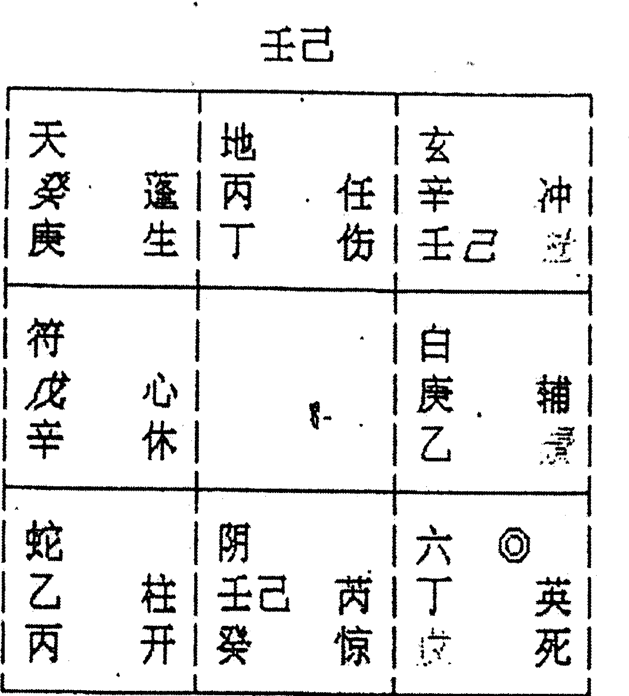

女的当面问：老公的情人怀的孩子是打掉了，还是根本就没有怀？预测师为女。

请大家按这个问话：
1. 找老公的情人的用神。
2. 找求测人的老公用神。
3. 找求测女人的用神然后再预测下是否怀孕的事情。

解答：
1. 首先，女士的主题是问情敌，所以第一个问题是围绕情敌为太极点，所以，情敌不在，用神用月干，和预测师相同性，用神就是乙了。
2. 看是否怀孕，主要是看情敌和女士老公是否怀孕，所以势必要把男的找出来，这个时候，男的是是以情敌的情人身份出现的，而绝对不是这个女士的老公身份的，所以，按照情人系统，乙的情人就是丙！
3. 女士又看和自己男人是对立敌对的关系，所以用神是己无可置疑！看是否怀孕，在关键在情敌的情况，看她本宫，临蛇，乙丙，阴干辛，说明怀孕的事好似魔术会变的，艮宫符号乙，丙像个大肚子，可惜临蛇和辛，都是魔术出来的，再看时干冲克她，又临玄武，双是阴干符号乙，意喻：大肚子的事，地盘壬、己肚子瘪下去的，对宫是修饰、限制和补充本宫的，也就是综合起来就是：她装大肚子有哦，实际肚子是瘪的。反馈：没有怀孕。男的要离婚（女士和自己老公宫位对持），你和情人（男人宫位生情人宫位，符号相同，很亲近）有小孩了。女的以前和情人正面交锋过（女的宫位前翻，面对情人）。

##### （二）用神的层次和定位顺序

取用神的四个层次：四柱为第一层次；宫位为第二层次；六亲为第三层次；星门为第四层次。

第一层次四柱，就是四柱有的先找四柱。把求测者一上来就问测的用神肯定在四柱上；第二层次是用神宫位的对宫和天地盘翻宫，就是四柱没有的就从这里找；第三层次是根据和用神的生克关系产生的十神六亲系统，第一第二次没有时再从这里找；第四层次是独立的门星系统，它在干以外符号产生，这类独立用神较少。如问那个唱歌的如何？如果月干已经用过则直接用惊门；企业策划时如果在预测中问技术科工作如何直接用杜门等等。用神层次的定位取决于被测事物的先后和前边已经使用过的用神。如前边讲过的技术科的定位，如果老板上来就问我公司的技术科如何？则整个盘都是技术科的信息，日干就是技术科。那技术科就成了第一层次的用神了。如预测整个公司情况，中间问技术科的情况那就直接以杜门为用，这就属于第四层次了。阴盘奇门没有绝对的东西。整个预测过程都是相对的。用神的选择也是如此。学阴盘奇门首先要有辩证法的思想。

##### （三）用神使用的规则

第一、一个符号包括干门星和对宫等在本局只能用于测同一落畴之内的事。如时干儿子，是日干或月干这个被测者第一次测儿子时的用神。这句话有两个含义：一是时干这个字是日干或月干的儿子，而不是所有所有人的儿子。别人用此局再测儿子必须用别的系统和层次定位他的儿子；二是时干是求测人第一次问的那个儿子。此时时干也可是求测者的大儿子，也可能是二儿子或三儿子，而不是他所有的儿子。如果第一次测的是他的大儿子和三儿子，则测他的二个儿子要用第一个儿子落宫的地盘翻宫（第一个儿子的弟弟）或天盘翻宫（第一个儿子的哥哥）；月干为日干的第一个对手，第二个对手看日干落宫的对宫。年干如果你已经用作奶奶了，则决不能再在同一局作为妈妈的用神。妈妈的用神就要用十神关系来选。用神的层次是相对的，在此局是第一层次用神，在彼局则可能就是第二第三乃至第四层次用神了。

第二、月干为对手为朋友为同事，如果月干已经用过再问另一个对手如何就以对宫为用神。如测我的第一个朋友看月干，第二个朋友直接看对宫。单宫断时用神的地盘干翻宫为对手用神。

第三、在网上求测时，如果求测者已经起好盘来测，则此时预测师帮助预测只是为求测人解盘而已。所以这种情况的预测日干为求测人。

第四、预测不牵涉六亲之类的事时，如测车子丢了能找回否等等，全部以时干为这件事。有时还需再找一个更能体现这个事的具体用神，如测美容用玄武，就是制造假的漂亮；测开车看伤门等。

例如预测想养鸭子，看今年能成否？找用神首先要编辑问话。问话“成”的编辑有两个概念，一是养鸭场能不能办起来，二是能不能赚钱。也就是第一层次和第二层次的用神。人在用日干，人不在用月干。一件事能不能成，若用神是日干，时干生日干则成，但日干状态不好也不成。若日干克时干，是表明想办成这件事，但要看日干宫的能力和状态。若时干克日干则绝对不成。两宫相生也必须有相同符号。

第五、预测师测自己的事以日干为用神，测自己某一个六亲或其他人的事时以月干为用神。

第六、阴盘奇门所取的用神在纲上发力特别大，如果不在年月日时上发力比较小。看一个问题重要还是不重要，要看这个问题在不在纲上，这个纲就是指年月日时。如果测一个事情能不能成，如果用神在纲上能成，如果用神不在纲上成功率就下减。而且任何一个事物都和纲比较才能够确定一个事物的好坏。预测一个事情的成功与否遇击刑、门迫只是难度加大了。

其实，取用神时方法很多，要善于捕捉信息，灵活运用。有时可以方位取用神：如同时来了几个人，用同一局来测，可根据求测人所在落宫位置选用神。在何宫，何宫的天盘干就是此人。

还可以用年命落宫取用神：一个人或几个人来测，可根据求测人的年命落宫选用神。年命落在何宫，何宫的天盘干就是此人。方法是以自己的出生年命进行查找。

| 年命 | 庚 | 辛 | 壬 | 癸 | 甲 | 乙 | 丙 | 丁 | 戊 | 己 |
|------|----|----|----|----|----|----|----|----|----|----|
| 生年 | 0  | 1  | 2  | 3  | 4  | 5  | 6  | 7  | 8  | 9  |

凡是0结尾的年份出生的年命是庚，如80年、90年等。凡是1结尾的年份出生的都是辛，以此类推……

比较急的事可以用马星取用神，还可以用时间落宫取用神等等，善于捕捉，灵活运用。

例如：男当面求测

公历 :2008年11月2日8时0分
农历 :2008年十月初五日
四柱: 戊子 壬戌 丙午 壬辰
节气: 霜降～立冬 月将: 卯 阴遁3局
值符:天蓬星落8宫 值使:休门落2宫
时空亡:甲申旬 午未 空 马星 寅

庚

| 地 戊 乙 冲 涣 | 玄 ○ 乙 辅 辛 开 | 白 ○ 辛 己丙 英 休 |
| 天 壬 任 戊 死 | | 六 己丙 芮 癸 生 |
| 符 壬 景 蛇 丁 庚 杜 | 阴 癸 丁 伤 | |

此男先问自己的事业如何，日干丙为自己落兑，对宫震宫是对自己的补充说明和限制；时干壬为事业落巽宫，对宫乾宫是对自己事业的补充限制和说明；如接着问我的婚姻如何，则日干丙为自己，和日干相合的辛为妻子或女朋友；丙落宫的引干辛和妻子是一个字不为外遇的用神，地盘丁为外遇的用神；如问我的姐姐如何则月干癸为姐姐落坎宫；再问我父亲如何则年干戊为父亲落震；如接着问我的儿子如何，时干没用测儿子，则时干壬为儿子。

如接着问我的大领导如何，也看年干，虽然看父亲用过年干，但父亲是亲属关系，领导是事业关系，不是一个系统的六亲，仍可用。以上六亲都是从四柱上直接落宫的，是第一层次的用神。

如何我的直接领导如何则不管什么时候问都是值符；如接着问我的奶奶如何？年干是父亲，奶奶就不能从年柱系统产生，而是从十神六亲系统找。父亲是戊，奶奶就是生戊的又是和戊异性的丁；如接着问我岳母如何？年柱此时已经用了，岳母只能从十神六亲系统定位。妻子是辛，生辛者戊己，己和妻子同性，所以己是岳母；如果问我大领导的对手如何？则看戊土落宫震宫的对宫，大领导对手属于第二层次的用神，只能在盘里找；再问我的小儿子如何，则看时干壬的地盘翻宫，翻到震宫已经用过做父亲了，父亲和儿子属于一个系统的六亲，不能再用了，二儿子则按转宫的方法找用神，如人在现场深挖到离宫等。取用神总的原则一是道法自然，符合生活常理，二是符合阴阳关系。

### 第三节 用神转宫

转宫就是部分信息的转变，就是用神的状态方位时间发生相对的转变。但原来所在的宫位是他的种子。虽然转宫，他的基因还在原来的宫。预测时必须原来的宫的基因读出来。把转宫的痕迹翻译出来。如你和配偶干落一个宫，可断你和配偶的关系原来是不错的。如果转宫以后日干克配偶，则为你现在想管束她，如你坐下临壬，就是你想离开她。你的引干符合若外遇规则，那外边又有女朋友了。

- （一）用神空亡后的转宫。

空亡转宫分两种情况，深挖（从先天宫转往后天宫）和漂移（从后天宫转往先天宫）。

一个人在求测时，有时是当面问自己事，有时是通过电话信函网络等方式问自己事或在预测师面前问不在预测师面前人的事。这就出现了被测者在预测师面前和不在预测师面前两种情况。

1. 当面预测用神落宫空亡时，从先天宫转往后天宫。即先找出这个宫原来（先天）是什么？转到现在（后天）代表原来的宫位上。
2. 求测者不在预测师面前或在预测师面前问的是不在预测师面前人的事，遇到用神落宫空亡时，从后天宫转往先天宫。即找出现在（后天）这个宫是什么？转到原来（先天）代表的宫位上。
3. 两个用神落同宫空亡时，人在，第一个为阴，先天转后天（深挖）；第二个为阳，后天转先天（漂移）。人不在，第一个为阳，后天转先天（漂移）；第二个为阴，先天转后天（深挖）。此时要一定注意求测者与被求测者的阴阳问题。

- （二）多个用神落同宫时的转宫。

同一范畴内，如两个用神落同宫，则看第二个用神时，第二个用神必须要转宫（包括两个人或人和事同宫时）。一律按后边转的必须和前面转的相反的规则处理。就是人在，第一个为阴深挖，则第二个为阳漂移。人不在，第一个为阳漂移，第二个为阴深挖。一阴一阳，……依此类推。

例：

**公历**: 2010年4月19日20时0分
**农历**: 2010年三月初六日
**四柱**: 庚寅 庚辰 己亥 甲戌
**节气**: 清明~谷雨 **月将**: 戌 **阳遁5局**
**值符**: 天心星落6宫 **值使**: 开门落6宫
**时空空**: 甲戌旬 申酉 空 **马星** 申

癸 马
白 | 玄 | 地 ◎
乙 辅 | 壬 英 | 丁戊 芮
乙 杜 | 壬 景 | 丁戊 死
六 | | 天 ◎
丙 冲 | | 庚 柱
丙 伤 | | 庚 惊
阴 | 蛇 | 符
辛 任 | 癸 蓬 | 己 心
辛 生 | 癸 休 | 己 开

戊 | 乙 | 壬 丙己 辛 庚

男面测婚姻。此局伏吟，说明婚姻不顺。日干己落乾宫，老婆甲和自己同宫。看老婆时需要转宫，求测者人在为阴，老婆为阳，看老婆需要转宫则漂移到离宫克乾，说明关系已经很紧张了。乾宫引干庚为外遇的符号落兑宫，虽空亡但年月填实，说明已经发生了的事，有点此地无银三百两。转宫到巽宫（漂移），离日干最近，是下一个要结婚的人。

##### （二）日时一体的转宫。

- 1. 日时或月时同宫且天地盘干相同时为事被压在人的下面，此时时干事转宫不管人在与不在一律深挖。（不管求测人在不在，所预测的这件事（时干）和用神宫同宫时，看时干宫时都是用先天转后天的方法转宫，转宫后的宫就是（时干）这件事的宫。）
- 2. 日和时或者月和时同宫，时干为人的用神空亡时，转宫和日或月干用神的转宫方向必须相反。即前面的为阴深挖，则后面的为阳漂移，前面的为阳漂移，则后面的为阴深挖。
- 3. 时干为事体时，空亡转宫再落空亡就不再转。人的用神空亡转宫再遇空亡时也不需转，但像意是空的，读像意要转宫。

##### （三）伏吟局的转宫

伏吟局转宫，是为了增大信息量，实际上伏吟局符号相重信息量小，与空亡转宫相同，方法是：看以前的事，人在先天转后天（深挖），人不在后天转先天（漂移）；看以后的事，人在时后天转先天（漂移），人不在时先天转后天（深挖）。人在深挖是结果，漂移是过程。人不在漂移是结果，深挖是过程。

##### （四）阴盘奇门的翻宫

- 1. 奇门起局后，用神落宫反映的是当前的状态。用神此前和以后的状态又如何？这就需要用翻宫法来测查。用神天盘天干落宫翻为地盘落宫就为用神以前的状态；用神天盘天干所临的地盘天干翻为天盘天干落宫即为以后的状态。如此可向前翻三步，向后翻三步。但在实际预测中，一般只用一步，很少用第二步第三步的。
- 2. 当一个求测者先问弟弟，又问哥哥，还问姐姐，再问妹妹，就用月干的天地盘翻宫到地盘相同的符号的天盘宫去看。即第一个问的弟弟则月干就是弟弟，又问哥哥，弟弟的落宫天盘干翻宫落宫即是哥哥；还问姐姐，哥哥天盘干的异性就是姐姐；再问妹妹，姐姐落宫地盘干翻宫即是妹妹。以此类推，此是不分阴阳一个一个看。测朋友也是一样，往下翻可以测多个朋友，首个要分阴阳。
- 3. 反吟局在阴盘奇门里无特殊意义。遇反吟局如人在看日干，第二个人翻宫，第三个人深挖，第四个人再翻，第五个人再深挖。人不在而前测的就漂移。

### 第四节 用神与预测的若干关系

第一、用神和求测者问话的关系。求测者的问话是盘的来源，也是取用神的依据。问话就是混沌之气，就是无极。求测者问话的次序就是太极层次的次序。预测师必须编辑求测人的问话的重要性就是这里。他第一句话就问儿子如何，则整个盘都是儿子的信息；如果问了别的事再问儿子，则只能单宫断。所以一定要弄明白他问话的意思。第一个层次的用神从四柱来，然后根据他的问话依次排列。用神是预测的方向盘。预测师给神像开光后测神佛在位否，取日干为用神即可。用神错了整个预测都错了。

第二、用神和同宫的地盘干的关系。用神宫位的天地盘干就是一对阴阳关系，天为阳，地为阴。所以，能直接看到的表面现象就是天盘干，地盘干是天盘干的内涵，是对天盘干的修饰说明，做天盘干谓语的。大家都知道你的技能就是天盘干，但你真正的强项却是地盘，这是大家不知道的。天盘干可以打开看，地盘也要打开看。天盘干是事物的外在形式，地盘干是事物本质。他们之间互相补充说明。像意的组合法则也是这种关系。当说地盘时，天盘是修饰地盘的，当说天盘时，地盘是修饰天盘的，因为他们对立统一，互根互用。所以可以相互的读，相互的修饰。

第三、用神和对宫的关系。本宫和对宫是一对矛盾，本宫阴，对宫阳。阴阳互相说明补充的程度大于天地盘干。对宫击刑门迫临值时自己就凶，就是因为对宫是自己的一部分。像意也是如此，自己宫位的像意很好，对宫凶来冲时这个像意出问题了，也是这个道理。

第四、用神和引干的关系。用神和引干这对矛盾的范畴大小是介于天地盘干、对宫与本宫之间。在这几对关系中，最小的范畴是天地盘干，它们仅限于宫内而言；第二个是引干和宫内的符号；第三个是本宫和对宫的关系，这都是合二为一的关系。还有是一分为二的关系，就是把天地盘打开。单宫断时引干也可以打开。

看。

引干是什么？就相当于人体连接脏腑四肢百骸以及皮肉的内部结构的经络，从九宫说它就是通道，从内向外的通道，也是从外向里的通道，同是也是一个宫位的标识。如一盒烟，外边写的牌子就是引干，里边的烟就是宫位的符号组合。所以看了引干就知道宫内的内容了。引干的这些特性是并列的。为什么情人系统要看引干和地盘？情人系统是家里有一份情，外边又有一份情即情人。和外边联系必须要有通道，这个通道就是引干。地盘所以是情人是因为她深埋在心灵深处，不对外说的秘密，是天盘干的一份爱好。如果引干地盘有这些因素，就具备了做这种事的内涵，再看网络因素：引干或地盘干翻出来后和本宫相生或符号相通很多，或靠得很近，或没有空亡，有空亡就是暂时没有，有想法暂时没找到。没有击刑，有击刑就是有想法不灵。引干和本宫比为阳，它的功能就是把阴的东西引出来。尤其是疾病，它是整个疾病包装后一个标志。

##### 第五、用神和时干的关系。

时干是由日月所生，是通向九宫的关卡。时干为什么是事业？因为它是你生的。是你的产品，你的策划，你的能力付出等等，这些都是你事业的标志，所以时干为事业。时干是表达事物发展的重要元素，是所有预测事物的准星。测一件事要三个点定一线，时干就是准星。用神宫位和时干是什么关系，用神为阴，时干为阳。先看用神宫有什么能力性格，再看他做时干宫的事是否符合，是否阴阳相合。就是看他们的生克关系和符号相同情况。如果时干宫克日干宫做起来就很难。这是是关键是看平衡点，就是两宫是否有相同符号，就是用神宫的性质去做时干宫这个事是否符合。相同符号越多，说明时干这个事越适合日干的性格能力，专业越对口，越容易成功。如果没有相同的符号，时干又克你，那就说明你当前的工作你是外行，根本不熟悉这个工作或没有这个能力，根本干不好；时干克日干但有相同符号，那就是熟悉这个事，能干这个事，但运气不好；时干生日干没有相同符号说明虽然你不熟悉这个工作但还是能干的，运气好。用神宫位和时干宫位的生克关系是事情成功的重要因素，但不是唯一因素。时干是一种前景，得时干生比，或和时干宫有相同的符号格局又好，那就是有发展前途。

用神和时干的关系比用神与对宫的阴阳关系比起来范畴要大。对宫是对用神宫本身的限制和说明修饰补充。时干和用神的关系就是对事物发展的前途做一个比较。一般的用神宫位是生时干的，所以时干表示用神今后发展的趋势如何。而对宫就是对用神宫位直接的补充限制说明，如行为举止等。如果时干生日干就是下坡，很好走；时干克制日干是上坡，很难走。就是说日干有没有这个能力走这个坡。

时干克日干，也可用泄时生日的宫位来通关。如兑克巽，用坎通关。假如时干就在对宫，因为对宫和日干用神是人民内部矛盾，它和本宫可合在一起与时干形成阴阳关系。时干落对宫时，它和日干既是对宫关系，又是日时关系。此时断事往近的地方跑。对宫是最直接的。对宫无问题来冲肯定成；对宫有问题来冲，是对方拿着刀到家来杀我。因为有问题冲我我肯定受伤。

##### 第六、和用神同干落宫的性质和时间的关系。

用神宫和其他宫有相同天干时有什么联系？相同的干就是相同的基因，就是有相同的信息。如你在离宫是乙和辛，地盘乙在兑，同样在兑宫的时间你也会做离宫的事。再如戊，戊为赚钱能力，离宫有戊，戊为生意。兑宫地盘是戊，问这个生意什么时候能做？那也可以断兑宫，在兑宫的时间里你就能做财的事。因为兑宫有戊这个相同符号。相同字的落宫时间也会发生用神宫位相同符号的事情。如用神宫位的戊在巽宫，兑宫也有戊，尽管两个宫位相克，但照样在兑宫时间会有戊方面好事即得财，因为有相同符号。但是，如果这个符号击刑门迫，如戊在震肯定会在此时间破财。如戊在兑宫，酉月也会破财；或在其他宫照样破财，为什么？因为格局凶，基因不好，遗传不好。地盘干有病了，相同的天盘干也会有病。所以我们在看相同符号时关键要看宫位的格局。

##### 第七、用神和月干的关系。

如果用神是日干，则日月就为一对阴阳。日月同辉，它们并起并作，互为对手，它们是兄弟姐妹，朋友，一对对立的矛盾体等。这个人到底当了多大的官，你要看他的月干怎么样才能定。因为月干是他的对手，也是对他能力的间接说明。自己宫位很好，月干很不好，就像一个大乞丐比一个小乞丐一样，哪能好到哪里去。能和市什闹一场的人绝对不是等闲之辈。这非常重要！宫位的比较是很厉害的。临九天本来高，但往往他很矮。错在哪里？你没有看参照物！如他的月干和对宫等。参照物——月干对宫！你如果克值符制约值符你就很厉害了。你把值符克住，说明直接领导听你的。值符生你是说明直接领导来帮你忙，但你没他大。你比他大和你没有他大是完全不同的性质。

##### 第八、用神和年干的关系。

如果说问话是无极的话，那年干是太（少一句）如果年干宫位好，和你比合或生你，或你和年干宫有相同符号，则你今后就有发展的资本了。

##### 第九、先后天的关系。

先天为体为阴，后天为用为阳，是一对矛盾体。先后天是事物发生质变的两个端点，是事物发展的极限，是完全不同的两个范畴。奇门的伏吟反吟局中用神变化渠道很少，一般主要靠先后天宫位的变化。先后天可以看成两个世界。两个人同宫转官要背道而驰，因为两个人肯定一个是阴一个是阳，所以她转阳，你转阴。空亡是先后天变化的通道，因为空亡转宫不是先天就是后天。

##### 第十、用神和空亡的关系。

空亡是阴阳能量转化的空间和通道。断空亡一定要看空亡宫是否有四柱上的符号在填实。空亡宫有四柱上的符号在填，一定会有此符号本宫方面的事情。如果没有，就可以把这个符号转宫描述。空亡还有一种形象的表达方式，那就是动。无论怎么转宫，都要把转宫这种像读出来。空就是曾经。如果测事业日时都空肯定要干新事了。空亡转宫，空的宫是阴，转到的宫是阳。

### 第五节 万象取用神

#### 一、求财、看事业

- 1. 当面问测：首看日干落宫——天时；次看时干落宫（平台）——地利；再看月干落宫（竞争者）——人和之内因；后看年干落宫（大气候）——人和之外因。
- 2. 电函问测：首看月干宫——天时；次看时干落宫（平台）——地利；再看日干落宫（竞争者）——人和之内因；后看年干落宫（大气候）——人和之外因。

#### 二、求官

- 1. 当面问测：首看日干落宫——天时；次看时干落宫（平台）——地利；再看年干落宫（大气候）上级——人和。九天、太阴、值符有临则升迁，临马星则升迁速度快。
- 2. 电函问测：首看月干宫——天时；次看时干落宫（平台）——地利；再看日干落宫（竞争者）——人和；后看年干落宫（大气候）上级——人和。还要看日干与时干落宫是否九天、太阴、值符有临则升迁，临马星则升迁速度快。

#### 三、阴宅

看七杀落宫，有时兼看死门。

#### 四、阳宅

长期住或租住房看正印落宫；临时住或门面房看偏印落宫。

#### 五、公司

首看用神落宫，兼看财的落宫。员工测自己上班的公司，看官的落宫。

#### 六、看生男生女

1. 男孩看用神宫的丁，女孩看用神宫的癸。若丁、癸同宫，则以地盘干定男女。
2. 若用神宫里没有丁或癸，则看时干和日干的阴阳，同者为同性别，异者为异性别。
3. 若丁、癸为四纲，则应期快，不在四纲或四支上，则应期慢。
4. 孩子数量是孩子落宫之数。

#### 七、婚姻

先看双方落宫，是否为同气、是否有先后天经。是否有相同符号、是否为寄宫符号，或临值符、丙、丁、乙、辛、庚（坏信息），是否临六合，相合的天干（好信息），后看各自的情人或恋人与自己的落宫是否有先后天关系、是否有相同符号、是否为寄宫符号，或临值符、丙、丁、乙、辛、庚。

#### 八、看前世

将自己的落宫先天转后天，后天宫里即是前世的情况。

#### 九、看调动及出国

看调动有两种情况，一是自己想调动，二是被上级调动。首先看用神落宫是否临马星、壬、癸，临之则动，不临则不动。临马星是自己想调动，临壬、癸则是被上级调动。

#### 十、看开厂

找正财落宫。

#### 十一、出行

看时干之平台落宫好坏，兼看是否临白+庚、白+伤，有者则祸，临马必动。

#### 十二、疾病

先看六亲宫好坏，次看能反映疾病具体情况的宫，再看与疾病有关联的人体部位相对应的宫。医生为七杀。

#### 十三、买房

长期住看正印落宫，短期住看偏印落宫。

#### 十四、店铺

人进住后，看正财落宫，人没有进住看偏财落宫。

#### 十五、测老板办公室的办公位置

看值符落宫。

#### 十六、看学习好坏

先看日干宫，后看学科落宫，再看竞争者月干宫。

#### 十七、人的寿数

看此人的落宫能量大小，能量小寿命短，反之寿命长。

#### 十八、天气

首看所关心的这天日支落宫，后看这天某个时辰的落宫。

#### 十九、行人走失

先看走失的六亲的落宫，后看走失之人的先天卦对应的后天宫。

#### 二十、失物被盗

先看日干落宫，后看时干落宫，兼看玄武落宫。

#### 二一、赌博、讨账

先看月干（对方）落宫，兼看伤门落宫，后看日干落宫。

#### 二二、看票据

看正印落宫。

#### 二三、看股票

先看日干（股票）落宫，后看时干（平台）落宫，在看年干（大趋势）落宫，看“戊”资金情况。

#### 二四、看晚辈

找时干，兼看六亲的食伤宫和丁的落宫，此时平台为日干。

#### 二五、看文昌

找食神。

#### 二六、职业八门

- 生门：养殖、自然生机产业。
- 死门：屠宰、不动产（如房地产）、制止生机的产业。
- 惊门：声响、音乐、音响、声音、响动的产业。
- 杜门：技术、独一无二。
- 休门：美容、娱乐场所、休闲产业。
- 伤门：捕鱼、捕猎、公检法部门、获取的产业。
- 景门：表演、装饰、华丽产业。
- 开门：生产、开发产品、运动、运作产业。

### 第二章 预测防护

#### 一、入局

入局是指预测师起局后进入奇门局对某一人或事进行预测或调理的过程。求测人当面预测，月干是预测师，非当面预测，日干是预测师。当预测师起好局进行预测或策划时，天人合一，实际上预测师就已经完全进入了这个局中，在预测师进行宫内符号、像意的分析和策划过程中，符号像意的好与坏都会和预测师产生共振，如果遇到好的局，进入局中，可以吸收好的信息能量，对预测师本人的运气等也是一种提升。如果遇到坏的局特别是预测调理疾病时，局中的不良信息会不同程度地对预测师产生作用，时间越长，产生的作用就越长。

- 公历：2014年1月13日16时51分
- 农历：2013年腊月十三日
- 四柱：乙丑 甲申 壬申 辛亥
- 节气：小寒～大寒 阳遁7局
- 值符：天芮星落1宫 值使：死门落9宫
- 时空亡：甲辰旬 寅卯 空 马星 巳

| 马 | | 辛 | |
|---|---|---|---|
| | 六 辛 丁 蓬 景 | 白 己 庚 任 死 | 玄 癸 壬丙 冲 惊 |
| 乙 | | | 己 |
| | 阴 乙 癸 心 杜 | | 地 丁 戊 辅 开 |
| 戊 | | | 癸 |
| | 蛇 戊 己 柱 伤 | 符 壬丙 辛 芮 生 | 天 庚 乙 英 休 |
| 壬丙 | | | 丁 |
| | | 庚 | |

此局只要进入兑宫成为丁奇，就能很快获得能量，首先定下官位，对应房间风水，在西边地上放丁的东西，穿红色内衣，烧个丁奇符，甲子戊符，念丁奇咒，就能获取能量。

#### 二、出局

出局是指预测或调理完毕后，预测师的意念和产生的频率离开奇门局时空的过程。出局的目的是为了隔断预测或调理时的不良信息，就是看了别人的坏局，预测调理完毕后，必须要从坏的信息中走出来，否则，吸收坏的信息过多，不和道出局，就会产生副作用，对预测师的运气产生影响。此也是预测师自我保护的一种主要方法。

方法：就是再选择一个好的刻局，然后进入这个奇门局中，对好的宫内符号像意进行分析就可以了。

#### 三、定局

就是把一个局的信息稳定下来，时空停下来为我所用。就像一辆车跑着不好修，让它停下来再修理，他是处理奇门局前必须做的一项工作。其方法是任意选择2个没有“四害”的官位，然后进行化符。有奇先化奇，无奇化六仪。这样这个局再处理就灵验多了，吉利的能量就会加大，坏的能量就会减少。

例如：

公元：2014年1月13日19时56分 阳4局
农历：蛇年12月13日19时56分 刻盘
干支：癸巳 乙丑 甲申 甲戌 庚午 （戌亥空）
直符：天辅 直使：杜门 旬首：甲子戊

|          | 白 | 玄 | 地 |   |
|----------|----|----|----|---|
| 亥 乙 开 | 庚 心 戊 惊 | 丁 蓬 癸 开 | 壬 任 丙己 休 | 卯 癸 满 |
| 戌 壬 收 | 辛 柱 乙 此 |   | 乙 冲 辛 生 | 辰 己丙 平 |
| 酉 丁 戌 | 丙己 茴 壬 景 | 蛇 癸 英 丁 杜 | 符 戊 辅 庚 伤 | 巳 辛 定 |

> （醉易：上面这个局好象不对）

分别在兑宫烧乙奇符，在坎宫、离宫烧丁奇符，这样就是定局。

#### 四、封局

对于大的疾病、官灾、阴性的物质，一定要封局。不封局起完局后，阴性物质就会通过局眼反射出来，产生不良影响，人就会有不良感觉。所以我们起完局后一定要封局，要把坏的信息封住，不让其影响到自己。

其方法是：左手天罡，右手剑摩，以右手剑指空书四纵五横，口念奇门九字摩，最后再在中间以意念。如下图：

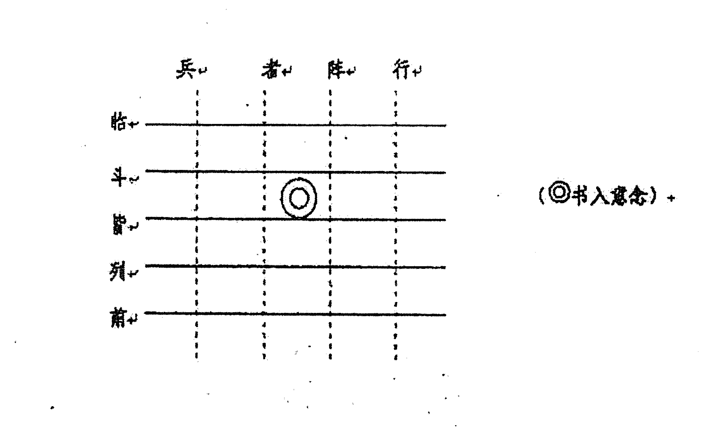

#### 五、量局

风水调理必须吸收能量才能进行。“量局”，就是风水师进入局中吸收能量，使风水师自身在风水调理过程中具有强大的宇宙能量，从而达到风水调理的目的，特别是在给别人催财、催官时必须要入局吸收能量。

例1：

公历：2014年1月14日15时3分
农历：2013年腊月十四日
四柱：癸巳 乙丑 乙酉 甲申
节气：小寒~大寒 月将：丑 阳遁5局
值符：天柱星落7宫 值使：惊门落7宫
时空亡：甲申旬 午未 空 马星 寅

```
丁

玄     地 ◎     天 ◎
乙 辅  壬 英   丁戊 丙   乙庚
乙 杜  壬 景   丁戊 死

白     符
丙 冲  庚 柱    壬
丙 伤  庚 惊

六     阴     蛇
辛 任  癸 蓬   己 心    辛
辛 生  癸 休   己 开

马     丙
```

日干在巽宫，没有问题，玄武的能量很强，时干生年干，年干在坎宫又生巽宫，巽宫能量很大。入局、定局、画乙奇符、念乙奇咒，天人合一，自己就是乙奇，然后再给别人调理，必能达到理想愿景。

##### 例2：催财局

公历：2014年1月28日21时24分
农历：2013年腊月廿八日
四柱：乙丑 己亥 乙亥 戊寅
节气：大寒~立春 阳遁7局
值符：天任星落7宫 值使：生门落3宫
时空亡：甲戌旬 申酉 空 马星 申

| 辛 | 马 |  |
|---|---|---|
| 玄 戊丁 柱 伤 | 地 乙庚 心 杜 | 天 ◎辛 壬丙 蓬 景 | 己 |
| 白 壬丙 癸 生 | 空 | 符 ◎己 戊 任 死 | 癸 |
| 六 庚己 英 休 | 阴 丁辛 辅 开 | 蛇 癸乙 冲 惊 | 丁 |
| 庚 | | |

坎宫太阴是佑护之神，丁奇坐财，很快会达到。

调理：子时在坎烧丁奇符4道，在下身点一个红色的点，坎宫北面贴一女明星的画，烧香4根。

#### 六、纳壬放癸

地球是由70%的水组成的，人是由70%的水组成的，人与地球共振，去客户家调理风水一定要喝房间的壬水，达到与地理沟通的目的，壬水就是白开水或房间的矿泉水，不要放茶叶，无色。因为在预测调理过程中会进入局中，吸收不好的信息场，所以结束后要放癸水，癸水就是小便，在其家马桶撒泡尿，念声六字大明咒再走。用于保护自己，切断信息源。

### 第三章 健康预测

用奇门预测疾病，用神宫的能量高低是判断是否有病的唯一标志。

- 1. 凡局中，“能量降低”之宫，均为有病，尤其是“四纲”之宫。特别是能量受损的“四纲”宫再临芮星必有病。
- 2. 疾病的根源是“四纲”宫的先天宫受损。
- 3. 久病怕反吟，近病怕伏吟。马星主快慢，隐干是病之导火索。
- 4. 若用神宫临乙、心，则治病有方。若用神宫能量低，临白+庚、杜+庚、白+杜则为顽症。临伤+开，开+辛+丁则为动手术。若用神能量高，临芮+马、芮+壬、癸，若再临震宫，则病愈的快。
- 5. 丙、丁、景代表炎症；乙、心为医生或医药；蛇、反吟为病变来变去，反复不定；伏吟、九地、死门为病情稳定。天+壬、癸为血压高，地+壬、癸血压低，丙、丁、壬、癸+冲为脑溢血等。
- 6. 找克制天芮星的宫位既是医治病的方位。

#### 具体一般步骤

- 第一步：编辑问话，选用神。面测，看日干宫兼看四纲宫。电函测，看月干宫兼看四纲宫。为其他人预测，被预测人不在面前看月干宫或看年命落宫，在面前看日干宫。如果预测人知道身上有病，问看看我的病如何？就直接看天芮星落宫；如果预测人想看看健康情况，可直接看年命落宫的情况。
- 第二步：分析宫的能量高低，能量高低主要是指宫内有无“四害”。先看用神宫，再看用神宫所对应的先天宫，后看四纲宫。能量高则病可愈，能量低则病不是好或难治。
- 第三步：分析用神宫中的符号组合。若宫的能量低，又临芮星定有病。若临芮星+心+乙则病可治。若宫的能量高，再有其它纲上的宫来助，既是临芮星病也可治。
- 第四步：分析用神宫是否伏吟、反吟（干或门）。若用神临伏吟则病情稳定。临反吟则病不稳定，忽好忽坏。
- 第五步：看用神宫是否临马星，临之则病愈快或死亡快。
- 第六步：分析病期情况，用神宫非冲即填为应期。
- 第七步：分析病情之调理。对有损的用神宫尤其是用神宫的先天宫，先移星换斗，再对问测人进行“行为风水”指导，后实施“环境调理”。

例：一男人来店预测说：我有个女同事，1974年生人，你看看她身体怎么样？

公历：2013年9月7日10时34分
农历：2013年八月初三日
四柱：庚申 丙子 癸巳 辛酉
节气：处暑～白露 阴遁6局
值符：天蓬星落3宫 值使：休门落3宫
时空亡：甲寅旬 子丑空 马星 亥

| | 天/地/玄 | | 天/地/玄 | | 天/地/玄 | |
| :--- | :--- | :--- | :--- | :--- | :--- | :--- |
| 庚 | 丙庚 | 任生 | 辛丁 | 冲伤 | 庚壬己 | 辅蛇 | 壬己 |
| 辛 | 符癸辛 | 蓬休 | | | 白丁乙 | 英景 | 乙 |
| 丙 | 蛇戊丙 | 心开 | 阴乙癸 | 柱惊 | 六壬己戊 | 内死 | 戊 |
| | 癸 | | | 马 | |

74年生人直接看震宫，震宫没问题，但对宫是本宫的补充说明，兑宫有问题，临白虎，门破。震宫引干辛在离，伤门，击刑。病星在乾，入墓、临死门和辛先后天关系。主要原因就是辛，辛就是肿瘤，女人乳房上长了一个很大的肿瘤，身体出了大问题。

我对男人说，女人不光是乳腺有问题，妇科也有问题的，医学上，女人妇科和乳腺是相通的，一方出问题，另一方也要注意的。局中显示，乾有问题，坤也有问题，所以，女人妇科和乳腺都出了坏的信息。

男人问，动手术会不会出情况呢，手术的信息在离也在兑，有伤门和白虎，那么手术会出点麻烦。

男人问，可以不可以通过自己给女人化解？不可以。因为一是男人和女人不是夫妻关系，二不是亲人关系，所以男人起局给女人处理信息就弱，而且还会把不好的信息加给男人。可让其本人直接打电话起局，然后根据局进行化煞处理。

### 第四章 婚姻预测

用奇门进行婚姻预测时，一般是成者合，败者离。所谓合，就是配偶两宫的## 第二十二章 婚姻预测

婚姻预测，看配偶两宫能量。所谓成，就是配偶两宫能量均高；所谓败，就是配偶两宫能量较低。婚姻质量，取决于用神及其合干两宫能量的悬殊、符号组合搭配的好坏、是否存在先后天关系等。

具体预测时，首先要明确找对象、谈恋爱、结婚后、离婚后等几个阶段。

- 第一步：编辑问话，选用神。当面测，日干为自己，合干为配偶；电函测，月干为自己，月干合干为配偶。为其它人测，人不在用月干或用年命落宫取用神，合干为其配偶。
- 第二步：分析用神落宫能量。两宫能量大，则婚姻越牢固、越和谐、婚姻对象越稳定。两宫内有相同符号最关键，你中有我，我中有你。
- 第三步：分析宫内符号组合。若用神宫临六合，或有相同符号或有先后天关系，则婚姻顺利。若用神宫出现伏吟或反吟，则婚姻不顺。临空、乙、丙、丁、值符、杜门、庚、辛、寄宫符号等，则婚姻定有周折。
- 第四步：分析多婚现象。若两宫中其中一个宫存在寄宫符号，或临丁、芮等，或用神伏吟则多婚。
- 第五步：分析婚姻突变。若两宫能量低，其中一宫临驿马、天马或壬、癸、九天及冲格，则婚姻突变速度快。
- 第六步：分析情人系统。情人系统分两种情况：一是乙、丙、丁是情人系统的特定符号。凡引干或地盘干临乙、丙、丁的说明都有情人。二是引干和地盘不是乙、丙、丁，但符合以下条件的也有情人。
    - 一是被测者引干及地盘干同时或一个落在被测者落宫的对宫或时干的对宫，并且被测者落宫和他的引干或地盘干的天盘落宫格局都吉，就表示被测者会有情人。
    - 二是被测者引干或地盘干天盘落宫不在被测者落宫的对宫及时干的对宫，在相邻的宫。并且两宫格局吉又是相生的关系，也说明现在有外遇。
    - 三是被测者落宫与他的引干或地盘干的天盘落宫两宫离的比较远，但两宫相生格局又吉，也可能有情人，但处起来不象两宫距离近的来往多。
    - 四是被测者落宫与他的引干或地盘干的天盘落宫两宫相克但有符号相同格局又吉，四柱再透干说明关系浮出水面了，虽也有矛盾，但还能处下去。
    - 五是空亡一般就为没有或两人关系时好时坏。为什么？空了就没关系了，填实就有了。击刑、门迫、入墓一般为想外遇但没能力或处起来不和谐。

根据这以上条件就可断有无情人。引干和地盘的次序是先看引干，后看地盘干。情人系统的引干和地盘干预测时不分阴阳。所有的引干和地盘干都可以做外遇的符号。具体预测时先找到它们的宫位，然后分析他们宫位的远近和之间的关系以及符号之间的关系和整体的格局之前的关系。配偶关系体现的是正常关系，情人是不正常的关系！符号之间的系统归属不是死的，有时候情人系统也会转为配偶系统。配偶系统和情人系统是一对阴阳，情人为阴，拿不到桌面，配偶为阳，可以大摇大摆。但他们既然是阴阳关系，就有转化的可能。如和正配分手与情人结婚的情况很多。这个技术反映了真正的现实问题，一定要注意鉴别。配偶符号和情人符号两个系统一定是他婚姻的偶像。测婚外情除了看引干、地盘干和它们的天盘落宫及符号相遇情况，还有是否相生及格局情况，同时还要看四柱上是否透干，透干就是老天爷承认了，公开了。情人符号空亡，一般都没有关系，但如果空亡四柱来填实，则关系断断续续。如果空亡四柱没有这个符号，则为现在没有关系了，但到时候还会显示出来。如果在对宫位置，格局不好表示现在是矛盾很激烈。不管引干和地盘干是什么符号，所有天干都有在引干地盘位置的可能，只是这些符号的魅力点不同，如庚是靠刚健勇猛引人，壬靠灵气聪明引人，丙靠热情似火引人，丁靠脉脉含情引人，戊靠敦厚老诚引人，己靠点子新奇引人，癸靠以身相许引人，辛靠变革创新引人，乙靠柔情似水引人等。

前夫，是曾经夫妻过。如果问现在夫妻关系如何，再问前夫如何，则天盘翻地盘为用神；如果上来就问前夫如何则就是直接看合干。如果自己配偶宫里有自己情人的符号，则为配偶已经知道了自己有情人的情况。

#### 第七步：婚姻调理。对两配偶宫尤其是能量低的配偶宫实施移星换斗和行为风水指导或进行催婚。移星换斗时对出现的第三者最好用“合”的方法，拆的方法易出现其它问题。

#### 第八步：婚姻设局。

例：女面测。看我何时结婚？

公历：2013年12月5日18时15分
农历：2013年寒月初三日
四柱：癸巳 癸亥 乙巳 乙酉
节气：小雪～大雪 月将：寅 阴遁3局
值符：天蓬星落4宫 值使：休门落9宫
时空亡：甲申旬 午未空 马星 亥

| 符 | 天 | 地 |
| :--- | :--- | :--- |
| 庚,蓬,乙,开 | 壬,任,辛,休 | 戊,冲,己丙,生 |
| 蛇 | 空 | 玄 |
| 丁,心,戊,惊 | | 乙,辅,癸,伤 |
| 阴 | 六 | 白 |
| 癸,柱,壬,死 | 己丙,芮,庚,景 | 辛,英,丁,杜 |

分析：面测，编辑问话：何时结婚？日干乙为用神落兑宫，男友合干庚落巽宫。

- 乙落宫没有问题，但临玄武，说明本人对男友的情况不是很了解。放大地盘癸在乾宫，临马星冲巽宫，说明心里急着结婚。男友庚落巽宫门迫，说明自身条件不是很好。
- 关键点是问话何时能结婚？看时干平台，乙和日干同宫转到坎宫，临六合，有寄宫符号，己和巽宫甲合，六合也为介绍人，说明婚姻是由男方的熟人介绍的。
庚为坎宫地盘，甲与己合，还有其他女人。两人都在坎宫，结婚应在填实之子月，或明年的相冲之午月。

### 第五章 生育策划

来人求测日干为用神，不在面前或电函、替别人求测月干为用神。

#### 一、预测生男生女。
1. 看用神宫有无丁癸，见丁为男孩，见癸为女孩。若丁癸都有，以地盘干确定。
2. 若用神宫没有丁癸，则看时干宫，时干宫天盘与用神宫天盘干相同则相同，相异则相异。
3. 用神宫癸丁入墓会难产；空亡则可能流产；击刑、门迫婴儿生下后则有毛病。

#### 二、设局生男生女。
欲设局生男生女，看癸丁落宫，但癸丁一定要在纲上，不在纲上不能设局。

如下例：
干支：己丑 丁卯 庚戌 丁亥 阳8局
直符：天蓬 直使：休门 旬首：甲申庚

| 马 | 乙 | | 符 | 丙 | |
| :--- | :--- | :--- | :--- | :--- | :--- |
| 地 | 天 | 符 | | | |
| 乙 柱 | 丙 心 | 庚 符 | | | |
| 癸 休 | 己 生 | 辛丁 伤 | | | |
| 丁辛 | 玄 | 蛇 | 庚 | | |
| 辛丁 芮 | | 戊 柱 | | | |
| 壬 开 | | 乙 杜 | | | |
| 己 | 白 | 六 | 阴 | 戌 | |
| 己 英 | 癸 辅 | 壬 冲 | | | |
| 戊 惊 | 庚 死 | 丙 景 | | | |
| 癸 | 壬 | | | | |

- （一）想生个男孩。
    第一步，先找丁。一个落震宫门迫，一个落坤宫入墓、空亡、门迫。宫内都有毛病，生出的小孩不好，最好不要设局。等九天后再起局设。如还不好，进行移星换斗，因为丁在纲上，可以震宫移乾宫，坤宫移震宫。
    第二步，调理。用卯日卯时，在北方放一个水晶送子观音（辛丁+壬，水晶，芮），东方放一个水晶佛（庚为佛）。
    第三步，行为风水。在戊日戊时做爱，亮一个弯曲的灯，辛丁是牙，开门是开放，用牙咬着开放着做爱。如用震宫的时间，卯日卯时，伤门时挑逗，庚为背，从背后做爱，先造相，后造物。

- （二）想生个女孩
    首先看癸在坎宫，死门门迫，不行。移星换斗到兑宫，女孩生出来漂亮。子日子时，兑宫放一瓶补酒，酉日酉时做爱。兑宫147数，每人喝口酒，进行“六合”，癸在上，庚在下（女上男下），男的不动女的动。
    此局决不能在坎宫设局，不然生出的小孩也保不住。

例：女面测，看看我们的夫妻关系和能否有孩子？

- 公历：2014年1月5日10时16分
- 农历：2013年腊月初五日
- 四柱：癸巳 甲子 丙子 癸巳
- 节气：冬至～小寒 月将：丑 阳遁2局
- 值符：天辅星落7宫 值使：杜门落4宫
- 时空亡：甲申旬 午未 空 马星 亥

| 壬 | | |
| :--- | :--- | :--- |
| 玄 | 地◎ | 天◎ |
| 乙蓬 | 丁任 | 己冲 |
| 庚杜 | 丙景 | 戊辛死 |
| 白 | | 符 |
| 壬心 | | 庚辅 |
| 己伤 | | 癸惊 |
| 六 | 阴 | 蛇 |
| 癸柱 | 戊辛芮 | 丙英 |
| 丁生 | 乙休 | 壬开 |
| 庚 | 马 | |

分析：

- 面测，日干丙为用神落乾宫，入墓。丈夫合干辛落坎宫没有问题，但有寄宫符号戊。
- 问夫妻关系如何？乾宫生坎宫，说明很爱丈夫，但入墓，爱有时不能很好的表达，夫妻生活不是很和谐，女主动，男被动。
- 日干丙坐壬，壬通妊，说明整天想的是怀孕的事。对宫，对宫临玄武原来不知道，庚为困难，杜为堵塞，输卵管不通，整天想着怀孕的事但很困难，杜也为技术，乙为管，想通过试管怀孕。丙的行为看引干己，在坤宫击刑、空亡、临死地；己又是丙的伤官，都说明孩子不好的像意。
- 丈夫坎宫寄宫，戊的另一半癸在艮宫，癸坐下丁，丈夫想着和癸生一个小孩，癸也是辛的儿子。
- 辛的对宫丁为七杀为丈夫的祖坟地，九地、任也为坟地，临空亡，也说明坟上有洞，就是这个洞才造成没有小孩。离宫先天在震，是因果，临伤没有问题，不伤别人，容易伤自己。震宫壬是怀孕，己是儿子，临伤专门伤自己的儿子。没有孩子是坟地的因果，震宫引干戌为坟，辛为错误，心为园，是坟地有问题了。
- 看丈夫的前妻，丙往前翻到离宫，离宫是坟地，说明可能不在人世了。
- 艮宫六合，丙为圆，癸为脏水（反馈坟地的东北有两个小水塘）。坎宫有土堆（反馈坟地碑立在北边，特高大），坟的南或西南面有洞（反馈有）。

### 第六章 官运、职业、财运预测

#### 第一节 官运预测

官之定位，起局后便可一目了然。

- 用神宫临值符、九天、太阴、丙、庚、杜等，若符号组合的好，宫的能量大，则为官。官的大小，由用神落宫的能量来定。能量大则官大，能量小则官小。
- 升官迹象。看用神宫是否临值符、太阴、九天；罢官迹象，看用神宫能量的损失，兼看四纲对其影响。
- 官之变动。看用神是否反吟，及马星、九天、九地；升迁、降职速度看用神宫之马星、九天、九地、死门。

第一步：选用神。
面测：日干为用神，时干为平台，年干为领导，月干为竞争对手。
电函测：月干为用神，时干为平台，日干为竞争对手，年干为领导。
求测他人官运：月干为用神或以他人年命落宫为用神，时干为平台，日干为竞争对手，年干为领导。

第二步：分析用神落宫和四纲能量。若用神落宫无“四害”，并且有能量大的四纲来助，则用神宫的能量就大。

第三步：分析是否为官。用神宫能量大，再临值符、九天、太阴、庚、杜门、白虎、丙等，则为官。宫的能量越大，则官越大。

第四步：分析用神与年干、月干、时干的关系。用神宫与年干宫相生、有共同符号，则上下级关系和谐，坐的稳，上升空间大；月干是同级、竞争对手，也是直接分管领导，相生、比和好，没有人打小报告。时干是平台，是下属，相生、比和容易被提拔，群众基础好。

第五步：分析升官之喜，罢官之忧。宫的自身能量大，又或四纲来助，同时临马星、九天、壬、癸，则定有升迁之喜。若宫的能量小，又反吟，逢四纲宫来抑制，且又临马星、九地、壬、癸等，则定有罢官、降官之忧。

第六步：官远调理。进行乾坤挪移，使用神临值符、太阴、九天、马星，并且将用神挪之纲上，或者使用催发局进行催官。

#### 第二节 职业预测

职业预测，首先进行职业定向，也就是先看干什么职业。
第一步：选取用神。日干落宫是当面预测的人，电函问测看月干。
第二步：职业选择。看用神落宫临的符号怎样，有无门迫、击刑，若没有门迫、击刑，就用这个宫的符号选择职业，选择求职方向等。落宫有门迫、击刑，此宫不能用。其方法是：先从年、月、时纲上找，顺序是时、月、年。即先找时近的，再找月、年远的。如纲上都不好，再找其他宫的，但纲以外的宫能量比较低，相对要弱一些。
第三步：取像直读。如所选宫内没有门迫、击刑，就直接读像。如宫里有乙+丁+景，乙代表艺术，丁代表写作、文章、表演，可以在这个方面来讲，景门美容、美发方面的。如见壬、癸，可以说旅游、出游或与水产有关、餐饮等。见庚、辛为矿业，与金属、机械有关。庚为道路，可断修路、工程方面的。戊、己农业、金融或与水泥有关等。
第四步：看升迁调动。看升迁临值符有升迁的信息，临太阴被冲的时候也是升迁，或被提职。
从像意上看，太阴是印把子，当官的就要有印。印是红印章，是权威，丙是权利的象征，所以临丙也会当官。九天也是高升，九地是平稳。但如果用神临门迫、击刑，是降职的信息。丙落宫有毛病会出乱子，是引火烧身的信息。临螣蛇变来变去的不稳定。临玄武落宫有毛病，犯小人。

例：面测
干支：丁亥 己酉 辛未 癸巳 阴5局
直符：天冲 直使：伤门 旬首：甲申庚

| 丙 | |
| :--- | :--- |
| 蛇丁己 任杜 | 符庚癸 冲景 | 天己辛戊 辅死 |
| 阴壬庚 蓬伤 | | 地癸丙 英惊 |
| 六乙丁 心生 | 白丙壬 柱休 | 玄辛戊乙 芮开 |

- 选取用神。面测，日干辛为用神。
- 职业定向。辛在纲上，入墓，但没有门迫、击刑，没多大关系，一冲开可以用。当冲出来的时候能量加大了，相当于五倍的能量。戊在乾宫入墓，辛也跟着入墓，因为他们是伙伴，入墓时当时不能用，是有能力发挥不出来的状态。但潜力大，一冲就加大了。
看职业，乾宫临玄武是搞玄学的，落宫没有问题，丁是目光尖锐、敏锐。看时干落宫，癸落兑宫符号没有毛病，可以用，但临九地比较慢。若要继续选择快车道，就不能用兑宫，引干壬是流动的智慧，壬、癸也是水产物流，惊门是叫，说的意思。
月干己在坤宫，空亡、击刑不行。年干丁落巽宫，临螣蛇，是见人说人话，见鬼说鬼话。丁是叮叮当当，己是嘴，是说话。杜门是高技术，己是策划，引干戊辛，戊是求财，辛是改革。可断是用智慧说话，去改革挣钱。
- 取像直读。乾宫代表目前的情况。引干丁，临马星，马星是走路，是跑，落乾宫见丁，红色的，玄武代表玄学，芮代表学习，还代表交友。可断是结伴而来参加学习的，可能是和朋友或同道。遇到寄宫就不是单一的。日干落宫乾，乾为高亢之地，开门为大城市，或省会或都市。肯定不是小城镇。如果乾宫临开心、开门、值符一定是大都市。但不得看它旺不旺。（求测者反馈从广西玉林市来的，大城市）。广西在西南，怎么看？天盘翻宫在坤宫，坤宫主西南方向。

#### 第三节 财运预测

##### （一）经营求财

求财之道万千条，行业差别千成种，但是，我们的纲领是不变的。任何求财方式，任何行业，在我们看来大家的目标很明确，就是能挣钱，能达到自己经营的愿望和目的的。因此，求财和事业一样就看三点，面测日干为求测人，电函月干为求测人，时干为市场，为事，为求测人的期望值，根据求测者求财的行业、特征选用神。

- 时干、用神生日干，比和为求财有利。
- 日干克时干、用神，经过努力也能达到自己的愿望。
- 日干生时干、用神是一般有两种结果，时干、用神的格局组合不利日干为消耗。其组合好，与日干的组合相吻合也有利可图。
- 时干、用神克日干，这对日干不利，强行去做一定会亏损和失败。如卖货求财，时干克日干主市场对自己的产品不认可，再根据日干对时干的格局与组合来分析，是产品的问题还是经营方式、销售人群存在的问题等，如日干落宫门迫和击刑，则所获财之数减半。
- 如日干落巽宫遇开门为门迫，巽宫数为四，那么减半时就为二数，用数的选取要活，要熟悉奇门符号的意象，要有丰富的阅历和实践经验。一般房地产为生门，地皮、不动产为死门，医院、学校看天芮星，公检法、执法部门可看伤门，影视旅游可看景门……根据用神的组合格局来细细推断。
- 以开公司、开店来测：测公司、门面、店铺等坐地求财之事均以日干为求测人，时干为顾客、市场，月干为同行竞争者（月干为求测人时，日干为竞争者），时干又为企业员工，看其生克比和的关系。如果求测时，时干临开门，开门乘旺气来生日干者为大吉，比合为次吉，开门虽生助日干，但是遭遇反吟、入墓、空亡，则不利。
- 日干、开门所临星神、奇仪能反映所测企业、公司、厂矿、门面、店铺内部管理经营运作情况。
- 开门上乘值符，必得上级领导帮助成功，靠名望，名牌，货真价实获利。
临腾蛇则说明时好时坏，反复变化，不稳定，且凡是缠绕，管理混乱；太阴则主密谋细致。
六合为股份制，心齐，团结，合作，合伙开门面、工厂企业等。
白虎主遇到阻力，压力大，经营有难度，有危险性，易出意外伤灾或产品、经营手段、服务质量过硬。
玄武则主生产产品质量有问题，企业内部管理混乱，有人从中捣鬼。
九地主平稳，起落不大，发展不快，保守，不愿冒风险，停滞不前，缓慢发展。
九天则主前景广阔大有作为，市场广阔，名声远扬。
但开门入死绝空亡，则会表现为好高骛远，异想天开，定的目标与实际情况差距太大，难以实现等。
- 时干为顾客、员工，生助日干、开门则产品易卖有利润，顾客多，雇员勤勉，为企业、公司负责，反则生意萧条无人问津。时干入墓顾客不愿来，员工不愿干。临时干玄武、腾蛇冲克天门或临天芮星，则主企业公司内部员工暗中捣鬼，破坏生产，从中营私舞弊，中饱私囊，产品存在质量问题，特别是临玄武必是以假充好之货物。

例一、为某再生协会策划

> 问：“我能胜任这项工作吗？”
> 答：“你起点高，有亲和力，讲究领导艺术，工作能力强，虽然是副职，但全权在握。你担此重任，当之无愧。”
> 问：“是啊，领导很信任我，可我的压力大啊。”
> 答：“目前你困难不少，烦恼的事很多，所属不下缺乏主观能动性，虽然在近期进行了整改，但效果不佳，必须在春节后才会看到效果。”
> 问：“正是这样，上任后我感觉原来的这班人缺乏灵活性和战斗力，上月进行了整合，但现在还看不出大的变化。”
> 答：“你们的经营之道是动中求财，南方和西南方为战略重点，6月份会有起色。06、07年打好基础，08年才会真正的好起来，有个质的飞跃。”
> 问：“能看出我身体怎样吗？”
> 答：“这样的环境会对你的脾胃有很大的影响，而且，你现在的第二颈椎已出现增生，还引起头晕和血压不稳定。”
> 问：“太准了，您就像是看到了我拍的片子一样。这些都与风水环境有关吗？能解决吗？”
> 答：“这些都是风水惹的祸，不好的风水就会对人们的生活、事业、健康产生不好的影响。解决这个问题其实很简单，一个好的风水师不仅仅能人断准过去，预测将来，善于发现问题，更重要的是善于解决问题。你只要在办公室门前挂一串风铃，拉上南边的窗帘就行了。”

## 奇门局与策划思路

公历：2006年1月16日11时46分
农历：2005年腊月十七日
四柱：乙酉 己丑 乙巳 壬午
节气：小寒～大寒 月将：丑 阳遁1局
值符：天芮星落5宫 值使：死门落1宫
时空亡：甲戌旬 申酉空 马星 申

| 戊 | 地 | 天 | 符 | 庚 |
| :--- | :--- | :--- | :--- | :--- |
| 壬 | 三 | 乙 | ◎ | |
| 天 | 英 | 壬 | | |
| 辅 | 生 | 芮 | | |
| 乙 | | | | |
| 休 | | | | |
| 癸 | 玄 | | 蛇 | 辛 |
| 庚 | 庚 | | ◎ | |
| 冲 | | 丁 | | |
| | | 柱 | | |
| 丁 | 白 | 六 | 阴 | 乙 |
| 丙 | 丙 | 戊 | 癸 | |
| 任 | 任 | 蓬 | 心 | |
| 惊 | | | | |
| 丙己壬 | | | | |

分析思路：
日干为主人落离宫，离宫格局组合说明主人的地位，性格及管理能力：因为直接领导、月干、时干都遇空亡，年干又与日干同宫，所以可断主人大权在握，重任在肩，同时又有孤掌难鸣之忧。
时干为主人所做的事业，壬落坤宫，值符为有名望，牌子响（国家级的），己为策划，为垃圾，芮主有问题的东西，伤门和壬为运输、中介等。
主人目前的事业正是如此，“物资再生”就是破铜烂铁，废旧物品再利用；甲戌旬中坤宫空，转巽宫生离宫，巽宫的组合证明主人眼下正在调理，整合自己的团队。主人事业的财在哪里呢？辛、庚、壬、癸都是他的财源啊！国外的废铁通过海运到国内，再经他们转售给别人加工，又有国家政策的支持，何愁无财。
本例小结：你干的事生你就是你的财，“垃圾”也是黄金。

#### 例二、为某集团策划

#### 例三、几批货分断技巧

公元：2005年11月17日上午，张女士匆匆来要求为她策划。

- 干支：乙酉 丁亥 乙巳 辛巳（申酉空） 阴6局
- 直符：天禽 直使：死门 旬首：甲戌己

|  | 天乙庚伤 | 地戊心丁杜 | 玄癸蓬壬己景 |
| :--- | :--- | :--- | :--- |
| **戊** | 符壬己芮辛生 |  | 白丙任乙死 |
| **乙** | 蛇丁英丙休 | 阴庚辅癸开 | 六辛冲戊惊 |
| **壬己** |  |  |  |

*（表格四周标注：上癸，左戊、乙、壬己，右丙、辛、庚，下丁、马）*

断：“这个局很清晰的反映了你的状况（乙为求测人落巽宫，天为高、远，动态的；伤门为车、船）。你目前遇到了困难（乙+庚），但是，这事还是能挣钱的（隐干戊）。时干为事，是你的货物，落乾宫，冲克着咱们，不利。”（六合+庚为大型铁的盒子——集装箱。）

张女士担心的问：“这个问题能解决吗？”

回答：“你这批货被合住了（并对我们学员说：合的缠绕力比腾蛇还厉害），但是，临马星，一冲就会动，是有希望的。这个生意是你们夫妻共同经营的吧？”（乙+庚）

张女士说：“是的，我老公正在那边港口督办呢。”

断：“那就好，你老公在那里办就很好（女士老公落坎宫，乾生坎）。发货的事，你们与别人发生了冲突，有些口角。”（巽宫天柱，乾宫天冲，惊门，庚）

张女士说：“可不是吗，我们还请朋友帮忙，也花了钱，可就是搞不定。”

断：“你朋友也出了乱子，变来变去，帮不了忙。”（朋友丁落艮宫生对方，克女士老公。）

张女士问：“那这几批货什么时候能启运呢？”

断：“你随便把它们编成几个号，我再告诉你。”

张女士马上排好了批号：第一批，汉堡；第二批，俄罗斯；第三批，加里……

断：“你记住，第一批在12月8日前可启运。”（乾宫子月前）

第二批2006年元月6日前可解决。（翻宫看离宫，子月冲却动。）

第三批2006年3月8日前。（艮宫）

第四批2006年4月份解决。（兑宫）

12月6日，张女士打电话：“第一批货物昨天已经启运了。”（亥月亥日为应期。）

- 此局要点：
1. 翻宫断。
2. 宫位断应期，不冲即填。
3. 时干冲克日干，不吉，应凶。

在张女士预测当日，在家中做了调理。（张女士住宅开在西边，白虎，死门，阻隔大，发展慢。）

#### 例四、“男女谈判就成功”——多项目断示范

干支：乙酉 戊子 甲申 壬申（戌亥空） 阳2局
直符：天芮 直使：死门 旬首：甲子戊

| 白<br>丁 任<br>庚 休 | 玄<br>己 冲<br>丙 生 | 地<br>庚 辅<br>戊辛 伤 |
| :--- | :--- | :--- |
| 六<br>乙 蓬<br>己 开 | 空 | 天<br>丙 英<br>癸 杜 |
| 阴<br>壬 心<br>丁 惊 | 蛇<br>癸 柱<br>乙 死 | 符<br>戊辛 芮<br>壬 景 |

梁女士眼睛大而有神，皮肤白净，体态丰满，漂亮有气质。（乾宫看2分，艮宫看8分。）

排好局，梁女士问事业：“请看看我的事业。”

从艮宫断：“你办事很缜密，严谨，管理能力强，很能说，办什么事，只要你一出马就会成功。特别是和男人合作，谈生意就很好。壬+丁，男女谈判就成功！”

梁女士说：“就是这样的，我是顶梁柱，什么事我去办就成，有时一个电话就管用，与男同志合作特别好。”

断：“其实你落艮宫，你的事业才刚刚开始，这几年，你能挣钱，但你的事业发展总是不大顺，有阻隔（看各个宫的格局流年）。2009年才会有一个很大的发展。”

梁女士问：“我现在的一个酒店生意不错，我想明年扩建，搞一个自助餐厅，能行吗？”

断：“你问的事看是感人，又落艮宫，与自己同宫生二分：壬，流动的，自助餐，任流动快，动态的熙熙攘攘很热闹的；惊门在此宫又不门迫，你管理有序、很好，很适合自助餐厅。”（壬+丁，惊又临马星。）

梁女士：“我在北京有块地皮，明年是否有机会？”

断：“地皮看死门，你应该是这个月刚得到的信息吧？”（坎宫子月）

梁女士说：“政策刚解冻，合作伙伴通知了我。”（三人合作）

断：“天柱为口头承诺，蛇，变来变去，这件事还会有变化。要运作也得到明年年中（离宫），艮克坎，能做但做起来你会很吃力。最终能挣钱，但就是钱不容易到手。”（翻宫看三步，坎、震、离+隐干庚）

梁女士说：“只要能挣钱就行，这笔钱在生意里滚动发展，我不要用它。”

断：“这样就很好多了，乙、丙、丁三奇圣殿，最终，生门生着咱们。”

梁女士问道：“我在深圳有个房地产项目，是否能行？”

断：“深圳在南方，看离宫，这个项目看起来可以，但是有很多不确定因素，也会有很大困难（玄、庚），总的来说，如果做下去，也不会亏。（生门生自己）”

梁女士又说：“我还有个房产项目在大连，请你看看怎样？”

断：“大连在东北，与自己同宫，能做。”

少一行的：“你腿经常痛，动脉血管有炎症。”

梁女士说：“是的，坐骨神经也有问题。”

断：“你血压高，头晕，心脑血管有问题。”

梁女士说：“我是血压高，发病时血压高在200，心常发慌。”（心，惊）

断：“你可要注意多休息。”

梁女士有些担心：“怎么处理这个病呢？”

断：“要处理病，乾宫二分，艮宫八分。你东北面有电视或是发出声音的东西吗？”

梁女士想了一会回答：“是一台电脑，也能看电视。”

断：“那就对了，你马上搬开它，再补上一个灯，或放一个水晶球，丁是希望啊，不能除的。”

断：“那个方位还有水管、暖气管什么的吧？”

梁女士说：“就是一个水管，和一面镜子”（壬，太阴为镜）

断：“那就在那里放上花木（属乙木的东西），这样处理后，你就不会再心发慌了。”（除掉了惊）

梁女士又问：“看看母亲身体怎样？”

看坤宫断：“你母亲还是心脑血管的问题，在丑寅、未申年月要特别注意。”

张女士说：“是呀，她曾经脑出血，心脑血管多处堵塞，我父亲也是心脑血管问题，他已经去世了。说也奇怪，父亲去世后，我的事业才有了大的发展。”

看坤宫断：“是这样的，你父亲看乙落震宫，克着你。他去世后就不克你了，你不受制就发展了。这是有一定的规律的，这样的例子很多。”

- 此局要点：
1. 时干为事（断自助餐厅）。
2. 地皮的事找死门。
3. 不同地方的项目找方位。

#### （九）贷款或借钱的预测

值符：银行、物主。
值使：借贷的人。
值符生值使或值使克值符可以贷到、借到。值使生值使或值符克值使则不遂。
值符、值使有一方空亡或双方都空亡则借贷不遂。

#### （十）讨债预测

预测讨债需要确定四个用神，面测日干为要债人，月干为欠债人；电函预测月干为要债人，日干为欠债人。另外，看“戊”、时干。然后看四者的关系。

## 第一章、意识之先、后天八卦

一、14年7月班：

先后天图示（如下）：先天在下（九宫格内），后天在上（九宫格外）。

本宫的先天八卦---所在的后天宫位---出来看人先天，前世，原因、基础。
本宫的后天八卦---所在的先天宫位---进去看人后天、未来、发展。

1. 用神在坤。坤宫，为先天巽卦，后天坤卦的宫位。看以后、未来深挖到先天巽—转到后天的巽宫来看。看前世则漂移到坤的先天位--坎宫来看。即深挖或进去看未来。漂移或出来看前世。
2. 15年6月班。坤（后天）宫，出来到坎为后天，未来。进去为巽宫看前世。兑宫，则出来到巽，进去到坎。

注意，比较1）、2）之哪个正确。

| 巽 | （后天）离 | 坤 |
| :--- | :--- | :--- |
| 兑2 | (先天)乾1 | 巽5 |
| 离3 | 震（后天）兑 | 坎6 |
| 震4 | (先天)坤8 | 艮7 |

说明：九宫格内（楷体）为先天，九宫格外或中宫（宋体）所标示为后天。

二、14年10月班：

先天为因，后天为果为发展。如，先天乾出来为离。后天乾进去为艮。

后天乾六宫，问前世原因—就出来看先天宫（离九宫）。看以后事情发展，就进去看艮宫。图示见上。

若离为用，看以后发展，进去找到先天乾—再转—后天乾宫位看。看原因、前世，就出来找到后天离—再转—先天离，即后天的震宫位看。

如，一人坐坤，一定要转到先天宫测--坤转坎，到坎宫测。用在坤，把坤落到坎来看。今日为巽宫，坎宫生巽宫，日子来泄宫位。坤与坎又是相克关系，土克水，花钱。坤的象意很重要，地方官员等。

用巽--看--坤（死门），时间巳时，与（巽先天）坤相克，坤代表脾胃，身体不会太好。坤，灵性干扰，工作也捆绑，有很多事情不好处理。家里夫妻关系也不太好。要搞好夫妻关系。死门，也主死心眼，爱学习，态度执着。还要看艮生门宫，放生最好。巽----先天在坤----对宫艮。

用为乾。时间（乙巳日辛巳时）和用相冲。乾事业、财富、呼吸等。时间生乾之先天（离宫），说明先天因素好，但用乾坐的方位和时间宫冲，目前只时和用对冲。开店客不多，日时克用之故。再看八门，看艮宫。

#### 坎宫：
低谷---潜力大。最低层，发展空间最大。坎智慧，心机，与水有关行业在坎宫。迷茫。男人肾，女妇科，性生活，娱乐场所，子宫，前列腺，泌尿生殖系统。蓬星：蓬星与坎宫象意很近似。定位，发展空间大，海绵吸收空间大，主智慧能力心机。但当蓬遇到四害时，胆大好色懒惰等。无害时为正面意义，可利用天蓬星。休门也代表床，休门破如无水，可能离宫放了床。也代表娱乐场所。

坎宫，中男。用在坎，会说事业尚未发展，但潜力巨大。离宫代表广告宣传，搞好广告宣传。

坎与离是对应的。离英景，代表头、思想、名气。英火气大，热情，三分钟热血。景场面情景。今天讲课日子（巳日）生景门，生这个讲课的场景。

若调官在离不是升而是保官。离已经到了最高处，最辉煌时，要稳一些，防止下滑。

#### 离宫：
离，中女。一女未时问，坐离宫，一男配三女(369)，婚不好。离婚。离宫，火克先天乾。有三次婚。第三次刚结婚。乾为父，离也克父，关系不好。

#### 坤宫：
天芮代表学习等。坤芮死。阴土，土地，坟地，己。艮任生。阳土，土地、房子、戊。人一生下来，从生到死，即从艮到坤。宫位的象意，也即本宫星的象意。

#### 艮宫：
艮为止，象，叫停止。五行到此停了。艮宫可以催财。大病移星换斗，一定不要走中宫。艮宫，不要拆盘，拆了就出事（或死了）。艮，忠厚老实，反意为不开窍，老年痴呆，艮不好。一个小孩不愿说话，内向，就移到震宫，动起来。吃东西不消化，不要在艮宫住。艮代表停滞不前、压力、想不开、懒、不动等。

任，任劳任怨，乞丐。处理艮如动（搬）不了，可用它法，如缩小太极法等。

生，利润，生活用品等。做行为风水时，艮生放花，不如让一个小孩在艮宫呆一会。

把年命转到生门宫---一种救人法。例，一人得大病，用在兑，生在巽宫无害---可救。处理时，把此人年命丙移到生门宫：即在巽宫烧一张丙奇符，一张生门符。再救就没问题。---把年命和生门转到一起，一种救人法。

#### 坤芮死：
坤芮，捆绑之意。慢性病，生育宫，测怀孕是非常重要的宫位。学校、学习。但调学习不要加大芮，可加大辅、心。调学习放观音不好。

看风水丙有害，先看家中有无佛像，有就送走，效果很快。芮，又为医院、佛堂。购房时，不要靠近医院、学校近的。若芮有害，则不吉。购房要远离医院佛堂学校。死门，死心眼，好时为执着、好学。不吉时代代表附体，暗能量，遇到死门要超度。

#### 震宫：
冲伤。震声音大，直接、发脾气，木（乙木为手），伤门，冲动，有击刑门迫时打人（伤人）。看对宫兑，冲动打人了---兑口舌，惊门官司等。故，震四害时---出伤、打官司。

伤，伤害车祸等。处理伤门时，如伤在艮，那震艮宫都要解决（处理）。艮震—伤门先后天关系。

处理伤灾时，艮震两宫都要解决处理，艮为震先天，也隐藏了伤门信息。若震有害，艮无害，震要处理，艮也要用地支亥符来合一下（合住寅，潜）在的伤门信息）。另，天蓬为猪的象，再用一张天蓬星符压在艮宫，二个符都压在艮宫。放多长时间，解决了事情就可以拿掉烧掉。

如伤在坤，拆了坤后，也要处理震宫（伤的原宫）。如坟地有事，奇门局理上东西合住伤门，效果是很好的。坟地可以埋东西。
同理，如芮在巽有害，也要处理芮的先天宫---坤。

为何要同时处理先天宫？先天是原因之故。

#### 巽宫：
辅杜。巽女，长女。巽为风，家人嗓子喉不好，东南方有水库。很准。风缓慢的动。辅，辅助，也代表女人。教学，衣服辅导。东南为文昌，装修，东南一定要高一些。也代表会计，财务人员。
房子巽宫有水，处理时，盖上看不见不行，要彻底清除才行。
对宫乾，事业，地位，权力，财富。心，事业、中心。开，开业大吉。例：夫妻吵架，对冲。钱，财务没有管好，要好，找个辅--女人来辅助。事情败露，可用杜门符压上，隐藏起来。

三、14年12月班

说明：九宫格内（楷体）为先天，九宫格外或中宫（宋体）所标示为后天。各宫内的星门为其所在的原始宫位。先后天预测，预测师不象起局那样会入局。

| （后天）巽 | 离 | 坤 |
| :--- | :--- | :--- |
| **兑2**<br>辅杜 | **（先天）乾1**<br>英景 | **巽5**<br>芮死 |
| **离3**<br>冲伤 | **震（后天）兑** | **坎6**<br>柱惊 |
| **震4**<br>任生 | **（先天）坤8**<br>蓬休 | **艮7**<br>心开 |
| **（后天）艮** | **坎** | **乾** |

#### 意识奇门先后天八卦预测一般规律：

用神：

1. 位置取用：一般预测人所坐或站的宫位为用。
2. 以日支或干宫为用。日为当前、最近状态。电测一般以日宫为用。
3. 以年命天干或地支所在宫为用。年为长远状态，但不能表示一生（一生要结合大运）。

每个局都有年、日两个宫，都可代表同一个用神。一个是当前状态，一个长远状态。可单看，也可同时预测。取决于预测者和被预测者的即时取用。
看六亲为相应宫位先后天结合看。
配偶看对宫；父母看乾、坤；一个儿子看震宫（次子坎，三子艮）；一个女儿看巽宫（次女看离、少女看兑）。

日支宫，为当日的地支所在之宫。是用神的现在状态。

时支宫，即问事时辰，为预测者所问事情的具体时间，为时辰地支所在之宫。代表一件事情的整体情况。时间宫不变，用神宫位的先后天分别看与时辰宫的关系（生克、比和、泄），每转到一个宫，就结合其先后天关系，同时看与时辰宫的生克关系，并结合对宫来断。一般时辰宫克用神宫吉，生用神宫更吉。用神确定，则现在，过去，未来的情况瞬间必须看清把握好。

#### 四、案例

##### 例1：12月24日案例：

讲课己巳日，1110时多来一女问事。时干，是总体事情，日干用神，巽就为其问的老公。午时间。时间泄日干，可往不好的方面断。巽是先天兑，口舌喝酒。又坤为先天巽，年龄大的，芮，学校医院的领导。口舌，吵架，兑宫时口舌，冲动震宫伤门，震与离先后天，离火克乾金，为大钱，离宫数。369，断300万。实际336万。调，把坤宫佛像调一下即可。或在坤超度一下，一超度，生门艮也出来了，则生乾宫。

##### 例2：下午酉时，一男人坐离宫测事。

坐宫是当前状态（后天），找原因转先天宫—离的先天在震，为后天转先天。看发展——转乾宫，为后天以后的发展（先天乾到后天乾）。看其与时辰宫的生克关系综合断事。六亲：配偶看对宫；父母看乾坤；一个儿子看震宫（次子坎，三子艮）；一个女儿看巽宫（次女看离、少女看兑）。若看阳宅风水，看生门宫艮。时辰为兑宫时，泄艮宫。艮一般为高楼。看儿子在震宫，住上此房后，与时辰宫相克，学习下降了。

##### 例3：先后天意识奇门。

2014年12月28日。酉日，早晨0747（巽宫）一女来电问事。日时宫相克，先后天关系。这种情况，克中有缘。卦象为风泽中孚，嘴对嘴。男女关系，现有了矛盾。来电响后卦了电话（巽杜），无形中加大了杜门信息，行为转换。这就是换门思路。杜加大，开门平衡了。加大后平衡了。电话丁，不接辛（错）。巽宫：丁辛，杜。丁网，犯错了辛，嘴对嘴了，悄悄的，杜门，暧昧了。丁证据。男人心里想钱了，要3、6、9万数（乾宫，肯定有戊乙丙，想的出乱子了）。---这就是意识奇门。处理乾巽，巽用申支合。坎为色情，拆掉。把坎上有不动的水拿掉。（死门的水，变态）。把乾电器、红色的拿掉。处理坎为通关，金生水生木。

##### 例4：丑日辰时女人测孩子病。

女人说2个月孩子每天拉肚子20次。孩子年命甲午（符）。小孩，在艮，病芮（258数），拉肚厉害，癸己癸，隐干辛错误，1天20次，受到很大伤害。辰时间，克艮孩子。孩子在艮宫。时间宫克用神宫。这样，巽有问题，艮及对宫坤有问题。巽为肝胆，与坤先后天，母亲的遗传基因不好。坤害有，己癸符。使孩子体内有大量寒气。
巽克艮，有害对宫乾也有问题（不平衡），乾代表父亲，又与艮先后天。父亲的身体也差，得大病了。父亲身体也不好。脾胃心脑血管不好。实际，父亲得癌症，胃癌。

女人回娘家，招了一些附体回来了。孩子沾上了。让女人到死门宫，离宫超度一下（从伤艮数到离为死），第二天就好了。

意识奇门一般处理3个宫。

##### 例5:（12月班）通关平衡

今年甲午，身上起疙瘩（辛），先天八卦，火克金，先后天关系。有辛击刑了。坏的太旺了，是因坤艮无足够的力量来泄你。如此，艮坤均有害，能量低。把艮坤拆掉，离宫拆掉。

##### 例6：空间测例。

上午1000时，一女来电话，一做家政的女老板要和她合作，可否。意识奇门测。今丑日巳时，时宫克日宫。丑在艮为求测人，女老板为女人也为领导，对宫为女老板，符墓状态。工作上有阻力能力发挥不了。艮先天在乾，乾为钱为事业，艮坤都生之，二人事业心都很强。艮的发展看震，为雷为动，动冲动兑宫，为冲动有口舌。时干是状态，时干冲动乾宫，巽坤为先后天，艮乾为先后天，动则都生乾，双方都为钱都在生乾，挣钱，同一个目标，六合吉。

断其合作没问题。开始工作有点难，尽量避免口舌是非就可。当日午时双方签了协议。

##### 例7:（15年3月班）测教室艮宫。

艮空无，课堂艮宫人最少，空无。代表迷茫，不在状态，但有潜力。
时干宫为事情的整体发展，也代表你的平台。要满盘测，整个盘都是他的，若左肩痛，巽宫时间克之，则有四害。
巽宫时间平台不理想，巽克用神艮，发展平台就不好。
看身体有些问题，寅也为骨髓，丑为寒，有寒气。坤为母，母亲遗传的因素有一些。坤也为血液，血液有问题。

但空无潜力大，坤冲之，潜力大。又巽宫感情反复，谈恋爱很难确定，感情不好成立。离宫通关巽坤，处理好离宫。

该宫一人，有慢性病，是先天问题，骨髓有问题。空无艮要多放生，加大生门宫，放生超度多做，平衡因果。

又艮为土，脾胃、土地有关，时间克你，做的项目不大，忙碌一些，辛苦，艮空，你没多少钱。坤（治病）花空了钱。

巽宫：伏吟，感情至少两段的，潜力很大。口舌，财运可以，冲乾的。杜辅，技术没有问题，感情不稳定的，加辛，有新的感情，要哪个？坤兑都为巽之先后天，坤则为老或为过去，兑为少或为新的，小的一个，长的可以，但脾气一般。要坤为我克，说了算。要兑为克我，她说了算。

巽辛巳巳，若犯错置换出来了。本宫之害，巽克坤，母亲身体不好，需要离宫通关。本人脾胃也有问题。因为养老出问题会争吵。

任何事都可九宫测。

##### 例8：(15年6月班)5月30日午日1630申时坤宫。

教室内，时间坤宫，人在坤宫，伏吟。伏吟超度一次不是干净，要两次，西南或东北。

再看巽宫，亦伏吟盘。时间坤，人在巽为用，时干在坤宫。相克关系。时干平台。巽代表自身能量。相克关系，以后会出现不好的问题。财运不好（坤太岁）。巽感情。兑口舌是非，感情不成立。自己克六合。不管谈多少要分开的。为何？兑口舌是非。矛盾，太岁坤，女的想分开，一分为二。女朋友想离开。现郁闷。巽伏吟，想有一份长久的感情（伏吟）。这是他的心里。这与性格有关，说话说了一遍还要再说一遍，有一些女人特征。要改改性格，顶天立地--看乾。

又，巽坤先后天。经过努力可以建立连接。下半年感情还会再来的。

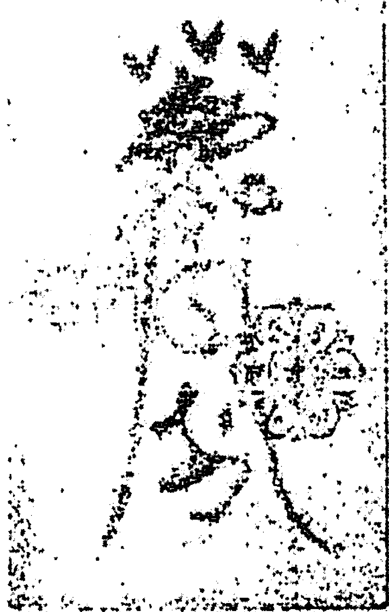

# 第二章、终身局、自测局

#### 第一节、终身局运用

一、终身局因是一个不变场，都是你的六亲，可以全部处理。一般终身局适合：①要求测的、处理的比较多。②有房子装修（终身八字不变）。时局是当时局，不稳定。③当前状态也可用终身局测。
终身局，可做改运处理，可全盘处理，可全家受益。但不可做移星换斗。
灾难替代法：造一个象，替代哪个祸的象。如知有车祸。弄一个小人，写上本人的八字名字，放路上，让车压后，就替代了。八字可以改变磁场，运气。

二、终身局（15年6月）运用范围:
①可用于装修。②调理全家受益。③力长久，但慢一些。④可改变气场。对多年运气不好的。⑤终身局全盘都可拆。不限于三宫。⑥终身局不能做移星换斗。⑦终身局若生死宫无害，就以终身局多做放生超度功德即可。⑧可意识转换。⑨可吸能量。⑩用自己的终身局可预测任何一个人。

选用终身局布局，9天后，再用时盘布局。但若终身局不好，就不要用自己终身局。

三、终身局好的话可以吸能量。若不好可换出生时辰改八字。
①改时辰法：以时辰改动局盘，从12支中选一个好盘，这样八字6个字可以共振。找出的好盘，马星宫及对宫无刑破才好。改变八字相当于改变风水，但马宫及对宫有害则不好。此为八字改命。
所改动八字地支方，一定要干净，要多到时支方走动。多做地支方的事情如寅时，艮宫事，生放生。子时坎宫事，休水，修炼，喝纯净水，加能量，多走动，烧宫位地支符，和本支人做朋友。
②吸能量。如，多人在一起吃饭时，用自己的盘预测。各宫位人即是这个人的情况，应象了。此宫位人情况好，冲动对宫（自己的宫位），增加自己的能量。
把一个人的负能量加到不好的宫位上，冲动对宫。
把好的正能量加到好宫，冲动对宫。

#### 第二节、关于砂水等略谈

1234要砂。要放高的，不要开门。 6789要水。要低，开门好。
此人门开巽宫，为水不好。此处可设玄关。在进门的小太极内看为开艮门，在室内看挡住了巽门。
调文昌：东南砂，西北水。值符、太阴、九天。放孩子床头或学习桌。
玄：也是佛家，东南放个关公不好，拆了内环境，再超度。外环境就进不来了。玄，质量不稳，伤，产品不好、裂。
宅内三合局催财：宅内按照砂水理论，可三合方设定砂水催财。如巳酉丑局，巽方做假山，艮、兑方设低设水。

#### 第三节、家庭装修

一、依据终身局装修。能量好的终身局，全家受益。
二、砂水装修原则。三合局也可用。如寅午戌。寅水，午水，戌水。申子辰，申砂，子砂，辰砂。巳酉丑，巳砂，酉水，丑水。亥卯未，亥水，卯砂，未砂。
三、山向局装修。详见山向部分。山向局用飞星入斗择日。以顾主年命为主，选日。生比年命为吉。如乙酉9金，选4、9日时刻。如果流年，月与命主年命生比更好。但年日不符，是不能等的，为尽快处理，可忽略年月。急时可只选时刻。

#### 第四节、终身局例

例1：乾造 1975年4月17日7时36分
乙卯 庚辰 癸巳 丙辰(子丑空)
1975年4月17日7时36分 阳9局 卯年03月06日7时36分 时盘
乙卯 庚辰 癸巳 丙辰(子丑空)
直符：天禽 直使：死门 旬首：甲寅癸

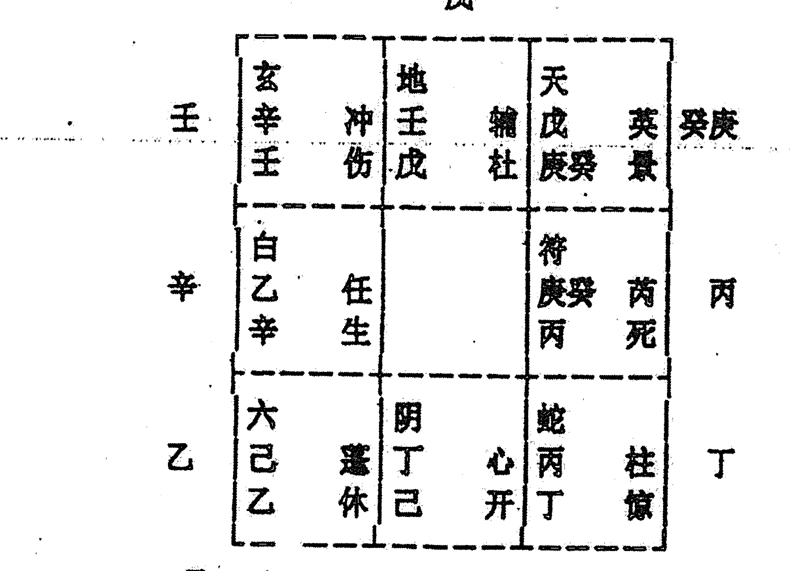

此八字看似身弱，因先天风水庚弱原因，实际为从弱格。此人是开公司的。局中，癸日干兑宫无四害，有能力。但临庚、癸、丙不太好。芮死表示执着、好学等。
庚癸的组合意象：有四害的组合，主大病、色情、做小姐、有附体（厉害的）。无四害时也会出问题。如一女测离宫：阴癸庚丙，芮惊。为子宫糜烂或肿

瘤，有炎症，无四害症状不严重。性格也不好。
丙时干，为平台。顾客等。压在身下。在乾入墓。亏损了，转不动了，产品不好，库存。质量不稳（蛇）。
年干，大环境，对宫。国家政策不支持。去年不好，巽宫，有伤害发生。
甲午年离宫，冲坎宫。甲午临为动为马，30%。坎宫填实后，金水木流通了。
月干庚，同行同宫，无威胁竞争。

##### 婚姻：

老婆在坤宫入墓，生男人。家里男人说了算。夫妻感情一般（因两宫能量不等）。六合宫空，感情不好，老婆很老实（戊入墓）。

##### 身体：

重点看日宫，日支宫（日支为人身体）。
上一步是原因，下一步是发展。庚癸下一步在坤，胃不好，头痛。老婆也不好。儿子（戊），也不好。
日支宫：巽宫也不好。

例2：乾造终身局

男，面测。要测的多，家庭，妻子，父母，房子等。
1977年11月24日17时40分 阴4局 蛇年10月14日17时40分 时盘
丁巳 辛亥 乙酉 乙酉 (午未空) 符天芮 使死门 旬首：甲申庚
戊 成 亥 收 子 开
癸 o o

酉 辛 危 | 阴 戊 戊 辅 休 | 蛇 壬 壬 英 生 | 符 庚乙 庚乙 芮 伤 | 丑 己 闭
申 丙 破 | 六 己 己 冲 开 | 天 丁 丁 柱 社 | 寅 戊 建
未 丁 执 | 白 癸 癸 任 惊 | 玄 辛 辛 蓬 死 | 地 丙 丙 心 景 | 卯 壬 除

乙庚 马
午 定 已 平 辰 满

丁巳 辛亥 乙酉 乙酉 (午未空) 八字丁乙为用。

一、夫妻事业。日干空入墓，坤为2，符芮伤，最近工作事情让伤脑筋。上火了。因乙宫出问题（和领导同事关系不好了）。因脾气不好，伤门表示得罪人。为何？看阴干，己小心眼小财，吃饭，喜欢占小便宜。乙庚又为夫妻感情，吵架让老婆伤心。己说话伤人，退庚也是这个像。让老婆（乙）伤心。己说脏话骂人。乙手打人。乙又为时干，孩子。芮学习。空无。学习不好，捆在一起了。伏吟2个孩子。乙代表语文，庚为数学。各科学习。乙若为物理，庚就为化学。成绩不理想，学习无窍门（己）。

二、财运。戊在巽无害，与坤能量不平衡且克坤。故12、13年花钱多，购房，土地等（戊戊）。偏财，六合己震门破。开就是不开心。吵嘴，婚不开心，压抑。婚己上也是钱，偏财也是不好的。偏代表投资。失败了且和朋友发生口角、乱子（己己乱，六合作）。

三、母亲，看坤。父亲，看乾

母亲。伤，难受。符头难受。若不明再看对宫。艮白癸癸，腿白代表大的不舒服。庚骨增生，乙膝盖。芮，病吃药。庚乙，庚西医，乙中医。以后多看中医，少吃中药。否则庚加点了。庚大了伤害的是脾胃。

父亲。景门，爆脾气。个子不高（地），胖胖的（丙丙）。故乾宫伏吟入墓。则心脏有问题。看对宫，肝胆也有问题。吸烟重（丙丙），应少吸烟。父亲问题大不大，看艮，隐干丁为手术。父亲有心脏病（丙丙），父亲虽然身体不好，还经常走动（不是马的原因），是因加了辛（给宫位加了辛，即心脏打了支架辛，加辛置换故死不了）。

本人八字用神。丁乙。兑宫丁丁，桃花。杜丁偷情。冲动六合震宫，夫妻吵的厉害。

处理: 辛（坟）。坤，太岁宫离。坤乙庚合，夫妻在一起不好。分床睡。破了坤像。坤方己（也代表电器），伤门在震声音大，看电视声音太大了，上火，把电视拿出去，乙庚夫妻照也不要。拆数为258符合宫位数。芮、佛象没有，乙，可能脖子上藏有佛象，摘掉。庚金佛。

客厅的东南方，放了花盆（乙）一堆，不能都拿掉拿掉5盆。这样，夫妻感情，人际关系也就好了。

男人本身也身体不好。离宫，头-蛇，睡眠-坎宫，子时还不睡，为何？蓬玄。喝酒后到娱乐场所偷情。坎隐干庚乙，又看电视，故晚不睡觉。坎死宫要做超度。离宫放生，力量就发挥出来了。此正北方放鱼缸，死水，要做行为风水填实。蛇眼镜，换个好的。离主视力，放生，平衡因果。应调用神丁火，吸烟没问题。红色衣服，家中兑方弄个丁奇挂起来（美女照也可以），女儿照片放兑也可以。对宫震不在纲上，冲了没事。

综上所述，也可把看四害的宫全部处理。

例3: 坤造终身局: 1977年10月24日卯时。

丁巳 辛亥 乙酉 己卯（午未）
本命星力量最大。年日宫有蓬心辅最好。为本命星。蓬星若不在纲上力大也可用。
此局，本命星为年干宫之蓬星。双份。钱双份，搞策划。要常画天蓬，在正北搞一个天蓬星的象都可。

#### 1977年11月24日6时 阴7局

丁巳 辛亥 乙酉 己卯 (申酉空)

#### 蛇年 10月 14日 6时时盘

符：天心 直使：开门 旬首：甲戌

text
      卯    马
    壬
    除
┌───────┬───────┬───────┐
│ 白    │ 六    │ 阴    │
│ 辛 辅 │ 丙 英 │ 癸庚 芮│
│ 辛 伤 │ 丙 杜 │ 癸庚 景│
└───────┴───────┴───────┘
│ 玄    │       │ 蛇    │
│ 壬 冲 │       │ 戊 柱 │
│ 壬 生 │       │ 戊 死 │
└───────┴───────┴───────┘
│ 地    │ 天    │ 符    │
│ 乙 任 │ 丁 蓬 │ 己 心 │
│ 乙 休 │ 丁 开 │ 己 惊 │
└───────┴───────┴───────┘
      己

例 4：乾造。

1965年3月10日22时0分 阳1局 巳年02月08日22时0分 时盘

乙巳 己卯 癸亥 癸亥 (子丑空) 直符：天心 直使：开门 旬首：甲寅癸

text
      马
    壬    戌
┌───────┬───────┬───────┐
│ 二    │       │ 地    │
│ 辛 辅 │ 乙 英 │ 己壬 芮│
│ 辛 杜 │ 乙 景 │ 己壬 死│
└───────┴───────┴───────┘
│ 六    │       │ 天    │
│ 庚 冲 │    癸 │ 丁 柱 │
│ 庚 伤 │       │ 丁 惊 │
└───────┴───────┴───────┘
│ 阴    │ 玄    │ 符    │
│ 丙 任 │ 戊 蓬 │ 癸 心 │
│ 丙 生 │ 戊 休 │ 癸 开 │
└───────┴───────┴───────┘
      己

奇门穿八字：看天干在地支宫有无刑害。如壬辰柱，辰巳年不好，有刑。不看终身局，看八字干用忌神有关。

一、此命超度：在巽宫，与坤先后天，有共同符号。可摘下坤宫象意，在巽宫烧。为何：坤有害之故。
二、西南拆己，庚癸。水晶串。动南拆。

三、震：乙，丁，戊地支符都可。
四、在坎宫修炼，一修炼财就来了。打坐。烧五路财神符。调理大病时，不起局也可把艮宫清理干净。
五、终身局不限于 3 宫，每宫都可处理。

例 5：终身局处理。1981年9月21日2300时。辛酉 癸酉 癸卯 壬子。伏吟局。处理：巽坤兑。客厅等大小太极。上香，超度。隐干戊，丁壬合，酉合。巽的问题，是戊的原因，在艮。在艮放乙奇（合庚），坤宫将杜门迫变开（清理的东西与东南类似，先后天关系）。正西看景门，有无画景。

1981年9月21日23时 阴8局 辛酉年08月24日23时 时盘
辛酉 丁酉 癸卯 壬子（寅卯空） 直符：天辅 直使：杜门 旬首：甲辰壬

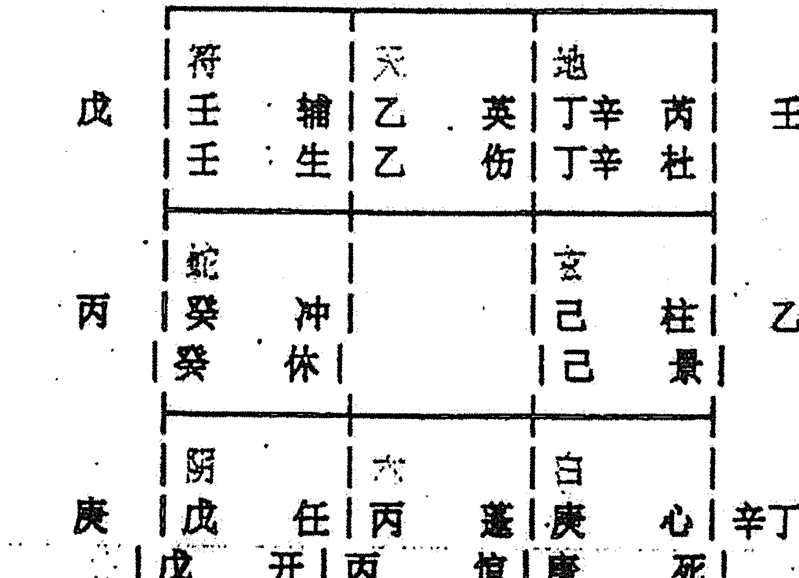

例 6：坤造：1959年12月24日子（60年1月22日）。乾宫空，白庚庚。身体一般。日干宫己刑害。想学习，赚钱（丁戊）。今年太岁，蛇癸癸，迷茫，冲坎玄，不行。明年与玄先后天，但相克，需酉年。玄一玄学。

1960年1月21日23时46分 阳4局 己亥年12月23日23时46分 时盘
己亥 丁丑 己酉 甲子（戌亥空） 直符：天辅 直使：杜门 旬首：甲子戊

| 壬 |   |   |   | 丁 |
|---|---|---|---|---|
| 乙 | 戊 辅 癸 英 丙己 芮 |   |   |   |
|   | 戊 任 癸 景 丙己 死 |   |   |   |
| 丙 | 乙 冲   辛 杜 | 庚 |   |   |
|   | 乙 伤   戊 辛 惊 |   |   |   |
| 辛 | 壬 任 丁 蓬 庚 心 | 己 |   |   |
|   | 壬 生 丁 休 庚 开 |   |   |   |
|   | 癸 |   |   |   |

例 7: 1966 年 6 月 26 日午时。丙午 甲午 丙辰 甲午。
1966 年 6 月 26 日 11 时 59 分 阴 9 局 午年 05 月 08 日 11 时 59 分 时盘
丙午 甲午 丙辰 甲午 (辰已空) 符: 天心 使: 开门 旬首: 甲午辛

| 乙 |   |   |   |   |
|---|---|---|---|---|
| 壬 | 癸 辅 戊 英 丙壬 芮 | 丁 |   |   |
|   | 癸 杜 戊 景 丙壬 死 |   |   |   |
| 癸 | 丁 冲   庚 柱 | 己 |   |   |
|   | 丁 伤   辛 庚 惊 |   |   |   |
| 戊 | 己 任 乙 蓬 辛 心 | 庚 |   |   |
|   | 己 生 乙 休 辛 开 |   |   |   |
|   | 丙 |   |   |   |

艮入墓，处理己。策划不好。今明年不错。拆掉东南，西南超度。

例 8: 男终身局。1962 年 11 月 5 日卯时。
脾气: 暴躁的。符领导。事业，癸与水有关行业。隐干庚，有阻力。看对宫，白虎，有口舌是非。小人癸。
婚，在坎壬，有共同符号相生关系，六合乾，对宫巽有害，巽有问题。在辰已年分不开，到 14 年午年分开。六合害的下一步在离，离与乾想克。一男配二女或三女。老男配中女。

壬子 辛亥 丁未 癸卯 (辰巳) 符天禽 使死门 旬首：甲午辛

| 马 | 天 | 坤 | 玄 | 癸 |
|---|---|---|---|---|
| 丙 | 己 柱 | 庚 心 | 丙 蓬 | 杜 乙 景 丁辛 死 |
| 庚 | 丁辛 芮 | 戊 任 | 壬 | 伤 癸 惊 己 |
| 己 | 乙 英 戊 生 | 壬 辅 丙 休 | 癸 冲 庚 开 | 乙 |
| 丁辛 | | | | |

壬癸色情激情，桃花旺。丁丙桃花。感情追着你，女人多。

年命在坎，感情变动时迷茫。

身体，芮在震，没大问题。但隐有庚在离。

本局，三个丁辛三角布了全局。丁辛，有时犯错误。丁桃花，人生轨迹在丁辛上。睡眠不好，肝胆不好，脾胃不好，腰椎不好，伴随终生。

处理：解决丁辛问题。

念心经。

吃颗粒状东西，大枣核桃之类等。多吃乙类（蔬菜），合庚。少吃肉（生庚）。

骨不好，要常针灸按摩加大丁力，少犯错误。可找丁人，找丁巳人。

震，处理庚癸辛。庚用乙，要脾气好。蔬菜水果。六字手印。找个女人乙过日子。

癸，正东门，放了鞋柜，一进门形成癸象，若隔断不开，则放乙丁，在门口福字内放乙丁。早起念心经，带水晶串。

终身局，马宫及对宫非常重要。

处理：巽与乾。

巽要破空无，东南卫生间不通气，光要处理。这个房子从购时就出问题的。感情有波动。上厕所，为马星动。壬，加丁，阳光丙在外面堵住了。要常开灯。

在巽还要放乙木。放鸡不太好，更不要放金属的。最好放丁乙奇。打开灯最好，好于丁奇，己在艮一放生活用品，开灯即可。

财运，加大坤，放生，超度都可。多修炼蓬符咒，念心经。在坤供财神或佛象，玄，挂贴佛象可以。

乾可放丁制庚癸，放乙入墓。乾代表夫妻感情，现想感情（隐乙），最重要的是婚姻。

坎宫，阴有智慧的，辅学习，壬丙，想赚大钱，还常花小钱丁辛。地盘翻天盘在坤，好好学习。

#### 例9：终身局（15年6月班）

1973年4月5日1518时。癸丑 丙辰 辛未 丙申 (辰巳空) 。此人，脾气不好。辛未坤，辛错误。日柱当前状态。未有错误，丙申以后也有炎症。此为奇门穿八字用法。

年干，代表社会大环境。月干，同事，亲朋好友关系。日干，自己的能力。催财官日干宫要旺。时干，子女，平台。

日干宫，事业符，想身体，改变辛。年干宫，坤（当前状态看日干，长远事情看年干）。癸墓，思想开悟慢，今年太岁到，以后好起来。

终身局好的话可以吸能量。若不好可换出生时辰改八字。

一、改时辰法：以时辰改动局盘，从12支中选一个好盘，这样八字6个字可以共振。找出的好盘，马星宫及对宫无刑破才好。改变八字相当于改变风水，但马宫及对宫有害则不好。此为八字改命。

所改动八字地支方，一定要干净，要多到时支方走动。多做地支方的事情如寅时，艮宫事，生放生。子时坎宫事，休水，修炼，喝纯净水，加能量，多走动，烧宫位地支符，和本支人做朋友。

二、吸能量。如，多人在一起吃饭时，用自己的盘预测。各宫人即是这人的情况，应象了。此宫位人情况好，冲动对宫（自己的宫位），增加自己的能量。

把一个人的负能量加到不好的宫位上，冲动对宫。把好的正能量加到好宫，冲动对宫。

1973年4月5日16时18分 阳8局 丑年03月03日16时18分 时盘癸丑 丙辰 辛未 丙申 (辰巳空) 直符: 天芮 直使: 死门 旬首: 甲午辛

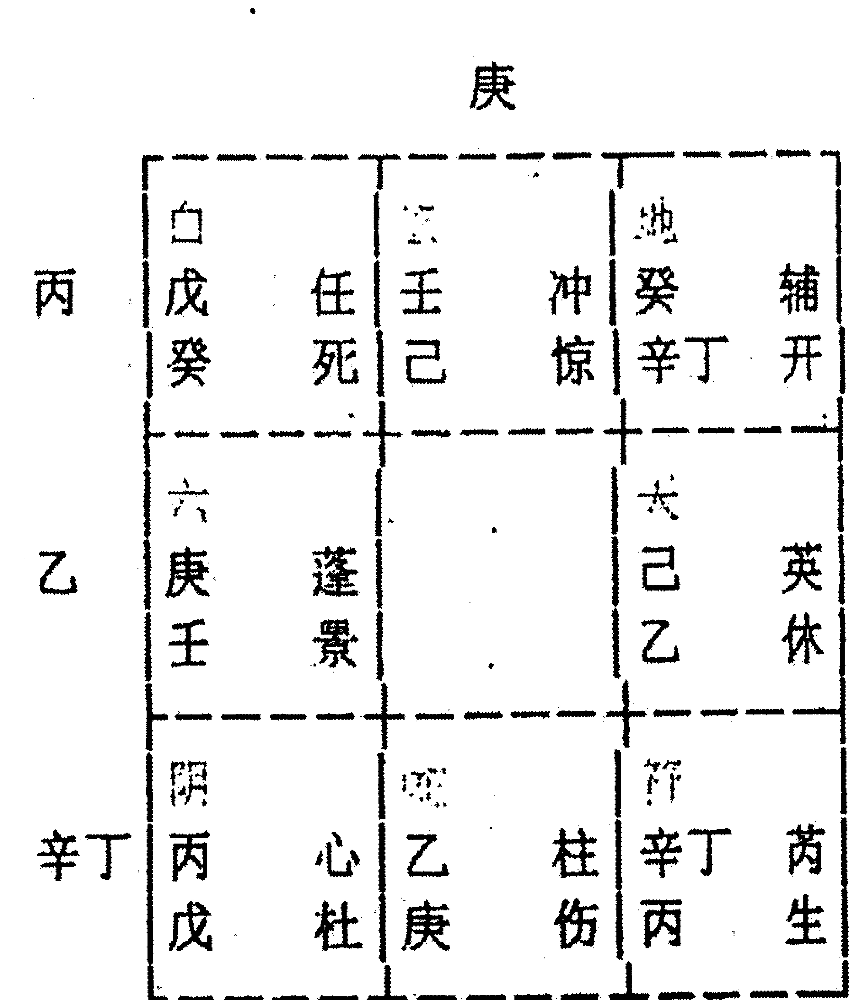

#### 第五节、自测局

##### 例1、7月斑周自测局

刻局月干做年干论。不看甲午。起局时要给自己加正能量。伏吟局是能量，动起来能量大。
壬为日主为女（周）。不停的说话，不停的走动，加大符的能量。但隐干有庚，是壬的偏印，主名气，不能一看就断为阻隔，要把庚阻隔转化成名气。
庚在离9宫，阴庚，技术一流，隐干戊，可以挣钱。但9和7相隔相克，故壬常去西南方活动（做风水），以用坤来通关。丁又是壬的老公，夫妻关系好，亦可通关。
年干，玄、辛。都为思想，变新变法来说，动（马），玄学，任劳任怨，填实后，生日干宫。但毕竟逢空，要常放生。己为同行，兑生坎，相生关系，同行可成为朋友。坤宫戊丁、戊丁，老公有犯桃花之象。可转换意识。丁是周的年命，丁下丁，丁就是自己，自己当老公的情人。老公把自己看成情人了。

2014年7月7日15时41分 阴2局 午年06月11日15时41分 刻盘
甲午 辛未 己卯 壬申 甲辰 (寅卯空) 符：天柱 使：惊门 旬：甲辰壬
戊

|   | 癸 | 六 丙 丙 辅 杜 | 阴 庚 庚 英 景 | 蛇 戊丁 戊丁 芮 死 | 丙 |
| :--- | :--- | :--- | :--- | :--- | :--- |
| 丁 |   | 白 乙 乙 冲 伤 |   | 符 壬 壬 柱 惊 | 庚 |
| 己 |   | 玄 辛 辛 任 生 | 地 己 己 蓬 休 | 天 癸 癸 心 开 | 辛 |
|   | 马 |   |   |   | 乙 |

处理（庚毕竟是阻力的象）：1）拉外砂。外有啥，内放啥，外有河，内养鱼放乙。金生水，乙合庚，可消除庚。养7条鱼，鱼缸打养（惊）、高档一点、园的（符柱），再养些花就行。2）东北方。家里是厨房，假空，不做饭，成了真空。处理艮。

更多资料加微信：yueweiyixue
更多资料加微信：lan46693763

##### 例2：10月班周自测局（3号自测，5号借此局做行为）

###### 3号自测局

自测目的，把不好的变好，预测---转化---布局。布局加正能量。

日干丁，年命也是丁，信息量很强。丁奇，希望，正能量很大。星门原宫能量最大。柱惊大声说话。丁文字，喜欢写文章。加大能量，自己现讲课---做行为风水。地丁，红鞋，上下丁--头发也红。和顾客交流时很开心。脚踏实地讲课，加正能量，事业稳定发展。隐干庚，此想的是技术过硬，庚---坤。思想着庚（钱），技术过硬。坤芮死--学生成为认真学习，技术过硬的人。坤生兑，学生生老师。乙庚男女同学一起学习。坤隐干丙壬一起为智慧，学到了庚过硬的技术，夫妻，人际关系就没问题。这些做了就是九天之人。远大目标理想就实现了。

再看时干，平台。社会大形势---年干。都在离宫。离宫平台起点高，顾客中年女人多，老男人多，离婚女人多，火克金，事业迷茫多。壬壬伏吟，壬代表动，活跃，一动起来就好。英景符--名气就出来了。

离生坤，壬壬意识奇门生坤，生学员，离与兑相克，故要把坤动起来通关就可。坤为西南，经常到西南做风水。一动就通关（去千何？调乙庚夫妻感情，芮的最多），做超度的多（死门），多做超度。坤--捆绑--保护，超度要保护自己，做好了---坤对宫六合，婚就没问题。八运气口冲动开了（空无代表大，无限大）。

巽宫，蛇辅杜。教学法变幻好，来戊。冲乾宫，玄学力大，开公司，中心人物。乾宫昨日开光，有辛置换了，丙出墓了。

坎宫，白辛辛，蓬休。休修炼，辛置换改革，白表示勤修炼，技术一流。

艮宫，空，马，伏吟。马动不伏吟。动了，让顾客放生，多放水生物，让多个顾客去放、多放（六合）。则周的生门就好，精力充沛。马动，生门，空，往里送。

震宫，空阴己己，冲伤。给自测要转化伤。卯戌合，卯戌代表虚心学习（奇门可找同音字意），虚心学习了，己已策划了，双份钱。空无洞，源源不断的进来了。同时己阴为坟地，要常超度，平衡阴阳。

巽宫：三人（康、李、昌盛），都戴眼镜。蛇戊戊辅杜，三人遇到的客都是高价位的（戊）。

搞玄学，以前不可以，现在可以。此宫不能喝酒（隐干癸）。对宫昨日开光了，冲动巽宫起来了。

- 乾宫，最好，明年生乾宫，刚做了风水，开光了，置换。
- 坎宫，待发展，要勤修炼。有潜力。
- 艮宫，最好的，所有人。但有癸，迷茫一些，所有人都入了这个局，但要搞好家庭关系。
- 震宫，策划象意见前。策划为主。
- 中宫，寄坤宫，能量很大。

10月5日下午自测用3号的局。

2014年10月3日8时40分 阴4局     马年09月10日8时40分 时盘

甲午 癸酉 丁未 甲辰 (寅卯空)    直符: 天英 直使: 景门 旬首: 甲辰

壬

已 除   午 满   未 平

戊

| 蛇 戌 杜 壬 | 符 壬 景 | 天 庚乙 死 |
| :--- | :--- | :--- |
| 阴 己 伤    | 壬       | 地 丁 惊  |
| 六 癸 任 生 | 白 辛 蓬 休 | 玄 丙 心 开 |

辰 癸 建 · 卯 丁 闭 。 寅 己 开 。 马

申 丙壬 定 酉 庚 执 戊 辛 破

丑 收   子 成   亥 危

乙

## 第三章、平衡点

一、平衡点适用：

- 1. （7月班）平衡点，或称局眼。一般用于：1）应急，2）预测。基础差的用此法调理很好。
- 2. （10月班）平衡点局眼处理适合：意外、突发、口舌、车祸、官司等。长期的事也可用，没基础的用此法很好。
- 3. 平衡点还可以作为测来意的一种方法（15年6月）。
- 4. 还可以找出事情的本源（15年6月）。如平衡点巽宫阴己癸英开、隐乙，击刑门破，表示事业开展不开，有阻力，不开心。这就是事业不好的中心点。巽有天辅，会计没有管理好，导致出问题，己漏洞很多，下属想离开流失（癸）。

二、平衡点（或局眼）确定原则（10月、12月班）
局眼和平衡点是不同的，但都必须拆，包括空亡都要拆，拆是有条件的。

- 1. 四纲天干，都好都坏或两好两坏，天干无局眼。
- 2. 天干无局眼，看四支，地支都好都坏或两好两坏，四支无局眼。
- 3. 四纲干、支都无平衡点。则看马星宫为主次看流年支宫。这两个宫若都有害，则都处理，就一个有害就处理有害的宫。注意：马星宫比四纲力大，代表最近发生的事。
- 4. 天干或地支，三好一坏，坏宫是局眼（必拆）。
- 5. 天干或地支，三坏一好，好宫是局眼。好宫不拆，看好宫的对宫，对宫有害拆对宫，对宫无害都不拆（一般不存在都好的情况）。
- 6. 流年支及局眼宫拆的条件：
  ① 局眼无害，对宫有害，则好的局眼宫、有害的对宫一起拆。
  ② 局眼及其对宫都无害则不能拆，拆了出事。
  ③ 此时，看流年太岁宫，太岁宫有害就拆太岁宫，太岁宫无害不拆。再看马星宫。处理马星宫比在纲上更显著，来的快。
  ④ 马星宫无害，马宫对宫有害，只拆马宫的对宫即可。
  ⑤ 马宫有害，对宫无害，则只拆马星宫。
  ⑥ 马星宫无害，太岁宫有害，就拆太岁宫及其对宫。
  ⑦ 若太岁、马星宫都有害，先拆马星宫及对宫。再拆太岁宫。
  ⑧ 局眼正好为太岁宫，拆太岁宫及有害的对宫，若两宫都无害则不拆。

7、注意事项：（基本同上）

这里就要注意一个平衡点的问题。当三坏一好，拆哪个好宫时要看对宫，本宫和对宫也是一个平衡体，当对宫临四害时也要把对宫同时拆了。处理本宫的同时也要处理有四害的对宫，以保持平衡。但对宫不临四害时则不予处理。

当局眼旺和对宫无问题时，要拆马星宫。

当流年是局眼时，局眼宫很好，对宫也很好。这时局眼的处理要转为马星宫以及马星宫的对宫的处理。对宫有四害时则两宫都要拆。

为何处理马星宫？因四纲是当前状态，马星则是当前状态中更近的状态。

#### 三、局眼+值符等的处理

局眼是告诉你处理，要如何处理。局眼是断局的一种方法，亦可长期用。测风水可用此法。

- 1）先拆环境。2）策划。

临符：离宫，符戊辛 伤，到正南方找公检法或一把手的人，花点钱（3、6、9数）处理这个事。

临九天，则不用找一把手，找个权力大的或高个的都可以。
临玄、蛇，找高玄学（奇门等）的就可以，
临死门，阴宅风水有问题。要超度（以前杀生了）；
临九地，事慢，不要急，顺其自然。

#### 四、《运筹篇》局眼论述（仅供参考）：

局眼如同太极阴阳眼，是阴阳宅的阴阳通道，一通百通，找出局眼，打通阴阳通道，阴阳之气就循环流通。是奇门调理的基本内容方法。
局眼调理只能拆不能补。把该方位的物象拆掉。调理时间可选每月的节气日，落宫时间或马星时间。

- 1）阳局眼主要用于阳宅（住宅或办公）风水，人的身体调理。重点是调理阳眼宫，地盘翻天盘宫，隐干打开宫。如在四纲为重中之重。

- 2）阴眼。阴局眼主要用于调理阴宅或六亲因果的超度。包括无形六亲、冤亲债主、邪灵。特别用神宫与死门宫有共同符号更应。

- （1）阴局眼找法：看阳眼天干与日干的六亲关系原则。以确定在哪个方面六亲有因果问题。如日干为丁，阳局眼宫天盘干为乙木，与日干的六亲关系为印，说明在印方面有因果问题。在巽宫则为母亲。
看局眼在四纲上的位置定六亲，年上为长辈因果，月为平辈、时为晚辈。

- （2）阴眼调理：因果层次：第一层次：先看天盘与用神的六亲关系。第二层次：次看地盘、隐干、局眼宫中地支与天盘的六亲关系。因果人如出现在四纲，重中之重。

阴眼宫，地盘翻天盘宫，隐干打开宫三个方位是阴宅调理的重点。如果出现在四纲，则重中之重。

父支还是母支的祖坟，以阴眼天盘干定，并注意合干，地盘与天盘合，则父母都有。

调理：一是因果要超度。二是阴宅重点三方位要进行处理，如果宫中有四害，必须处理。

#### 五、局眼、平衡点案例：

（10月班）平衡点局眼处理，适合：意外、突发、口舌、车祸、官司等。
局眼和平衡点不一样，有时相同，有时不相同。

例1：此局，四纲三坏一好。局眼是己宫，无害，对宫也无害，这种情况不能拆。可找平衡点——马宫及对宫。马宫巽有害，拆掉即可。

家里客厅的东南方，有否灯不亮（丁）电线（乙）、有否佛（丙）等，有拿掉。

症状：易得病（芮），蛇代表腰，睡眠、神经。抑郁症（癸）。丁丙癸一感胃（冷热交替状态）。乙吃中药，丙丁晒太阳，丁也打吊瓶。天芮星落宫---代表病症的一个总体状况。
看疾病：芮--病整体状况。日干---自己现有状态。年命---看大病（有无危险）。
巽如有佛象，不常烧香（癸丁），或者没开光（丙代表开光）。如有，送走。拿起在东方停一下，送走，择日再调沙水。东南方肯定有灯不亮。电器（蛇乙癸丁芮--电脑电视）。

2014年10月2日21时3分 阴1局 马年09月09日21时3分 时盘
甲午 癸酉 丙午 己亥（辰巳空） 符天柱 直惊门 旬首：甲午辛

戊 破 亥 危 子 成
马 ○ 丁

| 酉 丙 执○ | 蛇 乙癸 丁 | 符 芮 辛 己 | 天 柱 壬 乙癸 | 丑 己 收 |
| :--- | :--- | :--- | :--- | :--- |
| 申 庚 定 | 阴 己 丙 英 杜 |   | 地 戊 辛 蕊 开 | 寅 癸乙 开 |
| 未 戊 平 | 六 丁 庚 辅 伤 | 白 丙 戊 冲 生 | 玄 庚 壬 任 休 | 卯 辛 闭 |

壬
午 满 已 除 辰 建

~~查：求砂水情况：有石水、土浴，砂太里放：一物一太数，看厨房的东西是否有水或死池。
砂太位置：不要用原套估计，必须用罗盘测。砂太结合奇门，效果很快的。
如查藏有坎局，申子辰局，此三种人不好，巳酉丑合局，此三种人也不好。
葵盘按三合局砂克而用则生火，如寅午戌合局，此三方都见水大好。
如东南方有工浴动不了，则改小太极之东南方字旁见水，如改不了，都只有利害，但效果差。
放砂改物注意：生照放水原则放这水物，如该放水的地方则不能放砂。~~

例2、（10月班例）一女辰时电话，说不舒服。
早晨时电话，巽宫时，先天在兑。看四纲，四干宫、四支宫都无问题。
则看，马宫及对宫。以前说四纲宫若问题看太岁之宫，是冲则安，应看马星宫。
巽先天宫，在外边，电话时在巽。因吃饭（兑为口），生气（巽为风为气），坤为食物（土，养育）—吵了架，生了气，吃了饭—引起的。坤主脾胃，食物，2数（夫妻2人吵架）。为何吵？兑少女，因为女人，也为口。六合，婚姻吵架。己己嘴对嘴吵（刑），或不消化堵。好的时候亲嘴或在一起吃饭，坏的时候吵。

- 原因：看隐干乙，因为女人吵，女的见老公和女人在一起吃饭发生了。
- 行为风水（让其女人入局）：先走到艮方（己思想），入到这个象里。想象自己是一个空无的透明体（己想）。马代表走路，走到正东生门宫即可（走到坎亦可，但坎有白故到震去）。结果好了。

> 处理局：风水师意识大于行为，要有信心，有正能量思想，自己认为这个局好就好。风水师意识就可以转宫。

2014年8月31日7时3分 阴9局 马年08月07日7时3分 时盘
甲午 壬申 甲戌 戊辰 (戊亥空) 符天英 使景门 旬首：甲子戊

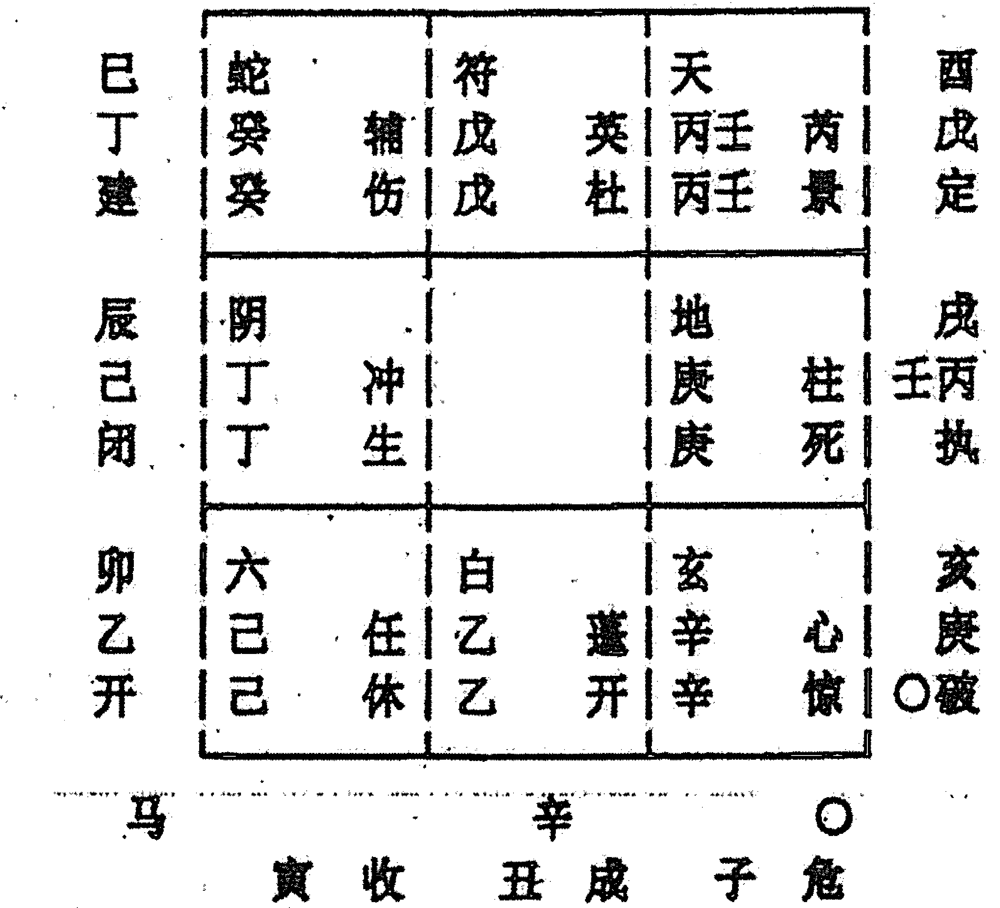

##### 例3：（7月班）一男突然出事，把人打伤，现在派出所里。

此局，天干，三坏一好，局眼为巽。把巽宫拆了。

2014年7月7日13时47分 阴5局 午年06月11日13时47分 时盘
甲午 辛未 己卯 辛未 (戊亥空) 直符：天禽 直使：死门 旬首：甲子戊

|   | 阴 己己 辅伤 | 蛇 癸癸 英杜 | 符 辛戊 辛戊 芮景 |   | 庚 | 癸 |
| :--- | :--- | :--- | :--- | :--- | :--- | :--- |
|   | 六 庚庚 冲生 |   | 天 丙丙 柱死 |   | 丁 | 戊辛 |
|   | 白 丁丁 任休 | 玄 壬壬 蓬开 | 地 乙乙 心惊 |   | 壬 | 丙 |
| 马 |   |   |   | 乙 |   |   |

##### 例4：（10月班）女面测看我最近怎么了。

2014年8月6日8时42分阴3局 马年07月11日8时42分时盘
甲午 辛未 己酉 戊辰 (戌亥空) 符天冲 使伤门 旬首: 甲子戊

| 午 辛建 | 天 乙乙 辅景 | 地 辛辛 英死 | 玄 己丙 己丙 芮惊 | 戊 癸定 |
| :--- | :--- | :--- | :--- | :--- |
| 巳 乙闭 | 符 戊戊 冲杜 |   | 白 癸癸 柱开 | 亥 丁执 |
| 辰 戊开 | 蛇 壬壬 任伤 | 阴 庚庚 蓬生 | 六 丁丁 心休 | 子 庚O破 |
| 马 |   | 壬 |   | O |
|   | 卯 收 | 寅 成 | 丑 危 |   |

看四纲，无局眼。四支无局眼。则平衡点为马星宫，太岁宫。
处理: 马星宫及对宫，太岁宫。三个宫。
看何事? 坤，芮惊，玄己丙己丙隐癸。惊吵架。己丙吵架骂人。己丙坤为母，老女人—婆婆吵架。己刑，己也是钱，养老问题，刑了小心眼，小气。看对宫，艮蛇壬壬，任伤，隐戊。蛇神经，戊钱，壬壬也是想不开的象。伤门破—伤灾，想这个事想多了，一不留神车祸。（伤+马即为车祸）。在东北方向。有水处（下水道的盖子处）伤了（玄己己壬壬结合起来）。若整盘为车，则在车后左处被伤。伤的程度：要结合白宫看（白代表医院、医生、警察、大的伤灾等）。白宫现无四害，与坤有共同符号癸，断：伤不大，但流血了（癸），不多（癸少壬大）。车上2人（壬壬）都伤了。天任，腰，没直接伤腰但腰却伤了（蛇任）都为腰。

看环境西南方，玄己丙己丙芮惊，玄学，隐藏的，佛象（供了百家仙），身体还不好（芮坤主脾胃），玄，头晕。己丙有痔疮，脾气暴躁。睡眠不好。子宫也有问题，阴妇科生殖系统，庚瘤，蓬生长的快。

处理：把芮放西方可以（只有这里可放），无四害。或本房间的兑方（在无法移到别处的情况下这样，一切从太极原理）。当然，如果有条件还是拿到大太极的兑方。另外，此人找风水师看过（玄），对宫艮放了一个龙（伤壬壬蛇）。这个龙放何处？震离兑比较，找一个最好的地方放。震离有害，故放兑宫为妥。

离宫死门，做超度，念心经，如有东西拆，拆了。如不能拆，考虑因果的事情（超度）。因果是看不见的。

坤上，又为生育宫，与离有共同符号，己丙，英（英灵，小孩），打过胎，辛辛骨头。空宫，现在是多的象（辛伏吟为满），打胎了，369数，一般为3个。故到正南方做超度。己丙—己吃的，丙代表火。

另，今年太岁，冲力大，坎宫被动的受伤，冲击力大。要处理坎宫。坎：阴庚庚蓬生，隐壬。环境，房子北处又盖起一间房子（蓬），且吵架了（庚抢占的，吵架了），现拆不掉。

看屋内，正北厨房。拿不掉。做缩小太极处理。处理厨房的正北方一庚，金属。阴藏的。柜子里有一个金属的锅生锈了（庚见壬生蓬），把这个锅拿掉后，就感觉好多了。

##### 例5：酒店策划。年月日时找平衡点（15年3月班）。

2015年3月10日17时23分 阳3局 未年01月20日17时23分 时盘
乙未 己卯 乙酉 乙酉（午未空） 直符：天禽 直使：死门 旬首：甲申庚

| | 地 | 天 | 符 |
| :--- | :--- | :--- | :--- |
| 癸 | 己（辅/生） | 丁（英/伤） | 乙庚（芮/杜） |
| 丙 | 戊（冲/休） | | 壬（柱/景） |
| 辛 | 癸（任/开） | 丙（蓬/惊） | 辛（心/死） |

问题，在坤。空假空。乙也时干，员工流失多。有男有女（乙庚）。剩下的还不服从管理。

符名气贵人，坤大形势变化影响。不支持。堵住财路，不来吃饭了。乾辛，把死换生，多变花样，品种。合作人少两棵牙。（辛辛阴，牙可丁可辛）。

坤，整房外有一变压器。动不了。乾宫在五楼，有坤数，外不能处理。只有处理内环境。

办公室西北方，放了佛象（乙庚在坤芮），供品放多了，满满一桌子。震宫里面一定有空调拿掉（丙在坎惊）。

##### 例6：2015年6月班平衡点例：

2015年5月31日16时48分 阳8局 未年04月14日16时48分 时盘
乙未 辛巳 丁未 戊申 (寅卯空) 直符：天冲 直使：伤门 旬首：甲辰壬

丙

| 乙 己 │英│辛丁 芮 │乙│ 柱   庚 |
| :--- | :--- | :--- | :--- | :--- |
| 癸 │开│己  休 │丁│  生 |
| 辛丁 癸│辅│        │丙│ 心   戊 |
| 壬 │惊│        │乙│ 伤 |
| 己 壬 │冲│戊  任 │庚│ 蓬   壬 |
| 戊 │死│庚  景 │丙│ 杜 |

马      癸

- ①先看四天干（四纲），找出一个不同的即平衡点。兼顾马星宫及对宫。此例马宫空，可以处理（如填实）。
- ②四纲找不出，看四个地支，找出不同的。平衡点为己，巽宫。

把巽宫象意去掉。首选无害宫，如兑宫可以。（此象意与原宫象意不要管）。但拆的东西一定不要放到空无宫，放上就丢东西，出事。放空无宫对宫没事。

若东南方啥也没有，就造象处理。用符咒装象贴东南方吸收能量（放的时间为147数时间），然后拿到兑宫烧掉。装符：三清敕令，阴己癸英开，阴乙，到罡。

行为风水：一个好看精致装茶水或饮料的杯子，用手拿者在巽宫停一会，然后到兑宫喝掉。

以上这些可以同时做。贴符与行为风水同时做。

## 第四章、移星换斗

#### 一、7月班布局方法

移星换斗就是整个盘都转起来。顺转7宫或逆转1宫。

- 1. 三点定一面的布局原则，只取三宫的物象来做象布局，并首先考虑值符，因值符宫重要。但选其它相应的三个宫也可。为三点定一面之法。
- 2. 三奇布局：可在移到的三奇宫中烧三奇符来定局。
- 3. 如果以上方法布局做不了，就把宫的象意写下来，贴在移的宫中（要选对时间）。如艮符庚丙辅开，移坎。可将象意写好贴在坎宫亦可。其它两宫同理。

##### 4、移星换斗注意问题：

- (1) 终身局或四纲在不同宫位全坏不能做移星换斗。
- (2) 移星换斗不一定要到现场。可以电话指挥做（电话为丁）。超度也可不到现场，通过电话由风水师指挥做。

#### 二、10月班布局方法

移星换斗能量大，应事快。移星换斗和山向力大，搞错了，第一件事就是易出车祸或其它不吉。如马宫有问题，可直接把马宫拆掉即可。

##### 1、移星换斗的条件：

- (1) 四纲全坏不可做。但四纲在一个宫位可做。
- (2) 移后四纲要全好。
- (3) 移后马星宫及对宫无四害（击刑、门迫）。（马宫力很大，移不好还不如不移）。入墓、空无状态差，虽害但比刑迫好些，勉强可用。若找不到理想局，而马宫有问题，则先处理马宫，然后再做其它。
- (4)（王凤麟）移后要日干宫和时干宫都好才行。宫中有辛移到哪都没问题。时干临伤门，自己测事不伤自己就伤他人。

##### 2、布局方法：

- 方法一：原物布局。拆时利用共符布象。如原宫有乙奇，就在原宫将乙奇象拿下停一会然后到所移之宫。如离宫、坤宫有乙奇则在离宫、坤宫停一下，到坎宫贴上。其它同理。如坤有照片（景），用手拿下（乙癸），到艮宫贴上，则为原物布局。它宫同样这样做。
- 方法二：购物布局。不能原物布局时，可购买物象布局。购物布局应注意：象意搞不好有时会出问题。
- 方法三：利用门的象意布局。如画一景门符在坤宫一停到艮宫贴上。开门符在坎宫呆会到离宫贴上。
- 方法四：做行为。在西南坤宫读心经（辛），边读边走到艮宫。离宫，蛇思想，己嘴，乙手，癸走。想着想着走到坎宫即可。
- 方法五：纸上布局。如上述之法没有条件来做。亦可将原宫象意写在纸上，原宫停一会，再移到所到之宫贴上。
- 方法六：意念布局。如以上各法均不可施。就以意念布局，意念想，坤象移到艮，离象移到坎。震象移到兑。但这需要强大的意念，强大的意念很重要。
- 3）三点定一面。一般只移三宫（最多只能移三宫），信息含量大。其它宫不要移。移时一定要保证在原宫停一会，然后再移过去。移走的路线没有特别规定。

#### 三、12月班布局方法

- 写象布局。最快是把选好定位的三宫象意写下，贴到他家里，即可解决。以贴客厅为主。若客厅无象意，就在大太极该方找象意，找出后，就把符贴在这个方位象意上，此法同用实物换斗效果一样。如下图：

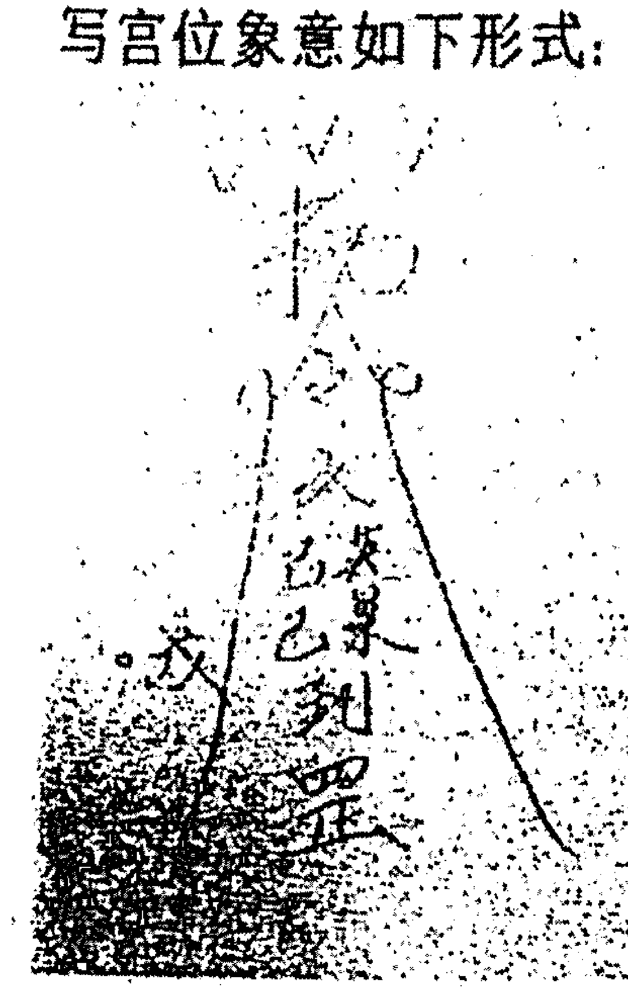

烧掉。根据象意提示可贴可烧，如“戊景”“丙丁”等是提示你烧掉。如果事情很急，不要管时间，马上做。若不急，可选宫的时辰来做。事情解决即可。若贴符，事情解决后可拿掉烧了。

- 用风水物布局。同上。

- 原物布局。比较长久。改变磁场是最长久的。若大、小太极都符合象意，贴大小都移，处理两层。一物（屋）一太极，多个房间符合，就移多个房间。各宫都同一时间转。也可弄符咒烧一下，再原物布局。

- 三奇布局（三点定面）。也是临时布局。但真正解决问题的是原物布局好。原物布局，如不能到家里移星换斗，亦可借一个太极处理。但对自己有损伤的。如来不及可在宾馆或其它房间处理。若碰上有钱人，能量很大。要进他的局，他回家处理，我们也到家里处理。

- 意念处理：用意念，正南，艮、兑方贴上移宫的符来处理。此法需强大的意识才可。要经常用。如用意念画符都可。如医院看病人，不能在病房设局，可以用意念处理。如死门换生门，在死宫写生字即可。

#### 四、单宫移

现场处理用原物移动最好，购买象意物品进行处理有时会导致出事。就用单宫移。单宫移是把有害宫的象意转到无害且可行的宫位上。这个无害宫的对宫也要无害。几个宫都无害，选一个放上适宜的宫位。把有害宫的物品拿过来放上即可。可在软件中的移星换斗局中寻找无害且可行的单宫。

#### 五、移星还斗案例

例1：未来局布局。这个局选的是以后的局，为何选以后？因移星换斗能量较大，怕改变磁场。若这是一个男的当面调事业，财运。顺转7宫或逆转1宫。

- 思路：
  - 把四纲好起来。
  - 移动后的马宫，一定不能击刑、门迫。
  - 四纲全坏，一定不要做移星换斗。但四纲在一个宫里可做。顺转7宫或逆转1宫。

- 布局
把值符象放在坎宫。坎放领导人照片，如习近平。
乾宫放中国结（丙戊）。
离，玄乙丁，葫芦上画个丁，悬挂起来。
选择值符（年干）宫或对宫坤的时间来做，时干宫的时间都可以，日干宫空，不如值符更重要。坤宫时间：去年选未时，今年选申，与甲午太岁同性作用力大。也可以不选日子，只选时辰（13—15时）来做。
放的物象，符等，解了击刑门迫后，3个月后要将其拿掉，解决问题就行了。
布局，最好原物布局。原物布局是首选，其次为组合象意。如艮上的庚丙物，直接拿起放在坎宫最好，没用再放其它。这是最好的布局，要比组合象意要好，既经济又方便。

2014年7月23日19时32分 阴6局 午年06月27日19时32分 时盘
甲午 辛未 乙未 丙戌（午未空） 直符：天辅 直使：杜门 旬首：甲申庚

癸      马

| 地 | 玄 | 白 |
|---|---|---|
| 壬己 芮 乙 | 杜 戊 心 | 丙 |
| 庚 生 丁 | 伤 壬己 杜 |  |
| 天 |   | 六 |
| 丁 英 |   | 癸 蓬 | 辛 |
| 辛 休 |   | 乙 景 |  |
| 符 | 蛇 | 阴 |
| 壬己 庚 辅 辛 | 冲 丙 任 | 庚 |
| 丙 开 癸 | 惊 戊 死 |  |

丁

- 三点定一面的布局原则，所以只取三宫的物象来做象，并首先考虑值符，因值符宫重要，但选其它相应的三个宫也可。
三奇布局：在移到的三奇宫中烧三奇符定局，是三点定一面的方法。此局，艮烧丁，巽烧乙，兑烧丙。三奇转起来，也就移星换斗了。为了时间长久，可贴三奇符亦可。
如果以上方法布局都做不了，就把宫的象意写下来，贴在移的宫中（要选对时间），如艮宫，符庚丙、辅开，写好象意贴在坎宫亦可。其它两宫同理。

（上方表格，包含干支、神、门等奇门排盘元素）

##### 例2：催桃花

2013年7月19日9时54分 阴9局 己年06月12日9时54分 刻盘 己未 丙戌 癸巳 丁巳 (子丑空) 直符：天辅 直使：杜门 旬首：甲寅癸

（下方表格，3×3奇门排盘，含天、地、玄、符、白、蛇、阴、六等神及门类元素）

催桃花：乙丙丁。如催婚，看合干。

桃花催丁最快。但要注意分清色情，色情一定要拆。
巽宫放丁奇，丁还可放离宫、兑宫。在巽、离、兑宫各烧一张符，再各宫贴一张美女图。催丁最直接，快。

##### 顺转两宫

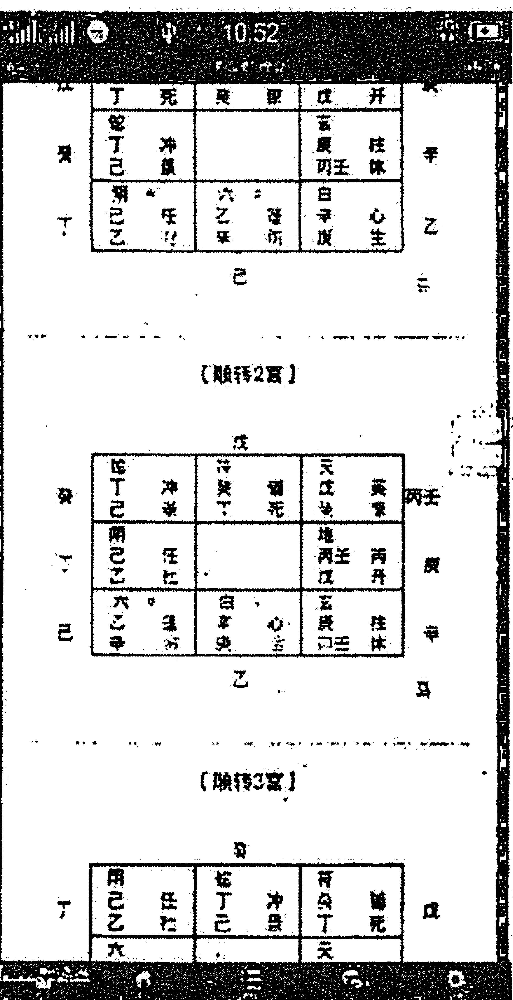

如兑宫，玄戊丁壬、辅景，隐干乙癸，门迫。乙癸色情，丁桃花情人。乙桃花。门迫时，壬变癸色情。这种情况一定要拆，拆了桃花没了，财也好了。
看这个宫位的象，把它拆了就行了，包括隐干也要拆干净。否则，丁壬拆了，留下隐干，情人没了，光找小姐了。

无门迫四害时。如兑宫，玄戊丁癸，辅生，隐干乙。（女癸，男戊）男的有情人丁，拆了丁，则要破财，丁不生戊了。这个情况要主动破财，拆时要把钱借出去，同步来做。

> 有人问，以前的对象散了，现又找一个要结婚了，前一个又来找，如何拆？
答：若戊为本人，现在的为癸。以前的为乙丙丁，就是拆乙丙丁。

##### 例3：（10月班）调人际关系

值符，一局总导思想。癸害阴暗，景上火脾气。和领导关系有问题。问题如何？对宫，庚白丙，大的口舌，冲动的吵架。引起乱子。引干丁在震六合----人际关系一下子破坏了。丁还代表文字材料。因一份表格导致的，和领导吵架，和领导关系不好导致人际关系不好。他的目的是想和领导搞好关系。此局移星换斗顺转四宫。移坤、离、震三宫。

| | 阴 | 蛇 | 符 | |
|---|---|---|---|---|
| 丑
庚
收○ | 己
丁
英
伤 | 乙癸
己
芮
杜 | 辛
乙癸
柱
景 | 已
丁
除 |
| 子
戊
成 | 六
丁
丙
辅
生 | | 天
壬
辛
心
死 | 午
己
满 |
| 亥
壬
危 | 白
丙
庚
冲
休 | 玄
庚
戊
任
开 | 地
戊
壬
蓬
惊 | 未
癸乙
平 |
| | 戊 破 | 酉 执 | 申 定 | |

| 马 | 乙癸 | 辛 | 壬 |
|---|---|---|---|
| 蓬
惊 | 地
戊
壬
○ | 玄
庚
戊
任
开 | 白
丙
庚
冲
休 |
| 心
死 | 天
壬
辛 | 己
戊 | 六
丁
丙
辅
生 |
| 柱
景 | 符
辛
乙
癸 | 蛇
乙
癸
丙
己
杜 | 阴
己
丁
英
伤 |

若找不到理想局，而马宫有问题，则先处理马宫，然后再做其它。此局，先拆马宫巽，再做移星换斗布局。《布局各法见本章2—2）之6种方法》
三点定一面。一般移三宫（最多只能移三宫），信息含量最大。其它宫不要移。移时一定要保证在原宫停一会，然后再移过去。移走的路线没有特别限制。

##### 例 4:（12月班）移星换斗

2014年10月18日8时35分 阴1局 午年09月25日8时35分 时盘

甲午 甲戌 壬戌 甲辰 (寅卯空) 符天心 使开门 旬首: 甲辰壬

| 上<br>丁 辅<br>丁 杜 | --<br>己 英<br>己 景 | 阴<br>乙癸 芮<br>乙癸 死 |
|----------------------|----------------------|--------------------------|
| 癸<br>丙 冲<br>丙 伤 | <br>壬<br>辛         | 蛇<br>辛 柱<br>辛 惊     |
| 丁<br>庚 任<br>庚 生 | --<br>戊 蓬<br>戊 休 | 符<br>壬 心<br>壬 开     |

测最近发生的事，看马宫艮，地庚庚任生，再看兑宫之对宫震伤--出了车祸。庚车，+庚又一辆。生气骂人（己），对宫乙芮，打人，庚也为警察，多个警察。

隐干己，拐弯时相撞，坤隐干丙壬流血了，凝固了。打的骨折了（庚庚大折），腿骨折了。

处理：做移星换斗，顺转5宫如下：符+四纲在离宫，太岁宫。马宫尚可。庚宫无四害，文定。马宫虽空，但有马星，填实即可。本就是花钱的象（用钱来填实）。临时解决问题，快啊。

##### 逆转 5 宫

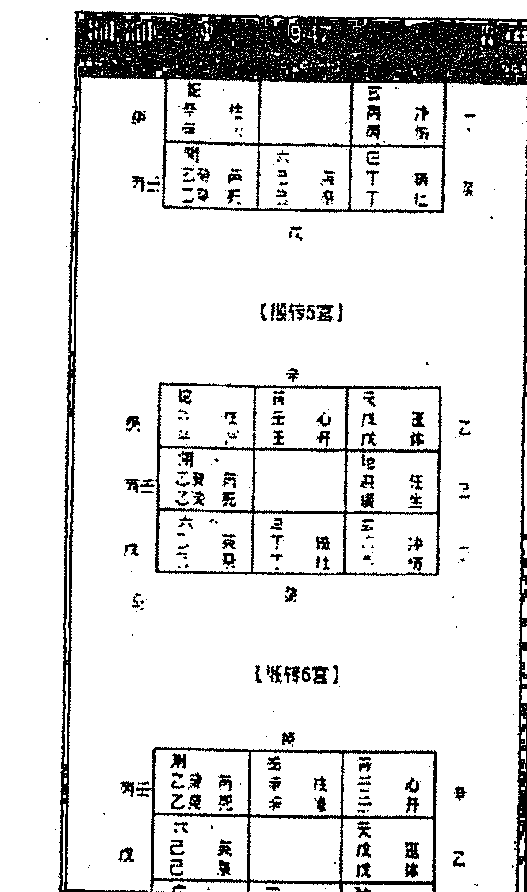

##### 布局

(1) 最快是把以上六合离宫等三宫象意写下，贴到他家里，即可解决，以贴客厅为主。若客厅无象意，就在大太极该方找象意，找出后，就把符贴在这个象意上。此法同用实物换斗效果一样。

写宫位象意如下形式：

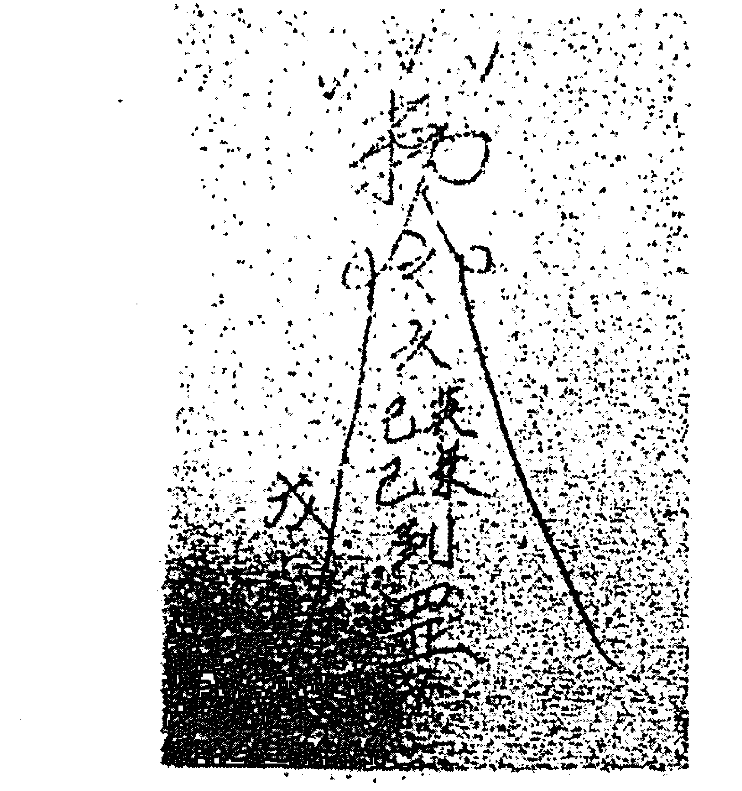

烧掉。因“戊景”就是提示你烧掉。
若事很急，不要管时间，马上做。不急，可选个问题宫的时辰来做。事情解决即可。若贴符，事情解决后可拿掉烧了。

(2) 用风水物布局。

(3) 原物布局。比较长久。改变磁场是最长久的。若大、小太极都符合象意，贴大小都移，处理两层。一物（屋）一太极，多个房间符合，就移多个房间。各宫都同一时间转。也可弄符咒烧一下，再原物布局。

(4) 三奇布局（三点定面）。也是临时布局。但真正解决问题的是原物布局好。原物布局，如不能到家里移星还斗，亦可借一个太极处理。但对自己有损伤的。如来不及可在宾馆或其它房间处理。若碰上有钱人，能量很大。要进他的局，他回家处理，我们也到家里处理。

(5) 意念处理：用意念，正南，艮、兑方贴上移宫的符来处理。此法需强大的意识才可。要经常用。如用意念画符都可。如医院看病人，不能在病房设局，可以用意念处理。如死门换生门，在死宫写生字即可。

## 第五章、化煞与加能量

#### 第一节、天罡地煞阵

##### 一、阵法运用

1、此阵一定要结合奇门局。作用：化煞、催财。
破空无。主要是阴宅。即死宫空或山向空。阳宅用的少。

2、条件：死空且无击刑门迫才可做。
如起盘死宫空在艮不空，但说坟在乾空，则也为坟空。
日干为辛，七杀丁落宫为空无，坟地也要处理。
坟向空无线，则要做山向。
阴宅山向空。山空在山上做，向空在向上做。可在山上或向上挖一个大坑，在这一个大坑内做成4个格（2个九宫格，2个星斗格）。在大坑内做这个天罡地煞阵。即在坟地山向的空无宫埋天罡地煞。

阳宅房屋缺角或空无。缺处是空。如乾宫空无或缺角，意味着房主的重大缺失、象征父权利、大财、夫妻关系等。如不能换房，可用天罡地煞阵解之。

阳宅的山向空无，也是山空在山上做，向空在向上做。向空可在门口做。南、北星斗用铜丝连起来，系上铜钱。九宫格用朱砂画出或用铜丝围均可。

3、催财化煞。路冲、风口、尖物、电器等。

###### 4、做法（12月班）

- 方法一、在坟的四周做。挖4个30公分左右的坑。
- 方法二、在坟的空无宫方位做。挖4个30公分左右的坑。
- 方法三，山向局的空无宫也要做此局。

##### 二、阴宅破空无：阴宅空解法---用天罡地煞破空无

乾宫空，符戊辛，死门。--死为阴宅，戊年破大财。乾为男。此象，男人很不舒服。头、呼吸等有问题。此种情况，就要在坟上破空无了。

###### 1、准备

- (1) 在阴宅前面的左右、后面的左右各挖两个一尺长宽深左右（30-35公分）的坑。用毛笔朱砂划出九宫格。格内放铜钱。一面2个坑布天罡，一面2个坑布地煞。
- (2) 阳宅：在缺角或空无等处用朱砂高度就狼毫笔画出宫格，或用0.5以上金银或铜丝围成上述大小的2个九宫格和2个方格。
- (3) 五帝钱共121枚。选择铜钱：康熙主身体。乾隆主财。雍正主官。顺治主安全、意外。铜钱用真的最好，无真的用假的亦可。
- (4) 万能符2张，朱砂若干。阳宅或备0.5以上金银或铜丝若干。

###### 2、布置

- (1) 36天罡：36天罡：一个九宫格中各宫内布置4枚铜钱，共36枚。格上方再布置一个与九宫格同样大小的方框，内布南斗六星图案。
- (2) 72地煞：一个九宫格中各宫各布置8枚铜钱，共72枚。格上再布置一个与九宫格同样大小的方框，内布北斗七星图案。
- (3) 用飞星入斗择日。选一个生比用神（最好是年命）的日时布置。
- (4) 布置前烧一张万能符和解，布完后再烧一张。
- (5) 用朱砂画出2个九宫格和2个星斗格。摆好铜钱，铜钱眼上撒上朱砂。星斗各铜钱用铜线串连起一个星斗之象（见图）放入坑内。最后填土埋好，以后不要扒出。埋土前每个坑都要烧万能符，以化解磁场。
- (6) 天罡地煞的左右位置没有特别规定。但南斗天罡、北斗地煞必须对应一上一下。

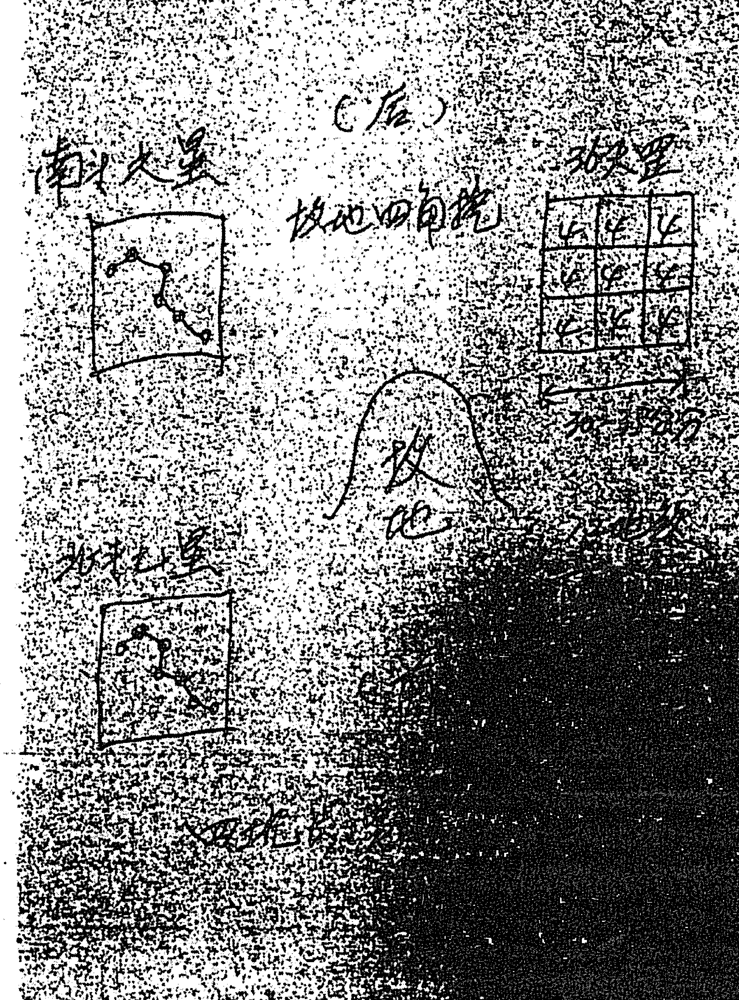

##### 三、阳宅破空无

阳宅：用朱砂毛笔画出九宫格和星斗格。或用金银或铜丝在空无或缺角处围出4格，把铜钱和丝粘在地上，盖上地板或其它。如乾空，在乾宫地下布置两个9宫格。可用0.5以上的铜丝或银丝布置。
72地煞：一个九宫格中各宫各布置8枚铜钱，共72枚。九宫格上再布置一个与九宫格同样大小的方框，内布置北斗七星图案。
36天罡：一个九宫格中各宫内布置4枚铜钱，共36枚。九宫格上再布置一个与九宫格同样大小的方框，内布置南斗六星图案。
布法同上。

#### 第二节、罡 步

##### 一、万字罡步与马星破空无

如乙在乾入墓，巽宫无四害，乾宫有马星。可直接在乾宫做行为风水。入墓+空无亦可这样做。行为风水——活人>动物>物象。

###### 1、方法

- （1）万字踏罡步。后天万能罡步加大磁场。在空无宫画一万字符，从万字一个S的一端先迈“左脚”开始走第一步，一个4步（1234），走完一个再（任意走）到另一个S的一端走（5678），如此反复走6次、6天或6人来走都可以（应宫位数）。
- （2）也可在乾方画一个罡步（万字符），放一马星物象。即，动的。如钟表、马、八骏图等。企业，可在西北处让工人在此方活动，做一下行为风水。

若对宫有四害，则空宫一动，对宫马上就出事。
一般本宫有四害，可到空无宫住，就不受四害。出了事，可到空无宫躲避逃避。有些情况，找到空无宫，有四害。会出现解了被人破坏的情况，这是天意，解不了。当空无+击刑或门迫时，拆不掉，就处理其它四害，不处理这个空无。空无加刑迫，坏事更大。
先迈左脚第一步，依次循环走。

万字罡步（能量）。后天万能罡步加大磁场。

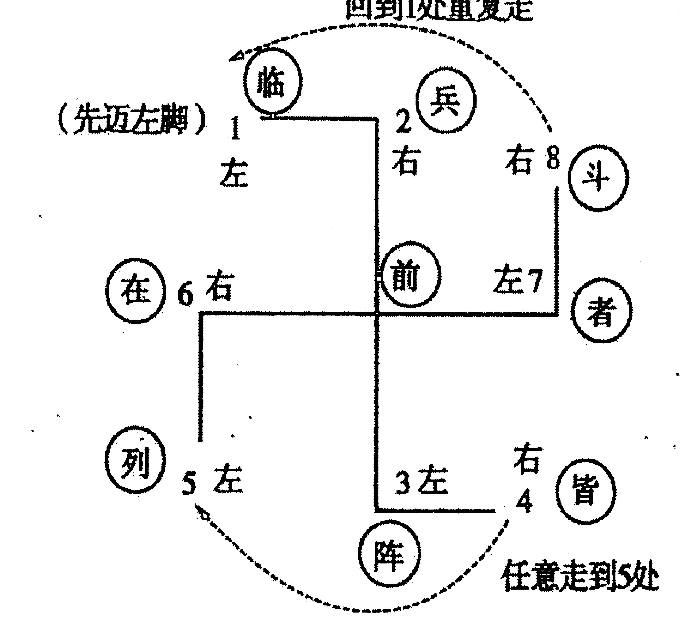

##### 二、踏先天罡步——加大磁场

适宜于运气、财运多年不好；楼房开工总出灵异之事。若是开工盖房，就在地面的中宫做。

- 1）先天罡步……在客厅踏，一步一个宫位。按照 1-2-3-4-5-6-7-8 的数字排列走。如图。

另有按照先天宫位数步法来走的：一--二--三--四--中五--六--七--八--九；各宫写上各个原星名称，走完后烧各宫的星符。烧一张或按宫位数烧更好。

- 2）客厅中宫。罡步走完后，客厅中宫烧如下符：元宝，五路财神符，万能符，天师符。此两步可单做，最好一起做。
- 3）加大磁场。很多问题，老人，孩子不好都可做。亦可弄一张布画上九宫，做时放开，方便一些。

###### 先天罡步图示

| 辅四<br>2步 | 英九<br>1步 | 芮二<br>5步 |
|-------------|-------------|-------------|
| 冲三<br>3步 | 中宫        | 柱七<br>6步 |
| 任八<br>4步 | 蓬一<br>8步 | 心六<br>7步 |

##### 三、各种罡步走法示意图

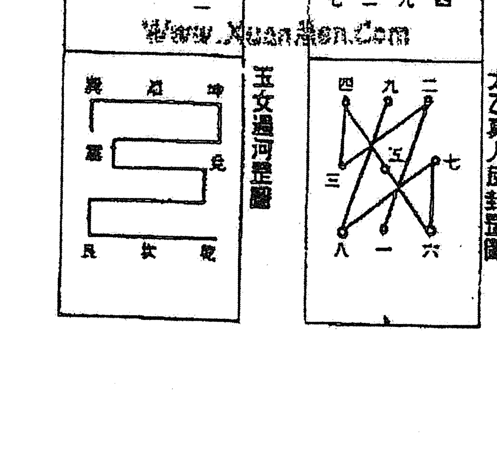

## 第八章、催财

#### 第一节、艮宫催财法

##### 一、催财盘做法

在A4纸上画或打印一个先天八卦和一个后天八卦。两卦图相叠加，先天放后面，后天放前面（先基础后发展），用双面胶粘在一起，把这两个卦图放在钟表的后面，选一个合适的时间放在艮宫催财。

**钟表必须是圆形的，红或黄图案颜色，直径大于33厘米，要动，有无声音无所谓。放的时间，选冲动它的时间，未日未时挂上。艮的五行为土，故用未冲，用申不可。**

**最好用奇门局，艮有马星的好，但不能有四害。临丁、己入墓、庚不要放。不好，就停一段时间再起局处理。**

##### 二、钟表摆放论点

1、从风水学上来讲“吉凶皆藏于动处”，钟是动的，有转动、去旧迎新之功用，也是吉凶反复变动的最重要媒介，所以钟的摆设还是不可马虎，需要讲究讲究的，特别是声音又响又大的钟，摆设尤需小心。现介绍一下摆放钟的注意事项：

- （1）钟宜摆或挂在吉方而面对凶方，这样它能把对面的凶物挡住和转走。
- （2）家里主钟只需一个，房间如需要小闹钟，一个即可。如果家中的钟太多的话，会造成屋内气场不安，令人情绪焦虑、有反复多变的烦恼。
- （3）钟的形状宜方、宜圆，方圆结合最为安祥，忌三尖八角形等，因三尖八角形的钟易生口角是非，不吉。
- （4）房内的钟宜小不宜大，大则会使人心神不宁，既不利睡眠，也不利学习，尤其是小孩房。
- （5）钟的大小要与住宅大小相配，宅小不宜配大笨钟，以免喧宾夺主，造成声煞。
- （6）钟宜摆或挂在玄空飞星之旺向位，忌退气、病符、五黄、三煞、太岁等不吉之位。
- （7）至于不能走动的大落地钟，宜摆在玄空飞星之当旺山星位。

###### 2、时钟的悬挂

时钟可悬挂在房主生肖的六合位置，如生肖虎，则卦在西北位之亥方，以催动吉气。时钟也可悬挂在城门位置。《逢凶化吉》p303、《逢凶化吉》p14

- （1）易云：“吉凶悔处咎生乎动”。时钟可悬挂于朱雀方，因朱雀方即前方，前方本属动。
- （2）时钟可悬挂于客厅的左方即青龙方，因为青龙方为吉方，所有客厅的左方宜放时钟。
- （3）时钟悬挂的方位，时钟颜色应与该部位五行颜色相一致。
- （4）时钟不要悬挂于玄武方，因玄武为后宜静。忌挂白虎方，虎动不吉；不宜放客厅正中，尽量不要对任何门，不宜悬挂于沙发的上方。

#### 第二节、艮方治病化解法

九宫图中的五行流通从震巽宫木开始生—离火生—坤土—兑乾金—坎水。到了艮宫为土克水，阻止了五行相生的流通。艮为止由此而来。所以艮宫很关键。所有停止不动的象都与艮有关。家里艮方堵了，很不好。如艮方有下水道、门等堵了都不好。

艮有问题对宫坤也不会好。女人生育也会有问题。人体的脾胃，血液、皮肤病等都是艮上有问题。凸起的病，不动了也是艮上的事。

艮象还有小孩。懒、内向、不愿意动。也是种地农民的象，老实、无心机。事业停滞不前，艮象。肥胖的人，循环不好，胖，就是艮上有问题。

##### 一、艮宫清理

- 1、艮方清理

杜—堵。庚—金属、刀、抢、石头等。己—垃圾、花盆等。丁—灯不亮等。

- 2、艮方通关法

一些大病，不要轻易起局。先考虑把东北方空出来。

用一个盆，放2/3的水，用一个铜金属的鸡（酉）放在里面。原理：土生金，金生水。水的作用还在耗土。如放花，则木克土，相克易引起矛盾。

选一个未日未时放上鸡。病人是卯年生，放鸡冲卯不可，大病怕冲，刑克没问题。

##### 二、艮方万能符化解法

- 1、烧化解符法之一。即万能符，又叫化解符（消炎药）

画法：草写“敕令”。符外4个圈，右上圈写“五湖”，右下圈写“水令”，左上圈写“四海”，左下，写“法令”。符内：上写“斩”、下写“丰”。二字的写法现传用变写法，即上面的斩字左边“车”偏旁改为“丰”字写法，右偏旁“斤”不变，下边的丰字写法不变，但下面的字也有写成“斗”的。（符图见后—奇门常用符）

晚上2100时（亥时）后在艮方烧8道万能符（至少烧5道）。并加烧心经一张（心经最好打印在A4黄色纸上）。

- 2、烧化解符法之二。烧万能符+五路财神符+乙奇（在外环境烧，屋外），外面不适合在屋内烧也可以。此为化解磁场，艮为局的磁场，适于不起局或不敢起局的情况下用，任何人都可做。远点无所谓。时间：坤艮宫时日。此法企业或个人催财都适宜。
- 3、万能符亦可解四害。如意识修炼的好，画符能量大，可在四害宫烧万能符来化解四害。
- 4、超度法。

通常在大太极的艮方，烧元宝等。做超度。

#### 三、奇门艾灸（12月班）

象意治病——丁辛——灸的象。

- 1) 补阳气。
- 2) 治疗大病。
- 3) 保健、除湿气。

#### 第三节、罗盘催财

主要用于专门催财。不用起局，选日子即可。八字财运不好可用此法催之。

##### 一、准备

开光可在神图坛上，可开多个。如6个、8个都可。用红色的罗盘，大一点。（一般7--9寸，30公分以上为宜）。罗盘中间放香炉，四个角放油灯。

##### 二、罗盘上画符（重要）

备高度酒、朱砂、狼毫笔在罗盘上画符。见下图。位置：在罗盘的子午两个位置（第一层）画子位符和午位符。符头朝外。符：三勾，敕令。午位符内由上到下写“神月到驻罡”。月字内上面为一点，下为一横。会意，“二月”。子位符内由上到下写“星精到驻罡”。

##### 三、烧香三天

由开光当天的午时开始开光布坛。意念：通神，神我合一（把自己观想透明体，神才能进来）。

点燃油灯，三天（72小时）内不能熄灭。注意补充燃油。

当日午时开始上香三次，每次三支香，共烧9支。烧完一组剩一点时再接上一组，烧完三组后本时辰上香结束。到晚上的子时（当日23:00时始），按照午时的上香程序再上香三次，每次三支。之后，第二天，第三天的子午两个时辰各按照上述上香程序上香。

##### 四、催财布置

罗盘开光完毕后，开始布局催财。

- 1）画五路财神符
朱砂（适当倒点红墨水）高度酒、狼毫、黄表纸。
符：三勾，敕令。内由上到下写“五路财神到罡”两旁再左写“大吉”，右写“大利”。或左写“日进”，右写“斗金”。均可。
符画好后，要折叠成三角形。把符放在罗盘上压在禄位，三角尖朝里正对禄哪个字（如乙禄在卯，符三角尖正压第一层地盘卯字线上）。符里最好包着催财人的信息（十个指甲，头发几根）。

- 2）放盘时间——飞星入斗选时间。（以日柱或年柱择日）
一般以日柱为主。如日干为乙酉9金，就找4金或9金的日、时、刻（生比日或年柱五行的时间，金五行只有比没有土生）。如丁酉日4，丙午时4，己丑刻9。年月可忽略不计（能生比更好）：如不知日干可按年干五行择日同理。
搬家、结婚、出行可采用飞星入斗法择日。

- 3）以客厅为太极点，把在禄位放上财神符的罗盘放在宅内禄位宫。首选日干禄位，不知八字的选年干禄位。
如乙干，罗盘放在东方的震宫正卯位（见下图。）。符叠成三角后放乙禄位，尖头对准卯线，朝里。

罗盘催财布置示意图

#### 五、罗盘催吉说明

- 1）催官、催财都放在禄位。但若此人八字显示有官灾、破财的信息，则不宜催，会起反作用。
- 2）罗盘放在日干或年干的食神方，能克制七杀（官灾、小人）。
- 3）罗盘放在沐浴桃花位，可催桃花。适宜未有配偶者。
- 4）戊己土的禄位在南方，同丙丁火。

#### 六、罗盘的其它功用

罗盘不仅用来定向定位，还有其它重要作用：

- 1）安神：把罗盘放在厚的枕头下，能起到镇宅、辟邪、安神的作用，让你睡眠好，放心不会压坏它的。但要用荞麦皮的枕头放罗盘才管用，像布艺、亚麻、棉的枕头，效果就不好。老用荞麦皮枕头枕着罗盘睡的人，思维境界特别高。可以用小一些的罗盘，三寸左右的就行，不用大的。
- 2）催桃花：把罗盘竖着拿，让水平仪的油跑到上边，在十五、十六月圆之夜，拿着它朝向满月，倾斜成30度夹角，心想“吉利”二字，跟月亮说：“情缘情缘请速来。”不久，情缘就找你来了。这是最大的催桃花工具，是“日月合一”的意思，罗盘为日、满月为月，但必须是满月，取圆缘合位、日月同辉之意，如果是上弦月，催出来的多是脾气暴躁的人，下弦月催出的是消沉的人。罗盘有很多的辟邪、催桃花、催财的功效，只是一般人不会用罢了。
- 3）增加财运：一只手托着罗盘，放到胸、腹部的高度，手一边慢慢的转动，一边慢慢抬高到脖子的高度，从下往上过渡，反复的做这个动作，这是增加财运的，叫做“腰缠万贯”。一只手做完了，再换另一只手，也是同样的动作。任何时间都可以做，天天如此的这样转，就特别好。但要保证把十字天心线必须调到子午卯酉四正位，这个财才正，如果偏一点就成了偏财，如果调到了乾坤艮巽（四维），就是横财、爆财，比如做股票、期货的，但这种财催出来就必须得做善事。
- 4）“打盘”增运：一只手握住罗盘的角，另一只手从旁边进入，敲打罗盘的底部，打底，这是增运之意，但别太使劲。我以前天天都这么做，一边读唐诗宋词一边敲盘，每天五分钟，都可以帮助增运。
- 5）“阴阳转盘”：拿着罗盘顺时针转，内盘不动，转外盘，倒起来，是帮你去掉晦气，顺时去晦，利解决麻烦，尽量在家里的正中央去做，那的气场最硬。
- 6）踩盘：把它当成体重计，放在地上，光着脚上去踩。踩盘的目的是防止你在路途中遇到劫匪抢劫，“踩”通“采”，盘里的福气都给了你，采盘中的精华之气，防止踏入歧途、遭遇灾祸麻烦。但不能一家人都踩，而是谁用这盘谁去踩，别人踩就对它不敬了。而且不能轻易的踩，要时间长一些你跟它混熟了，它才愿意让你踩。
- 7）抱盘：罗盘还可以像抱书本一样抱着，让天池放到膻中穴的位置（在体前正中线，两乳头连线之中点），这是防止心脏病、血液病，利于健康。
- 8）“好日当头”：不用时，罗盘放的位置也有用，放得太高、太低都不好，我一般建议竖着把它放在两个木柜中间的夹缝处，上面用红的套壳一盖，代表“好日当头”，永远有好的日子，一定要露出红色来，如果藏着就不利于好日子出头。可以放在客厅、书房，别放到卧室。

这是罗盘的一些功能。另外，罗盘有一层是64卦，找到“午”所指的乾为天、天风姤这两卦，从这里开始一圈一圈的读，每天都读，可以增加记忆力。

#### 七、罗盘催财例：

2014年6月24日8时4分 阴6局 马年05月27日8时4分 刻盘

庚午 丙寅 壬辰 丙午 (寅卯空) 直符：天芮 直使：死门 旬首：甲辰壬

| 巳 癸 开 | 地 戊 心 庚 景 | 玄 癸 蓬 丁 死 | 白 丙 任 壬己 惊 | 酉 辛 满 |
| 辰 戊 收 ○ | 天 乙 柱 辛 杜 | | 六 辛 冲 乙 开 | 戊 庚 平 |
| 卯 乙 成 ○ | 符 壬己 芮 丙 伤 | 蛇 丁 英 癸 生 | 阴 庚 辅 戊 休 | 亥 丁 定 |

男人面测。壬为用。艮宫符，为事业而来，伤脑筋。时干丙代表顾客（发展平台），又为壬的财。符号多，杂乱。理不出头绪来。反吟，反反复复。
开了个店，无客源。芮，化妆品。质量不好（伤门迫不好）。符价高。为质量不好价又高。
丙√。壬ⅹ。要改变品牌，变成开门。减弱水，加丙。策划做一个免费体验（+丁，丁动起来就是不入墓了）。印卡，写凭卡可免费美容。减少水加上火，把面膜搓热了或放温水里温一下。
处理：找平衡点。四纲都害，看四支，艮为平衡点。处理艮坤2宫，缩小太极。坤上有床（己），有马星（天天睡觉起床即是），把坤作为太极，看床上在哪，若在偏西南方，往北移一下即可。
艮方厨房，管道修好就可以了。

罗盘催财：
本人的日干为辛金（年干也可），禄位在酉上，兑宫无害，有辛可置换（罗盘即为辛）。在酉上放一个开了光的罗盘。（具体见以上罗盘开光催财）。

#### 第四节、五路财神催财

##### 一、五路财神催财的条件：

- 1、有奇门局。
- 2、戊宫须无四害，但空无可以，好。
- 3、较适合落魄很厉害的人。通常情况也可修。
- 4、方位：戊宫方。如此局为西南方。五路财神符画在红纸（黑字）或黄纸（红字）上，把这个符折叠成箭头状的牌位，可用两根筷子两边支起。

##### 二、修炼

- 1、戊日戊时开始修炼9--12天（戊代表乾金的意思）。所有的局的方位各有不同，但修炼的日子须都在戊日戊时开始。修炼时要对着牌位9拜，表达心意。
- 2、观想财神。念咒，每天修炼时念108遍。咒：南无（摩）三满多，母驮南，唵，度鲁度鲁地尾，梭哈。（放录音、歌不可）。
- 3、修完天数后，符就放哪即可。催财的数量不得超过正常的9倍。超过会有因果的（一般根据自己往年正常的财平均数估算一下即可）。

## 第九章、奇门法术

#### 一、常用符

万能符（化解符），五路财神符，三奇符，生门符，开门符，天蓬符，天心符，天辅符、天师符、天师治病符、护身符、五路财神符、地支符等。各符画法见后。

##### 1. 7月笔记

逢事可解四害。如，巽宫有蓬临四害，不知他法处理。可用蓬星符在此宫烧之处理。则四害解之。

为何？答：贴的能量要比烧的能量大，加大能量要贴，除四害烧。

如巽宫无四害，如戊丁蓬生，可直接贴个蓬星符，此宫加大了能量，再贴个生门，丁奇都可。若该宫临死门，就不能用死门符。

若此宫是芮生，就贴生门符，若芮死，就贴丁奇符。

若乙戊，冲生。要财运好，就弄个马（乙戊冲）。

最简单的法，在四害宫烧万能符。但只能解一段时间。但要烧不能贴，万能符只能烧不能贴。生开门等符可以贴。有的人处理局专门用万能符烧，也很好。

##### 2、10月笔记

如无布局物品，可画星符奇在宫位布局。如艮，壬癸心开，可画天心、开门贴在艮宫位。如有三奇，亦可加画三奇符都贴上也可以，其它象意可忽略。把三个符画在一张纸上贴上即可。

三奇符方便画法——三勾，敕令，某奇到罡。

在不会布局的情况下，若本命星在值符宫，则可用本命星（蓬辅心之一）去解局中四害。这个局也可以是自己的局也可以是别人的局，仅限蓬辅心三星且为值符宫方可。其它星不可。把三星画出，在四害宫里烧即可。因值符力大，是局的总导思想。例：兑宫，符乙戊辅惊。画天辅符即可。

##### 3、地支符

- 1) 用于解门破、击刑。八门或天干在相关宫位有刑破时，可用地支符解。
- 2) 合住原宫地支。原宫地支是隐藏的作用力更大。一般适用于，他想离开，不想让他离开（婚上）。针对感情，其它不适合。隐藏的意为原宫地支，如震宫永远隐藏着伤门。但不如奇门串六爻效果好。

#### 二、画符与修炼

修符一般在家中的离宫练习为宜。因离代表符。

##### 1、备料：

朱砂、狼毫笔、高度酒等。一般练习用红墨水+朱砂+高度酒。天师图像。香炉，香，黄裱纸等。一般少用黄 A4 等纸，因纸厚有碍符的能量发挥。

##### 2、画符修炼，建立共同符号。

- （1）画符训练一般至少连续画九天时间为一个周期。
14年甲午，离宫值符。正好在离宫练习画符。每天午时画最好。晚上子时不要画。乾宫时间（19:00--21:00）可以画。
- （2）画符准备：坛图前摆好香炉，烧三柱香（九柱更好），供奉天师等。意念通神、通体天师，想象天师的样子与我同体。一次每种符画一、三、六、九张。连续练习 9 天以上最好。各符可在中宫盖明咒印。

- （3）练习所画的符处理。9天后晚上亥时，到一个正南方找一个丁或十字路口（丁象），加元宝（戊）、香（丁）一起把符烧掉。取象：丁戊+符，同时做了行为风水。作用：天师共振；加强定力；增加了如下象意：名气（符），思维意识都有，财富（戊丁）。

##### 3、万能符（化解符、消炎药）（详见艮方万能符化解部分）

画法：常规草写“敕令”，符外4个圈，右上圈写“五湖”，右下圈写“水令”；左上圈写“四海”，左下圈写“法令”。符内上写“斩”、下写“丰”。二字的写法周传承为变写法。即下边的丰不变，上面的斩字左边“车”偏旁改为“丰”字写法。下面字也有写“斗”的。

万能符亦可解四害，如修炼的好，画符能量大，可在四害宫烧万能符来化解四害。万能符只能烧不能贴。因符放哪里要积累能量的，时间长了不一定好。

#### 三、注意事项

1、关于贴符与烧符的问题。贴符的力量大于烧符，时效也长。但有时不具备贴的条件，如坤宫不能贴，明显让人看到的地方不宜贴等。这种情况只能烧。万能符只能烧不能贴。

2、开业用开门或生门符，但巳卯日时开门为门破尽量避开。生门可用。生门：病、生孩子用生门符，但不能在坎宫时间用。

3、宫象画符可画在一张纸上。如：巽符戊丁蓬死。把死门变生门，就会发生一些事。

| 五路财神符 | 天蓬符 |
| :--- | :--- |
| 丁奇符 | 生门符 |

若怕事情败露，开门换杜门。方法同上。

##### 4、其它

- （1）、《神奇符咒》P41：画符心诀：画符须被日月利日，否则不仅不灵且本人有灾。画符时辰为：亥子午卯酉。画符要请神念咒（画符咒、净身、心、口、安神等咒p37）。
画符咒：天圆地方，律令九章，吾今下笔，万鬼伏藏，急急如律令。
- 2）、被人下咒之后的破咒术（茅屋君子）
男左手心贴在中丹田上，右手心贴在左手掌背上，男左女右，站在地上默念咒语，天道毕，三五成，日月俱，乾坤明，气即道，环吾身，通神灵，显神威，我去昌，彼遭殃。（7遍）咒念完吐一口吐沫在前面踩3遍，男左女右，对方任何咒术可失灵。

#### 四、奇门主要符咒

##### 1、2014年7月班

###### 奇门常用符

| 符咒图像1 | 符咒图像2 | 符咒图像3 |
|-----------|-----------|-----------|
| 符咒图像4 | 符咒图像5 | 符咒图像6 |
| 符咒图像7 | 符咒图像8 | 符咒图像9 |
| 符咒图像10| 符咒图像11| 符咒图像12|

###### 奇门常用符

| 符咒1 | 符咒2 | 符咒3 |
|---|---|---|
| 包含符咒图案，文字：身体健强、地藏菩萨 | 包含符咒图案，文字：（凡女人起世用）、身体健强 | 包含符咒图案，文字：（四面八方）、里 |
| 包含符咒图案，文字：（病）、大吉、大吉（戊己） | （空） | 包含符咒图案，文字：四海、五湖、七洲等 |
| （空） | （空） | （空） |

###### 奇门常用符

2014年12月25日

一个包含多行多列的表格，单元格内是手绘的奇门遁甲相关符咒符号和文字，背景为斑点状纹理。部分单元格为空或有涂黑区域。

###### 护身符：

###### 求财符：

###### 天师治病符

更多资料加微信：yueweiyixue
更多资料加微信：lan46693763

宫里能量弱，画符贴到巽宫（伏吟局提示你要贴，两个东西沾在一起，要两份）。一个贴上，一个烧掉。隐干癸到离，有景门，告诉你要烧一下。

##### 3、2015年3月班

###### 奇门常用符（15年3月18日班）

第一行：
- 收财符（1）
- 求财符（2）：放钱包或床头北方烧
- 招财符（3）：（收）

第二行：
- 通关符：起名符常（不起名不用）
- 平安符：放正北或放钱包
- 小人符：（小人）

第三行：
- 大病符（1）：他（地）安（南水）
- 大病符（2）：放东北
- 安神符：（安神）

第四行：
- 破关符：请神符（破）
- 足病符：（足）
- （模糊符文）

（1）烧符一般到屋外。
（2）某大病（1）（2）病符配合起来烧掉，放水里喝可减轻痛苦。

###### 奇门常用符 (2015.3.21)

| 符咒图像1 | 符咒图像2 | 符咒图像3 |
|-----------|-----------|-----------|
| 符咒图像4 | 符咒图像5 | 符咒图像6 |
| 符咒图像7 | 符咒图像8 | 符咒图像9 |
| 符咒图像10| 符咒图像11| 符咒图像12|

烧符一般在屋外烧。

###### 课堂原符（照片）

###### 催财符（1）

###### 求财符（2）

(1) (2) 符放钱包或东北烧均可。

###### 招财符（3）——最快

###### 平安符

贴正北或带钱包。

###### 调官符

起局符宫要好，不起局亦可带身上。

###### 小人符，超局后在小人宫位烧掉。

###### 大病（1）

###### 大病（2）

若大病，（1）（2）配合起来烧掉，防水里喝可减轻痛苦。

##### 4、常用符：

###### 1) 三奇符

###### 2) 墨符

###### 玉真道大修正

| 天蓬符 | 天任符 | 天心符 |
|---|---|---|
| (符咒图像1) | (符咒图像2) | (符咒图像3) |
| 天英符 | 天芮符 | 天辅符 |
| (符咒图像4) | (符咒图像5) | (符咒图像6) |
| 天冲符 | 天柱符 | 天禽符 |## 3) 八门符

#### 玉真道人修正

| 符咒图案 | 符咒图案 | 符咒图案 |
|----------|----------|----------|
| 开       | 休       | 生       |
| 符咒图案 | 符咒图案 | 符咒图案 |
| 伤       | 杜       | 景       |

符咒图案

死       | 惊       |          |
| 符咒图案 | 符咒图案 |          |

六仪咒诀[掐诀是大拇指点住12地支]

戊仪：掐甲子诀念咒：阳真之精，运财如风，聚财集宝，不得久停。如天师律令赦。

#### 4) 六甲符

| 甲子 | 甲戌 | 甲申 |
| 甲午 | 甲辰 | 甲寅 |

> 朱书 符 慎勿 传

戊仪：存想戊仪形象，取剑向空中催符一道，掐甲戊诀，念甲子戊咒：首领乾坤，黄镇将军，须黄发赤，鼠首人身。副将文霸，赤脸长身，镇守北极统领雄兵。催山缩地，走石扬尘。天师秘旨，速来队伍，听令施令，急急如律令。念毕开目存想，再催符二道，念咒。存想黄镇领兵降临左右，取印左手，右手仗剑；喝曰：以后随叫随到，火速现形，听令奉行，若然不到，遣下雷霆，暂且退去，营中听令。放印剑台上，拜尔退去。

#### 5) 六仪符

己仪：重颅将军，人面蛇身，丈八蛇矛，腾蛇绕身，口中剑石，变化纷纭。随将丁丑名太常持枪摇铃，统兵万万，虎豹如林，开山塞河，扬沙走石。天师密旨，召你临坛，听令施行，急急如律令。巨之咒：勿得迟延，速现真形，承宽度自用，今到无情，急急奉行。

以左手食指，无名指，小指，三指紧握，俱插中心横纹，以中指掐大指上节横纹，却以大指压覆中指，紧握之。

4. 辛仪：甲午之神，萧烈将军，眉清粉面，铠甲浑银。奇鹄骋马，喜作诗吟，丁酉为副名倾伟朱冠德仁，领兵万万，步雨兴云，弥漫日月，搬运金银，逢敌丧胆，鬼逢亡魂。天师密旨速召降临……

壬仪：甲辰之神，蔼涤将军，首领天下，挟卫北辰。貌欺罗刹，钟馗后尘。金锁环卯，乌龙奔云。副将丁未名飞通率兵万万，抓雾拿云。沉山作海，鬼哭神嚎凭空旋虚，嘘气督兵，天师密旨，速召降临。急急如天师律令。

以左手食指，无名指，小指，三指紧握，俱插中心横纹，以中指掐大指上节横纹，却以大指压覆中指，紧握之。

4. 辛仪：甲午之神，萧烈将军，眉清粉面，铠甲浑银。奇鹄骋马，喜作诗吟，丁酉为副名倾伟朱冠德仁，领兵万万，步雨兴云，弥漫日月，搬运金银，逢敌丧胆，鬼逢亡魂。天师密旨速召降临……

壬仪：甲辰之神，荡涤将军，首领天下，拱卫北辰。貔貅罗刹，钟馗后尘。金戟环甲，乌龙奔云。副将丁未名飞通率兵万万，抓雾拿云。沉山作海，鬼哭神惊凭空使虚，魑气皆兵，天师密旨，速召降临。急急如天师律令。

6. 癸仪：甲寅之神，黑豹将军，面如黑铁，红甲鸟鞭。手持钢鞭，声吼如雷。副将伊如，獠牙赤发，亿万天兵，如猪如熊，隐伏潜行，临锋速发，呼啸山风，山摇木拔。天师密旨，召你速来，听吾速发……

篆才未发，亿万天兵，即刻卡拔。天师密旨，召你速来，听吾速发。

注：数练之后，用时直呼其名或阵名，列阵内，各显其能，如斩妖捉鬼。

#### 5、12地支符

#### 十二地支

#### 五、其它（民间）符咒：

#### 1、治病万能符

适应症：诸病皆宜，如符名。

用法：

+   (1) 用剑指书符于水中或意念书符发往患者病患处。
    (2) 写此符的顺序：横、横、横，竖、撇、捺，再写左边的点提勾，最后写右边的对勾。
    (3) 注意三横是一个比一个长些。
    (4) 忌用剑指在病人身上划此符。

注意事项：恭敬态请符

#### 2、斩小人符

（用法不传）

# 河洛数术铁板桥

## 第一断语

批曰：
潜龙勿用夺金榜　有人竞标小心防
骏马嘶鸣芳草地　鹤高鹿鸣飞龙昂

## 第二断语

批曰：
日月轮回值神明　善恶报时甚慰灵
志士兴邦能辅国　忠孝节义可佑民

## 第三断语

批曰：
洛阳牡丹长安花　百花争妍未及它
春风己过仍增色　快马加鞭骤然发

## 第四断语

批曰：
春花娇媚多争艳　突遭冰雹几飘摇
九月盛菊幽芳香　反耐霜凌迎雪傲

## 第五断语

批曰：
三月东方春雷震　六月东南巽为风
卧龙猛虎闻惊喜　风云聚会救苍生

## 第六断语

批曰：
亦明亦暗非玄奥　非高非低非浅深
万法归宗一妙道　劝君着义细搜寻

## 第七断语

批曰：
睡狮猛醒君须悟　无须交虑勿误疑
大路平坦任驰骋　巧功心机随变易

## 第八断语

批曰：
虑卧深山别有期　那管他人瞎狐疑
春暖雁来便知发　声名此时可达机

## 第九断语

> 批曰：贵宾约至可待期 干枯梧桐凤来仪
不可一进求长短 休理他人暗舌叽

## 第十断语

> 批曰：孤雁出群独征鸣 羽翼未成纠纷争
坎宫北进平安地 朝云暮雨事有凭

## 第十一断语

> 批曰：远无踪影近无迹 左右上下难寻觅
突然平地起风波 始初颜笑终成泣

## 第十二断语

> 批曰：举头三尺有神明 事到临头莫乱行
放却底线动手脚 悠悠先去肩上绳

## 第十三断语

> 批曰：得意之时逢美妇 前程有缘藏珍珠
求名有望三六九 二五八时圆月出

## 第十四断语

> 批曰：风波亭中撼山岳 秦贼一意要孤行
巧中藏拙出大智 四两拔千终蹉跎

## 第十五断语

> 批曰：一江春水向东流 问君能有几多愁
信断千里等消息 三月春色梅花开

## 第十六断语

> 批曰：心私同事似有知 同门之外乐好施
须多唯系功交加 百番周旋事有终

## 第十七断语

批曰：
举足欲行还犹止 徘徊不已费心思
藏玉怀珠唯自知 寸心千里莫疑追

## 第十八断语

批曰：
心底虚慌口啾啾 一番思虑一番愁
尤恐起落着意防 说了休时又不休

## 第十九断语

批曰：
不远有近执意行 似易似难细分明
等闲一事非闲事 云中笑看登天程

## 第二十断语

批曰：
运值桃李笑春风 飞到西方又到东
事在家中无结意 谁知船在浪涛中

## 第二十一断语

批曰：
恰似一水连一山 一山又被一山旋
博争山穷水尽处 欲求名利不为难

## 第二十二断语

批曰：
名利之举事相扶 任其舍身只半途
惊恐翻覆终可免 只见风波一点无

## 第二十三断语

批曰：
命值此运喜喜喜 却如生风春桃李
此番不用强忧煎 时来明月人千里

## 第二十四断语

批曰：
莫要心中喜孜孜 多须此刻心戚戚
诸般打算要平安 务要用意防出入

## 第二十五断语

批曰：

+   镜中之影见不见  当面防贼不背面
+   看见如同没看见  合处逢冲到底散

## 第二十六断语

批曰：

+   桃花开处又迎春  恰似青山旧换新
+   坎水林下欠之计  艮宫当运画朝坤

## 第二十七断语

批曰：

+   运中失一自己错  心怀狭窄自成病
+   偏僻道路不道心  真人指引不成魔

## 第二十八断语

批曰：

+   官禄驿马交驰纲  男儿得时增增上
+   前缘修善命中定  一世荣归乐极昌

## 第二十九断语

批曰：

+   婚姻早定走肖钱  子午鸡兔虎猴占
+   花开石李陶梅桂  关唐长弓是姻缘

## 第三十断语

批曰：

+   绿中黄花入大阁  老妞白发方如可
+   精力半生献大业  躬尽了了却若何

## 第三十一断语

批曰：

+   春离冬合一瞬间  犹如三秋在天边
+   同伴随行方不滞  一路顺畅马啸欢

## 第三十二断语

批曰：

+   乐极生悲忧患至  风泽坎离分吉凶
+   未能方展胸中愿  夕阳婉如正午中

## 第三十三断语

批曰：
身经坎坷数数中   轻舟入海反无风
努力可达名富禄   舍弃小利见大功

## 第三十四断语

批曰：
阴阳月缺十五圆   老来枝芽人更艳
水秀湖泊美中醉   登山翘首望青天

## 第三十五断语

批曰：
吴魏蜀国蜀道难   请师如同尊严天
前程远大自足虑   得势因在桃园三

## 第三十六断语

批曰：
桃李满园万象新   坎水得生树成林
婚姻喜美子孙孝   仙助之时乐吟吟

## 第三十七断语

批曰：
舍利金丹同仁义   佛道原来是一家
万马归猿齐朝洞   虎伏龙降得道人

## 第三十八断语

批曰：
黄鹂报信展大鹏   春来秋去事已成
玄机车未合中取   功名富贵好前程

## 第三十九断语

批曰：
得道多助放灵丹   救人已过万万千
观音显灵万神助   功德全备入仙班

## 第四十断语

批曰：
一生如水碧澄清   舟行江上月到明
玄妙只在其中稳   一事误已险丧生

## 第四十一断语

批曰：
桃李春光百花艳 良辰美景好姻缘
随心所欲皆无忌 逍遥自在赛神仙

## 第四十二断语

批曰：
藏中显露出中微 书山有路悟中魁
五行玄机参得透 三界之中也耀辉

## 第四十三断语

批曰：
枪打树梢出头鸟 话到舌边半句留
有柴可烧青山在 运气不到莫强求

## 第四十四断语

批曰：
四顾求索无门路 试探佛道经可通
修心养性成正果 万年鹿鹤寿如松

## 第四十五断语

批曰：
生来根深叶茂长 十里八村走他乡
一食鸣鼓响钟地 三堂舍利见门墙

## 第四十六断语

批曰：
奔波一世何时休 镜里观花虚浮求
无常一到万事尽 不如急早来回头

## 第四十九断语

> 批曰：
沉沉病染气不通 不见天心指酉中
雷门一震冲脉起 体健身强脚步轻

## 第五十断语

> 批曰：
财源驿马两头昌 姻缘官禄定有方
猪羊牛犬命理数 运到不求自主张

## 第五十一断语

> 批曰：
初限走马一场空 一生一事得成功
桃园李盛千秋载 豪不费力借东风

## 第五十二断语

> 批曰：
地初忧愁谨自怀 中程喜事笑颜开
秋月红榜高台挂 信息人儿千里来

## 第五十三断语

> 批曰：
稳坐原地出力早 远游不顾官司遭
长竿钩向蟾蜍窟 没想得到大巨鳌

## 第五十四断语

> 批曰：
人在远方无踪迹 若在眼前难分觅
顺水行舟遇沙滩 目下忍耐莫贪力

## 第五十五断语

> 批曰：
山水蒙之地风升 江上陆路皆不通
目标之大音信远 凭仗他人借东风

## 第五十六断语

> 批曰：
姤卦变冲起风烟 时下运气未能全
但过鸡羊三五月 高处随意觅姻缘

## 第五十七断语

+   - 批曰：
    - 正直宣守动生灾 八门休生艮为开
    - 行通非往死门去 坤宫当旺称心怀

## 第五十八断语

+   - 批曰：
    - 运气不到待时机 谨防小人暗里欺
    - 征战生离人吉相 信在牛马人在西

## 第五十九断语

+   - 批曰：
    - 是非纠缠乱纷纷 红墙钟庆独掩门
    - 垂目敛看望灯火 伴我早晚度黄昏

## 第六十断语

+   - 批曰：
    - 知己红颜命却薄 心地善良切莫高
    - 舟行水里顺风走 人在车中显英豪

## 第六十一断语

+   - 批曰：
    - 想要过河桥已断 想要后退路不通
    - 登舟理楫忙里错 船到江心遇狂风

## 第六十二断语

+   - 批曰：
    - 深潭之月照影中 六冲之卦冲对冲
    - 排场之大空无物 平安有信过一生

## 第六十三断语

+   - 批曰：
    - 湖海宽扩意悠悠 太公烟波下钓钩
    - 若逢狗马龙虎兔 富贵名利一齐收

## 第六十四断语

+   - 批曰：
    - 空中之物抓不牢 张飞猛喝八断桥
    - 二次返乡重整理 漫不经心步步高

## 第六十五断语

批曰：
入而容易出而难 反反复复一二三
交合两下不中意 时运不济等月圆

## 第六十六断语

批曰：
办事宜缓快不求 反覆之中有一收
直到年终冬雪至 虽然花残果已熟

## 第六十七断语

批曰：
乘马快行求前程 所求之子吉贞亨
一生时来运气美 月圆月缺两次明

## 第六十八断语

批曰：
舟离沙滩月出云 前程似锦非问津
慈善之家有好报 福禄双全后来人

## 第六十九断语

批曰：
有力可行无不足 心曲难伸事难估
月半野塘风雨过 梦断邯郸解愁愁

## 第七十断语

批曰：
一世美中有不足 不足之中美一世
婚姻前程多得助 桃园结义有始终

## 第七十一断语

批曰：
人生湖海荡悠悠 一叶孤舟破浪头
来往之中人未渡 残阳西山照满楼

## 第七十二断语

批曰：
深户篱笆把得牢 恶狗小人防暗道
口舌是非无处寻 好事连连有根苗

## 第七十三断语

> 批曰：
江海涛涛意悠悠 学着太公下钓钩
连获六鳌比峻大 笑谈之中一网收

## 第七十四断语

> 批曰：
时运不济未强求 花开花落几春秋
心无定处稳中觅 身在一处心两头

## 第七十五断语

> 批曰：
一得当中有一失 虽然退后好事先
始路坎曲通大道 好事多磨自安然

## 第七十六断语

> 批曰：
初限中年做事难 突然平地起波澜
河东河西两种样 夕阳晚霞换新颜

## 第七十七断语

> 批曰：
心有余而力不穷 磨刀不误砍柴功
一歌一曲东方亮 倚仗他人度春风

## 第七十八断语

> 批曰：
身心不安为哪般 动动静静两三番
运到不用去求索 相交罗汉已成仙

## 第七十九断语

> 批曰：
事了情了物未了 人圆月圆物未圆
要知玄机端的信 日影中秋上琅轩

## 第八十断语

> 批曰：
春阳发的木中求 三阴伏根事本由
樵夫欲作柴薪砍 哪知梁材东吴收

## 第八十一断语

批曰：一镜碎来如月缺 两两三三为那何
人若团圆醒来梦 无可无可怎么说

## 第八十二断语

批曰：
马到临安车到站 日月阴阳分两岸
旌旗义举被招安 光大前程来讨叛

## 第八十三断语

批曰：
我为何宿在河南 海来河北成名川
神光点点渎光宇 真达九天冲霄汉

## 第八十四断语

批曰：
金鳞宝马已到手 谦谨还得须防走
若论耐心比周全 见面谨言还戒口

## 第八十五断语

批曰：
一口苦酒展愁眉 义士二盗九龙杯
天地人合桃园好 四面八方有作为

## 第八十六断语

批曰：
野鬼暗箭主人惊 魂魄游荡壳中空
突然红日沉东海 难破空中事不通

## 第八十七断语

批曰：
福星吉照贞利亨 日在中天人威风
青龙飞舞观天下 万年载物到明庭

## 第八十八断语

批曰：
独自钩钓在寒潭 突然中途起波澜
水寒钩小鱼不饵 人出空载明月还

## 第八十九断语

> 批曰：
万法归宗只求一 劳心劳力调不齐
运中待机贵人助 东风借力可称奇

## 第九十断语

> 批曰：
云开日出天正中 光辉到处事事通
路途虽坎逢水顺 千里一念快如风

## 第九十一断语

> 批曰：
剑戟如林独自尊 防备盗贼必来侵
擒定盗贼打胜仗 归国封侯荫子孙

## 第九十二断语

> 批曰：
水阔潭深舟亦停 路遥山险步难行
龙蛇自有通天日 夜半天空月圆明

## 第九十三断语

> 批曰：
意欲要迁而未迁 极乐生悲有勾连
前途若得妇人指 鲤鱼化龙跳大渊

## 第九十四断语

> 批曰：
东方儿女一人出 西方俊少一人来
清风明月手对手 获得金榜下高台

## 第九十五断语

> 批曰：
喜喜喜来喜隐悲 花遭大雨狂风吹
古木当槽观不使 玄机已知坚中危

## 第九十六断语

> 批曰：
百里旌旗帅将出 受命六尺可托孤
钟期遇鼎勿时延 他乡聚首乐呼呼

## 第九十七断语

批曰：

+   此际报来运上行 桃花春色满月明
    快马加鞭平坦路 名利双收好前程

## 第九十八断语

批曰：

+   鼠入上穴可安身 日中休闲得龙吟
    山中百兽猛虎啸 夜静巡行大为尊

## 第九十九断语

批曰：

+   壮志未酬事不休 坤方为吉随意游
    腰缠万贯艮宫地 驾鹤腾云到九洲

## 第一百断语

批曰：

+   天地开泰否卦来 喜获得珠乐开怀
    损卦失耳物不见 坎卦之旁水里埋

## 第一百零一断语

批曰：

+   国有贤士无不能 廷无奸臣好众生
    干戈不用勤致富 常享太平进大同

## 第一百零二断语

批曰：

+   泰来否极水满倾 诸事莫要忧心情
    一点灵丹行方便 独得真传万年功

## 第一百零三断语

批曰：

+   民乐之业官更清 百年盛世响大钟
    千秋大业伟人指 万里无云昊当空

## 第一百零四断语

批曰：

+   安如泰山稳如磐 放胆前行自安然
    中通外直方周全 好事成双美名传## 第一百零五断语

批曰：
丹桂灵芝月中生 人若取之手中空
足下生梯好落脚 勇住向上攀高峰

## 第一百零六断语

批曰：
天问群雁一孤鸣 悲切嘹呖叹几声
试问知君能有几 偏僻寒冈藏卧龙

## 第一百零七断语

批曰：
红颜命薄痴情郎 凋零一夜风雨狂
酉鸡叫醒马前梦 心事成空眼茫茫

## 第一百零八断语

批曰：
忙乱多错理如麻 日被云掩不露霞
坚定方向自己走 耽搁成空事多杂

## 第一百零九断语

批曰：
好马不吃回头草 旧辙不如驾新车
东西南北八方走 稳步逍遥唱情歌

## 第一百一十断语

批曰：
夜梦之圆被鼠惊 醒来不见人和踪
终宵废寝夜里梦 直到天明想不通

## 第一百一十一断语

批曰：
秋霜肃凉夏日炎 新花鲜了旧花残
世故人情看冷暖 风过炎凉看当前

## 第一百一十二断语

批曰：
西北为乾夺前标 驰骋战马不辛劳
英雄大展鸿图志 问卜前程当自豪

## 河洛数术铁板桥

## 第一百一十三断语

批曰：
病染沉沉终日昏 雷门一震百里闻
身轻体健优姿美 原来地下有一坟

## 第一百一十四断语

批曰：
易不易来难不难 突然平地起波澜
惊垫一过磨难去 人欢马啸两三番

## 第一百一十五断语

批曰：
四门紧闭路不通 提防小人暗里攻
云藏月黑坎坷路 时运不到多包容

## 第一百一十六断语

批曰：
六合利小变六冲 堵塞很久已变通
羊头狗肉人笑你 宜始红火不宜终

## 第一百一十七断语

批曰：
珠玉放光走盘中 田园五谷定然丰
休言谋略未遂意 此去光大便亨通

## 第一百一十八断语

批曰：
八月子时月圆明 九月菊花赛丹红
事体悠悠慢中稳 泰卦六合利贞亨

## 第一百一十九断语

批曰：
朦胧秋月映朱门 林处钟响一僧人
少小有缘道僧路 自有贵人来接引

## 第一百二十断语

批曰：
事宽体窄心不安 忙忙碌碌又一年
千头万绪忙里错 三思而行始安然

## 河洛数术铁板桥

## 第一百二十一断语

批曰：
虚位假名未见真 禄马歪邪病沉沉
春季栽花秋后果 风调雨顺万物新

## 第一百二十二断语

批曰：
有动有终也有始 适可而止止止止
似月如花圆又灿 守成而已动变否

## 第一百二十三断语

批曰：
万里长江明月圆 千花丛中独一艳
风云集会来相送 龙凤和合度百年

## 第一百二十四断语

批曰：
宝镜圆明照两人 相意容容合通心
有时因事分两地 身在两地心不分

## 第一百二十五断语

批曰：
居下和合上不亲 心从易学散离身
事机都好终失一 蜡烛成灰泪连心

## 第一百二十六断语

批曰：
久临尘埃岁蹉跎 幽窗寂静是为何
若逢青紫贵人引 功名财利好自多

## 第一百二十七断语

批曰：
虎睡路旁人经途 行人暗自莫乱呼
小心谨慎过得去 灾消云散自然无

## 第一百二十八断语

批曰：
和不和来同不同 翻云覆雨几成空
进须提防功劳少 倒退反而立了功

## 河洛数术铁板桥

## 第一百二十九断语

批曰：
东边做事西边成 风物眼量月夜明
万里长江浪淘尽 高楼窗下听笛声

## 第一百三十断语

批曰：
此运到来事团圆 万物临春可周旋
一来一往多少事 平步登云上青天

## 第一百三十一断语

批曰：
浅水之下起风波 平地山冈荆棘多
言语商谈虑参考 恐他混水把鱼摸

## 第一百三十二断语

批曰：
秋月云开定有期 雨过天晴花开时
若逢他乡遇知友 推荐受聘上云梯

## 第一百三十三断语

批曰：
左右为难心已定 万事开头别怕忧
本想一杆钩上钓 不意功名一网收

## 第一百三十四断语

批曰：
他迷意迷己不迷 事事而宽心不宽
要等信息信不到 做事不果两重山

## 第一百三十五断语

批曰：
乐极生悲有不足 里里外外见愁哭
云散月辉节令过 好事多磨终成福

## 第一百三十六断语

批曰：
喜鹊窗前舞翩翩 忧虑全消喜自然
一人进了一人退 一生得了好姻缘

## 河洛数术铁板桥

## 第一百三十七断语

批曰：
荆棘满地体不康 风波海浪起四方
倚栏惆怅昂天望 寂寞无语对残阳

## 第一百三十八断语

批曰：
大江东去几多愁 谋略已定事何忧
点头微笑云中客 月照明火上重楼

## 第一百三十九断语

批曰：
好剑好刀人也奇 地利为我与天时
灯火礼炮传言后 动进静退总相宜

## 第一百四十断语

批曰：
遇不遇来逢不逢 月沉海底入梦中
此运交来多忍耐 云过日出满天红

## 第一百四十一断语

批曰：
暗中防备一霹灵 猜虑无实在半空
转眼拨开云和雾 红日当头照我明

## 第一百四十二断语

批曰：
利在中土出战争 一番得获立王庭
凤衔丹诏归龙畔 得享佳名四海荣

## 第一百四十三断语

批曰：
外忧内患闹不休 意结牵缠事根由
心神不定做颠倒 稳装呆傻可度秋

## 第一百四十四断语

批曰：
一重水来一重山 风波尽处道坦然
手提狼毫舒广袖 醉诗壶中有洞天

## 河洛数术铁板桥

## 第一百四十五断语

批曰：
遇险化夷不须忧 风波何足道哉愁
若逢草头姓人氏 咫尺青天随意游

## 第一百四十六断语

批曰：
船到江心有柁尊 花开有姓又逢春
事情已宁心不静 惹起多疑又多心

## 第一百四十七断语

批曰：
可蓄可储库为仓 玉堂金珠放紫光
该停则停事求稳 大展鸿图驷马良

## 第一百四十八断语

批曰：
立完事业立家庭 青云顶上问前程
贵人相助不费力 花谢有籽栽还成

## 第一百四十九断语

批曰：
一心一意发两根 两根也是一条心
枯树老来发新芽 交节换令待来春

## 第一百五十断语

批曰：
大安不动恐难圆 残花已谢不在鲜
空亡已过占速喜 西阳红尽也留连

## 第一百五十一断语

批曰：
玄武有诈不可摸 可进可退守则多
昙花一现光彩照 天边挂月圆又缺

## 第一百五十二断语

批曰：
此运做事犯留连 半途而止不堪言
靠住君子小人去 金钓撒网鱼装船

## 河洛数术铁板桥

## 第一百五十三断语

批曰：
事体称心忌误多 三思而行还琢磨
欲往且住迟缓缓 借助势力笛伴歌

## 第一百五十四断语

批曰：
到处游走心不安 两两事事皆相关
龙舞鸡鸣运到此 悲伤转笑却又欢

## 第一百五十五断语

批曰：
火风鼎卦变为蒙 损卦脱辐财官争
重整旗鼓再而再 贵人暗助借东风

## 第一百五十六断语

批曰：
此运批来事不宜 波涛扬沸口舌吼
事情反复无伤害 时间不到待有期

## 第一百五十七断语

批曰：
贵客相亲自有成 名利捶手见大功
获金取银须积德 仰望东方太阳升

## 第一百五十八断语

批曰：
平地之上起风波 艰难岁月赶蹉跎
谈笑之间终有意 晚景极好事多磨

## 第一百五十九断语

批曰：
狂风吹来黑云飞 月在天心箭似归
逍遥无事神仙日 无克无破酒中杯

## 第一百六十断语

批曰：
身在江湖人倚楼 利剑断水展多愁
瞻然得运进一步 从此快乐事无忧

## 河洛数术铁板桥

## 第一百六十一断语

批曰：
沐浴朝阳花遇春 枯枝朵朵两重新
专心一致方为合 切忌反复存二心

## 第一百六十二断语

批曰：
半生坎坷道路遥 门庭闭塞几条条
东方一震云雾去 离宫为火星为苗

## 第一百六十三断语

批曰：
不想钓鱼鱼上钩 初限美好争上游
中运不济难收拾 晚景着力再等候

## 第一百六十四断语

批曰：
东墙相引更相牵 西房殷勤喜自然
功施计谋无不利 愁事去后转团圆

## 第一百六十五断语

批曰：
心疑当头有事非 一番笑罢一番悲
红花落地东风扫 独对西风怅黛眉

## 第一百六十六断语

批曰：
上下不和又不同 劳而反来没有功
游魂大卦通大道 坎方有始又有终

## 第一百六十七断语

批曰：
大幸得来全有功 有益无咎利中逢
加鞭快马云中燕 报在三秋信已通

## 第一百六十八断语

批曰：
桑榆之林催暮年 月缺半轮恐难圆
若遇刀锥大侠客 换发青春喜自然

更多资料加微信：yueweiyixue
更多资料加微信：lan46693763

## 河洛数术铁板桥

## 第一百六十九断语

批曰：
遍览史书前事先 历险往来步维艰
若得借力东风使 扁舟必过完达山

## 第一百七十断语

批曰：
莫叹残花已无鲜 花间枯树有勾连
屋头春意凡间事 喜笑嘻嘻又一年

## 第一百七十一断语

批曰：
一事成来一事空 一成一败也殊荣
若遇口旁人一个 心下平和有前程

## 第一百七十二断语

批曰：
欲得月中小白兔 须凭桃李满园度
高山大川来接引 双喜临身蹬高步

## 第一百七十三断语

批曰：
事情随心勿忧煎 春风得意喜自然
姜老太公三尺钓 得意文王获鳞鲜

## 第一百七十四断语

批曰：
圆又缺来缺又圆 低低密密要周旋
不是春风秋得意 时来运转始见缘

## 第一百七十五断语

批曰：
骑着病马上危坡 小心防失马步跌
春风已过中而立 未运勤劳见蹉跎

## 第一百七十六断语

批曰：
两事已和跨西东 轻舟摇浆遇顺风
得到迷人心得意 高歌奋亢急流中

## 河洛数术铁板桥

## 第一百七十七断语

批曰：
白玉无瑕蒙尘中 黄金土埋不露锋
若想光辉人得志 还须人举借东风

## 第一百七十八断语

批曰：
上接不稳下不和 相缠相忧麻烦多
能忍则忍待时过 不然平地起风波

## 第一百七十九断语

批曰：
背后得意笑喜喜 中运得道最多宜
所求之事终有望 不必皱眉不用急

## 第一百八十断语

批曰：
憔悴无人问轻烟 林间静语听杜鹃
一声山月鸣翠笛 千里涓涓泪连连

## 第一百八十一断语

批曰：
菱荷香玉爱深恩 桂魄圆时印绶新
从此威名山岳重 登云直上位昆仑

## 第一百八十二断语

批曰：
花落之时正逢春 新人半路有信音
事情虽成不到位 牵绊两句到巷深

## 第一百八十三断语

批曰：
欲行未行期待行 徘徊不已意念穷
动摇不定莫强办 得止且止摸石踪

## 第一百八十四断语

批曰：
心下之事且安然 周旋之计尚未全
逢龙有吉鸡鸣处 人也圆来月也圆

## 河洛数术铁板桥

## 第一百八十五断语

批曰：
梦里观花两不全 深潭下钩钓鱼难
名利转运终有望 目下等待未开颜

## 第一百八十六断语

批曰：
逢山开路水舟风 营求指日待可成
许多闲言和杂语 翻云日出笑歌声

## 第一百八十七断语

批曰：
儿女私情休眷恋 眷恋只能误前程
一心两用终闹乱 出了门庭事了平

## 第一百八十八断语

批曰：
万里长江波涛静 一生风月闲如梦
名利无阻贵人助 路出重关终有庆

## 第一百八十九断语

批曰：
渴望梅来饥画饼 劳心劳力如捉影
若遇龙虎方得力 逍遥自在度晚景

## 第一百九十断语

批曰：
事情被迷不过三 事情宽大心不宽
一场欢喜终有望 不久运来出重关

## 第一百九十一断语

批曰：
夜半过河渡无船 惊涛骇浪恐拍天
月斜云散淡明处 飞鸽音信有人传

## 第一百九十二断语

批曰：
事若绊住羁安留 风刮乱丝不出头
人要往来路闭塞 要见没有无根由

## 河洛数术铁板桥

## 第一百九十三断语

批曰：
万里行船能借风 水波平稳浪不惊
来来往往行不阻 四面八方路路通

## 第一百九十四断语

批曰：
身历惊涛船虽小 东风可借时恰好
功显名伟太平日 想退时下还太早

## 第一百九十五断语

批曰：
云中驾鹤显光辉 人远待时月圆归
新欢双双盈脸笑 一生喜乐不皱眉

## 第一百九十六断语

批曰：
碧水深潭鱼可钓 虎穴狮山兽可擒
稳坐盘石耐长久 不用生疑虑二心

## 第一百九十七断语

批曰：
上山容易下山难 遇不可进进不安
上边相从下维护 明珠早晚闪光环

## 第一百九十八断语

批曰：
着着占先机谋推 八卦九宫不迷灰
目前对方无合意 笑对人间是和非

## 第一百九十九断语

批曰：
雀噪鸟鸣高枝头 行人古渡对岸游
人生半途不了事 日暮西下转生愁

## 第二百断语

批曰：
凿石得玉沙变金 运转之下气象新
大胆前进随意做 何用踌躇主变宾

## 河洛数术铁板桥

## 第二百零一断语

批曰：
风雨催春无光华 落尽枝头叹残花
院中有人歌且舞 知君心事乱如麻

## 第二百零二断语

批曰：
细风荡漾一时春 庭前香柳百花新
塞外传来好消息 草木尽欣土变金

## 第二百零三断语

批曰：
门外事叠门内多 阴人命此多遇合
贤女虽助借巧力 澎澎终难好事磨

## 第二百零四断语

批曰：
大事有喜面有光 中介始终好商量
你我他她都为友 壶中仙风日月长

## 第二百零五断语

批曰：
黑暗过去迎光明 忧心之事和谐成
愁眉双展终有笑 不用猜疑再登程

## 第二百零六断语

批曰：
宝镜土掩已多年 今朝出露光无染
金貂剪裁天意合 仙风道骨不尘埃

## 第二百零七断语

批曰：
和合之事笑谈中 喜音在家信半程
伸手可揽天中月 平步登云有名功

## 第二百零八断语

批曰：
花残月缺休远行 镜破钗分缘份中
休来休往且忍耐 半生已过才安宁

## 河洛数术铁板桥

## 第二百零九断语

批曰：
居家门外好音来，生涯有庆乐开怀
名利双收迁高职，雁行终折阵中伴

## 第二百一十断语

批曰：
万里江山万里传，风沙尽日好愁闲
得的多来多宜少，何必贪心遇波澜

## 第二百一十一断语

批曰：
两燕衔书喜信来，双喜临门灯照台
寂寞淹留慈悲客，行善积德福抱怀

## 第二百一十二断语

批曰：
难难度过几重山，高深渐近人可攀
举头天上望明月，激情满怀撒人间

## 第二百一十三断语

批曰：
用之则行舍在先，百马一骏出重关
功名战袍双得利，佳音飞度咫尺间

## 第二百一十四断语

批曰：
积德施德子孙恩，五谷羊牛祭神邻
功名福禄圆满日，回首山河万物新

## 第二百一十五断语

批曰：
平坦大道架天梯，云中一雁高飞起
突然桃花遇骤风，江河水畔女人啼

## 第二百一十六断语

批曰：
门内自家起干戈，兄弟亲仇两不和
朱衣紫带临日月，开始自觉笑呵呵

## 第二百一十七断语

批曰：
一生当中遇一人 你获鹿来他获鳞
事下两成团圆好 门外索物灵有神

## 第二百一十八断语

批曰：
在家事好出门难 花开花落无笑颜
严霜催物人见老 退步海阔人不凡

## 第二百一十九断语

批曰：
新月如钩挂半天 清风作媚人有缘
举网烟波收鳞鳌 锦衣易见赛如仙

## 第二百二十断语

批曰：
初限先关锁淡屋 提防小节错不出
小节不戒成大患 财去人空自毁珠

## 第二百二十一断语

批曰：
燕语莺啼花满园 倚栏春睡笑无言
姻亲两地归一处 功名有位把家还

## 第二百二十二断语

批曰：
虽然劳心事可成 困苦努力划艰冰
清风借力事功倍 笑到最后好前程

## 第二百二十三断语

批曰：
虽然前进不徘徊 春风柳绿日见白
水边行客依书倦 枕畔细语有爱怀

## 第二百二十四断语

批曰：
玉石虽多最怕琢 鲜花已有小梅多
虽然始乱终无咎 上下团圆乐呵呵

## 第二百二十五断语

批曰：
明夷垂翼伤两肩 左右避难行在先
难中生意商贾作 又是桃李春满园

## 第二百二十六断语

批曰：
佳音已至过重关 上下欢喜笑开颜
凌空飞腾得大志 拔云跨马至青天

## 第二百二十七断语

批曰：
青毡空守思旧中 枝上垒巢却生风
莫道此运一时喜 还疑此象是大凶

## 第二百二十八断语

批曰：
莫言路遥荆棘恶 终为鸾凤栖身窝
日下忍耐才得志 何用急早筹踌坨

## 第二百二十九断语

批曰：
上下和合百事通 忧愁已去奋发攻
从今踏过千重障 一轮明月皓当空

## 第二百三十断语

批曰：
玉石出在昆仑山 轻舟古渡离沙滩
行藏不拙终有望 用舍不愁万万千

## 第二百三十一断语

批曰：
目下有意难舒展 等客徐徐不下船
贪功前往车历险 吝而不舍人不还

## 第二百三十二断语

批曰：
事以相信可寄托 事情迟迟烦事多
放下鱼钩等鱼钩 一世清白总不错

## 第二百三十三断语

批曰：
恐惧藏身受煎熬 眼前留身不可逃
若逢明鉴来接引 指破空传事已遭

## 第二百三十四断语

批曰：
运下半月掩云间 昏迷道路前进难
云散月明终有日 顺风渡过万里船

## 第二百三十五断语

批曰：
道路平坦在招呼 风波乍起一点无
时下乖巧心绪乱 全仗朋友贵人扶

## 第二百三十六断语

批曰：
功名涉水船欲开 正好船开上船来
努力奋进终有望 一二三名不用猜

## 第二百三十七断语

批曰：
无中生有曲有直 心事成戚内有疑
云散雾消月重圆 千里可渡风帆急

## 第二百三十八断语

批曰：
天地造化生自然 千里程征叔揽天
原来功名得神助 变化只在蛇兔年

## 第二百三十九断语

批曰：
火仗神威群魔消 得神助力显英豪
灭了又来神又到 牢兔致久后失高

## 第二百四十断语

批曰：
学道之心意志坚 成道建功自造庵
修得真身成正果 一日飞升列仙班

## 河洛数术铁板桥

## 第二百四十一断语

批曰：
天堂地狱一念间 善事恶事分两班
自己修善福来到 做点功德祸已迁

## 第二百四十二断语

批曰：
羊逸群分日对艮 逢午张口便咬人
一君一臣有些惊 须仗真神救苍生

## 第二百四十三断语

批曰：
自是有人缘中有 一指惊梦便回首
若是执迷不悟者 屡引再引也不走

## 第二百四十四断语

批曰：
月几白碧已东升 清光可指映脸明
万里无云万里路 脚蹬之梯已腾空

## 第二百四十五断语

批曰：
一生封候地位高 功成身退烟雾消
脱却紫罗解玉带 方显男儿呈英豪

## 第二百四十六断语

批曰：
心月底下狐狸精 迷惑世人把人坑
不察以为仙得到 夫延倾身蒙到终

## 第二百四十七断语

批曰：
蓦地狂风起飞扬 大树尽掀根露肠
幸得观音撒静水 培植根叶总无恙

## 第二百四十八断语

批曰：
八卦九宫走旺相 生开休门要推详
四周旋绕依法导 对乱冲营不惊慌

## 河洛数术铁板桥

## 第二百四十九断语

批曰：
劳在他帮晚回乡 一生为人嫁衣裳
今日君作他年改 自己调味别人尝

## 第二百五十断语

批曰：
女儿大了喜临门 嫁了良人添子孙
高堂满坐齐受拜 平安盛世感皇恩

## 第二百五十一断语

批曰：
木生火旺火上升 口不噤系梦中惊
疯癫作症邪疾入 寒热相侵有救星

## 第二百五十二断语

批曰：
一错再错何不休 过了三年零六周
明人指引还不省 祸到临头不脱勾

## 第二百五十三断语

批曰：
后面起火连前方 孽畜仓禽遭祸殃
预防得力及时救 灭火后建成大康

## 第二百五十四断语

批曰：
经番努力遂心愿 慧根有加书万卷
三山统一须把握 太平盛世防内叛

## 第二百五十五断语

批曰：
福星照耀辉满门 桂子花香到处闻
满天星斗辅日月 爱戴有加有可人

## 第二百五十六断语

批曰：
东南西北离故乡 生有存济燕地仓
若要大展雄心志 水源不知何处藏## 河洛数术铁板桥

### 第二百五十七断语
批曰：
- 生死有命富在天
- 何故劳累不自然
- 漫不经心有事做
- 飘然一往赛神仙

### 第二百五十八断语
批曰：
- 往来行辟狭路逢
- 猝然抬头着一惊
- 豺狼挡路终一拼
- 斩灭敌方不算凶

### 第二百五十九断语
批曰：
- 八门八卦分八方
- 九星布局律令章
- 青赤黄白黑五色
- 交锋对垒锦囊装

### 第二百六十断语
批曰：
- 终身不善莫狂谈
- 在世为人也枉然
- 轮回就怕下地狱
- 做些善事可回迁

### 第二百六十一断语
批曰：
- 两个子女同列班
- 阴得和合有一迁
- 急争所得愿遂意
- 谋来婚姻也作欢

### 第二百六十二断语
批曰：
- 蹊跷中有玄机赋
- 到此鸡鸣方显露
- 须待猛然悟禅关
- 即刻打破君门路

### 第二百六十三断语
批曰：
- 眼前数尾鱼饵饵
- 丝竿钓了急回头
- 家贫慢来嫌太贵
- 五湖四海凭你游

### 第二百六十四断语
批曰：
- 东方二月君出林
- 正当午时福禄神
- 正东化北寅方地
- 天心指处好做人

### 第二百六十五断语
批曰：
白昼日间事不决 月到中天好事多
单身一人不成事 三人同心盟不缺

### 第二百六十六断语
批曰：
孤宿本来是妖星 猿猴及树皆是精
入山遇此凶曜煞 迷了心情忘本能

### 第二百六十七断语
批曰：
滴漏丑时催鸡鸣 行人趟堆逐队放
晚年光景渡关津 前程似锦功无量

### 第二百六十八断语
批曰：
天涯咫尺人在外 久而耐乏信音来
家人频频望穿眼 草木皆兵畅开怀

### 第二百六十九断语
批曰：
大树之下骤藏风 一穴龙虎已生成
阴阳二宅迁此处 子孙福禄得功名

### 第二百七十断语
批曰：
躬耕陇地十万顷 形神似劳而不劳
无拘无束悠自在 神仙如此乐陶陶

### 第二百七十一断语
批曰：
大运到此祸见鬼 溺药绳亡殃缠腿
金羊指得超拔路 身脱灾殃财喜至

### 第二百七十二断语
批曰：
急切动身前往行 原来几人结同盟
本身擎得天玉柱 史册注入好标名

### 第二百七十三断语
批曰：
深山踞藏一猛虎 海下潜盘一苍龙
得威之时入天地 何怕人多来欺我

### 第二百七十四断语
批曰：
离为天门阵已成 雷动四户得大名
军马齐奔明聚路 鸡鼓开道占山峰

### 第二百七十五断语
批曰：
入道山上建茅庵 宇栋虽小非人间
经书战策笔图画 抛弃福禄却是仙

### 第二百七十六断语
批曰：
来往原无定身处 时来时去可安身
跋涉无虑无忧险 荣辱不惊是真君

### 第二百七十七断语
批曰：
月子长成是水局 遇火反发福徐徐
有用担心忧煎事 南方一路高歌曲

### 第二百七十八断语
批曰：
黑夜扎营莫前往 一月得信不要慌
明人指点牢牢记 大事可作须结党

### 第二百七十九断语
批曰：
苍龙出世独步行 左右帮衫头角成
云生两泽多方助 飞龙在天济苍生

### 第二百八十断语
批曰：
火势熏天天尽红 遇际水源金还生
五行循环终有制 否极泰来见大功

### 第二百八十一断语
批曰：
南北大道通京城 骏马一骑入杭陵
歌曲不和吴人唱 更有知音伴行程

### 第二百八十二断语
批曰：
民以终生食为天 耕耘数亩自己田
收获无穷粮满囤 后代香火籽为先

### 第二百八十三断语
批曰：
勿嫌小儿无唇期 疾足带来迫不及
纳入猿穴中有个 走狗何处觅头低

### 第二百八十四断语
批曰：
六牛耕地禾谷香 垦井良亩望无疆
收得果实多有成 装得满囤又盈仓

### 第二百八十五断语
批曰：
立下伟志发奋扬 实应勿苦恋家乡
堪实七八君行早 值此扬武在沙场

### 第二百八十六断语
批曰：
葵花徐徐向日参 忠赤倾心一时间
大开广夏存局面 乐享太平每每年

### 第二百八十七断语
批曰：
有生以来不识仙 哪里真诀得相传
命里值一入玄门 津津有益载百年

### 第二百八十八断语
批曰：
勿谓说话别太沉 泥了也就不成真
情出千般奥妙处 方识仙道最为神

### 第二百八十九断语
批曰：
功名虽多不是真 修炼成真不朽身
千秋岁月有此道 九华山上万载春

### 第二百九十断语
批曰：
几度风雨走走走 起落值此遇一狗
急需冷静急思寻 生死相彼可长久

### 第二百九十一断语
批曰：
经久不知真消息 消息蓦地闯进来
可知月圆月缺夜 千万不许把门开

### 第二百九十二断语
批曰：
火旺之时要不惊 水深之处要不呆
事当临头当酌量 怎的勿得惹他灾

### 第二百九十三断语
批曰：
好似冥鸿运骞涩 龙蛇成飞有陆行
南征北战建功业 劝君急急早回乡

### 第二百九十四断语
批曰：
此卦拙来巽为风 六冲逢合月天刑
圆月风清人一曲 两两相当八面通

### 第二百九十五断语
批曰：
叶落归根天地长 水源还意入海洋
人得金丹长生在 九九归一宇宙藏

### 第二百九十六断语
批曰：
此时乘马去长安 满地春色花正艳
突然天降雨来断 春花香色皆凋零

### 第二百九十七断语
批曰：
木长春天根干老 子实三秋枝叶稠
不稠不密桃衰老 总是不见根际生

### 第二百九十八断语
批曰：
雄关漫步高声叫 黎明黑暗天明了
趁帆饽首舒眉作 反之要逢蒿到老

### 第二百九十九断语
批曰：
药钢深真殿了宁 三剂用后是分明
神中神来满中满 阴阳安来可长生

### 第三百断语
批曰：
时来三天当结盟 文武四海尽知名
恭康康长骑骏马 马有生翼入天庭

### 第三百零一断语
批曰：
信步闲来夫子处 有缘偶遇一人
童颜鹤发皆与此 笑里生春好如神

### 第三百零二断语
批曰：
腾云野鹤望东行 唯有乡人知音顺
经营布置两三春 联街打火催前程

### 第三百零三断语
批曰：
汉水之滨似无谱 独水澄清为有情
黄河涛涛浪淘尽 四处烟尘不安宁

### 第三百零四断语
批曰：
潜龙受困在目前 一时不能飞腾天
遁身仁看云四合 飞到天庭不等闲

### 第三百零五断语
批曰：
此时此刻滋味有 怎奈浓艳不耐久
何如谈笑又春风 正是西奔东又走

### 第三百零六断语
批曰：
这里有人莫稍停 立即打点好起行
时时刻刻日游在 莫要久存再启程

### 第三百零七断语
批曰：
龙生头角一巨人 只是正将沛甘霖
六七八早吉祥数 好济苍生利万民

### 第三百零八断语
批曰：
天象太白现东南 龙蛇各自相竞欢
强者真龙飞天上 葬蛇此却被刑戮

### 第三百零九断语
批曰：
立志曾要把树栽 期迫也要待春来
只见东风袅袅时 才可开遍满花街

### 第三百一十断语
批曰：
四十余载苦已深 而今你乐渡光阴
莫筹思爱喜多事 惜甚年令不减春

### 第三百一十一断语
批曰：
不负三冬有苦功 汗水换到文艺精
海纳百川到头处 把握时机奔前程

### 第三百一十二断语
批曰：
奇怪奇怪实奇怪 前番来过今又来
谨慎提防莫迟疑 多多留意勿弄坏

### 第三百一十三断语
批曰：
耕牛辛劳伏不闲 辟土开疆直向前
坐看收获有成效 黍稷初粱皆数咱

### 第三百一十四断语
批曰：
今日腰中佩青萍 得义步入金銮宫
覆护三山更要志 千锤百炼有大成

### 第三百一十五断语
批曰：
雏鸟已然会飞高 山谷之中遇骄蛟
龙神牙爪惊且险 几番变化亦海鸟

### 第三百一十六断语
批曰：
吉成平常窗前月 凶有梅花便不同
却得含笑向东风 人情不比旧时情

### 第三百一十七断语
批曰：
火天炎灾一时穷 宜人相济却又亨
宝鼎丹珠成了日 掀天揭地鬼神惊

### 第三百一十八断语
批曰：
铁索一条手中提 却未能把孤舟系
金刀一把又得佩 要时上将头落地

### 第三百一十九断语
批曰：
十二时中有排号 口中紧急多念着
疏忽一刻若少延 落得无处去下脚

### 第三百二十断语
批曰：
风起西南一侧边 换得红日当面天
奇门妙诀君熟记 掌中八卦上下翻

### 第三百二十一断语
批曰：
正是万籁无声中 明月一轮正当空
明月勿被云遮掩 皓魄反要被朦胧

### 第三百二十二断语
批曰：
一个知音真有情 此时却在天边等
切勿因循寻旧矩 苦煞静夜当思省

### 第三百二十三断语
批曰：
众犬相聚一雄爬 顽凶切齿又咬牙
摇头摇尾无所措 其所无念只看家

### 第三百二十四断语
批曰：
妻前夫后一同行 好似之前以心明
君若有情须切记 十年恩义莫忘情

### 第三百二十五断语
批曰：
夜中鼠穴本安宁 如露头脚猫来争
争斗逞强灾必至 如龟缩头得安生

### 第三百二十六断语
批曰：
书中自有美女至 文章又有黄金屋
苦读换得苏秦志 无须焦劳枉费心

### 第三百二十七断语
批曰：
豹变成文采之真 乘龙福自以遂心
鸿途得了大富贵 遇到事事断可分

### 第三百二十八断语
批曰：
孤阳微兮群阴盗 力即殚兮将不售
事到临头还犹可 稍不留心玉石焚

### 第三百二十九断语
批曰：
家业好比小水溪 细流长久入海积
三辈两辈用不尽 何必省来穿旧衣

### 第三百三十断语
批曰：
人生世上多荆棘 人情蹉跎事故多
欲求名利条条路 耕劳辛苦遂平生

### 第三百三十一断语
批曰：
山水穷处路转迷 盲马上坡人难骑
万事欲成须尽力 走到出处遭妒疑

### 第三百三十二断语
批曰：
时边多难战兢兢 戒遑戒恐如履冰
须识前程危与险 一笼风里一枝烟

### 第三百三十三断语
批曰：
路边兰花艳又鲜 伸手摘下装房间
面对花儿终成笑 对酒当歌喜心田

### 第三百三十四断语
批曰：
自从立志守边关 一跃争在众人先
日下以得非常喜 随龙立时到九天

### 第三百三十五断语
批曰：
远涉波涛一叶舟 过得滩头去了忧
多年心事有成就 勿叹当年苦多愁

### 第三百三十六断语
批曰：
受君之禄久祯祥 功满不傲守乃昌
为国为民立功业 笑作徐达永安康

### 第三百三十七断语
批曰：
古来人生自有命 贫穷富贵天注定
命中有 时 终须有 何把金银看得重

### 第三百三十八断语
批曰：
一片忧心未肯休 花逢雨季艳难留
得意归休失意休 只缘此刻一计谋

### 第三百三十九断语
批曰：
此卦两女一个夫 上下相去在门户
阴气乘阳才如是 总是耗虚终为无

### 第三百四十断语
批曰：
双燕同飞归南国 终点寻找王谢家
华堂之中春昼尽 造此局面托生涯

### 第三百四十一断语
批曰：
莫因命运乖失色 灾殃临时身瘦疾
盼看皇天不顾我 嗟我亲兮病可期

### 第三百四十二断语
批曰：
天山采药路不迷 天雨灵丹可充饥
春风得音刘郎在 寄语妙龄有归期

### 第三百四十三断语
批曰：
出温入寒几多年 少食难挨衣被单
大罗神仙也无奈 难解横衍度此关

### 第三百四十四断语
批曰：
福运来到无须走 三口五口在一斗
仓满囤流自而溢 可曾了得福无休

### 第三百四十五断语
批曰：
故乡无味飘无崖 中秋月稳春雨花
无奈只好任咨嗟 多谢征人长忆家

### 第三百四十六断语
批曰：
云散日出满霞朝 生前成后逢自豪
张弓方可抵征御 一箭成功步步高

### 第三百四十七断语
批曰：
乘马而进缓慢行 月沉西海日东升
运至何须劳心力 风送江湖万里程

### 第三百四十八断语
批曰：
远在千里望故乡 山水相连眼茫茫
蹇厄事临君莫恨 倚门惆怅看斜阳

### 第三百四十九断语
批曰：
风波已息安祥留 舟楫岸边平安走
自此功名遂心愿 无须忧心叹白头

### 第三百五十断语
批曰：
厄运已过平安享 万里江山坐久长
绿杨芳草处处新 风吹快马轻蹄扬

### 第三百五十一断语
批曰：
八方当世皆争雄 唯有一人能进宫
荣华若问将来事 先后名声达九重

### 第三百五十二断语
批曰：
鼠为患兮夜不宁 猫儿一叫夜太平
凡人岂识如此兽 可知其理甚分明

### 第三百五十三断语
批曰：
双人一字在身旁 更有太阳在其上
照得汝等一寸心 未知仙机否明详

### 第三百五十四断语
批曰：
君子道消小人长 阴气郁郁气不阳
如何如何方为可 良贾深藏才相当

### 第三百五十五断语
批曰：
欲到长安去索求 东北转角伤心忧
逢着天门百皆开 便有下落有来由

### 第三百五十六断语
批曰：
时来徐步登天台 消息常常见好来
采药遇有仙童子 朝阳洞府春色排

### 第三百五十七断语
批曰：
思量一夜没定单 不如自己干一番
若还为错多烦恼 又恐伤及肺和肝

### 第三百五十八断语
批曰：
心细胆粗当大任 勇往直前打头阵
胸中把持恰得当 敌人受困我自信

### 第三百五十九断语
批曰：
老天念着苦修人 修到终非落红尘
真心苦修能见道 忧忧诚否丧真灵

### 第三百六十断语
批曰：
捕兽于渊鱼求山 从朝至暮功成烟
改弦易辙为上策 庶可图全不求仙

### 第三百六十一断语
批曰：
手持一只好木鱼 沿街走来去化米
终是不见徐公来 相遇一鸟高飞去

### 第三百六十二断语
批曰：
吉卦占来是既济 阴阳和合相么契
育物亲民东方起 栋梁参天又赞地

### 第三百六十三断语
批曰：
骑着玉兔到寒宫 舒袖嫦娥在月中
攀枝结贵皆如意 醉壶话长在昆峰

### 第三百六十四断语
批曰：
时来运转得神通 东西南北任你行
立地设坛施法令 四面八面都显灵

### 第三百六十五断语
批曰：
炉中之火炼沙金 千垂百炼又一新
九九归一功力到 大鼎成丹是老君

### 第三百六十六断语
批曰：
诸君此去万里程 无意却遇花知音
同心共济阳关路 携手盟心立功勋

### 第三百六十七断语
批曰：
适间巧寻芳春日 无独有偶见花开
朵朵堪摘任君择 怜香枝枝又可栽

### 第三百六十九断语
| 批曰： | |
| --- | --- |
| 猛虎一出被金伤 | 猎户手握一标枪 |
| 知君怎似山里翁 | 富贵有趣不归乡 |

### 第三百七十断语
| 批曰： | |
| --- | --- |
| 此课有如过羊肠 | 运临佳境入康庄 |
| 五陵裘马有其位 | 顾祖理当思故乡 |

### 第三百七十一断语
| 批曰： | |
| --- | --- |
| 小火又遭大火帮 | 烟云笼罩灭其光 |
| 火热滔滔烧不尽 | 得迂大海远流长 |

### 第三百七十二断语
| 批曰： | |
| --- | --- |
| 稳坐东阁筵以开 | 高蓬满座佳客来 |
| 对酒当歌多和合 | 清晨得挹舒情怀 |

### 第三百七十三断语
| 批曰： | |
| --- | --- |
| 云云大千似清宁 | 隐隐辞呈人亦行 |
| 林中打桑小心记 | 须防火毒传满营 |

### 第三百七十四断语
| 批曰： | |
| --- | --- |
| 鲤鱼一跃跳龙门 | 金榜得名乾为神 |
| 震宫雷电助佳境 | 天火万丈有同人 |

### 第三百七十五断语
| 批曰： | |
| --- | --- |
| 嶒峨高山有古松 | 直冲汉斗有亭亭 |
| 总是干老枝更长 | 岂料天地生荣久 |

### 第三百七十六断语
| 批曰： | |
| --- | --- |
| 诽谤攻出有言行 | 他不为齿当光荣 |
| 一生成败终有绪 | 天数已定莫逞能 |

### 第三百七十七断语
批曰：
亥猪虽小作用大 可祭天地身无价
性命虽短身先死 有所作为替天下

### 第三百七十八断语
批曰：
当其白日多营营 不如夜晚暗忖忖
日里营营多劳累 夜晚忖忖却安稳

### 第三百七十九断语
批曰：
好事多磨喜事来 水到渠成花自开
众人欢欣齐叫好 开怀畅饮乐开怀

### 第三百八十断语
批曰：
疏食饮水乐其中 膏粱嗅味反心蒙
运中有坎时迁过 雾开云散东方红

### 第三百八十一断语
批曰：
黄牛辟土马上僵 大力开垦建家乡
酉戌逢之时候到 谷米换汇豆盈仓

### 第三百八十二断语
批曰：
小蛇修炼可化龙 头角将出四海名
平地一声雷轰响 方显龙蛇万年功

### 第三百八十三断语
批曰：
昆仑山顶紫气腾 炼丹有道九转功
巽方来去一舟尽 取去前行救苍生

### 第三百八十四断语
批曰：
人非圣贤改善焉 花开不足果为先
世人能悟禅中意 成败皆空归大参

更多资料加微信： yueweiyixue
更多资料加微信： lan46693763

## 堪舆面相之玄机

睁开你明亮的眼睛

这本书为什么叫《堪舆面相之玄机》？堪，就是堪舆、是风水；相，就是面相。也就是通过看人的面相，而知道他家的风水。因此，其中的奥妙玄机都藏在面相上而双目了然！

此书与其它面相之书不同的是：

- 1. 不讲人的性格如何如何；
- 2. 运用一些古相法的学说，开发了现代文明的烙印；
- 3. 此书通俗懂，不用拜师一看便会；
- 4. 专讲祖坟反映到人们面相上的符号；
- 5. 不用踏山验坟，看面相已知“龙、穴、砂、水、向”如何；
- 6. 此招法是自己研究开发的易学成果，并经过大量实践验证的产物，世间独一无二；
- 7. 坟穴在面相上的认定百无一失；
- 8. 龙虎二砂反映在左右法令上的妙用；
- 9. 河泊湖泊、靠山案山运用的准确无误，都说明了这本书的闪光之点。
- 10. 书的后半部论述了现代面相学。

此书写完了20多年未能拿出面世，仅靠此绝招自己使用。很多易友前来拜访，都想学一招半式，但那时保守思想在作怪，怎能轻易传人。现在国家的形势好，政策好，和谐社会好。为报答改革开放的祖国，今特将此绝学公布于众，以献我的诚心和对易学文化的热心。

作者：张乃鹭
己丑年冬月于冰城哈尔滨

## 堪舆面相之玄机

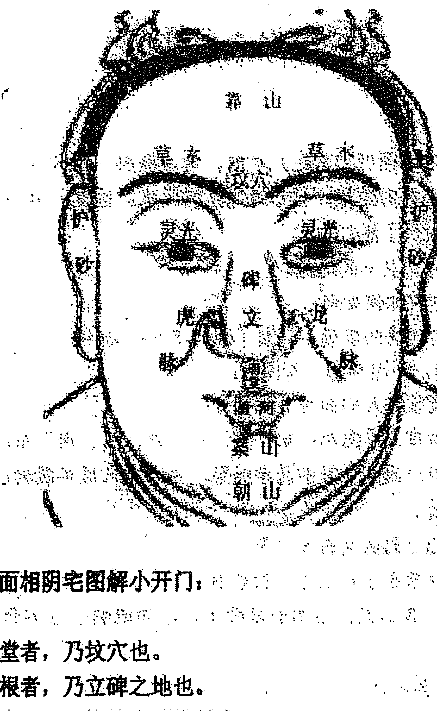

### 面相阴宅图解小开门：

- 1. 印堂者，乃坟穴也。
- 2. 山根者，乃立碑之地也。
- 3. 人中者，乃坟地小明堂是也。
- 4. 水星者，乃湖泊泡河支脉也。
- 5. 地阁者，乃案山、朝山是也。
- 6. 两颧法令者，乃青龙白虎二脉是也。
- 7. 两耳者，乃护砂是也。
- 8. 眉毛者，乃坟地四周草木也。
- 9. 眼睛者，乃坟地灵光是也。
- 10. 天庭者，乃坟穴靠山是也。

### 乃总论面相与阴宅：

相法是一种神秘的文化，它既能在面相或手相上观察出人生的荣辱，也能观察出人生的凶吉。在这里我们把面相结合阴宅地理，经过多年实践验证而取得的成果呈现于世，望学者察证。

## 堪舆面相之玄机

印堂者，乃坟穴也。印堂高鼓而红润者，此家坟穴高大，坟穴高者乃人丁兴旺也。红润者乃富贵之家也。印堂低陷者，证明此家坟墓包小，人丁多而贫困；破者（伤疤）拆而迁移过；破而红润者带劫煞，虽富贵而常出凶祸。印堂分八字者，祖坟必不居一地，如在一地者也必是影葬无异。八字而一撇通中正文者，一处坟地在远乡，一处坟地在近处。印堂有三处立纹者，呈现川字型，祖坟必在三处；上口收拢者已把多处坟地归到一处；纹较深而逐渐变平者也把坟地归到一处。

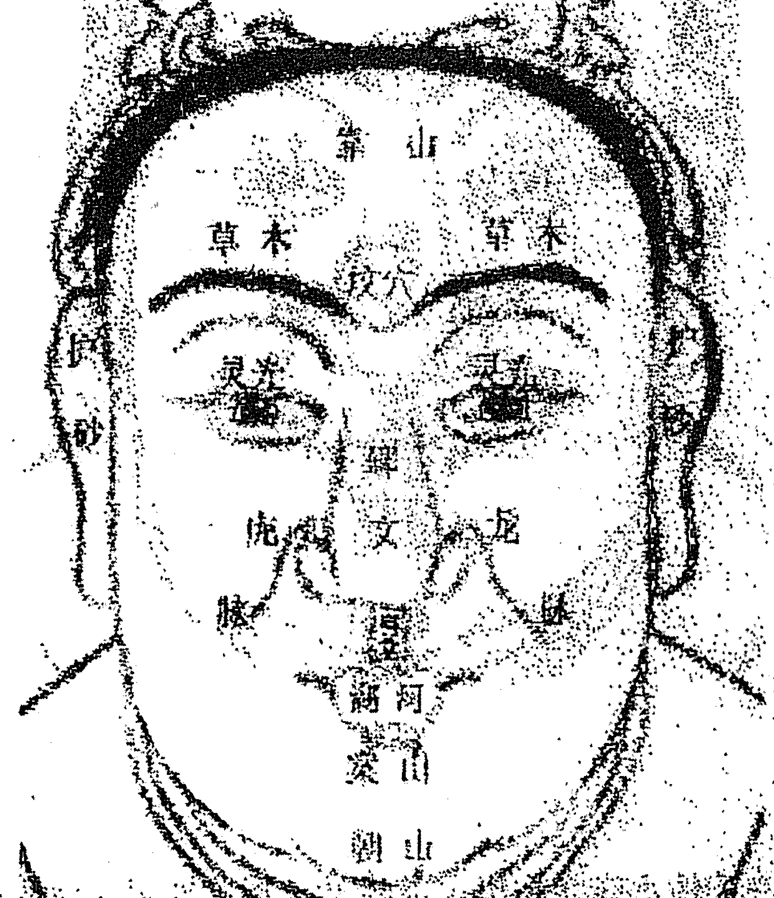

### 山根者，乃立碑之地也

山根明亮饱满者，证明此家坟头已经立碑。如是者，家道子孙学问深通，主人福寿双全。如山根低陷者，此家没有立碑；山根有很重的横纹，证明他家石碑从根底而断；准头有伤疤者，碑裂而破损；凡准头断纹者，此乃断原流折脉是也。

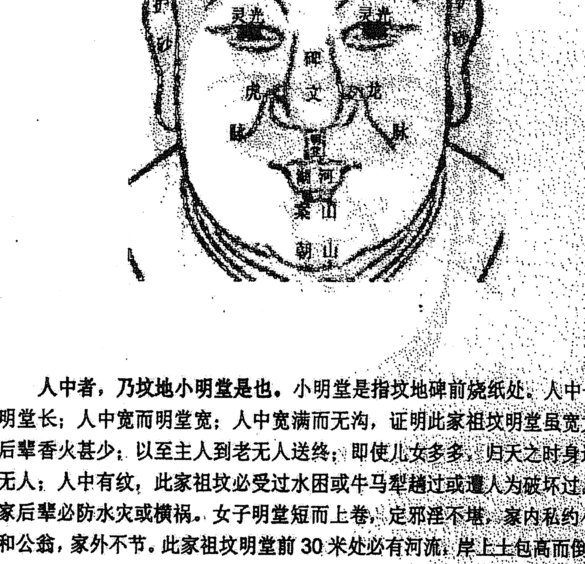

### 人中者，乃坟地小明堂是也

小明堂是指坟地碑前烧纸处。人中长而明堂长；人中宽而明堂宽；人中宽满而无沟，证明此家祖坟明堂虽宽大而后辈香火甚少；以至主人到老无人送终；即使儿女多多，归天之时身边也无人；人中有纹，此家祖坟必受过水困或牛马犁趟过或遭人为破坏过，此家后辈必防水灾或横祸。女子明堂短而上卷，定邪淫不堪，家内私约小叔和公翁，家外不节。此家祖坟明堂前30米处必有河流，岸上土包高而倒卷。

### 水星者，乃湖泊河流支脉是也

水星是指人的口嘴而言。口大方正，唇厚红润。此人祖家坟必有水脉，如九曲神龙入长生之地。如牙齿平整洁白，水脉中必有神灵居中而呵护，百谋百就。牙齿里外不齐者，水中必有烂石或草木横生；牙齿外露者，有水流也必干枯。后辈易出暴亡。齿黄，水干枯阻滞求而不得。鼠齿漏风，水脉必被隔流，后代易出贫夭。嘴角往上撅，不乐自笑者，此家祖坟必有眠弓之水，如玉带缠腰，家资丰厚达贵。嘴角下撇如丧客者，有水脉必是反弓之水，有水而无情。嘴角歪斜，必有角射之水相侵，左歪为右射之水；右歪为左射之水。家道由此贫矣。

### 地阁者，乃案山朝山是也

地阁丰隆红润者，说明祖坟朝案高大。朝山有各种分类：“法令”夹来为特朝，朝山此格最清高，尖秀方圆当面起，子孙将相玉缠腰。伪朝之山形不一，过我门兮不入室，翻身侧面向他人，空使有凶而无吉。平原看局取四环，高一寸兮即是山，但得水缠看下手，窝钳乳突是三关。地阁丰隆红润，水星方阔，鼻正高大，天庭饱满此谓水火既济。此人家祖坟定是朝案绵绵，聚风迎容，子孙非贵即富。地阁丰隆者，定是老二这股人丁兴旺，富而华贵。

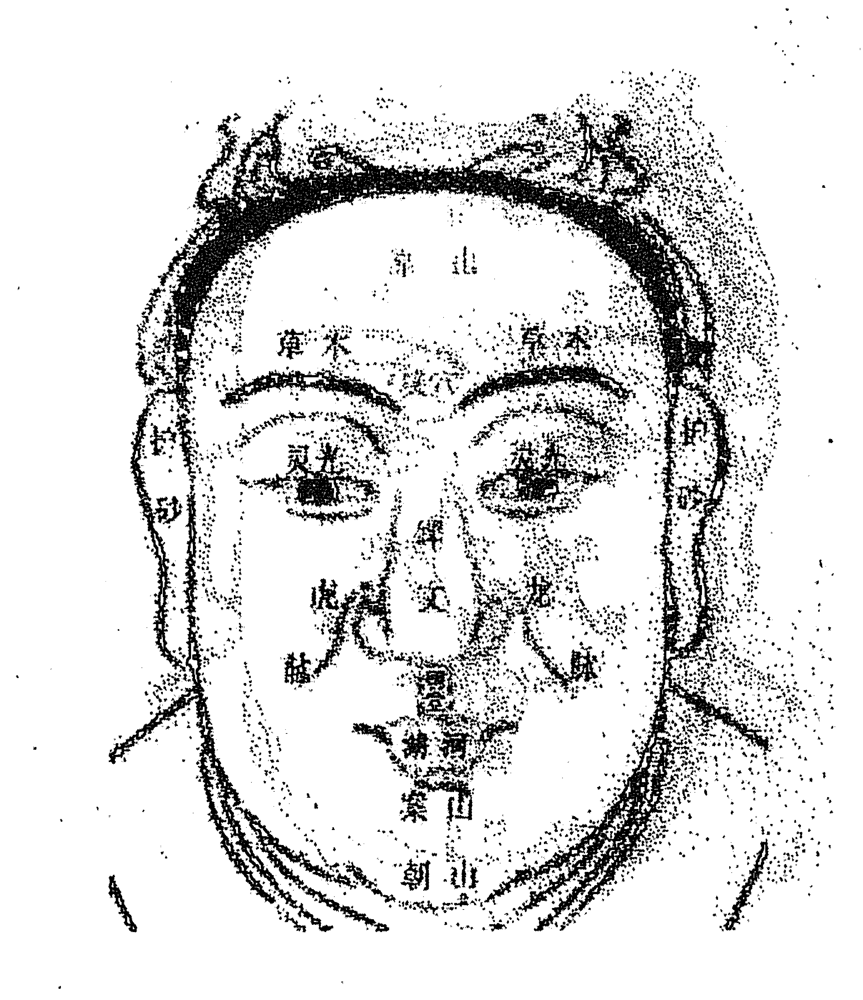

### 两颧者，乃龙虎二脉是也

所谓脉就是山川脉理。两颧高低起伏，绵延盘亘，如龙伏舞，如虎腾飞。所以我们把两颧称之为龙虎二脉。龙脉要细嫩活泼，穿落传变者为龙粗蛮硬直，劫煞翻花者无论矣。但是龙脉千变万化欲知龙脉之吉凶，先审龙脉之真伪，此为追本求末之要道。欲知真伪先辨龙虎之枢杆。左颧高大红润而环抱者，此家祖坟必是龙脉得地。如是者断此家老大这股必人丁兴旺，富贵由此。左颧低陷者，此为青龙受压，老大这股必败泄无异。如左颧陷，父必先亡；右颧陷，母必先卒。如左颧碍（伤疤）或左颧纹太深者，此人家老大这股必有横祸或凶事发生。右颧为虎脉，右颧高于左颧者，定是祖坟左低右高。此状可断他家坟地“白虎探头”。

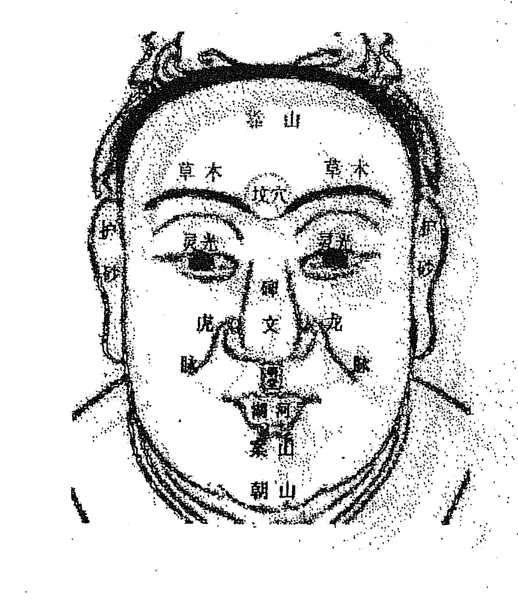

该人家定是老二或老三这股人丁兴旺，气魄有佳，甚至以小管大来当家。如右腮低陷或有痕，或纹深重者，说明祖坟无虎脉。然而老三这股（如哥俩就断老二）气脉断裂，凶事连连。如左右两腮平整滑润，高低得当，说明此家祖坟龙虎二脉得地，并聚风藏气，祖祖辈辈人丁兴旺。男子才华出众，女子秀俊灵巧，皆福禄俱全。如左右两腮出现反纹或断纹，则此家第二代坟离祖坟较远，超过5-7米，实为断脉，该家必出现兄弟不和反目成仇的现象。

### 两耳者，乃护砂是也

所谓护砂是穴四周的山。古人曰：山厚人肥，山瘦人饥，山清人贵，山破人悲，山归人聚，山走人离，山长人勇，山缩人低，山明人达，山暗人迷，山顺人孝，山逆人嘶。

山形变化不定，有左观方者，而右观圆者。高视而正，低视而偏。正视者丑，斜视而美。耳形之情态万殊，咫尺之交颇异。砂水相连，砂关水、水关砂，抱穴之砂关元辰水。龙虎之砂关怀中之水。近案之砂关堂中之水，外朝之砂关外龙之水。两耳好似侍卫砂。如秦琼敬德护门之神者，实乃内能遮恶风，外能御凹气。鼠耳颇飞，真龙必去。

### 砂耳有三局

肥圆之耳为富局；秀丽之耳为贵局；斜靡之耳为贱。耳有砂煞：有尖角煞；破透煞；探头煞；反身煞；顺水煞；高压煞等等。此等耳砂皆凶相也。

又有相关煞，破碎煞，直强煞，狭逼煞，低陷煞，斜乱煞，粗大煞，瘦弱煞，短缩煞，昂头煞，背面煞，断腰煞等等。皆砂中之祸也。

山势砂耳，要与人的肥、瘦、勇、贵、高、低、离、聚、明、暗有直接关系。即具有秀丽之真，又具有纯朴厚实之德，还具有彪悍旷达之气。古人曰：横看成岭侧成峰，左右高低皆不同，实有朴素的辨证关系和辨证思想。

### 眉毛者，乃坟地四周草木也

眉毛是象征感情的器官，也象征祖坟四周草木之旺衰。眉头和眉毛是否均衡，就象征人的感情和理智能否均衡。相学多以眉毛为兄弟姐妹宫，因为兄弟姐妹的感情如同手足，是友爱的最高象征。眉毛不仅看兄弟姐妹，也是看人品情感的动向以及性情的缓急和健康长寿等各种关系的信息。眉茂浓黑，说明此象祖坟草木茂盛。祖坟近处旺盛者，多属兄弟姐妹合睦。此等人与他人相处时，也能宽容温厚，处事刚毅果断。与友人在患难中也能同舟共济。眉毛稀而散乱，说明此家祖坟近处草木不旺。眉毛断落，似刀切断，该家祖坟近处树木被别人用锯斧砍断。不久家中兄弟姐妹或堂姨表亲中可能会出现意外不幸或有人腿脚残疾。眉内藏珠者，此家祖坟草木内必藏有灵性动物，致使眉内藏珠者聪明灵慧。在许多地方能表现出才能技艺，事业杰出而成功。观察眉毛时，如眉稀少，可能祖坟葬在平原或耕地里。如眼框明显高凸，祖坟或许葬在山岗。观察眉毛意在留心，不居死套或带灵感而发，更能述尽矣。

### 眼睛者，乃坟地之灵光也

古人云：存乎人者莫良于眸子。人不正不能掩其恶，人中正则眸子了焉，概露其善。眸子就是眼珠子，而眼睛是一个人的灵魂之窗口。从眼睛可以看出人的喜怒哀乐、怨恨和各种情绪的变化以及性格的表现。眼睛大而漆黑，此家祖坟近处有泉。泉眼者，通天入地也。此家后代男子必是感觉敏锐，视野广阔，性格爽朗外向喜交际。讲话声量大，说服力强，官职荣封，妾姘多多。女性则必是气质温和，感情富有，辨别鉴赏力强，公共关系热情，活泼而早婚。矮胖者嫁官人，高瘦者嫁商人，富贵有余。眼睛细长有神者，此家坟地砂山环抱，龙虎聚气，朝案有山。此为贵相。眼睛斜视而白多，俗称斗鸡眼，如向上斜视好些，向下斜视必是狡猾、阴险贪淫之辈。由于沉溺于低级色情而不易有寿。此人家祖坟近处必有花丛根蒂盘入坟墓。一目大一目小者，俗称雌雄眼。此人家祖坟必是两股来水一处走，易出现婆媳不合，妯娌不合，夫妻不合。男子右眼大畏妻，水从左处来；左眼大不孝，水从右边来。三角眼三白眼俗称多白眼。此家祖坟有路角或水角斜射。家里好出野心家、军事家，也可能出大流氓或山贼野寇。由于坟地受射角冲射，家内易出水灾或车祸。名曰：犯五雷。劝其迁坟或修心积德为好。

### 天庭者，乃坟穴之靠山是也

靠山是指坟穴背靠之山。古人云：坟后土高一尺为山。远有高山连绵不断，此为靠山之根基。天庭为观察先天禀赋的部分，代表遗传智慧，宗教道德，以及发展趋势之运气。因此，我们把命宫，官禄宫，驿马宫，父母宫，交际宫都视为天庭的靠山领域内。

它的广泛和复杂性及其重要性要可想而知。天庭高宽为贵相。此人家祖坟必靠山高大而长远。因此，后代人丁兴旺，官场扬名，常受长辈和上级提拔。如遇小灾小难一忧而过。如天庭上方出现一条横纹，俗称为天纹。这说明远处靠山一字横排而过。这种人能受长者恩惠。天庭下方离眉一指处有横纹称为地纹。这说明坟地近处有土龙为靠山。这说明能获得平辈或晚辈的相助。如在天庭中间出现一条横纹，叫人纹。这说明坟地不远不近有靠山，此为近不就、远不求，这种人终年辛苦，奋斗劳心一生。如人纹间断，靠山遭到破坏。家里不是夫妻不和就是有病人缠身。如天庭有八字纹，这叫八字峰。必是坟地背后有八字峰出现做靠山。靠山分岔，主人嫉妒心强，自寻烦恼，势必影响未来运势。如天庭出三道平纹，此家祖坟必有三道靠山。山峰如笔出秀才；山峰厚壮出良才。天庭左右日月高隆明亮，祖坟靠山有支脉。如有缺陷、伤痕或黑痣，说明祖坟出现了问题，如水泡或遭蛇鼠白蚁骚扰。劝其迁坟或修善，否则灾祸立侵。