御定奇门遁甲

【故宫博物院术数丛刊】

华龄出版社

## 御定奇门遁甲

四库全书
中国古代术数名著
文白对照·足本全译

华文出版社

## 图书在版编目（CIP）数据

御定奇门遁甲·阳遁九局 / 金志文点校. — 北京：世界知识出版社, 2010.12
（大成国学丛书）
ISBN 978-7-5012-3991-7
- Ⅰ. ①御… Ⅱ. ①金… Ⅲ. ①奇门遁甲 — 研究
- Ⅳ. ①B992.2

中国版本图书馆 CIP 数据核字（2010）第 250473 号

## 御定奇门遁甲·阳遁九局

Yu Ding Qi Men Dun Jia Yang Dun Jiu Ju

点 校 / 金志文

- 责任编辑 / 吴超莹
- 责任出版 / 林 琦
- 责任校对 / 马莉娜
- 封面设计 / 孙 斌

- 出版发行 / 世界知识出版社
- 地址邮编 / 北京市东城区干面胡同 51 号 邮编：100010
- 电 话 / 010-65265928，85118127（发行）
-       010-85119023（世界知识书店） 010-65265954（编辑部）
- 网 址 / www.wap1934.com
- 印 刷 / 北京忠信诚胶印厂
- 经 销 / 新华书店
- 开本印张 / 1000×1110 毫米 1/10 54.8 印张
- 字 数 / 548 千字
- 版次印次 / 2011 年 3 月第一版 2011 年 3 月第一次印刷
- 标准书号 / ISBN 978-7-5012-3991-7
- 定 价 / 129.00 元（全三册）

版权所有 翻印必究

## 内容简介

如果说《奇门宝鉴》是奇门遁甲的理论总纲，那么《阳遁九局》和《阴遁九局》则是奇门遁甲的实战部分。

我国古代把每天分为十二个时辰，在时家奇门中，一个时辰对应一个格局。全年有二十四节气，每个节气十五天，分为上、中、下三元，每元五天。按奇门历法，每年冬至上元到第二年冬至上元为一个循环，总共是三百六十日。这样，全年的局数即为四千三百二十局（三百六十乘以十二）。但在这四千三百二十局中，实际上每一局重复了四次。例如，冬至上元、惊蛰上元、清明中元、立夏中元，都完全一样，皆属于阳遁一局。因此，全年时辰的格局类型即为一千零八十局（四千三百二十除以四）。但并不是每一局都要用一个盘去演示，如果用活盘演示，每个活盘可演示从甲子到癸亥六十个时辰的格局，即用十八个活盘（一千零八十除以六十）就可以演示全年所有时辰的格局。这样，就只有十八局。在这十八局中，从冬至开始到芒种结束为阳遁（阳气回升），共九局；从夏至开始到大雪结束为阴遁（阴气回升），也是九局。这就是“阳遁九局”和“阴遁九局”的来历。

《阳遁九局》收录了从冬至开始到芒种结束这个时间段中奇门遁甲共五百四十局所有的局象图，并细致分析了每一个格局的星门神干、吉凶状况、占断取用和选择运筹等情况，占断了包括兵事、出行、阳宅、阴宅、胜败、虚实、攻城、天时、地理、人事、田禾、家宅、官禄、应试、求财、婚姻、胎产、疾病、失物等众多和日常生活相关的具体事项的吉凶宜忌，指导人们把握机遇、趋利避害，具有很强的实用性。

## 阳遁九局速查表

### 阳遁一局

| 时局 | 页码 | 时局 | 页码 | 时局 | 页码 | 时局 | 页码 | 时局 | 页码 |
|---|---|---|---|---|---|---|---|---|---|
| 甲己日甲子时 | 002 | 乙庚日丙子时 | 014 | 丙辛日戊子时 | 026 | 丁壬日庚子时 | 038 | 戊癸日壬子时 | 050 |
| 甲己日乙丑时 | 003 | 乙庚日丁丑时 | 015 | 丙辛日己丑时 | 027 | 丁壬日辛丑时 | 039 | 戊癸日癸丑时 | 051 |
| 甲己日丙寅时 | 004 | 乙庚日戊寅时 | 016 | 丙辛日庚寅时 | 028 | 丁壬日壬寅时 | 040 | 戊癸日甲寅时 | 052 |
| 甲己日丁卯时 | 005 | 乙庚日己卯时 | 017 | 丙辛日辛卯时 | 029 | 丁壬日癸卯时 | 041 | 戊癸日乙卯时 | 053 |
| 甲己日戊辰时 | 006 | 乙庚日庚辰时 | 018 | 丙辛日壬辰时 | 030 | 丁壬日甲辰时 | 042 | 戊癸日丙辰时 | 054 |
| 甲己日己巳时 | 007 | 乙庚日辛巳时 | 019 | 丙辛日癸巳时 | 031 | 丁壬日乙巳时 | 043 | 戊癸日丁巳时 | 055 |
| 甲己日庚午时 | 008 | 乙庚日壬午时 | 020 | 丙辛日甲午时 | 032 | 丁壬日丙午时 | 044 | 戊癸日戊午时 | 056 |
| 甲己日辛未时 | 009 | 乙庚日癸未时 | 021 | 丙辛日乙未时 | 033 | 丁壬日丁未时 | 045 | 戊癸日己未时 | 057 |
| 甲己日壬申时 | 010 | 乙庚日甲申时 | 022 | 丙辛日丙申时 | 034 | 丁壬日戊申时 | 046 | 戊癸日庚申时 | 058 |
| 甲己日癸酉时 | 011 | 乙庚日乙酉时 | 023 | 丙辛日丁酉时 | 035 | 丁壬日己酉时 | 047 | 戊癸日辛酉时 | 059 |
| 甲己日甲戌时 | 012 | 乙庚日丙戌时 | 024 | 丙辛日戊戌时 | 036 | 丁壬日庚戌时 | 048 | 戊癸日壬戌时 | 060 |
| 甲己日乙亥时 | 013 | 乙庚日丁亥时 | 025 | 丙辛日己亥时 | 037 | 丁壬日辛亥时 | 049 | 戊癸日癸亥时 | 061 |

## 阳遁二局

| 时局 | 页码 | 时局 | 页码 | 时局 | 页码 | 时局 | 页码 | 时局 | 页码 |
|---|---|---|---|---|---|---|---|---|---|
| 甲己日甲子时 | 064 | 乙庚日丙子时 | 076 | 丙辛日戊子时 | 088 | 丁壬日庚子时 | 100 | 戊癸日壬子时 | 112 |
| 甲己日乙丑时 | 065 | 乙庚日丁丑时 | 077 | 丙辛日己丑时 | 089 | 丁壬日辛丑时 | 101 | 戊癸日癸丑时 | 113 |
| 甲己日丙寅时 | 066 | 乙庚日戊寅时 | 078 | 丙辛日庚寅时 | 090 | 丁壬日壬寅时 | 102 | 戊癸日甲寅时 | 114 |
| 甲己日丁卯时 | 067 | 乙庚日己卯时 | 079 | 丙辛日辛卯时 | 091 | 丁壬日癸卯时 | 103 | 戊癸日乙卯时 | 115 |
| 甲己日戊辰时 | 068 | 乙庚日庚辰时 | 080 | 丙辛日壬辰时 | 092 | 丁壬日甲辰时 | 104 | 戊癸日丙辰时 | 116 |
| 甲己日己巳时 | 069 | 乙庚日辛巳时 | 081 | 丙辛日癸巳时 | 093 | 丁壬日乙巳时 | 105 | 戊癸日丁巳时 | 117 |
| 甲己日庚午时 | 070 | 乙庚日壬午时 | 082 | 丙辛日甲午时 | 094 | 丁壬日丙午时 | 106 | 戊癸日戊午时 | 118 |
| 甲己日辛未时 | 071 | 乙庚日癸未时 | 083 | 丙辛日乙未时 | 095 | 丁壬日丁未时 | 107 | 戊癸日己未时 | 119 |
| 甲己日壬申时 | 072 | 乙庚日甲申时 | 084 | 丙辛日丙申时 | 096 | 丁壬日戊申时 | 108 | 戊癸日庚申时 | 120 |
| 甲己日癸酉时 | 073 | 乙庚日乙酉时 | 085 | 丙辛日丁酉时 | 097 | 丁壬日己酉时 | 109 | 戊癸日辛酉时 | 121 |
| 甲己日甲戌时 | 074 | 乙庚日丙戌时 | 086 | 丙辛日戊戌时 | 098 | 丁壬日庚戌时 | 110 | 戊癸日壬戌时 | 122 |
| 甲己日乙亥时 | 075 | 乙庚日丁亥时 | 087 | 丙辛日己亥时 | 099 | 丁壬日辛亥时 | 111 | 戊癸日癸亥时 | 123 |

### 阳遁三局

| 时局 | 页码 | 时局 | 页码 | 时局 | 页码 | 时局 | 页码 | 时局 | 页码 |
|---|---|---|---|---|---|---|---|---|---|
| 甲己日甲子时 | 126 | 乙庚日丙子时 | 138 | 丙辛日戊子时 | 150 | 丁壬日庚子时 | 162 | 戊癸日壬子时 | 174 |
| 甲己日乙丑时 | 127 | 乙庚日丁丑时 | 139 | 丙辛日己丑时 | 151 | 丁壬日辛丑时 | 163 | 戊癸日癸丑时 | 175 |
| 甲己日丙寅时 | 128 | 乙庚日戊寅时 | 140 | 丙辛日庚寅时 | 152 | 丁壬日壬寅时 | 164 | 戊癸日甲寅时 | 176 |
| 甲己日丁卯时 | 129 | 乙庚日己卯时 | 141 | 丙辛日辛卯时 | 153 | 丁壬日癸卯时 | 165 | 戊癸日乙卯时 | 177 |
| 甲己日戊辰时 | 130 | 乙庚日庚辰时 | 142 | 丙辛日壬辰时 | 154 | 丁壬日甲辰时 | 166 | 戊癸日丙辰时 | 178 |
| 甲己日己巳时 | 131 | 乙庚日辛巳时 | 143 | 丙辛日癸巳时 | 155 | 丁壬日乙巳时 | 167 | 戊癸日丁巳时 | 179 |
| 甲己日庚午时 | 132 | 乙庚日壬午时 | 144 | 丙辛日甲午时 | 156 | 丁壬日丙午时 | 168 | 戊癸日戊午时 | 180 |
| 甲己日辛未时 | 133 | 乙庚日癸未时 | 145 | 丙辛日乙未时 | 157 | 丁壬日丁未时 | 169 | 戊癸日己未时 | 181 |
| 甲己日壬申时 | 134 | 乙庚日甲申时 | 146 | 丙辛日丙申时 | 158 | 丁壬日戊申时 | 170 | 戊癸日庚申时 | 182 |
| 甲己日癸酉时 | 135 | 乙庚日乙酉时 | 147 | 丙辛日丁酉时 | 159 | 丁壬日己酉时 | 171 | 戊癸日辛酉时 | 183 |
| 甲己日甲戌时 | 136 | 乙庚日丙戌时 | 148 | 丙辛日戊戌时 | 160 | 丁壬日庚戌时 | 172 | 戊癸日壬戌时 | 184 |
| 甲己日乙亥时 | 137 | 乙庚日丁亥时 | 149 | 丙辛日己亥时 | 161 | 丁壬日辛亥时 | 173 | 戊癸日癸亥时 | 185 |

### 阳遁四局

| 时局 | 页码 | 时局 | 页码 | 时局 | 页码 | 时局 | 页码 | 时局 | 页码 |
|---|---|---|---|---|---|---|---|---|---|
| 甲己日甲子时 | 188 | 乙庚日丙子时 | 200 | 丙辛日戊子时 | 212 | 丁壬日庚子时 | 224 | 戊癸日壬子时 | 236 |
| 甲己日乙丑时 | 189 | 乙庚日丁丑时 | 201 | 丙辛日己丑时 | 213 | 丁壬日辛丑时 | 225 | 戊癸日癸丑时 | 237 |
| 甲己日丙寅时 | 190 | 乙庚日戊寅时 | 202 | 丙辛日庚寅时 | 214 | 丁壬日壬寅时 | 226 | 戊癸日甲寅时 | 238 |
| 甲己日丁卯时 | 191 | 乙庚日己卯时 | 203 | 丙辛日辛卯时 | 215 | 丁壬日癸卯时 | 227 | 戊癸日乙卯时 | 239 |
| 甲己日戊辰时 | 192 | 乙庚日庚辰时 | 204 | 丙辛日壬辰时 | 216 | 丁壬日甲辰时 | 228 | 戊癸日丙辰时 | 240 |
| 甲己日己巳时 | 193 | 乙庚日辛巳时 | 205 | 丙辛日癸巳时 | 217 | 丁壬日乙巳时 | 229 | 戊癸日丁巳时 | 241 |
| 甲己日庚午时 | 194 | 乙庚日壬午时 | 206 | 丙辛日甲午时 | 218 | 丁壬日丙午时 | 230 | 戊癸日戊午时 | 242 |
| 甲己日辛未时 | 195 | 乙庚日癸未时 | 207 | 丙辛日乙未时 | 219 | 丁壬日丁未时 | 231 | 戊癸日己未时 | 243 |
| 甲己日壬申时 | 196 | 乙庚日甲申时 | 208 | 丙辛日丙申时 | 220 | 丁壬日戊申时 | 232 | 戊癸日庚申时 | 244 |
| 甲己日癸酉时 | 197 | 乙庚日乙酉时 | 209 | 丙辛日丁酉时 | 221 | 丁壬日己酉时 | 233 | 戊癸日辛酉时 | 245 |
| 甲己日甲戌时 | 198 | 乙庚日丙戌时 | 210 | 丙辛日戊戌时 | 222 | 丁壬日庚戌时 | 234 | 戊癸日壬戌时 | 246 |
| 甲己日乙亥时 | 199 | 乙庚日丁亥时 | 211 | 丙辛日己亥时 | 223 | 丁壬日辛亥时 | 235 | 戊癸日癸亥时 | 247 |

### 阳遁五局

| 时局 | 页码 | 时局 | 页码 | 时局 | 页码 | 时局 | 页码 | 时局 | 页码 |
|---|---|---|---|---|---|---|---|---|---|
| 甲己日甲子时 | 250 | 乙庚日丙子时 | 262 | 丙辛日戊子时 | 274 | 丁壬日庚子时 | 286 | 戊癸日壬子时 | 298 |
| 甲己日乙丑时 | 251 | 乙庚日丁丑时 | 263 | 丙辛日己丑时 | 275 | 丁壬日辛丑时 | 287 | 戊癸日癸丑时 | 299 |
| 甲己日丙寅时 | 252 | 乙庚日戊寅时 | 264 | 丙辛日庚寅时 | 276 | 丁壬日壬寅时 | 288 | 戊癸日甲寅时 | 300 |
| 甲己日丁卯时 | 253 | 乙庚日己卯时 | 265 | 丙辛日辛卯时 | 277 | 丁壬日癸卯时 | 289 | 戊癸日乙卯时 | 301 |
| 甲己日戊辰时 | 254 | 乙庚日庚辰时 | 266 | 丙辛日壬辰时 | 278 | 丁壬日甲辰时 | 290 | 戊癸日丙辰时 | 302 |
| 甲己日己巳时 | 255 | 乙庚日辛巳时 | 267 | 丙辛日癸巳时 | 279 | 丁壬日乙巳时 | 291 | 戊癸日丁巳时 | 303 |
| 甲己日庚午时 | 256 | 乙庚日壬午时 | 268 | 丙辛日甲午时 | 280 | 丁壬日丙午时 | 292 | 戊癸日戊午时 | 304 |
| 甲己日辛未时 | 257 | 乙庚日癸未时 | 269 | 丙辛日乙未时 | 281 | 丁壬日丁未时 | 293 | 戊癸日己未时 | 305 |
| 甲己日壬申时 | 258 | 乙庚日甲申时 | 270 | 丙辛日丙申时 | 282 | 丁壬日戊申时 | 294 | 戊癸日庚申时 | 306 |
| 甲己日癸酉时 | 259 | 乙庚日乙酉时 | 271 | 丙辛日丁酉时 | 283 | 丁壬日己酉时 | 295 | 戊癸日辛酉时 | 307 |
| 甲己日甲戌时 | 260 | 乙庚日丙戌时 | 272 | 丙辛日戊戌时 | 284 | 丁壬日庚戌时 | 296 | 戊癸日壬戌时 | 308 |
| 甲己日乙亥时 | 261 | 乙庚日丁亥时 | 273 | 丙辛日己亥时 | 285 | 丁壬日辛亥时 | 297 | 戊癸日癸亥时 | 309 |

### 阳遁六局

| 时局 | 页码 | 时局 | 页码 | 时局 | 页码 | 时局 | 页码 | 时局 | 页码 |
|---|---|---|---|---|---|---|---|---|---|
| 甲己日甲子时 | 312 | 乙庚日丙子时 | 324 | 丙辛日戊子时 | 336 | 丁壬日庚子时 | 348 | 戊癸日壬子时 | 360 |
| 甲己日乙丑时 | 313 | 乙庚日丁丑时 | 325 | 丙辛日己丑时 | 337 | 丁壬日辛丑时 | 349 | 戊癸日癸丑时 | 361 |
| 甲己日丙寅时 | 314 | 乙庚日戊寅时 | 326 | 丙辛日庚寅时 | 338 | 丁壬日壬寅时 | 350 | 戊癸日甲寅时 | 362 |
| 甲己日丁卯时 | 315 | 乙庚日己卯时 | 327 | 丙辛日辛卯时 | 339 | 丁壬日癸卯时 | 351 | 戊癸日乙卯时 | 363 |
| 甲己日戊辰时 | 316 | 乙庚日庚辰时 | 328 | 丙辛日壬辰时 | 340 | 丁壬日甲辰时 | 352 | 戊癸日丙辰时 | 364 |
| 甲己日己巳时 | 317 | 乙庚日辛巳时 | 329 | 丙辛日癸巳时 | 341 | 丁壬日乙巳时 | 353 | 戊癸日丁巳时 | 365 |
| 甲己日庚午时 | 318 | 乙庚日壬午时 | 330 | 丙辛日甲午时 | 342 | 丁壬日丙午时 | 354 | 戊癸日戊午时 | 366 |
| 甲己日辛未时 | 319 | 乙庚日癸未时 | 331 | 丙辛日乙未时 | 343 | 丁壬日丁未时 | 355 | 戊癸日己未时 | 367 |
| 甲己日壬申时 | 320 | 乙庚日甲申时 | 332 | 丙辛日丙申时 | 344 | 丁壬日戊申时 | 356 | 戊癸日庚申时 | 368 |
| 甲己日癸酉时 | 321 | 乙庚日乙酉时 | 333 | 丙辛日丁酉时 | 345 | 丁壬日己酉时 | 357 | 戊癸日辛酉时 | 369 |
| 甲己日甲戌时 | 322 | 乙庚日丙戌时 | 334 | 丙辛日戊戌时 | 346 | 丁壬日庚戌时 | 358 | 戊癸日壬戌时 | 370 |
| 甲己日乙亥时 | 323 | 乙庚日丁亥时 | 335 | 丙辛日己亥时 | 347 | 丁壬日辛亥时 | 359 | 戊癸日癸亥时 | 371 |

## 阳遁七局

| 时局 | 页码 | 时局 | 页码 | 时局 | 页码 | 时局 | 页码 | 时局 | 页码 |
|---|---|---|---|---|---|---|---|---|---|
| 甲己日甲子时 | 374 | 乙庚日丙子时 | 386 | 丙辛日戊子时 | 398 | 丁壬日庚子时 | 410 | 戊癸日壬子时 | 422 |
| 甲己日乙丑时 | 375 | 乙庚日丁丑时 | 387 | 丙辛日己丑时 | 399 | 丁壬日辛丑时 | 411 | 戊癸日癸丑时 | 423 |
| 甲己日丙寅时 | 376 | 乙庚日戊寅时 | 388 | 丙辛日庚寅时 | 400 | 丁壬日壬寅时 | 412 | 戊癸日甲寅时 | 424 |
| 甲己日丁卯时 | 377 | 乙庚日己卯时 | 389 | 丙辛日辛卯时 | 401 | 丁壬日癸卯时 | 413 | 戊癸日乙卯时 | 425 |
| 甲己日戊辰时 | 378 | 乙庚日庚辰时 | 390 | 丙辛日壬辰时 | 402 | 丁壬日甲辰时 | 414 | 戊癸日丙辰时 | 426 |
| 甲己日己巳时 | 379 | 乙庚日辛巳时 | 391 | 丙辛日癸巳时 | 403 | 丁壬日乙巳时 | 415 | 戊癸日丁巳时 | 427 |
| 甲己日庚午时 | 380 | 乙庚日壬午时 | 392 | 丙辛日甲午时 | 404 | 丁壬日丙午时 | 416 | 戊癸日戊午时 | 428 |
| 甲己日辛未时 | 381 | 乙庚日癸未时 | 393 | 丙辛日乙未时 | 405 | 丁壬日丁未时 | 417 | 戊癸日己未时 | 429 |
| 甲己日壬申时 | 382 | 乙庚日甲申时 | 394 | 丙辛日丙申时 | 406 | 丁壬日戊申时 | 418 | 戊癸日庚申时 | 430 |
| 甲己日癸酉时 | 383 | 乙庚日乙酉时 | 395 | 丙辛日丁酉时 | 407 | 丁壬日己酉时 | 419 | 戊癸日辛酉时 | 431 |
| 甲己日甲戌时 | 384 | 乙庚日丙戌时 | 396 | 丙辛日戊戌时 | 408 | 丁壬日庚戌时 | 420 | 戊癸日壬戌时 | 432 |
| 甲己日乙亥时 | 385 | 乙庚日丁亥时 | 397 | 丙辛日己亥时 | 409 | 丁壬日辛亥时 | 421 | 戊癸日癸亥时 | 433 |

## 阳遁八局

| 时局 | 页码 | 时局 | 页码 | 时局 | 页码 | 时局 | 页码 | 时局 | 页码 |
|---|---|---|---|---|---|---|---|---|---|
| 甲己日甲子时 | 436 | 乙庚日丙子时 | 448 | 丙辛日戊子时 | 460 | 丁壬日庚子时 | 472 | 戊癸日壬子时 | 484 |
| 甲己日乙丑时 | 437 | 乙庚日丁丑时 | 449 | 丙辛日己丑时 | 461 | 丁壬日辛丑时 | 473 | 戊癸日癸丑时 | 485 |
| 甲己日丙寅时 | 438 | 乙庚日戊寅时 | 450 | 丙辛日庚寅时 | 462 | 丁壬日壬寅时 | 474 | 戊癸日甲寅时 | 486 |
| 甲己日丁卯时 | 439 | 乙庚日己卯时 | 451 | 丙辛日辛卯时 | 463 | 丁壬日癸卯时 | 475 | 戊癸日乙卯时 | 487 |
| 甲己日戊辰时 | 440 | 乙庚日庚辰时 | 452 | 丙辛日壬辰时 | 464 | 丁壬日甲辰时 | 476 | 戊癸日丙辰时 | 488 |
| 甲己日己巳时 | 441 | 乙庚日辛巳时 | 453 | 丙辛日癸巳时 | 465 | 丁壬日乙巳时 | 477 | 戊癸日丁巳时 | 489 |
| 甲己日庚午时 | 442 | 乙庚日壬午时 | 454 | 丙辛日甲午时 | 466 | 丁壬日丙午时 | 478 | 戊癸日戊午时 | 490 |
| 甲己日辛未时 | 443 | 乙庚日癸未时 | 455 | 丙辛日乙未时 | 467 | 丁壬日丁未时 | 479 | 戊癸日己未时 | 491 |
| 甲己日壬申时 | 444 | 乙庚日甲申时 | 456 | 丙辛日丙申时 | 468 | 丁壬日戊申时 | 480 | 戊癸日庚申时 | 492 |
| 甲己日癸酉时 | 445 | 乙庚日乙酉时 | 457 | 丙辛日丁酉时 | 469 | 丁壬日己酉时 | 481 | 戊癸日辛酉时 | 493 |
| 甲己日甲戌时 | 446 | 乙庚日丙戌时 | 458 | 丙辛日戊戌时 | 470 | 丁壬日庚戌时 | 482 | 戊癸日壬戌时 | 494 |
| 甲己日乙亥时 | 447 | 乙庚日丁亥时 | 459 | 丙辛日己亥时 | 471 | 丁壬日辛亥时 | 483 | 戊癸日癸亥时 | 495 |

## 阳遁九局

| 时局 | 页码 | 时局 | 页码 | 时局 | 页码 | 时局 | 页码 | 时局 | 页码 |
|---|---|---|---|---|---|---|---|---|---|
| 甲己日甲子时 | 498 | 乙庚日丙子时 | 510 | 丙辛日戊子时 | 522 | 丁壬日庚子时 | 534 | 戊癸日壬子时 | 546 |
| 甲己日乙丑时 | 499 | 乙庚日丁丑时 | 511 | 丙辛日己丑时 | 523 | 丁壬日辛丑时 | 535 | 戊癸日癸丑时 | 547 |
| 甲己日丙寅时 | 500 | 乙庚日戊寅时 | 512 | 丙辛日庚寅时 | 524 | 丁壬日壬寅时 | 536 | 戊癸日甲寅时 | 548 |
| 甲己日丁卯时 | 501 | 乙庚日己卯时 | 513 | 丙辛日辛卯时 | 525 | 丁壬日癸卯时 | 537 | 戊癸日乙卯时 | 549 |
| 甲己日戊辰时 | 502 | 乙庚日庚辰时 | 514 | 丙辛日壬辰时 | 526 | 丁壬日甲辰时 | 538 | 戊癸日丙辰时 | 550 |
| 甲己日己巳时 | 503 | 乙庚日辛巳时 | 515 | 丙辛日癸巳时 | 527 | 丁壬日乙巳时 | 539 | 戊癸日丁巳时 | 551 |
| 甲己日庚午时 | 504 | 乙庚日壬午时 | 516 | 丙辛日甲午时 | 528 | 丁壬日丙午时 | 540 | 戊癸日戊午时 | 552 |
| 甲己日辛未时 | 505 | 乙庚日癸未时 | 517 | 丙辛日乙未时 | 529 | 丁壬日丁未时 | 541 | 戊癸日己未时 | 553 |
| 甲己日壬申时 | 506 | 乙庚日甲申时 | 518 | 丙辛日丙申时 | 530 | 丁壬日戊申时 | 542 | 戊癸日庚申时 | 554 |
| 甲己日癸酉时 | 507 | 乙庚日乙酉时 | 519 | 丙辛日丁酉时 | 531 | 丁壬日己酉时 | 543 | 戊癸日辛酉时 | 555 |
| 甲己日甲戌时 | 508 | 乙庚日丙戌时 | 520 | 丙辛日戊戌时 | 532 | 丁壬日庚戌时 | 544 | 戊癸日壬戌时 | 556 |
| 甲己日乙亥时 | 509 | 乙庚日丁亥时 | 521 | 丙辛日己亥时 | 533 | 丁壬日辛亥时 | 545 | 戊癸日癸亥时 | 557 |## 目录
- 阳遁一局 …… 2
- 阳遁二局 …… 64
- 阳遁三局 …… 126
- 阳遁四局 …… 188
- 阳遁五局 …… 250
- 阳遁六局 …… 312
- 阳遁七局 …… 374
- 阳遁八局 …… 436
- 阳遁九局 …… 498

# 昭通一中

## 甲己日甲子时

阳遁一局
冬至上元
清明中元
立夏中元
惊蛰上元

孤戌亥虚辰巳
天蓬直符加一宫
休门直使加一宫

- 天辅时
- 戊仪加戊为青龙入地格
- 休门伏坎为坎
- 蓬符伏坎为坎
- 兑丁奇升殿
- 生门与丙合
- 符伏吟

断曰：以甲加甲，符使未分，星门不动，惟有天乙贵人，照临其上，名曰天辅。盖四千三百二十之运，自此而开矣。以天气言之，所谓“一阳初动，万物未生”也；以世运言之，所谓“君子道长，小人道消”也；以人身言之，所谓“含元虚危，播精于子”也。

兵事：星门各位其位，宜运筹帷幄。阳时亦利为客。宜出东北，击西南。乾兑二方，皆设奇兵为犄角。战时有黑云助阵，收兵宜屯正北。

出行：宜出东北方。行十五里八里，见贵人车马，或黄衣妇人，或小儿戏舞应。

阳宅：宜立艮门，三七日进财，周年后进六畜大发。

阴宅：宜艮山坤向。作用时，有缺唇人至，或闻鸟鹊声应。

附占：
胜败：有和象。
虚实：兵各不动，宜招安。
攻城：当密修地道，攻其东门。
守城：宜固守，备东来之敌。
天时：冬占有雨雪。
地理：主山路案俱佳，土色黑白相间。
人事：天伦聚首，安静无为。
田禾：大有年。
家宅：因旧鼎新，必能世守。
官禄：官高禄厚，可升。
应试：甲日占，可中。
求财：不劳而得。
婚姻：女美可谐，当以姊妹为妯娌。
胎产：生女，产迟。
疾病：病在肾经，滋阴可治。
捕获：贼在村野寺院，易获。
失物：在原处，可寻。
远信：沉滞。
鸦鸣：主财物相争。
鹊噪：若在东北，主可得财，西南有忧。

## 甲己日乙丑时

乾 宫克门
坎 宫生门
艮 门生宫
震 鬼假 宫克门
巽 门迫宫
离 相佐 符反吟 宫克门
坤 休与丙合 宫克门
兑 奇格 门生宫
蓬符加离为水火既济
休门加坤为水地比
戊仪加己为青龙相合格
己日不遇

断曰：蓬为水符，加于离宫财帛之地，又逢日奇，可以问财矣。但反吟之格，反覆良多。甲日则嫌于乙之相争，己日则嫌于丙之勃乱。口舌争竞，岂能免乎？况休使又受二宫之克制，万事掣肘，止利于纳粟求名，兼防病讼。

兵事：星克宫，宫克门，主客均不利。不宜交战，宜藏兵以备偷劫。敌至，从西南方出兵，伏兵于正西，邀击于东北，可以制胜。

出行：远行宜出西南方，路逢僧道人，手中持书信应。

阳宅：己日损明不用，立西南门小吉，恐有虚惊。

阴宅：宜坤山艮向。葬时防树倒伤人，有犬上屋应。

附占：
胜败：主胜。
虚实：敌人怀惧。
攻城：守将有来降之意。
守城：当以玉帛求和。
天时：阴晴不定，晴多雨少。
地理：山向不吉，不可用。
人事：见武人骑马而来，状雄声壮，有虚诈之事。
田禾：麦熟防旱。
家宅：门户不宁，防火烛虚惊，或炉冶破财。
官禄：不安其位，防参。
应试：文章与试官相合，甲日占，可中。
求财：有望，防阻碍。
婚姻：男益于女，成。
胎产：男胎。
疾病：水不能制火，乍寒乍热，己日占可治。
捕获：捕盗相通，必难获。
失物：遗于正南。
远信：信至，远人不至。
鸦鸣：主失衣物。
鹊噪：无事。

## 甲己日丙寅时

天蓬直符加八宫 休门直使加三宫
孤子丑虚午未

阳遁一局
冬至上元 惊蛰上元
清明中元 立夏中元

- 乾: 鬼假 雀投江 丁奇入墓
- 坎: 门生宫
- 艮: 相佐龙返首符勃宫生门
- 震: 休与丙合荧入白门生宫
- 巽: 宫克门
- 离: 虎猖狂门生宫
- 坤: 乙奇入墓门迫宫
- 兑: 门迫宫
- 蓬符加艮为水山蹇
- 休门加震为水雷屯
- 戊仪加丙为青龙得明格
- 丙奇得使游仪

断曰：丙加于庚，辛加于乙，丁加于癸，为荧入白，为虎猖狂，为雀投江，一局而三凶格备焉，虽有返首之龙，岂能言吉？况蓬符既受克于艮地，而门使复受脱于东方，驳杂忧虞，谅所不免。地盘之丙，制于蓬符，天盘之丙，制于休使，动则多违矣。

兵事：门生宫，宫克星，利为主。宜伏奇于东南，列阵于正东，敌至则阵兵走合，伏兵让敌入东，则从后奋击，反主为客，以应游仪入白之势。追入正南，当获其帐内之物。

出行：宜出正东方，遇酒食花果，有林下风来，逸士相对抵掌剧谈为应。

阳宅：宜立震门，有人持兵器至，或鼓声应。

阴宅：卯山酉向吉。造葬时，有女人童子戏笑，或公吏人应。

附占：
胜败：客胜。
虚实：敌来诳我，不可信。
攻城：不能破。
守城：可以力守。
天时：无雨。
地理：龙脉甚佳，但朝山石势有伤。
人事：有游戏之事，虚耗费财。
田禾：年丰，防有虫。
家宅：父子同登金榜，门墙一新。
官禄：才高望重，即日有不次恩荣。
应试：必中。
求财：彼此相和，多求少得。
婚姻：女多言，不可成。
胎产：男胎，难产。
疾病：火炎铄金，宜养阴，可治。
捕获：贼在西方有火光处。
失物：在东北山土中。
远信：行人至，信无。
鸦鸣：主亡失。
鹊噪：防火惊。

## 甲己日丁卯时

孤丑寅虚未申
天蓬直符加七宫
休门直使加四宫

阳遁一局
冬至上元
惊蛰上元
清明中元
立夏中元

| 宫位 | 属性 | 格局/状态 |
| :--- | :--- | :--- |
| 乾 | 丙奇入墓 | 门迫宫 |
| 坎 | 太白与天乙格 | 伏宫格 |
| 艮 | 宫生门 | 门迫宫 |
| 震 | 开与乙合 | 云遁 乙奇升殿 |
| 巽 | 门生宫 | 重诈 宫生门 |
| 离 | 生与丁合 | 重诈 宫生门 |
| 坤 | 门迫宫 | |
| 兑 | 相佐 宫克门 | 蓬符加兑为水泽节 |
| | | 休门加巽为水风井 |
| | | 戊仪加丁为青龙耀明格 |
| | | 甲日伏干格 |

断曰：时干之丁，临于离九，已为得地。而上合于生门，下加于乙奇，门奇芸萃，百事咸宜。蓬符受生于西方，休使亦躔于文曲，相生相合，无克无冲。惟景门丙奇入墓，不利上书献策耳。玉女逢戊，而上有杜门，若遁迹于西方，神鬼不觉。

兵事：宫生星，阳时利为客。先伏重兵于正南勿动，更遣轻骑出东方，疾入敌垒，背西击东，如入无人之境。当有风云来助。后出伏兵，邀其败走之众于北，可以擒获。

出行：南方大吉，途遇猎人，或小儿骑牛马过。

阳宅：立离门大吉，震门亦利。

阴宅：午山子向吉，震山兑向亦利。东向当有红衣人至，南向当有孝衣人至。有风有云，微雨。

附占：
胜败：主有助，小胜，终和。
虚实：敌情不测。
攻城：不克。
守城：可守，宜备东门。
天时：虽晴必雨。
地理：金星行龙入首，结穴极佳，葬后当出仙术之人。
人事：有急迫文书，或盗案水利之事。
田禾：大有之年，麦胜于稻，青豫尤丰。
家宅：宅有拱护，防失脱，欠利。
官禄：有荐举，可升。
应试：甲日占，中式。
求财：所求如意。
婚姻：成，男有弱疾。
胎产：孕妇多病，生男。
疾病：病在肝经，易痊。
捕获：当向东北方捕之。
失物：在西方，或少女所藏。
远信：即至。
鸦鸣：有灾眚事。
鹊噪：主有喜信。

## 甲己日戊辰时

阳遁一局
冬至上元 惊蛰上元
清明中元 立夏中元

孤寅卯虚申酉
天蓬直符加一宫 休门直使加五宫

休符加坎为地比

蓬符伏坎为坎
步五为水地比

兑 坤 离 巽 震 艮 坎 乾

门生宫
与丁合
丁奇升殿
重诈

宫克门
开与乙合
宫克门

门迫宫

宫克门

门生宫

符伏吟
宫生门

宫克门

断曰：戊辰之时，自甲子顺数，正逢五位。盖寅为甲子之生气，辰为甲子之死气，经所谓“趋三避五”者也。凡事值之，皆所不取。况蓬符既为伏吟，而休使又受克制，迤逦之象，进退维艰。惟西方以九地临于生门，下逢重丁，可以营谋秘密。

兵事：符伏吟，宜静不宜动，利主不利客。应兵春夏宜出正南，冬宜西出，伏兵于阵后，背西击东。遇僧道人献金银，大吉。

出行：远行宜出南方。九里，逢老人骑马，主有争闹。逃匿宜往西方。

阳宅：宜立离兑二门，有女人送食物应。

阴宅：午山子向吉，酉山卯向亦利。葬后六十日，有风脚人上门作炒。后当生贵子，大发。

附占：
胜败：不战之象。
虚实：主意实。
攻城：宜乘雾夜袭，或用地道可克。
守城：东方不守。
天时：有雨。
地理：穴中防有水气。
人事：闭门谢客，有忧疑之事，或胎产事。
田禾：丰，麦胜谷。
家宅：口舌不宁，并防失脱。
官禄：迟升。
应试：文佳，不售。
求财：可得阴私暗中之财。
婚姻：媒向女家，可成。
胎产：胎不安，产生男。
疾病：脾弱不能摄水，燥湿可愈。
捕获：向东南捕缉，易获。
失物：失于家中北方。
远信：有信不实。
鸦鸣：有亲戚之事。
鹊噪：主得酒食。

## 甲己日己巳时

孤卯辰虚酉戌
天蓬直符加二宫 休门直使加六宫

阳遁一局
冬至上元 惊蛰上元
清明中元 立夏中元

| 方位 | 乾 | 坎 | 艮 | 震 | 巽 | 离 | 坤 | 兑 |
| :--- | :--- | :--- | :--- | :--- | :--- | :--- | :--- | :--- |
| 格局 | 大格 | 门迫宫 | 门迫宫 | 格刑宫门比和 | 宫生门 | 宫生门 | 宫生门 | 开与丙合 宫门比和 |
| 符使 | 蓬符加坤为水地比 | 休门加乾为水天需 | 戊仪加己为青龙相合格 | 己日飞干格 | | | | |

断曰：水符加于坤二，受土之克矣。所喜坤土飞于三宫，而受木克，所谓鬼入鬼乡，鬼乃无畏者也。休使临乾，受金之生。微嫌庚癸相加，名为大格，恐于生益之地，不无疑忌之情。时干受克，又名飞干，大约先屯难而后亨嘉也。

兵事：官克星，阴时利为主。俟敌先动，从正西方出兵，昼则多用旌旗彩仗及鬼神龙虎之形，夜则多持火炬，坐西南，击东北，可胜。惟西北不可追逐，防遇伏格斗伤损。

出行：正西方可行。七里六里，见老人与女子同行，有虚惊。

阳宅：宜立兑门，家中防有阴物作祟。

阴宅：利酉山卯向。造葬时，有人持杖来，或东方人抱小儿至，或闻鼓声。

附占：
胜败：宜和。
虚实：敌虽大张声势，却无战心。
攻城：城中有内应，守将可擒。
守城：难守。
天时：密云不雨。
地理：穴地平常。
人事：有阴险人，或阴私之事，阻隔不成。
田禾：谷胜于麦。
家宅：地基欠吉。
官禄：可升。
应试：不中。
求财：难得。
婚姻：女益男家，可成。
胎产：产室不佳，有惊恐，生女。
疾病：抑郁之症。甲日占，难治。
捕获：向东方林中捕之，可获。
失物：失于西南。
远信：信迟至，人不来。
鸦鸣：欺蔽淫逸事。
鹊噪：事有阻隔。

## 甲己日庚午时

孤辰已虚戊亥
天蓬直符加三宫
休门直使加七宫

阳遁一局
冬至上元 惊蛰上元
清明中元 立夏中元

戊仪加庚为青龙持势格
休门加兑为水泽节
蓬符加震为水雷屯
兑 宫生门
坤 奇格 宫克门
巽 宫克门
震 宫生门
乾 门生宫
坎 神假 宫生门
艮 门迫宫
震 飞宫格 仪刑 天乙与太白格

断曰：蓬符入震，子卯相刑，所谓“甲子直符愁向东”者也，诸事不免参商。惟喜休使入于七宫，而受西方之生气，又逢日奇，值此时者，总宜弃东就西，则利多而害少矣。丁奇守户，事利阴谋；庚乙合离，交惟面好，遇甲日不可用也。

兵事：宫生门，星生宫，阴时利为主。应敌宜从正西小兵，衔枚疾击，伏兵于正南，背西北，击东南。须防正东有败衄，当先据正西近水之地。

出行：宜出正西。三十里，或闻钟磬鼓乐声。

阳宅：甲日不可用，己日开兑门吉。

阴宅：酉山卯向吉，葬后有恶犬作怪。

附占：
胜败：主欲议和。
虚实：敌人安营不定。
攻城：城虽可攻，防有内顾之忧。
守城：防南门受敌。
天时：无雨。
地理：无龙脉，不吉。
人事：有武人论技艺，或母女相留。
田禾：谷熟。
家宅：女持门户，人财大发。
官禄：辛年可升。
应试：不中。
求财：阴私之财可得。
婚姻：女甚佳，但畏男家，不敢就。
胎产：易产，生女。
疾病：因喜事过劳，易痊。
捕获：逃不能远，易获。
失物：失于东方，遇金铁而损。
远信：即至，行人归迟。
鸦鸣：主大吏相寻。
鹊噪：无关吉凶。

## 甲己日辛未时

阳遁一局

孤巳午虚亥子
天蓬直符加四宫
休门直使加八宫

冬至上元
惊蛰上元
清明中元
立夏中元

乾 乙奇入墓
坎 宫门比和
艮 丁奇入墓
震 重诈
巽 休与丁合 宫克门
离 小格 宫克门
坤 丙奇升殿 门生宫
兑 刑格 门生宫
蓬符加巽为水风井
休门加艮为水山蹇
戊仪加辛为青龙相侵格
己日伏干格

断曰：时干临于兑七，可谓得地矣。但下逢丁位，上值死门，何其驳也。休使加艮，既受宫克，蓬符加巽，又入墓乡。占此者，也宜将财置货、为子求名而已。惟九地临于玉女，而休使在前，丙奇得地，密谋秘计，罔不从心。

兵事：星生宫，宫克门，利为主。敌亦有阻不来，利用间谍，散布流言，使贼党自相疑贰。更伏精兵于艮方，多埋地雷火具，遣游骑南出樵采，以诱敌众。若敌争出逐利，则伏兵衔枚鱼贯而进，背东击西，敌兵必乱，自相攻杀。

出行：利逃亡，不利远行。出艮方，有黑云，或白衣妇人，或见瓦器神像应。

阳宅：甲日可开艮门。

阴宅：宜艮山坤向。

附占：
胜败：主胜。
虚实：来意真实。
攻城：可破。
守城：西南有救兵至，但稍迟，难守。
天时：有风雨。若午日午时，又主无雨。
地理：穴受风，不暖。
人事：有机密事进谒贵人，或女子怀忧。
田禾：丰。
家宅：宅不利，多口舌。
官禄：难升。
应试：文不佳，难中。
求财：费力不获。
婚姻：男益乎女，可成。
胎产：生女，产母有病。
疾病：心火刑金，迟愈。
捕获：贼难获，防再至。
失物：失于东南，已损。
远信：迟至。
鸦鸣：主口舌。
鹊噪：有喜信。

## 甲己日壬申时

阳遁一局

孤午未虚子丑
天蓬直符加五宫
休门直使加九宫

冬至上元
清明中元
立夏中元
惊蛰上元

乾、坎、艮、震、巽、离、坤、兑
大格 宫克门
宫克门
宫门比和
格刑 门迫宫
开与丁合重诈 门迫宫
门反吟 门迫宫
宫门比和
宫克门
蓬符步五为水地比
休门加离为水火既济
戊仪加壬为青龙破狱格
己日飞干格

断曰：符人中宫，名为步五。门加南位，格属反吟。步五则束缚而后行，反吟则动摇而莫定，否塞之意多，亨嘉之意少矣。戊加于壬干，而已又争之；己劫于壬干，而庚又格之。螳螂捕蝉，夔炫怜风，有以似之矣。

兵事：击刑之格，防本营有变。阴时亦不利为客，宜休兵于兑位，韬匿精锐。正南正北，有格有伤，切忌安营设伏，密遣侦探，伏于艮方六癸之下。伺敌东来，则据正西，背水列阵，用长枪弓弩手居前，敌不敢逼，既去勿追。

出行：宜出巽方。四十里内，见猪马，有小儿执杖，或持刀斧来，或见伤损虚惊事。

阳宅：宜立巽门，当发小财。

阴宅：宜巽山乾向。

附占：
胜败：客兵不利。
虚实：防敌诈诱。
攻城：城中惊恐，可破。
守城：奸细外通，难守。
天时：阴闷无雨。
地理：龙气佳，可用。
人事：事多反覆，欲求上通，却为下阻，不成。
田禾：欠丰。
家宅：门第向阳，但宅运已退，人口不利。
官禄：不能升转。
应试：文不惬意。
求财：财虽有得，不能大利。
婚姻：可谐，女防病。
胎产：胎安，产子。
疾病：虚惊得疾，扶其阳气，即愈。
捕获：贼不能走，易获。
失物：失于西南，即寻可获。
远信：人信俱不至。
鸦鸣：主婚姻事。
鹊噪：有惊疑。

## 甲己日癸酉时

孤未申虚丑寅
天蓬直符加六宫
休门直使加一宫

阳遁一局
冬至上元
惊蛰上元
清明中元
立夏中元

天网 戊仪加癸为青龙相和格 休门伏坎为坎 蓬符加乾为水天需

| 乾 | 坎 | 艮 | 震 | 巽 | 离 | 坤 | 兑 |
|---|---|---|---|---|---|---|---|
| 休与丙合门伏吟 | 白入荧奇格 | | 龙逃走 | | 鬼假 | 蛇天矫 | |

断曰：休门归于本宫，又遇丙奇跌穴，有久宦功成、恩荣昼锦之象。但癸加于丁而为天矫，庚加于丙而为入荧，静则攸宜，动非元吉。虽有桑榆之念，难邀犬马之恩。况癸为天网，岂能脱彼牢笼，游于汗漫耶？

兵事：天网门伏，不利出兵。但遇入荧，贼必即至。宜先设伏于东北，聚精锐于正北，大将居乾位，坚壁闭戊，暗道相属。更遣游奕跳荡，虚张声势于正西。西南一路敌来，则从南蹙之，入我东北，必成擒矣。

出行：出正北方大利，可得禄。五十里，闻乐声，或闻北方盗贼隐伏事。

阳宅：宜立坎门，有执杖人至。

阴宅：宜子山午向，西方有骑马至。

附占：
胜败：主兵稍弱。
虚实：敌多诡计，即至。
攻城：不能克。
守城：可守。
天时：有风雨。
地理：穴情美，来脉模糊，左砂反跳，欠利。
人事：走马河堤，或有渔猎之事，或见儿童嬉戏。
田禾：岁歉，水旱不均。
家宅：宅安发财，但小口不宁。
官禄：积俸可升。
应试：文甚平平，房考不荐。
求财：强求不利。
婚姻：不成。
胎产：胎安，生女。
疾病：浮火发躁，引火归原，可愈。
捕获：防有欺蔽，难获。
失物：失于西北方，不可寻。
远信：无实信。
鸦鸣：主失脱。
鹊噪：有文书事。

## 甲己日甲戌时

阳遁一局
冬至上元 清明中元 立夏中元
惊蛰上元

孤申酉虚寅卯
天芮直符加二宫 死门直使加二宫

乾 坎 艮 震 巽 离 坤 兑
生与丙合
天假
门符伏吟
丁奇升殿
芮符伏坤为坤
死门伏坤为坤
己仪加己为明堂重逢格
天辅时
仪刑

断曰：己仪秉令，承乏初阳，有革故鼎新之象。但芮星死门，本非吉象，而已土为仪，性尤柔弱，不足以镇俗而慑民也。若非牝马之贞，岂获黄裳之吉。所喜宫门比和，主客两无休咎，大宜种田置产，收货积粮。

兵事：伏吟击刑，防营中事变。季甲阳时，却利为客。宜向东北方进兵，据山险为垒。正北西北，水边僻路，俱可设伏。更遣游骑，出离兑二方为疑兵，摇旗呐喊，遇敌即走。伏兵闻号而发，背酉孤，击卯虚。敌走勿追，收兵营于巽地。

出行：宜出东北方，遇贵人车马。

阳宅：宜立艮门，有贵人至，或青皂衣人应。

阴宅：艮山坤向吉。作用时，闻钟鼓铙钹声。

附占：
胜败：客胜。
虚实：来情必诈。
攻城：必克。
守城：不守。
天时：不风不雨。
地理：龙脉潜藏，穴深则得气。
人事：有疑狱，或田土事，宜解释。
田禾：岁丰，麦倍收。
家宅：父兄俱吉，但不发财。
官禄：职守不安，防参劾。
应试：主司有意拔取。
求财：可得争论之财。
婚姻：可成，当入赘。
胎产：女胎，恋母难产。
疾病：脾不转运，清理可痊。
捕获：盗捕相通，难获。
失物：失于家中北方水次。
远信：至，行人不至。
鸦鸣：有长上之事。
鹊噪：防惊恐。

## 甲己日乙亥时

乙奇得使游仪己日不遇
己仪加乙为日入地户格
死门加震为地雷复
芮符加离为地火明夷
兑 蛇夭矫 门生宫
坤 休与丁合 宫克门
离 相佐 宫克门
巽 龙逃走 门迫宫
震 宫克门
艮 白入荧 奇格 门生宫
坎 宫生门
乾 宫克门

断曰：己符入离，受生于南方之火，而地盘复遇乙奇，问名者可以得志矣。但时干之乙受克于辛，丙奇之火受制于坎，即地盘星奇亦受癸克，动而获谴，无一善状，未可言青云直上也。甲日遇之，必有紊乱朝纲者。

兵事：门受宫克，不利先举。宜就离方为车营，敌至引避东南，以应游仪之吉。更出奇兵于西南，设伏于乾兑二方，四面合击。有角风从东南来，天阴欲雨，西方有飞烟覆于旗上，小胜即止，防敌有诡诈。

出行：宜出西南方。三里十三里，遇孝服及僧道人应。

阳宅：直立坤门。有青皂衣女人，及黑禽飞过。

阴宅：宜坤山艮向。

附占：胜败：主胜。虚实：敌已入境。攻城：可以招抚。守城：不可守。天时：晴。地理：龙脉砂水，俱不甚佳。人事：主威行禁止，或颠倒衣裳，或闻歌唱。田禾：欠丰，东南有收。家宅：门户有伤，人多暗疾。官禄：近侍京职可升。应试：文不中式。求财：空劳心力，不能如意。婚姻：不成。胎产：男胎不安，产有虚惊。疾病：筋挛之症，淹缠日久。捕获：捕人欺蔽，后当自败。失物：失于西北，日久难寻。远信：有信必虚。鸦鸣：主有失脱。鹊噪：防消耗。

## 乙庚日丙子时

### 阳遁一局

冬至上元 惊蛰上元 清明中元 立夏中元

孤戌亥虚辰巳 天芮直符加八宫 死门直使加四宫

+   - 乾
- 坎
- 艮
- 震
- 巽
- 离
- 坤
- 兑

乾 宫生门 龙返首 相佐 符反吟 仪刑
坎 宫生门
艮 宫生门
震 宫生门
巽 鬼假 宫克门
离 宫克门
坤 开与丙合 鸟跌穴 勃符
兑 奇格 宫生门

断曰：丙以月奇而为时干，直符之天地盘回环相遇，可谓吉矣。但格属反吟，未免憧憧莫定耳。况丙加于己，亦名符勃，纲纪废弛，谅所不免。门使又受制于巽宫，动静之间，总非顺境。止宜祷祠祭祀，出令移文。

兵事：符虽反吟，却值返首跌穴之吉，出兵获利。宜从西南方，大张旗鼓而进。更伏奇兵于乾坎离巽四方，伺敌东西往来之路。若相遇，则大将率乾坎之兵击其左，副将率离巽之兵击其右，蹙之于正东，可以擒获。惟走正西，不可远追。

出行：利西南方。

阳宅：乙日吉，直立坤门，有鸟鹊飞至，或闻鼓声应。

阴宅：乙日可用，宜坤山艮向。

附占：胜败：主客俱不欲战。虚实：敌情多诈。攻城：可招，不可攻。守城：有援可守。天时：阴云无雨。地理：土黑黄，掘得新鲜物色。人事：有密函投递，或谋议不合。田禾：禾有收，麦欠丰。家宅：屋新人安。官禄：巳年升。应试：不中。求财：有得，但不能多。婚姻：男欲就女，可成。胎产：胎安，生女，当贵。疾病：肝木乘脾胃，郁怒烦闷，当理气。捕获：防伤捕。失物：失于正南远方。远信：即至。鸦鸣：主急迫之事。鹊噪：有喜事。

## 乙庚日丁丑时

孤亥子虚巳午 天芮直符加七宫 死门直使加五宫

阳遁一局
冬至上元
惊蛰中元
立夏中元

| 方位 | 描述 |
|---|---|
| 乾 | 开与丁合 丁奇入墓 |
| 坎 | 雀投江 |
| 艮 | 荧入白 |
| 震 | |
| 巽 | |
| 离 | 虎猖狂 |
| 坤 | 乙奇入墓 门伏吟 |
| 兑 | 相佐 |
| 死门步五为坤 | 芮符加兑为地泽临 |
| 己仪加丁为明堂贪生格 | 时干入墓 |

断曰：时干之丁，加于乾上，名为火照天门，本为上吉。所嫌者，乾中有戊，为丁之墓，而又加于癸，为朱雀投江，美中不足，未免迍遭也。门使在中，似乎和顺，而奇家有避五之说，故所不取。直使受脱于兑，防有小口惊惶。

兵事：星生宫，门伏宫，又值时墓，不宜先举。结阵于西北，伏奇兵于坎艮二方，正南虚立旗帜；诱敌来犯，则阵兵从西遏其冲突，奇兵分为两翼，从后攻之，以应猖狂之势。敌若败退东走，则合兵疾击，以应入白之势。亦防军中有虚惊，见火起，勿救自灭。

出行：出西北方，稍吉。

阳宅：庚日不吉，宜立乾门。

阴宅：宜乾山巽向，葬时东地有锣声。

附占：胜败：主胜。虚实：敌人畏我。攻城：难于攻取。守城：可守。天时：风晴。地理：可用，开穴得旧灰。人事：见旌旗彩仗，或闻空中响声。田禾：欠熟。家宅：前屋幽暗，防鬼祟为殃，宅长有悔。官禄：可升，不能显。应试：乙日占，文不得荐。求财：有阴私作合之财。婚姻：女家畏男家，不成。胎产：胎安，产迟，生女。疾病：忧郁之症，易治。乙日占，淹缠。捕获：藏匿甚深，难获。失物：失于东北艮方，易寻。远信：沉滞不至。鸦鸣：主有欺蔽之事。鹊噪：作事有阻。

## 乙庚日戊寅时

孤子丑虚午未 天芮直符加一宫 死门直使加六宫

阳遁一局 清明中元 立夏中元 冬至上元 惊蛰上元

乾 乙奇入墓 门生宫
坎 开与丁合 丁奇入墓
艮 宫生门
震 小格 门生宫
巽 宫克门
离 丙奇升殿 门生宫
坤 刑格 上格 伏宫格
兑 门迫宫 门迫宫
芮符加坎为地水泰
死门加乾为地天泰
己仪加戊为明堂从禄格

断曰：坎为财帛之地，而已符加之，又逢戊位，有朋友通财之象。庚伏于本宫，不无官讼；门加于地癸，止可潜藏。惟时干之戊，受克于巽木，而又受脱于辛金，保无有因妻子之累，涉讼费财者乎？

兵事：门生宫，星克宫，阳时利为客，宜先发制人。兵出东北门，设伏于正西，玉女宫与副将连营，遇敌合击，背子孤，攻午虚。惟正东有格，勿往。

出行：出东北方利。八里十八里，见女人，或金石相兼，及四足之物，吉。

阳宅：可立艮门，但玉女游鬼户，亦不甚吉，见女人双至应。

阴宅：宜艮山坤向。作用时，金鸡乱鸣，或犬吠声，有人带破笠至。

附占：胜败：客胜。虚实：来情必诈。攻城：即日可克。守城：难守。天时：阴晦不雨。地理：可用，土色黄黑。人事：见青衣贵人议帑藏之事。田禾：有收，燕地尤丰。家宅：宅可居，当发财。官禄：丙丁年月，可望升迁。应试：乙日占，不利。求财：大利。婚姻：女贵，可谐。胎产：孕母多病，难产，生女。疾病：肝经受病，散之即愈。捕获：宜向西南捕之。失物：失于东南近窑灶处，可寻。远信：即至，有惊疑。鸦鸣：主有私暗之事。鹊噪：音信有阻。

## 乙庚日己卯时

| 项目 | 内容 |
|------|------|
| 庚日飞干格伏干格 | - |
| 己仪加己为明堂重逢格 | - |
| 死门加兑为地泽临 | - |
| 芮符伏坤为坤 | - |
| 门生宫 | 玉女守门、丁奇升殿、门生宫、宫门比和 |
| 符伏吟 | 仪刑 |
| 兑 | 宫门和 |
| 坤 | 宫门比和 |
| 离 | 宫门比和 |
| 巽 | 宫门比和 |
| 震 | 宫门和 |
| 艮 | 宫门比和 |
| 坎 | 宫门和 |
| 乾 | 宫门比和 |
| 休与内合 | 宫克门 |

断曰：己符伏吟于坤，以己加己，如去者之欲来、往者之思返。所忧者，伏而不动，未能驾轻就熟耳。门使入兑，虽脱于金，而生于火，又兼玉女在门，阴私之地得失交紊，秘密之谋损益互见。大约守分则安，从正则吉。

兵事：星伏宫，门生宫。阴时遇合，利于为主。遇击刑防变，宜移营于东北高阜处。乾坎二方，皆可设伏。敌至，大将自出，举号发伏，四面合击。用副将成功。

出行：逃亡出正北吉，远行宜出东北。行一里或八里，逢妇人，或公吏衣黄黑应。

阳宅：宜立艮门，有飞禽双至应。

阴宅：宜艮山坤向。地上当有圆径，或坟墩。作用时，有女人穿红衣，及贵人至。

附占：胜败：客兵胜。虚实：来情虚诈。攻城：有攻必取。守城：难守。天时：晴。地理：案砂拱护有情。人事：主炉冶销金之事，或有少女双双衣素乘车。田禾：东北大熟。家宅：女持门户，有忧中之喜。官禄：衔署甚吉，可升。应试：庚日占，中。求财：宜守分内之财。婚姻：冰人得力，可成。胎产：生女，带伤。疾病：相火浮动，宜清理。捕获：不能即获。失物：失于家中正北方，可寻。远信：即日当至。鸦鸣：有贵人事。鹊噪：进金银物。

## 乙庚日庚辰时

孤寅卯虚申酉 天芮直符加三宫 死门直使加八宫

阳遁一局 冬至惊蛰上元，清明立夏中元

+   - 乾 宫克门
- 坎 宫克门
- 艮 门反吟
- 震 格刑 飞宫格 门迫宫
- 巽 开与丁合 门迫宫
- 离 门迫宫
- 坤 宫门比和
- 兑 宫门比和
- 己仪加庚为明堂伏杀格
- 死门加艮为地山谦
- 芮符加震为地雷复

断曰：己符属土，临于震宫克我之地，又遇庚金七煞之神，官讼耗费，必不免矣。凡事皆宜履薄临深，以防叵测。门属反吟，家中亦有参商反目之患。值此时者，止宜拆屋毁垣，开河凿井，四季小吉。

兵事：星受宫克，不利为客。格遇飞宫，主亦有伤。宜坚壁固守。大将随直符伏于东方，设疑兵于东南，遣远探从南往西，必得敌情。若敌猝至，则副将先出，乘乱砍杀，大将为后应。

出行：远行有阻。出东南，四里十四里，闻唱声，及见金木相兼之器。

阳宅：立巽门，当见兵吏，南方雨至。

阴宅：宜巽山乾向。葬时，有渔人持网至。

附占：胜败：客兵不利。虚实：敌有阻不来。攻城：难克。守城：宜备西北。天时：微风细雨。地理：水不朝堂，不旺人财，难用。人事：有废绅旧宦，言语反覆。田禾：谷有收。家宅：有冲射，人不安。官禄：阻隔迟升。应试：不中。求财：有阻，劳而后获。婚姻：女甚佳，奁亦厚，易成。胎产：生男。疾病：心神不守，宜静养。捕获：贼在西北，不能远逃，急捕可获。失物：失于西南田野，难寻。远信：有信，迟至。鸦鸣：防人相欺。鹊噪：主行事有阻。

## 乙庚日辛巳时

+   - 乾：休与丁合，丙奇入墓
- 坎：太白与天乙格，门迫宫
- 艮：门迫宫
- 震：乙奇升殿，宫门比和
- 巽：芮符加巽为地风升
- 离：死门加离为地火明夷
- 坤：宫生门
- 兑：宫门比和
- 己仪加辛为天庭得势格
- 乙日飞干格，乙日不遇

断曰：己符加于四宫，属官鬼之地。申与己合，合中有害，宦途中必有面是而心非者。门使加于离，玉女临于乙，皆能受生而获福。惟乙日遇辛，时干克日，诸动皆非吉利。《易》所谓“用晦于明夷，利艰贞”者也。

兵事：宫克星，阴时不利为客，东北可以安营，西南可以设伏。敌至则出西北休门，背卯孤，击酉虚，先锋当用副将。

出行：捕猎出南方，远行出乾方。十七里，逢四足斗战、皂衣阴人。

阳宅：可立乾门，有绿衣人至。丙奇到墓，亦不甚吉。

阴宅：宜乾山巽向。作用时，有蛇当道。造葬后，灶内失火，不发自止，女人病。

附占：胜败：客兵小胜。虚实：来情是实。攻城：难拔。守城：有援兵，可守。天时：不晴。地理：土色黑白相间，主克人丁，不可用。人事：逢文墨人，或虚诈文书。田禾：不甚丰，谷有收。家宅：乙日占，防损人。官禄：不利。应试：文佳，不中。求财：少得。婚姻：男就女家，可成。胎产：产迟，生女，有惊。疾病：胃家有火，可治。捕获：北方遇水有阻，可获。失物：失于正西水泽中。远信：人信俱不至。鸦鸣：主有吏索文书。鹊噪：主财帛有争。

## 乙庚日壬午时

### 阳遁一局

冬至上元
惊蛰上元
清明中元
立夏中元

+   乾门迫宫
坎门迫宫
艮宫生门
震门迫宫
巽门生宫
离生与乙合
坤符伏吟仪刑门迫宫
兑丁奇升殿宫克门
芮符步五为坤
死门加坎为地水师
己仪加壬为明堂被刑格
庚日飞干格伏干格

断曰：门使退居于坎宫，直符藏身于中五，有倦而思还之象。壬干本非吉利，而又伏处呻吟，甘受坤土之克，履霜坚冰，知余殃所积者久矣。经云：“时加六壬，为吏所惊。强有出者，飞祸临身。”此之谓也。

兵事：星伏宫，门克宫，利为客。兵宜先动，出正南生门，下逢日奇，不可使副将迎敌，当于西北方多设伏兵，背西南，击东北，可以制胜。

出行：出正南方吉。十五里，见贵人车马，及文书有益之事。

阳宅：宜立离门，有黑风作雨。一七日，当进畜物。

阴宅：奇门到离，午山子向兼丁癸吉。作用时，有缺唇白衣人至，又有妊妇遇，吉。

附占：胜败：客胜。虚实：来情不可轻信。攻城：可取。守城：难守。天时：无雨。地理：朝山明堂俱佳，土色黄黑。人事：有水土作合之事，宜封藏完固。田禾：麦有收。家宅：世家阀阅，荫庇之下，安静为吉。官禄：不升。应试：庚日占，可以望中。求财：有得。婚姻：女美，厚聘可谐。胎产：产母有灾，生男。疾病：结塞之症。乙日占，即痊。捕获：逃在正东方，难获。失物：在家中正北方，其物不失。远信：西方人占，即至。鸦鸣：主有婚姻之喜，或争讲门庭之事。鹊噪：有贵人至。

## 乙庚日癸未时

孤巳午虚亥子 天芮直符加六宫死门直使加二宫

阳遁一局 冬至上元惊蛰上元清明中元立夏中元

天网乙日伏干格时干入墓 己仪加癸为明堂合华盖格 死门伏坤为坤 芮符加乾为地天泰 兑 坤 离 巽 震 艮 坎 乾 门伏吟 奇格 天乙与太白格 休与丁合

断曰：直符堕于天网，直使伏于本宫，有万事废弛、一筹莫展之象。时干与星，内外皆合。譬诸既入于牢笼，而欲奋其翅足，势之所不能也。值此时者，虽有奇有门，犹宜静坐以观时变，稍有躁妄，祸不旋踵矣。

兵事：门伏宫，星生宫，内外俱阖，不可轻举。若遇敌，宜先遣参将偏裨尝试，出正北方休门，背西北，击东南，伏兵于东北，偃旗息鼓，俟敌至而后动，亦防伤损。

出行：宜出正北，当见隐伏陷险之事。

阳宅：宜修坎方西方。有人横死，当大发。

阴宅：子山午向可用。有南方人牵羊过，携酒食来，发财。

附占：胜败：主负。虚实：敌情极诈。攻城：可克。守城：不可守。天时：有风雨。地理：外山无情，土坚色白。人事：旧事完结，尚不得安。田禾：防水，欠丰。家宅：门墙不显，防有暗耗。官禄：庚日占，秋冬可升。应试：文不惬怠，难中。求财：阴人之财不得。婚姻：女家畏男家，不成。胎产：女胎，恋母难产。疾病：脾有积滞，宜疏导。捕获：捕役欺蔽，不获。失物：失于正东方，可寻。远信：即至，有惊有喜。鸦鸣：主有遗失。鹊噪：有文书事。

## 乙庚日甲申时

天孤冲午符未加虚三子宫丑伤门直使加三宫

阳遁一局
冬至上元 惊蛰上元
清明中元 立夏中元

| 乾 | 坎 | 艮 | 震 | 巽 | 离 | 坤 | 兑 |
| --- | --- | --- | --- | --- | --- | --- | --- |
| 生与丙合 | 神遁 | 门符伏吟 | 伏宫格 | 时干格 | 飞宫格 | | 鬼假 |
| | | | | | | | 丁奇升殿 |
| | | 伤符冲兑 | | | | | |
| | | 伏伏伏 | | | | | |
| | | 震震符 | | | | | |
| | | 为为为 | | | | | |
| | | 震震震 | | | | | |
| 天庚仪 | | | | | | | |
| 辅时加 | | | | | | | |
| 庚庚庚 | | | | | | | |
| 日为日 | | | | | | | |
| 飞太飞 | | | | | | | |
| 干白干 | | | | | | | |
| 格重格 | | | | | | | |
| 伏刑伏 | | | | | | | |
| 干格干 | | | | | | | |
| 格 | | | | | | | |

断曰：一阳生于二阴之下，有帝出乎震、草昧初开之象。震为财宫，庚乃据而有之，譬如厥仓之粟，为楚所守，非汉计之得也。所喜时名天辅，凶去吉来，又阳内阴外，诚能藏兵自守，吉无不利。更宜种树编篱。

兵事：星门俱伏，天辅阳时，亦利为客。宜出东北生方，击西南死气，可胜。伏兵宜在正南，安营在正北。若第二阵，亦防敌人埋伏。

出行：宜出东北门，路逢病眼人，或见可仰可覆之物。

阳宅：门奇在艮，当立艮门，春日吉。后七日，有人送银钱。

阴宅：艮山坤向可用，南方有白衣人骑马过应。

附占：胜败：不分胜负。虚实：探听无实音。攻城：冬夏可破，守将当死。守城：难守。天时：风霾尽散，主晴。地理：案山最佳，来龙木星，可用。人事：有匠役之事。田禾：麦有秋，禾欠丰。家宅：宅运已退，防有刑伤。官禄：难升。应试：有阻，不中。求财：有意外之财，当受天家赏赐。婚姻：可成。胎产：胎稳，生女。疾病：肝病，庚日占，易治。捕获：向西北方捕之，即获。失物：失于正北池塘处，可寻。远信：信无，人亦不至。鸦鸣：有阴私事。鹊噪：有亲戚贵人来。

## 乙庚日乙酉时

乾：宫门比和
坎：开与丁合，门生宫
艮：宫克门
震：天乙与太白格，宫克门
巽：宫门比和
离：相佐奇格，时干格，门生宫
坤：门生宫
兑：门生宫
冲符加离为雷火丰
伤门加巽为雷风恒
庚仪加乙为太白贪合格
乙日伏干格

断曰：符在离，使在巽，前后相依，有夫唱妇随之象。而庚复合乙，丙复合辛，君臣际会，此其时矣。盖太白既贪合于九宫，而伤门复洽比于四位，相亲相爱，略无乖戾之情。庚日值之，虽无吉格，亦为顺利。

兵事：星生宫，门比和，大有讲好之象。应敌宜从正北方出兵，坐东击西，防有暗通消息，反与敌人谋我者。虚意随从，敌人反堕我计。

出行：宜出北方。行二十里，见贵人著紫骑马，或见珍宝交易之事。

阳宅：庚日吉，宜立坎门。有人抱小儿至，或见黑云，吉。

阴宅：子山午向吉。作用时，有远方人送书至，或妇人把火来，闻狐叫声。

附占：胜败：客胜。虚实：敌锋甚锐。攻城：可取。守城：难御。天时：大晴。地理：朝山美秀，龙脉伤残，不吉。人事：宜谋显达，极利文书。田禾：北地有秋。家宅：门墙显焕，夫妻和顺，阖家有向荣之象。官禄：防有参劾，无事。应试：庚日占，不中。求财：暗地之财可得。婚姻：难就。胎产：产室不佳，生女。疾病：阳明表症，易痊。捕获：贼入网罗，易获。失物：失于正东林木幽暗之处，可寻。远信：不至。鸦鸣：防有是非。鹊噪：主婚姻酒食。

## 乙庚日丙戌时

天冲直符加八宫
伤门直使加五宫
孤申酉虚寅卯

阴遁一局
冬至中元
立夏中元

+   - 时干入墓
- 丙奇得使游仪庚日不遇
- 庚仪加丙为太白入荧格
- 伤门步五为雷地豫
- 冲符加艮为雷山小过
- 兑蛇天矫宫克门
- 坤门迫宫
- 离宫生门
- 巽龙逃走门生宫
- 震门迫宫
- 艮格勃
- 乾门迫宫
- 坎门迫宫

+   - 乾门迫宫 相佐 仪刑 白入荧
- 坎门迫宫
- 艮龙返首
- 震门迫宫
- 巽休与乙合虎遁风遁真诈
- 离门迫宫
- 坤蛇天矫宫克门
- 兑门迫宫

断曰：以甲加丙，名曰“返首”，可谓吉矣，不知甲中有庚，又有白入荧之凶也。以乙加午，名曰“得使”，可谓吉矣，不知午中有辛，又有龙逃走之凶也。况时干丙火，临于坎位，而申符又刑于寅，值此者，未免有玉石并收之象。

兵事：符使俱克宫，利客不利主。宜扬旗大喊，从东南出兵。伏精锐于阵后，使轻骑诱敌。小有折伤，即退入后阵。有顺风相助，奋力逆击，得反客为主之势。

出行：出东南巽门，大吉。逃亡者人不能见，或见绳索相连之物。

阳宅：东北东南，皆可立向。造乾巽门。有白衣人乘赤马至。

阴宅：利乙日，宜乾巽方，有西方三五人把火寻物应。

附占：胜败：主胜。虚实：敌已入境。攻城：难克。守城：援兵近而且速，易守。天时：主阴雨。地理：土色赤红，当有簮头器皿在中。人事：有文字争执，或女人带伤。田禾：甚丰。家宅：艮宅不利，防争斗破财。官禄：钦取荣擢。应试：中式。求财：和合得利。婚姻：男极英俊，女亦佳，欲难成。胎产：男胎，不利产母。疾病：有暗伤，宜用艾火。捕获：逃往西方，难缉。失物：西北人窃去，即寻可得。远信：久不得至。鸦鸣：有蒙蔽之事。鹊噪：主口舌惊扰。

## 乙庚日丁亥时

天冲直符加七宫 伤门直使加六宫

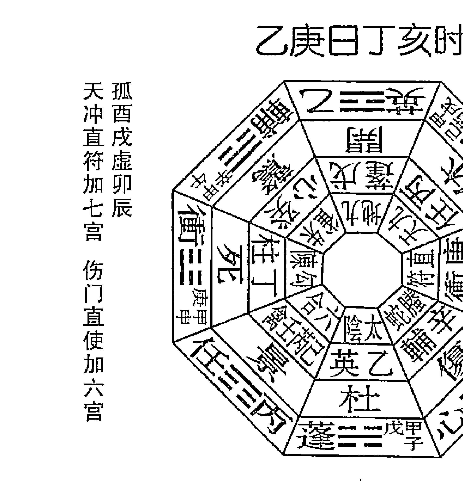

庚仪加丁为太白受制格 伤门加乾为雷天大壮 冲符加兑为雷泽归妹

| 兑 | 坤 | 离 | 巽 | 震 | 艮 | 坎 | 乾 |
|---|---|---|---|---|---|---|---|
| 相佐时干格 | 奇格 | 符反吟 | 宫克门 | 门克宫 | 宫克门 | 生门 | 宫克门 |

断曰：符使同入于官乡，有奋志功名之象。庚金受制于丁，以大局言之，则庚为敌，可以膺服其心矣。以直符言之，则庚为我，未免有尾大之忧也。况符值反吟，丁加庚曰“玉女刑杀”，庚加丁曰“太白受制”，事多反覆，难以强图。

兵事：宫克门，利主不利客。若敌至，宜列阵于西南，坚壁勿战，俟其先动而后乘之，背西击东。东北正北，皆宜预设伏兵，以邀败走之众。

出行：宜出西南方。十五里，闻鼓声，或见土器长方之物。

阳宅：春立坤门吉。有皂衣人至，或北方鸟鹊飞来。

阴宅：坐坤向艮可用。葬时有北方人家火光，当得妻财。

附占：胜败：客兵不利。虚实：来意反覆不常。攻城：欠利。守城：有援可守。天时：有雨。地理：兑龙发丁，防日久变迁。人事：主财库虚耗，或见花假之物。田禾：麦有收，禾防虫食。家宅：发丁破财，平常。官禄：武职甚吉。应试：房官不取。求财：有得。婚姻：可成。胎产：生男，当贵。疾病：浮火无根，易治。捕获：逃不能脱，可获。失物：失于有文书之处。远信：其信已发。鸦鸣：有和美事。鹊噪：鹊自惊鸣。

## 丙辛日戊子时

孤戊亥虚辰巳
天冲直符加一宫
伤门直使加七宫

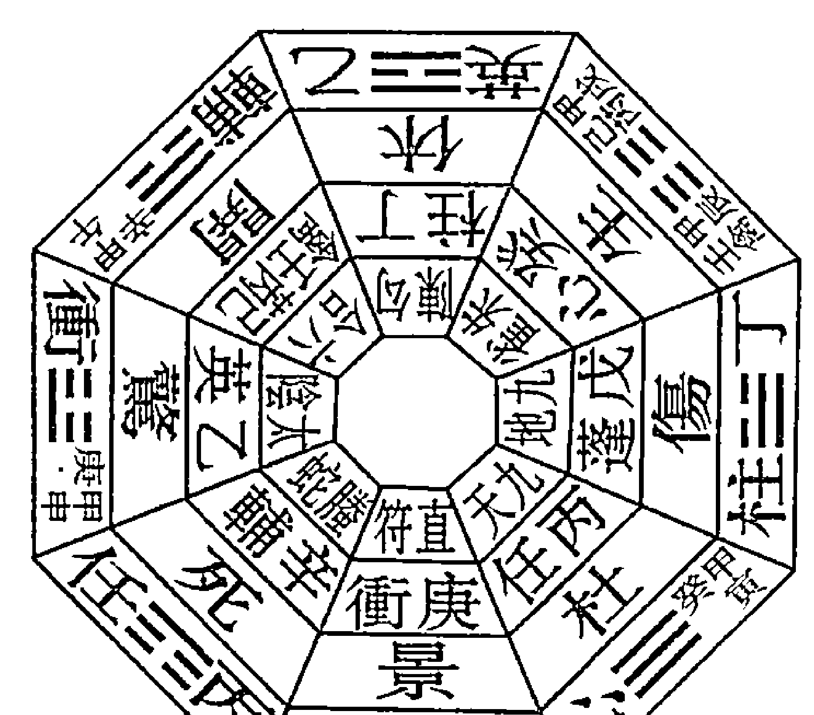

阳遁一局
冬至上元
惊蛰上元
清明中元
立夏中元

| 宫位 | 格局/现象 |
| :--- | :--- |
| 乾 | 丙奇入墓 宫克门 |
| 坎 | 太白与天乙格 时干格 |
| 艮 | 宫克门 |
| 震 | 乙奇升殿 门迫宫 |
| 巽 | 门迫宫 |
| 离 | 休与丁合 门迫宫 |
| 坤 | 宫门比和 |
| 兑 | 玉女守门 门反吟 宫克门 |
| （总论） | 冲符加坎为雷水解 伤门加兑为雷泽归妹 庚仪加戊为太白逢恩格 |

断曰：庚符入坎，而逢戊以受其生，是泄于水而取偿于土也。门使居兑，而遇丁以泄其气，是克于金而求救于火也。人遁则利于访道求贤，守户则宜于饮食宴乐。惟庚加于戊为时格，门加于兑为反吟，须防中道而阻，半途而返。

兵事：宫克门，利主不利客。宜待敌人先发而后动，从正南休门出兵，东西皆可设伏，遇敌背西南，击东北，战酣伏发，左右冲突，敌阵必变。

出行：出正南方大利，春初更吉。但逢门迫，又值白虎，不无惊恐，当见鸦鸣鹊噪为应。

阳宅：宜修南方。三七日，有人送水族物，或寄放财物。

阴宅：坐丁向癸可用，主有大风四起，火从东至。

附占：胜败：主兵有杀伤。虚实：来人反覆。攻城：人心甚固，难克。守城：防敌暗劫。天时：半阴半晴。地理：对案甚佳，土带黑色。人事：有远方密信至，或与远人密谋颇合。田禾：欠丰。家宅：得内助之力。官禄：前程不远。应试：丙日占，可中。求财：有得，防劫夺。婚姻：成亦不吉。胎产：安吉，生男。疾病：肺病，因七情所致，可痊。捕获：易获，后当释放。失物：失于西方林木陂池之间。远信：浮沉不至。鸦鸣：主官吏公人之事。鹊噪：主得远地之财。

## 丙辛日己丑时

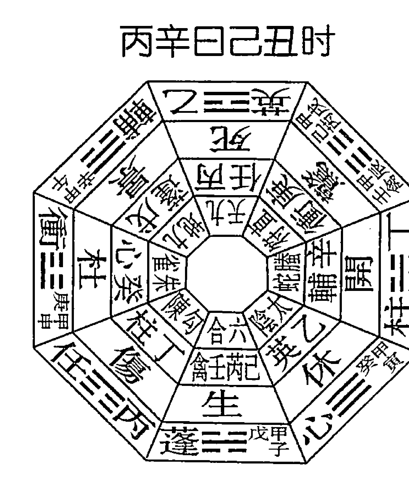

孤亥子虚巳午
天冲直符加二宫
伤门直使加八宫

阳遁一局
冬至上元
惊蛰上元
清明中元
立夏中元

时干入墓
庚仪加己为太白大刑格
伤门加艮为雷山小过
冲符加坤为雷地豫
兑宫门比和
坤刑格上格时干格宫生门
离丙奇升殿宫生门
巽宫生门
震小格宫门比和
艮丁奇入墓门迫宫
坎乙奇入墓宫生门
乾休与乙合真诈龙遁

断曰：符使皆临于财地，而符之阴神为六合，使之阴神为九天，似乎两处求财，有利钝异宜、显晦各别之象。天冲属木，而临于坤，坤中有未，是为直符入墓。往往成而复悔，舍而不能，恋于鸡肋之微，顿忘鲲飞之志。

兵事：星门克宫，利客不利主。宜出西北休门，伏兵于阵后，先用副将探敌。胜气在南，不可南向。本军亦防小伤，先发者胜。

出行：宜出西北休门，逃亡更利。三十里，见阴贵人，或针镜斧锯之类。

阳宅：门奇到乾，修西北方利。立门时，见牛马，或扛木人。

阴宅：乾山巽向可用。作用时，主有云雾四合，或小儿成队来。一年后，得僧道田契。

附占：胜败：主客互有损伤。虚实：敌有阻隔，不来。攻城：城可拔，将不可擒。守城：多杀伤，难守。天时：阴云不雨。地理：硗确之地，葬有刑伤。人事：主眷丁多病，或财畜有损。田禾：谷有收，西北大熟。家宅：人口不宁，财亦不聚。官禄：不安其职，防降调。应试：丙日占，得荐。求财：交友之财不可得。婚姻：可成。胎产：胎安，生女。疾病：伏火在下，宜清剂。捕获：藏匿甚固，捕之有伤。失物：失于东南炉冶之处。远信：有逗留，不能即至。鸦鸣：主事暧昧。鹊噪：有争讼。

## 丙辛日庚寅时

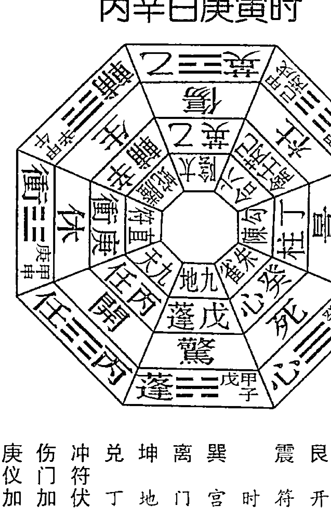

阳遁一局
冬至上元
惊蛰上元
清明中元
立夏中元

孤虚
天冲直符加三宫
伤门直使加九宫

- 乾：门生宫
- 坎：门生宫
- 艮：开与丙合宫生门
- 震：符伏吟飞宫格伏宫格
- 巽：时干格门生宫
- 离：宫克门
- 坤：地假门迫宫
- 兑：丁奇升殿门迫宫
- 冲符伏震为震
- 伤门加离为雷火丰
- 庚仪加庚为太白重刑格

断曰：直符为庚，而直使之阴阳有两乙焉，与庚符相合，必有承筐之实，将于我之前后者矣。但伏吟之格，庚又伏宫，凡值此者，宜静而不宜动，宜晦而不宜明。丙日逢之，尤为不吉，止宜断刑决狱而已。

兵事：门生宫，利主不利客，营地亦不安。宜移寨于东北九天之下，多设旗鼓火炮，大作威势。更伏兵于正南，敌至以起火为号，背东南，击西北，收兵于正北坎位。

出行：伏吟，本不宜出行。止宜出东北方，当得酒食，及遇贵人印绶，或首饰之物。

阳宅：宜修艮方，主有老人执杖，或闻哭声。

阴宅：门奇在艮，宜坐艮向坤，主乙巳丁癸人发福。

附占：胜败：兵在东北败。虚实：来信不实。攻城：城坚难拔。守城：宜把守津要。天时：晴。地理：土带青色，地防更变，不吉。人事：有文人至，或铺毯人。田禾：麦防虫损，禾防旱。家宅：有阴人争权相妒。官禄：任在东北，可升。应试：文佳，可中。求财：有名无实。婚姻：可谐，男性不常。胎产：生女，产妇多病。疾病：胸腹原病，多变症。捕获：易获。失物：宜向北方寻觅。远信：西方人占，信即至。鸦鸣：主有争斗。鹊噪：防水厄。

## 丙辛日辛卯时

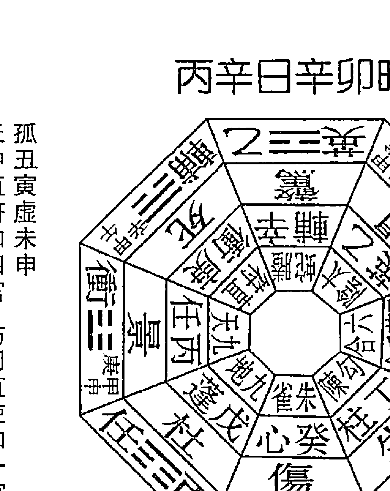

孤丑寅虚未申 天冲直符加四宫 伤门直使加一宫

阳遁一局 清明中元 立夏中元 冬至上元 惊蛰上元

| 宫位 | 描述 |
|------|------|
| 兑 | 宫生门 |
| 坤 | 乙奇入墓 宫生门 |
| 离 | 开与乙合 真诈 地遁 |
| 巽 | 虎猖狂 宫克门 |
| 震 | 时干格 宫克门 |
| 艮 | 乌跌穴 天假 荧入白 勃格 |
| 坎 | 门迫宫 |
| 乾 | 丁奇入墓 门生宫 生与丁合 雀投江 |

断曰：朱鸟跌穴，格本上吉，但丙所加之甲，乃属庚符，则一以为丙之飞干，一以为符之勃乱，一以为荧之入白，未可遽云吉也。况重以白虎猖狂，与朱雀投江乎？然丙日加庚，辛日加乙，上克其下，若我兵先动，事在必胜。

兵事：宫生门，利为客，但遇勃格，军中必有紊乱纪纲者，宜严加约束。从西南方出兵，得地遁之吉，西北止可埋伏。更设游兵于兑地，以通信使。遇敌先击其南方右翼，敌走西北，遇伏必败，合投江之势。

出行：西南西北俱可出，见贵人公吏，及图书印玺物。

阳宅：坤乾俱合奇门，但奇墓，皆非全美。

阴宅：坐山坤乾皆可用。作用后，防妇女有灾。

附占：胜败：主兵不胜。虚实：敌情屡变，勿信。攻城：难于攻取。守城：有金汤之固。天时：无雨，有风。地理：白虎太高，朝山不起。人事：有水利之事，亦防损失。田禾：麦胜于稻。家宅：墙宇周密，可发财，人口安。官禄：即升。应试：文不得意。求财：得而复失。婚姻：不成。胎产：当生贵子。疾病：下泄之症，宜燥湿。捕获：逃人自归，贼不获。失物：失东北土中，难寻。远信：东方人占，即至。鸦鸣：主有文书上达。鹊噪：防劫财。

## 丙辛日壬辰时

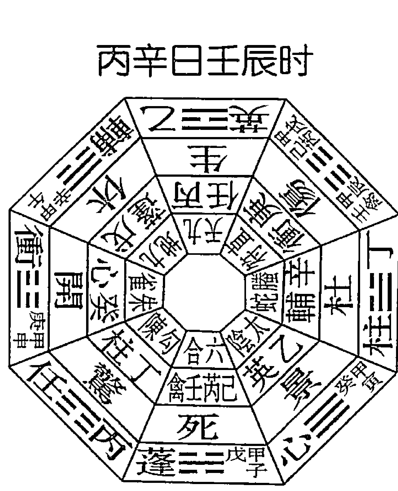

孤寅卯虚申酉
天冲直符加五宫
伤门直使加二宫

阳遁一局
冬至上元
清明中元
立夏中元
惊蛰上元

时干入墓丙日不遇

庚仪加壬为太白退位格

伤门加坤为雷地豫

冲符步五为雷地豫

兑宫克门

坤 刑格上格 时干格 门迫宫

离 宫生门

巽 生与丙合 神遁 丙奇升殿

震 门生宫

艮 小格 门迫宫

坎 丁奇入墓 宫生门

乾 鬼假 门迫宫

乙奇入墓 门迫宫

断曰：以庚加壬，名曰“太白退位”。金能生水，似乎为主者得益矣。无如符使皆入于坤之财地，以上克下，谓可以竭泽而渔，而不知已受坤之墓，所谓黩货无厌，而利令智昏者。主既失矣，客亦未必得也。况时干入墓，凡事总宜退藏。

兵事：星门俱克宫，利于先举。南方日月二奇合于生门，从此出兵，祭旗鸣鼓，大张声势，更设伏兵于西北，遇敌坐离击坎。亦防敌有诡计，既走勿追。丙日亦不可出兵。

出行：出南门吉，见病眼人，或土器瓦缶之类。

阳宅：丙日逢壬时，不可用。只宜小修南门，遇青衣人过往则吉。

阴宅：午山子向稍利。但时干入墓，不能发达。作用后，须防跌伤。

附占：胜败：辛日客胜，亦有伤损。虚实：闻事必虚。攻城：可克，多伤。守城：难御。天时：阴云不雨。地理：形体歪斜，龙气亦杂。人事：当见刑余人。田禾：丰收，南方麦大熟。家宅：房不利。官禄：不能即升。应试：不中。求财：得官长之财。婚姻：女出诗礼之家，可成。胎产：孕妇有灾，生男。疾病：防疫症。捕获：有格斗，不能缉。失物：失于东南。远信：有信，迟滞。鸦鸣：有阴人事，或兵事。鹊噪：事防终格。

## 丙辛日癸巳时

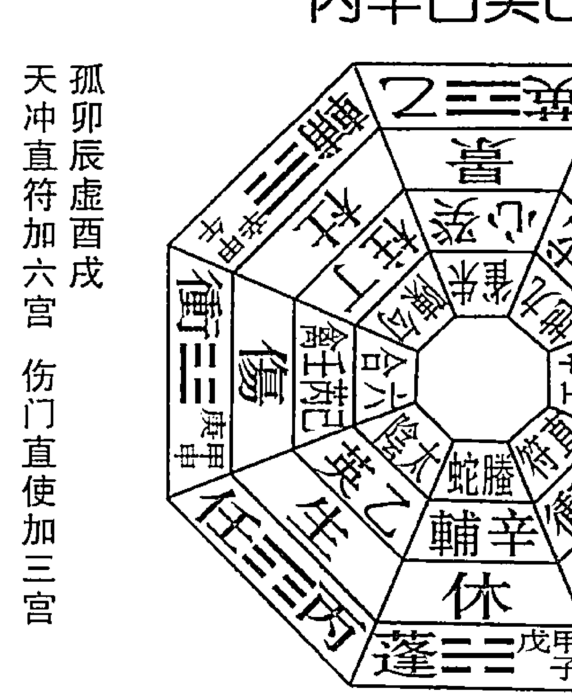

孤卯辰虚酉戊
天冲直符加六宫
伤门直使加三宫

阳遁一局
冬至上元 惊蛰上元
清明中元 立夏中元

| 八门 | 吉凶格 |
|---|---|
| 天网 | 庚仪加癸为太白刑隔格 |
| 伤门伏震为震 | 冲符加乾为雷天大壮 |
| 兑 | 神假格刑门伏吟 |
| 坤 | 生与乙合真诈虎遁 |
| 离 |  |
| 巽 |  |
| 震 |  |
| 艮 | 大格 |
| 坎 | 时干格 |
| 乾 |  |

断曰：符入官乡，使伏本位，有进而多阻、退而无为之象。直符之阴神，本为雀武之位，而又逢癸以闭之，其中必有萋菲贝锦之人，虚幻百出，以挠其权，必至于图穷匕见而后已。值此者，当深自韬晦，以避罗网之虞。

兵事：门伏不利出兵。宫克直符，客尤不利。宜移营于东北艮方，上得太阴之蔽，又重逢日月之奇，居三胜之地，贼不敢犯。惟防远探遇伤。

出行：避难当出南方，远行宜出东北方。遇人持铁器，或见刚柔有节物。

阳宅：门奇到艮，修东北方吉。

阴宅：丙禄在巳可用，艮丑山尤吉。作用后，犬生花狗，大旺田财。

附占：胜败：先动者败。虚实：信息不通。攻城：守将被擒。守城：必破。天时：晴。地理：穴道左傍，有一怪树，宜芟伐。人事：有隐事不谐，或梦中惊怖。田禾：麦大熟，谷防雷伤。家宅：亲戚乖张生衅。官禄：不能升。应试：文必呈堂。求财：计画极善，大利。婚姻：女多财能，可成。胎产：迟，生女。疾病：肝气不平，药不见效。捕获：逃在南方，易获。失物：失于坤方，不得。远信：南方人占，即至。鸦鸣：防文书遗失。鹊噪：有文信至。

## 丙辛日甲午时

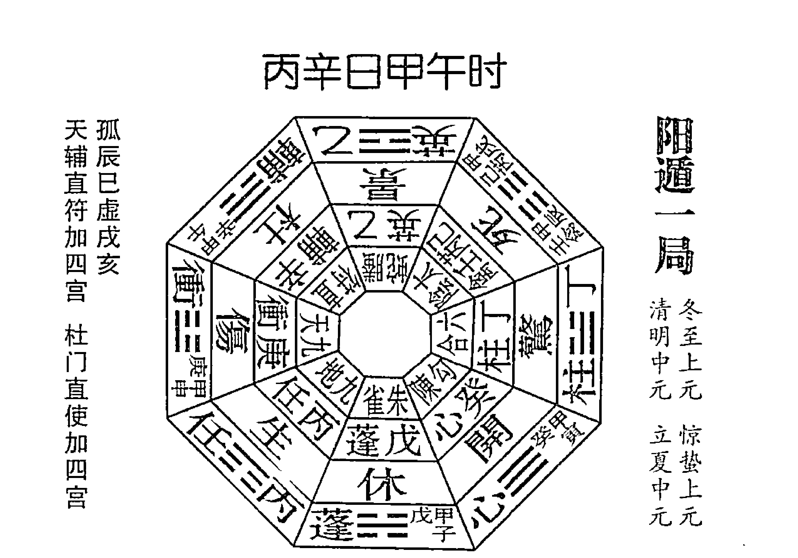

| 方位 | 天辅时 | 辛仪加辛为天庭自刑格 | 杜门伏巽为巽 | 辅符伏巽为巽 | 兑 | 坤 | 离 | 巽 | 震 | 艮 | 坎 | 乾 |
|---|---|---|---|---|---|---|---|---|---|---|---|---|
| 断语 | | | | | 丁奇升殿 | 鬼假 | | 门符伏吟 | | 生与丙合 重诈 | | |

断曰：天辅司符，杜门秉令。盖巽者顺也，万物之秉阳盛以生者，至此而尽发其英华，则阳之气已几乎熄矣，故名曰“杜”，《易》所谓“齐乎巽”者是也。门符又值伏吟，尤宜遵养时晦，以视阳消阴长之几，动则非吉。

兵事：门符比和，时值天辅，主客皆宜静守。从艮方安营，乾兑二方皆可埋伏，北方可以樵汲。宜收贮粮糗，填塞沟壑，以警不虞。

出行：出东北艮方吉。行八里，当逢黄衣阴人，或见偏曲静止之物。

阳宅：利修东北，有双禽飞来为应。

阴宅：坤山艮向可用。动作时，有女人穿红至，吉。

附占：胜败：镇静不败。虚实：有虚声至，勿听。攻城：不攻自服。守城：计不能行，难守。天时：微雨。地理：穴吉，土带青色，平安。人事：见文墨人，明辩义理。田禾：东北方丰收。家宅：子孙能继书香，吉，不宜动。官禄：任于东南，可升。应试：文有光彩，可中。求财：本分之财可得。婚姻：男欲附女，可谐。胎产：胎安生女。疾病：肝气不舒，即愈。捕获：匿于北方同党家，易获。失物：在正北有水处，可寻。远信：南方人占，其信即至，余不至。鸦鸣：主事缠扰。鹊噪：有口食。

## 丙辛日乙未时

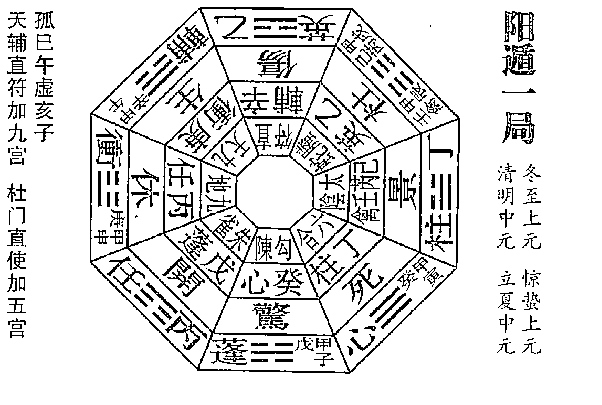

| 辛日干格 | 乙奇得使游仪 | 辛仪加乙为白虎猖狂格 | 杜门步五为风地观 | 辅符加离为风火家人 | 兑门迫宫 | 坤乙奇入墓门迫宫 | 离相佐仪刑虎猖狂门生宫 | 巽伏宫格宫克门 | 震休与丙合重诈荧入白 | 艮宫生门 | 坎门生宫 | 乾鬼假雀投江丁奇入墓 |

断曰：直符之午，临于九宫，是自刑也。况时干之乙，受制于猖狂之虎，欲求其免于刑伤，不可得矣。飞盘之乙，与门使同入于坤宫，或克己土以求财，或荫壬水而托庇，总归于墓，未遂初心。占者必有二心，始终不悟。

兵事：时干入墓，不利为客。门制其宫，主亦不利。惟丙奇合休在震，宜旁略近地。或出东方樵猎，遇有卒风，吹折林木，防贼来劫寨。急宜分兵，伏于坤乾二方，虚其营以俟贼入，发伏奋击，以应虎狂入白之势。

出行：宜出正东方。行三十里，遇阴贵人，或逢匠人手攀木器为应。

阳宅：止宜小修正东屋宇。

阴宅：利卯山西向，作用时有鸟鸟飞来应。

附占：胜败：主兵胜。虚实：贼已欲遁。攻城：城固难克。守城：可守。天时：日入云中，不雨而阴。地理：朝山右砂无情，不宜用。人事：有土木之事，缠扰难结。田禾：极丰。家宅：右首房不利，防小儿惊。官禄：风宪之职，于危险中得升。应试：有望。求财：春占吉利。婚姻：男强女弱，不成。胎产：生女，产妇有厄。疾病：脾不克化，补中益气，即愈。捕获：向东北方捕之。失物：失于东北山石之间。远信：不至。鸦鸣：主有口舌。鹊噪：有亲朋至。

## 丙辛日丙申时

阳遁一局

冬至上元 惊蛰上元
清明中元 立夏中元

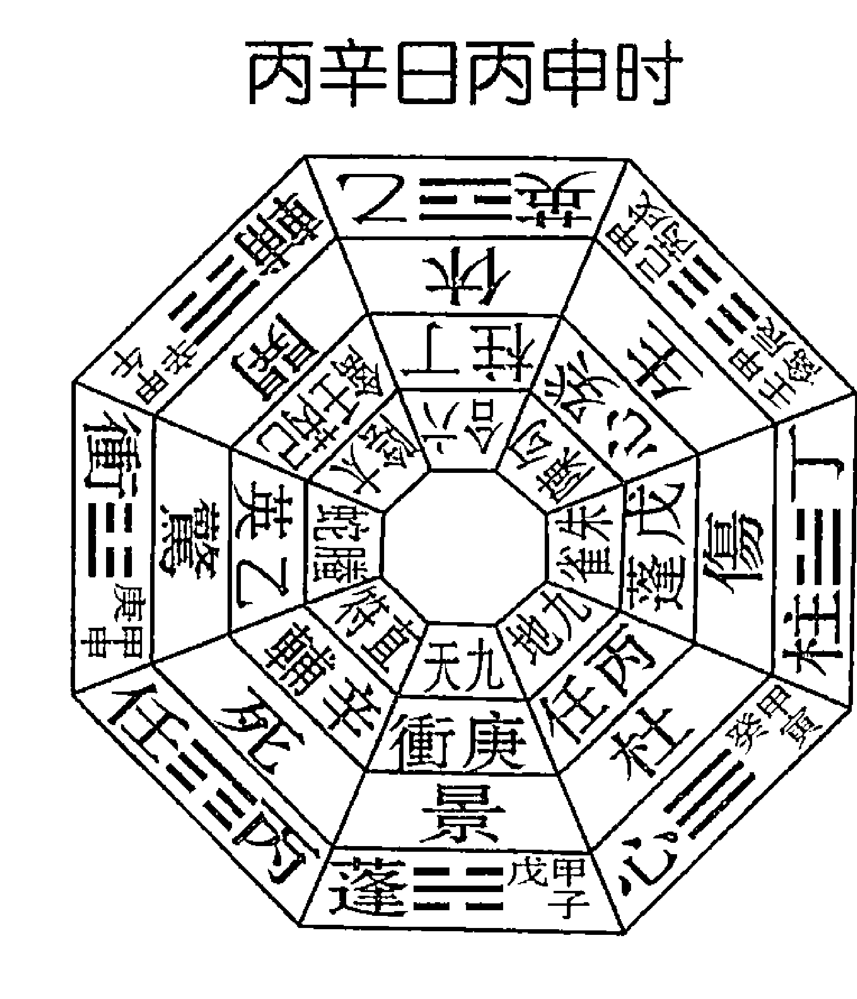

- 乾：丙奇入墓，门反吟，宫克门
- 坎：太白与天乙格，宫克门
- 艮：龙返首，相佐，符勃
- 震：乙奇升殿，门迫宫
- 巽：宫门比和
- 离：休与丁合，休诈，门迫宫
- 坤：宫门比和
- 兑：辅相加艮为风山渐
- 杜门加乾为风天小畜
- 辛仪加丙为天庭得明格

断曰：直符加于地盘之内，青龙返首，此格之最吉者。况以辛加丙，名曰天庭得明，主有异常际遇，非浅近者之所图也。惟门使入于六宫，而天丙临之，其阴为勾白之地，勾则忧其凝滞，白则恐有惊惶，又逢反吟，岂得免于往来憧扰乎？

## 丙辛日丁酉时

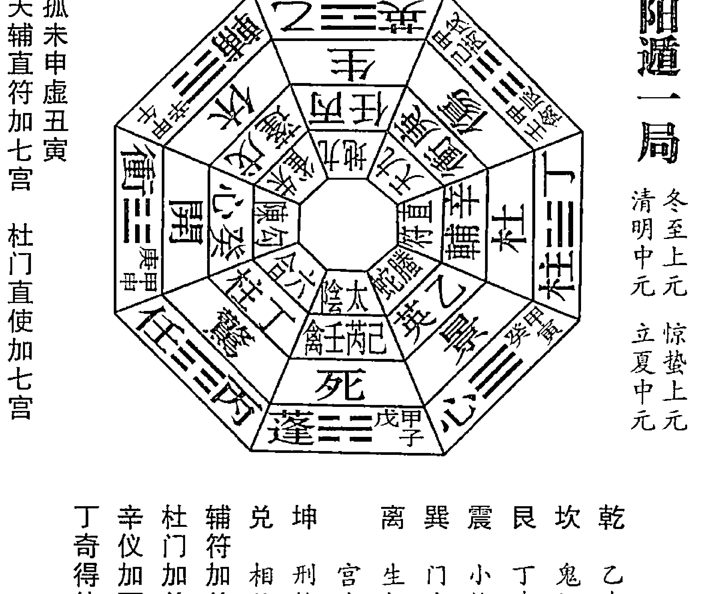

断曰：符使并入于官乡，下临丁火，名为白虎受伤，群小之愠，谅所未免。幸兑之阴神，本属六合，而又逢玉女守门，行军则利于间谋往来，作事则利于阴私和合。若欲明目张胆而为之，非其时、非其义也。

兵事：星门俱受宫制，不利先动。奇门会于离地，宜安营南方。距营九步，设神枪火炮为拓阵，遣游兵出乾艮方为侦探。敌至起火为号，大将坐正西，击其中坚，其将可擒。惟西南不可战，正东不可追。

出行：南行吉，逢公吏，或煅炼药石物。

阳宅：宜立离门。有患脚目人，或小儿骑牛马至。

阴宅：宜坐南向北，辛日防官讼。

附占：胜败：主兵大利。虚实：敌兵多阻，不至。攻城：城中自相杀，可破。守城：难守。天时：晴而有云。地理：大贵之穴。先有刑克，乃发。人事：主君臣燕会，有上下唱酬之乐。田禾：麦收，谷防晚变。家宅：有贤能女人治家，发贵发富。官禄：有特升。应试：丙日占，必中。求财：密谋可得。婚姻：成，男女俱防有病。胎产：男胎，子母不安。疾病：肺有伏热，易痊。捕获：难获，防复来窃。失物：有家人同外人合党盗去，难寻。远信：即有惊喜信至。鸦鸣：防口舌惊恐。鹊噪：有家中酒食。

## 丙辛日戊戌时

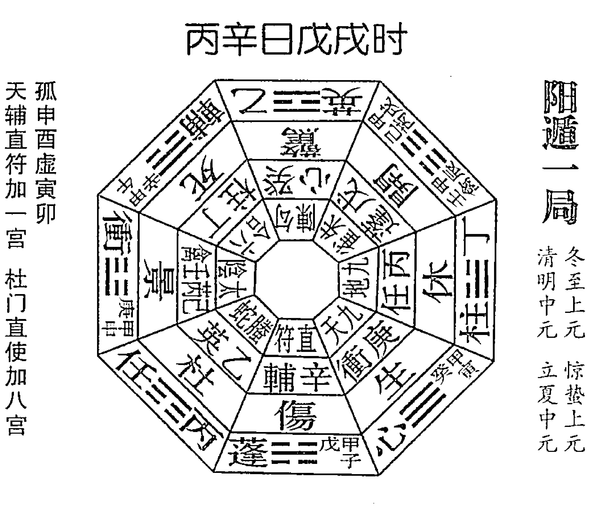

阳遁一局
冬至上元
清明中元
立夏中元
惊蛰上元

孤申酉虚寅卯
天辅直符加一宫
杜门直使加八宫

| 宫位 | 门与宫关系 | 格局 |
| :--- | :--- | :--- |
| 乾 | 宫生门 | 大格 |
| 坎 | 宫生门 | |
| 艮 | 门迫宫 | |
| 震 | 宫生门 | 格刑 |
| 巽 | 宫克门 | 鬼假 |
| 离 | 宫克门 | |
| 坤 | 宫生门 | |
| 兑 | 休与丙合 | 重诈 宫生门 |
| 辅符加坎为风水涣 | | |
| 杜门加艮为风山渐 | | |
| 辛仪加戊为龙虎争强格 | | |
| 时干入墓 | | |

断曰：辛符加于坎宫之戊，名曰龙虎争强。盖戊为龙、辛为虎也，其风云之际会乎？惜乎天地盘子午相冲，未免小稽时日耳。天丁加于直符本位，谓之丁神人宅，凡占急迫，有迅雷不及掩耳之象。门使加临日月二奇，家庭康吉。

兵事：宫生星，门克宫，利于先发。宜出正西门，多持火具，衔枚疾走，别遣副将统镰枪手，伏于东北。遇敌举青旗为号，背西北，击东南。季冬亭亭在戌，尤利。

出行：宜出兑方。一八里，闻讴歌唱叹声。二十里，逢皂衣女人。

阳宅：宜立正西开门。有持杖人至，七日内进财。

阴宅：冬春酉山吉。作用时，有青衣人携酒至应。

附占：胜败：主胜。虚实：敌有通好之意。攻城：当举城来降。守城：不能守。天时：雨泽可待。地理：水不朝山，未为吉壤。人事：见女人簪花喜笑，或执藤杖花枝。田禾：小丰，麦防秀而不实。家宅：对门有兽头冲突，不利小口。官禄：印巳无用，当罢官。应试：文佳，不售。求财：空劳无得。婚姻：女益男家，可成。胎产：男胎，母子俱利。疾病：春气发动，无大病。捕获：贼已远去，不获。失物：失于西南，不得。远信：西方人占，信即至。鸦鸣：主有阴谋不成。鹊噪：主官讼。

## 丙辛日己亥时

孤酉戌虚卯辰
天辅直符加二宫
杜门直使加九宫

阳遁一局
冬至上元 惊蛰上元
清明中元 立夏中元

乾 宫门比和
坎 开与丁合 休诈 门生宫
艮 宫克门
震 天乙与太白格 宫克门
巽 鸟跌穴勃符 宫门比和
离 奇格门生宫
坤 门生宫
兑 门生宫
辅符加坤为风地观
杜门加离为风火家人
辛仪加己为虎坐明堂格

断曰：坤为财地，而辛符入之；离为子宫，而杜使加之。大约身家之计多，而君国之谋少也。所喜丙奇加甲，合跌穴之上格，凡有谋为，咸称顺利。惟辛日名勃，不免邪正同涂，是非颠倒。占者明而能断，则几于道矣。

兵事：跌穴之格，利为客。从正北出师，格合休诈，当多用间谍，使敌兵自疑。遇敌南来，切勿迎战，退据正东，直击其西。先伏奇兵于乾巽二方，闻号齐发，以邀其后。惟门使遇格，副将勿用。出行：宜出北门，见四足斗，或逢茶酒瓶盘之属。阳宅：宜开北门，见人执杖吉。阴宅：宜子山午向。作用时，有西方红衣人至。

附占：胜败：客兵胜。虚实：敌人欲来未果，宜先发。攻城：守将惊走，可入其城。守城：静镇可守。天时：阴云不雨。地理：穴法极佳，土色黑。人事：有军事上闻，或主无情遇合。田禾：谷极丰收。家宅：宅吉人安，微有伤泄。官禄：丙日占，必升。应试：可望榜首。求财：费力可得。婚姻：女家违盟，不成。胎产：生女必贵。疾病：荣卫不和，易治。捕获：逃者在东，捕役不力。失物：东方林木中人窃去，难寻。远信：有好音至。鸦鸣：主文信。鹊噪：防损劳。

## 丁壬日庚子时

阳遁一局
冬至上元
惊蛰上元
清明中元
立夏中元

孤戊亥虚辰巳
天辅直符加三宫
杜门直使加一宫

辛仪加庚为虎逢太白格
杜门加坎为风水涣
辅符加震为风雷益
兑 蛇天矫 门生宫
坤 休与丁合 休诈 宫克门
离 宫克门
巽 龙逃走 门迫宫
震 飞宫格 宫克门
艮 白入荧 奇格 门生宫
坎 宫生门
乾 宫克门

断曰：辛符加临于兑，名曰虎逢太白，有两虎相争之象，恐舟中之人，皆敌国也。杜门虽受生于坎，而天上丙奇，乃受制于水，又乘雀武之阴神，阴私口舌，岂能免乎？况庚干又入于荧惑，事事纷更，顾前失后。

兵事：飞宫不利为客，却遇入荧，贼必即来。宜伏兵于艮方，大将潜往西南为犄角，偃旗卧鼓，敌至吹角为号，伏发奋击。丁日五符在午，亦可伏兵。唐符国印在艮更利。壬日地府在艮，亦利埋伏。收兵宜屯坎方。出行：西南可行，见水族蛇虫，或孝服颂白人。阳宅：宜小修坤方，有白衣阴人应。阴宅：宜坤山艮向。作用时，有风雨。

附占：胜败：客兵不利。虚实：防贼即至。攻城：城固难攻。守城：敌不能久，即去。天时：晴朗。地理：无龙气，非吉穴。人事：遇人必外暗内明，勿以貌取。作事必先晦后显，勿以情误。田禾：麦防虫，禾防水。家宅：室暗地洼，家神为祟。官禄：防夺职。应试：文不合式，主落第。求财：心计甚多，未必得。婚姻：难成。胎产：生男，后极聪俊。疾病：阳衰当扶。捕获：贼党甚伙，株连难结。失物：被窃伤损，不获。远信：东南方人占，至。鸦鸣：有虚惊。鹊噪：见丑恶人。

## 丁壬日辛丑时

阳遁一局
冬至上元 惊蛰上元
清明中元 立夏中元

乾 坎 艮 震 巽 离 坤 兑
辛仪加辛为天庭自刑格
杜门加坤为风地观
辅符伏巽为巽
丁奇升殿 门迫宫
坤 地假 门迫宫
离 门生宫
巽 符伏吟 宫克门
震 门生宫
艮 开与丙合 重诈 宫生门
坎 门生宫
乾 门生宫

断曰：辛符伏于巽而自刑，所谓兰有膏而自煎者也。杜使入坤，上乘太阴，昼思夜梦，惟利是求，而不知坤中有未，未乃木库，沉沦淹溺于其中，不自觉寤，直可为好利者之戒。生门坐于时干，不如安于义命，尚能过活也。

兵事：门制其宫，利于先举。宜从东北方出兵，先遣探子伏路，明行暗度，得重诈之吉。更遣副将伏于西南，游兵出于正西，使敌莫备。临阵坐东南，击西北可胜。

出行：宜出东北方，遇贵人骑马，或闻争斗逃亡之事。阳宅：宜立艮向。有贵人青衣过，吉。阴宅：艮山坤向吉，西北有老妇锄瓜果应。

附占：胜败：胜气在东北。虚实：敌情自露。攻城：宜用副将之谋，可攻。守城：四季月可守。天时：微雨如昨日。地理：开穴见土色带青，则佳。人事：主有阴谋未发。田禾：麦有收，禾防虫。家宅：安静获福。官禄：职任清华，稍迟必升。应试：文佳，可中。求财：春夏占，有得。婚姻：可谐。胎产：生女，产母有灾。疾病：脾虚之症，伐肝可治。捕获：在北方窝家，不获。失物：因惊而失在水。远信：迟滞。鸦鸣：主有喜信。鹊噪：防盗惊。

## 丁壬日壬寅时

阳遁一局

孤子丑虚午未
天辅直符加五宫
杜门直使加三宫

冬至上元
清明中元
立夏中元
惊蛰上元

断曰：辛符虽步于五，而本宫有丙奇，飞来作合，似有有力之人，与我合伙求财，而因至于败乱者。杜门加于震宫，不无洽比东邻、衣势取荣之象。幸时干入于金宫水地以受生，复遇休门同气，乐处即安身，毋容汲汲也。

兵事：阳星克宫，利为客。宜扬声出正西，却从正北生门，用轻锐衔枚飞渡，设伏于乾巽二方，坐西南直符下，击其东北伤门，可胜。出行：西方北方俱可行。出西方，见兵器及灯台、夹剪之属；出北方，有财气，路遇黄衣人应。阳宅：当开兑门，有两鼠相斗应。阴宅：宜立震向。见公吏执铁器，进羽音人田契。

附占：胜败：客胜。虚实：敌必张其声势而来。攻城：不可攻。守城：易守。天时：日入云中。地理：路案俱佳，明堂欠吉。人事：有争讼攻劫之事。田禾：丰，麦尤熟。家宅：防失脱官讼。官禄：官印相生，甚利。应试：文有根底，可中。求财：巧于作合，可得。婚姻：女极佳，但畏男家，不就。胎产：迟，生女。疾病：因怒伤肝，平气可治。捕获：贼在东方，遣心腹之人往捕，即得。失物：失于正东林木之间。远信：即至。鸦鸣：主得禄。鹊噪：防有格斗。

## 丁壬日癸卯时

孤丑寅虚未申
天辅直符加六宫
杜门直使加四宫

阳遁一局
冬至上元
惊蛰上元
清明中元
立夏中元

丁日不遇
天网四张（丁日飞干格、伏干格）
辛仪加癸为虚投罗网（网）
杜门伏巽为巽
辅符加乾为风天小畜
兑（奇格）
坤
巽（门伏吟）
震（神假、物假）
艮
坎（休与乙合、龙遁）
乾（符反吟）

断曰：辛符入于鬼乡，又加癸上，名曰虎投罗网，其不能逞其雄心也，概可知矣。况杜使又归于本宫，伏处呻吟，真有势穷力尽、一筹莫展之象。占值此时者，切宜守株以待兔，不可缘木而求鱼。

兵事：门使伏吟，只宜自固。直符反吟受克，动必遭伤。惟当休兵于正北，依水草处安营，设伏于艮方生门，或从直符下御敌，不致大伤。出行：利出正北方，见色衣女子，或屈曲花假之物。阳宅：小修正北方，尚取其门奇相合。阴宅：子日取癸禄，坎山可用。作用时，当有女人执伞至为应，亦防损小口。

附占：胜败：智力相同，客诈，主以诚得胜。虚实：闻虚声勿惊。攻城：有援兵，难克。守城：可守。天时：先阴后霁。地理：路案虽佳，不发人丁。人事：有争讼，或网罗之事。田禾：小丰，农人劳。家宅：杜门困守，不免是非。官禄：职司刑曹武库，得升。应试：行文不脱窠臼，不能中。求财：难得。婚姻：女佳，可就。胎产：生女。疾病：风邪之症，宜表散。捕获：贼伏贵家，役不敢捕。失物：失于南方茶龟处，可寻。远信：南方人占，即至。鸦鸣：主有人来。鹊噪：有文书至。

## 丁壬日甲辰时

孤寅卯虚申酉
天禽直符加五宫
死门直使加五宫

阳遁一局
冬至上元
惊蛰上元
清明中元
立夏中元

天辅时
壬仪加壬为天牢自刑格
死门伏五为坤
禽符
兑丁奇升殿
坤门符伏吟
离天假
巽
震
艮
坎
乾 生与丙合

断曰：天禽秉令，居中五之尊，理宜居中驭外，率彼群僚。乃寄居于坤二臣道之宫，伏而呻吟，是上失其道矣。况以辰加辰，名为自刑，覥颜下气，倒持国柄，以自害其身。即能汔于小安，亦不过因人成事而已。

兵事：门使伏吟，不宜妄动。阳外阴内，为客小胜。当出东北生门，伏兵于西北，扬兵于正南，合五符法，吉。遇敌背南击北，胜。出行：宜出东北方。行十五里，见贵人车马吉。阳宅：修艮门吉，利于春夏。见有持铁器来，三七日进财。阴宅：艮山可用。作用时，有青衣人携渔罟来，百日内有凶人相打。

附占：胜败：客胜。虚实：贼怀暗劫之意。攻城：不能克。守城：可守。天时：占雨无雨，多阴暗。地理：地气厚，对案佳，土色黄。人事：闻妇人长叹声，无人来。田禾：岁丰，东北麦大熟。家宅：处困求安，不能发。官禄：不能升。应试：文佳可中。求财：不能即得。婚姻：贵家女，俯就可成。胎产：产女，平安。疾病：脾病，不能即痊。捕获：逃者当自投归。失物：原处可寻。远信：沉滞。鸦鸣：事得显明。鹊噪：主有伤损。

## 丁壬日乙巳时

阳遁一局
冬至上元
惊蛰上元
清明中元
立夏中元

孤卯辰虚西戌
天禽直符加九宫
死门直使加六宫

壬仪加乙为日入地户格
死门加乾为地天泰
禽符加离为地火明夷
兑蛇天矫门迫宫
坤门迫宫
离相佐门生宫
龙逃走宫克门
生与乙合风遁虎遁
震门生宫
艮白入荧奇格宫生门
坎门生宫
乾门生宫

断曰：天禽居于离九，火能生土，可谓得其地矣。不知壬符与离，又有水火之争也。符之阴神为九天，使之阴神为太阴。九天之宫九，为阳；太阴之宫六，为阴。符使本为同事之人，而一明一昧，或显或微，直谓之同床异梦耳。

兵事：门生宫，宫生星，主客均利，先动者小有折伤。可于东北安营立寨，静待敌人先举，出东南门击之。遣游兵伏西方，邀其惰归，可胜。或伏兵于艮方，合入荧之格，亦胜。
出行：宜出巽方。行四里十里，逢公吏，闻有叹息声，有遗失。
阳宅：东南方可小修。若营宫室，恐火灾。
阴宅：门奇到艮，格不吉，未为全美。

附占：
胜败：主小胜
虚实：贼兵即至
攻城：守固难拔
守城：守将有伤
天时：晴朗
地理：左势不佳，难用
人事：主讲礼法规矩之事
田禾：麦有秋，禾防旱
家宅：室人多怨多疾
官禄：迟升
应试：不第
求财：有得，更防失
婚姻：男家不愿
胎产：孕妇多病，生女
疾病：太阴不收，纠缠能愈
捕获：贼易获，逃人匿西北方
失物：在乾方，寻之即得
远信：稽留未到
鸦鸣：有言语相争
鹊噪：闻兵事

## 丁壬日丙午时

阳遁一局

丁日飞干格伏干格
壬仪加丙为天牢伏奇格
死门加兑为地泽临
禽符加艮为地山谦

乾：宫门比和
坎：开与乙合龙遁门生宫
艮：首相佐符反吟
震：符勃宫克门
巽：神假宫门比和
离：门生宫
坤：鸟跌穴勃符门生宫
兑：玉女守门奇门生宫

断曰：符虽反吟，而加于艮，是兄弟相依也。门虽带庚，而加于兑，是母子相见也。况符之所在，逢返首之龙；使之所在，又有玉女之守。艮兑两宫，遥遥相望，复有丁壬暗合于其中。漆之投胶，盐之入水，投合之情似之矣。

兵事：宿干吉，利为客。张旗击鼓，正北方出兵，得龙遁之吉，水战更利。遣游兵出东方，虚张声势以多其备，却暗伏于乾巽二方，以邀其辎重，必有擒获。出行：往东方，有虚惊口舌，争产是非。出北门，有喜庆。行一二里，或十里之外，遇贵人骑马。阳宅：开坎门利。七日后，进银钱，并有喜事。阴宅：坎山南向大吉，丁日尤利。作用时，东方村舍失火应。

附占：胜败：丁日占，主胜。虚实：敌意反覆。攻城：援兵四集，攻之徒伤士卒。守城：可守。天时：无雨而阴。地理：青龙有气，牛眠吉穴。人事：有武人远至，神色不定。田禾：夏秋微旱，可望有年。家宅：栋宇新，人口平安，将有非常惊喜。官禄：不日当升。应试：中式。求财：费口舌，有得。婚姻：女有德有貌，可成。胎产：子母俱安，生女。疾病：积滞之症，易治。捕获：贼凶难捕。失物：有人合党窃去。远信：来速。鸦鸣：有争斗。鹊噪：主口舌。

## 丁壬日丁未时

孤巳午虚亥子
天禽直符加七宫
死门直使加八宫

阳遁一局
冬至上元
惊蛰上元
清明中元
立夏中元

| 宫位 | 属性1 | 属性2 | 属性3 |
| :--- | :--- | :--- | :--- |
| **乾** | 宫克门 | 丁奇入墓 | 宫克门 |
| **坎** | 宫门比和 | | |
| **艮** | 门反吟 | 宫门比和 | |
| **震** | 荧入白 | 门迫宫 | |
| **巽** | 门迫宫 | | |
| **离** | 虎猖狂 | 门迫宫 | |
| **坤** | 生与乙合 | 乙奇入墓 | |
| **兑** | 宫门比和 | | |

丁奇得使游仪
壬仪加丁为太阴被狱格
死门加艮为地山谦
禽符加兑为地泽临
兑相佐宫克门

断曰：门加于艮，统谦之体，而为反吟，似乎为谦太过，往返频仍，何其不惮烦也。壬加于丁，名为太阴被狱，而又人于少女之宫，得无有阴私淫佚，以致雀之角而鼠之牙乎？况虎雀荧惑，皆为贱格，占者大宜悔过迁善。

兵事：门值反吟，本宫却得奇门，亦可出兵。从西南方，扬威前进，直薄正东敌垒疾击之，以应入白之势。奇兵自兑入乾，会副将于东北，以邀其后，得游仪之吉。惟正南虎狂，不可安营伏兵。出行：利出西南，逢胥吏、素衣人，及老妪啼泣。阳宅：立坤门，防火烛。阴宅：宜坤山艮向。有牧童牵二牛过，或禽骇飞应。

附占：胜败：先举者胜。虚实：敌兵怯战。攻城：难克。守城：可保无虞。天时：半阴半晴。地理：朝山失势，右砂低陷，不宜用。人事：有远人遇合之事。田禾：五谷皆丰。家宅：出门甚利，防幼小灾。官禄：有美差。应试：秋闱得意。求财：迟有得。婚姻：女德幽贞，却不能成。胎产：孕生男，难产。疾病：郁怒之症，易痊。捕获：易获。失物：在东北，可寻。远信：中路沉搁。鸦鸣：有口舌。鹊噪：主宴会。

## 丁壬日戊申时

阳遁一局
冬至上元
惊蛰上元
清明中元
立夏中元

| 宫位 | 属性 | 格局 |
|---|---|---|
| 乾 | 休门与乙合，龙遁，乙奇入墓 | 宫生门 |
| 坎 | 门迫宫 | 宫生门 |
| 艮 | 丁奇入墓，门迫宫 | 地假，小格，宫门比和 |
| 震 | 宫生门 | |
| 巽 | 丙奇升殿，宫生门 | 伙宫格，刑格，上格 |
| 离 | 宫生门 | |
| 坤 | 宫生门 | 宫门比和 |
| 兑 | 宫生门 | |

禽符加坎为地水师
死门加离为地火明夷
壬仪加戊为青龙入狱格
壬日不遇
壬日伏干格

断曰：符飞北海，使向南阳，地北天南，子焉各处，睽离之象，所不待言。在君子则以为道里之参商，在小人则以为人心之矛盾矣。况伏干与刑格小格，凡言格者，犹之隔也，格则事皆有阻，战必有伤。

兵事：门克宫，宫生门，宜用丁日出师，从西北方，多鼓扬声而进，直攻东南。别将从南方邀之，可以破敌。安营宜于兑方，设伏不利震地。出行：往西北方吉。三十里，见贵妇，或炉冶人，或无足物。阳宅：西北方开门利，有黄衣人，或残疾人至。阴宅：门奇到乾，利乾山巽向。作用时，有清风微雨，美髯人来，或闻鼓声应。

附占：胜败：客兵胜。虚实：敌欲袭我，宜移营。攻城：城中惊恐，可拔。守城：不能守。天时：阴云不雨。地理：朝水不合，防人离财散。人事：主威声远播。田禾：小有年。家宅：财丁俱旺，能守祖业。官禄：必擢。应试：文亦合法，中而不高。求财：欲速反不能得。婚姻：女门高，可成。胎产：产不安，生女。疾病：火症，因惊怒而起，易痊。捕获：贼伏于家。失物：失于东南方。远信：虚信即至。鸦鸣：有和合事。鹊噪：有惊恐。

## 丁壬日己酉时

阳遁一局
冬至上元
惊蛰上元
清明中元
立夏中元

孤未申虚丑寅
天禽直符加二宫
死门直使加一宫

乾 门迫宫
坎 门迫宫
艮 宫生门
震 门迫宫
巽 门生宫
离 生与乙合宫生门
坤 符伏吟门迫宫
兑 丁奇升殿宫克门
禽符加坤为坤
壬仪加己为天地刑冲格

断曰：己为坤之本位，而壬实寄之。壬为直符，是既得其柄而出矣，今复以己之故，返于旧宅而呻吟。则曩时所以得其柄者，己之功也，今日所以离其众者，亦己之罪也，不免有功魁罪首之惧矣。门在一宫，亦不言吉。

兵事：符伏不宜妄动。门克其宫，可遣副将出师，从正南多张旗鼓而进，坐西击东，得丁奇乘旺之吉。更遣别将从东南伏路，直往西北，劫其粮草辎重。出行：宜出南方生门。行九里十七里，遇勾当人骑骡马行，随从步行，或见瓦盆土灶之类。阳宅：开南门吉，有牧童跨牛而来应。阴宅：宜离穴坎向。作用时，西方有赤马及车至。

附占：胜败：偏师得胜。虚实：来情欺诈。攻城：可攻。守城：不守。天时：密云不雨。地理：大势吉，向欠利。人事：有水土交合之事。田禾：丰，利麦。家宅：和气可以致祥。官禄：地方多事，迟升。应试：文不得势，难中。求财：利于合伙。婚姻：女有才德，可成。胎产：生男，恐孕妇多灾。疾病：水溺，可治。壬日占，防常常有疾。捕获：贼伏不动，易获。失物：宜向近水处寻之，或在原处。远信：至。西方人占，尤速。鸦鸣：防口舌。鹊噪：有贵客至。

## 丁壬日庚戌时

阳遁一局

冬至上元
惊蛰上元
清明中元
立夏中元

壬仪加庚为天牢倚势格
死门伏坤为地坤
禽符加震为地雷复
兑
坤
离
巽
震
艮
坤
乾
格刑飞宫格
生与乙合虎遁
大格

断曰：直符犹君也，直使犹臣也。符加于震，名曰趋三，有振作鼓舞、汲汲皇皇之象。而为之使者，乃伏处于坤而不动，名为恬退，实则偷安，直谓之有君无臣可也。《易》曰“履霜坚冰”，其渐不可长。为臣者，急宜警贪惩惰，以复天心。

兵事：宫克星，利为主。符宫有格，宜移营坎地，俟敌先动，后应，出西北生门，扼守险要。惊蛰节，亭亭在于北，当背北击南，焚其积聚。出行：宜出东北方。六十里，见贵人，或见水界开塞之事。阳宅：东北方小修亦利，惟不宜更造。有两鼠相斗，或孝服人来应。阴宅：艮山坤向吉，春夏雷雨交作。

附占：胜败：客兵胜。虚实：敌情多诡。攻城：必破。守城：不守。天时：难即晴。地理：水反无情，不吉。人事：宜归结旧事，或有旧亲到门。田禾：麦有收。家宅：不利子息。官禄：事繁，防参劾。应试：得荐。求财：得原有之物。婚姻：女益男，可就。胎产：胎恋母，生女。疾病：腹满之病，迟痊。捕获：在西北方，难获。失物：失于西南，难觅。远信：来信不实。鸦鸣：有阴人事。鹊噪：小有惊阻。

## 丁壬日辛亥时

天禽直符加四宫
死门直使加三宫
孤酉戌虚卯辰

阴遁一局
冬至上元
惊蛰上元
清明中元
立夏中元

乾 丙奇入墓 宫克门
坎 太白与天乙格 宫生门
艮 门生宫
震 乙奇升殿 宫克门
巽 仪刑 门迫宫
离 开与丁合 宫克门
坤 宫克门
兑 门生宫
禽符加巽为地风升
死门加震为地雷复
壬仪加辛为白虎犯狱格

断曰：壬符加辛，名为白虎犯狱。而又符使并入于官乡，俱受下克，乖戾之象多，和平之意少。若当冬夏木旺之时，主客分位，占值此者，必有西南水土之人，上门馈送。盖以星门而论则为官，以三四本宫而论则为财也。

兵事：宫克星门，更遇仪刑，不利举动，且防军中有变。宜严阵南方，谨备不虞。以次移营于艮地，据险固守，远斥候，击刁斗，切勿疏忽。

出行：出南方，略防虚惊。九里十九里，见稚子持竹杖木器物，或见炉冶烧丹之事。

阳宅：南门大吉。动作时，有青衣至。三七日，进横财。

阴宅：离山坎向大吉。作用时，有女人把火，来往行走应。

附占：
- 胜败：敌无斗志。
- 虚实：有间谍至。
- 攻城：不可攻，防杀伤。
- 守城：守将有计，可保。
- 天时：主有久雨。
- 地理：土色碧，明堂案山极佳。
- 人事：有贵人会合之事，或闻鼓乐声。
- 田禾：丰稔。
- 家宅：居人得荫下之福，有新婚之喜。
- 官禄：不能升擢。
- 应试：不利。
- 求财：和合得利。
- 婚姻：女极佳，难就。
- 胎产：胎防漏，产生男。
- 疾病：肝气不平，即痊。
- 捕获：宜向西方，有山水处捕之，可得。
- 失物：失于有盖盒之中。
- 远信：喜信成虚。
- 鸦鸣：有闭藏之事。
- 鹊噪：防事阻塞。

## 戊癸日壬子时

### 阳遁一局
冬至上元 惊蛰上元
清明中元 立夏中元

孤戊亥虚辰巳
天禽直符加五宫 死门直使加四宫

| 八卦 | 宫门关系 |
|---|---|
| 乾 | 门生宫 |
| 坎 | 宫生门 |
| 艮 | 门迫宫 |
| 震 | 宫生门 |
| 巽 | 宫克门 |
| 离 | 宫克门 |
| 坤 | 符伏吟 宫生门 |
| 兑 | 休与丁合 丁奇升殿 |

禽符伏五为坤
死门加巽为地风升
壬仪加壬为天牢自刑格

断曰：壬为天牢，本非吉气，乃伏于中宫以自取其刑，此来俊臣所云“请公入瓮”者也。门使复受木克，以死门而加杜位，精华既竭，呼吸难通。譬诸有罪之人，赭衣糜饭，坐待其毙而已。值此者非吉占也。

兵事：符伏吟，宫克门，利为主。宜休兵于水泽处，若有火惊，宜静镇勿动。伏兵于西北，以守辎重。敌至，用火器可御。

出行：出西门利，见蛇虫水族物，或见磁器破损物。

阳宅：兑方可造。七日，有人馈鸡豕等物。村邻有失火，当发。

阴宅：门奇到兑，宜用酉山，葬时有物夜鸣。六十日，孕生贵子。

附占：
- 胜败：客胜。
- 虚实：防敌人计赚。
- 攻城：火攻可破。
- 守城：不守。
- 天时：难得有雨，亦不晴朗。
- 地理：穴有死气，土黑，不甚吉。
- 人事：人有暗疾，或有暗计勿用。
- 田禾：有收，防水。
- 家宅：作事模糊，不能整理。
- 官禄：升转迟滞。
- 应试：文章得意。
- 求财：心计甚劳，反有损泄。
- 婚姻：可成。
- 胎产：胎安，产迟，生男。
- 疾病：肝有郁气，迟愈。
- 捕获：防捕人蒙蔽。
- 失物：遗于家中。
- 远信：不至。
- 鸦鸣：防劫财。
- 鹊噪：有文书事。

## 戊癸日癸丑时

孤亥子虚巳午
天心直符加六宫
死门直使加五宫

阳遁一局
冬至上元 惊蛰上元
清明中元 立夏中元

乾 休与丁合
坎
艮 天乙与太白格
震
巽 奇格
离 门伏吟
坤
兑 禽符加乾为地天泰
死门伏五为坤
壬仪加癸为阴阳重地格
天网戊日飞干格

断曰：符使之用，十时一易。今壬符加癸，是瓜期之将代也；死使归中，是破镜之复圆也。不知符已入于罗网，使复入于牢笼，止宜鞠躬尽瘁，以终其身，然后合于泰交之道。《易》所谓“含章可贞”者，是之谓矣。

兵事：符值网门，伏吟不利举动。戊日飞干，尤不宜攻战。当休兵北方，以便樵汲；设伏于东北，以为救应。敌至，据西方高处御之。

出行：出北门亦利。南方黑云下雨，或闻隐伏陷险之事。

阳宅：坎方可小修，有皂白衣人，或抱子女人来应。

阴宅：门奇俱合坎宫，坎山吉。作用时，东方有狗吠，有争斗叫号声。

附占：
- 胜败：先动者败。
- 虚实：来情不实。
- 攻城：宜筑长围守之。
- 守城：宜备南方。
- 天时：有雨。
- 地理：土色白，明堂佳。
- 人事：事多迟疑，终不能发。
- 田禾：水旱不时，农劳。
- 家宅：妻妾当权，卑幼有惊。
- 官禄：印相生，主升擢。
- 应试：文章欠利。
- 求财：只宜坐守。
- 婚姻：女家不愿。
- 胎产：迟延，生女。
- 疾病：因忧致疾，宜散郁。
- 捕获：捕人用情，难获。
- 失物：失于东方，已坏。
- 远信：戊日当至。
- 鸦鸣：防口舌。
- 鹊噪：主夫妇争论。

## 戊癸日甲寅时

### 阳遁一局
冬至上元
惊蛰上元
清明中元
立夏中元

孤子丑虚午未
天心直符加六宫
开门直使加六宫

| 方位 | 坤 | 离 | 巽 | 震 | 艮 | 坎 | 乾 | 兑 |
| :--- | :--- | :--- | :--- | :--- | :--- | :--- | :--- | :--- |
| 卦象 | 鬼假 | | | 生与丙合真诈 | | 门符伏吟 | 丁奇升殿 | 心符伏乾为乾 |
| 说明 | 癸仪加癸为天网重张格 | 天辅时戊日不遇 | 开门伏乾为乾 | | | | | |

断曰：寅为六甲之终，癸为十干之末，盈满之后，极盛难继。而尚不自奋发，伏处于衽席之间，知其不足以有为矣。斯时也，阳气在内，阴气在外，欲动则违于才，欲静则格于势，怨吟独处，非见非潜，其唐宋之末造乎？

兵事：符使俱伏，宜安静不动。西南死气不利，可即乾方直符下安营，或于东北生门亦吉。营后多设游兵，格合真诈，宜遣间谍，敌来即出东北御之。

出行：收货积粮，利出东北方。八里，逢阴贵人、黄皂衣，或公吏勾当人。

阳宅：利修艮方。有贵人青衣过，三七日进财。

阴宅：坐丑山吉。作用时，有女人成队，童子拍手，或轿马至，进六畜财宝。

附占：
- 胜败：主兵大胜。
- 虚实：敌欲来降。
- 攻城：难克。
- 守城：士卒效死，可守。
- 天时：先阴后晴。
- 地理：文峰作案，土色灰白。
- 人事：当闻金石声。
- 田禾：麦大收。
- 家宅：利尊长，可居。
- 官禄：职司水利，易升。
- 应试：文章入彀。
- 求财：阴私秘密之财，可得。
- 婚姻：可成。
- 胎产：产迟，生女。
- 疾病：太阴不收，冬时防下泄。
- 捕获：捕人欺蔽，难获。
- 失物：失于北方，难寻。
- 远信：即至。
- 鸦鸣：主婚姻之事。
- 鹊噪：有文字喜信。

## 戊癸日乙卯时

孤丑寅虚未申
天心直符加九宫
开门直使加七宫

### 阳遁一局
冬至上元
惊蛰上元
清明中元
立夏中元

乾 坎 艮 震 巽 离 坤 兑
大格 门迫 门迫 地假 天假 相佐 宫生 开与丙合
伏宫格 宫生门 宫生门 格刑 宫比和 宫门比和 真诈
宫生门 宫门比和
玉女守门

癸日伏干格
癸仪加乙为日沉九地格
开门加兑为天泽履
心符加离为天火同人

断曰：开门入兑，上遇丙奇，下逢玉女，又变为同人主象，必有将伯之助，默为扶翼，所谓出门有功者也。金星水符，飞入离明官鬼之地，当有官家公事，如炉冶铸造之类。但庚伏于本宫，恐为同事者排挤，不可不慎。

兵事：宫克星，利为主。先于正西方设伏，遣轻锐出东南，为游兵远探，且布流言诳敌，合天假之吉。敌来，背寅孤，击申虚，可胜。惟西北不可穷追，正东不可结营。

出行：宜出正西方，求谋皆遂，逢老人与女子同行，或见公吏。

阳宅：利修正西方，有鼓声应。

阴宅：酉山卯向大利，闻犬吠声吉。

附占：
- 胜败：主胜，戊日尤利。
- 虚实：敌多阻不至，至必大战。
- 攻城：守将出城拒战，多杀伤。
- 守城：静镇可守，当搜间谍。
- 天时：始雨终晴。
- 地理：拱护森严，地极吉。
- 人事：有兵事喜信，或乘马失惊。
- 田禾：禾大收。
- 家宅：子孙富贵，亲戚多乖。
- 官禄：即日高擢。
- 应试：大利，必得元魁。
- 求财：纷争，不得。
- 婚姻：男女俱有小病，可成。
- 胎产：生女，产室不吉，防惊恐。
- 疾病：宜清肺家伏火，即愈。
- 捕获：盗即匿于捕人内室，难获。
- 失物：坤方人窃去。
- 远信：迟，有佳音。
- 鸦鸣：有报喜人至。
- 鹊噪：主兴工作。

## 戊癸日丙辰时

### 阳遁一局
冬至 上元
惊蛰 上元
清明 中元
立夏 中元

| 八卦 | 描述 |
|------|------|
| 乾 | 鬼假 门生宫 |
| 坎 | 门生宫 |
| 艮 | 龙返首 相佐 符勃 |
| 震 | 天乙与太白格 生与丙合真诈 宫生门 |
| 巽 | 奇格门生宫 |
| 离 | 门迫宫 |
| 坤 | 门迫宫 |
| 兑 | 门迫宫 |

断曰：三奇得使而遇甲，吉非小补，所谓战则克而祭则受福也。符使皆入于艮而受生，又逢返首上吉之格，其阴神又为太阴，可明可晦，可行可藏，放之而弥，敛之而密。时乎时乎，其惟圣人乎！

兵事：宫生星门，利为客。向西南真诈下出兵，用火枪手为前队。若敌有两军，宜突入其中截断之，使彼此不能相顾，敌必自乱相杀。大军坐东北直击之，可胜。

出行：出东南方大利。路见贵人，著紫骑马，或见风炉火柜之类。

阳宅：宜修艮巽方。有鼓乐声，或皂衣人来，进财物。

阴宅：利巽山乾向。作用时，有青衣人携鱼罟来，进田地。

附占：
- 胜败：主胜。
- 虚实：敌欲归附，当开诚纳之。
- 攻城：必克，守将当死。
- 守城：难守。
- 天时：无雨。
- 地理：翻身逆结，最吉之地。
- 人事：有紫衣官长至。
- 田禾：丰，麦尤利。
- 家宅：极富极贵，后福无疆。
- 官禄：爵禄有加。
- 应试：中，可元。
- 求财：自然得财，无不如意。
- 婚姻：女家畏男家，难成。
- 胎产：胎不安，孕妇常有灾，生女。
- 疾病：因喜劳神，易痊。
- 捕获：防捕人受贿，不获。
- 失物：失于正东方，变损不获。
- 远信：即至。
- 鸦鸣：有喜庆事。
- 鹊噪：主文信。

## 戊癸日丁巳时

丁奇得使游仪
癸仪加丁为腾蛇天矫格
开门加离为天火同人
心符加兑为天泽履
兑相佐 蛇天矫 门生宫
坤休与丁合 宫克门
离宫克门
巽龙逃走 门迫宫
震宫克门
艮白入荧 奇格 门生宫
坎宫生门
乾宫克门

断曰：癸加于丁，蛇名天矫，本为贱格，况以直符为之，则惊疑恍惚，自不待言。门使属金，飞于离而受制，虽云宫制其门，不以为迫，而忌之者众，动而招尤，亦非我之福也。况雀武伏于门阴，一以防其口舌，一以备其侵欺。

兵事：宫克其门，主兵利。太白入荧，防贼即来。宜安营正南，命副将坚守，大将亲坐正西，列阵于西南，敌至不敢犯，必走东北。先伏兵其地，邀其惰归，可擒。

出行：宜出西南。十里，逢孝服人，或闻哭声，或见土器。

阳宅：利修坤方，用时有人担水过。

阴宅：坤山可用。葬时有黑牛过，或钟声应。

附占：
- 胜败：主胜。
- 虚实：防敌猝至。
- 攻城：内有强兵，不可拔。
- 守城：可守。
- 天时：晴而有风。
- 地理：朝山不吉。
- 人事：主贵人游戏，燕会鼓乐。
- 田禾：麦大丰，禾防虫蚀。
- 家宅：发财发丁，但多不实，门灶当改。
- 官禄：戊日占，官必升转。
- 应试：有虚喜。
- 求财：始若有大利，终竟成空。
- 婚姻：女性凶恶，婚亦难就。
- 胎产：男胎，不安。
- 疾病：中气不顺，调养即痊。
- 捕获：逃去远方，难获。
- 失物：失于西北方。
- 远信：即至，兼有喜庆。
- 鸦鸣：主作合之事，忽有变更。
- 鹊噪：有女人惊恐。

## 戊癸日戊午时

### 阳遁一局
节气：冬至上元，惊蛰上元，清明中元，立夏中元

孤辰巳虚戌亥
天心直符加一宫
开门直使加一宫

癸仪加戊为青龙入地格 | 开门加坎为天水讼 | 心符加坎为天水讼 | 兑：鬼假门生宫 | 坤：乙奇入墓门生宫 | 离：虎猖狂门生宫 | 巽：宫门比和 | 震：生与丙合真诈荧入白 | 艮：宫克门 | 坎：门生宫 | 乾：宫门比和丁奇入墓雀投江

断曰：符使俱逢甲子，甲子为六十时干之长。以人而言，则为君父；以身而言，则为首領。今者幸而全逢，是君臣会合也，是父子重逢也，是首尾相见也。虽诸格皆凶，犹以吉断。况经云：奇与门兮共太阴，三般难得总加临。若动作东方，吉无不利。

兵事：星门生官，利为主。宜就正北直符下结寨，闭戊坚壁。西北防有火惊，不可轻动出救。若遇阴雾，可遣奇兵，衔枚伏路，往正东烧敌老营，劫其辎重。

出行：日出正东方，亦防惊恐。三里十里，逢公吏打棍，或见苣菜长曲之物。

阳宅：东方利，有人持刀器，或雷鼓声，七日进生气财物。

阴宅：利卯酉山向，有黄色飞禽来，进贵人财物。

附占：
- 胜败：后举者胜。
- 虚实：贼当遁去。
- 攻城：救兵已至，难拔。
- 守城：可守，防劫门。
- 天时：阴晴俱见。
- 地理：右砂欺迫，朝水无情。
- 人事：当为子孙之计，心忽转变。
- 田禾：麦丰，禾防风损。
- 家宅：有添丁之喜，利改旧图新之事。
- 官禄：地方宁静，可升。
- 应试：文亦佳，中不稳。
- 求财：有得，不能如愿。
- 婚姻：女弱男强，不成。
- 胎产：产生女，胎安。
- 疾病：下原不足，宜峻补。
- 捕获：捕人贿纵。
- 失物：失于东北高处。
- 远信：防堕水中。
- 鸦鸣：恐有失脱。
- 鹊噪：文书迟滞。

## 戊癸日己未时

| 八卦 | 说明 |
|------|------|
| 乾 | 生与丙合真诈 丙奇入墓 |
| 坎 | 门生宫 太白与天乙格 宫生门 |
| 艮 | 门迫宫 |
| 震 | 乙奇升殿 宫生门 |
| 巽 | 鬼假宫克门 |
| 离 | 宫克门 |
| 坤 | 仪刑 宫生门 |
| 兑 | 宫生门 |
| 心符 | 加坤为天地否 |
| 开门 | 加坤为天地否 |
| 癸仪 | 加己为华盖入明堂格 |
| 戊日 | 伏干格 癸日不遇 |

断曰：癸加于己，号为“华盖入明堂”，名讼最吉。符使皆受生于坤，重以己土，其阴神又为九地，栽培孕育，源远流长。但恐土重埋金，如子平家之言，亦为近理。占者必于受益之地，淹缠迟滞，或有不免矣。

兵事：击刑之格，切不可举动。宜移营于西北，得太阴六癸之蔽。外设火器，营内穿井，禁士卒勿出樵汲。南方有火惊，北方有攻劫，皆密为防备，不可临时乱动，动必获咎。

出行：出西北方，五六里十里，见四足斗。

阳宅：宜修乾方。作用时，有双禽或皂衣人至，进财。

阴宅：乾山巽向利。作用时，有白鸡飞禽自西北方至。

附占：
- 胜败：主客俱不利。
- 虚实：敌兵负伤不至。
- 攻城：难胜。
- 守城：防内变。
- 天时：不雨，有风。
- 地理：地有冲射，反覆不吉。
- 人事：西南方官长来见。
- 田禾：麦有收。
- 家宅：幽暗不吉，心绪不宁。
- 官禄：癸日占，不能得禄。
- 应试：文佳难售，小考利。
- 求财：密谋得利。
- 婚姻：可成。
- 胎产：生男，稍有不安。
- 疾病：脾经之症，可愈。
- 捕获：难获。
- 失物：向正西方觅。
- 远信：迟到。
- 鸦鸣：须防失物。
- 鹊噪：有亲人会合。

## 戊癸日庚申时

### 阳遁一局
冬至上元
惊蛰上元
清明中元
立夏中元

癸日飞干格
癸仪加庚为天网冲犯格
开门加震为天雷无妄
心符加震为天雷无妄
兑宫克门
坤宫生门
离生与丙合 丙奇升殿 真诈
巽门生宫
震小格 飞宫格 门迫宫
艮丁奇入墓 宫生门
坎鬼假 门迫宫
乾乙奇入墓 门迫宫

断曰：符使俱临于震，以金克木，是为财乡。而震又有动象，明明以利欲动其心矣。不知癸为飞干，庚为飞符，其中之窥我短长、投间而抵隙者，盖不少见。贪财致祸，虽悔何追。若能以廉静为心，此占即可不应。

兵事：飞宫之格，不利进兵。大将宜居正东直符之下，俟敌来而后应。然遇小格，亦防杀伤。不若藏伏于正南，得太阴之蔽，真诈之吉。敌至乃发，背东击西。惟西南不可伏兵，亦不可追逐。

出行：宜出南方，当遇高贤僧道，或喜庆之事。

阳宅：宜开南门。周年内，进文书田产。

阴宅：坐午向子吉。作用时，有红衣女人送酒至，葬后得古窑器。

附占：
- 胜败：主胜。
- 虚实：敌心甚怯。
- 攻城：城中多伤，易取。
- 守城：难守。
- 天时：晴，有风。
- 地理：砂水不全，损人。
- 人事：有怒不可轻发，防损耗。
- 田禾：麦丰，谷有损。
- 家宅：防有外侮。
- 官禄：地方不宁平。
- 应试：主考不取。
- 求财：得南方炉冶之财。
- 婚姻：可成。
- 胎产：生男，产母不利。
- 疾病：胸膈不顺，平肝可治。
- 捕获：防捕役欺蔽。
- 失物：失于东南，难寻。
- 远信：东北方人占，即至。
- 鸦鸣：主有征召之事。
- 鹊噪：有贵人文书。

## 戊癸日辛酉时

### 阳遁一局

| 宫位 | 坎 | 艮 | 震 | 巽 | 离 | 坤 | 兑 | 乾 |
| :--- | :--- | :--- | :--- | :--- | :--- | :--- | :--- | :--- |
| 克应 | 宫克门 | 鬼假 宫门比和 | 门迫宫 | 门符反吟 仪刑 门迫宫 | 门迫宫 | 生与丙合真诈 宫门比和 | 奇格 宫克门 | 心符加巽为天风姤 开门加巽为天风姤 癸仪加辛为华盖受恩格 |

断曰：姤为一阴始生，静正则吉，往进则凶，所当“系以金柅，勿利攸往”者也。乃符使同入于杜塞不通之地，而为翻云覆雨之谋，此报彼施，往来如织。其究也，不过身名徒败而已。切须见利思义，以安为福也。

兵事：击刑反吟，不利举动。宜伏于西南，严警整备。敌至，即乘其乱攻杀。更宜多设伏兵游兵，以惑其耳目。惟正西兑方，不可追逐。

出行：坤方可行，尤宜谋利。十里，闻老妪啼哭声。

阳宅：宜小修西南方。二七日，进西方女人财帛。

阴宅：坤山艮向吉。作用时，有尼姑募化至。

附占：
- 胜败：客胜。
- 虚实：敌有虚声恐喝。
- 攻城：难攻。
- 守城：有援可守。
- 天时：无雨。
- 地理：穴情甚佳，山向不吉。
- 人事：得东南财利，或见能文之士。
- 田禾：麦胜于谷。
- 家宅：房屋错乱，人心悖逆。
- 官禄：事多反覆，不能即迁。
- 应试：不中。
- 求财：远方之财可得。
- 婚姻：男家俯就，可谐。
- 胎产：孕得男，产安。
- 疾病：肝家之症，愈而复发。
- 捕获：防为捕人所欺。
- 失物：因火或虚惊而失，在正南方。
- 远信：信至，有惊恐。
- 鸦鸣：有暗昧事。
- 鹊噪：有水木文书。

## 戊癸日壬戌时

孤申酉虚寅卯
天心直符加五宫
开门直使加五宫

阳遁一局
冬至上元 清明中元
惊蛰上元 立夏中元

*   乾：生与丙合 真诈 丙奇入墓
*   坎：门生宫
*   艮：太白与天乙格 宫生门
*   震：门迫宫
*   巽：乙奇升殿 宫生门
*   离：宫克门
*   坤：仪刑 宫生门
*   兑：宫生门

心符步五为天地否
开门步五为天地否
癸仪加壬为天网覆狱格
戊日伏干格

断曰：癸加于壬，所谓以水济水，谁能食之也。况步于中五，寄于坤二，筑九重之土，以堤此一勺之泉，欲其取携不竭也难矣。所喜丙奇临于本宫，又合生门。格既吉而门亦佳，春夏占之，犹能发福，大事终不宜动。

兵事：仪刑本凶，但受宫生，不过士卒相斗，静镇则安。乾方得真诈之吉，可以伏藏；震位有升殿之乙，宜发露布。传檄谕敌，敌不来降，即当退散。出行：宜出西北方。六里十六里，有四足斗，得田产进益之喜。阳宅：宜作乾门，有绿衣人来为应。阴宅：乾山巽向吉。作用时，有鼓声从西北方为应。

附占：胜败：客负。虚实：敌阻于水，不至。攻城：可攻。守城：防陷难守。天时：有风无雨。地理：四势带煞，不利。人事：有豪贵相争事，或性刚人来。田禾：小有年。家宅：防因财争讼，人丁有损。官禄：辰戌年可迁。应试：不能呈堂。求财：得藏库之财。婚姻：可成，男有性气。胎产：男胎产速，或主双胎。疾病：脾气不实，易治。捕获：贼方纠党，捕人不力。失物：失于西方泽中，难寻。远信：至。鸦鸣：主争利事。鹊噪：有内亲会合。

## 戊癸日癸亥时

孤酉戌虚卯辰 天心直符加六宫 开门直使加六宫

阳遁一局

*   冬至上元
*   清明中元
*   立夏中元
*   惊蛰上元

| 天网四张 | 癸仪加癸为天网重张格 | 开门伏乾为乾 | 心符伏乾为乾 | 兑丁奇升殿 | 坤鬼假 | 离 | 巽 | 震 | 艮生与丙合真诈 | 坎门符伏吟 | 乾 |
| :--- | :--- | :--- | :--- | :--- | :--- | :--- | :--- | :--- | :--- | :--- | :--- |

断曰：一局六十时之气初周，四千二百六十局之气方始。贞元默运，循环无端。故门符虽伏，天网虽张，有歙而弥光、周而复始之象。占者所当慎终如始，振作其已往之心，接续其未来之气，保厥成功，允为元吉。

兵事：门符俱伏，主客和同，止宜通好，不利战斗。西南死地，不可立寨。宜据东北高阜为营，或西北亦利。兑方丁奇升殿，可以文书晓谕，贼自归服。出行：天网高张，出行最忌，有急当出天马方。阳宅：不利营建，可小修东北方，有患眼人来为应。阴宅：不吉，惟艮山坤向稍可。作用时，有西方人红衣为应。

附占：胜败：智力相持，主小胜。虚实：贼兵欲遁。攻城：城中甚怯，可拔。守城：难守。天时：先阴翳，后开朗。地理：金形中陷，拱护少情，不吉。人事：静处之中，心有开闭，宜内养之事。田禾：丰，农人先劳后逸。家宅：人情乖戾，凡事退缩。官禄：未即升。应试：丙寅年命可中。求财：家人之财可得。婚姻：迟成。胎产：胎安，迟生女。疾病：其病在肺，淹滞。捕获：贼匿贵家，难捕。失物：宜于有水处寻觅。远信：不至。鸦鸣：防文书被劫。鹊噪：有喜信。

## 御定奇门遁甲·阳遁九局

## 昭通二局

## 甲己日甲子时

阳遁二局
谷雨中元 小寒上元
小满中元 立春下元

孤戊亥虚辰巳
天芮直符加二宫
死门直使加二宫

天辅时 戊仪加戊为青龙入地格 死门伏坤为坤 芮符伏坤为坤

| 兑 | 坤 | 离 | 巽 | 震 | 艮 | 坎 | 乾 |
| :--- | :--- | :--- | :--- | :--- | :--- | :--- | :--- |
| | 门符伏吟 | 丙奇升殿 | 天假 | | 生与丁合 丁奇入墓 | 休与乙合 龙遁 休诈 | |

断曰：符分天芮，戊土司权。以甲首论之，则伏于坤为墓库，有被其牢笼、不能自奋之象。以戊仪论之，则伏于坤为比肩，有赖其扶助、不思自奋之象。占者苟能物来顺应，以顺为贞，则子道臣道，得其元吉矣。

兵事：仲甲之时，刑德在门，不宜出兵。时逢天辅，宜赦过宥罪，开自新之路。北方龙遁，宜习水战。老营宜在西南，新营宜在东南，粮草宜在正西。出行：正北东北皆可出。北行逢阴贵，东北行遇官胥。阳宅：宜立艮门，一年内进财。阴宅：坎山艮山皆吉。作用时，见西方火光起应。

附占：胜败：不战。虚实：敌情深暗。攻城：当遇其南方来兵，攻其西北可克。守城：四季月可守。天时：密云有风。地理：龙脉亦佳，惜向不合。人事：有喜信至门。田禾：麦有秋，禾防虫。家宅：屋宇晦暗，居人多病。官禄：职有兼署，事繁难理，因荐得升。应试：文佳，中。求财：速得。婚姻：女慧，成。胎产：胎安，生女，疾病：木乘土位，难痊。捕获：匿东方，难获。失物：原处可寻。远信：至，人不来。鸦鸣：有贵人事。鹊噪：有工作。

## 甲己日乙丑时

天芮直符加一宫 死门直使加三宫

阳遁二局

谷雨中元
小寒上元
小满中元
立春下元

*   乾：丙奇入墓 宫克门
*   坎：相佐 虎猖狂 宫生门
*   艮：蛇天矫 门生宫
*   震：宫克门
*   巽：门迫宫
*   离：开与丁合 宫克门
*   坤：宫克门
*   兑：大格 门生宫

芮符加坎为地水师
死门加震为地雷复
戊仪加乙为青龙入云格
己日不遇

断曰：甲与乙，兄弟也，有比附之情。然芮符临坎为财地，是甲以乙之室为金穴也。而乙飞宫于巽，亦居兄弟之邦。同人有功，是之谓矣。时干在地盘，则受辛之猖狂，在天盘，复受庚之格塞，门使又临克地，占者总以静守为宜。

兵事：宫克门，星克宫，主客互有伤损。阴时利于后动，宜大将临阵。但蛇矫虎狂，若遇于正北东北，宜迅击之，迟则不利。伏兵宜在正东。出行：南行吉，路上防斗伤。二十里，见贵人骑马应。阳宅：立离门吉，有老人执杖应。阴宅：宜离山坎向。作用时，有金鼓声自西北至。

附占：胜败：主胜。虚实：贼有阴人病重。攻城：不烦兵而自服。守城：宜固守。天时：晴而有风。地理：穴近沟涧，砂水反跳。人事：有夫妻不睦事。田禾：农劳，不丰。家宅：宦者得升，右房兽头欺逼，不利内眷。官禄：有旁人争印，反可高擢。应试：文太离奇，主司不合。求财：阻隔难得。婚姻：女有才，畏男家不成。胎产：防小产。疾病：宜学坐功调养。捕获：人在东方燕饮，速捕易获。失物：失于北方水沟边，难寻。远信：即至。鸦鸣：主有异事。鹊噪：当得酒食。

## 甲己日丙寅时

阳遁二局

*   谷雨中元
*   小寒上元
*   小满中元
*   立春下元

孤子丑虚午未
天芮直符加九宫
死门直使加四宫

| 八宫 | 坎 | 艮 | 震 | 巽 | 离 | 坤 | 兑 | 乾 |
| :--- | :--- | :--- | :--- | :--- | :--- | :--- | :--- | :--- |
| 格局 | 门生宫 | 门迫宫 | 刑格 宫生门 | 荧入白 宫克门 | 龙返首 相佐 符勃 宫克门 | 宫生门 | 宫生门 | 生与乙合 休诈 乙奇入墓 |
| 其他 | | | | | | | | 丙奇得使游仪 己日伏干格 |
| | | | | | | | | 戊仪加丙为青龙得明格 |
| | | | | | | | | 死门加巽为地风升 |
| | | | | | | | | 芮符加离为地火明夷 |

断曰：芮符临离受生之地，又合返首吉格，宜乎动罔不臧矣。然中五之辛，亦寄于坤。丙见辛而又将贪合，恐有上作而下不应之患，盖以芮本不纯故也。门使受克于巽，阳九天而阴九地，宦海中必有面是而背非者。

兵事：宫生星，宫克门，为客利害俱有。阳时值返首之格，利于先动。东方刑格，防有贼伏格斗。东南虽系九天，下逢荧入，宜迅击之。不可遣副将出战，伏兵宜在正西。出行：宜出西北方。行十五里，有紫皂衣巾人应。阳宅：立乾门吉，有飞鸟风云应。阴宅：宜乾山巽向。作用时，有病妇怀孕至，六十日进财畜。

附占：
*   胜败：主胜。
*   虚实：敌有诡计。
*   攻城：不可攻。
*   守城：易守。
*   天时：夏日有雷，阴晴不定。
*   地理：翻身逆结，龙穴最吉。
*   人事：当获贼人。
*   田禾：南方极丰。
*   家宅：人口康宁，发富发贵。
*   官禄：爵禄俱高。
*   应试：文有思致，必中。
*   求财：求之甚巧，反有伤泄。
*   婚姻：女家高贵，不成。
*   胎产：易产，生男。
*   疾病：肺受火克，当清金。
*   捕获：逃人思归，贼恐伤捕。
*   失物：在南方近炉冶处。
*   远信：行人发财，迟归。
*   鸦鸣：有暧昧。
*   鹊噪：主有惊疑。

## 甲己日丁卯时

孤丑寅虚未申
天芮直符加八宫 死门直使加五宫

阳遁二局

谷雨中元
小寒上元
小满中元
立春下元

| 兑 | 坤 | 离 | 巽 | 震 | 艮 | 坎 | 乾 |
| :---: | :---: | :---: | :---: | :---: | :---: | :---: | :---: |
| 门伏吟 | | | | | | 相佐符反吟 | 休与丙合 |
| 芮符加艮为地山谦 | | | | | | | 上格 |
| 死门步五为坤 | | | | | | | |
| 戊仪加丁为青龙耀明格 | | | | | | | |

断曰：芮符加艮，任星临坤。芮与任皆属土，本兄弟也。彼此互加，初无克制，则尔无我竞、我无尔凌矣。然于比合之中，大有背驰之象，其兄弟之阋墙耶，抑同人之伏莽也。符则反而门则伏，若非淹滞，则动定非宁矣。

兵事：符反不宜出兵。大将营于东北，副将营于西北，伏兵于东南，即在敌之左近。敌出则据其巢穴，截其归路。彩云缭绕助战则吉。出行：利出正北。二里九里，闻同伴歌声。阳宅：利修坎门，有鸟声应。阴宅：子山午向吉。作用时，有红衣女人送物至，主移居得财。

附占：胜败：客当退服。虚实：敌有阻。攻城：城中妇女俱能守险。守城：援近可守。天时：无雨。地理：山向欠吉，防有更变。人事：见风魔人语言颠倒，或枷责人。田禾：岁丰，农忙。家宅：宅有冲射，长上不宁，人口离散。官禄：事繁不升。应试：文佳可中。求财：可得，防有分耗。婚姻：男畏女家，不成。胎产：胎女，生男，产时有惊恐。疾病：平其脾胃，可痊。捕获：逃人贿脱，盗防伤捕。失物：失于东北方，寻之即得。远信：迟滞。鸦鸣：主议婚姻，或长上事。鹊噪：有口舌。

## 甲己日戊辰时

阳遁二局
小寒上元
谷雨中元
小满中元
立春下元

| 乾 | 坎 | 艮 | 震 | 巽 | 离 | 坤 | 兑 |
| :--- | :--- | :--- | :--- | :--- | :--- | :--- | :--- |
| 门生宫 | 门生宫 | 开与丁合 丁奇入墓 | 宫生门 | 宫克门 | 丙奇升殿 门迫宫 | 符伏吟 门迫宫 | 门迫宫 |

断曰：甲首既遁，符使分行，历五时而仍还本宫。盖动而不获其宜，则伏匿呻吟，所不免矣。门使有巡行之责，加乾乃为生宫，是所临之方，实有裨益，可不负使之名也。倘所谓一路福星者，其是之谓乎？

兵事：门生宫，利为主，但伏吟不宜先动，须后应之。安营于东南，伏兵于西北，背西南，击对冲，可胜。但敌亦能兵，道广易窜，未可擒获。出行：东北可行。路上防有跌伤，并同伴口舌。阳宅：宜开艮门。作用时，有少妇过应。阴宅：利艮山坤向，有鼓声四起应。

附占：胜败：客胜。虚实：敌未动。攻城：左右有援，难攻。守城：急宜求救。天时：无雨。地理：山向不佳，地有淤塞，不吉。人事：有阴人牢狱事。田禾：有收，农安。家宅：门不向阳，女人多病。官禄：求升防惊险。应试：文不合式。求财：静守有得。婚姻：女益男家，媒人得力，可成。胎产：孕母有灾，初胎生女。疾病：喉塞之症，淹缠。捕获：在东，宜乘午饭时擒之。失物：在原处不动。远信：远者至，近者不至。鸦鸣：有惊恐事。鹊噪：主口舌。

## 甲己日己巳时

阳遁二局
谷雨中元
小寒上元
小满中元
立春下元

孤卯辰虚酉戌
天芮直符加三宫
死门直使加七宫

戊仪加己为青龙相合格
死门加兑为地泽临
芮符加震为地雷复
兑 丁奇升殿 雀投江 门生宫
坤 乙奇入墓 龙逃走 门生宫
离 门生宫
巽 小格 宫门比和
震 仪刑 宫克门
艮 休与丙合 宫克门
坎 奇格 门生宫
乾 宫门比和

断曰：芮星加震，符人官乡，颇有宦情，可以驰驱王路矣。但震乃朱雀元武之宫，为口舌，为小人。而甲子向东，又为刑击。彼萋菲谗口，方且视为几上之肉，而犹不自觉悮耶？况符东使西，大象乖违，“敬之敬之，益懋乃德”可也。

兵事：门星生宫，利为主。俟敌先举，宜从东北应之。正南西南正西，皆宜预伏敢死之士，星罗棋布。贼至，伏兵尽起，以应龙走雀投。但值击刑，不战为上。出行：宜出东北方，遇妇人及僧道人应。阳宅：宜立艮门。造作时，有贵人青衣过。阴宅：艮山坤向吉。作用时，有女人抱小孩西来。

附占：胜败：主胜。虚实：敌有内恋，不至。攻城：当议和。守城：可守。天时：晴。地理：前水直泄，左砂飞走，不可用。人事：主有公私失协，或文书遗失。田禾：年丰。家宅：主有刑克，并防争斗。官禄：才不胜任，防参罚。应试：不中。求财：利。婚姻：男家俯就，可以入赘，后恐不睦。胎产：生子不育。疾病：心火伤肺，医良可愈。捕获：迷人易获，盗不获。失物：失于近林木处，可寻。远信：人信即至。鸦鸣：有和美事。鹊噪：主惊恐。

## 甲己日庚午时

阳遁二局

孤辰巳虚戊亥
天芮直符加四宫
死门直使加八宫

谷雨中元
小寒上元
小满中元
立春下元

无奇门 甲日不遇 甲日飞干格
戊仪加庚为青龙持势格
死门加艮为地山谦
芮符加巽为地风升
兑 宫克门
坤 宫门比和
离 门迫宫
巽 门迫宫
震 飞宫格
艮 宫门比和
坎 宫克门
乾 丁奇入墓
王女守门
奇格门反吟
天乙与太白格
宫克门

断曰：戊符临巽，亦属官乡，但加庚为青龙持势，恐惧危疑，谅有不免。甲日号为不遇，又名飞干，选择家之最忌。惟有玉女守于门扉，利私不利公，宜暗不宜明也。又门使反吟，占者止利散财得民，发粟济众。

兵事：宫克星，阴时利主。门反奇墓，不宜出兵。宜设伏于西南，大将营于东南，粮草积于正南，不战为上，战恐有伤。但太白相格，不能不斗，副将可使守营。出行：无奇门，不利出行。若不得已，宜出东南方，见人谒庙烧香，或言官讼事。阳宅：止宜小修离巽门。有文墨人或白衣女人至，防小口有灾。阴宅：安葬不宜，巽山可厝，有缺唇人至应。

附占：胜败：主胜。虚实：敌情畏怯。攻城：不可拔。守城：可守，但人怀二心，防开门应贼。天时：有风无雨。地理：方向不明，穴亦不吉。人事：有词讼分争，或婢求医药。田禾：防旱，欠丰。家宅：受制于妇，人口伤损，官禄：不安其位，宜求去。应试：房师不荐。求财：反覆难得。婚姻：成，后当见孝服完姻。胎产：产安，生男。疾病：虚损之疾，宜善调治。捕获：己亥日见。失物：失于东南方，易得。远信：三日后有信，行人有口舌。鸦鸣：防失脱。鹊噪：有口舌。

## 甲己日辛未时

孤巳午虚亥子
天芮直符加五宫
死门直使加九宫

阳遁二局
谷雨中元 小寒上元
小满中元 立春下元

*   戊仪加辛为青龙相侵格
*   死门加离为地火明夷
*   芮符步五为坤
*   兑宫符伏吟
*   坤宫门比和
*   离宫丙奇升殿
*   巽宫生门
*   震宫门比和
*   艮宫丁奇入墓
*   坎门迫宫
*   乾宫生门
*   休诈龙遁

断曰：芮符步五，还伏于坤。符非自伏也，为辛所牵而伏也。夫五为皇极之位，辛之避五而居二，理也，符敢不因之而伏乎？是以君子慎嫌微，不犯非分。然他星则加坤而已，芮本受禽之寄，故伏也。是以君子贵独立，不苟同人。

兵事：宫生门，利客先动。龙遁利于水战，当出正北坎方，伏兵西北，背西南，击东北。但逢符伏，不能大捷。须防敌有后应奇兵，不可追逐。出行：利出北方，合伙营利。行一里十里，见皂衣公吏为应。阳宅：宜立坎门。一七日内，有色衣人入宅为吉。阴宅：坎山离向可用。作用时，有南方人牵羊过。

附占：胜败：客胜。虚实：防敌偷劫。攻城：宜速攻，救至难取。守城：援近，宜坚守。天时：云雾四塞。地理：龙气甚佳，但砂势犯煞，穴有积秽，不吉。人事：有两重文书，皆被阻隔。田禾：麦有收，禾不甚丰。家宅：宅内空虚，家长不宁。官禄：未能升迁。应试：甲日逢贵，可望中式。求财：利于江湖。婚姻：可成。胎产：生女。疾病：有伏火，防变症。捕获：逃人善遁，贼亦凶狡，难捕。失物：失于家中，久后自得。远信：人信俱不至。鸦鸣：闻淫佚事。鹊噪：向北方鸣吉。

## 甲己日壬申时

孤午未虚子丑
天芮直符加六宫
死门直使加一宫

阳遁二局

谷雨中元
小寒上元
小满中元
立春下元

| 宫位 | 乾 | 坎 | 艮 | 震 | 巽 | 离 | 坤 | 兑 |
| :--- | :--- | :--- | :--- | :--- | :--- | :--- | :--- | :--- |
| 格局 | 门迫宫 | 门迫宫 | 宫生门 | 开与乙合 地遁云遁 休诈 | 乙奇升殿 门迫宫 | 休与丁合 门生宫 | 太白与乙格 伏宫格 门迫宫 | 宫克门 |
| 甲日伏干格 | 戊仪加壬为青龙破狱格 | 死门加坎为地水师 | 芮符加乾为地天泰 | | | | | |

断曰：符居后而使居前，似有引从之意。一太阴而一六合，利为妻子之谋。但门使以彼迫为嫌，时干以受克为累，谋计虽深，未必能诒其燕翼也。开门乙奇，与六合临震，有休诈之美，合地遁之格。惜开为宫制，未免减吉。

兵事：星生宫，门又克宫，主客互有损益。阴时利于后应，宜从东南出兵，更出奇兵于正东，背西北，击东南。进有火攻，宜谨防。出行：宜出正东东南，遇匠人唱歌。

阳宅：震巽二门皆利。作用时，有青衣人过。阴宅：利卯山，或巽山亦可。作用时，东方见青盖，或僧道。

附占：胜败：主利。虚实：防敌潜至。攻城：难取。守城：甚固，用计设伏，来敌可擒。天时：主有风雨。地理：案砂紧簇，向道尤利。人事：有贵人锡禄。田禾：大有之年。家宅：宜老母持家，婢妾安分。官禄：材大于职，京官可升。应试：不中。求财：所求如愿。婚姻：男家畏而不谐。胎产：母有灾，恐是血疾。疾病：肾虚，东方有名医，可延。捕获：逃人难获，贼易获。失物：难寻。远信：近人至，远人不来。鸦鸣：有女传音。鹊噪：主财物。

## 甲己日癸酉时

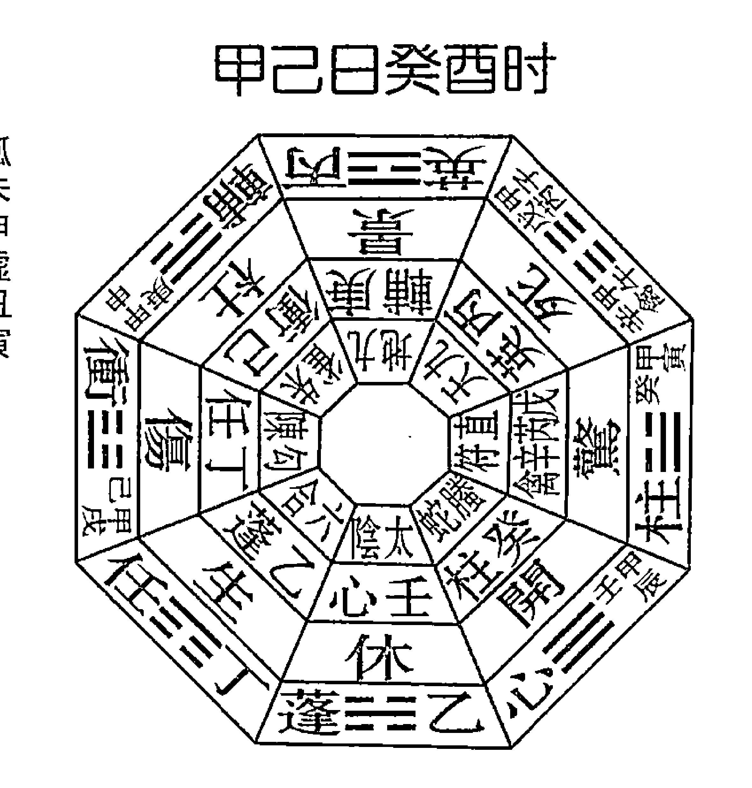

## 阳遁二局

- 阳遁二局
谷雨上元 小寒上元
谷雨中元 小寒中元
立春下元 小满中元
立春下元

- 天网己日干格
戊仪加癸为青龙相和格
死门伏坤为坤
芮符加兑为地泽临
兑
坤 离 巽 震 艮 坎 乾
鸟跌穴 勃符 门伏吟
白入荧 奇格
格刑
生与乙合 休诈 虎遁

断曰：奇门之理，十时一易。直符至癸，可谓途之穷矣。而戊忽与癸合，异乡旅店，知己论心，亦一快事也。况本宫又有丙加，合跌穴之美，则绨袍之赠，庸亦有之。门伏于坤，有恬退之象。苟能倦飞而知还，方可全终而全始。

兵事：星生宫，门伏宫，宜先动。敌必从南来，宜伏兵以待之。战时当出东北方，背西击东，有风从东北来助阵，可胜。正北防贼有伏兵，宜侦探。
出行：宜出东北方。行八里，当遇黄衣女人。
阳宅：宜立艮门。起造时，当有猎者至。
阴宅：艮山坤向极佳。作用时，西方有鸟鹊喧噪。

附占：胜败：客胜。虚实：敌人即来。攻城：宜攻西北门，可克。守城：当备西北，求救于西南。天时：有雨。地理：土色黑白相间，平吉之地。人事：当仰见天颜。田禾：丰。家宅：利名通达，祖茔利迁葬。官禄：人地相宜，但不能即升。应试：文太深沉，甲日占可中。求财：大获。婚姻：可成。女有才，奁厚。胎产：生女，不育。疾病：火症，不能即愈。捕获：贼已远匿，不获。失物：土中所产之物，不得。远信：不至，行人闻信必虚。鸦鸣：有相欺事。鹊噪：闻刑狱事。

## 甲己日甲戌时

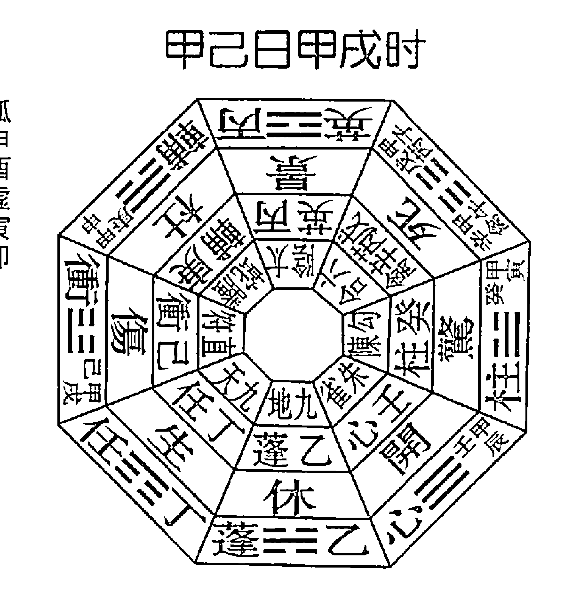

- 乾 休与乙合 重诈龙遁
坎 生与丁合 丁奇入墓
艮 门符伏吟
震 己仪加己为明堂重逢格
巽
离 丙奇升殿
坤
兑 冲符伏震为震
天辅时 伤门伏震为震

断曰：己符属土，冲星属木，又分原盘朱元之地，而视事于东震之宫。以其时而论，则伏而不动也，以其地而论，则震惊百里，不无丧其匕鬯之忧。幸时名天辅，格合龙遁，虽有罪而必赦，虽遇塞而能通。居易俟命，君子之道也。

兵事：宫门比和，主客均利。格合龙遁，水战尤吉。季甲阳时，先发者胜。宜出东北方，击西南，设伏于正南，安营于正北。合阵时，有红黄云气来助，大胜。
出行：宜出东北方，正北方亦吉。行二里九里，逢黑衣妇人应。
阳宅：艮门坎门俱宜修造，七日后进财为应。
阴宅：坎山离向，或艮山坤向俱吉。作用时，有老人扶杖而来，或闻西方鼓声应。

附占：胜败：相持未决。虚实：敌伏未动。攻城：可克。守城：宜近求援兵。天时：阴雨。地理：穴窝屏障俱佳。人事：门庭清净，心事不宁。田禾：大熟。家宅：梁柱暗损，宜修。防小人口舌。官禄：不升。应试：不中。求财：可得。婚姻：女益男，可成。胎产：胎安，生女。疾病：土受木克，难愈。捕获：逃人易获，盗难捕。失物：失于西南近坟处，难寻。远信：人信俱不至。鸦鸣：有阴私口舌。鹊噪：主酒食。

## 甲己日乙亥时

天孤冲酉直戌符虚加卯一辰宫
伤门直使加四宫

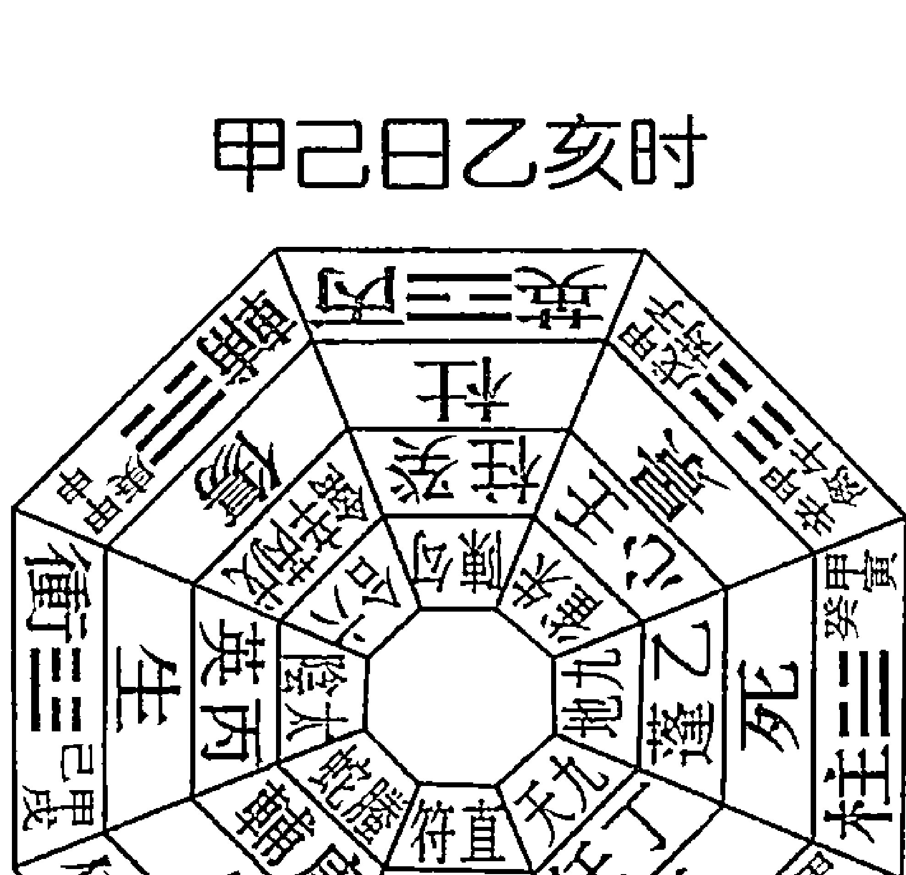

阳遁二局
小寒上元
立春下元
谷雨中元
小满中元

| 宫位 | 乾 | 坎 | 艮 | 震 | 巽 | 离 | 坤 | 兑 |
|------|----|----|----|----|----|----|----|----|
| 格局 | 丁奇入墓 宫门比和 | 相佐 门生宫 | 奇格 宫克门 | 生与丙合 鸟跌穴 真诈 | 天乙与太白格 宫门比和 | 勃符 宫克门 | 门生宫 | 门生宫 |
冲符加坎为雷水解 | 伤门加巽为雷风恒 | 己仪加乙为日入地户格 | 己日不遇 | | | | | |

断曰：直符加于地盘之乙，直使加于地盘之庚，途径虽殊，指归则一。譬之程婴杵臼，迹异而心同也。更喜丙奇跌穴，而神临太阴，得生门真诈之吉，忠诚所感，天地为昭，神人共谅矣，其君子得时行道之秋乎？

兵事：宫生星，利为客。宜出正东方，伏兵阵后，以为接应。更宜出奇设诈，背东击西，有赤禽往东助胜。
出行：宜出东方。行三里或十里，逢胥吏，或见匠人抬木，及长曲之物为应。
阳宅：宜修震门，见患目疾人，或争斗人应。
阴宅：宜震山兑向。作用时，有女人把火行走应。

附占：胜败：客胜。虚实：闻言不实。攻城：不能破。守城：修城，求援可守。天时：天晴不雨。地理：土色青黑，穴情甚美，可用。人事：有贵人责老者。田禾：农安岁丰。家宅：宅安，人亦利。官禄：禄厚官久，可升。应试：必中。求财：防得而复耗。婚姻：女有暗疾，媒人巧言，终不可信。胎产：产安，生女，难育。疾病：阴虚之症，及早调治。捕获：逃人不获，贼可获。失物：失于东南，可寻。远信：行人被女色留恋。鸦鸣：有遗失事。鹊噪：主文移事。

## 乙庚日丙子时

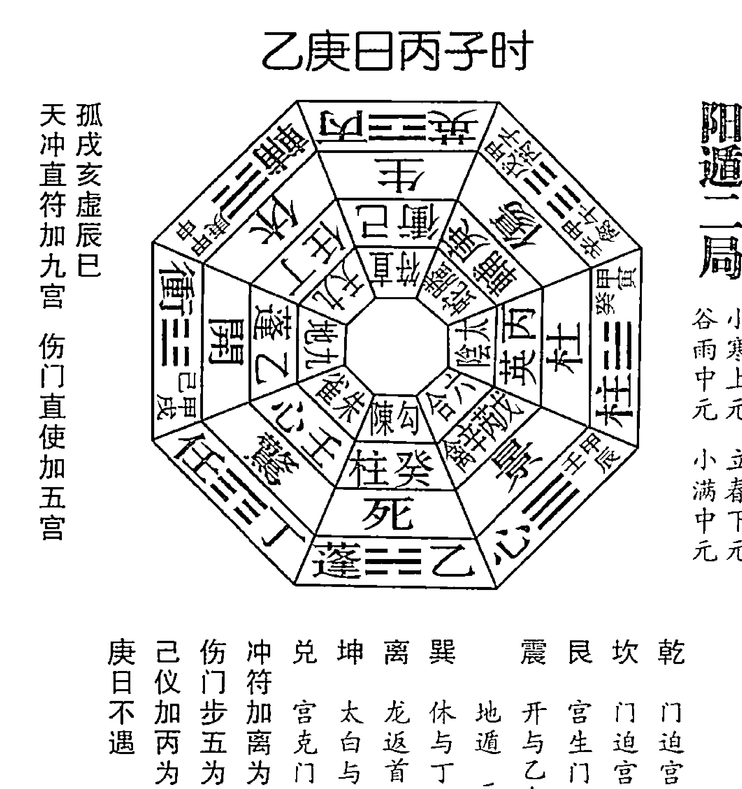

阳遁二局
谷雨上元 小寒中元
立春下元 小满中元

孤戌亥虚辰巳
天冲直符加九宫 伤门直使加五宫

- 庚日不遇
己仪加丙为地户埋光格
伤门步五为雷地豫
冲符加离为雷火丰
兑宫克门
坤太白与天乙格门迫宫
离龙返首相佐符勃宫生门
巽休与丁合门生宫
震地遁云遁门迫宫
艮宫生门
坎门迫宫
乾门迫宫

断曰：天冲飞于离九以生宫，而己符复受生于离丙，是投之者轻而报之者重也。况木火通明，熏天灼地，可为文治光昌矣。惜乎直使滞于中五，暗而无谋，忠而被谤。其与直符也，合则为平勃之交欢，离则为李牛之树党。

兵事：门克宫，利为客。宜出东南方，背南击北。立营于正东，设伏于正西，有火云之气焰于离方为应。西南必有格斗，宜发正西之伏。
出行：宜出正东，东南亦利。行二十里，逢皂白衣女人，或绛衣人。
阳宅：宜修震巽二门。闻雷声，或鼓声应。
阴宅：宜震山巽山。葬后六十日内，有野猿入室应。

附占：胜败：主愿和。虚实：防潜师入袭。攻城：不可攻。守城：有救兵，能守。天时：晴。地理：来龙有气，开穴当得新鲜之物。人事：当见武弁纠缠。田禾：麦有秋。家宅：宅长福寿康宁，惟嫌小口多惊。官禄：可超升。应试：不中。求财：大多所得。婚姻：乘龙佳婿，女家不许。胎产：生男，不利于母。疾病：肺气不降，医不得人。捕获：贼匿东北深山中，难获。失物：为人盗去。远信：人至，远信迟至。鸦鸣：有和合事。鹊噪：有惊心事。

## 乙庚日丁丑时

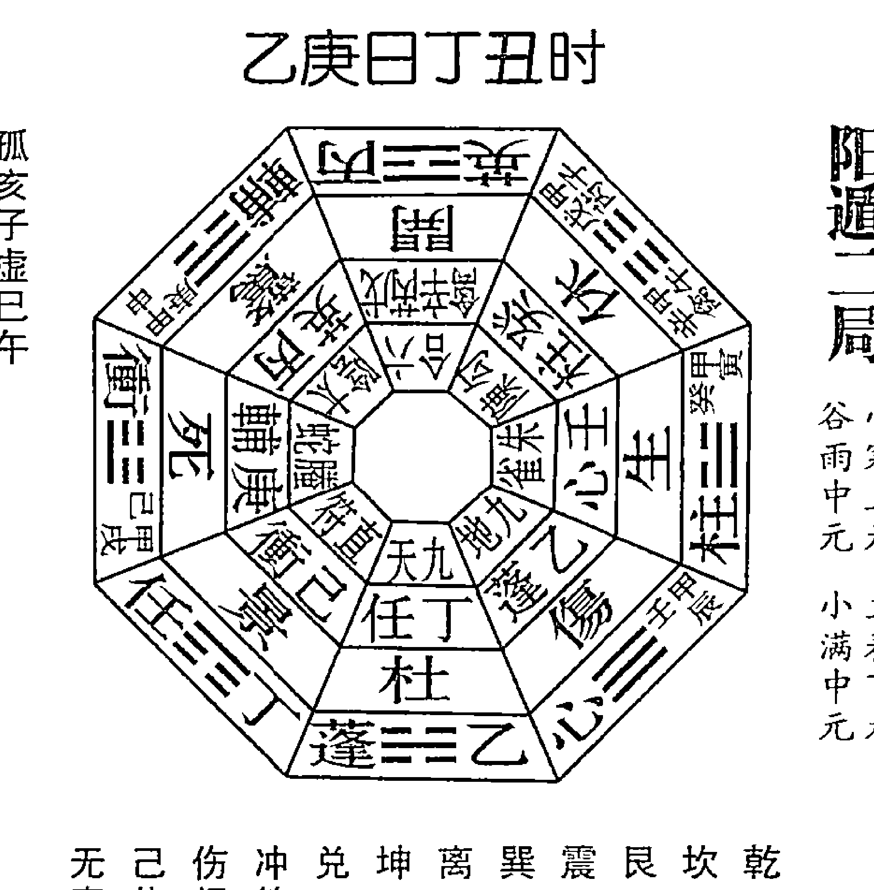

孤亥子虚巳午 天冲直符加八宫 伤门直使加六宫

阳遁二局

谷雨中元 小寒上元 小满中元 立春下元

- 乾 宫生门 乙奇入墓 宫克门
坎 宫生门 相佐 仪刑 门生宫
艮 刑格 伏宫格 宫克门
震 荧入白 门迫宫
巽 宫克门
离 宫克门
兑 门生宫
冲符加艮为雷山小过
伤门加乾为雷天大壮
己仪加丁为明堂贪生格
无奇门 时干入墓

断曰：己符加丁，名曰明堂贪生，凡占者迟中有速之象。符使各加于丁壬，颇为联络。但丁壬为淫佚之合，得毋有借径夤缘、匪人相比者乎？惟符退艮而使退乾，有不欲上人之意，有不敢自恃之心，皆所以明哲保身也。

兵事：宫克门，星克宫，主客互有损伤。况时干入墓，又逢击刑，不宜妄动。西北可安营，东南宜藏伏，兑方可积储粮草，敌来当从天马方出阵。
出行：逃避宜从正南方。九里十九里，见路傍喧闹文书事。
阳宅：正西可小修，防口舌失脱。
阴宅：门奇不合，格局多凶，不宜造葬。

附占：胜败：客胜。虚实：敌将当死。攻城：城中有计，不可入。守城：可守。天时：有虹见，阴云不雨。地理：木形斜曲，小利。人事：有残疾道流，言雨旸事。田禾：麦防虫，禾有收。家宅：门户暗伤，时防口舌，兼有刑伤。官禄：地方多事，难升。应试：座师不喜。求财：有望。婚姻：男性狂，不可成。胎产：生子，产母安。疾病：神不守舍，宜静养。捕获：在北方小涧旁，门前有桥，二姓同居。失物：失于南方近炉火处。远信：至，人不归。鸦鸣：主长上事。鹊噪：主进财畜。

## 乙庚日戊寅时

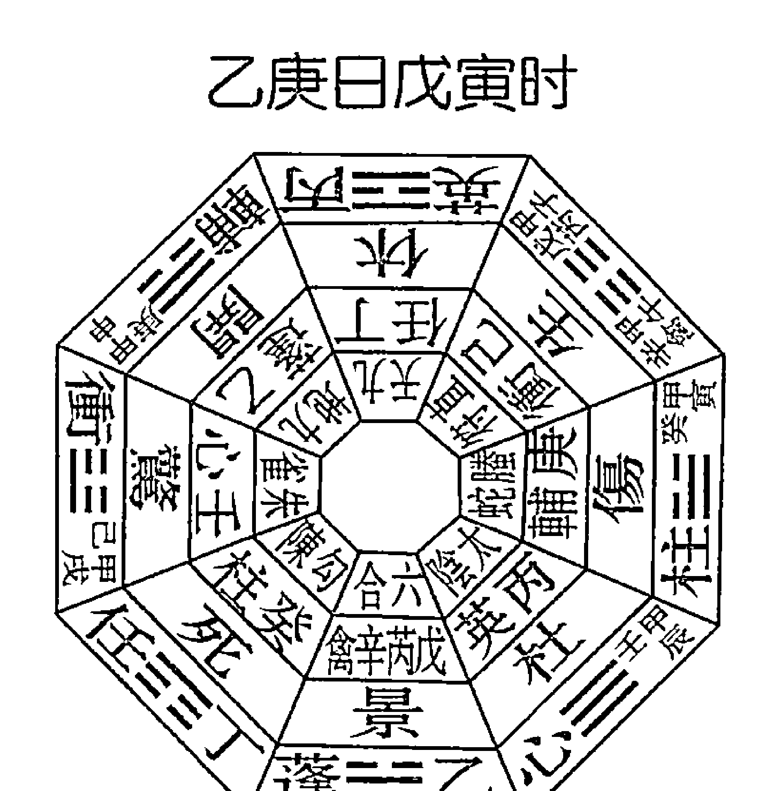

## 阳遁二局

- 小寒上元
立春下元
小满中元
谷雨中元

- 乾 丙奇入墓 宫克门
坎 虎猖狂 宫克门
艮 蛇天矫 宫门比和
震 门迫宫
巽 开与乙合 重诈 风遁
离 门迫宫
坤 休与丁合 门迫宫
兑 仪刑 宫门比和
伤门加兑为雷泽归妹
冲符加坤为雷地豫
己仪加戊为明堂从禄格
乙日飞干格

断曰：符居财地，使入官乡，坤兑相连于西位，不知因财而致讼与？抑或纳粟以求名也。况一则加戊，一则加癸，前后贯彻，首尾通达。以常情论，则为管鲍之分金；以官常论，则为皋夔之交赞。盖万物喜合而恶离，人情也，天道也。

兵事：宫克门，星克宫，又逢刑击，主客均有损伤。巽合玉女乘风，宜出东南方，背西南，击东北。若遇于正北东北，宜急击以应虎狂蛇矫。
出行：宜出南方。行二十里，见皂白衣女子。
阳宅：东南方起造防盗，南方可小修，有青衣人至应。
阴宅：离山坎向吉。作用时，见巧艺人。六十日内，有猫搏鸡，可大发。

附占：胜败：客胜。虚实：敌有阻，未至。攻城：不能下。守城：能守。天时：晴。地理：水不朝山，白虎高耸，不吉。人事：有阴人疾厄，或远信不至。田禾：防旱，歉收。家宅：宅长心事不宁，常有惊怪事。官禄：宦囊虽丰，弹劾难免。应试：座师不惬。求财：不得。婚姻：女出贵族，未必俯就。胎产：产室不利，子母有灾。疾病：肺有火，宜清凉。捕获：逃人难获，贼可捕。失物：失于水中。远信：近信即至，行人不来。鸦鸣：有和好事。鹊噪：主惊恐。

## 乙庚日己卯时

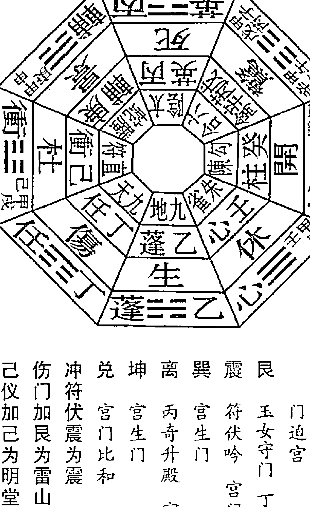

孤丑寅虚未申 天冲直符加三宫 伤门直使加八宫

阳遁二局 小寒上元 谷雨中元 小满中元 立春下元

| 八卦 | 描述 |
|------|------|
| 坎 | 生与乙合 重诈龙遁 |
| 乾 | 宫生门 |
| 艮 | 门迫宫 |
| 震 | 符伏吟 宫门比和 |
| 巽 | 宫生门 |
| 离 | 丙奇升殿 宫生门 |
| 坤 | 宫生门 |
| 兑 | 宫门比和 |

断曰：符伏使飞，接于艮震，而玉女又复守之，必有比邻洽比，密切阴谋。其事虽未形，而机则已动；迹虽未著，而意则先萌。但其阴阳上下，为直符，为九天，全非奸邪暗昧之神，则私而实公也。占者惠迪则吉，从逆则凶。

兵事：门克宫，利为客。但符伏不宜出兵，不得已而动，当出正北方，击正南死地，阵后用伏兵衔枚掩袭，亦防敌有埋伏，不可深入追赶。
出行：求财宜正北。行二里九里，逢皂衣妇，伙人唱歌应。
阳宅：止宜小修坎门，有群鸟飞鸣，风雨骤至为应。
阴宅：宜坎山离向。作用时，有鹊噪。六十日内，因女人事获财应。

附占：胜败：主欲罢师。虚实：未至。攻城：防有援。守城：有援兵至，宜固守。天时：春阴夏雨。地理：穴地极佳，朝山护砂俱美，可用。人事：来人妻妾患病，欲访医。田禾：秋禾大熟。家宅：人口安宁，明堂中有圆转铁物，当去。官禄：难升。应试：主司不中。求财：有得，后防耗。婚姻：女多才，可成。胎产：生女，产母多病。疾病：胃有壮火，宜下。捕获：不获。失物：女人藏窃，不得。远信：信至，人未至。鸦鸣：主争竞事。鹊噪：有佳音。

## 乙庚日庚辰时

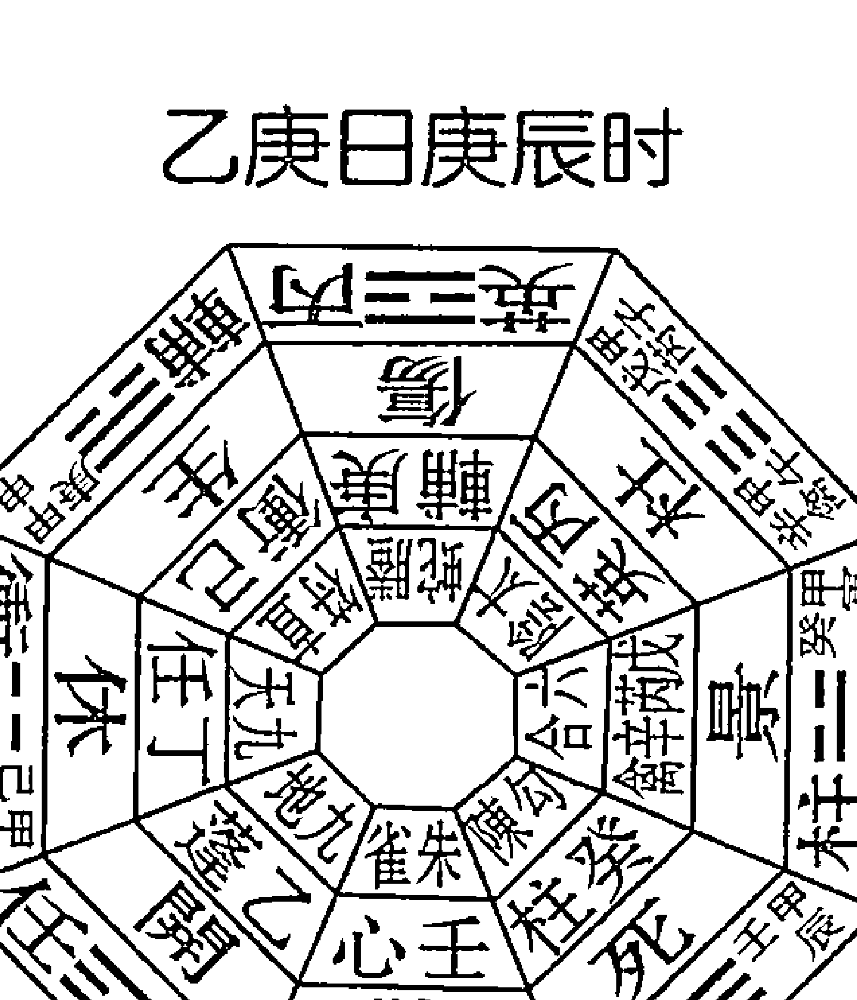

### 阳遁一局

谷雨中元 小寒上元 小满中元 立春下元

- 乾：门生宫
坎：宫生门
艮：开与乙合，重诈虎遁
震：休与丁合，门生宫
巽：飞宫格，格刑宫克门
离：白入荧，奇格门生宫
坤：门迫宫
兑：门迫宫
冲符加巽为雷风恒
伤门加离为雷火丰
己仪加庚为明堂伏杀格

断曰：已加于庚，名为明堂伏杀。盖庚本欲刑己，而己反自往加于庚，如蛾之赴火，鸟之投罗，所谓纳于陷阱而不知也。况门使又临于荧白争战之乡，既泄木气，且遇庚飞，争讼是非之端，岂能免乎？

兵事：门生宫，利为主。宜藏锐卒于西南，建旗鼓于正东。俟敌先动，背东南，击西北。正南宜藏健卒，贼至即可截杀。
出行：宜出东北方或东方，逢女人，见鱼盐及兽类。
阳宅：宜立震门。令人持火，导众夫前行，约四十步，灭火动作，必有祯祥。
阴宅：艮山震山皆利，有孕妇来应。

附占：胜败：敌欲修好。虚实：敌兵即至。攻城：易破，当截其外救。守城：求援能守。天时：有雨。地理：来脉有伤，土中多有蚯蚓，且有狐穴，不吉。人事：见跛足人，或言盗贼事。田禾：岁歉。家宅：过道不吉，常有怪异，宜防盗贼。官禄：未升。应试：难中。求财：卖货得利。婚姻：可成，女出贵族。胎产：生女，母灾。疾病：风火之症，疏散可愈。捕获：逃人易获。失物：车马之类，草头姓氏人家收藏，三日有信。远信：近信至。鸦鸣：有喜事。鹊噪：有虚惊。

## 乙庚日辛巳时

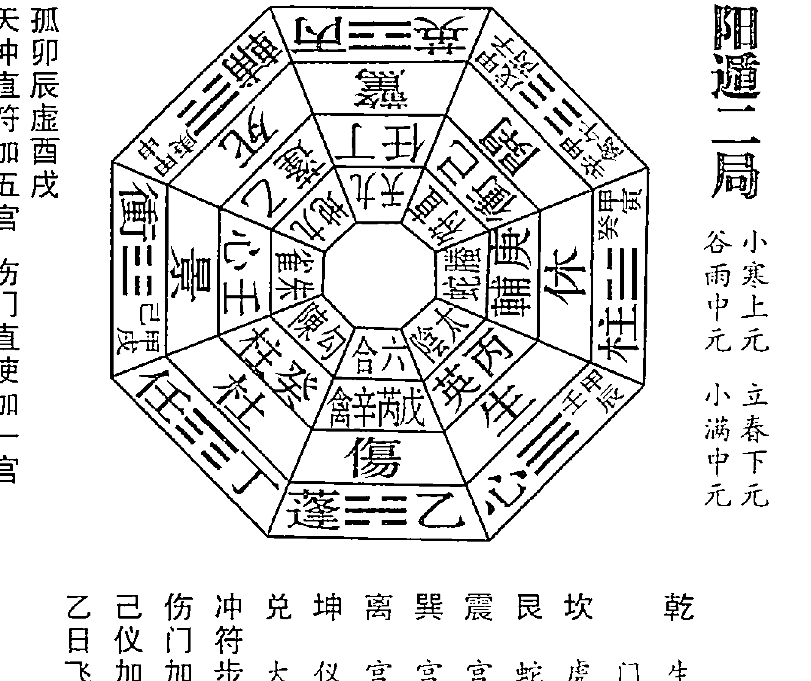

孤卯辰虚酉戌 天冲直符加五宫 伤门直使加一宫

阳遁二局 谷雨中元 小寒上元 小满中元 立春下元

- 乾 生与丙合 真诈 丙奇入墓
坎 门生宫
艮 虎猖狂 宫生门
震 蛇天矫 门迫宫
巽 宫生门
离 宫生门
坤 仪刑 宫生门
兑 大格 宫生门

断曰：己符步五以取其财，而辛金之官鬼在焉，是内府之金也。门使临坎以受其生，而乙奇之兄弟在焉，是葛藟之庇也。况符使又在太阴九地之乡，所谓阴受其福者矣。庚日官印在巳，逢之甚吉。乙日龙走干飞，时干克日，不可用也。

兵事：宫生门，星克宫，利为客。时值仪刑，不宜交战，战必有伤。如战则出西北生门，疾击其正北、东北，以应蛇矫虎狂。正西防有贼人埋伏格斗。
出行：宜出西北方。十五里，见公吏贵人，或逢病眼人应。
阳宅：宜小修乾方，不利起造。有白衣人至，或南方产亡。
阴宅：利乾山巽向。作用时，有野鸭成队飞鸣应。

附占：胜败：客胜。虚实：敌有阻。攻城：宜乘虚直入。守城：宜求援。天时：风雨不作。地理：砂水反跳，道路穿破。人事：有医士到门，或酒食事。田禾：麦大丰，禾防螟。家宅：居人富贵，手足不和。官禄：京职防纠参，外任防降调。应试：不中。求财：借典当之物可得。婚姻：女就男，恐日后不睦。胎产：生男，母有灾。疾病：脾克肾水，宜滋阴。捕获：捕纵贼，宜差别役到木姓人家缉之。失物：失于北方近水处，难寻。远信：近信即至。鸦鸣：主失脱。鹊噪：有口舌事。

## 乙庚日壬午时

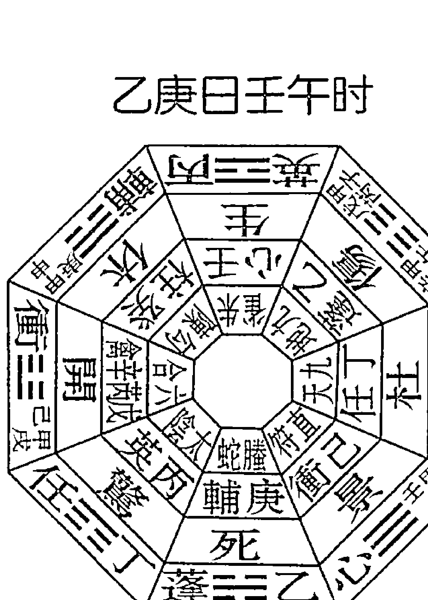

孤辰巳虚戌亥
天冲直符加六宫
伤门直使加二宫

阳遁二局
小寒上元
谷雨中元
立春下元
小满中元

冲符加乾为雷天大壮
伤门加坤为雷地豫
己仪加壬为明堂被刑格
无奇门乙日伏干格

- 乾 门迫宫
坎 奇格门迫宫
艮 宫生门
震 门迫宫
巽 小格门生宫
离 宫克门
坤 乙奇入墓龙逃走门迫宫
兑 雀投江宫克门

断曰：符飞于乾，使飞于坤，似乎君臣交泰之象。乃乾金既克木符，而伤门复克坤土，一则宫制其星，一则门迫其宫，以言鱼之得水，未必然也。兼以龙走雀伤，奇墓奇格，谛而视之，无一善状。谨之又谨，乃可无忧。

兵事：门克宫，宫克星，主客均不利。况使加于死宫，奇入于墓地，宜待时而动。乙日更防敌出奇兵格战，中道围困，急则向天马方而走。
出行：出南方稍可，终防口角，有勾当人骑马应。
阳宅：春夏不利，冬日离方可小葺。
阴宅：门奇不合，造葬当候次时。

附占：胜败：客利。虚实：敌无斗志。攻城：当从地道入。守城：无援，难守。天时：主有风雨。地理：四势连刑带煞，左无龙护，前无岸山。人事：有手艺食力之人来。田禾：禾有收，麦防蝗。家宅：宅长康泰，女人多殃。官禄：防参罚。应试：落第。求财：防口舌，不得。婚姻：男女性暴，难成。胎产：生男，母有病。疾病：药不对病。捕获：逃远不获，盗在北方水边。失物：失于正东有林木处。远信：不至，行人在中途。鸦鸣：主文书。鹊噪：进南方财物。

## 乙庚日癸未时

- 孤巳午虚亥子
- 天冲直符加七宫
- 伤门直使加三宫

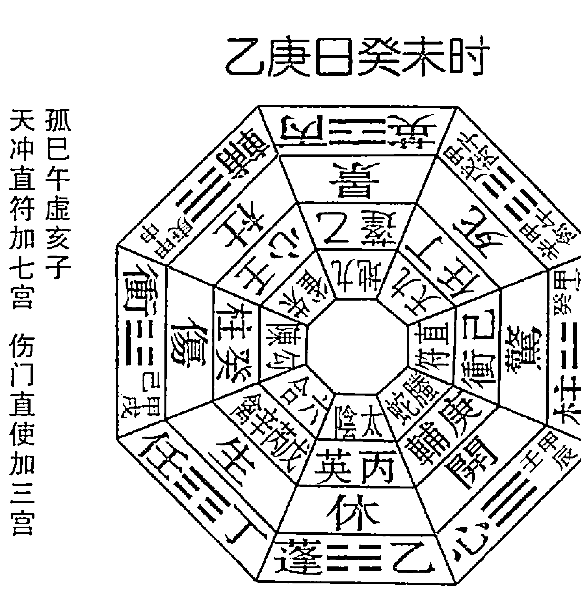

- 阳遁二局
- 谷雨中元
- 小寒上元
- 小满中元
- 立夏下元

- 兑坤离巽震艮坎乾
- 天网己仪伤冲兑
- 离巽震艮坎乾
- 时干加癸为明堂合华盖格
- 符反吟
- 门伏吟
- 休与丙合真诈

断曰：符反吟而门伏吟，当云雨翻覆之候。蹙蹙靡骋，而后归于枥下，伏处悲鸣，是悔之晚矣。盖以伤加伤，痛既定而思痛，犹之可也。若不自度量，至于创巨痛深，始翻然于世路之险峻，闭门却扫，其祸可胜道哉！

兵事：官克星，遇阴时，利为主。俟敌先举，我为后应。宜安营正南，出正北方，偃旗息鼓，邀击取胜。东南方不可犯。门伏符反，总以不战为上。
出行：宜出正北。二里九里，逢皂衣妇人。
阳宅：宜立坎门，有人抱小儿至为应。
阴宅：宜子山午向。作用时，有嬴瘠妇女，与方外人同行应。

附占：胜败：主客俱欲修好。虚实：道上有阻。攻城：城中愈甚，将得士心，难下。守城：可守。天时：有风无雨。地理：山向不合，形长而斜。人事：见道术人言修炼事。田禾：禾歉，麦有收。家宅：防有孝服。官禄：居官不显，新任，中道有阻。应试：座师不取。求财：友朋之财可得。婚姻：有徽音人阻挠，不成。胎产：生女，不育，难产。疾病：吐泻之症，中虚受暑。捕获：缓捕可获。失物：失于东北近山林处。远信：未发，行人子日有土姓人来送信。鸦鸣：主有欺蒙。鹊噪：北鸣，有酒食。

## 乙庚日甲申时

## 阳遁二局

谷雨中元
小寒上元

小满中元
立春下元

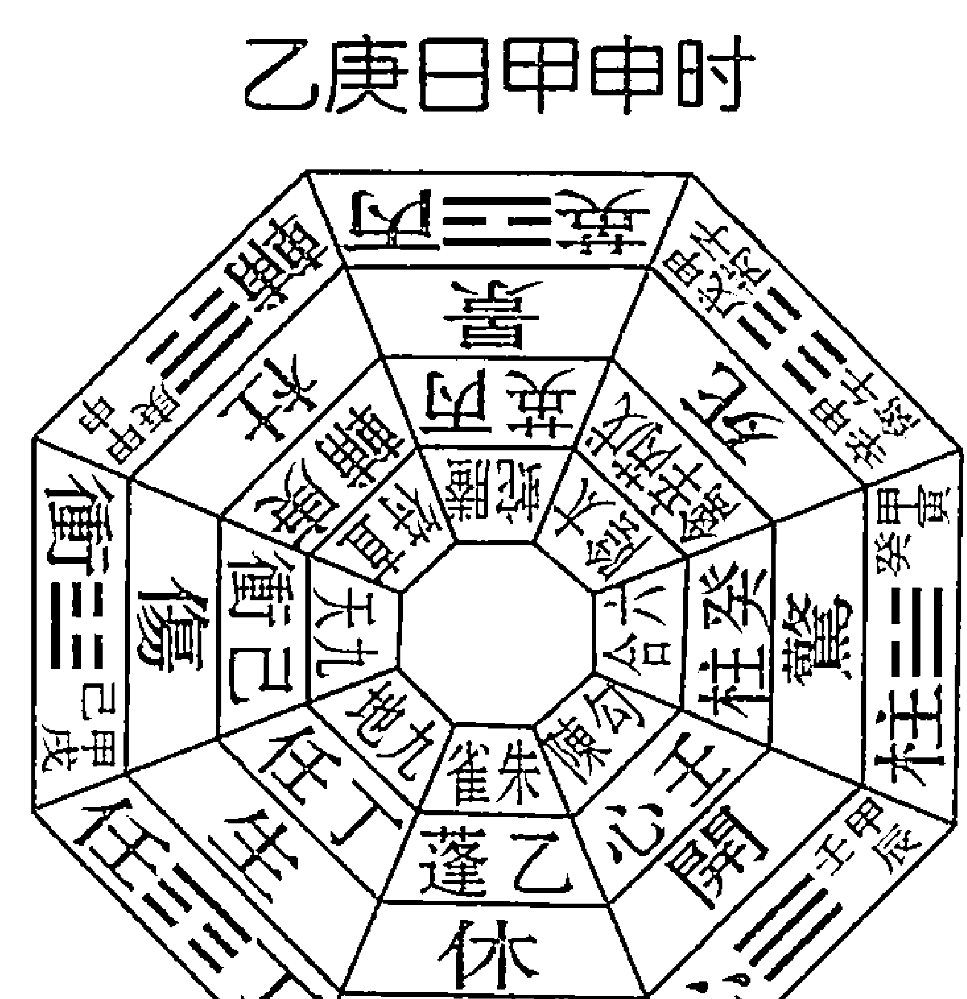

孤午未虚子丑
天辅直符加四宫
杜门直使加四宫

庚仪加庚为太白刑格
杜门伏巽为巽
辅符伏巽为巽
兑 坤 离
巽 震 艮 坎 乾

丙奇升殿
伏宫格
时干格
门符伏吟
仪刑
飞宫格
生与丁合
重诈
丁奇入墓
体与乙合
龙遁

断曰：符分天辅，庚仪秉令。庚者，更也。伏于杜位，而元盘阴神，又为九地，虽一筹未展，而跃跃欲动之机已肇于此，盖有其志而待时者也。宫门比和，天辅星又临于巽，在国事则宜屯田积货，在家事则宜种竹栽桑。

兵事：宫门比和，但系孟甲，又逢击刑，不宜出兵。庚符与甲飞伏相格，恐不能不战，战则主帅防有不测。惟龙遁利于水师。
出行：出北门，当有酒食。出东北门，有财喜，遇少妇。
阳宅：春冬宜立坎门，四季宜立东北门。
阴宅：壬山丙向吉。作用时，有三教色衣人至，西北闻金鼓声，新妇生贵子。

附占：胜败：客败，主亦伤。虚实：敌已压境。攻城：守将有病，可乘机进取。守城：宜备西南。天时：有风而晴。地理：势不飞舞，下有蚁聚。人事：青龙相刑，防有厄。田禾：麦有秋，东北尤熟。家宅：防有刑伤，安静获福。官禄：守职待时。应试：遇熟题，取在四名。求财：止有本分钱财。婚姻：女益于男，宜成。胎产：得女。子恋母腹，难产。疾病：肺旺克肝，淹缠。捕获：北方伙伴甚众，难获。失物：在西南暗处。远信：有信未至。鸦鸣：有急事。鹊噪：主婚姻事。

## 乙庚日乙酉时

## 阳遁二局

- 小寒上元
- 立春下元
- 谷雨中元
- 小满中元

## 天辅直符加一宫 杜门直使加五宫

孤未申 虚丑寅

乙日伏干格
庚仪加乙为太白合格
辅符加坎为风水涣
杜门步五为风地观
兑丁奇升殿 雀投江 门迫宫
坤龙逃走 乙奇入墓 门迫宫
离门生宫
巽小格 宫克门
震门生宫
艮开与丙合 宫生门
坎相佐奇格 时干格 门生宫
乾门生宫

### 断曰

庚符人坎，既受水之生，复贪乙之合。而其阴为朱雀文字之神，正所谓“文章有神交有道”者也。必有宗工哲匠，暗中摸索者矣。门使亦入于二五财帛之乡，既获文名，又沾厚利。但恐龙走雀伤，金水之年不利耳。

### 兵事

官生星，门克宫，利于为客。但龙走雀投，战时又宜反客为主。宜出东北开门，伏兵于正东，击其伤门。破军在东南，防有伏兵格战。

### 出行

向东北方吉。八里六里，逢老人携孩子。

### 阳宅

艮门可用，乙日不吉。作用时，有双禽飞来。

### 阴宅

宜坤向，东方有狐狸咬叫。

### 附占

- 胜败：互有损伤。
- 虚实：敌众惊惶，将遁。
- 攻城：攻其东北，守将即擒。
- 守城：向西求援，可守。
- 天时：半阴半晴。
- 地理：龙无气，案山亦低陷。
- 人事：有阴人刑伤。
- 田禾：稻熟，麦少收。
- 家宅：宅长多惊疑，破廊下有祟，宜镇之。
- 官禄：文书差误受参。
- 应试：主考拔取。
- 求财：友朋资助有望。
- 婚姻：男女命相克制，不成。
- 胎产：母不利，生女。
- 疾病：肺病不能即愈。
- 捕获：在西南五十八里外，门前有大树。
- 失物：遗于东方林中。
- 远信：无。
- 鸦鸣：防有欺蔽。
- 鹊噪：向东北鸣，吉。

## 乙庚日丙戌时

| 方位 | 乾 | 坎 | 艮 | 震 | 巽 | 离 | 坤 | 兑 | 辅符 | 杜门 | 庚仪 | 丙奇 | 庚日 |
| :--- | :--- | :--- | :--- | :--- | :--- | :--- | :--- | :--- | :--- | :--- | :--- | :--- | :--- |
| 格局 | 地假 | 宫克门 | 宫比和 | 门迫宫 | 格刑 | 相佐 | 时干格 | 生与丙合 | 加离为风火家人 | 加乾为风天小畜 | 加丙为太白入荧格 | 得使游仪 | 不遇 |
| 说明 | 门反吟 |  |  |  | 门迫宫 | 龙返首 白入荧 格勃 | 奇格 门迫宫 | 天遁 宫门比和 |  |  |  | 时干入墓 |  |

### 断曰

符既受脱于阴蛇，使亦受克于阴虎，宵小得志，则忧谗畏讥，岂能免乎？但喜甲加于丙，得返首上吉之格，事虽小阻，其道大行。又小畜者，文王之卦也。西郊之雨，始于密云。君子苟能刚中而应，何患乎佥人孔壬？

### 兵事

星生宫，而克庚符，利于为主，后应。宜从西南方出兵，伏于正西直符下，须择精兵屯守，贼必闯入旧营，奋勇齐击，可以应青龙返首之吉。

### 出行

向坤方大吉。路闻哭声，或见离别事。

### 阳宅

西南门利，有患眼人至。

### 阴宅

坤山艮向可用，庚日不吉，有北方犬吠声。

### 附占

- 胜败：主胜。
- 虚实：敌人即来。
- 攻城：有备难拔。
- 守城：防穿地道，宜备东南。
- 天时：晴而有电。
- 地理：土色青紫，白虎低卸，不吉。
- 人事：遇咳嗽闷气人。
- 田禾：麦熟，谷歉。
- 家宅：富贵康宁，福寿无疆。
- 官禄：兵刑之官吉。
- 应试：春闱可中。
- 求财：夏占如意。
- 婚姻：可成，女不寿。
- 胎产：易生，子富。
- 疾病：肾虚，防反复。
- 捕获：盗与捕人联合，难获。
- 失物：在正西暗水，有伤损。
- 远信：未至，行人欲归无资，亥子月日有信来。
- 鸦鸣：防有斗殴。
- 鹊噪：有外孝信。

## 乙庚日丁亥时

孤酉戌 虚卯辰
天辅直符加八宫
杜门直使加七宫

- 阳遁二局
- 谷雨中元
- 小寒上元
- 小满中元
- 立春下元

庚仪加丁为太白受制
杜门加兑为风泽中孚
辅符加艮为风山渐
兑宫克门
坤门迫宫
离宫生门
巽天乙与太白格门生宫
震开与丙合门迫宫
艮相佐仪刑奇格时干格
坎门迫宫
乾丁奇入墓门迫宫

### 断曰

庚符加丁，名为太白受制。以九地之阴，下逢玉女。占此者，非明珠之暗投，即怀金于暮夜，君子耻之矣。门使亦临于六合之兑，时干又合于六白之壬，光天化日，狗苟蝇营，非中孚之本义也。况临仪刑，诸占不吉。

### 兵事

星门互有克制，又逢刑击，主客不利。不得已从正东开门下出兵，宜大将亲身临阵，击其西南伤门，尚可挫其威势，我军亦有惊伤。

### 出行

宜向东行，春夏吉。得遇酒食，发小财。

### 阳宅

震方立门，庚日不利。作用时，有老人执杖。

### 阴宅

宜卯酉立向，有黑衣人携肉过。

### 附占

- 胜败：彼此有伤。
- 虚实：内有奸细。
- 攻城：旦暮即得。
- 守城：冬月可守。
- 天时：日光中有雨。
- 地理：地局不全，防有刑伤。
- 人事：有女人或九流人至。
- 田禾：旱而有虫。
- 家宅：宅不安宁，防有刑克耗失。
- 官禄：防参劾，任所有伤。
- 应试：主考不喜。
- 求财：夏月如意。
- 婚姻：女不佳，恐经闭。
- 胎产：母不利，男喜。
- 疾病：肝火症，宜清。
- 捕获：不捕自归。
- 失物：失于尊长之处。
- 远信：滞于彼处。
- 鸦鸣：有蒙蔽我者。
- 鹊噪：防贼。

## 丙辛日戊子时

阳遁二局
谷雨中元 小寒上元
小满中元 立春下元

- 辛日伏干格
- 庚仪加戊为太白逢恩格
- 杜门加艮为风山渐
- 辅符加坤为风地观
- 兑 休与丙合 宫生门
- 坤 宫生门
- 离 太白与天乙格 时干格
- 巽 宫克门
- 震 鬼假 宫克门
- 艮 乙奇升殿 宫生门
- 坎 玉女守门 门迫宫
- 乾 神假 物假 宫生门 门生宫

### 断曰

符使属木，分飞于坤艮之地以求财，而其阴又属太阴九地之神，必有两处阴谋，一图其墓田之利，一觊其山木之材。大约先迷而后得，益已而损人者也。庚加于戊，一名太白逢恩。惟辛日飞干，谋为不利。

### 兵事

门星皆克宫，利客不利主。宜出正西休门，伏兵于西北生门，路上防有虚惊。敌人东南暗有埋伏，当遣谍密搜，然后击之。

### 出行

往西吉。一八里，闻歌声，或妇女汲水。

### 阳宅

冬立兑门吉，有东方人抱小儿，或闻鼓声应。

### 阴宅

辛山乙向可用。西方有穿红白衣人，大叫为应。

### 附占

- 胜败：客小胜。
- 虚实：敌有阻，不至。
- 攻城：春占，不克。
- 守城：有虚惊，可守。
- 天时：阴云微雨。
- 地理：土色黄白，此地异日作战场。
- 人事：有贵人财喜。
- 田禾：禾丰，麦歉。
- 家宅：阴地不吉，人口欠安。
- 官禄：盗案不结，未升。
- 应试：文得意，可中。
- 求财：得半失半。
- 婚姻：女克男，不吉。
- 胎产：不利于母，当生男。
- 疾病：肾病泄气，法当补先天。
- 捕获：捕人与盗相合。
- 失物：在西北方近水。
- 远信：迟至。
- 鸦鸣：防口舌。
- 鹊噪：主文书事。

## 丙辛日己丑时

阳遁二局

谷雨中元
小寒上元

小满中元
立春下元

| 时干入墓丙日飞干格 | 庚仪加己为太白大刑格 | 杜门加离为风火家人 | 辅符加震为风雷益 | 兑门生宫 | 坤门生宫 | 离门生宫 | 巽宫门比和 | 震鸟跌穴勃格荧入白 | 艮刑格时干格宫克门 | 坎宫克门 | 乾乙奇入墓宫门比和 |
| --- | --- | --- | --- | --- | --- | --- | --- | --- | --- | --- | --- |
| | | | | | | | | | | 开与丁合重诈门生宫 | |

### 断曰

直符加震，本为兄弟之宫，而甲复与己合，则缟紵之交，已非一日。乃庚金既欺震木，甲木复凌己土，必有恩中生怨、隙末凶终者矣。况门使之在巽，亦畏于庚，是为客者既挟其贪嗔，而为主者亦怀其疑贰也。惟返首吉格，诸动皆宜。

### 兵事

门生宫，利于为主。敌人未必来，来则出北方开门，背东击西。伏兵于正南，截其来路。遇于东南，当急击之，左军防有伤。

### 出行

出北门吉，宜速行，见皂衣老人，及珍宝交易事，或浚河汲井之应。

### 阳宅

坎门大利，秋冬尤吉，见人手执棒杖物。

### 阴宅

子山午向吉，主东方有犬吠、有斗殴。

### 附占

- 胜败：春占主胜。
- 虚实：客将骄，不得士心，将被戮。
- 攻城：不能拔。
- 守城：防地道。
- 天时：雨收风息。
- 地理：土青，回头结穴，防有官非。
- 人事：有兵事密谋。
- 田禾：禾大熟，北地尤丰。
- 家宅：宅居发富，但小口有灾。
- 官禄：前程远大。
- 应试：文不佳。
- 求财：有阻隔，不能大获。
- 婚姻：女克男，不必成。
- 胎产：易生，女胎。
- 疾病：血光之灾，宜祀灶。
- 捕获：在西方，有三人同伙。
- 失物：失于南方。
- 远信：未到，行人五日后有信。
- 鸦鸣：有和合事。
- 鹊噪：有小惊。

## 丙辛日庚寅时

阳遁二局
小寒上元
立春下元
谷雨中元
小满中元

- 乾：宫克门
- 坎：宫生门
- 艮：丁奇入墓，门生宫
- 震：宫克门
- 巽：符伏吟，仪刑，飞宫格
- 离：开与丙合，丙奇升殿，宫克门
- 坤：宫克门
- 兑：门生宫
- 庚仪加庚为太白重刑格
- 杜门加坎为风水涣
- 辅符伏巽为巽

### 断曰

庚性本属强梁，既得其柄而隶事者，十已居其五六矣。今复退而伏于巽顺之宫，是刚而得中者，徘徊观望，审势度时。尺蠖之屈，凡以求伸也。门使入坎而受生，暗有乙庚之合，可云同心断金者矣。

### 兵事

宫生门，利于为客。时逢击刑，战必有伤。宜出南门，击其西北。伏兵于坤艮二方，两翼出奇。但飞宫伏宫，庚甲混合。苟能息兵养士，尤为万妥。

### 出行

宜出正南，逢老人骑马，或有役吏喧闹。

### 阳宅

午向吉，丙日防有火烛。

### 阴宅

丁山癸向吉。葬后六十日，有白鼻猫咬死鸡应。

### 附占

- 胜败：主胜。
- 虚实：敌有惊心。
- 攻城：不能破。
- 守城：可守。
- 天时：风晴。
- 地理：下有旧穴，山向不利。
- 人事：主有贵人受黜。
- 田禾：谷麦皆小收。
- 家宅：人康健，惟防口舌刑伤。
- 官禄：照旧办事，未得升迁。
- 应试：文如意，可望中。
- 求财：多求少得。
- 婚姻：女益男家，可成。
- 胎产：男胎，未生。
- 疾病：肝郁之症，丙日占即愈。
- 捕获：捕人欺蔽。
- 失物：原处寻觅。
- 远信：迟二日即至。
- 鸦鸣：有欺蔽事。
- 鹊噪：向南鸣吉。

## 丙辛日辛卯时

- 兑 门迫宫
- 坤 太白与天乙格 时干格
- 巽 生与丁合 重诈 宫克门
- 震 休与乙合 乙奇升殿 云遁
- 艮 宫生门
- 坎 门生宫
- 乾 门生宫
- 辅符步五为风地观
- 杜门加坤为风地观
- 庚仪加辛为太白重锋格
- 辛日伏干格

### 断曰

符使同居于坤，本欲利其财也。但门在二而符在五，虽在同室之中，而趋利之方则异，似离而实合，似聚而实分。甚矣人之嗜利，虽夫妻手足，不必同谋也。其中庚加于辛，两强相遇，必有一伤。不如门之柔而善入，尤为得手。

### 兵事

门星俱克宫，利客不利主。宜出东南巽门，击其西北，压其阵而军之，亦防敌人阵后有伏。春夏丙与巳午日，俱大胜。

### 出行

出东南方吉，正东亦可行，但有小口舌。

### 阳宅

巽门大吉，震门小吉。当有小儿骑牛来，或猎者获犬。

### 阴宅

东南坐山，震巽两龙皆吉。有师巫吹角声，六十日添人丁。

### 附占

- 胜败：主胜。
- 虚实：敌有两心三意。
- 攻城：内有应者即得。
- 守城：援兵近处观望。
- 天时：有阴云。
- 地理：穴中有风透，不吉。
- 人事：有道路伤亡之信。
- 田禾：麦丰，禾有虫灾。
- 家宅：家人作祸，勾引外人。
- 官禄：防上官见罪。
- 应试：文佳，有两人相争。
- 求财：同木姓人求，可得。
- 婚姻：女克男，不吉。
- 胎产：女胎，母不利。
- 疾病：肺病难治。
- 捕获：盗反伤捕，不获。
- 失物：在西北近水处。
- 远信：即到，行人有二人同来，戌日至。
- 鸦鸣：有虚惊。
- 鹊噪：有喜事。

## 丙辛日壬辰时

## 阳遁二局

谷雨上元
小寒中元
小满中元
立春下元

孤寅卯 虚申酉
天辅直符加六宫
杜门直使加三宫

| 宫/卦 | 符/门/格 | 克应 |
| :--- | :--- | :--- |
| 乾 | 上格符反吟 | 时干格 |
| 坎 | 宫生门 | 生与丙合门迫宫 |
| 艮 | 门迫宫 |  |
| 震 | 地假宫门比和 |  |
| 巽 | 宫生门 |  |
| 离 | 宫生门 |  |
| 坤 | 宫生门 |  |
| 兑 | 宫门比和 |  |
| 辅符加乾为风天小畜 |  |
| 杜门加震为风雷益 |  |
| 庚仪加壬为太白退位格 |  |
| 时干入墓丙日不遇 |  |

### 断曰

时干在乾，加以庚符。乾为壬水得禄之乡，庚为壬水长生之主，下旺上生，可谓得所矣。所惜者，墓于辰土，而庚之加壬，不无阻格耳。门加于震，将欲借径于东邻，沾光于己土。但太白坐于本宫，与时干相格，龌龊之象不免矣。

### 兵事

宫克星，不利于客。时墓符反，不宜出兵。丙日尤防下人谋上。不得已而动，宜出正北方，击其正南，伏兵于东北。胜地在西，不可攻。

### 出行

出北方，主有同类相欺。

### 阳宅

坎门尚可用，有黄白禽从西北上来为应。

### 阴宅

子山午向小吉。当有卖油人、卖菜米人相撞，小儿哭。

### 附占

- 胜败：主客两伤。
- 虚实：闻喜则实。
- 攻城：当遁去。
- 守城：有损伤，可守。
- 天时：有微风，无雨。
- 地理：土色灰白，龙脉不真。
- 人事：有人送食物。
- 田禾：麦大熟，稻小歉。
- 家宅：屋宇得气，但有子女不安。
- 官禄：春占大吉，即升。
- 应试：文太旧，不得意。
- 求财：可获。
- 婚姻：反覆不成。
- 胎产：女喜，难产。
- 疾病：有鬼魅，宜祷。
- 捕获：为盗所制，不获。
- 失物：失于东北土木中。
- 远信：未有信。
- 鸦鸣：主有斗殴。
- 鹊噪：有报孝人。

## 丙辛日癸已时

| 卦位 | 乾 | 坎 | 艮 | 震 | 巽 | 离 | 坤 | 兑 |
| :--- | :--- | :--- | :--- | :--- | :--- | :--- | :--- | :--- |
| 格局 | 开与丙合 丙奇入墓 | 虎猖狂 | 蛇夭矫 | 门伏吟 |  |  | 大格 时干格 | 辅符加兑为风泽中孚 |
| 其他 |  |  |  |  |  |  |  | 杜门伏巽为巽 |
|  |  |  |  |  |  |  |  | 庚仪加癸为太白刑隔格 |
|  |  |  |  |  |  |  |  | 天网 |

### 断曰

杜门退居于巽，伏吟匪吉。乃天盘之乙，与九宫所飞之乙，同临于巽，而与庚合，必有双飞入宫，如妻与妾、姊与妹相挈而来者。但庚加于癸，名为刑隔，则刑伤阻滞之事，所不免也。天网时，不宜妄动。惟逃亡者，宜出癸网之下，人反不觉。

### 兵事

门伏宜守，东北蛇矫。若逢贼信，即宜发兵剿除。利出西北开门，伏兵于正北，背南之孤，击北之虚。胜地在西，不可击。

### 出行

宜出西北方。但奇墓门伏，一路不能快然。

### 阳宅

丙辛日干与时干德禄，俱在于巳。丙辛生命，大可建造，正南立向亦吉。门奇虽到乾，春夏尚吉。

### 阴宅

门奇在乾，乾巽山向可用。葬时有女人抱布，大风四起。

### 附占

- 胜败：客胜。
- 虚实：敌兵阻于西方，未动。
- 攻城：可拔。
- 守城：士卒多死亡。
- 天时：先晴明，后阴雨。
- 地理：穴情不的，右边砂水无情。
- 人事：有争财起讼，或夫妇不能同心。
- 田禾：麦有秋，西北大熟。
- 家宅：厨厕不利，吏人追呼，常有虚惊。
- 官禄：同僚不睦，升迁有阻。
- 应试：主考得意。
- 求财：友朋之财可得。
- 婚姻：男命硬，女就男，可成。
- 胎产：女胎，迟生，不育。
- 疾病：肾病，近女所致，但恐照旧，未愈。
- 捕获：在东南，夫妇同为盗首。
- 失物：为人窃去。
- 远信：半路耽搁。
- 鸦鸣：有欺瞒事。
- 鹊噪：闻侵盗事。

## 丙辛日甲午时

阳遁二局
谷雨中元 小寒上元
小满中元 立春下元

孤辰巳 虚戌亥
天禽直符加五宫
死门直使加五宫

天辅时
辛仪加辛为天庭自刑格
死门伏五为坤
禽符伏五为坤
兑 坤 离 巽 震 艮 坎 乾
门符伏吟 丙奇升殿
天假
生与丁合 丁奇入墓
伏与乙合 休诈龙遁

### 断曰

辛符以中五之尊，寄伏于坤二纯阴之地，符使不分，乃利于贞之象。且同宫复有甲子，子午冲击，同居而不同行，何龃龉也？然奇门合吉，左右拱护，庚又伏处九地杜门之下，无忧内战。且喜外宁，生聚教训，此其时也。

### 兵事

仲甲之时，刑德在门，不可出战，阳时亦可先举。丙奇升殿于离，宜移营于南，操演火器，声震如雷，可以鼓其军气。

### 出行

利出北方，三十里，见水中物。出艮方，见贵人车马，防有争斗。

### 阳宅

宜建坎艮二门，见扛木人。

### 阴宅

子山艮山俱吉，周年得妻财。

### 附占

- 胜败：客胜。
- 虚实：防有来袭。
- 攻城：可以拔。
- 守城：不能守。
- 天时：日入云中。
- 地理：朝山不起，明堂路案窄隘，不吉。
- 人事：主阳人有灾。
- 田禾：麦熟，充冀大丰。
- 家宅：门庭清吉，荫下尤利。
- 官禄：任于秦晋，可升。
- 应试：中。
- 求财：得少女财。
- 婚姻：女有容，且和顺，惟好饮酒。
- 胎产：生女，不育。
- 疾病：调其脾胃可痊。
- 捕获：易获。
- 失物：公家之物，胥吏窃藏。
- 远信：不即至，且有喜。远人三九日有信，近人即来。
- 鸦鸣：有运动之事。
- 鹊噪：主得田财。

## 丙辛日乙未时

孤巳午 虚亥子
天芮直符加一宫
死门直使加六宫

## 阳遁二局

- 小寒上元
- 谷雨中元
- 立春下元
- 小满中元

- 辛仪加乙为白虎猖狂格
- 死门加乾为地天泰
- 禽符加坎为地水师
- 兑大格门迫宫
- 坤门迫宫
- 离门生宫
- 巽宫克门
- 震生与乙合休诈风遁
- 艮门生宫蛇天矫宫生门
- 坎相佐虎猖狂门生宫
- 乾丙奇入墓门生宫

### 断曰

玉兔乘风，合生门于巽，似属可以有为之时。但禽星到坎，终非得地；蛇矫虎狂，局非全美。况乙奇临巽，有本宫之庚在焉，适与作合，又上加六合，对冲为九天直使，可与言和而不可图也。占者当抑锋敛锐，言归于好。

### 兵事

禽星克宫，格遇猖狂天矫，利客不利主。宜出东南门，伏兵于正东，正西亦防贼人有伏。宜分游骑，劫其老营，缓则反受其制。

### 出行

当出东南，见两鼠相斗，或见连根带土花果。

### 阳宅

宜立巽门，见火烧房屋为利。

### 阴宅

巽山乾向可用。葬造周年，防有人落水。

### 附占

- 胜败：主得利。
- 虚实：来情叵测。
- 攻城：城坚难攻。
- 守城：城外多立木栅，可守。
- 天时：风雨立至。
- 地理：右边砂水反跳，穴情不实。
- 人事：有淫佚之讼，当斥责人。
- 田禾：麦丰，东南大熟。
- 家宅：右首房屋欺压，家中防有怪异。
- 官禄：当食禄于秦地。
- 应试：文晦，不中。
- 求财：二人同求有得。
- 婚姻：女家畏男，不就。
- 胎产：生女，母有产疾。
- 疾病：火症，难愈。
- 捕获：当自至。
- 失物：失于水木之处。
- 远信：难至。
- 鸦鸣：防有奸邪。
- 鹊噪：有妇女口舌。

## 丙辛日丙申时

- 丙日飞干格
- 辛仪加丙为天庭得明格
- 死门加兑为地泽临
- 禽符加离为地火明夷
- 兑门生宫
- 坤门生宫
- 离龙返首相佐符勃门生宫
- 巽荧入白宫门比和
- 震刑格宫克门
- 艮宫克门
- 坎开与丁合门生宫
- 乾乙奇入墓宫门比和

### 断曰

直符到离，有当阳之象，天地人三盘相生，可云吉矣。惟门使脱于兑七之宫，阴逢蛇鬼，惊疑谅有不免。夫回首固见龙之时，入白亦销金之候，威加海内，毋忘乾惕可也。营建制作，黼黻休明，皆利，惟丙日宜慎之。

### 兵事

门生宫，宫生星，主客皆利。然为阳时，尤利为客。宜背正南，击其对冲，有火云光艳，在东南助战，则胜。

### 出行

宜出正北方。一二里十里，见四足斗、皂衣女人，或见老人浚河汲井之事。

### 阳宅

修坎门吉，有人抱小儿持杖来。

### 阴宅

壬癸山吉，天上飞鸟大叫为应。

### 附占

- 胜败：客胜。
- 虚实：贼有刑伤。
- 攻城：有援，不可攻。
- 守城：宜备东北二方。
- 天时：阴雨迷空。
- 地理：有灰土，得回龙穴则吉。
- 人事：主家庭不相和睦。
- 田禾：大有年。
- 家宅：宅居大利，妻妾甚和，但防火烛。
- 官禄：可以擢升，恐地方不宁。
- 应试：房师不荐。
- 求财：合伙甚吉，须防口角。
- 婚姻：男人性凶，不成。
- 胎产：胎不安，生女。
- 疾病：阴水上溢，急切未愈。
- 捕获：难获，已远遁。
- 失物：宜向正南方寻之，可获。
- 远信：有急信，不即至。
- 鸦鸣：有人来觅物。
- 鹊噪：有酒食。

## 丙辛日丁酉时

阳遁二局
谷雨中元
小寒上元
小满中元
立春下元

孤未申虚丑寅
天禽直符加八宫
死门直使加八宫

- 乾：上格 宫克门
- 坎：天假 宫克门
- 艮：相佐 玉女守门 门符反吟
- 震：门迫宫
- 巽：门迫宫
- 离：休与乙合 休诈 门迫宫
- 坤：生与丁合 宫门比和
- 兑：宫克门
- 禽符加艮为地山谦
- 死门加艮为地山谦
- 辛仪加丁为白虎受伤格
- 丁奇得使遇甲辛日不遇

断曰：以辛加丁，名曰白虎受伤，事有掣肘，财亦耗散，惟求名者利之。但符使俱趋于鬼户，又属反吟，虽有同心之推挽，亦有同事之参商。进退迟疑，有怀莫决，止利于饮食宴乐，或设谋招抚可也。辛日不宜举动。

兵事：宫门比和，阳时利于先动。但门符皆反，未能必胜。离宫格合休诈，当出南门，伏兵于东南。胜地在北，不可妄击，遇有黑云作雨则吉。

出行：正南极利，遇水族物为应。西南亦吉，以遇车马孝服为的。

阳宅：坎宅最利。起造时，当见牛马及扛木人为应。

阴宅：坐北向南者吉，作用时见西方火起，葬后当生贵子。

附占：
- 胜败：客胜。
- 虚实：敌人潜至。
- 攻城：兵强粮足，难拔。
- 守城：易守。
- 天时：无雨。
- 地理：拱护佳，系石山土穴。
- 人事：有经商之利，或病求医。
- 田禾：麦丰，荆梁大熟。
- 家宅：贵人扶助，内助贤能。
- 官禄：有荐举可升。
- 应试：文章生动，房考力荐。
- 求财：所求如意。
- 婚姻：女家不允。
- 胎产：生男，安吉。
- 疾病：有胃火，辛日占，不吉。
- 捕获：捕盗相通，难获。
- 失物：失于东北土阜中。
- 远信：即至，远人未至。
- 鸦鸣：主长上事。
- 鹊噪：闻斗殴事。

## 丙辛日戊戌时

阳遁二局

- 谷雨上元
- 小寒上元
- 谷雨中元
- 小满中元
- 立春下元

孤申酉虚寅卯
天禽直符加二宫
死门直使加九宫

乾 宫生门
坎 生与乙合 休诈 龙遁
艮 丁奇入墓 门迫宫
震 宫门比和
巽 宫生门
离 丙奇升殿 宫生门
坤 符伏吟 宫生门
兑 宫门比和
时干入墓
辛仪加辛为天庭自刑格
死门加离为地火明夷
禽符伏坤为坤

断曰：直使加离，受宫之生，而又合于丙奇，则辟门吁俊之时也。但直符加坤，伏吟之格，虽土亦能生其辛金，而事多隐晦，岂能光远而有耀乎？惟乙合生门临坎，为龙腾碧海，六合来加，又为休诈，利访隐求贤、畋渔狩猎诸事，吉。

兵事：宫生门，利为客。符伏，不宜出兵。正北龙遁，利于水战。宜向正北方，伏兵于西北。贼营在东南，其左必有埋伏。若向正南而遁，勿宜追逐。

出行：宜出正北。一里十里内，逢皂衣人，或见路傍开沟。

阳宅：利立坎门。见皂衣人，或闻鼓声。

阴宅：宜子山午向，东方有钟声或铙钹声应。

附占：
- 胜败：客胜。
- 虚实：潜师深入。
- 攻城：传檄可定。
- 守城：终夜有虚惊，难守。
- 天时：晴而多云。
- 地理：龙脉不真，定穴当斟酌。
- 人事：有两重文书，驿递阻滞。
- 田禾：麦有收，禾亦丰。
- 家宅：眷属平安，宠锡叠至。
- 官禄：利任雍州，升迁尚迟。
- 应试：文不合主司意。
- 求财：同两女去求，有三四分入手。
- 婚姻：女家富，欲招赘，可成。
- 胎产：生女，母受惊。
- 疾病：有伏火疏发，滋阴可痊。
- 捕获：盗匿正东，在楼阁中高卧，易获。
- 失物：向西南方寻觅。
- 远信：迟至。
- 鸦鸣：防有欺蔽。
- 鹊噪：向北鸣，有财喜。

## 丙辛日己亥时

阳遁二局
小寒上元 谷雨中元
立春下元 小满中元

孤酉戌虚卯辰
天禽直符加三宫
死门直使加一宫

乾 门迫宫
坎 宫克门
艮 奇格门迫宫
震 宫生门
巽 门迫宫
离 小格门生宫
坤 宫生门 乙奇入墓龙逃走
兑 丁奇升殿雀投江 门迫宫

- 无奇门
- 辛仪加己为虎坐明堂格
- 死门加坎为地水师
- 禽符加震为地雷复
- 兑 丁奇升殿 雀投江 宫克门
- 坤 乙奇入墓 龙逃走 门迫宫

断曰：符星受制，门使被迫，是上失其权，纪纲纵弛也。于时三奇夺彩，晦而不明。龙既走矣，雀复投江，离仳解散，莫此为甚。塞罅补漏，犹惧不及，岂得妄动邀功乎？将同绕树之鹊，莫似处堂之燕，占者惕厉则可无咎。

兵事：门克宫，宫克星，主客皆伤。龙逃雀入，客尤不利。奇格奇墓，无一吉兆。此时止宜固守老营，把守险要，急则从天马方出。东南必有贼侣，不可不防。

出行：远行不利，隐匿宜出南方，道逢酒食，或见婚姻喜事过应。

阳宅：南方尚可偷修。

阴宅：春夏用丙丁二奇，艮方兑方浮屠亦可无害。

附占：
- 胜败：利主。
- 虚实：防敌阴谋。
- 攻城：师老财费，无益。
- 守城：士卒有伤，宜备正东。
- 天时：先阴后晴。
- 地理：地近庙宇，朝山缺陷。
- 人事：安然无事，但宜缄默。
- 田禾：不甚丰。
- 家宅：宅长有忧，事不亨利。
- 官禄：上台荐举。
- 应试：当落孙山。
- 求财：夏占有望。
- 婚姻：女肩背有伤，不谐。
- 胎产：得男，防难产。
- 疾病：其病在肺，或皮毛足疾。
- 捕获：防捕者受贿。
- 失物：失于西南。
- 远信：失于水中。
- 鸦鸣：有口舌。
- 鹊噪：主文书事。

## 丁壬日庚子时

阳遁一局
小寒上元
立春下元
小满中元
谷雨中元

天禽直符加四宫
死门直使加二宫

| 宫位 | 乾 | 坎 | 艮 | 震 | 巽 | 离 | 坤 | 兑 |
| :--- | :--- | :--- | :--- | :--- | :--- | :--- | :--- | :--- |
| 格局 | 开与丁合 丁奇入墓 | 奇格 | | 飞宫格 天乙与太白格 | 门伏吟 | | | 禽符加巽为地风升 |
| | | | | | | | | 死门伏坤为坤 |
| | | | | | | | | 辛仪加庚为虎逢太白格 |
| | | | | | | | | 丁日伏干格 |

断曰：辛符加巽，入于官鬼之乡，谓可以择木而栖。而不知地盘先有庚金，据其窟宅，如小白之入齐，高才捷足者先得之，非辛所能敌也。然庚之与辛，两金相撞，不能无鸣；重刚相值，不能无伤。幸有与辛偕来之戊，为之调停两可也。

兵事：宫克星，不利于客。门伏不利出兵，大将当随天乙，据其东南，亦防格战。宜背东南，击西北。奇墓门迫，战亦不甚得利。

出行：宜出西北方。五里十里，见酒食钱镜，或四足相斗。

阳宅：建乾门吉，有执刀斧人来应。

阴宅：乾山巽向，当有颠狗伤人。

附占：
- 胜败：利主。
- 虚实：敌甚诡谲。
- 攻城：空费资粮。
- 守城：坚壁勿出。
- 天时：微雨。
- 地理：土带青色，龙脉模糊。
- 人事：蛇化为龙，主有阴人之喜。
- 田禾：多雨，欠丰。
- 家宅：女眷不安，宅长利于家居。
- 官禄：不能升转。
- 应试：文晦，不中。
- 求财：不能获，四季月稍可。
- 婚姻：男益女家，可成。
- 胎产：女喜，难育。
- 疾病：受暗房湿气，健脾渗水则愈。
- 捕获：铤而走险，难获。
- 失物：向东南方寻之，或在林木之薮。
- 远信：不至，行人为疾所阻，二十三日有信。
- 鸦鸣：有紧急事。
- 鹊噪：有黄衣人来。

## 丁壬日辛丑时

阳遁二局

- 乾 宫克门
- 坎 宫生门
- 艮 丁奇入墓 门生宫
- 震 宫克门
- 巽 门迫宫
- 离 开与丙合 丙奇升殿
- 坤 宫克门 符伏吟
- 兑 门生宫
- 死门加震为地雷复
- 禽符伏五为坤
- 辛仪加辛为天庭自刑格

断曰：辛符步五而寄于坤，五土固能生辛，而坤土亦能生之。故虽伏而不动，气益敛而神逾旺。况月居南极，又合开门，上乘九天，则将雄卒奋、士饱马腾可知也。惟门使受克于震，且宜藏其锋于不用，更为万全。

兵事：宫制其门，利于为主。符伏不利出兵，俟敌人先动，从正南开门应之。于西北设伏饵敌，击其正东，可以得志。

出行：宜出南门。行二十里，遇阴贵人，或贵人乘赤白马为应。

阳宅：宜开南门。有老人至，或闻哭声为应。

阴宅：离山坎向吉。作用时，当有山禽喧噪。葬后六十日，有生气物入屋为吉。

附占：
- 胜败：客胜。
- 虚实：敌伏未动。
- 攻城：急攻可取。
- 守城：东南角最先受敌。
- 天时：云兴不雨。
- 地理：形势有歧，向不合法。
- 人事：有远信未至，至亦不可信。
- 田禾：丰。
- 家宅：进益好，人口安，父母极吉。
- 官禄：有特恩升擢。
- 应试：总裁与房考不睦，不中。
- 求财：防被人欺赚。
- 婚姻：女性暴，却益男家，可成。
- 胎产：胎安，生男。
- 疾病：当是腹疾，壬日不利。
- 捕获：捕役用情，难获。
- 失物：在本家土阜中。
- 远信：将至。
- 鸦鸣：有田土争竞。
- 鹊噪：有凶音。

## 丁壬日壬寅时

阳遁三局

孤子丑虚午未
天禽直符加六宫
死门直使加四宫

谷雨中元 小寒上元
小满中元 立春下元

- 丁日飞干格：辛仪加壬为天庭逢狱格
- 死门加巽为地风升
- 禽符加乾为地天泰
- 兑：休与丙合 宫生门
- 坤：伏宫格 太白与天乙格
- 离：宫克门
- 巽：宫克门
- 震：乙奇升殿 宫生门
- 艮：门迫宫
- 坎：宫生门
- 乾：门生宫

断曰：天乙坐于天门，直使临于地户，符则泄气，门则受制，虽各据其方隅，未为得志也。幸符有生门之土，生辛而滋水，门有丁奇之火，泄木而制庚，可谓因败成功、转祸为福者矣。惟丁日飞干，不无格斗，所谓同一宫而战野者也。

兵事：宫克门，星生宫，又值阴时，为主大利。太白相格，必有战斗。宜于正西休门出师，破其东南，东北设伏，以为策应。

出行：宜向正西。路遇蛇鼠，或水中物。

阳宅：利立兑门，有抱小儿，与鼓声为应。

阴宅：宜酉山卯向。葬后六十日内，进羽音人财物。

附占：
- 胜败：主胜。
- 虚实：敌军勇猛，来必大战。
- 攻城：先伏内应，可以直入。
- 守城：城不固，难守。
- 天时：晚晴。
- 地理：近庙宇园林，穴有蚁聚风透。
- 人事：有女人争斗，或孝服。
- 田禾：禾防虫，欠丰。
- 家宅：进益甚好，招人怨尤，下人不安。
- 官禄：不升。
- 应试：房考不力荐。
- 求财：贵人之财，唾手而得。
- 婚姻：不成。
- 胎产：产母有灾，生子。
- 疾病：肺病，可治。
- 捕获：防其贿纵。
- 失物：应向西北方寻之。
- 远信：东南方人占，即至。
- 鸦鸣：有婚姻事。
- 鹊噪：防口舌。

## 丁壬日癸卯时

阳遁二局

孤丑寅虚未申
天禽直符加七宫
死门直使加五宫

谷雨中元
小寒上元
小满中元
立春下元

| 方位 | 符使 | 格局 | 吉凶 |
| :--- | :--- | :--- | :--- |
| 乾 | | | |
| 坎 | | | |
| 艮 | | 生与乙合 | 休诈 虎遁 |
| 震 | | | |
| 巽 | | 格刑 | |
| 离 | | 白入荧 | 奇格 |
| 坤 | | 鸟跌穴 | 符勃 门伏吟 |
| 兑 | 禽符加兑为地泽临 | | |
| | 死门伏五为坤 | | |
| | 辛仪加癸为虎投罗网 | | |
| | 天网丁日不遇 | | |

断曰：辛符加癸，旧名虎投罗网。盖辛性本刚，而兑又为西方之正位，巡历既久，将欲为菟裘之计而负隅焉。不知阴受其脱泄而不可止，是自投其网也。门使寄伏于坤，倘亦智尽能殚，计无复之之时耶？

兵事：星生宫，利于为主。格为休诈，宜运筹帷幄，静以待动。门奇在艮，当出东北方，击其西南。正南宜伏重兵，贼入伏，可大胜。

出行：出东北方，当获贵人财物。

阳宅：开艮门吉，一年内进财。

阴宅：艮山坤向极利。葬时有大风东起，山禽四叫。葬后半载，猫儿自来，园内得窖财，大发。

附占：
- 胜败：客胜。
- 虚实：防潜师掠地。
- 攻城：可拔，三春可馘其首将。
- 守城：难守。
- 天时：晴云四起。
- 地理：穴情极吉，掘得残衣之类。
- 人事：见老人会亲，或见君上。
- 田禾：麦倍收，东北尤熟。
- 家宅：祖居极吉，官职荣迁。
- 官禄：俸厚易升，且有荐举。
- 应试：文晦，不中。
- 求财：合伙求谋大利。
- 婚姻：可成。女温良，男暴戾。
- 胎产：安吉，生女。
- 疾病：口腹之患，迁延时日。
- 捕获：其人已遁，再来可获。
- 失物：土中所产之物，不得。
- 远信：迟，行人三九日有的音。
- 鸦鸣：来事不明。
- 鹊噪：向东北鸣，当进财物。

## 丁壬日甲辰时

阳遁二局

天心直符加六宫
开门直使加六宫
孤寅卯虚申酉

谷雨中元
小寒上元
小满中元
立春下元

天辅时
壬仪加壬为天牢自刑格
开门伏乾为乾
心符伏乾为乾

- 兑：丙奇升殿
- 坤：神假物假
- 离：生与丁合真诈
- 巽：休与乙合龙遁
- 震：门符伏吟
- 艮：丁奇入墓
- 坎：
- 乾：

断曰：天心直符，壬仪乘令，乾金之宫而甲遁焉，似不得其地矣。然仪之壬为水，乾金可生壬水，壬水可生甲木，是甲之受克，乃所以受生也。星门未动，天乙辅之，壬符亦居于德禄之乡，苟非逆时而妄为，鲜不获吉。

兵事：季甲之时，阳外阴内，可以出战。兵宜先动，利出东北生门，伏兵随后击其西南。敌服，即当开诚布公，待以不死。

出行：利出东北方。见公吏，或少妇人。正北方亦可，恐有忧疑。

阳宅：艮门坎宅俱吉。三七日，进黄色之物。

阴宅：子山艮山俱吉。作用时，有云从西北起。

附占：
- 胜败：客不胜。
- 虚实：敌有畏心，未敢进攻。
- 攻城：能破其壁。
- 守城：副将怀二心，难守。
- 天时：有雨。
- 地理：案山罗列，峰峦不起，穴情元武俱佳。
- 人事：万缘俱寂。
- 田禾：麦收，东北大丰。
- 家宅：居人贵显，作事微有沉滞。
- 官禄：宠眷甚隆，不能即升。
- 应试：可掇科第。
- 求财：遂意，亦宜小用机关。
- 婚姻：女有德性，可成。
- 胎产：产迟，生女。
- 疾病：肺经痰滞，可痊。
- 捕获：不出门，可获。
- 失物：向西南方寻。
- 远信：喜信即至。
- 鸦鸣：恐失衣物。
- 鹊噪：当得财产。

## 丁壬日乙巳时

阳遁二局

孤卯辰虚酉戌
天心直符加一宫
开门直使加七宫

谷雨中元
小寒上元
小满中元
立春下元

乾 宫生门
坎 相佐 门迫宫
艮 门迫宫
震 地假 宫门比和
巽 格刑 宫生门
离 白入荧 奇格 宫生门
坤 宫生门
兑 宫门比和
心符加坎为天水讼
开门加兑为天泽履
壬仪加乙为日入地户格
无奇门

断曰：心符加坎，名为泄脱，而甲木资其润泽，壬仪归于帝旺，殆为克家有子、乐尔妻孥之象。况时干之乙，既生于坎，复生于壬，而其阴又为九天显赫之神，吉无不利矣。门使居兑，亦为旺地。“素履无咎”，此之谓也。

兵事：星生宫，利为主。南方太白入荧，贼兵必至。宜于此待之，预伏重兵于震。南来之贼，必战于东南，战酣之后，正东伏兵突起，可以得志。

出行：门奇不到，远行不宜。若近出北方生门，逢雨则吉。

阳宅：建门不甚利，或修坎方，得地下三奇亦可。

阴宅：此时不宜作用。若艮山坤向，灾殃不免。

附占：
- 胜败：主胜。
- 虚实：贼兵即来。
- 攻城：难攻。
- 守城：有惊，可守。
- 天时：阴晦不雨。
- 地理：穴中有水，棺防速朽。
- 人事：得财，且有酒食。
- 田禾：有年。
- 家宅：家有积货，宦者甚吉，惟防惊异。
- 官禄：不升，地方安吉。
- 应试：文章合主司意，为有力者所抑。
- 求财：宜向贵人求之，可得。
- 婚姻：可成，媒人得力。
- 胎产：胎不安，常有惊，生女。
- 疾病：肺气不舒，壬日占，难治。
- 捕获：在东南方，不能获。
- 失物：在正西方。
- 远信：至。
- 鸦鸣：有门庭事。
- 鹊噪：主有私事。

## 丁壬日丙午时

阳遁二局
小寒上元
立春下元
谷雨中元
小满中元

天心直符加九宫
开门直使加八宫
孤辰巳虚戌亥

壬仪加丙为天牢伏奇格

乾 鬼假门生宫
坎 奇格门生宫
艮 开与丙合玉女守门
震 宫生门
巽 小格宫克门
离 相佐龙返首符劫
坤 乙奇入墓龙逃走门迫宫
兑 丁奇升殿雀投江门迫宫
开门加艮为天山遁
心符加离为天火同人

断曰：符入官乡，合返首之上格，宦途得意，所不待言。况时干之丙，与门使同临于艮。奇既生土，土复生门，鹏飞凤举之时也。艮为太阴之宫，玉女守焉，秘密之事，尽可营求。但上有雀武窥伺其门，君子重自立品，切勿贻笑于小人。

兵事：官生门，宫克星，阳时为客，有利有害。正南青龙返首，可以出兵，东北亦利。但龙走雀投，不宜急击。且战且退，饵以诱之，可以取胜。

出行：宜出东北方。八里，见老人携孩子。二十里，逢贵人骑马。

阳宅：立艮门吉，有贵人著青衣，或持铁器往过为应。

阴宅：艮山坤向吉，主有大雨骤至，六十日釜鸣。

附占：
- 胜败：客胜。
- 虚实：敌甚轻战。
- 攻城：守将必遁，可攻。
- 守城：难守。
- 天时：无雨。
- 地理：左脉奔腾，案山低陷，兼有微尘灰土。
- 人事：一家宴乐，喜溢门庭。
- 田禾：禾大丰，麦薄收。
- 家宅：左房反背，前屋不佳，喜父母康健。
- 官禄：升擢在迩，文书尤宜关心。
- 应试：文不佳，不中。
- 求财：为旁人所阻，不获。
- 婚姻：女当弃夫而逃，不可成。
- 胎产：得女，孕妇有灾。
- 疾病：病有火症，当清。
- 捕获：已离窝，当往东方捕之。
- 失物：向东方林木中寻之。
- 远信：不至，行人为官人羁縻。
- 鸦鸣：有和合事。
- 鹊噪：鹊自争巢。

## 丁壬日丁未时

阳遁二局

孤巳午虚亥子
天心直符加八宫
开门直使加九宫

谷雨中元
小寒上元
小满中元
立春下元

| 宫位 | 属性 |
| :--- | :--- |
| 乾 | 宫克门 |
| 坎 | 宫生门 |
| 艮 | 相佐 门生宫 |
| 震 | 乙奇升殿 宫克门 |
| 巽 | 门迫宫 |
| 离 | 宫克门 |
| 坤 | 太白与天乙格 宫克门 |
| 兑 | 生与丙合 门生宫 |
| 心符加艮为天山遁 | |
| 开门加离为天火同人 | |
| 壬仪加丁为太阴被狱格 | |
| 丁日飞干格 | |

断曰：直符加于受生之地，时干飞于帝旺之乡，一帆顺境，夫复何忧。但巽宫有庚，干往不无见格，而直使又受宫制，虽不为迫，岂能免于伤残，盖美中之不足者也。大约事多阻而难成，心虽劳而日拙。

兵事：门为宫克，星为宫生，主客互有不利。太白相格，主帅恐有斗伤。宜出正西方，击其正东，伏兵于东南为策应。

出行：利出正西。八里九里，见白衣人并妇人。

阳宅：宜立兑门。东方人抱小儿，并鼓声应。

阴宅：酉山卯向吉，有白衣道人携茶过。

附占：
- 胜败：主胜。
- 虚实：敌欲俟粮至进战。
- 攻城：有内应，可拔。
- 守城：宜防奸细。
- 天时：虽晴无日。
- 地理：丁日占，恐有更变。
- 人事：有赐爵给俸之事。
- 田禾：麦丰收，西方尤熟。
- 家宅：官家甚吉，即可升迁。
- 官禄：参劾可虞。
- 应试：房考荐。
- 求财：向朱门求无益，宜图鱼盐之利。
- 婚姻：男畏女，媒人无力。
- 胎产：母弱，恐堕胎。
- 疾病：病势觉日重。
- 捕获：易缉。
- 失物：向西北幽暗处寻之。
- 远信：有阻隔。
- 鸦鸣：有贵人至。
- 鹊噪：当进西方财。

## 丁壬日戊申时

阳遁二局

小寒上元
立春下元
谷雨中元
小满中元

孤午未虚子丑
天心直符加二宫
开门直使加一宫

| 宫位 | 门生宫 | 格局/解释 |
| :--- | :--- | :--- |
| 乾 | 门生宫 | 丁奇入墓 宫门比和 |
| 坎 | 门生宫 | 奇格 宫克门 |
| 艮 | 奇格 宫克门 | 生与丙合 宫克门 |
| 震 | 生与丙合 宫克门 | 天乙与太白格 宫门比和 |
| 巽 | 天乙与太白格 宫门比和 | |
| 离 | 门生宫 | |
| 坤 | 门生宫 | 心符加坤为天地否 |
| 兑 | 门生宫 | 开门加坎为天水讼 壬仪加戊为青龙入狱格 丁日伏干格 壬日不遇 |

断曰：壬符之入二宫也，以戊为父，以辛为弟；开门之一宫也，以坎为子，以乙为财。一团和气，可谓极天伦之乐矣。但时干见格于庚，于丁日又为日格，壬日又为损明，闭塞之意多，开通之象少，妄动则不吉也。

兵事：门生宫，宫生星，主客互益，有不战之象。大将不宜亲出。宜出正东，击其正西。伏兵宜在西北，交秋不可恃生击死。

出行：宜出东方。行八里，见阴人著黄皂衣为应。

阳宅：利修震门，有小儿成群来应。

阴宅：当立震山兑向。作用时，西方有金鼓声为应。

附占：
- 胜败：客小胜。
- 虚实：敌将渔色，无战意。
- 攻城：宜和解。
- 守城：易守。
- 天时：有雨多阴。
- 地理：朝案佳，穴情巧。
- 人事：有黄衣人谈道术。
- 田禾：麦大丰。
- 家宅：祖基极吉，世有文名，和气致祥。
- 官禄：壬日不利，难以推选。
- 应试：文合主司意。
- 求财：有求必应，得后防口舌。
- 婚姻：可成，女少寿。
- 胎产：生女，安吉。
- 疾病：癣疥之疾，不易痊。
- 捕获：贼有东方富家为窝，易获。
- 失物：失于东南。
- 远信：将至。
- 鸦鸣：主有财喜。
- 鹊噪：主得田宅财物，甚吉。

## 丁壬日己酉时

孤未申虚丑寅
天心直符加三宫
开门直使加二宫

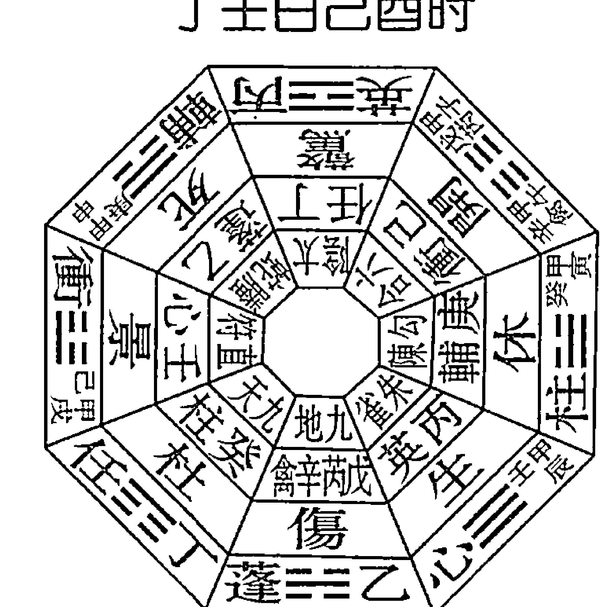

阳遁二局
小寒上元
立春下元
谷雨中元
小满中元

乾 坎 艮 震 巽 离 坤 兑
生与丙合鸟跌穴 勃符 丙奇入墓门生宫 虎猖狂宫生门 蛇天矫门迫宫 宫生门 宫克门 宫克门 大格宫生门

心符加震为天雷无妄
开门加坤为天地否
壬仪加己为天地刑冲格

断曰：符临六合之财乡，门入二宫之生地，到处逢迎，可以不劳而获矣。况符之本宫，鸟来跌穴，百动皆宜。惜其入墓，不免吉中之疵耳。丁逢天矫之蛇，则利于客；乙遇猖狂之虎，又宜于主。占者各依所立之方，定其吉凶可也。

兵事：宫生门，星克宫，又遇虎狂蛇矫，利客不利主。当出西北生门，合跌穴之吉。分伏于南北，以防正西格斗。贼亦有伏，在水泽间，不可不防。

出行：当出乾方。六里或十六里，见官长宴喜。

阳宅：宜开乾门，有双禽或皂衣人至，百日内进人财。

阴宅：宜向东南。作用时，有远方人送书信至。造葬后周年发财。

附占：胜败：客胜。虚实：敌兵未至。攻城：火攻可取。守城：难守。天时：不晴。地理：土色碧，朝拱极佳。人事：见小人买卖。田禾：麦有秋，西北大熟。家宅：宦者位隆望重，宅眷康宁，惟嫌右房欺压，小口常防小悔。官禄：秋占，吉。应试：文不佳，主司却得意，可望中。求财：宜获江河中之利。婚姻：女已有属，不成。胎产：生男，易养。疾病：其病在腹，壬日不利。捕获：盗甚勇，难捕。失物：失于近水处。远信：迟至。鸦鸣：有贵人来。鹊噪：主亲友来。

## 丁壬日庚戌时

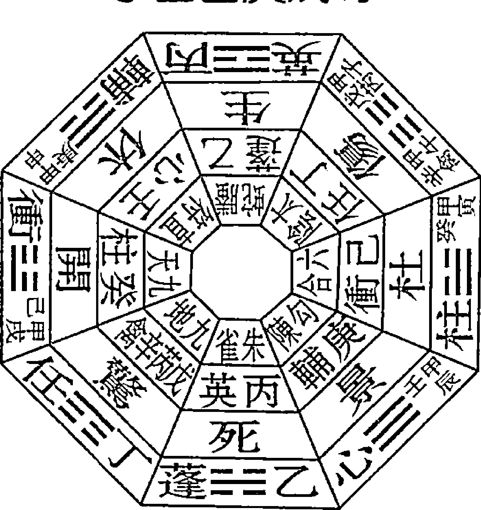

孤申酉虚寅卯
天心直符加四宫
开门直使加三宫

阳遁二局
小寒上元
立春下元
谷雨中元
小满中元

乾 坎 艮 震 巽 离 坤 兑
上格 门迫宫 宫生门 门迫宫 飞宫格 仪刑 符反吟 生与乙合 宫生门 神假 门迫宫 地假 宫克门
伏宫格 门迫宫

壬日伏干格飞干格 壬仪加庚为天牢倚势格 开门加震为天雷无妄 心符加巽为天风姤

断曰：符值反吟，本非吉格。加以符之本宫，则隔于天盘之庚，符之飞宫，复隔于地盘之庚，是前进既畏其锋，退守亦虞其袭，中途辗转，可谓进退维谷矣。况门使复迫于震宫，壬日主应倍凶，丁日客亦不利。

兵事：门星皆克其宫，客兵为利。但符反仪刑，不宜交战。当于正南生门出师，伏兵于西南，击其正北。防敌人掠我中军粮食，东南亦防有险阻。

出行：当出南门。十五里，见皂衣公吏，或九流人。

阳宅：坎宅午门吉。造作时，有微雨来应。

阴宅：离山可用。作用时，有南方大叫贼惊，或小儿骑牛至。

附占：胜败：客胜。虚实：敌情难测。攻城：必有擒获。守城：难守。天时：久雨不晴。地理：土色绿沉，明堂亦吉。人事：有阴人求寓，或乞恩。田禾：稔。家宅：新居不吉，防有刑伤。官禄：声名好，升转迟。应试：文章不合试官。求财：大吉。婚姻：族大非耦。胎产：生男，产母多病。疾病：目疾易痊，愈后防复发。捕获：天网遇合，易获。失物：失于商贾之家。远信：来而未至。鸦鸣：主有斗殴。鹊噪：闻病故事。

## 丁壬日辛亥时

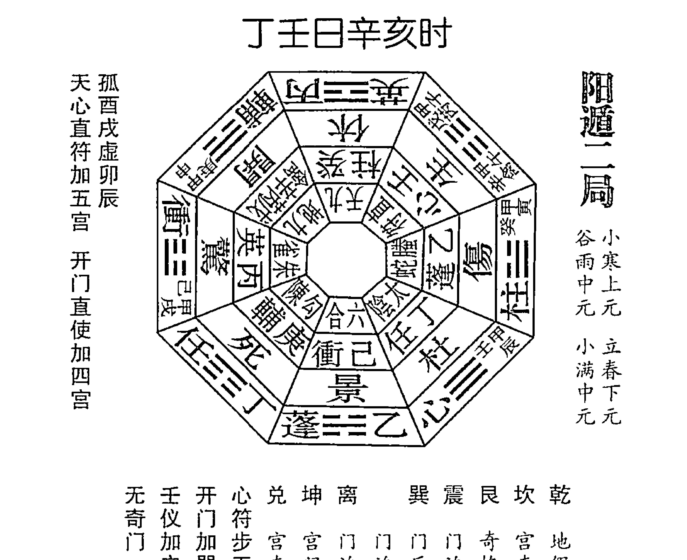

孤酉戌虚卯辰
天心直符加五宫
开门直使加四宫

阳遁二局

- 小寒上元
- 谷雨中元
- 立春下元
- 小满中元

| 宫位 | 格局 |
|------|------|
| 乾 | 地假 宫克门 丁奇入墓 宫克门 |
| 坎 | 宫克门 |
| 艮 | 奇格 宫门比和 |
| 震 | 门迫宫 |
| 巽 | 门反吟 天乙与太白格 |
| 离 | 门迫宫 |
| 坤 | 宫门比和 |
| 兑 | 宫克门 |
| (附加信息) | 心符步五为天地否 开门加巽为天风姤 壬仪加辛为白虎犯狱格 无奇门 丁日伏干格 |

断曰：以开门而临于杜，是弃明向暗也。以乾符而临于坤，是舍高就卑也。大象已乖，而况直使制宫，时干逢格，乙奇则受制于兑，丁奇则入墓于乾，龃龉淤塞，无吉可言。惟丙奇月入雷门，丙命人则为得地。

兵事：门克宫，宫生星，利于为客。太白相格，大将不利。奇门不合，又遇反吟。当遣偏将，从天马方出。更宜西北伏奇，邀截其东北。

出行：门反奇格，作事不顺，止宜静坐一室。

阳宅：开东门，防火烛。

阴宅：春夏震山与丙命人可用，有老人戴皮帽手执铁器至。

附占：胜败：主胜。虚实：敌将当死。攻城：用冲车云梯，易破。守城：东北受敌，难御。天时：阴晦不雨。地理：明堂厄塞，山向不合。人事：有因酒色失事者。田禾：防水灾，岁歉。家宅：昌盛，宦者极利。官禄：四季月占，利。应试：房考不荐。求财：贵人之财有得。婚姻：女缺唇，可成。胎产：生男，当贵。疾病：似病非病，春占易痊。捕获：捕役作弊。失物：失于近密灶处。远信：有而未至。鸦鸣：事有成合。鹊噪：有惊。

## 戊癸日壬子时

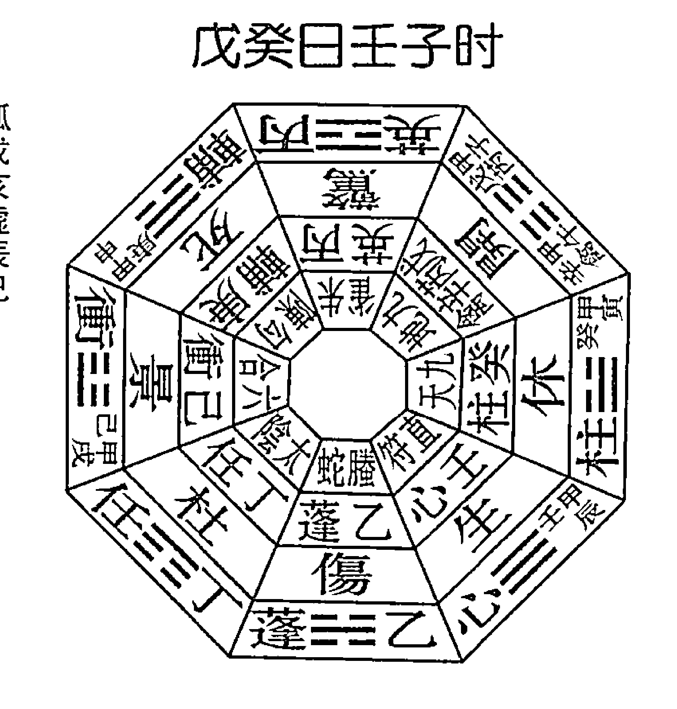

- 阳遁二局
- 谷雨中元
- 小满中元
- 小寒上元
- 立春下元

| 宫 | 门 | 生 | 克 |
|---|----|----|----|
| 乾 | 符伏吟 | 门生宫 | |
| 坎 | 宫生门 | | |
| 艮 | 地假 | 门迫宫 | |
| 震 | 宫生门 | | |
| 巽 | 宫生门 | | |
| 离 | 丙奇升殿 | 宫克门 | |
| 坤 | 宫生门 | | |
| 兑 | 宫生门 | | |
| 心符伏乾为乾 | | | |
| 开门步五为天地否 | | | |
| 壬仪加壬为天牢自刑格 | | | |
| 无奇门 | | | |

断曰：直符逢伏，则三奇六仪，时干神将，俱无吉之可言，固常独处而呻吟矣。惟赖门使得地，庶有吉占。奈何步于中五之中，寄于坤位，既忧其沉闷，复虑其庞杂，是不免于悔吝之来也。喜乾坤分处，各占生旺，有小眚而无大灾。

兵事：宫生门，利于先动。但无奇门吉格，符又伏吟，动亦无利。宜背西北，吉东南，伏兵于东北。若能不战，亦可休兵。

出行：不利远行。西北方直符下暂出，亦无害，当见跛男子。

阳宅：无奇门，修方立向，俱不甚吉。

阴宅：春夏坎山午山，可以权厝。作用时，有人争斗为应。

附占：胜败：客败。虚实：敌军未动。攻城：可攻，春夏尤利。守城：难守。天时：格名犯主，有雨。地理：穴情生动，山向不吉。人事：有阴人财喜。田禾：歉。家宅：人口安宁，略有消耗。官禄：升擢无期。应试：不中。求财：当得贵人之财。婚姻：男家不愿，难成。胎产：甚吉，生男。疾病：脾胃不和，淹缠。捕获：受贿用情。失物：首饰之类，向北方寻。远信：迟至。行人妻占，夫即归。鸦鸣：有婚姻事。鹊噪：有惊心事。

## 戊癸日癸丑时

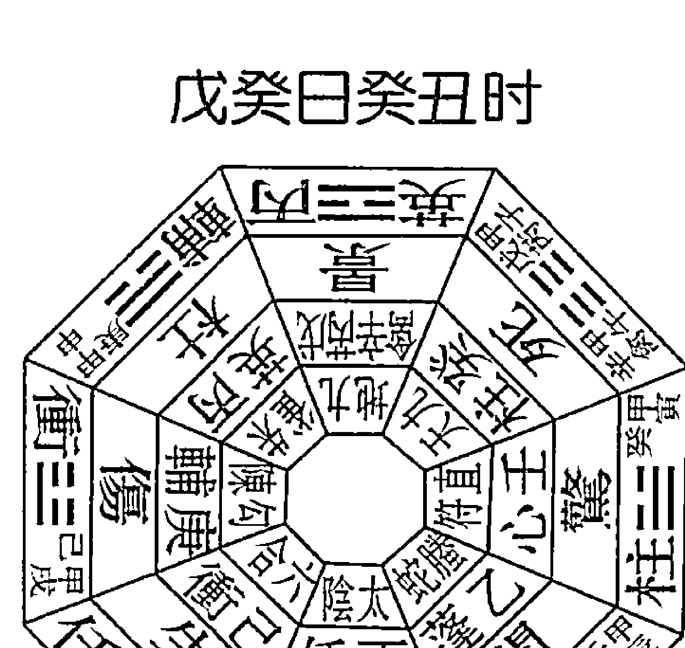

阳遁二局
小寒上元
谷雨中元
小满中元
立春下元

孤亥子虚巳午
天心直符加七宫
开门直使加六宫

天网 壬仪加癸为阴阳重地格 开门伏乾为乾 心符加兑为天泽履 兑 坤 离 巽 震 艮 坎 乾

断曰：壬符加癸，心星加柱，本为同气之人，不复形骸之隔矣。但时干受克于坤方，未能亨泰耳。休合丁奇于坎，太阴同加，曰真诈，曰人遁，最为吉格。而休有伏吟之累，丁有入水之嫌，吉中有疵，亦不可以不审。

兵事：门伏星和，阴时利为主。正东刑格，遇贼必有小伤。正北西北，皆可出兵，设伏于后，疾击其东南，以应荧入之格。有狂尘自东南来为应。

出行：利于正北。二里九里，闻同伴歌声。出西北亦吉，当见竖造之事。

阳宅：宜立坎门或乾门，当得禄食财喜。

阴宅：子山乾山皆利。作用时，南方有光如火为应。

附占：胜败：主胜。虚实：秋冬敌怯甚。攻城：夏月不可攻。守城：可守，援兵即至。天时：阴晴相半。地理：穴情甚吉，但中有铁器。人事：阴人主病，阳人主有失脱。田禾：夏旱，欠丰。家宅：人口平安，子孙极好，虞有火烛。官禄：求荐举甚利。应试：文晦，不中。求财：三人同求，我获其大半。婚姻：女家不允。胎产：胎稳，难产，生女。疾病：肝受肺克，可治。捕获：捕受伤，不可擒。失物：破相人窃去，藏在草中。远信：北方人占，喜信即至。鸦鸣：防欺蔽。鹊噪：有喜事至。

## 戊癸日甲寅时

孤子丑寅午未
天柱直符加七宫
惊门直使加七宫

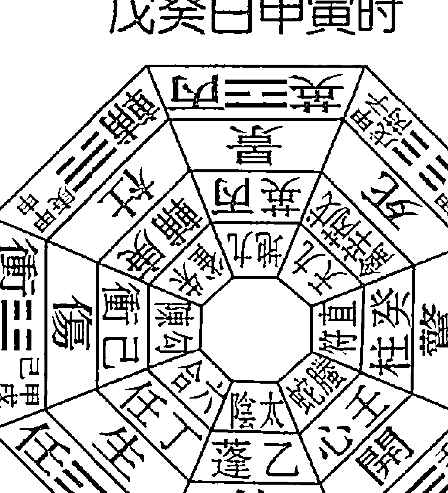

阳遁二局
小寒上元
立春下元
谷雨中元
小满中元

乾 坎 艮 震 巽 离 坤 兑
休与乙合 生与丁合 丙奇升殿 门符伏吟 柱符伏兑 惊门伏兑 癸仪加癸为天网张格 天辅时戊日不遇
真诈 龙遁 丁奇入墓 休诈

断曰：兑为金宫，正西之地。癸虽喜其受生，甲实忧于受克也。甲乃因癸而遁焉，殆所谓非所据而据焉者乎？兑仪为悦，而象为口舌，以口舌感人而悦者，惟朋友讲习为正。若舍解颐之谈，用如簧之巧，君子有勿取矣。

兵事：仲甲之时，阴内阳外，不宜出兵。宜休养生息，预习舟楫之利，多遣间谍，阴布流言。老营宜在正西，新营宜在正南。戊日防有本营叛卒，私通敌国。

出行：谒贵宜出正北，求财宜出东北。路逢扛木人，或军夫猎犬应。

阳宅：宜立北门。七日后，有人进生气物应。

阴宅：宜艮山子山。作用时，有女人把火前行，童子拍手大笑应。

附占：胜败：主胜。虚实：防敌欲偷袭。攻城：用地道可克。守城：援兵虽近，敌势猛，难御。天时：云布中天。地理：山向不吉，葬后不昌。人事：赏罚家人，宾客不至。田禾：麦丰，农忙。家宅：房屋风水不佳，人丁未必兴旺。官禄：有荐举，可升。应试：文章入彀，可以望中。求财：向东北求，可得。婚姻：可成，媒人欺女家而惧男家。胎产：安，生女。疾病：幽郁之症，不能速除。捕获：是妖术人，柳絮飞时可获。失物：缺齿人所盗，藏在室中床足下。远信：未至。鸦鸣：防火烛。鹊噪：向北鸣，进美馔。

## 戊癸日乙卯时

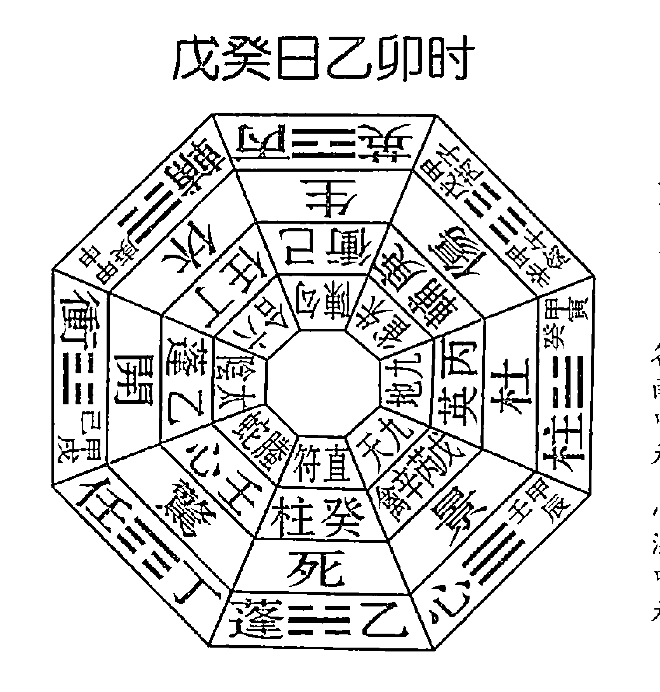

天柱直符加一宫，惊门直使加八宫。孤丑寅虚未申。

阳遁二局
小寒上元 立春下元
谷雨中元 小满中元

| 八卦 | 描述 |
|------|------|
| 乾 | 门迫宫 |
| 坎 | 相佐门 |
| 艮 | 人假 |
| 震 | 玉女守门 |
| 巽 | 开与乙合地遁 |
| 离 | 云遁 |
| 坤 | 真诈门迫宫 |
| 兑 | 休与丁合休诈门生宫 |

宫生门 太白与天乙格门迫宫 勃符宫克门 鸟跌穴为日沉九地格 惊门加泽山咸 柱符加坎为泽水困 癸仪加乙为日沉九地格 戊日伏干格

断曰：柱符加坎，虽在子乡，而实癸之禄地、甲之生方，可谓得地矣。况时干亦逢禄于震宫，直使亦受生于艮地，而跌穴之鸟加于符之本宫，真乃无不宜者也。符之阴为太阴，使之阴为六合，又遇守门之时，私谋秘计，百动如心。

兵事：宫生门，星生宫，主客皆利。天乙遇格，大将防伤。震合玉兔归垣，出正东，伐其西南右翼，奇兵随后，防贼亦有伏兵。

出行：宜出东南方，以应“玉女留郎”吉格。行五里十五里，见妇人著皂衣，引孩子唱歌，吉。

阳宅：乙奇到震，为贵人升殿，宜开正东门，有童子或牛马至。

阴宅：宜卯山巽山，有狗吠鼓声应。

附占：胜败：客胜。虚实：敌来诱我。攻城：有内应则下。守城：城中防有敌党。天时：阴晴俱见。地理：穴情颇佳，地多树根。人事：有贵人文书财喜。田禾：收成好，略防水。家宅：宅居发财，有伤女人。官禄：蒙恩超擢，位至三台。应试：文高，合主司意。求财：远求无益，近地有阴人财可得。婚姻：女幽闲多才，难成。胎产：孕得男，母有灾。疾病：痘疮之症，无恙。捕获：在江河上为客，可获。失物：失于西北近水之处。远信：至。鸦鸣：长上事。鹊噪：防有小灾。

## 戊癸日丙辰时

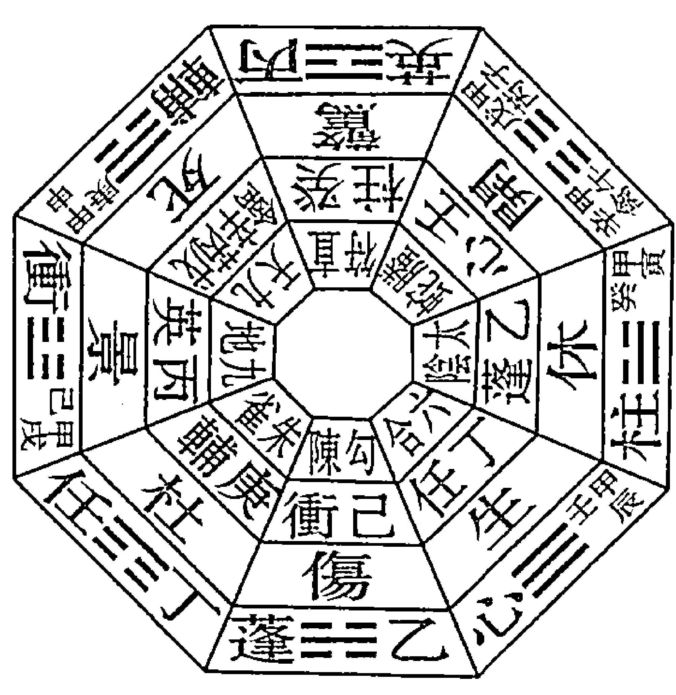

阳遁二局
小寒上元 谷雨中元
立春下元 小满中元

孤寅卯虚申酉
天柱直符加九宫
惊门直使加九宫

| 宫位 | 描述 |
|------|------|
| 兑 | 宫生门，休与乙合，龙遁，真诈 |
| 坤 | 宫生门，相佐，龙返首，符勃，宫克门 |
| 离 | 宫生门，天乙与太白格，宫克门 |
| 震 | 宫生门 |
| 艮 | 奇格，门迫宫 |
| 坎 | 宫生门 |
| 乾 | 门生宫，生与丁合，休诈，丁奇入墓 |

柱符加离为泽火革
惊门加离为泽火革
癸仪加丙为明堂犯悖格
丙奇得使遇甲 戊日飞干格

断曰：返首之龙，本为贵格，特非所论于柱符之加离位、丙奇之值癸仪。夫返首之吉，既不足言，则飞勃之凶，自有不免，纪纲紊乱，盖有之矣。所幸时干在震，名曰月入雷门，终当革面革心，强梗化为和吉耳。

兵事：宫克星门，利为主，宜后应。当密从正西出奇兵列阵，伏兵随路安置，炮发齐起。戊日防中道敌兵格战，亦防大将受伤，有备无患。

出行：宜出正西。一里八里，见皂白衣妇人，引孩子同走。

阳宅：乾兑方可立向开门。三七日，进商音人田产。

阴宅：宜酉山乾山。作用时，闻鼓声，见抬木人。六十日后，有孀妇持券至应。

附占：胜败：主欲罢师。虚实：敌有阻，未至。攻城：火攻即下。守城：本营防有暗奸。天时：无雨，有微风。地理：石山荒僻，防有更移。人事：有贵人受职。田禾：麦丰，秋多阴雨，禾亦无伤。家宅：宦者超升，人口安宁，略防惊恐。官禄：秩不显，终防参。应试：文抄旧作，房考力荐。求财：有求必得。婚姻：女富男贫，得力可成。胎产：胎恐漏，生贵女。疾病：火旺水衰，可愈。捕获：自来投。失物：失于东南。远信：不至。鸦鸣：有阴人事。鹊噪：闻格斗事。

## 戊癸日丁巳时

阳遁二局

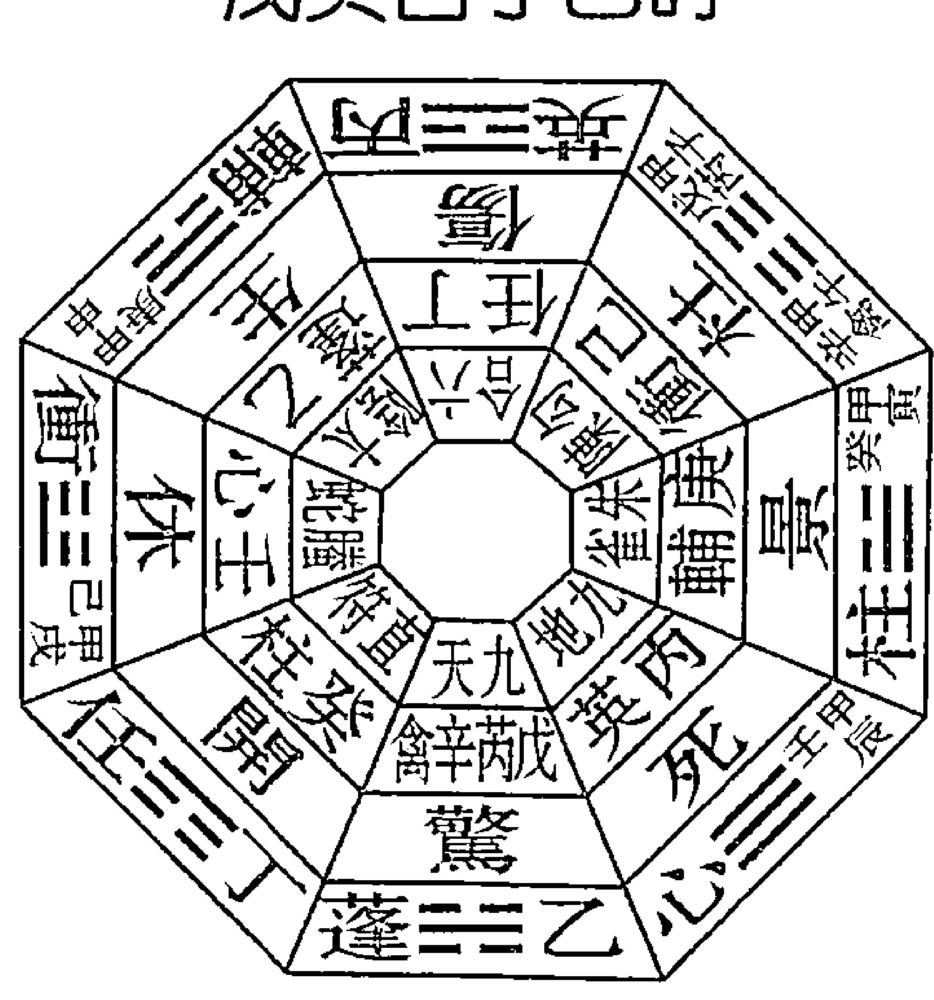

| 宫位 | 描述 |
|------|------|
| 乾 | 丙奇入墓 门生宫 |
| 坎 | 虎猖狂 门生宫 |
| 艮 | 相佐 蛇天矫 宫生门 |
| 震 | 门生宫 |
| 巽 | 生与乙合 真诈 风遁 |
| 离 | 宫克门 |
| 坤 | 神假 物假 门生宫 |
| 兑 | 门迫宫 |
| (附加信息) | 柱符加艮为泽山咸，大格，伏宫格，门迫宫；惊门加坎为泽水困；癸仪加丁为腾蛇天矫格；癸日伏干格。 |

断曰：艮本柱符受生之地，所以资生，然有丁焉。乃以癸为天矫之蛇，是我方以恩泽冀人，不知人以仇雠视我也。恩中得怨，人情概如此乎？奇门惟乙为合生，然已制于虎之猖狂，亦不足贵。祈风祭雨，尚可用之。

兵事：门生宫，宫生星，主客俱利。蛇矫虎狂，兵宜先举。当出东南方，攻其西北。但敌荫九地之下，不能大胜，更防西路有伏兵格斗。

出行：宜出东南方。四里，逢衙门人长吁短叹应。

阳宅：宜立巽门，当进银钱、得地亩。

阴宅：巽方合真诈，又德禄俱到，利巽山乾向。作用时，女子携酒至，癯背人来，期年后得武职。

附占：胜败：两败俱伤。虚实：敌有诡谋，来必大战。攻城：守将无斗志，将为城下之盟。守城：略有虚惊，可守。天时：晴。地理：土色白，穴有生气，来脉亦曲，内有贵物朽烂。人事：有近贵之人，或奴隶言盗贼事。田禾：麦大丰，东南尤熟。家宅：宅长贵显，惟防同室操戈。官禄：初任不升。应试：不中。求财：鱼盐之利，三九日可得。婚姻：女别有属意，不成。胎产：生女，母有灾。疾病：虚消之症，有鬼。捕获：在西方高山中。失物：在书斋中。远信：不至，行人在中途。鸦鸣：口舌。鹊噪：文书阻隔。

## 戊癸日戊午时

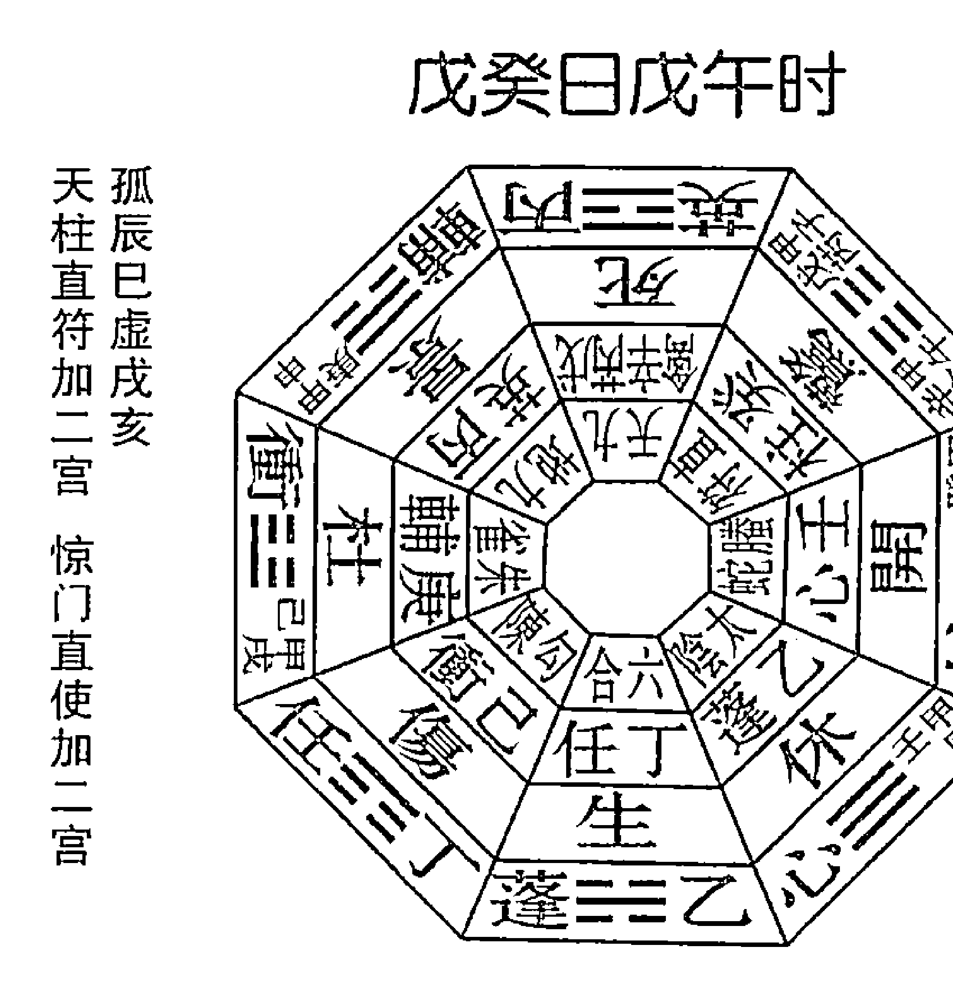

阳遁二局

癸仪加戊为青龙入地格
惊门加坤为泽地萃
柱符加坤为泽地萃
兑宫门比和
坤仪刑宫生门
离宫生门
巽荧入白宫生门
震刑格宫门比和
艮门迫宫
坎生与丁合休诈门迫宫
乾休与乙合真诈乙奇入墓

断曰：柱加坤为子依母，癸加戊为妻顺夫，末甲加于首甲为终顾始。慈孝之行备，倡随之义全，而终始勿渝。诚人伦之美节，家庭之盛事也。符使同宫，时干得地，占为元吉，不问可知。但坤中有未为仪刑，少有刑克耳。

兵事：宫生星门，利为客。但直符刑击，不宜交战。宜出正北生门，潜师伏于西北，衔枚疾走。直击其东，战于东南，以应荧惑之入，我军亦有伤损。

出行：图谋宜出正北，远行宜出西北。路逢皂衣妇人，公吏唱歌应。

阳宅：宜立乾坎门。有人著黄衣至，又有缠钱人来。

阴宅：子山乾山大利。六十日内，水边拾古玩，进小口。

附占：胜败：客胜。虚实：敌师将遁。攻城：连攻可克。守城：援兵近，能守，士卒多死。天时：阴晦。地理：地不发财，兼受风。人事：有军吏速系事。田禾：麦丰，禾防水灾，薄收。家宅：人多病，有刑伤。官禄：外任多凶。应试：文章灵巧，荐而不售。求财：略有些微，不能遂意。婚姻：女德幽贞，冰人亦得力。胎产：生女，母安。疾病：阴亏善惊，当滋水。捕获：在东方林木旁居住，易获。失物：失于正南近炉冶处。远信：有喜信，尚迟。鸦鸣：闻争斗事。鹊噪：有刑法事。

## 戊癸日己未时

孤巳午虚亥子 天柱直符加三宫 惊门直使加三宫

阳遁二局 小寒上元 谷雨中元 立春下元 小满中元

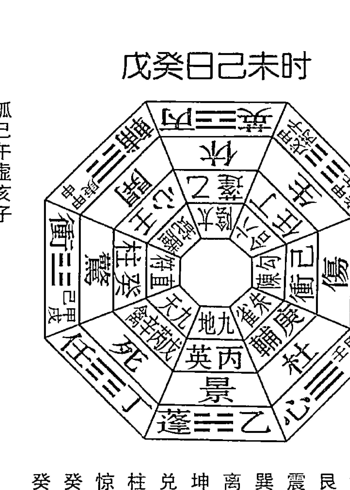

| 乾 | 坎 | 艮 | 震 | 巽 | 离 | 坤 | 兑 |
|----|----|----|----|----|----|----|----|
| 宫克门 | 宫克门 | 宫门比和 | 门迫宫 | 门迫宫 | 门符反吟 | 门迫宫 | 宫生门 |
| 上格 | 宫克门 | | 门迫宫 | | | | |
| | | | 门迫宫 | | | | |

断曰：柱符惊使，以震为财，可以如取而如携矣。但格属反吟，事多更变。神逢勾白，必有讼争。恋彼蝇头蜗角之微，致有雀角鼠牙之害，亦可谓迷而不悟者也。如不可求，从吾所好，安于义命，不亦休乎！

兵事：星门克宫，利为客。遇阴时，合诈格。宜衔枚掩袭，设奇兵为两翼，一出正南，一出西南，合攻其伤门。门符反吟，宜声东击西，声南击北。

出行：宜出西南正南。路逢显贵人，或猎户素服人。

阳宅：宜建离坤门，有黑白禽西飞，青皂衣妇女至为应。

阴宅：离合玉兔中天，午山子向大利。作用时，鸦鹊飞鸣，牧童逐羊牵牛过应。

附占：胜败：客胜。虚实：客情反覆。攻城：守将甚勇，不克。守城：季月可守。天时：无雨有风。地理：地亦发财，扞穴甚难。人事：有妇人谋夫公案。田禾：岁稔。家宅：财富饶，事不顺，人多疾。官禄：有荐可升。应试：落第。求财：小求大得。婚姻：女家不许。胎产：孕得男，母安子贵。疾病：咽喉之症，不能速愈。捕获：逃人在西南，盗不获。失物：主自遗忘，在艮方。远信：至。鸦鸣：欺蔽之事。鹊噪：有道路阻塞事。

## 戊癸日庚申时

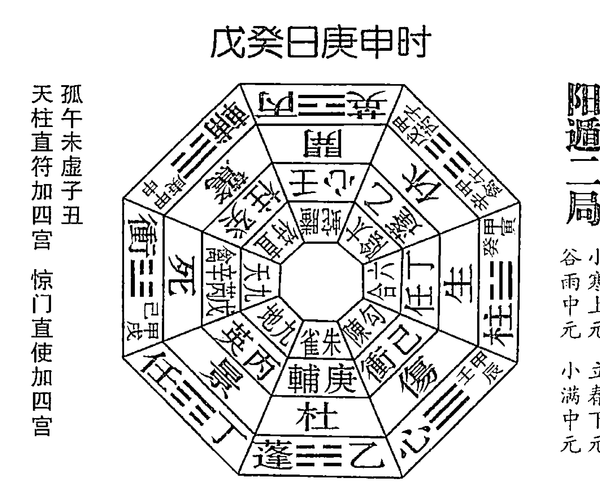

孤午未虚子丑
天柱直符加四宫
惊门直使加四宫

阴遁二局
小寒上元
立春下元
谷雨中元
小满中元

癸日干格
癸仪加成为天网冲犯格
惊门加巽为泽风大过
柱符加巽为泽风大过

| 宫位 | 描述 |
|------|------|
| 乾 | 宫克门 |
| 坎 | 奇格 宫生门 |
| 艮 | 门生宫 |
| 震 | 宫克门 |
| 巽 | 小格 飞宫格 仪刑 门迫宫 |
| 离 | 宫克门 |
| 坤 | 休与乙合 真诈 虎遁 |
| 兑 | 龙逃走 乙奇入墓 宫克门 |

断曰：巽亦柱符财帛之乡，占者宜有问财之志。然时干见格于前，直使来争于后，固已劳而罔获矣。而宫之阴神为雀武，主有口舌奸人，非争利而致有沸腾，必贪财而被其盗窃。悻人悻出，何利之有？

兵事：星门克宫，利于为客。龙走雀入，客亦不利。况天乙飞宫，六仪刑击，战则两败俱伤。宜多设伏兵，谨守营寨。见有飞星过宫，陨石堕营，士兵防有伤害，正北东南防偷劫。

出行：宜出正西方。逢公吏，或伐木人。

阳宅：丁奇升殿，宜开西门。有人将文书纸笔过，或见渔人。

阴宅：坤合真诈，宜坤山。作用时，有鹰掠禽，青衣携篮至应。

附占：胜败：客败。虚实：敌军水阻。攻城：冬春月攻，利。守城：求援可守。天时：大晴。地理：穴透风，子孙不利。人事：贵人当有声名。求财：必争夺。田禾：麦有年，禾防虫灾。家宅：鬼魅为殃，人多灾疫。官禄：文书迟误，防参降。应试：不中。求财：贵人之财可获。婚姻：有两家相求，速图则成。胎产：生男，母安。疾病：梦遗之症，医庸无效。捕获：大盗难获。失物：失于正东方。远信：无，行人有喜事，未至。鸦鸣：有亲朋来。鹊噪：防遗失。

## 戊癸日辛酉时

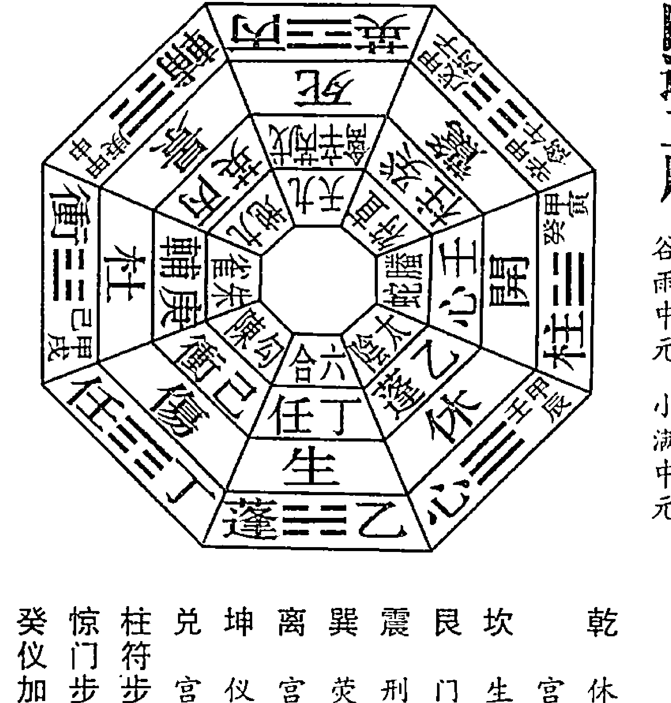

癸仪加辛为华盖受恩格
惊门步五为泽地萃
柱符步五为泽地萃
兑宫门比和
坤仪刑宫生门
离宫生门
巽荧入白宫生门
震刑格宫门比和
艮门迫宫
坎生与丁合休诈门迫宫
乾休与乙合真诈乙奇入墓

断曰：步五之格，大抵多暗而少明。符使并人于中宫，则暗之尤甚者也。中五坤二，俱符使印绥之乡，而又辛为癸之受生，戊为癸之正合，徘徊眷恋于安乐之地，而不知自即于明，直怀土怀惠之小人而已，何足以言吉！

兵事：宫生星门，利为客。直符仪刑，大将不利。东方必有战格，宜先发兵，邀击于东南。若使敌人向东，我兵即不得地，不能免于刑伤。
出行：宜出西北正北，路逢四足争斗，皂衣妇女行走应。
阳宅：宜开北门，造乾宅。有人抱小儿从南来，或见黑云应。
阴宅：宜子山乾山。闻远寺鼓角钟声，鸡鸣树上应。作用后釜鸣，防阴人灾。

附占：
- 胜败：客胜。
- 虚实：敌兵即退。
- 攻城：不能拔。
- 守城：有虚惊，可守。
- 天时：有风无雨。
- 地理：金形有坑，土色黑，葬后多事。
- 人事：有姻亲来，得财喜。
- 田禾：有麦秋，禾防水。
- 家宅：荫庇之下，安享则吉，动多惊险。
- 官禄：不能升。
- 应试：文章颇佳，主司不中。
- 求财：有旁人吹嘘，可获。
- 婚姻：女家不许。
- 胎产：安，略迟，生女。
- 疾病：齿疼，易治。
- 捕获：在东方，易获。
- 失物：失于正南马厩左右。
- 远信：有，未至。
- 鸦鸣：干妇女事。
- 鹊噪：向北鸣，吉。

## 戊癸日壬戌时

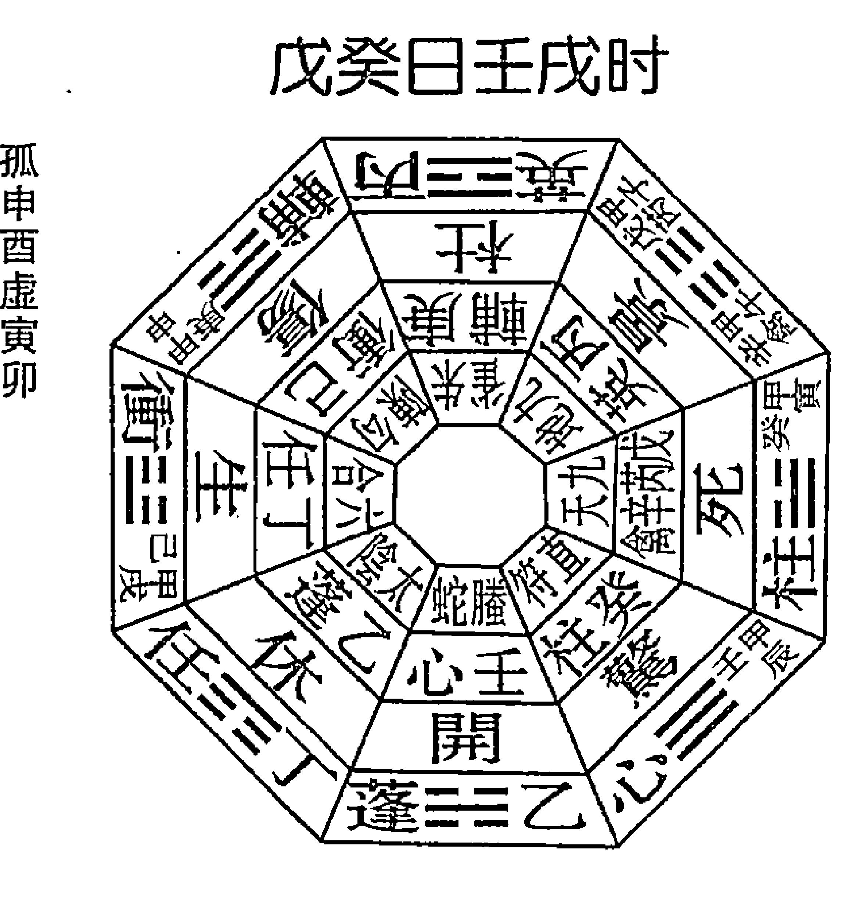

天孤 申酉 虚寅 卯 天柱直符加六宫 惊门直使加六宫

| 阳遁二局 | 小寒上元 | 立春下元 | 小满中元 | 谷雨中元 |
|---|---|---|---|---|

癸仪加壬为天网覆狱格 惊门加乾为泽天夬 柱符加乾为泽天夬 兑门生宫 坤门生宫 离白入荧奇门生宫 巽格刑宫门比和 震生与丁合休诈宫克门 艮休与乙合真诈虎遁 坎门生宫 乾宫门比和

断曰：符使分行，各宣乃职，庶合协恭之义。况柱加乾，是以金比金也；癸加壬，是以水济水也。正赖使之匡救，而乃随声附和，无所异同，私则成朋党之嫌，公亦失赞襄之雅矣。戊日用壬，亦为损明，选择家所不取。

兵事：星宫比和，主客皆利，阴时不宜先举。东南敌气甚猛，必来夜侵。宜先伏于东北，出正东生门。先据其南，贼到即发东北之伏，与正兵互击，火器宜精。
出行：宜出正东方，东北方亦可出。逢犬马，及军夫抬木人应。
阳宅：宜立艮震二门。有两女至，或黑禽自南飞来应。
阴宅：宜艮山卯山。作用时，闻犬吠、女人纺织声。

附占：
- 胜败：客胜。
- 虚实：闻敌即来。
- 攻城：援兵云集，不可攻。
- 守城：能守。
- 天时：先阴翳，后晴朗。
- 地理：地中有水，非吉穴。
- 人事：有女人离家哭泣。
- 田禾：麦大熟，禾薄收。
- 家宅：后门不佳，难以聚财，卑幼婢妾防惊痫症。
- 官禄：照常供职，不能即升。
- 应试：文高，不售。
- 求财：可得。
- 婚姻：旧戚联姻。
- 胎产：孕生贵女，母亦安。
- 疾病：金郁之症，药不奏功。
- 捕获：捕盗相通，官追不获。
- 失物：失于正西近水处。
- 远信：无。
- 鸦鸣：阴私之事。
- 鹊噪：防窃贼。

## 戊癸日癸亥时

天柱直符加七宫 惊门直使加七宫
孤酉戌虚卯辰

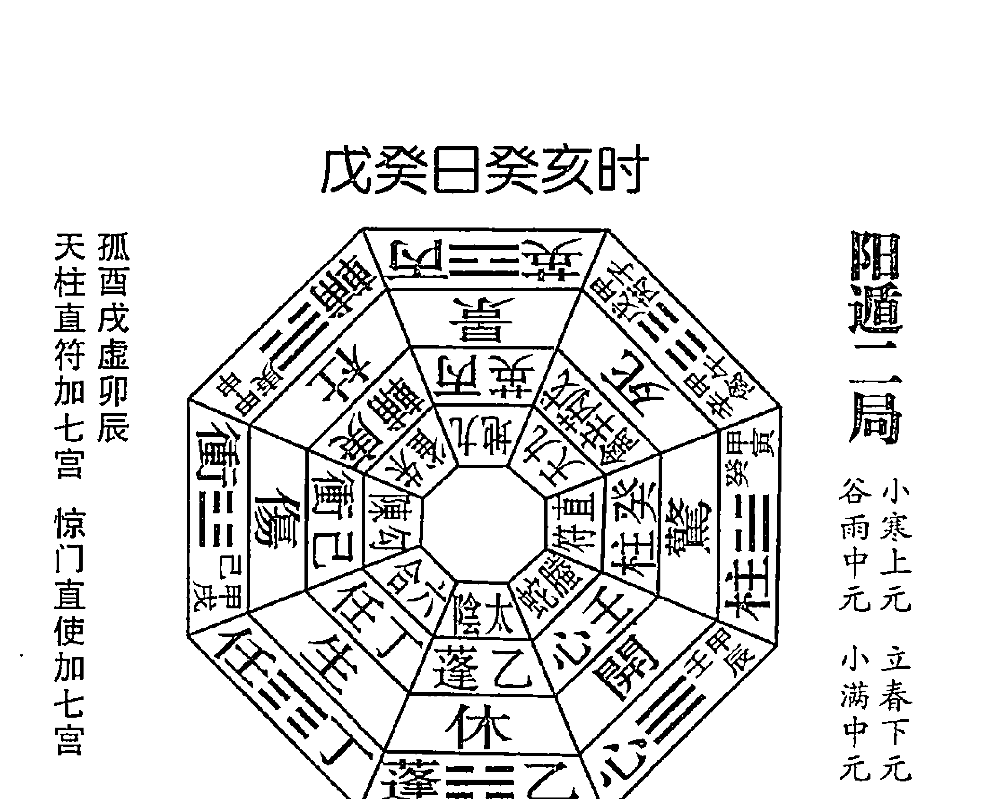

阳遁二局
谷雨中元
小寒上元
小满中元
立春下元

| 宫位 | 配置 |
|------|------|
| 乾 | 休与乙合 龙遁 真诈 |
| 坎 | 生与丁合 休诈 丁奇入墓 |
| 艮 |  |
| 震 |  |
| 巽 |  |
| 离 | 丙奇升殿 |
| 坤 |  |
| 兑 | 门符伏吟 柱符伏兑为兑 惊门伏兑为兑 癸仪加癸为天网重张格 天网四张 |

断曰：此亦本局之终，而开诸局之始。一元已尽，六甲已周，符使还归于本宫，有日穷于次、月穷于纪、星回于天之象。贞元之会，当保太和，以为资始之原。剥复之交，当存硕果，以俟天心之见。能主静以立极，自无虞天网之张矣。

兵事：门符伏宫，主客不利。况天网四张，安贞尤吉。动则宜出东北，转击东南，以守则固，以战则克。
出行：网高可行，正北东北俱利，逢皂衣妇人、蛇鼠牛蝠之物为应。
阳宅：宜开坎艮二门。作用时，闻鼓声，有黑衣人来应。
阴宅：宜子山艮山。作用时，闻金声，见火光，后有妇人赠鲤应。

附占：
- 胜败：客不胜。
- 虚实：敌有深谋，无从探听。
- 攻城：可攻。
- 守城：宜备北门。
- 天时：晴而有风。
- 地理：土色黑赤相间，四面高耸，龙向俱不佳。
- 人事：有小人侵财失物。
- 田禾：麦丰，禾防水。
- 家宅：人口安宁，稍有虚惊。
- 官禄：难升，亦不尊显。
- 应试：落第。
- 求财：有得，不遂意。
- 婚姻：女量大，性沉静，可成。
- 胎产：三七日生女，不育，母身安。
- 疾病：宿疾难愈。
- 捕获：匿于东南方，易获。
- 失物：主自遗亡，原处可寻。
- 远信：未发，行人不至。
- 鸦鸣：女人事。
- 鹊噪：向东北鸣，有少女持财物来。

## 御定奇门遁甲·阳遁九局

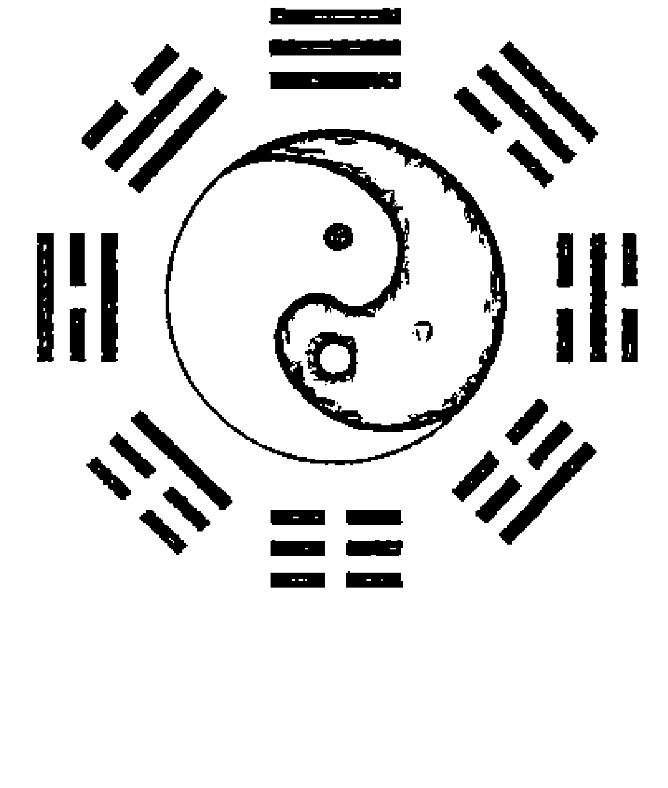

## # 邵道三局

## 甲己日甲子时

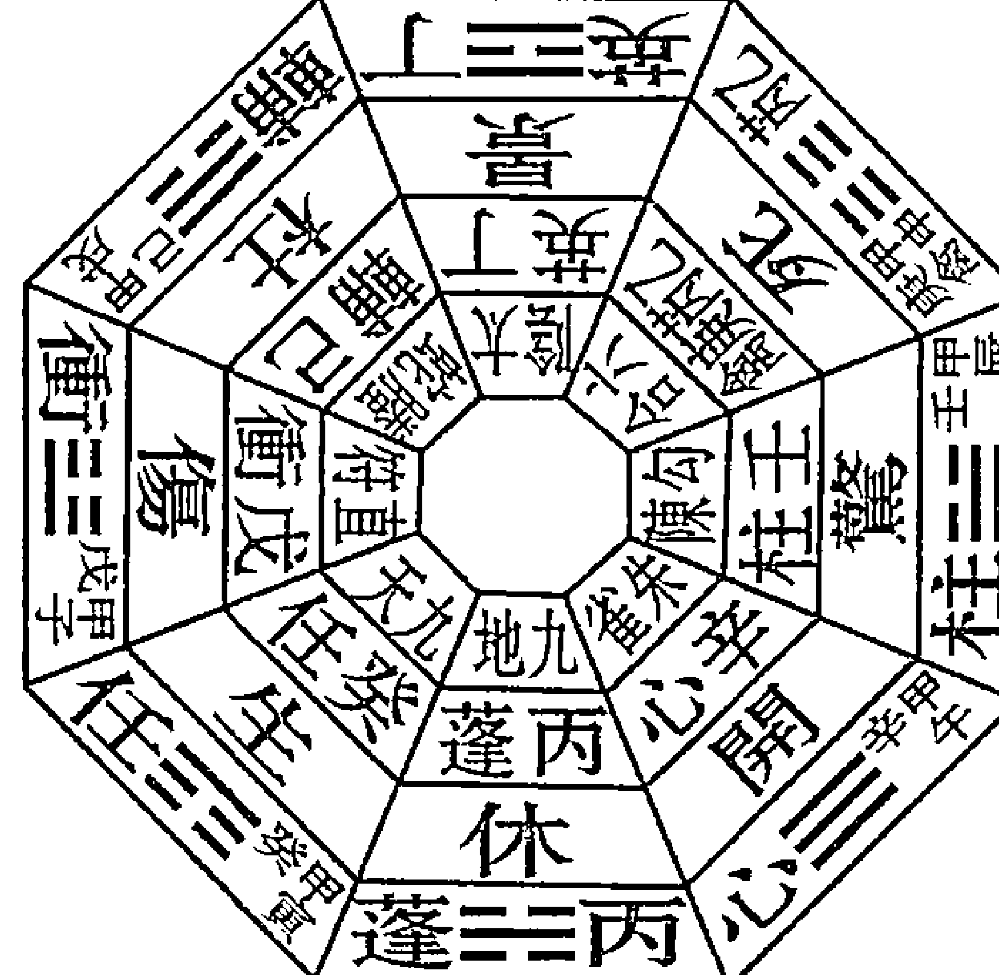

孤戊亥虚辰巳
天冲直符加三宫
伤门直使加三宫

阳遁三局
春分上元
大寒上元
芒种中元
雨水下元

| 乾 | 坎 | 艮 | 震 | 巽 | 离 | 坤 | 兑 | 冲符伏震为震 | 伤门伏震为震 | 戊仪加戊为青龙入地格 | 天辅时 |
|---|---|---|---|---|---|---|---|---|---|---|---|
| 休与丙合重诈 | 门符伏吟仪刑 | 乙奇入墓 |  |  |  |  |  |  |  |  |  |

断曰：冲符秉令，三阳交泰，有震动发生之象。惜乎甲子愁东，受卯之刑，虽伏而不动，而中怀扰扰，一室坐驰。既不欲自同于灰槁，又不能自享其泄闲，盖遇而未遇者也。喜天乙照临，所当拂拭门庐，汰蒙去垢，俟其运会可已。

兵事：仲甲之时，刑内德外，不宜出兵。况伏吟刑击，动必有伤。宜赦过宥罪，激励人心。南北分伏于要害，见中军火起为号，妄动者军令从事。合阵时，防敌人援兵夹攻。
出行：坎地可行。五十里内，闻鼓声，或见文人墨士。
阳宅：宜立坎向，修造北方。若见飞鸟风云，子孙当有富贵者。
阴宅：宜作午向。作用时，闻钟声。葬后周年，田蚕倍收。

附占：
- 胜败：主胜。
- 虚实：敌仅自守。
- 攻城：即入城。
- 守城：当避其锋。
- 天时：无雨。
- 地理：地脉伤残，防有刑克。
- 人事：有喜信，或财帛。
- 田禾：麦有收，禾有虫。
- 家宅：人宅相安，长子有刑。
- 官禄：冬春最吉，不能远大。
- 应试：房官与主司不合。
- 求财：有。
- 婚姻：成。
- 胎产：孪生乃吉。
- 疾病：木侮脾经，宜补脾制肝。
- 捕获：追之，三五日可见。
- 失物：在东厢，无人盗。
- 远信：尚无。
- 鸦鸣：有隐匿事。
- 鹊噪：有官人来。

## 甲己日乙丑时

### 阳遁三局
（大寒上元 春分上元 雨水下元 芒种中元）

天冲直符加二宫
伤门直使加四宫
孤亥子虚巳午

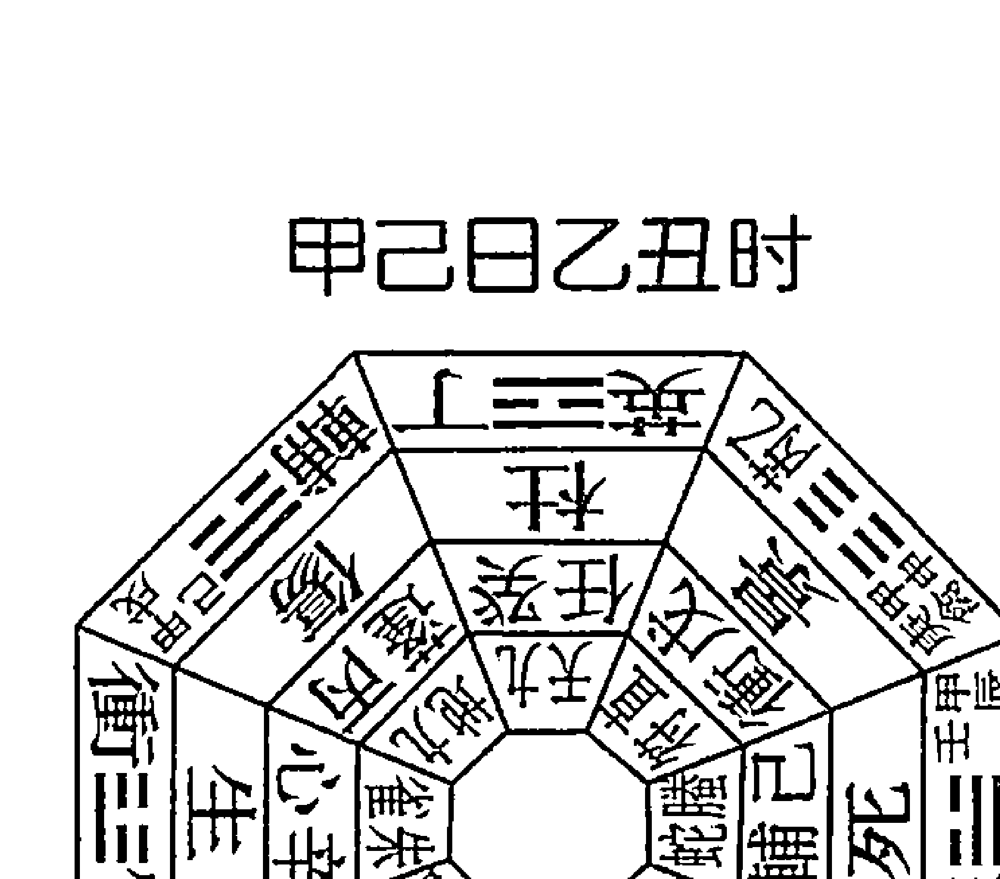

| 宫位 | 属性 | 格局/关系 |
| :--- | :--- | :--- |
| 乾 | 丁奇入墓 宫门比和 | 开与乙合 休诈龙遁 |
| 坎 | 荧入白门生宫 |  |
| 艮 | 宫克门 |  |
| 震 | 宫克门 |  |
| 巽 | 宫门比和 |  |
| 离 | 蛇天矫门生宫 |  |
| 坤 | 相佐门生宫 | 冲符加坤为雷地豫 |
| 兑 | 门生宫 | 伤门加巽为雷风恒 |
| 己日不遇 | 戊仪加己为青龙入云格 |  |

断曰：直符加于坤二，财帛之乡，阴神下逢六合，可以问财矣。但乙奇同处，不无良朋分金。庚鬼同居，岂免小人夺好。况以仪论之，则戊生于申为得气；以星论之，则木墓于未为失地。诚恐疲精费神，所得不偿所失耳。

兵事：星克宫，阳星阳时，不利为主。宜伏兵于坎，敌必结党而来，大师即尾其后。伏兵先发，前后夹攻。若遇于南方，亦宜先发迅击，以应蛇矫之格。惟己日防有兵卒谋叛，不可不谨。
出行：出北门最吉。一二里十里，见皂衣女人，及果盒食物。
阳宅：利开北门，有红衣公吏到门为吉。
阴宅：坎山吉。作用时，有小儿拍手笑。葬后三年，因获盗贼致富。

附占：
- 胜败：客负。
- 虚实：敌人即来。
- 攻城：可拔。
- 守城：北门防火攻。
- 天时：阴云。
- 地理：穴情不实，来龙有损。
- 人事：有狱中文案。
- 田禾：禾麦皆收，北方尤熟。
- 家宅：宅长甚吉，阴人防病。
- 官禄：即升。
- 应试：可中，小试不利。
- 求财：不利。
- 婚姻：易谐。
- 胎产：生女，易养。
- 疾病：小儿惊风，午未日愈。
- 捕获：在北方小涧桥边，二人同事。
- 失物：失于西南。
- 远信：在道途，未至。
- 鸦鸣：主有喜庆。
- 鹊噪：当小发财。

## 甲己日丙寅时

### 阳遁三局

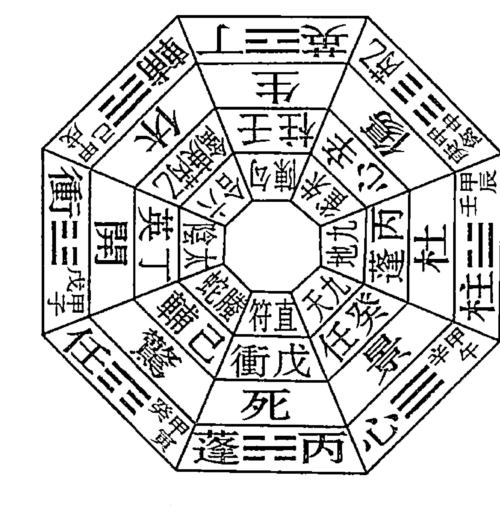

| 乾 | 门迫宫 | 相佐龙返首 | 符勃 |
| 坎 | 宫生门 |  |  |
| 艮 | 宫生门 | 开与丁合 | 真诈 | 门迫宫 |
| 震 | 休与乙合 | 休诈 | 风遁 | 刑格 |
| 巽 |  |  |  |  |
| 离 | 宫生门 |  |  |  |
| 坤 | 虎猖狂 | 门迫宫 |  |  |
| 兑 | 宫克门 |  |  |  |

冲符加坎为雷水解
伤门步五为雷地豫
戊仪加丙为青龙得明格
己日伏干格

断曰：符到坎为受生之地，使步五为取财之乡。甲丙相加，符之栽培既厚，乙庚相并，使之夺耗无疑，所谓取多而用宏者也。时干飞于七宫，难贪兑地之财，却受壬仪之克，而原丙在坎，又为火入水乡，象齿焚身，大宜自儆。

兵事：宫生星符，门克宫，阳时利客。格合返首，又逢门迫虎狂，宜发师急击。伏兵于正东，合兵于东南，乘顺风出师，击其西南伤门。若遁于东南，不可追，恐有伤损。
出行：东南上吉，正东次之。出巽遇皂衣妇人，出震遇木工执棍。
阳宅：巽向吉，造作时有小儿至。一二年内，当生贵子。
阴宅：巽山乾向吉。作用时，有水禽至。葬后百日内，大进金银。

附占：
- 胜败：主负。
- 虚实：敌兵甚猛。
- 攻城：必破。
- 守城：正东防有伏。
- 天时：壬丙日有雨，即晴。
- 地理：回龙逆结，嫌白虎太昂，不吉。
- 人事：有贵人醉酒，或有牧事。
- 田禾：大丰。
- 家宅：家法不肃，防有外欺，亦忧丧服。
- 官禄：前程远大。
- 应试：文佳，小试尤利。
- 求财：有。
- 婚姻：女不佳。
- 胎产：寅申日生，不利产母。
- 疾病：病在肺，或咽喉之症，宜清金。
- 捕获：去久不可提。
- 失物：失于北方。
- 远信：无信。
- 鸦鸣：主有长上之事。
- 鹊噪：主有工役。

## 甲己日丁卯时

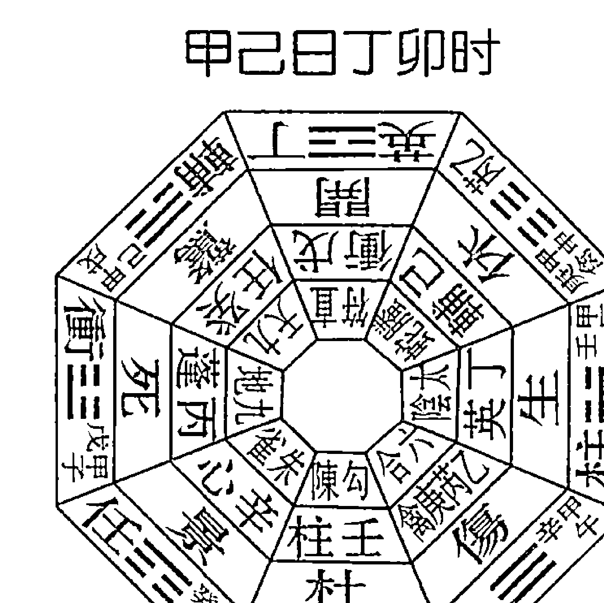

天冲直符加九宫 孤丑寅虚未申 伤门直使加六宫

### 阳遁三局

大寒上元 春分上元 雨水下元 芒种中元

| 方位 | 宫生门 | 格局/关系 | 其他 |
| :--- | :--- | :--- | :--- |
| 乾 | 宫生门 | 龙逃走 | 乙奇入墓 宫克门 |
| 坎 | 宫生门 |  | 宫克门 |
| 艮 | 门生宫 | 鸟跌穴 勃符 | 宫克门 |
| 震 | 门迫宫 |  |  |
| 巽 | 相佐宫 | 宫克门 |  |
| 离 | 格刑宫 | 宫克门 |  |
| 坤 | 生与乙合 真诈 | 丁奇升殿 |  |
| 兑 |  | 冲符加离为雷火丰 伤门加乾为雷天大壮 戊仪加丁为青龙耀明格 己日飞干格 |  |

断曰：符入南宫，使趋天阙，大有升腾之象。但冲到离，为受脱之地；伤到乾，亦受制之乡。且太阴共玉女司权，难免阴私淫佚；朱雀与六合作党，将致口舌纷争。疏虞是戒，非用壮之时也。所赖丙奇跌穴，门属长生，慎之慎之，犹可获吉。

兵事：门受宫制，格遇龙逃，极不利主。幸飞符加丙，为鸟跌穴，不致大凶。军宜西出，伏以待敌。若攻其正东死门，丙逢九地，恐中伏兵。
出行：兑方可行。出门五六里，有匠人把棍为应。
阳宅：震宅利。艮方有人猝死，或火发，主大利。
阴宅：兑山震向吉。作用时，有青衣持木器为应。葬后主移居发财。

附占：
- 胜败：主胜。
- 虚实：敌欲以财饵我。
- 攻城：有敌党相阻。
- 守城：防正南冲突。
- 天时：阴晴反覆。
- 地理：龙气虽好，左砂无情。
- 人事：当有欢喜破财。
- 田禾：丰，西方尤熟。
- 家宅：人宅相宜，后裔日盛。
- 官禄：前程不能远大。
- 应试：总裁不录。
- 求财：得。
- 婚姻：易成。
- 胎产：生男，不利母。
- 疾病：大便不通，五日见效。
- 捕获：往西方木姓人家，可捉。
- 失物：失于南方。
- 远信：途中有灾。
- 鸦鸣：防失脱。
- 鹊噪：有信至。

## 甲己日戊辰时

孤寅卯虚申酉
天冲直符加三宫
伤门直使加七宫

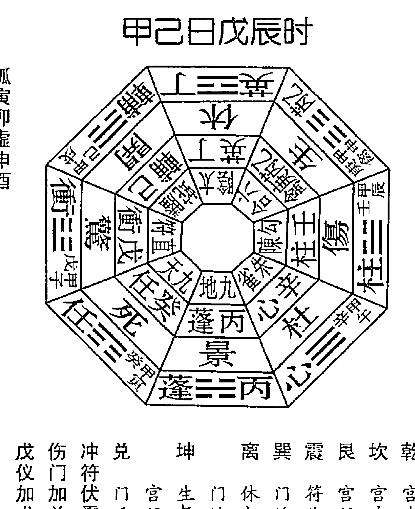

阳遁三局
大寒上元
立春上元
雨水下元
春分上元
芒种中元

| 乾 | 宫克门 仪刑 门迫宫 |
| 坎 | 宫克门 |
| 艮 | 宫门比和 |
| 震 | 宫门比和 仪刑 门迫宫 |
| 巽 | 宫门比和 |
| 离 | 门迫宫 真诈 人遁 |
| 坤 | 宫门比和 生与乙合 休诈 乙奇入墓 |
| 兑 | 宫克门 门反吟 宫克门 |

戊仪加戊为青龙入地格 伤门加兑为雷泽归妹 冲符伏震为震 门反吟 宫克门 生与乙合 休诈 乙奇入墓 休与丁合 真诈 人遁 符伏吟 仪刑 门迫宫 宫门比和 宫克门 宫克门

断曰：星门分歧，反伏各异，有兄弟背驰、夫妻反目之象。然戊土以积而弥厚，伤木以斩而成材。其伏也，所以养也，安知非以退为进也；其克也，所以砺也，安知非以损为益也。“动心忍性，增益其所不能”，斯局有焉。

兵事：门受宫克，仪又击刑。虽在阳时，宜静不宜动，俟敌先举。宜伏兵于正南，出奇于西南，击其正西。门反，宜用反客为主之法。
出行：向正南方利，当见皂衣女子。若出西南方，美中常有不足。
阳宅：利修正南门或西南门。南门有青衣人至，西南门有白衣人至应。
阴宅：子山子向、坤山艮向皆吉，有虎出山为应。

附占：
- 胜败：春夏主胜。
- 虚实：敌未敢动。
- 攻城：四季勿攻。
- 守城：东南有惊。
- 天时：晴。
- 地理：水口无山，资财多耗。
- 人事：长男有惊。
- 田禾：麦有收，夏防旱。
- 家宅：饶有生意，但防刑伤孝服。
- 官禄：荐举，可望升。
- 应试：文章甚利。
- 求财：可得。
- 婚姻：可成，恐是继女。
- 胎产：生男，安吉。
- 疾病：肝肾之病，易痊。
- 捕获：防贿纵。
- 失物：在口姓人家。
- 远信：土姓人送书。
- 鸦鸣：有蒙蔽。
- 鹊噪：喜信即至。

## 甲己日己巳时

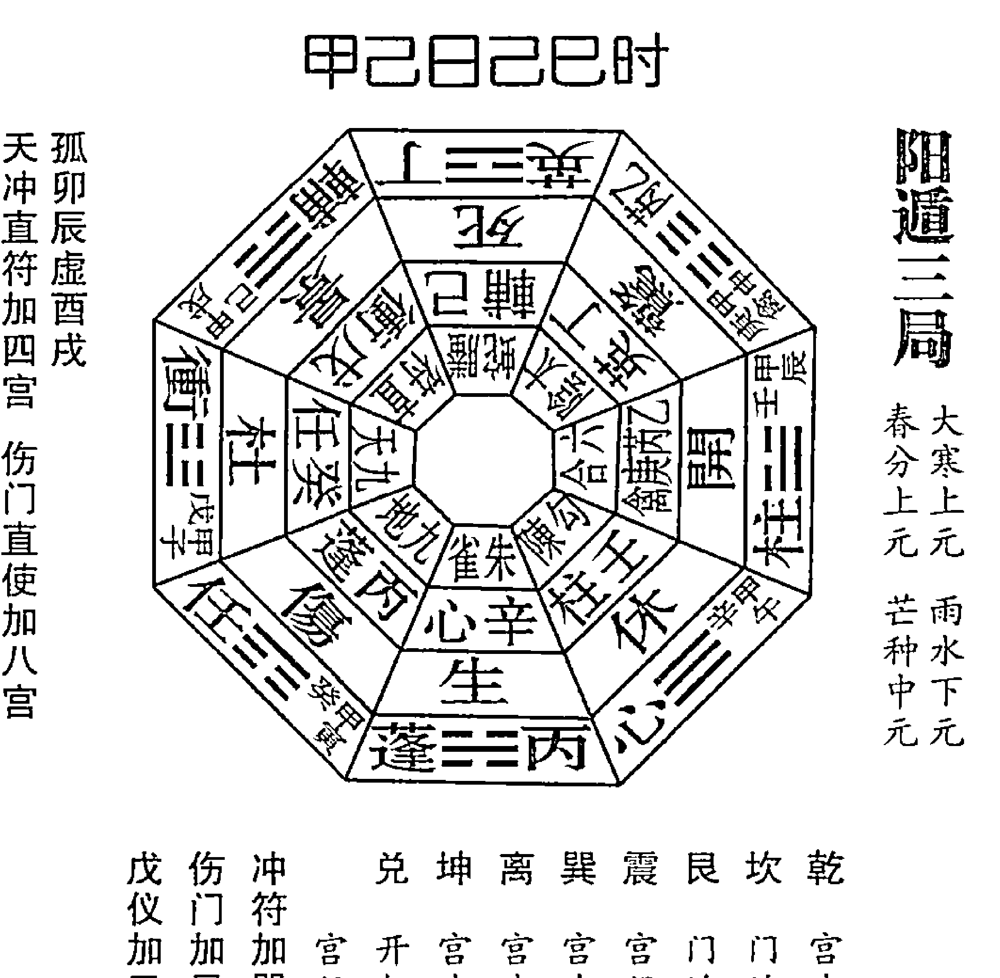

### 阳遁三局

孤卯辰虚酉戌
天冲直符加四宫
伤门直使加八宫

春分上元
大寒上元
芒种中元
雨水下元

| 乾 | 坎 | 艮 | 震 | 巽 | 离 | 坤 | 兑 |
|---|---|---|---|---|---|---|---|
| 宫生门 | 门迫宫 | 门迫宫 | 宫门比和 | 宫生门 | 宫生门 | 宫生门 | 宫门比和 |
|  |  |  |  |  |  |  | 开与乙合 休诈上格 戊仪加己为青龙相合格 伤门加艮为雷山小过 冲符加巽为雷风恒 |

断曰：符进而入巽，使退而居艮，所谓“不有居者，谁守社稷；不有行者，谁捍牧圉”也。但戊己同宫，不无猜忌。苟能同于廉蔺之交，即可拟于萧曹之佐。惟门迫其宫，作事宜居后；螣蛇在位，举动未免多疑。

兵事：门迫其宫，利于为客。格合休诈，宜伏兵于正东。西南得星精之蔽，人鬼不觉。向正西方出兵，背北击南。然西方敌人亦有伏兵，不可不防。
出行：宜向正西方，见九流人，及至契之友。
阳宅：兑门利，有女人至，鸟鹊噪。三日内，进商音人田产。
阴宅：利酉山卯向。作用时，有女人相争。西南方有鼓声喧闹，主百日内生贵子。

附占：
- 胜败：客胜。
- 虚实：敌党亦有降意。
- 攻城：秋冬可攻。
- 守城：宜备正西。
- 天时：有风雨。
- 地理：护卫有情，向不甚正。
- 人事：有阴人词讼。
- 田禾：不丰，禾胜于麦。
- 家宅：财禄甚旺，小人不足。
- 官禄：官久可升。
- 应试：不中。
- 求财：向东南方可得。
- 婚姻：男女俱愿成。
- 胎产：双生子女，一子育，女不育。
- 疾病：火退即愈。
- 捕获：捕人不肯出力。
- 失物：失于东南方。
- 远信：迟。
- 鸦鸣：主庆贺事。
- 鹊噪：有财气。

## 甲己日庚午时

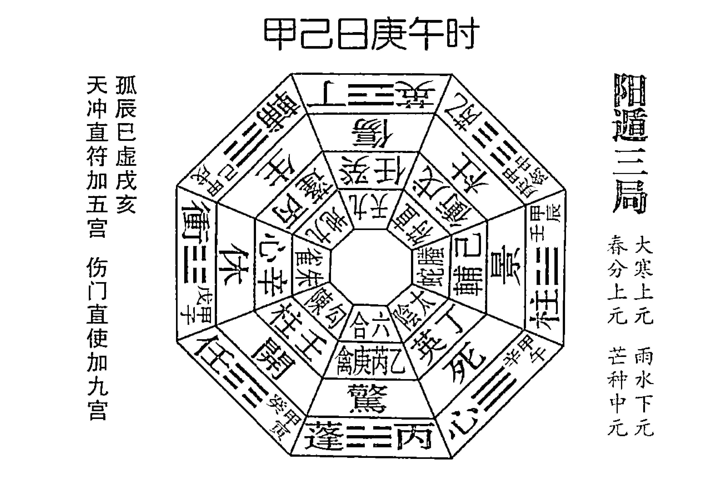

断曰：天冲步五，本有一飞冲天之象，而格与庚，则虎狼当道，屈而不伸矣。赖有乙奇同宫，飞丁救助，众君子盈于朝，而为之庚者，安得不摇尾乞怜乎？玉女守于离门，而蛇复天矫，以正则为内助之贤，于邪则为偏听之蔽，谨持之可也。

兵事：星克宫，门生宫，主客互有利害。大将当随天乙而飞，据于西南。预宜伏兵于北，以待太白之入。又宜扬兵于正南，风发电扫，可以掠其眷属。出兵东南生门。
出行：宜出巽方。二里九里，逢皂衣妇人，或瞽者。
阳宅：东南开门吉，有鼓声雷鸣及歌唱为应。
阴宅：巽山乾向甚利。有鼓声，小儿著白衣至。六十日内，白羊入屋，六畜大旺。

附占：
- 胜败：主胜。
- 虚实：敌人即来。
- 攻城：宜长围。
- 守城：防从东北方入。
- 天时：天色昏。
- 地理：穴情不实，乃死硬之气。
- 人事：有外人接引内亲来见。
- 田禾：麦丰，禾防水。
- 家宅：发贵发财，但防有祟。
- 官禄：地方多事，未能即升。
- 应试：主考不取。
- 求财：宜白手求财。
- 婚姻：成。
- 胎产：母有灾，生女。
- 疾病：肾虚之症，三月方愈。
- 捕获：人已远遁，难获。
- 失物：寄于西南方。
- 远信：西北方人占，即至。
- 鸦鸣：有紧急之事。
- 鹊噪：不系吉凶。

## 甲己日辛未时

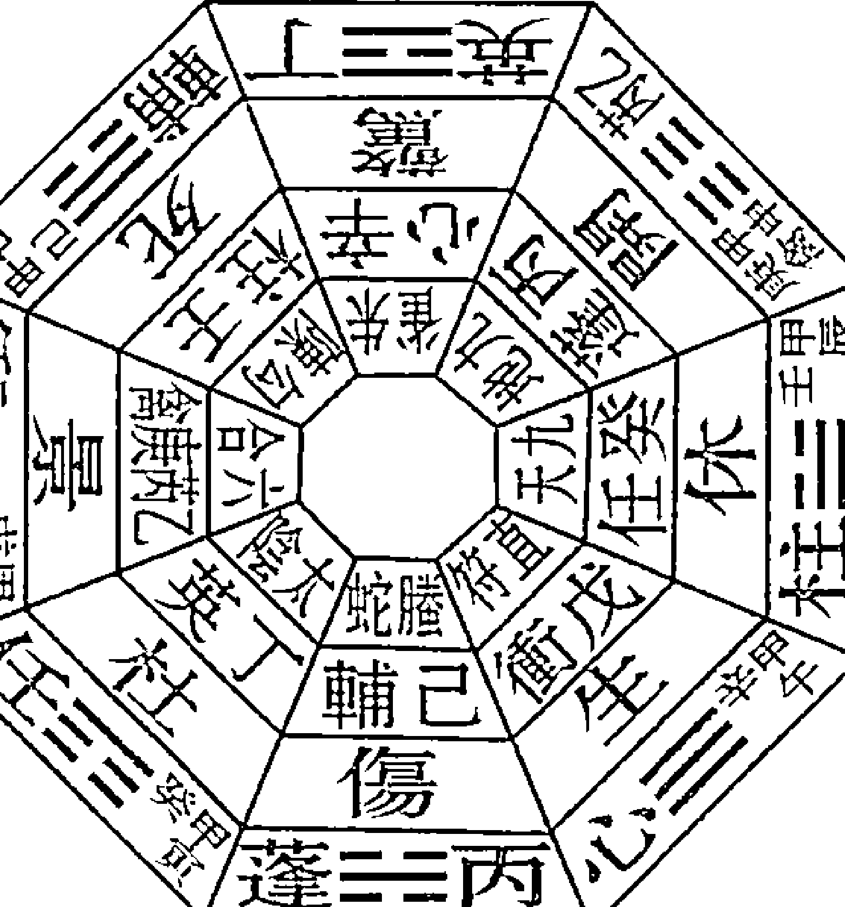

| 乾 | 门生宫 |
| 坎 | 地假 丁奇入墓 雀投江 |
| 艮 | 伏宫格 太白与天乙格 |
| 震 | 宫克门 |
| 巽 | 宫克门 |
| 离 | 开与丙合 重诈 荧入白 |
| 坤 | 宫生门 |
| 兑 | 宫生门 |

甲日伏干格 戊仪加辛为青龙相侵格 伤门加坎为雷水解 冲符加乾为雷天大壮

断曰：符入官乡，且遇木之长生，宦途宜可得志。而金宫辛在，何耽耽视我者之众也。所赖辛入火乡，而本宫复有飞丁遥制其权，而不使之逞，则一喜一怒，或泣或歌，受其害者，犹未深也。门到坎而受生，丙复用为将伯，近而获济矣。

兵事：宫克星，宫生门，主客相等。阴时利于后动，东北宜伏重兵，敌人利我粮草，必来偷劫，一鼓可擒。宜别遣将疾驰西南，据其窟宅，立为新营，否则敌反据我营。
出行：宜向西南方。二里十二里，闻哭泣，及四足相戏。
阳宅：立坤门极利，有鹊自南方来。二七日，进西方女人财帛。
阴宅：坤山艮向吉，有白衣人骑马过。

附占：
- 胜败：主胜。
- 虚实：敌欲来降。
- 攻城：春时可攻。
- 守城：防西南地道。
- 天时：晴而阴。
- 地理：朝山无情，不吉。
- 人事：有爵禄相加，半虚半实。
- 田禾：收成不佳。
- 家宅：防损小口。
- 官禄：文书宜勤慎。
- 应试：文不佳，不中。
- 求财：徒劳无益。
- 婚姻：女胜于男，可成。
- 胎产：生贵子，吉。
- 疾病：风火之病，无大恙。
- 捕获：在竹木丛，宜缓捕。
- 失物：草头姓人家收去。
- 远信：无。
- 鸦鸣：有和美之事。
- 鹊噪：有惊。

## 甲己日壬申时

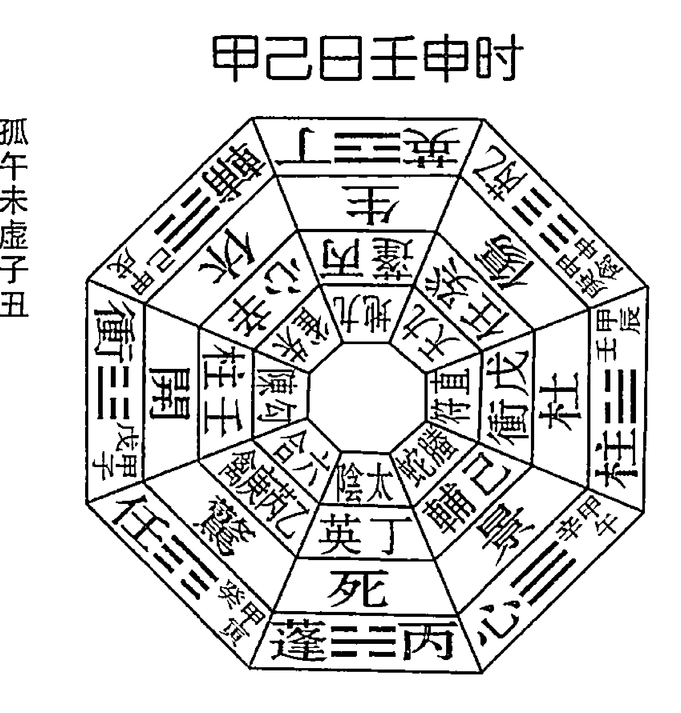

### 阳遁三局

孤午未虚子丑
天冲直符加七宫
伤门直使加二宫

| 乾 | 门迫宫 |
| 坎 | 大格 鬼假 |
| 艮 | 门迫宫 |
| 震 | 门迫宫 |
| 巽 | 丙奇升殿 天遁 重诈 |
| 离 | 门生宫 生门与丙合 |
| 坤 | 门反吟 宫克门 |
| 兑 | 伤门加坎为雷水解 冲符加乾为雷天大壮 戊仪加壬为青龙入狱格 己日飞干格 |

戊仪加壬为青龙入狱格 伤门加坎为雷水解 冲符加乾为雷天大壮

断曰：木符受克于金宫，而戊仪又克其壬水，何报复之不已也。伤使入坤取财，幸有同气之乙为用，如臧孙告籴、晏子请粟，盖因人而后济耳。然而兑宫之壬，能泄金而生木；坤地之庚，且党乙而伤身。君子于此，正当识别是非，澄清仕路。

兵事：宫克星，门克宫，主客互伤。符反门迫，不宜交战。离宫格合天遁，宜出南方。艮坤大小相格。敌来东北，我击其西南；敌来西南，我击其东北。然亦有伤。正北防有伏兵。
出行：宜出南方。行六十里，见贵人车马，或五十里，逢瞽目人。
阳宅：立南门吉。周年内，当进文书田产。
阴宅：离山坎向吉。作用时，有女人著黄衣至为应。

附占：
- 胜败：主胜。
- 虚实：敌怀惊恐。
- 攻城：难取。
- 守城：易于防御。
- 天时：有雨。
- 地理：龙脉不真，穴不生动。
- 人事：有贵人失权，调于别职。
- 田禾：麦大收，禾有中变。
- 家宅：家中常有火光，人口不安。
- 官禄：不利，复任吉。
- 应试：有惊，小试二等。
- 求财：大利。
- 婚姻：成，男愚女慧。
- 胎产：生男，产母防病。
- 疾病：水为土克，当平土。
- 捕获：在东方相识人家。
- 失物：喜中有失，在近水处。
- 远信：即至。
- 鸦鸣：当有异闻。
- 鹊噪：得饮食。

## 甲己日癸酉时

阳遁三局
大寒上元
雨水下元
春分上元
芒种中元

- 孤未申虚丑寅
- 天冲直符加八宫
- 伤门直使加三宫

兑 坤 离 巽 震 艮 坎 乾
奇 地 门
格 假 吟
开与丙合
重诈
丙奇入墓

冲符加艮为雷山小过
伤门伏震为震
戊仪加癸为青龙相和格
天网

断曰：符退而入网，使伤而伏宫，未可言吉也。虽艮为财宫，戊癸遇合，然不过寓公之象耳。彼有粟，吾得而食乎？惟冲木得癸，恃以首尾相济，而门使伏震，其亦知难而退者乎？盖震非静境，譬之勾践朝吴，少伯居守，济困之才，实图赖之矣。

兵事：星克宫，利为客。门伏不利交战，又逢天网，出兵不吉。宜广积粮食，充满府库。大将宜居东北，偏将宜居西北，伏兵宜在东南，多设诡计以愚敌。

出行：西北可行。行五六里，见四足相斗。若遇黑衣僧人，主有盗。

阳宅：宜西北方立门，有飞鸟成双至。

阴宅：乾山吉。作用时，有病人携物至。葬造后，进鸡鸟，得金珠财物。

附占：
- 胜败：客败。
- 虚实：来情诚实。
- 攻城：易拔。
- 守城：西北防穿地道。
- 天时：无雨。
- 地理：龙有生气，穴亦灵巧。
- 人事：大获财喜，或工匠执役。
- 田禾：稔。
- 家宅：家有虚惊，妄动触祸。
- 官禄：官不显，却易升。
- 应试：房考必荐。
- 求财：契友自送。
- 婚姻：媒妁有力，易成。
- 胎产：生女，易养。
- 疾病：脾胃受伤，半虚半实，宜调之。
- 捕获：在竹木丛中，宜缓捕。
- 失物：草头姓人家收去。
- 远信：三日内至。
- 鸦鸣：有喜事。
- 鹊噪：防惊。

## 甲己日甲戌时

阳遁三局
大寒上元
雨水下元
春分上元
芒种中元

- 天辅时
- 己仪加己为明堂自刑
- 杜门伏巽为巽
- 辅主伏巽为巽

兑
乙奇入墓

巽
门符伏吟

震

艮

坎
休与丙合

乾

断曰：辅星杜使，令当春夏之交，阳气已泄，阴气欲生，其气象已有不侔矣。盖己为柔土，杜亦私门，而天辅为文星，可谓内文明而外柔顺，其周之文王乎？且巽体下动，于先天隶于西南，所谓岐山之化及于南国也。

兵事：季甲之时，阳气在外，利于为客。宜出兵于正北方，潜师袭击，伏兵于东北，背东南，击其对冲。亦防西南有伏，且有贼党。

出行：利出正北方，途中防有水阻。行一二里，见皂衣妇人吉。

阳宅：宜建北门，有鸟鹊风云为应。

阴宅：子山午向吉。作用时，有青衣人携酒至北方。

附占：
- 胜败：主胜。
- 虚实：敌大结党羽。
- 攻城：可拔。
- 守城：宜备西北。
- 天时：有微雨。
- 地理：龙气甚旺，朝案亦耸。
- 人事：宜赦罪人，或阴人望信。
- 田禾：麦防水，禾防中变。
- 家宅：安静为吉，百事无成。
- 官禄：外任最利，大僚不吉。
- 应试：可中。
- 求财：东北地土之财可得。
- 婚姻：同居相配最吉。
- 胎产：胎稳，生女。
- 疾病：脾家积滞，宜涤荡。
- 捕获：惊走远方，难获。
- 失物：近在水边破屋。
- 远信：迟到。
- 鸦鸣：有两重文书。
- 鹊噪：见两负弓人。

## 甲己日乙亥时

孤酉戌虚卯辰
天辅直符加二宫 杜门直使加五宫

阳遁三局
春分上元 大寒上元
芒种中元 雨水下元

| 宫位 | 含义 |
| :--- | :--- |
| 乾 | 龙逃走 乙奇入墓 门生宫 |
| 坎 | 宫生门 |
| 艮 | 宫生门 |
| 震 | 休与丙合 门生宫 |
| 巽 | 宫克门 |
| 离 | 门生宫 |
| 坤 | 相佐 仪刑 门迫宫 |
| 兑 | 丁奇升殿 门迫宫 |
| 辅符 | 加坤为风地观 |
| 杜门 | 步五为风地观 |
| 己仪 | 加乙为日入地户格 |
| 乙奇 | 得使游仪 己日不遇 |

断曰：符入于坤，门步于五，虽曰分道扬镳，实则珠联璧合，有一心一德、同谋共事之象。但日入地户，木逢墓绝，未免留恋财乡。时忧贫寡，然而太白为格，岂能遂我心怀。惟乙奇同气相扶，而太阴居守，玉女左右相夹，暗中之助不少。

兵事：门星克宫，为客极利。但乙奇制仪，又庚己相刑，惟奇受辛克制，不能为害。兵必先败后胜，宜出正东方，使敌不及防。大将宜居后，防有伤。

出行：宜出正东方。四里，见匠人执木，或皂衣人吉。

阳宅：利建震门，有鼓声应则吉。

阴宅：卯山酉向极利，有黑衣人携肉过。葬后有青衣人送酒至家，即能大发。

附占：
- 胜败：客胜。
- 虚实：恐有阴谋。
- 攻城：不可攻。
- 守城：东北之兵甚锐。
- 天时：无雨。
- 地理：左砂反跳，恐损人丁。
- 人事：所望之人不至。
- 田禾：大丰，夏前防水。
- 家宅：财气破散，亦防刑克。
- 官禄：署内有惊。
- 应试：中式。
- 求财：可求，但费力。
- 婚姻：女已他属，不成。
- 胎产：母有厄，生女。
- 疾病：伤脾，难愈。
- 捕获：铤而走险，不能捕。
- 失物：失于南方，为女人取去。
- 远信：西方人占，音信即至。
- 鸦鸣：酒食相邀。
- 鹊噪：喜音即至。

## 乙庚日丙子时

阳遁三局
大寒上元
雨水下元
春分上元
芒种中元

孤戌亥虚辰巳
天辅直符加一宫
杜门直使加六宫

- 庚日不遇
- 己仪加丙为地户埋光格
- 杜门加乾为风天小畜
- 辅符加坎为风水涣

兑 坤 离 巽
神假 宫生门 生与丙合 荧入白 宫门比和 门迫宫 门迫宫 门迫宫

震 艮 坎 乾
乙奇升殿 太白与天乙格 雀投江 丁奇入墓 宫门比和 龙返首 符勃 宫克门 门反吟 宫克门

断曰：辅符到坎，印绶相生，得青龙返首之格。加以朱雀景门，何文明之甚也。且使入天门，官文相济，虽金宫辛在，不无克制，而鬼入鬼乡，旺而忘克，亥又为长生之地，复何畏焉。惟庚日勃格不利，乙日大利求名。

兵事：符受宫生，阳时利客。格合青龙回首，士皆乐战。可向西南方出师，用死士劫其营可胜。惜门为宫克，惟副将不利。

出行：利出西南方。十里，逢公吏人言衙门讼事，吉。

阳宅：宜建坤门，有患目人并孝衣人至。

阴宅：坤山艮向为吉。有物夜鸣，色衣人前来，大叫为应。

附占：
- 胜败：客胜。
- 虚实：来情多诈。
- 攻城：无益。
- 守城：有援，易守。
- 天时：阴晦不雨。
- 地理：朝山甚秀，龙气休囚。
- 人事：有交易相争，或破财事。
- 田禾：麦收，三伏损禾。
- 家宅：家有孕妇，财气亦聚。
- 官禄：防有文书遗误。
- 应试：房师不荐。
- 求财：可求，勿惜小费。
- 婚姻：男性乖戾，媒人无力，不利。
- 胎产：生子。
- 疾病：胃气善饥，当泄其子。
- 捕获：西北水边。
- 失物：三日后可得。
- 远信：迟到。
- 鸦鸣：有贵人喜说事。
- 鹊噪：有吉语。

## 乙庚日丁丑时

阳遁三局
大寒上元
春分上元
雨水下元
芒种中元

孤亥子虚巳午 天辅直符加九宫 杜门直使加七宫

- 无奇门
- 时干入墓
- 己仪加丁为明堂贪生格
- 杜门加兑为风泽中孚
- 辅符加离为风火家人

兑上格宫克门
坤门迫宫
离相佐宫生门
震门生宫
艮门迫宫
坎门迫宫
乾门迫宫

断曰：离火为子孙之地，木符临而受脱，上加生门，则脱货而求财者也。玉女居守，而螣蛇作党，必有因私昵而损泄者。春时无咎，夏则病矣。杜使入兑，庚亦在焉，受克颇深。幸有壬水泄金，而乙奇亦可援为羽翼，所谓置之危地而后安者此也。

兵事：星生宫，宫克门，利为主。正南东南，皆可出师。扬兵于东南，设伏于正西，击其正北，夏月有青云起自南方来助为应。奇门不合，不战亦可。

出行：正南东南二方可出，无奇门，终不顺利。

阳宅：修巽离二方稍吉，另选时为佳。

阴宅：午山子向、巽山乾向，止可粗安。东方有犬吠，持刀杀人斗叫应。

附占：
- 胜败：主胜。
- 虚实：敌人惧怯。
- 攻城：难破。
- 守城：四季可守。
- 天时：晴。
- 地理：龙气已泄，穴亦不灵。
- 人事：有阴人疾病，或音信有阻。
- 田禾：麦丰，禾防旱。
- 家宅：官途最顺，门内不和。
- 官禄：官声甚好，不免清贫。
- 应试：小试最利。
- 求财：当有贵人来助。
- 婚姻：成，女不寿。
- 胎产：母有灾，生男。
- 疾病：木受金克，当泻肺。
- 捕获：在官院人家，可擒。
- 失物：为亲戚盗去。
- 远信：迟至。
- 鸦鸣：争讲家事。
- 鹊噪：防失误文书。

## 乙庚日戊寅时

阳遁三局
大寒上元
雨水下元
芒种中元

孤子丑虚午未
天辅直符加三宫
杜门直使加八宫

- 乾 生与丙合 丙奇入墓
- 坎 神假宫生门
- 艮 门迫宫
- 震 宫生门
- 巽 宫克门
- 离 奇格宫克门
- 坤 宫生门
- 兑 宫生门
- 辅符加震为风雷益
- 杜门加艮为风山渐
- 己仪加戊为明堂从禄格

断曰：符退居后，而使又后之，亦步亦趋，若前有所惊而潜避者然。乃辅星入震，比肩相和，可谓依托得所矣。而艮宫雀入于江，得毋门庭之内，有以文章起衅，而焚琴碎砚者乎？黄老之学，以退为进，或有鉴于此。

兵事：门克宫，利为客。宜出西北方，安营于正北，设伏于正南。临阵背西北，击其对冲。门迫奇墓，不利副将，惟参将可以出师。

出行：宜向西北方。八里，见官吏车马吉。

阳宅：宜立乾门，或修乾方。有飞禽、色衣人至，主得西北方财产。

阴宅：乾山巽向吉，见艺人携物至。赤面人作牙，进羽音人田契，十二年大发。

附占：
- 胜败：客胜。
- 虚实：敌已失势。
- 攻城：易拔，宜用反间。
- 守城：难固。
- 天时：细雨凄凄。
- 地理：山向不吉。
- 人事：当闻金鼓之声。
- 田禾：先旱后潦，惟西北大熟。
- 家宅：居人和睦，门户不舒。
- 官禄：地方多事，难升。
- 应试：主司不取。
- 求财：多耗损，且防口舌。
- 婚姻：二姓同心，可合。
- 胎产：生男吉。
- 疾病：脾病，可勿药而愈。
- 捕获：逃向西南方，难获。
- 失物：东北山涧旁寻之。
- 远信：五八日到。
- 鸦鸣：得贵人财帛。
- 鹊噪：有财喜。

## 乙庚日己卯时

孤丑寅虚未申
天辅直符加四宫
杜门直使加九宫

阴遁三局
春分上元
芒种中元
大寒上元
雨水下元

| 宫位 | 断语 |
|---|---|
| 乾 | 宫门比和 |
| 坎 | 开与丙合 门生宫 |
| 艮 | 宫克门 |
| 震 | 宫克门 |
| 巽 | 符伏吟 宫门比和 |
| 离 | 玉女守门 门生宫 |
| 坤 | 乙奇入墓 门生宫 |
| 兑 | 门生宫 |
| 辅符 | 伏巽为巽 |
| 杜门 | 加离为风火家人 |
| 己仪 | 加己为明堂重逢格 |
| 庚日 | 飞干格伏干格 |

断曰：己符归伏于巽，有息肩故土之思。伤门来加，不过修整门庭、补其缺略而已。若图远大，尚属迟疑。杜使入离，为家人卦。又有玉女居守，可以宜室宜家。饮食蒸衍，斯为主安臣乐、共享太平之象。至于因喜耗财，不足虑也。

兵事：门生宫，阴时利主，宜正北方应敌。上乘元朱，利用奇兵。设伏于西南，击其正西可胜。符伏，利大将静镇，副将交锋。

出行：宜向正北方。二里九里，逢皂衣妇人，同伴歌声。

阳宅：月奇休门，会于正北，宜建坎门。有黄禽自西北飞来，六十日进文契。

阴宅：子山午向，利于安葬。作用时，有师巫吹角声为应。

附占：
- 胜败：春夏月主胜。
- 虚实：畏惧多谋。
- 攻城：何坚不破。
- 守城：北门防贼，不守。
- 天时：有雨，辰日晴。
- 地理：有龙无穴，四卫无情。
- 人事：有两重文书，或两处筵宴。
- 田禾：大丰。
- 家宅：琴瑟甚谐，常有惊恐。
- 官禄：有文字之差。
- 应试：熟题预作，可望中。
- 求财：公财可获。
- 婚姻：不成。
- 胎产：生女，当是双生。
- 疾病：三焦火盛，不能即愈。
- 捕获：已远遁。
- 失物：正东园林处，闻声寻之。
- 远信：有阻未到。
- 鸦鸣：有婚姻事。
- 鹊噪：贵人到宅。

## 乙庚日庚辰时

天辅直符加五宫 杜门直使加一宫
孤寅卯虚申酉

阳遁三局
春分上元 大寒上元
芒种中元 雨水下元

| 乾 | 坎 | 艮 | 震 | 巽 | 离 | 坤 | 兑 |
|---|---|---|---|---|---|---|---|
| 龙逃走 | 宫生门 | 门生宫 | 宫克门 | 门迫宫 | 宫克门 | 飞宫格 | 生与丁合 |
| 乙奇入墓 | 宫克门 | | 丁奇升殿 | 格刑 | 仪刑 | 门生宫 | |
| 宫克门 | | | | | | | |

断曰：时属飞干，凡事多格。而辅符步五，其财足贪也，而未可取也。如入明堂太庙，商彝周鼎，灿然耀目，宁为我有哉！惟门使入坎，有利涉大川之义，得印绶之荣，宜舍利而取名，或求官而纳粟。盖坎为中五之财，而丙戊相加，可无虞于匮乏也。

兵事：宫生门，星克官，利为客。但仪刑不宜交战，大将当随天乙而飞。从直符下出兵，必有格斗，主将防伤。伏兵于西北，贼必来乘，合兵奋击，以应龙逃之格。

出行：日奇生门，会于正西，宜出西方。八九里，见公吏赶四足吉。

阳宅：利建兑门。作用时，有人持文书纸笔至。

阴宅：酉山卯向吉，有白羊与黄犬相撞为应。葬后期年，双生贵子。

附占：
- 胜败：主胜。
- 虚实：防中敌伏。
- 攻城：反败而遁。
- 守城：可守，备正南。
- 天时：无雨。
- 地理：青龙低陷，长房刑克。
- 人事：有炉冶之讼。
- 田禾：甚丰。
- 家宅：财气不聚，家长有灾。
- 官禄：利外任，有兼摄之任，可以望升。
- 应试：文佳，不中，小试利。
- 求财：女眷私财可得。
- 婚姻：可成，但女人不安家室。
- 胎产：男胎，防堕。
- 疾病：水泛之症，宜益火源。
- 捕获：别处已获。
- 失物：向正南方寻。
- 远信：即至。
- 鸦鸣：防斗詈。
- 鹊噪：有喧慰事。

## 乙庚日辛巳时

孤卯辰虚酉戌
天辅直符加六宫 杜门直使加二宫

阳遁三局
大寒上元
春分上元
雨水下元
芒种中元

- 乙日不遇
- 己仪加辛为天庭得势格
- 杜门加坤为风地观
- 辅符加乾为风天小畜

兑门迫宫
坤地假 小格 门迫宫
离丙奇升殿 门生宫
巽宫克门
震门生宫
艮宫生门
坎开与乙合 虎遁 真诈 大格
乾符反吟 门生宫

断曰：直符到乾，有金木交战、生死交争之象。直使入坤，将欲取财以营救，而迟缓不及于事，况有六庚窥伺其旁乎？幸乙奇暗助，太阴作合，迟则有成耳。乾坤相隔，惟雨水节中，地天交泰，可以出险无咎。

兵事：门克宫，宫克星，主客互有伤损，符反亦不宜交战。艮坤逢格，西南东北二方，防有格战。宜预伏精锐，分屯要害，敌至而后击之。亦防敌人有伏，侦探宜慎。

出行：宜出东北方。十里，白衣人相见，大吉。

阳宅：宜建艮门，有黑白禽自东北来应。

阴宅：宜艮山坤向。作用时，有女子自西至，风四起，小儿叫应。

附占：
- 胜败：主胜。
- 虚实：东北有伏。
- 攻城：彼此有伤。
- 守城：防奸细。
- 天时：有风有雨。
- 地理：水不环绕，不发丁财。
- 人事：有贵人宠禄。
- 田禾：丰，东北尤熟。
- 家宅：人口不宁，贵家吉，平人凶。
- 官禄：多劳多怨。
- 应试：主考不录。
- 求财：反覆难求。
- 婚姻：女人主婚则成。
- 胎产：女胎，不利母。
- 疾病：血虚，当滋补。
- 捕获：匿西北方，在公吏家。
- 失物：女人所盗，一八日可获。
- 远信：北方人占，即至。
- 鸦鸣：主有酒食。
- 鹊噪：骑马防跌。

## 乙庚日壬午时

阳遁三局
大寒上元
雨水下元
春分上元
芒种中元

天辅直符加七宫 杜门直使加三宫
孤辰巳虚戊亥

| 宫位 | 乾 | 坎 | 艮 | 震 | 巽 | 离 | 坤 | 兑 | 辅符加兑为风泽中孚 | 杜门加震为风雷益 | 己仪加壬为明堂被刑格 |
| :--- | :--- | :--- | :--- | :--- | :--- | :--- | :--- | :--- | :--- | :--- | :--- |
| **格局** | 休与丁合 丁奇入墓 | 生与乙合 龙遁真诈 | 白入荧 奇格门迫宫 | 门迫宫 | 宫门比和 | 鸟跌穴 劫符宫生门 | 鬼假 蛇天矫 宫生门 | 天乙与太白格 宫生门 | 宫门比和 | | |

断曰：符西使东，睽违已甚，不免颊舌交腾，公庭折辩。赖兑宫之壬，受生于金，转而生木，又值六合开门，自可解释。本宫飞鸟跌穴，必有被发缨冠而相救者。宜使又呼其邻里，求援得援，又何患乎？占此者睽而后合，损而后益。

兵事：宫克星，利为主。太白相格，大将防伤，不宜交战。离巽二方，鸟跌蛇矫，皆宜先举得利。宜南北分伏，会合于东南，击其正南。若蛇与鼠斗，我军切勿进战。

出行：宜向正北方，或西西北。正北逢皂衣人，西北见四足相斗。

阳宅：宜立乾坎二门，有鸟鹊飞鸣，来人执杖应。

阴宅：乾山巽向、子山午向皆利。有穿白衣人前来，东方起火应。

附占：
- 胜败：主欲罢战。
- 虚实：敌兵即至。
- 攻城：不克。
- 守城：当败之。
- 天时：有风无雨。
- 地理：龙气最真，元武亦绕，穴有龟伏。
- 人事：有贵人争财。
- 田禾：收麦伤禾。
- 家宅：宅居甚壮，阴人奸恶，防有盗贼奸淫。
- 官禄：外任即升。
- 应试：可掇巍科。
- 求财：可得，中有两人作炒。
- 婚姻：女极良，事成。
- 胎产：母不安，生女。
- 疾病：肺胃不舒，医不得力。
- 捕获：不用远捕即获。
- 失物：西南方强人取去。
- 远信：少待即至。
- 鸦鸣：官吏相邀。
- 鹊噪：有文书不来。

## 乙庚日癸未时

天辅直符加八宫
杜门直使加四宫
孤巳午虚亥子

阴遁三局
大寒上元
雨水下元
春分上元
芒种中元

- 乾：仪刑
- 坎：仪刑
- 艮：
- 震：门伏吟 刑格 伏宫格
- 巽：
- 离：
- 坤：虎猖狂
- 兑：
- 辅符加艮为风山渐
- 杜门伏巽为巽
- 己仪加癸为明堂合华盖格
- 无奇门天网时干入墓

断曰：符入天网，使伏本宫，重重闭塞，不可以有为也。独是艮属财乡，为甲之禄，又加生门，于焉托处，安可知矣。况甲加癸为受生，己到艮为得比，而本宫之乙，遥相应合，所谓“履道坦坦，幽人贞吉”者乎？惟宜深藏若虚，斯为善居九地者耳。

兵事：星克宫，利为客。但天网门伏，符又仪刑，而奇门又不会合，断断不宜出兵。况伏宫之格，贼亦不来。宜从生方立营，伏兵四维，相时而动。

出行：暂出可从正北方。三里，逢皂衣女人应。

阳宅：坎方可小修，当得禄食。

阴宅：子山可以权厝。作用时，有群犬争吠，乞者携囊至。

附占：
- 胜败：春夏客胜。
- 虚实：敌不来。
- 攻城：可攻。
- 守城：防屠城。
- 天时：有阴云。
- 地理：右砂反跳，土有砂碛。
- 人事：有土本事，或有狱囚冤抑。
- 田禾：岁防旱。
- 家宅：家有刑伤，阴人走失。
- 官禄：宦囊丰，却未升。
- 应试：不荐。
- 求财：强求可得。
- 婚姻：男有刑克，不成。
- 胎产：平安，生女。
- 疾病：金木相争，宜调之。
- 捕获：防卖放。
- 失物：向正北方寻，在贵人马厩。
- 远信：戌日至。
- 鸦鸣：防口舌。
- 鹊噪：有公讼，因妇人。

## 乙庚日甲申时

天禽直符加五宫
死门直使加五宫
孤午未虚子丑

阳遁三局
大寒上元
春分上元
雨水下元
芒种中元

兑 坤 离 巽 震 艮 坎 乾
人假 飞宫格 乙奇入墓 天假 地假 休与丙合休诈
禽符伏五为坤 死门伏五为坤 庚仪加庚为太白重刑格 天辅时庚日飞干格伏干格

断曰：中五司权，禽星翼辅，似可养尊处优矣，而无如庚之阻兵安忍也。于是出寄于坤，貌为贪合于乙，而实未尝合。如楚子入邓，婚媾而起戎心，玉帛干戈，均未可知耳。乃以死门为使，暗昧疑惑，用非其人。荒谷之莫敖，城濮之子玉，又谁咎焉！

兵事：孟甲之时，刑气在内，德气在外，不宜出战。况飞宫伏宫，时干又格，战必有伤。当安营于东南，设伏于西北，敌至则出正北方应之。

出行：宜出正北休门。行一里九里，见鼠蛇牛蝠为应。

阳宅：宜开北门，须防窃盗，有黄白鸟从西北飞来应。

阴宅：宜子山午向。作用时，有方外人至。后日野鸟入宅，防灾疫。

附占：
- 胜败：相持。
- 虚实：贼气甚骄。
- 攻城：不能速拔。
- 守城：援兵近地观望。
- 天时：晴雨照旧。
- 地理：古冢相近，终非吉壤。
- 人事：有冤狱。
- 田禾：丰，夏微旱。
- 家宅：百无成就，坐而守困。
- 官禄：外任防参处。
- 应试：不中，场后有病。
- 求财：难得到手。
- 婚姻：养媳为婚。
- 胎产：死胎，难产。
- 疾病：旺金克木，宜清肺火。
- 捕获：贼当自归。
- 失物：失于正东，无人取去，寻之即获。
- 远信：南方人占至。
- 鸦鸣：长上有灾。
- 鹊噪：鹊自求食。

## 乙庚日乙酉时
### 阳遁三局
大寒上元 雨水下元 春分上元 芒种中元

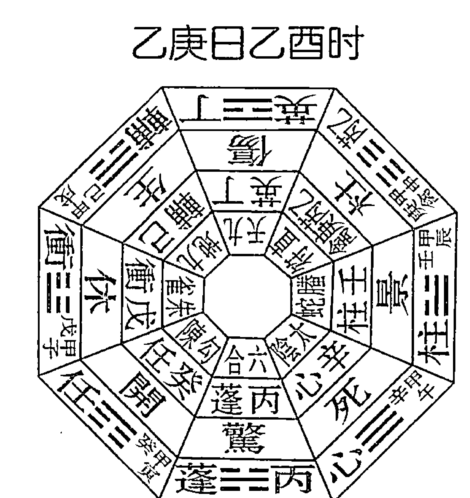

孤未申虚丑寅 天禽直符加二宫 死门直使加六宫

- 无奇门 乙日飞干格伏干格
- 庚仪加乙为太白贪合格
- 死门加乾为地天泰
- 禽符加坤为坤
- 兑 门迫宫
- 奇格 时干格 门迫宫
- 坤 相佐 符伏吟 乙奇入墓
- 离 门生宫
- 巽 宫克门
- 震 门生宫
- 艮 宫生门
- 坎 门生宫
- 乾 门生宫

断曰：庚加乙，离而复合者也；使加辛，母而逢子者也。此既得所依栖，彼亦欢联气体，可以敛其枭雄，销其刚庚矣。但以五加二，终嫌于寄托；以土临金，亦患其受泄。况一地一天，遥遥相岐，不免生疑。惟春光交泰，方为美满耳。

兵事：门生宫，阴时利主。须设伏于西北，安营于东南，俟敌先举，出正东休门，以迎生气。伏兵踵后，击其东北虚方。乙日遇格，士卒防伤。

出行：生门可出，路逢公吏僧尼，或闻哭声应。

阳宅：东南可小修，有白衣人至。

阴宅：乙日日禄到震，可厝。作用时，闻鸡鸣马嘶应。

附占：

- 胜败：师老不战。
- 虚实：贼颇结我兄弟。
- 攻城：有内应可拔。
- 守城：防东北水道。
- 天时：主阴云。
- 地理：风透穴中，脉亦不清。
- 人事：有财喜。
- 田禾：有年，防蝗。
- 家宅：遇而不遇，动而不动。
- 官禄：防有讦告。
- 应试：作五经能中。
- 求财：暗财，可以假贷。
- 婚姻：亲上之亲可成。
- 胎产：孕得女，母不利。
- 疾病：重感冒咳嗽，宜清金。
- 捕获：不获。
- 失物：贼已窃去。
- 远信：至。
- 鸦鸣：防惊。
- 鹊噪：有喜音。

## 乙庚日丙戌时

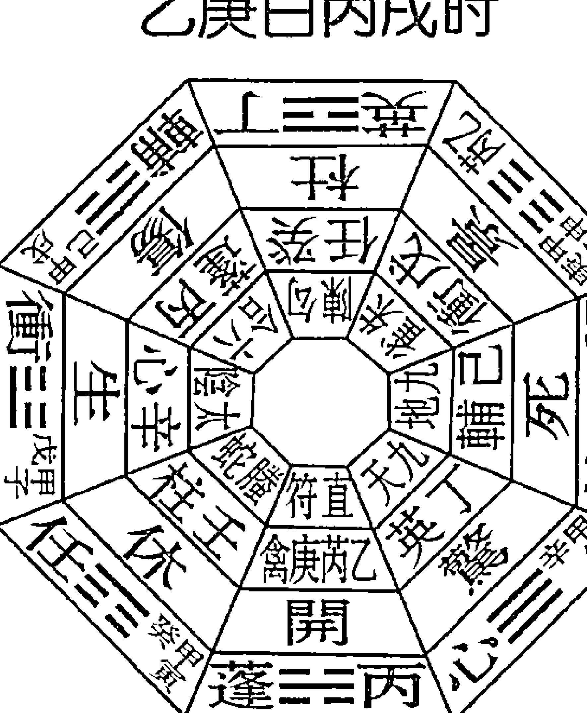

| 兑 | 坤 | 离 | 巽 | 震 | 艮 | 坎 | 乾 |
| :--- | :--- | :--- | :--- | :--- | :--- | :--- | :--- |
| 鬼假 门生宫 | 天乙与太白格 门生宫 | 蛇天矫 门生宫 | 宫门比和 | 宫克门 | 宫克门 | 奇格 门生宫 | 龙遁格勃 白入荧 时干格 |
| | | | | | | 龙与乙合 龙返首 相佐 | 丁奇入墓 宫门比和 |
| | | | | | | | 开与乙合 龙返首 相佐 |

断曰：符入六合财乡，又得休诈之吉，似可问利，奈何金之销于火也。惟开门乙丙相加，为日月合明，而到坎有龙腾碧海之象，则天开文运，月路云阶，无往而不亨矣。至于门使受脱于兑宫，不免小口损泄，或致啧有烦言，庚日尤宜慎之。

兵事：门生宫，星克宫，为主有利有害。天乙相格，大将不利。宜伏兵于坎，以待太白之入。却遇格勃，我军防违节制。若南方遇贼，宜疾击之，缓则致败。

出行：宜出正北方。路逢青帽人，可得酒食。

阳宅：宜修坎宅，有白衣人骑赤马至应。

阴宅：子山午向吉。作用时，有窑冶火光应。

附占：

- 胜败：主胜。
- 虚实：有乱兵即至。
- 攻城：相持不下。
- 守城：北门防炮破城。
- 天时：阴晴各半。
- 地理：来龙得气，砂水有情，牛眠吉壤。
- 人事：有小人中伤君子，两败俱亡。
- 田禾：大稔。
- 家宅：人宅鼎盛，防奸淫盗贼。
- 官禄：当升兼衔。
- 应试：中式。
- 求财：阴财可获。
- 婚姻：门户相当，可成。
- 胎产：孕生女，产亦速。
- 疾病：脾有湿气，阳人不吉。
- 捕获：已入大伙。
- 失物：盗去，已改毁。
- 远信：无。
- 鸦鸣：防口舌。
- 鹊噪：有文书干涉。

## 乙庚日丁亥时
### 阴遁三局

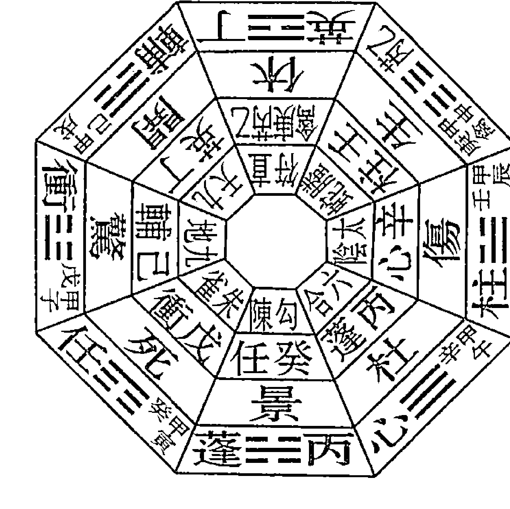

大寒上元 雨水下元 春分上元 芒种中元

庚仪加丁为太白受制格 死门加艮为地山谦 禽符加离为地火明夷 兑宫克门 坤宫门比和 奇格门迫宫 离与乙合 相佐时干格 震与丁合 门迫宫 艮门迫宫 坎宫反吟 宫门比和 乾宫克门 丙奇入墓 宫克门

断曰：符人九天，又得乙丁休门合并，有日丽中天之象。庚仪到此，陶铸成材，譬如范金为器，去其渣滓，取其精英可也。死门到艮为反吟，不免憧憧往来。虎武相守，亦主龃龉。赖戊癸合化，而本宫又得生门，终无大咎。

兵事：宫生星，利为客。门既反吟，直符又逢门迫奇格，不宜进兵。南方虽有龙凤呈祥，庚符不宜居于火地，大将防有伤损。宜东西分伏，以后部为前部。

出行：宜出东南方，正南方亦可。出逢野鸟飞鸣，公吏歌唱应。

阳宅：宜立巽离二门。有患目人，或跛人至应。

阴宅：午山子向、巽山乾向俱吉。葬后家猫捕得白鼠，吉。

附占：

- 胜败：主胜。
- 虚实：敌兵不和。
- 攻城：宜水灌城。
- 守城：援兵四至，可保无虞。
- 天时：晴。
- 地理：金入火乡，葬之绝后。
- 人事：当有阴阳不和，或盗案死亡。
- 田禾：丰，夏防少雨。
- 家宅：似富而贫，似顺而逆。
- 官禄：立升，地在东南。
- 应试：小试极利。
- 求财：有阻，不能到手。
- 婚姻：长上主婚，可成。
- 胎产：生男，易产。
- 疾病：胃病，后恐成痫，淹缠。
- 捕获：得线即获。
- 失物：东北山涧左近，可寻。
- 远信：喜音即至。
- 鸦鸣：防争竞。
- 鹊噪：有尊长凶问。

## 丙辛日戊子时

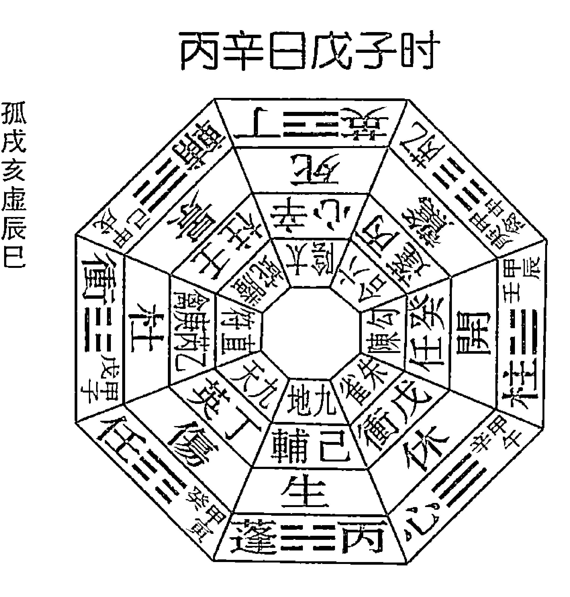

- 孤戌亥辰已
- 天禽直符加三宫
- 死门直使加九宫
- 无奇门 丙日干格
- 庚仪加戊为太白逢恩格
- 死门加离为地火明夷
- 禽符加震为地雷复
- 兑宫门比和
- 坤宫生门
- 离宫生门
- 巽宫生门
- 时干格宫门比和
- 震乙奇升殿
- 艮雀投江
- 丁奇入墓
- 门迫宫
- 乾宫生门

阳遁三局
大寒上元
春分上元
雨水下元
芒种中元

断曰：庚符挟乙而到震，似以妻家之禄为禄者也。门使入离，亦为印绶之地。官印相生，彼此兼济，可以规图进取矣。且玉女守门，明生暗助，美不胜书。但直符逢杜，而丙又勃于本宫，终嫌通而复塞，达而未显也。

兵事：宫克星，利为主。大将不可出征。宜于正东建旗鼓，正南伏锐卒，俟敌先举，出正北生门，背西北，击东南。遇于坤，宜急击；遇于艮，宜缓击。

出行：宜出西南，合跌穴之吉，路上防从人不循规矩。

阳宅：宜修建正北方。有孝服人至，或从军之人应。

阴宅：门奇不合，坎宫上乘吉门，下藏月奇，子山可用，闻西北上锣鼓声则吉。

附占：

- 胜败：主胜。
- 虚实：敌已入境。
- 攻城：火攻可破。
- 守城：能御。
- 天时：有风，阴，晚晴。
- 地理：龙甚贵，穴不真。
- 人事：有夫妇反目，或宴饮事。
- 田禾：小稔，虫灾。
- 家宅：大利经商，仕宦不吉。
- 官禄：禄甚旺，堂翁上司不喜。
- 应试：文多晦句，不得中。
- 求财：中有阻滞。
- 婚姻：女吉，男不佳。
- 胎产：生女，母有惊。
- 疾病：火克肺金，宜清火。
- 捕获：不能缉。
- 失物：盗去西北方。
- 远信：不至。
- 鸦鸣：人有相斗争。
- 鹊噪：有酒筵邀请。

## 丙辛日己丑时

孤亥子虚巳午
天禽直符加四宫
死门直使加一宫

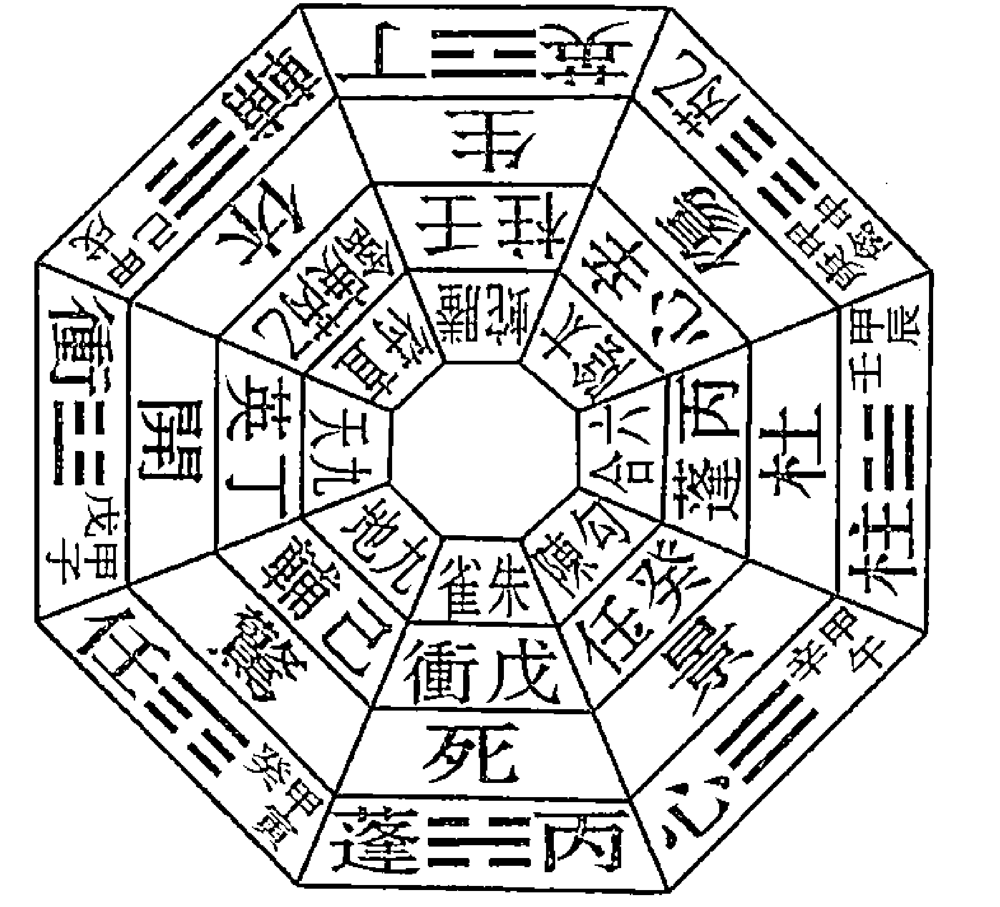

阳遁三局
大寒上元
雨水下元
春分上元
芒种中元

乾 门迫宫
坎 宫迫宫
艮 宫生门
震 开与丁合 门迫宫
巽 休与乙合 风遁 刑格 仪刑
离 宫生门
坤 虎猖狂 门迫宫
兑 宫克门
禽符加巽为地风升
死门加坎为地水师
庚仪加己为太白大刑格
时干入墓 辛日飞干格

断曰：禽入茂林，岂虞受克。疑忌之事，亦复有之。而庚伐鬼方，与乙同行。乙到巽为玉兔乘风，则娘子之军先捷矣。使门入坎，宜取川泽之利。潇湘云梦之竹，皆足用也。丙使又暗为之用，所谓行李往来，供其乏困者非耶？

兵事：门克宫，宫克星，主客互有损伤。巽合玉女乘风，宜从东南方出兵，当有天风下助，宜背风而击。但符值仪刑，时干入墓，不战尤吉。

出行：宜出正东方，路逢木匠手执棒为应。

阳宅：宜开正东门。作用时，有小儿成群，持竹杖相戏。

阴宅：宜震山兑向。作用时，云雾四合，牛鸣犬吠。

附占：

- 胜败：主胜。
- 虚实：西南有伏兵甚猛。
- 攻城：互有杀伤，不拔。
- 守城：固守无虞。
- 天时：不雨不风。
- 地理：白虎太昂，中有蛇穴。
- 人事：主有捷音。
- 田禾：麦欠丰，禾有收。
- 家宅：诸事亨通，惟防小窃。
- 官禄：内官可升。
- 应试：小试利，大比不利。
- 求财：阴财可获，男人所许则虚。
- 婚姻：有刑克。
- 胎产：产男，母有惊。
- 疾病：起于停积，易痊。
- 捕获：在燃火之处，多是僧道人。
- 失物：西方女人盗去，已焚。
- 远信：即至。
- 鸦鸣：因财争闹。
- 鹊噪：防有惊恐。

## 丙辛日庚寅时

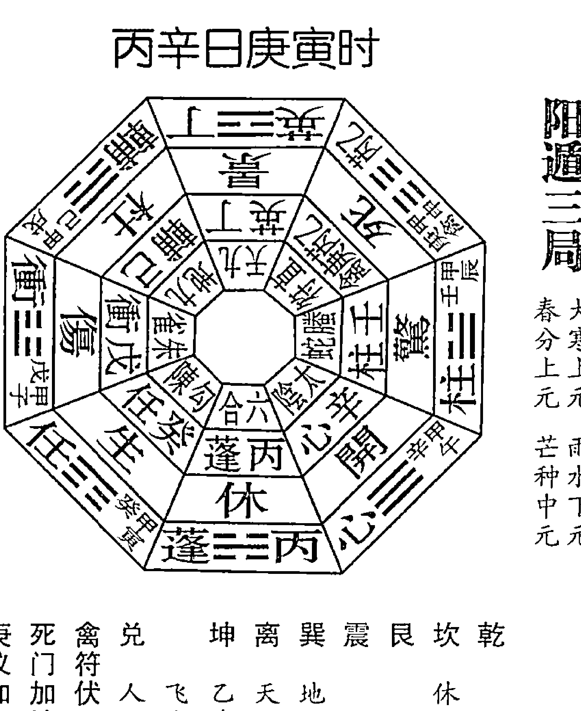

阳遁三局
大寒上元
春分上元
雨水下元
芒种中元

庚仪加庚为太白重刑格
死门加坤为坤
禽符伏五为坤
兑人假
坤飞宫格
离乙奇入墓
巽天假
震地假
艮休与丙合
乾休诈
时干格

断曰：符步于五，使伏于二，是英雄无用武之地也。譬犹刘豫州羁留许下，惧雷锄菜之日，不无枭雄之志。而髀里肉生，怅然三叹，其中有迍邅不宁，进退两难者矣。虽有乙奇作合，但彼亦处墓乡，只可效牛衣之泣，岂能助桑下之谋。

兵事：符使俱入坤宫，天乙太白相格，主客均不利。宜结寨于巽方，藏伏于乾地，秣马厉兵，敌来则从正北方邀击之，可以得胜。

出行：宜出坎方。路逢妇人，黑衣白裙，和道人和歌。

阳宅：宜建坎宅，立北门，不免小有失脱。动作时，有抱子扶杖人至，或闻鼓声应。

阴宅：立坎山离向。作用时，有瘦妇来，身怀妊，或穿蓑衣人。

附占：

- 胜败：客胜。
- 虚实：贼伏不动。
- 攻城：绝其粮道可破。
- 守城：有说士来排解。
- 天时：晴雨不变。
- 地理：龙脉两歧，案砂不吉。
- 人事：有讼事逮人。
- 田禾：稔，五六月雨少。
- 家宅：事皆掣肘，退步得吉。
- 官禄：上司不相得。
- 应试：高掇。
- 求财：迟滞。
- 婚姻：男女自幼相见，说之即成。
- 胎产：防小产，母有疾。
- 疾病：土旺木衰，宜补肝经。
- 捕获：走而复来，匿家中，将自首。
- 失物：在室中，非人偷，可得。
- 远信：不日即至。
- 鸦鸣：尊贵之事。
- 鹊噪：有空财信。

## 丙辛日辛卯时

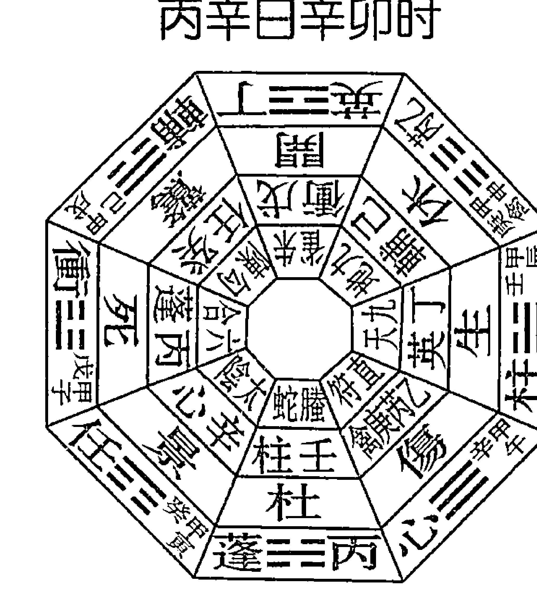

### 阳遁三局

| 宫位 | 格局 |
| :--- | :--- |
| 乾 | 龙逃走 时干格 乙奇入墓 |
| 坎 | 宫克门 |
| 艮 | 宫生门 |
| 震 | 门迫宫 |
| 巽 | 宫克门 |
| 离 | 格刑 宫克门 |
| 坤 | 生与丁合 门生宫 |
| 兑 | 禽符加乾为地天泰 死门加震为地雷复 庚仪加辛为太白重锋格 辛日伏干格 |

断曰：庚符加辛，所谓虎而添翼者也，同居之乙于是乎遁矣。况两强相遇，锋刃交接，必有一伤。非睢阳之食尽，即长坂之散失，有不能顾其妻妾者矣。乃飞乙合直使入震，盖欲诉于主局之甲子，而遂有得禄之吉，其适彼乐郊之意乎？

兵事：宫克门，星生宫，又遇龙逃，利于为主。玉女升殿于兑，宜从正西应敌，转击正北杜门。西南防有伏兵格斗。唯辛日不利，主兵有伤。有角风散漫于军中，当下令设伏。

出行：宜出正西生门，须防遗失，路逢猎骑歌唱人为应。

阳宅：宜开正西门，七日后进田契，艮坤方有火发应。

阴宅：宜酉山卯向，日禄所到大利。作用时，黄云四塞应。

附占：

- 胜败：客胜。
- 虚实：贼有逃亡。
- 攻城：可破。
- 守城：势孤欲走。
- 天时：春有雨，即晴。
- 地理：龙气不聚，左脉低陷。
- 人事：当面君受职。
- 田禾：禾大熟，麦少收。
- 家宅：门垣倾颓，作事和顺。
- 官禄：防参革，宜告休。
- 应试：秋闱得中。
- 求财：有得。
- 婚姻：成，女有郁症，经常闭。
- 胎产：男喜，须安胎。
- 疾病：小肠之疾，淹缠难治。
- 捕获：易获。
- 失物：阴人盗去。
- 远信：不至。
- 鸦鸣：防淫佚。
- 鹊噪：有亲友至。

## 丙辛日壬辰时

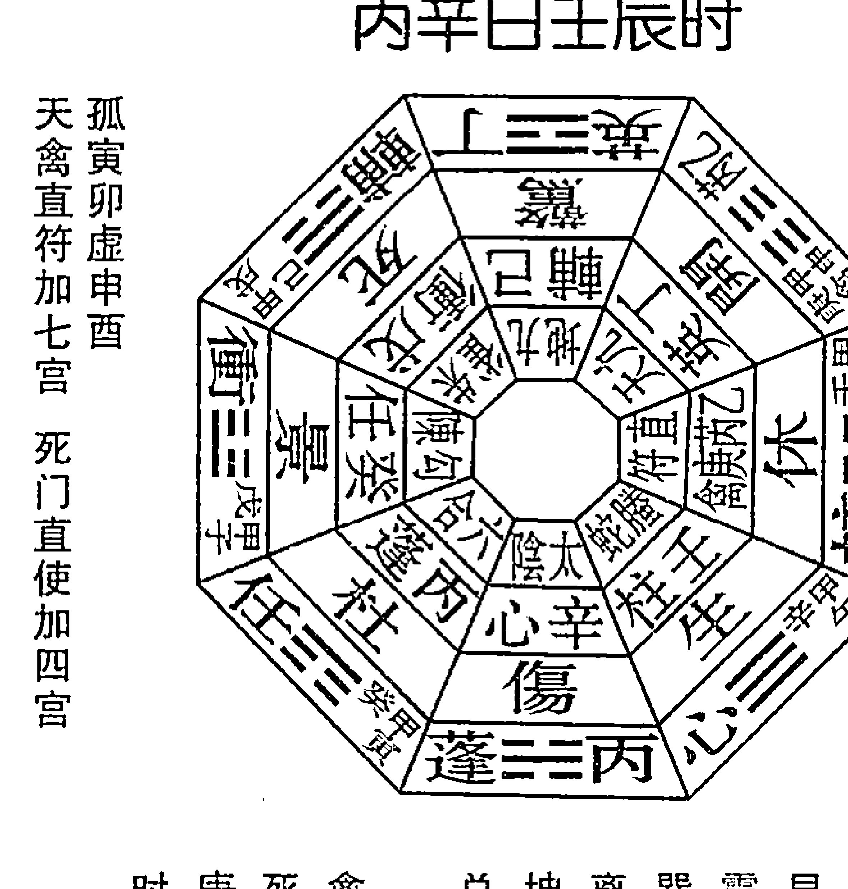

孤寅卯虚申酉
天禽直符加七宫
死门直使加四宫

阳遁三局
春分上元 大寒上元
芒种中元 雨水下元

| 方位 | 乾 | 坎 | 艮 | 震 | 巽 | 离 | 坤 | 兑 |
| :--- | :--- | :--- | :--- | :--- | :--- | :--- | :--- | :--- |
| 门宫关系 | 门生宫 | 宫生门 | 门迫宫 | 宫生门 | 宫克门 | 宫克门 | 开与丁合 宫生门 | 休与乙合 时干格 上格 |

断曰：庚符加兑，有自鸣得意之象。而壬水以泄其气，乙奇以合其情，休门以息其威，消磨亦殆尽矣。直使到巽，戊己在焉。并是一家骨肉，似可引为同志。乃居九地而受克，不无畏伏疑忌。惟本宫木火通明，开幽启暗，曷不于此归处也。

兵事：宫克门，星生宫，利为主。宜安营于正南，设伏于正北，静以待动。敌来则从西南开门，或正西休门小兵。丙日防有士卒叛乱。

出行：宜出正西、西南二方。路逢妇女引孩子，携瓶汲水应。

阳宅：宜建坤兑二门，有鸟鹊飞鸣应。

阴宅：宜坤艮二山。作用时，有大蛇上树为应。

附占：

- 胜败：客胜。
- 虚实：道上有阻。
- 攻城：可下。
- 守城：宜备西南。
- 天时：虽晴亦雨。
- 地理：龙身甚旺，中有道路穿破，不吉。
- 人事：有财喜，或赠遗。
- 田禾：小有年，麦防虫。
- 家宅：财旺人和，防有窃盗。
- 官禄：官不能尊。
- 应试：文不合主司意。
- 求财：不得实惠。
- 婚姻：媒言不足信。
- 胎产：产速，防漏胎。
- 疾病：乃是合病，宜分治。
- 捕获：不获。
- 失物：失于东南。
- 远信：好音即至。
- 鸦鸣：有争殴事。
- 鹊噪：防失脱。

## 丙辛日癸巳时

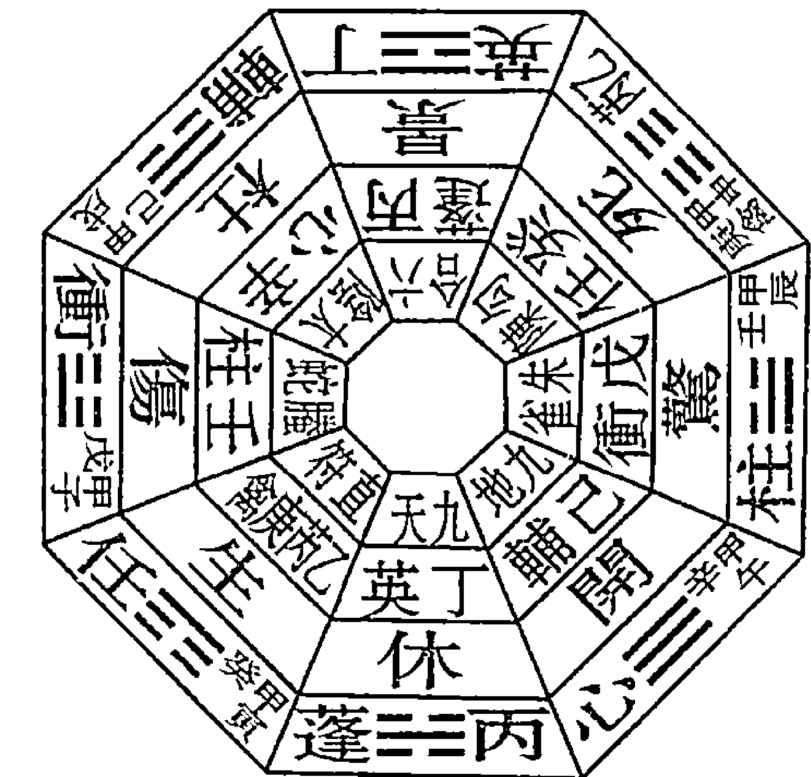

孤卯辰虚酉戌
天禽直符加八宫
死门直使加五宫

### 阳遁三局

大寒上元
春分上元
雨水下元
芒种中元

兑 坤 离 巽 震
丙奇升殿
门伏吟 小格

禽符加艮为地山谦

死门伏五为坤

庚仪加癸为太白刑隔格

天网

艮 坎 乾
生与乙合
虎遁
符反吟

仪刑
大格
时干格

休与丁合

断曰：庚格于癸，而格益甚矣；网张于艮，而网既高矣。飞禽投焉，其能脱乎？直使又伏处本宫，彼此乖违，鞭长不及。如楚灵之次乾谿，鲁昭之居野井。空思子革之言，并少齐侯之嗜，其反覆受困何如也。占者宜似禽之敛翼，静以待时而已。

兵事：天网之时，主客皆不利。况值符反吟，又逢刑击，动则损伤。宜高垒深沟，乾位藏伏，巽地安营。俟敌至，出东北生门应之，不战为上。

出行：网高八尺，可以行走。宜出正北休门，行二十里，逢贵妇，上衣蓝黄，下裳青碧。

阳宅：宜立坎艮门，须慎火烛。

阴宅：子山午向、艮山坤向大利，葬后有南方馈双鲤应。

附占：

- 胜败：主胜。
- 虚实：客情反覆。
- 攻城：不克。
- 守城：防有暗通情形者。
- 天时：有雨。
- 地理：砂水不合，葬后伤丁。
- 人事：有交代，迟延。
- 田禾：卑处防水，高处防旱。
- 家宅：对门冲射不利，人口欠安。
- 官禄：士民怨望，不能终任。
- 应试：文佳，难售。
- 求财：可得。
- 婚姻：门楣相匹，女家愿成。
- 胎产：子不足月而生。
- 疾病：膈噎之症，难以调治。
- 捕获：捕得厚贿，不获。
- 失物：失于西北。
- 远信：至。
- 鸦鸣：有和合事。
- 鹊噪：防惊。

## 丙辛日甲午时

孤辰巳虚戊亥 天心直符加六宫 开门直使加六宫

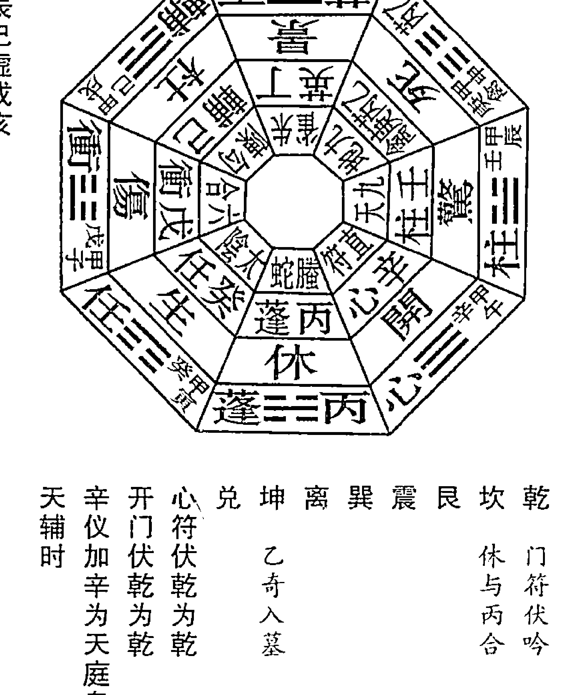

阳遁三局
春分上元
大寒上元
芒种中元
雨水下元

| 天 辛 开 心 | 兑 | 坤 | 离 | 巽 | 震 | 艮 | 坎 | 乾 |
| :--- | :--- | :--- | :--- | :--- | :--- | :--- | :--- | :--- |
| 辅 仪 门 符 | | | | | | | | |
| 时 加 伏 伏 | | | | | | | | |
| 辛 为 乾 乾 | | | | | | | | |
| 为 为 | | | | | | | | |
| 天 庭 自 刑 格 | | | | | | | | |
| | | | | | | | | |
| 乙奇入墓 | | | | | | | | |
| | | | | | | | | |
| 休 门 符 | | | | | | | | |
| 与 伏 | | | | | | | | |
| 丙 吟 | | | | | | | | |
| 合 | | | | | | | | |

断曰：辛仪秉令，居于六白。以遁甲论，虽为木入金乡，然乾之象为天为君为父，而所遁之辛与乾同体而合德，又时为天辅，天恩转赦，是君则上契于天心而承其眷顾，臣则上契于君心而沐其恩波，子则上契于父心而得其乐豫，吉孰甚焉。

兵事：仲甲之时，刑德在门，不宜出兵。止宜上书献策，决狱平刑，严其营伍，察具奸宄。老营在西北，新营在西南，粮草金器在东北。俟敌至而袭之，相时而动。

出行：宜出北门。行二十里，遇妇女，或逢持伞人吉。

阳宅：立北门吉。修建时，有东方火惊应。

阴宅：坎山离向吉。作用时，遇骤雨，或途中见蛇，主大旺。

附占：

- 胜败：主胜
- 虚实：敌未动
- 攻城：必拔
- 守城：防西南地道
- 天时：开霁
- 地理：龙身虽贵，却有伤残
- 人事：有阴贵人喜事
- 田禾：有收，北地尤熟
- 家宅：人宅比和，官家最利，不宜博弈之戏
- 官禄：武职尤利
- 应试：总裁不取
- 求财：宜守本分，妄求无益
- 婚姻：虽成不吉
- 胎产：主双胎，难产
- 疾病：肺气不通，药宜疏散
- 捕获：迟日可得
- 失物：埋在土内，未日得
- 远信：不至
- 鸦鸣：有文书口舌
- 鹊噪：有两喜信

## 丙辛日乙未时

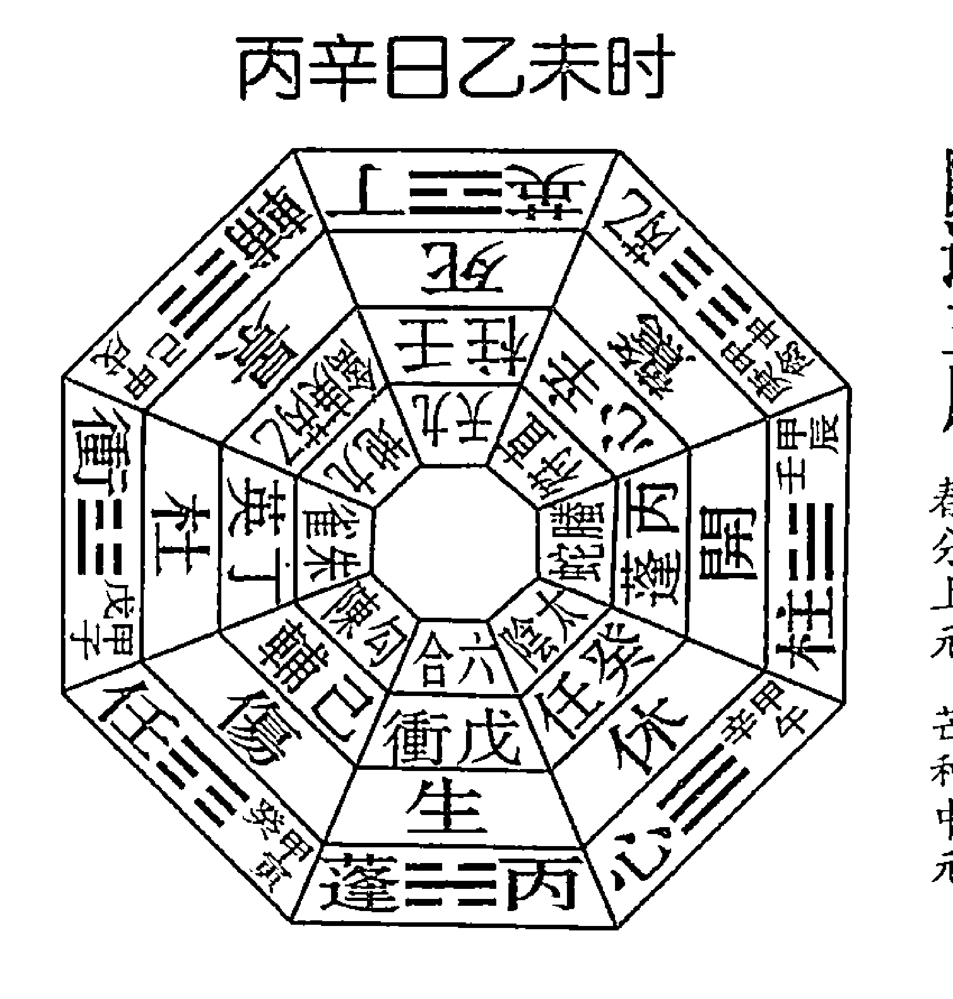

阳遁三局

大寒上元
雨水下元
春分上元
芒种中元

天心直符加二宫
开门直使加七宫
孤巳午虚亥子

辛仪加乙为白虎猖狂格
乙奇得使游仪 辛日飞干格
心符加坤为天地否
开门加兑为天泽履
兑开与丙合 宫门比和
坤相佐 虎猖狂 宫生门
离宫生门
巽刑格 宫生门
震宫门比和
艮门迫宫
坎门迫宫
乾宫生门

断曰：坤为天心印绶之乡，当受其利益以资身。乃坤中有乙，辛遇之而猖狂，是于受生之地，自逞其雄，所谓庇焉而寻斧斤者也。然中五之庚，亦寄于坤，乙与之合，其交甚固。符之往而见格也，可谓篱牢而犬不入者矣。

兵事：宫生星，利为客。辛符加乙，格遇虎狂，主尤不利。宜先举，出西方，设伏于西北，背坎击离。遇西南有微风细雨至，必有君恩慰劳。

出行：西门可出，遇老人执杖为应，吉。

阳宅：利开兑门，有人从东方抱小儿至则吉。周年内，当进人口财产。

阴宅：宜立兑山震向。作用时，有童子牵二牛至，乃吉。

附占：

- 胜败：客胜。
- 虚实：占贼即至。
- 攻城：不能破。
- 守城：宜坚守。
- 天时：晴有云。
- 地理：右砂太高，穴情不真。
- 人事：有一老人谈神仙事。
- 田禾：不丰。
- 家宅：右屋欺压，防家人走失。
- 官禄：为妇人事革职。
- 应试：总裁不取。
- 求财：宜三人同行。
- 婚姻：女有才，易成。
- 胎产：生女，当克母。
- 疾病：心火太炽，宜泻心汤。
- 捕获：易获，捕防受伤。
- 失物：在草物中藏。
- 远信：将至。
- 鸦鸣：有隐匿事。
- 鹊噪：有女眷喜事。

## 丙辛日丙申时

孤午未虚子丑
天心直符加一宫
开门直使加八宫

### 阳遁三局
大寒上元
春分上元
芒种中元
雨水下元

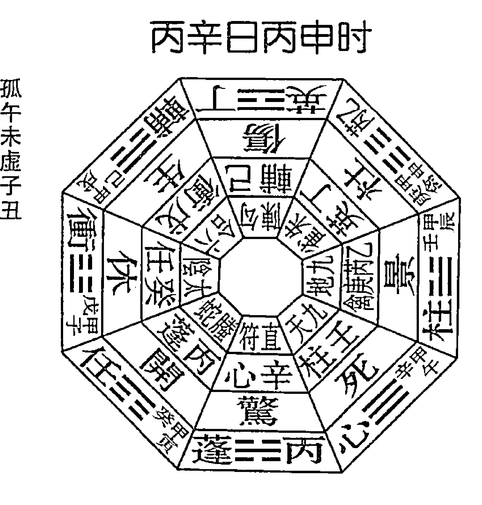

| 乾 | 坎 | 艮 | 震 | 巽 | 离 | 坤 | 兑 |
| :--- | :--- | :--- | :--- | :--- | :--- | :--- | :--- |
| 门生宫 | 龙返首相佐符勃门生宫 | 开与丙合宫生门 | 门生宫 | 宫克门 | 门生宫 | 门迫害 | 上格门迫宫 |

断曰：坎受金生，丙为甲嗣。以返首之龙，而谋利其子孙，宜乎吉矣。所喜者，直符之辛，合于丙位；所忌者，时干之丙，人于水乡。在时干，则为受恩深处便为家；在直符，则为儿孙自有儿孙福也。使受蛇克，惊恐不免。

兵事：门受宫生，五阳利客。当从东北开门出师，伏兵于正东。格合回首，百战百胜。神坛中防有贼兵埋伏，不可轻进。

出行：宜出东北。行四十里，见人言讼事。

阳宅：利东北门，时有皂衣人至。百日内，有人进财帛，大发。

阴宅：宜立艮山坤向。作用时，有鸡鹅禽飞至。

附占：

- 胜败：客胜。
- 虚实：防敌偷劫。
- 攻城：四季月不可攻。
- 守城：东北有惊。
- 天时：半阴晴。
- 地理：土色黑，有壕堑似坚石，不吉。
- 人事：有词讼沉搁。
- 田禾：麦稻皆少收。
- 家宅：防有官非惊恐，后却平安。
- 官禄：易升，极吉。
- 应试：当首荐。
- 求财：人得其一，我得其三。
- 婚姻：似与同室联姻。
- 胎产：生男，母安。
- 疾病：火旺水衰，宜补水中之火。
- 捕获：不能捕。
- 失物：失于东南。
- 远信：甲子日到。
- 鸦鸣：有欺诳事。
- 鹊噪：闭户则吉。

## 丙辛日丁酉时

孤未申虚丑寅
天心直符加九宫
开门直使加九宫

### 阳遁三局
- 春分上元
- 芒种中元
- 大寒上元
- 雨水下元

| 方位 | 宫/门关系 | 格局/说明 |
| :--- | :--- | :--- |
| 乾 | 宫克门 | 宫克门 |
| 坎 | 宫生门 | 宫生门 |
| 艮 | 丁奇入墓 | 门生宫 |
| 震 | 乙奇升殿 | 太白与天乙格 |
| 巽 | 门迫宫 | 门迫宫 |
| 离 | 相佐 | 玉女守门 仪刑 |
| 坤 | 宫克门 | 休与丙合 荧入白 宫克门 |
| 兑 | 门生宫 | 门生宫 |
| 心符加离为天火同人 | 辛仪加丁为白虎受伤格 | 丁奇使遇甲丙日飞干格 | 辛日不遇 |

> 断曰：辛符加于离九，以金遇火，是曰官乡。符又合使以同趋，有并进扬镳、拔茅以汇之象。所惜者，时干之丁，往墓于艮，既不免于迍邅。而离之阴神为雀武，有口舌脱耗之嫌。仕者宜防宦海之风波，平人宜慎讼庭之雀角。

兵事：门符俱受宫克，又值仪刑，不利为客。天乙相格，大将不利，宜静以待敌，东北不宜先动。宜伏兵于兑地，遇春夏丙丁巳午日，提兵直趋西南，捣贼巢穴，以应荧入之格。

出行：利西南方。行二里十二里，当遇孝服及黑衣人应。

阳宅：宜立坤向，有皂衣人至。二七日后，进女人财物。

阴宅：当作坤山艮向。造葬时，闻鸡鸣犬吠。七日后有喜事。

附占：
胜败：主胜。
虚实：贼马首已东。
攻城：宜从南门入。
守城：难守。
天时：有雨。
地理：龙气已泄，朝山不佳。
人事：有夫妻离别事。
田禾：麦防水，禾防虫。
家宅：商家得利，仕宦不吉。
官禄：文书有误，防降。
应试：文不佳，不中。
求财：行商可倍得。
婚姻：未必偕老。
胎产：生男，防小儿病。
疾病：金受火克，宜滋阴降火。
捕获：不获。
失物：失于西北。
远信：未至。
鸦鸣：防有窃失。
鹊噪：有遗失文书事。

## 丙辛日戊戌时

孤申酉虚寅卯
天心直符加三宫
开门直使加一宫

### 阳遁三局
- 大寒上元
- 雨水下元
- 春分上元
- 芒种中元

| 宫位 | 门与宫关系 | 格局 |
| :--- | :--- | :--- |
| 乾 | 丁奇入墓 宫门比和 | |
| 坎 | 开与乙合 鬼遁 重诈 龙遁 | 奇格 门生宫 |
| 艮 | 白入荧 | 宫克门 |
| 震 | | 宫克门 |
| 巽 | | 宫门比和 |
| 离 | 地假 蛇天矫 | 门生宫 |
| 坤 | 大乙与太白格 | 门生宫 |
| 兑 | 门生宫 | |
| 中五 | 心符加震为天雷无妄 | |
| | 开门加坎为天水讼 | |
| | 辛仪加丙为天庭得明格 | |
| | 时干入墓 丙日伏干格 | |

> 断曰：金符飞于木地，六合之神在焉，此求财之最吉者也。况午往冲子，戊来生辛。此有以相感，彼有以相资，财之得也唾手矣。惟时干往临坤二，见格于中五之庚，占者当于幽隐之中，防同侪之相值。

兵事：星克宫，不利主。天乙相格，大将不利。宜出正北开门，伏兵于正南。敌至即疾击之，以应蛇矫之格。战时背东击西，又宜假神鬼形像，设诈愚敌。

出行：利出北门。行一二里，有鼓声雷声应。

阳宅：利开北门。造作时，当有黄衣人至。

阴宅：利于坎山。作用时，有黄色犬至。造葬后，成就田宅事，乃发。

附占：
胜败：主胜。
虚实：敌无斗志。
攻城：相守不吉。
守城：有援兵，可持久。
天时：大晴。
地理：龙甚生动，穴情亦紧。
人事：当授官迁职。
田禾：丰，北方尤熟。
家宅：仕途顺救，子孙富贵。
官禄：有利益，易升迁。
应试：文不明爽，不中。
求财：欠利。
婚姻：成，女有德。
胎产：生女，产后防灾。
疾病：肺气不清，可以勿药。
捕获：易捕，三日可得。
失物：失于西南。
远信：不至。
鸦鸣：有和合事。
鹊噪：主虚惊。

## 丙辛日己亥时

### 阳遁三局
- 春分上元
- 大寒上元
- 芒种中元
- 雨水下元

孤酉戌虚卯辰
天心直符加四宫
开门直使加二宫

**符门格奇表**

| 宫位 | 符 | 门 | 格 | 奇 |
| :--- | :--- | :--- | :--- | :--- |
| 坤 | 心符加巽为天风姤 | 开门加坤为天地否 | 辛仪加己为虎坐明堂格 | 无奇门 |

**各宫格局表**

| 宫位 | 格局/关系 |
| :--- | :--- |
| 坤 | 宫生门 |
| 离 | 小格 宫生门 |
| 巽 | 丙奇升殿 宫克门 |
| 震 | 符反吟 宫克门 |
| 艮 | 宫生门 |
| 坎 | 大格 门迫宫 |
| 乾 | 宫生门 |
| 兑 | 门生宫 |

> 断曰：心符入巽，格为反吟，虽曰财乡，财其可问乎？况阴神又逢勾白，大约因争以致讼，所谓“我之怀矣，自贻伊戚”者也。直使受生于坤二，而遇乙奇；时干泄气于乾六，而遇生门。占者但有安分之心，所向必有如心之事。

兵事：星克宫，宫生门，利于为客。但直符反吟，战又不利，且奇门不合，宜于时干下出生门，设伏于西南方，亦防小衄。直符在巽，不可以生击死。

出行：远行宜出西南，逃亡宜出东北。

阳宅：不宜动作，小修西南，有宫音富室人至为应。

阴宅：无奇门不利，惟四季土旺日，坤山稍吉。葬后百日内，有女人进门，当破财不宁。

附占：
胜败：主胜。
虚实：敌军畏我。
攻城：宜从西南攻之。
守城：防东北地道。
天时：春时细雨即晴。
地理：来龙死硬，穴情亦难定。
人事：有贵人得柄用事。
田禾：欠丰。
家宅：奴婢欺主，人宅不安。
官禄：地方不安，不吉。
应试：大小试俱不利。
求财：不得实。
婚姻：易就，女不佳。
胎产：生男，易产，母防病。
疾病：血不荣筋，宜补先天。
捕获：女可获，男不可获。
失物：失于西方。
远信：即至。
鸦鸣：有尊长事。
鹊噪：主文书遗失。

断曰：符入中宫，转临九地。步五则为幽隐之象，逢庚又有阻抑之忧。以至暗之德，当否塞之时，迟滞忧疑，难乎免矣。开合丁于震三，惜直使制宫，以被迫而减吉；庚共乙于坤二，惜辛符相格，以被克而猖狂。凡事不无扰攘。

兵事：宫生星，门克宫，利为客。当向正东出师，东南结寨，更宜大张旗鼓，背离击坎。大将宜随天乙而飞，据其西南广洋之地。

出行：东方可行，东南亦利。出巽，见阴贵人，及新鲜物件；出震，见金银铁器为应。

阳宅：利建巽震二门。有人抱小儿从南方来，吉。

阴宅：宜用巽山乾向，或卯山西向。作用时，西南有火光，二人相逐。

附占：
胜败：客胜。
虚实：防敌人潜师猝至。
攻城：易攻。
守城：谨备正东。
天时：晴有风。
地理：右边砂水无情。
人事：有非常喜音。
田禾：小丰，防有风损。
家宅：家长防病，慎有刑伤。
官禄：不利，上司欺压。
应试：文章佳，可中。
求财：有阻。
婚姻：媒人得力，可成。
胎产：生男，难产。
疾病：肝火克脾，壬日难疗。
捕获：不在原处，当往东寻。
失物：本家人所盗。
远信：至。
鸦鸣：有阴谋。
鹊噪：主行人远归。

## 丁壬日辛丑时

孤亥子虚巳午
天心直符加六宫
开门直使加四宫

### 阳遁三局

| 宫位 | 格局/关系 |
| :--- | :--- |
| 乾 | 符伏吟 宫克门 |
| 坎 | 宫克门 |
| 艮 | 鬼假 宫门比和 |
| 震 | 门迫宫 |
| 巽 | 门迫宫 门反吟 |
| 离 | 休与丁合 门迫宫 |
| 坤 | 生与乙合 重诈 乙奇入墓 |
| 兑 | 宫克门 |

> 断曰：符伏使返，静既忧其致悔。动亦恐其招尤，是殆于抢攘之时，无才可以济世，而甘受其困者也。坤宫之乙，未尝不合生；离宫之丁，未尝不合休。然伏吟之奇，与反吟之门，奇家之所最忌，则亦无取乎尔。

兵事：门制其宫，不利于主。符伏门反，不宜出兵。宜立营于坤，伏兵于艮，遣游兵从正南四处巡缉，严阵以待。敌人不来，未可多事。西南不可出兵，中防迷失道路，且防中伏。

出行：正南可行。出门二十里，遇皂白衣女人。

阳宅：宜建离坤二门，当有群鸟至为应。

阴宅：坤离二山俱吉。作用时，东方有犬吠声应。葬后有白兔野鸡入屋，乃吉。

附占：
胜败：主利。
虚实：敌军不动。
攻城：持久之象。
守城：不能解围。
天时：晴。
地理：龙脉不真，虽有朝案，不吉。
人事：有术士至，军中防刺客。
田禾：不丰，麦略好，防邻界生隙。
家宅：人口不宁，防有孝服。
官禄：不能升迁。
应试：不中。
求财：惟利收债。
婚姻：不吉。
胎产：防倒生，当祷土神。
疾病：病在脾积，防有变症。
捕获：在贼营中。
失物：被田夫所盗，不可获。
远信：迟至。
鸦鸣：有惊恐。
鹊噪：不与休咎。

## 丁壬日壬寅时

孤子丑虚午未
天心直符加七宫
开门直使加五宫

### 阴遁三局
- 大寒上元
- 春分上元
- 雨水下元
- 芒种中元

| 宫/卦象 | 属性/格局 | 备注 |
| :--- | :--- | :--- |
| 乾 | 生与丙合 鸟跌穴 劫符 | 宫生门 |
| 坎 | 神假 宫生门 | 丙奇入墓 门生宫 |
| 艮 | 门迫宫 | |
| 震 | 宫生门 | |
| 巽 | 宫克门 | |
| 离 | 奇格 宫克门 | |
| 坤 | 宫生门 | |
| 兑 | 宫生门 | 心符加兑为天泽履 |
| | | 开门步五为天地否 |
| | | 辛仪加壬为天庭逢狱格 |
| | | 丁日伏干格 壬日飞干格 |

> 断曰：直符临于比肩之地，而神为九天，当有贵显之人，与我合志而相扶者。直使步五，转加于九地之宫。盖性质庸暗，而贪恋于受生，不知自奋者耳。占者明则获出门同人之功，暗则蹈怀安败名之耻。

兵事：宫生门，利为客。宜南方结寨，北方用伏，从西北出军，击其东南。格合跌穴，有朱鸟翔军之应。有战必胜，有攻必取。

出行：出西北门极吉。行六十里，见贵人车马印绶之类。

阳宅：造乾向，开西北门皆吉。时遇西北生产，大发。

阴宅：乾山巽向吉。作用时，有人在北方大喧叫。造葬后六十日，因财牵连公事，乃发。

附占：
胜败：客胜。
虚实：客锋甚锐。
攻城：季月不可攻。
守城：西南防敌越城而入。
天时：有云。
地理：元武水紧，极吉之地。
人事：当别白刑狱轻重，或贵人嗔怒。
田禾：麦大丰，禾小潦。
家宅：风藏气聚，宅吉人安。
官禄：即升。
应试：中，但不甚高。
求财：得后有虚惊。
婚姻：成，男不寿。
胎产：生男，易育。
疾病：肾亏，当滋阴。
捕获：不能获。
失物：失于震方。
远信：迟至。
鸦鸣：防有争斗。
鹊噪：有女人孝服。

## 丁壬日癸卯时

孤丑寅虚未申
天心直符加八宫
开门直使加六宫

### 阳遁三局
- 春分上元
- 芒种中元

天网 辛仪 开门 心符 兑 坤 离 巽 震 艮 坎 乾

丁日不遇 虎投罗网格 乾 门伏吟 龙逃走 乙奇入墓 伏宫格 开与乙合 虎遁 鬼遁 重诈

> 断曰：辛符临于艮之地，处受生之地，遇太阴之神，暗中得益，盖有之矣。然癸仪在前，既防其脱耗；丑墓在侧，亦患其昏沉。受益之处，不可不防。飞庚来格于伏宫，主有敌至。但时名天网，我之出也固无门，彼之来也亦不利，可以勿忧。

兵事：符受宫生，利为主。况逢青龙逃走，客尤不利。俟敌先动，于乾地出兵，巽向用伏，背东北，击西南。遇微风细雨，见担铁器者必胜。

出行：西北可行。所嫌龙走，不无损失。行四十里内，见猪马酒食。

阳宅：不利，只宜小修西北方屋宇，有青衣人担钱至为应。

阴宅：不甚吉，只可立乾山巽向。作用时，有女人穿红衣送物。葬后防妇人堕胎患产。

附占：
胜败：客小利。
虚实：敌伙中有争。
攻城：不拔。
守城：败而去。
天时：大晴。
地理：乾龙结穴，左砂无情。
人事：有盗财逃亡事。
田禾：欠丰。
家宅：破财流年，兼防老母刑伤。
官禄：钱粮诖误，不能脱身。
应试：不中。
求财：宜恳求贵人。
婚姻：难就。
胎产：生女，产迟。
疾病：肝气大伤，宜清金滋肾。
捕获：捕人用情，不获。
失物：失于女人手。
远信：无。
鸦鸣：有和合事。
鹊噪：鹊自惊鸣。

## 丁壬日甲辰时

孤寅卯虚申酉
天柱直符加七宫
惊门直使加七宫

### 阴遁三局
- 大寒上元
- 春分上元
- 雨水下元
- 芒种中元

| 宫位 | 术语 |
| :--- | :--- |
| 天辅时 | 壬仪加壬为天牢自刑格 |
| 乾 | 休与丙合真诈 |
| 坎 | 门符伏吟 |
| 艮 | 奇入墓 |
| 震 | 乙奇 |
| 巽 | 坤离巽震艮坎乾 |
| 坤 | 惊门伏兑为兑 |
| 兑 | 柱符伏兑为兑 |
| 离 | 兑 |
| 伏吟 | 奇入墓 |

> 断曰：甲木遁于壬仪而居兑七，以宫则为受克之方，以仪则为受生之地。大约利中有害，劳处成安。吉凶由人，惟视占者之德何如耳。符门未动，不宜妄为。冬月占之，壬水得时得地，可以凝天辅之休矣。

兵事：季甲之时，内德外刑，利于征讨不庭。阳时利客。安营利于南方，伏兵利于正北，师宜北出。西南贼入，颇有党羽联络，宜用反间，待以殊赏，其胁从者赦之，以招后来。

出行：北方可出。行三十里，逢阴贵人，或见军器为应。

阳宅：利造北门，有黄白禽从西北飞来。

阴宅：利作坎山。作用时，有云从西北方起，葬后主生贵子。

附占：
胜败：主利。
虚实：敌人虚张声势。
攻城：夏月不宜攻。
守城：当用美人计以携之。
天时：辰日有雨。
地理：龙未必真，穴情却好。
人事：日用不吉。
田禾：丰歉照旧。
家宅：防有刑伤，后裔当盛。
官禄：有小惊，未即升。
应试：大小试俱利。
求财：当欢喜得财。
婚姻：易成，可赘。
胎产：胎安，产迟。
疾病：膀胱有积，淹缠难愈。
捕获：东北近山处捕之，即获。
失物：失于本家。
远信：不至。
鸦鸣：有隐匿事。
鹊噪：鹊自鸣枝。

## 丁壬日乙巳时

天柱直符加二宫
惊门直使加八宫

### 阳遁三局
- 大寒上元
- 雨水下元
- 春分上元
- 芒种中元

- 丁日伏干格 壬日飞干格
- 壬仪加乙为日入九地格
- 惊门加艮为泽山咸
- 柱符坤为泽地萃
- 兑 宫 克 门
- 坤 相 佐 门 迫 宫
- 离 生 与 乙 合 奇 格 宫 生 门
- 巽 休 与 丁 合 重 诈 门 生 宫
- 震 门 迫 宫
- 艮 宫 生 门
- 坎 鬼 假 门 迫 宫
- 乾 丙 奇 入 墓 门 迫 宫

> 断曰：符入西南，使加东北，虽相背而驰，其为贪于所生则一也。逢庚为格，然庚乃壬所受生，庚方生壬，而乙又脱壬，譬若塞翁之马，得未足为喜，失未足为忧。惟处之淡然，无将无迎，是在知道者耳。

兵事：星门俱受官生，利于为客。宜东南立营，西北伏兵，从南方出兵，转攻其北。丁日正南必有贼伏，宜佯退于东南，发营兵夹击。有青衣带网人为应。

出行：东南与正南，皆可出行。六十里，遇妇人，或见水族物应。

阳宅：巽离二门皆利，见皂衣妇人应。

阴宅：离巽两山皆吉。作用时，有牛羊争抵，女人相骂。

附占：
胜败：主胜。
虚实：敌有内患。
攻城：火月日不宜攻。
守城：东门防盗。
天时：阴晦。
地理：来脉不明，不利生命。
人事：有武弁相遇。
田禾：丰，麦倍收。
家宅：内室不和，外交最契，防有孝服。
官禄：为盗案阻升，且防参。
应试：文佳，当中。
求财：大利，当三人分取。
婚姻：易成，男不佳。
胎产：生男，产后防病。
疾病：脾受湿气，中有小惊。
捕获：在北方，可获。
失物：东北山上，可寻。
远信：未至。
鸦鸣：有阴私事。
鹊噪：有升信。

## 丁壬日丙午时

阳遁三局
大寒上元 雨水下元
春分上元 芒种中元

| 宫位 | 格局/关系 |
| :--- | :--- |
| 兑 | 休与丁合 重诈 丁奇升殿 |
| 坤 | 宫生门 |
| 离 | 玉女守门 宫克门 |
| 巽 | 鬼假 宫克门 |
| 震 | 宫生门 |
| 艮 | 门迫宫 |
| 坤 | 龙返首 符勃 宫生门 |
| 乾 | 乙奇入墓 门生宫 生与乙合 虎遁 龙逃走 |

> 断曰：柱符由坤而进坎，受脱于太阴；惊使自艮而退离，受克于九地。地北天南，遥遥相望，何所趋则异，而见伤则同也。然使受宫制，不以迫推。甲逢丙时，龙为返首。纵宦途或嗟淹滞，而子孙之福庆方长。

兵事：星生宫，宫克门，又逢龙走，不利于客。宜出西立营，出西北迎敌，伏兵正东，背乾击巽。格合回首，有战必胜。十里，逢青帻赤衣人为应。

出行：正西可行，西北亦利。出门六十里，见生产事，或和合文书事。

阳宅：正西西北门俱吉。起造时，有青衣贵人至，或有鸟飞为应。

阴宅：乾兑两山俱可用。作用时，有白衣人来唤，则为吉应。

附占：
胜败：客胜。
虚实：敌来甚近。
攻城：饵之可破。
守城：当自败去。
天时：阴晦不雨。
地理：龙乘生气，但左砂走窜。
人事：宜改官迁职。
田禾：麦小丰，禾防水。
家宅：人事亨通，宦途尤利，但防孝服。
官禄：易升，微有口舌。
应试：房考不荐。
求财：反有大费。
婚姻：易成，防女有疾。
胎产：生男，易产。
疾病：胃火宜清。
捕获：三日见信。
失物：失于南方，不获。
远信：迟至。
鸦鸣：有私谋。
鹊噪：防失脱。

## 丁壬日丁未时

天柱直符加九宫
惊门直使加一宫
孤巳午虚亥子

壬仪加丁为太阴被狱格 惊门加坎为泽水困 柱符加离为泽火革 兑 坤 离 巽 震 艮 坤 乾 鸟跌穴 勃符 门迫宫 虎猖狂 门迫宫 相佐 宫克门 生与乙合 风遁 刑格 休与丁合 重诈 门生宫 宫生门 门生宫 鬼假 门生宫

> 断曰：前时则符北而使南，今时又符南而使北，燕来鸿去，我去君来，何其参与商也。丁奇乘旺，本忧其太炎，而春夏占之，尤为得令。幸有壬合，乃以宽济猛之象。若以壬日逢之，时日之交已固，水火之济无涯，其人生最得意之时乎？

兵事：门生宫，宫克星，利于为主，宜静以待敌。当移营于正东，设伏于正西。应兵宜出东南，乘风纵击，攻其西北，亦有微伤。当有红云如盖，自西方来则胜。

出行：正东可行，出行四里，当遇匠人。东南方亦吉，行五里，遇妇人，或歌唱。

阳宅：宜立震巽二门，有妇人至为应。

阴宅：震巽两山俱吉。作用时，有小儿穿白衣至。

附占：
胜败：客胜。
虚实：敌情甚怯。
攻城：易拔。
守城：宜备东北。
天时：晴明，壬日有雨。
地理：白虎太昂，不利小房。
人事：闻军中捷音。
田禾：大丰。
家宅：凡事亨通，防有外孝。
官禄：小有参罚，不碍。
应试：中，文可传。
求财：宜求二人。
婚姻：男性强，有刑克。
胎产：生女，防克母。
疾病：外感入于阳明，宜下之。
捕获：有三五人同谋，在火烧山下。
失物：失于北方。
远信：至。
鸦鸣：有妇女口舌。
鹊噪：鹊自惊鸣。

## 丁壬日戊申时

孤午未虚子丑
天柱直符加三宫
惊门直使加二宫

### 阳遁三局

大寒上元
春分上元
芒种中元
雨水下元

壬日不遇 壬仪加戊为青龙入狱格 惊门加坤为泽地萃 柱符加震为泽雷随 兑 宫门比和 坤 小格 宫生门 离 丙奇升殿 宫生门 巽 宫生门 震 符反吟 宫门比和 艮 大格 门迫宫 坎 生与丁合 重诈鬼遁 门迫宫 乾 宫生门

断曰：柱符人震，虽为财地，而反吟之格，变故良多。况阴神又逢勾白，则争而致讼，斗而见伤，患有不止于财之难得者。不如门使之临坤，自托于受生之地，而与玉女作合也。占者毋贪利而智昏，则身康而逢吉。

兵事：官生门，星克宫，不利于主。符反不利交战，先宜设伏于南方，然后师出北道，敌至而后击，使彼前后受敌。东北之贼甚猛，不无少挫。
出行：宜出北门。一里或十里，有皂衣公吏为应。
阳宅：利建北向。动作时，当有猎人或犬至为应。
阴宅：坎山离向可用。作用时，有三牙须人来应。

附占：
胜败：主胜。
虚实：敌因粮而阻。
攻城：宜断其汲。
守城：正西门加谨。
天时：有雨。
地理：穴情甚佳，龙不飞动。
人事：有贵人授职。
田禾：麦丰。
家宅：家门和顺，作事未亨。
官禄：当求人荐举。
应试：荐而不中。
求财：如意。
婚姻：两家不远，恐有阻隔。
胎产：生女，血有阻。
疾病：血脉不调，宜养其荣。
捕获：难获。
失物：失于本家小巷壁后。
远信：将至。
鸦鸣：有惊恐。
鹊噪：当得饮食。

## 丁壬日己酉时

孤未申虚丑寅
天柱直符加四宫
惊门直使加三宫

阳遁三局
大寒上元
春分上元
芒种中元
雨水下元

壬仪加己为天地刑冲格
惊门加震为泽雷随
柱符加巽为泽风大过
兑
物假神假宫克门
宫门比和
生与丙合
真诈
荧入白
坤
门迫宫
离
仪刑门迫宫
巽
门反吟门迫宫
震
乙奇升殿太白与天乙格
艮
宫门比和
坎
宫门比和
乾
宫克门
鬼假雀投江
丁奇入墓

断曰：柱符惊使，联翩而进，据于财乡，颇有大利当前，分途竞取之意。然符临自刑之地，而雀武为之神，则口舌脱诈之所伤者已多；使有反吟之凶，而勾白主其地，则斗争讦讼之为变者亦复不少。吾恐财不可得，徒受贪名而已。

兵事：门星俱克其宫，不利于主。天乙相格，大将不利。又逢仪刑，战必有伤。止宜遣游兵巡缉，或别遣参佐直入西南，夺贼之老营，即预伏精兵为策应。
出行：出西南吉。十里，逢公吏，少女携纱帽。
阳宅：宜立坤门，有鹊自南方来。二七日，进西方女人财帛田产。
阴宅：坤山艮向极利。西方有赤马至，群鹊四噪，百日内生贵子。

附占：
胜败：利害相等。
虚实：当捣其虚。
攻城：可攻。
守城：正东门防不守。
天时：主久雨。
地理：怪石峥嵘，前案不起，穴下防有枯骨。
人事：有人口损伤，或移徙事。
田禾：麦收，禾不熟。
家宅：惊喜发财，父母享福。
官禄：当行取。
应试：文章不利。
求财：阴财大获。
婚姻：两家相愿。
胎产：当生佳儿，母有起倒。
疾病：厥阴之症，壬日，不即愈。
捕获：易获。
失物：在西北方，可得。
远信：至。
鸦鸣：防有口角。
鹊噪：遗失文书。

## 丁壬日庚戌时

### 阳遁三局

大寒上元
雨水下元
春分上元
芒种中元

孤申酉虚寅卯
天柱直符加五宫
惊门直使加四宫

| 宫位 | 描述 |
|------|------|
| 兑 | 丙奇入墓 宫克门 |
| 坤 | 地假 宫生门 |
| 离 | 门生宫 |
| 巽 | 门克宫 |
| 震 | 宫克门 |
| 艮 | 开与乙合 奇格 宫克门 |
| 坎 | 飞宫格 宫克门 |
| 乾 | 门生宫 |

门迫宫
柱符步五为泽地萃
惊门加巽为泽风大过
壬仪加庚为天牢倚势格
丁日伏干格 壬日飞干格

断曰：直符步五，有幽暗迟疑之象，退处于坤，逢九天之神，而舍暗以就明，是进不如退也。直使加巽，以被迫为嫌，而符之中五坤二，在在有受生之益，是动不如静也。知其雄，守其雌，知其白，守其黑，庶其可乎？

兵事：宫生星，门克宫，不利主。宜东南立营，伏兵于西北，利于先动，当出南方，背西击东。大将宜随天乙而飞，以西南为老营。
出行：利出南方。行九里或十九里，遇赤服吏人。
阳宅：宜立离门，有患眼或跛足人至。
阴宅：宜子山午向。作用时，西方有师巫至应。

附占：
胜败：主胜。
虚实：敌受制于下人。
攻城：可攻。
守城：恐从南门直入。
天时：阴晦。
地理：破军星体，朝山甚秀。
人事：有妇人词讼。
田禾：有收。
家宅：外来妇人，不可留住。
官禄：南缺即升。
应试：荐而不售。
求财：得半即为万幸。
婚姻：女贤，男不寿。
胎产：生男，母防病。
疾病：病在心经，当清火。
捕获：捕人用情，不获。
失物：失于东北。
远信：不至。
鸦鸣：主有伤残。
鹊噪：防孝服。

## 丁壬日辛亥时

孤酉戌虚卯辰
天柱直符加六宫
惊门直使加五宫

阳遁三局
大寒上元
春分上元
雨水下元
芒种中元

丁日飞干格
壬仪加辛为白虎犯狱格
惊门步五为泽地萃
柱符加乾为泽天夬
兑 宫门比和 开与乙合 上格 伏宫格
坤 宫生门
离 宫生门
巽 宫生门
震 地假 宫门比和
艮 门迫宫
坎 门迫宫
乾 宫生门

断曰：柱符加于乾之比肩，阴遇螣蛇，扶助我者，皆恐吓我者也。盖符方前进，而乃癸即来加，是我方为将伯之呼，而敌已有乘墉之举，人事之难测如此矣。时干逢丙而相合，直使步五而迟疑，大约同心戮力则奏功，瞻顾徘徊则罕济。

兵事：
- 官生门，利为客。
- 大将宜居西北，偏将宜居西南，伏兵宜居东北。
- 大军出正西开门，背北击南。
- 防路上有险阻，宜遣前部探路。

出行：宜出西门。行七里或十七里内，有女人引孩儿应。
阳宅：宜立兑门。三七日，进商音人田地。
阴宅：宜子山午向。作用时，有女人持火来应。

附占：
- 胜败：势均力敌。
- 虚实：敌阻于河。
- 攻城：四季不可攻。
- 守城：谨备西门。
- 天时：有雨。
- 地理：乾龙入首，朝案无情。
- 人事：有按脉人至，或下人欺蔽。
- 田禾：禾大丰。
- 家宅：老阴人防病，所谋不能如意。
- 官禄：官印比和，易于升擢。
- 应试：止利小考。
- 求财：契友可通财。
- 婚姻：女不寿。
- 胎产：生女有惊。
- 疾病：心神不宁，丁日难愈。
- 捕获：易获。
- 失物：为东南人强取去。
- 远信：不至。
- 鸦鸣：有争竞。
- 鹊噪：防口舌。

## 戊癸日王子时

孤戊亥虚辰巳
天柱直符加七宫
惊门直使加六宫

阳遁三局
春分上元
芒种中元
大寒上元
雨水下元

| 宫位 | 描述 |
|------|------|
| 乾 | 宫门比和 开与丙合真诈 门生宫 |
| 坎 | 宫克门 |
| 艮 | 宫克门 |
| 震 | 宫克门 |
| 巽 | 宫门比和 |
| 离 | 地假门生宫 |
| 坤 | 天假乙奇入墓 门生宫 |
| 兑 | 符伏吟门生宫 |

柱 符伏兑为兑
惊门加乾为泽天夬
壬仪加壬为天牢自刑格

断曰：柱符还加于柱，格属伏吟。然时干为壬，时支为子，俱乐处于金旺之乡，以受其生。符之归于本宫，虽曰伏慝而呻吟，究亦人穷而反本耳。夫与其哭于穷途，悲于歧路，孰若咏《招隐》之章，作《归田》之赋乎？

兵事：星伏门和，阴时利于静守，符伏不利交兵。宜南方安营，北方设伏，俟敌至而后应。从北方出师，背西北，击东南。正南地假，可以设立坑阱。
出行：北门可行。一二里或十里，见女人著皂衣，或四足斗。
阳宅：立北门吉。时闻哭声，或东方有火惊，大发。
阴宅：坐坎向离者吉。作用时，有人争斗。葬后六十日内，有赤面人作牙，进商音人古器。

附占：
胜败：主胜。
虚实：贼伏不动。
攻城：季月土日难拔。
守城：北门利，用大炮击敌。
天时：半阴半晴。
地理：平吉之地。
人事：有患病人，或孝服事。
田禾：有收。
家宅：颇有财喜，阳人有灾。
官禄：北缺即升。
应试：有两人同荐。
求财：有得，防争。
婚姻：可成，但嫌迟延。
胎产：迟而安，生女。
疾病：痰积气滞，宜兼补泻。
捕获：得兽医作线，方可擒。
失物：失于东方。
远信：不至。
鸦鸣：有干涉尊长之事。
鹊噪：鹊自相唤。

## 戊癸日癸丑时

孤亥子虚巳午
天柱直符加八宫
惊门直使加七宫

阳遁三局
春分上元
大寒上元
芒种中元
雨水下元

- 天网：戊日飞干格
- 壬仪加癸为阴阳重地格
- 惊门伏兑为兑
- 柱符加艮为泽山咸
- 兑：门伏吟
- 坤：天乙与太白格
- 离：蛇天矫
- 坎：奇格 休与乙合 龙遁 白入荧
- 乾：开与丁合 重诈 丁奇入墓

断曰：柱加任为印绶，壬临癸为比肩，适逢六合之神，则身安而交固可知也。所惜壬符癸位，为罗网之相加，惊使七宫，亦呻吟于伏慝，时宜静而不宜动耳。离宫有夭矫之蛇，先举以向南为吉。坎地有入荧之白，后应以坐北为良。

兵事：宫生星，利为客。但时值天网，不宜出兵。况天乙相格，蛇矫白入，诸凶格皆不宜交战。但当安营置阵，屯粮积货，游兵驻于西北，伏兵藏于东南。正北亦宜严兵守御。
出行：西北可行，坎方亦利。出乾当闻同伴歌声，出坎当见赶打四足。
阳宅：北向极利，遇扛木人则吉。
阴宅：不忌入墓，乾坎二山皆吉。作用时，有人持刀伤人为应。

附占：
- 胜败：主胜
- 虚实：敌即来
- 攻城：当从西北方入
- 守城：春占难守
- 天时：阴云
- 地理：龙气已衰，穴情不实
- 人事：军中防两败俱伤
- 田禾：苗而不秀
- 家宅：当发财丁，但防口舌
- 官禄：防革职问罪
- 应试：文章错误，不中
- 求财：得财召祸
- 婚姻：男不吉
- 胎产：生女，难产
- 疾病：脾家湿气，宜健脾
- 捕获：难获
- 失物：西南老女人取去
- 远信：不至
- 鸦鸣：有和合事
- 鹊噪：有虚惊

## 戊癸日甲寅时

阳遁三局
大寒上元
雨水下元
春分上元
芒种中元

孤子丑虚午未
天任直符加八宫
生门直使加八宫

| 宫位 | 描述 |
|------|------|
| 乾 | 休与丙合 门符伏吟 |
| 坎 | 地假 |
| 艮 | 乙奇入墓 |
| 震 | 任符伏艮为艮 |
| 巽 | 生门伏艮为艮 |
| 离 | 癸仪加癸为天网重张格 |
| 坤 | 天辅时 戊日不遇 |
| 兑 | |

断曰：帝之出也，始于震而终于艮。今甲之遁也，亦始于震而终于艮，是与帝之出入相符，而有合于妙物之神也。况癸乃甲之印神，寅乃甲之禄地，当天辅之时，而得此生旺，岂非遁之最得所者乎？若在雨水下元，则乘旺而弥吉。

兵事：孟甲之时，刑内德外，不宜出兵。当伏兵于东南乾艮之间，连营为犄角，散财施恩，安营置阵，一切小过，皆宜赦免。戊日防有下人谋上。
出行：宜出正北休门，路逢妇女牛鼠物应。
阳宅：宜立北门。有扶杖人来应，后防盗贼。
阴宅：宜子山午向。作用时，有人把火引女子前行，孩子大笑。

附占：
胜败：势均力敌。
虚实：未离巢穴。
攻城：可攻。
守城：防西北地道。
天时：半晴。
地理：龙有生气，难以点穴。
人事：有阴贵人至。
田禾：防水。
家宅：安静则吉，宜防下人异心。
官禄：安于旧职。
应试：可中，名次居后。
求财：防有小人阻挠，不获。
婚姻：冰人得力，可成。
胎产：生女，产不速，安。
疾病：血不养筋，留连难愈。
捕获：惊而逸去。
失物：在正东原处。
远信：未至。
鸦鸣：防有淫佚。
鹊噪：呼雨。

## 戊癸日乙卯时

孤丑寅虚未申
天任直符加二宫
生门直使加九宫

阳遁三局
大寒上元
雨水下元
春分上元
芒种中元

- 乾：门迫宫
- 坎：鬼假门迫宫
- 艮：伏宫格
- 震：门迫宫
- 巽：门生宫
- 离：生与丙合玉女守门丙奇升殿
- 坤：符反吟相佐小格仪刑
- 兑：宫克门

断曰：任之与芮兄弟也，与禽亦兄弟也，回环互加，似乎有情，宜获同气之助矣。然坤中乙庚之合已固，方且协以谋我，我往则飞宫之格拒我于前，我归则伏宫之格乘我于后，其反覆呻吟也，殆同室之戈、舟中之敌乎？

兵事：宫生门，利为客。但直符反吟，又逢刑击，不宜出兵。出则从正南，攻正北，伏兵于西北，截其归路。防敌人中道伏兵格战，可出奇制胜。
出行：宜出正南方，路逢风流士子应。
阳宅：宜开南门。有患眼人，或有足疾人至应。
阴宅：宜午山子向。作用时，见兔走或蛇行。

附占：
胜败：不分胜负。
虚实：艮方有兵甚猛。
攻城：两军士卒多伤，未拔。
守城：易守。
天时：阴晦。
地理：龙贱不发，穴中不暖。
人事：君子亨，小人否。
田禾：欠丰，有灾变。
家宅：人口不宁，兼防刑克。
官禄：防降。
应试：不中。
求财：有，迟得。
婚姻：易成，长男配少女吉。
胎产：难产，得男。
疾病：君相之火俱炎，宜甘露饮。
捕获：远遁不获。
失物：失于西北方近塔处，或女人藏匿。
远信：即至，有吉有凶。
鸦鸣：妇人口角。
鹊噪：有幼亲至。

## 戊癸日丙辰时

孤寅卯虚申酉
天任直符加一宫
生门直使加一宫

阳遁三局
大寒上元
雨水下元
春分上元
芒种中元

| 卦象 | 描述 |
|------|------|
| 乾 | 休与丙合 丙奇入墓 宫生门 |
| 坎 | 龙返首相佐符勃 门迫宫 |
| 艮 | 门迫宫 |
| 震 | 地假宫门比和 |
| 巽 | 宫生门 |
| 离 | 奇格宫生门 |
| 坤 | 宫生门 |
| 兑 | 宫门比和 |

断曰：坎水正北，为任符财帛之乡，甲木受生之地，癸仪庙乐之方。而以返首之龙临之，以资身则安，以求财则获，以交友则欢，动罔不臧，课之最吉者也。所惜者，时干往乾，虽避水池之害，仍得入墓之凶。当且养晦以遵时，终必出潜而利见。

兵事：符使克宫，利于为客。且逢青龙返首，得使遇甲，战必大胜。宜出兵于西北，转击正南，令参将为前锋，鼓噪而进。有紫云气助战则胜。
出行：宜出西北方。行十七里，逢父子唱叹声应。
阳宅：宜修乾方，有黑鸟一双翔飞为应。
阴宅：宜乾山巽向。作用时，北方大雨，有渔人来。

附占：
胜败：客胜。
虚实：贼为妇人牵鼻。
攻城：可攻。
守城：敌兵将退。
天时：不雨。
地理：龙真穴的，扞之大发。
人事：有贵人至，言水土工程事。
田禾：不大丰。
家宅：宅中发财，人亦安乐。
官禄：外员内召，京职超擢。
应试：春闱中。
求财：易得，并遂意。
婚姻：女多病，男少寿。
胎产：生女，母有惊。
疾病：肾虚火炎，宜六味滋阴。
捕获：不获。
失物：在艮方，已失其半。
远信：迟。
鸦鸣：有朋友来。
鹊噪：防惊。

## 戊癸日丁巳时

孤卯辰虚酉戌
天任直符加九宫
生门直使加二宫

阳遁三局
大寒上元
雨水下元
春分上元
芒种中元

- 乾: 地假丁奇入墓 宫克门
- 坎: 白入荧奇格 宫克门
- 艮: 宫门比和
- 震: 门迫宫
- 巽: 开与丙合 门迫宫
- 离: 相佐 蛇天矫 门迫宫
- 坤: 门反吟 天乙与太白格
- 兑: 神假 宫克门

断曰：天任土符，离乃其受生之地也。乃直符方藉以生扶，而癸仪遇丁，却为蛇之天矫，则仪虽得利，而丁已受伤，其为裨益也寡矣。况丁既受克于本宫，而又入墓于乾地，直使以生加死，方且反覆呻吟，根基薄而忧患多，祸其有艾乎？

兵事：宫生星，利为客。门值反吟，天乙遇格，大将偏将，俱有不利。正北宜设重兵，待其白入。若闻正南有贼，又宜火速剿除，以应蛇矫。癸日防有格战，出兵时见蛇鼠相斗，不可出。
出行：宜出巽方。行四里六里，见负弓弩应。
阳宅：宜开东南门。作用时，发大风，黄黑鸟双飞应。
阴宅：巽山乾向吉。作用后，犬生花子为应。

附占：
胜败：主胜。
虚实：敌兵即至。
攻城：宜攻其东南。
守城：敌将败去。
天时：晴。
地理：地不得气，亦非真龙，不吉。
人事：有毓麟之喜。
田禾：防旱，小有年。
家宅：宅有枉鬼，人不安宁。
官禄：治地多事，不升。
应试：文不入彀。
求财：防允后复辞，中有虚诈。
婚姻：易成，女美。
胎产：生男，母有虚惊。
疾病：邪精为祟，宜壮其胃气。
捕获：捕盗相通，不能追获。
失物：失于东南火焚之地。
远信：不至。
鸦鸣：防有争斗。
鹊噪：有狱案。

## 戊癸日戊午时

孤辰巳虚戊亥
天任直符加三宫
生门直使加三宫

阳遁三局
大寒上元
雨水下元
春分上元
芒种中元

- 乾：宫门比和
- 坎：门生宫
- 艮：休与丙合 鸟跌穴 勃符
- 震：宫克门
- 巽：宫克门
- 离：地假 门生宫
- 坤：门生宫
- 兑：上格 门生宫

任符加震为山雷颐
生门加震为山雷颐
癸仪加戊为青龙入地格

断曰：任临震木，是曰官乡。符使同趋，大有拔茅连茹、以其汇征之象。况震中有戊，癸仪往与之合，是朝有吐哺握发之人，虚怀汲引，而我适蒙其契合也。臭味相投，欢好无间，功名于此可展，抱负于此可抒，所谓“允升大吉”者此已。

兵事：宫克星门，利为主。宜伏藏于正南，安营于正北。敌来则出东北休门，背东击西，见东北方树林群鸟鸣噪助战必捷。西方道上有阻。
出行：宜出东北休门，逢妇人，衣黄衣黑裙。
阳宅：宜开艮门。作用时，闻有啼哭声应。
阴宅：宜艮山坤向。葬后有紫衣入宅，得贵人财。

附占：
胜败：客胜。
虚实：敌阻于水。
攻城：秋冬攻能克。
守城：坚守正北门。
天时：天晴，风。
地理：拱照有情，龙气亦旺。
人事：有姻亲之喜，或有官刑。
田禾：丰，防潦。
家宅：房屋聚气，老人防病，小口防伤。
官禄：食俸深，居官久。
应试：必中。
求财：贵人之财，得之甚易。
婚姻：女贵，奁厚，成。
胎产：安，子贵显。
疾病：肝肾之病，法宜滋阴。
捕获：可获。
失物：失于东南高阜。
远信：迟至。
鸦鸣：有朋友和合事。
鹊噪：防有惊。

## 戊癸日己未时

天任直符加四宫 生门直使加四宫
孤巳午虚亥子

阳遁三局
大寒上元
雨水下元
春分上元
芒种中元

乾 龙逃走 乙奇入墓 门生宫
坎 宫生门
艮 门生宫
震 休与丙合 门生宫
巽 仪刑 宫克门
离 门生宫
坤 地假 格刑 门迫宫
兑 丁奇升殿 门迫宫

任符加巽为山风蛊
生门加巽为山风蛊
癸仪加己为华盖入明堂格
癸日不遇

断曰：任符加巽，谋官于太阴之宫，必有曲径私门，营求干进。苟非先资拜献之正道，君子勿为也。矧癸仪临击刑之地，则伤害之事方多；时干加太白之宫，则阻塞之忧实甚。得官亦非我利，而况于不必得乎？

兵事：宫克星门，利于为主。符值击刑，战恐有伤。宜结营东北，设伏西南，俟敌先举，出正东方，以应月入雷门之吉。转攻西北死门，防遗失军器旗甲。
出行：宜出正东方，逢皂衣人，遇雷雨。
阳宅：宜修震方。开东门，闻鼓乐声，或童子来应。
阴宅：宜卯山西向。作用时，有牧童逐羊应。

附占：
- 胜败：主胜。
- 虚实：贼来当截其粮。
- 攻城：可破。
- 守城：守将欲遁。
- 天时：无雨。
- 地理：有两龙入首，屏障最佳。
- 人事：主有兵乱，或耗散钱粮。
- 田禾：有丰有歉。
- 家宅：破财流年，防有鬼祟。
- 官禄：到任防参。
- 应试：不中，小试极利。
- 求财：难得。
- 婚姻：可成，男狂女妒，不和谐。
- 胎产：母子俱有灾。
- 疾病：水土不服，药之即愈。
- 捕获：易获，贼自惊投。
- 失物：失于南方近神像处，或在庭院中，防有伤。
- 远信：不至。
- 鸦鸣：有长上邀请宴会。
- 鹊噪：防贼来虚惊。

## 戊癸日庚申时

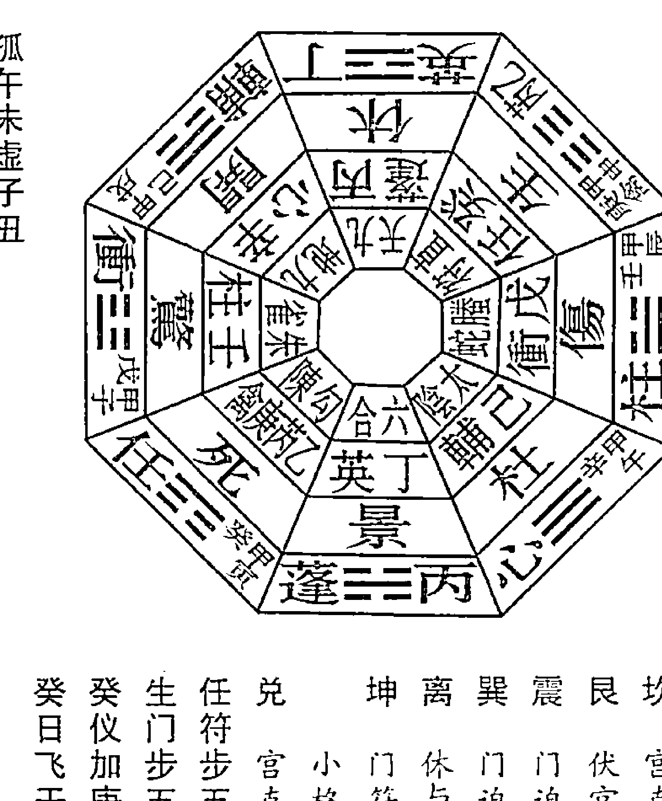

| 阴遁三局 | |
| :--- | :--- |
| 大寒上元 | 春分上元 |
| 雨水下元 | 芒种中元 |

孤午未虚子丑
天任直符加五宫
生门直使加五宫

乾 坎 艮 震 巽 离 坤 兑
地假 宫克门 伏宫格 门迫宫 门迫宫 休与丙合 丙奇升殿 门迫宫
大格 宫门比和

任符步五为山地剥
生门步五为山地剥
癸仪加庚为天网冲犯格
癸日飞干格伏干格

兑 宫克门
小格 宫门比和
坤 门符反吟 飞宫格 仪刑

## 御定奇门遁甲·阴遁九局

断曰：符使同行而步五，则此也庸暗，彼也迟疑，已非吉象矣。况避五则当加坤，于是乎星门尽属反吟，飞伏皆逢庚格，内忧仇人之间，外恐敌国之乘虚，欲行则阻塞而不通，欲止则呻吟而不靖，其皆暗者之自取乎？

兵事：门符反吟，主客均不利。况值仪刑，战必有伤。离合月朗南极，应敌宜出正南方，击其东北可以制胜。但防本营士卒有变，大将当体恤众心。出行：宜出南方，路逢飞鸟鸣噪应。阳宅：宜修离向。七日后，坎方村舍失火吉。阴宅：宜午山子向。作用时，风大起、雨骤至为应。

附占：胜败：有和局。虚实：我往彼来。攻城：富强难克。守城：东南防陷。天时：晴而有风。地理：山运已衰，左砂缺陷。人事：有病者得安。田禾：麦丰，禾有雹伤。家宅：人宅不吉，防有刑伤。官禄：得而复失，升而复降。应试：届场期，防有疾。求财：有阻隔。婚姻：成，男女性多暴戾。胎产：孕生男，产伤母。疾病：药石反投，庸医所误，癸日难愈。捕获：捕人受财私纵。失物：失在正西。远信：不至。鸦鸣：有喜事。鹊噪：无事。

## 戊癸日辛酉时

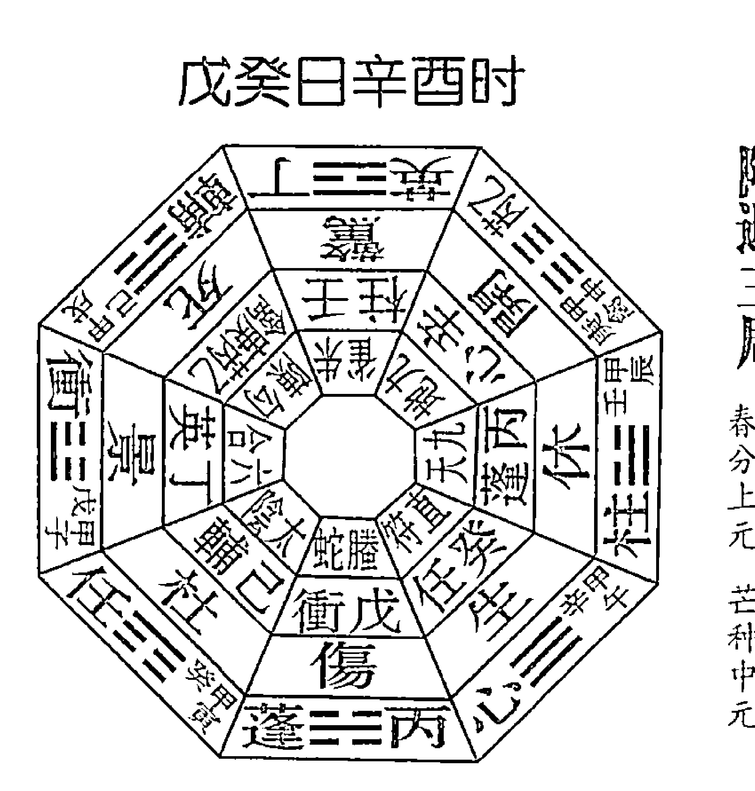

阳遁三局
春分上元
芒种中元
大寒上元
雨水下元

天任直符加六宫
生门直使加六宫
孤未申虚丑寅

癸仪加辛为华盖受恩格 生门加乾为山天大畜 任符加乾为山天大畜 兑休与丙合宫生门 坤虎猖狂宫生门 离宫克门 巽刑格宫克门 震宫生门 艮地假门迫宫 坎宫生门 乾门生宫

断曰：使逐符行，于情固不相背，然屡进屡退，比周之意多，谟弼之益鲜矣，况同居泄脱之地乎？但乾宫有君父之象，臣则为顾恋于阙庭，子则为依栖于膝下，非泛泛私其妻子、惟利身家者之比，未可以相尤也。但时干见格于坤，时方多阻耳。

- 星门生宫，又遇阴时，利于为主。
- 宜安营于坤地，伏兵于艮位，以静待躁。
- 敌至则出西方，转攻东南，遇于西南，当疾击之，以应虎狂之格。
- 出行：宜出西方，路逢妇人引孩儿行，或见金铁之物应。
- 阳宅：宜建兑门，有白衣人至，或见飞鸟过应。
- 阴宅：宜酉山卯向。作用时，见有西方人争殴，鸟鹊飞鸣应。

- 胜败：主胜。
- 虚实：敌气甚盛。
- 攻城：可以克。
- 守城：东南角有伤。
- 天时：先阴后晴。
- 地理：右砂太高，小房不利。
- 人事：有军吏之狱，情未必真。
- 田禾：防水防虫。
- 家宅：防有女人走失，人亦多病。
- 官禄：盗案防参。
- 应试：有阻滞，不能中。
- 求财：君父之财可得。
- 婚姻：成，但不谐老。
- 胎产：生男，产速，母有惊。占胎防堕。
- 疾病：金母不安于肾子，遇明医可救。
- 捕获：将自首。
- 失物：失于正北有水处。
- 远信：无。
- 鸦鸣：有婚姻事。
- 鹊噪：女人有惊。

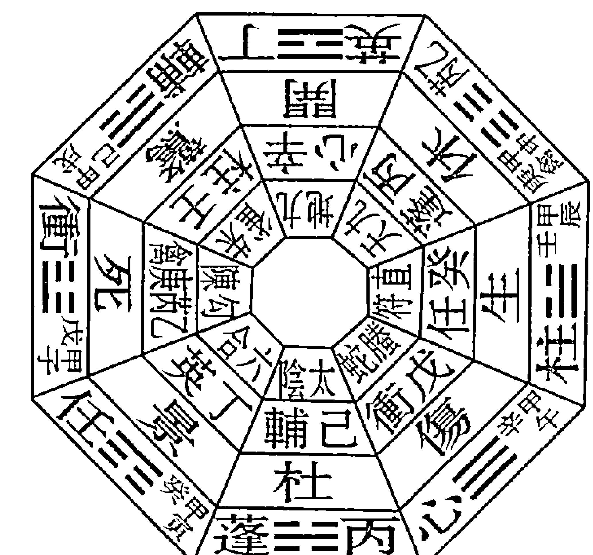

**阳遁三局**
春分上元
芒种中元
大寒上元
雨水下元

孤申酉虚寅卯
天任直符加七宫
生门直使加七宫

| 宫 | 门 | 关系 |
| :--- | :--- | :--- |
| 乾 | 宫克门 | 地假 宫生门 |
| 坎 | 雀投江 丁奇入墓 门生宫 | |
| 艮 | 乙奇升殿 太白与天乙格 | |
| 震 | 门迫宫 | |
| 巽 | 宫克门 | |
| 离 | 休与丙合 荧入白 宫克门 | |
| 坤 | 门生宫 | |
| 兑 | 任符加兑为山泽损 生门加兑为山泽损 | |
| | 癸仪加壬为天网覆狱格 | |
| | 戊日伏干格 | |

断曰：土符临于金旺之乡，受宫之脱，吉则子孙蒙荫，凶则损耗可忧。乃兑为口舌，而适逢朱雀之神，则角斗其不免也。兑为少女，而又逢元武之神，则阴私其不免也。占者能慎言语，远淫邪，庶子孙其逢吉耳。

**兵事**：宫生星门，利为客。天乙遇格，大将不利。宜出西南九天之下，转攻正东。若遇于坤，宜后应。或遇于艮，宜先举。防敌出奇兵格战，须先设伏于北为策应。**出行**：宜出西南方，路逢颁白老妇哭声应。**阳宅**：宜建坤向。三七日，有男女送银钱至，或布帛等物为应。**阴宅**：宜坤山艮向。作用时，北方有风拔木、人叫喊声。

**附占**：**胜败**：主有败。**虚实**：敌可饵。**攻城**：可克。**守城**：宜死守东门。**天时**：云满天。**地理**：水法甚合，案山亦秀。**人事**：有妇人离家涕泣。**田禾**：丰，禾防旱，麦苦雨雪。**家宅**：家有孕妇，但不聚财。**官禄**：受人牵制，官升不起。**应试**：文佳，不中。**求财**：阴小之财，用计可获。**婚姻**：成，防女先亡。**胎产**：生子不育，母安。**疾病**：因争起病，无恙。**捕获**：不用捕缉，即日自归。**失物**：失于西北幽暗之处。**远信**：有喜音，即至。**鸦鸣**：有和合事。**鹊噪**：主暗惊。

## 戊癸日癸亥时

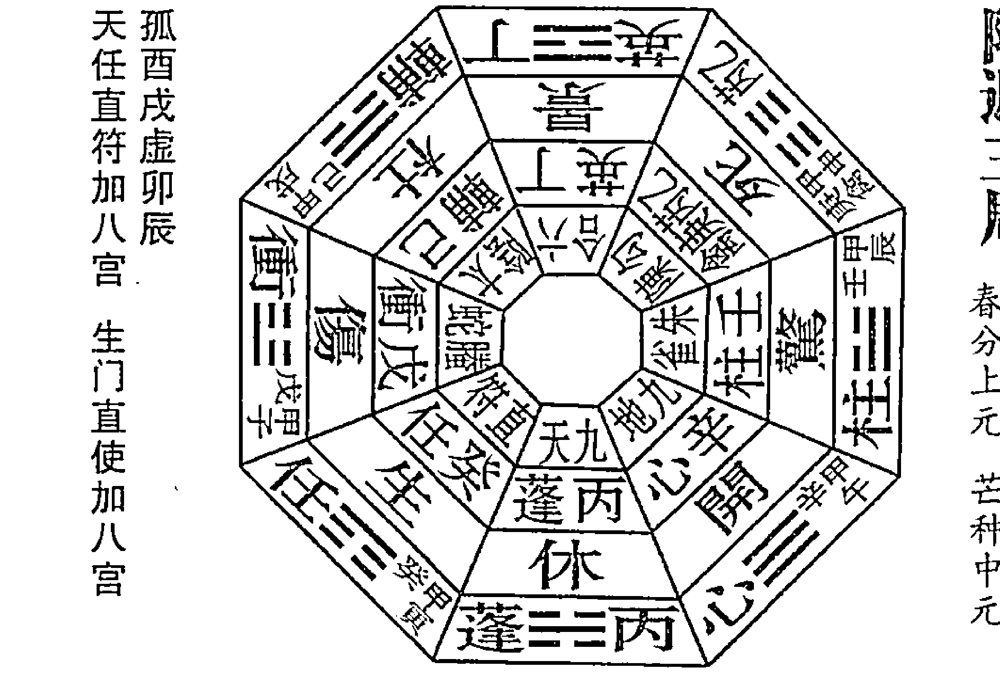

- 天网四张
- 癸仪加癸为天网重张格
- 生门伏艮为艮
- 任符伏艮为艮
- 兑
- 坤
- 离
- 巽
- 震
- 艮
- 坎
- 乾
- 乙奇入墓
- 地假
- 门符伏吟
- 休与丙合

断曰：符使之伏，天网之张，适当艮地。艮也者，万物所以成始而成终也。盖前此之战乾劳坎，俱于是而终，后此之出震齐巽，俱而是而始，故曰“成言乎艮”。然则九星虽伏，原无取乎其动也；八门虽伏，原无虑乎其出也。苟能时止而止，其道光明矣。

兵事：时属天网，安静为贞。宜设伏于巽位，立营于乾地，屯粮于艮方，扬兵于正北。敌若不至，当休养士卒，以为后图。出行：宜出坎方休门，见皂衣人应。阳宅：正北略可修葺，东方见光应。阴宅：宜子山午向。作用时，闻乞丐啼哭之声应。

附占：胜败：各争其雄。虚实：敌有党羽可畏。攻城：宜从西北入。守城：可守。天时：云开见日。地理：穴情美，排峰秀异，砂水平常。人事：当检点府库。田禾：丰，豆更熟。家宅：天窗不利，居人多病。官禄：不能升除。应试：大小试俱利。求财：难得入手。婚姻：成，女性妒。胎产：子不育，产亦迟。疾病：防生腹痛，癸日占难治。捕获：捕受贿藏匿。失物：尚在室内，可寻。远信：无。鸦鸣：防有奸私。鹊噪：少妇口舌。

## 御定奇门遁甲·阳遁九局

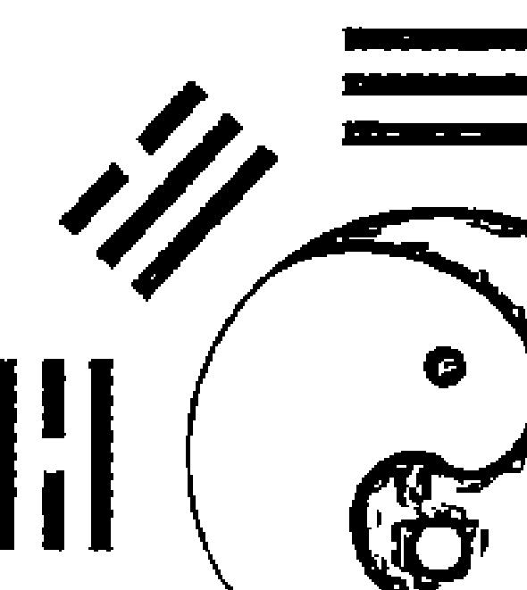

## 明通四层

## 甲己日甲子时

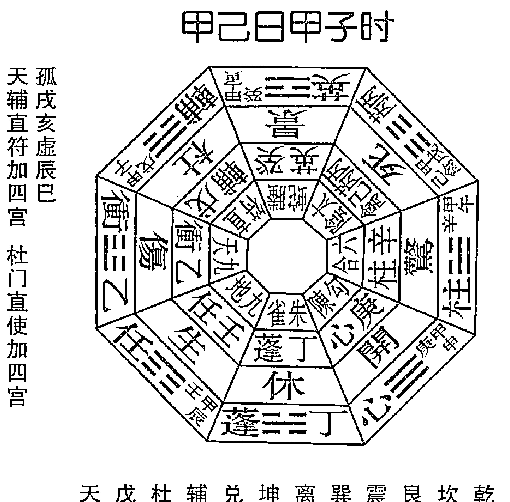

| 宫位 | 乾 | 坎 | 艮 | 震 | 巽 | 离 | 坤 | 兑 |
| :--- | :--- | :--- | :--- | :--- | :--- | :--- | :--- | :--- |
| 说明 | 休与丁合 | 乙奇升殿 | 门符伏吟 | 鬼假 | 辅符伏巽为巽 | 杜门伏巽为巽 | 戊仪加戊为青龙入地格 | 天辅时 |

断曰：巽宫之象，顺而能入。符使伏居于此，乃说礼敦诗之日，非厉兵秣马之时也。然勍敌对冲，眈眈虎视。所赖三奇鼎峙，屹如山立，可以有备无患。春夏得宁，秋冬是戒耳。乙得禄于东方，宜向九天进取；丁受克于正北，勿从元武求财。

兵事：星门皆伏。仲甲之时，刑德在门，不宜出战。安营于东北，四布蒺藜拒马，别伏于西南，据其险要。应敌利出正北，发西南之伏合击之。出行：宜出正北方。三十里，见阴贵人著黄蓝衣。阳宅：利立坎门，有人抱小儿持杖至应。阴宅：丁奇休门伏坎，利子山午向，葬时闻有怪异之声，西方有白衣人来应。

附占：胜败：秋冬客胜。虚实：敌人欲战。攻城：防有外救，不拔。守城：援兵即至，可守。天时：有雨。地理：文曲入宫，明堂水绕，主发财丁。人事：静坐看书论文。田禾：农劳岁丰。家宅：门庭清吉，子孙能继书香。官禄：清华之职，久任难升。应试：甲日占可中。求财：有所得，防暗劫。婚姻：男强女弱，门楣非偶，难成。胎产：产室甚佳，生女。疾病：木乘土位，淹缠难痊。捕获：逃远难缉。失物：在东南方，易寻。远信：喜音迟到。鸦鸣：事来急迫。鹊噪：有婚姻喜信。

## 甲己日乙丑时

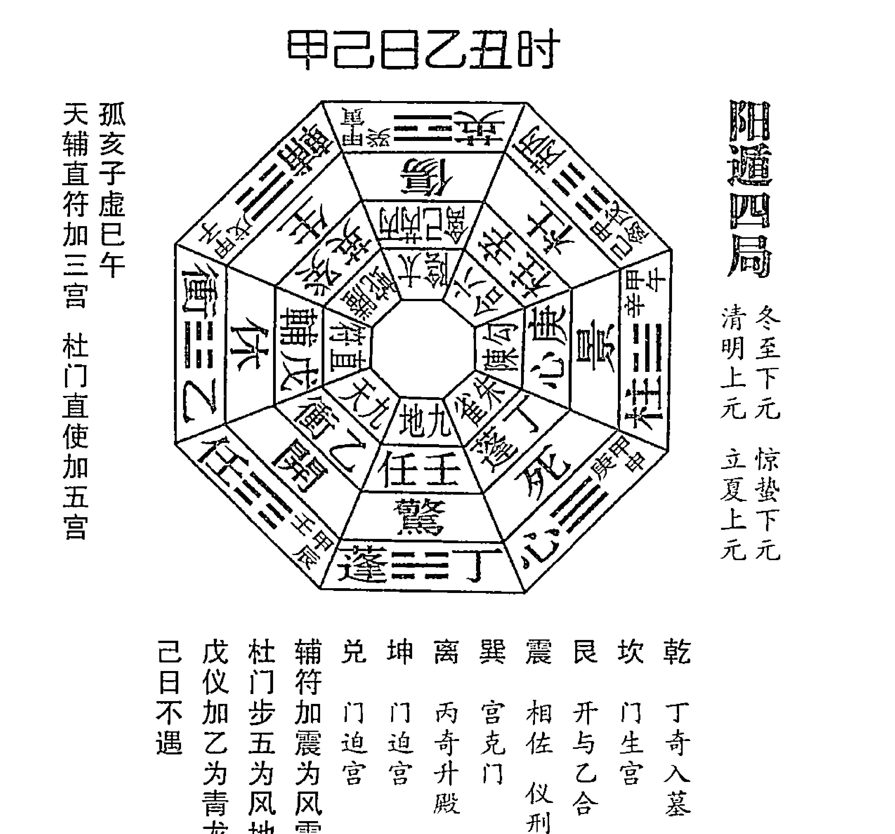

| 乾 | 坎 | 艮 | 震 | 巽 | 离 | 坤 | 兑 |
|---|---|---|---|---|---|---|---|
| 丁奇入墓 | 门生宫 | 开与乙合 | 宫相佐 | 丙奇升殿 | 门迫宫 | 门迫宫 | 辅符加震为风雷益 |
| 杜门步五为风地观 | 戊仪加乙为青龙入云格 | 己日不遇 |  |  |  |  |  |

断曰：戊符加乙，为青龙入云格，风雷变化，此其时也。况乙为同气，加以九天吉神，则攀龙直上，九万扶摇，特易易耳。杜使步五，虽曰财乡，然辛已入而窃取之矣。且有己之比劫在焉，迟疑进退，恐无及也。若放利而行，必且多怨。

兵事：星比和，门克宫，利为客。格合虎遁，宜我兵先动，从东北方出师，伏兵于正南，大张声势而前，击其西北正西，乘风纵击。但值击刑，我兵亦有伤损。出行：宜出东北方。八里十八里，见人言讼事。阳宅：九天乙奇开门，会于东北，利立艮门。有黑白双禽东北飞来，七日内可以发财。阴宅：利艮山坤向。作用时，小儿拍掌大笑应。

附占：胜败：主不利。虚实：敌势甚猛，难与交锋。攻城：不可攻。守城：城南有缺宜修，援兵已至，逆击来敌可胜。天时：无雨。地理：木星入首，发秀而不发财丁。人事：见青衣人言武事。田禾：大丰。家宅：门不向阳，人多忧郁。官禄：案牍劳神，精明莅治，当有特恩升擢。应试：甲日占可中。求财：劳而无益。婚姻：媒人得力，可成。胎产：孪生男女，不能育，母亦不安。疾病：己日占，淹缠。捕获：防捕人容情私纵。失物：在宅东林木之丛。远信：不至。鸦鸣：防争斗。鹊噪：有慰唁事。

## 甲己日丙寅时

### 阳遁四局

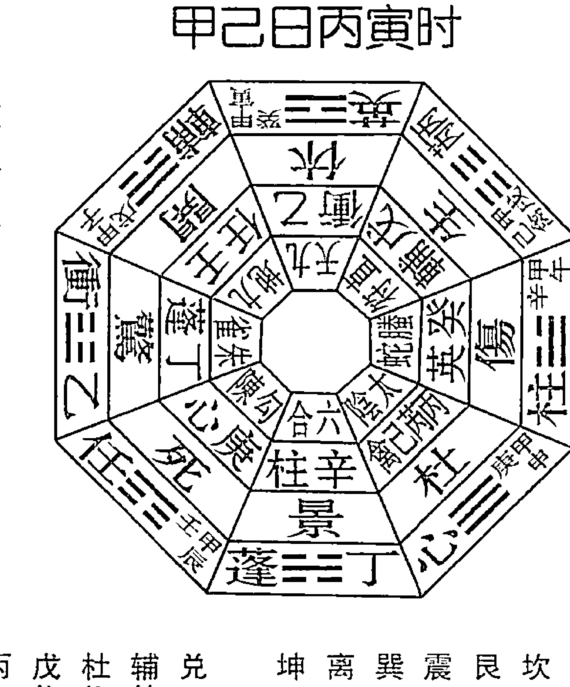

| 兑 | 坤 | 离 | 巽 | 震 | 艮 | 坎 | 乾 |
| --- | --- | --- | --- | --- | --- | --- | --- |
| 宫克门 | 宫门比和 | 龙返首相佐 | 休与乙合龙遁 | 门迫宫 | 门迫宫 | 上格宫门比和 | 宫克门格刑门反吟宫克门地假荧入白丙奇入墓 |

断曰：木符入于坤宫，乃太阴财帛之地，又得丙奇为用，所谋必遂，所谓落其实而取材者也。惟嫌未为木墓，只可安守一枝耳。使入乾宫，是为因财致鬼，又值庚丙勃飞之凶，未免求荣反辱。益石户之农，固不能通天阙也。

兵事：阳时利为客，但星克宫、宫克门，互有伤损。格合龙遁，水战尤吉。宜从正南出兵，伏兵于西北，背西南，击东北。有风云助阵，可以取胜。不可用副将临敌。出行：宜出正南。一二里九里，见皂衣人、骑马公吏或飞禽应。阳宅：宜立离门。有患目人至，见白禽从东方飞来。阴宅：午山子向吉。作用时，有怀孕瘦妇至，葬后进财帛。

附占：胜败：势力相等。虚实：来情不虚。攻城：不拔。守城：援兵相助，但防奸细，可守。天时：阴云无雨。地理：山情回顾，可用，穴下有枯骨。人事：见文人言应举事，或欲月下行舟，或闻画船箫鼓。田禾：麦熟，谷欠收。家宅：宅新发财，父母康健。官禄：不升，防参。应试：帘官不荐。求财：不得。婚姻：女美而多才，妆奁甚厚，却肯俯就男家，可成。胎产：母有灾病，当生贵子。疾病：血光之灾，宜谢灶司。捕获：在市井，或近宦人家，可擒。失物：西南近贵人家，可觅。远信：不至。鸦鸣：有和合事。鹊噪：主阴人相会。

## 甲己日丁卯时

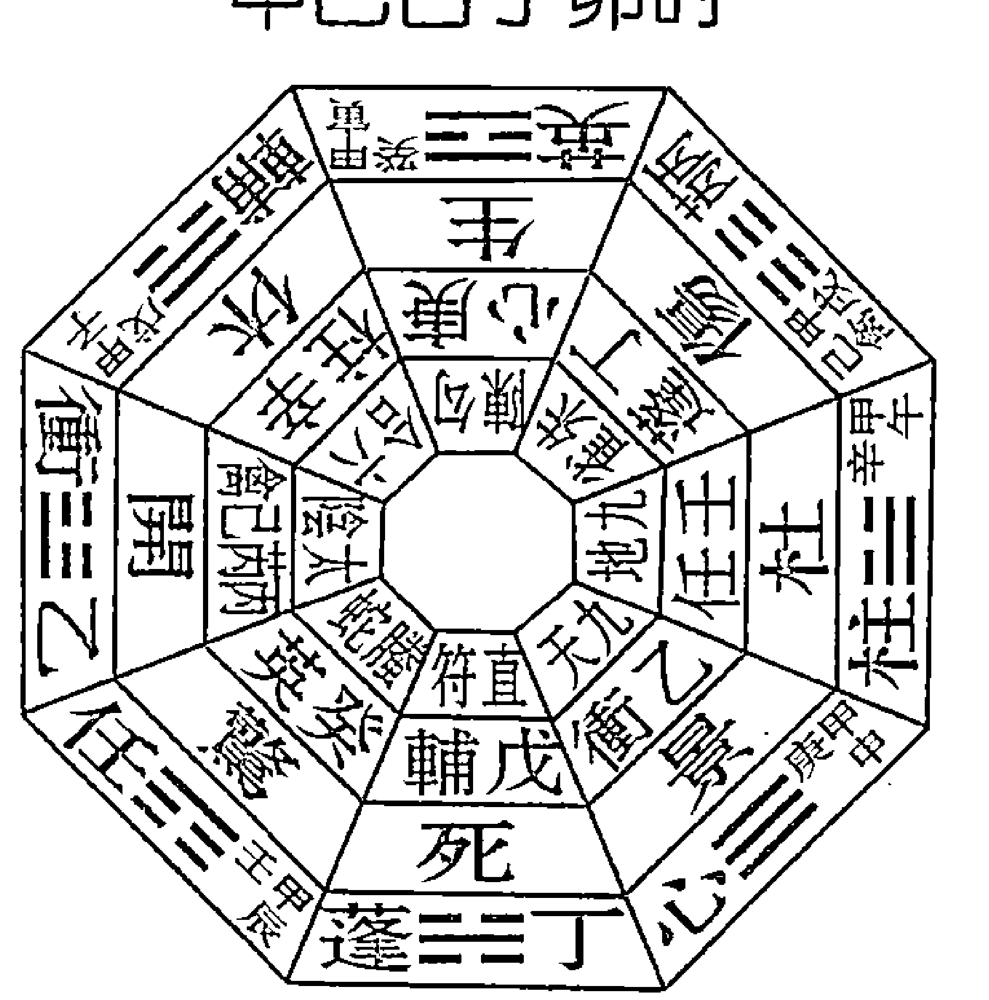

孤丑寅虚未申
天辅直符加一宫 杜门直使加七宫

阳遁四局
冬至下元
清明上元
立夏上元
惊蛰下元

戊仪加丁为青龙耀明格 杜门加兑为风泽中孚 辅符加坎为风水涣 兑宫克门 坤门迫宫 离大格宫生门 巽门生宫 震开与丙合真诈门迫宫 艮宫生门 坎相佐门迫宫 乾天假乙奇入墓门迫宫

断曰：符居印绶，使入官乡，似乎进取之局矣。然本无筮仕之材，只可为阴私之计。况丁以爝火之光，岂能暖汪洋之水。而木乘冬令，生气亦微。兼之使入兑而遇辛，飞辛又加于本宫，其受克不已深乎？将有口舌争讼之忧，未见其能进取也。

兵事：宫生星，宫克门，主客互有损益。阳时利于先动，从正东方出师，伏兵随之，乘隙击其西南，截其东北粮储。惟门使受制，副将宜居后队。出行：震方格合真诈，利出正东。三里十三里，见女人，或四足物。阳宅：宜立震门。有人持铁器，或鼓乐声应。阴宅：卯山酉向吉。作用时，有老人持杖至，或闻喜鹊喧噪。葬后六十日内，因女人得财。

附占：胜败：主胜。虚实：敌人疑惧。攻城：内顾多忧，无力攻取。守城：城池不固，有援兵可恃，敌自解散。天时：有雨。地理：水法不合，不可用。人事：有牢狱事，防暗谋逃越。田禾：禾登，麦不收。家宅：阃内多财，能持门户，终不免牝鸡贻诮。官禄：文书甚佳，可望升迁。应试：文佳不售。求财：有阻，夏月可得。婚姻：不成。胎产：生男安吉。疾病：目疾，犯金神所致，祀之即愈。捕获：防伤，捕不获。失物：在于正北贵家。远信：即至。鸦鸣：主夫妻会合。鹊噪：主盗贼音信。

## 甲己日戊辰时

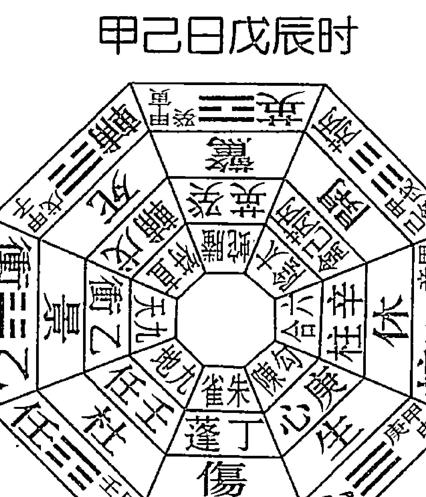

| 方位 | 说明 |
| :--- | :--- |
| 右侧竖排文字 | 阳遁四局 冬至下元 惊蛰下元 清明上元 立夏上元 |
| 左侧竖排文字 | 孤寅卯虚申酉 天辅直符加四宫 杜门直使加八宫 |

| 宫位/项目 | 解释/吉凶 |
| :--- | :--- |
| 乾 | 宫生门 |
| 坎 | 宫生门 |
| 艮 | 宫迫 |
| 震 | 乙奇升殿 天假 宫生门 |
| 巽 | 符伏吟 宫克门 |
| 离 | 宫克门 |
| 坤 | 开与丙合 真诈 宫生门 |
| 兑 | 宫生门 |
| 辅符伏巽 | 巽 |
| 杜门加艮 | 风山渐 |
| 戊仪加戊 | 青龙入地格 |

断曰：符归伏巽，为辗转思维之象。死门来加，若非生财，即当致悔。杜使到艮，有入山取材之义。而乃深居九地，闭户隔绝，为往而不返之局。则恐铜山金穴，为私人之利，非公家所有也。宜严据防窃邑之诛，且以越国鄙远为戒。

兵事：星伏宫，门克宫，阳时利为客。格合真诈，利用间谍。西南可以出师，伏兵随之，东北亦可设伏。敌伏于西北，其势颇猛，尚在观望，我当相时而动。出行：宜出西南。二里十二里，闻人哭声，见四足相斗。阳宅：立坤门最利，有鹊自南飞来。二七日，进西方女人财帛为应。阴宅：宜坤山艮向，有青衣人携鱼罟来，或持药物应。

附占：胜败：客胜。虚实：敌意欲斗。攻城：城内有重兵，防设诈降之局，切不可信。守城：援兵绎络而至，敌来可以诱取。天时：不晴。地理：山向不吉。人事：独坐闻雨声。田禾：禾有收。家宅：堂室幽暗，止不守困，不能显达。官禄：衙门清苦，却有意外荐举。应试：文字极佳。甲日占，春闱有望。求财：可得。婚姻：不成。胎产：易产，生女，后当贵。疾病：土虚水泛，宜补中宫。捕获：在西北方公吏人家。失物：在原处可得。远信：迟到。鸦鸣：主贵人得禄事。鹊噪：有书信至。

## 甲乙日己巳时

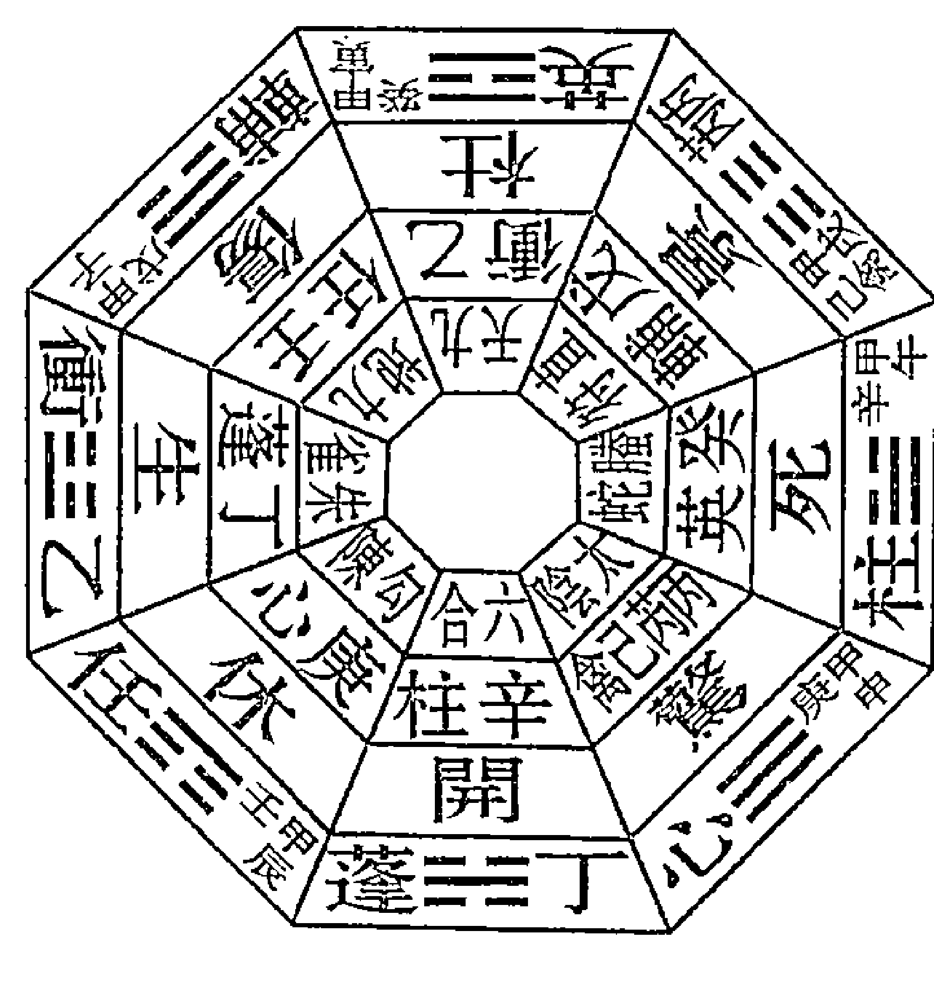

孤卯辰虚酉戊
天辅直符加五宫
杜门直使加九宫

### 阳遁四局
冬至下元
惊蛰下元
清明上元
立夏上元

| 宫位/条目 | 解析 |
| :--- | :--- |
| 乾 | 丙奇入墓，荧入白，格刑，宫门比和 |
| 坎 | 宫门比和，门生宫，上格，宫克门 |
| 艮 | 生与丁合，宫克门，宫与门 |
| 震 | 宫门比和 |
| 巽 | 门生宫 |
| 离 | 门生宫 |
| 坤 | 门生宫 |
| 兑 | 辅符步五为风地观 |
| 附加 | 杜门加离为风火家人 |
| 附加 | 戊仪加己为青龙相合格 |
| 附加 | 己日飞干格 |

断曰：戊符入于财地，太阴暗助，丙奇又从旁相益，可以处脂韦而自润矣。但嫌寄居于墓而步五，则中有迟疑，止可积货居奇，未许牵车服贾也。使到子孙之宫而受泄，且景门互入于坤，有妻子相从之义，恐亦不无牵制耳。

兵事：星克门，门生宫，主客互有损益。阴时不利先动，贼巢在西北，荧惑入之，又逢格刑，宜预伏精锐于其左右，提兵直捣其营。炮发伏起，可以得志。东北贼亦有伏，路上有阻，宜绕道。出行：宜出正东方。三里十三里，逢公吏持棍，夏月出西南方亦利。阳宅：利建震门，有女人或黑禽南来。阴宅：卯山西向吉。作用时，西南方有鼓声喧闹。

附占：胜败：势均力敌。虚实：来情无诈。攻城：徒劳兵将，难破。守城：严加稽察，可守。天时：阴。地理：案外得朝，穴下有骨殖。人事：有更改事，或术士至。田禾：丰收。家宅：祖业兴隆，发富发贵。官禄：即升。应试：己日占，中。求财：易得。婚姻：可成。胎产：生女。疾病：丁火盛，变惊悸之症，正心安神，可治。捕获：贼甚狡猾，难获。失物：西南可寻。远信：不至。鸦鸣：有文书酒食事。鹊噪：主得财，多且速。

## 甲己日庚午时

孤辰巳虚戊亥 天辅直符加六宫 杜门直使加一宫

阳遁四局 冬至下元 惊蛰下元 清明上元 立夏上元

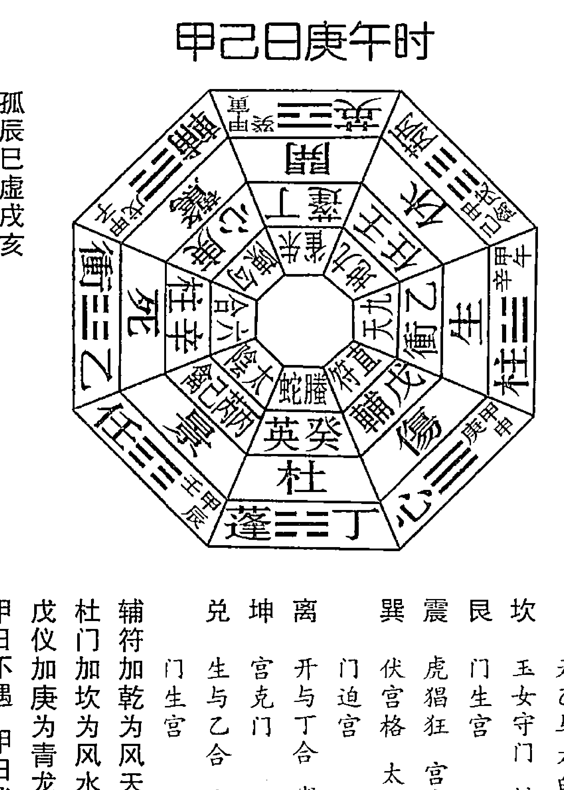

甲日不遇 甲日飞干格 伏干格
戊仪加庚为青龙持势格 杜门加坎为风水涣 辅符加乾为风天小畜

兑 坤 离 巽 震 艮 坎 乾
生与乙合 虎遁 龙逃走 开与丁合 雀投江 宫克门 门迫宫 伏宫格 太白与天乙格 虎猖狂 宫克门 门生宫 玉女守门 蛇天矫 宫生门 天乙与太白格 宫克门

断曰：辅到乾为反吟，甲加庚为飞干，虽子申得合，恐相投之机少，而相戕之意多也。且飞宫及本宫，星门俱恶，将有忧疑反覆，进退迍邅者矣。杜使入坎，虽有玉女守门，而螣蛇天矫，雀武亦非宁谧之神，此时大厦，岂一木所能支乎？

兵事：宫克星，宫生门，阴时利为主。宜乘敌人先动，分兵攻举，一出正南，一出正西。战于正北正东，宜疾击以应蛇矫虎狂；战于正南正西，宜缓击以应龙走雀投。

出行：宜出正南正西两方。正南九里，见女人骑马；正西八里，闻人言讼事。阳宅：宜建离兑二门，主得财禄。阴宅：午山子向、酉山卯向皆吉，有迎亲轿马过为应。

附占：胜败：主胜。虚实：敌人畏我。攻城：救兵云集。守城：敌锋甚锐，赖重兵来援，可守。天时：有风雨。地理：四势散乱，不吉。人事：有女人孕妇虚惊。田禾：麦胜谷。家宅：门户废缺，当修，宅眷不宁。官禄：官事烦扰，文书舛误，防参降。应试：不中。求财：速得。婚姻：不成。胎产：男胎，防堕。疾病：燃灯礼斗，勿药有喜。捕获：捕人得力，易获。失物：失于西北，难寻。远信：人从水路来，为风雨所阻，信不至。鸦鸣：主争论。鹊噪：主有女亲即至。

## 甲己日辛未时

孤巳午虚亥子 天辅直符加七宫 杜门直使加二宫

阳遁四局 冬至下元 惊蛰下元 清明上元 立夏上元

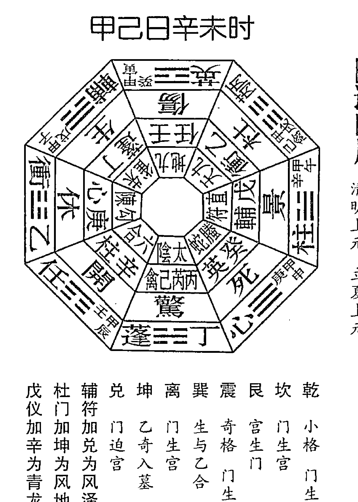

-   戊仪加辛为青龙相侵格
-   杜门加坤为风地观
-   辅符加兑为风泽中孚
-   兑门迫宫
-   坤乙奇入墓门迫宫
-   离门生宫
-   巽生与乙合宫克门
-   震奇格门生宫
-   艮宫生门
-   坎门生宫
-   乾小格门生宫

断曰：符临官乡，使临财地，似可输财作室。而六合比肩，或有同人排阻，未宫入墓，不无暗地濡迟，翻有因官破财之象。惟本宫丁奇飞人，生门并临，则佳果名花绕篱而繁殖，曲眉丰颐列屋而闲居，亦可极偃息之乐矣。故曰妄动不如宁静。

兵事：阴时利主，但门克宫、宫克星，互有损伤。侯敌先动，向东南出师，安营于正南，设伏于正北，背东南，击西北。小有火惊，天亦防雾。门迫其宫，先锋宜用参将。出行：宜出东南方。四里十四里，逢公吏，闻说长道短声。阳宅：利建巽门。有小儿骑牛至，南方黑云起为应。阴宅：巽山乾向最吉。有鼓响，小儿著孝衣至。六十日内，六畜大旺，发财。

附占：胜败：主兵胜。虚实：敌军粮足将勇，来必鏖战。攻城：不可攻。守城：有援兵可保。天时：不晴。地理：外不护，难用。人事：阅射讲艺，有锐气勃勃之象。田禾：麦丰。家宅：防有怪异，不利人口。官禄：任重才弱，不能升转。应试：甲日占，不中。求财：因亲情恳，必能遂意，宜急求之。婚姻：男有别情，不成。胎产：生女，产母有灾。疾病：女人产后中风，不易治。捕获：匿东北方，伙伴甚众，难获。失物：失在正西，难寻。远信：五八日当至。鸦鸣：有贵人之事。鹊噪：主得田财六畜。

## 甲己日壬申时

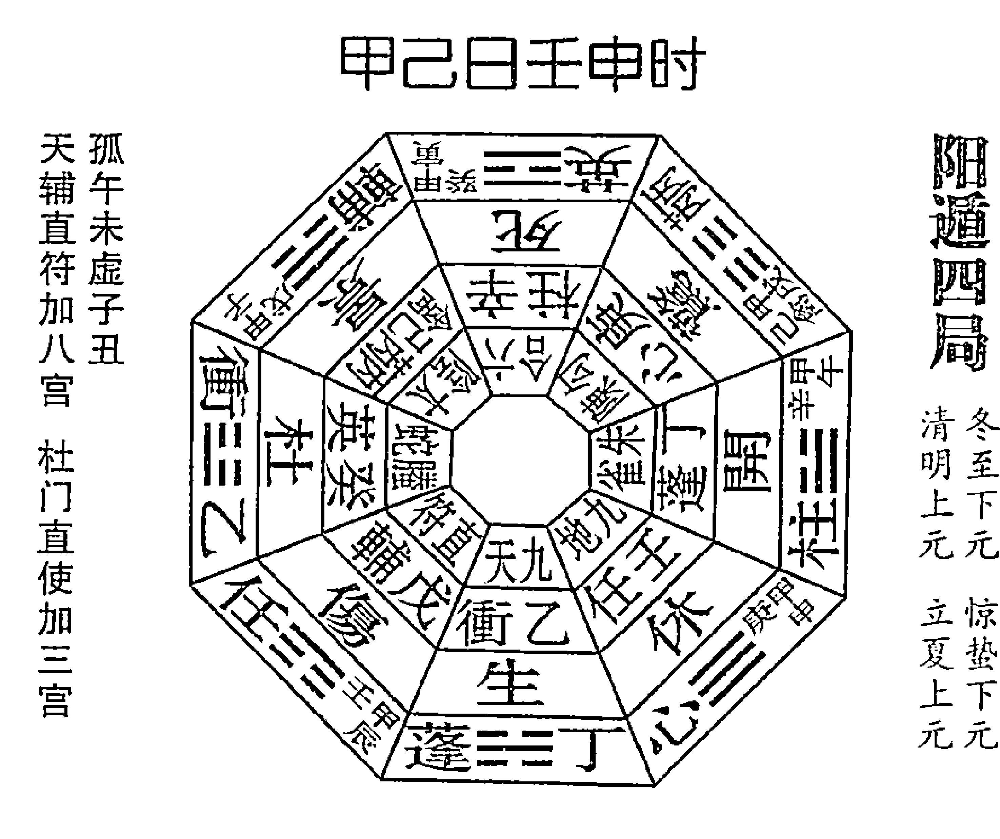

| 宫   | 解释               | 其他             |
| :--- | :----------------- | :--------------- |
| 乾   | 宫生门             |                  |
| 坎   | 生与乙合 龙遁 门迫宫 |                  |
| 艮   | 门迫宫             |                  |
| 震   | 宫门比和           |                  |
| 巽   | 鸟跌穴 勃符 宫生门 |                  |
| 离   | 宫生门             |                  |
| 坤   | 白入荧 奇格 刑格 宫生门 |                  |
| 兑   | 开与丁合 丁奇升殿  | 宫门比和         |
| (左列补充) | 辅符加艮为风山渐 | 己日伏干格       |
| (左列补充) | 杜门加震为风雷益 | 戊仪加壬为青龙破狱格 |

断曰：符居九地而取财，有凿山开穴之劳；使向九天而见日，有依乔附木之势。故图利不若图名也。但显晦各殊，趋向不一，则惶惑未决，逡巡退后，恐终归于杜门株守而已。而本宫飞鸟跌穴，景门来加，当自有恩从天降、喜溢门楣者耳。

兵事：门比和，星克宫，利为客。兵宜先动，一出正北，一出正西。伏兵于东南，更番叠进，背北击南，有降者即收用之。敌若向西南而遁，勿逐。出行：出正北一里，逢皂衣人；正西七里，见女人引孩儿，及公吏言官事。阳宅：宜立坎兑二门，主得田财六畜。阴宅：子山午向、酉山卯向皆利。有怀孕人至，西方有金鼓声为应。

附占：胜败：两军相持。虚实：敌有惊心，防即至。攻城：不可拔。守城：有救兵，易守。天时：无晴。地理：主山土星入首，可用，穴下有龟板。人事：有土木之事，其价不实。田禾：收麦。家宅：宅新发财，可居，防小口有灾。官禄：官久自富，求荐得升。应试：文佳不遇。求财：经营极善，所得不多。婚姻：女貌佳，男性凶，不成。胎产：胎安，生女。疾病：肾水不足，宜滋阴。捕获：贼已远遁，无从捕缉。失物：书籍之类，为司阍人所盗。远信：土日至。鸦鸣：有和合事。鹊噪：有行人远来。

## 甲己日癸酉时

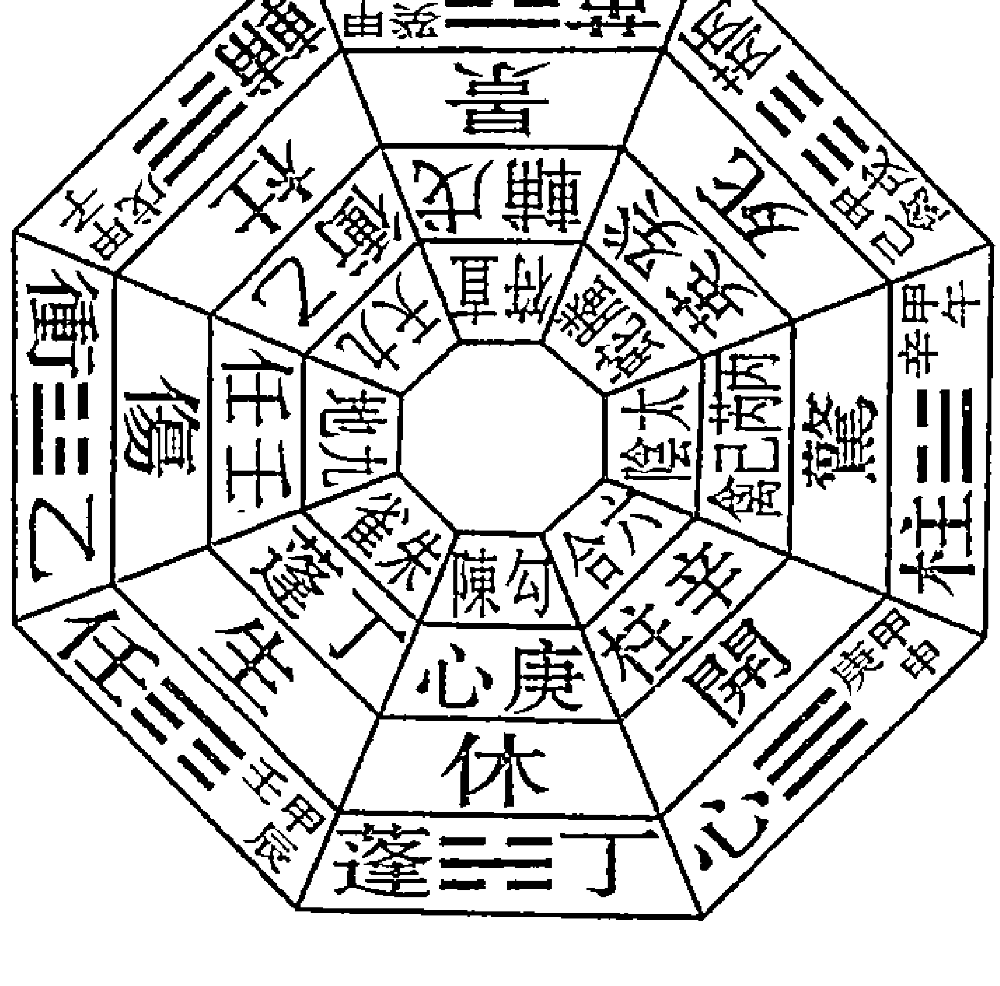

天网 戊仪加癸为青龙相和格 杜门伏巽为巽 辅符加离为风火家人 兑 坤 离 巽 震 艮 坎 乾
门伏吟 生与丁合 丁奇入墓 奇格

断曰：辅符到离，戊癸化合，可以共济昌明矣。不知木能生火，火太盛，亦能焚木也。使归伏巽，顺时退隐，虽有乘风之志，而闭户深藏，若惟恐有林木之殃者。斯为独居深念，忧盛危明之象。占者苟能如是，乃可无悔。

兵事：门伏宫，星生宫，阴时利主。俟敌人先动，向东北出师应之，伏兵于正西西北，贼至则截其西南辎重，我以大军继其后，背艮击坤。见红雾四塞，可以制胜。

出行：宜出东北方。八里，逢阴人著黄衣，或公吏勾当人应。阳宅：宜立艮门。有持文书至，小儿持器应。阴宅：艮山坤向吉。有远人送书至，妇人把火为应。

附占：胜败：秋冬客胜。虚实：敌情不测。攻城：有援，难攻。守城：宜备西北，可守。天时：阴晴不定。地理：离龙入首，发人丁，可用。人事：当有词客，讲论诗文。田禾：麦丰，东北尤熟。家宅：不聚财，防火烛，生子佳。官禄：印有伤损，官亦迟滞。应试：不中。求财：有得。婚姻：女聪明性静，男家益女家，易成。胎产：胎稳产迟，生女安吉。疾病：肝病，迁延时日。捕获：匿在西北水边。失物：在正南近灶处。远信：无。鸦鸣：主贵人之事。鹊噪：有财帛到家。

## 甲己日甲戌时

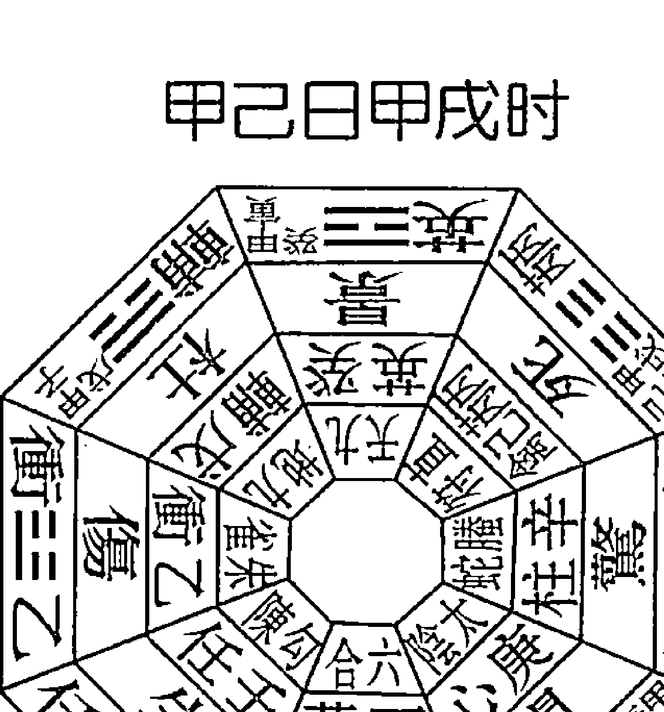

阳遁四局

冬至下元
惊蛰下元
清明上元
立夏上元

孤申酉虚寅卯
天禽直符加五宫
死门直使加五宫

-   天辅时
-   己仪加己为明堂重逢格
-   死门伏五为坤
-   禽符伏五为坤
-   兑：门符伏吟仪刑
-   巽：乙奇升殿
-   坎：休与于合 休诈

断曰：禽本中宫之符，自应居中以驭外，乃寄居于击刑之地，则大权旁落，政出私门，而伤害实多矣。且又与丙同宫，主有勃乱。盖威福之柄，既已下移，则纪纲之紊，乃所必至。虽有天乙相辅，恐倒持太阿者，不足与语其吉也。

兵事：门符伏宫，主客比和。季甲之时，阳气在外，利于先举。宜从正北方蓬星下出兵，背西击东。防西北敌有伏兵，须预伏于左右，截其小路。有青黄云气，自西北方来助阵则胜。出行：宜出正北休门。行十里，逢青帻人，有戚友邀留宴饮。阳宅：宜开北门，有人持利器来应。阴宅：子山午向吉。作用时，闻东方鸦鸣鼓声应。

附占：胜败：客胜主。虚实：敌有阴谋。攻城：城有重兵，不攻。守城：援兵密迩，可守。天时：晴。地理：地系古冢，龙脉偏卸，防有刑伤，掘得朽骸残帛。人事：有高年人乘舆至。田禾：收作好，夏防旱。家宅：外观壮丽，内实空虚，惟人口康宁，可居。官禄：难升，防罚俸。应试：文清真，虽荐不中。求财：将得复失。婚姻：男强女弱，不就。胎产：生女，母有疾。疾病：情欲致病，淹滞难痊。捕获：逃人自归，盗不获。失物：失于东南暗处，可寻。远信：有喜音未至。鸦鸣：长上之事。鹊噪：有贵客来。

## 甲己日乙亥时

（八边形奇门遁甲排盘图示，内含天盘、地盘、八神、八门、九星及三奇六仪等布阵信息，中心为“戊”及“地九”。外圈标注“阳遁四局”及适用节气：冬至下元、惊蛰下元、清明上元、立夏上元。左侧标注：天禽直符加三宫，死门直使加六宫；孤酉戌虚卯辰。）

乾 乙奇入墓 门生宫
坎 宫生宫
艮 宫生门
震 休与丙合 相佐 门生宫
巽 宫克门
离 大格 门生宫
坤 地假 门迫宫
兑 门迫宫
禽符加震为地雷复
死门加乾为地天泰
己仪加乙为日入地户格
己日不遇

> 断曰：甲乙相加，本有二龙战野之象，而又以雀武为之阴神，则口舌之竞争、阴邪之脱诈。虽曰官乡，恐未问功名，先忧讼事矣。况时干本宫遇丙，既以逆乱为忧；飞宫遇庚，又以阻隔为患。进退维谷，静作俱乖，顾瞻四方，蹙蹙安所骋乎？

兵事：宫克星，门生宫，利为主。宜立营于坎地，常有惊，不可动。伏兵在南，敌亦来伏，必有格斗。大兵从正东直符下出，击其对冲。敌若据其西北，必有党羽。用力致死，断不可追击。出行：宜出正东方。行四里，见手艺人执木器，或逢雷雨应。阳宅：宜开震门，有渔人或小儿来为应。阴宅：卯山西向吉。作用时，东北村邑失火应。

附占：胜败：主兵强盛，不战而服。虚实：敌心甚怯。攻城：不可攻。守城：易守。天时：主有风雨。地理：穴情美，砂水不秀，土色碧。人事：主女同婿归宁，须防口舌。田禾：大有年。家宅：宅吉人安，防有失脱。官禄：可升，有特恩。应试：文不警策动人，不合房考意。求财：许约多伪，不得。婚姻：冰人极欲说合，女家别有属意，不成。胎产：生女，产迟。疾病：肝肺火炽，痰涎壅涩，神色昏昧，宜用消痰降火之剂。捕获：在西北方，是僧道人。失物：失于正北水际。远信：不至。鸦鸣：有和合事。鹊噪：闻女人孝服事。

## 乙庚日丙子时

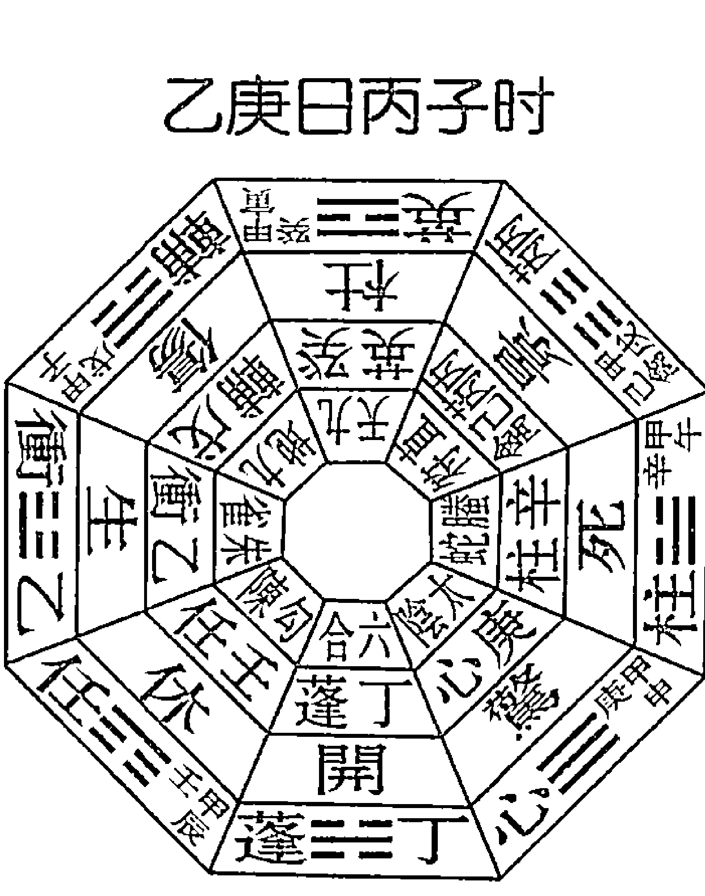

阳遁四局
冬至下元 惊蛰下元
清明上元 立夏上元

孤戊亥虚辰巳
天禽直符加二宫 死门直使加七宫

| 乾 | 坎 | 艮 | 震 | 巽 | 离 | 坤 | 兑 |
| :--- | :--- | :--- | :--- | :--- | :--- | :--- | :--- |
| 宫门比和 | 开与丁合 休诈 门生宫 | 宫克门 | 生与乙合 云遁 乙奇升殿 | 宫门比和 | 门生宫 | 龙返首 鸟跌穴 相佐 符勃 | 勃符 符伏吟 门生宫 |
| | | | | | | | 禽符加坤为坤 符加坤为地泽临 |
| | | | | | | | 死门加兑为地户埋光格 |
| | | | | | | | 己仪加丙为地户埋光格 |
| | | | | | | | 庚日不遇 庚日飞干格伏干格 |

断曰：禽符寄芮，相牵而伏，譬若周之东迁，晋郑焉依。晋郑或衰，王迹愈熄。此虽以甲加丙，要当为困蛰之占，不得言返首之吉矣。符既伏而呻吟，使又进而泄脱，愁人相对，满目苍凉，殆所谓“休戚与同”者耶？

兵事：星比和，门生宫，利为主。格合休诈，宜用奇兵诈敌。分军为二队，一出正东，一出正北，合攻正西。西北角有尘起鸟惊，防敌设伏，不可追。出行：图利宜正东，求名宜正北。路逢病眼人，或小儿执杖应。阳宅：震合贵人升殿，宜卯向，有武夫执刀枪至。阴宅：宜震山子山。作用时，东方火光应。

附占：胜败：先举得胜。虚实：敌深入，有惊惶，未至。攻城：不能拔。守城：援兵四集，可守。天时：不起风雨。地理：来龙曲折有情，案山朝拱多秀，牛眠吉穴。人事：素服人至，言医药，或禽鸟事。田禾：麦大熟，青冀尤丰。家宅：人口康宁，惟防火烛。官禄：有荐举可升，居官久，防罚俸。应试：庚日占，中。求财：费口舌可得。婚姻：女美，嫌男贫，不成。胎产：无胎，乃是血疾。疾病：肺有伏火，气不下降，宜清理。捕获：获后防逃。失物：失于东南，可寻。远信：远人出月回，近人三五日至。鸦鸣：贵人来。鹊噪：有吉庆事。

## 乙庚日丁丑时

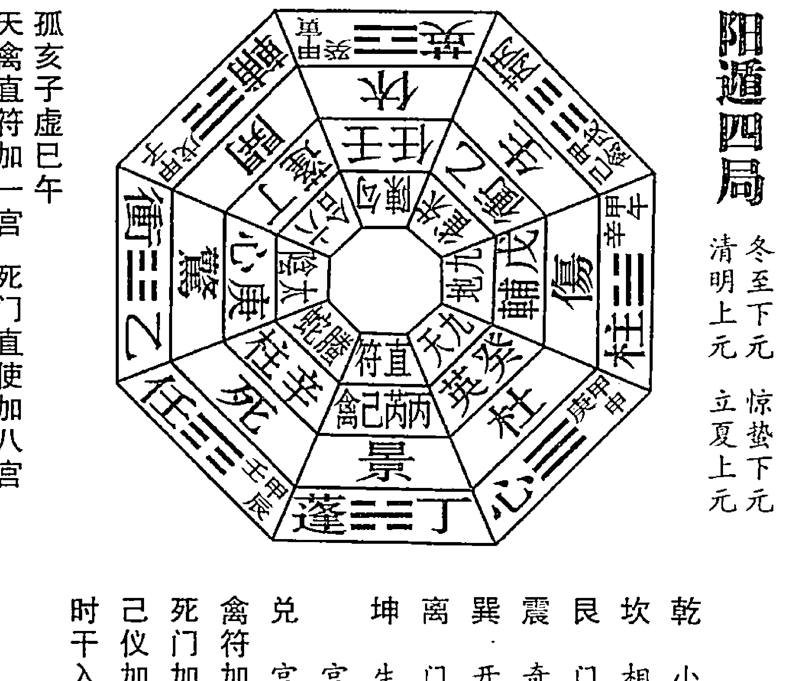

-   时干入墓 乙日伏干格
-   己仪加丁为明堂贪生格
-   死门加艮为地山谦
-   禽符加坎为地水师
-   兑宫克门
-   坤宫门比和
-   离生与乙合 乙奇入墓
-   巽门迫宫
-   震开与丁合 休诈 门迫宫
-   艮奇格 门迫宫
-   坎门反吟 宫门比和
-   乾相佐 宫克门
-   小格 宫克门

断曰：土符入水，神主六合，于以问财，可不劳而获矣。惜乎使为反吟，未免事多更变，情有参差。得非以同宫之芮，比劫争财故耶？丙随符而临坎，号为火入水池。然在奇则恐其受伤，论勃则利其失地。时干临于帝旺，动作皆宜。

兵事：星克宫，门比和。值阳时，利为客。宜出东南，击正南。正东正西，皆可伏兵。但正东贼方乘旺，且党羽甚众，我宜东出西没，乱其军心，密令参将帅劲卒邀击之。出行：宜出东南方。四里六里，逢僧尼，或老人行走应。阳宅：宜开巽。作用时，有黑云自南来，或下雨应。阴宅：巽山乾向、坤山艮向皆可用，葬后进羽音人金银器皿应。

附占：胜败：主胜。虚实：敌将渔色，不即至。攻城：城中兵强粮足，不克。守城：援兵四应，可守。天时：有风，北方起黄色云。地理：前有溪沟，后列庙宇，砂水俱佳。人事：言事者反覆不可信。田禾：麦丰，禾防旱。家宅：小口不安，大人获祸。官禄：即日超擢。应试：春闱房考不荐，秋闱可中。求财：女人之财有得，终防口舌。婚姻：女家富，男家不敢攀。胎产：产室不佳，防母有灾，生男。疾病：肾虚，肺救子亦虚，心火乘间逼金，宜滋化源。捕获：难捕。失物：失于正西有碑亭处，难寻。远信：即至。鸦鸣：主贵人事。鹊噪：喜事。

## 乙庚日戊寅时

孤子丑虚午未
天禽直符加四宫 死门直使加九宫

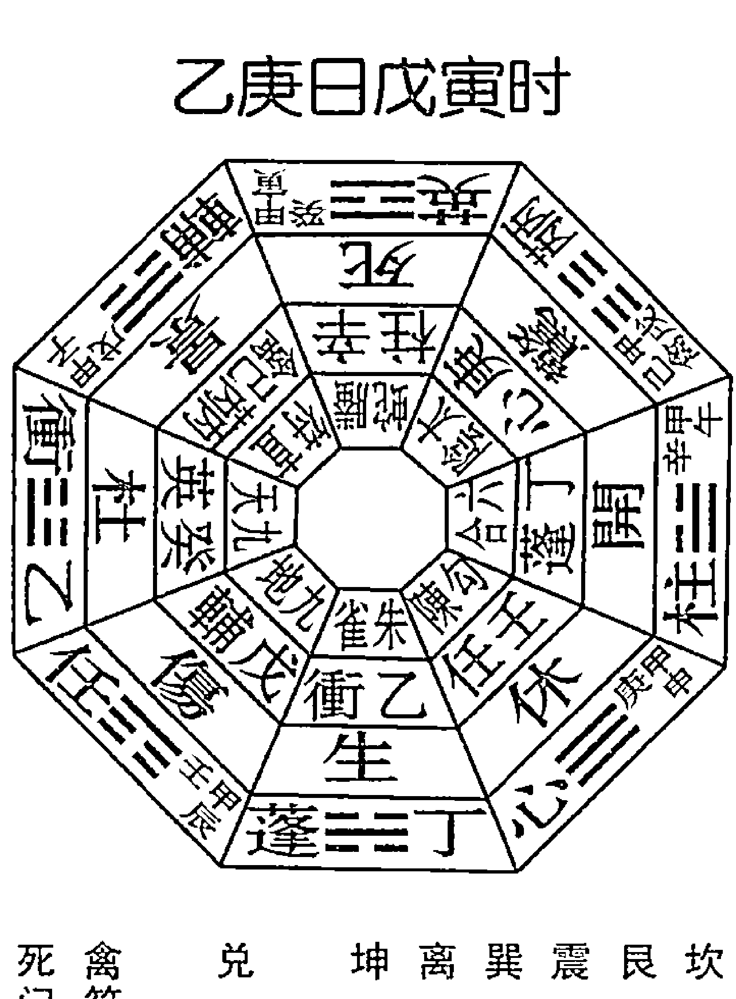

阳遁四局
冬至下元
惊蛰下元
清明上元
立夏上元

乾 宫生门
坎 生与乙合龙遁门迫宫
艮 门迫宫
震 宫门比和
巽 宫生门
离 宫生门
坤 白入荧奇格伏宫格
兑 刑格宫生门 开与丁合丁奇升殿休诈
禽符加巽为地风升
死门加离为地火明夷
己仪加戊为明堂从禄格

断曰：禽星临于巽木，直符已入官乡，又为文曲之宫，当有华国文章，上结主知，用抒抱负。但符之寄宫，飞庚挟太阴以来加，不免门庭之寇，窥伺短长。然坤中有丙，庚将见而自逃，则邪谋既熄，宦海无波，可以扬帆直上矣。

兵事：宫克星，不利为客。西南必有敌兵来侵，当预设伏，暗埋地雷火器，贼至则起，不可声扬。有飞云过军中，即是兵应。正北宜备舟楫。出行：宜出正西方，路逢女人同稚子行。阳宅：宜开兑门，或建坎宅。有童子执竹竿，或见猎户猎犬应。阴宅：宜酉山卯向，或坎山离向，皆吉。作用时，有牛鸣马嘶，雷雨骤至。

附占：胜败：可以诱擒敌将。虚实：敌潜师即至。攻城：防守将多计，堕其术中。守城：驻兵于郊，设奇取敌。天时：有雨。地理：木刑岐枝，傍有亭阁，防风透穴中，棺木易朽。人事：有高士至，言修炼之事。田禾：麦有收，秋微旱。家宅：宅发贵，有怪异，常闻金铁声，阴小多灾。官禄：不升。应试：落第。求财：如意。婚姻：女美能文，成。胎产：生女。疾病：心火刑金，难愈。捕获：难获。失物：在东北路傍，或土石隙处。远信：不至。鸦鸣：大吏过访。鹊噪：进财物。

## 乙庚日己卯时

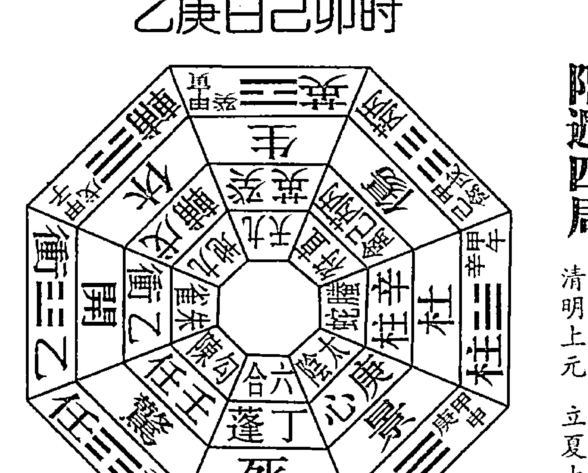

天禽直符加五宫 死门直使加一宫
孤丑寅虚未申

阳遁四局
冬至下元 惊蛰下元
清明上元 立夏上元

| 乾 | 坎 | 艮 | 震 | 巽 | 离 | 坤 | 兑 |
| :--- | :--- | :--- | :--- | :--- | :--- | :--- | :--- |
| 门迫宫 | 玉女守门 鬼假 门迫宫 | 宫生门 | 开与乙合 云遁 门迫宫 | 宫生门 | 符伏吟 仪刑 门迫宫 | 禽符伏五为坤 | 死门加坎为地水师 |
| | | | | | | | 庚日飞干格伏干格 |
| | | | | | | | 己仪加己为明堂重逢格 |

断曰：甲戊逢己，符为伏吟，己属凶格。乃戊刑在未，己刑击之，一也；丙亦同伏，勃乱可虞，二也；直符加坎，制宫为迫，三也；禽符伏禽，亦为步五，四也。备此数者，则惟有困顿无聊、呻吟自悔而已。乙日为不睛之龙，凶当弥甚。

兵事：星伏宫，门克宫，利为客。符逢击刑，不宜交战。宜遣腹心，密出东门，侦其西北，必有伏贼。若能偷其暗号，结其用事人员，可以息兵。出行：宜出正东方。行三六里，逢匠人伐木应。阳宅：宜开震门。二七日进禽鸟，东方有产亡应。阴宅：宜卯山酉向。作用时，有黄云四起，妇人持铁器来应。

附占：胜败：议和。虚实：主多阴谋。攻城：不拔。守城：内有强兵，外救却先遇贼战退。天时：晴，西南有翠云如鹰翼，又如树叶密布。地理：穴情极佳，有蛇化龙之象，可以发贵。人事：有婚姻事，或有宴会。田禾：大有年。家宅：宅甚完整，内有怨女。官禄：一官两印，俸厚当升，报喜即至。应试：文心静彻，庚日占可中。求财：有阻，难得。婚姻：说合纷纷，不成。胎产：安，孕得男。疾病：心肾不交，宜静养。捕获：逃人可获，贼不获。失物：东南可寻。远信：即至。鸦鸣：主女人事。鹊噪：有喜音至。

## 乙庚日庚辰时

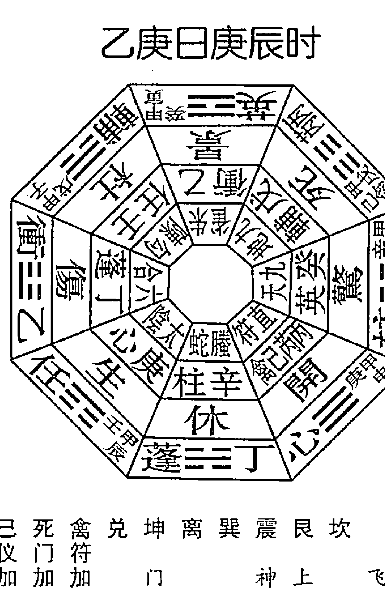

| 宫位 | 乾 | 坎 | 艮 | 震 | 巽 | 离 | 坤 | 兑 |
| :--- | :--- | :--- | :--- | :--- | :--- | :--- | :--- | :--- |
| 格局 | 开与丙合 荧入白 格刑 | 飞宫格 丙奇入墓 | 上格 | 神假 物假 | 门伏吟 | | 禽符加乾为地天泰 | 死门加坤为坤 己仪加庚为明堂伏杀格 |

断曰：丙为荧惑，人于太白之宫。譬之赳赳武夫，置于立纲陈纪之地，则紊乱可虞。用于折冲御侮之场，则干城有托，盖一举而格勃之凶皆去也。所惜禽临乾地，实维泄脱之乡，使伏本宫，亦有呻吟之悔，不得遽言全吉耳。

兵事：星生宫，门伏宫，利为主。门系伏吟，不宜兴兵动众。敌意欲袭我东北粮食，当预伏精锐，一闻贼信，即引兵杀入西北，据其巢穴。虽有杀伤，可以使其丧气。
出行：宜出西北方。六里十里，逢舟车财货。阳宅：宜立乾门。有飞禽色衣人至，或老人执杖至。阴宅：利乾山巽向。作用时，有白衣小身怀孕妇人至。一年双生贵子。

附占：胜败：大将亲入敌营，可以得贼。虚实：敌情归向。攻城：不克。守城：内兵甚强，可以开门诱敌，预防肘腋奸细。天时：日无光，西北有苍黑云起。地理：防尸棺朽腐。人事：有老妇交易争竞事。田禾：年小丰，籽粒防虫蚀，夏防旱，农人劳。家宅：婢妾当权，防有火灾。官禄：僚友不和，官途沉滞，兼防印伤。应试：不中。求财：不得。婚姻：贵家之女，俯就可成。胎产：胎稳，生女。疾病：七情治病。捕获：防捕役朦蔽。失物：失于西南土中，难寻。远信：不至。鸦鸣：防口舌事。鹊噪：有贵亲至。

## 乙庚日辛巳时

孤卯辰虚酉戌
天禽直符加七宫
死门直使加三宫

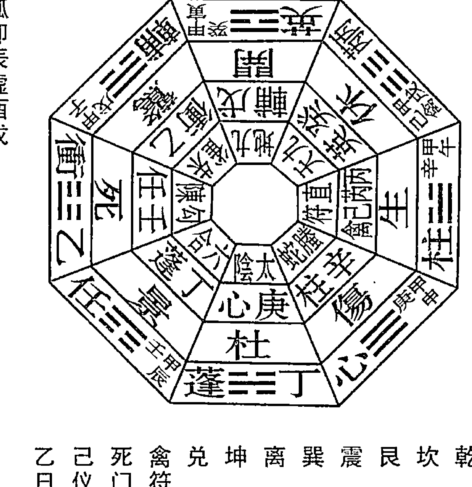

阳遁四局
冬至下元
惊蛰下元
清明上元
立夏上元

| 宫位 | 乾 | 坎 | 艮 | 震 | 巽 | 离 | 坤 | 兑 |
| :--- | :--- | :--- | :--- | :--- | :--- | :--- | :--- | :--- |
| 格局 | 宫克门 奇格 宫生门 | 丁奇入墓 门生宫 | 宫克门 | 门迫宫 | 宫克门 | 宫生门 | 宫克门 | 生与丙合门生宫 |
| 备注 | | | | | | | | 禽符加兑为地泽临 死门加震为地雷复 己仪加辛为天庭得势格 乙日不遇 |

断曰：直符受脱于兑，而为螣蛇之宫，主以损耗而致惊。直使受伤于震，而逢雀武之神，主因口舌而见困。符使本一体之分，而此西彼东，情如相背，当为占者志趋不定之象。时干居兑则与丙合，加乾则与庚比。惟乙日损明不吉，庚日无伤。

兵事：星生宫，宫克门，利为主。俟敌人先动，向正西出师。安营于正南，扬兵于西南，设伏于正北，当击其西北破军，宜于火攻。出行：宜出正西方。八里，逢兴作建造应。阳宅：利建兑门。东方有人抱小儿，闻鼓声应。阴宅：宜酉山卯向。作用时，有野人负薪，或女孩至，黄鸟鸣南方应。

附占：胜败：主胜。虚实：敌甚暗弱。攻城：守将有才，粮草富足，不易克。守城：援近可守。天时：有风无雨，秋月明朗。地理：四势有情，结穴极好，后人兴旺。人事：有刚戾人至，言语不合而去。田禾：大有秋。家宅：宅聚财，人口安，但家主出外日多。官禄：职居风宪，须防罚俸。应试：庚日占，有望。求财：谋为变化，所求遂意。婚姻：易成，女有怔忡之疾。胎产：占胎不安，占产生男。疾病：肾水虚，静摄可痊。捕获：逃人自归，贼亦可获。失物：失于正南方，变改难寻。远信：不至。鸦鸣：有和合事。鹊噪：防有惊恐。

## 乙庚日壬午时

阳遁四局
冬至下元
惊蛰下元
清明上元
立夏上元

| 乾 | 坎 | 艮 | 震 | 巽 | 离 | 坤 | 兑 |
| :--- | :--- | :--- | :--- | :--- | :--- | :--- | :--- |
| 天乙与太白格 门生宫 | 蛇天矫 宫生门 | 符反吟 仪刑 门迫宫 | 虎猖狂 宫生门 | 太白与天乙格 宫克门 | 雀投江 宫克门 | 宫生门 龙逃走 | 休与乙合 虎遁 龙逃走 |

- 禽符加艮为地山谦
- 死门加巽为地风升
- 己仪加壬为明堂被刑格

断曰：天芮天任，皆禽符之兄弟，而彼此互加，参商已甚。符以寄芮之故，遂亦不免于往返奔波，殊可叹也。符一返，而虎狂龙走，蛇矫雀伤，诸凶之格备焉，可谓“一人向隅，举座不欢”者矣。乙日干伤于辛，尤为不利。

兵事：星比和，宫克门，阴时利主。凶格皆备，不宜出师。一伏于正南，一伏于正西，敌人既至，然后发伏。若在正东正北，当衔枚疾击，又不宜缓。

出行：宜出正西。一里八里，逢皂衣公吏，路防盗贼。

阳宅：利造兑门，见女人并鸟鹊报喜。

阴宅：酉山卯向吉。作用时，风雨骤至，妇人送酒应。

附占：胜败：客胜。虚实：敌有深谋难测。攻城：可拔，但多杀伤。守城：难守。天时：阴云不雨。地理：龙虎砂案皆不吉，不可葬。人事：有孝服妇人，言疾病医药事。田禾：麦欠丰，禾防旱，费力。家宅：门户晦暗，四面冲动，人口不宁。官禄：事烦材短，宜告休。应试：不中。求财：可得阴人之财。婚姻：女多言，男暗弱，不成。胎产：生男，安吉。疾病：呕吐之症，难愈。捕获：逃人易获，盗难获。失物：在西北方，磨刀石傍或幽暗处可寻。远信：人为病阻，廿三日有信来。鸦鸣：有紧迫事。鹊噪：主有喜事。

## 乙庚日癸未时

断曰：天网高张，八门尽伏，不宜强出，惟喜伏藏。禽符本寄于坤，退而加于离九，乃行有不得，而安于受生之地，未始非与时污隆之道也。况己仪亦利其生，丙奇又喜于旺，明哲保身者，必不舍此而妄为矣。

兵事：宫生星，门伏宫，利为客。时逢天网，不利兴师。于正东正西，多设奇兵埋伏。遣游兵一出东北，一出西北，诈为降卒，可以得其粮食。

出行：出西北方，五六里十里，见饮食欢喜。东北亦可出。

阳宅：宜立乾艮二门。有执刀斧人来，或牵牛羊过。

阴宅：宜乾山艮山。作用时，东北方有人携盖骑马至。

附占：胜败：主胜。虚实：敌畏我未动。攻城：用地道可拔。守城：士卒多死亡。天时：晴。地理：朝案虽佳，环身护砂不紧，非吉壤。人事：有诡谲人来，谈印绶事。田禾：麦大熟，雍兖更丰。家宅：宅发贵人，安，宜小心火烛。官禄：有荐举即升。应试：文合主司意，乙日可中。求财：略费口舌，可得。婚姻：女能言，奁厚可成。胎产：无胎，乃血阻。疾病：火铄肺金，行坐功可痊。捕获：逃人不获，盗易捕。失物：在东方地隔板上，恐有毁伤。远信：南方人占即至。鸦鸣：有贵人来。鹊噪：进财畜。

## 乙庚日甲申时

孤午未虚子丑
天心直符加六宫
开门直使加六宫

阳遁四局
冬至下元
惊蛰下元
清明上元
立夏上元

| 宫位 | 断语 |
| :--- | :--- |
| 乾 | 门符伏吟 飞干格 伏干格 |
| 坎 | 时干格 |
| 艮 | 休与丁合 |
| 震 | 乙奇升殿 |
| 巽 | |
| 离 | 鬼假 |
| 坤 | |
| 兑 | 心符伏乾为乾 开门伏乾为乾 庚仪加庚为太白重刑格 天辅时庚日飞干格伏干格 |

断曰：庚符秉令，伏而未动，是欲有所创建，而宁神静气，壁画谟谋，将以求其尽善而已。况天门私启，勾陈设卫，云台之仗千箱，武库之兵万队，所居而安者，动无不得其志者也。虽时当偃息，当有行健不息之象。

兵事：门符比和，阳时利客。但仲甲不宜出兵，宜眚灾肆赦，设伏于东北，或东南杜门之下，严阵以待。不宜向正北出，以庚符畏丁火故也。庚日防格战有伤。

出行：利出北门。二十里内，见水族物，或虫蛇为应。

阳宅：利开北门。动作时，见有皂白衣妇人为应。

阴宅：宜坎山离向。作用时，有僧道前来，或闻金鼓之声。

附占：胜败：客胜。虚实：未动。攻城：不战而退。守城：当议和。天时：有微风无雨。地理：穴情生动，微嫌风透，不吉。人事：阅视武人，或升迁之事。田禾：禾欠丰，麦有收。家宅：居人安利，宜静守。官禄：防参罚。应试：庚日占，可中。求财：女人之财，可获。婚姻：女有残疾，不成。胎产：胎安产迟，生女。疾病：起于停积，祈神可痊。捕获：难获。失物：近炉灶处寻。远信：信无，人未来。鸦鸣：有口角事。鹊噪：主文书。

## 乙庚日乙酉时

乾 坎 艮 震 巽 离 坤 兑
小格宫生门 生与丙合天遁 重诈门迫宫 相佐奇格 时干格 宫门比和 宫生门 乙奇入墓 宫生门
心符加震为天雷无妄
开门加兑为天泽履
庚仪加乙为太白贪合格
乙日伏干格

断曰：心符入震，乃六合之宫。乙庚相遇，所谓“有三军之忧，而又有桑中之喜”者也。使向九天，辟门延揽，有得其所请之兆。但本宫癸加，不无隔碍。遇于外而遗于内，合于貌而异于心，亦势所必至也。良缘奇巧之中，当以彼此乖张为戒。

兵事：星克宫，门比和，利为客。正北合天遁，出军立寨，吉无不宜。南方宜伏敢死之士，诱敌至而背北攻之。乙日防敌有伏兵邀击，宜预备。

出行：宜出北门。行一里或十里，当逢皂衣公吏人。

阳宅：利开坎门。动作时，有执杖人至。六十日，进书契财物。

阴宅：坎山离向吉。作用时，有小儿吹笛为戏。葬后得金珠，吉。

附占：胜败：主胜。虚实：贼有援。攻城：防援兵格战，不拔。守城：时有虚惊。天时：晴明。地理：穴情宽敞，得龙气吉。人事：有贵人文墨事。田禾：麦有收，禾防虫。家宅：宅发贵，当远任。官禄：乙日占，防参。应试：不中。求财：得意外财。婚姻：男别属意，不成。胎产：生男，产母有惊。疾病：小儿惊疯，七日后愈。捕获：不获。失物：宜向正西枯井旁寻觅。远信：即至。鸦鸣：有异事。鹊噪：馈食者至。

## 乙庚日丙戌时

庚日不遇 丙奇得使 游仪 时干入墓 庚仪加丙为太白入荧格 开门加艮为天山遁 心符加坤为天地否 兑 丁奇升殿 门迫宫 格勃 时干格 门迫宫 坤 龙返首 相佐 白入荧 奇格 离 门生宫 宫克门 巽 生与丙合 天遁 重诈 震 门生宫 艮 宫生门 坎 门生宫 乾 门生宫

断曰：符使分投坤艮，似属睽违之象矣。乃符宫之门、使宫之星，皆临庚之本宫，则暗中联合，正固结而不可解也。但返首入荧，吉凶互见，祸福倚伏，尚难凭准耳。符使各据太阴九地之乡，宜为阴谋密计，暗中求助则吉。

兵事：宫生星门，利为客。东南可结营，西北可屯粮。出军利于巽方，击其西北。西南必有格战，宜预伏以待之。格合返首，有青红云在天门助战。

出行：利出东南方。行四里或十里，逢僧尼，或闻叹息声。

阳宅：利建巽门。动作时，闻歌唱声。一二七日内，有贵人到宅。

阴宅：巽山乾向吉。作用时，有青衣人携酒至应。

附占：胜败：客胜。虚实：敌即来。攻城：城有重兵，防诱进。守城：客势衰弱，可以计擒。天时：阴云无雨。地理：龙脉甚真，但下有古墓，不宜用。人事：有武官争缺事。田禾：有麦秋，禾防旱。家宅：过道间有怪异，下人多灾。官禄：将升有阻。应试：庚日占中，但名次低。求财：兄弟中挪移有得。婚姻：不成。胎产：生女，难产。疾病：病属脾病，静养可愈。捕获：逃人远遁，盗赂捕不解。失物：在东北方高阜处。远信：即至。鸦鸣：有相逼事。鹊噪：向东南鸣，吉。

## 乙庚日丁亥时

| 坎 | 乾 | 艮 | 震 | 巽 | 离 | 坤 | 兑 |
| :--- | :--- | :--- | :--- | :--- | :--- | :--- | :--- |
| 生门 | 宫克门 | 相佐奇格 | 宫克门 | 门迫宫 | 宫克门 | 宫克门 | 生与丙合重诈门生宫 |
| 时干格宫 | | 丁奇入墓门生宫 | | | | | 心符加坎为天水讼 开门加离为天火同人 庚仪加丁为太白受制格 |

断曰：符北使南，门既临于火宅，星亦值其丁奇，坎离相济之中，如金人丹炉，陶铸融液，精华自见，岂复有顽暴之性乎？惟嫌蛇雀作党，未免鼓舌摇唇。而本宫飞入辛金，两强相遇，不免交争。宵小是非，不可不慎。

兵事：星生宫，宫克门，利主不利客。宜伏兵于东，立营于西，俟敌人先动，出正西，诡计诱敌，击其正东。太阴在震，亦防敌人有伏。

出行：宜出西门。行八九里，见公吏，或闻嘻笑声应。

阳宅：宜建西房。动作时，有东方人抱小儿至应。

阴宅：利兑山震向。作用时，有黑衣人携肉过。后有青衣人送酒，大发。

附占：胜败：主胜。虚实：敌情多诈。攻城：不拔。守城：有援兵，易守。天时：半阴半晴。地理：土色带白，金形多曲，穴吉可用。人事：有贵人自陈罪愆。田禾：麦大熟，禾薄收。家宅：宅不聚财，人有疾疫。官禄：不升，防参劾。应试：不中。求财：用计可得。婚姻：女家欲就，可成。胎产：生男，难产。疾病：胃中火盛，宜用白虎汤。捕获：在西南方，易缉。失物：失于南方，寻亦不见。远信：即至。鸦鸣：有异事。鹊噪：吉信到。

## 丙辛日戊子时

孤戊亥虚辰巳
天心直符加四宫
开门直使加一宫

### 阳遁四局

冬至下元 惊蛰下元
清明上元 立夏上元

| 方位 | 含义 |
| :--- | :--- |
| 乾 | 天乙与太白格 宫门比和 |
| 坎 | 玉女守门 蛇天矫 门生宫 |
| 艮 | 休与丙合重诈 宫克门 |
| 震 | 虎猖狂 宫克门 |
| 巽 | 符反吟 仪刑 太白与天乙格 |
| 离 | 时干格 宫门比和 |
| 坤 | 雀投江 宫生门 |
| 兑 | 龙逃走 门生宫 |
| 心符加巽为天风姤 |
| 开门加坎为天水讼 |
| 庚仪加戊为太白逢恩格 |

断曰：庚符伐木于巽，虽为反吟，而匠心生巧，身入凤楼矣。开门到坎，玉女守焉，闺中之秀不少也。乃蛇既天矫，雀又飞临，则蛾眉皓齿，即为煽处之端，暗室柔乡，翻有漏卮之患。惟在心坚力定，不堕术中耳。

兵事：星克宫，门生宫，主客互有损益。阳时利先举，遇于正北正东，宜急击勿失。若遇于正西正南，宜敛军结阵，俟敌来而后击之。但遇凶格，主客不无两伤之患。

出行：宜出东北方。一里或八里，当遇公吏，上著黑衣，下著黄裳。

阳宅：宜开艮门，有人持铁器来应。

阴宅：艮山坤向吉。作用时，有三五人把火为应。

附占：胜败：主胜。虚实：敌已临境。攻城：夏月难拔。守城：有援兵，可守。天时：晴明有风。地理：地近闹市窑灶，下有朽骨，丙日占不吉。人事：有库藏中事，或盗案口舌。田禾：麦大熟，秋防大风损禾。家宅：厨厕欠利，女人有灾。官禄：文书有误，防降罚。应试：文不合主司意。求财：更防有失，惟坐贾得利。婚姻：不成。胎产：生女，产安。疾病：大人血光之灾，无妨。小儿痘疹有损。捕获：难获。失物：因惊而失，当从西北寻觅。远信：不至。鸦鸣：有密事。鹊噪：贵人来。

## 丙辛日己丑时

阳遁四局
冬至下元 清明上元
惊蛰下元 立夏上元

孤亥子虚巳午
天心直符加五宫 开门直使加二宫

乾 坎 艮 震 巽 离 坤 兑
门生宫 宫生门 门迫宫 宫生门 鬼假 宫克门 刑格 休与丁合
宫生门      宫克门 时干格 丁奇升殿
宫生门

心符步五为天地否
开门加坤为天地否
庚仪加己为太白大刑格
丙日伏干格 时干入墓

断曰：符步五而寄坤，使亦到坤，是合而分、分而合者也，凡事疑信相参，忧喜交集。然俱为受生之地，加以九地阴神，暗中扶翼，譬之丰城宝剑，未有延津之化，而气已冲霄矣。庚金得禄，甲复遇丙，有印累累、绶若若之象。

兵事：星门俱受宫生，为客者利。格遇入荧，防敌潜入。宜预伏于西南，从正西出师，蹙其入伏，前后奋击。别遣伏于西北，截其归路。本军防有乱逆，亦防损伤。

出行：宜出正西方。行十里，遇孝服人，或闻哭声。

阳宅：宜开兑门，西方有张网人，或飞鸟至大发。

阴宅：酉山子向可用。动作时，南方有光如火，或有跛足人送雉，葬后进书契。

附占：胜败：客胜。虚实：贼必至。攻城：用地道可入。守城：敌猛军伤，求援可守。天时：阴云四起。地理：地气不暖，葬后防朽烂，不吉。人事：有大腹人至，凡事有阻。田禾：秋防旱，禾有伤。家宅：防有怪异，人口不宁。官禄：任内有灾。应试：题难，不中。求财：阴财可得。婚姻：男弱女强，难成。胎产：生男，母多病。疾病：肩背之疾，易治。捕获：捕役作弊，难获。失物：失于东北近山处，可寻。远信：喜信即至。鸦鸣：防失脱文书。鹊噪：向西鸣，女人馈熟物来。

## 丙辛日庚寅时

| 方位 | 含义 |
| :--- | :--- |
| 乾 | 庚仪加成为太白重刑格 符伏吟 飞宫格 伏宫格 时干格 门迫宫 |
| 坎 | 门迫宫 |
| 艮 | 开与乙合 乙奇升殿 云遁 |
| 震 | 休诈 门迫宫 |
| 巽 | 门生宫 |
| 离 | 宫生门 |
| 坤 | 神假 门迫宫 |
| 兑 | 宫克门 |
| 心符伏乾为乾 |
| 开门加震为天雷无妄 |

断曰：庚符伏乾，有英雄未能得志、以心问心之象。然景门来加，升腾可望。况开使合乙奇到震，得趋三之吉，通亥卯之气，又为玉兔归垣而得禄，必遇同心之侣，遂成连茹之占。扶摇九万，何患无其时哉！少安毋躁则吉。

兵事：星比和，宫克门，不利于主。兵宜先举，当据坤方立营，艮方设伏，令副将督师，出正东方，背南击北，有风云助阵，大胜。

出行：宜向东行。出门三里或十三里，有匠人把棍为应。

阳宅：利开东门。见武士持枪刀，或闻雷声吉。

阴宅：宜震山兑向。作用时，有童子执金银至。葬后六十日，因争讼得财，主乙丁已癸人发福。

附占：胜败：客胜。虚实：敌人未至。攻城：有备，难攻。守城：可御。天时：晴，有微风。地理：穴中有水，不发财丁。人事：有术士谈言微中。田禾：防旱，小有秋。家宅：人宅相安，开东门，当发财。官禄：可特擢。应试：不中。求财：防口舌。婚姻：不能即成。胎产：生男，母有患。疾病：癣疥之疾，未痊。捕获：盗首甚勇，防拒捕有伤。失物：在本家东南阁板寻之。远信：不至。鸦鸣：在东方鸣，有喜事。鹊噪：有人馈送。

## 丙辛日辛卯时

孤丑寅虚未申
天心直符加七宫
开门直使加四宫

阳遁四局
冬至下元 惊蛰下元
清明上元 立夏上元

| 乾 | 坎 | 艮 | 震 | 巽 | 离 | 坤 | 兑 |
| :--- | :--- | :--- | :--- | :--- | :--- | :--- | :--- |
| 丁奇入墓 宫克门 | 宫克门 | 宫门比和 | 门迫宫 | 门反吟 门迫宫 | 休与丙合 重诈 丙奇升殿 | 宫门比和 | 时干格 宫克门 |

庚仪加辛为太白重锋格
庚日伏干格
开门加巽为天风姤
心符加兑为天泽履

断曰：是局宫宫有奇，门门皆反，符来争强，使往交战。当斯时也，阴云四合，瘴雾迷空，昆阳之战象走林，长山之阵蛇奔穴。居固有伤，行亦多碍。宜于反覆之中，为善全之计，则飘然远引，利在西南矣。静以驭动，慎之无咎。

兵事：星比和，门克宫，利为客。宜出正南方，伏兵于北，设奇诱敌。符值反吟，当用连环阵法，首尾互击。有青色云气，从南方来助。

出行：宜出正东方。行一二九里，见公吏或飞禽应。

阳宅：宜立正南门。作用时，有白鸟至，子孙主贵。

阴宅：离山坎向吉。作用时，有青衣持木器至。造葬后百日内，主移居发财。

附占：胜败：客胜。虚实：敌谋未决，不敢前进。攻城：不可攻。守城：有援兵，固守无虞。天时：有雨。地理：土白兼赤，后有兵戈，不能安稳。人事：有女人盗窃，官参吏处。田禾：不大丰。家宅：吏役追呼，人不顺利。官禄：防上司见罪。应试：房考荐，可望中。求财：长上或贵人之财可得。婚姻：媒人得力，女家愿许。胎产：生男易育。疾病：肾经受病，防反覆。捕获：贼匿东南，易获。失物：失于林麓可寻。远信：至，行人为贵家羁留。鸦鸣：有和合事。鹊噪：闻铨选事。

择吉类经典名著

阳遁四局

## 丙辛日壬辰时

阳遁四局
冬至下元 惊蛰下元
清明上元 立夏上元

图示描述：中央为八角形布局，分为八宫，每宫内含天干、地支、卦名、门名等元素，外围标注方位。
左侧文字：天心直符加八宫 开门直使加五宫
孤寅卯虚申酉

| 方位 | 含义 |
| :--- | :--- |
| 乾 | 生与丙合 乌跌穴 重诈 丙奇入墓 白入荧 勃格 格刑 门生宫 |
| 坎 | 宫生门 上格刑仪 时干格 门迫宫 |
| 艮 | 宫生门 |
| 震 | 宫克门 |
| 巽 | 宫克门 |
| 离 | 宫生门 |
| 坤 | 宫生门 |
| 兑 | 宫生门 |
| 心符加艮为天山遁 |
| 开门步五为天地否 |
| 庚仪加壬为太白退位格 |
| 时干入墓 丙日不遇 丙日飞干格 |

断曰：符入墓乡，重重格塞，太阴又为刑忌之神，虽曰受生，未免恩变为仇，反多乖戾也。开使人中步五，寄接于坤，已露携贰之形，且怀虚伪之意。而本宫丙来为勃，虽有禽星生门，与符使二宫，相为联络，而反覆隔碍，凡谋究竟无成。

兵事：宫生星门，利为客。但逢仪刑，战必有伤。西北必有党羽伏匿，宜选卒，绕其后疾击之，背乾击巽。时有赤鸟翱翔军上，战必大胜。

出行：宜出西北方。行六十里，当见贵人车马及印绶之类为应。

阳宅：宜开乾门。动作时，有双禽至，百日内进人，大发财。

阴宅：乾山巽向最吉。作用时，见艺人携物。葬后有猫咬鸡，大发。

附占：胜败：利和。虚实：敌已入界。攻城：不能破。守城：城固可守。天时：主雨。地理：朝山秀美，后裔当有文名。人事：同官不和，或有外孝。田禾：大丰。家宅：宅吉人安，当发富贵。官禄：易升。应试：中。求财：同姓之财可得。婚姻：易成，且吉。胎产：生女，易产。疾病：病在四肢，可治。捕获：易获。失物：在室中西南隅，速寻可得，迟则不见。远信：即至。鸦鸣：有相迫之事。鹊噪：不关休咎。

## 丙辛日癸巳时

天心直符加九宫
孤卯辰虚西戊
开门直使加六宫

### 阳遁四局

冬至下元
惊蛰下元
清明上元
立夏上元

天网 庚仪加癸为太白刑隔格 开门伏乾为乾 心符加离为天火同人 兑 坤 离 巽 震 艮 坎 乾 大格 时干格 神假 门伏吟 开与乙合 休诈 乙奇入墓

断曰：庚符入离，加于癸干，何格战之无已也。阴神又值朱元，则口舌相戕，心目俱病，虽得同人之象，未免水火之暌，其受害深矣。所赖使伏本宫，乙来作合，可谓内助有人，门阑添喜，家饶人旺，但未可言动耳。

兵事：官克星，门比和，利为主。直符遇格，不能不战。宜在正东正西。各伏奇兵。敌至则从西北出兵，击其西南。但乾宫上乘六合，士卒不无胆怯。
出行：网高可行，宜出西北方。行五六里，当逢酒食，或见路傍修造。
阳宅：宜开乾门。动作时，有担钱人至。
阴宅：宜乾山巽向。作用时，西南方有鼓声喧闹。葬后六十日，有蛇咬鸡，大旺。

附占：
胜败：客败。
虚实：敌有阻。
攻城：难破。
守城：易守。
天时：晴。
地理：土色带红，拱护欠佳，不甚吉。
人事：官员相见，情意甚洽。
田禾：麦薄收，禾丰。
家宅：作事欠顺，心绪不舒，子女多怨尤。
官禄：不能显达。
应试：丙日占，可望中。
求财：费口有得。
婚姻：女佳，阻隔难成。
胎产：生女产迟。
疾病：防变症，难脱体。
捕获：匿于西北贵家，不获。
失物：宜向北方觅之。
远信：至。
鸦鸣：有口舌。
鹊噪：当进东北财物。

## 丙辛日甲午时

### 阳遁四局

辛仪加辛为天庭自刑格
惊门伏兑为兑
柱符伏兑为兑
兑门符伏吟

断曰：天柱分符，辛仪秉令，居于兑七正西之地。仪虽喜于得禄，时干实恐其受伤也。但首甲起于四宫，盛夏之时，万木扶苏，敷荣已极。兹乃归于金地，外虽有剥落之形，内则有保合之实，《易》所谓万物之所悦也。苟能敛华就实，则承天辅之休矣。

兵事：门星皆伏，时遇仲甲，刑德在门，不宜出战。敌来宜向正北应，伏兵随阵左右，背东南，击西北。格遇人遁，讲和最利。
出行：宜出正北。二里九里，逢皂衣妇人，同伴歌声。
阳宅：宜立坎门，有人抱小儿持杖至。
阴宅：子山午向吉。西方有人骑马至，鸦鹊飞鸣为应。

附占：
胜败：客胜。
虚实：敌有诡计诱我。
攻城：救援至，难拔。
守城：有援，可守。
天时：无雨。
地理：穴情甚佳，有外护吉。
人事：看兵书，论兵法。
田禾：农逸，年丰。
家宅：天伦聚首，安静无为。
官禄：职司刑名，可升。
应试：中。
求财：可求，但劫财重。
婚姻：不成。
胎产：生女，难产。
疾病：肺气太旺，不能速愈。
捕获：逃人伏藏东北。
失物：在正西土穴中，可寻。
远信：沉滞。
鸦鸣：防有欺蔽。
鹊噪：杜门无事。

## 丙辛日乙未时

### 阳遁四局

冬至下元
惊蛰下元
清明上元
立夏上元

孤巳午虚亥子
天柱直符加三宫
惊门直使加八宫

| 方位 | 乾 | 坎 | 艮 | 震 | 巽 | 离 | 坤 | 兑 |
| :---: | :---: | :---: | :---: | :---: | :---: | :---: | :---: | :---: |
| **宫** | | | | | | | | |
| **门/格** | 天乙与太白格 门迫宫 | 鬼假 蛇天矫 门迫宫 | 宫生门 | 相佐 虎猖狂 符反吟 | 太白与天乙格 门生宫 | 生与丁合 真诈 雀投江 | 宫迫门 | 龙逃走 宫克门 |
| **神** | | | | | | | | |
| **星** | | | | | | | | |
| **备注** | | | | | | | | 柱符加震为泽雷随 惊门加艮为泽山咸 辛仪加乙为白虎猖狂格 |

断曰：天柱金符，东行震地，明明有财之足贪，垂涎而往。然以反吟之格，逢勾白之神，则变诈之端，争讼之事，将百出而未有穷。虎虽狂而牙爪空施，龙虽走而骊珠罕获，大约破人之财，而己无所得者也。不如直使艮宫，安然受生之吉。

兵事：星克宫，宫生门，阳时利客。兵宜先动，从正南出师，伏兵随后。或东或北，宜疾击；或西或南，宜缓击。皆宜野战。用四面迎敌，有微雨小雷为应。但奇仪受制，不无损伤。
出行：宜出正南方，逢人骑骡马，有步行随从人。
阳宅：离方可修，有青衣人至应。
阴宅：午山子向吉。南方有人牵羊过，或携酒食至为应。

附占：
胜败：胜负相等。
虚实：敌兵有阻，未至。
攻城：可拔。
守城：难守。
天时：晴朗。
地理：四势飞乱，下有蛇穴，不吉。
人事：有鼓乐声，或言音律事。
田禾：丰，麦胜于禾。
家宅：官禄皆旺，但人口不安。
官禄：防参劾。
应试：不中。
求财：难得。
婚姻：女貌陋，有刑伤。
胎产：生子，产迟，母有疾。
疾病：小肠火闭，变症百出。
捕获：逃盗俱不获。
失物：西北隅可寻。
远信：无。
鸦鸣：防失脱。
鹊噪：有文书至。

## 丙辛日丙申时

孤午未虚子丑
天柱直符加二宫
惊门直使加九宫

### 阳遁四局

冬至下元
惊蛰下元
清明上元
立夏上元

| 方位 | 格局/说明 |
| :--- | :--- |
| 乾 | 生与丁合 真诈 丁奇入墓 |
| 坎 | 门生宫 |
| 艮 | 宫生门 |
| 震 | 门迫宫 |
| 巽 | 宫生门 |
| 离 | 鬼假 宫克门 |
| 坤 | 丙奇升殿 宫克门 |
| 兑 | 龙返首 相佐 符勃 宫生门 |
| | 柱符加坤为泽地萃 |
| | 惊门加离为泽火革 |
| | 辛仪加丙为天庭得明格 |
| | 辛日伏干格 |

断曰：直符退于九天，直使时干，又退于九地，深合知难而退之义。飞庚虽来格于伏宫，不无阻塞为患。而符以龙之返首，安然托处于受生之方。山鬼伎俩，固不足以摇我泰定之天也。但庚见制于丁，亦未免于狼顾。

兵事：宫生星，宫克门，主客互有损益。阳时利先举，宜从西北方出兵。但逢奇墓，亦不甚利。当以计诡敌，合真诈之格。西南青龙返首，直符下出兵尤吉，先锋当用参将。
出行：宜出西北方。六里十六里，逢勾当人或老阴人。
阳宅：利立乾门。有执刀斧人来，或牵牛羊至。
阴宅：乾山巽向吉。闻飞鸟叫声，葬后拾得珠翠，娶新娘吉。

附占：
胜败：四季月主胜。
虚实：贼情多诈。
攻城：有救难克。
守城：易守。
天时：日入云中。
地理：穴有红黄之气，包裹有情。
人事：有武贵至，闻班马声。
田禾：麦熟，禾歉。
家宅：新迁甚吉，旧居不利。
官禄：遇恩擢。
应试：中式。
求财：可获。
婚姻：女家不喜媒人，姻可谐。
胎产：生男，产迟。
疾病：消渴之症，未愈。
捕获：逃人匿于正北，盗不能获。
失物：有人窃去。
远信：至。
鸦鸣：防失物。
鹊噪：向西北鸣，进女人财物。

## 丙辛日丁酉时

辛日不遇 丁奇得使遇甲 丙日飞干格
惊门加坎为泽水困
柱符加坎为泽水困
兑门迫宫
坤门迫宫
离门生宫
巽宫克门
震门生门
艮上格宫生门
坎相佐玉女守门门生宫
乾门生宫
荧入白丙奇入墓格刑

断曰：北方坎水，金之所生，是柱符惊使辛仪，悉为受脱也。又以太阴为之神，而合玉女守门之格，大抵深谋秘计，惟思利其子孙，和合阴私，只知耽于逸乐，家庭宴好、妇子嘻嘻之象。若夫乐而不淫，则义在《关雎》之卒章矣。

兵事：门星俱生宫，利为主。俟敌先动，向正东出师，安营于正西。背北击南，有风吹旗帜为应。格合人遁，直使遇甲，遣将得人，树立奇功。
出行：宜出正东方。四里，有匠人执木，或皂衣人应。
阳宅：立震门极利，有黑禽南来。
阴宅：正东格合人遁，利卯山酉向，有妇人与僧道同行为应。

附占：
胜败：土旺月日，客胜。
虚实：敌阻于道。
攻城：难拔。
守城：秋冬可守。
天时：有雨。
地理：穴情奇巧，子孙发秀。
人事：有合伙求谋之事，或见男女相争。
田禾：大丰。
家宅：宅吉人安，女眷能持家。
官禄：难升，官久。
应试：中。
求财：多求少得。
婚姻：可成，女长瘦聪明。
胎产：母常有病，生女。
疾病：手太阴经之症，可治。
捕获：逃人匿于东南方，盗易捕。
失物：缺齿人窃去。
远信：有喜音即至。
鸦鸣：主贵人有灾。
鹊噪：鹊自呼朋。

## 丙辛日戊戌时

### 阳遁四局

冬至下元
惊蛰下元
清明上元
立夏上元

天柱直符加四宫
惊门直使加二宫

孤申西虚寅卯

乾 休与乙合 乙奇入墓
坎 宫生门
艮 神假 门迫宫
震 宫门比和
巽 宫生门
离 大格 宫生门
坤 宫生门
兑 宫门比和

- 柱符加巽为泽风大过
- 惊门加坤为泽地萃
- 辛仪加戊为龙虎争强格
- 时干入墓

断曰：巽者柱符之财地，戊者辛仪之印神，乃有雀武之神以居其地，象为祖父遗财，我所应得，而旁人忽从而争之，于是乎为口舌、为耗损也。然符方得地，而直使又入生乡，时干亦临财地，苟能检点提防，亦不忧其为患耳。

兵事：宫生门，星克宫，利为客。兵宜先举，从西北出师，扬兵于正东，设伏于西南，背正北，击正南。西南防有伏兵，宜搜之。
出行：宜出西北方。十七里，逢四足斗，或唱曲人应。
阳宅：宜立乾门，有贵人著青衣，或人担钱至。
阴宅：乾山巽向吉。作用时，有老人扶杖至，三牙须人担箩至。

附占：
胜败：主胜。
虚实：敌人无粮。
攻城：士卒多伤，不拔。
守城：春月易守。
天时：微雨。
地理：护山秀美，穴情亦佳，丙日可用。
人事：有老女人疾病，或钱货文书。
田禾：欠丰。
家宅：宅发财可居，惟防口角。
官禄：有推荐，可望升。
应试：不中。
求财：空费口舌，不能到手。
婚姻：不成。
胎产：当生贵子，子丑日生。
疾病：因惊致病，辛日占，易治。
捕获：逃人不获，盗易捕。
失物：近人盗去，不可得。
远信：不至。
鸦鸣：有酒食事。
鹊噪：主得财物。

## 丙辛日己亥时

| 乾 | 坎 | 艮 | 震 | 巽 | 离 | 坤 | 兑 |
| :---: | :---: | :---: | :---: | :---: | :---: | :---: | :---: |
| 地假 丁奇入墓 宫克门 | 宫门比和 | 门反吟 | 门迫宫 | 门与丙合 | 丙奇升殿 | 门迫宫 | 宫门比和 伏宫格 宫克门 |

断曰：直符步五，直使反吟，以狐疑濡滞之才，当反覆变迁之际，暗劣既极，事故弥多。事故既多，周章弥甚。徒贪受生以为安，翻得呻吟而自悔，天下事大抵然也。幸寄居之坤，有丙相合，当于不意中获友朋之助。

兵事：门克宫，宫生星，利为客。宜从正南出师，安营于东南，设伏于西北，背西南，击东北，防中贼伏。门使反迫，先锋勿用副将。
出行：九天丙奇休门，合于正南，宜出南方。一九里，逢骑马公吏，及兵器戛击声。
阳宅：宜立南门。有患目人至，或黑白禽双飞至。
阴宅：午山子向极利。作用时，西方有红衣人至，或皂衣人携酒肉过。

附占：
胜败：主强。
虚实：来情多伪。
攻城：不可攻。
守城：可守。
天时：阴暗不雨。
地理：龙脉不真，辛日占更凶。
人事：有盗案，或兵事。
田禾：农忙薄收。
家宅：傍有新宅，女眷获福，春防盗窃。
官禄：迟升。
应试：可望中。
求财：先难后易，求两处，有五七分之财。
婚姻：可成，男性暴，女多病。
胎产：生子，母安产速。
疾病：女人筋骨疼痛，三日方愈。
捕获：知风，已离巢穴，难捕。
失物：在正东，不获。
远信：至，行人病阻。
鸦鸣：有和合事。
鹊噪：防虚惊。

## 丁壬日庚子时

### 阳遁四局

冬至下元
清明上元
惊蛰下元
立夏上元

丁日伏干格
辛仪加庚为虎逢太白格
惊门加巽为泽风大过
柱门加乾为泽天夬

| 兑 | 坤 | 离 | 巽 | 震 | 艮 | 坎 | 乾 |
| :---: | :---: | :---: | :---: | :---: | :---: | :---: | :---: |
| 勃符门生宫 | 生与丙合 神遁 乌跌穴 | 宫克门 | 宫克门 | 门迫宫 | 宫克门 | 丁奇入墓 门生宫 | 奇格 宫生门 飞宫格 宫克门 |

断曰：符人天门，使临地户，情之睽也，于斯极矣。乃符以加庚而格，使以被迫而凶，又何所如之俱不偶也。庚辛本属比肩，乾兑亦为同气，而天乙之飞，即受阻塞于同侪，阴又逢蛇，惊忧必不免矣。占者于兄弟朋友间，不可不慎。

兵事：门克宫，利为客。宜于正西方出兵，以合鸟跌之应。不妨假借鬼神，以惑敌众。东北可用外兵设伏。有红云如盖，自西方来，可获全胜。
出行：宜出正西。八九里，见公吏言官事，及见最高最动之物。
阳宅：利立兑门，有东方人抱小儿至。
阴宅：宜酉山卯向，有大风骤雨、禽噪钟鸣为之应。

附占：
胜败：利主
虚实：敌已受制
攻城：秋攻无益
守城：可守
天时：有云终开，不雨
地理：峦头秀动，掘得铁器或灰瓶吉
人事：有术士争竞，或有急事
田禾：岁丰，麦大熟
家宅：宅吉，惟防孝服口舌
官禄：俸久可升
应试：丁日占，可中
求财：大利
婚姻：可成，媒人偏向女家
胎产：胎不安，产生男
疾病：感冒风寒，兼有肝火，发散清火自愈
捕获：逃人易获，盗不能捕
失物：正南方方可寻
远信：不至
鸦鸣：主阴私事
鹊噪：有亲朋来

## 丁壬日辛丑时

### 阳遁四局

冬至下元
惊蛰下元
清明上元
立夏上元

- 乾：宫生门
- 坎：生与丁合真诈门迫宫
- 艮：门迫宫
- 震：乙奇升殿宫门比和
- 巽：宫生门
- 离：鬼假宫生门
- 坤：宫生门
- 兑：符伏吟宫门比和
- 柱符伏兑为兑
- 惊门步五为泽地萃
- 辛仪加辛为天庭自刑格

断曰：天柱还加于柱，直符已伏，而宜使又逢步五，是迟疑暗滞，不足以相助为理矣。犹可喜者，辛仪坐于禄地，时虽不利而身强，如子犯所言“战而不捷，晋国表里山河亦无所害”，正不得以伏吟之格，遂废凶中之吉也。

兵事：宫生门，利为客。宜先发制人，正北出师，伏兵随之。安营于正南，扬兵于西南，击其东北。但直使步五，不能大胜。
出行：正北格合真诈，出行吉，见贵人公吏。
阳宅：宜立坎门。有人抱小儿持杖至，南方有黑云下雨为应。
阴宅：利子山午向。有妇人持铁器来，小儿拍手大笑，或闻鼓吹声。

附占：
胜败：客胜。
虚实：敌有诡谋。
攻城：季月勿攻。
守城：有救，可守。
天时：天晴有云。
地理：丁日占吉，穴情甚佳。须浅深合宜，大发财丁。
人事：有移迁事，或马政军务。
田禾：麦大丰，禾有收。
家宅：宅安利，静可获福。
官禄：有荐举必升。
应试：丁日占中。
求财：渔水获利。
婚姻：媒人偏向男家，不谐。
胎产：首胎生女，此胎当生一男一女。
疾病：脾经之疾，可治。
捕获：捕役朦混，不获。
失物：被窃，藏东南林木处。
远信：不至，行人在中途，即日可到。
鸦鸣：有贼盗事。
鹊噪：主文书。

## 丁壬日壬寅时

阳遁四局
清明上元
冬至下元
立夏上元
惊蛰下元

天柱直符加八宫
惊门直使加六宫
孤子丑虚午未

辛仪加壬为天庭逢狱格
惊门加乾为泽天夬
柱符加艮为泽山咸
兑门生宫
坤乙奇入墓门生宫
离门生宫
巽神假宫门比和
震奇格宫克门
艮宫克门
坎开与丙合门生宫
乾小格宫门比和

断曰：柱符加任为受生，辛仪遇壬为受脱。大抵得中有失，耗处逢生，倚伏循环，事机不一之象。然直符既居六合之地，时干又逢六合之神，纵有参差，亦归和合，勿因小利害而乱大谋可也。直使虽加螣蛇之宫，主小有惊恐，不害。

兵事：宫生星，利为客。我兵宜先动，从正北出师，大扬其兵。丁日用锐阵，壬日用曲阵，西北东南皆可伏兵。背东击西，防贼逃逸。
出行：宜出正北方。一二里十里，逢女人著皂衣，天上火光。
阳宅：九天奇门合于正北，宜立坎门，有黄白禽从西北飞来。
阴宅：利子山午向。作用时，有渔猎僧道人来。

附占：
胜败：主大胜。
虚实：敌军有阻隔。
攻城：冬月勿攻。
守城：兵足可守。
天时：晴。
地理：穴情甚灵，外山少护。
人事：有秘密文书，或乡村富户之事。
田禾：丰。
家宅：女眷防病，有兴作则吉。
官禄：可升，官甚显。
应试：壬日占，合式。
求财：徒用心机。
婚姻：不成。
胎产：母有灾疾，生女。
疾病：肾虚不能司闭藏，速药可效。
捕获：捕役疏虞，逃盗俱不获。
失物：贼窃，正西方觅。
远信：迟至。
鸦鸣：因财相闹。
鹊噪：不吉。

## 丁壬日癸卯时

孤丑寅虚未申天柱直符加九宫惊门直使加七宫

### 阳遁四局

冬至下元
惊蛰下元
清明上元
立夏上元

| 方位 | 乾 | 坎 | 艮 | 震 | 巽 | 离 | 坤 | 兑 |
| :---: | :---: | :---: | :---: | :---: | :---: | :---: | :---: | :---: |
| **门/格/备注** | 休与乙合龙遁 | 神假 | 仪刑 | 白入荧 刑格 奇格 | 丁奇升殿 | 门伏吟 | 惊门伏兑为兑 | 柱符加离为泽火革 |
| **柱符** | | | | | | | | |
| **惊门** | | | | | | | | |
| **辛仪** | | | | | | | | |
| **天网** | | | | | | | | 辛仪加癸为虎投罗网格 天网丁日不遇壬日飞干格 |

断曰：南方离九，实柱之官乡也。乃时加六癸，而又九地为神，以光明赫奕之乡，为潜伏闭藏之计，岂其大隐市朝，如东方之陆沉金马耶？然时当天网，又处自刑之地，静守或能免咎，妄行必至受伤。且直使伏吟，亦不宜动，躁进正不如恬退耳。

兵事：宫克星，阴时利主。但符伏天网，又逢刑格，不宜出兵。敌人必往西南，塞我出路。当于平洋，预伏地雷火器，伏兵于右，举炮为号。敌不至，不可妄动。
出行：宜出正北方。二里九里，逢皂衣妇人，或同伴歌声。
阳宅：宜立坎门。有皂衣人至，或有鼓声应。
阴宅：利子山午向。作用时，有黄云四起，女人持铁器前来为应。

附占：
胜败：夏月主胜。
虚实：防敌用奇兵偷袭。
攻城：不拔。
守城：可守。
天时：阴雨满天。
地理：不吉，葬后多破财，人不宁。
人事：有女眷归家，或惊喜事。
田禾：旱魃为灾，不丰。
家宅：宅不利，人不宁。
官禄：不升。
应试：文不称心，不中。
求财：东方财利，西方不利。
婚姻：女有德性，畏男家，不成。
胎产：生女，不育。
疾病：伤暑之症，调养自愈。
捕获：逃人难获，盗易捕。
失物：在东北方，可寻。
远信：午日有信。
鸦鸣：有贵人之事。
鹊噪：主得财物。

## 丁壬日甲辰时

阳遁四局：
冬至下元，惊蛰下元，清明上元，立夏上元。

孤寅卯虚申酉
天任直符加八宫
生门直使加八宫

天辅时
壬仪加壬为天牢自刑格
生门伏艮为艮
任符伏艮为艮

兑 坤 离 巽 震 艮 坎 乾
乙奇升殿
门符伏吟
休与丁合

### 断曰
壬符秉令，承惨刻之余，而加以燠咻，将见万象回春，生机勃发矣。然犹伏处呻吟，止而不动者，盖辰龙寅虎，虽云相遇，而云雨未舒，土膏未润，即有向荣之意，尚须利见之期。此为“时止则止，时行则行”之转关耳。

### 兵事
门符俱伏，季甲之时阳气在外，又遇阳星阳时，利为客。宜从正北出师，设伏于东南，击其西南。敌有降者，赦其不死。

### 出行
宜出正北方。二里九里，逢皂衣阴人，或同行歌唱。

### 阳宅
九天奇门，会合于正北，宜立坎门。有牵牛羊人过，七日进金银生气之物。

### 阴宅
宜子山午向。作用时，有青衣人携鱼罟来为应。

### 附占
- 胜败：主欲息兵。
- 虚实：息鼓前来。
- 攻城：季月勿攻。
- 守城：可守。
- 天时：阴云不雨。
- 地理：土色带黄，左有吉星相辅。
- 人事：有商贾小儿之事。
- 田禾：欠丰。
- 家宅：妻妾极佳，安静获福。
- 官禄：不能即升。
- 应试：丁日占，帘官不荐。
- 求财：分内之财，可获。
- 婚姻：女畏男，不成。
- 胎产：胎安，生女。有木姓妇人至家，是生期。
- 疾病：肾水受克，易治。
- 捕获：捕不尽力，难获。
- 失物：失于东南幽隐之地，可寻。
- 远信：有喜信，不日至，行人困于酒食，未来。
- 鸦鸣：有和合事。
- 鹊噪：防有虚惊。

## 丁壬日乙巳时

- 乾：奇格门迫宫
- 坎：丁奇入墓宫生门
- 艮：相佐门迫宫
- 震：休与乙合风遁门生宫
- 巽：宫生门
- 离：神假物假门迫宫
- 坤：宫克门
- 兑：符加震为山雷颐
- 任：门加离为山火贲
- 生：仪加乙为日入地户格
- 丁：日伏干格

### 断曰
符趋三而得官，使向午而得印，官印相从，可言得志。然乙奇遇土，为日入地户，则去路多迷。如季子之游秦，不免金尽而裘敝矣。所赖生门合太阴为真诈，而戊癸相遇，六合阴助，则立谈取相，亦可无难。大约先暗后明、先惊后喜之象。

### 兵事
宫克星，宫生门，主客互有利害。阳星阳时，利于先动。宜从东南出师，伏兵于正南太阴生门之下，西南假作奇形异状，以恐敌人，先锋宜用副将。

### 出行
利出东南方。五里，逢皂衣妇人，孩儿歌唱。

### 阳宅
宜立巽门。有白衣人骑赤马驴，小儿至为应。

### 阴宅
宜巽山乾向。作用时，有人相打，女人抱孩儿自西方至为应。

### 附占
- 胜败：春夏主胜。
- 虚实：寇兵不服水土，死亡甚众。
- 攻城：不拔。
- 守城：易守。
- 天时：有风雨。
- 地理：龙气甚旺，但防中变。
- 人事：有贵人至，或兵事文书。
- 田禾：丰熟。
- 家宅：宅不吉，防小口不宁。
- 官禄：春夏可升。
- 应试：不中。
- 求财：阴人之财，可得。
- 婚姻：可成，奁厚。
- 胎产：生子不育，孕防堕。
- 疾病：呕吐泻痢，上实下虚，宜燃地司灯祷之。
- 捕获：捕人朦蔽，不获。
- 失物：正南方寻。
- 远信：东北方人占，即至。
- 鸦鸣：主有虚诳。
- 鹊噪：有文书。

## 丁壬日丙午时

孤辰巳虚戊亥
天任直符加二宫
生门直使加一宫

阳遁四局
冬至下元 惊蛰下元
清明上元 立夏上元

乾 坎 艮 震 巽 离 坤 兑
天乙与太白格 宫生门 玉女守门 蛇天矫 门迫宫 鸟跌穴 勃符门迫宫 虎猖狂 宫门比和 太白与天乙格 宫生门 雀投江 宫生门 龙返首 相佐符勃符反吟 宫生门 开与乙合 虎遁 龙逃走 宫门比和 任符加坤为山地剥 生门加坎为山水蒙 壬仪加丙为天牢伏奇格

### 断曰
以符而论，反吟虽凶，返首则吉。又土加土为比和，而丙火以暖之，壬水以润之，则吉多于凶矣。以使而论，守门虽吉，天矫则凶。土逢坎水，未免贪财致败，则凶多于吉矣。阴私蒙密之中，剥复之机寓焉，可不慎乎？

### 兵事
门克宫，阳星利客。符值反吟，而又蛇矫虎狂、雀投龙走，诸凶之格，无不毕备。此时用兵，切宜变化。忽主忽客，忽合忽离，忽整忽乱，方合跌穴返首之吉。

### 出行
宜出正西方。七里十七里，逢女人引孩儿，及悬挂之物。

### 阳宅
利建兑门。有三五人群至，鸟鹊噪为应。

### 阴宅
宜酉山卯向。作用时，有婚姻事过，猎人执弓矢至为应。

### 附占
- 胜败：春夏客胜。
- 虚实：衔杖而至。
- 攻城：难攻。
- 守城：有援，可守。
- 天时：阴暗不雨。
- 地理：峦头无情，穴系旧圹。
- 人事：有工作，或婚姻喜事。
- 田禾：不丰。
- 家宅：宅新颇利，但四面有冲射，小口不安。
- 官禄：难升，防文书有误。
- 应试：壬日可望中。
- 求财：友财可得。
- 婚姻：男家中止。
- 胎产：生女，母安。
- 疾病：腹疼，大便不通，五日后愈。
- 捕获：逃人易获，盗难捕。
- 失物：在西北方，可寻。
- 远信：不至。
- 鸦鸣：主阴私事。
- 鹊噪：出门不利。

## 丁壬日丁未时

孤巳午虚亥子
天任直符加一宫
生门直使加二宫

阳遁四局
冬至下元
惊蛰下元
清明上元
立夏上元

乾 丁奇入墓 宫克门
坎 相佐 宫克门
艮 宫门比和
震 门迫宫
巽 门迫宫
离 休与丙合 丙奇升殿 门迫宫
坤 门反吟 宫门比和
兑 宫克门

丁日飞干格
壬仪加丁为太阴被狱格
生门加坤为山地剥
任符加坎为山水蒙

### 断曰
甲辰符临坎宫，丁壬遇合，此真从龙而化者也。加以九天景门，则及锋而用，如锥处囊中，自当脱颖而出矣。且有阴私和合，兼可得财。而使入坤宫，丙辛又化为水，生财诸事，有意外之获。惟防本宫暗败而已。

### 兵事
星克宫，利为客。当先声夺人，向正南出师。安营于西，设伏于东，背西南，击东北，可以取胜。门反，宜大将率兵，统参将为先锋。

### 出行
利出正南方。一里九里，逢皂衣妇人引孩儿行。

### 阳宅
宜立离门。有患目人至，更有黑白禽成双飞至。

### 阴宅
宜午山子向。作用时，有西方人骑马至，鸦鹊飞鸣。

### 附占
- 胜败：客欲息战。
- 虚实：宜防暗兵。
- 攻城：无益有损。
- 守城：兵精食足，可守。
- 天时：天阴无雨。
- 地理：虎砂带秀，主发富贵。
- 人事：见高道，或僧人募化，或有盗案。
- 田禾：歉，防旱。
- 家宅：房室高敞，家业萧索，公事急迫，人不安宁。
- 官禄：有荐举，可望升。
- 应试：丁日占，不中。
- 求财：不宜独求，与草头姓氏人同求有得。
- 婚姻：可成，女少寿。
- 胎产：生男，易产。
- 疾病：手太阳经之症，易痊。
- 捕获：在东方竹林中。可获。
- 失物：不得。
- 远信：至，行人有妇女来通信，一人先至，一人未来。
- 鸦鸣：有贵人至。
- 鹊噪：主得财利。

## 丁壬日戊申时

孤午未虚子丑
天任直符加四宫
生门直使加三宫

阳遁四局
冬至下元
清明上元
立夏上元
惊蛰下元

- 乾：荧入白格刑 丙奇入墓
- 坎：门生宫
- 艮：上格宫克门
- 震：生与丁合 宫克门
- 巽：仪刑 宫门比和
- 离：门生宫
- 坤：门生宫
- 兑：鬼假 门生宫

- 任符加巽为山风蛊
- 生门加震为山雷颐
- 壬仪加戊为青龙入狱格
- 壬日不遇
- 壬日伏干格

### 断曰
符使步趋而入官乡，可谓同心共济、拔茅以汇者也。但符之受克也，庚又伏于本宫，壬亦泄于木气，而门之受克也，巧遇丁火，又受木之生以相生，则庆远而流长矣。且三盘俱得奇门，合于文遁，仕进者当有骎骎日上之势。

### 兵事
门符俱受宫克，利于为主。直符刑击，兵以不战为上。西南东北，皆宜设伏。贼若营于西北，其气甚猛，宜衔枚疾走，击其不备。有微风吹摇旗帜为应，吉。

### 出行
宜出正东。三里十里，逢匠人负木行。

### 阳宅
宜立震门。有女人至，或黑禽从南方飞来。

### 阴宅
卯山西向吉。有取水人负笠而至，西方有小儿打鼓叫喊为应。

### 附占
- 胜败：主胜。
- 虚实：衔枚而至。
- 攻城：季月可攻。
- 守城：正北防贼。
- 天时：久雨。
- 地理：土色带青，葬后有刑伤，不吉。
- 人事：有大工作，或女人生育，或见卖糖老翁。
- 田禾：麦大丰收。
- 家宅：火烛宜防，居人大利。
- 官禄：难升。
- 应试：不中。
- 求财：有人相阻，不得。
- 婚姻：女幽贞，可成。
- 胎产：生女，产后防病。
- 疾病：头面疮疖，五日可愈，女人难痊。
- 捕获：在正西高处居住，可以计擒。
- 失物：金银之物，妇人所窃，速追可获。
- 远信：喜音即至。
- 鸦鸣：有阴私事。
- 鹊噪：主亲戚来。

## 丁壬日己酉时

壬仪加己为天地刑冲格 生门加巽为山风蛊 任符步五为山地剥 兑龙逃走门迫宫 坤符反吟门迫宫 离雀投江门生宫 巽太白与天乙格宫克门 震虎猖狂门生宫 艮宫生门开与丙合鸟跌穴勃符 坎蛇天矫门生宫 乾天乙与太白格门生宫

### 断曰
壬符步五，历于虚中，岂有得乎？又值辰戌相冲，寄寓反覆，憧扰刑格，徒乱人意。而使往迫制，庚金又盗土气以克木，其相克之害，可胜言哉！惟本宫丙合开门来临，为凤入丹山，则“曰归曰归，胡不遑处”，占者可以知返矣。

### 兵事
门克宫，利为客。宜迅击其东，分击其北，不可迁延。正南正西，当预伏精锐，待敌而动。但直符伏吟，又与太白相格，彼此皆有重伤。

### 出行
出东北方吉。八里十八里，见女人骑马，或争斗人。

### 阳宅
艮方开门跌穴，宜建艮门，有老人执杖至。

### 阴宅
利艮山坤向，有老人持板乞食。葬后进羽音人产业，大发。

### 附占
- 胜败：主不胜。
- 虚实：防潜师袭击。
- 攻城：不易攻。
- 守城：有援可守。
- 天时：主阴晦。
- 地理：地系古冢，四势不佳，据下有砖石。
- 人事：见显贵嗔怒责人，或贼人密信。
- 田禾：甚丰。
- 家宅：人宅相宜，僮仆欺心，防暗耗。
- 官禄：任久可升。
- 应试：不中。
- 求财：有阻隔；不能入手。
- 婚姻：有翻覆，难成。
- 胎产：母有灾，生女。
- 疾病：小恙，二三日愈。
- 捕获：贼在江河边居住。
- 失物：在西北可寻。
- 远信：信至，贸易人未归，使者即来。
- 鸦鸣：主有喜庆。
- 鹊噪：主酒食。

择吉类经典名著

阳遁四局

## 丁壬日庚戌时

壬日飞干格 壬仪加庚为天牢倚势格 生门步五为山地剥 任符加乾为山天大畜 兑 丁奇升殿 宫克门 坤 门反吟 宫门比和 离 白入荧 刑格奇格 巽 门迫宫 震 开与丙合 门迫宫 艮 宫门比和 坎 宫克门 乾 飞宫格 宫克门

### 断曰
天乙飞而使步五，此既多阻，彼亦多疑，其占为勿用矣。申辰虽云会合，而庚壬相格，又临九地子孙，则暗中泄脱，势不能免。生门寄坤，亦居九地，反覆呻吟，动多掣肘。如入云雾之中，东播西摇，将不知其所税也，值此必迍邅多悔。

### 兵事
星生宫，阴时利主。宜安营于西南，预伏精锐。敌若长驱直入，一鼓而起。宜出东南方，转攻东北，防敌阵后有伏兵格战，令副将邀击之。

### 出行
宜出东南方。行四里十四里，逢人唱歌应。

### 阳宅
宜开巽门，有人自南而来，或闻鼓吹之声应。

### 阴宅
宜巽山乾向。作用时，有公人逐犬为应。

### 附占
- 胜败：敌不欲战。
- 虚实：敌必潜师压境。
- 攻城：有内应，易下。
- 守城：防奸细，难守。
- 天时：不晴。
- 地理：卑湿不暖，棺木防朽。
- 人事：有大腹老人至，或老病阴人。
- 田禾：少雨，欠丰。
- 家宅：鬼魅为祟，人多疾疫。
- 官禄：难升，更防参降。
- 应试：文滞，落第。
- 求财：宜求阴贵，与长上之财。
- 婚姻：男女俱不欲成。
- 胎产：老妇有孕，得子，产必速。
- 疾病：脾火炽盛，壬日占易痊。
- 捕获：在近处，易获。
- 失物：失于东北近坟墓处。
- 远信：即日至。
- 鸦鸣：主有争闹。
- 鹊噪：有宴饮。

## 丁壬日辛亥时

- 阳遁四局
- 冬至下元
- 清明上元
- 立夏上元
- 惊蛰下元

- 壬仪加辛为白虎犯狱格
- 生门加乾为山天大畜
- 任符加兑为山泽损
- 兑宫生门
- 坤开与丁合宫生门
- 离大格宫克门
- 巽宫克门
- 震宫生门
- 艮地假门迫宫
- 坎宫生门
- 乾生与乙合乙奇入墓

### 断曰
符人兑宫，受脱于少女。而雀虎方争，其锋颇为犀利，吁可畏也。使入九地，庚乙相逢，亦属牵情暗耗。而庚以泄之，乙以克之，其为生气几何矣。况本宫癸人，飞癸又临，则有诅有咒。妖由人兴，非有解禳之术不可。

### 兵事
星门生宫，利为主。宜安营于正南，伏兵于正北。俟敌来，分二军以迓之，一出西北右旋，一出西南左旋，合攻巽位，可以获胜。

### 出行
宜出西南方。行二六里，逢寡妇鳏夫，说离合事。

### 阳宅
宜开乾门，坤向亦吉。有黄衣负钱人来，或见人担水过应。

### 阴宅
宜坤山艮向。作用时，东北方失火应。

### 附占
- 胜败：客胜。
- 虚实：敌有内患，未敢深入。
- 攻城：城有重兵，难破。
- 守城：能守。
- 天时：半阴半晴。
- 地理：土色带赤，穴情平常，案山颇美。
- 人事：有阴贵人至，或九流人缠绕。
- 田禾：麦有秋，禾防旱。
- 家宅：小口防汤火灾。
- 官禄：特恩升除。
- 应试：文不合意，不中。
- 求财：略有推辞，终可获。
- 婚姻：女不欲就。
- 胎产：生男，后当贵，易产，母康健。
- 疾病：肝经受克，药甚有效。
- 捕获：远匿不获。
- 失物：正北幽暗处寻。
- 远信：西南方人占，即至。
- 鸦鸣：有争财事。
- 鹊噪：向西北或西南，有吉事。

## 戊癸日壬子时

| 宫位 | 解释 |
|------|------|
| 乾 | 宫克门 |
| 坎 | 宫生门 |
| 艮 | 符伏吟，门生宫 |
| 震 | 乙奇升殿，宫克门 |
| 巽 | 门迫宫 |
| 离 | 宫克门 |
| 坤 | 伏与丙合，宫克门 |
| 兑 | 生门加兑为山泽损，门生宫 |

### 断曰
符伏于艮，格为自刑，如狂犬之自啮、枭鸟之戕身，盖辗转受困而无所泄其毒也。使入兑宫，二午相加，二辛相并，其自刑较甚。大约衅起于情欲，祸胎于簧鼓，而金寒土弱，驯致使然，不自觉寤耳。占者宜慎之于始。

### 兵事
门生宫，利为主，符伏不宜妄动。宜伏兵于东南，结寨于西北。俟敌先举，出西南休门，背西击东。土旺日，有黄云自西南来助吉。

### 出行
宜出西南方。行十里，逢皂衣颂白妇人应。

### 阳宅
宜建西南向。三七日，进无子人田产应。

### 阴宅
宜坤山艮向。作用时，有狂风四起，灯火自东来应。

### 附占
- 胜败：主有和意。
- 虚实：防暮夜偷劫。
- 攻城：城中有备，难克。
- 守城：援兵四集。
- 天时：天阴。
- 地理：地有来龙，结穴不佳。
- 人事：有禽雀飞逸，或人盗取。
- 田禾：雨水及时，禾麦俱登。
- 家宅：人口平安，防有失脱。
- 官禄：可升。
- 应试：主司有意收罗。
- 求财：中有小人阻隔，赂之可得。
- 婚姻：女少寿，未必成。
- 胎产：前四胎不育，当生贵子。
- 疾病：虚火上炎，肺伤，淹缠。
- 捕获：在西方寺中，不获。
- 失物：东方树林傍寻。
- 远信：即至。
- 鸦鸣：主妇女喜事。
- 鹊噪：得西方人财物。

## 戊癸日癸丑时

孤亥子虚巳午
天任直符加九宫
生门直使加八宫

阳遁四局
清明上元
立夏上元
冬至下元
惊蛰下元

天网 癸日飞干格 壬仪加癸为阴阳重地格 生门伏艮为艮 任符加离为山火贲 兑 坤 离 巽 震 艮 坎 乾 乙奇入墓 奇格 门伏吟 休与丙合 小格

### 断曰
壬符加癸，二水相投，和合极矣。然而泾渭不分，未免迷溺于财，以致被迫于火，相煎抑何急也。使归伏艮，其亦知所止乎？盖穷于外者必迫于内，亦理势之必然。而雀角生端，更有自焚其巢之象。惟当静以镇之，无出位之思则吉。

### 兵事
宫生星，利为客。但值天网伏吟，静守尤吉。宜立营震位，伏藏兑地。动则当出正北方，转攻西南。癸日防格战，两军俱伤。

### 出行
宜出正北方。网高九尺，仰首可行，路逢黑衣女子或行道人讴歌应。

### 阳宅
宜修坎方，有白黄鸟自西北飞来为应。

### 阴宅
宜子山午向。作用时，东北方有少妇产子。

### 附占
- 胜败：主胜。
- 虚实：有暗谋，尚未动。
- 攻城：士卒有伤。
- 守城：兵强粮足，可守。
- 天时：不雨。
- 地理：地属金形，穴向俱不吉。
- 人事：有家中卑幼回家。
- 田禾：防水灾。
- 家宅：人口平安，小人不足。
- 官禄：防参。
- 应试：主司拔取。
- 求财：难获。
- 婚姻：男家不欲就。
- 胎产：胎防死，难产。
- 疾病：肺肾两虚，当峻补。
- 捕获：逃人不获，盗在西方，午日可擒。
- 失物：在正西缺地，或废井傍。
- 远信：不至。
- 鸦鸣：有贵亲至。
- 鹊噪：有馈送之事。

## 戊癸日甲寅时

阳遁四局

冬至下元
惊蛰下元
清明上元
立夏上元

| 方位 | 乾 | 坎 | 艮 | 震 | 巽 | 离 | 坤 | 兑 |
| :--- | :--- | :--- | :--- | :--- | :--- | :--- | :--- | :--- |
| 伏宫 | 休与丁合 | | | 乙奇升殿 | | 门符伏吟 | 英符伏离为离 | 景门伏离为离 |

### 断曰
以甲论，则离为所生；以癸论，则离为所克。然木火有通明之象，水火有既济之功，又不可以寻常生克论也。符使未分，义取安静为良。而英星景门，俱宜上官谒贵，时名天辅，主有转赦天恩，是在相时而动者矣。

### 兵事
门符伏宫，无克无制，主客均利。宜出正北方，攻其西南，敌阵未固而击之，其将可擒。正南东南正北三分，俱不宜攻。

### 出行
宜出正北方。行一里九里，逢妇人，或见路傍争斗。

### 阳宅
宜修坎方。有人抱子自南来，或见黑云飞过应。

### 阴宅
宜子山午向。作用时，有捕鱼人或僧道至应。

### 附占
- 胜败：主胜。
- 虚实：敌军驻营观望。
- 攻城：秋月可攻。
- 守城：求援能守。
- 天时：晴明，有微风。
- 地理：土色紫，朝山低，葬之子孙艰辛，不吉。
- 人事：有同类或尊贵至。
- 田禾：麦欠丰，防蝗。
- 家宅：宅发贵，居人风雅，人亦康健。
- 官禄：同僚和悦，升转不速。
- 应试：文机不飞动，不中。
- 求财：空费口舌，不能入手。
- 婚姻：女有残疾，不成。
- 胎产：防鬼胎，产不速。
- 疾病：水衰火旺，淹缠。
- 捕获：匿于南，差三人可获。
- 失物：尚在室中原处，可寻。
- 远信：信不至，行人即来。
- 鸦鸣：主贵人事。
- 鹊噪：有人送物来。

## 戊癸日乙卯时

孤丑寅虚未申
天英直符加三宫
景门直使加一宫

阳遁四局
清明上元
冬至下元
立夏上元
惊蛰下元

| 方位 | 乾 | 坎 | 艮 | 震 | 巽 | 离 | 坤 | 兑 | 英符加震为火雷噬嗑 | 景门加坎为火水未济 | 壬仪加乙为日沉九地格 |
| :--- | :--- | :--- | :--- | :--- | :--- | :--- | :--- | :--- | :--- | :--- | :--- |
| 宫克门 | 玉女守门 门反吟 宫克门 | 宫门比和 | 相佐 门迫宫 | 开与丙合 门迫宫 | 门迫宫 | 白入荧 奇格 刑格 | 宫门比和 丁奇升殿 宫克门 |  |  |  |

### 断曰
英符向东，得受生之利。而时干在坎，亦得生扶。且一临九地之宫，一乘九地之将，所谓“藏身之固”，盖得之矣。惜乎景使入坎，受水之制，而反吟之格，亨利为难，又阴逢勾白，或有讼争之累，谚所云“出门喜而入门愁”者也。

### 兵事
宫克门，宫生星，主客互有损益。西南太白入荧，又逢刑格，不能不战。严阵以待，密伏精锐于南，敌至尽发，邀其归路。门值反吟，防副将败衄。

### 出行
宜出东南方。行四里六里，见贵人入庙焚香为应。

### 阳宅
宜开巽门。闻金石丝竹之声，或南方人来应。

### 阴宅
宜巽山乾向。作用时，有红衣女子送鲜花时果应。

### 附占
- 胜败：主胜。
- 虚实：敌兵兼程而进。
- 攻城：有援，难拔。
- 守城：宜备西南。
- 天时：晴，有风。
- 地理：环拱森严，砂水回护。
- 人事：有密札，或宴会事。
- 田禾：岁歉。
- 家宅：人口安宁，内助贤能。
- 官禄：任所如意，可久。
- 应试：癸日占，可望中。
- 求财：车马之财，寅卯日获。
- 婚姻：男家中止，不成。
- 胎产：生一男一女，母安且速。
- 疾病：旧病复发，迟愈。
- 捕获：易获。
- 失物：为牧童拾去。
- 远信：信至，行人迷色不归。
- 鸦鸣：老妇角斗。
- 鹊噪：有贵人来。

## 戊癸日丙辰时

孤寅卯虚申酉
天英直符加二宫
景门直使加二宫

阳遁四局
冬至下元
惊蛰下元
清明上元
立夏上元

- 丙奇得使遇甲
- 癸仪加丙为明堂犯悖格
- 景门加坤为火地晋
- 英符加坤为火地晋
- 兑门生宫
- 坤门生宫
- 离龙返首
- 震门生宫
- 巽宫门比和
- 艮宫克门
- 坎奇格门生宫
- 乾宫门比和

断曰：英符景使，坤乃其子孙也。符以返首之龙，而合使以生之，可谓吉矣。然时干见克于癸，阴神又属螣蛇，得无我以为慈祥，彼以为惊扰乎？所谓“忧之而实雠之，爱之而实害之”者也。幸戊来合癸于离，丙往合辛于兑，暂时小扰，久必自宁。

兵事：门符生宫，利于为主。宜伏兵于西北，分伏于正北。俟敌先动，出东北方，背东生门，攻西死地，有青黄云气自西南来助则吉。正北亦防敌人有伏。

出行：宜出艮方。行一里八里，逢衙役，及武人争斗。

阳宅：宜建东北向。有黑衣人至，或持纸笔来应。

阴宅：宜艮山坤向。作用时，西北方起乌云，凄风急雨骤至闻鼓声，见渔人。

附占：胜败：主不败。虚实：敌军下欲谋上，迟疑未敢前进。攻城：有援，不拔。守城：可守。天时：有风不雨。地理：土色黑，有飞尘，左龙回身逆结。人事：有库藏文书，或医药事。田禾：有年。家宅：安宁。官禄：即升除。应试：文佳，中式。求财：如意。婚姻：男贵妇贤。胎产：生女，母安。疾病：男人三六日可痊，女人三六日更重。捕获：逃人自投，盗难获。失物：南方近窑灶处可寻。远信：不至。鸦鸣：有长上事。鹊噪：进东方财物。

## 戊癸日丁巳时

孤卯辰虚酉戌
天英直符加一宫
景门直使加三宫

阳遁四局
清明上元
冬至下元
立夏上元
惊蛰下元

| 卦 | 解释 |
| :--- | :--- |
| 兑 | 休与乙合 重诈 虎遁 |
| 坤 | 宫生门 雀投江 宫克门 |
| 离 | 太白与天乙格 宫克门 |
| 巽 | 虎猖狂 宫生门 |
| 震 | 门迫宫 宫生门 |
| 艮 | 相佐 符反吟 蛇天矫 |
| 坎 | 天乙与太白格 门生宫 |
| 乾 | （原文未明确，可根据上下文补充） |

断曰：英加蓬为受克矣，而蓬又来克英于离。丁遇癸而受伤矣，而癸又来伤丁于坎。况阴神则勾白在北，阳将又勾白在南，在讼为争，宜其反覆而不宁也。惟直使受生于震，太阴加之，可为凶中之吉耳。龙逃雀溺，蛇矫虎狂，主客均为不利。

兵事：宫克星，利为主。格合重诈，当投疑兵。预伏精锐于震方，俟敌先至，即出正西，转向东南，猝发伏兵，击其左右，彼将自遁。惟戊日交锋，军士有伤。

出行：宜出正西休门，路逢妇人引孩子汲水应。

阳宅：宜开兑门，有乌鸦飞鸣，妇女行走应。

阴宅：宜酉山卯向。作用时，有牧童牵黑牛过，或闻远寺钟声应。

附占：胜败：客胜。虚实：敌情反覆。攻城：可拔。守城：难守。天时：乍阴乍晴。地理：无龙气，有蛇穴。人事：有武人献计，或见沽酒童子。田禾：欠丰。家宅：右邻房高，人多疾疫。官禄：文案防误。应试：不中。求财：得尊贵之财。婚姻：媒诈，难成。胎产：男喜，稳婆不妥，产母惊伤。疾病：小儿血光之灾，三六日可痊。捕获：捕受贿，难追。失物：获于西北。远信：不至。鸦鸣：主阴私之事。鹊噪：有升迁。

## 戊癸日戊午时

癸仪加戊为青龙入地格
景门加巽为火风鼎
英符加巽为火风鼎
兑 宫门比和
坤 宫生门
离 鸟跌穴 丙奇升殿 勃符
巽 仪刑 宫生门
震 宫比和
艮 门迫宫
坎 门迫宫
乾 宫生门
休与丁合 丁奇入墓

断曰：天英属火，加于巽木印绶之乡，宜得生扶之益。而击刑之格，又恐伤害实多。岂所谓“火生于木，祸发必克”者耶？然癸仪逢戊，配合有情，虽有伤残，终归和好。直使共承九天之印绶，时干往临同类之土宫，均为得利。

兵事：宫生星门，利为客。但仪刑，不宜交战，战必有伤。宜伏兵于西南，安营于东北，张旗桴鼓，出西北门，攻正南。有逸马负鞍自南来，客大利。

出行：宜出西北方。路逢六畜相斗，或父子嗟叹声应。

阳宅：宜修乾方。有人执兵器来，或角兽至。

阴宅：宜乾山巽向。作用时，南方有迎亲人过应。

附占：胜败：客胜。虚实：日没时，防敌来偷营。攻城：不拔。守城：有援可守。天时：不雨。地理：有龙气，掘得龟板，吉。人事：当念旧人，或复旧职。田禾：小有年。家宅：宅舍完密，聚财，人口康健。官禄：食俸厚，居位久，可升。应试：文佳，可中。求财：难得。婚姻：成之吉。胎产：生女，母有惊。疾病：脾虚水溢，补中兼渗泄易痊。捕获：捕受贿，不解送。失物：失于正东有树林处，不获。远信：东南方人占，即至。鸦鸣：有征召。鹊噪：进财物事。

## 戊癸日己未时

孤巳午虚亥子
天英直符加五宫
景门直使加五宫

阳遁四局
清明上元
立夏上元
冬至下元
惊蛰下元

| 乾 | 坎 | 艮 | 震 | 巽 | 离 | 坤 | 兑 | 英符步五为火地晋 | 景门步五为火地晋 | 癸仪加己为华盖入明堂格 | 癸日不遇 |
| :--- | :--- | :--- | :--- | :--- | :--- | :--- | :--- | :--- | :--- | :--- | :--- |
| 宫门比和 | 奇格门生宫 | 休与丁合 丁奇入墓 | 宫克门 | 宫克门 | 宫门比和 | 门生宫 | 门生宫 | | | | |

断曰：英逢禽位，则脱耗之累为多。癸值巳时，则克制之伤不少。况符使同为步五，是疑而不决，暗而不明。譬之两人同溺于井，而犹曳其尾以自乐者也。若夫尊所闻而高明，行所知而光大，端在自昭明德之君子矣。

兵事：星门生宫，利为主。宜伏藏于乾位，安营于巽地，应敌则出东北休门，背东击西。老营之兵，与伏兵来击之。癸日必有以下谋上者。

出行：宜出东北方，路逢妇女黑衣黄裳，或公吏应。

阳宅：宜开艮门。三七日，进券契文书，或青色物。

阴宅：宜艮山坤向。作用时，西北方有喜事，抬羊酒过，或孕妇携篮来应。

附占：
- 胜败：主胜。
- 虚实：敌有阻未来。
- 攻城：秋冬不可攻。
- 守城：士卒有伤，无虞。
- 天时：晴而有风。
- 地理：近窑灶，多砂碛，不大利。
- 人事：贵人会议马政，或水利。
- 田禾：丰。
- 家宅：宅吉人安，惟宜慎烛火。
- 官禄：有推荐，即升。
- 应试：投主司意。
- 求财：始被人赚，终有所获。
- 婚姻：女有暗疾，冰人巧于图成。
- 胎产：孕女，母安。
- 疾病：肾虚有火，急宜调治。
- 捕获：将自归，毋庸捕。
- 失物：失于南方，易寻。
- 远信：无。
- 鸦鸣：主尊贵事。
- 鹊噪：防争财。

## 戊癸日庚申时

孤午未虚子丑
天英直符加六宫
景门直使加六宫

阳遁四局
冬至下元
惊蛰下元
清明上元
立夏上元

- 乾 小格 飞宫格 门迫宫
- 坎 门迫宫
- 艮 宫生门
- 震 奇格 门迫宫
- 巽 休与丁合 门生宫
- 离 宫生门
- 坤 乙奇入墓 门迫宫
- 兑 宫克门
- 英符加乾为火天大有
- 景门加乾为火天大有
- 癸仪加庚为天网冲犯格
- 癸日飞干格

断曰：乾有君父之象，而英符辄敢以问财，得无似周郑交恶之时，夏取其麦，秋取其禾者耶？然天乙逢庚，即为阻格之象，是乾亦未肯降心以从英，殆所谓“王亦能军”者也。使同符于六合，谋望颇宜，惜为被迫之门，终难有获。

兵事：门符克宫，利为客。巽合玉女乘风，动则宜出东南，攻正北。当有天风来助，背风而击，一可当百。惟防东方敌有伏兵，中道邀截，有备无患。

出行：宜出东南方，路逢皂衣妇人同子行。

阳宅：宜开巽门，三七日得意外之财应。

阴宅：宜巽山乾向。作用时，闻西方有金鼓之声应。

附占：胜败：主胜。虚实：探听得实。攻城：主客俱欲讲和。守城：可守。天时：阴云必开。地理：地近窑坑，或寺院，不甚吉。人事：有武贵人文书，或炼丹事。田禾：小有年，夏秋旱。家宅：宅发财，家庭多事，小口不安。官禄：防参处。应试：届场期，有灾晦。求财：多阻隔，未必得。婚姻：男有别情，不愿成。胎产：生男，母有灾。疾病：金水之症，可治。捕获：盗匿正南六里，或二十里外，门前挂生气物。失物：失于正西，寻之可治。远信：不至。鸦鸣：主贵人事。鹊噪：有人馈生气物至。

## 戊癸日辛酉时

孤未申虚丑寅
天英直符加七宫
景门直使加七宫

阳遁四局
冬至下元
惊蛰下元
清明上元
立夏上元

- 癸仪加辛为华盖受恩格
- 景门加兑为火泽睽
- 英符加兑为火泽睽
- 兑 门迫宫
- 坤 门迫宫
- 离 门生宫
- 巽 宫克门
- 震 休与丁合 门生宫
- 艮 上格 宫生门
- 坎 门生宫
- 乾 荧入白 格刑 丙奇入墓

断曰：以太阴之宫为财地，而符使联合以趋之，大有共效阴谋、竞搜利孔之象。然兑之义为悦，亦为妾与少女，又焉知非惑志妻孥、怡情佳丽者乎？长袖之舞，多钱之贾，殆视乎人之志趣何如耳。

兵事：门符克宫，利为客。宜出正东，疾攻西北，伏兵踵后，击其左翼，绝其归路，以应荧入之格。正西东南西南三方，不宜迎战。

出行：宜出正东休门，路逢执木匠人，或雷雨应。

阳宅：宜修震方、建震门。有两女人至，或黑鸟自南来为应。

阴宅：宜卯山西向。作用时，有鸟鹊争食为应。

附占：胜败：客欲求好。虚实：敌军道途有阻。攻城：不拔。守城：士卒多死，求援能守。天时：晴而有云。地理：地有曲径桥梁，可以发财。人事：有内亲卑幼人来，或言财帛事。田禾：丰，禾大熟。家宅：宅居利，财源不绝，人口康健。官禄：有荐举，可升。应试：文合主司之意，可中。求财：小人之财得。婚姻：女家欲就，可成。胎产：生女，难产。疾病：胸膈之疾，易治。捕获：捕虽受贿，终必解官。失物：失于西南近神像处，可寻。远信：不至。鸦鸣：主贵人钱物事。鹊噪：向正东鸣，有少女馈饮食来。

## 戊癸日壬戌时

天英直符加八宫
景门直使加八宫

阳遁四局
清明上元
立夏上元
冬至下元
惊蛰下元

- 癸日伏干格
- 癸仪加壬为天网覆狱格
- 景门加艮为火山旅
- 英符加艮为火山旅
- 兑门生宫
- 坤休与丁合宫克门
- 离大格伏宫格宫克门
- 巽门迫宫
- 震宫克门
- 艮门生宫
- 坎宫生门
- 乾乙奇入墓宫克门

断曰：符使相将，入于受脱之地，而逢雀武之神。朱雀犹为同类，不过因我以是非；元武实属凶神，未免见伤于盗窃矣。然以土则为泄气之方，而以寅又属长生之地，祸兮福所倚，失马未为忧，谨避其凶而趋其吉可也。

兵事：门星生宫，利为主。大将当随天乙而伏，分兵伏于东南，别立营于西北，秣马蓐食，以逸待劳。敌至则出西南，转攻正东，或击其表，或击其里。

出行：宜出西南休门，路逢农夫稚子，或闻哭声。

阳宅：宜立坤向。三七日得海物，或见北方水溢。

阴宅：宜坤山艮向。作用时，有窑灶火发为应。

附占：胜败：主有和意。虚实：敌有内患。攻城：不易拔。守城：城中食足，援兵将至，无虞。天时：云开见日。地理：前有高岗，后临驿路，得龙得穴，葬之子孙逢吉。人事：有卑幼至，或有密言。田禾：丰。家宅：人安宅吉，宜防口舌火烛遗失。官禄：升转迟。应试：可中。求财：有失无得。婚姻：不成。胎产：生男，产速。疾病：肾虚水泛，当交其心肾。捕获：当在道途缉获。失物：失于正北近水之处，可得。远信：至。鸦鸣：主宴会邀请事。鹊噪：进西方财帛。

## 戊癸日癸亥时

天网四张
癸仪加癸为天网重张格
景门伏离为离
英符伏离为离
兑 坤 离 巽 震 艮 坎 乾
门符伏吟
乙奇升殿
休与丁合

断曰：离为九宫之末，癸为十干之终，癸亥为六十时之尽。而符门并伏于离九，其归根复命之机乎？然终始之机，圣贤慎之，盖剥而之复恒于斯，泰而之否亦恒于斯。有德则为继明之照，无德则为日昃之嗟。

兵事：门宫比和，主客相均。但天网之格，门符皆伏，不宜妄动。当设伏于正西，安营于正东，以逸待劳。敌至则出正北休门，转攻西南，可以奏功。

出行：网高可行，宜出北方，路逢行道人唱歌应。

阳宅：正北奇门虽合，星神不吉，修造有口舌失脱。

阴宅：宜坎山离向。百日后有恶疾人来，行凶索钱物，防破财之事。

附占：胜败：客不能胜。虚实：敌兵伏而不动。攻城：宜攻西北门。守城：士卒多伤，援兵即至。天时：晴朗有风。地理：向对不佳，葬之后裔凋零。人事：有同姓人来，或言失火事。田禾：麦熟，禾防水灾。家宅：宅利人安，须防火烛。官禄：同寅协和，爵位不显。应试：文不清真，未必中式。求财：不惜小费，稍有所获。婚姻：女有疾，男家不欲娶。胎产：孕女产迟。疾病：肾水虚，心火盛，迁延时日。捕获：逃人不获，盗易捕。失物：东南方人取去，不得。远信：无。鸦鸣：长上之事。鹊噪：有馈遗人至。

## 御定奇门遁甲·阳遁九局

## B站五局

## 甲己日甲子时

无奇门天辅时，戊仪加戊为青龙入地格，死门伏五为坤，禽符伏五为坤，兑坤离巽震艮坎乾，门符伏吟。

断曰：甲子为六十时干之首，而托体于中宫，居中驭外，譬若东瀍西涧，虽非百二山河，而风雨所交，阴阳所会，自是皇居帝室耳。盖既为全局之始，又逢天辅之时，自不与寻常步五同科也。死门比于坤德，丁奇助于玉女，其《关雎》、《樛木》之风乎？

兵事：门符俱伏，刑德在门，主客皆不利。不得已当出东北生门，移新营于东南，伏奇兵于西北，休养生息，吊死恤亡，待时而动。

出行：无奇门，不利远行。近出西北，见贵人骑马为应。

阳宅：只可小修西北方，己日当有白衣人至，或一女一男为应。

阴宅：不吉，乾山差可用。造葬后，当进商音人画轴。

附占：胜败：客胜。虚实：敌势虚张。攻城：传檄可下。守城：当求和。天时：阴云昏闷。地理：丁龙入首，可用。人事：抚旧怀古，追思功业。田禾：禾麦皆有收。家宅：女眷安宁，季月防孝服。官禄：安久不升。应试：文佳得荐，限额不中。求财：本分之财可得。婚姻：可成。胎产：生女不育，出月后亡。疾病：土气旺，木气虚，宜补肝。捕获：捕受贿，纵匪不解。失物：在室西南隅，可寻。远信：信未发，人不归。鸦鸣：尊贵之事。鹊噪：有人言竹木伤损事。

## 甲己日乙丑时

阳遁五局

小寒下元
谷雨上元
立春中元
小满上元

- 乾 门生宫
- 坎 门生宫
- 艮 开与乙合 重诈 虎遁
- 震 龙逃走 宫生门
- 巽 生与丁合 相佐 宫克门
- 离 上格 门生宫
- 坤 地假 门迫宫
- 兑 小格 门迫宫
- 禽符加巽为地风升
- 死门加乾为地天泰
- 戊仪加乙为青龙入云格
- 己日不遇

断曰：符退而游地户，使进而入天门，形迹似乎相睽，而一则加文曲于九地之宫，一则加武曲于太阴之地，颇有文武兼资、深自韬晦之意。然文经武纬，已属朝廷有用之材，良璞不剖，必有泣涕以相明者。宜乎符则“允升大吉”，使且“拔茅汇征”也。

兵事：宫克星，门生宫，利于为主。宜静以待敌，结大营于东北。敌来劫我粮食，即发西南伏兵，与东南老营之兵三面合战，以应龙走之格。寅卯日，当有青色云气从东南方来助。

出行：利出东南。四里十里，见公吏急行应。东北格凶，防耗财。

阳宅：利建巽门，小儿骑牛来应。

阴宅：巽山乾向吉。作用时，青衫妇人携酒至。

附占：胜败：客利。虚实：贼有内患。攻城：城固难攻。守城：可守。天时：有雨。地理：右势虽佳，左首无情，未为吉壤。人事：有丧讼文案，或武臣丁艰。田禾：麦大丰，禾有虫灾。家宅：春月可发财，惟防争讼。官禄：宜告休。应试：文晦不中。求财：贵人之财有得。婚姻：女命有刑伤。胎产：生女，难产。疾病：肺经之疾，春蚕食叶时方愈。捕获：逃人易获，贼不获。失物：向东南寻，可得。远信：近信到。鸦鸣：有喜悦事。鹊噪：有虚惊。

## 甲己日丙寅时

阳遁五局

- 戊仪加丙为青龙得明格
- 死门加兑为地泽临
- 禽符加震为地雷复
- 兑门生宫
- 坤蛇天矫门生宫
- 离地假门生宫
- 巽奇格宫门比和
- 震仪刑符劫宫克门
- 良宫与丁合龙返首相佐
- 坎门生宫
- 乾丙奇入墓宫门比和
- 开与乙合重诈龙遁

断曰：甲子直符，东卯为刑，以返首而得击刑之凶，且逢雀武，龙不几伤矣乎？况直使又在蛇宫，时干又逢墓地，惊忧之事、抑塞之怀，正未有艾也。幸生门丙奇，并临符上，则身虽困而道犹亨，是所望于固穷之君子矣。

兵事：宫克星，门生宫，利为主。当伺敌兵将至，分兵两出，一从正东，一从正北，伏兵于离坤之间，蜂涌而进，以合蛇矫之格。但直符刑击，不无伤损。

出行：东方可行，正北亦吉。行十五里，当见贵人车马。

阳宅：宜立坎门。闻鼓声，或见网猎人。

阴宅：坎山吉。作用时，西北方有骄马至应。

附占：
- 胜败：主兵胜
- 虚实：敌兵未至
- 攻城：不可攻
- 守城：东南受敌，宜增筑立栅
- 天时：无雨
- 地理：土色黄黑，有物鲜新，极吉
- 人事：宿卫人有丧服请假
- 田禾：麦丰，北方尤熟
- 家宅：人口不安，防争讼孝服，宜迁居正北
- 官禄：不升
- 应试：不中
- 求财：无得
- 婚姻：女出贵族，易成
- 胎产：生女，产母安
- 疾病：肺气不舒，宜清金
- 捕获：逃者易获，贼不可得
- 失物：在东方木料傍
- 远信：丑未日有信
- 鸦鸣：有姻亲事
- 鹊噪：防口舌

## 甲己日丁卯时

| 宫位 | 格局 |
| :--- | :--- |
| 戊仪加丁为青龙耀明格 | 死门加艮为地山谦 |
| 禽符加坤为坤 | 兑宫克门 |
| 坤宫门比和 | 离宫生与丁合相佐符伏吟 |
| 巽宫门迫宫 | 震宫开与乙合重诈风遁鬼遁 |
| 艮宫门迫宫 | 坎宫门迫宫宫门比和 |
| 乾宫地假宫克门 | |

断曰：禽与任芮，皆二五八之同气。今符以寄坤之故而成伏吟，使以加艮之故而成反吟，何同气之多累也。汉昭烈前在荆州，以依刘表，而败当阳、走夏口，此伏吟之象矣。后至益州，以助刘璋，而下绵竹、破葭萌，此反吟之象矣。

兵事：星门比和，时遇五阳，利于为客。但符伏门反，偏裨防有异心。当从直符下出师，西北埋伏亲兵，防其左逸。巽方合诈，出兵亦利。

出行：东南与西南皆吉。出门十里，逢贵人或残疾人为应。

阳宅：利立坤巽两门。有白衣人乘马至，或有人担水过。

阴宅：坤山巽山皆利，葬后因女人获财，进牛羊六畜吉。

附占：胜败：主胜。虚实：敌尚未至。攻城：不能拔。守城：易于守御。天时：阴云无雨。地理：穴情开爽，朝案秀美。人事：有商贾，或法士师巫之事。田禾：麦大收，东南尤丰。家宅：宅吉人安。官禄：任东南方吉，且易升迁。应试：不中。求财：大利。婚姻：女虽佳，难就。胎产：生男，在六月见。疾病：心中烦闷，时反时覆。捕获：捕役用情，难获。失物：遗于本家，不失。远信：近信即至。鸦鸣：有和合事。鹊噪：主惊恐。

## 甲己日戊辰时

孤寅卯虚申酉
天禽直符加五宫
死门直使加九宫

阳遁五局
谷雨上元 小寒下元
小满上元 立春中元

无奇门 戊仪加戊为青龙入地格 死门加离为地火明夷 禽符伏五为坤 兑宫门比和 坤符伏吟 宫生门 离宫生门 巽宫生门 震宫门比和 艮门迫宫 坎门迫宫 乾宫生门

断曰：符使分行，历四时而逢丁，则已伏矣，逢戊而又伏焉，不闻展布，惟见呻吟。一伏再伏，何相因而不已耶？然昔以寄宫之累，犹云碌碌因人，今为避五之凶，实则悠悠不振耳。直使受生于离，差强人意，然亦止宜安静，未见亨佳。

- 兵事：宫生门，阳时利客。但伏吟之格，不利兴师。宜移营于东南，伏兵于西北，休养士卒，操练战阵。急则出正北生门，击其伤门。
- 出行：冬春月可出休门，当有兵吏白衣人为应。
- 阳宅：只宜小修西北及正北方，当见水族物或车马之类。
- 阴宅：巽乾两山，暂厝亦利。作用时，西北方有大雨为应。

附占：胜败：我军欲和。虚实：敌尚未至。攻城：彼有归顺之意。守城：可以求和。天时：天阴不雨。地理：主山方正，土色黄黑，葬后有虚惊。人事：有迁徙罪人之事。田禾：农不安逸，禾麦俱薄收。家宅：人宅相安，无大好处。官禄：任于南方始利。应试：房考当荐，可中。求财：本分之财可获。婚姻：男家畏惧，不成。胎产：生女，有惊，却易育养。疾病：肾经虚火亢甚，淹缠难愈。捕获：逃者易缉，盗贼难获。失物：土中所产之物，不可得。远信：即至。行人传信必虚，交秋三九日方的。鸦鸣：事不明。鹊噪：弓弩弹射。

## 甲己日己巳时

戊仪加己为青龙相合格
死门加坎为地水师
禽符加乾为地天泰

兑 宫克门
坤 乙奇入墓门迫宫
离 宫生门
巽 生与丙合丙奇升殿
震 虎猖狂门生宫
艮 门迫宫
坎 宫生门
乾 丁奇入墓门迫宫

断曰：直符直使时干，分居北方三白之宫，南风将无不竟耶？顾使之于坎，以制宫为迫，干之在艮，以入墓为囚，则符之临于泄气，而逢太阴之神者，为子孙之余庆乎？为暗中之脱耗乎？均未可知也。甲日系五合时，较己日为胜。

- 兵事：星生宫，门克宫，彼此有利害。当出正南方，截其粮草，或出西南，劫其营寨。若遇于东南，宜迅速发师，使我为客。若遇于北，必有格战，我军亦有伤损。
- 出行：宜出南方。行九里十七里，遇勾当人负弓弩。
- 阳宅：建造南向者利。一七日，当进六畜生气物，吉。
- 阴宅：离山坎向者吉。作用时，有黑牛过，或钟声鸣。

附占：胜败：我军形势虽弱，却可制敌。虚实：敌已入界。攻城：有援，夏月尤不宜攻。守城：城北当先受敌，有备无患。天时：有风雨。地理：土色黄白，右砂不吉。人事：有阴人疾厄。田禾：麦丰，东南方防风损稼。家宅：右房太高，防小口不安。官禄：任于北地，多忧疑事。应试：欠利。求财：防有口舌。婚姻：女有疾，不成。胎产：生男，产母防疾。疾病：病在肺经，不能即愈。捕获：盗匿南方富家，不能获。失物：失于西北方。远信：即到。鸦鸣：有贵人文书。鹊噪：主田地财物事。

## 甲己日庚午时

阳遁五局
小寒下元
立春中元
谷雨上元
小满上元

兑 坤 离 巽 震 艮 坎 乾
玉女守门
丁奇升殿飞宫格
天乙与太白格
禽符加兑为地泽临
死门加坤为坤
戊仪加庚为青龙持势格
无奇门甲日不遇
己日伏干格

断曰：直符逢庚，即名为格，又居螣蛇之宫，是闭塞阻滞之中，见惊恐忧疑之事，不特甲日以损明为凶也。况死门既为中五之使，乃贪玉女之守，而归伏于坤宫，岂每怀靡及之谊乎？幸寄宫有丁，足以制庚而破格，犹为凶中之吉。

- 兵事：星生宫，门伏吟，不利为客。待敌先动，从直符下出兵，伏于正北，背西击东。西北方防有刑伤。
- 出行：冬春月宜出正北。行五十里，见水物或车马应。
- 阳宅：只可小修坎方，有僧道商贾为应。
- 阴宅：坎艮两山，己日可用。时有执弓箭人至，葬后防人被木伤。

附占：胜败：客负。虚实：敌尚未至。攻城：难拔。守城：城中有奸细。西北受敌，却可守。天时：有雨。地理：土色黄白，砂水不合法。人事：有文书财喜。田禾：谷略好，甲日防农人有灾。家宅：财不聚，当移徙。官禄：宦途多阻。应试：文晦不中。求财：利于合伙。婚姻：中有阻。胎产：生女，产迟。疾病：火盛不能速愈。捕获：逃者易获，盗贼难拿。失物：西方近贵处。远信：信至，人不至。鸦鸣：主私事。鹊噪：厩马防逸。

## 甲己日辛未时

天禽直符加八宫 死门直使加三宫
孤巳午虚亥子

阳遁五局
谷雨上元 小寒下元
小满上元 立春中元

| 乾 | 坎 | 艮 | 震 | 巽 | 离 | 坤 | 兑 |
|---|---|---|---|---|---|---|---|
| 乙奇入墓 宫生门 | 丁奇入墓 符反吟 门生宫 | 白入荧 奇格 宫克门 | 门迫宫 | 宫克门 | 宫克门 | 生与丙合 荧入白 门生宫 | 禽符加艮为地山谦 死门加震为地雷复 戊仪加辛为青龙相侵格 |

断曰：芮任互加，禽符因之而反覆，有懿亲不睦、害及宗邦之象。况时干则往来受制于丁，勾白则飞伏均蒙其累，视彼进退绰绰者，不愈觉呻吟而难已乎？使虽不作迫推，而旺木之所伤已多，兼逢雀武，亦不胜其蕃宣之职矣。

- 兵事：宫克门，不利客，符反奇格，不宜出兵。敌必向东攻，我即伏于东南应之，却分兵竟攻贼之老营，乘其不备，一鼓可破。
- 出行：宜出正西方。行八九里，有公吏赶四足为应。
- 阳宅：宜立西门。动作时，坤艮方有老人死，方发。
- 阴宅：兑山震向吉。作用时，有瘦妇与僧道同行为应。

附占：胜败：客胜。虚实：内贼当至，外贼当去。攻城：城虽可攻，防有内患。守城：不久围解。天时：无雨。地理：土色纯黄，排峰秀丽，可葬。人事：见跛者，或失盗不获。田禾：麦大收，西方尤丰。家宅：小儿多病，宜防火烛。官禄：难于升迁，且多盗案。应试：房师不荐，难中。求财：有得，然宜防口舌。婚姻：男女俱夭。胎产：生男，难产。疾病：呕吐疾，可治。捕获：反伤捕人，不能获。失物：向东北方寻，可得。远信：信即至，人不至。鸦鸣：有贵人至。鹊噪：主得田宅财物。

## 甲己日壬申时

断曰：直符加于印绶之乡，资身为美，而又有丁壬作合，则喜事频仍，不独生扶之益也。直使受宫之制，未免有伤。而其阳神为九天，其阴神为九地，是静可为六月之息，而动可致九万之程矣，奚不利之有焉。

- 兵事：宫生星，宫克门，为客有利有害。宜分伏于东西二方，严阵以待。不利于战，又不能不战，战则有伤。西南正西，尤宜防备。
- 出行：格局俱凶，又无奇门，不利远行。暂出正西，遇残疾人。
- 阳宅：宜小修西北，有田父僧道来应。
- 阴宅：奇门不合，无利方。

附占：胜败：士兵欲和。虚实：敌惊未至。攻城：有内应，可长驱直入。守城：不守。天时：阴晴不定。地理：土色紫赤，地有更变。人事：有孕者，当生贵子。田禾：麦歉，禾有收。家宅：人口不安，且多惊忧。官禄：防参劾。应试：房考呈荐。求财：不利。婚姻：男不良，难就。胎产：生男，易育。疾病：魂不守舍，淹缠难愈。捕获：逃者自归，盗匿东北山中。失物：向南方寻，可获。远信：近信即至。鸦鸣：主有瞒昧。鹊噪：闭户无事。

## 甲己日癸酉时

天网 戊仪加癸为青龙相和格 死门伏五为坤 禽符加坎为地水师 兑 坤 离 巽 震 艮 坎 乾 鸟跌穴门伏吟勃符 地假 神假 休与丁合雀投江

断曰：禽符加坎，人于财乡，乃同宫之丁为投江之雀，则芮将趑趄而不前，而门使又逢归伏，此必有因同侪之疑而退悔者。然癸乃戊配，彼甚有情，而六合为神，谋无不就。况本宫尚有跌穴之鸟，吉格所难。占者事须独断，无惑人言可也。

- 兵事：星克宫，不利主。虽有跌穴之喜，门伏天网，不宜出兵。若向北方，尤为不利。正东东南，当多设疑兵，大播流言。使敌向东北，其党羽必有伙并。
- 出行：利于北行。出门二十里，见红衣人大吉，见黑衣大凶。
- 阳宅：利建北门。动作时，有执杖人至为应。
- 阴宅：坎山离向者吉。作用时，有远方人送书至。造葬后周年得横财，大发。

附占：胜败：客胜。虚实：敌入我疆。攻城：城有重兵，难克。守城：援兵云集，可守。天时：有雨。地理：穴情极佳，朝山案俱吉，可用。人事：有贵人文书，委任大事。田禾：禾麦如去年。家宅：生息甚好，门庭清吉，人口安宁。官禄：官声虽好，未易升迁。应试：不中。求财：虚约不得。婚姻：易成，女有惊悸之症。胎产：生女，易产。疾病：小肠火闭，淹缠。捕获：网低易获。失物：失于北方，可觅。远信：近信至。鸦鸣：有阴私争竟。鹊噪：喜信至。

## 甲己日甲戌时

乾 | 门符伏吟
坎 | 
艮 | 
震 | 
巽 | 
离 | 
坤 | 鬼假
兑 | 
心符伏乾为乾 | 开门伏乾为乾 | 己仪加己为明堂重逢格 | 无奇门天辅时

断曰：符使登天，向则潜寄于坤，今则正临于乾，盖草昧开而圣人作矣。明堂坐治，恺悌在心，含光辉而不露，怀乾畅而自强，且有太阴元神凝清朗照，所谓“重门洞开，如见吾心”者也。宽仁与严肃相济，斯得元亨利贞之全。

- 兵事：仲甲之时，阴内阳外，可以出兵。阳时客胜于主，但无奇门，不为大利。大将宜居西北直符之下，立别营于西南，伏奇兵于东北。战则击其伤门，冬春宜出东北方。
- 出行：不利出，三白方亦可。行至东北，见妇人带孝不利，宜厌之。
- 阳宅：甲日可修建东北方。作用时，当见飞鸟为应。
- 阴宅：不甚吉。惟艮山得禄，可以浮厝。

附占：胜败：议和为吉。虚实：敌兵未到。攻城：可以招抚。守城：援兵近，易守。天时：有风雨。地理：地近园林，山向不合。人事：有远信至，或阴人望信。田禾：农忙，籽粒好。家宅：人宅相安，女婢得力，宦者可升。官禄：久任将除。应试：文佳，不中。求财：迟得。婚姻：成，媒人饶舌。胎产：产迟，生女。疾病：脾肺两经之症，迁延时日。捕获：捕役欺蔽，不解。失物：失于西南，不得。远信：有信未至，行人不来。鸦鸣：防失脱。鹊噪：主文书遗失。

## 甲己日乙亥时

孤酉戊虚卯辰 天心直符加四宫 开门直使加七宫

阳遁五局
小寒下元 立春中元 谷雨上元 小满上元

心符加巽为天风姤 开门加兑为天泽履 己仪加乙为日入地户格 己日不遇

| 乾 | 坎 | 艮 | 震 | 巽 | 离 | 坤 | 兑 |
| --- | --- | --- | --- | --- | --- | --- | --- |
| 休与乙合 | 门迫宫 | 神假丁奇入墓门迫宫 | 白入荧奇格宫门比和 | 相佐符反吟宫生门 | 宫生门 | 开与丙合休诈荧入白 | 宫门比和 |

断曰：符反于巽，使趋于兑，分道而驰矣。然巽宫有乙，兑宫有庚，则因人作合，所谓“匪寇婚媾”者也。且心以顺而能通，洵有人木之义，交以比而能合，并有断金之情。始虽乍见惊猜，终则彼此顾恤。又值日月交辉之时，宜讲玉帛往来之好矣。

- 兵事：星克宫，阳时利客。兵宜先举，从正西出兵，直捣其巢，以应荧入之格。又宜伏兵于东，俟敌入伏，大呼合战，但反吟亦有伤损。
- 出行：正西西北可行。七里十七里，有公吏言官讼事。
- 阳宅：利建西门，有人持杖来为应。
- 阴宅：乾兑两山皆吉。作用时，有跛足青衣人至。造葬百日后，有猫捉白鼠，主大发。

附占：胜败：客有内顾。虚实：大张旗鼓而至。攻城：易取，宜用云梯。守城：难守。天时：有雨。地理：地脉伤残，穴中受风，棺将速朽。人事：心事不宁，罪人斯得。田禾：夏月防旱，雍益有收。家宅：宦家安顺，惟防火烛，有喜事则吉。官禄：有荐举可升。应试：主司拔取，可中。求财：人情翻覆，不得，更防口舌。婚姻：男畏女家，不就。胎产：生女有惊。疾病：火炎肺金，防变症加重。捕获：贼可缚，逃难获。失物：失于东北，难寻。远信：信至，人不至。鸦鸣：主争斗。鹊噪：有财物。

## 乙庚日丙子时

乾 门生宫
坎 雀投江 门生宫
艮 宫生门
震 龙返首 相佐符勃 门生宫
巽 宫克门
离 门生宫
坤 门迫宫
兑 门迫宫
心符加震为天雷无妄
开门加艮为天山遁
己仪加丙为地户埋光格
无奇门 庚日不遇 乙日飞干格

断曰：符使连镳，得财得印，谋为罔不从心，名利可云双美。且青龙返首，六合征休，符之吉也。开门受生，太阴暗助，使之吉也。积累而致万金，优游而至卿相，洵足乐矣。惟嫌地户埋光，而丑为金墓，宜奋之于始，亦无怠于终。

- 兵事：宫生门，星克宫，阳时利客。直符青龙返首，宜向直符下出师，虽无奇门亦吉。坎宫雀入于江，宜于此地伏兵。敌来陷阵，可以出奇制胜。战时当背东南，击西北。
- 出行：震合返首吉格。宜向东行，见工匠或水族物。
- 阳宅：庚日不用。乙日禄到震，宜立东门，闻雷声应。
- 阴宅：震山可用。动作时，有风四起应。

附占：胜败：主胜。虚实：敌兵即至。攻城：可攻，宜张声势。守城：无援兵，难守。天时：有风雨。地理：来龙有情，惟嫌朝拱不佳。人事：有武臣升迁，或道路丧亡。田禾：薄收。家宅：官者有恩荣，人口康健，惟嫌内宠弄权。官禄：居官有声名，可升。应试：有神佑，中式。求财：防有相争。婚姻：男贵，可成。胎产：胎安，难产，生男。疾病：目疾，勿药有喜。捕获：逃者难追，盗贼易获。失物：宜向北方暗处寻觅。远信：发而未至。鸦鸣：西方有人争斗。鹊噪：有问疾吊唁事。

## 乙庚日丁丑时

| 宫/卦 | 乾 | 坎 | 艮 | 震 | 巽 | 离 | 坤 | 兑 |
| :--- | :--- | :--- | :--- | :--- | :--- | :--- | :--- | :--- |
| 吉凶格 | 宫克门 | 宫生门 | 龙逃走 门生宫 | 宫克门 | 门迫宫 | 上格 宫克门 | 相佐 仪刑 宫克门 | 小格 门生宫 |
| 其他 | 无奇门 时干入墓 | 己仪加丁为明堂贪生格 | 开门加离为天火同人 | 心符加坤为天地否 | | | | |

断曰：心符入坤，六丁在焉，生克异情，损益各半。而丁己同气，又临九地，终得暗中生助之力，然其焦心亦已甚矣。开使到离，铄金可畏，赖有壬水相济，则金入炉中，可以成丹成器。但当善为陶铸，始免跃冶之虞。凡事慎密为吉。

- 兵事：宫生星，宫克门，主客互有损益。虽是阳时，符值击刑，不宜出战。宜移营于东南，俟敌已到，从景门应敌，劫其粮草辎重。战则背正西，击正东。或西或南，皆防败衄。
- 出行：中途有阻，不利远行。
- 阳宅：只宜小修西方，不可建造。
- 阴宅：坤山艮向小吉。作用时，北方有匠人持斧至。葬后三年内，防火烛。

附占：胜败：敌将求和。虚实：敌兵为道险所阻，未至。攻城：可以招抚。守城：援远，当议和。天时：不起风雨。地理：左脉低陷，道路穿伤，不吉。人事：有远信，望之不到。田禾：岁歉。家宅：进益好，惟防火烛，季月有刑伤。官禄：有参罚，难升。应试：不中。求财：不得，且有口舌。婚姻：男家欲就，可成。胎产：生男，易育。疾病：心胸烦闷，难愈。捕获：盗贼可获，亡者难追。失物：向东南方寻，可得。远信：近信至。鸦鸣：有迁除事。鹊噪：闻丁艰事。

## 乙庚日戊寅时

孤子丑虚午未
天心直符加五宫
开门直使加一宫

阳遁五局
谷雨上元
小寒下元
小满上元
立春中元

己仪加戊为明堂从禄格 开门加坎为天水讼 心符步五为天地否 兑 坤 离 巽 震 艮 坎 乾
小格 门生宫 门生宫 宫门比和 宫克门 宫克门 神假 上格 仪刑 休与乙合 开与丙合 宫门比和
虎遁 休诈
门生宫
龙逃走

断曰：己符步五，为明堂从禄，与戊相资，土不患其不厚矣。然权无正摄，不无羁滞耳。开使到坎，月奇相逢，又值六合，似为吉地。而丙癸不和，金受伤泄，大都不平则鸣之象，涉讼耗财，谅所不免，且觉心虚多怯也。

- 兵事：宫生星，门生宫，主客俱利。仪刑之时，出兵必有伤损。宜伏于东北，应敌则出北方。俟其压阵，正兵奇兵齐起，不可先动。道过正西，必有小阻。
- 出行：冬月宜出正北；春月宜东北，当遇牛马及扛木人为应。
- 阳宅：利开坎艮二门，有罟网卖鱼人至，主一年进财。
- 阴宅：坎山艮山俱吉。作用时，有童子执金银器至。

附占：胜败：主强客弱，彼欲求和。虚实：敌兵虚张声势，有阻未至。攻城：城有重兵，不拔。守城：有援可守。天时：无风雨。地理：中干金体者吉，主发后裔。人事：有弓矢骑射合围之事。田禾：禾丰，麦薄收。家宅：小口安吉，老年有灾悔。官禄：升后防参处。应试：秋试得荐，小试可取。求财：有口舌，不得。婚姻：可成，女贤。胎产：产迟，生女。疾病：癣疥之疾，难愈。捕获：盗勇，拒捕。失物：皂衣人盗去，不得。远信：即至。鸦鸣：主贵人事。鹊噪：当进东方财物。

## 乙庚日己卯时

孤丑寅虚未申
天心直符加六宫 开门直使加二宫

阳遁五局
小寒下元 立春中元 谷雨上元 小满上元

庚日飞干格伏干格 己仪加己为明堂重逢格 开门加坤为天地否 心符伏乾为乾 兑宫生门 坤宫生门 离宫与丁合重诈 巽宫克门 震宫克门 艮宫生门 坎宫迫宫 乾宫伏吟门生宫 门生宫 玉女守门

断曰：符来伏乾，天心归位；使往入坤，玉女守门。似为幽会索情，而心猿意马、辗转不宁之象。不知火金相犯，遇即伤伐，终不成连理也。于是退思补过，其悔悟之后乎？盖天地相遇，居正则泰，从邪则否，苟非惕厉，安能无咎。

- 兵事：宫生门，利为客。宜先举兵，出西南方，营于阵后，伏于艮方，合击东南。惟遇庚日为伏干，且逢伏吟，战亦有损。
- 出行：宜出西南。二里十二里，闻哭声，见四足斗应。
- 阳宅：利开坤门，有人担水过为应。
- 阴宅：坤山艮向吉。作用时，有红衣女人送物来应。

附占：胜败：客胜。虚实：敌驻营观望。攻城：城有重兵，不拔。守城：易守。天时：主有风雨。地理：土色灰白，穴吉，向不佳。人事：有两重密切文书到门，甚为如意。田禾：麦有收，禾防虫灾。家宅：人口平安，官者甚利。官禄：可升。应试：文荐，可中。求财：有得。婚姻：难成。胎产：生男。疾病：似病非病，春占易瘥。捕获：逃亡难获，盗贼易擒。失物：失于西南，可获。远信：不至，近信至。鸦鸣：有和合事。鹊噪：有虚惊。

The request was rejected because it was considered high risk# 丙辛日壬辰时

| 乾 | 坎 | 艮 | 震 | 巽 | 离 | 坤 | 兑 | 柱符加离为泽火革 | 惊门加乾为泽天夬 | 庚仪加壬为太白退位格 | 时干入墓丙日不遇 |
|---|---|---|---|---|---|---|---|---|---|---|---|
| 宫门比和 | 开与丙合门生宫 | 休与乙合虎遁龙逃走 | 宫克门 | 宫克门 | 宫门比和 | 门生宫 | 鬼假小格门生宫 | 时干格门生宫 | | | |

断曰：庚符入于离九，宜出而问名矣。但时为地罗，神逢九地，不能遽登通显。恐壮志未酬，而雄威已挫，所谓“赚得英雄尽白头”者也。使加比肩之宫，又逢和合之将，以仕途而论，则僚友同心，寅恭合德，当为吉占。

兵事：宫克星，利为主，丙日不遇。又逢龙走，不宜妄动。应敌宜向正北东北两方出师，背东击西，先锋宜用副将。遇于南方，必有格斗。出行：宜出正北东北二方。一里八里，逢公吏女人。阳宅：宜立坎艮二门，有黄白鸟自西方至。阴宅：子山艮山皆吉。作用时，有人携鱼罟至。

附占：胜败：不战自退。虚实：闻见皆实。攻城：宜决水灌城。守城：有援可守。天时：晴明不雨。地理：左砂缺陷，水不合法。人事：有奴婢欺主。田禾：禾丰，夏旱。家宅：宅有冲射，人口不宁。官禄：可升。应试：不中。求财：阴人之财，三日后获。婚姻：女贤，女喜男家，可成。胎产：生女，母安。疾病：肺气不足，良医能愈。捕获：贼易获，逃人难获。失物：失于东南，可寻。远信：人信俱至。鸦鸣：有惊惶。鹊噪：酒食相邀。

## 丙辛日癸巳时

- 孤卯辰虚酉戌
- 天柱直符加一宫
- 惊门直使加七宫

- 阳遁五局
- 谷雨上元
- 小寒下元
- 小满上元
- 立春中元

- 乾：开与丁合丁奇入墓
- 坎：大格时干格
- 艮：神假
- 震：虎猖狂
- 巽：丙奇升殿
- 离：乙奇入墓
- 兑：门伏吟
- 坤：柱符加兑为泽水困
- 惊门加兑
- 庚仪加癸为太白刑隔格
- 天网

断曰：坎宫之癸，已居禄地，而庚复往生之，于符虽曰泄脱，而癸实受生扶。譬若子既克家，而父又加慈爱也。况坎为太阴之宫，必有积于冥冥以贻子孙者。门容驷马，庭植三槐，后人之蒙余庆，可预卜焉。不出家而成教，门伏何伤乎？

兵事：星生宫，利为主。俟敌先动，向西北出兵。设伏于东，移营于西，宜疾击其东南，不可延缓。让彼为客，但大格天网，士卒不无所伤。出行：宜出西北方。六里，逢四足斗，或闻响声。阳宅：宜立乾门，有牵六畜人至。阴宅：乾山巽向吉。作用时，有蛇当道，孕妇携小儿至应。

附占：胜败：主愿和。虚实：敌多秘计。攻城：用地道可入。守城：无救援，难守。天时：半晴半雨。地理：来龙主山俱好，朝向亦吉，惜右砂欺迫。人事：有刑狱事，立时判决。田禾：西北丰。家宅：眷属安宁，屋脊冲射，常有惊惶。官禄：人心不惬，未能速升。应试：文佳可中。求财：防为人欺赚，无得。婚姻：女夭，不成。胎产：子母有厄，恋胎难产。疾病：目疾可治。捕获：贼向西北方投主去，不获。失物：金玉物件，地下可寻。远信：人信不至。鸦鸣：主因财利相争。鹊噪：向西北方鸣，主贵人事。

## 丙辛日甲午时

阳遁五局
谷雨上元 小寒下元
小满上元 立春中元

天辅时 辛仪加辛为天庭自刑格 生门伏艮为艮 任符伏艮为艮 兑 坤 离 巽 震 艮 坎 乾 门符伏吟

断曰：辛承庚乏，伏而受生于艮。盖辛为珠玉之金，宜生不宜克也。然坚忍之气未消，奋发之心仍在。值元神白虎为同气之助，勾陈有疑曲之情。如严冬方过，春气将萌，门庭清晏，景物安和。谈英雄于室内，见精悍于眉间，于时处处而已。

兵事：星门俱伏，仲甲之时，宜静不宜动。当安营于西北，设伏于东南，休养士卒。利用间谍，服则舍之，待以不杀。况局中不合奇门，不战为上。出行：无奇门，宜从东北直符下而出。八里，见妇人引孤儿，或见公吏。阳宅：小修艮门稍可，有勾当人至。阴宅：艮山坤向稍利。作用时，有黄色飞禽自正北方来应。

附占：胜败：利客。虚实：敌情多诳。攻城：宜用云梯，从西北门而入。守城：救兵近速，可守。天时：主晴明。地理：丑艮来龙结穴。辛日占，旺气可用。人事：利用阴人，大获财喜。田禾：年丰。家宅：宅长利，厨灶吉，进益好。官禄：同僚和悦，可升。应试：不中。求财：贵人之财，可得。婚姻：女畏男家，不谐。胎产：生女，胎稳，不易产。疾病：肺病传脾，宜泻土中之金。捕获：贼不能获。失物：失于西南方，可寻。远信：人信俱不至。鸦鸣：主和合事。鹊噪：防有惊恐。

## 丙辛日乙未时

孤巳午虚亥子 天任直符加四宫 生门直使加九宫

- 乾：丁奇入墓，门迫宫，大格
- 坎：宫生门，门生宫
- 艮：宫生门，门生宫
- 震：门迫宫，门生宫
- 巽：虎猖狂，门生宫
- 离：乙奇入墓，门迫宫
- 坤：丙奇升殿，宫生门
- 兑：宫克门，门克宫
- 辛仪加乙为白虎猖狂格
- 生门加离为山火贲
- 任符加巽为山风蛊

断曰：符入官乡，使趋印绶，有先资自献之象。但任符受克于巽宫，而辛金复克其乙木，白虎猖狂，太阴私斗，翻有是非暗耗之虞。赖生使向明得气，又值六合腾蛇相助，尽可图南。夏秋之交，乃飞鸣得意之候也。

兵事：宫生门，宫克星，为客者有利有害。东南贼有党羽埋伏，宜即发兵，出正南门，又伏奇兵于西南为策应，击其死门。但遇大格，防士卒损伤。直使得奇门，先锋宜用副将。有微风似雨不雨为应。出行：宜出正南方。八九里，逢贵人骑骡马，步行随从。阳宅：宜立离门，有患目人至。阴宅：午山子向吉。作用时，有鼓响，小儿著白衣至。

附占：胜败：客胜。虚实：敌军雨水所阻，未至。攻城：守将善守，不可攻。守城：备东方越城。天时：有微雨。地理：内案佳，惜右砂高昂。人事：见女负囊而逃，或遗失远信。田禾：大有年。家宅：右房太高，人口防病。官禄：有特恩，可升。应试：可中。求财：向妇女求，可得。婚姻：男不寿，难就。胎产：母有灾，生男。疾病：为酒所伤，祷之吉。捕获：贼可获，逃人防受贿。失物：失于西北方，难寻。远信：行人有信来，亥子日归。鸦鸣：主口舌争闹。鹊噪：向南鸣，有吉事。

## 丙辛日丙申时

孤午未虚子丑
天任直符加三宫
生门直使加一宫

阳遁五局
小寒下元
立春中元
谷雨上元
小满上元

辛仪加丙为天庭得明格
生门加坎为山水蒙
任符加震为山雷颐
天乙与太白格 宫门比和
兑 开与丁合 丁奇升殿
坤 宫生门
离 宫生门
巽 宫门比和
震 龙返首 相佐 符勃
艮 门迫宫
坎 门迫宫
乾 刑格 宫生门

断曰：任符趋三，虽云受克，实是官乡，且得返首之吉，可以职掌威权，位登风宪。辛仪遇丙合化，当兼司炉冶，或理钱粮，可谓安而且富矣。使入坎宫，遇癸得财，而癸又加于本宫，皆为不求而至之兆。但一进一退，未免瞻前顾后耳。

兵事：门克宫，宫克星，主客互有损伤。青龙返首，可以出兵。大将当坐正东老营，以参将为先锋，杀出正西开门，南北皆伏精锐，一鼓而起。有赤云在东助战则吉。

出行：宜出正西方。七里，逢女人引孩儿，或白衣妇人。

阳宅：宜立兑门，有人持文书纸笔至。

阴宅：酉山卯向吉。作用时，金鼓四鸣，百鸟交喧，僧道前来。

附占：胜败：客胜。虚实：贼有刑伤。攻城：火攻可破。守城：防有奸细，宜求和。

天时：晴。地理：龙势盘旋，穴下有朽木煤坑。人事：有阴人疾病。田禾：禾歉，惟利种豆。家宅：眷属康宁，财源不息。官禄：可升。应试：不中。求财：冬月易得。婚姻：男暴戾，难成。胎产：胎安，生女。疾病：土旺水衰，补肾得痊。捕获：捕受贼贿，难获。失物：失于正西方，难寻。远信：近人勾留，信亦不至。鸦鸣：主虚惊。鹊噪：向西北鸣，防刑害。

## 丙辛日丁酉时

阳遁五局
小寒下元
立春中元
雨水下元
惊蛰上元

天任直符加二宫 生门直使加二宫
孤 未申 虚 丑寅

乾 乙奇入墓 宫克门
坎 宫克门
艮 丁奇入墓 宫门比和
震 白入荧 奇格 门迫宫
巽 门迫宫
离 门迫宫
坤 相佐 玉女守门 门符反吟
兑 荧入白 宫克宫

任符加坤为山地剥
生门加坤为山地剥
辛仪加丁为白虎受伤格
无奇门 丁奇得使遇甲
丙日飞干格 伏干格
辛日不遇

断曰：符使入坤为反吟，不免白虎受伤矣。然丁奇守门，又为遇甲，乃罕见之吉格。占为君臣宴会，胪列珍奇，拜手对扬，极一时之盛事。否则或点丹于炉火，或藏娇于金屋，无不如意，所谓“六甲遇之非小补”者也。惟不宜建造营寨。

兵事：星门俱和，阳时利客。但值反吟，宜相时而动。正东宜伏精兵，敌人必来投死。若闻敌到，即发伏邀截，另差壮健直出正西，扫其巢穴。得使遇甲，又玉女守门，宜用间谍守要害。出行：西南生门可行。二里八里，逢公吏言官事。阳宅：宜小修坤门，主得财帛禄食。阴宅：坤山艮向稍吉。作用时，有僧道持火自西南方来为应。

附占：胜败：主胜。虚实：客情反覆。攻城：可攻，本营防变。守城：难守。天时：日入云中。地理：拱护稠密，主山方正。人事：有商贾人愁妻妾病重。田禾：夏旱，禾无害，更利种麻。家宅：人口安，妇女掌家，须防火烛。官禄：同僚和洽，升转却迟。应试：主考不取。求财：得阴人之财。婚姻：女家不许，难谐。胎产：生男，安。疾病：金爵之症，可痊。捕获：盗贼远遁，能捕可获。失物：失于本家东北方，可寻。远信：远人至。鸦鸣：有和合事。鹊噪：防虚惊。

## 丙辛日戊戌时

孤申酉虚寅卯
天任直符加五宫
生门直使加三宫

阳遁五局
谷雨上元
小满上元
小寒下元
立春中元

兑 坤 离 巽 震 艮 坎 乾
丁奇入墓 宫门比和 门生宫 神假宫门比和 白入荧 奇格 宫克门 休与丁合 丁奇入墓 宫克门 门生宫 荧入白 符反吟 门生宫 门生宫

时干入墓 丙日飞干格伏干格 辛仪加戊为龙虎争强格 生门加震为山雷颐 任符步五为山地剥

断曰：辛符步五，妄思进取，究非风云变化之时，反受龙虎争强之累。而六丁内战，景门外伤，徒然文书纷扰而已。使趋官乡，值太白入荧，蛇雀构衅，力弱图强，财不敌势，斯为“象有齿以焚其身”者。占主所求无益，进退维艰。

兵事：宫克门，利为主。敌人必来劫我正东之营，蓐食以待，大炮环列，若为空营。敌人一到，炮声齐起，趁其乱而击之，可以致胜。出行：宜出东北方。一里八里，逢妇人，衣下黄上黑。阳宅：宜立艮门，有小儿持金器应。阴宅：艮山坤自吉。作用时，有女人抱白布至，西方鼓声应。

附占：胜败：主强客弱。虚实：内寇方退，外敌又至。攻城：城坚难破。守城：可守，防敌用冲车。天时：晴而阴暗多云。地理：龙气甚旺，主山方正，穴土黑中带红白。人事：追出贼人赃物。田禾：禾歉，利黍麦。家宅：有小人为祸，防官事失脱。官禄：平安，不升。应试：不中。求财：独求无益，与草头姓氏人同求有得。婚姻：不成。胎产：生女吉。疾病：呕吐之症，行血可愈。捕获：在东方竹林中，人家藏匿，可获。失物：在东北方原处。远信：人信俱至。鸦鸣：有贵人之事。鹊噪：主财帛争斗。

## 丙辛日己亥时

天孤 任酉 直戌 符虚 加卯 六辰 宫 生门 直使 加四 宫

阳遁五局 谷雨上元 小寒下元 小满上元 立春中元

- 辛仪加己为虎坐明堂格
- 生门加巽为山风蛊
- 任符加乾为山天大畜
- 兑格小门迫宫
- 坤格地假门迫宫
- 离格上门生宫
- 巽生与丁合宫克门
- 震门生宫
- 艮龙逃走宫生门
- 坎开与乙合真诈虎遁
- 乾门生宫

断曰：辛符加己于乾，为虎坐明堂格，已有离仳解散之象。加以九地死门，则泣涕涟如，岂能免乎？独生门到巽，与丁乙会合，为玉女留郎。如敬仲奔齐，凤鸣叶卜，遂燕乐继晷而忘其忧矣。况格合真诈，厥后必昌，此时尚不免或泣或歌耳。

兵事：星生宫，宫克门，利为主。俟敌先动，一出东南，一出东北。敌必有伏，宜先期预伏，左右营各设伏大炮。敌至则发大兵，宜出东南生门，背西击东，有大风自东北过营为应。出行：宜出东南东北二方。四里八里，逢公吏说长道短。阳宅：宜立艮巽二门，南方有黑云起。阴宅：艮山坤向、巽山乾向皆吉。作用时，有火光烛天。

附占：胜败：主胜。虚实：敌阻于险。攻城：有援，不可攻。守城：可守。天时：天虽有云，终必开霁。地理：来龙主山皆佳，惟左山缺陷。人事：有贵人举荐贤才。田禾：岁丰，禾麦俱收。家宅：人屋相宜，左房空缺，不发财。官禄：京员，可升。应试：不中。求财：少女之财，可求。婚姻：有庄田，可成。胎产：生女，母有灾，胎不安。疾病：肝火独旺，宜左金丸。捕获：逃人自归，盗贼防有蒙蔽。失物：在东南方，难寻。远信：人信俱至。鸦鸣：有长上事。鹊噪：防伤损。

## 丁壬日庚子时

- 天任孤戊
- 直亥符虚
- 加辰七巳
- 生宫门
- 直使加五宫

- 阳遁五局
- 小寒下元
- 雨水上元
- 小满上元
- 立春中元

乾
丙奇入墓
宫克门

坎
宫克门

艮
宫门比和

震
门迫宫

巽
奇格门迫宫

离
门迫宫

坤
蛇天矫门反吟
宫门比和

兑
飞宫格宫克门

任符加兑为山泽损
生门步五为山地剥
辛仪加庚为虎逢太白格
无奇门

断曰：符到兑，值飞宫之格，已不言吉。又以辛而逢庚，阴神元武并临，一望皆兵凶之气。其为萑蒲之薮乎？抑古之战场也。惟赖使门逢生，或可解救，而又避五多凶，寄坤复遇天矫之蛇，斯真杰士皱眉之日。慎之慎之，勿贻后悔。

兵事：星生宫，利为主。直使之宫，蛇逢天矫，敌兵甚猛。宜移营于正南正东戊己方位，以厌水胜。大将当随天乙而飞。直使反吟，先锋宜用参将。出行：无奇门，飞宫受格，不宜出。阳宅：小修坤方，有公吏白衣人至。阴宅：坤山艮向稍利。作用时，鸡鸣犬吠，须防口舌争讼。

附占：胜败：秋冬主胜。虚实：敌军有阻，未至。攻城：守将愿和。守城：可守，终与敌和。天时：有云无雨。地理：龙神聚结于西，朝山无拱护。人事：有阴人文书，言迁移之事。田禾：岁歉，禾稻生虫。家宅：利女人掌家，厨灶欠利，防有鬼祟。官禄：官至言官，不能升。应试：不中。求财：防人阻挠，不得。婚姻：奁厚，可成。胎产：生男，易产。疾病：疮毒，五日可愈。捕获：逃盗俱可获。失物：在正东难寻。远信：人至，信不至。鸦鸣：有婚姻事。鹊噪：主行人远归。

## 丁壬日辛丑时

孤亥子虚巳午 天任直符加八宫 生门直使加六宫

- 小寒下元
谷雨上元
立春中元
小满上元

- 辛仪加辛为天庭自刑格
- 生门加乾为山天大畜
- 任符伏艮为艮
- 兑宫生门
- 坤开与乙合宫生门
- 离宫克门
- 巽宫克门
- 震宫生门
- 艮符伏吟门迫宫
- 坎宫生门
- 乾门生宫

断曰：符还于艮，杜门伏处，盖计穷于外、忧深于内者也。使入金宫，宜可脱货生财，而居九地之下，则淹滞晦涩，所不免也。惟宜遁迹自修，采商山之紫芝，祠谷城之黄石，静领长日如年之况而已。若辗转身动，则西南美人，或可冀其有合耳。

兵事：门生宫，利为主。直符伏吟，不宜出兵。安新营于乾地，用副将为先锋，别遣骁骑，搜其东南，恐有埋伏，出则宜向西南。出行：宜出西南方。二里十二里，逢贵人骑马，或闻哭声。阳宅：宜立坤门。有青衣人至，或有黑禽至。阴宅：坤山艮向吉。作用时，有跛足人送物至。

- 胜败：主兵欲罢。
虚实：敌情诡谲。
攻城：宜乘势进取。
守城：宜备西南，女人作线。
天时：主晴。
地理：土星结穴，地近大路桥梁。
人事：有远信至。
田禾：年丰，农劳。
家宅：门庭清吉，人口安宁。
官禄：可升，官至总制。
应试：不中。
求财：少得。
婚姻：女畏男家，不成。
胎产：生男当贵。
疾病：小恙即愈。
捕获：贼自败露，逃远可获。
失物：在原处可寻。
远信：人信俱至。
鸦鸣：主有惊恐。
鹊噪：主有喜信。

## 丁壬日壬寅时

- 孤子丑虚午未
- 天任直符加九宫
- 生门直使加七宫

- 阳遁五局
- 谷雨上元
- 小寒下元
- 小满上元
- 立春中元

- 辛仪加壬为天庭逢狱格
- 生门加兑为山泽损
- 任符加离为山火贵
- 兑生与乙合真诈门生宫
- 坤休与丙合宫克门
- 离仪刑宫门
- 巽门迫宫
- 震鬼假宫克门
- 艮伏宫门生宫
- 坎雀投江宫生门
- 乾宫克门

断曰：辛符到离，为金入火乡，又为自刑，又为堕网，凡事岂可妄动。宜讲求炉火，则火可化金，金能生水，水可制火，深得循环之理。更逢六合开门，为之嘘吸，可以指日成丹矣。使人兑，得真诈之格。乙奇同到，又为金木炼度。与庚交合，何虑不成。

兵事：门生宫，宫生星，主客均利。直符仪刑，不宜出兵，战则大伤。宜于正北方设伏以待之，敌来则应，不宜先动。正西可以诡计诈敌，伏兵为策应，可胜。出行：宜西南正西二方。西南二里，逢皂衣人；正西七里，逢夫妇同行。阳宅：宜立坤兑二门，南方有鸟飞鸣应。阴宅：坤山酉山皆利。作用时，有手艺人携物至。

附占：胜败：主欲和。虚实：防敌用火劫寨。攻城：可攻，当用土囊之类。守城：救兵与敌交通，难守。天时：阴雨满天。地理：穴情内案俱佳，人丁发，财不聚。人事：有夫妻违悖方案。田禾：大丰。家宅：厨灶得宜，幼小婢妾吉，但防口舌失脱。官禄：即升清要之职。应试：中式。求财：可得。婚姻：女瘦，有奁仪，年齿不等，成。胎产：胎不安，母有灾，生子当贵。疾病：土旺金替，医少效。捕获：贼易获。失物：金器，为皂衣人藏，在竹木下。远信：不至。鸦鸣：防失脱。鹊噪：主文书事。

## 丁壬日癸卯时

天任直符加一宫
生门直使加八宫
孤丑寅虚未申

阳遁五局
谷雨上元
小寒下元
小满上元
立春中元

| 艮 | 坎 | 乾 | 巽 | 震 | 坤 | 离 | 兑 | 任 | 符 |
|---|---|---|---|---|---|---|---|---|---|
| 生与丙合 鸟跌穴 勃符 |  |  | 乙奇升殿 | 门伏吟 | 奇格 太白与天乙格 | 格刑 |  | 生门伏艮为良 任符加坎为山水蒙 辛仪加癸为虎投罗网格 天网丁日伏干格丁日不遇 |  |

断曰：符入坎为财源之地，似可取之不尽矣。然虎投罗网，难展雄威，因贪遇害，将毋怀璧其罪乎？独使伏艮宫，得丙奇跌穴，如丹山之凤，巢于阿阁，其羽仪有足观者。但利君子，则为功名远大；不利小人，则为口舌惊扰。占者自审之耳。

兵事：星克宫，利为客。门逢飞鸟跌穴，可以出兵。太白与天乙相格，不能不战，战亦有伤。宜多设疑兵，背东北，击西南，有鸟集东北林木之上为应。出行：宜出东北方。八里，路逢烧香人。阳宅：宜立艮门，有贵人过，三七日进财。阴宅：艮山坤向大利。作用后，得园林吉。

附占：胜败：客胜。虚实：防敌劫营。攻城：不可攻。守城：城郭甚固，救兵亦至。天时：有雨。地理：龙脉活动，穴下有顽砖古坟。人事：可以升官迁职，或有良医治病见效。田禾：麦丰，早稻有收，晚禾防水灾。家宅：人安，发财。官禄：官久可升。应试：主考不取。求财：易得，旋失。婚姻：不成。胎产：生女，恋胎难产。疾病：胃火盛，宜泻。捕获：贼易获。失物：在正南方寻。远信：人信俱不至。鸦鸣：主争斗。鹊噪：防盗。

## 丁壬日甲辰时

孤寅卯虚申酉
天英直符加九宫
景门直使加九宫

### 阳遁五局

小寒下元
大寒下元
立春中元
雨水下元
惊蛰下元
春分上元
清明上元
谷雨上元

兑 坤 离 巽 震 艮 坎 乾

英符伏离为离
景门伏离为离
壬仪加壬为天牢自刑格
无奇门 天辅时

门
符
伏
吟

> 断曰：甲为十干之长，奇家之所最尊，遁于离宫，有南面而治之象。况甲寄壬仪，得受生之利；壬安离位，有既济之功。虽星门不动，似以静守为安。而恭己无为，正合垂裳之义，盖天辅时之虽吉者也。春夏之交，尤为获福。

兵事：仲甲之时，德内刑外，利于出兵。但奇门不合，出则宜从正南直符之下，上临景门。不能久胜，胜即退正西，防有贼伏。宜预伏其东，以火克金，皆用红旗赤甲。

出行：无奇门，可择天马方出。

阳宅：日德在亥，乾方可修，丁日见女人、壬日见男子应。

阴宅：乾山可厝。作用时，有红衣女人携篮至。

附占：
- 胜败：主胜。
- 虚实：敌有惊惶，未至。
- 攻城：宜阴袭，或招抚。
- 守城：援兵迎，可守。
- 天时：无雨。
- 地理：土色红紫，与化命合，可用。
- 人事：利用阴人文书。
- 田禾：有收。
- 家宅：人口安，求名最利。
- 官禄：不能久任。
- 应试：得荐可中。
- 求财：旋得旋失。
- 婚姻：女聪明，旧戚联姻，易成。
- 胎产：产迟，生女。
- 疾病：素服热药，肾有伏火。
- 捕获：逃人不获，盗贼易擒。
- 失物：公器，胥吏窃藏。
- 远信：迟至。
- 鸦鸣：有文书事。
- 鹊噪：主钱财事。

## 丁壬日乙巳时

天英直符加四宫 景门直使加一宫 孤卯辰虚酉戌

| 格名 | 宫门分析 |
|------|----------|
| 丁日伏干格 | 兑 神假物假格刑 宫克门 |
| 壬仪加乙为日入地户格 | 坤 宫门比和 |
| 景门加坎为火水未济 | 离 奇格 太白与天乙格 |
| 英符加巽为火风鼎 | 震 乙奇升殿 门迫宫 |
| | 艮 门反吟 宫克门 |
| | 坎 门反吟 宫克门 |
| | 乾 宫克门 |

断曰：以英加辅，论星则为受生；以壬加乙，论仪则为受脱。然击刑之凶，生与脱均非所论也。况景使临于坎宫，格属反吟，而又以雀武之将，合勾白之神，则为争为讼，为耗为伤。事机之反覆不一者，且相因而叠至，可不慎乎？

兵事：官克门，不利客。门反符刑，不宜交战。西南与太白格，战必有伤。西方宜结虚营，诈为降卒，精兵即伏于西南，绕敌之右。敌中我计，大军杀出南门接应。

出行：出南门，见奇异物，有牵缠事。

阳宅：利开南门。动作时，有残疾人至。

阴宅：离山坎向吉。作用时，有野人负薪过。

附占：
- 胜败：主胜
- 虚实：敌人潜至
- 攻城：有内应，可拔
- 守城：兵强粮足，防奸细
- 天时：久雨
- 地理：朝案低卸，不能发财
- 人事：有喜庆酒食，或得外财喜
- 田禾：麦歉，禾防秋旱
- 家宅：宅吉利，人亦安，防口舌
- 官禄：文案翻覆，防受参
- 应试：小试利，两闱不捷
- 求财：有阻，不得
- 婚姻：女有产厄，不可成
- 胎产：生男，母有灾
- 疾病：愈后三日，防复发，宜慎起居、节嗜欲
- 捕获：人在东方，五日后获
- 失物：在南方近炉灶处，可以寻获
- 远信：千里内者至，远人即归
- 鸱鸣：闻偷窃事
- 鹊噪：主音信浮沉

## 丁壬日丙午时

孤辰巳虚戌亥
天英直符加三宫 景门直使加二宫

阳遁五局
小寒下元
立春中元
雨水下元
惊蛰上元
春分上元
清明中元
谷雨下元
立夏上元

乾 宫门比和 开与丙合 重诈 门生宫
坎 休与乙合 虎遁 龙逃走
艮 宫克门
震 龙返首 相佐 符勃 宫克门
巽 宫门比和
离 上格 伏宫格 门生宫
坤 玉女守门 门生宫
兑 小格 门生宫

英符加震为火雷噬嗑
景门加坤为火地晋
壬仪加丙为天牢伏奇格
壬日伏干格

> 断曰：英符加震而受生，又逢龙之返首，信乎印累累而绶若若矣。虽庚来本宫，有隔塞之象，使临泄地，逢螣蛇之神，然直符飞则为九地，伏则值太阴，将冥冥之中，天相吉人者有在矣。小小阻滞惊恐，岂足以伤吉格乎？

兵事：宫生星，门生宫，主客均利。时逢青龙返首，出兵大利。宜出东北方，高旗呐喊。然不可先动，俟敌至而后应之，以合龙逃之格。艮方有山甚险，宜先据之，当有角风从东北来助阵。

出行：宜出北门，东北亦可。十里内，当见女人著皂衣应。

阳宅：宜建艮坎两向。动作时，见东方火惊。

阴宅：坎艮两山俱吉。作用时，有大风雨至。

附占：
- 胜败：胜负相等。
- 虚实：敌有阴谋来赚。
- 攻城：速宜招抚，迟则有救。
- 守城：北方有援，宜坚守以待。
- 天时：风雨凄凄。
- 地理：土色青紫，穴有蚁聚，不吉。
- 人事：有纸客铜商事，或辨明文案。
- 田禾：禾丰，东北大熟。
- 家宅：老年康泰，小口防病。
- 官禄：有荐易升。
- 应试：不中。
- 求财：贵人颁赐，可得。
- 婚姻：可成，女幽闲有寿。
- 胎产：难产，生女。
- 疾病：吐泻之病，三九日愈。
- 捕获：是长斋人，匿西方庵观中。
- 失物：失于东南，可觅。
- 远信：不至，行人至。
- 鸦鸣：有和合事。
- 鹊噪：有宴乐事。

## 丁壬日丁未时

阳遁五局
谷雨上元
小满上元
小寒下元
立春中元

孤巳午虚亥子
天英直符加二宫
景门直使加三宫

乾 坎 艮 震 巽 离 坤 兑
刑格 神假 门迫 宫生门 宫克门 宫克门 相佐 休与丁合
物假 宫生门
宫生门
丁奇升殿
门生宫
宫生门

断曰：丁为玉女，作合于壬仪，岂所云“满堂兮美人，独与予兮目成”者耶？坤二土宫，本符泄地，而中五之戊，亦实寄焉，所以盗英而制壬者已多。何况直符又乘蛇神，直使复乘雀武，占者慎无过信婚姻，遂忘忧患也。

兵事：星生宫，宫生门，主客互有损益。时遇五阳，客较主利。兵宜先举，可设伏于乾，立营于巽，从西南出师，击其东北。乾方有伏，防格战。

出行：宜出西门。行一里八里，逢皂衣女人，防口舌。

阳宅：宜开西门，有打鱼人或飞禽自西北来应。

阴宅：兑山震向吉。作用时，白鸡飞至。

附占：
- 胜败：主弱敌强。
- 虚实：敌营下欲谋上，未敢前进。
- 攻城：城不固，可攻。
- 守城：出城偷劫营寨，敌当退。
- 天时：天阴无雨。
- 地理：土色紫赤，穴情不吉。
- 人事：有虚诈文书，行军必有奸细在侧。
- 田禾：麦防旱，禾有水灾。
- 家宅：宦者得恩荣，惟防口舌火烛。
- 官禄：任地遂意，难升。
- 应试：文佳得荐。
- 求财：本分之财即获。
- 婚姻：女命贵，却难谐。
- 胎产：生男，易产。
- 疾病：清金即愈。
- 捕获：盗在东方，可获。
- 失物：宜向西方寻。
- 远信：不至，行人有喜事。
- 鸦鸣：防脱赚。
- 鹊噪：向西鸣，吉。

## 丁壬日戊申时

孤午未虚子丑 天英直符加五宫 景门直使加四宫

阳遁五局
小寒下元 立春中元
小满上元 谷雨上元

| 乾 | 坎 | 艮 | 震 | 巽 | 离 | 坤 | 兑 |
| :--- | :--- | :--- | :--- | :--- | :--- | :--- | :--- |
| 刑格 宫生门 | 门迫宫 | 门迫宫 | 门迫宫 | 宫生门 | 宫生门 | 宫生门 | 开与丁合 丁奇升殿 |

英符步五为火地晋 景门加巽为火风鼎 壬仪加戊为青龙入狱格 丁日飞干格 壬日不遇 天乙与太白格 宫门比和

> 断曰：英符步五而受脱，是以躁妄之质，入暗滞之中也。况遇蛇神，岂能免于惊扰乎？然寄宫有丁壬作合，而使临巽四，九地合于九天，则忧患之中，所以玉汝于成也。壬日则时干相制，未免多忧；丁日则壬仪作合，可以言吉。

兵事：星生宫，宫生门，主客互有损益。阳时客胜于主，兵利先举。出正西方，伏兵于乾，安营于巽。背西南，击东北。西方遇敌，当有虚惊。

出行：利出西门。见执物人，逢人语言多伪。

阳宅：宜立兑向。动作时，见打鱼网罟则吉。

阴宅：兑山吉。作用时，有南方白衣人骑马应。

附占：
- 胜败：主事欲和。
- 虚实：防敌偷袭。
- 攻城：开门诱我，不宜轻入。
- 守城：宜搜捕奸细，可守。
- 天时：阴暗无雨。
- 地理：壬龙土黑，朝案不佳。
- 人事：有贵人印信事，百事遂意。
- 田禾：岁歉。
- 家宅：小口多惊，女眷安宁。
- 官禄：特恩超升。
- 应试：中式。
- 求财：合伙大利。
- 婚姻：女少寿，难成。
- 胎产：生女，有虚惊。
- 疾病：肝火旺，平木即愈。
- 捕获：亡者易捕，盗贼不获。
- 失物：遗于西方。
- 远信：近信至。远信：不至。
- 鸦鸣：有隐密事。
- 鹊噪：向西鸣，主升官。

## 丁壬日己酉时

天英直符加六宫
景门直使加五宫
孤未申虚丑寅

阳遁五局
谷雨上元
小寒下元
小满上元
立春中元

壬仪加己为天地刑冲格
景门步为五为火地晋
英符加乾为火天大有
兑门生宫
坤门生宫
离门生宫
巽宫门比和
震宫克门
艮宫克门
坎开与丁合
雀投江
门生宫
乾宫门比和

断曰：六白金宫，本英符之财地，而六合居之，壬亦受生，是天赐之福而坐享者也。惜门使步五受脱，复遇蛇神，非钱财之虚耗，即人事之倥偬矣。若以符使分别尊卑，则君子自当丰亨和吉，小人不免耗损惊忧。

兵事：星克宫，门生宫，为主有利有害。正北上乘蛇神，又逢雀入于江，宜静以待之，不可躁急。东北亦防敌人有伏。正东宜藏精锐，与正北相为犄角。正东宜用大炮，正北宜用火枪。

出行：北行当有奇闻异见，或火烛惊疑事。

阳宅：宜立北门，有黑云下雨应。

阴宅：坎山吉。作用时，东方有狐狸咬叫。

附占：
- 胜败：客欲议和。
- 虚实：防敌衔枚而至。
- 攻城：有重兵，不拔。
- 守城：有援，易守。
- 天时：有雨。
- 地理：土色紫白，朝案不佳。
- 人事：有牧政地粮委任。
- 田禾：薄收，防旱。
- 家宅：宅吉人安，赴试必中。
- 官禄：文卷舛错，受参。
- 应试：卷不荐。
- 求财：向友朋挪借有得。
- 婚姻：女有才貌，可成。
- 胎产：生女，母有病。
- 疾病：齿疾，三日后愈。
- 捕获：捕役不力，难获。
- 失物：失于水中，宜网取。
- 远信：浮沉。
- 鸦鸣：有秘密事。
- 鹊噪：无关于事。

## 丁壬日庚戌时

- 谷雨上元
- 小寒下元
- 小满上元
- 立春中元

断曰：直符加庚天乙飞，是往则格而不通矣。而本宫鸟来跌穴，翻为最吉之占，则不宜出而宜归可知也。推而广之，汤文之夏台羑里，孔孟之陈蔡齐梁，身则困矣，道则亨焉。所谓“知进退存亡而不失其正”者，亦不外此。

兵事：星门俱克其宫，利客不利主。兵宜先举，出正南方，以合跌穴之吉。东南敌有党羽，迅速发兵，直捣其中坚，使其无备，以应虎狂，有赤鸟自南来应。

出行：南行最利。行九里，逢病眼人应。

阳宅：利立离向。有目疾阴人至，或大风至。一七日，进田蚕大发。

阴宅：离山坎向吉。作用时，东方有钟声，或青衣童子至。

附占：
- 胜败：客胜。
- 虚实：敌兵不至。
- 攻城：不拔。
- 守城：筑复城可守。
- 天时：半阴半晴。
- 地理：右山太昂，下有灰尘。
- 人事：有妇人奸情词状。
- 田禾：麦熟，梁州大丰。
- 家宅：右房冲射，人口有损。
- 官禄：任久不升。
- 应试：壬命人占可中。
- 求财：往南方求，大利。
- 婚姻：难成。
- 胎产：生男，母有灾。
- 疾病：有虚惊，大命无妨。
- 捕获：不能获。
- 失物：首饰之类，妇人窃去。
- 远信：至，远人不至。
- 鸦鸣：有口舌。
- 鹊噪：邀请宴饮。

## 丁壬日辛亥时

| 乾 | 坎 | 艮 | 震 | 巽 | 离 | 坤 | 兑 |
| :--- | :--- | :--- | :--- | :--- | :--- | :--- | :--- |
| 丙奇入墓门生宫 | 门生宫 | 宫生门 | 休与丁合门生宫 | 奇格宫克门 | 神假物假门生宫 | 蛇天矫门迫宫 | 门迫宫 |
| | | | | | | | 壬仪加辛为白虎犯狱格 |
| | | | | | | | 景门加兑为火泽睽 |
| | | | | | | | 英符加艮为火山旅 |

断曰：英符加艮，临于雀武之宫，是符之见谮于萋菲，而受伤于柴棘者，不为少矣。景使以被迫之门，又逢雀武，而加于庚，则是逞其口辨，以失邻欢，非二憾之往，则行人之失辞也。使乎使乎，岂可以讲信而修睦乎？

兵事：星生宫，门克宫，主客有损有益。奇墓门迫，不宜兴师。急则当出东方，向西北安营，东南设伏，背东北，击西南。若遇于坤方，宜迅击之，以应蛇矫。

出行：利出正东方。行一二里或十里，见匠役及皂衣妇人应。

阳宅：宜立震门。三七日内，当进黄白生气。

阴宅：宜震山兑向。作用时，西方有鼓声应。

附占：
- 胜败：客胜。
- 虚实：敌情不测。
- 攻城：当用内线。
- 守城：援近可守。
- 天时：阴云无雨。
- 地理：内案极好，微嫌道路穿伤。
- 人事：有两女争男事，军中防偷营。
- 田禾：禾防旱，麦不丰。
- 家宅：宜者康泰，灶司不安。
- 官禄：任所不佳，官不显。
- 应试：小试可取。
- 求财：有阻，不得。
- 婚姻：可成，嫌女矮黑。
- 胎产：生女，产母有灾。
- 疾病：肺病，延南方医士易痊。
- 捕获：盗贼易捕。
- 失物：在正东方，已毁难觅。
- 远信：近信至。
- 鸦鸣：有遗失事。
- 鹊噪：防口舌。

## 戊癸日壬子时

孤戊亥虚辰巳
天英直符加九宫 景门直使加八宫

阳遁五局
谷雨上元
小满上元
小寒下元
立春中元

| 宫/卦象 | 乾 | 坎 | 艮 | 震 | 巽 | 离 | 坤 | 兑 | 英 |
| :--- | :--- | :--- | :--- | :--- | :--- | :--- | :--- | :--- | :--- |
| 神 | 假 |  |  |  |  |  |  |  | 伏 |
| 物 | 假 |  |  |  |  |  |  |  | 离 |
| 宫 | 克门 | 生门 | 生门 | 克门 | 迫宫 | 符伏吟 宫克门 | 休与丁合 宫克门 | 门生宫 | 为离 |
| 门 |  |  |  |  |  |  |  |  | 加艮为火山旅 |
| 符 |  |  |  |  |  |  |  |  | 伏离为离 |
| 景门 |  |  |  |  |  |  |  |  | 加艮为火山旅 |
| 壬仪 |  |  |  |  |  |  |  |  | 加壬为天牢自刑格 |

断曰：天英归于景九，既已闭门却扫矣。乃景使艮宫，又临泄地，而雀武复从而乘之，则是我方呻吟一室之中，而其剥啄而来者，非摇唇鼓舌之徒，即设诈行欺之辈，又将有以困我也。祸患之来，不必尽由于我，此天命矣。

兵事：五阴时，门生宫，利为主。宜伏兵于西，从西南方应敌，西北多张旗帜为疑兵。若敌人不来，符伏不宜贪战邀功。

出行：宜出西南方。十里，见黄衣黑裳人。

阳宅：宜立坤门。动作时，北方屋宇见火光。

阴宅：坤山艮向吉。作用时，主有青衣人至。

附占：
- 胜败：主胜。
- 虚实：敌有阴谋。
- 攻城：有备难攻。
- 守城：兵强易守。
- 天时：晴明。
- 地理：离龙土紫，内案合法。
- 人事：利用阴人，探听牢狱。
- 田禾：岁歉。
- 家宅：安静无为，可以获福，动则有口舌。
- 官禄：任近山岳，俸久可升。
- 应试：戊日占可中。
- 求财：本分之财，半年后获。
- 婚姻：不成。
- 胎产：生男，难产。
- 疾病：防生肺痈，医药无效。
- 捕获：匿于东北山中，难获。
- 失物：在东北，少妇知之。
- 远信：千里内，人信俱至。
- 鸦鸣：防口舌失脱。
- 鹊噪：主有文书。

## 戊癸日癸丑时

孤亥子虚巳午
天英直符加一宫
景门直使加九宫

阳遁五局
小寒下元
谷雨上元
立春中元
小满上元

- 乾：开与乙合地遁乙奇入墓
- 坎：符反吟
- 艮：生与丁合丁奇入墓
- 震：白入荧奇格
- 巽：地假
- 离：门伏吟
- 坤：荧入白
- 兑：荧入白

> 断曰：直符反而直使伏，均不免于呻吟。然火归于火位，犹可为薪尽之传。若以水加之，则无复死灰之蒸矣。东岸之桃梗，漂流不知所终，曷若西岸之偶人，复归于西岸之土也。君子顺时安命，宁伏而受悔，无动而罹忧。

兵事：官克星，五阴时，利主不利客。符反不宜出兵，宜伏骁健于东，敌必经此，炮起伏发，大军从东北策应，即遣别将破其正西老营。东利为主，西利为客。

出行：西北东北吉，见贵人车马或火光应。

阳宅：乾艮两方皆可立向，有青衣人来应。

阴宅：乾艮两山俱吉。作用时，有雷电风雨。葬后进商音人田契，大发。

附占：
- 胜败：不战而退。
- 虚实：忽来忽去。
- 攻城：可攻。
- 守城：城东受敌，南方有援可求，易守。
- 天时：天阴无雨。
- 地理：来脉甚厚，可发财丁。
- 人事：有阴人孝服，或争竞之事。
- 田禾：麦有收，禾防水患。
- 家宅：宅长外出康健，夏月防火烛争讼。
- 官禄：位高望重，秋月必迁。
- 应试：戊日占，得荐。
- 求财：迟得。
- 婚姻：男家畏惧，难就。
- 胎产：女胎，迟产。
- 疾病：水衰火旺，宜滋阴。
- 捕获：三日后，将自首，毋庸捕。
- 失物：失于东北难觅。
- 远信：不至，近信至。
- 鸦鸣：有斗殴事。
- 鹊噪：防惊恐。

## 戊癸日甲寅时

### 阳遁五局

孤子丑虚午未
天蓬直符加一宫
休门直使加一宫

谷雨上元
小寒下元
小满上元
立春中元

兑坤离巽震艮坎乾
蓬符伏坎为坎
休门伏坎为坎
癸仪加癸为天网重张格
无奇门天辅时戊日不遇
门符伏吟

断曰：六甲之末，五局将终，富有一番振摄，而暂为休息于子中。得本卦之旺位，为元符之合神。其规模气象，可以涵育万类，施设无穷。况癸仪入庙，如一泓秋水，澄清照彻，斯静事无刑之候也。

兵事：仲甲之时，门奇不合，静守为吉。自伏兵于正东，安营于正西。应敌则从正北直符之下而出，背北击南，冬月亥子日可以制胜。

出行：西北开门，上乘九天，其方可出。路逢文书，或遇茶酒应。

阳宅：艮方可小修，见武夫来应。

阴宅：震合月入雷门，春夏月卯山酉向可用。动作时，北方有和尚来应。

附占：
- 胜败：主胜。
- 虚实：敌必潜师入境。
- 攻城：当来求和。
- 守城：求援能守。
- 天时：半阴半晴。
- 地理：龙虎砂案俱不吉。
- 人事：有行人失约。
- 田禾：麦歉，禾登。
- 家宅：宅利人安。
- 官禄：宠眷甚隆，升转却迟。
- 应试：不中。
- 求财：被人所欺，终不入手。
- 婚姻：男家非偶，不成。
- 胎产：生女，包衣难下。
- 疾病：元阳虚惫，畏寒之症，峻补可愈。
- 捕获：逃人匿东南势豪家，难获。盗易捕。
- 失物：有人窃去，藏于十二里外土谷祠中。
- 远信：不至。
- 鸦鸣：有争竞。
- 鹊噪：闻丧服。

## 戊癸日乙卯时

孤丑寅虚未申
天蓬直符加四宫
休门直使加二宫

### 阳遁五局

- 小寒下元
- 立春中元
- 谷雨上元
- 小满上元

| 乾 | 坎 | 艮 | 震 | 巽 | 离 | 坤 | 兑 |
|---|---|---|---|---|---|---|---|
| 宫克门 | 雀投江宫生门 | 门生宫 | 宫克门 | 相佐仪刑门迫宫 | 宫克门 | 休与丙合真诈玉女守门 | 生与乙合休诈门生宫 |

断曰：蓬符加乙奇于巽，有水木清华之象。但山林气胜，而廊庙情疏，止可问道于羽衣，非以文章为黼黻者也。休使挟丙到坤，为子居母腹，又得太阴为真诈，玉女守焉，似乎遇合非常。而丁往入江，则求官应举，究非所宜，占为幽人贞吉。

兵事：星生宫，宫克门，利为主。宜诱敌先举，设奇兵二队，一出正西，一出西南，背西击东，左右合攻。但符遇击刑，主兵亦大伤损，不战为上。

出行：求财利出正西，远行宜出西南，防小人欺骗。

阳宅：宜开兑门，三七日进商音人田产应。

阴宅：宜坤山艮向。作用时，有女子渡桥，微风飘动红襟应。

附占：
- 胜败：主胜。
- 虚实：寇欲袭击。
- 攻城：攻北门可拔。
- 守城：难守。
- 天时：晴朗。
- 地理：屏案欠佳，兼有斜沟曲润，穿破主山。
- 人事：有马政文书。
- 田禾：丰。
- 家宅：妾恃宠，鬼作祟，人有疾，多口角。
- 官禄：即升，防文书诖误。
- 应试：中。
- 求财：易得。
- 婚姻：易成，女有才，且丰厚。
- 胎产：生男后贵，产后防恶阻。
- 疾病：火盛脾泄，坐功可痊。
- 捕获：难获。
- 失物：契券之类，老人窃去。
- 远信：至。
- 鸦鸣：主女人事。
- 鹊噪：向西鸣，进财帛。

## 戊癸日丙辰时

乾：丁奇入墓，门生宫。坎：大格，伏宫格，门生宫。艮：宫生门。震：龙返首，相佐，符勃，门生宫。巽：虎猖狂，宫克门。离：丙奇升殿，门生宫。坤：乙奇入墓，门迫宫。兑：门迫宫。休符加震为水雷屯。蓬加震为水雷屯。癸仪加丙为明堂犯悖格。丙奇得使遇甲。癸日伏干格。

断曰：符使入震，乃子孙之宫，宜得幼小之助。而癸加丙为明堂犯悖，又逢太明，则暗中多耗，忧疑阻隔者有之。所赖青龙返首，并得休门直使，有鲲化扶摇之象。而在震则雷门鼓翅，何难平地一声，所谓“大人吉，小人否”者也。

兵事：星门生宫，利为主。宜设伏于正南，安营于正北。敌至则出正东休门，以应青龙回首之吉，攻其西北死方，有赤云气自东来助战，可以制胜。癸日防有格战损伤。出行：宜出东北方，路逢黑衣人或遇雷雨为应。阳宅：宜开震门，见公吏应。阴宅：宜卯山酉向，葬后有疯疾人上门索钱应。

附占：胜败：主胜。虚实：敌营有惊，将退。攻城：宜用炮火，从南门而入。守城：防从东北直上。天时：天晴，有风。地理：来龙回身逆结，可以发贵。人事：有招婿事。田禾：有年。家宅：宅新，人安。官禄：遇恩可超擢。应试：文句晦，戊日占不中。求财：两人共求得。婚姻：有阻隔，未必成。胎产：胎不稳，产生女，母有灾。疾病：火症，草头姓氏人医即愈。捕获：逃人匿于西南，捕不得力。失物：老人藏匿，寻亦不获。远信：不至。鸦鸣：有争斗事。鹊噪：主女人丧。

## 戊癸日丁巳时

### 阳遁五局

-   谷雨上元
-   小满上元
-   小寒下元
-   立春中元

孤卯辰虚酉戊
天蓬直符加二宫
休门直使加四宫

| 方位 | 坎 | 艮 | 震 | 巽 | 离 | 坤 | 兑 | 乾 |
| :--- | :--- | :--- | :--- | :--- | :--- | :--- | :--- | :--- |
| 格局 | 休符加坎为克宫 | 蓬符加艮为相生 | 奇仪与门相生 | 丁奇入墓 | 宫生门 | 门生宫 | 宫门比和 | 宫克门 |
| 描述 | 水风井 | 仪刑 | 蛇天矫 | 天矫门 | 门门 | 门门 | 门门 | 天矫门 |

断曰：蓬符加坤，是曰鬼乡，又值天矫之蛇，与雀武交恶，非郑门之蛇斗，即晋地之石言。静守尚且不宁，敢妄动乎？使居九地六合，乙庚相会，不过入宫见妻，鼓瑟鼓簧焉耳。然其卦遇井，本有利济之材，何不为可用之汲，而为敞漏之瓮耶？

兵事：门生宫，宫克星，利为主。坤方格合蛇矫，宜疾出师以应之。又逢门迫，若观望迁延，必然受伤。大军宜出正东开门，击其正北。若有黑云照阵，急宜收军，勿追逐。出行：宜出正东门，路闻金革之声应。阳宅：宜开震门，有黑禽自南来应。阴宅：宜卯山西向。作用时，见黑猪上山，或见大蛇横过应。

附占：胜败：客胜。虚实：敌将驻营，休息军马。攻城：不克。守城：可守。天时：晴而有风。地理：地近行路，穴情不真，掘得畜骨或牛骨，非吉壤。人事：有道袍老妇至，或工匠醉酒。田禾：麦大丰，禾薄收。家宅：庖厨不吉，主母有病。官禄：京官未升，外员多事。应试：文佳，不中。求财：官姓之财，可得。婚姻：可成，不能偕老。胎产：生男，产母有伤。疾病：流火之症，有鬼为祟。捕获：逃易获，盗难捕。失物：正东树林，速觅可得，迟则拾去。远信：不至，行人三日后到。鸦鸣：主妇人口角。鹊噪：有至戚来。

## 戊癸日戊午时

| 方位 | 坎 | 艮 | 震 | 巽 | 离 | 坤 | 兑 | 乾 |
| :--- | :--- | :--- | :--- | :--- | :--- | :--- | :--- | :--- |
| 宫 | 宫生门 | 门生宫 | 宫克门 | 奇格门迫宫 | 宫克门 | 仪刑蛇天矫宫克门 | 门生宫 | 丙奇入墓宫克门 |
| 门/星 | 蓬符步五为水地比 | 休门步五为水地比 | 癸仪加戊为青龙入地格 | 无奇门 | | | | |

断曰：符使属水，水本空明物也，而步五则愈空，寄坤则染浊。虽戊癸化合，如龙之得水，然动多受苦，惟有恩怨交丛，实无济益也。况以癸遇丁，天矫为凶，必有同居而不同志者。尚口兴戎，其害岂有艾乎？宜思止静之源，复空明之体，乃吉。

兵事：宫克星门，利为主。宜设伏于西北，移营于东南。俟敌先举，从西南休门而出，以应得使遇甲之吉。攻其正东，防炮火伤人。出行：宜出西南方。行十里，逢黑衣老妇，或哭声应。阳宅：宜修坤方，有道姑来应。阴宅：宜坤山艮向。作用时，有军夫佩刀上山应。

附占：胜败：客胜。虚实：敌将退。攻城：不拔。守城：防其南。天时：有风而晴。地理：主山秀，穴近曲涧，穿伤地脉，不吉。人事：有阴人文书，防损财。田禾：大丰。家宅：人安，灶厕欠利，不聚财。官禄：居官有声，得邀宠擢。应试：房考力荐，得中。求财：虚约不得。婚姻：招婿易成。胎产：胎防堕，产男。疾病：脾受湿气，药不效。捕获：有势豪为庇，不获。失物：不得。远信：不至。鸦鸣：有斗殴事。鹊噪：主遗失。

## 戊癸日己未时

| 卦位 | 格局与描述 |
| :--- | :--- |
| 乾 | 宫生门 |
| 坎 | 门迫宫 |
| 艮 | 门迫宫 |
| 震 | 乙奇升殿 宫门比和 |
| 巽 | 宫生门 |
| 离 | 宫生门 |
| 坤 | 奇格 太白与天乙格 宫生门 |
| 兑 | 格刑 宫门比和 |
| 蓬符加乾为水天需 | 休门加乾为水天需 |
| 癸仪加己为华盖入明堂格 | 无奇门 癸日不遇 戊日伏干格 |

断曰：亥为天阙，符使并趋，有攀跻之意矣。然以癸水遇乾金则太寒，遇己土则又胶，需泥需沙，恐因循之误人不浅耳。当进取之时，而忽怀休养之志，其将取终南之捷径乎？抑彭泽之高蹈也。惟优游林下者，占得衍衍之吉。

兵事：宫生星门，利为客。日时不遇，当有下人谋上，妄动非吉。宜安营于西南，伏藏于东北，从直符下休门出兵。正西西南，必有格斗，士卒有伤。出行：宜出西北方。路逢老者，有人邀留酒食应。阳宅：兑方可小修，见军夫或讼师应。阴宅：无奇门，不大利。震宫有日月二奇，上乘六合，卯山可用。葬后有营兵入宅，防失物。

附占：胜败：主胜。虚实：敌军有阻，未至。攻城：不克。守城：易守。天时：乍晴乍阴，终必开朗。地理：古墓累累，地脉伤残。人事：有阴人求住。田禾：麦防虫，禾有收。家宅：庭院宏敞，居积富饶，人口安宁。官禄：利外任，官显达。应试：不中。求财：谋望皆空。婚姻：女家不愿，难成。胎产：生女，产母有惊。疾病：误犯土神，宜祷。捕获：逃人远匿，盗在寺中养病，易捕。失物：失于正南，不得。远信：信迟到，人即至。鸦鸣：有争斗事。鹊噪：不吉。

## 戊癸日庚申时

阳遁五局
小寒下元
立春中元
小满上元
谷雨上元

孤午未虚子丑
天蓬直符加七宫
休门直使加七宫

-   乾: 门生宫
-   坎: 鸟跌穴 勃符 宫生门
-   艮: 龙逃走 门迫宫
-   震: 宫生门
-   巽: 宫克门
-   离: 上格 宫克门
-   坤: 宫生门
-   兑: 小格 飞宫格 宫生门

断曰：癸加于庚，是为小格，阴神又值九地，其人暗昧，其性迟疑，其事必求亲而反疏、求益而反损。而乃自谓安恬，视网罗如磐石，将致忧从中来，难望悦言乎兑也。惟本宫丙加，喜得寒光一点，而又受制，不能炳耀，亦无如何矣。

兵事：宫生星门，利于为客。宜从正北出师，以应朱鸟跌穴之吉。伏兵随后，背西北，击东南。若遇于东北，不可先举，见赤头水鸟飞翔为应。出行：出正北方，捕猎必大获。行一四里，逢匠人公吏，或黑衣妇人。阳宅：坎方可小修。有黄白鸟从西北来，或闻鼓声应。阴宅：子山可用，葬后防遭官事。

附占：胜败：客胜。虚实：敌军有内变，道途多阻。攻城：主将欲乞降。守城：援即至。天时：云布中天。地理：左砂不紧，穴有水气，不发贵。人事：有争钱者，用人必得力。田禾：麦歉，禾丰。家宅：屋宇完固，人居荫下，灾悔不生。官禄：民心爱戴，当特恩升擢。应试：中。求财：许约不实。婚姻：冰人系女家亲族，易成。胎产：生女，易产。疾病：肺肾两经之症，易痊。捕获：不获。失物：在东南竹林中。远信：无。鸦鸣：有争斗事。鹊噪：见恶妇人。

## 戊癸日辛酉时

孤未申虚丑寅
天蓬直符加八宫
休门直使加八宫

阳遁五局
谷雨上元
小寒下元
小满上元
立春中元

无奇门 戊日飞干格
癸仪加辛为华盖受恩格
休门加艮为水山蹇
蓬符加艮为水山蹇
门生宫
兑 坤 离 巽 震 艮 坤 乾
丁奇升殿 天乙与太白格
门生宫
门生宫
宫门比和
宫克门
宫克门
门生宫
刑格 宫门比和

断曰：符使并人官乡，逢腾蛇为阴神，未免疑心生鬼，安处受惊，恐宵小之见侵，揶揄之忽至也。赖癸加辛，为华盖逢恩，则安车蒲轮，征求空谷，其荣孰甚焉。若能入山益深，完吾太璞，令名当不朽矣。

兵事：宫克星门，利为主。西北可以安营，东南可以设伏。后东北出师应敌，背正东，击正西。太白相格，必有格斗，军马有损。出行：东北可出行，路逢僧人或财物应。阳宅：巽合火行风起，建巽门吉，有孕妇带笑容至。阴宅：奇门不合，巽合月照雷门，巽山可用。动作时，闻鸟雀喧鸣，见逸马奔过应。

附占：胜败：客胜。虚实：敌帅将遭刑戮。攻城：不拔。守城：防正北水发。天时：云开见日。地理：土带白色，葬后防有更变。人事：当逮捕罪人。田禾：谷胜于麦。家宅：地基不吉，下人凌主，赖有伯叔之庇。官禄：升转迟滞，戊日占，防参。应试：届期防病，不中。求财：不得。婚姻：不成。胎产：生女，产速，母安。疾病：停饮之症，无恙。捕获：逃人匿于正南，难获。失物：不得。远信：无。鸦鸣：有寡妇通音。鹊噪：防盗。

## 戊癸日壬戌时

孤申酉虚寅卯
天蓬直符加九宫
休门直使加九宫

### 阳遁五局

-   谷雨上元
-   小寒下元
-   小满上元
-   立春中元

-   无奇门
-   癸仪加壬为天网覆狱格
-   休门加离为水火既济
-   蓬符加离为水火既济
-   兑荧入白宫克门
-   坤宫门比和
-   离门符反吟门迫宫
-   巽门迫宫
-   震白入荧奇格门迫宫
-   艮丁奇入墓宫门比和
-   坎宫克门
-   乾乙奇入墓宫克门

断曰：以蓬星之贪也而遇离，则艳羡有加矣。以癸水之淫也而加壬，则清浊必乱矣。故虽在财帛之宫，不可为安乐之地。况逢勾陈白虎，当门入宫，若不能清心寡欲，则因财构衅，不免反复迍邅。

兵事：星门克宫，利为客。宜伏兵于兑位，贼将至，先起击之，以应荧入之格。在东之营，宜缓击。大将居南，东西调度。时值反吟，师不可以一律。忽击其东，忽击其西，当如常山之蛇。出行：宜出南方。行三十里，见阴贵人，穿蓝黄之衣应。阳宅：奇门不合，无利方。若兴土木，必有盗贼之虞。阴宅：戊日禄到巽宫，巽山乾向可用，西方有雷声下雨应。

附占：胜败：主胜。虚实：敌兵即至。攻城：不下。守城：有援能守。天时：天晴，有风。地理：来龙属木，主山峰尖，但近陶冶，不吉。人事：闻女人再醮事。田禾：麦苦旱少收，禾大丰。家宅：长上安宁，防奴仆欺蒙，事多反复。官禄：降黜难免。应试：不中。求财：得不偿失。婚姻：女能文，不成。胎产：生男，易产，母安。疾病：足少阴之症，愈而复发。捕获：匿西北老妪家，丑日可获。失物：失于东北方。远信：信无，人即至。鸦鸣：主有喜事。鹊噪：有少女来。

## 戊癸日癸亥时

天蓬直符加一宫 休门直使加一宫

阳遁五局
谷雨上元
小寒下元
小满上元
立春中元

-   蓬符伏坎为坎
-   休门伏坎为坎
-   癸仪加癸为天网重张格
-   无奇门 天网四张
-   门符伏吟

断曰：阳遁之中，五局之末，其符使星门，乃与阳之首局、阴之末局相似。而癸水入庙，又与阴之六局相同。殆得纵横在中，首尾相通之义者也。但当静晏之时，不复有所施设，惟以敉宁前烈、蕴畜后图为事焉耳。

兵事：门符伏宫，天网四张，不利妄动。但宜严具刁斗，束甲待旦。敌至则从正北休门，击其正南，逃则从直符癸仪下出。出行：网低一尺，不利远行。近出则从西北开门，高步而往，路闻歌唱声应。阳宅：乾方可略修葺，见方外人过应。阴宅：震宫有丙奇合吉星，震山可用。葬后见牛马伤人，防破财。

附占：胜败：主胜。虚实：敌有阴谋，无从探听。攻城：不克。守城：宜备西北。天时：乍阴乍晴，终不雨。地理：四势无情，未为吉壤。人事：有行人失约不到。田禾：麦不丰，秋多雨。家宅：宅居幽暗，人不发扬，冬月宜防盗。官禄：不升，更防降罚。应试：文佳，合房考主司意，可中。求财：防人欺骗，不得。婚姻：不成。胎产：生女，难产，母有疾。疾病：火衰水旺，得名医可痊。捕获：逃人不获，盗可缉。失物：被窃不获。远信：信不到，行人为女子羁留。鸦鸣：有相争事。鹊噪：闻病故。

## 御定奇门遁甲·阳遁九局

## 昭通六局

## 甲己日甲子时

阳遁六局
春分下元
芒种上元
大寒下元
雨水中元

天心直符加六宫
孤戊亥虚辰巳
开门直使加六宫

无奇门 天辅时
戊仪加戊为青龙入地格
开门伏乾为乾
心符伏乾为乾
兑坤离巽震艮坎乾
鬼假 神假
乙奇入墓 物假
门符伏吟

断曰：符使在乾，戊仪秉令，承中五宽驰之后，继以威肃，自然纲举目张，臣民慑服。惟时日奇当中，光明四照。而丙在巽，为火行风起；丁在震，为苍龙献珠。则运届昌期，人文蔚起，拭目遇之矣。占者当人如秋实，名若春雷，有前程远大之象。

兵事：仲甲之时，刑德在门，不宜出兵。正当天恩转赦，大宜开释小过，招服叛亡，歼厥巨魁，胁从罔治。又宜讲明水利屯田，积粮居守。出行：宜出西北方。二十里，见贵人衣紫骑马，或妇人抱小儿应。阳宅：止宜小修艮门。有青衣男子至，主三年内得禄。阴宅：无奇门，不可营葬。

附占：胜败：客胜于主。虚实：敌有诡谋未发。攻城：不可攻。守城：可守，但防将士疾病。天时：主风雨。地理：地近街衢，山向四势俱平稳。人事：主高人逸士清修祈福。田禾：麦歉，禾佳。家宅：人眷俱安，防老阴人有悔。官禄：冬占得胜。应试：不中。求财：女人财物，冬占即入手。婚姻：可成，防女有病。胎产：生女，迟。疾病：病在脾肺，难愈。捕获：在南方，难获。失物：失在土中，未日可寻得。远信：丑未日有信。鸦鸣：防失窃。鹊噪：主文书事。

## 甲己日乙丑时

孤亥子虚巳午 天心直符加五宫 开门直使加七宫

阳遁六局
春分下元 芒种上元
大寒下元 雨水中元

| 方位 | 说明 |
|------|------|
| 乾 | 伏宫格 太白与天乙格 |
| 坎 | 宫生门 |
| 艮 | 荧入白 门迫宫 |
| 震 | 宫门比和 |
| 巽 | 宫生门 |
| 离 | 宫生门 |
| 坤 | 相佐宫 宫生门 |
| 兑 | 宫生门 |

断曰：心符入中，大有扶摇之想。而以戊加乙，如龙之得云，可云有助。然居九地晦暗之下，则云适足以蔽龙。而步五者，亦不过空中楼阁已耳。使退九天，值腾蛇露齿，徒致口舌翻腾，终无实效。惟北方财乡，可以经营如意，勿为虚名而忘实利也。

兵事：宫生星，阳时利客。兵宜先举。宜安营于巽，伏兵于乾，出正北方，合休诈之吉。击其伤门。但天乙相格，大将防伤。出行：宜出北门。行一里十里，逢白衣人，或见公吏口舌争论。阳宅：利建坎向。七日后有皂衣人至，当进财喜。阴宅：艮山离向吉。动作时，见称子牵牛。葬后七日内，鸡生鹅卵，主大旺财。

附占：胜败：客胜。虚实：敌军思退。攻城：火攻可拔。守城：将士惊惶，难守。天时：主阴雾。地理：朝案不佳，葬后防有官非。人事：宜于整容，或有夫妻不睦。田禾：大有年。家宅：人口安，略有惊忧，更防虚耗。官禄：不能即升。应试：文晦，不中。求财：三人合伙，求谋大利。婚姻：女能文，男家中止。胎产：生女，有惊。疾病：心腹疼痛，难痊好。捕获：防伤捕，不宜追。失物：在家内西南方。远信：至。鸦鸣：主私事。鹊噪：防火烛。

## 甲己日丙寅时

-   乾：门生宫，鸟跌穴，丙奇入墓，勃符。
-   坎：门生宫。
-   艮：开与乙合，重诈，虎遁，小格。
-   震：门生宫。
-   巽：龙返首，相佐，符勃，符反吟。
-   离：宫克门。
-   坤：大格，奇格，门迫宫。
-   兑：丁奇升殿，门迫宫。
-   心符加巽为天风姤。
-   开门加艮为天山遁。
-   戊仪加丙为青龙得明格。

断曰：符入财乡，有天遁之祥，使趋印绶，又得虎遁之吉，将见财名双美。如转万斛之舟者，由一寻之木；发千钧之弩者，由一寸之机也。况甲既返首于巽地，而鸟复跌穴于本宫，则出入皆臧，反覆获利，不可谓反吟尽不吉也。

兵事：宫生门，星克宫，利于为客。宜先敌而动，出东北方，击其西北，以应飞鸟跌穴。艮坤之间，皆有贼伏，宜分头侦探。符值反吟，宜首尾两击之。出行：宜出东北方。八里，见男人言官讼事。阳宅：宜开艮门，有人著白衣过。阴宅：艮山吉。作用时，有金声自西北至，或见老妇持瓜果应。

附占：胜败：主胜。虚实：敌有阻，未至。攻城：有内应，可拔。守城：宜饵敌入城，其将可擒。天时：风雨。地理：来龙得势，结穴有情。人事：升官授职，最有声名。田禾：麦丰，禾防虫灾。家宅：富贵绵远，眷属康宁。官禄：官途平顺。应试：文佳，可中。求财：所求如意。婚姻：贵女下嫁，白首齐眉。胎产：胎稳，迟产，生女。疾病：外症，可治。捕获：三日后即获。失物：东南可觅。远信：近信即至。鸦鸣：有和合事。鹊噪：主虚惊。

## 甲己日丁卯时

孤丑寅虚未申
天心直符加三宫
开门直使加九宫

### 阳遁六局

-   大寒下元
-   雨水中元
-   春分下元
-   芒种上元

己日飞干格
戊仪加丁为青龙耀明格
开门离为天火同人
心符加震为天雷无妄
兑生与丙合 门生宫
坤门克宫
离休与丁合 休诈 雀投江
巽宫克门
震人假 门迫宫
艮相佐 仪刑 宫克门
坎格刑 门生宫
乾地假 宫生门
宫克门

断曰：子符到震为击刑，所谓“愁向东”者也。虽得丁奇相助，而儿女情长，每多哀乐之伤矣。使入官乡，似欲求名而输粟。而庚辛格斗，雀武交乘，岂无伺间抵隙者乎？若能及早抽身，回头是岸，不至于焦唇烂舌而后已，可谓知进退矣。

兵事：星克宫，宫克门，主客互有伤损。符值击刑，不宜交战。西南朱雀投江，宜屯兵于坤方，待敌之来。用黑旗黑甲，以压火胜。正南防有贼伏，东北亦防受伤。出行：宜行正西。十一里，见皂衣颂白人，或闻哭声应。阳宅：利开坤兑门。有担水人过，三七日得海族物。阴宅：宜坤兑二山，葬时有鹊噪渔猎应。

附占：胜败：客胜。虚实：敌尚未至。攻城：防反有伤。守城：易守。天时：有雨，当开霁。地理：穴有顽石，案山不佳。人事：有阴人丧亡。田禾：麦大丰，荆益尤熟。家宅：防孝服，女眷有灾。官禄：盗案多，难升。应试：巳日占，荐而不中。求财：得后有是非。婚姻：女能中馈事，可成。胎产：母安得子。疾病：心火刑金，难愈。捕获：难擒。失物：在东方已坏。远信：无。鸦鸣：有阴私事。鹊噪：主有匠作。

## 甲己日戊辰时

戊仪加戊为青龙入地格
开门加坎为天水讼
心符伏吟乾为乾
兑门生宫
坤乙奇入墓 门生宫
离门生宫
巽宫门比和
震生与丁合 休诈 宫克门
艮宫克门
坎门生宫
乾符伏吟 宫门比和

断曰：符退于乾，非退也，所以求进也。使趋于坎，欲进矣，而脱耗随之矣。此时名利俱不可问，惟宜蜗缩蛇盘，访仙修道。则金自西而降，与水合处于北，所谓“北一西方四共之”，丹家名曰黑虎者也。庶几宝瓶清澈，可以降本流末，美厥灵根耳。

兵事：门生宫，利为主。俟敌先动，符伏不宜出师。正东格合休诈，利用间谍，散布流言。设伏于艮方，亦防敌人预有伏兵。当出游兵于正东，以为策应。

出行：宜出正东方。三里八里，逢公吏打棍、匠人斫木。

阳宅：正东合休诈吉格，宜立震门。有黑禽南来，七日内进财物。

阴宅：卯山酉向吉。作用时，有女人著红，鼓声四起。

附占：胜败：主胜。虚实：敌将休养士卒。攻城：宜从东北进攻。守城：可守。天时：有风雨。地理：金星开窝，朝向吉利。人事：有老人谈神仙事。田禾：农劳岁丰，种麻亦利。家宅：宅长安吉，小口多惊。官禄：僚友和同，安静可升。应试：不中。求财：可得。婚姻：女貌端庄，可成。胎产：生女，胎安。疾病：寒热往来之症，可治。捕获：逃人易获。失物：难寻。远信：远人不至。鸦鸣：有欺骗。鹊噪：主事不行。

## 甲己日己巳时

阳遁六局
大寒下元 雨水中元
春分下元 芒种上元

| 方位 | 宫 | 生门 | 龙走/格宫 | 备注 |
|---|---|---|---|---|
| 乾 | 门生宫 | | | |
| 坎 | 上格宫生门 | | | |
| 艮 | 地假丁奇入墓 门迫宫 | | | |
| 震 | 宫生门 | | | |
| 巽 | 宫克门 | | | |
| 离 | 龙逃走 宫克门 | | | |
| 坤 | 宫生门 | | | |
| 兑 | 宫生门 | | | |
| (总论) | 心符加兑为天泽履 | 开门加坤为天地否 | 戊仪加己为青龙相合格 | 无奇门 |

断曰：符退九天，使退九地，何其迤逦而遁也。或者将有求焉，故必屈焉。而兑为比肩，得所依附，坤亦受生，暗中有助，且逢乙奇得使游仪，所谋必遂。但须缓以时日，勿求速效。则绸缪阴雨，其为苞桑之计，亦深矣哉！

兵事：宫生门，利为客。但逢龙走，防散失衣甲。宜安营于南，设伏于北，向西北出师，背西北，击东南，有角风黑气自北方来应。

出行：无奇门吉格，本为不利，暂出正西方亦可。六里十六里，逢皂衣妇人，或闻锣鼓声。

阳宅：小修兑门，有鼓乐应。

阴宅：酉山卯向吉。作用时，有钟声为应。三七日内，进商音人财物。

附占：
- 胜败：主欲言和。
- 虚实：敌阻于险。
- 攻城：守将欲遁。
- 守城：难守。
- 天时：有雨。
- 地理：仰窝之穴，近水最佳，微嫌左砂不紧，不吉。
- 人事：有阴人灾病，或移徙事。
- 田禾：不丰。
- 家宅：人口平安，但恐耗财。
- 官禄：可升。
- 应试：文不惬。
- 求财：无。
- 婚姻：女细麻，难成。
- 胎产：生男。
- 疾病：胃病，易治。
- 捕获：已往他方，不能获。
- 失物：在正西水边，可寻。
- 远信：远近俱不至。
- 鸦鸣：主财利相争。
- 鹊噪：有屈抑。

## 甲己日庚午时

| 方位 | 卦位 | 格局/断语 |
| :--- | :--- | :--- |
| 东南 | 巽 | 白入荧 奇格 门生宫 |
| 正南 | 离 | 生与丁合 休诈 宫生门 |
| 西南 | 坤 | 门迫宫 |
| 正西 | 兑 | 宫克门 |
| 西北 | 乾 | 乙奇入墓 门迫宫 |
| 正北 | 坎 | 门迫宫 |
| 东北 | 艮 | 天乙与太白格 飞宫格 |
| 正东 | 震 | 玉女守门 门迫宫 |
| 中宫 | 心符加艮为天山遁 |
| - | 开门加震为天雷无妄 |
| - | 戊仪加庚为青龙持势格 |
| - | 甲日不遇 甲日飞干格 |

断曰：直符到艮，将以求益也，而遇庚则天乙飞矣，有所如不合、反致惊疑之象。开使到震，玉女守焉，则奇缘巧合，或携美玉于蓝田，或拾明珠于洛浦，兼可意外生财。但螣蛇相值，不免衅生于所忽，须慎猜嫌之地。

兵事：门克宫，宫克门，利为客。天乙相格，大将防伤。当遣副将出正南休诈之方，设伏于巽，俟太白之入。若流星如火，落于军中，主杀伤甚众。

出行：宜出正南方。八九里，逢公吏骑骡马，步行随从人。

阳宅：宜修离方，有文墨人至。

阴宅：午山子向吉。作用时，有女人携孩儿至。

附占：胜败：客胜。虚实：客已入境。攻城：不可攻。守城：有援可守。天时：晴。地理：在坟墓傍，朝向极佳，日后防有更变。人事：有阴人财喜，防下人谋上。田禾：有灾异，小麦收。家宅：宅长平安，利阴人掌家，小口不宁。官禄：防参劾。应试：难中。求财：可得。婚姻：男黥，难谐。胎产：生男，母不利。疾病：起于情欲，宜补先天。捕获：不宜捕，且有伤。失物：在草物中藏。远信：阴人阻隔。鸦鸣：主有欺瞒。鹊噪：有奴婢欺主。

## 甲己日辛未时

孤巳午虚亥子
天心直符加九宫
开门直使加四宫

阳遁六局
大寒下元 雨水中元
春分下元 芒种上元

| 宫位 | 状态/格局 |
| :--- | :--- |
| 乾 | 地假 丁奇入墓 宫克门 |
| 坎 | 宫克门 |
| 艮 | 宫门比和 |
| 震 | 乙奇入墓 蛇天矫 门迫宫 |
| 巽 | 门反吟 门迫宫 |
| 离 | 门迫宫 |
| 坤 | 宫门比和 |
| 兑 | 刑格 宫克门 |
| (附注) | 心符加离为天火同人 开门加巽为天风姤 戊仪加辛为青龙相侵格 无奇门 己日伏干格 |

断曰：心符入离，子午相冲，龙虎相斗。虽曰火可化金，宜有陶熔之美，而气性不和，譬如丹砂不能入燥金也。直使到巽，意欲取财，而反吟被迫，又犯白虎，岂能遂志。惟本宫丁入，则北山蕙帷，差可相守耳。

兵事：门克宫，宫克星，主客互伤。阴时宜为主，但门反刑格，不宜交战。正东蛇矫，遇贼即宜疾击。敌至，当从正南直符之下应之，背西南，击东北。正西可以伏兵。

出行：宜出东南方。四里十四里，见四足斗，逢人言官事应。

阳宅：宜小修坤方，不利营造，闻丝竹之音应。

阴宅：巽宫有月奇。得开门，巽山乾向可用。动作时，有瘦妇至，或见僧道过应。

附占：胜败：主胜。虚实：敌将有内患，无心攻战。攻城：可拔。守城：防敌人乘机直上。天时：阴晴不定。地理：主山木星，元武不绕，防有刑克。人事：主有赏赐。田禾：防旱。家宅：宅居不利，多口舌，防奸淫。官禄：小心谨慎，可望特升。应试：文晦不中。求财：防许后复辞。婚姻：男有残疾，不能成。胎产：生男，母有虚惊。疾病：伤风喉疼，药不奏效，火退自愈。捕获：捕役欺蔽，不获。失物：炉灶处寻。远信：近信至。鸦鸣：有争斗。鹊噪：出门有伤。

## 甲己日壬申时

孤午未虚子丑
天心直符加一宫 开门直使加五宫

阳遁九局
大寒下元
春分下元
雨水中元
芒种上元

乾 宫生门
坎 宫生门
艮 门迫宫
震 宫生门
巽 宫克门
离 丙奇升殿 宫克门
坤 虎猖狂 宫生门
兑 休与乙合 重诈 宫生门
心符加坎为天水讼
开门步五为天地否
戊仪加壬为青龙破狱格

断曰：金符自西而降于坎，则九六相交，先天之数也；一六共宗，后天之学也。得灏气之门，知元神之舍，若蚌内守，若石内藏，斯为合道。但腾蛇妄动，离火未交，惟觉水窦可以下溺，须急固以自持耳。开门步五，白虎猖狂，终防事多凝滞。

兵事：星生宫，宫生门，主客均利。阴时利主，宜伏兵正东以待敌，从正西出师，背西北，击东南。遇于坤方，宜疾击之，以应虎狂之格。

出行：宜出正西方。行一里八里，见汲水妇，引孩儿应。

阳宅：宜开兑门，有鸟鹊飞鸣，女人成群至。

阴宅：宜酉山卯向。作用时，有师巫至，或闻孕妇哭声应。

附占：胜败：议和。虚实：寇氛甚锐。攻城：不拔。守城：易守。天时：雨。地理：穴有旧骸，右水反跳，不吉。人事：主有酒食财喜。田禾：丰，麦更熟。家宅：宅吉人安，防小人走失。官禄：久任难升，初任防降罚。应试：房考呈荐，主司不取。求财：贵人财可得。婚姻：不成。胎产：生男，易产，母安。疾病：手太阴经之症，易于调治。捕获：不获。失物：在正北方，可寻。远信：信迟，人到。鸦鸣：有和合事。鹊噪：远亲至。

## 甲己日癸酉时

### 阳遁六局

### 择吉类经典名著

天网 甲日伏干格
戊仪加癸为青龙相和格
开门伏乾为乾
心符加坤为天地否
兑人假
震
坤地假
离
巽
艮生与丙合荧入白
休与丁合休诈
门伏吟
太白与天乙格
伏宫格

断曰：天网在坤，经所云“一二网低”者也。至于符既贪合忘归，而使归不遇其主，地天遥隔，彼此睽违，不遑相恤矣。且伏乾伏宫，诸格并凶，则门庭多故，病讼牵缠。虽在外似有生助，勿谓“此间乐，不思蜀”也。

兵事：宫生星，利为客。但天网之时，妄动非吉。宜安营于东南，伏兵于西北。大军出东北生门，分军出正北。贼在东北，宜疾击之。

出行：求财宜出东北，远行宜出正北，见黄犬或负钱物人应。

阳宅：宜建坎艮二门，有持铁器人至应。

阴宅：子山艮山俱吉。作用时，见僧道把火，西南方行为应。

附占：胜败：主有和意。虚实：敌思宵遁。攻城：可攻。守城：难守。天时：主阴，无雨。地理：来龙金星，但近驿路，不吉。人事：见显要官至，或有争讼事。田禾：麦有秋，冀兖大熟。家宅：人口平安，但不发财。官禄：有荐举，可升。应试：文佳可中。求财：得，不遂意。婚姻：男家中止。胎产：生女，难育，母安。疾病：饮食少进，医不奏功。捕获：女人易获，男人难缉。失物：主自遗亡，在西南方，可寻。远信：无，行人复游他方，未来。鸦鸣：长上之事。鹊噪：向东北鸣，吉。

## 甲己日甲戌时

孤申酉虚寅卯
天柱直符加七宫
惊门直使加七宫

阳遁六局
大寒下元
雨水中元
春分下元
芒种上元

无奇门 天辅时
巽仪加己为明堂重逢格
惊门伏兑为兑
柱符伏兑为兑
兑门符伏吟
坤乙奇入墓
离
巽
震
艮
坎
乾

断曰：甲遁七宫，己仪秉令。己乃甲之配也，阴土长生于酉，则己固以兑为生乡，而甲亦以妻之家为家矣。于是天柱分符，惊门直使，无一非因己而得者。大则如少康之田一成、众一旅，授自虞思；小则为相如之钱百万、僮百人，分诸卓氏。

兵事：季甲之时，德内刑外，可以出兵。宜安营于正南，伏兵于正北。大将从直符下出师，背正西，击正东。东北生门之下，敌有暗伏，大宜防备。

出行：门符俱伏，远信不利。

阳宅：但可小修东北，起造不利。

阴宅：艮山坤向可以暂厝。作用时，有犬吠荒村，女人纺织应。

附占：胜败：主胜。虚实：敌尚未动。攻城：徒劳无功，议和为贵。守城：正南有援，易守。天时：有风无雨。地理：主山属金，四势平稳。人事：有远信到。田禾：禾丰，麦歉。家宅：眷属康宁，但不聚财。官禄：有钦案未决，难升。应试：不中。求财：为二强人夺去。婚姻：可成，不偕老。胎产：生女，产迟。疾病：脾经之病，宜延东北方医士。捕获：三四月可获。失物：缺齿人盗去，难寻。远信：迟至。鸦鸣：有难明事。鹊噪：有官人至。

## 甲己日乙亥时

孤酉戌虚卯辰
天柱直符加五宫 惊门直使加八宫

阳遁六局
春分下元 芒种上元 大寒下元 雨水中元

乾：门迫宫
坎：上格门迫宫
艮：丁奇入墓宫生门
震：开与丙合门迫宫
巽：门生宫
离：生与乙合虎遁龙逃走
坤：宫生门
兑：相佐仪刑门迫宫

断曰：直符步五，贪受生于禽，而不虞己之受伤于乙也。门使加艮，贪受生于任，而不虞惊之受伤于丁也。符退于西南，使进于东北，各趋便安之方，竟祇砥中之蜜，皆可谓见利而忘害者矣。惟贪故愚，惟愚故妄。

兵事：门符俱受宫生，利于为客。但逢击刑，战必有伤。当两路出师，一从正南，截其来路，一从正东，却其右营。伏兵于乾，以为策应。有黄云从东南来则吉。

出行：利出南门，见赤服吏；出东方，见负弓弩者。

阳宅：利开南门，有小儿群至应。

阴宅：离震两山皆吉。作用时，见东北人家火光应。

附占：胜败：主胜。虚实：敌军为水所阻。攻城：有地道可破。守城：禽合虎遁，当弃城求援。天时：风雨立止。地理：主山金体，龙砂反背，不吉。人事：有女人私情文案。田禾：麦丰，南方大熟。家宅：有刑伤，有虚惊。官禄：易升。应试：为人夺去。求财：当得夫家赐赍。婚姻：女家富，不就。胎产：生男，母有伤。疾病：由惊恐致疾，宜镇心去火。捕获：有三五人同伙，难捕。失物：失于正西，不获。远信：人信俱至。鸦鸣：有贵人事。鹊噪：主行人远归。

## 乙庚日丙子时

天孤柱戊直亥符虚加辰四巳宫 惊门直使加九宫

阳遁六局
大寒下元 春分下元 芒种上元 雨水中元

| 方位 | 格局/断语 |
| :--- | :--- |
| 乾 | 生与丁合 丁奇入墓 门生宫 |
| 坎 | 宫生门 |
| 艮 | 门迫宫 |
| 震 | 天假 乙奇升殿 蛇天矫 |
| 巽 | 龙返首 相佐 符勃 宫克门 |
| 离 | 宫克门 |
| 坤 | 宫生门 |
| 兑 | 伏宫格 刑格 宫生门 |

断曰：四绿巽宫，由己仪言之为官乡，由柱符言之为财地。青龙人首，其为名而返耶？抑为利而返耶？但时干受制于坎，直使受伤于离，而伏宫既格于飞庚，飞宫复困于雀武，恐问名者固忧其偃蹇，谋利者亦患其迍邅。

兵事：星克宫，宫克门，主客互有伤损。宜从东南方出兵，以应返首之吉。但门使甚凶，不如出西北生门，伏兵于西南。若遇于正东，当疾击之。

出行：宜出西门，见少女与老人争口角。

阳宅：乾向吉。动作时，有角畜至，或闻歌唱声应。

阴宅：乾山可用。造葬后，进商音人古器画轴。

附占：胜败：主胜。虚实：敌将受刑。攻城：开门纳款。守城：夏月可守。天时：雨。地理：龙脉有情，掘得陶冶器。人事：有耗材之事。田禾：麦丰，西北大熟。家宅：人口康宁，防有奸淫。官禄：不升。应试：主司拔取。求财：得。婚姻：不成。胎产：生男，易产。疾病：胃火盛，易痊。捕获：不获。失物：门内人取去。远信：至。鸦鸣：有升官事。鹊噪：主文书失水。

## 乙庚日丁丑时

天柱直符加三宫
惊门直使加一宫
孤亥子虚巳午

阳遁六局
大寒下元 春分下元
芒种上元 雨水中元

| 方位 | 格局/断语 |
| :--- | :--- |
| 乾 | 丙奇入墓 门生宫 |
| 坎 | 开与乙合 虎遁 小格 |
| 艮 | 宫生门 相佐 符反吟 门迫宫 |
| 震 | 宫克门 |
| 巽 | 门生宫 |
| 离 | 大格 奇格 门迫宫 |
| 坤 | 丁奇升殿 门迫宫 |
| 兑 | 惊门加坎为泽水困 柱符加震为泽雷随 己仪加丁为明堂贪生格 时干格 乙日飞干格伏干格 |

断曰：已为日之光，丁为星之精，已丁反覆相加，岂其东启明而西长庚耶？柱为西之金，冲为东之木，金木反覆相见，其为龙之飞、虎之伏耶？使在坎宫，九地居其阳，太阴居其阴，寒心销志，大约为子孙久远计而已。

兵事：星克宫，不利主。兵宜先举，但符反不利交战。坤艮逢格，必有损伤。喜时干升殿于兑，宜伏兵于南，夜却其营。东北格合虎遁，亦可掩袭。

出行：东北可行。四十里，见猪马，或逢酒食应。

阳宅：利建艮向。有人持铁器至，周年进白头畜。

阴宅：艮山坤向吉。作用时，有卖鱼人至，或闻小儿啼哭。

附占：胜败：主胜。虚实：敌情反覆。攻城：先遣谍为内应，可下。守城：宜备东北。天时：有风雨。地理：朝山屏障俱佳，庚日不利。人事：有奸淫之讼。田禾：不丰。家宅：女眷不安，却可发财。官禄：有特恩升擢。应试：中第七名。求财：不得。婚姻：易成，女命贵。胎产：生女，产难。疾病：呕吐之疾，易治。捕获：易获。失物：在东南，可得其半。远信：不至，行人归。鸦鸣：有争殴事。鹊噪：向东北鸣吉。

## 乙庚日戊寅时

孤子丑虚午未
天柱直符加六宫
惊门直使加二宫

阳遁六局
春分下元
雨水中元
芒种上元

己仪加戊为明堂从禄格
惊门加坤为泽地萃
柱符加乾为泽天夬
兑开与乙合地遁宫门比和
坤虎猖狂宫生门
离丙奇升殿宫门
生门 宫生门
巽奇格宫门比和
震门迫宫
艮门迫宫
坎宫生门
乾宫生门

断曰：己符加戊，以土益土，譬诸一篑功成，崇高之势在旦夕矣。乾六本属金宫，玉韫山辉，大约非蜀山之铜，则西州之矿也。直符退于坤宫，以九地而合九天，生生之道，其用不穷，可谓能尽地利者矣。惟本宫合于地遁，用事最吉。

兵事：门受宫生，利于为客。兵宜先举，出正西开门，分兵伏于东北，背北击南，西南格合虎狂，宜提重兵，迅速扫其巢穴。

出行：正西可行。七里十七里，见青衣妇人，大吉。

阳宅：利开西门，有三五妇女至。

阴宅：兑山吉。作用时，有渔猎人或僧道至，葬后拾珍宝乃发。

附占：胜败：主胜。虚实：敌兵深入。攻城：宜攻西门。守城：难守。天时：冬有风，夏有雷雨。地理：结聚合法，有水反跳，不吉。人事：主得财，兼有酒食。田禾：岁歉。家宅：宅长安吉，惟防口舌。官禄：易升。应试：可中。求财：交易事成。婚姻：女佳，不成。胎产：生女，产母有惊。疾病：眼目昏花，难愈。捕获：难获。失物：在正北水次。远信：迟至。鸦鸣：有争财事。鹊噪：防孝服。

## 乙庚日己卯时

庚日飞干伏干格
己仪加己为明堂重逢格
惊门加震为泽雷随
柱符伏兑为兑
兑符伏吟宫克门
宫门比和
坤生与乙合龙遁
巽开与丙合门迫宫
震玉女守门门反吟
艮宫门比和
坎宫克门
乾宫克门

断曰：直符伏吟于西，直使反吟于东，动静既殊，趋舍亦异，其为仰屋而窃叹者则同也。晏婴言齐，叔向言晋，义不在《扬水》之卒章矣。坤逢龙遁，利于击汰扬舲；震遇守门，最喜调琴抚瑟。惟乙奇入墓，春占方为无碍。

兵事：门克宫，不利主。符伏门反，不宜交战。宜分伏于南北要害，更擅水利，操演舟楫，或向东南西南，扬兵鼓噪，移时而动。

出行：宜东南西南，路逢飞禽，或见圆转物。

阳宅：利开坤巽二门。六十日内，当进六畜文契。

阴宅：坤山巽山吉。作用时，有女人穿红送花藁，或犬吠应。

附占：胜败：客欲求和。虚实：敌兵多死。攻城：不拔。守城：易守。天时：有风无雨。地理：龙不结聚，却不能旺人。人事：有两处好音。田禾：麦丰，徐州荆州尤熟。家宅：内助贤能，一家和气，暗消外悔。官禄：扶摇直上。应试：房考不荐。求财：向贵人求得。婚姻：女胜男家，可成。胎产：易产，生子。疾病：诈病。捕获：贼在马上，可获。失物：绳索中寻。远信：近者至。鸦鸣：有阴私事。鹊噪：主有酒食。

## 乙庚日庚辰时

孤虚申酉
天柱直符加八宫，惊门直使加四宫

阳遁九局
大寒下元
雨水中元
春分下元
芒种上元

宫位与属性表
| 宫位 | 属性 |
| :--- | :--- |
| 乾 | 宫克门 |
| 坎 | 宫生门 |
| 艮 | 飞宫格 |
| 震 | 仪刑 |
| 巽 | 格刑 |
| 离 | 门迫宫 |
| 坤 | 宫克门 |
| 兑 | 宫克门 |
| (另有) | 休与丁合 雀投江 |
| (另有) | 宫克门 生与丙合 鸟跌穴 |
| (另有) | 勃符 门生宫 |

断曰：飞鸟跌穴于本宫，翰音登天，扶摇徙海，此其时矣。乃艮中有庚，符往被格，则伯劳飞燕，何相见之难也。况阴神之雀武，门使加之而见困；阳将之雀武，伏宫逢之而受伤。可谓东撑而西倾、捉襟而肘见者矣。

兵事：宫生星，门克宫，止利客，不利主。但刑击格刑，战必有伤。宜兵发两路，一出西南，一出正西，背西击东。惟西南宜反客为主，待敌先动。

出行：出西南，逢孝妇，或水族物。出正西，见文书或五金器。

阳宅：宜立坤兑二向，有执杖抱小儿至。

阴宅：宜坤兑两山。作用时，有砂雾飞扬。

- 胜败：主胜
- 虚实：敌有内忧
- 攻城：有备不下
- 守城：易守
- 天时：阴晴不定
- 地理：结穴有情，惟嫌朝山低陷
- 人事：有阴人争讼
- 田禾：丰收
- 家宅：不能聚财，兼有刑伤
- 官禄：不升
- 应试：副主考不收录
- 求财：得后有口舌
- 婚姻：女虽佳，难成
- 胎产：生男当贵
- 疾病：情欲致疾，保养易痊
- 捕获：捕役受伤，难获
- 失物：在林木中
- 远信：至
- 鸦鸣：主有和合事
- 鹊噪：当得财物

## 乙庚日辛巳时

宫位与属性表
| 宫位 | 属性 |
| :--- | :--- |
| 乾 | 太白与天乙格 宫生门 |
| 坎 | 生与丁合 门迫宫 |
| 艮 | 荧入白 门迫宫 |
| 震 | 宫门比和 |
| 巽 | 天假 宫生门 |
| 离 | 宫生门 |
| 坤 | 宫生门 |
| 兑 | 宫门比和 |
| (另有) | 柱符加离为泽火革 |
| (另有) | 惊门步五为泽地萃 |
| (另有) | 己仪加戊为明堂从禄格 |
| (另有) | 乙日不遇 |

断曰：己符入于离宫，正合离己日光之义。盖日阳己阴，阳中有阴，所谓“虎中生汞龙”也。奇门太阴，得二为吉。而阴与开，并临本宫。太阴为合，开门为辟，一合一辟，一呼一吸，殆将熊经鸟申，吐故而纳新耶？乙日不吉。

兵事：宫克星，不利客。兵宜后举，宜出正北生门。伏兵于正西，击其伤门。宜用红旗锐阵，以应荧惑之入。但天乙相格，大将不利。

出行：正北可行。一里十里内，逢皂衣人，或见车马。

阳宅：利建北门，有人抱小儿从南来。

阴宅：坎山离向吉。作用时，有紫衣人乘马至。葬后女人成家。

附占：
- 胜败：主胜。
- 虚实：敌当去。
- 攻城：可攻，互有杀伤。
- 守城：难守。
- 天时：晴明。
- 地理：非真穴，葬后有丑声。
- 人事：小有惊恐，当生贵子。
- 田禾：麦丰，禾薄收。
- 家宅：宅有怪异，人口不安，家有孕妇。
- 官禄：不升。
- 应试：主司拔取。
- 求财：迟则有得。
- 婚姻：女善书画，难成。
- 胎产：非胎，乃血阻。
- 疾病：脾火，可愈。
- 捕获：捕役用情，难获。
- 失物：不可复得。
- 远信：不至，人可望到。
- 鸦鸣：有财帛事。
- 鹊噪：防有火惊。

## 乙庚日壬午时

阳遁九局
大寒下元
春分下元
雨水中元
芒种上元

孤辰巳虚戌亥
天柱直符加一宫
惊门直使加六宫

- 乾：乙奇入墓 宫门比和
- 坎：门生宫
- 艮：天乙与太白格 宫克门
- 震：宫克门
- 巽：白入荧 奇格 宫门比和
- 离：门生宫
- 坤：门生宫
- 兑：门生宫
- 柱符加坎为泽水困
- 惊门加乾为泽天夬
- 己仪加壬为明堂被刑格
- 无奇门

断曰：壬在坎宫水旺之地，己符以土临之，则铜山金穴之中，垂囊而往，捆载而归矣。其柱之泄而生水也，或者欲取而姑与耶？抑悖入而悖出欤？使之阴为蛇神，不免一夜数惊；使之阳为九天，不免一夜数徙。非亚夫之坚卧，岂能无扰？

兵事：星生宫，阴时利主。当预伏锐卒于东南，藏火枪于震位。敌自东北迤逦而来，过东之伏，即炮发两路夹攻之，以应太白之入。

出行：无奇门，宜从天马方出。

阳宅：奇门不合，当另择时。

阴宅：乙日禄到卯，震山可厝。

附占：
- 胜败：主欲议和。
- 虚实：敌兵即至。
- 攻城：徒伤士卒。
- 守城：有援易守。
- 天时：主阴。
- 地理：形势方尖，下有水气，防朽棺。
- 人事：为姻亲破财。
- 田禾：耕耘不时，薄收。
- 家宅：宦者得升，人口平安。
- 官禄：安，久不升。
- 应试：中式。
- 求财：不得。
- 婚姻：女家不名。
- 胎产：生女，产母安。
- 疾病：消渴之症，难愈。
- 捕获：在西山下，难获。
- 失物：房中可寻。
- 远信：不至，行人已在中途。
- 鸦鸣：主贵人事。
- 鹊噪：有文书事。

## 乙庚日癸未时

天柱直符加二宫 惊门直使加七宫

阳遁六局
大寒下元 雨水中元
春分下元 芒种上元

- 乾 坎 艮 震 巽 离 坤 兑
- 上格 生与丁合 丁奇入墓 天假 龙逃走 仪刑 宫伏吟 柱符加坤为泽地萃 惊门伏兑为兑 己仪加癸为明堂合华盖格 天网时干入墓

断曰：坤土二宫，己之同气，而癸水藏焉，是同室之所争也。乃乙以寄坤之故，而睥睨其旁，安知非渔人之利乎？梁之武陵湘东，构斗不已，而陈霸先已伺其后矣。但癸方入墓而衰，乙亦逢虎而走，两败俱伤，天网自不漏也。

兵事：宫生星，利为客。仪刑门伏，又逢天网，不宜出兵。况青龙逃走，客亦不利。宜安营于东南，伏兵于西北。谨营伍，防奸细，待时方战。

出行：网低，不宜远出。

阳宅：利开艮门，当见小儿抱铁器至。

阴宅：艮山坤向吉。作用时，有老人担花过。

附占：
- 胜败：主胜。
- 虚实：敌军道途有阻。
- 攻城：可用云梯直入。
- 守城：难守。
- 天时：阴晴忽变。
- 地理：文峰作案，惜左势奔颓。
- 人事：财赋有侵蚀。
- 田禾：麦丰，东北大熟。
- 家宅：安静获福，妄动不利。
- 官禄：不能升转。
- 应试：不中。
- 求财：利于合伙经营。
- 婚姻：男佳，可成。
- 胎产：产迟，生女。
- 疾病：心神不安，静养可愈。
- 捕获：在江河中为商，可擒。
- 失物：衣服之类，有人窃去。
- 远信：至，行人三月后来。
- 鸦鸣：主文书事。
- 鹊噪：有捕捉事。

## 乙庚日甲申时

孤午未虚子丑
天任直符加八宫
生门直使加八宫

阳遁六局
大寒下元
雨水中元
春分下元
芒种上元

宫位与属性表
| 宫位 | 属性 |
| :--- | :--- |
| 艮 | 飞宫格伏宫格 |
| 坎 | 门符伏吟仪刑时干格 |
| 乾 | 无 |
| 巽 | 无 |
| 震 | 无 |
| 坤 | 乙奇入墓 |
| 离 | 无 |
| 兑 | 无 |
| (另有) | 任符伏艮为艮 |
| (另有) | 生门伏艮为艮 |
| (另有) | 庚仪加庚为太白重刑格 |
| (另有) | 无奇门天辅时 |
| (另有) | 庚日飞干格伏干格 |

断曰：太白司仪，太阴暗伏，当春令而有威肃之象。赖生气在门，尚有和辑之意。而合神入墓，动用多格，则独阳不生，猜嫌寡助，虽有机谋，难于施展。如虎踞于林，鸱枭从而号之，盖有蓄异心而致疑忌者矣。

兵事：孟甲之时，刑内德外，主客不利。止宜施恩颁赏，安营置阵。移营于乾，设伏于巽。大将宜居直符下。忌丙丁方，战必有伤损。

出行：无奇门，宜择天马方而出。

阳宅：小修艮门，阳日有兵吏至。

阴宅：奇门不合，当另选时。

附占：
- 胜败：互有损伤。
- 虚实：敌因山驻营，待时而动。
- 攻城：援兵近。
- 守城：可守，终利求和。
- 天时：阴晴不定。
- 地理：近古冢，微嫌露风，不发财丁。
- 人事：狱中当有平人拖累。
- 田禾：有飞蝗，欠丰。
- 家宅：人口康健，宜防官讼。
- 官禄：不升。
- 应试：可望中。
- 求财：得后被阴人窃去。
- 婚姻：女端方，可成。
- 胎产：得女，难产。
- 疾病：交春渐愈。
- 捕获：有妇人接引至草室中擒之。
- 失物：西北方寻。
- 远信：不至。
- 鸦鸣：有和合事。
- 鹊噪：主有虚惊。

## 乙庚日乙酉时

- **乾**: 丙奇入墓 门迫宫
- **坎**: 小格 宫生门
- **艮**: 门生宫 门迫宫
- **震**: 门生宫
- **巽**: 相佐 时干格 奇格 符反吟
- **离**: 门迫宫
- **坤**: 丁奇升殿 宫克门
- **兑**: 无奇门 乙日飞干格伏干格 庚仪加乙为太白合格 生门加离为山火责 任符步五为山地剥

断曰：庚符步五而寄于坤，乙奇自坤而反于艮，皆带勾虎惊伤，非有婚姻之争讼，即家人之反目。悔厉之占，所不免也。生使登九，当有恩荣之遇。挟壬水以加辛，又得财神作合，则所往皆利，有出门喜而入门忧之象。

兵事：宫生门，利为客。但符反奇格，不宜出兵。宜安营于巽，设伏于乾，遣游骑侦探。必待敌兵自乱，然后乘势攻劫。击其正北，可以得彼粮饷。

出行：无奇门不吉，夏月暂出正南方。八九里，逢公吏骑骡马为应。

阳宅：小修巽方，有鼓乐应，半年得武弁财物。

阴宅：巽山乾向稍利。作用时，群鹊喧鸣，西方有赤马至。

附占：
- 胜败：客胜。
- 虚实：反覆多诈。
- 攻城：有内应，可破。
- 守城：援兵缓，难守，利求和。
- 天时：阴云无雨。
- 地理：山向欠利，终有更变。
- 人事：有人欺蔽钱粮事。
- 田禾：禾丰，农忙。
- 家宅：宅主不宁，邻房冲射。
- 官禄：人心不惬，防参。
- 应试：临场防灾。
- 求财：向孕妇挪借，可得。
- 婚姻：成，可入赘。
- 胎产：生男，不利母。
- 疾病：风寒，有积滞，宜清。
- 捕获：得缺唇人通信，可擒。
- 失物：在东南有水木处。
- 远信：至，出使未归。
- 鸦鸣：有阴私是非。
- 鹊噪：有亲朋到家。

## 乙庚日丙戌时

阳遁六局
大寒下元 雨水中元
春分下元 芒种上元

孤申酉虚寅卯
天任直符加四宫
生门直使加一宫

- 乾 休与乙合 乙奇入墓 宫生门
- 坎 门迫宫
- 艮 天乙与太白格 门迫宫
- 震 宫门比和
- 巽 龙返首相佐 仪刑 白入荧
- 离 宫生门
- 坤 宫生门
- 兑 宫门比和
- 时干入墓 庚日不遇
- 庚仪加丙为太白入荧格
- 生门加坎为山水蒙
- 任符加巽为山风蛊
- 格勃 奇格 时干格 宫生门

断曰：符入巽宫，甲加丙为龙返首矣，而庚加丙又为白入荧，虽曰官乡，未免朝荣暮落，祸福相倚。加以太阴，亦主兵戈之象。而景门临于文曲，则病读陈琳之檄，幕开王俭之莲矣。至于使门被迫，雀武乘之，宜防盗窃，勿谓能生财也。

兵事：门克宫，宫克星，彼此互伤。直符虽逢返首之吉，但系仪刑，不战为上。老营宜伏精兵，诡移于东北，敌来入伏，再起西南之伏合击之。天乙相格，大将不宜亲临应敌。

出行：宜出西北方。六七里，逢阴人，或见路傍争斗。

阳宅：宜立乾门，有贵人著青衣至。

阴宅：乾山巽向吉。作用时，有女人抱白布至，西方鼓声应。

附占：
- 胜败：主胜。
- 虚实：闻敌即至。
- 攻城：不拔。
- 守城：敌甚弱，有援可守。
- 天时：晴爽。
- 地理：龙顾祖，砂弯抱，但恐尸縻。
- 人事：有阴人欲陷害阳人。
- 田禾：岁丰，秋有微伤。
- 家宅：人眷康宁，防有外服口舌。
- 官禄：钦取，可升。
- 应试：总裁不取。
- 求财：费唇舌后得。
- 婚姻：不成，女暴厉。
- 胎产：母有悔，生女。
- 疾病：脾湿有火，须防疔毒。
- 捕获：盗易捕。
- 失物：在隐晦处，难寻。
- 远信：远者有喜信。
- 鸦鸣：有财帛。
- 鹊噪：主得田产。

## 乙庚日丁亥时

孤酉戊虚卯辰
天任直符加三宫
生门直使加二宫

阳遁六局
春分下元
芒种上元
大寒下元
雨水中元

- **乾**: 宫克门
- **坎**: 宫克门
- **艮**: 宫门比和
- **震**: 相佐时干格奇格
- **巽**: 开与丁合 门迫宫
- **离**: 休与丙合 真诈 丙奇升殿
- **坤**: 虎猖狂 门反吟 宫门比和
- **兑**: 宫克门
- 庚仪加丁为太白受制格
- 生门加坤为山地剥
- 任符加震为山雷颐

**断曰**：任符受制于震木，而庚仪复受制于丁火，则拔山举鼎之力衰，而英雄气短矣。直使入坤为反吟，又遇白虎猖狂，不免反复惊恐，如羸豕之踯躅，不亦窘乎？惟开丁合处于巽，而休丙复相见于离，则入夏徂秋，皆顺适之境也。

**兵事**：宫克星，利为主。俟敌先动，正兵出正南，奇兵出东南。闻西南有敌，即宜提兵疾击，以应虎狂门反。不宜使偏将为先锋。

**出行**：宜出正南东南。正南逢皂衣人骑骡马，东南闻唱歌声。

**阳宅**：宜立巽离二门。南方黑云起，有患目人至。

**阴宅**：巽山午山俱吉。作用时，有女人把火至，或闻孩儿叫声。

**附占**：
- 胜败：主胜。
- 虚实：敌颇受制于人。
- 攻城：不可攻。
- 守城：宜备东南。
- 天时：晴。
- 地理：右砂反背，朝向不佳。
- 人事：主有意外财喜。
- 田禾：农忙，豆麦丰。
- 家宅：小口有灾，更防走失。
- 官禄：荐举可升，外任地方不宁。
- 应试：文晦，不取。
- 求财：不得。
- 婚姻：女有疾，不成。
- 胎产：生男，易产。
- 疾病：郁怒所致，医不能治。
- 捕获：住西方木姓人家。
- 失物：在正北。
- 远信：信至，人不至。
- 鸦鸣：防有隐蔽。
- 鹊噪：宜静坐。

## 丙辛日戊子时

- **乾**：太白与天乙格 时干格 宫门比和 开与丁合 门生宫
- **坎**：休与丙合 真诈 乌跌穴
- **艮**：时干格 勃格 荧入白 宫克门
- **震**：玉女守门 宫克门
- **巽**：宫门比和
- **离**：门生宫
- **坤**：门生宫
- **兑**：门生宫
- **任符**：加乾为山天大畜
- **生门**：加震为山雷颐
- **庚仪**：加戊为太白逢恩格
- **丙日**：飞干格

断曰：符飞天阙，更值六戊，有见龙之象，而无如庚之多格也。丙加本宫，为飞鸟跌穴，而无如荧之入白也。生使到震，玉女守门，无如辛加，则龙虎争衡也。大约得失倚伏，遇而不遇。惟喜格合真诈，文曲照临，春时应举，可以得志。

兵事：星生宫，宫克门，利为主。安营宜在坤，设伏利于艮。正兵出东北，奇兵出正北。若在东北山间，即宜急击。宜用参将为先锋，背西北，击东南。

出行：宜出正北东北。正北逢女人，东北逢方术人。

阳宅：宜立坎艮二门，主发财产。

阴宅：子山艮山俱吉。作用时，有三五人把火，或闻锣声。

附占：
- 胜败：四季主胜。
- 虚实：敌锋甚锐。
- 攻城：可攻。
- 守城：城中虚弱，不能固守。
- 天时：有风无雨。
- 地理：龙穴极佳，掘得顽砖。
- 人事：有铜商事。
- 田禾：大麦晚稻丰收。
- 家宅：屋宇紧凑，藏风聚气，内助极贤，但防火烛。
- 官禄：秋冬可升。
- 应试：主考不取。
- 求财：坐贾得利。
- 婚姻：不成。
- 胎产：胎安，生女。
- 疾病：吐泻之症，三日可愈。
- 捕获：捕受贼贿，难获。
- 失物：在西南可寻。
- 远信：人信俱至。
- 鸦鸣：主有暗损。
- 鹊噪：无事。

## 丙辛日己丑时

天孤任亥符虚加巳七午宫生门直使加四宫

时庚生任兑坤离巽震艮坎乾 庚仪加己为太白大刑格 生门加巽为山风蛊 任符加兑为山泽损 兑刑格时干格门迫宫 坤门迫宫 离门生宫 巽宫克门 震蛇天矫门生宫 艮宫生门 坎门生宫 乾丁奇入墓门生宫 休与乙合云遁乙奇升殿

断曰：庚符加己为刑格，未免盛气凌人，同侪多忌，将毋灌将军之骂座，因以贾祸者耶？生使巽宫，虽为木克，而丙在则火行风起，助我扶摇。此亦如莨菪之膏、野葛之乳，初瞰之若芥，终啖之若脯矣，不可以受制概论。

兵事：星生宫，宫克门，利为主。俟敌先动，向正东出师。安营于南，设伏于北。或乘霾雾之时，衔枚疾走，背东南，击西北。但直符刑格，不无小伤。

出行：宜出正东方，见公吏渔猎人。

阳宅：宜立震门，有渔人汲小儿至。三七日，进金银财物。

阴宅：卯山酉向吉。作用时，北方有匠人持斧至。

附占：
- 胜败：主胜。
- 虚实：客伙相刑。
- 攻城：守将多谋，不拔。
- 守城：敌势虽强，可守。
- 天时：雨。
- 地理：龙气甚佳，丙日占不发丁。
- 人事：有赐爵受禄之事。
- 田禾：旱魃为灾，岁却丰。
- 家宅：有刑伤，更防婢妾外情。
- 官禄：官可升，同僚不睦。
- 应试：不中。
- 求财：无。
- 婚姻：女柔顺，畏男家，不成。
- 胎产：生女，母有灾疾。
- 疾病：伤食中暑，易治。
- 捕获：在东方竹园内，易捕。
- 失物：难寻。
- 远信：近人有喜，不到。
- 鸦鸣：主有刑害。
- 鹊噪：当得财。

## 丙辛日庚寅时

庚仪加庚为太白重刑格
生门步五为山地剥
任符伏艮为艮
兑 宫克门
坤 生与乙合 乙奇入墓 门反吟
离 开与丙合 真诈 门迫宫
巽 门迫宫
震 飞宫格 伏宫格 宫门比和
艮 符伏吟 仪刑 时干格
坎 宫克门
乾 宫克门

断曰：符伏使反，有末大不掉、臂不能使指之象。而雄心未灰，遭时不利，如阴陵之失路，钓台之斜趋，有屡唤奈何者矣。生门步五寄坤，是不能止于其所，而反覆受困也。更值乙奇投墓，《易》曰“入于其宫，不见其妻，凶”，斯局有焉。

兵事：门反符伏，又值击刑，不宜出兵。大将当随天乙而伏，背坤坐艮，别遣精锐，伏于东南，以诈愚敌。俟其来而后击，不可先动。应兵一出东南，一出西南。

出行：宜出东南西南。东南闻歌唱，西南闻人言官讼事。

阳宅：宜立坤巽二门，有乐声或白衣人至。

阴宅：巽山坤山俱吉。作用时，有怀孕瘦妇至。

- 胜败：不分胜负。
- 虚实：敌军多渴死。
- 攻城：不拔。
- 守城：可守，敌有使至，可以议和。
- 天时：雨。
- 地理：龙神活动，内势俱佳。
- 人事：有贵人除名。
- 田禾：雨水调和，禾豆俱收。
- 家宅：女眷康健，奴仆得力，惟防刑伤官讼。
- 官禄：利于荐举。
- 应试：辛日占，可中。
- 求财：易得。
- 婚姻：女极端方，媒人得力，可成。
- 胎产：胎稳，生男必贵。
- 疾病：蛊块难痊，延南方医人可治。
- 捕获：用计可擒。
- 失物：小儿取去。
- 远信：不至。
- 鸦鸣：有尊长事。
- 鹊噪：防有伤损。

## 丙辛日辛卯时

阳遁六局
大寒下元 雨水中元 芒种上元

辛日伏干格 庚仪加辛为太白重锋格 生门加乾为山天大畜 任符加离为山火贲 兑休与丙合真诈宫生门 坤开与丁合雀投江宫生门 离时干格宫克门 巽宫克门 震宫生门 艮格刑门迫宫 坎宫生宫 乾门生宫

断曰：符登九而有印绶之荣，似为图南得志矣。然本六合之宫，庚辛相遇，二虎交争，威临势压，莫肯降心，不无惊散同人之虑。直使到乾，又值六合，而复龙虎争强，何向之不谐也。须慎暗中泄脱，益中带损，勿以桀骜致悔。

兵事：门生宫，宫克星，利为主。俟敌先动，应兵出西南方，或正西方。西南防敌人劫我粮道，宜预伏于西，以待朱雀之入。东北防有伏兵格斗。

出行：宜出正西西南。正西逢女人引孩儿，西南闻哭声为应。

阳宅：宜立坤兑二门。东方人抱小儿至，或担水过。

阴宅：酉山坤山俱吉。作用时，有贵人持文字来，或青衣人持木器至。

附占：
- 胜败：夏月主胜。
- 虚实：敌将有内患，受惊未来，兵至成功。
- 守城：城虚难守。
- 天时：晴。
- 地理：地近窑灶，穴情内案俱佳，微嫌元辰直泄。
- 人事：有官宦争财讼诉。
- 田禾：不丰，利于种菜。
- 家宅：住人兴旺，卧房吉利，惟防失脱。
- 官禄：夏季可升。
- 应试：不中。
- 求财：不得。
- 婚姻：男畏女家，不成。
- 胎产：生男，孕母有灾。
- 疾病：虚症难治。
- 捕获：在做道场人家，可获。
- 失物：物已毁，难寻。
- 远信：无，行人疾阻。
- 鸦鸣：防人欺骗。
- 鹊噪：向西鸣吉。

## 丙辛日壬辰时

孤辰巳虚戌亥 天任直符加一宫 生门直使加七宫

阳遁六局
大寒下元
春分下元
雨水中元
芒种上元

乾宫克门 坎时干格上格宫生门 艮丁奇入墓门生宫 震宫克门 巽门迫宫 离开与乙合虎遁龙逃走 坤宫克门 兑门生宫 任符加坎为山水蒙 生门加兑为山泽损 庚仪加壬为太白退位格 时干入墓丙日不遇

断曰：直符加坎为财乡，所谓饥欲啖牛、渴思饮海者也，究竟隔碍难通。杜门裹足，无能为也已。使居九地，值戊己同气，则片言可以生财，暗中不无相助。惟本宫飞鸟为凶，腾蛇作祟，宜急回顾。如季友归而安鲁，华元归而定宋，斯为良佐耳。

兵事：星克宫，利为客。兵利先动，宜安营于西，设伏于东，向正南出师，潜机猝发，背西击东。正南宜严阵以待龙之走，可以取其辎重。丙日防有下人谋逆。
出行：宜出正南方。九里，逢人骑赤马。
阳宅：正南格合虎遁，宜立离门，有患足目人至。
阴宅：午山子向吉。作用时，有云从西北方起为应。

附占：
- 胜败：客胜。
- 虚实：敌遇险阻。
- 攻城：城中富足，不可攻。
- 守城：可守。
- 天时：早阴晚晴。
- 地理：水不朝堂，左砂无情。
- 人事：有人告厥成功。
- 田禾：有水灾，不丰。
- 家宅：女眷康宁，宅长利家居，外出防破财。
- 官禄：人多怨尤，难以升擢。
- 应试：总裁不取。
- 求财：秋月可求。
- 婚姻：女家不允。
- 胎产：胎不安产，生男。
- 疾病：小恙，二三日即愈。
- 捕获：在江湖中。
- 失物：在厕边木料中。
- 远信：至。
- 鸦鸣：有劫迫事。
- 鹊噪：主喜信。

## 丙辛日癸巳时

天网 庚仪 生门 任符 兑 坤 离 巽 震 艮 坎 乾

断曰：庚符反吟加坤，恰遇入墓之乙妻，仳离寄托，毋乃思寻故剑，而杜韦娘不似旧时也乎？至飞乙反加本宫，似离魂入室，玉鱼金碗，还出人间也。若云英雄誓不顾家，则直使伏位，正逢虎遁，勾白在门，啸响风生，振动林谷，一怒而诸侯惧矣。

兵事：门伏符反，不宜出兵。阴时利主，俟敌先动，出东北应之。奇兵出西北，伏于高原，以为策应。艮坤之间，必有格斗。当用火攻，背东孤，击其对冲。
出行：网低，不宜远出。
阳宅：宜立乾艮二门，有黑白双禽自东北西北方来。
阴宅：艮山乾山俱吉。作用时，有蛇当道，孕妇携小儿至。

附占：
- 胜败：主败。
- 虚实：反覆搏战。
- 攻城：不可攻。
- 守城：防有奸细入城。
- 天时：无雨。
- 地理：穴情佳，获砂紧，但嫌朝水反弓。
- 人事：有公事迟误。
- 田禾：有水灾，大麦棉花极利。
- 家宅：可以发财，奴仆护主，西北厩房极利。
- 官禄：宜求荐举，可以升迁。
- 应试：丙日占，不中。
- 求财：人情反覆，不得。
- 婚姻：成，可入赘。
- 胎产：生女，子母不利。
- 疾病：土克水，宜扶木以制所胜。
- 捕获：在水道口。
- 失物：失于东南。
- 远信：人信俱至，有惊。
- 鸦鸣：有长上事。
- 鹊噪：有差。

## 丙辛日甲午时

| 兑 | 坤 | 离 | 巽 | 震 | 艮 | 坤 | 乾 |
|---|---|---|---|---|---|---|---|
| | 乙奇入墓 | 门符伏吟 仪刑 | | 神假 | | | |
| 英符伏离为离 | 景门伏离为离 | | | | | | |
| 辛仪加辛为天庭自刑格 | | | | | | | |
| 无奇门 天辅时 | | | | | | | |

断曰：辛仪秉令，甲遁离宫，有舍暗就明之象。惜乎南方午位，乃午符自刑之地，则蚕之以丝自缚，膏之以明自煎，庸有之矣。若春分以后，炎帝方兴，符门皆乘旺气，而又天乙贵人，照临其上，虽伏而不动，而芒砀之云郁勃矣。

兵事：仲甲之时，刑德在门，不宜出兵。宜扬兵耀武，安营置阵。宜徙正南之营，立于正东，伏藏于正西，遣谍四探，相时而动。门符俱值仪刑，战则必有败绩。
出行：西北开门可出。行十里，见人打四足应。
阳宅：乾方可小修，闻鼓乐声应。
阴宅：巽山乾向可用。动作时，见持矢人。葬后遇木伤枭鸟，有缢死事。

附占：
- 胜败：客利。
- 虚实：敌谋偷袭。
- 攻城：将能死守，不克。
- 守城：可守。
- 天时：阴雨。
- 地理：来龙属金，山向不合。
- 人事：兵事系怀，百日外方可放怀。
- 田禾：麦薄收，禾有秋。
- 家宅：宅吉人安。
- 求财：甚利。
- 官禄：可升。
- 应试：文佳，甲日占中。
- 求财：空费心力，不能入手。
- 婚姻：可成，女有疾。
- 胎产：生女，产速，母安。
- 疾病：男病即愈，女占三六日加重。
- 捕获：在南方，三人可擒。
- 失物：遗亡在原处。
- 远信：即到。
- 鸦鸣：主长上事。
- 鹊噪：有财帛进益。

## 丙辛日乙未时

孤巳午虚亥子
天英直符加五宫
景门直使加一宫

阳遁六局
大寒下元 雨水中元 春分下元 芒种上元

| 乾 | 坎 | 艮 | 震 | 巽 | 离 | 坤 | 兑 |
|---|---|---|---|---|---|---|---|
| 地假宫克门 | 门反吟 宫克门 | 宫门比和 | 奇格门迫宫 | 开与丁合 重诈 门迫宫 | 休与丙合 鸟跌穴 丙奇升殿 | 勃符门迫宫 相佐 虎猖狂 宫门比和 | 宫克门 英符步五为火地晋 景门加坎为火水未济 辛仪加乙为白虎猖狂格 乙奇得使游仪 |

断曰：丙以端门之月，跌穴于本宫，如龙之飞天，雷电交作，乃其霁后清光，云开月皎，依然太虚之体而已。且丙奇作合于辛仪，而上临本使之休门，则乘轩而至者，非皋夔则稷契，皆同心一德之人也。小人占之，亦得贵人之助。

兵事：星生宫，宫克门，利于为主。门反，不宜用副将出阵。正南飞鸟跌穴，宜出南门应敌。直符格合虎狂，闻敌将近，即宜疾击。防敌人从东来，劫我新营，宜设伏东南以待，西北亦可伏兵。
出行：宜出正南东南。路逢小儿执竹杖，或闻鼓声应。
阳宅：宜建巽离二门，半年内得武人财物。
阴宅：午山巽山俱吉。作用时，闻妇女歌笑声应。

附占：
- 胜败：客胜。
- 虚实：敌思深入，尚有惊疑。
- 攻城：久围可下。
- 守城：宜备东南。
- 天时：东北起乌云障日。
- 地理：砂水反跳，明堂残缺。
- 人事：主破财失业，兼防人口不宁。
- 田禾：禾防风损，麦有虫灾。
- 家宅：右首房高，小口有克。
- 官禄：官久升迟。
- 应试：荐而不取。
- 求财：女人恳求可得。
- 婚姻：女家不允。
- 胎产：易产，得男。
- 疾病：内热外寒，心胸饱闷之症，可愈。
- 捕获：在娼家饮酒，可擒。
- 失物：西方人盗去。
- 远信：无，行人亥子日有信。
- 鸦鸣：和合喜事。
- 鹊噪：主文书。

## 丙辛日丙申时

孤午未虚子丑
天英直符加四宫
景门直使加二宫

阳遁六局
大寒下元
雨水中元
春分下元
芒种上元

乾 宫门比和
坎 上格 门生宫
艮 休与丁合 重诈 丁奇入墓
震 宫克门
巽 生与丙合 天遁 神遁 宫克门
离 龙返首 相佐 符勃 宫门比和
坤 门生宫
兑 门生宫

英符加巽为火风鼎
景门加坤为火地晋
辛仪加丙为天庭得明格

断曰：左仪加奇，奇游右仪，正合游仪吉格。况符临巽地，于甲则为龙之返首，于英则为火之乘风，于辛则为丙之化合。而又直使阴逢于六合，时干阳遇于九天。且丙合生门加丁，而为天遁。选奇之吉，未有逾此者矣。

兵事：宫生星，门生宫，主客均利。符合青龙返首，虽败不至大伤。东北西南，两处各宜伏兵。宜扬旗呐喊，从正东生门出兵。敌在南，不可先动。
出行：宜出正东东北，逢僧道，或见形方面曲之物应。
阳宅：宜建艮震门，有黑衣人至，或闻儿啼声应。
阴宅：艮山卯山俱吉。作用时，有鹰掠禽堕地，或闻猿啼应。

附占：
- 胜败：主胜。
- 虚实：敌来甚近。
- 攻城：有备难攻。
- 守城：宜备北门。
- 天时：微风，细雨。
- 地理：来龙回旋有势，左砂少护，下有磁器。
- 人事：贵人主有文章华国，常人不吉。
- 田禾：麦有收，禾亦登。
- 家宅：宠婢司门，防有暗耗。
- 官禄：有荐举，升。
- 应试：不中。
- 求财：向南方亲戚求，三九日得。
- 婚姻：男家中阻。
- 胎产：生女，难产。
- 疾病：小儿血灾，三六日愈。
- 捕获：在西方，三人合伙。
- 失物：金石之类可得。
- 远信：近信至，行人五日后，先有信来。
- 鸦鸣：主阴私事。
- 鹊噪：有贵人道阻。

## 丙辛日丁酉时

孤午未虚子丑
天英直符加三宫
景门直使加三宫

阳遁六局
大寒下元
雨水中元
春分下元
芒种上元

- 乾：太白与天乙格，门生宫
- 坎：神假，宫生门
- 艮：荧入白，门迫宫
- 震：相佐，玉女守门，宫生门
- 巽：宫克门
- 离：宫克门
- 坤：宫生门
- 兑：宫生门
- 英符加震为火雷噬嗑
- 景门加震为火雷噬嗑
- 辛仪加丁为白虎受伤格
- 无奇门丁奇得使遇甲
- 丙日飞干格
- 辛日不遇

断曰：符使同趋于三，又值九地之阴神，逢守门之玉女，是曲廊洞房，蛾眉皓齿，兼而有之也。第震为木地，辛方幸木之我畏，而又恐丁之我欺，岂其“江东无我，卿当独步”耶？抑且“莫示孙郎帐下儿”也。辛日得之，未免光明之累。

兵事：宫生星门，利于为客。宜安营于坎位，伏锐于离方。从正东直符下出师，背西北，击东南。敌于东北，必有伏兵，疾宜讨之，掩其不备。
出行：西南方可行。四十里内，见猪马、逢酒食应。
阳宅：无奇门会合，不利修造。
阴宅：巽合玉兔乘风，巽山可用。动作时，闻远寺钟声，或见窑灶烟火。葬后遇有牝鸡鸣，且防女人伤足。

附占：
- 胜败：客胜。
- 虚实：敌兵远遁。
- 攻城：可以长驱直入。
- 守城：内防奸细。
- 天时：晚晴。
- 地理：土色青，护砂颇吉，朝山不秀。
- 人事：有宴饮，并进财宝。
- 田禾：防旱，欠丰。
- 家宅：人口安吉，女持门户，防有暗耗。
- 官禄：同僚和睦，得邀宠擢。
- 应试：文清高，占春闱必中。
- 求财：小人阻挠，须费口舌。
- 婚姻：不成。
- 胎产：生男，易产，母安。
- 疾病：肺受丁火所克，凉剂可愈。
- 捕获：不获。
- 失物：失于西南方近场圃处。
- 远信：迟至。
- 鸦鸣：主长上事。
- 鹊噪：有馈遗。

## 丙辛日戊戌时

孤申酉虚寅卯
天英直符加六宫
景门直使加四宫

阳遁六局
春分下元 芒种上元
大寒下元 雨水中元

| 八卦 | 描述 |
|------|------|
| 乾 | 宫生门 |
| 坎 | 生与乙合 龙遁 门迫宫 |
| 艮 | 神假 格刑 门迫宫 |
| 震 | 宫门比和 |
| 巽 | 宫生门 |
| 离 | 伏宫格 宫生门 |
| 坤 | 雀投江 宫生门 |
| 兑 | 开与丙合 宫门比和 |

- 英符加乾为火天大有
- 景门加巽为火风鼎
- 辛仪加戊为龙虎争强格
- 时干入墓 辛日飞干格

断曰：辛符加戊，本为太白逢恩，而六曰乾宫，又为辛之旺地，可以得君而居清要矣。惜庚来伏宫，未免被格。荣于国而悴于家，固公忠之义，出则乐而处则忧，安知非容悦之道乎？且阴神为六合，臣与君，所谓鱼之有水者也。

兵事：星克宫，宫生门，利于为客。惟西南朱雀投江，不宜先动。东北必有格斗。宜预伏精锐于山之阴，敌入我伏，乃可得志。出兵宜从正西，须大张声势。正北亦可出。
出行：上官宜出正西，求财宜出正北。路逢老人，或见剑戟之属。
阳宅：宜建坎兑二门，闻鼓声。
阴宅：酉山壬山俱吉。作用时，有老人持杖来，或见运土人。

附占：
- 胜败：客胜。
- 虚实：敌将有病，当死。
- 攻城：士卒有伤，不拔。
- 守城：援兵将至，可守。
- 天时：晴。
- 地理：朝山秀美，砂水平常，不吉。
- 人事：有阴人绝嗣离家。
- 田禾：麦大熟，禾少收。
- 家宅：房屋湫隘，亲属繁众，分居则安。
- 官禄：近职可升。
- 应试：文佳可荐。
- 求财：防欺骗，不得。
- 婚姻：女家富，不肯俯就。
- 胎产：生女，有惊恐。
- 疾病：嗜酒成疾，药不奏功，静养自愈。
- 捕获：贼可立败。
- 失物：有人盗去。
- 远信：至。
- 鸦鸣：主争斗事。
- 鹊噪：向西鸣，贵人来。

## 丙辛日己亥时

天英直符加七宫
景门直使加五宫
孤酉戌虚卯辰

阳遁六局
大寒下元
雨水中元
春分下元
芒种上元

- 乾：乙奇入墓
- 坎：门生宫
- 艮：天乙与太白格，宫克门
- 震：宫克门
- 巽：白入荧奇格，宫门比和
- 离：地假门生宫
- 坤：天假门生宫
- 兑：英符加兑为火泽睽，景门步五为火地晋
- 辛仪加己为虎坐明堂格
- 无奇门，丙日伏干格

断曰：辛仪加酉，是禄乡也，而适以太阴为阴神，则蝇营狗苟，无非全躯保妻子之谋而已。门使入坤，虽曰步五，而乙与丙咸在焉，是能与日月争光者也。况居时干贵人之方，辎车驷马，玉帐金符，非曹彬之下江南，则富弼之使外国。

兵事：星克宫，利为客。东南太白入荧，贼人必至。宜林莽中密伏奇兵，必来中伏。南北亦宜分兵设伏，大军从正东生门出师，避其锐气，击其惰归。
出行：奇门不合，不利远行。近出则从正北开门，须防失足。
阳宅：坤方可小修，有皂衣人至，或闻金鼓声应。
阴宅：坤山艮向可厝。作用时，见东北人家火光应。

附占：
- 胜败：主胜。
- 虚实：敌兵来速。
- 攻城：难拔。
- 守城：防东南之敌。
- 天时：有云蔽日。
- 地理：四势不佳，妨碍后人。
- 人事：大有财喜。
- 田禾：麦收，禾歉。
- 家宅：宦者常被恩荣，家中防有侵盗。
- 官禄：在署防病，不能升擢。
- 应试：文佳，房考未荐。
- 求财：破小费可得。
- 婚姻：女家不允。
- 胎产：生女易产，母安。
- 疾病：脾有火，得良医易痊。
- 捕获：易获。
- 失物：同室人盗去。
- 远信：中途沉滞，不能速到。
- 鸦鸣：入来觅物。
- 鹊噪：防盗。

## 丁壬日庚子时

孤戌亥虚辰巳
天英直符加八宫
景门直使加六宫

阴遁九局
大寒下元
雨水中元
春分下元
芒种上元

| 宫 | 符 | 门 | 格 |
| :--- | :--- | :--- | :--- |
| 乾 | 丁奇入墓 | 门迫宫 | 丁奇入墓 门迫宫 |
| 坎 | 门迫宫 | 门迫宫 | 门迫宫 |
| 艮 | 飞宫格 | 宫生门 | 飞宫格 宫生门 |
| 震 | 开与乙合 云遁 乙奇升殿 | 门迫宫 | 开与乙合 云遁 乙奇升殿 门迫宫 |
| 巽 | 蛇天矫 | 门生宫 | 蛇天矫 门生宫 |
| 离 | 宫生门 | 宫生门 | 宫生门 |
| 坤 | 门迫宫 | 门迫宫 | 门迫宫 |
| 兑 | 刑格 宫克门 | 刑格 宫克门 | 刑格 宫克门 |
| 英符加艮为火山旅 | 景门加乾为火天大有 | 辛仪加庚为虎逢太白格 |

断曰：辛符遇庚，是一渊而有两蛟、一栖而有两雄也。且阴神又为雀武，则同室之中，必不免于搰拳而攘臂矣。但庚刚辛柔，倘能如蔺之下廉、寇之避贾，则同寅协恭之道也。否则元祐之碑、东京之祸，不旋踵而及矣。

兵事：门克宫，星生宫，阴时利主。乾方可安营，巽地可设伏。高垒深沟，待敌之来，军出正东邀击之。亦防游兵格战，不无所伤。
出行：宜出正东方。十六里，逢女人，或见金木相兼物。
阳宅：宜建震门。见武夫执刀枪，或闻雷声应。
阴宅：宜卯山酉向。作用时，有大风至。葬后拾得古镜，当发财。

附占：
- 胜败：主愿和好。
- 虚实：防敌日落时劫寨。
- 攻城：可攻。
- 守城：宜备西门。
- 天时：无雨。
- 地理：地近桥梁，龙气亦旺。
- 人事：有贵妇至，或言婚姻事。
- 田禾：丰。
- 家宅：家庭和顺，但不聚财。
- 官禄：仕途有虚惊，升转迟滞。
- 应试：不中。
- 求财：友朋资助，不求而得。
- 婚姻：不成。
- 胎产：生男，母有惊伤。
- 疾病：齿痛，三日后愈。
- 捕获：捕役受贿，纵匿不解。
- 失物：在篱下寻。
- 远信：至。
- 鸦鸣：主暗昧事。
- 鹊噪：有狱中事。

## 丁壬日辛丑时

孤亥子虚巳午
天英直符加九宫 景门直使加七宫

阳遁六局
大寒下元 雨水中元 春分下元 芒种上元

| 宫位 | 门 | 说明 |
| :--- | :--- | :--- |
| 乾 | 门生宫 | 生宫 |
| 坎 | 门生宫 | 生宫 |
| 艮 | 宫生门 | 生门 |
| 震 | 休与丁合 | 重诈门生宫 |
| 巽 | 生与丙合 | 神遁宫克门 |
| 离 | 符伏吟仪刑 | 门生宫 |
| 坤 | 乙奇入墓 | 门迫宫 |
| 兑 | 门迫宫 | 门迫宫 |
| 英符伏离为离 | | |
| 景门加兑为火泽睽 | | |
| 辛仪加辛为天庭自刑格 | | |

断曰：辛合于辛，于文为辨，《说文》所谓“罪人相讼”也。今以甲午自刑之地，而两辛伏处呻吟，其自讼耶？其讼人耶？抑为人所讼，伏身司败耶？盖辛符受克于离午，上乘伤门，而直使复加于口舌之兑，轻则鼠牙雀角，重则泥耳笼头。

兵事：门克宫，利为客。但直符伏吟，又遇刑击，不宜交战。宜伏兵于正西，祷祀神祇，用间谍设奇兵，从正东东南，分兵而出，背巽击乾。可以略其辎重。
出行：正东东南俱可。出东方，见匠役，或有根蒂物；出东南，见公吏问答为应。
阳宅：宜建震巽二门，一年内得财宝应。
阴宅：卯山巽山俱吉。作用时，见北方有匠人携斧来应。

附占：
- 胜败：主有和意。
- 虚实：敌谋伏而未发，无从探听。
- 攻城：城守甚固，不能拔。
- 守城：宜备东北。
- 天时：有风雨。
- 地理：龙身葬破，穴情却佳。
- 人事：有两重文书，为人拦阻。
- 田禾：麦大熟，禾有收。
- 家宅：门庭清吉，老阴人有灾。
- 官禄：宵小妒忌，防有口舌。
- 应试：文晦，房考不荐。
- 求财：尊贵之财，所求如意。
- 婚姻：易成，女幽贞。
- 胎产：生女，难产，母有疾。
- 疾病：手阳明之症，淹滞。
- 捕获：在西方铺兵家中。
- 失物：妇人所窃，宜急迫。
- 远信：无。
- 鸦鸣：有阴私事。
- 鹊噪：贵客来。

## 丁壬日壬寅时

孤丑寅虚未申
天英直符加一宫
景门直使加八宫

阳遁六局
春分下元
芒种上元
大寒下元
雨水中元

| 乾 | 坎 | 艮 | 震 | 巽 | 离 | 坤 | 兑 |
|---|---|---|---|---|---|---|---|
| 丙奇入墓 宫克门 | 符反吟 宫生门 | 小格 门生宫 | 鬼假 宫克门 | 门迫宫 | 宫克门 | 大格 奇格 宫克门 | 生与丁合 重诈 鬼遁 丁奇升殿 门生宫 |
| 英符加坎为火水未济 | 景门加艮为火山旅 | 辛仪加壬为天庭逢狱格 |

断曰：英符加蓬，受克于坎，反吟之最凶者也。然以先天言之，则为天气下降，地气上升；以后天言之，则为火气下济，水气上升。意者子南午北，潭底日红，丹家九转既成之候乎？但阴阳之神，俱乘勾白，人事不免乖违。

兵事：宫克星，星生宫，利为主。宜安营于兑方，伏兵于震位，完缮自固。敌来则从正西出师应之，背西击东。但符反奇格，亦防伤损。西南防贼暗劫。
出行：宜出正西方。行九里，见少女喜笑，或见金银之物。
阳宅：宜建兑门。见渔人持网罟，或飞禽自西北来应。
阴宅：酉山卯向吉。作用时，见乞丐牵狗舞猴至。

附占：
- 胜败：客胜。
- 虚实：防敌诱我。
- 攻城：守兵强，不可攻。
- 守城：可守。
- 天时：风雨立至。
- 地理：龙未结穴，地近通衢。
- 人事：有私事，不可往。
- 田禾：麦丰，禾歉。
- 家宅：卧室不利，小口有灾。
- 官禄：不升，防参。
- 应试：不中。
- 求财：阴私之财必获。
- 婚姻：女能文，性敦厚，易成。
- 胎产：生男，易产，母安，子有疾。
- 疾病：胃中有水气，防反覆。
- 捕获：不获。
- 失物：失于东南方，难寻。
- 远信：迟至。
- 鸦鸣：有急事。
- 鹊噪：有酒食。

## 丁壬日癸卯时

孤丑寅虚未申 天英直符加二宫 景门直使加九宫

阳遁六局 大寒下元 雨水中元 春分下元 芒种上元

| 兑 | 坤 | 离 | 巽 | 震 | 艮 | 坎 | 乾 |
|---|---|---|---|---|---|---|---|
| 符勃 门伏吟 | 天假 丙奇升殿 鸟跌穴 | 地假 | 奇格 | | | | |
| 英符加坤为火地晋 | | | | | | | |
| 景门伏离为离 | | | | | | | |
| 辛仪加癸为虎投罗网格 | | | | | | | |
| 无奇门 天网 壬日飞干格 | | | | | | | |
| 丁日伏干格 丁日不遇 | | | | | | | |

断曰：坤本蛇宫，辛符入之，而中五之乙寄焉，又为猖狂之虎，是所遇者，非九首之雄虺，则三更之怅鬼也。破耗惊忧，谅不免矣。况景使归伏，天网高张。《经》云：“强有出者，必受其殃。”占此者，但当蟠泥伏草，不可添蛇之足、传虎之翼。

兵事：星生宫，利为主。宜伏兵于乾地，安营于巽方，坚壁不动，以逸待劳，敌至则向天马方出师。丁日防有士卒谋叛，宜闭门擒治。

出行：无奇门会合，又值天网，不利出行。

阳宅：乾方可小修，见青衣人至应。

阴宅：巽山乾向可以权厝。作用时，有女人负伞至为应。

附占：

- 胜败：主不利。
- 虚实：敌将有书来诈我。
- 攻城：有地道，易拔。
- 守城：士卒多疾疫，难守。
- 天时：日入云中。
- 地理：壬日占不可用，葬之子孙家道中落。
- 人事：有大狱当断。
- 田禾：岁歉。
- 家宅：门庭清吉，病者即安。
- 官禄：初任不利，久宦无事。
- 应试：文高难中。
- 求财：非分之财不得。
- 婚姻：男有疾，不成。
- 胎产：孕防死，产生女，母安。
- 疾病：火症，宜清凉。
- 捕获：捕役欺蔽，不获。
- 失物：失于北方近水木处。
- 远信：不至。
- 鸦鸣：主尊贵事。
- 鹊噪：有剿捕事。

## 丁壬日甲辰时

阳遁九局 大寒下元 雨水下元 春分下元 芒种上元 雨水中元

孤寅卯虚申酉 天蓬直符加一宫 休门直使加一宫

乾 坎 艮 震 巽 离 坤 兑
门符伏吟 神假 乙奇入墓 蓬符伏坎为坎 休门伏坎为坎 壬仪加壬为天牢自刑格 无奇门 天辅时

断曰：以水继火，以北继南，乃未济既济之交，当九还归一之候，虚危之间，日月合壁，壬仪到此为得地。先天元气，播于子中，所谓“得灏气之门以收其根，知元神之舍以收其光”者也。蓄而后通，静而后动，降本流末，而生万物矣。

兵事：季甲之时，内德外刑，可以出兵。大将居正北，偏将居正西，伏兵居正东，积贮居西南。可从正北直符下，扬兵而出，背东北，击西南。春日防敌有后劲，不可远追。

出行：宜出北方。三十里，见贵妇衣著蓝黄，或碧油幛幔。

阳宅：无奇门，不可建造。冬时可以小修乾门。

阴宅：惟乾山巽向或艮山坤向小利，葬时青衣人至。

附占：

- 胜败：客胜。
- 虚实：早晚防猝发。
- 攻城：不可克。
- 守城：防幕中灾病。
- 天时：常阴乍晴，无雨。
- 地理：穴情甚佳，山向不合。
- 人事：有会计河工之事。
- 田禾：丰。
- 家宅：长上逸乐，女眷小孩，时有惊恐。
- 官禄：冷曹，难升。
- 应试：丁日占，春闱可中。
- 求财：难得。
- 婚姻：可成，防女多病。
- 胎产：产迟，生女，母有灾病。
- 疾病：冬占，三春方愈。
- 捕获：可捕。
- 失物：原处可寻。
- 远信：近信即至。
- 鸦鸣：主有争斗。
- 鹊噪：主孝服。

## 丁壬日乙巳时

天蓬直符加五宫 休门直使加二宫 孤卯辰虚酉戌

阳遁六局 大寒下元 雨水中元 春分下元 芒种上元

| 乾 | 坎 | 艮 | 震 | 巽 | 离 | 坤 | 兑 | 蓬符 | 休门 | 壬仪 |
| :--- | :--- | :--- | :--- | :--- | :--- | :--- | :--- | :--- | :--- | :--- |
| 神假 丁奇入墓 宫克门 | 鸟跌穴 勃符 宫生门 | 门生宫 | 乙奇升殿 蛇天矫 宫克门 | 门迫宫 | 宫克门 | 相佐 宫克门 | 刑格 门生宫 | 步五为水地比 | 加坤为水地比 | 加乙为日入九地格 |
| | | | | | | | | | | 无奇门 |

断曰：蓬符步五寄坤，休使亦加于坤，是殊途而同归者也。但水行地上，地无求于水而水就之，逾时而见土不见水矣。恐事涉虚诳，竟成画饼。独乙奇在墓，得水滋生，而飞临禄，似有借人财而输粟求官者，若蝇虻之盗人肠而人不觉也。

兵事：星门俱受宫克，利于为主。大将从于西南符使之下，设奇兵于西北，立寨栅于东南，大建旗鼓，背西南，击东北。正西防有格战，正北亦可出兵。

出行：不可远行及商贾。近从西南方行，见牛马或扛木人。

阳宅：不利营建，止可小修正南方，有两妇著青衣至。

阴宅：宜坤山艮向。百日内有火光应，大发。

附占：

- 胜败：客利。
- 虚实：敌有戒心。
- 攻城：城坚将勇，难克。
- 守城：可守。
- 天时：主阴霾。
- 地理：地近水泉，龙穴甚佳，微嫌道路穿伤。
- 人事：有家庭不睦事。
- 田禾：禾有收，麦防旱。
- 家宅：不利人口，更防室女不谨。
- 官禄：劳勚不宁。
- 应试：不中。
- 求财：有阻，不得。
- 婚姻：不成。
- 胎产：胎防漏，产亦难育。
- 疾病：泄泻之症，有名医即愈。
- 捕获：贼宿娼家。
- 失物：物已损坏。
- 远信：不至。
- 鸦鸣：有惊。
- 鹊噪：主得财禄。

## 丁壬日丙午时

孤辰巳虚戊亥 天蓬直符加四宫 休门直使加三宫

阳遁六局 大寒下元 雨水中元 春分下元 芒种上元

| 宫位 | 宫名 | 门与卦 | 格局 |
| --- | --- | --- | --- |
| 乾 | 生宫 | 门生宫 | |
| 坎 | 生宫 | 门生宫 | |
| 艮 | 宫生门 | 格刑宫生门 | |
| 震 | 守门 | 玉女守门 | |
| 巽 | 相佐 | 龙返首 | 符勃仪刑 |
| 离 | 生宫 | 门生宫 | |
| 坤 | 地假 雀投江 | 门迫宫 | |
| 兑 | 迫宫 | 门迫宫 | |
| （旁注） | 蓬符加巽为水风井 | 休门加震为水雷屯 | 壬仪加丙为天牢伏奇格 | 无奇门 |

断曰：符加巽为青龙返首，使人震有玉女守门，兼之六合有同人相助，太阴主阴贵相扶，将见身入清华之地，发为藻丽之才。客有荐雄文似者，故人今已赋长扬也。本宫朱雀，亦属报喜之神，门栏之喜气，蔚然而新矣。

兵事：星门生宫，利主不利客。巽宫青龙返首，本可大胜，但值仪刑，本营亦有伤损。西南朱雀投江，宜预伏精锐，敌必自南而来，击其不备。

出行：东南可行。出门四里，见巧艺人，或赤白马。

阳宅：丁日得禄，巽向亦吉，闻乐声应。

阴宅：巽山可用，葬后跛足人送生气物。

附占：

- 胜败：主胜。
- 虚实：敌军有变。
- 攻城：将善守，不可攻。
- 守城：宜决水淹敌，彼军必覆。
- 天时：雨。
- 地理：回龙顾祖，案山低卸。
- 人事：宜于改官迁职。
- 田禾：麦丰，禾防旱灾。
- 家宅：扬眉吐气之时，财丁俱旺。
- 官禄：在于东方，易升。
- 应试：中式。
- 求财：凡谋可遂。
- 婚姻：女有惊症，不宜成。
- 胎产：孕防堕，产生女。
- 疾病：无大恙，即痊。
- 捕获：有破唇人为引，可擒。
- 失物：在东方。
- 远信：不至。
- 鸦鸣：有喜事。
- 鹊噪：主虚惊。

## 丁壬日丁未时

孤巳午虚亥子 天蓬直符加三宫 休门直使加四宫

阳遁六局 春分下元 芒种上元 大寒下元 雨水中元

| 乾 | 坎 | 艮 | 震 | 巽 | 离 | 坤 | 兑 | 蓬符 | 休门 | 壬仪 |
| :--- | :--- | :--- | :--- | :--- | :--- | :--- | :--- | :--- | :--- | :--- |
| 乙奇入墓 门迫宫 | 鬼假 门迫宫 | 天乙与太白格 宫生门 | 相佐 门迫宫 | 白入荧 奇格 门生宫 | 生与丁合 真诈 宫生门 | 门迫宫 | 宫克门 | 加震为水雷屯 | 加巽为水风井 | 加丁为太阴破狱格 |

断曰：壬符入震，遇丁作合，加以开门，则大块文章，声华彪炳，其宋子京掇取状头时，赋“红杏枝头春意闹”耶？但休使入巽，值太白入荧，螣蛇作耗，阴阳相搏，水火相争，正所谓“独坐空山，放虎自卫”者也。出入之际，切宜详慎。

兵事：星门生宫，利主不利客。天乙相格，大将不利。应兵宜出正南，合真诈之吉。东南敌必来攻，宜预伏于南。敌至，则发正东老营之兵合击之。

出行：利出南门。行十五里，逢紫皂衣巾公吏。

阳宅：宜建造南门，有青衣人至，三七日进横财。

阴宅：离山坎向吉。作用时，有飞禽自西南方来。

附占：

- 胜败：客败。
- 虚实：敌人即至。
- 攻城：防本营有变，不可攻。
- 守城：防夜袭西北门。
- 天时：有风雨。
- 地理：龙气甚旺，穴亦灵巧。
- 人事：有人报知贼人赃物。
- 田禾：秋日有损，不至大害。
- 家宅：防有盗贼官讼纠缠。
- 官禄：有贵人照应，可以望迁。
- 应试：丁日可中。
- 求财：大利。
- 婚姻：女妨男，不利。
- 胎产：生男，产母当病。
- 疾病：金被火伤，宜泻火。
- 捕获：难捕。
- 失物：已徙别处。
- 远信：不至。
- 鸦鸣：防口舌。
- 鹊噪：有首领来。

## 丁壬日戊申时

- 乾：宫克门
- 坎：伏宫格 上格 宫生门
- 艮：丁奇入墓 门生宫
- 震：宫克门
- 巽：门迫宫
- 离：开与乙合 虎遁 龙逃走
- 坤：宫克门
- 兑：门生宫
- 蓬符加乾为水天需
- 休门步五为水地比
- 壬仪加戊为青龙入狱格
- 丁日飞干格 壬日伏干格
- 壬日不遇

断曰：符趋天阙，似有求进之志，而青龙被狱，则其伤实多矣。使门步五，更属虚妄，既受坤土之制，复遭癸水之瀹，何其中无定见，作事混混耶？惟乙奇得水，而飞加于离，值虎遁之格，得毋觉不灵而梦灵、生不灵而死灵者耶？

兵事：宫生星，宫克门，客有利有害。龙走，尤不宜作客。正南之左，利于伏兵。俟敌先动，可以掠其军器辎重。即出正南，以合虎遁之吉。更伏兵于艮，击其巢穴。

出行：宜出正南，遇公吏红衣，或人担红盒酒食应。

阳宅：利开南门，有黑黄飞禽成双而至。

阴宅：宜午山子向。作用时，有人携盖骑马而至。

附占：

- 胜败：客胜。
- 虚实：敌兵不至。
- 攻城：防御森严，不可急攻。
- 守城：粮足，易守。
- 天时：雨。
- 地理：朝案虽好，左脉奔腾。
- 人事：有残疾人，言九流之术。
- 田禾：岁歉。
- 家宅：女眷平安，但防奴仆走失。
- 官禄：任内地，易升。
- 应试：房考力荐，可中。
- 求财：分内之财得。
- 婚姻：女出贵族，男家不能攀。
- 胎产：男胎，母安。
- 疾病：火症，难愈。
- 捕获：在南方贵家藏匿。
- 失物：在水泽处。
- 远信：不至。
- 鸦鸣：有密音。
- 鹊噪：亲朋至。

## 丁壬日己酉时

断曰：壬符入兑，受生于金，而已先伏而耗之，九地又暗以克之，其为益几何也。休使趋乾，似有利见之思，而庚复格之，螣蛇又从而扰之，庸有济乎？是犹学书不成，去学剑，剑仍不成也。独本宫丁壬作合，生意盎然，不若舍劳而就逸矣。

兵事：星门俱受宫生，利于为客。宜从正北方出兵，合真诈吉格。先声神武不杀，招抚敌兵。乃扬兵于西南，安营于正南，背申孤，击寅虚。大将不宜督兵。

出行：宜出正北方，凡事俱吉。见猎者，或鸡雉铁器。

阳宅：立坎门大利。造时，有妇人抱小儿至，或黑云起，主进财。

阴宅：宜子山午向，葬时有僧尼自西南执火来应。

附占：

- 胜败：主客势均。
- 虚实：敌即来。
- 攻城：截其外援，可克。
- 守城：援兵来而不睦，终不能守。
- 天时：乍阴乍晴。
- 地理：穴情极佳，但防争讼。
- 人事：有意外财喜。
- 田禾：雨水不时，欠丰。
- 家宅：利人发财。
- 官禄：才不胜任。
- 应试：壬日占，可中。
- 求财：多求少得。
- 婚姻：女家畏男，不成。
- 胎产：孕母积病，产女，有惊无妨。
- 疾病：肺虚，宜滋补。
- 捕获：捕役不得人，难获。
- 失物：灰土秽处可寻。
- 远信：不至。
- 鸦鸣：防失脱。
- 鹊噪：主有书信。

## 丁壬日庚戌时

阳遁六局 大寒下元 春分下元 雨水下元 芒种上元

天蓬直符加八宫 孤申酉虚寅卯 休门直使加七宫

丁日伏干格 壬日飞干格 壬仪加庚为天牢倚势格 休门加兑为水泽节 蓬符加艮为水山蹇

兑休与乙合宫生门 坤虎猖狂宫生门 离丙奇升殿宫克门 巽鬼假宫克门 震奇格宫生门 艮飞宫格门迫宫 坎宫生门 乾门生宫

断曰：符入艮为飞宫格，加以杜门，有闭户不通尘世之象。然而包藏祸心，非真能安静者也。赖休使人兑，逢游仪之乙，为壬之用神、庚之合神，又与六己同气亲睦，谘诹谋度，有大过人者，真不愧皇华将命之任。譬若子产有辞，郑人赖之矣。

兵事：宫克星，宫生门，主客利害相等。奇格，不利出兵。敌至，宜设伏于东南，安营于西北，用奇兵于西方，击其对冲。惟西南利于先举，以应虎狂。

出行：宜出正西方。一八里，见扛木人，或皂衣妇人。

阳宅：宜修兑门。有公吏乘马来，或黄白鸟成双而至。

阴宅：酉山卯向吉。作用时，有钟鼓铙钹声，或童子携篮至，或黄犬至，大发。

附占：

- 胜败：客胜。
- 虚实：敌情多诈。
- 攻城：不可攻。
- 守城：敌为援兵所败，不攻而去。
- 天时：阴云无雨。
- 地理：右水反跳，穴中防有白蚁。
- 人事：有土木之事，或术士谈论。
- 田禾：田土硗瘠，薄收。
- 家宅：宅长安居则吉，出门不利，更防婢女逃窜。
- 官禄：事繁难理，不能即升。
- 应试：不能得志。
- 求财：宜得暗财。
- 婚姻：女有才，却不成。
- 胎产：生男当贵。
- 疾病：受惊而起，可治。
- 捕获：盗逃俱可缉获。
- 失物：水中难寻。
- 远信：至。
- 鸦鸣：主小儿惊。
- 鹊噪：有贵人酒食。

## 丁壬日辛亥时

壬仪加辛为白虎犯狱格 休门加艮为水山蹇 蓬符加离为水火既济

兑 丁奇升殿 鬼假 门生宫 坤 大格 奇格 门生宫 离 符反吟 门生宫 巽 宫门比和 震 宫克门 艮 休与乙合 虎遁 宫克门 坎 门生宫 乾 丙奇入墓 宫门比和

断曰：蓬符登九，以坎加离，乃既济之卦，仙经谓之“五行颠倒，大地七宝”。而休使到艮，值虎遁之格，又宜深山访隐，林下修真。则月精临戌，是为金虎日精，逢土实生汞龙，人墓不足为凶也。庄生蝴蝶，栩栩自得，世事何有于我哉！

兵事：官克门，星克宫，主客互有伤损。符反不宜交战，西南防有偷劫，宜伏兵于西以截之。大兵宜出艮方，以合虎遁之吉。安营宜于正东。

出行：出东北方。逢妇人，宜防口舌。

阳宅：利开艮门，当有卖鱼人来应。

阴宅：艮山坤向吉。作用时，西北方嫁女应。

附占：

- 胜败：主胜。
- 虚实：敌情反复。
- 攻城：伏内应即拔。
- 守城：宜堵关塞路，捕奸守险。
- 天时：不雨。
- 地理：内案虽好，与化命不合。
- 人事：有雀角之事，因财而起。
- 田禾：大丰。
- 家宅：宅长劳心，小口有疾。
- 官禄：事繁难理，告休免参。
- 应试：不中。
- 求财：与草姓人同求，有得。
- 婚姻：女端庄，可谐。
- 胎产：生女，母有灾。
- 疾病：呕吐之症，即愈。
- 捕获：在东方，近竹林居住。
- 失物：失于东南，可见。
- 远信：人信俱至。
- 鸦鸣：主紧急事。
- 鹊噪：有佳音。

## 戊癸日壬子时

孤戊亥虚辰巳 天蓬直符加一宫 休门直使加九宫

阳遁六局 大寒下元 雨水中元 春分下元 芒种上元

| 宫位 | 关系 |
| :--- | :--- |
| 乾 | 宫克门 符伏吟 宫克门 |
| 坎 | 宫门比和 符伏吟 宫克门 |
| 艮 | 宫门比和 |
| 震 | 门迫宫 |
| 巽 | 开与丙合 休诈 门迫宫 |
| 离 | 门反吟 门迫宫 |
| 坤 | 生与乙合 乙奇入墓 |
| 兑 | 神假 宫克门 蓬符伏坎为坎 休门加离为水火既济 壬仪加壬为天牢自刑格 |

断曰：符北使南，水火互交，一九之数，终而复始，胎结婴儿，道成之候也。惟时含元于子中，媾合于午位，而月华发彩于巽肩，玉兔生辉于坤腹，可以御风泠善，齐物逍遥，不亦休乎？若一涉世务，便有迍邅，亦不可不慎。

兵事：门克宫，不利主。兵宜先发，两出奇兵。但符伏门返，不利出兵。止宜阴谋秘计，严兵固守，防奸人之出入。整军旅之部伍，营于西，伏于东，东南可遣游骑巡缉。

出行：东南西南皆吉。西南逢孝服人，东南见谷帛之类。

阳宅：坤巽两门吉。巽门有贵人应，坤门有白衣人应。

阴宅：巽坤两山皆吉。作用时，有锣声自西北至为患。

附占：

- 胜败：客胜。
- 虚实：敌情多诈。
- 攻城：攻之无益。
- 守城：易守。
- 天时：阴无雨。
- 地理：龙得生气，外案亦吉。
- 人事：宜与阴人密语机务。
- 田禾：麦丰，禾有水灾风伤。
- 家宅：居人有文名，惟嫌作事不称心。
- 官禄：位高易转。
- 应试：文合主司意，限额不中。
- 求财：得后防口舌。
- 婚姻：易成，奁厚。
- 胎产：防举重堕胎。
- 疾病：火克肺金，反覆难好。
- 捕获：用计可获。
- 失物：在家中高敞处。
- 远信：至，行人三日有的音。
- 鸦鸣：贵客相寻。
- 鹊噪：进财物。

## 戊癸日癸丑时

天蓬直符加二宫 休门直使加一宫 孤亥子虚巳午

阳遁六局 大寒下元 雨水中元 春分下元 芒种上元

| 天网 | 壬仪加癸为阴阳重地格 | 休门伏坎为坎 | 蓬符加坤为水地比 | 兑刑格 | 坤 | 离 | 巽地假 | 震乙奇升殿 蛇天矫 | 艮符勃 门伏吟 | 坎伏与丙合 休诈 鸟跌穴 | 乾开与丁合 真诈 丁奇入墓 |
| :--- | :--- | :--- | :--- | :--- | :--- | :--- | :--- | :--- | :--- | :--- | :--- |

断曰：壬符入坤而加癸，是为以水遇土，其水必浊；以水投水，其水必混。既混且浊，亦可谓“索索无真气，昏昏有俗心”者矣。独喜休使归伏，六合在门，丙奇加临为休诈，则佐使有智囊之目，食客尽珠履之贤，无虑天网之不脱也。

兵事：宫克星，不利客。俟敌先动，应兵出正北，以合跌穴休诈之吉。宜安营于巽，伏兵于乾。正西防有刑伤，宜疾击其在东之党羽。

出行：正北西北俱吉。见妇人担伞，或见水族物。

阳宅：利建北门，有执刀斧人为应。

阴宅：乾坎两山皆吉。作用时，闻东方犬吠。葬后有僧道送物。

附占：

- 胜败：互有胜负。
- 虚实：敌自惊疑，尚未至。
- 攻城：可拔。
- 守城：援兵虽近，终不能守。
- 天时：无雨，阴。
- 地理：龙气不清，后山散乱，不吉。
- 人事：有贵人，当见斥革。
- 田禾：禾丰，麦防旱。
- 家宅：小口康健，病人易安，防下人奸淫。
- 官禄：官久升迟。
- 应试：不中。
- 求财：有争，不得。
- 婚姻：女多言，不成。
- 胎产：产迟，生女。
- 疾病：大便闭，五日后愈。
- 捕获：在西方木姓人家。
- 失物：在南方炉冶处。
- 远信：人信皆至。
- 鸦鸣：有尊长事。
- 鹊噪：有妇人至。

## 戊癸日甲寅时

阳遁八局 大寒下元 雨水中元 春分下元 芒种上元

天芮直符加二宫 死门直使加二宫 孤子丑虚午未

乾 坎 艮 震 巽 离 坤 兑
芮符伏坤为坤 死门伏坤为坤 癸仪加癸为天网重张格 无奇门 天辅时 戊日不遇
门符伏吟 乙奇入墓 仪刑

断曰：坤辖未申之气，而甲寅居之，既受申之冲，复受未之墓。其冲也，欲静而不能；其墓也，欲动而不得。如驾扁舟于惊涛骇浪之中，而下之碇；策驽马于太行孟门之上，而绁之足也。况与死癸为邻，闭塞之意多，通亨之象少。

兵事：孟甲之时，阳内阴外，不宜出兵。宜安人利物，安营置阵，正法律，平狱讼。戊日不遇，尤防下人谋逆，士卒离心。况逢仪刑，出则必有败衄，当固守以待时。

出行：四季出西南方稍利。二里，逢孝服人，或闻哭声应。

阳宅：小修乾门，癸日闻鼓乐声。

阴宅：时逢不遇，又无奇门，当另选时。

附占：

- 胜败：不战。
- 虚实：敌势勇猛。
- 攻城：援近难克。
- 守城：可守，终当议和。
- 天时：晴，有风。
- 地理：穴星方正，但嫌近庙。
- 人事：有出行之事。
- 田禾：农忙，禾有收。
- 家宅：人口安宁，惟嫌卧房带暗。
- 官禄：僚友和睦，秋季可升。
- 应试：癸日占，可中。
- 求财：得贵人看顾。
- 婚姻：老母主婚，可成。
- 胎产：生女，母不利。
- 疾病：水为土克，当平土。
- 捕获：贼家有两女人。
- 失物：在西北方胥吏藏之。
- 远信：三九日有信。
- 鸦鸣：羽书至。
- 鹊噪：有捕捉事。

## 戊癸日乙卯时

孤辰寅虚未申
天芮直符加五宫
死门直使加三宫

阳遁六局
春分下元
芒种上元
大寒下元
雨水中元

癸仪加乙为日沉九地格
死门加震为地雷复
芮符步五为坤

| 兑 | 坤 | 离 | 巽 | 震 | 艮 | 坎 | 乾 |
|---|---|---|---|---|---|---|---|
| 门生宫 | 伏与乙合 符伏吟 门生宫 | 宫克门 | 门迫宫 | 玉女守门 宫克门 | 门生宫 | 宫生门 | 宫克门 |

断曰：癸符步五而加于乙，名为日沉九地，盖得其墓气者也。癸之神既已移位，而癸之象犹然伏吟，似离不离，似合不合，可谓同浴而不厌其裸裎者矣。死门入震，玉女守焉，非执拂之侍儿，即当垆之嫠妇，必有情不自禁者矣。

兵事：宫克门，利为主。符伏中宫，旁遇刑击，须防本营有变。当从西南方应敌，利于水战，以参将为前队，背西击东。伏兵宜在西北高原。
出行：宜出西南方。闻哭声，或见坎陷不全之物。
阳宅：宜立坤门，有白衣人至。
阴宅：坤山艮向吉。作用时，有贵人乘轿，青衣人持野兽至。

附占：胜败：主胜。
虚实：敌有惧心。
攻城：兵强粮足，不拔。
守城：易守。
天时：晴。
地理：穴结上聚，四时常有云气，吉。
人事：有远来喜信。
田禾：大有年。
家宅：宅长甚利，卧房稍暗，住西南楼上最吉。
官禄：季月必升。
应试：必中。
求财：可得。
婚姻：女极秀丽，可成。
胎产：胎不安，生男却佳。
疾病：火症，三八日可愈。
捕获：是方外人。
失物：尚在原处。
远信：不至，近人即归。
鸦鸣：主财利相争。
鹊噪：闻丁艰事。

## 戊癸日丙辰时

孤寅卯虚申酉
天芮直符加四宫
死门直使加四宫

## 阴遁六局

- 大寒下元
- 春分下元
- 芒种上元
- 雨水中元

| 兑 | 坤 | 离 | 巽 | 震 | 艮 | 坤 | 乾 |
|---|---|---|---|---|---|---|---|
| 宫生门 | 宫生门 | 宫克门 | 宫克门 | 龙返首 | 宫生门 | 荧入白 | 宫生门 |
| 太白与天乙格 | 门生宫 | 相佐 | 符劫 | 仪刑 |  |  |  |

> 断曰：门符俱人于巽，寅刑于巳，而门制其宫，既取其子，复毁其室，毋乃英雄之太欺人乎？况癸仪为天藏，阴神为九地，皆秘而不宣、隐而不露之象，盖奸锋之中人也深矣。得使遇甲，又逢返首，呜呼，腹中剑、笑中刀，安得不得志哉！

兵事：星门俱受宫克，利为主。俟敌先动，向东南直符之下应敌。但值仪刑，大将防有伤损。东北荧入太白，急宜选降，扫其巢穴。西南利于坎兵。
出行：春月出东南方，闻歌唱，或见未成之物。
阳宅：小修坤门，有鼓乐声应。
阴宅：坤山艮向稍吉。作用时，东方有金鼓声应。

附占：
- 胜败：客胜。
- 虚实：客兵强，即至。
- 攻城：冬月攻之可拔。
- 守城：援虽近，难守。
- 天时：晴。
- 地理：龙脉虽佳，朝山不起，棺易朽。
- 人事：有贵人补受官职。
- 田禾：禾丰，麦薄收。
- 家宅：官者超升，但不发丁。
- 官禄：官久，四季月升。
- 应试：文佳，帘官荐。
- 求财：有二人相争。
- 婚姻：女躁急，不谐。
- 胎产：生男，易产。
- 疾病：木乘土位，宜平肝。
- 捕获：在正北外家。
- 失物：在本家可寻。
- 远信：远近信俱至。
- 鸦鸣：有迁移事。
- 鹊噪：主猎事。

## 戊癸日丁巳时

癸仪加丁为腾蛇天矫格
死门步五为坤
芮符加震为地雷复

兑 刑格
坤 门伏吟
离 相佐
震 乙奇升殿
艮 蛇天矫
坎 休与丙合
乾 开与丁合
丁奇入墓
重诈

断曰：癸为闭而丁为动，今癸加于丁，不知久静思动耶？抑久动思静耶？既乘雀武阴神，复遇腾蛇天矫，吾恐照杯之弓影、伤鸟之弦声，惊疑不免矣。财仪入局，当分管鲍之金。直使伏坤，宜扫门庭之迹。大约先疑后信，不可任重材微。

兵事：官克星，利为主。门伏不宜交战，宜安营于北，设伏于南，出正北应敌。奇兵出西北，以备其西，防有格战。贼若东来，宜黑旗曲阵，以厌火胜。
出行：宜出正北西北，逢同伴歌声、皂衣妇人。
阳宅：宜立乾坎二门，有执斧执杖人至。
阴宅：乾山子山俱吉。作用时，有蛇当道，孕妇携儿至。

附占：
- 胜败：客胜。
- 虚实：敌将有惊惶事，未至。
- 攻城：可攻，军士亦有伤。
- 守城：城虚难守。
- 天时：密云不雨。
- 地理：穴结窝钳，为道路所穿。
- 人事：有阴人之灾，若孕则生贵子。
- 田禾：岁歉，谷不实。
- 家宅：厨灶不利，主人多灾，防有奸淫。
- 官禄：盗案清即升。
- 应试：不中。
- 求财：易得。
- 婚姻：男女不良，不成。
- 胎产：生女，不利。
- 疾病：饮食不思，气急，土日方愈。
- 捕获：难捕。
- 失物：在正南斧甑左右寻觅。
- 远信：不至。
- 鸦鸣：事涉女人。
- 鹊噪：行人远来。

## 戊癸日戊午时

孤辰巳虚戊亥
天芮直符加六宫
死门直使加六宫

阳遁九局
大寒下元
雨水下元
春分下元
芒种上元

| 宫位 | 门 | 格局 | 备注 |
|---|---|---|---|
| 乾 | 乙奇入墓 | 门生宫 | |
| 坎 | 门生宫 | 天乙与太白格 | 宫生门 |
| 艮 | 门生宫 | 白入荧 | 奇格 宫克门 |
| 震 | 门生宫 | | |
| 巽 | 门生宫 | 蛇跌穴 | 勃符 门迫宫 |
| 离 | | | |
| 坤 | 鸟跌穴 | 勃符 | 门迫宫 |
| 兑 | 门迫宫 | | |
| 芮符 | 加乾为地天泰 | | |
| 死门 | 加乾为地天泰 | | |
| 癸仪 | 加戊为青龙入地格 | | |
| 无奇门 | 戊日飞干格 | | |

断曰：地卑而天尊，地贱而天贵。坤之符使，今乃尽入于天门，则攀龙附凤者正不乏也。况以癸之末仪，恰合于戊之首甲，则丰沛父老、南阳故人，皆得依日月之光，乐其乐而利其利，何其幸乎？盖首与尾相逢，故君与民一体也。

兵事：星门生宫，利于为主。宜安营于坤，设伏于艮。应兵宜出西南，合跌穴之吉。东南宜预伏红衣大炮，敌必来侵，当发伏击之。
出行：暂出西北方。六里，逢孝服人哭，四足斗应。
阳宅：无奇门，不利。小修震门，阳日有女人抱瓶至。
阴宅：艮山稍利。作用时，有缺唇人至，或孕妇过。

附占：胜败：主胜。
虚实：敌已入境。
攻城：不可攻。
守城：可守。
天时：春占阴，夏占雨，雷电交作。
地理：龙脉活动，穴下有旧衣，不乱。
人事：有姻亲事。
田禾：丰。
家宅：宅聚气，香火堂不利，防有消耗。
官禄：俸深可升。
应试：文佳可中。
求财：卖货得利。
婚姻：不谐。
胎产：生女，孕母防疾。
疾病：土旺木衰，宜辅肝。
捕获：贼匿正南捕役家。
失物：在东北方，老阴人处。
远信：远近俱至。
鸦鸣：事有变更。
鹊噪：主少女至。

## 戊癸日己未时

- 阳遁六局
- 大寒下元
- 雨水中元
- 春分下元
- 芒种上元

- 乾：宫门比和
- 坎：生宫
- 艮：门生宫
- 震：奇格宫克门
- 巽：宫门比和
- 离：丙奇升殿，门生宫
- 坤：虎猖狂，门生宫
- 兑：门生宫

断曰：坤为老母，兑为少女。今坤之符使，尽入于七宫，是欲以女室为归休矣。岂妇人爱怜其弱息，而往送之门耶？抑霍夫人之欲长保富贵也。但丁奇遇格，玉女受伤，诚恐红颜薄命，鹤发难齐，不能不叹息春风耳。

兵事：星门生宫，利于为主。俟敌先动，宜向正西凿死门而出，安营于南，设伏于北，副将参将皆可为先锋。西南方若闻有贼，即宜掩击。
出行：无奇门，不利。季月暂出正西方，七里见孝服人。
阳宅：小修坎门。有人携贵物至，或见能动之物。
阴宅：子山午向稍利。作用时，有南方人携酒食至。

附占：胜败：主胜。
虚实：敌有阻。
攻城：城坚援近，不可攻。
守城：正东正北宜备。
天时：云布中天。
地理：地近桥梁，右水无情，不吉。
人事：有阴人哭其先灵。
田禾：农安，麦有虫，禾防旱。
家宅：人财不旺，更防女人走失。
官禄：不能即升。
应试：可中。
求财：可求。
婚姻：男畏女家，不成。
胎产：胎安，生女。
疾病：肾虚当补。
捕获：贼在东南涉讼。
失物：正北方失去，难寻。
远信：至。
鸦鸣：有变动事。
鹊噪：当捕贼。

## 戊癸日庚申时

阳遁六局
大寒下元 雨水中元
春分下元 芒种上元

| 宫位 | 属性/格局 |
|---|---|
| 乾 | 丙奇入墓 宫克门 |
| 坎 | 宫克门 |
| 艮 | 门符反吟 飞宫格 小格 |
| 震 | 宫门比和 |
| 巽 | 门迫宫 |
| 离 | 门迫宫 |
| 坤 | 伏宫格 大格 奇格 |
| 兑 | 丁奇升殿 宫克门 |
| 芮符 | 加艮为地山谦 |
| 死门 | 加艮为地山谦 |
| 癸仪 | 加庚为天网冲犯格 |
| 无奇门 | 戊日飞干格伏干格 |

断曰：奇家以庚为敌国，今坤之符使，往从而生之，而庚亦从而受生于坤，是漏师也，是卖国也。非苗贲皇之在晋军，则曹无伤之谤汉帝，反吟所以言反也。所喜乾宫皆格，格战则言伤，扞格则言阻。恐敌人尚有未信之心，而我国已正无将之罪。

兵事：星门俱比，阴时利主。但门符俱反，不利交战。坤艮之间，必有格斗。大将宜从天乙而飞，据其东北山冈，奇兵分伏于乾巽，敌至而后应，不宜先动。
出行：无奇门会合，又遇反吟，诸事反覆不成，不宜出行。
阳宅：小修坤门，有人携新物至。
阴宅：坤山稍利。作用时，东方有人张盖为应。

附占：胜败：客胜。
虚实：敌情反覆。
攻城：民心归向，传檄可下。
守城：难守。
天时：云开见日。
地理：地近旧坟可用，但嫌水反无情。
人事：来见之员，最有声名。
田禾：防有虫变。
家宅：人口不宁，事多掣肘。
官禄：簿书多事，上下怨尤。
应试：可中。
求财：不利。
婚姻：易谐，可入赘。
胎产：生男，母子有病。
疾病：病在肾经，延南方儒医可治。
捕获：贼在正西少女家。
失物：失于东南。
远信：至。
鸦鸣：有变易事。
鹊噪：防损失。

## 戊癸日辛酉时

天芮直符加九宫
死门直使加九宫
孤未申虚丑寅

阳遁六局
大寒下元 雨水中元
春分下元 芒种上元

无奇门
癸仪加辛为华盖受恩格
死门加离为地火明夷
芮符加离为地火明夷
兑宫门比和
坤宫生门
离宫龙逃走 宫生门
震宫门比和
艮宫丁奇入墓 门迫宫
坎宫上格 门迫宫
乾宫生门

断曰：癸加于辛，名曰华盖逢恩，而土亦受生于火，盖欲求助于比邻，而引援于父母也。况阴神又为九天，则山桑匏黍，可以波及臣家，而弓冶箕裘，可以无忘世泽矣。所惜同宫之乙，见伤于辛，所谓“三人行则损一人”者也。

兵事：星门俱受宫生，利于为客。大将宜居正南直符之下，严阵以待。敌来则动，以应龙走之格。设伏于正西，背西南孤地，击其对冲。正北敌有粮饷可掠。
出行：四季暂出正西。六七里，逢女人引孩儿，公吏言官事，或见能动之物。
阳宅：小修兑门，见破损贵物应。
阴宅：酉山卯向稍利。作用时，有老者持杖乞食应。

附占：胜败：主胜。
虚实：敌为水阻。
攻城：援兵强且近，不能破。
守城：有援可守。
天时：晴，有风。
地理：左砂走窜，穴下有骨梗。
人事：有军吏拿获之事。
田禾：岁歉，中禾无收。
家宅：人口安宁，惟防外服破财。
官禄：任所不佳。
应试：文涩，却可望中。
求财：不能得。
婚姻：女家无庄田，不成。
胎产：生女。
疾病：水火不和，急宜调剂。
捕获：捕役受贿，难获。
失物：在正西可寻。
远信：迟至。
鸦鸣：有长上事。
鹊噪：邻女相争。

## 戊癸日壬戌时

孤申酉虚寅卯
天芮直符加一宫
死门直使加一宫

阳遁六局
大寒下元
雨水中元
春分下元
芒种上元

- 乾门迫宫
- 坎门迫宫
- 艮格刑宫生门
- 震门迫宫
- 巽门生宫
- 离宫生门
- 坤雀投江门迫宫
- 兑宫克门
- 芮符加坎为地水师
- 死门加坎为地水师
- 癸仪加壬为天网覆狱格
- 无奇门

断曰：以癸加壬，挟土符以据其水利，是欲趁兄之臂而夺之食，而骄侈公于闵上也。田荆姜被之风，渺焉隆古矣。但本宫朱雀投江，是管蔡之流言，所以害其兄者，适足以自害也。惟阴神为六合之宫，利于泛舟之役。

兵事：星门俱克其宫，利于为客。惟西南朱雀投江，不宜先动。宜向正东开门，乘太阴之灵，潜师剽袭，伏兵即随其后。前队利用参将，东北方防有格斗。
出行：无奇门，不宜远行。
阳宅：小修离门，有兵吏白衣人至。
阴宅：午山子向可厝。作用时，有金鼓声从西北方来。

附占：胜败：冬月主胜。
虚实：敌有内变。
攻城：不可攻。
守城：援兵虽近，不能速发。
天时：半阴半晴。
地理：地有水气，穴下有古坟。
人事：有阴人改嫁事。
田禾：禾丰。
家宅：宅虽发财，鬼祟堪虞，更防侵盗。
官禄：文书繁杂，外任地方多事。
应试：卷有遗误。
求财：不吉。
婚姻：男畏女家，难成。
胎产：生男，防小产，子母俱不利。
疾病：肾水泛滥，宜渗泄。
捕获：不能获。
失物：物已毁坏，胥吏所窃。
远信：无。
鸦鸣：主有相争喧嚷之事。
鹊噪：有工匠事。

## 戊癸日癸亥时

孤酉戌虚卯辰
天芮直符加二宫
死门直使加二宫

阳遁六局
大寒下元
雨水中元
春分下元
芒种上元

| 乾 | 坎 | 艮 | 震 | 巽 | 离 | 坤 | 兑 |
|---|---|---|---|---|---|---|---|
| | | | | | | 乙奇入墓 | 门符伏吟 |
| | | | | | | 仪刑 | 伏吟 |

癸仪加癸为天网重张格
死门伏吟为坤
芮符伏吟为坤
无奇门天网四张

> 断曰：纳甲之法，坤纳乙癸，而青乌之学，则以金羊收癸甲之灵。盖纳者所以收其气也，而四大水口者所以消其水也。今以坤未之癸之乙之甲，巡行已遍，而归伏于旧宫，则藏焉息焉。凡所以藏诸用者，正所以显诸仁也，虽天网夫何忧？

兵事：门符俱伏，又逢仪刑，不宜交战。天网四张之时，止宜安静自守。若敌先动，应兵出西南方，设伏于西北，背正西孤地，击其对冲伤门。
出行：天网四张，不宜出行。
阳宅：无奇门，不可动作。
阴宅：门奇不合，又逢天网四张，当另择时。

附占：胜败：客胜。
虚实：敌人驻营观望。
攻城：可拔。
守城：西北方宜有备。
天时：晴，有风。
地理：土星结穴，地近庙宇溪沟，可用。
人事：有行人失约不归。
田禾：禾丰，农人不闲，占者防邻界相争。
家宅：天伦聚首，安居获福。
官禄：官不显。
应试：金命人可中。
求财：防争夺不得。
婚姻：成，女天。
胎产：母不利，生女。
疾病：脾受湿，宜渗泄。
捕获：两处行文拿缉，可获。
失物：失于西北，可寻。
远信：至。
鸦鸣：主长上事。
鹊噪：防有损伤。

## 御定奇门遁甲·阳遁九局

## 阳道七局

## 甲己日甲子时

孤戊亥虚辰巳
天柱直符加七宫
惊门直使加七宫

阳遁七局
冬至中元
惊蛰中元
清明下元
立夏下元

| 乾 | 坎 | 艮 | 震 | 巽 | 离 | 坤 | 兑 |
|---|---|---|---|---|---|---|---|
| 门伏吟 | | | | | | | |
| 柱符伏兑为兑 | | | | | | | |
| 惊门伏兑为兑 | | | | | | | |
| 戊仪加戊为青龙入地格 | | | | | | | |
| 天辅时 | | | | | | | |
| 开与乙合 | | | | | | | |
| 乙奇入墓 | | | | | | | |

断曰：柱符惊使，居西方之正位，操严肃之威权，其识足以分别义利，其力足以进退善恶。质坚而能从革，性烈而能悦人，施恺泽于肃杀之时，使民知畏而后见德也。惟庚居九地，有“伏戎于莽”之象，而乾位羽林甚盛，足以慑服。

兵事：门符伏宫比和，主客均利。仲甲之时，刑德在门，不可出战。宜伏兵于北，安营于南，伏养士卒，简练兵器。敌至则出西北，不必穷追。
出行：宜出西北方。四六里，见猪马，或建造之事。
阳宅：宜立乾门，有黄衣人至应。
阴宅：宜乾山巽向。作用时，有狂风骤发，灯火东来应。

附占：胜败：客胜。
虚实：敌情犹豫。
攻城：不拔。
守城：易守。
天时：有雨。
地理：罗星极佳，外案亦美。
人事：有武人远行事，或遣将调兵。
田禾：不大丰，防秋旱虫灾。
家宅：仓厥位置不佳，少女欠宁，且多口舌。
官禄：可升，略有阻隔。
应试：不中。
求财：友朋之财可得。
婚姻：不成。
胎产：生女，难产。
疾病：受惊而起，心神不宁，难以速愈。
捕获：逃人匿于东北方，易获。
失物：失于正西，可寻。
远信：迟至。
鸦鸣：主老妪事。
鹊噪：杜门无事。

## 甲己日乙丑时

## 阳遁七局

冬至中元
惊蛰中元
清明下元
立夏下元

| 乾 | 坎 | 艮 | 震 | 巽 | 离 | 坤 | 兑 |
|---|---|---|---|---|---|---|---|
| 相佐 | 龙逃走 | 宫生门 | 门迫宫 | 蛇天矫 | 生与丁合宫生门 | 白入荧奇格上格门迫宫 | 乌跌穴勃符宫克门 |

柱符加乾为泽天夬
惊门加艮为泽山咸
戊仪加乙为青龙入云格
己日不遇

> 断曰：乙居乾六，本号无权，值天乙来临，则气通神旺，足以提挈而出之。无如所往不利，又遇虎而逃，大抵皆尚口之为害也。而虎又临于使门，与太阴合党，作负隅之势，扰我边陲。所喜跌穴之丙，内卫甚强，而丁亦乘旺，力能制暴无患。

兵事：宫生门，利为客。宜从正南出师。若遇于东南，宜用黑旗黑甲，疾击其左；遇于正西正北，宜扎住大营，俟敌大举，堕我局中。季月有青云助阵，大吉。
出行：宜出正南方。九里十七里，逢口角争斗人，并少妇应。
阳宅：宜修离方。三七日后，进水族飞禽应。
阴宅：宜午山子向。作用时，有褥子牵犊过应。

附占：胜败：主胜。
虚实：贼即至，亦有伏。
攻城：不可攻。
守城：有援兵，易守。
天时：有风雨。
地理：来龙属火，左脉伤残，穴情不的。
人事：见媒人厮役，有鼓乐亲迎之事。
田禾：麦甚丰，禾少收。
家宅：宅完固可居，老人康宁，幼小婢妾欠安。
官禄：食俸深，居官久，升转迟。
应试：房考荐而不中。
求财：略费唇舌，有得。
婚姻：不成。
胎产：生男，产迟，母有伤。
疾病：手少阴之症，易治。
捕获：逃人匿于正东，难获。
失物：失于西北方，不见。
远信：至。
鸦鸣：贵人之事。
鹊噪：宜进财帛。

## 甲己日丙寅时

## 阳遁七局

| 宫位 | 格局/吉凶 | 说明 |
|:---|:---|:---|
| 乾 | 虎猖狂 | 门生宫 |
| 坎 | 神假物假 | 宫生门 |
| 艮 | 门迫宫 | |
| 震 | 雀投江 | 宫生门 |
| 巽 | 奇格宫克门 | |
| 离 | 丙奇升殿荧入白 | 宫克门 |
| 坤 | 相佐龙返首符勃 | 宫生门 |
| 兑 | 休与乙合 | 宫生门 |
| 中五 | 柱符步五为泽地萃 | |
| | 惊门加离为泽火革 | |
| | 戊仪加丙为青龙得明格 | |
| | 丙奇得使游仪 | |

断曰：丙在中宫，是为天心之月，无所不照者也。而甲符临之，成返首之祥。且又得使而游于申仪，与直使相遇，于以射策彤庭，则鳌头可占；汇征皇路，则鹏翼能飞。虽荧之入白，适足砺吴刚之斧，不可作凶论也。惟求财不利，慎之。

兵事：宫克门，宫生星，主客互有损益。阳时可以先举，宜伏兵于西北，先据险要，背生向死，谍至，即从正西或直符下出师。惟在正东，不宜先动，大将当亲迎敌。
出行：宜出正西方，路逢妇人汲井水，或见绳索之惊。
阳宅：宜立兑门。三七日，东方有牛马自毙倒，大发。
阴宅：宜酉山卯向。作用时，有人牵狗舞猴至应。

附占：胜败：主军雄盛粮足，客兵有死亡。
虚实：敌谋不遂。
攻城：不克。
守城：有援可守。
天时：阴云凝结。
地理：来龙曲折有情，土色黄黑相间，穴有朽骸。
人事：有阻格事，当议变动方吉。
田禾：大丰。
家宅：宅吉人安，荫下尤利。
官禄：有声名，有荐举，不日可邀宠擢。
应试：文不合式。
求财：强求而得。
婚姻：女家富，男有疾，不成。
胎产：生男，后贵，产速，母安。
疾病：水火不和，中有抑塞，宜因而越之。
捕获：逃人在正北方，捕不得力。
失物：失于西南，可寻。
远信：无。
鸦鸣：有口舌。
鹊噪：文书遗失。

## 甲己日丁卯时

孤丑寅虚未申
天柱直符加四宫
惊门直使加一宫

阳遁七局
冬至中元
惊蛰中元
清明下元
立夏下元

乾 门生宫
坎 门生宫
艮 刑格 宫生门
震 休与丙合 门生宫
巽 相佐 宫克门
离 门生宫
坤 门迫宫
兑 门迫宫
柱符加巽为泽风大过
惊门加坎为泽水困
戊仪加丁为青龙耀明格
己日伏干格

断曰：戊符加巽，为得禄之乡。生门来加，取东南之竹箭，壮武库之军容。下遇丁奇，火风相煽，可以使风云变色矣。丁又相值于门，则到处莺花，歌喉舞袖，亦足以游目骋怀。惟朱雀作耗，丁辛相克，须慎以风雅招尤。

兵事：门生宫，星克宫，阳时利为客。宜伏兵于西南，敌必来自东北。上带刑格，必然搏战。战时宜背东南，击西北，冬春月可以制胜。

出行：宜出正东方。路逢匠人执木，或邀留茶酒。

阳宅：宜立震门。有武士持刀来，或闻雷声应。

阴宅：宜卯山酉向。作用时，见师巫闻鼓角声应。

附占：
胜败：主胜。
虚实：贼伙相刑。
攻城：不可攻。
守城：可守。
天时：风雨迷离。
地理：地近道路，有冲破，砂不合。
人事：有妇人口舌文书，或盗案虚惊。
田禾：岁旱，禾欠丰。
家宅：人丁不蕃，财多暗耗。
官禄：苛政肆虐，参处难免。
应试：不中。
求财：有五七分，二人同求方妥。
婚姻：易成，将来夫纲不振。
胎产：生女。
疾病：易治。
捕获：已离巢穴，不可获。
失物：失于东南，可寻。
远信：迟到。
鸦鸣：贵人邀请宴饮，席间防争闹。
鹊噪：女人口角。

## 甲己日戊辰时

+   乾 休与乙合 乙奇入墓 宫生门
坎 门迫宫
艮 神假物假 门迫宫
震 宫门比和
巽 宫生门
离 宫生门
坤 宫生门
兑 符伏吟 宫门比和
柱符伏兑为兑
惊门加坤为泽地萃
戊仪加戊为青龙入地格

断曰：符伏于兑，使退于坤，似为厌繁华而归息者。然而劝驾人来，则悦言之顷，复勃勃有进取之志矣。且戋戋束帛，已贲于丘园，而鹿鸣鱼丽，将歌于阙下，其不能以考槃终老，可知也。言秣其马，以待来朝。

兵事：宫生门，利为客。但遇伏吟，不利出战。宜伏兵于北，以防敌自南来偷劫。别遣游兵，出西北抄掠粮食，遇敌即退。艮上可以别设疑兵，假借惑众。

出行：宜出西北方，路逢道士抄化，或见四足斗应。

阳宅：宜立乾门，有黄衣老人或负钱人至应。

阴宅：宜乾山巽向。作用时，有渔人持鱼、樵夫负棍至应。

附占：
胜败：客胜。
虚实：贼不敢动。
攻城：不拔。
守城：宜备南方，可守。
天时：阴雨。
地理：地近通衢，穴不吉。
人事：当迁徙罪人，或武夫弄兵器。
田禾：农逸，年丰。
家宅：井神为祟，宅眷有悔。
官禄：为官久，升转迟。
应试：文佳，甲日占，可中。
求财：不得。
婚姻：不成。
胎产：生女，母有惊。
疾病：虚消之疾，遇良医，易痊。
捕获：捕役受贿，不解送。
失物：失于家中近西空地处，可寻。
远行：行人已在途中，目下可到。
鸦鸣：有遗失事。
鹊噪：有文书事。

## 甲己日己巳时

孤卯辰虚酉戊
天柱直符加八宫
惊门直使加三宫

## 阳遁七局

冬至中元
惊蛰中元
清明下元
立夏下元

乾 奇格 宫克门
坎 宫假 宫克门
艮 宫门比和
震 乙奇升殿 门反吟
巽 门迫 宫
离 格刑 迫宫
坤 宫门比和
兑 丁奇升殿

天假 门迫宫
门迫 宫克门

柱符加艮为泽山咸
惊门加震为泽雷随
戊仪加己为青龙相合格
无奇门 己日飞干格

断曰：柱符加于艮八，欲受生也，而不虞死之及也。幸戊己相会，为天地合德，可以解救，而病亦剧矣。惊使入震，反吟被迫，有所往辄穷之象，凶矣。而乙来得禄，癸亦相生，不嫌其闭也。惟五月关格不利。

兵事：宫生星，门克宫，主客互有损益。宜安营于西北，从东南出师。伏兵随后，衔枚疾走，压敌阵而军之。不可往南，我军胆怯，且逢刑格，必有伤损。

出行：宜出东南开门，路逢官贵长者或尼姑应。

阳宅：宜立巽门，有黄衣人过，或白衣人来，须防火烛。

阴宅：宜巽山乾向。作用时，有跛足女人相争应。

附占：
胜败：主欲议和。
虚实：贼妻阻劝。
攻城：不下。
守城：宜贿敌，可守。
天时：雨，夏有雷。
地理：地近园林，四势欠利，不发财丁。
人事：有淹缠事，久不能结。
田禾：水旱为灾。
家宅：人口不安，为善能获天佑。
官禄：防灾悔，宜告休。
应试：不中。
求财：迟得。
婚姻：不成。
胎产：生男，产室不佳，母有灾。
疾病：痘疮之类，无大恙，三日后愈。
捕获：逃人匿于正南，不获。
失物：失于东北方，近高阜瓦砾之傍，速寻即得，迟则有人拾去。
远信：千里外信即至。
鸦鸣：主长上事。
鹊噪：防女人窃物。

## 甲己日庚午时

阳遁七局

冬至中元
惊蛰中元
清明下元
立夏下元

孤辰已虚戊亥
天柱直符加九宫
惊门直使加四宫

乾 宫假神
坎 宫生门
艮 丁奇入墓
震 大格
巽 王女守门
离 天乙与太白格
坤 休与乙合
兑 门生宫

兑 门生宫
坤 休与乙合
离 天乙与太白格
巽 王女守门
震 大格
艮 丁奇入墓
坎 宫生门
乾 宫假神

断曰：金符入火，有不能自全者矣。然珠玉之金，所以能犯火者，蓄至精也。况有申子会局，为得陶镕品质之义。但嫌庚格，则同气不和，恐以争强败事。至于使门，玉女相守，有月明林下之风。无如情性不谐，终非益我。

兵事：门克宫，宫克星，主客互有损伤。阴时利于后应，天乙飞宫，不宜出战。大将当随天上天乙而飞，立大营于正南，东西分伏奇兵，布散流言，假托神鬼，不战为上策。

出行：宜出西南方。路逢农夫小儿，或见孝衣妇人应。

阳宅：宜立坤向，有瞽者至应。

阴宅：宜坤山艮向。作用时，有缺唇人或牛马过应。

附占：
胜败：客欲修好。
虚实：敌苦无粮。
攻城：不可攻。
守城：可守。
天时：阴晴反覆不定。
地理：土白带赤，水形方尖，己日占吉。
人事：见病目人，或言丹家水火铅汞。
田禾：丰，麦防虫。
家宅：香火堂中常有怪异，居人多病。
官禄：人地相宜，难于升转。
应试：甲日占，不中。
求财：多求少得。
婚姻：不成。
胎产：生男，产迟子贵，母安。
疾病：七情致疾，医不奏功。
捕获：逃盗俱难获。
失物：失于正南近炉冶处，可寻。
远信：行人有车马灾，不得归。
鸦鸣：主有文书口舌之事。
鹊噪：有远音至。

## 甲己日辛未时

阳遁七局

冬至中元
惊蛰中元
清明下元
立夏下元

+   - 甲日伏干格
- 戊仪加辛为青龙相侵格
- 惊门步五为泽地萃
- 柱符加坎为泽水困
- 宫门比和

+   - 乾：休与丙合，丙奇入墓，宫生门
- 坎：门迫宫
- 艮：门迫宫
- 震：宫门比和
- 巽：宫生门
- 离：小格，宫生门
- 坤：宫生门
- 兑：伏宫格，太白与天乙格，宫门比和

断曰：金降于北，戊合于坎，值子午之交姤，含元气乎虚危，金虎汞龙，当由是而生矣。直使步五，又值居腹之月精，吐纳飞升，合于九天，为神遁之局，其得黄庭关元之道者乎？若论世务，则不免克战纷纭。盖用顺用逆，所谓“道不同不相为谋”者也。

兵事：宫生门，星生宫，主客均利。阴时宜后举，离方庚癸相格，上乘死门，可以背北击之。分伏于正东正西，以为策应。战时宜高旗大鼓，从西北方杀出。

出行：宜出西北方。路逢父子同行唱叹，或雷雨之声。

阳宅：宜立乾门。有白衣人至，或见黑禽应。

阴宅：宜乾山巽向。作用时，有乞丐荷蓑笠至为应。

附占：
胜败：主胜。
虚实：敌军不和，亦有诡计。
攻城：城中兵强，不可攻。
守城：无虞。
天时：春阴，冬有雾雨。
地理：葬后地有更变，穴中蚁聚风透。
人事：有女人盗案，或口舌。
田禾：禾麦俱不丰收。
家宅：不发财，作事拂意，有口舌。
官禄：难升。
应试：不中。
求财：先难后易。
婚姻：易成，女面黄，有雀斑，腹大，有才能。
胎产：生女，母有虚惊。
疾病：女人遍身疼痛，三日后愈。
捕获：逃人匿于东南方，难获。
失物：失于北方近水处，可寻。
远信：迟至。
鸦鸣：有和合事。
鹊噪：有惊恐。

## 甲己日壬申时

孤午未虚子丑
天柱直符加二宫
惊门直使加六宫

阳遁七局
冬至中元
惊蛰中元
清明下元
立夏下元

+   - 戊仪加壬为青龙破狱格
- 惊门加乾为泽天夬
- 柱符加坤为泽地萃
- 兑门生宫
- 坤门生宫
- 离丙奇升殿荧入白门生宫
- 巽奇格宫门比和
- 震生与乙合雀投江宫克门
- 艮宫克门
- 坎门生宫
- 乾虎猖狂宫门比和

断曰：符加于坤，丙亦在焉，旁邀神龙之回顾，而往游于申仪，是登极之月，非入白之荧也。当经一番煅炼，发为锦绣文章。贾生召对于宣室，李白荐入于翰林，何必由科目哉！至使门逢猖狂之虎，恐缨宵小之忌，慎勿冒进。

兵事：宫生星，利为客。乾方白虎猖狂，离方荧入太白，宜速发兵，从直符下出师，背东击西，有微雨细风来助则胜。惟在正东，须俟敌人先动，不可造次。

出行：宜出正东方。路逢匠人，或见红色物。

阳宅：宜修震门。有两女来，或双禽飞过应。

阴宅：宜卯山西向。作用时，西方有小儿打水，或击鼓。

附占：
胜败：客胜。
虚实：敌东南有伏，降不可信。
攻城：不能克。
守城：严守勿懈，敌人自退。
天时：阴晦，春多风雨，夏有雷。
地理：右水反跳，葬后有丑声，遭官事。
人事：有病人惊恐，或武人无礼。
田禾：小有年。
家宅：右首房强，人不安，防火烛。
官禄：迟升。
应试：遭众忌，不中。
求财：东方利，西方不利。
婚姻：不成。
胎产：生女，易产。
疾病：足少阴之症，医不得人，难痊。
捕获：逃人匿于西北贵家，捕役受贿欺瞒。
失物：失于西南田野中，可寻。
远信：本日午时有信。
鸦鸣：有征召事。
鹊噪：主进田产。

## 甲己日癸酉时

孤未申虚丑寅
天柱直符加三宫
惊门直使加七宫

阳遁七局
清明下元
冬至中元
立夏下元
惊蛰中元

天网 戊仪加癸为青龙相和格 惊门伏兑为兑 柱符加震为泽雷随 兑门伏吟 坤鬼假 离 符反吟仪刑 艮生与丙合神遁 震 乾开与丁合 丁奇入墓

断曰：金符到震，是谓龙西虎东、颠倒欢喜者也。戊癸互加，是谓首尾相见者也。惊使又伏处于兑，在人事则为翻云覆雨，在仙家则为出日入月。盖舍逆效顺，人事之率序也；去顺取逆，仙家之妙用也。故进有天网之灾，退有神遁之吉。

兵事：星克官，利为客。但门伏天网，不宜出兵。直符反吟，又逢刑击，出战必有不利。宜示之以诈，敌来西则我东，敌来东则我西，以应反吟之象。

出行：东北西北二方俱可出。网高七尺，须俯首而行。若路逢铁器，求财不吉。

阳宅：宜建乾艮二门，有孕妇至应。

阴宅：宜艮山坤向，乾山巽向亦吉。作用时，有远人送书至，东方树木中狐狸咬叫应。

附占：
胜败：主胜，并获辎重。
虚实：敌伙相争。
攻城：不劳兵甲，可得城池。
守城：易守。
天时：天朗气清。
地理：山向俱不吉。
人事：有武士至，或库藏中有争斗。
田禾：麦熟，禾歉。
家宅：宅不吉，有官讼，人欠安。
官禄：不升，防参。
应试：不中。
求财：土地之财不可得。
婚姻：成，女美，性静，能言。
胎产：孕防死，产难，生女。
疾病：血不和，当下之，使血归故道。
捕获：在东南火烧山下，难捉，三日见信。
失物：失于正东，可寻。
远信：不至。
鸦鸣：有阴私事。
鹊噪：有喜。

## 甲乙日甲戌时

阳遁七局

冬至中元
惊蛰中元
清明下元
立夏下元

孤申酉虚寅卯
天任直符加八宫
生门直使加八宫

| 宫位 | 占断 |
| :--- | :--- |
| 兑 | 天辅时 |
| 坤 |  |
| 离 |  |
| 巽 | 地假 |
| 震 |  |
| 艮 | 门符伏吟仪刑 |
| 坎 | 乙奇入墓 |
| 乾 | 开与乙合鬼遁重诈 |

己仪加己为明堂重逢格
生门伏艮为艮
任符伏艮为艮

断曰：伏吟在艮，时止而止，却得生机，是当伏处之时，而以天下为己任者也。然曷为乎呻吟也？昧爽之余，肃钉之威尚在，礼乐修明，将有待耳。王道不求近功，无为可以成化，信夫！至于格合重诈，利以藏兵，并得物假，宜营宫室。

兵事：季甲之时，阳外阴内，利于为客。西北格合重诈鬼遁，向北出兵，利于偷营劫寨。设伏于东南，背东北，击西南，可以制胜。

出行：宜出西北方。五六里，逢公吏，或见旧物糊涂。

阳宅：宜立乾门。有贵人，或担钱至。

阴宅：乾山巽向极吉。作用时，北方有禽喧噪。

附占：
胜败：客来求和。
虚实：客心甚怯。
攻城：有援，不可攻。
守城：可守。正南西北，俱宜有备。
天时：密云不雨。
地理：地势甚佳，发幼房。
人事：有左右贵人，言财物兴造事。
田禾：岁丰，禾极利。
家宅：阳宅拱护有情，西北方卧房最吉。
官禄：利于除授，秋冬升擢。
应试：乙命人占，必中。
求财：得阴人财物，有二三分。
婚姻：女极秀，畏男家，不成。
胎产：胎稳，生女。
疾病：脾胃有积，延南方医人可治。
捕获：贼难获。
失物：七日可得。
远信：近至，远不至。
鸦鸣：有木姓妇人至。
鹊噪：有虚惊。

## 甲己日乙亥时

+   - 阳遁七局
  - 冬至中元
  - 惊蛰中元
  - 清明下元
  - 立夏下元

乾 相佐 门迫宫
坎 门迫宫
艮 丁奇入墓 宫生门
震 大格 门迫宫
巽 伏与丙合 门生宫
离 天乙与太白格 宫生门
坤 乙奇入墓 门迫宫
兑 宫克门
任符加乾为山天大畜
生门加离为山水贲
己仪加乙为日入地户格
己日不遇

断曰：符趋天阙，使登九天，而景门复加于乾，乙己相遇，而申子贵人，复会于离，是为君相一心，体用得合，真交泰之日也。黼黻当阳，文章华国，可称极盛矣。至飞丁加于本宫，奇门临于驿马，则上苑春深，皇华出使，有“嘉猷入告，野无遗贤”之庆。

兵事：星生宫，宫生门，主客均利。阳时宜先举，大将当随天乙，据其南方，安营在坤地，设伏在艮方，以副参为先锋，背南击北，可以制胜。惟己日不遇，交锋不利。正东防有格战。

出行：宜出东南方。四里，闻锣鼓声，见有缺陷之物。

阳宅：宜立巽门，有唱诺为应。

阴宅：巽山乾向吉。作用时，有人把火相叫为应。

附占：
胜败：秋冬主胜。
虚实：客畏主，求和不得。
攻城：城虚可攻。内有援，来求和。
守城：防正东可守。
天时：有雨。
地理：内势佳，朝向欠利，己日占不吉。
人事：有男女赌钱。
田禾：年丰，亦利种麻。
家宅：财少退，防有盗贼口舌，东南作灶吉利。
官禄：难得升。
应试：房师必荐。
求财：宜与草姓人同求。
婚姻：男性不良，难谐。
胎产：生男，母有伤。
疾病：积滞所致，难痊。
捕获：盗易获，逃人不能获。
失物：失于正南，未毁坏，午日可获。
远信：二人有信，一人不来。
鸦鸣：主贵人财帛事。
鹊噪：有田产事。

## 乙庚日丙子时

孤戌亥虚辰巳
天任直符加五宫
生门直使加一宫

阳遁七局
冬至中元
惊蛰中元
清明下元
立夏下元

庚日不遇 己仪加丙为地户埋光格 生门加坎为山水蒙 任符步五为山地剥 兑宫门比和 符勃宫生门 坤 龙返首相佐符反吟仪刑 离 宫生门 巽 宫生门 震 宫门比和 艮 鸟跌穴勃符门迫宫 坎 门迫宫 乾 丁奇入墓宫生门 休与丁合人遁真诈

断曰：符步五而寄坤，有击刑之患，虽遇居腹之丙，不能生福。使退入于坎宫，有被迫之凶，又为涉渊之险，岂能免祸？所赖本宫飞鸟跌穴，又值人遁，于以隐遁求贤，修真炼性，自然六欲不生，三毒消灭矣。

兵事：门克宫，利为客。但刑击，必有伤损。西北格合人遁，利于游兵掩击。伏兵随其后，以参将为前队，背西南，击东北。时值反吟，当乘乱砍杀。

出行：宜出西北方。六里，逢皂衣阴人，或四足斗。

阳宅：宜立乾门，有执刀斧人至。

阴宅：乾山巽向吉。作用时，有锣声自北方至。

附占：
胜败：主胜。
虚实：去而复来。
攻城：难攻。
守城：易守，宜用间谍。
天时：无雨，夏有风雷。
地理：龙格甚贵，穴下有枯骨顽砖。
人事：有和合事，或贵介责仆人。
田禾：岁丰，中禾有收。
家宅：宅甚新，卧房吉，但少暗。
官禄：官久升擢。
应试：乙命人占，可中。
求财：合伙可求。
婚姻：女极柔顺，可谐。
胎产：生女，有惊，无碍。
疾病：肺气甚虚，北方医人不能治。
捕获：贼难捕，逃人易获。
失物：物已毁。
远信：近信至，有喜。
鸦鸣：有欺蔽。
鹊噪：防刑克。

## 乙庚日丁丑时

| 卦名 | 宫/格 | 解释 |
| :--- | :--- | :--- |
| 乾 | 宫克门 | 丙奇入墓宫克门 |
| 坎 | 宫克门 | 宫门比和 |
| 艮 | 宫门比和 | 宫门比和 |
| 震 | 门迫宫 | 门迫宫 |
| 巽 | 相佐门迫宫 | 小格门迫宫 |
| 离 | 生与丁合真诈门反吟 | 宫与丁合真诈门反吟 |
| 坤 | 太白与天乙格宫克门 | 太白与天乙格宫克门 |
| 兑 | 太白与天乙格宫克门 | 太白与天乙格宫克门 |
| （附列） | 任符加巽为山风蛊 | 生门加坤为山地剥 |
| （附列） | 己仪加丁为明堂贪生格 | 时干入墓 |

断曰：己符到巽为官乡，遇丁为同禄之人，而闾阖门开，连镳共进，如机、云之入洛，郊、祁之得第，诚盛事也。生门到坤，又值飞丁，与丙交会，则金勒马嘶，玉楼人醉，可以鸣其得意矣。微嫌反吟之格，未免乐处生愁，须以旗亭歌馆为戒。

兵事：宫克星，利为主。俟敌先动，向西南真诈之地出师，一路设伏。以参将为先锋，大将当坐东南直符，击其对冲。敌向正西而遁，追逐勿利。

出行：宜出西南方。二里十二里，逢人言官事，或见病目老人。

阳宅：宜立坤门，见血光大发。

阴宅：坤山艮向吉。作用时，东方有犬吠为应。

附占：
胜败：客胜。
虚实：贼欲战。
攻城：不能拔。
守城：坚壁勿出，议和可守。
天时：有雨，夏闻雷。
地理：穴情秀丽，深浅得宜，四卫有情。
人事：有老阴人之言，甚当机宜。
田禾：麦大收，秋禾不利。
家宅：宅长不利，香火安，有母姨之亲来助。
官禄：内任平安，外任利求荐举。
应试：乙日占，房考力荐，不中。
求财：阴财可得。
婚姻：女极敦厚，可成。
胎产：子母有厄，生男必贵。
疾病：火症可治。
捕获：丑日可擒。
失物：皂衣人藏竹木下，西方可获。
远信：本日午时至。
鸦鸣：防有失脱。
鹊噪：有文书事。

## 乙庚日戊寅时

阳遁七局
冬至中元
惊蛰中元
清明下元
立夏下元

孤虚丑未
天任直符加七宫
生门直使加三宫

乙日飞干格
己仪加戊为明堂从禄格
生门加震为山雷颐
任符加兑为山泽损
兑门生宫
坤门生宫
离门生宫
巽宫门比和
震生与丙合宫克门
艮刑格伏宫格宫克门
坎开与丁合真诈门生宫
乾宫门比和

断曰：符西使东，彼此乖隔，而一受泄、一受制，所往咸为不利。惟喜月入雷门，或可借余照于邻壁，而勾白飞临，未免谈虎色变，欲进趑趄。况元武死门，俱在符宫，自居于龌龊而不知，亦可谓“爱鲍鱼若凤膏”者矣。

兵事：星生宫，宫克门，利为主。俟敌先动，向正北出师。兵分两翼，随伏其后。更出奇兵于正东，夹击其东北。彼若倒戈，系出诚心归命，不可戮。

出行：宜出开生二门。出正北，逢四足及飞禽；出正东，逢捕役匠人。

阳宅：宜立坎震二门。南方有黑云，或闻鼓声。

阴宅：子山午向、卯山酉向俱吉。作用时，有著蓑衣人至为应。

附占：
胜败：主胜。
虚实：贼伙不和。
攻城：可拔。
守城：难守，喜得救兵。
天时：晴，有风。
地理：金水利龙，穴情秀丽，水法欠有情。
人事：见挑砖锻磨人，或有武人试力。
田禾：丰，小麦有收。
家宅：财帛欠利，门前见厕，防有官事。
官禄：秋冬可升，应得兵刑工之缺。
应试：小试利。
求财：财在西方，人在北方，矛盾不利。
婚姻：可成，女细麻。
胎产：生女，胎不安。
疾病：病在脾经，延医东北，可治。
捕获：逃人易获。
失物：小儿窃去。
远信：三日后有的信。
鸦鸣：事有变动。
鹊噪：有捕捉事。

## 乙庚日己卯时

孤丑寅虚未申
天任直符加八宫
生门直使加四宫

阳遁七局
冬至中元
惊蛰中元
清明下元
立夏下元

- 乾：乙奇入墓，门生宫
- 坎：符伏吟，仪刑，宫生门
- 艮：门生宫
- 震：生与丁合，真诈，玉女守门
- 巽：宫克门
- 离：宫生宫
- 坤：门迫宫
- 兑：门迫宫
- 任符伏艮为艮
- 生门加巽为山风蛊
- 己仪加己为明堂重逢格
- 庚日飞干格伏干格

断曰：符伏于艮，似欲引退，而得开门，则其不能息机可知矣。非邺侯之还山，即皇甫之充隐，岂真凿坏而遁者耶？乃生使合太阴丁奇而加巽，譬若游于佳丽之地，酒垆可以留客，歌管自尔怡人。但嫌受制，则恐一入天台，乐而忘返耳。

兵事：宫克门，利为主。符伏不宜出兵，安营宜在乾地，设伏利于巽方。不得已而应，向东南生门，一军战，两军伏，背东北直符，击其对冲。前有鹊巢，即伏兵之所，宜退。出行：宜出东南方。四里，逢公吏说长道短，见雕琢新成之物。阳宅：宜立巽向，南方黑云起应。阴宅：巽山乾向吉。作用时，有女人执伞为应。

附占：胜败：主胜。虚实：贼未动。攻城：守将坚壁不出，救兵叠至，不可攻。守城：易守。天时：彤云密布，阴晦不雨。地理：穴情佳，拱护周密，可用。人事：有婢妾逃走事，或女眷私谋。田禾：麦大丰，禾不熟。家宅：灶吉利，女人治家，嫌婢恃宠。官禄：荐举极利，缺甚称心。应试：不中，小试利。求财：阴人财可得。婚姻：不谐。胎产：防损胎，母有灾。疾病：呕吐泻痢，上盈下虚，宜解厄。捕获：贼易捕。失物：不能得。远信：近信不喜，即至。鸦鸣：防失脱。鹊噪：主有文书。

## 乙庚日庚辰时

孤寅卯虚申酉
天任直符加九宫
生门直使加五宫

阳遁七局
冬至中元
清明下元
惊蛰中元
立夏下元

- 乾：奇格
- 坎：宫克门
- 艮：宫门比和
- 震：乙奇升殿
- 巽：门迫宫
- 离：飞宫格
- 坤：门反吟
- 兑：丁奇升殿
- 任符加离为山火贲
- 生门步五为山地剥
- 己仪加庚为明堂伏杀格
- 无奇门
- 乙日伏干格

断曰：己符加申，为得贵，又值休加于离，为水火交姤，而戊己复合于本宫，乙庚复合于乾位，此所谓“三物一家，都归戊己”者。且宫宫有奇，门门皆互，乃胎圆入圣之候也，岂独以登九为贵人文字之荣哉！

兵事：宫生星，利为客。门反，利用反间。直符格刑，亦不利战。不得已，向东南九天下出师。安营于东，设伏于西，以参将为先锋，背南击北。敌向西北而遁，追逐反有所损。出行：夏月出正南方。九里，逢皂衣人，公吏骑骡马，或见僧道残疾人。阳宅：小修离门，阳日有黄衣人至。阴宅：午山子向稍利。作用时，有鲤鱼上树为应。

附占：胜败：主胜客。虚实：贼方联合党羽。攻城：城虽虚，有助，难破。守城：议和可守。天时：晴。地理：地近窑厂，有远水来朝。人事：有山崩地震事，致有惊怖忧疑。田禾：岁歉有虫。家宅：宅虽冲射，人却平安。官禄：吉利，乙日占，防刑科参劾。应试：庚日占，可望中。求财：不利。婚姻：不能就。胎产：双生子，迟三日方下。疾病：泻痢之疾，病于酒，未能愈。捕获：贼当自败。失物：失于本家东北方。远信：近信至。远信：无。鸦鸣：主财利相争。鹊噪：防孝服。

## 乙庚日辛巳时

孤卯辰虚酉戌
天任直符加一宫
生门直使加六宫

阳遁七局
冬至中元
惊蛰中元
清明下元
立夏下元

- 乾：虎猖狂
- 坎：宫生门
- 艮：门迫宫
- 震：雀投江
- 巽：宫克门
- 离：丙奇升殿 荧入白 宫克门
- 坤：宫生门
- 兑：休与乙合 重诈 宫生门
- 任符加坎为山水蒙
- 生门加乾为山天大畜
- 己仪加辛为天庭得势格
- 乙日不遇

断曰：土符加于坎水，盖欲取财也，而不知退人于泥矣。生使趋于天阙，盖欲求印也，而又值猖狂之虎矣。且本宫重重闭塞，而三奇尽受克害，吉变为凶，无一善状。虽有重诈吉格，蚓窍之声何以敌洪炉之沸哉！

兵事：星克宫，门生宫，主客互有损益。阴时利于后应。震宫丁合太阴，宜简精锐，伏于林莽。敌必从东南而至，炮举伏发，可以尽歼其众。敌若不至，或在南方，或在西北，宜迅发兵疾击之。出行：宜出正西方。七里，逢妇人引孩儿，或遇九流人。阳宅：宜立兑门。三七日，进商音人田地。阴宅：酉山卯向吉。作用时，有驼背老人披蓑衣至。

附占：胜败：客得利。虚实：贼气已备。攻城：不能拔。守城：城内有奸细，除之可守。天时：密云不雨。地理：地脉佳，无朝山，右水牵射。庚日占，不吉。人事：有贼警，或变动事。田禾：岁歉，秋收甚薄。家宅：可居，厥房利，右屋高昂。官禄：不甚吉，外官地方不宁。应试：不中。求财：有口舌，不利。婚姻：不成，女知礼。胎产：生男，易产。疾病：肺病，五日可愈，妇人不愈。捕获：在西方最高之处，不可轻捉。失物：失于西南，仅获其半。远信：不至。鸦鸣：有阴私口舌。鹊噪：行人远到。

## 乙庚日壬午时

阳遁七局 冬至中元 清明下元 惊蛰中元 立夏下元

孤辰已虚戊亥 天任直符加二宫 生门直使加七宫

无奇门 己仪加壬为明堂被刑格 生门加兑为山泽损 任符加坤为山地剥 兑门生宫 坤仪刑符反吟宫克门 离宫克门 巽门迫宫 震宫克门 艮鸟跌穴勃符门生宫 坎宫生门 乾神遁丁奇入墓宫克门

断曰：符反于坤，芮互于艮，且逢勾白之神，人病乎？争讼起乎？病因于口食，入于心腹。舍近医之庸，求远医之良，可疗也。若讼，不过田财口角之微，有良朋调解即释。至于使入兑宫，逢戊癸合化，蛇雀交腾，则主旧事翻波，脱耗可虑。

兵事：门生宫，利为主。直符反吟，又遇击刑，出兵必大伤损。宜移营于东南，西北正北，尽伏精锐，坚壁清野。应敌则以后部为前，前部为后。出行：四季宜出西南方。二里十二里，逢孝服人，或衣上黄下黑。阳宅：小修坤门，阴日有一女一男至为应。阴宅：坤山艮向稍利。作用时，有东方人家起火。

附占：胜败：主胜客。虚实：客不敢来。攻城：城内充足，攻之反伤。守城：可守。天时：晴和，不起风雨。地理：气脉生动，开穴防有顽砖枯骨。人事：贵介责仆人，遇孝服儒医。田禾：岁丰，稻麦俱收。家宅：东北房吉，香火亦利。官禄：俸深可升。应试：文无疵，乙日占，中。求财：小人之财易得。婚姻：可谐。胎产：胎不安，生男。疾病：水溢于金，母清火，反愈。捕获：在织机房内。失物：毁坏难寻。远信：亥子日至。鸦鸣：防失脱。鹊噪：主孝服。

## 乙庚日癸未时

| 宫位/项目 | 坎 | 乾 | 艮 | 震 | 巽 | 离 | 坤 | 兑 |
| :--- | :--- | :--- | :--- | :--- | :--- | :--- | :--- | :--- |
| 格局 | 休与乙合 | 龙遁 | 虎遁 | 重诈 | | 门伏吟 | 龙逃走 | 蛇天矫 |
| | 龙遁 | 虎遁 | | | | | 白入荧 | 奇格 |
| | | | | | | | 上格 | |
| 备注 | | | | | | | | |
| 天网 | 时干入墓 | | | | | | | |
| 己仪 | 加癸为明堂合华盖格 | | | | | | | |
| 生门 | 伏艮为艮 | | | | | | | |
| 任符 | 加震为山雷颐 | | | | | | | |

断曰：直符趋三，本属吉格，而不可言吉者，以柔土受制于木，阴神更值滕蛇，则折花必遭毒螫，荆草亦遇跌伤，凡事不宜妄动。生使伏穴，得艮止之道，而上乘九天，下遇辛虎，则口欲言而嗫嚅，足将进而趑趄，动静皆非宁矣。

兵事：宫克星，利为主。天网之时，不宜出兵。西南宜伏精锐，贼必来劫。连珠炮响，贼入伏中，可以得志。正北亦宜伏兵，贼至即败。惟贼在东南，当乘雨雾中疾击，宜副将坐营。出行：宜出正北方，逢皂衣妇人，或同伴歌声。阳宅：宜立坎门，有皂衣人至。阴宅：子山午向吉。作用时，有童子牵牛至为应。

附占：胜败：客不胜。虚实：客即入境。攻城：有救，不可攻。守城：可守。两救夹击，敌必大败。天时：斜风密雨。地理：地脉活动，龙盘虎踞，来龙极长。人事：闻演武声，或梨园锣鼓。田禾：小麦极利。家宅：宅长不宁，中男极利。官禄：升擢。应试：辛命庚日占，必中。求财：变动可求。婚姻：不成。胎产：生女，不育。疾病：肺与大肠气滞，留连难愈。捕获：逃人易捕，贼难缉。失物：失于西北。远信：不至。鸦鸣：防妇人口舌。鹊噪：主酒食。

## 乙庚日甲申时

| 兑 | 坤 | 离 | 巽 | 震 | 艮 | 坎 | 乾 |
|---|---|---|---|---|---|---|---|
| 英符伏离为离 | 景门伏离为离 | 庚仪加庚为太白重刑格 | 天辅时庚日飞干格伏干格 |  | 时干格 | 门符伏吟飞宫格伏宫格 | 神假 | 开与乙合休诈乙奇入墓 |

断曰：天辅之时，值火金相制之局，当有斟酌文印、改革模范之事。但庚金性燥，遇火则有跃治之虞，恐不能投之所向，无不如意。惟财宫奇门会合，而乙木受制，终觉巧于谋而拙于取。内助之人，亦恐多才而体弱。

兵事：门符伏，宫比和，主客均利。但孟甲之时，刑内德外，妄动非吉。宜安营于震地，伏藏于兑方，应敌则出正北开门，背东北，击西南。交绥而退，勿可追逐。出行：宜出西北方，路见打四足，或镜钱之类。阳宅：宜建乾门，或有绿衣人至应。阴宅：宜乾山巽向。作用时，闻孕妇哭声应。

附占：胜败：主强客弱。虚实：两相猜忌。攻城：不能克。守城：可守。天时：晴爽。地理：主山属火，地近窑冶，乙日占不可用。人事：有紧要文书，防小人挟越君子之事。田禾：防夏旱，不大丰。家宅：人安，防火烛，春末夏初，尤宜小心。官禄：任久升迟。应试：不中。求财：非分之财，不得。婚姻：不成。胎产：生女，产迟。疾病：手太阴之症，淹滞难愈。捕获：逃人匿于西北，不获。失物：在正西可寻。远信：即至。鸦鸣：主贵人事。鹊噪：当进生气物。

## 乙庚日乙酉时

- 乾 相佐 时干格 奇格 宫克门
- 坎 门反吟 宫克门
- 艮 宫门比和
- 震 乙奇升殿 门迫宫
- 巽 格刑 门迫宫
- 离 丁奇升殿 宫克门
- 坤 宫门比和
- 兑 英符加乾为火天大有
- 景门加坎为火水未济
- 庚仪加乙为太白贪合格
- 无奇门 乙日伏干格

断曰：英符到乾，虽曰火金相犯，而天门却喜光焰，得火则辉生，又何畏其来克也。况乙庚遇合，可以生火而和金，当有际会之隆，或得婚姻之财，妇族必崔户甲姓也。独蛇虎构煽于门，慎以文字取戾。

兵事：宫克门，星克宫，主客互有损伤。值阳时，宜先举。离宫格刑门迫，宜备南寇。门属反吟，皆宜反其道而用之，如鸣金反进，鸣鼓反退，以乱敌情。出行：宜出西南生门，路逢公吏，或孝服人应。阳宅：坤方可小修，有青衣人上门应。阴宅：坤宫有月奇乘生门，坤山艮向可用。动作时，闻远寺钟声应。

附占：胜败：势力相均。虚实：闻言不伪。攻城：不拔。守城：援兵相应，易守。天时：微风无雨。地理：久后当遭兵火，乙日占，不可用。人事：见高年人，言迎神赛会事，凡言不可尽听。田禾：禾丰，麦薄收。家宅：小口常防生疾，赴考极利。官禄：不升。应试：庚日占，不中。求财：不宜多求。婚姻：不成。胎产：得男，产迟，母有悔。疾病：七情致疾，医不得人，迁延岁月。捕获：逃在正东，心恐不能远走，易获。失物：失于东北方，可寻。远信：至。鸦鸣：主淫亵事。鹊噪：有贵人馈熟物至。

## 乙庚日丙戌时

庚日不遇 丙奇得使游仪 庚仪加丙为太白入荧格 景门加坤为火地晋 英符步五为火地晋 兑门生宫 时干格 奇格 门生宫

坤 离 巽 震 艮 坎 乾

龙返首 相佐 白入荧格勃 神假 蛇天矫 宫门比和 宫克门 宫克门 龙逃走 门生宫 开与乙合 休诈 龙遁 虎遁 宫门比和

断曰：庚符步五，加丙为龙返首，又得直使在坤，则为得使遇甲。而丙又加于甲子，则为游仪，又为鸟跌穴。诸祥毕集，有万福来同、百禄是总之象。不独本身有康侯锡马之占，并见凤毛麟趾，莫不纡青紫而食天禄也。

兵事：星门生宫，利为主。西南必有贼兵，宜预伏精锐以待之，可败也。东南亦防有伏。塘报一到，即宜提兵剿除，不可迟缓。正北亦可伏兵，敌至方应，违者军令。

出行：宜出正北方，逢妇人携孩子，或遇茶酒。阳宅：宜建坎门。七日后，进生气物为应。阴宅：宜子山午向。作用时，见窑灶火惊为应。

- 胜败：胜负未决。
- 虚实：闻言可信。
- 攻城：长驱直入。
- 守城：宜备西南。
- 天时：阴云凝聚。
- 地理：山窝秀美，回龙逆结，穴有骸骨。
- 人事：有盗贼案件，或兵戈之事。
- 田禾：防旱蝗，少收。
- 家宅：祖居甚吉，可望发贵，人口平安。
- 官禄：外任钦取，内员恩擢。
- 应试：中。
- 求财：所求如意。
- 婚姻：不谐。
- 胎产：生女，后贵，产速，母安。
- 疾病：金火相刑，宜服凉剂。
- 捕获：捕不尽力，难获。
- 失物：西北寻。
- 远信：即至。
- 鸦鸣：尊贵之事。
- 鹊噪：主财帛进益。

## 乙庚日丁亥时

孤西戊虚卯辰
天英直符加四宫
景门直使加三宫

阳遁七局
清明下元
冬至中元
立夏下元
惊蛰中元

| 乾 | 坎 | 艮 | 震 | 巽 | 离 | 坤 | 兑 |
|---|---|---|---|---|---|---|---|
| 虎猖狂 | 宫生门 | 地假 | 天假 | 相佐 | 鸟跌穴 | 勃格 | 休与乙合 |
| 门生宫 | 门迫宫 | 门迫宫 | 仪刑 | 奇格 | 丙奇升殿 | 宫克门 | 休诈 |
|  |  |  | 时干格 |  | 荧入白 |  | 宫生门 |

断曰：符加于丁，而丁又遇于门，有羽檄交驰之象、文章酬答之情。雀遇投江，毋乃有殷洪乔不作寄书邮者耶？所喜三四两宫，俱乘生旺，而阴神又遇九天，否而得亨，塞而得通。如名山千古之业，久而弥光矣。

兵事：宫生星门，利为客。闻敌在西北，或在正南，宜火速发兵，立即剿除，以应虎狂荧入，惟东营不宜妄动。但庚符遇丁，又逢刑击，己兵亦有伤损，不战为妙。

出行：宜出正西方。路逢妇人汲井水，或闻唱歌声。

阳宅：宜建兑门，三七日进商音人田应。

阴宅：宜酉山卯向。作用时，有跛足青衣人至，或见东北火光应。

- 胜败：不分胜负
- 虚实：闻言可信
- 攻城：有援，攻亦无益
- 守城：可与敌将议和
- 天时：晴朗有风
- 地理：案砂低卸，右水反跳，掘下有龟壳，非吉穴
- 人事：有升迁文书，或女人音问
- 田禾：丰
- 家宅：人口有疾，宜防火烛
- 官禄：官久俸厚，可望升
- 应试：文佳可中
- 求财：得
- 婚姻：不成
- 胎产：生男，易产，母有灾
- 疾病：手太阳之症，医庸，疾转加重
- 捕获：巳酒醉在河边人家，即刻可获
- 失物：失于西北方，可寻
- 远信：无
- 鸦鸣：主有音信来
- 鹊噪：无事

## 丙辛日戊子时

孤戊亥虚辰巳
天英直符加七宫
景门直使加四宫

阴遁七局
冬至中元
惊蛰中元
清明下元
立夏下元

庚仪加戊为太白逢恩格
景门加巽为火风鼎
英符加兑为火泽睽

兑 坤 离 巽 震 艮 坎 乾
太白与天乙格 宫生门 鬼假 玉女守门 宫门比和 门迫宫 门迫宫 休与丙合
时干格 小格 宫生门 宫生门 丙奇入墓

断曰：符加于兑，火入金乡，值太白天乙之相格，未免逢彼之怒矣。而申子会局，庚又逢恩，当有光生合浦、虹见西昆之瑞。且玉女在巽而守门，则春归上苑，宴赐曲江，所谓“一日看遍长安花”者也，何快如之！

兵事：宫生门，星克宫，利为客。宜从西北出师，大将出正西，伏兵出正北，三路进兵，击其伤门，西北路有粮草可袭。但时干遇格，亦有伤损。出行：宜出西北方。路逢黑衣女人，或见羽毛飞动之物应。阳宅：宜立乾门。有绿衣人至，或见黑禽应。阴宅：宜乾山巽向。作用时，东方有人持刀来，或起乌云如猪状，蔽斗口，作雨势。

附占：胜败：不战。虚实：闻忧虚；闻喜实。攻城：不拔。守城：可守。天时：雨。地理：外护极佳，穴窝不甚吉。人事：有盗案参罚，或见黄衣人。田禾：谷有收，麦歉。家宅：宅发贵，人安，惟防口角。官禄：才称职，地遂心，可久任。应试：有公荐，中。求财：利为坐贾。婚姻：成，女事疾，却多子。胎产：生女，产室不佳，母有惊恐。疾病：足太阴之症，得遇名医，易痊。捕获：逃人匿于西北，难获。远信：至。失物：正北可寻。鸦鸣：有口舌事。鹊噪：主有文书。

## 丙辛日己丑时

孤亥子虚巳午
天英直符加八宫
景门直使加五宫

阳遁七局

冬至中元
惊蛰中元
清明下元
立夏下元

| 坤 | 离 | 巽 | 震 | 艮 | 坎 | 乾 |
|---|---|---|---|---|---|---|
| 门生宫 | 门生宫 | 宫门比和 | 生与丙合宫克门 | 仪刑刑格时干格宫克门 | 开与丁合门生宫 | 宫门比和 |
| | | | | | | |
| 景门步五为火山旅 | 英符加艮为山地晋 | | | | | |
| 庚仪加己为太白入荧大刑格 | 时干入墓 | | | | | |

断曰：英符加艮，火生土也。庚加于己，土又生金矣。而逢击刑之格，是有情之刑也。至于直使入中寄坤，而坤宫辛壬相育。丙固居腹，飞癸又临。将毋辛壬癸甲，有呱呱而泣者乎？乃避五则过门而不入，无怪乎空房之乙妻，守孤灯而独处也。

兵事：星门生宫，利为主。直符遇刑，不宜交战，战则两败俱伤。宜伏兵于东南，正东多设疑兵，或隐或见。大将宜移营于西北，旧营防有刺客。出行：宜出正北方，逢皂衣女人，或见文书印信应。阳宅：宜建坎门震门。丙日有黄衣人至，辛日有白衣人至应。阴宅：宜子山午向，卯山酉向亦吉。作用时，有微风细雨，茅舍鸡鸣犬吠为应。

附占：胜败：不战。虚实：敌有戒心。攻城：不可攻。守城：易守。天时：阴晦有雨。地理：朝案极佳，穴情不的，葬后防家财耗散。人事：有武臣丁艰事，或家中文字。田禾：丰，大麦倍收。家宅：有官讼口舌，人欠安。官禄：官况冷寂，防生灾悔。应试：不中。求财：有阻隔，不能遂意。婚姻：成，女家借婿资助。胎产：得女，产迟，母有灾。疾病：足阳明之症，难治。捕获：匿于南方，不获。失物：失于东南。远信：不至。鸦鸣：主有争斗。鹊噪：有凶信。

## 丙辛日庚寅时

孤虚：子丑虚午未
天英直符加九宫 景门直使加六宫

阳遁七局
冬至中元
惊蛰中元
清明下元
立夏下元

| 方位/卦 | 分析 |
| :--- | :--- |
| **乾** | 乙奇入墓 门迫宫 |
| **坎** | 宫迫宫 |
| **艮** | 宫生门 |
| **震** | 门迫宫 |
| **巽** | 伏吟 宫生门 飞宫格 伏宫格 |
| **离** | 符伏吟 与丁合 门生宫 |
| **坤** | 时干格 宫生门 |
| **兑** | 宫克门 |
| **英符伏离为离** | 景门加乾为火天大有 |
| **庚仪加庚为太白重刑格** | |

断曰：庚符归伏而得生门，是入室生光也；景使趋干而逢二乙，是归妹以娣也。有天潢缔婚之象。而火金相犯，合中有睽，则如齐逆王姬，而使鲁为之主，乃仇雠之人，非所以接婚姻也。勉强而听命，其殆有畏心乎？

兵事：门克宫，利为客。但符伏，不宜出兵。宜于正东正西，各藏精锐，从东南出师，背南击北。春夏月有青云自东方来助战吉。

出行：宜出东南方。路逢文士官长，或金玉之物应。

阳宅：宜建巽门，有小儿骑骡马或牵牛过。

阴宅：宜巽山子向。作用时，有白鹭及水禽飞至应。

附占：
- 胜败：各观望。
- 虚实：贼伙有猜忌。
- 攻城：不克。
- 守城：可守。
- 天时：有风无雨。
- 地理：穴不吉，受风腐棺。
- 人事：有术士谈道甚合，或阅九流之书。
- 田禾：歉。
- 家宅：家长不睦邻里，御下过严，防生变。
- 官禄：官运困踬。
- 应试：不中。
- 求财：虚望无得。
- 婚姻：不成。
- 胎产：生男，难育，产母有伤。
- 疾病：手太阴之症，易治。
- 捕获：逃人匿于西北，捕受贿。
- 失物：失于正西，可寻。
- 远信：不至。
- 鸦鸣：有婚姻之喜。
- 鹊噪：惊鸣。

## 丙辛日辛卯时

断曰：英符加坎，景门加兑，颠倒克制，人事不免纷纭。而不知水火还归一元，乃仙圣所云“大地七宝”者。况使居太阴九地之宫，虽曰火入金乡，而戊癸化合，有丹成于鼎、火生汞龙之兆。故在修炼家，不作凶论。

兵事：门克宫，宫克星，主客互伤。符反，尤不宜战。宜安营于西，伏兵于东。应敌则从东南，顺风纵击。若东南有风逆来，必有伏兵，不可轻进。

出行：宜出东南方，逢公吏，或闻嗟叹声。

阳宅：宜建巽门，有白衣人或赤马至。

阴宅：宜巽山乾向。作用时，有两犬相咬，闻水牛声应。

附占：
- 胜败：主胜。
- 虚实：贼求援兵。
- 攻城：不能克。
- 守城：易守。
- 天时：乍阴乍晴。
- 地理：土色带白。辛日占，葬后防更改，不吉。
- 人事：见地土沟洫文书，或逢疾病女人。
- 田禾：麦大熟，禾防旱。
- 家宅：人宅不利，防火烛盗贼。
- 官禄：午日占，防参劾。
- 应试：不中。
- 求财：有得。
- 婚姻：女貌美有财，奁厚易成。
- 胎产：生女，难产。
- 疾病：手阳明之症，服药反难痊。
- 捕获：匿东南富家，不获。
- 失物：失于东方林木处，易寻。
- 远信：无。
- 鸦鸣：防阴私口舌。
- 鹊噪：杜门无事。

## 丙辛日壬辰时

孤寅卯虚申酉
天英直符加二宫
景门直使加八宫

阴遁七局
冬至中元
惊蛰中元
清明下元
立夏下元

| 宫/卦 | 乾 | 坎 | 艮 | 震 | 巽 | 离 | 坤 | 兑 |
| :--- | :--- | :--- | :--- | :--- | :--- | :--- | :--- | :--- |
| **门** | 宫克门 | 龙逃走 | 门生宫 | 宫克门 | 蛇天矫 | 开与丁合宫克门 | 时干格上格宫克门 | 生与丙合天遁门生宫 |
| **符/使** | 英符加坤为火地晋 | 景门加艮为火山旅 | 庚仪加壬为太白退位格 | 时干入墓丙日不遇 | | | | |

断曰：符使分投坤艮，何风马牛之不相及也。然而吉凶互见，为返首，为游仪，为白入荧、龙逃走，若是则吉凶混乎？非也。游仪之格，大概能化凶为吉。故丙本仇庚，而庚来则丙已往游于戊。譬犹罗者方视乎薮泽，而黄鹄已冲举乎九霄，故吉也。

兵事：星门生宫，利为主。宜伏兵于西北，安营于东南。敌至，则分军出正南正西二方，偃旗息鼓，背西击东。东南贼必有伏，宜急击之。有阴垓四合，当收军。

出行：宜出正南方。路逢少妇，或半空响声。

阳宅：宜立兑离二门，三七日进财帛，见东方有兵戈之事应。

阴宅：离山坎向、酉山卯向俱吉。作用时，东北倒树伤人应。

附占：
- 胜败：客胜。
- 虚实：贼即至。
- 攻城：城中有重兵，不拔。
- 守城：援兵云集，易守。
- 天时：阴，夏有雷。
- 地理：左脉低卸，行道穿伤泄气。
- 人事：有献媚者，乃凶恶小人。
- 田禾：麦有收，禾不秀。
- 家宅：门廊不全，厨厕不利，人口欠安。
- 官禄：有特恩升转。
- 求财：有得。
- 婚姻：不成。
- 应试：辛日占，文不合式。
- 胎产：生男，易产。
- 疾病：有鬼祟，东岳宿愿未还，祀之即痊。
- 捕获：三日后，此人自来。
- 失物：友人窃去。
- 远信：丑未日有信。
- 鸦鸣：因财致争。
- 鹊噪：有孝服。

## 丙辛日癸巳时

天网 庚仪加癸为太白刑隔格 景门伏离为离 英符加震为火雷噬嗑 兑 坤 离 巽 震 艮 坎 乾 乙奇入墓 门伏吟 天乙与太白格 大格 时干格 生与丁合 丁奇入墓

断曰：火符入震，似为受木之生，而不知其败于卯也。况庚加癸为大格，为天网，为太白被刑，又谓之“见生不生”者乎？至景使归伏于离，与元符相值，有归真返璞之意。而两宫又逢太阴九地之神，则若帷灯匣剑，欲见而且隐者耳。

兵事：宫生星，利为客。但天网时格，不宜出兵。宜安营于东，遣游骑伏于正南，遮其樵汲，断其援兵。我军扬旗擂鼓，但张虚声，伺其懈而后攻。

出行：宜出东北方，逢黑衣妇人，或鼓乐声。

阳宅：宜立艮向。有人携文书纸笔至，或见小儿。

阴宅：宜艮山坤向。作用时，见黑牛过，大蛇上山应。

附占：
- 胜败：相持。
- 虚实：平洋中有火药埋伏。
- 攻城：不拔。
- 守城：可守。
- 天时：风散云开。
- 地理：土青色，砂不合，丙日占，不吉。
- 人事：有工匠事，或调拨兵马钱粮。
- 田禾：麦丰，禾歉。
- 家宅：老阴人常防疾悔。
- 官禄：察案多忌，未能即升。
- 应试：不中。
- 求财：亲戚之财，三九日可得。
- 婚姻：不成。
- 胎产：得女，母多病。
- 疾病：足太阳之症，难痊。
- 捕获：在西方巡路人家。
- 失物：失于家中近炉灶处，可寻。
- 远信：有喜音即至。
- 鸦鸣：主女人之事。
- 鹊噪：无所关系。

## 丙辛日甲午时

断曰：天蓬分符，辛仪秉命，甲则子依于父，辛则母依于子，居太阴之吉地，逢天辅之良时，骨肉团乐，优游弥性矣。惜午火自刑，为自胜之煞，而受制于水，诚恐高而无辅，勇而无谋，以昏昏为昭昭，以汶汶为察察，则伏而不免于呻吟也。

兵事：五阳，利于为客。但仲甲之时，不宜出兵。宜赦过宥罪，简卒练兵。震巽之间，皆可假立形像，神道设教。大营宜在北方，伏兵宜在东方。

出行：宜出西北方。见四足及公吏喧哗，或闻乐声。

阳宅：宜造乾向屋宇，开北门。动作时，有黄衣人至，或见缠钱者应。

阴宅：乾山巽向吉。作用时，有女人穿青衣，抱红衣童子至。三年内，得古窖发财。

附占：
- 胜败：主兵胜。
- 虚实：敌未至。
- 攻城：攻必有失。
- 守城：易守。
- 天时：立时有雨。
- 地理：西北方朝拱有情，可用。
- 人事：当有休养士卒之令。
- 田禾：丰收。
- 家宅：尊长甚利，兄弟不睦。
- 官禄：易升。
- 应试：辛日可望中。
- 求财：不得。
- 婚姻：女最佳，却难就。
- 胎产：产迟，生女吉。
- 疾病：大肠水气，急宜调治。
- 捕获：丑日可擒。
- 失物：失于本家可觅。
- 远信：寄木姓人即至。
- 鸦鸣：有争竞。
- 鹊噪：防外服。

## 丙辛日乙未时

| 宫位 | 性质 | 格局 |
| :--- | :--- | :--- |
| **乾** | 宫生门 | 相佐 虎猖狂 宫克门 |
| **坎** | 宫生门 | |
| **艮** | 门生宫 | 鬼假 雀投江 宫克门 |
| **震** | 奇格 | 门迫宫 |
| **巽** | 开与丙合 丙奇升殿 | 荧入白 |
| **离** | 宫克门 | |
| **坤** | 宫克门 | |
| **兑** | 生与乙合 门生宫 | |
| **符加乾为水天需** | 休门加坤为水地比 | 辛仪加乙为白虎猖狂格 |
| **丙日飞干格** | | |

断曰：符趋天阙，适逢九天为阴神，则其志固欲骧首天衢、干霄直上者也。况居帝旺之乡，而门使又与奇合，扬眉吐气，此其时矣。乃竟肆其猖狂，则天门九重开，终当掉臂入。丁谓之言，安得不见薄于王禹偁乎？既忠且敬，乃可无虞。

兵事：宫生星，宫克门，主客互有胜负。阴星加时，兵宜后举。但乾宫离宫，虎狂荧入，闻贼真信，即宜发兵，不可少延。惟宜预伏于震，诈作降卒，诱其来攻，可以逞志。

出行：正西可行。出门逢公吏赶四足，或见刀剑及旋转物。

阳宅：利建酉向屋宇，小修南方门户。有三五女人至，或有大风应。

阴宅：兑山可葬，离山可厝，有人携盖至。

附占：
- 胜败：主胜。
- 虚实：贼受制于女人，未来。
- 攻城：不可攻。
- 守城：开门诱敌，可擒其师。
- 天时：晓雨凝结，旋当开霁。
- 地理：龙虎无情，土有兵器。
- 人事：获地土生息，遇目疾人。
- 田禾：防有风损，欠丰。
- 家宅：宅主不宜太狂，狂则生祸。小口皆吉。
- 官禄：盗案碍升。
- 应试：辛日占，房官不荐，主司拔取。
- 求财：静则有得。
- 婚姻：女佳，不成。
- 胎产：寅申月日生。
- 疾病：火土之疾，不能即愈。
- 捕获：易捕。
- 失物：在水边人家。
- 远信：不至。
- 鸦鸣：有阴私事。
- 鹊噪：防贼。

## 丙辛日丙申时

阳遁七局
冬至中元
惊蛰中元
清明下元
立夏下元

孤午未虚子丑
天蓬直符加五宫
休门直使加三宫

| 方位 | 内容 |
| :--- | :--- |
| **辛仪加丙为天庭得明格** | 蓬符步五为水地比 |
| **休门加震为水雷屯** | 兑门迫宫 |
| **坤龙返首符勃门迫宫** | 离门生宫 |
| **巽宫克门** | 震休与丙合门生宫 |
| **艮刑格宫生门** | 坎门生宫 |
| **乾鬼假门生宫** | |

断曰：使休趋三，辛符避五，似乎使吉符凶。然丙为甲嗣，青龙既已返首，而辛仪又与丙合，则如盐之入水、漆之投胶。虚中以运天下，执极而御皇图，其势可以不胶而自固矣。惟符入雀武之宫，使遇雀武之将，皆宜防是非，谨耗失。

兵事：门生宫，宫克星，不利于客。兵宜后举，贼据东北，其势颇猛。宜于乾巽二方，分兵伏锐。大军一出直符龙返之下，一出正东休门之下，声言欲击其南方老营，却劫东北。

出行：宜出正东方。有匠人执木棒，或见鱼蛇水族。

阳宅：宜立震门，有小儿成群来应。

阴宅：卯山酉向吉。作用时，有师巫持符。葬后生贵子。

附占：
- 胜败：势力相等。
- 虚实：贼伙自戕贼。
- 攻城：不可拔。
- 守城：易守。
- 天时：日入云中，阴而不雨。
- 地理：龙气甚旺，朝案亦佳。
- 人事：有马政或禁犯事。
- 田禾：大丰。
- 家宅：防有口舌，大发丁财。
- 官禄：盗案停升，初选则吉。
- 应试：房师不选者反有望。
- 求财：宜远不宜近。
- 婚姻：男欲就女，可谐。
- 胎产：产迟，生女，易育。
- 疾病：水火交战成疾，势危。
- 捕获：难获，已往他方。
- 失物：失于东南，不获。
- 远信：三日后有信。
- 鸦鸣：有惊恐之事。
- 鹊噪：主酒食。

## 丙辛日丁酉时

天蓬直符加四宫
休门直使加四宫
孤未申
虚丑寅

阳遁七局
冬至中元
惊蛰中元
清明下元
立夏下元

| | 乾 | 坎 | 艮 | 震 | 巽 | 离 | 坤 | 兑 |
| :--- | :--- | :--- | :--- | :--- | :--- | :--- | :--- | :--- |
| **宫** | 奇格 门迫宫 | 鸟跌穴 勃符 门迫宫 | 宫生门 | 开与乙合 乙奇升殿 云遁 | 门迫宫 | 玉女守门 门生宫 | 格刑 宫生门 | 神假 门迫宫 地假 宫克门 |
| **符使** | | | | | 蓬符加巽为水风井 | 休门加巽为水风井 | 辛仪加丁为白虎受伤格 | 丁奇得使遇甲 辛日不遇 |

断曰：符使同临巽地，在蓬星则忧其受脱于辅，在辛仪则忧其见制于丁。休使何为，独与守门之玉女，徘徊容与，是同亩而有肥瘠、同室而有悲欢，安知非《谷风》、《阴雨》之诗乎？所幸神逢六合，尚不至于隙末凶终。辛日损明，尤为不吉。

兵事：星门生宫，利于为主。阳星阳时，先举亦可。宜从正东方九天之下，扬兵而出。坤艮二方，皆可埋伏。背东南，击西北。有水鸟赤头青羽，自北来助战。

出行：利出正东方。见匠人把棍，或逢军器。

阳宅：宜开震门。二七日，有产育，大发。

阴宅：卯山酉向最吉。作用时，闻远寺钟声，百日内生贵子。

附占：
- 胜败：客胜。
- 虚实：敌势猛。
- 攻城：援兵最近，难拔。
- 守城：宜备西北门。
- 天时：微雨，东方有白云见。
- 地理：穴下有水，人地不合，欠利。
- 人事：有羽书及本家财物到门。
- 田禾：大丰。
- 家宅：静则获福，宦途极顺。
- 官禄：不日升迁。
- 应试：辛日可望中。
- 求财：土姓人居间则得。
- 婚姻：难就。
- 胎产：生女，产母多病。
- 疾病：火刑于金，勿药方可愈。
- 捕获：匿西北老妪家。
- 失物：二童子窃去。
- 远信：二九日至。
- 鸦鸣：主尊长相竞。
- 鹊噪：有喜信。

## 丙辛日戊戌时

| 宫位 | 描述 |
| :--- | :--- |
| **乾** | 宫克门 |
| **坎** | 地假 宫生门 |
| **艮** | 丁奇入墓 门生宫 |
| **震** | 大格 宫克门 |
| **巽** | 门迫宫 |
| **离** | 天乙与太白格 宫克门 |
| **坤** | 休与乙合 乙奇入墓 宫克门 |
| **兑** | 蓬符加兑为水泽节 |
| **休门步五为水地比** | |
| **辛仪加戊为龙虎争强格** | |
| **时干入墓** | |

断曰：辛符临酉为得禄，加戊为逢恩，而柱金又蓬水之所受生，阴神又逢九地，可谓“罄无不宜，俾尔戬谷”者矣。休使虽云步五，而天地盘逢乙丙，拨浮云而观白日，仰霁月而挹光风，可以倾写襟怀，陶镕德器，所谓出门之功也。

兵事：宫生星，宫克门，主客互有损益。但阳时，宜先举。敌人屯于正东，以死自守。宜从西南方，扬兵而出，分伏于南北为策应，背正西直击之。分兵掠其东南，可得粮食。

出行：西南可行。见孝服妇人，或逢刀剑兵器。

阳宅：利开坤门，或修葺西南屋宇，当有失目人至。

阴宅：坤山艮向吉。作用时，有公人打犬。葬后百日内，家生贵子。

附占：
- 胜败：主胜。
- 虚实：贼已失势。
- 攻城：城内兵足，不可攻。
- 守城：可守，南方防地道。
- 天时：有云无雨。
- 地理：辛龙入首，可以旺丁。
- 人事：与方外谈道，或见歌舞。
- 田禾：丰收。
- 家宅：宅有亭台可居。
- 官禄：当任内地，难得升转。
- 应试：房师不荐，主考搜罗。
- 求财：有财喜。
- 婚姻：难就。
- 胎产：老妇生贵子，产迟，儿多病。
- 疾病：肝气大旺，宜泻肝火。
- 捕获：盗贼易获，亡者欲还。
- 失物：小人盗去。
- 远信：不至。
- 鸦鸣：有和合事。
- 鹊噪：主雨。

## 阳遁七局

## 丙辛日己亥时

孤酉戌虚卯辰
天蓬直符加八宫
休门直使加六宫

冬至中元
惊蛰中元
清明下元
立夏下元

丙日伏干格
辛仪加己为虎坐明堂格
休门加乾为水天需
蓬符加艮为水山蹇
兑开与丙合宫门比和
坤白入荧上格奇格宫生门
离鬼假宫生门
巽蛇天矫宫生门
震宫门比和
艮门迫宫
坎门迫宫
乾宫生门
生与乙合
虎遁
龙逃走

断曰：符在宫前，使居宫后，则前者唱于，而后者唱喁矣。乃一则受生，一则受克，何劳逸之顿殊也。老子曰：毋为戎首，毋为祸始。盖进则受伤，退则获益，天地所以恶盈而好谦也。况休入乾宫，穷流及源，生生其不已矣。

兵事：宫生门，宫克星，为客有利有害。阴时兵宜后举，冬月利出正西，春月利出正北。敌必突入西南，宜预伏精锐，待其送死。若敌过东南，即宜疾击，迟则误事。

出行：宜出西门，逢人争斗。出北门，路逢公吏，闻兵器声。

阳宅：利开正西正北门，有女人或皂衣人至。

阴宅：坎兑两山可用，葬后因火得财。

附占：
- 胜败：客胜。
- 虚实：敌即至。
- 攻城：守将有谋，防开门诱我。
- 守城：西方防盗窈锁钥。
- 天时：晴，春夏有风。
- 地理：地近亭院，白虎低卸，不吉。
- 人事：有瞽目观场，或深谋兵事。
- 田禾：辛日占，不利农人，然亦有收。
- 家宅：人口皆安，防有小病。
- 官禄：官星正旺。
- 应试：虽荐无益。
- 求财：有五六分。
- 婚姻：难就。
- 胎产：生女，利母不利儿。
- 疾病：水中火旺，当清火，九日愈。
- 捕获：盗贼行贿，亡者思返。
- 失物：失于西北，可寻。
- 远信：三日后有信。
- 鸦鸣：阴私之事。
- 鹊噪：得酒食。

择吉类经典名著

## 丁壬日庚子时

天蓬直符加九宫
休门直使加七宫

阳遁七局
冬至中元
惊蛰中元
清明下元
立夏下元

辛仪加庚为虎逢太白格
休门加兑为水泽节
蓬符加离为水火既济
兑宫生门
坤宫生门
离宫飞宫格
巽宫克门
震宫生门
艮门迫宫
坎伏宫格
乾门生宫
生与丁合
休诈
丁奇入墓
符反吟
仪刑

断曰：辛符以反吟之格，人自刑之乡，又名虎逢太白，则事机反覆，身世仓皇，不待言矣。又值飞宫伏宫，谚所谓冤家路窄者也。幸休使临于九地之宫而受生，潜滋暗长而不知，隐曜含华而不露，则门庭清吉，可以介景福而享遐龄。

兵事：宫生门，星克宫，利客不利主。但反吟刑击，不宜交战，战则主客皆伤。合战时，更防主往敌来。主南敌北，各用拔帜立帜之法。宜于东西各设重伏，以为策应。

出行：利出西北方，逢酒食邀迎。

阳宅：利开西北门，有人执刀斧至。

阴宅：乾山巽向吉。作用时，有大风雨至。周年进妇人产业，吉。

附占：
- 胜败：客胜。
- 虚实：敌兵已至。
- 攻城：不可攻。
- 守城：易守，西南有火惊。
- 天时：风雨满天。
- 地理：主山属水，土色红，防有更变。
- 人事：有少女孕育事，或文人相见。
- 田禾：春作最好。
- 家宅：有刑伤，女眷不安。
- 官禄：防参劾。
- 应试：壬日可望中，丁日不利。
- 求财：阴财有得。
- 婚姻：男家喜就。
- 胎产：生男，产易。
- 疾病：失血之症，未能即除。
- 捕获：不获。
- 失物：一老人取去。
- 远信：过丑未日无信。
- 鸦鸣：为人欺瞒。
- 鹊噪：宜静坐。

## 丁壬日辛丑时

- 无奇门
- 辛仪加辛为天庭自刑格
- 休门加艮为水山蹇
- 蓬符伏坎为坎

| 乾 | 坎 | 艮 | 震 | 巽 | 离 | 坤 | 兑 |
| :--- | :--- | :--- | :--- | :--- | :--- | :--- | :--- |
| 乙奇入墓 宫门比和 | 符伏吟 门生宫 | 宫克门 | 宫克门 | 神假 宫门比和 | 门生宫 | 门生宫 | 门生宫 |

断曰：天蓬加着地天蓬，所谓“伏吟最凶”也。虽辛本珠玉之金，喜依于坎，然当天辅之时，则坎为韫土含珠之水，值伏吟之课，则坎乃投珠抵璧之渊矣。使加于艮，有执殳前驱之意，而上下皆蛇，惊魂不定，直一木之支大厦耳。

兵事：五阴时，宫克门，不利客。又遇符伏，不宜出兵。宜照常位置，将校士卒各安部位，旗鼓器械加意储备。尽伏精锐于正东，待时而战，昧旦誓师。

出行：无奇门，不甚利。若出正北，逢官长或皂衣女人。

阳宅：可小修正北门，当见飞鸟。

阴宅：坎山可厝。作用时，东北有师巫至。

附占：
- 胜败：主胜。
- 虚实：敌怀恐惧。
- 攻城：城中有备。
- 守城：防内伏。
- 天时：有雨。
- 地理：地近通衢，穴情生动，可用。
- 人事：闻言厌听，不及于怒。
- 田禾：麦稻皆照常收获。
- 家宅：宜静守，亦防刑伤。
- 官禄：安吉，不甚显。
- 应试：丁日得荐。
- 求财：有人相寻方有财。
- 婚姻：不成。
- 胎产：生女，产迟。
- 疾病：脾疾，乃半虚半实之症，补泻兼用。
- 捕获：不宜捕。
- 失物：在本家阴晦处。
- 远信：不至。
- 鸦鸣：有遗亡事。
- 鹊噪：主有文书。

## 丁壬日壬寅时

天蓬直符加二宫 休门直使加九宫
孤子丑虚午未

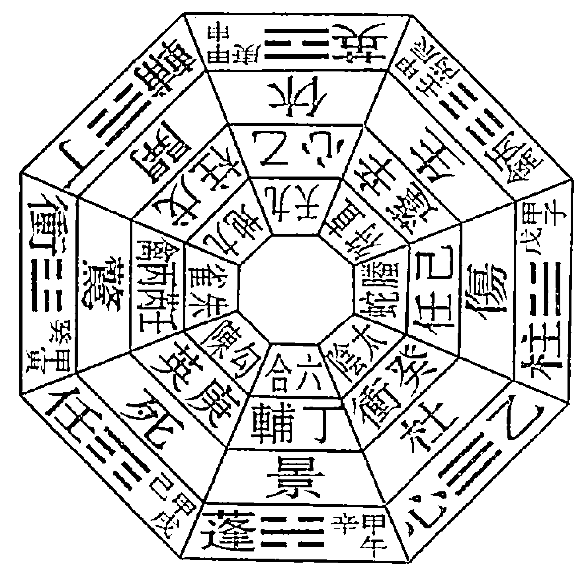

## 阳遁七局

冬至中元
清明下元
立夏下元
惊蛰中元

辛仪加壬为天庭逢狱格
休门加离为水火既济
蓬符加坤为水地比
兑宫克门
坤宫门比和
离休与乙合 门反吟 门迫宫
巽门迫宫
震门迫宫
艮刑格 宫门比和
坎宫克门
乾地假 宫克门

断曰：辛符当令，遇丙于坤，可谓“西南得朋”矣。休使入离，水火相济，又遇乙庚之合，所谓溉釜鬻而怀好音者也。惜符入于朱元之地，使亦趋于勾白之宫，则张目撄腕而来者，皆乘虎狼而挟蛇虺者也。占者所当慎其机缄，闲其进退。

兵事：宫克星，门克宫，主客互有伤损。门属反吟，当反客为主，反逸为劳。遇于东北，必有格斗。宜预伏于乾巽二方，临时猝发，袭其东之粮饷，亦防东来劫寨。
出行：正南可行。逢皂衣人乘骡马，或闻空中大声。
阳宅：利开南门。一七日，进六畜，遇北方有疫发。
阴宅：午山子向吉。作用时，有水禽飞至。百日内得古窑器，大发。

- 附占：
- 胜败：未决。
- 虚实：敌已近。
- 攻城：攻有损伤。
- 守城：可守，防东南城坏。
- 天时：晴，主有微云蔽日。
- 地理：地近桥梁，屏障高耸，坤龙吉。
- 人事：文书翻案，方得其平。
- 田禾：防有旱灾。
- 家宅：可以高大门闾，骎骎日盛。
- 官禄：未升，当复原任。
- 应试：当荐。
- 求财：本分之财，半年后方得。
- 婚姻：夫婿不佳。
- 胎产：当生贵子。
- 疾病：有毒，难痊。
- 捕获：逃者不获，盗贼易擒。
- 失物：失于东南，不得。
- 远信：不至。
- 鸦鸣：有和合事。
- 鹊噪：有惊。

## 丁壬日癸卯时

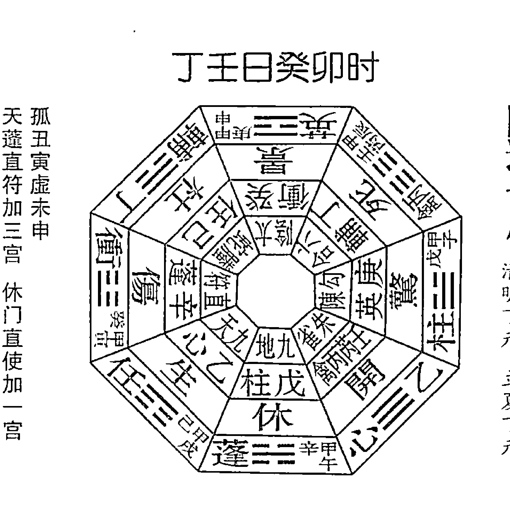

- 孤丑寅虚未申
- 天蓬直符加三宫
- 休门直使加一宫
- 冬至中元
- 清明下元
- 惊蛰中元
- 立夏下元

辛仪加癸为虎投罗网格，休门伏坎为坎，蓬符加震为水雷屯，兑太白与天乙格，坤鬼假，离小格，巽，震，艮生与丁合虎遁，坎门伏吟，乾开与丙合丙奇入墓

断曰：休使伏坎，归于故宫。不虞曩时同事之辛，投于罗网之癸，而处于太阴之宫，则念旧怀人，悲歌长叹，固宜其呻吟而不已也。盖六癸本不利于有为，而天星复逢其九地，当如水之归于壑、虫之坏于户可也。

兵事：星生宫，阴时利主。天网门伏，不宜出兵。离宫太阴乘庚，贼必有伏，宜备格战。但当连营于东北，摇旗呐喊，贼至即击，不可贪功。
出行：利出东北门，逢黄衣阴人，或见隆背之物。
阳宅：利开东北门或西北门，有黑白飞禽双至为应。
阴宅：乾艮两山皆吉。作用时，有瘦妇持筐或僧尼持盖至。

附占：
胜败：客胜。
虚实：敌志欲战。
攻城：无功。
守城：敌兵不劲，可守。
天时：晴。
地理：案山屏障俱佳。
人事：有小恙，宜静坐。
田禾：有收。
家宅：心常不快，小口极旺。
官禄：升转迟。
应试：文可呈堂。
求财：静有动无。
婚姻：女佳，可成。
胎产：寅申月日生女。
疾病：水火交战，治宜泻金。
捕获：亡者易追，盗贼不获。
失物：在水边人家可觅。
远信：不至。
鸦鸣：有不明事。
鹊噪：行人远归。

## 丁壬日甲辰时

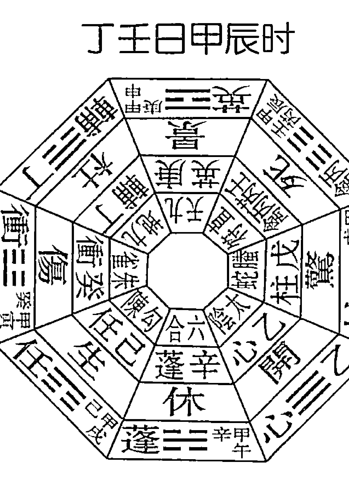

天芮直符加二宫
死门直使加二宫

阳遁七局
冬至中元
惊蛰中元
清明下元
立夏下元

天辅时 壬仪加壬为天牢自刑格 死门伏坤为坤 芮符伏坤为坤 兑门符伏吟 巽地假 乾开与乙合真诈乙奇入墓

断曰：符分天芮，壬仪秉令，分元符九天之神，据水土长生之位。壬水则怀裹于土上，坤土则泥淖于波中，清浊不分，江淮莫辨，盖元圭未锡之时也。况中五之丙，罹于毕月；天罡之辰，退于实沉。诚恐大雨时行，桃花浪涨矣。

兵事：阳时利客，季甲亦可先动。宜向西北出师，连路设伏为策应。可用诡计诈敌，背正东之孤，击其对冲，降则肆赦。
出行：宜出西北方。见贵人著紫骑马，或见羽毛飞动。
阳宅：宜立乾门，有红衣贵人至。
阴宅：乾山巽向吉。作用时，东方有金鼓声，渔人持网至。

附占：
胜败：主胜。
虚实：敌人但张虚势。
攻城：不克。
守城：可守。
天时：阴云四布。
地理：地近溪沟，形穴极佳。
人事：有水土之事。
田禾：禾有收。
家宅：卧房甚吉，婢女得力。
官禄：秋冬可升，当得兵刑工之缺。
应试：丁日占，不中。
求财：求谋可得。
婚姻：不能谐。
胎产：恋胎，生女。
疾病：蛊块难治。
捕获：贼有朦蔽，逃人自归。
失物：失于正西，原处可寻。
远信：远人三九日有信，近人茶后即至。
鸦鸣：有更变。
鹊噪：喜孕。

## 丁壬日乙巳时

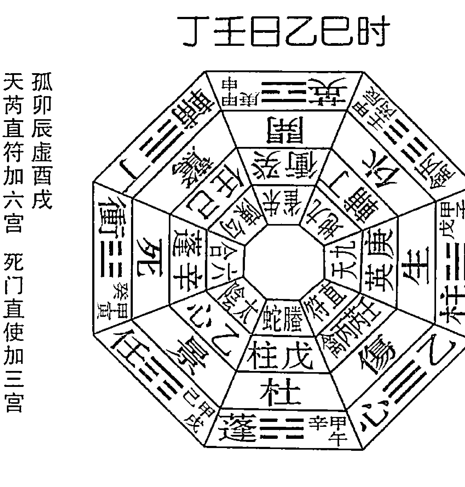

## 阳遁七局

- 冬至中元
- 惊蛰中元
- 清明下元
- 立夏下元

孤卯辰虚酉戌
天芮直符加六宫
死门直使加三宫

- 乾 宫生门 相佐 丙奇入墓 宫克门
- 坎 宫生门
- 艮 门生宫
- 震 宫克门
- 巽 门迫宫
- 离 小格 宫克门
- 坤 休与丁合 重诈 宫克门
- 兑 太白与天乙格 门生宫
- 芮符加乾为地天泰
- 死门加震为地雷复
- 壬仪加乙为日入地户格

断曰：乾中有亥，为壬之禄地。今坤母挟符而隶于乾，是五花官诰，三锡殊恩。妻之荣，都缘于夫之贵也。惜门使加震，人于朱元之宫，则哲妇长舌，牝鸡司晨，不免城之倾而家之索矣。苟能柔顺而居贞，自可宜家而绥福。

兵事：星生宫，宫克门，利为主。宜安营于坤，俟敌先动，以参将为先锋，向西南应之，背西北，击东南，精兵宜伏东北为策应。
出行：西南格合重诈，宜出其方。二里，逢白衣人，或闻哭声。
阳宅：宜立坤门，有人担水过应。
阴宅：坤山艮向吉。作用时，有驼背老人至为应。

附占：
胜败：主客欲和。
虚实：贼诞妄。
攻城：守将求和，难拔。
守城：可守，宜备南门。
天时：有风有雨。
地理：地脉长远活动。丁日占，不发人。
人事：利于参谒，有木料差遣。
田禾：丰，种豆极利。
家宅：财不聚，香火吉，宜子孙。
官禄：宜求荐举。
应试：丁日占，卷呈堂，总裁不取。
求财：不得。
婚姻：女敦厚，可谐。
胎产：生男，子母不安。
疾病：肺气不清，还愿禳之。
捕获：逃人易捕，贼盗难缉。
失物：失于正北，可寻。
远信：近即来，远不速至。
鸦鸣：涉女人事。
鹊噪：行人远归。

## 丁壬日丙午时

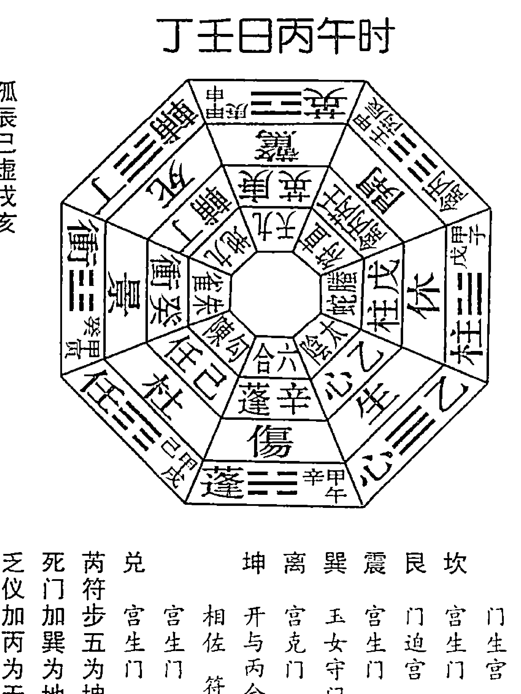

| 方位 | 宫生门 | 宫生门 | 相佐 符伏吟 勃符 符勃 | 开与丙合 乌跌穴 龙返首 | 宫克门 | 玉女守门 鬼假 宫克门 | 宫生门 | 门迫宫 | 宫生门 | 门生宫 | 生与乙合 真诈 乙奇入墓 |
| :--- | :--- | :--- | :--- | :--- | :--- | :--- | :--- | :--- | :--- | :--- | :--- |
| | 兑 | 坤 | | 离 | 巽 | 艮 | 坎 | | 乾 | | |
| | 芮符步五为坤 | 死门加巽为地风升 | | | | | | | | | |
| | 乏仪加丙为天牢伏奇格 | | | | | | | | | | |

断曰：壬符步五而遇丙，是水火交战于胸中，而冰炭同栖于掌上也。况以寄宫之故，壬与壬朋，丙与丙党，壬来胜丙，丙往治壬，盘错棼结，其争未有艾矣。死门加于杜门，玉女守焉。乃知蛾眉皓齿，乃伐性之斧斤；长袖曼声，乃亡身之鸠毒。

兵事：宫克门，利为主。俟敌先动，应兵出西南，应龙返鸟跌之吉。奇兵出西北，分二为伏兵，背西南直符，击其对冲。有雷震军中，大利。
出行：宜出西南西北二方。西南二里，逢人哭泣；西北六里，逢公吏勾当人。
阳宅：宜立乾坤二门，主发财帛福禄。
阴宅：乾山巽向、坤山艮向俱吉。作用时，有僧道持盖至为应。

附占：
胜败：主胜。
虚实：敌未动。
攻城：有援，难攻。
守城：正南宜有备，可守。
天时：阴晦，未雨。
地理：回龙顾祖，穴下防有骸骨。
人事：有疾病文书，或婢女逃亡事。
田禾：丰，农安。
家宅：宅宇巍奂，卧房香火，安置极佳。
官禄：指日可升。
应试：帘官不荐。
求财：图谋可得。
婚姻：不谐。
胎产：生男，主贵。
疾病：郁症，调摄自愈。
捕获：捕人受嘱，难获。
失物：可寻。
远信：迟。
鸦鸣：主有损失。
鹊噪：主文书。

## 丁壬日丁未时

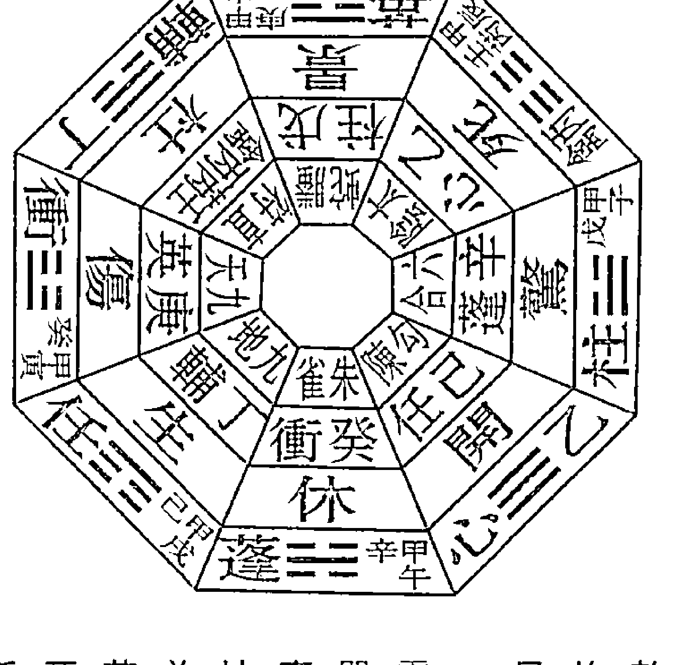

孤巳午虚亥子
天芮直符加四宫
死门直使加五宫

阳遁七局
冬至中元
惊蛰中元
清明下元
立夏下元

壬仪加丁为太阴被狱格
死门步五为坤
芮符加巽为地风升
兑 坤 离 巽 震
门伏吟 天乙与太白格 相佐仪刑 丁奇入墓 生与丁合重诈鬼遁
艮 坎 乾

断曰：符加巽而遇丁，使加坤而遇丙，皆借炎赫之余光，成崇高之美业，可谓他山有助者矣。但太阴被狱，又逢木克，安知不以为牺牛？安知不以为刍狗？赵孟之所贵，赵孟能贱之。朝荣夕悴，岂偶然哉！

兵事：宫克星，利为主。直符仪刑，不宜交战。宜移营于艮地，西南多设伏兵，大将居守。以参将为前队，背东南直符，击其西北。
出行：宜出东北方，逢残疾老人，或见新成器皿。
阳宅：宜立艮门，有人持文书纸笔至。
阴宅：艮山坤向吉。作用时，有老人说婚为应。

附占：
胜败：主客均。
虚实：贼人饥。
攻城：援兵近速，不可攻。
守城：防西北不守。
天时：主有积雨。
地理：体魄极安。壬日占，不发人。
人事：有心事，当问九流人。
田禾：禾歉，麦有收。
家宅：人口不利，宠婢非吉。
官禄：平平，利于除授。
应试：难中。
求财：可得，宜稍用机谋。
婚姻：不得谐。
胎产：母命卯，定生贵子。
疾病：肝气郁于土，宜疏肝。
捕获：本人在东方，食后即行。
失物：失于南方，可寻。
远信：为疾所阻，有喜。
鸦鸣：主惊恐。
鹊噪：有喜信。

## 丁壬日戊申时

## 阳遁七局

- 冬至中元 惊蛰中元
- 清明下元 立夏下元

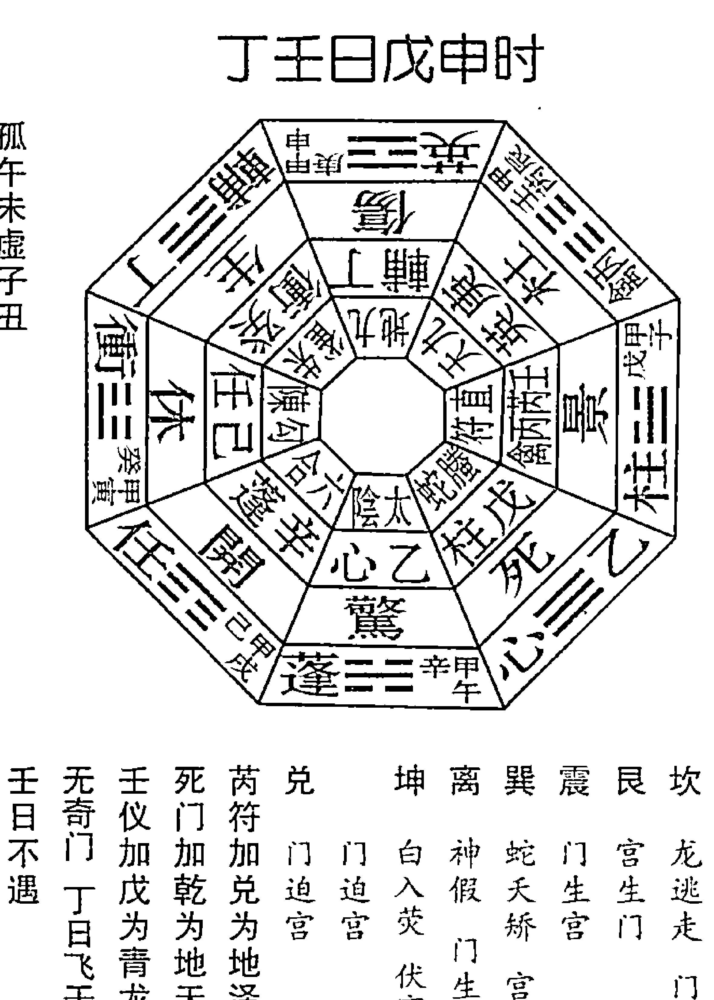

- 孤午未虚子丑
- 天芮直符加七宫
- 死门直使加六宫

| 卦 | 状态 |
|---|---|
| 乾 | 门生宫 |
| 坎 | 龙逃走 门生宫 |
| 艮 | 宫生门 |
| 震 | 门生宫 |
| 巽 | 蛇天矫 宫克门 |
| 离 | 神假门 生宫 |
| 坤 | 白入荧 伏宫格 奇格 上格 |
| 兑 | 门迫宫 门迫宫 |

壬日不遇
无奇门
丁日飞干格
壬日伏干格
壬仪加戊为青龙入狱格
死门加乾为地天泰
芮符加兑为地泽临

断曰：使前符后，咸徘徊于乾兑之间而生金，是能附首帖耳以为人者也。但水壬长生于申，败于酉，而又遇螣蛇之宫，得毋割肉以喂鹰、委身以饲虎乎？人之不惜身名，不畏功令，为子孙谋富贵长久者，其愚亦类于此，不可不悟。

兵事：星门生宫，利于为主。预宜伏兵于西南，使敌入于伏中，虽有小伤，犹可制胜。北方敌亦有伏，当以伏制伏，俟其先动。惟东南宜疾出师，以应蛇矫。
出行：无奇门吉格。暂出东南，当有虚惊。
阳宅：小修震门，当有白衣人至。
阴宅：卯山酉向稍利。作用时，有鹰鹞掠禽堕地应。壬日不遇，勿用。

附占：
胜败：主胜。
虚实：客已入境。
攻城：粮足有援，不可攻。
守城：可守。
天时：半阴半晴。
地理：朝山左砂空缺，防有更变。
人事：有虚惊，或武备事。
田禾：丰，麻麦不利。
家宅：财气不聚，利于宦家。
官禄：文书错误，防参劾。
应试：丁日，总裁不取。
求财：不甚利。
婚姻：难就。
胎产：母有灾，生女。
疾病：脾病，延东北方医人可治。
捕获：贼自败，易获。
失物：失于西北，可寻。
远信：至。
鸦鸣：有贵人事。
鹊噪：主有财帛事，须防文书遗失。

## 丁壬日己酉时

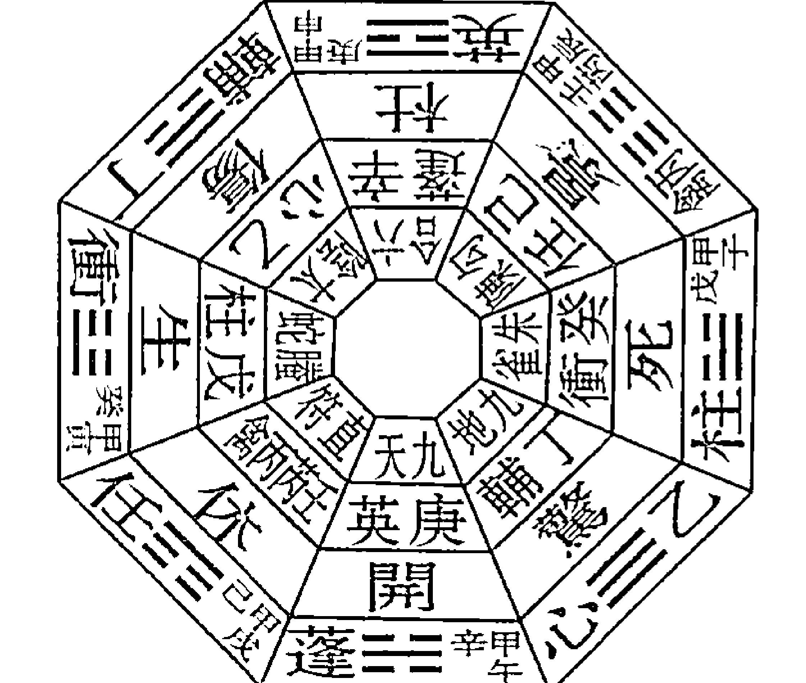

## 阳遁七局

- 乾 丁奇入墓 宫门比和
- 坎 门生宫
- 艮 休与丙合 符反吟 宫克门
- 震 宫克门
- 巽 宫门比和
- 离 门生宫
- 坤 门生宫
- 兑 门生宫
- 芮符加艮为地山谦
- 死门加兑为地泽临
- 壬仪加己为天地刑冲格

断曰：以壬加己，格为天地刑冲，有山夷渊塞之象。夫己为阴土，壬为阳水，以水和土，则为埏埴，以土塞水，则为堤防，此阴阳之妙用也。故君子法之，正用则为两美，反用则为两伤。直使脱于兑而遇蛇，若无子女之惊忧，当有婢妾之耗失。

兵事：门生宫，利为主。俟敌先动，向东北直符下应敌，击其对冲，须防先胜后败。符既反吟，当以副将为先锋，乘乱纵击。战于前，游兵当击其后。
出行：宜出东北方，逢皂衣妇人，或见贵家之物。
阳宅：宜立艮门，有贵人青衣过。
阴宅：艮山坤向吉。作用时，有女人把火至，周年后生贵子。

附占：
胜败：主胜。
虚实：客自虚声。
攻城：难攻。
守城：备北门，可守。
天时：阴云无雨。
地理：土星入首，穴结于突下，山向宜斟酌。
人事：有小儿至，或盗失之事。
田禾：丰，麦防旱。
家宅：防有外孝，宅主不宁。
官禄：吉利，不能即升。
应试：壬日占，可望中。
求财：三分财喜。
婚姻：女极柔顺，易谐。
胎产：生女，平安。
疾病：肝肾受克，三八日可愈。
捕获：是僧道人。
失物：不可得。
远信：千里内，人信俱不至。
鸦鸣：相争。
鹊噪：防孝服。

## 丁壬日庚戌时

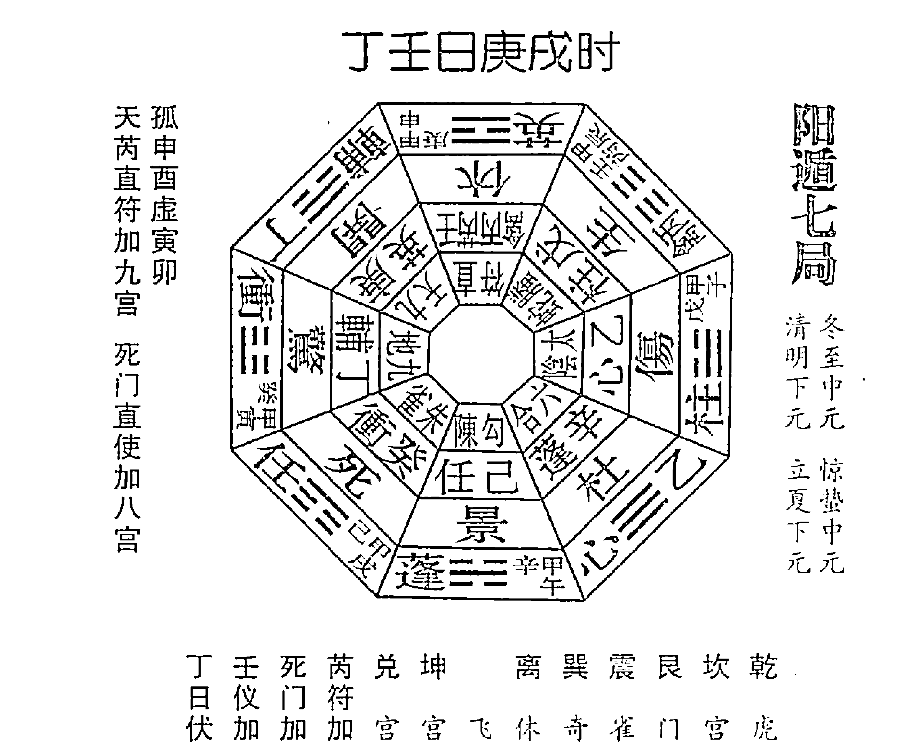

断曰：符入于九宫，挈其中五之丙以伐庚。而为之庚者，地盘则困于离火，天盘则困于丁奇，力已疲矣。我则扼其吭而捣其虚，侮其亡而取其乱，犹拾芥也。但壬日飞干，丁日伏干，恐不能兵无血刃耳，然而敌固已宵遁矣。

兵事：宫生星，利为客。符宫荧入于白，大将宜随天乙所在，迅速发兵。乾方亦宜立剿。惟东方切须观望，俟其先动。门反，防有反间。遇轻烟绕军，主有阴谋。
出行：宜出正南方，逢皂衣妇人，或见贵人。
阳宅：宜立离门，有患脚患目人至。
阴宅：午山子向吉。作用时，西方三五人把火寻物为应。

- 附占：
- 胜败：主胜
- 虚实：贼人荒迷于色，但树虚声
- 攻城：不拔
- 守城：防东南有贼
- 天时：晴朗，有微风
- 地理：宜剪火挨金。穴土带紫，防有变更
- 人事：有渔翁至，或水利之事
- 田禾：岁歉，秋有虫伤
- 家宅：人口平安，防有火烛
- 官禄：恐有盗贼之累
- 应试：丁日占，不中
- 求财：宜于木姓求之
- 婚姻：男家畏女家，不成
- 胎产：生男，吉
- 疾病：肺经受病，医药不效
- 捕获：在燃火之处
- 失物：失于本家，可寻
- 远信：迟至
- 鸦鸣：有紧迫事
- 鹊噪：主孝服

## 丁壬日辛亥时

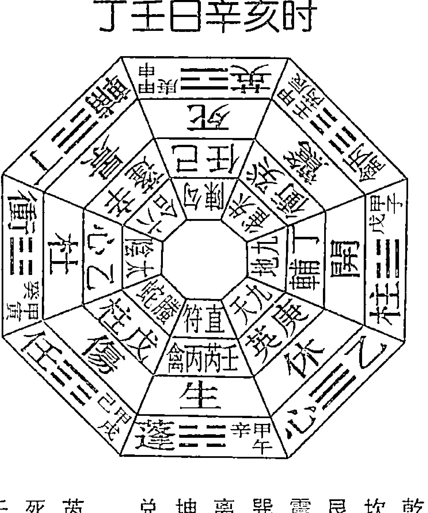

乾 奇格 宫生门
坎 生与丙合 门迫宫
艮 门迫宫
震 乙奇升殿 宫门比和
巽 宫生门
离 格刑 宫生门
坤 宫生门
兑 开与丁合 重诈 丁奇升殿

壬仪加辛为白虎犯狱格
死门加离为地火明夷
芮符加坎为地水师
宫门比和

断曰：符投北道，有同行之丙，下与辛合，而遂得专其地利，此孔子所以先之以子夏，再之以冉求也。直使在南，受火之生，本欲邀光希宠，立致云霄，而不意勾虎在前，庚煞在内，名心利念，大半销沉矣。

兵事：星克宫，宫生门，利为客。兵宜先动，宜安营于西，设伏于东。正兵出正北，奇兵出正西，以副将为先锋，背西北孤地，击其对冲，可胜。
出行：宜出正北方，逢贵人舟车。若出正西，逢残疾人。
阳宅：宜立坎兑二门，主得财禄。
阴宅：子山午向、酉山卯向俱吉。作用时，有水畔鸡鸣为应。

附占：
胜败：客失利。
虚实：贼方合党，未来。
攻城：不能拔。
守城：敌近救远，防正西地道。
天时：阴晦无雨。
地理：金水行龙，地脉极佳，次房发。
人事：有兵事，或武人争斗。
田禾：岁歉，豆麦有收。
家宅：财旺官显，正北当有兴作，但防孝服。
官禄：有益地方，秋冬可升。
应试：丁日占，可中。
求财：难得，冬月稍利。
婚姻：不谐。
胎产：生女，母不宁。
疾病：土燥有积，静养可痊。
捕获：在火房中，当急捕。
失物：半得半失。
远信：人不得归。
鸦鸣：主婚姻和合。
鹊噪：有虚惊。

## 戊癸日壬子时

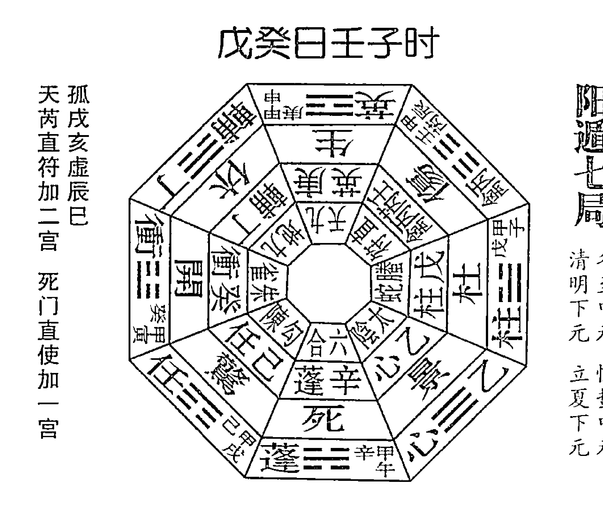

孤戊亥虚辰巳
天芮直符加二宫
死门直使加一宫

阳遁七局
清明下元
冬至中元
立夏下元
惊蛰中元

壬仪加壬为天牢自刑格
死门加坎为地水师
芮符伏坤为坤
兑宫克门
坤符伏吟
离宫生门
巽休与丁合
震宫迫宫
艮宫生门
坎门迫宫
乾乙奇入墓门迫宫

断曰：芮星壬符，本为水土之司。巡行八宫而复归其宅，岂其八年于外，告厥成功耶？使亦土也，仍居于坎，而遇六合之神。六合为舟楫，天蓬为水师，坎地为江湖。岂其秋风瓠子，尚有未靖之波，而足胝手胼，尚有未底之绩耶？宜其习于坎也。

兵事：门克宫，利为客。但符伏门克，不宜出兵。止宜分伏重兵，或在乾，或在巽。敌报若警，从东南邀击之。背西南直符，击其对冲，副将不利。
出行：宜出东南方。四里，逢皂衣妇人，或闻歌唱声。
阳宅：宜立巽门。三七日，进横财。
阴宅：巽山乾向吉。作用时，有鸡鸣犬吠为应。

附占：
胜败：利主。
虚实：贼伏不动。
攻城：有援难攻。
守城：可守，城中亦有伤损。
天时：日隐云中，阴而不雨。
地理：地脉佳，土星入首，可用。
人事：有老人乘轿会亲，或和合之事。
田禾：丰收。
家宅：香火厨灶俱利，居东南西南两方者极佳。
官禄：求荐，吉。
应试：戊日占，中。
求财：有得，当有变更。
婚姻：不成。
胎产：生男，产母有灾。
疾病：喜中得恙，清肺可愈。
捕获：逃人可获。
失物：原处可寻。
远信：迟。
鸦鸣：主涉女人事。
鹊噪：有亲朋酒食。

## 戊癸日癸丑时

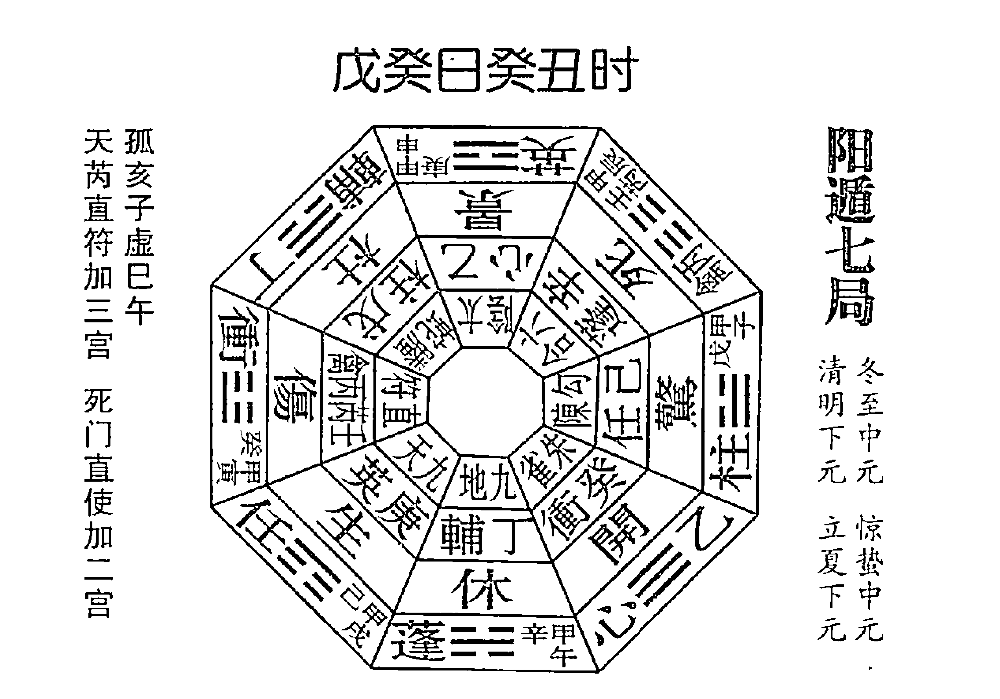

天 壬 死 芮 兑 坤 离 巽 震 艮 坤 乾
网 仪加癸为阴阳重地格 门伏坤为坤 符加震为地雷复
刑格 休与丁合 重诈

断曰：符投于网，受制于木，人当途穷日暮，虽有良平之智、贲获之勇，亦付之无可奈何而已。使返于土，伏而呻吟。万物莫不生于土而归于土。其生也，勾萌所以达也；其归也，骨肉所以毙也。生者归之路，归者生之机。

兵事：宫克星，阴时利主。门伏天网，不宜妄动。东北方不能无战，战必有伤。设伏于正南，截贼归路，又设伏于北，截贼来路，宜用参将为前队。
出行：宜出正北方，闻同伴歌声。
阳宅：宜立坎门。七日进水中物，大发。
阴宅：子山午向吉。作用时，有雷电风雨为应。

附占：
胜败：主胜。
虚实：贼自相残。
攻城：有援，不可攻。
守城：可守，乾方防贼。
天时：风雨凄清。
地理：穴结窝钳，林木丛杂。芟其柯条，得见阳气，吉。
人事：俯从下情，强而后合。
田禾：麦歉，禾照旧。
家宅：大宜安静，否则不利人口。
官禄：难升。
应试：辛命人可望中。
求财：易得。
婚姻：可入赘。
胎产：生女，胎稳，难产。
疾病：心火刑金，辰戌日愈。
捕获：贼在西不获，逃人易拘。
失物：阴人窃去。
远信：近方喜信即至。
鸦鸣：防口舌。
鹊噪：主行人远归。

## 戊癸日甲寅时

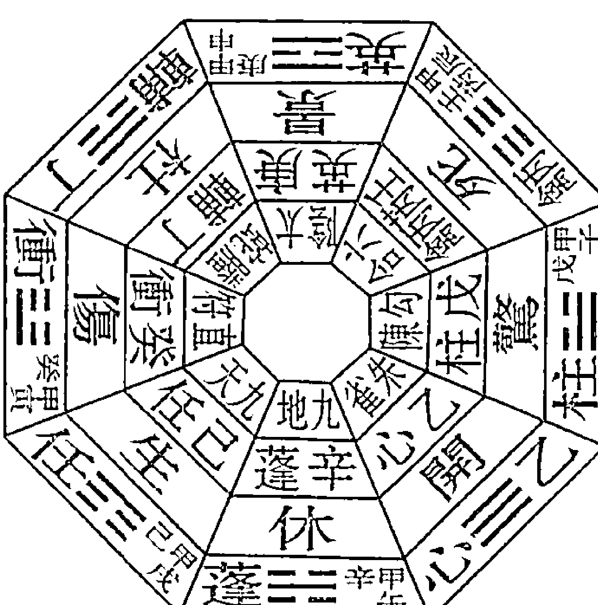

天冲直符加三宫
伤门直使加三宫

孤子丑虚午未

阳遁七局

冬至中元
清明下元
惊蛰中元
立夏下元

乾 开与乙合
坎 乙奇入墓
艮 门符伏吟
震
巽
离
坤
兑

冲符伏震为震
伤门伏震为震
癸仪加癸为天网重张格
天辅时戊日不遇

断曰：符分天冲，癸仪秉令，继五仪之极运，开震治之宏图，塞者可以渐通，静者可以徐动矣。若当春旺之时，木气方舒，天星得地，虽伏而不动，而浸浸乎已有干霄蔽日之材，恢恢乎已有雷奋霆击之势。

兵事：门符伏宫，主客比和。天辅之时，宜赦过宥罪。仲甲亦不宜出师，宜安营于坎位，伏藏于离方。东北建置旗鼓，应敌则出西北击西南。
出行：宜出西北方。路逢贵人，见修造之事。
阳宅：宜建乾门。有黄衣人至，或雌雄黑禽飞过。
阴宅：宜乾山巽向。作用时，有童子执金银器至。

附占：
胜败：客利。
虚实：敌未动。
攻城：议和不下。
守城：可守。
天时：晴，起风。
地理：土色碧，来龙属水，案山秀，发贵。
人事：当获山林之利，或库藏事。
田禾：稻遇风暴，减收。
家宅：人口平安，但不发财。
官禄：可升。
应试：戊日占，不中。
求财：不能遂意。
婚姻：不成。
胎产：生女，母防病。
疾病：停积致患，勿药可愈。
捕获：逃人远匿西南，捕若用力，易获。
失物：失于正西可寻。
远信：千里内者即至。
鸦鸣：主老妪之事。
鹊噪：有贵戚相访。

## 戊癸日乙卯时

孤辰虚巳午
天冲直符加六宫
伤门直使加四宫

阳遁七局
清明下元 立夏下元
冬至中元 惊蛰中元

| 宫位 | 卦象 | 解释 |
|------|------|------|
| 乾 | 相佐 | 宫门比和 |
| 坎 | 开与乙合 | 门生宫 |
| 艮 | 刑格 | 宫克门 |
| 震 | 生与丙合 | 休诈 宫克门 |
| 巽 | 玉女守门 | 宫门比和 |
| 离 | 门 | 生宫 |
| 坤 | 门 | 生宫 |
| 兑 | 门 | 生宫 |
| 冲符加乾 | 雷天大壮 | |
| 伤门加巽 | 雷风恒 | |
| 癸仪加乙 | 为日沉九地格 | |

> 断曰：符使分投于四六之宫，星家所谓“出乾入巽”者也，其有蹑天根、探月窟之意乎？但二宫分值朱螣，而本宫又有飞庚之伏，盖得意浓时，猛宜退步也。门之在巽，既已得地，而玉女守焉。古人云：扶之者众，虽弱亦强矣。

兵事：宫克星，利为主。阳星阳时，又宜先举。宜伏兵于东北，伏时即有战斗，当以我为主，可以不败。贼在正南，党羽甚盛，利用间谍。出行：东北二方俱可行。出开门，逢小儿执竹杖；出生门，见病眼人应。阳宅：宜见坎震二门，有贵人或僧道至应。阴宅：子山午向、卯山西向俱可用。动作时，有红衣女人簪花送果应。

附占：胜败：主胜。虚实：敌已近，当战。攻城：城中兵精难克。守城：北门备火。天时：始阴终晴。地理：拱护极佳，牛眠吉穴。人事：有宴会，或妇人口舌。田禾：麦丰，禾登。家宅：宅不吉，人有灾。官禄：治地称心，升转亦速。应试：文晦，不中。求财：必遂意。婚姻：易成，女有才，能掌家。胎产：生女，产迟。疾病：怒气郁于脾，当疏肝理脾。捕获：逃人匿于正东，难获。失物：东南可寻。远信：无。鸦鸣：主女人事。鹊噪：夫妻不睦。

## 戊癸日丙辰时

孤寅卯虚申酉
天冲直符加五宫
伤门直使加五宫

阳遁七局
清明下元 冬至中元
立夏下元 惊蛰中元

* 乾：奇格门迫宫
* 坎：门迫宫
* 艮：宫生门
* 震：开与乙合乙奇升殿龙遁
* 巽：云遁门迫宫
* 离：刑格宫生门
* 坤：龙返首相佐符勃仪刑
* 兑：丁奇升殿宫克门
* 冲符步五为雷地豫
* 伤门伏五为雷地豫
* 癸仪加丙为明堂犯悖格
* 丙奇得使遇甲

断曰：符使并人中宫而遇丙，得青龙返首之吉，则太阿在手，可以呼吸风雷矣。无如鱼潜于藻，其志在饵。凡所以剥肤椎髓者，皆欲穷利之薮而竭民之财，以致门迫其宫，上陵下替。故曰：财者万事之命也。居官者首当以贪为戒。

兵事：星门克宫，利为客。宜扬兵于南，从东方出兵，大张声势，鼓行而前，背南击北。西北贼必有伏，宜搜之。有青黄云在西南助战，大吉。出行：宜出正东方。路逢匠役捕猎人，或闻鼓声。阳宅：宜立东门，有渔人或小儿至应。阴宅：宜震山兑向。作用时，有蛇上树应。

附占：胜败：客利。虚实：敌有诡计。攻城：宜用土囊塞其北流，城中必多死亡。守城：东门防盗。天时：晴而有风。地理：龙脉极佳，穴窝有情。人事：静坐不宁，追言夙昔。田禾：收成好。家宅：宅发财，人口安。官禄：蒙特恩升擢。应试：中。求财：有求必得。婚姻：不成。胎产：生男，后当贵，为武职。疾病：手少阴之症，可治。捕获：逃在正北，患病易获。失物：失于东北方，可寻。远信：即至。鸦鸣：有淫佚事。鹊噪：有亲朋至。

## 戊癸日丁巳时

天冲直符加四宫
伤门直使加六宫

阴遁七局
冬至中元
惊蛰中元
清明下元
立夏下元

| 宫 | 描述 |
|---|---|
| 乾 | 宫克门 |
| 坎 | 龙逃走 宫生门 |
| 艮 | 门生宫 |
| 震 | 宫克门 |
| 巽 | 相佐仪刑 蛇天矫 门迫宫 |
| 离 | 开与丁合 宫克门 |
| 坤 | 白入荧奇格上格 宫克门 |
| 兑 | 生与丙合天遁休诈 |

断曰：符飞巽而使趋乾，天门既开，地户亦辟矣。但巽巳性本属蛇，又遇蛇宫，而以癸加丁，又为蛇之天矫，盖巳为阳极之地，而蛇与癸皆为阴象，纯阴菀结，非淫雨之连宵，即黄雾之四塞也。否则郑南门之斗，妖由人兴乎？

兵事：宫克门，利为主。宜预伏兵于西南，敌至后发，必堕我计。敌若劫我北营，抛金帛饵之而后战。但符值击刑，主必重伤，不如不战为上。出行：宜出正西正南二方。行逢女子，防虚惊，或见旌旗应。阳宅：宜建离兑二门，半年内得武人财宝应。阴宅：宜子卯二向。作用时，闻钟声，见黑猪应。

附占：胜败：主胜。虚实：贼即至。攻城：不可攻。守城：易守。天时：晴。地理：龙脉不实，有道路穿伤，不吉。人事：有音乐或战斗之事。田禾：麦大熟，禾亦丰。家宅：宅利人安，惟幼小有惊忧。官禄：升转迟。应试：不中，小试利。求财：独求有祸。婚姻：不成。胎产：生男，易产。疾病：木侮脾经，医庸难愈。捕获：待其再回可捉。失物：失于西北近石铁处。远信：不至。鸦鸣：有朦蔽事。鹊噪：九流人至。

## 戊癸日戊午时

癸仪加戊为青龙入地格
伤门加兑为雷泽归妹
冲符加兑为雷泽归妹
兑门符反吟宫克门
坤宫门比和
离门迫宫
巽开与乙合风遁门迫宫
震门迫宫
艮宫门比和
坎宫克门
乾乙奇入墓宫克门

断曰：东震西兑，屹焉两峙。今以东之符使，并入于西。东为仁，西为义；东为德，西为刑；东为阳，西为阴。故西者杀机也。杀机动而剸割之路开，有江河日下之象矣。幸戊癸回环作合，以柔孕刚，以阴孕阳，仁义互施，则张弛悉当矣。

兵事：宫克星门，利为主。门符反吟，不宜交战。宜伏兵于北，保险阻以为固。敌至则从东南出师，背坤击艮，乘乱砍杀，当有顺风助战。出行：宜出东南方。四里六里，见老人执香入庙应。阳宅：宜建巽门，有小儿或赤马至应。阴宅：宜巽山乾向。作用时，见东方人家发火应。

附占：胜败：不交刃。虚实：客情甚怯。攻城：不拔。守城：易守，军民多死亡。天时：有风，浮云蔽空。地理：朝案甚佳，戊日占，可用。人事：有武士至，或言惊忧事。田禾：秋有风暴，收成尚好。家宅：宅不利，诸事拂意，心绪烦扰。官禄：幕不得人，印信错误，防罚俸，却遇恩超擢。应试：不中。求财：田产财可得。婚姻：女欲择婿，当入赘。胎产：得男，易产，母安。疾病：宜滋肝肾。捕获：难获。失物：可寻。远信：至。鸦鸣：有口舌事。鹊噪：贵人相访。

## 戊癸日己未时

孤巳午虚亥子
天冲直符加八宫
伤门直使加八宫

阳遁七局
冬至中元
清明下元
惊蛰中元
立夏下元

癸日不遇 癸仪加己为华盖入明堂格 伤门加艮为雷山小过 冲符加艮为雷山小过 兑开与乙合 宫门比和 坤宫生门 离丙奇升殿 荧入白 宫生门 巽奇格 宫生门 雀投江 宫门比和 艮门迫宫 坎门迫宫 乾虎猖狂 宫生门

断曰：癸之本宫在丑，癸之原符在震，而今又飞于艮，如盘庚之迁殷，总不越河洛之间也。小过之象，下实上虚，故宜下而不宜上，宜小而不宜大。臣妣之遇，飞鸟之遗，皆此义也。占者当敬小以慎微，不可智近而谋远。

兵事：星门克宫，利为客。宜安营于西北，从正西出师，背北击南，披其中坚。又宜暗发精兵，截其西北。惟东营不可擅动，敌至后击。出行：宜出正西方。七里六里，见老人与女子同行。阳宅：宜建兑门。三七日，进商音人田应。阴宅：宜酉山卯向。作用时，闻鼓声，小儿成群来。

附占：胜败：客胜。虚实：贼人受制于妇人，别有诡谋。攻城：不可攻。守城：可守。天时：云开见日。地理：土色青白，右砂反跳，葬之防官事。人事：有田产争竞，或山林木料。田禾：防水灾，不大丰。家宅：厨灶不利，小口欠安。官禄：不升，防有盗贼之虞。应试：戊日占，可中。求财：不得。婚姻：媒人不得力，难成。胎产：生女，母有灾。疾病：足阳明之症，易治。捕获：逃人匿于正南，易获。失物：失于西南方近古墓处。远信：至。鸦鸣：有阴私事。鹊噪：有贵戚来。

## 戊癸日庚申时

* 乾：丙奇入墓，门生宫
* 坎：门生宫
* 艮：开与乙合，地遁，虎遁
* 震：门生宫
* 巽：宫生门
* 离：飞宫格，小格，门生宫
* 坤：门迫宫
* 兑：太白与天乙格，门迫宫
* 冲符加离为雷火丰
* 伤门加离为雷火丰
* 癸仪加庚为天网冲犯格
* 戊日伏干格
* 癸日飞干格

断曰：先天离火，本在东方，而后天震木继之，盖父依于子也。今震之符使，尽入于离，岂其木火为侣，相从而不舍耶？然火为木子，而以癸加庚则格矣。得毋为子孙温饱之计，而既呼其庚，复呼其癸乎？则计之过也。

兵事：星门生宫，利为主。宜立营于东，伏兵于西，备具兵器，以严待懈。敌至则从东北出师迎之，背东南，击西北，可以取胜。出行：宜出西北方。行八里十八里，逢男子言讼事。阳宅：宜修艮方，有人著白衣过应。阴宅：宜艮山坤向。作用时，见素服人骑马，自南来应。

附占：胜败：主胜。虚实：贼有札来。攻城：不拔。守城：可守。天时：有风无雨。地理：穴情不佳，防有蚁聚，透风损柩。人事：商贩济之事。田禾：丰。家宅：居人宠婢，衅起室中，耗财不利。官禄：迟升，外任不吉。应试：不中，场后防有文书牵连。求财：贵人之财可得。婚姻：成，媒不佳，费口舌。胎产：难产，母有灾，儿不育。疾病：起于情欲，宜静摄。捕获：三五日见面。失物：在东厢。远信：至。鸦鸣：主阴私口舌。鹊噪：有亲友来。

## 戊癸日辛酉时

戊日飞干格
癸日伏干格
癸仪加辛为华盖受恩格
伤门加坎为雷水解
冲符加坎为雷水解
兑宫生门
坤宫开门
离宫天乙与太白格
巽宫克门
震宫大格
艮宫丁奇入墓门迫宫
坎宫生门
乾门生宫

断曰：符使加辛，名曰华盖受恩。盖坎水固能生震木，而辛金亦能生癸水也。且癸禄在子，辛贵在寅，贵与禄合，而吉征见矣。斯时也，雷雨既作，草木皆坼，动于至险之中，射于高墉之上，是在学《易》之君子矣。

兵事：宫生星门，利为客。宜伏兵于东，敌亦有伏，必有格战。宜从西南方，绕出其背，与伏来击。背西北，击东南。南方亦有贼兵，当遣右营抵敌。出行：宜出西南方。二里六里，闻妇人啼哭声，见牛马应。阳宅：宜建坤门，有瞽者来应。阴宅：宜坤山艮向。作用时，有远方人送书至应。

附占：胜败：客胜。虚实：敌饥，不能久住。攻城：不下。守城：可守。天时：阴晴不定。地理：来龙不真，穴中有蚁聚。人事：有水利，或栽植花木。田禾：秧种不利，薄收。家宅：女眷二心，暗中耗财，须防火烛。官禄：难升，外任督抚不合。应试：不中。求财：有得。婚姻：不成。胎产：生子，易产房屋不利，胞衣迟下。疾病：水泛之症，宜渗泄。捕获：已去不复，宜急追。失物：遗失在正南，无人盗。远信：至。鸦鸣：有酒食事。鹊噪：贵客来。

## 戊癸日壬戌时

阳遁七局
冬至中元 惊蛰中元
清明下元 立夏下元

孤申酉虚寅卯
天冲直符加二宫
伤门直使加二宫

| 卦 | 奇仪/门 | 解 |
|---|---|---|
| 乾 | 奇格 | 门迫宫 |
| 坎 | 门迫宫 | |
| 艮 | 宫生门 | |
| 震 | 开与乙合 | 乙奇升殿 |
| 巽 | 云遁龙遁 | 门迫宫 |
| 离 | 格刑 | 宫生门 |
| 坤 | 仪刑 | 门迫宫 |
| 兑 | 丁奇升殿 | 宫克门 |
| 冲符加坤为雷地豫 | | |
| 伤门加坤为雷地豫 | | |
| 癸仪加壬为天网覆狱格 | | |

断曰：壬干在坤，久困于土。幸有木之符使，连臂而来，破其昏滞之气，凿其混沌之天，而又有癸水以扶身，则为之王者，可以破涕为笑矣。顾水之性，以澄而清，以挠而浊，安知破土者非即以挠水耶？古人云：在山则清，出山则浊。毋令猿鹤笑人也。

兵事：星门克宫，利为客。但直符刑击，又遇门迫，不宜交战，战必有伤。从正东出师，为游檄，密察敌人之机，而速乘其利，水战可胜。出行：宜出正东方。路逢伐木人，防遗失。阳宅：宜建震门，有武士执刀枪至应。阴宅：宜卯山西向。作用时，有远方把火寻物应。

附占：胜败：客利。虚实：贼有伏，在西北。攻城：不下。守城：军士防疾疫。天时：有风无雨。地理：来龙不的，未为吉壤。人事：有土木事，或兄弟相调。田禾：小有年。家宅：发财，家长多病。官禄：照常供职。应试：文晦，癸日占不中。求财：尊贵之财有得。婚姻：媒不得力，难成。胎产：生男，产室不佳。疾病：土不制水，宜平土经，所谓“平其敦阜”。捕获：在北方，或病故。失物：东北高阜处可寻。远信：至。鸦鸣：主有私事。鹊噪：有外姻至。

## 戊癸日癸亥时

断曰：八卦之位，至动者莫如震；十干之气，至静者莫如癸。今以至动之符使，归而伏于沉闷默塞之中，以癸君癸，何其缄縢扃鐍之固也。视之不见名曰希，听之不闻名曰夷，老子所谓“常应常静常清净”者，此之谓已。

兵事：门符伏，宫比和，主客皆不宜动。况天网四张，安静尤吉。正北可立营，正南可伏兵，正东可积粮。高垒深沟，待时而动。战则背直符，击其破军。出行：宜出西北方。行四里六里，见猪马或有声之物。阳宅：宜修乾方，有缠钱人至为应。阴宅：宜子山巽向。葬后六十日，牝鸡鸣，家主有灾。

附占：胜败：有和象。虚实：贼亦厌兵。攻城：师劳无功。守城：易守。天时：晴朗有风。地理：朝向水口俱不吉。人事：有工匠事，或河上工程。田禾：歉。家宅：房室幽暗，居人心绪不舒。官禄：迟升。应试：癸日占中。求财：得土产之财。婚姻：难成。胎产：无喜，有血疾。疾病：宜舒筋养血，阴人不吉。捕获：逃人易获。失物：失于西方枯井之傍。远信：至。鸦鸣：主阴人事。鹊噪：有朋友来。

## 御定奇门遁甲·阳遁九局

## 阳遁八局

## 甲己日甲子时

阳遁八局

孤戊亥虚辰巳
天任符加八宫
生门直使加八宫

谷雨下元
小寒中元
小满下元
立春上元

天辅时
戊仪加戊为青龙入地格
生门伏艮为艮
任符伏艮为艮

兑 坤 离 巽 震 艮 坎 乾

地假
门符伏吟

开与丙合
重诈
丙奇入墓

断曰：符使在艮，任星生门秉权，信义可风，屹然任事。而螣阴化鬼，仕路未通；勾白对宫，同人不睦。妻室伏庚而乖戾，父位有文而晦藏。占者当守兼山之义，慎勿思出其位。惟时为天辅，利在赦过宥罪而已。

兵事：仲甲乙时，门符未分，刑德在门，不利出兵。庚煞在坎，上乘九天，敌气方嚣，当守静以待其敝。大将居东北，偏将居西北，粮储居东南，骁骑居西南。应敌宜出西北。出行：西北可行。出门六里十里，逢老人执杖，或见神像。阳宅：利开西北门，有绿衣人来。阴宅：乾山巽向吉。作用时，有风雨，或水畔鸡鸣。

附占：胜败：主胜。虚实：敌有惧心，驻兵不进。攻城：不可攻。守城：宜筑北门城垣。天时：晴。地理：地近高冈圆径，向不合法。人事：有贵人财帛之事。田禾：麦丰，禾防虫。家宅：长幼康宁，当贵绵远。官禄：交秋可升。应试：亥命人中。求财：得分内财物。婚姻：女能言，性刚。胎产：得女，产迟。疾病：土郁，夺之愈。捕获：得妇人作引，可获。失物：宜向东北寻。远信：行人恋酒食，未返。鸦鸣：有喜事。鹊噪：向西北鸣，主贵人事。

## 甲己日乙丑时

孤亥子虚巳午
天任直符加七宫
生门直使加九宫

阳遁八局
小寒中元
立春上元
小满下元
谷雨下元

| 方位 | 门/格 | 说明 |
|---|---|---|
| 乾 | 门迫宫 | |
| 坎 | 鬼假小格 | 门迫宫 |
| 艮 | 宫生门 | |
| 震 | 开与丁合 | 门迫宫 |
| 巽 | 休与乙合 | 龙遁风遁 |
| 离 | 生与丙合 | 丙奇升殿重诈 |
| 坤 | 奇格 | 门迫宫 |
| 兑 | 相佐 | 宫克门 |

己日不遇
戊仪加乙为青龙入云格
生门加离为山水贲
任符加兑为山泽损

> 断曰：直符加兑，为少女之宫，与乙相遇，似有姊妹相从、然须煮粥之义。而飞乙加于巽宫，则才美能文，不啻续史之大家、题门之令娴，真闺中学士也。至生使加于六合，而六合又来登堂，当有“岭南逢驿使，大雷寄妹书”者，占为佳音即至。

兵事：宫生门，星生宫，主客有益。正南丙奇升殿，东南又逢龙遁，俱可出兵。背南击北，防敌有伏。惟开门遇迫，不宜取用。
出行：正南东南皆利。东南逢文士，正南见残疾人。
阳宅：宜震巽离三门，有白衣人至。
阴宅：卯午巽三山皆吉。作用时，见南方火光，或跛足人把镜至。

附占：
* 胜败：客欲和。
* 虚实：虚张声势，未至。
* 攻城：有内应，易入。
* 守城：宜备东门。
* 天时：有雨。
* 地理：朝山层耸，穴情生动。
* 人事：当生贵子，或有暗喜。
* 田禾：麦丰，青徐梁大熟。
* 家宅：席丰履厚，人口平安。
* 官禄：必升。
* 应试：文不荐。
* 求财：所求如意。
* 婚姻：女贤，难就。
* 胎产：生男，母有伤。
* 疾病：火盛，防发狂。
* 捕获：防伤捕。
* 失物：失于缺地废井。
* 远信：人信俱至。
* 鸦鸣：有尊长文书事。
* 鹊噪：有喜音。

## 甲己日丙寅时

孤子丑虚午未
天任直符加六宫
生门直使加一宫

阳遁八局
谷雨下元
小寒中元
小满下元
立春上元

无奇门 戊仪加丙为青龙得明格 生门加坎为山水蒙 任符加乾为山天大畜 兑 宫门比和 坤 宫生门 离 宫生门 震 雀投江 宫生门 艮 神假 宫门比和 坎 门迫宫 乾 龙返首 相佐 符勃 宫生门

断曰：符向天门，加丙为返首之龙，吉莫大焉。盖丙在戊，本为入墓，得甲木飞临，生扶而提挈之，则其光直焰天门，照于奎壁之间，而无复尘埃之掩。故同一返首，而视他局为更吉也。使加坎，有断桥涉川之象，殆所谓进而不已必退者耶？

兵事：星生宫，门克宫，主客互有损益。阳时又逢龙返吉格，大宜先动。遣副将即提兵杀入正南，星驰电掣。若遇于东南，又当按兵不动，待敌至而后击之。出行：无奇门，宜出西北直符下。闻父子唱叹，或见水族物。阳宅：小修坎方，须防口舌火烛。阴宅：乾山可厝，有贵人乘轿来应。

附占：胜败：势均力敌。虚实：鸣锣桴鼓而来。攻城：宜壮军威，可以慑服。守城：西门不固，难守。天时：风雨交至。地理：龙势飞腾，朝山不佳。人事：宜于甄别贤否。田禾：岁歉。家宅：官升人健，冬防虚惊。官禄：不升。应试：难中。求财：不得，且有口舌。婚姻：女性凶，不成。胎产：生女，平安。疾病：有积滞，易瘥。捕获：是纺织人，不获。失物：失于西北，不得。远信：不至，行人亥子日到。鸦鸣：闻争闹。鹊噪：有医士来。

## 甲己日丁卯时

## 己日飞干伏干格
- 戊仪加丁为青龙耀明格
- 生门加坤为山地剥
- 任符步五为山地剥
- 兑宫克门
- 坤相佐门符反吟宫门比和
- 离刑格门迫宫
- 巽开与丙合重诈门迫宫
- 震乙奇升殿门迫宫
- 艮丁奇入墓宫门比和
- 坎格刑宫克门
- 乾地假宫克门

断曰：符步五而寄坤，而使亦入坤，皆为反吟，有分道而驰、不期而会之义。恰又与玉女相值，当逢闺中侠烈，识英雄于草莽，而盘餐置璧，以为结纳者。乃飞丁又加于本宫，则非私奔之红拂，即盗盒之红线，有惊亦有喜焉。

兵事：门符反吟，不宜轻动。阳时利于先举，南北皆有刑格，不无车倒马敞。奇兵宜分为二，一伏西北，一伏东南。大兵出巽方，以马兵为先锋。

出行：东南可行。四里十四里，闻急唱声，或见旧物。

阳宅：利开巽门。闻歌乐声，或有南来惊事应。

阴宅：巽山乾向吉。作用时，有鹊噪渔猎之应。

附占：胜败：客败。虚实：敌将有内患。攻城：无益有损。守城：兵强粮足，易守。天时：阴云四合，凝结不开。地理：穴情佳，拱护亦密。人事：主有婚姻和合，或饮食宴乐。田禾：麦丰，东南尤胜。家宅：内助贤能，宅长安吉。官禄：可升。应试：防贴出。求财：阴贵人之财，可得。婚姻：女益男家，可成。胎产：生男当贵。疾病：脾病，防复发。捕获：贼易缉，亡者赂脱。失物：在室内近谷帛处。远信：不至，行人恋酒未归。鸦鸣：有和合事。鹊噪：有惊。

## 甲己日戊辰时

孤寅卯虚申酉
天任直符加八宫
生门直使加三宫

阳遁八局
谷雨下元
小寒中元
小满下元
立春上元

- 乾：丙奇入墓 宫门比和
- 坎：门生宫
- 艮：符伏吟 宫克门
- 震：宫克门
- 巽：神假 宫门比和
- 离：地假 门生宫
- 坤：门生宫
- 兑：门生宫

任符伏艮为艮
生门加震为山雷颐
戊仪加戊为青龙入地格
无奇门

断曰：符归伏艮，而使亦趋三，相随而至。如重耳之复国，实从者能扦牧圉之功，非尽贪天以为己力也。但木宫受制，而衅兆螣蛇，得毋吕郤之难未平，而介推之焚不免乎？是故三月为禁烟之候，占宜慎之。

兵事：宫克门，符伏吟，不利为客。兵宜后举，奇门不合，止宜静守老营，各安部伍。途间急切遇贼，当背东击西。背寅卯之孤，击申酉之虚。

出行：东北稍利。行一八里，逢黑衣公吏为应。

阳宅：甲日禄在寅，开艮门亦吉。

阴宅：艮山坤向，可以暂厝。作用时，有蛇上树为应。

附占：胜败：客胜。虚实：敌来，阵后有伏兵。攻城：无益，有害。守城：有援可守。天时：晴，春有风。地理：地近泉井，向不合法。人事：有阴人乞恩。田禾：麦防虫，禾有风伤。家宅：宦者禄厚，居人逸乐，宜小心火烛。官禄：冬春可升。应试：己日占当荐。求财：有口舌，久利。婚姻：女家欲就，可谐。胎产：生女，产迟。疾病：伤酒致疾，宜戒饮。捕获：盗首已首，毋庸捕。失物：在瓦块土石间。远信：不至。鸦鸣：有争殴事。鹊噪：闻女人死亡。

## 甲己日己巳时

**阳遁八局**

孤卯辰虚酉戌
天任直符加九宫
生门直使加四宫

谷雨下元
小寒中元
小满下元
立春上元

戊仪加己为青龙相合格
生门加巽为山风蛊
任符加离为山火贲
兑门迫宫
坤门迫宫
离门生宫
巽大格宫克门
震休与丙合重诈 门生宫
艮开与乙合虎遁 宫生门
坎门生宫
乾鬼假门生宫

断曰：戊加于己，为天地合德，宜有显扬之事，而气象暗然，岂南风之不竞耶？却喜伤门加临，本能生火，伤之正所以益之，有申严教训之义。惜生使受制而遇格，似欲取东南之材，以备器用，而斤斧不利也。不如归而谋诸，却合玉兔游山之吉。

兵事：宫生星，宫克门，为客有利有害。阴时兵宜后举，当分兵两出，一从正东，一从东北。设诈欺敌，或劫其营，或烧其粮。战时当背东南，击西北。

出行：正东东北皆利。见红衣人，或遇空中变动之物。

阳宅：利开东北正东二门。正东有武士持刀枪至，东北有卖鱼肉人至。

阴宅：艮震两山皆吉。作用时，有驼背老人披蓑衣至。

附占：胜败：客欲求和。虚实：敌已入疆。攻城：可招抚。守城：向正西求援，可守。天时：阴晴反覆不定。地理：地近闹市，形势屈曲，土色红。人事：有奸淫方案。田禾：兖青大丰。家宅：有文名，有恩荣，惟下人不得力。官禄：外任地近苦寒，却易升。应试：不中。求财：有阻，不利。婚姻：男克女，不成。胎产：生女，产母多灾。疾病：热疮，五日愈。捕获：逃易获，贼不擒。失物：失于近炉鼎处，可寻。远信：已发，近信则无。鸦鸣：主暧昧事。鹊噪：有行人远归。

## 甲己日庚午时

孤辰巳虚戌亥 天任直符加一宫 生门直使加五宫

阴遁八局
小寒中元 谷雨下元
小满下元 立春上元

| 兑 | 坤 | 离 | 巽 | 震 | 艮 | 坎 | 乾 |
|---|---|---|---|---|---|---|---|
| 宫克门 | 龙逃走 乙奇入墓 宫门比和 | 生与乙合 玉女守门 门反吟 | 休与丁合 门迫宫 | 门迫宫 | 宫门比和 | 飞宫格 天乙与太白格 | 白入荧 奇格 宫克门 |

甲日不遇 戊仪加庚为青龙持势格 生门步五为山地剥 任符加坎为山水蒙

断曰：符入坎宫，遇景门与九天相合，非高阁之临江，即蜃楼之出海。而斜日渡头，人涉邛否，叹其欲济无舟楫也。至生门挟乙而临丁，则成都美酒，当垆仍是文君；巫峡行云，入梦无非神女。青溪相遇之事，何必《齐谐》有之。

兵事：星克宫，不利主。门反，亦不宜妄动。乾方太白入荧，当出西南生门，预伏于西北，贼至则发，不得先期，亦防偏裨参佐中有逆心。

出行：宜正南西南。正南逢皂白衣女人，西南当防口舌。

阳宅：利开坤离二门，三七日进横财发。

阴宅：坤午两山皆吉。作用时，西方有妇女骑马骤至应。

附占：胜败：客败。虚实：敌兵当至。攻城：攻则当败。守城：援近易守。天时：水旺有雨。地理：地卑湿，有白蚁。人事：有考选事，或有文书耽搁。田禾：麦熟，荆梁甚丰。家宅：有逆仆当遣之，季月防口舌。官禄：任内地不显。应试：文不合主司意。求财：分内之财，半年方得。婚姻：女家富厚，可成。胎产：生男当贵。疾病：心神不宁，宜养心血。捕获：在东方竹篱中，易于擒缚。失物：失于正北，可寻。远信：至，近信不至。鸦鸣：主得贵人财帛。鹊噪：进六畜。

## 甲己日辛未时

- 阳遁八局
- 小寒上元
- 立春上元
- 小满下元
- 谷雨下元

无奇门 己日飞干格 伏干格 戊仪加辛为青龙相侵格 生门加乾为山天大畜 任符加坤为山地剥 兑宫生门 坤符反吟 宫生门 离刑格 宫克门 巽宫克门 震乙奇升殿 宫生门 艮丁奇入墓 门迫宫 坎神假 物假 格刑 宫生门 乾门生宫

断曰：戊符加辛，龙虎相争，子午交战，有两雄相并之势。而得开门，则如刘项之会宴，或羊陆之馈遗，终归和好耳。旁遇六丁，而丁复带勾白以入艮，又当获阿甄于冀州，锁二乔于铜雀也。至生使亦有传檄之象，而癸闭丙墓，其子卿茹雪时乎？

兵事：门生宫，阴时利主。宜符反吟，不战为上，战则有伤。又无奇门，当从直符下应敌。因其未陈，乘乱砍杀，或可取胜。战时宜背西南方，击东北。

出行：无奇门，宜从西南直符方出。二里十二里，闻哭声，或见伤残物。

阳宅：小修西北亦可，见患目人应。

阴宅：坤山艮向，可以暂厝。作用时，有群犬吠，或僧道过。

附占：胜败：主胜。虚实：敌兵未至。攻城：急攻可拔。守城：城不固，难守。天时：阴云笼罩，气象昏沉。地理：地近苑堤大道，后有变更。人事：贵人当受官职。田禾：雨水不时，歉。家宅：官升人安，惟心绪多扰。官禄：案牍劳形，未升。应试：文不得意。求财：行商贩丝罗之类，获利。婚姻：成，女多言。胎产：生男，易产。疾病：脾经之疾，防反复。捕获：防捕欺蔽，不获。失物：失于西南，可寻。远信：不至。鸦鸣：有口舌。鹊噪：主文书。

## 甲己日壬申时

天任直符加三宫 生门直使加七宫 孤午未虚子丑

阳遁八局 谷雨下元 小寒中元 小满下元 立春上元

甲日伏干格 戊仪加壬为青龙破狱格 生门加兑为山泽损 任符加震为山雷颐 虎猖狂 门生宫

| 卦名 | 内容 |
|---|---|
| 兑 | 生与丁合 丁奇升殿 |
| 坤 | 宫克门 |
| 离 | 宫克门 |
| 巽 | 人假 门迫宫 |
| 震 | 仪刑 宫克门 |
| 艮 | 伏宫格 太白与天乙格 |
| 坎 | 荧入白 宫生门 |
| 乾 | 乙奇入墓 宫克门 |

断曰：符悉东往，使喜西行。而死门加震，生门挟丁以加乙，其为涕出女吴之景公乎？抑请继室于晋之晏子也。乃值白虎猖狂，而朱滕交构，未免煽炽多端，其张弧脱弧之衅乎？山泽之损，占者必能利贞，乃为得吉。

兵事：宫克星，不利客。直符仪刑，不宜出兵。大将当随天乙而伏，亦防格斗。正西正北，虎狂荧入，若塘报得实，即宜发兵进剿，不可迁延。

出行：正西可行。出门八九里，逢鼠斗，或见傍人争闹。

阳宅：利开西门，有飞禽自西北来。

阴宅：兑山震向吉。作用时，天中有大鸟飞鸣。葬后或拾得珠翠，大旺。

附占：胜败：主胜。虚实：敌当去。攻城：劳师无益。守城：食足易守。天时：木旺水泄，无雨。地理：护砂内势极佳，穴情不吉。人事：宜于授官考职。田禾：禾麦俱丰。家宅：小口多灾，女眷获福。官禄：任地遂意，官不能久。应试：文太高，房考不荐。求财：西方少女之财，求必遂。婚姻：成，女足有伤。胎产：易产，生男。疾病：心火刑肺，难愈。捕获：防伤捕。失物：失于林中。远信：至。鸦鸣：尊长有灾。鹊噪：闻殴伤事。

## 甲己日癸酉时

天网 戊仪加癸为青龙相和格 生门伏艮为良 兑 坤 离 巽 震 艮 坎 乾 鬼假 蛇天矫 上格 乌跌穴 勃符门伏吟 生与丙合重诈天遁 休与乙合龙遁 开与丁合丁奇入墓

断曰：戊符加巽，遇癸而化，不嫌于天网也。且巽宫辅杜，为文曲之星，上林曲江之地，又为得禄之乡。以甲木参天之材，遇网而罗织成文，此夺锦兆也。生门合丙，而伏于本宫，得重诈吉格，宜有改换门墙、恩赐甲第之庆。

兵事：宫克星，阴时利主。艮宫重诈天遁，宜潜师偷劫，可获粮草辎重。西南蛇矫，当有母女作逆，宜迅发师掩击。大将立营，当据东北生方。

出行：三白方虽合奇门，但网低，须俯首而行，见青衣阴贵或紫衣官吏应。

阳宅：宜立艮坎两向。艮向有贵人至，坎向闻鼓声应。

阴宅：艮坎两山皆吉。作用时，闻鸡鸣马嘶。

附占：胜败：胜败未分。虚实：敌兵鼓噪而来。攻城：用地道可入。守城：不守，防屠。天时：水来生木，主有风雨。地理：下有古坟，掘得砖石，不宜用。人事：有少贵呵詈，或面君授职。田禾：岁丰。家宅：安富尊荣，福禄悠久。官禄：升转迟。应试：不中。求财：暗中告贷有得。婚姻：女佳，可成。胎产：生女，产母有病。疾病：胃火盛，易痊。捕获：贼在北方，新婚设宴。失物：失于东南，可获。远信：无，使人不至。鸦鸣：闻怪异事。鹊噪：有喜音。

## 甲己日甲戌时

阳遁八局
谷雨下元
小寒中元
小满下元
立春上元

天辅时 己仪加己为明堂重逢格 景门伏离为离 任符伏离为离

兑 坤 离 巽 震 艮 坎 乾
门符伏吟
开与丙合 休诈 丙奇入墓

断曰：英符景使，得离宫之火气，居南方之正位，己仪亦在受生之地而司权，有薰风解愠、向明而治之象。其阴神为元盘之六合，主联联合会好之事，兹复往会奇门于天阙，则上书献策，如群仙会于大罗，吉可知也。时为天辅，更自有吉无凶。

兵事：门符伏，宫比和，主客均利。季甲之时，阳外阴内，先举者吉。宜安营于东，伏兵于西，从西北出师，背艮击坤，可以制胜。

出行：宜出西北方。四六里，逢酒食，或见猪马应。

阳宅：宜立乾门。有黑禽双至，或白衣人来。

阴宅：宜乾山巽向。作用时，有窑灶火惊，兵营争闹应。

附占：胜败：客胜。虚实：敌军勇猛，来必鏖战。攻城：守将能获士心，不拔。守城：可守无虞。天时：无雨。地理：土色带紫，地近窑灶，山向欠利。人事：有远信至门。田禾：麦防旱，禾如去年。家宅：安稳发财，居人有文名。官禄：清淡无营，可以安久。应试：文高可中。求财：无得有费。婚姻：旧戚联姻，易成。胎产：得女，母有灾。疾病：胃中火盛，医得人易痊。捕获：逃人在西北贵家，难获。失物：失于东北，可寻。远信：即至。鸦鸣：主贵人事。鹊噪：有进益。

## 甲己日乙亥时

无奇门 己日不遇 己仪加乙为日入地户格 景门加坎为火水未济 任符加兑为火泽睽 兑 相佐 宫克门 坤 蛇天矫 宫门比和 离 门迫宫 巽 门迫宫 震 上格 门迫宫 艮 宫门比和 坎 门反吟 宫克门 乾 丁奇入墓 宫克门

断曰：英符加兑，以火犯金，居猜嫌之地，而伤谗畏讯，此风人《巷伯》、屈原《离骚》之所为作也。赖乙奇与己为同气，而又往会使门于坎宫，则如姬为公子而窃符，班昭代定远而上表，暗中之助不少矣。虽景门受克于坎水，又何伤哉！

兵事：星克宫，宫克门，主客互有损伤。门反防偏将谋逆，宜修沟堑，治壁垒，以守待攻。敌来则出天马方迎之，背西南，击东北。

出行：捕猎宜出西方。七里十里，逢女人持钓竿，匠人伐木应。

阳宅：坤方可小修。甲日见贵人，己日见方外人应。

阴宅：坤山艮向可厝。动作时，闻西方磬声，山下有人把火喧闹应。

附占：胜败：主胜。虚实：敌情反覆，难信。攻城：防守甚严，难拔。守城：固守无虞。天时：有雨，晴。地理：地近闹市亭院，穴情不实。人事：有争财讼事。田禾：秋防旱，禾薄收。家宅：宠妾弄权，夫妻反目，生灾破财。官禄：升转迟。应试：不中。求财：虚约不得。婚姻：成，女虚诈，男有残疾。胎产：得男，有惊，产室不吉。疾病：小儿血光之灾，服药易痊。捕获：逃人在东北方，难获。失物：东南方寻之。远信：即至，行人五日后有音。鸦鸣：主阴人事。鹊噪：有贵人来。

## 乙庚日丙子时

孤戊亥虚辰巳 天英直符加六宫 景门直使加二宫

## 阳遁八局

- 小寒中元
- 谷雨下元
- 立春上元
- 小满下元

| 乾 | 坎 | 艮 | 震 | 巽 | 离 | 坤 | 兑 |
|---|---|---|---|---|---|---|---|
| 龙返首 符勃 宫门比和 | 开与丁合 门生宫 | 休与乙合 真诈 虎遁 | 生与丙合 休诈 宫克门 | 宫克门 | 大格 宫门比和 | 门生宫 | 门生宫 |

断曰：丙居于戌，困于墓乡。今得返首之龙，似可破壁而飞。而戊亦偕来，是又一墓也。使入九地，无能为矣。旁遇丁奇，乃吾盗也，非吾助也。而三奇会三吉门于东北，则非鲁之三家，即晋之三卿。如蚀木之蠹，蠹盛而木尽，可不惧哉。

兵事：门生宫，星克宫，阳时利为客。艮合真诈，冬春月宜出东北休门；震合休诈，季月宜出正东。开门丁奇受制，不利行兵。安营宜在西南，背乾击巽，正西不可犯。

出行：正东东北二方俱可往，路逢担生气之物应。

阳宅：宜建震艮二门，见骑赤白马人或青衣人。

阴宅：卯山西向、艮山坤向俱吉。作用时，有大风雨，闻钟声。

附占：胜败：主胜。虚实：敌军有阻，未至。攻城：当来求成。守城：宜备东南。天时：西南云起如峰，有雨。地理：龙脉曲折，穴向护砂俱吉。人事：有阴人财喜。田禾：麦丰，兖青大熟。家宅：祖居康宁，名利俱得。官禄：升迁易，同僚不睦。应试：乙日占，中式。求财：有意外之财，寅卯日得。婚姻：成，男贵女贤，不能偕老。胎产：生女，母欠安。疾病：足少阴之症，调摄自愈。捕获：逃人匿东方，难获。失物：南方可寻。远信：至。鸦鸣：有老阴人事。鹊噪：防遗失。

## 乙庚日丁丑时

孤亥子虚巳午
天英直符加五宫 景门直使加三宫

阳遁八局
谷雨下元
小满下元
小寒中元
立春上元

择吉类经典名著

阳遁八局

| 宫位 | 五行 | 门与宫关系 | 格局 | 备注 |
|------|------|-------------|------|------|
| 乾 | 金 | 生与乙合 真诈 乙奇入墓 | | |
| 坎 | 水 | 荧入白 宫生门 | | |
| 艮 | 土 | 太白与天乙格 门迫宫 | | |
| 震 | 木 | 宫生门 | | |
| 巽 | 木 | 宫克门 | | |
| 离 | 火 | 宫克门 | | |
| 坤 | 土 | 相佐仪刑 宫生门 | | |
| 兑 | 金 | 休与丁合 丁奇升殿 虎猖狂 | | |

时干入墓
己仪加丁为明堂贪生格
景门加震为火雷噬嗑
英符步五为火地晋

断曰：步五之局，每患其空，而独利于火符者，火空则发也。且遇丁奇，乃胞胎一气之人，为我心腹，而取内暗助，何患不得志哉！景门受生于震，又与元符相值，有遇主于巷之象，非同于捕风捉影者。占为佳音迅速，当开筵以待来人。

兵事：宫生门，星生宫，主客互益。虎狂荧入，利于先举，宜扬兵耀武。冬春月出正，季月出西北，伏兵随后。但逢刑击，战则必有杀伤。

出行：正西西北二方，俱可以往。行一里，见抱物人。

阳宅：宜开乾兑门。三七日，进古时器皿应。

阴宅：乾山西山俱吉。作用时，有青衣妇人携酒至应。

附占：胜败：客无斗志，宜和。虚实：敌有深谋，无从探听。攻城：可长驱直入。守城：城郭不完，难守。天时：晴。地理：右水反跳，葬后防官讼。人事：文武不和，两相讦讼。田禾：禾麦俱登，农忙。家宅：门庭安吉，荫下尤利，惟防口舌孝服。官禄：有荐举可升。应试：可中。求财：小人之财可得。婚姻：成，媵婢佳。胎产：生男，后贵，易产，母安。疾病：防愈后复发。捕获：逃人匿于北方，难获。失物：失于东方，可寻。远信：至。鸦鸣：防失脱。鹊噪：有文书。

## 乙庚日戊寅时

- 阳遁八局
- 小寒中元
- 立春上元
- 雨水中元
- 惊蛰下元

- 乾 宫生门
- 坎 小格门迫宫
- 艮 仪刑门迫宫
- 震 宫门比和
- 巽 宫生门
- 离 鸟跌穴 丙奇升殿 勃符
- 坤 奇格 宫生门
- 兑 宫门比和
- 英符加艮为火山旅
- 景门加巽为火风鼎
- 己仪加戊为明堂从禄格
- 无奇门

断曰：火符到寅为长生，旺矣。戊己相会，事亦谐矣。然而有伤者，火能使土暖，而亦能使土焦也。今英加艮，而乘朱雀之神，飞丙又勃于本宫，此既焚山，彼亦燎原。如宋卫陈郑之灾，天道岂果远乎？赖使门得天假之祥，则人事尽者，天行亦顺矣。

兵事：宫生门，星生宫，又逢朱鸟跌穴，主客俱利。但仪刑不无伤损，宜扬兵于坎位，从天马方出师，背北击南，避其中坚，先攻左右，可以制胜。

出行：无奇门，远行不利。

阳宅：宜小修北门，半年内得武人财物应。

阴宅：宜乾山巽向。作用时，闻牛鸣马嘶，有雷雨。

附占：胜败：有和意。虚实：敌心惊惶，未敢深入。攻城：城守甚固，不拔。守城：宜备西南，有虚惊。天时：有云无雨。地理：护砂极佳，穴有龟板枯骨。人事：有虚妄信音。田禾：岁歉。家宅：宅居发财，婢妾争宠，人口不安。官禄：不升。应试：中式。求财：尊贵之财可得。婚姻：女出贵族，难成。胎产：生女，母有惊忧。疾病：中焦火盛，服凉剂易痊。捕获：捕役得贿私纵，失于西方，不见。远信：即至。鸦鸣：主阴私事。鹊噪：有贵人事。

## 乙庚日己卯时

孤辰丑寅虚未申
天英直符加九宫
景门直使加五宫

阳遁八局
谷雨下元
小寒中元
小满下元
立春上元

无奇门 庚日飞干格伏干格 己仪加己为明堂重逢格 景门步五为火地晋 英符伏离为离宫 兑门生宫 玉女守门门生宫 离符伏吟门生宫 巽宫门比和 震宫克门 艮宫克门 坎门生宫 乾宫丙奇入墓宫门比和

断曰：符归伏离，而韬光杜门之下，是帷中之灯也。使逢玉女，而飞乘光怪之神，是箧中之焰也。当分太乙之火，能修五凤之楼，而传之永久，如李杜文章，光焰万丈矣。至于户外之事，皆所不宜。

兵事：门生宫，利为主。符伏不宜接战，宜深沟高垒，因粮于敌。敌至则出天马方应之，背东击西。路上遇牛，可得大胜。庚日防中道格战，士卒无伤。出行：上书献策，西南景门可出。二里或十二里，逢公吏骑马。阳宅：宜小修震方。五日内，主伤匠人手足。阴宅：奇门不合，无大利方。若浮屠，坤山可用。动作时，有大风东来，小禽四噪应。

+ 胜败：客胜。
+ 虚实：敌尚未动。
+ 攻城：守将能得众心，不拔。
+ 守城：可守。
+ 天时：晴。
+ 地理：庚日占，有更变，防兵火，不可用。
+ 人事：有两重文书，可以信任。
+ 田禾：防旱与虫，欠丰。
+ 家宅：人口安宁，却不发财。
+ 官禄：治地命案繁剧，难升。
+ 应试：可中。
+ 求财：先难后易，不能足意。
+ 婚姻：女家欲就，易成，女瘦声洪。
+ 胎产：秋生乃女。
+ 疾病：风火之症，善自调摄即痊。
+ 捕获：逃人匿于西北，难获。
+ 失物：妇人窃在桥下。
+ 远信：至。
+ 鸦鸣：主急迫事。
+ 鹊噪：有馈遗熟物来。

## 乙庚日庚辰时

孤寅卯虚申酉
天英直符加一宫
景门直使加六宫

阳遁八局
谷雨下元
小寒中元
小满下元
立春上元

| 己仪加庚为明堂伏杀格 | 景门加乾为火天大有 | 英符加坎为火水未济 | 兑宫克门 | 坤门迫宫 | 离伏宫格宫生门 | 巽休与丙合休诈门生宫 | 震乙奇升殿门迫宫 | 艮开与乙合真诈云遁 | 坎丁奇入墓宫生门 | 乾门迫宫 | 飞宫格符反吟格刑 |

断曰：英符到坎，水火交互，以一加九，耦之为五。故禅灶曰：火，水妃也，妃以五成。而景门值天假于乾位，则羽化有象；生死复互加于坎离，则解形有术。刘海蟾寄语蓝方以“十月怀胎，如何得出”，未济之卦，其怀胎求出之候乎？

兵事：宫克星，门克宫，主客互有损伤。阴时不利先举，宜安营于兑方，设诈诱敌。至则用奇兵二队，一出正东，一出东南，攻其左右，可以取胜。出行：宜出正东东南二方，路逢女子，防虚惊。阳宅：宜建震巽二门。四十九日，见贵人文字应。阴宅：巽山卯山吉。作用时，见卖油人与卖米人口角相争应。

附占：胜败：主胜。虚实：敌有内患。攻城：不拔。守城：严守东南门。天时：北方起彩云，变为黄气，当发风。地理：穴受风，有蚁聚，不吉。人事：主有贵人受官。田禾：秧种不利，欠丰。家宅：后门厕间常闻异声，家长性暴，防下犯上。官禄：不升。应试：文佳，不中。求财：有阻，多求少得。婚姻：成，女能，性谲。胎产：生男，胞衣难下，母多产疾。疾病：土虚水泛，峻补可痊。捕获：酒醉，于河畔可获。失物：同室人盗去。远信：至。鸦鸣：尊贵之事。鹊噪：有工程。

## 乙庚日辛巳时

| 宫位 | 格局与状态 |
| :--- | :--- |
| 乾 | 乙奇入墓 门生宫 |
| 坎 | 荧入白 门生宫 |
| 艮 | 太白与天乙格 宫生门 |
| 震 | 门生宫 |
| 巽 | 宫克门 |
| 离 | 门生宫 |
| 坤 | 仪刑 门迫宫 |
| 兑 | 丁奇升殿 虎猖狂 门迫宫 |
| 景符加坤为火地晋 | 无奇门 乙日不遇 |
| 己仪加辛为天庭得势格 | 英符加坤为火地晋 |
| 景门加兑为火泽睽 |

断曰：己符入坤，率多阴私之事，而杜亦曲径也。旁与丁遇，而丁又往逢直使于九地，与乙同宫，将毋温太真往省其姑，而遂有玉镜台之委乎？然而能绝裾于其母者，未必能敦赤绳之好也，此腾蛇之所由兆也。

兵事：门克宫，利为客。荧入虎狂，亦宜迅速发师，缓则有伤。但逢仪刑，大将不宜亲征。当遣偏将出师，伏兵随后，击其西北，可以制胜。若逢游骑格战，宜收军。出行：无奇门，不利远行。如吊唁，可出西北方，路逢老年夫妇，或见贵重物。阳宅：巽方可小修，见白衣人或飞禽应。阴宅：兑合玉女穿珠格。春夏月，西山卯向吉。动作时，闻鸡鸣，见蛇游。

附占：胜败：宜和。虚实：防敌伏兵在东北山中。攻城：城守甚固。守城：易守。天时：晴。地理：地有斜沟曲涧，后播丑声。人事：有贵人引荐人材。田禾：夏秋少雨，五谷薄收。家宅：门庭安吉，惟防火烛口舌。官禄：难升，兼有盗贼之虞。应试：不中。求财：不宜多求。婚姻：成，男性暴，女有疾，不能偕老。胎产：生女，迟产，母有灾。疾病：有火，宜凉剂。捕获：逃人匿于正南，难获。失物：正东寻之。远信：至。鸦鸣：有紧急事。鹊噪：当进财帛。

## 乙庚日壬午时

## 阳遁八局

| 宫位 | 门宫关系 |
| :--- | :--- |
| 乾 | 宫克门 |
| 坎 | 宫生门 |
| 艮 | 宫生门 |
| 震 | 宫克门 |
| 巽 | 雀投江，门迫宫 |
| 离 | 宫与乙合，真诈，地遁 |
| 坤 | 宫克门 |
| 兑 | 休与丙合，休诈，宫克门 |
| 英符加震为火雷噬嗑 |
| 景门加艮为火山旅 |
| 己仪加壬为明堂被刑格 |
| 乙日伏干格 |

断曰：符退而入震，使退而入艮，或从其母，或从其子，有火传薪尽之象。而一则辰戌相冲，一则戊癸相合。冲则必变，合则必化，变化多通，有数则穷。火之为物，不可以终穷也，故既取于木，复取于山，而得真诈之格于本宫。

兵事：宫生星，门生宫，主客皆利。阴时宜后应，安营于正北，伏藏锐卒，祭祀神祇。敌至则分军为二，一出正南，一出西南，攻其首尾。东南方不可进击，大不利。出行：宜正南西南二方。十五里内，闻鼓声，或见红衣人，及军器。阳宅：宜立坤离二门，七十日进人口应。阴宅：午山坤山皆吉。作用时，见僧道持盖而来，或见窑冶火光。

附占：胜败：客胜。虚实：防敌诱我。攻城：宜从东南门入。守城：宜备西方。天时：斜风密雨。地理：主山金形，有桥梁曲径，牛眠吉壤。人事：有姻亲会合。田禾：播种合宜，五谷俱丰。家宅：有鬼为厉，人多疾疫。官禄：荐举可升。应试：乙日占，不中。求财：夫妇同求可得。婚姻：女族大，非耦。胎产：孪生，男女皆贵。疾病：得名医可治。捕获：酒醉，在河边，速捕即获。失物：失于西北，可寻。远信：至，行人为军卒所害。鸦鸣：长上之事。鹊噪：向正南西南鸣，有欺诈事。

## 乙庚日癸未时

孤巳午虚亥子
天英直符加四宫
景门直使加九宫

阳遁八局
谷雨下元 小寒中元
立春上元 小满下元

| 宫位 | 兑 | 坤 | 离 | 巽 | 震 | 艮 | 坎 | 乾 |
| :--- | :--- | :--- | :--- | :--- | :--- | :--- | :--- | :--- |
| 格局与状态 | 门伏吟 | 龙逃走 乙奇入墓 | 无奇门 天网 时干入墓 | 英符加巽为火风鼎 | 己仪加癸为明堂合华盖格 | 景门伏离为离 | 白入荧 奇格 天乙与太白格 |

断曰：英加于巽，木以生之，风以炀之，宜其通明矣。然遇癸受制，而癸又制于己，阴阳相搏，燥湿相争，此芝菌不根而生、蟾蟧之不母而育也。网加于杜，又为阴火、为簷灯，其汀洲夜泊时乎？景门归伏而丁在，欲以爝火之光争光日月，难矣。

兵事：宫生星，利为客。但白入龙逃，又遇天网，客甚不利。宜伏于西南，以辛金制乙。更伏于西北，以丙火制庚。有角风飞砂自西南来，防敌兵劫寨。出行：时值天网，奇门不合，不宜出。阳宅：宜小修艮方，六十日内得铜镜应。阴宅：兑宫有日月二奇，酉山震向可厝。动作时，见白衣道人携饮食过应。

+ 胜败：客胜
+ 虚实：防敌袭击
+ 攻城：不可攻
+ 守城：可以固守
+ 天时：阴，有风雨
+ 地理：地多曲涧斜沟，受风不暖
+ 人事：有奴婢暗来欺主
+ 田禾：小有年
+ 家宅：小口多惊，更防火烛
+ 官禄：不升，有灾悔
+ 应试：不中
+ 求财：先难后易，多求无得
+ 婚姻：成，女不寿
+ 胎产：生女，不育
+ 疾病：有虚惊，命无伤
+ 捕获：逃人匿于正西，不获
+ 失物：在北方近水处，可寻
+ 远信：未至，行人先有信到
+ 鸦鸣：有

## 乙庚日甲申时

孤午未虚子丑

天蓬直符加一宫 休门直使加一宫

## 阳遁八局

+ 小寒中元
+ 立春上元
+ 谷雨下元
+ 小满下元

天辅时 庚日飞干格伏干格 庚仪加庚为太白重刑格 休门伏坎为坎 蓬符伏坎为坎

| 宫位 | 兑 | 坤 | 离 | 巽 | 震 | 艮 | 坎 | 乾 |
| :--- | :--- | :--- | :--- | :--- | :--- | :--- | :--- | :--- |
| 格局与状态 | | | | 地假 | | | 时干格 门符伏吟 飞宫格 伏宫格 | 开与丙合 丙奇入墓 |

断曰：天蓬分符，庚仪秉令，于是甲遁于庚而居坎。夫甲与庚，本为敌国，而坎中有子，与申会成水局，以生甲木。然则坎之所为子者，非鲁连城上之箭，即吕布辕门之战也。况时逢天辅，天相吉人，其弛弓爨矢之时乎？

兵事：孟甲之时，刑内德外，不宜出兵。大将当随天乙之飞，结为老营，坐东北，朝西南。余兵分插于东西。训卒练兵，赦其小过，待时而动。出行：西北方可行。二十里，逢阴人，或紫衣贵人。阳宅：宜立西北门，有黑禽双至。三七日，进纯白生气吉。阴宅：乾山巽向吉。作用时，有人取水持伞笠至，或小儿打水鼓。

附占：胜败：主胜。虚实：敌驻营休养兵马。攻城：重围可拔。守城：北门当先受敌。天时：半阴半晴，雨亦不多。地理：庚龙入首，山向不合。人事：狱中有平人干连。田禾：麦防虫，禾有水灾。家宅：人口康健，微有耗失。官禄：署中安逸，升迁迟。应试：届期有灾。求财：本分之财即得。婚姻：可成，但女性骄悍。胎产：产迟，生女，不育。疾病：金郁难愈。捕获：盗可捕，逃者不获。失物：本家可觅。远信：不至。鸦鸣：有争竞。鹊噪：有女人丧服。

## 乙庚日乙酉时

+ 乙日伏干格
+ 庚仪加乙为太白贪合格
+ 休门加坤为水地比
+ 蓬符加兑为水泽节
+ 兑 相佐时干格奇格门生宫
+ 坤 休与丙合宫克门
+ 离 宫克门
+ 巽 雀投江门迫宫
+ 震 宫克门
+ 艮 门生宫
+ 坎 宫生门
+ 乾 宫克门

断曰：符受生而使受克，是异趋也。乃符之受生，又重以乙庚之合，则前者推而后者挽，生气可不息矣。使之受克，恰遇夫丙辛之合，则挹于此而注于彼，财源可不竭矣。惟本宫庚金，既泄于推盘之壬，复泄于飞盘之癸，不免于瓮敝而卮漏也。

兵事：宫生星，宫克门，客有利有害。当分兵两出，一从正南，即据其地为营，一从西南，扬兵耀武，以伺敌人之左。更伏精兵于北，截其归路。出行：西南正南俱吉。遇术士，或见祖像金银物。阳宅：利开南门及西南屋宇，当有高贤僧道来应。阴宅：离山坤山吉。作用时，有婢子到门。葬后进财，大发。

附占：胜败：客胜。虚实：客有阴谋。攻城：金日，东方可攻。守城：粮足易守。天时：有雨，虽晴亦变。地理：地形方满，穴情案山俱吉。人事：久病人遇良医。田禾：不丰。家宅：尊长康宁，有恩荣。官禄：前程远大，升迁不速。应试：乙日占，可望中。求财：有阻不得。婚姻：女佳，难就。胎产：生男必贵。疾病：脾有火，当换方。捕获：易捕。失物：物必伤损。远信：不至。鸦鸣：主和合事。鹊噪：有虚惊。

## 乙庚日丙戌时

| 宫位 | 描述 |
| :--- | :--- |
| 乾 | 龙返首、相佐、白入荧、格勃 |
| 坎 | 奇格、时干格 |
| 震 | 门生宫 |
| 巽 | 宫克门 |
| 离 | 门生宫、天乙与太白格、门生宫艮 |
| 坤 | 地假、龙逃走、乙奇入墓 |
| 兑 | 门迫宫 |

断曰：太白入荧，加于乾宫，庚为旺地，丙为墓地，是金渗火也。举者废，成者败矣。犹幸遇九天之宫，而乘返首之吉，败者复成，废者复举也。根萌烬燃，其在此时乎？休使加于震宫，以云从龙，以水濡木，君子所以经纶也。

兵事：门生宫，宫生星，主客互有利益。时逢青龙返首，当从直符下出阵。白入龙逃，皆宜为主，以逸待劳。东北伏兵，可以得其辎重。若遇高山，必有贼伏。出行：隐匿宜出艮震两方，遇骑赤白马人或生气物。阳宅：修东南，防火烛。阴宅：唯休门得禄，可暂厝。作用时，有窑治火光。

附占：胜败：客胜。虚实：敌兵来速。攻城：不可攻。守城：易守。天时：春阴，有微风，无雨。地理：左砂少护，掘下有首饰器皿。人事：两阴人外和内离。田禾：秋有虫灾。家宅：宅吉人安，防秋季有耗失。官禄：位不显，且有灾。应试：落第。求财：卖货吉。婚姻：女家欲成，男性不淳。胎产：生女，难产，防儿有疾。疾病：有水祟为殃，防发晕，或欲自缢。捕获：木姓人家可捉。失物：失于北方，可寻。远信：至。鸦鸣：有口舌事。鹊噪：防文书伤损。

## 乙庚日丁亥时

天蓬直符加五宫 休门直使加四宫 孤戊虚卯辰

阴遁八局
谷雨下元 小寒中元
小满下元 立春上元

| 宫位 | 乾 | 坎 | 艮 | 震 | 巽 | 离 | 坤 | 兑 |
| :--- | :--- | :--- | :--- | :--- | :--- | :--- | :--- | :--- |
| 格局与状态 | 门迫宫 | 鬼假 小格 门迫宫 | 宫生门 | 开与丁合 门迫宫 | 休与乙合 龙遁 重诈 风遁 | 生与丙合 神遁 丙奇升殿 | 相佐 奇格 时干格 门迫宫 | 宫克门 |

断曰：庚符步五，白虎坐于堂中，则眈眈逐逐，必有不遑宁处者矣。幸而受制于丁，丁者动也，庚者改也，百炼之钢，安知不化为绕指柔乎？但火金相战，而朱元觊觎于其旁，慎勿捋其鬍而齕其牙也。休使在巽，亦有改邑不改井之象。

兵事：门生宫，宫克星，利主不利客。兵宜后举，当出东南，以合云遁之吉。伏兵于西北高原，乘风纵击。西南奇格，不可乘胜远追。出行：宜正南东南，逢妇人引孩儿。阳宅：利巽离二向，见人抱生气物。阴宅：巽离两山皆吉。作用时，有乞丐啼哭，葬后因火得财。

附占：胜败：客胜。虚实：敌人贪利。攻城：不可攻。守城：防盗开东门。天时：阴云不散。地理：穴情好，朝案高敞。人事：有阴人信息不吉，或九流人谈论。田禾：大丰。家宅：官事失财，女眷康宁。官禄：宦运不利。应试：不中。求财：当得天家赏赐。婚姻：女佳，难就。胎产：生男，易育，母有产疾。疾病：木郁，疏发即愈。捕获：捕盗通同，难获。失物：失于正西，可觅。远信：至。鸦鸣：有贵人事。鹊噪：有亲朋至。

## 丙辛日戊子时

天蓬直符加八宫
休门直使加五宫
孤戌亥虚辰巳

阳遁八局
小寒中元
谷雨下元
立春上元
小满下元

| 宫位与格局 | 休门步五为水地比 | 坎 乾 乙奇入墓 宫克门 |
| :--- | :--- | :--- |
| 蓬符加艮为水山蹇 | 鸟跌穴 荧入白 勃格 |
| 丙日飞干格 | 艮 宫生门 太白与天乙格 仪刑 时干格 |
| 庚仪加戊为太白逢恩格 | 震 宫克门 |
| | 巽 门迫宫 |
| | 离 宫克门 |
| | 坤 玉女守门 宫克门 |
| | 兑 生与丁合 丁奇升殿 虎猖狂 |

断曰：符使本属于水，分投坤艮，以受土之范围，可谓不淫不滥矣。顾符之在艮，既为太白逢恩，而使之在坤，又有守门玉女。逢恩则土金有扶助之功，守门则火水有协和之义。但恐符在蛇宫，使归雀位，未免腾其口舌耳。

兵事：星门俱受宫克，不利为客。但本宫朱鸟跌穴，又逢荧入太白，宜兴师迅讨，不可玩时。宜伏兵于东南，粮随军行。战时背西击东，当有黄色云气从东北方助阵。

出行：正西可行。八九里，逢人言讼事，或见不洁之物。阳宅：宜立兑门，有飞禽自北来应。阴宅：酉山卯向吉。作用时，有雉飞鼠走，或锣声自西北至。

附占：胜败：客胜。虚实：敌将宵遁。攻城：不可攻。守城：可因粮于敌。天时：有雨。地理：庚龙入首，内案极佳。人事：有自诉者。田禾：麦丰，西方大熟。家宅：祖居利，防孝服。官禄：不能升转。应试：丙日占，中式。求财：少女之财，令老妪转贷，可得。婚姻：即成，女足有疾。胎产：生男，母安。疾病：外感之疾。六九日，勿药自愈。捕获：不获。失物：向正东可觅。远信：即至。鸦鸣：有惊益事。鹊噪：主得地土。

## 丙辛日己丑时

| 宫位 | 兑 | 坤 | 离 | 巽 | 震 | 艮 | 坎 | 乾 |
| :--- | :--- | :--- | :--- | :--- | :--- | :--- | :--- | :--- |
| 宫门关系 | 宫门比和 | 宫生门 | 宫生门 | 刑格符反吟时干格 | 天假宫生门 | 乙奇升殿宫门比和 | 丁奇入墓门迫宫 | 格刑门迫宫 | 宫生门 |
| 宫位与格局 | 蓬符加离为水火既济 | 休门加乾为水天需 | 庚仪加己为太白大刑格 | 无奇门 时干入墓 |

断曰：庚己反复相加，而为刑格。坎以离为妻，则鼓缶之歌也。离以坎为臣，则杜邮之赐也。余香犹在，碧血空埋矣。惟休使入乾而登九天，云龙变化，此时也。非金门之特召，即玉节之遥临。冬月占之，尤为元吉。

兵事：星克宫，宫生门，利于为客。反吟刑格，战必有伤。奇门不合，不战为上。宜安营于正东，伏兵于正西，临时视其旺相休废，以定趋避。出行：无奇门，可择天马方出。阳宅：修葺正西，当有鸟鹊报喜。阴宅：酉山卯向，辛日得禄可用，有红白衣人叫喊应。

附占：胜败：客败。虚实：敌情反复。攻城：徒费军资，不下。守城：当备城南。天时：晴爽。地理：无龙气，有刑伤。人事：有小人感激甚真。田禾：农劳，歉。家宅：人口不安，兼防刑伤。官禄：不升。应试：文佳，可中。求财：为强人夺去。婚姻：成，男不佳。胎产：生女，有惊。疾病：翻胃之疾，不能即痊。捕获：贼在水边居住，有女人知信，卯未日可获。失物：在西南神位傍，可觅。远信：不至，行人先有一人归。鸦鸣：尊长之事。鹊噪：伤财。

## 丙辛日庚寅时

阳遁八局

小寒中元
立春上元
谷雨下元
小满下元

孤子丑虚午未
天蓬直符加一宫
休门直使加七宫

庚仪加庚为太白重刑格
休门加兑为水泽节
蓬符伏坎为坎
兑休与乙合重诈宫生门
坤开与丁合宫生门
离宫克门
巽鬼假宫克门
震宫生门
艮门迫宫
坎时干格宫生门
乾生与丙合神遁

| 宫位 | 说明 |
| :--- | :--- |
| 庚仪加庚 | 为太白重刑格 |
| 休门加兑 | 为水泽节 |
| 蓬符伏坎 | 为坎 |
| 兑 | 休与乙合重诈宫生门 |
| 坤 | 开与丁合宫生门 |
| 离 | 宫克门 |
| 巽 | 鬼假宫克门 |
| 震 | 宫生门 |
| 艮 | 门迫宫 |
| 坎 | 时干格宫生门 宫伏格 飞宫格 |
| 乾 | 生与丙合神遁 丙奇入墓 |

断曰：符伏于坎而为庚，使飞于兑而遇乙，乙庚遥遥相合，以拱于天门，殆如周公、召公分于陕之左右也。否则萧朱结绶，王贡弹冠，不胜暮云春树之怀矣。使之阴阳，属于九地，密札论心，谜辞寄义，可以私嘱，不可显争。

兵事：宫生门，利为客。符既伏吟，庚又伏宫，可以不战，即为上吉。宜安营于西，伏兵于东，背西北，击东南。西北有神遁，利于画符厌胜。出行：三吉门俱可出，当见卯殻旧物。阳宅：宜立乾门。有三五女人至，或见人担水过。阴宅：乾兑坤三山俱利。有牛马喧叫，僧道持盖为应。

附占：胜败：主胜。虚实：敌未动。攻城：可攻。守城：求援可守。天时：阴晴反复不定。地理：地近于市，拱护有情。人事：有贵人失职。田禾：麦丰，江北大熟。家宅：衣租食税，坐享荣华。官禄：可升。应试：文不得意。求财：不求自至。婚姻：女贤，易就。胎产：生男，当贵，迟产。疾病：目疾，迟愈。捕获：不获。失物：本家瓦石处寻，可得。远信：至，行人为老人稽迟。鸦鸣：有老妪口舌。鹊噪：行人远归。

## 丙辛日辛卯时

孤丑寅虚未申
天蓬直符加二宫
休门直使加八宫

阳遁八局
小寒上元 中元
谷雨下元
小满上元 下元

乾 宫门比和
坎 小格 门生宫
艮 宫克门
震 生与丁合 宫克门
巽 宫门比和
离 丙奇升殿 门生宫
坤 奇格 时干格 门生宫
兑 门生宫
蓬符加坤为水地比
休门加艮为水山蹇
庚仪加辛为太白重锋格
辛日伏干格

断曰：猛虎不处卑势，劲鹰不立垂枝。以庚金强忍之姿而加辛，直欲戕其同类耳。不为廉蔺之相下，而为张陈之隙末，恐祸不旋踵也。且属朱元之地，符既受伤，而丁复相制，知事必无成矣。门使在艮，坤艮相冲，舟中人皆敌国，可不慎欤。

兵事：星门俱受宫克，兵宜后应。当出正东生门，上乘元武，可以衔枚潜劫其营，伏兵于西北为救应。战时当背正东，击正西。
出行：利出正东。行三里十里，逢公吏急叹，或遇旧人字迹。
阳宅：利开东门，及修造东方屋宇。动作时，有女人成双至。七日，进牲酒物。
阴宅：卯山酉向吉。作用时，有人持灯火来。十日内，进妇人财宝。

附占：
胜败：客胜。
虚实：敌尚未至。
攻城：不必攻，当自归顺。
守城：易守。
天时：有阴云障空。
地理：穴情极好，文笔作案。
人事：大获财利。
田禾：麦丰，东方尤熟。
家宅：宅运已退，久居有官讼。
官禄：有参劾。
应试：丙日当荐，可中。
求财：有得，后防口舌。
婚姻：男性凶，难就。
胎产：难育。
疾病：有脾积当下。
捕获：逃者思归，盗贼行贿。
失物：西方近井处寻之。
远信：即至。
鸦鸣：闻偷盗事。
鹊噪：当进财物。

## 丙辛日壬辰时

| 乾 | 坎 | 艮 | 震 | 巽 | 离 | 坤 | 兑 |
|---|---|---|---|---|---|---|---|
| 乙奇入墓 宫克门 | 宫门比和 | 宫门比和 | 上格 时干格 门迫宫 | 宫门比和 | 蛇天矫 宫门比和 | 门反吟 宫门迫 | 英符加震为水雷屯 休门加离为水火既济 庚仪加壬为太白退位格 无奇门 时干入墓 丙日不遇 |

断曰：庚为太白，退二位而加壬，则其怒已杀，其气已平矣。况纳甲之法，震本纳庚。则既雕而复琢者，金之功也；自叶而流根者，水之泽也。震之拜赐多矣。休使加离而反吟，其欲取而姑与耶？抑既得而复失耶？恐不免倾庋倒箧也。

兵事：星生宫，门克宫，主将有利有害。门反无奇，不利交战。西南螣蛇天矫，值此时者，乘胜即可追袭，否则安营于北，不为戎首。道过正东，防有水阻。
出行：出南门稍利。行三十里，见碧衣阴贵人。
阳宅：西南可小修，有女人抱瓶来应。
阴宅：奇门不合，又逢时墓，造葬不利。

附占：
胜败：主胜。
虚实：敌军为险隘所阻，胆怯不前。
攻城：军劳财费，无益。
守城：宜向北方求援。
天时：风散云开。
地理：穴情不实，后障低陷。
人事：有刑狱之事。
田禾：禾麦俱登。
家宅：人口康宁，宅长不利外出。
官禄：任于西南，可升。
应试：辛日卷呈荐。
求财：朋友财得。
婚姻：男家中阻。
胎产：生男，易育。
疾病：水虚火旺，滋阴可愈。
捕获：贼在西北，有少女倚门。
失物：失于东南，可觅。
远信：至，人在中途阻滞。
鸦鸣：主阴私事。
鹊噪：有女子手擎果实。

## 丙辛日癸巳时

孤卯辰虚酉戌
天蓬直符加四宫
休门直使加一宫

阳遁八局
小寒中元
立春上元
谷雨下元
小满下元

+   乾 坎 艮 震 巽 离 坤 兑
休与丁合 门伏吟
生与乙合 重诈 虎遁
大格 仪刑 时干格
天网 辛日飞干格
庚仪加癸为太白刑伤格
休门伏坎为坎
蓬符加巽为水风井

断曰：庚者甲遁之始，癸者甲干之终。庚而加癸，计无复之矣，则是图穷而匕首见也。但癸之德神在己，庚之长生亦在己。譬诸汉入咸阳，或取其宝玉，或取其图书，各从所好而已。休使伏坎而遇丁，其有室家之乐乎？

兵事：星生宫，阴时利主。符值击刑，时干又格，必有伤损。元武又临于本宫，前后左右，皆有奸细，不可不防。东北生门，格合鬼遁，宜于偷营劫寨。
出行：冬春宜正北，季月利东北。丙日遇渔人，辛日遇孕妇。
阳宅：利立坎艮，有小儿携铁器至。
阴宅：坎艮两山皆吉。作用时，闻鸡鸣，见蛇游应。

附占：
胜败：主胜。
虚实：敌已深入。
攻城：传檄可定。
攻城：将为城下之盟。
天时：晴，有风。
地理：地近曲涧，砂水反射，向不合法。
人事：有男女奸妒事，或竖子弄禽鸟。
田禾：水旱不调，麦丰禾歉。
家宅：安静获福，动辄得咎。
官禄：秋日可升。
应试：不中。
求财：速则有得。
婚姻：女家富，不成。
胎产：产迟，生女，母有灾。
疾病：伤风，表剂可痊。
捕获：已往他方，不获。
失物：远人盗去，不可复得。
远信：行人恋酒色，三日后有信至。
鸦鸣：因财帛致惊。
鹊噪：喜信。

## 丙辛日甲午时

孤辰巳虚戌亥
天芮直符加二宫
死门直使加二宫

阳遁八局
谷雨下元
小寒中元
小满下元
立春上元

+   乾 坎 艮 震 巽 离 坤 兑
开与丙合 真诈 丙奇入墓 地假 门符伏吟 芮符伏坤为坤 死门伏坤为坤 辛仪加辛为天庭自刑格 天辅时

断曰：辛仪秉令，以柔金而埋厚土，则延津之剑，尚在丰城狱底也。不意中五之丁，乃复包藏祸心，以觊觎其侧，则萧墙之祸，同室之戈，吾为辛甚危之矣。然甲木虽助之焰，而芮土实泄之气，事未成而机先露，庶其有豸乎。

兵事：仲甲之时，刑德在门，不利出战，防有损伤。宜安营于巽，设伏奇兵于乾。利用间谍，强而示之弱，实而示之虚。
出行：宜出西北方。六里，见四足相斗，或见贵家藏器古玩。
阳宅：宜立乾门。百日内，进人财。
阴宅：乾山巽向吉。作用时，有缺唇白衣人至。

附占：
胜败：主胜。
虚实：敌未动。
攻城：不能入其郛郭。
守城：可守。
天时：日入云中，阴而无雨。
地理：拱护稠密，穴情生动。
人事：主有虚惊破财。
田禾：麦防虫，禾防旱。
家宅：防有孝服，女子掌家，老父安逸。
官禄：四季秋月可升。
应试：可中。
求财：有得。
婚姻：女就男家，可成。
胎产：胎稳，生女。
疾病：胃中有火，急切难愈。
捕获：已在别狱中。
失物：失于原处。
远信：远近俱至，但近人归，远人不归。
鸦鸣：事关长上。
鹊噪：有工役事。

## 丙辛日乙未时

孤巳午虚亥子
天芮直符加七宫
死门直使加三宫

阳遁八局
谷雨下元
小满下元
小寒中元
立春上元

| 八卦 | 乾 | 坎 | 艮 | 震 | 巽 | 离 | 坤 | 兑 |
| :--- | :--- | :--- | :--- | :--- | :--- | :--- | :--- | :--- |
| 宫/门 | 乙奇入墓 宫克门 | 荧入白 宫生门 | 太白与天乙格 门生宫 | 宫克门 | 门迫宫 | 宫克门 | 宫克门 | 生与丁合相佐 丁奇升殿 虎猖狂 门生宫 |
| 飞干格 | 丙日飞干格 | 辛仪加乙为白虎猖狂格 | 死门加震为地雷复 | 苓符加兑为地泽临 | | | | |

断曰：卯酉者，天地之门户，而人事所谓要津者也。今符西使东，分据其地，以相冲击，得毋互相题榜，为洛蜀之争耶？况辛之加乙也，方欲舞爪张吻，以肆其狂，而乙之家在震，诚恐覆巢之下，无复完卵。故君子不苟同，不立异。

兵事：星生宫，宫克门，利为主。但荧入虎狂，闻信即宜发兵。或据其西，或伏其北，不可使敌为客，各受其制。宜从直符生门，东北防贼有伏。
出行：宜出正西方。七里，逢公吏赶四足，闻人言官事。
阳宅：宜立兑向，有人持文书纸笔至。
阴宅：酉山卯向吉。作用时，有飞禽自西南方来。

附占：
胜败：主胜。
虚实：客心甚怯。
攻城：无得有失。
守城：南方防有地道。
天时：夏主有雷。
地理：金星结穴，地近曲径，但嫌右水无情。
人事：破财亡失，有家累彷徨。
田禾：禾防虫伤。
家宅：卧房不佳，人财消耗。
官禄：美中不足。
应试：房官不荐。
求财：易得，防有口舌。
婚姻：可谐，女性急躁。
胎产：生男，胎不安。
疾病：脾气受伤，其势甚笃。
捕获：易获。
失物：已毁，难寻。
远信：近速，远迟。
鸦鸣：有和合事。
鹊噪：防虚惊。

## 丙辛日丙申时

辛仪加丙为天庭得明格
死门加巽为地风升
芮符加乾为地天泰
兑宫蛇天矫
坤宫克门
离宫克门
巽宫上格
震宫门迫宫
艮宫宫生门
坎宫符勃
乾生与丁合相佐龙返首
丁奇入墓
门生宫

断曰：辛仪人乾加丙，为威权之合；甲加丙，为返首之龙。可以攻则克而战则胜，锋无前对矣。盖丙化水以制火，龙得水而兴云，得时而驾之秋也。但死门在巽遇癸，名为出门见鬼，而符使又皆太阴九地之宫，伯有介而彭生啼，庸有之矣。

兵事：星生宫，宫克门，利为主。西北生门，合返首之格。又逢丁奇，虽杂而纯，出兵大利。微嫌丙丁皆墓，不可愚敌自用，亦防迷失道路。伏兵宜在东北，遇敌于坤，当先击之。
出行：宜出西北方。六里八里，逢公吏赶四足，或见舟车财物。
阳宅：宜立乾门，七日内进金器财物。
阴宅：乾山巽向吉。作用时，有三牙须人至，或打鼓为应。

附占：
胜败：主胜。
虚实：敌阻于道。
攻城：守将多谋，攻之反伤。
守城：易守，宜备西南。
天时：晴。
地理：穴吉。
人事：中途有人谋叛。
田禾：岁丰有收。
家宅：官讼连绵，亦忧孝服。
官禄：钦取得升。
应试：不中。
求财：贵人之财可得。
婚姻：女益男，可就。
胎产：生男，母有病，子不成家。
疾病：土能克水，木亦不调，未能见效。
捕获：在火房潜藏，宜急捕。
失物：难寻。
远信：近信速到。
鸦鸣：主婚姻和合。
鹊噪：防虚惊。

## 丙辛日丁酉时

孤未申虚丑寅
天芮直符加五宫
死门直使加五宫

阳遁八局
小寒中元
立春上元
小满下元
谷雨下元

+   乾：开与丙合真诈 丙奇入墓
坎：
艮：
震：
巽：地假
离：
坤：相佐 玉女守门 门符伏吟
兑：

芮符步五为坤
死门步五为坤
辛仪加丁为白虎受伤格
丁奇得使遇甲 辛日不遇

断曰：坤之符使，已加于中五，乃以中五之寄坤而为伏吟，则是神游千里，而足不越于门庭；目营四海，而身不移于咫尺。似离而合，似合而离。枫化为老人而犹为枫，美女化为石而犹为美女。天下之名同而实异、名在而实亡者，大率类此。

兵事：星门俱伏，阳时利为客。坤方丁奇得使遇甲，向西南出兵，不如西北格合真诈为利。设伏亦宜此方，冬月背之攻击，为背雄击雌。
出行：宜出西北方。六里，逢人打四足，或见羽毛飞动之物。
阳宅：宜立乾门。西北方生产，大发。
阴宅：乾山巽向吉。作用时，有老人持板乞食。

附占：
胜败：主胜。
虚实：敌不敢来。
攻城：援多难攻。
守城：救兵宜左右夹击。
天时：无雨，多阴云。
地理：主星方正，拱护有情。
人事：主财者防其自盗。
田禾：丰，农人得利。
家宅：家有刑克，宅长安静。
官禄：秋冬可升。
应试：公荐可中。
求财：可获。
婚姻：媒人左袒男家，易成。
胎产：生女，迟产。
疾病：金郁之症，宜清肺。
捕获：可获。
失物：失于原处。
远信：即至。
鸦鸣：有变动事。
鹊噪：东门防坏。

## 丙辛日戊戌时

断曰：戊为龙，辛为虎，相遇于贵人之乡，其风云之会乎？惜乎其为反吟，是犹接其手而使之走，走不假于手，而自不能速；断其尾而使之飞，飞无待于尾，而自不能高矣。门使入乾，阴加于阳，妻加于夫，盖失其序者也。

兵事：门生宫，利为主。直符反吟，南北俱有刑格，不宜妄动。宜伏兵于东南，潜师暗出，或乘云雾之时，与正东东北之兵，三面杀进。背东北，击对冲。
出行：东南最吉，路逢公吏勾当人、皂衣妇人。
阳宅：震巽艮三门俱吉，主得钱财禄食。
阴宅：艮山坤向、卯山西向、巽山乾向俱吉。作用时，有青衣人携酒至，北方犬声应。

附占：
胜败：主胜。
虚实：客言反覆。
攻城：城中富饶，不可攻。
守城：东北门宜谨。
天时：晴。
地理：穴情聚结，恐花假不实。
人事：有贵人受职。
田禾：五谷有收。
家宅：人口安宁，居左房者极利。
官禄：四季可升。
应试：坐东方场易中。
求财：春月可取。
婚姻：可就。
胎产：生女，难产，母有灾。
疾病：水火不交，延南方医人可治。
捕获：己亥日见。
失物：木箱中看。
远信：近信即至。
鸦鸣：防失脱。
鹊噪：主文书之事。

## 丙辛日己亥时

| 方位 | 状态 |
| :--- | :--- |
| 乾 | 白入荧奇格 宫门比和 |
| 坎 | 天乙与太白格 门生宫 |
| 艮 | 宫克门 |
| 震 | 宫克门 |
| 巽 | 宫门比和 |
| 离 | 仪刑 门生宫 |
| 坤 | 龙逃走 乙奇入墓 门生宫 |
| 兑 | 苑符加离为地火明夷 |
|  | 死门加兑为地泽临 |
|  | 辛仪加己为虎坐明堂格 |
|  | 丙日伏干格 |

断曰：符退于后，使进于前，退则受生，进则受脱。譬如一端之帛，一以为冠，一以为履，冠则戴之，履则履之，趋向之用殊也。但符之受生，虽值九天之宫，而遇自刑之地，邀利而忘义，歇日而玩时，不自奋发而反断丧之，于天人乎何尤？

兵事：门生宫，阴时利主。仪刑不宜出兵，乾方坤方各宜预伏。敌至则起，不可先发。风吹砂石自西南方来，须防敌人行动劫。
出行：无奇门吉格，本为不利。夏月暂出正南方，可以避难。但仪刑，终非吉利。
阳宅：小修震门，阴日有孕妇至为应。
阴宅：卯山酉向稍利。作用时，有老人戴皮帽、手执铁器至。

附占：
胜败：主胜。
虚实：贼人即来。
攻城：城坚，不可攻。
守城：易守。
天时：暗云凝结，风雨满天。
地理：龙虎皆不合法，来脉亦伤。
人事：有贵人印信事，百事称心。
田禾：春多雨，秋多旱。
家宅：人有刑伤，失盗破财。
官禄：防盗案，亦恐丁艰。
应试：丙日占，不中。
求财：有得。
婚姻：夫妇不得齐眉。
胎产：生女。
疾病：阴盛格阳，寒剂可愈。
捕获：在东方饮食，宜急捕。
失物：失于正北。
远信：即至。
鸦鸣：有急迫事。
鹊噪：有佳信。

## 丁壬日庚子时

阳遁八局
谷雨下元
小寒中元
小满下元
立春上元

孤戌亥虚辰巳
天芮直符加一宫
死门直使加八宫

+   辛仪加庚为虎逢太白格
死门加艮为地山谦
芮符加坎为地水师
兑神假宫克门
坤宫门比和
离门迫宫
巽大格
震门迫宫
艮门反吟 宫门比和
坎飞宫格 宫克门
乾宫克门
无奇门丁日飞干格

断曰：土符加坎，似可竭泽而渔。乃不意虎逢太白，天乙飞惊，则疑惧之心生矣。犹之胆怯者，见立表而以为鬼，见卧石而以为虎也。直使反吟于艮，情绪匪宁，饥而索饮，饱而索饭，虽在衽席之上，岂能一朝居哉！

兵事：星克宫，利为客。门反，防有偏将不轨。大将宜随天乙之方而飞，据正北为老营，东西分伏，背北击南。但局中无奇门吉格，战亦不利。
出行：暂出正北方。一里九里，逢皂衣妇人，公吏言官事。
阳宅：小修坤门，阴日有皂衣人至。
阴宅：若用坤山艮向，东方有人把火至为应。

附占：
胜败：客胜。
虚实：客意欲和。
攻城：内外有援，难拔。
守城：有女将知兵，可守。
天时：北方起云，立时有雨。
地理：地虽发人，有风透，当培补。
人事：有酒色之伤。
田禾：岁歉。
家宅：男女不和，防内变。
官禄：上司见罪，有缺难升。
应试：不中。
求财：无得有失。
婚姻：女畏男家，难成。
胎产：母有灾病，生男。
疾病：木郁于土，宜疏肝。
捕获：可拘。
失物：失于正南。
远信：即至。
鸦鸣：有贵人事。
鹊噪：主有田财交易。

## 丁壬日辛丑时

孤亥子虚巳午
天芮直符加二宫
死门直使加九宫

阳遁八局
小寒中元
立春上元
雨水下元
谷雨下元

| 乾 | 坎 | 艮 | 震 | 巽 | 离 | 坤 | 兑 |
| :--- | :--- | :--- | :--- | :--- | :--- | :--- | :--- |
| 宫生门 | 门迫宫 | 门迫宫 | 宫门比和 | 宫生门 | 宫生门 | 符伏吟宫生门 | 开与乙合宫门比和 |
| 休与丙合 真诈 丙奇入墓 | | | | | | | |

辛仪加辛为天庭自刑格
死门加离为地火明夷
芮符伏坤为坤

断曰：芮符归伏于坤，其穷而思返时乎？符既伏而使亦退于后以相从，此上下之序、尊卑之礼也。乃独登九天之位，而受离火之生，是谓舍损就益，弃暗投明。虞不用百里奚而秦用之，楚不用韩信而汉用之。良禽择木，岂虚语哉！

兵事：宫生门，利为客。符伏，亦不宜妄动。正兵宜出西北，奇兵宜出正西。太阴之下，即可伏兵。寓奇于正，以副将为先锋，背西南直符，击其对冲，西北防迷道。
出行：宜出西北方。六里，逢皂衣阴人，或老病人。
阳宅：宜立乾兑二门，主发贵旺丁。
阴宅：乾山巽向、酉山卯向俱吉。作用时，东北方有师巫至。

附占：
胜败：主胜。
虚实：客意未战。
攻城：有援勿攻。
守城：正西防惊。
天时：春阴夏雷。
地理：穴佳，向偏。
人事：阴人望信，即日到门。
田禾：麦熟。
家宅：宅长欠安，不宜移徙。
官禄：可升。
应试：丁日占，中式。
求财：合伙可求。
婚姻：可成，女清瘦。
胎产：生女，防虚惊。
疾病：脾有伏火，宜清之。
捕获：再来可获。
失物：在原处。
远信：迟。
鸦鸣：有欺蔽。
鹊噪：主阻塞。

## 丁壬日壬寅时

孤子丑虚午未
天芮直符加三宫
死门直使加一宫

阳遁八局

| 乾 | 坎 | 艮 | 震 | 巽 | 离 | 坤 | 兑 |
| :--- | :--- | :--- | :--- | :--- | :--- | :--- | :--- |
| 门迫宫 | 鬼假 小格 门迫宫 | 宫生门 | 开与丁合 门迫宫 | 休与乙合 龙遁 风遁 | 生与丙合 真诈 丙奇升殿 | 奇格 伏宫格 门迫宫 | 宫克门 |
| 辛仪加壬为天庭逢狱格 | 死门加坎为地水师 | 芮符加震为地雷复 | | | | 丁日伏干格 | |

断曰：门迫其宫，而本宫复受木之伤与庚之伏，则所遇皆穷，不啻衣败絮而行荆棘矣。况直符又受木克，而门复遇庚，求其一唫之乐，不可得也。幸而同行之丁，与壬作合，虽为符鬼，尚属辛财。则阘茸之官，斗筲之禄，犹可因人成事，转败为功。

兵事：门克宫，宫克星，主客互有损伤。阴时利后应，可以三路出兵，一出正南，一出东南，一出正东，背直符，合击正西，顺风响应，水战可获全胜。
出行：自东至南，俱可出行。路逢公吏骑骡马，皂衣人歌唱。
阳宅：立震巽离三门皆吉，主发财。
阴宅：卯山酉向、巽山乾向、午山子向俱吉。作用时，有手艺人携物至。

附占：
胜败：主胜。
虚实：客有兄弟相争。
攻城：大将亲冒矢石，可得。
守城：难守。
天时：晴，青云起于东方。
地理：木星入首，穴情内案极佳，主发神童。
人事：有公事迟，人不至。
田禾：风雨调和。
家宅：家庭不睦，暗中有伤。
官禄：利于阴授。
应试：壬日占，可登黄榜。
求财：机巧可得。
婚姻：不成。
胎产：生男，母有灾。
疾病：肾水虚弱，药无效。
捕获：捕受嘱。
失物：在于正西。
远信：近信即至。
鸦鸣：主失脱。
鹊噪：有文书事。

## 丁壬日癸卯时

断曰：直符受克于九地，直使归伏于坤宫，愚以重愚，暗以益暗，其宜静不宜动也明矣。兼以同宫之丁，投江于癸，则书剑飘零，斯文沦丧，更无有韩山片石，可与共语也。然物穷则变，变则通，君子于此，拭目俟之矣。

兵事：宫克星，利为主。西南朱雀跌穴，但逢直使凶门，出兵不利。宜向东南方直符下出，设伏于两翼，敌至后击，不得妄动。背东南，击西北。有黄牛曳车，从西南助战。

出行：出西南，路逢执械人，或有文书到家。

阳宅：小修坤方。三七日，进西方财物。

阴宅：坤山艮向稍吉。作用时，有跛脚人相打，及犬吠鼓声为应。

附占：胜败：主败。虚实：客锋甚锐。攻城：城虚可攻。守城：救迟，难守。天时：微雨。地理：穴下有石碑破衣，丁日占不吉。有老人会亲，或迁除官职。田禾：收成欠利。家宅：阴人多病，宦家则利。官禄：文书有误，防参。应试：文佳，不中。求财：不获。婚姻：男就女，女克男。胎产：生女，难产。疾病：火盛金衰，庸医难治。捕获：盗贼自败。失物：失于西北。远信：无。鸦鸣：主有惊恐。鹊噪：有喜信。

## 丁壬日甲辰时

阳遁八局
小寒中元 立春上元
小满下元 谷雨下元

孤寅卯虚申酉
天冲直符加三宫 伤门直使加三宫

天辅时
壬仪加壬为天牢自刑格
伤门伏震为震
冲符伏震为震
兑 坤
鬼假
离 巽 震 艮 坎 乾
门符伏吟
开与丙合 丙奇入墓

断曰：符分天冲，壬仪秉令。壬为阳水而遁于震，所谓“丰隆乃出，以将其雨”者也。当万汇照苏之时，雷轰电击，可以陵险必夷、摧刚则脆矣。顾乃伏而未动也，智以深而益雄，勇以沉而愈锐。但原盘上在蛇宫，应龙之兴，正有待耳。

兵事：星门伏宫比和，主客均利。季甲之时，阳气在外，阴气在内，利于先举。宜安营于北，伏兵于南，从西北出师，背艮击坤，防正北有伏。

出行：宜出西北方。路逢四足斗，或见水族卵生之物应。

阳宅：宜立乾门。有绿衣人至，或见黑白禽应。

阴宅：宜乾山巽向。作用时，见僧道，或蛇上树。

附占：胜败：主胜。虚实：敌已委顿。攻城：不可攻。守城：可守。天时：有雨有风。地理：地近于市，内有园圃，不甚吉。人事：有两官事并发。田禾：雨旸时若，五谷丰登。家宅：安稳发丁，利于兴造。官禄：官途平顺，谨慎可升。应试：壬日可中。求财：多求少得。婚姻：女性暴，媒人偏，为女家。胎产：生女，产室吉，母安。疾病：风湿所感，不能速愈。捕获：贼在西北，负弩而遁。失物：原处可寻。远信：无。鸦鸣：主有阴私。鹊噪：有贵人来。

## 丁壬日乙巳时

| 宫位 | 属性/格局 |
| :--- | :--- |
| 乾 | 宫门比和，格刑，门生宫 |
| 坎 | 格刑，门生宫 |
| 艮 | 休与丁合，休诈，丁奇入墓 |
| 震 | 宫克门，生与乙合，乙奇升殿，云遁 |
| 巽 | 宫克门 |
| 离 | 刑格，门生宫 |
| 坤 | 门生宫 |
| 兑 | 相佐，符反吟，门生宫 |
| 冲符加兑为雷泽归妹 |
| 伤门加巽为雷风恒 |
| 壬仪加乙为日入地户格 |

断曰：壬水墓于辰而败于酉，乃辰与酉合，而水得以受生，则所谓“臣之始进，由于魏无知也”。但在勾白之宫，恐挤之者众耳。伤门加巽，在天为风，在地为木，两木相摩而火生，又居蛇位，则祝融之患，不可不慎。

兵事：宫克星，利为主。符反格刑，不宜交战，战必有伤。元武在门，凡薪炊之人，皆有奸细外通，不可不慎。生门合玉兔游宫格，春月出正东大利。

出行：宜出东方。三里十里，逢青衣人，或见长曲之物。

阳宅：宜立震门，闻鼓声应。

阴宅：宜卯山酉向。作用时，见女人抱小儿至。

附占：胜败：客胜。虚实：贼自伙并。攻城：不能攻。守城：敌师自退。天时：乍阴乍晴。地理：主山缺陷，不发财，壬日占不吉。人事：有盗马之讼。田禾：麦大丰，禾小歉。家宅：宅居不利，眷属欠安，更有口舌盗贼之虞。官禄：有灾悔，不能升。应试：壬日占，不中。求财：有得，不遂意。婚姻：成，偕老多子。胎产：得女，易产。疾病：火上水下，当调之。捕获：贼尚在门。失物：在西南寻。远信：至。鸦鸣：长上之事。鹊噪：有讼。

## 丁壬日丙午时

孤辰巳虚戌亥
天冲直符加六宫
伤门直使加五宫

阳遁八局
谷雨下元
小寒中元
小满下元
立春上元

- 丁: 丁日伏干格
- 壬: 壬仪加丙为天牢伏奇格
- 伤: 伤门步五为雷地豫
- 冲: 冲符加乾为雷天大壮
- 兑: 兑宫克门
- 坤: 坤玉女守门奇格门迫宫
- 离: 离生与丙合丙奇升殿宫生门
- 巽: 巽休与乙合风遁龙遁
- 震: 震开与丁合休诈门迫宫
- 艮: 艮宫生门
- 坎: 坎小格门迫宫
- 乾: 乾龙返首相佐符勃门迫宫

断曰：符居乾而使寄坤，奇偶相生，刚柔相得。女正位于内，男正位于外，夫夫妇妇，而家道正矣。壬加丙，曰天牢伏奇；甲加丙，曰青龙返首。见龙在田，利见大人，此其时乎？但在朱元之宫，恐不免上官桀之谮霍光、丁谓之恶寇准也。

兵事：宫克星，门克宫，主客互有损伤。阳时利先举，宜安营于西南，伏兵于东北。冬春，宜从东南出师，乘白虎之威，遇顺风助战则吉。

出行：宜出东南方，路逢尼姑或文士应。

阳宅：宜立巽门，有白衣人骑马至为应。

阴宅：宜巽山乾向，午山子向亦吉。作用时，见青衣女子抱红衣小儿。

附占：
- 胜败: 主胜
- 虚实: 贼为邻境所扰
- 攻城: 士卒有伤，不拔
- 守城: 易守
- 天时: 有雨
- 地理: 龙脉极真，水法环绕，可发财
- 人事: 主有道路丧亡，或失好友
- 田禾: 麦大丰，禾小歉
- 家宅: 祖居甚吉，可以发贵
- 官禄: 迁转在即
- 应试: 文极佳
- 丁日占: 可望中
- 求财: 得
- 婚姻: 男欲仰攀，女家不允
- 胎产: 得男，母有伤
- 疾病: 金郁之症
- 壬日占: 尤宜小心
- 捕获: 贼强难获
- 失物: 在西方，可寻
- 远信: 至
- 鸦鸣: 主贵人事
- 鹊噪: 主进田产六畜

## 丁壬日丁未时

孤巳午虚亥子
天冲直符加五宫
伤门直使加六宫

阳遁八局
谷雨下元
小寒中元
小满下元
立春上元

| 乾 | 坎 | 艮 | 震 | 巽 | 离 | 坤 | 兑 |
| :--- | :--- | :--- | :--- | :--- | :--- | :--- | :--- |
| 神假 宫克门 | 地假 宫生门 | 门生宫 | 鸟跌穴 勃格 宫克门 | 大格 门迫宫 | 宫克门 | 相佐 宫克门 | 门生宫 |

断曰：中宫为寝息之地，玉女处乎其中，而壬来合之，以言琴瑟之调则得矣。然而惟妇言是听，何无丈夫气也。门使受制于乾金，盖因官而破家者也。壬之本宫，推盘为丙，飞星为庚，一喜一惧，一恩一怨，玉石金砂，两不相掩矣。

兵事：宫克门，星克宫，主客互有损伤。阳时可以先动，东方朱鸟跌穴，可以出师。惜乘凶门，未为全吉。东南大格，必有贼人伏于林莽，切宜侦探，中伏必败。

出行：宜出西方，逢人言狱讼事，当防虚惊。

阳宅：西方可小修。丁日见女人服用之物，壬日有妇人至应。

阴宅：震合朱鸟跌穴吉格，卯山西向可用。动作时，有牛马过，闻西北方喧闹应。

附占：胜败：客胜。虚实：敌已惊伤。攻城：守将必来求好。守城：恐有奸细在城。
天时：阴晦。地理：主山有枯木蔓藤，穴情不佳。人事：有仆人邀客，或阴人词讼。田禾：有年。家宅：祖居极利，发贵发丁。官禄：禄重任久。应试：丁日占，可望中。求财：得不遂意。婚姻：不成。胎产：生男，母安，易产。疾病：脾有火当泄。捕获：在正东树林中，外有红马。失物：南方高处寻之。远信：无。鸦鸣：有争斗事。鹊噪：有喜音。

## 丁壬日戊申时

- 孤午未虚子丑
- 天冲直符加八宫
- 伤门直使加七宫

- 阳遁八局
- 谷雨下元 小寒中元
- 小满下元 立春上元

- 壬日不遇
- 壬仪加戊为青龙入狱格
- 伤门加兑为雷泽归妹
- 冲符加艮为雷山小过
- 兑门反吟宫克门
- 坤乙奇入墓宫门比和
- 离生与丁合虎遁龙逃走
- 巽休与丁合休诈门迫宫
- 震门迫宫
- 艮宫门比和
- 坎天乙与太白格宫克门
- 乾白入荧奇格宫克门

断曰：伤门反吟于兑，而为归妹，正所谓“归妹以须，反归以娣”者也。非东郭之御崔子，则李园之说春申矣。戊为青龙，而壬加之，上值死门，则是浚民以病国，剜肉而成疮。若非贪利忘身，必致因财涉讼。苟能节俭为心，则可无害。

兵事：宫克门，星克宫，主客互有损伤。虽值阳时，但白入龙逃，为客尤为不利。西北西南，皆宜伏兵。以俟敌至，东南虽合休诈，当从南方出师。但恐士卒胆怯，宜壮其气，生门奇墓不宜出。

出行：宜出正南方，路逢皂衣人骑骡马，或见飞禽应。

阳宅：宜立离门，三七日内进水族之物应。

阴宅：宜午山子向。作用时，见方外人前来应。

附占：
- 胜败：客胜
- 虚实：贼即来
- 攻城：不可攻
- 守城：宜备西北
- 天时：东北角起黑云，散漫中天，无雨
- 地理：青龙低卸，穴情不紧
- 人事：有贵人印信公干，百凡称心
- 田禾：麦丰禾歉
- 家宅：破财流年，兼恐盗窃
- 官禄：防灾悔，不升
- 应试：壬日占，房考不至
- 求财：不得
- 婚姻：成，女家富
- 胎产：得男，易产
- 疾病：不成，病可勿药
- 捕获：已远去，难获
- 失物：北方可寻
- 远信：至
- 鸦鸣：贵人之事
- 鹊噪：主有喜事

## 丁壬日己酉时

阳遁八局

孤未申虚丑寅
天冲直符加九宫
伤门直使加八宫

谷雨下元
小寒中元
小满下元
立春上元

乾 宫生门 休与丁合 休诈 丁奇入墓
坎 生与乙合 龙遁 门迫宫
艮 门迫宫
震 上格 伏宫格 宫门比和
巽 宫生门
离 宫生门
坤 蛇天矫 宫生门
兑 宫门比和
冲符加离为雷火丰
伤门加艮为雷山小过
壬仪加己为天地刑冲格
壬日伏干格

断曰：壬仪遁于甲辰而在天，己仪遁于甲戌而居地，壬己加而魁罡战矣。况冲符本欲生火，而壬仪又欲制离，一则吹火而燃，一则吹火而灭，是所以吹者异也。伤门加于山上，可以落实而取材，不妨弛原而逐鹿。

兵事：门克宫，利为客。宜安营于东，伏兵于西。出正北生门，乘敌未陈，攻其无备。有草姓人埋伏山中，举火为号，不可轻进。

出行：宜出西北正北二方。路逢人呼唤，防有口舌。

阳宅：宜立乾坎二门。一年之内，当得贵子。

阴宅：子山午向、乾山巽向俱吉。作用时，有方外人把火，自西南来为应。

附占：胜败：主欲议和。虚实：贼人有阻。攻城：不拔。守城：易守。天时：晴。地理：穴情不佳，受风损棺。人事：有升迁文书，军中有商音人知敌信，宜信之。田禾：麦丰，禾薄收。家宅：可以发丁，但防妇女多病。官禄：有荐可升。应试：文佳，丁日占，可中。求财：有阻隔，不遂意。婚姻：成，媒人偏向女家。胎产：生女，母有惊。疾病：脾火大旺，下之即愈。捕获：去久不可捉。失物：东方木上可获。远信：迟至，中有喜音。鸦鸣：有长上之事。鹊噪：有升信。

## 丁壬日庚戌时

壬日飞干格 壬仪加庚为天牢倚势格 冲符加坎为雷水解 伤门加离为雷火丰 兑奇格门迫宫 坤门迫宫 离门生宫 宫克门 巽生与丁合休诈 雀投江 震门生宫 艮宫生门 坎飞宫格门生宫 乾门生宫

断曰：直符惊飞于北道，直使受脱于南宫。或依于子，或息于母。譬诸播棋丸于地，圆者走泽，方者处高，各从其所安而已。但以壬加庚，名曰倚势。此欲染指而出，彼乃投袂而起矣。惟门使所临，乙己同气，差为安吉。

兵事：宫生星，门生宫，主客俱利。太白飞宫，战于国中，必有伤损。况逢雀入于江，为客尤为不利。宜用间谍，设奇兵，诱敌前来而击之。伺隙捣虚，可以制胜。

出行：宜出东南方，路闻公吏叹息声，或见羽毛之物。

阳宅：宜立巽门，南方起黑云下雨应。

阴宅：宜巽山乾向。作用时，闻荒村犬吠，或女人纺织声。

附占：胜败：主胜。虚实：敌有暗党。攻城：攻其东北。守城：当备西门。天时：阴而无雨。地理：元辰直泄，不能聚财，更防白蚁。人事：有土木之争。田禾：麦大丰，禾防秋变。家宅：宅不发财，常有争竞。官禄：难升，文书防误。应试：房考不呈。求财：二人同求可得，独求有过。婚姻：不成。胎产：生女，难产。疾病：积滞之症，三日后可愈。捕获：缓则可获。失物：在口姓人家。远信：无。鸦鸣：主阴私之事。鹊噪：闭户，有财喜。

## 丁壬日辛亥时

阳遁八局

| 宫位 | 格局/关系 |
| :--- | :--- |
| 乾 | 门生宫，神假物假，宫生门 |
| 坎 | 门迫宫 |
| 艮 | 鸟跌穴，勃符，宫生门 |
| 震 | 大格，宫克门 |
| 巽 | 宫生门 |
| 离 | 宫生门 |
| 坤 | 冲符加坤为雷地豫 |
| 兑 | 伤门加坎为雷水解 |
| (旁注) | 无奇门，丁日飞干格，壬仪加辛为白虎犯狱格 |

断曰：直符加于地盘之辛，直使临于天盘之辛，皆欲争土之财，而反受金之制者也。但壬仪合于地之丁神，能假虞以伐虢。伤使制于地之太白，不能远交而近攻。惟本宫有跌穴之鸟，外忧者不害其内宁也，鱼盐之利最吉。

- **兵事**：宫生门，星克宫，利为客。宜安营于东南，伏兵于西北，从正东出师，合跌穴之吉。击其左右，胜即退兵，战久即败。东南防贼有伏。
- **出行**：宜出西南方。四十里内，见妇人担伞，或手执物。
- **阳宅**：西南方不可小修，三七日后进古器应。
- **阴宅**：坤山艮向稍吉。作用时，有子母同来，野猪入室。

附占：
- **胜败**：客胜。
- **虚实**：敌有重伤。
- **攻城**：守城外弱内强。
- **守城**：防东南。
- **天时**：阴云四合。
- **地理**：砂水可观，但恐后有变更。
- **人事**：有贵人入狱之事，或术士献技。
- **田禾**：麦丰，禾歉。
- **家宅**：人口平安，可望发贵。
- **官禄**：宦途平顺。
- **应试**：丁日占，中式。
- **求财**：女人之财，求之有得。
- **婚姻**：不成。
- **胎产**：得男，易产，产后有病。
- **疾病**：阴虚之症，丁日占易痊。
- **捕获**：是土姓人，可获。
- **失物**：屠沽人家寻。
- **远信**：无。
- **鸦鸣**：有邀请者。
- **鹊噪**：主远方音信。

## 戊癸日壬子时

孤戊亥虚辰巳
天冲直符加三宫
伤门直使加二宫

阳遁八局
小寒中元
立春上元
雨水下元
惊蛰中元
春分上元
清明下元
谷雨中元

无奇门 壬仪加壬为天牢自刑格 伤门加坤为雷地豫 冲符伏震为震 兑宫克门 神假物假门迫宫 离宫生门 巽门生宫 震符伏吟门迫宫 艮宫生门 坎门迫宫 乾丙奇入墓门迫宫

断曰：壬仪伏吟于震而自刑，阅历略周，恐惧滋甚。退而知非，内讼则可也，否则不免丧其匕鬯之忧矣。直使入坤，尽地之力，而货出于己。商鞅李悝，不可谓之无功。但坤有丁辛，丁主动而辛主新，先王疆理之旧荡然矣。

兵事：门克宫，利为客。但符伏不宜出兵，宜结寨于北，伏兵于南，大宜燕宴士卒，祭祷神祇。侦敌果近，宜衔枚疾走，避其锐气，击其惰归，有青云助战。

出行：宜出东方。三里十三里，逢女人或匠作应。

阳宅：宜小修东门，有女人抱瓶来应。

阴宅：无奇门会合，不利造葬。

附占：胜败：主胜。虚实：贼兵未动。攻城：不拔。守城：敌不持久。天时：有雨，并多风。地理：地近通衢，内有冲犯，不利后人。人事：有财谷事，利用阴人。田禾：秋防水，禾无伤。家宅：安稳发丁，兼可聚财。官禄：有声名，可望升。应试：房考虽至，主司不取。求财：不能得。婚姻：成，女瘦长有疾。胎产：生男易产，母有伤。疾病：有肺火当清。捕获：在西方木姓人家。失物：东方人取去，不得。远信：无。鸦鸣：恐亡失衣服。鹊噪：有文书事。

## 戊癸日癸丑时

阳遁八局

谷雨下元
小寒中元
小满下元
立春上元

孤亥子虚巳午
天冲直符加四宫
伤门直使加三宫

乾 开与乙合 乙奇入墓
坎 休与丙合 荧入白
艮 太白与天乙格
震 门伏吟
巽 仪刑
离
坤 鬼假
兑 丁奇升殿 虎猖狂
冲符加巽为雷风恒
伤门伏震为震
壬仪加癸为阴阳重地格
天网 戊日伏干格

断曰：符投于网，使伏于宫，高鸟尽而良弓藏，鲸鱼死而彗星出。斯时也，蹑天蹐地，独立苍茫，惟有闭门却扫，苟全性命于乱世而已。然而天地之机，无时而息。震者动也，巽者顺也。动而能顺，则生生之道在我矣。

兵事：星宫比和，主客俱利。但时值天网，不可妄动。宜安营于东北，大将居于东南，高垒深沟，待敌先举。闻敌在北，又宜急击。

出行：网高九尺，仰首而行，西北正北二方俱可往。若逢铁器，求财不利。

阳宅：宜立乾坎二门，有孕妇带喜容至。

阴宅：乾山子山俱吉。作用时，见青衣妇人携酒东来为应。

附占：胜败：客败。虚实：贼去。攻城：不可攻。守城：易守。天时：主有积雨。地理：主山高峻，傍有驿路，葬后当贫。人事：有阴人疾病。田禾：禾麦俱薄收。家宅：小口不安，更防火烛。官禄：不升，有降罚。应试：不中。求财：有阻，难得。婚姻：成，女命强，方可偕老。胎产：孕防堕，产生女。疾病：脾有湿气，渗之愈。捕获：在东方。失物：喜中有失，非是盗去。远信：无。鸦鸣：有火惊。鹊噪：主喜事。

## 戊癸日甲寅时

孤子丑虚午未
天辅直符加四宫
杜门直使加四宫

阳遁八局
小寒中元 立春上元
谷雨下元 小满下元

天辅时 戊癸日不遇

| 方位 | 乾 | 坎 | 艮 | 震 | 巽 | 离 | 坤 | 兑 |
| :--- | :--- | :--- | :--- | :--- | :--- | :--- | :--- | :--- |
| 现象 | 开与丙合 丙奇入墓 | | | 门符伏吟 | 仪刑 | | 鬼假 | 辅符伏巽为巽 杜门伏巽为巽 癸仪加癸为天网重张格 |

断曰：天辅为文曲之星，杜门主文墨之事，值癸水之汪洋，当春夏之交接，将毋有骚人词客，留连于百顷风潭、千章夏木之间者乎？然亦不得志于时者之所为也。故西南鬼假，见磷火之青荧；西北浮云，望长安而尚远。其岑寂可慨矣。

兵事：孟甲之时，阳内阴外，又逢刑击，不宜出兵。宜移营于东北生方，坐阳向阴。老营止屯粮草，反伏精兵。西南亦伏火器，相时而动。

出行：西北可行。二十里，遇老人执杖，或铁石伤损物。

阳宅：利开西北门。南方有产亡，大发。

阴宅：乾山巽向吉。作用时，见农妇力田。

附占：胜败：主胜。虚实：敌兵未动。攻城：内多阴谋敢死之士，不宜攻。守城：宜厚筑西北门。天时：晴，有风。地理：地近沟涧，山向不合。人事：闭门思过。田禾：防雹伤稼。家宅：有产育，防刑克。官禄：秋日可升。应试：戊日不荐。求财：分内之财可得。婚姻：女家愿许，易成。胎产：生女，胎安，产迟。疾病：情欲之病，淹缠。捕获：盗伙甚众，在缸中聚饮，可获。失物：于原处高地寻之。远信：不至。鸦鸣：有惊恐事。鹊噪：有宴饮。

## 戊癸日乙卯时

孤丑寅虚未申
天辅直符加七宫
杜门直使加五宫

阳遁八局
谷雨中元
小寒下元
立春上元
小满下元

乾 坎 艮 震 巽 离 坤 兑
门生宫 门生宫 开与乙合 休门 与丙合 大格 伏宫格 门生宫 玉女守门 门迫宫 相佐门迫宫 辅符加兑为风泽中孚 杜门步五为风地观 癸仪加乙为日入九地格 癸日伏干格

断曰：辅符受克于兑金，而癸水以滋之，景门以助之，将有因患难而生辉者。毋乃玉台金屋之间，有丽人焉，撰录艳歌，而被诸弦管者乎？杜门步五，玉女守之，是又闻杜曲之莺歌、逢洛川之环佩矣。加以太阴六合，何绸缪之未已也。

- 兵事：门克宫，宫克星，主客互有伤损。东南有格，防有伏兵格斗。宜两路出兵，一从正东，一从东北，可以设诈愚敌。正北可伏兵，近敌营左右，以为内应。
- 出行：正东东北皆可行。当见公吏，或闻鼓声，或见军器。
- 阳宅：利立艮震两门。动作时，当见白衣，及渔猎人。
- 阴宅：寅卯山俱吉。作用时，有女人担伞至。葬后六十日，主因公事发财。

附占：胜败：主胜。虚实：东南树林中，敌有伏兵。攻城：宜先伏谍，后招抚。守城：宜遣辨士请盟，可解围。天时：云满中天。地理：癸龙入首，拱护森严。人事：贵人主有财喜，常人则否。田禾：禾防旱。家宅：尊长之荫，内治得人。官禄：易升。应试：文合副主考意。求财：有阻不得。婚姻：女家贵，不成。胎产：生女，产迟，母防病。疾病：脾受湿热，可治。捕获：贼匪富家，难获。失物：在正南暗处觅之。远信：至。鸦鸣：主文书事。鹊噪：当进东南财物。

## 戊癸日丙辰时

丙奇得遇甲 癸仪加丙为明堂犯悖格 杜门加乾为风天小畜 辅符加乾为风天小畜

断曰：符使入乾，虽曰反吟受制，然有返首跌穴之吉，可以相当。而寅与戌为三合，与亥为六合，其不畏克可知矣。返首则利见大人，跌穴亦喜逢君子，不有往复，可以变化，其不病于反吟又可知矣。况奇门会于本宫，当有贵人文字相知。

- 兵事：星门俱受宫克，不利为客。兵宜后举，门符反吟，南北俱有刑格，不可妄动。当出东南开门，以应跌穴之吉。安营于坤，伏兵于艮，有火光从东南来则吉。
- 出行：东南可行。四里十四里，闻急唱声，或见铁石损伤之物。
- 阳宅：利开东南门，闻鼓乐声为应。
- 阴宅：巽山吉。作用时，有白羊与黄犬相撞，葬后发财谷，双生贵子。

附占：胜败：客胜。虚实：敌尚未至，其情反覆。攻城：城中粮足，难拔。守城：宜备南门。天时：晓阴，晚霁。地理：来龙得气，结穴有情。人事：当升官职。田禾：五谷丰登。家宅：宅吉人安，防有走失。官禄：易升，美中不足。应试：癸日占，下科中式。求财：日久方得。婚姻：易成，女有心病。胎产：生男，安吉。疾病：呕吐之疾，不能即除。捕获：盗首为伙伴所杀。失物：西南可寻。远信：不至。鸦鸣：急事相扰。鹊噪：防刑伤。

## 戊癸日丁巳时

天辅直符加五宫 杜门直使加七宫
孤卯辰虚酉戊

阳遁八局
小寒中元 谷雨下元
立春上元 小满下元

无奇门 癸仪加丁为腾蛇天矫格 杜门加兑为风泽中孚 辅符步五为风地观 兑宫克门 坤宫相佐仪刑蛇天矫门迫宫 离宫生门 巽宫生宫 震宫上格门迫宫 艮宫生门 坎宫门迫宫 乾丁奇入墓门迫宫

断曰：符步五而加丁，使入兑而遇乙，是犹粉块当空，虚花少实，故有天矫之伤。亦犹履齿断蚓，首尾皆动，故有腾蛇之耗。乃本宫戊癸化合，加以九地休门，却有阴私晏饮。殆为月在柳梢头，人约黄昏后乎？艳必为妖，柔则善淫，此之谓也。

- 兵事：宫克门，星克宫，主客互有伤损。奇门不合。冬出休门，春出生门，伏于东北，背南击北。但值击刑蛇矫，能按兵不动，方可不败。
- 出行：奇门不合，又逢击刑，远行不利。
- 阳宅：小修巽方，戊日得禄，胜于癸日。
- 阴宅：无利方，当另选时。

附占：胜败：客胜。虚实：道上有阻。攻城：守将有谋，宜缓攻。守城：金汤之固。天时：木来克土，晴而有风。地理：地近亭榭，后砂不佳。人事：来事不甚明白，中有虚妄。田禾：防水灾，却有收。家宅：厨厕不利，防有伤残。官禄：任内防盗窃。应试：可中。求财：营运遂意。婚姻：媒妁得力，易成。胎产：生男，母有伤。疾病：风寒之症，宜发表。捕获：贼在东方，难获。失物：东南可寻。远信：已发。鸦鸣：主有阴私。鹊噪：有贵人事。

## 戊癸日戊午时

阳遁八局
小寒中元
立春上元
小满下元
谷雨下元

天辅直符加八宫 杜门直使加八宫 孤辰巳虚戊亥

- 癸仪加戊为青龙入地格
- 杜门加艮为风山渐
- 辅符加艮为风山渐
- 兑 奇格 宫生门
- 坤 开与丙合 宫生门
- 离 宫克门
- 巽 鬼假 雀投江 宫克门
- 震 宫生门
- 艮 门迫宫
- 坎 宫生门
- 乾 门生宫

断曰：符使入艮，甲寅归于本位，而戊癸合化，则不患水之浮，而患火之烈矣。本宫丁来入江，得毋有珠碎掌中、兰摧膝下者乎？否则婢女多灾，兼有外至之凶问。临风掩袂，所不免也。若为西南之游，当有写心之乐。

- 兵事：星门克宫，不利于主。兵宜先举，当出西南方，伏兵于东南，以待朱雀之投，敌至方发。宜黑旗曲阵，以水制火。
- 出行：西南可行。二里十二里，闻哭声，或见不全物。
- 阳宅：利开坤门，有鸟鹊应。
- 阴宅：坤山吉。作用时，有蛇当路。五年内，田蚕大旺。

附占：胜败：客胜。虚实：敌驻营休息。攻城：兵至成功。守城：难守。天时：云开见日。地理：地近林麓砂碛，朝山低陷。人事：有姻亲事，当得贤友。田禾：麦丰，禾薄收。家宅：贵家甚吉，士庶平常。官禄：有文书诖误。应试：文不得意，防火烧卷。求财：私财可得。婚姻：女有火症，不成。胎产：生男，母子俱安。疾病：阴症难治，当延南方医士。捕获：贼必自露。失物：在水破屋内寻。远信：已发，将至。鸦鸣：有惊。鹊噪：有夫妇口舌。

## 戊癸日己未时

孤巳午虚亥子
天辅直符加九宫
杜门直使加九宫

阳遁八局
小寒中元 立春上元
雨水中元 谷雨下元
小满下元

乾 坎 艮 震 巽 离 坤 兑
乙奇入墓 开与丙合 太白与天乙格 宫克门 宫门比和 门生宫 门生宫 丁奇升殿
宫门比和 荧入白 宫克门 鬼假 虎猖狂
门生宫

断曰：符使入离，木自东升，而与火为侣于南，所谓“东三南二同成五”也。而已亦在离，阳中有阴，火生汞龙，故外象虽若晦蒙，实有收听返视之机。《淮南子》云：抱德炀和，而万物杂累，孰肯解构人间之事，以物烦其性命乎？

- 兵事：门星生宫，利于为主。天乙与太白相格，不利主师。正西正北，格合荧入虎狂，又宜先发制人，否则必败。若能不战，更为万妥。癸日当有以下谋上者。
- 出行：北行稍利。一二里，遇皂衣妇人。
- 阳宅：宜小修正北门，东方有火惊应。
- 阴宅：坎山吉。作用时，西北方有人争屋。如遇文信入室，乃发。

附占：胜败：主胜。虚实：敌人当去。攻城：攻之无益。守城：宜促援兵疾入敌境，围当自解。天时：晴，有风。地理：穴情死硬，右砂太昂。人事：有阴人觅犬。田禾：丰，秋月略旱。家宅：常有忧疑，或有怪异。官禄：任于南，恐多盗案。应试：戊日止，当荐。求财：与木姓人同求得。婚姻：女性刚，易谐。胎产：生女，难产。疾病：血脉不调，宜降火。捕获：不获。失物：东方土壤中，可寻。远信：将至，行人先有信来，戊日到。鸦鸣：有阴私事。鹊噪：主争财。

## 戊癸日庚申时

孤午未虚子丑
天辅直符加一宫
杜门直使加一宫

阳遁八局
小寒中元
立春上元
谷雨下元
小满下元

| 宫位 | 格局 |
| --- | --- |
| 乾 | 宫克门 |
| 坎 | 小格 飞宫格 宫生门 |
| 艮 | 门生宫 |
| 震 | 鬼假 宫克门 |
| 巽 | 门迫宫 |
| 离 | 开与丙合 丙奇升殿 宫克门 |
| 坤 | 奇格 宫克门 |
| 兑 | 门生宫 |
| 辅符加坎为风水涣 | |
| 杜门加坎为风水涣 | |
| 癸仪加庚为天网冲犯格 | |
| 癸日飞干格 | |

断曰：伐东山之木，浮于北溟之区，可以为舟也，辅杜之加坎似之矣。取幽并之铁，淬以龙渊之水，可以为剑也，癸之加庚似之矣。至于雀武交乘，须慎舟中敌国。乙庚益处，亦防路失雌雄。惟南征为吉。

- 兵事：星门俱受宫生，利客不利主，不宜先举。大将当随天乙而飞，坐正北方，出正南方。安营于正西，伏兵于正东，背西击东，西南防有游兵作贼。
- 出行：正南可行。九里十九里，遇骑赤白马人。
- 阳宅：利开南门。有大风，或黑白飞禽双至。
- 阴宅：午山吉。作用时，有患脚长人携酒果至。

附占：胜败：客胜。虚实：敌兵未至。攻城：不可攻，防自败。守城：易守。天时：乍阴乍晴。地理：防有更变，穴且透风。人事：有公事迟误。田禾：有虫灾，不甚丰。家宅：凡事阻碍，宅长不宜出门。官禄：防参劾。应试：不中。求财：行商大利。婚姻：女家不允。胎产：子日是男喜。疾病：冒风寒热往来，即愈。捕获：盗贼自露，毋庸捕。失物：正西园林处，可寻。远信：将至。鸦鸣：有人欺蔽财帛。鹊噪：向南鸣，主贵人事。

## 戊癸日辛酉时

| 宫位 | 状态 |
| :--- | :--- |
| 癸仪加辛 | 为华盖受恩格 |
| 辅符加坤 | 为风地观 |
| 杜门加坤 | 为风地观 |
| 兑 | 门迫宫 |
| 坤 | 蛇天矫 门迫宫 |
| 离 | 门生宫 |
| 巽 | 宫克门 |
| 震 | 上格 门生宫 |
| 艮 | 开与丙合宫生门 |
| 坎 | 门生宫 |
| 乾 | 鬼假 丁奇入墓 门生宫 |

断曰：符使入坤，星门俱有迫制之嫌，且以击刑为患，几几乎所往皆穷、心思并窒也。赖寅午相合，而癸辛相生，终非难解之厄。奈何旁遇六丁，不免天矫为灾，主有婢妾作耗，如窦连波之惑志于赵阳台者。而本宫相合化生，却有孕育之喜。

- 兵事：星门克宫，不利为主。兵宜先举，当出东北开门，安营于东南，伏兵于西北，提兵急击，以合蛇矫之格。寅卯日，当有青云从东方来助阵。
- 出行：东北可行。八里十八里，有阳人言官讼事。
- 阳宅：利开艮门，有贵人至。
- 阴宅：艮山吉。作用时，有妇人把火至。葬后周年生贵子。

附占：胜败：客胜。虚实：敌兵阻于中道。攻城：不可攻。守城：攻东北门者甚猛。天时：有风无雨。地理：地近三叉，后势奔腾，不吉。人事：有阴人文书破财。田禾：有虫灾，不丰。家宅：失财流年，不宜妄动。官禄：利纳粟奏名。应试：不利。求财：地产可得。婚姻：冰人得力，女欲就，易成。胎产：生女，后当嫁贵夫。疾病：脾土湿热，宜清。捕获：盗欲遁，阻于中途，可捕。失物：半新旧物，有人藏在水边破屋。远信：至。鸦鸣：有惊。鹊噪：防贼。

## 戊癸日壬戌时

孤申酉虚寅卯
天辅直符加三宫 杜门直使加三宫

阴遁八局
小寒中元
立春上元
雨水下元
惊蛰中元
春分上元
谷雨下元
小满中元
芒种上元

| 方位 | 断语 |
|---|---|
| 乾 | 白入荧 奇格 宫生门 |
| 坎 | 天乙与太白格 门迫宫 |
| 艮 | 门迫宫 |
| 震 | 宫门比和 |
| 巽 | 宫门 |
| 离 | 鬼假 宫生门 |
| 坤 | 龙逃走 乙奇入墓 宫生门 |
| 兑 | 开与丙合 宫门比和 |
| 辅符加震为风雷益 | |
| 杜门加震为风雷益 | |
| 癸仪加壬为天网覆狱格 | |
| 戊日飞干格 | |

断曰：符使退人于震宫，而腾蛇互加，譬犹槐榆与橘柚合为兄弟，有苗与三危通为一家也。于是子孙之宫，有二女相争，而受猖狂之惊者矣。然而上下同心，臂指相助，终成风雷之益。迁善改过之占。

- 兵事：星门比和，阴时利主，坤方尤不宜先举。宜伏兵西北，贼必自北来劫，火起为号，大兵出西门援应，夹攻其前后，败不必深追。
- 出行：正西可行。十七里，见女人引孩儿，或争斗之人。
- 阳宅：利开西门，有执杖人东来。
- 阴宅：兑山吉。作用时，西方有三五人把火寻物。

附占：胜败：客胜。虚实：敌兵即至。攻城：宜以炮攻西门。守城：西北防陷。天时：有风。地理：来龙无气，葬后有官非。人事：主有阴人无子不乐。田禾：岁歉。家宅：安静获福，常有惊忧。官禄：秋日可升。应试：不得荐。求财：有阻隔。婚姻：女益夫家，可成。胎产：生女，母有灾。疾病：神不守舍，难愈。捕获：大伙不获。失物：失于北方，强人取去。远信：至。鸦鸣：有怪梦。鹊噪：防贼。

## 戊癸日癸亥时

断曰：符使俱伏无巽，值天网四张之时，虽有聪明才智之德，亦觉心力俱疲。盖有智则穷，有数则终，自然之理也。惟巽为顺德，自不至以妄动罹殃。而静以待时，亦必以申命行事。文网虽密，一任虚舟相触，不亦恢恢有余也哉！

- 兵事：门符比和，但俱伏吟，又逢刑击天网，不宜兴师动众。宜多积粮草，各守疆界。
- 出行：网高四尺，不可出行。
- 阳宅：宜立乾门，有绿衣人或黑禽应。
- 阴宅：乾山巽向吉。作用时，有渔翁把钓，鸡鸣犬吠。葬后百日内，得妻财大发。

附占：胜败：主利。虚实：敌伏不至。攻城：有女将善守，不可攻。守城：备西北。天时：晴。地理：主山属木，来龙有伤，山向不吉。人事：有远人来归。田禾：农人有灾，收成照旧年。家宅：尊长当贵，宅眷有灾。官禄：秋日可升。应试：文不合式。求财：索债可得。婚姻：旧戚联新姻，易谐。胎产：生女，产迟。疾病：眼目昏眊，尚可医治。捕获：捕役受伤，难获。失物：失于东北，可觅。远信：不至。鸦鸣：有急谍至。鹊噪：有酒食。

## 御定奇门遁甲·阳遁九局

## 阳遁九局

## 甲己日甲子时

孤虚亥辰巳
天英直符加九宫
景门直使加九宫

阳遁九局
春分中元
芒种下元
大寒上元
雨水上元

乾 坎 艮 震 巽 离 坤 兑
开与丁合 休诈 丁奇入墓 生与乙合 虎遁 门符伏吟 英符伏离为离 景门伏离为离 戊仪加戊为青龙入地格 天辅时

断曰：离中有甲子，阳之极而甲之首也。戊加于午，象天上之火焉。得天而广照，莫能掩遏，故其符曰英。且子水也，含气而内景；午火也，吐气而外景。有含者而吐之，则用显，故其使曰景。于是三光明、八风平焉。是以垂衣裳而天下治，卦取诸离。

- 兵事：仲甲之时，刑德在门，不宜出战。宜安营于东，设伏于西，正兵出西北，奇兵出东北。战则背东北，击西南。敌降则赦其前过。
- 出行：宜出西北东北二方。行六里八里，逢公吏骑马。
- 阳宅：宜立乾艮二门，主得田财禄食。
- 阴宅：乾山艮山俱吉。作用时，北方锣声应。

附占：胜败：主胜。虚实：敌军有疫，未动。攻城：兵至即下。守城：宜备西北，当议和。天时：阴晴反复。地理：廉贞起祖，来龙生动，惜朝向不合。人事：有考校文墨之事。田禾：麦有收，冀兖大熟，农安。家宅：宅长防晦，女眷安宁，卧房吉，主生文士。官禄：内员秋可升。应试：甲日占，中式。求财：得后防人骗去。婚姻：女佳奁厚，旧戚易成。胎产：生女，不育。疾病：阳明有伏火，延医可治。捕获：易拘。失物：原处可寻。远信：即至。鸦鸣：贵人事。鹊噪：有进益。

## 甲己日乙丑时

孤亥子虚巳午
天英直符加八宫
景门直使加一宫

阳遁九局
大寒中元
雨水上元
春分中元
芒种下元

| 乾 | 坎 | 艮 | 震 | 巽 | 离 | 坤 | 兑 |
|---|---|---|---|---|---|---|---|
| 宫克门 | 门反吟宫克门 | 相佐 | 宫门比和 | 门迫宫 | 开与丙合真诈门迫宫 | 休与丁合休诈格刑宫门比和 | 宫克门 |

断曰：火符到艮，乃长生之地，又值玉兔在山，当春乘旺，为墙头之杏，或洞口之桃，其光艳有足动人者矣。而得死门，何也？死者生之根也，是孕育之兆也。直使到坎，而有辰戌相冲，其犹翡翠临波，见鱼龙之相戏，可贪而不可取乎？占者未能得志。

- 兵事：星生宫，宫克门，利为主。门反，不可用偏将。俟敌先动，兵出东南，或出正南。安营利于乾地，设伏宜在巽方。背正北之孤，击其正南之虚。
- 出行：宜出东南正南。东南逢吏人言官事，正南逢喜事为应。
- 阳宅：宜立离巽二门，有乐声笼禽应。
- 阴宅：巽山午山皆吉。作用时，东方有犬吠应。

附占：胜败：客胜。虚实：贼有幻术。攻城：令游兵诱守将出战，伏骁骑直入。守城：春夏可守。天时：不雨。地理：穴情虽佳，朝向不吉。人事：凶蛇入狱，主有不测之灾。田禾：麦歉，禾丰。家宅：宦者特升，诸事亨通。官禄：钱厂之职，春月可升。应试：己日占，不中。求财：力求可得。婚姻：不成。胎产：产生男，孕防堕。疾病：病在足少阴经，当半补半泻。捕获：逃人难获。失物：纸笔之类，小儿所取。远信：近信至，远防失水。鸦鸣：有长上事。鹊噪：防损伤。

## 甲己日丙寅时

孤子丑虚午未
天英直符加七宫 景门直使加二宫

阴遁九局
大寒中元 雨水上元
春分中元 芒种下元

乾：蛇天矫 奇格 宫门比和
坎：开与丙合真诈 门生宫
艮：休与丁合休诈 丁奇入墓
震：宫克门
巽：宫门比和
离：门生宫
坤：门生宫
兑：龙返首 符勃 门生宫
英符加兑为火泽睽
景门加坤为火地晋
戊仪加丙为青龙得明格

断曰：符使分投妻子之宫，有人此室处之义。遇返首之吉，可图鼓瑟簧之乐，不致有白头吟矣。而火盛金销，岁亦云暮，本非异室，可遽有同穴之愿乎？至于子孙，质如粪土，性秉顽金，且有庚癸之呼，恐不足言陶铸也。秋至则愁，如何如何！

- 兵事：星克宫，门生宫，主军有利有害。龙返利于为主，蛇矫利于为客。兵宜出正北，或出东北，安营于南，设伏于北，遇于西北则疾击，遇于正西则缓击。
- 出行：宜出正北东北二方。一里八里，逢皂衣妇人，或公吏言官事。
- 阳宅：宜立坎艮二门。有执杖人至，持文书纸笔。
- 阴宅：子山午向、艮山坤向皆利。作用时，有手艺人携物至。

附占：胜败：主客相和。虚实：敌将为妇人所制。攻城：两败俱伤。守城：议和可守。天时：雨。地理：回龙顾祖，穴结窝钳，下有坚石。人事：有疑狱待决。田禾：麦大丰，中禾亦利。家宅：宦者恩荣叠加，位至公辅，若渔色有灾。官禄：秋月当钦取。应试：文高，不中。求财：先有费，后可得。婚姻：女有残疾，不成。胎产：生女，母不安。疾病：土克水，宜补肾。捕获：酒醉在河边，速捕可擒。失物：在西方。可寻。远信：有喜信，不速至。鸦鸣：主有变动。鹊噪：有工役。

## 甲己日丁卯时

阳遁九局
- 大寒中元
- 雨水上元
- 春分中元
- 芒种下元

无奇门 己日伏干格
戊仪加丁为青龙耀明格
景门加震为火雷噬嗑
英符加乾为火天大有
兑宫生门
坤宫生门
离宫克门
巽宫克门
震宫生门
艮门迫宫
坎刑格 宫生门
乾相佐 门生宫

断曰：英符到乾，虽称天阙，却为入墓。辛得生门，又与玉女同气相依，非赵武之少长于宫，即卫青之贵因其姊也。景门挟丁而趋三，其有甘泉从猎、长扬献赋之意乎？是则才堪华国，非直以贵介懿亲之故而已。

### 兵事
星克宫，宫生门，利为客。正北方防有战斗，宜安营于坤，设伏于艮，向西北直符之下出师，以副将为先锋，背西北，击东南。

### 出行
无奇门，远行不利。近出西北方，见新造贵家之物。

### 阳宅
小修乾门，阳日有锣鼓声应。

### 阴宅
乾山可浮厝。作用时，北方有轿至，主发财。

### 附占
胜败：利于客。虚实：敌军有刑害。攻城：城虚易拔。守城：难守。天时：西北方云起，有风有雨。地理：金星入首，人财可以两旺，嫌其护砂欠抱。人事：有役人受责。田禾：麦有收，禾不丰。家宅：人安，发财，惟幼小不利。官禄：不显。应试：己日占可中，防字号错误。求财：女人之财可得。婚姻：难成。胎产：生男，母有灾。疾病：感冒风寒，易治。捕获：可获。失物：小女所藏。远信：迟到，行人即至。鸦鸣：有和合事。鹊噪：虚惊。

## 甲己日戊辰时

- 孤寅卯虚申酉
- 天英直符加九宫
- 景门直使加四宫
- 阳遁九局
- 大寒中元
- 雨水上元
- 春分中元
- 芒种下元

乾 宫生门 休与丁合 休诈 丁奇入墓
坎 门迫宫
艮 门迫宫
震 宫门比和
巽 宫生门
离 符伏吟 宫生门
坤 宫生门
兑 开与丙合 真诈 宫门比和
英符伏离为离
景门加巽为火风鼎
戊仪加戊为青龙入地格

断曰：符归于离，使退于巽，有烬落焰销之象，未能扬其英辉也。然当盛夏之时，联木火之宫，死灰独不能复燃乎？借若木之一枝，可以鞭玻璃于天上，必有因风而起者。静守无为，当看灯花报喜，作鳞甲之形，则得志之候矣。

### 兵事
宫生门，利为客。但符伏不宜出战，利于正西伏兵，分为两翼，奇正互用。金鼓相闻，不得已而应，从西北迎敌，以副将为前队。

### 出行
正西西北，俱合奇门吉格。但符伏，近出则可。远行：未为全吉。

### 阳宅
宜立乾兑二门，有持杖执斧人至。

### 阴宅
乾山酉山俱吉。作用时，有白羊与黄犬相撞吉。

### 附占
胜败：利客。虚实：敌锋甚锐。攻城：援近，不能拔。守城：可守，防正西有伏。天时：乍晴乍阴。地理：火星发祖，穴情朝向俱佳。人事：雨中纳闷。田禾：禾丰，麦薄收。家宅：进益好，官者有声名，得邀宠眷。官禄：美缺，即升。应试：不中。求财：可得，但有耗费。婚姻：旧戚联新姻，虽远易成。胎产：生女，母有虚惊。疾病：足阳明有伏火，白虎汤可愈。捕获：捕有朦蔽。失物：原处可寻。远信：至。鸦鸣：事有变动。鹊噪：有工程事。

## 甲乙日己巳时

天英直符加一宫 景门直使加五宫
阳遁九局
- 大寒中元
- 雨水上元
- 春分中元
- 芒种下元

戊仪加己为青龙相合格
景门步五为火地晋
英符加坎为火水未济
乾：宫门比和
坎：符反吟门生宫
艮：奇格宫克门
震：生与丙合真诈宫门比和
巽：物假神假宫门比和
离：门生宫
坤：乙奇入墓门生宫
兑：门生宫

断曰：戊己为兄弟，坎离为夫妇。今乃反复呻吟，则欲其宜室家而乐妻孥，不可得也。闺房之内，手足之间，或有失德乎？离女归宁于坤母，而适逢庚癸之呼，其卫女之永欢耶？其戴妫之雨泣耶？固宜赵太后之祝其勿使反也。

### 兵事
门生宫，宫克星，利为主。直符反吟，不宜交战。宜安营于西，设伏东，俟敌先动，向正东应之，以参将为先锋，背直符，击对冲。

### 出行
正东格合真诈，宜出此方，见雕琢新成之物。

### 阳宅
宜立震门，有鼓声应。

### 阴宅
卯山西向吉。作用时，南方有鸟喧噪。

### 附占
胜败：客胜。虚实：敌欲休兵。攻城：城中有备，不能拔。守城：援近，可守。天时：雨。地理：火龙入水，不吉。人事：有杂艺书文。田禾：大有年。家宅：人口不安，防盗贼官事。官禄：难升。应试：不能中。求财：谋之可取，然极难得。婚姻：易谐，可以入赘。胎产：生女，后能文。疾病：有积滞，可愈。捕获：贼易获。失物：在近水处。远信：不至。鸦鸣：闻盗贼。鹊噪：有文书事。

## 甲己日庚午时

阳遁九局

| 宫位 | 描述 |
| :--- | :--- |
| 乾 | 玉女守门，丙奇入墓，门迫宫 |
| 坎 | 鬼假，门迫宫 |
| 艮 | 宫生门 |
| 震 | 开与乙合，虎遁，乙奇升殿 |
| 巽 | 龙逃走，门迫宫 |
| 离 | 宫生门 |
| 坤 | 天乙与太白格，飞宫格 |
| 兑 | 门迫宫，白入荧，奇格，宫克门 |
| **综合** | **英符加坤为火地晋，景门加乾为火天大有，戊仪加庚为青龙持势格，甲日不遇，甲日飞干格** |

断曰：戊加于庚，挟其火符，以兴问罪之师，恰与癸相遇，而化为火，则彼之腹心，即我之牙爪，可以灭此朝食矣。然而庚方得地，金气受生，可胜而不可灭也。直使趋于天阙，荣名方耀，乃既墓于戊，复惑于丁，沉湎荒淫，识者忧之矣。

### 兵事
星生宫，门克宫，主客互有损益。贼必犯我西营，宜预伏于西北，并发西南老营之兵，俟贼临阵，两路夹击。但天乙遇格，大将不宜亲临。正东亦宜预伏，当得其衣甲。

### 出行
宜出正东方，见小儿防口舌。

### 阳宅
宜立震门，有网鱼人至应。

### 阴宅
卯山酉向吉。作用时，西方有人骑马至，得古器大发。

### 附占
胜败：胜负未分。虚实：敌兵飞骑而来。攻城：救兵迫近，难以攻取。守城：可守，敌兵有内变。天时：阴。地理：主山方正，外护有情。人事：有贵人文书。田禾：秋禾有伤。家宅：人口平安，惟防侵耗，利女人掌家。官禄：立致公卿。应试：难中。求财：往南方求有得。婚姻：女家显赫，未必允。胎产：生女，母有厄。疾病：三六日可愈。捕获：在西方，三人同伙。失物：失于本家内。远信：至。鸦鸣：有女人事。鹊噪：亲朋远来。

五〇四

## 甲己日辛未时

| 乾 | 坎 | 艮 | 震 | 巽 | 离 | 坤 | 兑 |
|---|---|---|---|---|---|---|---|
| 丁奇入墓 门生宫 | 门生宫 | 宫生门 | 仪刑 门生宫 | 上格 宫克门 | 鸟跌穴 丙奇升殿 勃符 | 地假 雀投江 门迫宫 | 门迫宫 |

无奇门 戊仪加辛为青龙相侵格 景门加兑为火泽睽 英符加震为火雷噬嗑

断曰：甲子直符，飞而向东，本欲生于木，而反击刑于卯，可谓见黄雀而忘深井者矣。使之入兑，亦有见金不见人之象。由是一东一西，一阴一阳，外立其崖岸，而内斗其机缄。名利虽亨，藩篱尽撤，非君子安于义命之道也。

### 兵事
门克宫，宫生星，利为客。但逢仪刑，战则有伤。宜向正南出师，以合跌穴之吉。伏兵即随其后，以参将为先锋。惟西南朱雀投江，宜反客为主。有赤马南来，负鞍不乘应。

### 出行
无奇门，又逢刑击，不宜出。

### 阳宅
小修震门，有鼓乐声应。

### 阴宅
卯山酉向稍利。作用时，有牧童牵牛至为应。

### 附占
胜败：主胜。虚实：敌阻中途。攻城：宜用密谋。守城：援虽近，来甚迟。天时：阴晴不定。地理：火龙入震来乘，进气极佳。人事：有爵禄加于君子，若小人必有悖逆。田禾：禾丰。家宅：出仕甚利，病者即安，酉年有孝服。官禄：宜小心文书，文官不利。应试：可中。求财：虚约不得。婚姻：女家不肯。胎产：生女，有灾。疾病：纵酒致病，交春加重。捕获：三日后将自投。失物：同类窃去。远信：无。鸦鸣：有争斗事。鹊噪：文书阻滞。

## 甲己日壬申时

阴遁九局
- 春分中元
- 芒种下元
- 大寒中元
- 雨水上元

天英直符加四宫 景门直使加八宫
孤午未虚子丑

| 宫位 | 解释 |
|------|------|
| 乾 | 宫克门 |
| 坎 | 宫生门 |
| 艮 | 虎猖狂 门生宫 |
| 震 | 宫门 |
| 巽 | 门迫宫 |
| 离 | 太白与天乙格 伏宫格 |
| 坤 | 休与丙合 真诈 荧入白 |
| 兑 | 生与丁合 休诈 丁奇升殿 |
| **甲日伏干格** | **戊仪加壬为青龙破狱格 景门加艮为火山旅 英符加巽为火风鼎** |

断曰：符加宫旺，使入长生，若当春夏之时，炎帝司权，可以浴日于虞渊、扬波于溟渤矣。但门有狂虎，诚恐藩篱自开，诱盗贼于堂奥之内；关防不密，纳蜂虿于怀袖之间。苻坚之纳慕容，梁武之纳侯景，不可不为前鉴也。

### 兵事
门生宫，阴时利主。但荧入虎狂，若贼自坤艮而来，宜先发制人。天乙遇格，大将不利。宜遣偏将从西御敌，伏兵于西南为策应。

### 出行
宜出正西西南二方。正西七里，逢公吏言官事；西南二里，逢皂衣妇人。

### 阳宅
宜立坤兑二门，主发财丁。

### 阴宅
酉山坤山皆吉。作用时，南方白衣人骑马至。

### 附占
胜败：客胜。虚实：敌有内变，将退。攻城：夏月可攻。守城：宜备南门。天时：有风雨。地理：穴情极佳，惜右水反跳。人事：有远人死亡之信。田禾：麦丰，西方大熟。家宅：人口安宁，家有孕妇，惟防暗损。官禄：不升，防参。应试：不中。求财：西方阴财易得。婚姻：难谐。胎产：生贵子，胎不安。疾病：足少阴经之疾，延西方明医可治。捕获：捕受贿，贼难获。失物：失于东南可寻。远信：至。鸦鸣：防欺蔽。鹊噪：向西鸣，进财。

## 甲己日癸酉时

孤未申虚丑寅
天英直符加五宫
景门直使加九宫

阳遁九局
- 春分中元
- 大寒中元
- 芒种下元
- 雨水上元

天网
戊仪加癸为青龙相和格
景门伏离为离
英符步五为火地晋
兑白入荧奇格
坤门伏吟
离乙奇升殿
震龙逃走
艮休与丁合休诈
坎开与丙合真诈
丙奇入墓

断曰：符与使本为同林之鸟，不意符之迁而别与癸合，则相如之娶茂陵、窦滔之守襄阳也。使乃徘徊故宇，睹物思人，想破镜于刀头，采蘼芜于山上，安得不为回文之锦、白头之吟乎？故曰“黯然销魂者，惟别而已矣”。

### 兵事
星生宫，利为主。时遇天网，不宜妄动。宜安营于巽，设伏于乾。敌人必自西来，宜设奇兵以待，左右两翼夹攻，不可先举。

### 出行
符避五，值天网，不宜出。

### 阳宅
宜立乾坎二门，主发贵生子。

### 阴宅
乾山子山俱吉。作用时，有小儿吹打作戏为应。

### 附占
胜败：主胜。虚实：敌已入境。攻城：援近难攻。守城：敌兵有变可守。天时：有云不雨。地理：坤穴离龙，穴情亦吉，惜左砂反背。人事：有阴人文书，不可以人废言。田禾：秋有灾，园蔬有收。家宅：房屋厨灶俱利，宅长防有孝服。官禄：秋月可升。应试：甲日占有望。求财：力求可得。婚姻：路逢，难谐。胎产：胎稳，生女。疾病：水气凌心，难愈。捕获：盗为妇所伤，易获。失物：失于正南。远信：至。鸦鸣：事涉长上。鹊噪：有走失事。

## 甲己日甲戌时

孤申酉虚寅卯
天蓬直符加一宫
休门直使加一宫

阳遁九局
- 大寒中元
- 雨水上元
- 春分中元
- 谷雨下元

乾 坎 艮 震 巽 离 坤 兑 伏吟

断曰：己仪秉令，承戊局之乏，居于坎宫，似欲救火之母而报水之仇也。乃以蓬为符，以休为使，俱用坎宫星门，其慕容垂之用于苻秦乎？盖具济涉之才，而养晦待时，盈科后进，终当飞腾北海以遂其志。况时为天辅，原非退伏呻吟者可比。

### 兵事
季甲之时，德内形外，利于出师。阳时兵宜先动，宜扬兵于西北，别遣骁骑从东北出师，以合虎遁之吉。安营宜在西，伏兵宜在东，战时当背艮击坤。

### 出行
门符虽伏，时值天辅，可以出门，利东北西北。

### 阳宅
利开乾艮门，有卖鱼人来。周年进人口利。

### 阴宅
乾艮两山皆吉。作用时，有三牙须老人担箩运土应。

### 附占
胜败：客胜。虚实：敌情难测。攻城：有内应，可拔。守城：民心归敌，不守。天时：浮云蔽日。地理：地多丛木，石山无穴。人事：有喜信至。田禾：麦丰，东北大熟。家宅：合眷迪吉，安静获福。官禄：俸久可升。应试：不中。求财：土姓人为中，有八分之财。婚姻：成，奁厚。胎产：生女，产迟。疾病：火症，当延草头姓氏医，易治。捕获：贼易获，逃亡难追。失物：在原处。远信：不至。鸦鸣：闻南方斗殴。鹊噪：向西北鸣，有推升事。

## 甲己日乙亥时

| 宫位 | 卦象 | 格局/关系 |
|---|---|---|
| 乾 | 丙奇入墓 | 宫克门 |
| 坎 | 宫生门 | |
| 艮 | 相佐 仪刑 | 门生宫 |
| 震 | 乙奇升殿 龙逃走 | 宫克门 |
| 巽 | 门迫宫 | |
| 离 | 宫克门 | |
| 坤 | 天乙与太白格 | 宫克门 |
| 兑 | 白入荧 奇格 | 门生宫 |
| **总论** | **蓬符加艮为水山蹇 休门加坤为水地比 己仪加乙为日入地户格 无奇门 乙奇得使游仪 己日不遇** |

断曰：蓬符入艮，虽云受克，实曰官乡，有山中宰相之象。且乙己同气，景为文章，乙奇复游于仪，则名山事业，著述等身，而桃花流水，或出人间，其陶弘景之流亚欤。使加于坤，与元符相值而见格，恐渔人再至，不识武陵源也。

### 兵事
星门俱被宫克，又逢龙逃白入，不利为客。兵宜后举，但天乙遇格，符又击刑，大不利于大将。宜于东南方多设伏兵，严阵以待。战则宜背西击东。

### 出行
时 不遇，符刑击，止宜静坐。

### 阳宅
小修东北方屋宇，有黑白飞禽双至为应。

### 阴宅
艮山 坤向为得禄，可以浮厝，有醉翁夜归应。

### 附占
胜败：客胜。虚实：敌兵来速。攻城：守将勇，难拔。守城：当严缉奸细，可 守。天时：阴云无雨。地理：左脉无情，地非真穴。人事：有兵事败信。田禾：禾丰， 麦有虫灾。家宅：有刑伤，防侵耗走失，迁居则吉。官禄：防参劾。应试：不中。求财： 不得，有口舌。婚姻：男有疾，不成。胎产：生男，产母安。疾病：目疾，九六日即 愈。捕获：是草头姓氏人，难获。失物：在西北方。远信：人信皆至。鸦鸣：有贵人至。 鹊噪：闻劫贼事。

## 乙庚日丙子时

孤戌亥虚辰巳
天蓬直符加七宫
休门直使加三宫

阳遁九局
- 大寒中元
- 春分中元
- 雨水上元
- 芒种下元

无奇门 庚日不遇 己仪加丙为地户埋光格 休门加震为水雷屯 蓬符加兑为水泽节

- 乾：丁奇入墓，门生宫
- 坎：宫生门
- 艮：门生宫
- 震：宫生门
- 巽：门生宫
- 离：丙奇升殿，门生宫
- 坤：雀投江，门迫宫
- 兑：龙返首，相佐，符勃，门迫宫

断曰：水符到兑，为制火以救金。而甲来返首，又助火以铄金。却伏于九天暗户之中，非炮煮药物，即烹溉斧鬵也。休使趋三，值龙虎之交锋、子午之冲射，将有染指致争、行酒使气者。始虽虢虢，后笑言哑哑矣。

### 兵事
门生宫，宫生星，主客均利。符逢返首之吉，战亦不过交绥而退，不至受伤。西南宜设重兵，敌来自当败去。西方有白虹见，大吉。

### 出行
奇门不合，正西直符下合吉格，可出。

### 阳宅
西门可修，有小儿提铁器至。

### 阴宅
兑山可屠。作用时，见把火伐木人应。

### 附占
胜败：主胜。虚实：客兵深入。攻城：有女将勇而善守，难拔。守城：防有奸细。天时：有风无雨。地理：来龙有气，无朝山，且与化命不合。人事：有举荐文书。田禾：禾丰，麦薄收。家宅：爵位尊显，康宁富厚，季月防失脱。官禄：得荐高擢。应试：文合主司意。求财：费唇舌。婚姻：成。胎产：生女，产难。疾病：宜泻肝。捕获：捕役受贿。失物：在东方。远信：无。鸦鸣：贵客至。鹊噪：有进益。

## 乙庚日丁丑时

| 左列 | 右列 |
|------|------|
| 无奇门时干入墓 | 兑 丁奇升殿 宫克门 |
| 己仪加丁为明堂贪生格 | 坤 荧入白 门迫宫 |
| 休门加巽为水风井 | 离 太白与天乙格 宫生门 |
| 蓬符加乾为水天需 | 巽 门生宫 |
|  | 震 门迫宫 |
|  | 艮 虎猖狂 宫生门 |
|  | 坎 门迫宫 |
|  | 乾 相佐 门迫宫 |

断曰：星门互挟而飞者，已历三时，何水火之不分也。乃符加丁于乾，而使加壬于巽，大约为同行而不同事，求益而或见损之局。其有暮夜之求乎？或燕函越铺，术业之不一也。独是丁既在墓，蓬又从而溺之，遂激为九天之飞，知门户之不宁矣。

### 兵事
门生宫，宫生星，主客均利。虎狂荧入，先举者胜。但天乙遇格，大将恐有刑伤。宜安营于坤，伏兵于艮，战时当背南击北，亦防贼人劫我南营。

### 出行
时逢入墓，不宜远出。

### 阳宅
小修正东屋宇，乙日遇禄可用。

### 阴宅
震山可厝。作用时，东北有师巫至，或村舍渔火之应。

### 附占
胜败：客胜。虚实：敌有内变，欲退师。攻城：城上炮火甚烈，附城多伤。守城：可守。天时：主有风雨。地理：右势不佳，穴有蚁聚。人事：有朋党不和。田禾：禾丰，麦防旱灾。家宅：人口安，惟防僮仆窃逃，孕妇有小晦。官禄：任于东南，难升。应试：不荐。求财：不得，防口舌。婚姻：女少寿，不成。胎产：生男，多病。疾病：外感易治。捕获：贼当自败。失物：在近水竹舍间。远信：人信俱至。鸦鸣：事涉贵人。鹊噪：当进南方财。

## 乙庚日戊寅时

乾 坎 艮 震 巽 离 坤 兑
宫生门 宫克门 奇格门生宫 宫克门 门迫宫 符反吟宫克门 休与乙合龙遁 乙奇入墓
蓬符加离为水火既济 休门步五为水地比 己仪加戊为明堂从禄格 乙日飞干格伏干格

断曰：蓬符加离，水火交互，戊己合一，是反本还元之候，而非反复呻吟之谓也。且休合乙而步五，乃虚室生白之象。一癸一戊，首尾相见，始终循环，虚其形而神实之，休其用而体居之，是之谓寓庸。

### 兵事
宫克门，星克宫，主客互有伤损。行反奇格，不战为上。不得已，当从西南出兵，以合龙遁之吉，水战尤利。宜安营于东，伏兵于西，背兑击震，有黑云从北来则胜。

### 出行
西南可行。逢孝服妇人，或见歪斜之物。

### 阳宅
利开西南门，六十日进文契吉。

### 阴宅
坤山艮向吉。作用时，有女人成队把火前行。

### 附占
胜败：主胜。虚实：敌欲掩袭。攻城：有备，未易拔。守城：可守。天时：晴。地理：土色红紫，案山不佳。人事：耗财之事。田禾：雨水不时，歉。家宅：利于仕宦，火烛须慎。官禄：可升。应试：不中。求财：分内之财，有反复。婚姻：女佳，可成。胎产：生男，易育。疾病：宜用滋阴药。捕获：盗匿深山中，难获。失物：在北方水边。远信：不至。鸦鸣：闻争竞事。鹊噪：有佳音。

## 乙庚日己卯时

| 宫位 | 乾 | 坎 | 艮 | 震 | 巽 | 离 | 坤 | 兑 |
| :--- | :--- | :--- | :--- | :--- | :--- | :--- | :--- | :--- |
| 格局/门宫 | 休与丁合 | 符伏吟 | 门迫宫 | 宫门比和 | 宫生门 | 宫生门 | 宫生门 | 开与丁合 重诈 宫门比和 |
| 备注 | 丁奇入墓 | | | | | | | |
| | 玉女守门 | 宫生门 | | | | | | |

断曰：己符飞而复伏，是贪贵而忘其险者也。如鸡肋之不忍夺，而沉溺之者至矣。赖值生门，为不竭之财源。而巨壑难填，笑精卫之无功，北公之不智也。休使往逢玉女，而惜其入墓，则美人黄土，亦无用当年买笑金矣。

- 兵事：宫生星，利为客。庚日不宜交战，战必有伤，符伏亦不宜妄动。兵宜分为两路，明趋于乾，暗趋于兑，正东东南皆可伏兵以邀之。
- 出行：出正西可行，见水族物应。
- 阳宅：利开西门。闻鸟雀声，百日内进人口。
- 阴宅：乾兑两山皆可用。动作时，北方有轿过。

附占：胜败：客胜。虚实：敌欲分兵而进。攻城：重围，可拔帜先登。守城：寇深，将为城下之盟。天时：阴。地理：排峰秀丽，屏障俱佳。人事：有两重喜信。田禾：禾丰，麦不熟。家宅：进益好，内助贤能，家长逸乐。官禄：秋日可升。应试：难中。求财：当得贵人财。婚姻：成。胎产：生女，母有产病。疾病：土郁，夺之财愈。捕获：有残疾人来通信，可获。失物：在南方。远信：已发，出使未回。鸦鸣：有和合事。鹊噪：虚惊。

## 乙庚日庚辰时

孤寅卯虚申酉
天蓬直符加二宫
休门直使加七宫

阳遁九局
大寒中元
春分中元
雨水上元
芒种下元

乾 门生宫
坎 宫生门
艮 门迫宫
震 宫生门
巽 宫克门
离 宫克门
坤 飞宫格 仪刑 格刑 宫生门
兑 休与乙合 宫生门
蓬符加坤为水地比
休门加兑为水泽节
己仪加庚为明堂伏杀格

断曰：己仪入坤，喜遇长生，而无如蓬符之受克也，或不免因口腹以致疾。而水行地上，意者呕逆之症乎？本宫格合神假，则实沉台骀之祟，殆可禳耳。休使乞灵于西土而遇乙，得子孙之力，受沐浴之生，虽螣蛇惊怪，而日月照临，终能有信。

- 兵事：宫克星，宫生门，客军有利有害。己符刑击，又遇格刑，战则主客皆伤。宜安营于东南，伏兵于西北。不得已当出西方休门应敌，空中见火光即胜。
- 出行：宜出正西方，见妇人引孩儿汲水。
- 阳宅：利立兑向。有鸟鹊报喜，进商音人田产。
- 阴宅：酉山卯向吉。作用时，有红衣女人携篮至。

附占：胜败：客胜。虚实：敌思劫营。攻城：兵至成功。守城：城倾颓，难守。天时：无雨。地理：地近通衢，穴情合法。人事：有授官迁职事。田禾：歉。家宅：有刑伤，小口防惊痫。官禄：任西方，不能久。应试：场后有灾。求财：得阴私财。婚姻：女佳，不成。胎产：生男，当贵。疾病：脾胃有积，宜用泄剂。捕获：有欺蔽，难获。失物：在东北方土阜中。远信：不至。鸦鸣：有口舌。鹊噪：主文书。

## 乙庚日辛巳时

孤卯辰虚酉戌
天蓬直符加三宫
休门直使加八宫

阳遁九局
大寒中元 雨水上元
春分中元 芒种下元

| 宫位 | 乾 | 坎 | 艮 | 震 | 巽 | 离 | 坤 | 兑 | 乙日不遇 |
| :--- | :--- | :--- | :--- | :--- | :--- | :--- | :--- | :--- | :--- |
| 格局/门宫 | 蛇天矫 奇格 宫门比和 | 开与丙合 重诈 鸟跌穴 | 勃符 门生宫 | 休与丁合 丁奇入墓 宫克门 | 宫门比和 | 门生宫 | 门生宫 | 蓬符加震为水雷屯 门生宫 | 己仪加辛为天庭得势格 |
| 备注 | | | | | | | | 休门加艮为水山蹇 | |

断曰：己符加辛，明堂逢虎，未免刑伤。震宫主长子之飘零，太阴为婢妾之惊散，不可谓趋三之皆吉也。休门到艮逢丁，丁盖自乾而来，为去墓而入墓，非倩女之离魂，即望夫之化石。如过北邙之下，听华妻杞妇之凄惋也。占者当积善以保家。

- 兵事：宫克门，利为主。北方朱鸟跌穴，又奇门会合，出此百战百胜。西北格合蛇矫，若闻贼信，即宜进讨，不可坐失机宜。当安营于北，伏兵于南，西北亦防贼兵来劫。
- 出行：东北正北俱利，逢皂衣女人，或闻响声。
- 阳宅：利立艮坎二向。有黑衣人至，或进青色物应。
- 阴宅：坎艮两山皆吉。作用时，有紫衣人骑马至。

附占：胜败：客胜。虚实：敌将受制，未来。攻城：有备，不下。守城：易守。天时：风雨凄凄。地理：地近桥梁，穴情颇佳。人事：有贵人荐举甚当。田禾：禾丰，兖冀更熟。家宅：人口康宁，病者向安，宦者高迁。官禄：位久禄厚，易升。应试：不中。求财：宜得女人财。婚姻：女貌丑，不成。胎产：生女，母多病。疾病：少阴厥阴，有火有痰，易治。捕获：逃可获，贼难获。失物：西方人窃去。远信：不至。鸦鸣：有和合事。鹊噪：有惊。

## 乙庚日壬午时

阳遁九局
大寒中元
雨水上元
春分中元
芒种下元

孤辰巳虚戌亥
天蓬直符加四宫
休门直使加九宫

乾 宫克门
坎 伏宫格 刑格 宫克门
艮 宫门比和
震 门迫宫
巽 门迫宫
离 休与乙合 门反吟 门迫宫
坤 宫门比和
兑 宫克门
蓬符加巽为水风井
休门加离为水火既济
己仪加壬为明堂被刑格

断曰：蓬符到巽，加以开门，如林花之新濯；临于六壬，如旧雨之相逢。于时班荆道故，樽酒论文，六合所以言交也。休使合乙到离，有日丽中天之象、恩浓湛露之休。盖火能暖水，而水不嫌其被迫，是惟乙木之为功耳。

- 兵事：门克宫，利为客。但门反不吉，不宜偏将当权。宜从正南休门出师，安营于艮，休兵于坤，背巽孤，击乾虚。正北防有伏兵格战。
- 出行：宜出正南。闻歌唱声，鸟鹊噪。
- 阳宅：利开南门。有患眼人，或小儿骑牛马至。
- 阴宅：午山子向吉。作用时，西北方有黄色马犬至。葬后进贵人财物。

附占：胜败：主胜。虚实：敌已入境。攻城：宜缓图。守城：求援可守。天时：雨。地理：护砂有情，朝山无势。人事：当破财，或赏赐钱物。田禾：岁歉。家宅：发丁，防人妒害。官禄：东南财赋之职，易迁。应试：主司不录。求财：静待有得。婚姻：男命相刑，不成。胎产：生男，母有厄。疾病：手阳明症，宜用补剂。捕获：捕受贿，难获。失物：失六畜，可寻。远信：至。鸦鸣：主口舌。鹊噪：有刑狱案件。

## 乙庚日癸未时

孤巳午虚亥子
天蓬直符加五宫
休门直使加一宫

阳遁九局
大寒中元
雨水上元
春分中元
芒种下元

无奇门
天网
时干入墓
己仪加癸为明堂合华盖格
休门伏坎为坎
蓬符步五为水地比
兑 坤 离 巽 震 艮 坤 乾
仪刑 天假
门伏吟

断曰：水符步五寄坤，虚中之耗既多，旁人之格不少。癸在坤而逢己，是浊以止浊也；蓬为雨而加癸，是清以投浊也。至休门伏坎加壬，是宝瓶之水，有清无浊者也。清浊不可不分，而亦不可过分。若此有无鱼之嫌，而彼有化缁之患，殆两失之。

- 兵事：宫克星，不利客。符值击刑，又逢天网，即主军亦不宜交战。宜安营于巽，伏兵于乾，不得已向东北方御敌，更防劫我左营。
- 出行：天网时墓，出门不利。
- 阳宅：只可小修艮方，有卖鱼人至为应。
- 阴宅：艮山或可暂厝。作用时，有丐者披蓑衣至为应。

附占：胜败：客胜。虚实：敌情叵测。攻城：两败俱伤。守城：难守。天时：晴。地理：山向不合，葬后防财帛分张。人事：有小人构祸。田禾：收成如旧岁。家宅：多口舌，且有刑伤，静守为吉。官禄：迟升。应试：房考不荐。求财：防争夺。婚姻：男畏女家，不成。胎产：生女，不育。疾病：水泛木浮，当培土。捕获：难获。失物：在近山石块间。远信：未至。鸦鸣：有尊长财帛事。鹊噪：争巢。

## 乙庚日甲申时

孤午未虚子丑
天芮直符加二宫
死门直使加二宫

阴遁九局
大寒中元
雨水上元
春分中元
芒种下元

开与丁合
真诈
丁奇入墓

生与乙合
虎遁

兑
坤 离 巽 震 艮 坎 乾

芮符伏坤为坤
死门伏坤为坤
庚仪加庚为太白重刑格
天辅时庚日飞干格伏干格

时干格
门符伏吟
飞宫格
伏宫格

断曰：门符皆属柔土，而庚主乎其中，内刚而外柔，内健而外顺。以雄毅之姿，当从革之会，据膏腴之地，奋宰割之威，庶几扶义而征唱仁而战矣。然而旬首之甲，厥墓在坤，其楚义帝、刘盆子之属乎？土湿金烈，亦忧外强中干。

- 兵事：孟甲之时，刑内德外，主客不利。若遇庚日，飞干伏干，必然大有伤损。宜施恩布惠，赏功褒德，入山而猎，入水而渔。安营于巽，设伏于乾，相时而动。
- 出行：宜出西北东北。西北逢公吏骑马，东北见人争斗。
- 阳宅：立乾艮二门吉。
- 阴宅：乾山艮山皆利。作用时，飞鸟大叫应。

附占：胜败：客胜。虚实：敌军多死。攻城：有内应即下。守城：坚壁勿出。天时：阴云无雨。地理：穴情佳，外卫有情，发小房。人事：有喜信至门。田禾：麦有收，雍充大熟。家宅：卧房厨灶吉利，长幼俱康。官禄：秋月升。应试：丁乙年命可中。求财：劳力有得。婚姻：女佳，可成。胎产：生女，不易产。疾病：肺病淹缠。捕获：有朦蔽。失物：失于南方，不获。远信：信至，远人不归。鸦鸣：有动移事。鹊噪：主捕捉罪人。

## 乙庚日乙酉时

孤未申虚丑寅
天芮直符加八宫
死门直使加三宫

阳遁九局
春分中元
芒种下元
大寒中元
雨水上元

兑 宫克门
坤 休与乙合 龙遁 乙奇入墓
离 宫克门
巽 门迫宫
震 宫克门
艮 符反吟 门生宫
坎 宫生门
乾 宫克门

乙日飞干格伏干格
庚仪加乙为太白贪合格
死门加震为地雷复
芮符加艮为地山谦

断曰：坤符反吟于艮，二八虽曰通气，而寅申实有刑冲，其震撼不宁之象，不待卜而可知矣。顾乙癸有纳坤之情，而乙庚有仁义之合，虽在波靡流极之时，而风义犹存，臭味不改，所谓风霜其节、金玉其心者也。门使在震，防有关梁之阻。

- 兵事：宫克门，利为主。符反仪刑，不宜交战。安营宜在乾地，设伏利于巽方，俟敌先动，向西南应之。利于水战，大将不宜冲锋。
- 出行：宜出西南，闻哭声。
- 阳宅：宜立坤门，当有患目人至。
- 阴宅：坤山艮向吉。作用时，有僧道把火至。

附占：胜败：主胜。虚实：去而复来。攻城：有援，攻之反伤。守城：宜备正南。天时：有风雨。地理：龙气飞舞，穴结仰窝。人事：有病人得药，蹶然而起。田禾：有收。家宅：宦者得升，惟防外服。官禄：不升。应试：癸命人发。求财：有口舌。婚姻：可成，交互结亲。胎产：生子，母安。疾病：火症，南方土旁姓氏医人能治。捕获：难获。失物：正北可寻。远信：即至。鸦鸣：有贵人事。鹊噪：主田产交易。

## 乙庚日丙戌时

| 宫位 | 乾 | 坎 | 艮 | 震 | 巽 | 离 | 坤 | 兑 |
| :--- | :--- | :--- | :--- | :--- | :--- | :--- | :--- | :--- |
| 格局/门宫 | 生与丙合 天遁 丙奇入墓 | 神假 宫生门 | 地假 门迫宫 | 乙奇升殿 龙逃走 宫生门 | 宫克门 | 宫克门 | 天乙与太白格 宫生门 | 龙返首相佐 白入荧 格勃 宫生门 |
| 备注 | 门生宫 | | | | | | | 时干格 |

断曰：庚本畏丙，而敢伐其与国者，借癸之水，以胜火而泄金也。不知癸性志在于火，而甲与丙又成返首之龙，则晋与秦伐郑，而秦师先退；智伯与韩魏攻赵，而韩魏先携也。故太公曰：“取天下者，如逐野兽，而天下皆有分肉之心。”是之谓矣。

- 兵事：星生宫，宫克门，利为主。况龙逃白入，客尤不利。但天乙遇格，大将不宜统兵。宜安营于正南，设伏于正北，俟敌先动，向西北应之，正西防有埋伏。
- 出行：宜出西北方，见有脊之物，并怪异虚光。
- 阳宅：宜立乾门，有色衣人至。
- 阴宅：乾山巽向吉。作用时，西方有三五人把火寻物应。

附占：胜败：客胜。虚实：敌兵即来。攻城：守将可以计擒。守城：西南宜慎。天时：有雨。地理：龙脉有伤，穴下防有坚石。人事：有两男争女之讼。田禾：麦丰，西北大熟。家宅：厨灶利，人口安，惟防失财。官禄：恩旨可升。应试：文不荐。求财：当得大财。婚姻：女能文，不成。胎产：生男易产。疾病：肺病难愈。捕获：多是僧道人作盗。失物：西方女人窃去。远信：迟至。鸦鸣：因财相争。鹊噪：有病患事。

## 乙庚日丁亥时

断曰：庚符加于乾之旺地，而值开门，土轻金重，所谓“虎气腾上，龙身不藏”者也。乃先庚三日，而有地盘之丁；后庚三日，而有同宫之癸。丁以言其丁宁，癸以言其揆度。奉盈执玉，履薄临深，是保泰之道也。但玉女守于太阴，艳妻之煽处可虞耳。

- 兵事：星生宫，利为主。侯敌先动，正兵出东北，奇兵出正北，安营于坤，设伏于艮。若敌从西北来，宜急发兵追讨，以合蛇矫之格，亦防伤损。
- 出行：宜出东北正北。东北逢人言方术事，正北见奇异物。
- 阳宅：宜立坎艮二门，财丁两旺。
- 阴宅：艮山子皆吉。作用时，有黑衣人携肉过应。

附占：胜败：客胜。虚实：敌为妇女所制。攻城：可以计诱。守城：西北难守。天时：有微风，不雨。地理：穴情秀，中有道路穿破，宜培补。人事：有室女不谨，致有非命。田禾：麦丰，禾薄收。家宅：宦者得升，防有淫佚，女眷有灾。官禄：难升。应试：乙巳命占，可望中。求财：阴人之财可求。婚姻：不成，有刑克。胎产：生女，母子不吉。疾病：咽喉之疾，宜针。捕获：在东北，巳亥日获。失物：失于正西近废井处。远信：至。鸦鸣：防失脱。鹊噪：有文书事。

## 丙辛日戊子时

阳遁九局

大寒中元
雨水上元

春分中元
芒种下元

孤戊亥虚辰巳

天芮直符加九宫
死门直使加六宫

乾 坎 艮 震 巽 离 坤 兑

玉女守门
鬼假
门生宫

门生宫
虎猖狂
宫生门

宫生门

宫克门

太白与天乙格
时干格

门生宫

荧入白
鸟跌穴
勃格

门迫宫

丁奇升殿
门迫宫

芮符加离为地火明夷
死门加乾为地天泰
庚仪加戊为太白逢恩格
无奇门 丙日飞干格

断曰：时干之戊，受生于离，而芮符因以趋之，则如渴者之思饮河、喝者之思荫树，其志同也。无如仪遁之庚，往而相格，恐此有疑疾，彼有吝心矣。幸旁有戊癸之合，则酌之不竭，庇焉而安，泰之所谓“小往而大来”者也。

- 兵事：宫生星，门生宫，主客均利。虎狂荧入，尤利客军。但天乙遇格，大将防有血光。宜从东南生门，扬兵而出战，安营于东设伏于西。若从西南而出，亦合跌穴之吉，但必有格斗。
- 出行：奇门不合，远出无利方。
- 阳宅：小修震门，有皂衣人至。
- 阴宅：卯山酉向稍利。作用时，有鸡鸣犬吠，宿鸟闹林。

附占：胜败：主胜。虚实：敌无战意。攻城：有援，难拔。守城：宜备东北正南。天时：晴。地理：龙乘进气，但右砂太硬。人事：有互讦文书。田禾：防旱，岁歉。家宅：防男人走失，喜妇人有孕。官禄：地方称意。应试：可中。求财：不甚利。婚姻：不成。胎产：生女。疾病：气病，辰日愈。捕获：是军夫，匿西方。失物：失于东南。远信：至。鸦鸣：有口舌。鹊噪：有远人到。

## 丙辛日己丑时

孤亥子虚巳午
天芮直符加一宫
死门直使加七宫

阳遁九局
大寒中元 雨水上元
春分中元 芒种下元

| 宫位 | 格局 |
| :--- | :--- |
| 乾 | 宫门比和，时干格，门生宫 |
| 坎 | 刑格，时干格，门生宫 |
| 艮 | 休与丙合，宫克门 |
| 震 | 生与丁合，真诈，宫克门 |
| 巽 | 神假，物假，宫门比和 |
| 离 | 门生宫 |
| 坤 | 门生宫 |
| 兑 | 门生宫 |
| 时干入墓 | 辛日飞干格 |
| 庚仪加己为太白大刑格 | 庚仪加己为太白大刑格 |
| 死门加兑为地泽临 | 死门加兑为地泽临 |
| 芮符加坎为地水师 | 芮符加坎为地水师 |

断曰：庚加己而为刑格，己为甲之配，固俨然木也。而庚敢以相加，则是阳侯欲杀缪侯而娶其夫人也，故谓之刑。庚之为庚，亦可谓夜郎自大者矣。门使入兑，母临于女，非开元之宫人，即公孙之弟子，其歌舞教成之后乎？

- 兵事：门生宫，星克宫，主客互有损益。宜安营于西，设伏于东。俟敌先动，正兵出正东，奇兵出东北，背正北直符，合击正南。北方防有伏。
- 出行：宜出正东东北，逢匠人公吏，皂衣妇人为应。
- 阳宅：宜立艮震二门，有贵人女子至。
- 阴宅：艮山卯山皆吉。作用时，东方有人持刀，犬吠为应。

附占：胜败：主胜。虚实：敌军有变。攻城：援近不克。守城：宜备北门。天时：不雨，北方起黄云蔽日。地理：穴情秀丽，水口罗星亦紧。人事：有同室水火之争。田禾：大有年。家宅：长幼安吉，惟防外服。官禄：前途多阻。应试：不中。求财：二人同求得。婚姻：不谐。胎产：生女，母有厄。疾病：喉舌之疾，宜针。捕获：贼易缉。失物：在木箱中。远信：近信即至，有喜。鸦鸣：防盗贼。鹊噪：主有文书。

## 丙辛日庚寅时

无奇门 庚仪加庚为太白重刑格 死门加艮为地山谦 芮符伏坤为坤 兑宫克门 坤伏宫格宫门比和 离时干格符伏吟飞宫格 巽门迫宫 震门迫宫 艮门反吟宫门比和 坎宫克门 乾地假丁奇入墓宫克门

断曰：庚以枭雄之气，潜踪匿迹于故宫而不动，可知英雄无用武之地矣。于是丁壬癸戊，莫不低首俯躬，蒲伏以符命。而为之使者，乃能挟乙而反覆于高山丛薄之间，真所谓“尾大于腰”者也，知其不能掉也必矣。

- 兵事：阴时利主，但符伏门反，宜守不宜战。安营利于巽地，设伏宜在乾方。俟敌先动，向西南直符之下应敌。战则当背西南，击东北。
- 出行：无奇门吉格，不可出。
- 阳宅：小修坤门，见孝服人至。
- 阴宅：卯山艮向稍利。作用时，有女人成队把火前行。

附占：胜败：客胜。虚实：敌未至。攻城：救兵甚近，难攻。守城：可守，当备东南。天时：天阴有云。地理：龙气不旺，穴内透风。人事：有显官之丧。田禾：禾丰，农人不利。家宅：仕宦有进益，庶人防官非。官禄：防上司见罪。应试：伤后有灾，不中。求财：劫耗重，不能如意。婚姻：有旧亲可就。胎产：生男，胎安。疾病：肝经之积，淹缠难痊。捕获：匿在火食房，急捕可获。失物：难寻。远信：至。鸦鸣：主和合事。鹊噪：防有虚惊。

## 丙辛日辛卯时

孤丑寅虚未申 天芮直符加三宫 死门直使加九宫

阳遁九局
大寒中元 雨水上元
春分中元 芒种下元

辛日伏干格
庚仪加辛为太白重锋格
死门加离为地火明夷
芮符加震为地雷复
兑开与乙合 宫门比和
坤格刑 宫生门
离鬼假 宫生门
巽宫生门
震时干格 宫门比和
艮门迫宫
坎门迫宫
乾宫生门

断曰：以庚加辛，名曰太白重锋，而又遇于朱元之地，两强不能相服，两坚不能相和，其为争也必矣。若登仕版之中，宜慎书绅之戒。门使在离而受生，又逢丁火，荆钗布裙，助益弘多，固宜其吉祥止止也。盖符与使，有劳佚，无盈亏。

- 兵事：宫克星，宫生门，客军得失相半。俟敌先动，向正西出师。安营于正北，设伏于正南，以副将为先锋。背正东直符，击其对冲，可以取胜。
- 出行：宜出正西方，逢女人引孩儿，或见伤残能动之物。
- 阳宅：宜立兑门，有鸟鹊报喜应。
- 阴宅：酉山卯向吉，有跛脚妇人至。三年后，因军得财，发。

附占：
- 胜败：客胜。
- 虚实：敌势甚猛。
- 攻城：城虽虚，救兵近，难拔。
- 守城：备东西二门。
- 天时：无雨。
- 地理：龙身囚谢，穴内尚有生气。
- 人事：有迁擢之喜。
- 田禾：岁歉。
- 家宅：人口离散，婢妾僭位。
- 官禄：鸿胪之职，秋月可升。
- 应试：临场有变。
- 求财：索逋必得。
- 婚姻：难谐。
- 胎产：生女，有惊。
- 疾病：火盛，易痊。
- 捕获：在东方，饭后将遁。
- 失物：东北可寻。
- 远信：不至。
- 鸦鸣：有急迫事。
- 鹊噪：有喜信。

## 丙辛日壬辰时

| 方位 | 对应吉凶格 |
| :--- | :--- |
| 乾 | 乙奇入墓 门迫宫 |
| 坎 | 宫生门 |
| 艮 | 门迫宫 |
| 震 | 宫生门 |
| 巽 | 时干格 上格 仪刑 门生宫 |
| 离 | 生与丙合 丙奇升殿 天遁 |
| 坤 | 神假 雀投江 门迫宫 |
| 兑 | 芮符加巽为地风升 地假 宫克门 |
| 庚仪加壬为太白退位格 |
| 死门加坎为地水师 |
| 时干入墓 丙日不遇 |

断曰：庚加于巽，本属长生，而遇木，俨然有运斤成风、踌躇四顾之象。然金得水而泄，壬与癸相将于左右，则曩时刚鸷之情，已化而为和平之气。惟九地逢刑，不无含沙射我者耳。门使在坎，可以因人成事，或者借径求财。

兵事：门克宫，宫克星，彼此互有所伤。况值仪刑，战则不利。应兵宜出正南，利于祈风祷雨，设伏行间，背东南直符，击其对冲。贼从西南来，当疾击之。

出行：离合天遁，宜出南方。逢公吏骑骡马，或见棱脊物应。

阳宅：宜立离门，三七日进生气物。

阴宅：午山子向吉。作用时，见蛇游，闻虎啸。

附占：胜败：当议和。虚实：敌阻中途。攻城：城虚援近，攻之不破。守城：宜备正东。天时：晴，有风。地理：木星入首，尚未开阳。人事：有奴婢犯主之狱。田禾：风调雨顺，粟稻有收。家宅：宅长有刑伤，更防失财。官禄：不升。应试：甲戊命，辛日占，可中。求财：可得。婚姻：不成。胎产：生男，不宁。疾病：肺经之疾，三八日可愈。捕获：是出家人。失物：女人所盗，已焚之矣。远信：无。鸦鸣：因财致争。鹊噪：有孝服。

## 丙辛日癸巳时

## 阳遁九局

孤卯辰虚酉戌
天芮直符加五宫
死门直使加二宫

- 天网
- 庚仪加癸为太白刑格
- 死门伏坤为坤
- 芮符步五为坤
- 兑
- 坤 飞宫格 伏宫格
- 离 门符伏吟 时干格 大格
- 巽
- 震
- 艮 生与乙合 虎遁
- 坎
- 乾 开与丁合 真诈 丁奇入墓

断曰：庚符步五，本欲御其天枢，为图中之应。乃以寄宫之故，牵而伏处于坤，小人作缘，因循不改，而不自振，故君子必慎者始也。盖护法之善人，即迎门之恶犬矣。至于时穷势屈，俯首低眉，符与使作楚囚相对，嗟何及哉！

兵事：时逢天网，不利出兵。星门俱伏，阴时利为主。俟敌先动，不得已而应，东北西北，皆可出师。宜安营于巽，设伏于乾。大将随天乙而飞，背正东孤地，击其对冲。

出行：宜出东北西北，逢公吏勾当人言官事。

阳宅：宜立乾艮二门，有渔人牧童过。

阴宅：乾山艮山皆吉。作用时，孕妇携小儿至为应。

附占：胜败：客胜。虚实：敌欲退师。攻城：当从西北门入。守城：内外皆寇，不能固守。天时：阴云。地理：穴情极佳，外势亦吉，人财俱发。人事：有公讼，速系平人。田禾：东北麦熟。家宅：家长防病，事未亨通。官禄：官阶正盛。应试：丁乙命可中。求财：可得，防争夺。婚姻：可谐，女秀。胎产：生女，难产。疾病：肺有息贲，淹缠难愈。捕获：逃人易获。失物：原处难寻。远信：即至。鸦鸣：有长上事。鹊噪：主有损伤。

## 丙辛日甲午时

## 阳遁九局

大寒中元
雨水上元
春分中元
芒种下元

孤辰巳虚戌亥
天冲直符加三宫
伤门直使加三宫

| 乾 | 坎 | 艮 | 震 | 巽 | 离 | 坤 | 兑 |
| :--- | :--- | :--- | :--- | :--- | :--- | :--- | :--- |
| 开与丁合
丁奇入墓 | 生与乙合
虎遁 | 门符伏吟 | 冲符伏震为震
伤门伏震为震
辛仪加辛为天庭自刑格 | | | 鬼假 |

断曰：辛金秉令于震宫，抱降锐明辨之才，当震动发生之候，有制作以经世，为舟楫以济时。而值元符之九地，尚难语于显扬也。故其符为冲，其使为伤，若不自暇逸者然。惟奇门会于天阙，朱雀实主文书，则说诗敦礼，而教训著矣。

兵事：仲甲之时，刑德在门，不可出战。宜安营于北，伏兵于南，赦一切可原之罪，征四方未集之师。待时而动，不宜躁妄。

出行：宜出东北方，逢黄衣女人，或见文书印信。西北奇墓，出则防迷道。

阳宅：宜立乾艮二门，三年发贵得禄。

阴宅：宜艮山乾山。作用时，见东方人家失火应。

附占：胜败：主胜。虚实：探听未的。攻城：有内应，易拔。守城：奸细宜缉。天时：晴。地理：案山甚佳，可以发秀。人事：宜落山木之财。田禾：麦大熟，禾薄收。家宅：门庭安吉，荫下更利。官禄：清守供职，亦可望升。应试：丙日占，不中。求财：迟得。婚姻：成，女聪明，奁田厚。胎产：得女，难产。疾病：女人宜祷，男人即痊。捕获：逃人在西南，易获。失物：在东厢。远信：无，行人渔色未回。鸦鸣：主女人事。鹊噪：有贵戚来。

## 丙辛日乙未时

孤巳午虚亥子
天冲直符加八宫
伤门直使加四宫

## 阳遁九局

大寒中元
雨水上元
春分中元
芒种下元

| 乾 | 坎 | 艮 | 震 | 巽 | 离 | 坤 | 兑 |
| :--- | :--- | :--- | :--- | :--- | :--- | :--- | :--- |
| 宫门比和 开与乙合 地遁 龙遁 | 门生宫 | 宫克门 相佐 龙猖狂 宫克门 | 宫克门 | 宫门比和 | 地假 太白与天乙格 门生宫 | 荧入白 门生宫 | 丁奇升殿 门生宫 |
| 冲符加艮为雷山小过 | 伤门加巽为雷风恒 | 辛仪加乙为白虎猖狂格 | 乙奇得使游仪 | 丙日飞干格 | | | |

断曰：辛符加乙，值游仪之吉，不当以虎狂论也。山有木，工则度之，可以备器用也。岩阿之间，盘郁之地，虎豹之所变化也。斧斤之求，雕刻之加，华藻之所发见也。伤门入巽，其匠石之顾盼乎？太阴来加，其公输之施巧乎？人事之占，亦若是则已矣。

兵事：星符克宫，又遇虎狂荧入，利于为客。宜安营于西北，伏兵于东南，祭祀神祇。从正北出师，背东击西。有暴风疾雨，急宜传令收军。

出行：宜出北方，路逢皂衣妇人；或见矛戟利器之类应。

阳宅：宜立坎门，七日后，当进财喜，或生气物应。

阴宅：宜子山午向。作用时，有孕妇提筐过应。

附占：胜败：主胜。虚实：敌兵将退。攻城：宜从地道而入。守城：防城中有敌内应。天时：晴，起黑云，有大风。地理：右水反跳，葬后有丑声。人事：有朋党不和，参讦。田禾：麦歉，禾亦薄收。家宅：家有孕妇，防家人走失。官禄：初任欠利。应试：不中。求财：迟有得。婚姻：难成。胎产：生女，产母惊忧。疾病：齿疼，酒伤所致。捕获：是远方人，已遁。失物：寻亦不得。远信：无。鸦鸣：有人觅物。鹊噪：有女至。

## 丙辛日丙申时

## 阳遁九局

大寒中元
雨水上元
春分中元
芒种下元

孤午未虚子丑
天冲直符加七宫
伤门直使加五宫

| 乾 | 坎 | 艮 | 震 | 巽 | 离 | 坤 | 兑 |
| :--- | :--- | :--- | :--- | :--- | :--- | :--- | :--- |
| 门迫宫 | 奇格 | 宫生门 | 开与丙合鸟跌穴劫符 | 宫生门 | 乙奇入墓门迫宫 | 龙返首相佐符反吟符勃 | |

断曰：符入官而反吟，使取财而入墓，越职之事勿言，他人之财勿取可也。然有不尽然者，辛仪得命，而返首跌穴，俱可引为祯祥。癸水在中，而九天六合，俱可望其援助。究之丙辛合化，求官尚有先资；乙庚同谋，求财终嫌旁夺。利不如名必矣。

兵事：宫克星，门克宫，主客互有伤损。虽有返首跌穴之吉，但直符反吟，当乘乱攻击，不可待其既阵。宜安营于南，伏兵于北，从正东东南两道出师。

出行：宜正东东南。路逢匠人把棍，或生气物。

阳宅：宜立震巽二门，见青衣人或骑赤白马人。

阴宅：巽山卯山俱吉。作用时，闻风雨声，或见三牙须人打鼓至。

附占：胜败：客欲求和。虚实：敌有惊心。攻城：有备难攻。守城：宜筑复城，或木栅。天时：密云不雨。地理：来龙穴情极佳，下有铜铁朽物。人事：有阴人望信。田禾：雨旸时若。家宅：聚财发贵，病人即安。官禄：可望特恩升擢。应试：中。求财：所求如意。婚姻：成，女美，男有才。胎产：生男，母有伤。疾病：因酒成病，三月可痊。捕获：匿东北方，难获。失物：在北方有水处，或近盐味旁。远信：至。行人：卯辰日来。鸦鸣：有紧事至。鹊噪：有人馈食物。

## 丙辛日丁酉时

孤未申虚丑寅
天冲直符加六宫
伤门直使加六宫

## 阳遁九局

大寒中元
春分中元
雨水上元
芒种下元

- 乾：玉女守门 相佐 宫克门
- 坎：宫生门
- 艮：门生宫
- 震：鬼假 伏宫格 宫克门
- 巽：门迫宫
- 离：开与丁合 宫克门
- 坤：格刑 宫克门
- 兑：生与乙合 门生宫
- 冲符加乾为雷天大壮
- 伤门加乾为雷天大壮
- 辛仪加丁为白虎受伤格
- 丁奇得使遇甲 辛日不遇
- 辛日伏干格

断曰：符使并趋天阙，可谓所谋专一，有志者事竟成矣。又得丁奇，为守门遇甲之吉，则入窥秘阁之书，分照青藜之火，荣光莫盛焉。所嫌本宫星门多杂，庚来伏宫，则家人有寒暑之侵，乡闾有飘摇之感，防灾生于得意之后耳。

兵事：门符俱受宫克，利为主。宜安营于西南，伏兵于东北。敌至从南方出师，背西击东。若西南方遇游兵格战，士卒亦有所伤。

出行：宜出正南方，路逢四足斗，或见水族之物应。

阳宅：宜建午向，有青衣人至应。

阴宅：宜午山子向。作用时，见妇人把火来应。

附占：胜败：主胜。虚实：敌将当死。攻城：城中粮足，不能即下。守城：宜备南门。天时：天朗气清。地理：外案环抱，砂水俱吉，惜穴情不真。人事：有商贾人进羡余。田禾：麦大熟。家宅：女眷有才，掌持家事，惟防口舌。官禄：有荐举，可升。应试：辛日占，不中。求财：利为坐贾。婚姻：两家始愿联结，中有阻隔，不成。胎产：生男，难产。疾病：肺火发嗽，清之可愈。捕获：在东方，易捕。失物：东北山阴寻之。远信：不即至。鸦鸣：主老阴人事。鹊噪：有贵客来。

## 丙辛日戊戌时

孤申酉虚寅卯
天冲直符加九宫
伤门直使加七宫

## 阳遁九局

大寒中元
春分中元
雨水下元
芒种下元

| 宫位 | 格局 |
| :--- | :--- |
| 乾 | 地假 蛇天矫 奇格 宫克门 |
| 坎 | 宫克门 |
| 艮 | 丁奇入墓 宫门比和 |
| 震 | 门迫宫 |
| 巽 | 开与乙合 风遁 门迫宫 |
| 离 | 仪刑 门迫宫 |
| 坤 | 宫门比和 |
| 兑 | 门反吟 宫克门 |
| | 冲符加离为雷火丰 |
| | 伤门加兑为雷泽归妹 |
| | 辛仪加戊为龙虎争强格 |
| | 时干入墓 |

断曰：午中为子居久矣，今见午而子往入兑，如虬髯之见文皇，此局全输矣。然离宫不免龙虎之争，而兑位却有丙戊之合，则又如萧绎之与萧詧，各成一番事业也。惟觉湘东之顺于武陵耳。

兵事：宫克门，星生宫，利为主。但仪刑不宜交战，宜安营于东，伏兵于西。应敌从东南出师，背西南，击东北。敌若从西北来，即宜急击，以应蛇矫。

出行：宜出东南方，路逢文士，或有云雨应。

阳宅：宜立巽门，有小儿至应。

阴宅：宜巽山乾向。作用时，北方有树倒伤人应。

附占：胜败：主胜。虚实：敌受制于少女。攻城：师老财费，恐不能下。守城：援近可守。天时：阴晴忽变。地理：穴情凶，兼有道路穿伤。人事：有老阴人之喜，主进人口。田禾：不大丰。家宅：不聚财，更防妇女多病。官禄：在任有灾，却易升转。应试：文佳，主司不取。求财：防许后复辞。婚姻：不成。胎产：生男，易产。疾病：足阳明之症，不药可愈。捕获：匿西北方，难获。失物：契券之类，女子所窃。远信：无，行人丑未日有信。鸦鸣：因财争斗。鹊噪：有远方凶问。

## 丙辛日己亥时

天孤
冲酉
直戊
符加
卯一
辰宫
伤门
直使
加八宫

## 阳遁九局

春分中元
大寒中元
芒种下元
雨水上元

- 乾 宫生门 休与乙合 乙奇入墓
- 坎 门迫宫
- 艮 门迫宫
- 震 宫门比和
- 巽 上格 宫生门
- 离 丙奇升殿 宫生门
- 坤 雀投江 宫生门
- 兑 宫门比和
- 冲符加坎为雷水解
- 伤门加艮为雷山小过
- 辛仪加己为虎坐明堂格

断曰：向者午归午位而子遁矣，今者午入子中，而子乃加午之本宫。譬犹鲁方入邾，处其公宫，而邾人请救于吴，兵已及于鲁郊矣。赖伤使中处其间，为之排解。若向戊之卒平晋楚，而宋之供亿，不亦烦乎？越国而图远，非计之得也。

兵事：官生星，门克宫，利为客。惟西南朱雀投江，宜反客为主。宜安营于西，伏兵于东，从西北出师，偃旗息鼓，背北击南。

出行：宜出西北方，路逢皂衣女人，或父子唱叹声应。

阳宅：宜立乾门，有黄衣人，或缠钱人至。

阴宅：宜乾山巽向。作用时，见和尚尼姑夜行。

附占：胜败：利客。虚实：敌军阻于险。攻城：防开门诱我。守城：援至，无虞。天时：有大雨，立见。地理：龙甚得气，案山层耸，辛日占甚吉。人事：主得血财，孕生贵子。田禾：防旱，岁歉。家宅：人口康宁，防失财物。官禄：仕途平顺，升转却迟。应试：房考不呈，主司拔取。求财：不得。婚姻：女家不允。胎产：得女，母安，胎防漏。疾病：阴虚，当峻补。捕获：远匿东南，不获。失物：车马之类，在草头姓氏家，三日可获。远信：中途遗失。鸦鸣：有和合事。鹊噪：有惊。

## 丁壬日庚子时

辛仪加庚为虎逢太白格
伤门加离为雷火丰
冲符加坤为雷地豫
兑门迫宫
坤飞宫格门迫宫
离门生宫
巽宫克门
震休与丁合门生宫
艮开与丙合宫生门
坎刑格门生宫
乾门生宫

断曰：辛符到坤，庚先在焉，于是天乙惊飞，如二鹰之攫肉，先至者得之，则后者飞而去之。非强弱之不敌，其时势异也。况以木符为用，而逢入墓，是夏虫之不足语秋也。伤使挟乙而入离，将有朽麦化蝶、腐草化萤之象，亦随运而已矣。

兵事：门生宫，星克宫，主客互有得失。宜安营于东南，伏藏于西北。从正东东北两道出师，衔枚掩袭，背巽击乾。防敌人劫我老营，大将有伤。

出行：宜出正东东北，逢师巫匠人，或污秽残物为应。

阳宅：宜立震艮二门。有贵人至，或皂衣女人应。

阴宅：宜艮山卯山。作用时，当闻水畔鸡鸣，或风雨骤至，或见持刀斧人。

附占：胜败：主胜。虚实：敌军自相杀戮。攻城：可攻。守城：宜向东北求援。天时：乍阴乍晴。地理：穴情不真，透风损棺。人事：主有贼人败露。田禾：禾丰。家宅：堂中有异声为怪，女眷欠安。官禄：上司不合，防参。应试：不中。求财：有阻，不得。婚姻：不成。胎产：生女，难产，母有灾。疾病：怒气伤肝，当平肝火。捕获：在东方友朋家。失物：西北可寻。远信：至。鸦鸣：主有亲戚事。鹊噪：有人馈物。

## 丁壬日辛丑时

孤亥子虚巳午
天冲直符加三宫
伤门直使加一宫

## 阳遁九局

春分中元
芒种下元
大寒中元
雨水上元

辛仪加辛为天庭自刑格
伤门加坎为雷水解
冲符伏震为震
兑休与丙合 宫生门
坤宫生门
离宫克门
巽宫克门
震符伏吟 宫生门
艮门迫宫 宫生门
坎神假 宫生门
乾生与丁合 丁奇入墓

断曰：冲符归伏，景门移照，其有斜日林泉、鸟倦知还之意乎？然谢康乐之游永嘉，陶渊明之去彭泽，其身虽隐，其文愈显也。伤使到坎，有利济之材、造舟为梁之象。而荒江寂寞之滨，气多萧瑟，如见李营丘《秋涉图》矣。

兵事：宫生门，利为客。但符伏不宜妄动，宜安营于北，与正东老营为犄角。伏兵于南，以利饵敌。冬月出正西休门，季月出西北生门，当及其未陈而攻之。

出行：西北正西二方俱可出。路逢小人，主买卖迟滞。

阳宅：宜立乾兑二门。见鸦飞鸣，或白衣人应。

阴宅：宜酉山卯向、乾山巽向。作用时，闻茅檐中鸡鸣狗吠，或稚子牵犊过。

附占：胜败：客胜。虚实：敌兵驻营观望。攻城：可长驱直入。守城：不守。天时：晴。地理：金龙入首，树木丛杂，亥之吉。人事：有远信至，主事成就。田禾：麦有收，禾欠丰。家宅：卧室不吉，暗中耗财，宜防火烛。官禄：迟升。应试：丁日占，不中。求财：有得，费口舌。婚姻：成，男贵，女有财，性静。胎产：生男，易产，母安。疾病：小儿惊症，午未日愈。捕获：在北方小涧桥边。失物：是熟人盗去。远信：至，行人在中途。鸦鸣：主尊长事。鹊噪：有进益。

## 丁壬日壬寅时

孤子丑虚午未

天冲直符加四宫
伤门直使加二宫

## 阳遁九局

大寒中元
雨水上元
春分中元
芒种下元

巽 宫生门
离 门生宫
坤 天乙与太白格 门迫宫
兑 地假 白入荧 奇格 宫克门
乾 丙奇入墓 门迫宫
坎 门迫宫
艮 宫生门
震 开与丁合 虎遁 乙奇升殿

冲符加巽为雷风恒
伤门加坤为雷地豫
辛仪加壬为天庭逢狱格

断曰：木符到巽，入夏阴浓，真林泉休养时也。又有壬水以培其根，有休门以滋其花，而敷荣四荫，惟觉桐间露落，柳下风来。当斯境也，如羽化而登仙矣。至于午火辛金同处，是松下之茯苓化为琥珀也。直使到坤，遇庚而伤，外求何益乎？

兵事：门克宫，利为客。天乙相格，大将不宜亲阵。宜伏兵于西南，贼自西来，截之可胜。当从正东方出师，背南击北。亦防敌人偷劫，有备无患。

出行：宜出正东方。路逢贵人，或匠人执木。

阳宅：宜立东门。见武士执枪刀至，或闻雷声鼓声应。

阴宅：宜卯山酉向。作用时，见军人捕鱼，或方外人至。

附占：胜败：客胜。虚实：敌兵即至。攻城：可攻。守城：敌势雄猛，难以守御。天时：有狂风骤起，细雨清尘。地理：左脉奔腾，地气不暖。人事：有财喜，防激变。田禾：丰。家宅：发贵不发财，人口平安，家僮防走失。官禄：不能遂意。应试：主司不取，异途有望。求财：近求有得。婚姻：难成。胎产：生男，母有伤。疾病：脾有伏火，凉剂可愈。捕获：匿西方，难获。失物：在西南。远信：无。鸦鸣：有文书致争。鹊噪：向东鸣，升官。

## 丁壬日癸卯时

孤丑寅虚未申
天冲直符加五宫
伤门直使加三宫

## 阳遁九局

大寒中元
雨水上元
春分中元
芒种下元

乾 坎 艮 震 巽 离 坤 兑
刑格 生与丙合 门伏吟 地假 天假 人假

- 冲符步五为雷地豫
- 伤门伏震为震
- 辛仪加癸为虎投罗网
- 天网丁日不遇

断曰：冲符步五，似有参天之势，而自投罗网，所谓“十步一啄，五步一饮，不期畜乎樊中”者也。伤门归伏，丁亦来临，则淇泉左右之间，有丽人焉。虽见巧笑之瑳，佩玉之傩，而心之忧矣，其有父母之思而归宁者乎？

兵事：星克宫，利为客。天网门伏，不宜妄动，固守为吉。东南可安营，西北可设伏。欲出则从东北生门，严阵而待，先击敌之左右。

出行：网低不利远行。近出东北方，逢皂衣勾当人或女人。

阳宅：宜立艮门。有贵人至，或闻小儿啼声应。

阴宅：宜艮山坤向。作用时，闻犬吠鼓声，或见兔走鸟飞应。

附占：胜败：主胜。虚实：敌有内变。攻城：城虚，可攻。守城：宜备北门。天时：浮云障日。地理：龙气休囚，地近闹市，不吉。人事：有狱讼破财，常人枷责。田禾：麦丰，禾歉。家宅：安静则吉，妄动防口舌失脱。官禄：清淡无营，可以安久。应试：文佳，房考不呈。求财：公门中财，得。婚姻：女聪明，不成。胎产：得女，恐妨母。疾病：女人血崩，二八日愈。捕获：去久，不获。失物：锁钥之类，在东方木上。远信：至。鸦鸣：事关长上。鹊噪：闻女人伤损事。

## 丁壬日甲辰时

| 乾 | 坎 | 艮 | 震 | 巽 | 离 | 坤 | 兑 | 辅符 | 杜门 | 辛仪 | 天辅 |
| :--- | :--- | :--- | :--- | :--- | :--- | :--- | :--- | :--- | :--- | :--- | :--- |
| 开与丁合 丁奇入墓 | 生与丁乙合 虎遁 重诈 | 仪刑 门符伏吟 | 鬼假 | 伏巽为巽 | 伏巽为巽 | 加壬为天牢自刑格 | 时 |  |  |  |  |

断曰：符分天辅，壬仪秉令。天辅为文昌之府，壬仪为智虑之神，固可以黼黻皇猷、润色洪业矣。乃入于地户，伏于杜门，而不动者，非南阳之桑株，即东山之丝竹也。抱膝而吟，掩鼻而笑，与寻田问舍者，相去远矣。

兵事：季甲之时，内德外刑，可以出兵。阳时利客，宜出东北艮方，以合虎遁重诈之吉。但符值击刑，亦防伤损，宜伏兵于西南，以为策应。

出行：东北可行。十五里，遇紫衣官吏。

阳宅：利开艮门，有白衣人过为应。

阴宅：乾艮两山皆吉。作用时，有怀孕妇人至。葬后大发财谷。

附占：

胜败：主胜。

虚实：敌尚未至。

攻城：有内应，易拔。

守城：宜备西北门。

天时：当久雨。

地理：壬龙入首，向不合法。

人事：有伙伴不和，自相攻击。

田禾：麦丰。

家宅：清静获福，防有刑伤。

官禄：俸久得升。

应试：文不荐。

求财：有木姓人在内，可得。

婚姻：女佳，易成。

胎产：双生，庚子日见，产迟。

疾病：肝气痛，不能速愈。

捕获：捕役被伤，不获。

失物：在近水破屋中。

远信：不至，行人戌日归。

鸦鸣：有争财事。

鹊噪：馈饮食至。

## 丁壬日乙巳时

孤卯辰虚酉戌
天辅直符加八宫
杜门直使加五宫

## 阳遁九局
大寒中元 雨水上元
春分中元 芒种下元

- 乾：乙奇入墓 门生宫
- 坎：门生宫
- 艮：相佐 宫生门
- 震：门生宫
- 巽：上格 宫克门
- 离：丙奇升殿 门生宫
- 坤：雀投江 门迫宫
- 兑：门迫宫

断曰：符使分投于五八之宫，占者其有土木之兴乎？中宫仪遁为癸，艮宫仪遁为乙，乙癸皆纳于坤，是今之轮焉奂焉者，非尧母之门，即慈宁之殿也。惜乎阴庚伏宫，飞神入鬼，不免财匮力竭、民劳人怨耳，反此则吉。

兵事：星门俱克其宫，不利为主。兵宜先举，无奇门，当从直符开门出师，安营于乾，伏兵于巽，背艮孤，击巽虚。东南防有伏。

出行：东北稍利。八里十八里，逢阳人言讼事。

阳宅：只可小修东北方，有黑白飞禽过。

阴宅：艮山坤向，可以暂厝。作用时，有青衣女人抱小儿至。

附占：

胜败：客胜。

虚实：敌军将至。

攻城：有女将善守，不下。

守城：可守。

天时：阴云无雨。

地理：土色黄，合于生命死命，可用。

人事：有孕生贵子，或得血财。

田禾：禾丰。

家宅：宦者高擢，惟防失脱。

官禄：升。

应试：不中。

求财：宜求阴贵人。

婚姻：女夭，难就。

胎产：生女，胎安，产难。

疾病：似病非病，七情所伤。

捕获：在东北山下，傍有小桥。

失物：在正东有林木处。

远信：无，行人为兵卒所伤。

鸦鸣：有遗失事。

鹊噪：主文书。

## 丁壬日丙午时

阳遁九局
大寒中元
雨水上元
春分中元
芒种下元

孤辰已虚戊亥
天辅直符加七宫
杜门直使加六宫

- 乾：玉女守门，门反吟，宫克门
- 坎：刑格，宫克门
- 艮：宫门比和
- 震：门迫宫
- 巽：门迫宫
- 离：休与乙合，重诈，门迫宫
- 坤：宫门比和
- 兑：龙返首相佐，符勃，宫克门
- 辅符加兑为风泽中孚
- 杜门加乾为风天小畜
- 壬仪加丙为天牢伏奇格

断曰：符使分人于金乡，一则青龙返首，一则玉女守门，联联翩翩，如鱼之贯而雁之行，可谓“云衢有志终骧首”也。但门使反吟，而又遇蛇宫，则所谓玉女者，必有不安其室者矣。晓云已空，梨花同梦，东坡所以三叹也。

兵事：星门俱受宫克，不利为客。时逢返首，亦不至大伤。正北防有伏兵格战，宜出正南休门，随路结营。伏兵于水次邀击，战则背西南，击东北，有白云从西方来则吉。

出行：正南可行，闯鼓唱声，禽鸟噪应。

阳宅：宜立午向，东南方有黑白飞禽过。

阴宅：午山子向吉。造葬时，南方有婚姻事过，或捕猎人执弓箭至。

附占：

胜败：主胜。

虚实：敌军有内顾之忧。

攻城：粮足，难下。

守城：北门多设火具，敌必多伤。

天时：半阴半晴。

地理：龙气已伤，地近窑灶。

人事：有阴人喜信至门。

田禾：有年。

家宅：宅长寿而康，内助贤而才，惟小口防惊痫。

官禄：任西北，难升。

应试：壬日占，不中。

求财：开园馆，大获利。

婚姻：男命相刑，不成。

胎产：辰子月生男，母有疾。

疾病：宜燃灯礼斗。

捕获：贼已离窝，追无及矣。

失物：阉人盗去。

远信：至，行人乘舟来，为风雨所阻。

鸦鸣：主阴私事。

鹊噪：有官吏至。

## 丁壬日丁未时

孤巳午虚亥子
天辅直符加六宫
杜门直使加七宫

## 阳遁九局
春分中元 芒种下元
大寒中元 雨水上元

- 壬仪加丁为太阴被狱格
- 杜门加兑为风泽中孚
- 辅符加乾为风天小畜
- 兑宫克门
- 坤宫乙奇入墓门迫宫
- 离宫生门
- 巽休与丁合门生宫
- 震开与丙合休诈门迫宫
- 艮奇格宫生门
- 坎门迫宫
- 乾相佐符反吟门迫宫

断曰：壬符反吟于乾，似有故国飘零、金门留滞之象。乃当流离迁徙之时，忽遇丁壬之合，则章台之柳未折，延津之剑未亡，可以再矢前盟，重寻旧约矣。微嫌门使受制，人间不乏沙吒利，世上应无古押衙，则亦无如之何矣。

兵事：星门俱受宫克，不利为客。符反，亦不宜用兵。不得已而应，东南正东，皆可御敌。宜立新营于坤，伏奇兵于艮，背正南，合击正北，东北防中贼伏。

出行：宜出东南正东。东南当遇妇女，正东当见金木器物。

阳宅：立震巽两门皆吉，有小儿成群来，或骑牛马至。

阴宅：巽震两山俱可用。作用时，有群犬争吠。百日内，进商音人金银财物应。

附占：

胜败：客军乞和。

虚实：防敌偷袭。

攻城：可以暗通内线。

守城：备东门。

天时：有雨。

地理：龙气花假不真。

人事：家有不肖子孙生事。

田禾：丰。

家宅：因财争竞，宅不安宁。

官禄：任所不吉，易于升转。

应试：惟小试利。

求财：不得，且生是非。

婚姻：各有属意，不成。

胎产：生男，母病。

疾病：水火不交，宜调之。

捕获：贼自败露。

失物：失于正北，幸得其半。

远信：即至。

鸦鸣：有尊长文墨事。

鹊噪：防失财。

## 丁壬日戊申时

## 阳遁九局

- 壬日不遇：壬仪加戊为青龙入狱格
- 辅符加离为风火家人
- 杜门加艮为风山渐
- 兑：白入荧 奇格 宫生门
- 坤：天乙与太白格 宫生门
- 离：宫克门
- 巽：宫克门
- 震：乙奇升殿 龙逃走 宫生门
- 艮：门迫宫
- 坎：丙奇入墓 门生宫
- 乾：生与丙合 休诈 天遁

断曰：地盘之己在坎，而戊在离。天盘之壬在离，而丁在坎。可谓元中颠倒，火里栽莲矣。“金鼎欲留朱里汞，玉池先下水中银”，真丹家之要诀也。符既升于南极，门复杜于鬼方，阴消阳长，庶其甘露降而黄芽生乎？

兵事：星生宫，门克宫，主客利害相半。天乙遇格，大将不利。龙逃白入，宜伏兵于其方所，静以待之。宜出西北乾方，以应天遁休诈之吉。贼必从西来，宜多藏火器于水次。

出行：西北可行。行十六里，遇勾当人，或见旋转之物。

阳宅：利开西北门。动作时，有绿衣人至为应。

阴宅：乾山巽向吉。作用时，有人取水，持伞笠至应。

附占：

胜败：客胜。

虚实：敌兵即至。

攻城：宜从水沟进城。

守城：西南有火惊。

天时：晴明。

地理：龙神泄气，右砂不紧，不宜用。

人事：有狱中人被害。

田禾：秋防旱，麦有收。

家宅：宅吉人安，但防盗贼耗财。

官禄：有逸狱参罚。

应试：荐而不售。

求财：与人同谋，大利。

婚姻：男女俱不佳。

胎产：生男，小儿防病。

疾病：木侮脾经，当健脾生金。

捕获：恐捕盗相合。

失物：向坤方寻。

远信：不至。

鸦鸣：有地主事。

鹊噪：不宜与闲事。

## 丁壬日己酉时

## 阳遁九局

大寒中元
雨水上元
春分中元
芒种下元

- 乾：宫门比和
- 坎：门生宫
- 艮：宫克门
- 震：宫克门
- 巽：鸟跌穴 勃符 宫门比和
- 离：门生宫
- 坤：格刑 门生宫
- 兑：门生宫
- 辅符加坎为风水涣
- 杜门加离为风火家人
- 壬仪加己为天地刑冲格
- 无奇门

断曰：壬加于己，天地刑冲，然于文墨之事则吉也。杜门入离，亦有通明之象。乃一南一北，一泄一生，劳逸既殊，荣枯亦异，而遥遥丁壬相望，未尝不神魂萦结也。符之本宫，二丙跌穴，所谓“壹发五把”、“田获三狐”者欤？好事重重，企予望之。

兵事：宫生星，门生宫，主客均利。东南朱鸟跌穴，可以出兵。宜安营于西，伏兵于东，背申孤，击寅虚。西南防有伏兵，截我去路。

出行：正北可行。一二里或十里，逢皂衣女人，四足斗。

阳宅：可小修正北方及东南方，有黄白衣人至。

阴宅：坎巽两山，皆可暂厝。作用时，有婢到门。葬后远信至则吉。

附占：

胜败：主欲和。

虚实：贼有伏兵。

攻城：两军俱伤。

守城：主将宜守北门。

天时：阴晦不雨。

地理：龙有生气，当葬其钳。

人事：有阴人孝服，或贵人受职。

田禾：丰。

家宅：人安宅吉，微有刑伤。

官禄：文臣兼有武事。

应试：丁日不荐。

求财：阴私之财，当与人同谋。

婚姻：不成。

胎产：生女，防血败。

疾病：当泻心火。

捕获：东北山下有小桥处捉之。

失物：同事人取去。

远信：不至。

鸦鸣：有阴私是非。

鹊噪：有文书。

## 丁壬日庚戌时

## 阳遁九局
春分中元
芒种下元
大寒中元
雨水上元

| 乾 | 坎 | 艮 | 震 | 巽 | 离 | 坤 | 兑 |
| :--- | :--- | :--- | :--- | :--- | :--- | :--- | :--- |
| 宫生门 | 宫克门 | 丁奇入墓 | 门生宫 | 宫克门 | 门克宫 | 飞宫格 | 宫生门 |
| 门生宫 | 壬仪加庚为天牢倚势格 | 杜门加坎为风地涣 | 辅符加坤为风地观 | 宫克门 | 宫克门 | 神假蛇天矫奇格宫克门 |  |

断曰：直符加土而遇庚，是亦有利亦有害也。直使入水而遇丙，是有得复有失也。顾符之遇庚，不以玉帛，而以兴戎。使之遇丙，宁逢恶宾，无逢故人。故利害得失之间，根同而枝异也。天乙飞而入墓，凡事迟滞，如策羸牛，如乘破舟。

兵事：宫生门，星克宫，利客不利主。西北贼必有伏，宜急发兵进剿，迟则致败。从正西生门出师，大将宜镇直符之下，守其粮食，严其扃钥。

出行：出正西。八九里，逢公吏赶兽，或见虚假可异之物。

阳宅：可小修正西屋宇。动作时，有执杖女人从东方来为应。

阴宅：酉山卯向可暂厝。作用时，有犬吠荒村、女人纺织之应。

附占：

胜败：客胜。

虚实：有人赍粮送敌，可截。

攻城：彼此俱伤。

守城：备南门。

天时：阴霾。

地理：龙气中断，元武不合。

人事：有妇人走失，惊恐见官。

田禾：禾有虫灾。

家宅：防涉牢狱，且有奸淫。

官禄：不升，反吉。

应试：房考当荐。

求财：不得，且有惊。

婚姻：不成。

胎产：生男当贵，恐多疾病。

疾病：小肠闭塞，宜泻火。

捕获：在酒馆中宿，即时可捕。

失物：盗之西去，可得。

远信：不至。

鸦鸣：防有财利相争。

鹊噪：有吊唁。

## 丁壬日辛亥时

孤西戊虚卯辰
天辅直符加三宫
杜门直使加二宫

## 阳遁九局
大寒中元
雨水上元
春分中元
芒种下元

- 乾：门生宫
- 坎：门生宫
- 艮：虎猖狂
- 震：门生宫
- 巽：宫克门
- 离：神假 太白与天乙格
- 坤：门生宫 荧入白 门迫宫
- 兑：丁奇升殿 门迫宫
- 辅符加震为风雷益
- 杜门加坤为风地观
- 壬仪加辛为白虎犯狱格
- 无奇门

断曰：符退于九天兄弟之邦，则华萼芬芳矣。使入于太阴财帛之地，则赀奁足赡矣。立贾家棠棣之碑，谐陈氏凤皇之卜，鼓琴瑟而耽和乐，斯其时也。况本宫推盘之戊，又合于飞宫之癸，其孟光椎髻而前，少君提瓮而汲欤？

兵事：门克宫，不利主。况虎狂荧入，止利于客。但天乙遇格，大将宜防败绩。当以左右翼为先锋，伏兵于南，背东南，击西北。亦可假借鬼神，设诈愚敌。

出行：宜出正东。四里，有匠人执木，或遇雷雨。

阳宅：可小修震门，当见禽飞鸦噪之应。

阴宅：卯山酉向。厝时，山下有人把火喧叫。葬后遇人送鲤，吉。

附占：

胜败：主欲和。

虚实：南有贼伏。

攻城：不可攻。

守城：防东北逾城。

天时：有风有雨。

地理：右砂太昂，朝案亦不起。

人事：有查拿盗案之事。

田禾：丰。

家宅：心事厖杂，女人走失。

官禄：地方掣肘，有盗案阻升。

应试：存而不录。

求财：有口舌，不得财。

婚姻：男不如女，不成。

胎产：生女，难产。

疾病：下焦火盛，当下。

捕获：寅日可获。

失物：在东南贵家。

远信：不至。

鸦鸣：防口舌。

鹊噪：不吉。

## 戊癸日壬子时

孤戌亥虚辰巳
天辅直符加四宫 杜门直使加三宫

## 阳遁九局

- 大寒中元
- 雨水上元
- 春分中元
- 芒种下元

1.  **乾**：休与丁合，丁奇入墓，宫生门
2.  **坎**：门迫宫
3.  **艮**：门迫宫
4.  **震**：宫门比和
5.  **巽**：仪刑符伏吟，宫生门
6.  **离**：宫生门
7.  **坤**：宫生门
8.  **兑**：开与丙合，休诈，宫门比和
9.  辅符伏巽为巽
10. 杜门加震为风雷益
11. 壬仪加壬为天牢自刑格

断曰：符归伏而使登天，有“洽比其邻，婚姻孔云”之象。盖符既伏而自刑，不得不借门户之权，为攀援之势。皇甫卿士，则所用者皆皇甫；尹氏太师，则所用者皆尹氏。故用人不可不慎也。至于猿攀狐媚，朋党比周，患且不测矣。

兵事：宫与星门比和，阴时利主。但符伏仪刑，不战为上。应敌则出正西开门，或西北休门，伏兵于西南为策应。敌人当亦有伏，顺风则击，逆风则退避。

出行：利出西门。七里十七里，逢公吏言官事，或见金银器。

阳宅：利开西门。动作时，有人抱小儿至，或闻鸟雀声。

阴宅：乾兑两山皆可用。作用时，主有人争斗，或西北闻金鼓声。

附占：

胜败：主胜。

虚实：敌尚未至。

攻城：相持。

守城：备西门火攻。

天时：有雨，未晴。

地理：龙脉有伤，葬之损丁。

人事：有因财喜致刑者。

田禾：高田稻熟。

家宅：宜闭门株守，恐有迁移。

官禄：易升，防丁艰。

应试：武科可中。

求财：有口舌。

婚姻：当求贵人作伐，可成。

胎产：生女，产迟，有惊。

疾病：肺家痰积，宜清理。

捕获：西北方水边，可获。

失物：三日后得。

远信：已至。

鸦鸣：有贵人至。

鹊噪：主失财利。

## 戊癸日癸丑时

## 阳遁九局
大寒中元
雨水上元
春分中元
芒种下元

孤亥子虚巳午
天辅直符加五宫
杜门直使加四宫

天网 壬仪加癸为阴阳重地格
景门伏巽为为巽
辅符步五为风地观

兑 坤 离 巽 震 艮 坎 乾
门伏吟
生与丁合丁奇入墓
休与丙合休诈
蛇天矫奇格

断曰：符入中宫，如蛰虫之坏户；使伏巽地，如倦鸟之知还。占此者，惟有泉石膏肓、烟霞痼疾而已。盖当阳九之会，盛气已盈，阴霾欲结，谓幽兰不可佩，谓申椒其不芳。君子于此，高蹈远去。然而身在江湖之上，心悬魏阙之前矣。

兵事：星克宫，不利主。天网门伏，客亦不宜交战。战则出正北休门，预伏于西北高原，大兵疾趋其方，炮举伏发，以应蛇矫之格，奇兵出东北艮方为策应。

出行：利出正北。行十五里，闻鼓声，见军器；三十里，遇阴贵人。

阳宅：利建北门及小修东北屋宇。当进白头牛，大发。

阴宅：坎艮两山皆吉。作用时，有青衫妇人携酒至，进无名财物。

附占：

胜败：主欲请盟。

虚实：敌有党羽，埋伏于西北。

攻城：易破。

守城：防有百姓开门延敌。

天时：阴晦。

地理：主山甚耸，元武水不合法。

人事：阳人有失脱，阴人有疾病。

田禾：丰，东北尤熟。

家宅：事多棘手，心事不快。

官禄：多阻。

应试：小试大利，取第八。

求财：多求少得。

婚姻：男有外妇，不成。

胎产：生女，母有灾。

疾病：肝郁，宜达。

捕获：在公吏人家，藏西北方。

失物：一八日可获。

远信：已发，且有财物。

鸦鸣：事于尊长。

鹊噪：不系吉凶。

## 戊癸日甲寅时

阴遁九局

春分中元
芒种下元

大寒中元
雨水上元

天禽直符加五宫
死门直使加五宫
孤子丑虚午未

| 乾 | 坎 | 艮 | 震 | 巽 | 离 | 坤 | 兑 |
| :--- | :--- | :--- | :--- | :--- | :--- | :--- | :--- |
| 开与丁合 真诈 丁奇入墓 | | 生与乙合 虎遁 | | | | 门符伏吟 仪刑 | 禽符伏五为坤 死门伏五为坤 癸仪加癸为天网重张格 | 天辅时 戊日不遇 |

断曰：阳遁六甲之终，寄于纯阴之地，盖已成施受之局，伏代嬗之机矣。癸仪秉令，如江汉之水，始滥觞于岷嶓之间，而其源不竭，终必至于汤汤浩浩而后止，则长生之谓也。禽符死使，殆有安巢拮据之思乎？而六庚在旁，亦须慎侵侮之及。

兵事：孟甲之时，刑内德外，不宜出兵。况值击刑，战必有伤。宜安营于巽，设伏于乾，大将坐西南直符下，击正东伤门。艮有虎遁，出兵最猛。

出行：宜出西北东北。西北逢阴人，防迷道，东北见争斗为应。

阳宅：宜立乾艮二门，主发富贵。

阴宅：乾山巽向、艮山坤向俱吉。作用时，鸡鸣犬吠，有人带笠至。

附占：

胜败：主不利。

虚实：客兵未动。

攻城：不可攻。

守城：城内有应。

天时：晴，有风。

地理：穴结盘龙，拱护亦紧。

人事：有奸淫之案。

田禾：禾甚丰。

家宅：宅长安静，但防刑克。

官禄：季月可升。

应试：可中。

求财：因丧得财。

婚姻：可成，路遥。

胎产：生女，不育。

疾病：血症未痊。

捕获：盗在石匠家窝藏。

失物：失于正南原处。

远信：即至。

鸦鸣：有事更变。

鹊噪：有兴造。

## 戊癸日乙卯时

孤丑寅虚未申
天禽直符加八宫
死门直使加六宫

## 阳遁九局
春分中元
大寒中元
芒种下元
雨水上元

癸仪加乙为日沉九地格
死门加乾为地天泰
禽符加艮为地山谦
兑门迫宫
坤乙奇入墓门迫宫
巽神假物假门生宫
震生与丁合真诈宫克门
艮休与丙合门生宫
坎相佐符反吟奇格时干格
乾玉女守门宫生门

断曰：禽符到艮，以泽雉而化女床之鸾，其升腾不已远乎？加于乙奇，择木之计得矣。奈何乃心于庚，非吾耦也。似有求凰不成，反致瓜田李下之疑者焉。直使人乾，逢玉女相守，则缟衣綦巾，使君自有妇耳。赤绳之系，乃前定之盟，慎勿强求伉俪。

兵事：门生宫，利为主。但符反奇格，不宜交战。宜安营于乾，设伏于巽，俟敌先动，从正东东南分兵应之，当以副将为先锋。

出行：宜出正东东南。正东逢皂衣妇人，东南见公吏勾当人。

阳宅：宜立震巽二门，主人财两发。

阴宅：巽山卯山俱吉。作用时，有师巫事过应。

附占：

胜败：客胜。

虚实：反覆难信。

攻城：当从水涧中入。

守城：宜备东北。

天时：晴。

地理：穴情极秀，脉亦翻腾。

人事：有宴会事，或贵人。

田禾：岁丰，晚稻小麦有收。

家宅：宅长多劳，内助得力。

官禄：缺甚称心。

应试：小试极利。

求财：人情相合，财却难求。

婚姻：当互结婚姻。

胎产：生女，母有灾。

疾病：淫欲致病，反覆难愈。

捕获：贼可获。

失物：无踪迹。

远信：近信至。

鸦鸣：有失脱。

鹊噪：有文书事。

## 戊癸日丙辰时

阳遁九局
- 大寒中元
- 雨水上元
- 春分中元
- 芒种下元

天禽直符加七宫
孤寅卯虚申酉
死门直使加七宫

丙奇得使遇甲 戊日飞干格
癸仪加丙为明堂犯悖格
死门加兑为地泽临
禽符加兑为地泽临
奇格 时干格 门生宫

| 兑 | 坤 | 离 | 巽 | 震 | 艮 | 坎 | 乾 |
| :--- | :--- | :--- | :--- | :--- | :--- | :--- | :--- |
| 龙返首 白入荧 符勃 | 天乙与太白格 门生宫 | 门生宫 | 虎遁 宫门比和 | 生与乙合 乙奇升殿 云遁 | 宫克门 | 开与丁合 真诈 门生宫 | 丙奇入墓 宫门比和 |

断曰：癸符加兑，庚亦同来，值丙有返首之吉，而无如白之入荧也，毋乃有焚巢之象乎？然时干相佐，又得遇甲，则家人协力，母子同心，虽与强暴为邻，可免斧斫致患。而官宫虎遁入林，当于威行禁止之日，思奉身而退之义。

兵事：丙奇遇甲，门星生宫，大利为主。东西皆宜严阵以待，以俟龙逃白入之应。俟敌先动，正兵宜出正北，奇兵宜出正东，乘云雾之时，潜机猝发，击敌东南，当有白虹见于西方。

出行：宜出正北正东，逢皂衣女人，匠人扛木。

阳宅：宜立坎震二门，见持杖捕捉人至。

阴宅：子山卯山皆吉。作用时，有师巫术人相争。

附占：胜败：主胜。虚实：敌已入境。攻城：有援，难攻。守城：正北防有暗伏。天时：云布中天。地理：龙虎皆不合法，下有顽砖。人事：当获贼赃。田禾：丰，园蔬小麦有收。家宅：享富贵，得内助，但防盗贼。官禄：宜留心盗案。应试：难中。求财：游江湖上，得贵人之助。婚姻：女家富，不成。胎产：生女，甚弱。疾病：土旺木衰，宜补肝经。捕获：可获。失物：胥吏藏去。远信：至。鸦鸣：有长上之命。鹊噪：有渔猎事。

## 戊癸日丁巳时

阳遁九局
- 大寒中元
- 雨水上元
- 春分中元
- 芒种下元

| 宫位 | 宫克门 | 宫门比和 | 门迫宫 | 开与乙合 | 门迫宫 | 宫门比和 | 鬼假 丁奇入墓 | 宫克门 | 奇格 宫克门 | 相佐 蛇天矫 时干格 |
| :--- | :--- | :--- | :--- | :--- | :--- | :--- | :--- | :--- | :--- | :--- |
| 兑 | 宫克门 | | | | | | | | | |
| 坤 | | 宫门比和 | | | | | | | | |
| 离 | | | 门迫宫 | | | | | | | |
| 巽 | | | | 开与乙合 | | | | | | |
| 震 | | | | | 门迫宫 | | | | | |
| 艮 | | | | | | 宫门比和 | | | | |
| 坎 | | | | | | | 鬼假 丁奇入墓 | | | |
| 乾 | | | | | | | | | 奇格 宫克门 | 相佐 蛇天矫 时干格 |

断曰：禽符到乾，山鸡之对镜也，庚丁相加，见火而鸣矣。死门到艮，石山之戴土也，丁火自乾而来，照之以天光也。于是乎居土下，而谦之义以成。至于反复著三迁之教，交泰受五花之封，占为母道之极隆矣。

兵事：星生宫，利为主。安营宜在西南，设伏利于东北，俟敌先动，向东南出师。惟遇于西北，宜潜师迅击，迟则反为所败。顺风则吉，防偏裨有异心。

出行：宜出东南方。四里六里，逢人言官事，或闻歌唱，见活动物应。

阳宅：宜立巽门，有白衣人骑赤马为应。

阴宅：巽山乾向吉。作用时，有女人著青，手抱小儿至。

附占：胜败：当和。虚实：防敌袭击。攻城：援兵逼近，攻之不克。守城：宜备东南。天时：云开见日。地理：龙身不贵，穴亦不真。人事：贵人荐举改官。田禾：不甚丰，晚禾有收。家宅：宅长不宁，兼防淫盗。官禄：武弁即升。应试：难中。求财：水土之财有利。婚姻：不成。胎产：母有灾，生男。疾病：血光之灾，宜祀灶。捕获：易获。失物：东方仇人盗去。远信：迟。鸦鸣：有紧迫事。鹊噪：得喜信。

## 戊癸日戊午时

孤辰巳虚戊亥
天禽直符加九宫
死门直使加九宫

## 阳遁九局
- 春分中元
- 芒种下元
- 大寒中元
- 雨水上元

戊日伏干格
庚仪加戊为青龙入地格
死门加离为地火明夷
禽符加离为地火明夷
宫门比和
兑：开与丁合真诈丁奇升殿
坤：鸟跌穴荧入白勃符
离：太白与天乙格时干格
巽：宫生门
震：宫门比和
艮：虎猖狂门迫宫
坎：生与乙合龙遁门迫宫
乾：宫生门

断曰：符使到离，受火之生矣。而同来之庚，则受火之克，是天去其疾也，独不虑癸仪之克战乎？盖癸本属水，而此时之癸非水也，合于戊而化火，则又与宫相比而克金，有舍己从人之义，星家则谓之弃命从财。凡占有变化之美，向明之吉。

兵事：星门俱受宫生，又遇虎狂荧入，利于为客。朱鸟跌穴，战则必胜。正兵出正西，奇兵出正北。安营于东，设伏于西，水战尤利。惟天乙遇格，大将不宜摧锋陷阵。

出行：宜出正西正北。正西七里，逢公吏言官事；正北逢皂衣妇人。

阳宅：宜立坎兑二门，有鸟飞鼓声应。

阴宅：酉山子山皆吉。作用时，有白犬衔花为应。

附占：胜败：客胜。虚实：敌兵不至。攻城：城内充足，攻之无益。守城：防妇女窥城。天时：晴，有风。地理：来脉休囚，穴有残帛。人事：有病人身安。田禾：麦丰，禾虫灾，菜豆有收。家宅：病者即痊，孕妇有惊，僮仆防走失。官禄：有荐举，可升。应试：文太高，不中。求财：得水利。婚姻：不成。胎产：生女，有惊。疾病：水火交战，难治。捕获：有朦蔽。失物：在东南。远信：至。鸦鸣：有行动事。鹊噪：防有伤损。

## 戊癸日己未时

癸日不遇
癸仪加己为华盖入明堂格

| 宫/卦 | 坤 | 离 | 巽 | 震 | 艮 | 坎 | 乾 |
| :--- | :--- | :--- | :--- | :--- | :--- | :--- | :--- |
| 门 | 死门加坎为地水师 | 禽符加坎为地水师 | 兑宫克门 | 坤门迫宫 | 离生与乙合宫生门 | 巽开与丁合真诈门迫宫 | 艮宫生门 |
| 附加信息 | | | | | | 坎刑格时干格门迫宫 | 乾门迫宫 |

断曰：符使入坎，土能胜水，而或反败于水，如以块投海，海不耗而土已脱矣。然水之上不能受土，而水之下不能无土。故坎中之己，暗与甲合，而与符使为比，此亦如岸高于水，而仍与水下之土相属也，况又有癸之朝宗者乎？是之谓格中之合。

兵事：星门俱克宫，利于为客。兵宜先动，扬旗出正东开门或正南生门，安营于兑，设伏于震。春月背东北，击西南，背雄击雌，则胜。

出行：宜出正东正南。正东逢阴险人，正南逢公吏骑骡马。

阳宅：宜立震离二门，有妇女患目人应。

阴宅：卯山午山俱利。作用时，有青衣人携酒至。

附占：胜败：强弱相等。虚实：敌有内患。攻城：有援，难攻。守城：谨备东门。天时：半阴半晴。地理：来脉不活，朝山伤残。人事：阴人讯问。田禾：麦有收，南方大丰。家宅：可发财，防刑克，有女人求寓。官禄：宦途吉利，三月可升。应试：难中。求财：向南方僧道求，有得。婚姻：不成。胎产：母不安，生男。疾病：水泛，宜补土。捕获：不获。失物：失于西北。远信：近信至。鸦鸣：将有远行。鹊噪：有兄弟不和。

## 戊癸日庚申时

孤午未虚子丑
天禽直符加二宫
死门直使加二宫

## 阳遁九局
- 大寒中元
- 春分中元
- 雨水上元
- 芒种下元

兑 坤 离 巽 震 艮 坎 乾
禽符加坤为坤 死门加坤为坤 癸仪加庚为天网冲犯格 癸日飞干格伏干格
仪刑 门符伏吟 伏宫格 飞宫格 大格 小格
生与乙合 虎遁
开与丁合 真诈 丁奇入墓

断曰：醉者入他人之室，不知其为谁室也；梦者游无有之乡，不问其为何乡也。然一遇惊，则醉者醒、梦者觉矣。符使之加坤，何以异于是乎？始而咤处，今则相加，殆非迷蒙不至此，而不虞庚之怒而暴也。是故壮夫一喝，足为聋瞶之戒。

兵事：直符大小相格，又逢伏吟刑击，不利出兵。宜安营于巽，设伏于乾，严其刁斗，束其部伍。贼至则应，贼退勿追。应敌宜出西北，或出东北，背南孤，击北虚。

出行：西北东北可出。西北逢老妪，东北逢黄衣阴人。

阳宅：宜立乾艮二门，有牵羊卖鱼人应。

阴宅：乾山艮山俱利。作用时，空中有飞禽大叫为应。

附占：胜败：主欲和。虚实：敌尚未动。攻城：遇援交战，可乘机而入。守城：议和，可守。天时：晴。地理：坤龙入首，穴情拱护俱佳。人事：有行人失约。田禾：麦丰。家宅：门庭清静，防有刑伤。官禄：防有参劾。应试：丁乙命，可中。求财：有人分去。婚姻：可谐，女佳。胎产：胎稳，生女。疾病：肺肾气血不通，难痊。捕获：捕役朦蔽。失物：正南可寻。远信：远人不至。鸦鸣：防火灾。鹊噪：有渔猎事。

## 戊癸日辛酉时

天禽直符加三宫 死门直使加三宫

孤未申虚丑寅

## 阳遁九局
- 大寒中元
- 春分中元
- 芒种下元
- 雨水上元

癸仪加辛为华盖受恩格
死门加震为地雷复
禽符加震为地雷复
兑生与乙合门生宫
坤格刑宫克门
离开与丁合真诈宫克门
巽门迫宫
震时干格宫克门
艮门生宫
坎宫生门
乾宫克门

断曰：癸符到震，庚亦从而加辛，以二金而伐一木，木不能堪也。天禽死门并临，不啻燕之巢于幕上，有累卵之形，无戢翼之所。虽曰木能害土，当以克木为喜。比如戴瘤者之求医，患虽除而身必病矣。岂可以家门之灾，为居人之利乎？

兵事：门星俱受宫克，利于为主。宜安营于北，设伏于南，俟敌先动，正兵出正南，奇兵出正西。春月背东北，击西南。坤地防有伏兵。

出行：宜出正南正西。正南逢公吏骑马，正西逢女人引孩儿。

阳宅：宜立离兑二门，主得财帛禄食。

阴宅：午山酉山俱吉。作用时，西方有火光为应。

附占：胜败：主胜。虚实：敌军多死。攻城：有援，不拔。守城：可守。天时：晴明，有风。地理：穴情吉，内势亦环抱。人事：有囚人鸣冤。田禾：麦丰，棉花有收。家宅：宅长有灾，防孝服。官禄：可升。应试：癸日占，不中。求财：宜往西方图谋。婚姻：不成，女性躁急。胎产：占产生男，占胎不安。疾病：足太阴经病，可治。捕获：见群鸟集木，是贼藏处。失物：失于东北，仅得其半。远信：有官人带信。鸦鸣：主长上事。鹊噪：有捕缉事。

## 戊癸日壬戌时

断曰：符使入巽，庚癸壬会聚，貌若相亲，而猜嫌忌格，《列子》所云“朋而不心，面朋也”。故虽长林曲径之间，似可游目骋怀，而中有隐忧，自觉“一丛芳草足碍人，数尺游丝即横路”耳。当于塞而求通，勿致泾以渭浊，则无人而不自得矣。

兵事：宫克门星，利于为主。符值仪刑，大将战则有伤。西南宜伏重兵，敌必经此，可应雀之入江。安营利于艮地，老营仍在巽方，当于西北应敌。

出行：宜出西南西北。西南闻哭声，西北见僧道口角。

阳宅：宜立乾坤二门，有担水缠钱人至。

阴宅：坤山乾山俱利。作用时，东方有钟鼓声为应。

附占：胜败：主胜。虚实：敌为险道所阻。攻城：易破，本营多伤。守城：难守。天时：东南方有青色云气，即当微雨。地理：案砂低陷，葬则有伤。人事：有阴人离家之事。田禾：麦丰，谷不入仓。家宅：井不吉，当损人，更防失财。官禄：防文书错误。应试：卷防墨污。求财：利。婚姻：不成。胎产：生男，出月后亡。疾病：肾虚，难痊。捕获：易获。失物：将毁。远信：无，远人三九日有信。鸦鸣：有行动事。鹊噪：宜杀虎。

## 戊癸日癸亥时

阳遁九局
- 春分中元
- 芒种下元
- 大寒中元
- 雨水上元

孤酉戌虚卯辰
天禽直符加五宫
死门直使加五宫

天网四张
- 癸仪加癸为天网重张格
- 死门伏五为坤
- 禽符伏五为坤
- 兑
- 坤门符伏吟仪刑
- 离
- 巽
- 震
- 艮生与乙合虎遁
- 坎
- 乾开与丁合真诈丁奇入墓

断曰：阳伏阴生，成终成始，为五百四十之末，居一千八十之中。而中五天禽临于罗网，死门直使复归于坤，是谓有星无门，有假物当还、不事施设之象。盖太极动而生阳，动极复静，静而生阴。此否泰之交，盛衰之始也。

兵事：天网四张，不宜妄动。又逢仪刑，大将防有血光，不战为上。宜安营于东南，设伏于西北，屯积粮草，整顿营伍，待时而动。

出行：宜出西北东北二方。六里八里，逢贵人骑骡马，公吏言官事。

阳宅：宜立乾艮二门，主发富贵。

阴宅：乾山巽向、艮山坤向皆吉。作用时，有大风从西方起为应。

附占：胜败：两军相守。虚实：敌军无战意。攻城：可和，不可拔。守城：援近可守。天时：春占有风雨。地理：结穴于万山之中，幼房独利。人事：有远人得意归家。田禾：麦丰，雍兖尤熟。家宅：作事皆无就绪，且防刑伤。官禄：京官可升。应试：不中。求财：迟则有得。婚姻：亲上加亲，可谐。胎产：生女，不育。疾病：有积滞，迁延时日。捕获：归于绿林。失物：正南方方可寻。远信：人信俱至。鸦鸣：有尊长事。鹊噪：主事业重新。

奇门遁甲是由“奇”、“门”、“遁甲”三个概念组成。“奇”就是乙、丙、丁三奇；“门”就是休、生、伤、杜、景、死、惊、开八门；“遁”即隐藏，“甲”指六甲，即甲子、甲戌、甲申、甲午、甲辰、甲寅。“甲”是在十干中最为尊贵，它藏而不现，隐遁于六仪之下。“六仪”就是戊、己、庚、辛、壬、癸。隐遁原则是甲子同六戊、甲戌同六己、甲申同六庚、甲午同六辛、甲辰同六壬、甲寅同六癸。奇门遁的占测主要分为天、门、地三盘，象征三才。天盘的九宫有九星，中盘的八宫（中宫寄二宫）布八门，地盘的八宫代表八个方位，静止不动，同时天盘地盘上，每宫都分配着特定的奇（乙、丙、丁）仪（戊、己、庚、辛、壬、癸）。这样，根据具体时日，以六仪、三奇、八门、九星排局，以占测事物关系、性状、动向，选择吉时吉方，就构成了中国神秘文化中一个特有的门类——奇门遁甲。

奇门遁甲在古代主要用于国事、兵法方面，在当今则多用于商业领域，收效非常显著，具有很高的实用价值，可以指导我们把握机遇，趋利避害。

- 责任编辑：吴朝阳
- 总策划：北京共和联动文化
- 设计：孙斌