## 新茅山奇门秘籍


## 前言

道教是中国的本土宗教，是构架华夏传统文化的三大支柱之一，在漫长的历史演变过程中，对中国社会的政治经济文化思想产生深远的影响，对凝聚中国人的民族性格起了巨大的作用。鲁迅先生曾经指出“中国的根柢全在于道教”。但是随着历史的发展与变迁，几千年来多次因战乱天灾，导致流传下来的道教资料，往往残缺不全。

以茅山术而言，实为道教法术分支，历来被披上神秘的面纱，因其术能够驱鬼降魔令人心生敬畏，起初称“玉女喜神术”。发展到现在，已颇为成熟。修习此法者以符咒以及一些道家密宗法器，借灵异灵力助己行事，妙不可言。笔者幼年曾拜茅山师父为师，师父指出：“茅山法术乃为失传已久的奇门遁甲术，在奇门遁甲中分为法奇门、兵奇门和术奇门，而茅山法术就是失传已久的法奇门。”茅山法术与奇门法术修炼时，皆为要祭六丁六甲神坛、请十二溪女、三大部将助阵，其法才能够迅速见效。

本书从奇门遁甲的基础入手，全面讲解奇门遁甲的知识，以及茅山祖师灵通之法，人修行的最高至通灵，所谓通灵共分为三个层次：

- 一为降灵，即为所谓乩童阶段，其为将身体做为神灵与人沟通的管道，所用为神灵之力。
- 二为附灵，即为修持者自身有些许能力，而神灵只是在旁辅助，为神灵与人的共力。
- 三为灵通，即是人自身的神通力，专门接收讯息的工具。

此书是我为学员编写的一部内部资料，禁止学员倒卖外传，需知因果循环而不空。学本门法术秘籍，去为善者天报以福，去为恶者天报以祸。所谓：“祸福无门，唯人所召”。此书有我在授课时的诸多精华内容，现一并整理出来供大家参考，学习和交流。

洞察阴阳、乾坤挪移、移花接木、斗转星移，让我们共同演绎神话般的人生吧！

逍遥遁甲（修订）

2020 年 4 月 19 日


# 卷之一 茅山派奇门基础篇

### 一、思维精华

阴阳五行论：

宋代的周敦颐在其著作《太极图书》里面讲到：“自无极而太极，太极动而生阳，动极而静，静而生阴，静极复动。一动一静，互为其根。分阴分阳，两仪立焉。”（阴阳）二气交感，化生万物。万物互生，而变化无穷焉”。说的是宇宙之初为无极，之后转变为太极，无极为无限小，太极为无限大。这个过程之中是运动的，动为阳，当宇宙发展到无限大的时候，与之前的发展速度相比变得非常缓慢了，所以相对与以前的急速发展来说机会是静止的了。动源于静，静源于动。这其实就是爱因斯坦相对论的基础。万物从阴阳的孕育中而来。阴阳生阴阳无穷延续，无穷无尽。

比如说，男人为阳，女人为阴，男人和女人生的孩子可以是阴（女孩）也可以是阳（男孩）。阴阳无穷无尽的延续下去，人们才得以繁衍不息。天为阳地为阴，一天的阳气结束便是阴气开始。阴气结束便是阳气开始循环不止。

《周易·易传篇》中云：“一阴一阳之谓道”道是什么？“道”是自然，是规律，是法则。天地自然的法则都是从一阴一阳开始的。我们可以用它来对于生活中的万事万物。比如生活中选择几样毫无关联的事物。一支笔、一杯牛奶、一个朋友、一个水池、一个电脑、一棵树、一只拖鞋、一个老人或者太阳和爱因斯坦。这些东西是风马牛不相及的，但是都可以用阴阳来划分，一支笔可以说笔的外壳为阳，里面的笔芯为阴。一杯牛奶，可以说杯子为阳，里面的牛奶为阴。一个朋友可以说他在面前时为阳，不在面前时为阴。一个水池可以说是池子为阳，里面水为阴。一台电脑机箱为阳里面的硬件为阴。一个太阳出现在我们面前为阳，被乌云遮盖为阴，这就是阴阳学说的普遍性。

同时阴阳学说还具有相对性，阴阳学说的产生就是在对比中产生的。所谓“孤阴不生，独阳不长。”事物的阴阳属性并不是绝对的，而是相对的。阴可以转化为阳，阳也可以转化为阴。

比如：一群运动员正在进行马拉松赛跑的时候，路边的拉拉队员，在呐喊助威，他们相对于运动员来说运动是缓慢的。这个时候运动员相对应拉拉队员来说，运动员是阳，突然冲出来一辆跑车以一百八十迈的速度飞奔，这个时候运动员对于跑车来说运动速度是缓慢的，运动员又变成了阴。阴阳的产生就是一件事情和不同事物在时空的对比中而出现的，如果离开了时间空间和具体的事物就无法来定阴阳了。

周易的预测所有的象数理模型，有三个共同点：

- 一：建立在时间之上的，具体是用四柱来模拟。
- 二：建立在空间之上的，具体用立体的模型来模拟。
- 三：建立在阴阳之上的，具体是每个易学实用符号都有阴阳的属性来模拟。这便是易学思维精髓之一，在特定的时空中来模拟万事万物阴阳属性。

> 《五行要论》云：“五行者，往来乎天地之间，而不穷也，是孤谓之行。”

近代的学者反驳五行论，其中一个重要的观点是“五行学说就是用五种属性的物质，来代表世间的万事万物，世间的万事万物千变万化。怎么能用五行来代表呢”？

比如：塑料在五行里面属什么？玻璃在五行里面属什么？烟灰缸在五行里面属什么？高跟鞋在五行里面是什么？有人说属木，有人说属火，争论不休难以定论。所以这些人认为五行学说纯属臆想，实际上这些人是没有搞清楚五行学说的真正含义，古人定义五行的原则，主要是天地运行的五气，而并非具体的某种物质，五行和阴阳都是抽象的概念。谁也无法说明阴阳是什么？只能说具体事物的阴阳怎么体现？体现在哪里？五行是一种气，我们看不到却感受的到，它一直存在于生活中一直影响着我们的生活。春天一来万物复苏，夏季一来炎热酷暑，秋天一到草木凋零，冬天一到冷气逼人。人生活在这些气的变化之中，这些气体的变化也影响着我们的生活的方方面面，人们随着气体的变化而改变自己的行为去更好的适应环境，也叫随着大气候走。“气”影响着人的思维和物质的性质，易学模型的建立除了阴阳学说之外加入了五行学说。大的方面用阴阳五行的运行模拟事物大致的发展方向，小的方面用自身的五行和周围环境五行来进行比较得出事情的优劣。

### 三才共震论：

> 《易》云：“在天成象，在地成形”。

> 《史记》中记载：“天有五星，地有五行”。

古人认为在天上所表现的东西，在人世间有具体形象相互对应，有人说这个不准确，说毫无关联的东西为什么能够联系到一起去呢？实际上古人在没有证明地球是圆形之前起，所持有的观念是天圆地方，地球上气流，流动的变化而产生了严寒酷暑，现在用科学的角度来分析，是因为地球围绕太阳旋转的角度和距离不同。所以产生的白天、黑夜、春夏秋冬等这些现象。

> 《鶡冠子·环流篇》：“斗柄东指，天下皆春；斗柄南指，天下皆夏；斗柄西指，天下皆秋；斗柄北指，天下皆冬。”

现在的天文学家得出的理论是北极星和北斗七星位置是固定的，只不过地球在旋转的过程中，我们观察的角度不一样，所以也认为北斗七星围绕着北极星旋转。地球在旋转的时候它与太阳的距离发生了变化，人们观察北极星和北斗七星的角度不一样地球上的冷热严寒就不一样，人们的作息时间也就不同，春种秋收的时间也就不同。于是我们得出了一个结论：天上星体的变化带动着地球上气候的变化，地球上气候的变化。影响着人类生活的变化，三才的变化是一致的，具有同一性，具有共振原理。

> 《四库全书总目提要·易类》做了这样的总结：“《易》之为书，推天道以明人事者也。”

古人就是来利用三才的一致性、统一性、共振性来模拟世间万事万物的变化。

### 吉凶相对论：

> 道家云：“万般神通皆小术，唯有空空是大道。”

很久以前。靠近边塞一带居住着一群百姓，其中有一个大预言家名叫塞翁，他的马无缘无故逃跑到了北方胡人的领地上。人们都对他的不幸对他表示安慰。这个塞翁却说：“这可能是好事。”

过了几个月，那匹马带着胡人的骏马回来了。人们都来祝贺他。而塞翁这个人说：“这可能是坏事？”塞翁家中有很多好马，他的儿子喜欢骑马，有一次从马上掉下来摔折了大腿。人们都来安慰他。塞翁却说：“这可能是好事啊”。过了一年，胡人大举进攻边塞一带，青壮年男子都拿起武器去打仗了。靠近边塞一带的壮年男子绝大多数被战死了，而塞翁的儿子唯独因为瘸腿的缘故，没有被征去打仗，父子俩才得以保全性命。

老子说“祸兮福之所倚，福兮祸之所伏。”好事里面未尝不会包含着坏的因素，坏事里面也不一定没有好的方面。吉凶是相对性的。预测学是模拟天地人自然的规律，这种规律中本质上没有什么好坏之说。道德经里面说“人法地，地法天，天法道，道法自然。”这句话就是我前面说的三才共振论的证明，人的行为受到了大地气流的影响。大地气流的影响受到了天体变化的影响，天体变化的影响是一种自然的法则。一切都包涵在自然法则之中，道家把这种自然法则叫做“道”。自然学家把这种自然法则叫做“自然”，哲学家把这种自然法则称之为“规律”佛学家把这种自然法则称之为“佛法”，自然法则是天地存在的的自然规律，人的生死是规律，花草的生长是规律、动物的繁殖是规律、下雨是规律、出太阳是规律、万物都有规律，这样规律性的东西，人们看的角度不同，所以心里的感受也不一样，可见吉凶好坏只是人的片面的主观感受。

主观的感受，有些人并没有客观的去认识。真正的道法自然的法，是打破片面的角度跳出局限的束缚，客观看待宇宙的法则，吉凶是有相对性的，跳出这个相对性的束缚全面的看待问题，才能够在预测水平上快速的提升。

### 大易至简论：

《周易》中的思想原本是特别质朴的，就拿现在的周易各类预测术来说，各类数术的方法可谓是五花八门，各种理论也让人头晕目眩，如同跳进了云雾一般，一门预测术理论再完备，如果预测事情不准确也毫无意义，预测术的核心必须是准确。

汉代的经学家郑玄在注解《周易》时，提到了“三易”，三易是“不易”、“变易”、“简易”。

这里我的理解的是“不易”是千古不变的定律。如宇宙中天上星辰的变化规律，对于地球影响的变化，则是千古不变的规律。变易是三才的统一性。天变、地变、人也变 三才统一相对应变动。“简易”就是大易至简的原则，《易经》里面说“天行健 君子以自强不息”，“地势坤，君子以厚德载物”天地至简。“天”的运行规律非常简单，就是每天重复把阳光照耀给大地，赋予万物生命。大地运行规律也非常简单，重复着一年四季的冷热变化。人们在天地变化之中，总结出来的规律，应该是简单的实用的，但在“仿天道而做的预测术中”，被人当为“谋食之具”，好事者又增加繁琐的名目，使得后人学习的时候晕头转向。

我认为学易之人，不可以太执迷于各种理论，且要跳出理论的束缚。不要让各种易学理论限制了自己思维，绊住了自己手脚，首先要明白是人在研究易学，易学是为人而服务的。要想学好易学，首先跳出易学束缚，把握大易至简的原则，想要把预测学用的得心应手，就应该用最简单地方去实践，实践中找到最实用的方法，走出云里雾里一般的套路。做到“以招破招 以无招胜有招”。

### 易学思维论：

《周易》术数当中的预测术可谓是五花八门，但是诸术是有共同点的，诸术在有的地方又可以互通，比如在预测时候都离不开，“以象推意，以易导象”的法则。用易学的符号来推算出具体的事情的变化。从某些角度来说预测师的工作类似于一个“翻译家。”要翻译这些易学符号首先要做的是熟悉这些符号。那么就让我们解读一下我们所要翻译这些符号的特性。

通用性：易学符号，不属于某一点固定特定的学科，而是研究人类、社会、自然一切领域的通用符号。人类社会自然的一切事物都可以用易学符号代表，所以它具备通用性。

包容性：易学符号所覆盖的信息量，可以做到无限的大，它所包罗内容可以是世界的万事万物，也模拟世间上正在发生的事物。和将要发生的事与未来发生的事物。

两面性：易学符号缺少特指性，就多出了一种模糊性，我们在预测的同时，就是为了消除模糊性就要去增加事物的特指性，特指性和模糊性是易学符号的两面性。

正常人有三种思维模式，逻辑思维、形象思维、感应思维在翻译这些易学符号的过程中。我们的思维和符号的关系应是怎样的# 新茅山奇门秘籍

呢？我们可以从下面三个角度来阐述。

## 逻辑思维为主导：

在进行翻译符号的时候，首选所具备的应该是逻辑思维，逻辑思维是一切事物的基础。逻辑思维在占卜预测中的起到的作用为缩小确定占卜的范围，明确占卜的事情，将易学符号的模糊性，随意性转化为具体性和特指性。

如：人来求测问我，“今天买一台液晶电视质量如何？”“价钱是多少？”我们会根据逻辑思维来取用数字，一台液晶电视的价钱正常来说是几千块钱左右，我们就不可能按照周易提供的数字来说几千万或者几块钱，因为不符合生活，周易研究生活的法则，首先就要要符合生活的规律。

## 形象思维为展现：

形象思维是一种展现抽象概念，转换为具体形象的思维，预测师往往是把翻译的结果告之对方，展现的方式也可以用阴阳之理为核心的理论基础，一件同样的事情可以用阴阳两个方面来表达，无论从哪个方面来说，以什么方法，方式去说都要用到形象思维。

## 感应思维为辅佐：

感应思维在预测占卜之中，也是必不可少的，预测师根据卦中的象意去感应，去推测事物的情况与事情的变化。这种思维不是凭空的想象，而是来源于生活的积累。生活中存在的事物，我们会积累在脑海的记忆之中、解读的时候，必定会去寻找脑海中的记忆或者与之相关的事物，从而经过逻辑思维的加工，用形象思维表现出来。用梅花易学的体用之道，来解读的话就是“翻译是体，事情为用”，只有明白生活道理，才能更好的解读易学符号。

## 人体思维解读易学符号主要分为三步：

- 第一步：用逻辑思维把本来模糊性，随意性的符号具体化特定化。
- 第二步：用形象思维将所解读的周易符号适当的表达出来。
- 第三步：用感应思维去感受生活，累计生活的经验和阅历。做到读万卷书行万里路，这些都是解读好易学符号的必要条件。

## 万象延伸论：

> 《梅花易术》诗云：“一物从来有一身，一身还有一乾坤。能知万物备于我，肯把三才别立根。”我对这首诗的参悟就是“我们看到的事物应该不是眼前的事物。而应该是没有在眼前，但是存在或者可能发生的事物”，所谓“看山不是山，看水不是水”，“一物从来有一身，一身还有一乾坤”一件事物应该还有不同的表现形式。这样的表现形式不能仅仅说是眼前所看到的。

举个例子来说，我手中拿了一个手机，可以在预测学中找到相应符号，如果把这个手机放大二倍，也能够找到相同的符号，如果放大十倍在预测术中也能找到相同的符号。如果把手机变成一只铅笔，在预测术中还能找到相同的符号。符号是相同的，但是解读角度不同。象意也就不同，同样的符号不同的角度来解读就会有不同的象意。“能知万物备于我，肯把三才别立根。”一件事物我们看到的是一种表现形式，看不到的是千千万万种表现形式。但是无论哪种形式都是建立在天地人三才和阴阳五行的基础之上，只要物体在五行之中拥有阴阳的属性，都可以用象数理模型推导出来，只不过把大的太极模型置换为小的太极模型。

比如：我们现在来到了公园里面，公园里面有一尊佛像，拿着相机给大佛拍照。所照下的图像是一个二维面，从佛像的各个角度来照的图像都完全不一样，但都是准确都是佛的图案。这样就是取象的道理一件事物可以从各种角度来阐述，天道变化的法则在于人的思维的观察不同，如果这佛旁边放上一尊小佛，照相机还是同样的照相机，但是说照的景物就和原来不同了，易学符号也可以是照相机，我们摆放的角度和位置不同，所解读的东西也是不一样的。

易学解读符号比照相机更高明的地方是，照相机所拍下来的是立体实在的物体，而易学却能够拍到没有发生的或者已经发生过的事情。“易学照相机”是天地运行的写照，只要是天地间的行为与规律都能够被照出来。

## 太极余弦论：

道家说：“万物一太极,人人一太极,其小无内,其大无外,皆涵在太极之中”古人认为宇宙是一个大太极，大太极里面有无数个小太极。在很多时候这些太极运行是同步运动的，利用太极的一致性共同性来推测到事情的变化。

那么我们首先来模拟一下太极生成的过程，在一张空白的纸上画一个圆，首先要做的是在纸上点一个点，然后从左边开始起步，画出一个半圆之后停笔，然后我们会参照先前画好的半圆，画出整个圆形。在回想我们画圆形的过程，前半个圆形的大小以就决定了整个圆的大小，如果前半个圆是已知的话，后半圆未知的东西就已经固定下来了。

在预测中我们首先大脑是空白状态，什么都没有，我们根据预测的提供的信息和象数理模式，来逐渐画好前面半个圆。前面半个圆的大小形状就决定整个圆的大小形状，前面半圆的方向大小，也就决定了后面半圆的位置和大小，这就是太极论。

如果说人的一生是一条直线的话。那么预测学是模仿这一直线而运行的曲线，周易预测学准确完全的直线，从人一出生到人的死亡一字不错的推测是绝对没有的。就像世界根本不存在绝对平面一样，也不存在这样的直线，这样的曲线具有余弦跳动的特点。决定余弦跳动的起点很重要，很多周易预测师有这样的感受开始没有断准，后面很多信息都是错误的。开始前面断准了后面断的绝大多数是正确，如何找准预测的起点，减少余弦的拨动，使得预测学更符合运行的轨迹，这是每个周易预测研究者，所要思考的问题。世界上没有绝对的直线，如果说预测是百发百中的话绝对是自欺欺人。

## 二、上古三式

三式者分别是太乙神术、六壬神课和奇门遁甲。之所以把这三门数术联系在一起统称为三式，其中有三个共同点：

- 1：三者皆仿易理而造。
- 2：三者都是用式盘推算。
- 3：三者的起源有着共同的传说，传说上古时期，九天玄女传授书与公孙轩辕黄帝，黄帝用三式的理论在逐鹿打败了蚩尤。

三式如果按照天地人三才的顺序来划分的话，分为：天元太乙神术、人元六壬神课、地元奇门遁甲。下面我们按照天地人三才的顺序，先来介绍一下天元太乙神术。

### 太乙神数

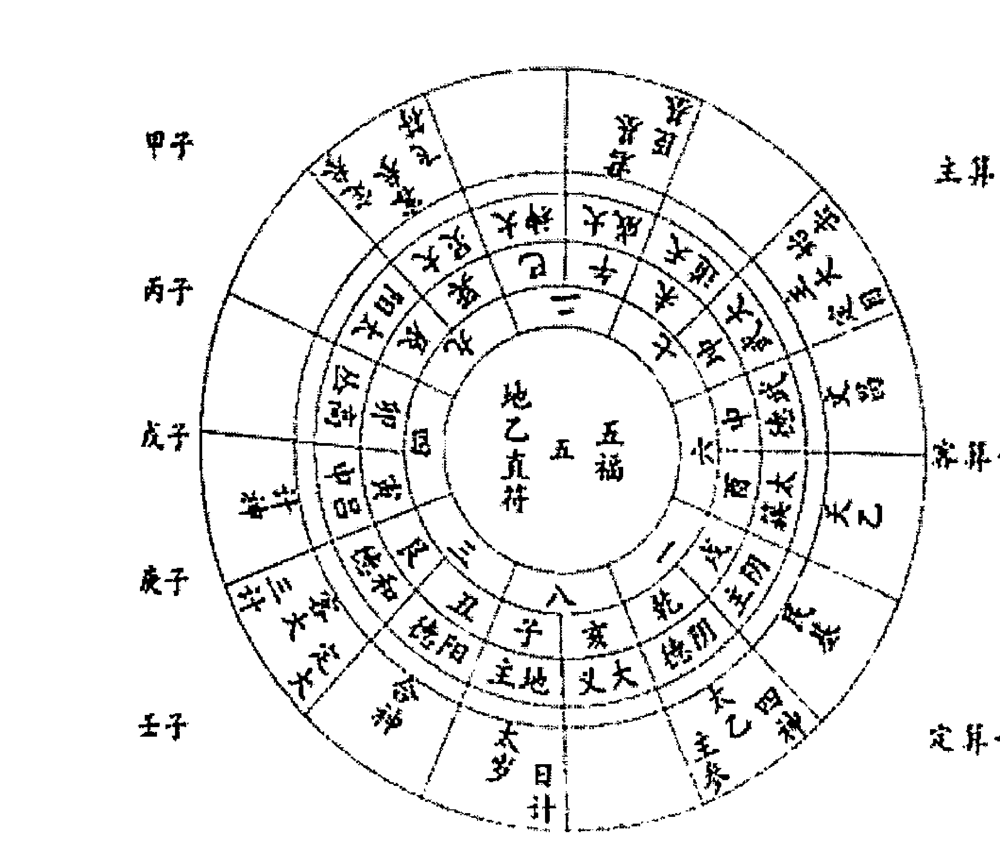

第一圈：太乙九宫数：带二覆八、左四右六、二九为肩、三一为足、五十居中乃为洛书九宫数逆行45度角。
第二圈：子、亥、戌、乾，为太乙十六神的组合图。
第三圈：地主、大义、和德、为太乙十六神的名字。
最外面一圈：是各类用神行宫角色的名称。太乙预测判断纲领：以时间为纲，以八将为纬，以三基（君民臣）、五福、十精为位。在纬度上，用八将所临的十八间神方位推算出“掩”：“拍”“囚”“击”“关”等格局，用作占卜国内吉凶祸福，推四神之分野，来推算水旱兵丧，饥饿疾病、用三基、五福、大小游二限等，用来推算古今治乱。

> 歌诀：
> 太乙三年一宫游，二十四年一周毕。
> 一天二火三为鬼，四木六金坤在七。
> 八水九巽中应五，神宫定位天机秘。
> 太乙仍须甲子求，诸将皆当依此记。

### 六壬神课

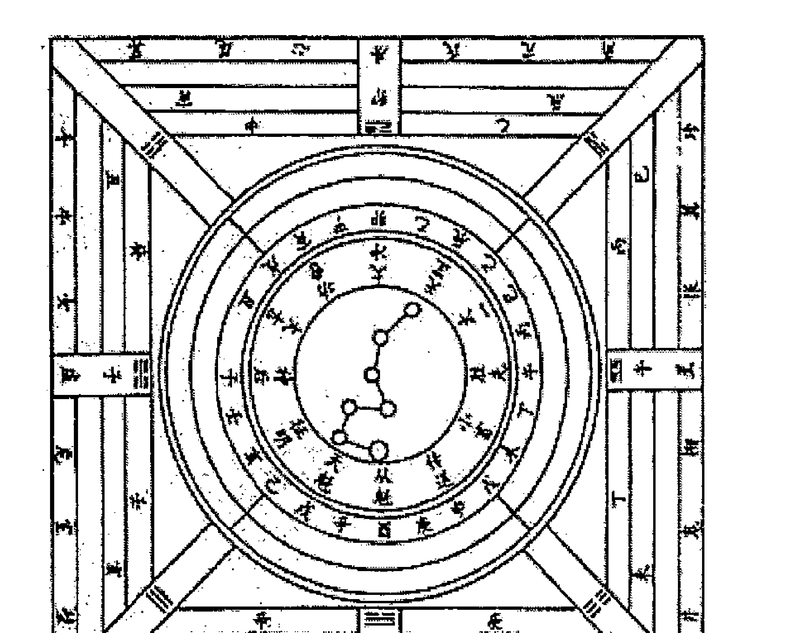

接下来我们再来看一看人元六壬神课，（图2）是六壬式盘的手绘模型图：

- 1. 模型中的天盘是圆形，地盘是方形，象征着古人眼中的天圆地方。
- 2. 模型的中间为北斗七星，北斗七星的斗柄指向天罡角宿。
- 3. 天盘中还有两圈篆文，里面的是正月到十二的月份，代表作六壬中的十二月将，外面的是二十八星宿，所有的月将都可以用星宿来表示。
- 4. 地盘有三层篆文，第一层是八干四维，第二层是十二地支代表地盘的十二时辰，第三层又是二十八宿代表着地域的分野。

分析六壬起课的规律，可以从两方面来解读，一是仿道家的万物生成论而定.二是仿易经的万物生成论而定。道家的万物生存论：“一生二、二生三、三生万物。”观察六壬起课的方式，我们能够发现，月将加时求出天地盘是一生二的过程。根据天干寄宫和地盘方位求出四课为二生三的过程。根据四课来求出三传又是三生万物的过程。

《易经》的太极生成论说：“无极生太极，太极生两仪，两仪生四象，四象生八卦。”从另外一个角度来解读六壬起课的方式，我们又能够发现，先确定月将加时排出天地盘二盘，是无极生太极的过程。然后利用干支寄宫和地盘，所加临的天盘支神排出日辰二课，又是太极生两仪的过程。干化干阳神和干阴神两课，支化支阴神和支阳神两课，根据日辰二课和天地盘的寄宫来求四课，这一步又是二仪生四象的过程。总结六壬的运算方法，即符合道家的万物生成论，又符合《易经》的太极生成论。下面让我用一首诗来做一个总结：

- 壬本道术，备极精醇。
- 大观六宇，细察微尘。
- 理通造化，思浴风尘。
- 包含万有，不越性情。
- 出幽入冥，澄古彻今。
- 守真得一，天地清宁。
- 出而用世，羽翼太平。

### 奇门遁甲

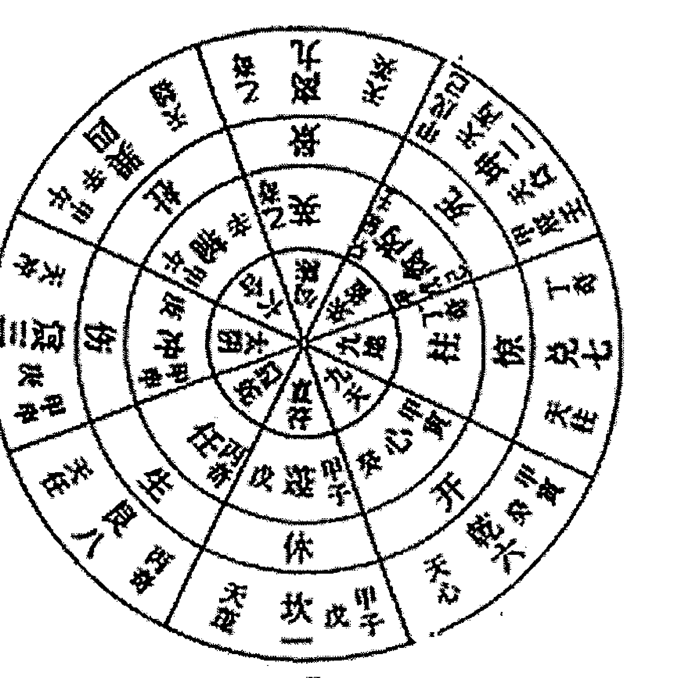

## 图3：奇门式盘

（图3）为奇门遁甲式盘模型图，奇门遁甲的排盘上可以分为阴遁和阳遁，二十四节气冬至后用阳遁，夏至后用阴遁。从内往外观擦奇门盘式我们能够发现：
第一层：奇门遁甲的八神：值符、腾蛇、太阴、六合、白虎、玄武、九地、九天。
第二层：奇门遁甲的天盘九星：天蓬星、天任星、天冲星、天辅星、天英星、天芮星、天柱星、天心星。
第三层：奇门遁甲的人盘八门：开门、休门、生门、伤门、杜门、景门、死门、惊门
在外盘是地盘九宫数和地盘的三奇六仪。
三奇：乙、丙、丁。
六仪：戊、己、庚、辛、壬、癸。

> 诗曰：
> 阴阳顺逆妙难穷，
> 二至还乡一九宫。
> 若能了达阴阳理，
> 天地都在一掌中。

## 三、奇门导读

### 奇门遁甲的起源？

关于奇门遁甲起源，一般的说法是历经了“三个时期四个阶段”。从轩辕黄帝命令风后整理成文开始，到周朝的姜子牙，汉朝的张子房相传都参与了奇门遁甲的发明与创造。但根据正史上记载，汉朝以前并没有专门记录奇门遁甲的书籍，从隋朝才略有记录，到唐朝逐渐盛行起来。起初用于行军打仗，明清才开始用于生活中的预测以及调整，由此大部分学者认为奇门遁甲的准确起源时间应该是在隋唐时期。

奇门遁甲在历史的流传过程中，同其他术数一样，在学术上产生了不同的分歧和流派。如果按照用途上来进行划分的话，可以分为数理奇门和法术奇门两大类。如果在对数理奇门进行划分，从时间上可以分为：年家奇门、月家奇门、日家奇门、时家奇门，从排宫方法上又可分为转宫法、排宫法。关于奇门遁甲是何人创造的？我认为从奇门遁甲如此精密的构造模型，如此完备的构建体系，应该经历了我们的祖先一代又一代人智慧的积累发展和完善的过程。

### 什么是奇门遁甲？

关于奇门遁甲这个名字，是由“奇门”和“遁甲”两个部分组成。所谓奇门是“奇”与“门”的统称。“奇”是指是天干中的乙、丙、丁。古人认为：日生于乙，月明于丙，丁为南极。所以乙为日奇，丙为月奇，丁为星奇。奇门遁甲中“三奇”，分布在天盘和地盘上，并且天盘随着地盘而运转。奇门遁甲除了把十天干分为三奇之外，还把除甲之外的六干称为“六仪”，既戊、己、庚、辛、壬、癸。这六仪也分布在天盘和地盘之上，与三奇一样，也是随着天地二盘来运转的。奇门中的“门”是指，开、休、生、伤、杜、景、死、惊八门，八门随着时辰而移动。三奇和八门合起来称为“奇门”。所谓“遁甲”主要有两种说法，

第一种说法是“遁”是隐藏，藏匿的意思，含有神秘的意味。“甲”为天干之首，统领着其他诸干，至尊至贵，但甲怕遇到庚，因为甲的五行属木，庚的五行属性金，阳金克阳木。所以需要隐藏起来，以免受克。在六十甲子中，共有六甲，被称为“天乙贵神”。奇门遁甲演局的时候，在六甲被藏与六仪之下。即：甲子藏与六戊之下，甲戌藏与六己之下，甲申藏与六庚之下，甲午藏与六辛之下，甲辰藏与六壬之下，甲寅藏与六癸之下。综上所述，就是“遁甲”的来源。

第二种说法“遁”是行走转移的意思，奇门遁甲把六甲布于九宫时，起宫为甲子，下一位为甲戌，依次是甲申、甲午、甲辰和甲寅。这样从操作上来看，便有逐步行走转移之说法，所以也称之为“遁甲”。总之关于奇门遁甲的解释，我们可以把奇门遁甲这个概念分开，从“三奇”“八门”和“遁甲”三个方面来阐述。

### 什么是阴盘奇门遁甲？

《易》云：“一阴一阳谓之道”世界上的事物，有阴就有阳，凡是都有一个对立面。阴盘奇门遁甲又称“道家奇门遁甲”，“道家阴盘奇门遁甲”，主要是针对于传统奇门遁甲来划分的。传统的奇门遁甲一般按古书流传下来的方法定局，也就是二十四节气。二十四节气是由于太阳在黄道运行的位置而定，古人眼中太阳为阳，所以又称之为阳盘。而阴盘奇门遁甲则是根据月相变化来定局的，月相的变化就是月亮的阴晴圆缺。在《周易》中天干起源于太阳为阳，地支起源与月亮为阴，而阴盘奇门的定局恰恰是由地支来决定的，而茅山派的奇门也属于阴盘奇门的一种。

### 阴盘奇门的体系？

奇门遁甲是一个庞大的体系，阴盘奇门又属于奇门遁甲的一种。阴盘奇门遁甲大致上可以分为三个层次，正如道德经里面说：“一生二，二生三，三生万物。”《封神演义》里面也有一句话：“翠竹黄须白笋芽、儒冠道履白莲花、红花白藕青荷叶、三教原来是一家。”这里是中借用红花、绿藕、青荷叶来说阐教、截教、人教。三教本为同门一个祖先。在阴盘奇门中也有三个层次分别为：天气奇门、地气奇门、神气奇门。天气奇门以天时起局包括，预测和调整等内容。地气奇门以山向起局包括，风水改向等内容。神气奇门以宇宙能量为宗旨包括，法术咒语内容，三种奇门在使用过程中，理论相互渗透，方法相互配合。

### 如何学好奇门遁甲？

- 1、周易是生活，奇门也为生活，奇门遁甲的格局反映的是现实中的人生。要掌握奇门遁甲之学，必须把奇门中的一些名词、规律还原到生活中去。看看它们反映的是生活中的哪些现象、事物发展的哪些规律？从而加深对奇门遁甲格局，各个组成部分的认识，使得奇门局成为一幅幅活生生的立体画面。只有贴近生活，我们才能对所占事物，了然于胸，占断的准确率也才能有所提升。
- 2、阴盘奇门遁甲极为注重“观象”，有象即有事，局中有某象，必应发生之事，局中的一切，无一不是类象的产物。阴盘奇门遁甲的精髓之一，就在于淡化了生克，深化了象意，学习者要把握这一要领，做到纲举目张，便会在短期之内达到大的提升。
- 3、要想学好阴盘奇门遁甲，就要遵循“大道至简、平实朴素”的原则、不求炫奇求巧、不求动人心目，反对戏占、乱占，用认真的心态看局。以平和的心态解读格局。同时要多去实战，多去演练。
- 4、阴盘奇门遁甲断局和调整，是以阴阳盈虚之理为根本，自然之理、社会之理、人性之理为辅翼，“世事洞明皆学问，人情练达即文章。”不明人事事理，是学不好奇门的，任何一门数术也皆是如此。

## 四、阴阳五行

### 阴阳

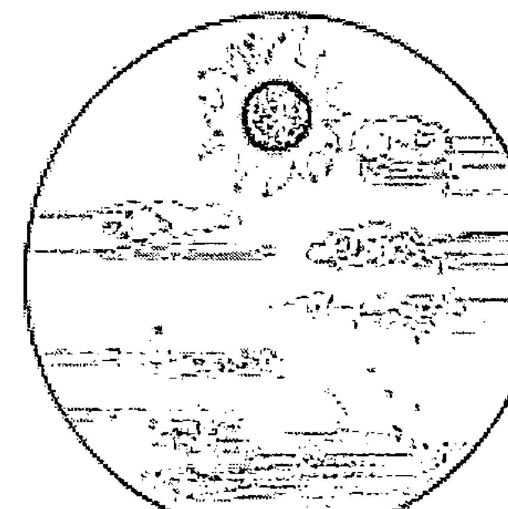

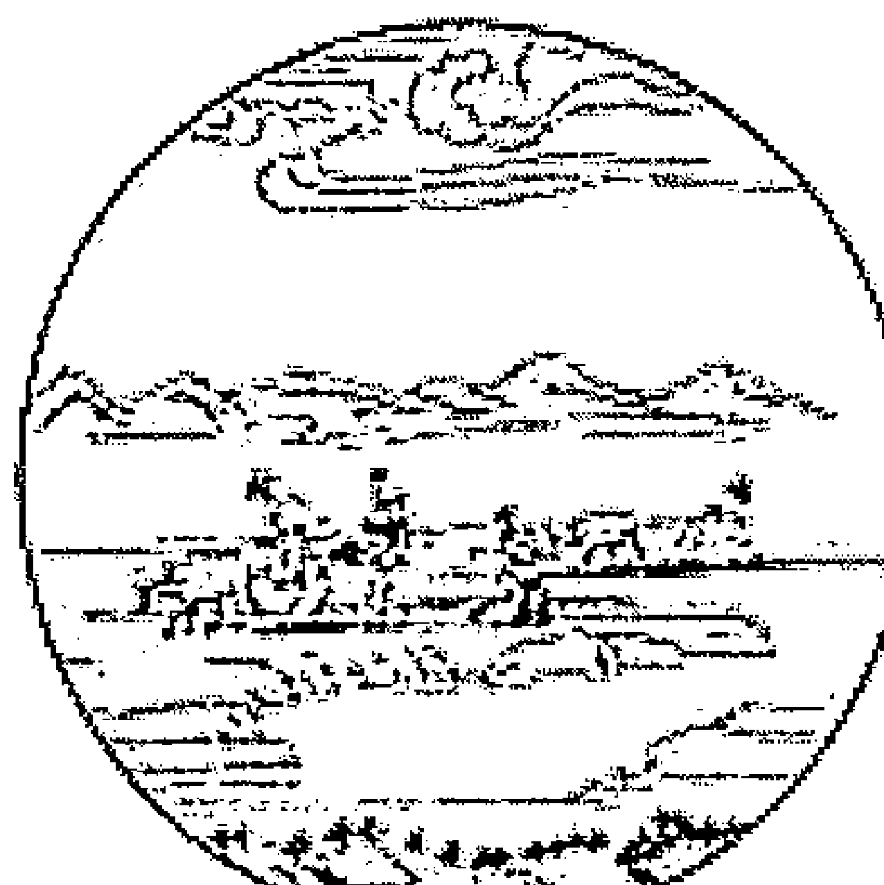

阴阳与五行是两个不同的概念。我们先说阴阳，《周易》中说：“一阴一阳谓之道。”阴阳最初的含义是很朴素的，表示阳光的背向，向日为阳，背日为阴，后来引申为气候的冷暖，方位的上下、左右、前后，运动状态的动和静等等。中国古代的哲学家们进而体会到自然界中的一切现象，都存在着相互对立而又相互作用的关系，就用阴阳这个概念来解释自然界当中两种相互对立，相互消长物质的关系，并认为阴阳的对立和消长是事物本身所固有的，进而认为阴阳的对立和消长是宇宙的基本规律。

### 五行

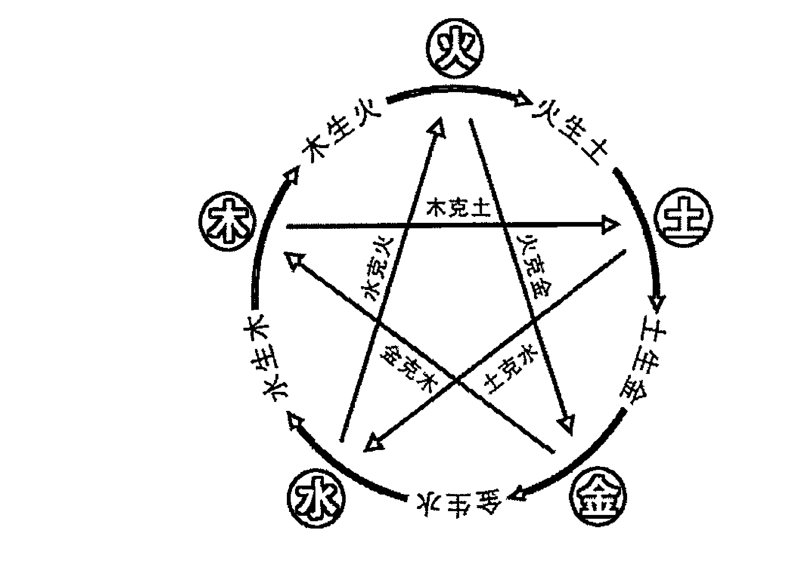

五行学说最早来源于道家学说，是用来描绘事物的结构的关系和运动的形式，五行并不是说用五种属性来概括世界的万事万物，而是描述五种气流的变化也叫五气学说。

《尚书》记载“五行者，一曰水、二曰火、三曰木、四曰金、五曰土，水曰润下，火曰炎上、木曰曲直、金曰从革、土爱稼穑。”古人眼中的五行是抽象化的，推算到具体的事物上，构成了一个固定的组合模式。

五行的相生（表示一方对另外一方起到促进生长的作用）：木生火、火生土、土生金、金生水、水生木。五行的相克（表示一方对另外一方起到相互制约的作用）：木克土、土克水、水克火、火克金、金克木。

## 五、河图洛书

南宋的理学家朱熹说：河图、洛书乃是天地自然之易。河图和洛书都是古代流传下来的神秘图腾。下面我们先来介绍河图。

### 河图

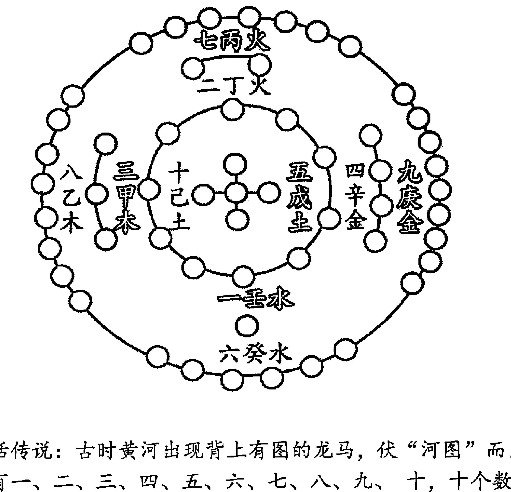

神话传说：古时黄河出现背上有图的龙马，负“河图”而出。河图中有一、二、三、四、五、六、七、八、九、十，十个数字组成。

奇数：一、三、五、七、九为天数，代表阳，用圆圈表示。
偶数：二、四、六、八、十为地数，代表阴，用黑点表示。
奇偶合称叫天地数。天数相加二十五，地数相加三十，天地之数总和为五十五，又叫天地大衍之数。河图是天地象征自然宇宙图，是个立体动态球形。
河图方位分为上南下北、左东右西。北方阳数一、阴数六，一六为水，北方为水；南方阴数二、阳数七，二七为火，南方为火；东方阳数三、阴数八，三八为木，东方为木；西方阴数四、阳数九，四九为金，西方为金；中央阳数五、阴数十，五十为土，中央为土。

### 洛书

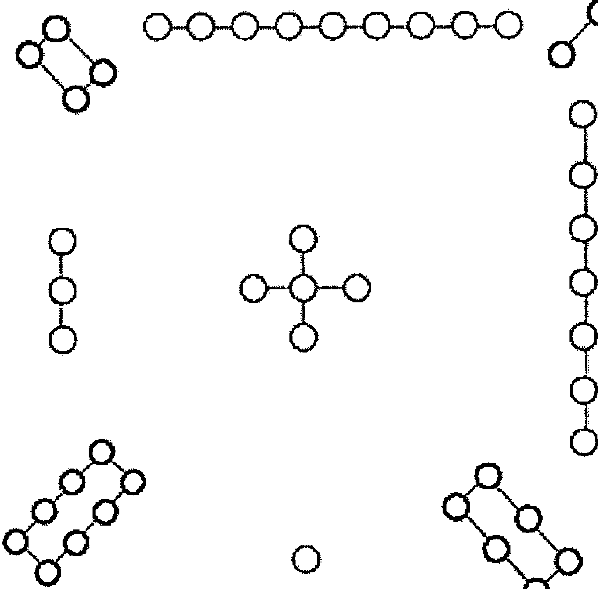

神话传说，古时洛水出现龟背上载有图形的神龟。大禹治水依据“洛书”制定“九畴”来治理天下。圣人就用龟甲来占卜天地产生的各种变化。洛书图是远古时代的方位图，由河图变化而来，此图外洛书，内为后天八卦图，相互对立，数字一至九代表九宫。九个数字，九在正南，对应离卦，象征龟头，一在正北对应坎卦，象征龟尾，龟身的左侧和右侧为三和七，龟的二前腿为二和四，龟的二后腿为六和八，五在中央。口诀：“戴九履一，左三右七，二四为肩，六八为足，五在其中”。

## 六、八卦九宫

> 翻开《辞海》对八卦的解释为，“八卦是《周易》中的八种基本图形。用‘——’（没断开的一横）表示阳，用‘— —’（中间断开的一横）表示阴，每卦由三爻经过不同变化组合而成。以此象征天、地、雷、风、水、火、山、泽八种自然现象，每卦又象征多种事物。”

八卦的名称：乾、坤 、离、坎、震、巽、艮、兑，八卦分为：先天八卦和后天八卦，我们先来介绍先天八卦。

### 一、先天八卦

先天八卦又称伏羲八卦，传说是由距今七千多年的伏羲氏观物取象的所作。先天八卦无图形，宋代道士陈抟精于易学，开辟了图书解易的先河，传陈抟根据《说卦》中的“天地定位，山泽通气，雷风相薄，水火不相射”而创造出一个先天八卦图，也称为伏羲八卦图。

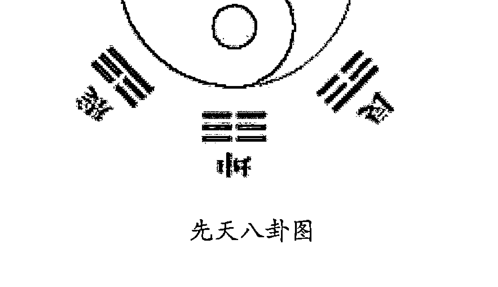

先天八卦数：乾一、兑二、离三、震四、巽五、坎六、艮七、坤八。

先天八卦方位：乾南、坤北、离东、坎西、兑东南、艮西北、巽西南、震东北。

### 二、后天八卦

后天八卦又称“文王八卦”。传说为周文王所制，后天八卦图片根据《说卦传》：“帝出乎震，齐乎巽，相见乎离，致役乎坤，说言乎兑，战乎乾，劳乎坎，成言乎艮”而创后天八卦图，也称为文王八卦图。

## 后天八卦图

后天八卦数：坎一、坤二、震三、巽四、中五、乾六、兑七、艮八、离九。

后天八卦方位：离南、坎北、震东、兑西、巽东南、艮东北、坤西南、乾西北。

## 三、八卦的基本象意

### ①八卦的阴阳

乾、震、坎、艮为阳，坤、巽、离、兑为阴。

### ②八卦的五行

乾兑为金，坎为水，震巽为木，离为火，坤艮为土。

### ③八卦代表人物

乾为老父（年龄45岁以上），震长男（年龄35岁-45岁之间），坎中男（年龄25岁-35岁之间），艮少男（年龄10岁-25岁之间）。坤为老母（年龄45岁以上），巽长女（年龄35岁-45岁之间），离中女（年龄25岁-35岁之间），兑少女（年龄10岁-25岁之间）。

### ④八卦代表身体

乾为首，兑为口，坎为耳，离为目，坤为腹，艮为手，巽为股，震为足。

### ⑤八卦代表性情

乾建、坤顺、震动、巽入、坎险、离丽、艮止、兑悦。

### ⑥八卦代表自然

乾为天，坤为地，震为雷，巽为风，坎为水，离为火，艮为山，兑为泽。

### ⑦八卦代表动物

乾为马，坤为牛，震为龙，巽为鸡，坎为豕，离为雉，艮为狗，兑为羊。

| 4 巽 | 9 离 | 2 坤 |
|---|---|---|
| 3 震 | 5 中 | 7 兑 |
| 8 艮 | 1 坎 | 6 乾 |

九宫八卦图

中国的传统预测术都有各自的构建模式，八字的模式是构建在大运和流年之上的，六壬的模式是构建在四课三传之上的。六爻的模式是构建的六个爻位之上的。奇门的模型就是构建在八卦九宫之上的。准确的说是后天八卦加九宫。以上是后天八卦九宫图。这张图就是奇门遁甲模型构建的基础。

## 后天八卦图

《周易.说卦传》云：“八卦相错，数往者顺，知来者逆，是故《易》逆数也。” 后天八卦的数字，也体现这一原则。叫做“数往者顺，知来者逆。”

数往者顺：顺时针旋转，从乾卦开始 乾六减五等于坎一，艮八减五等于震三，（都是正数阳正），继续巽四减九等于负五，坤二减七等于负五（都是负数阴逆）。两个正负五阴阳相对。此乃“数往者顺”顺行阴阳之道。

知来者逆：逆时针旋转，从坎卦开始，坎一加乾六等于兑七。兑七加坤二等于离九。离九加巽四等于十三（减去十）等于震三。震三加八等于十一。十一减去十等于坎一。此乃“知来者逆”逆行阴阳之道。这就是后天八卦实用加减之法。

伏羲氏在天水卦台山始画八卦，周文王改动先天八卦之后而成为后天八卦，周文王改动伏羲先天八卦有何用意呢？要弄清楚这个问题，就必须和历史联系起来。我们都知道，周文王的故都在西岐，商纣王的故都在朝歌，周文王和商纣王一西一东的治理。先天八卦之中，周文王先把天地都移到西边来，乾坤往西挪移，并且周文王希望自己能够改天换地，所以乾坤颠倒，扭转乾坤。后天八卦之中，坤卦在上，乾卦在下。接着把震卦移到东方，震卦为雷代表躁动。又把兑卦移到西方，兑卦为恩泽代表愉悦。想要人们越往东走越躁动不安，人们越往西走越内心愉悦。南方比较热，所以把代表火的离卦移到南方。北方比较寒冷，所以把代表水的坎卦移到北方。把巽卦和乾卦对立，天能掌管风雨。乾为天，巽为风。把艮卦和坤卦对应，地能掌管山川河流。坤为地，艮为山。先天八卦被文王改动过之后。我们就可以发现一个奥秘：兑克震，西边压制东边。乾克巽，西北压制东南。坎克离，北方压制南方。总体来说西边要强过东边。如果按照中国的历史发展来看，历朝历代皇帝的故都大多都在西北方和北方。

## 先天八卦

## 后天八卦

## 先后八卦合一图

> 古人云“伏羲画卦、先后并出、二八易位、一种变化”。伏羲画的八卦为先天八卦。后天八卦是文王所画。还有一种说法是伏羲画的先天八卦和后天八卦本为一体，叫做先后并出。下面我们就来介绍一下什么是先后并出：

首先是：“二八易位”，先天八卦数字从南方乾卦开始，逆时针旋转过来。数字1到2到3到4到8到7到6到5。后天八卦数字从北方坎卦开始，顺时针旋转过去。数字1到8到3到4到9到2到7到6。后天八卦如果二八易位的话，那么就是1到2到3到4到9到8到7到6。

为什么要“二八易位”呢？“二八易位”是先后天变化的根源，也是易学发展的根源，天下易学皆在二八易位当中。如果弄清楚先后天八卦合一图，那么就会明白二八易位的道理。

先天八卦当中，两两相对：乾坤相对、兑艮相对、离坎相对、震巽相对。

后天八卦当中，两两相对：坎离相对、艮坤相对、震兑相对、巽乾相对。

先来说先天八卦、先天八卦体现了，处处是乾坤的原则，上乾下坤代表天地。

先天八卦之中兑艮相对、兑卦中的阴爻飞到艮卦。艮卦中的阳爻飞到兑卦、变成了乾坤二卦。

先天八卦之中离坎相对、离卦中的阴爻飞到坎卦、坎卦中的阳爻飞到离卦、变成了乾坤二卦。

先天八卦之中震巽相对、巽卦中的阴爻飞到震卦、震卦中的阳爻飞到巽卦、变成了乾坤二卦。

后天八卦当中，也有处处是乾坤这个一个原则。

后天八卦坎离相对：坎为水、中间有一阳爻。离卦为火，中间有一阴爻，坎卦的阳爻飞到离卦，离卦的阴爻飞到坎卦，则变成了乾坤二卦。

后天八卦震兑相对：震为木，下面有一阳爻，兑卦为金，上面有一阴爻，震卦的阳爻飞到兑卦，兑卦的阴爻飞到震卦，则变成了乾坤二卦。

后天八卦中的四正方（东、西、南、北）不需要移位，四维方（东北、西南、东南、西北）就要用到二八易位。

坤卦逆推二位到巽卦于西北的乾卦对立，则变成了乾坤对立。

艮卦逆推二位到乾卦，艮卦的阳爻飞到巽卦，巽卦的阴爻飞到艮卦，则又变成了乾坤二卦。在奇门遁甲中艮卦为开始生门，坤卦为结束死门。万物生万物死，万物都在二八易位当中了。

## 七、天干地支

### 一、天干

天干和地支是个不同的概念，我们先来说天干，天干有十位也称为十天干。

### 十天干

- 1. 甲、2 乙、3 丙、4 丁、5 戊、6 己、7 庚、8 辛、9 壬、10 癸。

### 二、十天干的阴阳属性

甲 丙 戊 庚 壬为阳。
乙 丁 己 辛 癸为阴。

### 三、十天干的五行的属性

甲乙属木，丙丁属火，戊己属土，庚辛属金，壬癸属水。

### 四、十天干配合阴阳、五行共同的属性

甲乙为木，甲为阳木，为森林之木，乙为阴木，为花草之木。
丙丁为火，丙为阳火，为太阳之火，丁为阴火，为灯盏之火。
戊己为土，戊为阳土，为大地之土，己为阴土，为田园地土。
庚辛为金，庚为阳金，为斧钺之金，辛为阴金，为首饰之金。
壬癸为水，壬为阳水，为大海之水，癸为阴水，为雨露之水。

### 五、十天干与人体部位（分为体表和脏腑）

（1）体表，甲为头，乙为肩，丙为额，丁为舌齿，戊己为鼻面，庚为筋，辛为胸，壬为胫，癸为足。
口诀：甲头乙肩丙是额，戊己鼻面丁齿舌。庚是筋骨辛是胸，壬水为胫癸为足。

（2）脏腑，甲为胆，乙为肝，丙为小肠，丁为心，戊为胃，己为脾，庚是大肠，辛为肺，壬是膀胱，癸为肾。（其中阳干为腑，阴干为脏）。
口诀：甲胆乙肝丙小肠，丁心戊胃己脾乡。庚是大肠辛是肺，壬属膀胱癸肾藏。

（3）天干与人生。甲出生，乙哺乳，丙少年，丁青年，戊壮年，己中年，庚衰老，辛晚年，壬死亡，癸腐朽。

### 六、十天干生克冲合

- 1. 天干的相生（以五行相生为基础）。甲乙木生丙丁火，丙丁火生戊己土，戊己土生庚辛金，庚辛金生壬癸水，壬癸水生甲乙木。
- 2. 天干的相克（五行相克为基础）。甲乙木克戊己土，丙丁火克庚辛金，戊己土克壬癸水，庚辛金克甲乙木，壬癸水克丙丁火。
- 3. 天干相合（五组）：甲己化合土，乙庚化合金，丙辛化合水，丁壬化合木，戊癸化合火。
- 4. 天干相冲（四组）：甲庚冲，乙辛冲，丙壬冲，丁癸冲。

天干的相合来源于河图生成数的原理，天干的相冲必须满足三个条件，方位相对、阴阳同性、五行相克。

### 七、十神

“十神”就是以日干为中心 与日干本人相关的十种关系。日干代表自身，根据五行的生克的关系，克我者为官鬼，我克者为妻财，生我者为印绶，我生者为食伤，同我者为兄弟，有“我生”“生我”“我克”“克我”“同我”五种关系，再加上阴阳的不同，一共是存在十种关系。八字预测中经常用到“十神”，在阴盘奇门遁甲取用神的时候也会用到。

|   | 甲 | 乙 | 丙 | 丁 | 戊 | 己 | 庚 | 辛 | 壬 | 癸 |
|---|---|---|---|---|---|---|---|---|---|---|
| 甲 | 比肩 | 劫财 | 偏印 | 正印 | 偏官 | 正官 | 偏财 | 正财 | 食神 | 伤官 |
| 乙 | 劫财 | 比肩 | 正印 | 偏印 | 正官 | 偏官 | 正财 | 偏财 | 伤官 | 食神 |
| 丙 | 食神 | 伤官 | 比肩 | 劫财 | 偏印 | 正印 | 偏官 | 正官 | 偏财 | 正财 |
| 丁 | 伤官 | 食神 | 劫财 | 比肩 | 正印 | 偏印 | 正官 | 偏官 | 正财 | 偏财 |
| 戊 | 偏财 | 正财 | 食神 | 伤官 | 比肩 | 劫财 | 偏印 | 正印 | 偏官 | 正官 |
| 己 | 正财 | 偏财 | 伤官 | 食神 | 劫财 | 比肩 | 正印 | 偏印 | 正官 | 偏官 |
| 庚 | 偏官 | 正官 | 偏财 | 正财 | 食神 | 伤官 | 比肩 | 劫财 | 偏印 | 正印 |
| 辛 | 正官 | 偏官 | 正财 | 偏财 | 伤官 | 食神 | 劫财 | 比肩 | 正印 | 偏印 |
| 壬 | 偏印 | 正印 | 偏官 | 正官 | 偏财 | 正财 | 食神 | 伤官 | 比肩 | 劫财 |
| 癸 | 正印 | 偏印 | 正官 | 偏官 | 正财 | 偏财 | 伤官 | 食神 | 劫财 | 比肩 |

### 十神取用表

- (1) 我克者为妻财。分为正才、偏才。
  正才：异性相克，记作“才”。
  偏才：同性相克，记作“财”。

- (2) 克我者为官鬼。为正官、偏官。
  正官：异性相克。
  偏官：同性相克，“偏官”又叫七杀。

- (3) 我生者为食伤。分为伤官和食神。
  伤官：异性相生，记作“伤”。
  食神：同性相生，记作“食”。

- (4) 生我者为印绶，分为正印和偏印。
  正印：异性相生，记作“印”。
  偏印：同性相生，又叫枭神。记作“枭”。

- (5) 同我者为比劫。分为比肩和劫财。
  比肩：同性，记作“比”。
  劫财：异性，作为“劫”。

假如乙为用神。“我克者为才”，乙为阴木，木克土。阴阳相克为正才，戊为阳土，阴木克阳土，乙的正财为戊，偏财为己。“克我者为官”，乙为阴木，金克木，金代表的天干为庚辛，庚为阳，阴阳相克为正官。乙的正官是庚。辛为阴，那么乙的偏官就是辛（七杀）。“我生者为食伤”。乙为阴木，木生火。火代表的天干为丙丁。丙为阳，丁为阴。异性相生为伤官，同性叫食神。那么伤官是丙，食神就是丁。“生我者为印绶”乙为阴木，水生木。代表水的天干为壬癸。壬为阳，阳为正，故壬为正印。癸为阴，阴是偏印。“同我者为比劫”乙为阴木，天干中甲乙为木，甲为阳，乙为阴。同性为比，乙为同性，乙的比肩为乙，劫财为甲。

## 二、地支

### 一、十二地支

子、丑、寅、卯、辰、巳、午、未、申、酉、戌、亥。

### 二、地支序数

子1、丑2、寅3、卯4、辰5、巳6、午7、未8、申9、酉10、戌11、亥12。

### 三、地支的阴阳五行

- 1. 阴阳：
  子1、寅3、辰5、午7、申9、戌11为阳。
  丑2、卯4、巳6、未8、酉10、亥12为阴。

- 2. 五行：
  寅卯属木，巳午属火，申酉属金，亥子属水，辰戌丑未属土。

### 四、地支的生克（五行生克原理）

- 1. 相生：
  寅卯木生巳午火，巳午火生辰戌丑未土，辰戌丑未土生申酉金，申酉金生亥子水，亥子水生寅卯木。

- 2. 相克：
  寅卯木克辰戌丑未土，辰戌丑未土克亥子水，亥子水克巳午火，巳午火克申酉金，申酉金克寅卯木。

### 五、十二地支配月建

正月建寅，二月建卯，三月建辰，四月建巳，五月建午，六月建未，七月建申，八月建酉，九月建戌，十月建亥，十一月建子，十二月建丑。
一、二月为木月，四、五月为火月，七、八月为金月，十、十一月为水月，三、六、九、十二为土月。这里的月份以农历为准。农历的月份是以十二个节令来划分的。所谓的十二个节令分别指的是：正月立春、二月惊蛰、三月清明、四月立夏、五月芒种、六月小暑、七月立秋、八月白露、九月寒露、十月立冬、十一月大雪、十二月小寒。比如：正月二十八惊蛰，正月为寅月，在此之前都属于寅月，惊蛰节气一过，时辰一到，就属于卯月，也就是农历二月。再往后清明节气一过，时辰一到，就属于农历三月，立夏节气一过，时辰一到，就属于农历四月，以此类推。

### 六、十二配生肖

- 子鼠，丑牛，寅虎，卯兔。
- 辰龙，巳蛇，午马，未羊。
- 申猴，酉鸡，戌狗，亥猪。

### 七、十二地支配时辰

- 23-01 点为子时， 01-03 点为丑时。
- 03-05 点为寅时， 05-07 点为卯时。
- 07-09 点为辰时， 09-11 点为巳时。
- 11-13 点为午时， 13-15 点为未时。
- 15-17 点为申时， 17-19 点为酉时。
- 19-21 点为戌时， 21-23 点为亥时。

### 八、地支三刑

地支三刑，其中的刑就是彼此伤害，互不和顺的意思。从序数来说，地支或顺或逆，隔十位为刑。地支中的三刑，是奇门遁甲的六仪击刑的来源。

- 寅刑巳，巳刑申，申刑寅，为无恩之刑。
- 丑刑戌，戌刑未，未刑丑，为恃势之刑。
- 子刑卯，卯刑子，为之无礼之刑。
- 辰、午、酉、亥、为自刑。

### 九、地支三合

地支三合是三个地支间的作用。即：申子辰合水，寅午戌合火，巳酉丑合金，亥卯未合木。

地支的三合，例如：寅午戌合化火局，寅中纳入的天干为丙，丙的出生之地为寅，帝旺之地为午，墓地为戌。刚好是事物出生发展归宿的三个过程。“三合局”就是根据“生”“旺”“墓”原理而来。三合局中间这个字被称为“中神”是核心力量，前面是长生，后面为墓库。前后呼应，聚集成了一种强大的力量。关于地支三合局，在奇门遁甲中主要是求出马星的方位，与三合局的第一个地支对冲的地支为马星：

- 申子辰（水）时，马星在寅位。（申寅对冲）
- 寅午戌（火）时，马星在申位。（寅申对冲）
- 亥卯未（木）时，马星在巳位。（亥巳对冲）
- 巳酉丑（金）时，马星在亥位。（巳亥对冲）

### 十、十二地支掌上图

### 十一、十二地支配合九宫

|   |   |   |
|---|---|---|
| 巽 4<br>巳、辰 | 离 9<br>午 | 坤 2<br>未、申 |
| 震 3<br>卯 |   | 兑 7<br>酉 |
| 艮 8<br>寅、丑 | 坎 1<br>子 | 乾 6<br>戌、亥 |

### 十二地支配九宫图

十二地支配九宫要是用在判断流年流月流日流时的吉凶上。假如甲午年，午在离宫，就看离宫的符号。乙丑日，丑在艮宫，就看艮宫的符号。丙戌日，戌在乾宫，就在乾宫的符号。丁酉时酉在兑宫，就看兑宫的符号，以此类推。

### 十二、六十甲子与六甲旬空

| 甲子 1 | 乙丑 2 | 丙寅 3 | 丁卯 4 | 戊辰 5 | 己巳 6 | 庚午 7 | 辛未 8 | 壬申 9 | 癸酉 10 |
| :--- | :--- | :--- | :--- | :--- | :--- | :--- | :--- | :--- | :--- |
| 甲戌 11 | 乙亥 12 | 丙子 13 | 丁丑 14 | 戊寅 15 | 己卯 16 | 庚辰 17 | 辛巳 18 | 壬午 19 | 癸未 20 |
| 甲申 21 | 乙酉 22 | 丙戌 23 | 丁亥 24 | 戊子 25 | 己丑 26 | 庚寅 27 | 辛卯 28 | 壬辰 29 | 癸巳 30 |
| 甲午 31 | 乙未 32 | 丙申 33 | 丁酉 34 | 戊戌 35 | 己亥 36 | 庚子 37 | 辛丑 38 | 壬寅 39 | 癸卯 40 |
| 甲辰 41 | 乙巳 42 | 丙午 43 | 丁未 44 | 戊申 45 | 己酉 46 | 庚戌 47 | 辛亥 48 | 壬子 49 | 癸丑 50 |
| 甲寅 51 | 乙卯 52 | 丙辰 53 | 丁巳 54 | 戊午 55 | 己未 56 | 庚申 57 | 辛酉 58 | 壬戌 59 | 癸亥 60 |

**六十甲子表**

十天干和十二地支进行循环组合：甲子、乙丑、丙寅……一直到癸亥结束，共得到60个组合，此60个组合便称为六十甲子，周而复始，无穷无尽。因为天干是十个，而地支是十二个，所以十日之内定有两个地支，没有天干来配，这两个没有天干来配的地支就称为空或者空亡，而十日为一旬，所以叫旬空。六甲旬空口诀：“甲子旬中无戌亥，甲戌旬中申酉空，甲申旬中空午未，甲午必然辰巳空，甲辰旬中空寅卯，甲寅子丑是真空。”

## 八、星门神干

### 十天干象意

- 1、甲
  五行：阳木。
  概念：高贵的、有名望的、第一的、首领。
  人物：领导人、经理、董事长、将军、元帅、名人。
  形态：直、方、高。主体形长方、皮肤青白、筋骨强健、国字脸、浓眉秀发。
  性情：威严、正值、愉快、独断、心高、清洁、浪费。
  人体：头、指甲、头发、大脑、肝、胆、筋、眼。
  感觉：酸胀。
  动物：穿山甲、玳瑁、龙虾、乌龟、鳖、贝壳、螺类、螃蟹。
  植物：大树、带壳的果实、花生、核桃、松子、栗子、棱角、瓜子。
  静物：金、玉、珠宝、古董、文物、帽子、甲胄。
  地理：无烟烟囱、粗柱子、房梁、棺材高亢之地、省会、首都、领导办公室、名人居所、高大建筑物、机关、办公室。
  方位：东方。
  天时：风、春天、早晨。
  食物：馐珍、美味、高档食品。
  色彩：青色、绿色。

- 2、乙
  五行：阴木。
  概念：希望达成、质软、转机、艺术、文化、柔弱、弯曲、曲折、依附。
  人物：中医、医生、女人、妻子、艺人、画师、作家。
  形态：苗条、微驼身、皮肤白嫩、骨质松弛、瘦长脸。
  性情：仁慈、柔弱、仁爱、柔情、善人、依赖、柔顺、忧郁、敏感、自私、逆来顺受。

### 3、丙

五行：阳火。

概念：希望、光明、雄威、乱子、刚猛、热烈、急速、圆状、片状、权威。

人物：情人、当权者、有指挥能力、脾气暴躁之人、果断刚猛之人、化工工人、司炉工、电厂工作者。

形态：体型丰满、圆脸、少胡须、短发、皮肤白里透红。

性情：暴烈、强悍、虚荣、正义、愤怒、性急、果断。

人体：眼、血液、唇、心脏、小肠、浮肿部位、炎症部位。

感觉：热烫痒。

动物：马、牛、猪、驴。

植物：带丙的果实、梨子、樱桃、西瓜、南瓜、莲蓬、苹果。

静物：光亮之物、灯、灶、发热之物、有栖之物、饼干、火箭、大炮、变压器、窗户、代表权威之人。

地理：厨房、高岭、南方、炉冶、化工厂、煤炭、电厂、明亮场所。

方位：南方。

天时：太阳、晴朗、炎热、夏季、中午。
色彩：红色、紫色。

### 4、丁
- 五行：阴火。
- 概念：希望、执著、发展、尖锐、逼人、带刺、顶尖、突出。
- 人物：情人、妓女、歌星、技术一流之人、表现突出之人、说话带刺之人、眼睛好的人。
- 形态：主人秀丽清高、肤白粉嫩、发细而长、额宽而尖。
- 性情：性情柔弱、和顺而有心计、体贴情人、洞察奸邪。
- 人体：眼、牙、心脏、血液、骨刺、肉刺、男性生殖器。
- 感觉：热、烫。
- 动物：叮咬人和动物的昆虫、蚊子、跳蚤、马蜂、蜜蜂、牛虻、带刺的动物、刺猬、野猪、蛇。
- 植物：带刺的植物或果实、玫瑰、月季、槐树、仙人掌、松树、石榴、板栗、毛丹、枣树、榛子。
- 静物：发光体、灯、弱热体、刀、针、剑、注射器、钉子、牙签、票据、文章、拐杖、香火、证件、电子产品、焰火、打火机、炮弹、子弹、小型金属物件、首饰、灶。
- 地理：路口、屋檐、屋角、房顶、塔、高岗。
- 方位：南方。
- 天时：星星、晴天、夏天、中午。
- 色彩：红色、紫色。

### 5、戊
- 五行：阳土。
- 概念：中正、厚德载物、包容、资本、钱财、金融、宽厚、守信、忠诚、正直大方。
- 人物：会计、金融机构、出纳、银行职员、地产商、中介人、矿山开采者、从农者、德高望重之人、宽厚中庸之人、妓男。
- 形态：形体敦厚、四方脸、肤黄白、身体多肉。
- 性情：果敢豪杰、刚烈暴躁、憨厚、愚笨、痴呆、行动迟缓。
- 人体：鼻、胸、乳房、臀部、胃、脾、腹部。
- 感觉：沉重。
- 动物：牛、猪、骆驼、狗熊、企鹅、熊猫等。
- 植物：叶子宽厚肥大或土生的肉质多的果实，如芭蕉、向日葵、杨树、南瓜、倭瓜、白薯、土豆、山药、萝卜等。
- 静物：陶制品、土制品、瓷碗、瓷杯、瓷勺、瓷盆、瓷缸、砖瓦、水泥制品等。
- 地理：庭院、起居室、客厅、墙壁、水泥横梁、堤防、坟地、陵园、土地、中介所、顾问机构、水泥厂等。
- 方位：中央，寄在坤宫。
- 天时：星云、银河、云彩、阴天。
- 色彩：黄色、棕色。

### 6、己
- 五行：阴土。
- 概念：策划、欲望、邪念、创意、花花肠子、节约、拐弯抹角、吝啬、杂乱、有主意、想法多、忌讳多、思考问题细心。
- 人物：诸葛亮式的人物、策划人、广告人、打坐人、身体屈尊的人、爱吃零食的人、握手抱拳的之人、妓女。
- 形态：身体单薄，瘦弱丑陋、圆脸。
- 性情：忧愁之相、声音含糊重浊、静多动少，温顺沉静。
- 人体：嘴、乳头、脐、肛门、小腿、脾、肠。
- 感觉：沉重。
- 动物：蜗牛、章鱼、墨鱼、卷曲身子的动物、身体过度弯曲的动物、休眠的动物如蛇、熊、猫、狗等。
- 植物：卷曲没有展开的植物、含苞待放的花蕾、如圆白菜、菊花、含羞草、植物的芽。
- 静物：土制泥制陶制工艺品、卷曲状物、如绳索、线团、食物、垃圾、大便等。
- 地理：坑、沟、厕、下水道、垃圾、湿地、坟地、墓场、田园、低洼地、明堂、阳台、肮脏污秽之地。
- 方位：中央寄于西南。
- 天时：星云、乌云、阴天、四季。
- 色彩：黄色、黄绿色。

### 7、庚
- 五行：阳金。
- 概念：阻碍、阻隔、打斗、魄力、气概、刚健、肃杀、凶恶、野蛮、技术过硬。
- 人物：军警、黑社会、武术、本领高强之人、凶残之人、武断之人。
- 形态：体型瘦长、骨骼健壮、长脸白皮肤、筋强骨健。
- 性情：刚健敏锐、坚忍不拔、威严残暴、性钢质硬。
- 人体：头骨、骨骼、肺、大肠、皮毛、肩背。
- 感觉：疼痛。
- 动物：凶恶的动物、老虎、狼、狮子、豹子、毒蛇、生物病毒等。
- 植物：植物的干、根、果壳等。
- 静物：石头、石制品、石兽、门窗、骨类、刀枪、器械、汽车、金属制品。
- 地理：道路、关卡、收费站、钢铁厂、矿山机械等。
- 方位：西方。
- 天时：雷电、秋天、傍晚。
- 色彩：白色、粉色。

### 8、辛
- 五行：阴金。
- 概念：错误、问题、叛逆、创新、变革、更新。
- 人物：罪人、犯法者、革命者、改革之人、宗教徒。
- 形态：修长方正、皮肤嫩白、脸长凹腮。
- 性情：忠诚爽真、温润秀气、自尊但虚荣、意志稍不坚。
- 人体：牙、骨、肺、皮毛、疙瘩、瘤、骨刺、湿疹、粉刺、痘。
- 感觉：疼痛。
- 动物：寄在人或动物身上的生物或病毒，直径不超过一厘米的虫类、动物的卵或胎坯。
- 植物：颗粒状粮食，大豆、高粱、玉米等，小型花朵、如茉莉、米兰、花果等。
- 静物：小型金属物品、饰品、艺术品，如戒指、项链、手镯、小摆件、钥匙、螺丝、佛珠、手表、金银珠宝、小刀、贵重物品、金钱、印章、保险柜、骸骨、尸体、工程塑料等小型制品。
- 地理：门窗、道路、石块、水泥、五金加工场、手表厂、首饰厂、工艺品厂等。
- 方位：西方。
- 天时：雷电、星星、秋天、傍晚。
- 色彩：白色、粉色。

### 9、壬
- 五行：阳水。
- 概念：孕育、蕴藏、流动、迷惘、迁移、变化、智慧、困境、生产。
- 人物：孕妇、水产者、养殖者、旅游者、航海者、海员、风流、流氓、渔猎者。
- 形态：皮肤稍黑、大眼睛、双眼皮、走路摇摆、长发秀眉。
- 性情：柔顺、阴险、勇敢、多智、纵欲、任性、热情、威严、容纳。
- 人体：发、眼、动脉、心脏、膀胱、宫胞、小腿。
- 感觉：胀痛。
- 动物：水中物、鱼、虾、蟹、龟等。
- 植物：荷花、菱角、海带、海草等。
- 静物：被子、窗帘、灯罩、水池、自来水、洗手间、厨房、水管、水仙、消防用品。
- 地理：江、河、湖、海、道路、人流、电影院、娱乐场所、礼堂、饭店、车站、码头、机场、监狱等。
- 方位：北方。
- 天时：雨天、冬天。
- 色彩：黑色。

### 10、癸
- 五行：阴水。
- 概念：制约、管束、艰难困苦、跋涉、流动、变动、变化、性、淫。
- 人物：瓜农、菜汉、茶农、酒鬼、淫荡之人、囚犯、被困之人、穷困潦倒之人等。
- 形态：矮小黑丑、圆脸瘦肩、声调不高。
- 性情：阴柔怕事、多愁善感、不能自主。
- 人体：足、私处、静脉、肾脏、眼球、敬业、痣、口水、眼泪、鼻涕、汗液、尿溺。
- 感觉：麻凉。
- 动物：水鸟、鸭、鹅、雁、鹤、鹭、黑蝇等。
- 植物：水稻、蔬菜、水果、水仙、喜水植物。
- 静物：酒、醋、盐、茶、饮品、油漆、汤、液体、物品、水具、鞋。
- 地理：湿地、池塘、水塔、地沟、地井、地下水、污水、粪池、污秽场所等。
- 方位：北方。
- 天时：雨天、深夜、冬天。
- 色彩：黑色、玄色。

### 八星象意
八星即：天蓬星、天任星、天冲星、天辅星、天英星、天芮星、天柱星、天心星。

### 1、天蓬星（对应冥王星能量）
- 五行：水。
- 概念：聪明智慧、大胆妄为、心狠手辣、贪恋酒色。
- 人物：妓女、盗贼、乞丐、头发蓬松的人、黑社会、猎鱼者。
- 形态：庄严、威猛、彪悍、精干、面黑或眼大。
- 性情：圆融果敢、大胆妄为、贪婪、敢于冒险、喜欢暗中行事、多情多欲、贪酒恋花。
- 人体：耳、肾、膀胱、生殖系统、排泄系统、头发、眼睛、足部。
- 动物：猪、鼠、蝙蝠、多毛多肉的动物、水生物等。
- 植物：蘑菇类、菌类植物、树冠大的树、大叶植物、蓬草类、刚出土的植物、水果、蔬菜、水中生长的植物。
- 静物：伞、雨具、渔具、船、车。
- 地理：宫殿、亭子、庙宇、茅屋、简陋的房屋、四面通风的房子、破了门窗的房子、房顶、三角状的建筑、桥等。
- 方位：北方。
- 天时：阴天、雨天、多云的天气、黑夜、冬天。
- 色彩：黑色、蓝色、玄色。

### 2、天任星（对应月亮旺相能量）
- 五行：土。
- 概念：担当、承受、任劳任怨、任重道远。
- 人物：驼背人、怕老婆、老诗人、长者、寿星、地产商、农业生产者、种植业者、矿山开采者、登山者、建筑者、辛苦劳碌之人。
- 形态：弯腰驼背、胸部丰满、方脸重眉。
- 性情：忠厚老实、任劳任怨、倔强、勤奋，有韧性但固执、保守、小气、缺乏开拓精神。
- 人体：手、腰、脊椎、鼻、胃、脾、腿、腹部、男性生殖器、乳房。
- 动物：牛、骆驼、虎、豹、狗、狼、猪、山中的动物。
- 植物：谷穗、稻子、黍子、葵花、山里红、桃李梨杏荔枝等山果。
- 静物：桌子。
- 地理：桥、山丘、土包、丘陵、梯田、台阶、门槛、起伏不平的路等。
- 方位：东北方。
- 天时：云、雾、风沙。
- 色彩：黄色。

### 3、天冲星（对应天王星能量）
- 五行：木。
- 概念：冲动、直往前闯、冲击、猛烈、矛盾。
- 人物：警察、军人、报复者、证人、挑起事端者、田径运动员、武术爱好者、拳击者、性格直爽、说话速度快者。
- 形态：直、高、长方脸、长发、梳抓鬓的人、身体瘦长。
- 性情：性子急、工作麻利、为人爽快、敢打敢冲、好出风头、不稳重、好冲动、做事多为欠思考、不顾后果、意识冲动、也表示有闯劲、开拓性、办事不拖泥带水、雷厉风行、有勇气、积极进取。
- 人体：肝、筋骨、发、大腿、神经、气管。
- 动物：兔子、天鹅、燕子、蛇、鹰鹫、跳蚤、蟋蟀、蝗虫、蚱蜢。
- 植物：竹、树、高粱、玉米。
- 静物：乐器、音响、钟、铃、枪炮、剑、汽车、飞机、弹药、鞭炮、电动玩具。
- 地理：高大建筑物、交通枢纽、交通要道、机场、车站、公安局、派出所、公园、噪音大的场所。
- 方位：东。
- 天时：雷电、冰雹、海啸、地震、风。
- 色彩：碧绿。

### 4、天辅星（对应水星+金星能量）
- 五行：木。
- 概念：帮助、辅佐、协助、指导。
- 人物：教育部门工作者、教师、教授、文化人、大文豪、总理、策划人、秘书、祝寿、导游、指导员、政委、公安、狱警、门卫。
- 形态：身体细长、发缜密、脸青白、手细长。
- 性情：文雅、谦虚、有修养、有文化、有风度、仁慈面善、测事情多和谐、融洽、相互谦让、有君子之风。
- 人体：大腿、呼吸器官、食道、神经、头发。
- 动物：鸡、鸭、鹅、鹌鹑、野鸡等禽类。
- 植物：柳树、合欢树、竹子、中草药。
- 静物：纸张、书籍、文具、证件、文书、学费、学费、教育用品。
- 地理：学校、公园、文化馆、书店、邮局、繁华街道、花草茂盛之地。
- 方位：东南。
- 天时：春夏之交、风、大气、云雾。
- 色彩：绿色。

### 5、天英星（对应木星+火星能量-人马座+白羊座）
- 五行：火。
- 概念：卓越、杰出、贤明、秀丽、智勇。
- 人物：电器经营者、烟花经营制造者、电子产品经营制造者、文艺工作者、演员、导演、画家、美术工作者、美容美发、编剧、导演、作家、文秘。
- 形态：瓜子脸、面红白、身体瘦、头发较黄。
- 性情：声音焦脆、礼貌虚伪、焦躁不安、易怒。
- 人体：眼睛、血液、心脏、小肠、唇。
- 动物：孔雀、鹦鹉、火鸡、锦鸡、金鱼、热带鱼等一切漂亮的动物。
- 植物：开花的植物、盆景、花卉。
- 静物：爆炸易燃物品、家用电器、影视用品、烟花爆竹、太阳、眼睛、望远镜、霓虹灯、灯具、证件、图片、图书、灶、与火有关的事物或物品。
- 地理：高亢之地、阳光充足的场所、炉冶之地、美容院、语言学校、电影院、百货店、图书馆。
- 方位：南方。
- 天时：晴天、夏天、中午、彩虹、闪电、太阳。
- 色彩：红、品红、绛红。

### 6、天芮星
- 五行：土。
- 概念：问题、毛病、错误、联合、结交。
- 人物：朋友、学生、教师、医生、图书管理、病人、产妇、女神、大夫人、肥胖、种田人、孕妇、地产持有人。
- 形态：方脸、大嘴、肚子大、面色较黄、有雀斑。
- 性情：固执、迟钝、懦弱、阴险毒辣、贪婪无耻。
- 人体：脾、胃、腹部、肩部、嘴部、肚部。
- 动物：牛、羊、家畜。
- 植物：庄稼、农作物、土豆、地瓜。
- 静物：书籍、菩萨、女神、瓦罐、瓷器。
- 地理：庭院、走廊、街道、学校、书店、医院。
- 方位：西南。
- 天时：云、雾气、黄沙。
- 色彩：黄色。

### 7、天柱星（对应冥王星能量-天蝎座）
- 五行：金。
- 概念：惊恐怪异、喜杀好战、顶天立地、力挽狂澜、中流砥柱、能独当一面、破坏毁折。
- 人物：检查官、纪检人员、职业军警、教师、律师、娱乐演艺人员、歌手。
- 形态：面白、方圆脸、唇薄、身体健壮。
- 性情：口舌是非、能说会道、好斗争讼、为能言善辩。
- 人体：中直部位、颈椎、腰椎、手指、脚趾、阴茎、大腿。
- 动物：公鸡、鼹鼠、羊、鸟类。
- 植物：直的树、芦苇、毛竹、胡杨。
- 静物：乐器、音响、喇叭、钟表、筷子、电器、发声的物体。
- 地理：钢管、水泥管、烟囱、线管、高塔、水塔、大厦、电线杆。
- 方位：西。
- 天时：秋天、雷电、冰雹、霹雳。
- 色彩：白色。

### 8、天心星（对应太阳能量-狮子座）
- 五行：金。
- 概念：思想活动、想法、情感、坚固、专制、压抑。
- 人物：领导、管理人员、指挥人员、医生、医药、参谋助手、易卜星象之人、宇宙的中心、为核心人物、核心力量。
- 形态：圆形、高大、威严、雄伟。
- 性情：聪明能干、精明机智、有领导才能、乐善好施、攻于心计、阴柔细腻、策划周密、进退自如、能惩恶助善。
- 人体：头、心脏、肺、肠、骨骼。
- 动物：马、猪、狗、狮子、老虎、熊、天鹅、鲸鱼。
- 植物：菊花、果树、大树、桔子、草药。
- 静物：金、银、珍珠、贵重物品、神像、佛像、铁器、金属器皿。
- 地理：高亢之所、领导办公室、珠宝店、影碑墙、堂屋、马路、塔、郊野、远处、大平原、教堂、寺院。
- 方位：西北。
- 天时：冰雹、雷电、赤霞、白气、霜、雪。
- 色彩：白色、金色。

### 八门象意
八门即为休、生、伤、杜、景、死、惊、开。奇门中的八门代表人事。

### 1、休门（对应巨蟹座、天蝎座、双鱼座）
- 五行：水。
- 概念：休养生息、休闲、懒散、旅游、休息、漫不经心、调养、调理、整理、美容、美发、死亡。
- 人物：品质高贵之人、美容美发、修理工、营养师、白领、金领、护士、护理人员、离退休人员、清闲休闲之人、懒散之人、睡觉者、死人。
- 形态：漂亮、美丽、气质好、语音偏低、语速偏慢、着装宽松、休闲、半睁着眼的人、不慌不忙。
- 性情：安然、漫不经心、懒散倦怠、性情温顺、没有活力。
- 人体：生殖系统、泌尿系统、循环系统。
- 动物：金鱼、毛虫、蜗牛、水牛、黄牛等性情温顺、动作缓慢的动物、水中动物、栖息在沼泽中的动物、喜水的动物。
- 植物：水草、白菜、青菜、萝卜、芹菜、黄瓜、西瓜等含水量大的植物。
- 静物：饮料、酒、油、盐、酱油、醋、调料、水、油漆、汽油、煤油、柴油、润滑油等液体物质；布匹、绳索、衣物、棉花海绵等松软物质；船、汽车、火车、自行车、电瓶车、摩托车等运输工具；钟表、风扇、洗衣机、空调等能动的家电。
- 地理：水池、水景、河流、海滨等有水的场所、车站、码头等运输地方；广场、公园、酒吧、娱乐厅等休闲的地方；名人居所、卧室、客厅、疗养院等休息的地方。
- 方位：北方。
- 天时：雨天、冬天、星期天、节假日。
- 色彩：蓝色、黑色。

### 2、生门（对应摩羯座、金牛座、处女座）
- 五行：土。
- 概念：延续、靠山、利润、利息、效益、学习、工作、经商、生意、生活、生产、生存、生长、活着。
- 人物：工作者、生产者、劳动者、生意人、学生、孕妇、从事金融机构者、经理人、领导人、管理者。
- 形态：方脸、厚唇、鼻子方直、乐观向上。
- 性情：忠厚、守时、诚恳、乐观、稳重、有经济头脑。
- 人体：鼻、嘴、胃、脾、肠。
- 动物：泛指一切动物。
- 植物：泛指一切植物。
- 静物：利于人们生活所需的一切物品。
- 地理：生活的地方，如房屋、桥梁、街道、公园；生产的地方，如工厂、农场、渔场；商品交易场所，如：商店、销售部、交易市场等。
- 方位：东北。
- 天时：云、雾、阴天。
- 色彩：黄色。

### 3、伤门（对应双鱼座、白羊座）
- 五行：木。
- 概念：损害、消耗、妨碍、受伤、伤心、伤痛、抓捕、索取、赌博、戏耍、挑逗、收敛财货、渔猎。
- 人物：公安、军警、格斗、斗殴、讨债人、竞争对手、伤心人、驾驶员、手术医生、受伤者。
- 形态：威严、恐惧、难看、丑陋、长方脸、面部少有笑容，健壮。
- 性情：性情直爽、不拐弯抹角、雷厉风行、易怒、暴躁、粗野。
- 人体：脚、手、肝、胆、筋、眼、伤疤、做过手术的部位。
- 动物：狮子、老虎、狗、鹰、豹子、蚊子、跳蚤、马蜂等一切能够伤人和骚扰人的动物。
- 植物：仙人掌、金虎、刺梅、荆棘、玫瑰、月季、蝎子草、茅草等一切容易炸伤、拉伤、刺伤人的植物花草。
- 静物：刀、剑、剪子、针、枪、炮、子弹、弓箭、锐器、炸药、武器、毒药、毒气等一切使人伤亡的物质；破裂不完整的物质。
- 地理：破坏的道路、危险的环境、悬崖、屠宰厂、医院、化工厂、兵工厂、公安局、检察院、法院、危险品生产存放地。
- 方位：东方。
- 天时：春天、早晨、风、雷电。
- 色彩：青色、绿色。

### 4、杜门（对应宝瓶座、双鱼座）
- 五行：木。
- 概念：阻塞、阻止、困难、限制、闭塞、隐藏、覆盖、遮掩、关闭、断绝、技术、艺技、体会到的、感觉到的、意识到的、想象到的。
- 人物：技术人员、理论工作者、心理学者、管理学者、佛教徒、基督徒、从事神的工作、气功师、僧道、公检法、安全保密人员、狱警、军人、聋哑人、中风者。
- 形态：晦涩、呆滞、深色安然。
- 性情：不爱言语、心平气和、文静内向。
- 人体：呼吸系统、肝、胆、筋、大脑、神经、循环系统不畅或被堵塞的部位。
- 动物：夜行动物，如：黄鼠狼、老鼠、猫、狗、猫头鹰、蚊子。
- 植物：小草、庄稼、树木、苔藓植物。
- 静物：书籍、报刊、门窗、瓶塞、瓶盖、衣物、被子、窗帘、内衣、胸罩、电子芯片。
- 地理：堤坝、围墙、隔离带、绿篱、通道、闸口、门槛、闭塞之地、交通拥堵之地。
- 方位：东南方。
- 天时：风、空气、气流、气旋。
- 色彩：绿色。

### 5、景门（对应人马座）
- 五行：火。
- 概念：文化、文书、漂亮、火光、流血、风景、旅游、远景、前程。
- 人物：文化人、作家、文学家、诗人、漂亮的人、美容美发师、美容者、旅游者、烫伤者、烧伤者、电信类工作者、电子产品生产经营者、广告人、策划人、影视行业人、信息行业人、文秘、图书管理等。
- 形态：漂亮、红脸、脸尖形、身体偏瘦。
- 性情：心直口快、脾气急躁、虚心处事、知书达理。
- 人体：血液、心脏、小肠、眼睛。
- 动物：雏鸡、孔雀、雄鹰、鸟类、观赏鱼、观赏动物等一切漂亮的生物。
- 植物：漂亮的花卉、植物、盆景。
- 静物：图书、图画、照片、图片、灯光、艺术品、首饰、时装、文件、合同、证书、颜料、油漆、美容美发用品、书画用品、书籍、烟火爆竹、霓虹灯、电影机、电视机、投影机。
- 地理：旅游景区、公园、繁华街道、电影院、戏院、歌厅、美容院、娱乐场所、酒吧、歌厅、电视制作发射中心、美容、装饰、风景区、为风景、烟花、爆竹、霓虹灯、灯光。
- 方位：南方。
- 天时：太阳、晴天、炎热、中午。
- 色彩：红色、赤色。

### 6、死门（对应金牛座）
- 五行：土。
- 概念：执着、不灵活、没有变化、丧失生命、没有生命、不可调和、固定不变、不可周转、断了念头、鬼神。
- 人物：故去的人、执着的人、不灵活的人、死板的人、不能变通的人、固执的人、无药可救的人、行刑之人、屠夫、救死扶伤的人。
- 形态：脸色呆板、木纳、不灵活、死板。
- 性情：固执迟钝、稳重保守、死心眼、死气沉沉、死不认账、一条路走到黑、不灵活。
- 人体：一般指没有活力的部位、病灶部位、死疤、死肉、癌症、肿块、肿瘤等部位。
- 动物：牛、羊、动物的尸体。
- 植物：松树、柏树等生长缓慢的树、有病的植物、干枯的植物。
- 静物：雕塑、神佛、偶像、木偶、玩具、死人照片、锁、凶器、刀、枪、剑、炸弹、绳索、枷锁、医疗器械、墓碑、俑。
- 地理：地皮、坟墓、屠宰厂、玩具厂、雕塑厂、不住人的空房、停尸间、医院、刑场。
- 方位：西南。
- 天时：云、雾、雨。
- 色彩：灰色、黑色、蓝色。

### 7、 惊门（对应天芮星）
五行：金。
概念：惊恐、奇怪、刺激、吃惊、诧异、惊慌、恐慌、声音、官非、口舌是非、诉讼、忧疑、音乐、响声。
人物：律师、教师、歌星、纪检监察人员、心律不齐之人、哮喘之人。
形态：瞠目结舌状、大眼睛、嘴闭不上、呆若木鸡状。
性情：能说会道、声音宏亮、惊恐不安、担惊受怕、忐忑不安、心事重重、心惊肉跳。
人体：心脏、喉咙、声带、肺、肠。
动物：蝉、蛙、蝈蝈、蟋蟀、黄鹂、麻雀等一切善于鸣叫的生物。
植物：白杨（沙沙）、松树（松涛阵阵）。
静物：风铃、钟、音响、电视、电话、钟表、乐器、鞭炮、一切能发声的物体。
地理：闹市、汽车噪声的街道、公安局、检察院、法院、歌厅、影院、娱乐场所、球场、草场、乐器厂、兵工厂、炸药厂、一切能够发声的场所。
方位：西。
天时：雷电。
色彩：白色。

### 8、 开门
五行：金。
概念：公开、暴露、舒展、宽广、开放、开创、开始、开明、开朗、打开、手术、驾驶、顺利、通畅、经营、经济、升迁、出行、学业、婚嫁、贸易、庆典、谋求。
人物：领导、公务员、白领、名人、公司企业老板、文官、创业者、法官、检察官、司机、生意人、外科医生。
形态：脸方顶圆、鼻正口方、上身长直、不怒而威。
性情：豁达爽朗、谈吐不凡、坦诚无私、性情愉快、无所拘束、意志活跃、思想开放、通情达理、容易沟通、讲情重义、自尊心强、勤奋好学。
人体：头、肺、大肠、脊椎、骨骼、皮肤。
动物：虎、狮、豹、马、天鹅、龙。
植物：高大之树、结果实的植物。
静物：金银饰品、贵重物品、圆形物品。
地理：高亢之地、开阔之地、高大建筑物、名人居所、领导办公室、矿场、工作单位、店铺、门市、法院、检察院、审判庭、飞机场、车站、码头、又代表公司的大门。
方位：西北。
天时：晴空万里、天高云淡、傍晚、秋天。
色彩：白色、金色。

## 八神象意
### 1、 值符
五行：木、土。
概念：高贵的、高档的、稀有的、有组织能力的、名牌的、重点的、高尚的、有影响力的、服众的、威严的、德高望重的。
人物：名人、明星、领袖、领导、教授、老板、经理、管理者、负责人、宗教领袖。
形态：方脸、粗眉、重发、鼻子直大、嘴唇方而有棱角、唇线清晰、身材长直、敦厚。
性情：气概雄伟、文韬武略、品质高雅、态度安然、庄严矍铄。
人体：头、面、心脏、手。
动物：名贵稀有的动物，如藏獒、老虎、熊猫、狮子、天鹅、金龙鱼、燕鱼。
植物：名贵稀有的树种和花木，如金丝楠木、红木、君子兰、玫瑰花。
静物：贵重高档物品、钱币、珠宝首饰、名贵股东、钻石、名人字画、名贵艺术品、高档家具、印章、玉玺、符、国旗、帽徽、领徽、委任状、证书。
地理：首都、首府、古建筑、庙宇、高档场所、首饰店、古董行、金矿、珠宝、煤矿、油矿。
方位：中央地带。
天时：晴朗、风和日丽。
色彩：绚烂、五彩缤纷。

### 2、 腾蛇
五行：火。
概念：惊恐、虚惊、怪异、虚幻、梦境、变来变去、反反复复、虚诈、虚伪、华而不实、闪烁不定、光怪陆离、耀眼、妖艳、猜疑、狠毒、纠缠、变化、拐弯抹角。
人物：委屈婉转、狡猾之人、善变之人、虚诈之人、变化无常之人、死缠烂打之人、漂亮妖艳之人、口舌毒辣之人、呻吟之人、疑心之人、做梦人、精神病患者。
形态：水蛇腰、驼背、头发黄或稀少、大脑门。
性情：虚伪巧诈、奸佞心毒、惊恐不安、心口不一。
人体：心脏、血液、血管、神经、经络、梦、精神。
动物：蛇、蟒、蚯蚓、爬虫类、海参、海肠、地蚕、蜈蚣。
植物：龙爪槐、爬山虎、西瓜秧、南瓜秧、黄瓜秧、豆角秧、牵牛、红薯秧、藤萝、紫藤等一切蔓状类植物。
静物：绳子、绳索、锁链、烟囱、灯、霓虹灯、烟火、汽车排气筒、蜡烛、香火、带花纹的布和衣服、渔网、腰带、鞋带、领带、项链、手链、表链、拉锁、发辫。
地理：弯路、海岸线、河流、烟囱、窑燥、塔吊、高压线、山脉、弯曲的建筑物、反光的建筑物、耀眼的光。
方位：南方。
天时：太阳、星星。
色彩：杂色、红色。

### 3、 太阴
五行：金。
概念：护佑、隐避、藏匿、喜庆、贞祥、淫乱、阴私、隐私、密谋、缜密、诅咒、哭泣、忧疑、欺诈、口舌、私通、策划、遮盖、暗处、雕刻。
人物：女友、二奶、女人、私通者、少女、歌手、雕刻师、裁缝、策划师、书画家、秘书、文人、暗中行事者、隐居者、巫师、祷告者、哭泣者。
形态：脸色白净、口似樱桃、鼻子挺直、身白如玉、四指如葱。
性情：品质优良、正直慷慨、助人为乐、深谋远虑、阴匿暗昧。
人体：嘴、肺、皮肤、私处、胎儿、涕液。
动物：刺猬、老鼠、猫、猫头鹰、蝙蝠等夜间出没的动物。
植物：带壳的果实，如花生、瓜子等；苔藓植物、沼泽生长的植物如苇子、蒲草等。
静物：为雕琢品、金银、羽毛、字迹、墨迹、字画、玩具、喜庆用品、化妆品、冰、冷饮、车、碾碎机。
地理：佛寺、山的阴面、看不见光的房屋、地下室、潮湿的地方、洞穴、厕所、洗手间。
方位：西方。
天时：月亮、阴天、雨露。
色彩：灰色、白色。

### 4、 六合
五行：木。
概念：欢乐、祥和、仁慈、包容、合作、联合、交易、谈判、结婚、众多、收拢、关闭、平和、共同、适合、合抱、重叠、相聚、聚集。
人物：乐善好施之人、医生、人缘好的人、组织能力强的人、中介人、儿童、幼儿、教师、僧道、基督徒、信教人、艺人。
形态：圆脸、兔牙、一团和气、笑容可掬、点头哈腰、缩头耸肩。
性情：开朗和平、仁慈谦让、荐贤不妒、喜做说合之事。
人体：手、手指、脚趾、肝、胆、毛发、眉毛。
动物：兔子、鸳鸯、狼、麻雀、蜻蜓、蝴蝶、蜜蜂、蝗虫、燕子、大雁、天鹅等一切群居双聚的动物。
植物：小树、花草、果树、竹林、柳树。
静物：合子、伞、低矮的柜子、箱子、椅子、床、窗、结婚证书、合约、合同、证书、信印、书契、果品、羽毛、布帛、衣囊、轿车、轮船、飞机、钱财。
地理：草地、公园、竹林、苇塘、葱岭、树林。
方位：东方。
天时：风和、旭日、春天、早晨。
色彩：绿色、多种颜色的组合。

### 5、 白虎
五行：金。
概念：凶猛、威严、阻隔、斗争、权力、刚毅、冷酷、严肃、艳丽、强硬、官司、伤灾、牢狱、疾病、死亡、技术过硬、道路。
人物：技术过硬之人、好斗之人、黑社会之人、威猛之人、权力之人、讲义气之人、高科技人员、为公安、军警、捕盗人、罪犯、重病人、凶杀人、孝服人、恐怖人、死亡者、侍卫、军人、工匠、屠夫。
形态：圆眼、虎头虎脑、面部表情严肃或死板、身体多肌肉、强健。
性情：凶猛刚毅、大义凛然、残暴易怒、决断冲突。
人体：骨骼、拳头、肺、大肠。
动物：虎、豹、豺、狼、猎狗、鹰、食肉动物。
植物：猪笼草、蒺藜草、蝎子草、荆棘、枣树、杜梨树、刺槐等能够使人类动物类伤亡的一切植物。
静物：毒品、金银、刀剑、枪枝、武器、凶器、锁、碾子、磨、石狮子、石制品、铁质品、钛制品、瓦、石、网罗、交通信号灯。
地理：道路、关卡、收费站、悬崖、峭壁、房角、堤坝、闸口、路口。
方位：西方。
天时：闪电、霹雳、狂风、龙卷风、飓风、地震、火山喷发、傍晚、秋天。
色彩：白色、刺眼的光。

### 6、 玄武
五行：水。
概念：深奥、玄虚、不可靠、不可捉摸、玄妙、神秘、幻想、领悟、理解、智慧、偷盗、偷情、谎言、阴谋、诡计。
人物：聪明多智者、能言善辩者、文艺人才、诚信不高者、爱说谎话者、虚伪不实者、巧辩反复者、文士、醉客、孕妇、导演、演员、胎儿、盗贼、娼妇、水产经营者。
形态：贼眉鼠眼、神色不定、弯腰驼背、肩窄腿细、视力衰退。
性情：机智灵活、巧言善辩、干练虚伪、偷奸取巧。
人体：眼睛、头发、肾、膀胱、尿液、体液。
动物：老鼠、鹰、蛇、猫头鹰、鱼类、喜水动物。
植物：水草、海带、紫菜、蔬菜、水果、含水量大的植物。
静物：图片、图画、文章、印信、盐、酱、醋、油、酒、油漆、伞、碳、一切流体类物质；瓶、罐、瓢、缸等容器；黑色物质。
地理：阴沟、地井、下水道、地窖、地下室、不见光的场所、低洼地、河流、池塘、湖泊、污水、粪便、厕所、洗手间、厨房。
方位：北方。
天时：雨天、阴天、黑天。
色彩：黑色、玄色、蓝色。

### 7、 九地
五行：土。
概念：矮小、稳定、厚重、柔顺、文静、恭敬、谦卑、吝啬、消极、哭泣、自私、模糊、旧物、博大、包容、关怀、缓慢、困惑。
人物：乡农、医生、老妇人、道姑、村姑、狱警、地下工作者、不公开的职业、吝啬之人、慢吞吞的人、性格柔顺、自私消极的人。
形态：大腹、肥厚、方脸多肉、肥胖、身材五短、声音如瓮。
性情：柔顺文静、自私消极、缺乏上进心、吝啬节俭。
人体：胃、脾、肉、鼻、唇、腹、臀。
动物：牛、猪、熊猫、地蚕、虫类、大象等动作缓慢、性情温柔的动物。
植物：地瓜、土豆、农作物、地衣、苔藓、地丁、姜、荸荠、大蒜、中草药。
静物：五谷、布帛、沙石、缸、瓦盆、瓦罐、土制品、储存粮食的器皿、储存衣物的柜子、首饰盒、载物载人的车子。
地理：地基、地窖、低洼地带、地下室、地道、地铁、地摊、地下水、地炉、地炕。
方位：西南。
天时：多云、阴天。
色彩：黄色。

### 8、 九天
五行：金。
概念：高大、天空、虚无、高处、极端、重要、主宰、意志、灵魂、自然、聪明、光明、恩赐、幸福、豪放、美丽。
人物：领导、首脑、长辈、父辈、长官、僧道、神甫、牧师、有威望之人。
形态：高大、魁梧、威严、脸方正、手绵软、言语掷地有声。
性情：不怒而威、好强好动、志向远大、有时好高骛远、不切实际。
人体：头、额头、肺、大肠、皮毛。
动物：马、龙、飞鸟、虎、狮、天鹅。
植物：高大的树、高粱、果树、高山或高原植物。
静物：金玉、宝石、高耸、剑戟、刀枪、钱、镜子、铜铁、帽子、眼镜、水果、天马、光亮玲珑物、旋转或动物、直升飞机。
地理：天井、天车、开阔地、高原、高空、高大建筑、首府、办公室、经理室、豪华地方、楼房最高层。
方位：西北。
天时：蓝天、雷电、秋天。
色彩：白色、青色。

## 九、遁甲起局
- 第一步、排四柱。（把阳历转换为干支历）
- 第二步、找出旬首。
- 第三步、定局。
- 第四步、画九宫格。
- 第五步、分布地盘三奇六仪。（阳顺阴逆）
- 第六步、确定值符星和值使门。
- 第七步、排九星。（值符随时干）
- 第八步、排八神。（大值符随小值符、阳顺阴逆）
- 第九步、排八门。（值使随时宫、阳顺阴逆）
- 第十步、排隐干。（时干加值使顺转）
- 第十一步、标出空亡和马星。

## 阳遁起局举例
第一步、排四柱
排四柱就是把现在起局时间的阳历，转换为干支历的表达方式。
比如：2015年5月21日 20点5分
干支历：乙未年辛巳月丁酉日庚戌时

第二步、找出旬首
旬首在找六十甲子里面找出，看现在时间在六甲中的哪一句当中，比如现在为庚戌时，庚戌在甲辰旬当中，旬首为甲辰。

第三步、定局
定局主要是从两个方面来进行，一是确定阴阳二遁、二是确定局数。

## 1. 确定阴阳二遁
冬至之后夏至之前用阳遁，夏至之后冬至之前用阴遁。
如现在时间是 5 月 21 日 20 点，5 月 21 日已经进入了二十四节气中的小满节气。属于冬至之后，夏至之前用阳遁。

## 2. 确定局数
公式：(年支序数+农历月数+农历日数+时支序数)减九的倍数。
5 月 21 日 20 点，四柱的：乙未年辛巳月丁酉日庚戌时，农历的四月初四，乙未年、庚戌时，年支为未序数为 8、时支序数为 12、农历四月初四。那么按照公式：8+11+4+4=27，大于 9，减去 9 的倍数，27 减去 18 =9 、阳遁九局。

第四步、画九宫格
在纸上画一个九宫格。如下图：

|   |   |   |
|---|---|---|
|   |   |   |
|   |   |   |
|   |   |   |

第五步、分布地盘三奇六仪
三奇六仪的顺序：戊、己、庚、辛、壬、癸、丁、丙、乙
从戊开始，几局戊就写在几宫，现在是阳遁九局、戊就写在九宫。
阳遁按照 9—1—2—3—4—5—6—7—8 的顺序飞布。
阴遁按照 9—8—7—6—5—4—3—2—1 的顺序飞布。
如下图：

|   |   |   |
|---|---|---|
| 壬 | 戊 | 庚 |
| 辛 | 癸 | 丙 |
| 乙 | 己 | 丁 |

第六步、确定值符星和值使门
地盘八门九星图：

|     |     |     |
|-----|-----|-----|
| 天辅<br>杜门 | 天英<br>景门 | 天芮<br>死门 |
| 天冲<br>伤门 |     | 天柱<br>惊门 |
| 天任<br>生门 | 天蓬<br>休门 | 天心<br>开门 |

值符就是值班的星，值使就是值班的门。按照六甲同六仪的原则，甲子同戊、甲戌同己、甲申同庚、甲午同辛、甲辰同壬、甲寅同癸。旬首落在几宫，地盘的所在的星就是值符，地盘所在门就是值使。庚戌时甲辰旬，甲辰壬在四宫。地盘天辅星为值符，杜门为值使。

第七步、排九星（值符随时干）
九星的顺序：天蓬星、天任星、天冲星、天辅星、天芮星、天英星、天柱星、天心星，无论阴遁阳遁永远顺排。根据值符随时干的原则，值符为天辅星，庚戌时，时干为庚。地盘庚在坤二宫，那么把天辅星写在坤二宫。然后按照：辅、英、芮、柱、心、蓬、任、冲的顺序顺转一圈。如下图：

天盘的三奇六仪：

| 任 壬 | 冲 戊 | 辅 庚 癸 |
|-------|-------|----------|
| 蓬 辛 |       | 英 丙    |
| 心 乙 | 柱 己 | 芮 丁    |

先找到值符所在地盘的三奇六仪，值符为天辅星，所在地盘的三奇六仪为壬，然后从地盘壬开始，顺时针转一圈确定三奇六仪的顺序，4—9—2—7—6—1—8—3。地三奇六仪顺序为：壬—戊—庚—癸—丙—丁—己—乙—辛，然后根据地盘的顺序来排天盘三奇六仪，把壬写在值符天辅星的宫位，顺转一圈。即为天盘三奇六仪。
到目前为止，我们已经排好了天地二盘的三奇六仪和天盘九星，下图：

| 任丙 壬 | 冲辛 戊 | 辅壬 庚癸 |
| :---: | :---: | :---: |
| 蓬己 辛 |       | 英戊 丙 |
| 心癸 乙 | 柱丁 己 | 芮庚 丁 |

第八步、排八神
八神：值符、腾蛇、太阴、六合、白虎、玄武、九地、九天
简写为一个字：符、蛇、阴、六、白、玄、地、天
八神按照大值符随小值符、阳顺阴逆的顺序排列。大值符为八神的值符，小值符为九星的值符。现在小值符为天辅星落在坤二宫。那么八神中的值符也直接写在坤宫。阳遁顺时针排列。 值符 2 宫、腾蛇 7 宫、太阴 6 宫、六合 1 宫、白虎 8 宫、玄武 3 宫、九地 4 宫、九天 9 宫。如下图：

| 地任 乙壬 | 天冲 辛戊 | 符辅 壬庚癸 |
| :--- | :--- | :--- |
| 玄蓬 己辛 |       | 蛇英 戊丙 |
| 白心 丁乙 | 合柱 丙己 | 阴芮 庚癸丁 |

第九步、排八门（值使随时宫、阳顺阴逆）
八门的排列顺序 开门、休门、生门、伤门、杜门、景门、死门、惊门。简写为一个字：开、休、生、伤、杜、景、死、惊。
八门无论阴遁阳遁永远顺排。
八门的排法，首先确定值使门的位子，值使门怎么确定，按照值使随时宫的原则。值使门随着时辰的变化而在不同的宫位，从六甲中的旬首开始推。
如：庚戌时在甲辰旬，从甲辰时开始，杜门在巽四宫。阳遁一个时辰进一位。阴遁一个时辰退一位。甲辰时在巽四宫，乙巳时在中五宫，丙午时在乾六宫，丁未时在兑七宫，戊申时在艮八宫，己酉时在离九宫，庚戌时在坎一宫。

### 值使门的确定：
- 阳遁按照 1 2 3 4 5 6 7 8 9 的顺序顺推。
- 阴遁按照 9 8 7 6 5 4 3 2 1 的顺序逆推。

庚戌时，杜门在坎一宫 按照这个顺序。1 8 3 4 9 2 7 6 的顺序顺转一圈，如下图：

| 地惊 任乙壬 | 天开 冲辛戊 | 符休 辅壬庚癸 |
| :--- | :--- | :--- |
| 玄死 蓬己辛 |       | 蛇生 英戊丙 |
| 白景 心丁乙 | 合杜 柱丙己 | 阴伤 芮庚癸丁 |

第十步、排引干
引干的排法是，时干加值使门顺转一圈，我们先找到地盘或天盘任意一个时干庚，假如说找到地盘庚在坤二宫，然后顺时针旋转一圈，
2—7—6—1—8—3—4—9
确定隐干的顺序：庚癸 丙 丁 己 乙 辛 壬 戊（其中地盘癸寄在坤宫）然后找到值使门 值使门为杜门落坎1宫。把庚癸加上杜门上，顺序转一圈。引干写在九宫格局外面。如下图：

| 己 | 地惊 任乙壬 | 天开 冲辛戊 | 符休 辅壬庚癸 | 辛 |
|---|---|---|---|---|
| 丁 | 玄死 蓬己辛 |       | 蛇生 英戊丙 | 壬 |
| 丙 | 白景 心丁乙 | 合杜 柱丙己 | 阴伤 芮庚癸丁 | 戊 |
|   |   | 庚癸 |   |   |

第十一步、空亡和马星
空亡：
- 甲子旬，戌亥空亡，在乾宫。
- 甲戌旬，申酉空亡，在坤宫和兑宫。
- 甲申旬，午未空亡，在离宫和坤宫。
- 甲午旬，辰巳空亡，在巽宫空亡。
- 甲辰旬，寅卯空亡，在艮宫和震宫。
- 甲寅旬，子丑空亡，在坎宫和艮宫。
空亡从旬首开始推算，这个局甲辰旬，寅卯空，那么就是艮宫和震宫空亡，在艮宫和震宫标注两个圆圈。

马星（地支三合局第一个对冲地支）：
- 申子辰 马星在寅 艮宫。
- 寅午戌 马星在申 坤宫。
- 已酉丑 马星在亥 乾宫。
- 亥卯未 马星在巳 巽宫。

如此局：庚戌时，寅午戌 马星在申，在坤二宫。写上一个马字。

完整起的奇门遁甲局：

| 己 | 地惊 任乙壬 | 天开 冲辛戊 | 符休 辅壬庚癸 | 辛 |
| :--- | :--- | :--- | :--- | :--- |
| 丁○ | 玄死 蓬己辛 |       | 蛇生 英戊丙 | 壬 |
| 丙○ | 白景 心丁乙 | 合杜 柱丙己 | 阴伤 芮庚癸丁 | 戊 |
|   |   | 庚癸 |   |   |
| 乙 |   |   |   | 马 |

### 阴遁起局举例
- **第一步、排四柱。**
  - 比如：2015年11月11日 11点11分起局。
  - 把公历转换为干支历：乙未年丁亥月辛卯日甲午时。
- **第二步、找出旬首。**
  - 甲午时，旬首：甲午。
- **第三步、定局。**
  - 确定阴阳二遁：2015年11月11日，为立冬到小雪节气，用阴遁。
  - 确定局数：公式：（年支序数+农历月数+农历日数+时支序数）减去九的倍数。
  - 2015年11月11日 11点四柱是：乙未年丁亥月辛卯日甲午时，农历羊年9月30。乙未年、甲午时，未在地支的序数为8，午在地支的序数为7，农历9月30，按照公式来推算：8+7+9+30=54，54减去9的倍数，54减去45=9，阴遁9局。

### 第四步、画九宫格。如下图：

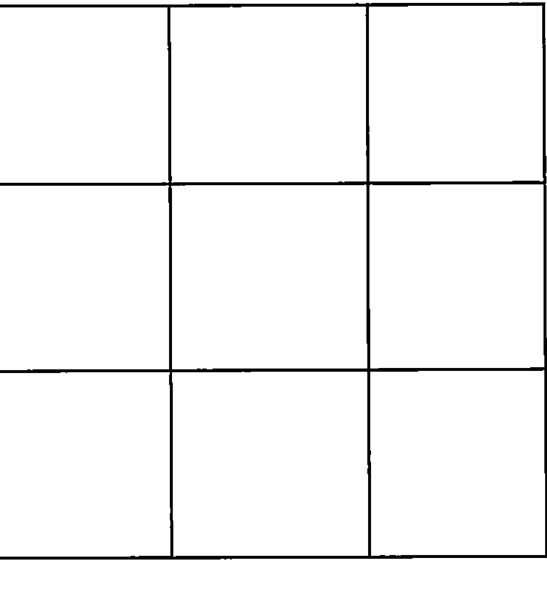

### 第五步、分布地盘三奇六仪。

三奇六仪的顺序：戊、己、庚、辛、壬、癸、丁、丙、乙

现在是阴遁九局、戊就写在九宫。

阳遁按照：9—1—2—3—4—5—6—7—8 的顺序飞布。

阴遁按照：9—8—7—6—5—4—3—2—1 的顺序飞布。

如下图：

| 癸 | 戊 | 丙 |
| 丁 | 壬 | 庚 |
| 己 | 乙 | 辛 |

地盘八门九星图

甲午旬，甲午同辛，地盘辛落在乾宫，乾宫地盘八门开门为值使，地盘九星天心星为值符。

### 第七步、排九星（值符随时干）。

根据值符随时干的原则，值符为天心星，甲午时，天心星在本宫位，然后按照：天心、天蓬、天任、天冲、天辅、天英、天芮、天柱的顺序顺排一圈。如下图：

| 辅 癸 | 英 戊 | 芮 丙 |
| 冲 丁 | 壬   | 柱 庚 |
| 任 己 | 蓬 乙 | 心 辛 |

天盘三奇六仪，首先确定地盘三奇六仪的顺序，从时干辛开始，辛—乙—己—丁—癸—戊—壬—丙—庚，然后把地盘三奇六仪加在天盘上面，如下图：

| | | |
|---|---|---|
| 辅 癸 | 英 戊 | 芮 丙 |
| 冲 丁 | 壬 | 柱 庚 |
| 任 己 | 蓬 乙 | 心 辛 |

### 第八步、排八神。

八神：值符、腾蛇、太阴、六合、白虎、玄武、九地、九天。
简写为一个字：符、蛇、阴、六、白、玄、地、天。

八神按照大值符随小值符的顺序排列。大值符为八神的值符，小值符为九星的值符。现在小值符为天心星落在乾六宫，那么八神中的值符也直接写在乾六宫。

阴遁逆时针排列：值符6宫、腾蛇7宫、太阴2宫、六9宫、白虎4宫、玄武3宫、九地8宫、九天1宫。如下图：

| 虎 | 合 | 阴 |
|---|---|---|
| 辅 癸 | 英 戊 | 芮 丙 |
| 玄 | | 蛇 |
| 冲 丁 | 壬 | 柱 庚 |
| 地 | 天 | 符 |
| 任 己 | 蓬 乙 | 心 辛 |

### 第九步、排八门（值使随时宫、阳顺阴逆）。

八门的排列顺序：开门、休门、生门、伤门、杜门、景门、死门、惊门。简写为一个字：开、休、生、伤、杜、景、死、惊。

八门无论阴遁阳遁，八门永远顺排。

八门的排法，首先确定值使门的位置，从六甲中的旬首开始推。阳遁一个时辰进一位，阴遁一个时辰退一位。

现在为甲午旬，甲午时。值使门在本宫位乾六宫，直接把开门写在乾六宫。然后按照这个顺序，1、8、3、4、9、2、7、6的顺序顺转一圈。如下图：

| 杜癸 辅癸 | 景戊 英戊 | 死丙 芮丙 |
| 伤丁 冲丁 | 壬 | 惊庚 柱庚 |
| 生己 任己 | 休乙 蓬乙 | 开辛 心辛 |

### 第十步、排引干。

引干的排法：时干加值使门顺转一圈，我们先找到地盘或天盘任意一个时干辛，确定隐干的顺序：辛—乙—己—丁—癸—戊—丙—庚，然后把辛加在值使门开门上面，顺时针转一圈，如下图：

| 白杜辅 癸癸 | 玄景戊 戊戊 | 地死丙 丙丙 |
| 六伤冲 丁丁 | 壬 | 天惊柱 庚庚 |
| 阴生任 己己 | 蛇休蓬 乙乙 | 符开心 辛辛 |

### 第十一步、标出空亡和马星。

甲午旬，辰巳空亡，巽宫空亡，寅午戌马星在申，在坤宫，完整的奇门局如下：

|| 戊 | 马 |
| :--- | :--- | :--- |
| ○ 白杜辅 癸癸 | 玄景英 戊戊 | 地死芮 丙丙 |
| 丁 | 六伤冲 丁丁 | 壬 | 天惊柱 庚庚 |
| 己 | 阴生任 己己 | 蛇休蓬 乙乙 | 符开心 辛辛 |

此局为伏吟局，代表事情缓慢，宜静不宜动，代表晚婚，大器晚成等信息，只宜收敛财货，讨债催款等。

## 十、数字奇门

什么是数字奇门呢？数字奇门也叫数字能量学，在数字组合中所包含的磁场信息，这些信息影响着人们的：婚姻、事业、财运、健康等等。数字能量学在我们生活当中经常要用到，比如：给汽车选车牌号，出门住酒店选好的房间号，给自己选择手机号、QQ号、微信号等。

数字奇门的第一步。首先要记住，奇门遁甲的数字符号：

- 八神：1. 值符、2. 腾蛇、3. 太阴、4. 六合、5. 白虎、6. 玄武、7. 九地、8. 九天、9. 太常、0. 无神。
- 九星：1. 天蓬星、2. 天芮星、3. 天冲星、4. 天辅星、5. 天禽星、6. 天心星、7. 天柱星、8. 天任星、9. 天英星、0. 无星。
- 八门：1. 休门、2. 死门、3. 伤门、4. 杜门、5. 中门、6. 开门、7. 惊门、8. 生门、9. 景门、0. 无门。
- 天干：1. 甲、2. 乙、3. 丙、4. 丁、5. 戊、6. 己、7. 庚、8. 辛、9. 壬、0. 癸。

数字奇门的起局公式，一共用七位数，从后面往前面推：

- 1. 后七位是：宫位。
- 2. 后六位是：引干。
- 3. 后五位是：八神。
- 4. 后四位是：九星。
- 5. 后三位是：八门。
- 6. 后两位是：天盘天干。
- 7. 后一位是：地盘天干。

根据这个公式，可以起出奇门遁甲局，如果数字只有六位数就把前一位去掉，如果数字只有五位数就把前二位去掉，其余的以此类推。

## 新茅山奇门秘籍

判断：这个人是个领导（值符）、正在开创自己的事业（开门）+做事情心细（天心星）、甲加丙、甲为头、丙为圆的、脑袋大脸圆、事业发展怎样呢？甲、丙的十二长生状态，在冠带、长生处，事业发展的不错，会越来越好。

比如：笔者使用的另外一个手机号码 18027574081。后面七位：7574081，根据这些数字起局：7 兑宫+7 引干戊+7 九地+4 天辅+0 无门+8. 辛+1 甲。十二长生状态：辛在酉为临官、甲在酉为胎养。根据这些符号，我们可以判断：兑为嘴巴、戊为钱财、用嘴巴赚钱、甲为领导、天辅星为老师、九地和风水土地有关系、所以可以看出来是一个教风水玄学的老师。事业发展的怎样呢？天盘辛为临官、地盘甲为胎养、事业发展的也还不错、临九地比较稳定。

## 数字选择

数字选择就是在生活中我们要选择手机号、房号、车牌号或者类似的号码等情况。我们可以根据对方提供的号码起出奇门局。选择号码的原则：一是要避开四害，二是要避开死墓绝。

例如一：1326679799 根据这个手机号码，我们可以起出奇门局后面七位：6679799 ，6 乾六宫+6 己+7 九地+9 天英星+7 惊门+9 壬 +9 壬。选择号码原则，一是要避开四害，二是要避开死墓绝。景门落乾六宫门破，此号码不能用。

例如二：13682698889 根据这个手机号码，我们可以起出奇门局：2698889。坤二宫+己+太常+天英星+生门+辛+壬。甲戌己落坤二宫击刑，未戌刑，也不能用。

例如三：13823852199 根据这个手机号码，我们可以起出奇门局：3852199。震三宫+丁+九天+天禽星+天任星+休门+癸+癸。首先没有四害，其次就要再看看有没有死墓绝，癸在震三宫卯上面，为长生状态，所以这个号码是可以选择的。

## 十一、刻家奇门

时家奇门遁甲一个时辰一局，在同一时间之中世界上事物变化繁多并且迅速，有的时候难以满足所有客户的需求。比如：同一个时辰的局，所面对的可能是几十人甚至几百人的需求，这种情况：一是可以区分不同的用神和方位来进行预测，二是可以细化为刻家奇门，让预测调整更加精细。我们知道一个时辰是2个小时，一百二十分钟，如果把十二地支，每一个地支占一刻，那么十二地支刚好又划分为十二个刻盘：

- 子刻：0分钟——10分钟。
- 丑刻：10分钟——20分钟。
- 寅刻：20分钟——30分钟。
- 卯刻：30分钟——40分钟。
- 辰刻：40分钟——50分钟。
- 巳刻：50分钟——60分钟。
- 午刻：60分钟——70分钟。
- 未刻：70分钟——80分钟。
- 申刻：80分钟——90分钟。
- 酉刻：90分钟——100分钟。
- 戌刻：100分钟——110分钟。
- 亥刻：110分钟——120分钟。

比如：2019年8月7号15点33分。33分在卯刻的范围之内，转换为干支历为：己亥年壬申月丁丑日戊申时乙卯刻。刻的天干的起法，按照五鼠遁来推算：

- 甲己还加甲——逢日干是甲或己的，子时的时间干从甲上起。
- 乙庚丙作初——逢日干是乙或庚的，子时的时间干从丙上起。
- 丙辛从戊起——逢日干是丙或辛的，子时的时间干从戊上起。
- 丁壬庚子居——逢日干是丁或壬的，子时的时间干从庚上起。
- 戊癸起壬子——逢日干是戊或癸的，子时的时间干从壬上起。

比如：戊申时，从戊开始，起壬子来推算，其他的以此类推。

公历:2019年8月8日15时33分
农历:2019年七月初八日
四柱:己亥 壬申 丁丑 戊申
节气:立秋~处暑 月将:午 阴遁9局
值符:天禽星落9宫 值使:死门落1宫
时空亡:甲辰旬 寅卯 空 马星 寅

| 蛇 戊 癸 英 休 | 符 丙王 戊 芮 生 | 天 庚 丙王 柱 伤 |
|---|---|---|
| 阴 癸 丁 辅 开 |  | 地 辛 庚 心 杜 |
| 六 丁 己 冲 惊 | 白 己 乙 任 死 | 玄 乙 辛 蓬 景 |

### （戊申时盘）

公历:2019年8月8日15时33分
农历:2019年七月初八日
四柱:壬申 丁丑 戊申 乙卯
节气:立秋~处暑 阴遁4局
值符:天任星落5宫 值使:生门落7宫
时空亡:甲寅旬 子丑空 马星 巳

| 阴 丙 戊 心 惊 | 蛇 辛 壬 蓬 开 | 符 癸 庚乙 任 休 |
|---|---|---|
| 六 丁 己 柱 死 |  | 天 己 丁 冲 生 |
| 白 庚乙 癸 芮 景 | 玄 壬 辛 英 杜 | 地 戊 丙 辅 伤 |

### （乙卯刻盘）

刻盘的起局方法和时盘一样，用年支序数+月数+日数+时支序数+刻支序数的总和减去九的倍数。刻盘的预测调整方法和时盘一样只不过把年柱取掉、月柱变成年柱、日柱变成月柱、时柱变成日柱、刻柱变成时柱，刻盘的预测对比时盘来说更加准确细致一些，但是世界各地都存在时差问题，所以刻盘具备时空时效性。即：预测师与求测人同一刻在同一时空，那么准确度才会更高。

## 十二、奇门修造

什么是修造呢？《八宅明镜》里面说：“凡添、修、拆、补、房屋以及换、盖瓦、修门，皆为修方。”《八宅明镜》是八宅派风水重要典籍。这句话的意思，就是说“通过用添加、修改、拆补的方法，或者改门改窗户换瓦等等，都属于修造的范围。”那么如何修造呢？先来看看《选择求真》里面怎么说的？《选择求真》是一本论述择吉日的书。

《选择求真》云：

1. 凡人家财禄不旺者，多由财帛、田宅二星失陷又或因修造有犯大耗故也。
2. 宜修流财方，而带月财、金匮、火星、极富、穀将、青龙、天富等星。
3. 并合本命 禄、马、田财二星，即太阳、乙、丙、丁奇、休、生、开门共到其方修之必主骤发。
4. 传送、功曹、胜光、神后 四吉将，亦宜到方。

大概的意思就是说：修造的时候，要避开大耗，小耗日。最好有乙、丙、丁三奇，休、生、开门三吉门。要有月财星、金匮星、火星、极富星等等配合到方位。那么月财星、金匮星、火星、极富星之类，怎么寻找呢？大家请看图：

| 类别 | 甲 | 乙 | 丙 | 丁 | 戊 | 己 | 庚 | 辛 | 壬 | 癸 |
| :--- | :--- | :--- | :--- | :--- | :--- | :--- | :--- | :--- | :--- | :--- |
| **年干吉神**<br>（天乙贵人） | 丑未 | 子申 | 酉亥 | 亥酉 | 丑未 | 子申 | 丑未 | 午寅 | 卯巳 | 卯巳 |
| **月家吉神** | 正 | 二 | 三 | 四 | 五 | 六 | 七 | 八 | 九 | 十 | 十一 | 十二 |
| **月财方** | 午 | 乙 | 巳 | 未 | 酉 | 亥 | 午 | 乙 | 巳 | 未 | 酉 | 亥 |
| **月流财方** | 甲庚 | 乙辛 | 甲庚 | 乙辛 | 丙壬 | 丁癸 | 丙壬 | 丁癸 | 甲庚 | 乙辛 | 丙壬 | 丁癸 |

（天财月财等寻找表）

| 吉神 | 金柜星 | 天富星 | 生气星 | 极富星 | 天财星 | 田宅星 | 谷将星 |
| :--- | :--- | :--- | :--- | :--- | :--- | :--- | :--- |
| **方位1** | 子 | 丑 | 寅 | 卯 | 辰 | 巳 | 午 |
| **方位2** | 酉 | 戌 | 亥 | 子 | 丑 | 寅 | 卯 |
| **方位3** | 午 | 未 | 申 | 酉 | 戌 | 亥 | 子 |
| **方位4** | 卯 | 辰 | 巳 | 午 | 未 | 申 | 酉 |
| **方位5** | 子 | 丑 | 寅 | 卯 | 辰 | 巳 | 午 |
| **方位6** | 酉 | 戌 | 亥 | 子 | 丑 | 寅 | 卯 |
| **方位7** | 午 | 未 | 申 | 酉 | 戌 | 亥 | 子 |
| **方位8** | 卯 | 辰 | 巳 | 午 | 未 | 申 | 酉 |
| **方位9** | 子 | 丑 | 寅 | 卯 | 辰 | 巳 | 午 |
| **方位10** | 酉 | 戌 | 亥 | 子 | 丑 | 寅 | 卯 |
| **方位11** | 午 | 未 | 申 | 酉 | 戌 | 亥 | 子 |
| **方位12** | 卯 | 辰 | 巳 | 午 | 未 | 申 | 酉 |

（金匮天富等寻找表）

公历 :2018年6月18日18时37分
农历 :2018年五月初五日 (时局)
四柱: 戊戌 戊午 辛巳 丁酉
节气: 芒种～夏至 月将:申 阳遁4局
值符:天柱星落1宫 值使:惊门落1宫
时空亡:甲午旬 辰巳 空 马星 亥
四害颜色: 刑墓迫【刑墓】空◎

太冲卯 危 戊 | 六◎ 壬 戊 任 生 | 白 乙 癸 冲 伤 | 玄 戊 丙己 辅 杜 | 小吉未 闭 丙己
功曹寅 破 乙 | 阴 丁 乙 蓬 休 | 空 | 地 癸 辛 英 景 | 传送申 建 辛
大吉丑 执 壬 | 蛇 庚 壬 心 开 | 符 辛 丁 柱 惊 | 天 丙己 庚 芮 死 | 从魁酉 除 庚

比如：房屋，未山丑向。2018年6月18号18时间，想在东方开个窗户，我们看看这个日子的吉凶。

2018年6月18号18时，东方。

有三奇、乙丁。

有八门：休门。

有功曹：寅。

2018年天财星：寅卯。(东)

# 卷之二 茅山奇门遁甲法则

## 一、用神层次

### 一、从四纲上取用神

道家阴盘奇门遁甲用四柱来代替六亲，四柱分为：年干、月干、日干、时干、年支、月支、日支、时支，奇门遁甲也叫天干预测学，以四柱中的天干为取用。即：年、月、日、时的天干。年干代表父母长辈，月干代表兄弟姐妹，日干代表求测人己身，时干代表儿女晚辈。在道家阴盘奇门中，因为四柱的天干为纲领性用神，所以也叫“四纲”。从四纲上取用神，分为两种情况：一种是求测人在面前，

### 一种是求测人不在面前。

- 1. 求测人在面前的时候：
年干为长辈、月干为同辈、日干为求测人、时干为晚辈。
- 2. 求测人不在面前的时候：
年干为长辈、月干为求测人、日干为同辈、时干为晚辈。

下面举例说明：

干支: 戊子 丙辰 丙申 乙未 阳1局

直符: 天辅 直使: 杜门 旬首: 甲午辛

| 天 庚 辛 生 | 符 辛 乙 伤 | 蛇 乙 己壬 杜 |
| 地 丙 庚 休 | | 阴 己壬 丁 景 |
| 玄 戊 丙 开 | 白 癸 戊 惊 | 六 丁 癸 死 |

比如这个局，当面求测的话，日干丙为求测人，时干乙为求测人的晚辈，月干丙为求测人的同辈，年干戊为求测人的长辈。

干支：庚辰 甲申 丙辰 乙未 阳1局

直符：天辅 直使：杜门 旬首：甲午辛

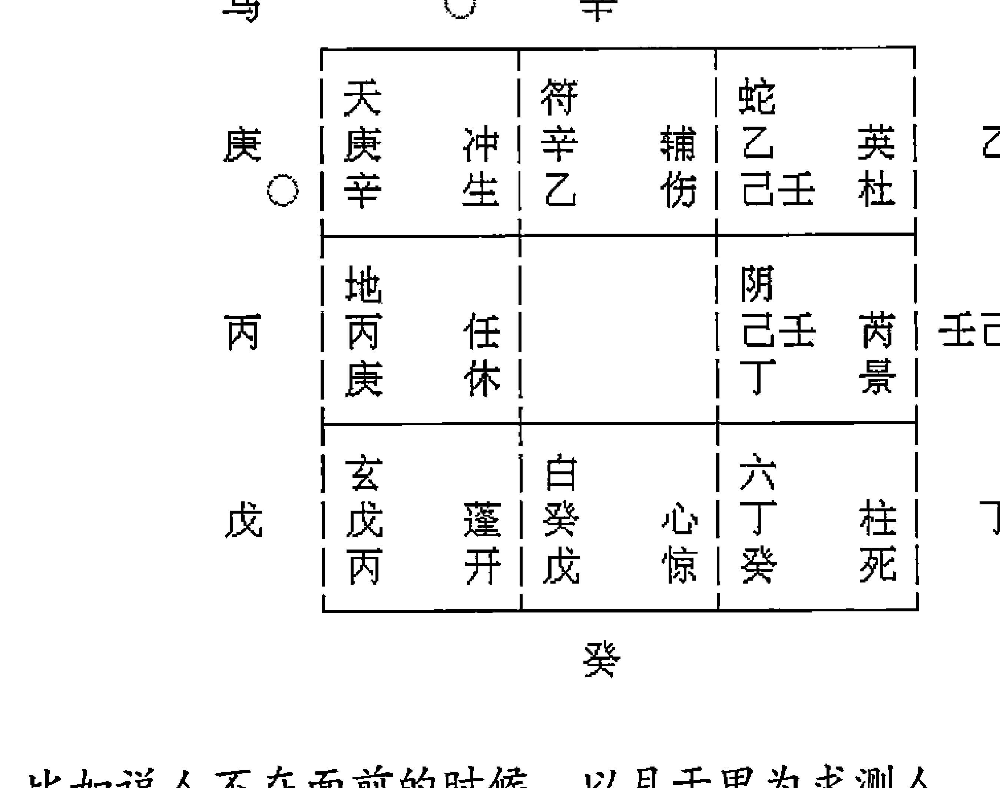

比如说人不在面前的时候，以月干甲为求测人，日干丙为预测师或求测人的同辈，时干乙为求测人的晚辈，年干庚为求测人的长辈。

根据四纲来取用神，因男女性别都不同用神也不一样。知道四纲之后，还要从男女的性别来分析，定天干阴阳的属性。比如上面这个局，以男预测师来说：

求测人通过网络电话媒介等来求测，人不在面前。用日干代表预测师，日干丙为阳，月干甲也为阳，那么月干甲所代表的男求测人。如果是女求测人的话，就要转换用神看乙。

假如说以女预测师来说：求测人通过网络电话媒介来求测。人不在面前。用日干代表预测师，日干丙阳，月干为甲为阳，那么月干甲就为女求测人。如果是男求测人的话，也要转换用神看乙。

用神分阴阳时候，请注意：

- 男求测人做为阴干用神时，所有的阴干都代表男性。
- 男求测人做为阳干用神时，所有的阳干都代表男性。
- 女求测人做为阴干用神时，所有的阴干都代表女性。
- 女求测人做为阳干用神时，所有的阳干都代表女性。

### 二、从年命上取用神

从年命上选取用神，就是求测人年柱的天干，落在哪个宫位，这个宫就为用神宫。

- 1. 尾数是0的 年命庚。
- 2. 尾数是1的 年命辛。
- 3. 尾数是2的 年命壬。
- 4. 尾数是3的 年命癸。
- 5. 尾数是4的 年命甲。
- 6. 尾数是5的 年命乙。
- 7. 尾数是6的 年命丙。
- 8. 尾数是7的 年命丁。
- 9. 尾数是8的 年命戊。
- 10. 尾数是9的 年命己。

干支: 戊子 丙辰 甲申 丙寅 阳1局

直符: 天蓬 直使: 休门 旬首: 甲子戊

| 左列 | 中列 | 右列 |
|------|------|------|
| 阴 庚 辛 冲 生 | 六 辛 乙 辅 伤 | 白 乙 己 壬 英 杜 |
| 蛇 丙 庚 任 休 |   | 玄 己 壬 丁 茜 景 |
| 符 戊 丙 蓬 开 | 天 癸 戊 心 惊 | 地 丁 癸 柱 死 |

比如此局: 求测人1988年出生。尾数是8的年命为戊，戊落在艮八宫，艮八宫即为用神宫。假如说79年出生的人，尾数是9的年命己，己在兑七宫，兑宫就为用神宫。

### 三、从宫位上取用神

# 新茅山奇门秘籍

奇门遁甲构建的模型，为八卦九宫图。而九宫八卦，本身就是宇宙信息万事万物的模拟，在预测的时候，八卦九宫也可以来取用神，请看下图：

|      | 1：巽 | 2：离 | 3：坤 |
| :--- | :--- | :--- | :--- |
| **象意** | 长女、风、左肩、股 | 中女、头、漂亮、火 | 老母、腹、右肩、牛 |
|      | 4：震 | 5：中宫 | 6：兑 |
| **象意** | 长男、足、左肋、动 |   | 少女、口、右肋、缺口 |
|      | 7：艮 | 8：坎 | 9：乾 |
| **象意** | 少男、停止、手、左脚 | 耳朵、长男、水、裆部 | 头、天、老父、右脚 |

如果说要测老父亲的，可以直接看乾宫，如果说要测口舌之事，可以直接看兑宫，测文书之事直接看离宫，如果说求测长子的事情，可以直接看震宫等等。

## 四、从类象上取用神

根据问事的特点，找到相对应的符号，这叫做从类象上选取用神的方法。测工作看开门、测生意看生门、测感情看六合、测变动看马星、测领导看值符、测灵异看腾蛇、测合伙看六合、测看敌人看庚、测老师看天辅、测学生看天芮等等。

阴盘奇门遁甲选取用神的方法，可以是多种多样，在实战中可以到信手拈来皆为用，并不拘泥某一法、声音、动作、表情、数字，一切都可以取来为用神，要活学活用。

## 二、四害原理

四害是刑、墓、亡、破、刑为击刑，墓为入墓，亡为空亡。破为门破。

### 空亡

干支：戊寅 庚申 乙巳 辛巳 阳1局
直符：天芮 直使：死门 旬首：甲戌己

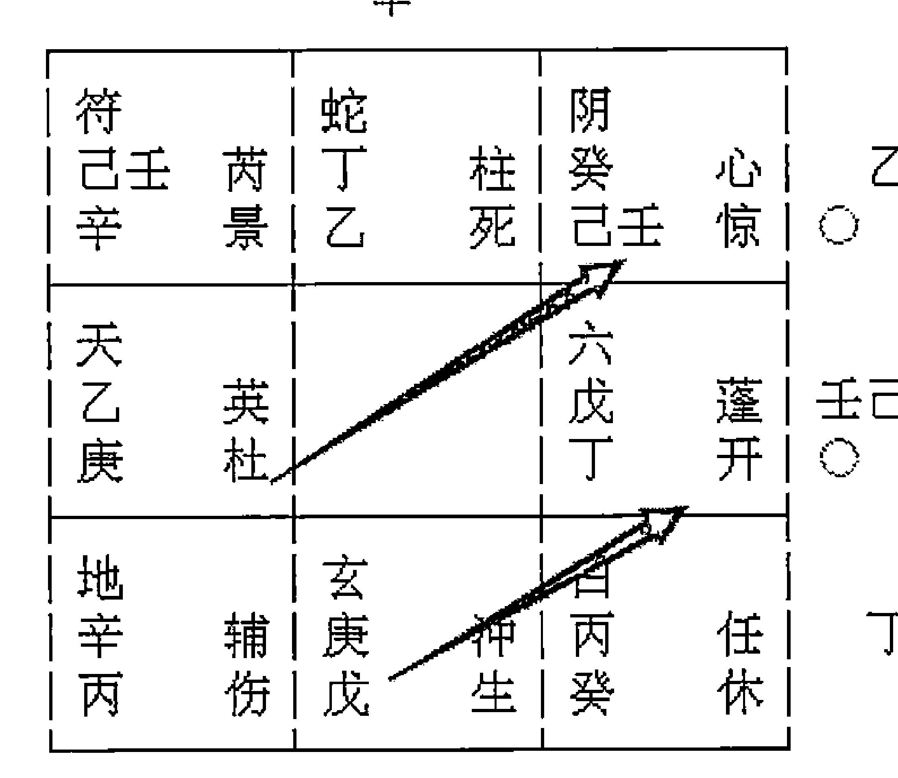

空亡分为年空亡，月空亡，日空亡，时空亡，刻空亡，起时盘时就用时空亡，起刻盘时就用刻空亡。

甲子旬 戌亥空亡。应在乾宫空。
甲戌旬 申酉空亡。应在兑宫、坤宫空。
甲申旬 午未空亡。应在坤宫、离宫空。
甲午旬 辰巳空亡。应在巽宫空。
甲辰旬 寅卯空亡。应在艮宫、震宫空。
甲寅旬 子丑空亡。应在坎宫，艮宫空。

# 新茅山奇门秘籍

空亡并不是没有了。是一个时空信息，转换到另外一个时空之中了。空亡的信息量较少，一般来说只有百分之二十的信息。如果要测事情能否成功，空亡只有百分之二十的能量，往往是力不从心。空亡有冲实和填实，一般来说冲实的能量比较大，填实的能量比较小。如上图箭头标志，画两个圆圈的宫位，即为空亡的宫位。

### 入墓

| 甲、乙、癸入墓 | 乙、丙、戊入墓 |
| :---: | :---: |
| 辛、壬入未墓 | 甲、乙、癸入未墓 |
| 丁、己、庚入丑墓 | 乙、丙、戊入戌墓 |

甲落二宫入未墓、丙落六宫入戌墓、戊落六宫入戌墓、庚落八宫入丑墓、壬落四宫入辰墓、乙落六宫入戌墓、丁落艮宫入丑墓、己落艮宫入丑墓、辛落巽宫入辰墓、癸落二宫入未墓。入墓一般表示被关起来了，能量发挥不出来，有劲使不上。

### 击刑

| 壬、癸 | 辛 | 己 |
| :--- | :--- | :--- |
| 戊 |   |   |
| 庚 |   |   |

甲子戊落在震宫，子卯刑，无理之刑，以下犯上。
甲戌己落在坤宫，戌未刑，无恩之刑，忘恩负义。
甲申庚落在艮宫，申刑寅，恃势之刑，仗势欺人。
甲寅癸落在巽宫，申刑寅，恃势之刑，仗势欺人。
甲午辛落在离宫，午午自刑。
甲辰壬落在巽宫，辰辰自刑。
击刑代表事情别扭，没有能量，处在不顺之中，事情坎坷绊脚。

### 门破

| 惊门、开门 | 休门 | 杜门 |
| :--- | :--- | :--- |
| 惊门、开门 |   | 景门 |
| 杜门 | 死门 | 景门 |

门破就是八门的五行，克落宫的五行，门破代表破损，事情受到损害，口诀：伤杜木落坤艮土，惊开金克震巽木。景门烈火烧乾兑、生生死死坎水枯，休门进驻离火宫，灰飞烟灭柴无补。死门落在坎一宫门破，杜门落在艮八宫和坤二宫门破，休门落在离九宫门破，开门、惊门落在震三宫，巽四宫门破，景门落在乾六宫，兑七宫门破。更多资料请加微信17703475506。“四害”是阴盘奇门的预测判断和调整运筹的基础内容，几乎每一局都要用到，用神有四害的时候，往往代表事情阻隔，困难，事情变化多，能量低等信息，这个一定要牢牢的记住。

## 三、出入格局

### 入局

入局就是人局合一，人在局中，局在人中，从而达到更好的调整和运筹的目的。入局之前首先要护体，避开局中不好的信息，然后再进入局中。

- 第一步、要画好奇门遁甲入局护身符。（由本人亲自传授）。
- 第二步、念茅山护身咒。（由本人亲自传授）。
- 第三步、找到没有四害的宫位，用意念进局。

公元：2015年5月20日17时29分 阳7局
农历：羊年04月03日17时29分 时盘
干支：乙未 辛巳 丙申 丁酉 (辰巳空)
直符：天蓬 直使：休门 旬首：甲午辛

巳 成 午 收 未 开
○ 庚
辰 符 辛 蓬 蛇 己 任 阴 癸 冲 丙壬
丁 危○ 丁 休 庚 生 壬丙 伤 闭
卯 天 乙 心 开 六 丁 辅 杜
癸 破 癸 戊 建
寅 地 戊 柱 玄 壬丙 芮 白 庚 英 除
己 执 己 惊 辛 死 乙 景
丑 定 子 平 亥 满 马

比如说用这个局来入局的话，离宫和兑宫都没有四害。兑宫丁+戊青龙转光，我们可以到家里的西方，双膝盘坐下来，六合为多，丁为香火，戊为土，杜门为木头，插七根香，脑海中想着七条青龙，在屋内西方盘旋，慢慢的进入局中。

### 定局

什么是定局呢？一个局刚刚起出来，可能信息不稳，这个时候需要把信息给定住。定局的方法，在奇门局中乙丙丁，有三奇的宫位，烧三奇符，烧的时候念三奇咒。

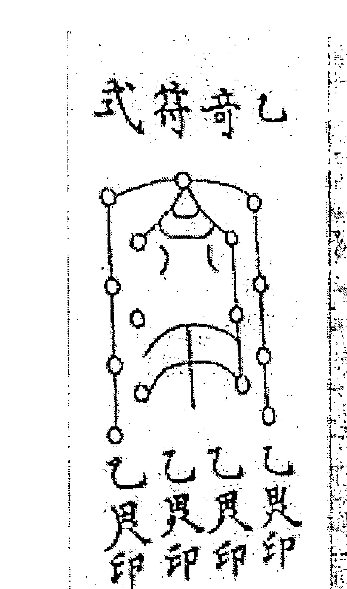
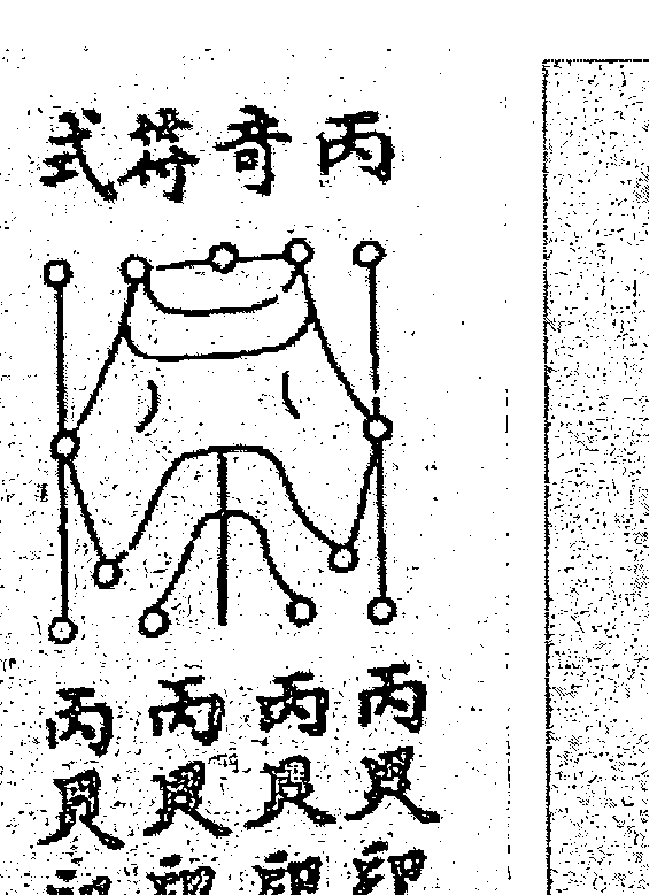
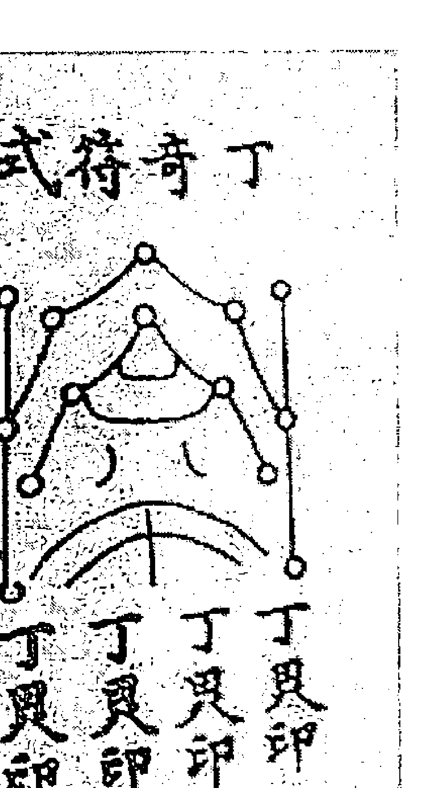

> 乙奇咒：天地威神，诛灭鬼贼，六乙相扶，天道赞德，吾信所行，无攻不克，急急三茅真君律令。
> 丙奇咒：丙奇咒曰：吾德天助，前后遮罗，青龙白虎，左右驱魔，朱雀道前，使我会他，天威助我，六丙除疠，急急三茅真君律令。
> 丁奇咒：丁奇咒曰：天帝弟子，部令天兵。赏善罚恶，出幽入冥。来护吾者，玉女六丁。有犯我者，自灭其形，急急三茅真君律令。

### 封局

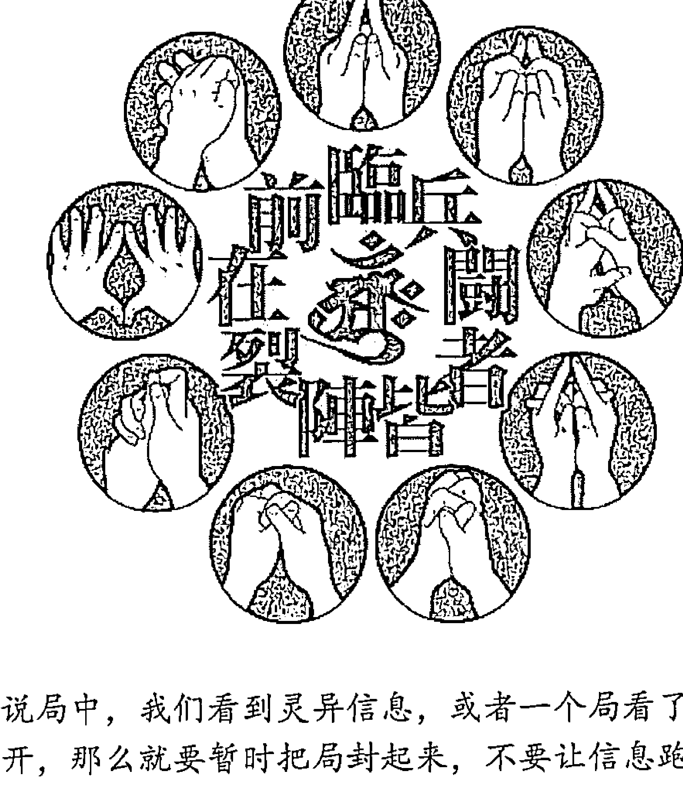

假如说局中，我们看到灵异信息，或者一个局看了一半，突然有事要离开，那么就要暂时把局封起来，不要让信息跑掉。封局可以用奇门法术九字真言 临、兵、斗、者、皆、阵、列、在、前，我们只需要在局前做以上九种手印，从临开始到前结束，一边做手印，一边心中默念，即可封局。

### 解局

当有些局封住之后，我们要重新打开预测调整的，就需要解局，解局的方法也是用九字真言，用剑指在奇门局上画五横四竖，如下图：

# 新茅山奇门秘籍

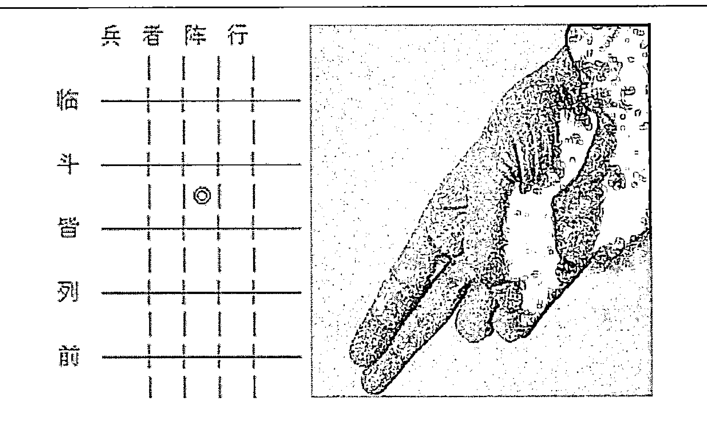

### 出局

干支：乙未 辛巳 癸卯 癸亥 阳1局
直符：天心 直使：开门 旬首：甲寅癸

#### 奇门遁甲排盘

| 马 | 戊 | 庚 | 丙 | 丁 |
| :--- | :--- | :--- | :--- | :--- |
| **壬** | **白** 辛 辛 **辅** 杜 **玄** 乙 乙 **英** 景 **地** 己壬 己壬 **芮** 死 | **庚** |   |   |
| **辛** | **六** 庚 庚 **冲** 伤 **癸** **天** 丁 丁 **柱** 惊 | **丙** |   |   |
| **乙** | **阴** 丙 丙 **任** 生 **蛇** 戊 戊 **蓬** 休 **符** 癸 癸 **心** 开 | **丁** |   |   |
| **○** | **己** | **○** |   |   |

出局的话，就是从局中出来。出局先找到没有四害的宫位，比如上局，震宫、巽宫、离宫这几个地方都能够出局，假如选择兑宫出局的话，我们在家中的西方，用录音机播放歌曲，关于佛学的歌。

## 四、调理九宫

### 一、通气

判断阴盘奇门是否通气，可以从两个方面来分析。

- 第一、两宫是否有相同的符号。
- 第二、两宫位或多宫位是否处在相同的状态。（同时有四害，或同时没四害）

下面举例说明：

干支：甲午 甲戌 癸酉 庚申 阳1局
直符：天心 直使：开门 旬首：甲寅癸

```
乙辛 | 蛇戊辛 蓬休 | 阴丙乙 任生 | 六庚己壬 冲伤
壬己庚 | 符癸庚 心开 | 白辛丁 辅杜 | 丁丙 天丁丙 柱惊
地己壬戊 | 芮死 | 玄乙癸 英景 | 癸
马 ○ 戊 ○
```

此局、当面求测，癸为求测人，庚为求测事，癸落宫有四害，庚落宫也有四害，处于相同状态当中，癸落宫和庚落宫有相同的符号，震宫和坤宫同时有庚，此时为两宫通气。

干支：甲午 戊辰 己未 丙寅 阳1局
直符：天蓬 直使：休门 旬首：甲子戊

|      | 辛 | 马 |
| :--- | :--- | :--- |
| 庚 | 庚 辛 冲 生 | 辛 乙 辅 伤 | 乙 己壬 英 杜 |
| 丙 | 丙 庚 任 休 |   | 己壬 丁 芮 景 壬己 |
| 戊 | 戊 丙 蓬 开 | 癸 戊 心 惊 | 丁 癸 柱 死 丁 ○ |
|   | 癸 | ○ |

此局，当面求测，己为求测人。丙为求测事。丙落宫没有四害。己落宫有四害。同时两宫又没有相同符号。此时为两宫不通气。

如果测婚姻，男女双方用神宫通气，说明恋爱双方有共同的语言，看法多为一致，心有灵犀，如果说竞争岗位两宫通气，说明这个岗位有可能能够顺利入选。

### 二、翻宫

在用阴盘奇门判断时，可以用翻宫法，来看事情的来龙去脉。前因后果。用神的天干落宫，翻为地盘落宫，为其以前的时空状态。

用神天干落宫，所压的地盘天干，翻动为天盘宫，为其以后的时空状态。

干支：甲午 戊辰 己未 丙寅 阳5局
直符：天禽 直使：死门 旬首：甲子戊

癸          马
己 | 蛇 庚 柱 乙 伤 | 阴 己 心 壬 杜 | 六 癸 蓬 丁戊 景 | 辛
庚 | 符 丁戊 芮 丙 生 | | 白 辛 任 庚 死 | 丙
丁戊 | 天 壬 英 辛 休 | 地 乙 辅 癸 开 | 玄 丙 冲 己 惊 | 乙
○ 壬          (符号)

比如此局：人当面求测的时候，己为用神代表求测人。
看以前第一步的状态，己翻到地盘，在乾六宫。
看以前第二步的状态，乾六宫天盘丙再翻动到地盘，在震三宫。
看以前的第三步状态，震三宫的天盘丁戊，翻动地盘为坤二宫。
如果看以后第一步的状态，离宫地盘天干壬，翻到天盘到艮八宫。
继续看以后第二步的状态，辛往后翻到天盘，到兑七宫。
继续看以后第三步的状态，庚往后翻到天盘，到巽四宫。

### 三、转宫

#### 转宫的原理：

奇门遁甲的模型是构建在用后天八卦配九宫之上的，先天为体，后天为用。当后天的信息没有完全显示出来的时候，我们可以到先天八卦中，去寻找信息的根源。然后在后天八卦当中展现出来。

#### 转宫两种情况：

- 一、求测人在眼前。
- 二、求测人不在眼前。

求测人在面前的时候，按照：后天空——先天找——后天显的原则。

比如：

1.  坎一宫空亡。（后天空了）——找到先天为坤六宫（先天找）——先天坤八宫，在后天的位置为坤二宫。（后天显）
2.  坤宫二空亡。（后天空了）——找到先天为巽五宫（先天找）——先天巽五宫，在后天的位置是巽四宫。（后天显）
3.  震三宫空亡。（后天空了）——找先天的为离三宫（先天找）——先天离三宫，在后天的位置是离九宫。（后天显）
4.  巽四宫空亡。（后天空了）——找先天的为兑二宫（先天找）——先天兑二宫，在后天的位置是兑七宫。（后天显）
5.  乾六宫空亡。（后天空了）——找先天的为艮七宫（先天找）——先天艮七宫，在后天的位置是艮八宫。（后天显）
6.  兑七宫空了。（后天空了）——找先天的为坎六宫（先天找）——先天坎六宫，在后天的位置是坎一宫。（后天显）
7.  艮八宫空了。（后天空了）——找先天的为震四宫（先天找）——先天震四宫，在后天的位置是震三宫。（后天显）
8.  离九宫空了。（后天空了）——找先天的为乾一宫（先天找）——先天乾一宫，在后天的位置是乾六宫。（后天显）

干支：丙寅 癸巳 己巳 丙寅 阳5局
直符：天禽 直使：死门 旬首：甲子戊

|      | 癸 | 马 |
| :--- | :--- | :--- |
| 己 | 蛇 庚乙 柱伤 | 阴 己壬 心杜 | 六 癸丁戊 蓬景 | 辛 |
| 庚 | 符 丁戊丙 芮生 |   | 白 辛庚 任死 | 丙 |
| 丁戊 | 天 壬辛 英休 | 地 乙癸 辅开 | 玄 丙己 冲惊 | 乙 ○ |
|   | 壬 | ○ |

如此局：一女子当面求测，丙为所问的事情，丙落乾宫，空亡了，根据后天空了——先天找——后天显的原则，乾宫的先天八卦是艮卦，艮卦在后天八卦，在艮八宫的位置，就到艮八宫寻找信息的根源。

当求测人不在眼前的时候，所传递的信息属于漂浮状态是虚象。这个时候用后天八卦，直接漂移到先天八卦上去，也叫飘着转。

转宫步骤，从后天八卦直接飘到先天八卦去，再找对应后天八卦的方位。

- 坎宫空亡了——飘到先天八卦坎6宫——对应后天八卦兑七宫。
- 坤宫空亡了——飘到先天八卦坤8宫——对应后天八卦坎一宫。
- 震宫空亡了——飘到先天八卦震4宫——对应后天八卦艮八宫。
- 巽宫空亡了——飘到先天八卦巽5宫——对应后天八卦坤二宫。
- 乾宫空亡了——飘到先天八卦乾1宫——对应后天八卦离九宫。
- 兑宫空亡了——飘到先天八卦兑2宫——对应后天八卦巽四宫。
- 艮宫空亡了——飘到先天八卦艮7宫——对应后天八卦乾六宫。
- 离宫空亡了——飘到先天八卦离3宫——对应后天八卦震三宫。

干支：壬辰 壬寅 戊申 甲寅 阳5局
直符：天蓬 直使：休门 旬首：甲寅癸

|      | 戊 | 马 |
| :--- | :--- | :--- |
| 壬 | 六乙 辅杜 | 白壬 英景 | 玄丁戊 芮死 | 庚 |
| 辛 | 阴丙 冲伤 | 癸 | 地庚 柱惊 | 丙 |
| 乙 | 蛇辛 任生 | 符癸 蓬休 | 天己 心开 | 丁 |
| ○ 己 ○ |   |   |   |   |

### 四、变宫

变宫就是当我们看到一个奇门局时候，在奇门局里面，找到相对应的物品。如果要进一步断这件物品的好坏的时候，就要变宫。变宫时我们首先要知道，八门九星的地盘的位置。

举例：

干支：乙未 丙戌 丁丑 戊申 阴6局
直符：天芮 直使：死门 旬首：甲辰壬

| 丁 |   | 壬己 | 乙 |
| :--- | :--- | :--- | :--- |
| 白丙庚任伤 | 六辛丁冲杜 | 阴庚壬己辅景 |   |
| 庚○ 玄癸辛蓬生 |   | 蛇丁乙英死 | 戊 |
| 辛○ 地戊丙心休 | 天乙癸柱开 | 符壬己戊芮惊 | 癸 |
| 马 | 丙 |   |   |

此局，当求测人在面前的时候，丁为用神代表求测人，同时说对应的环境信息。看兑宫、丁奇阴火可以代表灯光，乙奇可以代表椅子。天英星代表漂亮的画或者风景。死门是固定的可以是锁，那么家里西方摆放了椅子、风景画、锁、灯。

接着我们再看里面的内在关系。天英落兑宫，变宫到地盘天英星也就是离宫的位置，离宫的符号没有四害，那么这个风景画没有问题。

再看死门变宫在坤二宫，符号有四害，说明这是一把坏锁，处理的时候拿掉这把锁拿掉就可以，根据天盘星门象意去找对应地盘星门宫位，再看地盘宫位的好坏来定物品的好坏，这个叫变宫。

## 五、层次断

层次断，用引干，从一个符号引导出另外一个乾坤。奇门遁甲断法可以像破茧一样，打开内部的信息，层层推进。

干支：甲午 庚午 辛酉 丁酉 阳8局
直符：天芮 直使：死门 旬首：甲午辛

| 地 癸 辅 杜 | 天 己 英 景 | 符 辛丁 芮 死 |
| :--- | :--- | :--- |
| 玄 壬 冲 伤 |   | 蛇 乙 柱 惊 |
| 白 戊 任 生 | 六 庚 蓬 休 | 阴 丙 心 开 |

此局，如果说网测，辛为求测人，丙为求测人的妻子。丙为用神，入墓地。入墓能量弱，办事不给力。什么原因引起来的呢？打开丙。从引干丙找到离宫。分析离宫信息，景门+天英画。已卷起来的。九天为高。南方高处放了一个卷起来的画导致的。离宫和乾宫有先后天的关系，这副画可能是在不合适的时候放上所导致的。

# 新茅山奇门秘籍

干支：甲午 甲戌 癸亥 辛酉 阴7局
直符：天芮 直使：死门 旬首：甲寅癸

丙
| 符 | 天 | 地 |
| :--- | :--- | :--- |
| 癸庚<br>辛 | 戊<br>丙 | 己<br>癸庚 |
| 芮 | 柱 | 心 |
| 死 | 惊 | 开 |

| 蛇 | 玄 |
| :--- | :--- |
| 丙<br>壬 | 丁<br>戊 |
| 英 | 蓬 |
| 景 | 休 |

| 阴 | 六 | 白 |
| :--- | :--- | :--- |
| 辛<br>乙 | 壬<br>丁 | 乙<br>己 |
| 辅 | 冲 | 任 |
| 杜 | 伤 | 生 |

辛 壬 乙 庚癸 戊 己 ○ 丁 ○ 马

此局，假设乙为用神，落乾宫入墓地，乙入墓，事情自然不利。什么原因导致的呢？打开乙到艮八宫，辛+乙+杜门。家里东北角有个破损的并且上面画有图案的金属盒子，辛（金属的）+乙（艺术图案）+杜门（盒子），把盒子处理好即可。

### 五、定象拆日

阴盘奇门遁甲的预测和调整，首先找准用神，然后根据用神落宫的星门神干，来找到符合实际情况的象意，用星门神干来推导象意的方法是有规律的。这就需要定象。下面我们说说星门神干的定象方法。

- 1. 八神代表事物的整体状态
值符：贵重物，值钱的。
腾蛇：丑陋怪异，变化的。
太阴：雕刻精致，文书字迹。

## 八、取象心法

道家奇门遁甲有一个明显的特点：“淡化了格局，深化了象意”。取象的精准度直接影响到对事情的判断。取象的方法，看似千变万化，实际上也是有迹可循的，所谓：“万变不离其宗”。我们知道易学主要研究的是三个要点，叫做：“象”、“数”、“理”。“象”是指自然界中万事万物的现象。“数”是万事万物现象背后的规律，“理”指的是判断万事万物规律的方法和方式。其中“象”、“数”、“理”，三者是紧密不可分开的，根据现象找到事物的规律，根据事物的规律作出合乎逻辑的判断，这就是易学研究预测的整体的思路。人们在分析判断的时候，大脑会进入一种思维模式。下面我们先从人体的三种思维模式来介绍：

## 一、人体的三种思维

正常人的大脑的思维方式，主要有三种：逻辑思维、形象思维、灵感思维。

## 一、人体的三种思维

正常人的大脑的思维方式，主要有三种：逻辑思维、形象思维、灵感思维。

### 灵感思维

逻辑思维：逻辑思维是一切事物的开始，如果一个人的逻辑是混乱的，那么他的生活必然也是混乱的。逻辑思维，通俗的讲就是：事物和事物之间符合自然的规律的思维方式。逻辑学是一门很深的学科，也算是一门通用的学科，可以说一切学科都要用到逻辑学。同样，学习易学也离不开逻辑思维，人的逻辑思维越是清楚，判断就会越准确，语言也就会越有条理性。逻辑的三大要素：概念、推理、论证。

举例：有一位妇女，在商店买了一个名贵的包，一共消费二万块钱。第二天她觉得这个名贵的包不好看，就去找店里面老板更换。进去之后对店老板说：“老板，我这个包是昨天二万块钱买的，现在我看中了你旁边那个四万块钱的包。昨天我给了你二万块钱，我手中这个包本身的价值也是二万块钱，现在我把这个包还给你，那么我一共就给了你四万块钱，现在你是不是可以把那个四万块钱的包拿给我呢？”老板觉得这人无理取闹、胡搅蛮缠，但是又不知道怎么回答她。实际上这个女人用了逻辑学的重复算计的方法，一个概念只能算计一次而不能重复计算。

形象思维：人们通过语言、图片、手势，把自己的思维形象的展示出来，就好比你知道一个东西，要把它说出来、写出来、讲出来、画出来一样。具体在预测上，就是预测师看到了卦里面的内容信息，或者用语言，或者通过其他方式传达给这个求测者，让求测者明白预测师的意思。

灵感思维：人的一种感应，比如有的人昨晚一直睡不好，总感觉今天会出事情，后来果然今天出事了。这种思维心理学叫潜意识。科学家通过很多实验证明，人确实有感知未来的能力。其实不只是人，地球上的其他一些生物也同样有感知未来的能力，比如：在地震之前，家里养的猫和狗会突然狂叫不止、不吃东西，老鼠突然爬出洞来，鱼会突然的跳出水面等。

## 二、三种思维的应用方式

逻辑思维、形象思维和灵感思维，是每个正常人都拥有的三种思维模式，但每个人的这三种思维强弱却不一样。比如：数学家、科学家逻辑思维比较强一些，画家、艺术家灵感思维比较强一些，预测师、气功师感应思维比较强一些。作为命理师、风水师，这三种思维是怎么样应用的呢？我归纳了三点：

- 逻辑思维为主导思维。人判断的事情必须要合情合理，合乎事物的逻辑，而不是信口开河。
- 形象思维为展现思维。要用适当的语言或者其他方式，告知求测者你所解读的内容。
- 感应思维为灵魂思维。命理师、风水师最重要的就有自己的感应能力，但是这个感应能力每个人都不同，有的人天生感应能力好一些，有的人感应能力会弱一些。不过感应思维也是可以慢慢培养加强的。通过预测、修炼、静坐等，人的感应思维也会逐步增强。我认为对于预测师、命理师、气功师来说，感应思维是核心的灵魂思维。

主导思维和灵魂思维，两者之间什么区别？灵魂思维是一个人的心脏，而主导思维是人的四肢，一个是内容的核心，一个是内容的路线，两者各司其职却又密不可分。

## 三、象与意

“象意”是可以分开为两个概念，分开后就是“象”和“意”。“象”，就是生活中万事万物的现象，“意”，就是易学中符号的含义。易学本身就是研究社会的学科，可以说易学和社会是密不可分的。所以象和意我们才会把它们联系到一起。象意的推导有两种方式：“以象推意”与“以意导象”。

以象推意：易学来源于生活。
以意导象：易学还原于生活。

通俗的介绍：
以象推意：把生活中的现象，联想到特定的易学符号。
以意导象：把易学中的符号，还原于生活的各种现象。

举例：比如说，根据奇门遁甲取象方法，以象推意法：我们看到一颗大树，马上联想到天干甲，看到一棵小草，马上联想到天干乙，看到太阳联想到丙，看到灯联想到丁。这个是把生活中的现象，联想到特定的易学的符号之中。如果按照以意导象的方法：看到开门，我们就能想象一个打开的地方，看到死门，我们就能想象墙壁上的破痕，看到景门，我们就能想象到一副画。景门+丙+壬，可以联想到旭日东升图等。要学好易学首先要了解生活。同时善于思考善于观察生活的事物，这样在象意的推导上才能进步神速。

## 四、象意推导五法

金庸的武侠小说《笑傲江湖》当中，有两大主线一正一邪，正的是五岳剑派，邪的是日月神教。五岳剑派分别是：泰山派、衡山派、华山派、嵩山派、恒山派。其中华山派的剑术非常厉害。华山派剑法又分为气宗和剑宗。气宗遵循的是“以气御剑”，就是谁的内力高深谁就能够打败敌人。剑宗遵循的是“以剑御剑”，就是谁的招数快招数神奇、谁就能够打败敌人。一个是以不变应万变，一个是以变应变。两种不同的战术。金庸在《笑傲江湖》里面提倡的是剑宗的方法“以剑御剑”。其中令狐冲的老师，风清扬就是剑宗一派。学习奇门遁甲的象意背诵记忆固然很重要，但是最好要学会见招拆招，以招破招的方法。我总结的象意推导五法，就是“以剑御剑”的方法，在任何时候都能够信手拈来随心而用，真正做到“信手拈来皆为用，满盘处处是乾坤。”

象意推导五法：

- 1. 阴阳五行推导法：根据符号的阴阳五行的特点，来进行万物的取象，易学的符号虽然庞大繁多但是都具有阴阳五行的特点，阴阳的相冲相合，五行的相生相克，是所有易学符号所共有的特性。
- 2. 数字推导法：根据符号的排列顺序，推导具体的事物顺序的量词。比如：甲1、乙2、丙3、丁4、戊5、己6等。
- 3. 谐音推导法：根据字意的谐音，推导出相对应的事物。比如：乙代表椅子、丙代表毛病、庚代表耕田等。
- 4. 形态推导法：根据字体字形推算出相应的事物。比如：乙是弯弯曲曲的、丙是圆的、丁是细长的，壬是流动的等。
- 5. 动静推导法：根据以上的方法推导出物体的静态和动态。比如：壬作为静止的时候，可以是一个大水池、作为动态的时候，可以是飘动的红旗等。

以上五种方法，运用之妙，存乎一心。

# 卷之三、茅山派奇门实战篇

## 一、分类预测

### 第一节、疾病预测

断人体疾病其实很好断，见到宫中的符号有毛病就往坏处断，首先定用神，求测者在面前，日干落宫为用神，不在面前，以月干落宫为用神，但要分清阴阳，如果求测者是晚辈看时干，是长辈看年干。

当求测人不是问自己的病，而是代问别人的病时，根据六亲关系来定坐标。问同事、朋友、兄弟姐妹以月干为用神，用神落宫有毛病时为有病，时干为所问之事，是病者目前的状态，将用神落宫和时干落宫的生克制化作用关系来进行比较，之后综合判断疾病的性质、部位、内外、程度、病因、病理及发展状态等。

主要断病方法：日干落宫或用神落宫，有门迫、击刑的为有病，日干落宫没有门迫、击刑的再看年月日时干落宫找，有门迫、击刑的也是病，四纲上的毛病明显。如果四纲上都没有毛病就在其他宫中找，有毛病则为有病，但是轻点，或者说病是隐性的，自己还不知道。阳盘奇门以天芮星代表疾病，看天芮星的落宫状态来定病情。

阴盘奇门不以天芮星为主，但天芮星终归是问题、毛病，它落宫为门迫击刑时一定有病，没有门迫击刑也可能有病，就是上面说的有病可能不清楚、不知道。

这里说的门迫击刑是毛病，空亡也是病，且力量最大，如果用神不但有毛病，再遇空亡填实，或逢冲实，力量要增大好几倍，所以千万不可忽视空亡的力量。前面我说过，当遇空亡时不是空了、没有了，而是空亡转化了，是由一个时空转到另一个时空去了，空亡之宫只有20%的信息，是表面的象，转宫后的宫有80%的信息，但这个能量可能还要大，遇空亡时断病，可能是病转移了。

“全息论”，什么叫全息论？断病整个九宫格可代表一个内脏，九宫格的各宫又可代表各个部位。单宫看法是看某宫有毛病，按天盘、地盘来定，并参考八卦象意、天干、神的象意来定病的具体部位。隐干是断病的引子，也是暗干，先从隐干入手，病的起因是由“引子”隐干引起的。道家奇门看重八神，神助大于一切。

### 第二节、婚恋预测

阴盘遁甲预测婚姻全是用天干符号来表示的，预测中首先要找到用神，只有找到用神后才能确定这个人是谁，如用神是甲的时候，对象就是己，甲己相合在阳盘奇门里，预测婚姻只看“乙庚”，这有点不尽全面，也显得有些单调一些。天干合有以下五种形式：

- 甲己合：为中正之合。
- 乙庚合：为仁义之合。
- 丙辛合：为权威之合。
- 丁壬合：为淫荡之合。
- 戊癸合：为无情之合。

我们知道“甲”是领导，能和领导相合的人必须是“己”，己是委曲求全，是花花肠子，你得给领导出主意，搞策划时，己又是参谋。婚姻也是这样，甲是名人，是高贵者，与其相合得是门当户对的，己是富贵之家小姐，才配的上甲，所以也叫中正之合了。庚是一个很强硬的性格，和他相配的人是乙，温柔的，搞艺术的，一阴一阳一刚一柔才相配，才叫仁义之合。丙的脾气火暴，象烈火一样，得有一个能改变他性情的人才相配，那就是辛，是一个敢于变革、敢于改变历史的人，所以这就成了权威之合了。丁是顶尖的、出众的人，这样的人要有壬那样有智慧的人去辅助他、帮助他。但在婚姻方面往往是一见钟情的那种，这就叫淫荡之合。戊是忠厚老实的人，是不辞辛苦的人，配他是有点小聪明的那种人，也就是癸。二人其实没有什么感情可言的，只知道结婚生子，居家过日子的，也就是无情之合。

预测婚姻时，如果阴阳反差，也是婚姻不好的特点，女的要是甲，那男的己是一个非常窝囊的人，女的要是庚，那就像母老虎一样厉害了，乙是男的一定是个怕老婆的主，你不怕也不行啊，你干不过她啊，所以男阴女阳，婚姻质量一定不好的。

婚姻预测中的六亲定位：阴盘遁甲测婚姻看的非常细的，比如一个人来测婚，你不但看他婚姻能不能成，还得看是谁阻碍了他的婚姻，是谁在中间起坏作用，使他们成不了，这就要从六亲的角度去分析了。看年干能分出是谁的妈妈吗？还有月干是兄弟姐妹还是同事朋友？假如在婚姻中没有起好作用，你说他（她）是谁？但在遁甲中以六亲的形式就可以分清这些了。比如说用神是丙，丙的正印是乙，乙就是丙用神的妈妈，男的看正印女的看偏印，女的是丙甲是妈妈。男的父亲看偏财，女的父亲看正财，甲是妈妈，相合之干己就是父亲，乙是妈妈，相合之干庚就是父亲。男的兄弟看比肩，姐妹看比劫，女的姐妹看比肩兄弟看比劫。男的儿子看食神女儿看伤官，女的儿子看伤官女儿看食神。但是看他们的生克关系以落宫状态来定，再结合落宫的年月日时四纲，如果正好遇上四纲信息量要加强。

### 第三节、事业预测

首先看用神落宫（求测者落宫），适应做什么，应当选什么职业，往哪些方面去发展？当求测者在当面时，日干落宫就代表问测者本人，也代表他所应从事的职业和行业，当求测者不在当面时，月干落宫代表他本人，也代表他所应从事的职业和行业，当求测者当面问的不是他本人的事时，应以求测者的六亲关系来定坐标，兄弟姐妹看月干，子女晚辈看时干，长辈看年干。日干为求测人，时干为事，时干为求测者所问之事，是事物发展的趋势和未来。选定一个用神以便于细断。例如到医疗、卫生、教育的行业求职看天芮星；不动产、屠宰等行业看死门；金融财务看庚、辛、戊。

毕业分配和求职：首先也要确定好用神，用神确定以后，看其落宫的符号组合，用神落宫旺相，既不门迫也不击刑，表示自身条件好，如得天时地利，再得时干相生，则毕业分配、求职上岗顺利，如日干克时干，经过努力也能找到工作和达到自己的目的，如自身不得天时地利又逢时干相克，必然求职不利。地利是说求测人应当去什么方位、什么区域，如用神落宫无病，用神落宫就是求测人最适合的方位，如果用神落宫有问题，就看整个九宫中哪个宫位没有问题，就去哪个方位，在选择行业和职业时，要参考落宫的符号组合，只有选择的行业和职业和宫内的符号相合时才是最佳的，其中运用之妙，存乎一心，全在灵活变通。

官运升迁与调动：奇门遁甲能够很好的为求测人在升迁、调动和官运方面进行指导。首先也是选好用神，再看用神落宫的符号组合，临值符、见丙有官运，因为值符为领导、首领、管理者，丙为权柄，有权柄的一定是领导。用神落宫临值符或太阴有提升的机会，太阴被冲是被提职，因为太阴是印绶，有官必有印，无印就无法行使权力。当日干是用神时，月干是直接领导，也是竞争对手，年干为间接领导，为大领导，时干为下属员工，为做事平台、单位。比较权衡日干落宫与其他年月时三宫的作用关系，就可以得出结论。首先要判断求测人自身条件和运气，即天时地利人和神助及格局组合。在奇门遁甲中，日干与年干相生并有相同的符号相连，说明上下级之间水乳交融，配合默契，互相信任，那么职位上升的空间就大。月干是竞争对手也是同级或直接领导，他们之间的关系也很重要，如果对手的力量很大，是会对你构成威胁的。时干是你的下属员工，也是你的事业平台，比较一下和你的关系就知道你的工作好不好做了。平台不好你怎么做好自己的工作呢？当月干或时干临玄武冲克日干时，单位内部有小人作祟，引起口舌官非；临腾蛇相克难缠，不好摆脱；临白虎相克时，对方很厉害，气势汹汹，明目张胆；临太阴相克时，暗中行事，不知不觉；临六合或寄宫冲克日干，合伙聚众为难自己。六甲伏吟，主新的局面刚刚开始，反吟则主反复、不稳定或调任。日干或用神临空亡是离职退休革职，日干或用神临门迫、击刑、入墓，主能力发挥不出来，做事不顺利等。若求测人问调动之事，用神临马星、壬、癸、九天必动。

### 第四节、阳宅预测

阳宅在奇门遁甲中分内景和外景，也就是内环境和外环境。阳宅首先看用神，这分为两种情况，风水师在现场和风水师不在现场。风水师在现场，以日干落宫为阳宅，代表房子，日干又为人，也就是房子的主人，日干为房又为人是重合的，一家人中不论谁问都是，因为日干本人和房子都在现场的。

风水师不在现场，也就是说人在面前，房子不在面前，也就是说风水师不在现场时，来人问房以日干的正印为房子，不在现场来问风水的，以月干来看，如果打电话的人你知道辈分，长辈看年干，同辈看月干，晚辈看时干，落宫为房子，这点一定要分清楚，不然就会有偏差。看房子怎么样？看用神落宫状态，如果有门迫、击刑、空亡、入墓等问题，那么这房子不怎么样，有问题的房子落宫克谁，对谁不利，时干为这个事，它克日干或用神，也是不利，还得看克我的宫临什么样的符号。

常用的占宅符号有“插、反、断、射、破、探、走、冲”八字。落宫中出现上述八种情况来冲克你或用神，就不吉就凶，特别是年月日时四纲上的宫，受克最为不好。

阳宅内景物象：
1.  水管：“壬、癸、乙、己、庚、辛”的组合，遇丙、丁为热水，乙为弯的、弯曲的，己为盘的、盘旋的。
2.  横梁：戊、庚、甲（值符）
3.  灯：丙、丁、英、景，丁+癸+蛇是忽明忽暗。
4.  家具：乙（床、椅、花草）、辅（家具、床）。
5.  客厅：天心星。
6.  门：驿马+壬、癸，值使门落宫（不在现场），在哪就在哪（在现场）。
7.  天芮：菩萨、书籍、学习用品、药。
8.  神佛：死门落宫、符、英、遗像、玩偶。
9.  窗：庚辛（阻挡性质）、丙丁（采光能力）
10. 九天：空间、开阔、地势高，符落宫华贵、高档。
11. 九地：（同天相反）
12. 厨房：丙、丁，壬、癸，戊、己。
13. 厕所：壬、癸。

关于测阳宅的一些具体办法，详细介绍一下：阳宅断法要分内景、外景两种方式，比如宫中见天芮星，在断内景时，可把它断为书柜或菩萨，不能说屋外有书柜或神佛等，断外景时可以说有所医院或学校，也可以说有座寺庙、里面有佛像等，这样符合实际。又如丁+乙+柱、或是天冲，天冲在断阳宅是用“插”来代表，“柱”也是“插”（这是断外景），“插”就是棍、线杆、柱子等，“插”就是立着的、高的东西，在奇门里，值符甲也为插，当“插”这个东西克你或克用神时不好，凶，克谁对谁不好。

“反”在看外景的反弓路、反弓水，什么是反弓路、反弓水呢？庚是路，壬、癸是水，如果临白虎时克你，就是反弓路、反弓水，白虎是凶神、是煞气。

“断”是没有的意思，在奇门里用空亡来表示，断的概念是路或水突然到头了、泄了。

“走”为泄气，什么叫泄气，假如日干生别的宫叫泄气，走路、走水叫“洒水扶食”，又叫“一路不回头”。

“射”室外有高处或墙角冲你的门窗或用神时叫射，一般以丁、庚、蓬、虎这些带尖的符号来代表，庚是硬的、丁是尖的，丁+戊是墙角。

“破”，室外或门口、大门对着一些破烂、破损的物体，这些脏东西克你或克用神时也是不吉的。

“探”，探在奇门里，一般用玄武来表示，玄武宫克你或克用神会有不好的影响，假如一座房子背后又有一座高出的房子，叫“探头煞”，你的房子后边露出一个脑袋来窥视你，你舒服吗？（高出50米以上不算，一般高出2-5米算，太高就不算了。）玄武落宫克你或克用神时会出现什么情况呢？被偷、偷情、丢东西、破财等。

“冲”，冲就是路冲，低处的叫冲，高处的叫射，庚辛克你叫路冲，壬癸克你叫水冲。

### 第五节、阴宅预测

断阴宅与断阳宅都一样，所不同之处是阴宅一般不会葬在市区内，不会像阳宅那样外景复杂，内景也好断，一般只断死者穿什么样的衣服等。在过去的社會里，王公贵族富贵人家墓室很大，陪葬品很多，内景情况也就很复杂的，现在来断这些已经失去了很多意义，但是作为一门学问来讲，还是应该了解一些的，有些大师断阴宅，能说出死者是男士还是女士地基、穿什么样衣服、得什么病死的，很是让人信服。用阴盘遁甲来断阴宅，也同样能断到这一点。

阴盘奇门断阴宅，最好现场起局。日干落宫就是地基，在起局前最好在现场走走看看，把信息扑捉一下，“万物相关论”来讲，信息、气场是容在一起的，这时再起局信息准确率更高更多。起局后有问题需要调解处理。首先断性别，断准了性别就好办了，怎么断性别？日干落宫，宫中有“丁”是男性，见“癸”是女性，因为在阴盘奇门里丁代表男子、生殖器，“癸”代表女性生殖器，不管这宫里天盘还是地盘，只要有“丁、癸”就可定性别。不在现场起局，就看“七杀”，即偏官。如果局中没有“丁、癸”怎么办？那就看来人性别来断，人多的话谁先说话按谁断，这就是外应断。

再说死者的排行，要看用神的落宫来定，落宫坎、巽、兑为一、四、七。落宫艮、坤为二、五、八。落震、离、乾为三、六、九。过去排行多，一、四、七为大房，二、五、八为二房，三、六、九为三房。

再看死因，是什么病死的先看芮，芮是病，再看庚、辛、己、壬+芮。见“辛”是住院开刀，庚是肿瘤、癌症，己是小瘤、良性的，临太阴是内脏。景门是失血，上述符号落宫有门迫、击刑都是病，首先看四纲上的，哪宫毛病大就是哪里的病。

再看死者穿什么衣服，见火多，穿红色的，壬癸是深色或蓝色的，见土黄色见金白色。如果见庚辛可以说里面有首饰、钱币等。临太阴也是钱，景门是漂亮的衣服，临值符棺椁是上等的名贵的，人是当官的、老板、名人等，总之和断人事差不多的。阴宅的外景，断外景实际上很复杂，与阳宅的外景有相似的地方，但亦有一定的区别，阴宅看“龙”怎么样？“穴”“砂”“水”如何？还得看朝向、案山、四神等。靠山，就是用神落宫的情况就是靠山，案山也叫朝山，是用神宫对面的宫，看此宫中的符号状态和用神宫的生克关系，比如对面的宫空了就是没有案山，临戊+九地，是山包。值符是桥梁。用神左边宫为青龙，右边宫为白虎，看青龙白虎如何就看宫中的状态断，有毛病就凶没毛病就吉。还要看路、水的影响，是不是反弓路、反弓水？怎么看？“砂”一般以戊、己来代表，或看天任星，也得看庚辛，因为庚辛是石头，有的山露骨都是石头，这是破相，克你用神宫就不利。看阴宅主要看干，特别是年月日时四纲的干，落宫有毛病再克你用神，那肯定出事。如果宫中有壬癸来克用神，就属于反弓水，临庚辛克用神是反弓路。

## 第六节、灵异预测

狐仙（狐狸）、黄仙（黄鼠狼）、白仙（刺猬）、柳仙（蛇）、灰仙（老鼠），汉族民间俗称“狐黄白柳灰”（或称“灰黄狐白柳”）为五大仙。这五大仙经常出现于汉族年画，剪纸，泥塑等艺术作品中，寄托了汉族劳动人民一种辟邪除灾、迎祥纳福的美好愿望。

### 狐仙

狐仙，即狐狸。中国夏代开始，民间就有大禹治水时曾娶九尾白狐——涂山氏的女儿为妻而生下夏朝第一代君主启的传说故事，说明了早在5千年前中国人就已经视狐狸为吉祥动物加以崇拜了。民间普遍认为狐狸有灵性，能作祟作妖，也能成仙。它们精通道术，能报德，能复仇，同人恋爱，还会捉弄人。同时也能为人医治病痛。许多巫师在进行巫术活动时，也常常说自己是狐仙附体，并以狐仙的名义对病人发号施令，解答问题。旧时，天津在河北建有三太爷庙，天后宫中也有胡三太爷的塑像，常有信徒前去进香朝拜。人们还赋予狐狸一种灵敏机智可爱的性格，喜欢把它想象为善良多情而浪漫的女人，在民间传说或文人墨客笔下的“狐狸精”多是美妙的风情女郎。当然，也有人将“狐狸精”贬为勾引男人的不正派女人。

### 黄仙

黄仙，即黄鼠狼，被民间唤作“黄二大爷”，旧时在天后宫中供有其塑像。它被人崇拜，有两个原因。一是因为它同狐狸一样体态颇为美丽而又性情狡黠，使人感到神秘；另外一个重要原因是认为它可以左右人的精神世界，与一种精神错乱的疾病有关。这种精神错乱的疾病叫“癔病”，民间俗称“状克”。人们认为一旦黄鼠狼附了体，就会发生癔病，其中以女性或精神抑郁者为多。这种病症发病时哭哭啼啼，连说带唱，诉说一些玄妙的事情或生平中的不平之事。有的人还会唱出一些美妙诗句。得癔病者发病时不识家人及亲朋，且说话语调也与好时不同。还有人说病者的皮下有滚动的小球，用针将它扎住就能置附体的黄鼠狼于死地，一般用针刺病人的人中就可治疗。而且还有一种奇特的现象，传说只要医生、巫师或打过黄鼠狼的人在门外一咳嗽，发作立即停止，形同正常人。这种癔病虽然不会留下后遗症，但很难彻底治愈，易多次发病。

### 白仙

白仙，即刺猬。对白仙的崇拜，民间说法不一，大部分人将它当作进财、防病的吉祥物，民间传说的白老太太就是由刺猬演化的神灵，主要是为人治病，而且精通巫术。旧时，天后宫中曾供奉白老太太的塑像。1966年“文化大革命”期间被毁。1995年由香客捐款重塑，传说更加离奇。

### 柳仙

柳仙，即蛇。人们对蛇仙的崇拜也来自远古，传说伏羲和女娲都是人首蛇身的神人。蛇常常被认为是龙的化身，因此在十二生肖中若属蛇的人，则说是属小龙。人们认为蛇有灵气，它的形体奇异，能蛰伏潜藏蜕皮变化，而且行动诡秘灵敏，法力比狐狸还要大，也能形成人形，有千里摄物的法术。由宋元话本《白娘子永镇雷峰塔》改编的《白蛇传》民间传说故事，将白娘子和青儿描绘成善良可爱的蛇仙。在天津的民间老会、圣会表演中常常出现蛇仙的影子。特别是在高跷表演中，一定少不了这二位蛇仙，白蛇一身素妆，青蛇一身青妆，都佩戴宝剑，模样俊俏，柔媚中带有刚毅，令人瞩目。

灰仙，即鼠。对老鼠的崇拜是因为它昼伏夜出活动于黑暗之中，令人莫测其踪迹，因而被认为有很高的智慧而被神化。还有的将其视为仓神，在民间填仓节时祭祀。另有认为鼠能预知未来，会算卦，也能使人致富，故又将其视为财神，希求它在黑暗中为主人家运来财宝。民间还把鼠的世界想象同人世间一样，创造了许多民间故事和艺术作品，其中在杨柳青年画、泥人张彩塑及剪纸等艺术作品中都有《老鼠嫁女》、《老鼠娶亲》等作品流传于世。

|   | 蛇仙 | 狐仙 | 黄仙 |      |        |
|---|------|------|------|------|--------|
| 柳 | 蛇仙 |      | 刺猬仙 | 白 |        |
|   | 黄仙 | 鼠仙 | 刺猬仙 | 白 |        |
| 黄 | 灰   |      |       |    |        |

以上几种大仙的位子，永恒不变。

## 二、预测实战案例

### 一、奇门制鬼

公元：2015年4月7日0时0分 阳3局
农历：羊年02月19日0时0分 时盘
干支：乙未 庚辰 癸丑 壬子 (寅卯空)
直符：天柱 直使：惊门 旬首：甲辰壬

|        |        |        |        |        |        |
|--------|--------|--------|--------|--------|--------|
|        |        |        |        |        |        |
| 己     |        |        |        |        |        |
| 寅 戊 定 | 玄 己 辅 伤 | 地 丁 英 杜 | 天 乙庚 芮 景 | 午 丁 成 |        |
| 丑 癸 平○ | 白 戊 冲 生 | 符 壬 柱 死 | 未 庚乙 收 |        |        |
| 子 丙 满○ | 六 癸 任 休 | 阴 丙 蓬 开 | 蛇 辛 心 惊 | 申 壬 开 |        |
| 马     |        |        |        |        |        |
| 亥 除   | 戌 建   | 酉 闭   |        |        |        |

2015年4月7日晚上12点左右，我突然接到远房表姑妈的电话。告知：表姑夫一周前突然心慌气喘，感觉呼吸困难，呼吸上气不接下气，到医院检查医生说并无大碍。今天傍晚时刻，突然口吐鲜血，正在医院治疗。问是何原因导致？病患何处？如何破解？分析如下：

电话求测，按照本人男、求测人女的关系来取用神，求测人又为我的长辈，应该以年干取用神。 年干庚为表姑，庚之合干乙为表姑夫。乙落在坤宫。坤宫符号：九天为天上飘渺的，坤卦乃老阴之卦，景门为阴门、天芮星为阴星，乙丁为阴干，庚虽然为阳干，但是被乙合住，总体来说坤宫的阴性的物质多，当时我初步推测应该是沾惹到了一些阴性的东西了。

类似于这样的紧急事情，可以通过马星来取用神。马星在艮宫。艮宫的地支是丑和寅，寅也代表鬼户，寅落艮宫癸+癸，癸可以取象为鬼，当时空亡，鬼的能量作用小，但是今天刚好为丑日，丑日填实艮宫，鬼不再空，临马星说明鬼跑出来作祟。

那么这个癸和求测人有啥关系呢？

我们按在六亲关系来分析，按照偏财为父亲的取法，乙的偏财是己、己的偏财为癸，且癸落宫填实，与乙庚落宫对冲。那么这个癸就和他父亲的父亲也就是爷爷有关系。也就是我姑父的爷爷冲撞到他，所导致的灵异疾病。那么我姑父的爷爷为什么要来找他呢？分析一下内在原因：打开癸找到引干，震宫。震宫戊癸相合，想要钱。戊空亡击刑，说明一定是钱不够用了。

后来姑妈反馈：一个月之前，表姑父做梦，突然问他爷爷问他要钱，可是姑父向来不信这些，就没当回事，没想到突然会大病，现在该如何是好？

破解方法：艮宫符号象意：家中东北角有一口老井，已经不出水，但是井口未封。丑日丑时，用泰山石敢当与朱砂封住井口（癸+癸空亡）。震宫符号象意：卯日卯时，在东方给其去世的先人烧钱祷告，并且埋下一头木牛（子丑化合土，减其戊击刑之能量）。

后按照我说的方法操作，一个星期之后，表姑夫身体恢复如初。

### 二、抛掷之乱

公元：2016年4月5日12时0分 阳1局
农历：猴年02月28日12时0分 时盘
干支：丙申 壬辰 丁巳 丙午 (寅卯空)
直符：天禽 直使：死门 旬首：甲辰壬

|        |        |        |        |        |        |
|--------|--------|--------|--------|--------|--------|
| 酉 闭   | 戌 建   | 亥 除   |        |        |        |
| ---    | ---    | ---    |        |        |        |
| 癸     |        | 马     |        |        |        |
| 申 丁 开 | 阴 癸 心 辛 伤 | 六 戊 乙 杜 | 白 丙 己壬 任 景 | 子 戊 满 |        |
| 未 己壬 收○ | 蛇 丁 庚 柱 生 |        | 玄 庚 丁 冲 死 | 丑 丙 平 |        |
| 午 乙 戌○ | 符 己壬 丙 芮 休 | 天 乙 戊 英 开 | 地 辛 癸 辅 惊 | 寅 庚 定 |        |
| 辛     |        |        |        |        |        |
| 已 危   | 辰 破   | 卯 执   |        |        |        |

16年4月5号的中午，一朋友给我打来电话，说自己的妹妹，早上突然全身抽搐，不能说话，口吐白沫，疑似癫痫病发作，现在已经在送往医院的路上，生死未卜，请我帮忙分析分析看看吉凶。

断：此女人家中阴宅犯桃精柳鬼之乱，因折断坟中桃柳树枝，所以导致家中世代出癫痫病之人。后根据朋友回忆，家中坟墓上确实有一颗小桃树，在几年前上坟，看到树枝被人折断。

断法：网测壬为求测人，壬的七杀戊为坟地，戊在离宫，戊为土，落在离宫地盘戊辛对冲，冲为出来之象，戊辛冲外盘是癸，断鬼冲坟墓跑出来作祟。为何断桃柳之鬼呢？因为地盘乙木，为细小的树枝。为何断桃柳树枝断了呢？打开地盘乙，落在艮宫，艮宫空亡，空为断。桃树，柳树，槐树，桑树，榆树。为阴宅五鬼，如果埋的地方有灵气，吸收日月精华。在坟墓当中不可轻易破坏，否则对子孙后代不利。

破解方法：择日将折断桃树挖出，用火焚烧，将树根之处埋入朱砂，用制煞符封住，其鬼自绝。

### 三、菩萨显威

干支：甲午 甲戌 丁卯 丁未 阴7局
直符：天冲 直使：伤门 旬首：甲辰壬

| 玄 癸庚 芮 生 | 白 戊 柱 伤 | 六 己 癸庚 杜 |
| 地 丙 英 休 |  | 阴 丁 戊 蓬 景 |
| 天 辛 辅 开 | 符 壬 冲 惊 | 蛇 乙 己 任 死 |

此局，一女人网测，身体状况。提问：“看看我身体哪方面不舒服？” 预测师为男，分析如下：值符甲为用神，值符落坎一宫。坎宫代表生殖器官，血液之类。坎宫丙+丁代表炎症。天宫有天冲星代表病情来的急，但是宫中没有四害，其中惊门为虚惊，答：你有妇科病但是不严重。求测人回答：“是的。你接着看看还有什么问题？”

接着往下分析：时干丁落在兑七宫，丁为舌头牙齿，太阴为肉，天蓬星为肿胀，景门门破，景门门破加壬也流血液，我说“你最近嘴巴肿胀或者牙龈出血。”对方反馈：“最近上火，嗓子发炎，一刷牙牙龈就出血。”接着分析天芮星落宫：

天芮星临癸代表肾病，癸为肾脏也为性生活。癸落巽宫临天芮为性生活的毛病。巽宫入墓，击刑代表能量弱，马星为速度快。我说你结婚之后性生活也不和谐，一直想要个小孩。(癸也代表小孩)，可是一直未能如愿。(癸落宫能量弱。)

他回答说：“你说的太对了，我结婚三年了，一直想要孩子，可是怎么都怀不上，为此全家人都愁死了，你能帮我看看有啥办法吗？”

求测人要求求子，可以用催丁的方法，那么我们首先找到胎神位，甲木的胎神位是酉，门破生育不行。这个时候可以用土来通关，火生土，土生金，切记求子的时候不能拆，一拆孩子就没了，西方做一个聚宝盆，盆内放八方土来通关。另外根据兑宫符号，太阴（女性）+丁（瓶子）+蓬（莲花），可以请一尊送子观音，放在西方，然后把八方土放在香炉之中。每日上香，在酉日酉时操作即可。

结果：求测人按照我说的方法，操作之后，不出三月，果然顺利怀孕，已在去年生下一男孩。

### 四、庸师害人

干支：乙未 戊寅 癸丑 庚申 阳1局
直符：天心 直使：开门 旬首：甲寅癸

乙

| 蛇 戊辛 蓬休 | 阴 丙乙 任生 | 六 庚己壬 冲伤 |
|---|---|---|
| 符 癸庚 心开 | | 白 辛丁 辅杜 |
| 天 丁丙 柱惊 | 地 己壬戊 芮死 | 玄 乙癸 英景 |

辛 庚 丙
壬己 丁 癸
马 戊 戊

14年的年底，东莞一位姓王的企业家，专程开车接我去公司调整风水，看完厂房风水之后，他又提出看看最近身体如何，于是我当面起局预测。

分析如下：从用神宫来分析，求测人面测，日干为求测人落在震宫。震宫开门门破、测病为凶，开门，代表开刀手术，庚代表大肠，癌症、坚硬的东西，癸代表肾脏，血液，庚加癸，可能是肾脏结石或者肠道肿瘤之类的疾病。震宫的时间为卯年，在2011年，我说你在2011年的时间，可能开过刀，是关于肠道或者肾脏的疾病。对方反馈：2011年因为肾结石开过一次刀，至今身体还有一道刀疤。对方又问：你还能看出来什么？

结合时干和天芮看，时干在坤，六合代表疾病多，伤门代表伤害，门破，肯定疾病多伤害大，坤宫符号庚代表大肠，己加壬有寄宫也代表疾病多，己代表脾，壬也代表水多的地方，水多的地方他一般为肾脏，膀胱之类。结合天芮看，天芮落在坎宫，坎宫死门，门破代表性功能弱，性功能障碍。

结合这些符号我综合分析后，告知对方：你脾胃肠道都不好，肾脏也有问题，性生活也不协调。坤宫伤门门破，可能13年14年还出过车祸。对方回答：自己身体一直不好13年确实出过车祸，另外自己性功能也不行。还有肠道的肿瘤，肾结石等等疾病。对方又问是什么原因导致的？我该如何化解呢？

### 分析原因和化解：

看事情的原因主要找引干，引干是事情的导火索，事情的原由。求测人用神落在震宫，天盘引干打开癸到乾宫、地盘引干打开庚到坤宫。我们还可以分析前因后果。天盘癸翻宫到地盘是前因，地盘庚翻宫到天盘后果。前因后果：癸到乾宫为前因，乾宫的符号：玄武为玄学神秘文化，也代表风水，景门门破，风水有问题，我说你家里风水有问题，对方反问：阴宅还是阳宅，我说乙入墓（入墓为土里面的），阴宅，他说12年曾经找了一个过路阴阳的风水师曾经在坟地周围埋了一个水晶球。我问他水晶球什么颜色，他说红色，我一看癸为水晶，景门门破，我说：埋错了这个球，埋完水晶球之后你的运气一直不好。后果：庚到天盘坤宫，伤门为伤害，己也为伤害，庚也为伤害，庚也代表时干，孩子。六合代表多个，我说埋了水晶球之后，你的妻子容易意外流产，至少流产过两个。他点头说确实如此，这两年有过流产，你能看流产之后灵婴现在如何？坤宫地盘己壬翻到天盘坎宫，就是看灵婴现在的状态。坎宫九地为地下，空亡，死门，没有转世投胎。事情断到这里，对方心中已经深深的信服了，然后请问我化解的方法。

化解方法：把坟地的水晶球拿掉，然后把地藏王菩萨，请回家在坎宫的位置，念地藏王菩萨本愿经，进行超度，按照我说的方法超度之后，这两年生意突飞猛进，身体也开始转好。

### 五、事业直断

干支：丙戌 乙未 丁酉 乙巳 阴8局
直符：天辅 直使：杜门 旬首：甲辰壬

己

| | 符 | 天 | |
| :--- | :--- | :--- | :--- |
| 丁辛 | 蛇 癸壬 冲 景 | 符 壬乙 辅 死 | 天 乙丁辛 英 惊 | 庚 |
| 乙○ | 阴 戊癸 任 杜 | | 地 丁辛己 芮 开 | 丙 |
| 壬○ | 六 丙戊 蓬 伤 | 白 庚丙 心 生 | 玄 己庚 柱 休 | 戊 |
癸
马

07年，我刚开始预测时，有一男人找到我求测。开口便问我：你看看我是哪一行的？

起局分析：面测，日干为求测人，日干丁，落兑七宫。宫中“丁+辛”辛为金属，丁为火，加工金属行业的，丙为印，有一定的权利和地位。天芮星为毛病事业出了问题，九地为时间长事业，事业发展缓慢。己为策划辛变革。自己想找方法改变目前的情况。

我说你是一个电气加工的老板，现在事业发展出现了问题，并且问题困扰了你很久，你想找办法突破，但是总是不得力。

对他反馈：目前是一个老板，做空调生意。公司状况不顺利想要突破。你看看如何化解？

接着分析化解方法：日干代表求测人落宫没有四害，自身条件还可以，时干为平台，落宫入墓了，平台的问题。

我说你在你家西南方（坤）放一个五帝钱，（增加辛的力量，把乙冲出来），在你家里西方请一尊铜质地藏王菩萨的佛像（九地+芮+开门），并且每天下午插入六根香（丙+丁），结果几年后事业突飞猛进。开了多家分店，事业在全市做到数一数二。

### 六、时家利兮

干支：丁亥 庚戌 庚子 乙酉 阴9局
直符：天柱 直使：惊门 旬首：甲申庚

| | | | | | |
|---|---|---|---|---|---|
|丙壬 ○| ○ | | | | |
| |玄己癸|任伤|白丁戊|冲杜|六癸丙壬|辅景|
|戊 | | | | |庚|
|癸 |地乙丁|蓬生| |阴戊庚|英死|辛|
|丁 |天辛己|心休|符庚乙|柱开|蛇丙壬辛|芮惊|
|乙 | | | | |马|
|己 | | | | | |

2007秋，一位好友，面测事业情况。
起局分析如下：庚为求测人，落在坎宫。坎为下为基层，事业的基础发展期。接着继续说，你这个人有名望(符)，策划能力强(己)，性格外刚内柔（庚+乙），是做事情有魄力（柱）。时干为乙落震宫，与日干求测人落宫相生有共同符号通气。为平台好事业有前途。我说你的事业发展的还可以，一直来说你本身有能力，平台也好，但是时运不利。丁亥年，庚戌月，戌亥俱落乾六宫，乾六宫中乙奇入墓地。为能量弱，时运不佳，但是在明年就会有好的转机，子年子月在坎，在求测人用神落宫，生时干落宫，是个事业起步的很好时机，要想事业下个月更顺利，在北方放一个音乐盒（乙加庚盒子，天柱星发声音的，开门为打开的，符为名贵的），在子日子时放就可以了。

反馈：放了音乐盒之后，事业在下月果然开始好转，并且升为经理。

### 七、竞争面试

公元：2007年12月8日14时0分 阴5局
农历：猪年10月29日14时0分 时盘
干支：丁亥 壬子 丙子 乙未 (辰巳空)
直符：天芮 直使：死门 旬首：甲午辛

| | 子 开 | 丑 闭 | 寅 建 |
| :--- | :--- | :--- | :--- |
| 马 | ○ | 己 | |
| 亥 庚 收○ | 白 丁 己 任 休 | 六 庚 癸 冲 生 | 阴 己 辛戊 辅 伤 |
| 戌 丁 成 | 玄 壬 庚 蓬 开 | | 蛇 癸 丙 英 杜 |
| 酉 壬 危 | 地 乙 丁 心 惊 | 天 丙 壬 柱 死 | 符 辛戊 乙 芮 景 |
| 申 破 | | 乙 未 执 | 午 定 |

07年冬季，一女人经过朋友介绍，找到我预测面试竞争岗位的事情，说“有一个好的岗位，已经托关系找人了，看能不能顺利应聘上？”

测竞争上岗：一看日干落宫状况，二要看对手竞争状况，三要看领导的态度。日干丙为求测人，落坎宫。壬、九天都是变动的信息。但门迫，死门门迫，时运不佳。反而有降职信息。月干壬为竞争对手，落震宫，也是门迫，对手的状态也不好。那么我们比较一下，对手和她谁会胜出，竞争岗位肯定是单位主要领导说了算，年干丁落巽宫，和坎宫相生本来不错，但空亡转坤宫克坎宫。争竞肯定有难度的。时干为这件事，落艮宫克坎宫，形势总的很不理想。

断到此处，我说你要竞争面试岗位，恐怕不能通过。可是此女子，不以为然，并且说找到了很硬的后台，之前几个大师的给她预测，说皆为能通过。所以并没把我的预测当真，怀着半信半疑的态度离开了。几天后面试结果出来，经过朋友告知，此女果然没有应聘成功。

### 八、前世因果

公元: 1975年9月28日16时33分 阴8局
农历: 兔年08月23日16时33分 时盘
干支: 乙卯 乙酉 丁丑 戊申 (寅卯空)
直符: 天辅 直使: 杜门 旬首: 甲辰壬

```
丑 收 寅 开 卯 闭
戊
子 丙 戌 | 地 丁辛 芮 壬 伤 | 玄 己 柱 乙 杜 | 白 庚 心 丁辛 景 | 辰 癸 建
亥 庚 危○ | 天 乙 英 癸 生 |          | 六 丙 蓬 己 死 | 巳 壬 除
戊 己 破○ | 符 壬 辅 戊 休 | 蛇 癸 冲 丙 开 | 阴 戊 任 庚 惊 | 午 乙 满
马         |                | 丁辛 酉 执 申 定 未 平
```

叶女士是我们多年的朋友，平时我们经常在电话沟通，有一次她打电话给我，说自己这些年经常做噩梦，后来经过朋友介绍到一家寺庙里面，做了一场还前世因果债的法事，可是做了之后并没有效果，反而是每天噩梦不断，并且身体越来越差了，让我起局看看究竟是怎么回事？我用叶女士的命盘起局，叶女士的八字：乙卯年乙酉月丁丑日戊申时。分析如下：命盘用神看日干乙，乙落在震宫，空亡了。生门空亡，说明这步运财运很差，乙庚相合空亡，夫妻感情也不好。那么我们按照，人不在面前的转宫方法，看他的前一世就看艮宫，艮宫如果有四害的话，那么说明有债要还，还什么债呢？地盘戊为钱，前世欠下的钱，戊克壬也代表财，我克者为财。
处理方法：在丑日丑时，或者丑日寅时，在家里东北方位，举行还阴债的法事，把前世欠的钱还上。

### 九、打通三世

佛家讲究因果轮回，这一世所做的好事坏事，在下一世就会得到结果，佛教说：万法皆空，唯因果不空，道教也讲究因果，但是更注重于这一世的好坏，得道的僧人或者是道士都能够看出人的前世今生，只要我们学会奇门遁甲也能够办到，并且能够把前世积累的善缘功德，拿到今生来享用。

| 项目 | 内容 |
|------|------|
| 公元 | 1970年3月8日14时0分 阳4局 |
| 农历 | 狗年02月01日14时0分 时盘 |
| 干支 | 庚戌 己卯 丁亥 丁未 (寅卯空) |
| 直符 | 天任 直使: 生门 旬首: 甲辰壬 |

| 酉 开 | 戌 闭 | 亥 建 |
|-------|-------|-------|
| 马 庚 |       |       |
| 申 辛 收 六 癸 戊 | 白 丙己 癸 | 玄 辛 丙己 子 丁 除 |
| 未 丙己 成○ 阴 戊 乙 | 辅 惊 | 地 庚 辛 心 伤 丑 壬 满 |
| 午 癸 危○ 蛇 乙 壬 | 符 壬 丁 任 景 | 天 丁 庚 蓬 杜 寅 乙 平 |
| 己 破 | 辰 执 | 卯 定 |

李先生开了一家文化传播公司，这些年事业发展还不错，但是总觉得赚钱吃力，付出很多，收获甚少。听说我会预测风水，特地从山东老家坐飞机来广东见我，要求我给他看看，李先生的八字：庚戌、己卯、丁亥、丁卯，按照十八年一个大运的原则：1岁到18岁看庚，18岁到36岁看己，36岁到54看丁，54岁到72岁也是看丁。

李先生走的是丁亥大运，丁为用神，落在乾宫，乙入墓，事业发展确实能量弱。天蓬星为野心大，目标大，但是杜门为堵住不通。乙庚相合，合住了乙入墓地的能量。这倒是好事，可以增加庚的力量，在家里西北方挂一副威震山河猛虎图，来合住乙。

我们来看看李先生的三世，因为面测，丁为用神，按照人在面前的转宫法，前一世在艮宫，前二世在震宫。我们分析前一世：乙+壬+死门+腾蛇，前世是一个军人，最后死在水中。前二世在震宫：戊+乙+阴+天辅，第二世是一个算账的伙计。

我们分析三世的关系：看能否接上，艮宫和乾宫有相同的符号。可以接上。乾宫和震宫也有相同的符号，也可以接上（乾宫引干是乙，震宫和艮宫天地盘都是乙）。但是艮宫和乾宫相生，震宫和乾宫相克，前一世生今生，而前二世被今生来克。相生的可以用，相克的不用，所以我们可以拿前一世来享用，但是前一世，前二世都有四害，只能拿到百分之二十的能量。

操作方法：在东北角放一条金龙，（乙+癸+腾蛇+壬）在西北角挂一虎威震山河（合住入墓的乙）。

### 十、劫祸精祸

公元：2016年3月15日21时33分 阳3局
农历：猴年02月07日21时33分 时盘
干支：丙申 辛卯 丙申 己亥（辰巳空）
直符：天心 直使：开门 旬首：甲午辛

| 已破<br>马○<br>辰符<br>癸辛<br>执○<br>己 | 午危<br>戊<br>蛇<br>心丙<br>死丁 | 未戌<br>阴<br>蓬癸<br>惊乙庚 |
| 天<br>壬柱<br>戊景 | | 六<br>戊冲<br>壬休 |
| 地<br>乙庚芮<br>癸杜 | 玄<br>丁英<br>丙伤 | 白<br>己辅<br>辛生 |

有一次我在外地做风水，一个弟子的朋友，慕名来找我，要求我给她详细的看看。她来到之后，寒暄了几句，我就起了一局，首先我为了验证一下格局是否符合实际情况，我开口便说：“你胸部中间有一颗黑痣。”他当时说不知道，我要我的女弟子去检查，一看真的有，她当时很惊讶，说太神奇了，痣都能断出来。

断局思路：面测，丙为求测人，落在离宫。根据象意来分析，丙为圆形的、天蓬星为膨胀的、戌也代表肉多的乳房，这里惊门为金，天蓬星为水，金生水，天蓬星也代表黑色的痣。

为什么说他在中间呢？如果说求测人与预测师傅面对面而坐，就是面对面的时候，那么九宫格的左边就是代表右边，右边就代表左边，叫做信息相反，就像一面镜子一样。比如说兑宫有黑痣，如果说求测人与预测师傅面对面而坐，那么黑痣就不在西方，而在东方。第二种情况，假如说求测人和预测师不是相对而坐的话，那么左边还是左边，右边还是右边，比如说求测人坐在预测师的左边，那么兑宫有黑痣的话，西边还是西边。如果落在坎宫和离宫的话，就在中间的部位。

接着求测人开始发问：说自己经常梦见恶鬼缠身体，是什么原因导致的？我一边看局一边回答说：你曾经在寺庙里发生了争吵，并且在寺庙摔倒过，而且流过六个孩子，导致你发生了灵异的事件。她当即反馈，自己和老公在泰山游玩时发生了争吵，并且摔倒过，以前流产过七次。

断局思路：首先分析一下在寺庙摔倒怎么看的，因为丙落宫没有四害，就要打开丙看内在原因，打开丙找到引干，引干非常重要是事情的原因，到震三宫，震三宫的符号、戊击刑，击刑说明有问题，有什么问题呢，九天为高，在高处，壬为脚，脚击刑，脚摔倒过。天柱星加惊门并且发生了激烈的争吵。

断流产六个小孩的思路：时干己代表着孩子，用翻宫的方法，地盘时干己代表过去的孩子，我们分析一下地盘时干己在的巽宫，死门代表死亡，癸代表成为鬼魂，断这个是否流产，要从时干的地盘翻到过去来看，如果说有死门、景门、白虎、天冲星的一般代表流产的信息。我当时断数字是6，根据乾卦来看的，实际上如果根据巽卦来看。巽的先天数字是七，刚好为七个孩子。

接着我又说道：你以前还爱玩刺猬，喜欢用手拨动它。他说是的，自己以前就好用手拨动刺猬来玩。

## 新茅山奇门秘籍

断局思路：接着回到离宫分析，丙为圆的，天蓬星为膨胀的，丁为带刺的，根据象意想想看一个圆乎乎肉乎乎的动物，喜欢鼓起来，周围还有刺，取象为刺猬。后来我帮她进行了灵异的超度和化解，几天后状态明显好转。

另外他老公也在场，我断她老公的几点情况：

-   他老公的奶奶已经死亡了，但是是个瘸子。
-   她老公喜欢肛交。

他老公当即反馈，这两件事情都有。

断局思路：当面求测，她是丙。她老公就是辛，辛的七杀为坟地是丁，打开丁落宫，就可以知道他老公坟地里面埋了什么人，打开丁在兑宫，临六合为合葬的。其中天冲星代表脚，丁代表炎症。所以说脚有毛病。她老公喜欢肛交：是根据离宫的符号断的、离宫的符号 戊为屁股，丙为圆的，丁为生殖器，腾蛇为扭曲的方式。

## 十一、狐仙的局

公元：1983年11月5日3时29分 阴8局
农历：猪年10月01日3时29分 时盘
干支：癸亥 壬戌 丁酉 壬寅（辰巳空）
直符：天禽 直使：死门 旬首：甲午辛

| 午 平   | 未 定   | 申 执   |
|         | ○       | 丙     | 马     |
| 已 庚 满○ | 符 丁辛 芮 壬 生 | 天 己 柱 乙 伤 | 地 庚 心 丁辛 杜 | 酉 戊 破 |
| 辰 己 除 | 蛇 乙 英 癸 休 |         | 玄 丙 蓬 己 景 | 戌 癸 危 |
| 卯 丁 辛 建 | 阴 壬 辅 戊 开 | 六 癸 冲 丙 惊 | 白 戊 任 庚 死 | 亥 壬 成 |
| 寅 闭   | 丑 开   | 子 收   |
|         | 乙       |         |         |

15年的一天中午，一个女弟子打电话给我说：师傅你帮我看看，我家坟地是不是有问题，我看到里面跑出两只狐狸。我回答说跑出几只狐狸，就损几个人。他回答确实死亡了两个人。

此局根据她的命盘来断，断法：丁代表求测人，丁的七杀为坟墓，壬。壬落在艮八宫，是墓地，引干是丁，丁为代表人丁，坟地后代人丁能量弱，并且有寄宫代表多，所以后人当中有两个以上的人死亡。

我接着又说：“你身体也不好，并且婚姻也不顺”。她回答说：自己身体从小就不好，并且离婚了。你帮我看看身体不好究竟和坟地有没有关系？我回答说有关系，因为有一只鬼魂跟着你，你想送，但是没有超度成功。这几年都相当不顺利。按照灵异断法艮宫为黄鼠狼，艮宫开门，戊辛对冲，肯定在坟地里面跑出来过一只黄鼠狼，黄仙所导致的。艮宫开门+壬，为后人会有流产的信息。

反馈：他本人确实流产过两个孩子。

化解方法：择日在阴宅东北部地方将黄仙送走，再埋一对五鼠运财。

## 十二、来龙去脉

干支: 己酉 癸酉 丁酉 壬寅 阴2局 直符: 天任 直使: 生门 旬首: 甲午辛

| 左列 | 中列 | 右列 |
|------|------|------|
| 六 壬 柱 休 | 阴 癸 庚 生 | 蛇 己 蓬 伤 |
| 白 戊丁 乙 芮 开 |  | 符 辛 壬 任 杜 |
| 玄 庚 辛 英 惊 | 地 丙 己 辅 死 | 天 乙 癸 冲 景 |

2007 年的秋，邻居大妈来到我家，听说我是搞预测风水的，就想让我帮他看看儿子婚姻的事情，说孩子现在快三十岁了，还没有结婚，做母亲的非常着急，就想看看婚姻的事情啥时候能定下。我起局分析如下：日干丁代表邻居大妈，时干壬为求测人。壬落巽四宫。同时壬也为求测的事情，和六合落同宫，为婚姻的事情而来。六合落宫有四害中的空亡、入墓、击刑、大为不利、能量弱、婚姻必定不顺利。时干落宫壬丙对冲，冲就有分开的意思。如果在辰巳二年，或者戌亥两年都有分手的迹象，我说你儿子今年婚姻极度不好有分手的迹象。

邻居大妈马上反馈说：是的，今年上半年谈了一个，后来他自己不满意分了。麻烦你看看，下一个会怎样？

看下一段感情，从相合之干的宫内翻宫，看下一步，从震宫翻宫到乾六宫。我说你孩子下一个女朋友，长得高（九天），身材苗条（乙），大眼睛（癸）爱漂亮（景门）办事很有魄力（天冲星）。喜欢新鲜的事物（辛）。但是乙落宫入墓地肝功能不好。

邻居大妈听到这里可高兴了，忙问你看看他们能结婚吗？第二个女朋友和他的状态是两宫冲克，没有相同符号。壬落宫空亡恐怕也难成。我说恐怕难成功。邻居大妈有些失望，问道你看在下一个怎样？

第三个女朋友翻动到离宫。这个女人内心细腻（太阴），爱耍小脾气（心+生）大眼睛（壬）短发（庚）。引干为壬两人认识或者是距离很近。离宫和巽宫有相同的符号，我说这一个可能会是你未来的儿媳。

结果，一月之后邻居大妈的儿子谈了一个姑娘，情况和我预测的基本一致，一段时间之后又黄了。08年五月，谈了第二个姑娘，双方都很满意，在08年年底登记结婚。

## 十三、 生基转运

生基就是“生命的根基”，意思是生人当死人办，运用天地灵气，将生人的发肤、血、牙、指甲、衣物，连同生辰八字埋入风水龙穴中，以求转运目的。种生基可助人增强运势，旺财运，旺事业，旺官运，旺贵人，旺学业，旺桃花，旺婚姻，也可以改变婚姻不顺的状况。

2012年春，我受到朋友邀请，帮助朋友种生基改运。首先起局寻龙：

公元：2012年3月10日8时46分 阳3局
农历：龙年02月18日8时46分 时盘
干支：壬辰 癸卯 庚午 庚辰（申酉空）
直符：天辅 直使：杜门 旬首：甲戊己

子 除 丑 满 寅 平
癸
| 亥 丙 建 | 地 癸 任 | 天 戊 冲 | 符 己 辅 | 卯 戊 ○定 |
| 戊 辛 闭 | 玄 丙 蓬 | 丁 壬 生 | 蛇 丁 英 | 辰 己 ○执 |
| 酉 壬 开 | 白 辛 心 | 六 壬 柱 | 阴 乙庚 芮 | 已 丁 破 |
| 马 | 庚乙 | 申 收 | 未 成 | 午 危 |

早上八点，我在出发之前，顺手起了一局，以他住宅为中心点寻找八个方位，分析格局：有四害的地方皆不能寻，坤宫、兑宫、乾宫，巽宫，震宫、皆有四害，不适合寻，只能在坎宫，离宫，艮宫来寻。坎宫、离宫、艮宫哪个比较好呢？接着看用神是否在四纲上，坎宫用神壬在四纲上，离宫用神没有在四纲上，艮宫辛地盘在四纲上，于是我们就在他家里出发，往北方、东北方来寻找龙脉，果然发现山势，清秀绵长，起伏跌宕。找到龙脉后继续起局点穴。

公元：2012年3月10日16时46分 阳7局
农历：龙年02月18日16时46分 时盘
干支：壬辰 癸卯 庚午 甲申 (午未空)
直符：天英 直使：景门 旬首：甲申庚

申 收 酉 开 戌 闭
丁 ○ ○
| 未己成 | 天丁丁 | 辅杜 | 符庚庚 | 英景 | 蛇壬丙 | 芮死 | 亥乙建 |
| 午戊危 | 地癸癸 | 冲伤 | 庚 | 阴戊戊 | 柱惊 | 子壬除 |
| 已癸破 | 玄己己 | 任生 | 白辛辛 | 蓬休 | 六乙乙 | 心开 | 丑辛满 |
马
辰 执 卯 定 寅 平

我们根据龙脉的走向来选择穴位的方向，也可以根据奇门局来找到穴星的位子，方法和寻龙一样，也是找到没有四害的宫位，并且在四纲上。此局，坎宫、离宫、兑宫、巽宫皆可点穴。但只有兑宫在四纲之上。所以穴位还在西方。到了西方之后，果然看到一处自然隆起之处。于是择日将我朋友发肤、血、牙、指甲、衣物，连同生辰八字埋入穴中。两年之后朋友公司收入增加了几千万。

## 十四、官员解灾

公元：2013年10月11日16时46分 阴4局
农历：蛇年09月07日16时46分 时盘
干支：癸巳 壬戌 庚戌 甲申 (午未空)
直符：天芮 直使：死门 旬首：甲申庚

```
丑 收 寅 开 卯 闭
丙 ○ ○
子 辛 戌 | 阴 戊 辅 杜 | 蛇 壬 英 景 | 符 庚乙 芮 死 | 辰 癸 建
亥 壬 危 | 六 己 冲 伤 |       庚    | 天 丁 柱 惊 | 巳 戊 除
戊 乙 破 | 癸 任 生 辛 | 玄 辛 蓬 休 | 地 丙 心 开 | 午 己 满
马       | 酉 执      | 申 定      | 未 平
丁
```

13年，一朋友求测，我用八字算出其今年有官灾，并且结合奇门来调整。起局分析：人当面求测，日干庚代表求测人。庚乙相合，庚也为乙的妻子，事情肯定和他妻子有关系，乙庚入墓做了见不得的人的事情，具体是什么事情呢？找到引干癸，癸落在艮宫。癸为网，生门为钱财，马星为动。实际情况，此人和他妻子暗自收了他人的巨额财产，现在被告发检举。但是事情才刚刚开始，并没有发展到不可收拾的地步。但是夫妻两人都很着急。所以想尽办法去打点。按照奇门调整：处理坤宫，坤宫符号：天芮星代表书，死门代表破损的，乙庚代表盒子，断家中西南有一个柜子，柜子摆放了很多书籍，其中还是一些破损的书。对方反馈：西南方确实有一个书柜，书柜里面有书，还有一些破损的相片，是自己大学毕业证，因为年代久远，相片破损的很厉害。按照拆补移方法，我说你在未日未时，把西南的柜子移动正西方。后来按照的操作之后，检举的事情最终不了了之。

## 十五、灶王上天

公元：2014年7月3日17时45分 阴3局
农历：马年06月07日17时45分 时盘
干支：甲午 庚午 乙亥 乙酉 (午未空)
直符：天蓬 直使：休门 旬首：甲申庚

卯 戌 辰 收 已 开
乙 ○ ○

寅 符 庚 蓬 天 壬 任 地 戊 冲 午
戊 危 乙 开 辛 休 己丙 生 辛 闭
丑 蛇 丁 心 玄 乙 辅 未
壬 破 戊 惊 癸 伤 丙己 建
子 阴 癸 柱 六 己丙 芮 白 辛 英 申
庚 执 壬 死 庚 景 丁 杜 癸 除

亥 定 戌 平 酉 满

> “这一个月当中，总是骑车莫名其妙的摔倒。感觉有人在推她一样。另外经常会感觉头疼，头晕，噩梦不断，不知道是何原因导致？”

我起局分析如下：
因为对方是面测，直接取乙为用神，乙落在兑宫，玄武确实有眩晕的象意，乙+癸可以代表手脚，伤门为车，也代表受伤，可能因为骑车眩晕而跌倒摔伤。是何原因导致，凡是事情原因看引子，可以从引干入手。引干为丙，丙也为第三者异性，并且丙还有寄宫，我问她是否和其他男人有不正当关系，兑宫玄武也代表偷情。该女子点头说：“确实和一个有妇之夫发生过不正当关系。”
继续随着引子来找到原因，己丙落在坎宫，坎宫就为事情的原因，坎宫丁+丙+景门，都代表火，问她：你家北方是否是厨房？对方回答是的，厨房就设在北方。天芮星为神佛，丁+丙+景门+天芮，我说你家里厨房里面请了灶王爷，但是你和你这个情人有一次在你家厨房偷情，被灶王爷看见，灶王爷腊月二十三上天告状，所以你招惹了神仙，故而会莫名其妙的跌倒，但是你平时信佛，所以问题并不算大。对方想了想回答说：“确实几次是在厨房偷情过。你断的太准了，如同神仙一般”。
化解方法：子日子时，在厨房念一百遍灶王经。

## 十六、杀蛇报应

公元：1980年7月10日17时45分 阳4局
农历：猴年05月28日17时45分 时盘
干支：庚申 癸未 甲申 癸酉 （戌亥空）
直符：天辅 直使：杜门 旬首：甲子戊
卯 戌 辰 收 已 开
丙己

| 寅癸危 | 天乙戊冲杜 | 符戊癸辅景 | 蛇癸丙己英死 | 午辛闭 |
| 丑戊破 | 地壬乙任伤 |  | 阴丙己辛芮惊 | 未庚建 |
| 子乙执 | 玄丁壬蓬生 | 白庚丁心休 | 六辛庚柱开 | 申丁○除 |

壬 ○ 马

王女士结婚七年，夫妻两个一直没有孩子，也到医院检查花费将近十几万还是没有效果，也找了不少风水大师调整，但最终总是未能如愿。一次偶然的机会，经过朋友介绍，抱着试一试的态度来找我。王女士八字，庚申年癸未月甲申日癸酉时。我通过八字排出奇门盘后告之：你生不出孩子和你以前伤害神灵有关系。你在13岁、14岁的时候曾经打死过一条蛇，并且把这条蛇直接丢在大马路上，可知世间生灵莫伤害，因为因果报应所以导致你生育有问题。王女士想了想说：大概十五岁的时候，他看到他们同村的男孩打死蛇，自己只是用手拨动了一下，蛇的尸体确实没有埋好，打蛇之后就直接扔到路边上了，还被车子来来回回压了几天。

分析：时干癸代表孩子，落坤宫入墓，腾蛇代表蛇，腾蛇加死门，蛇死了。丙为太阳，蛇的尸体暴晒。
化解方法：念二百遍地藏经，进行超度化解。

## 十七、企业催财

公元：1985年9月10日9时24分 阴5局
农历：牛年07月26日9时24分 时盘
干支：乙丑 乙酉 壬子 乙巳（寅卯空）
直符：天蓬 直使：休门 旬首：甲辰壬

己 丑 戌 | 子 危 | 亥 破
巳 建 | 午 除 | 未 满
辰 丙 闭 | 白 癸 己 英 开 | 六 辛戊 癸 芮 休 | 阴 丙 辛戊 柱 生 | 申 壬 平
卯 辛戊 开○ | 玄 己 庚 辅 惊 | | 蛇 乙 丙 心 伤 | 酉 丁 定
寅 癸 收○ | 地 庚 丁 冲 死 | 天 丁 壬 任 景 | 符 壬 乙 蓬 杜 | 戌 庚 执
马

甲午年春天，本人受朋友邀请，到北京帮助一大企业老总催财。老总八字：乙丑年乙酉月壬子日乙巳时，分析如下：年干和月干同时为乙，乙落在兑宫，没有四害。从出生到三十六岁之前的大运走的都不错。流年在甲午，午落离宫，离宫符号：戊辛对冲，六合为多，今年午月应该还能赚一笔大财。我按照乾坤挪移的方法：根据离宫的象意、辛为瓶子、癸加休门为水、天芮星为神佛、乙为女性的，要求在他办公室南方请一尊滴水观音像，午日午时请，按照我们的方法操作完之后，果然在甲午年午月，连续签了几个大合同，赚了一笔。

## 十八、三仙助阵

公元：2015年12月3日20时43分 阴6局
农历：羊年10月22日20时43分 时盘
干支：乙未 丁亥 癸丑 壬戌 (子丑空)
直符：天蓬 直使：休门 旬首：甲寅癸

酉 戌 亥 丑 寅 卯 辰 巳 午 未 申
危 成 收 闭 建 除 满 平 定 执 破
 | 蛇 | 符 | 天 | 地 | 玄 | 白 | 六 | 阴 |
 | 戊 | 癸 | 丙 | 辛 | 庚 | 丁 | 壬己 | 乙 |
 | 心 | 蓬 | 任 | 冲 | 辅 | 英 | 芮 | 柱 |
 | 丁 | 壬己 | 乙 | 戊 | 癸 | 丙 | 辛 | 庚 |
 | 开 | 休 | 生 | 伤 | 杜 | 景 | 死 | 惊 |

乙未年冬，一女人找到我，先是用风水催财，操作完成之后，接着她又说道：“自己和男朋友恋爱七年了，可是对方一直没有提结婚的事，我催了几回，对方就是没有反应，眼看年龄越来越大了，家人和自己都显得特别着急，你帮我看看啥时候能够结婚？”

起局分析如下：女人面测，日干癸为用神，日干癸落在坤二宫入墓，地盘己又击刑，说明自身的财运状态，工作情况都不好，有能量发挥不出来。按照象意来解读：坤宫符号，癸壬蓬休（水）+马星（动）+值符木质的，外景：家西南方有一片大鱼塘，内景：癸壬蓬休（水）+马星（动）+己有一个弯曲的管道，并且管道坏了。己击刑，对方回答：房屋外面的西南角是个别人承包养虾的池塘，房屋里面西南角有一个坏了的水龙头，择日把它修好。

日干癸的合神是戊，戊下临丁，丁为第三者，开门为公开，离宫的时间是午，我说：“在14年的时候，你的这个男朋友曾经有第三者插足的事情。”女人听了之后，点点头说，“确实14年他和外面一个女人关系不正常。后来被我发现之后，男人发誓不会再有第二次。”后来我就原谅了他，因为我真的很爱他。接着又说：“我就想快和他结婚，麻烦你想办法帮帮我。”关于这种催婚的情况，如果六合落宫没四害的话，可以直接在六合落宫，根据象意放置一个风水物即可。分析六合落宫：壬己寄宫婚姻不顺，临天芮星加辛，曾经婚恋事情犯过错，好在六合落宫没四害，虽然有错误，但最终不了了之。我说你在家里东方请一尊和合二仙的像（六合+天芮），在卯月卯日卯时挂上。明年春秋季时，就能够把婚姻的事情确定下来。果然在丙申年的三月，二人举行了婚礼。

## 十九、行为风水

公元：2015年3月4日16时43分 阳5局
农历：羊年01月14日16时43分 时盘
干支：乙未 戊寅 己卯 壬申（戌亥空）
直符：天禽 直使：死门 旬首：甲子戊

| 未壬戌 | 天壬英 | 丁戊芮庚 | 蛇柱庚 | 亥庚建 |
|--------|--------|----------|--------|--------|
| 午乙危 | 地乙辅 | 景       | 阴己庚 | 子己除 |
| 巳丙破 | 玄丙冲 | 辛任癸   | 六蓬己 | 丑癸○满 |
| 马 辰 执 | 卯 定 | 寅 平   |        |        |

王女士结婚多年，婚后有两个小孩，老公是一家大型私企的高管，收入颇丰，本来家庭和睦融洽。可就在最近王女士发现老公手机总是有陌生女人的暧昧信息，起初也没有太在意，可是后来事情越发严重。14年的冬季，别人告之王女士，说看到她的老公和小三在酒店开房，王女士很气愤去找他们算账，可是还是晚来一步，小三和她老公早已离开。此后，这件事情成了王女士心中的一道坎，一想起来，她内心都会备受煎熬。

在朋友的介绍之下王女士找到了我，要求我进行斩小三的风水化解。王女士见到我之后，客气了几句话之后，我便开始起局分析：

王女士面测己代表求测人，己的合干甲代表王女士的老公，甲落离宫天盘是丁，丁代表小三，离宫丁壬相合，小三也是个有夫之妇。按照离宫的符号：丁为灯，戊为方形的，值符为头，惊门为黄色，芮为毛病，我说你南方挂了一个方形的吊灯，但是吊灯有时候不亮。王女士说确实有，我说把南方的吊灯在中午拿走即可。但是拿走之后，可能会破财（戊），所以我又让他在家里南方放上五帝钱。

同又让王女士做行为风水：每天中午十二点，要王女士来到家中南边，播放佛经（芮+惊门），并且在地上放上九根筷子（丁），然后用刀把筷子一根根的斩断。

两个月之后，小三的事情暴露，小三的老公知道后，闹得最严重，闹到了小三的公司，最后要求离婚解决，而小三又放不下自己的小孩，后来问王女士老公，勒索要钱。同时王女士娘家和婆家这里也给她老公施加压力。最后王女士老公给了小三一部分钱，之后就一刀两断。

## 二十、碑文磁场公元：2015年2月7日20时43分 阳5局
农历：羊年12月19日20时43分 时盘
干支：乙未 戊寅 甲寅 甲戌（申酉空）
直符：天心 直使：开门 旬首：甲戌己

未 危 申 成 酉 收
癸 马
| 午 戊 破 | 白 乙 辅 杜 | 玄 壬 英 景 | 地 丁戊 芮 死 | 戊 丙 ○开 |
| 巳 乙 执 | 六 丙 冲 伤 | 己 | 天 庚 柱 惊 | 亥 辛 ○闭 |
| 辰 壬 定 | 阴 辛 任 生 | 蛇 癸 蓬 休 | 符 己 心 开 | 子 庚 建 |
丁
卯 平 寅 满 丑 除

去年二月一男子来我公司，找我求测工作的事情，据该男子说，自己今年运气很不好。工作上也降职了，现在非常沮丧，让我看看是什么原因导致的。

我立刻起局分析：当面求测甲为求测人，落乾宫已入墓了，开门为工作，工作入墓了，引干庚为阻力，确实有压力大，工作效率低，降职的信息。

接着分析原因：甲的七杀是庚，七杀代表坟，落在兑宫，空亡了。兑宫天柱星为墓碑，墓碑空亡了，庚代表争斗，打斗，我说：“你的家里祖坟，墓碑叫人打断一块，打断的地方在右，右上角的地方。

该男子起初不信，因该男子在外地打工，无法立刻验证，我要求他打电话给他老家的父母，父母说也不知道此事。两个月之后，也就是14年的清明节，该男子突然给我电话说：“大师，您测对了，今年清明节，我父母去上坟，发现墓碑确实被人打断一块，并且墓碑上面的名字也有小刀划过了，你能看看是什么人所为吗？”

我接着找到这个局继续分析：兑宫庚代表仇人，引干庚落在乾宫与日干同宫，我说这个人你认识，但是空亡了不好找，你也不一定能够找到她。对方又问我破解方法，我说先把墓碑修复好，然后在你家西北角种一棵树，甲（树），甲己合，合住己入墓能量，半年之后该男子又官复原职。

## 二十一、房中之术

公元：2016年2月29日9时24分 阳2局
农历：猴年01月22日9时24分 时盘
干支：丙申 庚寅 辛巳 癸巳 (午未空)
直符：天辅 直使：杜门 旬首：甲申庚

亥 建 子 除 丑 满
壬 ○ ○
┌──────────────────────┐
│戊│玄│ │地│ │天│ │寅│
│癸│乙│蓬│丁│任│己│冲│乙│
│闭│庚│杜│丙│景│戊辛│死│平│
├──────────────────────┤
│酉│白│ │ │ │符│ │卯│
│戊辛│壬│心│ │庚│辅│丁│
│开│己│伤│ │癸│惊│定│
├──────────────────────┤
│申│六│ │阴│ │蛇│ │辰│
│丙│癸│柱│戊辛│芮│丙│英│己│
│收│丁│生│乙│休│壬│开│执│
└──────────────────────┘
庚 马
未 成 午 危 已 破

房中术是一门艺术，这种艺术实际上也是一种行为风水，夫妻二人如果行房融洽，可以让感情更加协调，如果行房违背了一些风水原则，可能会导致感情不顺，工作效率低下等。

一天上午来了一男人求测，说和妻子每次行房之后，每次都会吵架，并且连续几天都如此，弄得工作也没有心情，天天上班没精打采的，问如何化解？

起局分析：男人面测辛代表求测人，戊落坎代表屁股，乙为手，庚为背后，我说在行房的时候，你总喜欢在背后抚摸你老婆的臀部，这个很好，增加了你的财运，戊辛对冲，你可以多试一试，特指每天中午或者晚上的时候。(子午时)。

接着从时干分析：你们行房的次数非常频繁（六合），一般男在下面女在上面（癸+丁），并且发出声音（惊门），并且喜欢口交（丁为生殖器，天柱星为嘴巴），但是丁墓，这样的姿势对你不利，你应该在上面，让丁冲出来。因为惊门入墓，所以会争吵了。并且你财运也起不来，生门也入墓，我建议他换个姿势，一是男人多在上面，二是行房的时候，在床底下放一瓶酒，把丁从墓地冲出来。

# 卷之四 茅山奇门催吉秘法

婚恋问题，在生活中是人们所面对的一个大课题，生活中我们随处可见，有的人真心相爱却不能在一起，有的人总是在错误的时间有遇上对的人，有的人结婚之后争吵不断。婚恋问题有时候正如钱钟书在《围城》里面“城外的人想冲进去，城里的人想逃出来。”城外的人有城外的精彩，城里的人有城里的无奈。我们学习奇门目的，就是为了趋吉避凶，改变不利的磁场，要避开婚恋中的无奈，增加生活的精彩，找到属于自己幸福完美的人生，奇门在婚恋的催吉方面，可以分为五种情况：

- 没有对象，催桃花。
- 有意中人，催结合。
- 有结合的，催婚姻。
- 结婚之后，拆小三。
- 结婚之后，拆婚姻。

## 一、催桃花术

催桃花的方法，首先找到求测人的用神宫和其配偶的落宫，如果两宫都没有四害的话，就选择相应时间，再两宫各自放一个风水物就可以了。如果两宫有四害的情况下，可以用乾坤挪移的方法，先处理四害，再增大两宫能量，让两宫有相同符号相联，达到通气。

举例：

干支：乙未 戊寅 己卯 壬申 (戌亥空)

直符：天禽 直使：死门 旬首：甲子戊

| 未 壬 戌<br>天 壬 乙<br>英 死 | 符<br>丁戊 芮<br>惊 | 蛇<br>庚 丁戊<br>柱 开 |
| 午 乙 危<br>地 乙 丙<br>辅 景 | 阴<br>己 庚<br>心 休 | 子 己 除 |
| 已 丙 破<br>玄 丙 辛<br>冲 杜 | 白 辛 癸<br>任 伤 | 六 癸 己<br>蓬 生 |

如此局：求测人小王今年三十五岁了，因为要求高，现在还未结婚，眼看年龄越来越大，身边的人都结婚生子了，心里越来越着急。可身边连一个异性朋友都没有，所以打算催桃花。面测，己为求测人落在兑宫，己下面是地盘庚，地盘庚和天盘己是相生的关系，我们直接去催旺即可，因为时地盘庚就代表天盘己的情人。庚的落宫在坤二宫，己的落宫在兑七，两宫相生，女人主动追求她。我们可以根据定象的方法，根据坤宫的象意，在坤宫放一个风水物；根据兑宫的象意 在兑宫放一个风水物，坤宫：腾蛇+庚+戊+丁+天柱+开门、可以放置一个金属旋转的音乐盒。兑宫：太阴+己+庚+休+天心。可以放置一个风水轮。择日摆放就可以了、放的时候在坤宫与兑宫，各自烧一道茅山和合符效果更佳。

## 二、催结合术

催结合分为面测和网测两种情况：面测的时候以月干找日子起局，找月干的相合之干为用神。假如说月干是戊，戊癸相合就用癸日来起局，在癸日之中，选择一个好的时辰来布局，所谓的好的时辰，就是日干落宫和时干落宫，地盘与天盘都没有四害。

同样的，网测的时候以日干找日子起局，找日干的相合之干的日子起局。比如说日干是己，甲己合就用甲日来起局，在甲日之中，选择一个，两宫都没有四害的时辰来布局。

原理：面测的话，求测人看中的这个人，就是月干，求测人希望与月干为相合的关系（情人关系）。那么我们就用相合之干的日子选局。这个日子的日干，自然成了求测人的用神，日干和日干的地盘用神落宫都没有四害。放上相应的风水物品，然后在两宫各自烧一道茅山派的相思和合符即可。

举例：

干支: 丙申 庚寅 甲申 己巳 (戊亥空)
直符: 天禽 直使: 死门 旬首: 甲子戊

如此局: 一男网友打电话求测，预测师是男的，那么庚为求测人，如果求测人要求催结和，那么可以在与庚相合的乙日，选择一个局。要求所选的局，用神宫和地盘所压的天盘用神宫皆无四害，然后择日根据象意摆放上相应的风水物品。

## 三、催婚姻术

如果两个人，已经确定了情人关系，希望自己快点结婚。就属于催婚姻之法。催婚姻时，我们可以在求测人，用神落宫和其相合之干的用神落宫，再都没有四害的情况下，直接在两宫放上相应的风水物。如果有四害了就要先处理四害，再放风水物。

公元：2015年3月4日16时10分 阳5局
农历：羊年01月14日16时10分 时盘
干支：乙未 戊寅 己卯 壬申 (戌亥空)
直符：天禽 直使：死门 旬首：甲子戊

| 左上 | 中上 | 右上 |
|------|------|------|
| 未壬戌 天壬乙 英死 | 符丁戊壬 芮惊 | 蛇庚丁戊 柱开 |
| 左中 | 中中 | 右中 |
| 午乙危 地乙丙 辅景 |  | 阴己庚 心休 |
| 左下 | 中下 | 右下 |
| 已丙破 玄丙辛 冲杜 | 白辛癸 任伤 | 六癸己 蓬生 |

如此局：面测的话，己为求测人，甲为其配偶，假设男女双方恋爱多年，但一方一直不肯结婚的话，可以在兑宫和离宫放风水物品，增加两宫的能量，然后再烧一道茅山派的防冲开符。
离宫符号：符+丁+戊+芮+惊+壬、可以请一尊滴水观音。
兑宫符号：阴+休+心+己，可以放置一个铜制的大象。

## 四、拆小三术

结婚之后如果出现了小三，在其配偶落宫中出现乙、丙、丁这样的符号，可以找到对应的物象拿掉，如果没有出现乙、丁、丙这样的符号，那么我们在其配偶落宫的方位，找到相同象意的风水物拿掉。

公元：2015年3月4日16时10分 阳5局
农历：羊年01月14日16时10分 时盘
干支：乙未 戊寅 己卯 壬申 (戌亥空)
直符：天禽 直使：死门 旬首：甲子戊

申 收 酉 开 戌 闭
丁戊
未 壬 成 | 天 壬 . 英 | 符 丁戊 芮 | 蛇 庚 柱 | 亥 庚 建
午 乙 危 | 地 乙 辅 | 阴 己 心 | 子 己 除
巳 丙 破 | 玄 丙 冲 | 白 辛 任 | 六 癸 蓬 | 丑 癸 ○满
马 辛 ○

如上面这个局，一个女人，当面求测其老公的情况，己为求测人，与己相合之干，甲为其老公。甲看值符落在离宫，天芮星为毛病，犯错了。什么错误呢？戊为钱，丁为小三。因为在外面为小三花钱的错误，怎么斩断呢？在离宫把丁的象拆掉，在离宫的时间操作。

## 五、拆婚姻术

有些人婚后生活的很糟糕，想通过协议离婚，但是一方又不答应，最后只能走法律程序，费时费钱费劲，最后把双方弄得筋疲力尽。

而用阴盘奇门之法，可以快速解除名存实亡的婚姻。让男女双方获得自由。但是俗话说“宁拆十座庙，不毁一门亲。”此法不是在特殊情况，最好不要乱用。
当我们起好一个奇门局，如果两宫没有共同符号，或者是表现的已经有离婚了的信息，那么直接放上物品，增加分开的能量，如果两宫很好，可以把共同符号拿掉，或者放上风水物故意破坏一个宫位，让两宫不同步，最终加快分离的步骤。
干支：丙戌 庚寅 壬辰 戊申 (寅卯空)
直符：天辅 直使：杜门 旬首：甲辰壬

| 申 收 | 酉 开 (丁) | 戌 闭 |
| :--- | :--- | :--- |
| 未 (丙戌) 天 辛 壬 冲 死 | 符 壬 辅 惊 戊 | 蛇 戊 庚癸 英 开 | 亥 (己建) |
| 午 (庚癸危) 地 乙 辛 任 景 | | 阴 庚癸 丙 芮 休 | 子 (乙除) |
| 巳 (戊破) 玄 己 乙 蓬 杜 | 白 丁 己 心 伤 | 六 丙 丁 柱 生 | 丑 (辛满) |
| 马 | 壬 | 辰 执 卯 定 寅 平 |

如此局：一女人当面去求测，说自己已经离婚了。已经不再想与前任老公再一起了，但是对方一直在纠缠不清，经常跑到自己的单位或者家中闹事，怎么快速结束她与她前夫的纠缠呢？
先找准用神，面测壬为求测人。丁壬合，丁为其前夫，丁壬两宫相互对立，相互相克，关系也处在对立着。但是两宫有相同的符号，丁落宫有壬，壬落宫有丁，我们只要在离宫和坎宫，把代表丁壬的象意同时拆除。就可以彻底解除她们之间的纠缠了。

## 六、催财通术

“财乃养命之源”，“无财不足以养道”，人要在社会中生活，就离不开金钱，很多时候我们要解决问题，就必须要花钱。有一句话说的好“用钱能解决的问题，都不叫问题。”当然这句话不是绝对的，有些问题也不是钱能够解决的。但是一个人，如果没有财的话，就很难在这个社会上生存下去。同样的在这个社会上生活的每一个人，都希望自己的财运旺起来，都希望自己能够大富大贵，财源充足，下面我们就来介绍一下用奇门遁甲来催财的方法。

### 常见的旺财风水物

风水轮：金属制造，里面装有水。水可以循环的流动，利用金生水，水主财的原理。是一件聚水聚财的旺财风水物。
雾化盆景：利用科学的仪器，使之产生雾气，雾气弥漫在周围。也是根据水主财的原理来进行催财。

- 养鱼：一般用圆形的鱼缸，圆形属金，金生水。养鱼的数字为：
- 1条
- 4条
- （14组合文昌）
- 6条
- （6白为吉）
- 8条
- （8白为吉利）
鱼的颜色以金色、白色为主。

金蟾：“刘海钓金蟾，步步是金钱。”传说金蟾口中能够吐财、吸财。

貔貅：相传为姜子牙的坐骑，吸财能力很强。特别是金属的制造的，吸财能力更大，可以吸纳四方之财。相传朱元璋在南京，设立明朝政府时候，因为打仗缺少经费，军事刘伯温在门口放了一对貔貅，结果江南一代的富豪，全部来捐助，其中就有著名的大财主沈万三。

滴水观音：观音有祈福，保平安的作用，滴水观音也叫送财观音。

- 另外旺财的风水物还有：
- 土地神
- 财神
- 运财童子
- 金龙
- 金大象等
风水物品摆放之前，必须要开光加持。

### 静财和动财

静财：摆放静止的风水物，一般不要去触碰它，也就是我们常说的静态风水。比如说在财位上排放一个貔貅，最好三个月不要去动它，让它嘴巴朝外，吸四方的财气，这个就是静财。

动财：摆放动态的风水物或者做动态风水，比如养一缸金鱼，金鱼不断的在水里动的，或者你请一尊滴水观音，观音的水要不断的滴出来。也是我们说的行为风水。
一般来说动态的能量要远远大于静态的能量，也就是动财比静财效果更佳，我们要去帮别人催财，首先要从动财的角度分析，摆放动态的风水物品或者养鱼或定时烧香财要动，动的越多，能量越大。

### 玄空催财

催财从风水的角度来说可以分为三步来行进：

1. 确定财位。
2. 确定时间。
3. 放上相应的风水催财物品。

我们先来看一看，利用玄空怎么来确定财位的。

丙向

| 2 3 六 | 7 7 二 | 9 5 四 |
| 1 4 五 | 3 2 七 | 5 9 九 |
| 6 8 一 | 8 6 三 | 4 1 八 |

壬山

如此：飞星盘，壬山丙向，7运建造，7运的时候，属于双星到坐是旺丁损财之局。现在为八运期间，向上的旺星8在艮宫，东北角的位置，艮宫组合68组合，8白土生6白金。玄空秘旨：富近陶朱，定是坚金遇土。所以此宅，财位就在艮宫东北角。找到财位之后，我们可以在东北角养一缸鱼，向上见水，就能起到催财的效果。

### 奇门催财

奇门催财首先要找准财位，找财位的方法可以从以下五个角度来分析：

1. 日干落宫。
2. 年命落宫。
3. 生门落宫。
4. 甲子戊天盘落宫。
5. 地盘甲子戊落宫。

下面举例来说明：

公元：2015年6月3日13时31分 阳1局
农历：羊年04月17日13时31分 时盘
干支：乙未 辛巳 庚戌 癸未 (申酉空)
直符：天芮 直使：死门 旬首：甲戌己

| 午 开 | 未 闭 | 申 建 |
|------|------|------|
| 已己壬收<br>丙辛 杜 任 | 玄 庚乙 景 冲 | 地 辛己壬 死 辅 |
| 辰乙成<br>戊庚 伤 蓬 | | 天 乙丁 惊 英 |
| 卯辛危<br>癸丙 生 心 | 蛇 丁戊 休 柱 | 符 己壬癸 开 芮 |

如此局：一女子当面要求催财，79年出生，年命为己未。

根据以上说的五种方法我们先来选择财位：

- 第一、先看日干落宫，日干庚落在离9宫，没有四害，可以用。
- 第二、年命落宫，年命己落在乾六宫，丙入墓有四害，不能用。
- 第三、天盘甲子戊落宫，天盘戊落震3宫，甲子戊击刑不能用。
- 第四、地盘甲子戊落宫，地盘戊落坎1宫，没有四害可以用。

所以此局的财位是日干庚所在的离九宫，南方和地盘甲子戊所在的坎一宫北方。那么是用离九宫作为财位好，还是用坎一宫作为财位好呢？

可以进一步分析她从事的职业，如果他从事的风水行业，我们用玄武所在离宫比较合适，玄武代表玄学，神秘文化。

从事的是销售行业，我们用坎宫可以催财比较好。坎宫天柱星代表说话，腾蛇为吸引人的眼球的。

假如说此人从事玄学风水行业的话，我们催财就在离宫摆放一个风水物。根据离宫符号定象：景门+离，红脸。天冲星性格耿直，丁，拿着刀。庚为武士，根据象意，可以请一个武财神关公。时间选择离宫的时间：午日午时来请。

### 法术催财

催财的方法多种多样，另外我们还可以利用法术，符咒来进行催财。法术的原理，主要是利用人修炼的能量来改变外围不利的磁场。

公元：2015年6月3日13时31分 阳1局
农历：羊年04月17日13时31分 时盘
干支：乙未 辛巳 庚戌 癸未 (申酉空)
直符：天芮 直使：死门 旬首：甲戌己

午 开 未 闭 申 建
马 巳 己壬 收 白 丙 任 玄 庚 冲 地 辛 辅 酉 癸 丁 杜 乙 景 己壬 死 ○除
辰 乙 成 六 戊 蓬 天 乙 英 戊 ○满 卯 辛 危 阴 癸 心 蛇 丁 柱 符 己壬 芮 亥 丙 丙 生 戊 休 癸 开 平
庚
寅 破 丑 执 子 定

如上面这个局，我们可以在离的位置，家里正南方，烧一道甲子戊的符咒，然后念催财神咒。

聚财咒：贡亲哇嘎噜达雅桑嘛度。培哆培哆哄哆噶！

### 貔貅开光吸财

貔貅的催财效果强大的，下面介绍一下貔貅的开光方法：貔貅为姜子牙的坐骑，也叫四不像，我们放在姜太公庙去开光，或者摆放在姜太公的神相面前开光效果更佳。开光的时候，首先在姜太公的神相之前，点九根香，然后在貔貅的前后左右四面八方贴上在茅山派的旺财招财符。九根香灭了在点九根，一直点九九八十一根香，然后一边点一边念开光咒，一共念九边。最后八十一柱香灭了之后，把周围的符咒全部烧了，用圣水洗貔貅的眼睛。

开光咒：天开开，地开开，吾今施法把运开，衰气快退，财气到来，破除阻隔好运到，神兽吸财日日来，急急姜太公如律令。

养蟾蜍催财：
在农历七月十五卯时。月下画一张蟾蜍催财符，第二天酉时太阳下下抓一只青蛙，放在容器之中，把它养起来。安置房间的财位，把这张符，贴在容器外面，财运会迅速提升，如果说青蛙养死了，财运就开始衰败。

### 婴灵供养催财

- 一、提供父母的本人的八字、头发、指甲、衣服这四样东西。
- 二、选择日子，就是选择供奉婴灵的吉日。

三、 父母亲脚上佩戴纯金脚链，手上戴金属的饰品，以补命中的金，因为无金无财孩子不来。
四、 父母再起好灵婴的名字，招来那天心中默默呼喊。
五、 时辰到时，当天把灯全部打开，东北方墙脚供奉鲜花、点白蜡烛一对（吉时点燃，配合封穴）；为什么在东北呢？地支寅本宫在东北，因为寅位为鬼门！点白蜡烛，鲜花、呼唤他的名字，然后回来。
六、 吉时的时候，师傅收回婴灵三魂七魄，用我们茅山的吊魂魄符咒才有用。

每天供养香火，烧点饮食，钱物，玩具，衣服，鞋袜等等，他因为不能轮回，他心里会恨你，第一、你不能生病，第二、你要特别宠爱他，要不然他就会报复你，你向他祷告求财运，它能够给你运来很多财运。

## 七、 催官运术

一个人没钱了，往往会自信心不足，生活的压力越大，心里也就越胆小，越害怕出事。正所谓：“人穷志短、马瘦毛长。”所以财运对一个人来说至关重要。不管在什么时候求财又和另外一件事情，经常联系在一起，那就是当官。通常情况下来，官做得越大，人脉越多，财运也就越旺。我们经常听到一句话“升官发财，发财买官”历史上各个朝代，花钱买官，做官赚钱事，屡见不鲜，从未断绝过。当官发财是多人梦寐的事。即便在社会风气廉洁的时期，人们也遵循者，学而优则仕的原则，学问高、学问大的人，就应该去踏入仕途，光宗耀祖，踏入仕途的人，没有不想把官做大的。有些人命中是有官的，有些人命中无官的，有的当官的人甚至还有严重官灾，下面我们就来介绍用奇门遁甲催官和化解官灾的一些方法。

### 催官运的风水物

催官运的风水物有很多的，但使用风水物品之前，必须符合两点，第一、能量要大，最好是开光加持过，第二、摆放的位置要正确。下面介绍几种常见的催官风水物。

- 座钟：座钟中间是圆形的，钟是走动的，一般来说也算动态风水，能量比较大，圆形和金属制造，都代表着八卦的乾卦，乾为首为领导，你在办公室放个座钟既美观又实用。
- 地球仪：因为地球仪是圆的，圆形代表着乾卦，是领导的象征，如果说在办公室放着地球仪的话，说明胸怀广大，世界在我心中，地球仪可以转动，经常转动地球仪，代表着乾坤在我手中运转。
- 宇宙飞船的模型：宇宙飞船代表世界当今最高科技产品，他把人们渴望上天，遨游宇宙的梦想，变为现实、此物代表着升空上天，一步青云。
- 地图：(包括中国地图、世界地图)：中国地图可以贴于办公室的座位后面的墙上，世界地图贴于座位正前方的墙上，代表背靠祖国，放眼世界。
- 玉玺、金印：用玉质或金属做成的仿品。玉玺、金印一般代表权利的象征。有权有印。
- 字画、书画作品：如壮志凌云、大鹏展翅、高山红日、旭日东升等等。
- 另外：还有一些常见的风水物品如：大象、十二生肖、玉如意、弥勒、玉观音等等；还有一些常规的风水植物，盆景、金钱树、发财树、摇钱树、富贵竹、风水轮、金鱼缸都可以作为催官风水物。

### 奇门催官

奇门催官分为三个步骤进行：

一、 先起出奇门遁甲局，看有没有官，如果用神临太阴、丙、值符、九天有当官的信息。
二、 如果局中没有官的话，要看有没有灾，有四害一般为有刑灾。
三、 如果有灾难免处理官灾，如果没灾，就可以直接催官。

### 举例一

公元：2015年2月7日21时51分 阳2局
农历：羊年12月19日21时51分 刻盘
干支：乙未 戊寅 甲寅 乙亥 辛巳 (申酉空)
直符：天冲 直使：伤门 旬首：甲戌己

```
子 建     丑 除     寅 满
        丁
亥 地 天 符     卯
乙 乙 蓬 丁 任 己 冲 己
闭 庚 死 丙 惊 戊辛 开 ○平

戊 玄           蛇     辰
壬 壬 心     庚 辅 庚
开 己 景     癸 休 ○定

酉 白 六 阴     已
癸 癸 柱 戊辛 芮 丙 英 丙
收 丁 杜 乙 伤 壬 生 执

申 戌     未 危     午 破
      辛戊     马
```

如此局：一男人当面要求催官。此局为刻盘，刻盘的看法：去掉年干支其他的不变。月干支化为年干支，日干支化为月干支，时干支化为日干支，刻干化为时干支。我们看有没有灾，乙为求测人落宫没有四害，辛为求测事落宫也没有四害。在没有四害的情况下，可以直接放风水物进行催官。根据巽宫的定象：死门+庚代表石头，九地、为地上的，乙为艺术的，可以放置一个大印。坎宫的象意来定：芮神佛，伤门为刀，六合为数量多，辛戊对，戊为财，可以挂一尊关公神相。坎一宫生巽四宫。关生印，有官印。在巽的时间辰巳两个时间放置即可。

### 举例二

## 新茅山奇门秘籍

公元：2015年2月2日16时49分 阳6局
农历：马年12月14日16时49分 时盘
干支：甲午 丁丑 己酉 壬申 (戌亥空)
直符：天心 直使：开门 旬首：甲子戊

酉 收 戌 开 亥 闭
戊
| 申己戌 | 六丁丙冲死 | 白丙辛辅惊 | 玄辛癸乙英开 | 子壬建 |
| 未癸乙危 | 阴庚丁任景 |  | 地癸乙己芮休 | 丑庚除 |
| 午辛破 | 蛇壬庚蓬杜 | 符戊壬心伤 | 天己戊柱生 | 寅丁○满 |
马 巳 执 辰 定 卯 平

如此局：一个领导来求测，最后要催官。通过格局分析，求测人在乾六宫空亡，入墓。时干在艮八宫，也为入墓，这个时候必须要先解灾。如果不解灾，而一直增加他的官运，他官当的越大，灾也会越大。可以先用乾坤挪移之法，处理乾宫和艮宫。灾难的化解最好是用拆，拆除乾宫的象意：戊入墓，九天为高柱，天柱星为天线，在家里西北方有一个不亮的台灯给拿掉。

然后拆除艮宫的象意：庚为硬的，杜门为带飘，壬为水，天蓬为水，辛+马星为鱼，可以在东北方的鱼缸里面把石头拿走。在日干落宫戊亥日时操作，然后就再布局催官。

## 八、寻龙穴术

风水师在处理风水的时候，首先要学会保护好自己，以免被冲克而受伤、短命。处理阴宅风水之前，最好先画好护身符并且烧掉，在到达阴宅的时候，要念护身咒，可以心里默念道家的金光神咒（道教八大神咒之一，威力强大）：

天地玄宗，万气本根，广修亿劫，证吾神通，三界内外，唯道独尊，体有金光，覆应吾身，视之不见，听之不闻。包罗天地，养育群生。诵经万遍，身有光明。三界侍卫，五帝司迎。万神朝礼，役使雷霆。鬼妖丧胆，精怪忘形。内有霹雳，雷神隐名。洞慧交彻，五气腾腾。金光速现，覆护真人。急急如律令！

处理完后，走的时候，在坟地周围洒一把米置换，心里默念：恩恩怨怨，全部了断，从今以后，在不纠缠。

### 墓碑直断

如果一个人经常梦见先人托梦的话，说明他祖上的风水肯定有问题，因为先人在另一个世界一般不会主动打扰别人，只有不好的时候，才会想到到阳间寻找亲人帮助。所以这个时候你就要注意阴宅风水的问题了。判断阴宅风水的好坏是一个大体系，包括：砂、水、龙脉、向、来龙等多个方面。现在坟地有的立碑了，有的没有立碑。如果说立碑一般来说会写上子孙后代的名字，如果子孙后名字脏了，或者发黑了。必须要把它洗干净否则对后人不利。如果墓碑裂开了，也会伤及后人。

墓碑裂开的断 分为上中下三部分。

| 巽: 长女、风 左肩、股。。 | 离: 中女、头、 漂亮、火。。 | 坤: 老母、腹、 右肩、牛。。 |
| 震: 长男、足、左 肋、动。。。 | | 兑: 少女、口、 右肋、缺 口。。。 |
| 艮: 少男、停止、 手、左脚。。 | 坎: 耳朵、长 男、水、裆 部。。。 | 乾: 头、天、老 父、右脚。。 |

这里可以把墓碑，按照九宫来划分。
如果说墓碑上断裂开（巽、离、坤），对长女，中女，老母不利。
如果说墓碑中断裂开（震、中、兑），对长男、少女不利、
如果说墓碑下断裂开（艮、坎、乾），对少男 中男，老父不利。

古人说：三年寻龙，十年点穴。意思就是说，寻龙须要很长的时间，要点到穴位，点准则难上加难，若没正确方法，就是用百年时间，恐怕也不能够点到真龙脉真穴位。但是用奇门遁甲就能够快速的进行寻龙点穴、主要分为四步骤：

第一、 找准龙脉。
第二、 找准真穴位。
第三、 找准来龙。
第四、 立到旺山旺向。

举例说明：

公元：2015年6月13日17时56分 阳4局
农历：羊年04月27日17时56分 时盘
干支：乙未 壬午 庚申 乙酉 (午未空)
直符：天心 直使：开门 旬首：甲申庚

| 卯庚危 | 蛇戊丁蓬景 | 阴癸壬任死 | 六己丙乙冲惊 | 未壬闭 |
| 寅辛破 | 符乙庚心杜 |   | 白辛戊辅开 | 申乙建 |
| 丑丙己执 | 天壬辛柱伤 | 地丁丙己芮生 | 玄庚癸英休 | 酉戊除 |
| 子定 | 亥平 | 戌满 | 马 |

比如说我们要寻龙的话，要首先找准龙脉的方向，可以来到一个空地上，随意的起局。找到没有四害的宫位，我们来分析上面这个局。坎宫不行、坤宫不行、震宫可以、巽宫可以、乾宫不行、兑宫可以、艮宫不行，离宫不行。震和巽都可以是龙脉的方向，我们来对比看哪一个更适合。震宫的天干是庚和乙，庚和乙都在四纲上面，而巽宫天干丁和戊都不在四纲上面。所以龙脉选择在东方更为适合。

### 找准真穴位

当我们找到龙脉之后，就开始找穴位，找适合的穴位，我们可以根据龙脉的方向起一局，确定穴位的地方。

公元：2015年6月27日13时56分 阴6局
农历：羊年05月12日13时56分 时盘
干支：乙未 壬午 甲戌 辛未 (戌亥空)
直符：天心 直使：开门 旬首：甲子戊

|   | 巳 开 | 午 闭 | 未 建 |
|---|-------|-------|-------|
| 马 | 天 蓬 生 | 地 任 伤 | 玄 冲 杜 |
| 辰 丁 收 | 符 心 休 |       | 白 辅 景 |
| 卯 庚 成 | 蛇 柱 开 | 阴 芮 惊 | 六 英 死 |
| 寅 辛 危 | 丑 破 | 子 执 | 亥 定 |

比如此局：有四害的宫位，不能选。没有四害的宫位只有离宫、兑宫、和坎宫。其中离宫的符号为丙+丁、坎宫的符号壬己+癸。坎宫的天盘壬在四纲上。但是落宫惊门，天芮星，说明此地有毛病，癸为水，穴位有脏水不能用。二是离宫丙为日奇，丁为月奇，穴位选在离宫比较合适。

### 找准来龙

公元：2015年6月27日13时56分 阴6局
农历：羊年05月12日13时56分 时盘
干支：乙未 壬午 甲戌 辛未 (戌亥空)
直符：天心 直使：开门 旬首：甲子戊

巳 开 午 闭 未 建
马 壬己
辰丁收 天癸庚 蓬生 地丙丁 任伤 玄辛壬己 冲杜 申乙除
卯庚成 符戊辛 心休 白庚乙 辅景 酉戊满
寅辛危 蛇乙丙 柱开 阴壬己癸 芮惊 六丁戊 英死 戌癸○平
丑 破 子 执 亥 定
丙 ○

找来龙的方法，一般来说按照风水尺和罗盘来确定，但是利用奇门遁甲可以直接确定来龙的方位。根据值符落宫的先后天为来龙的原理。假如还是这个局，我们看一下值符落在震宫，在先天在离宫，那么离宫也为其来龙的方位。

### 旺山旺向

八运的时候，我们可以配合玄空理出旺山旺向。八运旺山旺向有六局：
- 坐未向丑，坐丑向未，坐亥向巳，坐巳向亥，坐巽向乾，坐乾向巽。

## 九、求风雨术

求雨和借风属于天气预测的范围，在求雨或者借风之前，我们最好是能预测出未来这几天的天气。会不会下雨，会下多大的雨，会不会刮风？会刮多大的风？是刮南风刮北风？还是东风？如果有风有雨的情况下。那么我们就根本不需要去借，如果没有风，没有雨的话，我们只好采取一些特殊的手段，来运筹达到自己想要的结果。大家都知道诸葛亮借东风故事，用的就是奇门遁甲。在求雨和借风之前，我们最好能够事先预测出未来几天的天气情况。下面介绍一下天气预测的方法。

### 阴盘奇门星门神干代表天气的象意

天干代表天气的符号象意：
戊：水分少的大云朵，白云。
己：小云朵 水分较多。
庚辛：雷电。
壬癸：春天、夏天、秋天为雨水 冬天为雪花。
丙丁：晴天 太阳和阳光。
乙：刮风。

九星代表天气的符号象意：
天蓬星： 阴天。
天任星： 云和雾。
天冲星 ：大风刮的很猛的风。
天辅星： 微风。
天英星 ：太阳，晴天，烈日。
天芮星 ：云朵，黑色的乌云。
天柱星 ：大风，雷电声。
天心星 ：小雷电声。

八神代表天气的符号象意：
值符：高贵的稀少的，难得一见天象。
腾蛇：云雾闪电，变化多端。
太阴：阴天，阴暗的天气。
六合：风和日丽或半阴半晴的天气。
白虎：为雷电加壬癸狂风暴雨。
玄武：雨水多。
九地：云彩多并且低，遮住了太阳。
九天：晴天，天高云淡， 开阔。

### 八门代表天气的符号象意

- 开门：晴天，万里无云。
- 休门：云雾气下雨。
- 生门：云雾遮住的天气。
- 伤和杜：伤门为大风，杜门为小风。
- 景门：有太阳晴天，景色宜人。
- 死门：乌云，黑云。
- 惊门：雷声，打雷。

有时落宫的符号组合，可能是半晴半阴。比如：白虎+天英星+景门+壬+癸的组合，可以说东边下雨、西边天晴，有时候天气就会出现这样起卦的现象，同样一个地方，东边下雨，西边天晴。十米之内，走进去就是大雨漂泊，走出来烈日爆晒。

### 天气预测的判断思路

一、 求测者随意念，切入奇门遁甲局之中。奇门遁甲局的符号可以反映此人所在位置，某日某时某刻的天气情况。假如说起一个局，我在深圳，我想要看看深圳中午12点的天气，那么直接看离宫，离宫的符号就代表深圳中午的天气。如果要看下午五点的天气，就看兑宫，兑宫的符号就代表深圳下午五点的天气。
二、 如果有人要问午日的天气就看离宫。问巳日的天气看巽宫、其他以此类推。就是看流日流刻的方法，分析九宫藏着地支的宫位的符号。
三、 如果问一周的天气变化。可以用发问日子切入按照日子的顺序逐个推算。问一日的天气变化，从发问的时间切入逐步推算。比如局起好之后，星期一辛亥日，看乾宫，星期二壬子日看坎宫、星期二癸丑日看艮宫……
四、 预测天气要有辩证思维，如果发问人在天津，以天津为准，发问人在北京，以北京为准。人在北京的某个地方，以北京的某个地方为准。奇门遁甲的模型建立在发问人的特定时空之上。比方说求测人打个电话给你。说测一测北京的海淀区，下午天气如何，那么这个局就代表着北京海淀区的下午的天气情况。
五、 远问远应，近问近应。如果问三个月卯日情况，看卯所在震宫符号。问一个月卯日的情况、也看卯所在的震宫，问一天卯时的情况依然看卯落的震宫，全在于发问人的一念之间。

这里还有一点需要注意，如果用神宫有四害的话，能量弱，要下雨。可能雨下不下来或者下的很少，本来是天晴的有四害，有可能会乌云遮蔽，太阳出不来。

### 天气预测的案例

公元：2015年6月14日12时56分 阳2局
农历：羊年04月28日12时56分 时盘
干支：乙未 壬午 辛酉 甲午 (辰巳空)
直符：天禽 直使：死门 旬首：甲午辛

| | 未 闭 ○ | 申 建 壬 | 酉 除 | 马 |
|---|---|---|---|---|
| 午 乙 开 ○ | 地 庚 辅 庚 杜 | 天 丙 英 丙 景 | 符 戊辛 芮 戊辛 死 | 戌 丁 满 |
| 巳 丙 收 | 玄 己 冲 己 伤 | 戊 | 蛇 癸 柱 癸 惊 | 亥 庚 平 |
| 辰 辛 成 | 白 丁 任 丁 生 | 六 乙 蓬 乙 休 | 阴 壬 心 壬 开 | 子 己 定 |
| | 卯 危 | 癸 寅 破 | 丑 执 | |

如此局：一个湖南网友，打电话给我，问今天下午打算出行，问问今天的天气情况，分析：首先要看今天的干支历，地支落在什么地方？今天为辛酉日，酉落在兑宫。接下来就分析兑宫的符号。
腾蛇：云雾、闪电、变化多端，癸+癸：雨水，下雨、天柱星、惊门：大雷声、庚：雷电、所以今天下午出行必定是风雨雷电交加。
对方反馈，天已经下了蒙蒙细雨，问什么时候雨会停下来，按照流时来断，午时在离宫，壬+丙，水火相交，为小雨，未申两个时间死门，乌云遮蔽。酉时兑宫（癸+癸）必定是瓢泼大雨。戌亥时乾宫（壬+壬），雨依然下的不停，后来验证过如我所断。

### 借雨

公元：2015年6月3日12时56分 阳9局
农历：羊年04月17日12时56分 时盘
干支：乙未 辛巳 庚戌 壬午 (申酉空)
直符：天蓬 直使：休门 旬首：甲戌己

| 行标签 | 未闭 | 申建 | 酉除 |
|--------|------|------|------|
| 午辛开 | 符己壬 | 蛇蓬乙开戊休 | 阴辛庚癸生戊戊○满 |
| 巳乙收 | 天丁辛心惊 | 六壬丙辅伤癸庚○平 | |
| 辰己成 | 地丙乙柱死 | 玄庚癸己景 | 白戊丁英子丙定 |
| 底部 | 卯借 | 寅破 | 丑执 |

此局，某人测天气局，6月3号。庚戌日壬午时，首先看这天有没有雨，庚戌日，戌落乾宫，乾宫符号：白虎+丁+天英+杜门+丙，没有下雨的信息，如果要求雨怎么操作呢？

可以采取借雨的方式，在此局中找一个比较好的时间。首要找到没有四害的宫位做为选择的时间，接着分析宫内有没有下雨的信息。

此局坎宫和艮宫都没有四害，我们看坎宫：玄武+癸+庚，玄武为水，癸为水，己为带水的云，庚为雷电。这一天肯定有下雨的信息，但是宫内符号：景门+丁，这一点应该是阴晴不定，半晴半雨。艮宫的符号组合：丙+乙+己+死门+天柱星+九地，没有小雨的信息。

我们就可以用坎宫的时间来借雨，今天是庚戌日，明天是辛亥日，后天是壬子日，刚好是坎的时间，那么壬子日具体哪个时辰会下雨呢？我们可以在壬子日，再选一局，从子时开始，一直起到亥时，看看时干落宫，就知道那个时间会不会下雨了。

亥 平 ○ 子 定 壬丙 丑 执 马
戊庚满○|地戊柱|天乙心|符辛蓬|寅戊破
酉丁除|玄壬丙芮| |蛇己戊任|卯乙危
申癸建|白庚己英|六丁辅|阴癸乙冲|辰辛成
未 闭 午 开 巳 收

比如此局：壬子日、壬寅时，壬落宫有没有雨？看壬落宫的符号：壬+癸+玄武，肯定是有雨的。我们在卯时卯刻去做处理震宫应象，就能求雨，可以从环境风水、行为风水、奇门法术三个角度出发。

第一个，环境风水、我们先看震宫的符号的象意，临玄武、天芮星代表神佛，壬癸和水有关系的神佛，丁为香，落在三宫，可以是三根香火，可以在卯日卯时卯刻，在东方请一尊龙王摆上，然后插三根香。

第二个，行为风水，惊门、念咒说话。壬加癸，壬癸同时为水。丁为大旗，外面插入二十八宿旗。在东方，设置法坛外面插二十八宿旗，走罡步，念求雨咒。

第三个，奇门法术，震宫符号：丁和丙，那么就烧丁奇符和丙奇符，念丁奇咒和丙奇咒。

这样的目的是为了应象，通过人的行为，增大奇门局的能量，来达到求雨的目的。

《三国演义》第四十九回七星坛诸葛祭风、三江口周瑜纵火，里面有这么一段诸葛亮和周瑜的对话：孔明说：“亮虽不才，曾遇异人，传授奇门遁甲天书，可以呼风唤雨。都督若要东南风时，可于南屏山建一台，名曰七星坛：高九尺，作三层，用一百二十人，手执旗幡围绕。亮于台上作法，借三日三夜东南大风，助都督用兵，何如？”

在三国演义当中，几时几刻开始起风，几时几刻风停的，并没有详细的记载。这里我们，假设一个局，来探究其诸葛亮借东风的原理。

公元：2015年2月3日12时44分 阳5局
农历：马年12月15日12时44分 时盘
干支：甲午 丁丑 庚戌 壬午 (申酉空)
直符：天心 直使：开门 旬首：甲戌己

亥 闭   子 建   丑 除
         乙         马
戊 天 符 蛇 寅
丙 庚 柱 己 心 癸 蓬 壬
开 乙 死 壬 惊 丁戊 开 ○满

酉 地 阴 卯
辛 丁戊 芮 辛 任 戊丁
收 丙 景 庚 休 ○平

申 玄 白 六 辰
癸 壬 英 乙 辅 丙 冲 庚
成 辛 杜 癸 伤 己 生 定
         己
未 危   午 破   巳 执

假如说此局，就是诸葛亮和周瑜的对话的时候，所起的奇门局，庚戌日，戌在乾宫，乾宫的符号：六合+丙+己+冲+庚，没有明显的大风信息，第二天辛亥日，依然是乾宫的符号，也没有大风的信息。第三天壬子日、乙+癸+白虎+伤门+天辅星，大风的象意明显。

那么壬子日，具体哪个时辰会刮东风呢？我们和前面一样，把壬子日的局，一个一个局的打开。找到癸卯时，下面这个局：公元：2015年2月5日6时44分 阳5局
农历：羊年12月17日6时44分 时盘
干支：乙未 戊寅 壬子 癸卯 (辰巳空)
直符：天任 直使：生门 旬首：甲午辛

寅 满 卯 平 辰 定
马 乙
丑 丙 除 ○ | 六 壬 乙 | 白 丁 戊 壬 | 玄 庚 丁 戊 | 己 壬 执
子 辛 建 | 阴 乙 丙 | 辅 伤 | 地 己 庚 | 心 惊 | 午 戊 丁 破
亥 癸 闭 | 蛇 丙 辛 | 符 辛 癸 | 天 癸 己 | 任 蓬 开 | 未 庚 危

己
戊 开 酉 收 申 成

癸卯时，卯在震宫，震宫有没有风的信息呢，看震宫符号象意，伤门+天辅星+乙，是有风的信息的。震宫先天八卦位在离宫，必定起东风，南风。所以我们推测，三天前诸葛亮就已经用奇门遁甲术，算出必定会刮东风，然后用法术奇门结合借风。那么具体法术怎么操作呢？首先置一个法坛，法坛有三层，第一层、插二十八宿旗，第二层、插六十卦旗、第三层、左右前后各站一个人，拿着长杆。我们可以想一下拿什么样子的长杆才应象呢？根据震宫的符号来断：乙是葫芦、丙是灯笼，可以在长杆上面挂葫芦和灯笼。打开乙，在离宫白虎，葫芦上面画老虎，灯笼有什么特征，打开丙，为腾蛇，吞云吐雾，灯笼上面龙。再加上一些求风的咒语等等，就应该可以借来东风。后面三国演义里面还有这样描述，孔明一日上坛三次，下坛三次却并不见有东南风。可见借东风的法术，也不是那么容易，也不能说百分之百见效的。

## 十、催人丁术

中国人的传统观念一般来说都是重男轻女，认为生男孩可以传宗接代，生女孩毕竟将来以后要嫁人和父母是聚少离多，可命运这种东西，你越是追逐，它越是远离。有的人一连生了三四个女孩，就是没有男孩、还有的人一直想要个孩子，可是怎么都得不到。不孕不育对现在来说是一个很普遍的现象。有的夫妻可能是命中就带有不育的信息。如果遇到这样的情况，我们还可以通过后来的补救。多做善事，助人为乐，增加功德，来消除和化解一些不利的磁场。另外还可以通过风水、法术布局来进行催丁。用奇门遁甲来进行催丁的话，首先要找到胎神位。

|      | 长生 | 沐浴 | 冠带 | 临官 | 帝旺 | 衰 | 病 | 死 | 墓 | 绝 | 胎 | 养 |
|------|------|------|------|------|------|----|----|----|----|----|----|----|
| 甲   | 亥   | 子   | 丑   | 寅   | 卯   | 辰 | 巳 | 午 | 未 | 申 | 酉 | 戌 |
| 乙   | 午   | 巳   | 辰   | 卯   | 寅   | 丑 | 子 | 亥 | 戌 | 酉 | 申 | 未 |
| 丙   | 寅   | 卯   | 辰   | 巳   | 午   | 未 | 申 | 酉 | 戌 | 亥 | 子 | 丑 |
| 丁   | 酉   | 申   | 未   | 午   | 巳   | 辰 | 卯   | 寅   | 丑   | 子   | 亥   | 戌   |
| 戊   | 寅   | 卯   | 辰   | 巳   | 午   | 未 | 申   | 酉   | 戌   | 亥   | 子   | 丑   |
| 己   | 酉   | 申   | 未   | 午   | 巳   | 辰 | 卯   | 寅   | 丑   | 子   | 亥   | 戌   |
| 庚   | 巳   | 午   | 未   | 申   | 酉   | 戌 | 亥   | 子   | 丑   | 寅   | 卯   | 辰   |
| 辛   | 子   | 亥   | 戌   | 酉   | 申   | 未 | 午   | 巳   | 辰   | 卯   | 寅   | 丑   |
| 壬   | 申   | 酉   | 戌   | 亥   | 子   | 丑 | 寅   | 卯   | 辰   | 巳   | 午   | 未   |
| 癸   | 卯   | 寅   | 丑   | 子   | 亥   | 戌 | 酉   | 申   | 未   | 午   | 巳   | 辰   |

胎神位的确定，主要根据这十二长生表而来，如上图：甲的胎神在酉，乙的胎神在申，丙的胎神在子，丁的胎神在亥，戊的胎神在子。己的胎神在亥，庚的胎神在卯，辛的胎神在寅，壬的胎神在午，癸的胎神在巳。

布胎神局的方法就三步。

- 一、找准用神。
- 二、找准胎神位。
- 三、相应时间，放上催丁的风水物。

下面举例说明：

公元：2015年6月14日12时10分 阳2局
农历：羊年04月28日12时10分 时盘
干支：乙未 壬午 辛酉 甲午 (辰巳空)
直符：天禽 直使：死门 旬首：甲午辛

未 闭 申 建 酉 除
○ 壬 马

| 午 乙 开 ○ | 地 庚 辅 庚 杜 | 天 丙 英 丙 景 | 符 戊 辛 芮 戊 辛 死 | 戊 丁 满 |
| 巳 丙 收 | 玄 己 冲 己 伤 | 戊 | 蛇 癸 柱 癸 惊 | 亥 庚 平 |
| 辰 辛 成 | 白 丁 任 丁 生 | 六 乙 蓬 乙 休 | 阴 壬 心 壬 开 | 子 己 定 |

卯 危 寅 破 丑 执

如此局：一女子面测，此女一直想要个孩子，可一直未能如愿，那么怎么来催丁呢？
首先找准用神，面测以日干为用神，日干为辛，落在坤宫，坤为腹，死门+天芮，肚子出现毛病。甲子戊和甲午辛对冲，同时甲（值符）为时干，虽然肚子有毛病，但是孩子应该可以冲出来，怎么冲呢？先找到胎神位。辛的胎神位在寅，寅在艮宫，艮宫丁入墓了。丁也代表人口，只需要在坤宫放置一个神佛（芮+死），送子观音，冲动艮宫的生门+丁，就可以了。后放置之后，不出半个月果然生出一个女孩。

### 例（2）：

公元：2015年6月12日15时10分 阳2局
农历：羊年04月26日15时10分 时盘
干支：乙未 壬午 己未 壬申 (戊亥空)
直符：天芮 直使：死门 旬首：甲子戊

已 收 午 开 未 闭

| 列1 | 列2 | 列3 | 列4 | 列5 | 列6 | 列7 | 列8 |
|-----|-----|-----|-----|-----|-----|-----|-----|
| 辰 己 戌 | 白 丁 庚 | 任 休 | 玄 己 丙 | 冲 生 | 地 庚 戊 辛 | 辅 伤 | 申 丙 建 |
| 卯 丁 危 | 六 乙 己 | 蓬 开 | | 天 丙 癸 | 英 杜 | 辛 戊 除 | |
| 寅 乙 破 | 阴 壬 丁 | 心 惊 | 蛇 癸 乙 | 柱 死 | 符 戊 辛 壬 | 芮 景 | 戊 癸 ○ 满 |

如此局：一男人，当面要求测，要求催丁。男人当面求测，用神是己、在离宫。己的胎神位在亥，亥在乾宫，乾宫空亡，门破，入墓，此时万万不可在乾宫来催丁，如果此时在乾宫直接放上风水物的话，可能生出的孩子会多病（芮），残疾（门破），智商低（空亡），只能先把胎神位的四害，用乾坤挪移之法拿掉。然后九天之后重新布局。布局之后男人果然喜得贵子。

### 要男要女

如何确定生男孩、女孩呢？可以根据胎位的符号来判断，如果胎神位的阳性符号多一些，那么生男孩的几率大一些，如果胎神位的阴性符号多一些，那么生女的几率大一些。想要男孩女孩，可以用乾坤挪移之法，进行拆、补、移、等方法。例如此局：

未 开 申 闭 酉 建
马 庚
午 丁 收 | 阴 庚 英 | 六 壬 丙 芮 | 白 戊 柱 戊 | 丙 壬 除
已 癸 成 | 蛇 丁 辅 | 玄 乙 心 | 亥 戊 满 |
辰 己 危 | 符 癸 冲 | 天 己 任 | 地 辛 蓬 | 子 乙 平
卯 破 | 寅 执 | 丑 定 |

如此局：一男人一直想要一个孩子，可是妻子老是怀不上，希望从风水的角度来催个男孩。首先找到戊的胎神位，戊的胎神位在子，坎宫，坎宫空亡，正应妻子没有怀孕之象，我们可以先催丁，在胎神位上放上催丁的风水物。九地为腾云驾雾的天上的，天任星为黄色的，生门和钱财有关系的。辛为金属的，辛+辛成对成双的，我们可以在坎宫，放置一对麒麟，寓意着麒麟送子，然后分析坎宫的符号，己+辛+辛为阴性符号，任+生为阳性符号。阴性的符号大于阳性符号，可能催女丁的希望比较大，如果让她变为男丁呢？可以催旺坎宫阳性符号，生门为阳，天任星为阳。可以在坎宫烧一道生门符，在麒麟的周围放置黄色的土。（生门+天任）这样增加宫内阳性符号的能量。

## 十一、催文昌术

子女的学习一直以来，都是父母比较关心的一个问题，做父母的都希望自己的子女，读书有个好成绩，将来以后能够出人头地，做一番事业，功成名就。有的孩子天生就比较聪明热爱学习，成绩也好。有的孩子不爱学习，但是成绩在学校依然名列前茅。天赋好学习的快。还有的孩子学习很吃力，成绩也不好很让老师和家长操心。

学习是离不开天赋的，有的孩子天生就很聪明，是块学习的料。不需要大人怎么操心，成绩依然在班里数一数二。有的孩子任你怎么劝导，怎么管教，就是不爱读书。如果天赋不足的话，我们只有采取后天补救，怎么补救呢？可以从内因和外因两个方面来分析。内因的话可以培养孩子的学习兴趣，激发他对学习的热爱，用正确的方法引导他。外因通过风水，法术等方面来调整。

风水的调整就是我们说的催文昌。催文昌的时候，首先要找准文昌位，然后布局，下面我们先看看玄空风水文昌位的找法。

### 玄空催文昌

玄空飞星盘的文昌位，主要有两个方面：

- 一、座山文昌位：根据房屋的山向，然后起好玄空飞星盘。根据飞星盘的飞星组合来确定文昌位。
飞星组合：14 或 41 、16 或 61 、49 或 94、 39 或 93。
四绿为文曲星，一白为文昌星，一白水生四绿木。增加文曲星的力量。一四同宫准发科甲之名。三九、四九组合，三碧木生九紫火。木火通明代表人聪明。

### 举例说明：

| 丙向 |      |      |      |
|------|------|------|------|
| 辰   | 9 6  | 4 2  | 2 4  | 未 |
|      | 二   | 七   | 九   |    |
| 甲   | 1 5  | 8 7  | 6 9  | 庚 |
|      | 一   | 三   | 五   |    |
| 丑   | 5 1  | 3 3  | 7 8  | 戌 |
|      | 六   | 八   | 四   |    |
| 壬山 |      |      |      |

如此宅：壬山丙向三运建，文昌可以在坤宫。49木火通明，（地盘是九）。
可以把孩子的书房或者卧室移到坤宫，如果房子太小，不太方便的话，就把孩子穿过的衣服，或者孩子的头发，加上文昌塔一起放在坤宫的位置。

- 二、流年文昌位：根据四流紫白星的流年飞星。找到4绿文曲星的位置，这个位子就是流年文昌位。每年的年月飞星都不一样。所以玄空里面的流年文昌位都不同。年飞星的排法，根据三元九运，上元甲子年从一白开始，中元甲子年从四绿开始，下元甲子年从七赤开始。

| 二黑 | 七赤 | 九紫 |
|------|------|------|
| 一白 | 三碧 | 五黄 |
| 六白 | 八白 | 四绿 |

如：2015年，三碧入中顺飞，那么四绿文昌位在家里乾宫。所以流年文昌位就在西北角。

| 一白 | 六白 | 八白 |
|---|---|---|
| 九紫 | 二黑 | 四绿 |
| 五黄 | 七赤 | 三碧 |

如：2016年，二黑入中顺飞，那么四绿文昌位在家里兑宫。所以流年文昌位就在正西。

### 奇门催文昌

奇门遁甲催文昌，首先也要找到文昌位，奇门遁甲的文昌位用出生年月日时的奇门局来布，然后找到文昌星，文昌星在奇门中就是天辅星。如果天辅星有四害的话，首先要处理四害，如果天辅星没有四害的话，直接在天辅星落宫放置催文昌的风水物。

公元：2000年2月2日16时10分 阳7局
农历：兔年12月27日16时10分 时盘
干支：己卯 丁丑 庚寅 甲申 (午未空)
直符：天英 直使：景门 旬首：甲申庚

| 申 己 成 | 天 丁 丁 辅 杜 | 符 庚 庚 英 景 | 蛇 壬 丙 芮 死 | 子 乙 建 |
| 未 戊 危 | 地 癸 癸 冲 伤 | | 阴 戊 戊 惊 | 丑 壬 除 |
| 午 癸 破 | 玄 己 己 任 生 | 白 辛 辛 蓬 休 | 六 乙 乙 心 开 | 寅 辛 满 |

此盘为一女高中生的命盘，此女学习的很努力，但是成绩一直都不好。分析此局，天辅星为文昌星，在巽宫东南角。此女命中的文昌位在东南方。可以把她这个人的书房，或者她个人的卧室，布置在东南的地方。同时也在东南放一个风水物，根据巽宫符号：杜门木质，九天为上天的宇宙飞船的模型，代表学业一飞冲天的意思，或者文昌塔，寓意学业更上一层楼。

### 举例2：

公元：1997年3月2日16时10分 阳9局
农历：牛年01月24日16时10分 时盘
干支：丁丑 壬寅 癸卯 庚申 (子丑空)
直符：天禽 直使：死门 旬首：甲寅癸

| 申 收 | 酉 开 | 戌 闭 |
|------|------|------|
| 地 壬 辅 戊 | 天 戊 英 | 符 庚 癸 芮 |
| 玄 辛 冲 伤 | 庚 | 蛇 丙 柱 惊 |
| 白 乙 任 生 | 六 己 蓬 休 | 阴 丁 心 开 |

此为一男高中生命盘，这个男孩学习成绩很差，一直没心学习，叛逆、早恋、打架等等是学校有名的坏学生。
分析此命盘，天辅星在东南方。东南方就是他命中的文昌位。
分析文昌位落宫：壬击刑，文昌位置有四害。处理的时候可以先把四害处理掉，然后放上催文昌的风水物。

# 卷之五 茅山奇门遁甲秘法

## 一、意识奇门

起局预测：
意识奇门就是，根据人的意念来进行起局预测和调整，所谓：“局无局、意无意，无意之中显真意”意识奇门的起局，是随着人的意念而定的，你需要什么，可以直接随着意念而来。

|   |   |   |
|---|---|---|
|   |   |   |
|   |   | 六合<br>乙 己 冲<br>戊 开 |
|   |   |   |

比方说，我们要去西方赌博，西方在兑宫的方位起局。首先在纸上画一个九宫格。找到兑宫，去赌博是为了赚钱，钱在奇门遁甲的符号是戊，就把戊写在兑宫里面，戊是钱用什么来拿呢？用手，手可以代表的符号是乙，把乙写在戊上面，用手来拿着钱。用谁用手来拿钱呢？当然起局的人的手，起局的人想要赢钱，假如起局的人年命是己，那么我就把己也写在兑宫，如果想要很多钱，那么我把六合也写上，我们希望钱来的快还是慢呢？肯定是来的越快越好，那么就把代表快和多的符号，天冲星、开门继续写在兑宫。

那么我们凭着意念在兑宫。写好了符号的组合：六合+天干乙+天干戊+天干己+开门+天冲。那么我们去赌博之前，首先在家里的西方，放上这个风水物品，或者环境风水，催旺局的能量：六合+乙+戊+己+开门+天冲“六合（盒子）+乙（艺术品）+戊（钱）+己（陶瓷）+开门（打开的）+冲（绿色的），可以放置一个绿色的存钱罐。
然后做行为风水：在家中的西方，插六朵花，放在瓶子里面。六合数字为六，乙为花，戊己代表瓶，开门花开鲜艳，天冲星为手代表插的动作。

举例2：

|   |   |   |
|---|---|---|
|   |   |   |
|   |   |   |
|   | 六合<br>戊 开<br>乙 柱 |   |

如果说要去北方谈判，首先在纸上画好九宫格，谈判要找和谈之神。六合。北方在坎宫，就把六合写在坎宫的位置。想要谈判开始，就要加上开门。想要谈判很愉快，加上天心星，开心的谈判。继续写在坎宫的位置，谈判要有声音加上天柱星。
谈判是为了拿钱，那么就把戊和乙写在坎宫。我们就用意识在奇门中起了一个奇门局：六合+开门+天柱星+戊+乙，接着来增加环境风水和行为风水，来催旺谈判拿到钱的信息。
环境风水：六合+开门+天柱星+戊+乙、六合盒子，开门为打开的，天柱星为发声音的，戊为方形的，乙为艺术的。在谈判之前可以在家里的北方，放置一个方形的音乐盒。
行为风水：可以在家里的北方，念《地藏菩萨本愿经》六遍，戊为土地，六合为六，天柱星为声音，开门为开口，乙为书本。

### 调整运筹：

意识奇门的调整不用动态风水。也不用行为风水，而用人的主观意识来调整。分为：入局、破局和出局三步。下面我举例说明一下：

公元：2004年3月10日19时24分 阳6局
农历：猴年02月20日19时24分 时盘
干支：甲申 丁卯 戊子 壬戌 (子丑空)
直符：天芮 直使：死门 旬首：甲寅癸

|      | 午 | 危 | 未 | 戌 | 申 | 收 | 马 |
|------|---|---|---|---|---|---|---|
| 已   | 六 | | 白 | | 玄 | | 酉 |
| 丙   | 壬 | 蓬 | 庚 | 任 | 丁 | 冲 | 乙 癸 |
| 破   | 丙 | 休 | 辛 | 生 | 癸 乙 | 伤 | 开 |
| 辰   | 阴 | | | | 地 | | 戊 |
| 丁   | 戊 | 心 | | | 丙 | 辅 | 己 |
| 执   | 丁 | 开 | | | 己 | 杜 | 闭 |
| 卯   | 蛇 | | 符 | | 天 | | 亥 |
| 庚   | 己 | 柱 | 癸 乙 | 芮 | 辛 | 英 | 戊 |
| 定   | 庚 | 惊 | 壬 | 死 | 戊 | 景 | 建 |

○ 壬 ○
寅 平 丑 满 子 除

此局，一男人当面求测工作的话，戊为用神。戊落宫击刑，工作肯定不顺利。壬为平台。壬落宫也击刑，平台也不好，那么用意识奇门来进行调整？分为入局、破局和出局三步。

先说入局，入局的话先找到没有四害的宫位，意识奇门入局有个特点，叫做入局要动，出局要静。也就是说入局的时候要做动态风水，出局的是要做静态风水。我们先找到没有四害的宫位，此局只有兑宫，没有四害。
我们先就从动态风水来入局，我们看兑宫的符号，九地，地下的。丙为红色的、圆形的。杜门+天辅星直接读出来杜甫，己为缩成一团的，根据这些象意我们可以来做行为风水，在家里的正西（兑宫），双腿盘坐（己，缩起来），心里默念，杜甫的诗（杜门+天辅），一连七次，这样我们就入局了。
入局之后我们开始破局？怎么破呢？先找到需要处理的宫位，震宫和兑宫，震宫戊击刑，去掉戊。可以到家里东方，随着自己的意念来破局，我们看震宫的符号，太阴为阴性的东西，甲子戊，甲代表着开始。甲丁+太阴合起来是不是六甲六丁神将？我们可以用神将现身符把六甲丁招来，然后让他把戊东方破损的东西给移走，把这个坏的磁场拿掉。把震宫给处理好。

然后来到巽宫，家里的东南角，巽宫壬击刑，我们看巽宫的符号，六合依然可以用奇门穿法术，天蓬星落坎宫，可以代表老鼠，坎宫为子的地方，天蓬星力量大，用神力的老鼠。也就是六甲六丁的孔琳将军，鼠首人身这个。孔琳将军，鼠首人身，仗剑坎宫，移水制水。我们念咒让他把巽宫的坏水给移走，这样是净化磁场的目的。

### 孔琳神将符

### 召六甲六丁图

六甲六丁神，修炼的道士，可以请来，时而三只眼，时而六只眼，时而三个头，时而两个头，变化多端，与人对话，莫不神验。出局：根据兑宫的象意做静态风水，分析兑宫的符号，九地为地下，天辅星杜门为香火，丙为点燃的。己为陶瓷做的香炉，在家里的西方，地上放上香炉，点燃七根香。就可以出局了。

## 二、调终身局

终身局的断法：十八年为一个大运。一脉接着一脉的传承下去：从年干开始推算到时干，1岁—18岁看年干的落宫，19岁——36岁看月干的落宫，37岁——54岁看日干的落宫，55——72看时干的落宫，72——90再回到年干。终生局的调整，十八年为一个大运，我们只需要处理一宫，就能改变一个人十八年的运气，在调整这个人一生命运的时候。

我们用终身局处理更加的完美。举例来说明：

公元：1987年2月17日18时24分 阳8局
农历：兔年01月20日18时24分 时盘
干支：丁卯 壬寅 丁酉 己酉（寅卯空）
直符：天冲 直使：伤门 旬首：甲辰壬

|  | 申 成 | 酉 收 | 戌 开 |
| :--- | :--- | :--- | :--- |
|  | 未乙危 | 天戊癸 任景 | 符壬己 冲死 |
|  | 午辛丁破○ | 地庚壬 蓬杜 | 阴己乙 英开 |
|  | 巳己执○ | 玄丙戊 心伤 | 白乙庚 柱生 |
|  | 辰 定 | 卯 平 | 寅 满 |

如此命盘：第一个大运，1岁到18岁在乾宫，乾宫有丁入墓，说明他这十八年运气不开，发展的比较慢。学习生活都比较吃力，处理的时候只要用乾坤挪移法拆、补、移就可以了，在乾宫找到相应的风水物拆掉。

第二个大运，19岁到36岁在离宫，离宫没有四害，在没有四害人的情况下，可以直接放一个风水物，来催旺19到36岁的运气。

第三个大运，37岁到54岁，又回到乾宫，处理方法和第一个大运相同。

第四个大运，55岁到72岁，在兑宫，当兑宫没有四害的时候，可以直接放上风水物品，来增加其能量。

中国有句老话，叫“草屋年年盖，一代管一代”。具体到奇门遁甲里面也是如此叫一气传一气。父亲不好影响儿子，儿子不好影响孙子，孙子不好影响孙子的孙子。

公元：1987年2月17日18时24分 阳8局
农历：兔年01月20日18时24分 时盘
干支：丁卯 壬寅 丁酉 己酉（寅卯空）
直符：天冲 直使：伤门 旬首：甲辰壬

|  | 申 戌 | 酉 收 | 戊 开 |
| :--- | :--- | :--- | :--- |
|  | 未 乙 危 | 天 戊 癸 任 景 | 符 壬 己 冲 死 |
|  | 午 辛丁 破○ | 地 庚 壬 蓬 杜 | 阴 己 乙 英 开 |
|  | 巳 己 执○ | 玄 丙 戊 心 伤 | 白 乙 庚 柱 生 |
|  | 辰 定 | 卯 平 | 寅 满 |

比如上面这个局，用十神的方法来取用神。偏财为父，丁的偏财是辛落宫有四害，出现了问题。辛的偏财是乙，乙落宫有四害也出现了问题，乙的偏财是己，己落宫有没有问题，没有四害。这一辈没有问题。那么可以断从他爷爷开始就影响了他的父亲，父亲影响了他自己。具体是谁影响了他第一个大运和第三个大运呢？我们看辛为他的父亲，落在乾宫和第一个大运和第三个大运同宫。肯定是他的父亲的影响，实际情况这个人的父亲已经去世了，人去世之后所埋葬的地方，依然可以影响到子孙后代，我们只要把他父亲的祖坟处理好，他的第一个大运和第三个大运也能够起来。

## 三、寻时借运

寻时借运，就是现在的时空不好，导致你办事不利，运气也提升不了。我们可以借未来时空的局，来改变现在不好的因素，不利的运气。比如下面一个局：

干支：乙未 己卯 乙酉 丙戌 阳4局
直符：天心 直使：开门 旬首：甲申庚

| 丁 〇 〇 马 |
| :--- |
| 庚 \| 地 丙己 戊 芮 生 \| 天 辛 癸 柱 伤 \| 符 庚 丙己 心 杜 \| 壬 |
| 辛 \| 玄 癸 乙 英 休 \| \| 蛇 丁 辛 蓬 景 \| 乙 |
| 丙己 \| 白 戊 壬 辅 开 \| 六 乙 丁 冲 惊 \| 阴 壬 庚 任 死 \| 戊 |
| 癸 |

一男人面测要求催财，日干乙为用神，乙为求测人，落在坎宫。乙落宫没有四害，目前财运应该还不错，接着分析这个局，坎宫落宫有没有财。我克者为财，坎宫天盘乙和底盘丁为相生的关系。而引干癸与天盘乙也相生，与地盘丁相克，为天盘的父母，地盘的官鬼。丙为求测事，落宫虽然有生门，但是临天芮星，财来的有毛病。此局虽然没四害，但是财运来得并不顺利。有的地方财才会出现问题和毛病，那么我们如何寻时借运来增加财运呢？可以用未来时间起局。用未来的时间选一个好局，什么是好局呢？就是求测人落宫有财的局，借这个局来改运。如：

公元：2015年5月8日8时18分 阳9局
农历：羊年03月20日8时18分 时盘
干支：乙未 辛巳 甲申 戊辰（戌亥空）
直符：天英 直使：景门 旬首：甲子戊

戊 除 亥 满 子 平
庚癸
酉戊建 天壬壬 辅戊景 英戊死 蛇庚癸 芮庚癸 惊 丑丙定
申壬闭 地辛辛 冲杜 阴丙丙 柱开 寅丁执
未辛开 玄乙乙 任伤 白己己 蓬生 六丁丁 心休 卯己破

我们对第一个局不满意，可以在未来时间起一局，然后所以借用此局来催财。比如此为未来的时局，甲为求测人，落在离宫，戊为求测事，也落在离宫，我克者为财，戊为被甲克，同性偏财。

财与预测人同宫，如果用此局催财效果是很好的。接着下一步就是增加财的能量，我们可以用拆补移的方法，在财位所在的离宫放一个风水物品来加大财的能量。根据象意来：值符名贵的物品，天英星是红色的。庚为打斗的，打开戊，具体看看戊的形态。在巽宫，九天，天上的东西，景门红脸，壬加壬细长的头发和胡子，武财神关公。或者：戊+戊+死门为陶瓷用品，打开戊天辅细长的，景门漂亮的，离宫数字三，可以放三个花瓶，花瓶上画上假山的画。

## 四、用神转换

用神转换，就是当一个局，用神不好的时候。我们通过意念来转换用神，类似于冥想治愈的方法，通过意识的转变，来达到趋吉避凶的目的。

公元：2015年3月10日17时18分 阳3局
农历：羊年01月20日17时18分 时盘
干支：乙未 己卯 乙酉 乙酉（午未空）
直符：天禽 直使：死门 旬首：甲申庚

|  | 未 成 | 申 收 戊 ○ | 酉 开 ○ |  |
| :--- | :--- | :--- | :--- | :--- |
| 午 癸 危 | 地 己 己 辅 生 | 天 丁 丁 英 伤 | 符 乙庚 乙庚 芮 杜 | 戊 己 闭 |
| 巳 丙 破 | 玄 戊 戊 冲 休 | | 蛇 壬 壬 柱 景 | 亥 丁 建 |
| 辰 辛 执 | 白 癸 癸 任 开 | 六 丙 丙 蓬 惊 | 阴 辛 辛 心 死 | 子 庚乙 除 |
| 卯 定 | | 壬 寅 平 | 丑 满 | 马 |

比如这个局，一女子当面求测，说突然肚子痛，能不能通过奇门让他快速的停止疼痛，分析格局：我们首先找到用神，乙代表求测事落在坤宫。坤为肚子，杜门门破，庚为硬的，乙为肠道，芮为毛病，肠道出了毛病，所谓导致疼痛难忍。这个时候可以通过意念来转换用神，来消除这些坏的磁场。首先我们来选择没有四害的宫位，比如说坎宫，坎宫的符号：丙+丙+六合+蓬+惊门，我们去坐这个象意，双退盘坐，慢慢的闭上眼睛。进入意念，想到你家正北方，有一个膨胀的雨伞，丙为圆的+天蓬星为膨胀的，六合为折叠的，慢慢的把雨伞打开，雨伞发出砰砰的声音（惊门）。不断的这样想，慢慢的把意识转坎宫。这个象意还可以这样做，可以这样想：你来到你北方的某座城市（坎宫），这座城市有很多很多人（六合），你看到一对情侣，男的女的都是圆脸（壬），他们在大街上做猥琐的事情（天蓬），男的和女的正在接吻（惊），周围的人发出很多议论的声音。用神转换就是通过意念把自己用神转移到其他宫位，可以根据宫位的符号联想到其他宫位的物品，宫位的行为进行转换。

## 五、改母子局

母子局就是在一个局的基础上，选择另外一个局，来到达趋吉避凶目的，原来的格局是母局，后择的局是子局。

公元：2015年3月7日20时18分 阳1局
农历：羊年01月17日20时18分 时盘
干支：乙未 己卯 壬午 庚戌（寅卯空）
直符：天禽 直使：死门 旬首：甲辰壬

```
午危 未戌 申收
已戊破 蛇 丁辛 柱杜 阴 癸乙 心景 六 戊己壬 蓬死 酉庚开
辰癸执○ 符 己壬庚 芮伤 白 丙丁 任惊 戌辛闭
卯丁定○ 天 乙丙 英生 地 辛戊 辅休 玄 庚癸 冲开 亥乙建
寅平 丑满 子除
```

如：在2015年的3月7日，一个重要客户打电话来，说要约个时间一起见面，约哪个时间好呢？首先要择日。择日的方法：
第一、从四纲入手。我们先从四纲入手找个时间：年干乙落宫有四害不行，月干已落宫有四害不行，日干壬落宫有四害不行，时间庚落宫有四害不行。
第二、从四支入手。年未落宫有四害不行，月卯落宫有四害不行，日午落宫没有四害可以，时戌落宫有四害不行。那么就选择午日和客户见面。午日的什么时候呢？可以把甲午日全部奇门起出来，一天十二局，看时干落宫，没有四害的时候，就选择这个时间去。
下面我们再举一个例子看看：

公元：2015年2月7日15时18分 阳3局
农历：羊年12月19日15时18分 时盘
干支：乙未 戊寅 甲寅 壬申（戊亥空）
直符：天冲 直使：伤门 旬首：甲子戊

酉 收 戌 开 亥 闭
乙庚

| 申 丁 戌 | 玄 辛 心 | 地 丙 蓬 | 天 癸 任 | 子 壬 建 |
| :--- | :--- | :--- | :--- | :--- |
| 未 己 危 | 白 壬 柱 | 符 戊 冲 | 丑 辛 除 | |
| 午 戊 破 | 六 乙庚 芮 | 阴 丁 英 | 蛇 己 辅 | 寅 丙 ○满 |

马 已 执 辰 定 卯 平
癸 ○

此局，一男孩想追自己倾慕已久的姑娘，想找时间约会，表达自己的爱意，特来请教预测师来择日。我们还是按照择日的规律：

第一、从四纲入手选时间。
第二、从四支入手选时间。
第三、从各个宫位进行对比分析，选择时间。

我们先从四纲中选择，年干乙，落宫有四害不行，月干戊落宫没问题可以用。那么我们可以给他择到酉日。然后把酉日的十二个局，起出来，选择一个时干日干都比较好的局拿来用。

## 六、局中之眼

局眼就是压住了预测师和预测人的运气的磁场，压住了房屋里面的能量聚集点。局眼不管有没有四害，都要选择时间拿掉。找局眼分为三个步骤。

第一、从四纲上找。
第二、从四支上找。
第三、从流年上找。

从四纲和四支上单一的好或者单一的坏为局眼。如果四纲和四支没有，就从流年上找到坏的宫位为局眼。

### 举例：

干支：乙未 己卯 壬午 戊申 阳8局
直符：天冲 直使：伤门 旬首：甲辰王

| 阴己癸 英开 | 六辛丁己 芮休 | 白乙辛丁 柱生 |
| 蛇癸壬 辅惊 | | 玄丙乙 心伤 |
| 符壬戊 冲死 | 天戊庚 任景 | 地庚丙 蓬杜 |

找局眼：第一、从四纲上找乙落宫入墓，己落宫击刑，壬落宫空亡，戊落宫没有四害。时干落宫没有四害为此局的局眼。局眼压运的要拿走，坎宫符号（戊+庚+景门+九天），有一个红色的陶瓷装水物品，在子时子刻给它拿走。

### 举例2：

干支：丁丑 癸卯 戊申 庚申 阳5局
直符：天蓬 直使：休门 旬首：甲寅癸

| 乙 | 玄<br>丁戊 芮<br>乙 死 | 地<br>庚 柱<br>壬 惊 | 天<br>己 心<br>丁戊 开 | 戊丁 |
| :--- | :--- | :--- | :--- | :--- |
| 丙 | 白<br>壬 英<br>丙 景 | | 符<br>癸 蓬<br>庚 休 | 庚 |
| 辛 | 六<br>乙 辅<br>辛 杜 | 阴<br>丙 冲<br>癸 伤 | 蛇<br>辛 任<br>己 生 | 己 |
| 马 | ○ | 癸 | ○ | |

此局的局眼：

第一、从四纲上找：丁落宫无四害、癸落宫无四害、戊落宫无四害、庚落宫无害。
第二、从四支上找：丑落宫有四害、卯落宫无四害、申落宫无四害、申落宫无害。

局眼在丑，落宫艮宫东北角。艮宫符号：乙+辛+杜门+天辅星+马星，东北角有一个物品，堵塞了窗户，在丑时丑刻拿掉即可打开局眼。

# 卷之六 茅山派奇门运筹

## 一、运筹概念

运筹学作为一门现代科学，是在第二次世界大战期间首先在英美两国发展起来的，有的学者把运筹学描述为就组织系统的各种经营作出决策的科学手段。 P. M. Morse 与 G. E. Kimball 在他们的奠基作中给运筹学下的定义是：“运筹学是在实行管理的领域，运用数学方法，对需要进行管理的问题统筹规划，作出决策的一门应用科学。”运筹学的另一位创始人定义运筹学是：“管理系统的人为了获得关于系统运行的最优解而必须使用的一种科学方法。”它使用许多数学工具（包括概率统计、数理分析、线性代数等）和逻辑判断方法，来研究系统中人、财、物的组织管理、筹划调度等问题，以期发挥最大效益。

现代运筹学的起源可以追溯到几十年前，在某些组织的管理中最先试用科学手段的时候。可是普遍认为，运筹学的活动是从二次世界大战初期的军事任务开始的。当时迫切需要把各项稀少的资源以有效的方式分配给各种不同的军事经营及在每一经营内的各项活动，所以美国及随后美国的军事管理当局都号召大批科学家运用科学手段来处理战略与战术问题，实际上这便是要求他们对种种（军事）经营进行研究，这些科学家小组正是最早的运筹小组。

第二次世界大战期间，“OR”成功地解决了许多重要作战问题，为“OR”后来的发展铺平了道路。当战后的工业恢复繁荣时，由于组织内与日俱增的复杂性和专门化所产生的问题，使人们认识到这些问题基本上与战争中所曾面临的问题类似，只是具有不同的现实环境而已，运筹学就这样潜入工商企业和其它部门，在 50 年代以后得到了广泛的应用。对于系统配置、聚散、竞争的运用机理深入的研究和应用，形成了比较完备的一套理论，如规划论、排队论、存贮论、决策论等等，由于其理论上的成熟，电子计算机的问世，又大大促进了运筹学的发展，世界上不少国家已成立了致力于该领域及相关活动的专门学会，美国于1952年成立了运筹学会，并出版期刊《运筹学》，世界其它国家也先后创办了运筹学会与期刊，1959年成立了国际运筹学协会。

运筹学的特点是：

- 1. 运筹学已被广泛应用于工商企业、军事部门、民政事业等研究组织内的统筹协调问题，故其应用不受行业、部门之限制；
- 2. 运筹学既对各种经营进行创造性的科学研究，又涉及到组织的实际管理问题，它具有很强的实践性，最终应能向决策者提供建设性意见，并应收到实效；
- 3. 它以整体最优为目标，从系统的观点出发，力图以整个系统最佳的方式来解决该系统各部门之间的利害冲突。对所研究的问题求出最优解，寻求最佳的行动方案，所以它也可看成是一门优化技术，提供的是解决各类问题的优化方法。

运筹学的研究方法有：

- 1. 从现实生活场合抽出本质的要素来构造数学模型，因而可寻求一个跟决策者的目标有关的解；
- 2. 探索求解的结构并导出系统的求解过程；
- 3. 从可行方案中寻求系统的最优解法。

## 二、时空运筹

中国古老的预测学奇门遁甲，也同样源出于战争。如果能将古代预测学与现代运筹相结合则能让奇门在现代社会中发挥出更好的作用。

奇门运筹主要体现在三方面：

- 一、通过预测了解未来发展趋势。
- 二、借重术数方法进行调整。
- 三、是通过对事体各种情况的把握进行人事调整。

奇门运筹里主要是借用风水布局和时空的应用。时空应用就是时空的转换，为了达到某种目的或者意愿必须要用到时空的转换。

时空转换使用规则：

- 一、明确使用的目的，根据不同目的，赋予不同的方法。
- 二、找出有利的时空。
- 三、按照自己的目的，利用动应来应象应局。动应在奇门运筹当中相当的重要，是天地时空的产物。

## 三、奇门动应

### 八门动应

八门动应，就是说看门与门之间的互相作用情况，时空的外应。

#### 开门动应：

- 开加开：六里、六十里见贵人及打斗者为应。
- 开加休：一里、十一里，逢四足畜物相斗，妇人著皂衣及文人言功名事。
- 开加生：八里、十八里，逢阴人并四足物，或阳人言争财产财帛事。
- 开加伤：三里、十三里，逢妇人车马，随人弄火。
- 开加杜：四里、十四里，逢阳人急唱，或僧道为应。
- 开加景：九里、十九里，逢贵人骑马坐车，或拿文书为应。
- 开加死：二里、十二里，逢老人啼哭，或开土埋葬为应。
- 开加惊：七里、十七里，逢兄妹同行为应。

#### 休门动应：

- 休加休：一里或十一里，逢青衣夫妻歌唱为应。
- 休加生：八里或十八里，逢妇人下黑土黄土或皂衣公吏人。
- 休加伤：三里或十三里，逢匠人拿木棍或皂衣公吏人。
- 休加杜：四里或十四里，逢青衣妇人拉或抱孩童边走边唱。
- 休加景：九里或十九里，逢皂衣公吏人骑骡马或乘车。
- 休加死：二里或十二里，逢孝服人哭泣，更有绿衣人相伴。
- 休加惊：七里或十七里，逢皂衣人打足，妇人拉抱孩童。
- 休加开：六里或十六里，逢人打架叹气，畜物争斗。

#### 生门动应：

- 生加生：八里或十八里，逢朱衣贵人。
- 生加休：一里或十一里，逢皂衣人及打钱人。
- 生加伤：三里或十三里，逢公吏人持棍，或培土栽树。
- 生加杜：四里或十四里，逢人拿彩色物品边走边唱并长叹息人。
- 生加景：九里或十九里，逢贵人车马多人相随。
- 生加死：二里或十二里，逢孝服人哭泣。
- 生加惊：七里或十七里，逢人赶畜，及有人讲诉讼事情。
- 生加开：六里或十六里，逢贵车马并有蛇咬猪者。

#### 伤门动应：

- 伤加伤：三里或十三里，逢二车堵塞道路争行。
- 伤加杜：四里或十四里，逢公吏人及木匠伐树，并有妇人抱小儿经过。
- 伤加景：九里或十九里，逢色衣人骑骡马坐车经过。
- 伤加死：二里或十二里，逢埋葬及孝服人哭泣。
- 伤加惊：七里或十七里，逢人争斗及赶牲畜，并有妇人与少女同行。
- 伤加开：六里或十六里，逢人拆墙安门解板或二猪相咬。
- 伤加休：一里或十一里，逢老妇与少男同行。
- 伤加生：八里或十八里，逢人伐树或培土。

#### 杜门动应：

- 杜加杜：四里或十四里，逢妇人引孩童着绿衣。
- 杜加景：九里或十九里，逢孕妇着色衣或公吏人骑赤马或开、坐红车。
- 杜加死：二里或十二里，逢丧服人哭泣。
- 杜加惊：七里或十七里，逢人唱歌、锣声或有人讲公讼事。
- 杜加开：六里或十六里，逢人唱歌及狗咬猪。
- 杜加休：一里或十一里，逢唱戏或皂衣人抱孩童。
- 杜加生：八里或十八里，逢人扛钱或手拿食物并唱歌。
- 杜加伤：三里或十三里，逢木匠拿着木棍。

#### 景门动应：

- 景加景：九里或十九里，逢人抱文书，更有火光惊恐。
- 景加死：二里或十二里，逢霄服人哭泣，色衣人骑马或开、坐车。
- 景加惊：七里或十七里，逢争讼争斗，宜避之。
- 景加开：六里或十六里，逢人成队行走，官人骑马。
- 景加休：一里或十一里，逢女人哭泣，与卖鱼人并行。
- 景加生：八里或十八里，逢小儿赶牛，人背钱袋和箱装之。
- 景加伤：三里或十三里，逢色衣女人坐车或乘骡马。
- 景加杜：四里或十四里，逢老少女领黑衣童孩行。

#### 死门动应：

- 死加死：二里或十二里逢妇人哭泣，凶。
- 死加惊：七里或十七里，逢丧哭泣或死畜物类。
- 死加开：六里或十六里，逢开坟、哭泣或是见畜类争斗。
- 死加休：一里或十一里，逢青衣妇人哭泣。
- 死加生：八里或十八里，逢孝子拿生物大恸。
- 死加伤：三里或十三里，逢人抬棺材。
- 死加杜：四里或十四里，逢埋葬及纸扎彩色物。
- 死加景：九里或十九里，逢重孝人哭泣，退吉进凶。

#### 惊门动应：

- 惊加惊：七里或十七里，逢二女吵闹，傍人说打官司事。
- 惊加开：六里或十六里，逢官吏役人争讼。
- 惊加休：一里或十一里，逢青衣妇人说官司。
- 惊加生：八里或十八里，逢女人引孩童赶牛，小儿拿吃的东西。
- 惊加伤：三里或十三里，逢男女吵闹，打孩子，宜退不宜进，若强进有车折马死，凶。
- 惊加杜：四里或十四里，逢僧道同行或男女相商。
- 惊加景：九里或十九里，逢色衣妇人说官司。
- 惊加死：二里或十二里，逢女人哭泣及丧亡事情# 三奇游八宫动应

- 乙奇到乾：玉兔入林或玉兔入天门，吉。有人著黄衣至，或扛钱过为应，后六十日进商音人财产大发。
- 乙奇到坎：玉兔饮泉，吉。有人著白衣至，或有鼓声为应，后七日财。
- 乙奇到艮：玉兔步青云，或玉兔步贵富，吉。有人著白衣至，或缠物来，或用纲里鱼来为应，后一年内进人口；若有人送家禽来，大吉。
- 乙奇到震：玉兔游宫，乃日奇临有禄之乡吉。有渔猎至，并小儿二人同来为应，后七日内进财宝，若问东方有产亡者大发。
- 乙奇到巽：玉兔乘风：乃日奇临神风之地，百事吉。有白衣人骑马过，或小儿作戏耍为应，后三年内生贵子，进东方财产。若闻东方人家失火，或有缢死者，必大发。
- 乙奇到离：玉兔当阳，乃日奇玉女临生旺之宫，吉。有人著色衣为应，后二十日进横财，若闻东方有刀刃自杀者，必大发。
- 乙奇到坤：玉兔暗日或玉兔入墓，凶。有三五女人至为应，后七日进横财，六十日进文契，若闻南方有雷牛畜者大发。
- 乙奇到兑：乙奇受制或木入金乡，凶。到兑有三、五少妇至，或鸟鹊成群为应，后三日，或三十日进角音人财大发，或生牛马者，横发。
- 丙奇到乾：丙奇入墓，光明不全，凶。有披衣人至，或鸟鹊成群飞来为应，后月内进寡妇财产文契，若闻南方有生产者发旺。
- 丙奇到坎：火入水池或丙奇受制，凶。有盲目人至，及北方有鸟飞来为应，后百日或一年因水火生财大富。
- 丙奇到艮：凤入丹山或凤凰坐林，吉。有人著青衣至，小儿哭泣，或童子手拿铜铁器物为应，后七日内进财宝，周年内进白马发旺。
- 丙奇到震：月入天门，吉。有武人持军器至，若春月有雷声或鼓声为应，后十日内外进古铜器，一年内生贵子，北方有龙雷震者必大发。
- 丙奇到巽：火行风起，龙神助威，百事吉。有鼓音歌乐为应，后七日有色衣人至，家招横财，若闻南方有火警者，必然横发。
- 丙奇到离：奇入本乡，乃贵人升丙午正殿，吉。有黄色彩飞禽成队来为应，后一七日或六十日进坑垅田蚕发旺。
- 丙奇到坤：子居母腹，为威德收藏，吉。有皂衣人至，或鸟鹊在南方鸣为应，后二七日进南方人财物，或一年内进牛羊及绝户人财产大发，若闻东方有鼓声更吉。
- 丙奇到兑：凤凰折翅，凶。有人持杖并拿酒器及抱小儿为应，更有鼓乐之声，后七日进财，过年内进人财及坤艮二方财产，大发。
- 丁奇到乾：火照天门或玉女游天门，吉。有人持刀刃至，或牵马过为应，后二七日内动土得财大发。
- 丁奇到坎：朱雀投江，或丁入壬癸乡，咸得收藏，宜静。有人抱小儿来，南方云雨至，黑禽自西方来为应，百日内有喜庆婚姻事，大吉。
- 丁奇到艮：玉女游鬼门，丁奇入墓，凶。有人与小儿打狗为应，后七日或七十日内进黄黑色活物，半年内进入口及田契发旺。
- 丁奇到震：玉女入雷门，吉。有二女子著青衣至，或双夫妇至，或黑白禽自南方来为应，后七十日内进黄白活物大发。
- 丁奇到巽：玉女留神，为大风成家，吉。小儿骑马过南方，震起北方下雨为应，后过年人落水淹死，妇人产亡凶。
- 丁奇到离：乘龙万里，为乘旺。有锻足人酣或瞎眼人至，及小儿骑马过为应，后九十日内因火生财发旺。
- 丁奇到坤：玉女游地户，吉。有女人著青衣至，与僧道同行，或黑牛拉车为应，后七十日内因水破财致败。
- 丁奇到兑：火死金旺之乡，吉凶有之。有人抱文书印薄，或赶牛羊鹿为应，后六十日内进田宅致富。

### 九星值十二时辰动应

#### 九星子时克应

天蓬值子时，多不利入宅、安坟、上官、下穴，主有口舌争讼。作用之时，有鸡鸣、犬吠、宿鸟闹林，或鸟北方争斗而飞，造葬后主有缺唇人。至六十日应鸡生肉卵，有官讼至，主退财。

天芮值子时，秋冬用之吉，春夏凶。不可用，作用之时，主有走禽惊，西南火光，二人相逐为应。造葬后，主有猫儿颠犬伤人，公事发，六十日内有女人自缢事，秋冬作用．当进羽音人。田地及妻女。

天冲值子时，主有大风雨至。仙禽噪、钟鸣为应。造葬后．六十日有生气物入屋，周年田蚕倍收，更防新妇产死。吉因口舌得财。

天辅值子时，若反吟，主天中有物衣，明西方有人穿红白衣人前来大叫为应。造葬后六十日进商音人、物产，野猿猴入屋甑鸣，时主加官进禄，生贵子。若门奇并到有十二年，大旺。

天禽值子时，主有怀孕女人来，及紫衣至为应，造葬后六十日，鸡上篱，犬衔花，儒人送物至为应，主因武得官，进田土、财物、廿年后，财谷大旺，人丁千口。

天心值子时，主有人争斗。鼓声从西北为应。造葬后百日内，赤面人作牙，进商音人、古器及画轴，家内生白鸡，十二年内田蚕大旺，后因赌博、见讼破财。

天柱值子时作用，主有大风四起，火从东至，缺唇人为应，造葬后六十日内．主有蛇犬伤人，遇刀刃杀人，血光破财。

天任值子时作用时，主有风雨至，水畔鸡鸣，东南方有持刀人遇为应。造葬后百日内，主新妇自离，三牙须人及木姓人上门，由赖退田产出，人男盗女娼。

天英值子时作用时，有锣声自西北至，及三五人把火伐木为应，造葬后，主有缺舌人破家业，三年内血光自刎，小儿因汤火死。

#### 九星丑时克应

天蓬值丑时，主树倒伤人。有雷电作，及风雨为应。造葬后七日内，鸡生鹅子卵，犬上主屋，主丧小口。三年后白头翁作牙，进商音人、田契，大旺财谷，十年后即退败。

天芮值丑时作用时，有金鼓声向西北至，造葬后七日，有乌龟自林中出，六十日被盗贼退财，口舌官事至。

天冲值丑时作用时，主云雾，以合小儿成群来，及妇人为应，造葬后乌猫生白子，拾得古镜发财，周年得僧道、田契、生贵子。

天辅值丑时作用时，主东方有犬吠，有人持刀杀人斗叫。造葬后有白兔野鸡入室，六十日内，僧道送物，及东南方羽音人送文契至，远行信归，周年添进人口，大旺血财，加官进禄。

天禽值丑时，有孝妇人持锡器来，小儿拍掌笑，吹笛打鼓叫闹为应。造葬后赌博获财，或拾窖发财，三年后因获盗贼致富。

天心值丑时作用时，北方有匠人携斧至，树木上生金花为应，造葬后六十日，进羽音人金银器，三年被火，一贫彻骨，出入弄蛇戏犬。

天任值丑时作用时，有青衫妇人携酒至，四方有鼓声为应。造葬半年后，进无名财物，周年有鹦鹉入屋，主口舌得财，三年后猫犬相咬，生请举。

天英值丑时，东北方有师巫人至，及锣声为应。造葬后一月内，主火烧屋，一年内大作，人言百怪，俱见死亡大败。

#### 九星寅时克应

天蓬值寅作用时，有青衣童子持花来，北方有和尚里衣头巾至，女人着衫裙至。造葬后有贼劫家财，六十日内，有蛇入屋咬人，因马牛死伤人，及鬼打屋，三年后进田地，大旺财谷。

天芮值寅作用时，有瘦妇怀孕至，更有蓑衣人至。葬日有奇门旺相，六十日有水牛入屋，大进血财，加官进禄，子孙大吉。

天冲值寅作用时，有贵人乘轿至，及童执金银器至。造葬后二十日进角音人，契字六畜及琉璃入屋，六十日鸡母啼家，主死，因口舌争讼得财大发财谷，主生乙巳，丁人发福。

天辅值寅时，当见公吏人手执铁器，及艺人携物至为应。葬造后六十日内，白鼻猫儿咬鸡时，有贼送财宝至，赤面人作牙，进羽音人、田契，十二年大发，生贵子。

天禽值寅时作用时．金鸡乱鸣．玉犬吠．有人带深笠至。造葬后六十日．进羽音契字，发人丁田旺木。

天心值寅时作用时，有白鹭鸟，及水禽至，金鼓四鸣，女人穿青衣携篮至。造葬后遗火烧小口，六十日内，由赖公事至，百日内，大进金银，因拾得吉窖，进商音羽音人物产，三年内因妻得财生贵子。

天柱值寅时作用时、有牛马喧叫，及僧道人持盖大雷雨至，喜鹊喧噪。葬造后六十日内，有贼牵连公事，因公事说讼破财，女人堕胎，产死。

天任值寅时作用时，女人成队把火前行，童子拍手大笑，西北有人轿马至。葬造后六十日内，甑鸣妇死，百日内，进六畜．女人财宝自至．田蚕大旺。缺唇人争讼，婚事败。

天英值寅，东方有军马至，及捕鱼猎网人至。葬造后女人因行路拾得财宝，六十日内，进寡妇人田产契书，百日雷打屋即败。

#### 九星卯时克应

- 蓬值卯，黄云四起，妇人把铁器前来，大蛇横过。造葬后十日内，角音人相请。半月内，有徽音人送财物。六十日内，女人因贼牵执大破财。百日拾得窖财大发。
- 芮天冲值卯时，有女人穿红送物，及贵人骑马至，两犬相咬，水牛作声。造葬后六十日，进东方绝户产业，因汤火伤，小儿进血财，及羽音人物二年内妇人堕胎，产死。
- 辅值卯作用时，女人挑伞至，及师巫吹角声，葬造后六十日，大发添人丁，有生气入屋，旺财谷，因女人公事得财帛，及田地契字。
- 禽值卯大风东起，小禽四叫，怀孕妇人至，造葬后半年，猫儿自来园内，得窖大发。
- 心值卯作用时，有跛脚妇人相打，及犬吠，鼓声北方有人轿至，葬造七日内，进横财三年，后有牛自来大旺六畜，有人请因军得财。
- 柱值卯有瘦妇持刃至，及僧道持盖至，及女人相骂。葬造后六十日内，火笑鸡母啼昼鸣，犬上屋。周年疫病死绝。
- 任植卯，有老人持杖至，及喜鹊喧噪为应。葬造后七日内，有人进古器物，六十日内，外因女人获财宝，进牛羊六畜，因赌博得财加官进职。
- 英值卯时作事时，有女人持灯来应，或执木棍来应。若见雷鸣应，六十日内，进女人财宝，因而大发。

#### 九星辰时克应

蓬天芮值辰东北方，树倒打人，鼓声四起，女人着红至。葬造后乌鸦四鸣绕屋，有劫贼至，破财，六十日有风脚人上门，由赖后家生贵子，大发财谷。

冲值辰，主鲤鱼上树，白虎出山，僧道成群。至葬造后，抬得黄金白银物大发，横财七十日内．来因家，主见伤折之灾，一女一男进。

辅值辰，白羊与黄犬相撞，卖油人与卖菜米人相撞，白衣小儿哭，怀孕妇人至。葬造后大发财谷，一年内双生贵子。

禽值辰，有师巫术人相争大叫，及东方鸦噪，葬造后六十日内，有僧道人及绝户送物产至。

心值辰，有云从西北起，青衣人携鱼至，女人僧道同行。葬造后六十日，井中气如云出，三日内．家生贵子，请举及第，大富贵。

柱值辰，有人扛树过，及男人持鼓过，黄衣老人持锄至。葬造后六十日，鸟猫生龙子，鸡生双子，进北方人财物，寡妇送契至，红面人佐牙，进羽音人田产。

英值辰，西北方大雨至，鸡飞上树，女人着红衣，携篮至。葬造后七日内，有生气入屋，六十日内，进横财大发。

#### 九星巳时克应

天蓬天芮值已．有驼背老人披蓑衣至，女携酒及师巫人至。葬造后一百日．因火大获横财，至周年因武获职，加官进禄。

冲值已，有牛相打，羊争行，女人相骂，西南方有鼓声喧闹。葬造后六十日内，蛇咬鸡，牛入室，有女人送契至，一百日犬生花子，大旺田财。

辅值已，有人相打，女人抱布来，风四起，小童叹叫。葬造后六十日内，进东方人财物，有魁运禾大发。

禽值已，有白颈鸭成队飞鸣，及师巫人相打，贵人骑马过。葬造后七十日，有妇人来，合生贵子，成家立业，三年田产大旺。

心值已，有女人着青，抱小儿至，紫衣人骑马至，乌龟上树。葬造后半月内，得四方人财物，跛人作牙．进商音产契，六畜兴旺，三年内，女人成家，寡母坐堂。

柱植巳，有黑牛过，钟声鸣，猪上山，后二十日内，进商音人财物，六十日内，家内女人下水，有生气物入屋，周年内，猫捕得白鼠，大发大贵之兆。

任天英值巳，有两犬争一物、野人负薪过，吏人持盖至。葬造后六十日内，获异路人财，南方人送鲤鱼，生贵子，异路显达，进田财。

#### 九星午时克应

蓬值午作用时，有人持刀上山，妇人持青衣，童子至发叫叹声。后四十日内，家主亡，六十日内，犬来作人语，入屋为怪。赤面风脚人上门，由赖行凶破财，三年内得古窖大发。

芮值午，主天中有人缺唇，白衣人至，有妊妇过。六十日内，有猫鬼咬人，因买卖发横财，周年内得妻家财产大发。

冲值午，东方人家火起，穿白衣前来大唤，山禽噪闹。六十日内，抬得古器鬼运钱禾发。

辅值午，有僧道持盖，女人穿红至，有石火光，后六十日内，有贵人至，送异物，六十日内，进西方人金银，周年内，得寡妇人绝户物。

禽值午，有白衣女人来，狗衔花，山鸡斗叫，风雨从东来，六十日内，有犬自外来，或野犬入屋，主进东北方人财更赌博公事得财，一年乌鸡生白雏，生气自来为应，田蚕大旺。

心值午，主大风雨骤至。蛇横路，女人著红裙，携酒至，后六十日蚕鸣，有跛足人送生气物，五年内，进金银田蚕大旺。

柱植午，西方有人骑马至，就有大雪鸦飞鸣起，后五日内，孕妇先病行丧哭泣，六十日内，水边得古器，水边神为福，退小口。

任值午，西北方黄色飞禽来，师巫与君子人至，后四十日进外宝、贵人财物，紫衣入屋，生贵子。

英值午，南方有婚姻事，过捕猎人执弓箭至，后六十日内，被木伤死，及自缢公事败。

#### 九星未时克应

蓬值未，童子牵二牛至，及惊鹅群，至北方，有女人着红衣至，后六十日内，军贼入屋劫掠财物败。

芮值未，有捕猎人至，及白衣道人携茶过，后七日有乌鸦绕屋噪与，赤面人三牙，须人大斗闹，周年内动瘟见火烧屋蛇伤败。

冲值未，有鼓响小儿着孝衣至，牛马或群过西北方，或闹或争，后六十日内，有白羊入屋，六畜大旺。

辅值未，群犬争吠，丐者携蓑衣至，及僧道成群过或西北方，有人争屋，后一百日内有文书契字进商音人财物金银。

禽值未，有老人及破足担花过，或青衣携酒至。葬造后六十六日内，进羽音人铁器，六畜大旺。

柱植未，有瘦妇与僧道同行东北方，有人携盖骑马至。葬造后一百日内，因媳妇见狐狸败。

任值未，主有白鸡飞来，飞禽自西南方至，北方大斗闹，鼓声喧天，风雨大至。葬造后七日内，女人送白色物至，六十日内，家生异白气物，得六畜大旺。

英值未，有孕妇过，及西北上鼓声为应。葬造后六十日内，家主落水死，周年瘟疫败。

#### 九星申时克应

蓬值申，有取水人伞笠至，西方有小儿打水鼓，叫啖葬。造后二十日内鸡巢内蛇伤人，新妇自溢，淫欲公事败。

芮值申，主东方凉伞青盖及僧道胡须人至，及牛斗伤人，犬咬人。葬造后一百日，当进羽音人产物，周年内有水牛入屋，鹏鸟入家，时主大病。

冲值申，南方白衣人骑马过，吏卒人持刀相杀，葬造后一百二十日内，女人作牙，进绝户田产。

辅值申，有青肿患脚人携酒至，三教色衣人至西北金鼓声。葬造后半年内，因妇人财大发，蛇从井中出。平白人送牛羊至。

禽值申，主天中飞鸟大叫，师巫将符来，葬造后百日内，女人自到拾得珠翠归，周年新妇昌盛，生贵子，大旺田蚕。

心值申，僧道前来，金鼓四鸣，百鸟交噪，红裙女人送酒至，葬造后寡妇坐堂，抬得古窖大发。

柱值申，主水鹰鸽掠，禽坠地，及青衣人携篮至。葬造后因失火丧家。

任值申，主大风雨至，三牙须人打鼓至，僧道着黄衣为应。葬造后七日内甑鸣，女人被火汤烧败。

英值申，有怀孕妇人大哭，西方上有金鼓声，及僧道持盖，葬造后大凶。

#### 九星酉时克应

蓬天芮值酉，主西方有赤马至，及轮舆群鸦四噪。葬造后百日内，家生贵子，僧道作牙，进商音人. 田地大发，三年内鸡生双子，猫养白儿，请举。

冲天辅值酉，远方人送书至，东方狐狸咬叫，妇人把火来。葬造后周年生贵子. 得横财大发。

禽值酉，西方火起，人家相打大叫，鼓声绕噪。葬造后周年生贵子，得横财大发。

任天心值酉，主僧道尼姑. 把火西南来，北方钟鼓声。葬造后七十日内，进商音，骡马官员财喜，及艺术人送远信至，大利。

英值酉. 西方有人相争. 鸟雀喧噪，白衣女人怀孕至。葬造后六十日，小口宅母折足破财，一百日因口舌得财。

#### 九星戌时克应

蓬值戌，主有老人持杖来，西方雷雨至，三牙须人担箩来。葬造后有白犬至，六十日内，因拾得军器，得横财大发。

冲天辅值戌，西上三五人把火光寻失物. 师巫与三牙须人至。葬造后六十日，鸡上树啼，远方有信，获羽音人财，周年小口被牛踏损。

禽值戌，东北方有钟声音，及铙钹声，有青衣童子携篮至，后六十日. 白龟至，大发。就得寡母田契，有人请举。

心值戌. 主南方大叫，贼惊，小儿骑牛至，百日内家生贵子. 金鸡鸣，玉犬吠，三年请举。

柱天英值戌，有女人把白布至，西有鼓声，北上树倒打人，大叫，六十日，蛇虫入宅咬人，连人瘟疫，死大败。

#### 九星亥时克应

蓬值亥，小儿成群，女人着孝服至。葬造后因捉贼得财谷，三年出人，入道法，卖符咒水，起家。

冲天辅值亥，有跛足青衣人至，东北方人家火光葬造后百日内猫儿捕白鼠为应进商音人田契大发财得妻财。

禽值亥，西北上有妇人笑声，大风从西起，树倒拆屋，大叫。起葬造后六十日内，进铁匠人财物，商音人作牙，进僧道产。

心值亥，作用时，有金鸡鸣夜，玉犬吠，老人带皮帽手执铁器至。葬造后七日内，有不识姓名人上门借宿，遗下财物去。

柱天任值亥，主西方有玉磬声，山下人把火叫喧。葬造后因救火得财，大发。

英值亥，女人把火来，造葬后百日内，有癫疾人上门，由赖身死破财。

需要说明的是奇门中时空应克，是古人总结出来的经验，应有到现在生活当中，我们要学会灵活变通，活学活用。

比如：开加开：六里、六十里见贵人及打斗者为应，我们可以看到有人打群架为应。

丁奇到离：乘龙万里，为乘旺。有辍足人酣或瞎眼人至，及小几骑马过为应，后九十日内因火生财发旺。

我们可以看到瞎子或者瘸子为应，并且看到小孩骑车为应，因为现在已经没有骑马的了，

蓬值申，有取水人伞笠至，西方有小儿打水鼓，叫唤葬。造后二十日内鸡巢内蛇伤人，新妇自溢，淫欲公事败。我们可以看到小孩玩水为应。总之这些外应的经验是古人过去总结的和现在生活中的事物可能有一些差异，但是我们可以把它和现在生活中一些相关的事物对应联系在一起。

## 四、逆筹案例

公元: 2009年3月1日20时55分 阳2局
农历: 牛年02月05日20时55分 时盘
干支: 己丑 丙寅 乙巳 丙戌 (午未空)
直符: 天辅 直使: 杜门 旬首: 甲申庚

| 午 危 | 未 成 | 申 收 |
| --- | --- | --- |
| 巳 天 符 蛇 酉<br>己 己 冲 庚 辅 丙 英 己<br>破 庚 开 丙 休 戊辛 生 开 | 辰 地 阴 戊 戌<br>壬 丁 任 戊辛 芮 庚<br>执 己 惊 癸 伤 闭 | 卯 玄 白 六 亥<br>癸 乙 蓬 壬 心 癸 柱 丙<br>定 丁 死 乙 景 壬 杜 建 |

2009 年的 3 月 1 日，我的一个朋友王先生，打算在这个月约一个非常重要的客户，想要签一笔大的生意，他让我起局看看能否谈成功。我起局分析：日干乙为王先生，落宫玄武入墓，谈判的时候可能会犯一些细节的错误。时干和月干都是丙，落宫空亡，临马星。月干和日干没有相同的符号，两宫又对冲，我判断事王先生可能见不到这位客户，见到也谈的不太融洽，难以成功。王先生由请我帮助，我就用奇门运筹，帮助王先生做时空转换，奇门运筹一是要从时间来转换，二是要从空间来转换。

### 时间转换:

以上面这个局为例，选择没有四害的宫位来作为运筹时间，此局，坎宫、兑宫、都能选，按照常理分析坎宫为子日子时，一般不宜选择。兑宫戊辛对冲，戊代表财，戊辛对冲利于求财，并且兑宫和坤宫有相同的符号戊辛，都是为了求财而去谈判。此时间我们就可以选择兑宫的时间：酉日酉时。

### 空间转换:

公元：2009年3月5日17时55分 阳5局
农历：牛年02月09日17时55分 时盘
干支：己丑 丙寅 己酉 癸酉 (戌亥空)
直符：天禽 直使：死门 旬首：甲子戊

| 未 成 | 申 收 | 酉 开 |
| --- | --- | --- |
| 午, 六, 庚, 癸, 危, 乙, 蓬, 杜 | 申, 白, 辛, 壬, 收, 己, 任, 景 | 酉, 玄, 丙, 丁戊, 开, 冲, 死 |
| 巳, 阴, 己, 丙, 丁戊, 心, 伤, 破 | 空 | 地, 乙, 庚, 辅, 惊, 亥, 辛, 建 |
| 辰, 蛇, 庚, 辛, 壬, 柱, 生, 执 | 符, 丁戊, 癸, 芮, 休 | 天, 壬, 己, 英, 开, 子, 丙, ○除 |
| 卯 定 | 寅 平 | 丑 满 |
| 乙 ○ 马 | | |

选择了时间之后，我们再把选择时间的局起出来，选择一个好的空间，如上面为酉日酉时的局，我们在选择一个好的空间，没有四害的宫位，只有兑宫和坎宫可以选择，我们可以在西方或者北方任意选择一个地方。

运筹：
我告诉王先生，你可以在3月5号的17点后约她出来见面，并且在约她之前，可以先在约会地点北方的环境当中，逗留一个小时。
于是王先生按照我的建议，约到3月5日17点30分相见，并且在去之前，王先生在约会地点的北方游玩了一个小时，到17点开始出发。

坎宫动应：
丁奇到坎：朱雀投江，或丁入壬癸乡，威得收藏，宜静。有人抱小儿来，南方云雨至，黑禽自西方来为应，百日内有喜庆婚姻事，大吉。

休加休：一里或十一里，逢青衣夫妻歌唱为应。
芮值子时，秋冬用之吉，春夏凶。不可用，作用之时，主有走禽惊，西南火光，二人相逐为应。造葬后，主有猫儿颠犬伤人，公事发，六十日内有女人自缢事，秋冬作用．当进羽音人。田地及妻女。

王先生一路向前走，一路汇报路上所看到的情况，刚刚走了没多久就看有一个妇女抱着孩子路过。（丁奇到坎：朱雀投江，或丁入壬癸乡，威得收藏，宜静。有人抱小儿来。）继续走了几步又看到一对情侣在公园里面唱歌（休加休：一里或十一里，逢青衣夫妻歌唱为应），并且在路上还看到一只鸟落在树上（芮值子时，秋冬用之吉，春夏凶。不可用，作用之时，主有走禽惊，西南火光，二人相逐为应）。

结果：王先生这次去见到客户，谈的非常愉快，并且当时就把合同签了下来。

公元：2010年10月5日17时55分 阴4局
农历：虎年08月28日17时55分 时盘
干支：庚寅 乙酉 戊子 辛酉 (子丑空)
直符：天任 直使：生门 旬首：甲寅癸

子 戌 丑 收 寅 开
壬
亥玄壬戊
戊危
英
景 白庚乙壬
芮
死 六丁庚乙
柱
惊 卯乙庚
闭
戊地戊己
己破
辅
杜 阴丙丁
心
开 辰丁
建
酉天己癸
癸执
冲
伤 符癸辛
任
生 蛇辛丙
蓬
休 巳丙
除
辛○
○
申 定 未 平 午 满 马

庚寅年的冬季，我一个外甥看中了一个姑娘，经过媒人介绍，准备约这个姑娘见面，于是约会之前找到我问和他能够成功吗？我于是起局分析：日干戊落震三宫击刑，时间辛落艮八宫入墓，戊的合干癸落坎宫空亡，并且戊癸两宫没有相同的符号。六合落宫入墓，根据局中的这些象意，我分析之后说道：“恐怕这个姑娘不适合你，你们在一起的希望不大。”后外甥恳请我帮忙，看能不能催催结合，

于是我帮他用时空转换的方法来进行奇门运筹。

### 时间转换：

我们可以在上面这个局当中，选择一个好的时间，就是宫位没有四害的时间，此局只有离宫和兑宫可以选择，而离宫符号是芮死，为病死的意思，象意也不利，而兑宫符号为开心，特别适合合约会谈判。于是我让他选择酉日酉时来约这个姑娘出来吃饭。时间为10月14号的下午17点。

### 空间转换：

公元：2010年10月14日17时55分 阴2局
农历：虎年09月07日17时55分 时盘
干支：庚寅 丙戌 丁酉 己酉 (寅卯空)
直符：天柱 直使：惊门 旬首：甲辰壬

子 戌 丑 收 寅 开
癸
亥 玄 白 六 卯
壬 辛 乙 丙 己
危 丙 景 庚 死 戊丁 惊 闭
戊 地 阴 辰
丁 己 庚 辛
破○ 蓬 杜 英 开 建
酉 天 符 蛇 巳
庚 癸 壬 戊丁 乙
执○ 心 伤 己 生 丙 芮 休 除
申 定 未 平 午 满
丙 马

选择完了时间之后，我再让他选择一个空间逗留一会，根据这个局来选择，没有四害的宫位，坎宫，兑宫，离宫，坤宫都可以选择，在这个四个宫当中我们分析，坤宫的丙和兑宫的戊，都在四纲上。于是让他在约会之前去西南角，或者正西逗留一个小时。

### 离宫动应：

乙奇到离：玉兔当阳，乃日奇玉女临生旺之宫，吉。有人著色衣为应。

死加景：九里或十九里，逢重孝人哭泣，退吉进凶。

芮值午，主天中有人缺唇，白衣人至，有孕妇过。六十日内，有猫鬼咬人，因买卖发横财，周年内得妻家财产大发。

到了约会的当天，外甥先在约定地点逗留了一小时，然后五点开始出发，一路往前走，一边汇报所看到的情况。先看到一个孕妇挺着大肚子走过，(芮值午，主天中有人缺唇，白衣人至，有孕妇过)，然后又看到了出殡的灵车（死加景：九里或十九里，逢重孝人哭泣，退吉进凶），以及一个穿着花衣服的老太太（乙奇到离：玉兔当阳，乃日奇玉女临生旺之宫，吉。有人著色衣为应）

结果：外甥此次和他心爱的姑娘谈的非常融洽，谈完了还一起去唱歌，一直玩到晚上十二点，才把别人送回家，两年后他们步入了婚姻的殿堂。

# 卷之七、茅山派山向奇门

## 一、风水基础

风水学也称为堪舆学，“堪”是天道，高处的意思，“舆”是地道，低处的意思。“堪舆”合起来起，就是指的是研究天地之道学问，后来可以引申为研究地形高低变化的学问。另外古人又把风水称之为“青囊”、“青乌”、“相宅”、“地理”等等。风水学是一门综合性很强的学科，是中国古代建筑规划设计理论中的三大支柱之一，风水学形成的雏形，就是人们为了寻找一个良好舒适的居住环境，后来逐渐发展到由理气的变化与环境的形式相互结合学科。

历史上第一个给风水下定义的人叫做郭璞，他在《葬书》里面说：“葬者，乘生气也，气乘风则散，界水则止。古人聚之使不散，行之使有止，故谓之风水。”后人注解这句话时认为“无水则风到而气散，有水则气止而风无，故风水二字为地理之最。”古人认为上等的风水为有水之地方，其次的好风水是藏风之地。只要在避风聚水的情况下，阳宅或者阴宅才能得到生气。居住的人还有埋葬者的后代才能够享受荣华富贵。

## 二、风水流派

风水学虽然门派众多，但大的方向可以分为形式派和理气派。形式派又可以分为：峦头派、形象派、形法派。理气派可以分为：八宅派、命理派、三合派、翻卦派、飞星派、五行派、八卦派、奇门派、星宿派、金锁玉关派等。严格的来说，形式派和理气派的理论和实践上是相互渗透。形式和理气是风水学中的两个主要因素，形式为体、理气为用。形式可以影响理气，理气也会影响形式。“形式不真，理气无用，理气不真，形式不存。

## 三、风水术语

-   龙脉：这里的龙并不是我们说的真龙，是借用龙来比喻山脉的走向，河流的弯曲，城市中心街道的伸展等等。
- 穴：这个穴并不是说一个山洞，一个带孔的土包，实际上是气流所在的位置，气流聚集的地方。
- 砂：如果穴位点在平地的话，那么在室外高出的就是砂，高地、土堆、楼房都可以是砂、在室内、沙发、板凳、书架等等，高出平面都是砂。砂在穴位的前面叫做案砂，在穴场的远处叫做朝砂，在穴位的左边叫做龙砂，在穴位的右边叫虎砂。
- 水：有水的地方、江河湖海、瀑布、泉流有水的地方都是水，对室内来说鱼缸、浴室、厕所低于平面的地方都叫水。
- 气：气流的变化。风水学把气分为多种有生气、死气、聚气、纳气等。风水学的宗旨就是寻找吉气生气避开死气衰气。
- 明堂：过去古代的君王坐北朝南，理政听事百官朝拜叫为明堂，风水学的明堂是在阴阳宅前面的平坦，广阔的空间。
- 向：向就是坐向朝向，于山二者相对。我们常常说的二十四山向，就是二十山的朝向。

## 四、风水神说

风水学在历史的传承与发展过程中，有着许许多多的神奇的传说，这些传说引人入胜。使得风水学这门古老的学问，增添了许多神秘的色彩。同时又给初学者，学习和研究增添了兴趣和动力 这里我们讲几个关于风水中的神奇故事：
管辂是三国时期，著名的术士，也是中国历史最著名的术士之一。据《三国志》史书记载说，管辂这个人是天文、地理、占卜、相面是无所不精，开口无所不验。《三国志·管辂传》记载一件事情，

有一次，管辂经过魏国大臣毋丘俭的祖坟旁边，站了很久，叹了一口气说：“周围的树木虽然茂盛，但是形式却不能够长久，墓碑虽然美丽，但是却没有依靠的地方，叫做“玄武藏头，苍龙无足，白虎衔尸，朱雀悲哭，是灭族之象。”后来司马师废除魏帝曹芳，毋丘俭感到过去魏国皇帝对他的恩情，发动兵变，最终兵变身死，全家遭到灭族。这里的管辂说的青龙、白虎、朱雀、玄武就是风水学中常常提到的四兽。

郭璞也是一个神奇的人物，他是晋朝人。我们前面说的风水这个词，就是由他首先提出来的。有一次郭璞，给一户人家选择墓地，这个地方选择的很奇怪，选在“龙角”上。根据当时的风俗习惯龙角这个地方，平民百姓如果下葬的话就会被诛灭九族，于是这个事，在当地就传开了，当时的皇帝也知道了，皇帝觉得好奇，就化妆成百姓过来观看、故意问这家的主人说，你把坟地葬在龙角的地方，按照国家的法律是要被诛灭九族的，你难道不知道吗？这个主人回答：“郭璞告诉我，如果把坟地葬在龙角的地方，不出三年天子就要来到。”皇帝吓了一跳问：“你是说这家人将要出一个天子吗？”主人回：“不是的，是郭璞说的天子将会来到这里和我说话。”皇帝听到之后感觉很惊讶。

杨筠松也叫“救贫先生” 外号“杨救贫”这个人品德很高，是唐僖宗朝国师，因为唐朝末年，政治腐败，最终导致黄巢起义，杨筠松愤世嫉俗。从皇宫里面带来风水学的书籍，在江西的赣州讲学。现在的江西省于都县还可以看到他讲学的旧址，最后是死于政治斗争，被人给下药害死的，他的著作有《疑龙经》、《撼龙经》、《天玉经》。

张鬼灵，根据《春渚纪闻》，记载：张鬼灵这个在占卜相地术也达到了出神入化的境界，可以和青乌子，郭璞相媲美。可惜寿命很短，最后只活了二十五，他的道术也后继无人。

蒋大鸿是明末清初的大地仙，风水大师。号杜陵夫子，他主要研习的是玄空派风水。根据他的弟子姜垚《从师随笔》记载：有一次，他和他的师傅，杜陵夫子蒋大鸿在昌安门外，看到一户人家下葬，他们刚好经过这里，认识的人就说：“你们快看，蒋先生来呢。那些风水师不屑一顾的说“哪个蒋先生？是不是那个天机不可泄露”

的蒋先生？”说完哈哈大笑接着又说：“现在我们不要你泄露，我们选的这块风水宝地，山清水美，你来不来都没关系。”蒋大鸿也附和了几句话，然后就离开了。走到一段路，有认识蒋大鸿的，赶过去，偷偷的对他说：“这个墓立的是丑山未向兼艮山坤向，三年前蒋先生您曾经帮人，选了一个丑未山向坟地，现在这人家发了大财。这些风水师怕别人说抄袭你，就用丑山未向偏移了三度，变成了丑山未向兼艮山坤向。”蒋大鸿听完之后叹了一口气说：“哎。看来这家下葬的家人不久就要死了。犯五黄加力士必然是损丁伤人，果然下葬后五日，这家主人坠马而死。”

## 五、二十四山

二十四山是由八干（甲乙丙丁庚辛壬癸）、四维卦（乾坤艮巽）十二地支（子、丑、寅、卯、辰、巳、午、未、申、酉、戌、亥）组成。

二十四山向就是二十四山的坐向，两两相对。

1.  壬山丙向、 丙山壬向。
2.  子山午向、午山子向。
3.  癸山丁向、丁山癸向。
4.  丑山未向、未山丑向。
5.  艮山坤向、坤山艮向。
6.  寅山申向、申山寅向。
7.  甲山庚向、庚山甲向。
8.  卯山酉向、酉山卯向。
9.  乙山辛向、辛山乙向。
10. 辰山戌向、戌山辰向。
11. 巽山乾向、乾山巽向。
12. 巳山亥向、亥山巳向。

二十四山的阴阳：
子午卯酉为阴，乾坤艮巽为阳。
辰戌丑未为阴，甲庚丙壬为阳。
乙辛丁癸为阴，寅申巳亥为阳。

天地人三元卦：
子午卯酉 乾坤艮巽为天元卦。
辰戌丑未 甲庚壬丙为地元卦。
乙辛丁癸 寅申巳亥为人元卦。

二十四山在后天八卦中每卦包含三个山，每卦中间这个字。子午卯酉，乾坤艮巽为天元卦，右边的是人元卦，左边的是地元卦。天元卦只能兼人元卦而不能兼地元卦。

## 六、罗盘介绍

罗盘可以分为两类，一类是三合盘，一类是易盘，易盘又叫做三元罗经盘。后来沈竹仞把三合盘和易盘结合在一起使用称之为综合盘。无论哪种罗盘，其主要作用就是定向。确定房屋和坟地的方向。关于罗盘有的有28层的，有的有36层的。有的有48层，实际上真正能用到的就那几层，初学者开始就是要掌握这核心的要用的，就能做到纲举目张，使用好罗盘。下面我们来分析一下罗盘的结构：

一、罗盘的形状象征着古人天圆地方的概念，里面的圆盘代表天盘，天盘可以转动。外面这个方形，代表地盘，地盘不能动。我们拿到罗盘，首先知道里面的圆盘是可以转动的。

二、罗盘的中间这个小的圆形叫做天池，每个罗盘都有天池，天池里面有一根指针。实际上就是指南针，指针的一头始终指向南方。

三、罗盘上面还有两根十字交叉的红线，这个红线是不能动的，当我们转动罗盘使得指南针的指针，指向南方的时候，罗盘上交叉的两条红线必定是压在子午卯酉四个字的中间，压在子午的红线，必定是和天池里面指南针的线重合在一起，如果不能重合、说明罗盘质量不好。

四、接着看罗盘上面的三层子午，也就是三层二十四山，从内往外看：
- 第一层 子午叫地盘正针。
- 第二层 子午叫天盘缝针。
- 第三层 子午叫人盘中针。

五、一百二十分金，处在人盘中针的二十四山之下。也就是第三层子午之下，每山有五个小格，每个小格三度。

六、再往外是二十八宿，最外面一层是周天360度。

地盘正针和天盘缝针与人盘中针的关系：相差7.5度。也就是地盘正针的分割线正好对在天盘和人盘字的中间。同时天盘人盘字的分割线，也对在底盘正针字的中间。也就是说：第一层子午字的分割线刚好对应在第二层子午第三层子午字的中间。第二层子午和第三层子午字的分割线，刚好对应第一层子午字的中间。

## 七、山向奇门

奇门遁甲的预测模型是建立在八卦九宫之上的，八卦即九宫，九宫即八卦，八卦和九宫本为一体。八卦中指的是后天八卦，它来源于九宫。在八卦九宫的基础上加上八门、九星、天干、地支、八神这些符号就构成了奇门遁甲的预测模式。奇门遁甲用这种八卦九宫模型，来模拟万物一太极的原理，他认为宇宙是一个大太极，人体是一个小太极，在风水中房屋和坟地是一个和宇宙同步的太极。

奇门遁甲的构建模型是建立在后天八卦和九宫之上，后天八卦包含二十四山，房屋或者坟地都有自己的坐山和朝向，我们就可以用奇门结合山向来进行卜宅，同样的根据房屋的坐山和朝向，也能够起出来奇门遁甲山向局。

山向奇门局属于理气风水的一种，坟地和房屋的布置和周围的环境则属于形式，我们根据奇门局的理气和周围形式的判断，就能够预测宅子吉凶祸福和做相应的调整。

## 八、定向原理

风水学中定向和立向是两个不同的概念：定向就是确定房屋和坟地的坐向（房屋和坟地已经存在）。立向就是为房屋和坟地选择坐向（房屋和坟地还未存在）。定向的方法有很多种：以门定向、以窗户、阳台定向，以动静定向，以形局定向等等，山向奇门一般来说都是以门来定向。

那么我们看看如何用罗盘定向呢？下面介绍罗盘的使用方法：

1.  拿出罗盘走到门口，把罗盘放平，放平的原则：
- 第一、罗盘中的水银，要刚好要处在正中间的位子。
- 第二、罗盘的横向十字线，要和门垂直成九十度角。
2.  转动罗盘中的天盘，罗盘天池中的指南针，指向南方。

罗盘中于门垂直的这根红色线，压的第一层子午的数字，就是坐山朝向，从门内往门外来看，假如压在子午上就是子山午向，压在丑未上就是丑山未向。

## 九、起局方法

### 三、定局度数表
| 宫 | 坎 | | | 艮 | | | 震 | | | 巽 | | | 离 | | | 坤 | | | 兑 | | | 乾 | | |
| :--- | :--- | :--- | :--- | :--- | :--- | :--- | :--- | :--- | :--- | :--- | :--- | :--- | :--- | :--- | :--- | :--- | :--- | :--- | :--- | :--- | :--- | :--- | :--- | :--- |
| 山 | 壬 | 子 | 癸 | 丑 | 艮 | 寅 | 甲 | 卯 | 乙 | 辰 | 巽 | 巳 | 丙 | 午 | 丁 | 未 | 坤 | 申 | 庚 | 酉 | 辛 | 戌 | 乾 | 亥 |
| 起度数 | 337.5 | 352.5 | 7.5 | 22.5 | 37.5 | 52.5 | 67.5 | 82.5 | 97.5 | 112.5 | 127.5 | 142.5 | 157.5 | 172.5 | 187.5 | 202.5 | 217.5 | 232.5 | 247.5 | 262.5 | 277.5 | 292.5 | 307.5 | 322.5 |
| 止度数 | 352.5 | 7.5 | 22.5 | 37.5 | 52.5 | 67.5 | 82.5 | 97.5 | 112.5 | 127.5 | 142.5 | 157.5 | 172.5 | 187.5 | 202.5 | 217.5 | 232.5 | 247.5 | 262.5 | 277.5 | 292.5 | 307.5 | 322.5 | 337.5 |
| 阴阳 | 阴 | 阴 | 阴 | 阳 | 阳 | 阳 | 阳 | 阳 | 阳 | 阳 | 阳 | 阳 | 阴 | 阴 | 阴 | 阴 | 阴 | 阴 | 阴 | 阴 | 阴 | 阴 | 阴 | 阴 |
| 局数 | 1 | 2 | 3 | 8 | 9 | 1 | 3 | 4 | 5 | 4 | 5 | 6 | 9 | 8 | 7 | 2 | 1 | 9 | 7 | 6 | 5 | 6 | 5 | 4 |
| | 7 | 8 | 9 | 5 | 6 | 7 | 9 | 1 | 2 | 1 | 2 | 3 | 3 | 2 | 1 | 5 | 4 | 3 | 1 | 9 | 8 | 9 | 8 | 7 |
| | 4 | 5 | 6 | 2 | 3 | 4 | 6 | 7 | 8 | 7 | 8 | 9 | 6 | 5 | 4 | 8 | 7 | 6 | 4 | 3 | 2 | 3 | 2 | 1 |
| 向 | 丙 | 午 | 丁 | 未 | 坤 | 申 | 庚 | 酉 | 辛 | 戌 | 乾 | 亥 | 壬 | 子 | 癸 | 丑 | 艮 | 寅 | 甲 | 卯 | 乙 | 辰 | 巽 | 巳 |

山向奇门的起局主要在于定局上，定局主要是根据坐山来定，定局也分阴阳，从亥山到巽山用阳局，从巳山到乾山用阴局，假如说房屋门为壬山丙向的话，壬山可以局数为一、四、七、可以选择有阳一、阳四、阳七，按罗盘的度数划分，一山为15度，左边五度用阳一局，中间五度用阳四局，右边五度有阳七局。然后起局方法和我们前面讲的基本一致。但要注意确定日柱和时柱。

山向奇门只用日柱和时柱两柱，用法用年柱直接化成日柱。假如说，2013年癸巳年，直接癸巳变成日干。2014年住甲午年，直接甲午变成日干，2014年乙未年来调整，乙未直接变成日干。时柱的确定是，先确定时辰的地支，然后根据地支来找天干，有向上地支的就用向上地支，化成时辰地支，如果向上没有地支，就用双山五行化的地支来用。

比如说子山午向就用，直接就用午来做时辰的地支。寅山申向就用申来作为时辰的地支。

假如说：壬山丙向，丙上没有地支，根据双山五行直接化为午。乾山巽向，巽上无支，根据双山五行直接化成巳。

## 十、移山换向

假设说我们用罗盘测自己房屋的山向，罗盘的垂直线压在 10 度的位置，测为癸山丁向，然后我们根据山向起奇门局如下：

2015年癸山丁向 度数:180-184
干支:乙未 癸未黄泉:辰4 阳遁3局
值符:天辅星落8宫 值使:杜门落4宫
时空亡:甲戌旬 申酉空 马星 巳

|  |  | 白 ○ |  |  | 玄 ○ |  |  |
|---|---|---|---|---|---|---|---|
| 阴 | 阴 | 六 | 柱 | 白 ○ | 白 ○ |  |  |
| 乙庚 芮 | 乙庚 杜 | 壬 丁 | 景 | 辛 乙庚 | 心 死 | 己 |  |
| 蛇 | 蛇 | 英 |  | 玄 | 玄 | 丁 |  |
| 丁 戊 | 丁 戊 | 伤 |  | 丙 壬 | 蓬 惊 |  |  |
| 符 | 符 | 辅 | 天 | 冲 | 地 | 任 | 乙庚 |
| 己 癸 | 己 癸 | 生 | 戊 丙 | 休 | 癸 辛 | 开 |  |

以上就是房屋的山向局，如果年命落宫没有四害，就直接放一个开光加持的风水物品，增加能量就可以了。假如这个房屋，一家四口人来住，儿子壬申年，爸爸甲午年，妈妈丁酉年、女儿庚子年，除了儿子的年命壬落宫没问题之外，其他的都有四害，都不能用。

假如儿子壬申年，壬落宫没有四害，那么我们直接在离宫放一件风水物就可以了。根据象意来：壬+丁，壬为水，丁为红色的。六合为多数的。景门为漂亮的，可以多个水晶柱，颜色多彩漂亮的，摆放之前一定要记得开光加持。

再比如说是己亥年，己落宫有四害怎么办？只能够改山向，采取用一根铜丝或银丝的办法来切割磁场，达到能量转移的目的。所## 新茅山奇门秘籍

所谓的改向，他必须是保证在一卦中来改动，首先不能出卦，一卦管三山。每山三局，就能有九个局可以选择。我们要在九局中，选好一个奇门遁甲局。

再回到这张表格中，我们刚刚测的局是癸山丁向阳遁三局。选局只能在坎卦中选择，不能出坎卦。坎卦有三个山向可以选择：癸山丁向、子山午向、壬山丙向。每山三个局可以选，一共是九个局。
上面用的是阳遁3局癸山丁向，此局年命落宫有四害，不能用，我们再看癸山丁向的阳遁六局和阳遁九局。

### 2015年癸山丁向 度数:185~189

干支:乙未 癸未 黄泉:辰4 阳遁9局
值符:天蓬星落5宫 值使:休门落1宫
时空亡:甲戌旬 申酉 空 马星 巳

```
马     乙
己    地 丙 柱 杜 | 天 丁 戊 景 | 符 ◎ 己 癸 死
丁    玄 庚 癸 辛 伤 |      | 蛇 ◎ 乙 丙 惊
丙    白 戊 乙 生 | 六 壬 己 辅 休 | 阴 辛 丁 冲 开
        庚癸
```

癸山丁向，阳遁九局。

### 2015年癸山丁向 度数:190~194

干支:乙未 癸未 黄泉:辰4 阳遁6局
值符:天柱星落2宫 值使:惊门落7宫
时空亡:甲戌旬 申酉 空 马星 巳

```
马     丙
丁    地 辛 丙 英 杜 | 天 癸 乙 辛 景 | 符 ◎ 己 癸 乙 死
庚    玄 丙 丁 辅 伤 |      | 蛇 ◎ 戊 己 心 惊
壬    白 丁 庚 冲 生 | 六 庚 壬 任 休 | 阴 壬 戊 蓬 开
        戊
```

癸山丁向，阳遁六局。

## 新茅山奇门秘籍

癸山丁向，阳遁九局和阳遁六局，年命落宫都有四害，不能用。

那么我们还可以在子山午向选择。

### 2015年子山午向 度数:175~179

干支:乙未 壬午 黄泉:辰4 阳遁5局
值符:天心星落9宫 值使:开门落5宫
时空亡:甲戌旬 申酉空 马星 申

| | | | |
|---|---|---|---|
| 天 庚 乙 | 符 己 壬 | 蛇 癸 丁戊 | 
| 地 丁戊 丙 | | 阴 辛 庚 | 
| 玄 壬 辛 | 白 乙 癸 | 六 丙 己 | 
| | | | 
| 丙 | 辛 | 癸 | 
| | | 己 | 
| 乙 | 马 | 壬 | 丁戊 | 
| | | 庚 |

子山午向的阳遁五局怎样呢？我们看已落在向上，山管人丁，向管财，此局可以用。那么我们结合实战，给门改个向。

## 十一、实战操作

改向前准备的物品。

- 1. 银线或铜线。
- 2. 开光五帝钱。
- 3. 罗盘、量角器。
- 4. 双面胶。
- 5. 地毯。

改向的方法：

- 一、ab 为门，在门的中间拉一条与门垂直的线，那么垂直线的一端是癸山，一端是丁向。
- 二、在癸山的地方用罗盘或者量角器偏移 5 度，拉一条辅助线延伸到门外。
- 三、在门的一角 a 点，拉一条线与刚刚偏移五度的辅助线垂直。在门的另外一角 b 点拉一条线与 bc 相交。
- 四、那么 abc 三个角就是改向线，在 abc 三个角各方一枚五帝钱。
- 五、用双面胶和胶纸把 a b c 三根线和三枚铜钱粘起来，上面铺好地毯。

**改向的目的和原理：** 实际上是把门的方位从 AB 地方转到 BC 的地方，那么 BC 就象征一个门，来挡住气流和磁场的变化，五帝钱埋在门口本身就有旺财的作用。操作做完之后拿着罗盘，对着 AB 这条线和 BC 这条线，来测量一下原来山向位置和改动后山向的位置，是否符合格局。

## 十二、飞星入斗

飞星入斗就是找到天运地运的一个切合点，天运有一种肉眼看不见的磁场，地运也有一种肉眼看不见的磁场，天地的磁场在某些时候能够达到一个相交点，这个相交点就是飞星入斗日。找到这个相交点，我们在去做相应的事情的时候，才能够事半功倍。

罗盘中的六十四卦是地运，时间为天运，我们可以先找到地运去配合天运。罗盘中有六十四卦图，在第三层子午，天盘缝针的上面。我们可以根据山向找到相应的六十四卦，比如壬山丙向，刚好压在观卦上面，卦的数字就是地运，我们去根据地运的数字，选择天运配合，地运配天运的两个原则：
洛书口诀：一六共宗，二七同道，三八为朋，四九为友，五十同途。
合十口诀：二八合十，四六合十，三七合十，一九合十，五五合十。

## 新茅山奇门秘籍

| | 1 | 1 | 3 | 2 | 6 | 9 | 8 | 8 | 9 | 1 | 2 |
| :--- | :--- | :--- | :--- | :--- | :--- | :--- | :--- | :--- | :--- | :--- | :--- |
| | 甲 子地 | 地 雷复 | 乙 火雷 | 丙 风火 | 丁 山泽 | 戊 天泽 | 己 雷天 | 庚 雷风 | 辛 天水 | 壬 地水 | 癸 风山 |
| | | 八 | 丑 嗑 六 | 寅 家 人 四 | 卯 损 九 | 辰 履 六 | 巳 大 壮 二 | 午 恒 九 | 未 讼 三 | 申 师 七 | 酉 渐 七 |
| 7 | 甲 水山 | 戌 蹇 二 | 乙 火地 | 丙 山雷 | 丁 泽雷 | 戊 雷火 | 己 水泽 | 庚 地天 | 辛 火天 | 壬 风巽 | 癸 泽水 |
| | | | 亥 晋 三 | 子 颐 三 | 丑 随 七 | 寅 丰 六 | 卯 节 八 | 辰 泰 九 | 巳 大 有 七 | 午 风 一 | 未 困 八 |
| 3 | 甲 火水 | 申 未 济 九 | 乙 天山 | 丙 山艮 | 丁 雷地 | 戊 水雷 | 己 天雷 | 庚 火离 | 泽 火革 | 辛 风泽 | 壬 山天 | 癸 泽天 |
| | | | 酉 遯 四 | 戌 山 一 | 亥 豫 八 | 子 屯 四 | 丑 无 妄 二 | 寅 火 一 | 二 | 卯 中 学 三 | 辰 大 畜 四 | 巳 夬 六 |
| 9 | 甲 天乾 | 午 天 姤 一 | 乙 水风 | 丙 雷水 | 丁 泽山 | 戊 地山 | 己 风地 | 庚 风雷 | 辛 地火 | 壬 天火 | 癸 雷泽 |
| | | 八 | 未 井 六 | 申 解 四 | 酉 咸 九 | 戌 谦 六 | 亥 观 二 | 子 益 九 | 丑 明 夷 三 | 寅 同 人 七 | 卯 归 妹 七 |
| 3 | 甲 火泽 | 辰 睽 二 | 乙 水天 | 丙 泽风 | 丁 山风 | 戊 风水 | 己 火山 | 庚 天地 | 辛 水地 | 壬 雷霆 | 癸 山火 |
| | | | 巳 需 三 | 午 大 过 三 | 未 蛊 七 | 申 涣 六 | 酉 旅 八 | 戌 否 九 | 亥 比 七 | 子 震 一 | 丑 贲 八 |
| 7 | 甲 水火 | 寅 既 济 九 | 乙 地泽 | 丙 泽兑 | 丁 风天 | 戊 火风 | 己 地风 | 庚 水坎 | 山 水蒙 | 辛 雷山 | 壬 泽地 | 癸 山地 |
| | | | 卯 临 四 | 辰 泽 一 | 巳 小 畜 八 | 午 鼎 四 | 未 升 二 | 申 水 一 | 二 | 酉 小 过 三 | 戌 萃 四 | 亥 剥 六 |

以上面为例，根据六十甲子配六十卦图来分析，地运是观卦在己亥对应的数字是2，假如今天是庚子日数字也是2，2和2既不合十又不同道，所以不能用，明天辛丑日1，也不能用，后天壬寅日9，还是不能用，再往后癸卯8，合十，可以用为入斗日。

根据癸日开始推算入斗的时辰，戊癸起壬子，壬子时是8和观卦的2，合十可以用，癸丑时是6，不能用。甲寅时7不能用，乙卯时1不能用。丙辰时4不能用，丁未是6符合通道的原则那么就可以用。那么壬山丙向，如果罗盘十字线压的六十卦是观卦的话，那么癸卯日的壬子时或者丁未时，即为入斗日入斗时。

# 卷之八：茅山法术修炼篇

## 一、法术修炼

### 斋期

每年农历二月十五、三月十五、十月初三、十一月冬至日；每月农历初一、十五；

注：斋期不食酒肉五辛。五辛：葱、蒜、韭、辣椒、姜。

### 布场

本功法布场设置简单而实用。用瓷碗一个，内盛小米三分之一。通灵符一道。香三柱，黄纸四张，垫子一块。修练时面向东坐。

### 通灵

寅时（3-5时）洗漱完毕，在无人清净处穿干净衣服，面对东方设坛点燃三根檀香插在米碗内，然后跪在垫子上，烧黄纸三张，磕三头，用右手中指在地上划一“十”字，把小腿压在“十”字上，右腿压在左腿上，即采用单盘式，席地而坐，烧灵符一道，接着两眼微闭，身体周正，头顶悬，鼻吸口呼九次，然后两手成抱球状放在下丹处，用心默诵启度文。

### 修炼作法

修炼作法前起坛烧三根檀香，三拜三叩，默诵启度文。然后按每种法术的具体要求作法。每种咒语念 6~36 遍。

### 画符和用符

#### 一、画符：

- 1. 吉日：端午节是画符、造符水的吉日。
- 2. 忌日：每年有四天不可乱画符。即：农历三月初九、六月初二、九月初六、十二月初二。如若在这四天画符，不但不灵验，而且还有害。
- 3. 时辰：最好选择子时或亥时。因为此时是阳消阴长，阴阳交接之时，灵气最重。其次是午时、卯时、酉时亦可。

#### 二、用符：

有的符要配合自己的星命进行使用，若有违犯，会遭受灾厄。切记！切记！比如：逢太岁星君之年（不论男女之人的1、13、25、37、49、61、73、85等岁，皆属太岁星君之年）的人，必须安奉值年太岁星君，可保平安无事。择于正月中吉日吉时安之于家中。若此年错用逢天空星之年的天空符（即日宫太阳星君到此镇）反会造成凶星入宫。

## 二、踏罡步斗

### 一、符咒与步罡踏斗法术

步罡踏斗对于道术家来说，是在斋醮、画符、作法、通神时，必须学习的一项法术。而习奇门遁甲之法，也必须习会步罡踏斗的法术才能通神，才能运用。步罡踏斗是作法通神的关键。所以符咒能够灵验，作法能够通达神灵者，全是其作用，威灵是一般人所不能及的。在三国时代，诸葛武侯借东风，所设八卦阵均是必先步罡踏斗才得作法驱神役鬼，方得惊世骇俗的奇功。此外周初的姜太公、春秋时代的孙膑等都是经过步罡踏斗而通神，才得驱神役鬼得以助战而制胜的。 到了现代有道术家能够步罡踏斗者，其步罡踏斗之法已经失去好多古代的秘传与技艺了，基本上是太过简陋的步罡踏斗之法。而且多数也不知其意义所在，步罡踏斗所需的法术用品也是准备不够充分，所以其作法的灵威亦不及古代的道术家。但是我们不能因此法失传而不去研究，虽然现代的步罡踏斗功法简单，但它毕竟是道教学术的一门绝学，我们必须要学会它才能应用到符咒法术方面，才能尽量的达到通灵之目的。

现代流传的罡法有：斗罡法、先天八卦罡法、后天八卦罡法、太乙真人步罡法、飞斗罡法、三奶夫人步罡法、玉女过河罡诀等。

步罡踏斗必须是深夜至野外，在星光之下的地面上画上罡斗图及步罡踏斗图。必须禁止让人看到、窥视，就连五畜家禽也不能看见。如果被窥见，不但踏罡布斗之法不灵，而且会有灾害降身。但依目前的法术来看，选择在净室内也可以作法。图咒语则没有任何记载。

所谓的“罡”指的是北斗星，“斗”也是指北斗星，步罡踏斗是在地上画上北斗七星的分布图，按一定的规定和程序在上面行走。北斗七星的名称在道教与古代传统称呼有所不同。战国秦汉时称之为：天枢、天璇、天玑、天权、玉衡、开阳、摇光。而在道家称之为：

> 魁 魄 魏 魇 魆 魑 魇

步罡踏斗的目的是为了和神沟通。和神沟通为何步北斗星呢？这是因为北斗星是天神的总管。北斗星君天之候王也，主制二千神，掌管人间命籍。只要感通了北斗总管，自然可以对其下属召之役之。并且符箓与北斗的关系更为密切，所以在不少的符箓中都有北斗七星的符图。唯有如此，才能召神遣将，才能达到施符的目的。

### 二、步罡踏斗所用法器

第一：七星剑一把，长二尺四寸，宽一寸五分。
道家所用的剑也叫做法剑。法剑主要有钢、铜、木质三种。踏罡布斗者多用木质的剑，其代表的作用就是驱魔降妖、威力无穷。多以桃木制作，剑身上画有斩邪魔类符箓，剑身两面刻有北斗七星图案。故称为七星剑。七星剑一般要制作两把，一雌一雄。可以将两把剑握在一起当作一把使用，也可以左右各持一把。

第二：令牌一枚。长七寸五分，宽三寸三分，厚一寸五分。令牌制作时间为：甲寅日砍木料，甲辰日书写，甲午日刻形，甲申日上金泊，甲戌日祭炼，甲子日收藏。

### 三、步罡踏斗术语解释

#### 一：叩齿

即上下牙齿相互叩击。主要作用就是为了集神通神，与天上的神气感应。叩齿分为左叩（天钟）右叩（天磬）、中叩（法鼓）三种。遇见不祥、讨伐鬼灵之事用左叩之法。制伏邪恶集百神用右叩法。念道至真，修道养性朝见真圣用中叩法。需要说明的就是：叩齿中所指的神是指自己本身身体之中的神。道教认为人体中就有神存在，对此不过多解释，因为其中涉及到太多的道教知识，有不懂者可查。

#### 二：掐决

又称恰决、捏决。是将手掌中的食指、中指、无名指和小指的关节分成十二个决位，作法时一边念咒，一边用大拇指按在掌中决位上。其目的也是为了与神沟通。

### 四、步罡踏斗基本做法

步罡踏斗法分为踏阳斗与踏阴斗之分。阴斗是从贪字起至破字止，望北斗拜二十四拜，叩齿三十六通，转身步阳斗。阳斗从 字起至 字止，望北斗拜二十四拜，再转身至法坛前，心平气和后，念总咒七次，面朝北，右手按令牌，左手掐剑诀，上击令牌一下，感觉着要请的神将快要降临时，密念总咒。这时存想当值的二神将降临法坛前并问你：“令召吾何去使用？”你可以回答说：“太上之法受吾，依旨任吾之行，请神会合护吾之身，依吾变化，应吾之道，随吾遮隐，急急如律令。”说完后就击令牌一下，双手执笏，望神朝礼拜八拜，将令牌在所点的香火上转，按住令牌，念安神咒，并将祭物献上。再念咒，左手执笏，右手执剑，将纸马烧化成灰，香、酒、果、茶、饭一起抛入水中，将所祭三牲自己吃了，再下坛，不要回头，一百三十步至净处脱去法衣冠，收藏。如遇急难，用此法召神即至。

### 实例操作

- 第一：沐浴、净口、净手、心平气静。换上法神套装。
- 第二：在野外设坛或在净室内设坛。坛要黄布，坛上摆放熟三牲、水果、茶、饭、点燃九柱香，插在香炉上。
- 第三：金纸（三厘米见方），名香，清水一盆。全副纸马兵将、云鹤甲马一百张，龙车凤辇各五十张。这些纸制物品都要祭炼一百天后方可使用。七星剑、令牌、笏。
- 第四：一切准备妥当后，从贪字起至破字止步罡踏斗，望北斗拜二十四拜，叩齿三十六通，转身步阳斗。阳斗从 字起至 字止，望北斗拜二十四拜，再转身至法坛前，心平气和后，念总咒七次，面朝北，右手按令牌，左手掐剑诀，上击令牌一下，感觉着要请的神将快要降临时，默念总咒一次。这时存想当值的二神将降临法坛前并问你：“令召吾何去使用？”你可以回答说：“太上之法受吾，依旨任吾之行，请神会合护吾之身，依吾变化，应吾之道，随吾遮隐，急急如律令。”说完后就击令牌一下，双手执笏，望神朝礼拜八拜，将令牌在所点的香火上转，按住令牌，念安神咒，并将祭物献上。再念安神咒，左手执笏，右手执剑，将全副纸马兵将、云鹤甲马一百张，龙车凤辇各五十张烧化成灰，香、酒、果、茶、饭一起抛入水中，将所祭三牲自己吃了，再下坛，不要回头，一百三十步至净处脱去法衣冠完毕。

注意事项：在踏罡步斗时千万不要让外人或牲畜看到方可。

### 五、步罡踏斗要领

步罡踏斗走的是“禹步”，它是道家依据天地、日月的运行规律及轨迹而衍化出来的一种步法。走的步法的计算方式为：一月为三交，一交为三旬（三旬就是指三次盈亏）。一时为三交为九旬。所以说走一步为一交，一交为三迹，即推导出走三步为九迹，四步为十二迹，依此类推。其走法就是为：左（右）右（左）左（右），共有三个足迹。

### 三述“踏罡步斗”之功用

踏罡步斗，是天人合一之演绎，也是道教“祭炼”之法之一（关于祭炼之法，余会陆续的破解出来以供正心修炼者，借鉴参考）。
在我的有关文章中已阐述北斗是九星，但人们通常看到七颗，这七颗既是：魁，鬼+勺，鬼加藿，鬼+行，鬼+毕，鬼+甫，鬼+票字。还有两颗左辅，右弼，这两颗星也叫游魂与归魂，也叫孤、寡二星，遇吉则吉，遇凶倍凶；在修炼施法者，是化凶为吉，为法所用，也称：变易（叫变卦、视之生门，却是死门，视之死门却是生门。功用：制邪扬善。比如破解一个星罡的组成：当存想，踏罡步斗三次，顺，倒，返，三次定位后，其存想北斗星罡气以灌身，其对应点：左手为魁，左肘为鬼+勺，左肩为鬼+藿，心为鬼+行，右肘为鬼+毕，右膝鬼+甫字，右足鬼+票字。以上的罡气行成后，（我们称三斗）是针对法师是属寅年及戌年出生的，或者是求施术者的生肖也是寅，戌者。古法曰：若恶人，鬼祟，虎狼，猛兽，山鬼，毒神，妖怪之人来於东方寅，西方戌地，等至来者捻都监诀，使第三真人星遇击之皆自伏死。如有敌来者，左手为魁盖头，右手为魃指之自伏，不伏被北斗饮血，不逾旬日（指不到十天）患心痛而死，此是步斗之秘法，慎用之，慎行之。再破第四星：按上踏罡步斗三次顺，倒，返古法称上三台。

存想罡气灌身，右手为魁，右肘为鬼+勺，右肩为鬼+翟，心为鬼+行，左胸为鬼+毕，左膝为鬼+甫，左足为魑；变第四星为玄冥星。四斗成，为卯酉生人主之，以及对卯酉之地，及卯酉之人求解者用之。当然以施法者为主，如遇其它方来人，或问事之方，变步而矣。左足上前，成“点”罡步（注踏罡步斗有点，踏，踩，穿之式）功用同上。上既是法奇门共用之法，古人的研究心德，行法之技巧是秘而不泄。我上面实用之处，我有很多没说出来，怕人乱学误事，我露出此篇讲明，阐明法与道之关系，前人研究他是求天人合一，天人感应，以阳炼阴也，以天罡之气统摄万物之气也。这多年来愚在研究它，探索它，坚信它不是迷信，是科学。天罡用之变法七种，来之道教法之禁忌，我阐法非个人意愿，是不得已而行之，为鼓励后学，要正确对待道教文化，要深入的去作研究，当然要去体悟他，非诚之人，非信之人难以求得，虽凭一灵巧学得其机，施恶欺人，天必诛之，正法不容，这也是我的自律。

## 三、茅山法术

### 一、八卦招财包

八卦招财包制作：先准备好一个红色的小布包，可以用一块红布缝制一个小布袋、口袋口用红绳穿上，在红布袋外面贴上八卦图、也可以画一个简单的八卦图案、取八个一角硬币、再取八个一元硬币、一起放在锅里煮、进行消毒去邪、煮过以后再在室外接一夜天然露水、然后取回晾干、放在红布袋内、再去集市买五色豆、五色豆就是五种颜色的粮食【黄豆、绿豆、黑豆、红豆、及大米】再加一些食盐混合、不需要多、差不多就行了。用红纸包上放在红布袋内。用黑笔把咒语写在红纸上、再取一张红纸把求财人的名字、八字、地址写在上面、一起放在红布袋。一切准备以后、在晚上12点天地通灵的时间、放在经常出入的门上面、要放牢固、防止掉下来、也可以用钉子挂起来、这样整个住宅及求财的人运气就会很旺，贵人就会临门、这种方法可以一生都用。不过必须每年更换一次。（咒语：唵（wè ng） 嘎（ga） 唵（wè ng） 玛（mǎ） 嘎（ga） 唵（wè ng） 梭（suō） 哈（hā））。

### 二、水晶发财盘

发财盘制作：水晶，水晶是很有能量的，它是矿物质，会散发能量。水晶有不同的寓意。想要招财，奢侈一点的家里可以放个水晶洞，紫水晶洞，这是很具有能量的，招财很有作用。需要去市场买一个中等的水晶球，取八个一角硬币，再取八个一元硬币，一起放在锅里煮，进行消毒去邪。煮过以后再在室外接一夜天然露水，然后取回晾干。准备放在发财盘内，再准备一个圆盘子，以瓷盘或者透明玻璃盘为好。准备一小张红纸，面积与盘子一样大一样圆为宜，用笔在纸上写四个字：“财气大旺”。再准备一张小红纸，写上名字、地址、八字，再准备一张小红纸写上咒语。

开始具体的操作，先把一张百元大钞票放在盘子最下面，上面再放八字，依次再放咒语。最上面放“财气大旺”。在盘子中间放发财水晶球。水晶球四周用八枚一角硬币依次正面向上围成圆型。外面再依次用八枚一元硬币依次正面向上围成圆型。这样一个专业的发财盘就制作完成了。

每到阴历初一就需要把发财盘端到有阳光的地方进行暴晒，去邪增加阳气能量。每到阴历十五就需要把发财盘端到室外接露水吸收阴气，使阴阳平衡。

下面就是每天在特定时间内对发财盘进行默默念咒，使其能量发挥出来，念咒时间也是有讲究的。子时【午夜11点】卯时【早晨5-7点】午时【中午11-1点】酉时【下午5-7点】这四个时辰为正时辰，也就是阴阳交合时力量最大的时间，这个时间念咒效果最好。每天必须不定期念一次咒，每一次念咒不能少于三遍。

八卦发财包结合发财盘一起运用，时间短，效果显著。短期之内就能改变财运，招来贵人，财运迅速积累。按照正确方法，进行三十六天，财运明显改变，收入多开支小，财富慢积累，人际关系与精神面貌也会有明显改善。按照正确方法进行四十九天开始引动贵人，贵人会主动帮助，事业、工作、经商就会特别顺，财富向更高层次积累。按照正确方法，进行一百零八天，会有意外之财或者意外之喜事临门，这个时候的财运是吉顺，财富急速增长。

咒语【黄财神咒：嗡，占巴拉，杂勒扎耶，娑哈 Weng, Zang ba la, Zha nian zha ye, Suoha！】。

注意：本方法效果在一百万到一千万之间，超过一千万使用无效，固定资产也包括在内。大富之人慎用。

### 三、茅山合婚术

茅山合婚术先去找来一个裸女或裸男，陶瓷的、木雕的、石雕的、水晶的都可以，越像越好。如果真的找不到，把芭比娃娃的衣服脱下来也成。男性要用裸女；女性要用裸男，脚要放开，不可交叉或盘坐。

接着拿个小浴缸或床，只要形状很像就可以，把小娃娃平放躺在床上或浴缸中，放在一个圆盘上，中间夹一张小红纸，写：「为我合婚」。在裸人的胸口上用纸写上喜欢的人的生辰八字、名字、地址，在裸人的身下面放一张自己的照片。在小娃娃的私处放一朵花，愈艳丽愈好，如红玫瑰，叶子如有刺要把它修整齐。

一切就绪之后，用罗盘量出房子的子、午、卯、酉或中央的位置，任择一处放好，最好别让外人看到，如床下、桌下、橱下都行。在酉时（下午五点到七点间）放入，口念专业合婚的咒语。每天检视一遍，花若枯了就换新的。若喜欢的人来联系了，花必须改换黄色或紫色，才不会遭其它桃花来干扰。大约十天之后即可见效。

念咒时间也是有讲究的，子时【午夜11-1点】卯时【早晨5-7点】午时【中午11-1点】酉时【下午5-7点】这四个时辰为正时辰，也就是阴阳交合时力量最大的时间。其中卯时和酉时力量最大，一个时辰里正中间时间的力量为最大。每天念咒时间以半小时为宜，不能因为任何原因停止。如果有一天耽误了没有做，就需要重新开始做，以前做的效果就会因为力量中断而消失。可以选择一天中的任何四个时辰念咒。地点很重要，最怕别人打扰，所以应该选择在安静的室内。

做法的关键在于精、气、神。在念咒法时脑子想着这个人，想着这个人的样子越清晰越投入，精力越集中效果越好。然后就需要不断默念咒语，这样的效果就能达到出神入化的地步。按照方法做以后缺点就会隐藏，优点就会呈现。自己的磁场就会增强，他（她）感觉到以后就会有心动的感觉，见面后会怎么看怎么顺眼，就会特别想接近。每天脑子里就会有他（她）的影子，会经常想，严重的可能得狂想症。注意把握不要发生意外，这个方法是一种洗脑术也是一种改变意念的方法，使用时间长了会控制一个人的意志，控制大脑改变人的思维，慎用。

重点每天必须念一次专业合婚咒语。如果想效果提前，效果快一点，每天可以念两次或者三次咒语。一般情况10天开始有效果，一个月效果全部发挥出来，时间越长效果越好。这个方法主要是运用咒语进行洗脑，改变内心想法的方法，达到想要的效果。还有一点就是催旺性欲斩桃花，让这个人对别人没有兴趣，对别人反感，必须回来找你发泄，不然不能工作，不能学习，每天想着这个事，内心发燥，心情下降。尽量别让这个人知道，不然内心会有抵触情绪，影响效果。目的达到之后就不要再用，不然这个人会每天缠着你。想性欲的问题，影响身体，影响工作。

合婚咒语：“和合神，和合仙，和合神仙来和合，助弟子XX人与弟子XX人和合，今日和合，今月和合，今年和合，今世和合，世世代代和合，任千军万马拆不散，任千山万水隔不开，天涯海角，天南地北亦和合，吾奉和合仙师急急如律令。”

### 四、茅山诅咒术

茅山诅咒术：先用黑布做一个假人，以七寸为宜，如果感觉不方便，也可以做大一点。请神做法主要在头部和心，头部需要稍微制作大一点。

制作假人时必须把诅咒者的名字、八字、地址用上坟用的坟纸写好，连同咒语一起缝进去。写时最好用黑笔，不能用红笔。咒语与名字信息需要各用一张纸，不能写在一起。【名字、地址和八字是用于对诅咒者定位的，只要一样准确就可以有效定位】【咒语是通灵的，是传递信息的工具，是一种命令，是阴间的一种号令】。如果有诅咒者的衣服或者用具、毛发等物品，一起缝进假人体内效果会最好。诅咒者的用品不方便放在假人体内，可以烧了再放入。

假人做好以后，用红笔画出假人的五官，越像越好。假人的心也需要用红笔画出来，如果不会画心的样子，可以画一个圆圈。

请神做法时间也是有讲究的。子时【午夜11-1点】卯时【早晨5-7点】午时【中午11-1点】酉时【下午5-7点】这四个时辰为正时辰，也就是阴阳交合时力量最大的时间。其中子时和午时力量最大，一个时辰里正中间时间的力量为最大。每天做法时间以半小时为宜，不能因为任何原因停止。如果有一天耽误了没有做，就需要重新开始做，以前做的效果就会因为力量中断而消失。

请神做法时地点很重要，最怕别人打扰，所以应该选择在安静的室内或者野外。做法的关键在于精、气、神。在请神做法时脑子想着诅咒者，想诅咒者的样子越清晰，越投入，精力越集中效果越好。然后就需要不断默念咒语，手也在不断扎针，这样三合一的效果就能达到出神入化的地步。

操作时需要买七根一寸半大针。先念动咒语，在双耳、双眼、鼻子、嘴各扎一针，最后再扎心上。刚刚开始请神做法时前七天必须在子时施法。七天以后可以根据自己的时间具体安排在四正时操作。每天开始请神做法时先在面部的六针各动一次，以后就不断抽动心里的那根针就行了。每天结束了再在面部的六根针抽动一次。

请神做法时最好在假人身下面垫一块海绵，以防止针扎到手指。

按照准确方法请神做法二十五天，诅咒者必定会身体不适，头脑发胀、疼痛，双耳嗡嗡作响，会有阵阵心痛感觉，不能工作学习，必定大病，也必定会去医院治疗，但是越治疗会越严重。按照准确方法请神做法三十六天，诅咒者必定卧床不起，不能睁眼，不能行走，头疼欲裂，心疼加剧，有生命危险。这个时间应该是无病乱投医，到处去治疗，因为身体本身没有病，医院也会束手无策。按照准确方法请神做法四十九天，诅咒者如果意志力强的还能奄奄一息，意志力弱的早已命归黄泉。

请神做法达到想要的效果以后就应该停止，并且把假人进行处理。

（咒语：福生无量天尊，暂时不公开）

### 五、茅山制生意退败奇术

制人生意退败术：人有好人坏人，而法也有邪法正法之分。此生意退败术，可说是邪门的一种，希望研究者勿滥用此术，以免伤人钱财。

施此术先以白纸剪纸人五个。纸人准备好以后，在白纸人胸前写上：退败鬼、是非鬼、阻隔鬼、灾祸鬼、隔财鬼。将以上之鬼名各以墨书写在五个白纸人胸前。左手无名指血参洋红在五个纸人之五官点睛开眼，在纸人眉心位书赦令二字。

书好把五个纸人放置在一个方木头桌子前。另墨书一道五鬼绝财符。行踏罡步【八字步】以后吸五方气【四方自然之气】吹在五个白纸人上，手指直指白纸人念生意退败咒四十九遍。咒毕把五鬼绝财符一道将五个白纸人全部包住，并用白纸写上对方的名字、地址、店名字或者电话号码或者对方家人名字，三点就可以有效定位，就可以对其施法。

写好以后与五鬼一起包起来，取去埋在仇家之店门以外50米以内，即使生意一落千丈，退败也。

使用此方法，一个礼拜开始有效果，一个月效果全部发挥出来。一个月以后，对方的生意会不知不觉冷清，如果不想办法破解，最后肯定会关门大吉。还会不明不白发生各种事端，消耗钱财。

此方法一般慎用，用过之后，住这个房子的人三代之内都会出败家子，切忌！

（咒语：生意兴隆通四海，财源茂盛达三江。保佑保佑利进财进宝进，四面顺，八方进，外进内进屯直盈进，成屯屯进，成外进内屯直满盈。财源广进不流停，财源广进不留停，财神到我家里来，保佑年年发大财，太上老君急急如律令）。

### 六、五鬼法术

#### 一、驱鬼魂法术

方法：阴日写符，用五鬼钱、寿金、刈金、甲马，向东南西北中五方向烧化。

步法：用五鬼罡步或不用均可。

指法：左雷或剑指。右剑包左雷。

咒语：拜请五鬼五鬼将，阴兵鬼将显赫，吊捉某某人三魂七魄十二元神一齐归，归在坛前来受刑，人催催，鬼催催，催驱某某真魂正魄收在地狱来受刑，敕动邪兵邪将来出行，锁锁缚缚，心狂迷乱，疯疯癫癫乱话，不知人事，遍身如火烧，不过七日归司地府，吾奉阴山老祖敕，急急如律令。

注意：没有师承关系或拜过师傅者擅自使用，容易受重伤。

#### 二、五鬼搜魂法术

作法：每日子时、酉时各烧一张符与寿金、五鬼钱在对方门口烧。

指印：五阴指。

步罡：五阴步如下图。

指印：左雷右掌包食、中指伸直，其他手指弯曲。

咒语：天苍苍，地皇皇，拜请五鬼阴兵到坛前，脚踏飞龙在云天，铁链铁锁随吾身，迷魂童子摄魄童郎，阴兵阴将随吾旨令，擒魂捉魄不得长生，拜请东方五鬼到，南方五鬼到，北方五鬼到，西方五鬼到，本境五鬼一齐来，拜请五鬼阴兵听吾号令，急急出门，天无生地元主，收斩某某三魂七魄为主，魂飞魄花散，四四散散，一起斩死不留情，是吾兵听吾令，是吾将听吾断，三更叫汝也要听，四更叫汝也要行，顺吾者生逆吾者死，吾奉阴山老祖敕，急急如律令。

#### 三、驱鬼魂法术

方法：阴日写符，用五鬼钱、寿金、刈金、甲马，向东南西北中五方向烧化。

步法：用五鬼罡步或不用均可。

指法：左雷或剑指。右剑包左雷。

咒语：拜请五鬼五鬼将，阴兵鬼将显赫，吊捉某某人三魂七魄十二元神一齐归，归在坛前来受刑，人催催，鬼催催，催驱某某真魂正魄收在地狱来受刑，敕动邪兵邪将来出行，锁锁缚缚，心狂迷乱，疯疯癫癫乱话，不知人事，遍身如火烧，不过七日归司地府，吾奉阴山老祖敕，急急如律令。

注意：没有师承关系或拜过师傅者擅自使用，容易受重伤。

#### 四、鬼搜魂法术

作法：每日子时、酉时各烧一张符与寿金、五鬼钱在对方门口烧。

指印：五阴指。

步罡：五阴步如下图。

指印：左雷右掌包食、中指伸直，其他手指弯曲。

咒语：天苍苍，地皇皇，拜请五鬼阴兵到坛前，脚踏飞龙在云天，铁链铁锁随吾身，迷魂童子摄魄童郎，阴兵阴将随吾旨令，擒魂捉魄不得长生，拜请东方五鬼到，南方五鬼到，北方五鬼到，西方五鬼到，本境五鬼一齐来，拜请五鬼阴兵听吾号令，急急出门，天无生地元主，收斩某某三魂七魄为主，魂飞魄花散，四四散散，一起斩死不留情，是吾兵听吾令，是吾将听吾断，三更叫汝也要听，四更叫汝也要行，顺吾者生逆吾者死，吾奉阴山老祖敕，急急如律令。

#### 五、驱魂散离法术

写法：黑纸白字。

用法：每天烧化十道符。

咒语一：征魂童子魂童郎，藏下阴中之地不能生，求灵保报应某某不能走行，征伊三魂七魄，追去见五道仙师，胡言乱语，至灵至白鬼六行，行道头疼，脚手如冰，周身如势，精神散形，吾奉阎罗天子鬼力大王押行，急急如律令。

咒语二：某某一心拜请，拜请五方五鬼七十二地煞将急到，追入某某家中显身作弄，惩罚仇人不留情，吾奉鬼力大王敕，急急如律令。

#### 六、索债法术

法术一：

用法：到阴庙或欠债人的出入口烧化，加七张五鬼钱、寿金，符后加写双方住址、姓名及八字，如果没有则不用写。可与后三道符一起配合使用，每日一道符。

指法：道指。

写法：黄纸黑字。

罡步：五鬼步。

咒语：天通灵地通灵，拜请五鬼显身展神通，五鬼将军展拔五鬼去作弄某某欠吾某某钱不还，急请五鬼显身惊男女速还钱，阴公敕令，急急如律令。

咒语：天灵灵地灵灵，拜请五方五鬼阴兵急显灵，展神通，五鬼将军展神通，拔去五方五鬼去作弄某某，欠吾某某钱始终不还……某某现在经济困难，急急请出五鬼显身惊他某某事，要他速还钱，吾奉阴山老祖敕，急急如律令。

法术二：可变内容做其它用途。需将两个纸人烧于对方路上门前，五鬼钱、寿金各七张催之。黄纸黑字，写姓名及地址，加敕压魂咒：天冬冬地冬冬，鬼符惊吓恶人从，专压债主魂魄收，收服某某来顺从，有债还债清清还，急急如三山九候祖师律令，摄摄摄。

法术三：用法同上，加压毫光符。咒语……摄摄摄。

法术四：用法同上。

咒语：天清清地灵灵，拜请五鬼阴兵，急急如律令。

法术一用符、法术二用符、法术三用符、法术四用符。

#### 七、阴坛用符咒法术

五鬼符及用法：发哪一方写哪一方，此符用于做法办事用。

咒语：天清清地灵灵，又施阴兵五鬼听符令，神通变化千万身，收斩天下无道人，斩尽凡间不正神，左手持印通天兵，右手掌旗调天将，调得天兵天将进前来。

用法：五色纸发五方，依方向选，用鬼指敕符，圈或线部分可依不同目的更改。

#### 八、发兵将法术

发阴兵：中方五鬼姚碧松，北方五鬼林敬忠，西方五鬼蔡子良，南方五鬼张子贵，东方五鬼陈贵先。

发阴兵神兵符无时间限制，任何时间均可写，任何时候均可发兵。烧符时神兵配神马、甲马。阴兵配刈金、五鬼钱。符胆的花字可写地点、姓名、处理事项。最后可加“随符奉行、火速奉行”。

咒语：天清地灵，兵将随令，兵随印转，将随令行，吾奉上下茅山法主敕令，急调神（阴）兵速往某某，与某某领下金银珠宝，速速领令起程奉行，神兵火急如律令。

发鬼兵符式：三道一套。

符胆：加兵名、地点、目的。

注意：一次只能敕一种符，先用敕符咒敕符，再押符兵，不按方法作均无效。

赦符咒：念七次，祖师敕符，本师敕符，仙人玉女敕符，七祖先师敕符，合坛官众敕符，敕符阳阳赦开天堂，敕符阴阴赦开地府，符兵符将照旨奉行，神兵火急如律令。

收兵咒：发兵49日后收兵，念三次或七天均可。如果发五方兵，则加东南西北中五鬼姓名，阴兵阴将速归本坛，并加刘金催咒，随时可收，只要合掌念咒三次。

咒语：祖师猜猜收兵返。本师猜猜收兵返，仙人玉女猜猜收兵返，上下茅山法主收兵返。收起符兵符将速归本坛，收起阴兵阴将速归本坛，神兵火急如律令。

### 五、六甲法术

#### 第一、六丁六甲

六丁六甲神，玉皇大帝众多侍者中的一部分，也是其中唯一的一部分护法神将。主管传递天庭与人间道家弟子之间的符咒和消息。在符咒间加上他们的尊号，能加快符咒见效的速度。所以在诸多道教符咒中经常能看到六丁六甲神的尊号。下面就教给大家六丁六甲护身咒，如果是半夜出去，或者去阴气大的地方，可以念此咒语护身：“丁丑延我寿，丁亥拘我魂。丁酉制我魄，丁未却我灾，丁巳度我危，丁卯度我厄。甲子护我身，甲戌保我形。甲申固我命，甲午守我魂。甲辰镇我灵，甲寅育我真。”

##### 六甲神：

- 甲子神：青宫将军、鼠首人身、须发通红、赤脸长身。
- 甲戌神：虚逸将军、狗首人身、丈八蛇矛、腾蛇通身。
- 甲申神：节略将军、猴首人身、金牙金发、铠甲护身。
- 甲午神：潕仁将军、马首人身、骑鹤夸马、鬼逢亡魂。
- 甲辰神：通元将军、龙首人身、首领天下、抓雾拿云。
- 甲寅神：化召将军、虎首人身、獠牙赤发、呼啸山林。

##### 六丁神：

- 甲子旬，阴神丁卯：文伯将军、兔首人身、形貌美悦、神色微青。
- 甲戌旬，阴神丁丑：文公将军、牛首人身、形貌美悦、神色微黄。
- 甲申旬，阴神丁亥：文通将军、猪首人身、手持宝镜、神色微黄。
- 甲午旬，阴神丁酉：文卿将军、鸡首人身、手持长抢、神色微白。
- 甲辰旬，阴神丁未：升通将军、羊首人身、手持莲花、貌美色黄。
- 甲寅旬，阴神丁巳：巨卿将军、蛇首人身、手持长剑、貌美色红。

#### 第二、十二溪女

第一溪女：韩仁姬，身长五尺，有姿色，带金冠，手拿净瓶，手持甘露，下降人间。

第二溪女：史仁通，身长五尺三寸，有项国之貌、穿青衣，如童子，手持文字，下降人间。

第三溪女：李仁受，身长五尺三寸，有容貌，带道冠、穿青仙裙，手持仙果，下降人间。

第四溪女：徐仁亨，身长五尺四寸，有容貌，带花冠、穿金银衣，手持文字，下降人间。

第五溪女：史敬和，身长五尺三寸，有容貌，带七星冠，穿女衣，手持文字，下降人间。

第六溪女：周琼姬，身长五尺三寸，有容貌，带花冠、手持乐器，下降人间。

第七溪女：赵子玉，身长五尺三寸，有容貌，带道冠、手持轴，下降人间。

第八溪女：展子玉，身长五尺三寸、有容貌，穿金云鹤衣，引少女法琴，下降人间。

第九溪女：沈公权，身长五尺三寸，有容貌，著蓝衣，穿紫裙，手执文字，下降人间。

第十溪女：刘君谕，身长五尺三寸，有容貌，带道冠，穿青衣，穿绿裙，手持文字，下降人间。

第十一溪女：高思彦，身长五尺三寸，有容貌，带道冠，穿红衣，穿青裙，手持乐器，下降人间。

第十二溪女：王仁茂，身长五尺三寸，有容貌，穿黄衣，系绣花裙，手持仙果，下降人间。

此十二溪女：能大能小，展手成云，合手成雨，能佐国治乱，练就长生不老之术。

### 第三、三员大将

东华帝君，身边的三员大将：

- 一、火光大将康元锋，有两张脸，前面一张脸是红色，后面一张脸是青色。头上两个角，脸上两缕胡须，身高两丈，手拿大旗一个，大旗能够放火，统领百万兵马。

- 二、吼风大将午文亭，有一张脸，三只眼睛，头上有两只角，面色发青，嘴巴外面大獠牙往外露出，身高两丈，神通广大，手里拿着一个风袋，统领百万兵马。

- 三、混海大将范文长，有一张脸两只眼睛，眼睛红色，身长二丈五，穿绿衣服，神通广大，手里拿着两根钻杆，统领百万兵马。

### 第四、五仙女名

- 第一仙女：齐仁德，有容貌，身长五尺三寸，穿红衣，穿仙裙，手持文字，下降人间。

- 第二仙女：拣仁拒，有容貌，身长五尺一寸，穿青衣裙，手执文字，下降人间。

- 第三仙女：罡仁锡，有容貌，带七星冠，身长五尺三寸，穿白金衣，手执文字，下降人间。

- 第四仙女：真仁岳，有容貌，身长五尺二寸，穿云鹤仙衣，手拿仙果，下降人间。

- 第五仙女：宝仁亮，有容貌，身长五尺，穿淡黄衣，手拿仙花，下降人间。

请十二溪女和五位仙女方法：第一次请的时候，可以在甲子日甲子时祭坛，五位仙女与十二溪女一起召来，念仙女现身咒，现身之后，把要办事情告诉她，办完事情之后，再念送神咒。他们会自己离开。在以后再请，只有用六甲神印，念神六甲神咒三遍呼喊她们的名字，他们就会前来，或者一人，或者二人从天而降。

### 第五、修炼妙用

- 一、能够召十二溪女、召五天女、召鬼兵、三员大将前来助阵，打仗的时候，可以请来大火、大风、吹沙走石、生擒对方敌将，如探囊取物。

- 二、要是自己遇到危险的时候，召来六丁六甲、十二溪女、那延天女、鬼兵三员大将、率领兵百万，保护自己。

- 三、用诸神率领天兵作战、各显神通，攻打敌人，敌人只有忙奔乱走的份，率领大将，随风火追赶，杀的贼兵片甲不留。

- 四、在河边或者海边坐船时候，可以手拿天女的大印，念六丁六甲咒语两遍，在天罡之处吸一口气，然后吹入水中，用大印照向水里，龙神、虾兵、蟹将等都会上来听命。

- 五、如果行在深山老林之中，可以手拿天女的大印，念六丁六甲咒两遍，就能够招来山神、土地、山精、树精、百般鬼怪等，全都抱拳而立。如要用之，任吾调遣，如不用喝声言：“汝等无用处，各自回去。”他们自然就是散开了。

- 六、施法的人，如果在寺庙或者道观之中，如果念六丁六甲神咒两遍，然后在天罡之处，吐两口气，那么寺庙的神仙，会自然的发出声音，寺庙上的壁画的鬼神，眼睛都能够转动看人。

### 六、精神仙法

#### 斋戒

六甲六丁之神、三员大将、各领神兵百万，在天空助威。施法的人首先要斋戒三天，三天之内：

- 一、不能吃自然死亡的飞禽走兽的肉，怕冤魂会来干扰。
- 二、如果要吃肉的话只能吃羊肉，其他的肉不能吃。
- 三、不能吃五辛比如大蒜、洋葱等带辛辣的食物，不能吃犬鸡牛马的肉、不能吃苋芜。
- 四、修炼的时候，不能有邪淫的行动，其术不能乱传小人，不能帮人作恶。

#### 设坛

法坛：中间安置三山九侯先生神位，左边安置保家仙，右边是众仙神位。

左边安置六丁神位，丁丑神位，丁卯神位，丁巳神位，丁酉神位，丁未神位，丁亥神位。

右边安置六甲神位，甲子神位、甲寅神位、甲辰神位、甲午神位、甲申神位、甲戌神位。

#### 起局

公元：2015年6月27日21时31分 阴1局
农历：羊年05月12日21时31分 时盘
干支：乙未 壬午 甲戌 乙亥 (申酉空)
直符：天英 直使：景门 旬首：甲戌己

|  |  |  |  |
| --- | --- | --- | --- |
| 丑 破 | 寅 危 | 卯 戊 |  |
| 马 |  |  |  |
| 阴 丙 丁 冲 惊 | 蛇 丁 己 辅 开 | 符 己 乙癸 英 休 |  |
| 六 庚 丙 任 死 |  | 天 乙癸 辛 芮 生 |  |
| 白 戊 庚 蓬 景 | 玄 壬 戊 心 杜 | 地 辛 壬 柱 伤 |  |
| 酉 满 | 申 除 | 未 建 |  |

以修炼时间起局，看修炼的时候，请那一尊神。如：乙未年壬午月甲戌日乙亥时，甲戌旬，我们就修炼六甲神的虚逸将军 狗首人身、丈八蛇矛、腾蛇通身，与六丁神的文公将军。

### 念六丁六甲总咒

> 六甲神总咒：“上清上帝，东华大帝君，令吾受六甲天书，并使六甲六丁之神、天游十二溪女、那延溪女，五人统摄神兵，三员大将，火光大将，浮海大将，吼风大将，此等众圣，各领神兵百万垓，助吾法力，神通千变万化，永得遵吾，六甲神印，立在坛前，令吾七政九宫保佑尔身，使之从吾，上朝元君，与道合真，和形炼魂，策空驾浮，升天摄云。急急如律令。”

### 六甲神符和六甲神咒

请哪位神，就念哪位神的神咒，烧神符就可以了，用六甲神咒，六丁跟着六甲。阳神率领阴神。六甲神咒：
甲子神请宫，鼠首人身，仗剑坎宫，能治水制水，集合阳明之精，海流之根，逐波随浪原不停留，急急如律令。
甲戌神虚逸，犬首人身，手持弓箭，仗制长戟，乾方，人狗之情，安宅立营，关下金门守阴屯兵，急急如律令。
甲申神节略，猿首人身，佩剑持刀坤方，主行师理，猿血之精，专一刀兵，善战而可以管行，急急如律令。
甲午神潺仁，马首人身，仗剑离方，掌管营事，受戒之精，趋符兵马千万，鸣刀数声，急急如律令。
甲辰神通元，龙首人身，仗剑巽方。舞到逐云，能起狂风，闻忽大怒，凡石不容，急急如律令。
甲寅神化召，虎首人身，仗剑艮宫，专司人气，出入景门，能呼声气风，急急如律令。

#### 修炼步骤

- 1. 穿好道袍、带七星剑、符咒等法器入坛。
- 2. 法坛两边各站一个护法。
- 3. 点香火叩拜，念安神符，烧安神咒。
- 4. 踏阴阳二斗，烧六甲神符，念六甲神咒。
- 5. 烧请神符，念请神咒。
- 6. 护法吹响龙角，召来神仙。
- 7. 祷告，祈求神灵帮助。
- 8. 念咒送神、再拜。
- 9. 送神。

修炼的时候，如果耳朵听到了刮风的声音或者灯光，忽明忽暗。背后隐约感觉有黑影的话，说明神灵已至。请神之后，要求神灵办完事，事情达成就要送神，送神时候必须要念送神咒。

> 送神咒：“弟子XX真诚谢过，六甲六丁之神、召唤天游十二溪女、召唤五天女、召三员大将, 等诸天神圣,仙驾降临助弟子,但愿弟子威力震八方,神绩赤赤,万丈光芒。弟子恭送诸天神仙、神圣仙驾安返天界, 日后弟子有事相求,再燃香叩请仙驾降临坐镇。弟子XX谨诚恭送！”

### 七、打开天目

- 天眼分为内视，透视，遥视
- 内视：即内视丹田结丹，可看到自身的骨骼，及五脏六腑。
- 透视：可以隔墙看物，隔着身体看到脏腑骨骼，入地寻宝。
- 遥视：俗称千里眼，不受任何时空限制，意念到图像到。

道家称为天眼通，亦称天眼证智通，就是色超越了大地的远近，时间的过去和未来，一切现象都能明见。天眼位于鼻根上印堂的位置，从印堂进去两寸，有一个象松果一样的东西，现代医学称之为松果体，有人研究认为，松果体内有退化了的视网膜，具有呈像能力。天眼功练成后，两眉中间的天目激活开通了，闭上眼睛，额前就能出现屏幕状的东西而呈像。开天眼能看到常人看不到的不可思议的东西。天目开通后，看见鬼魂等阴性的东西便是很容易的事了。

修炼方法有一阴一阳之分。

阳光法：可以在早晨，太阳不刺眼的时候，微睁双眼，看着太阳，然后闭上双眼但想象着自己还是睁开眼睛，将太阳的样子想出来。好象自己真的看见了太阳一样。有的人可能会感到很刺眼，不用害怕，只要想着外边的阳光进到体内就行。也可以想着太阳整个样子进入体内，通常想着太阳从远处慢慢向自己移动，进到自己大脑前额里边。在大脑里闪闪发光。并且可以下行到各个丹田。当炼到不用看太阳也好象真看见太阳一样。就可以坐在家里练习这一功法。原则是，将太阳光源源不断的进到天眼里边，聚集、压缩到各个丹田里。

烛光法：可以在晚上，点一只蜡烛，放在自己前方，按练功姿势坐好后，半睁眼睛，看着烛光，把形象记清楚。然后想着烛光从外边移进到自己闪光的部位。使闪光更强。也可以闭上眼睛，将烛光形象想出来，印在大脑里，或存想在下丹田里。用其他光也可以，总原则是想着外部的各种光源可以进到体内，聚会到丹田。可以理解为采集外部光能。也可以理解为道家功的各种采气法。

具体操作：在没有光亮的静室中面东端坐，两目微闭，全身放松入静。从上到下，从里到外一段一段地放松。在进入恍惚杳冥的虚无状态后，性光便会在眼前自然显现。刚开始修炼时，等待的时间较长，眼前并无什么光明，而一片黑暗。不用着意，定能生慧，只要静心观照眉心这个虚空部位，两目神光注于明堂宫中，似守非守，若存若忘，渐渐地额前便会出现光明。初显时，有人看到的似淡淡的白雾，有的看到星星点点，也有人看到的是红黄相杂之光，也有绿色、紫色等颜色的光明，日久之后，只要闭上眼睛，性光就会立即出现。 性光显现后，要采用磨镜法增加亮度。具体方法是，以两目神光和眉心神光内注明堂宫，微以意念运三光。顺时针（时针对着面部定位）慢慢悠悠地旋转，犹如磨镜。心中加一“亮”的意念。性光会随之变亮，且越来越亮，光耀如日现前。接下来，很快就会看到各种幻像，如山河湖泊、花草树木、师父、仙佛、以及已故亲友等等，这是显像功能出现，是开天眼的先兆，不要惊慌，亦不可大喜过望，更不可认为大功告成而忘乎所以。按上法修炼，上根之人和中根之人在一个月之内都可开天眼，下根器者，若掌握了增根法，在两个月之内也都可以打开天目。

最后再强调一下： 修炼性光显现时，要注意顺序。先是在虚无态中见性光，然后以两目三光注明堂，接下来是以微意引性光旋转，最后，加一“亮”字。口诀：

> 虚无见性光，三点注明堂，微悠旋磨镜，加意增明亮。

## 后记

在我十余岁的时候，在一位道长的指点下，有幸接触到易经预测与茅山道法，从此之后我被其内容深深地吸引住了，从十五岁开始就如痴如醉的学习，废寝忘食的研究。凡是市面上能找到类似的书籍莫不毕读，年纪稍长又遍访名师，在二十多岁时候，我就已经做到读易书千本，听课无数了。

二十岁时我开始云游全国，在我云游过程之中，用了十余年时间累计了大量的易学和道法实战案例。回想这十多年来，我从一个乳臭未干的小孩，到如今已过而立之年了，其中的经历，实在是一言难尽。这一路走来，哭过、笑过、被骗过、被讽刺过、被嘲笑过。甚至有一段时间，身边的朋友一度认为我研究这些内容，属于精神不正常。因为易学在当今社会还属于一门很冷僻的学科，不可能被所有的人所接受。但是对于我来说，荣华富贵也好、讥讽嘲笑也罢，都是不直一提的，因为我内心所追求是对易学和道法的热爱，这么多年她给我带来的更是一种精神上无法超越的愉悦与自慰，我的生活可以一无所有，但决不能没有她。

这里说的易学，并不单纯的术数，更包括易理，还有华夏五千年智慧与文化的结晶与古人研易时，孜孜不倦的精神。这种精神一直鼓舞着我学习与奋斗。我相信每个人来到这个世界上都有自己的使命，有的人在平凡的位置奉献着自己的能力和智慧，有的人则在命运的风浪里绽放光芒。这种使命催人奋进、向前，我想我这一生的使命便是潜心研究易学，让易学帮助更多人受益，从而让她受到更多人的认可，我知道要做到这些任重道远，但是我愿意倾尽毕生的经历去为了这个目标而奋斗。

2014 年，一个偶然的机会，我开始在网上分享自己学习易学的经验，得到了广大网友的认可，在广大网友的支持下，每周我都会在网上定时讲解一些奇门遁甲、茅山法术、玄空风水、六壬神课的知识，如果你对易学感兴趣可以联系我们，每周会有免费的公益课。

如果你在阅读本书过程中有一些问题和不解地方，也可以与本人联系交流，期盼广大易学爱好者不吝赐教。

> 乾坤一元，阴阳相倚，
> 终始兴替，三才印心，
> 德道同形，数理比翼。

逍遥遁甲
电话（微信）：13071317067
QQ：844926871
微信公众号：逍遥遁甲
2020 年 5 月 30 日

## 附录：逍遥遁甲简介

### 个人介绍：

逍遥遁甲，原名：张帅，出生于江西省景德镇市，亦是中国著名的城市——瓷都，家族研究易学时间悠久有百多年历史，三代皆痴迷易学，是个易学世家。

### 年少经历：

或许是从小受家族氛围影响，或许是对于道教的崇拜，逍遥遁甲老师从小就表现出对易学的极大兴趣与天赋，由于逍遥遁甲老师年岁过小，父母担心其身心承受不了故严禁接触易学。直至成年，逍遥老师终于可以开始接触研究《易经》《周易》等著作，便夜以继日，时常因过于投入而忘食，半月之后便病倒在床，逍遥遁甲老师说“朝闻道，夕死足矣”。最后终于在家人的劝阻之下，才恢复日常饮食三餐，在当地传为一段佳话。成年之后，由于没有父母的约束，逍遥遁甲老师如潜龙进海，如偿所愿的解读学习易学。但是几年之后便发现，自己所接触的终究太少，见识浅薄，天下如此之大，如何能安居一隅做井底之蛙。故跟家族长辈、亲朋好友说明去意之后，便背起包裹踏上求学之路。中国上下5000年历史悠久，易学更是流传至今，不知道现代有多少能人异士，家族区区百年埋头自学终究有限的紧，逍遥遁甲老师坚信只有走出去，拜访名家大师，取长补短才能有所成就，不能跟先辈一般偏居一隅。逍遥遁甲老师的人生在这一刻，从平淡走向了坎坷，从家族少爷变为流浪汉。但是，路漫漫其修远兮，吾将上下而求索，虽然艰辛却不曾后悔。

### 学有所成：

逍遥老师出门之时还是一稚嫩小子，到如今已过去悠悠十载有余，已到中年，随着岁月一起增长的还有逍遥遁甲老师对易学的研究深度与宽度。随着越来越深入的学习，逍遥遁甲老师发现易学越加的博大精深，自己数十载的研读却根本不敢说已全部掌握，只能说对预测术、四柱八字、周易六爻、奇门遁甲、玄空风水、相术、风水命理、灵符密咒、改运布阵等略有涉猎，其中以奇门遁甲、梅花易数、大六壬预测较为精通。

### 易学实战：

考虑到现代，易学如若还跟从前一般根本无用武之地，所以在求学的十余年时间里，逍遥老师结合了对现代社会的情况，将科学融合到易学中，将易学运用到现代企业管理中，在 2007 年开始到现在，多次帮助企业家、管理层指点迷津，将易学运用到企业现代管理中，运用到企业投资成败中，帮助企业家从迷茫中走出来，扭转企业败局。

但是逍遥遁甲老师比较低调，只有看到身边的企业家遇到困难之后才会伸出援手，一些得到过指点的企业家时常带来朋友，也希望逍遥遁甲老师能够指点一番。所以，虽然逍遥遁甲老师从来不去彰显自己所获得的成就，但是却有越来越多的人慕名而来。

近年来，在国内被一些上市企业聘为顾问，或邀请布置风水阵等等。逍遥遁甲大师以其独有的预测方式，连续数年准确预测世界大运。可谓精，准，狠。大师因常以善之心内外兼修之改运方法，改变宿命，扭转乾坤，深得企业家朋友的信任，更成为内地商界精英，演艺明星最信赖的命理学家之一。在国内被一些上市企业聘为顾问，近年来成为圈中最受欢迎的风水师。

在企业策划与管理顾问方面，凭着过硬的商务策划创新能力和深厚的传统文化根基，系统研究了企业发展战略、企业文化测评与人事优化管理等策划全案，首倡谋易商道，将国学智慧与现代商务策划知识体系融合，力求“天地人谋”四位一体，为成长中企业的健康发展保驾护航；常年担当着诸多私人全息顾问以及企业管理运行顾问，以德艺双馨的魅力博得了社会各界人士的高度赞扬。所实用的易学风水，打破了传统风水学术上只论共性风水的弊端，融合了传统各派风水学派的思想精髓，并首次将以人为本的风水理念纳入其深层次的、切合实际的、操作性强的谋易风水体系，已成为未来风水文化与环境科学发展的新旗帜。

## 附录：学易之人的十条准则

易经是中华民族的智慧结晶与文化精髓，也是中华民族哲学思想的源头，从古到今一直影响着中国历史的发展，影响着各个领域以及各个阶层人士的思想。《四库全书总目提要》说得明白：“易道广大，无所不包，旁及天文、地理、乐律、兵法、韵学、算学、以逮方外之炉火、皆可援易以为说。”我自十四岁学易以来，就听说易学界、风水界鱼龙混杂，泥沙俱下的现象。现在近二十多年过去了。此现象并没有得到任何改观，相反不少从业者技术不过关，思想素质低下，滥竽充数导致易学服务质量差，甚至有忽悠、欺骗顾客的现象，造成了极其恶劣的影响，给易学的脸上抹了黑，使一些人对易学应用产生了观念上的误会。本人认为从业者必须具备一些职业道德和行业规范，方能更有效的发扬推广我们的大道之源。否则长期以往，易学界将继续混乱不堪，为大家所不齿！这里提出学易从易者的十个准则，大家共勉之！

> “易道广大，无所不包，旁及天文、地理、乐律、兵法、韵学、算学、以逮方外之炉火、皆可援易以为说。”

- 一、学易者要明白“民为贵，君为轻”的思想根源。一切政治权力与政治制度，从根本意义来说，都是来自人民、治于人民、为了人民！人的命运是受大社会环境制约，人民的生活有了保障，国家就会富强。学易者要以国家的富强、民族的繁荣昌盛为首要责任！
- 二、用科学态度对待传统周易文化，肩负起对祖国传统周易文化挖掘整理的历史使命，要去其糟粕，取其精华，让古老的传统周易文化为现代化经济建设服务，为弘扬民族文化尽自己绵薄之力。
- 三、明确周易的作用对人的影响是有限的，坚决反对封建迷信活动，倡导科学文化，对那些利用易经或气功做幌子，来骗人钱财的现象要深恶痛绝，提倡新社会的精神文明。
- 四、学会养成好学不倦的习惯，博学强记，活到老学到老，不一定要多读易书，但要涉猎一下经、史、子、集和现代自然科学知识，做到勤学、勤思、勤积累，非如此则学术不能精，“学术不精，则信者寡”。

五、提倡新的命运观，劝人向上。应该得到的，劝其克服困难，自强不息地去争取；不该得到的，要消除人的非分之想。对身处逆境的人，要给予克服困难的勇气和信心，给予光明和希望；对志得意满的人，要劝其克身自律，戒骄戒躁；对为官者要劝其廉洁，对经商者要劝其诚信，以利于社会的安定团结。

六、为人要有谦虚的品质。大凡学易仅得皮毛的人，皆是狂妄自大之辈，人为地制造一些所谓的桂冠以自诩，自以为天下第一，全不知天外有天之理。若人皆仿此，易学文化混乱局面，必定不会改善。

七、要有清高的人格，搞好易学界内部的团结。对易学界同行的某个具体人，无论何种场合都不做任何带有贬低性质的评价，更不能诋毁他人或人格攻击。不弄虚作假，不搞假锦旗、假牌匾，杜绝不正之风，不主动拉客，有做人的起码道德，度化有缘人。

八、注意预测用语，繁简得当，巨细检点。该直言则直言，该婉转则婉转。纵横驰骋，如对人的非分之想定要直言相劝；而对于两情正浓的恋人，如测出将来必有婚灾，则不要当头泼冷水，要婉言提示以期引起对方注意。对富贵之人不阿谀奉承，对贫贱之人更要热情坦诚。有时即使预测无误，但由于用词不当，对方会认为你预测不准。因此预测用语即显示你的文化修养，又代表你的易学造诣。

九、有慈悲心肠，以为人排忧解难、济世救人的心，不把钱放在第一位，要见利思义，临财毋苟得。对残疾人、老年人、病人、贫困者不能收钱，要免费服务。治易者处世之道，处处克勤克俭，当以廉洁自励。

十、易学从业者要具备自我保护的意识。遇到恶意敲诈勒索、心术不正或者捣乱恐吓的人，要具备法律常识，保留证据，用合法的程序保护自己的经营发展。同时对于网络恶意诋毁者做到，不听、不看。生活和工作上做到劳逸结合，张弛有度，多培养兴趣爱好，以救人助人为自身的使命的同时也要以乐观的态度来面对自己的生活。

十条新准则，字字珠玑，条条智慧，过目若深思且行动者，必将终身得益！

## 附录：招生信息

逍遥遁甲是国内最著名的国学大师。从青少年时期就开始着迷于易学，是我国知名易学研究与应用学者。自幼承家传绝学，并得民间与道家高师真传，集众家学术之精髓而大成；且以实践为本，广纳博收，探讨人生之奥妙，观照时序之嬗变，推断人生之际遇，谨遵信诚之旨，恪守忠恕之道，践行“三谋四为”的学派宗旨：三谋（谋己、谋人、谋天下），四为（为天地立心，为生民立命，为往圣继绝学，为万世开太平）；秉承易学传统之精华，合信息时代之所需，旨在将易学物尽其用，惠及万民，力求门下弟子德艺兼修，忠孝友悌，正己化人，谋谟帷幄，将易学文化发扬光大，以易谋道，学以致用，匡时济世。

逍遥遁甲学院是一家以策划、设计、信息收集、分析、整合、预测为主的面向国内外的专业机构，将传统哲学中的周易与现代科学融为一体。专业性地为企业和个人进行远景战略策划和培训。目前开设培训课程：奇门遁甲学习班、大六壬学习班、梅花易数学学习班、杨公风水学习班、玄空风水学习班。

请加微信号：13071317067

目前正在开设课程有：

- 1. 奇门遁甲培训班，费用：5980元；
- 2. 六壬神课培训班，费用：5980元；
- 3. 玄空风水培训班，费用：5980元；
- 4. 杨公风水培训班，费用：5980元；
- 5. 四柱预测培训班，费用：5980元；
- 6. 手相面相培训班，费用：5980元。

一共六门课程，包括视频资料和书籍以及上课。六门课程一共费用是：5980*6=35880元。如果报名终身弟子班只需要15880元。立省20000元。终身弟子班，可以终身学习，包括一次免费面授机会，另外有终身弟子班法器，可以入群指导等等。学习易经，运筹帷幄，优惠多多！

另有函授班，函授班包括：

- 1. 奇门遁甲培训班视频和书籍；
- 2. 六壬神课培训班视频和书籍；
- 3. 玄空风水培训班视频和书籍；
- 4. 杨公风水培训班视频和书籍；
- 5. 四柱预测培训班视频和书籍；
- 6. 手相面相培训班视频和书籍。

一共六门课程的资料。另外包括价值 28000 元的荔枝微课全部课程，并且入群现场指导。函授班立刻可以报名！报名之后发视频，书籍，视频资料，入群指导！函授费用 2980 元！

### 网络学习的好处

- 不受任何时间地点的限制，随时可以学习。
- 授课学习课时长，讲的比较细，可以反复的听。
- 避免来去费用，学费低，学期长，解答的详细。
- 长时间群内辅导，答疑，可以永久学习。

### 2、学习的效果

- 从零基础学起，有没有基础都可以学习，我们就是零基础教学。
- 学会预测，化解，调整，大量的案例解读，同时开展实战训练。
- 逐步慢慢的完全掌握奇门遁甲、大六壬、风水等，成为易界高手。

每周三到五节课报名之后，立刻安排入群，安排发资料，提供密码进入学习！！没有老师指点学易之路异常费劲，好好静下心来，系统的跟着逍遥老师学习吧！

（茅山派祖师：三茅真君）