# 时盘奇门预测学

## 序言

這本《時盤奇門預測學》早在民國88年秋，即交由武陵出版社準備出版，但該公司卻僅要實例部份作單冊，這不符個人出書的風格，一來本書的理論部份筆者作了許多辨正，詳述各因子的功能及各因子組合的特殊格局釋義，不忍割裂；也自信唯有理論與實務的兼容並蓄，才可讓讀者充分研習書中的內容，又佐以實例詳細解析，絕對可以物超所值地學會奇門術數的奧秘，所以當時就隱忍留置不發。

近十年來大陸河南張志春先生大力提倡奇門預測，無私地公開奇門預測方法，他所寫的名著《神奇之門》、《開悟之門》相當令人驚豔，無怪乎研習奇門預測的人，幾乎人手一冊，在大陸地區掀起陣陣浪潮，遍及大江南北，上至高級知識份子，下至升斗小民參與其間。因網路的無遠弗屆，常上網討論三式的人都知曉這兩本書。在台灣地區有關奇門遁甲類書籍，甚少看到類似這樣的著作，通常所見的，大都用於擇日和趨避，並無預測的詳盡用法。因而興起將原本交給武陵的原本手稿，增添這幾年的部分實証案例，作更完整的解說，期許能在台灣地區拋磚引玉，使得術數領域有完善的發展，高手能人不自秘其秘，共同發揚中華術數文化的光輝，使它不再被污蔑或被侷限於一隅。

嚴格説來，筆者接觸奇門遁甲甚早，它是繼紫微斗數之後我研習術數的第二個項目，民國70年即已拜師學藝，當時係基於相信原本軍事用途使用的，能彰顯在商業發展上。但囿於排盤繁瑣，且後來又學會較簡易的六爻易卦及占卜取勝的六壬神課，在占卜預測上頗能得心應手，遂將奇門預測的部分荒廢，僅使用它的擇日法訣及趨避原則。民國76年夏，基於理念及正義感率性地離開服務單位，一直至77年夏初，將近一年找不到理想頭路，是我相當困頓的時候，但在這將近一年中，我發憤將師傅的三元玄空經典作整理，更將奇門遁甲往昔的上課錄音帶逐句登載在筆記上。除三元玄空外，整理過的奇門遁甲法訣其實也備而不用，但對整個奇門遁甲學有更充分的認識，市面上的奇門遁甲書籍幾乎逃不過我的眼睛。常向老婆自我解嘲説，這是處屯遭期的心靈收獲。事實上，以現在回頭來看，這段期間所下的艱辛苦讀，是奠定我游刃於五術殿堂的良好基礎。

我曾在拙著《大六壬預測學》比較過許多常用的預測方法，如易經占卜、奇門遁甲、大六壬、六爻易卦、梅花易數、測字等，就預測而言，我的評價是奇門遁甲稍遜於大六壬，至今這個個人觀點仍無重大改變，六壬術的垂象演繹可以很細膩、深入地掌握論斷事項的來龍去脈，能超前預知事項的吉凶。開業後，它也是客户一直讚譽有加、神奇準驗的有效預測技術。但使用六壬術測來意，則一直是我的短缺之處，無法如意順心。在幾次嘗試利用奇門預測的辨方及全方位法訣，竟是那麼地神奇，從此就成為我的嗜愛之一，頗能體會古人云：「學會奇門遁，來人不用問。」的含義，本書中幾個測來意案例即是活生生的奇門預測佳作。

從網路看到研習奇門遁甲的朋友最常問的是「奇門遁甲式盤到底以活盤法或飛宮法來排盤？」「前者是找出九星值符及八門值使，依其落宮按順時針轉一圈排列，後者則依其落宮按洛書九宮飛佈，由於兩者排法所得結果差異甚大，影響論斷甚鉅，又加上陰陽遁局涉及的超接置潤法或拆補法，更添混亂一樁，使得初入門者望而卻步。筆者喜搜集三式古籍，曾詳細比對重要奇門書籍，如本書第95頁記載，發現一個很有趣的現象，即皇家編纂或私藏的，大都以活盤法，而民間流傳的大都以飛宮法。從宋仁宗命司天官楊惟德撰寫《景祐遁甲符應經》，且身為皇帝親自作序，應可相信該書的權威，而它正是以活盤法排盤，中國的術數中的六壬、奇門在宋朝已發展到相當高峰，故筆者寧願相信活盤法的正確。當然若能追蹤奇門遁甲的創始源頭，也許能真正辨別何者為是，但即使窮經皓首也不可得，所以與其花費心力爭辯，倒不如從實証著手，累積個案，自有所得。目前出版的實証都以活盤法排盤，如劉廣斌《實用奇門預測學》上、下及《劉氏神數》，張志春《神奇之門》、《開悟之門》，杜新會《奇門遁甲現代實例精解》這些書的充分例証，足以說明活盤法較為的當。筆者師承活盤法，20幾年來都以它排盤，本書的例証即是。

奇門遁甲一般可用於預測，擇日和趨避，本書著重預測方面，且以時盤為主，因為迅速靈活，有關後二者不在本書討論範圍，至於涉及神秘玄虛的法奇門更不在論列。

秦瑞生 寫于祥雲齋


## 第一章 奇門遁甲源流篇

### 第一節 相關文獻資料

《奇門遁甲》是中國傳統著名的術數預測學之一，它與「太乙神數」、「六壬神課」號稱三式，而以它最被稱奇，在現代的認知上，太乙神數通常運用在卜國運，六壬神課則以人事為主，奇門遁甲以兵事為重，儘管這三式在占卜上都旁通他項，但給後人的印象，三式各以天、人、地取勝。先秦時著名兵書代表作《孫子兵法》卷四形篇云：「善守者藏于九地之下，善攻者動于九天之上，故能自保而全勝也。」其中「九地」、「九天」是奇門遁甲八詐門之名詞，顯見奇門遁甲常用於軍事，當可明證。

歷史上著名撥亂反正之人物如姜子牙、張良、諸葛亮、李靖、劉基等，受裨官野史及說書家的渲染，使他們倍受敬仰，用於輔佐君王之術法，在承平時期就被思及能用於一般日常用途，現代商業競爭激烈，奇門遁甲就被使用以求得先機或先發制人或靜守待時機。這種旁及他項的衍生用法，也就不足為奇。明永樂十二年欽天監五官司曆王惲《景祐遁甲符應經》後序云：

奇門遁甲的意義由來，一般的解釋都以十干之首甲木，畏懼庚金之剋，故須隱匿，而以乙、丙、丁合或制，使庚金不得肆虐。典型之解說，可舉明茅元儀輯《武備志·奇門玄覽》釋義第一云：
> 「聖人立法，可以出軍征伐，戰勝克敵，遇寇捕賊，立營置陣，出天門入地户，隱跡藏形，無出其右也。至於民間日用，上官嫁娶，遠行移徒，參賢謁貴，商賈求財，登科取索，射獵博戲，萬事皆準，無有不驗，上以利國，下以濟民，萬世之良法也。」
> 「遁甲者何，天干凡十，甲爲之首，統領諸干，至尊之貴，其所畏者，獨庚金耳，故須遁匿其甲，勿使受剋於庚，然乙爲甲妹，可以配之，使其情有所牽，丙丁爲甲男女，可以制之，使其勢不得肆，故以乙丙丁爲三奇。」

甘時望《奇門一得》序說得更為透澈：「夫甲爲天干之首，坐祿於地支寅宮，乃東方青帝之尊，化生萬物，功莫大焉者，甲之對宮為庚，庚者陽金之精，西方太白之象，其性險毒，專掌殺伐之權，乃小人之類也。甲畏之甚，且至於遁矣。然則又奚而為奇門？蓋甲雖畏庚金而遁去，上帝好生惡殺，五行之中雖抑金，獨使之無餘氣，而其凶殺之流毒則尤有可畏者，故甲又用乙妹嫁庚爲妻以和合之，用丙丁火子孫克庚金爲官煞以制伏之，出生入死，各有其門，使不知何吉何凶？則從何而趨？又從何而避？所謂三奇者，乙丙丁也，乙爲日奇，陽之精也；丙爲月奇，陰之精也；丁爲星奇，陰之曜也。盡則日麗於明天，夜則日西沈，而月代之以明，月弦虧而星繼之以明，三光照臨下土，無微不燭，可以知人事之吉凶，起死而回生者也。」

《奇門寶鑑卷一・遁甲總論》也有類似説法。
大陸四川三式名家霍斐然提出對奇門遁甲之新解釋，頗值一讀。
「奇者奇數，非只言三奇，式用「九宮」爲框架，「九」亦奇數也。門即八門，休、生、傷、杜、景、死、驚、開是也。遁甲者，豈只甲畏庚而遁，十干皆有所畏（相剋），何不取用其他九干爲名？實因甲爲天干之首，已寓萬事之主，故以六甲爲直符而無定位，隱遊於六儀之間，而為「遁」。其所以言「遁」者，因十干依次排佈於九宮之中，則「癸」必重遮於甲干之上，甲即不見，故云「遁甲」，「癸」亦因之得名「天藏」，「其下可以伏藏」之説原本於此義。《黃帝陰符經》「神機鬼藏」句下張良注曰：「六癸爲天藏可以伏藏就是遁甲中的這一内容。」
霍氏的解釋較全方位且合理。

奇門遁甲雖淵源流長，甚至托言是黃帝戰蚩尤時，因偶夢天神傳授符訣，神龍負圖在洛水，且彩鳳啣書，而命風后演成文書，遁甲奇門從此開始。著名的奇門遁甲歌賦《煙波釣叟歌》云：「軒轅皇帝戰蚩尤，逐鹿經今苦未休，偶夢天神授符訣，登壇致祭謹虔誠，神龍負圖出洛水，彩鳳啣書碧雲裡，因命風后演成文，遁甲奇門從此始。」即在敘述此段神話故事。《秘藏通玄變化六陰洞微遁甲真經》載《遁甲神經出處序》也有類似的記載。但其名稱事實上是一直到後漢才看得到。
> 《後漢書·方術列傳序》：「其流又有風角·遁甲·七政·元氣·六日七分。」
> 遁甲之注：「推六甲之陰而隱遁」。
儘管現在無法考證推六甲之陰而隱遁的實質內容如何，但從字面來看，頗有後世奇門遁甲之六甲隱遁的道理。同在《後漢書·方術列傳》：「高獲素善天文，曉遁甲能役使鬼神」。亦有遁甲之名，顯然在東漢時，遁甲之名稱，應為士人所知曉。

至於奇門，最先出現的門是在三式中之太乙式法中發現的，《後漢書·高彪傳》：「天有太一、五將、三門」，注：太一式，凡舉事皆欲張三門，順五將。三門者，開門、休門、生門；主將者，天目、文昌；此三門也是奇門之三吉門。由此可知太一式應比奇門遁甲發展得早。魏晉南北朝梁簡文帝《樂府詩集》卷32，有「三門應遁甲，五參學神兵」。這三門就是開門、休門和生門，而奇之來源則沒有確切依據。
從名稱來源來看，後漢時代或許已有遁甲之法，再由太乙式滲透，逐漸形成後代奇門遁甲之模式，而在魏晉南北朝時較廣泛地流傳。
晉·葛洪《抱朴子·登涉篇》云：「欲入名山，不可不知遁甲秘術。」又云：「余少有入山之志，於是乃學遁甲書，乃有六十餘卷，事不可卒精，故抄集其要，以為囊中立成。」
葛洪入山修道而學遁甲，應是為防身，如保護自己免受狐仙精怪之騷擾，從《抱朴子》談及許多修道、煉丹及符籙，故可合理推論當時之遁甲術應涉及丁甲符籙。
《隋書經籍志》首列遁甲相關書籍，其中南北朝信都芳《信都芳遁甲二卷》、《遁甲三十三卷》、《遁甲經二卷》；臨孝恭《遁甲立成法一卷》、《陽遁甲用局法一卷》、《遁甲錄一卷》、《三元九宮遁甲二卷》；顯見南北朝時代遁甲術的書籍已流通，對遁甲術的傳佈也有助益。魏晉南北朝特定的時代背景和社會原因，使得術數發展甚為迅速，奇門遁甲也包含在內。東漢劉秀藉讖緯得以復漢，為政者的利用，因此讖緯圖書大大流通，而晉朝玄學風氣的興起，這些都與術數有某種關聯，對亂世之感嘆，必然投射或藉情於預言，遁世隱蔽，以療慰心中的無奈。南北朝之朝代更迭頻繁，當權者都想超前預知，以掌握瞬息萬變的時勢變化，甚或親自學習，如陳朝開國皇帝陳霸先就懂得讖候、遁甲之術，上行下效必然帶動研究風潮。
隋朝國師蕭吉《五行大義》論諸神曾分別討論三式，但隋朝開國國君楊堅卻下令民間「私家不得藏讖候、圖讖」，其子楊廣更大肆派遣使者四出搜查，以禁絕術數圖讖，但仍難全面禁絕，或許項目僅是讖候、圖讖，所以三式仍頗流行，《隋書經籍志》共列13種。
隋末唐初，風塵三俠的李靖善用奇門遁甲輔佐李世民，屢建奇功，增添奇門遁甲的傳奇色彩；李靖《遁甲萬一訣三卷》有可能是元朝司天監占候三式科所習經書之《遁甲天一萬一訣》。唐朝仍禁毀術數，《唐律》：「諸玄象器物、天文、圖書、讖書、兵書、七曜曆、太乙、雷公式，私家不得藏有，違者徙二年。」
但歷史上正式將三式列入官方卜筮的是唐朝，《唐六典》：「凡式占辨三式之同異，一日雷公式、二日太乙式、並禁私家畜、三日六壬式、士庶通用之。」（其中並沒有奇門遁甲），前兩者涉及國運、天候災變，民間不得私藏，但六壬式則士庶通用。由於三式在某些內容互通，故要完全禁制並不容易，從《新唐書藝文志》頗多三式書目可知民間不因官方禁毀而完全湮滅，所以術數仍得以存續。官方的三式雖沒有奇門遁甲，然《方技傳》記載桑道茂出身寒微卻精通遁甲的記載，當可知一般民間應流傳著遁甲術。
中國的術數在宋代達到高峰，尤其是三式，此因宋朝的易學象數相當有成就，提供術數較堅強的哲學基礎。事實上宋朝第二個皇帝太宗及其子真宗都曾嚴厲禁止天文星占之術如宋真宗下詔：「圖緯推步之書，舊章所禁，私習尚多，其申嚴之，自今民間應有天象器物、讖候禁書，并令首納所在禁毀，匿而不言者論以死，募告者賞錢十萬，星算伎術并送闕下。」
但隨著易學象數之發展，皇家鬆綁且命令輯修，必然鼓舞術數的研究，如宋仁宗令司天官楊惟德分別寫成《景祐太乙福應經》、《景祐遁甲符應經》，都由宋仁宗親自御序。
比對後世流傳之三式與宋代三式書籍，可發現幾無差異並未超越。《景祐遁甲符應經》一直都成為宋代以後奇門遁甲的範本。明朝著名兵家茅元儀的《武備志奇門玄覽》就以範本的內容主旨闡釋，清康熙《古今圖書集成》藝術典、奇門遁甲也收錄該範本，雍正朝四川總督年羹堯作序之《征西必勝占驗靈經》就是《景祐遁甲符應經》。
又奇門遁甲最重要的賦文《煙波釣叟歌》出自何處，無從考據，通常認定是宋太祖時的宰相趙普。若是事實，當可知奇門遁甲在宋朝時之盛況。
元朝異族統治仍禁止私習天文。雖有託名劉秉忠之《奇門秘竅》但流傳甚少，影響較小。但元末明初劉基輔佐朱洪武得以克盡大業成為歷史上第二位平民皇帝，相當膾炙人口流芳百世，託名劉基之《奇門遁甲天地書二卷》、《陽宅遁甲圖一卷》、《奇門遁甲秘笈全書》都是重要的奇門遁甲用書。明代奇門名著倍出，程道生《遁甲演義四卷》收錄在《四庫全書》，而池本理《煙波釣叟歌句解一卷》收錄在《古今圖書集成》更是研究奇門遁甲非讀不可之佳書。
坊間更曾傳言明武宗時宸濠之亂，守將王守仁收覽異術，得孝成君奇門真傳，稱《李氏奇門》，後來明世宗又有《林氏奇門》以占兵著稱，更有陶仲綜合李氏、林氏奇門書，再參考他書而成《陶真人遁甲神書一卷》，一直到明末，不乏奇門名著，《古今圖書集成》之術數名流列傳及地方府志常見遁甲名家之記載。
唐宋時期三式已成熟，除應用在日常生活外，行軍佈陣也常見其法訣的使用，影響後世的明清時期，收錄在《四庫全書》的兵書如宋曾公亮《武經總要》、宋許洞《虎鈐經》都有詳盡的三式應用內容；另收錄在《墨海金壺》唐·李荃《神機制敵太白陰經》，宋名將岳飛的後裔子孫岳珂纂輯《奇門遁甲元機》，又明茅元儀《武備志》記載三式更為完備。據聞清雍正年羹堯鎮蜀期間曾私訪諸葛亮後代而獲得《諸葛武侯奇門遁甲全書》（軒轅黃帝丁甲法），這些兵書都是典型具體的奇門遁甲應用。
清康熙召陳夢雷任三子誠親王侍讀，並編修《古今圖書集成》，其中藝術典收錄《奇門遁甲》、《遁甲穿壬》、《景祐遁甲符應經》。清朝訓詁考據頗盛行，對三式之學著墨不少，如明末清初黃宗羲《易學象數論》也論及三式源流及基本起例。錢大昕《十駕齋養新錄》卷17曾以奇門遁甲注解《史記·龜策列傳》之衛平援式，認為此式為奇門遁甲。
俞正燮《癸巳類稿》更詳細考據三式之由來，頗值一讀。由於清朝對術數采開放態度，資料較多，研究不歇，常有佳作，如汪雙池《戊笈談兵四卷》、甘霖時《奇門一得二卷》、錫孟樨《奇門法竅八卷》、羅世瑤《奇門闡秘前編六卷》、朱浩文《奇門旨歸》。

### 第二節 奇門遁甲的分類

奇門遁甲淵源流長，它的發展晚於太乙神數，六壬神課，在形成過程必然滲雜其他術數，且因其神秘性添加許多經驗性的內容，使得奇門遁甲內涵較為複雜，又因使用時間及傳承不同，而在定局、排盤有甚大的差異，我們分別說明於下：

- (1) 術奇門和法奇門：
奇門遁甲按其操作方式分成兩大類：A. 術奇門；B. 法奇門。
- A. 術奇門：按一般術數原理操作，即以陰陽五行學説，易學象數作主軸，衍生天地人三才而形成垂象，再解象求其隱含意義。
- B. 法奇門：以符籙六丁、六甲作主軸，踏罡步斗，口唸法訣，藉道術之精髓，驅神役鬼，而能積極作為或避難潛身。

基本上術奇門單純地用於預測，再配合法奇門以利攻擊或驅避或解禍，法奇門雖屬怪力亂神，卻是歷年研習奇門遁甲所不敢輕忽，但無師傅授要得真訣恐不容易，甘霖時《奇門一得》云：「天罡六戊真人訣，無師傅授枉勞心。」
法奇門屬道家產物，因遁甲有隱身之意，道家的法術、符咒秘語可以使人隱形變化，兩者之意類似而互相滲合，才有法奇門的產生。歷年重要的奇門遁甲不乏有關法奇門之登載，如《景祐遁甲符應經》的玉女反閉局、真人閉六戊法、真人步斗法依符作法，《遁甲演義》也有遁甲咒法。
法奇門重要文獻在《道藏》有《秘藏通玄變化六陰洞微遁甲真經》簡稱《六陰洞微真經》；《諸葛武侯奇門遁甲全書》之卷六就詳細記載，又《秘錄遁甲天書》及《遁甲玄文》更是完整的敘述法奇門內容。

## 時盤奇門預測學

### (2) 年盤、月盤、日盤、時盤

- A. 年盤｜又稱年家奇門，以年干支為準佈局，全用陰遁。
- B. 月盤｜又稱月家奇門，以月干支為準佈局，全用陰遁。
- C. 日盤｜又稱日家奇門，以日干支為準佈局，冬至後陽遁順行；夏至後陰遁逆行。
- D. 時盤｜又稱時家奇門，以時干支為準佈局，冬至後陽遁順行；夏至後陰遁逆行。

依時間用法而分別有年盤、月盤、日盤、時盤，其中以時盤最重要，也常被使用。年盤和月盤因期間較長，不符合瞬息萬變之基本要求，所以很少被使用。至於年盤、月盤為何僅使用陰遁的理由，鐘友聯《奇門遁甲學》提及年盤全用陰遁，係因天道左旋，仰觀天象，斗柄回寅，一年一週，永遠循逆時針方面運轉，其說法尚可參考。至於日盤常用於需跨足兩個時辰以上，在時盤無法充分使用時可參考日盤。

### (3) 定局法：超接置閏法、拆補法

依時間用法而分別有年盤、月盤、日盤、時盤，其中以時盤最重要，也常被使用。年盤和月盤因期間較長，不符合瞬息萬變之基本要求，所以很少被使用。至於年盤、月盤為何僅使用陰遁的理由，鐘友聯《奇門遁甲學》提及年盤全用陰遁，係因天道左旋，仰觀天象，斗柄回寅，一年一週，永遠循逆時針方面運轉，其說法尚可參考。至於日盤常用於需跨足兩個時辰以上，在時盤無法充分使用時可參考日盤。

依時間用法而分別有年盤、月盤、日盤、時盤，其中以時盤最重要，也常被使用。年盤和月盤因期間較長，不符合瞬息萬變之基本要求，所以很少被使用。至於年盤、月盤為何僅使用陰遁的理由，鐘友聯《奇門遁甲學》提及年盤全用陰遁，係因天道左旋，仰觀天象，斗柄回寅，一年一週，永遠循逆時針方面運轉，其說法尚可參考。至於日盤常用於需跨足兩個時辰以上，在時盤無法充分使用時可參考日盤。

依時間用法而分別有年盤、月盤、日盤、時盤，其中以時盤最重要，也常被使用。年盤和月盤因期間較長，不符合瞬息萬變之基本要求，所以很少被使用。至於年盤、月盤為何僅使用陰遁的理由，鐘友聯《奇門遁甲學》提及年盤全用陰遁，係因天道左旋，仰觀天象，斗柄回寅，一年一週，永遠循逆時針方面運轉，其說法尚可參考。至於日盤常用於需跨足兩個時辰以上，在時盤無法充分使用時可參考日盤。

- B. 拆補法——以節氣之起點，直接劃分定局。

奇門遁甲的關鍵在定局，而定局則根據節氣與干支之間的關係配合「二至還鄉圖」一定出的，有關詳細內容在後面章節討論其利弊得失。

### (4) 佈盤方式：活盤法、飛宮法

- A. 活盤法：八門、九星之佈盤方式，按值使、值符定宮後順時針排列。
- B. 飛宮法：八門、九星之佈盤方式，按值使、值符定宮後按洛書九宮方式飛佈。

活盤法和飛宮法佈盤方式所得之盤局完全不同，因師承各異故奇門遁甲在這項一直困擾著後代研習者。但從重要的典籍及皇宮精藏之名著都以活盤法，我們寧願以活盤法作為學習目標，《景祐遁甲符應經》了《宋仁宗御序》，其使用活盤法豈敢欺君，《遁甲演義》、《煙波釣叟歌句解》，又清朝皇宮秘藏《御定奇門寶鑑》六卷也是使用活盤法。但一般民間流傳的卻多為飛宮法，如《奇門遁甲天地書》、《奇門一得》、《奇門法竅》、《奇門闡秘前編》、《奇門旨歸》。活盤法和飛宮法各有支持者，讀者請查閱本書第五章。

### (5) 其他：風角占

- A. 風角占｜在東漢即有此種占法，應屬占候學的內涵，即氣象學之前身。天道無常，若能測知，必然令人驚訝，若操術者刻意予以神祕化，就會被歸類為術數之一。市面有本清張爾岐《奇門遁甲風角書》即屬此類，就實質內容不屬正統的奇門遁甲術，僅為附屬之雜占而已。
- B. 金函玉鏡｜託名諸葛亮所著，據稱孔明得之於龍門山岩穴之間，孔明行軍出陣用以取勝。其法陰陽圖局各一甲子60日，每日12時辰，圖局俱載，以九星（太乙、攝提、軒轅、招搖、天符、青龍、咸池、太陰、天乙，不同於奇門遁甲之九星名稱），所值各門吉凶成敗，以備行兵擇選。

奇門遁甲的來源頗富傳奇，我們已在第一節敘述過，至於局數演變尚未提及。

## 第一章 奇門遁甲源流篇

據程道生《遁甲演義》稱，遁甲源流約可將奇門遁甲局數演變分成四個階段。

### 一、黄帝創奇門遁甲

黄帝始創奇門遁甲，共4320局，其方法乃一歲按八卦分成八節，一節有三氣，一歲大率24氣，每氣有天地人三候，故一歲有72候，一候有5日，一歲360日，一日有12時，一歲有4320時，一時定一局，故奇門有4320局。

### 二、風后制奇門遁甲

風后制奇門遁甲為1080局，以冬至陽生，起坎、艮、震、巽四卦，統氣12候，計36分，計36分局540為陽遁；以夏至陰生，起離、坤、兑、乾四卦，統氣12候，計36分局540為陰遁，合陰陽二遁共為1080局，此蓋攝四候而共看60時定局，4個1080局，則仍然是4320局。

### 三、姜子牙佈奇門遁甲

周朝太公諸兵法，善佈奇門遁甲，以八卦分八節，每節分3氣，每氣分3候，一歲計72候，立72活局。每局60時，72局計4320時。

### 四、子房删捷奇門遁甲

漢朝時子房删捷冬至12氣，分36候，撮4候為陽遁9局；夏至12氣，分36候，撮4候為陰遁9局，此活圖便捷也。

以上四個階段演變，皆無正史記載，但從中也可瞭解奇門遁甲創制的過程，隱涵易學及自然宇宙運行的道理。這些局數雖不同，但都脫離不了洛書9數，如4320局共9；1080局共9，72局共9、18局共9，不論18局或72局，皆離不開1080局，作硬局，則皆為1080局，作活局，則有18局，72局之分。18局雖然簡化，但其課仍然是4320局。

《煙波釣叟歌》云：「一千八十當時制，太公删成七十二，逮於漢代張子房，一十八局為精藝。」

## 第二章 奇門遁甲的預測原理

### 第一節：占卜的原理

筆者在拙著《大六壬預測學》曾解說占卜的原理，其觀點也適用於奇門遁甲的預測，故仍援用。占卜為何會靈驗？通常的解釋是「心誠則靈」，但這種純唯心說法卻頗受非議，因被過度賦予神秘感，不能充分解釋上述命題。那麼，占卜的原理何在呢？大陸徐志銳教授在其《周易陰陽八卦說解》中有很詳細的說明，其大意如下：

易經占卜係由大衍揲蓍中透過數字結構的某種變化關係，模擬著世界演化過程、客觀規律的運動過程和萬物的生息過程。也就是大衍揲蓍，通過數字有規則的變化，最終要呈現出一卦，所呈現的一卦，就是具體事物的象徵，因此《易經·繫辭傳》說：「極數知來之謂占。」占事知來。簡單地說，透過揲蓍，而使事物超前暴露，只有超前暴露，才能超前認識，從而超前預知，指導人們的行動。

#### 易經占卜預知的原理流程

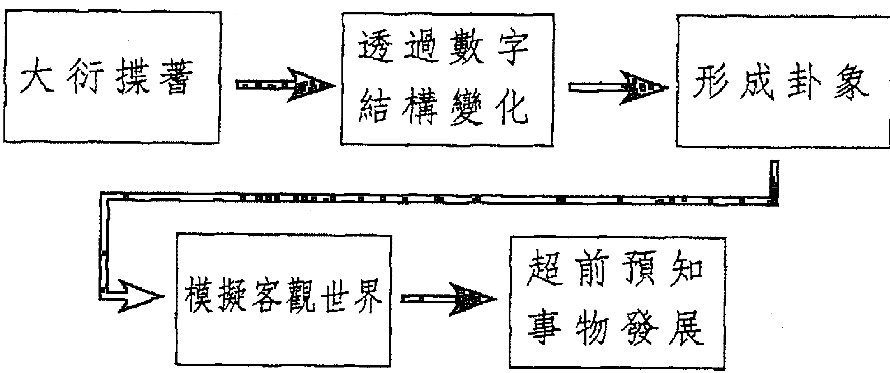

我們將徐志銳教授的解說繪成流程圖如下：

其中關鍵在卦象如何形成及模擬客觀世界。

徐志銳教授指出：

古代人類對大自然相當敬畏，因認識能力有限，對許多自然現象不能作出合理性的解釋，便認為有一種超自然力量存在。遇事不能決疑，便向鬼神發問，而卜筮就是溝通人類與鬼神關係的一種具體的手段。部落中聰慧人士或職司卜筮的神職人員，乃對自然界萬物萬事作長期的觀察與研究，因經驗累積，而逐漸瞭解和認識某些規律性的東西。《易經·繫辭傳》曾記載：「古者，伏羲氏之王天下也，仰則觀象於天，俯則觀法於地，觀鳥獸之文與地之誼，近取諸身，遠取諸物，於是始畫八卦，以通神明之德，以類萬物之情。」

上述說法，我們以簡單圖形表現如下：

> 「古者，伏羲氏之王天下也
> 仰則觀象於天
> 俯則觀法於地
> 觀鳥獸之文與地之誼
> 近取諸身
> 遠取諸物
> 於是，始畫八卦，以通神明之德，以類萬物之情」

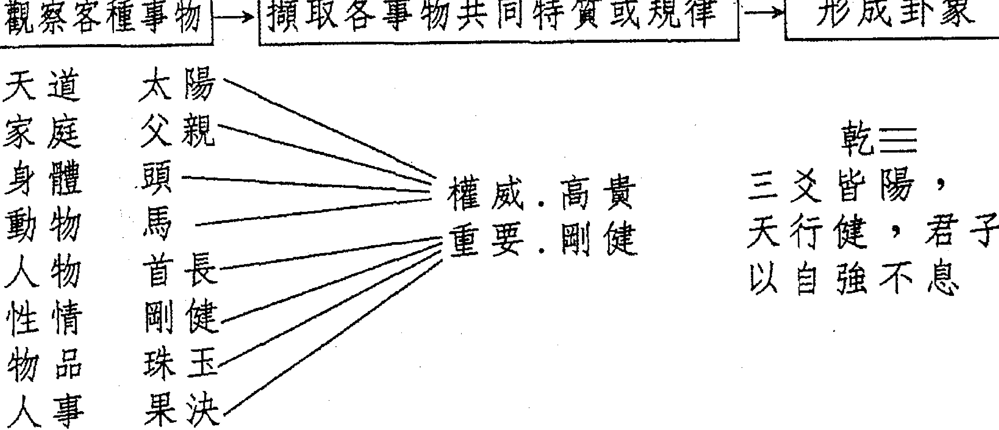

#### ※哲學的基本任務—認識世界和說明世界

八卦與六十四卦模型（<形象思維>）：聖人立象以盡意，設卦以盡其情偽。
世界圖式模型 → 模擬客觀世界 → 說明客觀世界（<邏輯思維>）：繫辭焉以盡其言，變而通之以盡利，鼓之舞之以盡神。
I 軍事沙盤推演：軍事演練 → 模擬實際戰爭狀況 → 說明可能變化及衍生吉凶。
II 澤水困（物不得其位之象）：卜運途。水在澤下，坎水漏於兌澤，應該將渴，坎水致有困渴。違展為上，願進時機與利，時事順待，事能靜，凡事不應策。

## 第二章 奇門遁甲的預測原理

哲學的基本任務，即在認識世界和說明世界。八卦模型或六十四卦模型先透過形象思維，（所謂「聖人立象以盡意，設卦以盡其情偽」）模擬客觀世界，從而得以邏輯思維，說明客觀世界，這就是「系辭焉以盡其說，變而通之以盡利，鼓之舞之以盡神。」簡單地說，我們教小孩子認識各種事物，最容易讓小孩子接受並加深印象的，就是圖說故事，圖好像卦象。又軍事沙盤推演也如图卦象，從而解說軍事狀況，模擬實際戰爭，說明可能變化及衍生吉凶，更能掌握住軍事任務狀況。

同樣地，我們在占卜時，假設求占運程，若經大衍揲蓍且透過數字結構變化而得澤水困卦象，水在澤下。本應在兌澤上面的坎水卻漏下去，以致水將乾涸，所以有困渴之困難。根據此意，就可超前預知事物發展，即凡事皆事與願違，不能順利進展，故應等待較好的時機為上策。易卜的原理就是如此。


奇門遁甲的占卜原理也套用易卜原理的模型，只不過易卜利用的工具及方法是大衍揲蓍，而奇門遁甲利用求占卜所抽時辰或隨機偶遇時間佈演天地人神盤，透過干支陰陽五行之生剋制化，及先後天八卦之象數，組合成奇儀天地盤及八門、九星、八詐門之垂象，據此來模擬客觀世界，從其模型隱含的全面訊息，進而超前預知事物發展。奇門遁甲占卜的原理流程，繪圖如下：

#### 奇門遁甲的占卜原理流程

| 定時、定局佈演天地人神四盤 | → | 透過干支陰陽五行之生剋制化及先天八卦象數 | → | 奇儀天地盤、八門、九星、八詐門之格局垂象 |
|---|---|---|---|---|
| 模擬客觀世界(隱含全息) | → | 超前預知事物發展 | | |

瑞士分析心理專家容格（Carl Jung）曾提出「同時性」理論（Synchronicity）描述「心理狀態與客觀事件間的非因果關係」，即日常生活常見心電感應之有意義的巧合，中國人常說：「說曹操，曹操到」之典型例證。容格的這項觀念假定了一時間的某一刻有某種性質存在，這種性質存在解釋了占卜原理的核心意義。

### 第二節：奇門遁甲的自然象數模型

奇門遁甲素來被稱為帝王之學，因歷代撥亂反正的人物常使用此術法，贏得輔佐美名。清乾隆時期編篡《四庫全書》收錄《遁甲演義》提要云：「於方技之中，最有理致」，它融合周易八卦、天文、律曆、陰陽五行學說於一體。其超前預知能力不遑多讓於占卜之王大六壬。大陸奇門名家張志春《神奇之門》將奇門遁甲的要義說明得很清楚：「它把天時、地利、人和與影響人類生產生活的某些能量場這四個方面，與時間、空間巧妙地組合在一起，按照陰陽消長，一年24節氣太陽對地球的影響，概括出陰遁9局、陽遁九局共18種基本格局，為我們提供了一個摹擬宇宙統一信息場的立體動態象數理模型，既可以用於預測自然、社會、人生各種各樣或然性和模糊性的事物，也可以向人們提供趨吉避凶的時空選擇。」

奇門遁甲的象數模型，我們先以一例圖2-1：農曆89年1月24日巳時說明：

天盤：奇儀、神盤、八詐、天盤、九星
人盤：八門、地盤、奇儀
時盤：陽六局、符首庚
坤死 庚癸 符任 時
兑惊 丁己 蛇冲
乾开 丙戊 阴辅
離 壬辛 天蓬
坤 乙乙 朱雀禽
坎休 辛壬 六合英
巽杜 戊丙地心
震伤 己丁 朱柱
艮生 癸庚 勾芮

圖2-1

圖2-1最基本的九宮圖形是洛書，其來源及意義如下：

#### （一）洛書：

洛書一詞最早出現《易·繫辭傳》：「河出圖，洛出書，聖人則之。」據傳大禹治水，神龜負書，出于洛水，故稱洛書。

> 《易·纂言》：「洛書者，禹治水時，洛出神龜，背之文，前九，後一，左三，右七，中五，前之右二，前之左四，後之右六，後之左八。以其文如字畫，而謂之書。禹則自其一至九之數，以敘洪範九時。」

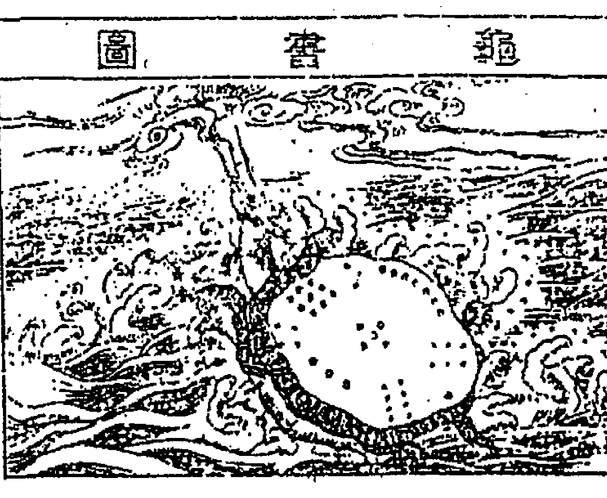
圖2-2

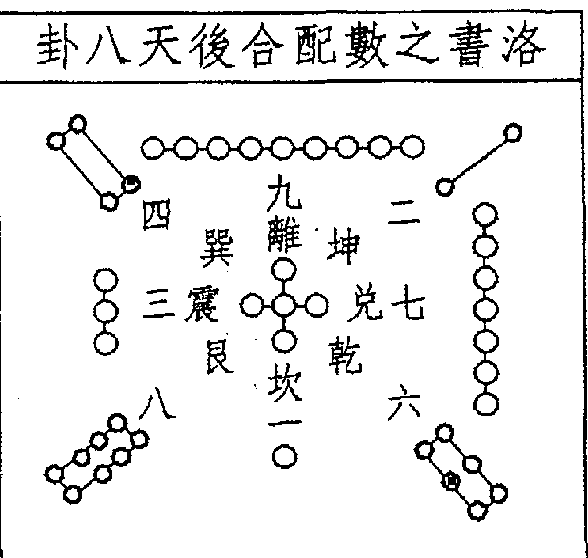
圖2-3

① 洛書九宮數分為奇偶，一九合十居正，三七合十居正，二八合十居偶，四六合十居偶，五獨居中，隱含奇偶（陰陽）互根之意。九宮以四正之陽數統四隅之陰數，其意義為陽統陰，強調變化與應用。

② 九宫中五的重要性如《易原》云：「天地生成之衝，變化之始也。」五為土，萬物生於土，後歸於土。凡有形質之物動植物和人，在生長過程皆離不開土，一旦死亡終久還復於土，故五能生、能成、能變、能化。五具備轉化的內涵，五即天心，立即於中。

洛書以五居中臨制四方，其八方相對合十，五者妙合媾精之所也。其妙用在氣機流行，而非洛書之死板方位，此即玄空之理。

③ 九宫图按隋·萧吉《五行大义》尚有五行，五色之分。
- 一宮，坎卦，五行為水，色白。
- 二宮，坤卦，五行為土，色黑。
- 三宮，震卦，五行為木，色碧。
- 四宮，巽卦，五行為木，色綠。
- 六宮，乾卦，五行為金，色白。
- 七宮，兑卦，五行為金，色赤。
- 八宮，艮卦，五行為土，色白。
- 九宮，離卦，五行為火，色紫。
- 又中宮，五行為土，色黃。

④ 洛書盡後天八卦之用，講氣運流行，以萬物化育中的生長收藏及其盛衰過程。如奇數屬陽，代表四季春夏秋冬和一日晝夜晨昏溫度和光線的變化。

三是震卦春溫，九是離卦夏熱，七是兑卦秋涼，一是坎卦冬寒；除此以晝夜言，三是代表黎明的光熱漸強，九代表正午光熱最強，七代表傍晚光熱漸弱，一代表深夜光熱最弱。偶數屬陰和月亮盈虧亦有關連，二是坤卦在西南，代表月之「朔（新月）」，四是巽卦在東南代表上弦，八是艮卦在東北，代表滿月，六是乾卦代表下弦。洛書之數字排列代表太陽、月亮、地球的周期運動以及四季變化和陰陽的消長關係及寒暑變化的時間、空間上的意義。

> 《煙波釣叟歌》云：「先須掌上排九宮，縱橫十五在其中。」

### （三）陰陽：

這個古老觀念的形成來自於古人對日月天象的觀察與認識。在古人看來，日懸掛在空中，光芒四射，大地明亮，就為「陽」；日被雲遮而光芒不見，大地昏暗，便稱為「陰」。陽光照射，使人感到溫暖。相對地，陰暗使人感到寒冷。這種自然界相對消長的陰陽屬性，在其他萬事萬物也見得到，如天與地、男與女、雌與雄、尊與卑、強與弱等等不勝枚舉。在發現相對性的事物之間，也存在著相互流轉、變化的特質而生生不息。也就是無論任何事物都有陰陽相對立而又統一的兩面，這種陰陽對立的相互作用和不斷運動，便成為宇宙萬物生成變化的原動力。《易繫辭傳》謂「一陰一陽之謂道」，把陰陽交替視為宇宙的根本規律。太極圖的構成就蘊涵它的意義。

古人在研究陰陽的變動演化時，即指出有兩個趨向，一是和順二是雜逆。古人已看到事物變化發展在內部有一規律，循規律而變，則陰陽和順，違反規律而行，則陰陽雜逆。整部易經即在闡述這項道理。

從古傳之「九九消寒圖」可瞭解在冬至交頭九，陰氣濃厚，天氣寒冷，但冬至一陽升，陽氣開始上昇，陰氣逐漸下降，所以冬至起，奇門遁甲使用陽遁；夏至陽氣盛極，天氣炎熱，但夏至陰昇，陰氣開始上昇，陽氣逐漸下降，所謂「夏至一陰生，冬至一陽生」的具體概念，奇門遁甲使用陰遁。

大陸學者田合祿根據土圭測日影導出原始實測太極圖，很清楚地顯示「夏至一陰生，冬至一陽生」的過程分別如下圖2-4、2-5、2-6、2-7。

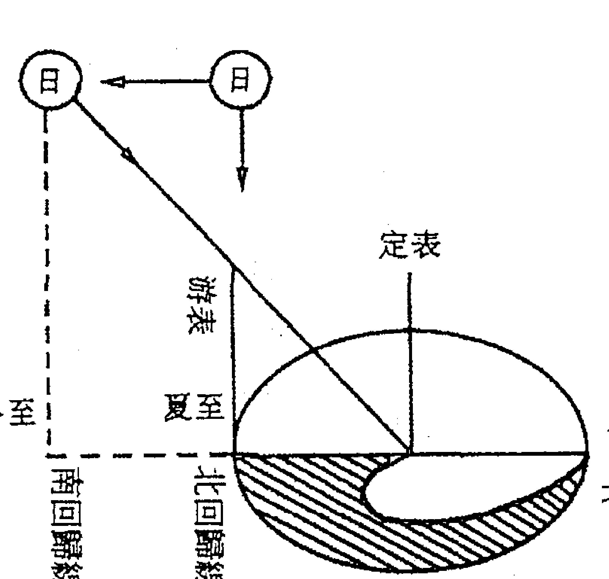
圖2-4 立竿測影示意圖
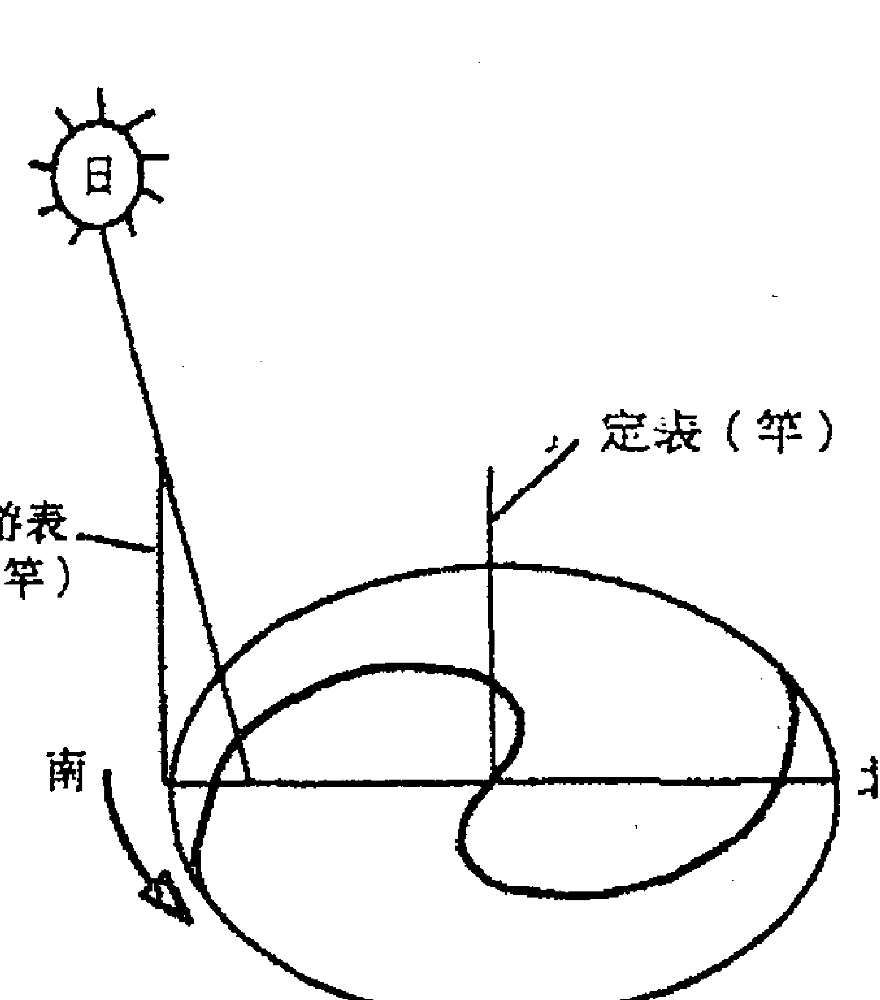
圖2-6 秋冬二季太陽視運動投影圖

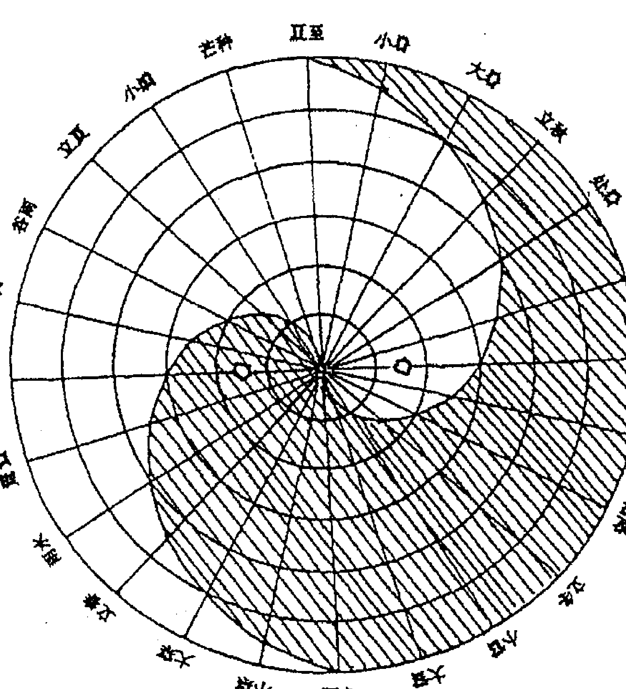
圖2-5 春夏二季太陽視運動投影圖
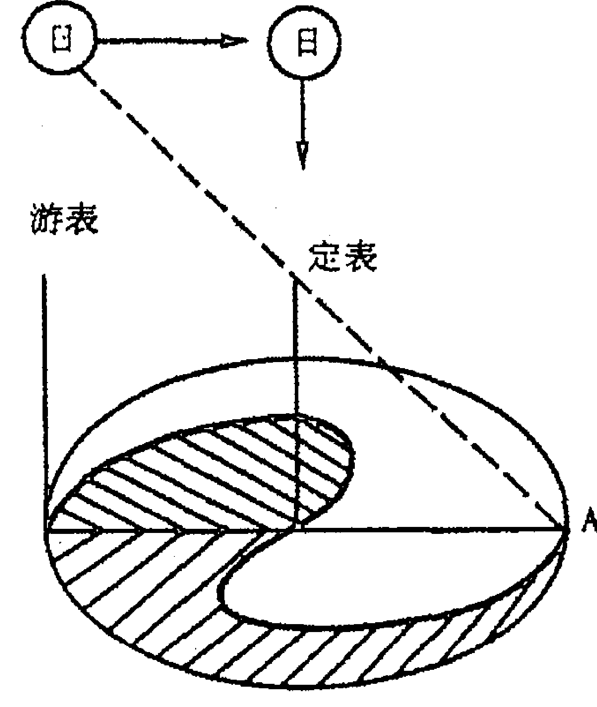
圖2-7 原始實測太極圖

> 《煙波釣叟歌》云：「陰陽順逆妙無窮，二至還鄉一九宮，若能了達陰陽理，天地都來一掌中」

#### （三）五行：

五行學說亦同陰陽學說一樣，是古代簡明樸素的辯證工具，是古人基於五行屬性之抽象概念，用來推演事物正常或異常變化的機理。

《尚書·洪範》記曰：「五行，一曰水、二曰火、三曰木、四曰金、五曰土；水曰潤下、火曰炎上，木曰曲直、金曰從革、土爰稼穡。」古人認為五行就是構成宇宙一切物質的基礎，就現代而言，宇宙的元素和能量可歸納為五大類，推衍到星體、氣候、氣象、五臟六腑、倫常、聲音、方位⋯⋯等方面，包含廣闊而周密。行的意義就是行氣、流行、行用。《尚書正義》「五行」疏曰：「謂之行者，若有天則五氣流行，在地世所行用也。」因為「行用」，可以推演事物變化的機理。五行間的變化包含了自我、生我、我生、我剋、剋我等五種形態，是以充分物質間及生態的互相連繫、互相調節控制的彼此互動關係。

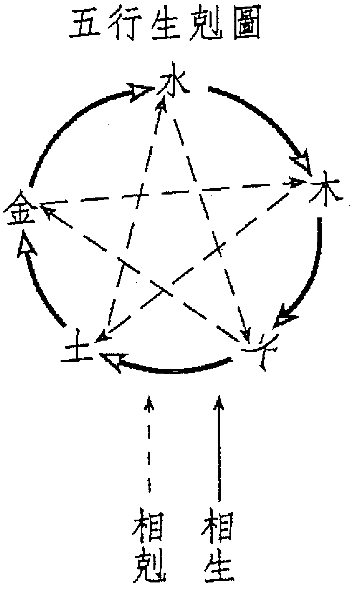

- 生：木生火、火生土、土生金、金生水、水生木。
- 剋：木剋土、土剋水、水剋火、火剋金、金剋木。

| 形態 | 我 | 生我(給我) | 我生(我洩) | 我剋(我拿) | 剋我(壓我) | 自我(奪我) |
|---|---|---|---|---|---|---|
| 木 | 水 | 火 | 土 | 金 | 金 |
| 火 | 木 | 土 | 金 | 水 | 水 |
| 土 | 火 | 金 | 水 | 木 | 木 |
| 金 | 土 | 水 | 木 | 火 | 火 |
| 水 | 金 | 木 | 火 | 土 | 土 |
| 名稱 | 印。蔭、保護 | 食傷。盜、洩 | 財。掌握、物質 | 官鬼。壓力、從眾 | 比劫。自我、分奪 |
| 六親 | 父母 | 子孫 | 妻財 | 官鬼 | 兄弟 |

五行相生相剋產生的五種形態，有其社會意義及六親涵意，因此占卜者透過五行觀念就能超前預知，所以讀者應細細咀嚼此五種形態之內涵。

- 生我：以木為我，則水生木，水為生我者；若以火為我，則木為生我者。因生我，給予我能量，助益於我，蔭庇我、保護我，爰其指引而能進取收穫。在社會意義上，凡一切人事物能撫養、護祐、照顧我者，即為生我者。在六親為父母、家長、伯叔姑姨、師長，與自身父母同輩或以上者皆同。
- 我生：以土為我，則土生金，金為我生者；以金為我，則金生水，以水為我生者。因我生，故我洩氣，我能量會減弱，我好像遭受脱盜般。我最怕剋我者，而我生者可加以解救，故我生者在某種意義上又擔任「救神」、「福神」的角色。例如以木為我，剋我者為金，但我生者為火，火可剋金，剋我者逢我生者不能逞威。凡一切人事物，由我所生，以我為源頭，我生者雖盜洩我氣，但也能剋制剋我者。六親中的兒女、子孫、媳婦、門生、徒弟、醫生、藥物、解憂等等都是。
- 我剋：以金為我，則金剋木，木為我剋者；以水為我，則水剋火，我剋者為火。我剋，代表我能掌握、控制，供我驅使、運用、支配，同時帶給我好處、利益。在社會意義上最足以代表此種形態的是錢財、物質、珠寶。在六親上則是妻財，廣而擴充則泛指女友、兄嫂、弟媳。

## 第二章 奇門遁甲的預測原理

剋我，以火為我，則水剋火，水為剋我者；以土為我，則木剋土，木為剋我者。因剋我，故帶給我緊張、壓力、痛苦，凡一切人事物，對我不利，對我有所剋害，或我相對付出心力才能取得者皆是。在社會意義上，官訟、憂疑、病痛、盜賊、丈夫、升官、功名等等，六親中的丈夫、及丈夫的兄弟、上司等皆足以代表。

比我，以金為我，則金與我相比，金為比我者；以木為我，則木與我相比，木為比我者。因比我，故同氣分奪，與我同輩、相對平行立場。凡一切人事物，其同輩者，不論有助或有害，形成對立關係者皆是。在社會意義上如合夥、結盟、競爭者等。在六親上，兄弟姊妹、舅子、同業、朋友等等皆是。

我們曾說過天干、地支也有五行屬性，故有上述五種形態，茲整理表列於后。

## 時盤奇門預測學

從上述分析，可知五行學說蘊含豐富的辯證意義。所以施凌雲教授對五行模式有下列看法：「從普通常態出發，簡單具體。科學中有兩個最著名的模式，即波爾原子模式和克拉克·沃森的DNA（脫氧核糖核酸）模式，每個模式對科學的進步都有很大影響。這兩個模式的優點就是簡單，只有簡單才能導致易變性和普通性，才能為一般人所接受。五行動態模式具有同樣的特點，但它們的潛力還沒有充分發揮出來。」他又說：「五行的相互關聯和相互作用，使得陰陽平衡和能量守恆定律呈現出一副完美的圖案。」「五行中的相生相剋，不但代表了宇宙中的生命力，而且把主宰人類世界的機能和生存的法則具體化了。這樣，五行模式從廣意說來，是宏觀世界和微觀世界的最簡單的動態模式。」

五行得令，則為旺為相；不得令則為休、為囚、為死。茲列表如下。

| 四季 | 春 | 夏 | 秋 | 冬 | 四季 |
|---|---|---|---|---|---|
| 木旺 | 火旺 | 金旺 | 水旺 | 土旺 | |
| 火相 | 土相 | 水相 | 木相 | 金相 | |
| 土死 | 金死 | 木死 | 火死 | 水死 | |
| 金囚 | 水囚 | 火囚 | 土囚 | 木囚 | |
| 水休 | 木休 | 土休 | 金休 | 火休 | |

春、夏、秋、冬僅指孟春、仲春（正月建寅、二月建卯），寅卯屬木，故木旺。孟夏、仲夏（四月建巳、五月建午），巳午屬火，故火旺。孟秋、仲秋（七月建申、八月建酉），申酉屬金，故金旺。孟冬、仲冬（十月建亥、十一月建子），亥子屬水，故水旺。而季春（三月建辰）、季夏（六月建未）、季秋（九月建戌）、季冬（十二月建丑）四季者，辰戌丑未屬土，故土旺。若現在屬木旺，因木生火，火為未來氣，故火為相；土為木旺氣所剋，故土為死；金可剋木，但木旺時，金為囚氣；水可生木，但水非本氣卻生木旺氣，水為休，故為休。其他四行之旺相休囚可依此分析。

因地球繞太陽一周為365日又1/4，若五行分配，約為下列：

| 立春後 | 立夏後 | 立秋後 | 立冬後 |
| :--- | :--- | :--- | :--- |
| 木旺<br>土旺<br>七十三日<br>十八又四分之一日 | 火旺<br>土旺<br>七十三日<br>十八又四分之一日 | 金旺<br>土旺<br>七十三日<br>十八又四分之一日 | 水旺<br>土旺<br>七十三日<br>十八又四分之一日 |

除了以四時五行的旺相休囚死的大原則來判斷五行的強弱外，另有陰陽干支的生死順逆設定，用以判斷十干歷經十二地支的強弱狀況。這是因五行間的生剋制化，以及自身生存發展暨時序遷移大自然環境新陳代謝的影響，而發生了十二個階段旺衰不同的變化。對於這種變化，五行學說依其旺衰程度的不同而給每階段一個適當的代名詞，稱為「長生、沐浴、冠帶、臨官、帝旺、衰、病、死、墓、絕、胎、養」等十二運程。

十二運程各別的意義如下：「長生」猶人之初出；「沐浴」猶人出生之後，沐浴去垢，因裸體常被聯想「敗」或「桃花」；「冠帶」猶人漸長而戴冠；「臨官」猶人成長茁壯，可以出仕做官，亦名「祿」；「帝旺」猶人壯盛之極，可以輔佐帝王出將入相，大有作為，但太過則成「刃」；物極必反，旺極必「衰」；衰了必「病」；病至最後難免要「死」；死了便埋進墳「墓」；一切生氣便「絕」，於是又重新受氣。氣續聚結而重新投「胎」，胎「養」於母親腹中，而復「長生」之另一歷程。生命就是這樣的周而復始，循環不已。

## 十干的十二長生運程整理如下表

| | 癸 | 壬 | 辛 | 庚 | 己 | 戊 | 丁 | 丙 | 乙 | 甲 | 天干/曆程 |
|---|---|---|---|---|---|---|---|---|---|---|---|
| 卯 | 申 | 子 | 巳 | 酉 | 寅 | 酉 | 寅 | 午 | 亥 | 長生 |  |
| 寅 | 酉 | 亥 | 午 | 申 | 卯 | 申 | 卯 | 巳 | 子 | 沐浴 |  |
| 丑 | 戌 | 戌 | 未 | 未 | 辰 | 未 | 辰 | 辰 | 丑 | 冠帶 |  |
| 子 | 亥 | 酉 | 申 | 午 | 巳 | 午 | 巳 | 卯 | 寅 | 臨官 |  |
| 亥 | 子 | 申 | 酉 | 巳 | 午 | 巳 | 午 | 寅 | 卯 | 帝旺 |  |
| 戌 | 丑 | 未 | 戌 | 辰 | 未 | 辰 | 未 | 丑 | 辰 | 衰 |  |
| 酉 | 寅 | 午 | 亥 | 卯 | 申 | 卯 | 申 | 子 | 巳 | 病 |  |
| 申 | 卯 | 巳 | 子 | 寅 | 酉 | 寅 | 酉 | 亥 | 午 | 死 |  |
| 未 | 辰 | 辰 | 丑 | 丑 | 戌 | 丑 | 戌 | 戌 | 未 | 墓 |  |
| 午 | 巳 | 卯 | 寅 | 子 | 亥 | 子 | 亥 | 酉 | 申 | 絕 |  |
| 巳 | 午 | 寅 | 卯 | 亥 | 子 | 亥 | 子 | 申 | 酉 | 胎 |  |
| 辰 | 未 | 丑 | 辰 | 戌 | 丑 | 戌 | 丑 | 未 | 戌 | 養 |  |

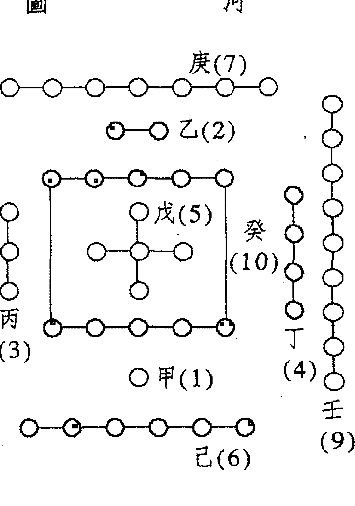

## 十干之化合

十干之化合源自河圖（如圖），一、二、三、四、五是生數；六、七、八、九、十是成數，又稱五行生成數，故天干中的陽干陰干，按順序隔五相合。如甲一、乙二、丙三、丁四、戊五、己六、庚七、辛八、壬九、癸十，依序配合河圖之象，「天一生水，地六成之」，故甲與己合；「地二生火，天七成之」，故乙與庚合；「天三生木，地八成之」，故丙與辛合；「地四生金，地九成之」，故

## 十二支六合

六合源自木星之運行，太歲在子則木星在丑，則木星在子，故子丑合；太歲在寅則木星在亥，太歲在亥，則木星在寅，故寅亥合；太歲在卯，則木星在戌，太歲在戌，則木星在卯，故卯戌合；太歲在辰，則木星在酉，太歲在酉，則木星在辰，故辰酉合；太歲在巳，則木星在申，太歲在申，則木星在巳，故巳申合；太歲在午，則木星在未，太歲在未，則木星在午。故午未合。

## 六合（平行關係）

| 合水（冬） | 巳 | 午 | 未 | 申 |
| :--- | :--- | :--- | :--- | :--- |
| 合金（秋） | 辰 | 酉 | | |
| 合火（夏） | 卯 | 戌 | | |
| 合木（春） | 寅 | 丑 | 子 | 亥 |
| （合土） | | | | |

註：除子丑合土、午未合火外，其餘可以按春、夏、秋、冬之木、火、金、水次序記憶。

## 十二支三會方

寅卯辰各屬孟春、仲春、季春，三者會聚一方，形成寅卯辰東方木，其力甚強，其他如巳午未會成南方火，申酉戌會成西方金，亥子丑會成北方水，亦同。

### 三会（方局）

| 三会木局 | | 三会火局 | | 三会金局 | | 三会水局 | |
|---|---|---|---|---|---|---|---|
| 寅 | 卯 | 巳 | 午 | 申 | 酉 | 亥 | 子 |
| 辰 | | 未 | | 戌 | | 丑 | |

## 十二支三合局

根據十二長生運程，以各五行之長生、帝旺、墓庫三者聯結成局，力量甚強。如水長生在申、帝旺於子，歸庫於辰，故申子辰結合成水局；木長生在亥、帝旺於卯、歸庫於未，故亥卯未結合成木局；又如火長生在寅、帝旺於午、歸庫於戌，故寅午戌結合成火局；還有金長生於巳、帝旺於酉、歸庫於丑，故巳酉丑結合成金局，至於辰戌丑未四庫，理所當然自成土局。

##### 三合（三角關係）

| 巳 | 午 | 未 | 申 |
|---|---|---|---|
| 辰 | | 酉 | |
| 卯 | | 戌 | |
| 寅 | 丑 | 子 | 亥 |

- 巳酉丑三合金局
- 申子辰三合水局
- 亥卯未三合木局
- 寅午戌三合火局
- 辰戌丑未成土局

## 十二支相刑

其本義就是自刑而相殘，與五行同類之競爭有關，正如同人事上之妒嫉爭競一般。其產生源自三會方與三合局之自形相殘。《陰符經》：恩生於害，害生於恩。三刑生於三合。

| 三會 | 三合 |
|---|---|
| 寅卯辰 | 申子辰 |
| 巳午未 | 寅午戌 |
| 申酉戌 | 巳酉丑 |
| 亥子丑 | 亥卯未 |
| 刑為看橫 | |

（相剋順序）
水↓火↓金↓木
金剛火強，自刑其方
木落歸本，水流趨東

木↓火↓金↓水
（季節相生順序）

- A申刑寅、寅刑巳、巳刑申—無恩之刑。
- B戌刑未、未刑丑、丑刑戌—恃勢之刑。
- C子刑卯、卯刑子—無禮之刑。
- D辰刑辰、午刑午、酉刑酉、亥刑亥—自刑。

## 十二支相沖

地支取七位為沖，其相沖之兩支成180°相對立，其中除了辰戌與丑未兩組相沖為土沖土之外，其餘皆屬性能極端相反的五行產生爭戰，如子水與午火相沖戰；寅木與申金沖戰；卯木與酉金沖戰；亥水與巳火沖戰。

| 六甲 | 甲子 | 甲戌 | 甲申 | 甲午 | 甲辰 | 甲寅 |
|---|---|---|---|---|---|---|
| 二 | 乙丑 | 乙亥 | 乙酉 | 乙未 | 乙巳 | 乙卯 |
| 三 | 丙寅 | 丙子 | 丙戌 | 丙申 | 丙午 | 丙辰 |
| 四 | 丁卯 | 丁丑 | 丁亥 | 丁酉 | 丁未 | 丁巳 |
| 五 | 戊辰 | 戊寅 | 戊子 | 戊戌 | 戊申 | 戊午 |
| 六 | 己巳 | 己卯 | 己丑 | 己亥 | 己酉 | 己未 |
| 七 | 庚午 | 庚辰 | 庚寅 | 庚子 | 庚戌 | 庚申 |
| 八 | 辛未 | 辛巳 | 辛卯 | 辛丑 | 辛亥 | 辛酉 |
| 九 | 壬申 | 壬午 | 壬辰 | 壬寅 | 壬子 | 壬戌 |
| 十 | 癸酉 | 癸未 | 癸巳 | 癸卯 | 癸丑 | 癸亥 |
| 空亡 | 戌亥 | 申酉 | 午未 | 辰巳 | 寅卯 | 子丑 |

十天干，十二地支組成60甲子，共六個旬，每旬皆有空亡。如左表：

##### 六沖（對角關係）

| 巳亥沖 | 辰戌沖 | 卯酉沖 |
|---|---|---|
| 寅申沖 | 丑未沖 | 子午沖 |

讀者應瞭解十二地支與洛書九宮的關係，即子、午、卯、酉在四正，丑、寅、辰、巳、未、申、戌、亥在四隅如圖2-8。

| 辰巳 | | 午 | | 未申 |
|---|---|---|---|---|
| 卯 | | | | 酉 |
| 寅丑 | | 子 | | 亥戌 |

圖2-8

## （四）九星

九星者：天蓬、天芮、天沖、天輔、天禽、天心、天柱、天任、天英，按洛書九宮飛泊順序，因而其九宮九星之基本配置。

九星同洛書九宮之數同，並具八卦之象，其各星按其八卦配置，同五行屬性，即周圍八星與八卦相值，每星同一卦之象，九星位置若轉移，其卦象五行不變，如天蓬屬坎卦，五行為水，天蓬因陰陽遁局不同，而轉到坤二宮。天蓬仍屬水、坎卦之象，其他各星皆如此。

位於中宮之天禽星則具坤象，因中五寄坤之理，此即《煙波釣叟歌》「取九宮為九星」之語。

天盤九星北斗七星及輔佐二星，代表北斗星在古代星官系統名稱不同，如洛書曰：北斗魁第一天樞，第二天璇，第三天璣，第四天權，第五玉衡，第六開陽，第七搖光。北斗居於乾方。前四星曰魁斗為帝車。後三星曰杓，魁斗為璇璣，杓為玉衡，斗杓乃第七星破軍（搖光）。

| 天輔 | 天英 | 天芮 |
|---|---|---|
| 天沖 | 天禽 | 天柱 |
| 天任 | 天蓬 | 天心 |

北斗九星圖

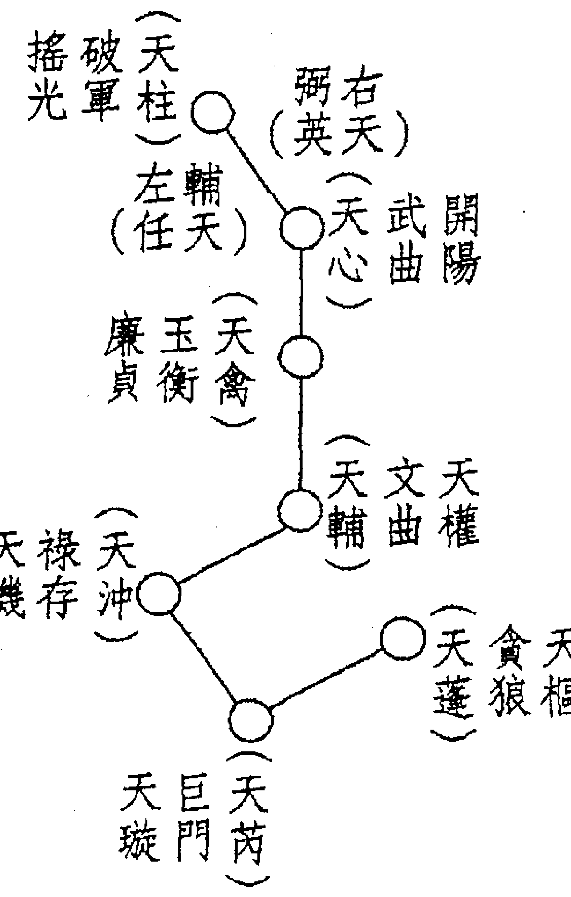

我國在上古時代即已知北斗為天體中心，且觀察測星斗柄所指以定時曆。《鶡冠子·環流》云：「斗柄東指，天下皆春；斗柄南指，天下皆夏；斗柄西指，天下皆秋；斗柄北指，天下皆冬。」易學家曹升說：「中國古代已知宇宙為一個有機體，此有機體以太一為中心，而以北斗為樞紐。譬如太一為發電機，而北斗為變電所，如以太一為上帝之腦，則北斗為上帝之手，創造宇宙萬有，支配各星球之運動與進化，故知宇宙之能力乃有根源，有重心，有最高權力，有機體組織，有自然秩序。」可見北斗的重要性。

九星各有所主及對應，透過洛書九宮八卦象意，陰陽五行來推衍。

## （五）八門

八門者：休門、生門、傷門、杜門、景門、死門、驚門、開門之順序，將休門配於坎宮，其餘依次循順時針配置之。每門與一卦相值，具一卦之象，八門位置若轉移，其卦象五行不變，如休門屬坎卦，五行為水，休門因陰陽遁不同，轉到震三宮，休門仍屬水，其他各門皆如此。

八門之來源有二，其一是八卦的變形，即仿八卦之名，而表徵八種狀態。因具八卦特性，故能聯繫陰陽五行，而得以推衍萬物萬事；其二是古代軍事觀念的運用。明·羅貫中《三國演義》第84回生動地描述東吳將領陸遜受困於諸葛孔明巧佈之八陣圖，後由孔明岳父黃承彥不忍殺伐，帶領出陣，向陸遜說明，此八陣「反覆八門，按遁甲休、生、傷、杜、景、死、驚、開。每日每時變化無端，可比十萬精兵。」八陣圖顯然與八門有關。我們前述及東漢、魏晉，尚未有具體之奇門遁甲理論，故八陣之概念非源於八門，反倒是八門因軍事八陣之設而得以逐漸蘊釀形成。

## （六）八詐神又稱八神

八詐神指陰符八詐：直符、螣蛇、太陰、六合、勾陳（白虎）、朱雀（玄武）、九地、九天。陽遁順佈，陰遁逆轉。

「陰符」之名歷來常與軍事相關，如《黃帝陰符經》常是兵家註解之重要經典。奇門遁甲的重要書籍《諸葛武侯奇門遁甲全書》首篇就收錄唐代軍事名家李筌註解之《黃帝陰符經》。詐之意即是權謀使詐，這是兵家相當重視之策略。《遁甲演義》卷二之「天乙直符吉凶神說」約略提及其意義，頗多軍事意義。我們整理如下：

- 直符為天乙之神，事急宜從此方而出，以擊對衝，此為急則從神之謂。
- 螣蛇為虛詐之神，出此方者，多主精神恍惚，夢寐垂張，若得奇門會合之方，則不忌。
- 太陰為陰佑之神，可以履符、禁敵、閉城、藏兵。人有急難，可從此方避之，免其禍患。
- 六合為護衛之神，可以埋伏、抵搪、隄防不測。人有急事，宜於此方避之，免其害。
- 白虎為凶惡之神，可以防備盜賊兵偷營劫寨。若得奇門會合之方，不可以此為忌。
- 玄武為小盜之神，可以隄防姦細窺探軍情，若得奇門會合之方，不可以此為忌。
- 九地為堅牢之神，可以屯兵、固守、保障城池，善守者，藏於九地之下。
- 九天為威捍之神，可以揚兵、佈陣、吶喊、搖旗。孫子曰：「善戰者，動於九天之上。」

奇門遁甲的自然象數模型，就以洛書九宮為基礎，含蓋三奇六儀、八門、八神，模擬宇宙全息。《四庫全書總目》卷109在明程道生所撰《遁甲演義》提要云：「其法以九宮為本，緯以三奇六儀、八門、九星、視其加臨之吉凶，以為趨避。」意即奇門遁甲以洛書九宮為基礎。與八卦陰陽五行學說結合，因八卦、陰陽、五行，都有萬事萬物之對應關係，從而構成之天地人神盤諸要素亦有對應之事態物象，其排列組合形成垂象，若能適當解象，當然能超前預知事物之發展，從而能預測，以利趨吉避凶。有關三奇六儀、九星、八門、八神之事態物象解說，我們在第4章作詳細充份的說明。

## 第三章 排盤步驟詳述

## 時盤排盤七項步驟

時盤是奇門遁甲各家奇門中最重要的，因各家奇門排盤步驟都相同，只不過是定時及定局之原理不同而已，故懂得時盤之排盤步驟，它家奇門之方式都可比擬。

時盤排盤七項步驟如下：

- 一、定時——以地方平時和真太陽時差計算結果為準
- 二、定局——陽遁九局，陰遁九局
- 三、佈地盤三奇六儀——乙、丙、丁、戊、己、庚、辛、壬、癸
- 四、佈天盤三奇六儀——乙、丙、丁、戊、己、庚、辛、壬、癸
- 五、佈九星——天蓬、天芮、天沖、天輔、天禽、天心、天柱、天任、天英
- 六、佈八門——休門、生門、傷門、杜門、景門、死門、驚門、開門
- 七、佈八詐神——直符、螣蛇、太陰、六合、勾陳（白虎）、朱雀（玄武）、九地、九天

## 第一節：定時

時盤的定時，可按奇門遁甲之使用而不同，如預測占卜時，則以心機靈動時之時間，即所謂觸機。如擇日或趨避，則可選擇定時。不管任何用途之定時，是以地方經度為準的，再考慮真太陽時差。由於目前所使用之時間都是以世界標準時區之鐘表時間。台灣地區屬中原標準時間以東經120°為中心，但從台灣各地區主要城市之經度幾都偏離東經120°，如台北為東經121°31'、澎湖119°33'。故當時說：「現在是中原標準時間9:00」，台北之地方平時為9時6分4秒，澎湖之地方平時為8時58分12秒。地方平時的算法如下：

以東經120°為中心，大於120°則地方平時較標準時間為快，若小於120°則地方平時較標準時間為慢。

- 1時有15°（度）
- 15°（度）= 60分鐘
- 1°（度）= 4分鐘
- 1°（度）= 60'（分度）
- 1'（分度）= 4秒
- 1'（分度）= 60"（秒度）

第三章 排盘步骤详述

除了考慮地方經度為主之地方平時外，尚須考量真太陽時差。所謂真太陽時差，是鐘表時和真太陽在地球經度真太陽時之差距，由於地球繞著太陽運行系橢圓形運動，非圓形運動，故隨著遠日點和近日點，地球運行之時間會快慢不一，非鐘表時假設之圓形均勻運動，故鐘表時和真太陽時必然多少有差異。

| 澎湖 | 中原標準時區經度 | 台北 |
|---|---|---|
| 119°33' | 120° | 121°31' |
| 地方平時上午8時58分12秒 | 中原標準時間上午9時整 | 地方平時上午9時6分4秒 |

119°33' - 120° = -27'
- 27' = - 1分48秒

121°31' - 120° = 1°31'
1° = 4分
31' = 2分4秒
1°31' = 6分4秒

#### 例二：國曆2月19日定時

中原標準時間
上午9時

| 項目 | 澎湖 | 台北 |
| :--- | :--- | :--- |
| 經度 | 119°33' | 121°31' |
| 地方平時 | 8時58分12秒 | 9時6分4秒 |
| 真太陽時差 | -13分58秒 | -13分58秒 |
| 定時結果 | 8時44分14秒 | 8時52分6秒 |

#### 例三：國曆11月19日定時

中原標準時間
上午9時

| 項目 | 澎湖 | 台北 |
| :--- | :--- | :--- |
| 經度 | 119°33' | 121°31' |
| 地方平時 | 8時58分12秒 | 9時6分4秒 |
| 真太陽時差 | +14分43秒 | +14分43秒 |
| 定時結果 | 9時12分57秒 | 9時20分47秒 |

如每年國曆11月19日，地球較近近日點運行，時間較快，故真太陽時會比鐘錶時快約14分43秒，而每年國曆2月19日地球較近遠日點運行，時間較慢，故真太陽時會比鐘錶時慢約13分58秒。奇門遁甲的象數模型，反映宇宙天文的運作，故當以真太陽時為準，所以定時就須以真實的（非人為的鐘錶時）太陽時，經由上述說明，定時乃以地方平時時加上真太陽時之結果為劃分時辰之標準。我們以例二及例三說明。

計算完地方平時和真太陽時差所得之結果，就可按古代每兩個小時為一時辰，如左圖來查定時之時支。

| 時辰 | 時間範圍 |
| :--- | :--- |
| 子 | 自下午11時至上午1時 |
| 丑 | 自上午1時至上午3時 |
| 寅 | 自上午3時至上午5時 |
| 卯 | 自上午5時至上午7時 |
| 辰 | 自上午7時至上午9時 |
| 巳 | 自上午9時至上午11時 |
| 午 | 自上午11時至下午1時 |
| 未 | 自下午1時至下午3時 |
| 申 | 自下午3時至下午5時 |
| 酉 | 自下午5時至下午7時 |
| 戌 | 自下午7時至下午9時 |
| 亥 | 自下午9時至下午11時 |

從例二，如按中原標準時間上午9時，如果在台北求奇門遁甲定時，應是巳時，但若詳細地方平時及真太陽時差後，則是辰時，依巳時和辰時所得之奇門遁甲時盤必有差異，所以定時須慎重，尤其在時頭時尾須計算精確，方不致發生錯誤。

## 時盤奇門預測學

## 第二節：定局

奇門遁甲定局至關重要，但術家所本各有所宗，所以從古至今眾說紛紜，莫衷一是。定局一般可分成①超接置閏法、②拆補法、③茅山道人所創之法。定局的這三種方法都從節氣的夏至、冬至分別起陰遁及陽遁，我們從圖3-1

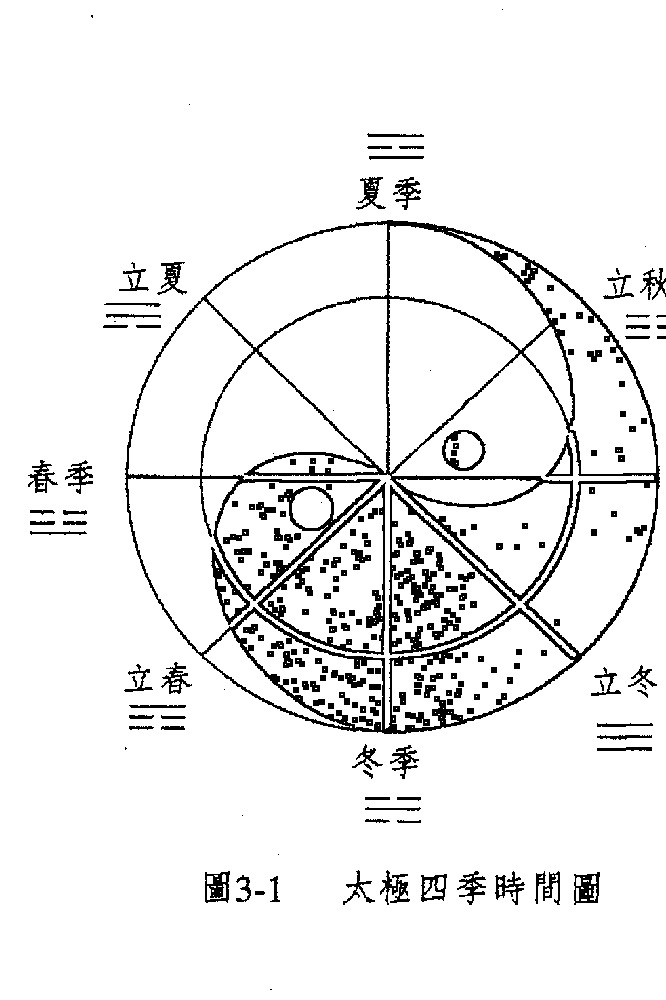

## 第三章 排盤步驟詳述

上述之意即煙波釣叟歌中之「次將八卦論八節，一氣統三為正宗。」彙總成

> 「冬至小寒及大寒，天地人元一二三。立春雨水并驚蟄，依艮順增八九一。春分清明并穀雨，震宮處起三四五。立夏小滿芒種氣，四五六兮順數看。夏至小暑與大暑，九八七兮逆數連。立秋處暑并白露，二一至九仔細研。秋分寒露及霜降，七六五兮遞減玩。立冬小雪并大雪，六五四兮陰遁完。」

此圖有如一個大規模的情報系統，太極圖可以說是隨著季節月、日推移生物產生變化的縮影，遠古時代古人立竿測日影以辨四方，冷熱產生，是一種原始天文圖，前節已將原始實測過程列出。當地球繞著太陽公轉產生節氣，是地球四時變化的標誌，其中二分、二至、四立之變化最為明顯，此八節即有八卦之意。每卦各統三個節氣中的第一個節氣。因每卦統三個節氣，一個節氣統三元即三候，根據三元八節起例歌訣：

**圖3-2**

#### 圖3-2 陰陽二遁定局總圖

- 上元
  - 甲子
  - 甲午
  - 己卯
  - 己酉
- 中元
  - 甲寅
  - 甲申
  - 己巳
  - 己亥
- 下元
  - 甲辰
  - 甲戌
  - 己丑
  - 己未

根據冬至一陽生，夏至一陰生之道理，冬至節後起用陽遁，夏至節後起用陰遁。每一節氣統三元，凡一年有二十四節氣，每氣約十五日，五日為一元，十五日統上、中、下三元，又一元五日計六十時辰，六十時辰成一局，每以甲己日作為符頭，符頭所臨地支遇子午卯酉為上元，寅申巳亥為中元，辰戌丑未為下元。

此段所述即煙波釣叟歌中「陰陽二遁分順逆，一炁三元人莫測。」

從圖3-2，冬至上中下元定局分別是一、七、四，而小寒則為二、八、五，有何道理呢？

大陸趙漢雄的研究寫出《奇門遁甲用局表的應用原理》一文值得參考，根據其意，六十時一局，因地盤共九宮，值使走九步必回到原宮，第10步才移出一宮，六十變中共有6次移宮，必從原宮位移出6宮。陽遁順行 1+6=7，所以陽一局，接下來應該是陽七局，繼陽七局之後必是陽四局（7+6=13，尾數為4）。而陰遁，夏至陰九局逆行，所以接下來必是9-6=3即陰三局，繼陰三局之後必是3+9-6=6，即陰六局。

由於地球繞太陽公轉一年約365.2422日，其公轉軌道為橢圓形，當地球在遠日點及近日點，其運行速度不同。若按「定氣」即地球實際運行之視太陽黃道經度360°，共24節氣，每節氣15°，其時間長度並非完全等同，如表3-1。

#### 《日距均平表氣節四十二》

| 季 | 日距 | 月均平日 | 氣節均平日 | 氣節差距 | 氣節 | 令月 |
| :--- | :--- | :--- | :--- | :--- | :--- | :--- |
| 春 | 90日17時06分(90.7125日) | 29.761日 | 14.833日 | 14日20時0分 | 雨水至立春 | 寅月 |
| | | | 14.927日 | 14日22時16分 | 驚蟄至雨水 | 寅月 |
| | 30.215日 | 15.044日 | 15日1時3分 | 春分至驚蟄 | 卯月 |
| | | | 15.172日 | 15日4時7分 | 清明至春分 | 卯月 |
| | 30.736日 | 15.304日 | 15日7時18分 | 穀雨至清明 | 辰月 |
| | | | 15.432日 | 15日10時22分 | 立夏至穀雨 | 辰月 |
| 夏 | 94日00時31分(94.0215日) | 30.184日 | 15.547日 | 15日13時7分 | 小滿至立夏 | 巳月 |
| | | | 15.638日 | 15日15時18分 | 芒種至小滿 | 巳月 |
| | 31.433日 | 15.702日 | 15日16時51分 | 夏至至芒種 | 午月 |
| | | | 15.731日 | 15日17時32分 | 小暑至夏至 | 午月 |
| | 31.405日 | 15.723日 | 15日17時21分 | 大暑至小暑 | 未月 |
| | | | 15.682日 | 15日16時22分 | 立秋至大暑 | 未月 |
| 秋 | 91日20時44分(91.8638日) | 31.111日 | 15.606日 | 15日14時33分 | 處暑至立秋 | 申月 |
| | | | 15.505日 | 15日12時7分 | 白露至處暑 | 申月 |
| | 30.638日 | 15.384日 | 15日9時13分 | 秋分至白露 | 酉月 |
| | | | 15.253日 | 15日6時5分 | 寒露至秋分 | 酉月 |
| | 31.115日 | 15.119日 | 15日2時52分 | 霜降至寒露 | 戌月 |
| | | | 14.996日 | 14日23時54分 | 立冬至霜降 | 戌月 |
| 冬 | 88日15時28分(88.6444日) | 29.692日 | 14.889日 | 14日21時20分 | 小雪至立冬 | 亥月 |
| | | | 14.803日 | 14日19時16分 | 大雪至小雪 | 亥月 |
| | 29.464日 | 14.745日 | 14日17時53分 | 冬至至大雪 | 子月 |
| | | | 14.719日 | 14日17時15分 | 小寒至冬至 | 子月 |
| | 29.489日 | 14.725日 | 14日17時24分 | 大寒至小寒 | 丑月 |
| | | | 14.764日 | 14日18時20分 | 立春至大寒 | 丑月 |
| | 計365.227日 | | | | | |

表中，小暑至大暑15.702日，而小寒至大寒14.725日，並非剛好等於5日一元、15日三元，因此時間推移當會累積或減少，就產生符頭與節氣之差異，因而必須在一段時間後予以調整。持這種看法的就是置閏派定局法，而持拆補法的，認為不須調整。由於置閏法和拆補法兩者之定局法差異甚大，我們詳細說明於后：

##### A. 置閏法：

置閏法需先瞭解幾個專有名詞：

1. 超神：符頭先到，節氣後到。
   > 例：農曆民國89年1月15日雨水丁未日，但其符頭甲辰日卻是在1月12日即已出現，此為超神。由於1/12日仍在立春節內，甲辰符頭為下元，查圖3-2立春下元為陽二局，故從甲辰、乙巳、丙午、丁未、戊申等日定局，皆須以立春下元陽二局定局。
2. 正授：符頭與節氣同到。
   > 例：農曆89年5月4日芒種、甲午日，芒種節正好與符頭甲午日相同，此即正授。查圖3-2甲午日為上元，芒種上元為陽六局，故5/4日定局為陽六局。
3. 接氣：節氣先到，符頭後到。
   > 例：農曆89年3月1日癸巳清明節，而3月2日甲午符頭比節氣後到，此即接氣。3/2日甲午之定局，查圖3-2甲午上元，清明上元為陽四局。
4. 置閏：超神超過九天以上，重複一次芒種或大雪的局數，使超神變成接氣。

置閏的產生，是因大多數情況，上元符頭在節氣之前，即超神情況較多。有時只有一、二天，有時四、五天，最多可達九天以上。當上元符頭超過節氣九天的時候，就要置閏調整了。

> 例：農曆90年11月8日己未日冬至，但上元符頭己酉日卻落在10月28日，從此日開始起算至冬至共距離十天，符合置閏條件，故在冬至前、大雪後由己酉日起十五天，再重複一次大雪四、七、一上中下元之定局。

| 日期 | 局數 | 干支 |
| :--- | :--- | :--- |
| 10/28 ~ 11/8 | 4 / 7 / 1 | 己酉、庚戌、辛亥、壬子、癸丑、甲寅、乙卯、丙辰、丁巳、戊午、己未 |
| 11/9 ~ 11/22 | 1 | 庚申、辛酉、壬戌、辛亥 |

置閏法定局相當重要，一直是歷年奇門遁甲家所重視，《煙波釣叟歌》云：「五日都來換一元，接氣超神為準的。」即強調置閏法定局的重要。我們附超神接氣置閏訣如下：

> 「閏奇自有玄妙訣，先賢不肯分明説。甲己二字號符頭，子午卯酉上局設。寅申巳亥中局求，辰戌丑未下元節。節通符頭符通節，閏積調氣為準則。節前得符謂之超，節後得符謂之接。有時超過九日上，便當置閏展妙訣。要知置閏在何時，端在芒種與大雪。超神接氣若能明，方算確解奇門訣。」

置閏法雖重要，但因術家私心及傳承不同，置閏法在操作上卻可能得到不同之結果，而頗有爭論。如也有人認為當接氣超過5天也須置閏，因而各家編奇門遁甲萬年曆，以置閏法定局卻編製出不同局數，讓人無法適從。又置閏法明顯地有人為因素，違反了奇門遁甲象數模型遵循自然法則之意涵。因而有人提倡不置閏，其中較流行且普遍被接受的是「拆補法」。

##### B. 拆補法：

仍將上、中、下三元同在一個節氣之中，也遵循六十甲子循環中子午卯酉為上元，寅申巳亥為中元，辰戌丑未為下元，但祇要一進入交節氣時辰，就改用這個節氣規定的定局如圖3-2，因出現拆解補足之現象，故稱為拆補法。

《景祐遁甲符應經》論超神接氣拆局補局時就已提到拆補法，但並沒有得到廣泛影響，甚至註解時云：「置閏較拆局補局合理，緣節氣遲早不一，然符頭有定。」

拆補法的實例，我們錄自張志春《神奇之門》之例說明，並加以圖解，並比較若以置閏法定局有何差異。

例：陽曆公元1996年2月份的用局

| 陽曆 | 陰曆 | 干支 | 拆補法定局 | 置閏法定局 |
| :--- | :--- | :--- | :--- | :--- |
| 1/12 | 12/2 | 大寒 | | |
| 1/28 | 12/9 | 甲子 | 陽3局 | 陽3局 |
| 1/29 | 12/10 | 乙丑 | 陽3局 | 陽3局 |
| 1/30 | 12/11 | 丙寅 | 陽3局 | 陽3局 |
| 1/31 | 12/12 | 丁卯 | 陽3局 | 陽3局 |
| 2/1 | 12/31 | 戊辰 | 陽3局 | 陽3局 |
| 2/2 | 12/14 | 己巳 | 陽9局 | 陽9局 |
| 2/3 | 12/15 | 庚午 | 陽9局 | 陽9局 |
| 2/4 | 12/16 | 辛未 | 陽9局 | 陽9局 |
| 2/5 | 12/17 | 壬申 | 陽5局 | 陽5局 |
| 2/6 | 12/18 | 癸酉 | 陽5局 | 陽5局 |
| 2/7 | 12/19 | 甲戌 | 陽2局 | 陽6局 |
| 2/8 | 12/20 | 乙亥 | 陽2局 | 陽6局 |
| 2/9 | 12/21 | 丙子 | 陽2局 | 陽6局 |
| 2/10 | 12/22 | 丁丑 | 陽2局 | 陽6局 |
| 2/11 | 12/23 | 戊寅 | 陽2局 | 陽6局 |
| 2/12 | 12/24 | 己卯 | 陽8局 | 陽8局 |
| 2/13 | 12/25 | 庚辰 | 陽8局 | 陽8局 |
| 2/14 | 12/26 | 辛巳 | 陽8局 | 陽8局 |
| 2/15 | 12/27 | 壬午 | 陽8局 | 陽8局 |
| 2/16 | 12/28 | 癸未 | 陽8局 | 陽8局 |
| 2/17 | 12/29 | 甲申 | 陽5局 | 陽5局 |
| 2/18 | 12/30 | 乙酉 | 陽5局 | 陽5局 |

註：21時08分立春後
註：17時01分雨水後

拆補法的最大特色在於交入節氣時辰起，即按陰陽二遁定局而換局。如本例公元1996年2月4日(農曆84年12月16日)立春時刻21時08分，在立春當天，從子時起至下午21時08分止，定局仍用陽9局，但從21時08分至次日午時改換用立春節中元陽5局(因辛未日屬己巳日中元)，接下來壬申日、癸酉日皆使用陽5局。而陽曆2/7甲戌日下元，立春節下元陽2局，接下來之乙亥日、丙子日、丁丑日、戊寅日都用陽2局。陽曆2/12己卯日上元，立春節上元陽8局，接下來之庚辰日、辛巳日、壬午日、癸未日都用陽8局。陽曆2/17甲申日中元，立春節中元陽5局，接下來之乙酉及丙戌日交雨水時刻下午17時01分前，仍使用陽5局，但2/19日丙戌交雨水17時01分至下午11時止，則改用雨水中元陽6局。

如果對照置閏法定局，會發現有好幾天定局差異甚大。如陽曆2/4立春節當天，按拆補法拆成兩種定局，而置閏法則整天都用陽9局。又拆補法在立春後一直至下一上元即陽曆2/12前，已改用立春節來定局，但置閏法仍沿續大寒後上元陽曆1/18、中元陽曆2/2、下元陽曆2/7，按大寒三、九、六分別定局。拆補法按節氣換局較符合道法自然之意義，但它卻打破了上中下三元完整的定局，也受質疑。該法祇要充份瞭解24節氣上中下元之定局及用時之節氣範圍，干支屬何元，即能輕易定局。目前在大陸地區頗受推崇，在台灣地區就所知幾多使用置閏法。

由於兩者定局會產生差異，對初學者必產生困擾，故須多方驗證，藉由大量樣本統計求證，才能證明何者較優。筆者師承置閏法，驗證性亦高，故建議先採置閏法，事後驗證旁及拆補法作充分考量。

## 第三節：佈地盤三奇六儀

掌握定局後，根據陽遁順佈六儀逆佈三奇，陰遁則逆佈六儀順佈三奇，即可得地盤（凡定幾局，戊即在幾宮）。

所謂三奇即乙、丙、丁；六儀即戊、己、庚、辛、壬、癸。

三奇六儀飛佈順序按洛書九宮之路徑進行。

陽遁：戊己庚辛壬癸丁丙乙（冬至後） 「陽遁儀順奇逆佈」
陰遁：戊乙丙丁癸壬辛庚己（夏至後） 「陰遁逆儀奇順行」

茲將陰陽遁各九局之地盤分別載於后：

如陽三局，戊在震三宮起帶三奇六儀按九宮飛泊，己在巽四、庚入中五，辛在乾六，壬在兑七，癸在艮八，丁在離九，丙在坎一，乙在坤二。（戊己庚辛壬癸丁丙乙順飛）

**陽一局**
| 辛 | 乙 | 己 |
| :--- | :--- | :--- |
| 庚 | 壬 | 丁 |
| 丙 | 戊 | 癸 |

**陽四局**
| 戊 | 癸 | 丙 |
| :--- | :--- | :--- |
| 乙 | 己 | 辛 |
| 壬 | 丁 | 庚 |

**陽七局**
| 丁 | 庚 | 壬 |
| :--- | :--- | :--- |
| 癸 | 丙 | 戊 |
| 己 | 辛 | 乙 |

**陰一局**
| 丁 | 己 | 乙 |
| :--- | :--- | :--- |
| 丙 | 癸 | 辛 |
| 庚 | 戊 | 壬 |

**陽二局**
| 庚 | 丙 | 戊 |
| :--- | :--- | :--- |
| 己 | 辛 | 癸 |
| 丁 | 乙 | 壬 |

**陽五局**
| 乙 | 壬 | 丁 |
| :--- | :--- | :--- |
| 丙 | 戊 | 庚 |
| 辛 | 癸 | 己 |

**陽八局**
| 癸 | 己 | 辛 |
| :--- | :--- | :--- |
| 壬 | 丁 | 乙 |
| 戊 | 庚 | 丙 |

**陰二局**
| 丙 | 庚 | 戊 |
| :--- | :--- | :--- |
| 乙 | 丁 | 壬 |
| 辛 | 己 | 癸 |

**陽三局**
| 己 | 丁 | 乙 |
| :--- | :--- | :--- |
| 戊 | 庚 | 壬 |
| 癸 | 丙 | 辛 |

**陽六局**
| 丙 | 辛 | 癸 |
| :--- | :--- | :--- |
| 丁 | 乙 | 己 |
| 庚 | 壬 | 戊 |

**陽九局**
| 壬 | 戊 | 庚 |
| :--- | :--- | :--- |
| 辛 | 癸 | 丙 |
| 乙 | 己 | 丁 |

**陰三局**
| 乙 | 辛 | 己 |
| :--- | :--- | :--- |
| 戊 | 丙 | 癸 |
| 壬 | 庚 | 丁 |

**陰四局**
| 辛 | 丙 | 癸 |
| :--- | :--- | :--- |
| 壬 | 庚 | 戊 |
| 乙 | 丁 | 己 |

**陰五局**
| 戊 | 壬 | 庚 |
| :--- | :--- | :--- |
| 己 | 乙 | 丁 |
| 癸 | 辛 | 丙 |

**陰六局**
| 壬 | 乙 | 丁 |
| :--- | :--- | :--- |
| 癸 | 辛 | 己 |
| 戊 | 丙 | 庚 |

**陰七局**
| 己 | 癸 | 辛 |
| :--- | :--- | :--- |
| 庚 | 戊 | 丙 |
| 丁 | 壬 | 乙 |

**陰八局**
| 癸 | 戊 | 丙 |
| :--- | :--- | :--- |
| 丁 | 壬 | 庚 |
| 己 | 乙 | 辛 |

**陰九局**
| 庚 | 丁 | 壬 |
| :--- | :--- | :--- |
| 辛 | 己 | 乙 |
| 丙 | 癸 | 戊 |

如陰六局，戊在乾六起帶三奇六儀按九宮飛泊，乙在兑七，丙在艮八，丁在離九，癸在坎一，壬在坤二，辛在震三，庚在巽四，己入中五（戊乙丙丁癸壬辛庚己順飛）。

## 第四節：佈天盤三奇六儀

此處先須瞭解一個重要觀念「符首」。我們在前面提到所謂遁甲即奇門遁甲盤操作中，甲是隱遁不顯的，而以它的代理人出面代理甲的權責，此代理人即是符首。由於60甲子，以甲為首的總共有六組，是為六甲，每一甲各統率十組干支，稱為一句，而甲為一句之首，故符首也稱為旬首。

## 第三章 排盤步驟詳述

| 六十甲子 | | | | | |
| :--- | :--- | :--- | :--- | :--- | :--- |
| 甲子 | 甲戌 | 甲申 | 甲午 | 甲辰 | 甲寅 |
| 乙丑 | 乙亥 | 乙酉 | 乙未 | 乙巳 | 乙卯 |
| 丙寅 | 丙子 | 丙戌 | 丙申 | 丙午 | 丙辰 |
| 丁卯 | 丁丑 | 丁亥 | 丁酉 | 丁未 | 丁巳 |
| 戊辰 | 戊寅 | 戊子 | 戊戌 | 戊申 | 戊午 |
| 己巳 | 己卯 | 己丑 | 己亥 | 己酉 | 己未 |
| 庚午 | 庚辰 | 庚寅 | 庚子 | 庚戌 | 庚申 |
| 辛未 | 辛巳 | 辛卯 | 辛丑 | 辛亥 | 辛酉 |
| 壬申 | 壬午 | 壬辰 | 壬寅 | 壬子 | 壬戌 |
| 癸酉 | 癸未 | 癸巳 | 癸卯 | 癸丑 | 癸亥 |
| 戊 | 己 | 庚 | 辛 | 壬 | 癸 |
| 符首 | | | | | |

甲子旬十組干支以戊為符首，常以甲子戊稱之。

甲戌旬十組干支以己為符首，常以甲戌己稱之。

甲申旬十組干支以庚為符首，常以甲申庚稱之。

甲午旬十組干支以辛為符首，常以甲午辛稱之。

甲辰旬十組干支以壬為符首，常以甲辰壬稱之。

甲寅旬十組干支以癸為符首，常以甲寅癸稱之。

符首是奇門遁甲排盤的重要關鍵，如我們定時經由類似八字之日干支推五鼠遁，而得時辰干支，如農曆民國89年2月20日（壬午）下午3時50分定時（戊申時），戊申屬甲辰旬，其符首即是壬，從而能繼續排盤，所以務必相當熟稔。各時辰干支值屬何旬，找出符首。

## 時盤奇門預測學

佈天盤三奇六儀有兩個步驟：
1. 將符首加在地盤時干的位置上
2. 以符首為起點，依地盤的排列順轉一圈

例：排陽二局庚申時之天地盤
1. 根據陽二局先排地盤
- 因是二局，故由坤二宮起戊。
- 按陽遁口訣，戊己庚辛壬癸丁丙乙依洛書飛宮訣順佈之。

| 庚 | 丙 | 戊 |
|---|---|---|
| 己 | 辛 | 癸 |
| 丁 | 乙 | 壬 |

2. 庚申時值屬甲寅旬，符首為癸，即把癸加在時干庚上。

| 癸庚 | 丙 | 戊 |
|---|---|---|
| 己 | 辛 | 癸 |
| 丁 | 乙 | 壬 |

## 第三章 排盤步驟詳述

又例排陰八局，丙寅時之天地盤

1. 根據陰八局先排地盤

| 丁 | 己 | 庚 |
|---|---|---|
| 乙 | 辛 | 丙 |
| 壬 | 癸 | 戊 |

- 因是八局，故由艮八宮起戊。
- 按陰遁口訣，戊乙丙丁癸壬辛庚己依洛書飛宮訣順佈之。

2. 丙寅時值屬甲子旬，其符首戊，即把戊加在時干丙上。
3. 以癸為起點，按地盤秩序順轉一週，即是天盤。

| 乙戊 | 丁癸 | 己壬 |
|---|---|---|
| 壬丙 | 辛 | 庚乙 |
| 癸庚 | 戊己 | 丙丁 |

每宮內之天干，上一個字為天盤，下一個字為地盤，合成天地盤。

3. 以戊為起點，按地盤秩序順轉一圈，即是天盤。

| 壬 | 乙 | 丁 |
|---|---|---|
| 癸 | 辛 | 己 |
| 戊 | 戊丙 | 庚 |

每宮內之天干，上一個字為天盤，下一個字為地盤，合成天地盤。

當符首或時干落中宮時，一律寄坤二宮。
例：排陽三局壬辰時之天地盤
1. 根據陽三局，先排地盤

| 乙壬 | 丁乙 | 己丁庚 |
|---|---|---|
| 壬癸 | 辛 | 庚己 |
| 癸戊 | 戊丙 | 丙庚 |

## 第三章 排盤步驟詳述

| 己 | 丁 | 乙 |
|---|---|---|
| 戊 | 庚 | 壬 |
| 癸 | 丙 | 辛 |

- 因是三局，故由震三宮起戊。
- 按陽遁口訣，戊己庚辛壬癸丁丙乙依洛書飛宮訣順佈之。

- 壬辰時值屬甲申旬，符首庚，即把庚加時干壬上。然符首庚落入中宮，故寄坤二宮與乙在一起，連帶將乙帶過來加在時干壬上。

| 己 | 丁 | 乙庚 |
|---|---|---|
| 戊 | 庚 | 乙庚壬 |
| 癸 | 丙 | 辛 |

- 以乙庚為起點，按地盤秩序順轉一圈，即是天盤。

| 戊己 | 己丁 | 丁 |
|---|---|---|
| 癸戊 |  | 乙庚 |
| 丙癸 | 庚 | 乙庚 |
|  | 辛丙 | 壬 |
|  | 壬辛 |  |

| 庚 | 丁 | 壬 |
|---|---|---|
| 辛 | 己 | 乙 |
| 丙 | 癸 | 戊 |

例：排陰六局己未時之天地盤

1. 根據陰六局，先排地盤

每宮內之天干，上一個字為天盤，下一個字為地盤，合成天地盤。

- 因是六局，故由乾六宮起戊。
- 按陰遁口訣，戊乙丙丁癸壬辛庚己依洛書飛宮訣順佈之。

2. 己未時值屬甲寅旬，符首癸，即把癸加在時干己上，然時干己落入中宮，故寄在坤二宮與壬在一起，而癸亦隨之加在坤二宮之壬。

## 第三章 排盤步驟詳述

### 第五節：佈九星，又稱佈天盤九星

此處也有個觀念「值符」需提一下，所謂值符即地盤符首所落之宮位，其洛書九宮相對的九星，稱之為值符。

每宮內之天干，上一個字為天盤，下一個字為地盤，合成天地盤。

3. 以癸為起點，按地盤秩序順轉一圈，即是天盤。

| 乙庚 | 戊丁 | 癸壬己 |
|---|---|---|
| 壬己 | 己 | 丙乙 |
| 辛丁丙 | 庚癸 | 辛戊 |

| 庚 | 丁 | 壬己 |
|---|---|---|
| 辛 | 己 | 乙 |
| 丙 | 癸 | 戊 |

## 時盤奇門預測學

佈九星有三個步驟：
- 先找值符，地盤符首所落之宮，其基本盤的九星，謂之值符。
- 將值符加在地盤時干的位置，即天盤符首之處。
- 以值符所落宮位為起點，依基本盤九星順轉，無論陰陽遁都順轉一圈。

例：排陽二局己未時之九星盤
- 先找值符，查己未時值甲寅旬，符首癸落在兌七宮。

| 庚 | 丙 | 戊 |
|---|---|---|
| 己 | 辛 | 癸 |
| 丁 | 乙 | 壬 |

- 兌七宮相對九星是天柱星，故天柱星即是此盤的值符。
- 將值符天柱加在地盤時干己的位置上，時干己位在震三宮。天柱為值符就加在震三宮。

## 第三章 排盤步驟詳述

當值符入中宮則寄坤二宮。
例：排陽四局丁丑時之九星盤

| 心 | 蓬 | 任 |
|---|---|---|
| 庚 | 丙 | 戊 |
| 柱 |  | 沖 |
| 己 | 辛 | 癸 |
| 芮 | 英 | 輔 |
| 丁 | 乙 | 壬 |

| 庚 | 丙 | 戊 |
|---|---|---|
| 柱 |  |  |
| 己 | 辛 | 癸 |
|  |  |  |
| 丁 | 乙 | 壬 |

3. 以震宮值符天柱為起點，依九星排列秩序順轉一圈。
天柱為值符就加在震三宮。

1. 先找值符，查丁丑時值屬甲戌旬，符首己卻落入中宮，中宮為天禽的基本位，然奇門遁甲排盤，入中宮者一律寄坤二宮，故直符天禽與坤二宮的天芮在一起，天禽永與天芮同宮。

2. 將值符天禽（天芮）加在地盤時干丁的位置上，地盤時干丁在坎一宮，故值符天禽（天芮）到坎一宮。

| 戊 | 癸 | 丙 |
|---|---|---|
| 乙 | 己 | 辛 |
| 壬 | 丁 | 庚 |

3. 以坎宮值符天禽（天芮）為起點，依九星排列秩序順轉一圈。

| 戊 | 癸 | 丙 |
|---|---|---|
| 乙 | 己 | 辛 |
| 壬 | 丁 | 禽(芮) |
| 庚 |  |  |

當地盤時干入中宮，也寄坤二宮，再將值符加在坤二宮上，再依九星排列秩序順轉一圈。

| 蓬 戊 | 任 癸 | 沖 丙 |
|---|---|---|
| 心 乙 |  | 輔 辛 |
| 柱 壬 | 禽(芮) 丁 | 英 庚 |

#### 例：排陰六局己亥時之九星盤
- 先找值符，查己亥時值屬甲午旬，符首辛落在震三宮，其相對九星為天沖星。
2. 將值符天沖加在地盤時干己的位置上，因地盤時干己在中五宮，須寄坤二宮，直符天沖加在坤二宮上。

|  |  |  |
|---|---|---|
| 庚 | 丁 | 壬 |
| 辛 | 己 | 乙 |
| 丙 | 癸 | 戊 |

## 時盤奇門預測學

| 蓬 | 任 | 沖 |
|---|---|---|
| 庚 | 丁 | 壬己 |
| 心 |  | 輔 |
| 辛 | 己 | 乙 |
| 柱 | 芮 | 英 |
| 丙 | 癸 | 戊 |

| 庚 | 丁 | 沖 |
|---|---|---|
| 辛 | 己 | 乙 |
| 丙 | 癸 | 戊 |

3. 以坤宮值符天沖為起點，依九星排列秩序順轉一圈。

《煙波釣叟歌》云：「值符常置加時干」，即天盤九星直符常飛臨地盤時干宮，就是前佈九星三個步驟之2，同《奇儀总要歌》云：「星符每逐時干轉」之意。口訣：值符隨時干。

## 第三章 排盤步驟詳述

### 第六節：佈八門，又稱佈人盤

此處也需瞭解「值使」，所謂值使即地盤符首所落之宮位，其洛書九宮相對的八門，稱之為值使。如地盤符首在坤二宮，值使為死門，簡稱死2；若在艮八宮，則為生門，簡稱生8。由於佈八門時需要這些數字，即宮位作起算點，不能忽略。

九星、八門都以符首落宮產生值符、值使。《煙波釣叟歌》云：「認取九宮為九星，八門又逐九星行。」即從洛書九宮之基本配置，依據符首找出九星直符，也同時找出八門值使。

佈八門可依下列步驟：
- 先找值使
- 將值使放在十二地支盤中，旬首地支的位置至用時地支的位置為止，其數字即為值使所落之宮位。
- 陽遁 1 2 3 4 5 順數，陰遁 9 8 7 6 5 逆數（順行十二地支盤），排至用時為止。
- 以值使所落宮位為起點，按休、生、傷、杜、景、死、驚、開以順時針方向轉一圈。

## 時盤奇門預測學

由上述4個步驟即可得八門盤，若逢值使落入中宮，則寄坤二宮。
我們按佈九星之例來佈八門。

例：排陽二局己未時之八門盤
- 先找值使：查己未時值甲寅旬，符首癸落在兌七宮，其相對八門為驚門，故值使是驚門，簡稱驚7。

|  |  |  |
|---|---|---|
| 庚 | 丙 | 戊 |
| 己 | 辛 | 癸 |
| 丁 | 乙 | 壬 |

- 將值使驚7放在十二地支盤中，旬首甲寅的地支寅上。

申 巳
酉 午 未
戌 丑
亥 子 寅 卯
驚7


## 第三章 排盤步驟詳述

1. 先找值使，查己亥時，值屬甲午旬，符首辛落在震三宮，其相對八門為傷門，簡稱傷3。
例：排陰六局己亥時之八門盤

| 開 | 休 | 生 |
| --- | --- | --- |
| 庚 | 丙 | 戊 |
| 驚 |  | 傷 |
| 己 | 辛 | 癸 |
| 死 | 景 | 杜 |
| 丁 | 乙 | 壬 |

4. 以值使驚門所落宮震三為起點，依八門秩序按順時針方向轉一圈，即得八門盤。

| 1 | 2 | 3 |
| --- | --- | --- |
| 巳 | 午 | 未 |
| 申 | 酉 | 戌 |
| 9 | 辰 |  |
| 8 | 卯 |  |
|  | 寅 | 7 |

3. 因是陽遁，故從寅上之7順數。8到卯，9到辰，1到巳，2到午，3到未，值使驚門佈在震三宮。

## 時盤奇門預測學

2. 將值使傷3放在十二地支盤中旬首甲午的地支午上。

| 庚 | 丁 | 壬 |
| --- | --- | --- |
| 辛 | 己 | 乙 |
| 丙 | 癸 | 戊 |

3. 因是陰遁，故在十二地支盤上，雖然順行，但數字逆數至用時亥地支上，傷門即佈在兌七宮上。

- 3 2 1
- 巳 午 未 申 辰 酉 卯 戌 寅 丑 子 亥
- 3 2 1 巳 午 未 申 9 辰 酉 8 卯 戌 7 寅 丑 子 亥

## 第三章 排盤步驟詳述

4. 以值使傷門在兌宮上，依八門秩序順時針方向轉一圈。

| 開 | 休 | 生 |
| --- | --- | --- |
| 庚 | 丁 | 壬 |
| 驚 |  | 傷 |
| 辛 | 己 | 乙 |
| 死 | 景 | 杜 |
| 丙 | 癸 | 戊 |

例：排陽四局丁丑時之八門盤
1. 先找值使，查丁丑時值屬甲戌旬，符首己卻落入中宮，故寄坤二宮，坤二之相對八門為死門，但此因中五寄宮而得，故簡稱死 5，而非死 2，此點須特別注意。

| 戊 | 癸 | 丙 |
| --- | --- | --- |
| 乙 | 己 | 辛 |
| 壬 | 丁 | 庚 |

2. 將值使死門5放在十二地支盤中，旬首甲戌的地支戌上。

- 申
- 酉
- 戌 死 5
- 亥
- 巳
- 午
- 未
- 辰
- 卯
- 丑
- 子
- 寅

3. 因是陽遁，故從戌上之5順數至所用時丑之數為8，即死門落於艮八宮。

- 申 巳
- 酉 午 未
- 戌 5 辰
- 亥 6 丑 7
- 寅 9 子 8

4. 以值使死門在艮宮上，依八門秩序順時針方向轉一圈。

| 開 戊 | 休 癸 | 生 丙 |
| --- | --- | --- |
| 驚 乙 | 己 | 傷 辛 |
| 死 壬 | 景 丁 | 杜 庚 |

## 第三章 排盤步驟詳述

當佈八門步驟中的3，不管陰陽遁數至所用時之數為5時，亦需將值使亦寄於坤二宮，然後按步驟4進行，即得八門盤。

例：排陰四局戊申時之八門盤
- 先找值使，查戊申時值屬甲辰旬，符首壬落於離九宮，其相對八門為景門，故知值使為景9。

| 戊 | 壬 | 庚 |
| --- | --- | --- |
| 己 | 乙 | 丁 |
| 癸 | 辛 | 丙 |

- 將值使景9放在十二地支盤中，旬首甲辰的地支辰上。

景9 巳 午 未 申 辰 酉 卯 戌 寅 丑 子 亥

3. 因是陰遁，故在十二地支盤上，要順行逆數至用時止，即9到辰，8到巳，7到午，6到未，5到申，申為所用時，即值使景門落入中五宮，一律寄坤二宮，故景門在坤二宮。

- 5 申 酉 戌 亥
- 6 未 子
- 7 午 丑
- 8 巳 辰 卯 寅
- 9

4. 以值使景門寄坤二宮為起點，依八門秩序順時針方向轉一圈。

| 傷 戊 | 杜 壬 | 景 庚 |
| --- | --- | --- |
| 生 己 | 景 乙 | 死 丁 |
| 休 癸 | 開 辛 | 驚 丙 |

《煙波釣叟歌》云：「值使順逆遁宮去」，而《奇儀总要歌》云：「值使常隨天乙奔」，皆指上述佈八門的步驟。口訣「值使隨時宮」。

## 第七節：佈八詐神，又稱佈神盤

八詐神之排列沒有如九星八門之複雜，僅有排列次序。冬至後陽遁順行，夏至後陰遁逆行，以直符帶動八神順逆佈，此即「神盤陰陽，神符隨天符」之口訣。

| 六合 | 勾陳 | 朱雀 |
| --- | --- | --- |
| 太陰 |  | 九地 |
| 騰蛇 | 直符 | 九天 |

行順遁陽

| 玄武 | 白虎 | 六合 |
| --- | --- | --- |
| 九地 |  | 太陰 |
| 九天 | 直符 | 騰蛇 |

行逆遁陰

而神符隨天符之意，神符稱為小直符，它的佈建隨天盤值符落宮而佈建。

根據上述口訣，依前面九星八門之釋例得八詐神盤如下：
例：排陽二局己未時之八詐神盤

## 時盤奇門預測學

| 陰 庚 | 蛇 丁 | 符沖 壬 己 |
| :--- | :--- | :--- |
| 合 辛 |  | 天 乙 |
| 白 丙 | 玄 癸 | 地 戊 |

| 蛇 庚 | 陰 丙 | 合 戊 |
| :--- | :--- | :--- |
| 符柱 己 |  | 勾 癸 |
| 天 丁 | 地 乙 | 朱 壬 |

1. 小直符隨大直符，即直符隨值符天沖落在坤二宮。
2. 因是陰遁，因而直符帶動八神逆轉一圈。

### 例：排陰六局己亥時之八詐神盤
1. 小直符隨大直符，即直符隨天柱值符落在震三宮。
2. 因是陽遁，因而直符帶動八神順轉一圈。

> 《煙波釣叟歌》云：「直符前三六合位，太陰之神在前二，後一宮中為九天，後二之神為九地。」

我們彙總上述所有地、天、人、神各盤，依上二例可得完整的奇門遁甲時盤。

## 第三章 排盤步驟詳述

中國術數史上最紛雜的是奇門遁甲排盤，我們列出14種比較重要的奇門遁甲書籍，比較其排盤，如下表：

| 書名 | 作者 | 地盤 | 天盤 | 九星 | 八門 | 八詐 | 定局 | 寄宮 |
| :--- | :--- | :--- | :--- | :--- | :--- | :--- | :--- | :--- |
| 1. 景祐遁甲符應經 | 楊惟德 | 據陰陽遁局起戊定九宮按洛書飛佈 | 符首在時干上順轉 | 值符在時干上順轉 | 值使在時宮定位，再順轉 | 依陰陽遁值符在時干上帶八神順逆轉 | 60時一局置閏法拆補法 | 坤二宮 |
| 2. 古今圖書集成奇門遁甲 | 陳夢雷 | 〃 | 〃 | 〃 | 〃 | 〃 | 60時一局置閏法 | 坤二宮 |
| 3. 四庫全書遁甲演義 | 程道生 | 〃 | 〃 | 〃 | 〃 | 〃 | 60時一局置閏法 | 坤二宮 |

| 蛇心 壬 庚 開 | 陰蓬 乙 丙 休 | 合任 丁 戊 生 |
| :--- | :--- | :--- |
| 符柱 癸 驚 己 |  | 勾沖 辛 癸 傷 |
| 天芮 戊 死 丁 | 地英 丙 景 乙 | 朱輔 庚 柱 壬 |

陽二局·己未時盤

| 陰蓬 癸 開 庚 | 蛇任 丙 休 丁 | 符沖 辛 生 壬 |
| :--- | :--- | :--- |
| 合心 戊 驚 辛 |  | 天輔 庚 傷 乙 |
| 白柱 乙 死 丙 | 玄芮 壬 景 癸 | 地英 丁 柱 戊 |

陰六局·己亥時盤

## 時盤奇門預測學

| 書名 | 作者 | 地盤 | 天盤 | 九星 | 八門 | 八詐 | 定局 | 寄宮 |
|---|---|---|---|---|---|---|---|---|
| 4. 奇門統宗大全 | 諸葛亮 | 〃 | 〃 | 〃 | 〃 | 〃 | 60時一局置閏法 | 1.陰陽遁俱寄坤二<br>2.陽寄坤 陰寄艮 |
| 5. 諸葛武侯奇門遁甲全書 | 諸葛亮 | 〃 | 〃 | 〃 | 〃 | 〃 | 60時一局折補法 | 坤二宮 |
| 6. 武備志·奇門玄覽 | 茅元儀 | 〃 | 〃 | 〃 | 〃 | 〃 | 60時一局置閏法 | 坤二宮 |
| 7. 奇門要略（奇門五總龜） | 池本理 | 〃 | 〃 | 〃 | 〃 | 〃 | 60時一局置閏法 | 坤二宮 |
| 8. 御定奇門寶鑑 | 清皇宮秘藏 | 〃 | 〃 | 〃 | 〃 | 〃 | 60時一局置閏法 | 坤二宮 |
| 9. 神奇之門 | 張志春 | 〃 | 〃 | 〃 | 〃 | 〃 | 60時一局置閏法 | 坤二宮 |
| 10. 實用奇門預測學 | 劉廣斌 | 〃 | 〃 | 〃 | 〃 | 直符定在地盤符首上，據陰陽遁而順逆轉 | 60時一局置閏法 | 坤二宮 |
| 11. 奇門遁甲天地全書 | 劉基 | 〃 | 〃 | 值符在時干上按洛書飛宮訣順佈 | 〃 | 同右，但若值符在中宮陽遁寄坤陰遁寄艮 | 10時一局置閏法 | 八門寄宮按八節八卦值符陽寄艮 陰寄坤 |

## 第三章 排盤步驟詳述

| 書名 | 作者 | 地盤 | 天盤 | 九星 | 八門 | 八神 | 定局 | 寄宮 |
| :--- | :--- | :--- | :--- | :--- | :--- | :--- | :--- | :--- |
| 12. 奇門一得 | 甘霖時 | — | — | 值符在時干上按洛書飛宮訣飛佈 | — | 直符在時干上按陰陽遁而順逆轉 | 60時一局拆補法 | 坤二宮 |
| 13. 奇門法竅 | 錫孟樨 | — | — | 值符在時干上按洛書飛宮訣飛佈 | 值使在時干定位陽陰遁按洛書九宮順逆飛佈 | 直符在時干上按陰陽遁而順逆轉 | 60時一局拆補法 | 立春寄艮 立夏寄巽 立秋寄坤 立冬寄乾 |
| 14. 奇門旨歸 | 朱浩文 | — | 按陰陽遁同地盤之三奇六儀 | — | 值使在時干定位無論陰陽遁按洛書九宮飛佈 | 直符在時干上，按陽陰遁依洛書九宮順逆飛佈 | 60時一局拆補法 | 全都依洛書九宮順逆飛無寄宮之困擾 |

從表中可看到皇家私藏或編纂之奇門遁甲書籍都以活盤排法為主，60時5日一元定局，且採用置閏法居多，寄宮大都寄坤二宮，皇家編纂者都是飽讀群籍之人，且大量閱讀皇家秘藏自有其公正性，比較能令人信服，由雍正年間大將軍年羹堯藏傳之《諸葛武侯奇門遁甲全書》，又名《軒轅黃帝丁甲法》排盤法亦用之，其定局法強調拆補法或可作為重要參考。

現代大陸奇門名家劉廣斌《實用奇門預測學》及張志春《神奇之門》列舉相當多的驗證實例，他們的排盤法也幾乎跟前述排盤法相同，劉廣斌對神盤之排法以地盤旬首為準，其他無異。

前表中之《奇門遁甲天地全書》、《奇門一得》、《奇門法竅》、《奇門旨歸》，則是典型的飛宮盤，尤其是《奇門法竅》值使排列及寄宮，更是與眾不同，最為紛歧。而透派白話註解之《奇門遁甲天地全書》因是台灣第一本之白話本奇門遁甲書，台灣研究奇門遁甲者幾人手一冊，天書強調立向盤，地書強調坐山盤，前者係攻擊性使用，後者用於靜態性事務，但遍查其他專書，皆無此立論，所以也僅供參考即可。

主張飛宮盤者，在排法上也各有差異，如寄宮該四本書竟都不同，天地書之八門須隨八節不同各寄八宮，九星則陽遁寄坤，陰遁寄艮《奇門法竅》寄宮強調四維，立春寄艮，立夏寄巽，立秋寄坤，立冬寄乾，《奇門一得》則是寄坤。在值符排法三者都同，以值符在時干上按洛書飛宮訣飛佈。值使的排法前二者亦同一般活盤法，值使在時宮定位再順轉。但《奇門法竅》則以值使在時宮上按基本盤之洛書飛宮，跳過中宮，依陽陰遁順逆飛宮，而《奇門旨歸》則各要素都依洛書九宮飛佈，未跳過中宮，故無寄宮問題。

表中1至10之書強調活盤法，排法無甚大差異，寄宮也較為一致。大都寄坤宮，《奇門統宗大全》以寄坤二為主，但也提及「陽遁寄坤，陰遁寄艮」，後者頗受大陸名家霍斐然之認同，霍氏認為活盤法即是按天地人神盤，除地盤不動外，天、人、神均是活盤轉動。此法取「法天則地」一動全動，但中宮居中極，不能移動，不見變化，於是將中五「寄坤二」，中五隨坤二宮義取中央土，土與坤土為一，故寄坤二。這種寄法很不自然。在《黃帝陰符經》中，對此問題已有評論，並提出了調整的辦法。其原文曰：「天之至私，用之至公，禽之制在氣，生者死之根，死者生之根，恩生於害，害生於恩，愚人以天地文理聖，我以時物文理哲。」這就明確地對中官的應用進行了闡述，表明了觀點。

即謂活盤轉動的天盤一動全動，既至私又至公，中宮天禽星居中則不動，不能變化，於是用寄宮的方法，根據節氣來均衡寄用，冬至後陽遁，中五天禽寄坤二死門，夏至後陰遁寄艮八生門，所以説生者死之根，死者生之根，同時進一步用「恩生於害，害生於恩」之理來證明生死二門循環寄用之理。並指出中五天禽呆寄坤二死門，僅用空間為則（天地）是愚人的方法，故曰：「愚人以天地文理聖」，根據時間來均衡調節寄用為聰明之見。故曰：「我以時物文理哲」，道理也很平正合理通達。在《奇門統宗》卷二中有「陰陽遁俱寄坤宫，一本陽遁寄坤宫，陰遁寄艮宫」之文，頗與此說相符，但在流傳的幾種書中除飛宫法外，仍多是用呆寄坤二之法，可知此法頗為古遠，師承有自，難於改變，或許有其實踐經驗的可靠性而沿用至今吧！霍氏的解說提供寄坤之原理，但更合理地強調時空統一的宇宙自然道理。

至於定局，除《奇門遁甲天地全書》以10時辰為一局，餘都以5日一元60時辰為1局之原則，天地書所本何據，無從考察，僅能存之。而置閏法和拆補法各有千秋，兩者之優劣我們已在前面說明，不再贅述。

本書著重時家奇門的預測，故其他年盤、月盤、日盤不予討論。由於奇門遁甲排盤甚為複雜，我們再以附錄佈局口訣及《定值符、值使落宮速查表》供讀者排盤參考，以免出錯。

## 附錄一：佈局口訣

先觀二至分順逆。

註：據起盤日之節氣，看在冬至以後，則用陽遁，順布六儀逆布三奇，在夏至以後，則用陰遁，逆布六儀順布三奇。

次回查節氣定三元。

註：既查用事日，干支所屬旬首地支為何支，如值子午卯酉為上元，值寅申巳亥為中元，值辰戌丑未為下元，然後將定元局數從旬首甲子時數起，局數按陽順陰逆，依序十辰一局，數到用事日干支定局。再審旬首取符使。

註：再審核起盤時係何符頭管轄，其符頭天干所泊之宮，其星既為值符，門為值使，如在坎宮，則天蓬為值符，休門為值使。值符常遺加時干。

註：看起盤時干泊地盤何宮，既以天盤值符飛此宮。神符伴隨陰陽行。

註：神符者，既八神直符也，伴隨九星值符分陰陽依不變序列定位。至此天盤已排完，再排人盤理自然。

註：佈局至此天地盤已完成，再推人盤是必然之事。趨避選方在人盤，直使每隨干次轉。

## 時盤奇門預測學

> 註：奇門遁甲趨避選方，重八門以人盤為斷，直使為據，故直使之排定，是很重要的，所謂直使每隨干次轉，既直使之定位，看起盤時所用之干次，逐宮數次以直使飛此宮定位，其餘各門按不變序列，循順時針方向繞中宮旋轉定位，是為人盤。

> 註：天地人三盤既定，而所問事之成敗吉凶，即已呈現，但能否了解這玄中奧義，則端視對奇門造詣與修為層次高低，去尋求答案。

三盤既定吉凶現，能否識得玄中奧，端視造詣方能驗。

詳審附錄之佈局口訣，當可掌握排盤步驟每一環節，我們再附表以利對照最易出錯之排地盤，九星值符落宮以及直使八門落宮，將萬無一失。

## 附表一 地盤十八局一覽表

| 宮\局 | 一 | 二 | 三 | 四 | 五 | 六 | 七 | 八 | 九 |
|---|---|---|---|---|---|---|---|---|---|
| 陽一 | 戊乙丙 | 己丙戊丁 | 庚丁己癸 | 辛癸庚壬 | 壬壬辛辛 | 癸辛壬庚 | 丁庚癸己 | 丙己丁戊 | 乙戊丙乙 |
| 陰九 | 戊乙丙 | 己丙戊丁 | 庚丁己癸 | 辛癸庚壬 | 壬壬辛辛 | 癸辛壬庚 | 丁庚癸己 | 丙己丁戊 | 乙戊丙乙 |
| 陽三 | 丙丁癸壬辛庚己戊 | 乙癸丙壬丁辛癸庚壬己辛戊庚乙 | 戊壬乙辛丙庚丁己癸戊壬乙辛丙 | 己辛戊庚乙己丙戊丁乙癸丙壬丁 | 庚庚己己戊戊乙乙丙丙丁丁癸癸 | 辛己庚戊己乙戊丙乙丁丙癸丁壬 | 壬戊辛乙庚丙己丁戊癸乙壬丙辛 | 癸乙壬丙辛丁庚癸己壬戊辛乙庚 | 丁丙癸丁壬癸辛壬庚辛己庚戊己 |
| 陰七 | 丙丁癸壬辛庚己戊 | 乙癸丙壬丁辛癸庚壬己辛戊庚乙 | 戊壬乙辛丙庚丁己癸戊壬乙辛丙 | 己辛戊庚乙己丙戊丁乙癸丙壬丁 | 庚庚己己戊戊乙乙丙丙丁丁癸癸 | 辛己庚戊己乙戊丙乙丁丙癸丁壬 | 壬戊辛乙庚丙己丁戊癸乙壬丙辛 | 癸乙壬丙辛丁庚癸己壬戊辛乙庚 | 丁丙癸丁壬癸辛壬庚辛己庚戊己 |
| 陽四 | 戊壬乙辛丙庚丁己癸戊壬乙辛丙 | 己辛戊庚乙己丙戊丁乙癸丙壬丁 | 庚庚己己戊戊乙乙丙丙丁丁癸癸 | 辛己庚戊己乙戊丙乙丁丙癸丁壬 | 壬戊辛乙庚丙己丁戊癸乙壬丙辛 | 癸乙壬丙辛丁庚癸己壬戊辛乙庚 | 丁丙癸丁壬癸辛壬庚辛己庚戊己 | 丙丁癸壬辛辛庚庚己己戊 | 乙癸丙壬丁辛癸庚壬己辛戊庚乙 |
| 陰六 | 戊壬乙辛丙庚丁己癸戊壬乙辛丙 | 己辛戊庚乙己丙戊丁乙癸丙壬丁 | 庚庚己己戊戊乙乙丙丙丁丁癸癸 | 辛己庚戊己乙戊丙乙丁丙癸丁壬 | 壬戊辛乙庚丙己丁戊癸乙壬丙辛 | 癸乙壬丙辛丁庚癸己壬戊辛乙庚 | 丁丙癸丁壬癸辛壬庚辛己庚戊己 | 丙丁癸壬辛辛庚庚己己戊 | 乙癸丙壬丁辛癸庚壬己辛戊庚乙 |
| 陽五 | 庚庚己己戊戊乙乙丙丙丁丁癸癸 | 辛己庚戊己乙戊丙乙丁丙癸丁壬 | 壬戊辛乙庚丙己丁戊癸乙壬丙辛 | 癸乙壬丙辛丁庚癸己壬戊辛乙庚 | 丁丙癸丁壬癸辛壬庚辛己庚戊己 | 丙丁癸壬辛辛庚庚己己戊 | 乙癸丙壬丁辛癸庚壬己辛戊庚乙 | 戊壬乙辛丙庚丁己癸戊壬乙辛丙 | 己辛戊庚乙己丙戊丁乙癸丙壬丁 |
| 陰五 | 庚庚己己戊戊乙乙丙丙丁丁癸癸 | 辛己庚戊己乙戊丙乙丁丙癸丁壬 | 壬戊辛乙庚丙己丁戊癸乙壬丙辛 | 癸乙壬丙辛丁庚癸己壬戊辛乙庚 | 丁丙癸丁壬癸辛壬庚辛己庚戊己 | 丙丁癸壬辛辛庚庚己己戊 | 乙癸丙壬丁辛癸庚壬己辛戊庚乙 | 戊壬乙辛丙庚丁己癸戊壬乙辛丙 | 己辛戊庚乙己丙戊丁乙癸丙壬丁 |
| 陽六 | 壬戊辛乙庚丙己丁戊癸乙壬丙辛 | 癸乙壬丙辛丁庚癸己壬戊辛乙庚 | 丁丙癸丁壬癸辛壬庚辛己庚戊己 | 丙丁癸壬辛辛庚庚己己戊 | 乙癸丙壬丁辛癸庚壬己辛戊庚乙 | 戊壬乙辛丙庚丁己癸戊壬乙辛丙 | 己辛戊庚乙己丙戊丁乙癸丙壬丁 | 庚庚己己戊戊乙乙丙丙丁丁癸癸 | 辛己庚戊己乙戊丙乙丁丙癸丁壬 |
| 陰四 | 壬戊辛乙庚丙己丁戊癸乙壬丙辛 | 癸乙壬丙辛丁庚癸己壬戊辛乙庚 | 丁丙癸丁壬癸辛壬庚辛己庚戊己 | 丙丁癸壬辛辛庚庚己己戊 | 乙癸丙壬丁辛癸庚壬己辛戊庚乙 | 戊壬乙辛丙庚丁己癸戊壬乙辛丙 | 己辛戊庚乙己丙戊丁乙癸丙壬丁 | 庚庚己己戊戊乙乙丙丙丁丁癸癸 | 辛己庚戊己乙戊丙乙丁丙癸丁壬 |
| 陽七 | 丁丙癸丁壬癸辛壬庚辛己庚戊己 | 丙丁癸壬辛辛庚庚己己戊 | 乙癸丙壬丁辛癸庚壬己辛戊庚乙 | 戊壬乙辛丙庚丁己癸戊壬乙辛丙 | 己辛戊庚乙己丙戊丁乙癸丙壬丁 | 庚庚己己戊戊乙乙丙丙丁丁癸癸 | 辛己庚戊己乙戊丙乙丁丙癸丁壬 | 壬戊辛乙庚丙己丁戊癸乙壬丙辛 | 癸乙壬丙辛丁庚癸己壬戊辛乙庚 |
| 陰三 | 丁丙癸丁壬癸辛壬庚辛己庚戊己 | 丙丁癸壬辛辛庚庚己己戊 | 乙癸丙壬丁辛癸庚壬己辛戊庚乙 | 戊壬乙辛丙庚丁己癸戊壬乙辛丙 | 己辛戊庚乙己丙戊丁乙癸丙壬丁 | 庚庚己己戊戊乙乙丙丙丁丁癸癸 | 辛己庚戊己乙戊丙乙丁丙癸丁壬 | 壬戊辛乙庚丙己丁戊癸乙壬丙辛 | 癸乙壬丙辛丁庚癸己壬戊辛乙庚 |
| 陽八 | 癸乙壬丙辛丁庚癸己壬戊辛乙庚 | 丁丙癸丁壬癸辛壬庚辛己庚戊己 | 丙丁癸壬辛辛庚庚己己戊 | 乙癸丙壬丁辛癸庚壬己辛戊庚乙 | 戊壬乙辛丙庚丁己癸戊壬乙辛丙 | 己辛戊庚乙己丙戊丁乙癸丙壬丁 | 庚庚己己戊戊乙乙丙丙丁丁癸癸 | 辛己庚戊己乙戊丙乙丁丙癸丁壬 | 壬戊辛乙庚丙己丁戊癸乙壬丙辛 |
| 陰二 | 癸乙壬丙辛丁庚癸己壬戊辛乙庚 | 丁丙癸丁壬癸辛壬庚辛己庚戊己 | 丙丁癸壬辛辛庚庚己己戊 | 乙癸丙壬丁辛癸庚壬己辛戊庚乙 | 戊壬乙辛丙庚丁己癸戊壬乙辛丙 | 己辛戊庚乙己丙戊丁乙癸丙壬丁 | 庚庚己己戊戊乙乙丙丙丁丁癸癸 | 辛己庚戊己乙戊丙乙丁丙癸丁壬 | 壬戊辛乙庚丙己丁戊癸乙壬丙辛 |
| 陽九 | 乙癸丙壬丁辛癸庚壬己辛戊庚乙 | 戊壬乙辛丙庚丁己癸戊壬乙辛丙 | 己辛戊庚乙己丙戊丁乙癸丙壬丁 | 庚庚己己戊戊乙乙丙丙丁丁癸癸 | 辛己庚戊己乙戊丙乙丁丙癸丁壬 | 壬戊辛乙庚丙己丁戊癸乙壬丙辛 | 癸乙壬丙辛丁庚癸己壬戊辛乙庚 | 丁丙癸丁壬癸辛壬庚辛己庚戊己 | 丙丁癸壬辛辛庚庚己己戊 |
| 陰一 | 乙癸丙壬丁辛癸庚壬己辛戊庚乙 | 戊壬乙辛丙庚丁己癸戊壬乙辛丙 | 己辛戊庚乙己丙戊丁乙癸丙壬丁 | 庚庚己己戊戊乙乙丙丙丁丁癸癸 | 辛己庚戊己乙戊丙乙丁丙癸丁壬 | 壬戊辛乙庚丙己丁戊癸乙壬丙辛 | 癸乙壬丙辛丁庚癸己壬戊辛乙庚 | 丁丙癸丁壬癸辛壬庚辛己庚戊己 | 丙丁癸壬辛辛庚庚己己戊 |

例：當定局後如陰八局，佈地盤三奇六儀，戊在八宮，乙在九宮，丙在一宮，丁在二宮，癸在三宮，壬在四宮，辛在五宮，庚在六宮，已在七宮。

## 時盤奇門預測學

| 壬 | 乙 | 丁 |
|---|---|---|
| 癸 | 辛 | 己 |
| 戊 | 丙 | 庚 |

附表二為定值符，值使落宮速查表，祇要根據用事時辰，將可立即查得值符，值使落宮何處，從而順轉一圈得九星天盤及八門、人盤、例陰二局丙辛日己亥時甲午旬，符首辛查天任值符在一宮，值使休門在三宮。查表若得值符，值使落五宮即寄二宮。

## 附表二 定值符、值使落宮速查表

| 時干支 | 戊寅 | 丁丑 | 丙子 | 乙亥 | 甲戌 | 癸酉 | 壬申 | 辛未 | 庚午 | 己巳 | 戊辰 | 丁卯 | 丙寅 | 乙丑 | 甲子 |
|---|---|---|---|---|---|---|---|---|---|---|---|---|---|---|---|
| 符首 | 己 | 己 | 己 | 己 | 己 | 戊 | 戊 | 戊 | 戊 | 戊 | 戊 | 戊 | 戊 | 戊 | 戊 |
| 值符 | 死芮六 | 死芮五 | 死芮四 | 死芮三 | 死芮二 | 休蓬一 | 休蓬九 | 休蓬八 | 休蓬七 | 休蓬六 | 休蓬五 | 休蓬四 | 休蓬三 | 休蓬二 | 休蓬一 |
| 值使 | 傷沖七 | 傷沖六 | 傷沖五 | 傷沖四 | 傷沖三 | 死芮二 | 死芮一 | 死芮九 | 死芮八 | 死芮七 | 死芮六 | 死芮五 | 死芮四 | 死芮三 | 死芮二 |
| 天沖 | 杜輔八 | 杜輔七 | 杜輔六 | 杜輔五 | 杜輔四 | 傷沖三 | 傷沖二 | 傷沖一 | 傷沖九 | 傷沖八 | 傷沖七 | 傷沖六 | 傷沖五 | 傷沖四 | 傷沖三 |
| 天輔 | 死禽九 | 死禽八 | 死禽七 | 死禽六 | 死禽五 | 杜輔四 | 杜輔三 | 杜輔二 | 杜輔一 | 杜輔九 | 杜輔八 | 杜輔七 | 杜輔六 | 杜輔五 | 杜輔四 |
| 天心 | 開一心 | 開心九 | 開心八 | 開心七 | 開心六 | 死禽五 | 死禽四 | 死禽三 | 死禽二 | 死禽一 | 死禽九 | 死禽八 | 死禽七 | 死禽六 | 死禽五 |
| 天柱 | 驚柱二 | 驚柱一 | 驚柱九 | 驚柱八 | 驚柱七 | 開心六 | 開心五 | 開心四 | 開心三 | 開心二 | 開心一 | 開心九 | 開心八 | 開心七 | 開心六 |
| 天任 | 生任三 | 生任二 | 生任一 | 生任九 | 生任八 | 驚柱七 | 驚柱六 | 驚柱五 | 驚柱四 | 驚柱三 | 驚柱二 | 驚柱一 | 驚柱九 | 驚柱八 | 驚柱七 |
| 天英 | 景英四 | 景英三 | 景英二 | 景英一 | 景英九 | 生任八 | 生任七 | 生任六 | 生任五 | 生任四 | 生任三 | 生任二 | 生任一 | 生任九 | 生任八 |
| 天蓬 | 休蓬五 | 休蓬四 | 休蓬三 | 休蓬二 | 休蓬一 | 景英九 | 景英八 | 景英七 | 景英六 | 景英五 | 景英四 | 景英三 | 景英二 | 景英一 | 景英九 |
| 天芮 | 景英五 | 景英六 | 景英七 | 景英八 | 景英九 | 休蓬一 | 休蓬二 | 休蓬三 | 休蓬四 | 休蓬五 | 休蓬六 | 休蓬七 | 休蓬八 | 休蓬九 | 休蓬一 |
| 天禽 | 休蓬六 | 休蓬七 | 休蓬八 | 休蓬九 | 休蓬一 | 死芮二 | 死芮三 | 死芮四 | 死芮五 | 死芮六 | 死芮七 | 死芮八 | 死芮九 | 死芮一 | 死芮二 |
| 天英 | 死芮七 | 死芮八 | 死芮九 | 死芮一 | 死芮二 | 傷沖三 | 傷沖四 | 傷沖五 | 傷沖六 | 傷沖七 | 傷沖八 | 傷沖九 | 傷沖一 | 傷沖二 | 傷沖三 |
| 天輔 | 傷沖八 | 傷沖九 | 傷沖一 | 傷沖二 | 傷沖三 | 杜輔四 | 杜輔五 | 杜輔六 | 杜輔七 | 杜輔八 | 杜輔九 | 杜輔一 | 杜輔二 | 杜輔三 | 杜輔四 |
| 天心 | 杜輔九 | 杜輔一 | 杜輔二 | 杜輔三 | 杜輔四 | 死禽五 | 死禽六 | 死禽七 | 死禽八 | 死禽九 | 死禽一 | 死禽二 | 死禽三 | 死禽四 | 死禽五 |
| 天柱 | 死禽一 | 死禽二 | 死禽三 | 死禽四 | 死禽五 | 開心六 | 開心七 | 開心八 | 開心九 | 開心一 | 開心二 | 開心三 | 開心四 | 開心五 | 開心六 |
| 天任 | 開心二 | 開心三 | 開心四 | 開心五 | 開心六 | 驚柱七 | 驚柱八 | 驚柱九 | 驚柱一 | 驚柱二 | 驚柱三 | 驚柱四 | 驚柱五 | 驚柱六 | 驚柱七 |
| 天英 | 驚柱三 | 驚柱四 | 驚柱五 | 驚柱六 | 驚柱七 | 生任八 | 生任九 | 生任一 | 生任二 | 生任三 | 生任四 | 生任五 | 生任六 | 生任七 | 生任八 |
| 天蓬 | 生任四 | 生任五 | 生任六 | 生任七 | 生任八 | 景英九 | 景英九 | 景英九 | 景英九 | 景英九 | 景英九 | 景英九 | 景英九 | 景英九 | 景英九 |

| 時干支 | 癸巳 | 壬辰 | 辛卯 | 庚寅 | 己丑 | 戊子 | 丁亥 | 丙戌 | 乙酉 | 甲申 | 癸未 | 壬午 | 辛巳 | 庚辰 | 己卯 | 局 | 陰陽 | 遁 |
|---|---|---|---|---|---|---|---|---|---|---|---|---|---|---|---|---|---|---|
| 符首 | 庚 | 庚 | 庚 | 庚 | 庚 | 庚 | 庚 | 庚 | 庚 | 庚 | 己 | 己 | 己 | 己 | 己 | 1 | 陽 | |
| 值符 | 傷三 沖六 | 傷二 沖五 | 傷一 沖四 | 傷九 沖三 | 傷八 沖二 | 傷七 沖一 | 傷六 沖七 | 傷五 沖八 | 傷四 沖九 | 傷三 沖三 | 死芮二 六 | 死芮一 五 | 死芮九 四 | 死芮八 三 | 死芮七 二 | 2 | | |
| 值使 | 杜四 輔七 | 杜三 輔六 | 杜二 輔五 | 杜一 輔四 | 杜九 輔三 | 杜八 輔二 | 杜七 輔八 | 杜六 輔九 | 杜五 輔一 | 杜四 輔四 | 傷三 沖七 | 傷二 沖六 | 傷一 沖五 | 傷九 沖四 | 傷八 沖三 | 3 | | |
| 天沖 | 死五 禽八 | 死四 禽七 | 死三 禽六 | 死二 禽五 | 死一 禽四 | 死九 禽三 | 死八 禽九 | 死七 禽一 | 死六 禽二 | 死五 禽五 | 杜四 輔八 | 杜三 輔七 | 杜二 輔六 | 杜一 輔五 | 杜九 輔四 | 4 | | |
| 天輔 | 開六 心九 | 開五 心八 | 開四 心七 | 開二 心六 | 開二 心五 | 開一 心四 | 開九 心一 | 開八 心二 | 開七 心三 | 開六 心六 | 死五 禽九 | 死四 禽八 | 死三 禽七 | 死二 禽六 | 死一 禽五 | 5 | | |
| 天心 | 驚七 柱一 | 驚六 柱九 | 驚五 柱八 | 驚四 柱七 | 驚三 柱六 | 驚二 柱五 | 驚一 柱二 | 驚九 柱三 | 驚八 柱四 | 驚七 柱七 | 開六 心一 | 開五 心九 | 開四 心八 | 開三 心七 | 開二 心六 | 6 | | |
| 天柱 | 生八 任二 | 生七 任一 | 生六 任九 | 生五 任八 | 生四 任七 | 生三 任六 | 生二 任三 | 生一 任四 | 生九 任五 | 生八 任八 | 驚七 柱二 | 驚六 柱一 | 驚五 柱九 | 驚四 柱八 | 驚三 柱七 | 7 | 遁 | |
| 天任 | 景九 英三 | 景八 英二 | 景七 英一 | 景六 英九 | 景五 英八 | 景四 英七 | 景三 英四 | 景一 英五 | 景一 英六 | 景九 英九 | 生八 任三 | 生七 任二 | 生六 任一 | 生五 任九 | 生四 任八 | 8 | | |
| 天英 | 休一 蓬四 | 休九 蓬三 | 休八 蓬二 | 休七 蓬一 | 休六 蓬九 | 休五 蓬八 | 休四 蓬五 | 休三 蓬六 | 休二 蓬七 | 休一 蓬一 | 景九 英四 | 景八 英三 | 景七 英二 | 景六 英一 | 景五 英九 | 9 | | |
| 天芮 | 死二 芮五 | 死一 芮四 | 死九 芮三 | 死八 芮二 | 死七 芮一 | 死六 芮九 | 死五 芮六 | 死四 芮七 | 死三 芮八 | 死二 芮二 | 休一 蓬五 | 休九 蓬四 | 休八 蓬三 | 休七 蓬二 | 休六 蓬一 | 一 | 陰 | |
| 天禽 | 生八 任五 | 生九 任六 | 生一 任七 | 生二 任八 | 生三 任九 | 生四 任一 | 生五 任四 | 生六 任三 | 生七 任二 | 生八 任八 | 景九 英五 | 景一 英六 | 景二 英七 | 景三 英八 | 景四 英九 | 二 | | |
| 天蓬 | 景九 英六 | 景一 英七 | 景二 英八 | 景三 英九 | 景四 英一 | 景五 英二 | 景六 英五 | 景七 英四 | 景八 英三 | 景九 英九 | 休一 蓬六 | 休二 蓬七 | 休三 蓬八 | 休四 萃九 | 休五 蓬一 | 三 | | |
| 天芮 | 休一 蓬七 | 休二 蓬八 | 休三 蓬九 | 休四 蓬一 | 休五 蓬二 | 休六 蓬三 | 休七 蓬六 | 休八 蓬五 | 休九 蓬四 | 休一 蓬一 | 死二 芮七 | 死三 芮八 | 死四 芮九 | 死五 芮一 | 死六 芮二 | 四 | | |
| 天禽 | 死二 芮八 | 死三 芮九 | 死四 芮一 | 死五 芮二 | 死六 芮三 | 死七 芮四 | 死八 芮七 | 死九 芮六 | 死一 芮五 | 死二 芮二 | 傷三 沖八 | 傷四 沖九 | 傷五 沖一 | 傷六 沖二 | 傷七 沖三 | 五 | | |
| 天沖 | 傷三 沖九 | 傷四 沖一 | 傷五 沖二 | 傷六 沖三 | 傷七 沖四 | 傷八 沖五 | 傷九 沖八 | 傷一 沖七 | 傷二 沖六 | 傷三 沖三 | 柱四 輔九 | 杜五 輔一 | 杜六 輔二 | 杜七 輔三 | 杜八 輔四 | 六 | | |
| 天輔 | 杜四 輔一 | 杜五 輔二 | 杜六 輔三 | 杜七 輔四 | 杜八 輔五 | 杜九 輔六 | 杜一 輔九 | 杜二 輔八 | 杜三 輔七 | 杜四 輔四 | 死五 禽一 | 死六 禽二 | 死七 禽三 | 死八 禽四 | 死九 禽五 | 七 | 遁 | |
| 天心 | 死五 禽二 | 死六 禽三 | 死七 禽四 | 死八 禽五 | 死九 禽六 | 死一 禽七 | 死二 禽一 | 死三 禽九 | 死四 禽八 | 死五 禽五 | 開六 心二 | 開七 心三 | 開八 心四 | 開九 心五 | 開一 心六 | 八 | | |
| 天柱 | 開六 心三 | 開七 心四 | 開八 心五 | 開九 心六 | 開一 心七 | 開二 心八 | 開三 心二 | 開四 心一 | 開五 心九 | 開六 心六 | 驚七 柱三 | 驚八 柱四 | 驚九 柱五 | 驚一 柱六 | 驚二 柱七 | 九 | | |
| 天任 | 驚七 柱四 | 驚八 柱五 | 驚九 柱六 | 驚一 柱七 | 驚二 柱八 | 驚三 柱九 | 驚四 柱三 | 驚五 柱二 | 驚六 柱一 | 驚七 柱七 | 生八 任四 | 生九 任五 | 生一 任六 | 生二 任七 | 生三 任八 | | | |

## 第三章 排盤步驟詳述

| 戊申 | 丁未 | 丙午 | 乙巳 | 甲辰 | 癸卯 | 壬寅 | 辛丑 | 庚子 | 己亥 | 戊戌 | 丁酉 | 丙申 | 乙未 | 甲午 |  |  |  |  |
|---|---|---|---|---|---|---|---|---|---|---|---|---|---|---|---|---|---|---|
| 壬 | 壬 | 壬 | 壬 | 壬 | 辛 | 辛 | 辛 | 辛 | 辛 | 辛 | 辛 | 辛 | 辛 | 辛 |  |  |  |  |
| 死禽<br>九一 | 死禽<br>八七 | 死禽<br>七八 | 死禽<br>六九 | 死禽<br>五五 | 杜輔<br>四六 | 杜輔<br>三五 | 杜輔<br>二四 | 杜輔<br>一三 | 杜輔<br>九二 | 杜輔<br>八一 | 杜輔<br>七七 | 杜輔<br>六八 | 杜輔<br>五九 | 杜輔<br>四四 | 1 |  |  |  |
| 開門<br>一二 | 開門<br>九八 | 開門<br>八九 | 開門<br>七一 | 開門<br>六六 | 死禽<br>五七 | 死禽<br>四六 | 死禽<br>三五 | 死禽<br>二四 | 死禽<br>一三 | 死禽<br>九二 | 死禽<br>八八 | 死禽<br>七九 | 死禽<br>六一 | 死禽<br>五五 | 2 |  |  |  |
| 驚柱<br>二三 | 驚柱<br>一九 | 驚柱<br>九一 | 驚柱<br>八二 | 驚柱<br>七七 | 開門<br>六八 | 開門<br>五七 | 開門<br>四六 | 開門<br>三五 | 開門<br>二四 | 開門<br>一三 | 開門<br>九九 | 開門<br>八一 | 開門<br>七二 | 開門<br>六六 | 3 | 陽 |  |  |
| 生任<br>三四 | 生任<br>二一 | 生任<br>一二 | 生任<br>九三 | 生任<br>八八 | 驚柱<br>七九 | 驚柱<br>六八 | 驚柱<br>五七 | 驚柱<br>四六 | 驚柱<br>三五 | 驚柱<br>二四 | 驚柱<br>一一 | 驚柱<br>九二 | 驚柱<br>八三 | 驚柱<br>七七 | 4 |  |  |  |
| 景英<br>五六 | 景英<br>三二 | 景英<br>二三 | 景英<br>一四 | 景英<br>九九 | 生任<br>八一 | 生任<br>七九 | 生任<br>六八 | 生任<br>五七 | 生任<br>四六 | 生任<br>三五 | 生任<br>二二 | 生任<br>一三 | 生任<br>九四 | 生任<br>八八 | 5 |  |  |  |
| 休蓬<br>五六 | 休蓬<br>四三 | 休蓬<br>三四 | 休蓬<br>二五 | 休蓬<br>一一 | 景英<br>九二 | 景英<br>八一 | 景英<br>七九 | 景英<br>六八 | 景英<br>五七 | 景英<br>四六 | 景英<br>三三 | 景英<br>二四 | 景英<br>一五 | 景英<br>九九 | 6 |  |  |  |
| 死芮<br>六七 | 死芮<br>五四 | 死芮<br>四五 | 死芮<br>三六 | 死芮<br>二二 | 休蓬<br>一三 | 休蓬<br>九二 | 休蓬<br>八一 | 休蓬<br>七九 | 休蓬<br>六八 | 休蓬<br>五七 | 休蓬<br>四四 | 休蓬<br>三五 | 休蓬<br>二六 | 休蓬<br>一一 | 7 | 遁 |  |  |
| 傷沖<br>七八 | 傷沖<br>六五 | 傷沖<br>五六 | 傷沖<br>四七 | 傷沖<br>三三 | 死芮<br>二四 | 死芮<br>一三 | 死芮<br>九二 | 死芮<br>八一 | 死芮<br>七九 | 死芮<br>六八 | 死芮<br>五五 | 死芮<br>四六 | 死芮<br>三七 | 死芮<br>二二 | 8 |  |  |  |
| 杜輔<br>八九 | 杜輔<br>七六 | 杜輔<br>六七 | 杜輔<br>五八 | 杜輔<br>四四 | 傷沖<br>三五 | 傷沖<br>二四 | 傷沖<br>一三 | 傷沖<br>九二 | 傷沖<br>八一 | 傷沖<br>七九 | 傷沖<br>六六 | 傷沖<br>五七 | 傷沖<br>四八 | 傷沖<br>三三 | 9 |  |  |  |
| 開門<br>二一 | 開門<br>三四 | 開門<br>四三 | 開門<br>五二 | 開門<br>六六 | 驚柱<br>七五 | 驚柱<br>八六 | 驚柱<br>九七 | 驚柱<br>一八 | 驚柱<br>二九 | 驚柱<br>三一 | 驚柱<br>四四 | 驚柱<br>五三 | 驚柱<br>六二 | 驚柱<br>七七 | 一 |  |  |  |
| 驚柱<br>三二 | 驚柱<br>四五 | 驚柱<br>五四 | 驚柱<br>六三 | 驚柱<br>七七 | 生任<br>八六 | 生任<br>九七 | 生任<br>一八 | 生任<br>二九 | 生任<br>三一 | 生任<br>四二 | 生任<br>五五 | 生任<br>六四 | 生任<br>七三 | 生任<br>八八 | 二 |  |  |  |
| 生任<br>四三 | 生任<br>五六 | 生任<br>六五 | 生任<br>七四 | 生任<br>八八 | 景英<br>九七 | 景英<br>一八 | 景英<br>二九 | 景英<br>三一 | 景英<br>四二 | 景英<br>五三 | 景英<br>六六 | 景英<br>七五 | 景英<br>九四 | 景英<br>九九 | 三 | 陰 |  |  |
| 景英<br>五四 | 景英<br>六七 | 景英<br>七六 | 景英<br>八五 | 景英<br>九九 | 休蓬<br>一八 | 休蓬<br>二九 | 休蓬<br>三一 | 休蓬<br>四二 | 休蓬<br>五三 | 休蓬<br>六四 | 休蓬<br>七七 | 休蓬<br>八六 | 休蓬<br>九五 | 休蓬<br>一一 | 四 |  |  |  |
| 休蓬<br>六五 | 休蓬<br>七八 | 休蓬<br>八七 | 休蓬<br>九六 | 休蓬<br>一一 | 死芮<br>二九 | 死芮<br>三一 | 死芮<br>四二 | 死芮<br>五三 | 死芮<br>六四 | 死芮<br>七五 | 死芮<br>八八 | 死芮<br>九七 | 死芮<br>一六 | 死芮<br>二二 | 五 |  |  |  |
| 死芮<br>七六 | 死芮<br>八九 | 死芮<br>九八 | 死芮<br>一七 | 死芮<br>二二 | 傷沖<br>三一 | 傷沖<br>四二 | 傷沖<br>五三 | 傷沖<br>六四 | 傷沖<br>七五 | 傷沖<br>八六 | 傷沖<br>九九 | 傷沖<br>一八 | 傷沖<br>二七 | 傷沖<br>三三 | 六 |  |  |  |
| 傷沖<br>八七 | 傷沖<br>九一 | 傷沖<br>一九 | 傷沖<br>二八 | 傷沖<br>三三 | 杜輔<br>四二 | 杜輔<br>五三 | 杜輔<br>六四 | 杜輔<br>七五 | 杜輔<br>八六 | 杜輔<br>九七 | 杜輔<br>一一 | 杜輔<br>二九 | 杜輔<br>三八 | 杜輔<br>四四 | 七 | 遁 |  |  |
| 杜輔<br>九八 | 杜輔<br>一二 | 杜輔<br>二一 | 杜輔<br>三九 | 杜輔<br>四四 | 死禽<br>五三 | 死禽<br>六四 | 死禽<br>五五 | 死禽<br>八六 | 死禽<br>九七 | 死禽<br>一八 | 死禽<br>二二 | 死禽<br>三一 | 死禽<br>四九 | 死禽<br>五五 | 八 |  |  |  |
| 死禽<br>一九 | 死禽<br>二三 | 死禽<br>三二 | 死禽<br>四一 | 死禽<br>五五 | 開門<br>六四 | 開門<br>七五 | 開門<br>八六 | 開門<br>九七 | 開門<br>一八 | 開門<br>二九 | 開門<br>三三 | 開門<br>四二 | 開門<br>六一 | 開門<br>六六 | 九 |  |  |  |

## 時盤奇門預測學

| 癸亥 | 壬戌 | 辛酉 | 庚申 | 己未 | 戊午 | 丁巳 | 丙辰 | 乙卯 | 甲寅 | 癸丑 | 壬子 | 辛亥 | 庚戌 | 己酉 |
|---|---|---|---|---|---|---|---|---|---|---|---|---|---|---|
| 癸 | 癸 | 癸 | 癸 | 癸 | 癸 | 癸 | 癸 | 癸 | 癸 | 壬 | 壬 | 壬 | 壬 | 壬 |
| 開門六六 | 開門五五 | 開門四四 | 開門三三 | 開門二二 | 開門一一 | 開門九七 | 開門八八 | 開門七九 | 開門六六 | 死禽五六 | 死禽四五 | 死禽三四 | 死禽三二 | 死禽一二 | 1 | 陽遁 |
| 驚柱七七 | 驚柱六六 | 驚柱五五 | 驚柱四四 | 驚柱三三 | 驚柱二二 | 驚柱一八 | 驚柱九九 | 驚柱八一 | 驚柱七七 | 開門六七 | 開門五六 | 開門四五 | 開門三四 | 開門二三 | 2 | |
| 生任八八 | 生任七七 | 生任六六 | 生任五五 | 生任四四 | 生任三三 | 生任二九 | 生任一一 | 生任九二 | 生任八八 | 驚柱七八 | 驚柱六七 | 驚柱五六 | 驚柱四五 | 驚柱三四 | 3 | |
| 景英九九 | 景英八八 | 景英七七 | 景英六六 | 景英五五 | 景英四四 | 景英三一 | 景英二二 | 景英五五 | 景英九九 | 生任八九 | 生任七八 | 生任六七 | 生任五六 | 生任四五 | 4 | |
| 休蓬一一 | 休蓬九九 | 休蓬八八 | 休蓬七七 | 休蓬六六 | 休蓬五五 | 休蓬四二 | 休蓬三三 | 休蓬二四 | 休蓬一一 | 景英九一 | 景英八九 | 景英七八 | 景英六七 | 景英四五 | 5 | |
| 死芮二二 | 死芮一一 | 死芮九九 | 死芮八八 | 死芮七七 | 死芮六六 | 死芮五三 | 死芮四四 | 死芮三五 | 死芮二二 | 休蓬一二 | 休蓬九一 | 休蓬八九 | 休蓬七八 | 休蓬六七 | 6 | |
| 傷沖三三 | 傷沖二二 | 傷沖一一 | 傷沖九九 | 傷沖八八 | 傷沖七七 | 傷沖六四 | 傷沖五五 | 傷沖四六 | 傷沖三三 | 死芮二三 | 死芮一二 | 死芮九一 | 死芮八九 | 死芮七八 | 7 | |
| 杜輔四四 | 杜輔三三 | 杜輔二二 | 杜輔一一 | 杜輔九九 | 杜輔八八 | 杜輔七五 | 杜輔六六 | 杜輔五七 | 杜輔四四 | 傷沖三四 | 傷沖二三 | 傷沖一二 | 傷沖九一 | 傷沖八九 | 8 | |
| 死禽五五 | 死禽四四 | 死禽三三 | 死禽二二 | 死禽一一 | 死禽九九 | 死禽八六 | 死禽七七 | 死禽六八 | 死禽五五 | 杜輔四五 | 杜輔三四 | 杜輔二三 | 杜輔一二 | 杜輔九一 | 9 | |
| 死禽五五 | 死禽六六 | 死禽七七 | 死禽八八 | 死禽九九 | 死禽一一 | 死禽二四 | 死禽三三 | 死禽四二 | 死禽五五 | 開門六七 | 開門七七 | 開門八九 | 開門九八 | 開門一九 | 一 | 陰遁 |
| 開門六六 | 開門七七 | 開門八八 | 開門九九 | 開門一一 | 開門二二 | 開門三五 | 開門四四 | 開門五三 | 開門六六 | 驚柱七六 | 驚柱七八 | 驚柱九八 | 驚柱九一 | 驚柱二一 | 二 | |
| 驚柱七七 | 驚柱八八 | 驚柱九九 | 驚柱一一 | 驚柱二二 | 驚柱三三 | 驚柱四六 | 驚柱五五 | 驚柱六四 | 驚柱七七 | 生任八七 | 生任九八 | 生任一九 | 生任二一 | 生任三二 | 三 | |
| 生任八八 | 生任九九 | 生任一一 | 生任二二 | 生任三三 | 生任四四 | 生任五七 | 生任六六 | 生任七五 | 生任八八 | 景英九一 | 景英一九 | 景英二一 | 景英三二 | 景英四三 | 四 | |
| 景英九九 | 景英一一 | 景英二二 | 景英三三 | 景英四四 | 景英五五 | 景英六八 | 景英七七 | 景英八六 | 景英九九 | 休蓬一一 | 休蓬一二 | 休蓬三二 | 休蓬四三 | 休蓬五四 | 五 | |
| 休蓬一一 | 休蓬二二 | 休蓬三三 | 休蓬四四 | 休蓬五五 | 休蓬六六 | 休蓬七九 | 休蓬八八 | 休蓬九七 | 休蓬一一 | 死芮二一 | 死芮三二 | 死芮四三 | 死芮五四 | 死芮五六 | 六 | |
| 死芮二二 | 死芮三三 | 死芮四四 | 死芮五五 | 死芮六六 | 死芮七七 | 死芮八一 | 死芮九九 | 死芮一八 | 死芮二二 | 傷沖三二 | 傷沖四三 | 傷沖五四 | 傷沖五六 | 傷沖七六 | 七 | |
| 傷沖三三 | 傷沖四四 | 傷沖五五 | 傷沖六六 | 傷沖七七 | 傷沖八八 | 傷沖九二 | 傷沖一一 | 傷沖二九 | 傷沖三三 | 杜輔四三 | 杜輔五四 | 杜輔六五 | 杜輔七六 | 杜輔八七 | 八 | |
| 杜輔四四 | 杜輔五五 | 杜輔六六 | 杜輔七七 | 杜輔八八 | 杜輔九九 | 杜輔一三 | 杜輔二二 | 杜輔三一 | 杜輔四四 | 死禽五四 | 死禽五六 | 死禽六七 | 死禽七八 | 死禽九八 | 九 | |

## 第四章 式盤諸要素意義及衍生萬事萬物

### 第一節 八卦

有關八卦來源形成及模擬客觀世界，我們已在第二章占卜的原理說明過。欲廣泛使用，需根據八卦性情，遠取諸物，近取諸身，觀象於天，觀法於地，觀鳥獸之文等方法賦予現代意義，瞭解八卦在自然界現象的相互作用，以說明萬事萬物的形成和發展變化。三元玄空地理名著沈竹礽《沈氏玄空學》之《説卦錄要》、《八卦取象》提供八卦諸象演繹之說明，應當細讀之。奇門遁甲式盤的地盤、天盤九星，人盤八門都根植於後天八卦，因而式盤隱含的宇宙全息，很大部份藉由八卦類化萬事萬物顯現，所以讀者務必深入掌握八卦類化的意義。台灣吳秋文《易經心傳與天道（二）》説卦傳闡微有精彩的類化，我們參酌整理於後：

#### 一、乾卦

- 卦數：六
- 五行：金
- ①「卦象」：天。
- ②「卦德」：剛健。
- ③「卦意」：大明、創始、威嚴、弘大、圓滿、尊榮、高貴、純粹、誠信、正直、滿盈、壯盛、邁進、向上、正確、寬大、大器、老成、運轉、至德、騰貴、優勝、決斷、強暴、傲慢、侵略。
- ④「天時」：太陽、霰、電、水、冰、寒、雪、晴、高氣壓、白氣。
- ⑤「時序」：秋，九十月之交，戌亥年、月、日、時。（庚辛申酉亦是）。
- ⑥「地理」：西北方，京都、大郡、形勝之地，高亢之所，金石之傍，圓體之中。
- ⑦「人象」：君子、君主、首長、領導人物、父、長輩、老翁、大人、名人、官吏、公門人、主管、醫生、頭、肺、而瘦體質者、骨、面頰、頂。
- ⑧「病象」：高熱、亢奪、逆上、憂悶、頭面之疾、眩暈、肺病、食慾衰乏、浮腫、脹滿、筋骨疾、瞀熱、寒熱。
- ⑨「動物象」：馬、良馬、老馬、瘠馬、龍、獅、象、天鵝、雀、鶚、鵬、鷹、鷂、珍貴動物。
- ⑩「靜物象」：金、玉、珠寶、圓物、剛物、王冠、鏡、圓物盞、主盞盤、水晶、玉環、定器、毯、木果、貴物、米、豆。
- ⑪「方位」：西北。
- ⑫「五色」：大赤色、白色、玄色。
- ⑬「數象」：四、九。
- ⑭「五味」：辛辣。
- ⑮「屋舍」：公廨、樓閣、高堂、大廈、驛舍、乾宅門路，宮殿、神社。
- ⑯「婚姻」：貴官之眷、有聲名之家。
- ⑰「官貴」：朝貴、鹽司、太守、座主、現代之機關首長、官衙。
- ⑱「性情」：剛健正直、尊貴、好高騖遠、附於禮法為剛善明正，不附禮法為剛惡兇暴，侈奢、大方。
- ⑲「人事」：剛健、武勇、果決、多動少靜、高上屈下。
- ⑳「出行」：利於出行，宜入京師，利西北之行。
- ㉑「謁見」：利見大人，有德之人，宜見貴官，可見。
- ㉒「官訟」：健訟有貴人助。
- ㉓「凶盜」：軍，弓手，賊，強橫，停屍。
- ㉔「姓名」：帶金旁者、商音、排行四、九。

#### 二、坤卦

- 卦數：二
- 五行：土
- ①「卦象」：地。
- ②「卦德」：柔順。
- ③「卦意」：滋育，溫厚，安靜，謙讓，恭敬，貞節，親切，儉約，平均，法制，凡庸，愚鈍，緩慢，服從，利慾，徒黨，勞動，貧賤，衰微，怯弱，怠惰，吝嗇，疑惑，邪妄，隱匿，下落，空虛。
- ④「天時」：雲，陰霾，霧、低氣壓、悶熱、曇。
- ⑤「時序」：辰，戌，丑，未月，未申年月日時。
- ⑥「地理」：田野，鄉里，平地，西南方，宮闕，城邑，牆壁，牧場、貧民區。
- ⑦「人象」：皇后，母，臣，妻，女，老母，農夫，鄉人，小人，眾人，樂人，大腹人，儒僧，老婦，消化器官，腹、脾胃、肉。
- ⑧「病象」：冷，寒，羸弱，肥滿症，精氣虛脫，過勞，胃腸疾患，穀食不化，下痢，下血。
- ⑨「動物象」：牛，百禽，牝馬(雌馬)，牝牛，鷗，鴉，鳧，魚。
- ⑩「靜物象」：方物，柔物，布帛，絲綿，五穀，車轎，瓦器土物，沙器，田具，釜，米果，梨，棗，茄芋。
- ⑪「方位」：西南。
- ⑫「五色」：黃，黑。
- ⑬「數象」：五、十、二。
- ⑭「五味」：甘味。
- ⑮「屋舍」：坤宅門路，村居，田舍，矮屋，土階，倉庫。
- ⑯「婚姻」：婚姻有利，宜田產之家，鄉村，或寡婦之家，富家，商家，莊家，醜，拙性吝，大腹，壯，遲鈍，面黃。
- ⑰「官貴」：大臣，教官，考校文字。
- ⑱「性情」：順緩不任事，頑鈍無慈愛，附於禮法則為聖賢，否則為邪蕩。
- ⑲「人事」：吝嗇，柔順，懦弱，眾多。
- ⑳「出行」：可行，宜西南行，往鄉里行，宜陸行。
- ㉑「謁見」：可見，利見鄉人，親朋，陰人（女性）。
- ㉒「官訟」：理順，得眾情，訟當解散。
- ㉓「凶盜」：藏於僻處土。

#### 三、震卦

- 卦數：三
- 五行：木
- ①「卦象」：雷。
- ②「卦德」：奮動。
- ③「卦意」：振動、勉勵、發憤、勇敢、活潑、成功、速力、發展快、才能、決斷、憤怒、發聲、驚愕。
- ④「天時」：雷聲、虹霓、雷電，晴天。
- ⑤「時序」：春二月、卯年、月、日、時。
- ⑥「地理」：東方、樹木、鬧市、大途、竹林草木茂盛之所、屋宅、門户枋。
- ⑦「人象」：長男、賢人、嗣主、足、筋脈、肝藏、短氣、性急之人、警察、商旅、將帥、工匠。
- ⑧「病象」：精神異常、恐怖症、發狂、逆上、痙、肝藏疾患、腳氣、手足外傷、四肢勞倦、近視、足疾、筋節。
- ⑨「動物象」：龍、蛇、蜂、蝶、白鷺、鶴、善鳴、馬、走獸、飛## 第四章 式盤諸要素意義及衍生萬事萬物

鳥、蟲類。

- ⑩ 「靜物象」：木竹、萑葦、竹木之樂器、花草繁鮮之物、芋、小豆、稼、時新之果、木器盤、竹器筐、算盤子、兵車、瓶蓋、鼓、裙腰帶、纏帶、繩、青玄黃之綵、炮竹。
- ⑪ 「方位」：東方。
- ⑫ 「五色」：黑、青、綠碧、玄黃。
- ⑬ 「數象」：三、八。
- ⑭ 「五味」：酸味。
- ⑮ 「屋舍」：震宅門路，山林之處、高樓、塔。
- ⑯ 「婚姻」：可、有成、聲名之家、利長男之婚。
- ⑰ 「官貴」：監司、郡守、刑幕、巡檢、法官。
- ⑱ 「性情」：始剛、故決斷、急動故躁、魯莽、好大喜功、附於理則威嚴、否則暴躁、上卦為飛，下卦為走。
- ⑲ 「人事」：起動、怒、虛驚、鼓噪、多動、急進。
- ㉑ 「出行」：宜行東方，山林之處。
- ㉑ 「謁見」：見出林寺廟之人，利見有聲望之人。
- ㉒ 「官訟」：健訟、虛驚、行飛取勘反覆。
- ㉓ 「凶盜」：東去，竹林處、長男(租武)。
- ㉔ 「姓名」：帶草木旁姓氏，排行三、八。

### <四>巽卦

卦數：四
五行：木

- ①「卦象」：風。
- ②「卦德」：伏入。
- ③「卦意」：出入、利益、繁昌、巽順、進退不果、依賴、命令、申審、聽命、薦舉、呈發、風俗、諂諛、不決斷、多慾、薄情、隨從、恭服、變愛、會合、出奔、無才、輕舉。
- ④「天時」：風，和風，清風，微風，虹霓。
- ⑤「時序」：春夏之交，三、四月，辰巳年、月、日。
- ⑥「地理」：東南方之地，草木茂秀之地，花果菜園圃，林苑。
- ⑦「人象」：長女、秀才、膜、股、四肢、額、大、多白眼、眇、肉多乏氣力素質、寡婦、山林仙道僧尼、藥、巫術女、命婦、膽、寡髮之人，廣顙，木匠。
- ⑧「病象」：風邪、潛熱、憂鬱、股肱之疾、腸疾、中風、寒邪、痞膈、臭、風濕疼。
- ⑨「動物象」：雞、百禽、山林中之禽蟲、魚、善走飛之禽、蛇。
- ⑩「靜物象」：木香、繩、直物、長物、竹木、工巧之器、絲弦、竹木樂器、扇、袋、草木。花園、蔬菜、楊柳、果物、霞。
- ⑪「方位」：東南。
- ⑫「五色」：碧、潔白、青色、綠色。
- ⑬「數象」：三、八、四。
- ⑭「五味」：酸味。
- ⑮「屋舍」：巽宅門路，寺觀樓園、山林之居。
- ⑯「婚姻」：可成，宜長女之婚。
- ⑰「官貴」：典獄、考校、幹官。
- ⑱「性情」：鄙野、慳吝、難苦、號咷、附於禮法則為權謀、否則，為姦邪。
- ⑲「人事」：柔和、不定、鼓舞、利市三倍、進退不果。
- ㉑「出行」：可行可出入之利，宜東南之行。
- ㉑「謁見」：可見、利見山林之人、利見文人秀士。
- ㉒「官訟」：宜和、恐遭風憲之責。
- ㉓「凶盜」：奴婢商量取法，急來速去之失，避於山林處。
- ㉔「姓名」：角音，帶草木姓氏，排行三、八。

### <五>坎卦

卦數：一
五行：水

- ①「卦象」：水。
- ②「卦德」：陷險。
- ③「卦意」：坎陷、辛苦、因難、窮迫、狡猾、防害、曖昧、姦計、伏藏、寂寥、弱惑、智慮、忍耐、法律、通達、善辯、浮動。
- ④「天時」：雨、月、雪、霜、露，寒冷，冬天、烏雲密佈。
- ⑤「時序」：冬十一月，子年、月、日、時。
- ⑥「地理」：北方、江湖、溪澗、泉井、卑濕之地、溝瀆、廁、丘墓中、狐兔穴中。
- ⑦「人象」：中男、盜賊、盲人、浪人、江湖之人、舟人、腎臟、耳、血、膀胱、膏、髮。
- ⑧「病象」：惡寒、刺痛、疲勞、耳痛、神經衰弱、食毒、胸痛、下痢、下血、血病（補腎藥、酒水下）、腎虛、酒毒、胃冷水瀉、痼冷之病、心疾、感寒。
- ⑨「動物象」：豕、魚、水中之物、鹿、象、豚、狐、燕、螺。
- ⑩「靜物象」：麥、棗、李、桃、外柔內堅有核、鐵器、弓輪、矯輮物、酒器、水晶、寢所、川。
- ⑪「方位」：北方。
- ⑫「五色」：黑色。
- ⑬「數象」：一、六。
- ⑭「五味」：鹹味。
- ⑮「屋舍」：坎宅門路，近水，水閣，江樓，茶酒館，風月場所，宅中濕地之處。
- ⑯「婚姻」：利中男之婚，宜北方之緣。
- ⑰「官貴」：海關、航運、艦長、錢糧、漕運。
- ⑱「性情」：心機陰險、智隨方圓委曲、智慧、活動性。
- ⑲「人事」：險陷卑下，外柔內剛，內柔不利，漂泊不成，隨波逐流。多暴、先難後易、有謀略、有膽志。
- ⑳「出行」：不宜遠行，宜涉舟，宜北方之行，防盜，恐遭險阻陷溺之事。
- ㉑「謁見」：難見，易見江湖之人，或有水傍姓氏之人。
- ㉒「官訟」：不利，有陰險、有失因訟、失陷。
- ㉓「凶盜」：乘便而來，脫身露尾，易敗必獲。
- ㉔「姓名」：帶水旁姓氏，羽者，排行一、六。

### <六>離卦

卦數：九
五行：火

- ①「卦象」：火。
- ②「卦德」：明智。
- ③「卦意」：文明、美麗、歇著、禮儀、履行、附著、裝飾、發明、照破、邪智、疑惑、性急。
- ④「天時」：日、電、虹、霓、霞、晴、烈日、熱、夏天。
- ⑤「時序」：夏五月，午火年月日時，三、二七日。
- ⑥「地理」：南方，乾亢之地，窨竈，爐治之所，剛燥厥地，面陽（坐北向南），殿堂、中堂、簷、廚竈。
- ⑦「人象」：中女、文人學者、藝人、軍人、空軍、大腹、目、心臟、小腸、上焦。
- ⑧「病象」：高熱、聲枯、發狂、逆上、火傷、視力衰、眼病、精神過勞，不眠症、不食、心臟病、大便秘結、氣燥、太陽明三相火，女性赤白帶、血症。
- ⑨「動物象」：雉、龜、鼈、螺、蚌、鳳有文彩，蟹、螢、蛤、鶉、鶴、飛鳥、牝羊，介蟲之屬。
- ⑩「靜物象」：榖實、梁、藕、外堅內柔、棘木之花葉枯枝、火、文書、干戈、戰爭、甲冑、稿衣、乾燥之物、赤色之物、宮舍、印章、書簡、詩歌、狩獵、冶、鍛。
- ⑪「方位」：南方。
- ⑫「五色」：赤色、紫色、紅色。
- ⑬「數象」：二、七、九。
- ⑭「五味」：苦味。
- ⑮「屋舍」：離宅門路，陽明之宅，明窗，虛室。
- ⑯「婚姻」：不成，利中女之婚。
- ⑰「官貴」：翰苑、教官、通判、宜南方。
- ⑱「性情」：聰明、見事明辨、明察於心、賦性直而居正、知禮法、否則為非虛詐。
- ⑲「人事」：文華之所（麗）、聰明才學、相見虛心、書事、憂疑、喧哄、性急、虛憂。
- ⑳「出行」：可行，宜動向南方，就文書之行，冬不宜，不可行舟（水路）。
- ㉑「謁見」：可見南方人。
- ㉒「官訟」：易散、文書動、辭訟明辨。
- ㉓「凶盜」：婦人盜，藏南方。
- ㉔「姓名」：帶火旁者，徵音，排行二、七。

### <七>艮卦

卦數：八
五行：土

- ①「卦象」：山。
- ②「卦德」：靜止。
- ③「卦意」：篤實、謹慎、儲蓄、仁慈、敬肅、素杪、高尚、頑固、障礙、澀帶、謝絕。
- ④「天時」：雲霧、山嵐、星、煙、陰天、風沙。
- ⑤「時序」：冬春之月，十二月、丑寅年月日時。
- ⑥「地理」：山徑路，近山城，丘陵、墳墓、東北方、牆巷、丘園、門、庵寺、宗廟。
- ⑦「人象」：少男、獄吏、鼻、手、胸、腰、指、背、骨、筋、脾胃、閒人、山中人、庵寺僕隸、官僚、保人。
- ⑧「病象」：虛弱、中毒、血行不慎、食滯、肩凝、痳痺症、瘍腫、身體不隨、手指之疾、脾胃之疾、手太陽症、股疾、脈沉伏。
- ⑨「動物象」：牝牛、鵠、鵑、鴉、雀、鶩、鷗、鼠、狗、豹、熊、虎、狐、黔喙之物。
- ⑩「靜物象」：土石、徑口、墓、門、城、霧、瓜果、黃物、土中之物、豆、大小粟、犁具、轎輿、兵甲器、陶瓷瓦器、鍋釜、瓶、甕、篋傘、錢袋、磁器、踏燈、螺貝、盒子、內柔外剛之物。黃裳、僧衣、黑皂彩帛、布袋。
- ⑪「方位」：東北。
- ⑫「五色」：黃色。
- ⑬「數象」：五、十、八。
- ⑭「五味」：甘味。
- ⑮「屋舍」：艮宅門路。
- ⑯「婚姻」：阻止難成、成亦遲，利少男童之婚。
- ⑰「官貴」：山郡無遷轉。
- ⑱「性情」：濡滯、多疑、優游、外剛中柔、固執、剛直。
- ⑲「人事」：阻隔、守靜、進退不決、反背、止住、不見、春夏性稟溫和好善、秋冬執帶不常、為事遲緩、停止不進、去就多疑。
- ⑳「出行」：不宜遠行，有阻礙，宜近陸路。
- ㉑「謁見」：不可見，有阻，宜見山林之人。
- ㉒「官訟」：貴人阻滯，官訟未解，牽連不決。
- ㉓「凶盜」：僕使、少男，藏於山中。
- ㉔「姓名」：帶土旁，宮音，排行五、八、十。

### <八>兌卦

卦數：七
五行：金

- ①「卦象」：澤。
- ②「卦德」：愉悦。
- ③「卦意」：柔和、歡喜、親愛、娛樂、和順、厚情、雄辯、說明、講習、辨解、笑、議論、呼吸、誘惑、冷罵、利己、賄賂、偽善、騙取、中途挫折、卑劣、色情、女難、狹量。
- ④「天時」：雨澤、新月、星、雨露、細雨、夏秋重霧、冬大雪，上為雨、下為露霰，秋涼。
- ⑤「時序」：秋八月，酉年月日時。
- ⑥「地理」：澤、水際、缺池、廢井、山崩破裂之地，其地為剛鹵、泉、方池。
- ⑦「人象」：小女、少女、妾、歌妓、通譯人、口、輔頰、頰、舌、肺、肉多氣的人、伶、巫師、先生、客人、匠工、媒人、牙人、膀胱、疾、涎。
- ⑧「病象」：咳嗽、噁心、毀傷、血行不順、肺病、口舌、咽喉之疾、月事不順、兩便不通、淋病、氣道喘疾、飲食不飡、唇齒危困。
- ⑨「動物象」：羊、澤中之物、鹿、猿、豹、虎、豺、鷺、魚。
- ⑩「靜物象」：金刃、金屬類、樂器、廢物、缺毀器物、粟、黍棗、柰、胡桃、石榴、綵、口缺之物、井、水邊、扇、筆紙、破物、池。
- ⑪「方位」：西。
- ⑫「五色」：白色。
- ⑬「數象」：四、九、七。
- ⑭「五味」：辛味。
- ⑮「屋舍」：兌宅門路，敗牆壁宅，户有損。
- ⑯「婚姻」：不成，秋占可成，有喜，主成婚之吉，利婚少女。
- ⑰「官貴」：學官、將帥、縣令、考校、樂師，赴任西方。
- ⑱「性情」：喜悦、口舌、多美，好辯、邪言、僞行，隨波逐流、和順、淫濫。
- ⑲「人事」：喜悦、口舌、讒毀、謗説、飲食、唇吻、爭打婦人。
- ⑳「出行」：不宜遠行，防口舌，或損失，宜西行，暗昧。
- ㉑「謁見」：利行西方，見有咒詛之人。
- ㉒「官訟」：爭訟不已、曲直未決，因公有損，防刑，秋占為體得理勝訟。
- ㉓「凶盜」：家僕童僕，藏於僻地。
- ㉔「姓名」：帶金旁，商音，排行二、四、九。

## 第二節：三奇六儀

「六壬重地支，奇門重天干」即六壬術以十二地支作為分析重心，日干須寄宮論述，奇門遁甲則以十干為分析重點，洛書九宮雖隱含十二地支，但垂象則以三奇六儀為主，天地盤組合而成之十干剋應是奇門遁甲重要垂象之一。有關十干的陰陽五行、生剋制化意義、旺相休囚死，十二長生運程，我們已在第二章敘述過，不再贅述。此處列出十干類象以作取象之用，如表4-1：

#### 表4-1 十天干類象

| 分類 | 癸 | 壬 | 辛 | 庚 | 己 | 戊 | 丁 | 丙 | 乙 | 甲 |
|---|---|---|---|---|---|---|---|---|---|---|
| 五行 | 陰水 | 陽水 | 陰金 | 陽金 | 陰土 | 陽土 | 陰火 | 陽火 | 陰木 | 陽木 |
| 方位 | 北方 | 北方 | 西方 | 西方 | 中央 | 中央 | 南方 | 南方 | 東方 | 東方 |
| 五臟 | 心包絡<br>腎 | 三焦<br>膀胱 | 肺 | 大腸 | 脾 | 胃 | 心藏 | 小腸 | 肝 | 膽 |
| 體表 | 足 | 小腿 | 股<br>胸 | 筋<br>臍輪 | 面部<br>腹 | 鼻子<br>肋 | 舌<br>胸 | 額<br>肩 | 肩<br>脖項 | 頭 |
| 五味 | 鹹<br>濁 | 鹹 | 苦<br>辣 | 辛<br>辣 | 甘<br>辛 | 甘<br>辛 | 苦 | 苦<br>辣 | 酸<br>甘 | 酸 |
| 顏色 | 淺<br>黑 | 深<br>黑 | 淺<br>白 | 白 | 淺<br>黃 | 深<br>黃 | 淡<br>紅 | 紫<br>赤 | 淺綠<br>碧或 | 青 |
| 性質 | 重 | 淫<br>潤圓 | 沈靜<br>方正 | 屈于人<br>屈人而不<br>長方堅執 | 沈靜 | 敦厚 | 高<br>秀麗清 | 清廉<br>剛烈 | 曲<br>柔嫩 | 勁直性直<br>體形長方<br>萌動作用<br>太過則漂 |
| 得令 | 從龍<br>變化 | 濟物<br>利人 | 黃鐘 | 專制 | 教化<br>萬物 | 果敢<br>豪傑 | 銷熔暴<br>戾洞察<br>奸邪 | 戰果<br>輝煌 | 繁華<br>茂盛 | 棟樑生旺<br>太過則漂 |
| 失令 | 搖尾<br>乞憐 | 妨賢<br>害國 | 瓦罐 | 失去<br>雄威 | 潔身<br>自好 | 愚笨<br>痴呆 | 愁苦<br>呻吟 | 灰槁<br>無力 | 枯萎 | 廢材失令<br>太過則腐 |
| 性格 | 陰柔<br>淺露 | 柔而險可<br>共犯難卻<br>難同樂 | 忠誠爽柔<br>堅耐似玉 | 剛健<br>銳利 | 溫順 | 剛烈<br>暴躁 | 和順而<br>有心計 | 能成大材<br>但難持久 | 柔順<br>依附世情 | 自負不<br>能嫻於<br>世故 |
| 奇門用語 | 生活女性或<br>性事務 | 流動有關<br>水中之物 | 錯罪<br>之人 | 檢仇賊人<br>警察丈夫 | 墳墓<br>地戶 | 資本錢財<br>天門代表 | 婚姻中第<br>三者女人<br>星奇玉女 | 三月奇權威<br>之人婚姻<br>第三者男 | 生女日奇<br>妻子醫 | 六首領主<br>帥遁於<br>儀下 |

※註：丁太陰又名玉女；己六合又名明堂、地戶，庚天獄又名天刑；癸天藏又名天網。奇門古書常以其他名稱命名，且各有吉凶。

甲干：天福，宜行恩施惠，進德賞功。（甲又名青龍）
乙干：天德，宜施恩賞德，斂恤撫告。（乙又名蓬星、日奇）
丙干：天威，宜發號施令，以彰天威。（月奇）
丁干：太陰，宜靜居無擾，勿嗔遣謫。（丁又名玉女、星奇）
戊干：天武，宜發號施令，行誅屠戮。（戊又名天門）
己干：六合，宜發明舊事，修疆理城。（己又名明堂、地戶）
庚干：天獄，宜決斷刑獄，誅戮邪惡。（庚又名天刑、白虎）
辛干：天庭，宜正法正囚，莫為吉事。（辛又名天庖神）
壬干：天牢，宜平訟決獄，吉事勿為。（壬又名小蛇）
癸干：天藏，宜揚威責罰，積蓄收斂。（癸又名天網、華蓋）

古人還曾總結十天干時辰出行之歌訣：

六甲出門最吉利，金馬玉堂逢貴人。
乘著六乙出門去，禿頭公吏宜終身。
執持弓弩人騎射，蓋為時乘六丙行。
州官縣宰相遇面，只為行時正六丁。
若逢戊己出行去，兩個婦人身著青。
庚辛壬時最為惡，大凶無吉有災禍。
六癸出門逢騎射，多遇山林隱逸客。

此出行時干歌訣的應用，在於認清十干吉凶，而非真的依據十干出行產生之吉凶剋應。此十干吉凶，及出行訣，即古書之「時加十干訣」。

十二地支在奇門遁甲雖較不重要，但60甲子涉及十二地支，故我們亦整理十二地支對應之人、事、物，如表4-2：

#### 表4-2 十二地支類象

| 地支 | 亥 | 戌 | 酉 | 申 | 未 | 午 | 巳 | 辰 | 卯 | 寅 | 丑 | 子 |
|---|---|---|---|---|---|---|---|---|---|---|---|---|
| 陰陽五行 | 陰水 | 陽土 | 陰金 | 陽金 | 陰土 | 陽火 | 陰火 | 陽土 | 陰木 | 陽木 | 陰土 | 陽水 |
| 方位 | 西北 | 西北 | 西方 | 西南方 | 西南方 | 南方 | 東南方 | 東南方 | 東方 | 東北方 | 東北方 | 北方 |
| 地理 | 河、台、江、湖、海、樓、廁所 | 嶺、牢獄、墳墓、岡 | 塔、碑碣、街巷、百貨 | 郵局、驛亭、交叉路口 | 墓、場所、主大院、墳、田野、墻垣、井 | 大廳、電影院、娛樂場所、市場 | 火灶、爐治 | 高崗、墳墓、土、堰、麥地、田園 | 大街、道路 | 山林、山谷 | 桑園、橋樑、宮、殿、禮堂、墳墓 | 池塘、溝河、與水有關場所 |
| 人象 | 人、小兒、乞丐、醉酒、盜賊、賣魚人 | 長者、僧人、僕人 | 妾、賣酒人 | 徒、凶人 | 行人、郵差、軍 | 道人、農夫、樂師、父母、放羊人、寡婦 | 僧尼、騎馬人、官女、使者 | 工匠、庖人、二、女、乞丐、畫師 | 軍、警、獄卒、屠夫、醜婦、獵人 | 僧人、手工業者 | 兄弟、姑娘、沙門 | 貴人、尊長、神佛 |
| 動物/物品 | 魚、蝦蟹、豬 | 高梁、尸骨 | 犬、狐、狼、大豆 | 銀首飾、珍寶 | 雞、鴨、鴿鵝、金 | 猴、獅子、刀劍、兵器、金銀鐵 | 羊、鷹、白頭翁、衣飾、食物、酒器 | 馬、電視機、音 | 蛇、蚯蚓、蟬、螢火蟲、扇子、文字磚瓦 | 網、罟、魚、瓷器、灰盆 | 車、門窗、車輛 | 書、財物、發票 |
| 吉應 | 婚姻、求索 | 辦事順利 | 清談、和會 | 佳音 | 酒食、宴會 | 信息、文書 | 文書、票證 | 醫生、藥物 | 無事 | 車輛、船隻 | 信息 | 文書、財帛 |
| 凶應 | 爭鬥、難產 | 虛詐、不實、爭鬥 | 走失、牢獄災 | 疾患病、離別 | 官非、疾病、孝服 | 火災、驚疑、口舌 | 疫病、夢魘 | 火災 | 爭鬥、訴訟 | 官司、口舌、色情 | 車船遇險 | 官非 |

#### 十二地支類化可參考六壬術《五要權衡》的解說

## 第三節：九星

我們在第二章提及九星用語及來源，但有關特性、吉凶尚未論及，此處分別敘述之。

#### 一、九星之基本特性

- 1. 天蓬居北方坎宮，屬水，陽數陰位，小人得志，主客顛倒，盜賊，次男。
- 2. 天芮居西南方坤宮，屬土，陰數陰位，收斂萬物，財物消耗，疾病流行，母親。
- 3. 天沖居東方震宮，屬木，三者散也，好動難靜，勇往直前，易動多變和事務變遷、競爭發展有關，長男。
- 4. 天輔居東南方巽宮，屬木，樂施好善，慈心教化，和農事活動、文化教育有關，長女。
- 5. 天禽屬中央中宮，屬土，喜靜煩動，但性不穩定（寄宮之故），和事物趨向暫停有關，憨厚稍胖。
- 6. 天心居西北方，乾宮，屬金，陰數陰位，合正適宜，能動能靜，長於心計和領導才能，軍事指揮及學術研究有關，領導者，父輩，上司。
- 7. 天柱居西方，兑宮，屬金，陽數陰位，好殺好戰，和驚恐怪異、強大破壞有關，自傲生乖，少女。
- 8. 天任居東北方，艮宮，屬土，陰數陰位，艮止之象，敦厚而聚萬物養生求財之方，但辦事緩慢、拖拉，少男。
- 9. 天英居南方離宮，屬火，陽數陰位，性燥易爆，血光之災，中女。

九星代表天時、人的性格和遺傳先天有關，測人事時以九星臨宮判斷個性。

#### 二、九星的陰陽屬性

以洛書九宮基本盤配合太極圖冬至一陽生、夏至一陰生來劃分。陽星：蓬、任、沖、輔、禽。陰星：英、芮、柱、心。

> 《煙波釣叟歌》云：「蓬任沖輔禽陽星，英芮柱心陰宿名」

天盤陽星加地盤陰星為開，宜耀武揚威與兵破敵，諸事吉，利為客（與九星剋地盤卦同）。天盤陰星加地盤陽星為合，宜隱伏固守利為主（與地盤卦剋九星同）。

#### 三、九星的旺相休囚死

九星各旺於我生之月，相於同五行之月，死於生我之月，囚於剋我之月，休於我剋之月，如左表《表4-3》

|  | 天蓬 | 天芮 | 天冲 | 天辅 | 天禽 | 天心 | 天柱 | 天任 | 天英 |
|---|---|---|---|---|---|---|---|---|---|
| 相 | 亥子 | 辰戌丑未 | 寅卯 | 寅卯 | 亥子 | 申酉 | 申酉 | 辰戌丑未 | 巳午 |
| 旺 | 寅卯 | 申酉 | 巳午 | 巳午 | 寅卯 | 亥子 | 亥子 | 申酉 | 辰戌丑未 |
| 死 | 申酉 | 巳午 | 亥子 | 亥子 | 申酉 | 辰戌丑未 | 辰戌丑未 | 巳午 | 寅卯 |
| 休 | 巳午 | 亥子 | 辰戌丑未 | 辰戌丑未 | 巳午 | 寅卯 | 寅卯 | 亥子 | 申酉 |
| 囚 | 辰戌丑未 | 寅卯 | 申酉 | 申酉 | 辰戌丑未 | 巳午 | 巳午 | 寅卯 | 亥子 |

九星的旺相休囚死素來頗有爭論，因與一般所認知的五行旺相休囚死不盡相同，因此有人臆測是先賢留一手混淆，故加以改正使兩者一致，如《遁甲演義》，但多數遵循《煙波釣叟歌》賦文的說法：「要識九星配五行，名隨八卦考羲經。坎蓬星水離英火，中宮坤艮土為營，乾兌為金震巽木，旺休囚看輕重。與我同行即為相，我生之月誠為旺，廢（死）于父母休于財，囚于鬼兮真不妄。假令，水宿號天蓬，相在初冬與仲冬，旺于正二休四五，其餘仿此自研究。」

河南張志春《神奇之門》進一步延伸，認為「奇門遁甲中所謂九星的旺相休囚，並非指九星本身，實際上是著眼於九星對地球上人類和萬事萬物的影響而確定的，也就是著眼于九星與地盤宮和人盤八門的關係而確定的。」「亦即九星的旺相休囚是根據他們對地盤宮的影響輕重而確定的。《煙波釣叟歌》云：「旺相休囚看重輕」應如此解讀，它們對地盤宮五行產生生助作用的時候，即我生之月，它們的影響最大，所以確定為最旺。它們與地盤宮五行同類比和，起壯大聲勢作用時，即與我同行時，影響為其次，即次旺為相。它們處在被地盤宮五行生助的時候，即季節月令五行生助它們的時候，它們雖然降臨地盤宮之上，但就不起什麼作用了，所以這就叫廢（死）于父母。它們對地盤宮五行發生剋制的時候，實際上是地盤宮五行最旺的時候，它們也就可以休息了，不用再去發揮什麼作用了，所以這叫做休于財，最後，如果地盤宮五行克制他們，實際上是季節月令五行克制它們的時候，它們雖然也能降臨地盤宮之上，但等于被囚禁起來一樣，一點作用也不能發揮了，所以這就是囚于鬼兮真不妄。張氏的解讀振聾發聵，一掃近千年來之疑，我們以天芮星說明，天芮星為土星、病神，如果秋季金旺之時，它降臨乾、兑二宮，則它最能發揮壞、凶之作用，因此古人才有天芮星「落乾兑二宮為旺不能治」之斷語，辰、戌、丑、未月天芮星處于相的狀態，所以落中五宮或坤艮二宮，即疾病纏綿。正月二月木旺，天芮星被剋之時，如果它降臨震，巽二宮，即被囚于官鬼之時，所以古人才有「落震巽二宮，病神受剋不藥而癒」之斷語。同樣，亥、子水月，天芮星剋水，即休于妻財之時，這時如果它落坎宮，為休囚狀態，病雖纏綿而可以醫治。其他九星同樣如此解讀。

#### 四、九星吉凶分類：

- 上吉星：天禽、天輔、天心。
- 小吉星：天任、天冲。
- 小凶星：天英、天柱。
- 大凶星：天蓬、天芮。

##### 九星吉凶斷

##### 九星吉凶歌

- 天蓬平穩宜堅固
- 天芮須憂士卒亡
- 天輔遠凶近則吉
- 天柱軍馬近還傷
- 天英兵將何從出
- 亦應危難見晒惶
- 天衝揚威萬里行
- 天禽雄猛敵軍顧
- 天心密計他須敗
- 天任何憂不大贏

天蓬水星，字子禽，居一坎宮。

- 天蓬主事異秋冬
- 用訟安邊春夏功
- 嫁娶俱亡移徙火
- 入官險道門逢凶
- 賈商埋葬居行否
- 相會奇門略少通
- 訟庭爭競遇天蓬
- 勝捷威名萬事同
- 春夏用之皆大吉
- 秋冬用此半為凶
- 嫁娶遠行應少利
- 葬埋修造亦嫌空

天蓬時宜修築城池，安撫邊境。春夏將兵大勝，秋冬凶亡。
天蓬時不宜嫁娶，移徙，鬥爭，入室，修宮室。
須得生門同丙乙
用之萬事得昌隆

天芮土星，字子成，居二坤宮。
天芮授道結交宜
作事征行不必為
盜賊憂驚傷小口
災刑因事被官羈
春夏秋冬有凶吉
若得奇門福不虧
授道結交宜芮星
行方值此最難明
出行用事當先退
修造安墳發禍刑
盜賊驚惶憂小口
更宜因事被官嗔
縱得奇門從此位
求其吉事也虛名

天芮時，宜授道，結交，不可嫁娶，言訟，移徙，築室，用兵，秋冬吉，春夏凶。

天衝星木星，字子翹，居三震宮。
天衝報怨趁春溫
萬生成威風膽氣雄
不利秋冬春夏勝
商賈行徙入宮廷
造葬修方取產難
須知萬物來逢春

嫁娶安營產女驚 出行移徙遇災迍

修造葬埋皆不利 萬般作事月逡巡

天衝時，不宜嫁娶，移徙，入官，築室，祠祀，市賈。

##### 天輔木星，字子卿，居四巽宮。

天輔修身利造營 征贏春夏地門平 罪刑出此逢天赦

遠出居官功亦成 嫁娶多兒增利市 謁求移徙卻無情

天輔之星遠行良 葬埋起造福綿長

上官移徙皆吉利 喜溢人財萬事昌

天輔時，宜請謁，通財，四時吉。嫁娶多子孫。入官，移徙，築室，皆吉。宜蘊身守道，將兵春夏勝，得托地千里。

##### 天禽星土星，字子公，居五中宮附二坤宮。

天禽中主四時通 硬沖堅大有奇功 宜用智謀機括伏

祭神感應上官亨 商賈嫁娶行修造 奇門加到盡亨通

天禽遠行偏宜利 坐賈行商俱稱意

投謁貴人喜溢懷

更兼造葬皆豐遂

天禽時，宜遠行，商賈，投謁，見貴，造葬，移徙，入官，賞功封爵，皆吉，將兵四時吉，百福助之。

##### 天心金星，字子襄，居六乾宮。

天心星機神道輝
求仙合藥百為宜
入官嫁娶及移徙
利加君子小人危
造葬征行祭祀時
泰在秋冬春夏凶

求仙合藥見天心
商途旅福又還新
更將遷葬皆宜利
萬事逢之福祿深

天心時，宜療病，合藥。不宜嫁娶，入官，築室，祠祀，商賈。秋冬吉，春夏凶，利見君子，不利小人。

### 天柱金星，字子申，居七兑宮。

天柱山方修造良
移徙征行卻受殃
祀神嫁娶亦生光
營謀不善如輕動
藏形謹守斯為美
妄行相交主中傷

天柱藏形謹守宜
不須遠出及營為
萬種所謀皆不遂
遠行從此見凶危

天柱時，不宜入官，市賈。惟宜修造，嫁娶，祭祀。宜屯兵自固，隱跡。將兵平傷卒死。

##### 天任土星，字子韋，居八艮宮。

天任之宿屬星儀
百事求謀利四時
造葬入官並請謁
行商娶祀吉遷移
主邊更喜氣神旺

天任吉宿事皆通
祭祀求官嫁娶同
斷滅群凶移徙事
商賈造葬喜重重

天任時，宜祭祀，求福，斷滅群凶，四時皆吉，萬神助之，敵人自障。又移徙，入官，祠祀，商賈，嫁娶吉。

##### 天英火，字子威，居九離宮。

天英之宿是天衢
遠行飲宴樂愉愉

出入葬埋宜嫁娶
徙官築室祀商違

主勿慎勿輕加宿
彼若未攻自取危

天英之星嫁娶凶
遠行移徙不宜逢
上官文武皆宜去
商賈求財總是空

天英時，宜蘊身，守道，設教，修禮。將兵，春夏勝。嫁娶無子孫，移徙上官修營皆吉，春夏用之有喜。

#### 五、九星伏吟及返吟

九星有地盤九星及天盤九星，前者對應洛書九宮之基本位置圖。

| 輔 | 英 | 芮 |
|---|---|---|
| 沖 | 禽 | 柱 |
| 任 | 蓬 | 心 |

後者則以蓬、任、沖、輔、英、芮、柱、心為順序，順時針方向依序順佈，如第三章佈九星之法。以用時符首所臨地盤的九星為值符而後將值符加於地盤用時之時干位上，再依序順佈而得，即為天盤九星。

- 1. 當天盤九星和地盤九星重疊，即九星仍在本宮不動，謂之伏吟。伏吟為凶，主孝服、損人口，即使得奇門亦不可用。
- 2. 當天盤九星，加於地盤九星相沖之位，此即九星返吟，如左圖

| 心 | 蓬 | 任 |
|---|---|---|
| 柱 | 禽 | 沖 |
| 芮 | 英 | 輔 |

> 《煙波釣叟歌》云：
「就中伏吟為最凶，天蓬加著地天蓬。天蓬若在天英上，須知即是反吟宮」

返吟亦為凶害，此時不利舉兵動眾，惟宜散恤倉庫之事。

#### 六、九星的類象衍生

讀者自行根據特性類化。

### 七、九星的其他重點

> 《煙波釣叟歌》云：「大凶無氣變為吉，小凶無氣亦同名。」

九星中大凶為天蓬、天芮若在休囚廢之月令季節，或所落宮適為休囚廢，其凶性難以發揮，無礙反視為吉，如本節三「天芮落震巽二宮，病神受剋不藥而癒」之釋例即是此意。天英、天柱為小凶，若是無氣如大凶之情況，也同樣反為吉。

> 又云：「吉宿更能逢旺相，萬舉萬全功必成，若遇休囚并廢沒，勸君不必進前程。」

九星中的大吉星是天禽、天輔、天心，小吉為天任、天沖，若在我生及同我之旺相月令季節或落宮，乘旺相氣則大吉，反之若是在休囚廢之月令季節及落宮，則凶。如天輔星落離火宮，我生旺，季節值夏季四、五月，天輔星之功能最易發揮。《九星吉凶斷》云：「天輔修身利營造，征贏春夏地門平」即是。

## 第四節：八門

我們在第二章中提及八門之用語，但有關意義特性，吉凶尚未論及，此節分

#### 一、八門之意義

- 1. 開門：居西北方乾宮，屬金，天行健、尊貴、剛健，亥為甲木長生之位。
- 2. 休門：居北方坎宮，屬水，水流到最後總是靜止休息，寒冷冬眠休養。
- 3. 生門：居東北方艮宮，萬物之終始，後天創生之宮，萬物復蘇陽氣回。
- 4. 傷門：居東方震宮，甲木春分帝旺之時，物極必反，易受傷，中途變化。
- 5. 杜門：居東南方巽宮，有辰為水墓、金墓，杜絕關閉與開門相對。
- 6. 景門：居南方離宮，離為麗，卦形外實中空，故為虛幻之影，熱鬧而虛幻。
- 7. 死門：居西南方坤宮，季節秋始，萬物春生秋死，春種秋收且與生門相對，故命名為死門。
- 8. 驚門：居西方兑宮，為缺，為刃，且值秋寒肅殺之氣，草木凋蔽，凶而憂驚，故稱驚門。

#### 二、八門五行生旺

八門各有所主以開門、休門、生門為三吉門，能配合三奇最佳，形成吉格，有利百事，然吉門也須類似五行得生旺氣，不犯迫制，力強，吉應自顯現，相對地，若是逢休、囚、死、廢成為宮迫而乏力，吉事不成。

要決定八門是否生旺有力依據兩項原則決定：
- 1. 以門和宮位的五行生剋關係
- 2. 依節氣來決定八門之旺、相、休、囚、死。

- I. 門迫、宮迫、和、義，伏吟和返吟
  - A. 門迫：門制其宮，即八門制其所臨地盤八卦宮，稱為門被迫，當吉門被迫，則吉事不成；凶門被迫，凶事尤甚。應注意：陽剋陽、陰剋陰同性相剋必盡剋。八門陰陽之劃分依洛書九宮陰卦陽卦而劃分。陽卦：乾開、坎休、艮生、震傷。陰卦：巽杜、離景、坤死、兌驚。
    - (1) 吉門被迫：開門臨三、四宮，休門臨九宮，生門臨一宮，景門臨六、二、八宮。
    - (2) 凶門被迫：傷門臨二、八宮，死門臨一宮，驚門臨三、四宮，杜門臨七宮。
  - B. 宮迫：宮制其門，即八門受所臨之宮剋制，「吉門受剋吉不就，凶門受剋凶不起。」
    - (1) 吉門受剋：開門臨九宮，休門臨二、八宮，生門臨三、四宮，景門臨一宮。
    - (2) 凶門受剋：傷門臨六、七宮，杜門臨六、七宮，死門臨三、四宮，驚門臨九宮。

門迫凶於宮迫，此即《煙波釣叟歌》云：「宮制其門不為迫，門制其宮是迫雄。」

- C. 和：門生宮稱作和。
- D. 義：宮生門稱作義。

門宮相生對吉門自然為好，等于好上加好，但對於凶門而言，如果受生，更加旺相，那就凶上加凶。

- E. 伏吟：當值使隨時宮排盤後所得之人盤八門和八門基本宮的位置完全相同，如人盤之休門佈在坎宮，生門一定到艮宮如左圖：

| 杜 | 景 | 死 |
|---|---|---|
| 傷 |  | 驚 |
| 生 | 休 | 開 |

八門伏吟｜門在原宮，百事凶不可用。

- F. 返吟：人盤八門和八門基本宮的位置，形成對沖，如人盤的生門在坤宮與基本宮之艮宮相對，此即返吟，如左圖

| 開 | 休 | 生 |
|---|---|---|
| 驚 |  | 傷 |
| 死 | 景 | 杜 |

八門返吟—門到對宮位置百事凶，得奇亦不宜用事。

> 《煙波釣叟歌》云：「八門反伏皆如是，生在生兮死在死，假令凶宿得奇門，萬事皆凶不堪使。」

- II. 依節氣來決定八門的旺相休囚死

八門依節氣來定旺相休囚死的思維，和八卦之八節旺廢相通，因八門衍生自八卦《範圍數》「推八卦八節旺廢」就可適用於八門。如冬至起坎卦管三節，冬至、小寒、大寒，此時冬寒故坎卦為旺，即休門為旺，接下來之氣即將是春天，故立春後三節值艮卦生門，將來之氣為相，春分後三節值震，傷門正在蘊釀，如同胎息，故為胎；立夏後三節值巽卦杜門，夏天之氣在冬寒時已沒，故為沒；夏至後三節值離卦景門，火在冬寒難以發揮，被坎水剋死，故為死；立秋後三節值坤卦死門，水旺之時衰土來剋，如受囚，故為囚；秋分後三節值兌卦驚門，衰金來生時令旺水，已該休息，故為休；立冬後三節值乾卦開門，衰金生旺水，其氣已廢故為廢。八門的季節旺相，胎沒死囚休廢就如同大自然季節循環一樣，其他各門依此類推，可整理成表《表4-4》八門的旺、相、胎、沒、死、囚、休、廢

| 節門 | 冬至 | 立春 | 春分 | 立夏 | 夏至 | 立秋 | 秋分 | 立冬 |
|---|---|---|---|---|---|---|---|---|
| 休門 | 旺 | 廢 | 休 | 囚 | 死 | 沒 | 胎 | 相 |
| 生門 | 相 | 旺 | 廢 | 休 | 囚 | 死 | 沒 | 胎 |
| 傷門 | 胎 | 相 | 旺 | 廢 | 休 | 囚 | 死 | 沒 |
| 杜門 | 沒 | 胎 | 相 | 旺 | 廢 | 休 | 囚 | 死 |
| 景門 | 死 | 沒 | 胎 | 相 | 旺 | 廢 | 休 | 囚 |
| 死門 | 囚 | 死 | 沒 | 胎 | 相 | 旺 | 廢 | 休 |
| 驚門 | 休 | 囚 | 死 | 沒 | 胎 | 相 | 旺 | 廢 |
| 開門 | 廢 | 休 | 囚 | 死 | 沒 | 胎 | 相 | 旺 |

如果奇門不受迫（門迫、宫迫），又得八節的旺相氣，此時奇門力量甚強，吉事必成，如果奇門受迫，又逢死絕，此時吉門乏力，雖得奇門，亦無甚作為。

#### 三、八門主事：

- 開門：宜征討謀望，入官見貴，遠行征討，交迎酒食，應舉遠行，嫁娶移徙，商賈營建等事。不宜治政，有私人窺伺。
- 休門：宜面君謁貴，求財覓利，求見貴人，上官到任，嫁娶移徙，商賈營建，諸事皆吉，不宜行刑斷獄。
- 生門：宜市賈買賣，治病求安，買賣經商，嫁娶遠行，征討謀望，入官見貴，移徙入宅，諸事皆吉。不宜埋喪治喪。
- 傷門：宜索債，出師執拒，報仇討叛，漁獵，博戲，收劍財貨。其餘皆不宜。
- 杜門：宜潛藏，逃遁，逃亡難追，隱逃匿迹，如有神助。不宜行誅戮。
- 景門：宜求謀酒食，求財獲利，選兵獻策，突陣破圍，上書獻刺，招賢謁貴，拜職遺使，行誅突陣，破齒等事，餘俱不宜。

八門是奇門遁甲術中重要的因子，故八門主事務必認知清晰，才不致誤用，開休生為三吉門，若又逢三奇乙丙丁為上吉，其他五門之運用，可依其主事情用。

《煙波釣叟歌》也列舉八門之用法，云：「八門若遇開休生，諸事逢之總稱情，傷宜捕獵終須獲，杜好邀遮及隱形，景上投書并破陣，驚能擒訟有聲名，若值死門何所主，只宜吊死與行刑。」

奇門古藉對八門之重視常留歌訣以示後人。

其一：若要市賈出生方
休門最好謁君王
捕捉須經死位強
索債傷門兩勝意
捉賊驚門必須得
求謀酒食出景鄉
欲要遠行開户去
杜門有事可潛藏

這些歌訣，其意相通，對照八門主事當可領悟其意義及用法。

其五：奇到開門宜出行
傷門索債終須中
死門捕獵并上陣
休門上書並理訟
杜門開閃并塞穴
驚門祈雨并伏眾
生門婚姻并入宅
思量酒肉景門動

其四：休門宜出貴人留
傷門索債必得休
死門捕捉並魚獵
杜門藏身可免憂
生門嫁娶遠行吉
開門順利徧九州
景門求財多獲利
驚門遇喜未必週

其三：休門出入貴人留
採獵塋埋死門投
遠行嫁娶開門吉
欲要潛身向杜遊
捕盜驚門十得九
索債傷門十倍收
求索酒食景門上
買賣經商生上酬

其二：見貴參官須出開
傷門索債好追財
捕盜擒奸驚上去
求財覓利自休來
謁人酒食先須景
治病求安生上去
設網張羅死位排
杜門逃遁不須回

#### 四、八門吉凶：

我們以古傳詩訣分門敘述，並在詩訣後概述其要

其一：開門出入最為良

開門金神

八方幹事一齊強

更值吉星當位照

萬事亨通大吉昌

求財出入遇開門

相逢酒食笑忻忻

出入求財定見喜

自有欣歡百事成

其二：開門六六氣營奇

外來財帛馬牛羊

金上庚辛秋月旺

謁貴求謀利有為

蜂蜜窖浩横財發

奴田畜產賈商宜

立宅扦修官職進

富盛子孫利名齊

其三：若遇開門事吉祥

八門之中最為強

幹求諸事遇賢良

官司論理皆利吉

其四：開門欲得臨照來

興隆宅舍有資財

印信子孫多拜受

奴婢牛羊百日迴

田園招得商賈送

紫衣金帶拜榮回

財寶進時地戶入

己酉丑年絕月末

凡出開門，遠行，利見貴人大吉，宜上官見貴人，出門求財，遠行所向通達。開門與乙奇臨己，得月精所蔽，為地遁，百事吉。開門臨三四宮，金剋木，主

##### 休門水神

其一：
求公幹私遇休門，出入嫁娶五福臨。
但見休門門見路，休門已見百般良。
求財參謁貴人欽，欲速同行吉相助。
出入經行得恁強。

其二：
休門一一氣盈室，赴官遷徙事周悉。
富貴子孫田土吉，祭祀修營入宅基。
更逢吉利合衷腸，產招難絕入興隆。
旺北冬時數六一。

其三：
休門最好足錢財，南北婚娶有遠親。
牛馬豬羊自送來，外口婚姻南下應。
遷官職位坐京台，定進羽音人產業。
居家安穩永無災。

其四：
公求相講遇休門，更得相生無相剋。
吉宿遊行見貴人，自然出入笑欣欣。

休門宜修造進取，上官赴任，嫁娶移徙，求財覓利。休門為吉門，宜和集萬事。出五十里見蛇鼠水物吉。休門與丁奇臨太陰，得星精所蔽為人遁，百事吉。休門為水星，居坎宮得地，旺於冬至小寒大寒。休門臨離宮，為門迫，主凶。

##### 生門土神

其一：
但凡出入遇生門，求利所得利稱心。
此門出入逢歡喜，吉曜臨之萬事成。
生門已見好經營，但有經營喜氣生。
人旺孽牲每稱情，蠶絲穀帛皆豐足。
朱紫兒孫守帝廷，若有凶神相隔輟。
百事流通得稱情，子丑年中三七日。

其二：
生門臨著土星辰，黃衣捧篇到門庭。
南上商音田地進，子孫祿位至公卿。

其三：
生門八八氣盈星，從茲致富子孫興。
嫁娶種萌並造作，三年定有貴兒童。
凶煞皆降尊土精，因待女財人寄物。
出入外州泉貨盈。

生門為吉門，宜見貴人，求職謀事，上官赴任，婚姻嫁娶，商賈營造，治病求安。生門出行六十里，見貴人車馬吉。生門與丙奇臨戊，得日精所蔽為天道，百事吉。生門旺於立春雨水驚蟄三節。生門臨二七宮為得地，臨一宮為門迫，主凶。

##### 傷門木神

其一：
出入求財如遇傷，自身須防有災殃。
更逢吉曜亦難當，眼前人惹疼病禍。
采補稱心雖是好，其餘不得不憂煎。
傷門往往是非傳，若出門來有禍愁。

其二：
傷門氣短數三三，寅卯旺方音角間。
更宜賭博迫亡還，官司口舌重喪至。
夫婦血光災眼症，三旬產厄禍刀殘。
漁獵捕征侵索債，六畜遭瘟火盜艱。
蛇虎傷人居不安，刑名死以兼風疾。

其三：
傷門不可說，夫婦又遭迍。
瘡疼行不得，折損血財身。
天災人枉死，經年有病人。
商音難得好，餘事不堪聞。

其四：
遠行傷門見血光，須防暗箭被人傷。
求財驚恐多不利，則宜索債不須防。

傷門只宜捕物，漁獵，捕捉盜，索債，博戲等，其他豎造，埋葬，上官，出行等俱不吉。傷門臨二八宮主沖。凡出傷門，百事不如意，只宜索債大吉。

##### 杜門木神

其一：
杜門公用各施行，亦見門中有吉星。
茶酒自然留客住，忻懽百事喜相成。
若然逃遁如避難，是即元木也不成。
閉提絕水事封陪。

其二：
杜門四四星凶惡，木星時方寅卯泊。
追邪代盜並勾捉，出亡逃難斷慾宜。
隱伏邀遮俱可托，去佇遠藏埋閉藏。
生克絕陰能久約，用動以防盜賊侵。

其三：
若出杜門路不通，只宜躲逃走東西。
官刑財散傷瘟疫，蛇傷雷打疥癰瘡。
焚廪人亡家退落，除邪去鬼皆不利。
百事諸凡盡不中。

其四：
杜門元屬木，犯著災損頻。
亥卯未年月，遭官入獄迍。
生離並死別，六畜逐時瘟。
落樹生膿血，禍來及子孫。

凡出杜門者，諸事閉塞，只宜隱伏，逃躲，避難，邀遮伏截，誅伐凶逆。
杜門臨二八宮，木剋土，大凶。

##### 景門火神

其一：
遠行出入景門中，無剋無生平吉凶。
若值星神方位惡，心頭作事亦難通。
景門出入且宜良，玩賞嬉中第一強。
杜門曾見好經營，出入從來未稱情。

其二：
景門九九紫氣盈，採獵捕魚人少得。
憂無見喜安康，求謀修造訪尋謁。
獻策求名墀階親，葬埋嫁娶吉中斗。
給掌吏人如手捉，遺使上書能解厄。
巳午旺南寅戌結。

其三：
景門主血光，外亡並惡死。
六畜也遭亡，官符賣田莊。
非橫多應有，兒孫受苦殃。
用者要提防。

其四：
若出景門賊盜逢，恐遇惡人不用去。
勤君思想莫停身，謁故尋親方可行。

景門小利，宜上書，獻策，選士。凡出景門者，遠行有阻，或遭盜賊。如起造，嫁娶，殺宅長及小口。若謁故尋親大吉。景門臨七宮，為剋金，主凶。

##### 死門土神

其一：
參謁求謀入死神，其人必定見傷痕。
死傷求哀為不利，吉神刻剝不堪論。
若不自身作橫事，大抵為名事莫言。
死門不可東西去，聖人怎肯教胡傳。

其二：
死門二二凶星逆，戊己坤艮方位即。
穿獵漁網刑戮宜。

其三：
送喪吊死葬埋益，所求不利不宜行。

其四：
死門之宿是凶星，更防人口損財凶。
動見敗亡官落職，無災去外命難存。
修營妨長及平房，忤逆重喪七產憾。

凡出死門，遠行必有重厄，道路閉塞，百事不通。只宜行刑，誅戮、吊死送葬，採獵捕捉、葬埋，吉。若遠行嫁娶，主宅母死，新婦亡，大凶。死門臨一宮，大凶。

##### 驚門金神

其一：
尋求走失去驚門，在失逃人自失魂。
百般美事休更説，往住居家不稱情。
逃人財物盡都存，驚門一定有虛驚。
旺在庚申辛酉地，逃亡掩捕得功能。
更得吉星變刑剋，出入如逢百不成。
羅網張疑立獄訟，賈市營修皆可忌。

其二：
土居八門最為惡，只宜採獵送妖魂。
修造逢之禍必侵，犯著年年田地退。

其三：
若出驚門病纏身，陰謀口舌有災屯。
遠行出外傷財寶，百怪災殃獻弄人。

其四：
驚門不可論，瘟疫死人丁。
辰年並酉月，非橫入門庭。

凡出驚門遠行，有恐懼之災，官事連綿，此門不宜出行，上官，諸事不吉。只宜捕捉，博戲，鬥訟大吉。如出行見二人爭打，則吉，如無主驚恐。驚門臨三四宮，金剋木，主凶。

五、八門的類象衍生，請讀者自行根據其特性類化。

第五節：八神

我們在第二章已提及八神略說，茲再就八神主事及用途、相關類神、取象作說明。

八神的來源係參合軍事兵法用語，及三式互滲，如九天、九地，其他螣蛇、太陰、六合、勾陳（白虎）、朱雀（玄武），不顯示出來的太常、青龍都是六壬式十二天將的用語，其意義也都相通，交爻卦的六獸也源出六壬式，遂有人誤解奇門遁甲八神出自納甲筮法的六獸，實際上六壬式比京房易卦衍生之金錢卦更早。

#### 一、八神主事：

- 1. 直符：直符者，諸神之元首，九星之領袖，因名直符，其體屬火，稟中央土，是貴人之位，所到之處，百惡消散諸凶寂滅，至吉最善之神，太白庚金，取凶之惡氣，若臨直符之，便消形入墓，吉處可吉，凶處不凶，天始於甲，地始於子，堪稱萬彙之尊者，與甲子而六甲在其中矣，故名為直符。
- 2. 螣蛇：螣蛇者，丁火之氣，其實屬陰土，兑納丁己，其神性柔而口毒虛耗，專司驚恐怪異、妖蠱之事，位鎮巽方，又名玉女遁，為六丁六甲之神，乃陰神之最靈者，舉丁卯而六丁在其中矣。
- 3. 太陰：太陰者，西方之陰金也，其神好陰匿暗昧，欺蔽妾婦之事，離納辛，配於西方，位鎮兑宮，兑為少女，陰陽至此而化育不成。
- 4. 六合：六合者，甲木之化氣也，東方之陰木也，其神性和平，專司婚姻，交易，媒牙和合之事，乃六甲之妹，配於庚金為妻，懷庚之胎，歸妹於家，位鎮東方，需納庚，自甲至己，其數六，故名之六合。
- 5. 勾陳：勾陳者，中央之陽土也，其神性頑，專司田土詞訟之事，自甲至戊，其數五，自子至辰，其數亦五，艮納丙，坎納戊，配於東南，經云：「知三避五」，三五反覆，凶頑之氣，不可趨。位鎮於艮，故名之曰，勾陳。避五乃己庚辛壬癸五陰干及傷，杜，驚，死，景，五凶門也。
- 6. 白虎：白虎者，庚金也，統轄西方之威，其神好殺，專司兵戈殺伐，爭鬥疾病，死喪道路之事，己納庚金，巽為風，風從虎，位鎮於西方，自甲至庚，其數為七，故名之為白虎。又另有一説，勾陳隱於白虎之下，勾陳具地户己土性質，己土長生于酉之故。
- 7. 朱雀：朱雀者，南方之火神，統轄周天之野，專司文明之權，掌奏口舌文书之職，得地則文书印信有喜，失令則有是非口舌擾亂之凶，位在丙，丙納艮土，旺相在離，在天為赤鳥之神，屬丙火，舉丙寅而六丙在其中矣，故名之日朱雀。
- 8. 玄武：玄武者，水之精也，統轄北方之氣，其神好陰謀賊害，專司盜賊逃亡之事，愛偷（偷情亦是）喜盜，水主黑色，得中央黃土而成，故名之曰玄武。又另有一説，朱雀隱於玄武之下，朱雀本是南方丙午之位，玄武北方子水之位，正是丙火懷胎之位。

#### 二、八神之用途：

《奇門金章》又名《遁甲玄機賦》記載八神之用及注釋，當可瞭解八神之用途「符、螣、陰、六、虎、元、地、天貴神八詐各有用焉。」

直符、螣蛇、太陰、六合、白虎、玄武、九地、九天、此名八詐即貴神也，各有所用。

- 「伏藏九地」：九地之下，宜隱藏伏匿，掩跡埋名，設計暗圖，閉營固守。
- 「揚兵九天」：九天之下，宜耀武揚威，士卒精強，大可施為。
- 「螣蛇、元武凶危」：螣蛇所到之宮作事反覆羈留，夢寐驚恐，宅舍怪異，玄武所到之宮，作事，盜賊劫掠，損財暗害，破敗刑傷。
- 「六合太陰逃避」：六合所到之宮，利逃亡隱跡，凡為如意，吉慶盈門，若欲偷生免死，逃亡絕跡，須擇生門三奇之方上臨六合，遠行避難，能使鬼神不見其形。太陰所到之宮，利嫁娶求名，請謁出入，上官赴任，豎柱上樑，交鋒接戰，宜機謀暗誘，伏兵取勝。
- 「直符百事皆宜」：直符為貴神，直符所在之方，利揚兵耀武，請謁出入，上官赴任，求謀名利，布陣交鋒、鬥訟、婚姻、營造俱吉，亦須合奇門方妙！若不合奇門，言中招凶，勝後取敗。

白虎所到之宮，主叛亡遺牛，傷損凶害，君臣不和，骨肉相殘，將兵征討，立主敗亡，災及主將，若逢父母、兄弟、自身、妻子年干之上不合奇門必主凶厄災非。

《煙波釣叟歌》云：「九天之上好揚兵，九地潛藏可立營，伏兵但向太陰位，若逢六合利逃形。」說明兵家用兵，可依八神臨宮所示之原則，作為軍事狀況判斷之依據，例如敵我雙方對峙，倘若我方依時起局，居九天所臨之方，可揚兵征討，居九地之宮，就應隱蔽固守，臨太陰位，可伏兵擊敵，逢六合所居，則可迂迴轉進。

奇門遁甲之應用以奇門取用為原則，又以八門方為重點，《奇門遁甲五總龜》云：「得開休生三吉門，則用事為吉，若有三奇臨，更用無疑，如得門不得奇亦可用，得奇不得門，終非吉；奇與門俱不得，必凶為是。」但若碰到急難，不暇擇時，直接從八神之天乙方即直符所在宮方向走，此即《煙波釣叟歌》云：「急則從神緩從門」自然容易得到吉祥，因為值符六甲，又稱為天門，事急則從天上六甲或地盤六甲方位行動出走，事情緩可待，則選擇三奇與三吉門會合之方走。我們舉一例說明：

冬至後陽遁一局，甲己日丙寅時

| 杜 乙 己 勾 英 | 傷 辛 乙 合 輔 | 生 庚 辛 陰 沖 |
| :--- | :--- | :--- |
| 景 己 丁 朱 芮 | 壬 壬 | 休 丙 庚 蛇 任 |
| 死 丁 癸 地 柱 | 驚 癸 戊 天 心 | 開 戊 丙 符 蓬 |

- 1 丙寅時值屬甲子旬，旬首戊。
- 2 地盤戊在坎宮，北方，值符，天蓬，值使休門。
- 3 天盤戊在艮宮東北方。
- 4 直符隨值符落在艮宮東北方。
- 5 事急可優先從東北方或北方出走。

又《煙波釣叟歌》云：「天乙之神所在宮，大將宜居擊對沖，假令直符居離九，天英坐取擊天蓬。」這段歌訣論及作戰的佔據點及出擊方向的選擇，其意是天乙之神者，即天盤直符也，為將兵居之，直向其對沖之方攻擊，倘若直符居離九宮（九宮之基本星天英）可向坎一宮（一宮基本星、天蓬）攻擊。

奇門遁甲用在兵法上歷來有兵家三勝宮，及五不擊之説法，兵家三勝宮依古人經驗分成兩類：

古人經驗分成兩類：
天任 癸 驚 符沖 戊 開 蛇輔 己 休
己 丙 死 丁 乙 生 陰英
戊 辛 景 勾柱 壬 杜 合芮 乙 傷
朱心 辛 癸 丙 辛

- A 天上直符，臨九宮南，為天乙宮，即第一勝應居之方。
- B 九天臨四宮東南，為第二勝應居之方。
- C 生門丁奇臨七宮西，為第三勝應居之方。

以上時方所居擊其對沖，坎宮北方，乾宮西北方，及震宮東方，均屬用兵三勝之例。

我們舉例說明：大寒上元陽遁三局，甲己日，丁卯時。

第一類的三勝宮，湯謂曰：
- 第一勝：天乙宮，天上直符乘天乙宮，上將居之，用兵擊其衝，百勝也。按《萬一訣》云：「若在陽遁，即用天上直符所居宮，若在陰遁，即用地下直符所居宮，上將居之而擊其沖，勝。」
- 第二勝：九天宮，陽遁天上直符後一為九天，陰遁地下直符前一為九天，我軍立九天之上而擊其衝，則敵人不敢當我之鋒。
- 第三勝：生門宮，謂生門合三奇之吉宮，上將引兵，從生門擊死門，百戰百勝。

又例陰遁八局，甲己日，丙寅時，符首戊

| 開 己 丁 合 柱 | 驚 丁 乙 虎 芮 | 死 乙 壬 玄 英 |
| :--- | :--- | :--- |
| 休 庚 己 陰 心 | 辛 辛 | 景 壬 癸 地 輔 |
| 生 丙 庚 蛇 蓬 | 傷 戊 丙 符 任 | 杜 癸 戊 天 沖 |

- A 陰遁，地盤符首在艮宮為天乙宮，即第一勝應居之方。
- B 九天居艮，為第二勝之方。
- C 生門丙奇居乾宮，為第三勝之方。

第二類的三勝宮是：
- 第一勝：背天乙向白虎
- 第二勝：背月建向月破
- 第三勝：背生門擊死門

第二類三勝宮因不涉及八神之用法，此處不討論。

> 湯謂曰：兵家五不擊者
- 一、不擊天乙宮
- 二、不擊九天宮
- 三、不擊生門宮
- 四、不擊九地宮
- 五、不擊直使宮

我們舉例說明：陽遁八局，丙辛日，辛卯時符首庚

| D | B | A |
| :--- | :--- | :--- |
| 地柱 乙癸 傷 | 天心 丙己 杜 | 符蓬 庚辛 景 |
| C 朱芮 辛壬 生 | | 蛇任 戊乙 死 |
| 勾英 己戊 休 | 合輔 癸庚 開 | 陰沖 壬丙 驚 E |

- 1 地盤符首庚落坎一宮，值符：天蓬，值使：休門。
A 值符天蓬落坤二宮為天乙宮
B 九天落離九宮
C 生門落震三宮
D 九地落巽四宮
E 值使休門落艮八宮
- 2 I之A、B、C、D、E之五個宮位不能擊

又例陰七局，甲己日，丙寅旬，符首戊

1 地盤符首戊落兑七宫，值符：天柱，值使：驚門。

| | | |
| :--- | :--- | :--- |
| A | B | |
| 蛇 癸 景 | 符 戊 死 | 天 己 驚 |
| 芮 辛 | 柱 丙 | 心 癸 |
| 陰 丙 杜 | | 地 丁 開 |
| 英 壬 | | 蓬 戊 |
| 合 辛 傷 | 虎 壬 生 | 玄 乙 休 |
| 輔 乙 | 沖 丁 | 任 己 |
| | C | |
| 1 | 2 | |

A 值符天柱落離九宫為天乙宫
B 九天落坤二宫
C 生門落坎一宫
D 九地落兑七宫
E 值使驚門落坤二宫
1
2
之A、B、C、D、E五個宫位不能擊

三勝宫、五不擊古代用在行軍作戰，現代則可運用於談判交涉等涉及利益事。

#### 三、八神類象衍生：

- **直符**：稟中央之土，為貴人之位，能育萬物，大將利居其下，為人性情高而厚重，為仙佛，為尊貴。失令則為牙保媒，於物為印綬、文章、金銀、首飾、絲麻、布帛、珍寶、殼鼈之類，變異則為水牛之精、麟魚之怪，其於事也，旺相則為無慶認書，筵有酒食；休囚則為哭泣愁悶，其事黃白，其形端方，其數為八與一。
- **螣蛇**：稟南方之火，為虛轉之神，為人性虛偽而巧詐，為公吏，為婦女；失令為市井人，為奴婢，牙婆；於物為光亮，為醜陋，為歪斜，破損，為花梨，為繩索，為蛇。其於事也為胎產，婚姻，文契，錢貨。奇門異見，變異則為光怪火燭，驚疑，為淹纏，為血光脫賺罵詈，為污穢臭氣類。其色紅白，其形虛幻，其數為三與二。
- **太陰**：稟西方之金，為陰祐之神，能為禎祥護持，為人正直無私，性剛難馴，為台垣諫府，為文人。失令為婢妾宵小，於物為雕琢，金銀，羽毛，精潔，陰霖，露雨霜雪，冰凍，佛寺，字跡，其於事也，旺相則為喜慶，恩澤，赦宥，婚姻，胎產。休囚則為淫濫，憂疑，欺詐，陰私，口舌，咒詛，哭泣，暗謀，秘密，私通，走私。其色白，其體柔，其數為九。
- **六合**：稟東方之木，為雷部雨師，護衛之神，能飛騰變化，為人性好賢樂善，為貴族，高隱。失令則為工巧技藝，僧道術士，醫生，書客。於物為菓子，鹽栗，羽毛，布帛，衣裳；轎傘，彩杖，印璽，書契，樹杖，舟車，錢財。變異則為草木之精，水族之怪；其餘事也，旺相則為爵祿，榮慶，婚姻，和合，胎產；休囚則為娼女，口舌，爭財，致疾，因擊，膽怯，訕謗，通謀，求降，勾引。其色黃赤，其形光彩，其數為五與七。
- **勾陳（下有白虎）**：稟西方之金，為剛猛之神，主兵戈戰鬥，為人性猛烈威雄，為權官使者，待衛，虎賁。失令則為軍卒，醜婦，工匠，農夫，牧童，捕役，屠宰，凶人，孝服。於物為金銀，刀劍，財帛，木實，魚鯊，蛟龍。失令朽鐵瓦石，網羅。變異則為冰雹，狂風，迅雷，害物。於事爭訟，疾病，死傷，道路，跌傷，留連，遺失。其色青白，其形銳，其數七與五。
- **朱雀（下有玄武）**：稟北方之水，為形戮奸偽之神，為人性聰明而躁急，巧辯而反覆，為文人醉客，孕婦。失令則為牙伶，書吏，盜賊，娼婦，賣魚鹽人。於物為文章，印信，敕令，服物，魚蛇，鹽滷，油酒，傘炭之類。變異則為妖魔，鬼魅。於事則為謁官求望，失令則為口舌，啼哭，夢想離別，驚恐，遺失，逃人，奸妾。其色赤黑其數四與九。
- **九地**：坤土之象，萬物之母，為陰晦之神，為人性柔順，吝嗇，為人像，為大腹，為醫卜人，為老婦，道姑，鄉農，獄卒，於物為子母牛，為五穀，布帛，與金沙石，雲物，符錄，藥餌，舊物。於事為模糊，憂思，病患，牢獄，暗昧，哭泣，死喪。其色黑，其形厚，有柄，其數為八與二。
- **九天**：乾金之象，萬物之父，為顯揚之神，為人性剛健而不測，為君父，為官長，為僧道，老人，為首腦，股肋，於物為馬，為金玉寶石，劍戰刀砧，錐鈴錢鏡，寒冰，銅鐵，水果絲竹，光亮玲瓏，旋轉活動，有聲有足之物。於事為謀望，博奕，遠行之類。其色赤白，其形圓，其質堅，其數為一與六。

## 第五章 諸要素的基本組合關係

充分掌握奇門遁甲盤中諸要素的意義後，諸要素在各宮的組合關係就是垂象，但組合關係多種，我們必須一一予以釐清，抽絲剝繭才能了解其奧妙，各宮之組合關係依天地盤、奇儀、九星、八門、八神之互相搭配形成，就古傳書籍所強調的，以下這些組合關係必須完全瞭解：

- 一、三奇到宮剋應及三奇會吉門剋應
- 二、八門到宮剋應（動應・靜應）及與奇儀會合剋應
- 三、天地盤三奇六儀的十干剋應
- 四、值符・值使配卦及各宮星門配卦（九星會八門）
- 五、九星值時刻應

奇門遁甲的功用在於趨避、預測、擇日，在分析上以前四種關係為主要垂象，再參酌整體組合的吉凶格，擇日則須再參酌五。奇門遁甲的剋應歷來頗受非議，原因是來源何處至今難以考証，且太過神秘令人懷疑其真實性，或類象過度擴充解釋有時流於戲玩，所以現代的奇門名家常將這些剋應刪除，僅強調其象意，如張志春《神奇之門》就是一例，然劉廣斌《實用奇門預測學》雖未提及但仍使用之，霍斐然則認為「六壬重來意，奇門重剋應」。
由於剋應之神秘不可解，常是不肖術士作假詐騙之手法，令人慨嘆！
我們針對上述六項基本組合關係分別在各節說明。

## 第一節：三奇到宮剋應及三奇會吉門剋應

#### 一、三奇到宮剋應吉凶

##### （一）乙奇到宮剋應吉凶
乙奇到乾宮，有人著黃衣至，或扛錢過為應，後六十日內進商音人財產大發。

乙奇到坎宮，有人著皂衣至，或有鼓聲為應，後七日得財喜氣臨。

乙奇到艮宮，有人著白衣至，或纏物來，或用網裹魚來為應，後一年內進人口，若有人送家禽來者大吉。

乙奇到震宮，有漁獵人至，並小兒二人向來為應，後七日內進財寶，若有東方產亡者大發。

乙奇到巽宮，有白衣人騎馬過，或小兒作戲耍為應，後三年內生貴子，進東方財產，若聞東方人家失火，或有縊死者，必大發。

乙奇到離宮，有人著色衣為應，後三十日進橫財，若聞東方有刀刃自殺者必大發。

乙奇到坤宮，有三、五人至為應，後七日進橫財，六十日進文契，若聞南方有雷牛畜者大發。

乙奇到兌宮，有三、五少婦至，或烏鵲成群為應，後三日或三十日進角音人財大發，或生牛馬者橫發。

##### （二）丙奇到宮剋應吉凶
丙奇到乾宮，有人披衣至，或烏鵲成群飛來為應，後月內進寡婦財產文契，若聞南方有生產者發旺。

丙奇到坎宮，有瞽目人至，及北方有鳥飛來為應，後百日或年因水火生財大富。

丙奇到艮宮，有人著青衣至，小兒哭泣，或童子手拿銅鐵器物為應，後七日內進財寶，周年內進白馬發旺。

丙奇到震宮，有武大將軍器至，若春月有雷聲或鼓聲為應，後十日內外進古銅器，一年內生貴子，北方有龍雷震者必大發。

丙奇到巽宮，有鼓音歌樂為應，後七日有色衣人至，家招橫財，若聞南方有大驚者，必然橫發。

丙奇到離宮，有黃色飛禽成隊來為應後，或一日或六十日進坑壟田蚕發旺。

丙奇到坤宮，有皂衣人至，或鳥雀在南方鳴為應後，二七日進南方人財物，或一年內進牛羊及絕戶人財產大發，若聞東方有鼓聲更吉。

丙奇到兌宮，有人持杖並拿酒器及抱小兒為應後，更有鼓樂之聲，七日進財，周年內進人財，及坤艮二方財產大發。

##### （三）丁奇到宮剋應吉凶
丁奇到乾宮，有人持刀刃至，或牽馬過為應後，二十日內或七十日內動土得財大發。

丁奇到坎宮，有人抱小兒來，南方雲雨至，黑禽自西方來為應，百日內有喜慶婚姻事大吉。

丁奇到艮宮，有人與小兒打狗為應後，七日或七十日內進黃黑色活物，半年內進人口及田契發旺。

丁奇到震宮，有二女子著青衣至，或雙夫婦至，或黑白禽自南方來為應後，七十日內進黃白活物大發。

丁奇到巽宮，有小兒騎馬過南方，雲起北方下雨為應後，週年人落水淹死，婦人產亡凶。

丁奇到離宮，有蹶足人或瞎眼人至，及小兒騎馬過為應後，七十日內因火生生財發旺。

丁奇到坤宮，有女人著青衣至，與僧道同行，或黑牛拉車為應後，七十日內因水破財致敗。

丁奇到兌宮，有人抱文書印簿至，或趕牛羊鹿為應後，六十日內進田宅致富。

#### 二、三奇會吉門剋應
- 1. 乙會開門：路逢執杖老人或哭泣紅衣公吏，埋葬、豎造主子孫富貴。
- 2. 乙會休門：路逢牛馬成群或扛招物具，埋葬、豎立主子孫繁衍，世代官祿。
- 3. 乙會生門：路逢兩鼠相鬥及孝衣人，百鳥、風雲、微雨、車馬來迎，破土埋葬，主子孫繁衍科甲恩榮。
- 4. 丙會開門：路逢攜老人悲啼因苦，埋葬、豎造主子孫富貴。
- 5. 丙會休門：五十里聞鼓樂聲，埋葬、豎造主子孫富貴，有烏鵲、風雲、白鶴應。
- 6. 丙會生門：路逢患眼病腳人或相鬥打，埋葬、豎造主子孫富貴。
- 7. 丁會開門：路逢小兒執杖，戌亥時日與天英會，烏鵲、白鶴雷鳴、主富貴。
- 8. 丁會休門：路逢皂衣人或女人二十里應，埋葬、豎造主子孫富貴。
- 9. 丁會生門：路逢鷹犬田獵，埋葬、豎造，主子孫繁盛，官祿不絕。

## 第二節：八門到宮剋應（動應、靜應）及與奇儀會合剋應

#### 開門剋應吉凶（動應）
| 宮位 | 動應 |
|---|---|
| 乾（開） | 六里、十六里見貴人及鬥打者為應。 |
| 坎（休） | 一里、十一里逢四足畜物相鬥，婦人著皂衣及文人言功名事。 |
| 艮（生） | 八里、十八里逢陰人并四足物或陽人言爭產財帛事。 |
| 震（傷） | 三里、十三里逢婦人車馬隨人弄火。 |
| 巽（杜） | 四里、十四里逢陽人急唱或僧道。 |
| 離（景） | 九里、十九里逢貴人騎馬或抱文書。 |
| 坤（死） | 二里、十二里逢老人啼哭或開土埋葬。 |
| 兌（驚） | 七里、十七里逢兄妹同行。 |

#### 開門剋應吉凶（靜應）
| 宮位 | 靜應 |
|---|---|
| 乾（開） | 主貴人寶物財喜。 |
| 坎（休） | 主貴人財喜更主開張舖店貿易大利。 |
| 艮（生） | 主貴人謀望所求遂意。 |
| 震（傷） | 主變動更改移徙，事皆不吉。 |
| 巽（杜） | 失脫刊印書契小凶。 |
| 離（景） | 見貴人因文書不利。 |
| 坤（死） | 官司驚憂先憂後喜。 |
| 兌（驚） | 主百事不利。 |

#### 開門與奇儀會合剋應
| 組合 | 剋應 |
|---|---|
| 開加甲戊 | 財名俱得。 |
| 開加乙 | 小財可求。 |
| 開加丙 | 貴人印綬。 |
| 開加丁 | 遠信必至。 |
| 開加己 | 事緒不定。 |
| 開加庚 | 道路詞訟謀為兩歧。 |
| 開加辛 | 陰人道路。 |
| 開加壬 | 遠行有失。 |
| 開加癸 | 陰人失財小凶。 |

#### 休門剋應吉凶（動應）
| 宮位 | 動應 |
|---|---|
| 乾（開） | 六里、十六里逢人打架嘆氣，畜物鬥敵。 |
| 坎（休） | 一里、十一里逢青衣夫妻歌唱為應。 |
| 艮（生） | 八里、十八里逢婦人下黑土、黃衣或皂衣公吏人。 |
| 震（傷） | 三里、十三里逢匠人拿木棍或皂衣公吏人。 |
| 巽（杜） | 四里、十四里逢青人婦人引孩童行唱。 |
| 離（景） | 九里、十九里逢皂衣公吏人騎騾馬。 |
| 坤（死） | 二里、十二里逢孝服人哭泣更有綠衣人相伴。 |
| 兌（驚） | 七里、十七里逢皂衣人打足婦人引孩童。 |

#### 休門剋應吉凶（靜應）
| 宮位 | 靜應 |
|---|---|
| 乾（開） | 主开张店肆及見貴求財喜慶事大吉。 |
| 坎（休） | 加休求財進人口謁貴吉，朝見上官修大利。 |
| 艮（生） | 加生主得陰人財物并干貴謀望，雖遲應吉。 |
| 震（傷） | 加傷主上官喜慶，求財不得，有親故分產，變動事不吉。 |
| 巽（杜） | 加杜主破財失物難尋。 |
| 離（景） | 加景主求望文書印信事，不至反招口舌，小凶。 |
| 坤（死） | 加死主求文書印信官司事，或僧道遠行事，不吉占病凶。 |
| 兌（驚） | 加驚主損財招益，并疾病驚恐事，破財不利。 |

#### 休門與奇儀會合剋應
| 組合 | 剋應 |
|---|---|
| 休加甲戊 | 財物和合。 |
| 休加乙 | 求謀重不得，求輕得。 |
| 休加丙 | 文書和合喜慶。 |
| 休加丁 | 百訟休息。 |
| 休加己 | 暗昧不寧。 |
| 休加庚 | 文書詞訟後解和。 |
| 休加辛 | 疾病遲癒，失物不得。 |
| 休加壬 | 陰人詞訟牽連。 |
| 休加癸 | 陰人詞訟牽連。 |

#### 生門剋應吉凶（動應）
| 宮位 | 動應 |
|---|---|
| 乾（開） | 六里、十六里逢貴人車馬並有蛇蛟豬者。 |
| 坎（休） | 一里、十一里逢皂衣及打錢人。 |
| 艮（生） | 八里、十八里逢朱衣貴人。 |
| 震（傷） | 三里、十三里逢公吏人持棍或培土栽樹。 |
| 巽（杜） | 四里、十四里逢人拿色彩行唱並長嘆息者。 |
| 離（景） | 九里、十九里逢貴人車馬多人相隨。 |
| 坤（死） | 二里、十二里逢孝服人哭泣。 |
| 兌（驚） | 七里、十七里逢人趕畜及有人說詞訟事。 |

#### 生門剋應吉凶（靜應）
| 宮位 | 靜應 |
|---|---|
| 乾（開） | 加開主見貴人求財大發。 |
| 坎（休） | 加休主陰人處求望財利吉。 |
| 艮（生） | 加生主遠行求財產吉。 |
| 震（傷） | 加傷主親友變動道路不吉。 |
| 巽（杜） | 加杜生陰謀陰人破財不利。 |
| 離（景） | 加景生陰人小口不寧及文書事後吉。 |
| 坤（死） | 加死主田宅官司主難救。 |
| 兌（驚） | 加驚主尊長財產詞訟及病遲癒吉。 |

#### 生門與奇儀會合剋應
| 組合 | 剋應 |
|---|---|
| 生加甲戊 | 嫁娶求財謁貴皆吉。 |
| 生加乙 | 主陰人生產遲吉。 |
| 生加丙 | 生門加丙主貴人印綬婚姻書信喜事。 |
| 生加丁 | 生門加丁主詞訟婚姻財利大吉。 |
| 生加己 | 主得貴人維持吉。 |
| 生加庚 | 主財產爭訟破產失不利。 |
| 生加辛 | 主官事疾病後吉。 |
| 生加壬 | 加壬主遺失財後得，賊盜易獲。 |
| 生加癸 | 加癸主婚姻不成餘事皆吉。 |

#### 傷門剋應吉凶（動應）
| 宮位 | 動應 |
|---|---|
| 乾（開） | 六里、十六里逢人折牆安門解板或二豬相咬。 |
| 坎（休） | 一里、十一里逢老婦與少男同行。 |
| 艮（生） | 八里、十八里逢人伐樹或培土。 |
| 震（傷） | 三里、十三里逢二車塞道爭行。 |
| 巽（杜） | 四里、十四里逢公吏人及木匠伐樹並婦人抱小兒過。 |
| 離（景） | 九里、十九里逢色衣一騎騾馬過。 |
| 坤（死） | 二里、十二里逢埋葬及孝服人哭泣。 |
| 兌（驚） | 七里、十七里逢人鬥打並趕畜有婦人與少女同行。 |

#### 傷門剋應吉凶（靜應）
| 宮位 | 靜應 |
|---|---|
| 乾（開） | 主貴人開張，有走失變動之事不利。 |
| 坎（休） | 主陽人變動或託人謀干財名不利。 |
| 艮（生） | 主不利親戚朋友，途道不吉。 |
| 震（傷） | 主變動遠行主折傷凶。 |
| 巽（杜） | 變動失脫官司桎梏百事凶。 |
| 離（景） | 主文書印信口舌動撓啾唧。 |
| 坤（死） | 主官司印凶。出行大忌占病凶。 |
| 兌（驚） | 主親人疾病憂懼媒伐不利凶。 |

#### 傷門與奇儀會合剋應
| 組合 | 剋應 |
|---|---|
| 傷加甲戊 | 主失脫難獲。 |
| 傷加乙 | 主求謀不得反遭盜賊失財。 |
| 傷加丙 | 道路損失。 |
| 傷加丁 | 音信不的。 |
| 傷加己 | 財散人病。 |
| 傷加庚 | 訟獄被刑杖凶。 |
| 傷加辛 | 主夫妻懷私恣怨。 |
| 傷加壬 | 主囚盜牽連。 |
| 傷加癸 | 訟獄被冤有理難伸。 |

#### 杜門剋應吉凶（動應）
| 宮位 | 動應 |
|---|---|
| 乾（開） | 六里、十六里逢人歌唱及犬咬豬。 |
| 坎（休） | 一里、十一里逢唱戲或皂衣人抱孩兒。 |
| 艮（生） | 八里、十八里逢人扛錢或手拿食物並唱詞。 |
| 震（傷） | 三里、十三里逢木匠拿木棍。 |
| 巽（杜） | 四里、十四里逢婦人引孫兒著綠衣四里內。 |
| 離（景） | 九里、十九里逢婦孕著色衣或公吏人騎赤馬。 |
| 坤（死） | 二里、十二里逢喪人哭泣。 |
| 兌（驚） | 七里、十七里歌唱鑼聲或人言公訟事。 |

#### 杜門剋應吉凶（靜應）
| 宮位 | 靜應 |
|---|---|
| 乾（開） | 見貴人官長謀事主先破己財後吉。 |
| 坎（休） | 主財有益。 |
| 艮（生） | 主陽人小口破財及田宅求財不成。 |
| 震（傷） | 主兄弟相爭田產破財。 |
| 巽（杜） | 杜門加杜主因父母疾病田宅出脫事凶。 |
| 離（景） | 主文書印信阻隔，陽人小口疾病。 |
| 坤（死） | 主田宅文書失落，官司破財小凶。 |
| 兌（驚） | 主門戶內憂疑驚恐並有詞訟事。 |

#### 杜門與奇儀會合剋應
| 組合 | 剋應 |
|---|---|
| 杜加甲戊 | 主謀事不成，密處求財得。 |
| 杜加乙 | 宜暗求陽人財物，得主不明至訟。 |
| 杜加丙 | 主文契遺失。 |
| 杜加丁 | 主陽人訟獄。 |
| 杜加己 | 主私謀害人招非。 |
| 杜加庚 | 主因女人訟獄被刑。 |
| 杜加辛 | 主打傷人詞訟陽人小口凶。 |
| 杜加壬 | 主姦盜事凶。 |
| 杜加癸 | 主百事皆阻病者不食。 |

#### 景門剋應吉凶（動應）
| 宮位 | 動應 |
|---|---|
| 乾（開） | 六里、十六里逢人成除行，宮人騎馬。 |
| 坎（休） | 一里、十一里女人哭泣與賣魚人並行。 |
| 艮（生） | 八里、十八里小兒趕牛，人背錢以袋裝之。 |
| 震（傷） | 三里、十三里色衣女人坐車轎或乘騾馬。 |
| 巽（杜） | 四里、十四里老少婦領黑衣子行。 |
| 離（景） | 九里、十九里人把文書更有火光驚恐。 |
| 坤（死） | 二里、十二里喪服人哭泣，色色衣人騎馬。 |
| 兌（驚） | 七里、十七里爭訟鬥打宜避之。 |

#### 景門剋應吉凶（靜應）
| 宮位 | 靜應 |
|---|---|
| 乾（開） | 主官人陞遷吉，求文印更吉。 |
| 坎（休） | 主文書遺失爭訟不休。 |
| 艮（生） | 主陰人生產大喜，更主求財旺利行人皆吉。 |
| 震（傷） | 主姻親眷小口口舌爭或陳撓亂。 |
| 巽（杜） | 主失脫文書散財後平。 |
| 離（景） | 主文狀未動，有預先見之意，內有小口憂患。 |
| 坤（死） | 主官訟，因田宅事爭多啾唧。 |
| 兌（驚） | 主陽人小口疾病事凶。 |

#### 景門與奇儀會合剋應
| 組合 | 剋應 |
|---|---|
| 景加甲戊 | 主因財產詞訟遠行吉。 |
| 景加乙 | 主訟事不成。 |
| 景加丙 | 主文書急迫火速不利。 |
| 景加丁 | 主因文書印狀招非。 |
| 景加己 | 主官事牽連。 |
| 景加庚 | 主訟人自訟。 |
| 景加辛 | 主陰人詞訟。 |
| 景加壬 | 主因賊牽連。 |
| 景加癸 | 主因奴婢到。 |

#### 死門剋應吉凶（動應）
| 宮位 | 動應 |
|---|---|
| 乾（開） | 六里、十六里逢開墳哭泣或畜鬥傷。 |
| 坎（休） | 一里、十一里逢青衣婦人哭泣。 |
| 艮（生） | 八里、十八里逢孝子拿生物大慟。 |
| 震（傷） | 三里、十三里逢人抬棺槨。 |
| 巽（杜） | 四里、十四里逢埋葬及紙紮彩色物。 |
| 離（景） | 九里、十九里逢重孝人哭泣退吉進凶。 |
| 坤（死） | 二里、十二里逢婦人哭泣凶。 |
| 兌（驚） | 七里、十七里逢喪哭泣或死畜物類。 |

#### 死門剋應吉凶（靜應）
| 宮位 | 靜應 |
|---|---|
| 乾（開） | 主見貴人求印信文書事大利。 |
| 坎（休） | 主求財物事不吉，若問僧道求方吉。 |
| 艮（生） | 主喪事求財得，占病死者復生。 |
| 震（傷） | 主因官司不給憂疑患病凶。 |
| 巽（杜） | 主破財，婦人風疾，腹腫痛。 |
| 離（景） | 主因文契印信財產事見官先怒後喜不凶。 |
| 坤（死） | 主官司而留印信無氣凶。 |
| 兌（驚） | 主因官不給憂疑患病凶。 |

#### 死門與奇儀會合剋應
| 組合 | 剋應 |
|---|---|
| 死加甲戊 | 主作偽財。 |
| 死加乙 | 主求事不成。 |
| 死加丙 | 主信息憂疑。 |
| 死加丁 | 主老陽人疾病。 |
| 死加己 | 主病訟牽連不已，凶。 |
| 死加庚 | 主女人生產子母俱凶。 |
| 死加辛 | 主盜賊失脫難獲。 |
| 死加壬 | 主訟人自訟自招。 |
| 死加癸 | 主嫁娶婦女事，凶。 |

#### 驚門剋應吉凶（動應）
| 宮位 | 動應 |
|---|---|
| 乾（開） | 六里、十六里逢官吏役人爭訟。 |
| 坎（休） | 一里、十一里逢青衣婦人說官司。 |
| 艮（生） | 八里、十八里逢女人引童子趕牛，小兒拿吃物。 |
| 震（傷） | 三里、十三里逢男女吵鬥打，孩子宜退回若強行主車折馬死，凶。 |
| 巽（杜） | 四里、十四里逢僧道同行男女相商。 |
| 離（景） | 九里、十九里逢色衣婦人說官司。 |
| 坤（死） | 二里、十二里逢女人哭泣及喪亡者。 |
| 兌（驚） | 七里、十七里逢二女吵鬥旁人說打官司。 |

## 時盤奇門預測學

| 兌(驚) | 坤(死) | 離(景) | 巽(杜) | 震(傷) | 艮(生) | 坎(休) | 乾(開) | 到宮靜應 |
| :--- | :--- | :--- | :--- | :--- | :--- | :--- | :--- | :--- |
| 主疾病憂慮驚疑。 | 主因宅中怪異而生是非。 | 主詞訟不息及小口疾病凶。 | 主因失脫破財驚恐不凶。 | 主因商議同謀害人事洩惹訟凶。 | 主因婦人生憂驚或因求財生憂驚皆吉。 | 主求財事或因口舌求財事遲吉。 | 主憂疑官司驚恐又主上見喜不凶。 | 靜應 |

## 第五章 諸要素的基本組合關係

| 與奇儀會合剋應 |
|---|
| 驚加甲戌，主損財信阻。 |
| 驚加乙，主謀財不得。 |
| 驚加丙，主文書印信驚恐。 |
| 驚加丁，主詞訟牽連。 |
| 驚加戊，主因田宅致訟。 |
| 驚加己，主惡犬傷人成訟。 |
| 驚加庚，主道路損折賊盜凶。 |
| 驚加辛，主女人成訟凶。 |
| 驚加壬，主官司囚禁病者大凶。 |
| 驚加癸，主被盜賊失物不獲。 |

天地盤之十干剋應是垂象重點之一，也是奇門遁甲吉凶格局重要組成因子，所以務必掌握十干剋應的吉凶訊息。《奇門遁甲秘笈大全》登載十干剋應訣僅列出格名及象意，卻未解釋其原因，我們根據十干之名及其生剋制化，刑冲破合，六儀藏甲之原理得以破譯十干剋應之意義。

十干剋應訣顯示的吉凶大抵可以乙、丙、丁、甲子戊為吉，己、庚、辛、壬、癸為凶，故乙、丙、丁、甲子戊之組合大多為吉象，而己、庚、辛、壬、癸間之組合大多為凶象，而乙、丙、丁、甲子戊與己、庚、辛、壬、癸之組合也凶象居多。庚是奇門遁甲之極凶，故凡庚所在之天地盤幾乎皆凶，唯庚十乙「太白逢星」係庚乙合，凶象稍減。

十干之名古傳甚多如第4章所述外，尚須瞭解甲乙皆位居東方，名青龍，丙丁皆位居南方，名朱雀，戊己皆位居中央，名勾陳，庚辛皆位居西方，名白虎，壬癸皆位居北方，名玄武。十干剋應訣中以此名稱命格名的甚多。

由於奇門遁甲係以天干演繹，常隱喻十二地支間的刑沖破合，故在破譯中須掌握這項玄機，方能匯通其意。清．薛鳳祚《甲遁真授秘集》釋庚丙刑破就有其意義。清皇宮秘藏《大奇門寶鑑》也有此項記載，茲錄於后，以供參考。

釋庚丙刑破：庚加癸為刑，丙加己為刑，盜氣同也；庚丁相加為破，丙壬相加為破，沖制異也。凡值此時，不利有為。世本有以庚加癸為大格，加壬為小格，加己為刑格，加三奇為奇格，殊可囑也。考經以庚丙為勃格，勃者謂庚為甲之殺，丙為庚之殺，後制前為格，前制後為勃，所謂同干異支也。同干異支者，以同旬中干支合論也。如甲子旬中庚為甲之殺，丙為庚之殺，其干為殺同，庚所加者午，午沖子故曰格；丙所加者寅，寅與午三合，故曰勃。相剋又相沖，則格塞甚矣，故註為關塞也；相合又相制，則勃逆甚矣，故註為亂逆也，其支為沖合異也。干以盜氣為刑，支以前四位為刑。庚加癸乃第四干，丙加己亦第四干，干同則支同，故曰同刑也。陽干以後四位為破，陰干以前四位為破。庚加丙為後四位，丁加庚為前四位，是庚之干支自相同，干逢剋則破，支逢沖則破。壬丙相加為剋，子午寅申辰戌相加為沖，是丙之干支自相同，而剋沖異，故曰異破也。

《奇門遁甲秘笈大全》登載的十干剋應歌脫漏、誤植甚多，我們一一予以改正。

《奇門天地書》和《奇門一得》也分別有十干剋應，但名稱不同，且解釋甚至差異很大，為免混淆，仍以《奇門遁甲秘笈大全》登載的為主，有心深入的讀者，倒可參酌《奇門一得》之解說，也許更有收穫。

我們將十干剋應歌整理於下：

| 天盤 | 地盤 | 名稱 | 吉凶 | 垂象釋義 |
|:---:|:---:|:---|:---:|:---|
| 乙 | 乙 | 日奇伏吟 | △ | 乙乙比肩伏吟。不宜謁貴求名，只可安分守身。 |
| 乙 | 丙 | 奇儀順遂 | ○ | 乙木生丙火。吉星遷官進職，凶星夫妻離別。 |
| 乙 | 丁 | 奇儀相佐 | ○ | 乙木生丁火龍鳳吉祥。最利文書、考試、百事皆為。 |
| 乙 | 戊 | 利陰害陽 | × | 乙木克戊土。利陰人、陰事、不利陽人、陽事，門逢凶迫財破人傷。 |
| 乙 | 己 | 日奇入霧 | × | 甲戌己，為乙木之墓。被土暗昧，門凶必凶，得二吉門（生、開）為地遁。 |
| 乙 | 庚 | 日奇被刑 | × | 庚金克乙木。爭訟財產、夫妻懷私。 |
| 乙 | 辛 | 青龍逃走 | × | 乙為青龍、辛為白虎、乙木被辛金克。人亡財破、奴僕拐帶、六畜皆傷、測婚女逃男。 |
| 乙 | 壬 | 日奇入地 | × | 乙為日奇、壬水為地羅。尊卑悖亂，官訟是非，有人謀害之事。 |
| 乙 | 癸 | 華蓋逢星 | △ | 乙又名逢星，癸又名華蓋宜隱藏。宜遁跡修道，隱匿藏形，躲災避難為吉。 |
| 丙 | 乙 | 日月並行 | ○ | 丙為月奇，乙為日奇。公謀私為皆吉。 |
| 丙 | 丙 | 月奇悖師 | × | 丙丙比肩伏吟，丙為悖、陽剛。文書逼迫，破耗遺失，單據票證不明遺失。 |
| 丙 | 丁 | 星奇朱雀 | ○ | 丙丁朱雀、丁為星奇，陰陽化炁。貴人文書吉利，常人平靜，得三吉門（生門）為天遁。 |
| 丙 | 戊 | 飛鳥跌穴 | ○ | 甲為丙火之母，丙回到甲母身旁，好似飛鳥歸巢。謀為百事洞澈。 |
| 丙 | 己 | 火悖入刑 | × | 戌為丙火之墓，且己為丙之盜氣，干前四位為刑。囚人刑杖，文書不行，吉門得吉，凶門轉凶。 |
| 丙 | 庚 | 熒入太白 | × | 丙火為熒惑，庚金為太白，火入金鄉。門户破敗，盜賊耗失，事業亦凶。 |
| 丙 | 辛 | 謀事就成 | △ | 丙辛相合。病人不凶。 |
| 丙 | 壬 | 火入天羅 | × | 壬水沖克丙火，壬為羅網，陽干（壬）後四為破。為克不利，是非頗多。 |
| 丙 | 癸 | 華蓋悖師 | × | 丙為悖，癸為華蓋、天網。陰人害事，災禍頻生。 |
| 丁 | 乙 | 人遁吉格 | ○ | 星奇丁火，日奇乙木，木火相生，龍鳳呈祥。貴人加官進爵，常人婚姻財喜。 |
| 丁 | 丙 | 星隨月轉 | ○ | 丁為星奇，丙為月奇，陰陽化炁。貴人越級高陞，常人樂裡生悲，宜忍。 |
| 丁 | 丁 | 奇入太陰 | ○ | 丁為星奇，重疊如月光華。文書即至，喜事逐心。 |
| 丁 | 戊 | 青龍轉光 | ○ | 丁火剩甲木青龍，木火通明，文明之象。官人陞遷，常人威昌。 |
| 丁 | 己 | 火入勾陳 | × | 丁為玉女，戌為火庫，己為勾陳，六合（甲己合）。奸私仇冤事，因女人而起。 |
| 丁 | 庚 | 丁壬相合 | × | 丁為文書，庚為阻隔，丁庚相加為破。文書阻隔，行人必歸。 |
| 丁 | 癸 | 朱雀投江 | × | 丁為朱雀，癸為天網，癸水沖克丁火。文書口舌是非，經官動府，詞訟不利，音信沈溺不到。 |
| 丁 | 壬 | 五神互合 | ○ | 丁壬相合。貴人恩詔，訟獄公平。 |
| 丁 | 辛 | 朱雀入獄 | × | 丁為朱雀，辛為天獄、刑庭。罪人釋囚，官人失位。 |
| 戊 | 己 | 貴人入獄 | × | 甲子戊為青龍，貴人甲戌己為戊之墓。公私皆不利。 |
| 戊 | 戊 | 伏吟 | × | 甲甲比肩，甲為青龍，青龍困頓。凡事不利，道路閉塞，以守為好。 |
| 戊 | 丁 | 青龍耀明 | ○ | 青龍甲木生助丁火。謁貴求名吉利，若值墓迫，招是惹非。 |
| 戊 | 丙 | 青龍返首 | ○ | 青龍甲木生助丙火。為事所謀，動作大利，若逢迫墓擊刑，吉事成凶。 |
| 戊 | 乙 | 青龍合靈 | △ | 甲乙均位於青龍，甲乙會合，二龍戰野。門吉事吉，門凶事凶。 |
| 戊 | 庚 | 值符飛宮 | × | 甲子戊值符，最怕庚金惡神剋。吉事不吉，凶事更凶，求財不利，測病主凶，易換地方。 |
| 戊 | 辛 | 青龍折足 | × | 甲子戊受甲午辛剋，且子午沖。吉門生助，尚可謀為，若逢凶門，主招災失財，足疾折傷。 |
| 戊 | 壬 | 青龍入牢 | × | 甲子戊為青龍，壬為天牢。凡陰陽事皆不吉利。 |
| 戊 | 癸 | 青龍華蓋 | △ | 甲子戊為青龍，癸為華蓋，且戊癸相合。逢吉門為吉，可招福臨門，逢凶門事多不利，為凶。 |
| 己 | 乙 | 墓神不明 | △ | 甲戌己為乙木之墓，己為地戶，乙為逢星。地戶逢星，宜遁跡隱形。 |
| 己 | 丙 | 火悖地戶 | × | 甲戌己為丙火之墓，丙為火悖，己為地戶。陽人冤冤相害，陰人必致淫巧。 |
| 己 | 丁 | 朱雀入墓 | △ | 戌為火墓，丁為朱雀。文書詞訟，先曲后直。 |
| 己 | 戊 | 犬遇青龍 | △ | 甲戌己，戌為犬，甲子戊為青龍。門吉謀望遂意，上人見喜，門凶枉勞心機。 |
| 己 | 己 | 刑格返名 | × | 庚加己為刑格。詞訟先動者不利，如臨陰星則有謀害之情。 |
| 己 | 辛 | 游魂入墓 | × | 甲戌己，為甲午辛之墓。易遭陰邪鬼魅作祟。 |
| 己 | 壬 | 地網高張 | × | 甲戌己與甲辰壬沖，壬為地網，性淫，己為六合(甲之合)。狡童佚女，姦情傷殺。 |
| 己 | 癸 | 地刑玄武 | × | 甲戌己為地刑，癸為玄武。男女疾病垂危，詞訟有囚獄之災。 |
| 庚 | 乙 | 太白蓬星 | △ | 庚為太白，乙為蓬星，庚乙相合。退吉進凶，謀為不利。 |
| 庚 | 丙 | 太白入熒 | × | 庚為太白，丙為熒惑。占賊必來，百事皆凶。 |
| 庚 | 丁 | 亭亭之格 | △ | 丁為玉女，婚姻第三者。因私匿或男女關係起官司是非，門吉有救，門凶必凶。 |
| 庚 | 戊 | 天乙伏宮 | × | 庚金克甲子戊。百事不可謀，大凶。 |
| 庚 | 己 | 刑格 | × | 甲申庚位有未與甲戌己刑。因官訟被判刑，經商破財，出行患病。 |
| 庚 | 庚 | 太白同宮 | × | 庚金凶惡，庚庚比肩，又名戰格。官災橫禍，兄弟雷攻。 |
| 庚 | 辛 | 白虎干格 | × | 庚辛金白虎，二虎爭雄。不宜遠行，遠行車折馬死，求財大凶。 |
| 庚 | 壬 | 上格 | × | 壬水主流動，庚為阻隔之神，又名小格，白虎迍邅。遠行道路迷失，男女音信難通。 |
| 庚 | 癸 | 大格 | × | 甲申庚與甲寅癸，申寅刑沖，庚為道路。多主車禍，行人不至，官事不止，生育母子俱傷，大凶。 |
| 庚 | 乙 | 白虎猖狂 | × | 辛金白虎克乙木。家敗人亡，遠行多殃，尊長不喜，車船俱傷，測婚離散因男人。 |
| 辛 | 丙 | 干合悖師 | △ | 丙火悖，丙辛合。門吉則吉，門凶則事凶，測事易因財物致訟。 |
| 辛 | 丁 | 獄神得奇 | ○ | 甲午辛為丁火星奇之祿臨之，辛為天獄。經商獲倍利，囚人逢赦宥。 |
| 壬 | 丙 | 水蛇入火 | × | 壬為玄武水蛇，壬丙相沖克。官災刑禁，絡繹不絕。 |
| 壬 | 乙 | 小蛇得勢 | ○ | 壬為玄武水蛇。女子柔順，男子通達，占孕生子祿馬光華。 |
| 辛 | 癸 | 天牢華蓋 | × | 辛為天牢，癸為華蓋，天網。日月失明，誤入天網，動止乖張。 |
| 辛 | 壬 | 凶蛇入獄 | × | 辛為天獄，壬為玄武凶蛇。兩男爭女，訟獄不息，先動失理。 |
| 辛 | 辛 | 伏吟天庭 | × | 辛天庭，辛辛伏吟且甲午辛，午午自刑。公廢私就，訟獄，自罹罪名。 |
| 辛 | 庚 | 白虎出力 | × | 庚辛金白虎，二虎爭雄。刀刃相接，主客相殘，遜讓退步稍可，強進血濺衣衫。 |
| 辛 | 己 | 入獄自刑 | × | 甲午辛為天獄，入甲戌己，而己為地刑奴僕背主，訴訟難伸。 |
| 辛 | 戊 | 困龍被傷 | × | 甲午辛剋甲子戊青龍，且子午相沖。官司破財，屈抑守分尚可，妄動禍殃。 |
| 壬 | 丁 | 干合蛇刑 | △ | 丁壬相合。文書牽連，貴人匆匆，男吉女凶。 |
| 壬 | 戊 | 小蛇化龙 | ○ | 壬為小蛇，甲子戊青龙。男人發達，女產嬰童。 |
| 壬 | 己 | 反吟蛇刑 | × | 甲辰壬水蛇，甲戌己為地刑，辰戌沖克。官訟敗訴，大禍將至，順守斯吉，妄動必凶。 |
| 壬 | 庚 | 太白擒蛇 | △ | 壬為水蛇玄武，庚為太白，天獄。刑獄公平，立剖邪正。 |
| 壬 | 辛 | 螣蛇相纏 | × | 甲辰壬水蛇玄武，甲午辛入辰水墓。縱得奇門，亦不能安宁，若有謀望，被人欺瞞。 |
| 壬 | 壬 | 蛇入地罗 | × | 壬壬伏吟，壬為凶蛇，地羅。外人纏繞，內事索索，吉門吉星，庶免蹉跎。 |
| 壬 | 癸 | 幼女奸淫 | × | 甲寅癸刑甲辰壬位之巳，且壬性淫。家有丑聲，門吉星凶，易反福為禍。 |
| 癸 | 乙 | 華蓋蓬星 | △ | 癸為華蓋，乙為蓬星。貴人祿位，常人平安，門吉則吉，門凶則凶。 |
| 癸 | 癸 | 天網四張 | × | 癸為天網，癸癸伏吟。行人失件，病訟皆傷。 |
| 癸 | 壬 | 復見螣蛇 | × | 癸壬皆為玄武水蛇，水性淫。嫁娶重婚，後嫁無子，不保年華。 |
| 癸 | 辛 | 網蓋天牢 | × | 癸為天網華蓋，辛為天牢刑庭。占訟占病，死罪莫逃。 |
| 癸 | 庚 | 太白入網 | × | 癸為天網，庚為太白凶星。以暴爭訟，自罹罪責。 |
| 癸 | 己 | 華蓋地户 | × | 癸為華蓋，己為地户。男女占之音信皆阻，躲災避難為吉。 |
| 癸 | 戊 | 天乙會合 | ○ | 戊癸相合。吉門宜求財，婚姻喜美，吉人贊助成合，門凶迫制，反禍。 |
| 癸 | 丁 | 螣蛇妖蹻 | × | 癸為玄武水蛇，丁火朱雀，癸水克丁火，丁火燒灼癸水。文書官司，火焚莫逃。 |
| 癸 | 丙 | 華蓋悖師 | × | 癸為華蓋，丙火悖。貴人賤逢之皆不利，唯上人見喜，凡為阻礙，憂驚。 |

| 天盤 | 地盤 | 名稱 | 吉凶 | 垂象釋義 |
|:---:|:---:|:---|:---:|:---|
| 癸 | 癸 | 天網四張 | × | 癸為天網，癸癸伏吟。行人失件，病訟皆傷。 |
| 癸 | 壬 | 復見螣蛇 | × | 癸壬皆為玄武水蛇，水性淫。嫁娶重婚，後嫁無子，不保年華。 |
| 癸 | 辛 | 網蓋天牢 | × | 癸為天網華蓋，辛為天牢刑庭。占訟占病，死罪莫逃。 |
| 癸 | 庚 | 太白入網 | × | 癸為天網，庚為太白凶星。以暴爭訟，自罹罪責。 |
| 癸 | 己 | 華蓋地户 | × | 癸為華蓋，己為地户。男女占之音信皆阻，躲災避難為吉。 |
| 癸 | 戊 | 天乙會合 | ○ | 戊癸相合。吉門宜求財，婚姻喜美，吉人贊助成合，門凶迫制，反禍。 |
| 癸 | 丁 | 螣蛇妖蹻 | × | 癸為玄武水蛇，丁火朱雀，癸水克丁火，丁火燒灼癸水。文書官司，火焚莫逃。 |
| 癸 | 丙 | 華蓋悖師 | × | 癸為華蓋，丙火悖。貴人賤逢之皆不利，唯上人見喜，凡為阻礙，憂驚。 |

### 第四節：值符、值使配卦及各宮星門配卦

任一奇門遁甲盤，皆有用事的值符（九星）及值使（八門），常是奇門遁甲的重要角色，且各宮都有九星、八門的會合，因此古傳奇門遁甲書籍就有將這二者根據之八卦屬性，或地盤落宮八卦屬性，配成卦，作為分析的參考，但因師承門派不同，配卦方法也不同，更添奇門遁甲一樁繁雜不一。

如《奇門天地書》以值符落宮為外卦，值使落宮為內卦，配成本卦，再分別就各宮之星門會合，以九星本身八卦屬性為外卦，八門本身八卦屬性為內卦，配成變卦。在分析上，就全面性問題如占國運或身命，就以本卦作為重心，再參考用神落宮方位之星門配成之變卦統而分析。如單獨辨方，只看所去方或欲用事之方何方響動，即以該方之星門配卦即《奇門天地書》所謂之變卦，予以分析即可。而《奇門遁甲統宗大全》也有符使演卦法與門方演卦法，前者以地盤符首所在之宮八卦屬性為內卦，人盤值使所在之宮為外卦，另後者八方各宮所臨之八門為外卦，該宮八卦為內卦，所配成之卦用法如前述我們舉例說明于后：

| 國曆 | |
| :--- | :--- |
| 農曆 | 民國 88 年 10 月 11 日 未時 分 |
| 卜問何事 | 母卜女流年 |

| 傷門 | 杜門 | 景門 |
| :--- | :--- | :--- |
| 丙蛇 | 壬 | 庚 |
| 蛇任 | 辛符 | 庚天輔 |
| 乙 | 沖 | 戊 |
| 生門 | 死門 | |
| 癸陰蓬 | 丁地英 | |
| 丁 | 癸 | |
| 休門 | 開門 | 驚門 |
| 戊 | 乙 | 壬 |
| 合戊 | 白柱 | 玄 |
| 心 | 辛 | 芮 |
| 庚 | | 丙 |

陰六局
己卯年
- 1. 乙未時屬甲午旬，符首辛落震三宮。
- 2. 甲戌月，值符：天沖，值使：傷門。
- 3. 丙申日，天沖落兑七宮，傷門落坤二宮。乙未時

#### 一、《奇門天地書》
- 1. 本卦：值符天沖落兑七宮，值使傷門落坤二宮，配成澤地萃卦。
- 2. 變卦：各宮配卦分別如下：
  - 坎宮：九星天英，離卦為外卦，八門死門坤卦為內卦，配成火地晉卦。
  - 艮宮：九星天芮，坤卦為外卦，八門驚門兑卦為內卦，配成地澤臨卦。
  - 震宮：九星天柱，兑卦為外卦，八門開門乾卦為內卦，配成澤天夬卦。
  - 巽宮：九星天心，乾卦為外卦，八門休門坎卦為內卦，配成天水訟卦。
  - 離宮：九星天蓬，坎卦為外卦，八門生門艮卦為內卦，配成水山蹇卦。
  - 坤宮：九星天任，艮卦為外卦，八門傷門震卦為內卦，配成山雷頤卦。
  - 兌宮：九星天沖，震卦為外卦，八門杜門巽卦為內卦，配成雷風恆卦。
  - 乾宮：九星天輔，巽卦為外卦，八門景門離卦為內卦，配成風火家人卦。

本案例係母卜女流年運勢，除考慮本卦澤地萃卦外，尚須以時干落宮考慮，因母卜女，時干為子息用神，又年命甚為重要。本例，女兒為66年次(丁巳)故丁年命亦為用神。今天盤時干乙落震宮，變卦為澤天夬卦，而年命丁落坎宮，變卦為火地晉，皆為凶卦。

#### 二、《奇門統宗大全》
- 1. 符使演卦：本例地盤直符辛落震三宮，震為內卦，值使傷門落二宮，坤卦為外卦，配成地雷復卦。
- 2. 門方演卦：
  - 坎宮：八門死門坤卦為外卦，坎宮為內卦，配成地水師卦。
  - 艮宮：八門驚門兌卦為外卦，艮宮為內卦，配成澤山咸卦。
  - 震宮：八門開門乾卦為外卦，震宮為內卦，配成天雷无妄卦。

## 時盤奇門預測學

  巽宮：八門休門，坎卦為外卦，巽宮為內卦，配成水風井卦。

  離宮：八門生門，艮卦為外卦，離宮為內卦，配成山火賁卦。

  坤宮：八門傷門，震卦為外卦，坤宮為內卦，配成雷地豫卦。

  兌宮：八門杜門，巽卦為外卦，兌宮為內卦，配成風澤中孚卦。

  乾宮：八門景門，離卦為外卦，乾宮為內卦，配成火天大有卦。

  顯見兩種配卦方式極為不同，其實《奇門統宗大全》之門方演卦類似八門到宮，只不過此處係以卦演象，《御定奇門寶鑑》之「八門臨時斷」即八門到宮演象的垂象解釋。

  一般上，星門配卦之吉凶，吉星吉門配卦為吉，禽、輔、心、任配開、休、生三門為吉居多；凶星凶門配卦為凶。而凶星吉門，或吉星凶門也大多為凶。

  當然奇門遁甲之判斷並不僅以星門配卦為唯一根據，星門配卦之影響力約20%而已。

  有關星門配卦之垂象釋意，我們整理自《奇門天地書》、《斷易大全》及劉廣斌《劉氏神數》以供參考，卻不宜刻舟求劍，宜靈活運用之。

## 第五章 諸要素的基本組合關係

| 星門 | 配卦 | 吉凶 | 垂象釋意 |
|:---|:---|:---:|:---|
| 蓬死 | 水地比 | × | 眾星拱北之卦，水行地上之象。首出庶物萬國歡，軍中遇此亦吉占，平地波濤望無際，又見肥牛飲河干，五湖四海任君行，上天又助一逢風，交易出行大吉，一切謀望事有成。 |
| 蓬景 | 水火既濟 | ○ | 舟楫濟川之卦，陰陽配合之象。一九大火爐下燒，外來克內運不高，雖然矛盾層層出，初衷理想能達成，金榜提名喜氣升，不負當年苦用功，求測逢之多吉慶，一切謀望大亨通。 |
| 蓬杜 | 水風井 | × | 珠藏深淵之卦，守靜安常之象。木在水中結長綆，有人提拔百事成，養兵須知屯田利，鄉警團練可即成，枯井生泉福祿加，名聲喜氣放光華，按部就班事能成，未來前景更可虧。 |
| 蓬傷 | 水雷屯 | × | 龍居淺水之卦，萬物始生之象。霹靂忽自水中興，步步臨險實堪驚，莫教部屬妄移動，傍水結寨且安營，得失無常事有因，耐守殘冬喜見春，交易出行難隨意，謀望求財要謹慎。 |
| 蓬生 | 水山蹇 | × | 飛雁銜蘆之卦，背明向暗之象。雨水落下阻在山，失其本性流行難，勒兵岡陵靜伺隙，外險雖深不相干，雨雪載途路坎坷，事業難成無奈何，疾病有危婚姻遲，謀望求財更蹉跎。 |
| 蓬休 | 坎為水 | × | 船渡金灘之卦，外虛中實之象。一陽氣陷陰中，水上又有水來沖，盜賊遠隨盜賊去，曲折多隱情。水底明月只可瞧，逢之作事難周到，交易出行防陷阱，走失行人音訊杳。 |

### 時盤奇門預測學

| 星門 | 配卦 | 吉凶 | 垂象釋意 |
|:---|:---|:---:|:---|
| 芮杜 | 地風升 | × | 靈鳥翱翔之卦，顯達光明之象。凡事遂心必外刑，春氣到處漸漸升，官職由小可望大，軍營買馬更招兵，門庭吉慶喜非常，世人來占大吉昌，婚姻謀為諸事遂，病重施藥就安康。 |
| 芮傷 | 地雷復 | × | 地中有雷響連聲，反反復復不安寧，雖然內外相結合，眾陰欺陽事難成，馬氏太公不相和，世人占之憂疑多，恩人無義反為怨，是非反復多風波。 |
| 芮生 | 地山謙 | ○ | 淘沙見金之卦，反復往來之象。金到手，一切謀望皆遂心。內行高峻外順平，不向人間使剛明，兵家示弱藏精壯，卑詞誘敵暗相攻，天賜貧人一克金，不爭不競兩平分，彼此分得無妨害，交易出行也順當。 |
| 芮休 | 地水師 | ○ | 地中有山之卦，仰高就下之象。賊子早心寒，馬到成功喜氣揚，富貴功名大吉昌，謀為百事平。平地暗伏風波險，道渴莫愁井無泉，順天應人往吊伐，平險吹土去，自然顯露又重新。 |
| 芮開 | 水天需 | ○ | 雲靄中天之卦，密雲不雨之象。宴樂飲食祝甘霖，目前有險恐陷身，兵阻大河正利涉，稍遇機會更可人，明珠埋沒日久深，無光無亮到如今。 |
| 芮驚 | 水澤節 | × | 忽然大風天馬出群之卦，以寡伏眾之象。船行風橫之卦，寒暑有節之象。一七水不泛濫行，暗中言語明處聽，內悦外陷險難測，統治諸軍要嚴明，太公助周不非凡，事業大成已定弦，諸般凶煞皆隱退，縱然有凶亦過關。 |

## 第五章 諸要素的基本組合關係

| 星門 | 配卦 | 吉凶 | 垂象釋意 |
|:---|:---|:---:|:---|
| 衝生 | 雷山小過 | ○ | 飛鳥遺音之卦，上逆下順之象。九龍山上大旗揚，十面小卒圍巨陽，霹靂一聲山谷震，又是飛鳥雲間翔，行人路過獨木橋，心內惶恐眼裡貓，爽利保你過得去，慢行一定不安牢。 |
| 衝休 | 雷水解 | ○ | 春雷行雨之卦，憂散喜生之象。動而出險困厄釋，波濤之上響霹靂，蘆葦叢沉水涯上，龍出潛淵躍未息，拓展愁眉出眾來，前途改變喜多財，一條大路雖寬闊，物極必反莫忘懷。 |
| 衝開 | 地天泰 | ○ | 天地交暢之卦，小往大來之象。陰陽相合地天泰，由外生內女人來，坎坷無礙大局勢，舉步又上一階台，喜報三元運氣強，謀望求事大吉昌，交易出行多得意，是非口舌皆無妨。 |
| 衝驚 | 地澤臨 | × | 鳳入雞群之卦，以上臨下之象。逢上二七喜來臨，外方生內冬轉春，縱然暫時皆如意，事外反復需謹慎，君王施政志量高，出外求財任逍遙，交易婚姻大有益，走失行人音訊到。 |
| 衝死 | 坤為地 | × | 生載萬物之卦，溥厚無疆之象。大腹能容萬物生，武后施權世太平，上下齊心為社稷，百業興旺五谷丰，宛如仙鶴出樊籠，求名應試必能中，百計營求都得利，任君直上九霄宮。 |
| 衝景 | 地火明夷 | × | 鳳凰垂翼之卦，出明入暗之象。二九日落九地沈，混沌白白殊未分，老母自就中女養，客因喪病耗主人，昔日行船失了針，今朝依舊海中尋，若然尋得原針在，也費功夫也費心。 |

### 時盤奇門預測學

| 星門 | 配卦 | 吉凶 | 垂象釋意 |
|:---|:---|:---:|:---|
| 輔開 | 雷天大壯 | ○ | 先順後逆之卦，羝羊觸藩之象。上下相處有爭議，促使事業得勝利，強敵雖猛侵不來，安然無恙待天機，商人得利喜重重，天地變通萬物生，包羅萬象皆精采，一切謀望俱可成。 |
| 輔驚 | 雷澤歸妹 | × | 三十而娶二十嫁，正合長男少女卦，任是頂上轟轟烈，深溝高壘不答話，堅冰之上黃鳥栖，常常悲愁而哀啼，缺米又遭惡禽驚，蒼天憐憫助其力。 |
| 輔死 | 雷地豫 | × | 浮雲蔽日之卦，陰陽不交之象。陽春鼓動草木情，天地一望正青春，客兵耀揚風雨驟，主將行動眾兵從，青龍得位吉重生，從今謀為永不空，遇得高人相指點，處處有喜處處升。 |
| 輔景 | 雷火豐 | × | 日麗中天之卦，背陰向明之象。雷電交加雨澤豐，將宜保泰對持盈，上欲動時下已曉，靜候機會任轟轟，春殘花盡又再開，時到運轉事遂懷，萬里車馬進財寶，莫言吉慶不會來。 |
| 輔杜 | 雷風恒 | × | 日月長明之卦，四時不忒之象。長男長女盟天地，兵出不利茂林間，風送雷聲百里震，守常切莫輕變幻，萬人眾裡逞英雄，吾欲飛騰霄漢高，怎奈事態難隨願，青燈黃卷且勤勞。 |
| 輔傷 | 震為雷 | × | 震驚百里之卦，有聲無形之象。三三居東萬物生，上下內外動不寧，仲春發兮仲秋隱，仰孟之器積層層，春來雷震百蟲鳴，翻身一躍離泥中，時來運轉多得意，出入營謀大興隆。 |

## 第五章 諸要素的基本組合關係

| 星門 | 配卦 | 吉凶 | 垂象釋意 |
|:---|:---|:---:|:---|
| 輔死 | 風地觀 | × | 雲卷晴空之卦，春風競發之象。四二群鳥仰陽光，田中大樹隨風揚，五靈遐播鎮中外，遠近上下皆向往，卦遇蓮花早逢河，生意買賣利息多，舉事自然人來助，出門永不受折磨。 |
| 輔景 | 風火家人 | ○ | 入海求珠之卦，開花結子之象。齊眉入室飄炊煙，娣姒雁行井臼間，入來盡是光明事，風日晴朗芳氣染，一朵鮮花鏡裡開，看看極好取不來，勸君你把鏡花戀，事物逢之發展怪。 |
| 輔杜 | 巽為風 | × | 風行草偃之卦，上行下效之象。好人惡出轉安寧，初夏風光到處新，兩家結鬱憑君散，歡樂之時夜聲頻，一葉孤舟落沙灘，有槁無水進退難，時逢大雨江湖溢，不用費力任往返。 |
| 輔傷 | 風雷益 | × | 鴻鵠遇風之卦，滴水天河之象。賞賜軍糧降新恩，行陣奮武不顧身，人間多少美利事，惟此三倍動相親，枯水開花漸漸榮，主人事業人興隆，婚姻求財能如意，口舌疾病多安寧。 |
| 輔生 | 風山漸 | ○ | 四八宜客急進兵，女欲歸時待男行，高山頂上戰旗飄，十面堵塞悶不通，後鳥幸得出籠中，脫離災難顯威風，一朝得意福祿至，東西南北任意行。 |
| 輔休 | 風水渙 | ○ | 高山植木之卦，積小成大之象。垂象釋意：順水行舟之卦，大風吹物之象。長女中男相牽掛，貪合忘作事拖拉，到手魚兒又入水，獵犬反而被兔殺，吾與財帛河兩岸，眼前歡喜難兌現，過日交節方吉利，不如守舊待運轉。 |

### 時盤奇門預測學

| 星門 | 配卦 | 吉凶 | 垂象釋意 |
|:---|:---|:---:|:---|
| 心杜 | 天風姤 | × | 風雲相濟之卦，君臣會合之象。六四傷主利客軍，三秋占之過尤深，一女遍遇五男子，臣妾節義總不真，他鄉遇友喜氣歡，須知運氣福重添，寰塵自有通宵路，許我來日度華年。 |
| 心傷 | 天雷无妄 | × | 六三舉動率天真，天雷彰威懾邪心，莫謂兵行詭道好，荊襄之野被欺侵，飛鳥失機落籠中，縱然奮飛不能騰，時未來兮未若何，痴心妄想萬不能。 |
| 心生 | 天山遯 | ○ | 石中蘊玉之卦，守舊安常之象。六八利客臣輔君，絕頂之上看白雲，須防雨陰浸而長，見機君子退山來，三條大道五座山，向陰城邑寬房間，天地人事多和諧，邊境從此無狼煙。 |
| 心休 | 天水訟 | ○ | 豹隱南山之卦，近善遠惡之象。上方晴天下雨，內部矛盾爭高低，風風火火人一家，到頭乃見各東西，二人爭路未肯讓，預測逢之費主張，兩下俱是要占先，誰肯讓誰先入疆。 |
| 輔開 | 風天小畜 | ○ | 從鷹逐免之卦，天水相違之象。剛就緒，一派吉祥喜慶至。戾天無處尋，白鳥銜餌呼其子，眾子歡騰展羽翅，事物發展。 |
| 輔驚 | 風澤中孚 | × | 匣藏寶劍之卦，密雲不雨之象。家道少有積未深，風高二月初入春，健主暫息終揚去，翰音四七兵將夙同心，湯火蹈赴在帥軍，流水岸上風光好，坐遣說土服強賓，路上行人色匆匆，遇河無橋履薄冰，小心謹慎過得去，一步錯了落水中。 |

## 第五章 諸要素的基本組合關係

| 星門 | 配卦 | 吉凶 | 垂象釋意 |
|:---|:---|:---:|:---|
| 柱生 | 澤山咸 | ○ | 山澤通氣之卦，至誠感神之象。世事皆因交感生，一情能引無限情，瀑布懸流有天降，大婚為此列禮經，運去黃金可失色，時來枯木把芽抽，幸得今日重反點，自有好事在後頭。 |
| 柱休 | 澤水困 | × | 河中無水之卦，守己待時之象。澤中無水水澤干，遇險舉親是枉然，兵行休向絕地去，一經圍困出頭難，席多針刺不可臥，身體勞累受折磨，千方計去營謀動，而有悔這有過。 |
| 心開 | 乾為天 | ○ | 六龍御天之卦，廣大包容之象。六六重天主客均，兩貴相遇歌知音，堆金積玉結駟馬，大通上下俱稱心，謀為百事定成力，秋來次第自亨通，門庭吉利皆平善，財物相應漸漸成。 |
| 心驚 | 天澤履 | × | 如履虎尾之卦，安中防危之象。冠履已定難倒顛，利悦能令強暴憐，折沖要有樽俎意，少長以禮整以閑，十隻烏鴉齊飛出，大羿張弓射九雌，唯有一隻逃脱去，虛驚一場危險無。 |
| 心死 | 天地否 | × | 天地不交之卦，人口不圓之象。六二父母自相親，貴人乘牛過野屯，乾退坤進陰陽亂，朝堂奸邪正紛紛，虎落陷阱不堪言，進前容易退後難，謀望不遂自己意，疾病口舌受牽連。 |
| 心景 | 天火同人 | ○ | 六九處事多同伴，金屋藏嬌有匿端，精良武器難為用，天下萬民皆喜歡，仙人指路無不通，隨君任意走西東，交易求財不費力，生意合夥也吉慶。垂象釋意：游魚從水之卦，管鮑分金之象。 |

### 時盤奇門預測學

| 星門 | 配卦 | 吉凶 | 垂象釋意 |
|:---|:---|:---:|:---|
| 柱開 | 澤天夬 | × | 良工琢玉之卦，如水推车之象。駟馬車上意揚揚，雷震澗谷動必傷，下動能令上人悦，役使百萬弓失張，身世浮沈雨打萍，時來運轉事可成，雖然獨自隨波流，道是無功亦有功。 |
| 柱驚 | 兑為澤 | × | 七四兩少多晴天，小人如何薦大賢，風歸溪澗波涌起，事若已甚進退難，得寳醒來在夢中，自是南柯一場空，婚姻難成交易散，求名求利大不通。 |
| 柱死 | 澤地萃 | × | 寒木生花之卦，本末俱弱之象。七九事必有變更，舊日情事一旦空，將宜虛心靜觀變，説客枉自肆舌鋒，苗逢旱天漸漸衰，幸得天恩降雨來，事物發展終有變，預測逢之遂心懷。 |
| 柱景 | 澤火革 | × | 魚龍會聚之卦，如水就下之象。上悦下順易交和，淮陰將兵正喜多，軍民流亡急招聚，拱聽君王清朝歌，游魚戲水被網驚，跳過龍門身化龍，三尺揚柳垂金線，萬朵桃花迎春風。 |
| 柱杜 | 澤風大過 | × | 豹變為虎之卦，改舊從新之象。七七口舌翻舌尖，成事何嘗在多言，上下内外悦目怡，麗澤原是求益占，雙方爭戰得勝利，從此不再有被憊，歌舞升平建新業，步步登高真如意。 |
| 柱傷 | 澤雷隨 | × | 神劍斬蛟之卦，先損後益之象。老夫少女同一家，恩恩愛愛有磨擦，朝著理想目標去，縱有崎嶇亦通達，策馬揚鞭奔殺來，半有憂患半有災，雖然遭受困重重，我行我素無大厄。 |

## 第五章 諸要素的基本組合關係

| 星門 | 配卦 | 吉凶 | 垂象釋意 |
|:---|:---|:---:|:---|
| 任休 | 山水蒙 | ○ | 人藏煙草之卦，萬物始生之象。八一共臨三白地，看似有利卻無利，個中反復事難定，腹中行船為學費，出入求謀事遲疑，如鳥飛入羅網裡，時運不來事難成，更防途中盜賊欺。 |
| 任生 | 艮為山 | ○ | 遊魚避網之卦，積小成高之象。可止則止主客同，山上有山接太空，小石堆積滿路徑，棧道連雲險未平，八八逢生喜盈盈，消災發福有氣靈，田產財帛皆丰足，朱紫兒孫守帝京。 |
| 任傷 | 山雷頤 | × | 龍隱深潭之卦，近善遠惡之象。言之無物空張口，將軍高坐卒亂走，雷轟岩谷山未動，怎將天祿共君有，家家富裕人人足，贊頌之志起四處，不利因素全鏟掉，馬放南山槍入庫。 |
| 任杜 | 山風蠱 | × | 三蠱食皿之卦，以惡害義之象。風化不遠止岩穴，早知朝廷無明哲，亂極思治今日始，虛心求賢二四結，理煩治亂有先機，莫聽謠言是與非，任爾風濤千萬狀，漁翁穩坐釣魚磯。 |
| 任景 | 山火賁 | ○ | 猛虎負隅之卦，光明通泰之象。八九考試不甚榮，低處有明高不明，劫寨何處稱客意，山坡夜望燈光鳴，時來運轉瑞氣周，縱有凶處不須憂，福祿禎祥財晉升，預測逢之喜臨頭。 |
| 任死 | 山地剝 | × | 去葛生新之卦，群陽剝盡之象。八二碩果高處懸，陽氣將盡病難痊，少男不離母腹音，平地突然起高山，行動犯了大忌諱，命運與我相背逆，獄卒凶凶監無縫，囚人突然有事喜。 |

### 時盤奇門預測學

| 星門 | 配卦 | 吉凶 | 垂象釋意 |
|:---|:---|:---:|:---|
| 英杜 | 火風鼎 | × | 調和鼎鼎之卦，去舊取新之象。有火有風好飪烹，局勢外虜內穩定，只要三友鼎力助，徒手也可撈厚功，沙灘鷸蚌兩相爭，難分解處觀漁翁，三方鼎立後者勝，請君斟酌定前程。 |
| 英傷 | 火雷噬嗑 | × | 烈日之下動作辛，口中始得有物臨，將明卒勤功可就，滅此朝食必稱心，麒麟鳳凰喜相分，善政有方得吉祥，陰陽順逆由我定，國泰民安無災殃。 |
| 英生 | 火山旅 | ○ | 日中為市之卦，頤中有物之象。如鳥焚巢之卦，樂極哀生之象。高明遠照不守家，山高豈把太陽遮，外明內止常知足，遍山燦爛開紅花，羅網四面已張開，鳥兒驚慌逃出來，疲憊不堪無歸處，事到頭來禍門開。 |
| 英休 | 火水未濟 | × | 如烏焚巢之卦，樂極哀生之象。高明遠照不守家，山高豈把太陽遮，外明內止常知足，遍山燦爛開紅花，羅網四面已張開，鳥兒驚慌逃出來，疲憊不堪無歸處，事到頭來禍門開。 |
| 任開 | 山天大畜 | ○ | 一起陽人往上行，高山阻處至擠擁，聚糧屯草大吉利，兵宜守靜佳期逢，朝鮮古國在北方，箕子封此鎮邊疆，國富民強太平世，有事可成真歡暢。 |
| 任驚 | 山澤損 | × | 鑿石見玉之卦，握土為山之象。莫扣軍糧失軍心，上知下時下歡欣，手口共作莫言苦，山之顛兮水之濱，路多荊刺刺雙腳，謀望不成受折磨，人事茫茫歷世難，時運不來費心多。 |

## 第五章 諸要素的基本組合關係

| 星門 | 配卦 | 吉凶 | 垂象釋意 |
|:---|:---|:---:|:---|
| 英景 | 離為火 | × | 飛禽遇網之卦，大明當天之象。九九似心必虛中，光照萬古常留名，人己兩心共相照，家道外實中亦空，若問消息向長安，必把福祿降人間，一切謀望皆吉慶，今朝喜氣上眉端。 |
| 英死 | 火地晉 | × | 龍劍出匣之卦，以臣遇君之象。九二太陽初東升，輝光普照到天中，職官高遷近帝王，若占田禾早蘊隆，枯木逢春時運轉，做事有成如心愿，所謀所望皆稱意，外行平順個中難。 |
| 英驚 | 火澤睽 | × | 猛虎陷井之卦，二女同居之象。二女同室不同心，將帥士兵兩難分，真是咫尺千里遠，客兵一到主兵奔，九七遇之運氣乖，如同太公作買賣，販豬甚快販羊遲，豬羊齊販斷了宰。 |
| 英開 | 火天大有 | ○ | 金玉滿堂之卦，大明中天之象。九六一陰統群陽，全憑虛心未虧張，日色高照萬象新，人間何事不輝煌，武王率兵去東征，太公一語定先鋒，所向披靡搗朝歌，造就周朝八百冬。 |

### 第五節：九星值時剋應

  九星值時剋應在預測上較少運用，但擇日日課與趨避則強調用時辨方所值九星產生之剋應及作用後多少時日之可能徵象，有吉有凶，故批註日課時，此項是重點之一，其剋應源自何處也不可考，日本武田居士《奇門遁甲個別用秘義》雖試圖以五行干支象意推衍其意，但仍難破譯。本書因著重時盤占卜預測，故九星值時剋應不擬論列，對日課批註欲參考之讀者，請自行尋找相關資料閱讀。

## 第六節：輔助資料

奇門遁甲盤的解析欲完全透徹，除諸要素個別意義應瞭然於胸外，前面一至四節諸要素的組合關係也須一一掌握熟練以後，自能臻於化境。在研習過程中會因象意不熟而有隔靴搔癢之感，但這是需恆心付出心力的，才能百尺竿頭，天下絕無白吃的午餐。

天地人神盤中牽涉人、事、物，當以人盤到宮（即八門到宮）感應最強，因此除本章第二節所述外，《古今圖書集成·奇門遁甲》特別再根據先賢經驗整理出《門合八卦動應章》以利研習者演練體會，彌足珍貴。其推斷根源於八門八卦屬性與到宮之五行生剋制化及徵象合理地列出可能事項。劉廣斌《實用奇門預測學》第8頁之案例推測到所往之方，中午主人可能殺雞招待，此徵象即充分運用此項垂象；根據其奇門遁甲盤所往之東南方正好是開門到宮，巽卦類象為雞，開門屬金，類刀，故有殺雞之徵象。當然開門到巽宮有甚多徵象，若能因事、因地制宜，就能推演。我們錄下《門合八卦動應章》於后：

#### 門合八卦動應人物預知篇（與八門剋應略異）

- 坎休主：公事、秀才、僧道。
- 艮生主：謁貴、車馬、衣錦。
- 震傷主：爭鬥、血光、羅網、伐木、繩索、魚獵、死亡、失脫。
- 巽杜主：牛馬鬥打、牽連、沮塞、迷路。
- 離景主：五色、文人、道士、虎狼、盜賊、風雷、公事。
- 坤死主：魚獵、葬埋、繩索、爭鬥、孝服、哭泣。
- 兑驚主：馬死、橋斷、雷震、官事、入牢、捕捉。
- 乾開主：貴人車馬、珍寶。
- 開在乾為貴重之器。出遇金銀銅物、玉環。遇一馬見諸物首。
- 開在坎為晦、沈淪。出見水晶、珠玉，或零碎合成、雨露、鴉雁。
- 開在艮為土中金石。出見銅鐵、走獸、珠石。
- 開在震為有聲之物。出遇鐘鼓、鷹鵰、桃李、杏栗。
- 開在巽為可食之物、刀斧有柄之物。出遇木果、鋤犁、金矢、鷹鵰。
- 開在離為煆金。出遇瘠馬、荔榴、紅果、味辛辣，見書信。
- 開在坤為衣裳之類。出遇冠帶、金玉、重物、穀豆。
- 開在兑為銅鐵損壞之物。出見刀斧、鏡環、肺肝、剝落、有殼物。
- 休在坎為隱伏物、刀斧、魚鹽、酒、雨露、卑濕、江湖、舟、賊、水中物。
- 休在艮為土石、潤澤。出見珠玉、豕魚、酒瓶、缸罈之類。
- 休在震為水木相成。酒器、江流。出見盆桶、香茹、木耳、梅杏、菱蓮。
- 休在巽為水中物。出遇魚豕、酒肉、核果、海中物、水草之食。
- 休在離為水火交結。鼎烹、殽核、菱梅、鹽、醬、羹湯。
- 休在坤為水土相成。初見土器盛水、酒缸、米麪。
- 休在兑為刀斧、帶口水金物。出見酒缸、魚鱉、菱、杏、有殼水物。
- 休在乾為酒、筵、器具、公庭、訴訟。出見酒器、金鐘、盛席。
- 生在艮為田園、墳墓、死器、磁缸、剛硬土石、虎狗、上剛下柔物。
- 生在震為木帶土器。出見狐、蛇、瓜、筍、樹根、豬蹄、牛足之類。
- 生在巽為草木、風吹落地之物。出見蛇蚓、瓜果、野味怪異。
- 生在離為土石器、中虛火形員空物、火土相成物、熟食山味。
- 生在坤為玉石土中硬物。出見蛇蚓、芋筍。
- 生在兑為土石破缺物。出見兔、鹿、雞鴨、黔啄、皮殼剝落之物。
- 生在乾為剛硬成器之物。出見雲霧、山障、晴霽、山果、虎狗。
- 生在坎為上尖下大、下臨水岸。出見蛇、鼠、水物、馬飲、牛浴。
- 傷在震為鬼神中物、竹木沖地、蕃鮮、震驚不寧。出見雷震、日暴、虛驚，多動少靜，遇鼓食。
- 傷在巽為工巧有聲之具。出見樂器、龍蛇、食桃李山蔬。
- 傷在離為火、文書、花葉、有經緯之文、下尖而小。出遇駿馬、赤果。
- 傷在坤為萌芽初動。出見豆芽、蛇蚓、酸味。
- 傷在兑為金木相成、有聲物、破缺。出遇樂器、飲金鍾、伐木。
- 傷在乾為茂林、修竹、雷震、電動。出見鷹鵰、老馬、奔途、蟹龜。
- 傷在坎為水中木器。出見舟楫、盆桶、魚豕、鱗甲。
- 傷在艮為喬林、木杵仰攀之物。出見樂器、聲振山蔬。
- 杜在巽為山林、草木、園圃。出見布帛、文禽雞雉。
- 杜在離為飄揚麗色、墳墓、員灶。出見僧尼、秀士、燈火、食魚蔬菜。
- 杜在坤為土中生物。出見乘載之物、寡婦、髮禿。
- 杜在兑為書信、文書、琢削物。出見繩、槌、金石、權衡工巧器具。
- 杜在乾為鐘鼓、刀劍、金中木外物。出見鵝、鶴，從西北淚風舞。
- 杜在坎為破缺不全物。出見舟車弓矢飲食。
- 杜在艮聞山中竹木聲。出見飛鳥、筆墨器具、石中聲音。
- 杜在震為有聲竹木器。出蔬、禽鶴。
- 景在離為爐治、文書、剛燥中虛物。出見龜、鱉、牝牛、師巫、燈籠。
- 景在坤為文書、碗碟、磁器。出見土器。
- 景在兑為弧矢、爐治、窯窟。出見乾燥、煎炒。
- 景在坎為水火激剝廢壞、食味煮而烘炙、瓦毀碎而復成。
- 景在乾為文書、甲冑、乾燥物、晴天。出見霞電、虹霓。
- 景在艮為瓦器、夜行之具。出見中空物、山禽飛鳥。
- 景在震為甲冑、戈矛。出見槁木、蟹蚌之類、乾燥物。
- 景在巽為印信、文書。出見爐治、雉鴿、燕雀、彩旗。
- 景在坤為布帛、輿斧、瓦器、肥馬、牛食土中物。
- 景在兑為甑瓶、銶斧。出見屠牛雞之類。
- 景在乾為負重物器。出見屠宰、拔苗。
- 景在坎為布帛、絲綿、穢物。
- 景在艮為堅剛土石、山獸、田具、牛馬。
- 景在震為文書、田契。出見鳶雀、鷹雀、搏噬。
- 景在巽為文書、農具、飛鳥翱翔。
- 景在離為爐竈、穿陷、屠宰牛馬。
- 景在兑為刀斧、銅鐵器、喜悅。出見有角獸、鱗介之物、能鳴。
- 景在乾為雨澤、星日、辛辣。出見狗、馬、羊、鹿，成群奔潰。
- 景在坎為魚鱉、水草。出見廢井、崩池、羊鹿。
- 景在艮為陰私、聚合。出見野獸、奔逃、金石廢器。
- 景在震為鎗戟、長柄之金、缺物。出見硬殼物。
- 景在巽為棺木、箭鏃之類、樂器。出見飛鳥奔潰。
- 景在離為玲瓏物。出見歌妓、伶人、金釵、首飾。
- 景在坤為辛辣、宿藏之物。出主拾遺。

## 第七章：神煞的應用

奇門遁甲術也應用一些神煞，如祿、馬、貴、空亡等，茲分別說明於后：

1. 祿：以日干為主，常用於格局。如奇門祿位，代表祿位。

| 祿 | 日 |
|---|---|
| 寅 | 甲 |
| 卯 | 乙 |
| 巳 | 丙 |
| 午 | 丁 |
| 巳 | 戊 |
| 午 | 己 |
| 申 | 庚 |
| 酉 | 辛 |
| 亥 | 壬 |
| 子 | 癸 |

2. 馬：有天馬及驛馬。
   - ① 天馬：按月起例（依節氣），常用於格局，如奇門遇馬，代表遷官。

| 天馬 | 月 |
|---|---|
| 午 | 1 |
| 申 | 2 |
| 戌 | 3 |
| 子 | 4 |
| 寅 | 5 |
| 辰 | 6 |
| 午 | 7 |
| 申 | 8 |
| 戌 | 9 |
| 子 | 10 |
| 寅 | 11 |
| 辰 | 12 |

   - ② 驛馬：按用事之支起例，代表波動，常用於應期。
     寅午戌馬在申，申子辰馬在寅，巳酉丑馬在亥，亥卯未馬在巳。

3. 貴人：類同六壬術之按日起例，惟以冬至後用陽貴，夏至後用陰貴。

| 巽 | 離 | 坤 |
|---|---|---|
| 辰 巳 | 午 | 未 申 |
| 震 | | 兑 |
| 卯 | | 酉 |
| 艮 | 坎 | 乾 |
| 寅 丑 | 子 | 亥 戌 |

以上神煞之支化成八卦落宮如左圖：

| 陰支 | 陽支 | | | | | |
|---|---|---|---|---|---|---|
| | | 甲子旬 | | | | |
| 亥 | 戌 | 甲戌旬 | | | | |
| | | 甲申旬 | | | | |
| 酉 | 申 | | | | | |
| | | 甲午旬 | | | | |
| 未 | 午 | | | | | |
| | | 甲辰旬 | | | | |
| 巳 | 辰 | | | | | |
| | | 甲寅旬 | | | | |
| 卯 | 寅 | | | | | |
| | | | | | | |
| 丑 | 子 | | | | | |

4. 空亡：按用事支起例，其功能類似六壬術「空亡喜懼乃妙機」，根據陽與陽比，陰與陰比，定空亡之宮。

| 陰貴 | 陽貴 | | | | | |
|---|---|---|---|---|---|---|
| 丑 | 未 | 甲 | | | | |
| 子 | 申 | 乙 | | | | |
| 亥 | 酉 | 丙 | | | | |
| 酉 | 亥 | 丁 | | | | |
| 未 | 丑 | 戊 | | | | |
| 申 | 子 | 己 | | | | |
| 未 | 丑 | 庚 | | | | |
| 午 | 寅 | 辛 | | | | |
| 巳 | 卯 | 壬 | | | | |
| 卯 | 巳 | 癸 | | | | |

## 第六章 奇門式盤垂象演繹

奇門遁甲自然象數模型模擬宇宙天地造化之自然規律，其式盤充滿宇宙全息場，係根據各因子的排列組合之垂象產生信息，因此垂象演繹是解讀象意的重要程序，瞭解第四、五章各因子的意義及基本吉凶用法是垂象演繹之必要條件，讀者若有需要應再返頭重新閱讀。

(1) 擇日、(2) 預測、(3) 趨避，這三種應用都是根據式盤的垂象吉凶顯示，附加上天時空之奇妙感應而形成。

### 第一節：吉格

一般說來，吉門、吉星、吉神配三奇為吉格，門、星、宮、三奇六儀之間五行屬性相生或比和為吉，甲、乙、丙、丁、戊五陽干組合多為吉，我們分門別類討論於后：

1. 青龍返首：天盤符首加地盤丙奇，謂之青龍返首。

> 葛洪曰：「此局吉，宜舉百事，雖無吉門卦局，亦可用事，陰陽二遁，此時可以出兵，行營舉造，利為百事，皆吉，若合奇，最為良也。」又解曰：「六甲加丙在門上是也，利見大人，求名，舉兵利客，揚威萬里，出入利，此時從生擊死，一敵萬人。」

甲木為青龍，甲+丙木生火，丙火為甲木之子，母子相顧，母親返過頭來看兒子，故起名「龍回首」，且因丙火能克庚金，護衛甲木，免受其傷所以為吉，易逢上司長輩提攜，逐漸發展，百事都吉。

申庚、甲午辛、甲辰壬、甲寅癸等六甲，古傳奇門書籍定義不同，而有爭論。因甲木遁於符首，天盤符首因時值屬不同，可能是甲子戊、甲戌己、甲申庚等。
- 《煙波釣叟歌》曰：「甲加丙兮龍回首」
- 《奇門遁甲統宗大全》曰：「甲值符加地盤丙丁」
- 《奇門玄覽》曰：「甲值符加地盤丙奇」
- 《太白陰經》曰：「六甲加六丙為青龍回首」
- 《奇門秘笈大全》曰：「天盤六戊加地盤六丙」

由於六甲加丙奇產生之垂象與十干剋應之對照如下：
- 甲子戊＋丙名「青龍返首」，動作大利，若逢迫墓擊刑，吉事成凶。
- 甲戌己＋丙名「火悖地戶」，陽人冤冤相害，陰人必致淫巧。
- 甲申庚＋丙名「太白入熒」，占賊必來，為客進利，主破財。
- 甲午辛＋丙名「干合悖師」，占雨無，占晴旱，占事必用財致訟。
- 甲辰壬＋丙名「水蛇入火」，官災刑禁，絡繹不絕。
- 甲寅癸＋丙名「華蓋悖師」，貴賤逢之，上人見喜。

顯然只有甲子戊加丙奇名稱才相符，餘皆呈凶象居多，故以較嚴謹定義「青龍返首」，應是天盤甲子戊加地盤丙奇，須注意若遇到門剋宮或地盤為震三宮（子卯相刑），則吉事變凶。

例：冬至上元陽一局，甲己日，丙寅時（甲子旬，符首戊）

| 巽宮 | 離宮 | 坤宮 |
|---|---|---|
| 沖 庚 辛 生 合 輔 辛 乙 傷 勾 英 乙 杜 | 任 丙 休 芮 己 景 | 蓬 戊 開 心 壬 驚 柱 丁 死 |
| 丙 | 戊 | 癸 |

1. 艮宮天盤甲子戊加地盤丙，符合「青龍返首」之吉格。
2. 又得吉門開門在艮宮。
3. 青龍返首在艮宮東北，利見大人求名舉兵，利客揚威萬里。
4. 此時從生門（東南）擊向死門（西北），以少勝多。

2. 飛鳥跌穴：天盤丙奇加地盤符首，謂之飛鳥跌穴。

> 赤松子曰：「進飛得地，雲龍聚會，君臣燕喜，舉動皆利。」
> 王璋曰：「此時從生擊死，百戰百勝定無疑。」
> 葛洪曰：「六丙加六甲名飛鳥跌穴，陰陽二遁，此時為百事利，出兵行營，舉造葬埋。」
> 又解曰：「丙加甲在門上是也，利遠行出兵，百事吉，大人君子利，小人凶，從生擊死，一敵萬人。」

> 《煙波釣叟歌》云：「丙加甲兮鳥跌穴」
> 《太白陰經》曰：「六丙加六甲為朱雀跌穴」
> 《奇門秘笈大全》曰：「飛鳥跌穴，丙加戊，其格吉。」

丙火為南方朱雀，回到甲木母親身邊，類似鳥兒回巢，故起名「鳥跌穴」，木火相生為奇格，宜就職，求財、訴訟、建造、婚姻等百事吉。

丙奇加六甲產生之垂象與十干剋應之對照如下：
- 丙＋甲子戊，名「飛鳥跌穴」，謀為百事洞澈。
- 丙＋甲戌己，名「火悖入刑」，囚人刑杖，文書不行，吉門得吉，凶門轉凶。
- 丙＋甲申庚，名「熒入太白」，門户破敗，盜賊耗失，事業亦凶。
- 丙＋甲午辛，名「謀事就成」，病人不凶。
- 丙＋甲辰壬，名「火入天羅」，為客不利，是非頗多。
- 丙＋甲寅癸，名「華蓋孛師」，陰人害事，災禍頻生。

其中只有丙奇加甲子戊名稱相符且為吉象，其他大多為凶，雖然丙奇加甲午辛尚稱吉利，不如丙奇加甲子戊之百事吉，故以較嚴謹定義，「飛鳥跌穴」應

#### 陽遁九局

| 生 庚 蛇芮 壬 | 傷 丙 陰柱 戊 | 杜 丁 合心 |
|---|---|---|
| 休 戊 符英 辛 | | |
| 開 壬 天輔 乙 | 驚 癸 辛 地沖 己 | 死 丙 乙 朱任 丁 |

1. 離宮天盤丙奇加地盤甲子戊，符合「飛鳥跌穴」之吉格。
2. 此時從生門（東南）向死門（西北）攻擊可以一敵萬。

> 《煙波釣叟歌》云：「只此二者是吉神，為事如意十八九。」就是指青龍回首和飛鳥跌穴之吉利。

3. 九遁：九遁即天遁、地遁、人遁、神遁、鬼遁、龍遁、虎遁、雲遁、風遁之總稱，稱為奇門吉格之尤吉者。

例：大寒陽遁九局，甲己日，辛未時（甲子旬，符首戊）

> 書曰：「人能精此九遁，則出幽入冥，神鬼不能與其能，有回天之力，有通靈之手。在良將可以戰勝攻取，在士庶可以趨吉避凶，須當心理會，精熟其法，自然萬舉萬全。」

九遁吉格之衍生來自天盤三奇乙丙丁及人盤開休生三吉門，配合地盤三奇乙丙丁或參以神盤吉神，地盤所臨之干或卦象，互相溶合命名，我們分敘述於后：

1. 天遁：天盤丙配生門加地盤丁奇，曰天遁。

丁為三奇之靈，六甲之陰如華蓋覆體，得月精之蔽，內應其心，外主其身，其氣上升在首，其質下注於心，名曰元珠能聽而修者上天，若有事時呼玉女神名丁卯而出，其神隨護。

> 咒曰：「丁卯玉女，護我佑我，毋令有鬼傷我，視我者瞽，聽我者反受其殃。」

咒畢行之，慎勿反顧。其方可上策出軍，利朝君王，謝穹蒼，祈神求福，極利征戰，使敵自伏，上書獻策，求官進職，修身隱跡，翦惡除凶，市賈出行，婚姻入宅，百事皆吉。

天遁係以二奇丙丁火生生門艮土，丙為月精，丁為玉女，生門生氣盈盈，切忌犯奇墓刑迫。

> 《煙波釣叟歌》云：「生門六丙合六丁，此為天遁自分明。」

例：陽遁四局，乙庚日，乙酉時（甲申旬，符首庚）

| 乙 合心 驚 | 壬 陰任 死 | 丁 蛇蓬 景 |
|---|---|---|
| 丙 戊 | 癸 | 戊 |
| 勾輔 開 | | 符心 柱 |
| 辛 庚 | 己 | 乙 庚 |
| 朱英 休 | 地芮 生 | 六柱 傷 |
| 癸 庚 | 丙 丁 | 丁 壬 |

1. 坎宮天盤丙奇配生門加臨地盤丁奇，此為「天遁」吉格。
2. 生門臨坎宮為門迫（生門土剋坎宮水）。
3. 坎宮犯門迫，雖屬天遁吉格，亦應驗不準，慎之！

又例：陰遁六局，戊癸日，庚申時（甲寅旬，符首癸）

| 符 癸 休 蓬 庚 | 天任 丙 丁 生 | 地沖 辛 壬 傷 |
|---|---|---|
| 蛇 戊 開 心 辛 | 空 | 玄輔 庚 杜 乙 |
| 陰 乙 驚 柱 丙 | 合 壬 死 芮 癸 | 白英 丁 景 戊 |

1. 離宮天盤丙奇配生門，加臨地盤丁奇，此為「天遁」吉格。
2. 生門臨離宮，火土相生。
3. 離宮不犯奇墓刑迫，故可用。

古傳其他奇門書籍對天遁之定義又有不同，我們留待說明全部九遁，再匯表統一說明。

2. 地遁：天盤乙奇配開門加地盤己，曰地遁。

地遁得日精之蔽，地盤六己為六合之私門（己為六甲之合），又為地戶，謂奇相臨，有如紫雲之蓋體，內應其脾，外應其形，任呼應用，又名黃婆金公，能修之者，南宮列仙。有事時，呼本旬玉女，依天遁之咒，大獲其驗。

> 書曰：「出此方，可以藏兵伏鋭。下寨安營，建府立縣，置倉造庫，開壙安墳，築牆造垣，修道成仙，逃亡匿跡，出陣攻城，所向剋捷，百事皆吉。」
依十干剋應歌云：乙+己為「日奇入霧」，破土暗昧，門凶必凶，但得二吉門為地遁，所以光是乙+己不能為吉，必須配合吉門，尤其開門，才是地遁。應注意所臨之方，切忌犯奇墓刑迫。

> 《煙波釣叟歌》云：「開門六乙合六己，地遁如斯而已矣。」

例：陽七局，戊癸日，庚申時（甲寅旬，符首癸）

| 丁壬 | 癸 | 己 |
|---|---|---|
| 庚戊 | 庚丙 | 丁辛 |
| 壬乙 | 戊辛 | 癸乙 |
| 蛇輔 | 符沖 | 天任 |
| 陰英 | 傷 | 地蓬 |
| 合芮 | 驚 | 朱心 |
| 杜 | | 生 |
| 景 | | 休 |
| 死 | | 開 |

1. 艮宮天盤乙奇配開門臨地盤己，此為「地遁」吉格。
2. 艮宮不犯奇墓刑迫。
3. 《奇門金章》地遁此方宜屯營固守。

又例：陽一局，丙辛日，辛卯時（甲申旬，符首庚）

| 乙 開 陰 英 己 | 辛 驚 蛇 輔 乙 | 庚 死 符 沖 辛 |
|---|---|---|
| 己 休 合 芮 丁 | 壬 | 丙 景 天 任 庚 |
| 丁 生 勾 柱 癸 | 癸 傷 朱 心 戊 | 戊 杜 地 蓬 丙 |

1. 坤宮天盤乙奇配開門臨地盤己，此為「地遁」吉格。
2. 乙奇入坤宮，名乙奇入墓，犯奇墓之凶。
3. 坤宮犯奇墓，故雖屬地遁吉格，亦應驗不準，慎之！

3. 人遁：天盤丁奇配休門加神盤太陰，曰人遁。

天盤六丁為星精，得陰雲蔽障，內應于腎外主耳目，名曰還陽丹修之者，駐世長年，大事出門，呼本旬玉女，如前法咒之。人遁得星精之蔽，臨神盤太陰者，陰暗之象，孫子云：「難知陰，蓋陰晦不能觀萬象」，謂奇門陰宮相合，有如陰雲之障蔽之。

> 書曰：「出此方可以求賢人選士，擇勇將，說敵人和讎讎，舉兵列陣，招軍買馬，添進人口，投書獻策，隱藏伏匿，婚姻和合，交易獲利。」切忌奇墓刑迫。

> 《煙波釣叟歌》云：「休門六丁共太陰，欲求人遁無過此。」

例：陽七局，乙庚日，丙子時（甲戌旬，符首己）

| 乙 | 辛 | 己 |
|---|---|---|
| 景 | 死 | 開 |
| 地心 | 天蓬 | 符任 |
| 丁 | 庚 | 壬 |
| 朱柱 | 丙 | 蛇沖 |
| 杜 | 丙 | 癸 |
| 戊 | 庚 | 戊 |
| 癸 | 生 | 丁 |
| 勾芮 | 合英 | 陰輔 |
| 傷 | 英 | 休 |
| 壬 | 辛 | 乙 |
| 己 | | |

1. 乾宮天盤丁奇配休門加神盤太陰，此為「人遁」吉格。
2. 《奇門金章》人遁宜擇士求賢。

#### 又例：陰8局，乙庚日，丁亥時（甲申旬，符首庚）

陰遁8局

| 陰芮 丁 壬 休 | 蛇柱 己 乙 生 | 符心 庚 丁 傷 |
| :--- | :--- | :--- |
| 合英 乙 癸 開 |   | 天蓬 丙 己 杜 |
| 白輔 壬 戊 驚 | 玄沖 辛 癸 死 | 地任 戊 庚 景 |

- 1. 巽宮天盤丁奇配休門加神盤太陰此為「人遁」吉格。
- 2. 《奇門金章》人遁宜擇士求賢。

天地人三遁之方因三遁上盤各挾日、月、星三奇庇佑，最宜藏形遁跡，敵莫能窺。如天遁地盤合丁奇，乃三奇之靈，六甲之陰，奇門相合，如華蓋之覆體。地遁地盤臨六己，為六合之私門又為地戶，謂奇門相臨，尤如紫雲之蓋體。人遁神盤奇門陰宮相會，尤如陰雲之遮障，故三遁所居之方，舉事興兵，萬事吉利。故《煙波釣叟歌》云：「天地人分三遁名，天遁月精華蓋臨，地遁日精紫雲蔽，人遁當知是太陰。」又云：「要知三遁何所宜，藏形遁跡斯為美。」

- 4. 神遁：天盤丙奇配生門加神盤九天，曰：神遁。

得神靈之蔽，宜祭禱鬼神，運用法術，畫地布籌，驅役鬼神呼召風雷，攝魔制魅。若大將行兵，當揚威耀武，吶喊搖旗，鳴鑼擊鼓，攻敵城寨，陰謀暗計，行間探敵並吉。

神遁亦忌奇墓刑迫。

《九遁歌》云：「丙合生門共九天，神靈所蔽有威權。」

#### 例：陰7局，丁壬日，壬寅時（甲午旬，符首辛）

陰遁7局

- 1. 巽宮天盤丙奇配生門加神盤九天，此為「神遁」吉格。
- 2. 《奇門金章》神遁宜禱祀祈神。

## 第六章 奇門式盤垂象演繹

| 驚 | 開 | 休 |
| :--- | :--- | :--- |
| 戊芮 | 壬柱 | 癸心 |
| 丙合 | 庚陰 | 戊蛇 |
| 死 |   | 生 |
| 白庚 |   | 己符 |
| 乙英 |   | 壬蓬 |
| 景 | 杜 | 傷 |
| 玄丙 | 乙地 | 辛天 |
| 辛輔 | 己沖 | 癸任 |

陰遁2局

#### 例：陰2局，乙庚日，壬午時（甲戌旬，符首己）

- 5. 鬼遁：天盤乙奇配杜門加神盤九地，曰：鬼遁。

因得靈鬼隱伏庇佑，出此方可以偵探敵情，偷營劫寨，設伏攻虛，密伺動靜，詭詐文書，愚弄敵人，驅神役鬼煉法攝神。

鬼遁亦忌奇墓刑迫。

古歌云：「乙與杜門臨九地，鬼遁偷營劫寨美。」

- 1. 坎宮天盤乙奇配杜門加神盤九地，此為「鬼遁」。
- 2. 《奇門金章》鬼遁宜偷營劫寨。

#### 6. 龍遁：天盤乙奇配三吉門於坎宮，曰：龍遁。

因得龍神之庇佑，其方可祭龍神祈雨澤，水戰擊敵，守渡口習海戰，運用機謀，填堤積水，移舟轉向，下船開江，修橋穿井，治水通河，掘池浚泉，以應龍候。

> 古歌云：「休門合乙臨坎鄉，龍遁浮江水戰強。」

該歌訣雖僅提到之吉門之一的休門，但明池本理《煙波釣叟歌句解》提及龍遁應以三吉門擴充解釋其意，且不僅在坎宮，地盤六癸處亦是，由於池氏之句解，一直是煙波釣叟歌注釋之權威，無疑形成後世留傳之根本。

#### 例：陽九局，戊癸日，戊午時（甲寅旬，符首癸）

陽遁九局

| 天英 戊 壬 景 | 符芮 癸 庚 戊 死 | 蛇柱 丙 庚 丁 驚 |
|---|---|---|
| 地輔 壬 辛 杜 | 癸 | 陰心 丁 丙 開 |
| 朱沖 辛 傷 | 勾任 乙 生 己 | 合蓬 己 丁 休 |

- 1. 坎宮天盤乙奇配生門（三吉門）臨坎宮，此為「龍遁」吉格。
- 2. 《奇門金章》龍遁，宜祈雨水戰。

## 時盤奇門預測學

#### 7. 虎遁：天盤乙奇加地盤辛，配休門到艮宮，曰：虎遁。

此時得虎守路之蔽，可招安逃之叛逆，宜設伏擊敵建立防线，據險固守，以候風應。

| 玄武 庚丙 英伤 | 白虎 戊庚 芮杜 | 六合 壬戊 柱景 |
|---|---|---|
| 勾陳 丙乙 辅生 |   | 太阴 癸壬 心死 |
| 腾蛇 乙辛 冲休 | 值符 辛己 任开 | 九地 己癸 蓬惊 |

陰遁2局

#### 例：陰2局，丙辛日，己亥時（甲午旬，符首辛）

- 1. 艮宮天盤乙奇加地盤辛配休門到坎宮，此為虎遁。
- 2. 《奇門金章》虎遁宜招安涉險。

虎遁之十干克應「乙＋辛」是「青龍逃走」之大凶格，雖有吉門休門搭配，仍須戒慎，故有學者不認同虎遁為吉格，主張廢掉，筆者深有同感，不宜硬湊有龍遁就必須有虎遁。大陸石銘、孫則鳴合著《藏山雷圖》提及「古人有『十全大補湯』的數字癖和求全癖，因洛書有九宮，故硬要湊足九遁，是不可取的」

## 時盤奇門預測學

#### 8. 雲遁：天盤乙奇加地盤辛配開休生三吉門，曰：雲遁。

因得靈雲之蔽，可以默吸雲氣，噴噀甲冑可托射鵰之名，令士眾仰望，吉，以候雲應。

#### 例：陽九局，戊癸日，丙辰時（甲寅旬，符首癸）陽遁九局

| 朱沖 辛壬 傷 | 地輔 壬戊 杜 | 天芮 戊癸 景 |
|---|---|---|
| 勾任 乙辛 生 | 癸 | 庚 符芮 死禽 丙 |
| 合蓬 己乙 休 | 陰心 丁己 開 | 蛇柱 丙丁 驚 |

- 1. 震宮天盤乙奇加地盤辛配生門，此為雲遁。
- 2. 《奇門金章》雲遁宜噀甲助兵。

雲遁之十干剋應「乙＋辛」亦是「青龍逃走」之大凶格，雖有三吉門搭配，仍須戒慎。

《遁甲演義》對雲遁的看法，另提及「天盤乙奇配開門臨坤」的定義，此雖奇門皆在坤宮，但犯三奇入墓，即乙奇入未墓之凶，因此《藏山雷圖》同樣主張雲遁要刪。

#### 9. 風遁：天盤乙奇配開休生三吉門於巽宮，曰：風遁。

出此方可以祭煉奇神，默吸風雲，噴噀旗旐，設壇祭風飛砂走石，揆土揚塵，順風交戰，以敵客軍或託異香天降，令士兵仰望，沈聽音樂，禱祝風伯，呼風佈陣，因風縱火，攻壘破陣，立旗豎幟，歌謠作樂。

陰遁9局
| 乙 休 合蓬 | 癸 辛 開 丁 |   |
|---|---|---|
| 己 生 陰任 | 戊 |   |
| 丁 傷 蛇沖 | 丙 符輔 杜 庚 景 天英 戊 辛 | 壬 死 地芮 丙 乙 |
| 庚 驚 玄柱 | 己 |   |

- 1. 巽宮天盤乙奇配休門臨巽宮，此為風遁吉格。
- 2. 《奇門金章》風遁宜歌謠作樂。

#### 例：陰9局，戊癸日，庚申時（甲寅旬，符首癸）

## 時盤奇門預測學

九遁雖被視為吉格，但其中虎遁及雲遁犯青龍逃走或奇入墓，不宜認列。我們說過奇門遁甲術是中國術數中最繁複不一的，從定局排盤甚至格局定義，都因傳承不同，而呈現甚大差異，令人無所是從，九遁也是典型之一。高安齡《奇門遁甲應用研究》就費心整理過幾本重要奇門遁甲古傳書籍中有關九遁之不同定義，相當值得參考。

## 第六章 奇門式盤垂象演繹

| 風 | 雲 | 虎 | 龍 | 鬼 | 神 | 人 | 地 | 天 |
| :--- | :--- | :--- | :--- | :--- | :--- | :--- | :--- | :--- |
| 丙合開門臨巽乙合三吉門臨巽 | 乙合三吉門臨辛乙與開門臨坤宮 | 六乙合休門臨辛到艮乙奇合生門臨辛 | 乙奇與休門臨坎宮乙奇與休門臨六癸或坎 | 六乙合杜門臨九地乙與開門臨九地 | 丙與生門臨九天 | 六丁合休門臨太陰 | 六乙合開門臨六己 | 六丙合生門臨六丁 |
| 乙合三吉門臨巽 | 乙合三吉門臨辛 | 乙合休門臨辛到艮 | 乙合三吉門臨坎 | 乙合杜門臨九地丁合生門臨九地到艮 | 丙合生臨九天 |   |   |   |
| 丙合開門臨巽辛與休生門臨六乙 | 乙合開門臨坤乙合開門臨辛 | 乙合休門臨辛辛儀合生臨坎 | 乙合休門臨與或坎乙合休門臨六甲入坎 | 丁合休門臨九地 | 丙合生臨九天 |   |   |   |
| 乙合三吉門 | 乙合三吉門 | 乙合休門到艮辛 | 乙合休門到坎 | 乙合杜門臨九地 | 乙與休門臨九天 |   |   |   |
| 乙合三吉門臨巽 | 乙合三吉門臨震 | 休門與乙奇合艮辛生門與乙奇合艮辛 | 乙合休門臨坎 | 開乙合九天居艮生丁合九地 |   |   |   |
| 乙合三吉門臨巽 | 乙合三吉門臨辛 | 乙合休門臨庚辛 | 乙合休門到坎 | 生丁合九地 |   |   |   |

| 遁甲演義 | 古今圖書集成奇門遁甲 | 奇門遁甲全書 | 奇門遁甲統宗大全 | 奇門秘竅 | 奇門遁甲符應經 |
| :--- | :--- | :--- | :--- | :--- | :--- |
|  |  |  |  | 生丙臨戊又曰開合丙 | 生門與丙奇合地盤戊 |

《奇門遁甲全書》另名《奇門遁甲秘笈大全》，而《奇門遁甲符應經》則參合《景祐遁甲符應經》、《奇門玄覽》及《奇門一得》而成，又名《征西必勝靈驗經》。

有關九遁之定義，筆者認為以《古今圖書集成奇門遁甲》收錄明·池本理《煙波釣叟歌句解上·下》為中心，再參酌《奇門遁甲符應經》為輔，就不致雜亂無章。

天地人三遁因《煙波釣叟歌》載有歌訣明文各書較無爭議，其他神、鬼、龍、虎、雲、風就各逞臆說，以致出入甚大，其中虎遁及雲遁因涉及青龍逃走之大凶格及奇入墓凶格宜刪除，其他四遁仍以池本理之句解為本較為妥當。

#### （四）玉女守門：人盤值使所落之宮，正遇地盤丁奇，名玉女守門。

丁奇為玉女守值使之門，此時宜為秘密朋私之事，利公庭宴會喜樂，餘事不吉。

陽遁九局、陰遁九局共十八局中的任何一局如每逢甲子旬庚午時、甲戌旬己卯時、甲申旬戊子時、甲午旬丁酉時、甲辰旬丙午時、甲寅旬乙卯時等六個時辰，必然地盤丁奇逢八門值使落宮，我們整理如后：

|   | 甲子旬 庚午時 | 甲戌旬 己卯時 | 甲申旬 戊子時 | 甲午旬 丁酉時 | 甲辰旬 丙午時 | 甲寅旬 乙卯時 |
| :--- | :--- | :--- | :--- | :--- | :--- | :--- |
| 1 | 休丁7 | 死丁7 | 傷丁7 | 杜丁7 | 死丁7 | 開丁7 |
| 2 | 死丁8 | 傷丁8 | 杜丁8 | 死丁8 | 開丁8 | 驚丁8 |
| 3 | 傷丁9 | 杜丁9 | 死丁9 | 開丁9 | 驚丁9 | 生丁9 |
| 4 | 杜丁1 | 死丁1 | 開丁1 | 驚丁1 | 生丁1 | 休丁1 |
| 5 | 死丁2 | 開丁2 | 驚丁2 | 生丁2 | 休丁2 | 傷丁2 |
| 6 | 開丁3 | 驚丁3 | 生丁3 | 休丁3 | 傷丁3 | 死丁3 |
| 7 | 驚丁4 | 生丁4 | 休丁4 | 傷丁4 | 死丁4 | 杜丁4 |
| 8 | 生丁5 | 休丁5 | 傷丁5 | 死丁5 | 杜丁5 | 開丁5 |
| 9 | 休丁6 | 傷丁6 | 死丁6 | 杜丁6 | 開丁6 | 驚丁6 |
| 一 | 生丁7 | 傷丁7 | 死丁7 | 杜丁7 | 開丁7 | 驚丁7 |
| 二 | 傷丁8 | 死丁8 | 杜丁8 | 開丁8 | 驚丁8 | 生丁8 |
| 三 | 死丁9 | 杜丁9 | 開丁9 | 驚丁9 | 生丁9 | 休丁9 |
| 四 | 杜丁1 | 開丁1 | 驚丁1 | 生丁1 | 休丁1 | 傷丁1 |
| 五 | 開丁2 | 驚丁2 | 生丁2 | 休丁2 | 傷丁2 | 死丁2 |
| 六 | 驚丁3 | 生丁3 | 休丁3 | 傷丁3 | 死丁3 | 杜丁3 |
| 七 | 生丁4 | 休丁4 | 傷丁4 | 死丁4 | 杜丁4 | 開丁4 |
| 八 | 休丁5 | 傷丁5 | 死丁5 | 杜丁5 | 開丁5 | 驚丁5 |
| 九 | 傷丁6 | 死丁6 | 杜丁6 | 開丁6 | 驚丁6 | 生丁6 |

《煙波釣叟歌》云：「又有三奇遊六儀，號為玉女守門扉，若作陰私和合事，請君但向此中推。」

歷來對三奇遊六儀之解说不甚妥當，應以《御定奇門寶鑑》之釋三奇遊六儀為的，「三奇遊六儀者，謂奇間於儀中，儀加奇復遊其儀，左儀加奇，則奇遊於右儀，右儀加奇，則奇遊于左儀，乙遊己、辛，丙遊戊、庚，丁遊壬、癸，必為當旬直符來加方是。」

| 乙 辛 | 己 乙 |   | 己 |
| :--- | :--- | :--- | :--- |
| 庚 |   | 壬 | 丁 |
|   | 丙 |   | 戊 癸 |

- 1. 乙奇在9宮，甲午辛在四宮居右，甲戌已在二宮居左，若是乙亥時，甲戌旬符首己來加乙于九宮，則乙遊於右儀之辛上。
- 2. 若乙未時，甲午辛符首來加于九宮，則乙遊于左儀之己上。
- 3. 陰遁亦同，丙丁亦倣此左右間一宮者。

## 第六章 奇門式盤垂象演繹

#### 例：陽四局，丙辛日，戊子時，（甲申旬，符首庚）玉女守門之釋例

陽遁四局

| 傷 庚 符 心 | 戊 |   |
| :--- | :--- | :--- |
| 杜 丁 蛇 蓬 | 癸 |   |
| 景 壬 陰 任 | 丙 |   |
| 生 辛 天 柱 | 乙 |   |
| 死 乙 合 沖 | 辛 |   |
| 休 丙 地 芮 | 壬 |   |
| 開 癸 朱 英 | 丁 |   |
| 驚 戊 勾 輔 | 庚 |   |

- 1. 地盤丁奇落坎一宮。
- 2. 甲申旬符首庚落乾宮，值符天心、值使開門。
- 3. 值使開門亦落坎一宮，與地盤丁奇會合，此宮為玉女守門。

#### 《煙波釣叟歌》

此格是奇門遁甲諸格中最具爭論的，我們以清皇宮秘藏《御定奇門寶鑑》之說法來定義，分別三種：

### 〈五〉三奇得使

- 1. 三奇得使：乙丙丁三奇所為之宮，更得開休生三吉門為直使來加。宜行恩賞功出兵、遣將吉，專使統領更吉，出行有助，凡來謀獲利，上官逢恩得人提拔，婚姻移徙造作俱吉。

※註：《奇門一得》討論三奇得使曾說明專使之意，今整理於下：

三奇專使格

| 日 | 甲己 | 乙庚 | 丙辛 | 丁壬 | 戊癸 |
| :--- | :--- | :--- | :--- | :--- | :--- |
| 三奇 | 乙 | 丁 | 丙 | 乙 | 丁 |

- 2. 三奇使遊儀：乙以甲午、甲戌為使，丙以甲申、甲子為使，丁以甲寅、甲辰為使，三奇各得其使作直符來加，而又往遊於其使之儀。

此時利作陰私和合之事。

- 3. 三奇得使遇甲：凡地盤三奇既得直使之門，又遇直符之甲來加，此時諸事皆吉，若遇吉門更妙。

> 《煙波釣叟歌》云：「三奇得使誠堪使，六甲遇之非小補，乙逢犬馬、丙鼠猴，六丁玉女騎龍虎。」

造成三奇得使格之混亂，原因在於「使」之定義，使到底是八門值使，或者是三奇使游儀之使，若不分辨清楚，必然無法理解。玉女守門格之歌訣「又有三奇遊六儀，號為玉女守門扉」從《四》《五》之1.三奇得使，兩者之使係指值使八門，而《五》之2.三奇使遊儀則明確定義為六儀之使，由於此定義易碰上等凶格，皆不可用，其他如：

- 乙奇加甲午辛上，青龍逃走（乙奇遊於其使甲午辛儀上），
- 丙奇加甲申庚上，熒入太白（丙奇遊於其使甲申庚儀上），
- 丁奇加甲寅癸上，朱雀投江（丁奇遊於其使甲寅癸儀上），
- 乙奇加甲戌己上，日奇入霧，但逢吉門開門則為地遁佳格，
- 丙奇加甲子戊上，飛鳥跌穴，亦屬吉格，
- 丁奇加甲辰壬上，五神互合，亦屬吉格但稍遜。

（五）之3.三奇得使遇甲，則兼顧值使八門及直符之甲，由《煙波釣叟歌》之意，應以此為主要意義核心，因此《煙波釣叟歌》在此段後人或有誤漏或斷句上字詞誤植，筆者認為若無抄漏，應作改正及斷句成「三奇得使誠堪使，六甲遇之非小補，乙逢犬馬、丙鼠猴，六丁玉女騎龍虎，號為三奇遊六儀。」「又有玉女守門時，若作陰私和合事，請君但向此中推。」這樣上述有關格局才明確。

又三奇遊使儀中，為何乙奇以甲戌、甲午為使；丙奇以甲子、甲申為使；丁奇以甲寅、甲辰為使，歷來奇門各家之註解總覺頗為牽強，王寶光輯解之《奇門遁甲—煙波釣叟歌串解》中其解與霍斐然之信函討論較合理，錄下以供參考

拙解曰：「郡子曰：日，太陽也；月，太陰也；星，少陽也。」日為火，月為水，星者日月之餘精所結也，陰陽之道、陽實陰虛；故日奇取火之旺辰（午），配以火之墓辰（戌），慮其過盛而墓之使平也，月奇，月為水，陰道常虛，故取水之生旺二辰（申子）而不用其墓也，星奇為少陽，取火之初生（寅），并辰中有水之餘氣也。」霍斐然先生函云：「先生所解三奇得使，用三合五行因素，貫串日月星三奇如連珠。以日爲火，月爲水，星爲日月之餘精所結，最爲精辟，深符大易離爲日、坎爲月。離爲火、爲龍、爲朱雀、爲文，坎爲水、爲虎、爲玄武、爲武。丁者水火渾淪，故爲最靈，而爲玉女。寅者火之長生，實星星之火種；辰者水之墓絕，乃水火之稚微而有玉女之容儀。乙爲文臣，丙爲武將，丁爲軍需之類，佐甲君而各得其使輔之時。我對先生之解，如此理會，未知可否？：：：：」。

#### 例：陽三局，戊癸日，丙辰時（甲寅旬，符首癸）

陽遁三局

| 合英 丁 景 己 | 勾芮 乙 死 丁 | 朱柱 壬 驚 乙 |
|---|---|---|
| 陰輔 己 杜 戊 | 庚 庚 | 開 壬 地心 辛 |
| 蛇沖 戊 傷 癸 | 符任 癸 生 丙 | 休 丙 天蓬 辛 |

- 1. 甲寅旬，符首癸落艮八宮，值符天任、值使生門。
- 2. 坎一宮中地盤丙奇，上有符首癸加臨且得值使生門，此即三奇得使遇甲。
- 3. 諸事甚吉，且又為吉門生門。

#### （六）三奇昇殿：

乙奇到震，為日出扶桑，有祿之鄉，是貴人昇於乙卯正殿。

丙奇到離，為月照端門，火旺之鄉，是貴人升於丙午正殿。

丁奇臨兌，為丁見西方神位，是貴人升於丁酉本殿。

三奇貴人昇殿之時，百事可為。《煙波釣叟歌》並未針對此格留下歌訣，但為《奇門遁甲秘笈大全》所列吉格之一，從三奇到宮剋應中就可發現其意，茲再根據三奇到宮並會合吉門之吉格，列表敘述。

| 格名 | 成名條件 (天盤) | 成名條件 (地盤) | 成名條件 (八門) | 成名條件 (其他) | 垂象釋意 |
| :--- | :--- | :--- | :--- | :--- | :--- |
| 奇游祿位 | 乙 |   | 開休生 | 震 | 宜上官封拜、求財謀望、埋葬遷移、出行、應試、置產。 |
|   | 丙 |   | 開休生 | 巽 | 同右 |
|   | 丁 |   | 開休生 | 離 | 同右 |
| 奇門逢貴 | 乙丙丁 |   | 開休生 | 日干之貴人方 | 宜謁貴求名、上官進爵、出行遇喜、求財如意、嫁娶榮昌、造葬產貴子、應科名、享富貴、移徙、百事吉。 |
| 奇門遇馬 | 乙丙丁 |   | 開休生 | 天馬方 | 宜遠行得助、上官加秩、出戰有功、逃難得脱、求望順利。 |

## 第六章 奇門式盤垂象演繹

| 日麗中元 | 玉兔當陽 | 玉兔乘風 | 玉兔歸垣 | 玉兔遊山 | 玉兔飲泉 | 鳳入丹山 | 月朗南極 | 月入雷門 | 火行風起 | 子產母腹 | 火陷天門 | 玉女留郎 |
|---|---|---|---|---|---|---|---|---|---|---|---|---|
| 乙 | 乙 | 乙 | 乙 | 乙 | 乙 | 丙 | 丙 | 丙 | 丙 | 丙 | 丁 | 丁 |
| 丁 | | | | | | | | | | | | |
| 生 | 開休生 | 開休生 | 開休生 | 開休生 | 生 | 開 | 生 | 開休生 | 開休生 | 開休生 | 開休生 | 開休生 |
| 離 | 離 | 巽 | 震 | 艮 | 坎 | 艮 | 離 | 震 | 巽 | 坤 | 乾 | 巽 |
| 宜上官謁貴、謀望求財、考試決科、投兵任將、移徙嫁娶、造葬、開門放水、興師發馬、豎旗營造。 | 事宜顯揚、凡乘旺、利達興隆、兵家族人得勝吉。 | 百事易成、力省功倍、聞戰軍雄、一可當百、天風助下、背風順利劫之。 | 同奇游祿位之乙奇臨震。 | 入于帝旺之所（寅）、宜謁貴上官登科、求財獲寶、凡出兵征討、威聲遠振、凡百祥應。 | 又名龍騰碧海、宜上官應舉、求賢見貴謀望、求財出行、造葬等吉。 | 謂丙臨長生之位寅、宜上官求財、移徙、應出兵凱旋、遠行、入山、謀望等吉。 | 丙臨帝旺之鄉、除子午二時不可用也、辰戌寅申大吉、宜謁貴干君、祈禱福嗣、出兵勘賊、求謀、造葬大吉。 | 乃丙臨官旺之所、又在本宮火逢木旺、凡謁貴上官求名、求利、嫁娶、移徙、造葬皆吉慶如意出兵，征剿、攻城不戰而服、獻城納地自來、蓋丙火銷金助正抑邪、退凶趨吉。 | 同丙奇游祿位。 | 蓋火能生土、而坤土為長生之方、凡百近小事易於成功、兵戰宜淺攻迫取、招致小寇、不宜窮兵遠出、若遇大敵且勿攻戰 | 又名玉女遊天門、大吉、非常凡事皆為去晦就明、去衰入旺、日益一日。 | 乃丁臨帝旺巳，凡謁官覲闕、謀望名利、移徙造葬、嫁娶吉祥大發、兵有神助、出奇制勝、屢建奇功。 |

#### 例：農曆正月陽二局，丙辛日，庚寅時（甲申旬，符首庚）

| 符 | 輔 | 蛇 | 英 | 陰 | 芮 |
|---|---|---|---|---|---|
| 驚 | 開 | 休 |
| 庚 | 丙 | 戊 |
| 庚 | 丙 | 戊 |
| 天沖 | | 合柱 |
| 死 | | 生 |
| 己 | 辛 | 癸 |
| 己 | 辛 | 癸 |
| 地任 | 朱蓬 | 勾心 |
| 景 | 杜 | 傷 |
| 丁 | 乙 | 壬 |
| 丁 | 乙 | 壬 |

陽遁二局

- 天盤丙奇到離，月照端門，火旺之鄉春季火相，貴人昇殿。
- 丙奇到離逢開門吉門，且正月天馬方在午位，符合「奇門遇馬」吉格。
- 百事可為，遠行得助，上官加秩，出戰有功，逃難得脫，求望順行。

#### 三詐

一般上三門合三奇使用，若有太陰六合九地宮助奇者全備，用之十分利，若三門合三奇無詐宮，謂之有奇無陰得七分利。

| 權 | 玉女遊坤 |
|---|---|
| 怡 | 丁 |
| 三奇 | |
| 乙丙丁 | |
| 六甲值符之宮 | |
| | 生休開 |
| | 坤 |
| 符首庚 | 凡謀望營為俱宜暗圖不必聲揚、兵戰宜伏、用謀設計、詐者大勝。 |
| | 凡事謀為皆有利撫恤將士、眾情悅服。 |

#### 陽遁五局

| 符蓬 癸 驚 乙 | 蛇任 辛 開 壬 | 陰沖 丙 休 丁乙 |
|---|---|---|
| 天心 己 死 丙 | 戊 | 合輔 乙 生 庚 |
| 地柱 庚 景 辛 | 朱芮 丁 杜 癸 | 勾英 壬 傷 己 |

- 坤二宮，天盤丙奇合休門吉門配太陰，名「真詐」。
- 宜施恩，隱遁，求仙，求官，買賣，遠行。
- 重詐：三吉門合天盤三奇配九地，名「重詐」。
- 宜進人口，取財，拜官，授爵。

例：陽五局，戊癸日，乙卯時（甲寅旬，符首癸）

- 真詐：三吉門合天盤三奇配太陰，名「真詐」
- 宜施恩，隱遁求仙，易有成就，求官得貴人助，並可買賣遠行。

凡事宜三吉門配三奇，又取陰神相助謂之三詐，三詐即真詐、重詐、休詐分別敘述於下：

#### 陰遁7局

例：陰7局，甲己日，辛未時（甲子旬，符首戊）

| 符柱 戊 死 辛 | 天心 己 驚 丙 | 地蓬 丁 開 癸 |
|---|---|---|
| 蛇芮 癸 景 壬 | | 玄任 乙 休 戊 |
| 陰英 丙 杜 乙 | 合輔 辛 傷 丁 | 白沖 壬 生 己 |

陰遁7局

- 坤二宮，天盤丁奇合開門吉門配九地，名「重詐」。
- 宜進人口，取財，拜官，授爵。
- 休詐：三吉門合天盤三奇配六合，名「休詐」
- 宜合藥治病，袪邪，祈禳，嫁娶，遠行，商賈大利。

#### 例：陰七局，乙庚日，壬午時（甲戌旬，符首己）

#### 陰遁7局

| 天蓬 丁 辛 景 | 地任 乙 丙 死 | 玄沖 壬 癸 驚 |
|---|---|---|
| 符心 己 杜 | 庚 | 白輔 辛 戊 開 |
| 蛇柱 戊 傷 | 陰芮 癸 丁 生 | 合英 丙 己 休 |

- 乾六宮，天盤丙奇合休門吉門配六合，名「休詐」。
- 宜合藥治病，祛邪祈禳及嫁娶，遠行，商賈大利。

> 《煙波釣叟歌》云：「奇與門兮共太陰，三般難得總加臨，若還得二亦為吉，舉措行藏必遂心。」即論及乙丙丁三奇與開休生三吉門，再配太陰、六合、九地三詐最难得，若能得三者之二亦為吉兆。

#### 五假

- 五假者，天假、地假、人假、神假、鬼假，其方若無賊克復有旺相之炁，並為吉也。

##### 天假

- 天盤乙丙丁三奇配景門合九天，名「天假」
- 三奇之靈，宜陳利便，進謁干求，出師揚兵，示威衝鋒，將計就計，誑賊助陣。

例：陰9局，丁壬日，癸卯時（甲午旬，符首辛）

陰遁9局

| 己地任 死 丙丁 | 乙天蓬 景 戊 | 辛符心 杜 癸 |
|---|---|---|
| 丁玄沖 驚 庚 | | 辛蛇柱 傷 丁 |
| 癸白輔 開 辛 | 壬戊合英休 乙 | 丙陰芮 生 己 |

- 離九宮，天盤乙奇配景門合九天，此即天假。
- 此方宜陳利便，進謁干求，出師揚兵。

##### 地假

- 天盤丁己癸配杜門，合太陰、六合、九地之一，名「地假」。
- 得陰神之蔽，其方出入，人不能見，宜潛伏安營，遣人布散謠言，行間諜密事，偷營寨及為陷坑。

##### 人假

例：陽六局，丙辛日，乙未時（符首辛）

陽遁六局

| 辛符英生癸 | 丙天輔休辛 | 丁地沖開丙 |
|---|---|---|
| 癸蛇傷乙丙 | 乙 | 庚朱驚任丁 |
| 戊陰柱杜己 | 壬合景心戊 | 庚勾死蓬壬 |

- 乾六宮，天盤己配杜門合太陰，此即地假。
- 宜潛伏，藏形隱神。
- 天盤壬配驚門合九天，名「人假」。
- 利捕捉，逃亡。

#### 例：陽三局，丙辛日，甲午時（甲午旬，符首辛）

陽遁三局

| 己杜 | 丁景 | 乙死 |
|---|---|---|
| 勾輔 | 朱英 | 地芮 |
| 戊傷 | 庚 | 壬驚 |
| 合沖 | | 天柱 |
| 癸生 | 丙休 | 辛開 |
| 陰任 | 蛇蓬 | 符文 |

- 兑七宮，天盤壬配驚門，合九天，此即人假。
- 利捕捉，逃亡。

##### 神假

- 天盤丁、己、癸配傷門合九地，名「神假」。
- 得地神之蔽，利埋葬，捕捉，詐亡，假借神話神物攝服敵眾。

##### 鬼假

例：陽四局，丁壬日，癸卯時（甲午旬，符首辛）

陽遁四局

| 蛇心 庚 丙 死 | 符柱 辛 景 癸 | 天芮 丙 杜 |
|---|---|---|
| 陰蓬 丁 驚 辛 壬 | 己 | 地英 癸 傷 乙 戊 |
| 合任 壬 開 庚 | 勾沖 乙 休 丁 | 未輔 戊 生 乙 壬 |

- 震三宮，天盤癸配傷門合九地，此即神假。
- 利埋葬，假借神物神器。
- 天盤丁、己、癸配死門合九地，名「鬼假」。
- 利超渡亡魂，行中陰教度密法。

#### 例：陽六局，丁壬日，丁未時（甲辰旬，符首壬）

| 蛇任 | 休 | 丙壬 |
|---|---|---|
| 丁 | 生 | 辛 |
| 合輔 | 傷 | 丙癸 |
| 符蓬 | 開 | 壬丁 |
| 乙 | | |
| 勾英 | 杜 | 辛己 |
| 天心 | 驚 | 戊庚 |
| 地柱 | 死 | 己壬 |
| 朱芮 | 景 | 癸戊 |

- 坎一宮，天盤己配死門合九地，此即鬼假。
- 宜超渡亡魂。

> 《煙波釣叟歌》並無五假之歌訣，五假之中除天假尚具三奇半吉門吉神外，餘大多數凶儀、凶門、吉神之組合，因此讓人懷疑其功用，但奇門本兵道詭計之運用，故三詐五假之名雖不雅，於詭異多變的戰場或商場，正能顯現其特色。薛鳳祚《甲遁真授錄》提及三詐為吉格，屬三奇配三吉門合吉神，故似為三祚之筆誤而為三詐，這種說法倒不見得正確。而徐昂《遁甲釋要》提及五假中之天假，應是天盤丁、己、癸配景門合九天，人假應是天盤丁己癸配驚門合九天的說法，值得認真思考，因為從五假之結構不難發現以丁己癸符合假道之象。丁玉女私會，己六合隱蔽，癸天藏，藏形。另《御定奇門寶鑑》除提及上述五假外，尚有物假，應是多此一舉，該書對五假之定義與上述不盡相同。

#### 三勝宮

#### 五不擊

以上兩格特殊意義及用法，已在第4章第5節中詳述過，不再贅言。

#### 天顯時格（又名天輔大吉時）

值符之六甲大將透出時干與日干相合之時，名天顯時格，又名天輔大吉時，雖然此時奇門格局為伏吟，但不為凶反而為吉。

宜行軍作戰，上官，參謁，求財，遠行皆吉，有罪逢赦。

## 第二節:凶格

> 《遁甲玄機賦》云：「天輔之時，逢凶化吉。」《象吉通書》吉凶格局云：「天輔之時，有罪逢赦。」

奇門凶格的形成大都因吉門、三奇、吉星入墓迫制、刑沖，或五陰己、庚、辛、壬、癸間之組合不利關係，已在十干剋應訣見端倪，我們在此處分門別類敘述成立條件及剋應，以利辨別。

#### 青龍逃走

- 天盤乙奇加臨地盤辛，名「青龍逃走」

| 日干 | 時辰（辰） |
|---|---|
| 甲·己日 | 甲子時·甲戌時 |
| 乙·庚日 | 甲申時 |
| 丙·辛日 | 甲午時 |
| 丁·壬日 | 甲辰時 |
| 戊·癸日 | 甲寅時 |

例：陰遁2局，丙辛日，己亥時（甲午旬，符首辛）

陰遁2局

- 艮八宮，天盤乙加臨地盤辛，此即青龍逃走。
- 青龍逃走為凶，不利客，利主（守勢）

金為太白乃白虎，木為青龍，金克木且為陰克陰盡剋，龍虎相戰凶。

王璋曰：「六乙加辛，名青龍逃走，此時不宜舉兵，主客戶傷，用百事凶。」

#### 白虎猖狂

- 天盤辛加臨地盤乙奇，名「白虎猖狂」。

王璋曰：「天上六辛加地下六乙，名曰白虎猖狂，此時不宜舉事，主客兩傷婚姻修造大凶。」

> 《奇門大全》云：「舉動出入戰鬥，必有驚詐」。

例：陰6局，丙辛日，乙未時（甲午旬，符首辛）

| 陰遁6局 | | | |
|---|---|---|---|
| 蛇任 | 丙壬 | 景 | 戊庚 | 傷 |
| 陰蓬 | 癸丁 | 杜 | 合心 | |
| 符沖 | 辛乙 | 死 | 白柱 | 乙辛 |
| 生 | | | | |
| 天輔 | 庚戊 | 驚 | 地英 | 丁癸 |
| 開 | | | 玄芮 | 壬丙 |
| 休 | | | | |

- 兑七宮，天盤辛加臨地盤乙奇，此即白虎猖狂。
- 白虎猖狂為凶，但無礙作客（採攻勢之方）。

#### 朱雀投江

- 天盤丁奇加臨地盤癸，名「朱雀投江」。

丁屬火為朱雀，癸屬水，類象江河，故丁加癸象朱雀投江。

王璋曰：「天上六丁加地下六癸，名朱雀投江，此時百事皆凶。」

又曰：「六丁加六癸，朱雀入水流，口舌猶未罷，官事使人愁。」

又曰：「或有訴訟，自陷刑獄，或聞火起，不必往救。」

主文書牽連，或失落文書，占者驚恐怪夢，用兵防奸。

#### 例：陰3局，甲己日，壬申時（甲子旬，符首戊）

| 地 | 辛 | 英 | 傷 | 乙 |
|---|---|---|---|---|
| 玄 | 己 | 芮 | 杜 | 辛 |
| 白 | 癸 | 柱 | 景 | 己 |
| 天 | 乙 | 輔 | 生 | 戊 |
| 丙 | | | | |
| 合 | 丁 | 心 | 死 | 癸 |
| 符 | 戊 | 沖 | 休 | 壬 |
| 蛇 | 壬 | 任 | 開 | 庚 |
| 陰 | 庚 | 蓬 | 驚 | 丁 |

- 兑七宮，天盤丁奇加臨地盤癸，此即朱雀投江。
- 朱雀投江為凶格，但利主不利客（宜採守勢）。

#### 騰蛇夭矯

- 天盤癸加臨地盤丁奇，名「騰蛇夭矯」。

癸屬北方玄武龜蛇，丁屬南方火，故蛇入火象「騰蛇夭矯」。

> 王璋曰：「天上六癸加地下六丁，名騰蛇夭矯，此時百事不利。」

此格雖有奇門臨之，亦主虛驚不寧。矯迷路程，憂惶難進步。

#### 例：陽四局，丙辛日，戊子時（甲申旬，符首庚）

陽遁四局

| | | |
|---|---|---|
| 符心 庚戊 傷 | 蛇蓬 丁癸 杜 | 陰任 壬丙 景 |
| 天柱 辛乙 生 | 空 | 合沖 乙死 辛 |
| 地芮 丙乙壬 休 | 朱英 己癸丁 開 | 勾輔 辛戊庚 驚 |

- 坎一宮，天盤癸加臨地盤丁，此即騰蛇夭矯。
- 騰蛇夭矯雖凶，無傷作客（采攻擊之方）。

> 《煙波釣叟歌》針對上述四個凶格云：「六癸加丁蛇夭矯，六丁加癸雀投江，六乙加辛龍逃走，六辛加乙虎猖狂。請觀四者是凶神，百事逢之莫措手。」

#### 熒入太白

- 天盤丙奇加臨地盤庚，名「熒入太白」。

按十干十二長生論，庚金生於巳，得祿臨官於申，旺於酉，乃西方之金星號為太白星。熒惑者，南方火星，丙火主之，丙火長生於寅得祿官于巳，旺于午，屬南方火，號為熒惑。

| 蛇沖 | 丁 | 傷 |
|---|---|---|
| 陰任 | 己 | 生 |
| 合蓬 | 乙 | 休 |
| 符輔 | 癸 | 杜 |
| | 戊 | |
| 白心 | 辛 | 開 |
| 天英 | 戊 | 景 |
| 地芮 | 丙 | 死 |
| 玄柱 | 庚 | 驚 |

陰遁9局

> 赤松子云：「熒入白，太白上下相擊，內往外滅，以讒賊陷。」「火入金鄉，賊即去。」

> 湯謂曰：「此時賊退」，又曰：「二星相入凶氣橫，任得奇門慎勿行，此星若也移方去，金火之神是惡神。」

例：陰9局，戊癸日，戊午時（甲寅旬，符首癸）

- 兑七宮，天盤丙加臨地盤庚，此即熒入太白。
- 利客，即客兵大利，餘諸事不宜。

#### 太白入熒

庚屬金，丙屬火，乃金入火鄉而受剋，太白為熒惑所制，凶，對敵宜防，占賊即來，以固守為吉，防敵偷營。

> 湯謂曰：「庚為太白，丙為熒惑，若此時對敵，宜防賊來。」

陰遁9局

例：陰9局，丁壬日，戊申時（甲辰旬，符首壬）

- 坤二宮，天盤庚加臨地盤丙，此即太白入熒。
- 利主不利客，宜固守，防賊偷襲。

| 天柱 庚 丙 傷 | 符 壬 丙 禽芮 生 | 蛇 戊 休 |
|---|---|---|
| 地心 辛 庚 杜 | | 陰輔 癸 開 |
| 玄蓬 乙 辛 景 | 白任 己 死 | 合沖 丁 己 驚 |

> 《煙波釣叟歌》針對丙庚相加，特留下歌訣：「庚為太白丙熒惑，庚丙相加誰會得，六庚加丙白入熒，六丙加庚熒入白，白入熒兮賊即來，熒入白兮賊須滅。」

| 天柱 乙 庚 傷 | 地心 戊 丁 杜 | 玄蓬 癸 己壬 景 |
|---|---|---|
| 符禽 壬 丙 生 | 己 | 白任 丙 乙 死 |
| 蛇英 辛 丁 休 | 陰輔 庚 癸 開 | 合沖 辛 戊 驚 |

#### 例：陰6局，乙庚日，辛巳時（甲戌旬，符首己）

- 坎一宮，天盤庚加臨地盤癸，此即大格。
- 不宜遠行，車破馬死，造作人財破散。

#### 大格

書曰：「太白庚加癸，圖謀未可通，求人終不見，端坐即還營。」湯謂曰：「六庚加癸，名曰大格時也，謂天上六庚臨地下六癸此時不可用，百事凶，遺亡亦不可得，求人即不在，反招其咎。」又曰：「大格不宜遠行，車破馬死，造作人財破散。」

#### 小格

- 别名上格，天盤庚加臨地盤壬，名「小格」。

當此之時，並不直行師。遠行失迷道路，求謀破財得病，庚加壬又名移蕩格，測工作，多有變動。

#### 例：陽五局，乙庚日，丁丑時（甲戌旬，符首己）

| 丁<br>乙<br>芮<br>地<br>驚 | 庚<br>壬<br>柱<br>天<br>開 | 己<br>丁<br>心<br>符<br>休 |
|---|---|---|
| 壬<br>乙<br>英<br>朱<br>死 | | 癸<br>庚<br>蓬<br>蛇<br>生 |
| 乙<br>辛<br>輔<br>勾<br>景 | 丙<br>癸<br>沖<br>合<br>杜 | 辛<br>己<br>任<br>陰<br>傷 |

陽遁五局

- 離九宮，天盤庚加臨地盤壬，此即小格，又名上格，或稱移蕩格。
- 當此時，不宜行師。

#### 刑格

- 天盤庚加臨地盤己，名為「刑格」。

> 書曰：「六庚加六己，赤地須千里，遠行車馬墜，軍兵半路止。」

> 湯謂曰：「六庚加六己為刑格，謂天上六庚加地下六己，此時出軍，車破馬傷，中道而止，士卒逃亡，慎勿追之，反招凶咎。」

> 《奇門大全》曰：「六庚加六己，求謀主失名，破財疾病。」

#### 例：陰8局，丙辛日，己丑時（甲申旬，符首庚）

陰遁8局

| 合英 乙<br>壬 傷 | 陰芮 丁<br>杜 乙 | 己 蛇柱<br>景 丁<br>庚 死 己 |
|---|---|---|
| 白輔 壬<br>生 癸 | | 符心 |
| 玄沖 癸<br>休 戊 | 地任 戊<br>開 丙 | 天蓬<br>驚 丙 庚 |

- 兑七宮，天盤庚加臨地盤己，此即刑格。
- 主官司，受刑，經商破財，出行患病。

#### 歲格

- 天盤庚加臨地盤本年歲干，名「歲格」。

> 經云：「六庚加當年太歲之干，名曰歲格，此時用事凶。」

> 《奇門大全》云：「六庚加今歲干，如甲子年，庚加甲子也，大凶。」

#### 例：丁卯年，陽七局，乙庚日，辛巳時（甲戌旬，符首己）

| 合英 庚 丁 死 | 勾芮 壬 庚 驚 | 白柱 戊 壬 開 |
|---|---|---|
| 陰輔 丁 丁 景 | | 地心 乙 戊 休 |
| 蛇沖 癸 己 杜 | 符任 己 辛 傷 | 天蓬 辛 乙 生 |

- 丁卯年，歲干丁。
- 巽四宮，天盤庚加臨地盤丁，適為歲干，此即歲格。
- 此時用事凶，長輩、父母憂。

#### 月格

- 天盤庚加臨地盤本月月干，名「月格」。

> 三元經云：「六庚加月朔格，為凶時也。」

## 第六章 奇門式盤垂象演繹

例：癸未月，陰五局，丙辛日，乙未時（甲午旬，符首辛）

陰遁五局

| 白任 丁 驚 | 合沖 庚 開 | 陰輔 己 休 |
|---|---|---|
| 玄蓬 己 死 | | 蛇英 辛 生 |
| 地心 壬 景 | 天柱 戊 丙 壬 杜 | 符芮 辛 傷 乙 |

- 1. 癸未月，月干癸。
- 2. 離九宮，天盤庚加臨地盤癸，適為月干，此即月格。
- 3. 此時為凶時，又是大格，不利遠行，車破馬死，手足兄弟、同輩不利。

#### （十二）日格：天盤庚加臨地盤日干，名「日格」，也是「天乙伏干格」。
三元經曰：「六庚為太白，加日干即為伏干格，此時主客鬥傷，皆不利。」又曰：「日干若遇六庚臨，此名伏干格相侵，若是鬥戰須不利，大都為主必遭擒。」

#### （十三）時格：天盤庚加地盤時干，名「時格」。

> 經曰：「六庚加時干者，為時格，亦名伏吟格，不可舉兵用事，大凶。」

例：陽七局，戊子日，庚申時（甲寅旬，符首癸）

陽遁七局

| 杜 丁 蛇 壬 庚 陰 景 | 傷 癸 符 庚 沖 | 生 己 天 丁 任 |
|---|---|---|
| 景 陰 英 戊 壬 乙 合 芮 死 | 丙 | 休 地 蓬 辛 癸 |
| 死 壬 乙 合 芮 | 驚 戊 勾 辛 柱 | 開 乙 己 朱 心 |

- 1. 戊子日，日干戊。
- 2. 兌七宮，天盤庚加臨地盤戊，適為四干，此即日格，又名「天乙伏干格」。
- 3. 主客斗傷皆不利，大都為主必遭擒，不利己身。

例：陽八局，丙辛日，癸巳時（甲申旬，符首庚）

陽遁八局

| 蛇任 戊己 景 | 陰沖 壬辛 死 | 符蓬 庚癸 杜 |
|---|---|---|
| 天心 丙壬 傷 | 朱芮 辛庚 休 開 | 勾英 己丙 |

- 1. 癸巳時，時干癸。
- 2. 巽四宮，天盤庚加臨地盤癸，適為時干癸，此即時格。
- 3. 庚加癸又是大格，不利遠行，車破馬死，也不利妻男。

六庚加年、月、日、時格，動有凶格，聞客失敗。占家宅，年為父母，月為兄弟，日為己身，時為妻男（子女），主不利。但占遺失或刑事偵防破案，則隨其年月日時應兆獲。

> 《煙波釣叟歌》云：「庚加癸為大格，加己為刑最不宜，六壬之時為上格，又嫌歲月日時逢。」即在論述上述〈七〉、〈十三〉諸格之凶惡。

#### （十四）天乙飛干格：天盤日干加地盤庚，名「天乙飛干格」。

> 三元經曰：「今日之干加六庚，為飛干格，此時戰鬥，主客兩傷。」

例：陰六局，丙子日，壬辰時（甲申旬，符首庚）

陰遁六局

| 符庚壬杜輔 | 辛蛇沖傷丁 | 丙陰任生庚 |
|---|---|---|
| 景丁天英 | | 休癸合蓬辛 |
| 死壬地芮戊 | 乙玄柱驚癸 | 開戊白心丙 |

- 1. 丙子日，日干丙。
- 2. 巽四宮，天盤丙加臨地盤庚，此即天乙飛干格。
- 3. 丙加庚，又為熒入太白。
- 4. 此時戰鬥，主客兩傷。

> 《煙波釣叟歌》云：「庚加日干為伏干，日干加庚飛干格。」前一句即天乙伏干格，又是日格，即〈十二〉所述，不管庚加日干，或日干加庚皆為凶。

#### （十五）天乙伏宮格：天盤庚加地盤符首，名「天乙伏宮格」。書曰：「庚加直符宮，伏干格。為宗（主）交鋒多不利，為客以成功。」

例：陽六局，甲己日，乙丑時（甲子旬，符首戊）

陽遁六局

| 地芮 乙癸 景 | 天柱 己 死 | 符戊 驚 心 |
|---|---|---|
| 丙 | 辛 | 癸 開 乙 壬 己 |
| 朱英 杜 | 合沖 生 | 蛇蓬 |
| 勾輔 傷 | 丁 壬 | 陰任 庚 休 |
| 丙 丁 庚 | | 戊 |

- 1. 乙丑時，甲子旬，符首戊即天乙落乾宮。
- 2. 乾六宮，天盤庚加臨地盤戊符首，即天乙，此即天乙伏宮格。
- 3. 此時不利用兵。

> 《奇門大全》曰：「上庚加下直符，此時主客皆不利，六庚加天乙直符本宮為伏宮，此時不利用兵。宜野迎敵。」

> 三元經曰：「六庚加直符，名爲天乙伏宮格，此時主客皆不利，戰鬥交兵氣自衰，占見人不在，占來人不來。」

例：甲戌旬，符首己，即天乙。

- 1. 甲戌旬，符首己，即天乙。
- 2. 坤二宮，天盤己加臨地盤庚，此即天乙飛宮格。
- 3. 此時主客皆不利。

| 符 己 死 蓬 癸 庚 | 天 丁 景 心 戊 | 地 丙 杜 柱 壬 |
|---|---|---|
| 蛇 乙 驚 任 丙 | | 朱 癸 傷 芮 辛 |
| 陰 辛 開 沖 丁 | 合 壬 休 輔 己 | 勾 戊 生 英 乙 |

#### （十六）天乙飛宮格，天盤符首加臨地盤庚，名「天乙飛宮格」。

書曰：「飛宮是何星，直符加六庚，兩敵不堪爭，為主似還贏。」所謂飛宮先鋒失機，忌戰貴謀。

三元經曰：「直符加六庚，名天乙飛宮格，此時主客皆不利。」

> 《奇門大全》云：「上盤直符加下庚，此時同前遇天乙，直符加六庚之上，此時固守，出則大將遭擒。」

例：陽九局，乙庚日，癸未時（甲戌旬，符首己）

> 《煙波釣叟歌》云：「加一宮兮戰在野，同一宮兮戰于國，庚加直符天乙伏，直符加庚天乙飛。」前二句特別講述凡是六庚加臨直符宮，或者天盤的庚或者地盤的庚與直符宮同處一位時，皆預示作戰不利。池本理《句解》強調：
- 1. 天乙伏宮格，凶戰於野。
- 2. 天乙飛宮格（池命名天乙太白格）戰於國凶，利野戰，宜固守伏藏。凡遇諸格之時，用兵主客皆不利，占人在否，格則不在；占人來否，格則不來。
池之《句解》有關天乙伏宮格與《奇門大全》認為宜野迎敵，其意相反，應以池之《句解》為是。

#### （十七）戰格：天盤庚加地盤庚，名「戰格」，又名「太白同宮」。
主戰不利，官災橫禍，兄弟雷攻。
六儀伏吟，必有戰格。

例：陽八局，丙辛日，庚寅時（甲申旬，符首庚）

陽遁八局

| 合輔 癸 死 癸 勾英 己 驚 己 朱芮 辛 開 辛 辛 |
|---|
| 陰沖 壬 景 壬 丁 地柱 乙 休 乙 乙 |
| 蛇任 戊 杜 戊 符蓬 庚 傷 庚 天心 丙 生 丙 丙 |

- 1. 坎一宮，天盤庚加臨地盤庚，此即戰格。
- 2. 官災橫禍，兄弟雷攻。

#### （十八）奇格：
奇格：天盤庚加臨地盤乙、丙、丁三奇，名「奇格」。

書曰：「六庚加丙丁奇、天英、景為下剋上，先舉者凶，無返期，六庚加乙奇、沖、輔、傷、杜，上剋下，先舉者勝，匹馬隻輪，能敵萬人。」

但亦主戰不吉，總之六庚加三奇，均屬不利。

例：陰八局，丁壬日，丙午時（甲辰旬，符首壬）

陰遁八局

| 杜 丙 合 丙 傷 庚 |
|---|
| 己 生 白 壬 |
| 己 休 陰 地 丁 景 戊 辛 |
| 蛇 癸 |
| 開 壬 符 丁 驚 己 |
| 玄 天 |

- 1. 離九宮，天盤庚加臨地盤乙奇，此即奇格。
- 2. 主戰不吉。

> 《煙波釣叟歌》云：「更有一般奇格者，六庚謹勿加三奇，此事若也行兵去，走馬隻輪無返期。」庚是奇門術中至凶之神，代表凶禍、阻隔，當天盤庚所加臨之處，常是凶災所在，由《十天干剋應訣》及上述〈七〉、〈十二〉、〈十八〉皆在論述庚所形成之凶象，地盤庚則著重於白入熒、天乙飛干、天乙飛宮。

> 《煙波釣叟歌》云：「丙為勃（悖）兮庚為格，格則不通勃（悖亂逆）。」
此歌訣之意是丙火天盤所臨之星宮預示會產生悖亂現象，綱紀雜亂，故制度秩序紀律都亂了，象徵凶兆，所以古訣：「丙丁值為勃，火星焚大屋，移室且安。然，獨自聞愁哭。」此歌不僅將丙列為勃，丁也是。由於奇門術重視乙、丙、丁三奇，故將丙列為勃，本就啟人疑竇，而將丁玉女也列入，更令人不知所由了。丙列為勃應是與庚之關係，方有此論，我們在第五章第三節「釋庚丙刑破」就已列出，因此一概將天盤六丙所臨之年月日時或直符稱為勃，有待商榷，如丙加戊（甲子直符）為飛鳥跌穴，大吉格，但丙加庚（甲申直符）為熒入太白大凶格，相對的天盤直符甲子戊加地盤丙，為青龍返首大吉格，而天盤直符甲申庚加地盤丙，為太白入熒大凶格，所以《煙波釣叟歌》接著云：「丙加天乙為勃符，天乙加丙為飛勃」應審慎應用而非後世之解釋千篇一律不知分辨。丁愷《煙波釣叟歌直解》就明白揭開其荒謬。

庚所形之格預示著阻礙不通，古訣：「假爾為客不宜爭，統兵領象避此時，唯宜固守不移行，百事遇之凶莫測。」

#### （十九）天網四張：天盤癸加臨地盤癸，名「天網四張」。《三元經》曰：「天網四張，萬物盡傷，此時不可舉兵，為百事凶。」

例：陽一局，乙庚日，甲申時（甲申旬，符首庚）

陽遁一局

| 死 己己 合芮 驚 丁丁 勾柱 | 景 乙乙 陰英 傷 庚庚 符沖 | 杜 辛辛 蛇輔 開 癸癸 朱心 |
|---|---|---|
| 開 戊戊 地蓬 休 丙丙 天任 生 | | |

（註：原表結構經修復為標準三宮方位，依原文排版調整）

- 1. 乾六宮，天盤癸加臨地盤癸，此即天網四張。
- 2. 此時不宜舉事，百事不成，反有災禍。即便合於奇門吉宿，也不宜用事。

> 《煙波釣叟歌》云：「天網四張無路走，一二網低有路蹤，三至四宮行入墓，八九高强任西東。」天網四張格之注釋也頗不一致，有的認為是天盤六癸加臨地盤時干，有的則認為是天盤時干加地盤六癸，但這兩種解釋與《十天干剋應訣》天盤癸加地盤奇儀之格名惟一能相通的就是癸加癸而已，然係在六癸時干之時，因此僅甲寅旬之癸亥時才具備此格。這樣就太狹窄，我們認為應依本書之定義。

古歌云：「天網四張不可當，此時用事有災殃，若是有人強出者，立身身驅見血光，蟲禽尚自避手網，事忙匍匐出門牆。」

天網四張格局不可舉事，百事不成，反有災禍。

歌中提到天盤癸在一宮、二宮、三宮、四宮時，天網較低，不宜突圍出走，應採潛行匍匐；而在六宮、七宮、八宮、九宮，天網較高較不起作用，尤其是在八、九宮，等於沒有天網。

#### （二十）五不遇時：用事時干剋日干，陽干剋陽干，陰干剋陰干。
當時干剋日干，陽剋陽，陰剋陰時，就如八字之七殺，形成這種情況的，時干與日干中間差五，故名五不遇時。

本主不和，極凶，日月損光明，縱得奇門，亦諸事不行。

五不遇時有下列十個時辰：

| 甲日 | 庚午時 | 乙日 | 辛巳時 | 丙日 | 壬辰時 | 丁日 | 癸卯時 | 戊日 | 甲寅時 |
|---|---|---|---|---|---|---|---|---|---|
| 己日 | 乙丑時 | 庚日 | 丙子時 | 辛日 | 丁丑時 | 壬日 | 戊申時 | 癸日 | 己未時 |

> 《煙波釣叟歌》云：「五不遇兮龍不精，號為日月損光明，時干來剋日干上，甲日須知時辰庚。」即是闡述五不遇時格。

#### （二十一）三奇入墓：六乙日奇臨六宮，六丙日奇臨六宮，六丁星奇臨八宮，名「三奇入墓」。

三奇入墓口訣：「三奇入墓何時辰，丙奇乾上乙臨坤，或遇乙奇居戌上，還加丁向丑中存。」

若地盤三奇入墓，主謀事舉棋不定，欲為不為。
若天盤三奇入墓，客事有乖張失意，遇而不遇。

例：陰四局，丙辛日，庚寅時（甲申旬，符首庚）

陰遁四局

| 符芮庚 庚 死 | 乙 天柱 驚 丁 丁 | 戊杜蛇英壬 壬 景 |
|---|---|---|
| 陰輔戊 己傷合沖 已 壬 乙 杜 戊 | 地心 開 丙 丙 戊 | 辛休玄蓬 葵生 癸白任癸 |

- 1. 乾六宮，天盤丙及地盤丙臨宮，此即三奇入墓。
- 2. 縱有奇門不可舉兵，百事皆凶也。

> 《煙波釣叟歌》云：『三奇入墓好思推，甲日那堪見未宮，丙奇屬火，火墓戌，此時諸事不須為，更兼天乙（天盤乙奇）來臨二，月奇臨六亦同論。』

三奇入墓格中，丙、丁火分別在戌乾、丑艮較無爭議，但乙奇臨二坤，則頗起爭論。因依五行十二長生，則乙同甲為木，未坤為墓；若依十干十二長生則乙起午長生，逆數至戌乾為墓。池本理《句解》強調應依陰陽五行正理，故乙奇入墓應在乾，而非坤二，故採行之。

丙戌時，丙屬陽火，墓在戌。
壬辰時，壬水屬陽水，墓在辰。
戊戌時，戊屬陽土，寄丙火，墓在戌。

> 《煙波釣叟歌》云：「又有時干入墓宮，課中時下忌相逢，戊戌壬辰兼丙戌，癸未丁丑一同凶。」

張志春《神奇之門》針對此格解釋成，用事時辰天干在天盤加臨地盤所在之宮適為墓，如丙戌時，丙屬陽火，火墓在戌，因而天盤丙加地盤乾六宮，即為時干丙入墓。此種說法與原意相去甚遠，且部分與三奇入墓重疊，故不可取。

#### （二十四）六儀擊刑：天盤符首加臨所刑之宮，名「六儀擊刑」。
六儀擊刑者，即六甲地支相刑與自刑。

遇六甲擊刑，至惡而不可用，主謀事不成，百事不吉，征戰罕利，即使六儀為直符也不可用，一動必有災傷，若遇天網四張，必被捕捉，有牢獄之災。

| 甲寅癸 | 甲辰壬 | 甲午辛 | 甲申庚 | 甲戌己 | 甲子戊 |
|---|---|---|---|---|---|
| 巽四宮 | 巽四宮 | 離九宮 | 艮八宮 | 坤二宮 | 震三宮 |
| 寅刑巳，恃勢之刑 | 辰刑辰，自刑 | 午刑午，自刑 | 申刑寅，恃勢之刑 | 戌刑未，無恩之刑 | 子刑卯，無禮之刑 |

六儀擊刑速見下表：

| 癸 | 壬 | 辛 | 己 | 戊 | 庚 |
|---|---|---|---|---|---|
| 癸在巽四宮 | 壬在巽四宮 | 辛在離九宮 | 己在坤二宮 | 戊在震三宮 | 庚在艮八宮 |

例：陽一局，甲己日，庚午時（甲子旬，符首戊）

陽遁一局

| 蛇丙任 辛 死 符辛蓬 戊 景 天心 癸 杜 丙 | 陰庚沖 乙 驚 勾乙英 丁 休 地丁柱 丁 傷 戊 | 合辛輔 己 開 朱己芮 己 生 朱己芮 己 生 癸 |
|---|---|---|

- 1. 庚午時，甲子旬，符首戊。
- 2. 六儀戊天盤臨震三宮，此即六儀擊刑。
- 3. 其時極凶不可用事，戊雖為直符也不可用。

> 《煙波釣叟歌》云：「六儀擊刑何太凶，甲子直符愁向東，戌刑在未申刑虎，寅巳辰辰午刑午。」即說明六儀擊刑。

#### （二十五）伏吟：（請詳閱九星、八門之分論）
- 伏吟之時不宜用兵，惟宜收斂財貨。其中天蓬伏吟、死門伏吟、甲午辛伏吟之方最凶，一般多遭遺失破財或死傷人口；若不遇吉門吉格更凶，如遇吉門吉格稍緩，仍不為吉。
- 天顯時之伏吟，一般不凶，反而為吉。

#### （二十六）反吟：（請詳閱九星、八門之分論）
反吟不吉，特別是門反吟更為不利，如遇三奇吉門尚有救，如凶格、凶星，則凶災將至。反吟主快，事有反覆，失物易尋回，行人返回。

#### （二十七）門迫：（請詳閱八門門迫）

## 第七章 奇門遁甲的應用通則

奇門遁甲盤充滿天地人時空等各項宇宙全息，如何解讀及應用，除須掌握第四章、第五章、第六章等各項意義外，尚有些貫穿整個奇門預測脈絡的通則應深入腦海，否則滿盤星門神奇儀符使繁星點點，卻抓不住其意，所謂「起卦容易，斷卦難」就頗為可惜。

基本上，奇門遁甲的應用通則是：
- 全方位及辨方使用
- 主客關係
- 奇門用神的種類
- 奇門遁甲的判斷思維
- 應期法則

我們針對上述諸項逐一討論。

### 第一節 全方位及辨方使用

> 《奇門遁甲秘笈大全》論奇門占事云：「上盤象天（謂九星），中盤象人（謂八門），下盤象地（謂九宮）。上盤星也，中盤門也，下盤宮也。」此正呼應《易繫辭》云：「易之為書也，廣大悉備，有天道焉，有人道焉，有地道焉。」的三才思想在奇門遁甲的具體表現，也就是第二章所談的奇門遁甲自然象數模型藉易理應用而能範圍天地之化而不過，曲成萬物而不遺。」

盤統三才，各有所主。

《奇門遁甲秘笈大全》又云：「凡占吉凶者，首重九星，以九星為天盤，吉凶由天故也，凡星克門吉，門克星凶，凡出行趨避，首重八門，以八門為人盤，吉凶由自取故也，凡門克宮者吉，星克門者凶，傷人事故凶，凡造葬遷移者首重九宮，以九宮為地盤，遷移等事，皆由地而起也，故門宮相生俱吉，相剋俱凶，苟得此意而推之，凡事關天人者，無不可以數通。」

這就揭櫫所占事類不同，於三盤所主自然不同，如占天時晴雨、八方災祥等事出自然和先天個性，非關人謀，就以九星為主。《遁甲演義》就以國事年運為例說明就九宮分野以辨吉凶。「嘗以本年立春過宮之日（註：當以交節時刻起時盤），布局使符用星，臨八方，以決善惡，隨其善惡所到之方，定人民災祥，歲時豐儉，人事得失，旱澇兵火，無不應焉。」

「天有八門，地有八方，加以九星，察其氣運。」又曰：「占用九星，遁凡占出行求財，上官赴試科考，或逃亡避難，則以人盤之八門為主，若逢三吉門，配三奇則大吉，而八神太陰會更佳，諸事順遂。」

凡修方、造葬、遷移等與宅地方位相關者，亦多靜態，則以九宮為主，其到山到向或所修方位，星符門使能合吉格為佳，凶格不宜用。

以上是全方位判斷的基本思考。

《奇門遁甲秘笈大全》也載有《作用妙法》，點出論人事之法，可依來客時間，或打電話時間，路上偶遇、朋友初次聚會等時間特性起時盤，類似八字四柱，以日干為求占人，年干為父母長輩，月干同輩手足，時干為妻妾子女；若擴及國事，年干國君，月干臣，日干求占人，時干士卒下屬等分析，此法可併在預測身命一節中。

《作用秘法》條理如下：

- 1. 妙用之法全在年、月、日、時四干宮（原則上以天盤為主），詳臨九宮，合為吉凶等格，則知聖君、賢臣、孝子、慈孫、父母、妻妾、奴婢戚鄰諸事，成敗可推詳之矣。
- 2. 年干為君，為父母；月干為臣宰、同輩、手足、朋友；日干為求占人；時干為妻妾、子女、士卒、部屬。
- 3. 如年干旺相且合吉格，門宮相生，或上下相合者，國泰民安，邊境咸寧，君臣和諧，父子融洽。年干休囚且凶格，門宮相剋，君主不利，兵戈擾亂，父母不寧，疾病困身，災厄憂驚。
- 4. 如月干旺相且合吉格，門宮相生，或上下相合，忠臣烈士，輔國安民，加官封爵，兄弟和睦，身安支持。月干休囚且凶格，門宮相剋，奸臣專權，休官罷職，六親參商，朋友反目。
- 5. 如日干旺相且合吉格，門宮相生，貴喜臨門，官祿並臻，求謀遂心。日干休囚且凶格，門宮相剋，身困招災，小人犯上，謀事不成。
- 6. 如時干旺相合吉格，門宮相生，士卒精強，妻賢子孝，奴婢得力。時干休囚且凶格，妻妾不和，子孫不肖，奴婢欺主。
- 7. 要注意天盤庚金凶神是否加臨地盤年、月、日、時上，或年、月、日、時加臨六庚上，以前者為凶。六庚加於代表何人之干上，則知某人之凶災，如庚加於年干，為君主或長輩、父母的凶災；加於月干則將帥、臣宰、手足同僚之凶災；加於日干上，則自身災晦；加於時干則妻妾子女之殃咎。

除上述的全方位判斷外，尚可靈活應用單角度的辨方，大陸河南奇門名家劉廣斌《實用奇門預測學》提到：「凡人坐臥皆有定格，求測者心中有疑欲決，其行動受宇宙信息影響，會使他在到達預測者身旁時，自然而然落到其應落之宮。」

## 第七章 奇门遁甲的应用通则

位。这一项巧合应由容格的同步性理论来解说，辨方即基于这种时间巧合，而衍生。

辨方专择求占者来方或入屋后所落坐方位，或求占者与预测者之相对方位，若出行往方则以所往之方向，根据当时时盘，观其该方位来作预测。

由辨方之灵巧，又可引申取数、取色，或抽占等方式。

- 1. 取数：根据后天九宫洛书数，求占者取得之数、相对于九宫八卦，以该卦方位垂象解析，中五寄坤二。
- 2. 取色：根据后天九宫洛书八卦所代表之色，求占者取得之色，相对于九宫八卦，以该卦方位垂象解析，中五寄坤二。

| 巽 淡 青 四 | 离 红 九 中 | 坤 淡 黄 二 |
|:---|:---|:---|
| 震 青 三 | 五 | 兑 淡 白 七 |
| 艮 深 黄 八 | 坎 黑 一 | 乾 白 六 |

- 3. 以签筒装9支签，各代表一卦，抽中五则寄坤二。

> 《奇门遁甲秘笈大全》载有《临机应变》一文将本节之精要叙述于内，该《奇门遁甲秘笈大全》载有《临机应变》一文将本节之精要叙述于内，该《临机应变》一文将本节之精要叙述于内，以供參考文雖以軍事為主，卻是全方位和辨方使用之代表，值得詳細一讀，列於後。

## 時盤奇門預測學

#### 臨機應變

人為萬物之靈，感通諸事之應，在我一時之動靜，取其人事器物，以推兵家勝負，人生得失，物之成敗，就於出師，或以動眾，發馬，立營，或為人事之得失離合，或器物之所得之日時為始，逐日查算，利于何日時交鋒得勝，何日時賊來，何方日時埋伏干何處，何日時成功奏凱。如欲知人之壽夭窮通，則取本命年月日處演佈，而妻、財、子、祿，從可知矣。凡物之破損、成敗、久暫，以所得之時日，或方見之時，以及物長短方圓，納五行所屬，配合遁甲，則物器破損被益，可預知矣。如軍營，凡有一見一聞，或遇旌旗斜蹲、錯落、金鼓等項，或聽言語善惡，或見旗鼓破損，或鳥獸來從何方，但一見一聞怪異之事，俱可為吉凶之兆，或聽人言語，幾聲幾字，或金鼓不時亂鳴幾聲，或樂器不時遠近響動幾聲，凡事物遇目一見，皆可取占卜之應，在吾心一動，活潑變通。切忌不可取其一，又取其二，以致吉凶無所定也，如取其件，或吉凶不準，再取別物占之，又不準，是心未定，所以吉凶無驗也，如遇一字、一點、一物、一聲、一人、一獸，即為子時，二為丑，三為寅，如甲己日，遁起甲子時，若數有十三，即第一次丙子時，若數多皆逢子時，即為第三次，第四次，五次，戊子，庚子，壬子，再數過多，五子用盡，即作為乙丑，丁丑，己丑，辛丑，癸丑，如此干支時萬時，皆倣此。若出師，須詳看領軍官，及大小頭目，本命天子，合吉凶等格，或可於征伐，或利於埋伏，或利於衝鋒，或利於接應，總視其人利於行事者，斟酌行之，則大小三軍，皆無誤矣。

又《奇門遁甲統宗大全》凡例中記載「奇門占法要分動靜之用，靜則止查直符、直使、時干，看其生剋衰旺如何；動則專看方向，蓋動者機之先見者也，如聞南方之事則占離位，聞北方之事則占坎位，凡鴉鳴鵲噪，東鳴則看震。西鳴則看兌，此皆不能膠柱鼓瑟，刻舟求劍者也，」提供了全方位及辨方占事之法，亦值一讀。

#### 全方位解說釋例

## 第七章 奇门遁甲的应用通则

國曆 民國 89 年 5 月 20 日 9 時 10 分
農曆 4 月 17
陽遁 7 局
符沖 癸 丁 驚
蛇輔 丁 開 庚
陰芮 丙
丙休 庚
天任 己 死 癸
合芮 丙生 壬 戊
朱心 杜 乙 辛
勾柱 傷 乙
地蓬 景 辛
年庚辰 月辛巳 日戊寅 時丁巳 空亡子丑
### 卜問何事：陳水扁總統宣誓就任中華民國第10任總統之國運分析
1. 丁巳時甲寅旬·符首癸
2. 地盤癸落震三宮
值符：天沖。
值使：傷門。

#### （二）

充分掌握奇門式盤中各因子之特性，類化國家事務之用神，分辨格局凶，落宮月令之旺相休囚，逐一解析。

- 1. 《作用妙法》云：「如天盤年干合吉格門生宮，或上下相合者，主國泰民安；：若年干合凶格，或被沖剋，主四海兵戈，身心不寧：。」

年干庚落坤宮，受土生，庚金四月為長生，但天地盤奇儀「庚+壬」，小格，格即隔，遠行迷道路，男女音信無，象徵目標難掌握。

休門吉門，然臨坤宮受剋，宮迫，吉門受剋吉不就，宜修養。

「休+庚」靜應，文書詞訟，後解和，有利和緩，但不宜耍弄文字。

天英小凶，宜藴身、守道、設教、修養（符使配卦火水未濟，凶），八神太陰，吉，陰祐之神，能為禎祥護持。

「庚+丙」太白入熒，凶格，占賊必來，為客進利，為主破財，故潛藏著戰爭危機，務必謹慎（休、英、陰臨，當不致發生。）

假設發生戰爭，直符為己方，庚為敵方，直符落宮巽木可剋庚坤土宮，但因月令已入火月，我方不利，應採守勢，因「癸+丁」且驚門剋巽宮，內部驚惶，「利客不利主」。

2. 月干為宰輔，即現今行政院長，今月干辛落艮宮，受艮土生，辛金月令巳亦值死不利，而天地盤奇儀「辛+己」入獄自刑，奴僕背主，訴訟難伸，內心必然煎熬，部屬難協力，有苦說不出。

景門為策論，與艮土相生，政策尚佳。

凶星天蓬為盜，必然打折扣，且八神九地，恐緩慢、拖長，幸符使配卦，水火既濟，當能苦盡甘來。

詩云：「九大火炉下燒，外來克內運不高，雖然矛盾層層出，初衷理想能達到，金榜題名喜氣升，不負當年苦用功，求測逢之多吉慶，一切謀望大亨通。」

丁巳時，丑艮值空亡，力有未逮，恐不滿任。

3. 內政以日干為用神，今日干戊落乾宮，天地盤奇儀「戊+乙」青龍合靈，門吉事吉，門凶事凶，今傷門臨，且天柱凶星毀損亦臨，而勾陳（白虎）暴力血光亦逢。

傷門臨戊，主失脱難獲，竊盜案件，必然增多。

符使配卦：澤雷隨，澤，大水，雷，地震。

> 詩云：「駟馬車上意揚揚，雷震澗谷動必傷，下動能令上人悦，役使百萬弓失張，身世浮沈雨打萍，時來運轉事可成，雖然獨自隨波流，道是無功亦有功。」

應防大水及地震之災害。

若論刑案能破否，以傷門為檢警調單位，天蓬為凶手，天蓬落宮艮土且時令我剋，天蓬力較弱，然傷門在乾宮亦受剋，檢警力也不夠，欲破大案，恐力不從心，玄武為小案，朱（玄）落坎宮，青龍逃走，且杜門潛藏，小案不斷，難以杜絕。

4. 經濟金融（財政，股市）以生門為用神，參酌甲子戊生門落宮兑金，天地盤奇儀「壬+戊」名小蛇化龍，男人發達，女產嬰童，主有潛力，初期不佳但會逐漸轉好。

九星天芮為凶，符使配卦，地山謙

詩云：「內行高峻外順平，不向人間使鋼明，兵家示弱藏精壯，卑詞誘敵暗相攻，天賜貧人一封金，不爭不竟兩平分，彼此分得金到手，一切謀望皆遂心。」

經濟金融表現本有實力，卻無法真正展現出，但後續轉佳應在壬年壬月（壬午年起），壬午年之前，恐愁雲慘霧。

又丙隨壬，而形成「丙+戊」飛鳥跌穴，財利佳，八神六合，吉神，有利媒介性質之事業，如仲介交易，媒體合夥等。

甲子戊為國家總資本，戊落乾宮，天地盤奇儀「戊+乙」青龍合靈，門吉事吉，門凶事凶。

戊落宮與生門落宮比和，故總體經濟尚佳，但因甲子戊臨傷門，天柱，白虎等凶星，凶門，凶儀，亦有隱憂，企業相繼倒弊，跳票資金周轉等問題將會出不窮。

5. 衛生醫療，以天芮為病神，天心為醫療，乙奇為藥品，天芮臨兑宮，我生之宮，「天芮落乾兑二宮不能治」，兑為口舌，內為肺經，故口腔，牙齒健康，肺癌，肺氣腫，腸病毒，直腸癌，挫傷等諸疾流行，天芮與生門會，然生門洩氣且月令立夏為休，病遲癒，天心臨坎宮我生之宮為旺，醫療技術必然提昇，然落宮天地盤奇儀「乙+辛」青龍逃走，健保體系財務虧損必然擴大，杜門又臨，醫療體系有所阻隔，難以充分發揮。符使配卦天風姤，性病、愛滋病蔓延。

詩云：「六四傷主利客軍，三秋占之過尤深，一女遍遇五男子，臣妾節義總不真，他鄉遇友喜氣歡，須知運氣福重添，寰塵自有通宵路，許我來日度華年。」

6. 交通事項，以開門為飛機，九天為航線，休門為水路，景門為道路，傷門為車船，丁奇為通訊、電信。

乙奇藥品，臨坎宮受生，但亦受地盤辛剋，新藥不斷出籠，但是否具療效，有些懷疑，因天芮落宮生乙奇落宮病人會追求新藥。

- A. 開門落離宮受剋，幸有丁奇，及天輔吉星，當能逢凶化吉，須防螣蛇凶神，怪異之象導致災難，應在午年、月、日（丁火，螣蛇火，天輔木，火煉金之象），丁臨離宮午之故。

九天航線臨震，天地盤奇儀「己+癸」地刑玄武，男女疾病垂危，詞訟有囚獄之災，最忌死門又臨，故應注意東方航線死亡之旅。

- B. 休門為水路臨坤土宮受剋，除太陰吉神外，其他星、天地盤奇儀皆凶，故水路活動，恐有災難，應庚年、月、日或未。

> 「庚+壬」小格，移蕩格，水患，流蕩。西南方之路尤忌。

- C. 景門臨艮土宮相生，故陸路交通較無大礙，惟因所臨之星，神、奇儀皆凶，小禍不斷。
- D. 傷門為車船，臨乾金宮受剋，車船有損，且天柱、白虎（勾）道路損壞九地臨，必然阻塞或拖延。天蓬臨，防大雨時產生交通意外。
- E. 丁奇臨離宮旺相，且月令火旺，電信通訊，將會大旺，又得吉門開門，天輔吉星，幸天地盤奇儀「戊+乙」青龍合靈，不致大凶。文星，吉多凶少，有利溝通開拓。

- 7. 教育以天輔為用神，天輔值我生之月，又臨我生之宮為旺，得奇門丁奇旺相，開門，故教育將有欣欣向榮之象，符使配卦，風天小畜，吉象。

詩云：「家道少有積未深，風高二月初入春，健主暫息終揚去，翰音戾天無處尋，白鳥銜餌呼其子，眾子歡騰展羽翅，事物發展剛就緒，一派吉祥喜慶至。」

因天地盤「丁+庚」為桃花象，且螣蛇臨，故教育界怪異之性醜聞案不免發生，應丁年、月、日或午。

8. 兩岸關係，台灣地處東南，中共國府在北京，西北。依辨方以巽為台灣用神，乾為中共用神。

- A. 巽卦之各因子如下

天地盤奇儀，「癸+丁」螣蛇妖嬌，文書官司，火焚莫逃。

《奇門遁甲總序》云：「癸加丁為螣蛇妖嬌，而憂惶之必至也。」

《易數總斷》云：「六癸加丁蛇夭嬌，憂惶心事何時了。」

後有凶門驚門門迫，虛驚憂心不免，且癸臨巽，為六儀擊刑凶格，增添凶象。幸直符吉神臨貴人之位，戊日巽宮為祿地，內部團結則無礙，最怕分崩離析。

> 詩云：「三十而娶二十嫁，正合長男少女卦，任是頂上轟轟烈烈，深溝高壘不答話，堅冰之上黃鳥栖，常常悲愁而哀啼，缺半兄遭惡禽驚，蒼天憐憫助其力。」

- B. 乾卦之各因子如下：

天地盤奇儀「戊+乙」，青龍合靈，較吉。

傷門，天柱，勾（白）皆凶，對岸亦有隱憂，但較具壓迫性之凶星白虎，暴力，血光；天柱毀損；傷門，討債，打獵，故對岸顯現壓迫，凶惡。

- 9. 農業，以天任為用神

天任落震本宮，囚于鬼，季節生我之月為休，故農業發展恐不利，應提早作因應措施。

天地盤奇儀「己+癸」地刑玄武，凶。

九天通達，加入WTO 應有望，卻需蒙受沖擊。

符使配卦，地山剝，凶象。

> 詩云：「八二碩果高處懸，陽氣將盡病難痊，少男不離母腹音，平地突然起高山，行動犯了大忌諱，命運與我相背逆，獄卒凶凶監無縫，囚人突然有事喜。」

- 10. 房地產，以生門為房屋，死門為土地
- A. 生門落兑宮，相生，得天地盤奇儀「壬+戊」小蛇化龍
- B. 死門落震宮，受剋，得天地盤奇儀「丙+戊」飛鳥跌穴
二吉格，有助餘屋去化，有利房地產。

- 11. 外交以開門為用神
開門臨離火受剋，防熱帶地區邦交國恐有變，幸得丁奇天輔吉星，尚不致變化太大，巽宮木生離火，我方外交人員需盡心維護。

本案例解說，係在陳總統宣誓就職前夕，應奇門遁甲班學員預測接下來四年國運前景而寫的，由於該班剛上基礎課，為讓學員有深刻印象，乃就各種垂象逐一解說，絕非馬後砲之作，記得上課第一句話，筆者向學員說：「慘了，陳水扁總統執政這四年，台灣經濟堪憂，但本質實力佳，尚可頂得住，須待91年夏天後，經濟、股市才能有起色。」

我的一位學員蔡先生上完課，於星期一將他手中所有持股全部殺出，本想再放空，但於心不忍作罷，後來整個課程上完，他告訴我說，老師我的學費早就賺回來，沒隨股市大跌而賠掉。

讀者若仔細比對 89.5.20 ~ 93.5.19 國內政經情，社會事件等，應可體會這個式盤的準驗。

| 地 | 天 | 符 |
| :--- | :--- | :--- |
| 朱沖 丙 乙 杜<br>勾任 傷 丙<br>合蓬 生 辛 | 地輔 乙 壬 景<br><br>陰心 休 己 癸 | 天英 死 壬 丁 戊<br>符 芮 禽 蛇 柱 開 庚 己 驚 |

合 時 庚 午
空 亡 戌 亥
年 乙 亥
月 庚 辰
日 己 卯
值符：禽 · 芮
值使：死門

1. 庚午時甲子旬 · 符首戊
2. 地盤符首戊 · 落中五 · 寄坤二宮

農 曆 民國 84 年 3 月 19 日 午時
（陽五局、庚午時，甲子旬，符首戊）

### 應用取數法釋例一：公元 1995 年 4 月 18 日上午 12 時，某省公安廳李處長讓為其預測近況會有什麼事故出現？注意些什麼？他隨口說出兩個數字 "8" 和 "6"。 （錄自劉氏神數 P.224）

說明：劉氏神數是河南劉廣斌另一奇門著作，書中採用判斷方法，過於死板呆執，但其各因子之象意卻值得參考，應注意，其八神直符，係以地盤符首起陽遁順行，陰遁逆行，故所得結果，與一般方法不同（附註於式盤旁）。

1. 劉氏神數式盤解法，將各宮之天地盤奇儀、九星、八門、八神各以阿拉伯數字代號，其排列順序按各因子順序起代號，以八神為第一位數，九星為第二位數，八門為第三位數，天盤奇儀為第四位數，地盤奇儀為第五位數，各代號如下：

- 一、直符、螣蛇、太陰、六合、勾（白）、朱（玄）、九地、九天：1 2 3 4 5 6 7 8
- 二、天蓬、天芮、天沖、天輔、天禽、天心、天柱、天任、天英：1 2 3 4 5 6 7 8 9
- 三、休、生、傷、杜、景、死、驚、開：1 8 3 4 9 2 7 6
- 四、甲（戊）、乙、丙、丁、戊、己、庚、辛、壬、癸：1 2 3 4 5 6 7 8 9 0

## 第七章 奇门遁甲的应用通则

2. 本案例，劉氏神數、採李處長隨口說出之第一個數“8”作為觸機辨方用神，8即艮宮東北，依奇門式盤該宮之神、星、門、奇儀，如下：

艮宮
地盤 8
天盤 0 0
白 5 5 5
癸 0 0 0
蓬 1 1 1
辛 8 8 8
生 8 8 8
八門 8
九星 1
八神 5
（方框內：白 5 癸 0 蓬 1 辛 8 生 8）

劉氏神數，就依據上述數字，垂象（書內彙總），按圖索驥，逐一套解，再綜合解象。

- A. 第一位數5（白虎）：至凶之數，測事白虎爭功，疾病死喪，道路不通。
- B. 第二位數1（天蓬）：被盜遺失，爭鬥血光。
- C. 第三位數8（生門）：事情由差較好，求財經營大利。
- D. 第二、三位數1、8 組合：雨水落下阻在山，失其本性流行難，勒兵岡陵靜伺隙，外險雖深不相干，雨雪載途路坎坷、事業難成無奈何，疾病有危婚姻遲，謀望求財更蹉跎。
- E. 第四位數0（天盤癸）：遺失破損，隱跡逃亡。
- F. 第五位數8（地盤辛）：停滯刑獄，正法治囚。
- G. 第四、五位數08（癸+辛）：或病或訟，災難難逃。

- ※上述九星、八門配卦，配成水山蹇卦，飛雁銜蘆之卦，背明向暗之象（凶卦）。
- 又 G 即天地盤奇儀「癸+辛」網蓋天牢，占訟占病，死罪莫逃。

#### 3. 劉氏神數綜合上述垂象，解析為

艮宮之各因子有一位凶，一位吉（生門），而第一位及第二、三位組合中之斷語兩處提到道路不通，故可按車禍判斷。且第四、五位組合，又是災難難逃，更添車禍危險性。再根據生旺休囚原理，5、6 月份必須加以提防。勸其坐車不坐前排，亦不坐後排，自己不能開車，特別是往東北方向。

※按劉氏此處所提之5、6月份，係指國曆，約農曆4、5月火旺。根據奇門應期：
(1) 陽遁，艮宮為內，故應期為近，為快。
(2) 艮宮之天盤癸，故係癸月、癸日，癸未月當屬較合理。
劉氏斷一、二月內，可能係以(1)為推論原則。

#### 4. 事情就這麼湊巧，預測後一月左右，李處長因家中有事，司機又不在單位，就獨自駕車回家，在路上因駕駛不慎，而車翻到路邊的溝壕裏，幸虧後邊追上來的那輛車上的乘客，將他救起，剛從車裡拉出來不到五分鐘，「轟」的一聲整車大火燃燒，不到一個小時，那輛嶄新的桑塔娜變成了廢鐵。

### 應用取數法釋例二

國曆 民國 89 年 4 月 11 日 乙亥時
農曆 3 月 7 日
#### 卜問何事：朋友突然來電說前陣子很倒楣

5. 根據趨吉避凶原理，知道東北方有車禍，知道5、6月份有禍，就該處處小心謹慎，加以防避，不該讓事故發生，李處長由於疏忽大意而差點喪命，這個事故是不應該發生的。

陽遁 1 局

天英 乙 驚 辛
符芮 己 壬 開 乙
蛇柱 丁 壬 休
地輔 庚 死
陰心 癸 生 丁
朱沖 庚 景 丙
勾任 丙 杜 戊
合蓬 戊 傷 癸
年 庚 辰
月 庚 辰
日 己 亥
時 乙 亥
空亡：午 未

- 1. 乙亥時甲戌旬·符首己
- 2. 地盤直符己·落坤二宮
值符：天芮
值使：死門

## 時盤奇門預測學

1. 請其電話中抽數，朋友抽到8，就以艮八宮垂象分析
2. 艮宮天干剋應「庚+丙」太白入熒，占賊必來為客進利，為主破財。景門臨艮宮，且朱雀，紅色，血光之象。甲申庚臨寅，六儀擊刑，凶災。九星天沖，主人身短，重髮，好動。
3. 陽遁，艮宮為內，艮內為脾胃系統，艮外足。
4. 從艮之落宮垂象，可大膽推論發生車禍，有腹胃內傷或瘀血之象，波及腿腳之傷而破財。

結果：此例極驗，該宮垂象甚明，朋友真的發生車禍，略受撞擊，感覺腹部撞到，但腿腳小傷，外皮流點血而已，確有瘀血，因對方溜開，自己到醫院敷治，前後花了點小錢。

## 第七章 奇门遁甲的应用通则

### 辨方解說釋例

國曆	農曆
民國 90 年 6 月 12 日 14 時 20 分 閏 4 月 21
#### 問何事：高雄×建設公司陳董事長詢問欲往大陸寧波從事不動產開發吉凶如何？

陽遁 9 局

陰	戊	傷	合	庚	杜	癸	丙	景
				戊		勾	丙	
蛇	壬	生		癸		朱	丁	死
						天	乙	開
符	辛	休	任			地	己	驚
沖						蓬		
									
			戊	壬	辛	乙

（一）分析：
1. 陳董事長明確指出欲往大陸寧波從事不動產開發，可利用辨方法則，以高雄而言，大陸寧波適在西北方，故可就西北乾卦垂象來演繹
(1) 十干剋應係『己+丁』朱雀入墓，文書詞訟，先曲後直。
(2) 驚門到乾（開）宮靜應，主憂疑官司驚恐，又主上見喜不凶，驚門為凶門，主口舌、官訟，驚疑。

年辛巳
月甲午
日丙午
時己未
空亡: 辰巳
戊戍命

- 1. 乙未時甲午旬·符首辛
- 2. 地盤符首辛·落坤震三宮
值符: 天沖
值使: 傷門

## 第七章 奇門遁甲的應用通則

+ (3)驚加己，主惡犬傷人成訟。
+ (4)九星天蓬亦屬凶星，如遭盜，虧損破財。
+ (5)八神九地恐拖延遲緩。

+ 2.陳董事長47年次戊戌命，天盤戊落於巽木四宮，雖得祿於巳卻逢空亡，且受乾金之沖剋，甚為不利。
- (1)十干剋應「戊+壬」青龍入牢，凡陰陽事皆不利。
- (2)傷門到巽門宮靜應，變動、失脫、官司、桎梏百事凶。傷門為凶門，主傷害、爭鬥。
- (3)傷加戊，主失脫難獲。

+ 3.論投資不動產開發，甲子戊為資本，生門為利潤，土地為死門，而生門為建築好的房子，這些都是重要的奇門用神。
- (1)甲子戊落於巽宮，雖得祿巳，然值空亡，且戊+壬青龍入牢，隱含資金套牢之象。
- (2)生門為利潤，落於震三宮，為宮迫，所謂「吉門受剋吉不就」，不利；而十干剋應「壬+辛」螣蛇相纏，縱得奇門，亦不能安寧，若有謀望，被人欺騙。
- (3)死門地皮位於兌金宮，十干剋應「丁+丙」星隨月轉，貴人越級高陞，常人樂極生悲，宜忍。

顯然所欲投資地皮頗佳，但所落兌金卻剋戊戌命及甲子戊所落巽木宮，故地皮再佳，反見傷伐不利。

- (4) 又地盤戊見「庚＋戊」天乙伏宮，百事不可謀，主客皆不利，大凶，豈利動課，何況求占人年命又屬戊戌。

#### 〈二〉推論

從推演來看，陳董事長欲往西北方大陸寧波投資必然不利，所投資之土地表象頗佳，卻不利於資金投入，恐套牢，甚至發生口舌、爭訟、官司、驚疑，個人受傷之事。

#### 〈三〉結果

陳董事長為人堅毅，聽完筆者解析，仍不死心，一再述說，該地皮完整有利規劃，且大陸房地產正熱，不趕上風潮，以後機會減少，後來隔了許久都未再聯絡，直到民國93年底陳太太返台打電話問安，我提及上述之事，她頗感慨，陳董執意投資，卻真的套在那裏，一動也不動，在同地區近投資的台商都沒事，唯獨陳董的地卻發生拆遷居民的大規模抗議，喧鬧，訴訟，在未發生這些事之前，許多同行都相當羨慕這塊地的完整，卻想不到發生這種結局。我接著問陳董有否受傷，她說，這倒沒有，但內心受傷嚴重，不好對股東交待。

## 第二節：主客關係

我們一再敘述奇門遁甲為軍事而設，從而應用於日常生活，戰場上瞬息萬變，時而宜攻，時而宜守，這就是主動與被動之區分，一般術語稱之為主客。戰變時而宜攻，時而宜守，這就是主動與被動之區分，這種主客之分並非永遠絕對的，隨著戰情變化，而有主客策略之不同。

> 《奇門遁甲秘笈大全》論主客云：「太公曰：凡主客動靜不定，變化莫測，故主客不定之象，或以先動為客，後動為主，或以動為客，靜為主；或以先聲為客，以後聲為主，或以天盤為客，地盤為主，諸事總有用訣。」

> 又接著強調：「成敗勝負皆貴乎以主賓之緊要也。」

> 又曰：「善用奇門者，先分主客，然後再明占法。」

所以主客之分往往就是臨事判斷的重要根據，尤其是擇日及趨避，就務必謹慎使用，否則局盤雖是吉門吉格或吉星吉神，但若是利主，卻採取先聲、主動、張揚之利客方式，必然枉費局盤之吉象，而徒嘆奇門術之不靈。

> 《奇門一得》也引述論主客之內容，我們整理條列如下

- 1.如出兵動眾，以我為客，至彼地為主；或賊窠處或賊所侵之城廓為主，如在此時對陣或不在此時對敵，再又分主客也。
  - A.如此時交鋒，若利客，宜先耀武揚威，放炮吶喊。
  - B.如此時若利主，惟宜後應，偃旗息鼓，禁聲而出，埋伏取勝。
- 2.凡發兵(或競賽，或談判)，須先審視賊窠或所往之目的地的遠近而定主客。若發兵、交戰不同時，不可以發兵之時分主客，只以臨敵交戰之時取主客利時，而衝敵陣。如此時主客不利，只宜固守，倘若急迫或被圍困，宜以計勝，或宜運籌閉六戊，或乘太沖天馬方等類而取勝也。
- 3.如招兵買馬，選將求賢，請謁諸友，聘用他人之類，是我求彼地，故以我為客，所拜見訪謁之他人為主。
- 4.如有人來求我，或通知我，而我當時不知，或事先不知他要來，應以求見者為客，我為主。
- 5.如占國事，省都府縣、鄉市、家宅、官訟、墳塋、出入、謀求名利、婚姻、行人、失脫、逃走、捕捉，即以地盤為主，天盤為客。

人事最多，諸如此類，分主客皆倣此。
※人事以人盤八門為主，故此占事類，須詳審八門與地盤之生剋關係而定主客。

- 6.此時若為主或為客，與我用九星六儀三奇八門，逢生旺祿，不逢衰墓死絕，不受他諸星剋制，在我為主為客取勝也。
- 7.如上樑、安葬、赴任、遠行、商賈、出入、婚嫁、謀為、求名、請謁、家宅等類只宜地盤奇儀為主，天盤九星三奇六儀八門為客。
- 8. 
  - A.大抵要天盤生合地盤為主，有官貴相助，諸凡不逢阻隔，進益多端。
  - B.如地盤生合天盤為次吉，則多耗散，為事費力，始終勞碌，諸事遲緩，宜求謀諸托，事方得妥。
  - C.如天盤諸星剋地盤諸星，若謀為一切等事，多招非厄，口舌重造，為成自敗，憂驚不免。
  - D.如地盤諸星剋天盤諸星，是為有勢，凡事雖強，恐後無益，謂之我剋者休，故諸事有始無終，惟宜求和官事得吉，若戰為主，百戰百勝，奏凱而旋。
  - F.如地盤臨衰墓死絕之宮，逢天盤相剋，大利為客，為主大凶，凡為諸事，立有災非，吉事成凶，憂驚重見，求為不吉。
  - G.如地盤臨生旺得令之宮，逢天盤衰囚諸星相剋者，是失令之客不能傷我得令之主，客反招其咎也。
  - H.如地盤之星雖在衰墓失令之宮，逢天盤諸星相生者，為主日下未逢，幸得其生，若交我旺之日時而大吉也。天盤與地同論餘倣，凡用當細詳而用之。
- 9. 如客生主為稱意美滿，進益多端；主生客為耗散遲延，凡為後吉；主客比和，行藏皆遂；主剋客為半實半虛，自敗虛花，事為不果，惟戰詞得勝，求名得就；如客剋主，事招驚恐，災禍刑傷。
- 10. 
  - A.如主臨旺氣逢生為美、為新、為盛、為繁華、為鮮艷。
  - B. 逢剋為朽、為破、為敗、為舊、為歪、為無色、為無用也。
  - C. 如詳人品逢生旺之時為富人、得時人。
  - D. 
    - a. 主客諸星皆旺為富貴人。
    - b. 如客生主，為有權人。
    - c. 主生客，為退時人、為貧人。
    - d. 客傷主，為婢奴小人，如合吉格為善人、好人，合凶格為凶惡人、為賊盜人。
    - e. 主剋客，為在難人、災厄人、或逃人，如主逢衰墓之時為閑人、為凌下之人，主客俱衰為受誣人或下賊人，如臨衰墓，又逢沖剋為廢人、為癡人、為無用人。

歷年奇門遁甲古籍對主客關係寫得較具體詳細的係屬《奇門一得》一書，已將天地人三盤之關係及用法，作出原理性的判斷法則，值得細讀領會。

有關主客關係係有下列不宜忽略

- 1.甲、乙、丙、丁、戊五陽時，利客先舉；己、庚、辛、壬、癸五陰時，利主，宜後應。
- 2.三奇正在五陽時，客利；三奇在五陰時，利主。

瞭解上述主客關係的原理性判斷法則後，有關較具體的要素生剋，約需掌握

- 1.門宮生剋對主客利弊。
- 2.天盤奇儀與地盤奇儀生剋對主客的利弊。
- 3.九星與宮生剋對主客利弊。

針對用事特性係屬天地人盤之屬性，著重該盤的主客關係作判斷，即能瞭然於胸，因天盤奇儀與地盤奇儀之生剋關係較容易瞭解，我們不再整理，而門宮生剋及九星宮生剋較複雜，我們整理於下以供參考。

#### （一）門宮生剋

| 門 | 宮 | 用法 | 剋應 |
|---|---|---|---|
| 休 | 坎 | 用法乃門宮比和，若合吉凶之格，詳主客用法，如天蓬星在坎謂之伏吟格，戰宜固守，凡事避緩，惟利積水開河，通溝，養魚收貨魚鹽茶酒之利 | 剋應主有弓弩或灣曲之物，或無足水中魚鱉，茶鹽酒兩，繩索樂器之聲，主人耳、腎血症、吐瀉、中男疾厄，隱伏之事陷險之憂。 |
| 休 | 艮 | 用法乃宮剋門，戰利主兵，若求名、官訟吉，諸事耗費，先難後易，若合吉格，諸事大吉，合凶格，其宜守固。 | 剋應主內黑外黃，形方面曲之物，或瓦器神像，或有水上之憂，山林席間生非，爭界水田土之禍。 |
| 休 | 震 | 用法乃門生宮，戰利為主，若合吉格，凡為吉，如遇凶格，分主客而用之 | 剋應主進益魚鹽酒貨之利，凡為皆吉，宜應有根蒂、浸潤之物，或盆桶盒盤之物，或桃棗果品鮮味。 |
| 休 | 巽 | 用法乃門生宮，亦利為主，諸事若得上干生下干或干支帶合，百事皆吉，若干支反此，諸事有始無終。 | 剋應常有婚姻和合喜悦之事物，係繩索相連或木鮮色之物，或多枝葉之類，有用美景，亦主常隱伏之物。 |
| 休 | 離 | 用法乃門剋宮，若合吉格，大利為客，諸事不吉，則多破敗，如得上干生和下干，則諸事先憂後吉。 | 剋應主水上虛驚，或酒中生非或潮海中人相害，又主水火相濟之物或破損尖曲之物或有眼之器。 |
| 休 | 坤 | 用法乃宮剋門，若下干剋上，戰利為主，凡求名、官訟得意，如上干剋下戰防後敗，諸事有始無終。 | 剋應主田產生非，或老母陰人之厄，退散之憂或應卑濕土成之器或土產連殼之物或長方之器。 |
| 休 | 兑 | 用法乃宮生門，若合吉格或下干生上干或下干受上干之剋，為客兵大勝，凡事不吉，則多破敗。 | 剋應主有婚姻和合之事或好言有益或因説合得財，或應鐘盤有口之物或盛水破損之物。 |
| 休 | 乾 | 用法乃宮生門，若下干生上干或上干剋下干，戰利為客，求名得意、官訟得理，諸事求謀，則多耗散，凡事不遇，有始無終。 | 剋應有貴相扶得珍寳之利，或親上結親，在物主形圓，上等珍寳之物或壺盞筆墨萬針之器，或斧鋸鏡盆之物。 |
| 死 | 坎 | 用法乃門剋宮,若奇儀相生比和,或上干剋下干,戰利為客大勝,諸事破敗,求吉招凶。 | 剋應主田土生非或墳水反不通,龍神不結而且無情或舊事不明或陰人災厄,在物應有腹之物或盛水之器成土坑石臼,形方而圓或井網瓦器。 |
| 死 | 艮 | 用法乃門宮比和,若天上奇儀生地盤奇儀,或受地盤之剋,戰利為主,若天上奇儀或地盤相生或天上剋地下,戰利為客,如合吉格或上干相生比和諸事吉,凡為皆遂,合凶格諸事艱難,若逢天芮星同於艮宮為反吟格,宜賞賜錢糖,拆牆破屋,間河挖井,餘事不吉。 | 剋應主見陰人之益或和合之事,因地主反復,主憂喜參半,在物為五穀雜糧或瓦石之器或生成美器,或墳塋所得所用之物。 |
| 死 | 震 | 用法乃門被宮剋,若上生下,或下剋上,戰利為客,若合吉格,諸事有勢,雖吉不實,若合凶格,主有始無終。 | 剋應主山林之財,或動中之利或田產退敗或陰地破崩水反或陰人災病,在物主土木相兼之器,常動門樞或木杵長棍。 |
| 死 | 巽 | 用法乃宮剋門,或下剋上,或上生下,戰利為主,如功名官訟得意,若上剋下,或合凶格,諸事有始無終,所圖不遂,戰防虛詐。 | 剋應宅有暗耗或妻妾不和，因園圃生災，或有重婚私配，在物主不通之物，或懸吊土石之器，或帶土連根之物土產新味。 |
| 死 | 離 | 用法乃宮生門或下生上，或上剋下，戰利客，若上生下，或下剋上，戰宜用謀得勝，諸事耗費而主不實。 | 剋應主和合喜慶，宅舍興隆，添丁進口，因喜費財，或有陰人當權，在物主文書筆硯，或盒廂火櫃或煉煆之物，或火炉火器。 |
| 死 | 坤 | 用法乃門宮比和，若上下干相生，主客大利，若合凶格，諸事不吉，如天芮星同在坤宮，乃為伏吟格，宜種田置產，安埋築牆、積精藏實。 | 剋應主合婚親，交易田產或有鄉老里排經營之事，在物布帛斧柄之物，或大小二事，形直有方，有囊腹之物，或帳轎衣、土石之物。 |
| 死 | 兑 | 用法乃門生宮，若奇儀比和，或相生戰利為主，諸事先難後利，若合凶格，或上干剋下干，戰宜防詐，諸事有始無終。 | 剋應主祖宗吉地之蔭，又宜安葬遷塋，進產得陰人之利，在物主有口腹之物、或鍋罄缸罐之器。 |
| 死 | 乾 | 用法乃門生宮，為天地相通，若合吉格，奇儀相生，戰利為主，若合凶格，諸事破敗，求謀不遇。 | 剋應主和合婚親，則多進益或捕獵種田，得田上交易之利，凡安葬遷改大吉，在物應貴重古器，或上圓下方或寶石金玉之物。 |
| 傷 | 坎 | 用法乃宮生門，若地盤奇儀生合天盤奇儀，戰宜為客，大勝，諸事破敗，若上剋下，或下生上，亦利為客，凡為大凶。 | 剋應主田產五穀，山林之利，交易貨物木器得利，在物花木繁華近水之物或浮物木器，雨傘舟車或時果鮮品佳味。 |
| 傷 | 艮 | 用法乃門剋宮，若上盤奇儀剋下盤奇儀，戰利為客，諸事多破耗散招非，若下剋上或比和諸事無後。 | 剋應因長男破敗或動中生非或因林木為害，在物主可仰可覆之物或山景花木或木土相連，或虎豹魚菜之味。 |
| 傷 | 震 | 用法乃門宮比和，若合吉凶遁格，主客皆利，各詳用法，如天上奇儀生地盤奇儀，則諸事大吉，凡為喜事重重，若逢天沖星同臨震宮為伏吟格，戰宜固守，軍兵演習，培養鋭氣，積糧置貨，種樹編籬。 | 剋應主山林之財,或動中之利或田產退敗或陰地破崩水反或陰人災病,在物主土木相兼之器,常動門樞或木杵長棍。 |
| 傷 | 巽 | 用法乃門宮比和，若上下奇儀相生，主客皆利，若得上生下，或比和，諸事大吉，所謂貞吉，若上剋下，諸事不吉。 | 剋應主和合婚姻，男女喜事，或有木貨之利，亦主動中得財，在物長短二事之物或進出隱顯吊懸之物或枝葉茂盛果品。 |
| 傷 | 離 | 用法乃門生宫，若合吉格或上盤生合下盤，戰利為主，諸事不謀自就，若上干剋下，戰利為客，諸事先吉後憂。 | 剋應有山林之利，合歡喜悦交易或宅舍興隆進益，在物主文書詩畫，長尖之物，或野味醃鹿獐鹿馬之味類。 |
| 傷 | 坤 | 用法乃門剋宫，若上盤奇儀剋下盤奇儀，或上受下生，戰則大勝，為客兵奏凱，若諸事所圖，求吉招凶破敗，若下剋上或上下干支比和，宜固守，凡事守舊。 | 剋應有動中之非或木貨之憂，婚姻之費，陰人容厄，在物為土木相兼，或花草古盆，或石臼石缸，或土產之味。 |
| 傷 | 兑 | 用法乃宫剋門，若地盤奇儀剋天上奇儀，或上生下，戰利為主大勝，諸事吉，若上剋下或比和，戰宜防詐，諸事不利，則多破敗，有耗散之憂，若天沖同於兑宫為反吟，宜散眾賞賜，伐木脱貨。 | 剋應有口舌驚憂，或伐木房產虛驚，或因陰人破敗，在物或金木相兼刀斧之器，或有口之物，或雞魚之味。 |
| 傷 | 乾 | 用法乃宮剋門，若合吉格，戰為主勝，凡為先破後成，合凶格或上剋下，戰防後敗，諸事大凶。 | 剋應主貴人有助，獲山林木貨之財，在物貴重珍寳之器，或鐘股石文器，或木器破損，或果品桃棗有核之物，豬鵝首美味。 |
| 杜 | 坎 | 用法乃宮生門，若天盤奇儀剋地盤奇儀，或下生上，戰利為客，所圖諸事必逢騙陷，若上生下，戰以計取，諸事平常。 | 剋應主園圃水利，魚鹽茶利，或交易合婚之喜，或舟中得意，在物主浮輕野菜，彩色詩畫，紙筆舟船，海味鮮品或水去無情。 |
| 杜 | 艮 | 用法乃門剋宮，若天上奇儀剋地盤奇儀，或下生上，出師為客，兵大勝，凡為招敗，求吉遭凶，若上生下，其災凶稍可減。 | 剋應主陰人之非，因產之厄，山林閉塞、婚姻破耗，在物主連繩索，或有勝之器，或有肱股之物，或木槌板凳之類。 |
| 杜 | 震 | 用法乃門宮比和，若天上與地下奇儀相生合，而大吉之格，戰利則吉，若上生下，百事皆有進益，所圖皆就，若上剋下，諸凡先吉後憂或因美事費財。 | 剋應宜交易山林之貨，或合婚進口而動靜有益，在物有長短相配，或進出不常之物，或多菜雞魚蹄兔之味。 |
| 杜 | 巽 | 用法乃宮門比和，若天上奇儀生地盤奇儀，或比和，戰利為主，百事吉慶，所圖皆遂，若下剋上戰利主，求名吉，官事得理，餘事大凶，如天輔星同臨巽宮為伏吟之格，宜積糧收貨，理窖財寶，種園栽樹，隱遁修仙。 | 剋應有親上加親，重重暗昧，必事不露，當主木貨果品之利，在物為繩索懸吊之器，或精巧竹木之物，或風箱匣櫃扇子等物。 |
| 杜 | 離 | 用法乃門生宮，若天盤奇儀生合地盤奇儀，戰利為主，諸事皆遂，許多進益，若下剋上或比和，亦利主，以利誘之取勝，凡事雖吉，但要費財方妥。 | 剋應有陰人之利，或重婚私合，或寡婦之家財產有靠，在物主筋杓火箱風箱，或野味鴨鹿雞鳥之物。 |
| 杜 | 坤 | 用法乃門剋宮，若天盤奇儀剋地盤奇儀，或下生上，為客兵大勝，諸事招凶，若上生下，或合吉格，其凶災免半。 | 剋應有山林之厄或陰人之憂，婚姻破，收藏隱之害，在物形長有腹，或木土相兼之物，或帶枝時果，或山羊蛇牛之味。 |
| 杜 | 兑 | 用法乃宫剋门，若地盘奇仪剋天盘奇仪，或上生下，战利为主，诸事皆吉，先宜破费而后大吉，若上剋下，事虽吉而且艰难，战不可攻，当防虚诈。 | 剋应主口舌惊忧，因山林破耗，或重婚之费，或亲上加亲，或剖明旧事，在物主破损之物，或有口眼长圆有声，开闭有时，悬吊之物。 |
| 杜 | 乾 | 用法乃宫剋门，若天上奇仪生地盘奇仪，或下剋上，征战为主，胜，凡事吉，先宜费用而后有益。 | 剋应有费之非，阳盛阴衰，老少不投，必各不易，在物有金木相兼閒器，或形长同物，或斧动扇棍。 |
| 开 | 坎 | 用法乃門生宫，若天盘生合地盘而合吉格，战利为主，凡为一切诸事而多进益，若上下相剋刑冲，诸事半吉，战宜机变。 | 剋应有父母之靠或官贵之力，而有珍宝之利、公门之望，在物主沈水之物或茶酒瓶盘锺器。 |
| 开 | 艮 | 用法乃宫生门，若地盘奇仪生合天盘，战利为客，诸事耗散而后月益，若下剋上，诸事先吉后忧，战则先败后主胜。 | 剋应因山林破费或好事破败，因名失利，在物主金石相兼宝物，或首饰手圈或有声价之器。 |
| 开 | 震 | 用法乃門剋宮，若天盤奇儀剋地下奇儀，戰利為客，凡為諸事因吉招凶，若下剋上凡為不美，戰勝勿追。 | 剋應有官貴之厄或錢糧長者之憂，或以大欺小，在物主金木相兼之器，或鐘聲響器，或犯當神之怒。 |
| 开 | 巽 | 用法乃門剋宮，若天盤奇儀剋地盤奇儀，戰利為客，一切諸事不可求謀，恐遘破敗，若下生上皆為不吉，若天心星同臨巽宮為反吟格，宜散糧賞賜，開門放水，遷門改換。 | 剋應或得罪貴人或老少不和，或有陰人之非或逢刀傷斧砍虛驚，在物主鋒利斧鎚，木金相兼之器。 |
| 开 | 離 | 用法乃宮剋門，若地盤奇儀剋天盤奇儀，戰為主得勝，若求名官事大吉，以下諸事大退財無後，若下生上，又為不吉。 | 剋應有文書之憂或陰人為禍，宅舍暗敗，或因燒丹費財，或有犯長者官貴，在物主煆煉爐治傾銷等類無用之器鑄造圓尖之物。 |
| 开 | 坤 | 用法乃宮生門，若地盤奇儀生合天盤奇儀，或合吉格，戰利為客，諸事先虛後實，若上剋下諸事休舉。 | 剋應有合和婚親之喜或得土中之利、田產布帛資財，在物主美器金石之物，或土中古器，或二事六互之物。 |
| 开 | 兑 | 用法乃門宮比和，若奇儀相生相合又合吉格，戰利主客，凡為諸事大吉，若上剋下，戰利客兵，諸事先吉後憂。 | 剋應和合因費或花酒中破敗，或說合相投之費，在物主有口有鋒，缺圓之器，或陰人之物，或刀針燈臺夾剪。 |
| 开 | 乾 | 用法乃門宮比和為利，若天地盤相生相合，戰利主客，諸事大吉，百謀百就，若上剋下，戰利客，諸事有始無終，若天心星同於此宮為伏吟格，宜訪道求賢，積糧收貨，練兵藏寶，埋伏取勝。 | 剋應有貴人相欽，士庶同心喜悅，陳雷軍兵合意，主金土貴品，或有首之物，或有聲圓物鏡錢之器。 |
| 驚 | 坎 | 用法乃門生宮，若天盤奇儀生合地盤奇儀，戰利為主，諸事大吉，所為皆利，若上剋下，或下生上，吉事半憂。 | 剋應有陰人之利，或陰人有私之喜，或得美吉之益，在物主盛水瓦盆井桶之物，或銅鈎銅杓。 |
| 驚 | 艮 | 用法乃宮生門，若合吉格，或上下相生相合，戰利主客，凡事得意，百事恕，若上下相剋相沖，再分主賓用之。 | 剋應有婚姻之喜，夫喜得意有妻財之助，因口舌得財，在物主金石相兼之物，或古器或當用財寶之物。 |
| 驚 | 震 | 用法乃門剋宮，若天盤奇儀剋地盤奇儀，戰利為客，諸事大凶，若下剋上，凡事雖凶稍同，若天柱同加震宮為反吟格，宜入山伐木，散糧賞眾擊。 | 剋應陰人之非或砍伐之害，鬥毆之憂、反情爭敗，在物多動之物，或金木相兼形短破缺有口之物。若上生下，諸凶減半。 |
| 驚 | 巽 | 用法乃門剋宮若合吉格，或上剋下，或下生上，戰為客大勝，諸事不吉，若為別事，有耗散之憂，若上生下諸事迪吉。 | 剋應主妻妾不和，陰人之厄，或重妻之憂，口舌虛驚，男女病厄，在物缺損之器，或形長有口眼風箱火盆，或簪鑽扇之物。 |
| 驚 | 離 | 用法乃宮剋門，若地盤有儀剋天上奇儀，為主行兵大勝，求名官事大吉， | 剋應有陰人之權，寡婦當家，文書為靠，房產之利不成，口舌時常爭鬥，在物為舊器不全缺損之物，或鑄造不成之器。 |
| 驚 | 坤 | 用法乃宮生門，若地盤生天盤，戰宜為客，大利諸事、破費遲緩，若上生下，合吉格，諸事大吉，以小利而有厚利。 | 剋應主陰人退耗或母为其女因婚娶費財，或田產之益，在物主土金有用之物或鋤鏟之器或互壺古窯美器或墳塋所得者。 |

生兑用法：乃門宮比和。若合吉格，或奇儀干支比和相生，利為主為客，諸事大吉。如合凶格，諸事不吉。若天柱星同於兌宮為伏吟格，宜守舊埋藏積糧教習。
克應：有陰人之非或家眷不和、口舌相干或誣言之災。在物：主純金之器，或有聲音多嘴之物，或破金損器，或茶壺酒器。

生乾用法：乃門宮比和。若合吉格，或上下相生，利主利客，為諸事大吉。若合凶格，或上剋下，諸事有阻而不利於後。
克應：主老少不和，宅舍生非，陰人為禍。雖有不凶，在物主空鳴鐘磬之聲，或金艮人物鴛鴦鳥獸之物。

生坎用法：乃門剋宮。若天盤奇儀生地盤奇儀，戰利為客，以機取勝，諸事先憂後吉。若上剋下，或下生上，戰利客，凡事大凶。
克應：主田產山林之厄或同類相欺，或墳水阻洩，骨肉不親。在物為積水之物或瓦罐石缸水中之物，或溝溪閉塞相礙。

生艮用法：乃門宮比和。若合吉格，或上下相生相合，戰利為主客，諸事遲吉。若天任星同宮，為伏吟格，宜收貨積糧、砌牆填塞吉。
克應：主山林田產之交，或墳塋有益，或水路不通。在物主多節、剛柔性偏之物或可仰可覆，止斷之物。

生震用法：乃宮剋門。若地盤奇儀剋天盤奇儀，戰利為主，諸事雖吉，必多破費，而後有益；若上生下，百事尤佳。
剋應：主弟兄不和或爭產之非，或因山林有厄，動止不決。在物主土木相兼之物，或土產鮮味筍菜果品。

生巽用法：乃宮剋門。若下剋上，合吉格，利為主勝，謀事吉。若上剋下，諸事先吉後敗，戰勝勿追。
剋應：有山林之財，或合婚之費，或藏偏阻隔，事逢暗害。在物主內土外木，或風爐火櫃，或帶土連根之味，或園花木。

生離用法：乃宮生門。若地盤奇儀生合天盤奇儀，為客兵大勝，凡事破費先難後易；若上生下，百事尤多光彩。
剋應：主文書有益，陰人相助田產之利，婚姻之悅。在物主煆煉之器或互盆土竈之類。

生坤用法：乃門宮比和。若合吉格或上下星儀干支相生相合，利為主客，行兵大勝諸事皆吉。若上剋下，諸事先成後敗，而主反復。若天任星同在坤宮是反吟格，宜挖河開井，拆牆賞賜。
剋應：主田產反復之疑，或行止不定，母子不和。在物為土塊，山水景物，或墳向差錯，或門路倒塞。

## 時盤奇門預測學

## 第七章 奇門遁甲的應用通則

生兑用法：乃門生宮。若合吉格相生，為主為客，行兵大勝，百事皆吉。若上剋下諸事雖吉，恐美中生憂。
剋應：有喜事重要而有進益，或因房產山岡得利，或因戀色而敗，或因和事而得。在物為美器金玉、瓦石之物。

生乾用法：乃門生宮。若天盤奇儀生合地盤奇儀，戰宜為主，大勝，諸事皆吉。若上剋下，吉事減半，先成後敗。
剋應：主田產山林進益，而有好子孫，父子恕顯達。在物為首飾戒指金玉之器，或圖書印璽。

景坎用法：乃宮剋門。若地盤奇儀剋天盤奇儀，戰利主兵，官事求名得勝，以下諸事先耗後益。若上剋下，事多反復。若天英星同臨此宮為反吟之格，宜散糧賞眾，更改宅舍，文書不宜。
剋應：主陰陽不和，或龍飛水走，事不同心，家男女相爭。在物為水桶石匣，或無同漏泄之物，或無底瓦石之器。

景艮用法：乃門生宮。若天盤奇儀生合地盤奇儀，戰利主兵，凡為一切等事大吉。若上剋下，吉事減半。
剋應：主圖書古畫、大廈樓台，墳由吉地，寺觀來脉，或有貴相扶，家多光彩，婚姻喜悅，或有災虛驚，文書憂喜。

景離用法：乃門宮比和。若合吉格，或相生比和，戰利主客，凡為皆吉。若上生下，凡事尤吉。若遇天英為伏吟格，宜積糧收貨。剋應有婚姻喜事，家宅興發，文書得意。在物為空明之器，或有囊腹甲冑、弓矢，燈籠、蠟燭，紅盒，紙帳。

景坤用法：乃門生宮。若天盤奇儀生合地盤奇儀，戰利為主，百事恕，萬般通順。若上剋下，吉事減半，戰勝勿追。剋應有文書之益或有女夫之靠，房產之喜。在物為文彩精器，或煅煉之器或燈盞火櫃、瓦石寶腹之物。

景兌用法：乃門剋宮。若天盤剋地盤或下生上，戰宜為客，行兵大勝。若上生下，其憂稍可減。剋應有文書之厄或產業之害，或煉燒破家，或火災驚，或妻妾姊妹參商。在物瓦瓶石甕，古器缺損、首飾有口腹之物。

景乾用法：乃門剋宮。若天盤奇儀剋地盤奇儀，戰宜為客，行兵大勝，諸事大凶，所圖皆敗。若下生上，或上生下，吉凶各半。剋應主奏天章之厄，夫妻不和，或宅舍火災驚憂飛到。在物為文具、美器或書箱拜匣或爐竈。

#### （二）九星臨宮生剋

- 1. 遁甲利主
  - 天英加一宮，利以為主。加秋冬月，壬癸亥子日，有黑雲從正北來助戰者，主大勝。
  - 天任天禽天芮臨三宮四宮，利以為主。如冬夏之月，甲乙寅卯日，青雲從東南正東來助戰，主大勝。
  - 天蓬加八宮，利以為主。如在四季月，戊己辰戌丑未日，有黃雲從東北西南來助戰，主勝。
  - 天輔天衝加六宮七宮，利以為主。如在季夏及秋月，庚申辛酉日，有白雲氣自正西及西北來助戰者，主勝。
  - 天柱天心加九宮，利以為主。如在春夏月，丙丁巳午日，有赤雲氣從正南來助戰，主大勝。

- 2. 遁甲利客
  經曰：天盤星剋地盤星，在四時旺相日時，有本方五色雲氣在其方來助，則客勝也；地盤星剋天盤星，在四時旺相日時，有各方五色雲氣在其方來助，則主勝也。
  - 天蓬加九宮利為客。若在秋冬之月，壬癸亥子日，臨戰有黑色雲氣從北方來助戰，客大勝。
  - 天柱天心加三宮四宮，利以為客。若在秋月及季夏之月，庚申辛酉日，臨戰有白氣雲色從西方來助戰大勝。
  - 天任天禽天芮加一宮，利以為客。若在四季月，戊己辰戌丑未日，有黃雲氣從東北來助戰，客大勝。
  - 天英加七宮，利以為客。若在春夏月，丙丁巳午日，有赤雲氣從南方來助戰者，客勝。

| 項目 | 內容 |
| :--- | :--- |
| 主客關係釋例 | 國曆：民國47年8月23日 下午6時30分 |
| | 農曆：7月9日 |
| | 卜問何事：共軍以340門砲攻向金門島群 |

| 陰遁4局 |
| :--- |
| 天芮符英蛇輔 |
| 庚戊壬己 |
| 景杜 |
| 天柱丁壬乙 |
| 死 |
| 玄心白蓬 |
| 丙乙庚辛 |
| 開 |
| 合任 |
| 癸 |
| 休 |
| 陰沖 |
| 己生 |
| 生 |
| 辛 |
| 蛇輔 |
| 戊 |
| 傷 |
| 癸 |

| 四柱 | 內容 |
| :--- | :--- |
| 年 | 戊戌 |
| 月 | 庚申 |
| 日 | 壬申 |
| 時 | 己酉 |
| 空亡 | 寅卯 |
| 年命 | （空） |

1. 己酉時甲辰旬，符首壬
2. 地盤符首壬，落於離九宮
值符：天英
值使：景門

##### （一）實況：共軍駐紮福建沿海砲兵部隊，突然向金門實施瘋狂砲擊，6分鐘後，金門守軍奉命還擊。在金門全體軍民英勇反擊下，使共軍不僅不能圓其「無須五天，至多十天，即可攻下金門」的美夢，並且戰役末期陷入「續打無力，不打又下不了台」的困窘，而於當年十月五日由中共「國防部長」彭德懷具名宣佈「停火一週」。

##### （二）奇門時盤分析：

1. 共軍當時在福建沿海，與金門守軍正好是西東相對，西方為共軍取兌宮為用神，金門守軍取震宮為用神。
2. 共軍主動攻擊挑釁，先動者為客，亦須取天盤庚為客；金門守軍被動回應，為守方為主，亦須取值符天英為主。

###### 一、雙方實力消長分析

為守方為主，亦須取值符天英為主。
1. 十干剋應「辛+丁」獄神得奇，經商求財獲利倍增，囚人逢天赦釋放免，隱含中共準備充分，想解放台灣。
2. 九星值天蓬，大凶星，主盜賊。當時國民黨政府一直教育台灣民眾，共產黨政府為偽政權，竊據大陸。天蓬值申月生我之月，為廢，落於兌宮生我之宮亦同，不利。古書云：「秋冬用之必有凶災。」
3. 八門逢開門吉門，落於兌宮比和，且值申月立秋後胎，雖蘊釀言氣，然「開門加驚」，主百事不利。
4. 八神逢白虎凶星，戰鬥、血光，凶悍，猛烈，主將兵征討，傷損凶害。從兌宮垂象可知共軍凶狠擅鬥，頗有實力，但發動攻擊時機不對。

###### 二、震宮垂象（金門守軍）

1. 十干剋應「壬＋己」反吟蛇刑，大禍將至，順守者吉，妄動必凶，詞訟理曲，敗訴。
2. 九星值天英，小凶，但為值符。值申月我剋之月，為休，落於震宮生動因應順守，不妄動。金門守軍被排兵倒海式地攻擊，草木皆兵，確實是大禍將至，幸係被我之宮，為廢，不利。古書云：「天英出入事虛強，戰鬥之時大吉昌」，因天英屬火，雖弱，但利戰鬥。
3. 八門逢杜門凶門，但利潛藏，落於震宮比和，申月立秋後為休，力弱。「杜門加傷主兄弟相爭，田產破敗。」
4. 八神逢值符大吉，貴人。古書云：「天上值符乘為天乙宮，上將居之用兵而擊其沖，百勝。」此即三勝宮的第一勝，五不擊的第一不擊。值符亦主正義，以當時而言，中華民國是聯合國的五大常務理事國之一，受世界各國普遍承認的主權國家。

從震宮垂象，可知金門守軍實力雖較弱，但利主守勢，戰術上可擅用潛藏，尚具戰鬥力。

4. 古兵法書推崇「背孤擊虛」，自古以來奇門遁甲書常記載此法，如《諸葛武侯奇門遁甲金書》、《古今圖書集成奇門遁甲》、《奇門遁甲五總龜》。如後者卷四云：

黃石公曰：「背孤擊虛，一女可敵十人，古法十人用時孤，百人用日孤，千人用月孤，萬人用年孤，惟有時孤最驗，今立列於後：
- 甲子旬，孤在戌亥，虛在辰巳。
- 甲戌旬，孤在申酉，虛在寅卯。
- 甲申旬，孤在午未，虛在子丑。
- 甲午旬，孤在辰巳，虛在戌亥。
- 甲辰旬，孤在寅卯，虛在申酉。
- 甲寅旬，孤在子丑，虛在午未。

旺氣十倍，相氣五倍，休氣如數，囚氣減少，死氣減半。依此「背孤擊虛」用兵法則，共軍顯然違反。當時為己酉時，屬甲辰旬，孤在寅卯，虛在申酉，即金門守軍站在孤，而共軍站在虛，共軍背虛擊孤，正好與該法則相反，故不利。

5. 奇門遁甲書也載有「亭亭白奸」的用兵法則，此法其實是六壬用法。
(1) 以月將加用時，視天盤子(神后)所臨之方，即為亭亭。本例值月將午，用時酉，起盤如左。

| 寅 | 卯 | 辰 | 巳 |
|:---:|:---:|:---:|:---:|
| 丑 | 天地盤 | | 午 |
| 子 | 天地盤 | | 未 |
| 亥 | 戌 | 酉 | 申 |

- 神后子臨地盤卯方，即為亭亭方。
- 地盤寅上天盤見亥，即寅方為白奸方。

(2) 白奸方宜攻擊。同樣以月將加用時，視地盤寅午戌方上之天盤逢寅申巳亥四孟即為白奸方。
就「背亭亭擊白奸」法則來說，金門守軍處在亭亭方有利位置，共軍發動攻擊它，顯然不對。

6. 換另一角度，天盤庚為客，落於巽宮，而值符天英落於震宮兩宮皆屬木比和，僅兩敗俱傷，共軍豈有利？我們再就巽宮垂象說明：
(1) 干剋應「庚+戊」天乙伏宮，百事不可謀，凶，戰鬥兩傷，主客均不利。
(2) 九星天芮，大凶，主病符，修道，不可用兵，爭訟。古書云：「多道結交天芮星，行兵值此結其宗，半道相逢雷雨作，出軍敗將百無攻。」天芮值申月我生之月為旺，然落於巽宮受剋，氣勢雖旺卻不利為客，易陷泥淖。
(3) 八門逢景門，半吉半凶，有利行詐破陣。經云：「景門宜破陣」。景門值申月立秋後，為廢，落於巽宮得木火相生似吉，然「景門加杜」主失脫、文書散財，後平；而「景門加庚」訟人自訟，結果並非有利。
(4) 八神逢九天，利耀武揚威。

從巽宮及震宮比較，共軍也確實較為強勢，有計劃謀略，但兩者比和，金門守軍利主堅守，終得以度過危機，也使得中華民國主權能沿續好幾年。

八二三砲戰甚為關鍵，從上述奇門式盤分析，金門守軍處處符合奇門遁甲所說「利主」，相對地共軍雖較強大，但違反「三勝宮」、「五不擊」、「亭亭」、「背孤擊虛」等重要奇門用兵法則。

大陸部分研究術數人士頗喜歌頌功德，對毛澤東用兵深信不疑。如劉廣斌《劉氏神數》舉重慶和談為例，將毛主席吹捧得相當神格化。但從本例例證來看，可說經不起考驗。筆者無意對毛主席不敬，而是希望研究術數能單純化、理性化，不要意識型態太濃，才能使中華文化更發揚光大。

### 第三節 奇門用神的種類

奇門遁甲式盤由天盤九星、人盤八門、神盤八神、天地盤三奇六儀佈在洛書八卦九宮中構成。每一因子都有其意義及象徵，因此用事時之目的為何，如何選用契合用事目的的因子，就變成相當重要，否則用事不靈。這些因子在奇門術中的術語稱為「奇門用神」。

用神種類繁多，共達64個，即十干、九星、八門、八神、八卦、九宮、十二地支。不同用事，就以不同的符號作為信息的索引，得以直接掌握用事之目的，而不致無所適從。當然要符合信息的索引，其指標性源自基本意義的衍伸，復加上古代先賢多人實證而歸納的一套特殊法則，所以奇門用神的選取，仍有一定的理由存在。通常係依據易理而得，易理能推衍萬事萬物，因此奇門遁甲的自然象數模型乃得以推衍模擬實際的花花生及世界。

我們先整理奇門式占的分類及各相關用神列表如下：

| 項目／用神 | 1.進貨採購 | 占求財 | 占身命 |
| :--- | :--- | :--- | :--- |
| 天盤 | 時干：貨物<br>日干：買主 | 日干為求占人，<br>甲子戊為資本 | 年干、父母長輩<br>月干、兄弟同事<br>日干、求占人<br>時干、子女<br>乙、妻<br>丁、妾<br>庚、夫<br>丙、面首<br>年月、日、時干合論<br>已婚者六親之對方 |
| 地盤 | 父：乾宮<br>母：坤宮<br>長男震宮<br>長女巽宮<br>次男坎宮<br>次女離宮<br>少男艮宮<br>少女兌宮 | 性格、面貌等先天與生俱來之特質<br>工作職務<br>天芮為病神 | （同上） |
| 九星 | 死門土地<br>生門房屋<br>開門市<br>生門利潤 | （同上） | 生門產業<br>死門土地<br>傷門疤痕<br>開門官貴<br>休門禮賓<br>生門營商<br>傷門軍警<br>杜門武職<br>景門文明<br>死門司刑<br>驚門好辯律師 |
| 八門 | 生門利潤 | （同上） | 吉凶禍福特徵 |
| 八神 | 六合中間仲介人 | （同上） | （同上） |
| 其他 | 陰陽遁分內外遠近 | 戴九履一按洛書九宮<br>論身體部位<br>依陰陽遁分內外症 | （同上） |

| 項目／用神 | 2.出貨銷售 | 3.仲介交易 | 4.投資求財 | 5.合夥經營 | 6.開辦開店 | 7.房地買賣 | 8.物品借貸 | 9.金錢借貸 |
| :--- | :--- | :--- | :--- | :--- | :--- | :--- | :--- | :--- |
| 天盤 | 日干、賣主<br>時干、貨物<br>甲子戊、資本 | 日干買主<br>時干賣主 | 甲子戊資本 | 日干求占人<br>時干合夥人<br>天盤之干合夥人 | 日干求占人<br>時干顧客<br>甲子戊資本 | （空） | （空） | （空） |
| 地盤 | （空） | （空） | 又以地盤<br>日干為求占人(我方) | （同上） | （空） | （空） | （空） | （空） |
| 九星 | 值符賣方 | （空） | （空） | （空） | （空） | 視求占買或賣<br>值符買方或<br>賣方 | 值符物主 | 值符銀行放貸人，<br>值符落宮原地盤之星(九星)借貸人 |
| 八門 | 值使買方<br>生門利潤 | 六合經紀人 | 生門利息<br>利潤 | （空） | 開門開市<br>生門利潤 | 生門房屋<br>死門土地 | 值使(天乙)<br>為往借之人 | 生門利息 |
| 八神 | （空） | （空） | （空） | （空） | （空） | （空） | （空） | （空） |
| 其他 | （空） | （空） | （空） | （空） | （空） | （空） | （空） | （空） |

| 項目／用神 | 占疾病 | 占胎孕 | 占戀愛婚姻 | 占刑事偵防 | 10. 討債 |
| :--- | :--- | :--- | :--- | :--- | :--- |
| 天盤 | 乙醫藥醫治者 | 古法日干為母時干為子 | 乙奇女方<br>庚男方<br>丁奇女第三者<br>丙奇男第三者<br>用神相合之干代表配偶 | 庚謀殺仇人<br>辛罪人 | （空） |
| 地盤 | （空） | 坤宮母親<br>乾宮父親<br>坤宮孕母 | （空） | （空） | （空） |
| 九星 | 天芮病神<br>天心醫神 | 坤宮所臨天盤之星為胎兒<br>坤宮之天盤為產室<br>另法值符、產母 | （空） | 天蓬重大罪犯 | 值符放貸人值符落宮地盤之星(九星)欠債人 |
| 八門 | 生門、死門<br>論及生死 | 次坤宮上所得以門為胎兒<br>值使、胎兒 | （空） | 死門死者<br>傷門傷者<br>杜門窩藏方 | 傷門討債人 |
| 八神 | 直符：外顯陽症<br>九地：內隱陰症 | （空） | （空） | 玄武輕微罪犯<br>六合逃犯 | （空） |
| 其他 | 戴九履一八卦各宮論身體部位<br>陰陽遁分內外症 | （空） | （空） | 陰陽遁分外遠近 | （空） |

| 項目／用神 | 占職業工作 | 占考試 | 占訴訟 | 訪道求師 | 軍事武藝 |
| :--- | :--- | :--- | :--- | :--- | :--- |
| 天盤 | 年干最高主管<br>月干同事同僚<br>日干求占人<br>時干下級單位或部屬 | 日干考生或視求占人論六親<br>丁奇文章<br>年干錄取學校或單位 | 丁奇傳票<br>甲午辛罪人<br>辛天獄<br>壬地牢<br>癸天網<br>甲辰壬牽連 | （空） | 日干考生<br>甲戌己弓<br>甲申庚箭<br>甲午辛靶心 |
| 地盤 | 就職方向 | （空） | （空） | （空） | （空） |
| 九星 | （空） | 值符、主考或監考官<br>天輔星考試院 | 值符原告天乙(值符落宮)<br>地九星：被告 | 天芮求道之人<br>天輔傳道之人 | 值符主考官<br>天沖監考官 |
| 八門 | （空） | 值使副主考官副監考<br>景門、試卷 | 開門法官<br>景門訴狀<br>驚門律師 | （空） | 傷門馬<br>景門策試 |
| 八神 | 直符直屬主管 | （空） | 六合證人證物<br>螣蛇牽連<br>他人 | （空） | （空） |
| 其他 | （空） | （空） | （空） | （空） | （空） |

| 項目／用神 | 占軍事戰爭 | 占體育競賽 | 占日常交往 | 占失財物 | 占行人 | 占出行 |
| :--- | :--- | :--- | :--- | :--- | :--- | :--- |
| 天盤 | 庚客方敵人 | 時干運動員<br>天盤時干為客隊<br>庚比賽器具<br>辛金牌 | 1.訪友，以所往地方天盤為我<br>2.人來訪，以來人之方天盤為彼<br>3.請客 | 日干、失主<br>時干、丟失財物 | 1.走失時間起盤<br>日干為走失人<br>2.親屬代占，六親代表為用神 | 日干求占人或<br>視求占人論六親 |
| 地盤 | （空） | 地盤時干為主隊 | 地盤為彼<br>地盤為我 | （空） | （空） | 出行方向 |
| 九星 | 值符主方 | （空） | 值符為客 | （空） | 值符中途<br>落腳方向 | （空） |
| 八門 | 景門軍事<br>情報訊息 | 景門技術<br>指導 | 值使為主 | （空） | 值符中途<br>落腳可能方向<br>杜門藏匿處 | 景門道路<br>傷門車船<br>休門水路<br>開門飛機 |
| 八神 | 朱雀情報 | 直符裁判 | （空） | （空） | 六合：<br>小孩走失 | 九天、<br>航線 |
| 其他 | （空） | （空） | （空） | （空） | （空） | 陰陽遁分<br>內外遠近 |

## 時盤奇門預測學

| 項目/用神 | 天盤 | 地盤 | 九星 | 八門 | 八神 | 其他 |
| :--- | :--- | :--- | :--- | :--- | :--- | :--- |
| **作戰計劃** | 庚、敵人 | | 值符、上級 | 開門、長官戰 | | |
| **參軍入伍** | 日干應徵人 | | 天沖、應役人 | 開門、首長 | | |
| **退伍** | 日干退伍之人 | | | 開門、首長 | | |
| **占家宅** | 日干求占人<br>時干住宅 | | 值符：新宅 | 生門、房屋<br>死門、地產<br>值使、舊宅 | | |
| **占天時** | 參考十干<br>甲乙風<br>丙丁火<br>戊己陰雲<br>庚辛冰雪<br>壬癸雨 | | 以九星為主<br>天蓬水神雲霧<br>天沖雷祖<br>天輔風伯<br>天柱雨師<br>天芮閃電<br>天英火神<br>天心雪凝 | 參考八門<br>休門雲雨<br>生門風傷<br>開門雷<br>杜門電<br>驚門虹霓<br>景門晴 | | |

## 第七章 奇門遁甲的應用通則

（一）奇門用神有下列特徵：

- 1. 十干中的庚金，時間上為五陰時之一；在人體，外代表鼻、皮膚，內代表大腸；卜占婚姻是男方之代表；卜戰事代表凶惡敵人入侵者；刑事案中之謀殺者。其形成之任何格大多為凶象。
- 2. 九星中的天芮，五行屬土，陰星，代表女性，卜占疾病，是主要用神；卜占胎產，則是產婦；卜尋道訪師是訪道之人或弟子；卜走失六畜，代表牛、羊。
- 3. 八門中的生門，五行屬土，財富象徵，在卜身命，代表產業；卜工作，代表財務管理；卜買賣房地，代表房子；卜經營，代表利息、利潤；卜疾病，代表生機。
- 4. 八神中的六合，五行屬木，卜交易，代表仲介人、經紀商；卜婚姻是媒人、桃花；訴訟中則是證人證物；卜人物走失，代表小孩；刑事偵防中代表逃犯。
- 5. 八卦九宮的乾卦，五行屬金，人物代表首領、父親、長輩、尊貴；人體代表頭或足部；地區代表京都首善之區；方向為西北；時間在秋末冬初。

（二）奇門用神選取可分常規用神和隨機用神

(1)常規用神：奇門用神種類雖繁多，但仍有傳統規定的固定用法，可再細分二類，綱領性用神及常態性用神

(a)綱領性用神：我們在第一節曾舉《奇門遁甲秘笈大全》說明奇門式占盤的主要用事，如測天時以天盤九星為主，測人事以人盤八門為主，測方位、造葬、遷移以地盤九宮為主，測六親以年月日時干為主，而任何占事皆以日干為求占人，時干為事體或求占事類。

(b)常態性用神，分占事項各有常規用神，如占疾病，天芮為疾病用神，傷門為外傷，天心為醫神，乙奇為醫藥或醫神，若涉及生死則須考生門死門，致病的身體部位則依洛書戴九履一及陰陽遁，論斷所在部位及表裡。這種常態性用神涉及星門神九宮等天人神地四盤的綜合運用。

(2)隨機用神，在特殊時空下特殊動應為徵兆來選取的，如第一節所述的辦方，即是典型的隨機用神，其他如偶遇，來客座落方位，出行往訪之方亦是。又可以特殊形象取用，如張其成編《易經應用大百科》輯霍斐然《奇門遁甲》占失物，以丁象形取為失落鑰匙之用神的精彩論斷，又大陸奇門名家杜新會也曾以丁取象為汽車排擋，而巧妙地論斷汽車拋錨之活潑巧斷。又可以論斷當時之外應作為輔助參考靈應，其法記載於《梅花易數》中的《玄黃剋應歌》，筆者曾有這方面的經驗，有詢問有婚嫁的男女朋友想瞭解婚後如何相處來問卜，就在座落後不久，筆者工作室對面一對夫妻突然激烈口角爭吵相罵之聲持續許久，當時的奇門式盤平平，我乃就外應強的鬧，建議婚後須和諧，不能為小事爭吵，否則容易離異，結果婚後不到半年，真的鬧得不可開交，宣告仳離。

#### （三）奇門用神的多元考量

同一占事考量多種的奇門用神，如占刑事偵防，警察以傷門，白虎或值使為用神。這種多元的奇門用神增添判斷的複雜性，之所以有這種情形發生，是因古傳奇門書籍傳抄過程發生誤植，甚或竄改加列，以致混淆，但不管如何，能合理地以易理解說，即可保留。

#### （四）奇門用神的輔助參考

除上述（一）（二）（三）外，有時尚須參酌占事相關事類的因子，作為輔助參考，甚而可更細膩地分析。這些資料在《諸葛武侯千金訣》中有相關的記載與論述，值得重視，如占疾病，直符臨，為陽症，外顯，較易從表面觀察得出，如九地臨為陰症、內隱，比較不易從外表觀察出。

#### 奇門用神釋例

> 《太平廣記》卷78引《芝田錄》中關於唐·賈耽的預測故事說：「公（賈耽～於馬上笑，為發中笥，取式盤（奇門）據鞍運轉以視之，良久，謂失牛者曰：相公不偷爾牛，要相公知牛去處，但可於安國觀三門後、大槐樹之梢，鵲巢探取之。林叟遙徑，諧三門，上見槐樹杪果有鵲巢，都無所獲，乃下樹，低頭見失牛，在樹根系之食草。

此案例經大陸嚴敦杰在《考古學報》1985年，第四期《式盤綜述》之解譯：「按這用的是遁甲式，以坤宮當天芮星主之，坤為牛又看死門，臨何宮，如臨震或巽宮，可往茂草圓圃處尋：「天芮當坤宮死門是巽宮。」大陸名家霍斐然之解譯則以下圖說明：

| 玄柱 死 | 白心 驚 | 合蓬 開 |
|:---:|:---:|:---:|
| 地芮 景 | | 陰任 休 |
| 天英 杜 | 符輔 傷 | 蛇沖 生 |

- 1. 沒有日期，無法列出天地盤
- 2. 嚴敦杰解譯：「死門在四宮，天芮在三宮，直符在坎一宮」
- 3. 本例皆在説明垂象，解象。

霍斐然解說：
- 1. 賈公預測失牛斷法是以天盤九星天芮為牛之所在，因天芮屬坤，坤為牛
- 2. 「安國觀三門後」指震三宮
  (1)景門為離卦，為目，為離，為觀，為朱雀（鵲鳥）。
  (2)坤為國，震為木為樹「槐」，字從木鬼，震木剋天芮土，剋我者為官鬼，木鬼為槐。
- 3. 景有鵲巢之象，天芮屬坤為牛，故有「安國觀三門後槐樹梢，鵲窠探之」之斷語。
- 4. 實際上，牛未在樹梢鵲窠內，乃在樹根，系（繫）之食草，說明賈佈局正確，但判斷略有差錯。
- 5. 牛羊以死門主之為有理，動物取人盤，不得取天盤天芮為用神，死門在巽宮，巽為草（陰木巽為草，陽木震為樹）
- 6. 巽卦之天盤天柱為兌為口為吃，巽又為繩、有繫象，居震邊，又值玄武為盜賊，因之巽宮四盤即組合成盜賊偷牛在樹根系之食草之象。

霍氏之破譯頗為精彩，值得深思！

## 第四節：奇門遁甲的判斷思維

歷來的奇門遁甲書甚少有判斷思維的完整論述，有關記載都是零零散散，直至《奇門一得》、《奇門法竅》才有值得稱許的敘述，而近來張志春《神奇之門》更精要地認為判斷思維必須全面考量，他說橫看、豎看、遠看、近看、高看、低看、全盤看問題才能提高準確率，我們將上述三書之精髓臚列以供參詳。

- （一）以用神落宮之生剋關係論吉凶，整個奇門遁甲式盤就以洛書八卦九宮為基礎，故基本的吉凶，就以用神落宮所屬之五行論彼此關係，例如選擇上任或卜工作就職，以日干為求占人，開門為工作或長官，先查日干落宮，與開門落宮，宜開門宮生日干宮。
- （二）查用神落宮各因子之間的關係，如卜工作就職，日干落宮便須充分考量諸因子種種狀況。
- A. 天地盤奇儀組合格名之吉凶，如丁+戊青龍轉光，利工作就職進取，薪水丰厚，若落宮在離宮或艮、坤宮比和之宮，且月令值火土之旺相之氣，大大有利升官發財，但若格名雖佳，若落洩氣或受剋之宮，月令之氣不和，恐有名而無實利，或甚微。
- B. 天盤九星與地盤宮之關係，宜九星為吉星，不宜凶星，若落旺相之宮（即我生或同我），再值月令為旺相之月令，吉上加吉。相對地，若係凶星，卻居旺相之宮且值旺相月令，此人心性恐有非議。吉星落休囚死之宮或值休囚死之月令，吉為非吉，凶星落休囚死之宮且值休囚死之月令，凶不為凶。更須詳審九星與地盤宮之生剋，論利主或利客。
- C. 人盤八門和地盤宮之關係，宜得三吉門，雖有三吉門卻不宜門迫和宮制，又得五凶門，更不宜門迫，宮制則非凶，吉門宜和宮相生（視主客關係來定門生宮，或宮生門），凶門卻不宜和宮相生，否則凶上加凶，又須參酌八門之八節旺相休囚廢，方能決定八門的真正吉凶，也須討論八門與地盤宮之生剋，論利主或利客。
- D. 神盤八神原則上參與地盤宮之五行生剋，但宜掌握八神意義及用法，宜吉神，不宜凶神，須視用事類別而定。
- E. 天地盤奇儀、九星、八門皆須論及落宮是否值用事時辰之空亡宮。
《奇門法竅》云：「門宮星奇儀落空亡者不凶，吉者不吉，此言空亡，不以吉凶論。」
- F. 須審視用神落宮是否形成吉凶諸格之一，若形成應配合用事類別，詳查剋應徵兆。
- G. 查相關用神落宮、分佈遠近、內外、快慢，通常陽遁以一、八、三、四宮為近、為內、為快，以九、二、七、六宮為遠、為外、為慢；陰遁正好相反，以九、二、七、六宮為近、為內、為快，而一、八、三、四宮則是為遠、為外、為慢。
- H. 也可考量用神落宮諸因子之組合，除A所提之十干剋應外，尚有門到宮之動應和靜應，門和到宮天盤三奇六儀之靜應，以及九星和八門之配卦。

> 《奇門法竅》之奇門起倒要訣提到：「再察格局之美惡，詳推入墓與休囚，符使星門要臨於生合旺相之地，年、月、日、時須避夫刑空墓絕之宮，迫制義和，主客所繫，陰陽動靜，天地攸分，細決生剋之吉凶，始得吉門之測驗。」
> 《奇門統宗》曰：「吉神生我吉愈吉，凶神生我不全凶，吉神剋我不爲吉，凶神剋我禍不輕，此定吉凶生剋之理。」

若能充份瞭解奇門術的判斷思維，依此模式，當可很快掌握奇門遁甲的要義，瞭然於胸。

> 《煙波釣叟歌》云：「更合從旁加檢點餘宮不可有微疵。」

這句歌訣歷來常因此本義之字面解釋，而誤解為用事宮位須得開、休、生又得三奇外，餘七宮須無凶，否則也不可用事，若依此標準陰陽遁十八局為六十時辰，當無一合乎標準，此句歌訣主要用意在於提醒使用时，務必細細斟酌，才不致掛一漏萬，如用事宮雖得奇門吉格，然在別宮正好犯庚加年、月、日、時之一而有微疵，就須謹慎，或用神在別宮形成刑剋而導致瑕疵，如用天盤乙奇但地盤乙干上見庚乙+庚，或上見辛為白虎猖狂，都有不利影響，此時也須從旁加檢點，諸如此類都可類推，再加上前述判斷思維，當可更完整掌握奇門術的精髓了。

## 第五節：奇門式占的應期法則

時家奇門式占頗為準驗，但如能進一步論斷出吉凶事件的應期，當更能令人信服，顯示超前預知的功能，但歷來討論應期法則的奇門遁甲書籍甚少，民國前僅清錫孟樨《奇門法竅》有明文記載，民國後一直到70年代透派張耀文《白話本奇門遁甲書》雖有應期盤的說法，但並非用在應驗日期的論斷，近年來大陸興起奇門預測浪潮，張志春《神奇之門》、《開悟之門》，杜新會《奇門遁甲現代實例精解》相當具體地詳細分析各種事件的論斷過程及應期，令人激賞，這對中華易學文化的發揚頗有貢獻。又大陸王雲鵬《奇門預測應用學》也有應期法則的記載。

以下筆者從上述諸書，再加上個人經驗整理有關應期法則以供研究。

- 1. 應先掌握好用神的旺衰及十二運程的生旺墓絕，所處洛書宮位的內外遁，格局返吟、伏吟等來判斷應期的遠近、快慢，遠慢應年月，近快應日時。

> 《奇門法竅》云：「奇門一盤，星門生剋，奇儀吉凶，固然已定，至應何年月日，又當其事之遠近，或應年月，或應日時，星門奇儀衰旺而斷，神而明之，不可執定。」

- 2. 六甲值符落宫逢冲者，以合为应期。

> 《奇門法竅》云：「假如甲子值符加离九宫，为子午一冲，子与丑合，应在丑年月日時；甲午值符加坎一宫，亦为子午相冲，午与未合，必应未日（远则年月）：甲寅值符加坤二吕，为寅申相冲，寅与亥合，应在亥日（远则年月）；甲申值符加艮八宫，亦为寅申相冲，已与申合，应在已日，甲戌值符加巽四宫，为辰戌相冲，应在卯日（远则年月）；甲辰值符加乾六宫，亦为辰戌相冲，辰与酉合。应在酉日（远则年月），此值符相冲法。」

- 3. 六甲值符落宫逢刑者，以合为应期。

> 《奇門法竅》云：「甲戌值符加坤二宫，为戌刑未，卯与戌合，应在卯日（远则年月）；甲子值符加震三宫，为子卯刑，子与丑合，亦应丑日（远则年月）；甲寅值符加巽四宫，为寅刑巳，寅与亥合，亦应在亥日，此值符相刑法。」

- 4. 六甲值符落旬空，必以出旬断之。

> 《奇門法竅》：「假如甲子旬中空戌亥是，加在乾六宮，必是應在戌亥，以戌爲重，陽與陽比，陰與陰比，此旬空法定支者。」

我們將2. 3. 4. 整理成左表

| 旬首 | 戊 | 己 | 庚 | 辛 | 壬 | 癸 |
| :--- | :--- | :--- | :--- | :--- | :--- | :--- |
| **旬** | 甲子 | 甲戌 | 甲申 | 甲午 | 甲辰 | 甲寅 |
| **落于冲宫** | 离九午 | 巽四辰 | 艮八寅 | 坎一子 | 乾六戌 | 坤二申 |
| **应于合** | 丑 | 卯 | 巳 | 未 | 酉 | 亥 |
| **落于刑宫** | 震三卯 | 坤二未 | 艮八寅 | 离九午 | 巽四辰 | 巽四巳 |
| **应于合** | 丑 | 卯 | 巳 | 未 | 酉 | 亥 |
| **落于空宫** | 乾六戌亥 | 坤二申兑七酉 | 离九午坤二未 | 巽四辰巳 | 艮八寅震三卯 | 坎一子艮八丑 |
| **应于出旬** | 戌亥 | 申酉 | 午未 | 巳辰 | 寅卯 | 子丑 |

- 5. 六甲值符不落冲宫、刑宫，或空宫，则以天盘六仪所带支看其冲合，逢合以冲定地支，逢冲以合定地支

> 《奇门法窍》云：「如又不冲，又不刑，又不空，断之则必看天盘六仪所带之支，以定其支，亦照看其冲合，逢冲以决其合地支，逢合以决其冲定支可矣。」

- 6. 天盤所帶地支不沖不合，以星門生剋決定，生逢生日，剋逢剋日。
《奇門法竅》云：『其天盤所帶之支，又不沖又不合，以星門生剋定之，生逢生日，克逢克日應之。』

上述2～6法則是先地支，後配天干，即以地支定應期為主，兼看天干定應期，若以星門考量則以值符定應期為先，後以值使定應期。

- 7. 吉事時，逢用神旺相或當令之時為應期；凶事時，則以用神休囚死墓絕為應期。
- 8. 不管吉事，凶事，用神被刑沖，以合時（遠年月、近日時）為應期。
- 9. 不管吉事、凶事，用神旬空，以填實或沖實之時為應期。
- 10. 吉事，而用神入庫，需待沖庫之時為應期。
- 11. 不管吉事凶事以馬星當令或沖馬之時為應期。
- 12. 喜慶吉事常應生我之時或剋制忌神之時，凶喪惡事，常剋我之時，生忌神之時。
- 13. 論捕獲，尋找，破案，或有關阻礙之事，則以庚格為優先論應期，年格年內獲，月格月內獲，日格當日獲，時格當時獲，若無庚格，陽日看庚下之干，而陰日看庚上之干。又若以時干為用神，以時干臨陰星看庚上之干，而時干臨陽星看庚下之干為

| 奇門式占應期釋例 |
| :--- |
| 國曆 民國 93 年 12 月 9 日 下午 3 時 20 分 |
| 農曆 10 月 28 |
| 陰 遁 1 局 |
| 卜問何事 在車上聽廣播新聞「台北車站前發生爆炸，黃董問此案狀況？」 |
| 1 戊申時甲辰旬·旬首壬 |
| 2 地盤旬首壬·落於乾六宮 |

| 玄沖 丙 死 丁 | 白輔 丁 驚 己 | 合英 癸 開 乙 |
| :---: | :---: | :---: |
| 地任 庚 景 丙 | | 陰芮 己 休 辛 |
| 天蓬 戊 杜 庚 | 符心 壬 傷 戊 | 蛇柱 辛 生 壬 |

年甲申 月丙子 日壬戌 時戊申 空亡：寅卯 年命：
1 戊申時甲辰旬·旬首壬
2 地盤旬首壬·落於乾六宮
值符：天心
值使：開門

（二）實況：中午受黄董邀约堪察廠房風水，完事後黄董載我返回工作室途中，約下午3點20分在車上聽到警察廣播新聞網，報導今日中午12點10分左右，台北火車站前的停車場發生大爆炸，警方正在調查處理。黄董憂心忡忡地說台灣怎麽這麼亂，向我詢問老師能不能預測一下這個案子能不能破，我乃根據聽聞時間起奇門盤，詳細評估約 分，回答黄董説，這個案子應該在一個月內會破案，凶手不是台北市本地人，屬外縣市人所為，僅有一人且是新手，跟軍警有關，個性閉塞，目前財務不佳，因而心生不滿作案報復，作案後往西南方向逃跑，但證據或證人證物應已被檢調掌握，所以很快會破案，不出這個月份，但以申日居多。後來果在國曆12月17日上午警方即找到作案人高寶中，他藏匿在台中，檢警調以科學方式破案，破得相當漂亮，讓歹徒無所遁形。高寶中到案後宣稱不滿執政黨（民進黨）搞台獨、台灣正名，因而作案，後來陸續查出他輸了股票近千萬元，歸咎阿扁政府財經政策無力。

破案後，隔天黄董即打電話過來，直呼神準，但我向他報告，凶嫌動機屬政治動機，非我直言的財務危機，黄董説高嫌也確實輸了股票心生不滿，我又説申日為破案日，結果卻應午日，黄董安慰我説，這已相當厲害了。另外，凶嫌本人也非現職軍警，這點也相當失敗。

#### 〈二〉分析理由如下

- 1. 本案預測相關的奇門用神 1. 在首善地進行駭人聽聞的爆炸案屬重大刑事案件，故以天蓬為凶嫌，觀察為白虎，傷門，檢調為值使開門，六合為逃犯，杜門為潛藏地，甲午辛為罪人，另六合亦屬證人證物。
- 2. 凶嫌不是本地人，是因陰遁九二七六宮為內，而凶嫌天蓬卻位於艮宮為外，屬外縣人士。
- 3. 凶嫌祇有一人的推測，是因日干位於坎一宮之故，主一人。其實判斷時曾先以天蓬落艮八宮，考慮艮之先天數 7，後天數 8 及五行數 5 或 10，而頗為猶疑，但因艮宮適為空亡，即寅空，且記及《神奇之門》有一個案例以日干也代表犯案人，經衡諸整個奇門式盤的其他狀況，乃大膽推論嫌犯僅一人
- 4. 凶嫌為新手，因天蓬落艮宮，臨戊，非庚、辛、壬、癸等曾犯過罪嫌之
- 徵象，故推論新手，且因此評估凶嫌非多人。
- 5. 凶嫌跟軍警有關，係因杜門為武警、軍人之故。
- 6. 凶嫌個性閉塞，係因杜門落艮宮為門迫，而凶門門迫更凶，並非所有武警都閉塞，這須加以區別。
- 7. 凶嫌目前財務不佳，則是甲子戊為資金落艮寅長生，卻空亡。且「戊+庚」值符飛宮，吉事不吉，凶事更凶。「杜門加生」主陽人小口破財及田宅求財不成。「杜門加戊」主謀事不成。一文錢逼死人，最容易形成動機。
- 8. 作案後往西南方，係因六合為逃犯臨坤，坤主西南，故往西南方逃走。當時能順利逃走，則可由「己+乙」地户蓬星，宜遁跡隱形來推。但「癸+癸」天網四張，恐也插翅難飛。
- 9. 證據或證人證物應已被警檢調掌據，是因六合也是證人證物之用神與開門同宮，開門值使為檢調用神，受坤宮之生，值立冬後，開門為旺，辦案人員有效率，易快破案。
- 10. 一個月內破案，則是本奇門式占逢庚格，即「庚+丙」，丙為月，破案最喜見庚格，可推月內破案，或許有人懷疑庚格落震卯亦屬空亡，庚格不成立，其實戊申時屬陽，寅空為重。
- 11. 此占為五不遇時，也不利日干犯案人，且天蓬亦落空，凶嫌心思難安，故月內逢旬空填實，或沖空，即時破案之應期，故月內逢丙寅日（填實），申日（沖空），由於開門在坤申，故推論申日破案。
- 12. 景門為消息、新聞落震三宮，逢生消息應屬確實，最妙的是十干剋應「庚+丙」太白入熒，賊來，即顯現凶嫌作案之徵。

## 時盤奇門預測學

## 第八章 占身命運勢

### 用神

- 1. 戴九履一，按洛書九宮論身體部位，離：頭面，坤巽：肩耳，震兌：左右胸襟，乾艮：兩足，坎：陰、腎，中：心、腹。
  - ① 天芮為病符，按陰陽遁分內外論致病部位、表裡之症。
  - ② 傷門為疤痕，落宮論易有疤痕之部位。
- 2. 年干：父母，月干：兄弟，日干：本身（求占人），時干：子女。推及妻妾，但看乙、丁之落宮；若問夫君、面首，庚、丙兩干定不移。
- 3. 生門產案（祖產或自創家業）。
- 4. 根據日干、年命落宮旺相休囚，所值九星、八神論斷人物面貌、個性。
- 5. 根據日干、年命落宮所值奇儀、八門、九星、八神論及工作、職務、成就。
- 6. 綜合格局吉凶論及禍福。

### 判斷法則

#### <一> 起盤方式：
- 1. 全方位預測法：
  - A. 以真正之出生年、月、日、時，定局起時盤。
  - B. 觸機：以來客時間或偶遇時刻，定局起時盤。
- 2. 辨方預測法：
  以來客落坐之方位或取數、取色等方式判斷。

#### <二> 格局高低：
- 1. 要詳細其強弱，即能決其榮枯；旺相得奇，且富且貴；死囚墓絕，極賤極貧。
- 2. 格局要分輕重，命運驗其得失。未佈局先看孤虛旺相，即開口必辯天地乘時。
- 3. 日值孤，時值虛，少年無依；時落孤，日落虛，老後鰥寡。
- 4. 命（年命或日干）被沖克，乞食道路；日臨墓絕，難釋愁眉。
- 5. 財宮生旺（富貴成名），蓋因飛鳥跌穴。
- 6. 鰲頭獨占，必得青龍返首。
- 7. 青龍轉光（丁奇加戊），邑長縣令。
- 8. 戊加丁奇（青龍耀明），富貴榮耀。
- 9. 白虎猖狂，凶頑之輩。
- 10. 青龍逃走，懦弱之人，更主因妻成敗，而且駝背駝身。
- 11. 朱雀投江，刀筆書吏。
- 12. 螣蛇夭矯，毒心小人，失時者目盲耳聵，乘氣者火焚燒身。
- 13. 太白入熒者，進者先貧後富。
- 14. 熒入白者，退主家業蕭條。
- 15. 庚加戊、戊加庚，多成多敗，此地不比他地。
- 16. 飛千伏干，此人不比他人。
- 17. 大格者，萍跡四海。
- 18. 小格者，暫時清貧。
- 19. 辛為天獄，壬為地牢，主低下之品，更主抑郁難伸；癸為天網，須看高低，高者化為華蓋，可推為貴格，低者天網纏身，寂寂孤貧。
- 20. 諸格忌落空亡，吉者減昌，而苦者更苦。若臨墓絕之地，無告窮民。八門推來最怕反吟，伏吟亦是凶神。

#### <三> 產業
生門產業要得三奇，成敗分于內外，生克決其得失。
- 1. 生門太白逢沖陷，背祖離鄉之客。
- 2. 被沖克，售盡祖父舊園。
- 3. 生在外而身在內，必遷居而發富。
- 4. 身在外界而生在內，縱有祖業亦難留。
- 5. 身生二宮俱在內，安享僕馬之福。
- 6. 身生俱在外宮，遠方創業之人。
以上皆須考慮奇儀、星、門、神、吉凶增減，並考慮身、生落宮及月令之旺相休囚死而定。

#### <四> 性格面貌特徵
以日干、年命落宮旺相休囚，所值九星、八神為重。
- 1. 直符：發韌之初，氣概雄偉，羊盾虎皮。
- 2. 螣蛇：口實虛驚，奸佞心毒，委曲婉轉。
- 3. 太陰：小人暗算，沈滯猥小，深謀遠慮。
- 4. 六合：招撫親朋，和藹慈祥，易感易動。
- 5. 勾陳：事多磨折，果敢執拗，道路驚恐，凶勇成權。
- 6. 朱雀：詞訟是非，巧辯能文，直防欺偽，奸詐險邪。
- 7. 九地：宜防險阻，深機大度，陰謀險測。
- 8. 九天：奔波流徙，軒昂大方，虛張聲勢。

九星自古別性情，各隨五行考義經，弧虛旺相及年命，逐一參看自靈通。
- 1. 天蓬：主人腮長多鬚，面微黑色，常遊江湖之人。
- 2. 天任：主人肥黃白色，五短形，眼圓口闊，常居住山林。
- 3. 天沖：主人俊偉，重髮，好動衝勁之人。
- 4. 天輔：主人清秀文雅，謙虛和順，好靜隱蔽之人。
- 5. 天英：主人頭尖身大，髮禿脱落，面赤多嘴，性燥之人。
- 6. 天禽：主人情性不常，面方五短獨立之人。
- 7. 天芮：主人黑矮肥胖，面黃肚大，能忍善耐，辦事固執之人。
- 8. 天柱：主人伶俐巧言或缺齒嘴損，陰險狡詐之人。
- 9. 天心：主人面方色白，氣宇軒昂，性格果斷，斯文性剛之人。

#### <五> 六親
- 1. 太白入乾坤，父母早年淪沒。
- 2. 太白若臨兄弟宮位，手足竟是仇敵。
- 3. 日奇被刑，莊生嗟嘆。
- 4. 時干逢之（庚臨時干），鄧通無嗣。
- 5. 太白同宮，兄弟雷攻。
- 6. 太白逢星，妻室常病。
- 7. 星逢太白，惟薄醜聲。
- 8. 年、月、日、時四格，即六親而推去，看是何宮測驗，而為悖戾無禮相從，推及父母、兄弟、妻子賢否，可以詳明。
- 9. 且忌玉女守門，妻隨人行。
- 10. 乙丁妻妾，看是誰親誰疏。
- 11. 乙奇入墓，妻不生子。
- 12. 丁乙同宮，另續相親。乙奇在上，妻妾和諧；丁在乙上，妾幸夫心。
- 13. 父母休時親更切，兄弟愛敬心誠竭，子孫不合聚時興藏，官祿安穩而病難穩，妻妾成當重似珍，財帛豐隆永不絕。
- 14. 父母在生最為重，兄弟和順又多情，子嗣興旺又忠誠，官祿榮華不生疾，妻妾同和誠又貞，生平財物自嘉亨。
- 15. 父母在傷則似半萍，兄弟交誼淡而無情，子嗣氣美多振發，官祿頗佳不成疾，妻妾有才德而調內洽，多欲財帛時用之辛勤。
- 16. 父母杜則難相會，兄弟不堪交往，子嗣欲得陰功，官祿很難，病可治，妻妾之性難調和，晚年將許財帛。
- 17. 父母為景是假愛，兄弟似表面相待，子嗣生多但實少，早年有官祿和疾厄，妻妾初和而後怨，財物似虛華實竭。
- 18. 父母在死則難濟，兄弟勿伸仁義，雖有子嗣卻如無，官祿和疾厄是無氣，妻妾見剋將留存，財帛耗傷而聊聚。
- 19. 父母在驚就難穩，兄弟兩兩而留心，子息才多但德少，官祿散遷並有疾，夫妻的位內不和，雖有財帛猶如無。
- 20. 父母在開則性為萍，兄弟疏淡半為情，子孫多聰俊，官祿豐隆而疾不侵，妻妾多賢又多德，資財可聚，但遭盜難。

#### <六> 工作職務
- 1. 開門有奇，應是文職。開門、心星稍有氣，醫卜星相，若值死囚，手藝辛勤。
- 2. 休門合奇，禮賓首長。休門、天逢同是水稍有氣，兵戎役吏；值死囚，軍卒賊人。
- 3. 生門得奇，石崇富足。生門、天任是土宿，得地者，田地富足；失時，庸工耕耘。
- 4. 傷門得令，定系虎臣。傷門天沖皆為木，稍有氣，兵役之首；值死休，馬後相奔。
- 5. 杜門得地，保密軍警。杜門、天輔亦是木，稍有氣，乃是寒儒，值墓絕，僧道山林。
- 6. 景門合局，丹天文明。景門、天英為火宿，稍有氣，行行威烈；全失局，治煉勞碌。
- 7. 死門得奇，職在司刑。死門、天芮俱是土，稍有氣，巍巍家長；值墓空，孤窮之人。
- 8. 驚門入式，好辯之人。驚門、天柱同屬金，稍有氣，賓幕教授；若失令，說唱巫祝。
- 9. 天輔旺相得奇門，文明翰苑。天輔為文昌，得氣者，文雅仕宦；失地利，僧道畫工。
- 10. 蓬星位鎮北垣，得奇門，叛君之賊。天逢乘時，邊疆之將；失地利，軍卒賊人。
- 11. 任為左輔，司農之職。天任得地，田土僕馬之富；受剋，農園辛苦之人。
- 12. 天沖旺相得奇儀，威鎮邊疆。天沖有氣者，武貴；背時者，車船江湖之流。
- 13. 英星右弼合吉格，鼎鼎元勛。天英火司南離，乘權者必主文明；背時者，貪暴昏庸。
- 14. 天禽位鎮中宮，得奇門，百官元首。
- 15. 天芮不可得地，逢奇門，曹董之流。天芮本是黑星，得天時性惡霸道；失時，牧隸庸土。
- 16. 天柱合式，直言諫議。七赤天柱位鎮西垣，有氣者，舌辯當世；被沖克，優伎樂工。
- 17. 天心入垣，醫藥最良。天心原是六白，得地者，才華國柱；若空墓，九流相尋。

#### <七> 災禍祥福：
- 1. 螣蛇含金，口舌之禍，忽然墜水，災難來臨。
- 2. 白虎驚柱，銜刀可畏。
- 3. 玄武杜景，喧噪堪嫌。
- 4. 太陰裸體入六七，六白臨西陰謀忌。
- 5. 勾陳卯位公事擾，到艮加庚門毀嗔。
- 6. 玄武居乾，不能終勢。
- 7. 九天全開，雲龍變化。
- 8. 九地杜死，沒齒無聞。
- 9. 甲乙春榮，丙丁夏盛，戊己四季，庚辛旺秋，壬癸喜冬，此皆發達超群之人。
- 10. 至若甲得己而中正可風，乙遇庚而剛柔相濟，丙辛合而施威，丁見壬而淫媚，戊癸剛決，無緣宵小。
- 11. 八宮互合藹藹吉人，各宮偏黨硜硜鄙劣。
- 12. 合中帶刑美不足，凶空吉實樂有餘。
- 13. 龍返首而事業順美，鳥跌穴而聲名顯揚。
- 14. 得遁才堪權變，逢詐自能干旋。
- 15. 得使內外有助，守門出入亨通。
- 16. 五假機緣出眾，三勝膽略過人。
- 17. 夭矯而作事虛驚，投江而文書遺失。
- 18. 大隔小隔，謀為不轉；刑格悖格，禍自內心。
- 19. 伏干出遺財物，飛干恃強自傷。
- 20. 伏宮須防盜賊，飛宮事業消亡。
- 21. 白入熒宜防外敵，熒入白仇敵自亡。
- 22. 龍逃防身災晦，虎狂恐物乖張。
- 23. 五不遇舉動蹭蹬，羅網四張出入宜防。
- 24. 六儀擊刑凶災各別，三奇入墓圖謀不揚。
- 25. 反吟伏吟多啾唧，吉凶門迫果非祥。
- 26. 天馬吉門臨命上，策驥生方永無殃。

#### <八> 餘占：
- 1. 占壽數修短，以天沖、死門決之，蓋天沖乃三宮之神，為生氣也，又五為死氣，又以90歲為率，九宮每宮十年。
  - A. 看天沖落宮之遠近，以定其數。如天沖帶旺相，一生無患，若休囚死，一生常有坎坷。
  - B. 占者自天沖落宮數起，陽遁順行九宮，陰遁逆行九宮數至死門落宮止，將自己經過壽數除訖，以所得餘歲論斷，如年至三旬，而得四數，尚有十年之壽。
- 2. 值符九星管青少年造化，值使門管中年，地盤宮管老年。
- 3. 滿盤伏吟，一生多災多病。
- 4. 查看六庚，六乙所落之宮，可知婚姻對象居住之方位。
- 5. 以日干為主查十二長生，找出生長生、冠帶、臨官、帝旺之旺運年及找出墓、死絕之敗運年，老怕長生帝旺，少怕墓死絕。
- 6. 死門落宮常是該人死於落宮八卦代表之疾病。
- 7. 死門落宮旬首所管之年與流年天剋地沖，常是壽終之時（或入墓、絕、死）。

#### <九> 其他斷訣參考：
- 1. 直符天乙為多吉，蛇是古怪半虛花，太陰之謀算不全美，六合多權豈為偽，白虎是傷殘又多破損，玄武是心靈詭詐之準，九地晦暗不繁華，九天無情寧為假。
- 2. 坐而青龍，屬而為仁風，來而美格，故始多終多。
- 3. 螣蛇之性，虛戲而無誠，此誠此敗，多疑多吟。
- 4. 太陰之才，謀多為多，剛柔為其性，廉潔為其德。
- 5. 六合是多情，心性如萍，男無慳吝，女有妖淫。
- 6. 白虎為金神，性急而不常，女即多傷，男即多刑。
- 7. 玄武為詭譎，穿窬和盜賊，性多奸詐，暗地籌劃。
- 8. 九地是濛濛，其質是多恭，幽隱又暗計，為毒為凶。
- 9. 九天是鏘鏘，其氣為揚揚，無私為曲，為暴為剛。
- 10. 直符落四正宮（坎、震、離、兑）得吉門、吉格、吉星、易當正主管，若落於四隅宮（艮、巽、坤、乾）得吉門、吉格、吉星、易當副主管。

### 案例一：

| 國曆 | 農曆 | 卜問何事 |
|---|---|---|
| 民國 90 年 10 月 17 日 20 時 20 分 | 9 月 1 日 | 友人帶一位外籍女孩來聊天，順便想測近來運氣 |

陰遁 5 局

| 巽四宮 | 離九宮 | 坤二宮 |
|---|---|---|
| 天任辛/生門丁/六合戊 | 天蓬壬/休門癸/白虎 | 天心乙/開門己/玄武 |
| 傷門庚/天沖丙/太陰 | 中五宮/戊 | 驚門庚/天柱丙/九地 |
| 杜門乙/天輔己/螣蛇 | 景門壬/天英癸/直符 | 死門丁/天芮戊/九天 |

年辛巳 月戊戌 日癸丑 時壬戌
空亡：子丑
年命：辛亥

1. 壬戌時，甲寅旬，符首癸。
2. 地盤符首癸，落於離九宮。值符：天英。值使：景門。

<一> 筆者英文書寫、閱讀能力尚可，但聽及說則是致命傷，論斷過程皆由友人雙聲帶傳話。

<二> 說明：
日干癸為求占人，落於坎宮為臨官，癸水得地，逢景門文書，九星天英右弼且天輔教育星落於乾金宮來生，我說妳應是從事文章寫作或教育，友人向她翻譯後，見她點頭稱是並面露微笑，友人向我說，她受聘來台從事英語教育。因直符吉星臨於四正宮，應是負責人或單位正主管，這點再次獲得她的認同回應，她是分公司主管。坎宮內十干剋應「癸+壬」復見螣蛇，嫁娶重婚，後嫁無子，不保年華。涉及婚姻，應再看乙奇（女方），庚（男方），今乙奇落巽木宮，形成地遁，表示女方想潛遁，而庚落兑金，形成「庚+丙」太白入熒凶格，且逢凶門傷門門迫，兑金剋巽木，男方凶暴，不懂惜香憐玉，致使女方想逃開，以致婚姻破裂。友人向她翻譯後，只見她頗為激動，她向友人解釋，她跟前男友已訂婚同居，但前男友訂婚後的表現，讓她頗為寒心，提議分手，卻又糾纏不清。這可由兑金宮生求占人坎水宮說明，她受不了，正好有個機會應徵到海外教學工作，順便避開掉前男友的胡鬧。

2. 開門為工作落於巽宮，逢十干剋應「乙+己」形成地遁吉格，巽為東南方，她從英國來到東南方的台灣工作，應能愉快順暢。九星天心為大吉星，入官見貴，秋冬吉，「商賈求謀皆宜人」。然玄武（朱雀）亦臨，失令，工作場所易見口舌是非，文書、錢財遺失。友人向她解說，她猛點頭，事實上剛上任沒多久，她就丟了一件重要公文，自己手上戴的鑽戒，雖不貴，也丟了。

3. 友人向我說，她覺得很不可思議，這增加我論斷的信心。生門為財運落坤宮比和，雖不值月令，但十干剋應「丁+戊」，青龍轉光，官人陞遷，常人咸昌。然亦見「丁+辛」朱雀入獄及「戊+辛」青龍折足等凶象，但生門吉，利多於失；且甲子戊資金位於坤宮，可累積，財利佳，她承認薪水確實不錯，但隻身在台，開銷也不小。

4. 年干辛與日干癸同陰，年干為長輩，我將之視為求占人母親，今辛落於艮宮逢死門凶門，且疾病之星天芮亦臨又值相氣，比和之宮，我推論她母親身體必然不佳，脾胃之疾，腳腿不良於行，「天芮落艮宮，病纏綿」。因艮宮空亡（丑），久病逢空，死亡之兆。經翻譯後，她眼睛睜得大大地，原來她母親確實罹患胃腸消化不良症狀，曾開刀治療，幾乎在鬼門關走一回，近來因身體虛弱，步履蹣跚，須倚仗手拐才能步行。

由於辛落艮土宮剋坎水宮，與母親不和，甚感壓力，她也證實自小與母親不甚親近。在未來台灣之前，家一直是她的陰影夢魘，這也是想遠離家鄉原因之一。

5. 年干辛之干合丙可論父親，臨震三宮，十干剋應「丙+庚」熒入太白門戶破敗，盜賊耗失，且凶星天柱，凶門驚門亦臨，個性屬強，然九地臨較悶不吭聲。因震木宮剋艮土宮，父親對母親不滿，甚至離異，她回應說，父母在她小學即離婚，父親較悶，卻常吵架，她跟著母親當拖油瓶再嫁人，然繼父也對她不好。由於繼父用神，筆者不會抓，但從年干落宮剋日干落宮，求占人長輩緣份甚弱。

6. 月干戊入中寄宮坤二，推論手足二人，然坤土宮剋坎水宮，手足親情弱，無助益，十干剋應「丁+辛」，罪人釋囚，應有手足犯罪之象，然亦見「丁+戊」－青龍轉光，營商之才，但因「戊+辛」－青龍折足，錢財損失。她回應說，她親父母所生僅她一人，繼父也有二位子女，再與母親生一人，所以手足共三位，但真的毫無手足之情，手足中並無人犯罪。

7. 討論至此，這位外籍漂亮女孩甚為折服，我也為中華易學文化喝采，她又問最近應注意什麼事？我告訴她這個奇門式盤星、門皆反吟，恐工作不穩定，農曆11月份約公曆12月份將會有變，會返國，推論原因是陰遁，用神癸及開門工作皆外，應年月，而子月填實。後來經過三個月後，陪同她前來的女性友人來電告知，她已離職返回英國，因她主持的高雄分公司業務起伏不定，人事開銷大，該留學中心評估短期內無繼續經營的價值，乃決定結束分公司，她覺得不受尊重，一氣之下辭職返回故鄉。

### 案例二：

| 國曆 | 民國88年10月11日13時50分 |
|---|---|
| 農曆 | 民國88年9月3日 |
| 卜問何事 | 有一婦女打電話來約晚上，欲卜問孩子之流年運勢？ |

| 巽四宮 | 離九宮 | 坤二宮 |
|---|---|---|
| 天芮丙/傷門己/螣蛇 | 天輔辛/杜門乙/六合 | 天柱戊/驚門己/玄武 |
| 天英庚/開門丁/勾陳 | 中五宮/己 | 天英己/死門丁/九地 |
| 天蓬壬/休門戊/白虎 | 天沖乙/生門丁/太陰 | 天芮丙/死門己/螣蛇 |

年己卯月甲戌日丙申時乙未
空亡：辰巳
年命：丁巳

- 1. 乙未時，甲午旬，符首辛。
- 2. 地盤符首辛落震三宮。值符：天沖。值使：傷門。

<一> 占斷：流年不利，車禍血光之災，甚或性命之憂。

<二> 分析：
- 1. 母卜女兒流年運勢，以時干為女兒，再參酌年命（後得其女兒丁巳年出生（66.4.26 巳時））
  奇門重要賦文《作用妙法》：「妙用之法，全在年、月、日、時四干宮，詳臨九宮，合為吉凶等格：...：時干為妻妾、子女。」即以時干乙代表其女兒之用神。
- 2. 天盤乙落震三宮，視其吉凶格。
  - A. 乙奇到震，日出扶桑，乙奇陞殿，然時令秋季，乙木休囚無力。
  - B. 天盤乙加臨地盤辛，即「乙+辛」依十干剋應訣名「青龍逃走」，也是奇門大凶格。
    > 《遁甲神機賦》云：「身殘毀兮，乙遇辛而龍逃走。」
    > 《象吉通書吉凶格局》云：「龍逃走，則身殘毀。」
    > 《諸葛武侯千金訣》占身命云：「龍逃走，防身災晦。」
  - C. 天盤九星天柱，五行屬金、兑卦、毀損。
  - D. 人盤開門為吉門，五行屬金，但臨震本宮，屬門迫，「吉門受迫吉不就」。
  - E. 八神白虎五行亦屬金，血光、道路、凶禍、疾病等凶象。
- 3. 卜問時間為乙未時，名三奇入時墓格，凶。
- 4. 參酌年命其女兒丁巳年出生，天盤丁飛臨坎一宮，火入水池，且「丁+癸」為朱雀投江大凶格，又八門之大凶門死門又臨，屬凶迫，「凶門受迫凶更凶」。

結果：該婦女由先生陪同前來經再抽六壬課，也是凶課，飛魂喪魄全臨，更增篤定該奇門式盤之凶險，因此向其說明狀況，只見她眼眶一紅道出，係由朋友介紹前來，其女兒已在高醫救護病房將近三星期，一直是昏迷狀態，確是車禍導致，她接著問，是否還有救？從其年命臨死門又是凶迫、凶咎已明，不忍細明，僅告訴她前往大廟求籤，儘人事聽天命，因未留下電話，最後狀況不得而知，仍期望花樣年華不要受無情象數摧殘。

※此例簡明，垂象顯著，故抓對用神即能推演，古賦文如分析中所提之文篇都是先賢留傳於後之重要訣竅，若懂得整理及應用必有所獲。又宇宙自然氣機甚為奧妙，為何她打電話之時，就有上述象數存在，且相當吻合其問卜主題，所以大六壬，奇門式盤所代表之自然象數模型，值得深入探討研究。

### 案例三：

| 項目 | 內容 |
|---|---|
| 局數 | 陽遁八局 |
| 年 | 庚辰 |
| 月 | 辛巳 |
| 日 | 己丑 |
| 時 | 庚午 |
| 空亡 | 戌亥 |
| 年命 | 未詳 |

1. 庚午時，甲子旬，符首戊。
2. 地盤符首戊，落於艮八宮。
值符：天任。
值使：生門。

卜問何事：一位郭先生拿一八字，謂其弟的，想瞭解其運勢？未排八字前，先以奇門測之何事。

| 巽四宮 | 離九宮 | 坤二宮 |
|---|---|---|
| 天英/開門/勾陳 | 天芮/休門/六合 | 天柱/生門/玄武 |
| 天輔/驚門/太陰 | 天任/死門/直符 | 天蓬/杜門/螣蛇 |
| 天英/開門/勾陳 | 天芮/休門/六合 | 天柱/生門/玄武 |
*(註：原OCR排版較亂，此處依奇門九宮邏輯整理)*

1. 庚午時，甲子旬，符首戊。
2. 地盤符首戊，落於艮八宮。
值符：天任。
值使：生門。

<一> 占斷：恐有官符，身體有災，病在頭部，官訟是非不斷，去年起即厄運連連，虧錢損耗，夫妻不和，宜修行。

1. 兄測弟之運勢，即以月干辛金為用神，今辛金落9宮受剋，且所帶星神皆凶神、凶星居多。
2. 依辛金落離宮之垂象逐一解析如下：
   - A. 天地盤奇儀「辛+己」名入獄自刑，奴僕背主，訴訟難伸。另「丁+己」火入勾陳，奸私住讎冤，事因女人。

## 第八章 占身命運勢

- B. 天芮為凶星，病神在離宮，陽遁為外，主為病發炎、頭、眼、目等。因天芮值生我之月及生我之宮為死，故天芮尚不致為惡，天芮適合修道。
- C. 八門休門雖吉，但臨離九宮為門迫，「吉門受迫吉不就」，且時令休門為囚，休門難發揮吉象。
- D. 八神勾陳(白虎)亦是凶星，主官訟、是非、血光、勾連、牽扯、田產之訟。
- 3. 月干辛金臨己，去年己卯，故推斷去年起厄運連連。
- 4. 參酌其弟年命癸丑，癸落震三宮，吉凶參半。
  - A. 天地盤奇儀「癸+壬」名復見螣蛇，嫁娶重婚，後嫁無子，不保年華。
  - B. 九星天輔為吉星臨震三宮，值我生之月，吉象。
  - C. 八門驚門凶，臨震三宮，門迫，凶門門迫凶更凶，驚恐不寧之象。
  - D. 八神太陰，事起女人或陰邪，但亦主護佑，視用事而定。
- 5. 天盤直符「戊+庚」，名天乙飛宮格，甲子戊主資本錢財，庚格有阻礙，且「戊+庚」吉事不吉，凶事更凶。

<(三)> 結果：隔日其兄來取命書，上述之推斷約90%準確。據其兄言，去年起命造本人即是非不斷，頗讓家人頭疼，其父送一棟房屋，也向銀行拿來作生意，三個月內隨即虧空殆盡，無力繳息，銀行起訴追討，另。

## 時盤奇門預測學

### 其弟八字
己亥 丙辰 己未 癸丑
5戊午 15丁巳 25丙辰 35乙卯 45甲寅 55癸丑

- 1. 立命亥宮、雙魚，命主海王入9宮，射手與命度半刑。
- 2. 月亮正好浮升於命度上，且水象星座較強。
- 3. 土象及固定星座甚弱。

在外積欠債務，時常有人至家爭吵討債，往昔舊債又未清。剛娶妻，婚後卻吵鬧不斷，曾論及離婚。因生活作息不正常，失眠頭痛恐不免（此點其兄稱有可能但不明確）。其兄主動提起，命造本人曾赴虎尾，有一老者向他提起有宿緣可修道，研習命理救世。

### 案例四：

| 項目 | 國曆 | 民國 | 88 | 年 | 1 | 月 | 27 | 日 | 20 | 時 | 40 | 分 |
|---|---|---|---|---|---|---|---|---|---|---|---|
| 項目 | 農曆 | 87 | 年 | 12 | 月 | 11 | 日 | 卜問何事 | 台北邱太太經人介紹欲瞭解先生運途。 |

| 符輔 | 杜 | 己 | 己 |
|---|---|---|---|
| 蛇英 | 景 | 丁 | 丁 |
| 陰芮 | 庚 | 乙 | 乙 |
| 天沖 | 傷 | 戊 | 戊 |
| 合柱 | 驚 | 壬 | 壬 |
| 地任 | 生 | 癸 | 癸 |
| 朱蓬 | 休 | 丙 | 丙 |
| 勾心 | 開 | 辛 | 辛 |

年戊寅 月乙丑 日己卯 時甲戌 空亡: 申酉 年命: 丁亥

#### 陽遁 三 局
- 1. 甲戌時，甲戌旬，符首己。
- 2. 地盤符首己，落於巽四宮。
值符: 天輔。
值使: 杜門。

### <一> 占斷:
邱先生應是生意人，早期房地產獲利，目前則諸事不順，生意不佳，投資虧損，應採守勢為要。

### <二> 分析:
- 1. 妻卜夫，以日干己代表問卜人，而以己土之干合甲子戊為夫，參酌其夫年命丁亥，又奇門常以庚為夫，乙為妻，這些用神皆須衡量。
- 2. 奇門時盤滿盤伏吟，卻是天顯吉格，代表此人應曾是風光的生意人，目前卻坐困愁城，資本有損。

- A. 天盤戊臨震三宮，戊為甲子青龍錢財、資本，故應是生意，然十干剋應『戊+戊』名謂伏吟，凡事不利，道路閉塞，以守為好。
- B. 八神九天，吉星天沖臨，沖天之志。天沖臨震同類為相，但時值季冬氣休力較弱。
- C. 八門傷門凶，也有損傷，且傷臨戊，失脫難獲。
- D. 甲子戊最忌臨震，六儀擊刑凶格，必然心情鬱卒，資本有損。
- 3. 庚夫入中宮寄坤二，乙庚合，夫妻感情佳，但夫妻同面臨氣勢弱，死門為地皮、土地，若是經營土地房地產，倒能獲利。惟時令已屆冬至後，土地獲利應是過去式，且甲戌旬申酉空，難以存留。又天芮臨，應防疾病外症，皮膚不佳，因逢空故無礙，八神太陰，沉默，但暗有護佑。
- 4. 再觀其夫年命丁亥，天盤丁落離九宮，得地『丁+丁』星入太陰，喜事逐心；景門中午又臨，喜文章，螣蛇凶蛇，驚恐怪異惡夢。
- 5. 生意人須慮及生門，生門落艮宮伏吟，得『癸+癸』天網四張。且九地臨，利潤緩慢之象。

### <三> 結果：
邱太太來電時，筆者正在排奇門盤，請她過10分鐘再打電話來，經過整理後，乃以上情告知，邱太太稱幾乎都符合其先生之狀況，她先生本就較靜默，這陣子更是愁眉深鎖，壓力甚重，早期確實房地產頗有進帳，但轉投資皆呈現虧損，尤其近參年來投資電腦周邊零件，更苦不堪言，後來她又問了許多問題皆由該盤解析，尚能符合。

| 天蓬 | 丙 | 符 | 癸 | 蛇 | 戊 | 生 |
|---|---|---|---|---|---|---|
| 開 | 休 | 沖 | 休 | 沖 | | |
| 地心 | 辛 | 驚 | 陰 | 己 | 輔 | 傷 |
| 朱柱 | 壬 | 死 | 勾 | 乙 | 景 | 合 | 丁 | 英 | 杜 |
| 死 | 丙 | 景 | 辛 | | | | | | |
| 癸 | | | | | | | | | |
| | | | | | | | | | |
| | | | | | | | | | |
| 地 芮 | | | | | | | | | |
| 己 丙 | | | | | | | | | |

| 年 | 庚辰 |
|---|---|
| 月 | 壬午 |
| 日 | 癸卯 |
| 時 | 丁巳 |
| 空亡 | 子丑 |
| 年命 | 壬辰 |

- 1. 丁巳時，甲寅旬，符首癸。
- 2. 地盤符癸落艮八宮。
值符：天任。
值使：生門。

#### 陽遁3局

| 項目 | 農曆 | 民國89年 | 5月 | 13日 | 9時 | 55分 |
|---|---|---|---|---|---|---|
| 卜問何事 | 台北友人久未聯絡，突然來電敘舊，欲問她的流年運勢如何？ |

### 案例五：

### <一> 解析:
- 1. 占身命、流年，以日干為求占人，今日干癸臨九宮，天地盤奇儀「癸+丁」螣蛇夭矯，凶格，不利文書簽署。
  > 《奇門遁甲總序》云：「癸加丁為螣蛇夭矯，而憂惶之必至也。」《易數總斷》云：「六癸加丁蛇夭蹻，憂惶心事何時了。」
  故斷其心事不寧，是因文書、文件導致之不安，甚或訴訟，幸八門休為吉，惟休臨離九宮，門迫吉不就，而「休加癸」陰人詞訟牽連，事因女人牵扯導致。天任吉星，直符吉神，尚有利自己。
- 2. 庚是甲之凶神，內心憂疑之所在，庚入中宮，寄坤二宮，天地盤形成「戊+庚」、「庚+乙」及原本之「戊+乙」。
  「戊+庚」，值符飛宮，吉事不吉，凶事更凶。
  「庚+乙」，太白蓬星，退吉進凶，謀為不利。
  「戊+乙」，青龍和靈，門吉事吉，門凶事凶。
- 3. 求占人年命壬辰，天盤壬臨艮八宮受制，且時令休囚，近來運氣不佳（八神螣蛇臨，代表低賤下跌，因此投資、置產恐虧損不貲。九星天沖雖吉星，但非財之類神。日干癸亦同此論)。月干為兄弟手足壬同年命，皆在艮八宮，推測應與手足共同投資，天地盤奇儀，「壬+癸」幼女奸淫，家有醜聲，反福為禍。主家人不諒解，致有爭吵不諧，幸丑為空亡。八門死門凶，主地皮土地，與2之生門，垂象應是土地房地產之投資標的。
- 4. 日干落宮離，生坤二宮之生門及艮八宮之死門，洩氣脫賺，賠錢憂心。
- 5. 時干為事體，今時干丁臨乾六，「丁+辛」朱雀入獄，且逢杜門，憂疑之事必有阻礙，難以解決。

### <二> 推斷：
近來運氣不佳，恐誤判投資或購置房地產套牢而憂心不已，應跟手足一起投資。甚至想訴訟，卻不得其法。

### <三> 結果：
好友係大學教授，聽我解析完，頗為訝異，稱所推斷十之八九。她說82年由一位女性長官介紹，向某建商在台北深坑所建厝場購宅，因當時該建商甚誠意且比較當時行情，認為值得投資，乃與弟各預購一間，卻沒有詳細閱讀合約及相關買賣雙方之權利義務，興建期間建商託詞生病，拖了四年多才興建完成，其原先欲購買之宅也遭變更，擠落在整個社區之邊角，出入甚不方便等，由於地處邊角，在房價跌落時，速度比同社區的快，幾近腰折也賣不出去，去跟建商讨公道，一看合約卻傻眼，完全不利買方。過不久該建設公司也解散，其想訴訟也不得其法。教授清高，薪水固定，每個月為房貸掙扎不已，但房價卻直直落，為此事家人頗有微詞，但無法吭聲，甚為懊惱！

### 案例六：

| 項目 | 國曆 | 民國 | 89 | 年 | 9 | 月 | 15 | 日 |
|---|---|---|---|---|---|---|---|
| 項目 | 農曆 | 民國 | 89 | 年 | 8 | 月 | 18 | 日 |
| 項目 | 申時 | 分 | 卜問何事 | 林先生卜問孫是否受陰靈干擾 |

#### 陰遁6局
| 地英 | 丁 | 死 | 庚 |
|---|---|---|---|
| 天輔 | 庚 | 景 | 辛 |
| 符沖 | 辛 | 杜 | 丙 |
| 玄芮 | 壬 | 驚 | 丁 |
| 己 | | | |
| 蛇任 | 丙 | 傷 | 癸 |
| 白柱 | 乙 | 開 | 壬 |
| 合心 | 戊 | 休 | 乙 |
| 陰蓮 | 癸 | 生 | 戊 |

- 1. 丙申時，甲午旬，符首辛。
- 2. 地盤符首辛落震三宮。
值符：天冲。
值使：伤门。
年命：甲寅（癸）
空亡：辰巳
時丙申 日丙子 月乙酉 年庚辰

### <一> 分析：
祖卜孫以時干丙為用神，參酌甲寅年（遁癸）
- 1. 丙落坎一宮，其垂象丙火秋季力弱，落坎宮，丙奇受剋，且傷門凶門臨，不利。十干剋應「丙+癸」華蓋悖師，陰人害事，災禍頻生。八神螣蛇亦臨驚疑、怪異、惡夢。九星天任土星尚可救。由坎宮垂象可知諸凶駢集，陰人纏繞之象。
- 2. 甲寅年遁癸，「癸+戊」天乙合靈，吉格財喜婚姻，吉人贊助成合。妙有生門臨，且生門落宮在乾金宮可生丙落宮之坎水，生門來生無礙，惟盜星天蓬臨，耗財不免，逢太陰，事因陰邪。
- 3. 死門落宮在巽，與坎相生，故無礙。
- 4. 可擇乾卦西北方向走，因乾卦適值亥貴人位且是生門吉門。
- 5. 不宜近水邊、海邊、陰暗區域（家居多讓陽光進來），不宜去探喪、探病。明年立春前宜謹慎，後無礙，因生門立春後為旺可解凶。

### <二> 結論：
林老先生長年為廟宇服務，頗具靈性感應，因感應孫女似有不潔東西干擾，由兒子陪同前來卜問，我就此式盤向他解說，確實有這個跡象，但立春後即無事。林老先生仍有些不放心，因這位孫女的姊姊前不久車禍死亡，他也感應到，來不及處理，不到幾天即身亡，他有些自責，這次也感應到。我向他說生門為生命跡象來生，甚吉不礙的，可以放心。後來，真的立春後，他的孫女即恢復活潑之樣。

## 第九章 占求財（工商企業諸占）

### 合夥經營
### 用神
- 1. 日干為求占人，時干為合夥人，生門為利潤。
- 2. 又可以地盤日干為求占人（我方），以上乘天盤之干為合夥人。

### 判斷法則
- 1. 時干乘奇門吉格來生日干宮者，合夥對我方有利。
- 2. 日干宮生時干宮者，對他方合夥人有利。
- 3. 日干宮與時干宮比和者，對雙方公平，各無猜忌。
- 4. 時干宮剋日干宮者，對我方不利（若時干宮又乘凶神凶格更加不利）不可為。
- 5. 日干宮剋時干宮者，對他方不利。
- 6. 生門宮生我則吉，剋我則不吉。
- 7. 天盤之干生地盤日干者，對我方便利。
- 8. 地盤日干生天盤之干者，對他方便利。
- 9. 天盤之干與地盤日干比和者，公平；若二者相剋則不成，成則反惹是非。

### 開辦·開店
### 用神
- 1. 日干為求占人，開門為工廠開辦、門市開張、商場、酒店…等。
- 2. 甲子戊為資本，參酌生門為利潤，時干為顧客。

### 判斷法則
- 1. 開門乘旺相之氣帶奇門、吉星、吉神、吉格來生日干宮者，大吉大利。
- 2. 開門入墓、空亡或反吟者，尚未開辦者，開不成；若已開者，則可能停產或關門。
- 3. 開門落宮乘凶神凶格來沖克日干宮者，必破耗折本，因開辦而破財。
- 4. 時干為顧客，乘吉門、吉格、吉神和旺相之氣，又與開門相生，則顧客多；反之，則顧客少。
- 5. 求財總則中之甲子戊和生門之相關法則，須詳審。

### 房地買賣
### 用神
- 1. 以值符為買房地或賣房地之人（視求占買或賣而定）。
- 2. 以生門為房屋，死門為土地。

### 判斷法則
- 1. 生、死二門乘三奇吉格、吉星、吉神來生值符宮者，主買賣後發達。
- 2. 生、死二門不得吉格，代表質差，若生值符宮，則對賣主有利，賣後發達。
- 3. 二門不得吉格來生直符宮，中吉，如果二者比和，則主平安。
- 4. 如果生死二門休囚無氣，再有凶神凶格來剋值符宮者，主買賣後破家敗財。
- 5. 值符生此生死二門，主因宅產贏敗不利。
- 6. 亦可參酌進貨採購，出貨銷售或仲介交易等法則。

### 用品借貸
### 判斷法則
- 一般值符為物主，以值使（天乙）為往借之人。
- 2. 值符宮生值使宮，或值使宮剋值符宮，借貸必遂。
- 3. 值符宮剋值使宮，或值使宮生值符宮，借貸不遂。
- 又可以所往之方的天盤星（九星）與地盤星（九星）之間的生剋關係論之。
  - a. 天盤為動，為客，為往借之人，地盤為靜為主，為物主。
  - b. 地盤星生天盤星者，必借給。
  - c. 二者比和，雖然肯借，但必遲疑。
  - d. 二者相剋，主不借，反惹羞辱。
  - e. 如果天盤星所臨之干入地盤墓庫者，則物主吝嗇，不肯借。
  - f. 所往借之方，如果遇空亡，則物主不在或無該物品，去了也無用。

### 金錢放貸
### 用神
- 1. 以值符為銀行、放貸人，以值符落宮原地盤之星（九星）為借貸人。
- 2. 生門為利息。

### 判斷法則
- 1. 值符剋天乙（值符落宮原地盤之星）落宮，吉。
- 2. 天乙落宮乘生旺之氣，生值符宮者，借債必還。
- 3. 天乙落宮乘凶格剋值符宮，凶，不還。
- 4. 天乙落宮生值符宮者，吉。
- 5. 值符宮生天乙落宮者，凶。
- 6. 生門與天乙同剋值符宮，放出之款損失殆盡。
- 7. 生門與天乙同生值符宮，本息全還。
- 8. 生門與天乙有一生一剋值符宮，借出之款不能全還或遲緩。
- 9. 如果天乙落宮休囚無力，雖生值符宮，但無力償還，結果是不全還或遲還。

### 討債
#### 用神。
- 1. 以值符為放債之人，天乙(值符下臨地盤之星(九星)為欠債人。
- 2. 傷門為討債人。

### 判斷法則
- 1. 傷門剋天乙，討債人實心實意去討。
- 2. 天乙剋傷門，彼此爭鬥不服。
- 3. 傷門與天乙同生值符，本息全能追回。
- 4. 傷門與天乙同剋值符，本息不還。
- 5. 傷門生值符剋天乙，能討回。
- 6. 傷門生天乙剋值符，討不回。
- 7. 天乙旺相剋傷門，雖有能力但不還。
- 8. 天乙休囚生傷門，雖有心還但無力，即使還也不全。
- 9. 如果天乙乘庚辛來剋值符，必有經官之事。
- 10. 值符剋天乙乘丁奇，或景門落四宮(四宮杜門主執法機關)者，也有經官之事。
- 11. 甲子戊會開門落內盤者，其債速還。
- 12. 天乙乘天蓬或玄武，又剋值符宮者，欠債人存心不還，居心可惡。

### 案例一：

| 項目 | 國曆 | 農曆 |
|---|---|---|
| 時間 | 民國 89 年 3 月 15 日 下午1時 15 分 | |
| 卜問何事 | 台北廖董卜公司營運在今年底以前之吉凶？ | |

| 符芮 | 壬丁 | 杜 | 天英 | 庚 | 地輔 | 癸丁 | 生 | 己 |
|---|---|---|---|---|---|---|---|---|
| 蛇柱 | 戊庚 | 景 | 丙 | 朱沖 | 癸丙 | 休 | 辛 | |
| 陰心 | 乙壬 | 驚 | 辛戊 | 勾任 | 己辛 | 開 | 乙 | |

#### 陽遁 7 局
年庚辰 月己卯 日壬申 時丁未 空亡：寅卯 年命：壬辰
- 1. 丁未時甲辰旬，符首壬。
- 2. 地盤符首壬在坤二宮。
值符：天芮 巽四宮
值使：死門 中五宮寄坤二宮

### <一> 解析：
- 1. 公司營運以開門為用神，甲子戊為資本，生門為利潤，日干為求占人。
- 2. 日干壬臨巽宮，六儀擊刑，絕，且天地盤奇儀「壬+丁」干合蛇刑，文書牽連，貴人匆匆，即恐有訴訟，貴人不見之意。凶門杜門伏吟，顯然求占人陷入泥沼，封閉。天芮病神亦臨，求占人應有疾病，陽遁巽卦為內，肝膽及氣血衰敗，幸天芮臨巽受剋且值剋我之月，無礙。
- 3. 開門臨乾宮伏吟，其天地盤奇儀「己+乙」名墓神不明，地户蓬星宜遁跡隱形，氣勢衰，最不妙的是開門落宮乾金剋日干壬水落宮，求占人也為公司營運大傷腦筋，而壬水春季已休囚無力承擔。
- 4. 公司資本以甲子戊為用神，今甲子戊落離宮受生，惟春季木旺、戊為死，資本亦弱，而天地盤奇儀「戊+庚」值符飛宮，吉事不吉，凶事更凶，甲子戊受庚剋，顯然資本耗損必大。又甲子戊落宮離火剋公司營運開門落宮乾金，可推論公司營運必缺資金，俗稱資金是企業之血脈，故廖董之公司顯然血脈不通，已陷入困頓。
- 5. 生門為利潤，今生門臨艮宮，空亡，且天地盤奇儀「丁+己」火入勾陳，奸私仇冤事，因女人而起。雖有天輔吉星，然落空亡，吉亦無用。八神九地，代表遲緩、遠，可推利潤差或獲利甚緩不利。

### <二> 推論：
從以上5點分析，大膽推斷公司已陷入困境，恐難過關，應期應在今年農曆4月（巳）（斷應期以六甲值符、定應期，今符首壬臨巽宮辰、巳）

### <三> 結果：
廖董係台北、桃園地區知名砂石水泥灌漿廠之一，聽完解析後，原本氣色不佳的他，更是一片慘白，雖心知肚明，惟仍似滅頂於水中，猶欲抓浮萍。他說今年高鐵就開工，北機組就在其工地對面台北、桃園，他最有利，運輸成本為競爭籌碼，筆者祇好勸他先顧好這幾個月資金流動才重要。後來其姊在端午回高雄來找我，主動提起廖董真的在農曆4月跳票，雖與部份銀行達成協議，但民間已提起訴訟，鬧的不可開交，其姊及家族所投入的都已虧空殆盡。她又提起上次老師所講的都符合，尤其因女人而起，事實上，就因養女人，引起其妻及妻弟在控管財務時的私心，以致調度不靈。

### 案例二：

| 項目 | 內容 |
|---|---|
| 國曆 | 民國 89 年 4 月 15 日 下午 5 時 20 分 |
| 農曆 | 3 月 11 日 |
| 卜問何事 | 孫小姐卜財運如何？ |

| 壬生 | 戊 休 | 符 心 |
|---|---|---|
| 丙 陰任壬 | 蛇 蓬 | 癸 辛 |
| 己 庚 合沖 | 壬 | 開 |
| 傷 | 壬 | 天 柱 |
| 丁 | 乙 | 驚 |
| 辛 勾輔 | 景 | 壬 死 |
| 杜 | 朱 英 | |
| 癸 | 戊 | |
| | | |
| 地 芮 | | |
| 己 丙 | | |

#### 陽遁一局
年 庚辰 月 庚辰 日 癸卯 時 辛酉 空亡: 子丑
1. 辛酉時甲寅旬,符首癸
2. 地盤符首癸落乾六宮

### <二> 解析:
- 1. 卜財運,投資項目以甲子戊為資本,生門為利息利潤,看甲子戊及生門二宮落於何方,以二方相生剋比和驗其得失。
- 2. 天盤甲子戊落離九宮,受生,然因尚屬清明後12天內木旺之時。故投入資本頂多是90萬。

## 第九章 占求財(工商企業諸占)

雖得吉門休門卻是門迫，故吉不就，且休門臨離，返吟，凶星天蓬盜神臨甲子戊，代表財招盜，亦即投資必然損失，凶神螣蛇，低賤不利。

- 3. 生門利潤臨坤二宮得奇，奇門到宮佳，代表有較佳利潤之潛力。惟「丙+己」一火悖入刑，囚人刑杖，文書不行，吉門得吉，凶門轉凶。天任吉星，可助生門。太陰吉神，不要張揚。
- 4. 求財最忌甲子戊及生門二宮落空亡、返吟、墓絕，本盤甲子戊較凶，生門雖較有力惟坤宮是日干癸之墓（未），故現行必然不利。星門返吟，變化不定，起伏不一。生門得季節之氣惟生門返吟，九星亦返吟。
- 5. 陽遁，離、坤皆屬外，故卜求財為遠，為慢，今甲子戊落離宮，生門落坤宮正符此象。
- 6. 年命庚戌年落兌宮，得傷門，傷心不已，而甲子戊離宮來剋，必然資本虧損而有壓力。

（二） 推論：由以上解析目前所投資之資本必虧損，但生門得奇尚佳，有獲利潛力，惟較遠較慢遲緩，且過程反覆不定。

（三） 結果：孫小姐稱因見同事在去年電子股大漲，頗樂而萌生投資念頭，在今年將所有積蓄全部投進去，買電子股，剛開始有小利，卻返反覆覆上上下下，每天心情隨著行情起伏不定，但隨著美國道瓊網路股崩盤，她的電子股也跌得甚凶，她稱所斷的，幾乎完全符合其狀況，現在關心的是要留或不留，本身甚為矛盾，故來卜問。

年庚辰
月己卯
日己卯
時己巳
空亡：戌亥
年命：壬寅

- 己巳時甲子旬·符首戊
- 地盤符首戊在震三宫
- 值符：天沖
- 值使：傷門

| 符 | 沖 | 戊 | 景 | 蛇 | 輔 | 己 | 死 | 陰 | 英 | 丁 | 驚 |
|---|---|---|---|---|---|---|---|---|---|---|---|
| 己 |   |   |   | 丁 |   |   | 乙 |   |   |   |   |
| 天任 |   | 癸 | 杜 |   |   | 庚 |   | 合 | 芮 | 乙 | 開 |
|   | 戊 |   |   |   |   |   |   | 壬 |   |   |   |
| 地 | 逢 | 丙 | 傷 | 朱 | 心 | 辛 | 生 | 勾 | 柱 | 壬 | 休 |
| 癸 |   |   |   | 丙 |   |   | 辛 |   |   |   |   |

陽遁三局

| 項目 | 內容 |
|---|---|
| 國曆 | 民國 89 年 3 月 22 日 上午 10 時 10 分 |
| 農曆 | （待補） |
| 卜問何事 | 林小姐欲問借錢給某人是否要得回來？ |
| 年命 | 乙未 |

### 案例三：

**（一）解析：** 卜討債以天盤值符為放債之人，天乙（值符下臨地盤之星）為欠債人。

- 1. 值符天沖臨巽宮為討債人，因臨地盤巽四宮，其原本九星天輔星即為天乙，欠債之人，落離九宮，觀其二宮生剋及各種垂象。
  - A. 天沖臨四宮，天地盤奇儀「戊+己」名貴人入獄，公私皆不利。戊（甲子）為錢財入己（甲戌墓），借出之款恐不見天日。「景加戊」主因財產詞訟，戊在巽宮，應是肆佰萬或肆拾萬。
  - B. 天乙天輔臨九宮，天地盤「己+丁」朱雀入墓，文狀詞訟，先曲後直。死門臨代表借債之人氣勢甚弱，而「死加己」主病訟牽連不已，凶，對方恐疾病，官司纏身。
  - C. 卜討債忌值符宮生天乙宮，為沖，為凶，債不易要回。天輔吉星臨，對方尚屬斯文，惟螣蛇亦臨，心思難捉摸。
- 2. 借債人乙未命落兑宮，剋值符落宮，易屬難以討回之象。
- 3. 月干、日干、時干同為己，且都出現於巽、離之地盤、天盤，可推測放債人與借款人之間關係親密或親屬關係。

#### （二） 推論：
此債款恐不易討回，若訴訟也不見得能要回，對方目前狀況不佳，疾病、訴訟連連，應有親屬關係。

#### （三） 結果：
聽完解析，林小姐眼眶一紅哽咽著說，她是好心見到自己兄嫂事業周轉不靈，念在娘家兄長對她之恩，將私人積蓄及金飾存放兄嫂處，供其借用，但去年倒弊，處理他人債務優先，卻唯獨自己人不吭聲，目前自己狀況也不佳，曾幾次向其要債，卻不回應，讓其傷心不已。我衹好安慰她說：可能妳兄嫂目前完全無力，她們仍需要面對其他債主及訴訟。林小姐稍釋然，但想起往事，仍淚漣漣，直言說雖是自己人更不應瞞著她倒弊之事，處理債務不能他人優先，由於氣氛不佳，未便驗證放債金額。

### 案例四：

| 項目 | 內容 |
|---|---|
| 國曆 | 民國 93 年 10 月 11 日 11 時 10 分 |
| 農曆 | 8 月 28 日 |
| 局數 | 陰遁 3 局 |

丁 開 庚 丙 生
天心 地 蓬 玄 任 丙 傷
乙 符 柱 癸 驚 辛 丙 白 沖 戊 癸
己 丙 陰 景 合 輔 乙 杜
壬 蛇 芮 丙 死 英 庚

年甲申
月甲戌
日癸亥
時戊午
空亡：子丑
年命：癸卯

卜問何事
陳先生卜與朋友合夥開設汽車保養廠吉凶？

**（一）分析：**
- 1. 卜合夥，日干為求占人，時干為合夥人，生門為利潤，也可以地盤日干為求占人，以上乘天盤之干為合夥人。
- 2. 日干癸落於震三宮為求占人
  - (1) 十干剋應「癸+戊」吉格財喜婚姻，吉人贊助成合，若門凶迫制，反禍官非。
  - (2) 八門逢驚門凶門，位於震木宮，門迫凶更凶，結合(1)反禍官非，值秋分後立冬前，驚門旺氣，凶象更顯，「驚門加癸」，主被盜賊，失物不獲。
  - (3) 九星逢天柱，凶星，於生我之月為廢，凶性較弱。
  - (4) 八神直符吉星，利求占人，有領導才能。
- 3. 時干戊落於兑七宮為合夥人
  - (1) 十干剋應「戊+癸」青龍華蓋，門吉招福，門凶多乖。
  - (2) 八門逢傷門凶門，位於兑金宮受剋，「凶門受剋凶不起」。
  - (3) 九星逢天沖、吉星，於我剋之月，休，吉性較弱，合夥人個性應屬耿直衝動之人。
  - (4) 八神白虎凶星，紛爭不免。
- 4. 合夥人之宮兑金宮，值月令旺，剋求占人之宮震木宮，值月令弱不利合夥，甚明。
- 5. 生門為利潤，落坤二宮，比和，值土月為旺。
  - (1) 十干剋應「壬+己」凶蛇入獄，順守斯吉，詞訟理曲。
  - (2) 生門加壬，主遺失財後得，賊盜易獲。
  - (3) 九星天任，吉星，值相月佳。
  - (4) 八神玄武臨，最不利求財。
  生門落宮坤土生合夥人落宮兌金，對合夥人有利。
- 6. 本式盤星、門皆反吟，主事情反覆不定，易起變化來得快，去得快。

**（二）結論：**
本式盤不利合夥勸陳先生不宜貿然投入，然他已答應入股，不好意思拒絕，對方個性頗具義氣耿直，應不致藏私，我向他建議，不妨合夥契約訂明雙方權利義務，並應防底下部屬搞鬼，他說他會注意。由於陳先生癸卯命，而對方更好戊申命，皆應日干及時干，且若以地盤癸為求占人，上見天盤天干戊為合夥人，亦屬合夥人剋求占人，頗為不利。

後來隔了約一個月半(子月)，他又來問占，主動提起本式占相當靈驗，合夥後，他惜情不便提起明訂契約之事，以致祇盡義務，無權利可言，底下員工皆偏向合夥人，致使帳目不清，虧損即現，他毅然向合夥人提出拆夥，以免愈陷愈深，獲得對方同意，真的應驗反覆不定，易起變化之象。

### 案例五：

| 國曆 | 農曆 |
|---|---|
| 民國 85 年 5 月 13 日 20 時 10 分 | 3 月 26 |
| 陽遁四局 | |

己杜 庚丙 符心己 天柱辛癸 己生丙戊 地芮 | 伤 辛癸 天柱 己己 乙丁 合冲 | 景 丁辛 蛇蓬 休 乙戊 朱英 | 年丙子 |
|   |   |   | 月癸巳 |
|   |   |   | 日庚戌 |
死 壬庚 阴任 惊 己乙 勾辅 开 壬 |   |   | 时丙戌 |
|   |   |   | 空亡：午未 |
|   |   |   | 年命：乙未 |
|   |   |   | 卜問何事 |
|   |   |   | 魏先生卜問欲進一批貨，吉凶如何？ |
|   |   |   | 1. 丙戌時甲申旬，符首庚 |
|   |   |   | 2. 地盤符首庚，落於乾六宫 |
|   |   |   | 值符：天心 |
|   |   |   | 值使：開門 |

**（一）分析：**
- 1. 進貨採購以日干為買主，時干為貨物。
- 2. 日干庚落於坤二宮，其垂象。
  - (1) 「庚+丙」太白入熒，占賊必來，為客進利，為主破財。
  - (2) 因己入中，寄坤宮也形成十干剋應分別
    - (i) 「庚+己」刑格，官司被判刑。
    - (ii) 「己+丙」火悖地户，陽人冤冤相害，陰人必致淫污。
  - (3) 八門逢杜門凶門，杜門臨坤為門迫，書云：「凶門被迫事更凶」，「杜門加死門(坤)」，主田宅文書失落、官司、破財小凶。「杜門加庚」，主因女人訟獄被刑。
  - (4) 九星逢天心吉星，但值月令巳，為囚，較弱。
  - (5) 八神直符大吉星，求占人具尊嚴。
    從垂象可知，求占人雖有威嚴格局尚佳，但須防破財官司被判刑。
- 3. 時干丙為準備進貨之貨物，其垂象
  - (1) 十干剋應「丙+戊」飛鳥跌穴，謀事有成為百事洞澈。丙臨巳祿地，且逢月令旺氣，甚吉。
  - (2) 八門逢吉門生門，主財利，臨巽木被制，似不吉，然丙火旺化生。由(1)(2)構成天遁吉格，顯示貨物標地當令時鮮，百事生旺，成功率高。
  - (3) 九星逢天芮凶星，但臨巽木，剋我之宮，且值生我之月為死，應主貨品有小疵，但無礙。
  - (4) 八神九地宜屯積。
    從巽宮垂象皆屬吉象，似乎顯示此批貨物值得採購，但細就之，貨物落宮巽木剋求占人坤土宮，反見不利。
- 4. 求占人年命乙落坎宮受生，其垂象
  - (1) 十干剋應「乙+丁」文書事吉，百事皆為。
  - (2) 八門逢驚門凶門，但臨坎水，相生無礙。
  - (3) 九星逢天沖吉星。
  - (4) 八神六合，利交易買賣吉。
- 5. 占卜之時丙戌為日干庚之鬼剋，名「五不遇時」大凶，且丙又為當年太歲，丙奇又入時墓戌。占求財，古書云：「不遇，空費心力」。

#### （二） 推論：
根據上述諸象，我向魏先生說，這批貨物頗為貴重有價值，略有瑕疵但無礙，因剋到你，進貨恐白費心力，甚至破財、官司被刑，應謹慎為要。魏先生專營切仔貨生意，頗精通貨品進出的買賣時機，但常須提防貨品來源的安全，否則吃不完兜著走，偷雞不著蝕把米。聽完解析，他說這次機會千載難逢，貨品他已看過，雖部分稍有磨損，但瑕不掩瑜，稍加整理應很容易出脫。我委婉地勸說，該你賺的，就是你的，不該你賺的容易出事，因帶有刑格，破財官訟，又五不遇時，豈可玩笑？目前雖無事，農曆5月、6月恐有事，魏先生難掩失望之情離去。

後來隔了約8個月，魏太太前來占卜，我主動提起魏先生現況如何？她說因上次買賣一批紅寶石，被一位酒家女舉發判了刑，原來魏先生所稱的貨品就是價值不菲的紅寶石（當時沒推論，僅推及頗為貴重），他占卜完不聽我勸，即刻買進，也順利脫手部分，由該式盤之值符天心落坤土宮和值使落宮艮土宮比和，隱含銷貨順利。由於獲利頗豐上酒家舉行慶功宴，可能因太過張揚且侮辱一位酒女，該酒女挾怨舉發買賣賊物，正應「杜門加庚」，主因女人訟獄被刑。就在農曆午月，式盤離九宮見甲午辛罪人六儀擊刑，十干剋應「辛＋癸」天牢華蓋，誤入天網，動止乖張，因陽日午空，逢午年月日填實，易見災咎。

此式占之靈驗驚奇，不得不讚嘆中華術數文化的奇妙。

### 案例六：

| 項目 | 內容 |
|---|---|
| 國曆 | 民國 93 年 1 月 14 日 10 時 45 分 |
| 農曆 | 92 年 12 月 23 日 |
| 卜問何事 | 王小姐卜開辦專業技術檢考補習班吉凶？ |

戊生 陰柱 符英
庚丁己 戊休 壬 蛇芮 丁
傷 合心 天輔 乙 驚 丙
戊 辛 朱任 景 癸 杜 勾蓬 癸 己 死 丙 辛 地沖

陽遁五局

年癸未 月乙丑 日壬辰 時乙巳 空亡：寅卯 年命：戊戌

**（一）分析：**
- 1. 卜開辦補習班，以日干為求占人，開門為開辦事物，時干為顧客，求財尚須考慮甲子戊資本及生門利潤。
- 2. 開門落於巽木宮，巽卦象和風薰人，主教育，其垂象
  - (1) 十干剋應『壬+乙』格名小蛇，女人柔順，男人槎枒，占孕生子，祿馬光华，利女人，尚属吉象。
  - 直符大吉星临，甚吉，有利名望尊荣。
  - 九星逢天英，小凶，右弼，宜上官见贵，应舉报書，值我生之月为旺。
    显然开办开班正合人和、地利，天时较逊。
  - 日干壬为求占人，与开门同宫，同属吉象。
  - 时干乙为顾客，落于震三宫，其垂象
    - 十干剋应「乙+丙」奇仪顺遂，吉星迁官进职，凶星夫妻离别。
    - 乙奇临震，为三奇陛殿，日出扶桑有禄之乡，贵人升乙卯正殿，大吉。
    - 九星天辅大吉，主教育、文章，位于同气之宫为相，月令值丑为休，但整体而言佳。
    - 八神九天吉神，利张扬宣传，「九天之下好扬兵」。
    乙奇顾客落宫震木与开门落宫巽木比和，所开办补习班，能得到顾客认同，易有名气，惟震宫逢空亡，且惊门官讼口舌是非逢门迫，凶更凶。
- 3. 甲子戊资本入中寄坤二，适与生门利润同宫，吉，生门位于土宫比和，且值丑月为旺，利润佳，宫内十干剋应如左
  - 「庚+丁」亭亭之格，因私匿起官司，门吉有救。
  - (2)「庚+戊」天乙伏宮，百事不可為，凶，戰鬥兩傷，主客均不利。
  - (3)「戊+丁」青龍耀明，謁貴求名吉利，若值墓迫招是非。
- 4. 大體上屬佳，不宜見桃花及過分強勢。
- 5. 求占人年命戊戌，戊與生門同宮，利潤應可期。

### （二）結論：
本式占屬開辦補習班吉占，向王小姐說明後，她說將更有信心經營，她又詢問如果招募股東合夥是否有利？論合夥，時干乙為合夥人其落宮震木，與求占人壬落宮巽木比和，股東間應可和諧同心，因天輔臨，我建議她能有教育專才加入最好，她笑著說正朝這方面在拉攏人才。此式占不是沒有凶象，即乙奇顧客震卯宮空亡，且有驚門凶迫，宜防顧客爭訟，口舌是非。王小姐回應說，她會小心應付的，由於乙奇亦為合夥人，股東亦應防同樣主題。問占後，王小姐即積極籌辦，補習班名字也交由我命名，開幕後一炮而紅，班班客滿，羨煞同業。目前，尚未見式盤顯示的凶象，希望她能應付。

### 案例七：

| 項目 | 內容 |
|---|---|
| 國曆 | 民國 92 年 8 月 21 日 10 時 15 分 |
| 農曆 | 7 月 24 日 |
| 卜問何事 | 吳先生卜購買新房子吉凶？ |

陰遁 1 局

蛇蓬 戊己癸 | 符任癸 庚乙丙 | 死
陰心 壬丁 | 合柱 辛丙乙 | 驚
白芮 乙庚 | 玄英 己戊 | 開

年癸未 月庚申 日丙寅 時癸巳 空亡：午未 年命：丁未

**（一）分析：**
購買房地，以值符為購買房地之人，生門為房屋，死門為地皮，亦參酌，日干為購買人，時干為房屋或地皮。

- 1. 值符天任為購買人，落於坤二宮，其垂象
  - (1) 十干剋應「庚+乙」太白蓬星，退吉進凶。
  - (2) 八門蓬死門，但因死門為地皮用神，與值符同宮，顯示購買人認同這塊地，而死門值月令立秋後為旺，此地皮佳。
  - (3) 然因時干癸入中寄坤二宮，而形成凶吉參半影響。
    - (i) 「庚+癸」天地大格，行人不至，官司不止，生產母子俱傷(怕遭劫掠)且癸為年、時正好為歲格、時格。
    - (ii) 「癸+乙」華蓋蓬星，貴人祿地，常人平安。
- 2. 生門為房屋落於艮八宮，其垂象
  - (1) 十干剋應「日奇被刑」，爭訟財產，夫妻懷私。
  - (2) 乙奇臨六甲值符天任本宮，為懽悮吉格，凡事謀為皆為有利。
  - (3) 九星蓬天芮病符凶星，值我生之月及位於比和之宮，天芮氣強，易見疾病之事。
  - (4) 八神白虎凶神，血光車禍須防。
- 3. 生門、死門等房屋地皮用神皆與值符比和，且十干天地盤皆逢庚乙，乙庚，夫妻和合之吉象。
- 4. 年命丁未，丁落乾六宮，多逢吉象
  - (1) 十干剋應「丁+壬」五神互合，貴人恩詔，訟獄公平。
  - (2) 八門逢吉門開門，值月令旺氣，且「開門加開門」主貴人寶物財喜。
  - (3) 九星逢天輔大吉星，求占人溫文儒雅，教育程度高。
  - (4) 八神九地亦屬吉星，求占人內斂。
    年命甚吉，格局高，且逢生門，死門落宫來生，值得購買。
- 5. 若以日干為購買人，時干為房屋或地皮亦見吉象，即時干癸落坤二宮，生日干丙落兑。

### （二）結論：
從以上分析，吉大於凶甚多。

吳先生係留美名校的建築師，為人謙虛，長相俊逸，溫文儒雅，因三年前經朋友介紹進行「天星擇日剖腹帝王術」，生一男孩，所批八字及天星命理格局一一呈現這孩子身上，所以相當信任筆者，此次購買房子也想事先瞭解是否值得購買，我向他解說應儘快簽約，購買後有益，他當天下午即與建設公司完成交易，後來擔心我前面所述的一些凶象，希望藉由風水調整，經筆者以三元玄空配置調整，再採用天星吉象入宅日課，以期諸吉駢集。自入宅後，適逢房地產逐漸復蘇，吳先生業務鼎盛，也介紹不少客户前來諮詢。

### 案例八：

| 項目 | 內容 |
|---|---|
| 國曆 | 民國 73 年 8 月 30 日 9 時 35 分 |
| 卜問何事 | 放貸廠商倒弊，向保證人索債吉凶？ |

陰遁 9 局

| 符 | 庚 | 辛 | 天 | 地 | 壬 |
|---|---|---|---|---|---|
| 柱 | 杜 | 景 | 心 | 蓬 | 死 |
| 蛇 | 壬 | 辛 | 地 | 乙 |   |
| 芮 | 丙 | 戊 | 蓬 | 丙 |   |
| 陰 | 丁 | 壬 | 玄 | 己 |   |
| 英 | 戊 | 合 | 白 | 丁 |   |
| 己 | 壬 | 輔 | 沖 | 開 |   |
| 乙 | 辛 |   |   |   |   |

年甲子 月壬申 日丙申 時癸巳
空亡：午未
年命：壬辰
值符：天柱
值使：驚門
1. 癸巳時甲申旬·符首庚
2. 地盤符首庚，落於兑七宮

**一、分析：** 銀行貸款中的連帶保證人亦屬債務人。以值符為放貸之人討債人。

- 1. 值符為天柱落於巽宮代表貸放銀行，其垂象
  - (1) 十干剋應「庚+癸」天地大格，行人不至，官司不止，生產母子俱傷。

## 第九章 占求財（工商企業諸占）

傷。

本例「庚+癸」且為時格，主本案訴訟官司很快結案。

- 八門逢杜門凶門，卻利潛藏作業。
- 值符下臨巽宮，其對應九星天輔為債務人，本案因放貸廠商倒閉向其
  連帶保證人索債，故天輔為連帶保證人，落於坎宮垂象。
  （1）十干克應「癸+乙」華蓋逢星，貴人祿位，常人平安。
  （2）八門逢休門吉門，位於坎宮比和「休門加休」求財進人口謁貴吉
      ，朝貴上官修造大利。
  「休加癸」陰人詞訟牽連。
  （3）九星逢天輔吉星，主樂善好施，慈心教他，惟落於生我之宮及值
      剋我之月為囚，九星之氣較弱。
  （4）八神六合吉神，和合、休諒。
  从天乙星垂象，可知保證人是位格局高，退休狀態之人，但官貴人脈
  廣泛且溫文儒雅，氣宇軒昂之人。
- 傷門為討債人，落於震宮比和，其垂象
  （1）十干克應「丙+丁」星奇朱雀，貴人文書吉利。
  （2）丙干適為日干求占人，討債人即求占人我。
  （3）九星逢天芮凶星，幸位於震木宮，天芮疾病難以施威。
  （4）八神螣蛇凶，必然驚疑、多夢、睡不安穩。
- 連帶保證人落坎水宮，皆生值符放貸銀行巽木宮及討債人傷門震木宮，表示他有誠意還款解決，且有實力還清。

## 〈二〉結論：

本例是筆者早期任職中信集團時，辦理一件機器租賃貸款的實際個案，因係第一次被倒債，且負責人舉家落跑得無影無蹤，雖扣押機器，但根本難以抵償。當時真的慌了手腳，不僅績效受損，且會影響主管觀感，惶惶不可終日。

筆者壬辰命，壬入中五，寄坤二逢死門，亦應心情低落，死氣沈沈之象，那段期間頗難熬，都睡不安穩，無奈只有找連帶保證人出面處理，他是倒債負責人的兄長。私底下普查其名下資產幾乎都已被抵押設定，一開始他也不理不踩。

由於我們的部門若遇倒債，承辦放貸人員都需先兼顧討債，最後若經訴訟才由法務部門統籌，所以討債也是計算工作績效的重要項目之一，需盡心盡力。

經和單位主管討論，決定對查得到一幢大廈產權進行查封，雖有這項動作，但因都已抵押到第二胎，實質意義不大。惟已盡人事，我情緒稍穩，突然靈機一動，想到奇門遁甲已學了三年，雖尚未精熟，何不卜問看看，起盤後眼睛
為之一亮，應屬討債吉盤，主管知道我喜欢研究術數，看我排四方格，裡面一些

## 時盤奇門預測學

他不懂的文字，就問説這是什麼？我說奇門遁甲，正在卜問這個案子有沒有希望討債回來，減少公司損失，看來似乎有些希望。他笑著説，如果能這樣就好了，畢竟他負責分公司整個績效。

就在卜問完後一個禮拜，該連帶保證人突然來電要主管和我一起到他家裡談談這件事，經過懇談後，他願意替他弟弟負完全責任，但前提需撤銷查封，主管希望他能開立還款支票，答應絕對會立即辦理，他表明分十期償還，儘管這是天上掉下來的禮物，主管仍説需向上級請示，因分期必須加計利息，他完全同意。後來真的順利完成索債，破天荒地一毛不減，且又多收利息，成為公司佳話。

筆者向來會將預測個案登載，以利往後查驗，此處檢出並加以較完整解說，以饗讀者。當年論斷坦白説，僅知道吉盤而已。會那麼快索債成功是因「庚+癸」時格易獲。連帶保證人曾連任高雄市議員好幾屆，屬元老級且是當時得勢王派，雖已退休但影響力仍深遠，為了將筆者查封之大廈賣給市銀行，不得不跟第一第二順位抵押權人及查封人妥協，而筆者也順利解套。

### 案例九：

| 蛇任 | 戊丁 | 生 |
|---|---|---|
| 符沖 | 癸己 | 傷 |
| 天輔 | 壬庚 | 杜 |
| 陰蓬 | 丙乙 | 休 |
| 辛 | 辛 | |
| 地英 | 乙丙 | 景 |
| 合心 | 庚壬 | 開 |
| 白柱 | 己癸 | 驚 |
| 玄芮 | 丁戊 | 死 |

| 國曆 | 民國 90 年 | 11 | 月 | 21 | 日 | 下午未時 |
|---|---|---|---|---|---|---|
| 農曆 | 10 | 月 | 7 | 日 | | |

**陰遁 8 局**
年辛巳
月己亥
日戊子
時己未
空亡：子丑
年命：壬寅

#### 卜問何事

卜問合併案，屬經營求財。

#### （一）分析

甲子戊：資本，生門，利潤，日干：求占人，時干：事体。

- （1）十干克應甲子戊加丁臨坤宮，為『青龍耀明』，謁貴求名吉利，最妙。
（2）生門利潤又逢，於季節屬胎，藴釀，然宮門比和，尚屬吉象。

> 詩云：「生門臨著土星辰，人旺孳旺每稱情」。
1. 己未時甲寅旬·符首癸
2. 地盤符首癸，落於震三宮
值符：天沖
值使：傷門

- （3）八神螣蛇臨併尚見不實，防怪異之事。
- （4）天任為吉星併臨於季節「相」，利田產經營求財。
- 戊日干為求占人，適值甲子戊資本，求占人投資意願甚強，分析如（1）。
- 參考年命壬寅，「壬+庚」太白擒蛇，刑獄公平立剖邪正，秉持公平公正之心即可，因見杜門，尚有阻塞，不能決疑之象，然九星天輔，八神九天，都屬吉星吉神，可展開鴻圖。
- 生門臨坤二宮，九星天芮為財星落艮八宮，即財星落入兄弟宮，財能得到，卻須防爭奪。
- 事体為時干，「己+癸」地刑玄武，詞訟囚獄，臨震宮且凶星凶門併集同臨，剋甲子戊、生門臨宮坤，幸壬寅人臨乾可制震木無礙，惟宜親臨或合夥人壬辰命親自主持，配合親信人主導。

#### （三）結論:

本局屬求財吉卦，但欲合併經營事体宜深入瞭解，最好
求占人能親自主持大局或委由親信人經營。

林先生公司入主後，因個人實力及威望足以服眾，合併
後經營得以順暢。

## 第十章 占職業工作

### 占職業工作

### 用神

- 以開門代表文職工作及單位，以杜門代表武職工作及單位。
- 年干為就職單位的最高主管，月干為求占者之同事、同僚，日干為求占人，時干為下級單位或部屬，直符為直屬主管。

### <一> 判斷法則

### <一> 應徵就職或公職就位：

- 日干或年命落宮旺相，又得吉門、吉格、吉神者，表示自身條件佳，若再得開門（文職）或杜門（武職），則求職得官順利。
- 日干或年命剋開門或杜門，經過努力，也能得到工作或官職。
- 日干或年命落宮失令，不得奇門，卻多凶星、凶神，又受開門或杜門沖剋者，必然得不到官職或工作。

### <二> 文武陞遷

- 開門或杜門乘奇門，再得旺相相生其年命、日干，必陞。
- 太歲生年命、日干得最高主管提拔，特殊際遇陞遷。
- 直符生年命、日干，直屬主管保薦。
- 月建來生年命、日干及開門者，同僚、同事保舉，若係公職則是部臣推薦而得的。
- 以上若開門再得旺相相生，陞遷必速。
- 得門不得奇，亦陞；但得奇不得門，只加頭銜不陞。

### <三> 文武降調

- 開門剋年命、日干，文官降調。
- 杜門剋年命、日干，武官降調。
- 反吟主調任。
- 空亡，必革職。
- 入墓，不但降罰還會招來罪戾。
- 太歲剋年命、日干，罪非細或最高主管不喜。
- 直符剋年命日干，直屬上司不愛。
- 月干來剋日干，同事參劾。
- 時干來剋日干，下級部屬檢舉。
- 降調原因可配合八神論斷：
  ① 玄武：盜案
  ② 白虎：命案
  ③ 朱雀：印信
  ④ 螣蛇：他人牽連
  ⑤ 太陰：罷職、陰邪
  ⑥ 六合：桃花、色情
  ⑦ 勾陳：貪酷
  ⑧ 九地：田產、陰謀
  ⑨ 九天：涉外事件
  ⑩ 值符：上司插手
- 以上若開杜二門乘旺相相生年命、日干，或得三奇吉格，雖參不妨。

### <四> 到任者個性：

1. 以開門為官星，以其所臨之九星論人品個性。
  ① 天蓬：好淫、好盜
  ② 天芮：貪毒
  ③ 天衝：性急
  ④ 天輔：文明、知書達禮
  ⑤ 天禽：忠厚老實
  ⑥ 天心：正直善良、剛毅果斷
  ⑦ 天柱：巧辯口舌、為官不正
  ⑧ 天任：仁慈善良、恤貧憐民
  ⑨ 天英：性燥心虛

### <五> 論吉凶格：

- 反首兮欽取陞擢，跌穴兮俸深歲深。
- 虎狂兮筮仕不利，龍走兮任所蹺蹊。
- 得遁格利以除授，逢假局可以掛冠。
- 三詐利求薦，三勝喜實命年。
- 得使而上下歡悦，守門而地方稱心。
- 三門四户切莫刑制符命，天馬私門最忌勾白朱螣。
- 蛇妖嬌而地方有變，雀投江而文案關心。
- 伏干飛干在京科道之參覆，飛宮伏宮任所督撫之罪尤。
- 大隔小隔士民怨嗟而居任不滿，刑格悖格同僚不睦而宦途多歧。
- 熒入白兮宜防賊寇，白入熒兮亦慎災殃。
- 年月日時逢悖隔，已過將來自可詳。
- 五不遇兮難於選調，六儀刑兮任所有傷。
- 入墓羅網居官不顯，反伏門迫地道不良。
- 符使休囚未必終任，年命刑陷那得還鄉。
- 大約元星旺氣，時日又得相幫，年命逢恩值吉，天乙守照為祥。

| 庚景 | 天柱 | 庚惊 |
|---|---|---|
| 己丁戊 | 壬丁庚戊丙 | 辛乙丙壬癸辛 |
| 地芮 | 死 | 符心 |
| 朱英 | 杜 | 蛇蓬 |
| 勾辅 | 伤 | 阴任 |
| | 合 | 休 |
| | 冲 | |
| | 生 | |

陽遁 三局

### 案例一：占陞遷（錄自大奇門寶鑑）

凡占陞期以開門決之，人看太歲或月建相生，蓋因開門為官，掌法印也，如開門加生旺宫，再看奇得合吉格，必定陞轉，再遇太歲、月建乘吉神來相生，定然高擢帝庭。或有吉格而無旺相，有旺相而無吉格，或有旺相月吉格，太歲、月建亦同陞也。

例：假如六己年大寒上元陽遁三局，丙申日乙未時，開門本七宫，開門本屬金，兑七宫亦屬金，同類助我為相，又上有月奇合之，又六己太歲乘天輔在艮八宫來生兑七宫，主陞無疑。又有太歲落在何干，即以其中為所升之年月也；或以直符落宫占之，不用太歲，月亦可，蓋銓部陞官之神。

- 乙未時，甲午旬，符首辛。
- 地盤符首辛落乾六宫。
值符：天心2宫。
值使：開門7宫。

日丙申
時乙未
空亡：辰巳

說明：

- 卜陞遷，文宮看開門，武官看杜門，本例以開門為主應論文官陞遷。
- 開門落兑七宮得丙奇，奇門到宮，開門在生旺宮，但依八卦值令，開門在大寒後，氣已休。
- 太歲己落艮八宮，得天輔吉星，來生開門為佳。

> ※《古今圖書集成，奇門遁甲》占陞遷：「開門加生旺宮，再有三奇、德合吉格者，主遷陞，再遇太歲、月建乘吉神來生，高擢甚速。或吉格不旺相，或旺相無吉格，或旺格各吉，太歲月建不來相生，亦為不利。」

△本例之條件雖未完全符合，如開門不乘吉神、吉星，但開門在兑七宮為旺，然大寒氣已休（若依月令丑月，為土，生開門金）最妙太歲已在艮八土生。

- 欲知何時陞遷，可依下列定應期
  （1）太歲己臨癸干，可斷癸年癸月。
  （2）直符天心臨天盤辛，則是辛年辛月。
  （3）若係部臣推荐，則以月建臨干斷之。

### 案例二：

立春中之陽遁五局乙庚日丁丑時，開門到九宮，火來剋之，為囚于

| 符心 己 丁 休 | 天柱 庚 壬 開 | 地芮 丁 乙 驚 |
|---|---|---|
| 蛇蓬 癸 庚 生 | 戊 | 朱英 壬 丙 死 |
| 陰任 辛 己 傷 | 合沖 丙 癸 杜 | 勾輔 乙 辛 景 |

陽遁 五局

日乙 庚 時丁 丑

- 丁丑時，甲戌旬，符首己。
- 地盤符首己落乾六宮。
值符：天心2宮。
值使：開門9宮。

鬼也，定不陞遷，雖值符在坤有生金之象。

說明：

- 占文官陞遷開門為用神，今開門落9宮離火受剋宮迫，囚于鬼也。
- 值符天心落坤土宮生金之象。

※占陞遷，應充分考量求占人（日干）及年命與開門落宮關係，再考慮太歲、月建。

本處奇門古例因資料不夠完整，僅作為參考。

### 案例研究三：

#### 卜問何事

X小姐卜問應徵某科技學院女舍監一職之吉凶。
國曆 6 月 16
農曆 民國 89 年 5 月 15 日 14 時 56 分

**陽遁 九 局**

| 符 己 死 | 庚 癸 | 景 丁 戊 | 天心 |
|---|---|---|---|
| 蛇 乙 驚 | 丙 辛 | 開 | 陰 沖 |
| 地 丙 杜 | 壬 柱 | 庚 | 朱 芮 |
| 庚 辛 | 傷 | 勾 英 | 戊 乙 |
| 生 | 合 輔 | 壬 己 | 休 |

年庚辰
月壬午
日乙巳
時癸未
空亡：申酉
年命：癸巳

- 癸未時，甲戌旬，符首己。
- 地盤己落坎宮。
值符：天蓬。
值使：休門。

#### （一）分析：

卜應徵工作，以日干或年命為應徵者，開門為文職工作或單位，宜開門落宮生日干或年命落宮。

- 日干乙求占人即應徵者，天盤乙落宮兑金，乙奇受制，時令值午月長生，然得驚門凶門，且凶神螣蛇必狐疑、信心不足,本身素質稍遜,而兑宮空亡,更添此象。
天地盤奇儀。「乙+丙」奇儀順遂，吉星遷官進職，凶星夫妻離別（幸得天任吉星）天地盤奇儀。
- 開門為工作單位落乾宮與求占人兑宮比和,吉。
天地盤奇儀。「辛+丁」獄神得奇,經商獲倍利,因人逢赦宥。
- 直符為主管落坤宮,適為乙日干陽遁或晝占之貴人,最妙坤土宮生乙落宫兑金。
- 年命癸隨庚落震三宮,星門奇儀神皆凶,且受開門落宮剋,但剋直符坤土宮,學校單位恐嫌求占人,但求占人當能求主事者。

#### （二）推論:

此次應徵當屆臨要上不上之窘,學校恐會嫌棄,自身也信心不足,但主事者為貴人,當可透過關係找上主事者,或有希望。

#### （三）結果:

本式盤驗證性甚高,約95%準確,X小姐鑑於生涯規劃,應徵高雄某科技學院女舍監一職,由於應職者眾,就所知其中屬她的學歷最低,抱着一試心情來問卜,她說若全然無望即放棄。筆者就式論式,向她解析若有關係找上主事者,希望就大了許多,她頓時一亮說,不瞞老師,有關係可搭上,何生肖最有利。根據直符落宮,直言肖猴及符首己年干之人最能使上力，她問說己年干是民國幾年，乃向她說明己亥（48年）己丑（38），己酉（58年）之女性最佳，她相當高興地說，能搭上關係的兩位友人一位45年（丙申），一位48年（己亥），都是女性。事隔三個禮拜，她為朋友代問事情，也提及學校徵選過程，確如老師所說，應徵者中她的學歷最低，學校有意見，本要劃掉，但主事者向學校報告說，她未婚能全力配合舍監工作，沒有家累。最後學校充分尊重主事者意見，而得以錄取，這期間肖猴及己亥命兩位女性朋友，確實出了不少力，是能扭轉乾坤之關鍵。

### 案例四：

國曆
農曆
民國 90 年
10 月 21
12 月 5 日 17 時 38 分

**陰遁 7 局**

| 白柱 | 戊 | 辛 | 開 | 合心 | 己 | 丙 | 休 | 陰蓬 | 丁 | 癸 | 生 |
|---|---|---|---|---|---|---|---|---|---|---|---|
| 蛇任 | 乙 | 戊 | 傷 | | 庚 | 庚 | | 符沖 | 壬 | 己 | 杜 |
| 玄芮 | 戊 | 癸 | 驚 | | 辛 | | 景 | | | | |
| 地英 | 戊 | 丙 | 死 | 天輔 | 辛 | 丁 | | | | | |

年辛巳
月己亥
日壬寅
時己酉
空亡：寅卯
年命：乙未

### <一>分析：

妻卜夫，以日干之合，本例壬日合丁，即丁代表先生，參酌乙未年命，開門為工作，月干為同事，時干為部屬，年干為最高主管，直符為單位直屬主管。

- 天干丁落於坤，其垂象
  （1）十干克應「丁+癸」朱雀投江，文書口舌是非，經官動府，詞訟不利，音信沈溺不到。
  另「庚+庚」入中宮寄坤二宮，而形成以下十干克應。
  （1）「庚+庚」太白同宫，又名战格，官灾横祸，兄弟不睦。
  （2）「庚+癸」天地大格，行人不至，官司不止，生产母子俱伤。
  （3）「丁+庚」文书阻隔，行人必归。
  （2）九星天蓬，凶星，喜陰害陽，不利。
  （3）八神太陰，陰邪，陰謀。
- 开门为工作，升迁用神，其垂象
  （1）甲子戊临应跟财务工作有关。
  （2）十干克应「戊+辛」青龙折足，招灾失财，有足疾。
  （3）九星天柱，小凶，易起口舌是非。
  （4）八神白虎亦属凶星，道路，快速，疾病，血光。
- 月干同僚、时干部属同为己，落离宫生丁落宫，故同僚、部属应非其升迁阻力，反而有助。年干辛为最高主管如总经理落坎水，受丁落宫坤土之剋宫剋丁落宫坤土。受丁落坤土宫之生，对郑先生并无助益，除受贿之外。
- 郑先生年命乙未，乙落宫兑金剋开门落宫，应会辞职。

### （二）结论：

郑太太常听先生抱怨工作升迁问题，遂来问占，经我解说，显示问题出现在郑先生本身身上，所推论先生个性郑太太称相当吻合，她说她先生个性真像茅坑裡的石頭，又臭又硬，不喜溝通，常自以为是，他的工作與公司錢財有關，確實曾因錯帳，鬧過是非，自此已拖慢正常升遷，更讓他抱怨連連，單位直接主管也不挺他，與同僚、部屬似乎也沒什麼交集，很少見公司同事來家裡坐坐，她很擔憂中年轉業，想回去勸勸他，後來未再連絡，不知她先生是否辭職不干。

### 案例五：

| 農曆 | 12 | 月 | 10 | 日 |
|---|---|---|---|---|
| 國曆 | 民國 90 年 10 月 26 日 20 時 30 分 |
| 陰遁 1 局 | | | | |
| 年辛巳 | | | | |
| 月庚子 | | | | |
| 日丁未 | | | | |
| 時庚戌 | | | | |
| 空亡 : 寅卯 | | | | |
| 年命 : 辛卯 | | | | |
| 休 丁 | | | 開 丙 |
| 白輔 乙 | | | 玄沖 己 |
| 生 己 | | | 癸 |
| 合英 辛 | | | |
| 傷 乙 | | | 杜 辛 |
| 陰芮 辛 | | | 蛇柱 戊 |
| 壬 | | | |
| 景 丙 | | |
| 死 戊 | | |
| 天蓬 庚 | | |
| 符心 壬 | | |
| 庚 | | |
| 杜 | | | | |

- 庚戌時, 甲辰旬, 符首壬。
- 地盤符首壬, 落於乾六宮。
值符 : 天心。
值使 : 開門。

#### 卜問何事

台北李小姐來電問工作升遷如何?

#### （一）分析 :

卜工作升遷, 日干為求占人, 參酌年命, 開門為工作、升遷, 年干為最高主管, 直符為單位主管, 月干同僚, 時干部屬。

- 日干丁落于坤二宫，垂象
  （1）十干克应「丁+乙」入遁吉格, 贵人加官进爵, 常人婚姻财喜。
  因「癸+癸」入中寄坤二宫, 亦有下列十干克应。
  （1）「癸+癸」天网四张, 行人失件, 疾病诉讼皆伤。
  （2）「癸+乙」华盖蓬星, 贵人禄位, 常人平安。

(iii)「丁+癸」朱雀投江，文書口舌是非，經官動府，詞訟不利，音信沉溺不利。

- ②八門逢吉門休門，與①「丁+乙」構成人遁吉格，然休門月令當旺卻逢官制，吉象稍減。
- ③九星逢天輔吉星，受宮剋，月令值生我之宮，吉氣稍減。
- ④八神白虎，凶星，卻是威赫強勢，快速、道路、血光。

從坤二宮垂象，可知求占人頗有實力，具備升遷條件，但卻如網四張，文書不利，雖正直卻強勢作風。

2. 開門落於離九，其垂象

- ①十干剋應「丙+己」火悖入刑，囚人刑杖，文書不行，吉門得吉，凶門轉凶。
- ②丙火冬季雖失令，但丙火臨離，三奇升殿，月照端門火旺之地，貴人升丙午正殿，大吉。
- ③九星天沖吉星，於我生之宮，值生我之月，尚吉。
- ④八神玄武，凶神，陰私、盜竊。

顯然此項工作升遷甚為重要，開門落宮離火生日干落宮坤土，相當有利求占人升遷。

## 時盤奇門預測學

3. 月干、時干同為庚落於巽木宮剋求占人落宮，同僚、部屬不服或對求占人諸多批評，直符單位主管與日干比和，單位主管尚能提攜。

4. 求占人年命辛落坎水剋開門工作，表示經過努力能升遷之象。

#### 結論：

台北李小姐經友人介紹卜問工作升遷的運勢，我請她隔五分鐘再打來，起盤後詳細端看，已心理有譜，她準時打電話來，我向她恭喜，工作應有升遷之望，如果升不成，妳恐怕準備退休了（因休門與日干同宮），妳個人資歷夠，條件佳，卻有一張網蓋住妳，妳個性正直，頗凶悍，不得同僚、部屬之緣，她們在背後常批評，但單位主管尚能賞識，她在電話中承認其個性缺點，然自認公事公辦。我說此為占問工作升遷的吉卦，而且會很快發佈（因陰遁，開門及日干丁分別落在離九及坤二，陰遁同屬內），從電話中可聽出她興奮的語調，她說若此次升遷成功，會好好感謝我。

後來農曆新春前，打電話向我拜年，說升遷人事令在國曆1月初即已發佈，這個職位甚為重要，當初她想若升遷不成，真的想退休，眼不見為淨。

## 第十一章 占戀愛婚姻

### 占戀愛婚姻

### 用神

- 1. 天盤乙奇為女方，天盤庚為男方，六合為媒人。
- 2. 丁奇玉女為妾或女第三者，丙奇為面首男第三者。

已婚者可以用神相合之干代表配偶。

### 判斷法則

- 1. 乙、庚落宮相生或比和，戀愛、婚姻可成，若又逢吉門，吉格，幸福美滿。
- 2. 乙、庚落宮兩相刑剋，戀愛、婚姻不成或夫妻關係不佳。
- 3. 庚落宮生乙落宮，主男方喜愛乙方。
- 4. 乙落宮生庚落宮，主女方喜愛男方。
- 5. 乙落宮剋庚落宮，女畏男（或嫌）而不嫁。
- 6. 庚落宮剋乙落宮，男嫌女而不娶。
- 7. 六合落宮生乙落宮，媒人偏向女方。
- 8. 六合落宮生庚落宮，媒人偏向男方。
- 9. 乙落宮得奇門吉格、吉星、吉神，代表女人漂亮風采，知書達禮。
- 10. 乙若得凶門凶格、凶星、凶神，代表女人身患疾病，醜陋凶惡或心地不善，若遇蓬、玄、咸池，風流淫蕩。
- 11. 庚落宮得奇門吉格、吉星、吉神，代表男方儀表堂堂。
- 12. 庚落宮得凶門凶格、凶星、凶神，代表男方有疾、醜陋凶惡、心思可疑。
- 13. 已婚者按其用神落宮如上述分析婚姻狀態。
- 14. 若能參酌男女雙方之年命，可作更完整的解析。
- 15. 欲詳細推演男女雙方長相，性情，可參酌占身命之法。
「九星分類識性情，亦如身命考原因，已過將來論時令，貧富貴賤透玄機
- 16. 男婚女嫁以盤中佔據太陰，六合為美。
「男婚女嫁貴陰合，生旺相資登姻牘。」
- 17. 若居螣蛇，朱雀，是媒妁從中使祟，欺男瞞女，兩相哄騙；若居勾陳、白虎，必然婚散難成，如果婚成，也會有一方早亡，半途喪偶。
「螣蛇朱雀是媒婆，勾陳白虎破婚局。」
- 18. 若居九地，婚姻能成，但很緩慢；若居九天，眼下就成，或可能出外旅行，若居玄武，婚後虛詐私奔他鄉；居值符最吉利，美滿稱心。

> 「地遲天速玄作虛，直符婚娶大機軸。」

### 19. 依男女用神落宮之吉凶格分析：

- A. 回首乘龍之婿，跌穴百兩之娘。
- B. 虎狂龍走男女相傷，天遁人遁齊眉孟光。
- C. 三詐五假過舍填房。
- D. 得使而鸞妝耀日，守户而女掌男綱。
- E. 蛇妖而婦女激聒，投江而媒妁不良。
- F. 伏干飛干多應剛悍，伏宮飛宮彼此狼當。
- G. 大格小格鰥寡孤獨，刑格悖格男女暴強。
- H. 歲月格而翁姑不利，時日格而夫妻不良。
- I. 入熒入白各懷私意。
- J. 不遇有變，擊刑兮性狂。
- K. 入墓羅網定受屈，反伏門迫恐招殃。
- L. 男女年命乘生合，白髮兒孫滿畫堂。

### 20. 其他斷訣

- A. 乙奇入墓，女方早夭；庚宮火旺，男方早亡，夫婦不長。
- B. 天盤庚+地盤丁奇，男方主動外遇，易有桃花私合。
- C. 天盤丁+地盤庚，外遇之女第三者較為主動。
- D. 天地盤乙庚合，或庚乙合，夫婦和合有情。
- E. 如遇丙，庚加年月日時干，或年月日時干加丙、庚，不獨遷延，更有他咎。
- F. 占招贅，女招夫，須天盤六庚生地盤六乙，庚上得吉星，主夫性溫良，長久，反此不利。若男贅婦，須地盤六乙宮生天盤六庚宮，反此不吉。

| 民國 | 89 | 年 | 3 | 月 | 24 | 日 | 14 | 時 |
|---|---|---|---|---|---|---|---|---|
| 農曆 | 4 | 月 | 28 | 日 | 卜問何事 | 許小姐卜問感情 | 案例一： | 陽遁二局 |

| 合蓬 | 乙 | 庚 | 生 | 勾任 | 丁 | 丙 | 傷 | 朱沖 | 己 | 戊 | 杜 | 陰心 | 壬 | 休 | 地輔 | 庚 | 癸 | 景 | 蛇柱 | 癸 | 丁 | 開 | 符禽 | 戊 | 丙 | 乙 | 驚 | 天英 | 丙 | 壬 | 死 |

年庚辰 月庚辰 日丙辰 時乙未 空亡：辰巳 年命：
1.乙未時，甲午旬，符首辛
2.地盤符首辛落中宮，寄坤二宮
值符：禽芮星
值使：死門

### 一、分析：卜戀愛婚姻，以庚、乙分別代表男女方視其落宮、星、門、神、奇儀，分別雙方素質格局，及落宮生剋判斷男女感情之結果。

- 1. 天盤乙落宮臨巽宮「乙+庚」顯然情向男友，生門臨受剋，吉門受剋吉不就，工作性質應屬財務會計。九星天蓬臨，月令值剋我為囚，天蓬為水，游移不定。八神六合吉神，惟卜感情忌六合桃花。且乙在巳為沐浴、咸池，風情不免。
- 2. 天盤庚臨兌宮為旺，且月令值土司令，旺相之氣，惟天地盤奇儀「庚+癸」大格為凶，行人不止，官司不止，生產母子俱傷，大凶，不宜遠行，車破馬死，造作人財破散也。景門臨，交際娛樂，公關或文書宣傳，且天輔臨長相斯文俊雅，九地亦臨，陰謀機心。
- 3. 一般上地盤之用神，可視為過往情況，地盤乙落坎宮，受天盤庚落宮來生，然天盤乙落宮巽木，卻受天盤庚落宮之剋，可推往昔男方頗愛慕女方，但目前恐嫌棄之象。
- 4. 女方乙奇落宮空亡，徬徨無依，失落感。

## 二、推論：女方情向男方，以往雙方感情甚佳，應在87年戊寅年時，然今恐男方不理女方，嫌棄之意，原因是女方另有追求者，風情之事，其實女方較呷意原男友，以致徬徨失落。

### 三、結果：本式盤推論甚準約有90%準確，許小姐稱與男友在民國87年時感情甚佳，因在同公司服務早被認定是一對，男方是公司業務、宣傳人員，確實英俊人際關係不錯，酒量佳。但她似乎看不到他的內心世界。所以感情雖然佳，卻沒有很紮實的感覺，她本身是財會人員，因常與其他公司請款人員接觸，可能長得還順眼，去年底陸陸續續有其他男孩子邀約，不知怎樣傳到他男友處，雖然他表現無所謂，卻距離愈來愈遠，過完年後，表面仍相當熱絡，她直覺不對，拖到現在才由人介紹而來問卜。其實她並沒有接受其他男孩子邀約，祇是打電話來偶而禮貌性談了一下。許小姐焦急地問，會不會有結果，其實先前的分析，她已心理有譜，祇不過不死心而已，筆者仍就式論式說，除非妳能掌握他的心，否則今年農曆九月、十月應屬分開時候。

## 第十一章 占戀愛婚姻

| 符英 | 蛇芮 | 陰柱 |
|---|---|---|
| 天輔 | | 合心 |
| 地沖 | 朱任 | 勾蓬 |

| 國曆 | 農曆 |
|---|---|
| 民國 89 年 | 3 月 27 日 |
| 15 時 15 分 | |
| 卜問何事 | 某婦女卜婚姻 |

陽遁 九局

### 案例二：

- ※本例尚得研究之處
1. 斷言男方曾出車禍，但許小姐稱交往期間無這回事？是否在往年呢？落西宮易在酉年酉月？
2. 許小姐稱不曾接受其他男孩邀約，是否屬實？
- 1. 壬申時，甲子旬，符首戊。
- 2. 地盤符首戊落離九宮。

值符：天英
值使：景門

年庚辰
月己卯
日甲申
時壬申
空亡戌亥
年命：

#### 一、

- 1. 卜婚姻戀愛，庚為男方，乙為女方，丁為女第三者，丙為男第三者，再參酌年命。
- 2. 天盤庚臨離宮「庚+戊」太白天乙伏宮，百事不可謀為，凶。且戊為甲子戊錢財適為值符，男方近期內必虧錢財。開門為吉門，代表公職，應是在公家機構服務。天芮為凶星，固執不通。螣蛇為兇神，心思難以捉摸。
- 3. 男命己亥年生，天盤己落乾宮「己+丁」朱雀入墓，文狀詞訟，先曲後直。卜婚姻最忌丁奇玉女見，恐有第三者介入。所臨門、星、神皆凶，個性倔強、狠心，因乾宮空亡，可推有隱跡，但尚未明。
- 4. 天盤乙落坎宮「乙+己」為日奇入霧，被土暗昧，門凶宅凶，得凶門杜門，潛形逃亡，女方可能私自離家。天任為吉星，雖固執但善良。八神朱雀臨，口舌是非。
- 5. 卜婚姻，最忌乙、庚落宮兩相刑剋，乙在坎水，庚在離火，乙剋庚，而庚又為年干長輩，恐因長輩因素及先生不體貼而棄家離走。
- 6. 男命己落乾金雖生乙宮但空亡，僅止口惠心不實，況且己臨丁，應已有第三者，而女命庚臨離剋己臨乾宮，女方自然忿忿不平。

#### 二、推斷：男方應在公家機構服務，近期錢財不順，因而脾氣不佳，女方與男方長輩相處不佳，又因懷疑男方桃花而離家出走，應會離婚。

#### 三、結果：此式盤預測約僅60%準驗，說明於後：
1. 該婦人稱她先生係在某工程顧問公司服務，係半官方性質，非完全隸屬公家機構。
2. 夫妻失和原因是她先生近幾年來買股票虧了不少錢，而她也在某民營公司擔任會計多年，卻在86年底辭掉不幹，對家庭經濟又失去了些重心，先生怪她未與他討論就先斬後奏，相當不高興，因而時常爭吵，而同住在一起之公婆原本就與她相處不來又加油添醋，鼓勵先生另娶她人，她乃一氣之下私自帶著小女兒離家出走，返回娘家。
3. 從86年底至今已二年多，夫妻幾無往來，雖因孩子因素，偶而碰面，但已形成陌路。
4. 從兒子（與父親同住）口中略為瞭解，兒子幼稚園老師，正與她先生打得火熱。

※本奇門預測需再檢討之處為
1. 乙、庚、及己落宮之九星論長相個性與實際不合，男女雙方皆相當漂亮、挺拔（該婦女出示全家照），式盤庚臨天芮乙臨天任，己臨天蓬皆屬土性，黑水。
2. 沒斷出86年丁丑即已離家，出走原因雖部份應驗，但斷懷疑男方桃花，有些離譜，儘管後來得証，卻有層次差別，又離走時，帶著小女兒之垂象如何？
3. 男方桃花係在女方離家後，與兒子的幼稚園老師來往之垂象又如何？

### 案例三：

| 國曆 | 農曆 |
|---|---|
| 94 年 1 月 29 日 17 時 35 分 | 民國 93 年 12 月 20 日 |
| 問事內容 | 王先生從台北來電，欲問戀愛之事？ |

| 陽遁三局 |
|---|

| 勾芮 | 乙 | 庚死 | 朱柱 | 壬 | 驚 | 地心 | 辛 | 庚开 |
|---|---|---|---|---|---|---|---|---|
| 合英 | 丁 | 景 | 丁 | 庚 | 休 | 天蓬 | 乙 | 丙 |
| 阴辅 | 戊 | 杜 | 戊 | 庚 | 伤 | 符任 | 壬 | 癸 |
| 癸 | 丙 | 辛 |

| 年命：庚申 | 空亡：子丑 | 时辛酉 | 日癸丑 | 月丁丑 | 年甲申 |
|---|---|---|---|---|---|

| 1. 辛酉时，甲寅旬，符首癸。 |
|---|

| 2. 地盘符首癸，落于艮八宫。 |
|---|

| 值符：天任 |
|---|

| 值使：生门 |
|---|

#### 一、分析：卜戀愛，男方以庚，女方以乙，若有竞争者，丙为男之第三者，丁为女之第三者，参酌双方年命。

1. 男方庚入中宮寄坤二宮，其垂象
① 十干克應「庚+庚」太白同宮，又名戰格，官災橫禍，兄弟不睦。
另 (i) 「辛+乙」白虎猖狂，人亡家敗，遠行多殃，尊長不喜，車船俱傷，身體毀傷，不宜圖謀。
(ii) 「辛+庚」白虎出力，刀刃相接，主客相殘，遜讓退步稍可，強進
血賤衣衫。
剋應亦主男方深戀著女方。
② 八門逢開門吉門，受坤土之生，惟月令冬至後，吉氣稍弱，但仍屬吉，而「開門加死（坤）」主官司驚憂，先憂後喜。
③ 九星逢天心大吉星生我之宮，值生我之月，吉氣稍減，個性耿直剛毅。
④ 八神九地亦屬吉神，潛藏內斂。
由上述垂象可知王先生格局尚佳、個性內斂潛藏，耿直剛毅，不服輸，深深戀著女方，但逢競爭，激起鬥志，想以武力解決，但應忍讓為要，否則必見血光。

2. 女方乙奇落巽宮，其垂象
① 十干剋應「乙+己」，日奇入墓，被土暗昧，門凶必凶。男「庚+己」刑格，官司被重刑。
② 八門逢死門凶門，受巽木宮剋，「凶門受剋凶不起」，無礙。「死門+乙」求事不成。
③ 九星天芮凶星，疾病之徵，落巽陽遁為內，值我剋之月，及受剋之宮，雖有疾病，但尚不致凶，卻須提防脾胃、肝膽之疾、氣血虛。
④ 八神勾陳、凶神、主爭鬥。
由以上垂象女方格局弱，被蒙蔽，認事不清，個性亦屬爭鬥，恐有脾胃之疾，氣血虛。

3. 女方落宮巽木剋男方落宮，顯然女方已不再愛男方了，而男方「庚+乙」卻戀戀不忘女方。

4. 直符癸臨乾亥，且亥為馬星，故應在農曆十月時，女方提出分手，其原因是可由巽宮先天為兑，查兑宮垂象來推，見丙男之第三者，顯然女方有其他追求者介入。

### 二、結論：

王先生正在當兵，經友人介紹來電詢問，當時我手中正好有起好的奇門式盤，我向他說，你深愛著女朋友，但對方恐有追求者，已不再愛你，王先生說對，就是兵役，從他口氣可知一直不服氣，因一段5年的感情就這樣化為烏有，曾經山盟海誓，如今卻是滄海桑田，怎不令他傷心欲絕。由於坤宮垂象具血刃之象，勸他不必太執著，應退一步沈澱方是上策，且女方格局不相配，何苦自坐愁城，他說他真的放不下，因投入太多感情，教他一下子放手，似乎太無情了。我祇得以佛家痴亦為毒開導，他回應會試試放下來，希望他能從痴海中游上岸。

農曆
民國 91 年 6 月 4 日 10 時 30 分
卜 問 何 事
黃小姐卜婚姻？

### 案例四：

| 朱辛 | 地癸 | 乙 | 天己 | 乙 |
|---|---|---|---|---|
| 英 | 死 | 芮 | 驚 | 柱 |
| 開 | 符 | 乙 | 癸 | 勾丙 |
| 景 | 辛 | 乙 | 戊 | 輔 |
| 丁 | 乙 | 心 | 己 | 合丁 |
| 杜 | 陰庚 | 傷 | 蛇壬 | 生 |
| 沖 | 任 | 蓬 | 戊 |

#### 陽遁六局

年 壬午
月 乙巳
日 己酉
時 己巳

#### 一、分析：卜婚姻，女方為乙奇，男方為庚，丙為男第三者，丁為女第三者，參酌男女命。

- 1.男方庚落坎一宮，其垂象
1. 己巳時，甲子旬，符首戊。
2. 地盤符首戊，落於乾六宮。
空 亡：戌亥
年 命：男壬寅 女癸卯
值符：天心 值使：開門
① 十干剋應「庚+壬」天地小格，又名移蕩格，遠行迷路，音信槎枒。
② 八門逢傷門凶門，然受坎宮生，立夏後方廢，外華內虛，不宜經商、建築。
「傷門加休」主陽人變動，或托人謀幹財名不利。
「傷門加庚」主訟獄被刑杖凶。
③ 九星逢天任吉星，四時謀為皆可成。臨我剋之宮為休，值生我之月為死，故吉象減弱。
④ 八神太陰，陰佑之神，卻也陰匿暗昧，善作欺蔽妾婦之事。從上述垂象可知男方離家在外，迷失其目標，財名不利，欺瞞老婆包二奶之徵，這點也可由地盤庚之上見丁證明，因丁為女第三者已來到先生（庚）之上，推論已同居生活。
- 2.女方乙奇入中寄坤二宮，適與日干求占人已同宮，其垂象
① 十干剋應「己+癸」地刑玄武，男女疾病垂危，詞訟有囚獄之災。
另 (i)「乙+癸」華蓋官星，遁跡修道，藏慝藏形，躲災避難為吉。
(ii)「己+乙」地户逢星，又名墓神不明，宜遁跡隱形為利逸。
(iii)「乙+乙」日奇伏吟，不宜謁貴求名，只可安分守身。
② 又己臨坤宮，為六儀擊刑，大凶格。
八門逢吉門開門，臨坤土受生，然立夏後開門為死，吉氣減低。利於懲惡伐異，謀商大計。
「開門加死（坤）」主官司驚憂，先憂後喜。
「開門加己」主事緒不定。
③ 九星逢天柱，凶星，臨受生之宮，及剋我之月，凶性難顯，易見口舌是非。
④ 八神九天吉神，得吉門，辦事能力強，性格剛健。從以上垂象可知女方即求占人能力佳，性格強，疾惡如仇，強調正義、是非因多見遁跡修道之象，推論應具宗教修行或持齋唸佛。
- 3.乙奇女方落宮坤土剋庚男方落宮坎水，卜婚姻甚為不利，離婚之象，且是女方提出。
- 4.日干己為求占人，己之合干甲（遁戊）為夫，即戊為夫，落兑宮受己落宮生，而戊亦為資金用神，隱含求占人提供資金給先生。
- 5.又參酌年命，夫壬寅年，壬落乾金，亦受求占人己土落宮之生，而壬之地盤又是戊資金，更加強4.之推論。
- 6.男方之桃花，丁落艮土宮剋庚落宮坎水，女第三者恐也離男方而去。

### 二、結論：

黃小姐由熟識友人陪同而來，想卜問夫妻婚姻，起盤後我問說妳先生是否遠行在外、夫妻相隔？因「庚+壬」移蕩格且是年格，又陽遁乙、庚分別在內外，她說是的，她老公在大陸從事房地產，因近年來，台灣建築業不景氣，而大陸因2008年奧運舉辦，頗有商機，她老公出社會一直待在房地產界。我又問說你先生去大陸的資金應該是妳提供資助的，是你本身開業辛辛苦苦累積的，她說夫妻本是同林鳥，他有心創業，理想遠見，當老婆的就應幫助他，也是為孩子將來著想。由於這兩項推論皆吻合，我開始慎重繼續問說，那麼今天為何來問卜，她說最近老公很少打電話回家，一接通電話就急急忙忙想掛掉，推說業務很忙，以生為女人的直覺，讓她感覺不對勁，也很矛盾，既然讓他去了，就該信任，但總一股衝動，想到彼岸探視。沒錯，她的直覺是對的，我以假設性的語氣說，如果男人在外經不起誘惑，妳會怎麼辦？她說已學佛一段期間，早就有緣起緣滅的觀念，但因她最氣受騙，尤其是感情之事，畢竟當初赴大陸時，他信誓旦旦會對她忠誠，如果他包二奶，她會讓他走，絕對不會眷戀（語氣甚堅定），希望老師不要隱瞞，我刻意模糊解說，有空妳應去大陸看看，或許祇是男人逢場作戲而已，並不當真。
後來隔了一星期，將兩位兒子托親戚照顧，她無預警地前往大陸，讓他嚇一跳，也讓先生包二奶之事完全洩了底，無所遁形，經過談判，先生堅持留在大陸，黃小姐返台後，即刻辦理離婚，然後打電話告訴我真相。此式占頗靈驗，值得推敲揣摩。

## 第十二章 占胎孕

### 占胎孕

### 用神

- 1. 以坤宮為母親，天盤臨坤宮之星為胎兒，乾宮為父親。
- 2. 又以坤宮為孕母，以宮上所得之門為胎，坤宮之天盤為產室。
- 3. 古法又有以日干為母，時干為子。
- 4. 另有記載，以值符為產母，以六合或值使為胎兒。

### 判斷法則

### 一、胎兒性別

- 1. 以坤宮天盤九星之陰陽判斷，陽星（蓬、任、沖、輔、禽）為男胎，陰星（英、芮、柱、心）為女胎，其中天禽星臨坤宮為雙生，陽干為男孩，陰干是女孩，此即「九星陰陽判胎孕」。
- 2. 又以時干陰陽及所臨九星、八門、宮位來判斷男女。
- 3. 又以值使落宮推論，吉門陽宮生男孩，陰門陰宮生女孩。

> 古訣云：「值使推詳羆與熊，門吉陽宮產豹龍，陰門陰宮瑤池女。」

### 二、分娩狀況

- 1. 天盤剋門，子不存。
- 2. 坤宮克門，胎不安。
- 3. 門克坤宮，孕母常病。
- 4. 天盤克地盤，孕母不安。
- 5. 逢伏吟，子戀母腹，胎雖穩而難生。
- 6. 見白虎（勾陳）為血光神，其產應速。
- 7. 如傷、杜門到宮，為入墓，必是死胎。
- 8. 天盤星為門宮二者之墓，不吉；為坤之墓，不利母，為門之墓不利子，若吉帶三奇更妙。

以上1—8項係以用神項2為分析重點。

- 9. 若以天盤九星為胎兒，即以用神項為分析重點。
  - ① 地盤坤宮克天盤星，主產速。
  - ② 天盤星生地盤坤宮者，子戀母腹，產遲。
  - ③ 天盤星克地盤坤宮，為子克母，主母凶。
  - ④ 地盤坤宮克天盤星者，為母克子，主子亡，但得旺相之氣及奇門吉格者則不礙事。
  - ⑤ 天地兩盤乘凶門凶格者，子母俱凶。
- 10. 時干所臨天盤星落地盤墓，主子死母腹；若係空亡宮，主孕無。

### 三、產期判斷

- 1. 以坤宮對沖之宮（即艮宮）天盤之干為應期。
- 2. 也可按陰日看庚上之干，陽日看庚下之干。

### 四、論吉凶格

- 1. 反首偏宜問孕，跌穴占產為祥。
- 2. 白虎猖狂，產母似有驚陰；青龍逃走，孕子恐有驚惶。
- 3. 遁格雖多吉例，其中尚有微疵，詐假本無凶條，胎產各有宜忌。
- 4. 三奇得使，究儀神之陰陽，以辨玉璋弄璋。玉女守門，辨宮次之生墓，遂知男吉女祥。
- 5. 螣蛇妖嬌而字非禎物，還疑穩婆不良，朱雀投江而子非長壽，又兼小產須防。
- 6. 伏干飛干產母須防啾唧；伏宮飛宮，嬰兒未免狼狽。
- 7. 大隔小隔，子母未獲全濟；刑格悖格，胎前產後多殃。
- 8. 歲月格而胎重如山，時日格而坐草艱難。
- 9. 入白入熒，胎產須分遲速，而凶吉當逐宮推。
- 10. 反吟伏吟，胎產須辨星門，而反伏二項分詳，星歹而胎疑不實，門歹而臨產不祥，若是星門皆歹，縱然產速有傷。
- 11. 不遇兮災異，刑擊兮凶殃，入墓羅網產不利。
- 12. 男女年命當審詳。

### 五、其他斷訣

- 1. 日干為母，時干子，順生利產逆生遲。

案例一：

| 國曆 | 農曆 |
| :--- | :--- |
| 民國 93 年 7 月 19 日 16 時 40 分 | |
| 陰遁 1 局 | |
| 年 甲申 | |
| 月 庚午 | |
| 日 己亥 | |
| 時 壬申 | |
| 空亡：戌亥 | |
| 年命：壬子 | |
| 卜問何事 | 謝小姐來電預測剖腹產日子 |

| 巽四宮 | 離九宮 | 坤二宮 |
| :--- | :--- | :--- |
| 白英 己 丁 驚 | 合芮 乙 己 癸 開 | 陰柱 辛 癸 乙 休 |
| 玄輔 丁 死 | 蛇心 壬 生 | |
| 地沖 丙 庚 景 | 天任 庚 杜 戊 | 符蓬 戊 傷 壬 |

### 一、分析：坤宮為母親，天盤九星為胎兒；又以坤宮為孕母，坤宮內八門為胎，又可參酌日干為母，時干為子。

- 1. 坤宮垂象
  - ① 十干剋應「辛＋乙」白虎猖狂，人亡家敗，遠行多殃，尊長不喜，車船俱傷，身體毀傷，宜勿圖謀。另「癸＋癸」入中奇坤二宮
    - (i) 「癸＋癸」天網四張，行人失件，疾病訴訟皆傷。
    - (ii) 「癸＋乙」華蓋逢星，貴人祿位，常人平安。
    - (iii) 「辛＋癸」天牢華蓋，誤入天網，動止乖張。
  - ② 八門休門吉門，逢坤上克，吉利減低。
  - ③ 九星逢天柱為胎兒，陰星性別為女，九星受地盤天芮生。
  - ④ 八神太陰，陰佑之神，卜生產吉。
  - 1. 壬申時，甲子旬，符首戊。
  - 2. 地盤符首戊，落於坎一宮。
  - 值符：天蓬。
  - 值使：休門。

- 2. 日干己落巽木宮，其垂象
  - ① 十干剋應「己＋丁」朱雀入墓，文狀詞訟，先曲後直。
  - ② 八門逢驚門凶門，臨巽木宮，門迫，「凶門被迫事更凶」，不免擔心駭怕，心神不寧。
  - ③ 九星天英小凶，血光。
  - ④ 八神白虎凶神，亦屬血光，凶惡。

- 3. 日干己落宮巽木克坤宮胎孕，顯示求占人排斥懷孕。
- 4. 時干壬為子，臨兑宮逢生門吉門，子可存活。時干壬落兑金剋日干落宮巽木，此子恐折磨求占人。

### 二、結論：

謝小姐為多年往來客戶陳先生的太太，她打電話來時，我正在閱讀古本奇門遁甲書，由於台灣婦產科醫學甚為進步，我搜集的胎產占卜案例甚少，故心血來潮，趁這個來電測試一下，乃藉口正在忙，請她五分鐘後再打來，利用空檔起好盤。當謝小姐約5分鐘後打來，我請她先不要告訴任何事，讓我先猜一猜，她笑著說好。

1. 此胎應屬女生，她回應說超音波掃描是女生沒錯。
2. 妳會擔心生產不順，因天網蓋住（癸＋癸），而且妳對此次懷孕似乎不太願意，甚至想拿掉。她激動地說：對！對！懷這個孩子不在規劃之內，所以並無初為人母懷孕的喜悦，而且懷孕後害喜很厲害，向老公說想拿掉孩子，經老公苦口婆心才勉強同意，到高雄著名婦產科作產前檢查，醫生說她的骨盤腔太窄，恐無法自然生產，建議剖腹生產，所以想預約。
3. 我說這樣也好，就約定時間來作「弧角天星帝王剖腹產」的擇日。
4. 奇門式占的占卜雖比六壬術較沒那麼細膩、深入，但它的隨機靈活又在諸法之上，所以才會有「學會奇門遁，來人不用問」的口碑。
5. 如果謝小姐來電並未說明「預約剖腹產日子」，那麼如何就式盤測來意呢？這個問題就讓喜歡動腦筋的讀者研究看看。

# 時盤奇門預測學

## 第十三章 占疾病

### 占疾病

### 用神

- 1. 以天盤九星中的天芮為疾病主要用神。
- 2. 涉及生死須考量生門、死門。
- 3. 天心星為醫神、乙奇為醫藥或醫生。

### 判斷法則

- 1. 依洛書九宮戴九履一及八卦類象，陰遁陽遁分別內外，根據天芮落宮決之，再以天芮落宮所帶之干，驗其寒熱虛實，詳審節氣時令。

### 一、占何病症

離九宮：頭部，巽四宮：左臂，坤二宮：右臂，震三宮：左肋左腰，兑七宮：右肋右腰，艮八宮：左腿，乾六宮：右腿，坎一宮：泌尿、生殖。

### 致病部位及症狀

- A. 離：外：頭部、眼部、臉部。
- B. 坤：
  - 內：心臟、心血管、腦血管。
  - 外：右耳、右肩、右手臂、肌膚。
  - 病症：火、目疾、心疾。
  - 內：腹內脾胃、食道、胰臟。
  - 外：右肋、右腰、口舌、牙齒。
  - 病症：外瘡、內蠱脹、飲食停傷。
- C. 兑：
  - 內：咽喉、胸膈、肺。
  - 外：右肋、右腰、口舌、牙齒。
  - 病症：外瘡、內咳嗽、喘急、飲食不調。
- D. 乾：
  - 內：脊髓、筋骨、大腸。
  - 外：右腿、右腳、頭。
  - 病症：腿足酸疼，內則便秘雍結、上焦病。
- E. 巽：
  - 內：肝膽、血管、氣血。
  - 外：左耳、左手臂、左肩、肌膚。
  - 病症：外瘡、內傷風、中風、寒邪、股肱外瘡。
  - 內：肝膽。
  - 病症：肝經之疾、驚恐不安，外為足疾。
- F. 震：
  - 外：左肋、左腰、震動為足。
  - 內：肝膽。
  - 病症：肝經之疾、驚恐不安，外為足疾。
- G. 艮：
  - 外：左腿、左腳、臉部之鼻子。
  - 內：脾胃消化系統。
  - 病症：外腿足腳氣、麻木風濕、瘡、內虛脹、脾胃之疾。
- H. 坎：
  - 外：生殖器官、耳。
  - 內：腎臟、膀胱、內分泌系統。
  - 病症：耳疼、感寒、內則腎疾。

### 二、占病吉凶

- 1. 天芮落宮為病，配合生、死二門推之，得生門者生，得死門者死。
  - A. 落乾兌二宮為旺，不能治。
  - B. 落離宮、艮坤宮，病纏綿。
  - C. 落震巽二宮，病神受剋，不藥而癒。
  - D. 落坎宮為休囚，病雖纏綿猶可醫治。
  - E. 新病、落空亡者，生；久病、落空亡者死。
  - F. 日干帶死囚之氣，帶凶神、凶格，或不得奇門者，死。
  - G. 天芮落宮乘凶神凶格，日干雖得旺相氣，而被天芮來沖剋年命者，亦死。
  - H. 病人年命日干入墓者，死。
  - I. 病人年命日干值使加生，絕處逢生。

### 三、往醫方向

- 1. 天心星或乙奇所落之宮，乘奇門吉格者，為良醫。
- 2. 天心星或乙奇乘旺相之宮，不逢奇門吉格者，為時醫。
- 3. 天心星或乙奇不得旺相氣及奇門吉格者，為庸醫。
- 4. 不論良醫、時醫，或庸醫，只要天心或乙奇落宮能剋天芮病神落宮者，醫必有功。
- 5. 天芮落宮剋天心或乙奇落宮者，雖良醫亦不能治也。

### 四、占病癒期

- 1. 占病何時可癒。以天芮落宮為病症，克天芮落宮之干為癒期。
  - A. 新病逢沖即癒，久病逢沖則死。
  - B. 以病人八字之日干為主，日干落生即生，落死即死。
  - C. 若日干休囚又臨凶星、凶格，必死。
    - ① 遇六合，病體纏綿。
    - ② 白虎，病情加重。
    - ③ 玄武，病情轉移又添新病。
- 2. 天芮空亡、废墓之日為癒期。

### 五、論吉凶格

1. 反首跌穴，吉課藏凶，須得年命無傷，始云吉。
2. 虎狂龍走，凶中有吉，若再符使刑迫，便作凶推。
3. 地遁臨命，未免黃泉逝客；鬼假當權，須防冥府追呼。
4. 鬼遁人遁，似非吉兆；鬼假人假，豈是休征。
5. 三詐病有反覆，遁假須辨陰陽。
6. 得使而制鬼為利，守門而舊疾不祥。
7. 三門四戶最忌刑墓，年命那堪喪吊重逢；天馬私門豈宜擊迫，符使更嫌空亡刑陷。
8. 螣蛇妖嬌疑鬼怪，朱雀投江魂魄揚。
9. 伏干飛干，醫不明而藥餌反症；伏宮飛宮，人不安而宅舍驚惶。
10. 大隔小隔，胸膈便道不利；刑格悖格、肢節脈絡相戕。
11. 熒入白兮病轉添，白入熒兮災自退。
12. 年月日時逢隔悖，新舊災疫可參詳。
13. 五不遇兮勿藥，六儀刑兮有傷。
14. 入墓羅網纏綿災異，反伏門迫迭次凶殃。
15. 金為屍兮木為棺，屍入棺兮那得安，庚辛若來刑甲乙，飛入宮中哭聲喧。

### 六、其他斷訣

1. 八神常是判斷病情由來和症狀
  - A. 直符：陽症
  - B. 螣蛇：驚恐、夜夢遺精。
  - C. 太陰：肺癆、骨虛、情慾失控。
  - D. 六合：風麻、縱慾過度。
  - E. 白（勾）：翻胃嘔吐、傷亡道路、血光。
  - F. 玄（朱）：顛狂亂語、崩瀉難止。
  - G. 九地：陰症、病在內部、不易察覺。
  - H. 九天：驚嚇落魄。

2. 十干論述疾病部位和治療狀況
  - A. 外：甲頭，乙肩，丙額，丁齒，戊己腹，庚，辛胸，壬癸足。內：甲膽，乙肝，丙小腸，丁心，戊胃，己脾，庚大腸，辛肺，壬膀胱，癸腎。
  - B. 依天地盤奇儀生剋，奇儀旺相可癒。
    - ① 木剋土，脾胃有病。
    - ② 火剋金，肺胸疾病。
    - ③ 金剋木，筋脈之疾。
    - ④ 土剋水，胃、膀胱，生殖器官之疾。
    - ⑤ 水剋火，心臟、齒、舌、病、腎。

3. 值使占病亦可參酌
  - A. 吉門值休門，病纏綿，乘旺相則有病即好。
  - B. 凶門旺相，則疾病難醫，若又值年命入墓或受刑化進神，性命難保，化退神疾病可癒。
  - C. 八門狀況：
    - ① 休門：泄痢傷寒、感冒。
    - ② 生門：癰毒。
    - ③ 傷門：腰脅、風寒、疼痛。
    - ④ 杜門：壅塞、喉齒、冒風。
    - ⑤ 景門：傷食、疽疔、中暑。
    - ⑥ 死門：腫瘤、瘡毒。
    - ⑦ 驚門：肺癆、驚嚇。
    - ⑧ 開門：肺癰、便秘。

| 白任 己 傷 癸 | 合沖 丁 杜 戊 | 陰輔 癸 景 丙 |
| :--- | :--- | :--- |
| 玄蓬 乙 生 丁 | 蛇心 壬 生 | |
| 地心 辛 休 己 | 天柱 庚 開 乙 | 符禽 丙 驚 辛 |

陰遁9局

案例一：重鋼醫院郭醫師研習《遁甲》，初占一例曰：「有人請我佈局推算一位病人情況，告病人出生時得陰遁9局，禽六死七」（錄自霍斐然《奇門遁甲》）

- 1. 本例未列出該病人之實際出生年月日時。
- 2. 僅知為陰9局。
- 值符：禽芮落六宮。
- 值使：死門落七宮。

斷曰：「天芮為病神，落於頭首（乾宮）。病神剋制醫神（乾辛）病不好醫。杜門臨離九宮，杜主杜塞不通，認為病在心、腦，血淤氣滯。我即斷該病人為重性精神病，憑我搞了六年精神病醫治工作經驗，斷之為「精神分裂症」，友人說：「奇門真神，與病名、病情完全吻合，而且四處求醫均不見好轉（住院）。」

評注：

- 1. 《奇門遁甲秘笈大全》云：「占何病症，以天芮所落之宮決之，其次天芮落于干所帶之干，驗其寒熱虛實，詳審節氣時令。」
  > 《武侯千金訣》係指陽症。
- 2. 杜門主閉塞不通，臨離九宮，依戴九履一，指頭部內症，心血閉塞。又依陰遁，離、坤、兑、乾為內，故指頭、心之內症。
- 3. 醫神為天心，臨生我之宮，《煙波釣叟歌》云：「廢于父母」，且九地臨，主緩慢，雖有休門吉門，但宮制，力稍弱，「辛＋己」入獄自刑，奴僕背主，又醫神生病神（宜剋不宜生），故難愈。
- ※從1、2分析，係中醫心神喪失之症。
- 4. 古書云：天芮落宮為病，落六七宮不能治（天芮土落我生之宮為旺，病神旺難癒），斷文提到「病神剋制醫神乾辛」恐有誤。
- 5. 本例稱係以病人出生時間起盤，但未附詳細資料，故年命，及季節月令等因素難以深入探討，但基本上本例符合奇門遁甲預測疾病之法訣。
- 6. 乙奇藥草在震宮，合奇門吉格，甚佳，惜落宮震木受天芮落宮乾金之剋，應示病人排斥之象，乙奇臨蓬、玄近水邊偷偷栽種。

| 地芮 | 天柱 | 符心 |
| :--- | :--- | :--- |
| 戊 辛傷 | 癸 杜 | 壬 辛景 |
| 庚 | 丙 辛 | 戊 乙 死 |
| 朱英 | | 蛇蓬 |
| 丙 生 | | 癸 |
| 己 | | |
| 勾輔 | 合沖 | 陰任 |
| 庚 休 | 己 開 | 丁 驚 |
| 丁 | 辛 乙 | 壬 |

陽遁2局

國曆 民國89年5月29日 16時35分
農曆 4月26日

年庚辰 月辛亥 日丁亥 時戊申
空亡：寅卯 年命：丙子

- 1. 戊申時，甲辰旬，符首壬。
- 2. 地盤符首壬，落於乾六宮。
- 值符：天心。
- 值使：開門。
- 卜問何事：林先生來電說關心父親身體健康

### 一、分析：卜疾病，以天芮為病神，日干為求占人，年干為父親，天心為醫神，乙奇為醫藥或醫生。

1. 天芮落巽木宮，陽遁為內症，主胃口、膏肓，又為膽病，內則中風不語，肺相傷，三焦虛炎感傷風熱喘息，又經絡氣血虛弱。
  - ① 十干剋應「戊＋庚」值符飛宮，吉事不吉，凶事更凶。另「辛＋庚」白虎出力，刀刃相接，主客相殘。辛金、庚金併臨巽木宮，更使巽木宮受傷。
  - ② 八門逢傷門凶門，必然開刀，傷疤重見。
  - ③ 八神九地，本為吉神，但卜疾病不利，應屬潛伏難治之慢性疾病。

2. 年干庚為父親臨艮土宮，其垂象
  - ① 十干剋應「庚＋丁」亭亭之格，因私慝起官司，門吉有救。
  - ② 八門逢休門吉門，受宮制，「吉門受剋吉不就」。
  - ③ 九星逢天輔大吉星，雖逢落宮剋，但值我生之月為旺。
  - ④ 八神勾陳（白虎），常見是非、爭訟。
  該宮諸吉併集，求占人父親格局應屬高。

3. 天芮落宮巽木剋年干父親落宮艮土，卜疾病甚為不祥。
4. 天心醫神落坤宮，而直符臨，治療的醫生甚有實力、名望，但受病神天芮落宮巽木之剋，此醫生雖有真才實料，但受剋也難以發揮。
5. 乙奇醫藥或醫生落兌金宮，力弱且月令休囚，并多逢凶門、凶星、凶神，即死門、天蓬、螣蛇等，藥方有問題，雖剋病神落宮，但僅表象而已。
6. 求占人父親年命丙子，丙臨震得吉門，卜疾病，最喜見生門，尚有生機。
7. 年干及丙年命皆逢旬中空亡，不利，值符壬落宮天干見辛或戊易應辛或戊于年月。

### 二、結論：

林先生父親是屏東縣工商業知名人物，卜問當時，身體健康已甚差，經開刀治療仍無什麼效果，林先生關心父親健康，遂來電卜問，由於他沒空，約定晚上聽我解說。當晚他由友人陪同準時來，我說目前無礙，遇到的醫生也具實力，但也無法治療，他回應說確實有這種現象，由於論斷病症頗符合他父親的情形，他很擔心未來變化，我祗得告訴他儘人事聽天命。

案例三：

| 玄乙杜輔乙 | 辛景白英辛丙丙 | 丙死己丙合芮驚陰己癸柱 |
| :--- | :--- | :--- |
| 地戊傷沖戊 | | 開 |
| 壬生天任壬 | 庚休符蓬庚 | 蛇丁心丁 |

國曆 民國92年 6月26日 15時18分
農曆 5月27日
陰遁3局
年癸未 月戊午 日庚午 時甲申
空亡：午未
年命：己酉

### 一、分析：卜問身體運，與疾病有關，以天芮為用神，日干為求占人，參酌年命，天心、乙奇為醫生。

1. 天芮落於坤土宮，其垂象
  - ① 十干剋應「己＋己」地户逢鬼，病者必死，百事不遂。另「丙＋丙」入中寄坤二宮
    - (i) 「丙＋丙」月奇悖師，文書逼迫，破耗遺失。
    - (ii) 「丙＋己」火悖入刑，囚人刑杖，文書不行，吉門得吉，凶門轉凶。
    - (iii) 「己＋丙」火悖地户，陽人冤冤相害，陰人必致淫污。
  - ② 八門逢死門凶門、值月令火旺。
  - ③ 八神六合，主小孩，桃花（男人）或縱慾過度。
  天芮病神位於坤宮陰遁為內，脾胃、腹疾，病纏綿。卜疾病，最忌天芮逢死門，幸午未空亡，但潛藏機兆。

2. 日干庚為求占人落坎宮，其垂象
  - ① 十干剋應「庚＋庚」太白同宮，又名戰格，宮災橫禍，兄弟不睦，庚金夏占火旺無力且臨坎宮洩氣，如同八字所說的剋洩交加。
  - ② 八門休門吉門，宜修養生息，充分休息為要。
  - ③ 九星天蓬凶星，奔波勞碌，四處遊蕩。
  - ④ 直符吉神可助求占人。
  求占人顯然驛馬奔騰，卻不見有利。

3. 天芮落宮坤土剋日干庚落宮坎水，婦女疾病、經痛、月事不順。
4. 年命己酉，己落宮坤土如1之分析，顯然疾病已在身上。逢空亡，無氣力。
5. 天心為醫神在乾六宮，不剋天芮，乙奇醫藥或醫生落巽宮，雖可治，然逢乾金之剋，亦難達到效果。
6. 本式盤滿盤伏吟，大凶局，疾病已潛伏。

卜問何事：袁小姐突然來訪，一坐下來就說，老師幫我看看我的身體運。

## 第十三章 占疾病

#### 結論：
袁小姐向來無事不登三寶殿，已將近兩年未聯絡。看完盤後，我向她解說妳的病應跟脾胃有關，影響到婦女疾病，致使月事不順、經痛、全身無力、煩躁、心結不寧，她說準。由於天芮落宮垂象甚明，我說：「妳是否曾經拿過小孩？」因六合逢死，自此就身體不適，食慾差。她點頭承認，確有此事，並擔心是否嬰靈纏繞。筆者向來不願迷信鬼神，但對異次元空間的說法不會排斥，只向她說應去祈福。又因年命己土住於申（坤宮）為沐浴桃花，六合又臨，桃花朵朵開，「丙＋丙」其他男人又彙集，且坤宮為產母，代表子宮。袁小姐是熟客且個性開放，葷素不忌，沒有話題的顧忌。我向她說：「妳男人緣甚佳，恐性生活頻繁，以致腎水不濟，應充分休息，找中醫把脈抓藥補身，否則形成慢性疾病就難以治療了。」她紅著臉說：「知道啦！」

奇門遁甲的自然象數模型，充滿宇宙訊息，就看如何演繹、發揮想像力，看圖說故事，也許能說得相當動聽。如何培養說故事的能力，在於對式盤因子及排列組合能否充分掌握，若再加上靈感，肯定會有效果的。

### 案例四：
| 項目 | 內容 |
|:---|:---|
| 國曆 | 民國 92 年 6 月 6 日 10 時 35 分 |
| 農曆 | 7 月 5 日 |
| 卜問何事 | 辛先生台北來電卜問母親準備開刀之吉凶？ |

#### 陰遁 8 局
| 宮位 | 八神/九星 | 門 | 天干 |
|:---:|:---:|:---:|:---:|
| 坤二宮 | 白虎/天芮 | 死門 | 丙＋丙 |
| 震三宮 | 九地/天沖 | 驚門 | 庚＋辛 |
| 巽四宮 | 六合/天柱 | 開門 | 己＋壬 |
| 離九宮 | 太陰/天蓬 | 休門 | 乙＋戊 |
| 中五宮 | 值符/天任 | 生門 | 辛 |
| 兌七宮 | 玄武/天心 | 傷門 | 壬＋丁＋癸 |
| 坎一宮 | 螣蛇/天輔 | 杜門 | 丁＋戊 |
| 艮八宮 | 九地/天英 | 景門 | 辛＋壬＋開 |
| 乾六宮 | 白虎/天蓬 | 死門 | 庚＋辛＋驚 |

- 1. 己巳時，甲子旬，符首戊。
- 2. 地盤符首戊，落於艮八宮。
- 值符：天任。
- 值使：生門。
- 年癸未，月戊午，日己卯，時己巳。
- 空亡：戌亥
- 年命：辛卯

#### 分析：卜手術開刀，開門為用神，天芮為疾病，注意生、死二門，天心、乙奇為醫神藥物。子卜母又須注意年干，參酌年命、坤宮。
- 1. 開門臨坎宮，又見壬水干，皆主泌尿系統或生殖器官的開刀。
  - ① 十干剋應「壬＋丙」水蛇入火，官災刑禁，終釋不絕，水火相激易見發炎或腫瘤。
  - ② 九星天輔大吉星，雖位於生我之宮為死，但值我生之月為旺。
  - ③ 八神九地，拖延緩慢。
- 2. 天芮病臨震木宮，古書云：「落震巽二宮，病神受剋，不藥而癒」，最妙是得生門者生，而辛年命同臨甚吉。
- 3. 年干癸為求占人母親，雖月令休囚，但落乾宮亥旺地，似吉，惟落旬空，八門驚門為凶門，驚疑不免，九星天沖小吉，八神九天，卜疾病為驚嚇。白虎臨，此病必見血光。
- 4. 坤宮為母親宮，且母親辛入中寄坤二宮。
  - ① 十干剋應「丙＋丁」星奇朱雀，貴人文書吉利，常人平靜。
  - ② 八門景門亦屬血光。
  - ③ 九星天蓬凶星，受宮剋，且月令值我剋，休，無力為凶。
  - ④ 八神螣蛇凶，多夢驚疑。
- 5. 天心醫神落離火宮，受天芮落宮震木生；而乙奇藥物或醫生落艮土宮，受天芮落宮木剋，治療似乎不吉。
- 6. 整體而言，此式占卜疾病，吉象居多，尤其天芮臨震逢生門甚吉。

#### 結論：
辛先生透過友人介紹，從台北打電話來問母親準備開刀吉凶，我請他 10 分鐘後再打來。起完盤，已心裡有譜，當他再打來時，我問說：「你母親是否因婦女疾病準備開刀？」他說是的，急切地問有無危險？我說這是婦科小病，並無礙，但你母親難免不安、驚疑。他說任何人上手術台應該都有這個心理現象。她母親患的病是子宮肌瘤，雖然是良性，醫生告訴母親可開刀也可不開刀，將兩種情形充分解說給母親（式盤中天心臨離火生坤宮），但傾向開刀可較保險。經家人討論後決定聽從醫生建議，仍想再聽聽我的意見。我說開刀時間是否已定了？他回應說因家裡作生意，需安排一下，原則上開刀時間可由我們決定。我說只要避開月亮在天蠍之時間內開刀即可，這是開刀手術重要的天星擇日法。他報了母親生辰八字，經過選擇後，挑了幾個日期給他。

後來手術相當成功，他母親很快恢復健康，再打電話來道謝，並從台北托人送了一瓶好酒。

## 第十四章 占考試

### 占考試
### 用神
- 1. 日干為考生，若父母求占子女，則以時干為用神；若占兄弟、同事，則以月干為用神。
- 2. 以值符為主考或監考官，值使為副主考官或副監考官。
- 3. 丁奇為文章，景門為試卷，年干為錄取學校或單位。
- 4. 天輔星為考試院。
- 5. 舊型態拜師學藝、入山求道、氣功，以天芮星為求道人，天輔星為傳道之人。
- 6. 若軍事或武試，以值符為主考官，以天沖星為監考星，以日干或時干為考生，以甲戌己為弓，以甲申庚為箭，以傷門為馬，甲午辛為靶心，以景門為策試。

### 判斷法則
### 國、高中聯考或甄試、大學聯考理想學校
- 1. 考生落宮旺相有氣，得奇門吉格又得天輔星、值符、年干相生者，能考入校。
- 2. 考生落宮旺相，得奇門吉格，剋天輔星、值符、年干者，也能考入較好學校。
- 3. 考生落宮休囚無力，又不得奇門吉格，但得天輔星、值符、年干相生者，考試成績雖不理想，但也能錄取。
- 4. 考生落宮死絕入墓或空亡，又得凶門凶格，受天輔星、值符、年干相剋者，當然是考不好。
- 5. 丁奇為考生文章，景門為試卷，與天輔星、值符、年干之生剋關係，以此來判斷考試答題之優劣及得分狀況。
  - A. 天輔來生丁奇及年命、日干，再合奇門吉格，一等上吉。
  - B. 丁奇、年命、日干落景門者，二等次吉。
  - C. 得門不得奇，得奇不得門，或與天輔比和者，三等榜末。
  - D. 丁奇落空亡之宮，年命、日干再得凶神凶格，四等。
  - E. 天輔、值符、年干剋丁奇或年命、日干者，劣等。

### 高普考或特等甲級考試
前述（一）之 1~4 項仍通用，而須再考慮歲干。
- A. 歲干所乘之宮來生景門、丁奇之落宮，再得奇門吉格，必中鼎甲。
- B. 歲干落宮生景門、丁奇之宮，不得奇門吉格，必中二甲。
- C. 歲干落宮不生景門、丁奇之宮，但自乘旺相，中三甲。
- D. 歲干不生景門、丁奇之宮又返吟之墓，不中。
- E. 景門、丁奇乘凶神凶格剋歲干之宮，不惟不中且遭罪戾。
- F. 日干乘玄武，訛學多，不取。
- G. 日干或用神乘凶格者，文章差池。
- H. 日干或用神落空得值符、月干來生，考分雖高仍榜上無名。
- I. 值符、日干、丁奇皆空亡或入墓，文卷不入主考之目。

### 訪道求師（家教聘請，拜師學藝）
- 1. 若天輔得奇門吉格來生天芮者，必得高人傳授。
- 2. 若天輔落宮和天芮落宮相比和者，空見人，不傳道。
- 3. 若天輔落宮和天芮落宮相剋者，不能見人或不傳道。

### 武試
- 1. 甲戌己、甲申庚，傷門各乘旺相之宮與日干相生者，主外場合式；剋者主外場阻抑。
- 2. 庚加辛宮（白虎干格），主矢中紅心。
- 3. 庚落艮、乾宮，矢落四角。
- 4. 庚落巽、震、坤、兑，矢落兩旁。
- 5. 庚落空亡，矢不中。
- 6. 庚落年命、日干宮得天沖來生，更兼景門奇儀吉格者必中；反此不中。

### 論吉凶格
- 1. 反首跌穴無疵方得成，虎狂龍走有傷那得進步。
- 2. 天遁、人遁，際會風雲之客；虎遁、龍遁，蟾宮析桂之人。
- 3. 俱要填合年命用干，始可斷其天衢得路。
- 4. 三詐、五假，從前挫折始亨通；得使守門，旁求公荐方得意。
- 5. 門户忌傷符使，人元最怕休囚。
- 6. 天馬上乘朱雀，泥封已出天街。
- 7. 蛇妖撓而文不入式，雀投江而卷或漏遺。
- 8. 伏干飛干，只疑臨場有災變；飛宮伏宮，又懼試後興殃。
- 9. 悖格進星有阻，刑格字號須防。
- 10. 熒入白兮，不第；白入熒兮，不揚。
- 11. 不徒勞獻策，刑擊反惹驚惶。
- 12. 入墓羅網，年命吉而可以言中；反伏門迫，雖入試而未免狼狽。
- 13. 天乙祿馬乘吉宿，來生年命自飛黃。

### 其他斷訣
- 1. 科試先須論直符，逢生合旺可進圖，朱白生身名高擢，勾螣刑害卷糊塗，年命日元九天位，皇都得意唱傳臚。
- 2. 直使論名後與先，開門遇九天御墨鮮，杜門臨九地孫山外，休、景臨之不列前，大約用門無刑格，旁類多言副榜邊。
- 3. 符星起伏忌孤虛，背時刑剋總嗟吁，入課入官要身旺，獻策投書可曳裾。

### 案例一：
| 項目 | 內容 |
|:---|:---|
| 國曆 | 民國 89 年 2 月 27 日 11 時 20 分 |
| 農曆 | 1 月 23 日 |
| 卜問何事 | 某婦女問今年兒子參加甄試考運如何？ |

| 宮位 | 八神/九星 | 門 | 天干 |
|:---:|:---:|:---:|:---:|
| 巽四宮 | 六合/天任 | 傷門 | 庚＋丙 |
| 離九宮 | 螣蛇/天沖 | 杜門 | 丁＋辛 |
| 坤二宮 | 太陰/天輔 | 景門 | 丙＋乙 |
| 震三宮 | 朱雀/天蓬 | 生門 | 壬＋丁 |
| 中五宮 | 九地/天英 | 死門 | 辛 |
| 兌七宮 | 玄武/天心 | 休門 | 戊＋庚 |
| 艮八宮 | 九地/天柱 | 開門 | 己＋壬 |
| 坎一宮 | 值符/天芮 | 驚門 | 癸＋乙 |
| 乾六宮 | (空) | (空) | (空) |

- 1. 壬午時，甲戌旬，符首己。
- 2. 地盤符首己落兌七宮。
- 值符：天柱星一宮。
- 值使：驚門六宮。
- 年庚辰，月戊寅，日乙卯，時壬午。
- 空亡：申酉

#### 分析：卜問甄試，直符為主考或面試官，景門為試卷，丁奇為文章，年干為錄取學校，母問子，以時干為應試人。
- 1. 天盤時干壬臨震三宮，洩氣，且時令值立春後木旺，壬水休囚，氣勢稍遜，天地盤奇儀「壬＋丁」干合蛇刑，文書牽連，貴人匆匆，男吉女凶。生門吉門臨，佳，惟係宮迫，幸季節值立春後，生門旺，吉。九星天蓬凶星臨，值我生之月，落我生之宮為旺，助震三宮太陰吉神臨，陰佑。從以上分析，應試人資質應屬中平而已，然得生門、太陰、吉門、吉神，震三木地盤尚穩。
- 2. 景門為試卷，得丙奇臨，又有天輔吉星，考試朱雀同臨，考試尚能稱心，惟「丙＋癸」華蓋孛師，陰人害事，災禍頻生，且值用事時辰之空亡宮，恐馬失前蹄。
- 3. 直符為主考或面試官，落坎一宮來生應試人落之震三宮為甄試吉象。景門在坤二宮，應試人在震三宮值旺相氣，可制坤土宮，尚能掌握，故可推考試雖不盡人意，但仍可掌握。
- 4. 年干為錄取學校，庚落巽四宮為木與應試人之震三宮比和，亦屬吉象，學校有意錄取。庚落巽，屬東南方（廣推為東南─西北）「庚＋丙」太白入熒，學校素質不高，而應試人亦屬庚戌命，故錄取機會大。

#### 推斷：
應試人素質中平，應會被錄取，但學校聲譽平平，在東南方。

#### 結果：
黃太太因去年大兒子由第三類組轉第一類組重考，頗關心是否考得上大學聯考，否則須當兵。當時以六壬課卜，課式尚吉，斷勉強可大學或技術學校可唸就滿足了。約在今年六月，黃太太打電話來說三信綜合高中，很努力但讀書能力不及老大，才能有所差距。她小兒子甄試上了台北景文技術學校，原本考完試有些沮喪但仍可參加面試，面試時就順暢許多。

### 案例二：
| 項目 | 內容 |
|:---|:---|
| 國曆 | 民國 89 年 6 月 24 日 20 時 12 分 |
| 農曆 | 5 月 23 日 |
| 卜問何事 | 某婦女代朋友欲問其子之考試運 |

| 宮位 | 八神/九星 | 門 | 天干 |
|:---:|:---:|:---:|:---:|
| 坤二宮 | 值符/天芮 | 死門 | 庚＋壬 |
| 兌七宮 | 螣蛇/天柱 | 驚門 | 丙＋戊 |
| 乾六宮 | 太陰/天心 | 開門 | 丁＋庚 |
| 離九宮 | 九地/天英 | 景門 | 戊 |
| 中五宮 | (空) | (空) | (空) |
| 巽四宮 | 六合/天蓬 | 休門 | 己＋丙 |
| 震三宮 | 朱雀/天輔 | 杜門 | 壬 |
| 艮八宮 | 勾陳/天沖 | 傷門 | 辛＋辛＋己 |
| 坎一宮 | 白虎/天任 | 生門 | 乙＋乙＋丁 |

- 年庚辰，月壬午，日癸丑，時壬戌。
- 空亡：子丑

- 1. 壬戌時，甲寅旬，符首癸。
- 2. 地盤符首癸落中宮，寄坤二宮。
- 值符：天芮星。
- 值使：死門。

#### 分析：卜考試運，值符主考或監考官，景門為試卷，丁奇為文章，年干為學校，晚輩以時干為用神。
- 1. 天盤時干壬落艮八宮受剋，且月令值年月火旺，壬水休囚，氣勢甚弱，天地盤奇儀「壬＋乙」一名小蛇得勢，女子柔順，男子通達。九星吉神天輔臨，長相應屬斯文、清秀，月令值我生之月為旺，然凶門杜門臨艮八宮為門迫，凶門被迫事更凶，阻隔隱蔽。「杜＋壬」主姦盜事凶，八神九地臨，遲緩，陰謀機深，心思難測。依此可推論，應試人尚有實力，惟心思難測，時運不濟，阻礙遲緩、拖遠，不利考試。
- 2. 景門臨震三木剋應試人壬水落艮土宮，試卷不利。
- 3. 直符落巽木宮，及年干庚學校皆剋應試人壬水之艮土宮，顯然不得考試官及學校之歡喜。

#### 推論：
今年恐考不上，時運不濟。這孩子尚有實力，惟舉止心思難捉摸。

#### 結果：
某婦女陪同應試人之母一同前來，聽完解析後，其母稱為這孩子傷透腦筋。她兒子唸第一類組，已畢業了，不知那條神經錯拐，直嚷要當醫生，今年不考，要重新補習再唸第三類組。現在雖然停課，剛繳完考前衝刺班，上一天就沒去了，每天晃盪，真令人頭痛。我告訴她說：「按式盤今年考運全無，學校宮及試卷宮皆六儀擊刑剋到他，而他的落宮又空亡，先有個心理準備，若去考，當作練習，明年再來。」後來陪同應試人母親來之某婦女告訴我說，應試人將准考証撕毀，連考都不去考。

#### ※本例需再研究部份
- 1. 為何應試人會撕毀准考証，其垂象如何？
- 2. 與父母關係如何？本案例之父母用神如何抓？讓父母傷透腦筋之垂象如何？

### 案例三：
| 項目 | 內容 |
|:---|:---|
| 國曆 | 民國 94 年 1 月 20 日 21 時 25 分 |
| 農曆 | 93 年 12 月 11 日 |
| 卜問何事 | 郭先生來電敘述今天資格考 |

| 宮位 | 八神/九星 | 門 | 天干 |
|:---:|:---:|:---:|:---:|
| 乾六宮 | 太陰/天任 | 開門 | 戊＋辛＋丁 |
| 坎一宮 | 螣蛇/天蓬 | 休門 | 癸＋壬＋戊 |
| 艮八宮 | 值符/天心 | 景門 | 己＋乙 |
| 巽四宮 | 六合/天沖 | 杜門 | 丙＋庚 |
| 中五宮 | (空) | (空) | (空) |
| 離九宮 | 朱雀/天英 | 生門 | 壬＋癸 |
| 坤二宮 | 勾陳/天輔 | 傷門 | 乙＋己 |
| 震三宮 | 九地/天芮 | 驚門 | 丁＋辛 |
| 兌七宮 | (空) | (空) | (空) |

- 年甲申，月丁丑，日甲辰，時乙亥。
- 空亡：申酉
- 年命：癸丑

- 1. 乙亥時，甲戌旬，符首己。
- 2. 地盤符首己，落於乾六宮。
- 值符：天心。
- 值使：開門。

#### 分析：卜考試，日干為考試求占人，值符為主考官，丁奇為文章，景門為試卷，年干為錄取單位，參酌應試人年命。
- 1. 日干甲辰壬落坎宮，其垂象：
  - ① 十干剋應「壬＋癸」，幼女奸淫，家有醜聲，門吉星凶，反禍為隆。逢生門吉門及天英星小凶，正應反禍為隆。
  - ② 八神朱雀亦屬考試類神，落坎宮弱且月令冬寒，不利。
- 2. 丁奇為文章，冬令力弱，落艮土宮，其垂象：
  - ① 十干剋應「丁＋辛」朱雀入獄，罪人釋囚，官人失位。逢凶門傷門，凶星天芮。九地又主遲緩、拖延。顯然求占人文章必然寫得不順暢，遲緩再三。又丁奇落宮艮土剋日干壬落宮坎水，心情鬱悶，難以開懷。
- 3. 景門為試卷落巽木宮：十干剋應「己＋乙」地戶逢星，又名墓神不明，宜遁跡隱形為利逸。值符主考官天心亦臨，隱含主考官出的試卷不明。因景門落宮巽木洩求占人落宮坎水，顯示求占人傷盡腦筋。
- 4. 年干甲申庚為錄取單位落震本宮，亦洩日干落宮，不利。
- 5. 求占人年命癸丑，癸干落離火宮，其垂象：
  - ① 十干剋應「癸＋壬」後見螣蛇，嫁娶重婚，後嫁無子，不保年華。
  - ② 八門逢死門，死氣沉沉，然死門臨生我之宮，冬至後為囚，丑月心情必然相當低落，想放棄。
  - ③ 九星天蓬凶星，遊蕩，臨我剋之宮，且剋我之月，力弱，傷害較小。
  - ④ 八神螣蛇，凶，驚疑，惶恐。從求占人年命來看亦屬不利。
- 6. 然天心值符主考官、景門及年干庚，分別落巽木宮及震木宮，來生求占人年命癸落離火宮，頗吉，似乎有轉機，其關鍵在於主考官及錄取單位。

#### 結論：
郭先生係國內某國立大學○○博士班研究生，學分已修完，但必須通過資格考這一關，方能著手寫論文。他因購買拙著《占星學上、下》及《實用占星學》而於電話中結緣，常討論占星及八字，素未謀面。來電當時甚為沮喪並表示想要放棄，我只得在電話中一再安慰。由於正在忙，請他隔天再打來。翌日我在工作室針對他來電時刻起奇門式盤，各神垂象相當符合他昨晚所敘述的。因值符、景門及年干生其年命，我推斷情況不致如他所講的那麼糟，或有機會。到了晚上他來電，我告訴他應可通過資格考，他說自己考試的狀況很清楚，根本整張試卷寫不出來，那有機會？

後來隔了約 10 天，他又來電相當興奮地說：「老師你真的很厲害，我的博士班資格考通過了，可以安心準備博士論文。」他說資格考的其他科目都還 OK，但有一科參加考試的學弟們也都慘兮兮（丁為月干代表同學，落艮宮狀況不佳，且逢值符及年干剋）。郭先生的指導老師私底下找出題主考官談談，於是他得以通過（天輔為老師、傳道之人落乾金宮生求占人日干）。

> 此式盤的應驗，讓人不得不佩服老祖先的智慧。

### 案例四：
| 項目 | 內容 |
|:---|:---|
| 國曆 | 民國 91 年 10 月 23 日 11 時 20 分 |
| 農曆 | 9 月 18 日 |
| 卜問何事 | 傅先生卜問兒子參加公費留學特考吉凶？ |

| 宮位 | 八神/九星 | 門 | 天干 |
|:---:|:---:|:---:|:---:|
| 坤二宮 | 值符(天禽)/丙 | 死門 | 戊＋己 |
| 兌七宮 | 螣蛇/天柱 | 驚門 | 丙 |
| 乾六宮 | 太陰/天心 | 開門 | 乙＋辛＋壬＋丙＋丁＋乙 |
| 離九宮 | 六合/天蓬 | 休門 | 杜門 |
| 中五宮 | 天輔/天英 | 景門 | 辛 |
| 巽四宮 | 白虎/天任 | 生門 | 戊＋庚＋壬 |
| 震三宮 | 九地/天輔 | 傷門 | 己＋丁 |
| 艮八宮 | 玄武/天沖 | 杜門 | 戊＋戌 |
| 坎一宮 | 值符/天芮 | 死門 | 庚 |

- 年壬午，月庚戌，日甲子，時己巳。
- 空亡：戌亥
- 年命：己未

- 1. 己巳時，甲子旬，符首戊。
- 2. 地盤符首戊，落於中五宮。
- 值符：天禽（天芮）。
- 值使：死門。

#### 分析：卜留學考試，丁奇為文章，景門為試卷，值符為主考官，年干為錄取單位，天輔星為考試院，父卜子，以時干代表。
- 1. 時干己落于艮土宮，其垂象：
  - ① 天干剋應「己＋丁」朱雀入墓，文狀詞訟，先曲後直。
  - ② 八門逢傷門凶門，在艮宮為宮迫「凶門被迫事更凶」。
  - ③ 九星逢天輔考試大吉星，然天輔落我剋之宮，值我剋之月，為休，吉氣減弱。
  - ④ 九地屬吉神，但也拖延緩慢。
  又時干己落艮宮旺，且值月令土月，旺，代表應試人實力應屬佳，且地盤丁奇文章，似有利。然己土與丁奇臨艮宮卻入墓，古書云：「值符、日干（本例為時干）、丁奇皆空亡或入墓，文卷不入主考之眼。」而應試人年命又是己未。
- 2. 丁奇為文章落乾金宮，其垂象：
  - ① 十干剋應「丁＋乙」人遁吉格，貴人加官進爵，常人婚姻財喜。且逢吉門休門在乾金宮受生，九星亦屬天任吉星，值月令相氣。
  - ② 八神白虎雖凶，但快速。
  顯然文章寫作答題甚佳，實力甚好，然丁奇臨乾，值旬中空亡，又應①所引古書斷訣。
- 3. 己土應試人落宮生丁奇落宮，須耗費心思，傷盡腦筋。
- 4. 景門為試卷落巽木宮，其垂象：
  - ① 十干剋應「戊＋己」貴人入獄，公私不利。
  - ② 另「辛＋己」入獄自刑，奴僕背主，訴訟難伸。景門落宮巽木剋應試人己落宮艮土，不利試卷應答，背離實力。
- 5. 年干名錄取單位，值符為主考官，同落巽宮剋應試人，不得主考官之欣賞，也不被舉辦單位錄取甚明。

#### 結論：
傅先生是同鄉且為常客，因兒子即將畢業，正準備公費留學特考，他相當疼惜這個兒子。自小讀書成績優秀，不用父母擔心，且甚有主見，大學聯考選系不選校，大一即規劃留學，為減輕家裡經濟負擔，以公費留學為優先，四年下來在校成績佳，相當有自信。傅先生也頗看好。因他個人每年都讓我批流年，談完後，順便提及兒子特考之事。我起盤後向他解說：「你兒子實力很好，但此次考試會馬失前蹄，作答時迷糊或錯解，以致無法上榜。」他有些失望，我只得安慰說：「我就占論卜，並不一定每次都對。」他笑著說：「好，當兒子錄取後，要來拆我的招牌。」

隔年考完試放榜，名落孫山。有一次他陪同友人前來，主動提起他兒子英文底子甚佳，卻錯解而無法上榜，真的應了那句古書斷訣。安慰他兒子實力佳，可再準備衝刺。

## 第十五章 占訴訟

### 占訴訟

### 用神
- 1. 以值符為原告，天乙（值符落宮地盤之星（九星））為被告，以開門為法官，六合為證人、證物，景門為訴狀，丁奇為傳票，驚門為律師。
- 2. 甲午辛為罪人，辛為天獄，壬為地牢，癸為天網，甲辰壬和螣蛇為牽連他人。

### <一> 訴訟勝負
- 1. 值符落宮旺相有氣，又乘奇門吉格、吉星、吉神來剋天乙落宮者，原告勝。
- 2. 天乙落宮旺相有氣，又乘奇門吉格、吉星、吉神來剋值符宮者，被告勝。
- 3. 值符落宮和天乙落宮，二者比和則原告和被告可能合解。
- 4. 值符落宮生天乙落宮，可能原告主動向被告求和。
- 5. 天乙落宮生值符落宮，則可能被告主動向原告求和。
- 6. 開門落宮生值符宮，法官偏向原告。
- 7. 開門落宮生天乙落宮，法官偏向被告。
- 8. 開門落宮生六合落宮，法官傾聽證人之詞。
- 9. 開門入墓，則法官糊塗。
- 10. 開門落空亡，不予審理。
- 11. 開門逢反吟，恐換他人審理。

### <二> 訴訟狀是否受理
- 1. 景門得旺相有氣，又乘奇門吉格，是情詞懇切，不被開門宮沖克者，必被受理。
- 2. 景門落宮空亡，又乘玄武或螣蛇者，主所訴之事不實，憑空捏造。
- 3. 景門不得奇門吉格，如再有開門沖克，是法官怪罪不予受理，即使受理，也遭罪責。
- 4. 景門入墓，是訴訟狀不明析，法官不受理。
- 5. 開門入墓，落空或反吟，如<一>之分析。
- 6. 六合落宮逢空，證據不足。

### <三> 刑事判罪與否
- 1. 甲午辛臨壬癸者，必有牢獄之災。
- 2. 若犯罪本人或親屬測占，則以日干或相關六親用神下臨地盤辛必被囚禁；下臨壬癸者，誤入天羅地網，待沖破之日可出。
- 3. 天盤壬、癸下臨地盤甲午辛者，網羅蒙頭，主囚禁且時間長。
- 4. 天上星儀落地盤墓庫及壬癸者，無期徒刑。
- 5. 如果用神落空亡之宮，則空獄不囚禁。
- 6. 甲午辛臨三奇，特別是丁奇（獄神得奇），則可能無罪釋放，再結合開門落宮之生克關係綜合判斷。
- 7. 值符落宮下臨甲辰壬或螣蛇，原告牽連多人。
- 8. 天乙落宮下臨甲辰壬或螣蛇，被告牽連多人。
- 9. 開門落宮下臨甲辰壬或螣蛇，法官牽連多人。
- 10. 甲辰壬或螣蛇落空亡，不牽連。
- 11. 見庚+癸大格，縱牽連不妨。
- 12. 天盤庚臨之宮克值符宮，原告受殃。
- 13. 天盤庚臨之宮克天乙宮，被告受殃。
- 14. 如果庚金入墓或落空亡，則雙方不判刑。
- 15. 開門落宮生甲午辛落宮，法官憐憫或無罪赦。
- 16. 開門落宮與甲午辛落宮相比者，罪必輕。
- 17. 開門落宮沖剋甲午宮者，且甲午辛凶格，罪必重。
- 18. 甲午辛落宮得奇門吉格相救者，罪必赦宥。

### <四> 賄賂與否
- 1. 值符落宮生開門落宮，是原告送禮。
- 2. 天乙落宮生開門落宮，是被告送禮。

### <五> 論吉凶格
- 1. 返首而原告欠利，跌穴而被告不祥。
- 2. 虎狂龍走公庭有傷。
- 3. 得遁賄賂可勝，詐假囑托備良。
- 4. 三勝三吉喜臨年命，得使而衙役效力，守門而陰小作殃。
- 5. 三門四户切記日干時干逢悖格，經年經月始消禳。
- 6. 五不遇兮訟直而遭屈斷；六儀刑兮類神恐有徬徨。
- 7. 入墓羅網不宜占訟，反伏門迫翻案疊詳。
- 8. 符使休囚，雖訟而無益；年命剋官，見官而乖張。
- 9. 大約初入官司，喜遇官鬼興隆；久遭纏害，偏宜父鬼墓絕。
- 10. 官父兩干無克制，管取喝散喜非常。

| 國曆 | 農曆 |
|---|---|
| 民國 89 年 | |
| 4 月 11 日 15 時 20 分 | |
| 卜問何事 | 東港陳先生卜官司吉凶？（刑事） |

| 離九宮 | 坤二宮 | 兌七宮 |
|---|---|---|
| 癸 乙 壬 休 天心 | 壬 戊 己 丙 丁 庚 癸 生 符蓬 蛇任 | 丁 辛 開 地 柱 |
| 巽四宮 | 中五宮 | 乾六宮 |
| 己 庚 乙 丙 驚 朱芮 | （空） | 壬 戊 己 生 符蓬 蛇任 |
| 震三宮 | 艮八宮 | 坎一宮 |
| 勾 英 | 辛 壬 戊 景 合 輔 | 杜 |

| 年庚辰 | 月庚辰 | 日己亥 | 時壬申 | 空亡：戌亥 | 年命：丁酉 |
|---|---|---|---|---|---|

### <一> 分析
卜刑事官司訴訟，以甲午辛為罪人，辛為天獄，壬為地牢，癸為天網，甲辰壬和螣蛇牽連他人，開門為法官，六合為證人、證物，驚門為律師，日干為求占人。
- 1. 壬申時，甲子旬，符首戊。地盤符首戊落坎1宮。值符：天蓬星2宮。值使：休門9宮。
- 2. 天盤日干己臨庚「己+庚」名刑格返名，詞訟先動者不利，陰星有謀害之情。今九星天芮適為陰星，天芮主人能忍善耐，辦事固執之人，或有病痛。八門凶門，驚門臨震本宮，門迫，凶門被迫事更凶，內心必然驚恐萬分。八神朱雀又是口舌訴訟、文書凶災之神。
- 3. 甲午辛為罪人，臨地盤壬，最不利刑事被告。《奇門遁甲秘笈大全》占囚禁云：「甲午辛落宮下臨地盤壬癸者，為誤入天牢。」
- 4. 陳先生係丁酉命，天盤丁臨巽宮，「丁+辛」罪人明矣！朱雀入獄，罪人釋囚，宮人失位（因尚未囚禁，故入獄之象）。吉門開門臨，然開門臨巽宮，門迫，吉門被迫吉不就。九星天柱主人伶俐善辦，陰險狡詐之人，毀折、口舌、是非。八神九地主潛藏隱遁，不利訴訟。
- 5. 開門為審理法官，臨四宮，而甲午辛臨坎一宮，係甲午辛生開門，代表甲午辛罪人期求法官原諒（若法官生甲午辛，方見憐憫輕判或無罪）。
- 6. 地盤辛代表往昔，臨巽宮入墓，恐已有初審不利之象。值符戊臨己，去年己卯年即應。

### <二> 推論
此刑事官訟不利，本次應屬再審。初審不利，誤觸法網，輕罪，但囚禁不免。

### <三> 結果
陳先生聽完解析後，臉色慘白地說：「東港王爺說他會平安無事，為何會出現這種狀況？」筆者瞭解他的心情，但就盤解盤仍如此斷。他坐在一旁不發一語，她太太說因參加本屆里長選舉，贏得選舉，被對方告發以幽靈人口遷入。因事實俱在，當時政治氣氛不利此違反選罷法之現象，因而全國多起類似這種官司。她太太忿忿不平地說，贏了對方將近200票，而被舉發頂多七人，但一審法官仍判罪，不得易科罰金。他們是由親戚介紹來問卜的，她不信地說：真的逃不過嗎？因許多廟都說沒事。望著他們失望的背影離去，筆者也希望陳先生沒事，但憑良心說，選舉應公平，否則政治難清明，台灣許多亂象肇因於選舉不公平。後來約一個半月，介紹他來的親戚突然打電話來說，陳先生二審仍被判刑。

※本案例，尚有許多問題需研究

### 案例二：
- 1. 如何判斷，係因幽靈人口遷入所致？
- 2. 此次幽靈人口遷入係陳太太主導？

| 國曆 | 民國 89 年 3 月 16 日 19 時 45 分 |
|---|---|
| 農曆 | 2 月 11 日 |
| 卜問何事 | 吳先生來欲卜叔叔（丁亥命）在大陸安危？ |

| 離九宮 | 坤二宮 | 兌七宮 |
|---|---|---|
| 朱 乙 開 心 天沖 | 勾 戊 驚 柱 天芮 | 符 丙 生 禽 天輔 |
| 巽四宮 | 中五宮 | 乾六宮 |
| 天 丁 開 心 天沖 | 合 壬 死 芮 天芮 | 陰 庚 開 輔 天輔 |
| 震三宮 | 艮八宮 | 坎一宮 |
| 辛 壬 景 英 天英 | 蛇 辛 死 柱 天芮 | 白 丁 傷 蓬 天蓬 |

| 年庚辰 | 月己卯 | 日癸酉 | 時壬戌 | 空亡：子丑 | 年命：丁亥 |
|---|---|---|---|---|---|

- 1. 壬戌時，甲寅旬，符首癸。地盤符首癸落震三宮。值符：天沖。值使：傷門。

### <一> 分析
侄卜叔之安危，以年干為長輩，再參考其叔年命丁亥，欲瞭解何因，可以庚太白落宮、時干為事體及旬空之兆機綜合判斷。
- 1. 天盤庚落乾宮，天地盤奇儀「庚+乙」太白逢星，退吉進凶，謀為不利。景門臨庚，主「訟人自訟」纏訟之象，景門主文書。九星天英臨，主人頭尖身大、髮禿脱落、性燥面赤。八神太陰臨主小人暗算、沈滯猥小。
- 2. 年命丁亥，天盤丁落兑七宮，丁奇昇殿，天地盤奇儀「丁+戊」青龍轉光，官人陞遷，常人威昌。甲子戊為錢財資本，應屬生意人，格局佳。然凶門杜門臨，主潛藏囚禁，且杜門臨丁，主陽人訟獄。天輔吉星為相（同我之月）臨兑受剋，溫文儒雅。凶神螣蛇臨，口實虛驚。
- 3. 時干為事體，天盤壬臨坎宮，天地盤奇儀「壬+辛」螣蛇相纏，縱得吉門亦不能安，若有謀望，被人欺瞞。依1、2分析有訟獄之象，得「壬+辛」網羅蒙頭主囚禁且時間長。幸坎宮子值空亡。死門臨，必鬱抑難忍。天芮凶星亦臨，身體恐也得病。

### <二> 推論
令叔應屬生意人，格局佳，恐被小人暗算，致有牢獄之災，短期內難釋放，若全力營救，應可得脫。

### <三> 結果
吳先生頗為驚訝地說，據叔叔大陸友人來電說，係因有人檢舉逃漏稅而被公安逮捕。由於叔叔是公司負責人難以避責，而主其事之香港報關行則事先潛逃，故漏稅刑責全怪到其叔身上。至此奇門式盤之訟獄垂象甚為明晰，但在斟酌到底是否確有罪責時甚為小心。因「壬+辛」占囚禁為「網羅蒙頭」主囚禁且時間長，惟坎宮為時辰之空亡宮，「空獄不囚禁」。又甲午辛罪人落巽四宮，杜門本宮，但「辛+丁」獄神得奇，囚人逢赦宥。據這些垂象大膽推測，短期內難釋放，但可得脫。由來吳先生未再聯絡，後續發展未知。

## 第十六章 占刑事偵防

### 用神
- 1. 殺人搶劫之重大刑案、經濟受賄貪污重大情節罪，以天蓬為用神。
- 2. 一盤性較輕微罪犯，偷竊財物不殺人，以玄武為用神。
- 3. 若涉及重大謀殺，仇人以庚為用神。
- 4. 甲午辛為罪人，凡是曾犯過錯判刑之人。
- 5. 傷門、白虎（勾陳）和值使門為緝拿罪犯之檢調警人員。
- 6. 六合為逃犯。
- 7. 杜門為逃犯匿藏之方。
- 8. 死門為凶案中之死者。
- 9. 捕捉罪犯，須參酌刑警人員之年命。

### 判斷法則

#### <一> 罪犯特徵
一般以蓬、玄用神落宮旺衰，結合所臨星、門、神、奇儀來判斷其職業、長相、年紀、身高、性格等（可參考身命占之相關資料）。
- 1. 用神落宮旺相，青壯；落宮休囚死，衰弱或老人。
- 2. 用神落宮數，取作身高判斷之參考數。
- 3. 用神落宮逢奇門，若配合吉星、吉神，罪犯智慧，格局較高；若不得奇門且凶星、凶神臨，是低下階層或無業遊民。
- 4. 用神臨庚，多為謀殺、凶狠之重大罪犯；臨辛多為慣犯，或曾犯過罪之人；臨壬、癸多為在逃罪犯。

#### <二> 作案手段與工具
- 1. 蓬玄臨傷門，或傷門生蓬玄，多用車輛。
- 2. 蓬玄臨景門，或景門生蓬玄，多使用槍枝、火器、縱火。
- 3. 蓬玄臨庚辛，或庚辛生蓬玄，多使用尖刀、匕首等金屬器械。
- 4. 蓬玄臨巽宮或螣蛇，多以繩索將人勒死，或以手掐頸致人於死。
- 5. 蓬玄臨甲乙或傷、杜二門，可能是木棍、木器將人打傷或致死。
- 6. 蓬玄臨死門或九地，多以土埋挖坑，致人於死。

#### <三> 死者特徵
類似<一>罪犯之法來判斷，如<一>之1、2、3，再參酌身命占。

#### <四> 死者致命可能死因
- 1. 死門乘值符或下臨甲子戊，因上司所為或因錢財被殺死。
- 2. 死門乘太陰、六合或落宮逢乙庚或丁壬等桃花格，因姦情致死。
- 3. 死門乘螣蛇，死者和凶手過去結怨（若庚又臨，更驗）。
- 4. 死門乘白虎（勾陳），死者久病、車禍或凶手是檢調警人員。
- 5. 死門乘玄武（朱雀），死者係因偷盜被殺。
- 6. 死門乘九地，死者因田土禾稼爭執被殺。
- 7. 死門乘九天，死者因車輛、機械被殺。

#### <五> 能否破案
- 1. 傷門、白虎（勾陳）或值使門落宮沖剋蓬玄落宮，案子能破。
- 2. 蓬、玄落宮沖克傷門、白虎（勾陳）或值使門落宮，賊勢旺，案子難破。
- 3. 蓬、玄落宮生傷門、白虎（勾陳）或值使門落宮，緝捕人員受賄縱放而難破。
- 4. 蓬、玄與傷門、白虎（勾陳）或值使門同宮，則可能是緝捕人員作案難破。
- 5. 蓬、玄落宮受傷門、白虎（勾陳）或值使門落宮之生，同情罪犯而輕饒。
- 6. 星門伏吟者，難破；星門反吟者則能破，或該罪犯再犯案時可破。
- 7. 有庚格，即天盤庚臨年、月、日、時格者能破；不格者不破或難破。
- 8. 杜門逢庚、辛、壬、癸者能破。
- 9. 天盤六儀克地盤六儀，或地盤六儀生天盤六儀，能破。

> ※應斟酌用神間落宮及月令節氣之旺相休囚死，統而論之。

#### <六> 破案時間
多以庚格和其他法則判斷。
- 1. 庚臨年干，年內可破；庚臨月干，月內可破；庚臨日干，當日可破；庚臨時干，本時辰內或較短時間內可破。
- 2. 若盤中出現兩個庚格，表示一定能破而且甚快，可依下列具體時間配合：
  - A. 陽日看庚下之干，陰日看庚上之干。
  - B. 時干臨陽星（蓬、任、沖、輔、禽）看庚下之干，時干臨陰星（英、芮、柱、心）看庚上之干。
  - C. 傷門落宮和六合落宮同宮，兩者相通，難緝拿。
  - D. 六合落宮與傷門落宮相生，受賄而縱放。
- 3. 按旬空出空之日、時。
- 4. 值庚之年、月、日、時格能緝拿得到。
- 5. 逢天網低格時，亦能緝獲。

※附註：若成立專案小組，可挑選緝捕人員年命、日干能克制蓬玄，或六合落宮之奇儀者，最適合緝拿。

#### <七> 罪犯逃跑，藏匿方向
- 1. 六合為逃犯，其落宮為作案後開始逃亡之方向。
- 2. 杜門為藏匿方向，以陽遁、陰遁分成內、外盤，杜門落宮數來判斷遠近。
- 3. 已知罪犯逃跑，可以傷門為緝捕人員，若：
  - A. 六合落宮克傷門落宮，是緝而不獲。
  - B. 傷門落宮克六合落宮，必能緝獲。
  - C. 傷門落宮和六合落宮同宮，兩者相通，難緝拿。
  - D. 六合落宮與傷門落宮相生，受賄而縱放。
- 4. 驛馬星逢沖動之日、時。
- 5. 值使宮臨干之日、時。

#### <八> 其他斷訣
- 1. 庚加刑，訟人自訟；或壬臨坤，凶犯自首。
- 2. 星門伏吟，為內部或知情人作案；星門反吟為案犯逃跑被獲，但須防傷害刑警人員或緝拿人員。
- 3. 庚落宮逢空亡，案件難破，物難以找回。
- 4. 值符、值使俱伏，或許其物未失，應速往人盤落宮處找尋。
- 5. 太白入熒逢伏吟，防賊人在暗處躲藏；熒入太白於離宮，賊人一定逃亡。
- 6. 傷門可作傷者用神。

### 案例一：

陽遁八局

| 年庚辰 | 月庚辰 | 日壬戌 | 時辛亥 | 空亡：寅卯 |
|---|---|---|---|---|

| 離九宮 | 坤二宮 | 兌七宮 |
|---|---|---|
| 壬 開 天沖 符 | 戊 驚 天任 天 | 辛 開 天英 白虎 |
| 巽四宮 | 中五宮 | 乾六宮 |
| 己 丁 景 天蓬 九地 | （空） | 乙 杜 天柱 太陰 |
| 震三宮 | 艮八宮 | 坎一宮 |
| 丙 景 天芮 朱雀 | 丁 傷 天輔 六合 | 庚 生 天英 九地 |

| 國曆 | 民國 89 年 5 月 4 日 22 時 10 分 |
|---|---|
| 農曆 | 4 月 1 日 |
| 卜問何事 | 王姓婦女從友人家中出門，被搶且被砍左手幾斷裂。 |

- 1. 辛亥時，甲辰旬，符首壬。
- 2. 地盤符首壬落震三宮。
- 3. 值符：天沖。
- 4. 值使：傷門。

### <一> 實況
本案於89年5月11日（己巳）下午，凶手林姓少年向父親坦承而向警方自首，經供述而逮捕唆使及主謀者共四人，而主謀竟是王姓婦人友人兒子蔡姓兄弟，因不滿王姓婦女與其父親之曖昧關係而起意。

### <二> 分析
- 1. 奇門遁甲常以時干為事體，或尋求用神落宮來分析。
- 2. 一般刑事搶劫案件若搶劫不殺人類似偷盜以玄武為用神，若涉及殺人等重大刑事案件，則以天蓬為凶手用神。
- 3. 時干辛落坎宮加臨地盤庚，即「辛+庚」依《十干剋應訣》云：「白虎出力，刀刃相接，主客相殘，遜讓退步稍可，強進血濺衣衫。」頗合案發徵象，凶器為刀刃。
- 4. 傷門臨坎宮，傷者用神指王姓婦女帶天盤丁玉女，且值六合桃花星。因蔡姓友人兒子質疑她與其父親曖昧，引起殺機，數之奧妙令聳然！
- 5. 蓬為凶手落巽宮，數為四。此案主謀、唆使及行凶者共四人，亦屬奇妙巧合。而蓬臨庚，一般代表凶狠、蓄意，甚或謀殺。又蓬庚臨八神九地，指陰謀暗地策劃。而「庚+癸」依《十干剋應訣》云：「大格，行人不止，官司不止，生產母子俱傷，大凶。」主謀等人官司難逃。又古訣云：「杜門有格必獲」，今「庚+癸」大格適臨杜門本家，必然被捕獲。
- 6. 刑事偵防古訣：「死加壬，訟人自訟，壬臨坤凶犯自首。」天盤壬臨坤宮，符合此訣，而行凶之人自首方得以快速破案，奇門遁甲時盤之妙可見一斑。
- 7. 陽遁一、八、三、四宮為近，今傷門在坎宮，天蓬在巽宮為近，依奇門推演規則，可斷近地或內部熟悉甚或親族，本案主謀係王姓婦人蔡姓友人之子。
- 8. 破案日期有多種判斷方式，其中之一是馬星沖動之期，今時盤用事辛亥時，馬沖動是己，故於己巳日自首而破案。
- 9. 傷門亦值天芮凶星，疾病在坎宮為內，婦人應有泌尿系統之疾。其落宮坎生蓬落宮巽，她自認待主謀者蔡姓兄弟不薄，因而獲知是他倆，直嚷甚為寒心。

說明：本案例說明及解析雖屬馬後砲，卻事事符合奇門遁甲原則及斷訣，因而值得比對研習，重點是：
- 1. 抓對用神，奇門遁甲應用上須掌握各事類之用神。
- 2. 用神落宮垂象之組合關係及諸要素應建立基本意義牢牢記住，方能活用。
- 3. 垂象千變萬化，但仍有脈絡可尋。
- 4. 任何遁甲盤之解析應配合年命，方能得全。《遁甲演義》云：「夫用遁之法，不推本命行年，未見精妙。」由於報載資料不完全略為遺憾！

### 案例二：

| 國曆 | 民國 89 年 5 月 7 日 1 時 55 分 |
|---|---|
| 農曆 | 4 月 4 日 |

陽遁四局

| 離九宮 | 坤二宮 | 兌七宮 |
|---|---|---|
| 朱 乙 生 心 天英 | 沖 己 丙 蓬 天蓬 | 戊 天任 天英 |
| 巽四宮 | 中五宮 | 乾六宮 |
| 地 輔 傷 芮 天芮 | 天 英 杜 禽 天禽 | 癸 庚 天沖 天輔 |
| 震三宮 | 艮八宮 | 坎一宮 |
| 符 己 丙 英 天英 | 禽 芮 景 芮 天芮 | 丁 蛇 辛 死 柱 天柱 |
|  | 陰 庚 驚 心 天心 | 合 丁 開 蓬 天蓬 |

| 年庚辰 | 月辛巳 | 日乙丑 | 時丁丑 | 空亡：申酉 |
|---|---|---|---|---|

- 1. 丁丑時，甲戌旬，符首己。地盤符首己落入中宮寄坤二宮。值符：天禽（天芮）。值使：死門。

| 卜問何事 | 台中看守所兩要犯持槍越獄，警方追緝。 |
|---|---|

- 1. 一般逃人以六合為用神，但因本案逃犯為判罪之人，故須參酌甲午辛罪人。
- 2. 杜門為逃犯藏匿處所方位。
- 3. 傷門為警方緝捕人員，若能以該人員年命、日干能剋制六合落宮之奇儀。

## 第十六章 占刑事偵防

#### （三）分析
1. 傷門落宮兌金，而六合落宮巽木，古書載緝捕逃犯云：「傷門宮克六合宮，必能捕獲。」

2. 古書又云「值年、月、日、時格或天網低格都能捕獲」，今天盤庚加臨乙，為日格，亦符此捕獲條件。

3. 勾陳為獄卒，臨離火宮生甲午辛罪人，受賄縱囚，該宮「壬＋癸」名幼女姦淫，家有醜聲，反福為禍，休門雖吉臨九宮，為門迫，吉不就。

4. 六合為逃犯臨巽宮生勾陳獄卒，亦屬賄賂之象，六合與天蓬大凶星同宮，逃犯為凶惡之江湖中人，亦明矣！《奇門一得》云：「天蓬主人腮長多鬚，面微黑色，常遊江湖中等人」，天地盤「丁＋甲子戊」擁有錢財，青龍轉光，似有一時興昌，惟該宮受制於傷門，終須捕獲，丁為玉女，戊為錢財。逃亡過程必涉及女人、錢財。

5. 杜門為藏匿之處所落乾宮，然杜門在乾宮為反吟，故藏匿應常變動，不安於一處，且乾宮沖巽宮，逃犯藏匿必難靜。

6. 甲午辛罪人落艮宮，天地盤奇儀「辛＋壬」名凶蛇入獄，訟獄不息，先動失理，凶神螣蛇狡詐性虛，艮宮皆逢凶儀、凶星、凶門、凶格，故豈能善終。

7. 傷門落兌宮，宮制，力似弱，但得天輔吉星木助，時令剛剛入立夏，不至於全廢，故雖逢日格，也不能一時緝獲。

8. 乙庚日逢丁丑時，名時干入墓，時干常代表事件。
《煙波釣叟歌》云：「又有時干入墓宮，課中時下忌相逢，戊戌、癸未、丁丑一同凶。」忌用事、舉事，故黃嫌等時機不對，埋下不利因子。

9. 天盤庚加臨地盤乙奇，適為日格，且為奇格。
《煙波釣叟歌》云：「更有一般奇格者，六庚謹勿加三奇，此事若也行兵去，匹马雙輪無返期。」因天盤為客，地盤乙為主，庚金剋乙木，似利客，惟終不利。

#### （四）說明
本案例係刑事偵防之例證，事後驗證雖多項吻合，但因尚未將整個過程完整公開，仍需探討。

- A. 六合方向代表初時逃亡方向。
- B. 杜門方向為藏匿之處，因逢反吟，應遷動不定。
- C. 逃亡過程涉及女人、金錢。
- D. 專案小組負責人年命及逃犯之年命。
- E. 日格應當日獲，為何拖至5/19日（丁丑日）才捕獲？是否因傷門宮制，時令已進立夏，且丁丑用事時之空亡為申酉，傷門逢空？

經驗上，逢日格或時格不一定就是當日獲或當時獲，而是迅速之意。

- F. 值使門落宮（死門在艮）之支，常是判斷捕獲之年、月、日、時，丁丑日捕獲，尚符法訣。

## 第十七章 占出行

### 用神
1. 以日干為求占人、出行人，再查出方向。若親屬代占，則以年、月、日、時代表占之人。
2. 出行乘車，以景門所臨之宮為道路，以傷門為車。
3. 出行乘船，以休門所臨之宮為水路，以傷門為船。
4. 出行乘飛機，以九天所臨之宮為航線，以開門為飛機。

### 判斷法則
#### （一）出行（出國）吉凶：
1. 出行方向有吉門吉格來生日干或用神之宮者，往必大利。
2. 出行方向無吉門吉格，但該方地盤宮與日干或用神比和者，利。
3. 日干或用神落宮得吉門吉格克所往方向地盤宮者，也可出行。
4. 出行方向得吉門吉格，但克日干落宮，雖勉強可行，但也不順。
5. 出行方向得凶門凶格，沖克日干或用神落宮者，大凶。
6. 出行方向適為時干空亡之地，或日干之墓地，亦不利。
7. 日干或年命刑、墓、空亡出行方位之宮，也是不利。

#### （二）出行路線吉凶：
1. 景門有三奇者，道路吉，卻不宜景門、傷門尅日干或用神落宮。
   - A. 若遇白入熒，易遭盜賊。
   - B. 若遇熒入白，火災。
   - C. 臨天蓬、玄武，可能遭盜或失財。
2. 休門有三奇相乘者，水路吉，卻不宜休門、傷門尅日干或用神落宮。
   - A. 若遇青龍逃走（乙+辛）、白虎猖狂（辛+乙），主風暴。
   - B. 若遇螣蛇妖嬌（癸+丁）、朱雀投江（丁+癸），主凶災、沈溺。
3. 九天有奇門吉格，搭飛機吉，但不宜九天、開門尅日干或用神落宮。1、2項之凶格亦適用。
4. 出行方向遇休門凶格、凶星、凶神，易陷沼澤，水厄。
5. 出行方向遇驚門、凶格、凶星、凶神，途中車壞受驚。
6. 出行方向遇杜門、凶格、凶星、凶神，中途停滯。
7. 出行方向遇死門，逢孝服，若遇凶格、凶神、凶星，恐有血光災厄。
8. 出行方向遇開門，逢官吏車馬。
9. 行水路，傷加休，為一路順風；休加傷，船溺水底；驚加傷，船破；生加傷，中阻。

#### （三）行人在外吉凶：
1. 陽遁：日干或用神落在一、八、三、四為內，為近；若在九、二、七、六為外，為遠。
2. 陰遁：日干或用神落在一、八、三、四為外，為遠；若在九、二、七、六為內，為近。
3. 年命日干落於休廢，在外不如意，非困即病。
4. 若年命日干落於墓庫空亡之宮，再乘死絕之氣，其人恐已不在。
5. 若年命日干乘旺相之氣，再得奇門吉格，在外發財如意。

#### （四）預測行人歸期：
1. 若未動身時，預測外出歸來之期，一般以出門之日的日干落宮，下臨地盤之干為歸來日期。
2. 預測行人歸期，一般以庚格來判斷。
   - A. 陽日以庚上之干為歸期，陰日以庚下之干為歸期。
   - B. 逢年格，年內必歸；逢月格，月內來歸；逢日格，當日即回；逢時格本時辰內即歸。
   - C. 不逢格則不歸，謂不格，有二種情形：
     ① 乙庚合，不為格。
     ② 庚金入墓或空亡，不為格。
     伏吟不來，返吟來。
   - D. 如果用神臨三奇和吉門，三奇六儀正好是行人的年干，則馬上回來。
   - E. 如果凶星凶門臨行人年干，必有妨礙不能回來。
   - F. 古訣以天蓬、天芮代表行人。
     ① 行人在千里以外以天蓬為用神，若時干臨天蓬，時干為歸期。
     ② 行人在千里以內以天芮為用神，若時干臨天芮，時干為歸期。

#### （五）在外不知家安否
其法專以四維決之，四維者乃四長生之方也，十干生處為家。
- 甲乙日：乾
- 丙丁日：艮
- 戊己日：艮
- 庚辛日：巽
- 壬癸日：坤

四維宮得奇門吉，則平安；若得凶格，則凶，不平安。看剋害何干，依干之六親決之：年知父母，月知兄弟，時則妻子有咎也。

#### （六）出發時間
1. 一般先看日干和時干。
   - A. 日干和時干皆在內盤，行期近。
   - B. 日干和時干皆在外盤，行期遠。
   - C. 日干和時干一內一外，行期稍遠，但比B項近。
   - D. 一般以開門落宮地盤所臨之干為具體出發時間。

#### （七）論吉凶格：
1. 吉格事事俱吉，凶格事事俱凶。
2. 夭矯防口舌，投江莫長驅。
3. 伏干飛干，途中前後有變；伏宮飛宮，早晚旅宿多殃。
4. 大隔小隔，舟車宜防；刑格悖格，盜劫鬥傷。
5. 熒入白而火盜留意，白入熒而輜重提防。
6. 不遇何勞遠去，擊刑莫求行裝。
7. 入墓羅網，切莫輕身險地；反伏門迫，進退受困。

#### （八）其他斷訣
1. 日元為人時元地，人元尅地去向利，時元如若尅人元，所往之方多不濟。
2. 出行道行宜生旺，六合所主同伴當，勾陳白虎依程途，朱蛇文信口舌項，玄武所主盜與奸，前後俱忌相刑創，地陰尅制路多歧，九天生合宜去向。
3. 出行直使最為重，加臨無傷始堪用，本門起自何卦中，飛臨生合人趨奉。其間用空與落空，反伏迫格及刑衝，起程不得走無向，勸君另自卜門從。

**案例一**：解譯劉廣斌《實用奇門預學》P.8之個案「公元1990年10月2日上午8：05河南商水某單位孫X和未婚妻一起走親戚，出發前讓筆者預測一下路上會遇到什麼事兒」

秋分・中元・陰遁九局・甲戌旬・符首己
農曆：民國79年10月12日 8時5分｜問卜事項：事何問卜
陰九局
| 庚 柱 地 | 辛 心 玄 | 乙 蓬 白 |
|---|---|---|
| 癸 丙 芮 天 | 戊 壬 | 丙 己 任 合 |
| 開 驚 | 休 | 生 傷 |
| 戊 英 符 | 癸 輔 蛇 | 丁 沖 陰 |
| 死 己 | 景 乙 | 杜 辛 |

年：庚午｜月：乙酉｜日：庚子｜時：庚辰
空亡：申酉
值符：天任
值使：生門
1. 符首己落艮宮，值符：天任，值使：生門。
2. 劉氏小直符係定在地盤符首己處，本處仍按其排法分析。
3. 原書說明孫×和未婚妻欲往東南方、巽卦，故著重巽宮。

劉氏根據上述時空條件作出預測，但未說明預測所根據之理由，我們一一解譯於后，以供參考。
1. 「所去之方到二十一公里處遇汽車受阻且鳴笛，或男子走路唱戲」。根據《八門尅應總訣》的開門到宮（巽）之動應「四里或十四里，逢陽人急唱或僧道為應。」
2. 「途中防自行車部件損壞」。巽宮天地盤十干為「庚+癸」名「大格」，格即隔。《奇門遁甲秘笈大全》之〈諸葛武侯千金訣・占出行〉云：「大隔小隔，舟車宜防。」《煙波釣叟歌》云：「庚加癸兮為大格」，池本理注云：「不宜遠行，車破馬死」。
3. 「中午主人可能殺雞招待，如果未殺雞，回程要小心，以防驚恐事發生。」巽宮卦象似雞之兩足，巽為伏，雞孵卵，故巽常類象雞。今天盤庚金且九星天柱屬兌卦金，開門亦屬乾卦金，三金齊臨巽宮，雞豈能不被宰？三刀霍霍。若不應殺雞之象，天盤庚金見為格，格則不通，而開門臨巽宮為返吟動盪，故有驚恐事。《煙波釣叟歌》云：「門制其宮是迫雄」。
4. 除吃喝外，回時必有所帶，所帶之物為固體、圓形，土中所產或豆，或薯，或瓜果之類。

> ※按：若按直符定在天盤符首之位，則八神排至巽宮應是六合，六合主酒宴、歡樂和合，物品則主果品食物，六合為吉神。
5. 劉氏下結論：「結果應測的幾條全部應驗了」。

### 評註
奇門遁甲強調「辨方」。該案例係出行至東南方，故以巽宮為用神，根據巽宮垂象演繹而成，脫離不了天地盤、九星、八門八神之類象。當辨方後，可根據下列幾個組合予以分析：
1. 三奇到宮剋應，或三奇會吉門剋應（本例巽方無此象）。
2. 八門到宮剋應歌。
3. 星門配卦：以辨方之宮位所臨九星為外卦，所臨八門為內卦組合之卦象，原則上星門皆吉為吉，星門皆凶為凶。
4. 天地盤十干相加之十干剋應歌之象意。若組合成吉凶格，以吉凶格象意優先解釋。
5. 八神象意：吉神（直符、太陰、六合、九地、九天）臨更添吉；凶神（螣蛇、勾陳、白虎、朱雀、玄武）更添凶。
6. 須充分考量奇儀、九星、八門之季節旺、相、休、囚、死與到宮之生剋制化，分析方能得全。
本案例之推斷脫離不了上述範圍，值得作為分析演練之借鏡。

**案例二**：中華航空A300-600R空中巴士下午4：30由桃園起飛，降落日本名古屋機場失敗，252人死亡。
| 國曆 | 農曆 | 陽遁五局 |
|---|---|---|
| 民國83年4月26日16時30分 | | |
| 卜問何事 | | |
| 驚壬符丁英 | 死乙壬戊己癸天輔 | 景丙乙辛丙癸辛地沖 |
| 開休丁庚庚己蛇芮陰柱 | | |
| 杜任 | | |
| 傷勾蓬 | | |

桃園往日本名古屋適為西南向東北方向，艮卦宮為主。
年：甲戌｜月：戊辰｜日：壬午｜時：戊申
空亡：寅卯
1. 戊申時甲辰旬，符首壬。
2. 地盤符首壬落於離九宮。
值符：天英
值使：景門

- A. 東北方，艮卦垂象：
  ① 十干剋應訣：天盤癸加地盤辛名：「網蓋天牢」，占訟占病，死罪難逃。
  ② 九星天蓬和傷門之組合。據劉廣斌《劉氏神數》云：「霹靂勿自水中興，步步臨險實堪驚」。
- B. 戊申時，天干戊加戊，入中宮，據「時加六戊」訣，此象本吉：「乘龍萬里，莫敢阻止，宜遠行萬里，無所阻止。」惜入中宮難以發揮，且有所困。
- C. 壬午日戊申時，適為五不遇時，為奇門大凶格。
- D. 機長王樂崎40年11月13日生，辛卯年，天盤辛干臨震三宮，形成「辛+丙」名「干名孛師」，門凶則事凶，杜門為凶亦在震三。
- E. 開門為飛機，臨兌金宮受九天航線臨離火宮剋，不利。

**案例三**：由印尼雅加達起飛，擬飛往新加坡，不幸於5：15在蘇門答臘南部巨港市附近山區墜毀，造成104人罹難。
奇門遁甲起飛之時盤：乙未日甲申時陽一局
| 國曆 | 農曆 |
|---|---|
| 民國86年12月19日15時20分 | 11月20日 |
| 卜問何事 | |

陽遁一局
| 己己 合 芮 死門 |
|---|
| 丁丁 勾 驚門 |
| 癸癸 朱 心 開門 |
| 乙乙 陰 英 景門 |
| 戊戊 地 蓬 休門 |
| 辛辛 蛇 輔 杜門 |
| 庚庚 符 沖 傷門 |
| 丙丙 天 任 生門 |

年：丁丑｜月：壬子｜日：乙未｜時：甲申
空亡：午未
值符：天沖
值使：傷門
1. 甲申時甲申旬，符首庚。
2. 地盤符首庚落於震三宮。

#### （一）實況
印尼雅加達往新加坡路線為東南向西北，即新加坡在雅加達之西北方。著重西北方乾卦之垂象。

#### （二）解析
1. 冬至後陽一局，乙未日甲申時，九星伏吟，八門伏吟。《煙波釣叟歌》云：「就中伏吟為最凶」，明池本理注曰：伏吟主「孝服損人口」。
   ① 八門伏吟：門在原宮不動，百事凶不可用。
   ② 九星伏吟：天盤星在本宮不動，凶損不可用事。
   ③ 值符伏吟：天盤、地盤伏而不動，只宜藏兵潛撤，不宜出入舉事。
2. 西北方乾卦十干剋應訣：《奇門一得》云：「癸加癸，天網重張格，凡事自敗宜守舊」，又名天網四張，飛機空中飛行如碰到天羅地網。
3. 乾卦雖有開門吉門，然因伏吟亦無用矣！
4. 《奇門統宗大全》凡例云：「奇門占法要分動靜之用，靜則只查直符、直使、時干，看其生剋衰旺如何；動則專看方向，蓋動者機之先見者也」。

**案例四**：由印尼峇里島下午3時30分起飛往桃園中正機場，預計8時20分（晚上）抵達，不幸在晚上8時05分與塔台失去聯絡，而在大園鄉失事墜毀，乘客機員共196人全部罹難。

陽遁九局
| 國曆 | 農曆 |
|---|---|
| 民國87年2月16日15時30分 | |
| 卜問何事 | |
| 符英 戊杜 壬辛辛乙 | 蛇芮 庚開 戊癸癸 | 陰柱 丙休 庚丁 |
| 天輔 壬傷 辛辛乙 | 癸癸 | 合心 丁生 丙己 |
| 地沖 辛生 乙 | 朱任 乙杜 己 | 勾蓬 己傷 丁 |

年：戊寅｜月：甲寅｜日：甲午｜時：壬申
空亡：戊亥
1. 壬申時甲子旬，符首戊。
2. 地盤符首戊落於離九宮。
值符：天英
值使：景門

（一）實況：
印尼峇里島飛往台灣，以該島立極，台灣在峇里島之北方。
A. 北方坎卦垂象：
十干剋應訣：天盤乙加地盤己，名「日奇入霧」。即乙為日奇，己為地戶，因己符首代表甲戌，戌適乙之墓（奇門遁甲係以十干長生起例，乙起午長生至戌為墓）。訣：日奇入霧（墓）被土暗昧，門凶事必凶。坎宮之杜門為凶，主閉塞不通，杜門被迫，事更凶。

| 蛇任 己 杜 丁 | 陰沖 癸 景 庚 | 合輔 丁 死 壬 |
|---|---|---|
| 符逢 辛 傷 癸 | 丙 | 勾英 庚 驚 戊 |
| 天心 乙 生 己 | 地柱 戊 休 辛 | 朱芮 壬 開 乙 |

陽遁七局
國曆：民國89年4月15日5時20分
農曆：
年：庚辰｜月：庚辰｜日：丁未｜時：癸卯
空亡：辰巳
卜問何事：
**案例五：空難菲律賓菲鷹航空公司一架波音737-200型從馬尼拉起飛赴納卯市外海薩馬島失事，機上131人無人生還。**
B. 正駕駛康龍麟37年11月11日生，著重年、日。戊子年天盤戊臨巽宮受剋，且戊加壬，據十干剋應訣：「青龍入天牢」，凡陰陽事俱不利，且凶門驚門又入該宮。

1. 癸卯時甲午旬，符首辛。
2. 地盤符首辛落於坎一宮。
值符：天蓬
值使：休門

（一）實況：
馬尼拉飛往薩馬島，路線為西北向東南，即薩馬島在馬尼拉東南方。著重東南方巽卦之垂象。

（二）解析：
1. 起飛時辰是奇門格局中之大凶格「五不遇時」，即丁日干遇時干癸水來剋，陰剋陰，鬼剋重。《奇門金章》云：「時干不遇，防卑下之凶憂」。《煙波釣叟歌》云：「五不遇兮龍不精，號為日月損光明」。此時縱有三奇吉門亦不可舉動，百事皆凶。
2. 巽卦東南方，杜門伏吟，主閉塞不通，藏形隱蔽。
3. 八神遇凶將螣蛇，主凶危。
4. 蛇會杜門主天時密雲，雨不雨。《奇門金章》注云：「螣蛇所到之宮作事反覆，羈留夢寐驚恐怪異。」※後來從失事機艙獲得黑盒子通話記錄，正顯示此象。
5. 天盤己加地盤丁，依十干剋應歌：名「朱雀入墓」。甲戌己為丁火之墓，朱雀為火鳥，飛機類象。
6. 巽宮惟一吉象天任雖利遠行，但「眾凶剋主，獨力難支」。

**案例六**：法國一架空中巴士自巴黎戴高樂機場起飛不久，即撞毀於一家旅館，共有113人在空難中喪生。
國曆：民國89年7月25日16時45分｜農曆：｜陰遁一局｜卜問何事
| 辛 休 陰 柱 乙 | 乙 景 合 芮 己 | 己 驚 白 英 丁 |
|---|---|---|
| 壬 生 蛇 心 辛 | | 丁 死 玄 輔 丙 |
| 戊 傷 符 逢 壬 | 庚 杜 天任 戊 | 丙 景 地 沖 庚 |

年：庚辰｜月：癸未｜日：甲申｜時：壬申
空亡：子丑

#### 分析：
由巴黎戴高樂機場起飛，在巴黎以北之岡內塞市撞毀於一家旅館上，其航線為東北向西南。依「辨方」原則，西南坤宮為用神，參酌九天航線。
1. 壬申時甲子旬，符首戊。
2. 地盤符首戊落於坎一宮。
值符：天蓬
值使：休門

1. 西南坤方天地盤奇儀「辛＋乙」大凶格，白虎猖狂，人亡家散，遠行多殃，尊長不喜，車船俱傷（古時無飛機之交通工具，車船為主要代步）。休門為吉門，然臨坤土宮，宮迫，吉門受剋吉不就。
2. 九天航線臨坎宮，天地盤奇儀天柱凶星，兌☱，毁折之象。「庚＋戊」天乙伏宮，百事不可謀為，凶，且戊符首，更凶。凶門杜門臨坎水宮，雖受生，但閉塞，不利飛行。
3. 開門為飛機，臨離宮，雖是「乙己開」地遁吉格，但地遁較利潛形，開門臨離宮受剋，飛機著火之象甚顯明。

**案例七：**
500## 第十七章 占出行

| 景 | 死 | 庚驚 |
|---|---|---|
| 己辛戊 | 丁丙庚 | 乙癸 |
| 合心 | 陰蓬 | 蛇任庚 |
| 壬癸乙 | 丙庚 | 壬 |
| 杜 | 庚丙丁 | 符沖 |
| 白柱 | 生 | 天輔 |
| 庚傷 | 地英 | 戊辛己 |
| 玄芮 |  | 休 |
|  |  | 己 |

年壬午
月乙巳
日壬辰
時戊申
空亡：
年命：

- 1. 戊申時甲辰旬。符首壬
- 2. 地盤符首壬，落於震三宮
值符：天沖
值使：傷門

陰遁7局

| 國曆 |
|---|
| 農曆 |
| 民國91年4月24日5月13日15時33分 |
| 卜問何事 |
| 華航由桃園飛往香港之編號CI611班機在澎湖馬公外海墜落。 |

(一) 實況：此班機為波音747-200型，機上乘客連同機組人員共225人，全部罹難，甚為悲慘。

(二) 分析：香港是在桃園中正機場的西南方，故取坤宮為辨方用神

- 1. 坤宮的垂象
- ① 十干剋應「乙+癸」華蓋官星，遁跡修道，藏匿藏形，躲災避難為吉
另庚入中寄坤二宮
- (I) 「庚+庚」太白同宮，又名戰格，官災橫禍，兄弟不睦。

## 第十八章 占行人

(II) 「庚+癸」天地大格，怕遭劫掠，母子生產俱傷。
(III) 「乙+庚」日奇被刑，爭訟財產，夫妻懷私。
- ② 八門逢驚門凶門，驚疑、憂傷。
- ③ 九星天任吉星臨同氣比和為相值生我之月為休，故小吉。
- ④ 八神螣蛇凶，其性虛易耗，或有血光火殃。
- 2. 時干戊為事體，落震木宮，為六儀擊刑，凶格，其他垂象
- ① 十干剋應「戊+壬」龍入天牢，陰陽皆不利。
- ② 八門逢杜門凶門，閉塞潛藏，不利飛機在天空中顯露飛行。
- ③ 九星逢天柱凶星，臨我剋之宮，主毀損破壞。
- ④ 八神白虎凶神、血光，疾病道路不通。

時干事體甚凶，且時干落宮震木剋坤宮土。

- 3. 壬辰日戊申時適為「五不遇時」是奇門大凶格。

> 《黃帝陰符經》云：「五不遇時損其門，損明須知時剋日。」

**用神**
- 1. 以走失時間起盤，一般以日干為用神，參酌走失者年命。
- 2. 若是親屬代占，則以六親代表之年、月、日、時干為用神，參酌走失者之年命。
- 3. 六合、值符、值使都可能是出走方向，杜門為藏匿處所。
- 4. 若是小孩走失，須參酌六合。
- 5. 若走失者有意逃亡，則杜門落宮可能是其躲藏方向。

### 判斷法則
- <一> 行人在外安危吉凶：
  - 1. 用神落宮旺相有氣，又得奇門吉格、吉星、吉神則平安無事。
  - 2. 用神落宮得太歲、月干、日干或時干宮相生，則有人幫助。
  - 3. 用神落宮休囚無力，又遇凶星、凶神、凶格，或入墓、空亡、六儀擊刑則不吉或大凶。
- <二> 行人出走方向
  - 1. 以內盤、外盤分其遠近，陽遁，用神落宮在一、八、三、四則為內為近；九、二、七、六為外、為遠；陰遁則以九、二、七、六宮為內，為近，以一、八、三、四宮為外，為遠。
  - 2. 以六合落宮為行人開始走失的方向，中間落腳則可能是值符、值使落宮。
  - 3. 若有意潛逃，則以杜門為匿藏處所，但逢反吟則可能有變。
  - 4. 若九星或八門反吟，或用神宮逢空亡，則用神落宮對沖之宮則可能是其走失之方。
- <三> 行人能否找回或自己回來
  - 1. 一般日干與時干同宮，或時干生日干，則容易找回或自己回來。
  - 2. 日干生時干，日干剋時干，或時干剋日干，則不易歸。
  - 3. 用神旺相又臨開、休、生、杜，尚自得意，不好找到。
  - 4. 用神休囚又臨傷、景、死、驚、在外不得意，則較易有消息，可以找到或自己回來。
  - 5. 用神臨九地、太陰，可能有人潛藏。
  - 6. 用神乘九天，遠走高飛，到處飄盪。
  - 7. 用神乘玄武，被人拐騙。
  - 8. 用神乘螣蛇，有人盤查羈留。
  - 9. 用神乘白虎，生病在外，防止刑傷。
  - 10. 用神乘直符、六合，安全無事。
  - 11. 伏吟，人難歸；反吟，人必歸。
- <四> 行人歸期：
  - 1. 一般以用神和值符定應期。
    - A. 旬空者，以填空亡時或沖實之時為應期。
    - B. 逢沖者，以合為應期。
    - C. 逢合者，以沖為應期。
  - 2. 以庚格定應期
    - A. 逢年格者，年內歸。
    - B. 月格者，月內歸。
    - C. 日格者，當日歸。
    - D. 時格者，本時辰內歸。
  - 3. 陰日看庚上之干，陽日看庚下之干。
  - 4. 或者以時干所臨陰星，則以庚上之干為應期，時干臨陽星，則以庚下之干為應期。
  - 5. 馬星動或沖動馬星之時為應期。
- <五> 論吉凶格:
  - 1. 返首跌穴早已束裝，其中遲速刑合參詳。
  - 2. 虎狂兮羈留而不返，龍走兮蹭蹬不歸鄉道。
  - 3. 格合時日兩元，可以言到; 詐假會白虎朱蛇，書信必來。
  - 4. 蛇天而道路災疫，投江而歸計徬徨。
  - 5. 飛干伏干來情不善，伏宮飛宮客若遐荒。
  - 6. 大小格而遷延時日，刑悖格而彼此俱傷。
  - 7. 白入熒而行人將到，熒入白而書信皆空。
  - 8. 不遇何須盼望，擊刑有事相妨。
  - 9. 入墓無妨可云到宅，羅網相格莫斷回鄉。
  - 10. 反伏門迫須分行人遠近，若合驛馬臨宮，反主去客登堂。
- <六> 其他斷訣:
  - 1. 尋找地點以六合所乘之星為用神，如六合得天蓬星，可往六合宮處之近水處尋找，或往地名有水旁的地方，其他九星依其五行類化。
  - 2. 尋找小兒，陽遁看天盤六合之方，陰遁看地盤六合之宮（古訣）
  - 3. 尋找女婢，陽遁看天盤太陰之方，陰遁看地盤太陰之宮（古訣）

上述2、3項以二神落宮方向和遠近，二神落日干墓庫，難找，落空亡，是其人又走他方，可以到日干和用神相合之落宮去尋找。
- 4. 若是動物牲畜走失，以六畜代表之八卦代表。
驢騾車船，以傷門天沖為用神，牛羊以死門、天芮，魚貨以休門（豬亦同），雞鴨以杜門為用神，馬以乾宮之星為用神。

## 第十九章 占日常生活

### 丢失財物

### 用神
- 1. 一般以日干落宫為失主，時干落宫為丢失之財物。

### 判斷法則
- 1. 若日干、時干同宫，沒有丢失，可以找到。
- 2. 時干落宫乘旺之氣來生日干落宫，也能找回。
- 3. 反吟者也主能找回。
- 4. 時干落空亡、墓、絕之宫，主難找回。
- 5. 時干落宫剋日干落宫，難找回。
- 6. 日干與時干同在內盤，則財物丟失在家中或近處。
- 7. 日干與時干同在外盤，財物丟失在外或遠處。
- 8. 日干在內，時干在外，則丟失在外邊。
- 9. 日干在外，時干在內，則丟失在家中在內。
- 10. 時干臨玄武，則可能被人偷去，或自己忘記。
- 11. 時干落宫被玄武宫或天蓬宫所剋，則可能被人盜走。
- 12. 玄武乘陽星為男性，乘陰星為女性，旺相有氣為青壯年，休囚無氣為老人。
- 13. 錢物找到時間，一般以時干生日干之日、時為應期。
- 14. 也可按庚格而斷，陰干尋庚上，陽干尋庚下。
- 15. 時干入庫者，以沖出之日時為應期。
- 16. 時干落空亡，以填實之日時為應期。

### 日常交往

### 用神
- 1. 訪友，以所往之方天盤為我（客），地盤為彼（主）。
- 2. 人來訪，以來人之方天盤為客，地盤星為主為我。
- 3. 請客，以值符為客，值使為主。

### 判斷法則
- 1. 訪友，天地盤比和者，必見，若再得奇門吉格及天地二盤所得之干相合的並有酒食。
- 2. 訪友，天地盤若相克制，是猜忌不見。
- 3. 訪友，若臨干入墓，彼在家不肯見，但若地盤之星落空亡，是彼實不在家。
- 4. 人來訪，天盤星得奇門來生地盤星的是貴客，有益於我，可立即接見。
- 5. 人來訪，天盤星克地盤星，再有凶門格臨，來人必有損於我，不可接見。
- 6. 請客，值使所乘之宮來生值符之宮，一請就來，時干生日干的也來。所往之方天盤星生地盤星的，也來，不是上述三種情形，客請不來。

### 體育競賽

### 用神
- 1. 以值符為裁判，以時干為運動員。
- 2. 主隊與客隊須以地盤時干為主隊，天盤時干為客隊，他國、他地、他隊來我國、我地、我隊比賽，則他隊為客，我隊為主；若我國、我隊到他國、他地、他隊比賽，則我隊為客，他隊為主。
- 3. 庚為比賽器具，辛金牌，景門為技術指導。

### 判斷法則
- 1. 以主、客落宮旺相休囚及門、星、奇儀、符之吉凶，分主客隊實力，而以天盤時干和地盤時干落宮之生剋關係定輸贏。
- 2. 辛為金牌，依落宮及時令之旺相休囚定金牌數。
- 3. 個人單打、競技分不清主客時，可靈活按其背號取用來判斷輸贏。
- 4. 值符宮對天盤時干及地盤時干之生剋，斷裁判偏向。

### 案例一
公元1990年10月22日酉時，寒露下元，陰遁三局，「老伴健忘鑰匙忘記放在何處，三日也未找到，要我測算一下試之」—錄自霍斐然《奇門遁甲》

| 國曆 | 民國 | 79 | 年 | 10 | 月 | 22 | 日 | 酉時 | 分 |
|---|---|---|---|---|---|---|---|---|---|
| 農曆 | 陰 | 遁 | 3 | 局 | 卜問何事 | | | | |

| 符蓬 | 庚 | 開 |
|---|---|---|
| 蛇心 | 丁 | 驚 |
| 陰柱 | 癸 | 死 |
| 乙 | 戊 | 壬 |
| 天任 | 壬 | 休 |
| 辛 | 丙 | 丙 |
| 己 | 庚 | 丙景 |
| 丙生 | 戊 | 地沖 |
| 己 | 丙 | 玄輔 |
| 乙 | 癸 | 傷 |
| 白英 | 辛 | 杜 |
| 英 | 丁 | 合芮 |

年庚午
月丙戌
日庚申
時乙酉
空亡：午未

- 1. 乙酉時甲申旬，符首庚
- 2. 地盤符首庚落於坎一宮
值符：天蓬
值使：休門

一、霍斐然斷說：疑在「殘缺瓦器筒中」
二、分析：
- 1. 鑰匙象「丁」，故用神以丁類象鑰匙，今天盤丁在震宮，即以震宮內之天地盤奇儀、八門、九星、八神之垂象來分析可能徵象。
- 2. 震宮之垂象為
| 蛇 | 丁 |
|---|---|
| 心 | 驚 |
| | 戊 |

  - ① 丁在震宮，加驚門（為兑，毁折，缺損有口。）
  - ② 天心為乾為圓。
  - ③ 地盤甲子戊為陽土。
  - ④ 綜合①、③可推論缺口磁盅圓筒之象有鑰匙。
螣蛇主亂紋交集之象，該失物鑰匙一串有刀、有印、有指甲鉗，又筒中亦筆扣等雜物集中一處，亦符合雜亂徵象。
- 3. 應期法則之一，以天盤庚十年名年格，則年內獲；庚十月名月格，月內獲；庚十日名日格日獲；庚十時，名時格，時獲。本例庚+乙，乙正好為測時乙酉時之時干，必然極快找到（時內即可獲）。
- 4. 霍氏稱此小事之驗例，雖不足道，但亦証「萬事一局明」之不虚。

#### 三、評註：
- 1. 本案例之得以驗證，在於用神取象精準，從而根據落宮之垂象大膽推論，這些基本功夫在於平時對八卦、天地盤九星、八門、八神等基本要素意義的掌握及組合垂象之演繹，故並不倖至。
- 2. 震宮「丁+戊」依十干剋應訣，名青龍轉光，吉象，卜失物尋找，有利找回。
- 3. 本案例就如霍氏所言，雖不足道，卻靈機活潑，術數雖小道，卻值得「玩」。
- 4. 本案例已事先知道鑰匙遺失，故可直接針對用神尋求其落宮來推演，若來客默不作聲，或與朋友聚會，可根據其落座方位，作為用神落宮，予以推論，此即「學會奇門遁，來人不用問」的功夫，推演關鍵亦如本案例，但層次提昇很高，因垂象變化多端。新加坡黃違洪博士與筆者談及有次聚會，皆是大陸易學名家，他一落座，杜新會「張志春徒弟」就跟他說，你今天車子可能拋錨、誤點，黃博士嚇一跳，該日確實如此，詢問其如何推論，杜新會向他說明，因根據聚會時間之奇門時盤你所坐之方位，丁受刑剋，丁象徵手排檔，故手排擋不靈而拋錨。

### 案例二
占失財物（錄自大奇門寶鑑）
凡占失落金銀財物等，伴以甲子戊為財物，如見玄武，主被人盜去，不見玄武主自己遺失，若玄武宮剋青龍宮，青龍宮生玄武宮，定有人盜去。不見玄武，又以六甲旬中空亡看之，如甲子戊落空亡，或自迷失，或賊人盜去，俱不可得，欲問落何處，以甲子戊落宮方向定之，如在內四宫為在宅中，在外四宫，主失落甚遠。又以六宫卦位方间体象斷之，如艮為山，少男，為東北；震宫為木，為長男，為正東；巽宫為木，為長女，為東南；离宫為火，為中女，為正南；坤為地；為老母，為西南；兑為金，為少女，為正西；乾宫為金，為老父，為西北；坎宫為水，為中男，為正北。欲問得期，以落宫地盤支干決之，如見玄武有盗者，以玄武落方定賊所在之方，陽星為男人，陰星為女人，又以玄武所落天盤、地盤支干，決賊人衣服顏色。

假如大暑，中元，陰遁1局，戊癸日，壬戍時，甲子戊三宫，不見玄武，還是自己遺失，應在東方。又不宜見空亡，以震卦体象找尋逢卯日，得之，甲子戊到三宫為劫刑，亦傷損也。

陰遁1局

| 杜 | 丁 | 乙 | 陰輔 |
|---|---|---|---|
| 傷 | 丙 | 己 | 合沖 |
| 生 | 庚 | 丁 | 白任 |
| 景 | 己 | 辛 | 蛇英 |
| 癸死 | 乙 | 符芮 | 壬 |
| 驚 | 辛 | 天柱 | 戊 |
| 開 | 壬 | 庚 | 地心 |

大暑 中元 戊癸日 壬戌時 子丑空亡
- 1. 壬戌時甲寅旬 · 符首癸
- 2. 地盤癸入中 · 寄坤二宮
值符：天芮 6 宮
值使：死門 6 宮

說明:
- 1. 天盤甲子戊落震三宮見玄武天蓬，應是被盜(例中所提不見玄武係排朱雀所致)。
- 2. 甲子戊臨震三宮為六儀擊刑，劫刑之象。

### 案例三

| 國曆 | 農曆 |
|---|---|
| 民國 93 年 12 月 21 時 35 分 | 11 月 10 日 |
| 陰遁 1 局 | |
| 卜問何事 | 林小姐欲取車時發現車子不見了，隨即來電詢問，是否可以找回來？ |

| 丁 陰輔 | 杜 |
|---|---|
| 蛇 己 景 | 符 乙 死 |
| 己 英 |
| 乙 辛 |
| 丁 丁 |
| 合 丙 傷 |
| 癸 |
| 天 辛 驚 |
| 柱 |
| 丙 丙 |
| 玄 戊 休 |
| 地 壬 開 |
| 白 庚 生 |
| 蓬 心 |
| 任 |
| 戊 |
| 壬 |
| 庚 |
| 壬 |
| 癸 |
| 癸 |
| 癸 |
| 癸 |
| 日癸亥 |
| 月丙子 |
| 年甲申 |
| 時癸亥 |
| 空亡：子丑 |
| 年命 |

- <一> 分析：卜失物，日干為求占人，時干為失物，玄武為小偷。
  - 1. 日干癸入中寄坤二宮，與時干同臨，一般卜失物，日干、時干同臨，且見年月日時格者，易獲找回，本例「庚+庚（甲申年）」為年格，似吉能找回，但本式盤是卜失物的大凶格。
    - ① 「癸+癸」天網四張，行人失件，疾病訴訟皆傷。
    - ② 「乙+乙」日奇伏吟，不宜謁貴求名，只可安分守身。
    - ③ 「乙+癸」華蓋逢星，躲災避難為吉。
  - 1. 癸亥時甲寅旬，符首癸
  - 2. 地盤符首癸，落於中五宮
值符：天禽（天芮）
值使：死門

乙奇入坤二宮，也被視為「乙奇入墓」，不利。
卜失物最忌滿盤伏吟。

> 《烟波釣叟歌》云：「就中伏吟為最凶」。

又時干癸臨坤未宮，適為入墓「癸從卯起長生，至未為墓」，亦不利失物找回。

- 2. 癸水值仲冬水旺，該車應屬新的。
- 3. 玄武小偷臨九星天蓬，小偷為男性。

- <二> 結論：
林小姐氣急敗壞地從台南市她停車處，以手機打電話過來，我請她隔五分鐘再打來，起完盤已心裡有譜，她再打來時我告訴她已經找不回來，趕快向警方備案，以免後遺症，她說共有兩部都是新摩托車，原來她男友遠從屏東騎車到台南，與她會合，共進晚餐，但吃完飯兩部新車皆不見了。

本例值得探討的是
- 1. 為何失物同時是兩部車？
- 2. 男友遠從屏東來會合之垂象如何？

### 案例四
台灣時間民國89年7月3日凌晨2點2000年歐洲足球盃，法國、義大利決戰，誰勝出？
※換算荷蘭阿姆斯特丹當地時間，係89年7月2日下午酉時（時區屬東1區，而阿姆斯特丹，經度為東經4°多）

| 國曆 | 民國 89 年 7 月 2 日 酉時 分 |
|---|---|
| 農曆 | |
| 陰遁6局 | |
| 問何事 | |
| 蛇丙任 | 蛇丙符辛 | 蛇丙符辛丁 |
| 天輔杜庚 | 傷符丁 | 生庚戊 |
| 陰蓬癸 | 休癸辛 | 地英景丁 |
| 己乙 | 驚乙白柱 | 開戊合心 |
| 合心戊 | 合心開 | 玄武死壬 |

年庚辰
月癸未
日辛酉
時丁酉
空亡：辰巳

- 1. 丁酉時甲午旬，符首辛
- 2. 地盤符首辛，落於震三宮

- <一> 分析：体育競賽，須先分主客，由於2000年歐洲足球盃在荷蘭阿姆斯特丹舉行，法義兩隊皆非荷蘭本國，故依先動者為客，即先開球者為客，一般是開賽，抽籤決定，本冠军决赛由意大利先开球，故意大利为客，法国为主
  - 1. 論體育競賽，以天盤時干為客，地盤時干為主，辛為金牌，景門為技術指導。
  - 2. 天盤時干丁落兑宮，為丁奇昇殿，氣勢佳，時令旺，「丁+乙」人遁吉格，貴人加官進爵，常人婚姻財喜，甚佳。九星天英，時令火旺，同我之月為相。景門臨兑宮門迫，但為技術指導，義大利戰略佈置應屬上乘。八神九地，論競賽屬陰謀取勝，但遲緩。從客隊臨宮之奇儀、星門皆屬佳，亮麗耀眼，但九地不佳，會打折扣。
  - 3. 地盤時干丁落離宮，得祿，且時令火旺，主隊氣勢勝過客隊。九星天沖吉星，我生之月為旺，可助主隊之勢，競賽或戰爭，天沖為吉神，而天沖為值符。八門為傷門，亦利競賽，戰爭，臨離宮相生，亦吉。最妙八神首領直符臨，為王甚明。辛金牌亦臨主隊，吉祥駢集天地盤奇儀「辛+丁」獄神得奇，經商獲倍利，囚人逢赦宥，先不吉後佳。且辛臨離九為六儀擊刑，必然辛苦。

- <二> 推論：法國氣勢佳，應勝出，但義隊氣勢亦佳，戰略正確兩隊競爭激烈。踢球球，而全隊凝聚力曾一度流失不少，自世界盃後戰力降低不少，直到2008年歐洲盃賽前，才重新彙總戰力。

- <三> 結果：法國挾著1998年世界盃桂冠頭銜，但隨後陣中球員分赴歐洲各俱樂部。義大利本是世界盃歐洲盃之常客一直維持高檔聲勢，本次隊中成員都在義大利國內之俱樂部踢球默契十足，在準決賽在一人紅牌出場仍然靠著名之十字鎖形防禦，硬逼和強隊荷隊，最後靠PK大戰出線。

在賭盤上看好法國隊，在網路預測上看好義大利隊，顯見兩隊不分軒昂，惟法國隊較佔上風。冠軍戰，義大利先踢進一球，聲勢看漲，一直到傷停時間補賽，法國屢攻不利，筆者心想，這個式盤預測應不靈了，想不到到最後30秒，法國替補球員臨門踢進一球，而得以進入延長賽，在延長賽第13分鐘又由法國再進一球黃金驟死球，法國勝出，驗證了主隊吉象匯集，且主隊臨離宮，剋客隊臨兑宮，季節屬火，離宮力旺，足以剋兑宮。本案之所以義大利煮熟的鴨子飛了，可能是該隊九地臨，而值符裁判臨主隊，裁判有利主隊，而傷停時間訂為4分30秒，似乎稍多了一點。

## 時盤奇門預測學

案例五：台灣時間：公元2000年7月10日凌晨2：00英國威爾斯。卡地夫當地時間，7/9日下午6：00世界花式撞球賽冠軍戰趙豐邦與派耶茲誰勝出？

| 辛傷 | 癸辛符沖 | 戊蛇生 | 丙陰休蓬 |
| :--- | :--- | :--- | :--- |
| 壬杜 | 辛 | 乙辛 | 庚心開合 |
| 己景 | 乙地死 | 丁玄 | 己柱驚白 |
| 庚 | 英 | 丙芮 | 戊 |

農 國
曆 曆 民國89年
7 月 6 日
9 月 8 日
18 時
0 分

陰 遁 8 局

年庚辰 月癸未 日戊辰 時辛酉 空亡：子丑

1. 辛酉時甲寅旬·符首癸
2. 地盤符首癸落震三宮
值符：天沖 2宮
值使：傷門 2宮

分析：因趙豐邦及派耶茲皆非當時英國當地球員，主客關係不明，故以開球時誰先動為客，另一為主，當時比球係趙豐邦先動，派耶茲後動，最後結果派耶茲得到開球權，但仍以趙豐邦為客。

## 第十九章 占日常生活

- 通常天盤時干代表客，地盤時干代表主，但本式盤時干辛入中，奇坤二宮，故須掌握坤宮利主或利客推敲。
- A. 就天盤言，天沖臨坤土宮，木剋土，利客不利主。
- B. 就人盤言，傷門木臨坤土宮，木剋土，利客不利主。
- C. 天地盤奇儀言，「癸+丁」，癸水剋丁火，利客不利主。
- 由1分析顯然，坤宮之各因子，皆呈現一面倒之利客不利主，有利為客之趙豐邦。
- 結果：冠軍賽中趙豐邦壓著墨西哥之派耶茲一路打竟然先形成12：00，最後結果為17：6，趙豐邦勝出為國爭光，奇門式盤之靈驗，令人稱奇。

### 案例六：

| 國曆 | 農曆 |
| :--- | :--- |
| 民國 89 年 | 45 |
| 月 18 | 40 |
| 時 日 分 | 15 |

卜問何事：某婦女夢見其剛往生父親託夢哭訴，她心戚然想了解因何事？

值符：天英
值使：景門
年庚辰 月辛巳 日丙子 時庚寅 空亡：午未

〈一〉占斷：兄弟姊妹爭遺產不和，往生者靈魂不安，恐有外人介入，爭執甚凶。

〈二〉分析：占夢以天盤時干為用神，往生者以死門代表，又螣蛇主夢、驚恐怪異，故參酌之。
- 1. 天盤時干為事件、事體，代表占夢事件，今天盤時干庚加地盤時干「庚+庚」一名太白同宮，又名戰格，官災橫禍，兄弟雷攻，且是飛干、飛宮之大凶格。

| 八神 | 九星 | 八門 | 天盤干 | 地盤干 |
| :--- | :--- | :--- | :--- | :--- |
| 符 | 英 | 景 | 己 | 己 |
| 勾 | 蓬 | 休 | 庚 | 庚 |
| 合 | 心 | 開 | 丙 | 丙 |
| 蛇 | 芮 | 死 | 辛 | 辛 |
| 陰 | 柱 | 驚 | 乙 | 乙 |
| 地 | 沖 | 傷 | 壬 | 壬 |
| 朱 | 任 | 生 | 戊 | 戊 |

- 2. 生門為產業（遺產）臨離九宮受生，且九星天英來生，但因時令已過，約有八仟萬或九仟萬。生門臨庚，依生門到宫配十干靜應：
  - A. 生門到離：陰人小口不寧及文書事後吉。
  - B. 生門臨庚：主財產爭訟，破產失不利。
- 3. 九星天英為火，值同我之月落同我之宫為相，必然火氣爭執，甚或血光之災。
- 4. 直符為尊為大，故事件風波甚大，難以寧息。
- 5. 死門為往生者，臨坎宮，十干剋應「辛＋辛」名伏吟天庭，公廢私就，自羅罪名，且凶神勾陳（白虎）、凶星天蓬皆臨，往生者必然靈魂不安。
- 6. 螣蛇，占夢用神，臨坤宮，十干剋應「壬＋壬」，蛇入地羅，外人纏繞，剋離宮對兄弟爭產之事，當屬憤怒。內事速速，吉門吉星，庶免蹉跎，但傷門、天芮為凶門凶星，不利。傷門到坤，門迫，凶門受迫凶更凶；主官司凶，傷門臨生，主囚盜牽連。

結果：解析完後求占人大吃一驚，稱她娘家手足間正為父親遺產爭執不休，她頗感嘆，父親剛往生，屍骨未寒，就家門不幸，她接著問能否看出那一手足引起，直符為大，乃大膽推測，應是老大，火氣甚強（天英相）她甚訝異説，正是大哥引起，認為老大及長孫應多分，但其父親生前知其大哥為人，早就委託律師，立下遺囑且錄音存證，但其大哥乃援引黑白兩道，向受託律師一再恐嚇施壓（正是外力介入之寫照），另外也有其他姊妹也受外人蠱惑，故意避開不出面蓋章按法律程序辦理，當然還有不足為外人道矣：現在手足間親情就薄如棉紙，甚為可嘆！

求占人説從小父親就疼她，所以才讓她夢見，她最關心的是，往生父親墳墓是否安然？（此為占陰宅之主題）亦以時干落宮為墳地，死門為往生之人。

※「庚+庚」為戰格，且逢年、時之格，而天盤干為生人臨離九受剋，此墳不利，而死門落宮多凶星、凶神、凶格剋離宮，豈能蔭庇生人？

| 蛇 | 庚 | 杜 | 戊 | 符 | 壬 | 柱 |
|---|---|---|---|---|---|---|
| 英 |   |   | 庚 | 芮 |   |   |
|   | 丙 |   | 庚 |   |   |   |
| 陰 | 丙 | 傷 |   |   | 死 | 驚 |
| 輔 |   |   | 丁 |   | 戊 |   |
|   | 丙 |   |   |   | 癸 |   |
|   | 乙 |   | 丁 |   | 壬 |   |
| 合 | 乙 | 生 | 辛 | 休 | 己 | 開 |
| 沖 |   |   | 任 |   | 玄 |   |
|   | 乙 |   |   |   | 蓬 |   |
|   | 辛 |   | 己 |   | 癸 |   |

日甲己
時庚午
空亡：戌亥

1. 庚午時甲子旬，符首戊
值符：天芮9宮
值使：死門2宮
2. 地盤符首戊，落於坤二宮

#### 陰遁 2 局

老子，《道德經》云：「禍福無門，唯人自召。」

### 奇門古例案例七：占犬嗥斧鳴火笑牝雞鳴等類

> （錄自奇門遁甲之靈經）
當以時干所加，下得何門星決之，如得三奇吉星門吉格者為平安，如無奇無門，兼星凶格、凶者，主有禍事。若吉處多，凶處少，有禍無妨，若凶多吉少，定多凶險，終亦無礙，在內者上半年，在外者為後半年，亦以八卦定期。

例：如陰二局甲己日庚午時，此六庚在四宮，得杜門，有天英凶星，又六庚加丙為太白入熒，主失亡被竊，又星門俱不吉，主合官事。

#### 說明：

- 占怪異，如眼跳、夢占、烏鴉鳴：：等奇門占法，原則上皆以時干為事体用神，看其天盤落干之垂象分析。
- 本例天盤庚落巽四宮，天地盤奇儀「庚＋丙」太白入熒，占賊必來，為客進利，為主破財。凶門杜門伏吟，阻礙，「杜＋庚」主因女人訟獄被刑。凶星天英，酒食、血光、爭執。凶神螣蛇，血光、口舌、驚疑、怪異。
※上述垂象可推論，失竊，易因女人訟獄，酒食引起爭執甚或血光。

## 第二十章 占軍事戰爭

### 占軍事戰爭

### 用神
- 一般值符落宮為主方,以庚落宮為客方、敵人。
- 景門為軍事情報和訊息,參考朱雀。
- 作戰計劃以值符為上級,開門為長官,庚為敵人。
- 戰陣又以景,驚主之,經云:「景門宜破陣」,治亂之法看驚門。
- 參軍入伍,以天沖為應役武士,值符為主帥,又以日干為應徵之人,開門為首長。
- 若測退伍,日干為退伍之人,開門為長官。

### （一）戰爭勝負
- 凡值符落宮剋庚落宮,主方勝。
- 庚落宮剋值符落宮,客方勝。
- 值符或庚落宮旺相者,勝;休囚者,敗。
- 主客相生,中間有人講和。
- 主客皆旺相,又不得景驚刑剋,是力量相等,兩相恐懼,不戰而勝。
- 值符與庚同宮，不分勝負。
- 日干加庚，主勝；庚加日干，客勝。
- 又可以日干為我方，時干為敵方，依日干與時干生剋輔助判斷勝負。

- 如果賊已入境，看庚在內四宮為不去，在外四宮為去。
- 庚落宮剋庚，賊安營不穩，自驚而退。
- 庚剋其落宮，又乘玄武、天蓬、白虎，則必然大戰一場；若乘九天大張聲勢，鳴鼓而進；乘九地則偃旗息鼓而來。
- 庚下之干即為敵人來去時間。

### 〈五〉服役、退役（適用於募兵制）
- 值符落宮與天沖落宮相生，投合。
- 值符落宮與天沖落宮相剋，不收錄。
- 式盤伏吟，立回。
- 式盤返吟，反覆不淮。
- 天沖星即值符，易高升。
- 日干得奇門自乘旺相，或開門旺相生日干者，到部隊易得重用。
- 若日干不乘旺相，不得奇門而有開門相生，應徵者條件不佳，但部隊願採用。
- 日干與開門落宮，彼此沖擊者，不被錄取，若勉強錄取，恐戰死沙場。
- 占退伍，若開門生日干，首長尚有眷戀之情，不准退伍。
- 開門落宮剋日干，首長准退，且遭斥責。
- 開門落宮和日干比和，首長批退。
- 逢青龍逃走或熒入白者，一定准其退伍，否則易逃逸。
- 逢白入熒，退伍不成。
- 逢螣蛇夭矫，有驚恐之事發生，但退伍不成。
- 若見大格或雀投江，必被退伍或革職。

### 〈六〉論吉凶格：
- 返首一戰成功，跌穴伏兵必勝。
- 天遁大開旗鼓，所戰必剋，地遁安置營塞；人遁利偵探，神遁便陰謀，鬼遁偷竊可行，龍遁祈禱大利，虎遁招討，威振遠方；風雲二遁，抽避為良。
- 三詐爭戰定勝，五假變陣成功。
- 三奇得使偏裨效力，玉女守門陰私可行。
- 三詐宮百戰皆捷，天輔時有罪可原。
- 天三門宜張招撫之旗，地四户須置埋伏之卒，地私門潛藏之路，天馬方逃難多。
- 門吉、星吉、符吉，戰勝攻取均享。
- 乙加辛宜防敗北，辛加乙且勿圖謀。
- 癸加丁軍謠有變，丁加癸將撤生疑。
- 伏干當慮暴出之師，飛干恐墮敵人之計。
- 伏宮勁敵難御，飛宮先鋒失機。
- 大格怕遭劫掠，小格須防伏兵。
- 刑格戰鬥罕利，悖格乍起軍掠。
- 歲格主營生變，月格偏將受傷，日時格豈堪搦戰。
- 五不遇且勿進征，六儀擊刑戰雖利而有損，門空制迫營雖固而防沖。
- 熒入白兮詐退而必返，白入熒兮窮寇而莫追。
- 羅網豈避坑陷，返伏卻忌交兵。
- 三奇入墓刑制，副將援兵不協情。

案例一:

| 國曆 | 農曆 |
| :--- | :--- |
| 民國 92 年 1 月 11 日 20 時 10 分 | 壬午 癸丑 甲申 甲戌 |
| 卜問何事 | 學員邱先生問美國會不會攻打伊拉克？ |

| 蛇芮<br>死<br>辛<br>辛 | 符英<br>景<br>己<br>己 | 天輔<br>杜<br>癸<br>癸 |
| :--- | :--- | :--- |
| 陰柱<br>驚<br>乙<br>乙 | | 地沖<br>傷<br>壬<br>壬 |
| 合心<br>開<br>丙<br>丙 | 勾蓬<br>休<br>庚<br>庚 | 朱任<br>生<br>戊<br>戊 |

| 年壬午 | 月癸丑 | 日甲申 | 時甲戌 |
| :--- | :--- | :--- | :--- |
| 1.甲戌時,甲戌旬,符首己 | 2.地盤符首己,落於離九宫 | 值符:天英 | 值使:景門 |
| 空亡:申酉 | 年命 | | |

《一》卜戰爭,值符為主方,庚為客方,景,驚二門為戰陣,驚門又為治亂之法。

問美國會不會攻打伊拉克,以庚為客方,主動攻擊者,代表美國,值符為主方,被動因應攻擊者,代表伊拉克。

- 庚落坎一宮,其垂象
  - 十干剋應「庚+庚」太白同宮,又名戰格,兄弟(攻詰)不睦。
  - 八門逢休門吉門,養精蓄銳,冬至後休門為旺。
- 地盤符首己,落於離九宮
  - 十干剋應「己+己」地户逢鬼，病者必死，百事不遂。
  - 八門逢景門利戰陣，惟冬至後景門為死，恐難發揮。
  - 九星逢天英，冬用凶。
己土值月令旺，且冬季水旺，離宮弱。
- 庚落坎水宮強旺剋值符落宮離火。
- 驚門治亂之法生坎宮，即治亂之方在庚。
- 此式盤滿盤伏吟，凶。
- 陽遁，庚落坎在內四宮為來，即美軍會攻擊伊拉克。

## 〈二〉結論：

本案例是占星班學員邱先生於時事占星（Mundane Astrology）課上課時詢問的，當時我根據布希、海珊及美國、伊拉克國家盤推論布希必然會對海珊、伊拉克動武，時間應在2003年2月20日或3月18日。下課後再跟據邱先生詢問時間起遁甲式盤，也顯示美軍必然動武。由於已占星學告知，會應在上述時間，故未刻意再從式盤推論應期，當2月20日並未如預期發生美軍攻打伊拉克，我有些失望，一直到3月18也未發生，我想這下漏氣了，結果就在3月20日，美軍真的從紅海部署的艦艇上發射砲彈攻擊伊拉克首都巴格達，正式開啓第二次波灣戰爭，全球軍事專家都預期，美軍會陷入泥淖，想不到美軍摧枯拉朽地，於甚短時間內，幾乎完全控制伊拉克，海珊易容而逃。邱先生安慰我說：「老師！布希是在3月18日宣佈對伊戰爭，並對海珊下退位的最后通牒。所以你預測的3月18日，嚴格上並無誤！」本奇門式盤的應期如何推論？留待給讀者動動腦。

## 第二十一章 占家宅

### 占家宅

### 用神
- 日干為求占人,時干為住宅,生門為房屋,死門為地基。
- 值符為新宅,值使為舊宅。

### 判斷法則

### 〈一〉陽宅吉凶:
- 時干臨奇門吉格、吉神、吉星乘旺相來生日干,住宅佳,蔭護求占人。
- 時干不臨奇門吉格,但臨吉星、吉神乘旺相來生日干,住宅尚佳,尚能蔭
- 時干所臨有吉有凶,則為一般住宅,若生日干尚平平,若剋日干則不良
- 時干臨凶門、凶星、凶神、凶格,又來剋日干宮則為大凶宅。
- 若購有兩宅以上,可分別視值符為新宅,值使為舊宅,再以其旺相休囚與日干的生剋關係,判斷其優劣,若有多間,則可靈活取用其最後號碼,視其宮位吉凶與日干生剋關係。

### 〈二〉論吉凶格：
- 返首兮畫棟雕樑，跌穴兮藏風聚氣。
- 九遁則知拱護有情，得使定然堂構森列。
- 守門在家清吉，遊儀出外更良。
- 乙加辛門廊有損，辛加乙虎首房強。
- 癸加丁廚廁不利，丁加癸鬼祟魅為殃。
- 伏干人宅俱不順，飛干基址招殃。
- 伏宮人妬害，飛宮禍起蕭牆。
- 大格小格鄰家有沖射，刑格悖格眷屬不安康。
- 白入熒，防有怪異，熒入白火燭驚惶。
- 五不遇兮人有損，網羅布兮事怪張。
- 六儀擊刑凶災疊見，三奇入墓暗室幽房。
- 返吟不吉，伏吟不詳。

### 〈三〉古訣：
- 飛符入於鬼鄉，看其休囚之類
  - A. 虎入門兮人散。
  - B. 雀帶刑兮吏追。
  - C. 勾刑門兮宅禍。
  - D. 虎害干兮人災。
  - E. 螣附蓬星為直戰，小口驚憂
  - F. 武會任宿而當權，奸人邪孽。
  - G. 六合天柱，子女怨尤。
  - H. 太陰景英，寵婢竊位。
  - I. 九地庚辛為伏雨，若遇驚傷而帶刑害，暗中有損。
  - J. 九天、丙丁為飛牒，若乘甲乙而逢克戰，鬼怪須防。
  - K. 朱雀再附丙丁，喧爭聒耳。
  - L. 玄武更逢壬癸，宵小跳樑。
  - M. 庚辛白虎得地，而凶勢愈張。
  - N. 戊己勾陳刑沖，而破敗立見。
  - O. 燒身之虎，先凶後吉。
  - P. 入土之蛇，墊後須防。
- 此時遇門生宮上干，生宮下支，乙丙丁六儀臨旺祿生宮，主宅舍清寧，人口平安，進益田宅。
  - A. 生門生宮，有田產布帛五穀進益之利。
  - B. 開門生宮，有金玉寶珍財物貴人之益。詳八門生剋推之。
- 若凶星門剋宮，地盤臨衰墓，而又受傷者，口舌災厄獄病，小人憂驚不免，如陽星被傷，則陽人災非，如陰星受剋，必陰口災病。
- 若其人本命在墓絕之宮，又被沖剋，其災非病命絕，若有比和逢生，為難中有救。

## 第二十一章 占家宅

### 案例一：

| 國曆 | 農曆 |
| :--- | :--- |
| 民國 92 年 7 月 6 日 戌時 分 | |

卜問何事：慈濟宮廖師姐來電介紹一幢法拍屋給我，即刻佈了奇門盤看其吉凶？

陰遁6局

| 杜 | 戊 | 白壬 | 芮 | 壬 | 地 | 傷 | 乙 | 丁 | 柱 | 玄 | 景 | 合 | 癸 | 蓬 | 乙 | 死 | 陰 | 丙 | 任 | 戊 | 驚 | 辛 | 己 | 蛇 | 沖 | 癸 | 開 | 丙 | 己 |
|---|---|---|---|---|---|---|---|---|---|---|---|---|---|---|---|---|---|---|---|---|---|---|---|---|---|---|---|---|---|---|

1. 丙戌時，甲申旬，符首庚
2. 地盤符首庚，落於巽四宮
年癸未 月戊午 日乙亥 時丙戌
值符：天輔 值使：杜門

### 〈一〉分析：
- 此局是時干入墓，書云：「課中時下忌相逢」，機兆不佳，恐暗昧不寧之凶宅。
- 死門為地皮，地理環境，雖逢吉格飛鳥跌穴，卻是丙奇入墓，環境應屬幽暗，明堂逼塞或處僻巷中，亦易招官非。
- 日干乙落離宮逢空亡，剋死門所在宮，求占人即本人無意也不喜歡此地，故買賣將不成。
- 生門為房屋，臨壬，落巽四宮，眾凶齊來，六儀擊刑、入墓、生門逢宮制，天芮疾病亦臨，必然官訟是非，病痛常見，定是失運採光不良之宅。

看完奇門盤後，為應証所判斷的，隨即攜帶羅盤前去堪驗，該宅果真在逼塞採光不良的巷道中，是六運失運宅，聽鄰居説，屋主年老多病，屋內之人常見是非，一一符合先前奇門式占。

※ 此例是學員林榮祥所論斷的占家宅實例，簡捷扼要，值得參考。

## 第二十二章 占天時

### 占天時

### 用神
- 占天时以九星为主，参酌九星、八门之八卦五行类象，以及十干五行。
  - A. 天蓬为水神，云雾；天冲为雷祖，天辅为风伯，天柱为雨师，天芮为闪电，天英为火神，天心雪凝。
  - B. 休门主云雾，生门主风，伤门、开门主雷，杜门主电，惊门主虹霓，景门主晴。
  - C. 甲乙主风，丙丁主晴，戊己主阴云，庚辛主冰雪，壬癸主雨。
- 直符配合，可更细致
  - 直符：日、月，螣蛇：闪电虹霓，大阴：霜雪、阴云，六合：和风丽日，勾陈（白虎）：疾风暴雨，朱雀（玄武）：密云细雨，九地：阴晴苦寒，九天：晴。

### 〈一〉占晴：
- 天輔天英乘旺相，落離九宮，或剋落宮，或剋日時二干，主晴。
- 如天英乘旺相落三、四宮，或剋日、時干者，亦主晴。
- 遇陽門陽星，飛臨陽宮，又有火土星同宮，必定久晴。

### 〈二〉占雨：
- 天蓬遊於坎兑震，或天柱、天沖乘壬、癸二干，遊於坎兑震三宮，皆主雨也。如果同時天英、天輔宮天盤之干剋地盤之干，必雷雨大作。
- 如陰星陰門合水、金星及壬癸休門，飛臨陰宮，二局並合相生沐浴，大雨如注。
- 大雨：①天禽臨旺相之宮。②天柱，甲辰壬遊於一、三、七宮或下臨甲辰壬。
- 小雨：甲寅癸下臨甲寅癸於一、三、七宮。
- 雷雨：甲辰壬加臨震宮，主龍登雷門。
- 閃電：丁臨下盤螣蛇，乘凶門臨下盤螣蛇，為雷龍發蛟。
- 主陰霧不雨：震怪落空亡墓庫宮，冬月看天心星及天任土宿帶壬癸。
- 雪：下臨壬癸或乘玄武白虎，主水土凝結而為雪。
- 陰寒：空亡入墓主陰寒。

主大風：白虎猖狂。
主風起雲散無雨：青龍逃走。
主冰雹：白入熒。
主晴：熒入白。
主現虹霓不雨：若天棓遊於一三七宮下帶壬癸或下臨壬癸之宮。
主亢旱不雨強求反有災：不見壬癸而見螣蛇，如落宮下臨朱雀或落空亡者。

### 三、占雪
冬月天心、天柱二星乘壬、癸到乾兑宮，主雪。

### 四、論吉凶格：
- 1. 跌穴主晴，返首主雨，纏在陽宮方晴，移居陰垣定雨。
- 2. 白虎狂兮立見風生，青龍走兮決然雨至。
- 3. 螣蛇夭矯而陰雲密布，投江而大雨淋漓。
- 4. 熒入白虹霓頓起，白入熒雷電依稀。
- 5. 庚格陰晴疊變，雨電將有時來移。
- 6. 羅網四張須知遍佈陰暗。
- 7. 時日生剋是晴雨真機。

### 五、其他斷訣：
- 1. 若遇景門土宿飛臨者，主雨時有時無，或日中下雨。
- 2. 如陰星陽門加於陰宮，或陰星陰門加於陽宮，主半陰半晴。
- 3. 若壬癸及甲子辰日時，天蓬休門，亦主有雨。
- 4. 若遇火土星，不逢水日時並沐浴者，無雨。
- 5. 若遇水星沖合，當有大雨。
- 6. 凡占晴須論符、天、朱、蛇、勾（白）之神與八門生、景、死、杜、禽、英、輔、芮，並起元於火木局，三奇得位，戊己當權，陽星開必主晴。
- 7. 凡占雨，須地、陰、元、白之神與八門之休、驚、開、傷，九星之蓬、柱、心、沖，並起元於金水局，庚辛壬癸當權，陰星合必陰雨也。

## 參考書籍目錄

### 一、古籍
- 1. 古今圖書集成·奇門遁甲
- 2. 四庫全書·程道生 遁甲演義
- 3. 故宮珍本叢刊
  - 劉基 奇門遁甲秘笈大全二十三卷
  - 御定奇門真詮
  - 遁甲奇門捷要
  - 奇門遁甲備覽
  - 奇門卜筮
  - 四季開門
- 4. 增補四庫未收術數類古籍大全第八集·遁甲集成
  - 徐昂 遁甲釋要四卷
  - 楊惟德 遁甲符應經三卷
  - 丁愷 煙波釣叟歌直解一卷
  - 奇門占驗一卷
  - 奇門遁甲秘要
  - 大奇門寶鑒
- 5. 諸葛亮 奇門遁甲統宗大全
- 6. 朱浩文 奇門旨歸
- 7. 甘霖時 奇門一得
  - 奇門用神
- 8. 錫孟樨 奇門法竅
- 9. 諸葛武侯 奇門遁甲
- 10. 孟丹月校 五總龜 · 元靈經
- 11. 諸葛亮 諸葛武侯奇門遁甲全書
- 12. 茅元儀 奇門玄覽
  - 御定奇門遁甲 · 陽遁九局
  - 御定奇門遁甲 · 陰遁九局
- 13. 岳珂 奇門遁甲元機
- 14. 薛鳳祚 甲遁真授秘錄(上)、(下)

### 二、台灣著作
- 1. 張耀文 奇門遁甲天地全書
- 2. 李科儒 奇門遁甲選時占驗應用
- 3. 張崇俊 奇門遁甲秘笈真詮
- 4. 張崇俊 奇門遁甲金函玉鏡真詮
- 5. 高安齡 奇門遁甲應用研究
- 6. 高安齡 奇門金章註解
- 7. 青龍隱士 奇門遁甲原理口訣
- 8. 納蘭奉天 渾天寶鑑第15、16、17、18
- 9. 鐘友聯 奇門遁甲學
- 10. 陳勝雄 奇門遁甲與考試制勝

### 三、大陸著作
- 1. 劉觀濤 奇門遁甲高級預測學
- 2. 劉觀濤 現代奇門遁甲預測法
- 3. 劉觀濤 奇門遁甲與經濟預測
- 4. 張志春 神奇之門
- 5. 張志春 開悟之門
- 6. 杜新會 奇門遁甲現代實例精解
- 7. 王雲鵬 奇門遁甲應用學
- 8. 郭志誠 李志高 揭開奇門遁甲之謎(上)、(下)
- 9. 劉廣斌 實用奇門預測學(上)、(下)
- 10. 劉廣斌 劉氏神數
- 11. 王辛 奇門遁甲斷法新解
- 12. 魯揚才 奇門遁甲高級預測學

## 弧角天星擇日學研習班

弧角天星擇日學被評為擇日法訣中最高階的，向來只在擇日館傳授而不外流，且學費高昂動輒新台幣貳拾萬元上下，但部分仍停留在明末清初時期的教學方式，只會利用查表方式演算天宮圖的12宮宮始點，而七政四餘的瞬時位置，較進步的已採用紐康(S Newcomb)的《Tables of the sun》，但多數仍停留在古曆法的日躔月離計算法，繁瑣費時又不精確。至於完整的天文曆算原理，仍多數「莫宰羊」，從網路上看到一些學自傳統擇日館的人士，對有關問題的討論言不及義，無法辯駁，即可瞭解所學的程度，因為弧角天星的計算純粹是球面天文學的內容，真的假不了，數據相當嚴謹精確。

秦老師以現代球面天文學、天體力學完整地揭開弧角天星的神祕面紗，解算天宮圖的構成，如ASC、MC及其他各宮宮始點、七政三王及四餘之任何時刻黃道經度、赤經、甚或地平方位，任何地區日出日落時刻，濛氣差、日蝕、月蝕時刻等，相信對有心深入術數的朋友有所助益：
- 1. 想要研習弧角天星的人士，可省下大筆金錢、時間。
- 2. 已研習之人卻想要深入掌握天文曆算的真正原理。
- 3. 占星學、七政四餘的研習者想要登堂入室，完全解算天宮圖，徹底地瞭解天文星象。
- 4. 其他五術界人士想要突破瓶頸。

### 課程內容詳細一覽表
- 天球概念
- 天球三大座標
  - 1. 地平座標
  - 2. 赤道座標（時角座標、第二赤道座標）
  - 3. 黃道座標
- 球面三角函數的基本方式
- 天球座標間的轉換
  - 1. 赤道座標和黃道座標間的轉換，可求解
    - A. 西洋占星學的主限向運法(Primary Direction)原理
    - B. 赤經R.A和黃經的換算，如天頂MC的黄道經度λMC和MC的赤道經度(RAMC)的求算，λMC = tan⁻¹(tan RAMC/Cos ε)
    - C. 太陽到山求算（太陽距緯度表）
    - D. 其他行星與四餘的赤經、赤緯、黃經、黃緯、地平方位角，高度等換算
### 2. 時角座標和第二赤道座標間的轉換
天體赤經、天體恆星時與天體所在時角的關係。
### 3. 地平座標、赤道座標、黃道座標之間的關係
- A. 斜升OA的重要概念
- B. 天宮圖ASC的黃道經度 λ_ASC 的求解及圖式
```
$$\lambda_{A S C}=\tan ^{-1}\left[\frac{\cos R A M C}{-\left(\tan \phi \sin \varepsilon+\cos \varepsilon \sin R A M C\right)}\right]$$
```
### 4. 地平座標和時角座標間的轉換。
- C. 天宮圖其他各宮宮始點的求解
- A. 太陽到山求算的原理
- B. 太陽高度
- C. 日出、日落時刻的求算
  - ① 日出、日沒時刻
  - ② 晨光、昏影時刻
  - ③ 民用曙光始、暮光終時刻

### 弧角天星擇日學研習班（續）
- 1. 儒略日的計算及應用
- 靜盤與動盤的分辨
  - 1. 靜盤的定義
  - 2. 真太陽時差
  - 3. 地方恆星時間的計算
  - 4. 二十四節氣、朔望、土王用事....時刻
  - A. 曆法的基本觀念：太陽曆、太陰曆、陰陽合曆
  - B. 二十四節氣、朔、望、上弦、下弦及土王用事時刻計算
### 時間計量的定義
- 1. 時間
  - 恆星時
    - 地方恆星時
    - 格林威治恆星時
  - 太陽時
    - 視太陽時
    - 平太陽時
    - 區時或標準時
    - 地方平時
    - 格林威治平時
- 2. 動盤的定義
- 3. 秘傳「蔣大鴻候天星動靜盤」的使用
- 4. 渾天寶照圖與六壬術的關係
- 太陽到山求算
  - 1. 地平方位二十四山的概念
  - 2. 太陽赤緯
  - 3. 太陽瞬時位置（任何時刻太陽的黃道位置，誤差僅1'）
  - 4. 太陽到山求算的各種方法
    - A. 張祖同《諏吉述正、下》注釋
      - ① 20卷、鄭先琪《政餘到方易知錄》
      - ② 21卷黃為煥《湖南七政到方算例》
    - B. 現代球面天文學求解太陽到山時刻
    - C. 汪容駿《七政四餘演算例解》求解同A②。
    - D. 蔡炳圳《七政經緯通書》求解注釋
    - E. 王中和《地平真太陽到方時刻表》查表方式求解
- 弧角天星日課12宮宮始點實際演算
  - 1. 國內天星擇日界使用的宮位制辨正
  - 2. Regio montanus宮位制的12宮宮始點實例演算
  - 3. 其他宮位制的原理及使用利弊
- 日蝕、月蝕的計算
  - 1. 交食的原理
  - 2. 交食時刻
- 中國各種擇日方法的辨正
  - 1. 造命擇日法：(1)補龍(2)扶山(3)相主
  - 2. 斗首擇日法
  - 3. 三元玄空大卦擇日法
  - 4. 天元烏兔經擇日法
- 弧角天星擇日法的流程詳解及實例操作
  - 1. 中國七政四餘擇日法訣
    - A. 動盤、靜盤的應用
    - B. 年干支祿元、馬元、貴元
    - C. 命主星
    - D. 恩、用、仇、難
    - E. 格局分辨
  - 2. 欽天監弧角天星擇日法訣

### 天星擇日重要賦文詳解
- 1. 蔣大鴻《天元五歌》
- 2. 于楷《選擇摘要》
- 3. 楊筠松《造命歌》
- 4. 孫廷楠《渾天寶鑑》

### 名家實例模擬

### 詳情請洽祥雲齋 秦老師
TEL: (日)07-7519576 / (夜)07-7495023
