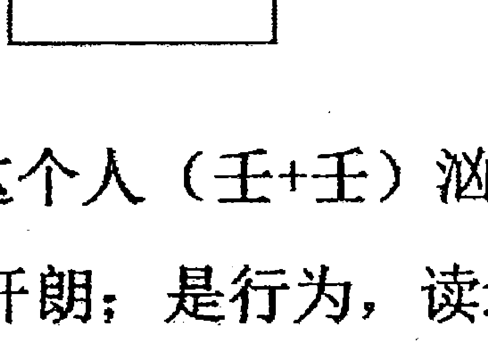
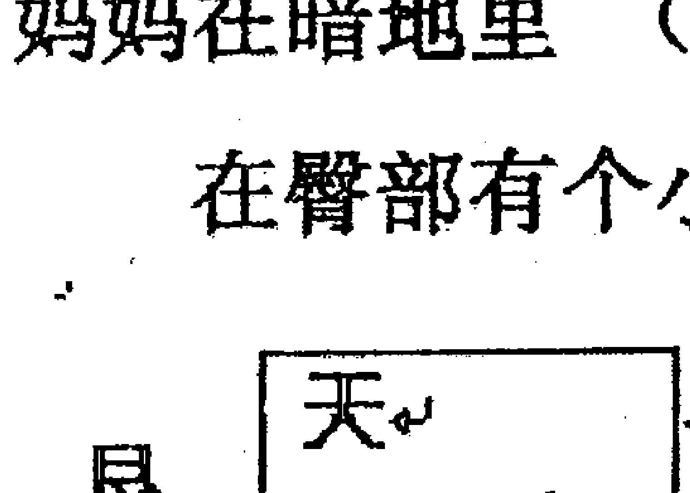

# 杨忠易奇门风水阴盘奇门实战培训讲义

## 前言

阴盘奇门遁甲是市面上最好用的风水调理工具，自从道家秘传阴盘奇门的问世，将拨开其神奇的面纱，它类象直读，易学易会，预测事情极为准确，调理风水立竿见影。道家秘传阴盘奇门断事摒弃了世上流行奇门的那些繁文缛节，深明易学“简易”之内核。两者比较，一个花拳绣腿，令人眼花缭乱。一个一招制胜，无招胜有招。有很多易学爱好者在接触道家秘传阴盘遁甲后，就有茅塞顿开，重见天日的感觉。从而发出“真传一句话，假传万卷书”的感叹！

为了方便广大读者都能学习到阴盘奇门的知识，应一些易友的要求，我把内部教材资料写出讲义，供大家参考学习、和交流，也可电话咨询，以共同探讨研究。

白山易学文化传播有限公司
高级讲师：杨忠易
电话：13943910159


# 第一章
## 第一节：阴盘奇门心法

阴盘奇门于阳盘奇门的不同之处及特点：

- （1）起局方法不同，阴盘起局不用拆补法，不用置润法。其方法简单：用年、月、日、时的地支序数相加之和除以9，余数起局即可。
- （2）阴盘奇门空亡用法不同，有远空断，近空断，（即先天断、后天断）一切玄机尽在空亡之中。
- （3）阴盘奇门伏吟法；伏吟要转宫，转宫有秘诀。
- （4）阴盘奇门反吟法；反吟要跳宫，跳宫有秘诀。
- （5）阴盘奇门翻宫法；奇门通六壬，妙断事物的缘由和发展方向。
- （6）阴盘奇门时空象断；同一局，不同时空，断法不同。
- （7）阴盘奇门吉凶断；阳光心态，没吉没凶。
- （8）阴盘奇门风水断；拆、补、移（移星换斗）。
- （9）阴盘奇门金口直断；不用格局、天干克应、八门克应，取象直读，看事情表面实质，便知结果因原。
- （10）阴盘奇门以隐干为先锋，时干为事体，内藏玄机。
- （11）阴盘奇门分项密断；不同于世面其它奇门断法。丰富细腻、层次分明。
- （12）阴盘奇门重视神助；天时、地利、人和，神助大于一切。

注：*1 没吉没凶是道家思想，儒家讲吉凶，吉凶是儒家自己给自己设了一道线（限），往这边吉，往那边就凶。阴盘奇门遁甲局中，见有门迫、击刑才会出问题。*2 没有格局不设限，见树木又见森林，取象直读。运用：“万向系统论、万象相干论、万象有意论、万象全息论。”等四大论点。

艮宫为下三路，代表腿的位置。（杜门）在艮宫门迫，门迫就有问题，（杜门）为堵、不通，是隐藏的部位，（天辅星）为辅助，（戊）代表大肉，从这往下又代表什么？（癸）是黑的，代表痣。（杜）是看不见的地方，（玄武）可能你自己不知道的意思。综合全宫符号来判断“是你的屁股沟里长了一个黑痣”。 每个符号是它本身的一部分，叫“万向系统”，它们之间又是相互联系在一起的，又叫“万象相干”，在一定的时间、一定的空间反映它们的“象”，叫“万象有意”。宫里每个符号都有它的象意，综合全宫符号反映的事物，又叫“万象全息”（四论）。

身体上的东西也可反映在人的运气上，可以断你；就是因为这个“痣”，你的钱（戊）经常流失（癸）。宫里有门迫、击刑，会有很多不利的事出现。只要概念成立就可取象直读。

例2：

| 宫位 | 符号组合 | 解读 |
| :--- | :--- | :--- |
| **巽宫** | 阴、壬、蓬、己、惊 | 宫门迫（惊）又击刑（壬），壬代表心脏或眼睛，隐干（丁）代表炎症，（蓬）是蓬胀、肿胀的意思。综合判断为眼睛肿了、蓬胀起来了。（壬+己）己为小肉、垃圾，读为眼屎。（惊）为叫，疼的叫唤。 |
| **兑宫** | 玄、乙、辅、丙、生 | 巽宫空亡转兑宫。（玄）是哭！（乙）是弯曲，（丙）是团，是哭成一团。（取象直读） |

我们把宫中的符号分成三部分，即三个宇宙。

- （1） 物质宇宙；十天干；甲、乙、丙、丁……
- （2） 精神宇宙；八神；符、蛇、阴、六……
- （3） 意识宇宙；九星；蓬、任、冲、辅……

读符号的顺序是；八神、天干、九星、八门。阴盘遁甲神大于一切，同时重天干，九星、八门次之。

## 第二节：八神象意的讲解

（1）值符：概念；代表权力的象征，领导能力，管理能力，有威望，威严的，德高望重的，有组织能力。

性格；气概雄伟，文韬武略，品质高雅，有风度有气质，不怒而威。

人物；当官的，厂长、经理，管事的，老板，名人。

物体；贵重的东西，金、银、首饰，钱，名牌的，及一切带壳的东西。

古人拿“符”就是个官。当预测时，用神临值符，可断是；领导、官、或名人。如宫中有门迫、击刑时那就打折了。再严重的可说“是名人，但臭名远扬”。因（符+庚）遇门迫、击刑，可断他是黑社会出名的人。因（庚）在奇门中为敌人、为坏蛋。

（2）腾蛇：概念；缠绕，虚惊，惊恐，怪异，虚幻，梦境，虚伪，虚诈，妖艳，狠毒，缠绕，变化，变来变去，反反复复，华而不实，拐弯抹角，幻觉。

性格：腾蛇的性格是缠人，能降住值符甲的人，就得像腾蛇一样去缠绕，因腾蛇也代表美女蛇。虚伪狡诈，奸险心毒，惊恐不安，心口不一，变来变去，反复不定。预测时，用神临腾蛇，穿的衣服是很华丽，很吸引眼球。请记住一点；中国人与西方人不一样，他会让琢磨不透，你说他像什么？但又不像什么。腾蛇就是这样。你说它不是鸟，但又有翅膀。在预测时见到这个符号，你可以断；“你时常有虚幻”可能有时在吸着烟、喝着酒的时候“幻觉”就来了。如果家里有精神病患者，把宫里临腾蛇的符号所代表的东西拉直了就减轻了。有腾蛇的地方可能人会上吊。用神临腾蛇睡觉爱做梦。所以记住主要一个概念：“腾蛇就是产生幻觉”。被鬼神附体的病人也是它，言语喋喋不休，颠三倒四，没完没了。

物体：像蛇一样的东西、植物，长城，海岸线，蝙蝠，蚯蚓，丝洞，爬山虎，地瓜秧等

（3） 太阴：概念；提升，隐蔽，隐私，阴谋，淫乱，密谋，策划，遮盖，暗处，喜庆，雕刻，私通，口舌。

性格：阴险狡诈，老谋深算，阴沉着脸。

在预测时，家里那里阴暗，光亮度弱，就是太阴。太阴含金的成分，太阴是细密的含义，还有喜庆的含义。如果占官运，用神临太阴（宫里没毛病）可能会提升。占犯罪遇太阴，如果有毛病，这个人就下课了。（进监狱了）看什么时候放出来呢？看太阴落宫，如果临年月日时就是应期。

如占婚姻，哪个女的临太阴，可能是第三者。男的如临太阴也为第三者。太阴对女的来说是哭泣，对男的来说是喜庆。预测时男的临太阴，你就说他；哦！你有喜事了？他如果说没有啊？那你就说他去泡妞了！因太阴是隐私的事，是见不得人的事。

（4） 六合：概念；欢乐，祥和，合作，联合，交易关闭，合抱，共同，和平，相聚，结婚等。

性格；开朗平和，仁慈谦让，一团和气，说和，媒人，中间人等。

人物：乐善好施的人，人缘好的人，中介人，儿童。

乘六合的人，是乐观的，有亲和力的，人缘一定很好。有人问；遇六合是被合住了？问调动调不成是吗？其实不是这个概念。六合之人，是人缘好。在那里人家都喜欢你，是不愿意放你走的意思。六合还代表两个物体的结合，男女参合一起叫六合，是两个人长泡在一起的意思。是拥抱在一起的意思。六合还是关闭的意思，侧男女之事六合临年月日时，可断他X年X月X日X时在一起。如果有人问：“你看我在干啥？”如临六合就说：“你正在穿衣服或穿裤子在系裤腰带呢，准对！”

有句话是这样说的；环境决定你的心态！心态决定了你的思维！思维决定了你的行为！行为决定了你的习惯！ 习惯决定了你的性格，性格决定你的命运！ 有什么样的性格就会有什么样的命运。

你有当官的素质，奇门会马上会显现出来的，临值符或临甲等。如六合为婚姻，为和好，（六+乙）是长头发，你把头发剪了，妻子分开了。同宫如再临生门，当头发长出来的时候，妻子又回来了。就这么有意思！（六+乙+癸）是黑色的长头发。再测婚姻时六合遭破坏；是婚姻遭到了破坏。这是占婚姻的窍门。

（5） 白虎：概念；凶猛，威严，阻隔，争斗，权力，刚毅，强硬，官司，伤灾，牢狱，疾病，道路，技术过硬。

性格：大义凛然，决断冲突，凶猛刚毅，残暴易怒（落宫有毛病时，往反面断）

人物：技术过硬的人，好争斗打架之人。讲义气的人、勇猛之人、军警之人。高科技人员、虎头虎脑之人。穿孝服之人。

在一般的预测书里，白虎被说是凶神、我说白虎不是凶神，狮子才是凶神，因老虎见了狮子也很乖的。因用神落宫临白虎、你说他光头，虎头虎脑的、很白净，或者说你是属虎的，遇六合说属兔的、兔很可爱、长的大板牙。

白虎还代表锁的意思。在预测时遇白虎，你说你家里现在门锁着呢，他说没有的话，那指定你家的门有问题了，打不开了，准对。（因为在这时空中，你灵感一上来时，见到什么说什么，准对）。白虎落宫如果没毛病，他会为人民所用，有毛病就会为人民所害了。

（6） 玄武：概念：深奥、玄虚、不可靠、不好琢磨、玄妙、神秘、偷盗、偷情、说谎。阴谋诡计（错觉）。

性格：机智灵活、巧言善变、偷奸取巧。

人物：聪明多智者、文艺人才、爱说谎话的人、虚伪而不实的人。巧言善变、反复不定的人，搞水产者、爱偷鸡摸狗、爱偷情的人。

玄武还有“忽悠”，像小品赵本山那样爱忽悠人，它主要概念是会让你产生错觉，玄武的概念有时糊涂，就是在不明白时，让你产生错觉，就是真的东西也会让你感到轻飘渺。或者是这个事情本身是存在的，但让你不了解。道家的思想叫玄，它体现了玄学的概念。“忽悠”成了不叫玄武，“忽悠”不成时才叫玄武。玄武是晚上的事，它喜欢在夜间活动，所以玄武是黑色，黑夜会影响视力，见到玄武时就意味着看不清楚、或视力不好。

（7） 九地：概念：矮小、稳定、厚重、柔顺、恭敬、吝啬、消极、自私、包容、关怀、缓慢、困惑。

性格：柔顺文静、自私消极、缺乏上进心、吝啬节俭。

档次比较低的人、事、物。

用神临九地的人，性格比较缓慢。有卑躬屈膝的形象。但有厚德载物的胸怀，有包容、宽容的胸怀。但用神落宫有击刑、门迫，可能会出现不好的一面，为人有吝啬，（即小气）。

（8） 九天：概念；高大、高空、高处、虚无、极端、重要、主宰、意志、豪放、光明、美丽、傲慢。

性格：不怒而威，刚强、好动，志向远大。

用神临九天的人，不稳重、九地稳重。有蓬勃发展的精神，有志高远大的理想。如果临宫有毛病可能会打折或向反。总之要举一反三的去思考。看事情发展、九天快、临九地慢。

## 第三节：天干象意的讲解

**甲**：概念：高贵的、高档次的、直觉力、首领、有名望的、第一的、大自然总规律。

性格：威严、正直、独断、心高、清洁、愉快。

用神临甲（值符就是甲）的人，是当官的命，但必须是落宫的符号没有击刑、门迫的情况下才行。有毛病时，轻者打折，严重时可反断。如果（符+庚）有毛病，也可以说你是名人，但是臭名远扬的人。因庚为坏蛋、是黑社会。在黑社会混也可出名，但不会是好名声。落宫没病，可说是领导、老板、最次也可能是管点事的人。如果都不是，那可能在当地也算名人。

**乙**：概念；希望达成，质软的物体、艺术、文化、柔弱、曲折、弯曲的、转机、依附。

一切拐弯、曲折的东西，有复杂性的事情。

用神临乙的人，优柔寡断，有不畅通的表现，但落宫没毛病，也可是一个搞艺术的人，或文化人。测事时，用神临乙可以断此事有希望。用神临乙、丙、丁都为有希望。因这三个符号少了一个犯错误的机会（没有击刑）。（乙的形态、脸瘦长、皮肤白、体型苗条、微微驼背）

**丙**：概念；希望、光明、雄威、乱子、刚猛、热烈、急速、圆状、片状、权威的象征。

**性格：**
- 暴烈
- 强悍
- 性急
- 果断
- 愤怒
- 虚荣

**形态：**
- 圆脸
- 皮肤白里透红
- 体态丰满
- 短发

丙的概念是大火、火大了就要出乱子，丙代表“悖”，庚代表阻隔，“悖乱”的意思。丙代表光明，有光明的地方，就意味着有希望，丙的希望大一些。见丁也为有希望，但丁比丙小了一点。在预测时见丙、丁就说有希望，奇门能看得到春的脚步。

**丁**：概念；希望、执着、发展、尖锐的东西、逼人、带刺、顶尖的、突出的。

**性情：**
- 性情柔弱
- 和气而有心计
- 洞察奸邪

**形态：**
- 额宽下巴尖
- 肤白粉嫩
- 主人秀丽清高

丁的概念是直接达成。乙是拐弯达成、丙是乱子达成、丙是热烈的、轰轰烈烈的。相对比较丁的希望达成比较好一些。事情不用费周折，不出意外的情况，把它办成。就是这个概念。

**戊**：概念；中正、厚德载物、包容、资本、钱财金融、忠诚、宽厚、守信、方大、老实。

**性格：**
- 果敢豪杰
- 憨厚
- 愚笨
- 诚实守信
（如果宫中有毛病、缺心眼、呆傻、愚笨、迟钝）

**形态：** 四方脸、肤黄白、体型敦厚、胖、肉多。

戊的概念还有的特点是在做生意方面，由于忠厚老实、守信用、实实在在的做，不搞歪门邪道，你才能挣大钱，所以“戊”代表钱、代表资本、办事公平只有戊，办事公平的人，人家才愿意和你做生意。戊好的人财商高，戊代表矿产资源，资源肥厚，所以戊代表了资本。人身体哪里肉多，哪里就用戊来代表。但是“戊”落宫符号遇到击刑、门迫时，会出现了坏的信息：笨、很笨、呆傻、行动迟缓、假如测一个小孩，用神戊加门迫，就可以说这个孩子老实、忠厚、实在，但有时脑袋有点不够用、学习差、写作业慢。戊如果没毛病，你交朋友还得找这样的人，可靠。

**己**：概念：策划、欲望、邪念、创意、节约、拐弯抹角、花花肠子、吝啬、杂乱、有主意、点子多、忌讳多、思考问题细心。

性格：忧愁之相、温顺沉静、忍辱负重、委曲求全、卧心藏胆、以柔克刚、静多动少。

形态：圆脸、瘦弱丑陋、体型单薄、色黄。

己的概念还有智商高、想法多、点子多的人才，能给人搞策划、当参谋、像诸葛亮似的人物。甲、己合，甲是领导，是值符，跟领导合的人，你必须柔情似水、委曲求全。白虎与领导合不了。跟领导对立面，跟领导在一起说话应当绕着弯来说，不能直来直去，那样领导接受不了，他就不喜欢你了，所以只有己才配跟值符甲在一起。

**庚**：概念；阻隔、阻碍、打斗、魄力、气概、凶恶、野蛮、技术过硬。

性格：刚健敏锐、坚忍不拔、威严残暴。

形态：体形瘦长、骨骼健壮、漂亮、白脸。

庚与白虎相似，起到对事物的阻碍作用。阻隔；是公、检、法方面的人物，或军队等。庚落宫没毛病为技术过硬，有毛病代表凶恶。东北人讲“贼漂亮”就是庚。测女人时遇到庚时为漂亮，漂亮的女人有阻碍作用。庚是有很冲动的作用的，他会把别人比下去的，落宫有毛病，这女人厉害，像母老虎。

**辛**：概念；革命、问题、错误、叛逆。

性格：温润秀气、自尊但虚荣、意志稍不坚。

形态：修长方正。皮肤白嫩长脸凹腮。

辛金也代表钱财，很多人为了钱财而去犯错误。阳盘奇门把“辛”叫做犯罪。不管叫什么，记住一点：辛是革命、革新、变革。一革命肯定会出事，一革命肯定会出现胜者王侯、败者贼。小偷偷了钱也叫革命，他想改变自己，把自己变成一个富人，没抓着成了，抓着了败了，成为罪人了。杀人也叫革命，“革”人的命，阳盘管辛叫犯罪，其实不对，你从哪个角度去看。我们管国民党叫敌人，国民党管我们也叫敌人。

**壬**：
- 概念：孕育、流动、迷茫、迁移、智慧、变化。
- 性格：柔顺、多智、纵欲、任性、热情、容纳、勇敢、阴险、聪明。
- 形态：皮肤稍黑、大眼睛、双眼皮、长发秀眉。

壬是大河水、大河水、干净的水、为什么说迷茫？当游在大海中间时，或一条船行驶在大海中间时，一看四周都是水，你会感到“迷茫”。壬在局里符号没毛病时，代表汹涌澎湃、心胸宽广、有智慧。有智慧的人才会感到“迷茫”。想问题多的人才会“迷茫”。所以壬水叫智慧，壬水的颜色浅，在人体里面哪地方黑哪地方是壬、癸水。头发、眼睛、眼球。壬癸水还代表肾脏、心脏。壬水代表动脉。测工作调动，见壬、癸水的时候，工作有调动的信息。

**癸**：
- 概念：制约、管制、艰难困苦、跋涉、流动、变化、变动、性、淫。智慧（小）
- 性格：阴柔怕事、多愁善感、不能自主。
- 形态：矮小黑丑、圆脸瘦肩、声调不高。

《阴盘奇门风水—移星换斗实战培训讲义—内部教材》

癸水为小水、为脏水、油、醋、尿溺、汗液、口水、眼泪、鼻涕都为癸水。癸水也主智慧和聪明，但符号没毛病时比壬水小一些。壬水为动脉，癸水为静脉，（癸+庚）为血栓，再加杜门、更是血栓。总之癸水与壬水大体相似，但壬大、癸小、概念基本差不多，记住这一点就可以了。（癸+丁）耍小聪明。

### 第四节：九星象意的讲解

天蓬星：概念；智商——思考力，膨胀鼓起，蓬松，四面通风的，松软的，汹涌澎湃的，聪明智慧。
性格：圆融果敢、胆大妄为、心狠手辣、贪恋酒色。
形态：庄严、威猛、彪悍、精干、面黑而眼大。
天蓬星的根在坎宫，所以它具有很多的坎宫性质。除此之外，它还有特殊的性质：胆大妄为、贪婪好色、心狠手辣、聪明智慧，贪恋酒色。胆大的人心就狠，很多企事业家、政治家、军事家就属于天蓬星。胆大的人就狂妄，做起事来无拘无束、无法无天。敢于冒险的人，在测事中用神临天蓬星，一般都是很聪明智慧的，男的基本都好色、泡妞。女的也喜欢找老铁。水主智，也主性欲能力。临天蓬星的人，你说他性欲能力强，基本差不多，性欲能力强的人就好色，还喜欢暗中行事。

天任星：概念：志商——目标力、担当、承受。
性格：忠厚老实、任劳任怨、任重道远、倔强。
形态：拱形、弯腰驼背、胸部丰满。
担当、比较低的层次叫担当。上面有领导，下面你就得担当。担当不一定是坏事，是有承受能力的，承担得起、肩负重任、任劳任怨、勤奋的人、肯干的人、老实的人，这才属于天任星的性格。哈腰，驼背的形态。物体桥、弓形建筑物、起伏不平的道路、山包、土包、楼台阶是天任星。它性格有一条道路跑到黑的韧劲。落宫符号不好时，人死板、固执、保守、小气、脑瓜不灵活、不会通变，错了也不认账，死不改悔。

天冲星：概念：敏商——行动力、执行力、冲动、直往前闯、猛烈、矛盾。
性格：急性子、工作麻利、雷厉风行、动作快、说干就干，如冲动。
形态：直、高、长方脸、长发、梳抓髻的、体瘦长。
天冲星根在震宫，属木、勇往直前、办事麻利、为人直爽、敢打敢冲、好出风头、不稳重，这些是他的特点。有时头脑简单了一些，做起事情不加思考、不论后果，一时冲动把事情搞坏。遇此符号的人性子都很急、脾气躁爱发火。但有开拓精神，不拖泥带水、言行一致、有勇气、积极进取，有男子汉气概。

天辅星：概念：德商——诚信力、帮助、辅佐、协调、指导、关爱、关怀。
性格：文雅、有修养、谦虚、有风度。
形态：凹陷、身体细长、脸清白、手细长。
天辅星在巽宫，巽宫的象意它都有。帮助别人、辅佐、协调、指导人的工作。它也属木，但比天冲星的木要柔软一些、细致一些、文雅一些、有修养一些、有风度一些。像树、戴帽的树。阴天下雨时，你在树下雨淋不着你，所以它起到一个“辅助”的作用，关爱的作用。天辅星还代表的人物是教师、策划人、助手、导师、文化人、有教养的人、仁善面慈的人，所以交朋友你要找这样的人。

天英星：概念：情商——关系力、社交力、卓越、杰出、贤明、秀丽、智勇。
性格：声音焦脆、礼貌虚伪、焦躁不安、易怒。
形态：漂亮、风姿、瓜子脸、面红而白、体瘦、头发黄。
天英星是卓越杰出的人，精英、英杰、英雄的人物。天英星属火，火焰直上、有文化、情商高、外表有礼貌，讲文明但内心虚伪，有虚情假意之嫌。人如果太礼貌了，太客气了，就会让人感到有些虚伪了，会让人感觉到这个人不实在。落宫符号：（乙+景或开门）还有个丁或癸，都可以说有艺术、会表演。天英星人物能当演员，如有（白虎+伤门），脾气火爆、厉害。白虎就厉害、会伤人！有这些符号，那还能有礼貌吗？天英星就是脾气火爆的。

（吉林省白山市：杨忠易，微信：yiyuan1015631592，电话：13943910159）

天芮星：概念：健商——保健力、联合、结交、问题、毛病、错误。
性格：固执、迟钝、懦弱。
形态：方脸、大嘴、大肚子、有斑点。
天芮星有传道精神，交朋好友，你找它。爱学习，传授知识。老师讲课，在传授知识是属天芮星。天芮星是问题、毛病，有问题有毛病才有研究，有探讨。联合的性质六合、联合。桃园三结义。天芮星是病星，一般在阳盘，指病的所在位置，我们阴盘不光以天芮星为病的位置。用神落宫有门迫、击刑，都为有病。天芮星为女神、神佛，在预测时，宫中遇天芮星，你可以说他信仰佛教或家中供菩萨等。天芮星还为医院、医疗器械、药品，或者是书等等。

天柱星：概念：逆商——驾驭力、顶天立地、力挽狂澜、中流砥柱、能独当一面。
性格：口舌是非、能说会道、喜杀好战、能言善变、好斗争讼、破坏毁折、惊恐怪异。
形态：柱状、脸白、方圆脸、唇薄、身体健壮。
天柱星有顶天力地的气概，力挽狂澜的精神。主要记住两个概念就行了：喜杀好战、中流砥柱。人物像毛泽东似的人物，他有力挽狂澜，拯救中国，敢于向旧势力挑战！但用神落宫有毛病，你得往反面断：惹是生非、搞破坏（天柱星是破军星）唯恐天下不乱。怪杰是天柱星。不按常规办事是主要性格。在物体上，一切能发出响声的东西，也是天柱星，像喇叭、电器发声的东西等。

- 天心星：概念：心商——心态力、思想活动、想法、中间、坚固、感情、专制、压抑。
- 性格：聪明能干、精明机智、有领导才能。
- 形态：圆形、高大、威严、雄伟。
天心星代表了中心人物，核心人物，所以有领导才能的人，或医生、医药、占卜相学之人。乐善好施、攻于心计、阴柔细腻。预测时用神临天心星，断有策划周密，有心里准备。主要把乾宫的性质发掘出来就可以了。

### 第五节：八门象意的讲解

休门：概念：休养生息、休闲、懒散、旅游、调养。
性格：漫不经心、懒散倦怠、性格温顺、没有活力。
形态：漂亮美丽、气质好、语言偏低。
八门主要代表人事方面的事，但八门有门迫。遇门迫时减力50%。它的象意很好理解“取象直读”即可。
休门的性质记住一个概念就行“休”休就为休息，休也为不动，不愿动的人必懒。懒的人懒散。“休”死人也叫“休息”如预测人的寿命时遇休那就是“休息”了，休息为睡觉，睡觉多了，睡长了，安息、死了。它的行业有与流动有关，按水产的、旅游 的美容美发的，搞运输的也是休。与坎宫有关的人、事、物。

生门：概念：生长、增长、延伸、延续、发展中的事。
性格：忠厚老实、诚实可靠、守时、守旧、
形态：方脸、乐观、向上。
凡是与生字有关的动态，都是生。如生活、生产、生存、生长、靠山、利润、利息、效益、学习。生门主要是增长延续的意思。记住这一个概念就可以了。你投资了100万，回来了180万，这就叫增长，有利润了。一个企业生产部门，做生意的人，都是生。人们生活的地方，房屋也是生。生门在艮宫，艮为止，也为起止的事态。

伤门：概念：损害、受伤、伤心、伤痛、扑捉、赌博。
性格：直爽豪气、直来直去、雷厉风行、不拐弯抹角。
形态：丑陋、难看、恐怖、威严。
伤门在预测时，用神只要临伤门；它不伤人家也要伤自己。（看落宫符号的组合，有门迫、击刑时大部分伤自己，没有伤别人的时候多）。一切伤人的植物；树木、仙人掌、玫瑰、月季、蝎子草等都是伤。在预测时，用神落宫临伤门，一般的此人长得难看、丑陋。长方脸、面部少笑容。但身体健壮。伤门也是军器、武器等。如果宫中有（乙+伤）有可能被木器所伤；如果有（庚+伤），有可能被铁器或石器所伤。如果临（丙、丁+伤）来克你时；有可能是火烧伤；如临（壬、癸+伤）克你是水灾。伤门还代表汽车、驾驶员等。

杜门：概念：堵塞、阻止、限制、阻挡、闭塞、隐藏、覆盖、遮掩、困难、关闭、决断、技术、艺术等。（它还有概念是：体会到的、感觉到的、意识到的、想象到的等）
性格：不爱说话、心平气和、文静内向。
形态：呆滞、晦涩、神色黯然。
要记住一个概念就可以了：“隐藏”，你的想法不外漏，别人不知道。所以又代表了“体会到的、感觉到的、意识到的、想象到的”。也就是看不见的东西能感觉到。“杜门”在巽宫里，巽卦所代表的含义它都有。它的含义还有：遮掩、遮盖。人穿的衣服、内衣、胸罩、裤头。窗帘、瓶盖等都是（杜）。在侧事时，此事不公开的，（开门相反）当测人事时；用神临杜门，此人有可能被关押了。因杜门代表了监狱，杜门还代表了围墙、还代表隔离带、闸口（收费站）。

景门：概念：漂亮、文化、文书、火光、流血、风景、旅游。
性格：心直口快、脾气急躁、知书达理、虚心处事。
形态：漂亮、红脸、脸型尖、身体偏瘦。
景门有虚伪的表现。化妆，（化妆就是掩饰）。有表演的能力。（如临门迫、击刑也叫欺骗）。他代表的人物是文化人、演员、诗人、漂亮的人、美容美发师。符号不好时是被烧伤、烫伤者。看干什么行业的，可断；电信工作者、电子工作者、广告人、文秘工作、策划人、影视工作者等。

死门：概念：一切死板的、不灵活的、执着、固定不变的、丧失生命、不可协调、没有变化的、断了念头的、鬼神。
性格：固执迟钝、稳重保守、死心眼、死气沉沉、死不认帐、一条道跑到黑、不灵活的人。
形态：脸色呆板、木讷、不灵活、死板样。
如果断病在人体上，为死疤、死肉、癌症、肿块、肿瘤部位，一般没有活动的部位。
测人性格还有不会变通的人，榆木脑袋。

惊门：概念：凡与口舌是非、斗争、诉讼、惊恐、奇怪、吃惊、惊慌、恐慌、声音、响声。
性格：能说会道、声音宏亮、惊恐不安。
形态：膛目结舌状、大眼睛、嘴闭不上、呆若木鸡。
惊门代表的人物，教师、音乐家、律师、歌星、纪检监察人员。还有心律不齐、哮喘的人。有精神病的人，也用惊来代表。还有一惊一乍的人。物体，一切带响声的物体。有乐器、鞭炮、钟表、电话、电视等。动物会叫的畜、鸟类。

开门：概念：公开、暴露、舒展、宽广、开放、开创、开明、开朗、打开、手术、出行、婚嫁、贸易等。
性格：豁达开朗、谈吐不凡、坦诚无私、性格愉快、无所拘束、思想开放、通情达理、讲情重义、自尊心强。
形态：脸方顶圆，鼻正口方，上身长直，不怒而威。
开门的概念主要是公开化，没有隐藏的意思。你准备办的事，还没办成临开门即已经公开了。别人已经知道了。与杜门相反，杜门不公开。符号（戊+开）你漏肚皮。测人身体时，（开+己），你暴漏肚脐。总之，开门临什么，那就暴漏什么。

### 第六节 九宫象意的讲解

乾、坎、艮、震、巽、离、坤、兑。

#### 后天九宫图

| 巳 巽 辰 4 | 午 离 9 | 未 坤 申 2 |
| :--- | :--- | :--- |
| 卯 震 3 | 中 5 | 兑 酉 7 |
| 寅 艮 丑 8 | 坎 子 1 | 乾 戌 亥 6 |

#### 先天八卦图

| 兑(2) | 乾(1) | 巽(5) |
| :--- | :--- | :--- |
| 离(3) | (中5) | 坎(6) |
| 震(4) | 坤(8) | 艮(7) |

- 乾：头面、右腿、骨、肺、胸
- 坎：性、水、偷情
- 艮：止、高山、阳土、爆土
- 震：不稳定、人多噪杂的地方、激烈
- 巽：风、渗透性强、僧道
- 离：风和日历、虚
- 坤：肚、肉多、犹豫不决
- 兑：接吻、声音、少女、嘴。

# 第二章

## 第一节：起局、排四柱、隐干的讲解

道家阴盘起局方法与阳盘起局方法不同。道家用年（地支序数）月（按阴历的月份）日（按阴历几日就是几日）时（按地支的序数）。相加的总和除9，余数几就是几局。夏至起阴局，冬至起阳局。道家起局用隐干（引干、暗干），隐干是“引子”的意思。在预测时，一切事物要从引干入手。道家首先重神、天干。所以神助大于一切。神是精神，天干是肉、是物质。九星是意识，八门是总体状态。下面讲起局：应分十二步骤

- 1.排四柱
年：以春为头，用年支序数。
月：以节为头，（二十四节气）先节（立春）后气（雨水）月：以每月的初一开始，按阴历计算。
日：按初几或十几的数字算，几就是几。
时：按地支序数算。（子时不分早子、晚子时）
例：丁亥 己酉 己巳 己巳
12 + 8 + 22 + 6 =48
2.定局：局数：48÷9余3，阴三局。
3.找出句首：按时干查：甲子戊旬。
4.画九宫格：默念咒语：边念边画：
(1) 无极生太极 (2) 太极生两仪 (3) 两仪生四象
(4) 四象生八卦 (5) 八卦定乾坤
5.排地盘天干：戊、己、庚、辛、壬、癸、丁、丙、乙。（中五宫永远寄坤二宫）（阳顺阴逆）
6.排天盘天干：（把六甲值符排在时干上）
符、甲+时干、旬首（六仪）+时干地盘上
7.排八神：符、蛇、阴、六、白、玄、地、天。（阳顺、阴逆）
8.排八星：蓬、任、冲、辅、英、芮、柱、心。（永远顺排）
9.排八门：休、生、伤、杜、景、死、惊、开。（永远顺排）
10.排隐干（时干排在值使门外）
11.找出空亡的宫（按时干查找）
12.找出驿马（按时支查）

## 第二节：天三门、地四户的讲解

例：丁亥12 己酉8 己巳22 庚午7 阴4局
（12 + 8 + 22 + 7 = 49）
值符：天辅 值使：杜门 （甲子戊）

- 一、天三门： 卯 未 酉
太冲 小吉 从魁
天三门：处理风水用的，天三门是起运、改运用的，为上天的通道。

### 二、地四户：除、危、定、开

地四户也叫（库）。是查地下通道用的。搬家、打扫卫生、搬东西用（除）。处理官司用（危）。定婚用（定）开业用（开）。
用法：月建加时上。十二月建即是查黄道吉日用的。
建、除、满、平、定、执、破、危、成、收、开、闭。

### 天三门：（十二月将）

亥 戌 酉 申 未 午 巳 辰 卯 寅 丑 子
登明 河魁 从魁 传送 小吉 胜光 太乙 天罡 太冲 功曹 大吉 神后
正月 二月 三月 四月 五月 六月 七月 八月 九月 十月 十一 十二

### 三、十二月将为天道问题，月将的背后是二十八星宿。

1.月将加时，十月为亥，十月初一后的第一个亥日起建。
2.月将，太阳每过一宫为一个月。
从中气开始，换将（即每月的“气”）与“节”差半个月。用时天门、地户同落一宫时，能量最强。不好的神遇天三门、地四户时，就被隐藏起来了，而不是入墓，小鬼被藏起来了，就不凶了。天三门的“卯”字，出行时用。“酉”字求财、开酒店用。“未”字开饭店或搞食品等用，求财也可以。

### 四、二十八星宿：即二十八种动物

（星）人格化，每一个对应一种动物。

| 轸 | 张 | 星 | 参 |
| :--- | :--- | :--- | :--- |
| 巳 | 柳 | 鬼 | 嘴 |
| 午 | 井 | 未 | 申 |
| 角 | 亢 | 胃 | 昂 |
| 辰 |  | 毕 | 酉 |
| 氐 | 房 | 奎 | 娄 |
| 心 | 卯 |  | 戌 |
| 尾 | 斗 | 女 | 虚 |
| 其 | 牛 | 危 | 壁 |
| 寅 | 丑 | 子 | 亥 |

子、午、卯、酉每宫三个，其余两个。
从（辰）角、亢、氐、房、心、......

> 天三门与地四户，问君此法如何处。
太冲小吉与从魁，此是天门和出路。
地户除危定与开，举事皆从此中去。

## 第三节：空亡、入墓、击刑、门迫、马星讲的解

### 一、空亡

空亡的概念不是无，也不是没有，而是由一个时空转入另一个时空的概念，空亡之宫要减少80%的能量，本身之宫只有20%的能量。
空亡的查法，用时干支按六甲旬空的办法查。

### 二、入墓

入墓的概念是：躲藏、关押。入墓的能量也减少80%的，能量只有20%，不是全没有，也可以说在预测时，用神入墓，如果再没有其它的毛病，可以说他有能力，但有劲使不上而已。入墓不是没有用，不都是坏事，办事效率不高，人就像在梦中一样，本来能干的事，但迷迷糊糊，干的不多，当冲出来的时候一样好使。入墓就像一把锋利的宝剑入鞘里一样，有力使不上，当抽出来时，光芒四射，一样好使。

### 三、击刑

击刑在奇门遁甲里只有戊、己、庚、辛、壬、癸有击刑，乙、丙、丁没有击刑。击刑的概念：“击”是出现矛盾、别扭、拧劲的意思，“刑”是受伤、伤害的意思。总之遇击刑身体不好，占事物也不好，受制、受限、受伤。要是用神遇击刑，容易犯错误，严重时有牢狱之灾，击刑的能量要减 50%，打折扣一半。

### 四、门迫

门迫的概念是：自己拆自己的台，起内哄、内斗、窝里反。自己干的事，自己拆自己的台，能好吗？门迫，在预测时多主人事方面的事，门迫也减少 50%的能量。总之，空亡、入墓、击刑、门迫，在奇门预测时是四个毛病，遇之千万留神，详细分析，空亡、入墓还差一些，击刑、门迫一定有问题。

### 五、驿马

驿马的概念：激烈、快、高效率。在预测时，用神临驿马，主快、骑马跑比人跑，你说哪个快。测人、事、物都主快，应期也快，临之宫和对冲之宫，就是应期，非冲即填。

## 第四节：单宫断、一宫多断、多宫断、转宫断、远空断、近空断、行为断、日期断法等

### 一、单宫断

单宫断法首先从隐干入手，引到宫内，看宫内的天干、门、星等符号。阴盘遁甲不强调单宫断法，是主张满盘断。满盘断信息量大，首先从单宫入手，先读单宫的符号，叫“取象直读”，属于“万象系统”。

#### 例：

假如这个宫，先不读吉凶，这个“乙”在震宫，看身体代表左腰，乙代表肝，乙又代表左手臂，可以说左手臂有炎症（丙）（玄武）为你不知道，天冲代表快，死门不好治。要断人的性格：隐干“乙”，乙为艺术、温柔、温和，好养花、养草，临（玄武）人聪明，“玄武”的人好偷、偷情。（丙）好出乱子，“丙”的性格“急”。（辛）是改革，好犯错误，有改革精神，此人是不按常规出牌的人。（冲）性急，（死）死心眼、固执。单宫断法是指只断一事一物。

（吉林省白山市：杨忠易，微信：yiyuan1015631592，电话：13943910159）

## 二：一宫多断法
就是将一个宫中的符号，从多方面来读。即断人性格、职业、爱好、身体等。

## 三：多宫断法
多宫断法即满盘断，信息量大。比如断一个人，把整个局可看作一个人，上三路：巽、离、坤。中三路：震、（中五寄坤二）兑。下三路：艮、坎、乾。用不同层次来看，但首先看年、月、日、时四宫，先看纲。要注重纲，纲上应事重。占病，纲上四宫哪里有问题，哪里就是病。

#### 例：多宫一断法

《阴盘奇门风水—移星换斗实战培训讲义—内部教材》
丁亥 己酉 己巳 辛未 阴5局
值符：天芮 值使：死门 （甲子戊）

| 阴己辅伤 | 蛇癸英杜 | 符辛戊芮景 |
| 六庚冲生 |          | 天丙柱死   |
| 白丁任休 | 玄壬蓬开 | 地乙心惊   |

此局是反映“台海两岸局势”，先从隐干入手。中国与台海本来是一个民族、一家人。巽宫——日干为己，为我方，月干为台湾，为竞争对手，又是朋友，兄弟同落一宫，这里反映是一家人。（阴）
（吉林省白山市:杨忠易,微信:yiyuan1015631592,电话:13943910159）

阴谋，各藏自己的阴谋。（己）为策划，各自策划，隐干（庚），庚为军队，庚为强硬，谁也不服谁。（伤）挑战的意思。（辅）表面上相互来往，还有一些关系。临马星动，是一触即发的状态。
坤宫——（辛）为时干，为事。（芮）结交朋友出问题。
值符甲在这里入墓，有问题。（景）为血光，很容易有血光发生。巽宫克坤宫，不愿意交朋友。
艮宫——（丁）为年干，为大趋势，为国际形势。（丁）在此入墓，没有能力。巽克艮，当两家打起来时，国际大趋势也无能为力。巽宫克艮宫，是我们不听你的。
上述例子为多宫一断法，也叫满盘断。全局信息都有与日干、月干有关系，但首先看四个纲（年、月、日、时），纲上的符号落宫最主要，余者兼看。假如测病，满局，也就是整局都是你这个人，哪个宫有问题，哪就有病。

## 四：转宫法
转宫法，空亡时用，伏吟局也要用，因伏吟局信息量相对较少，转宫后再看信息能多一些。空亡宫或伏吟局，本宫信息只有20%。转后的宫含80%的信息，是由一个时空转向另一个时空，像一锅水，烧开后变成气体蒸发了。大体就是这个意思。
空亡转法是：当面问测人、深挖，即先天转后天。具体办法是：以先天为体，以后天为用。表面的东西空了，深挖，将先天宫的信息挖出来，在后天成象。
即：用神——
- 落坎宫空亡时，转到坤宫：
- 落艮宫空亡时，转到震宫：
- 落震宫空亡时，转到离宫：
- 落巽宫空亡时，转到兑宫：
- 落离宫空亡时，转到乾宫：
- 落坤宫空亡时，转到巽宫：
- 落兑宫空亡时，转到坎宫：
- 落乾宫空亡时，转到艮宫：
当人不在面前问测，或打电话问测，转宫法为飘着转。
具体方法如下：
即：用神——
- 落坎宫空亡时，转到兑宫：
- 落艮宫空亡时，转到乾宫：
- 落震宫空亡时，转到坤艮宫：
- 落巽宫空亡时，转到坤宫：
- 落离宫空亡时，转到震宫：
- 落坤宫空亡时，转到坎宫：
- 落兑宫空亡时，转到巽宫：
- 落乾宫空亡时，转到离宫：

## 五：远空断、近空断法（即先天断、后天断）
当奇门局出现六甲伏吟时，与空亡同断。因为伏吟局的信息量相对较少，必须要转宫看信息才会增多。伏吟局为天地重叠不动之象，与空亡有很多相似的地方。

## 六：行为断法
比如这个宫：
例：

可断这个人（壬+壬）汹涌澎湃，开朗、膨胀。
（蓬+开）开朗；是行为，读这宫的符号就叫行为断法。还有远断、近断，远断年、月，近断日、时。当一个人打电话时，我看不见这个人，就是远断了。他不分正、反，一律正断。如坤宫是右肩、巽宫是左肩。近断：当一个人坐在面前时，震宫为左，兑宫为右，侧坐时相反。

## 七：日期断法
也属于应期断法，概念是：当某年、某月、某日、某时发生的事，就看某宫。奇门就是哪年、月、日、时发生的事就看哪宫。人家来问哪年的事就看哪个宫。断应期也是看此宫，这个宫所临的符号象意就是应期。（非冲即填）

## 第五节：阳宅断法讲解
阳宅在奇门遁甲中分内景和外景，也就是内环境、外环境。
阳宅首先看用神，分两种情况，风水师在场与不在场；
① 在现场；以日干落宫为阳宅，代表房子。日干又为人，也就是房子的主人（日干为人又为房子是重合现象）一家人。论谁问日干就是他本人，也是房子。（因本人同房子都在现场）
② 不在现场，也就是说人在面前而房子不在现场。还可以说风水师也不在现场时，来人问房子，以日干的正印为房子。不在现场还有来电话问房子的。打电话问房子应当看月干。如果打电话的人你知道是男或女，长辈或晚辈。（长辈看年干，晚辈看时干，同辈看月干）。找准用神，用神落宫为房子，这一点一定要分清楚，不然会有偏差。
看房子怎么样？看用神落宫的状态。如果有门迫、击刑、空亡、入墓等问题；那这房子不怎么样，有问题的房子落宫克谁对谁不利。时干为这个事，它克日干或用神也是不利。还得看克我的宫临什么样的符号，下面把常用的占宅符号讲一下：
“插 反 断 走 射 破 探 冲”
上述八个字再看阳宅时，以落宫符号的万物类象来代表。
看下列图表
比如说：天芮星——（内）书、书柜。（外）学校、医院等。

| 插 | 反 | 断 | 走 | 射 | 破 | 探 | 冲 |
| --- | --- | --- | --- | --- | --- | --- | --- |
| 塔、柱、立的东西、电杆、甲、值符 | 庚、辛、壬、癸、临白虎、反弓路、反弓水 | 路、水、空亡宫 | 走路、走水、我生之宫为泄气、用神之宫 | 高处射用神之宫、丁、庚、蓬、白虎 | 破损的物体 | 探头的东西、玄武后面的房子比你的高2—5米。被盗、被偷、窥视 | 低处的水和路对着自己、庚、辛、壬、癸、临白虎 |

特别是年、月、日、时纲上的宫有此物景克你最不好。

### 阳宅内景断法物象
1. 水管——“壬、癸、乙、己、庚、辛”的组合，遇丙、丁为热水。乙：为弯的、弯曲的。己：为盘的、盘旋的。
2. 横梁——戊、庚、甲（值符）
3. 灯——丙、丁、英、景/丁+癸+蛇，忽明忽暗。
4. 家具——乙（床、椅子、花草）辅（家具、床）。
5. 天心——客厅（核心）
6. 门——驿马+壬、癸/（不在现场）值使门落宫/（在现场）在哪就在哪。
7. 天芮——菩萨（书）/学习用具/药。
8. 神佛——死门落宫/符/英（故去的人照片）玩偶。
9. 窗——（庚、辛）、（丙、丁）
10. 天——空间、开阔、地势高/符落宫——华贵、高档。
11. 地——相反（同天相比）。
12. 厨房——丙、丁/壬、癸/戊、己。
13. 厕所——壬、癸。
关于测阳宅的一些具体办法，详细说明一下：阳宅断法分内景（内环境）、外景（外环境）两种方式。比如宫中的天芮星。你在断内景时，可把它断为书柜或菩萨，不能说屋外有书柜、神佛等。在外景可断有个医院或学校，还可以说那里有个庙，里面有神佛，这样断符合实际。又如：（丁+乙+柱），或是天冲星，天冲在断阳宅是用“插”来代表。“柱”也是“插”。（这是断外景）
“插”：就是棍、电线杆子、竹棍等。“插”就是立着的，高的东西。在奇门里，值符甲，也为“插”。当“插”这个宫克你或可用神时，不好，凶！克谁对谁不好。
“反”：再看外景的是反弓路、反弓水。什么是反弓路反弓水？庚是路、壬、癸是水。如果临白虎时克你，就是反弓路或反弓水。白虎是凶神，是煞气。
“断”：是没了的意思，在奇门里用空亡来表示。“断”的概念是路或水突然没了（到头了）
“走”：为泄气，什么叫泄气？假如日干落宫生别的宫，你去生别人叫泄气，走路、走水：叫“洒水扶贫”，又叫一路不回头。
“射”：室外有高处、或墙角冲你的门窗或用神时叫“射”。一般的：丁、庚、蓬、白虎这些带尖的符号来代表。“庚”是硬的，“丁”是带尖的。（丁+戊）墙角。
“破”：室外或门口、大门外、对着一些破烂、破损的物体。面对这些脏东西克你或用神也不吉。
“探”：在奇门里“探”一般用（玄武）来表示，玄武宫克你或用神会有不好的影响。假如一个房子，房子后面的房子比你高出一块来，叫探头煞。你的房后边露出一个脑袋来窥视你，你能舒服吗？（高坡）50米以上的不算，后面的房子高2至5米算，玄武落宫克你会出什么事情呢？被偷、偷情、丢东西。
“冲”：为路冲，就低处为冲，“庚”“辛”克你叫路冲，“壬”“癸”克你叫水冲。

## 第六节：阴宅断法讲解
断阴宅和断阳宅一样，所不同之处是；阴宅不会葬在市内，不会像阳宅那样处景复杂。内景也好断。一般只看死者穿什么样的衣服、首饰等。过去在旧社会里，有钱的人家下葬时带些珠宝首饰什么的。过去皇帝下葬带的太多，还有活人陪葬。现在来断这些其实也没有什么意义了。但是作为一门学问来研究，也应该了解一些。有些大师级的断阴宅，说出是男是女，穿什么衣服，及得什么病死的。说准了人家很佩服你，如果说得不对，人家会对你的水平产生怀疑。用奇门断阴宅，也同样可以断出死者是男女，穿什么样的衣服，或死者排行老几等。
① 阴盘奇门断阴宅，最好在现场起局，日干落宫就是基地，在起局前最好在现场走一走，转一转，把信息捕捉一下，“万物相关论”。信息、气场、拧在一起，这时再起局信息准确率也高，也多。起局后，有问题需要处理、调整。起局后先断性别，断准了性别就好办了。怎么断性别？日干落宫，宫中有“丁”是男性，见“癸”是女性。因在阴盘奇门里“丁”代表男性生殖器。“癸”代表女性生殖器。现在虽然烧成了灰，但信息没变。不管这个宫里地盘还是天盘，只要有“丁”“癸”都可定性别。
（吉林省白山市: 杨忠易, 微信: yiyuan1015631592, 电话: 13943910159）
② 下面再讲死者的排行：以用神落宫来定，落坎、巽、兑宫为1、4、7。落艮、坤宫为2、5、8。落震、离、乾宫为3、6、9。过去排行多，大房、二房、三房等等。1、4、7为老大。2、5、8为老二。3、6、9为老三。现在新社会就一两个了。
③ 再看死因：是什么病死的？先看“天芮”，“芮”是病，再看符号；庚、辛、壬、癸加芮。见“辛”，是住院开刀啊，“庚”是瘤子，肿瘤，癌症。“己”是小瘤子或是良性的。临“太阴”是内脏，“景”门是失血。上述符号落宫有门迫、击刑都是病。先看纲上的，哪宫毛病大，就是哪里的病。
④ 再看死者穿什么衣服，见火多穿红色的，“壬、癸”是深色或蓝色的。见土黄色，见金白色。如果见“庚、辛”可以说是里面有首饰、钱币等。临太阳也是钱。“景门”是漂亮的衣服。临“值符”说骨灰盒是名贵、高档次的。临“值符”可以说里面的人是当官的、老板或名人等。总之同断人、事差不多。
⑤ 阴宅外景：断外景实际上很复杂，与阳宅外景有相似的地方，但还是有一定的区别。阴宅看“龙”怎么样？“穴”如何，“砂”、“水”如何等。还得看“朝向”、“案山”、“青龙”、“白虎”等。“靠山”：是用神落宫的情况。“靠山”、“案山”也叫“朝山”，是用神宫对面的宫，看此宫中的符号状态，和用神宫的生克关系。比如说对面的宫空了，是没有“案山”。临“戊”加“九地”，“戊”是山色，“壬”是桥梁等。用神左边宫为青龙，右边宫为白虎。看青龙好不好？白虎怎么样？就看宫中符号状态来断。有毛病就不好，没毛病就好。还要看路、水的影响，是不是反弓路、反弓水？怎么看？“砂”一般以“戊、己”来代表，或看“天任星”。也得看“庚、辛”，因“庚、辛”为石头。有的山漏骨，都是石头，这是破相，克你用神宫就不利。看阴宅主要看“干”。特别是年、月、日、时四纲上的“干”。落宫有毛病再克你（用神）。肯定出事。如果宫中有“壬、癸”来克用神，就属反弓水。临“庚、辛”克用神，是反弓路。下面举个例题：

丁亥、辛亥、庚午、甲申、阴9局（甲申庚）
值符天柱 值使惊门（一人求测看墓地怎样）

|     |     |     |
| --- | --- | --- |
| 六  | 阴  | 蛇  |
| 癸 辅<br>癸 杜 | 戊 英<br>戊 景 | 丙壬 芮<br>丙壬 死 |
| 白  |     | 符  |
| 丁 冲<br>丁 伤 |     | 庚 柱<br>庚 惊 |
| 玄  | 地  | 天  |
| 己 任<br>己 生 | 乙 蓬<br>乙 休 | 辛 心<br>辛 开 |

不在现场测，日干落兑宫。（不在现场起局，看七杀，即偏官）。庚的“七杀”——“丙”为坟地。壬山丙向。“戊”为地师，庚为技术过硬，丙为坟地，空亡可以说还没葬。宫中没病，此坟地不错。（问发谁？）坤宫生哪宫，就发谁！上边局，坤宫引干“庚”到兑宫里的庚。如果家中年命是庚的人都发。（这是巧门）这局就艮宫有毛病，己在这里入墓，但毛病不大。总之这坟地算不错了。

# 第三章

## 第一节：身体疾病的预测
断人体疾病其实很好断，见到宫中的符号有毛病，你就往坏处断，但是好的符号也可以往坏处断，找那个不痛不痒的地方断，这就叫没病找病！
首先定用神，人在面前，日干落宫为用神，打电话问病，以月干落宫为用神，但要分清阴阳。（以日干为预测师来定阴阳），如果打电话是晚辈，看时干，长辈看年干。
当求测人不是问自己的病，而是代问别人的病时，根据六亲关系来定坐标。问同事朋友以月干为用神。用神落宫有毛病时为有病，时干为所问的事，是病目前的状态。将用神落宫，及时干落宫的生克制化、作用关系来进行比较之后，综合判断疾病的性质、部位、内外、程度、病因、病理及发展状态等等。
主要断病方法：日干落宫或用神落宫，有门迫、击刑的为有病。日干落宫没有门迫、击刑的再从年、月、时干落宫找，有门迫、击刑的也是病，纲上的毛病明显。如果纲上都没毛病，从其他宫中找，如果有毛病也为有病，但能轻一些，或者说你有的病得了，自己还不知道、不清楚。人，自己有时得病自己不知道，当知道时，已经病很重了，特别是癌症，当知道时就是中、晚期了。可咱们的奇门，可以提前预测出来你不知道的病。“神奇”就在于此。
阳盘奇门的“天芮星”代表疾病，看“芮”落宫状态来定病情。阴盘奇门不以“芮”为主，但“芮”总归是“问题”也是病，它落宫有门迫、击刑一定有病。没有病可能自己不清楚，得了病了自己还不知道。
咱们讲“门迫、击刑”这是毛病，“空亡”的力量最大，如果用神，不但有毛病，再遇空亡，填实或逢冲时，力量要增大好几倍，千万不要忽视了这“空亡”的力量。“诀巧”告诉你，当遇“空亡”时，不是空了，没有了，而是“空亡”转化了，是由一个时空转到另一个时空去了（转宫法断）。空亡之宫只有20%的能量是表面的“象”。转宫后的宫有80%的信息，但这个能量可能要大几倍的。遇空亡时断病，可能是病情转移了。

《阴盘奇门风水—移星换斗实战培训讲义—内部教材》
“全息论”：什么叫“全息理论”？断病：整个九宫格可代表一个内脏，九宫格的各宫又可代表各个部位。单宫断法是看某宫有毛病，按内盘、外盘来定，并参看八卦象意，与天干、神的象意来定病的具体部位。
隐干：隐干是引干，断病的引子，也是暗干。先从隐干入手。病的起因是“引子”隐干引起的。
道家奇门重用神、神助大于一切。
下面看八神代表人体疾病方面：
1. 符：富贵病、高贵的病、难治。
2. 蛇：变来变去的，有病反反复复的，变化不定的病。
3. 阴：内脏有病、阴私病，病在隐藏之中。
4. 六：多种病，综合症、病被合住了、很难治。
5. 白：恶性疾病、肿瘤。（严重为癌）
6. 玄：代表液体方面的病，得了病自己不知道，就是跟你说你也不知道，错觉病。
7. 地：慢性病，得病慢，但治好病也慢。
8. 天：急性病，得病快，相对也好治一些。

### 二：九星代表人体疾病方面
1. 蓬：肿胀病、直来直去、发病急、快。
2. 任：病情发展缓慢，医治速度慢、时间长。
3. 冲：病情发展速度快，突然的、爆发病，医治也要用快速手法。高血压病。
4. 辅：受风、风寒、传染病，医治时要切断传染源。
5. 英：血光、发炎、上火、心脏病、表象病、虚象。
6. 芮：代表病灶部位，病因。
7. 柱：代表得病的条件，外因、疼痛。
8. 心：代表得病的根源，内因、因素。

### 三、八门代表人体疾病方面
1. 休：代表病情在休（修复）复期，调理状态，休眠潜伏状态或停止状态，无力气状态。
2. 生：代表疾病活跃状态，病情有发展趋势。
3. 伤：代表病情处在损害，消耗妨碍状态或受伤，发病急。
4. 杜：代表疾病处在隐藏，潜伏期，杜塞，性质不明显，不顺畅的状态，病为血栓、中风等。
5. 景：代表疾病处在活跃、发烧、发热、烫伤、烧伤，有关血液方面的病，有血光之灾。
6. 死：代表疾病处在功能丧失、性质转变状态。
7. 惊：代表疾病处在阵痛、抽搐，咳喘状态。
8. 开：代表病情明显，清晰，开放状态。

### 四、阴盘遁甲的具体断病方法
1. 感冒：日干临丙，时干临丙、丁或天芮星临丙、丁为发烧症状，戊+壬或戊+癸为流鼻涕症状。
2. 腮腺炎：是戊和己的关系，坤宫，巽宫出现病星，日干和时干加在戊上，临巽宫和坤宫上。
3. 肝炎：乙+丁、丙为肝炎，乙+庚为肝硬化。如果时干、日干、天芮星有这个信息。要根据它的组合来断病。
4. 脊髓炎：脊髓为天柱星，天芮、日干、时干如临离宫加庚代表发热，头痛。
5. 糖尿病：必有壬、癸水，因由壬、癸代表血液，必有戊己土。因土代表甜的东西，必有天芮星。如没有天芮。庚或白虎都可以为糖尿病，他们组合可使血液粘稠和糖尿病有关系。
6. 痢疾：天芮星、日干、时干落宫在火宫，天心星…## 《阴盘奇门风水—移星换斗实战培训讲义—内部教材》

临庚也落其中一个宫，戊+庚代表呕吐，天心星临庚代表恶心，天芮星落宫在坤宫、坎宫，又有白虎或壬、癸代表肚子痛、腹泻，又临六合、大便次数增多，六合是次数多的意思，如有上述症状为湿热型痢疾。

-   7、颈淋巴结核：就是脖子上长疙瘩。乙+辛代表淋巴结核，乙+辛临腾蛇临天芮戊+癸或己+癸，有代表腐烂生脓“辛”这个符号越旺为结核。
-   8、肺结核：天芮、日干、时干落乾宫或落兑宫，有辛和白虎出现为肺结核。
-   9、疟疾：（症状是高烧、呕吐、寒热）乙+庚落离宫脖子强硬，日干、时干在这个时候又出现戊+庚或癸+庚，有代表呕吐，丁+辛临景门代表心烦，丙、丁临兑宫代表口渴。
-   10、中暑：日干、时干、天芮星，如果出现甲+庚落离宫代表头痛，临玄武为眩晕，戊+庚为呕吐，天心+庚代表心烦，巽宫临白虎代表气粗。
-   11、肺炎：庚、辛+丙、丁或庚+丙，辛+丙，庚+丁，辛+丁落离宫，兑宫代表肺炎。庚+天柱代表咳嗽。值符+庚上为头痛。坤宫、坎宫+庚或白虎代表身痛。癸+庚代表白痰，癸+戊代表黄痰，癸+丙为红痰。

## 《阴盘奇门风水—移星换斗实战培训讲义—内部教材》

-   12、支气管炎：乙代表气管，丙、丁代表炎症，乙+丙、乙+丁临天芮星或日干、时干，乙+丙，丁+巽宫。
-   13、急性肠胃炎：乙和坤宫、艮宫、戊土、己土都代表肠胃，如果天芮日干、时干落在坤宫、艮宫，或乙+戊，己土临庚+白虎临马星或临惊门就代表呕吐、肠鸣。
-   14、胃炎：戊、己+丙、丁落坤，艮宫为肠炎。
-   15、肠炎：乙+丙、丁落坤，艮宫为肠炎。
-   16、胆囊炎：胆结石：乙+辛临震、巽两宫代表胆囊炎或胆结石，胆囊炎是加丙、丁，胆结石是加庚、辛。
-   17、肾炎：壬、癸完成代表肾，丙、丁代表炎症，戊+辛代表肾小球，马星代表急症，肾结石是壬、癸+辛落坎宫。
-   18、泌尿系统结石：坎、震、兑、三宫都为腰部，如落宫庚加杜门为隐痛或阵痛，加马星疼痛激烈。
-   19、前列腺炎：乙+丁、乙+庚、乙+辛、乙+丙再看健康的指数，还看是否有白虎和庚，如果有病情严重，如果不见则为炎症。处理丁的时候，使用山楂、枸杞子。去以上的病的时候用葫芦或者藤蔓植物。
-   20、癌症：白虎+庚+天芮。
-   21、冠心病：在遁甲中，离宫、震宫、坎宫、马星、丙丁、壬癸代表心脏，乙+壬代表动脉。己+庚、癸+辛又有乙临宫，冠状动脉，粥样硬化也代表血管腔狭窄，杜门代表闭塞不通。
-   22、风湿性心脏病：离震、坎宫、丙、丁、壬、癸代表心脏，六合代表瓣膜，临天芮+白虎。
-   23、高血压：九天、天冲星为高血压、若临离宫、乾宫再有景门，天英、丙、丁或壬、癸出现为高血压的特征。
-   24、低血压：九地。玄武临离、乾宫等。再有景门、天英、丙丁或壬癸出现，代表低血压，若临腾蛇代表血压不稳。
-   25、甲亢：乙+戊、己、辛落离、巽、坤或兑宫，临天芮星+马星，壬、癸、丙、丁+辛或己+戊是甲亢的特征。
-   26、三叉神经痛：乙+庚，丁、白虎落巽、离、坤宫代表三叉神经痛。
-   27、面部神经麻痹症：乙+戊、己或戊、己+乙。临死门落离。乾、坤、巽是面部神经麻痹的表现。
-   28、脑血栓、脑血管意外充血：乙+丙，丁、辛临天芮，白虎、杜门落离，乾、巽、坤、宫为脑血管意外的信息。

（吉林省白山市：杨忠易，微信：yiyuan1015631592，电话：13943910159）

## 《阴盘奇门风水—移星换斗实战培训讲义—内部教材》

-   29、坐骨神经痛：乙+庚、白虎、天芮病星落艮、乾、坎三宫是坐骨神经痛的表现。
-   30、多发性神经炎：震、艮代表手足，如有乙+辛，或有乙+庚，临天芮病星落艮、震两宫，为多发性神经炎。
-   31、癔病：腾蛇落巽、离、坤、乾四宫，如在有白虎或天芮病星+临是癔病，又为神经创伤。
-   32、血液病：天芮星和杜门落在艮、坤两宫或壬、癸水+杜门是血液上出问题。
-   33、腰椎病：天柱星临坎、兑、乾、震宫+临天芮病星为腰椎病，天柱星代表腰椎。
-   34、颈椎病：乙+辛临巽、离、坤三宫为颈椎病。
-   35、妇科病：用壬、癸代表，壬+辛、壬+己临坎、震、兑、坤四宫为子宫肌瘤的信息。
-   36、便秘：己+庚临坎宫，己+癸为拉肚子。

### 五、例题：现场起局：

丁亥 己酉 庚午 辛巳 阴4局 （一女求测）

值符 天冲 值使 伤门 （甲戊己）

丙
玄庚乙芮戊休 | 白丁柱壬生 | 六丙心庚乙伤
地壬英己开 | | 阴辛蓬丁杜
六戊辅癸惊 | 符己冲辛死 | 蛇癸任丙景

首先看时干、时干为事，辛落兑宫“空亡”，空亡有问题，太阴为肉，兑为口，辛为牙，丁为小炎症，蓬为肿胀，杜为阻隔，隐干“癸”为水，为脏水、脓水。应该断：口腔发炎了，牙根肿胀，对不对？（答对）。在看什么原因口腔发炎有毛病呢？找原因。杜门为看不见，堵了，天蓬为毛，兑宫为右肋，癸为痣，断右肋腋下有个黑痣！（女的笑，不答）一定有，千真万确的有！再看环境；说你家西边路口堵了（丁为路口）（杜）为堵了有脏水（癸）。就是这样的环境有影响，导致你的口腔有毛病。这就是奇门的“神奇”。世界上没有无缘无故的爱，也没有无缘无故得恨，万事都有个因果。如果你右腋下没有那个痣，或许口腔不会有病。解决办法：去掉“蓬”。如果牙痛你把这地方的毛拔了（指右腋下）就好了，不肿了，因蓬为肿！如果说你这没毛（指右腋下）。你可以把头（整个局都可为头）的右边剃一小块儿头发，也可以解决这个问题。只要去掉这个“蓬”字就会好了。天蓬星胆儿大。

（吉林省白山市：杨忠易，微信：yiyuan1015631592，电话：13943910159）

再看坤宫：伤门在这里门迫，又空亡有毛病（现场有的学员说：乙在这里入墓了），应该说乙木只有在乾宫入墓，乙在坤宫不论入墓。入墓的能量低，看坤宫代表什么地方，室内？引干“辛”为小骨头“心”为中心，咱们不能说她胃的中心有块小骨头吧？“乙”为颈椎，“庚”为阻隔，“丙”炎症，“丙”又为圆的东西，“乙”又为拐弯的地方，坤宫属土，数为5、坤为2、应为第2、5节颈椎有病！“六合”为多处“伤”为以前受过伤。（现在空断以前）。

那现在咱们看是什么原因导致你这个疾病？六合是开关，敞开、关上！辛、丙、庚、乙都代表着窗户，应该说你家西南窗右上边墙有裂缝，就是这样的环境导致你的颈椎有毛病了。（断窗的根据是有“丙”为圆的，为太阳，庚是阻隔，能挡住太阳光线的必是窗）。坤宫也是胃肠，有门迫胃肠也不好，把环境处理了，颈椎好了，胃肠也好了，断病一个宫里有几样病，一个是主病，另一个是负病，是不太主要的病，但指定都是病。大家看：坤宫这里还有个病：“六合”是活动的地方。“庚”是背，“乙”是肩，“心+伤”说明你右后背这个地方应该有个“伤疤”。如果没有伤疤，也应该有个小颗粒，不信你打开看一看？（女的笑了）（这是当场验证果有伤疤）。这就叫没有家贼引不来外鬼呀！我们这个局里还可以断很多例子，这就叫举一反三。

断病主要找有毛病的宫，遇击刑、门迫、入墓、空亡都是病，还得先从纲上看，纲上的毛病大。有病也明显，不在纲上的毛病也有，但有时并不明显或已经得了病但本人还不知道而已，这个时候你跟他说了，他也不信！

## 第二节：婚姻的预测

奇门预测婚姻，是用天干符号为用神，是以天干“五合”形式组合的。前三天我们主要学习理论了，这几天我们专讲例子，婚姻预测首先要找到用神，找到用神后，才能确定这个人是谁，如用神是甲的时候，对象是己，甲己合。在阳盘奇门里，只看两个符号、“乙、庚”。庚是大坏蛋，那我们女的找的对象都是大坏蛋了么吗？未免有些太单调了。

-   ①、天干五合有以下五种形式：
    - 甲己合——为中正之合
    - 乙庚合——为仁义之合
    - 丙辛合——为权威之合
    - 丁壬合——为淫慝之合
    - 戊癸合——为无情之合

我们知道甲是领导，能跟领导相合的人必须是己。己得委曲求全，己是花花肠子，你得给领导出主意，搞策划时，己是参谋。婚姻也是这样，甲是名人，是高贵者，与他相合，得是门当户对的。己是富家小姐，才配得上甲，所以叫中正之合。

庚：是一个很强硬的性格，配这样的人，是“乙”。搞艺术的一硬一软才相配。才叫仁义之合。

丙：丙的脾气爆，像烈火一样，得有一个能改变他性格的人才配，那就是“辛”，是一个敢于改变历史的人，叫权威之合。丁：是顶尖，找这样的人只有壬，有智慧的有主意的人，能帮助他，这就叫淫慝之合。

戊：是忠厚老实人，只会干活出力挣钱，配他是有点小聪明智慧的那种人“癸”。俩人其实没有什么感情可言，只知道结婚生孩子。所以就叫无情之合。

还有，如果阴阳反差，也是婚姻不好的特点。女的要是甲、那男的己，是一个非常窝囊的人。庚要是女的，那厉害的像母老虎一样，乙是男的一定是个怕老婆的人，你不怕也行，你干不过她。所以男阴女阳，就断他婚姻不好没错！

## ②测婚姻关系定六亲（一卦清纯）

阴盘奇门测婚姻看的非常细，比如说一人来测婚。你不只看婚姻能不能成，还得看是谁阻碍他们的婚姻，是他妈，还是她妈？在中间起坏作用使得俩个人成不了，只看年干？能分出来是谁的妈吗？

还有月干是兄弟姐妹，还是同事、朋友、假如在婚姻当中没起好作用你说他是谁？但在咱们的奇门里以六亲的形式分清是谁。比如说用神是丙，丙的正印是乙，乙就是丙用神的妈。男的看正印，女的看偏印。女的是丙、甲是妈妈。男的父亲看偏财、女的父亲看正财。甲是妈。相合之干己是父亲，乙是妈。相合之干庚为父亲。兄弟看比肩，姐妹看比劫，男的儿子看食神，女的儿子看伤官，这就叫一卦清纯。但是看他们的生克关系，以落宫状态来定，再结合落宫的年、月、日、时四纲。如果正好遇见纲，信息量要加强。

分析婚姻成败看用神落宫状态，如果落宫没有毛病表示自身条件好，能力强等等。如有门迫、击刑、打折，降低能量。看用神（对象）落宫状态一样看法。只要落宫没毛病、能成！生克不主要，落宫没毛病，克你也无妨，克是一种约束的状态，或者说这家里她说（克）了算。如果说落宫有毛病，生你也不好，有毛病生你能生得了么？是在熊你，骗你。

-   ③在给人家策划时，应当记住相生相克是要全面分析宫中所有符号的，相克也不一定就能离婚，可以说是他（她）管你太严。相生时，有可能也会离婚。这得全局断后才能定结果。在策划时；相生宜近，相克宜远。打仗时走开一些时候，躲开一些时候不就好了么？我们可根据：

（吉林省白山市：杨忠易，微信：yiyuan1015631592，电话：13943910159）

## 《阴盘奇门风水—移星换斗实战培训讲义—内部教材》

### ## 八神“来阐述他们的精神：

-   值符——说话直“你给我倒杯茶！”回到家里说话还像在单位里一样下命令，把工作的作风带回家。
-   螣蛇——缠绕、会变通、变化快，如庚临螣蛇是以强硬的缠绕来软磨硬泡。
-   太阴——会掉眼泪，阴柔的性子见到庚你就来点软的“掉上几滴眼泪，使他难忘。”
-   六合——好客，客气一些，热情一些准成。
-   白虎——白虎遇上庚，那才叫强硬。
-   玄武——会说瞎话，会骗、会蒙、给人家产生错觉、玩虚的。
-   九地——踏踏实实地，安安稳稳地对待她。
-   九天——更活跃的，理想高、有志向。

### ### ④看对方是什么心态，（看九星）

-   天蓬——胆大、智慧型、但好色，谈对象会先拉手、又摸手“啊 我爱你”！叭（亲一口）肯定会直爽一些，像猪八戒，不像孙悟空会伪装。
-   天任——是一个咬定青山不放松的性格，是任劳任怨、执着，让我做什么就做什么。
-   天冲——雷厉风行，敏锐、敏感、言行一致。
-   天辅——会关爱人、仁善、会帮助别人、为别人着想。
-   天英——有礼貌、热情、会伪装、虚伪、有办法打动对方。
-   天芮——爱学习、交朋友、满腹经纶、信佛。
-   天柱——好说、好唱、口是心非、能言善辩。
-   天心——有管理思维、有威严、中心人物。

### ⑤看总体状态（八门）

-   休——休闲、漫不经心、懒散、给人感觉轻松。
-   生——好动、天天都会有个新鲜的感觉，有发展。
-   伤——直来直去、说话爱伤人。
-   杜——会用技术方式处理问题，内向。
-   景——好包装自己，不是用心，而是用外表感化对方。
-   死——是沉着脸、无表情、认死理。一条道跑到黑。
-   惊——一惊一乍、吵吵闹闹、有些惊恐怪异。
-   开——公开、大方、开朗、有气度。

有的学员问：“值符就是甲，那看甲的对象一定是己了。如果这两个符号同宫怎么断？”

答：甲、乙、丙、辛都可能同宫，当同宫时你可以这样断：你和你爱人肯定有相同之处，会有一样的信息，或者有些性格一样，同宫就是同心、一块生一块死。假如遇车祸会一块死的。我们在给人预测时如果用神与母亲同宫，母亲去世了，这个人也好不了，轮回一年后也的去世。这就叫求同存异。再告诉大家书中没有的办法：在测婚姻时如果夫妻同宫，将配偶的符号分开看，因同宫信息少，办法是：“人不在飘，人在深挖”。

假设人来测婚，日干落巽宫，对象不在场，巽宫符号夫妻同宫，可将配偶符号飘着转宫到坤宫去，坤宫是对象80%的信息。如果说夫妻二人同来的，深挖到兑宫去看，兑宫是配偶的80%信息。只有把它们分开来看才能抓住更多的信息。但同宫时，夫妻关系一定很好（但落宫符号没毛病时，有毛病相反）有不愿同生但愿同死的意识。

-   ⑥现场起局：为一女孩预测：（王老师例）
-   例1：丁亥 己酉 庚午 癸未 阴6局

值符：天芮 值使：死门 （甲戌己）
戊

|   | 马 |   | 玄 | 白 | 六 |   |
|---|---|---|---|---|---|---|
|   |   |   | 蓬 | 丙 | 壬 | 辛 |
| 乙 |   | 癸 | 杜 | 丁 | 景 | 壬己 |
|   |   | 庚 |   |   |   | 冲 |
|   |   |   |   |   |   | 死 |
|   |   |   |   |   |   | 癸 |
| 壬己 | 地 | 戊 | 心 | 阴 | 庚 | 辅 |
|   | 辛 | 伤 |   | 乙 | 惊 | 丙 |
|   |   |   |   |   |   | O |
| 丁 | 天 | 符 | 蛇 |   |   |   |
|   | 乙 | 柱 | 壬己 | 丙 | 丁 | 英 |
|   | 丙 | 生 | 癸 | 休 | 戊 | 开 |
|   |   |   |   |   |   | 辛 |

庚
母  父  第二父亲

|   | 庚自己 | 戊 (震) | 乙 (艮) | 丙 (离) |
|---|---|---|---|---|
| 女 |   |   |   |   |
|   |   |   |   |   |
| 男 | 乙对象 | 壬 (坎) | 己 (坎) |   |

震
壬己
| 地 |
|---|
| 戊 |
| 心 |
| 辛 |
| 伤 |

妈妈在暗地里（地）伤心（伤）

在臀部有个小颗粒（辛）或有个痣。



（一爸）乙+丙：艮宫为大腿，膝盖发炎、增生。圆脸：看丙。没病找病，在不好的流年发病。

瓜子脸——看丁，老实、脾气大，有点哈腰。阴大于阳：（宫中地盘击刑要比天盘厉害的多）

下面详细分析：

人在现场，日干（庚）为用神，乙庚合，乙代表对象，乙落艮宫，乙又代表父亲。母亲（戊），对象的母亲是（壬），父亲是（己）。女方的兄弟（辛），姐妹（庚）。

先看对象（乙），在艮宫，又和父亲同一个符号，应该说：“你找的对象像父亲”（有的学员说可能找的对象岁数大一些）也对！也可以说你找的对象他会像慈父一样的关爱你！（艮宫生兑宫）。再看兑宫；庚乙同宫，这叫生死恋！同心同德。王老师又对小女孩说：“你现在才16岁，落宫空亡，是现在没有对象。但你心目中的对象啊……你是喜欢成熟的男子。你在现场漂着转宫到巽宫，巽宫“癸”在这里击刑，降低50%能量。有毛病了，又与艮宫相克。我可以给你一个预言；你的第一个对象是不会成功的！有缘无分啊！那咱们再看一看是什么原因造成的呢？

“戊”在震宫是你母亲，她什么态度呢？她在你这段姻缘上是在暗（地）地里伤心那！（伤+心）。震宫克艮宫，她不喜欢你这个对象。“伤门”在宫里它不伤自己也要伤别人。“戊”在震宫击刑。所以你第一次婚姻是你妈给阻隔了！

咱们再看一看你母亲身体方面；她有胃病是吧？（答对）“戊”为胃，辛为错误，直读胃有错误。（壬+己）壬为流动，己代表食物，隐干出现流动的食物，那也可以代表胃部。其实你妈还像林黛玉一样，很愿意流眼泪，为你而伤心（对）。

再看你母亲身体方面还有其它方面的毛病“戊”为肉多的地方“辛”为颗粒，隐干（壬+己），（九地）是低的地方，低的地方有己为肛门，（壬+己是拉屎的地方）可断：在肛门附近有个小颗粒，可能是个痔疮。所以为此伤心。（戊在这里击刑）

再看你爸爸，（乙）在艮宫，生你日干兑宫，说你爸爸对你特好！很溺爱你啊！但你爸爸的脾气不好，可很爱说（柱）。（这时小女孩说她有两个爸爸，还有一个二爸）。两个爸爸；那二爸怎么看？应该看（乙）下面的符号（丙）的翻宫到离宫天盘（丙），这宫里便是你二爸的信息。咱们还得先回过头来看你一爸的信息；艮宫的（天柱），可代表大腿，（乙）是拐弯的地方，下面的（丙）为圆的地方。大腿有圆的地方是什么？是膝盖，（圆的是小磨）这个地方不舒服。咱们这叫没病找病！（柱+生）是骨质增生。但是毛病不大，只是在阴天下雨的时候有些不适的感觉对吗？（答对）

再看你二爸：（丙+丁）临白虎，哦！能白呼啊！（任）有点哈腰，可能是有点驼背是吧？（答对），脾气有些急，中正、忠厚，隐干（戊）离宫克你兑宫，是管你，对你要求的严格，你得听他的。因有共同的符号（隐干丙）。但是别忘了，日干落宫空亡啊，要转宫看啊，人在面前深挖，到坎宫，坎宫有（符）是领导啊！坎宫克离宫，反过来说是你在领导你二爸！看表面上是他在管你，其实是你在管他。

## 《阴盘奇门风水—移星换斗实战培训讲义—内部教材》

你二爸，在这个家里是你说了算对吧？（对）。大家看坎宫临值符，是领导啊，他敢不听！（笑声）（这时小女孩又说：“其实我一直是同二爸住在一起的）是啊，隐干有（丙），和离宫的（丙）符号相同有联系啊。

### 例2： 丁亥 辛亥 辛未 甲午 阴8局

值符：天芮 值使：死门（甲午辛）

|   |   |   |
|---|---|---|
| ○ 阴<br>丙 壬 辅<br>壬 杜 | 蛇<br>乙 英<br>乙 景 | 符<br>丁辛 芮<br>丁辛 死 |
| 六<br>癸 冲<br>癸 伤 |   | 天<br>己 柱<br>己 惊 |
| 白<br>戊 任<br>戊 生 | 玄<br>丙 蓬<br>丙 休 | 地<br>庚 心<br>庚 开 |

日干“辛”落坤宫，为求测人。辛入墓，不是辛本身入墓，因值符在这里入墓，宫中所有的符号都跟着入墓了。入墓的符号能量都降低了，降低多少呢？80%。

坤宫暂时只有 20% 的信息了。为什么说是暂时的，因为入墓不是太大的毛病。当冲出来时能量要加大几倍的。当用神入墓时，要这样断：啊你是有能力的人，只是暂时能力没有发挥出来呀！那什么时候能发挥出来呢？非冲即填。好，我们来分析这个局；我们先看一下他是干什么职业的？先从隐干入手，（戊、丁），（戊）为地里，（丁）为看，盯着看的意思，看啥？看地！（戊）是地，大地，看地形。（芮）是问题，（死）为死人，综合起来断：你是看阴宅的风水师对不对？（答对）。但是坤宫是寄宫，不是一个人，你是两个人经常一起搞风水的是吧？（答是）。（丁+辛）视力不好，看你正戴着眼镜，哦，度数还很高，坤宫（2 5 8 10），是 500 的？还是 800 的？（答是 550 的）。

测婚姻遇伏吟局、寄宫、都不好。伏吟局应该是二婚以上？（答是）。老婆在坎宫，这里没什么毛病，但你老婆脾气很大，（丙+丙）胆大（蓬）懒散（休）。看婚姻遇（休）应该是分居了，你想啊，婚姻休息了那不就完了吗？是你老婆把你给休了！为什么说是你老婆先提出来的？因为坎宫没毛病能量就比坤宫大。别看坤宫克坎宫。你的能量小你克不动人家！反被克。

（吉林省白山市：杨忠易，微信：yiyuan1015631592，电话：13943910159）

再看你：你有外遇？隐干就是你爱恋的人，（戊、丁）应该同时有两个是吧？（笑不语）一个岁数大（戊），一个岁数小（丁），岁数大的（戊）她有钱，别看她长得不十分好看，但是她对你十分忠诚，对你很好是吗？（戊生辛）岁数小的那个（丁）长得好看，你很喜欢她（丁辛同宫）。但是她对你不利！（丁克辛）。如果你要是从这两个人选老婆的话？我劝你选择（戊）。因戊生辛对你有利。我断你离婚的时间应该是在填实坎宫的时间。要不就是离宫的时间？（答是离宫的时间）。

你是信佛的，再看你家供什么佛？寄宫是两个，一个是财神（戊），一个是合手观音（芮）（答对是两个）。

## 第三节：企业策划

阴盘遁甲策划企业非常细致，而且功用很大，是很重要的一个环节。首先要看符号的旺衰状态。旺衰状态以十二长生来定。十二长生是：“长生、沐浴、冠带、临官、帝旺、衰、病、死、墓、绝、胎、养”。我们用十二长生时，可以分析人的状态和企业的特征。日干落宫的状态非常重要！每个字的组合是什么状态？有些时候我们为什么不谈旺衰？一冲或一填已经够旺了。这叫两头旺。所以没有必要再谈旺衰了。十二长生是看每个天干符号在各宫的状态。概念、含义如下：

- 长生——生长、生活、生产、享受、靠山、根基。
- 沐浴——洗澡、暴露、曝光、识破、目光短浅。
- 冠带——虚伪、遮盖、掩饰、伪装、包装、美容、广告、掩盖真相、狡诈、内部事务。
- 临官——当官、管理和领导在一起、财源不断。
- 帝旺——旺盛、豪华、顶峰、壮大、有创伤、挫折、有血光之灾。（到了顶峰，物极必反）
- 衰——衰老、衰退、衰败、有强变弱、走下坡路。
- 病——问题、不正常、违反常规、漏洞、往坏处发展。
- 死——停止、不动、不可协调、不灵活、失去生命。
- 墓——隐藏、贮藏、收藏、掩盖、伪装、不流通。
- 绝——断绝、尽头、绝境、极端、无希望、没生命。
- 胎——孕育、孕养、计划、刚刚形成、发展初期。
- 养——滋养、扶持、修养、抚养。

我们用十二长生可以分析人的状态，和企业的特征。

有一句话叫“细节决定成败”！先把框架学好，按框架去装内容，这是其他书本上没有的内容。我把这诀窍教给你！

### 一、 预测企业的方法：

- ①、 先定坐标；日干为企业，也为企业老板，（一般给企业预测得到企业或企业老板在场时）。
- ②、 时干为市场，或消费者，或社会群体。
- ③、 月干为竞争对手，（年干为大趋势，或国家政策）
- ④、 财；（指日干而言）为公司的职员，及相关人员。也可以说是人才的意思。（我用的人）
- ⑤、 印；为公司的供应商，或贵人，能帮助我的人。
- ⑥、 食神；为公司的产品。
- ⑦、 伤官；为公司的副产品。
- ⑧、 官鬼；为公司的综合管理能力，或机构。
- ⑨、 偏官；为公司的书记，（有名无权的人）
- ⑩、 时干的食神是销售商。

看企业主要看“瓶颈”，“瓶颈”是重要部门，是管理机构。是企业发展的命脉！这个部门很关键，如果它克日干落宫，那就坏了，要是它生日干宫，非常好。比如说日干落离宫，那克离宫的必然是坎宫，那这个宫就是企业的瓶颈。日干的“印”是你的供应商，或是你企业原材料的来源。那月干的“印”是竞争对手企业的供应商。月干的官鬼是人家的管理机构。他的财、食神、等同论。

阴盘遁甲就用这种类似八字里的“十神”方法去模拟作用关系。用这种方法，通过多年实践证明很准确。那么一个企业的内部情况又怎么来定呢？

企业内部各部门用天干符号来定坐标;

- (1) 甲: (值符) 是高层次管理机构，或重要岗位，或企业的核心部门，“值符”是公司要害部门。
- (2) 乙: 市文化部、宣传部、工会。
- (3) 丙: 广告部、宣传部、战前动员。
- (4) 丁: 技术部、(顶尖的部门)
- (5) 戊: 财务部门。
- （6）己：策划部门。
- （7）庚：攻坚部门。攻克关系、也叫公关部，保卫部门。
- （8）辛：改革部门、技术革新部门。
- （9）壬、癸：运输部门、或营销部门。
- （10）休门：代表物流。
- （11）生门：生产部门、生产车间。
- （12）景门：包装部门。
- （13）死门：固定资产。（死为不动产）
- （14）杜门：保卫部门。（与庚同看）

预测一个企业的情况，难度很大，首先我们把坐标定好，也就是说“用神”，把用神找好。这方面的用神多，十天干、还有一些“门”等全是用神。这正真的需要满盘断，全局断。我们要根据这些符号落宫的特点、状态，以及他们的落宫状态的宫与宫之间的生克关系，来分析企业各个部门的状态，大企业有这些部门，小企业没有。小企业可能几个人，但每个人都有分工，一样看。比如说“己”落宫没毛病，可以说他：“你的公司或（小企业）你的策划能力、还是计划能力很强啊”如果“丁”落宫不好，可以说他：“你的企业技术很差等等”。或者说技术不过关，生产的产品不好。（如果这些符号落宫克日干也如此断）。

再如壬。癸不好，可以说你的营销有问题、运输方面有问题了。就这样给人家断他公司的情况。

有一次我给人家预测，我说你的车间要出问题，“丙”，要出乱子，结果发生了爆炸。（这也得根据他生产的产品与火有关才如此断）。再如时干是市场，是你的营销平台，是能反映你的利润的。又如“财”，正财是长期的，偏财可看是短期的。“财”是你用的，“我克者为财吗”。还要全面分析企业的内外关系，或情况。

### 二、看供应商讨价还价的力量；

看“印”与日干的关系。（印也是原材料）一共五种生克关系。（看宫与宫的生克）即：“我生他，他生我，我克他，他克我，比和”这一点很重要，当他生我时，他愿意给我货，或者是主动上门送货，价格还低。我生他时，我去求人家要货，那人家就会牛起来，价格也高了，谈价不好谈。他克我，他在约束我，不想给我货。就是给那价格肯定高，你爱要不要！我克他时，我能控制了他，一般可能是政策在帮我忙。那价格他也好谈，比和时，那就好办，灵活多了，价格也好商量。

### 三、看与顾客的讨价还价的力量

### 四、新的竞争带来的挑战

有些企业自己觉得干的很好，竞争对手力量也不大。但是有没有新的竞争对手出现？怎么看？月干的落宫地盘翻宫，就是你的新竞争对手！看他的产品与我们的产品相比如何？我去生他的产品，那我的产品不如他的，他来生我的，他的不如我的好，这样还好办。要落同宫，产品相当。成比和，但也得看谁的宫里是否有毛病。如果说落同一宫时，其实很糟，我们的产品和他的产品参合在一起了，最后还得看企业与平台的关系。

### 五、替代品的挑战（换代产品）

看法是食神翻宫，翻宫后看此干落宫怎样？

### 六、现有企业的竞争

实际上就是看月干与日干的关系。

### 七、如何看一个企业的状态

- 天干——企业的形态，或部门（实质性的东西）
- 八神——企业的性质，或内涵（精神局面）
- 九星——企业文化的内涵。
- 八门——企业的整体状态。
- 值符——产品的名贵。
- 值使——正在兴旺的东西，或事物，正在运行的，或正在使用的部门。
- 年干——大趋势。（大方向）

要看一个企业发展怎么样，用年干来分析。如果年干这个大趋势生你，或比和你，那就好了，发展前景好，或国家的政策对你有利。相反的话那就不好，没有多大的前景、前途不大。

### 八、综合分析

主要内容有：优势、劣势、机会、危险等。如果你断人家这个车间要出事故，那什么时候出事故？你得给人家分析出来。

- ①优势：分析企业的优势方法是，分析企业的各种能力：比如技术方面、素质方面、财务方面、销售部门、策划部门，看这些方面的符号落宫状态，有没有门迫、击刑、入墓、空亡。没有就为优势，有的话减力了，打折了。
- ②企业流程：产品开发，产品（食神）翻宫看法。可多翻几次。产品假设原来临螣蛇，那就是一段一段的，时好时坏，翻宫后临值符了变好了，变名牌了。看财、财是公司人员的素质，素质的好坏可直接影响公司的产品（财为日干克的字）用什么样的人可做什么样的事。
- ③经销系统：看经销方面的广度、平台、可靠性。（顾客的信息灵不灵），看技术（丁）过不过硬。看供应商（印）的进货路子如何？还得看时干（品牌形象）；如产品（食）临值符：是名牌。临螣蛇：是有虚假成分，或销售时一段好一段坏的。临太阴；产品精致很稳定。临六合；有亲和力，爱不释手。临白虎；产品技术过硬，无人可比。临玄武；产品虚假成分多。临九地；产品稳定的发展，但是慢。临九天；产品性能很不稳定，忽高忽低的，不一定是好事。有时发展速度太快不一定是好事。
- ④企业劣势：潜在的优势（翻宫）可能是未来的劣势（大趋势）。翻宫临玄武不好。临九地；下降了。如临蓬；蓬勃发展。临休；得需要休整。临生；有活力、有生命力、产品有发展。临伤；产品有残缺。临杜；技术不过关。临景；看前景如何。临死；老模式、老产品。临惊；宣传的怎样？有没有官司。临开；企业前进道路开创的怎样。

#### ⑤抓住机遇（择时）

- 1、选择行业最佳的、最好的时间开业。行业最好的机会是看落宫状态，是冲好？还是填好？
- 2、抓住最佳的推销时机，看平台的需求程度。
- 3、能否在市场的竞争对手中夺取市场份额。(阴盘遁甲的一出现把阳盘奇门气得够呛！哈哈，看的多细致！)
- 4、能否开创新市场。
- 5、能否抓住机遇，建立竞争优势。
- 6、能否建立财力、物力、等方面的优势。

#### ⑥威胁

- 1、通减或缩小市场需求（时干翻宫越翻越衰）
- 2、总用旧技术。
- 3、和竞争对手的价格战。
- 4、关键客户、或关键供应商的协调关系变化。
- 5. 行业驱动力的改变、与竞争对手的快速学习能力。
- 6. 成本与效率的差异。
- 7. 客户对差异化的产品，越来越高的要求。
- 8. 政策的变化。

#### ⑦三种竞争战略

- 1. 成本领先（戊），是否最低：
  - A. 建立有效规模生产设施。（日干翻宫后的情况）
  - B. 最大限度减少研发、广告等费用。（丙落宫与日干关系）。
  - C. 降低成本与管理费。
- 2. 差异化的战略
  - A. 产品功能差异：（杜门/丁/庚/的落宫）日干月干落宫的食神相比较。
  - B. 产品外观的差异，（景门/丁落宫）刺激购买欲，吸引眼球。
  - C. 服务差异（壬、癸落宫）看营销状况。
- 3. 专业化，经销目标是特定的市场？（专一化）
  - A. 新概念：（落宫相比）前瞻性，用神地盘落宫与食神落宫相比。
  - B. 没吉没凶的例子：
    - 玄武——褒义：富于变化，灵活的但不遇四种情况。
    - 玄武——贬义：伪劣产品，遇到四种情况时。

### 九、现场起局、

例子：丁亥12 辛亥10 辛未24 丙申9 （阴1局）

值符 天柱 值使 惊门 （甲午辛）

|   | 左 | 中 | 右 |
|---|---|---|---|
| 上 | 天 壬 丁 景 | 地 戊 己 死 | 玄 庚 乙癸 惊 |
| 中 | 符 辛 丙 杜 |   | 白 丙 辛 开 |
| 下 | 蛇 乙癸 庚 伤 | 阴 己 戊 生 | 六 丁 壬 休 |

（产品：食神，癸水。副产品：壬水）癸+乙：茶叶。

首先从日干落宫和时干落宫来分析，这位先生是做什么的？日干“辛”落震宫，临值符，看！你准是个老板对吧？（对）那没错是个领导，值符吗！。“辛”有改革创新的精神。“柱”顶梁柱。“杜”有商业机密，有“丙”丙是圆的隐干“壬”为眼睛。看你戴眼镜吧？“壬”为眼睛“辛”为错误，眼睛犯错误，指定视力不好！日干落宫没毛病，说明你老板本人和你的企业有实力。年、月、时落宫都可以，没毛病，说明你的企业目前发展状态可佳。那看你是干什么的呢？“癸”落艮宫，是刚刚开始，“癸”是日干的食神是产品，（癸+乙）是与花草树木有关，（自己说是做茶叶生意）（癸+乙+伤），伤门在这里门迫。“丙”是问题，蛇是变来变去，一段一段的，引干“辛”为出错。综合分析，你目前的产品有问题了，质量上出错了吧？（对）（是时间长了，放在库里有些过期了）。所以产品“癸”落宫生时干“丙”落兑宫）不好卖，顾客不认你的货，你生人家，你求人家买你货对吧？产品临马星，动要快点出手，不然卖不掉。

再看对手，月干与日干同宫怎么看？要挖！不管人在不在都要深挖，到“离”宫去看对手！“离”宫“戊”在内盘，你的竞争对手在你的附近，临九地他发展的比较慢。“死门”一条道跑到黑，看他的产品“庚”在坤宫有入墓“癸”。又临“玄武”他的产品有虚假行为，有欺诈行为。生兑宫的顾客“丙”。也是不好卖。就这样断。“丙”是你的管理能力，行！人才与你同宫（甲），行。总之，你的企业还不错的。

## 第四节：职业升迁的预测

职业升迁：职业定向是先看干什么职业。升迁，是提升或工作调动等方面。用神定准，日干落宫是当面来问测的人，打电话看月干。首先看用神落宫临的符号怎么样？有没有门迫、击刑，如果没有门迫、击刑，就用这宫的符号选择职业，选择求职方向等。如果有门迫、击刑了，这宫就不能用，选择方法是：先找年、月、时三宫，先从纲上找，但也有顺序的先从“时”、再月、最后找年上的，因年太远，先找近的。日、月、时；代表日、月、星。年是太岁，是“总理”。如年、月、时都不好怎么办？那就再选纲以外的宫，但纲以外的宫能量比较低，相对要弱一些。大家记住这个概念就可以了。假如日干落宫没有门迫、击刑，就直接读象。假如日干里面有（乙+丁+景），“乙”代表艺术，“丁”代表文章、写作、表演，可以在这个些方面来讲，“景门”美容、美发方面的。如见“壬、癸”水可以说旅游、出游或与水产有关、餐饮，等。见“庚、辛”，为矿业，与金属、机械有关。“庚”为道路，可断修路、工程方面的。“戊、己”农业方面，或金融方面、或与水泥有关等。反正要综合起来看才行。

例：现场起局：丁亥 己酉 辛未 癸巳 阴5局

（吉林省白山市:杨忠易,微信: yiyuan1015631592,电话: 13943910159）

值符 天冲 值使 伤门 （甲申庚）（一男学员预测）

丙○  ○

| 蛇 | 符 | 天 |
|---|---|---|
| 辛戊 | 丁任 | 庚冲 | 己辅 | 乙 |
| 己杜 | 癸景 | 辛戊死 |
| 阴 | 地 | |
| 癸 | 壬蓬 | 癸英 | 壬 |
| 庚伤 | 丙惊 | |
| 六 | 白 | 玄 |
| 己 | 乙心 | 丙柱 | 辛戊芮 | 丁 |
| 丁生 | 壬休 | 乙开 |

庚 马

日干“辛”落乾宫入墓，但没有门迫、击刑，没多大关系，一冲开可以用。这个宫就可以代表你目前的情况。

你看隐干（丁）临马星，马星是走路，是跑！落乾宫见（丁）红色的，（玄武）代表玄学，天芮星是代表学习，（芮）还代表交友。这样可断你是结伴而来参加学习的，可能是和朋友，或同道。遇到寄宫就不是单一的，咱们再看看你是从什么地方来的？乾为高亢之地，开为大城市，或省会、或都市！肯定不是小城镇。如果乾宫临天心、开门、值符一定是大都市。但还得看它旺不旺。对吧？（被测者说是从广西玉林市来的，是大城市来的）。广西在西南，这怎么看？天盘翻地盘，在坤宫，坤宫不正是在西南吗？底盘是你的家乡或住地吗？我们再看一看他的职业定向。这个宫入墓了，能用吗？对！一冲就能用。当冲出来的时候能量加大了，相当于五倍的能量！是（戊）在这里入墓了，辛也跟着入墓了，因为他们是伙伴吗，入墓是当时不能用，是有能力暂时发挥不出来的状态。 但是潜力大，一冲就加大了。

咱们还继续说你的职业，说你是搞玄学的，（玄）没问题。（丁）是目光尖锐、敏锐，（玄武）为玄学有毛病，先看时干。时干癸水落兑宫，一般兑宫和坎宫毛病相对较少一些。兑宫里这些符号没毛病，可以用，但临“九地”比较慢。你要继续选择快车道。那就不能用这个。隐干（壬），是流动的智慧，“壬、癸”是水产物流，惊门是叫，说的意思。

再看月干怎么样？（己）在坤宫空亡、击刑，不怎么样。年干（丁），临“腾蛇”，就是咱们干的这一行。“腾蛇”是见人说人话，见鬼说鬼话的。“丁”是叮叮当当，

（吉林省白山市：杨忠易，微信：yiyuan1015631592，电话：13943910159）

## 第五节：房中术

房中术是一种行为艺术，咱这期学员里有个小姑娘才16岁，这方面咱就不细讲了，只是提示一下。

做为咱们研究行为艺术的一门课题。

“丁、癸”是男、女性的符号，丁是男器，癸是女器。

- 1、癸+丁——女上位。丁+癸——男上位。
- 2、九天落宫——高潮，(快)。九地落宫——低潮满(慢)
  临驿马，快！
- 3、接吻式：己为嘴，为唇。
  - 乙+己——舌吻。丁+己——咬吻。或舌尖吻。
  - 己+己——唇吻。戊+己——吻鼻子。吻胸。吻屁股。
  - 辛+己——犯吻。己+癸——吻女器。
- 4、前戏方式：乙——手、舌头。乙+戊；手摸乳房。
  - 乙+己；手抓乳头。天任——哈腰、阳痿。+庚、硬、+丙，激烈。

# 第四章

## 第一节：官灾的预测

打官司，刑事诉讼，怎么看？我们只要抓住年、月、日、时四个纲就可以了。先定坐标；我告人家，日干为原告，月干为被告。人家告我，月干为原告，日干为被告。总之打官司是看日干与月干的关系。因为月干是竞争对手吗！时干为这个事情，为平台（官司诉讼）为旁听者。年干为法律、法官。它决定了你们的官司谁是谁非。看它落宫状态如何，生谁，对谁有利。如果月干落宫空亡，空就不存在，或他没道理，心虚了，月干落宫生日干宫，可能被告主动向你讲和，这个官司不会升级了。比如月干落坤宫（指第三课94页的例子），空亡要转宫看，人不在（指月干）漂，转到坎宫，这个宫没毛病，“白虎”、（壬+丙、天柱、休门）。打官司，看时干落宫与日干，月干落宫的关系。时干生你（日干）对你有利，你可能打赢这场官司，如果时干生月干（被告），对他有利。时干是平台，是听众，还是陪审团。看他们向着谁说话，生谁向着谁，克谁对谁没有好印象。那有人问，如果时干与月干比和，又生日干，对谁有利？当然是生比和好一些。生第一，比和第二，我克第三，我生第四，克我第五。如你落宫没毛病，克也不怕，但你落宫有毛病了，再被人家克那可就坏了。

应期怎么看？时干是地点，是应期！非冲即填，时间冲谁，谁先动，远断年、月、近断日、时。例：丁亥 辛亥 戊午 戊午 （阴4局）

值符：天任 值使：生门（甲寅癸）（一女电话问测）

壬 马
符 天 地
戊 癸 任 己 冲 戊 辅 庚乙
戊 生 壬 伤 庚乙 杜

蛇 玄
己 辛 蓬 壬 英 丁
己 休 丁 景

阴 六 白
癸 丙 心 丁 柱 庚乙 芮 丙
癸 开 辛 惊 丙 死

○○辛

是一个女的打电话问测，为一个男的预测：用神看“辛”相对应的“庚”。庚金落乾宫，地盘“丙”在这里入墓。“庚”也跟着入墓，入墓是被关起来的意思。有人问用神是“庚”、不是“丙”，但你别忘了，咱们讲过。一个宫有一个符号有毛病，其他的符号都跟着遭殃。“丙”入墓，就等于“庚”入墓一样看。

那咱们再看是因为什么进去的；（当时打电话女的直接说是进去了，看一看有没有大问题，什么时候出来）。看时干“戊”，时干是为这事吗！“戊”又是日干，同落坤宫，地盘“庚、乙”，这地盘“庚”，也可以说是这个男的以前的状态，临“杜门”、门迫，这宫有毛病了，坤生乾，“戊”为钱财，“庚”得到钱财了。他是拿了不该拿的钱才进去的。

下面咱再看他什么时候出来? 用神落内盘，内盘主近主快，外盘主远主慢。远断年、月，近断日、时，我看他在来年的三、四月份就可以出来。那咱们再看怎么处理这个局? 处理它，必须在纲上找毛病，这个局，年干“丁”在坎宫也有病“空”。只有月干“辛”在震宫，但没毛病，问题就出在月干上，要是月干也有病的话，他就不会进去了。以前咱讲过年、月、日、时四宫都坏，那就不算坏了，都坏就你好，那你也好不了哪去。你得入流，同流才行。这个局咱就处理震宫，把好的也拆掉。让它也坏起来，怎么处理？“蓬”是什么? 震宫又是哪里，只要应象，就好办了。你可以把头发刮一块去，左边的，“蓬”代表头发，把“蓬”拆掉。环境可把你家东边休息用的（休）沙发（休+蓬为沙发）拆了，问题就解决了。

（吉林省白山市：杨忠易，微信：yiyuan1015631592，电话：13943910159）

## 第二节：事业、财运的预测

首先了解象意，看求财、“九星、八门、八神”都是财，怎么看？看干什么行业的，那太多了，应当先归类，以九星九类行业，八神八类行业，十天干就有十类行业，都是财，怎么看？无形资产（属阴性的，阴大于阳），什么是无形资产？“信息”是无形资产。下面咱先讲一个小例子：

有一个人来问：“你看我是干什么的？”
日干落离宫，“戊+壬”辅、杜，隐干“壬”。首先从引干入手，“壬”为水，为大海，“戊”为财、钱。戊的坐下又是壬水。大水托着财，这不是船吗？搞水上运输的吗？断你是搞水上运输的。（答：是海员）。要断一个人是干什么的，先看引干，再看左边的三个符号：“符”名贵、高档的海员，应该是个头头（答：大副）。看他本人的情况：“符”是头、临“辅”、辅助人之象的工作。所以是大副，是副手。临“杜门”，是搞技术的。落宫没毛病为技术高。临天辅星为有文化。

凭。“符+辅”、文凭高。（答：大本）。那人又问：“请再给我看一看，我还想干一个买卖行不行？帮我看一看干什么好？
这个宫里外有两个相同的符号“壬”，你还是干与水有关的买卖好，以水为财，要离开水就完蛋了。临“值符”，适合自己干，自己当老板。如果说宫里符号一样一个怎么办？选择地盘的符号（阴大于阳，这是经验）。比如说：
看一个人的长相，丙丁这两个符号怎么看？天盘丙为圆脸，地盘丁为尖脸。天盘是外表、表象、地盘是内心想法，内心活动。交朋友首先要了解这个人，你不能只看他外表，内心更重要。内心的东西是阴，阴大于阳。八神定基调，下面先了解八神象意：

### 一、八神：（在没有毛病的情况下）

- 符——大型、高贵的（挡）当老板、干大公司，或者说你有当老板的运气及能力。
- 蛇——靠智慧、善变的行业，或方式，奇怪的、狡诈的、不规律，因蛇是有智慧的（美女蛇）。
- 阴——策划、细致、手工业、阴谋、钱、暗中工作，做事不公开。（地下行业）
- 六——合伙、合作、多种经营、卡通小孩玩具、大家伙
- 白——技术过硬、做事强硬、手段硬、产品技术过硬。
- 玄——玄妙、善于表演、善意的欺骗、神妙、悠、生产的产品极高超、极玄妙、别人模仿不了。
  （如果有门迫、击刑那就完蛋了、漏洞百出）
- 地——地下事业、暗中操作，地下工作者，土地、农副产品，没有长远的眼光，隐藏、隐秘很深的行业。
- 天——飞行员、高空作业、登高远行，理想远大、刚强。快速发展、与时俱进、急速（有时有空想的意思）

### 二、八门象意、求财

- 休——休闲的方式求财，调整思维、旅游、俱乐部、做休闲服、休闲产品、美发美容、修理汽车行业。
- 生——生龙活虎的行业，活跃的买卖。生活用品，有生气的行业。（不能卖肉、肉是死门）
- 伤——卖汽车、制伤人的产品（武器）乐器、赌博。
- 杜——干不公开的行业、保密工作。技术行业。（做保密工作你要用开门就坏了）。
- 景——漂亮、产品包装、热闹、照相、日光浴、风景。
- 死——冷藏品、神佛、玩物、木偶、卖肉、殡葬用品。
- 惊——与声音有关、一惊一乍的。说、讲的行业。
- 开——公开、开放、人知道的越多越好的行业。

### 三、九星象意、求财

- 蓬——蓬勃发展。
- 任——农业、创业、桥。
- 冲——轰轰烈烈、风风火火、豪放。
- 辅——做副手、干辅助的工作。
- 英——与火有关系的行业，如：美容、美发、
- 芮——医疗器械、医药、教育、神佛、宗教。
- 柱——与声音有关，打破常规的行业，变革、改革。
- 心——管理、策划、核心、西医方面的行业。

### 四、商业环境、管理（行为风水、倒来倒去）。

例题：丁亥 己酉 辛未 甲午 阴 6局
值符 天冲 值使 伤门 （甲午辛）

○ 乙 | 马
壬 | 天庚辅庚 | 地丁英丁 | 玄壬己芮壬己死 | 丁辛
癸 | 符辛冲辛伤 |  | 白乙柱乙惊 | 己
戊 | 蛇丙任丙生 | 阴癸蓬癸休 | 六戊心戊开 | 庚
丙

这是现场一个想测一测自己经商情况的例子，搞商业存在着买卖关系，求财么？买进，卖出，挣差价。那要看价格。（进价、卖价、行情），市场行情怎么样？

上边这个局：日干辛代表他是干什么的？引干“癸”代表流通，流动，“癸”是智慧 （符+伤），停车场，有名车。你干的这个行业是有风险的，金融方面的行业是吗？（答对！搞票据的）票据不属金融行业？所以是有风险的行业。震宫（冲+伤），敢打敢冲，敢拼搏！有风险性才有挑战性，对吧？看震宫符号，没毛病可以挑战。“值符”是高档名牌。咱们再看一下风水；东边一定有水，辛是小路，（符+伤），有停车场，“符”是高档车。（符+辛），银行或者珠宝店，你那东边也有银行或珠宝店吗？（答东边有银行）。搞票据的，时干也是震宫，同宫，伏吟局信息量小。转宫看，人在面前的要深挖，看先天离宫在后天成象，看离宫，（乙+丁+丁）这“丁”就是票据了，离宫没有问题，这票据做的不错。

下面咱再讲一讲商业风水环境、商业的兴衰及管理情况。

- 1、看用神落宫情况怎样，没有毛病代表他在这方面是有能力的，能力强，有毛病打折。
- 2、看年、月、时纲上的情况，看转宫后的情况，转宫后的“丁”为日干，这宫含他的主要信息“丁”又是年干、（年干是大事情）。所以就加重了他的信息量，但是月干己在宫里击刑，月干除了是合作伙伴还是他的竞争对手。就是看出来了，他的买卖做的“红红火火”（丁+丁+英景）。而他的竞争对手做的不怎么样，“死气沉沉”的（击刑临死门）天芮星也很容易出问题。迷茫、伸不开腰。（已是卷曲的）所以竞争对手对他没有威胁。六甲伏吟是事物刚刚开始的意思。

3再看他的管理情况：日干落宫也反映他的管理情况，临“值符”，有靠山、有背景，可以说他的后台是领导、或老板，是个有能力的朋友在支持他，他不是孤军奋战。用神临“值符”是有管理能力的。“辛”是有开创。改革精神的，是不守陈规的人。他的竞争对手怎么样？坤宫（己+芮、死）是一盘死水，做得不活跃。

看他的管理形式，还得看他日干（辛）的正官（丙）的落宫情况：（丙）为他的管理机构和管理能力。“正官”是主要管理机构，“偏官”（丁）是辅助管理机构，（丙）在艮宫落长生之地，旺，有能力！隐干“戊”与金融、钱有关，或与资本有关。（蛇、丙+丙、任+生），“腾蛇”善变、花样多、能跟上市场的步伐。而这个管理部门又生气、有利润（生）。日干“辛”在震宫克艮宫（丙），说明日干能约束这个部门，或者说很重视这个部门。（假如说艮宫有门迫、击刑那这个部门就差了）

4再看一看他的商业外环境，（看年干）。先看隐干“乙”它的外部环境很美，有花草、树木。“九地”，地势低一些，或空间不开阔，或是他这地方小了一些，（丁+丁）“丁”是小红花，（丁+乙）花草。（丁+丁）还是串灯，（景）漂亮，好看。要这样断：你的地方虽小了一些，但门脸、灯光很漂亮（景），很有艺术性（乙）。广告、宣传做的不错。

5看坤宫;有两个击刑,只有 25%的能力了。再看(丁、辛、玄、壬+己、芮+死、临马星),这是什么地方？（己）很杂乱是吧？“玄、芮”代表学校、医院。（但“死门”不能代表学校，学校是有活力的）。“芮”还代表药店、或宗教的地方。这地方低洼、杂乱，好出问题的地方“芮”。在这里工作的人容易“眩晕、迷糊”（玄）。在身体方面也容易出问题，应该是颈椎、胃不好。“玄武”是得了病你还不知道的意思。

## 第三节：行人走失的预测

关于行人走失的预测，有的书讲得很复杂，有的以六合落宫为走失方向，有的以杜门为走失方向。其实并不那麼复杂。我们阴盘遁甲取用神简单；长辈得看年干，兄弟、朋友、同事看月干。小的辈看时干。用神落宫是走失方向。看他的体貌特征、心理活动。还有走失人的心理因素，及走失环境。看走失人在外边的情况，安全与否？能不能回来？或有没有贵人帮助？在外的生存情况？等等都能断出来。如果说，用神临“六合”或寄宫，是结伴而行。你在平时给人预测时，如果用神临寄宫，也是结伴而来的，或是来两次了，没错！有的说他没结伴来，可能在路上分手或在回去的路上结伴了。

再回头说何人走失，如果用神落宫临“九天”为远走高飞了，或坐飞机走了，临九地藏起来了。

现场起局：

例：丁亥 己酉 辛未 乙未 阴7局

值符 天辅 值使 杜门 (甲午辛)

马 ○ 辛

| | | |
| :--- | :--- | :--- |
| 地<br>癸庚 芮<br>辛 景 | 玄<br>戊 柱<br>丙 死 | 白<br>己 心<br>癸庚 惊 |
| 天<br>丙 英<br>壬 杜 | | 六<br>丁 蓬<br>戊 开 |
| 符<br>辛 辅<br>乙 伤 | 蛇<br>壬 冲<br>丁 生 | 阴<br>乙 任<br>己 休 |

男的来预测，看他的一个朋友走失，月干己为朋友，已落坤宫，先看隐干“丙”，丙为出乱子，是因出了乱子才走的，用神落坤宫，这宫的符号(白+己+癸庚+心、惊)。“己”击刑，“癸”入墓，“惊”说话。“心”心情，心里有话说不出来，(惊为说，击刑又入墓为说不出来)。心情不好。临白虎，这时我们要反断了，不能说他有能力了，而是心里有压力，有心理障碍了。“癸”为困惑。“心”为心里有困惑，心情混乱。是这些原因才造成他的出走因素。

再看走失的方向。“坤宫”为西南方，如果不是那就是对冲方向，（艮方），再看看走失环境。“己”为杂乱，“丙、丁”为电器，在他屋子里的西南角。“惊门”电视，如果“己”不是杂乱，也是线头子，“庚”是墙，“己”是角、墙角。“惊”是喇叭，是喇叭坏了。

下面我们再看用神第一落脚点，坤宫。第二落脚点“己”的下面地盘天干翻到天盘上来。“癸庚”在巽宫，用神临寄宫，有同伴。第二点可以断为半路上遇到了同伴。（第一点是一起离家出走的），和一个有“问题”的人“芮”。第三落脚点，“辛”翻到艮宫为第三步。

再看用神翻宫第三步到了艮宫，正好临日干了，是回到家里了，也可以说是家里的人把他找回来的。艮宫临“伤门”，伤门在这里门迫。引干见“丁”，丁为有希望，又临“值符”、“天辅星”，有人帮助他。但遇门迫减力50%。凡是遇“伤门”的，有毛病自己受伤，没毛病伤别人。（伤门总会伤人的）。咱看一下是怎么受的伤。“丁”是路上，“辛”是利器，“乙”是拐弯的地方，“辅”是辅助的地方，怎么样？被人刺伤了。或者说遇车祸了。“丁”为路上，“伤”为车，或者说被坏人“伤”着了，因“辛”是罪人吗？“辛”金遇门迫时，不能往好处断。行人走失就这么断。

如果用神翻宫，翻、翻、翻！最后遇门迫、击刑、又临死门的话，那人会死掉的。遇“壬、癸”多，在水里死或路上死。“戊、己、丙、丁”是陆地。“庚、辛”是破坏人所伤或道路上死。遇“甲、乙”木多时是木棍打死的。艮宫为脚，“丁”为尖，用脚尖踢伤，用神挨打了（乙—手），“艮”为左腿。（以上是用神不回）

看什么时回来？三翻或两翻，用神临日干就是回家了，“日干”就是家。伏吟局走不远，反吟局反反复复的，去而复返。用神临“壬、癸”、“丙、丁”、“庚、辛”都有流动性，会越走越远的。

### 断用神何时回：

- 如：丑、寅日断、未、申日回（冲动时回来）
- 临马星或马星对冲宫主快。
- 用神在内盘走不远，回来快。
- 外盘远、回来慢（非冲即填）

## 第四节：择日法（日课）

日课是：气、运——风水策划的灵魂。各家各派择日有所不同。

> 道德经讲：
“形而上者谓之道，形而下者谓之器”。

道：是天道，是规律、是行而之上者。形而下者是器，器是工具。我们择日课是道。

例子：丁亥 己酉 辛未 丙申 阴8局

值符 天芮 值使 死门，（甲午辛）

有一个人测朋友的装修日子。朋友为月干“己”落艮宫。

首先看一下日干落宫在坎宫，（辛+丁+丙、芮、杜）引干己，他是在为朋友预测，看月干“己”，今已落艮宫，上乘九天，（己+戊、柱、景）引干“庚”，己在艮宫入墓。他的这个宫不好，我们要择优，“择其善者而用之，择其不善者而弃之”。这就叫择优论。

顺序是：首先选择用神落宫，但这宫不好不能用，再从其它的纲上找，再看时、日、年。第二步看时干“丙”，丙在巽宫，门迫（惊）、击刑(壬）、空亡，更不能用。第三步看日干，日干与年干同宫，临“值符”，这宫没毛病，即没击刑也没门迫，所以用坎宫比较好。“辛”为变革、改革，“丁”是装修，这宫符号正符合装修，“丙、丁”都是蓝图。“己”策划，很合适。另外隐干又有地四户的“定”。是黄道吉日。

那坎宫的用法是：子日、子时、开工，半夜也可以干，在半夜子时，找几个人拿着工具，叮叮当当，敲上6分钟就算开工了。

择日时需要看一下天气，下面把天气的象意简单介绍一下：### 天气象意:
- 甲、乙——风（但乙+庚临白虎是台风）
- 丙、丁——晴天（丙、丁为火、为光线）
- 戊、己——雾、云
- 庚、辛——雷、雷电（柱）
- 壬、癸——雨（冬天为雪）
- 六合——风和日丽
- 九天——晴
- 九地——阴
- 太阴——阴

上述象意在择日时可参考用。比如说搬家临壬、癸有雨，你还能搬家吗？

## 第五节：车祸的预测

断车祸先找用神落宫，用神落宫的符号就是反映车祸的信息，其次再看纲上的符号落宫情况，如果落宫见门迫、击刑，尤其是见“伤门”落宫有门迫，“庚、辛”落宫有毛病的。因“庚、辛”为道路，有门迫、击刑，那就是明显的车祸发生。例：

```
艮宫：
  白
  庚 任
  戊 伤
```

丁（这是一个女的电话预测车祸。说是老公遇车祸了，很严重）

艮宫临白虎，（庚+戊+任+伤）隐干见“丁”。任——山坡，丁——血光之灾。丁+庚——路口。庚、辛，丙、丁临白虎都有车祸信息。艮宫“庚”击刑，“伤门”门迫，再临白虎，很凶！（白虎在这里跟着击刑、门迫更凶）。测车祸用神临“白虎”、临“庚”一定厉害，严重！是恶性事故！

咱再分析一下艮宫里的符号组合：“戊、任”，戊是土，任是山包，庚是路，是盘山路。隐干见“丁”是血光。这“隐干”就告诉你了，在这里要发生血光之灾！（一车人全死了）。

实际上车祸是能避免的，是家里的环境体现的。人要死亡得有死亡的空间。用奇门可以测出这个空间的，只要你避开这个空间你就不会死的。当提前测出车祸信息时，一看哦，这宫里（用神落宫）有（庚、伤门），道路、车都有了，有击刑、又门迫的，有问题，车祸信息很明显。地点哦，在东北，山坡上，时间，丑、寅，或未、申日。（非冲即填）看！时间、地点都有了吧？如果你在这个时间，不去这个方位，避开它不就没事了吗？告诉你个小窍门，咱们的阴盘遁甲里，符号的“丙、丁”只要有门迫、击刑都有血光之灾！大小看事情定，再轻起码你得流点血……

实际上当测出来艮宫有毛病时，是应在家中的象意，如何避开它不去应象，便无形了，也就避免了吗！

- 例：丁亥 辛亥 壬申 戊申 阴1局
值符 天心 值使 开门 （甲辰壬）

| 玄 丙 丁 | 白 丁 己 | 六 己 乙癸 |
|---|---|---|
| 辛 冲 死 | 辅 惊 | 英 开 |
| 地 庚 丙 | | 阴 乙癸 辛 |
| 乙癸 任 景 | | 芮 休 |
| 天 戊 庚 | 符 壬 戊 | 蛇 辛 壬 |
| 己 蓬 杜 | 心 伤 | 柱 生 |

这是一个女士问：（报数起局）侄子出车祸了，看是怎么出的车祸？

日干为（壬）在坎宫（壬+戊+伤+心），时干（戊）在艮宫，地盘（庚）击刑，（杜门）门迫克坎宫日干。所以日干“伤心”，“壬”流泪。为谁？时干是晚辈，为侄子。女士问侄子，日干为阳性侄子看时干戊的另一面“己”，己是侄子在坤宫击刑，（英）为血光，寄宫“六合”不是一个人，是两个人，（坤宫2）“癸”水入墓，象意符合受伤（己击刑）住院（癸）之象。那伤在什么部位？坤宫上三路，“己”小脑又是嘴，“戊”脸，是头、脸部受伤了。

> > （实际情况是两个人一起走路，精力不集中“入墓”被车刮倒受伤）

## 第六节：刑事案件的预测

刑事案件为凶杀案及刑伤案件。日干为问测人、或公安人员。月干为犯罪人或贼、盗等。年干为国家法律、权力、领导机关等。时干为受害人、为事。日干为公安，月干为罪犯，（两者为竞争对手）把日干与月干两者落宫状态、能量相对比，再看其生克关系断破案过程。例：丁亥 己酉 辛未 丙申 阴8局

值符 天芮 值使 死门 （甲午辛）

| | | | |
|---|---|---|---|
|戊|玄 丙 蓬 壬 惊|白 戊 任 乙 开|六 癸 冲 丁辛 休 壬|
|丙|地 庚 心 癸 死||阴 壬 辅 己 生 乙|
|庚|天 己 柱 戊 景|符 丁辛 芮 丙 杜|蛇 乙 英 庚 伤 丁辛|
|马|己| | |

日干（辛）落坎宫临值符，是领导来预测。（辛、丁）寄宫是团队，代表团队来的，落宫没毛病，为有能力破案。领导也是个有能力的领导。再看犯罪分子；月干（己）为犯罪分子，（己）落艮宫入墓，入墓是为藏起来了。隐干见（庚）是持刀或持枪等利器。（九天+天柱），犯罪分子长得高，（己+戊）比较胖，是又高又胖。临马星犯罪分子做案后跑得快！藏得也快！再看藏什么地方？艮宫，东北方向或相反的方向。藏在马路边（庚），有风景的地方（景），（己+庚）为盘山路，应该是在有风景的山区，盘山路附近。这个地方有高压线或电柱子，（九+柱）或是高压线塔架，（景）是火线高压线。（己）是食物，（戊）是肉，是带着干粮和肉类。（柱）可能拿着铁棍子。再看犯罪分子落宫状态；艮宫属土克坎宫水，能克得动吗？有毛病的宫能量低，克不动没毛病的宫。公安落宫没毛病这案子好破！再看犯罪分子落宫符号与公安落宫符号有相同之处；“己——己”，应该说犯罪分子在公安局里有人，是亲属或好朋友。

再看时干这个事、这个平台，或受害人，它生谁对谁有利，生日干对破案有利，生月干对犯罪分子有利。此局的时干（丙）落巽宫克艮宫，这案子能破！但是此宫有毛病能量低了，公安人员要费点劲了。咱们再看什么时候能破案？用神落艮宫入墓，冲出来的时间就是破案的时间。

# 第五章

## 第一节：辅导

这几天讲得太多也太快了，有的学员没记住，下面咱们讲个例子，明天开始进行实战了。

### 例1：

| 震 | 天 己 癸 | 冲 伤 |
| :--- | :--- | :--- |
| | 宫 | |
| | 乙 | |

这是一领导为他儿子预测的。
先断他儿子是干什么的；临（九天），个高，落震宫，好动，（天冲）跑得快，（乙）是脚脖子，（癸+伤）爱踢足球。但是也爱受伤（伤）。（己+癸）爱喝酒，“己”是嘴，“癸”是酒。看干什么工作？与水有关的工作。应该是水库的管理工作，（癸水）在震宫为长生之地，又没毛病指定旺！“癸水”旺也可能是“壬水”是大水。震宫（冲+伤）是当过兵的（答是当海军的，现在干修水库活）。

这里我们再讲一个道理：你得大胆的去读符号！往往在初学时，你越大胆的去读，越准！张口就说，一说就对！不信你就试一试！

### 例2：

```
符
辛 任
丁戊景
```

这是一个小女孩预测的，（乙+辛+丁、戊+任+景）看着小女孩是干什么行业的？当时我一张口说你是弹琴的！（答对）。咱们分析一下：还得从隐干入手，（乙）为手，（辛）为日干落宫，坤宫天任星为哈腰工作，（辛）为小金属，是金属线、是弦。（丁）是钉子，临值符八分木性，二分金属性。钉子在木上，（丁）上有小金属线，是弦。（景）为漂亮，穿的是漂亮的衣服。（景）又为演员，（丁）又为“叮叮当当”，所以断她是弹琴的。结果她是弹古筝的老师。（坤宫又为教育）。日干落宫还可看她本人的信息；看她脖子上带的什么东西？（天任星）是大肚子、是弥勒佛，临值符是有档次，是翡翠的，（辛）为首饰，值符是名贵的链子，是白金的。（乙）为头发长，是大波浪。（值符落宫断头上）。值符在坤宫入墓，是有能力但暂时发挥不出来。

## 第二节：移星换斗（实战）

先讲一个小故事，某年，一个地方建了个塔，从建塔后每年都死一个人，找到一个大师看了，当时起局一看；正好时干临白虎克日干。能不出事吗？告诉他把塔拆了，后来拆了就好了。还有一个老板，他家附近的一个银行拆了，他儿子进了牢房，判了八年，但两年后银行盖起来了，他儿子又放出来了。为什么？是环境影响了你！这叫“近水楼台先得月，向阳花木早逢春”。例：（占求官）

```
丁亥 己酉 壬申 乙巳 阴6局
```

```
值符 天芮 值使 死门 （甲辰壬）
```

个人来预测，看看想当官怎样？策划这个人能否当官？首先看他是不是当官的料？起码得具备一定的条件。当官有三个条件；1、临值符，2、临九天，3、临太阴。有其一的，落宫没毛病的可行！

假如这个人落宫临上述三个条件的，又没有门迫、击刑、空亡、入墓的，时干这个平台也没毛病的，这个人就具备当官的条件了。你可以帮他策划一下；用“补”的方式，不用“拆”，补！加大力量，加大日干、时干这两个宫的力量。能量加大了就是自身的条件成熟了，领导就会提了你。假如他这个宫位非常好，领导（年干）的宫位，有门迫、击刑、入墓、空亡，或你的竞争对手（月干）你的平台（时干）都有门迫、击刑、入墓、空亡的话；其它三个宫都不好，就你好，那你也好不了哪去！没人帮你呀？如果领导、对手、平台都好，就你不好，那也没关系，他们能帮你呀！现代用人的诀窍是；“有德有才的重点使用，有德无才的培养使用，有才无德的慎重使用，无德无才的禁止使用”

“移星换斗”决策如下：

拆、补、移都叫移星换斗。格局不好你拆了它！好了。格局好但能量低，你补它加大能量！好了。那拆也不好是补也不好怎么办？我们就“移”！请大家记住；“移”的作用最大！

假如来人求官或问财，看日干落宫；这个局，日干落兑宫临值符，这个宫的符号没毛病，可以说你这个人是个名人（符），你很有智慧（壬），你的策划能力很强（己与值符同宫）你特别爱搞策划艺术（己+杜）你正在学习技术（芮是学习，杜是技术）。那看是什么技术？兑宫是说的技术，隐干（丁）是叮叮当当说话。（丁）也是希望，是充满了希望。有希望的符号有三个：“丁、丙、乙”。“丁”是最好的，最有希望的，第二是“丙”，第三是“乙”。“丁”的希望是出尖的，“丙”是出乱子了才有希望的，“乙”是拐着弯去达成的。（己）这个符号你可以说是满肚子花花肠子。说话时会拐弯抹角的“乙”说话还带刺儿（己+丁）。你把它这个宫的符号都读出来，保证都对！当官还得看时干这个平台怎么样？（乙）在乾宫入墓，（景）门迫，平台不好，可以说是运气不好，自身的条件具备了，是当官的料，可是没有运气。再看兑宫，你想看我好坏就看我的哥们、和兄弟朋友怎么样？你就知道我怎么样了。鱼找鱼虾找虾。月干（己）是兄弟、朋友、同事，同宫又临值符，都不错！你交的朋友都是当地的名人，或者是同当官的、老板交往多（日干、月干同宫都临值符）。
再回头看一看他想当官的这个平台；两个入墓，一个门迫，非常不好！这叫什么？这叫“苍蝇撞玻璃，有光明没前途”你就是再有本事，但是你没有平台呀！是英雄没有用武之地！入墓加门迫90%的能量没有了，还有10%的能量。那给人家策划也得处理啊！那怎么来开发这10%呢？有两种办法；首先解决入墓问题，入墓好办，一冲就开了。如果测挣钱，一冲也能挣钱。一冲80%的能量又回来了。但是你还没考虑到（景门）的问题吗？景门为血光，是要流血的呀？“移星换斗”是一定会伤人的呀！大家在处理过程中首先要考虑到我们自己。你抠出一个（戊），但是（景门）是血光之灾。你可能在处理“平台”时被人家打了一锤子！打哪了？不是打你头就是打你脚了！乾宫、九天都是头，如果我们处理得不完美，就会有事情发生的！还可能会出现被测者的鼻梁骨被打断！鼻子是（戊）临（九天）你得往上断，（乙+己）也是鼻梁骨。（景门）是漂亮的，一个很漂亮的鼻梁骨被打坏！有人问是谁打的？谁冲他就是谁打的（指巽宫），隐干（丙）急了！就会打人！应期是在巽宫填实的某年某月某日。你就这么断。给你策划你能当官了，你能挣钱了，但你得付出血的代价！看是什么样人打的？“六合”团伙作案，是一伙人揍你！那你是当官呢？或要钱呢？（指求财）还是要鼻子？你要是不当官了，或不要钱了，你的鼻子就保住了。

这一局分析半天的时间，我们可以举一反三，触类旁通。有的问了可不可以处理掉“景门”？难度有点大呀，门迫最难处理。击刑第二，入墓、空亡都好办。空是最有玄机的。有人揍你，处理好了你就不会挨揍了。大家说奇门断的细不细？好！下面咱们还得研究怎么样处理这个“景门”。你可以在你家的西北角里弄得脏呼呼的，因“景门”是漂亮，让它不漂亮。人身上再出门时可不洗脸，不要穿好看的衣服，让他“鞋儿破，帽儿破”那还是“景门”吗？没有景门了那还有血光？（掌声）。乾宫有（柱+景）“柱”会说话，“景”为电视，千万记住这个地方不要放电视机！“拆、补、移”不是简单的技术。这个局还是个牺牲局，马星为车，用这个局断事，还会出车祸，开着车或你走在一个高大的电柱子旁边（柱为电线杆子，景为电线）（九天）为高大，你靠在墙上（戊）（乙为被测之人，时干乙可能是孩子）在乾宫或巽宫的时间出的车祸。（非冲即填吗）所以记住：“鱼和熊掌不能兼得”！

下面咱们还得继续分析这个局：想当官你还得看领导是什么态度？领导年干（丁）落坤宫门迫、击刑，咱们说过多少回了，“伤门”总是伤人的，不伤自己就伤别人的，看！坤宫生兑宫，那是领导喜欢你，但是我们可以这样说；领导越是喜欢你越是伤你！你跟领导关系越好，领导越是想整死你！你说怎么办吧？这样咱们也得处理啊，怎么处理？看“丁壬合”是淫荡之合，是有说不清的关系。男人和女人之间有说不清的关系，那男人与男人之间也有说不清的关系啊！看这领导怎么样？第一；他这个人说话不算数，变来变去的（腾蛇），经常骂人（己击刑）己为嘴，为说话，没毛病会说话，说好听的话，击刑了说出的话不好听，或是骂人了。他还经常骂你那！看这领导也倒霉了，（壬）为眼睛，在这里有毛病会是白内障，（己）是小肉，多余的肉在眼睛里你说是不是白内障？临“腾蛇”，像蛇一样的眼睛。所以说这样的领导说话时会经常的伤人。这领导的脸右侧在眼睛附近必有小疙瘩（壬+己+伤）或有伤疤。长得还算好看（英）就是这张脸有毛病影响了你的前途，（年干为大趋势）大趋势不好啊，你想提升？那必须与领导同流合污不可，“丁壬合”吗！你得同流啊，同流了才能合污吗。怎么同流？你变坏呀，你让兑宫也变坏。怎么变？好办！你看领导在骂街时你也骂街呀，这两宫有相同的符号“壬、己、丁”。这局里就告诉你了，你得学会共振！要让自己的宫也变坏才行啊，还有一招，你的领导他有前列腺炎症，你也得前列腺炎啊。（丁+壬），壬是前列腺，丁是炎症。（他要是女的指定有妇科病）那你也在下面得点病才行。要想好大家都好，要不好大家一块才行啊。你要记住；一定要让你的宫与年干宫一致才行。与大趋势相同了就是赶上形势了。你的这个官才能越做越大！这就是年、月、日、时四纲同步的关系。这就叫“移星换斗”！拆、补、移！“大山不向我走来，我向大山走去”！！！

在环境调整时，你也可以把你家西边的路口堵上，（丁为路口），（杜为堵）。你让兑宫有毛病不就和领导一样了吗？你不这样做，你想去改变大趋势、去改变平台，那你得用多少时间，多少精力才能改变它？那是很难啊！但是你不能光看大趋势，还得看竞争对手、和小人。月干宫是竞争对手，克你宫的是小人。离宫克你是小人，看（庚+丁+生）哦！没毛病，“丁”还有联系，他可能会帮助你。记住这一点；克你是约束你的，两个宫同步，还行。要是一好一坏那就要出问题了。今天这俩个宫都没毛病，那就没问题。他会帮你的。来咱们看一下，克你这个人是干什么的？临“生门”，哦，是个做生意的，他能帮你的。怎么看？有相同的符号啊（丁）。不管是克你还是生你，你得看他有没有毛病，如果他有毛病就是生你，那是外表帮你在帮倒忙，那就是小人了。克你对你有好处，是朋友。

## 第三节：移星换斗法的操作（重点）

大家说催财催官是不是可以啊？对可以！解灾也可以是吧？我们在实战中要学会举一反三，触类旁通。我们再看这局；（指上局）此地不留爷，必有留爷处！如果说我们在这个地方没法做事情了，要变换一下思维，“三十六计，走为上计”。那我们就转宫吧！怎么个转法？你可以把你有毛病的平台，转到没毛病的地方去。但是要想把整个局有毛病的宫，都转到没毛病的地方去，难度极大！要是我们想拉拢谁，让他同我们穿一条裤子，还容易一些。这个局你要让它转转转、变变变，要变化它！使它变化个好地方，没有门迫、击刑、入墓，使平台、大趋势都变好起来。这就叫“移星换斗”！“移星换斗”就是调换位子。转！明白吗？你要让这个宫（指局）转到这！而其它的宫也跟着转！你把用神宫转到好地方了，其它的宫也转到好地方才行，否则就白转了！所以这个局不能“移星换斗”。如果遇到这样的局，只好等九天以后再起局了。好！为了跟大家讲明白咱们再重新起个局：

### 现场起局：

丁亥 己酉 壬申 丙午 阴 7 局

值符 天冲 值使 伤门 （甲辰壬）

| 蛇 乙 辛 | 符 壬 丙 | 天 辛 癸庚 |
| 阴 丁 壬 | 庚 | 地 丙 戊 |
| 六 己 乙 | 白 戊 丁 | 玄 癸庚 己 |

日干（壬）离，时干（工作平台）兑，月干（竞争对手）艮，年干（大趋势）震。这个局很好，“万向系统论、万象相干论、万象有意论、万象全息论”。你看，我们今天大家在座的都是值符啊，（日干临值符）（壬）落离宫没毛病，我们是“鹤立鸡群”呀！离宫有“朱雀”，是冲天之鸟！（笑声）再看平台；也没毛病，看竞争对手；艮宫有门迫（杜）、入墓又空亡，看来没有和我们竞争的对手啊！对手没能力呀。看他这个人（指艮宫）是搞策划## 《阴盘奇门风水—移星换斗实战培训讲义—内部教材》

的，门迫、入墓都有了，临“杜门”为有技术，但是技术已经不过硬了，这“技术”是蒙人的呀！我们再看一看大趋势怎么样？空了，不好了，但一冲就好！看兑宫这个平台，也是市场啊，我们要占领这个市场！要让阴盘遁甲立于不败之地！

“拆、补、移”，三种办法都叫“移星换斗”。
- “拆”是把宫里的符号去掉。
- “补”就是宫里的符号很好，按着宫里的符号去加大它的信息。

那怎样去补？我们可用行为去补法；或穿着宫里符号的衣服，或是梳着这样的发型，或摆放这样的东西，或是有这样的行为，或是按这些符号造这样的环境，都叫补。

比如说这个宫（指离宫），我们要补的话加大它的能量，穿名贵的衣服。外穿深色，内穿红裤头，行为上说话要冲一些等等，要好好的打扮自己。我们在预测中，谁越合局，谁的能量越大！（指合乎局中符号信息）谁要不合乎局里的信息，谁的能量就减力。

看这局；如果能合乎一个（惊）你得会说。合乎一个（冲）你得直来直去，说话办事雷厉风行。合乎一个（符）穿点名贵的衣服。合乎一个（丙）内穿红色的。这些符号你合乎的越多能量就越大！（当场有的学员说；可不可以戴一副名贵的眼镜？）可以呀，如果说你看不出来哪里有红色的东西，你就往他身上隐私的地方断！说他屁股上有一块红斑（地盘丙）。有的说可以断屁股上有痔疮。总之官越大毛病越多，这个思维模式要精通。这叫“阴阳通变为大道，天地人神四合一”！

咱们再看用环境加大信息能量怎么做？可在家里或办公室南面摆放一个水晶球（壬+丙）壬为水，丙为圆。还是要名贵的（符），最好带响的（惊）。如果有条件你可在家的里南面挖一个圆形的水池子，在水池边放上音乐声响。如果你说家南面有广场，广场有喷泉（壬+冲）也符合这个象。如果在农村家南面有个水池子，里面有青蛙也行（壬+丙+惊）这就是奇门的象意。

学奇门学到一定的程度，你看着奇门在说话，其实不是你在说话，是大自然规律在说话！规律是什么？规律是神！神在说话一说准对！学奇门遁甲，用眼看着符号，用心去感受它，才能学好它！

好！再看一下他的平台（丙）在兑宫，我克者为财，“丙”是“壬”的财，时干又是儿子，“丙”在兑宫，又是离的财宫，可以这样断；你自从有了儿子后，你的财运好起来了。或者说你越是穿红内裤，你的财运越是好。或者说你在得痔疮的那个时候，是你财运最好的时候。还可以说在你儿子长得个不高（地），漂亮（英），光着身子的时后，是你财运最好的时候。对不对？因平台这个宫没毛病，只要加大它的信息能量就会越好。

（休）为娱乐，就是说你在玩牌时都赢钱。儿子长得胖乎乎的时候有钱（丙）。当儿子瘦的时候就没钱了。如果儿子是属鸡的更好（兑宫属鸡）名字叫什么“英”的更好！名字带土字旁的，（戊）或带火字旁的（丙）更好！

你的孩子听话，叫他往东绝不往西！叫他打狗绝不打鸡！因为你在约束他（离克兑）。

还可以这样说；你在生孩子以后，你的平台、事业好了起来了，事也干大了做好了。但是还是偏财最好。

有人说我修行，没有孩子怎么办？让他养一个狗，一个胖胖的圆圆的（丙）它会叫（惊）。

好！再看他家西面有什么？是有一条河（壬），他说没有啊？如果没有河一定有水坑，或是说是一条暗沟，（地）为低、为暗，（休）为安静的水。要是说没有暗沟没有河怎么办？那可能有条路，（壬）为路，为流动的路。（休）为休闲的场所。你要把环境描述的越贴近越完美。

再看一下他的哥们兄弟，（己）落艮宫空、入墓又门迫，可以说你的哥们兄弟无能力呀，他们帮不上你的忙。（艮宫生兑宫有毛病白费）。而且有时还会帮倒忙。可是你得帮他们（离生艮）。你在家是顶梁柱（符+冲）高大的柱。你的哥们兄弟都指着你呀。因为你的本事大呀（符在离宫没毛病能量大）。

还可以说你的哥们兄弟都不爱说话，（己）代表嘴，（庚）为阻隔。总之是嘴不会说的信息。（己+乙）是嘴在拐着弯说话。

有的说了他家兄弟没有结巴、哑巴什么人的呀。那是你家兄弟里面有手（乙+杜）藏起来的，也可以说没手，或没腿。（艮）也为手为腿，空亡、击刑。门迫、入墓一定有毛病！

再看（己）与日干（壬）的关系，“己克壬”为官鬼呀，说你的哥们、同事、朋友、或领导里面是这样的人，那太形象了。如果（壬）是女的来测事，（己）就是她的丈夫，这些病就可能应在她的丈夫身上，也可以这样说你（指女的）的同事、或朋友想和你发生一夜情！千万别这样，如果那样了，你就会这样了！（指手握拳，手抽风了），要不就哑巴了，要不就不会说话了。

在今后的预测中要是遇上这样的局，你们可以告诉他，千万别和同事、或朋友有这样的关系。当你跟属牛属虎的，或在正月、腊月生的人在一起时也会手抽风（丑、寅属艮，正、腊月在艮宫）。

最后再看一看与领导（丁）的关系怎么样？“丁壬合”你和领导合没有益，如果有益，你可以“舍身取益”。你这领导人太细了（太阴），阴着个脸，头发是蓬起来的，但脸很漂亮（景）。你俩有相合的信息。如果你和领导有这样的关系，千万别在卯日、或酉日（应空或填实、冲实的时候），那会留下胃肠道功能紊乱的毛病。因为这个局整个都是你的，或者说你的脚。或屁股上长（丁）。或者说你的腰上长一块黑斑。“震”为足、为腰。“戊”代表胃，“丁”代表炎症，“蓬”为肿胀。

## 第四节：讲婚姻的例子（重点）

例：丁亥 己酉 壬申 丙午 阴7局
值符 天冲 值使 伤门 （甲辰壬）

一个九宫格奇门遁甲排盘表格，周围标注天干（己、戊、癸庚、乙、壬、辛、丁、丙）。
表格内容为：
第一行：蛇-乙-辛-死 | 符-壬-丙-惊 | 天-辛-癸庚-开 | （右侧标注：马，乙）
第二行：阴-丁-壬-景 | （中宫为空） | 地-丙-戊-休 | （右侧标注：壬）
第三行：六-己-乙-杜 | 白-戊-丁-伤 | 玄-癸庚-己-生 | （右侧标注：辛）
表格下方标注：丙

日干（壬）临（值符），追求的人多，人本事大。对象看（丁）。（值符）还得看（甲）性。因值符有80%的甲性。又得看（壬），丁、壬合，为淫荡之合。丁是壬的财，与丁合，不好合是相克的关系。这样的婚姻是不顺的。一看这，说你的婚姻不顺！谁的顺？啊说你有小人！谁没有小人啊？看婚姻，主要看两个宫的关系，有没有联系。

（丁、壬）两个符号这两个宫都有，还有（离、震）两宫的先后天关系，有这样的关系是“打不离的关系”你中有我，我中有你。看这女的（丁）爱他（壬）。震宫生离宫，女的爱男的。

“空”怎么看？这点请记住；在酉月冲的时候，为半个填实，要分开。如还没分开，似分开未分开的意思。这就是说两口子感情不和。但是什么时候和？空亡填实的时候和，或被冲的时候和。如果你在今年断的时候，你说他暂时离了婚。如果没有年、月、日、时这四个字里面，你就断他和爱人已经离婚了，（这是断婚姻的诀窍）。还要说感情破裂了，虽说分开了但心中还是互相想着对方。（因有符号相联系）。空亡为暂时没有。这个月（八月）冲为半填实，如果说我就想和她好怎么办？填实它不就行了。怎么填？（阴+丁+壬+景+蓬+戊），在他家的东面放上相同符号的东西。单放一个也行，但是能量小。最好放上全符号的东西，在最上面放上一个金属的细腻的东西（太阴）。放上一个莲花灯，要金属的、细致的（蓬+丁）。这个能量最大！那你说放上一个猪（蓬）、放几个钱币（戊）放个水晶球（壬）也可以呀！但能量小了一点。这个宫里符号的组成，你放的越全能量就越大！当你放上后不久，他老婆就回来了。可是情人走了（是指艮宫的己）因值符80%的甲性，甲己合，所以（己）是他的情人。他说我不要老婆要情人怎么办？用“移星换斗”法！看这宫里的符号（指艮宫），在这里（己）入墓，（杜）门迫。想让他没有毛病那就得“移”！把它移到巽宫里去！要整个局都跟着转才行。但最好用哪个宫移哪个。其它的宫没毛病可不用动。

回头再看震宫，你老婆离开你的时候，头发剪短了，（蓬）为头发，空亡了，头发没有了。等到卯月、卯日或酉月、酉日填实或冲实时头发又长出来了，又回来了。

还有一个办法，用红色（丁）的气球（蓬）装上水（壬）放在你老婆的屁股（戊）旁边。你得叫一个女朋友去放。她醒来一看红色的气球，他会触景生情（景）就回来了。这就叫奇门行为学。空了，填实就应象。

咱们讲的“拆、补”能量小，“移”的能量最大。还有更高的能量办法，我们只能在高级班上讲了。但是你只要到现场去“拆、补”，也比在电话里搞“拆补”要好得多。在现场可以把土地观世音请到现场来说法。用“拆、补、移”的办法越快越好！“好花不常开，好景不常在”。不能超过九天（九宫）。一个局最多管九天，九天以后得起局。如果你在现场起局，这个环境不好，你起局看看，保证起不出来好局。环境好你也起不出来坏局。奇门就这么神！坏局你把它处理了，再起局看一定会变好的。

前些日子我们去现场预测，一起局不好，把他的办公桌子动了一下，再起局好了！没毛病了，你说神不神？假如你给人家处理后再起局不好，那是你没给人家处理好。或好的程度不一样。妙在哪里？你别忘了；“万象相关论、万象系统论、万象有意论、万象全息论”。

## 第五节：讲阳宅、阴宅的例子

例：丁亥 戊申 癸卯 丁巳 阴5局

值符 天英 值使 景门 （甲寅癸）

丙

| 地<br>丙<br>己<br>休 | 玄<br>乙<br>癸<br>生 | 白<br>壬<br>辛戊<br>伤 |
| --- | --- | --- |
| 天<br>辛戊<br>丙<br>庚<br>开 |  | 六<br>丁<br>丙<br>杜 |
| 符<br>癸<br>丁<br>惊 | 蛇<br>己<br>壬<br>死 | 阴<br>庚<br>乙<br>景 |

这是我们给一个老总预测，我们来分析这个局；阳盘奇门看阳宅是看“生门”，阴宅看“死门”。用起来也不错，但是阴盘奇门不这么看，我告诉大家怎么看；克我者“七杀”为坟。生我者“印”为房子，正印为常住的房子，偏印为不常住的房子。（癸）是日干是用神，七杀就是（己）“己”落坎宫，正巧也临死门，我们看它的墓地好不好？

这位老总（指日干求测者）在艮宫（癸）老总空，墓地（己）也空，不光空还有门迫（死），一空一迫，能量还有10%了。墓地空是什么概念？我说在坟的东北方有一个洞，空就是洞，（当我们去看坟地时，就在东北方真的有一个洞）。

这个局有两点；第一点，死门门迫能量丢失。另外一点，空亡能量所剩无几。就这两点来看，此墓地不好。墓地的引干（庚），应该说此坟在路边，“庚”为大路。而这个墓穴进水了（壬）。

老总听说后说道：“不可能啊？”

那看一看坟前是什么？（看离宫，丙+玄+乙+癸、辛、生）。是一个圆形的水池子，里面养着鱼类，（生）为生命，为活动的动物。“玄武”为迷糊，为不知道。拐着弯的水（乙+癸）。

在坟地的后边（坎宫为坟地后边的环境）。有垃圾（己），有庄稼杆（死、辅），乱七八糟（蛇）。

在左侧（艮宫）有小丁字路口（丁），有水沟（癸）。

右侧（乾宫）有一条小道（丁+庚）可走牛马车（马星），有冲天高的金属塔架（庚）有电线（景）。“景”是吸引人眼球的东西，一眼就能看得见的景物。

就在我给这位老总断坟地的时候，有一个人打来电话问：“我有一件事，你看能不能成？”

我们还用这个局断：打电话的人看月干，但我知道他是个男的，是不是看“己”呀？对！已落坎宫，我说你是不是搞策划的？或是盖房子的搞房地产的（己+死门），回答对！

我说不能成！空亡又门迫，这块地啊一半天也动不了，有毛病能成功么？

他又问什么时候能行？我们看时干；这平台不错，有同别人合作项目的信息（六），又有联系的符号（壬）。但你本人的能力不强啊，只有10%，你得增加你的能量才能成功！

我又给他出了个主意，我说你的身上有个东西在阻碍你的事业（己），在坎宫里为肛门，“己”的旁边有个细长的东西“蛇”，是你的生殖器上有个疤（死），或者是有个黑痣（壬），都是他惹的祸。你把生殖器上的黑痣去掉，“死”也变活了（蛇可反反复复有变化）。

我再问你：“你的性功能是不是也不好啊？”（答：对）

那你把痣处理掉了，你的性功能也好了，事业也会成功了。因为（死门）在这里门迫，把它去掉就好了。可在子日子时来处理。空亡填实两个毛病都解决了，这个办法可以让80岁的老人生孩子，你信不信？

# 第六章

## 第一节：移星换斗、催财、催官法

例：丁亥 戊申 癸卯 丁巳 阴5局

值符 天英 值使 景门 （甲寅癸）

丙

|  |  |  |  |  |  |
|---|---|---|---|---|---|
|  | 地 | 玄 | 白 |  |  |
| 辛戊 | 丙 柱 | 乙 心 | 壬 蓬 | 乙 |  |
|  | 己 休 | 癸 生 | 辛戊 伤 |  |  |
|  |  |  |  |  |  |
|  | 天 |  | 六 |  |  |
| 癸 | 辛戊 芮 |  | 丁 任 | 壬 |  |
|  | 庚 开 |  | 丙 杜 |  |  |
|  |  |  |  |  |  |
|  | 符 | 蛇 | 阴 |  |  |
| 己 | 癸 英 | 己 辅 | 庚 冲 | 丁 |  |
|  | 丁 惊 | 壬 死 | 乙 景 |  |  |
|  |  |  |  | 马 |  |

“移星换斗”一定要到现场起局，起局后发现有门迫，击刑时，一般的表现在身体、财运、当官、还有婚姻等方面有影响的。这时他才找我们去调整的，那我们就把有门迫，击刑的宫拉出来，给他调个屋就行了。我们把九宫当成九个房间，中宫不用，八个房间。这八个房间有好的有坏的，有问题的当然不好，“击刑”是别扭，“门迫”是破乱不堪，四处透风的，冬天不暖，夏天不凉。总之是住着不舒服，那你就非在这个屋子里呆着么？哪个房间好你可以到哪个房间去不行吗？我这样讲大家能理解么？这就是“移星换斗”的道理。

就这么简单，但初学的人都犯一个毛病，比如日干落宫不好，把日干宫移到好的宫内。比如到（乾宫），又想把月干（戊）移到（兑宫）。不按顺序来这不行！九宫盘得按顺序转才行。

“移星换斗”有时移不好，会出现把别人移好了，却把自己移坏了。有个例子：去年张老师在给别人“移星换斗”把狗给移死了是吧？（问现场在座的一个人）。“移星换斗”是有风险的。

你到现场起局，日干是客户。月干就是风水师，是预测师（是我们自己），你起局为别人测事时你把自己也套进去了。当然要分阴阳的（男女）当客户是男的时，比如说这局；日干是（癸）是客户，是男的，哪你就是月干（戊）的另一半（己）“己”就是你自己。你不要把他的宫都移到好地方去了，却把自己移到尿窝子里去了。必须要考虑到你自己，如果你年命与月干同宫时那力量更大，更要多加注意这一点!!!

### 下面讲催财、催官的办法：

催财得分辨明行业，（解灾也一样），得分清宫中符号都代表什么。

催官：得看“值符、九天、太阴、丙。”当官的要正直，“太阴”是业绩，“九天”是高升。这几个符号都是升官的信息，但各自反应的不一样，临“九天”肯定升了。如果起局不临“符、天、阴、丙”怎么办？落宫有门迫、击刑时你把他移出来不就好了吗？

你一个人再有本事，也得看“平台”。“平台”也是舞台，是演员表演的地方。应这么说：“你日干好了，但不一定好，时干是你的舞台，舞台不好或没有，你再有演艺水平，没有发挥的地方也白费！想当官，日干、时干都得好。你有升官的希望（指日干宫临符、天、阴、丙），时干不好也不行。身体条件好（指日干落宫好）就是不临“符、天、阴、丙”，也能升。如果临当然明显一些。那年干、月干也得好。年干生你的宫；是领导想提拔你，或重用你！年干（皇上）是大趋势，它的风水要好，是指；①环境风水。②认为风水。③行为风水。人为风水是你的人际关系。行为风水是看你的言行、和穿着打扮的仪表。有一句话说“行为决定习惯，习惯决定命运”。处理风水要天、地、人三才合一，才能达到理想的效果。“天”是天时，“地”是现场，“人”是预测者。

风水调整后，快则九天、慢则九个月，或九年见效。应看被测事物大小而定。

催财得看干什么行业的（看时干）。如果说我是做水产的，要催财用“壬、癸”。你要弄出个“戊、己”就完蛋了。卖肉的用“死”，“戊、己”也可以（戊是大肉，己是小肉），买小鸡的要用“死”都死了。一定要用“生”。买手机的、电子产品的要用“丙、丁”。当老师的，唱歌的用“惊、天芮星”。搞木材的、木器的用“甲、乙”，或“杜门”。搞钢材的用“庚、辛”。生产兵器，一切伤人的东西用“伤”。仙人掌是“伤门”搞花卉的用“乙、辅、景”天英也可以。要催的时候，一定要在年、月、日、时四个纲上催！如果说起局调风水，这个宫好，那个宫坏，怎么调也不行，那怎么办？就得九天后再重新起局看；为什么要等九天后？我们的奇门以九星制，九的数为大。那九天后的局还不好怎么办？再等九天！要记住：风水用品或物品一百天放在那里不能动！

## 第二节：讲灵异的用法

灵异是五种动物，“红、黄、白、柳、灰”。
- “红”狐狸。
- “黄”黄鼠狼。
- “白”刺猬。
- “柳、也叫绿”，蛇。
- “灰、也叫黑”老鼠。

如果用神落宫临腾蛇叫“幻觉”。临玄武叫“错觉”。

| 蛇 | 狐 | 黄 |
| 蛇 |   | 猬 |
| 黄 | 鼠 | 猬 |

灰

（上述几种动物的位子永恒的不变）

例：丁亥 戊申 庚子 癸未 阴4局 值符 天冲 值使 伤门 （甲戌己）

| 行标签 | 内容1 | 内容2 | 内容3 | 侧栏 |
|--------|-------|-------|-------|------|
| 马 | 地 壬 戊 杜 | 玄 庚乙 壬 景 | 白 丁 庚乙 死 | ○ 壬 |
| 己 | 天 戊 己 伤 | | 六 丙 丁 惊 | ○ 庚乙 |
| 癸 | 符 己 癸 生 | 蛇 癸 辛 休 | 阴 辛 丙 开 | 丁 |

丙

日干庚，求测者为女性，落离宫，没有毛病，(景门)人漂亮，(玄+壬)不知道脸上有黑斑。在哪里？(壬)为眼睛(景)美丽的地方。(庚)为阻挡，保护的作用。(戊)在离宫里为肉，为上眼皮，是保护眼睛的地方，(乙)是拐着弯的地方，(壬)是不是黑的，(景)是看景的东西出了毛病，对不对？附和哪里？对！眼皮(庚+乙)眼睫毛。说你上眼皮内有黑斑，但你不知道(玄)。（当场翻看，对！）

再看这人，很有能力，(落宫没毛病)，临(玄)，会舞玄。凡临(玄)的人都会有错觉的。再看平台，时干(癸)落The request was rejected because it was considered high risk## 《阴盘奇门风水—移星换斗实战培训讲义—内部教材》

班。面授班已办了八期了效果也不错。希望有缘的易学爱好者，在有条件的情况下前来参加面授。

《国际易学文化研究会》2008年在吉林省白山市成立了《中国长白山分会》。因为我们地处长白山脚下。“长白山”世界名山，风景秀丽。高山流水，天池碧蓝。是盛夏旅游的好地方。我们借《国际易学文化研究会长白山分会》的东风，又成立《白山易学文化传播有限公司》。（注册公司）。我们长白山分会、易学公司业务是开办：阴盘奇门、八字、象数、六爻、六壬、姓名、风水等教学班，全部由科班老师主讲，学费合理，包教包会。望广大易学爱好者关注。

我们的承诺是，只要在我们这里参加学习的学员，本期学不会的下期免费再学，不管是函授、面授的同学，学习班结束后，加学员辅导群，有问题在学员群里给以解惑答疑。

具体事宜请在网上、微信、或电话里咨询。

(吉林省白山市: 杨忠易, 微信: yiyuan1015631592, 电话: 13943910159)

长白山易学 QQ 群：100912064
邮箱：ydy7989@yahoo.com.cn
QQ：1015631592、1294004390
微信：yiyuan1015631592
电话：13943910159

国际易学文化研究会：常务理事
中国长白山分会：会长
白山易学文化传播有限公司：高级教师
杨忠易

地址：吉林省白山市浑江区古兰小区一号楼1楼西三室
2016年5月1日

（吉林省白山市：杨忠易，微信：yiyuan1015631592，电话：13943910159）