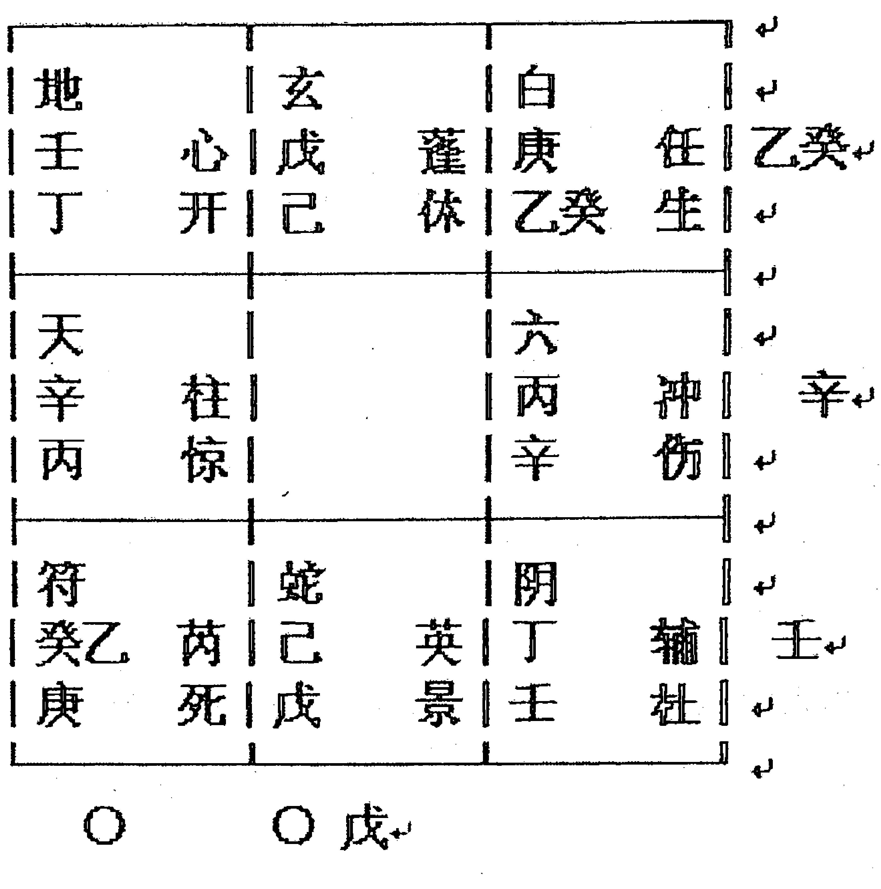

# 阴盘奇门风水

## 移星换斗实战培训讲义

内部辅导资料

——杨忠易

# 《阴盘奇门风水-移星换斗实战培训讲义-内部教材》

附：

## 阴盘奇门风水

# 移星换斗实战培训讲义

### 《内部教材辅导资料》

——杨忠易

# 《阴盘奇门风水—移星换斗实战培训讲义—内部教材》

## 序

自从我把《阴盘奇门风水移星换斗实战培训讲义》内部教材写出后，一些读者来电咨询，并将书中一些地方讲的不懂和透明度还不够等提出了要求，让我给予解答一下。鉴于本人的学习研究水平还有些成果，现把自己的理解程度和经过两年的实践经验写出来和大家共同研究、学习、交流。如有不正确的地方敬请易学高人指正，本人不胜感谢！

我的想法是不管在写易学方面的书，或者是搞教学，最主要最关键的一点是；千万不要误人子弟！或者是不懂装懂，胡编乱造。这种方式经不起实践的检验，而且还耽误学易人的宝贵时光和精力。所以做人要实在，办事要实际，要一切从实际出发，去解决一些真正的问题。以下我写的这资料，开版就直入奇门知识，没有易理、五行、八卦基础等知识。深入浅出的写出来与大家共同研究，探讨。

杨忠易
电话： 13943910159。
微信： yiyuan1015631592

# 《阴盘奇门风水—移星换斗实战培训讲义—内部教材》

## 目录

## 第一章、《阴盘奇门风水》教材讲义补充

- 一、《奇门风水》第48页（阳宅）补加例题-------179
- 二、《奇门风水》第41页第四节：补景物断法-------191
- 三、《奇门风水》第62页（看墓中是男、女）-------192
- 四、《奇门风水》第87页婚姻的预测-----------------192
- 五、《奇门风水》第88页、婚姻的例子-----------------193
- 六、《奇门风水》第118页、官灾预测-----------------195
- 七、《奇门风水》第128页、象意求财-----------------198
- 八、《奇门风水》第137页、择日法---------------------198
- 九、《奇门风水》第143页、车祸预测-----------------199
- 十、《奇门风水》第145页、刑事案件预测-----------200
- 十一、《奇门风水》第173页、阴、阳宅例子-------203
- 十二、《奇门风水》第183页、讲灵异例子-----------204
- 十三、《奇门风水》第196页、策划生小孩-----------205

## 第二章、解答疑问

- 一、一个宫里即击刑又入墓怎么看？ ---------------207
- 二、伏吟局要转宫看，那本宫有没有力量？ ---------207
- 三、《奇门风水》可以主动给人家预测吗？ ----------207
- 四、看孩子的事用神是时干，他的平台怎么看？ ------208
- 五、学习当中遇到的困惑为什么？--------------------209
- 六、怎样看职业定向？--------------------210
- 七、起局隐干遇到甲怎么排隐干？--------------------211
- 八、看一个人的前景怎么看？--------------------214
- 九、调风水一定要到现场吗？--------------------214
- 十、《阴盘奇门》起局必须要念咒语吗？--------------------216
- 十一、关于环境与脸有影响吗？--------------------219
- 十二、看财运除了“戊”还怎么看？--------------------222
- 十三、拆、补、移分不分先后？--------------------225
- 十四、为什么见“辛”就可以置换？--------------------225
- 十五、策划生小孩具体怎样操作？--------------------226
- 十六、用《阴盘奇门》升学怎么看？--------------------228

## 第三章、关于对灵异病（邪魔病）和小孩惊吓调整的探索

- 一、谈谈对灵异病的认识--------------------232
- 二、关于对小孩惊吓症的调整--------------------247

## 第四章、实践例题精解选

- 一、《阴盘奇门》测来意的程序--------------------254
- 写在后面--------------------263

# 第一章 《阴盘奇门风水》内部教材补充

## 一、《阴盘奇门风水》第48页（阳宅）

这里在讲阳宅时没有讲例题，下面我们补加一个例题；

- 公元：2009年6月18日15时22分 阳6局
- 农历：丑年05月26日15时22分
- 干支：己丑 庚午 甲午 壬申 (戌亥空)
- 直符：天心 直使：开门 旬首：(甲子戊) 戊

| 六 丁 冲 死 | 白 丙 辅 惊 | 玄 辛 英 开 |
| 阴 庚 任 景 |            | 地 癸乙 芮 休 |
| 蛇 壬 蓬 杜 | 符 戊 心 伤 | 天 己 柱 生 |

这是我去年6月份的一个例子。一天下午本市一位45岁左右的男士来到我的家里，（后知姓季）他一进门便说：“杨老师，听说你看事很准，您的什么奇门很厉害。我这次出门回来就来找您给我看看，我这两年很不顺，有人给我看过，说是我的房子有问题，看房子是不是风水的事？您能用奇门给我看看吗？”。我说也能看，但是不一定能看准，试试看吧。之后我又说：“看房子在这里看不是很准的，得到现场看才准的”。他说：“那好，请您去一趟给我看看吧？”之后我们打车一起来到他家。他住在阳光花园的一号楼5单元四楼。我进门看了一圈后便起局，即是上面的局。当局起出来后一看很符合他的信息，便给他断了以下几条；

- 1、我说：“你是个老板？你做的生意很大，是与“火、矿产有关，并且还是流动性的生意，好像是用火车运的东西？他当即回答说：“你说的对呀，我是做生意的，是搞煤的，往外地发煤的。”我说：“我看你在今年一开始，生意就不好，货物积压，煤发不出去，还破财了是吧？”他说：“是啊，你说的对，去年的年底我储存了一些货，准备今年发出去，可是出问题了，对方以上次发的煤质量不好为由，今年不要了。”我说：“你现在是紧打对方的溜须，（吉林省白山市：杨忠易，微信：yiyuan1015631592，电话：13943910159）求人家啊，又在人家身上花了钱是吧？在铁路方面也出了问题是吧？也花了钱对不？”他回答说：“你说的都对，是这么回事，真上火啊！”
- 2、我看头一件事说对了便有信心了，证明这个局是对路的。接着我大胆的说：“你这两年运气不好又不顺的，一个是你的家里老被盗。二是你的老婆也跑了对吗？他当时听我说过后很吃惊，说：“杨老师真是名不虚传那，看得真准啊，你再继续说？”我当时也很高兴，把这两件事说准了我更有信心了。我接着说：“因为你总不在家，家里又没有人看家所以在去年的阴历六、七月份里家里被盗一次，又在去年的年底或在今年的正月又被盗了一次对吗？”他说：“是被盗了两次，一次在去年的7月13号。第二次是在今年的正月二十二，连盗两次，真倒霉。”我说：“第一次丢了钱、首饰和衣服。钱应该是在8千元左右，首饰价值应该在2千元左右，衣服的价值不多，可能是旧衣服了。总计损失大约在1万元左右对吗？”他说：“你说的基本对，光现金就是1万元，首饰是一对宝石耳钉，价值2千元左右，还是老婆走的时候落下的，衣服没有丢，旧衣服没有人要”。我又说：“在今年的正月这次没有丢多少东西，但是贼不偷空啊拿了点不值钱的东西是吗？”他说：“这一点你说得对，上次我丢了钱，谁还敢在往家里放钱啊，上次把门锁钻坏了，我又换上新的，并且又上了双锁双保险，但是还是被钻开了，门没坏，锁不能用了。东西只是丢了点玩的东西，没几个钱。我又说：“这两次应该是一个人所谓啊，但没法证明啊。可能知道你的底细。你有钱，老婆又走了，你又总不在家，所以他胆子就大啊？”他回答说可能是吧。
- 3、我说：“你老婆是在06或07年走的，是你伤了她，把她给气跑了，是因为你在外面有女人了，这个女的和你老婆是朋友或是同事，你们是在05年处上的。这个女的有家室，岁数小，长得好看，皮肤是脸有点黑看上去有些病态，但身上白，个子不高，人有些懒散，但肚子里有心眼，很会拐着弯说话，她在追着你啊，你被她迷住了。这个事被你老婆发现后，和你多次吵架，但是你不收敛，继续做你的，她才和你离的婚，儿子和你在一起。其实你老婆心里有你，她还是爱你的。”他回答说：“是啊，老婆是在前年的11月份和我离的婚，是因为知道我外面有个女朋友的事”。他接着又问我：“杨老师，你看我和那个女的有结局吗？”我回答说：“你们是没有结果的，不超过两年，后年的二月份或八月份可能就要分手了。”他又问为什么呢？我说你们是有缘无分啊！
- 4、我又说：“你的身体也有不少的病啊，心脏、气管或肺部、泌尿或肾脏、脾胃等方面都有病啊？”他回答说：“是啊，我是心脏不好，气管不好，但最主要的是我的肾脏有病，还有胃肠道病很厉害，总拉稀啊，你说这都是因为房子的风水不好吗？”我说：“是的，住房的环境对你的影响很大，不敢说出百分之百的作用，但是对你的影响是起很大的作用的。你的房子外边环境有煞气。你改不了外面的环境，所以这房子不适合你住了。你看你的西南方那边的楼房比你住的这个楼房高；东北方的马路；西北方的高大烟囱，还有垃圾点；正南面那条小路等等都是煞气，都对你的房子有影响的。”他说：“这么多毛病啊，我们怎么看不出来呀？你说哪边的烟囱不好，可它也没对着咱啊？我回答说：“这就是《奇门遁甲》的功能、奥妙。要是我们只用风水术的办法是看不出来这么多事情来的。他问我：“杨老师，你看的这么准，我这回真服了，那你帮我想个办法调理一下吗？”我回答说：“如果是你家里的内环境有问题了我会给你调整的，但是外边的环境对你有影响我是没法办的，你不能去把人家的烟囱扒掉吧？不能把道路给改了吧？所以就有一个办法，把房子卖掉搬家了。”他见我说到这里摇了摇头，又叹了口气没再说什么……

下面我们详细解析一下我给他断卦的思路；

- 1. 我为什么说：“你是个老板？你做的生意很大，是与“火、矿产有关，并且还是流动性的生意，好像是用火车运的东西？”

解析：现场看阳宅，本人又在现场，看日干，日干即是阳宅又是人。日干甲午（值符）落坎宫是房子的坐向，是壬山丙向，但是这座楼的门洞是朝北开的，那就反过来属于丙山壬向。日干临（值符）落坎宫，宫中符号：（戊+壬+心+伤、丙）在坎宫没有毛病，所以断他是老板。为什么不说他是个领导啊？咱们要运用“万象全息”论和“取象直读”的纲领去把全宫的符号都综合分析完了后，才能断他是领导还是老板。看宫中符号组合，先从隐干入手（丙）为火，大火，（戊）为土，为矿，（伤）为车，（壬）为大水，为流动。地盘“壬”托天盘“戊”是流动生财。（丙为火，伤门为车，值符为头，可直读“火车头”）。再看时干这个事体、平台，（壬）落艮宫；隐干（辛、马）“辛”为改革、改变，“马星”为动为车，（古代是以马车或马为交通运输工具，现代你见到“马”即可把它读成车）艮宫符号组合是:（蛇+壬+庚+蓬+杜）（蛇）是细长，是动态，（壬）也是动。（蓬）是大车，（庚）是大道，是路，（杜门）是关着的门。大家看；日干，时干两宫符号的组合是不是整个的火车运输的象啊？运啥？（丙+戊）是不是与火有关的土矿“煤”啊？现在搞煤的基本上是个体老板。

为什么说：“他在今年一开始，生意就不好，货物积压，煤发不出去，还破财了？日干落坎宫为下三路，凡是看人的运气，用神落下三路的80%是运气不佳的象。你看，（伤+心，伤+符）正是伤心、伤脑筋的象。为啥是这种心态？时干（壬）是事的主体，今壬水落艮宫遇门迫又击刑。（壬）又是（戊）的财，我克者为财吗。这个“财”是怎么来的？我们看（戊）的食神是不是（庚）啊？（道家奇门是阴大于阳，天盘为阳，底盘为阴）食神是产品是货啊。庚金生壬水加（辛）是不是“货变钱”？可是出问题了，遇门迫、击刑了，你得往不好的方面断，这个宫里还有10%的力量。你看这里；（辛）改变了，（庚）阻隔了，（杜）不通了，整个是阻隔不通的象，这里是铁路的问题。货发不出去了。其实原因不在这里，你看对方月干（庚）在震宫。“庚”是不是戊的食神啊？是他要你的货！“庚”这个宫里虽说没毛病，但是“庚”落在死绝之地上不旺，力量不大呀。他开始“整”事了，我们看隐干（癸、乙），癸是困难，是问题，乙是手腕。是在耍手腕制造困难、问题来阻隔“庚”你的货，（丁+景）光说好听的漂亮的话，就是不办事，好让你去求他。（坎宫生震宫，又戊生庚）所以为此在伤心、伤脑筋。

- 2、为什么说：“你这两年运气不好又不顺的，一个是你的家里老被盗。二是你的老婆也跑了。去年的阴历六、七月份里家里被盗一次，又在去年的年底或在今年的正月又被盗了一次。

咱们既然看阳宅就要把问题放在主要的问题上来，说他家两次被盗理论根据是；看阳宅有内景和外景之分，咱今天主要讲外景。外景常用的符号是：“插、反、断、走、射、破、探、冲”等。这八个字的作用《遁甲》资料里有，在这里不在论述。第一次被盗在六、七月份，看坤宫，这里符号；（壬+玄+辛+癸乙+英+开）“玄武”是探头煞在坤宫入墓有毛病，“玄武”是小偷，入墓是隐藏，坤宫克坎宫，出问题了。（我在现场看他家楼后面多少偏西南的方向正有一个楼房，它比这个楼高出一层，正好在2—5米之间的范围，已构成探头煞的格局）。

断他第一次丢了钱、首饰和衣服。钱应该是在8千元左右，首饰价值应该在2千元左右，衣服的价值不多，可能是旧衣服了。总计损失大约在1万元左右。并且小偷了解他的底细。看坤宫隐干（壬），壬即是时干又是戊的财，隐干、引干；是他的钱（壬）把小偷引来，再看宫里的符号组合；（玄）为小偷，（辛）为犯罪，（癸）为小智慧，（乙）为艺术、为手艺，（开）是什么？是值使门，值使门在阳宅里就是出屋的大门。辛金是改革是破坏，乙+癸，是手上的智慧，临开门，不正符合一个撬门破锁的象吗？啊！这小偷长的还英俊那（英）。大家看？我这个分析思路是不是合乎象意啊？我们在读象时不但要合乎象意，还要合乎易里、情理。

断他丢的钱数是取坤宫之数：2 5 8 10。因为这宫里癸入墓，没多大毛病，冲、或填的时候会应事的，而且力量还加大。所以我断他丢钱8千元左右，首饰价值在2千元左右，还有衣服等。但回馈是现金1万元，首饰价格差不多，衣服没有丢，有些偏差。

为什么说他二次被盗？看艮宫符号组合；隐干（辛）是罪人，是惯犯，是不是坤宫里的（辛）。这小偷上次得手了，胆子也够大的了（天蓬星）胆大，是大盗！时干“壬”在这宫里，还是为了他的钱来的，临马星快，半年的时间又来了！可是这次他没偷着钱，拿了一点东西走了。（因这宫里符号有病，没有多大力量了）但是把他的门给弄坏了，（杜门）门迫，门被破坏了。在当时他说第一次被盗时他就报了案，第二次是也报了，当警察来勘察现场时发现小偷的作案手法和上次的一样，都是采用了“高科技”的手法，外表看不出破坏多大，使用微型电钻把锁上钻两个小洞，就把锁打开了，与修理锁配锁的人技术差不多。

在看阳宅遇庚、辛、壬、癸临白虎克你是反弓路或路冲。但今天艮宫里虽没见白虎，但是我们要通便一下来看，这宫里有“庚、辛、壬”三个符号符合象意，特别是我在现场已经看到了东北边有条路，没看出来有没有弯弓射他。可是我们的《阴盘遁甲》神奇的告诉你这条路对你不利了。按阳宅看法是：“反”和“冲”，反即是反宫路，冲即是是路冲。（低处为冲，他住的四楼高，路在下面，临宫克你为路冲，特别是宫里有毛病克你厉害，不克你不算路冲）。

- 3、为什么说他老婆是在06或07年走的，是他伤了她，把她给气跑了，是因为他在外面有女人了，这个女的和他老婆是朋友或是同事，他们是在 05 年处上的，这个女的有家室，岁数小，长得好看，皮肤是脸有点黑看上去有些病态，但身上白，个子不高，人有些懒散，肚子里有心眼，很会拐着弯说话，她在追着你啊，你被她迷住了。

“值符”甲的人婚姻都不好，因为他有二心；甲、己合，己是正配，所临之宫天盘符号的相合之干就是他的第二个“心思”。今天这个宫里除了“甲”还有“戊”。“己”是他老婆，落乾宫入墓、空亡。大家请记住这一点，看婚姻只要遇空亡之宫，是基本是离婚的信息。你想啊，空亡了是没有了，再看婚姻时，空亡不用转宫看。空亡填实的年、月就是离婚的应期。告诉你一个常识，我们搞预测的应当明白一个道理；凡是来看什么事情的，他的这个事情一定不会好的。你想他两口子感情很好的时候，能来找你给看看婚姻的吗？他的事业很好，很顺利的时候能来找你看看吗？谁发了财或捡个钱包他会来找你给算算那？何况还得花钱啊？好！咱们还得继续分析这个局。

我断他们已经离婚，他也反馈说是。那怎么离的？看日干宫；（丙）这人脾气不好太急躁，出口爱伤人（伤）看他的外表（戊）人很老实，厚道，可是心里总想的是生意（戊）。想的是钱（壬）。可是出乱子了（丙）。引干有丙一定会出乱子的 “戊、癸”合，“癸”是外遇，在兑宫。这宫里没毛病，和坎宫同气，“同声相应，同气相求”。他们能说到一起去，有共同的语言啊。兑生坎，这女的追男的，也是缠着男的，为的啥？为的是男的钱啊！“己”是值符的财，“癸”又是戊的财啊。总之是为了他的钱，他是老板，他有钱吗是吧？咱这样读的象合乎易理吧？其实我说你同那个女的没有结果是；那女的只为钱，她不会离婚跟你的。你看；（乙）是那女的另一半，乙、庚合，庚是丈夫，在震宫，虽然两宫相冲相克但不会离婚的，为什么这样断？你看；（1）两宫符号同气，都没毛病，也是“同声相应，同气相求”。（2）男庚女乙，阴阳正位，又男落震宫阳位，女落兑宫阴位，落宫位也正，符合阴阳大道。（3）两宫有相同的符号“庚、乙、癸”。这叫打不散的婚姻。为什么？两宫对冲是在一起的时候就打，当分开一个阶段的时候又互相挂念，互相想着对方。有的问了这一点怎么看？看两宫的隐干啊！女的往西（兑宫）男的跟着（隐干庚），男的往东（震宫）女的跟着（隐干乙）。其实这不叫跟着，是心里想着。这就是他们不会离婚的条件，别一看见两宫又冲又克就给人家断离婚，冲。克是一种管# 《阴盘奇门风水—移星换斗实战培训讲义—内部教材》

煞或约束。“庚”落死绝之地是那男的无能的表现，外表看像男人，其实软绵绵的没有男人的阳刚之气，你说哪个女的喜欢这样的男人啊？所以这女的不喜欢她男人，为此又在外面找情人了。

## 二、《奇门风水》第47页（第四节：单宫断——远空断）

这里补充“景物断、声音断、闪念断法”。

景物断：这里简单讲一点“景物断”等概念，景物断也叫外应断法，断人事时可用，不但看用神落宫状态，还可参看他坐在什么位置上。如一个人预测，日干落坎宫，坎宫的符号是他的主要信息，但他却坐到了震宫的位置上去了，那么震宫里的一些信息也反映了他的事。这个宫也要参考。还有他坐在这个位置，那墙上挂的什么东西，坐的什么椅子，桌上又摆的什么东西，都可参断。这就是景物断，也叫外应断法。

声音断法：这也属外应断法之列。当给人家断事时，他“唉声叹气”或“打喷嚏”，或者说当正在断事，忽听门外有声音，似乎把注意力给吸引了去。比如放炮声、锣鼓声等，可立时抓住参断。如人家问婚姻，听到鞭炮声可弃局不用，直断：“你的事成了”。当听到不好的声音时，可说你的事不成等等。

闪念断法：概念就是；当给人家预测时，突然一个闪念，一个灵感来了，也可弃局不用，直断成败。因为我们学的奇门遁甲，也是玄学，当有灵感时，把它用上非常准的。灵感是“神助”，神助大于一切。

## 三、《奇门风水》第53页（阴宅）

阴宅看墓中人是男、女，看“丁或癸”。如果没有“丁、癸”，那怎么看？那就看来求测人的性别，男的问，墓里的人是男的；女的问，墓里的人是女的。如果同时来了2—3人或多人怎么看？那就以谁先发问，就以谁定性别。

## 四、《奇门风水》第75页（婚姻的预测）

这个局是王老师现场断的例子，在这地方他断错了。看婚姻人在现场，以日干为用神。日干“庚”落兑宫空亡了要转宫看。人在现场要深挖，兑宫的先天宫“坎”，到后天成象在坎宫。今坎宫符号（符+壬+己+癸、芮、休）这宫里虽没有毛病，但是你别忘了，凡是看婚姻，临值符、或寄宫的指定不好，因为这些符号不是一个“心思”。所以断她第一次婚姻不成是对的，但不是看“巽宫”的符号与“艮宫”符号的关系。其实“庚”空亡了也是婚姻不成的信息，因为这个宫里只有20%的能量，也是不成的信息。

## 五、《奇门风水》第75页（婚姻的预测）

这个例子讲到这里其实还不完全，既然是讲的婚姻问题我个人认为应该把她的父母的婚姻讲一讲。这里提到了“一爸”，“二爸”的问题。看得出来，这女孩的父母婚姻上一定有问题。

下面咱们继续分析这个局：

丁亥 己酉 庚午 癸未 阴 6局
值符：天芮 值使：死门 （甲戌己）

| 马 | 玄 癸庚 蓬杜 | 白 丙丁 壬景 | 六 辛壬己 冲死 | 癸 |
| :--- | :--- | :--- | :--- | :--- |
| 乙 |  |  |  |  |
| 壬己 | 地 戊辛 心伤 |  | 阴 庚乙 辅惊 | 丙 |
| 丁 | 天 乙丙 柱生 | 符 壬己 癸休 | 蛇 丁戊 英开 | 辛 |
| 庚 |  |  |  |  |

看婚姻王教授的阴盘奇门分得很细致，是用了“一卦清纯”的办法。即“八字”用的十神方式。这个办法能把男、女双方的六亲分得清清楚楚地。这一点《奇门风水》中讲的很细了，咱这不再叙述。

女孩的母亲“戊”在震宫击刑了，父亲“乙”在艮宫，这宫里没有毛病。两宫不同气，又没有相同的符号，是没有共同的语言这是一。男临符号阴，女临阳，两宫又相克，这是婚姻不吉的一种表现，这是二。第三点是二人的性格不同，一个是内向型，（地+戊）地为低、低沉，（戊）为慢，性格慢、性格发闷，（戊）在这里击刑，人有些愚钝。在经常伤人（伤）。一个是外向型，（天+柱+生）“柱一天”，对照天说话，（生）生气活泼。但是地盘（丙）丙是火，是大火。是内心一团火，是过不到一起的。他俩是有缘没分的，所以男的远走高飞（天）。女孩提到的二爸，看“乙”的地盘“丙”，丙翻宫到离宫，这宫符号没毛病，和震宫也不同气，但两宫有相同的符号“戊”，又有先后天的关系“离”。两宫相生，相对比较这两个宫好一些，可能女孩子的母亲和二爸在一起住的。

## 六、《奇门风水》第100页（官灾的预测）

官灾的预测这一部分实际上在《奇门风水》里讲的不是完全细致，这里我们把它补充完整。

- 预测官灾的主要符号：庚、辛、壬、癸、白、伤。
上述符号在宫里有毛病时，可考虑是官灾的信息。庚辛、壬癸是犯了制度方面的法规。“辛”是革命、改革，一革命就会犯错误的，是超出常规了。

- 预测官灾要结合天三门、地四户来断，用法是“月将”加时上。如果说用神落宫临上述符号，而隐干又有：“辰、戌、丑、未”时可以肯定是官灾。好，我把十二月将给大家解析一下：

+ 子——神后：车祸、水灾
+ 丑——大吉：受贿罪，（数额大）
+ 寅——功曹：霸权、渎职罪
+ 卯——太冲：车祸、（撞车）
+ 辰——天罡：涉黑犯罪、（勾心斗角）
+ 巳——太乙：立场不稳定把握不住自己犯罪。（火灾）
+ 午——胜光：火灾
+ 未——小吉：受贿罪（数额小）
+ 申——传送：车祸、（被车轧）
+ 酉——从魁：因诈骗犯罪
+ 戌——河魁：诈骗或欺骗犯罪
+ 亥——登明：水灾

举例说明：

例：丁亥 辛亥 戊午 戊午 阴4局
值符：天任 值使：生门 （甲寅癸）
（一女电话问测）

| 丑 | 壬寅 | 卯 | 马 |
| :--- | :--- | :--- | :--- |
| 子 符 癸 戊戌 | 天 任 己 壬 | 地 冲 戊 庚乙 | 辅 辰 |
| 亥 蛇 辛 己己 | 蓬 休 | 玄 壬 丁 | 英 景 丁 巳 |
| 戌 阴 丙 癸癸 | 六 心 开 丁 辛 | 白 柱 惊 庚乙 丙 | 芮 死 午 |
| 酉 | 申 辛 | 未 |

这是在《奇门风水》里讲的例子，但是讲的不细致，咱再补充一下：

已知他是为钱财犯了罪。戊为钱财，庚是得到钱财了。咱们看他应不应该得这个财？隐干“未”为受贿罪。那有人要问了，这个宫里有两个隐干符号“午、未”，为什么用“未”不用“午”？咱得综合考虑问题，全面的分析一个事物，“午”是火灾，是与火有关的问题，除了放火犯罪可看“午”，但是放火也得有原因啊？时干戊落坤宫，戊是财，你不能断他得了财还去放火吧？所以用“未”不用“午”。进去的时间应该是在“戌、亥”月吧，非冲既填吗！

（吉林省白山市：杨忠易，微信：yiyuan1015631592，电话：13943910159）

## 七、《奇门风水》第108页（三、九星象意、求财）

倒数第五行。这里应该补充：“你家东边有银行或珠宝店吗？”（答：东边有银行）好！如果说了你那东边有银行了，这时就得反断了，你干的这行是不成功的！要是没有银行或珠宝店的话，你干的事会成功的！为什么这样看？告诉大家一个小窍门：应象了为实象——成功！不应象为虚象——失败！
所以看一个人的事业，就看他的落宫符号，他越是符合这些符号越能干好，象意符合的越多，成功的机会就越大！

## 八、《奇门风水》第116页（择日法）

择日法选黄道吉日，这里补充的是：择日可以不用“天三门、地四户”。但是一定要应象！首先选择在年、月、日、时四纲上的日子宫位，宫里要没有毛病，可以用！如果说“四纲”宫位有毛病，再选其它宫位。但是必须注意一点：一定要应象！不管是不是“四纲”一定要符合你所做的事情象意！那不符合象意怎么办？那就再等九天后起局再测！大家要记住一点：无论干什么，按象去做吉利！不按象做或按不好的象做不吉利！（关于王教授的“九天后再起局”我不敢说不对，但是在实际应用起来好像不适应。我是按十二天后起局应用的，在实践中可行。）

（吉林省白山市：杨忠易，微信：yiyuan1015631592，电话：13943910159）

## 九、《奇门风水》第119页（车祸的预测）

补充：

再预测车祸这个例题局，是报数起局，王教授在课堂上也说报数起局不是十分准确的，有待于今后的实战中验证。我认为有关报数用奇门起局预测的例题不多见。我一般报数起的是八卦象数起卦，这个办法快，断事也很准。报数用奇门测事我也用过，有时也准确。用的时候多数是现场多人在同一个时辰问事，只是一个局，报数后，定用神落宫。

上述例子，我的看法是：时干为事，为平台。是这场车祸促成的环境，是因果。如果没有这样的环境，就没有这样的行为发生。在一定的时间，一定的时空，去一定的方位，去把这个方位的象意填实，就会应这个象意的事情！奇门就是这么神奇！这就是阴盘奇门的四大论点：“万物系统论、万物有意论、万物相干论、万物全息论”！大家要通盘理解这一论点后，就去“取象直读”。当我们给人家断出有车祸的信息时，你得给人家调整啊，不让他去应这个象，不就避免了车祸了吗？怎么处理？把他的平台拆了！“戊”在艮宫，遇击刑“庚”、门破“杜”。空亡。空亡了填实后就应象！在《阴盘遁甲》里，王老师讲的是用神在坤宫出的事，但没讲发生在那一天。我说是在艮宫的时间发生的，空亡填实就应象！艮宫这里的符号明显是有车祸信息的；隐干“己”，拐弯处，“马”为车、为快，“庚”为大道，“蓬”也为车。

## 十、《奇门风水》第123页（刑事案件预测）

预测刑事案件，我们只给人家预测出事情来是不够的，我们还要给人家策划怎么样去抓贼啊！怎么个抓法？我们再看这个例子：

- 例：丁亥 己酉 辛未 丙申 阴8局
- 值符 天芮 值使 死门 （甲午辛）

| ○ 癸<br>○ 戊 | 玄 丙 壬 蓬 惊 | 白 戊 乙 任 开 | 六 癸 丁 辛 冲 休 | 壬<br>丙 |
| :--- | :--- | :--- | :--- | :--- |
| 地 庚 癸 心 死 |  | 阴 壬 己 辅 生 | 乙<br>庚 |
| 天 己 戊 柱 景 | 符 丁 辛 丙 芮 杜 | 蛇 乙 庚 英 伤 | 丁辛<br>马 己 |

看怎么抓罪犯？已知罪犯月干“己”落艮宫，其它八宫都是公安，要看哪个宫克罪犯落宫力量最大！如果克罪犯落宫的宫临年、日、时纲上的最好，不临的话，看谁的宫最有力。看上边的局；“震、巽”两宫是克艮宫的，巽宫击刑、门迫又空亡没有力量了，震宫没有毛病，尽管“庚”在这里不旺，（不旺是能力差的表现）“庚”也为公安，抓个罪犯还是有能力的。帮他策划；可在罪犯的东边震宫的位置、时间设伏，“癸”是黑，黑夜，“九地+癸”低洼处，“庚”是枪，拿着枪，“死门”不动，趴着不动！在寅、卯时即可抓住罪犯！

预测刑事案件时，还有些窍门，在这里告诉大家；如果说犯罪分子落宫和公安人员落宫同宫的情况，有可能是内部人员作案（比如；日干、月干是同一个字落在同宫里，寄宫也是同样），或是投案自首的信息。犯罪分子的落宫生公安落宫也是投案自首的信息。两宫比和是与公安讲和或谈条件。公安落宫克犯罪分子落宫应主动出击！如果说犯罪分子落宫克公安落宫，可能是犯罪分子太猖狂，在破案中公安人员要小心谨慎，防止被犯罪分子伤着。公安落宫有击刑、门迫可能在破案过程中有人受伤，或者说情况复杂，不顺利等。公安落宫生犯罪分子落宫案子不好破。犯罪分子临马星、九天跑的远不好找。

另外，如果犯罪分子落寄宫是有同伙作案，六合，是团伙作案，临天蓬是江洋大盗、黑社会。见“庚、辛、丙、丁、天柱”都是凶器！

## 十一、《奇门风水》第147页（讲阳宅、阴宅的例子）

例：丁亥 戊申 癸卯 丁巳 阴5局
值符 天英 值使 景门 （甲寅癸）

丙

| 地 丙 柱 己 休 | 玄 乙 心 癸 生 | 白 壬 蓬 辛戊 伤 |
| :--- | :--- | :--- |
| 天 辛戊 芮 庚 开 |  | 六 丁 任 丙 杜 |
| 符 癸 英 丁 惊 | 蛇 己 辅 壬 死 | 阴 庚 冲 乙 景 |

马 ○ ○ 庚 上面

这个局在《阴盘遁甲》资料里，虽说是讲阳宅、阴宅的例子，但在课堂上只讲了阴宅的断测方法。阳宅没有讲，为了完善这个局的全面分析方法，我们来继续分析。奇门的神奇功能就在于用一个局可以全面的分析求测者的一切事情。那么看阳宅；日干（癸）的正印（庚）在乾宫，房子的坐向应该是坐南向北，门开在西北方（乾）。（景）门是值使门，一般的看阳宅，值使门是出入房子的大门。那么咱们看看房子怎么样？“景门”在这门迫，（乙）入墓，这房子不好有问题，（阴）采光也不好阴暗，西北方有马路（马）有丁字路口（丁）直冲着房子（冲）犯路煞，凶！那么我们看看这房子最主要的对谁不利？是对乾宫冲、克之宫所属的六亲不利，震宫的（戊）是老婆，对老婆不好，老婆会生病的，身体不好，住久了易得肝胆（开门门迫克震宫）、胃肠道等病（戊+庚）。巽宫（丙）是（癸）的财，易破财。就这么断。在我们看阳宅最好是到现场去看，到场后先转一转、兜兜信息，然后再起局，这样信息抓的准确，会一目了然看得清楚。当然不到现场也能看，但准确率比到现场能低一些。上述例子只是给大家讲一讲不到现场的断法。有关看阳宅的例子咱们在开始的第一篇就讲过。

## 十二、《奇门风水》第154页（讲灵异例子）

补：我们在分析一个事情时，要翻宫、转宫去看事情的缘由，像空亡那样转宫去看以前的事情。每个局都是你的终身局。看前世要以出生的时间翻宫（先天宫）。看后世（后天宫）。如果你要了解前世，用你的出生年、月、日、时起局来看比较准确。奇门是一门博大精深的学问。在阳盘奇门里看终身局是用这个办法，也有例子。目前在阴盘奇门里还没有这方面的例子，大家可以用这个办法实践一下，看看是否可行。

## 十三、《奇门风水》第163页（策划生男、生女例子）

在“行为风水学”方面还可以加上这一样的行为：

例：丁亥 己酉 癸酉 己未 阴9局
值符 天辅 值使 杜门 （甲寅癸）

| 坎<br>马 | 地 | 玄 | 白 |
| :--- | :--- | :--- | :--- |
| 癸 | 丙壬 芮<br>癸 死 | 庚 柱<br>戊 惊 | 辛 心<br>丙壬 开 | 丙壬 |
| 丁 | 天<br>戊 英<br>丁 景 | 六 | 乙 蓬<br>庚 休 | 庚 |
| 己 | 符<br>癸 辅<br>己 杜 | 蛇<br>丁 冲<br>乙 伤 | 阴<br>己 任<br>辛 生 | 辛 |

局：即选中要用艮宫生小孩，还可按符号去做；（己+癸）用嘴亲“癸”，也可把符号填实。

> “先辩象，后选场，造物必成形！”

做行为的时间应该在地支的时间，丑月、丑日、丑时。或在寅月、寅日、寅时。空亡得填实呀！填实就应象啊！在这样的时间，做这样的行为，你会感到非常的美！非常的奇妙！要记住；年、月、日、时，四个纲有一个宫为应期，叫有气！

> 这就叫：“心中充满爱，好事才能来！”

# 第二章 解答疑问

一、太原读者刘女士来电话问：“在一个宫里即击刑又入墓怎么看？是论击刑？还是论入墓？还是都论？”

答：在一个宫里有击刑，又入墓的情况下，都论。

例：
艮 | 玄 | 宫
庚冲 |
辛杜 |

比如在艮宫的“庚”，入墓又击刑，我们即论入墓，又论击刑。（但是这里有“杜门”论门迫）入墓力量减80%，门迫减50%，艮宫力量还剩10%。

二、有的读者问“伏吟局要转宫看，看法与空亡一样吗？那在没有转宫前的伏吟局本身的宫还有没有力量，怎么看？”

答：遇伏吟局时，本宫的力量是50%，转宫后的力量是50%。看法同空亡不一样。

三、山东泰安的牟易友来电话问：“阴盘遁甲是不是能主动给人家预测？比如说我想看看这个人的事，或这个人的身体情况，而这个人就在眼前怎么取用神？”

答：主动给人家预测和来人问事预测是一样的道理，取用神的方式是一样的，即：人在面前看日干，人不在面前看月干，长辈看年干，小字辈看时干。

四、山东临沂的赵先生来电问：“看小孩的事情或小辈的人问事以时干为用神，那么他（她）所问的事情或他（她）的平台怎么看？还看时干嘛？那看他的发展，前途和愿景怎么看？谁看孩子的事情都想看看孩子的将来怎么样？关于这一点我不知怎么看？请老师给予解答一下，谢谢！”

答：看小字辈的事情以时干为用神，他（她）所问的事情或平台应该回头看日干，日干是他（她）所问的事情，日干是他（她）的平台，是他（她）在问事时的目前状态。那么要想看他（她）的发展、前途应当把日干落宫地盘干的符号翻到天盘落宫上来看，看这个天盘符号的落宫状态与用神落宫的状态之间的关系，就是孩子的未来发展和前途。看孩子的愿景是把用神落宫的地盘干翻到天盘上来看，这个天盘落宫符号的状态，就是孩子的未来愿景能否达到的显现信息。（用神的地盘符号是他的心里想的事、心理活动，也就是他的思想）

五、山东泰安的易友第二次来电话问：“杨老师你说这个《奇门风水》我刚开始学的时候，测事很准的，怎么这些日子给人测事又测不准了呢？我有些困惑了，我倒不是怀疑《奇门风水》？”

答：关于这个问题，我们俩在电话里谈得很多，还有些读者和外地学员也是问这个问题，这是个普遍性的问题。刚开始学习的时候，（不管学习哪种预测术）思想简单不怕说错，张口就说往往奇准。当我们有了一定的基础和功底后，这个时候是怕给人家说错，但往往越怕说错的时候越是出错，这是其一。在给亲朋好友断卦的时候准确率也低，这是为什么呢？有三点：

+ （1）是因为你了解或知道一些他们的事情。这样会干扰你的判断思路。
+ （2）他们因向你问事情你不收费，所以他们传递的信息不集中或不太明显等。
+ （3）不是要紧的事、或事不大及很随意的发问等。

这是其二。还有最主要的而且是多数易学爱好者都忽略的一点；就是不看用神的旺衰去断卦的问题，奇门遁甲也得看旺衰。也用“十二长生”。这点我们在《奇门风水内部教材》讲过。不看旺衰断卦是断不准的。用哪种预测术都得看旺衰。批八字的旺衰是第一关，你把旺衰整错了没个# 《阴盘奇门风水—移星换斗实战培训讲义—内部教材》

断准。六爻的《千金赋》中说：“世爻旺相最为强，做事亨通大吉昌。谋望诸般皆随意，用神生合妙难量……”。奇门看一个人落宫状态，除了看宫中符号有没有毛病外一样得看他的旺衰。就像一位读者咨询：“我给人家看财运，日干落宫、时干正好临财落宫都没毛病，而且时干又生日干，断他有财，结果应期到了他没得到财，不知为什么？请老师给解答一下”。当时我问他起的局，现在我只记得是日干“庚”落震宫绝地，时干“乙”落坎宫病地，两宫虽都没有毛病又相生，可是你别忘了“身弱不担财呀”，一个身体多病骨瘦如柴的人，你给他150斤的担子他能担得起吗？何况又是“身弱财轻”哪来的财啊！所以一定得看旺衰。只讲这些吧，请大家“举一反三”。

六、邯郸的学员来电话问：“职业定向，也就是来人问测看看能干什么职业，是用时干看吗？请指导一下！”

答：这个问题是我们搞预测的常遇见的一个问题，很多人特别是一些年轻人，他们没事可干，不知道自己能干些什么事业，自己没有理想，没有打算，只好求助于我们给他指点指点或者策划一下。

其实这问题很简单：

-   A 主要看日干或用神落宫，看这个宫里临什么符号，如果这宫里符号没毛病，这些符号就最适合他干的事。还得看旺衰，旺，是有能力，衰，是无能力的表现，然后看时干，时干是他问的事，是他的平台，是他想干事业的环境，演员演艺再好，他没有“舞台”、没有用武之地也是白费啊！所以一定要结合时干看。二是日干或用神宫的符号，是你想干的事业，你干的事符合宫里的符号越多越能成功，否则要打折的。
-   B 有的人问了，那要是日干或用神宫有毛病怎么看啊？翻宫！看日干或用神宫的地盘符号，把它翻到天盘来看，这个宫里符号要是没毛病就可以了，那再不好呢？再翻！在翻后还不好！还翻！一共能翻三次，当第三次翻完后还是不行的话，行了，那就别翻了！那就是反映了这个人是一生无所事事的人。是一个很平庸的人。

七、2010年4月21日晚重庆的读者来电话咨询，由于他的普通话说得不好，我也没有听清他说的什么，只好叫他发短信告诉我问的什么事情。短信来后我看明白了，是问：隐干如果遇到甲的时候怎么排法？

答：重庆读者问的问题，还有些个别网上易友也问过这个问题，其实我的资料里虽没有写的，因为是很简单的东西，王教授的书里都有。好，为了承诺“有问必答”，我再举例详细解答一遍。

隐干的排法有三种：

-   A、时干排在值使门旁边，这是通常用的一种。
-   B、遇甲的时辰必然是伏吟局，伏吟局宫中的符号一样，是天地重叠不动的现象，相对的信息量比较少，隐干再用同样的符号更是无法再挖出更多的信息了，为了改变这种状态把甲的所藏的符号写在中五宫，再按天干符号的顺序以飞宫的排法排上。举例说明吧，哈哈！正好我现在写这个问题时，此时正是伏吟局的时间

| 项目 | 内容 |
|------|------|
| 公元 | 2010年4月22日7时21分 阳2局 |
| 农历 | 寅年03月09日7时21分 |
| 干支 | 庚寅 庚辰 壬寅 甲辰（寅卯空） |
| 直符 | 天心 直使：开门 旬首：甲辰壬 |

| 辛 | 白庚庚 | 辅杜 | 玄丙丙 | 英景 | 地戊辛戊辛 | 芮死 | 己 |
| :--- | :--- | :--- | :--- | :--- | :--- | :--- | :--- |
| 庚○ | 六己己 | 冲伤 | | | 天癸壬癸 | 柱惊 | 丁 |
| 丙○ | 阴丁丁 | 任生 | 蛇乙乙 | 蓬休 | 符壬壬 | 心开 | 癸 |
| 马 | | | | 戊 | | | |

-   C、第三种办法是，还是甲的时辰出现，当我们把符号写在中五宫的时候飞宫排时，隐干符号还是一样的话，这时可把坤宫地盘左边的伙伴放在中五宫，然后再按飞宫法排即可。

-   举例：
    -   公元：2010年4月3日3时13分 阳9局
    -   农历：寅年02月19日3时13分
    -   干支：庚寅 己卯 癸未 甲寅 (子丑空)
    -   直符：天禽 直使：死门 旬首：甲寅癸

| 己 | 地 | 天 | 符 | 乙 |
| :--- | :--- | :--- | :--- | :--- |
| | 壬 辅 | 戊 英 | 庚癸 芮 | |
| | 壬 杜 | 戊 景 | 庚癸 死 | |
| 戊 | 玄 | | 蛇 | 壬 |
| ○ | 辛 冲 | | 丙 柱 | |
| | 辛 伤 | 庚 | 丙 惊 | |
| 癸 | 白 | 六 | 阴 | 辛 |
| ○ | 乙 任 | 己 蓬 | 丁 心 | |
| | 乙 生 | 己 休 | 丁 开 | |

上述两种办法是伏吟局隐干的全部排法。

八、深圳的一位读者来电话问：“看一个人的前景是翻宫看，要是翻宫后遇空亡了还转不转宫了？”

答：转！一定的转！按人在面前深挖，不在面前飘的办法转宫，再转宫后遇空亡了，不再转了。

九、太原、深圳、河南等地读者来电话问同一个问题：

1.  关于确定用神的问题，在各种预测术数之中极为重要，特别是奇门遁甲，虽用神取法很多，阳盘奇门无论人在不在场，求测人一律看日干，测事也很准确。而我们阴盘奇门就分开来看，人在现场看日干，人不在现场看月干，还得以日干定阴阳，看月干是阳还是阴，断事也准确。可使用起来很麻烦的，有时还出错。当把用神弄错时就断不准事情来。我们不知这个办法的易理是什么？
2.  调理风水时预测师一定要到现场吗？是不是电话、网络预测也可以调风水啊？现代的通讯这么发达，电话、网络预测是个发展趋势，别的预测方式能在电话里、网络上搞预测，其效果也很好，那我们的《奇门风水》这么高层次的预测术为什么不能呢？请杨老师给解答一下好吗？

（吉林省白山市：杨忠易，微信：yiyuan1015631592，电话：13943910159）

答：关于这两个问题我当时在电话里回答几位易友时观点是明确的。其实问这样问题的人还有，下面把这两个问题放在一起再讲一遍。

关于用神的取法每种预测术都有自己一定的方式。阳盘奇门的取法是阳盘的规定。我们《奇门风水》的理论是道家的思想、道家的理论、道家的风格。（道家的知识是不外传的东西）。是符合大自然规律、符合易理的知识。这门知识是王教授近几年刚刚传出来的。这门知识还有待于实践中的验证后，才能给这门高层次的术数一个定论。

为什么说人在现场是日干？不在现场是月干？好！咱们这么说吧；日干是“日”、是太阳，太阳的光是实象，是直接的光，所呈现的万物类象也是直接的。月干的“月”是月亮，是间接的光，是太阳照射在月亮上后反射回来的光。月亮的光是虚象，虚象是影子，影子是信息的“问题”。我这么一讲大家就会明白了吧？所以直接的东西是一目了然，而间接的东西是虚拟的，看起来的时候是曲折的、拐弯的。不如直接的那么好看。所以奇门调风水时，要求到现场看。“场”是穿越空间的，穿越实物，穿越一切。现场起局后，局中所呈现的象都是实在的，你就对应的去找物体处理就可以了。但是不在现场也能看风水，或调理风水，只不过会有些差异，必然你不在场，光看局里的符号是单方面的，有时与现实情况是有些差异的。我有几例不在现场调整例子，准备在后面写出来，以供大家参考研究。

十、河北张家口的读者赵易友来电问：《奇门风水》起局必须得默念咒语吗？

现在起局电脑软件、手机软件都可以用了，十分的快又方便，用这些东西起局也得默念咒语吗？不念断事不准确吗？当然我是初学者，不懂得如何运用，请老师指导一下？

（吉林省白山市：杨忠易，微信：yiyuan1015631592，电话：13943910159）

答：张家口的易友看来是刚开始学习啊。其实我在电话里回答的简单了一些，因为你问的问题是很简单的问题。我们当地的易友也有问这个事的，好！我在这里把咱们《奇门风水》起局的注意事项和大家讲一下；

各种预测术起卦、起局、起课都有自己的一套方式，按正理说应该遵守这些方式，但有一点是共同的，就是不管用什么办法预测，必须是“心动”起卦，来人问卦也是问时起卦，不问不占，有问则占，占必应之。六爻里的“千金赋”有一句话叫：“卦不枉成，爻不乱发”。

阴盘奇门也是一样，需要注意几点；

1.  当来人问测时，你要让来人坐一会，休息一下，喝点水或吸支烟，让他安定一下神再起局，这样信息会更明显、信息量大一些。
2.  起局一定要默念：“无极生太极，太极生两仪，两仪生四象，四象生八卦，八卦定乾坤”。这样做准确率高！特别是在处理风水时，你不按上述要求做起局就不灵验！不信你试试？当然也不是百分之百都不准。现在都用电脑软件、手机软件起局，当然这些现代化的预测工具使用起来特别快，也好使。你可以在用它起局前先默念咒语啊！念完咒语后再起局也费不了多少时间啊？一定要念！
3.  当我们心情不好，生气、发火、或是在心烦意乱的时候不要起局预测，不准！还有当你刚过完夫妻生活后的一个时辰内，不要起局预测，不准！。这个问题我不说你也会明白其中的道理。
4.  不能在动中起局预测，比如说你在坐车，不管是汽车、火车，飞机上更不行了，速度太快，信息跟不上，抓不准信息。当这个时候如果有人问事的话，你可告诉他等下了车后再给他看。这一点很重要！
5.  调风水时一定要到现场起局，到场后先转一转，看一看，把信息圈一圈收入眼底后，再起局信息量大，准确！
6.  还有一种情况就是打电话问事，而问的不是自己的事，是亲属或是朋友，或是同事的，而问的事又是他们的父母或是孩子的事。看！你说这拐了多少弯？虽然奇门是高层次的预测术，虽然奇门用神之多，你只要把用神找准是可以预测的，但是还是不如在场看的准确。我们尽量不给这样的人预测，测不准时还丢我们名誉。

请大家记住上述六点要求，可在实践中检验之。

其实我不是说我们不给人家电话里预测，电话预测不一定非得用奇门预测吧，八卦象数也是很准确的，又快，取用神也不是那么复杂，看事情也是直接的，明显的。“取象直读”即可。哈哈，这是我个人看法，我也常用这几种预测方式。一次在我当地的一位易友，他开了个卦馆，用奇门预测，一天打电话给我，说有人打电话问事，不是自己的事，问别人的事，还是别人的孩子的事，自己看不明白了来问我怎么看？就像上面咱们说过的那种方式。你说怎么看？拐了这么多弯，其实能不能看？能看，只要用神找准了是可以看的，但是准确率不高，为什么这样说？有几点，一是打电话的人大多数是熟人，他问事不收费，问的事也不一定是什么主要的事情，所以信息反映的不是很明显。二是我们预测师对这样问事的人，断卦也不是很认真思考的，甚至还有些“牵强附会”的去应付。之所以准确率不高。

（吉林省白山市：杨忠易，微信：yiyuan1015631592，电话：13943910159）

十一、广西桂林的读者在网络上问我，在实战《奇门风水》那个策划升官的例题里说：“就是这张脸有毛病影响了你的前途”，为什么这么说？那我们要是调整的时候还能把领导的脸给调了吗？假如说这宫的符号真能和领导的脸对应上的话，像“丁”红痣，“己”小肉疙瘩，“伤”是伤疤。那要是为 了我们前途的话，可我们怎么让领导把脸上的这些“东西”去掉呢？还有奇门怎么看一个人的天时、地利、人和？能给解答一下吗？

答：这是王教授在课堂上讲的例子，策划一个人是否有当官的信息，也就说是是不是当官的命。下面咱再重看一下这个局；

例：（占求官）

丁亥 己酉 壬申 乙巳 阴6局

值符 天芮 值使 死门 （甲辰壬）

| 辛 | | | | |
| :--- | :--- | :--- | :--- | :--- |
| 丙 | | 六 | 阴 | 蛇 |
| 癸 O | | 辛 庚 冲 休 | 庚 丁 辅 生 | 丁 壬己 英 伤 庚 |
| 戊 O | 白 | 丙 辛 任 开 | | 符 壬己 乙 芮 杜 丁 |
| | 玄 | 癸 丙 蓬 惊 | 地 戊 癸 心 死 | 天 乙 戊 柱 景 壬己 马 |
| 乙 | | | | |

解析：“说领导的脸会影响你的前途”？说这句话的时候我就在课堂上听到的。其实我在当时也不理解这个说法。难道我们每个人前途不好的时候，都是领导影响了我们吗？当然这个局是赶巧碰上的事，那这么说的理论根据我认为是；年干“丁”是领导，是大趋势，是大自然总规律，是国家政策。把这些象意应在领导的脸上的说法，是研究奇门的理论知识方面的东西，当然我们没法把领导脸上的东西去掉，但是我们可以把家里的环境调整了，也可解决问题的。何况这个局“四纲”落三个宫，俩好一坏。阴盘奇门不是有这样的说法吗？“你好，其它的都不好，那你也，好不了哪去！要是都好就你坏，那你也坏不了哪去！只有入流，（同流合污）要好都好，要坏都坏！才行”

第二个问题，关于怎么看一个人的天时、地利、人和的问题。年干（丁）是领导，是大趋势，是大自然总规律，是国家政策。是天时。一个人不管干什么事业，或者说人生运气，“天时、地利、人和”你都得具备，差一样不行，那是运气不好的表现。看这个局，天时是指定不好了（坤宫门迫又击刑）。年干（丁）落宫是天时，是大方向。时干也是天时，是一个人目前的状态。是平台，是一个演员展艺的舞台。时干（乙）落乾宫也是门迫（景）又两个入墓（乙、戊），看来这个人真的是不逢天时呀！那么地利怎么看？用神落宫的状态就是地利。今日干（壬）落兑宫，没毛病，体现这个人的地利可以。有人问了，什么是地利？是用神所落宫的符号组合情况，组合好又没有击刑、门迫、空亡、入墓的，是表现本人有能力、自身条件好，是所在地的周围环境对他有利。看这个人，他想当官临值符，是有官命的人。那么人和怎么看？人和就是人际关系，人脉。看他的人脉？月干（己）是朋友、同事、是哥们弟兄。在一个宫里没毛病，人际关系好，有人和。人和也包括你办事有没有贵人帮忙，奇门怎么看贵人？生我之宫是贵人，这个宫符号的组合状态是看贵人的情况。今生我的宫，坤、艮二宫都有毛病，想帮我的人没有能力，就是说没有贵人帮忙。就这么看天时、地利、人和。

十二、山西大同市的易友电话问：“阴盘奇门看财运，为什么有时看（戊）有时看我克者之符号为（财）还有我落之宫所克之宫为财，究竟如何看？有没有规律？还有就是即然看财运，假如这个人财运不好，我们阴盘奇门不是能调整吗？关于怎么调理财运方面的例子没有，老师能否解答或举例说明一下吗？

答：其实大同的王易友提的问题，也有一些人问过与这相同的问题。好，我在这里一起解答，并举例讲一下。

首先告诉大家，不管是“戊”还是“我克的字”还是被克宫的宫，都得看！

举个例子:

-   公元: 2009年5月22日10时45分 阳4局
-   农历: 丑年04月28日10时45分
-   干支: 己丑 己巳 丁卯 乙巳 (寅卯空)
-   直符: 天任 直使: 生门 旬首: 甲辰壬

奇门遁甲盘表格，内容如下（简化表示）：

| 位置 | 内容 |
|------|------|
| 顶部 | 乙 |
| 左侧 | 壬、丁 O、庚 O |
| 右侧 | 戊、癸、己丙 马 |
| 底部 | 辛 |
| 网格行1 | 蛇、阴、六 |
| 网格行2 | 乙 戊 冲、戊 癸 辅、癸 丙己 英 |
| 网格行3 | 休、生、伤 |
| 网格行4 | 符、白 |
| 网格行5 | 壬 乙 任 开、庚、丙己 辛 芮 杜 |
| 网格行6 | 天、地、玄 |
| 网格行7 | 丁 壬 蓬 惊、庚 丁 心 死、辛 庚 柱 景 |

这个例子是我去年给人家看财运的例子，我保存下来了，我把它拿出来和大家共同研究。这是一位男士来我家看财运的。我一看时干“乙”是他所问的事，在巽宫没毛病生离宫。离宫“戊”是资本，是投资，也没毛病。这宫里（戊+癸+辅+生）隐干是“乙”。“乙”是顾客，是顾客常来的地方。我说你是做生意的（生），是个开店铺的（辅）？他回答说是的我开了个超市。我说你卖的东西是受顾客欢迎的！（时干生；离宫）“生”是生活用品，老百姓都需要的。

上面我先讲了“都得看”！那么怎么看呢？“戊”当然是财，是资本。咱们先说一下为什么把“戊”当做财？。那是在农耕时期的时候，那时谁要有了土地就是有了资本，有了土地就象征着你的家业大，“地主”吗！所以把“戊”当做财。今天咱们不是在讲历史课，只是提一下就可以了。我们要“与时俱进”吗！用现代的话说：要用“科学发展观的眼光”来看待现在的事物。我们现在给人预测，再只看“戊”已经不够用了，有点太单纯了。那怎么看？我们还要用“一卦清纯”的方式来看。“我克者为财”看用神之字所克之字。比如这个局；用神（丁）落艮宫，“庚、辛”都是他的财。但是全部门迫！，有毛病了。我们要是拘泥一个“戊”字去看他的财运的话，那会看他的财运不错的。你看：“戊”在离宫没毛病，又在旺地，时干“乙”是顾客落巽宫，又生离宫，是顾客喜欢他的东西。“离”又生“艮”。你要是单看他这一点（戊），你会说他财运好啊！可是你别忘了，人家来看财运，是财运不好的时候才来找你看的，你想谁财运很好的时候、或捡个钱包高兴地花上钱来找你看财运？那是吃饱了撑的！

（吉林省白山市: 杨忠易, 微信: yiyuan1015631592, 电话: 13943910159）

上面这个局我只是回答读者提问的，关于财运的用神看法所举例子。其实这个局我又帮他“移星换斗”了。做了调整后，买卖效益在阴历的六月份就好了起来。具体的调整办法我们会在面授班上细讲的。

十三、青岛的一位朋友电话问我说：

答：不分先后！当一个局起出来后，一看有毛病了，得需要处理，怎么处理？是拆！是补！是移！就在你的一念之间！只要看出问题来了，用什么方式，也是用你自己在意念之中的信息办。

十四、成都的朋友康易友来电话咨询问我：

老师在你的《奇门风水》内部资料中，第六章第三节，讲官司的例子中；用神“戊”在乾宫入墓，是犯事进去的信息。调整时要用对面巽宫。这个宫的符号（辛）入墓、（开门）门迫。毛病这么多还能用吗？为什么还要用它？请您给解答一下好吗？

（吉林省白山市：杨忠易，微信：yiyuan1015631592，电话：13943910159）

答：一般的像这种情况下是不能用了。但是只有见到“辛金”时能用！为什么这么说？这是我们《奇门风水》的特殊规定。别的符号遇门迫、击刑了是不能用了，就是用其效果也不是太好。但是见到“辛”能用！“辛”是可以置换的！就这个“辛”特殊。

又一次我给人家预测，他的小孩总害羞问我是什么原因？当时起局发现用神正临“辛”在艮宫遇门迫了，我叫他带一串水晶珠在手脖子上，刚带上不久这小孩子就晕了，晕了一会就好了，同时毛病也好了。就是这个“辛”的作用。因“辛”具有改革的精神！

所以“行为填实”就是风水，吉和凶！天堂和地狱，就在你一念之间。

十五、张家口有一位读者唐女士电话问：“老师在《奇门风水》内部教材的第六章，第四节时中的策划生小孩子，在布局操作上的具体办法没有讲清楚，能否再给我讲一下好吗？

答：这位读者问的问题其实我在前面也讲过了，你可以再细看一看，好好琢磨一下。我这里再告诉你个简单好

（吉林省白山市：杨忠易，微信：yiyuan1015631592，电话：13943910159）

226## 《阴盘奇门风水—移星换斗实战培训讲义—内部教材》

记的方法：当你给人家策划生小孩时，起局后：

- ①、首先选年、月、日、时四纲上的（丁或癸），如果没有再选四纲以外的宫（丁、癸）。想要男孩找“丁”，要女孩找“癸”。
- ②、看用神落宫，找没有毛病的宫用。不管是天盘的，或是地盘的，只要落宫没毛病就可以用。要是天盘地盘都有的；一样的没毛病的话，就用地盘的，（阴大于阳吗）。
- ③、布局法：把所用的宫中符号，按象意去摆放物品。把宫中的符号象意摆放的越全越好。
- ④、行为填实法：就是按宫中的符号所临象意去做那种行为。还是那句话：“先辩象，后选场，造物必成形！”
- ⑤、时间按年、月、日、时宫的时间，去做传统的行为！这就叫：“心中充满了爱！好事才能来啊！”
- ⑥、假如（丁、癸）遇门迫、击刑的时候不能用了，也能处理，就是你处理好了，也不要用，弄不好，生出的孩子要畸形的！这一点千万要记住。空亡可以用，填实就行了。入墓也行，冲出来就能用，但不如空亡好，能差一些，也最好不用。那怎么办？就等12天后再起局看。不好！再等12天，还不好！算了，可能不行了。两口子可能有先天不育的毛病，咱没那水平，让有先天不育毛病的人生小孩子。（王教授说九天后再起局，我是用12天后再起局测事的）。

十六、河北沧州某中学的秦老师来电话问我说：“现在很多的预测术可以看学生的学习情况，特别是学业、学科方面，和升学考试、选科、选择考学方向等。我是业余爱好周易的，特别是奇门遁甲，很感兴趣，但是买了很多这方面的书，也没有学明白它。在浏览一些易学网站时，有幸发现你整理写出的《阴盘遁甲移星换斗实战技术》内部资料，就买了一本，看了后感觉很好！可以说是目前市面上最好的《阴盘奇门》资料。但是里面也有些不足之处；特别是在学生升学考试这一课里讲的不多，也不全面。我是搞教学的，又会点周易，有的家长知道你，就想找你给看看他的孩子会考的怎么样？可是不会看，希望杨老师能给讲讲这方面的东西。”

答：我在电话里给你讲了一些，但是不全面。还有人也问这个问题，好！咱们再把那个看文昌的局分析一下：

例：丁亥 己酉 癸酉 庚申 阴1局
值符 天芮 值使 死门 (甲寅癸)



在《奇门风水》资料里有的咱不讲了，下面我就告诉你怎么看一个学生的学习情况，下面先把代表学科符号讲一下：

- 戊——经济、地理。
- 己——历史。
- 庚——物理。
- 辛——化学。（辛为革命、改革、变化，所以代表化学）
- 壬——数学。（壬为智慧、人的思维逻辑、计算，所以代表数学）
- 癸——生物。
- 丁——语文。（丁为叮叮当当，是说话，所以代表语文）
- 丙、值符——政治。（甲为领导，丙为权威，所以代表政治）
- 乙——艺术、美术。
- 天英——外语。

有关文昌星的讲解在《奇门风水》里已有论述，这里不再烦叙。看学习怎么样、看考试成绩如何？以天盘落宫符号为主。一定要用“十二长生”来分析符号落宫状态。假如看这个人的学习怎么样？我们得先挑主科说，然后再看其它的科；看（壬）落巽宫遇击刑、门迫。还有25%的能力了，他的数学成绩太不好了。（丁）语文，落乾宫没有毛病，虽落宫不旺但毕竟没毛病，所以他的语文成绩是可以的，或者说语文学习成绩在中上等。（丙）政治，落兑宫，虽没毛病，但落死地，是一般化的。（庚）是物理在坤宫旺地，入墓没多大问题，只是目前没有发挥出来的状态。要是临考试的话于遇这个局，可以帮他调整，入墓一冲就能用，而且冲出来的能量要比原来的大。再看生物（癸）、美术（乙），同落艮宫遇击刑、空亡。这两科是不行了。

好，关于看学习怎么样？或考学成绩如何？就这么看。这里不再多举例了。请大家举一反三吧。

## 第三章、关于对灵异病（邪魔病）和小孩惊吓调整的探索

### 一、谈谈对灵异病（邪魔病）的认识：

其实我对这种病了解的并不是很多。今天和大家来共同探讨吧。“灵异病”，老百姓都管它叫“邪魔病”，或者叫“虚病”。也就是说是一种仙附体的病症。其得病人症之状是：疯疯癫癫，叨叨不休。就像着魔似的。到医院医生也束手无策。一物降一物，这种病还得“仙”来制（治）。所以一些“大仙”们有了用武之地了。你别说这些大仙一到场真的可以解决问题。我们学易研易的，大仙“跳大神”这套我还真不信！但是人家真能解决问题呀？

在《奇门风水》，和王教授在书中也讲到了，是可以治疗邪魔病即（灵异病）的。但是例子不多。我这两年通过用《阴盘奇门》也治疗过几例，你别说还真的管用！下面我把这方面的实践例子拿出来供大家探讨、研究（不一定成熟），希望高人指正：

- 1. 灵异病既然确诊为虚病，那在奇门里的符号“腾蛇”代表。
- 2. 先诊断病人是否是“虚病”，最好在现场起（打电话也可以，但不如现场看的好）。起局后，当“腾蛇”落宫冲、克用神落宫，或用神、腾蛇同宫，还有腾蛇落宫泄用神落宫等，都可以定为是“虚病”。否者不是“虚病”。
- 3、如果“腾蛇”落宫有门迫、击刑的，再冲、克用神落宫的话，病人症状厉害！“腾蛇”宫没毛病轻一些。

### 例1：

公元：2008年12月12日16时43分 阴9局
农历：子年11月15日16时43分
干支：戊子 甲子 丙戌 丙申（辰巳空）
直符：天心 直使：开门 旬首：甲午辛

| 庚 | 丙壬 ○ 阴<br>癸 开 | 蛇<br>庚 柱<br>戊 休 | 符<br>辛 心<br>丙壬 生 |
| :--- | :--- | :--- | :--- |
| 六<br>戊 英<br>丁 惊 | | | 天<br>乙 蓬<br>庚 伤 |
| 白<br>癸 辅<br>己 死 | 玄<br>丁 冲<br>乙 景 | 地<br>己 任<br>辛 杜 | |

这是现场起局断“虚病”的一个例子。在08年的冬天，我单位刚退休工人王某，他的老伴常年有病。一天打电话给我说：“杨老师啊，我有事要求您了，你说我老伴这几天是怎么了？一会说热就把衣服都脱了，好像发烧似的，一会说冷把被全盖上还不行，嘴里老是叨叨不休的胡乱说。到卫生所看了，医生也没有看出啥毛病来。后又找其他人来看看，也没看出啥毛病来。是不是犯了魔怔病了？我知道您这几年在搞预测，不知您会不会看这个毛病，您能帮我们看看嘛？”我当时回答说：“我这几年搞预测不假，但是这个病我刚刚开始用奇门实践，不一定能看好，我只能试试看啦？”他高兴的回答说：“那好您就来看看吧！看不好也没关系呀！”之后我就到了他家。

他家住在八道江的一个叫库仓沟的沟里面。来到他家后一见他老伴：一个骨瘦如柴，面无血色。蜡黄的脸，像个僵尸，看上去人已经奄奄一息的样子。年龄才56岁，就像70多岁的样子那么老。可见一身多病的缘故。我少待了一会便起局，就是上面的局。当局起出来后一看，我也有点生畏了，不敢给她调了，害怕弄不好把她弄死就完了！你看；人在面前日干（丙）落巽宫，这里两个击刑一个门迫，又空亡，临“太阴”真是一副死相啊！巽宫居住的灵异是“柳”，柳即是蛇。是蛇附体之象。再看“腾蛇”落离宫门迫（休），巽生离，耗泄着用神。（腾蛇落宫有毛病的更凶）典型的一个被蛇仙缠身之象，还是一个冬眠的蛇（休）。这条蛇应该很大（庚+戊+柱）应该是母蛇（戊是大肚子）。当我看到这里后问：“你老伴这病是不是在5—6天前犯的？（巽宫的时间）她应该去你家南面后回来犯的病？”他说是啊，有5、6天了，那天她去了趟前面邻居家，回来后就说冷，上炕后盖了很多被也不管用，到了晚上他又说热得很。我听他这样说，基本上可以断定了。之后我在他家南面找象。这是三间房，他们住东南（巽），（离宫）是出入的门（庚）。就在门边旁闯了一个棍子（柱），在棍子上缠着根绳子（蛇）。就是这东西惹的祸！我当即问他：“这东西你是干什么用的？放在这里多久了？”他回答说：“是上山打柴用的，放在这里有十来天了吧”。找到了象就好处理了。我叫他在今天晚上的11点后，将门边的棍子和绳子拿走。为了对他老伴身体有利，又将他们的卧室进行了调整。

第二天晚上老王来电话说：“杨老师啊，你弄得办法看样子还真好使那，她从昨晚上下半夜就开始睡了，白天又继续的睡，一直到现在也没醒啊，没什么事吧？”我回答说：“没什么事的，可能这些日子叫那个东西折腾的太累了吧！你再继续观察观察看吧，”（其实别看我这样说，我心里也是没底呀必然这方面的经验还是少啊）。几天后老王来电话告诉我说这毛病真的好了！

### 例2、
农历：丑年闰05月13日10时17分阴8局
干支：己丑 庚午 辛亥 癸巳 (午未空)
直符：天心 直使：开门 旬首：甲申庚

| | 天 丙 蓬 | 地 戊 任 | 玄 癸 冲 |
| :--- | :--- | :--- | :--- |
| 己 | 天 丙 蓬 | 地 戊 任 | 玄 癸 冲 |
| 丁辛 | 符 庚 心 | 白 壬 辅 | |
| 乙 | 蛇 己 柱 | 阴 丁辛 芮 | 六 乙 英 |

这是09年7月份的例子。我同学小妹来电话说他的小姑子三天前犯了一个奇怪的病，疯疯癫癫、么么叨叨的胡说八道，在家又是摔盘子又是砸碗。杨哥你不是会看吗？你去给看看吧？我回答说我是刚刚研究这方面的课题呀，我去看一下再说吧。

当即我同学小妹把我领到她小姑子家。她家住在矿务局医院西侧的住宅楼1楼，这里的住宅风水不好，有些阴暗。到她家后看到的情景心中已有了数。在现场转了一圈后便起局一看；日干（辛）在坎宫，符号（阴+丁+辛+芮+休）隐干（壬）。局中也表现她家环境是采光不好（丙、丁）为阳光，临（阴）光线不好。看本人呢，也是一副阴魂附体之象（阴）。（辛）为革命、改革、造反。（壬）为动。为迷茫，无目标的乱动。（芮+休）病态在床上休息之象。再看（腾蛇）在艮宫入墓。艮宫是“黄”，“灵异是黄仙”，艮宫克坎宫！出问题了。我断她三天前必去过西南或东北方向了。西南是在下午的“未、申时”去的。（空亡填实必应象“冲”）冲东北艮宫入墓的“腾蛇”。入墓冲出来的力量会加大3—5倍！再克用神宫，你说能好得了吗？能不出问题吗？

> 她姐姐是在三天前去西站买东西，她回来后打电话给我说在回来的路上，她好象是吓着了，回来后有些发困只想睡。这不，到了第二天就这样了

我看问题基本对上号了，就在他的家里开始找“腾蛇”象意。艮宫东北方是厨房，我在厨房里转悠了半天也没发现这个像“蛇”的东西！心里直犯嘀咕：不能没有象意吧？这时我有些急了开始动手了，把她的碗架柜也打开来看，当打开她的厨灶下面的柜时，突然一样东西映入我的眼帘；在厨灶下面的柜里放着一个煤气罐，罐的上面一根通炉灶的管子，这个管子是节股花色的，一节银白色的一节黄色的，每一节的长短距离只有一寸大小。这时我也兴奋起来了，看！一个十分典型的“螣蛇”象意！

厨灶（戊或己），管子（乙），银白色（柱），黄色（戊己）。我有看这个东西是新的，好像是才买的。我问她妹妹：“这东西是不是刚换的？”她回答说：“这个我不知道啊，可能是我姐夫换的吧”。我说好！现在我们不去管它谁换的了，我们必须把它拿走！之后我告诉她 in 今天的下午1—3点的时间把它拿掉。拿掉后你姐的病就好了！ 看到她脸上有些怀疑，但不得不答应按照我说的去办。

第二天晚上我同学小妹来电话说她小姑子的病好了！

讲到这里，大家看出个门道了吗？上述两个例子虽一个是“克”，一个是“泄”，但是有个共同点，就是用神都是临（太阴）、（天芮）。是不是巧合大家研究研究吧！下面我再讲个“冲”的例子。

(吉林省白山市:杨忠易,微信: yiyuan1015631592, 电话: 13943910159)

### 例3、
公元：2009年10月23日7时45分 阴4局
农历：丑年09月06日7时45分
干支：己丑 甲戌 辛丑 壬辰 (午未空)
直符：天芮 直使：死门 旬首：甲申庚

| 蛇 壬 戊 英 惊 | 符 庚乙 壬 芮 开 | 天 丁 庚乙 柱 休 |
| :--- | :--- | :--- |
| 阴 戊 己 辅 死 | | 地 丙 丁 心 生 |
| 六 己 癸 冲 景 | 白 癸 辛 任 杜 | 玄 辛 丙 蓬 伤 |

这个例子是慕名而来的求测人。在09年10月底的一天，一大早来我家的，一位女士进屋就说：“师傅啊，我孩子16岁了在上初三。现在课程很紧，晚上放学后还得补课，补课后得10点多钟，每天我们都去接她。我们家住在粮库附近，孩子在八中上学，放学往家走大约得20分钟。前天晚上我因为家里有点事就晚去10分钟，这孩子就自己走了一半路。当在半路上接到她时，看到孩子很害怕的样子。到家后孩子的脸色很难看。好大一会她说：‘妈妈！刚才我走到铁路大桥时，我害怕了，好像在桥下有怪声响，当时我的头皮都麻了，头老大老大的，我感觉头发丝都竖起来了！真吓死我了’。听到孩子这样说我好内疚、好悔啊！可是在下半夜里，孩子就开始发烧了，把她叫起来吃了些退烧药，但是到早晨还不退烧，也起不来炕了。连学都上不了了. 没办法上午去了医院，大夫又是化验又是检查的，折腾半天也没看出什么来，这不，昨天晚上邻居有个老太太过来看了一下，教我给她叫叫魂的办法，又烧了几张纸。也没管用。从昨天到现在还是一直昏迷不醒的老是睡！师傅，我听附近人家说你有办法治这个病！能不能麻烦你给看看啊？要多钱都可以呀？。”

> “妈妈！刚才我走到铁路大桥时，我害怕了，好像在桥下有怪声响，当时我的头皮都麻了，头老大老大的，我感觉头发丝都竖起来了！真吓死我了”。

这个女士40多岁一进门就一口气讲了这么多。我静静地听她讲完后说：“好，你先别着急，不是钱的问题。问题是也我不一定能看好啊，我现在用奇门是可以解决这个问题，但是我只是在研究阶段，不一定能看好。好吧，我马上跟你去试试看吧！”然后我连早饭都没吃就去了家。她住两间平房，进门看到她的女儿在炕上躺着。我在屋里转了两圈把信息兜一兜，然后一手拉着孩子的手，一手掏出手机，嘴里默念起局的咒语边起局；马上呈现出上述的局。

日干（辛）落乾宫入墓，乾宫为头，（玄武）迷糊，地盘（丙）出乱子了，是在西北方，（伤）伤着自己了。（只要用神临伤门没伤着别人，肯定伤自己）（蓬）是胆大，本来是胆大，但是入墓就是能量没发挥出来，就得反断了，胆小。（辛）犯错了，也就是说出错了，（癸）是问题，出问题了！“玄武”迷糊，昏迷，看现状非常符合象意！一个迷糊昏睡的现象。

再看（螣蛇）落巽宫临门迫（惊）。击刑（壬）！来冲用神落宫，凶！巽宫灵异是（柳）是蛇。找象意吧？当我抬起头往东南方向看时；一眼看到的是一个玩具龟在东南的窗台上。再对照象意看，（庚乙+壬+戊）龟的象意，“壬”在动物里也是代表龟，“英”漂亮的，“惊”有响声“壬”会动，一动会有响声，但是现在坏了，所以不动、不响了（击刑。门迫）。
除这个东西外再没有发现其他的东西符合这个象意。

看到这里后，大家是不是想说，这个孩子是灵异上的问题吗？“惊门”落宫冲用神宫，也是一个“惊吓”的象意啊？看小孩迷糊昏睡的状态也是被吓着的表现。她与上述两例病人的状态不样啊？是的其实我在当时也是这么想过，不管是“灵异病”，还是“惊吓”，反正我得给她处理啊？之后我叫她在晚上的7点后将东南窗台上的龟拿走！她当时又问拿走放在哪里？我说只要拿走，别放在卧室就可以了，放哪无所谓。她当晚戌时照办了。一直到第二天晚上才来电话说白天又睡了差不多一天，到了下午4点钟起来了，开始吃饭了，看样是好了。然后说了许多感激的话。

所以这个例子应该说是“灵异”方面的问题也行。是惊吓也对！反正凑在一起了。我们给处理了。她好了我们就算成功了，大家说是吧？我想今后大家再遇到这样的例子应当好好地研究是吧？必然这方面经验 太少啊，我们还得需要用大量的事实来说话，来足以证明《阴盘奇门》调理灵异病和小孩惊吓症的功能吧！

### 例4、
公元：2009年12月21日18时 阴2局
农历：丑年11月06日18时31分
干支：己丑 丙子 庚子 乙酉（午未空）
直符：天英 直使：景门 旬首：甲申庚

| 戊丁 ○ ○ | 天 戊丁 芮 丙 惊 | 地 壬 柱 庚 开 | 玄 癸 心 戊丁 休 |
| :--- | :--- | :--- | :--- |
| | 符 庚 英 乙 死 | | 白 己 蓬 壬 生 |
| | 蛇 丙 辅 辛 景 | 阴 乙 冲 己 杜 | 六 辛 任 癸 伤 |
| 辛 马 | | | |

上面这个局是我在易友《中国长白山分会》副会长逢老师家做客时所起的局。那是去年的冬天，我正在逢会长家喝茶聊天，这时他来了个一个电话，打电话的人是他的朋友，说他有个亲属犯了一个病，这个人在铁路上班，是个寻道工，在4、5天前下午天快黑的时候，他在铁路上寻道，好像一样东西在眼前一晃，当时打了个激灵吓了一跳。下班回家后就开始精神恍惚，出现了幻觉，并且说三道四。到了第二天早上起来后就开始魔道起来，总是用手扣嘴，说嘴里有毛。这个现象已经4、5天了。他问逢老师看看有什么办法解决？他电话听到这里，同时我也把奇门局也起出来了，就是上局；

电话问测看月干（丙），丙在艮宫，这宫符号没毛病，但是人家已经说有问题了，我们只需对照象意看看是不是符合就可以了。“腾蛇”与用神同宫！这也是蛇缠身之象，但是我们不能光看是蛇的问题，要仔细的分析后才能下定论，这宫里居住的灵异是什么？是“黄”黄仙！应该是一个红色（丙）带点白色的（辛），漂亮的（景），大尾巴（乙），应该还要说是正在哺乳期（辅）的雌性黄仙！怎么样，这象意符合实际吧？断局先从引干入手，（乙）是不是尾巴之象？看到它时指定是先看到地是一个漂亮的尾巴。咱这么断不牵强附会吧？好，咱们再看他为什么扣嘴，说嘴里有“毛”？还得看隐干，（乙）是不是毛？对方既然提出来的问题，那就一定是个“事”！那这个“事”怎么看？是不是看时干啊？时干（乙）在坎宫，看这宫符号（乙+《阴盘奇门风水—移星换斗实战培训讲义—内部教材》

己+杜+冲)是不是一个毛（乙）堵（杜）嘴（己）的象意啊？（冲）是冲撞了“神灵”，它不让你说才堵你的嘴！

象意分析到这里也算完美了吧？可能有人会问：坎宫的“己”应该断为肛门啊，你怎么能断嘴啊？问得好！有两点我告诉你，这一是阴遁2局，坎宫是不是外盘？外盘是不是可以往上断啊？二是人家已经告诉你了是毛堵嘴了，你还能再断毛堵的是屁眼吗？我们要去通变灵活的去看事情，不能拘泥一格啊！我这样给你分析象意，是符合大自然规律的。你的跟得上这个思路才能学好奇门。好！

这一点我们就说到这里。下面我们还得给他处理呀！不管发生什么事，都是环境惹的祸！我在当时让逄会长问他，看看他家里的东北方是不是有藤蔓的植物？或是有串灯啊电线什么的？那边回答说没有藤蔓植物，但有个串灯，已经坏了，还有些电线等。好！既然找到东西了，我叫他在明天的下午1—3点钟的时候将“串灯、电线”拿走！

到了第三天逄会长高兴地打电话给我说：“杨会长，咱们给他弄的办法好使呀，他好了啊！”我听到后也很高兴！这局是用神与“螣蛇”同宫的例子。

## 二、关于对小孩惊吓症的调整。

小孩惊吓是小儿常见病，可以说每个小孩子多多少少都会经历过的。其症状是昏睡、哭闹、烦躁不安、特别是在夜里表现尤为严重，还会伴有发烧等症状。

惊吓这种病，不只是小儿的“专利”成年人也时有发生。症状也是和小孩差不多，只不过不去哭闹而已。这种病症医院也是束手无策的，好在民间有些“仙”和一些术士能治疗这种病。那用我们的《阴盘遁甲》是否可以调整这个病症，王教授在教学里没有讲到。我这几年研究探索并实践过这样的例子，初见成效，下面我给大家讲几例，以便共同研究

### 例

| 蛇 |  |
|---|---|
| 癸乙 芮 | 王 坤宫 |
| 癸乙 惊 |  |

这是我第一次调整小儿惊吓的例子。是我给自己的小孙女做的调整，那时孙女才8个月。（当时卦例记录丢了），只想起用神时干（癸）在坤宫入墓。当时是这样的，也没抱孩子出门，不知是怎么吓着的。孙女白黑的哭闹，

找了个人看了，画个符烧了，也没见效。我就想奇门是不是也可以治疗这个病啊？所以就起了一局。一看用神和惊门同宫，入墓，是个惊吓之象，入墓昏昏沉沉，临“螣蛇”出现虚幻。孩子正好睡在西南卧室。我当时在卧室里找象意，可是找了半天也没有发现应象的东西。我正瞅着床愣神的时候，忽然开窍！(乙)是床啊！当即把床掀开一看，喝！全在这里，(癸+癸)鞋盒落在一起，(芮)是书，还有一些书。可是看了半天没有（惊）。这怎么行？关键的东西没找到不行啊！我正在思索着，猛然想起儿子头两天说床板子坏了，一翻身就嘎子嘎子直响！马上再看床板；中间裂了三道纹，你说这一翻身能不想吗？这个“惊”就是它了！之后我在半夜丑时起床（我同儿子住在一起）将他的床里的鞋、书全部拿出来，又把白天准备的一块床板换上（主要是处理这个惊）。

第二天晚上孙女好了，香香的睡了一夜。看到这个效果，我心中有一种初见成效的感觉。可是我高兴的太早了！问题是这样的，孙女是好了，但是儿媳第三天发高烧嗓子疼开始打点滴了，在第五天儿子也发烧嗓子疼也打点滴了。难道是我给拆坏了吗？因为我取的用神是时干，那时干也代表儿子、儿媳啊。当然他们的病是实病。这个例子

我在08年的手抄本里写出来同大家探讨过。但是一直没有人和我沟通这个问题。

现在我回过头来再分析；问题是不应该将用神（癸）拆了。因为是（惊门）的问题，只是拆它就可以了。

> （注：再版出这本资料时候，已经找到了这方面的经验了，不管是大人、孩子，人在面前，就以日干为用神，就不会出现调理好了孩子，同时把其他人给调坏的事情了，因为时干，都是晚辈呀——）

### 例2、
公元：2009年5月14日10时23分 阳5局
农历：丑年04月20日10时23分
干支：己丑 己巳 己未 己巳（戌亥空）
直符：天禽 直使：死门 旬首：甲子戊

奇门遁甲排盘表格

| 宫位 | 天盘 | 地盘 | 八神 | 九星 | 八门 | 天干 |
|------|------|------|------|------|------|------|
| 巽四宫 | 辛 | 乙 | 白虎 | 天任星 | 休门 | 丙 |
| 离九宫 | 丙 | 壬 | 玄武 | 天冲星 | 生门 | 壬 |
| 坤二宫 | 乙 | 丁/戊 | 九地 | 天辅星 | 伤门 | 壬 |
| 震三宫 | 癸 | 丙 | 六合 | 天蓬星 | 开门 | 辛 |
| 中五宫 | （寄坤二宫） | | | | | |
| 兑七宫 | 壬 | 庚 | 九天 | 天英星 | 杜门 | 戊/丁 |
| 艮八宫 | 己 | 辛 | 太阴 | 天心星 | 惊门 | 癸 |
| 坎一宫 | 庚 | 癸 | 螣蛇 | 天柱星 | 死门 | 丁/戊 |
| 乾六宫 | 丁/戊 | 己 | 直符 | 天芮星 | 景门 | 庚 |

（注：表格中部分格子包含多个天干，用“/”分隔，代表天地盘组合或寄宫情况。表格外周的“乙、丙、辛、癸、己、壬、戊丁、庚”等字样为排盘时的辅助标记或落宫天干。）

这还是我给自己的小孙女调整惊吓的例子；当时也不知是怎么惊吓的。只见孩子哭闹，夜里厉害。

这回我取日干为用神，我一手拉着小女的手（因孩子在睡觉）一手用手机起局；日干（己）在艮宫，当然今天也凑巧，四纲年、月、日、时一个字，这力量大啊。入墓，临惊门。是惊吓的状态。说来也巧了，这些日子小孙女和她奶奶在一起睡，正是东北卧室（艮宫）拆！这个卧室带响的（惊）东西没别的就是电脑的音响。这回只拆（惊），别的不能动，吸取上一会的教训。今天正合适，

下午未时拆！（冲者必动吗）

当解决这个问题后，孩子上半夜没看好还是哭闹，到了下半夜开始睡觉了，一直睡到第二天上午的10点多钟才起来，看精神好多了，起作用了。这回也成功了。

### 例3、
公元2010年3月6日10时24分 阳4局
农历：寅年01月21日10时24分
干支：庚寅 己卯 乙卯 辛巳 (申酉空)
直符：天禽 直使：死门 旬首：甲戌己

```
丁
玄 地 天
乙 戊 癸
戊 癸 丙己
冲 辅 英
惊 开 休
壬 O
庚
白 符
壬 丙己
乙 辛
任 芮
死 生
乙 O
辛
六 阴 蛇
丁 庚 辛
壬 丁 庚
蓬 心 柱
景 杜 伤
丙己
戊
癸
马
```

这个局也是我在逄会长家遇到的一个女士来求测时起的局。当时那女的是来找逄会长测名字的。顺便说了她的孩子这几天有些惊吓了，（女孩、5岁）不爱吃饭，乱动、哭闹。我一看这个机会我是不会放过的。当即起局说：“你的孩子是不是在5天前去过你家的西北方向或者是东南方向啊？”她回答说：“是啊。几天前可能有5、6天了吧，去她姥姥家了，她姥姥家好像是往西边去的。”我说：“是西北，你说是西也差不多，要用指北针测一定是西北方。她的姥姥家是不是距大道很近啊？”她回答说：“可不是么，在大道边住可闹哄啦。”我说：“是在那里受到的惊吓。”
大家看这里；（庚）是大道，（伤）是车，（马）也是车啊，（柱）是声响，是汽车喇叭叫。（螣蛇、辛）都是变化。真是个闹市区啊。对宫巽，临（惊）门迫，凶！（冲）冲着用神被惊吓。问题找到了，我们就好处理了。我问她：“你家的东屋里有带响的东西吗？比如说是音响啊、收音机啊，会说话的东西等？”她说：“没有啊！”我说：“不对，你想想看？”他想了半天才说道：“哦那了有个电话机，算不算说话的东西啊？”我说：“当然算了，”他又说：“那个电话机都坏了，能有影响吗？”我说：“就是坏了”

才有影响的”（惊在这里门迫）。之后我告诉她在明天的晚上7点以后把那个破电话机拿走，同时也把你孩子的卧室里带响的东西也拿走，她回答说：“孩子的屋里就有个玩具车带响的。”我说：“对！也拿走，别放在她的屋里。”三天后逄会长来电话说那个女的来电话了，说孩子好了。
看惊吓，要以（惊门）为用，不管“惊门”冲、克、泄或者与用神同宫都是问题。遇门迫、击刑更凶。其看法与看灵异病的看法一样。大家要举一反三，多实践，多总结经验。再就是我们多以到现场看为主，在现场能清楚地辩象，对号入座，象应得越全，越符合实际，处理起来越好，把握就越大，成功率就越高。

## 第四章：实践例题精解选

### 一、《阴盘奇门》测来意的程序

> > “古有学好奇门遁，来人不用问”

之说。这是说明了奇门遁甲这等高层术数学，在实际应用上要比其它的术数更高一筹。占来意，其它的预测术在预测师水平达到一定程度上是也可以达到的，但是要与奇门遁甲来视乎不可比拟。奇门遁甲只要用神定位、事体明确、取象直读即可。占来意；

-   1. 时干是事情的主体，也就是说问测人所问事情是由时干来反映的。
    2. 看用神落宫符号状态。
    3. 再看隐干。

《奇门法窍》一书也提到了暗干。隐干是暗藏的意思。隐干是事情的引子。一切事情是由隐干导出，是导火索。玄机暗存。

所以只要我们掌握了上述三点要领，再象意上多下点功夫。有了深厚的功底，再有灵活通便的能力，是可以达到“来人不用问，便知何事情”的活“神仙”。

以上几点是本人自研习遁甲以来的深刻体会，望大家共勉！

下面讲几个我自己实践的例子；

### 例1
公元：2009 年 3 月 18 日 16 时 0 分 阳 8 局
农历：丑年02月22日16时0分
干支：己丑 丁卯 壬戌 戊申 (寅卯空)
直符：天冲 直使：伤门 旬首：甲辰壬

丙

|   | 阴 | 六 | 白 |
|---|---|---|---|
| 乙 | 己 癸 开 英 | 辛丁 己 休 芮 | 乙 辛丁 生 柱 |
| 辛丁 | 蛇 |   | 玄 |
| ○ | 癸 壬 惊 辅 |   | 丙 乙 伤 心 |
| 己 | 符 | 天 | 地 |
| ○ | 壬 戊 死 冲 | 戊 庚 景 任 | 庚 丙 杜 蓬 |

癸
庚
戊
壬
马

这一个例子是我的易友 XX 的朋友在她家电话求测的。

当时在电话里只是说：“杨老师，我朋友说你的奇门很好，请你帮我看看，我这些日子很闹心啊？”我马上回答说：“好，你先什么也不用说，等我起个局看看再说，你十分钟之后再打来电话”

电话刚放下，我马上打开电脑，用电脑软件起局，我

边起局，边默念起局咒语，起局后我看了 5、6 分钟此局。
她的电话也打来了。

我说：“你听着，我先给你说几件事看看对不对？如果不对请你担当一些啊？” 她那边回答说：“好我听着，你说吧对不对没关系”我说：你是为以下几件事上火而闹心的：

-   1. 为了孩子的事，或是钱的事而上火？
    2. 为异性朋友缠着你的事而闹心？
    3. 你本人的婚姻不好，因婚姻的问题而心烦？
    4. 是因为以上几件事而闹心、上火。现象是；口腔发炎，因该是牙或嗓子发炎了？

我说到这里后，对方马上激动地说：“啊，杨老师你说的第一件事对的，就是孩子的事让我太操心了，但不是为钱。第二件事非常对，就这事太闹心了！目前我不知道怎么办好了。第三件事不对，婚姻没问题。第四件事也非常对，是口腔发炎，但不是牙，是满嘴起泡了！你真神了，也没看见我，什么生日。时辰也不要，什么也没问，就看出这么多事来呀！不行我得上你那去！让你好好给我看看。” 之后我的易友杨 XX 把她的朋友领到我的家中。

落座后寒暄几句我们马上进入了正题；因为我的易友

XX她也是学易的，也喜欢奇门遁甲。所以也坐在电脑前边听我给她朋友断事，边让我给她分析奇门局。我还是不让她朋友先说话，怕她扰乱我的断卦思路，我说：“我们还是先说第一件事吧？既然我已经说对了第一件事是为了孩子的事，那我看孩子的事是因为小两口子吵架要闹离婚是吧？”她说：“是啊，两口子吵得凶，我姑娘气的跑回了家！你看他们能不能离婚？”（到这时我才知道他的孩子是女孩啊。如果让她多说话，你不用问她就早告诉你了，那样我们还得重新确定用神）我说：“好！既然你问道孩子能不能离婚？那我可以告诉你，悬！有离婚的可能！”她又问：“你看什么时候能离？”我说：“从现在起到4月5号这段时间最危险。要是过了4月5号，就可能要到6月份，那个月更有可能离婚的。”她叹了一口气又接着问我：“你说他们这婚姻还有救吗？她的老公公可要来找她回去的（可怜天下父母心）”我说：“有！但是咱们得先看一看他们的目前状况！我说，首先是你的姑爷有问题的，他在外边有女人了。你女儿知道后才吵起来的，你姑爷外面这个人与你很近，有可能你还认识啊？”她回答说：“我见过这个人”。我又接着说：“你女儿她老公公出头来找，我看也起不到多大用处，但是他还是喜欢你的女”

儿的。是她老婆婆没起到好作用！”她又叹口气摇了摇头。接着我又回答第二个问题：“现在你除了孩子的事外，还有你最闹心的事，就是你外面的异性朋友的事！”（这个事首先征得她的同意后才直言不讳的说，因在场的还有她的朋友）我接着说：“你现在的这个男朋友，他很使你伤心、伤脑筋的。目前的问题是他把你伤了后，你已经厌倦了他，想和他分手，但是他还是紧紧的缠着你，你是想分又分不开！想躲又躲不掉！是吧？”她回答说：“正是！这个人太烦人了，整天大惊小怪的，无事生非，说我今天跟这个了，明天又跟那个了，没事找事！他还吸毒！对了你看我有没有血光之灾啊？我怕他弄死我？”我说：“你血光之灾怕是要有，但不会有生命危险的”

第三件事，我说你的婚姻不好，你说不是？我看一定有问题？”她这才说：“我们是二婚，现在的丈夫对我可好了！”我说：“是个领导吧？”她回答说：“是”。我说：“你现在的丈夫对你好还算你幸福的。但已经两次婚姻了，在命中不能算是婚姻好的。总之这一点不是你上火的原因。”

第四件事是：“由于孩子和朋友这两件事的影响使你目前上火了，主要表现在口腔里，我断她是牙、或嗓子发

炎了”。她说：“是嘴上，看！满嘴唇上都是泡！牙。嗓子没事。”（看来这一条断对了 80%）。把她的事情断准，上火的原因找到，又把她的上火地方断准，也就是说我们基本上完成任务了。之后她又问我怎样和他的朋友分开？。我说目前难办呀，不过你可以躲他一下啊！我又把怎么躲避他的办法交给了她。

#### 解析：
-   ①、第一件事我为什么说是为了孩子的事，或是钱的事？因为时干（戊）是她所问事的主体，这个“戊”的象意代表了很多，我在一闪念时就想这么断，那肯定对！那有的人会说了，“戊”代表钱，时干代表孩子，这不很简单吗？为什么不说是开矿、房产、土地？好！我告诉你我为什么这么看！女的打电话问事，看月干（丁），在离宫，这里符号（六+辛+丁+芮+休）隐干（丙）“丁”在这里遇击刑、门迫。是一幅倒霉之像，是运气不好。再看时干（戊）在坎宫直冲克离宫，这就是问题！既然说是为了孩子的事了，那还得再看是为了什么事吧？看坎宫的隐干（癸），隐干暗藏玄机，隐干是这个事的导火索，“癸”是啥？癸是“戊”的相合之干，是对象，是配偶啊！所以断是孩子的婚姻出现问题了，（癸）的天盘落震宫，“癸”在这里遇

空亡、门迫，毛病大了。关键是与坎宫不同气了，一个有毛病，一个没毛病，这就叫不入流。我们《阴盘奇门》有这个说法叫做；要坏都得坏，要好都得好这才行。“同声相应，同气相求”。只有这样两个人才能说到一起去，都有毛病那就谁也不嫌弃谁了，只有这样两个人才能谈到一起去。看这两个一好一坏，是有缘无分啊，肯定不行！那我们再看他们的问题出在哪？还得从隐干入手啊。震宫隐干（辛、丁）“辛”要改革了，要犯错误了，什么错？有女朋友（丁）。可能有人要问了“癸、丁”是同性，怎么算异性朋友啊？前文咱们讲了，阴盘奇门不论三奇，但是见到“乙、丙、丁”都为第三者。不分同性、异性。男的见到是女的，女的见到是男的。再看这“丁”天盘落宫在离宫。还得说明一点，这个“丁”我们已经用过了，不能再用了。（“丁”是他老丈母娘啊）。用它旁边的伙伴“辛”，把“辛”当做他的女朋友。也在离宫。这样就把老丈母娘和女朋友分开了。震生离，他的心往那使劲。那么震宫空亡了，还得转宫看艮宫，转宫后又空亡了。这个婚姻就算拉到了。那么说我断他们这个月不离，在6月份也有离婚的危险，怎么看的？阳历6月是阴历的五月，在离宫，这个宫有（六合），“六合”是婚姻，“六合”要是遭破坏，

就是婚姻破裂的现象。坎宫冲离宫，是她的女儿要离婚的，五月填实离宫，就可能分手。(非冲即填)

②、我们再分析第二件事，为什么我说她有异性朋友，而这个异性朋友缠着她而闹心呢？还得看隐干，离宫隐干(丙)，出乱子了！什么乱子？“丙”是求测人的男朋友啊。“丙”落兑宫，没毛病，临“伤门”，不伤自己，就要伤别人了。离宫克兑宫，是求测人不喜欢那男的了。离宫隐干“丙”是那男的缠着她的象意。这个象是你走到哪，我就跟到哪里的意思。所以断那男的缠着她。那她说男朋友吸毒，这个问题我实在地说我没看出来，之后我查了兑宫所有符号的象意，是“伤门”代表毒品。因为“毒品”是伤人的吗！

她又问怎么才能摆脱他的纠缠，而又不会出事呢？我说：“三十六计，走为上计”她听我说让她走，有点急了，说我不能把家扔了走吧？哈哈！我说不是让你出走，而是让你调一调卧室。你不是住在南边的卧室吗？你搬走不能在那住了，搬到别的屋住就可以了，这就叫“走”！不就躲开他了吗？她说好！我搬，反正有几个屋，我说最好住东屋。在卯日搬。这样调整不就躲开（丙）了吗？其实都是环境惹的祸！

③、我说她婚姻不好，她说不对，那么都二婚了，能说他的婚姻好吗？现在的丈夫看（壬），“壬”在艮宫空亡有毛病，与离宫同气又相生，是不错。临（值符），是个领导。那么看她以前的丈夫怎么看？艮宫深挖，到后天的震宫，这里是她的前夫信息。也空亡，没了。就这么看。

④. 最后一条是：因为孩子、朋友这两个事闹的，使她上火口腔发炎。我断她是牙或嗓子（辛）发炎了（丁）。她说不是，是满嘴唇上起了小泡。我一看！还真是嘴唇上起了不少小水泡。嘴是（己）泡是颗粒（辛）发炎（丁）很多（六合）。这个宫里满是嘴上起泡发炎的象意。你就直读可以了。这就叫：

> >“万象相干论、万象有意论、万象系统论、万象全息论”

只要理解这四大论点，是可以读好象意的。调整办法：

年、月、日、时四纲，三个坏一个好，处理坏的太费事。拆好的！可把坎宫的符号拆了！只要同气就可以了。我当时问她家里北边屋，是不是墙上有个比较高的漂亮的风景画，挂的比较高？她回答是啊！我说好！你在后天的中午把他拿下来。还教她一些注意事项。（大约在半年后看到我的易友，她说你弄的办法很好，我那朋友孩子没有离婚，她的朋友也没再找她的麻烦）。

（吉林省白山市：杨忠易，微信：yiyuan1015631592，电话：13943910159）

## 《阴盘奇门风水—移星换斗实战培训讲义—内部教材》

## 写在最后

原来是两本书，这回为了方便广大学员读起来方便，这次再版就合钉在一起了。

其实我想说明的是，此《讲义辅导资料①》写到这里还并没完事，就是第四章例题解这部分写的太少，差的很远，原准备多写上几例，详细的解读，尽量使大家看后能懂。有些地方过于繁叙，也是为了讲的清楚一点，不然怕一些初学者看不明白。由于不少读者和学员急等着我这《讲义辅导资料①》的补充、答疑部分。所以就此搁笔。请大家谅解！

在《讲义辅导资料①》写完后还准备写《讲义辅导资料②》，把本人这几年的实践例题整理写出来。还准备写《阴盘奇门实践例题精选》。还要准备拟写一本《梅花易数内部教材》。

已经写了《阳宅环境调整百问百断》一书。这本《阳宅》资料是我在85年拜的一个师傅的，是黄色纸张古代书，师傅在去世时传给了我。这是一本很实用的八宅派风水书。书中很多技巧直观、简便。一看就懂，一学就会。鉴于于是古代竖版不适宜现代读者学习，我准备把它重新整理打印出现代版奉献给大家，目前这本《阳宅环境调整百问百断》一书打印工作已完成过半，计划出版。

（吉林省白山市：杨忠易，微信：yiyuan1015631592，电话：13943910159）

希广大易学爱好者关注和期待。

现在有一些外地的学员在网上参加了我的阴盘奇门教学函授，效果也不错。但是比起面授来还要差一些。希望有缘的易学爱好者，在有条件的情况下前来参加面授。

《国际易学文化研究会》在我们吉林省白山市成立了《中国长白山分会》。因为我们地处长白山脚下。“长白山”世界名山，风景秀丽。高山流水，天池碧蓝。是盛夏旅游的好地方。我们借《国际易学文化研究会中国长白山分会》的东风，成立《白山易学文化传播有限公司》。这个“公司”是经白山市工商局注册的有限公司，网上可以查询。

我们中国长白山分会、白山易学文化传播有限公司开办：奇门、八字、象数、六爻、六壬、姓名、风水等教学班，全部由科班老师主讲，学费合理，包教包会。望广大易学爱好者关注。（本会的会员参加学习优惠）

我们的承诺是，只要在我们这里参加学习的学员，本期学不会的下期免费再学，还是学不会的我们将全部退还您的学费，具体事宜请在网上，或电话里咨询。

（吉林省白山市：杨忠易，微信：yiyuan1015631592，电话：13943910159）

- QQ: 1015631592
- 微信: yiyuan1015631592
- 电话: 13943910159

- 国际易学文化研究会: 常务理事
- 中国长白山分会: 会 长
- 白山易学文化传播有限公司: 高级教师
- 杨忠易

地址: 吉林省白山市浑江区古兰小区一号楼1楼西三室

2016年5月1日

(内部售价: 688元)