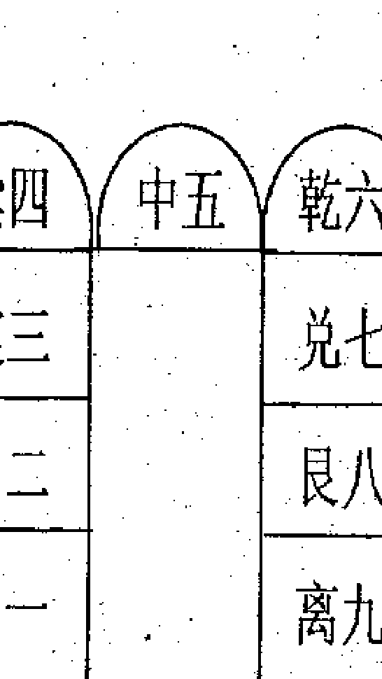
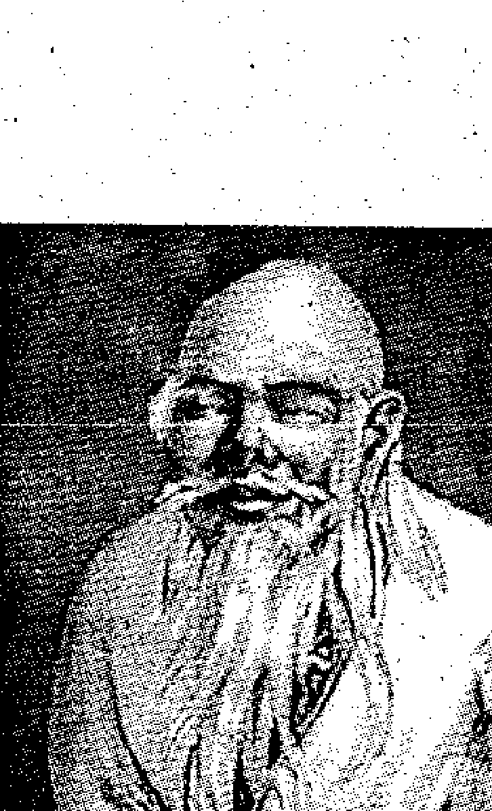
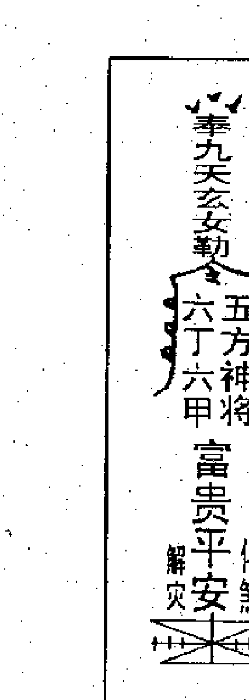
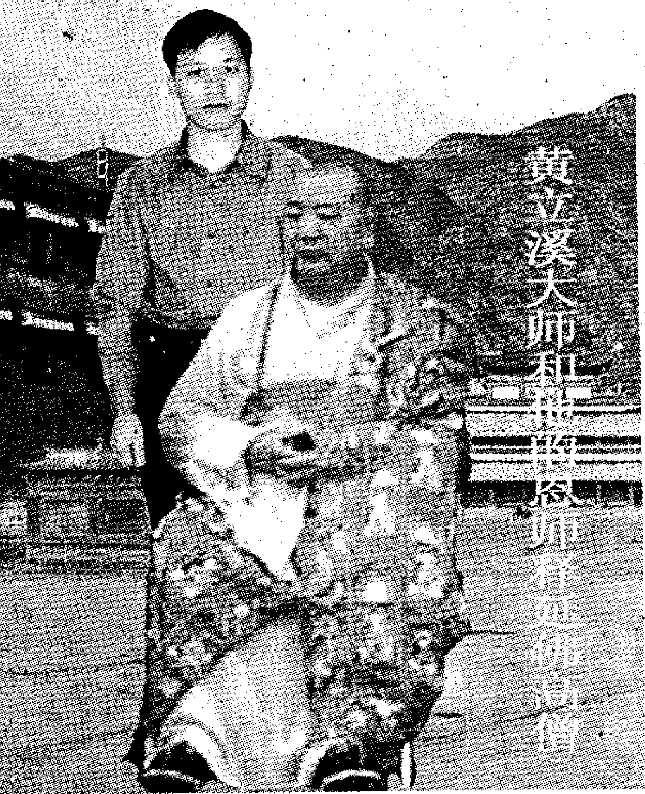
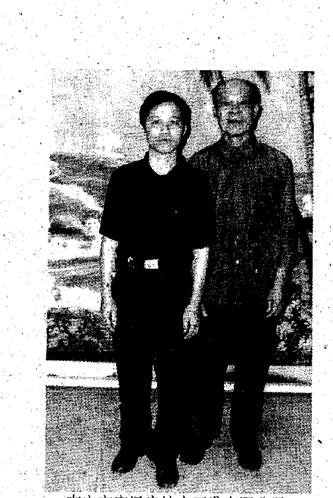

# 法奇门天机秘
# 出版说明

世界玄学宗师黄立溪（恒立无上师），是当代国际上最具影响力的玄学宗师之一，在世界上任何一个国家和地区，只要在互联网中输入“黄立溪”三个字进行搜索，我们就可以看到世界上各著名的大网站对黄立溪宗师的报道条目达数百条之多。也可以在互联网中点击www·east258·com进入东方玄学网了解黄立溪宗师在预测、奇门、风水、择吉、旺财、化煞、解灾等玄学方面风采。

黄立溪宗师不但是当今世界上最具影响力玄学宗师之一，而且他的专著《奇门日课预测学》、《商战与奇门》、《阳宅催吉化煞绝学》、《玄机风水密诀》、《彩票与奇门》、《黄石公奇门丁财贵日课天机秘》、《黄石公奇门风水天机秘》等80多部佳作畅销海内外，正值中年的黄立溪宗师创造了诸多玄学奇迹！

《黄石公法奇门天机秘》是黄立溪宗师最新力作，我们经过多方面努力才极荣幸地争取到出版机会，在此我们隆重地向全球推出中文简体版、繁体版、英文版……
最后，感谢广大读者长期以来对我们出版社的信任和支持。

### 引子

千古催富贵绝学，首次大公开，尽泄法奇门天机秘，黄石公法奇门天机秘，是黄石公千年秘传，令很多奇门专家、学者，奇门爱好者见所未见，闻所未闻！

上祖秘传黄石公法奇门天机秘，是奇门的最高境界，法奇门用来治国安邦，国泰民安；行兵布陈，百战百胜；用黄石公法奇门来纳福化煞，速催富贵系祖上秘不外传催吉纳福化煞绝学，为了造福人类，积无量功德，作者首次决定打破千年祖训，首次在此向世人全盘公开上祖秘传的千古绝学，黄石公法奇门天机秘。千年秘传，首次公开！震惊乾坤！极其珍贵！极其实用！是奇门专家、学者，奇门爱好者梦寐以求的无价珍宝！！有缘者只要拥有这本书，依书操作布出人天相应的法奇门阵，此人天相应的法奇门阵就会形成一股吉祥能量场，此吉祥能量场就能为福主催吉纳福，化煞解灾，达到人生吉祥如意目的。

### 黄石公传略

黄石公是秦始皇父亲的重臣，始皇父亲庄襄公死后，轮到秦始皇坐朝当政，他独断专行，推行暴政，忠言逆耳，听不进忠臣元老的意见；黄石公便挂冠归隐，策马离开朝廷。秦始皇听说黄石公走了，想想一来自己还年轻，虽已登基，但立足未稳，身边需要人辅佐；二来黄石公是先皇老臣，如若走了会让天下人笑话自己无容人之量。于是就带亲信人马追黄石公到骊山脚下，用好言好语千方百计挽留，黄石公决心已定，一个劲不愿回去。后来，他就隐居在邳州西北黄山北麓的黄华洞中。

黄石公虽然隐居，但内心一直忧国忧民，就把一生的知识与理想倾注在笔墨上。按现代人的说法，他既是文学家，也是思想家、军事家、政治家，神学和天文地理知识也相当丰富。他著的书有《内记敌法》、《三略》三卷，《三奇法》一卷，《五垒图》一卷，《阴谋行军秘法》一卷，《黄石公记》三卷，《略注》三卷，《秘经》三卷，《兵书》三卷，《阴谋乘斗魁刚行军秘》一卷，《神光辅星秘诀》、《兵法》一卷，《三监图》一卷，《兵法统要》三卷、《备气三元经》二卷，还有《地镜八宅法》、《素书》等作品。

素书写好后，他就四处寻找合适人物，目的是委托重任，以实现他为国效力的意愿，一日黄石公在圯上（圯，即桥）与张良相遇，便以拾鞋（即古书上说的纳履）方式试张良，看到张良能屈人所不能屈，忍人所不能忍，知道他胸怀开阔，将来必有一番抱负，绝非是人下之小人，遂以《素书》相赠。并对他说：读了此书，就可做帝王的老师，再过十年，将会与兵起事，过十三年之后，你与我在济北重遇，谷城山下有块黄石就是我。”说完，飘然而去。此书共一千三百三十六言，分原始正道、求人之志、本道、宗道、遵义、安礼六篇。书中语言明贵，字字精当，张良爱不释手，秉烛细读，大悟大彻，心领神会，要不多天，便把一本《素书》从头到尾背得滚瓜烂熟。

后来张良果真作了汉朝开国皇帝刘邦的军师。从此他运用师傅所传的《素书》辅助刘邦运筹帷幄，决胜千里，入咸阳，灭项羽。统一了天下，被封为留侯。《素书》也就被后来人说成了“天书”。功成名就以后，张良想功成身退，对汉高帝刘邦说：“我从平民起步，封万户侯，于愿已足，我想抛弃人间的琐事，随从我师傅黄石公遨游四海”。汉高帝刘邦虽然极力挽留张良，无奈张良决意已定。张良离开汉高祖后，恰在黄石公老人交待的十三年后，留侯路过济北，果然在谷城山下见一块黄石，便搬请回家，如同珍宝似的供起来。留侯去世，后人就把这块黄石安葬在他的坟墓里。后人每逢祭祀留侯，也一块祭祀黄石公。

据老道们传说：黄石公自从下邳与张良分别之后，即去游四海，曾乘桴溯江而上，隐居黄石市的西塞山桃花洞修炼辟谷法和导引力，最后身轻若燕，羽化而成仙。故西塞山古称黄石山，由黄石山才演化成今天的黄石市。

北魏郦道元《水经注》云：“江之右岸有黄石山，水经其北，即黄石矶也，…… 山连径江，则东山偏高，谓这西塞”。

北宋太平天国年间成书的《太平寰宇记》云：“黄石城在州西北二百九十里，江表传上刘勋败于彭泽走入楚江，从寻阳闻皖已没，乃投西塞，将兵救皖，为孙权所破，遂奔曹公，即此城也。”

从以上两段文字看，西塞山与黄石山、黄石城实乃同一概念。中华人民共和国成立后，黄石建市，又定名为黄石市，正是因为传说的一代天师黄石公曾生于斯、卒于斯之故。

黄石公他通晓天机、地脉、人道之学。黄石公、郭璞、杨筠松，是中华民族风水学史上三位具有里程碑式的人物。

欣逢盛世，我们有幸见证了这一伟大时刻的到来。上祖黄石公历尽数千年沧桑，今又受到万千华夏子孙的顶礼膜拜。为了把上祖黄石公的留下的宝贵财富发扬广大，造福人类，积无量功德，笔者决定在此首次公开上祖秘传黄石公法奇门天机秘，福主只要按上祖秘传的黄石公法奇门布陈催丁、催财、催贵，纳福化煞就会百试百验，达到吉祥如意目的，我们要感谢我们欣逢的这个伟大的时代，我们要庆幸我们是一脉相承的炎黄子孙。

### 神奇之门 扭转乾坤

香港某公司由于亏损严重，面临倒闭，2005年四月份公司陈董事长特邀笔者去堪测公司风水，公司坐壬向丙兼子午开巽门，笔者在公司内走一圈后，发现该公司内部环境阴阳气场不平衡，环境气场严重失调，尤其是开巽门不符合上祖秘传的黄石公奇门风水天机秘，巽门为惊门，主公司经营不善，阻滞多，易有官司，困难重重，毫无生机，难怪亏损严重，面临倒闭。后经笔者按上祖秘传和恩师心传口授之秘进行风水布局调整，首先是把公司大门由巽门惊门改为丙门生气之门，笔者按上祖真传的黄石公奇门丁财贵日课天机秘和恩师心传口授之秘，选2005年农历七月十三日巳时布黄石公法奇门陈和开丙门，此人天相应吉日吉时有生门吉门，直符大吉神，三奇中乙奇到方，陈董事长1956年出生丙申年命落在巽宫，与用神宫相生，主得遁甲之助，得贵人相助，事业旺盛，财源广进。公司内部环境笔者按上祖秘传黄石公法奇门天机秘和恩师心传口授之秘进行风水布局调整，通过布黄石公法奇门陈、改门和内部布局使公司内外环境气场和谐，呈现一派生机，公司即起死回生，半年后，公司由原来亏损变为盈利数亿元。有很多公司，由于办公楼、厂房、大门、变压器、电杆、机房、水池等布局不合理，导致经济效益不好，产品销路不好、或产生事故频繁、损失严重，要改变这种局面，就必须进行风水重新布局，布出人天相应的和谐磁场，人天相应的和谐磁场可催财和化煞解灾，使公司不断发展壮大，成为同行业的龙头老大。陈董事长为了使公司能够良性不断发展壮大，聘任笔者为公司顾问。

## 第一章 论黄石公法奇门与数理奇门关系

当今社会上懂数理奇门的人不胜枚举，因为在全国各地几乎每一个书店、每一个书摊都有关于数理奇门的书籍出售，并且在全国各地有不少奇门大师举办数理奇门学习班，他们为发展奇门作出了不少努力，和但懂得法奇门的人如凤毛麟角，不少人认为数理奇门就是奇门的全部内容，殊不知数理奇门只是奇门中的一部分，它的主要作用仅是应用预测方面，而法奇门则是奇门的最高境界；法奇门用来治国安邦，国泰民安；行兵布陈，百战百胜；用黄石公法奇门来纳福化煞，速催富贵，百无一失，但懂得法奇门的如凤毛麟角，因为法奇门历来是靠父传子，师传徒，代代心传口授的方式承传下来的，父子、师徒之外，不得授以衣钵，

上祖秘传黄石公法奇门天机秘，是奇门的最高境界，法奇门用来治国安邦，国泰民安；行兵布陈，百战百胜；用黄石公法奇门来纳福化煞，速催富贵系祖上秘不外传催吉纳福化煞绝学，为了造福人类，积无量功德，作者首次决定打破千年祖训，首次在此向世人全盘公开上祖秘传的千古绝学，黄石公法奇门天机秘。千年秘传，首次公开！震惊乾坤！极其珍贵！极其实用！是奇门专家、学者，奇门爱好者梦寐以求的无价珍宝！！有缘者只要拥有这本书，依书操作布出人天相应的法奇门陈，此人天相应的法奇门陈就会形成一股吉祥能量场，此吉祥能量场就能为福主催吉纳福，化煞解灾，达到人生吉祥如意目的。

## 第二章 奇门遁甲基础知识

### 一、五行学说

五行学说是研究宇宙的物质基础及其相互关系学说，组成宇宙的最基本要素是金木水火土五种，一切事物都可归入五行之中，五行的发展变化和相互作用构成自然界各种物质不断发展变化。

### 1、 干支阴阳五行

干支是指十天干、十二地支的简称，传说是由轩辕黄帝时代的大尧氏所创，距今已有四千六百多年历史，天干地支的每一干和每一支都有特殊意义，各有阴阳五行所属。在传统的择吉学术中，无论是时间还是方位，都应用到干支的系统，尤其是我国的历法，整个体系就是天干地支，因此，预测师、择吉师、风水师一定要掌握干支五行知识。

十天干：甲乙丙丁戊己庚辛壬癸，其中甲丙戊庚壬为阳干，乙丁己辛癸为阴。

十二地支：子丑寅卯辰巳午未申酉戌亥，其中申子辰、寅午戌为阳支，巳酉丑、亥卯未为阴支。

干支五行方位：甲乙寅卯东方木，丙丁巳午南方火，庚申辛酉西方金，壬癸亥子北方水，戊己辰戌丑未中央土。

### 2、干支的含义

- 甲是拆的意思，是指万物剖符而出。
- 乙是轧的意思，是指万物初生，抽轧而出。
- 丙是炳的意思，是指万物炳然著见。
- 丁是强的意思，是指万物丁壮。
- 戊是茂的意思，是指万物茂盛。
- 己是纪的意思，是指万物有形可纪识。
- 庚是耕的意思，是指万物收敛有实。
- 辛是新的意思，是指万物初新皆收成。
- 壬是任的意思，是指阳气任养万物。
- 癸是揆的意思，是指万物可揆度。

由此可见十天干与太阳出没有关，而太阳的循环往复周期，对万物产生着直接的影响。

十二地支是用来描述月亮运行闰周期的，《群书考异》中说。

《群书考异》中说。

- 子是兹的意思，指万物兹萌于既动之阳气下。
- 丑是纽、系的意思，指物继萌而系长。
- 寅是移、引的意思，指物芽稍吐而伸移出地。
- 卯是冒的意思，指万物冒地而出。
- 辰是震的意思，指物经震动而出。
- 巳是起的意思，指万物至此已毕尽而起。
- 午是仵的意思，指万物盛大枝柯密布。
- 未是昧的意思，指阴气已长，万物稍衰体暧昧。
- 申是身的意思，指万物的身体都已成就。
- 酉是老的意思，指万物老极而成熟。
- 戌是灭的意思，指万物皆衰灭。
- 亥是核的意思，指万物收藏皆坚核。

### 3、五行相生相克关系

五行相生：含有互相滋生，促进助长的意思，木生火、火生土、土生金、金生水、水生木。

木生火，因为木性温暖、火隐伏其中，钻木而生火，所以木生火。

火生土，因多火灼热，所以能够焚烧木，木被焚烧后变成灰烬，灰即土，所以火生土。
土生金，因为金需要隐藏在石里，依附着山津润而生，聚土成山，有山必生石，所次土生金。
金生水，因为少阴之气（金气）温润流泽，金靠水生，销锻金也会变成水，所么金生水。
水生木，因为水温润而使树木生长出来，所以水生木。

- 五行相克：木克土、土克水、水克火、火克金、金克木。

五行相克含义：五行相克是因为天地之性，众胜寡，故水胜火；精胜坚，故火胜金；刚胜柔，故金胜木；专胜散，故木胜土；实胜虚，故土胜水。

在相生相克的关系中，都有生我，我生两个方面的关系，生我者为父母，为印绶，我生者为伤官、食神，克我者为官鬼七杀，我克者为妻财，与我同类者为兄弟（比肩、劫财），如生日干是火，木生火，木为火的印绶；火生土，土为火的伤官食神；水克火，水为火的官鬼七杀；火克金，金为火的妻财，对男命来说，妻财代表金银财富，又代表妻子；官鬼对女命来说既是官星又代表丈夫；火与我同类代表兄弟姐妹。

相生相克，象阴阳一样是事物不可分割的两方面，没有生就没有事物的发生和成长；没有克就不能维持事物在发展和变化中的平衡和协调。所以没有相生就没有相克，没有相克就没有相生，这种生中有克，克中有生，相互作用，在一定条件下可相互转化，不断相互作用推动着事物正常生长、发展变化。

- 五行顺序：水一、火二、木三、金四、土五，这些数是根据河图而来，一六北方水、二七南方火、三八东方木、四九西方金、五十中央土，取其一二三四五之生数。

### 4、十二地支配月建及廿四节气

正月建寅，节令立春，中气雨水；二月建卯，节令惊蛰，中气春分；三月建辰，节令清明，中气谷雨；四月建巳，节令立夏，中气小满；五月建午，节令芒种，中气夏至；六月建未，节令小暑，中气大暑；七月建申，节令立秋，中气处暑；八月建酉，节令白露，中气秋分；九月建戌，节令寒露，中气霜降；十月建亥，节令立冬，节气小雪；十一月建子，节令大雪，中气冬至；十二月建丑，节令小寒，中气大寒。切记年以立春为分界线，月以节为分界线。

### 5、天干地支相冲相合、相刑相害

天干五合：甲与己合，合于人事为中正之合；乙与庚合，合于人事为仁义之合；丙与辛合，合干人事为威制之合；丁与壬合，合于人事为淫匿之合；戊与癸合，合于人事为无情之合。

天干五合是阴阳之合，如男女之合而成夫妇之道，故《易》曰：“一阴一阳之谓道，偏阳偏阴之谓疾”。人事之合源丢出于阴阳五行之性。

天干合化五行：甲己合化土，乙庚合化金，丙辛合化水，丁壬合化木，戊癸合化火。天干一阴一阳合而化出之五行，对日干的强弱旺衰有着增其生扶克抑的重要作用。

天干相冲：甲庚冲、乙辛冲、壬丙冲、丁癸冲，冲中带克，力量较大。

- 地支六合：子与丑合、寅与亥合、卯与戌合、辰与酉合、巳与申合、午与未合。

地支合化五行：子丑、午未合化土，寅亥合化木，卯戌合化火，辰酉合化金，巳申合化水。地支合化后的五行，对日干强弱旺衰同样有着损益作用。

地支三合化五行：一阴一阳之谓道，三则化，是三生万物之理。三合局三个地支分别处于日干的长生、帝旺、暮库之地。申子辰合水局，亥卯未合木局，寅午戌合火局，巳酉丑合金局。合为吉神则吉，合为凶神则凶，相生之合最吉，相克之合不吉，三合化局中，化吉则吉，化凶印凶。

地支三会化五行：四柱地支会成一方之气。寅卯辰三会东方木，巳午未三会南方火，申酉戌三会西方金，亥子丑三会北水。三会局会聚一方旺气，其阴阳五行之气最旺，其次是三合局，再次是六合。

地支六冲：古人将七数解释为天地之穷数，阴阳之极气。十二地支地位相敌，五行相冲。冲者不和也，如阳见阳，二阳相竞则为克；阴见阴，二阴不足也为地支相刑：恩生于害，害生于恩，三刑生于三合，就好比六害生于六合，对于人事，好比夫妇相合反致刑伤，就天道来说；三刑是极数，天道厌恶满盈，满盈就会导致倾覆。所以：子刑卯，卯刑子，为无礼之刑。寅刑巳、巳刑申、申刑寅、为恃势之刑。丑刑戌，戌刑未，未刑丑，为无恩之刑。辰辰、午午、酉酉、亥亥为自刑。

地支相害：凡事无下喜合而忌冲，但是：

子与丑合，未冲之，丑被冲，子无合，故子与未害。
丑与子合，午冲之，子被冲，子无合，故丑与午害。
寅与亥合，巳冲之，亥被冲，寅无合，故寅与巳害。
卯与戌合，辰冲之，戌被冲，卯无合，故卯与辰害。
辰与酉合，卯冲之，酉被冲，辰无合，故辰与卯害。
巳与申合，寅冲之，申被冲，巳无合，故巳与寅害。
午与未合，丑冲之，未被冲，午无合，故午与丑害。
未与午合，子冲之，午被冲，未无合，故未与子害。
申与巳合，亥冲之，巳被冲，申无合，故申与亥害。
酉与辰合，戌冲之，辰被冲，酉无合，故酉与戌害。
戌与卯合，酉冲之，卯被冲，戌无合，故戌与酉害。
亥与寅合，申冲之，寅被冲，亥无合，故亥与申害。

### 六、五行四时旺相休囚

-   春季月：木旺、火相、土死、金囚、水休。
    夏季月：木休、火旺、土相、金死、水囚。
    秋季月：木死、火囚、土休、金旺、水相。
    冬季月：木相、火死、土囚、金休、水旺。
    四季月：木囚、火休、土旺、金相、水死。

### 七、廿四坐山正体五行

-   甲乙寅卯巽五坐山五行属木。
    丙丁巳午四坐山五行属火。
    辰戌丑未坤艮六坐山五行属土。
    庚辛申酉乾五坐山五行属金。
    壬癸亥子四坐山五行属水。

### 八、廿四山方位

壬子癸属北方，丑艮寅属东北方。
甲卯乙属东方，辰巽巳属东南方。
丙午丁属南方，未坤申属西南方。
庚酉辛属西方，戌乾亥属西北方。

### 九、十天干长生诀

-   （1）、甲长生在亥，沐浴在子，冠带在丑，临官在寅，帝旺在卯，衰在辰，病在巳，死在午，墓在未，绝在申，胎在酉，养在戌。
-   （2）、乙长生在午，沐浴在巳，冠带在辰，临官在卯，帝旺在寅，衰在丑，病在子，死在亥，墓在戌，绝在酉，胎在申，养在未。
-   （3）、丙长生在寅，沐浴在卯，冠带在辰，临官在巳，帝旺在午，衰在未，病在申，死在酉，墓在戌，绝在亥，胎在子，养在丑。
-   （4）、丁长生在酉，沐浴在申，冠带在未，临官在午，帝旺在巳，衰在辰，病在卯，死在寅，墓在丑，绝在子，胎在亥，养在戌。
-   （5）、戊长生在寅，沐浴在卯，冠带在辰，临官在巳，帝旺在午，衰在未，病在申，死在酉，墓在戌，绝在亥，胎在子，养在丑。
-   （6）、己长生在酉，沐浴在申，冠带在未，临官在午，帝旺在巳，衰在辰，病在卯，死在寅，墓在丑，绝在子，胎在亥，养在戌。
-   （7）、庚长生在巳，沐浴在午，冠带在未，临官在申，帝旺在酉，衰在戌，病在亥，死在子，墓在丑，绝在寅，胎在卯，养在辰。
-   （8）、辛长生在子，沐浴在亥，冠带在戌，临官在酉，帝旺在申，衰在未，病在午，死在巳，墓在辰，绝在卯，胎在寅，养在丑。
-   （9）、壬长生在申，沐浴在酉，冠带在戌，临官在亥，帝旺在子，衰在丑，病在寅，死在卯，墓在辰，绝在巳，胎在午，养在未。
-   （10）、癸长生在卯，沐浴在寅，冠带在丑，临官在子，帝旺在亥，衰在戌，病在酉，死在申，墓在未，绝在午，胎在巳，养在辰。

### 十、六十甲子纳音诀

-   甲子乙丑海中金，丙寅丁卯炉中火。
-   戊辰己巳大林木，庚午辛未路旁土。
-   壬申癸酉剑锋金，甲戌乙亥山头火。
-   丙子丁丑涧下水，戊寅己卯城头土。
-   庚辰辛巳白蜡金，壬午癸未杨柳木。
-   甲申乙酉泉中水，丙戌丁亥屋上土。
-   戊子己丑霹雳火，庚寅辛卯松柏木。
-   壬辰癸巳长流水，甲午乙未沙中金。
-   丙申丁酉山下火，戊戌己亥平地木。
-   庚子辛丑壁上土，壬寅癸卯金箔金。
-   甲辰乙巳覆灯火，丙午丁未天河水。
-   戊申己酉大驿土，庚戌辛亥钗钏金。
-   壬子癸丑桑松木，甲寅乙卯大溪水。
-   丙辰丁巳沙中土，戊午己未天上火。
-   庚申辛酉石榴木，壬戌癸亥大海水。

### 二、 阴阳五行生克制化喜忌

阴阳五行不仅有生有克，相辅相成、又有相互制约的一方面，还有太过不及的另一方面，这就使预测变得复杂化。要想在学习中把握这方面的对立统一关系，必须活学活用，灵活变通。

金：金旺得火，方成器皿。
金能生水，水多金沉，强金得水方挫其锋。
金能克木，木多金缺，木弱逢金必多砍折。
金赖土生，土多金埋，土能生金，金多土变。

火：火旺得水，方成相济。
火能生土，土多火晦，强火得土，方止其焰。
火能克金，金多火熄，金弱遇火必见销熔。
火赖木生，木多火炽，木能生火，火多木焚。

水：水旺得土，方成池沼。
水能生木，木多水缩，强水得木方泄其势。
水能克火，火多水干，火弱遇水必见熄灭。
水赖金生，金多水浊，金能生水，水多金沉。

土：土旺得木，方能疏通。
土能生金，金多土变，强土得金方利其壅。
土能克水，水多土流，水弱逢土必为淤塞。
土赖火生，火多土焦，火能生土，土多火晦。

木：木旺得金，方成栋梁。
木能生火，火多木焚，强木得火方化其顽。
木能克土，土多木折，土弱逢木必为倾陷。
木赖水生，水多木漂，水能生木，木多水缩。

### 三、先后天八卦

### 1、八卦与五行属性

八卦：乾坤、艮兑、坎离、震巽，其中乾兑属金，坎属水，离属火，震巽属木，艮坤属土，子午卯酉为四正，乾坤艮巽为四偶。

### 2、八卦易数、五行及与人关系

-   乾宫卦：易数一，五行属金，人为老父。
-   兑宫卦：易数二，五行属金，人为少女。
-   离宫卦：易数三，五行属火，人为中女。
-   震宫卦：易数四，五行属木，人为长男。
-   巽宫卦：易数五，五行属木，人为长女。
-   坎宫卦：易数六，五行属水，人为中男。
-   艮宫卦：易数七，五行属土，人为少男。
-   坤宫卦：易数八，五行属土，人为老母。

### 3、八卦与自然界联系

| 卦名 | 自然 | 方位 | 时间   | 属性 | 人   | 身体 | 动物 |
| :--- | :--- | :--- | :----- | :--- | :--- | :--- | :--- |
| 乾   | 天   | 西北 | 秋冬间 | 健   | 父   | 首   | 马   |
| 坤   | 地   | 西南 | 夏秋间 | 顺   | 母   | 腹   | 牛   |
| 震   | 雷   | 东   | 春     | 动   | 长男 | 足   | 龙   |
| 巽   | 风   | 东南 | 春夏间 | 入   | 长女 | 股   | 鸡   |
| 坎   | 水   | 北   | 冬     | 陷   | 中男 | 耳   | 猪   |
| 离   | 火   | 南   | 夏     | 附   | 中女 | 目   | 雉   |
| 艮   | 山   | 东北 | 冬春间 | 止   | 少男 | 手   | 狗   |
| 兑   | 泽   | 西   | 秋     | 悦   | 少女 | 口   | 羊   |

### 4、先天八卦

先天八卦有四个特点：一、先天八卦图循环的过程中有顺逆之分。由一至四反时针方向，由五至八顺时针方向，顺序为乾兑离震四卦，巽坎艮坤四卦。坤象地在最下方，亦即北方。二、八卦画阴阳相对，乾三阳与坤三阴一对也，坎中满与离中虚一对也，震初阳与兑末阴一对也，艮末阳与巽初阴一对也。三、先天八卦主生，震巽木为一气，乾金生坎水，艮土生兑金，离火生坤土。震巽在五行中都属木，故为一气，乾为金，坎为水，故乾金生坎水。艮为土，兑为金，故艮土生兑金。离为火，坤为土，故离火生坤土。四、在人事上，表现为老与老，少与少相对。老父与老母相对，长男与长女相对，中男与中女相对，少男与少女相对。

乾一、兑二、离三、震四、巽五、坎六、艮七、坤八为先天八卦数。

### 5、后天八卦

先天八卦是乾坤定南北，离坎定东西。后天八卦是离坎定南北，震兑定东西，后天八卦数是：坎一、坤二、震三、巽四、中五、乾六、兑七、艮八、离九。

后天八卦循环过程体现了顺的过程，模仿天左旋，先天八卦是老与老，少与少相对，后天八卦除坎离外，其它都是老少相对的。

后天八卦是文王所定，文王为什么改先天八卦为后天八卦呢？原来夏朝时期，冰雪融化，海水上升，淹没了大片土地，到处都是水灾，到了周朝自然环境发生了变化，天地运气与先天八卦方位不一致，故周文王改先天八卦为后天八卦。

后天八卦，以乾坤为父母，震坎艮巽离兑为六子卦。故震长男得乾之初爻，坎中男得乾之中爻，艮少男得乾之上爻，巽长女得坤之初爻，离中女得坤之中爻，兑少女得坤之上爻。

八卦由阴爻（--）和阳爻（—）组成的，用阴阳两个爻来表示天地万物，阴阳是万事万物矛盾两个方面的统一性，因此万事万物都有阴阳，都有矛盾，都有统一性。如天为阳，地为阴，男人为阳，女人为阴，化学上有阳离子和阴离子，数学上有正与负，电学上有阳极和阴极，总之万事万物皆有阴阳，阴阳充满在宇宙之中。

阴阳符号不仅体现了任何事物都有的阴阳两方面，还说明一个事物中，阴中有阳，阳中有阴这样一个辩证观点，就人来说，男人为阳，女人为阴，就身体来说，头为阳，身为阴，背为阳，胸为阴，手背为阳，手心为阴……如八卦中的阴阳鱼，阴鱼中有一点白为阳（象鱼眼），阳鱼中有一点黑是阴，就体现了 一个事物阴中有阳，阳中有阴的观点。

《系辞》中有“阳卦多阴，阴卦多阳，其故何 也”。阳卦多阴，是指震坎艮卦，一阳而二阴，阴卦 多阳指的是巽离兑卦，一阴而二阳，对于这种情况， 《系辞》作了回答，“阳一君而二民，阴二君而一民， 小人之道也”。

## 四、十天干与九宫八卦

奇门遁甲来源于军事上的排兵布阵，具体而言， 就是九宫八卦阵。甲乙丙丁戊己庚辛壬癸，这十天干 符号，在奇门遁甲中，甲为元帅为主将，他经常隐蔽 在中，所以叫遁甲。

乙丙丁为三奇，是元帅或主将身边最得力的辅佐 官，乙为日奇，丙为月奇，丁为星奇。

戊己庚辛壬癸叫做六仪，也就是六支仪仗队， 六面旗帜，所谓六甲，即甲子、甲戌、甲申、甲午、 甲辰、甲寅，这六甲就是六位将帅，其中甲子为元帅， 其它五甲为大将，他们在排兵布阵中都要隐遁在一定 的旗帜之下，在奇门遁甲的九宫八卦中，他们仪仗旗 帜是固定不变的，元帅甲子以戊为仪仗，因此叫甲子 戊，二甲大将甲戌以己为仪仗，因此叫甲戌己，三甲 大将甲申以庚为仪仗，因此叫甲申庚，四甲大将甲午 以辛为仪仗，因此叫甲午辛，五甲大将甲辰以壬为仪 仗，因此又叫甲辰壬，六甲大将甲寅以癸为仪仗，因 此叫甲寅癸，这是永远不变的将帅仪仗配备准则。

十天干将甲隐遁起来，剩下九干，以配九宫八卦， 六甲分别隐遁在六仪之下，与乙丙丁三奇分占九宫， 他们有固定不变的顺序和队形，这个顺序和队形就 是：

戊己庚辛壬癸丁丙乙，也就是说，戊永远挨着己，己 永远挨着庚，庚永远挨着辛，辛永远挨着壬，壬永远 挨着癸，癸永远挨着丁，丁永远挨着丙，丙永远挨着 乙，乙永远挨着戊，无论谁在前谁在后，前后邻居是 不变的。

冬至一夏至 阳遁 顺排六仪，逆布三奇，次序 为：戊己庚辛壬癸丁丙乙；夏至一冬至 阴遁 逆排六仪，顺布三奇，次序为：戊乙丙丁癸壬辛庚己。

#### 遁甲规律表

| 六甲 | 一甲 | 二甲 | 三甲 | 四甲 | 五甲 | 六甲 | 三奇(星) | 三奇(月) | 三奇(日) |
| :--- | :--- | :--- | :--- | :--- | :--- | :--- | :--- | :--- | :--- |
|      | 甲子 | 甲戌 | 甲申 | 甲午 | 甲辰 | 甲寅 | 星奇     | 月奇     | 日奇     |
| 六仪 | 戊   | 己   | 庚   | 辛   | 壬   | 癸   | 丁       | 丙       | 乙       |

戊乙丙丁癸壬辛庚己。甲子戊遁在几宫，就是奇门遁甲的几局，例如阳四局，就是甲子戊落四宫(巽宫)；阴二局，就是甲子戊落二宫(坤宫)。为了让大家更加明白地理解上述内容，现在把冬至一夏至阳九局，夏至一冬至阴九局布图如下

洛书图

| 四巽 | 离九 | 坤二 |
| :--- | :--- | :--- |
| 三震 | 中五 | 兑七 |
| 八艮 | 坎一 | 乾六 |

阳二局

| 庚 | 丙 | 戊 |
| :--- | :--- | :--- |
| 己 | 辛 | 癸 |
| 丁 | 乙 | 壬 |

阳三局

| 己 | 丁 | 乙 |
| :--- | :--- | :--- |
| 戊 | 庚 | 壬 |
| 癸 | 丙 | 辛 |

阳四局

| 戊 | 癸 | 丙 |
| :--- | :--- | :--- |
| 乙 | 己 | 辛 |
| 壬 | 丁 | 庚 |

阳五局

| 乙 | 壬 | 丁 |
| :--- | :--- | :--- |
| 丙 | 戊 | 庚 |
| 辛 | 癸 | 己 |

阳六局

| 丙 | 辛 | 癸 |
| :--- | :--- | :--- |
| 丁 | 乙 | 己 |
| 庚 | 壬 | 戊 |

阳七局

| 丁 | 庚 | 壬 |
| :--- | :--- | :--- |
| 癸 | 丙 | 戊 |
| 己 | 辛 | 乙 |

阳八局

| 癸 | 己 | 辛 |
| :--- | :--- | :--- |
| 壬 | 丁 | 乙 |
| 戊 | 庚 | 丙 |

阳九局

| 壬 | 戊 | 庚 |
| :--- | :--- | :--- |
| 辛 | 癸 | 丙 |
| 乙 | 己 | 丁 |

#### 夏至一冬至阴九局

**阴一局**

| 丁 | 己 | 乙 |
| :--- | :--- | :--- |
| 丙 | 癸 | 辛 |
| 庚 | 戊 | 壬 |

**阴二局**

| 丙 | 庚 | 戊 |
| :--- | :--- | :--- |
| 乙 | 丁 | 壬 |
| 辛 | 己 | 癸 |

**阴三局**

| 乙 | 辛 | 己 |
| :--- | :--- | :--- |
| 戊 | 丙 | 癸 |
| 壬 | 庚 | 丁 |

**阴四局**

| 戊 | 壬 | 庚 |
| :--- | :--- | :--- |
| 己 | 乙 | 丁 |
| 癸 | 辛 | 丙 |

**阴五局**

| 己 | 癸 | 辛 |
| :--- | :--- | :--- |
| 庚 | 戊 | 丙 |
| 丁 | 壬 | 乙 |

**阴六局**

| 庚 | 丁 | 壬 |
| :--- | :--- | :--- |
| 辛 | 己 | 乙 |
| 丙 | 癸 | 戊 |

**阴七局**

| 辛 | 丙 | 癸 |
| :--- | :--- | :--- |
| 壬 | 庚 | 戊 |
| 乙 | 丁 | 己 |

**阴八局**

| 壬 | 乙 | 丁 |
| :--- | :--- | :--- |
| 癸 | 辛 | 己 |
| 戊 | 丙 | 庚 |

**阴九局**

| 癸 | 戊 | 丙 |
| :--- | :--- | :--- |
| 丁 | 壬 | 庚 |
| 己 | 乙 | 辛 |

### 五、一年二十四节气与阴阳二遁

在奇门遁甲，人们把十天干代表军队上的将帅、奇兵、仪仗分别布在九宫八卦中，正转、倒转进行演练共形成阳九局和阴九局，共十八种格局，这是地盘上十八种定局，如果以十天干每一干代表一个时辰，即时家奇门，六十个时辰，即六十甲子正好演练完一局。我们知道一个时辰为两小时，一天为24个小时，十二个时辰，60÷12=5，这就是5天演练一局，古人把五天一局称一元，一个节气十五天，正好为三局，第一个五天这一局为上元，第二个五天为中元，第三个五天称下元，即一个节气配上中下三元。一年共24个节气，一个节气三元，24×3=72，即共72局，古人根据八卦九宫阵与时间和空间关系，对此做了巧妙安排，坎卦一宫北方对应冬至、小寒、大寒三个节气；艮卦八宫东北方对应立春、雨水、惊蛰三个节气。震卦三宫东方对应春分、清明、谷雨三个节气；巽卦四宫东南方对应立夏、小满、芒种三个节气，以离卦九宫南方对应夏至、小暑、大暑三个节气，以坤卦二宫西南方对应立秋、处暑、白露三个节气，以兑卦七宫正西方对应秋分、寒露、霜降三个节气，以乾卦六宫西北方对应立冬、小雪、大雪三个节气。根据冬至一阳生，夏至一阴生的原理，阴阳两遁以冬至、夏至二个节气为界线。

初学者，对某节气的上中下三元，即三个五天中分别用阳遁几局，阴遁几局，这是怎么规定？依据什么？有什么规律感到眼花缭乱，难以记忆，现教你一种简单方法，一看就懂，先看下图(一)

| 宫位 | 节气 | 上元 | 中元 | 下元 |
| :--- | :--- | :--- | :--- | :--- |
| 坎一 | 冬至 小寒 大寒 | 一 二 三 | 七 八 九 | 四 五 六 |
| 艮八 | 立春 雨水 惊蛰 | 八 九 一 | 五 六 七 | 二 三 四 |
| 震三 | 春分 清明 谷雨 | 三 四 五 | 九 一 二 | 六 七 八 |
| 巽四 | 立夏 小满 芒种 | 四 五 六 | 一 二 三 | 七 八 九 |
| 离九 | 夏至 小暑 大暑 | 九 八 七 | 三 二 一 | 六 五 四 |
| 坤二 | 立秋 处暑 白露 | 二 一 九 | 五 四 三 | 八 七 六 |
| 兑七 | 秋分 寒露 霜降 | 七 六 五 | 一 九 八 | 四 三 二 |
| 乾六 | 立冬 小雪 大雪 | 六 五 四 | 九 八 七 | 三 二 一 |

从上图可知，冬至、小寒、大寒三个节气落坎一宫，冬至上元为阳一局，中元为阳七局，下元为阳四局，小寒上元为阳二局，中元为阳八局，下元为阳五局，大寒上元为阳三局，中元为阳九局，下元为阳六局。夏至、小暑、大暑三个节气落离九宫，夏至上元为阴九局，中元为阴三局，下元为阴六局，小暑上元为阴八局，中元为阴二局，下元为阴五局，大暑上元为阴七局，中元为阴一局，下元为阴四局。其它节气落之宫依次类推。总之八卦在几宫对应的第一个节气的上元就用阳遁或阴遁几局，即坎艮震巽四阳宫用阳遁；离坤兑乾四阴宫用阴遁。在未熟练之前，只要一查此表就可知道某一节气内某一天是第几局。有些读者再会问，此表虽然可查知某一天是第几局管事，但难以记忆，有无简易方法记忆，当然有，回答是肯定的，现教你一种简易记忆方法。只要你认真细致品味此表，你就会发现，四阳宫，即坎艮震巽分别对应第二个节气，第三个节气上元用几局，按照阳遁顺序排而定，即坎一宫冬至上元用阳一局，小寒上元用阳二局，大寒上元用阳三局，规律为一二三；艮八宫上元为八九一；震三宫上元为三四五；巽四宫上元为四五六，只要知道上元局数，则中元和下元局数可用排山掌在掌上推，上元和中元局数隔六位，中元和下元局数也隔六位，阳遁顺推六位，阴遁逆推六位。例坎一宫，冬至上元阳一局，中元则在上元一局坎宫前一位坤二宫顺点六位为兑七宫，即冬至中元为阳七局；下元则在中元阳七局兑宫前一位艮八宫顺点六位为巽四宫，即冬至下元为阳四局。夏至上元为阴九局，中元则在离九宫后一位艮八宫逆点六位为震三宫，即夏至后中元为阴三局；下元则从震三宫后一位即坤二宫逆点六位为乾六宫，即夏至后下元为阴六局。

### 六、日干支与上中下三元的划分

从上一节我们知道，一年二十四节气每个节气所辖十五天中，上中下三元所用阳遁和阴遁的局数，但是具体到每一天应该用阳遁几局，还是阴遁几局，这是怎样确定呢？只要你读完本节就会一清二楚。

-   (1) 每一元第一天的天干，不是甲就是己，古人把这个元头称为符头，即符头只有二个不是甲就是己。
-   (2) 凡上元的第一天的地支总是子午卯酉中的一个，与甲己符头组合为甲子、甲午，或己卯、己酉，即上元第一天必定是甲子、甲午、己卯、己酉四天中的某一天。中元第一天的地支为寅申巳亥中的一个，与甲己符头组合为甲寅、甲申或己巳、己亥，即中元第一天必定是甲寅、甲申、己巳、己亥四天中的某一天。下元第一天的地支则是辰戌丑未中的一个，与甲己符头组合为甲辰、甲戌或己丑、己未，即下元第一天必定是甲辰、甲戌、己丑、己未四天中的某一天。每一元为五天，上中下三元为十五天，刚好是一个节气。例如 2003 年正月初六庚戌日，应该用奇门哪一局呢？先找符头，庚戌日属甲辰旬符头为己酉，子午卯酉为上元，故知这一天该用上元，再根据这一天在立春后，雨水前，所以应该用立春后上元，立春节十五天上中下元为八五二，上元为阳八局，故知这一天应该用阳八局。

### 七、超神、接气、置闰与拆补法

从上两节我们知道，时家奇门每个节气所用的元既与节气相联系，又与日干支相联系，共有三种情况。第一种情况，交节的这一天正好碰上上元符头，即日干支为甲子、甲午或己卯、己酉，古人称之为“正授”，但实际上这种情况现并不多见。

第二种情况，上元符头在节气的前边，这叫“超神”，超在节气前边，这种情况较多，例如 2003 年农历五月廿三丙寅日寅时交夏至，丙寅日符头为甲子，即夏至前五月廿一日为甲子，从廿一日这一天就是夏至上元，应用阴九局，这就叫“超神”。

第三种情况，节气在前即交节时间在前，上元符头在后，这叫“接气”，一般在置闰之后才出现此情况。

置闰就是接着这个节气下元的最后一天开始，把这个节气上中下三元重复一遍，这样重复十五天，本来是“超神”，一下子变为“接气”，即上元符头跑到下一个节气的后边了，但是置闰有一个规定，就是在芒种和大雪这两个节气才能置闰。这是因为芒种在夏至前属于阳遁最后一个节气，大雪在冬至前，属于阴遁最后一个节气。

拆补法：不采用置闰法，直接把上中下三元放在每一个节气中，又遵循六十甲子循环中子午卯酉为上元，寅申巳亥为中元，辰戌丑未为下元的规律，只要一进入交节时辰就用这个节气规定的遁甲局。

### 八、九星 八门 八神的信息特征

#### (一)九星特点

- 1、天蓬星 原名贪狼星，与北方一宫坎卦相对应，阳星，五行属水，坎水正当隆冬季节，至冷至寒至暗，喜阴害阳，人们认为它与盗贼出没有关系，所以把它称为凶星、盗星。

- 2、天芮星 原名巨门星，与西南方坤二宫相对应，阴星，五行属土，因与八门中死门相对应，认为它与疾病流行有关，所以把它称为病星、凶星，奇门预测一般以它为用神。天芮星临宫适宜受业师长，交纳朋友。

- 3、天冲星 原名禄存星，与东方三宫震卦相对应，阳星，五行属木，属一般性吉星。

- 4、天辅星 原名文曲星，与东南四宫巽卦相对应，阳星五行属木，天辅星临宫，百事皆宜，属吉星。

- 5、天禽星 原名廉贞星，与中央五宫相对应，阳星，五行属土，土生万物，中宫是遁甲元帅值符所在之地，故为大吉之星。

- 6、天心星 原名武曲星，与西北方乾宫相对应，阴星，五行属金，与乾卦为天为父为首长相对应，属大吉之星。

- 7. 天柱星  原名破军星，与西方兑七宫相对应，阴星，五行属金，喜杀好战，破坏性强，故名为凶星。

- 8. 天任星  原名为左辅星，与东北方艮八宫相对应，阳星，五行属土，人们认为土能生万物，又正当春季万物萌生之时，故称之吉星。

- 9. 天英星  原名右弼星，与南方九宫离卦相对应，阴星，五行属火，烈火炎炎，性燥易暴，虽然如日中天，大放光明，但又和血光之灾有关，属小凶星。

九星代表天时。布奇门盘时为天盘，本人经验除日课的用神尽量避开天蓬星外，其余不忌，算命、测事、测运时，吉星助吉神、吉门，凶星可助凶神凶门，其余作用不大。

#### (二)八门信息特征

八门，休生伤杜景死惊开，其中生休开为三吉门，伤惊死为三凶门，景门有吉有凶，杜门中平，有小凶，这是大致划分，但随着用于各类事不同，到落宫位不同而变化，所谓吉门也有所忌，凶门也有所宜。

在奇门术的运用中，无论是测运、测事、算命，日课八门的作用最明显，最重要。

- 1. 休门  休门居北方坎宫，五行属水，属吉门，旺于冬季，特别是子月，相于秋，休于春，囚于夏，死于四季末月。日课用于见贵，上官赴任、嫁娶、经营建造、测运、测事见之可断进钱财，有贵人相助。

- 2. 生门  生门居于东北艮宫，属吉门，旺于四季月，特别是丑寅之月，相于夏，休于秋，囚于冬，日课用于见官求官、嫁娶迁移、谋求百事皆吉，就是不能用于下葬、治丧，用于算命、测运、测事，可断事业旺盛，钱财易进。

- 3. 伤门  伤门居东方震宫，五行属木，属凶门，旺于春，特别是卯月，相于冬，休于夏，囚于四季月，死于秋，日课用索债、赌博、渔猎吉，其它方面属凶，主伤病，事业有损失之事。

- 4. 杜门  杜门居东南巽宫，属木，属于小凶之门，旺于春季，特别是辰巳月，相于冬，休于夏，囚于四季月，死于秋。日课一般舍去不用，因为它主杜塞、阻碍、停滞，测运、算命遇上杜门，断其事业有阻，困难重重。

- 5、景门 景门属南方离宫，五行属火，属中吉之门，旺于夏，特别是午月，相于春，休于四季月，囚于秋，死于冬，日课用于考工、考学、上书吉。如断身体方面，测是患病，易是非、横祸、血光之灾。

- 6、死门 死门居西南坤宫，五行属土，属凶门，旺于秋季，特别是未申月，相于夏，囚于冬，死于春，日课最宜于葬祖、立庙、吊孝吉，其它方面凶论，主丧事孝服、重伤、身处绝境，测运，测事，如用神遇之，可断有伤害，丧事或处境不好。

- 7、惊门 惊门居西方兑宫，五行属金，属凶门，旺于秋，特别是酉月，相于四季月，休于冬，囚于春，死于夏，日课用于赌博、官司、测事、测运遇之，可断有惊险、官司。口舌、打斗之事发生。

- 8、开门 开门居西北乾宫，五行属金，属吉门，旺于秋季，特别是戌亥月，相于四季末月，休于冬，死于夏，日课用于谋商大计，见贵考学，参军、嫁娶、建造等皆吉，测运、测事遇之，可断事业旺盛，权力有加，经济收益好。

#### (三)八神信息特征

八神是值符、腾蛇、太阴、六合、白虎、玄武、九地、九天的总称。八神中凶神在奇门日课中起到提纲性作用，用神遇上白虎、玄武，十有九凶，现逐个论述。

- 1、值符 属中央土，是八神之首，其性善良，对所到之宫的人和事起荫佑作用，遇吉添吉，见凶减凶，但若遇凶神，凶门过于集中，值符也难挡得住凶神凶门的凶性。

- 2、腾蛇 属阴土，其性虚诈，司惊恐怪异之事，得吉门则静，遇凶门易挑起官司、破财之事。

- 3、太阴 属阴金，其性阴匿暗昧，为荫佑之神。

- 4、六合 属木，其性平和，喜作婚姻之媒约，交易说合。

- 5、白虎 属金，其性好杀好斗，凶狠无比，主凶险、牢狱、死亡、病伤，用神与白虎同宫或受白虎宫克制。可能发生三种灾害：一是伤病；二是官非牢狱；三是外力侵害或天灾人祸，三种中必有一种或两种，甚至三种，静则小伤小灾，动则大病甚至死亡。

- 6、玄武 属水，性喜偷盗，阴谋挑衅，所到之处，大则挑起官司，小则口角是非，否则就有失财失物。

- 7、九地 属土，性温良恭谦。

- 8、九天 属金，其性刚强好动，奋发向上，并能取得一定成功。

八神中，以值符为最吉之神，六合、太阴、九天、九地，次之，白虎、玄武为最凶之神，用于日课，白虎、玄武绝不能用，用之必有祸害。

### 九、 八门克应

八门克应，即门加门、门加三奇六仪和门加宫所形成的格局及其吉凶。

#### （一）开 门

- 开加开：主贵人宝物财喜；
- 开加休：主见贵人财喜及开张铺店，贸易大利；
- 开加生：主见贵人，谋望所求遂意；
- 开加伤：主变动、更改、迁徙，事皆不吉；
- 开加杜：主失脱，刊印书契小凶；
- 开加景：主见贵人，因文书不利；
- 开加死：主官司惊忧，先忧后喜；
- 开加惊：主百事不利；
- 开加戊：财名俱得；
- 开加乙：小财可求；
- 开加丙：贵人印绶；
- 开加丁：远信必至；
- 开加己：事绪不定；
- 开加庚：道路词讼，谋为两歧；
- 开加壬：远行有失，注意破财；
- 开加癸：阴人失财小凶；

#### (二) 休门

- 休加休：求财、进人口、谒贵人、上任修造亦大利；
- 休加生：主得阴人财物，谒贵谋望，虽迟也吉；
- 休加伤：上官喜庆，求财不得，有亲戚分产，变动不吉；
- 休加杜：主破财，失物难寻；
- 休加景：主求文书印信事不至，反招口舌小凶；
- 休加死：主文书官司事不吉，远行，僧道事不吉，占病凶；
- 休加惊：主损物，招是非并疾病、惊恐事；
- 休加开：主开张店铺及见贵，求财等喜事大吉；
- 休加戊：财物和合；
- 休加乙：求谋重，不得；求轻，可得；
- 休加丙：文书和合喜庆；
- 休加丁：百讼休歇；
- 休加己：暗昧不宁，后吉；
- 休加庚：文书词讼先结后解；
- 休加辛：主疾病迟愈，失物不得；
- 休加壬、癸：阴人词讼牵连；

#### (三) 生门

- 生加生：主远行，求财吉；
- 生加伤：主亲友变动，道路不吉；
- 生加杜：主阴谋，阴人破财、不利；
- 生加景：主阴人，小口不宁及文书事，后吉；
- 生加死：主田宅官司，病主难救；
- 生加惊：主尊长财产、词讼、病迟愈、合；
- 生加开：主见贵人，求财大发；
- 生加休：主阴人处求谋财利、吉；
- 生加戊：嫁娶、求财、谒贵皆吉；
- 生加乙：主阴人生产迟吉；
- 生加丙：主贵人印绶、婚姻、书信喜事；
- 生加丁：主词讼、婚姻、财利大吉；
- 生加己：主得贵人维持，吉；
- 生加庚：主财产争讼破产，不利；
- 生加辛：生产妇病症，后吉；
- 生加壬：主遗失后得，贼盗易获；
- 生加癸：主婚姻不成，余事皆吉；

#### （四）伤门

- 伤加伤：主变动，远行折伤、凶；
- 伤加杜：主变动、失脱、官司、桎梏，百事凶；
- 伤加景：主文书印信、口舌，惹事生非；
- 伤加死：主官司印信凶，出行大忌，占病凶；
- 伤加惊：主亲人疾病忧惊，媒伐不利，凶；
- 伤加开：主见贵人，开张走失，变动之事，不利；
- 伤加休：主男人变动或托人办事，财名不利；
- 伤加生：主房产、种植事业，凶；
- 伤加戊：主失脱难获；
- 伤加乙：主求财不得，反防盗失财；
- 伤加丙：主道路损失；
- 伤加丁：主音信不至；
- 伤加己：主讼狱被刑杖，凶；
- 伤加辛：主夫妻怀私恣怨；
- 伤加壬：主因盗牵连；
- 伤加癸：主讼狱被冤，有理难伸；

#### （五）杜门

- 杜加杜：主因父母疾病、田宅出脱事，凶；
- 杜加景：主文书即信阻隔，男人小口疾病，迟疑不利；
- 杜加死：主因宅文书失落，官司破财，小凶；
- 杜加惊：主门户内忧疑惊恐，并有词讼事；
- 杜加开：主见贵人官长，谋事主先破己财，后吉；
- 杜加休：主求财有益；
- 杜加生：主男人小口破财，因宅求财不利；
- 杜加伤：主兄弟相争，破财不利；
- 杜加戊：主谋事不成，秘处求财得；
- 杜加乙：宜暗求男人财物，后主不明致讼；
- 杜加丙：主文契遗失；
- 杜加丁：主男人讼狱；
- 杜加己：私谋害人招非；
- 杜加庚：主因女人讼狱被刑；
- 杜加辛：主打伤人，词讼，男人小口凶；
- 杜加壬：奸盗事，凶；
- 杜加癸：主百事皆阻，病者不食；

#### （六）景 门

- 景加景：主文状未动有预先见之意，内有男人小口忧患；
- 景加死：主官讼，因田宅事相争惹麻烦；
- 景加惊：主官讼，女人小口疾病，凶；
- 景加开：主官人升迁，吉；求文印更吉；
- 景加休：主文书遗失，争讼不休；
- 景加生：主阴人生产大喜，更主求财旺利，行人皆吉；
- 景加伤：主姻系小口口舌；
- 景加杜：主失脱文书，败财后平；
- 景加戊：因财产词讼，远行吉；
- 景加乙：主讼事不成；
- 景加丙：主文书急迫，火速不利；
- 景加丁：主因文书印状招非；
- 景加己：主官司牵连；
- 景加庚：主讼人自讼；
- 景加辛：主阴人自讼；
- 景加壬：主因贼牵连；
- 景加癸：主因奴婢受刑；

#### （七）死 门

- 死加死：主官事稽留，印信无气，凶；
- 死加惊：主因官司不结，忧疑患病，凶；
- 死加开：主见贵人，求印信文书事大利；
- 死加休：主求财物事不吉，若问僧道求方吉；
- 死加生：主丧事，求财得，占病死而复生；
- 死加伤：主官司动而被刑杖，凶；
- 死加杜：主破财，妇人风疾、腹肿；
- 死加景：主因文契印信财产事见官，先怒后喜，不凶；
- 死加戊：主作伪财；
- 死加乙：主求事不成；
- 死加丙：主信息忧疑；
- 死加己：主病讼牵连不已，凶；
- 死加庚：主女人生产，母子俱凶；
- 死加辛：主盗贼失脱难获；
- 死加壬：主讼人自讼自招；
- 死加癸：主妇女嫁娶事凶；

#### （八）惊 门

- 惊加惊：主疾病、忧虑、惊恐；
- 惊加开：主官司忧疑，能见贵人不凶；
- 惊加休：主求财事或口舌事，迟吉；
- 惊加生：主因妇人生产或求财事惊忧，皆吉；
- 惊加伤：主因商议同谋害人，事泄惹讼，凶；
- 惊加杜：主因失脱破财惊恐，凶。
- 惊加景：主词讼不息，小口疾病，凶；
- 惊加死：主因宅中怪异而生事非，凶；
- 惊加戊：主损财，信阻；
- 惊加乙：主谋财不得；
- 惊加丙：主文书印信惊恐；
- 惊加丁：主词讼牵连；
- 惊加己：主恶犬伤人成讼；
- 惊加庚：主道路损折，遇盗贼，凶；
- 惊加辛：主女人成讼，凶；
- 惊加壬：主官司囚禁，病者大凶；
- 惊加癸：主被盗，失物难获；

### 十、奇门合应吉兆

- 乙会生门：路逢两鼠相斗及孝衣人，百鸟、风云微雨、车马来迎，破土、埋葬、主子孙繁衍，科甲恩荣；
- 乙会休门：路逢牛马成群或扛抬物具，埋葬，竖造主子孙繁衍，世代官禄；
- 乙会开门：路逢执杖老人或哭泣红衣公吏，埋葬，竖造主子孙富贵；
- 丙会生门：路逢眼病脚人或相斗打，埋葬，竖造主子孙富贵；
- 丙会休门：五十闻鼓乐声，竖造主子孙富贵，有鸟风云白鹤应；
- 丙会开门：路逢持仗老人悲啼困苦，埋葬，竖造主子孙富贵；
- 丁会生门：路逢鹰犬田猎，埋葬、竖造主子孙繁盛，官禄不绝；
- 丁会休门：路逢着衣人或女人，埋葬、竖造主子孙富贵；
- 丁会开门：路逢小儿执杖，戊癸日与天英会，鸟白鹤，雷鸣，埋葬，竖造主富贵；

### 十一、三奇到八宫克应吉凶及喜忌

- 乙奇到乾：玉兔入林或玉兔入天门，吉。有人着黄衣至，或杠钱过为应，后六十日进商音人财产大发；
- 乙奇到坎：玉兔饮泉，吉。有人着白衣至或鼓声为应，后七日得财。
- 乙奇到艮：玉兔当步青天或玉兔步富贵，吉。有人着白衣至，或缠物来，或用纲裹鱼来为应，后一年内进人口，若有人送家禽来，大吉；
- 乙奇到震：玉兔游宫，乃日奇临有禄之乡吉。有渔猎至，并小儿二人同来为应，后七日内进财宝，若闻东方有产亡者大发。
- 乙奇到巽：玉兔乘风，乃日奇临神风之地，百事吉。有白衣人骑马过，或小儿作戏为应，后三年内生贵子，进东方财产，若闻东方人家失火，或有缢死者，必大发。
- 乙奇到离：玉兔当阳，乃日奇玉女临生旺之宫，吉。有人着色衣为应，后三十日内进横财，若闻东方有刀刃自杀者，必大发。
- 乙奇至坤：玉兔暗日或玉兔入墓，凶。有三五女人至为应，后七日进横财，六十日进文契，若闻南方有雷牛畜者大发。
- 乙奇至兑：乙奇受制或木入金乡，凶。有三五少妇至，或鸟鹊成群为应，后三日或三十日进角音人财大发，或生牛马者横发。
- 丙奇至乾：丙奇入墓，光明不全，凶。有披衣人至，或鸟鹊成群飞来为应，后月内进寡妇财产文契，若闻南方有生产者旺发。
- 丙奇到坎：火入水池或丙奇受制，凶。有鼓目人至，及北方有鸟飞来为应，后百日或一年因水火生财大富。
- 丙奇到艮：凤入丹山或凤凰坐林，吉。有人着青衣至，小儿哭泣，或单子手拿铜铁器物为应，后七日内进财宝，周年内进白马发旺。
- 丙奇到震：月入天门，吉。有武人持军器至，若春月有雷声或鼓声为应，后十日内进古铜器，一年内生贵子，北方有龙雷震者必大发。
- 丙奇到巽：火行风起，龙神助威，百事吉。有鼓声歌舞为应，后七日内有色衣人至，家招横财，若闻南方有火警者，必然横发。
- 丙奇到离：奇入本乡，乃贵人升丙午正殿，吉。有黄色飞禽成队来为应，后七日或六十日进坑珑田蚕发旺；
- 丙奇到坤：子居腹，为威德收藏，吉。有白衣人至，或鸟鹊在南方鸣为应，后二七日进南方人财物，或一年内进牛羊及绝户人财产大发。若闻东方有鼓声更吉；
- 丙奇到兑：凤凰折翅，凶。有人持杖并拿酒器及抢小儿为应，更有鼓乐之声，后七日进财，周年内进大财及坤艮二方财产，大发；
- 丁奇到乾：火照天门或玉女游天门，吉。有人持刀刃至，或牵马过为应，后二七日内或七十日内动土得财大发；
- 丁奇到坎：朱雀投江，或丁入壬癸乡，威德收藏，宣静。有人抱小儿来，南方云雨至，黑禽自西方来为应，百日内有喜庆婚姻事，大吉；
- 丁奇到艮：玉女游鬼门，丁奇入墓，凶。有人与小儿打狗为应，后七日或七十日内进黄黑色活物，半年内进人口及田契发旺；
- 丁奇到震：玉女入雷门，吉。有二女子着青衣至，或双夫妇至，或黑白禽自南方来为应，后七十日内进黄活物大发；
- 丁奇到巽：玉女留神，为大风成象，吉。有小儿骑马过南方，云起北方下雨为应，后过年人落水淹死，妇人产亡凶；
- 丁奇到离：乘龙万里，为乘旺，有跛足人或瞎眼人至，及小儿骑马过为应，后九十日内因火生财发旺；
- 丁奇到坤：玉女游地户，吉，有人着青衣至，与僧道同行或黑牛拉车为应，后七十日内因水破财致败；
- 丁奇到兑：火死金旺之乡，吉凶有之。有人抢文书印簿至，或赶牛羊鹿为应，后六十日内进田宅致富。

### 十二、 三奇六仪及其组合

三奇六仪其两套，分别排在天盘和地盘，经过演局后天地盘的奇仪，组成81个格局，现列如下：

| 天盘 | 地盘 | 主事 |
|---|---|---|
| 戊 | 戊 | 伏吟，凡事闭塞，静守为吉 |
| 戊 | 乙 | 青龙合灵门，吉事更吉，凶事更凶 |
| 戊 | 丙 | 青龙回首，动作大利，如逢墓迫击刑，吉事成凶 |
| 戊 | 丁 | 青龙耀明，利谒责求名，值墓迫，招惹是非 |
| 戊 | 己 | 贵人入狱，公私皆不利 |
| 戊 | 庚 | 值符飞宫，吉事不吉，凶事更凶 |
| 戊 | 辛 | 青龙折足，吉门生助尚可谋为，逢凶门招灾、破财、足疾 |
| 戊 | 壬 | 青龙入天牢，凡阴阳皆不利 |
| 戊 | 癸 | 青龙华盖，吉格吉门多招福，门凶多破财 |
| 乙 | 戊 | 利阴害阳，门逢凶迫，破财人伤 |
| 乙 | 乙 | 伏吟，不宜谒贵求名，只可安分守己 |
| 乙 | 丙 | 奇仪顺遂，吉星迁官进职，凶星：夫妻离别 |
| 乙 | 丁 | 奇仪相佐，文书吉事，百事皆可为 |
| 乙 | 己 | 日奇入墓，被土暗昧，门凶必凶 |
| 乙 | 庚 | 日奇被刑，争讼财产，夫妻私怀 |
| 乙 | 辛 | 青龙逃走，奴仆拐带，六畜皆伤 |
| 乙 | 壬 | 日奇入地，尊卑悖格，官司是非 |
| 乙 | 癸 | 华盖逢官星，遁迹修道，隐匿藏形，躲灾避难吉 |
| 丙 | 戊 | 飞鸟跌穴，谋为百事皆吉 |
| 丙 | 乙 | 日月并行，公谋私为皆吉 |
| 丙 | 丙 | 月奇朱雀，文书吉利逼迫，破耗损失 |
| 丙 | 丁 | 月奇朱雀，文书吉利，常人宜静，得三吉门为天遁 |
| 丙 | 己 | 太悖入刑，囚人刑杖，文书不利，吉门得吉 |
| 丙 | 庚 | 荧入太白，门破户败，盗贼耗失 |
| 丙 | 辛 | 谋事成就，病人不凶 |
| 丙 | 壬 | 火入天网，为客不利，是非颇多 |
| 丙 | 癸 | 华盖悖格，阴人害事，灾祸颇多 |
| 丁 | 戊 | 青龙转光，官人升迁，常人盛昌 |
| 丁 | 乙 | 人遁，贵人加官进禄，常人婚姻财喜 |
| 丁 | 丙 | 星随月转，贵人越级高升，常人乐里生悲 |
| 丁 | 丁 | 星奇入太阴，文书即至，喜事遂心 |
| 丁 | 己 | 火入勾陈，奸仇冤，事因女人 |
| 丁 | 庚 | 年月日时格，文书阻隔，行人必归 |
| 丁 | 辛 | 朱雀入狱，罪人失囚，官人失位 |
| 丁 | 壬 | 五神至合，贵人恩昭，讼狱公平 |
| 丁 | 癸 | 朱雀投江，文书口舌俱消，言信沉溺 |
| 己 | 戊 | 犬遇青龙，门吉谋望遂意，上人见喜，门凶者枉劳心机 |
| 己 | 乙 | 墓神不旺，地户逢星，宜遁迹隐形为利 |
| 己 | 丙 | 火悖地户，阳人以冤相害，阴人必致淫污 |
| 己 | 丁 | 朱雀入墓，文状诉讼，先曲后直 |
| 己 | 己 | 地户逢鬼，病者必死，百事不遂 |
| 己 | 庚 | 刑格返名，词讼先动不利，后动利，阴星有谋害之情 |
| 己 | 辛 | 游魂入墓，易遭阴邪，小人作祟 |
| 己 | 壬 | 地网高涨，狡童佚女，奸情伤杀 |
| 己 | 癸 | 地刑玄武，男女疾病垂危，有囚狱词讼之灾 |
| 庚 | 戊 | 太白天乙伏宫，百事皆凶 |
| 庚 | 乙 | 太白逢星，退吉进凶，谋为不利 |
| 庚 | 丙 | 太白入荧，占贼必来，为客进利，为主破财 |
| 庚 | 丁 | 亭亭之格，因私匿起官司，门吉有救，门凶事凶 |
| 庚 | 己 | 刑格，官司被重罚 |
| 庚 | 庚 | 战格、官灾横祸、兄弟相攻 |
| 庚 | 辛 | 白虎干格，远行车折马死 |
| 庚 | 壬 | 小格，远走迷失道路，男女音信难通 |
| 庚 | 癸 | 大格，行人不至，官司被败，生产母子俱伤，凶 |
| 辛 | 戊 | 因龙被伤，官司破财，屈抑守份，妄动祸殃 |
| 辛 | 乙 | 白虎猖狂，人亡家败，远行多殃，尊长不喜 |
| 辛 | 丙 | 干合悖格，门吉事吉，门凶事凶，占事因财致灾 |
| 辛 | 丁 | 狱神得奇，经商获倍利，囚人逢赦 |
| 辛 | 己 | 入狱自刑，奴仆背主，狱讼难伸 |
| 辛 | 庚 | 白虎出力，刀刃相接，主客相残，逊让尚可，强行血溅衣衫 |
| 辛 | 辛 | 伏吟天庭，公废私就，讼狱自罗罪名 |
| 辛 | 壬 | 山蛇入狱，两男争女，讼狱不息，先动失理 |
| 辛 | 癸 | 天牢华盖，日月失明，误入天网，动辄乖张 |
| 壬 | 戊 | 小蛇化龙，男人发达，女产婴童 |
| 壬 | 乙 | 小蛇得势，女子温柔，男人通达，占孕生子，禄马光华 |
| 壬 | 丙 | 水蛇入火，官灾刑禁，络绎不绝 |
| 壬 | 丁 | 干合蛇刑，文书牵连，贵人匆匆，男吉妇凶 |

| 天干 | 描述 |
|------|------|
| 己 | 凶蛇入狱，大祸将至，顺守可吉，词讼有理 |
| 庚 | 太白擒蛇，刑狱公平，立剖邪正 |
| 辛 | 腾蛇相缠，得奇门也不能安，若有谋望，被人欺瞒 |
| 壬 | 蛇入地网，外人缠绕，内事索索，吉门吉星，庶免蹉跎 |
| 癸 | 幼女奸淫，家有丑声，门吉星凶，反祸福隆 |
| 戊 | 天乙会合，财喜婚姻，吉人赞助成合，若门凶或迫制，反祸官非 |
| 乙 | 华盖逢星，贵人禄位，常人平安 |
| 丙 | 华盖悖格，贵贱逢之皆不利，唯上人见喜 |
| 丁 | 蛇天矫，文书官司，火焚莫逃 |
| 己 | 华盖地户，男女占之音信皆阻，躲灾避难为吉 |
| 庚 | 太白入网，明暴争讼力平 |
| 辛 | 网盖天牢，占讼占病，死罪莫逃 |
| 壬 | 复见腾蛇，嫁娶重婚，后嫁无子，不保年华 |
| 癸 | 天网四张，行人失伴，病讼皆伤 |

### 十三、 伏吟、反吟等知识

1、伏吟即是星门伏在本宫，凡是六甲之时，星门、符皆为伏吟，如甲子时、甲戌时、甲申时、甲午时、甲辰时、甲寅时以及癸亥时，这七个时辰的奇门局星门俱伏，伏吟之时不宜用事。天蓬星+天蓬星和死门+死门、甲申庚+甲申庚最凶，一般多为阻滞、破财、孝服。

反吟，星门、值符落到对宫，反吟不吉，遇吉门无害，不遇吉门则事情危急，灾祸将至，反吟速度快，成败易分，出行可能半途而废，近病不药而愈，久病定死难愈，婚姻不成，求财无利反蚀本。

#### 2、五不遇时

时干克日干，阳时干克阳日干，阴时干克阴日干为五不遇时，甲日庚午时，乙日辛巳时，丙日壬辰时，丁日癸卯时戊日甲寅时，己日乙丑时，庚日丙子时，辛日丁酉时，壬日戊申时，癸日己未时，用于择吉，一般尽量避开为好。

#### 3、六仪击刑

击刑是指六甲值符加所行之宫而被刑。戊(甲子)加卯宫(震)子刑卯 己(甲戌)加未宫(坤)戌刑未 庚(甲申)加寅宫(艮)申刑寅 辛(甲午)加午宫(离)午午自刑 壬(甲辰)加辰宫(巽)辰辰自刑 癸(甲寅)加巳宫(巽) 寅刑巳击刑极凶，用于日课，用神之宫击刑，其时绝不可用，动则有灾，甚至牢狱、死亡、测运、测事，用神宫击刑，必有灾害或吉事不吉，凶事更凶。

#### 4、空亡

我们使用的是时家奇门，所以，空亡指的是时辰空亡，不是日空亡，甲子旬戌亥空，即乾宫落空；甲戌旬申酉空，即坤宫兑宫落空；甲辰旬寅卯空，即艮宫震宫落空；甲寅旬子丑空，即坎艮宫落空。甲午旬辰巳空，即巽宫落空，甲申旬午未空，即离宫、坤宫落空。

空者虚也，用神所在宫空亡，绝不能用，如葬课、死门空亡，家败人亡，不能用。

#### 5、奇仪组成吉格、

古人经过实践，根据阴阳五行生克制化的原理和大量积累起来的吉凶应验经验，将近万种格局进行分类归纳筛选，总结出一些吉格、凶格，供后人在预测应用中参考。

一般来说，吉门、吉星、吉神配三奇为吉格，凶门、凶星、凶神相遇为凶格；星、门、宫、三奇、六仪之间、五行属性相生或比和为吉；五行相刑，相冲、相克、相害和入墓为凶；甲乙丙丁戊五阳干组合多为吉；己庚、辛、壬、癸五阴干组合多为凶，特别是遁甲中甲为主帅，最怕庚金克杀，所以遇庚多为凶格。

下面介绍在奇门预测中常用的吉格：

- ①青龙反首 即戊加丙 谋事必成，动用大吉，宜就职、诉讼、迁移、求财、建造等，百事皆吉，但如果逢墓迫制击刑则转凶。
- ②飞鸟跌穴 即丙加戊 吉从天降，有意外收获，宜就职、求财、诉讼、建造、婚姻等百事吉。
- ③九遁
天遁：丙加丁落艮宫，三奇并生门，故为吉格，百事生旺，利行军，打仗、上书、求官、经商、婚姻等。
地遁：乙加己 门盘开门。已为地户，开门又得日精之蔽。故百事皆吉，宜安营扎寨，埋伏截击，建筑修造等。
人遁：天盘丁奇，门盘休门，神盘太阴。此遁得星精之蔽，其方可以探密、伏藏、和谈、求贤、结婚、交易等，均为吉。
风遁：天盘乙奇，门盘中开休生之一，地盘为巽四宫，巽木主风，又得乙奇和吉门，故为风遁，如风从西北方来，宜顺风击敌。如风从东南方来，敌在东南方，不可交战。
- 云遁: 乙加辛，门盘中开休生之一，此遁得云精之蔽，宜求雨立营寨，造军械。
- 龙遁: 天盘乙奇，门盘开休生之一，地盘坎（水中有龙）一宫或六癸，宜掩捕敌人，水战、修桥、穿井等。
- 虎遁: 乙加辛于艮宫合休门或生门，或天盘甲申庚合开门下临地盘兑宫（庚辛为金，均为白虎）都称为虎遁、宜安营扎寨、设隐埋伏，修筑建造等。
- 神遁: 天盘丙奇，门盘生门，神盘九天，宜攻虚、开路、塞河、造像、教化兵卒等。
- 鬼遁: 天盘丁奇，门盘杜门，神盘九地或丁奇、开门合九地。宜偷营劫寨，设伪伏虚。

#### ④三奇得使

三奇得使就是天盘乙丙丁加临地盘值使门，具体而言就是天盘乙奇加临地盘甲戌己或甲午辛，天盘丙奇加临地盘甲子戊或甲申庚，天盘丁奇加临地盘甲辰壬或甲寅癸。三奇得使即三奇得到值使门，所以虽然乙十己、乙十辛、丙十庚、丁十癸为凶格，但如果盘遇上值使门与这些格局在一个宫内，即三奇得到值使门，那就可以使用，不以凶论。

#### ⑤玉女守门

构成天盘或地盘临丁加八门值使。其方到宴会喜乐之事，婚姻之事。

#### ⑥三奇贵人升殿

乙奇临震宫，为日出扶桑，有禄之乡，是贵人升于乙卯正殿。丙奇到离宫，为月照端门，火旺之地，是贵人升于丙午正殿。丁奇到兑宫，为呈见西方天之神位，是贵人升于丁酉正殿，三奇贵人升殿之时，百事可为。

#### ⑦三诈五假

凡人做事出行宜用开、休、生三吉门所落之方位，若得乙、丙、丁三奇更好；若不得三奇，也可使用，如果开休生三吉门合乙丙丁三奇又上乘太阴，六合，九地三阴神相助者，则为三诈，经商、远行、婚娶、百事皆吉。
天假：景门合乙、丙、丁三奇，上乘九天叫天假，宜争战诉讼，见贵求官，上书献策，扬兵颁号，申明盟约。
地假：杜门合丁、乙、癸，上乘九地或太阴或六合，均叫地假，宜潜藏埋伏、逃亡躲灾，谋探私事。
人假：惊门合六壬上乘九天，叫人假，宜捕捉逃亡，如果再遇上“太白入荧”的格局，一定能抓获逃亡者。
神假：伤门合丁、乙、癸，上乘九地叫神假，宜埋藏使人难知，宜索债、捕捉。
鬼假：死门合丁、乙、癸，上乘九地叫鬼假，宜超度亡灵，抚众安灵，破土修墓、伐邪、狩猎。
⑧三奇之灵 三奇乙丙丁，四吉神太阴、六合、九地，三吉门开休生，各有共一，共临其方位，为吉道清灵，用事俱吉。
9 奇游禄位 乙奇到震，丙奇到巽，丁奇到离为本禄之位，合三吉门宜上官赴任，求财祈福各种谋为都吉利。
①欢怡 三奇临六甲值符之宫为欢怡，凡事谋为都吉利，抚恤将士众情悦服。
②奇仪相合 乙庚、丙辛、丁壬为奇合，戊癸，甲己为仪合得吉门，凡事有和之象，主和解、了结、平局、平分。
②门宫和义，凡宫生门为“和”，遇吉门凡事都吉；门生宫为“义”，遇吉门凡事皆吉。

#### 6、奇仪组成凶格

- ① 青龙逃走 乙十辛 阴克阴，主凶，此时举兵主客皆伤，经商破财，百事为凶，测婚一般主女方先提出离婚。
- ② 白虎猖狂 辛十乙 阴克阴，主凶，此时举事主客两伤，出入有惊恐，远行多灾祸，婚姻修造大凶。测婚一般甲方主动离婚。
- ③ 朱雀投江 丁十癸 阴水克阴火，主凶。故此时举事，主文书牵连，音信沉溺、官司口舌，或惊恐怪异，奸谋诡诈，百事凶。
- ④ 腾蛇天矫 癸十丁 阴水克阴火，主凶。故百事不顺，虚惊不宁，文书官司。
- ⑤ 荧入太白 丙十庚 阳火克阳金，庚为贼人，故曰：“火入金乡贼即去”。
- ⑥ 太白入荧 庚十丙 比“荧入太白更凶”，此格占贼贼必来，须防贼来偷营，以固守为吉。
- ⑦ 大格 庚十癸 百事凶，求人不在，经商破财，出车行破马死。只宜捕捉罪犯。
- ⑧ 上格 庚十壬 远行失迷道路，求谋破财得病，庚加壬只名移荡格、测工作，多有变动。
- ⑨ 刑格 庚十己 主官司受刑，经商破财，出门患病。
- 格局 庚十乙 庚十丙 庚十丁 三奇格出行用兵均大凶。
- ①伏宫格 庚十戊 此格大凶，主客皆不到，求人不在，等人不来，出行在路上遇盗贼，或车折马死，百事不顺。
- ②飞宫格 戊十庚 主凶，尤不利客，作战主败亡，大将遭擒，作生意破财，必须换地方。
- ③岁格 天盘六庚，加地盘年干，用事大凶。
- ④月格 天盘六庚 加地盘月干，用事大凶。
- ⑤日格 天盘六庚，加地盘日干，主客皆伤，尤不利主。
- ⑥飞干格 天盘日干加地盘六庚，主客两伤，皆不利。
- ⑦时格 天盘六庚加地盘时干也主凶。
总之年月日时的天干与庚金相遇均为凶格，这时行兵、远行，谋事不利，只宜捕捉盗贼或寻找走失之人。
- ⑧天网四张 癸十癸 不可举事，举事不成，反有灾祸。

#### 7、三奇入墓

按十天干十二长生诀推，阳顺阴逆，艮为丁墓，乾为丙丁墓，坤为乙墓，如三奇入墓，有三奇等于无，应避免，墓的性质为凶，吉事不吉，凶事更凶。

#### 8、门和宫的迫制

门克宫叫迫，如伤门克艮宫，宫克门叫做制，如震宫克生门。迫和制，均主不利，但有区别，吉门迫宫，凶象。不吉或不凶，宫制吉门，“吉不就”小吉或不吉，凶门不管是迫宫或被宫制，均主更凶。

#### 9、值符、值使

根据预测时的干支，首先找出这一干支所在的旬，是甲子旬，还是甲戌旬、甲申旬、甲午旬、甲辰旬或甲寅旬，知道了哪一旬，就知道了地盘上是六甲中哪一大将在带班，他所在宫位对应的天上九星之一就是值班的星座，奇门遁甲中叫值符。值使的确定以值符为准，也就是说，天上值班的星座是谁，与它对应宫次的八门之一就是在人间值班的门吏，值班的门吏就是值使。

### 十四、八卦类象

《易·说卦传》解释八卦的基本特性，“乾、健也；坤，顺也；震，动也；巽，入也；坎，陷也；离，丽也；艮，止也；兑，说也；”就是说乾卦的作用应该是主宰万物，其行动积极坚强、果断；坤卦的作用是收藏万物，平静而柔顺；震的作用是促使万物运动；巽的作用是使万物清散，其好动而慢，进退无常，遇难则不进；离的作用则是具有火的性质，向上，易激动，喜轰轰烈烈；坎的作用是险陷，润下，使万物湿润，处境艰难而不得外援；兑的作用是使万物喜悦，其性偏激；艮的作用是使事物保持固定状态、喜静。于是我们根据自然事物的这八种基本属性，即可把天地万物划分成以下八个大类。

#### 乾卦类

- 乾卦特性：乾为天，具有天的功能和意识，刚健、充满、迅速，向上为其基本特性。
- 人物类象：测国事则象国君、主席、总统；测单位事，象总经理、厂长；测家庭事像父亲、长辈、丈夫；在社会人物测象社会名人、官贵、老者。
- 人事类象：果断、多动、少静、直爽痛快。
- 场所类象：大城市、首脑居所、名胜豪华之地、高之所。
- 人体类象：在外象头、左腿，男性生殖器，在内象肺、骨骼。
- 动物类象：龙、虎、狮、象、马、天鹅。
- 静物类象：金玉珠宝、圆物、坚物、植物果实、钱币、冠类。
- 天时类象：冰、雹、云、晴天。
- 方位：西北方
- 时间：秋季，农历九、十月，戌亥年、月、日、时，金旺之时。
- 数字：“一”为先天八卦数，“六”为九宫数，四、九为五行数。
- 颜色：大赤、玄色、白色
- 五味：辛辣
- 姓字：带金字旁者，商音。

#### 坎卦类

坎卦特性: 坎为水，具有水的功能和特点，常代表险阻、艰难、阴柔、波动、漂流特性；
人物类象: 测国事常象主管思想和意识形态领域的部门或人员，如哲学家，思想宣传部门、学艺界、科研工作者或部门。测单位事常象会计，出纳及流动性较强的部门或人物；测家庭事为中男，在社会人物常为旅客、船工、江湖之人，盗贼、逃亡者、黑社会人员、酒鬼、娟妇、歌舞厅、餐饮业，自来水公司工作人员。
人事类象: 险陷卑下，外柔内刚，漂泊不定，随波逐流。
场所类象: 北方、江湖、溪涧、泉井、卑湿之地、下水道、酒店、浴室、水旅馆、妓院、色情场所、自来水公司。
人体类象: 在外为耳，排泄系统，在内象肾水系统，血液系统。
动物类象: 水族类动物，猪、鼠、狐。
静物类象: 酒、油、液体食物、石油、药品、马轮、乐器、带核之物、冷藏设备、计算器、录像带、浮萍、潜水艇。
天时: 雨、月、雪、霜、露
方位: 北方。
时间: 农历十一月，壬子、癸亥年、月、日、时。
数字: 一、六
颜色: 黑色
五味: 咸
姓字: 点水傍，羽音，排行一、六。

#### 艮卦类

艮卦特性：艮为山，为止，具有山的性格特点，常表现为静止、诚实、安定，等待，浑厚等特性。
人物类象：少男，青少年，宗教徒、仆从，警卫员、门卫、继承者，石匠、储蓄所人员。
人体类象：在外类手指、骨、鼻、背，在内象脾、胃系统。
动物类象：狗、虎、豹尖嘴利齿动物，昆虫、爬虫类动物。
静物类象：桌子、床、柜台、山坡、土堆、门坎、坟墓、阶梯、名誉
天时：云、雾、山岗。
方位：东北方
时间：冬春之交，农历十二月、正月、丑寅年、月、日、时。
数字：五、七、八、十
颜色：黄色
五味：甘味
姓字：土字旁或部首姓氏，宫音，排行五、七、十。

#### 震卦类

震卦特性：震为雷，为动，具有发动，变动奋起、高等特性。
人物类象：国家或单位骨干力量，在家庭为长子，社会人物类社会活动家，军事指挥员，运动员、驾驶员，精力充沛者，脾气爆燥。
人事类象：虚惊震动、起动、动怒。
场所类象：游乐场、机场、车站、道路闹市、草木之所、窗户台阶。
人体类象：在外为手足、眼、发、声音，在内类肝胆系统。
动物类象：龙、蛇及善奔鸣之马、白虫、鲤鱼。
静物类象：枪、炮、鼓、钢琴、乐器、电话、机动车辆、树林、竹。
天时：雷
方位：东方
时间：卯年、月、日、时、春三月。
数字：四、八、三
颜色：青绿碧
五味：酸
姓字：草木姓氏、角音、行位四、八、三。

#### 巽卦类

巽卦特性: 巽为风，具有深入、流动、谦逊自由运动，渗透性等特性。
人物类象: 家庭类象长女、妻妾；社会人物类象商人，僧尼，特异功能者、旅行者、游泳艺人。
人事类象: 柔和不定，进退不果，利市三倍。
场所类象: 草木茂秀之地、花果菜园、交易场所、邮局、管道隘路、奇观台。
人体类象: 在外类股肱左肩，内象胆系统、气、病患风痰。
动物类象: 鸡、鹤、鱼、蛇、蚯蚓。
静物类象: 木制品、纤维品、绳索、风扇、工艺之器、羽毛、邮票、香烟、信件。
天时: 风
方位: 东南方
时间: 春夏之交，乙、丙、辰、巳年、月、日、时
数字: 四、八、三
颜色: 青绿
五味: 酸
姓字: 草木傍之姓字，角音，行位四、三、八

#### 离卦类

离卦特性: 离为日、为火，代表光明，美丽、干燥、文明、附属等性质和状态。
人物类象: 家庭人物类中女或中年妇女，社会人物象文人、艺术家、美貌者、演员、在单位为中层工作人员或文秘，票据类相关人员和部门。
人事类象: 热烈、虚荣、计策、计划。
场所类象: 风景区、光明之地、窑冶之处、华丽街道、学校、影剧院画院、图书院。
人体类象: 在外象目、额面，在内应心血系统。
动物类象: 有美丽花纹的动物，野鸡、雀、蚌、蟹、鳖、龟。
静物类象: 字画、书籍、文化类用品，文书合同、票据、支票、电视机摄像机等影视用品，照明类灯具，广告、霓虹灯，与火有关的物品，火炉、打火机等。
天时: 日、电、虹、霓、霞。
方位: 南方。
时间: 夏月，丙午火年、月、日、时。
数字: 三、二、七。
颜色: 红色、赤色、紫色。
五味: 苦
姓字: 带火或立人傍，微音，行位三、二、七。

#### 坤卦类

坤卦特征：坤为地，为顺，具有堆积众多、柔顺、稳健，潜藏等性质和状态。
人物类象：国家类皇后、第一夫人，家庭类母亲、女主人、社会人物女老板、书记、胖女人、大腹者、乡人。
人事类象：柔顺、懦弱、吝啬、众多、迟缓、谦虚、顺从、消极。
场所类象：旷野、乡村、平地、仓库、人烟稠密之地、阴人阴气较旺之地。
人体类象：在外类腹、右肩、在内应脾胃系统、女性生死器。
动物类象：牛、鸟兽、牝马。
静物类象：方物、柔物、布帛、丝锦、五谷、土中之物、舆车、锅。
天时：阴、雾、云。
方位：西南方。
时间：辰戌丑未月，未申年、月、日、时。
数字：二、五、八、十
颜色：黄、黑
五味：甘
姓字：土字旁、宫音、行位八、五、十

#### 兑卦类

兑卦特性：兑为泽、为悦、具有喜悦、和睦、言词诱惑等性质和特点。
人物类象：少女、妾、社会人物类象与嘴相关的职业或人员，如评论家、论客、演说家、歌唱家、巫师、占卜者。
人事类象：喜悦、口舌、谗毁、饮食。
场所类象：沼泽、水池、湿地、娱乐场、音乐厅、咖啡馆、酒空、废墟、洞穴、山口、井。
人体类象：在外象口、舌，内应肺、喉、痰涎。
动物类象：羊、泽中之物。
静物类象：金刃、乐器、缺器、废物。
天时：雨泽、新月、星
方位：西方。
时间：秋八月、辛酉年、月、日、时。
数字：四、二、九。
颜色：白色。
五味：辛辣。
姓字：带口带金字旁、商音，行位四、二、九。

### 十五 四灵山诀

在风水学的运用上，一个很重要口诀，初学风水的人很喜欢用这个口诀，那就是“左青龙，右白虎，前朱雀，后玄武”。

这是一个最原始，但很实用的口诀，名为“四灵山诀”，这个诀是由天上廿八宿所引发的道理，是一种天象的布局方法。

所谓左青龙，右白虎，是当我们从坐山向前望的时候，左、右两边都出现靠山，有如一个人伸出两条臂胳，拥抱前面空间。左边青龙位代表刚扬，代表男性，代表贵人及拥有镇压的力量。右白虎代表阴柔，代表女性，白虎位壮旺代表拥有悍伟的阴柔力量。

假如房子偏左或偏右造成青龙短，白虎长；或青龙长，白虎短，就会代表阴阳力量不调和，男女力量强弱不均，白虎过旺代表是非多，青龙、白虎必须平衡，方称得上是好风水。

屋前拥抱的空间称为朱雀，亦称为明堂，明堂指位于屋前低陷的空间，明堂最好有屋亦有水，前面全部望水令人产生退休的念头，全部见屋容易变成工作狂。

明堂前端，一定要有关拦，这一种风水才称得上是藏风聚气局，没有关拦，气场无法在明堂凝聚及流转亦即财富不能在明堂内走动，所以要做到藏风聚气，一定要有遮挡。

屋背所依靠的地方称为玄武。任何风水布局要具备以上特质，才算称得上是好风水。

现代社会，最好风水的屋亦即是最富有的人所住之屋，都一定是这种布局，这套理论虽然已经很陈旧，但仍然通用于今天，只不过由于现代社会中大多数人住在高楼大厦，要住在这种布局的屋绝非易事，所以这套理论亦日渐被人遗忘。

### 十六 罗经二十四方位知识

1、《天玉经》，先天罗盘十二支，后天加上干和维，八干四维辅支位，又称二十四路，二十四向，为风水重要概念之一。二十四山由八干，四维，十二地支组成，八干;甲乙丙丁庚辛壬癸(戊己中央土)，四维，乾坤艮巽，十二地支，子丑寅卯辰巳午未申酉戌亥。

#### 2、二十四方位排列

一卦管三山：北方坎卦，五行属水，包括壬子癸三山。东北方艮卦，五行属土，包括丑艮寅三山。东方震卦，五行属木，包括甲卯乙三山。东南方巽卦，五行属木，包括辰巽巳三山。南方离卦，五行属火，包括丙午丁三山。西南方坤卦，五行属土，包括未坤申三山。西方兑卦，五行属金，包括庚酉辛三山。西北方乾卦，五行属金，包括戌乾亥三山。其中壬艮寅甲巽巳丙坤申庚乾亥这十二山为阳，子癸丑卯乙辰午丁未酉辛戌这十二山为阴。

#### 3、二十四山坐度

周天360分配二十四个方位，称为二十四山，每个坐山占15度，正中分两边，左边7.5度，右边也为7.5度，其中正中偏4.5度以内为正向，4.5－6度为兼向，6－7.5度为空亡，一般立正向为主，为了保险起见，正向一般偏左或偏右4度以内。卦山正中为硬针，一般不取，另外注意，子午卯酉，乾坤艮巽这八个四正四维的山向，立正中只皇宫、寺庙、政府所用，除非真正大地大局者可斟酌使用，一般民宅、阴宅不用。

### 十七 关于正确论向和立向
坐向也称山向。一般农村正屋均有大门，以大门为向。城市单元楼房住宅中，开在楼梯口中的门，根本不算正门，只是一个出入口罢了。所以城市住宅应以阳定向，以阳走向的原则如下：
1. 背山面海的房屋应以向海的一面为向，背山的一面为坐。背山面湖，背山面江也一样。
2. 以明堂为向，即房屋前边的开阔地、广场、花园等等。
3. 如房屋四周不见山水明堂，那就以阳光多的一面为向，即以窗户最多的一面为向。

#### 1、天门地户
西北为天门，东南为地户。乾为天门，巽为地户。西南为入门。东北为鬼门。西北立龙、飞巽之象无门，东南伏溺。

#### 2、九龙九星
以龙的姿势比喻山川形势。有回龙、出样龙、降龙、生龙、飞龙、卧龙、隐龙、腾龙、领群龙等九种。九星：山川的九种形状名称，分为贪狼、巨门、禄存、文曲、廉贞、武曲、破军、左辅、右弼。

#### 3、五岳五星
地上五岳皆对天上五星。金星头圆而足阔；木星头圆而身直；水星头平而生浪；火星头尖而足阔；土星头平而体壮。其中，各有吉凶含义要领。五岳就是：东岳泰山、南岳衡山、中岳嵩山、西岳华山、北岳恒山。

#### 4、喝形
凭直觉感受将山川形状比喻成生肖动物。如：狮、象、龟、蛇、凤等。是形法对自然界形势观察的方法，以便判断吉凶。

#### 5、龙虎
穴分左右二砂，贴身左右。如，龙虎护卫穴区，环抱有情，不逼不压，不折不窜，青龙蜿蜒，白虎驯服。

#### 6、明堂
原来是帝王宣明政教的地方，风水术中称阳宅大门前面或阴宅前方的范围，是地气聚合的处所。案山内为大明堂，或称外明堂，龙虎山里是中明堂，穴前为小明堂，或称内明堂。明堂以洁净、宽广、藏风、聚气为佳。相地就是要选好明堂，然后穴点，达到趋吉避凶之目的。

#### 7、案山
穴前近而小略高出明堂的坡地，好像贵人办公的书桌，凭案以处理各类事务。如果上面有文房四宝矗立，就更加吉利，出官出贵。

#### 8、朝山
穴前远方高大秀丽之山，如宾主相对，成天然朝拱的形状，主大富贵。刘基说：“点穴先须要识朝，朝山不识术非高。”

#### 9、神座
穴前流水去处的一座大山。口诀说“水口一山如虎卧，回头不许众人过。高昂切断水难流，此物名为神仙座”。

#### 10、捍门
水口间两山对等；如捍卫门户，此为贵兆。

#### 11、宾主
相对的两山。口诀是“宾要有情主要真，主若欹斜宾不顺，定知此地欠缘因。”

#### 12、父母
穴后巍峨之山、“问君何者为父母，穴后巍峨耸一山，前后相生不相克，儿孙赴举不空还。”

#### 13、少祖
近穴之山。口诀说：“近穴名为少祖山，此山吉凶最相关，开睁展翅为祥瑞，低小孤单力为艰。”

#### 14、乐山
穴后榛托之山，用作穴枕。乐山有特乐、借乐和虚乐三格，又有左、中、长、高、低、多等格，只要高阔障护，没有穴缺，便为吉格。

#### 15、官鬼禽曜
穴的四周发出的余山之气，属砂类四星，俗称：无官不贵，无鬼不富，无禽不荣，无曜不久。

#### 16、孤峰
穴前的孤独朝山。龙忌孤独，所以不吉。

#### 17、形势
即地形与地势，千尺为势，百尺为形。形是近观，势是远景，有势而后有形，有形而后见势。形于内势于外，势粗形细，势是起伏的群峰，形是单座的山峦，势如城郭垣墙，形如楼台门第，认势难，观形易，来势为本，住形为末。前后左右称为四势，山水应案谓之三形。

#### 18、左辅右弼
在穴的左右夹对的山，要高低大小远近相称，方为合格。这些山能对穴起到辅弼护从作用，又在阳宅内外的游年变爻中，气口左右也称左辅右弼，吉凶不定。

#### 19、平洋
平坦有水的地形，也指平原地区。风水认为，山地要立着看，平洋要倒着看，平洋最宜逆水砂。看平洋吉凶较繁难，更须细心推测。

#### 20、水到局
来水进入明堂，临近穴前，环抱有情为吉。

#### 21、水口砂
水口是水流的去处，水口砂是水口两岸之山，水口无砂，水势直奔而泻不吉。水口处应有密集之山，如犬牙相错，群鹤相攒，重叠迂回数十里，步步回头不肯离去才是大吉。若有华表、捍门、罗星、北辰则更好。山管人丁水管财，山水环顾有情，方为上等之地。

#### 22、囚形
建宅时先设围墙。没有出路，而后盖房，称为落囚。房屋四周无出路，也称落囚。房屋四周皆为水，也是落囚。口诀说：“四面水周流，其名唤作囚。运旺之时才一发，运衰之日万般休。员角挨边犹自可，居中作穴更堪愁。时师莫说棋盘上，下着将军祸到头。”

#### 23、倒杖
立穴放棺的方法，要因自然之势，前后左右合乎天然。

#### 24、三要
即门、主、灶。

#### 25、六事
即门、灶、井、路、厕、磨。当今应注意电杆、天线等等。

#### 26、穴名
有凤凰展翅穴，有嫦娥奔月穴等名目，都是形法根据山形水态而为其命名的。

#### 27、城门
是按形而言，即古代城池四面八方之门，又称作水口，今日阳宅实指大门之处。

#### 28、地运
是根据玄空飞星中三元九运入中的情况来计算的。地运的长短，是以中星和向星的关系来决定。在二十四山向中，每一山向都有特定的中星与向星的关系。比如，子山午向，一运一白水星入中，向星为五，中隔一运、二运、三运、四运，每运二十年，合八十年。往后不管何星入中，地运都是八十年。现把二十四山向的地运长短，统列如下：
- 子山午向，地运八十年。
- 癸山丁向，地运八十年。
- 壬山丙向，地运八十年。
- 午山子向，地运一百年。
- 丁山癸向，地运一百年。
- 丙山壬向，地运一百年。
- 乾山巽向，地运一百六十年。
- 亥山巳向，地运一百六十年。
- 巽山戌向，地运二十年。
- 戌山辰向，地运一百六十年。
- 巳山亥向，地运二十年。
- 酉山卯向，地运一百四十年。
- 辛山乙向，地运二百四十年。
- 庚山甲向，地运一百四十年。
- 卯山酉向，地运四十年。
- 乙山辛向，地运四十年。
- 甲山庚向，地运四十年。
- 坤山艮向，地运六十年。
- 申山寅向，地运六十年。
- 未山丑向，地运六十年。
- 艮山坤向，地运一百二十年。
- 寅山申向，地运一百二十年。
- 丑山未向，地运一百二十年。

勾搭小地的地运，不过如此，真正的龙脉大地，如北京的风水，至少也有500年以上地运。

# 第二章 黄石公奇门纵横
### 一、奇门诀
奇门洛书示天命 生出八卦化九宫
天地阴阳生五行 八卦九宫为经纬
乾坤交合父母道 阴阳品配男女居
天干地支与五行 配合八卦法须知
离火主晴坎主雨 善用八卦察天机
轩辕黄帝指南车 四极明判戮蚩尤
彩凤呈匣献黄帝 天书龙甲十八章
风后受命作兵法 奇门遁甲从此生
阴阳变化妙无穷 尽在太极动静中
冬至夏至坎离宫 阴消阳长天理同
乾父坤母乾坤定 阴阳化生女和男
风后奇门千八十 约繁归简出奇局
太公善布奇门局 简化遁甲七十二
汉初三杰有张良 十八活局捷径方
六十甲子共地支 分作三元用奇准
节气九宫配置妥 三甲定时吉凶坐
阳遁仪顺奇逆布 阴遁奇顺仪逆布
六甲常隐六仪下 三奇是为日月星
六甲之上得三奇 三奇得使最为良
乙逢犬马丙猴鼠 最吉丁奇遇虎龙
天地三奇游六仪 玉女守门兑七宫
三奇入墓百事凶 纵有奇门休举动
天有九星镇九宫 地有九宫应九州
阳星蓬任冲辅禽 英芮柱心为阴宿
天蓬星得生门吉 再合乙丙事昌隆
芮星难断何方吉 春夏凶来秋冬吉
天冲星临事难遂 春夏作战得胜回
天辅不愧天来辅 四时用之万事昌
天禽临远行有助 得贵人尽力扶持
修真养性见天心 亲近君子远小人
修房造屋赖天柱 入官出商皆要轮
天任星喜临生门 遇难得解四时吉
天英守道贵心诚 春夏胜来秋冬败
五行谈生克制化 九星论旺相休囚
当值之星为值符 当值之门为值使
星符每逐时干转 值使常随天乙奔
地有八卦应八方 开休生属三吉门
伤杜景死惊五凶 出门进取万事通
土生白玉地生金 福禄双双利生门
伤门常事多折损 只宜捕贼猎兽禽
杜门属术诛无道 最忌临坤木克土
景门主火并血光 飞来横祸受苦殃
死门大凶诸不利 行商岁岁老本尽
惊门进后多恐惊 飞祸瘟疫遍地行
八门何时在何宫 仔细推算尽此中
三吉门有开休生 得合三奇吉上吉
天三门合地四户 举事吉利好通行
三辰原是地私门 奇门相照百事欢
三遁分为天地人 日月星精顺序分
九遁最吉天地人 云龙风虎鬼神次
天目地耳推吉辰 干支推定五类日
日分宝仪和制伏 六十甲子分吉凶
十干已有正名称 用时注意须谨慎
时加十干势各异 取用分析已详列
善神治事五阳干 扬旗出师利疆土
恶神治事五阴干 后发制人得胜回
时加六甲开与合 开吉合凶视阴阳
时加六戊为天门 如同乘龙万里游
己为地户主秘藏 遭凶得咎惹灾殃
六庚天狱运不通 争强斗胜入狱中
六辛天庭宜行刑 动辄招灾罪缠身
时加六壬为天牢 仇怨宜解免祸害
六癸天藏好隐身 不宜外出远方行
六丙六甲鸟跌穴 诸事大吉定无碍
六甲六丙龙返首 名利双收任君求
癸丁相逢大不吉 螣蛇天矫难进步
六丁加癸雀入江 口舌未罢官事愁
六乙加辛龙逃走 金克木兮百事休
辛加乙为虎猖狂 主客双方两败伤
阴阳相克是为和 四阴互克灾祸多
五不遇时干克日 一似日月损光明
十二地辰分宫立 十二宫神主喜忧
龙虎雀龟勾腾者 号称六神或六兽
九天利攻地利守 奇兵应伏太阴位
大将位居三胜宫 百战百胜君顺记
五不可击有五宫 大将宜居击对冲
太冲天马最为贵 剑戟如林不足畏
若得奇门与太阴 举措行藏必遂心
太白入荧贼即来 荧惑入白贼顺灭
丙为勃来庚为格 格不通兮勃乱逆
庚加日干是伏干 日干加庚飞干格
庚加值符天乙伏 值符加庚天乙飞
六庚加癸为大格 大阻碍兮运不通
天网四张不可当 万物尽伤须提防
急则从神缓从门 三五反复天道享
天般天蓬地天蓬 值符伏吟最为凶
生门对宫为死门 八门值使怕反吟
六仪击刑何太凶 甲子值符愁向东
宫制其门为吉迫 门制其宫是凶迫
盛在三兮衰在五 能识三五掌真机
阳遁起一终于九 阴遁起九终于一

世界玄学宗师黄立溪老师著有《奇门日课预测学》、《玄机风水密诀》、《商战与奇门》、《阳宅催吉化煞绝学》等系列专著。由于黄老师在奇门、风水、预测、化煞、解灾等传统文化研究和应用领域取得了卓越成就，2004年11月东方传统文化网络科学院特聘为研究员。

### 二 河图洛书示天命 生化八卦化九宫
龙马负图，是谓伏羲时代，有龙马出自黄河，背负一图，是称河图，龙马、乃天地之精英，其形马首龙鳞，故曰龙马。

八卦，相传伏羲氏所作，其符号、卦名乃其代表之八种物质为：乾卦天 ☰、兑卦泽 ☱、离卦火 ☲、震卦雷 ☳、巽卦风 ☴、坎卦水 ☵、艮卦山 ☶、坤卦地 ☷，八卦符号是由代表阴爻（--）和阳爻（—）组成，阴阳乃八卦之根本。朱熹《八卦取象歌》云：乾三连，坤六断；震仰盂，艮覆碗；离中虚，坎中满；兑上缺，巽下断。八卦又以两卦重叠而演化为六十四卦，以象征天道和地道（自然）以及人道（社会）之发展变化。

神龟负书，是言尧帝曾沉璧于洛水，至禹治水时，有神龟出自洛水，背负一书，赤文朱字，是称洛书，神龟负文，乃呈祥献瑞；龟背纹理，现九宫之数。传说乃受神龟启示，龟寿千年，古称神灵，名曰玄武。其背甲有纹，由十三块似圆近方之图案组成，背脊居中串连五块，其余八块在四周，东汉前《易》纬家将乾坤八卦分置周围八块，是称八卦之宫，背脊五块组成中宫，其数为五，是为中五之宫，与八卦之宫称九宫。

黄帝时，敬受河图所示这天命，命风后演算而创遁甲，遁甲造式三层，用以象天、地、人三才。上层象天而置九星，中层象人而开八门，下层象地而分八卦，以镇八方。又据夏至、冬至，立阴遁阳遁；一逆行、一顺行，以布三奇、六仪之局，是谓奇门。

奇门、三奇、六仪、遁甲、阳遁、阴遁、奇门之奇，则指十天干中称为三奇之乙、丙、丁、奇门之门，是指八卦的变相八门，即休、生、伤、杜、景、死、惊、开。三奇与八门中之吉门相合，是谓奇门。十天干中，三奇之后尚有六仪，即戊、己、庚、辛、壬、癸，三奇六仪相加为九，分布于九宫之中，甲为十天干之首，位最尊贵，但九宫却无甲之宫，故称遁甲。遁者，隐也，甲虽隐九宫之外，却统九宫中之六仪。受甲者为仪，不受甲者为奇，故九宫之布局行法，判断吉凶，甲必临之；趋吉避凶，逢凶化吉，无甲不行。故精究遁甲之数，始可行九宫之法。阳遁、阴遁，皆为九宫布局法之遁甲术，顺行者为阳局，逆行者为阴局。

### 三 风后受命作兵法，奇门遁甲从此生
黄帝得风后于海隅，任以为相，并命风后作兵法一十三篇，孤虚法二十卷，又立遁甲之法一千八百局。

遁者，隐也，甲者，仪也；即六甲同六仪也，六甲常隐于六仪之下，借天乙之力，盖取用兵贵在玄极，通于神明，神明德深，玄机隐微，故以遁甲为名。奇者，乙丙丁为三奇也；门者，休生伤杜景死惊开为八门也；

所谓孤虚，孤是六十甲子中之孤辰，六十甲子为六十组组成，故有六旬，旬，十日也，从甲子到癸酉，从甲戌到癸未，称甲戌旬。依此类推，六甲各有一旬，十天干之末为癸，癸只配到十二地支之酉，故甲子旬中无戌亥，戌亥皆为孤。

与孤相对者虚，后天八卦中戌亥在乾宫，与乾宫相对为巽宫，在巽宫者为辰巳，故戌亥为孤，辰巳为虚。

孤即空。空者，主时候不到，不在其时，难成事也。
- 六旬孤虚排列如下：
  - 甲子旬：孤在戌亥，虚在辰巳；
  - 甲戌旬：孤在申酉，虚在寅卯；
  - 甲申旬：孤在午未，虚在子丑；
  - 甲午旬：孤在辰巳，虚在戌亥；
  - 甲辰旬：孤在寅卯，虚在申酉；
  - 甲寅旬：孤在子丑，虚在午未；

由上可知：甲子旬中孤与虚和甲午旬中虚与孤相对，甲戌旬则对甲辰旬，甲申旬则对甲寅旬。

### 四 风后奇门千八十约繁归简出奇局
远古时期的黄帝轩辕氏：“始创奇门四千三百二十局法”，其据为将一年按八卦之数分八节，每节三气，每气三候，每候五天，每天十二时，因此每年有四千三百二十时，与每一时相对应有一种局势，因此奇门遁甲就有四千三百二十种局势。

后黄帝让风后正式制作奇门局法，风后将它简化为一千零八十局，其法是以“冬至”这天为“一阳即生”之时，起用了八卦中之坎、艮、震、巽、四卦，每卦统领三气，共统领一十二气，每气三候，其配给五百四十局，并称之为“阳遁”，然后再以“夏至”这一天为“一阴始长”之时，起用八卦中之离、坤、兑、乾、四卦，每卦统领一十二气，每气三候，合计三十六候，也配给五百四十局，并称之为“阴遁”，阴阳二遁相加，共一千零八十局。

### 五 太公善布奇门局 简化遁甲七十二
周文王时，有吕望者，东海上人，渔钓渡日。文王欲外出狩猎，卜之曰：所获非龙、非鹿、非熊、非虎、非貔，应得霸王之辅臣。后果遇吕望子渭水之南，敬以为师。

太公深谙兵法，善布奇门，他进一步简化了奇门遁的局法每年仍按八卦分为八节，每节三气，每气三候，一年共七十二候，以此而建立了七十二个灵活的局势；称为“活局”。

由于每局有六十时，七十二局计算起来，仍然是四千三百二十时。

### 六 汉初三杰有张良 十八活局捷径方
张良字子房，汉初三杰之一，他对奇门一术的贡献很大，不仅增添了一些内容，而且把繁杂紊乱的奇门局势调整得更为简明与灵活了。他把“冬至”后十二节气分为三十六候，合四候为一局，形成“阳遁”九局；把“夏至”后的十二节气分为三十六候，合四候为一局，形成“阴遁九局”。

**冬至（阳遁）**
- 上元 上候 （一）局 （上元起一宫）
- 中元 中候 （七）局 （中元起七宫）
- 下元 下候 （四）局 （下元起四宫）

**夏至（阴遁）**
- 上元 上候 （九）局 （上元起九宫）
- 中元 中候 （三）局 （中元起三宫）
- 下元 下候 （六）局 （下元起六宫）

### 七 六甲常隐六仪下三奇是为日月星
六十甲子的“旬首”甲子、甲戌、甲申、甲午、甲辰、甲寅称为六甲，古人又称为天乙贵人。天干中戊、己、庚、壬、癸称为六仪，六甲常隐六仪之下，混为一体；甲子同六戊，甲寅同六癸，甲申同六庚、甲午同六辛、甲辰同六壬、甲寅同六癸。天干中的乙、丙、丁三个，叫三奇。乙木为日奇，因为正月日出于乙；丙火为月奇，因为月照交丙而明；丁火为星奇，因为在南方离火方向有明离之象的老人星属于丁位，于是六十甲子中的六乙属太阳（日）六丙属太阴（月），六丁属星曜，是为三奇，又号日月星，又叫三光。另一个角度解释三奇是：东方甲乙木，西方庚辛金、甲所畏者，庚金也，庚金克甲木，故庚为七杀之神，乙乃甲之妹，甲以乙妹妻庚，乙庚相合而能救甲，故乙为一奇也，南方丙丁火，丙为甲之子，丙火克庚金而救甲，故丙为二奇也。丁为甲之女，丁火亦能克庚金，故丁为三奇也。

### 八 天有九星镇九宫 地有九宫镇九州
- 坎居一位是蓬休（天蓬、休门）
- 丙死坤宫第二流（天芮、死门）
- 更有冲伤并辅杜（天冲伤门、天辅杜门）
- 震三巽四总为头
- 禽星死五开心六（天禽死门、开门天心）
- 惊柱常从七兑游（惊门天柱）
- 更有生任居艮八（生门天任）
- 九寻英景问离求（天英景门）

后天八卦九宫三序为：坎一、坤二、震三、巽四、六乾、七兑、八艮、九离、五为中宫，天有九星从镇九宫，地有九宫以应九州，其式是根据神龟洛书之数：戴九履一、左三右七、二四为肩、六八为足、五为中宫、相应八卦。中宫为中央戊己土，土生金，火生土，故中为火之子，金之母也，坎一为水，居正北，其色白；坤二为土，居西南，其色黑；震三为木，居正东，其色碧；巽四为木，居东南，其色绿；中五为土，居中宫，其色黄；故六为金，居西北，其色白；兑七为金，居正西，其色赤；艮八为土，居东北，其色白；离九为火，居正南，其色紫，九宫之色与五行之色有所不同。

### 九 天有八风配八卦 地有八卦应八方
天有八风，以应八卦。地有八方，以应八节。卦有八门，以应八方之八风。节有三元，气有三候。八节则有二十四气，有七十二候。

八节与八卦各宫相配为：冬至一宫坎卦，在休门；立春八宫艮卦，在生门；春分三宫震卦，在伤门；立夏四宫巽卦，在杜门；夏至九宫离卦，在景门；立秋二宫坤卦，在死门；秋分七宫兑卦，在惊门；立冬六宫乾卦，在开门。

十一月建子，为天正，周代以岁为首，配地雷复卦，阴极阳生也，十二月建丑，为地正，商代以为岁首，配地泽临卦，阳升阴和也，正月建寅，为人正，夏代以为岁首，配地天泰卦，三阳开泰也。

# 第四章 黄石公法奇门奇仪与八门组合吉凶密法
### 一、黄石公法奇门天机秘中三奇六仪的含义
- 乙奇：求安干，主幸福、安全、顺利、吉祥如意。
- 丙奇：求财官干，主金钱、财富、地位、声誉。
- 丁奇：求知干，主智慧、学识、名誉。
- 戊：求信干，主人际关系、信誉。
- 己：求情干，主爱情，人缘。
- 庚：求寿干，主健康与寿命
- 辛：求道干，主信仰和宗教。
- 壬：求胜干，主竞争与比赛。
- 癸：求定干，主束缚与稳定。

上面为三奇六仪的含义，但光有十干并不能判断吉凶，必须结合八门，方能构成方位，以决定商企、住宅风水的吉凶。

### 二、黄石公法奇门天机秘中八门的含义
八门与三奇六仪都是黄石公奇门风水天机秘中重要要素，换言之三奇六仪与八门是黄石公奇门风水天机秘中二大要诀。黄石公奇门风水天机秘中的三奇指乙丙丁三奇，门指：休、生、伤、杜、景、死、惊、开八门，八门与上述的三奇六仪是运用黄石公奇门风水天机秘中分析商企、住宅风水吉凶的重要因素。

#### 八门的含义
1. 休门：休门是吉门，具有休养生息、安乐、安全、安定、贵人相助等如意吉祥信息的良好作用。
2. 生门：生门是吉门，具有发展、生长、成长、兴隆、旺盛、旺财等如意吉祥信息的良好作用。
3. 开门：开门是吉门，具有发展、开放、舒解、兴隆、旺盛、旺财官等如意吉祥信息的良好作用。
4. 伤门：伤门是凶门，有受伤、破坏、生病、不安全、事业受损等不如意的不良信息作用。
5. 惊门：惊门是凶门，有不安、精神衰弱、急躁、惊险、是非、口舌、官司等不如意的不良信息作用。
6. 杜门：杜门是凶门，有黑暗、堵塞、欺骗、阴谋、事业受损、困难重重等不如意的不良信息作用。
7. 死门：死门是凶门，有死亡、停止、顽固、愚昧、古怪等不如意的不良信息作用。板、落伍、生病、重伤、身处绝境、丧事、事业受损等不如意的不良信息作用。

-   8、景门：景门是吉门，也是凶门，其长处是华丽、短处是虚有其华，华而不实，易招是非、横祸、血光等不如意的不良信息作用。

### 三、黄石公奇门三奇六仪与八门组合吉凶密法

上祖秘传黄石公奇门风水天机秘中的三奇六仪与八门组合吉凶密法，是判断商业和企业的旺衰，住宅的吉凶密法，现在此首次公开，望有缘者珍之。

#### （一）休门与三奇六仪组合的作用

-   1、乙奇与休门：此组合为大吉大利，主得贵人相助，事业兴旺，财运较佳，家庭融洽，夫妻和睦，此位置最宜催官、催财、催丁、催功名、催婚姻、催延年益寿等使福主达到吉祥如意的目的。

-   2、丙奇与休门：此组合为大吉大利，主得贵人相助，事业兴旺，财运较佳，官运较佳，家庭融洽，夫妻和睦，此位置最宜催官、催财、催丁、催功名、催婚姻、催延年益寿等使福主达到吉祥如意的目的。

-   3、丁奇与休门：此组合为大吉大利，主得贵人相助，事业兴旺，财运较佳，官运较佳，获得广博学识和智慧，利声誉，家庭融洽，夫妻和睦，此位置最宜催官、催财、催丁、催功名、催婚姻、催延年益寿等使福主达到吉祥如意的目的。

-   4、戊与休门：此组合为吉利，主得贵人相助，事业兴旺，财运较佳，官运较佳，家庭融洽，夫妻和睦，利交际，受到人们信赖，生活快乐，此位置最宜催官、催财、催丁、催功名、催婚姻、催延年益寿等使福主达到吉祥如意的目的。

-   5、己与休门：此组合为吉利，主得贵人相助，事业兴旺，人缘好，人见人爱，异性缘较佳，家庭融洽，夫妻和睦，受到人们信赖，生活快乐，此位置最宜催官、催财、催丁、催功名、催婚姻、催延年益寿等使福主达到吉祥如意的目的。

-   6、庚与休门：此组合为吉利，主得贵人相助，事业兴旺，身体好，长寿，家庭融洽，夫妻和睦，受到人们信赖，生活快乐，此位置最宜催官、催财、催丁、催功名、催婚姻、催延年益寿等使福主达到吉祥如意的目的。

-   7、辛与休门：此组合为吉利，主得贵人相助，事业兴旺，心情稳定，智慧与精神极佳，家庭融洽，夫妻和睦，受到人们信赖，生活快乐，此位置最宜催官、催财、催丁、催功名、催婚姻、催延年益寿等使福主达到吉祥如意的目的。

-   8、壬与休门：此组合为吉利，主得贵人相助，事业兴旺，心情稳定，以柔克刚，稳打稳扎，逆境中求胜利，家庭融洽，夫妻和睦，受到人们信赖，生活快乐，此位置最宜催官、催财、催丁、催功名、催婚姻、催延年益寿等使福主达到吉祥如意的目的。

-   9、癸与休门：此组合为吉利，主得贵人相助，事业兴旺，心情稳定，烦恼消失，智慧与精神极佳，家庭融洽，夫妻和睦，受到人们信赖，生活快乐，此位置最宜催官、催财、催丁、催功名、催婚姻、催延年益寿等使福主达到吉祥如意的目的。

#### （二）生门与三奇六仪组合的作用

-   1、乙奇与生门：此组合为吉利，主得贵人相助，风和雨顺，平和安祥，事业兴旺，财运较佳，家庭融洽，夫妻和睦，此位置最宜催官、催财、催丁、催功名、催婚姻、催延年益寿等使福主达到吉祥如意的目的。

-   2、丙奇与生门：此组合为大吉大利，主得贵人相助，事业兴旺，财运较佳，堆金积玉，财源滚滚而来，官运较佳，家庭融洽，夫妻和睦，此位置最宜催官、催财、催丁、催功名、催婚姻、催延年益寿等使福主达到吉祥如意的目的。

-   3、丁奇与生门：此组合为吉利，主得贵人相助，具有日新月异，舍弃陈旧，不断创新发展，事业兴旺，财运较佳，官运较佳，获得广博学识和智慧，利声誉，家庭融洽，夫妻和睦，此位置最宜催官、催财、催丁、催功名、催婚姻、催延年益寿等使福主达到吉祥如意的目的。

-   4、戊与生门：此组合为吉利，主得贵人相助，一呼百应，事业兴旺，财运较佳，官运较佳，家庭融洽，夫妻和睦，利交际，受到人们信赖，生活快乐，此位置最宜催官、催财、催丁、催功名、催婚姻、催延年益寿等使福主达到吉祥如意的目的。

-   5、己与生门：此组合为吉利，主得贵人相助，事业兴旺，人缘好，人见人爱，异性缘较佳，家庭融洽，夫妻和睦，受到人们信赖，生活快乐，此位置最宜催官、催财、催丁、催功名、催婚姻、催延年益寿等使福主达到吉祥如意的目的。

-   6、庚与生门：此组合为吉利，主得贵人相助，事业兴旺，身体好，长寿，家庭融洽，夫妻和睦，受到人们信赖，生活快乐，此位置最宜催官、催财、催丁、催功名、催婚姻、催延年益寿等使福主达到吉祥如意的目的。

-   7、辛与生门：此组合为吉利，主得贵人相助，事业兴旺，心情稳定，智慧与精神极佳，辨别是非能力强，家庭融洽，夫妻和睦，受到人们信赖，生活快乐，此位置最宜催官、催财、催丁、催功名、催婚姻、催延年益寿等使福主达到吉祥如意的目的。

-   8、壬与生门：此组合为吉利，主得贵人相助，事业兴旺，心情稳定，以柔克刚，稳打稳扎，每战必胜，万事顺心，逆境中求胜利，家庭融洽，夫妻和睦，受到人们信赖，生活快乐，此位置最宜催官、催财、催丁、催功名、催婚姻、催延年益寿等使福主达到吉祥如意的目的。

-   9、癸与生门：此组合为吉利，主得贵人相助，事业兴旺，心情稳定，烦恼消失，否极泰来，终至成功，智慧与精神极佳，家庭融洽，夫妻和睦，受到人们信赖，生活快乐，此位置最宜催官、催财、催丁、催功名、催婚姻、催延年益寿等使福主达到吉祥如意的目的。

#### （三）伤门与三奇六仪组合的作用

-   1、乙奇与伤门：此组合为凶，处事不果断，问题百出，是非、口舌、官非、疾病、血光、开刀，工作效率低，财运较差，凡在此位置上班的老板、职员或居住在此位置的福主必须化解此凶组合所在位置即将对己造成祸害，催吉助旺，防患于未然，要做到催吉助旺，防患于未然，如果不做办公楼磁场，阳宅磁场，个人磁场特殊布局是不行的。

-   2、丙奇与伤门：此组合为凶，问题百出，因财招祸，是非、口舌、官非、疾病、血光、开刀，工作效率低，财运较差，凡在此位置上班的老板、职员或居住在此位置的福主必须化解此凶组合所在位置即将对己造成祸害，催吉助旺，防患于未然，要做到催吉助旺，防患于未然，如果不做办公楼磁场，阳宅磁场，个人磁场特殊布局是不行的。

-   3、丁奇与伤门：此组合为凶，问题百出，声名狼藉，易招是非、口舌、官非、疾病、血光、开刀，工作效率低，财运较差，凡在此位置上班的老板、职员或居住在此位置的福主必须化解此凶组合所在位置即将对己造成祸害，催吉助旺，防患于未然，如果不想办公楼磁场，阳宅磁场，个人磁场特殊布局是不行的。

-   4、戊与伤门：此组合为凶，问题百出，声名狼藉，失信约，易招是非、口舌、官非、疾病、血光、开刀，工作效率低，财运较差，凡在此位置上班的老板、职员或居住在此位置的福主必须化解此凶组合所在位置即将对己造成祸害，催吉助旺，防患于未然，如果不想办公楼磁场，阳宅磁场，个人磁场特殊布局是不行的。

-   5、己与伤门：此组合为凶，问题百出，声名狼藉，失信约，令人厌恶，人缘差，易招是非、口舌、官非、疾病、血光、开刀，工作效率低，财运较差，凡在此位置上班的老板、职员或居住在此位置的福主必须化解此凶组合所在位置即将对己造成祸害，催吉助旺，防患于未然，如果不想办公楼磁场，阳宅磁场，个人磁场特殊布局是不行的。

-   6、庚与伤门：此组合为大凶，问题百出，头破血流，发生意外，易招是非、口舌、官非、疾病、血光、开刀，工作效率低，财运较差，凡在此位置上班的老板、职员或居住在此位置的福主必须化解此凶组合所在位置即将对己造成祸害，催吉助旺，防患于未然，如果不想办公楼磁场，阳宅磁场，个人磁场特殊布局是不行的。

-   7、辛与伤门：此组合为大凶，心身俱伤，发生意外，易招是非、口舌、官非、疾病、血光、开刀，工作效率低，财运较差，凡在此位置上班的老板、职员或居住在此位置的福主必须化解此凶组合所在位置即将对己造成祸害，催吉助旺，防患于未然，如果不想办公楼磁场，阳宅磁场，个人磁场特殊布局是不行的。

-   8、壬与伤门：此组合为大凶，两败俱伤，发生意外，易招是非、口舌、官非、疾病、血光、开刀，工作效率低，财运较差，凡在此位置上班的老板、职员或居住在此位置的福主必须化解此凶组合所在位置即将对己造成祸害，催吉助旺，防患于未然，如果不想办公楼磁场，阳宅磁场，个人磁场特殊布局是不行的。

-   9、癸与伤门：此组合为大凶，易发生意外，易招是非、口舌、官非、疾病、血光、开刀，工作效率低，财运较差，凡在此位置上班的老板、职员或居住在此位置的福主必须化解此凶组合所在位置即将对己造成祸害，催吉助旺，防患于未然，如果不想办公楼磁场，阳宅磁场，个人磁场特殊布局是不行的。

#### （四）杜门与三奇六仪组合的作用

-   1、乙奇与杜门：此组合为凶，百事不顺，任何事都无法顺利完成，问题百出，是非、口舌、官非、疾病、血光、开刀，工作效率低，财运较差，凡在此位置上班的老板、职员或居住在此位置的福主必须化解此凶组合所在位置即将对己造成祸害，催吉助旺，防患于未然，要做到催吉助旺，防患于未然，如果不做办公楼磁场，阳宅磁场，个人磁场特殊布局是不行的。

-   2、丙奇与杜门：此组合为凶，浪费金钱，因财招祸，易受人诈骗，易招是非、口舌、官非、疾病、血光、开刀，工作效率低，财运较差，凡在此位置上班的老板、职员或居住在此位置的福主必须化解此凶组合所在位置即将对己造成祸害，催吉助旺，防患于未然，要做到催吉助旺，防患于未然，如果不做办公楼磁场，阳宅磁场，个人磁场特殊布局是不行的。

-   3、丁奇与杜门：此组合为凶，耳昏目暗，不明事理，愚昧，易招是非、口舌、官非、疾病、血光、开刀，工作效率低，财运较差，凡在此位置上班的老板、职员或居住在此位置的福主必须化解此凶组合所在位置即将对己造成祸害，催吉助旺，防患于未然，要做到催吉助旺，防患于未然，如果不做办公楼磁场，阳宅磁场，个人磁场特殊布局是不行的。

-   4、戊与杜门：此组合为凶，口是心非，言行背驰，问题百出，声名狼藉，失信约，易招是非、口舌、官非、疾病、血光、开刀，工作效率低，财运较差，凡在此位置上班的老板、职员或居住在此位置的福主必须化解此凶组合所在位置即将对己造成祸害，催吉助旺，防患于未然，要做到催吉助旺，防患于未然，如果不做办公楼磁场，阳宅磁场，个人磁场特殊布局是不行的。

-   5、己与杜门：此组合为凶，问题百出，声名狼藉，失信约，易发生不正常异性关系，狼狈不堪，易招是非、口舌、官非、疾病、血光、开刀，工作效率低，财运较差，凡在此位置上班的老板、职员或居住在此位置的福主必须化解此凶组合所在位置即将对己造成祸害，催吉助旺，防患于未然，要做到催吉助旺，防患于未然，如果不做办公楼磁场，阳宅磁场，个人磁场特殊布局是不行的。

-   6、庚与杜门：此组合为大凶，问题百出，体弱多病，发生意外，易招是非、口舌、官非、疾病、血光、开刀，工作效率低，财运较差，凡在此位置上班的老板、职员或居住在此位置的福主必须化解此凶组合所在位置即将对己造成祸害，催吉助旺，防患于未然，要做到催吉助旺，防患于未然，如果不做办公楼磁场，阳宅磁场，个人磁场特殊布局是不行的。

-   7、辛与杜门：此组合为大凶，沉迷于不正常信仰，心神不定，易招是非、口舌、官非、疾病、血光、开刀，工作效率低，财运较差，凡在此位置上班的老板、职员或居住在此位置的福主必须化解此凶组合所在位置即将对己造成祸害，催吉助旺，防患于未然，要做到催吉助旺，防患于未然，如果不做办公楼磁场，阳宅磁场，个人磁场特殊布局是不行的。

-   8、壬与杜门：此组合为大凶，痛失胜机，终遭失败命运，发生意外，易招是非、口舌、官非、疾病、血光、开刀，工作效率低，财运较差，凡在此位置上班的老板、职员或居住在此位置的福主必须化解此凶组合所在位置即将对己造成祸害，催吉助旺，防患于未然，要做到催吉助旺，防患于未然，如果不做办公楼磁场，阳宅磁场，个人磁场特殊布局是不行的。

-   9、癸与杜门：此组合为大凶，昏天暗地，任何事都不能顺利完成，易招是非、口舌、官非、疾病、血光、开刀，工作效率低，财运较差，凡在此位置上班的老板、职员或居住在此位置的福主必须化解此凶组合所在位置即将对己造成祸害，催吉助旺，防患于未然，要做到催吉助旺，防患于未然，如果不做办公楼磁场，阳宅磁场，个人磁场特殊布局是不行的。

#### （五）景门与三奇六仪组合的作用

-   1、乙奇与景门：此组合为中吉，外表华丽，内在低微，主得贵人相助，事业兴旺，平安吉祥，财运较佳，家庭融洽，夫妻和睦，此位置可催官、催财、催丁、催功名、催婚姻、催延年益寿等使福主达到吉祥如意的目的。

-   2、丙奇与景门：此组合为吉利，主得贵人相助，事业兴旺，财运较佳，但可惜财不断进来，也不断支出，积蓄不多，家庭融洽，夫妻和睦，此位置宜催官、催财、催丁、催功名、催婚姻、催延年益寿等使福主达到吉祥如意的目的。

-   3、丁奇与景门：此组合为大吉大利，主得贵人相助，事业兴旺，不断创新，财运较佳，官运较佳，获得广博学识和智慧，名声远扬，家庭融洽，夫妻和睦，此位置最宜催官、催财、催丁、催功名、催婚姻、催延年益寿等使福主达到吉祥如意的目的。

-   4、戊与景门：此组合为吉利，主得贵人相助，事业兴旺，财运较佳，官运较佳，有名誉，但要经过一番努力才能获得，家庭融洽，夫妻和睦，受到人们信赖，生活快乐，此位置宜催官、催财、催丁、催功名、催婚姻、催延年益寿等使福主达到吉祥如意的目的。

-   5、己与景门：此组合为吉利，主得贵人相助，事业兴旺，人缘好，人见人爱，异性缘较佳，家庭融洽，夫妻和睦，受到人们信赖，生活快乐，此位置宜催官、催财、催丁、催功名、催婚姻、催延年益寿等使福主达到吉祥如意的目的。

-   6、庚与景门：此组合为吉利，主得贵人相助，事业兴旺，身体好，长寿，家庭融合，夫妻和睦，生活快乐，此位置宜催官、催财、催丁、催功名、催婚姻、催延年益寿等使福主达到吉祥如意的目的。

-   7、辛与景门：此组合为吉利，主得贵人相助，事业兴旺，心情稳定，言论、思想为众人所欢迎，信仰亦为人所推崇，智慧与精神极佳，家庭融合，夫妻和睦，受到人们信赖，生活快乐，此位置宜催官、催财、催丁、催功名、催婚姻、催延年益寿等使福主达到吉祥如意的目的。

-   8、壬与景门：此组合为吉利，主得贵人相助，事业兴旺，心情稳定，以柔克刚，稳打稳扎，每战必胜，逆境中求胜利，家庭融合，夫妻和睦，受到人们信赖，生活快乐，此位置宜催官、催财、催丁、催功名、催婚姻、催延年益寿等使福主达到吉祥如意的目的。

-   9、癸与景门：此组合为吉利，主得贵人相助，一切困苦可解除，事业兴旺，心情稳定，烦恼消失，否极泰来，重现生机，获得成功，家庭融合，夫妻和睦，受到人们信赖，生活快乐，此位置宜催官、催财、催丁、催功名、催婚姻、催延年益寿等使福主达到吉祥如意的目的。

#### （六）死门与三奇六仪组合的作用

-   1、乙奇与死门：此组合为凶，百事不顺，任何事都无法顺利完成，问题百出，是非、口舌、官非、疾病、血光、开刀，工作效率低，财运较差，凡在此位置上班的老板、职员或居住在此位置的福主必须化解此凶组合所在位置即将对己造成祸害，催吉助旺，防患于未然，要做到催吉助旺，防患于未然，如果不做办公楼磁场，阳宅磁场，个人磁场特殊布局是不行的。

-   2、丙奇与死门：此组合为凶，浪费金钱，因财招祸，易招是非、口舌、官非、疾病、血光、开刀，工作不顺，财运差，凡在此位置上班的老板、职员或居住在此位置的福主必须化解此凶组合所在位置即将对己造成祸害，催吉助旺，防患于未然，要做到催吉助旺，防患于未然，如果不做办公楼磁场，阳宅磁场，个人磁场特殊布局是不行的。

-   3、丁奇与死门：此组合为凶，主不明事理、愚昧、无知识、顽固、易招是非、口舌、官非、疾病、血光、开刀，工作不顺，财运差，凡在此位置上班的老板、职员或居住在此位置的福主必须化解此凶组合所在位置即将对己造成祸害，催吉助旺，防患于未然，要做到催吉助旺，防患于未然，如果不做办公楼磁场，阳宅磁场，个人磁场特殊布局是不行的。

-   4、戊与死门：此组合为凶，一手遮天，不懂交际，问题百出，声名狼藉，失信约，易招是非、口舌、官非、疾病、血光、开刀，工作不顺，财运差，凡在此位置上班的老板、职员或居住在此位置的福主必须化解此凶组合所在位置即将对己造成祸害，催吉助旺，防患于未然，要做到催吉助旺，防患于未然，如果不做办公楼磁场，阳宅磁场，个人磁场特殊布局是不行的。

-   5、己与死门：此组合为凶，问题百出，异性缘差，狼狈不堪，易招是非、口舌、官非、疾病、血光、开刀，工作不顺，财运差，凡在此位置上班的老板、职员或居住在此位置的福主必须化解此凶组合所在位置即将对己造成祸害，催吉助旺，防患于未然，要做到催吉助旺，防患于未然，如果不做办公楼磁场，阳宅磁场，个人磁场特殊布局是不行的。

-   6、庚与死门：此组合为大凶，问题百出，体弱多病，易发生意外，易招是非、口舌、官非、疾病、血光、开刀，工作不顺，财运差，凡在此位置上班的老板、职员或居住在此位置的福主必须化解此凶组合所在位置即将对己造成祸害，催吉助旺，防患于未然，要做到催吉助旺，防患于未然，如果不做办公楼磁场，阳宅磁场，个人磁场特殊布局是不行的。

-   7、辛与死门：此组合为大凶，沉迷于不正常信仰，心神不定，无正确观念，易招是非、口舌、官非、疾病、血光、开刀，工作不顺，财运差，凡在此位置上班的老板、职员或居住在此位置的福主必须化解此凶组合所在位置即将对己造成祸害，催吉助旺，防患于未然，要做到催吉助旺，防患于未然，如果不做办公楼磁场，阳宅磁场，个人磁场特殊布局是不行的。

-   8、壬与死门：此组合为大凶，痛失胜机，终遭失败命运，发生意外，易招是非、口舌、官非、疾病、血光、开刀，工作效率低，财运较差，凡在此位置上班的老板、职员或居住在此位置的福主必须化解此凶组合所在位置即将对己造成祸害，催吉助旺，防患于未然，要做到催吉助旺，防患于未然，如果不做办公楼磁场，阳宅磁场，个人磁场特殊布局是不行的。

-   9、癸与死门：此组合为大凶，昏天暗地，任何事都不能顺利完成，短命，易招是非、口舌、官非、疾病、血光、开刀，工作不顺，财运差，凡在此位置上班的老板、职员或居住在此位置的福主必须化解此凶组合所在位置即将对己造成祸害，催吉助旺，防患于未然，要做到催吉助旺，防患于未然，如果不做办公楼磁场，阳宅磁场，个人磁场特殊布局是不行的。

#### （七）惊门与三奇六仪组合的作用

-   1、乙奇与惊门：此组合为凶，百事不顺，任何事都无法顺利完成，胆惊受怕，问题百出，易招是非、口舌、官非、疾病、血光、开刀，工作不顺，财运差，凡在此位置上班的老板、职员或居住在此位置的福主必须化解此凶组合所在位置即将对己造成祸害，催吉助旺，防患于未然，要做到催吉助旺，防患于未然，如果不做办公楼磁场，阳宅磁场，个人磁场特殊布局是不行的。

然，如果不做办公楼磁场，阳宅磁场，个人磁场特殊布局是不行的。

+   2. 丙奇与惊门：此组合为凶，浪费金钱，人财两空，易招是非、口舌、官非、疾病、血光、开刀，工作不顺，财运差，凡在此位置上班的老板、职员或居住在此位置的福主必须化解此凶组合所在位置即将对已造成祸害，催吉助旺，防患于未然，要做到催吉助旺，防患于未然，如果不做办公楼磁场，阳宅磁场，个人磁场特殊布局是不行的。
+   3. 丁与惊门：此组合为凶，主不明事理、愚昧、胡思乱想、做事不切实际，易招是非、口舌、官非、疾病、血光、开刀，工作不顺，财运差，凡在此位置上班的老板、职员或居住在此位置的福主必须化解此凶组合所在位置即将对已造成祸害，催吉助旺，防患于未然，要做到催吉助旺，防患于未然，如果不做办公楼磁场，阳宅磁场，个人磁场特殊布局是不行的。
+   4. 戊与惊门：此组合为凶，不懂交际，问题百出，声名狼藉，朋友恩将仇报，易招是非、口舌、官非、疾病、血光、开刀，工作不顺，财运差，凡在此位置上班的老板、职员或居住在此位置的福主必须化解此凶组合所在位置即将对已造成祸害，催吉助旺，防患于未然，要做到催吉助旺，防患于未然，如果不做办公楼磁场，阳宅磁场，个人磁场特殊布局是不行的。
+   5. 己与惊门：此组合为凶，朝秦暮楚，个性轻率，意志力差，贪新厌旧，问题百出，异性缘差，狼狈不堪，易招是非、口舌、官非、疾病、血光、开刀，工作不顺，财运差，凡在此位置上班的老板、职员或居住在此位置的福主必须化解此凶组合所在位置即将对已造成祸害，催吉助旺，防患于未然，要做到催吉助旺，防患于未然，如果不做办公楼磁场，阳宅磁场，个人磁场特殊布局是不行的。
+   6. 庚与惊门：此组合为大凶，体弱多病，与家庭和外界矛盾多，易发生意外，易招是非、口舌、官非、疾病、血光、开刀，工作不顺，财运差，凡在此位置上班的老板、职员或居住在此位置的福主必须化解此凶组合所在位置即将对已造成祸害，催吉助旺，防患于未然，要做到催吉助旺，防患于未然，如果不做办公楼磁场，阳宅磁场，个人磁场特殊布局是不行的。
+   7. 辛与惊门：此组合为大凶，沉迷于不正常信仰，心神不定，无正确观念，易招是非、口舌、官非、疾病、血光、开刀，工作不顺，财运差，凡在此位置上班的老板、职员或居住在此位置的福主必须化解此凶组合所在位置即将对已造成祸害，催吉助旺，防患于未然，要做到催吉助旺，防患于未然，如果不做办公楼磁场，阳宅磁场，个人磁场特殊布局是不行的。
+   8. 壬与惊门：此组合为大凶，力不从心，痛失胜机，终遭失败命运，发生意外，易招是非、口舌、官非、疾病、血光、开刀，工作不顺，财运差，凡在此位置上班的老板、职员或居住在此位置的福主必须化解此凶组合所在位置即将对已造成祸害，催吉助旺，防患于未然，要做到催吉助旺，防患于未然，如果不做办公楼磁场，阳宅磁场，个人磁场特殊布局是不行的。

#### （八）开门与三奇六仪组合的作用

+   1、乙奇与开门：此组合为大吉大利，主得贵人相助，事业兴旺，平安吉祥，安乐、幸福、财运较佳，家庭融洽，夫妻和睦，此位置最宜催官、催财、催丁、催功名、催婚姻、催延年益寿等使福主达到吉祥如意的目的。
+   2、丙奇与开门：此组合为大吉大利，主得贵人相助，事业兴旺，财运较佳，财源滚滚而来，官运较佳，家庭融洽，夫妻和睦，此位置最宜催官、催财、催丁、催功名、催婚姻、催延年益寿等使福主达到吉祥如意的目的。
+   3、丁奇与开门：此组合为大吉大利，主得贵人相助，事业兴旺，大有作为，构思新颖，能以柔克刚不断创新，财运较佳，获得广博学识和智慧，利声誉，家庭融洽，夫妻和睦，此位置最宜催官、催财、催丁、催功名、催婚姻、催延年益寿等使福主达到吉祥如意的目的。
+   4、戊与开门：此组合为吉利，主得贵人相助，事业兴旺，财运较佳，官运较佳，交际广，有名誉，家庭融洽，夫妻和睦，人缘佳，受到人们信赖，生活快乐，此位置最宜催官、催财、催丁、催功名、催婚姻、催延年益寿等使福主达到吉祥如意的目的。
+   5、己与开门：此组合为吉利，主得贵人相助，事业兴旺，人缘好，人见人爱，异性缘较佳，事半功倍，家庭融洽，夫妻和睦，受到人们信赖，生活快乐，此位置最宜催官、催财、催丁、催功名、催婚姻、催延年益寿等使福主达到吉祥如意的目的。
+   6、庚与开门：此组合为吉利，主得贵人相助，事业兴旺，身体好，长寿，家庭融洽，夫妻和睦，受到人们信赖，生活快乐，此位置最宜催官、催财、催丁、催功名、催婚姻、催延年益寿等使福主达到吉祥如意的目的。
+   7、辛与开门：此组合为吉利，主得贵人相助，事业兴旺，心情稳定，知足常乐，家庭融洽，夫妻和睦，受到人们信赖，生活快乐，此位置最宜催官、催财、催丁、催功名、催婚姻、催延年益寿等使福主达到吉祥如意的目的。
+   8、壬与开门：此组合为吉利，主得贵人相助，事业兴旺，宽厚待人，以柔克刚，稳打稳扎，逆境中求胜利，家庭融洽，夫妻和睦，受到人们信赖，生活快乐，此位置最宜催官、催财、催丁、催功名、催婚姻、催延年益寿等使福主达到吉祥如意。
+   9、癸与开门：此组合为吉利，主得贵人相助，事业兴旺，心情稳定，烦恼消失，领悟力强，否极泰来，重现生机，获得成功，家庭融洽，夫妻和睦，受到人们信赖，生活快乐，此位置最宜催官、催财、催丁、催功名、催婚姻、催延年益寿等使福主达到吉祥如意的目的。

# 第五章 黄石公法奇门二十四山排八门密法

### 一、上祖秘传二十四山排八门秘诀

上祖秘传二十四山排八门秘诀：乾山起艮，坎山起坤，艮山起震，震山起离，巽山起兑，离山起乾，坤山起巽，兑山起坎，以起休门，阳顺阴逆分宫，分房安床，独取开、休、生为三吉方。

上祖秘传秘诀：八门指休、生、伤、杜、景、死、惊、开，八门五行与宫位五行一致，休门隶坎宫属水，生门隶艮宫属土，伤门隶震宫属木，杜门隶巽宫属木，景门隶离宫属火，死门隶坤宫属土，惊门隶兑宫属金，开门隶乾宫属金。八门加临二十四山，乾山起艮，是指乾宫戌乾亥三山在艮宫起休门；坎山起坤是指坎宫壬子癸三山在坤宫起休门；艮山起震，是指艮宫丑艮寅三山在震宫起休门；震山起离，是指震宫甲卯乙三山在离宫起休门；巽山起兑，是指巽宫辰巽巳三山在兑宫起休门；离山起乾是指离宫丙午丁三山在乾宫起休门；坤山起巽，是指坤宫未坤申三山在巽宫起休门；兑山起坎，是指兑宫庚酉辛三山在坎宫起休门。阳山顺时针排八门，阴山逆时针排八门。

### 二、上祖秘传二十四山排八门图解

（此处为图片描述：多张排八门图解示意图）

（丙山壬向）

| 景 | 死 | 惊 |
|:---:|:---:|:---:|
| 杜 |   | 开 |
| 伤 | 生 | 休 |

（午山、丁山）

| 景 | 杜 | 伤 |
|:---:|:---:|:---:|
| 死 |   | 生 |
| 惊 | 开 | 休 |

（未山丑向）

| 休 | 开 | 惊 |
|:---:|:---:|:---:|
| 生 |   | 死 |
| 伤 | 杜 | 景 |

（坤山、申山）

| 休 | 生 | 伤 |
|:---:|:---:|:---:|
| 开 |   | 杜 |
| 惊 | 死 | 景 |

（庚山甲向）

| 杜 | 景 | 死 |
|:---:|:---:|:---:|
| 伤 |   | 惊 |
| 生 | 休 | 开 |

（酉山、辛山）

| 死 | 景 | 杜 |
|:---:|:---:|:---:|
| 惊 |   | 伤 |
| 开 | 休 | 生 |

（戌山辰向）

| 惊 | 死 | 景 |
|:---:|:---:|:---:|
| 开 |   | 杜 |
| 休 | 生 | 伤 |

（乾山、亥山）

| 伤 | 杜 | 景 |
|:---:|:---:|:---:|
| 生 |   | 死 |
| 休 | 开 | 惊 |

（图片描述：北京中医药大学教授、中国藏密气功学会副秘书长马东峻先生拜会作者。）

# 第六章 黄石公法奇门二十四山排三奇六仪密法

### 一、上祖秘传二十四山排三奇六仪密法

上祖秘传二十四山排三奇六仪密法：乾山艮起壬，坎山坤起戊，艮山震起丙，震山离起庚，巽山兑起辛，离山乾起己，坤山巽起乙，兑山坎起丁。阳山按戊己庚辛壬癸丁丙乙顺序飞九宫，阴山按戊乙丙丁癸壬辛庚己顺序飞九宫。

### 二、上祖秘传二十四山排三奇六仪图解

（壬山丙向）

| 庚惊 | 丙开 | 戊休 |
|:-----:|:-----:|:-----:|
| 己死 | 辛   | 癸生 |
| 丁景 | 乙杜 | 壬伤 |

（子山、癸山）

| 丙伤 | 庚生 | 戊休 |
|:-----:|:-----:|:-----:|
| 乙杜 | 丁   | 壬开 |
| 辛景 | 己死 | 癸惊 |

（丑山未向）

| 丁开 | 己惊 | 乙死 |
|:-----:|:-----:|:-----:|
| 丙休 | 癸   | 辛景 |
| 庚生 | 戊伤 | 壬杜 |

（艮山、寅山）

| 乙生 | 壬伤 | 丁杜 |
|:-----:|:-----:|:-----:|
| 丙休 | 戊   | 庚景 |
| 辛开 | 癸惊 | 己死 |

（甲山庚向）

| 丁开 | 庚休 | 壬生 |
|:-----:|:-----:|:-----:|
| 癸惊 | 丙   | 戊伤 |
| 己死 | 辛景 | 乙杜 |

（卯山、乙山）

| 丙生 | 庚休 | 戊开 |
|:-----:|:-----:|:-----:|
| 乙伤 | 丁   | 壬惊 |
| 辛杜 | 己景 | 癸死 |

（辰山戌向）

| 丁杜 | 己伤 | 乙生 |
|:-----:|:-----:|:-----:|
| 丙景 | 癸   | 辛休 |
| 庚死 | 戊惊 | 壬开 |

（巽山、巳山）

| 戊死 | 癸惊 | 丙开 |
|:-----:|:-----:|:-----:|
| 乙景 | 己   | 辛休 |
| 壬杜 | 丁伤 | 庚生 |

（乙山、卯山）

| 乙景 | 壬死 | 丁惊 |
|:-----:|:-----:|:-----:|
| 丙杜 | 戊   | 庚开 |
| 辛伤 | 癸生 | 己休 |

（丙山壬向）

| 辛景 | 丙杜 | 癸伤 |
|:-----:|:-----:|:-----:|
| 壬死 | 庚   | 戊生 |
| 乙惊 | 丁开 | 己休 |

（午山、丁山）

| 戊杜 | 癸景 | 丙死 |
|:-----:|:-----:|:-----:|
| 乙伤 | 己   | 辛惊 |
| 壬生 | 丁休 | 庚开 |

（庚山甲向）

| 辛死 | 丙景 | 癸杜 |
|:-----:|:-----:|:-----:|
| 壬惊 | 庚   | 戊伤 |
| 乙开 | 丁休 | 己生 |

（酉山、辛山）

| 乙休 | 辛开 | 己惊 |
|:-----:|:-----:|:-----:|
| 戊生 | 丙   | 癸死 |
| 壬伤 | 庚杜 | 丁景 |

（未山丑向）

| 乙休 | 壬生 | 丁伤 |
|:-----:|:-----:|:-----:|
| 丙开 | 戊   | 庚杜 |
| 辛惊 | 癸死 | 己景 |

（坤山、申山）

| 乙惊 | 辛死 | 己景 |
|:-----:|:-----:|:-----:|
| 戊开 | 丙   | 癸杜 |
| 壬休 | 庚生 | 丁伤 |

（戌山辰向）

| 戊伤 | 癸杜 | 丙景 |
|:-----:|:-----:|:-----:|
| 乙生 | 己   | 辛死 |
| 壬休 | 丁开 | 庚惊 |

（乾山、亥山）

# 第七章 黄石公法奇门秘断方位吉凶天机秘

黄石公奇门秘断方位吉凶天机秘，是上祖黄石公千年秘传，令很多堪舆家见所未见，闻所未闻！

上祖秘传黄石公法奇门秘断方位吉凶天机秘，是风水最高预测术、可准确预测出任何一处风水是应凶还是应吉，应凶应吉是男是女，是老是幼，是那一年出生；应凶应吉在哪一年，哪一个月，哪一天；应凶应吉发生的具体事情是什么。若按黄石公奇门风水天机秘之法布局催丁、催财、催贵百无一失。千年秘传，首次公开！震惊乾坤！极其珍贵！极其实用！是预测家、堪舆家梦寐以求的无价珍宝！！！有缘者只要心领神会这本书，就会迅速成为风水界的神断大师、堪舆大师，为民为己催吉纳福百试百验，万无一失。

### 一、黄石公法奇门秘断方位应吉秘法首次大公开

当风水布局符合黄石公法奇门天机秘之要求，则风水就会应吉，现把上祖秘传应吉是男是女，是老是幼，是那一年出生；应吉在哪一年，哪一个月，哪一天；应吉的具体事情是什么等密法首次公开，掌握此法，你将迅速成为堪舆界的神断大师、风水布局大师，为民为己催吉纳福百试百验，万无一失。（本书作者：黄立溪 电话0775－5337577）

#### 坎宫应吉

+   1、坎宫应吉，后天坎代表男人、中男，坎先天为坤代表女人、老妇。
+   2、应吉年命：丙子、丁丑、丙午、丁未、甲寅、乙卯、甲申、乙酉、壬辰、癸巳、壬戌、癸亥和坎宫天盘三奇六仪对应的年命。
+   3、应吉年份：丙子、丁丑、丙午、丁未、甲寅、乙卯、甲申、乙酉、壬辰、癸巳、壬戌、癸亥、甲子、乙丑、甲午、乙未、壬寅、癸卯、壬申、癸酉、庚辰、辛巳、庚戌、辛亥。
+   4、应吉月份：正月、六月、八月和金水旺之月。
+   5、应吉日：尾数为1、6、8和金水旺之日。
+   6、应吉之事：得贵人相助，有灾解灾，大化小，小化无；无灾催吉纳福，诸事顺利，易得水土类之财。

#### 艮宫应吉

+   1、艮宫应吉，后天艮代表男人、少男，艮先天为震，代表男人、长男。
+   2、应吉年命：庚子、辛丑、庚午、辛未、戊寅、己卯、戊申、己酉、丙辰、丁巳、丙戌、丁亥。和艮宫天盘三奇六仪对应的年命。
+   3、应吉年份：庚子、辛丑、庚午、辛未、戊寅、己卯、戊申、己酉、丙辰、丁巳、丙戌、丁亥、戊子、己丑、戊午、己未、丙寅、丁卯、丙申、丁酉、甲辰、乙巳、甲戌、乙亥。
+   4、应吉月份：四月、五月、八月、十月和火土旺之月。
+   5、应吉日：尾数为4、5、8、0和火土旺之日。
+   6、应吉之事：得贵人相助，有灾解灾，大化小，小化无；无灾催吉纳福，诸事顺利，易得土木类之财。

#### 震宫应吉

+   1、震宫应吉，后天震代表男人、长男，震先天为离，代表女人、中女。
+   2、应吉年命：壬子、癸丑、壬午、癸未、庚寅、辛卯、庚申、辛酉、戊辰、己巳、戊戌、己亥。和震宫天盘三奇六仪对应的年命。
+   3、应吉年份：壬子、癸丑、壬午、癸未、庚寅、辛卯、庚申、辛酉、戊辰、己巳、戊戌、己亥、丙子、丁丑、丙午、丁未、甲寅、乙卯、甲申、乙酉、壬辰、癸巳、壬戌、癸亥。
+   4、应吉月份：三月、四月、八月、和水木旺之月。
+   5、应吉日：尾数为3、4、8、和水木旺之日。
+   6、应吉之事：得贵人相助，有灾解灾，大化小，小化无；无灾催吉纳福，诸事顺利，易得木火类之财。

#### 巽宫应吉

+   1、巽宫应吉，后天巽代表女人、长女，巽先天为兑代表女人、少女。
+   2、应吉年命：壬子、癸丑、壬午、癸未、庚寅、辛卯、庚申、辛酉、戊辰、己巳、戊戌、己亥。和巽宫天盘三奇六仪对应的年命。
+   3、应吉年份：壬子、癸丑、壬午、癸未、庚寅、辛卯、庚申、辛酉、戊辰、己巳、戊戌、己亥、丙子、丁丑、丙午、丁未、甲寅、乙卯、甲申、乙酉、壬辰、癸巳、壬戌、癸亥。
+   4、应吉月份：二月、三月、四月、八月、和水木旺之月。
+   5、应吉日：尾数为2、3、4、8、和水木旺之日。
+   6、应吉之事：得贵人相助，有灾解灾，大化小，小化无；无灾催吉纳福，诸事顺利，易得金木类之财。

#### 离宫应吉

+   1、离宫应吉，后天离代表女人、中女，离先天为乾代表男人、老人。
+   2、应吉年命：戊子、己丑、戊午、己未、丙寅、丁卯、丙申、丁酉、甲辰、乙巳、甲戌、乙亥和离宫天盘三奇六仪对应的年命。
+   3、应吉年份：戊子、己丑、戊午、己未、丙寅、丁卯、丙申、丁酉、甲辰、乙巳、甲戌、乙亥、壬子、癸丑、壬午、癸未、庚寅、辛卯、庚申、辛酉、戊辰、己巳、戊戌、己亥。
+   4、应吉月份：正月、二月、七月、九月和木火旺之月。
+   5、应吉日：尾数为1、2、7、9和木火旺之日。
+   6、应吉之事：得贵人相助，有灾解灾，大化小，小化无；无灾催吉纳福，诸事顺利，易得火金类之财。

#### 坤宫应吉

+   1、坤宫应吉，后天坤代表女人、老妇，坤先天为巽，代表女人、长女。
+   2、应吉年命：庚子、辛丑、庚午、辛未、戊寅、己卯、戊申、己酉、丙辰、丁巳、丙戌、丁亥。和坤宫天盘三奇六仪对应的年命。
+   3、应吉年份：庚子、辛丑、庚午、辛未、戊寅、己卯、戊申、己酉、丙辰、丁巳、丙戌、丁亥、戊子、己丑、戊午、己未、丙寅、丁卯、丙申、丁酉、甲辰、乙巳、甲戌、乙亥。
+   4、应吉月份：二月、五月、十月和火土旺之月。
+   6、应吉之事：得贵人相助，有灾解灾，大化小，小化无；无灾催吉纳福，诸事顺利，易得土木类之财。

#### 兑宫应吉

+   1、兑宫应吉，后天兑代表女人、少女，兑先天为坎，代表男人、中男。
+   2、应吉年命：甲子、乙丑、甲午、乙未、壬寅、癸卯、壬申、癸酉、庚辰、辛巳、庚戌、辛亥和兑宫天盘三奇六仪对应的年命。
+   3、应吉年份：甲子、乙丑、甲午、乙未、壬寅、癸卯、壬申、癸酉、庚辰、辛巳、庚戌、辛亥、庚子、辛丑、庚午、辛未、戊寅、己卯、戊申、己酉、丙辰、丁巳、丙戌、丁亥。
+   4、应吉月份：四月、六月、七月、九月和土金旺之月。
+   5、应吉日：尾数为4、6、7、9和土金旺之日。
+   6、应吉之事：得贵人相助，有灾解灾，大化小，小化无；无灾催吉纳福，诸事顺利，易得金水类之财。

#### 乾宫应吉

+   1、乾宫应吉，后天乾代表男人、老人，乾先天为艮代表男人、少男。
+   2、应吉年命：甲子、乙丑、甲午、乙未、壬寅、癸卯、壬申、癸酉、庚辰、辛巳、庚戌、辛亥和乾宫天盘三奇六仪对应的年命。
+   3、应吉年份：甲子、乙丑、甲午、乙未、壬寅、癸卯、壬申、癸酉、庚辰、辛巳、庚戌、辛亥、庚子、辛丑、庚午、辛未、戊寅、己卯、戊申、己酉、丙辰、丁巳、丙戌、丁亥。
+   4、应吉月份：四月、六月、七月、九月和土金旺之月。
+   5、应吉日：尾数为4、6、7、9和土金旺之日。
+   6、应吉之事：得贵人相助，有灾解灾，大化小，小化无；无灾催吉纳福，诸事顺利，易得土金类之财。

### 二、黄石公法奇门秘断方位应凶秘法首次公开

当风水布局不符合黄石公奇门风水天机秘之要求，则此布局就会应凶，现把上祖秘传应凶是男是女，是老是幼，是那一年出生；应凶在哪一年，哪一个月，哪一天；应凶的具体事情是什么等密法首次公开。掌握此法，你将迅速成为堪舆界的神断大师、风水布局大师，为民为己催吉纳福百试百验，万无一失。

#### 坎宫应凶

+   1、坎宫应凶，后天坎代表男人、中男，坎先天为坤代表女人、老妇。
+   2、应凶年命：丙子、丁丑、丙午、丁未、甲寅、乙卯、甲申、乙酉、壬辰、癸巳、壬戌、癸亥和坎宫天盘三奇六仪对应的年命。
+   3、应凶年份：丙子、丁丑、丙午、丁未、甲寅、乙卯、甲申、乙酉、壬辰、癸巳、壬戌、癸亥、甲子、乙丑、甲午、乙未、壬寅、癸卯、壬申、癸酉、庚辰、辛巳、庚戌、辛亥。
+   4、应凶月份：正月、六月、八月和金水旺之月。
+   5、应凶日：尾数为1、6、8和金水旺之日。
+   6、应凶之事：财运、官运、婚姻，学业、健康、子息等诸事不如意，容易发生：是非、官非、口舌；心神不宁、压抑、工作效率低；财运不佳；易患肾、膀胱、胫、足、头、肝、泌尿、阴部、腰部、耳、子宫、疝气等方面的疾病。

#### 艮宫应凶
- 1. 艮宫应凶，后天艮代表男人、少男，艮先天为震代表男人、长男。
- 2. 应凶年命：庚子、辛丑、庚午、辛未、戊寅、己卯、戊申、己酉、丙辰、丁巳、丙戌、丁亥。和艮宫天盘三奇六仪对应的年命。
- 3. 应凶年份：庚子、辛丑、庚午、辛未、戊寅、己卯、戊申、己酉、丙辰、丁巳、丙戌、丁亥、戊子、己丑、戊午、己未、丙寅、丁卯、丙申、丁酉、甲辰、乙巳、甲戌、乙亥。
- 4. 应凶月份：四月、五月、八月、十月和火土旺之月。
- 5. 应凶日：尾数为4、5、8、0和火土旺之日。
- 6. 应凶之事：财运、官运、婚姻，学业、健康、子息等诸事不如意，容易发生：是非、官非、口舌；心神不宁、压抑、工作效率低；财运不佳；易患脾、胃、胁、腹、背、胸、肺、肚等方面的疾病。

#### 震宫应凶
- 1. 震宫应凶，后天震代表男人、长男，震先天为离代表女人、中女。
- 2. 应凶年命：壬子、癸丑、壬午、癸未、庚寅、辛卯、庚申、辛酉、戊辰、己巳、戊戌、己亥。和震宫天盘三奇六仪对应的年命。
- 3. 应凶年份：壬子、癸丑、壬午、癸未、庚寅、辛卯、庚申、辛酉、戊辰、己巳、戊戌、己亥、丙子、丁丑、丙午、丁未、甲寅、乙卯、甲申、乙酉、壬辰、癸巳、壬戌、癸亥。
- 4. 应凶月份：三月、四月、八月、和水木旺之月。
- 5. 应凶日：尾数为3、4、8、和水木旺之日。
- 6. 应凶之事：财运、官运、婚姻，学业、健康、子息等诸事不如意，容易发生：是非、官非、口舌；心神不宁、压抑、工作效率低；财运不佳；易患肝、胆、胁、头、颈、四肢、关节、筋脉、眼、神经等方面的疾病。

#### 巽宫应凶
- 1. 巽宫应凶，后天巽代表女人、长女，巽先天为兑代表女人、少女。
- 2. 应凶年命：壬子、癸丑、壬午、癸未、庚寅、辛卯、庚申、辛酉、戊辰、己巳、戊戌、己亥。和震宫天盘三奇六仪对应的年命。
- 3. 应凶年份：壬子、癸丑、壬午、癸未、庚寅、辛卯、庚申、辛酉、戊辰、己巳、戊戌、己亥、丙子、丁丑、丙午、丁未、甲寅、乙卯、甲申、乙酉、壬辰、癸巳、壬戌、癸亥。
- 4. 应凶月份：二月、三月、四月、八月、和水木旺之月。
- 5. 应凶日：尾数为2、3、4、8、和水木旺之日。
- 6. 应凶之事：财运、官运、婚姻，学业、健康、子息等诸事不如意，容易发生：是非、官非、口舌；心神不宁、压抑、工作效率低；财运不佳；易患肝、胆、胁、头、颈、四肢、关节、筋脉、眼、神经等方面的疾病。

#### 离宫应凶
- 1. 离宫应凶，后天离代表女人、中女，离先天为乾代表男人、老人。
- 2. 应凶年命：戊子、己丑、戊午、己未、丙寅、丁卯、丙申、丁酉、甲辰、乙巳、甲戌、乙亥和离宫天盘三奇六仪对应的年命。
- 3. 应凶年份：戊子、己丑、戊午、己未、丙寅、丁卯、丙申、丁酉、甲辰、乙巳、甲戌、乙亥、壬子、癸丑、壬午、癸未、庚寅、辛卯、庚申、辛酉、戊辰、己巳、戊戌、己亥。
- 4. 应凶月份：正月、二月、七月、九月和木火旺之月。
- 5. 应凶日：尾数为1、2、7、9和木火旺之日。
- 6. 应凶之事：财运、官运、婚姻，学业、健康、子息等诸事不如意，容易发生：是非、官非、口舌；心神不宁、压抑、工作效率低；财运不佳；易患小肠、心脏、肩、血液、经血、脸部、牙齿、腹部、舌部等方面的疾病。

#### 坤宫应凶
- 1. 坤宫应凶，后天坤代表女人、老妇，坤先天为巽代表女人、长女。
- 2. 应凶年命：庚子、辛丑、庚午、辛未、戊寅、己卯、戊申、己酉、丙辰、丁巳、丙戌、丁亥。和坤宫天盘三奇六仪对应的年命。
- 3. 应凶年份：庚子、辛丑、庚午、辛未、戊寅、己卯、戊申、己酉、丙辰、丁巳、丙戌、丁亥、戊子、己丑、戊午、己未、丙寅、丁卯、丙申、丁酉、甲辰、乙巳、甲戌、乙亥。
- 4. 应凶月份：二月、五月、十月和火土旺之月。
- 5. 应凶之事：财运、官运、婚姻，学业、健康、子息等诸事不如意，容易发生：是非、官非、口舌；心神不宁、压抑、工作效率低；财运不佳；易患脾、胃、胁、腹、背、胸、肺、肚等方面的疾病。

#### 兑宫应凶
- 1. 兑宫应凶，后天兑代表女人、少女，兑先天为坎代表男人、中男。
- 2. 应凶年命：甲子、乙丑、甲午、乙未、壬寅、癸卯、壬申、癸酉、庚辰、辛巳、庚戌、辛亥和兑宫天盘三奇六仪对应的年命。
- 3. 应凶年份：甲子、乙丑、甲午、乙未、壬寅、癸卯、壬申、癸酉、庚辰、辛巳、庚戌、辛亥、庚子、辛丑、庚午、辛未、戊寅、己卯、戊申、己酉、丙辰、丁巳、丙戌、丁亥。
- 4. 应凶月份：四月、六月、七月、九月和土金旺之月。
- 5. 应凶日：尾数为4、6、7、9和土金旺之日。
- 6. 应凶之事：财运、官运、婚姻，学业、健康、子息等诸事不如意，容易发生：是非、官非、口舌；心神不宁、压抑、工作效率低；财运不佳；易患大肠、肺、脐、咳痰、肝、皮肤、痔症、鼻、气管等方面的疾病。

#### 乾宫应凶
- 1. 乾宫应凶，后天乾代表男人、老人，乾先天为艮代表男人、少男。
- 2. 应凶年命：甲子、乙丑、甲午、乙未、壬寅、癸卯、壬申、癸酉、庚辰、辛巳、庚戌、辛亥和乾宫天盘三奇六仪对应的年命。
- 3. 应凶年份：甲子、乙丑、甲午、乙未、壬寅、癸卯、壬申、癸酉、庚辰、辛巳、庚戌、辛亥、庚子、辛丑、庚午、辛未、戊寅、己卯、戊申、己酉、丙辰、丁巳、丙戌、丁亥。
- 4. 应凶月份：四月、六月、七月、九月和土金旺之月。
- 5. 应凶日：尾数为4、6、7、9和土金旺之日。
- 6. 应凶之事：财运、官运、婚姻，学业、健康、子息等诸事不如意，容易发生：是非、官非、口舌；心神不宁、压抑、工作效率低；财运不佳；易患大肠、肺、脐、咳痰、肝、皮肤、痔症、鼻、气管等方面的疾病。

# 第八章 黄石公法奇门设坛仪式
### 一、设坛仪式
- 1、设香案。准备香桌一张，黄石公仙师头像一张，六丁六甲符一张，净水一碗，金刚磁铁一枚，香炉一个。

#### 2、上香三柱。
#### 3、尊师礼佛法
尊师礼佛法是修行的第一法门，是佛法的化身，是诸功德之母，是获得修炼果位之正途。弟子必须终身修持，勤奋精进。则：一可超度历生父母，二可感化历劫冤孽业障，三可壮大自己元神，为进入圣界修出法身果位打下坚实的基础，四可为现世亲人消业化劫，五可为子孙后代植下慧根福果。使修行者法性自在，心性常喜，合家平安，所行吉利；殊胜万千，功德无量！

尊师礼佛法是修行如下：
- 1. 燃香（如环境不方便，燃心香观想即可），以火燃香三柱，然后两脚八字开步站立（脚跟距离约20厘米），用两手的中指和食指夹着香杆；以大拇指顶着香的尾端，安置额前，香头对着黄石公仙师及六丁六甲符，轻闭双目，虔诚默念法奇门通灵神咒：一请九天玄女归坛上，二请六丁六甲降来临，三请仙师黄公速速到，四请恒立无上师，灵验密法施，弟子XXX，恭请九天玄女，六丁六甲神，黄公仙师，恒立无上师赐赠万福，保佑弟子及家人灾祸不侵，富贵平安吉祥。
- 2. 上香。额前持香姿势不变，向黄石公仙师和六丁六甲神和诸佛菩萨做三个鞠躬后，开始将香插入香炉：以右手将第一支香插在中央，插香时默念：供养黄石公仙师、六丁六甲神和诸佛菩萨；用左手将第二支香插在左边，同时默念：供养历生父母；以右手将第三支香插在右边，插香时默念：供养历劫冤孽业障。
- 3. 恩师功德引缘诸佛菩萨：上香后，退回黄石公仙师圣像和六丁六甲神前三步以外的地方，两脚外八字开步站立（脚跟距离约20厘米），两手自然下垂于体侧，全身放松，闭目入静。观想黄石公仙师圣像和六丁六甲神升上半空，发出一团强大的金光照亮天地。
- 4. 超渡历生父母：观想左边历生父母的化身是一团淡红色的气体，被黄石公仙师圣像和六丁六甲神所发出的强大金光罩着，渐渐变成金光。
- 5. 感化历劫冤孽业障：观想右边历劫冤孽业障的化身是一团灰暗色的气体，被黄石公仙师圣像和六丁六甲神所发出的强大金光罩着，渐渐变成金光。
- 6. 为现世亲人消业化劫，为子孙后代植慧根福果：观想后面现世亲人和子孙后代的化身是一团银白色的气体，被黄石公仙师圣像和六丁六甲神所发出的强大金光罩着，渐渐变成金光。
- 7. 合十：接上，慢慢吸气，两手掌心相对由下向前伸出，往头顶上方合掌，同时观想黄石公仙师圣像和六丁六甲神所发出的强大金光经头顶心被吸进胸内，使胸部金光透明。慢慢呼气，两手合掌不变，从头顶下降至胸前，观想胸部金光下降于小腹内。
- 8. 跪叩：继续呼气。两手当胸合十不变，两膝屈曲下跪于地上，观想小腹内金光下降至两腿。上动不停，右掌按在两膝前的地面上，然后左掌按在左膝前约30厘米的地面上，接着右掌也按在右膝前约30厘米的地面上。两手向外翻掌，掌心朝上，掌指向前，最后把头慢慢叩于两掌间地面上，观想由腹内降至两腿的金光，经膝关节、过小腿，从脚掌心排出体外。
- 9. 净身：接上姿势不变，慢慢吸气，观想所发出的强大金光从头顶心、两掌心被吸入身体内汇聚于小腹，慢慢呼气，观想小腹内金光经两腿从脚掌心排出体外（同时意想身体的废气，浊气、病气、邪气、晦气，随着金光排出体外）。如此观想，做三个呼吸（吸气金光进入体内，呼气金光从体内往外排）。
- 10. 问讯：慢慢吸气，两手往内翻掌按于地面上，掌心朝地，掌指朝前，抬上身头离地，右掌收回按在两膝之间的地面上，左手立掌收于胸前，掌心朝右，掌指朝上，右掌撑地，重心后移、挺身站立起来，两掌当胸合十，掌心相对，掌指朝上。同时观想黄石公仙师圣像和六丁六甲神所发出的强大金光从头顶心被吸入胸部。慢慢呼气，两手合十，上身前俯，弯腰下拜，膝关节不可屈曲，意想被吸入胸部的金光经两腿从脚掌心排出体外（身体的废气，浊气、病气、邪气、晦气同时排出体外）。接着，慢慢吸气，两手食指弧形伸出，指尖相触，右掌抱着左掌，直腰挺身恢复自然站立之势（两手置于胸前，成谢佛印），观想黄石公仙师圣像和六丁六甲神所发出的强大金光被吸进胸部。然后，慢慢呼气，两手分开成掌，经胸前缓缓按至腹部脐处后自然下垂于体两侧，观想胸部金光降至小腹内凝聚成一颗拇指头大的金色小珠子——舍利。

因笔者是佛教禅宗弟子，所以只能依佛心宗师禅法祖祖心心相印的法脉传授以心印心的“尊师礼佛法”，这是佛门正统心法，绝非天魔外道邪门；愿众善男、善女根据其无量功德造福众生，为人类的精神文明和物质文明作出贡献。

以上尊师礼佛法，拜礼时感到好似明月当空，天地万物及自身都被金光罩着，随之心情喜悦，烦恼顿消，身体产生凉、热、胀、麻、轻、重、大、小……飘飘欲仙状态，均为得法，勤加修行，自可速进圣界，法性自在。

#### 4、焚化六丁六甲符
把焚化的六丁六甲符放入水碗中，然后把六丁六甲符水洒宅四大角，边洒边虔诚默念：六丁六甲神保佑弟子XXX及家人灾祸不侵，富贵平安吉祥。

#### 5、把金刚磁铁带在身上或挂（埋）在阴阳宅的吉方
注：如果福主和相主流年运程有吉星入命，此陈法可催发富贵，发财、添丁、晋职、诸事吉祥如意；如果福主和相主流年运程有凶星入命，此陈法中的贵人、吉星、吉门、吉神将自动承担化解入命凶星的重任，把福主和相主的流年灾难大化小，小化无，将福主和相主的损失降到最低程度后，吉星归位，继续原陈工作，为福主和相主催吉纳福，化煞解灾，这是上祖秘传和恩师心传口授之秘独有的特点，是其它外道之陈法不能相提并论，最后祝所有福主和相主吉祥如意！

### 二 奇门陈布局催吉化煞
根据英国著名的物理学家和化学家法拉第电磁理论，导体在不同角度与地球磁场作相对运动，它产生的感应电流是不一样的，所得到的能量也是不一样的，阴阳宅坐向与布局不同，与地球磁场相对作切割磁力线的角度也不同，空气流通和人在其中活动等产生的感生电流的强度是不一样的，我们在选择房屋时，最好宅命相配，住进房屋时，要考虑在生旺自己生命磁向方位，在此相关方位加强磁场能量，使自己处于最佳生态环境中。

人的一生必定会遇到诸多疾病、挫折、灾难等，因此很有必要做阳宅风水磁场特殊布局，以达到催财、催官、催婚、催文昌、延寿、治病、化煞解灾、催吉助旺的目的，天地人三才合一的完美境界。

奇门陈布局第一步找出宅的吉凶方位、找出宅的各种形煞，然后结合宅的座山、主命的阴阳、五行、八卦、天干、地支的生克制化、刑冲合害等，选出催吉助旺的方位和吉星，择出人天相应吉时，然后按第一节布奇门陈设坛念通灵神咒：一请九天玄女归坛上，二请六丁六甲降来临，三请仙师黄公速速到，四请恒立无上师，灵验密法施，弟子XXX，恭请九天玄女，六丁六甲神，黄公仙师，恒立无上师赐赠万福，保佑弟子及家人灾祸不侵，富贵平安吉祥。念通灵神咒七十二遍，意想天地定位五方分别升起一团青、红、金、银、黑的光团灌注入磁铁内。

意想金刚磁铁内的青、红、金、银、黑的五色光团融为一体，变成一团强烈金光，并直透云霄，天地间一片光明，然后把金刚磁铁挂或埋在阴阳宅的吉方，如此即可起到令人满意的催吉助旺效果。

# 第九章 黄石公法奇门布陈催丁秘法
黄石公法奇门布陈催丁秘法指运用黄石公奇门风水天机秘之法找出住宅休门吉位，休门是休养生息最佳吉位，此吉位的风水磁场最适合人们休养生息，是床位最佳位置，它能使人们休息得很好，精力充沛，健康、旺丁、延年益寿，再结合命主命局用神运用黄石公奇门丁财贵日课天机秘之法选人天相应吉日吉时布黄石公法奇门催丁陈：
- 1、设香案。准备香桌一张，黄石公仙师头像一张，六丁六甲符一张，净水一碗，以佛咒金刚咒灌输强烈的吉祥如意信息的开运金刚磁铁一枚，香炉一个。
- 2、上香三柱。
- 3、尊师礼佛法。尊师礼佛法是修行如下：
  - (1) 燃香（如环境不方便，燃心香观想即可），以火燃香三柱，然后两脚八字开步站立（脚跟距离约20厘米），用两手的中指和食指夹着香杆；以大拇指顶着香的尾端，安置额前，香头对着黄石公仙师及六丁六甲符，轻闭双目，虔诚默念黄石公法奇门通灵催丁神咒：一请九天玄女归坛上，二请六丁六甲降来临，三请仙师黄公速速到，四请恒立无上师，灵验密法施，弟子XXX，恭请九天玄女，六丁六甲神，黄公仙师，恒立无上师赐赠万福，保佑弟子人丁兴旺，富贵千秋万代。
  - (2) 上香。额前持香姿势不变，向黄石公仙师和六丁六甲神和诸佛菩萨做三个鞠躬后，开始将香插入香炉：以右手将第一支香插在中央，插香时默念：供养黄石公仙师、六丁六甲神和诸佛菩萨；用左手将第二支香插在左边，同时默念：供养历生父母；以右手将第三支香插在右边，插香时默念：供养历劫冤孽业障。
  - (3) 恩师功德引缘诸佛菩萨：上香后，退回黄石公仙师圣像和六丁六甲神前三步以外的地方，两脚外八字开步站立（脚跟距离约20厘米），两手自然下垂于体侧，全身放松，闭目入静。观想黄石公仙师圣像和六丁六甲神升上半空，发出一团强大的金光照亮天地。
  - (4) 超渡历生父母：观想左边历生父母的化身是一团淡红色的气体，被黄石公仙师圣像和六丁六甲神所发出的强大金光罩着，渐渐变成金光。
  - (5) 感化历劫冤孽业障：观想右边历劫冤孽业障的化身是一团灰暗色的气体，被黄石公仙师圣像和六丁六甲神所发出的强大金光罩着，渐渐变成金光。
  - (6) 为现世亲人消业化劫，为子孙后代植慧根福果：观想后面现世亲人和子孙后代的化身是一团银白色的气体，被黄石公仙师圣像和六丁六甲神所发出的强大金光罩着，渐渐变成金光。
  - (7) 合十：接上，慢慢吸气，两手掌心相对由下向前伸出，往头顶上方合掌，同时观想黄石公仙师圣像和六丁六甲神所发出的强大金光经头顶心被吸进胸内，使胸部金光透明。慢慢呼气，两手合掌不变，从头顶下降至胸前，观想胸部金光下降于小腹内。
  - (8) 跪叩：继续呼气。两手当胸合十不变，两膝屈曲下跪于地上，观想小腹内金光下降至两腿。上动不停，右掌按在两膝前的地面上，然后左掌按在左膝前约30厘米的地面上，接着右掌也按在右膝前约30厘米的地面上。两手向外翻掌，掌心朝上，掌指向前，最后把头慢慢叩于两掌间地面上，观想由腹内降至两腿的金光，经膝关节、过小腿，从脚掌心排出体外。
  - (9) 净身：接上姿势不变，慢慢吸气，观想所发出的强大金光从头顶心、两掌心被吸入身体内汇聚于小腹，慢慢呼气，观想小腹内金光经两腿从脚掌心排出体外（同时意想身体的废气，浊气、病气、邪气、晦气，随着金光排出体外）。如此观想，做三个呼吸（吸气金光进入体内，呼气金光从体内往外排）。
  - (10) 问讯：慢慢吸气，两手往内翻掌按于地面上，掌心朝地，掌指朝前，抬上身头离地，右掌收回按在两膝之间的地面上，左手立掌收于胸前，掌心朝右，掌指朝上，右掌撑地，重心后移、挺身站立起来，两掌当胸合十，掌心相对，掌指朝上。同时观想黄石公仙师圣像和六丁六甲神所发出的强大金光从头顶心被吸入胸部。慢慢呼气，两手合十，上身前俯，弯腰下拜，膝关节不可屈曲，意想被吸入胸部的金光经两腿从脚掌心排出体外（身体的废气，浊气、病气、邪气、晦气同时排出体外）。接着，慢慢吸气，两手食指弧形伸出，指尖相触，右掌抱着左掌，直腰挺身恢复自然站立之势（两手置于胸前，成谢佛印），观想黄石公仙师圣像和六丁六甲神所发出的强大金光被吸进胸部。然后，慢慢呼气，两手分开成掌，经胸前缓缓按至腹部脐处后自然下垂于体两侧，观想胸部金光降至小腹内凝聚成一颗拇指头大的金色小珠子——舍利。

因笔者是佛教禅宗弟子，所以只能依佛心宗师禅法祖祖心心相印的法脉传授以心印心的“尊师礼佛法”，这是佛门正统心法，绝非天魔外道邪门；愿众善男、善女根据其无量功德造福众生，为人类的精神文明和物质文明作出贡献。

以上尊师礼佛法，拜礼时感到好似明月当空，天地万物及自身都被金光罩着，随之心情喜悦，烦恼顿消，身体产生凉、热、胀、麻、轻、重、大、小……飘飘欲仙状态，均为得法，勤加修行，自可速进圣界，法性自在。

#### 4、焚化六丁六甲符
把焚化的六丁六甲符放入水碗中，然后把六丁六甲符水洒在宅或房间内的休门吉位，边洒边虔诚默念：六丁六甲神保佑弟子XXX人丁兴旺，富贵千秋万代。

#### 5、把以佛咒金刚咒灌输强烈的吉祥如意信息的开运金刚磁铁挂（或放）在宅或房间内的休门吉位
注：如果福主和相主流年运程有吉星入命，此黄石公法奇门陈不但能够催旺人丁，使人丁平安顺利，健康长寿，而且能够催发富贵，化劫解难、使诸事吉祥如意；如果福主和相主流年运程有凶星入命，此黄石公法奇门陈中的贵人、吉星、吉门、吉神将自动承担化解入命凶星的重任，把福主和相主的流年灾难大化小，小化无，将福主和相主的损失降到最低程度后，吉星归位，继续原陈工作，为福主催吉纳福，化煞解灾，这是上祖秘传和恩师心传口授之秘独有的特点，是其它外道之陈法不能相提并论，最后祝所有福主吉祥如意！

### 一、黄石公法奇门布陈催丁秘法要点
- 1、根据黄石公奇门风水天机秘找出休门落宫的方位。
- 2、把床位移到休门落宫方位，此宫为用神宫。
- 3、根据命主命局用神运用黄石公奇门丁财贵日课天机秘之法选人天相应吉日吉时。
- 4、要求用神宫有吉门吉神，吉门与用神宫相生或比和。
- 5、用神宫不落空亡。
- 6、命主年命落宫不落空亡。
- 7、命主年命落宫与用神宫相生或比和。
- 8、年轻夫妇要生小孩，用神宫是阳星容易生男孩，用神宫是阴星，容易生女孩。
- 9、按黄石公法奇门布陈催丁秘法布陈。
- 10、布陈后安床，把金刚磁铁挂或放在床头。

### 二、黄石公法奇门布陈催丁秘法实例
#### 、何老板喜抱贵子
广东番禺市何老板是一九六三年七月十三日丑时出生，四柱：癸卯 庚申 丙午 己丑。正值中年的何老板事业兴旺，身家已有几千万，令人羡慕，但何老板的苦哀却很少人知道，已经40岁还没有儿子，他在2003年3月份找到笔者，告诉笔者他已经40岁还没有儿子时，心里显得十分焦急，要求笔者运用上祖真传绝学为他催丁，在何老板多次诚恳邀请下，4月份应邀到他家看风水，宅坐丑向未艮坤，床在坎位，是伤门位，不符合黄石公奇门风水天机秘之床位方位，笔者马上断床在伤门位主不利健康，不利人丁，并且容易有伤灾、破财、是非、口舌之事发生。何老板听后，马上接着说，黄老师不愧为神断大师，你所讲的都对，我自从2001年十月入住后到现在已经退财300多万，身体欠佳，夫妻不和，原来打算在这两年要个小孩，但爱人就是不上身，我们俩焦急，父母更为我们焦急，现在我们把希望寄托黄老师身上。我根据上祖秘传黄石公奇门风水天机秘之法推算出丑山未向兼艮坤，震宫有休门吉门和丙奇到方，是丁星旺位，再结合何老板的命局，根据上祖秘传的黄石公奇门丁财贵日课催丁秘法选用2004年农历四月十九日申时布黄石公法奇门催丁陈，然后安床，四柱：甲申 庚午 丙辰 丙申，阳三局，甲午旬空辰巳。丁开 己惊 乙死
丙休 癸 辛景
庚生 戊伤 壬杜
丑山未向
虎 武 地
生戊 伤己 杜丁
冲己 辅丁 英乙
合 天
休癸 景乙
任戊 庚 芮壬
阴 蛇 符
开丙 惊辛 死壬
蓬癸 心丙 柱辛

分析：根据上祖秘传黄石公法奇门催丁阵秘法要点分析如下。

1.  何老板之宅坐丑向未兼艮坤，根据黄石公奇门风水天机秘推知休门落震宫，震宫临休门是黄石公奇门丁财贵日课催丁的旺位。
2.  把床位由坎位伤门之位移到震宫休门落宫方位，此宫为用神宫。
3.  根据上祖秘传的黄石公奇门丁财贵日课催丁秘法选用 2004 年农历四月十九日申时布黄石公法奇门催丁阵，然后安床，此人天相应吉日吉时，天任阳星吉星、休门吉门、六合吉神到宫，门宫相生。
4.  震宫用神宫有吉门、吉神，吉门与用神宫相生。
5.  用神宫不落空亡。
6.  命主年命落宫不落空亡。
7.  命主年命落宫与用神宫同宫比和。
8.  用神宫天任星是阳星容易生男孩。

此阵法和布局完全符合上祖秘传黄石公法奇门天机秘中催丁阵秘法，何老板自从按此布黄石公法奇门催丁阵和使用此人天相应吉日吉时铺床后，休息得很好，精力旺盛，事业上得贵人相助，公司开始扭亏为盈，半年多就赚了 500 多万，更可喜的是何老板之妻在 2005 年十月十六日卯时生下一个七斤多的可爱的儿子，一家人都非常高兴，何老板为了使人生如意吉祥，事业不断发展壮大，诚恳地聘请笔者为私人顾问。

# 第十章 黄石公法奇门催财秘法

黄石公法奇门布阵催财秘法，指运用黄石公奇门风水天机秘之法找出住宅生门吉位，生门是财星最佳吉位，此吉位的风水磁场最适合人们催财，事业旺盛，财源广进，是财务部、保险柜、厨房的最佳位置，再结合命主命局用神运用黄石公奇门丁财贵日课天机秘之法选人天相应吉日吉时在生门吉位布黄石公法奇门催财阵。

1.  设香案。准备香桌一张，黄石公仙师头像一张，六丁六甲符一张，净水一碗，金刚磁铁一枚，香炉一个
2.  上香三柱。
3.  尊师礼佛法

尊师礼佛法是修行如下：
(1) 燃香（如环境不方便，燃心香观想即可），以火燃香三柱，然后两脚八字开步站立（脚跟距离约20厘米），用两手的中指和食指夹着香杆；以大拇指顶着香的尾端，安置额前，香头对着黄石公仙师及六丁六甲符，轻闭双目，虔诚默念黄石公法奇门通灵催丁神咒：一请九天玄女归坛上，二请六丁六甲降来临，三请仙师黄公速速到，四请恒立无上师，灵验密法施，弟子XXX，恭请九天玄女，六丁六甲神，黄公仙师，恒立无上师赐赠万福，保佑弟子财源广进，富贵千秋万代。
(2) 上香。额前持香姿势不变，向黄石公仙师和六丁六甲神和诸佛菩萨做三个鞠躬后，开始将香插入香炉：以右手将第一支香插在中央，插香时默念：供养黄石公仙师、六丁六甲神和诸佛菩萨；用左手将第二支香插在左边，同时默念：供养历生父母；以右手将第三支香插在右边，插香时默念，供养历劫冤孽业障。
(3) 恩师功德引缘诸佛菩萨：上香后，退回黄石公仙师圣像和六丁六甲神前三步以外的地方，两脚外八字开步站立（脚跟距离约20厘米），两手自然下垂于体侧，全身放松，闭目入静。观想黄石公仙师圣像和六丁六甲神升上半空，发出一团强大的金光照亮天地。
(4) 超渡历生父母：观想左边历生父母的化身是一团淡红色的气体，被黄石公仙师圣像和六丁六甲神所发出的强大金光罩着，渐渐变成金光。
(5) 感化历劫冤孽业障：观想右边历劫冤孽业障的化身是一团灰暗色的气体，被黄石公仙师圣像和六丁六甲神所发出的强大金光罩着，渐渐变成金光。
(6) 为现世亲人消业化劫，为子孙后代植慧根福果：观想后面现世亲人和子孙后代的化身是一团银白色的气体，被黄石公仙师圣像和六丁六甲神所发出的强大金光罩着，渐渐变成金光。
(7) 合十：接上，慢慢吸气，两手掌心相对由下向前伸出，往头顶上方合掌，同时观想黄石公仙师圣像和六丁六甲神所发出的强大金光经头顶心被吸进胸内，使胸部金光透明。慢慢呼气，两手合掌不变，从头顶下降至胸前，观想胸部金光下降于小腹内。
(8) 跪叩：继续呼气。两手当胸合十不变，两膝屈曲下跪于地上，观想小腹内金光下降至两腿。上动不停，右掌按在两膝前的地面上，然后左掌按在左膝前约30厘米的地面上，接着右掌也按在右膝前约30厘米的地面上。两手向外翻掌，掌心朝上，掌指向前，最后把头慢慢叩于两掌间地面上，观想由腹内降至两腿的金光，经膝关节、过小腿，从脚掌心排出体外，右掌按在两膝前的地面上。
(9) 净身：接上姿势不变，慢慢吸气，观想所发出的强大金光从头顶心、两掌心被吸入身体内汇聚于小腹，慢慢呼气，观想小腹内金光经两腿从脚掌心排出体外（同时意想身体的废气，浊气、病气、邪气、晦气，随着金光较出体外）。如此观想，做三个呼吸（吸气金光进入体内，呼气金光从体内往外排）。
(10) 问讯：慢慢吸气，两手往内翻掌按于地面上，掌心朝地，掌指朝前，抬上身头离地，右掌收回按在两膝之间的地面上，左手立掌收手胸前，掌心朝右，掌指朝上，右掌撑地，重心后移、挺身站立起来，两掌当胸合十，掌心相对，掌指朝上。同时观想黄石公仙师圣像和六丁六甲神所发出的强大金光从头顶心被吸入胸部。慢慢呼气，两手合十，上身前俯，弯腰下拜，膝关节不可屈曲，意想被吸入胸部的金光经两腿从脚掌心排出体外（身体的废气，浊气、病气、邪气、晦气同时排出体外）。接着，慢慢吸气，两手食指弧形伸出，指尖相触，右掌抱着左掌，直腰挺身恢复自然站立之势（两手置于胸前，成谢佛印），观想黄石公仙师圣像和六丁六甲神所发出的强大金光被吸进胸部。然后，慢慢呼气，两手分开成掌，经胸前缓缓按至腹部脐处后自然下垂于体两侧，观想胸部金光降至小腹内凝聚成一颗招拇指头大的金色小珠子——舍利。

因笔者是佛教禅宗弟子，所以只能依佛心宗师禅法祖祖心心相印的法脉传授以心印心的“尊师礼佛法”，这是佛门正统心法，绝非天魔外道邪门，愿众善男、善女根据其无量功德造福众生，为人类的精神文明和物质文明作出贡献。

以上尊师礼佛法，拜礼时感到好似明月当空，天地万物及自身都被金光罩着，随之心情喜悦，烦恼顿消，身体产生凉、热、胀、麻、轻、重、大、小……飘飘欲仙状态，均为得法，勤加修行，自可速进圣界，法性自在。

#### 4、焚化六丁六甲符

把焚化的六丁六甲符放入水碗中，然后把六丁六甲符水洒在财务部、保险柜、厨房等生门落宫吉位。宅或房间内的休门吉位，边洒边虔诚默念：六丁六甲神保佑弟子X X X财源广进，富贵千秋万代。

#### 5、布阵

把以佛咒金刚咒灌输强烈的吉祥如意信息的开运金刚磁铁挂（或放）在财务部、保险柜、厨房、宅或房间内的生门吉位，注：如果福主和相主流年运程有吉星入命，此黄石公法奇门阵不但能够催旺财星，财源广进，而且能够催发富贵，化劫解难、使诸事吉祥如意；如果福主和相主流年运程有凶星入命，此黄石公法奇门阵中的贵人、吉星、吉门、吉神将自动承担化解入命凶星的重任，把福主和相主的流年灾难大化小，小化无，将福主和相主的损失降到最低程度后，吉星归位，继续原阵工作，为福主催吉纳福，化煞解灾，这是上祖秘传和恩师心传口授之秘独有的特点，是其它外道之阵法不能相题并论，最后祝所有福主吉祥如意！

### 一、黄石公法奇门催财秘法要点

1.  根据黄石公奇门风水天机秘找出生门落宫的方位。
2.  把财务部、保险柜、厨房等移到生门落宫方位，此宫为用神宫。
3.  根据命主命局用神运用黄石公奇门丁财贵日课天机秘之法选人天相应吉日吉时。
4.  要求用神宫有吉门、吉神，吉门与用神宫相生或比和。
5.  用神宫不落空亡。
6.  命主年命落宫不落空亡。
7.  命主年命落宫与用神宫相生或比和。
9.  按黄石公法奇门布阵催财秘法布阵
10. 布阵后进行布局，把以佛咒金刚咒灌输强烈的吉祥如意信息的开运金刚磁铁挂或放在财务部、保险柜、厨房等生门落宫方位催财。

### 二、黄石公法奇门催财秘法实例

广州一家百货超市公司由于风水布局不合理，导致亏损严重，面临倒闭，2004 年五月上旬公司陈董事长特邀笔者去堪测公司风水，公司坐卯向酉兼乙辛，笔者在公司内走一圈后，发现该公司内部环境阴阳气场不平衡，环境气场严重失调，尤其是董事长办公室在卯位震宫伤门之位，财务办公室在艮宫杜门之位，这两个决定公司生死存亡的位置都不符合上祖秘传的黄石公奇门风水天机秘的旺财吉位，主公司经营不善，阻滞多，财务管理混乱，困难重重，毫无生机，难怪亏损严重，面临倒闭。后经笔者按上祖真传和恩师心传口授之秘进行黄石公法奇门催财秘法布阵，然后把公司董事长办公室由卯位临伤门凶位改到巽位生气之位，财务办公室改到巳位生气之位，通过重新布局董事长办公室和财务办公室都落在巽宫，巽宫临生门吉门和丙奇大吉之组合，主具有堆金积玉，财源滚滚而来的强大磁场信息，笔者再根据上祖秘传的黄石公奇门丁财贵日课催财秘法和恩师心传口授之秘，选 2004 年农历五月廿六日巳时把董事长办公室改到巽位，财务办公室改到巳位，把布法奇门阵的金刚磁铁挂或放在巽位和巳位，此人天相应吉日吉时四柱：甲申 辛未 癸巳 丁巳 阴五局，甲寅旬子丑空。

| 卯山西向 | 蛇符天 休丙生乙伤壬 柱己心癸蓬辛 | 阴 地 开辛 杜厂 芮庚 戊 任丙 | 合虎武 惊癸死己景庚 英丁辅壬冲乙 |
| :--- | :--- | :--- | :--- |
| **分析：根据上祖秘传黄石公法奇门催财秘法要点分析如下。** |

1.  陈董事长百货超市坐卯向酉兼乙辛，根据黄石公奇门风水天机秘推知此公司生门落巽宫，巽宫临生门是黄石公奇门风水催财的旺位。
2.  把董事长办公室和财务办公室都移到巽宫生门落宫方位，此宫为用神宫。
3.  根据上祖秘传的黄石公奇门丁财贵日课催财秘法选用选2004年农历五月廿六日巳时把董事长办公室改到巽位和财务室改到巳位，此人天相应吉日吉时，休门吉门、丙奇到宫，门宫相生。
4.  巽宫用神宫有吉门、三奇，吉门与用神宫相生。
5.  用神宫不落空亡。
6.  陈董事长1955年出生，年命落离宫不落空亡。
7.  命主年命落宫与用神宫相生。

通过按上祖秘传黄石公法奇门天机秘之法布催财阵和运用上祖真传黄石公奇门丁财贵日课选催财吉课，选此人天相应吉日吉时有休门吉门；三奇中丙奇到方，陈董事长1955出生乙未年命落在离宫，离宫临生门吉门和直符大吉神，得遁甲之助，获得极强的催吉助旺、催财的如意吉祥磁场作用，主得贵人相助，事业旺盛，财源广进。公司内部其它环境笔者按上祖真传黄石公奇门风水天机秘和恩师心传口授之秘进行风水布局调整，通过重新布局董事长办公室和财务办公室和内部布局使公司内外环境气场和谐，呈现一派生机，公司即起死回生，半年后，公司由原来亏损变为盈利1000多万。有很多公司，由于董事长办公室、财务部等布局不合理，导致经营不善，经济效益不好，或产生事故频繁、损失严重，要改变这种局面，就必需进行黄石公法奇门布阵和风水重新布局，布出人天相应的和谐磁场，人天相应的和谐磁场可催财和化煞解灾，使公司不断发展壮大，成为同行业的龙头老大。陈董事长为了使公司能够良性不断发展壮大，聘任笔者为公司高级顾问。

#### 香港龙腾有限公司 广聚天下英才

香港龙腾有限公司是在香港注册的有限公司，公司注册号：1102795 公司董事长：黄立溪 现年40岁，大学文化，工程师职称。公司成长于市场，在市场中不断发展壮大，象一条龙在不断腾飞，公司高层次，高起点长期致力风水、择吉、四柱预测、六爻预测，奇门预测、化煞解灾、人力资源配置等人才培训和咨询业务；又长期依法经营：电器、电子、化工、轻工、机械、仪表、仪器、服饰、纺织、珠宝、财务、医药、船务、运输、进出口、贸易、房地产、建筑、装饰、装潢、信息、网络、旅游、学院、文化出版、协会、研究所以及其它的高科技产业等业务；公司本着不断发展壮大和双赢的原则，广聚天下英才；具备国际化视野。龙腾公司注重天下英才价值的提升，为天下英才提供广阔的发展空间和自我实现的舞台，充分体现人生价值的含金量。公司决定广聚天下英才，凡经公司聘任的英才，获盖加公司电子印章和刚印的精美聘书一本。欢迎天下英才加盟我公司。

公司地址：香港九龙尖沙咀赫德道8-10号
公司电话：00852-67256050 手机：13143946050
传真：00852-25420855
公司董事长常住地在内地
住址：广西玉林容县种子公司
邮编：537500
电话：0775--5337577 手机：13321650861

注：公司董事长黄立溪先生常住地在内地，如有意加盟龙腾公司的天下英才及真诚和公司发展业务的客户可直接拨打内地电话与董事长联系。

#### 香港龙腾有限公司荣誉职务加盟收费标准：

- 荣誉董事长8600元
- 荣誉副董事长6800元
- 荣誉董事3800元

- 三级风水顾问680元
- 三级堪舆顾问680元
- 三级命理顾问680元
- 三级相学顾问680元
- 三级奇门预测顾问680元
- 三级太乙预测顾问680元
- 三级周易预测顾问680元
- 三级六壬预测顾问680元
- 三级六爻预测顾问680元
- 三级紫微斗数预测顾问680元
- 三级择吉顾问680元
- 三级化煞顾问680元
- 三级保健顾问680元
- 三级健康顾问680元
- 三级电器顾问680元
- 三级电子顾问680元
- 三级化工顾问680元
- 三级轻工顾问680元
- 三级机械顾问680元
- 三级机械设计顾问680元
- 三级仪表顾问680元
- 三级仪器顾问680元
- 三级服饰顾问680元
- 三级纺织顾问680元
- 三级珠宝顾问680元
- 三级财务顾问680元
- 三级医药顾问680元
- 三级船务顾问680元
- 三级运输顾问680元
- 三级进出口顾问680元
- 三级贸易顾问680元
- 三级房地产顾问680元
- 三级建筑顾问680元
- 三级建筑设计顾问680元
- 三级装饰顾问680元
- 三级装潢顾问680元
- 三级信息顾问680元
- 三级网络顾问680元
- 三级旅游顾问680元
- 三级文化顾问680元
- 三级出版顾问680元
- 三级法律顾问680元
- 三级营销顾问680元
- 三级国际业务顾问680元
- 三级光学工程顾问680元
- 三级物流顾问680元
- 三级软件工程顾问680元
- 三级硬件设计顾问680元
- 三级测试工程顾问680元
- 三级商务顾问680元
- 三级翻译顾问680元
- 三级采购工程顾问680元
- 三级人力资源顾问680元
- 三级美术顾问680元
- 三级仓管顾问680元
- 三级生物医学工程顾问680元
- 三级环境科学与工程顾问680元
- 三级环境工程顾问680元
- 三级环境科学顾问680元
- 三级测绘科学与技术顾问680元
- 三级摄影测量与遥感顾问680元
- 三级建筑学顾问680元
- 三级建筑设计及其理论顾问680元
- 三级计算机科学与技术顾问680元
- 三级计算机应用技术顾问680元
- 三级计算机软件与理论顾问680元
- 三级计算机系统结构顾问680元
- 三级控制科学与工程顾问680元
- 三级通信与信息系统顾问680元
- 三级信息与通信工程顾问680元
- 三级电子科学与技术顾问680元
- 三级物理电子学顾问680元
- 三级电子与通信工程顾问680元
- 三级电路与系统顾问680元
- 三级微电子学与固体电子学顾问680元
- 三级电磁场与微波技术顾问680元
- 三级仪器科学与技术顾问680元
- 三级工程力学顾问680元
- 三级流体力学顾问680元
- 三级固体力学顾问680元
- 三级科学技术史顾问680元
- 三级神经生物学顾问680元
- 三级生物学顾问680元
- 三级生物信息学顾问680元
- 三级生态学顾问680元
- 三级生物物理学顾问680元
- 三级生物化学与分子生物学顾问680元
- 三级细胞生物学顾问680元
- 三级遗传学顾问680元
- 三级微生物学顾问680元
- 三级生理学顾问680元
- 三级动物学顾问680元
- 三级地质学顾问680元
- 三级材料及环境矿物学顾问680元
- 三级构造地质学顾问680元
- 三级古生物学与地层学顾问680元
- 三级地球化学顾问680元
- 三级岩石学顾问680元
- 三级矿床学顾问680元
- 三级地球物理学顾问680元
- 三级空间物理学顾问680元
- 三级固体地球物理学顾问680元
- 三级大气科学顾问680元
- 三级大气物理学与大气环境顾问680元
- 三级气象学顾问680元
- 三级地理学顾问680元
- 三级景观设计学顾问680元
- 三级市政工程顾问680元
- 三级环境工程顾问680元
- 三级运筹学顾问680元
- 三级地质工程顾问680元
- 三级城市与区域规划顾问680元
- 三级地貌学顾问680元
- 三级历史地理学顾问680元
- 三级人文地理学顾问680元
- 三级自然地理学顾问680元
- 三级地图学与地理信息系统顾问680元
- 三级天文学顾问680元
- 三级天体物理顾问680元
- 三级化学顾问680元
- 三级应用化学顾问680元
- 三级化学生物学顾问680元
- 三级高分子化学与物理顾问680元
- 三级物理化学顾问680元
- 三级有机化学顾问680元
- 三级分析化学顾问680元
- 三级无机化学顾问680元
- 三级物理学顾问680元
- 三级无线电物理顾问680元
- 三级声学顾问680元
- 三级光学顾问680元
- 三级理论物理顾问680元
- 三级数学顾问680元
- 三级应用数学顾问680元
- 三级概率论与数理统计顾问680元
- 三级计算数学顾问680元
- 三级基础数学顾问680元
- 三级历史学顾问680元
- 三级考古学及博物馆学顾问680元
- 三级世界史顾问680元
- 三级中国近现代史顾问680元
- 三级历史文献学顾问680元
- 三级历史地理学顾问680元
- 三级艺术学顾问680元
- 三级电影学顾问680元
- 三级美术学顾问680元
- 三级新闻传播学顾问680元
- 三级外国语言文学顾问680元
- 三级中国语言文学顾问680元
- 三级中国古代文学顾问680元
- 三级中国现当代文学顾问680元
- 三级中国古典文献学顾问680元
- 三级心理学顾问680元
- 三级应用心理学顾问680元
- 三级发展与教育心理学顾问680元
- 三级文艺学顾问680元
- 三级教育技术学顾问680元
- 三级高等教育学顾问680元
- 三级公共管理顾问680元
- 三级工商管理顾问680元
- 三级管理科学与工程顾问680元
- 三级交通运输工程顾问680元
- 三级化学工程与技术顾问680元
- 三级水利工程顾问680元
- 三级土木工程顾问680元
- 三级电气工程顾问680元
- 三级动力工程顾问680元
- 三级材料科学与工程顾问680元
- 三级设计艺术学顾问680元
- 三级海洋生物学顾问680元
- 三级体育学顾问680元
- 三级体育教育训练学顾问680元
- 三级运动人体科学顾问680元
- 三级体育人文社会学顾问680元
- 三级社会学顾问680元
- 三级法学顾问680元
- 三级环境与资源保护法学顾问680元
- 三级经济法学顾问680元
- 三级诉讼法学顾问680元
- 三级民商法学顾问680元
- 三级法学理论顾问680元
- 三级区域经济学顾问680元
- 三级西方经济学顾问680元
- 三级伦理学顾问680元
- 三级逻辑学顾问680元
- 三级国际贸易学顾问680元
- 三级科学技术哲学顾问680元
- 三级流行病与卫生统计学顾问680元
- 三级口腔临床医学顾问680元
- 三级眼科学顾问680元
- 三级社会医学与卫生事业管理顾问680元
- 三级药理学顾问680元
- 三级临床医学顾问680元
- 三级麻醉学顾问680元
- 三级肿瘤学顾问680元
- 三级耳鼻咽喉科学顾问680元
- 三级儿科学顾问680元
- 三级内科学顾问680元
- 三级妇产科学顾问680元
- 三级外科学顾问680元
- 三级临床检验诊断学顾问680元
- 三级影像医学与核医学顾问680元
- 三级皮肤病与性病学顾问680元
- 三级神经病学顾问680元
- 三级皮肤病与性病学顾问680元
- 三级药理学顾问680元
- 三级病理学与病理生理学顾问680元
- 三级美术学顾问680元
- 三级音乐学顾问680元
- 三级妇幼保健学顾问680元
- 三级中药学顾问680元
- 三级药物分析学顾问680元
- 三级药学顾问680元
- 三级中西医结合临床顾问680元
- 三级针灸推拿学顾问680元
- 三级中医五官科学顾问680元
- 三级中医儿科学顾问680元
- 三级中医妇科学顾问680元
- 三级中医骨伤科学顾问680元
- 三级中医内科学顾问680元
- 三级水文学与水资源顾问680元
- 三级旅游管理顾问680元
- 三级图书管理顾问680元
- 三级档案管理顾问680元
- 三级行政管理顾问680元
- 三级企业管理顾问680元
- 三级系统科学顾问680元
- 三级农业经济管理顾问680元
- 三级教育经济与管理顾问680元
- 三级管理科学与工程顾问680元
- 三级森林培育顾问680元
- 三级兽医学顾问680元
- 三级预防兽医学顾问680元
- 三级临床兽医学顾问680元
- 三级畜牧学顾问680元
- 三级动物营养与饲料科学顾问680元
- 三级动物遗传育种与繁殖顾问680元
- 三级植物保护顾问680元
- 三级农业昆虫与害虫防治顾问680元
- 三级植物病理学顾问680元
- 三级植物营养学顾问680元
- 三级园艺学顾问680元
- 三级蔬菜学顾问680元
- 三级果树学顾问680元
- 三级作物遗传育种顾问680元
- 三级作物栽培学与耕作学顾问680元
- 三级环境工程顾问680元
- 三级林产化学加工工程顾问680元

#### 三级顾问
- 三级工程顾问 680 元
- 三级农业机械化工程顾问 680 元
- 三级轻工技术与工程顾问 680 元
- 三级制糖工程顾问 680 元
- 三级制浆造纸工程顾问 680 元
- 三级发酵工程顾问 680 元
- 三级矿业工程顾问 680 元
- 三级采矿工程顾问 680 元
- 三级电气工程顾问 680 元
- 三级高电压与绝缘技术顾问 680 元
- 三级电力系统及其自动化顾问 680 元
- 三级动力机械及工程顾问 680 元
- 三级材料加工工程顾问 680 元
- 三级机械工程顾问 680 元
- 三级机械设计及理论顾问 680 元
- 三级机械电子工程顾问 680 元
- 三级机械制造及其自动化顾问 680 元
- 三级植物学顾问 680 元
- 三级服装设计顾问 680 元
- 三级食品工程顾问 680 元
- 三级发酵工程顾问 680 元
- 三级产业经济学顾问 680 元

#### 二级顾问
- 二级风水顾问 880 元
- 二级堪舆顾问 880 元
- 二级命理顾问 880 元
- 二级相学顾问 880 元
- 二级奇门预测顾问 880 元
- 二级太乙预测顾问 880 元
- 二级周易预测顾问 880 元
- 二级六壬预测顾问 880 元
- 二级六爻预测顾问 880 元
- 二级紫微斗数预测顾问 880 元
- 二级择吉顾问 880 元
- 二级化煞顾问 880 元
- 二级保健顾问 880 元
- 二级健康顾问 880 元
- 二级电器顾问 880 元
- 二级电子顾问 880 元
- 二级化工顾问 880 元
- 二级轻工顾问 880 元
- 二级机械顾问 880 元
- 二级机械设计顾问 880 元
- 二级仪表顾问 880 元
- 二级仪器顾问 880 元
- 二级服饰顾问 880 元
- 二级纺织顾问 880 元
- 二级珠宝顾问 880 元
- 二级财务顾问 880 元
- 二级医药顾问 880 元
- 二级船务顾问 880 元
- 二级运输顾问 880 元
- 二级进出口顾问 880 元
- 二级贸易顾问 880 元
- 二级房地产顾问 880 元
- 二级建筑顾问 880 元
- 二级建筑设计顾问 880 元
- 二级装饰顾问 880 元
- 二级装潢顾问 880 元
- 二级信息顾问 880 元
- 二级网络顾问 880 元
- 二级旅游顾问 880 元
- 二级文化顾问 880 元
- 二级出版顾问 880 元
- 二级法律顾问 880 元
- 二级营销顾问 880 元
- 二级国际业务顾问 880 元
- 二级光学工程顾问 880 元
- 二级物流顾问 880 元
- 二级软件工程顾问 880 元
- 二级硬件设计顾问 880 元
- 二级测试工程顾问 880 元
- 二级商务顾问 880 元
- 二级翻译顾问 880 元
- 二级采购工程顾问 880 元
- 二级人力资源顾问 880 元
- 二级美术顾问 880 元
- 二级仓管顾问 880 元
- 二级生物医学工程顾问 880 元
- 二级环境科学与工程顾问 880 元
- 二级环境工程顾问 880 元
- 二级环境科学顾问 880 元
- 二级测绘科学与技术顾问 880 元
- 二级摄影测量与遥感顾问 880 元
- 二级建筑学顾问 880 元
- 二级建筑设计及其理论顾问 880 元
- 二级计算机科学与技术顾问 880 元
- 二级计算机应用技术顾问 880 元
- 二级计算机软件与理论顾问 880 元
- 二级计算机系统结构顾问 880 元
- 二级控制科学与工程顾问 880 元
- 二级通信与信息系统顾问 880 元
- 二级信息与通信工程顾问 880 元
- 二级电子科学与技术顾问 880 元
- 二级物理电子学顾问 880 元
- 二级电子与通信工程顾问 880 元
- 二级电路与系统顾问 880 元
- 二级微电子学与固体电子学顾问 880 元
- 二级电磁场与微波技术顾问 880 元
- 二级仪器科学与技术顾问 880 元
- 二级工程力学顾问 880 元
- 二级流体力学顾问 880 元
- 二级固体力学顾问 880 元
- 二级科学技术史顾问 880 元
- 二级神经生物学顾问 880 元
- 二级生物学顾问 880 元
- 二级生物信息学顾问 880 元
- 二级生态学顾问 880 元
- 二级生物物理学顾问 880 元
- 二级生物化学与分子生物学顾问 880 元
- 二级细胞生物学顾问 880 元
- 二级遗传学顾问 880 元
- 二级微生物学顾问 880 元
- 二级生理学顾问 880 元
- 二级动物学顾问 880 元
- 二级地质学顾问 880 元
- 二级材料及环境矿物学顾问 880 元
- 二级构造地质学顾问 880 元
- 二级古生物学与地层学顾问 880 元
- 二级地球化学顾问 880 元
- 二级岩石学顾问 880 元
- 二级矿床学顾问 880 元
- 二级地球物理学顾问 880 元
- 二级空间物理学顾问 880 元
- 二级固体地球物理学顾问 880 元
- 二级大气科学顾问 880 元
- 二级大气物理学与大气环境顾问 880 元
- 二级气象学顾问 880 元
- 二级地理学顾问 880 元
- 二级景观设计学顾问 880 元
- 二级市政工程顾问 880 元
- 二级环境工程顾问 880 元
- 二级运筹学顾问 880 元
- 二级地质工程顾问 880 元
- 二级城市与区域规划顾问 880 元
- 二级地貌学顾问 880 元
- 二级历史地理学顾问 880 元
- 二级人文地理学顾问 880 元
- 二级自然地理学顾问 880 元
- 二级地图学与地理信息系统顾问 880 元
- 二级天文学顾问 880 元
- 二级天体物理顾问 880 元
- 二级化学顾问 880 元
- 二级应用化学顾问 880 元
- 二级化学生物学顾问 880 元
- 二级高分子化学与物理顾问 880 元
- 二级物理化学顾问 880 元
- 二级有机化学顾问 880 元
- 二级分析化学顾问 880 元
- 二级无机化学顾问 880 元
- 二级物理学顾问 880 元
- 二级无线电物理顾问 880 元
- 二级声学顾问 880 元
- 二级光学顾问 880 元
- 二级理论物理顾问 880 元
- 二级数学顾问 880 元
- 二级应用数学顾问 880 元
- 二级概率论与数理统计顾问 880 元
- 二级计算数学顾问 880 元
- 二级基础数学顾问 880 元
- 二级历史学顾问 880 元
- 二级考古学及博物馆学顾问 880 元
- 二级世界史顾问 880 元
- 二级中国近现代史顾问 880 元
- 二级历史文献学顾问 880 元
- 二级历史地理学顾问 880 元
- 二级艺术学顾问 880 元
- 二级电影学顾问 880 元
- 二级美术学顾问 880 元
- 二级新闻传播学顾问 880 元
- 二级外国语言文学顾问 880 元
- 二级中国语言文学顾问 880 元
- 二级中国古代文学顾问 880 元
- 二级中国现当代文学顾问 880 元
- 二级中国古典文献学顾问 880 元
- 二级心理学顾问 880 元
- 二级应用心理学顾问 880 元
- 二级发展与教育心理学顾问 880 元
- 二级文艺学顾问 880 元
- 二级教育技术学顾问 880 元
- 二级高等教育学顾问 880 元
- 二级公共管理顾问 880 元
- 二级工商管理顾问 880 元
- 二级管理科学与工程顾问 880 元
- 二级交通运输工程顾问 880 元
- 二级化学工程与技术顾问 880 元
- 二级水利工程顾问 880 元
- 二级土木工程顾问 880 元
- 二级电气工程顾问 880 元
- 二级动力工程顾问 880 元
- 二级材料科学与工程顾问 880 元
- 二级设计艺术学顾问 880 元
- 二级海洋生物学顾问 880 元
- 二级体育学顾问 880 元
- 二级体育教育训练学顾问 880 元
- 二级运动人体科学顾问 880 元
- 二级体育人文社会学顾问 880 元
- 二级社会学顾问 880 元
- 二级法学顾问 880 元
- 二级环境与资源保护法学顾问 880 元
- 二级经济法学顾问 880 元
- 二级诉讼法学顾问 880 元
- 二级民商法学顾问 880 元
- 二级法学理论顾问 880 元
- 二级区域经济学顾问 880 元
- 二级西方经济学顾问 880 元
- 二级伦理学顾问 880 元
- 二级逻辑学顾问 880 元
- 二级国际贸易学顾问 880 元
- 二级科学技术哲学顾问 880 元
- 二级流行病与卫生统计学顾问 880 元
- 二级口腔临床医学顾问 880 元
- 二级眼科学顾问 880 元
- 二级社会医学与卫生事业管理顾问 880 元
- 二级药理学顾问 880 元
- 二级临床医学顾问 880 元
- 二级麻醉学顾问 880 元
- 二级肿瘤学顾问 880 元
- 二级耳鼻咽喉科学顾问 880 元
- 二级儿科学顾问 880 元
- 二级内科学顾问 880 元
- 二级妇产科学顾问 880 元
- 二级外科学顾问 880 元
- 二级临床检验诊断学顾问 880 元
- 二级影像医学与核医学顾问 880 元
- 二级皮肤病与性病学顾问 880 元
- 二级神经病学顾问 880 元
- 二级皮肤病与性病学顾问 880 元
- 二级药理学顾问 880 元
- 二级病理学与病理生理学顾问 880 元
- 二级美术学顾问 880 元
- 二级音乐学顾问 880 元
- 二级妇幼保健学顾问 880 元
- 二级中药学顾问 880 元
- 二级药物分析学顾问 880 元
- 二级药学顾问 880 元
- 二级中西医结合临床顾问 880 元
- 二级针灸推拿学顾问 880 元
- 二级中医五官科学顾问 880 元
- 二级中医儿科学顾问 880 元
- 二级中医妇科学顾问 880 元
- 二级中医骨伤科学顾问 880 元
- 二级中医内科学顾问 880 元
- 二级水文学与水资源顾问 880 元
- 二级旅游管理顾问 880 元
- 二级图书管理顾问 880 元
- 二级档案管理顾问 880 元
- 二级行政管理顾问 880 元
- 二级企业管理顾问 880 元
- 二级系统科学顾问 880 元
- 二级农业经济管理顾问 880 元
- 二级教育经济与管理顾问 880 元
- 二级管理科学与工程顾问 880 元
- 二级森林培育顾问 880 元
- 二级兽医学顾问 880 元
- 二级预防兽医学顾问 880 元
- 二级临床兽医学顾问 880 元
- 二级畜牧学顾问 880 元
- 二级动物营养与饲料科学顾问 880 元
- 二级动物遗传育种与繁殖顾问 880 元
- 二级植物保护顾问 880 元
- 二级农业昆虫与害虫防治顾问 880 元
- 二级植物病理学顾问 880 元
- 二级植物营养学顾问 880 元
- 二级园艺学顾问 880 元
- 二级蔬菜学顾问 880 元
- 二级果树学顾问 880 元
- 二级作物遗传育种顾问 880 元
- 二级作物栽培学与耕作学顾问 880 元
- 二级环境工程顾问 880 元
- 二级林产化学加工工程顾问 880 元
- 二级农业机械化工程顾问 880 元
- 二级轻工技术与工程顾问 880 元
- 二级制糖工程顾问 880 元
- 二级制浆造纸工程顾问 880 元
- 二级发酵工程顾问 880 元
- 二级矿业工程顾问 880 元
- 二级采矿工程顾问 880 元
- 二级电气工程顾问 880 元
- 二级高电压与绝缘技术顾问 880 元
- 二级电力系统及其自动化顾问 880 元
- 二级动力机械及工程顾问 880 元
- 二级材料加工工程顾问 880 元
- 二级机械工程顾问 880 元
- 二级机械设计及理论顾问 880 元
- 二级机械电子工程顾问 880 元
- 二级机械制造及其自动化顾问 880 元
- 二级植物学顾问 880 元
- 二级服装设计顾问 880 元
- 二级食品工程顾问 880 元
- 二级发酵工程顾问 880 元
- 二级产业经济学顾问 880 元

#### 一级顾问
- 一级风水顾问 980 元
- 一级堪舆顾问 980 元
- 一级命理顾问 980 元
- 一级相学顾问 980 元
- 一级奇门预测顾问 980 元
- 一级太乙预测顾问 980 元
- 一级周易预测顾问 980 元
- 一级六壬预测顾问 980 元
- 一级六爻预测顾问 980 元
- 一级紫微斗数预测顾问 980 元
- 一级择吉顾问 980 元
- 一级化煞顾问 980 元
- 一级保健顾问 980 元
- 一级健康顾问 980 元
- 一级电器顾问 980 元
- 一级电子顾问 980 元
- 一级化工顾问 980 元
- 一级轻工顾问 980 元
- 一级机械顾问 980 元
- 一级机械设计顾问 980 元
- 一级仪表顾问 980 元
- 一级仪器顾问 980 元
- 一级服饰顾问 980 元
- 一级纺织顾问 980 元
- 一级珠宝顾问 980 元
- 一级财务顾问 980 元
- 一级医药顾问 980 元
- 一级船务顾问 980 元
- 一级运输顾问 980 元
- 一级进出口顾问 980 元
- 一级贸易顾问 980 元
- 一级房地产顾问 980 元
- 一级建筑顾问 980 元
- 一级建筑设计顾问 980 元
- 一级装饰顾问 980 元
- 一级装潢顾问 980 元
- 一级信息顾问 980 元
- 一级网络顾问 980 元
- 一级旅游顾问 980 元
- 一级文化顾问 980 元
- 一级出版顾问 980 元
- 一级法律顾问 980 元
- 一级营销顾问 980 元
- 一级国际业务顾问 980 元
- 一级光学工程顾问 980 元
- 一级物流顾问 980 元
- 一级软件工程顾问 980 元
- 一级硬件设计顾问 980 元
- 一级测试工程顾问 980 元
- 一级商务顾问 980 元
- 一级翻译顾问 980 元
- 一级采购工程顾问 980 元
- 一级人力资源顾问 980 元
- 一级美术顾问 980 元
- 一级仓管顾问 980 元
- 一级生物医学工程顾问 980 元
- 一级环境科学与工程顾问 980 元
- 一级环境工程顾问 980 元
- 一级环境科学顾问 980 元
- 一级测绘科学与技术顾问 980 元
- 一级摄影测量与遥感顾问 980 元
- 一级建筑学顾问 980 元
- 一级建筑设计及其理论顾问 980 元
- 一级计算机科学与技术顾问 980 元
- 一级计算机应用技术顾问 980 元
- 一级计算机软件与理论顾问 980 元
- 一级计算机系统结构顾问 980 元
- 一级控制科学与工程顾问 980 元
- 一级通信与信息系统顾问 980 元
- 一级信息与通信工程顾问 980 元
- 一级电子科学与技术顾问 980 元
- 一级物理电子学顾问 980 元
- 一级电子与通信工程顾问 980 元
- 一级电路与系统顾问 980 元
- 一级微电子学与固体电子学顾问 980 元
- 一级电磁场与微波技术顾问 980 元
- 一级仪器科学与技术顾问 980 元
- 一级工程力学顾问 980 元
- 一级流体力学顾问 980 元
- 一级固体力学顾问 980 元
- 一级科学技术史顾问 980 元
- 一级神经生物学顾问 980 元
- 一级生物学顾问 980 元
- 一级生物信息学顾问 980 元
- 一级生态学顾问 980 元
- 一级生物物理学顾问 980 元
- 一级生物化学与分子生物学顾问 980 元
- 一级细胞生物学顾问 980 元
- 一级遗传学顾问 980 元
- 一级微生物学顾问 980 元
- 一级生理学顾问 980 元
- 一级动物学顾问 980 元
- 一级地质学顾问 980 元
- 一级材料及环境矿物学顾问 980 元
- 一级构造地质学顾问 980 元
- 一级古生物学与地层学顾问 980 元
- 一级地球化学顾问 980 元
- 一级岩石学顾问 980 元
- 一级矿床学顾问 980 元
- 一级地球物理学顾问 980 元
- 一级空间物理学顾问 980 元
- 一级固体地球物理学顾问 980 元
- 一级大气科学顾问 980 元
- 一级大气物理学与大气环境顾问 980 元
- 一级气象学顾问 980 元
- 一级地理学顾问 980 元
- 一级景观设计学顾问 980 元
- 一级市政工程顾问 980 元
- 一级环境工程顾问 980 元
- 一级运筹学顾问 980 元
- 一级地质工程顾问 980 元
- 一级城市与区域规划顾问 980 元
- 一级地貌学顾问 980 元
- 一级历史地理学顾问 980 元
- 一级人文地理学顾问 980 元
- 一级自然地理学顾问 980 元
- 一级地图学与地理信息系统顾问 980 元
- 一级天文学顾问 980 元
- 一级天体物理顾问 980 元
- 一级化学顾问 980 元
- 一级应用化学顾问 980 元
- 一级化学生物学顾问 980 元
- 一级高分子化学与物理顾问 980 元
- 一级物理化学顾问 980 元
- 一级有机化学顾问 980 元
- 一级分析化学顾问 980 元
- 一级无机化学顾问 980 元
- 一级物理学顾问 980 元
- 一级无线电物理顾问 980 元
- 一级声学顾问 980 元
- 一级光学顾问 980 元
- 一级理论物理顾问 980 元
- 一级数学顾问 980 元
- 一级应用数学顾问 980 元
- 一级概率论与数理统计顾问 980 元
- 一级计算数学顾问 980 元
- 一级基础数学顾问 980 元
- 一级历史学顾问 980 元
- 一级考古学及博物馆学顾问 980 元
- 一级世界史顾问 980 元
- 一级中国近现代史顾问 980 元
- 一级历史文献学顾问 980 元
- 一级历史地理学顾问 980 元
- 一级艺术学顾问 980 元
- 一级电影学顾问 980 元
- 一级美术学顾问 980 元
- 一级新闻传播学顾问 980 元
- 一级外国语言文学顾问 980 元
- 一级中国语言文学顾问 980 元
- 一级中国古代文学顾问 980 元
- 一级中国现当代文学顾问 980 元
- 一级中国古典文献学顾问 980 元
- 一级心理学顾问 980 元
- 一级应用心理学顾问 980 元
- 一级发展与教育心理学顾问 980 元
- 一级文艺学顾问 980 元
- 一级教育技术学顾问 980 元
- 一级高等教育学顾问 980 元
- 一级公共管理顾问 980 元
- 一级工商管理顾问 980 元
- 一级管理科学与工程顾问 980 元
- 一级交通运输工程顾问 980 元
- 一级化学工程与技术顾问 980 元
- 一级水利工程顾问 980 元
- 一级土木工程顾问 980 元
- 一级电气工程顾问 980 元
- 一级动力工程顾问 980 元
- 一级材料科学与工程顾问 980 元
- 一级设计艺术学顾问 980 元
- 一级海洋生物学顾问 980 元
- 一级体育学顾问 980 元
- 一级体育教育训练学顾问 980 元
- 一级运动人体科学顾问 980 元
- 一级体育人文社会学顾问 980 元
- 一级社会学顾问 980 元
- 一级法学顾问 980 元
- 一级环境与资源保护法学顾问 980 元
- 一级经济法学顾问 980 元
- 一级诉讼法学顾问 980 元
- 一级民商法学顾问 980 元
- 一级法学理论顾问 980 元
- 一级区域经济学顾问 980 元
- 一级西方经济学顾问 980 元
- 一级伦理学顾问 980 元
- 一级逻辑学顾问 980 元
- 一级国际贸易学顾问 980 元
- 一级科学技术哲学顾问 980 元
- 一级流行病与卫生统计学顾问 980 元
- 一级口腔临床医学顾问 980 元
- 一级眼科学顾问 980 元
- 一级社会医学与卫生事业管理顾问 980 元
- 一级药理学顾问 980 元
- 一级临床医学顾问 980 元
- 一级麻醉学顾问 980 元
- 一级肿瘤学顾问 980 元
- 一级耳鼻咽喉科学顾问 980 元
- 一级儿科学顾问 980 元
- 一级内科学顾问 980 元
- 一级妇产科学顾问 980 元
- 一级外科学顾问 980 元
- 一级临床检验诊断学顾问 980 元
- 一级影像医学与核医学顾问 980 元
- 一级皮肤病与性病学顾问 980 元
- 一级神经病学顾问 980 元
- 一级皮肤病与性病学顾问 980 元
- 一级药理学顾问 980 元
- 一级病理学与病理生理学顾问 980 元
- 一级美术学顾问 980 元
- 一级音乐学顾问 980 元
- 一级妇幼保健学顾问 980 元
- 一级中药学顾问 980 元
- 一级药物分析学顾问 980 元
- 一级药学顾问 980 元
- 一级中西医结合临床顾问 980 元
- 一级针灸推拿学顾问 980 元
- 一级中医五官科学顾问 980 元
- 一级中医儿科学顾问 980 元
- 一级中医妇科学顾问 980 元
- 一级中医骨伤科学顾问 980 元
- 一级中医内科学顾问 980 元
- 一级水文学与水资源顾问 980 元
- 一级旅游管理顾问 980 元
- 一级图书管理顾问 980 元
- 一级档案管理顾问 980 元
- 一级行政管理顾问 980 元
- 一级企业管理顾问 980 元
- 一级系统科学顾问 980 元
- 一级农业经济管理顾问 980 元
- 一级教育经济与管理顾问 980 元
- 一级管理科学与工程顾问 980 元
- 一级森林培育顾问 980 元
- 一级兽医学顾问 980 元
- 一级预防兽医学顾问 980 元
- 一级临床兽医学顾问 980 元
- 一级畜牧学顾问 980 元
- 一级动物营养与饲料科学顾问 980 元
- 一级动物遗传育种与繁殖顾问 980 元
- 一级植物保护顾问 980 元
- 一级农业昆虫与害虫防治顾问 980 元
- 一级植物病理学顾问 980 元
- 一级植物营养学顾问 980 元
- 一级园艺学顾问 980 元
- 一级蔬菜学顾问 980 元
- 一级果树学顾问 980 元
- 一级作物遗传育种顾问 980 元
- 一级作物栽培学与耕作学顾问 980 元
- 一级环境工程顾问 980 元
- 一级林产化学加工工程顾问 980 元
- 一级农业机械化工程顾问 980 元
- 一级轻工技术与工程顾问 980 元
- 一级制糖工程顾问 980 元
- 一级制浆造纸工程顾问 980 元
- 一级发酵工程顾问 980 元
- 一级矿业工程顾问 980 元
- 一级采矿工程顾问 980 元
- 一级电气工程顾问 980 元
- 一级高电压与绝缘技术顾问 980 元
- 一级电力系统及其自动化顾问 980 元
- 一级动力机械及工程顾问 980 元
- 一级材料加工工程顾问 980 元
- 一级机械工程顾问 980 元
- 一级机械设计及理论顾问 980 元
- 一级机械电子工程顾问 980 元
- 一级机械制造及其自动化顾问 980 元
- 一级植物学顾问 980 元
- 一级服装设计顾问 980 元
- 一级食品工程顾问 980 元
- 一级发酵工程顾问 980 元
- 一级产业经济学顾问 980 元

#### 高级顾问
- 高级风水顾问 1280 元
- 高级堪舆顾问 1280 元
- 高级命理顾问 1280 元
- 高级相学顾问 1280 元
- 高级奇门预测顾问 1280 元
- 高级太乙预测顾问 1280 元
- 高级周易预测顾问 1280 元
- 高级六壬预测顾问 1280 元
- 高级六爻预测顾问 1280 元
- 高级紫微斗数预测顾问 1280 元
- 高级择吉顾问 1280 元
- 高级化煞顾问 1280 元
- 高级保健顾问 1680 元
- 高级健康顾问 1680 元
- 高级电器顾问 1280 元
- 高级电子顾问 1280 元
- 高级化工顾问 1280 元
- 高级轻工顾问 1280 元
- 高级机械设计顾问 1280 元
- 高级钟表顾问 1280 元
- 高级仪器顾问 1280 元
- 高级服饰顾问 1280 元
- 高级纺织顾问 1280 元
- 高级珠宝顾问 1280 元
- 高级财务顾问 1280 元
- 高级医药顾问 1280 元
- 高级船务顾问 1280 元
- 高级运输顾问 1280 元
- 高级进出口顾问 1280 元
- 高级贸易顾问 1280 元
- 高级房地产顾问 1280 元
- 高级建筑顾问 1280 元
- 高级建筑设计顾问 1280 元
- 高级装饰顾问 1280 元
- 高级装潢顾问 1280 元
- 高级信息顾问 1280 元
- 高级网络顾问 1280 元
- 高级旅游顾问 1280 元
- 高级文化顾问 1280 元
- 高级出版顾问 1280 元
- 高级法律顾问 1280 元
- 高级营销顾问 1280 元
- 高级国际业务顾问 1280 元
- 高级光学工程顾问 1280 元
- 高级物流顾问 1280 元
- 高级软件工程顾问 1280 元
- 高级硬件设计顾问 1280 元
- 高级测试工程顾问 1280 元
- 高级商务顾问 1280 元高级顾问列表

- 高级翻译顾问 1280 元
- 高级采购工程顾问 1280 元
- 高级人力资源顾问 1280 元
- 高级美术顾问 1280 元
- 高级仓管顾问 1280 元
- 高级生物医学工程顾问 1280 元
- 高级环境科学与工程顾问 1280 元
- 高级环境工程顾问 1280 元
- 高级环境科学顾问 1280 元
- 高级测绘科学与技术顾问 1280 元
- 高级摄影测量与遥感顾问 1280 元
- 高级建筑学顾问 1280 元
- 高级建筑设计及其理论顾问 1280 元
- 高级计算机科学与技术顾问 1280 元
- 高级计算机应用技术顾问 1280 元
- 高级计算机软件与理论顾问 1280 元
- 高级计算机系统结构顾问 1280 元
- 高级控制科学与工程顾问 1280 元
- 高级通信与信息系统顾问 1280 元
- 高级信息与通信工程顾问 1280 元
- 高级电子科学与技术顾问 1280 元
- 高级物理电子学顾问 1280 元
- 高级电子与通信工程顾问 1280 元
- 高级电路与系统顾问 1280 元
- 高级微电子学与固体电子学顾问 1280 元
- 高级电磁场与微波技术顾问 1280 元
- 高级仪器科学与技术顾问 1280 元
- 高级工程力学顾问 1280 元
- 高级流体力学顾问 1280 元
- 高级固体力学顾问 1280 元
- 高级科学技术史顾问 1280 元
- 高级神经生物学顾问 1280 元
- 高级生物学顾问 1280 元
- 高级生物信息学顾问 1280 元
- 高级生态学顾问 1280 元
- 高级生物物理学顾问 1280 元
- 高级生物化学与分子生物学顾问 1280 元
- 高级细胞生物学顾问 1280 元
- 高级遗传学顾问 1280 元
- 高级微生物学顾问 1280 元
- 高级生理学顾问 1280 元
- 高级动物学顾问 1280 元
- 高级地质学顾问 1280 元
- 高级材料及环境矿物学顾问 1280 元
- 高级构造地质学顾问 1280 元
- 高级古生物学与地层学顾问 1280 元
- 高级地球化学顾问 1280 元
- 高级岩石学顾问 1280 元
- 高级矿床学顾问 1280 元
- 高级地球物理学顾问 1280 元
- 高级空间物理学顾问 1280 元
- 高级固体地球物理学顾问 1280 元
- 高级大气科学顾问 1280 元
- 高级大气物理学与大气环境顾问 1280 元
- 高级气象学顾问 1280 元
- 高级地理学顾问 1280 元
- 高级景观设计学顾问 1280 元
- 高级市政工程顾问 1280 元
- 高级环境工程顾问 1280 元
- 高级运筹学顾问 1280 元
- 高级地质工程顾问 1280 元
- 高级城市与区域规划顾问 1280 元
- 高级地貌学顾问 1280 元
- 高级历史地理学顾问 1280 元
- 高级人文地理学顾问 1280 元
- 高级自然地理学顾问 1280 元
- 高级地图学与地理信息系统顾问 1280 元
- 高级天文学顾问 1280 元
- 高级天体物理顾问 1280 元
- 高级化学顾问 1280 元
- 高级应用化学顾问 1280 元
- 高级化学生物学顾问 1280 元
- 高级高分子化学与物理顾问 1280 元
- 高级物理化学顾问 1280 元
- 高级有机化学顾问 1280 元
- 高级分析化学顾问 1280 元
- 高级无机化学顾问 1280 元
- 高级物理学顾问 1280 元
- 高级无线电物理顾问 1280 元
- 高级声学顾问 1280 元
- 高级光学顾问 1280 元
- 高级理论物理顾问 1280 元
- 高级数学顾问 1280 元
- 高级应用数学顾问 1280 元
- 高级概率论与数理统计顾问 1280 元
- 高级计算数学顾问 1280 元
- 高级基础数学顾问 1280 元
- 高级历史学顾问 1280 元
- 高级考古学及博物馆学顾问 1280 元
- 高级世界史顾问 1280 元
- 高级中国近现代史顾问 1280 元
- 高级历史文献学顾问 1280 元
- 高级历史地理学顾问 1280 元
- 高级艺术学顾问 1280 元
- 高级电影学顾问 1280 元
- 高级美术学顾问 1280 元
- 高级新闻传播学顾问 1280 元
- 高级外国语言文学顾问 1280 元
- 高级中国语言文学顾问 1280 元
- 高级中国古代文学顾问 1280 元
- 高级中国现当代文学顾问 1280 元
- 高级中国古典文献学顾问 1280 元
- 高级心理学顾问 1280 元
- 高级应用心理学顾问 1280 元
- 高级发展与教育心理学顾问 1280 元
- 高级文艺学顾问 1280 元
- 高级教育技术学顾问 1280 元
- 高级高等教育学顾问 1280 元
- 高级公共管理顾问 1280 元
- 高级工商管理顾问 1280 元
- 高级管理科学与工程顾问 1280 元
- 高级交通运输工程顾问 1280 元
- 高级化学工程与技术顾问 1280 元
- 高级水利工程顾问 1280 元
- 高级土木工程顾问 1280 元
- 高级电气工程顾问 1280 元
- 高级动力工程顾问 1280 元
- 高级材料科学与工程顾问 1280 元
- 高级设计艺术学顾问 1280 元
- 高级海洋生物学顾问 1280 元
- 高级体育学顾问 1280 元
- 高级体育教育训练学顾问 1280 元
- 高级运动人体科学顾问 1280 元
- 高级体育人文社会学顾问 1280 元
- 高级社会学顾问 1280 元
- 高级法学顾问 1280 元
- 高级环境与资源保护法学顾问 1280 元
- 高级经济法学顾问 1280 元
- 高级诉讼法学顾问 1280 元
- 高级民商法学顾问 1280 元
- 高级法学理论顾问 1280 元
- 高级区域经济学顾问 1280 元
- 高级西方经济学顾问 1280 元
- 高级伦理学顾问 1280 元
- 高级逻辑学顾问 1280 元
- 高级国际贸易学顾问 1280 元
- 高级科学技术哲学顾问 1280 元
- 高级流行病与卫生统计学顾问 1280 元
- 高级口腔临床医学顾问 1280 元
- 高级眼科学顾问 1280 元
- 高级社会医学与卫生事业管理顾问 1280 元
- 高级药理学顾问 1280 元
- 高级临床医学顾问 1280 元
- 高级麻醉学顾问 1280 元
- 高级肿瘤学顾问 1280 元
- 高级耳鼻咽喉科学顾问 1280 元
- 高级儿科学顾问 1280 元
- 高级内科学顾问 1280 元
- 高级妇产科学顾问 1280 元
- 高级外科学顾问 1280 元
- 高级临床检验诊断学顾问 1280 元
- 高级影像医学与核医学顾问 1280 元
- 高级皮肤病与性病学顾问 1280 元
- 高级神经病学顾问 1280 元
- 高级皮肤病与性病学顾问 1280 元
- 高级药理学顾问 1280 元
- 高级病理学与病理生理学顾问 1280 元
- 高级美术学顾问 1280 元
- 高级音乐学顾问 1280 元
- 高级妇幼保健学顾问 1280 元
- 高级中药学顾问 1280 元
- 高级药物分析学顾问 1280 元
- 高级药学顾问 1280 元
- 高级中西医结合临床顾问 1280 元
- 高级针灸推拿学顾问 1280 元
- 高级中医五官科学顾问 1280 元
- 高级中医儿科学顾问 1280 元
- 高级中医妇科学顾问 1280 元
- 高级中医骨伤科学顾问 1280 元
- 高级中医内科学顾问 1280 元
- 高级水文学与水资源顾问 1280 元
- 高级旅游管理顾问 1280 元
- 高级图书管理顾问 1280 元
- 高级档案管理顾问 1280 元
- 高级行政管理顾问 1280 元
- 高级企业管理顾问 1280 元
- 高级系统科学顾问 1280 元
- 高级农业经济管理顾问 1280 元
- 高级教育经济与管理顾问 1280 元
- 高级管理科学与工程顾问 1280 元
- 高级森林培育顾问 1280 元
- 高级兽医学顾问 1280 元
- 高级预防兽医学顾问 1280 元
- 高级临床兽医学顾问 1280 元
- 高级畜牧学顾问 1280 元
- 高级动物营养与饲料科学顾问 1280 元
- 高级动物遗传育种与繁殖顾问 1280 元
- 高级植物保护顾问 1280 元
- 高级农业昆虫与害虫防治顾问 1280 元
- 高级植物病理学顾问 1280 元
- 高级植物营养学顾问 1280 元
- 高级园艺学顾问 1280 元
- 高级蔬菜学顾问 1280 元
- 高级果树学顾问 1280 元
- 高级作物遗传育种顾问 1280 元
- 高级作物栽培学与耕作学顾问 1280 元
- 高级环境工程顾问 1280 元
- 高级林产化学加工工程顾问 1280 元
- 高级农业机械化工程顾问 1280 元
- 高级轻工技术与工程顾问 1280 元
- 高级制糖工程顾问 1280 元
- 高级制浆造纸工程顾问 1280 元
- 高级发酵工程顾问 1280 元
- 高级矿业工程顾问 1280 元
- 高级采矿工程顾问 1280 元
- 高级电气工程顾问 1280 元
- 高级高电压与绝缘技术顾问 1280 元
- 高级电力系统及其自动化顾问 1280 元
- 高级动力机械及工程顾问 1280 元
- 高级材料加工工程顾问 1280 元
- 高级机械工程顾问 1280 元
- 高级机械设计及理论顾问 1280 元
- 高级机械电子工程顾问 1280 元
- 高级机械制造及其自动化顾问 1280 元
- 高级植物学顾问 1280 元
- 高级服装设计顾问 1280 元
- 高级食品工程顾问 1280 元
- 高级发酵工程顾问 1280 元
- 高级产业经济学顾问 1280 元

特级顾问列表

- 特级风水顾问 1680 元
- 特级堪舆顾问 1680 元
- 特级命理顾问 1680 元
- 特级相学顾问 1680 元
- 特级奇门预测顾问 1680 元
- 特级太乙预测顾问 1680 元
- 特级周易预测顾问 1680 元
- 特级六壬预测顾问 1680 元
- 特级六爻预测顾问 1680 元
- 特级紫微斗数预测顾问 1680 元
- 特级择吉顾问 1680 元
- 特级化煞顾问 1680 元
- 特级保健顾问 1680 元
- 特级健康顾问 1680 元
- 特级电器顾问 1680 元
- 特级电子顾问 1680 元
- 特级化工顾问 1680 元
- 特级轻工顾问 1680 元
- 特级机械顾问 1680 元
- 特级机械设计顾问 1680 元
- 特级仪表顾问 1680 元
- 特级仪器顾问 1680 元
- 特级服饰顾问 1680 元
- 特级纺织顾问 1680 元
- 特级珠宝顾问 1680 元
- 特级财务顾问 1680 元
- 特级医药顾问 1680 元
- 特级船务顾问 1680 元
- 特级运输顾问 1680 元
- 特级进出口顾问 1680 元
- 特级贸易顾问 1680 元
- 特级房地产顾问 1680 元
- 特级建筑顾问 1680 元
- 特级建筑设计顾问 1680 元
- 特级装饰顾问 1680 元
- 特级装潢顾问 1680 元
- 特级信息顾问 1680 元
- 特级网络顾问 1680 元
- 特级旅游顾问 1680 元
- 特级文化顾问 1680 元
- 特级出版顾问 1680 元
- 特级法律顾问 1680 元
- 特级营销顾问 1680 元
- 特级国际业务顾问 1680 元
- 特级光学工程顾问 1680 元
- 特级物流顾问 1680 元
- 特级软件工程顾问 1680 元
- 特级硬件设计顾问 1680 元
- 特级测试工程顾问 1680 元
- 特级商务顾问 1680 元
- 特级翻译顾问 1680 元
- 特级采购工程顾问 1680 元
- 特级人力资源顾问 1680 元
- 特级美术顾问 1680 元
- 特级仓管顾问 1680 元
- 特级生物医学工程顾问 1680 元
- 特级环境科学与工程顾问 1680 元
- 特级环境工程顾问 1680 元
- 特级环境科学顾问 1680 元
- 特级测绘科学与技术顾问 1680 元
- 特级摄影测量与遥感顾问 1680 元
- 特级建筑学顾问 1680 元
- 特级建筑设计及其理论顾问 1680 元
- 特级计算机科学与技术顾问 1680 元
- 特级计算机应用技术顾问 1680 元
- 特级计算机软件与理论顾问 1680 元
- 特级计算机系统结构顾问 1680 元
- 特级控制科学与工程顾问 1680 元
- 特级通信与信息系统顾问 1680 元
- 特级信息与通信工程顾问 1680 元
- 特级电子科学与技术顾问 1680 元
- 特级物理电子学顾问 1680 元
- 特级电子与通信工程顾问 1680 元
- 特级电路与系统顾问 1680 元
- 特级微电子学与固体电子学顾问 1680 元
- 特级电磁场与微波技术顾问 1680 元
- 特级仪器科学与技术顾问 1680 元
- 特级工程力学顾问 1680 元
- 特级流体力学顾问 1680 元
- 特级固体力学顾问 1680 元
- 特级科学技术史顾问 1680 元
- 特级神经生物学顾问 1680 元
- 特级生物学顾问 1680 元
- 特级生物信息学顾问 1680 元
- 特级生态学顾问 1680 元
- 特级生物物理学顾问 1680 元
- 特级生物化学与分子生物学顾问 1680 元
- 特级细胞生物学顾问 1680 元
- 特级遗传学顾问 1680 元
- 特级微生物学顾问 1680 元
- 特级生理学顾问 1680 元
- 特级动物学顾问 1680 元
- 特级地质学顾问 1680 元
- 特级材料及环境矿物学顾问 1680 元
- 特级构造地质学顾问 1680 元
- 特级古生物学与地层学顾问 1680 元
- 特级地球化学顾问 1680 元
- 特级岩石学顾问 1680 元
- 特级矿床学顾问 1680 元
- 特级地球物理学顾问 1680 元
- 特级空间物理学顾问 1680 元
- 特级固体地球物理学顾问 1680 元
- 特级大气科学顾问 1680 元
- 特级大气物理学与大气环境顾问 1680 元
- 特级气象学顾问 1680 元
- 特级地理学顾问 1680 元
- 特级景观设计学顾问 1680 元
- 特级市政工程顾问 1680 元
- 特级环境工程顾问 1680 元
- 特级运筹学顾问 1680 元
- 特级地质工程顾问 1680 元
- 特级城市与区域规划顾问 1680 元
- 特级地貌学顾问 1680 元
- 特级历史地理学顾问 1680 元
- 特级人文地理学顾问 1680 元
- 特级自然地理学顾问 1680 元
- 特级地图学与地理信息系统顾问 1680 元
- 特级天文学顾问 1680 元
- 特级天体物理顾问 1680 元
- 特级化学顾问 1680 元
- 特级应用化学顾问 1680 元
- 特级化学生物学顾问 1680 元
- 特级高分子化学与物理顾问 1680 元
- 特级物理化学顾问 1680 元
- 特级有机化学顾问 1680 元
- 特级分析化学顾问 1680 元
- 特级无机化学顾问 1680 元
- 特级物理学顾问 1680 元
- 特级无线电物理顾问 1680 元
- 特级声学顾问 1680 元
- 特级光学顾问 1680 元
- 特级理论物理顾问 1680 元
- 特级数学顾问 1680 元
- 特级应用数学顾问 1680 元
- 特级概率论与数理统计顾问 1680 元
- 特级计算数学顾问 1680 元
- 特级基础数学顾问 1680 元
- 特级历史学顾问 1680 元
- 特级考古学及博物馆学顾问 1680 元
- 特级世界史顾问 1680 元
- 特级中国近现代史顾问 1680 元
- 特级历史文献学顾问 1680 元
- 特级历史地理学顾问 1680 元
- 特级艺术学顾问 1680 元
- 特级电影学顾问 1680 元
- 特级美术学顾问 1680 元
- 特级新闻传播学顾问 1680 元
- 特级外国语言文学顾问 1680 元
- 特级中国语言文学顾问 1680 元
- 特级中国古代文学顾问 1680 元
- 特级中国现当代文学顾问 1680 元
- 特级中国古典文献学顾问 1680 元
- 特级心理学顾问 1680 元
- 特级应用心理学顾问 1680 元
- 特级发展与教育心理学顾问 1680 元
- 特级文艺学顾问 1680 元
- 特级教育技术学顾问 1680 元
- 特级高等教育学顾问 1680 元
- 特级公共管理顾问 1680 元
- 特级工商管理顾问 1680 元
- 特级管理科学与工程顾问 1680 元
- 特级交通运输工程顾问 1680 元
- 特级化学工程与技术顾问 1680 元
- 特级水利工程顾问 1680 元
- 特级土木工程顾问 1680 元
- 特级电气工程顾问 1680 元
- 特级动力工程顾问 1680 元
- 特级材料科学与工程顾问 1680 元
- 特级设计艺术学顾问 1680 元
- 特级海洋生物学顾问 1680 元
- 特级体育学顾问 1680 元
- 特级体育教育训练学顾问 1680 元
- 特级运动人体科学顾问 1680 元
- 特级体育人文社会学顾问 1680 元
- 特级社会学顾问 1680 元
- 特级法学顾问 1680 元
- 特级环境与资源保护法学顾问 1680 元
- 特级经济法学顾问 1680 元
- 特级诉讼法学顾问 1680 元
- 特级民商法学顾问 1680 元
- 特级法学理论顾问 1680 元
- 特级区域经济学顾问 1680 元
- 特级西方经济学顾问 1680 元
- 特级伦理学顾问 1680 元
- 特级逻辑学顾问 1680 元
- 特级国际贸易学顾问 1680 元
- 特级科学技术哲学顾问 1680 元
- 特级流行病与卫生统计学顾问 1680 元
- 特级口腔临床医学顾问 1680 元
- 特级眼科学顾问 1680 元
- 特级社会医学与卫生事业管理顾问 1680 元
- 特级药理学顾问 1680 元
- 特级临床医学顾问 1680 元
- 特级麻醉学顾问 1680 元
- 特级肿瘤学顾问 1680 元
- 特级耳鼻咽喉科学顾问 1680 元
- 特级儿科学顾问 1680 元
- 特级内科学顾问 1680 元
- 特级妇产科学顾问 1680 元
- 特级外科学顾问 1680 元
- 特级临床检验诊断学顾问 1680 元
- 特级影像医学与核医学顾问 1680 元
- 特级皮肤病与性病学顾问 1680 元
- 特级神经病学顾问 1680 元
- 特级皮肤病与性病学顾问 1680 元
- 特级药理学顾问 1680 元
- 特级病理学与病理生理学顾问 1680 元
- 特级美术学顾问 1680 元
- 特级音乐学顾问 1680 元
- 特级妇幼保健学顾问 1680 元
- 特级中药学顾问 1680 元
- 特级药物分析学顾问 1680 元
- 特级药学顾问 1680 元
- 特级中西医结合临床顾问 1680 元
- 特级针灸推拿学顾问 1680 元
- 特级中医五官科学顾问 1680 元
- 特级中医儿科学顾问 1680 元
- 特级中医妇科学顾问 1680 元
- 特级中医骨伤科学顾问 1680 元
- 特级中医内科学顾问 1680 元
- 特级水文学与水资源顾问 1680 元
- 特级旅游管理顾问 1680 元
- 特级图书管理顾问 1680 元
- 特级档案管理顾问 1680 元
- 特级行政管理顾问 1680 元
- 特级企业管理顾问 1680 元
- 特级系统科学顾问 1680 元
- 特级农业经济管理顾问 1680 元
- 特级教育经济与管理顾问 1680 元
- 特级管理科学与工程顾问 1680 元
- 特级森林培育顾问 1680 元
- 特级兽医学顾问 1680 元
- 特级预防兽医学顾问 1680 元
- 特级临床兽医学顾问 1680 元
- 特级畜牧学顾问 1680 元
- 特级动物营养与饲料科学顾问 1680 元
- 特级动物遗传育种与繁殖顾问 1680 元
- 特级植物保护顾问 1680 元
- 特级农业昆虫与害虫防治顾问 1680 元
- 特级植物病理学顾问 1680 元
- 特级植物营养学顾问 1680 元
- 特级园艺学顾问 1680 元
- 特级蔬菜学顾问 1680 元
- 特级果树学顾问 1680 元
- 特级作物遗传育种顾问 1680 元
- 特级作物栽培学与耕作学顾问 1680 元
- 特级环境工程顾问 1680 元
- 特级林产化学加工工程顾问 1680 元
- 特级农业机械化工程顾问 1680 元
- 特级轻工技术与工程顾问 1680 元
- 特级制糖工程顾问 1680 元
- 特级制浆造纸工程顾问 1680 元
- 特级发酵工程顾问 1680 元
- 特级矿业工程顾问 1680 元
- 特级采矿工程顾问 1680 元
- 特级电气工程顾问 1680 元
- 特级高电压与绝缘技术顾问 1680 元
- 特级电力系统及其自动化顾问 1680 元
- 特级动力机械及工程顾问 1680 元## 第十一章 黄石公法奇门催贵秘法

黄石公法奇门催贵秘法，指运用黄石公奇门风水天机秘之法找出住宅开门吉位，开门是事业、功名、升官晋职最佳吉位，此吉位的风水磁场最适合人们催旺事业，催功名，催官晋职的最佳位置，再结合命主命局用神运用黄石公奇门丁财贵日课天机秘之法择人天相应吉日吉时布黄石公法奇门催贵阵，然后在开门吉位挂一枚以佛咒金刚咒灌输强烈的吉祥如意信息的开运金刚磁铁催官贵并进行办公室、书房、会客室等布局催旺事业，使人事业旺盛，才思敏捷，近官近贵，功成名就，富贵双全。

- 1. 以上我公司每年聘任各种荣誉职务和顾问名额都是仅限 10 名，假如你想任我公司荣誉董事长，如果公司已聘任满 10 名，公司就不能再聘任你为荣誉董事长，如果你认为其它职务适合你，并且此职务不满 10 名，则公司可考虑聘任，公司聘任各种荣誉职务和顾问时间为一年，满一年后，则自动解聘，如果在聘任期内成绩显著，能与公司荣辱与共，公司可考虑续聘。
- 2. 龙腾公司注重天下英才价值的提升，为天下英才提供广阔的发展空间和自我实现的舞台，充分体现人生价值的含金量。公司允许每一个英才申请聘任多种荣誉职务和多种顾问职务。

笔者与深圳市天雅企业管理咨询公司董事长卢国强(弟子)合影

1680 元、特级材料加工工程顾问 1680 元、特级机械工程顾问 1680 元、特级机械设计及理论顾问 1680 元、特级机械电子工程顾问 1680 元、特级机械制造及其自动化顾问 1680 元、特级植物学顾问 1680 元、特级服装设计顾问 1680 元、特级食品工程顾问 1680 元、特级发酵工程顾问 1680 元、特级产业经济学顾问 1680 元。

- 1、设香案。准备香桌一张，黄石公仙师头像一张，六丁六甲符一张，净水一碗，金刚磁铁一枚，香炉一个
- 2、上香三柱。
- 3、尊师礼佛法

尊师礼佛法是修行如下：

- (1) 燃香（如环境不方便，燃心香观想即可），以火燃香三柱，然后两脚八字开步站立（脚跟距离约20厘米），用两手的中指和食指夹着香杆；以大拇指顶着香的尾端，安置额前，香头对着黄石公仙师及六丁六甲符，轻闭双目，虔诚默念黄石公法奇门通灵催丁神咒：一请九天玄女归坛上，二请六丁六甲降临，三请仙师黄公速速到，四请恒立无上师，灵验密法施，弟子XXX，恭请九天玄女，六丁六甲神，黄公仙师，恒立无上师赐赠万福，保佑弟子功成名就，富贵千秋万代。
- (2) 上香。额前持香姿势不变，向黄石公仙师和六丁六甲神和诸佛菩萨做三个鞠躬后，开始将香插入香炉：以右手将第一支香插在中央，插香时默念：供养黄石公仙师、六丁六甲神和诸佛菩萨；用左手将第二支香插在左边，同时默念：供养历生父母；以右手将第三支香插在右边，插香时默念，供养历劫冤孽业障。
- (3) 恩师功德引缘诸佛菩萨：上香后，退回黄石公仙师圣像和六丁六甲神前三步以外的地方，两脚外八字开步站立（脚跟距离约20厘米），两手自然下垂于体侧，全身放松，闭目入静。观想黄石公仙师圣像和六丁六甲神升上半空，发出一团强大的金光照亮天地。
- (4) 超渡历生父母：观想左边历生父母的化身是一团淡红色的气体，被黄石公仙师圣像和六丁六甲神所发出的强大金光罩着，渐渐变成金光。
- (5) 感化历劫冤孽业障：观想右边历劫冤孽业障的化身是一团灰暗色的气体，被黄石公仙师圣像和六丁六甲神所发出的强大金光罩着，渐渐变成金光。
- (6) 为现世亲人消业化劫，为子孙后代植慧根福果：观想后面现世亲人和子孙后代的化身是一团银白色的气体，被黄石公仙师圣像和六丁六甲神所发出的强大金光罩着，渐渐变成金光。
- (7) 合十：接上，慢慢吸气，两手掌心相对由下向前伸出，往头顶上方合掌，同时观想黄石公仙师圣像和六丁六甲神所发出的强大金光经头顶心被吸进胸内，使胸部金光透明。慢慢呼气，两手合掌不变，从头顶下降至胸前，观想胸部金光下降于小腹内。
- (8) 跪叩：继续呼气。两手当胸合十不变，两膝屈曲下跪于地上，观想小腹内金光下降至两腿。上动不停，右掌按在两膝前的地面上，然后左掌按在左膝前约30厘米的地面上，接着右掌也按在右膝前约30厘米的地面上。两手向外翻掌，掌心朝上，掌指向前，最后把头慢慢叩于两掌间地面上，观想由腹内降至两腿的金光，经膝关节、过小腿，从脚掌心排出体外，右掌按在两膝前的地面上
- (9) 净身：接上姿势不变，慢慢吸气，观想所发出的强大金光从头顶心、两掌心被吸入身体内汇聚于小腹，慢慢呼气，观想小腹内金光经两腿从脚掌心排出体外（同时意想身体的废气，浊气、病气、邪气、晦气，随着金光排出体外）。如此观想，做三个呼吸（吸气金光进入体内，呼气金光从体内往外排）。
- (10) 问讯：慢慢吸气，两手往内翻掌按于地面上，掌心朝地，掌指朝前，抬上身头离地，右掌收回按在两膝之间的地面上，左手立掌收手胸前，掌心朝右，掌指朝上，右掌撑地，重心后移、挺身站立起来，两掌当胸合十，掌心相对，掌指朝上。同时观想黄石公仙师圣像和六丁六甲神所发出的强大金光从头顶心被吸入胸部。慢慢呼气，两手合十，上身前俯，弯腰下拜，膝关节不可屈曲，意想被吸入胸部的金光经两腿从脚掌心排出体外（身体的废气，浊气、病气、邪气、晦气同时排出体外）。接着，慢慢吸气，两手食指弧形伸出，指尖相触，右掌抱着左掌，直腰挺身恢复自然站立之势（两手置于胸前，成谢佛印），观想黄石公仙师圣像和六丁六甲神所发出的强大金光被吸进胸部。然后，慢慢呼气，两手分开成掌，经胸前缓缓按至腹部脐处后自然下垂于体两侧，观想胸部金光降至小腹内凝聚成一颗拇指头大的金色小珠子——舍利。

因笔者是佛教禅宗弟子，所以只能依佛心宗师禅法祖祖心心相印的法脉传授以心印心的“尊师礼佛法”，这是佛门正统心法，绝非天魔外道邪门，愿众善男、善女根据其无量功德造福众生，为人类的精神文明和物质文明作出贡献。

以上尊师礼佛法，拜礼时感到好似明月当空，天地万物及自身都被金光罩着，随之心情喜悦，烦恼顿消，身体产生凉、热、胀、麻、轻、重、大、小……飘飘欲仙状态，均为得法，勤加修行，自可速进圣界，法性自在。

- 4. 焚化六丁六甲符

把焚化的六丁六甲符放入水碗中，然后把六丁六甲符水洒在办公室、书房、会客室等开门落宫吉位，边洒边虔诚默念：六丁六甲神保佑弟子X X X功成名就，富贵千秋万代。

- 5. 在开门吉位挂一枚以佛咒金刚咒灌输强烈的吉祥如意信息的开运金刚磁铁催官贵，催旺事业，使人事业旺盛，才思敏捷，近官近贵，功成名就，富贵双全。

> > 注：如果福主和相主流年运程有吉星入命，此黄石公法奇门阵不但能够催旺官星，进职加薪，而且能够化劫解难、使诸事吉祥如意；如果福主和相主流年运程有凶星入命，此黄石公法奇门阵中的贵人、吉星、吉门、吉神将自动承担化解入命凶星的重任，把福主和相主的流年灾难大化小，小化无，将福主和相主的损失降到最低程度后，吉星归位，继续原阵工作，为福主催吉纳福，化煞解灾，这是上祖秘传和恩师心传口授之秘独有的特点，是其它外道之阵法不能相提并论，最后祝所有福主吉祥如意！

### 一、黄石公法奇门催贵秘法要点

- 1. 根据黄石公奇门风水天机秘找出开门落宫的方位。
- 2. 把办公室、书房、会客室等移到开门落宫方位，此宫为用神宫。
- 3. 根据命主命局用神选人天相应吉日吉时。
- 4. 要求用神宫有吉门、吉神，吉门与用神宫相生或比和。
- 5. 用神宫不落空亡。
- 6. 命主年命落宫不落空亡。
- 7. 命主年命落宫与用神宫相生或比和。
- 8. 按黄石公法奇门布陈催贵秘法布阵。
- 9. 布阵后进行布局，把以佛咒金刚咒灌输强烈的吉祥如意信息的开运金刚磁铁挂或放在办公室、书房、会客室等开门落宫吉位催官贵。

### 二、黄石公法奇门催贵秘法实例分析

刘副局长在地市级事业单位上班，在2003年7月份通过朋友介绍找到笔者，他说：现在组织正在考核他，拟提职为正局长之职，与他竞争正局长之职有二个强劲对手，听说这两个对手都有亲戚在省级政府部门任要职。刘副局长问笔者，有办法通过风水布局，把竞争对手击败吗？笔者说：有办法，可以通过运用上祖秘传的黄石公法奇门天机秘布催贵阵和风水布局开运，获得极强的催吉助旺的磁场作用，就会达到人生追求的目的。第二天刘副局长邀请笔者到他家看风水，宅坐乾向巽兼戌辰，刘副局长年命：一九七二年三月十二日寅时，四柱为：壬子、甲辰、丙戌、庚寅，命局杀印相生，丙火日主有根有气，杀印也有根有气，是当官之料，根据黄石公奇门风水天机秘之法推知刘副局长之宅开门落在坎宫，此吉位是催官最佳吉位。笔者根据刘副局长命局特点、根据上祖秘传的黄石公奇门丁财贵日课催贵秘法和恩师心传口授之秘，选用 2003 年八月廿一日寅时人天相应吉日吉时布黄石公法奇门催贵阵，然后把办公桌调到北方坎宫开门吉位，并在北方坎宫开门吉位挂一枚以佛咒金刚咒灌输强烈的吉祥如意信息的开运金刚磁铁催官贵，化小人，刘副局长一一按笔者的要求布局，十月份终于如愿以偿地登上正局长宝座。2003 年八月廿一日寅时人天相应吉日吉时四柱：癸未 辛酉 壬戌 壬寅阴六局，甲午旬辰巳空。

| 戊伤 | 癸杜 | 丙景 |
| :---: | :---: | :---: |
| 乙生 | 己 | 辛死 |
| 壬休 | 丁开 | 庚惊 |

乾山巽向

| 天伤癸蓬庚 | 地杜丙任丁 | 地惊辛蓬壬 |
| :---: | :---: | :---: |
| 符生戊心辛 | | 虎死庚辅乙 |
| 蛇休乙柱丙 | 阴开壬芮癸 | 合惊丁英戊 |

分析：根据上祖秘传黄石公奇门风水催财秘法要点分析如下。

- 1、刘副局长宅坐乾向巽兼戌辰，根据黄石公奇门风水天机秘推知此宅开门落坎宫，坎宫临开门是黄石公奇门风水催官贵的旺位。
- 2、把刘副局长的办公桌移到坎宫开门落宫方位，此宫为用神宫。
- 3、根据上祖秘传的黄石公奇门丁财贵日课催贵秘法选用 2004 年农历八月廿一日寅时布黄石公法奇门催贵阵，把刘副局长办公桌改到坎位和并在北方坎宫开门吉位挂一枚以佛咒金刚咒灌输强烈的吉祥如意信息的开运金刚磁铁催官贵，化小人，此人天相应吉日吉时，开门吉门、太阴吉神到宫，门宫相生。
- 4、坎宫用神宫有吉门、吉神，吉门与用神宫相生。
- 5、用神宫不落空亡。
- 6、刘副局长 1972 年出生，年命落坎宫不落空亡。
- 7、命主年命落宫与用神宫同宫比和同旺。

通过按上祖秘传黄石公法奇门天机秘之法布局和运用上祖真传黄石公奇门丁财贵日课选催财吉课，选此人天相应吉日吉时，此人天相应吉日吉时有开门吉门，太阴吉神到方，刘副局长 1972 年出生年命落在坎宫，坎宫临开门吉门和太阴吉神，得遁甲之助，获得极强的催吉助旺、催贵的如意吉祥磁场作用，主得贵人相助，事业旺盛，财源广进。十月份刘副局长终于如愿以偿地登上正局长宝座，刘局长为了使仕途亨通，聘任笔者为他私人顾问。（本书作者：黄立溪 电话 0775－5337577）

# 第十二章 黄石公法奇门与床位催吉助旺绝招

人的一生中命运与阴宅和阳宅息息相关，如果有好的阴宅荫佑和充满灵气的阳宅庇护，地杰出人灵，一个良好的生态环境，就会孕育一代代头脑聪明，身体健康，大有作为的人群。这个道理人们都非常清楚，但有一个问题，经常会被人们忽略，而且又与人们的生活息息相关，人的一生中有三分之一时间与它相伴，那就是床。

如果床位适合你的命，那么你就会睡得香，休息得好，第二天早上起床就会精神饱满，神采奕奕，就会信心百倍地把工作做好，就会为社会创造更多财富，为自己挣得更多钱；如果床位不适合你的命，你就会休息不好，经常失眠，多梦，第二天早上起床就会感到头昏脑胀，无精打采，就会影响你的健康，影响你的工作，影响你的财运。结合福主命运运用上祖秘传黄石公法奇门布阵和黄石公奇门风水天机秘之法把床位调整到最佳位置，再按上祖秘传的黄石公奇门丁财贵日课天机秘之秘法选择人天相应吉日吉时把床位调整到最佳位置，就会使福主休息得更好，更加健康，能够更好地在工作中发挥自己的潜能，为社会为自己创造更多财富。天地人是统一的，失衡则变，平衡为通，有通有变，自然规律合理的布局，良好的易调，使人体气场与自然环境，居室气场和谐统一，就确保进入良性循环，人住其中，就会身体健康，做事有信心，如意顺利。

### 一、床位选择和择吉秘法要点

- 1、取准八字喜用神，把床位调整到命局喜用神方。
- 2、命局喜用神方又为上祖秘传的黄石公奇门风水天机秘中阳宅的开、休、生三吉门中其中一个吉门方位。
- 3、按上祖秘传的黄石公奇门丁财贵日课天机秘之法选择人天相应吉日吉时布黄石公法奇门阵，然后安床。
- 4、福主年命落宫与床位落宫要求相生，比和，年命落宫与床位落宫都不能旬空。

下面举实例分析，让大家真正从实例中学到知识，从实例中掌握运用奇门为民为已造福的真本领。

### 二、床位选择和择吉秘法实例

#### 床临凶位 伤灾又破财

李生出生于一九四九年正月初九日酉时，四柱：己丑 丙寅 丁卯 己酉，一岁起运，从李生的命局知道丁火日主生于寅月，寒气未尽，火不算得令，但日支卯木旺印生丁火，月干透太阳丙火帮身，月日支寅卯半会木局生丙丁火，日主还是属旺论，年干透己土食神吐秀，以财星为用，五行构成火生土，土生金，五行流通到财星，行财运必发财。李生自四十一岁开始行辛酉大运，即从一九九0年开始搞运输业发财。按八字用神论，李生的床位应该调整到屋宅的西方最适宜，但李生在一九九六年三月请外地一位有名的风水师来家里看风水，李生宅坐壬向丙兼子午，风水师在宅外转一圈后，又在屋里转一圈，并上楼顶左望又看一番后，然后下到地下，在厅堂中间开庚定向，口里念念有词，掐几下指头，对李生说：“李老板你把床位调整到巽方最理想，那是生气方，组合柜调到兑方祸害位，用组合柜去压住凶方，经过调整后，保证生意兴隆，保证你发大财。李生听那个风水师吹一番后，非常高兴，认定自己今年福星高照，遇到了大贵人，马上叫老婆上街买酒肉回来，他要同大师痛饮几杯，大师饮得满脸通红，带着酒气对李生说：“老板你按照我所讲的，把床位和组合柜的位置调整后，今年肯定发财，肯定比去年发得多。大师酒足饭余之后，李生重金打发大师回去。然后李生按照那个大师的要求，把床位搬到巽位，组合柜搬到兑位，调整不够一个月，李生在四月份却出车祸撞断左脚，医了大半年才好转，受了不少苦，退了一笔大财。李生非常后悔听信那个大师一番胡言，既挨痛，又退大财。我按上祖秘传的黄石公奇门风水天机秘之法一推知道李生之宅巽位为惊门凶位，主是非、官非、伤灾、破财。兑位是生门吉位，主诸事顺利如意，尤其是利求财，那位师傅把吉位当凶位，凶位当吉位来进行风水布局，难怪李生伤灾又破财。从李生的命局知道，巽方为李生的忌神方，命中的羊刃方，比劫旺相，伤灾破财在所难免了。后经笔者按上祖秘传和恩师心传口授之秘择人天相应吉日吉时布黄石公法奇门阵，然后叫李生把床调到兑位生门吉位，并在此吉位挂一枚以佛咒金刚咒灌输强烈的吉祥如意信息的开运金刚磁铁化煞解灾，自从李生布黄石公法奇门阵和重新调整床位后，一切如意顺利，一年后发展到有五部运输车，当上运输老板，发了不少财。

#### 床临惊门凶门官司破财

罗生是一个国家政府工作人员，在要害部门任第一把手，他是一九六八年二月廿二日寅时出生，四柱：戊申 乙卯 己丑 丙寅，五岁起运。罗生月透七杀又坐禄，杀旺攻身，幸好时透丙火正印，丙火正印坐寅得长生，化杀生身有力，25岁开始行戊午大运，用神有力，在工作中得领导赏识，连连升职。罗生不满足现在所坐的职位，为了再升职，他花重金聘请了不少风水大师帮他进行风水布局。其中有一位风水师在命理方面也有独到见解，他分析罗生的八字分析得头头是道，命局日主弱，以时干丙火印星化杀为用，现行戊午大运，火气已相当盛，应把床位调到西南方降火气，并声称如果你把床位调到西南方，一年内不升职，我烧书。罗生见那个大师讲得有道理，又那么坚决，于是在二00二年把床位从东方移到西南方，不够三个月罗生就被上级纪检隔离检查，有人揭发罗生有经济问题，罗生不但不升官，还惹上官司。罗生之宅坐丙向壬兼午子，按上祖秘传的黄石公奇门风水天机秘之法一推知道罗生之宅坤位为惊门凶位，主是非、官非、伤灾、破财。难怪罗生惹上官司。后来罗生的妻子通过朋友介绍找到我，要我想办法帮帮他们。后来我运用上祖秘传的奇门风水天机秘之法推知罗生之宅兑宫临开门吉门，主得贵人相助，诸事如意，财官两旺，尤其是利加官进职。笔者运用上祖秘传的黄石公奇门丁财贵日课天机秘之法结合罗生命局用神，择用人天相应的吉日吉时为罗生布黄石公法奇门化小人阵和催贵阵，又帮罗生宅内风水进行合理布局，并把床位进行重新调整，由坤位临惊门凶位调整到兑宫临开门吉位，经布黄石公法奇门化小人阵、催贵阵和床位调整不够一个月就出现奇迹，罗生就被恢复官职，纪检查清楚，是别人诬陷罗生。半年后罗生从第二把手升上第一把手，从这个实例可以看出，要真正运用风水、择吉为民造福，必须有本事，夸夸其谈害人不浅，罗生为了事业的发展以及在日常生活中趋吉避凶，减少不必要麻烦事发生，聘任笔者为长期私人顾问。

# 第十三章 八种凶宅风水催吉化煞绝招

> “宅以形势为身体，以泉水为血脉，以土地为皮肉，以草木为毛发，以舍屋为衣服，以门户为冠带。若是如斯，是事俨雅，乃为上吉。”

这是古人把住宅人性化，说明格局搭配得当，对住宅与人都是很重要的；为何有些房子一走进去就会感觉到神清气爽，如沐春风；而有的房子则感觉压抑沉闷，坐立不宁？这就在于格局优劣的分别。四方宽敞、正大光明，布置协调的格局是住家上乘之选。而以下几种类型的住宅则是要避忌的，如果无法避忌就要进行催吉化煞，否则居住在此房子的人就会导致财运、官运、婚姻、学业、健康等诸事不如意，容易发生：

- a、车祸、血光、手术
- b、官司、是非
- c、造成住宅内成员不和
- d、破财；被劫等各种灾祸。

凡居住在此房子的人必须化解凶煞即将对已造成祸害，催吉助旺，防患于未然。要做到催吉助旺，防患于未然，如果不做阳宅磁场、个人磁场特殊布局是不行的。笔者得上祖真传黄石公法奇门布陈催吉化煞解灾真髓，早年又有幸与禅宗高僧延佛法师结缘，并成为延佛法师弟子，法号：恒立，号：恒立无上师，成为中国嵩山少林禅宗第三十五代嫡传弟子。经高僧延佛师父法缘点化及多年苦修，终达圆满。笔者结合长期证悟，融汇各派精华，集传统学术理论和现代科学理论，耗尽无数心血，独家研究、实践数年，用磁吸力科学原理，凝聚天地灵气，按阴阳、五行、八卦、天干、地支的盛衰和生克制化，刑冲克害等传统学术理论指导实践，向朋友开示的催吉化煞“金刚磁铁风水布阵技术”，是经过千锤百炼、百试百验的绝招。只要朋友能依法布黄石公法奇门阵和金刚磁铁风水阵，必定会改变阳宅磁场以及人体场能、生命磁率，使您与宇宙更加和谐，从而产生强劲的催吉助旺作用，令恶运转好运，好运更好运，使天灾人祸大化小，小化无的催吉助旺神奇作用，从而排除不良影响达到吉祥如意的目的。

一、大门正对电梯或楼梯，是犯冲，本来住宅是聚气养生之所，如今与电梯、楼梯直对，宅内之生气则被其尽数吸去，可谓大忌。补救之法则是在进门处要用屏风或玄关隔开，并根据福主命局用神和宅的坐向运用黄石公奇门丁财贵日课天机秘之法择用人天相应的吉日吉时布黄石公法奇门阵：

- 1、设香案。准备香桌一张，黄石公仙师头像一张，六丁六甲符一张，净水一碗，金刚磁铁一枚，香炉一个
- 2、上香三柱。
- 3、尊师礼佛法

尊师礼佛法是修行如下：

- （1）燃香（如环境不方便，燃心香观想即可），以火燃香三柱，然后两脚八字开步站立（脚跟距离约20厘米），用两手的中指和食指夹着香杆；以大拇指顶着香的尾端，安置额前，香头对着黄石公仙师及六丁六甲符，轻闭双目，虔诚默念黄石公法奇门通灵催丁神咒：一请九天玄女归坛上，二请六丁六甲降来临，三请仙师黄公速速到，四请恒立无上师，灵验密法施，弟子X X X，恭请九天玄女，六丁六甲神，黄公仙师，恒立无上师赐赠万福，保佑弟子家宅平安吉祥，灾祸不侵。
- （2）上香。额前持香姿势不变，向黄石公仙师和六丁六甲神和诸佛菩萨做三个鞠躬后，开始将香插入香炉：以右手将第一支香插在中央，插香时默念：供养黄石公仙师、六丁六甲神和诸佛菩萨；用左手将第二支香插在左边，同时默念：供养历生父母；以右手将第三支香插在右边，插香时默念，供养历劫冤孽业障。
- （3）恩师功德引缘诸佛菩萨：上香后，退回黄石公仙师圣像和六丁六甲神前三步以外的地方，两脚外八字开步站立（脚跟距离约20厘米），两手自然下垂于体侧，全身放松，闭目入静。观想黄石公仙师圣像和六丁六甲神升上半空，发出一团强大的金光照亮天地。
- （4）超渡历生父母：观想左边历生父母的化身是一团淡红色的气体，被黄石公仙师圣像和六丁六甲神所发出的强大金光罩着，渐渐变成金光。
- （5）感化历劫冤孽业障：观想右边历劫冤孽业障的化身是一团灰暗色的气体，被黄石公仙师圣像和六丁六甲神所发出的强大金光罩着，渐渐变成金光。

为现世亲人消业化劫，为子孙后代植慧根福果：观想后面现世亲人和子孙后代的化身是一团银白色的气体，被黄石公仙师圣像和六丁六甲神所发出的强大金光罩着，渐渐变成金光。

合十：接上，慢慢吸气，两手掌心相对由下向前伸出，往头顶上方合掌，同时观想黄石公仙师圣像和六丁六甲神所发出的强大金光经头顶心被吸进胸内，使胸部金光透明。慢慢呼气，两手合掌不变，从头顶下降至胸前，观想胸部金光下降于小腹内。

跪叩：继续呼气。两手当胸合十不变，两膝屈曲下跪于地上，观想小腹内金光下降至两腿。上动不停，右掌按在两膝前的地面上，然后左掌按在左膝前约30厘米的地面上，接着右掌也按在右膝前约30厘米的地面上。两手向外翻掌，掌心朝上，掌指向前，最后把头慢慢叩于两掌间地面上，观想由腹内降至两腿的金光，经膝关节、过小腿，从脚掌心排出体外，右掌按在两膝前的地面上。

净身：接上姿势不变，慢慢吸气，观想所发出的强大金光从头顶心、两掌心被吸入身体内汇聚于小腹，慢慢呼气，观想小腹内金光经两腿从脚掌心排出体外（同时意想身体的废气，浊气、病气、邪气、晦气，随着金光排出体外）。如此观想，做三个呼吸（吸气金光进入体内，呼气金光从体内往外排）。

问讯：慢慢吸气，两手往内翻掌按于地面上，掌心朝地，掌指朝前，抬上身头离地，右掌收回按在两膝之间的地面上，左手立掌收手胸前，掌心朝右，掌指朝上，右掌撑地，重心后移、挺身站立起来，两掌当胸合十，掌心相对，掌指朝上。同时观想黄石公仙师圣像和六丁六甲神所发出的强大金光从头顶心被吸入胸部。慢慢呼气，两手合十，上身前俯，弯腰下拜，膝关节不可屈曲，意想被吸入胸部的金光经两腿从脚掌心排出体外（身体的废气，浊气、病气、邪气、晦气同时排出体外）。接着，慢慢吸气，两手食指弧形伸出，指尖相触，右掌抱着左掌，直腰挺身恢复自然站立之势（两手置于胸前，成谢佛印），观想黄石公仙师圣像和六丁六甲神所发出的强大金光被吸进胸部。然后，慢慢呼气，两手分开成掌，经胸前缓缓按至腹部脐处后自然下垂于体两侧，观想胸部金光降至小腹内凝聚成一颗约拇指头大的金色小珠子——舍利。

因笔者是佛教禅宗弟子，所以只能依佛心宗师禅法祖祖心心相印的法脉传授以心印心的“尊师礼佛法”，这是佛门正统心法，绝非天魔外道邪门，愿众善男、善女根据其无量功德造福众生，为人类的精神文明和物质文明作出贡献。

以上尊师礼佛法，拜礼时感到好似明月当空，天地万物及自身都被金光罩着，随之心情喜悦，烦恼顿消，身体产生凉、热、胀、麻、轻、重、大、小……飘飘欲仙状态，均为得法，勤加修行，自可速进圣界，法性自在。

- 焚化六丁六甲符：把焚化的六丁六甲符放入水碗中，然后把六丁六甲符水洒在宅门口前方，边洒边虔诚默念：六丁六甲神保佑弟子X X X家宅平安吉祥，灾祸不侵。

- 在宅的开、休、生其中一个吉位挂一枚金刚磁铁化煞，如果同时在身上带一枚金刚磁铁催吉助旺效果更佳。则可化解大门正对电梯或楼梯的冲煞对己不利、其灾可大化小，小化无，并可催吉助旺，使福主达到吉祥如意目的。

注：如果福主和相主流年运程有吉星入命，此黄石公法奇门阵不但能够化煞解灾，并且能催吉助旺、使诸事吉祥如意；如果福主和相主流年运程有凶星入命，此黄石公法奇门阵中的贵人、吉星、吉门、吉神将自动承担化解入命凶星的重任，把福主和相主的流年灾难大化小，小化无，将福主和相主的损失降到最低程度后，吉星归位，继续原阵工作，为福主催吉纳福，化煞解灾，这是上祖秘传和恩师心传口授之秘独有的特点，是其它外道之阵法不能相提并论，最后祝所有福主吉祥如意！

#### 二、大门与阳台如成一直线，因为前后通透，可以一眼看透大门与阳台，谚云：“前通后通，人财两空。”并且穿堂风拂动，易令人得病、破财、是非、官非、口舌、工作不如意，补救之法则是用屏风或玄关隔开，并根据福主命局用神和宅的坐向运用黄石公奇门丁财贵日课天机秘之法择用人天相应的吉日吉时布黄石公法奇门阵，然后在宅的开、休、生其中一个吉位挂一枚金刚磁铁化煞，如果同时在身上带一枚金刚磁铁催吉助旺效果更佳。则可化解大门与阳台成一直线之煞对己不利、其灾可大化小，小化无，并可催吉助旺，使福主达到吉祥如意目的。

#### 三、如果大门口直对长走廊，这也是冲煞，走廊越长，对家居越不利，这叫穿心剑格局，此煞会导致宅内之人财运、官运、婚姻、学业、健康等诸事不如意，容易发生：a、车祸、血光、手术 b、官司、是非 c、造成住宅内成员不和 d、破财、被劫等各种灾祸。化解方法用屏风阻隔，并根据福主命局用神和宅的坐向运用黄石公奇门丁财贵日课天机秘之法择用人天相应的吉日吉时布黄石公法奇门阵，然后在宅的开、休、生其中一个吉位挂一枚金刚磁铁化煞，如果同时在身上带一枚金刚磁铁催吉助旺效果更佳。则可化解走廊对大门口的冲煞对己不利、其灾可大化小，小化无，并可催吉助旺，使福主达到吉祥如意目的。

#### 四、若房子的窗户开在走廊之外，属于泄气的格局，住宅的私隐性则荡然无存，对家居也不利。另外，房子里的窗户太多则泄气，房子里窗户太少，则少生气，都属不吉，此泄气煞会导致宅内之人财运、官运、婚姻、学业、健康等诸事不如意，应根据福主命局用神和宅的坐向运用黄石公奇门丁财贵日课天机秘之法择用人天相应的吉日吉时布黄石公法奇门阵，然后在宅的开、休、生其中一个吉位挂一枚金刚磁铁化煞，如果同时在身上带一枚金刚磁铁催吉助旺效果更佳。则可化解泄气之煞对己不利、其灾可大化小，小化无，并可催吉助旺，使福主达到吉祥如意目的。

#### 五、大门不能正对厕门，试想人一进门就见到厕所，则住宅的功能何在？另外，睡房门与厕所门也不能正对，卧室与卧室门也不能正对，这些都犯了门冲，犯门冲易导致宅内之人财运、官运、婚姻、学业、健康等诸事不如意，容易发生：a、车祸、血光、手术 b、官司、是非 c、造成住宅内成员不和 d、破财、被劫等各种灾祸。化解方法应根据福主命局用神和宅的坐向运用黄石公奇门丁财贵日课天机秘之法择用人天相应的吉日吉时布黄石公法奇门阵，然后在宅的开、休、生其中一个吉位挂一枚金刚磁铁化煞，如果同时在身上带一枚金刚磁铁催吉助旺效果更佳。则可化解之煞对己不利、其灾可大化小，小化无，并可催吉助旺，使福主达到吉祥如意目的。

#### 六、厕所的门若与厨房的门连在一起，则厕所的门应牢记时常关闭，免得受污浊之气涤荡，导致宅内之人财运、官运、婚姻、学业、健康等诸事不如意，化解方法应根据福主命局用神和宅的坐向运用黄石公奇门丁财贵日课天机秘之法择用人天相应的吉日吉时布黄石公法奇门阵，然后在宅的开、休、生其中一个吉位挂一枚金刚磁铁化煞，如果同时在身上带一枚金刚磁铁催吉助旺效果更佳。则可化解之煞对己不利、其灾可大化小，小化无，并可催吉助旺，使福主达到吉祥如意目的。

#### 七、住房、客厅或饭厅中，如有横梁切记不可压住床位和坐位，并且天花顶宜高不宜低，如果无法避开横梁压住床位和坐位，此煞气就会导致宅内之人工作压力大，财运、官运、婚姻、学业、健康等诸事不如意，化解方法应根据福主命局用神和宅的坐向运用黄石公奇门丁财贵日课天机秘之法择用人天相应的吉日吉时布黄石公法奇门阵，然后在宅的开、休、生其中一个吉位挂一枚金刚磁铁化煞，如果同时在身上带一枚金刚磁铁催吉助旺效果更佳。则可化解之煞对己不利、其灾可大化小，小化无，并可催吉助旺，使福主达到吉祥如意目的。

#### 八、住宅内部尽量不要有太多尖角，现代许多高层住宅客厅呈菱形，往往会有尖角出现，不但有煞气，而且令客厅失去和谐统一。若有此种情况出现，宜以木柜或矮柜补添在空角之处。倘若不想摆放木柜，则可把一盆高大而浓密的常绿植物摆放在尖角位，这亦可消减尖角对客厅风水的影响，尖角形成的煞气易导致宅内之人财运、官运、婚姻、学业、健康等诸事不如意，容易发生：

- a、车祸、血光、手术
- b、官司、是非
- c、造成住宅内成员不和
- d、破财、被劫等各种灾祸。

化解方法应根据福主命局用神和宅的坐向运用黄石公奇门丁财贵日课天机秘之法择用人天相应的吉日吉时布黄石公法奇门阵，然后在宅的开、休、生其中一个吉位挂一枚金刚磁铁化煞，如果同时在身上带一枚金刚磁铁催吉助旺效果更佳。则可化解之煞对己不利、其灾可大化小，小化无，并可催吉助旺，使福主达到吉祥如意目的。

注：
1. 以上公开的黄石公法奇门天机秘中内容是初级教材，按照书中的秘法去催吉纳福，化煞解灾达七成左右效果。
2. 按中级教材中的秘法去催吉纳福，化煞解灾达八成左右效果。按高级教材中的秘法去催吉纳福，化煞解灾达九成左右效果。
3. 中高级教材中的催吉纳福，化煞解灾的秘法仅向学员和弟子公开，学员、弟子才能获得黄石公仙师千年信息传递和与师傅的场能沟通，邪魔不侵，有求必应。

#### 南宁市富远房地产开发有限公司总经理李东生前来向笔者求教

# 第十四章 黄立溪宗师专著

皇宫嫡传正宗，与民间截然不同！令许多堪舆家、预测家、择吉家见所未见，闻所未闻！上祖真传堪舆、奇门、六壬、择吉、命学、神断、化煞、解灾等秘技首次大公开！极其珍贵！极其实用！不愧是入门的向导，深造的良师，是堪舆家、预测家、择吉家梦寐以求的无价珍宝！！

堪舆、预测、择日，是历代风水师的三门重要必修课，没有它就不可能很好从事风水方面的工作。时下的风水师，大部分是从书摊处买回一、二本风水、择吉书自学后，便对外宣称自己精通风水、择吉技术，接着便开始对外营业。事实上他们自己的造葬立向和择吉也都是请行家里手代劳，而自己也不敢给自己立向和择吉。因为他们知道自己的立向和择吉功夫只能骗骗外行，混碗饭吃罢了。当然也有一些胆大包天的，敢为自己立向和择吉。结果不但催福不准，应验无时，而且出现灾祸绵绵，造成无法补救的损失。害人害己，悔恨不已！为什么？因为他们都无法获得堪舆和择吉技术的真传。

传统的堪舆和择日技术，神秘无比，高深莫测，历来都是靠父传子，师传徒，代代心传口授的方式传承下来的。父子、师徒之外，不得授以衣钵，这是各大传统堪舆和择吉门派永远都不会改变的铁规。同时各朝代的皇室对传统堪舆和择吉技术的严格控制，故真传永不外泄。因此，现代市面上流通的堪舆和择日书籍，只是阐述其基础知识（而且大部分都是变了昧的）；停留在皮毛层面上，门内真传精髓则从未露过一鳞半爪。世人如按其法进行堪舆和择吉，必是催福不准，应验无时也。

作者得天独厚，有幸获得上祖遗留下来的数百卷堪舆、奇门、择吉、六壬、命学、神断、化煞和解灾古籍（每卷均注明门内弟子专用，不得外传），并自小在哥哥和父亲（作者的哥哥黄立文是藤县东荣中学高级教师，又是远近闻名的堪舆师、择吉师、化煞解灾师，父亲精通中华传统文化，擅长玄学秘术，祖父是远近闻名的堪舆师、择吉师和化煞解灾师，曾祖父：进士、知府、堪舆师、择吉师和化煞解灾师……）的悉心调教下，耗无数心血，实践了二十余年，终于对传统的堪舆、奇门、择吉、六壬、命学、神断、化煞解灾等秘术学有所得。笔者不会自称是黄门堪舆、择吉、化煞解灾等秘技的唯一传人，笔者也不会把自己当作堪舆大师和择吉大师。但是笔者在这里敢说，黄门堪舆、奇门、择吉、化煞解灾等系列首次公开的各种初、中、高级上祖秘传技术，都是皇宫嫡传正宗（笔者尽量保留了原文的烙印），诸多精微处与民间流传的截然不同。这是很多行家里手都见所未见，闻所未闻、珍贵无比的门内真传堪舆、奇门、择吉、化煞解灾等技术，具有极高的学习、研究、珍藏价值，以及极高的实用价值。是初学、深造、行家里手都梦寐以求的无价珍宝！这是继承和弘扬中华传统文化的一个巨大贡献。

为什么正宗皇宫传统的堪舆、奇门、择吉、化煞解灾等技术，与民间流传的截然不同？而皇宫嫡传正宗堪舆、奇门、择吉、化煞解灾等技术与黄门又有什么渊源呢？

还得从历史典故说起：上古时代，黄帝与蚩尤大战于郊外，蚩尤用法术，大雾弥漫，黄帝等被困于大雾中，不辨东西。正在紧急关头，九天玄女从天而降，密授指南针给黄帝，授密文与赤松子，黄帝遂派兵造成指南车，最终大败蚩尤。赤松子传黄石公，黄石公为秦汉时人，后得道成仙，被道教纳入神谱，风水始于秦黄石公，黄石公传张子房，厥后郭稚川游山西砂原王屋山，遇太乙真人，太乙授书郭三卷，中卷为地理书，并且告诫郭“天机原密慎勿轻泄，兴衰有天，亦勿轻葬，有德之家与迁葬，是为体天之道；作恶之人与之下穴，有悖天之常，天必降祸”。郭稚川传晋郭璞，郭得此秘术乃著《葬经》。

郭每与人迁葬，天降吉祥，五色云绕。至唐太宗年间，太宗见五色云，召见占天师，占者曰：“喜县有天子气。”唐太宗于是遣使督州县人民掘断山岗龙脉，凡已葬者，起而迁之。郭璞之徒60余人收禁后宫，其书纳入琼林库内，敕奉一行禅师编注水经长生水法，篡改真本，伪书流散民间……从此伪书误世。然而天意不忍，至唐末黄巢作乱，纵火焚书库。僖宗国师杨筠松，精研堪舆玄术，知天意。引兵救火，开库带书出逃……后迁居江西：杨公初传曾文遄三传赖布衣六传廖禹。

史书记载，黄石公曾作《青囊经》，《黄石公三略》，《备气三元经》，《地境八宅法》，《素书》，《秘经》三卷，《三奇法》一卷等巨著，他通晓天机、地脉、人道之学，黄石公、郭璞、杨筠松是中华民族风水学史上三位具里程碑人物，黄石公被世人称为风水始祖。

黄门与中华传统文化源远流长，同血同脉……要成为真正意义上的堪舆师、预测师、择日师，化煞解灾师等必须系统研究门内秘传的堪舆、奇门、六壬、命学、神断、化煞解灾等各种技术。只有这样才能成为真正的玄学大师。上祖秘传堪舆、奇门、六壬、择吉、命学、神断、化煞解灾等技术，笔者决定将其公之于世。为继承和弘扬中华宝贵的传统文化造福人类而尽绵薄之力……

上祖秘传堪舆、奇门、六壬、择吉、命学、神断、化煞解灾等技术现已完成62册，首次公诸于世，仅供对传统文化爱好者学习、研究、收藏。

- 1、《奇门日课预测学》黄立溪 著 （280元/本、编号：A1）
- 2、《玄机风水密诀》黄立溪 著 （280元/本、编号：A2）
- 3、《商战与奇门》黄立溪 著 （280元/本、编号：A3）
- 4、《彩票与奇门》黄立溪 著 （300元/本、编号：A4）
- 5、《黄石公奇门风水天机秘》黄立溪 著 （300元/本、编号：A5）
- 6、《财丁贵日课》黄立溪 著 （280元/本、编号：A6）
- 7、《奇门一千零八十局》黄立溪 著 （180元/本、编号：A7）
- 8、《秘传地理望坟断》黄立溪 著 （280元/本、编号：A8）
- 9、《河洛日课》黄立溪 著 （280元/本、编号：A9）
- 10、《八仙秘课》黄立溪 著 （280元/本、编号：A10）
- 11、《黄石公素书》黄立溪评著 （300元/本、编号：A11）
- 12、《黄帝阴符经》黄立溪释著 （280元/本、编号：A12）
- 13、《疑龙经》黄立溪释注 （280元/本、编号：A13）
- 14、《八字快速入门》黄立溪 著 （280元/本、编号：A14）
- 15、《大六壬心境》黄立溪 著 （280元/本、编号：A15）
- 16、《滴天命理新论》黄立溪 著 （300元/本、编号：A16）
- 17、《遁甲演义》黄立溪释著 （280元/本、编号：A17）
- 18、《八字中级班教材》黄立溪 著 （280元/本、编号：A18）
- 19、《六壬管辂神书》黄立溪 释著 （280元/本、编号：A19）
- 20、《八字高级班教材》黄立溪 著 （280元/本、编号：A20）
- 21、《奇门预测宝典》黄立溪 著 （300元/本、编号：A21）
- 22、《寻龙点穴指迷》黄立溪 著 （280元/本、编号：A22）
- 23、《神相全篇》黄立溪 著 （300元/本、编号：A23）
- 24、《玄空五经》黄立溪 释著 （280元/本、编号：A24）
- 25、《阳宅辟谬》黄立溪 著 （300元/本、编号：A25）
- 26、《奇门法窍》黄立溪 著 （280元/本、编号：A26）
- 27、《阳宅三十则》黄立溪 著 （280元/本、编号：A27）
- 28、《六爻快速入门内部教材》黄立溪著 （280元/本、编号：A28）
- 29、《八十一数理断吉凶》黄立溪著 （280元/本、编号：A29）
- 30、《八字弟子班教材》黄立溪著 （300元/本、编号：A30）
- 31、《成功易学研究者特征》黄立溪 著 （280元/本、编号：A31）
- 32、《大六壬断阴阳宅大全》黄立溪 著 （280元/本、编号：A32）
- 33、《大六壬金口诀》黄立溪 著 （300元/本、编号：A33）
- 34、《达摩祖师相诀秘传》黄立溪著 （300元/本、编号：A34）
- 35、《六爻中级班教材》黄立溪著 （300元/本、编号：A35）
- 36、《命理黄金策》黄立溪 著 （300元/本、编号：A36）
- 37、《盲师衣钵论命秘法》黄立溪 著 （300元/本、编号：A37）
- 38、《斗数骨髓秘解》黄立溪 著 （300元/本、编号：A38）
- 39、《家居风水旺财布局》黄立溪 著 （300元/本、编号：A39）
- 40、《八字与风水》黄立溪 著 （280元/本、编号：A40）
- 41、《神断住宅风水吉凶》黄立溪 著 （300元/本、编号：A41）
- 42、《江湖绝技八字大公开》黄立溪 著 （300元/本、编号：A42）
- 43、《六爻断阴阳宅吉凶》黄立溪 著 （280元/本、编号：A43）
- 44、《摸骨神相诀》黄立溪 著 （300元/本、编号：A44）
- 45、《奇门遁甲金口诀》黄立溪 著 （300元/本、编号：A45）
- 46、《命理与疾病探源》黄立溪著 （300元/本、编号：A46）
- 47、《卧室风水与催财》黄立溪释著 （300元/本、编号：A47）
- 48、《心相篇》黄立溪著 （280元/本、编号：A48）
- 49、《心易密解》黄立溪 著 （300元/本、编号：A49）
- 50、《易经大六壬预测学》黄立溪 著 （300元/本、编号：A50）
- 51、《富贵开门放水秘法》黄立溪 著 （300元/本、编号：A51）
- 52、《阴符奇门断法天机》黄立溪著 （300元/本、编号：A52）
- 53、《诸葛天罡马前课》黄立溪 著 （300元/本、编号：A53）
- 54、《风水与运气》黄立溪著 （300元/本、编号：A54）
- 55、《刘伯温三才神算》黄立溪 著 （300元/本、编号：A55）
- 56、《紫微斗数论命诀》黄立溪 著 （300元/本、编号：A56）
- 57、《阳宅催吉化煞绝学》黄立溪 著 （300元/本、编号：A57）
- 58、《阴宅催吉化煞绝学》黄立溪 著 （280元/本、编号：A58）
- 59、《镇宅消灾开运绝学》黄立溪 著 （300元/本、编号：A59）
- 60、《玄学催横财绝招》黄立溪 著 （300元/本、编号：A60）
- 61、《黄石公奇门丁财贵日课天机秘》黄立溪 著 （300元/本、编号：A61）
- 62、《黄石公法奇门天机秘》黄立溪 著 （300元/本、编号：A62）

上祖秘传堪舆、奇门、六壬、择吉、命学、神断、化煞解灾等技术，既融洽了传统文化技术的真髓，又具有独特的精微，自成体系，是广大传统文化爱好者和堪舆家、预测家、择吉家梦寐以求的无价珍宝。现把上祖门内秘传堪舆、奇门、六壬、择吉、命学、神断、化煞解灾等技术首次公诸于世，仅供学习、研究、收藏。

化煞解灾等技术整理成62册，首次公开面世，奉献给有缘人，望有缘者把传统文化发扬光大而造福人类，笔者则心满意足矣。由于笔者时间和精力都十分有限，一下子无法将门内所有秘技整理成册公诸于世，待以后整理成册笔者将毫不保留地陆续公开面世，奉献给有缘人，敬请有缘者关注。

# 交友启示

为了更高层次研究学术，笔者愿和各界人士广交朋友，欢迎联系！

欢迎有经济能力的朋友，自愿向笔者事业做无条件的经济赞助，对一次性赞助380元以上的朋友（海外朋友以美元计）笔者将回赠一至三件纪念小礼品，朋友可以从黄立溪宗师专著章以及《合作》章内，有编号的内容都可以作为小礼品赠送，（朋友们可从中任意选出一至三件自己喜欢的小礼品），有经济能力的朋友也可多次向笔者事业做无条件经济赞助，每次赞助380元（海外朋友以美元计）以上者，每次都可以选一至三件自己喜欢的礼品，笔者一定回赠，有意赞助的朋友，请从农业银行汇款，汇入银行：中国农业银行容县支行，户名：黄立溪，账号：9559980849267160315 银行汇款后，请及时把《赞助声明》填好，（没有《赞助声明》之款将退回原处，本人不收来意不明之款）和汇款凭据复印件一起挂号寄来，同时写明你所喜欢的小礼品（如礼1、6、8）以便回赠。信寄：广西玉林容县种子公司黄立溪先生收，邮编：537500，需要提供生辰八字和住宅平面图的小礼品，请福主在寄《赞助声明》时并同时寄来本人的生辰八字（注明性别）和住宅平面图（注明坐山）。

注：不方便银行汇款的朋友，可以在当地邮局汇来，地址同上，如果有不明白之处请电话联系：0775－5337577，手机（0）13321650861。另各种小礼品是为了感谢朋友们对笔者事业支持的礼节性回赠，并不保证能令朋友们百分之百满意，小礼品一经寄出不再退换，谢谢！！

# 赞助声明

为了促进学术交流发展，本人自愿无条件地向黄立溪朋友提供 元现金赞助。

赞助签名：

年 月 日

# 黄立溪宗师郑重声明

由于全国数十家单位和个人假冒本人办学或出售资料，严重影响本人的声誉。因此声明如下：

- 一、本人只与广西×××成人技校有过合作，其他任何单位和个人对外宣称和本人有合作关系的都是假冒。
- 二、本人所有的教材和资料以从“邮编537500，地址：广西玉林容县种子公司”寄出为准，其他任何地址都是假的（注：原广西×××人技校与本人相关的教材和资料也是从“邮编537500，地址：广西玉林容县种子公司”寄出）。
- 三、本人的联系电话是：0775－5337577，手机：（0）13321650861，朋友们在参加学习班或购买资料前可先电话核实。以免上当受骗。
- 四、请所有假冒本人办学及出售资料的单位和个人马上停止侵权行为。
- 五、请朋友们广为宣传本声明。谢谢！

特此声明！

# 世界玄学宗师官方网站———东方玄学网

弘扬中华传统文化，造福人类。

世界最具影响力的玄学大宗师黄立溪老师学术网站：此网站介绍黄立溪宗师得上祖真传堪舆、奇门、择吉、命学、神断、化煞解灾等秘技，以及黄立溪宗师对堪舆、奇门、择吉、命学、神断、化煞解灾等秘技的多年研究心得和应用经验方法，指导人们对灾难的预防与化解，以及人生催吉助旺绝招。

登陆地址：http//www.cast258.com

# 合作

作者曾在某技校担任过上祖真传堪舆、奇门、六壬、择吉、命学、神断、化煞解灾等学术体系的教师，取得了令人满意的成绩。以下是该校的招生广告，兹摘录如下，供参考：

### 世界玄学大宗师执教——玄学绝技 奇门日课预测学函授班招生简章

黄立溪宗师的代表著之一《奇门日课预测学》，把奇门遁甲由古代行兵打仗应用到日课预测，对发展奇门提高日课预测的准确率作出了巨大贡献，奇门应用于日课预测具有三大优点：一、准确率高。二、分析范围广、它可分析出日课应凶应吉在那方面，应验在那个年命身上，所应年命是男是女，是老是幼。三、不讲神煞。界内朋友如能掌握此教材中的内容，犹如大漠中得绿洲，使思绪豁然开朗，就会迅速成为高级择吉师。

函授内容：奇门遁基础知识，奇门遁甲快速起局法，阳宅日课吉凶预测，阴宅日课吉凶预测，开张日课吉凶预测，出行日课吉凶预测，奇门与结婚日课，奇门与床位调整，对失误日课补救方法。由世界玄学大宗师黄立溪老师亲自执教，函授100天，学费1380元，面授七天，学费3800元。（注：面授学员必须先参加函授，认为效果真实不虚后，可书面申请方有资格参加，凡是世界玄学大宗师黄立溪老师的弟子均持有由世界玄学大宗师黄立溪老师亲自签发的弟子皈依证书，无证书者必与世界玄学大宗师黄立溪老师没有任何关系，请广大朋友小心为上，谨防受骗）。编号：B1

### 奇门遁甲预测函授班招生

《奇门遁甲》为最高层预测术，古有学会《奇门遁甲》能通神之说，相传《奇门遁甲》为九天玄女授于黄帝流传至今，历来深藏皇宫内院，为帝王之术，素有“方术之王”的美誉。历史上能辅佐君王为王者之师的人物，莫不精通《奇门遁甲》。如姜子牙，诸葛亮、刘伯温等人，莫不辅助君王开基立业，名垂千古。

世界玄学大宗师黄立溪老师，经过十多年的研究和应用，终于揭开了千古绝学《奇门遁甲》的真谛，开创了中国玄学界奇门预测新理论的先河，使奇门遁甲的内容更加广范和科学实用。

由世界玄学大宗师黄立溪老师亲自执教，函授100天，学费1580元，面授七天，学费4800元。（注：面授学员必须先参加函授，认为效果真实不虚后，可书面申请方有资格参加，凡是世界玄学大宗师黄立溪老师的弟子均持有由世界玄学大宗师黄立溪老师亲自签发的弟子皈依证书，无证书者必与世界玄学大宗师黄立溪老师没有任何关系，请广大朋友小心为上，谨防受骗）。编号：B2

### 玄机风学密诀函授班招生

《玄机风水密诀》是世界玄学大宗师黄立溪老师首次将上祖真传堪舆精髓大公开！极其珍贵！极其实用！

不愧是入门的向导，深造的良师，是堪舆家梦寐以求的无价珍宝！！世界玄学大宗师黄立溪老师首次公开上祖真传千年风水之秘，挨星秘诀、纳水秘诀、五鬼运财秘诀、真传零神水、破译真假八杀等市面上从未公开过的内容。

由世界玄学大宗师黄立溪老师亲自执教，函授100天，学费1680元，面授七天，学费5800元。（注：面授学员必须先参加函授，认为效果真实不虚后，可书面申请方有资格参加，凡是世界玄学大宗师黄立溪老师的弟子均持有由世界玄学大宗师黄立溪老师亲自签发的弟子皈依证书，无证书者必与世界玄学大宗师黄立溪老师没有任何关系，请广大朋友小心为上，谨防受骗）。编号：B3

### 富贵开门秘法函授班招生

自古即有“千斤大门四两屋”之警言！由此可见，择选开门吉位是相当重要的，阳宅元髓经曰：“阳宅之道，关乎人生休咎，是以门户辨阴阳之路，气口分祸福之机”。门户（气口）：即指出入大门也。走吉利大门的阳宅，无不富贵双全，兴隆发达。所作所为，无不得心应手，马到功成。有失运之宅，可改一旺门以合元运即旺之。无财，从旺财方开一门口，即可旺财也。误关一门，则灭福。真是荣枯相反。

富贵开门秘法，是黄门上祖历代秘不外传之开门真诀，丁、财、贵、寿立催立验，见效快，久远不败。师门真传秘诀与民间流传截然不同。大凡发福久远之阳宅，基本上都能符合富贵开门秘法的法度。

廿四山开门是上祖真传秘诀，世界玄学大宗师黄立溪老师首次公开，仅供有缘者造福子孙后代之用。函授 100 天。收费 1680 元（由世界玄学大宗师黄立溪老师亲自执教）。编号：B4

### 镇宅消灾开运绝学函授班招生

如果在寺庙旧址、医院旧址、古战场、古刑场、古坟区、屠宰场、凶杀之所、死于非命的横祸之地……等一切有灵煞不吉之地兴建阳宅，就有可能发生怪异现象：做恶梦；睡眠时常被惊吓、有黑影压身；门窗自动开关、身体疾病不止，怪病缠身，甚至见长舌散发的“鬼”现身边。都要及时化解，否则祸患无穷。阳宅遇到白虎煞、直枪煞、天斩煞等形煞影响，就会使宅内之人失和、是非、官司、疾病、血光、车祸、手术等凶事发生，因此要保宅内人员平安吉祥，就要及时化煞。

由世界玄学大宗师黄立溪老师亲自执教，秘传镇宅消灾开运绝招，函授 100 天，学费 1580 元，面授七天，学费 4800 元。（编号：B5）

### 风水催吉助旺造命函授班招生

这是世界玄学大宗师黄立溪老师把上祖传真真髓结合现代科学理论，在造命改运方面长期研究的成果。通过阳宅风水磁场布局、个人命局吉凶调整和佛门修行，可以有效地改变每个人的命运。使贫者富，贱者贵；愚者智，病者康……学习内容：阳宅吉凶磁场布局、人生灾难预测、人生灾难预防及化解、禅学修持改命、颜色五行生旺秘法、食物助旺秘法、床位助旺秘法、催官贵绝招、催财绝招、延寿绝招、催文昌绝招、催婚姻绝招等。

由世界玄学大宗师黄立溪老师亲自执教，秘传风水催吉助旺造命绝招，函授100天，学费1680元，面授七天，学费5800元。（编号：B6）

### 周易预测师函授班招生

世界玄学大宗师黄立溪老师把上祖真传预测真髓大公开，极其珍贵！极其实用！不愧是入门的向导，深造的良师，是预测师梦寐以求的无价珍宝！

由世界玄学大宗师黄立溪老师亲自执教，秘传周易预测绝技，函授100天，学费1680元，面授七天，学费5800元。（编号：B7）

### 四柱预测师函授班招生

世界玄学大宗师黄立溪老师把上祖真传四柱预测真髓大公开，极其珍贵！极其实用！不愧是入门的向导，深造的良师，是预测师梦寐以求的无价珍宝！

由世界玄学大宗师黄立溪老师亲自执教，秘传四柱预测绝技，函授100天，学费1580元，面授七天，学费4800元。（编号：B8）

### 商战与奇门函授班招生

《奇门遁甲》为最高层预测术，古有学会《奇门遁甲》能通神之说，相传《奇门遁甲》为九天玄女授于黄帝流传至今，历来深藏皇宫内院，为帝王之术，素有“方术之王”的美誉。历史上能辅佐君王为王者之师的人物，莫不精通《奇门遁甲》。如姜子牙，诸葛亮、刘伯温等人，莫不辅助君王开基立业，名垂千古。

世界玄学大宗师黄立溪老师，经过十多年的研究和应用，终于揭开了千古绝学《奇门遁甲》的真谛，战场上运用遁甲术，百战百胜，商战中运用遁甲术，同样百战百胜，开创了中国玄学界奇门预测新理论的先河，使奇门遁甲的内容更加广范和科学实用。

由世界玄学大宗师黄立溪老师亲自执教，函授100天，学费1680元，面授七天，学费5800元。编号：B9

### 彩票与奇门函授班招生

《奇门遁甲》为最高层预测术，古有学会《奇门遁甲》能通神之说，相传《奇门遁甲》为九天玄女授于黄帝流传至今，历来深藏皇宫内院，为帝王之术，素有“方术之王”的美誉。历史上能辅佐君王为王者之师的人物，莫不精通《奇门遁甲》。如姜子牙，诸葛亮、刘伯温等人，莫不辅助君王开基立业，名垂千古。

世界玄学大宗师黄立溪老师，经过十多年的研究和应用，终于揭开了千古绝学《奇门遁甲》的真谛，把奇门遁甲应用到现代生活中，预测各种彩票每期所出数字和特码，功效神奇，预测奇准，开创了中国玄学界奇门预测新理论的先河，使奇门遁甲的内容更加广范和科学实用。

由世界玄学大宗师黄立溪老师亲自执教，函授100天，学费1680元，面授七天，学费5800元。（注：面授学员必须先参加函授，认为效果真实不虚后，可书面申请方有资格参加，凡世界玄学大宗师黄立溪老师的弟子均持有由世界玄学大宗师黄立溪老师亲自签发的弟子皈依证书，无证书者必与世界玄学大宗师黄立溪老师没有任何关系，请广大朋友小心为上，谨防受骗）。编号：B10

### 黄石公奇门风水天机秘函授班招生

始祖绝学首次大公开，尽泄奇门风水天机秘，《黄石公奇门风水天机秘》是世界玄学大宗师黄立溪老师首次将上祖千年秘传堪舆精髓大公开！极其珍贵！极其实用！

不愧是入门的向导，深造的良师，是堪舆家梦寐以求的无价珍宝！！有缘者只要通过学习点拨，就会心领神会此教材中的内容，就会迅速成为堪舆界神断大师，风水布局大师，为民为已布局催丁、催财、催贵等催吉纳福百试百验，万无一失。

由世界玄学大宗师黄立溪老师亲自执教，函授100天，学费1680元，面授七天，学费5800元。（注：面授学员必须先参加函授，认为效果真实不虚后，可书面申请方有资格参加，凡是世界玄学大宗师黄立溪老师的弟子均持有由世界玄学大宗师黄立溪老师亲自签发的弟子皈依证书，无证书者必与世界玄学大宗师黄立溪老师没有任何关系，请广大朋友小心为上，谨防受骗）。编号：B11

### 黄石公奇门丁财贵日课天机秘函授班招生简章

首次公开一代始祖绝学，尽泄丁财贵日课天机秘。《黄石公奇门丁财贵日课天机秘》，是世界玄学大宗师黄立溪老师首次将上祖千年秘传择吉精髓大公开！极其珍贵！极其实用！不愧是入门的向导，深造的良师，是择吉家梦寐以求的无价珍宝！！世界玄学大宗师黄立溪老师首次公开上祖真传千年择吉之秘，运用黄石公奇门丁财贵日课天机秘之法择吉催丁、催财、催贵，百无一失。首次公开市面上从未公开过的内容。

具有三大优点：
- 一、准确率高。
- 二、分析范围广、它可准确分析出日课应凶应吉在那方面，应验在那个年命身上，所应年命是男是女，是老是幼。应凶应吉在哪一年、哪一个月、哪一日，应凶或应吉是什么事情。
- 三、不讲神煞。界内朋友如能心领神会此教材中的内容，犹如大漠中得绿洲，使思绪豁然开朗，就会迅速成为择吉界的神断大师，择吉大师，为民为已择吉催吉纳福百试百验，万无一失。

由世界玄学大宗师黄立溪老师亲自执教，函授100天，学费1380元，面授七天，学费3800元。（注：面授学员必须先参加函授，认为效果真实不虚后，可书面申请方有资格参加，凡是世界玄学大宗师黄立溪老师的弟子均持有由世界玄学大宗师黄立溪老师亲自签发的弟子皈依证书，无证书者必与世界玄学大宗师黄立溪老师没有任何关系，请广大朋友小心为上，谨防受骗）。编号：B12

### 黄石公法奇门天机秘函授班招生简章

千古催富贵绝学，首次大公开，尽泄法奇门天机秘，黄石公法奇门天机秘，是黄石公千年秘传，令很多奇门专家、学者，奇门爱好者见所未见，闻所未闻！

上祖秘传黄石公法奇门天机秘，是奇门的最高境界，法奇门用来治国安邦，国泰民安；行兵布陈，百战百胜；用黄石公法奇门来纳福化煞，速催富贵系祖上秘不外传催吉纳福化煞绝学，为了造福人类，积无量功德，作者首次决定打破千年祖训，首次在此向世人全盘公开上祖秘传的千古绝学，黄石公法奇门天机秘。千年秘传，首次公开！震惊乾坤！极其珍贵！极其实用！是奇门专家、学者，奇门爱好者梦寐以求的无价珍宝！！有缘者只要拥有这本书，依书操作布出人天相应的法奇门陈，此人天相应的法奇门陈就会形成一股吉祥能量场，此吉祥能量场就能为福主催吉纳福，化煞解灾，达到人生吉祥如意目的。

由世界玄学大宗师黄立溪老师亲自执教，函授100天，学费1380元，面授七天，学费3800元。（注：面授学员必须先参加函授，认为效果真实不虚后，可书面申请方有资格参加，凡是世界玄学大宗师黄立溪老师的弟子均持有由世界玄学大宗师黄立溪老师亲自签发的弟子皈依证书，无证书者必与世界玄学大宗师黄立溪老师没有任何关系，请广大朋友小心为上，谨防受骗）。编号：B13

# 服务类

### 一、世界玄学大宗师黄立溪老师金刚风水布陈密法

根据福主命局，宅运不同，把一枚经过加持直径约2.5厘米的金刚磁铁埋或挂于家宅某个方位或福主随身佩戴，使该家宅和个人气场发生变化，产生天人和谐能量磁场，具有旺财解灾作用，这就是陈法。

世界最具影响力的玄学大宗师黄立溪老师，大学文化，工程师职称，出生于易医世家，得上祖真传堪舆、奇门、六壬、择吉、命学、神断、化煞解灾等秘技。早年有幸与禅宗高僧延佛法師结缘，并成为延佛法師弟子，法号：恒立，号：恒立无上师，成为中国嵩山少林禅宗第三十五代嫡传弟子。经高僧延佛师父法缘点化及多年苦修，终达圆满。天资通慧的恒立无上师，结合长期证悟，融汇各派精华，集传统学术理论和现代科学理论，耗尽无数心血，独家研究、实践数年，在玄学密法研究中取得了举世瞩目的重大成就。如独家研究、实践所创立的，专门为福主催吉化煞的《金刚磁铁风水布陈密法》，就是恒立无上师在玄学界的重大创举。此陈法由恒立无上师亲自特殊加持布陈，以金刚咒灌输强烈的吉祥信息，用磁吸力科学原理凝聚天地灵气，按阴阳、五行、八卦、天干、地支的盛衰和生克制化，刑冲克害等传统学术理论指导实践，使福主改变人体场能，生命磁率，进入天地人三才合一的完善境界。从而产生强劲的催吉助旺作用，令恶运转好运，好运更好运，使天灾人祸大化小，小化无，面世数年来，催吉助旺，屡创奇迹，造福大众，功德无量。应有缘者强烈要求，为民广积功德，恒立无上师决定长期为福主展开布陈服务。

- 一、新年开运、催吉助旺陈：在新年正月初一至正月十五之间，以福主年命择出天人相应的吉时，把开运金刚磁铁埋（或挂）于家宅开、休、生等吉方，或带在身上往遁甲吉方出行开运，吸纳旺气，从而产生强劲的催吉助旺作用，令恶运转好运，好运更好运，使天灾人祸大化小，小化无，人生吉祥如意，收服务费 380 元（编号：1）。
- 二、命局解关陈：择用特定的人天相应之时，把金刚磁铁藏于身上，可化解命局关煞。收服务费 280 元（编号：2）。
- 三、财运陈：于吉时把金刚磁铁埋（或挂）在卧室的天富、五富、生门、甲子戊等方位，可催旺本命正财，横财之运，收服务费 580 元（编号：3）。
- 四、催官陈：于吉时把金刚磁铁埋（或挂）在卧室的天贵、科甲、天福、开门等吉位，可催动本命官贵运，预防降职，促进升职，适用于一定官职或求官职者，收服务费 680 元（编号：4）。
- 五、文昌陈：于吉时把金刚磁铁埋（或挂）在卧室的文昌或景门方位可使人才智敏捷，提高学习成绩和工作效率，适用于学生和文职工作者，收服务费288元（编号：5）。
- 六、催婚陈：于吉时把金刚磁铁埋（或挂）在卧室的红鸾、天喜方，或随身带可催婚，使未婚的尽快拥有如意姻缘，收服务费380元（编号：6）。
- 七、合婚陈：于吉时把金刚磁铁埋（或挂）在卧室红鸾、天喜方，预防和化解婚姻破裂，适用于每一对夫妇，收服务费360元（编号：7）。
- 八、催丁陈：于吉时把金刚磁铁埋（或挂）在卧室的麒麟方，八白方、六白方、一白方，可催丁，收服务费580元（编号：8）。
- 九、延寿陈：于吉时把金刚磁铁埋（或挂）在卧室的天寿、天德、月德、延年等吉方，可催动本命长寿之运，使人健康长寿，享尽天年，适用老人，收服务费588元（编号：9）。
- 十、康复陈：于吉时把金刚磁铁埋（或挂）在卧室的天医、延年生气等吉方，可推动本命康复，使人健康长寿，适用于体弱多病者，收服务费368元（编号：10）。
- 十一、化解官司陈：于吉时把金刚磁铁埋（或挂）在卧室的天解、地解、天德、月德、天乙等吉方，可预防化解官非，使官非等天灾人祸大化小，小化无。有灾解灾，无灾催福，将人生风险降低至最小程度，从而达到如意吉祥（适用任何人）。收服务费580元（编号：11）。
- 十二、化解血光横祸陈：于吉时把金刚磁铁埋（或挂）在卧室的天解、地解、天德、月德、天乙等吉星高照方，可预防化解血光横祸，使血光等天灾人祸大化小，小化无。有灾解灾，无灾催福，将人生风险降低至最小程度，从而达到如意吉祥（适用任何人）。收服务费560元（编号：12）。
- 十三、化解是非口舌陈：于吉时把金刚磁铁埋（或挂）在卧室的天解、地解、天德、月德、天乙等吉星高照方，可预防化解是非口舌，使天灾人祸大化小，小化无。有灾解灾，无灾催福，将人生风险降低至最小程度，从而达到如意吉祥，收服务费508元（编号：13）。
- 十四、化解邪灵阵：于吉时把金刚磁铁埋（或挂）在卧室的天解、地解、天德、月德、天乙等吉星高照方，可预防化解邪灵附体，使天灾人祸大化小，小化无。有灾解灾，无灾催福，将人生风险降低至最小程度，从而达到如意吉祥，收服务费368元（编号：14）。

#### 十五、百年好合阵
于吉时把金刚磁铁埋（或挂）在卧室的红鸾、天喜方，可增进夫妻感情，预防婚姻破裂，适用每一对夫妇。收服务费580元（编号：15）。

#### 十六、家庭和睦阵
于吉时把金刚磁铁埋（或挂）在厅堂的天解、地解、天德、月德、天乙、太极等吉星高照方，可预防化解家庭成员的各种口舌是非，使家宅内人员和睦相处，家道兴隆。收服务费388元（编号：16）。

#### 十七、纠正阵
于吉时把金刚磁铁埋（或挂）在卧室的天解、地解、天德、月德、天乙、太极等吉星高照方，可预防化解烟、酒、赌、毒等不良行为，收服务费388元（编号：17）。

#### 十八、外遇化解阵
于吉时把金刚磁铁埋或挂在卧室的天解、地解、天德、月德等吉星高照方，定能满意！收服务费580元（编号：18）。

#### 十九、意志消沉化解阵
以福主年命择出天人相应的吉时，把金刚磁铁埋（或挂）于卧室的开、休、生等吉方，定能满意，收服务费380元（编号：19）。

#### 二十、下属不力化解阵
于吉时把金刚磁铁埋（或挂）在卧室的天解、地解、天德、月德等吉星高照方，定能满意！收服务费280元（编号：20）。

#### 二十一、净宅助旺阵
于吉时把金刚磁铁埋（或挂）在厅的天解、地解、天德、月德、天乙等吉星高照方，定能满意！收服务费260元（编号：21）。

#### 二十二、上司重用阵
于吉时把金刚磁铁埋（或挂）在卧室的天解、地解、天德、月德、天乙等吉星高照方，定能满意！收服务费280元（编号：22）。

#### 二十三、夫妻不和化解阵
于吉时把金刚磁铁埋（或挂）在卧室的天解、地解、天德、月德、天乙等吉星高照方，定能满意！收服务费260元（编号：23）。

#### 二十四、小人化解阵
于吉时把金刚磁铁埋（或挂）在卧室的天解、地解、天德、月德、天乙、天福等吉星高照方，定能满意！收服务费280元（编号：24）。

#### 二十五、夫妻不顾家化解阵
于吉时把金刚磁铁埋（或挂）在卧室的天解、地解、天德、月德、天乙、天福等吉星高照方，定能满意！收服务费 260 元（编号：25）。

#### 二十六、父子不和化解阵
于吉时把金刚磁铁埋（或挂）在卧室的天解、地解、天德、月德、天乙、天福等吉星高照方，定能满意！收服务费 268 元（编号：26）。

#### 二十七、父女不和化解阵
于吉时把金刚磁铁埋（或挂）在卧室的天解、地解、天德、月德、天乙、天福等吉星高照方，定能满意！收服务费 258 元（编号：27）。

#### 二十八、母女不和化解阵
于吉时把金刚磁铁埋（或挂）在卧室的天解、地解、天德、月德、天乙、天福等吉星高照方，定能满意！收服务费 268 元（编号：28）。

#### 二十九、母子不和化解阵
于吉时把金刚磁铁埋（或挂）在卧室的天解、地解、天德、月德、天乙、天福等吉星高照方，定能满意！收服务费 268 元（编号：29）。

#### 三十、婆媳不和化解阵
于吉时把金刚磁铁埋（或挂）在卧室的天解、地解、天德、月德、天乙、天福等吉星高照方，定能满意！收服务费 258 元（编号：30）。

#### 三十一、翁媳不和化解阵
于吉时把金刚磁铁埋（或挂）在卧室的天解、地解、天德、月德、天乙、天福等吉星高照方，定能满意！收服务费 288 元（编号：31）。

#### 三十二、风水物煞化解阵
阳宅面对着三角形物及侧立的大招牌、广告牌、狮子、麒麟、八卦镜、龙、罗盘、狮头、铜钟、八卦平面镜、八卦凸透镜、八卦凹透镜、葫芦、蟾蜍、狮头、龟、狗、马、鹰、羊、大象、斧头、五福临门发财匾、招财进宝吉祥匾、天官赐福匾、黄色符匾、黑色符匾、红色符匾……等一切化煞物品不经过专业开光或放错位置皆成煞。

- 不良影响：破财、疾病、血光、车祸、是非、官非、犯小人、恶梦、犯阴灵、居家不宁等。

于吉时把金刚磁铁埋（或挂）在阳宅的天解、地解、天德、月德、天乙、天福、开、休、生等吉方，可化解此煞，将人生风险降至最低。收服务费 380 元（编号：32）。

#### 三十三、庙宇尖角、金亭冲射煞化解阵
庙宇屋角多尖角，旁边又一金亭，阴气极重，如果是阴庙阴气更重。阳宅之前后左右遭庙宇冲射均大凶，尤其是阳宅的前方，受庙宇屋顶尖角冲射加金亭为害最大。

- 不良影响：破财、疾病、血光、车祸、是非、官非、犯小人、恶梦、犯阴灵、居家不宁等。

于吉时把金刚磁铁埋（或挂）在阳宅的天解、地解、天德、月德、天乙、天福、开、休、生等吉方，可化解此煞，将人生风险降至最低，从而达到如意吉祥。收服务费 680 元（编号：33）。

#### 三十四、枪煞化解阵
如阳宅面对路冲，即门向前有一条马路或巷道直冲，不管冲前、冲后、冲边均称为路冲，谓枪煞。重者开门见，轻者为开窗见、但周围受冲亦为祸。

- 不良影响：破财、疾病、血光、车祸、是非、官非、犯小人、恶梦、居家不宁等。

于吉时把金刚磁铁埋（或挂）在阳宅的天解、地解、天德、月德、天乙、天福、开、休、生等吉方，可化解此煞，将人生风险降至最低，从而达到如意吉祥。收服务费 580 元（编号：34）。

#### 三十五、孤阳煞化解阵
孤阳煞即阳宅门前对着加油站或阳宅在加油站附近受加油站之干扰，磁场较乱，人车来往加油吵杂声及石油臭气熏人而形成。

- 不良影响：易使人心情烦燥、脾气暴燥、破财、疾病、血光、车祸、是非、官非、犯小人、恶梦、居家不宁等。

于吉时把金刚磁铁埋（或挂）在阳宅的天解、地解、天德、月德、天乙、天福、开、休、生等吉方，可化解此煞，将人生风险降至最低，从而达到如意吉祥。收服务费 560 元（编号：35）。

#### 三十六、大头煞化解阵
阳宅为楼建物，顶楼加盖铁皮屋，比下层宽大，造成大头屋，头重脚轻很不对称，以形局学来论，为不佳风水格局。

- 不良影响：破财、疾病、血光、车祸、是非、官非、犯小人、恶梦、居家不宁等。

于吉时把金刚磁铁埋（或挂）在阳宅的天解、地解、天德、月德、天乙、天福、开、休、生等吉方，可化解此煞，将人生风险降至最低，从而达到如意吉祥。收服务费 360 元（编号：36）。

#### 三十七、开口煞化解阵
即指受升降电梯影响，阳宅大门或窗一打开就看见电梯对着自家阳宅大门或窗开开阖阖，好像老虎开口噬人似的，这种电梯冲射煞称为开口煞。

- 不良影响：破财、疾病、血光、车祸、是非、官非、犯小人、恶梦、居家不宁等。

于吉时把金刚磁铁埋（或挂）在阳宅的天解、地解、天德、月德、天乙、天福、开、休、生等吉方，可化解此煞，将人生风险降至最低，从而达到如意吉祥。收服务费560元（编号：37）。

#### 三十八、曜煞化解阵
曜煞大部分为电线杆、灯柱、招牌等冲射阳宅（以门见、窗见为准）。

- 不良影响：破财、疾病、血光、车祸、是非、官非、犯小人、恶梦、居家不宁等。

于吉时把金刚磁铁埋（或挂）在阳宅的天解、地解、天德、月德、天乙、天福、开、休、生等吉方，可化解此煞，将人生风险降至最低，从而达到如意吉祥。收服务费380元（编号：38）。

#### 三十九、独阴煞化解阵
独阴煞，即阳宅前设有公厕或垃圾处理场、转运站，此即犯独阴煞。距离阳宅越近凶性就越大，距离远凶性减弱。

- 不良影响：破财、疾病、犯小人、恶梦、居家不宁等。

于吉时把金刚磁铁埋（或挂）在阳宅的天解、地解、天德、月德、天乙、天福、开、休、生等吉方，可化解此煞，将人生风险降至最低，从而达到如意吉祥。收服务费360元（编号：39）。

#### 四十、声煞化解阵
声煞，即吵杂声、震耳欲聋声皆为声煞。人长时间受声煞干扰将会造成不良影响。

- 不良影响：精神不宁、心情烦燥、破财、疾病、犯小人、恶梦、居家不宁等。

于吉时把金刚磁铁埋（或挂）在阳宅的天解、地解、天德、月德、天乙、天福、开、休、生等吉方，可化解此煞，将人生风险降至最低，从而达到如意吉祥。收服务费560元（编号：40）。

#### 四十一、反弓煞化解阵
反弓煞有两种，一种是阳宅前的道路反弓煞，一种是阳宅前的水路反弓煞，反弓煞即马路或水路象弓一样，弓柄朝阳宅周围均是，但门前反弓凶于侧面。

- 不良影响：精神不宁、心情烦燥、破财、疾病、血光，车祸、叛逆、犯小人、恶梦、居家不宁等。

于吉时把金刚磁铁埋（或挂）在阳宅的天解、地解、天德、月德、天乙、天福、开、休、生等吉方，可化解此煞，将人生风险降至最低，从而达到如意吉祥。收服务费580元（编号：41）。

#### 四十二、火形体煞化解阵
阳宅对面有不规则、高低不平之尖角，此不规则多尖角形，在五星上称为火星，因而成火形体煞。
1. 大厦墙角、屋角多者。
2. 八卦亭角。
3. 艺术雕刻、雕塑品呈尖状。
4. 烟囱。
5. 对着道路多分叉或三角、锐物角等。

- 不良影响：精神不宁、心情烦燥、破财、疾病、血光，车祸、起伏不定、犯小人、官非、口舌、恶梦、居家不宁等。

于吉时把金刚磁铁埋（或挂）在阳宅的天解、地解、天德、月德、天乙、天福、开、休、生等吉方，可化解此煞，将人生风险降至最低，从而达到如意吉祥。收服务费600元（编号：42）。

#### 四十三、怪异之地化解阵
怪异之地指寺庙旧址、医院旧址、古战场、古刑场、古坟区、屠宰场、凶杀之所、死于非命横祸之地……等一切有灵煞不洁之地皆为怪异之地。如果在这些地方建阳宅，就有可能发生怪异现象：夜间恶梦，精神元气被盗光；夜间睡眠时，常会惊吓，梦多，有黑影压身，气喘不过来，白天晚上，常感到屋中另有其人（灵魂）在内；物品移位，门窗自开，居住的人性情暴燥或变得稀奇古怪；身体疾病不止，怪病缠身，甚至“鬼”显形等现象。

于吉时把金刚磁铁埋（或挂）在阳宅的天解、地解、天德、月德、天乙、天福、开、休、生等吉方，可化解此煞，将人生风险降至最低，从而达到如意吉祥。收服务费880元（编号：43）。

#### 四十四、割脚水化解阵
凡水或水流贴近阳宅边为割脚水，有被水切割之意，河川边海边，也就是近水的地方，水贴近穴前，扣脚行也，穴被水迫近。

- 不良影响：易患肾病、骨病，心脑血管病，破财、血光，车祸、起伏不定、犯小人、官非、口舌、恶梦、居家不宁等。

于吉时把金刚磁铁埋（或挂）在阳宅的天解、地解、天德、月德、天乙、天福、开、休、生等吉方，可化解此煞，将人生风险降至最低，从而达到如意吉祥。收服务费380元（编号：44）。

#### 四十五、白虎煞化解阵
左青龙，右白虎，白虎煞指阴、阳宅白虎抬头或虎迫逼龙位，虎边高起。又阴阳宅右方白虎边有人动土、或右方楼宇兴建、拆卸，均称为白虎煞也。

- 不良影响：疾病、破财、血光、车祸、起伏不定、犯小人、恶梦、居家不宁等。

于吉时把金刚磁铁埋（或挂）在阳宅的天解、地解、天德、月德、天乙、天福、开、休、生等吉方，可化解此煞，将人生风险降至最低，从而达到如意吉祥。收服务费380元（编号：45）。

#### 四十六、天斩煞化解阵
天斩煞指两边楼房很高，靠得很近，致使两栋大厦中间所形成一道相当狭窄的空隙，望远去就仿似大厦被利斧劈开，一分为二似的，形成天斩煞。

- 不良影响：疾病、破财、血光、手术、车祸、起伏不定、犯小人、官非、恶梦、居家不宁等。

于吉时把金刚磁铁埋（或挂）在阳宅的天解、地解、天德、月德、天乙、天福、开、休、生等吉方，可化解此煞，将人生风险降至最低，从而达到如意吉祥。收服务费580元（编号：46）。

#### 四十七、穿心煞化解阵
阳宅下方有河流或隧道上方或高楼大厦地下室为停车场，因车辆常由房屋下面进进出出的穿来穿去，影响居住者安宁，视为穿心煞。

- 不良影响：疾病、破财、血光、手术、车祸、犯小人、官非、是非、恶梦、居家不宁等。

于吉时把金刚磁铁埋（或挂）在阳宅的天解、地解、天德、月德、天乙、天福、开、休、生等吉方，可化解此煞，将人生风险降至最低，从而达到如意吉祥。收服务费360元（编号：47）。

#### 四十八、庙宇、神坛、佛寺、衙门、医院冲煞化解阵
阳宅向前方碰上庙宇、神坛、佛寺、衙门、医院冲煞时，会对阳宅造成不良影响。

- 不良影响：疾病、破财、血光、手术、车祸、犯小人、恶梦、居家不宁等。

于吉时把金刚磁铁埋（或挂）在阳宅的天解、地解、天德、月德、天乙、天福、开、休、生等吉方，可化解此煞，将人生风险降至最低，从而达到如意吉祥。收服务费380元（编号：48）。

#### 四十九、朱雀煞化解阵
常发现阳宅的四周筑以围墙，并在围墙上加以碎玻璃之物，很尖锐，易伤人且见光时，闪闪发光，尤其是阳光照射时，反光更厉害，形成朱雀开口煞。

- 不良影响：疾病、破财、血光、手术、车祸、犯小人、官非、是非、恶梦、居家不宁等。

于吉时把金刚磁铁埋（或挂）在阳宅的天解、地解、天德、月德、天乙、天福、开、休、生等吉方，可化解此煞，将人生风险降至最低，从而达到如意吉祥。收服务费380元（编号：49）。

#### 五十、破碎煞化解阵
阳宅面对小山坡，山坡破碎，或岩岩耸耸的破碎山坡均是破碎煞或刺面煞。

- 不良影响：疾病、易遭劫盗破财、血光、手术、车祸、犯小人、官非、是非、恶梦、居家不宁等。

于吉时把金刚磁铁埋（或挂）在阳宅的天解、地解、天德、月德、天乙、天福、开、休、生等吉方，可化解此煞，将人生风险降至最低，从而达到如意吉祥。收服务费580元（编号：50）。

#### 五十一、味煞化解阵
味煞指臭味而言，易使人闻之难受或反感者，如臭河、污水渠、公厕、垃圾站、焚化炉、工厂排放废气、如烤漆厂、电镀厂、染料厂等使人臭味难闻，臭气熏天，令人闻之欲呕，即为味煞。

- 不良影响：影响健康、致重病、破财、工作不顺、血光、手术、车祸、犯小人、恶梦、居家不宁等。

于吉时把金刚磁铁埋（或挂）在阳宅的天解、地解、天德、月德、天乙、天福、开、休、生等吉方，可化解此煞，将人生风险降至最低，从而达到如意吉祥。收服务费380元（编号：51）。

#### 五十二、反光煞化解阵
反光煞指在都市中心或商业地区附近，高楼大厦直立之墙安装很多玻璃或很多镜子，或现今都市很多大楼都用反光之玻璃建造，当阳光照射时很容易反射到自己的阳宅内，而自己的宅内就犯了反光煞。

- 不良影响：影响健康、精神不振、心神不宁、疾病、破财、工作不顺、血光、手术、车祸、犯小人、恶梦、居家不宁等。

于吉时把金刚磁铁埋（或挂）在阳宅的天解、地解、天德、月德、天乙、天福、开、休、生等吉方，可化解此煞，将人生风险降至最低，从而达到如意吉祥。收服务费 360 元（编号：52）。

需要布置以上各种阵法的福主，请在汇服务费，同时寄来生辰八字（注明性别）和住宅平面图（注明坐山）以及联系电话，姓名、地址、邮编等，30天内由世界玄学大宗师黄立溪老师为福主寄出经特殊加持的布阵磁铁，布阵人天相应吉时，布阵详细说明书等（款到服务）依说明操作，福主可轻而易举地自行布阵达到有灾解灾，无灾催福的目的。

### 二、超度亡魂

#### 1、超度灵婴（编号：D1）
怀孕后不能顺产成人而夭折的婴儿（不论成形与否）称为灵婴，它们会因不能成人而怨恨父母，而且也会特别想念爸、妈妈以及兄弟姐妹等亲人，会造成诸多不良影响。超度灵婴，每个收费 1280 元（请提供灵婴父母的姓名以及灵婴夭折的地址和年、月、日、时）。

#### 2、超度新亡魂（编号：D2）
超度临终不久的亡魂，每个收费 1680 元（请提供仙命的性别、姓名以及生辰八字，已埋葬的须提供阴宅坐向）。

#### 3、超度阴宅地绑灵（编号： D3）
被地气绑住的幽灵（亡魂）叫地绑灵。地绑灵会想念阳世的活人，阳世的亲人。在想念阳世亲人时，如阳世人的磁场波频率与地绑灵的磁场频率接近时，两者的念力波长相等的一刹那，地绑灵便不由自主地接近了阴阳世亲人，不由自主地附在其人身上，从而带给阳世亲人种种困扰。疾病、破财、是非、横祸等事接连不断发生，如果不想办法将地绑灵的信息处理好，其人的困境是无法用言语来表达的。超度一个亡魂，每个收费 1880 元（请提供阴宅坐向，仙命的性别、姓名以及生辰八字，如果生辰八字不祥，可以不要）。

### 三、其它

#### 一、预测
1.  预测财运，收费500元。
2.  预测官运，收费680元。
3.  预测婚姻，收费500元。
4.  预测功名，收费580元。
5.  预测一件商业谈判（一事一问）收费1680元。
6.  预测一件项目投资（一事一问）收费1280元。
7.  预测阳宅风水，收费880元。
8.  预测阴宅风水，收费880元。

#### 二、推流年运程
推流年运程（每年）收费500元，推长庚（一生）收费1688元。

#### 三、公司、厂房、宾馆酒店开大门
提供坐向和老板八字，即可根据坐向和老板八字运用黄石公奇门风水天机秘之法找出旺财开门吉位，每宅收费2380元。

#### 四、一般阳宅开门
提供宅坐向和福主生辰八字，即可根据阳宅坐向和福主的八字运用黄石公奇门风水天机秘之法定出丁财两旺吉位，每宅收费560元。

#### 五、定灶位
提供阳宅坐向和男女福主生辰八字，即可为您定出大吉大利的灶位，每宅收费560元。

#### 六、测姓名凶吉
每名收费680元。

#### 七、公司取名
提供老板八字，收费2680元。

#### 八、小儿赐名
提供小儿生辰八字，每名收费580元。

#### 九、公司改名
提供老板八字，收费2880元。

#### 十、个人改名
提供福主八字，收费698元（编号：F15）。

#### 十一、择日课
公司、厂房、商场、酒店等奠基日课，开张日课每课收费3880元。

#### 十二、一般建房奠基、进宅日课
每课收费1500元。

#### 十三、一般商铺开张日课
提供老板八字和商铺坐向，每课收费1600元。

#### 十四、择出行、办事、洽谈业务、出国旅游吉课
每课收费 880 元。

#### 十五、作灶吉课
提供宅坐向和男女福主八字，每课收费 1000 元（编号：F16）。

#### 十六、评日课
公司、厂房、商场、酒店等奠基或开张日课，每课收费 1680 元。

#### 十七、评一般住宅建房奠基，进住日课
每课收费 1000 元。

#### 十八、评商铺开张日课
每课收费 1200 元。

#### 十九、阳宅凶课补救
化解凶课即将造成或已造成祸害，每课收费 2800 元。

#### 二十、阴宅凶课补救
化解凶课即将造成或已造成祸害，收费 2380 元。

#### 二十一、阳宅立向错误补救
收费 2680 元。

#### 二十二、阴宅立向错误补救
收费 2590 元。

#### 二十三、大凶阳宅，大凶阴宅化煞
收费另议。

#### 二十四、公司、厂房选址
收费 2 万元以上。

#### 二十五、公司、厂房布局设计
收费 2 万元以上。

#### 二十六、新阳宅布局设计
每平方米收费 28 元。

#### 二十七、新阴宅布局设计
每平方米收费 128 元。

#### 二十八、旧阳宅布局设计催吉助旺
每平方米 28 元。

#### 二十九、旧阴宅布局设计催吉助旺
每平方米 128 元。

#### 三十、商店、商场、酒店等一切经营场所收银台吉位
提供经营场所坐向，老板生辰八字，按经营面积算每平方米 18 元。

#### 三十一、公司、厂矿企业办公室布局设计
每平方米 160 元。

#### 三十二、主人房旺财布局设计
每平方米收费 20 元。

#### 三十三、主人房旺丁布局设计
每平方米收费 23 元。

#### 三十四、主人房旺官运布局设计
每平方米 25 元。

#### 三十五、主人房旺文昌布局设计
每平方米 18 元。

#### 三十六、商铺、餐馆设计
每平方米收费 100 元。

# 第十五章 学友心声

- 三十七、工厂、码头设计：500 平方米以下，按 3 万元收费；500—1000 平方米，按 5 万元收费；1000—8000 平方米，按 20 万元收费；8000—20000 平方米，按 30 万元收费。
- 三十八、购房、择房选址三天内完成工作的收费 1 万元。（超过时间，每天加收 1000 元，只提供选择意见，如要提供改造方案，则另收费）
- 三十九、应邀实地勘测风水吉凶，每天收费 1 万元。（超过时间，每天加收 1000 元，不足一天按一天计，只提供吉凶意见，不含改造）
- 四十、寻龙点穴：上吉龙真穴的每穴收费 20 万元；中吉龙真穴的每穴收费 5 万元；下吉龙真穴的每穴收费 1 万元。
- 四十一、关于拜师：很多朋友热诚咨询拜师事宜，现答复如下，黄立溪老师由于时间和精力都十分有限，只能吸收个别爱好者为风水、奇门、择吉、预测等学术弟子。有意者，请寄来本人简历一份，入门申请书一份，1 寸证件相三张，师门事业赞助费 8000 元（可系统学习其中一项学术）。成为弟子后，发给黄立溪老师亲自签名的《弟子证书》。学艺方式为函授、面授或两者相结合。
- 四十二、来访：每小时 1000 元（不足一小时的按 1 小时计，预约时请把计划用时的费用汇来，收到费用后尽快安排见面时间）。因黄立溪老师每天应酬繁多，时间和精力有限，故设此限以减少应酬，请朋友见谅，如非必要，请勿来访。谢谢！！
- 四十三、应聘高级顾问：关于很多老板、董事长、总经理等商企领导人强烈要求世界玄学大宗师黄立溪老师担任他们的风水、预测、策划等高级顾问的问题，由于世界玄学大宗师黄立溪老师时间和精力都十分有限，只能满足个别有诚意商企领导人要求。具体如下。
  - 1. 商企机构风水、预测高级顾问：商企机构经营场所 300 平方米以下或注册资金 300 万元以下的每年收服务费 3 万元以上；经营场所超过 300 平方米或注册资金 300 万元以上的每年收服务费按每平方米 100 元或按注册资金 1%计，服务工作包括：商企场所流年催财化煞布局，商企主要领导人的流年运程吉凶预测，流年方位喜忌，流月流日的吉凶预测及趋吉避凶秘法。
  - 2. 个人风水、预测高级顾问：每年收服务费1万元以上，服务工作包括：住宅流年催吉助旺化煞布局，家庭主要亲人（6人以下）每人的流年运程吉凶预测，家庭主要亲人每人的流月流日吉凶预测及趋吉避凶秘法。要求福主寄来商企经营场所或住宅平面图，（注明坐山，简单标明内部结构、布设和外部的高、低、山、水、路等）以及相关人员的出生年月日时（注明阳历或阴历）。收到相关款项和资料后，30天内寄出详尽服务手册。福主依说明操作即可，需黄老师亲临现场指导操作者，三天内能完成工作的收服务费另加另1万元（超过部份，每天加收1000元，不足一天按一天算）。
  - 3. 商企领导决策高级顾问：适用于商企领导做重大谈判或决策之前。商企领导可在做重大谈判或决策之前，聘请世界玄学大宗师黄立溪老师做决策高级顾问。黄立溪老师愿运用他上祖秘传的举世无双的黄石公法奇门天机秘中的开运秘法进行开运，催吉助旺，在有利的条件下会变得更加有利，在不利的情况下能扭转乾坤，创造奇迹，使商企领导人在重大谈判、重大决策之时心智清醒，反应敏捷，才思横溢，胸有成竹而做出正确、果断的决策，尽显大家风范。最佳聘用时间：在重大谈判、决策前7天内提供商企领导人出生年月日时，由黄老师结合商企领导人命局用神运用上祖秘传的举世无双的黄石公法奇门天机秘中的开运秘法进行开运，催吉助旺，每天进行一次开运、催吉助旺，每次收服务费2000元。亲临现场指导进行开运、催吉助旺（时间：三六天内，每天一次）收服务费2万元（超过三天的，每天加收2000元，不足一天按一天算）。

需要以上服务的福主，请在汇服务费同时 寄来生辰八字和住宅平面图（注明坐山），以及联系电话、姓名、地址、邮编等，30天内由黄老师即为福主寄出具体做法的详细说明书，依说明操作即可，款到服务。注：各种学习班和服务项目收款后，不办退换手续，请各位朋友深思熟虑后再汇款（海外朋友以美元计）。

以上所述都是作者在某技校担任上祖真传堪舆、奇门、六壬、择吉、命学、神断、化煞解灾等学术体系的教师时的业务广告，摘录在此是为了让广大读者对作者有一个了解。由于作者工作繁忙，时间和精力都十分有限，各种业务，如非必要，请勿打扰为幸，（如一定要作者服务的，事前请来电、来信联系预约。未经作者同意切勿擅自来访，否则不予接待）。谢谢合作！！

### 选摘学友杨旭来信

敬爱的黄老师：您好！

今生有幸通过桐庐易友文化中心洪权教师《易医资讯》介绍买到您的佳作《奇门日课预测学》，收到书后爱不释手，更有幸书中有您的联系电话和地址。

见书如见人，通过读您的佳作后，您那高尚的品德，崇高的人格魅力耀然纸上，自从与您电话联系上后，我兴奋不已，决定参加您的学习班，成为您正式的学生，还望您在往后的日子里多多指教！

黄老师，我是一个初学者，以前从未接触过易学，通过通读您的著作，极大地激发了我的兴趣和决心，使我成为易学行列中的一员新兵，我将秉以尊师的教诲，学好学通，造福社会，服务大众，往后还望尊师多多教诲，暂谈到此。

此致

敬礼！

学生：杨旭

2005年3月4日

### 选摘学友何荣来信

尊敬的黄老师：

您好！我在您的精心培育之下，学会了奇门遁甲运用之术，自身感到非常骄傲和自豪，我为身边乡亲评了不少日课，他们都说非常准确，也帮不少人精选造葬吉课；他们按日课用事后，都非常顺利，因此获得了他们一致好评。

我市21个乡镇，我走访了四分之三的乡镇亲友，没有时师懂得奇门遁甲在日课中的运用，他们手中有的是《陈子性藏书全集》上中下三册，认为这是择吉的得力武器，这与他们掌握的知识局限性有关，至于协纪、象吉之书他们也不多看。

我认为奇门遁甲术在日课中运用，是一场新与旧的革命，我的看法经常与他们的看法发生冲突，他们认为奇门遁甲是在过去的战争中使用的，不是民间所用，他们不知道，奇门遁甲是我国传统预测学中最高层次的预测学，素称“中国方术之王”，“帝王之学”应用范围广阔，它不仅适用于军事上行兵布陈，而且同样适用于日课预测，日常生活百事预测，财运、官运、婚姻、疾病及体育比赛等方面预测，准确率都非常高。

我给您寄上两份我社区新近发生的事，一位老先生帮别人择吉安葬，由于日课凶，已害死了几个人，但人们还认为他良师，真是可悲。

别的不叙。

敬礼！

学生：何荣
2005年2月10日

### 选摘学友韦振均来信

尊敬的黄师傅：

您好！我很高兴成为您的学生，同时也很多谢您对我的关心，学生一定不负您的期望，一定认真学习好玄机风水秘诀，像您一样为民造福，自从在您那里学习回来后，我运用师傅的心传口授之秘去断了几处阴宅和阳宅，令人感到神奇，吉凶全部断对，非常感谢恩师。以后遇到学习问题还要不断向恩师请教。

祝：恩师事业兴旺！

学生：韦振均
2004年7月25日晚

### 选摘学友王展超来信

黄老师您好！

我读了很多奇门书籍，发现您写的奇门书最通俗易懂，最实用。我看过其它奇门遁甲的书都比不上您的《商战与奇门》，这本书真是前无古人，后无来者，功德无量。

您的书通俗易懂，又非常实用，可别人出的奇门书看了十年也不见得会用，还可能走火入魔，您著的《商战与奇门》一书，我买回来爱不释手，仅研读几天就会起局，并已基本掌握书中的内容。从买到您的贵作到现在已一年多，我按贵作的方法指导日常工作，每次同客人谈生意，我都按您的方法选择好符合自己命局用神和方位的吉日吉时出门或接见客户，通过这样获得奇门遁甲之……如获神助，洽谈业务的成功率比以前高得多，使我的事业不断发展壮大，因此特写信感谢黄老师，希望黄老师出更多佳作为民造福。

祝：您万事胜意！

学生：王展超
2006年2月12日

### 选摘学友刘广钊来信

尊敬的黄老师您好！

首先祝您在新的一年里万事如意，事业蒸蒸日上！很高兴能拜读您的佳作《商战与奇门》和《奇门预测宝典》，从您的佳作和佳作中的相片便知您是一位平易近人，年轻有为，学识渊博的名人学士。

自从买到您的佳作《商战与奇门》和《奇门预测宝典》之后，如获至宝，爱不释手，日夜拜读。您的佳作简单易学，一看就懂，断事准确、又非常实用，书中所写无半点夸夸其谈，无半点故弄玄虚，真乃一代宗师风范。要学奇门遁甲的学者，我毫不犹豫推荐您的佳作《商战与奇门》和《奇门预测宝典》。因为这是两本很难得的好书，这是两本极实用，极超值的好书，人人都可以登堂入门、可学、可用，可指导我们的工作和生活，是我们事业的发展的有力武器。

祝：黄老师万事如意！

学生：刘广钊
2006年1月1日

### 学友杨宗海来信

黄老师，您好！

我是一个堪与爱好者，有着浓厚的兴趣，从小就一心投入，随着时间的流逝，爱好之心也与日俱增，但我们本乡的风俗是不论阴阳宅寻地，都是找道士，这所谓道士之类，对风水之道并不精通，只拿一个小碗口大的一个小三合盘，随便定向了事，根本就不管什么来龙入首，分金坐度，拨砂之事，真是害人不浅。我因家境一直都很贫困，所以深深感到，心有余而力不足，为不能遇一名名师而遗憾，只能从市面上大量地购买一些翻版的资料和书籍，阅读后才感到书里都有一个通病，凡是普通的知识都共同提到，真正的诀窍，只字未提，或只现一鳞半爪，未见其端，真是有真传一句话，假传万卷书的感觉，对风水学来说，只能自己摸索，我看的入门书籍有：沈氏玄空学、罗经透解、入地眼和钟义明老师的几册等，也看了张志春的奇门例题解，从中学会了起局，但却不能断卦，此类书籍共有几十本之多，却无所适从。最近我从市面上买到您所著的《玄机风水秘诀》，读了以后对山水有了新认识，但山峰的吉凶推算与天星派的拨砂是有区别的，颇为感叹，受益非浅，其书中内容新颖，对二十四山的星峰吉凶、水法吉凶、立向分金用法等阐述得极为明确，令人耳目一新，能如此公开自己的秘诀，真是堪与界的福音，也是黄老师您的一份仁德。我对房的分位及其它秘诀，还不够明白，望能得到老师您的指点，使迷途中的我真正清醒，对堪与风水有一个明确的认识。有幸中之万幸为了照顾我们这些经济困难而又对堪与特别投入的人，可减免部分学费，就凭这一点可以看出黄老师您有一颗宽大和仁慈的心，我希望能代表所有风水爱好者，一个未来学生的名义向您致敬，也出自我心中的一份感激，祝教师您身体健康，万事如意，在堪与界中取得更大的成就和走向更高的辉煌。

学生：杨宗海
2005年3月5日

### 自我举行拜师仪式

修持恒立禅学，必须正式拜师才能获得法脉承传和法性的加持，因为只有这样修持者才会与门师父、祖师和如来佛等诸佛菩萨心心相印，心息相通，也只有这样才会获得师父、祖师和如来佛等诸佛菩萨强大的法脉认可，才能殊胜万千，福报无量，所以大凡发心修持恒立禅学者，必须在家自我举行拜师仪式，燃香三柱向着“恒立无上师”之像片鞠躬三遍，同时默念：“弟子×××，诚心拜恒立无上师为师，敬请恒立无上师加持，承传法性，诚谢恩师，诚谢恩师”三遍，在正式成为恒立无上师弟子后方可修持，否则殊胜不现，福报不见。在正式举行拜师仪式后，将自己个人简历、入门申请书、通讯地址、邮编、电话、一寸证件相片三张以及学术研究赞助费 880 元等从邮局挂号寄给师父，恳求师父发给《弟子证书》，在收到《弟子证书》时你才是恒立无上师正式弟子，就可以与恩师和诸佛菩萨的信息能量沟通，就可以获得种种不可思议的殊胜。得到了恩师和诸佛菩萨的强大法性加持，接通了诸佛菩萨在宇宙虚空法的强盛万能信息能量，你会获得辟邪转运、长智、开慧，成就事业，显现神通等无量殊胜。

信寄：广西容县种子公司 邮编：537500
联系电话：0775—5337577 手机：3321650861

# 第十六章 玄学宗师传略

黄立溪，广西容县人，大学文化，工程师职称，是香港龙腾有限公司董事长，是世界最具影响力的玄学宗师之一，是中国风水鼻祖黄石公秘技第六十八代掌门人，是中国嵩山少林寺恒立门禅法、奇门、堪舆、择吉、化煞、神断学术体系创始宗师。

世界最具影响力的玄学宗师黄立溪出生于易医世家，自幼秉承家传绝学，酷爱堪舆、奇门、择吉、命学、佛学、神断、化煞、解灾等秘技。继获峨嵋、昆仑、武当、民间等十余位明师隐者点化，后又有幸与中国嵩山少林寺世外禅宗高僧延佛法师结缘，并成为延佛法师弟子，法名：恒立，号：恒立无上师。成为中国嵩山少林禅宗第三十五代嫡传弟子。经过二十多年苦修，终达圆满。天资通慧的恒立无上师，结合长期证悟，融汇各派精华，创立了令世人瞩目的：中国嵩山少林寺恒立门禅法、奇门、堪舆、择吉、化煞、神断学术体系。

恒立无上师集传统学术理论和现代科学理论，耗尽无数心血，独家研究、实践数十年，在玄学密法研究中取得了举世瞩目的重大成就。如独家研究、实践所创立的，专门为福主催吉化煞的《金刚磁铁风水布陈技术》，就是恒立无上师在玄学界的重大创举。此陈法由恒立无上师亲自特殊加持布陈，以金刚咒灌输强烈的吉祥信息，用磁吸力科学原理凝聚天地灵气，按阴阳、五行、八卦、天干、地支的盛衰和生克制化，刑冲克害等传统学术理论指导实践，使福主改变人体场能，生吉化煞，进入天地人三才合一的完善境界。从而产生强劲的催吉助旺作用，令恶运转好运，好运更好运，使天灾人祸大化小，小化无，面世数年来，催吉助旺，屡创奇迹，造福大众，功德无量。

恒立无上师早年就从事堪舆、奇门、择吉、命学、佛学、神断、化煞、解灾等秘技的研究与应用工作。他除了得上祖真传和恩师禅宗高僧延佛法师的法缘点化外，他还遍走大川，访隐士名师，获多位明师隐者点化，深得术数之精髓，恒立无上师把上祖秘传绝学、恩师心传口授之秘和自身多年来的研究心得，广泛用于实践，期间、使不计其数的福主解除病患、化劫解难、发福发贵、缔造出一个又一个商贾巨富，高官爵士，凡经其妙手巧布者，往往在短短数天内，数月内即见奇效，有灾解灾，无灾催发富贵，立竿见影，应验如神。广东某集团公司，长期负债经营，恒立无上师略施妙手，即令其在短短的五个月内摆脱困境，当年盈利一亿多元。广东深圳某公司，被客户拖欠二千多万债务，几年来多方追讨，毫无成效，恒立无上师巧用上祖秘传奇门绝学，为其选择有利时机，有利方位，果断出击，奇迹般追回全部欠款，显示了恒立无上师出神入化的玄学绝技和世人素称“中国方术之王”、“帝王之学”的奇门遁甲在商战中惊人作用。
