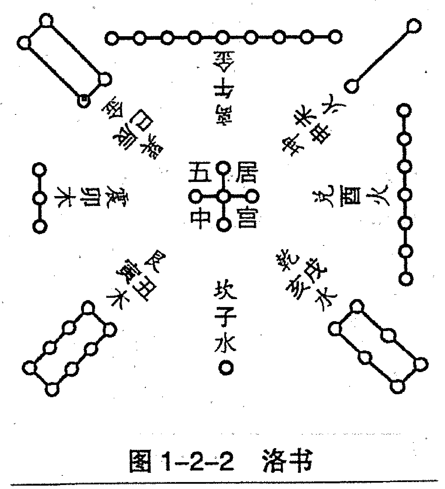
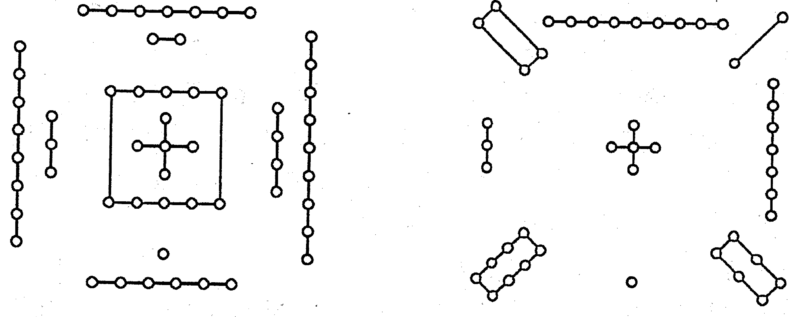
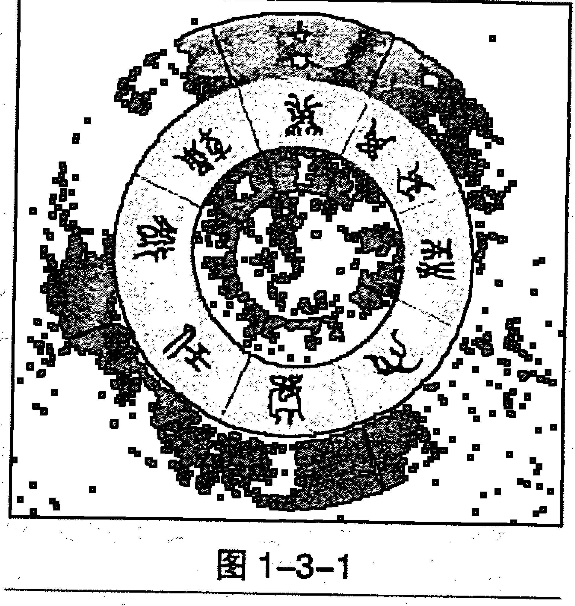
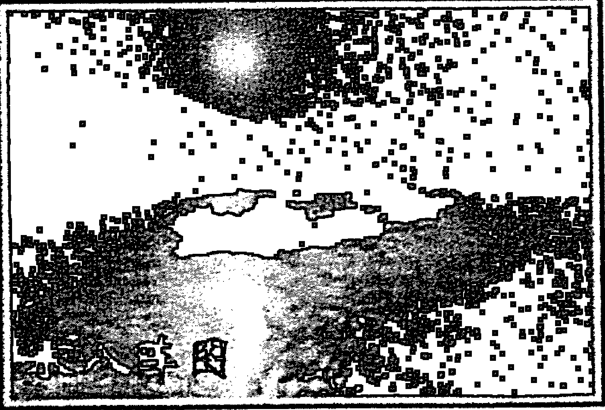

# 漫谈奇门遁甲

修订本
李万福 著

> 博望坡，
> 诸葛亮火烧夏侯惇，
> 十万精兵片甲不留。

---

## 出版信息

| 项目 | 内容 |
| :--- | :--- |
| 书名 | 漫谈奇门遁甲 |
| 作者 | 李万福 著 |
| 出版发行 | 中国新闻联合出版社 (CHINA NEWS UNITED PUBLISHER) |
| 出版时间 | 2017年3月 |
| ISBN | 978-988-16212-6-9 |
| 分类 | Ⅰ. 漫... Ⅱ. 李... Ⅲ. 国学—中国—当代 |
| 主编 | 李万福 |
| 责任编辑 | 碧荷 |
| 装帧设计 | 郭书泽 |
| 联系电话 | 010-63347246-668 |
| 地址 | 香港新界沙头角麻雀岭116号1楼C室 |
| 网址 | www.zhonglianshe.com |
| 邮箱 | zhonglianshe1@126.com |
| 开本 | 710 × 1000 1/16 |
| 印张 | 26 |
| 字数 | 464千字 |
| 版次 | 2017年3月第一版 |
| 印次 | 2020年7月第四次印刷 |
| 定价 | 56.00元 |

版权所有 翻版必究

---

## 内容提要

自从 2010 年 8 月和 2011 年 10 月，中国商业出版社先后两次出版发行了作者的《奇门与四柱》一书，在国内外引起不小的反响，至少有上千多位读者给作者打来电话、发来短信或者邮件，在对本书给予充分肯定的同时，又提出不少问题，要求作者进一步解答。作者经过认真梳理，发现大家的要求集中在刑事破案、生意求财和婚恋三个问题上，其中婚恋占的比重最大；还有许多易友一再要求作者写一本既通俗易懂、又能直观地从四柱、奇门终身局或者一个盘式，判断出一个人一生的官运、财运、婚恋以及吉凶灾祸，从而让人们对自己命运把握起来了然于胸，进而找出破解灾祸，趋吉避凶的办法，在事业上不走弯路或者少走弯路，顺利到达成功的彼岸。

作者经过几年来的刻苦钻研，特别是和广大易友一起深入探索，逐步对以上课题梳理出一条科学的判断思路，在古人创立的经典理论基础上，结合自己大量实践活动，又发现了许多崭新的、闪光的易学精髓，比如大六壬学说中的天罡星在军事作战、刑事破案中具有独特的作用，将奇门遁甲与六壬串联起来综合对事物进行判断，是对奇门遁甲格局科学论述的深层次跨越。大量实践证明：在刑事案件中，仅仅运用奇门遁甲本身的确显得捉襟见肘，行回头看，不断从古籍中挖掘出一些新的能源和有效的新的解读技能，被大家称道的“三宫定位”在奇门遁甲领域里就格外引人注目和独领风骚。而这种方法的科学原理仍旧源于河图与洛书的演变过程，其中史立生先生著述的《易经科学新解》就很值得大家一读。我在本书第四章第八节对“三宫定位法”列举了大量案例，希望能够引起大家的兴趣！

对婚恋课题，过去人们一直运用四柱进行判断，但由于四柱是平面地看待一个人的生平和运势走向，所以在具体判断上，不如奇门遁甲直观、明确。作者在这方面做了一些剖析求索的工作，意在改变多少年来奇门终身局停滞不前的状态，相信读者们能够喜欢。

---

## 目录

## 第一章 奇门遁甲的起源
- 一、指南针的演变与发展
- 二、河图与洛书
- 三、奇门遁甲盘面结构与分类

## 第二章 奇门遁甲格局与四柱命理学的关系
- 一、天干地支的由来
- 二、四柱命理学说蕴藏着人生命运吉凶信息密码
- 三、天干地支在奇门遁甲格局中的广泛应用
- 四、运用天干地支三合、六合、六冲判断奇门遁甲格局中的应期
- 五、四柱运算中的大运、流年在奇门遁甲格局中的应用

## 第三章 奇门遁甲格局的判断依据
- 一、刘伯温奇门遁甲总序和吉凶格
- 二、八门的应用
- 三、九星在奇门遁甲格局中的作用
- 四、八神的作用

## 第四章 如何辨析奇门遁甲格局
- 一、仔细审视局中各个宫位的情况，辨证地看待吉凶符号，根据不同角度选择我之所用
- 二、认真观察事物之间的关联性，寻踪觅迹，步步紧跟，直至找到源头
- 三、事物不同，选择的用神就不同，这是能否测准事物的关键
- 四、要特别注意奇门遁甲局中庚格的出现
- 五、奇门遁甲局的运筹谋划功能
- 六、问事局与事发局的区别
- 七、奇门格局中各宫位天盘天干与地盘天干相加之暗藏玄机
- 八、奇门遁甲格局中先天宫位与后天宫位互相参看之奥妙

## 第五章 关于遁甲穿壬之后的判断要领
- 一、遁甲穿壬的提起
- 二、12月将的排法
- 三、12天将的排法
- 四、六壬判断的几个要点
- 五、六壬排盘布局
- 六、宗门九课
- 七、起贵人
- 八、天罡星在军事作战、刑事案件中的独特功能

## 第六章 奇门遁甲终身局的运用
- 一、年命或日干遇凶神凶格多数有灾祸发生
- 二、通过奇门遁甲终身局判断人生重大事情
- 三、终身局显示出生地周围环境
- 四、终身局结合四柱显示婚姻信息明显
- 五、奇门终身局显示六亲信息

## 后记

---

## 第一章 奇门遁甲的起源

### 一、指南针的演变与发展

我在中国商业出版社 2010 年 10 月出版的《奇门与四柱》一书中说过，奇门遁甲是中国几千年来被历代军事学家极力推崇的一门预测学问，属于军事运筹学的范畴。在中国尤其是民间，人们推崇奇门遁甲的作战功效几乎到了谈遁色变的地步。

相传距今约 4600 余年前，黄帝联合炎帝部族与东夷集团九黎族首领蚩尤在涿鹿（今河北省涿鹿县）进行了一场艰苦激烈的大战，这是远古时代一次很大规模的战争。那天，黄帝带领士兵追杀蚩尤，忽然天昏地黑，浓雾弥漫，狂风大作，雷电交加，天上下起暴雨，黄帝的士兵无法继续追赶。原来蚩尤请来了“风伯”和“雨师”来助战。黄帝也不甘示弱，请来天上的“女魃”帮忙，驱散了风雨。一刹那间，风止雨停，晴空万里。蚩尤又用妖术制造了一场大雾，使黄帝的士兵迷失了方向。黄帝利用天上北斗星永远指向北方的现象，造了一辆“指南车”，指引兵士冲出迷雾。经过许多次激烈的战斗，黄帝先后杀死了蚩尤的八十一个兄弟，并最终活捉了蚩尤。黄帝命令给蚩尤带上枷锁，然后处死他。因为害怕蚩尤死后作怪，将他的头和身子分别葬在相距遥远的两个地方。这些故事是民间知识的读本。它告诉我们，我们的先人是怎么理解宇宙的构造、人类的起源、万物生成的来历、人和人之间的相互关系。因为黄帝生活在黄河中下游新石器晚期，大约公元前 27 世纪。

当时生产主要工具为磨制的石器、骨器，已会烧制陶器、制作木轮车等。人们把贝壳、石子、兽骨等串起来作项饰。那时候只有语言没有文字，一些重要历史人物和事件依靠语言代代相传，同时一些原始神话也一并流传。这就需要分清是史实还是神话，但是黄帝制作和使用指南车是真实的。首先制作指南车有着具体的时代、人物和事件；其次，战场上“尤作大雾”则是神话，但遭遇大雾是自然现象，“军士皆迷”是可能的，这就需要定向物体，这是黄帝制造指南车的必要性；同时在当时的生产条件下是能做到的。人们在打磨石器时发现磁石的特性，打碎以后，小块石头紧贴在大块石头上，像是小孩子靠在慈母身边，人们把这种石头称作“慈石”，后来写作磁石。人们以为这种石头有灵性，特别重视，用它打磨成圆环或条形，用绳子穿起来做成项饰；有时用磁石打磨成箭头。人们偶然发现了悬吊的磁石项饰和飘在水面上磁石箭头的箭有定向功能。人们把磁石项饰献给黄帝，黄帝是个很聪明的人，立刻意识到它的重要意义尤其是军事价值，悄悄地记下该磁石指向南方的部位，作战时一直挂在脖子上。在和蚩尤作战时遇到大雾，先头部队迷失方向，黄帝躲进树林里，折下几根干树枝，用随身带的麻绳绑扎成一个小木人，小木人的一条胳膊平举着，又把挂在脖子上的磁石项饰取下，磁石向南的一面对着小人举起的胳膊。再用麻绳把磁石和小木人紧紧扎在一起，把磁石盖得很严，用细麻绳栓着小人的脖子提起来，小人摆动一会，胳膊指在一个方向上，这个方向就是南方。黄帝提着木人走出树林，说是神灵赐给的仙人。他又叫士兵折来三根树枝，推进来一辆随军运输车，在车上搭一个木架，把指南人悬吊在横枝上，小木人胳膊一直指向南方。黄帝把车交给将士，将士高兴地推着车子回到先头部队，那些因为迷路垂头丧气的士兵见了顿时精神抖擞，拿起武器高喊着冲向蚩尤阵地。蚩尤和士兵仓促迎战，人心涣散，溃不成军，蚩尤也做了俘虏。

（注：苏州古代天文计时仪器研究所陈凯歌所长仿制黄帝制作的指南车。）

现在，连小学生都知道磁石具有指南特性，但在当时，木人指南却是高科技，应该绝对保密。黄帝做成木人，一是以利于保密，别人不知其中奥妙。战胜之后，他把木人毁掉，把磁石再藏起来。指南车才能够长期保密；二是神秘化，说是神灵所赐，既能提高黄帝威望又能鼓舞士气。随着时代的变迁和科学技术的发展，这种指南车就发展成现在的罗盘，广泛地应用在军事、航海、航空和地质勘探、楼房建筑、工农业生产中。

我国古籍中，有关指南针的记载很多。在各个不同的历史发展时期，它有不同的形体，也有不同的名称，如司南、指南鱼、指南针和磁罗盘等等。最初的指南针是用天然磁石制成的，样子像一只勺子，勺底是圆的，可以在平滑的“地盘”上自由旋转，等它静止的时候勺柄就会指向南方，古人称它“司南”。东汉的王充，在他的《论衡·是应篇》中曾说：“司南之杓，投之于地，其柢指南。”这里的“地”，是指汉代栻占的方形“地盘”，地盘四周刻有八干（甲、乙、丙、丁、庚、辛、壬、癸）和十二支（子、丑、寅、卯、辰、巳、午、未、申、酉、戌、亥），加上四维（乾、坤、巽、艮），共二十四向，用来配合司南定向。从战国、秦汉、六朝以至隋唐的古籍中，有不少关于司南的记载。如《韩非子·有度篇》里有“先王立司南以端朝夕”的话，“端朝夕”就是正四方的意思。《鬼谷子·谋篇》里也记载说，“郑人取玉，必载司南，为其不惑也。”就是说郑国的人到远处去采玉，就带了司南去，以便不迷失方向。古代的司南是用天然磁石经人工用琢玉的办法琢磨成的。我国商周时期琢玉工人的技术已经很精湛，至迟在春秋时期就已经能把硬度五到七的软玉和硬玉琢制成各种形状的玉器，因此也能够把硬度只有 5.5 到 6.5 的天然磁石制成形体比较简单的司南来。由于天然磁石在琢制成司南的过程中不容易找出准确的极向，而且也容易因受震而失去磁性，因而成品率低。同时也因为这样琢制出来的司南磁性比较弱，而且在和地盘接触的时候转动摩擦阻力比较大，效果不太好，因此这种司南未能得到广泛的使用。

随着社会生产力的不断发展，科学技术的不断进步，航海业的不断扩大和发展，制造出一种比司南更好的指向仪器不但成为必要，而且也有了可能。在经过劳动人民长期的生产实践和反复多次的试验之后，人们终于发现了人工磁化的方法，这样就产生了更高一级的磁性指向仪器。北宋初年由曾公亮主编的一部军事著作《武经总要》和由著名的科学家沈括撰写的《梦溪笔谈》里，分别介绍了指南鱼和指南针。指南鱼是用薄铁叶裁成鱼形，然后用地磁场磁化法，使它带有磁性。在行军需要的时候，只要用一只碗，碗里盛半碗水，放在无风的地方，再把铁叶鱼浮在水面，就能指南。但是这种用地磁场磁化法所获得的磁体磁性比较弱，实用价值比较小。另一种指向仪器是指南针，它是以天然磁石摩擦钢针制得。钢针经磁石摩擦之后，便被磁化，也同样可以指南。沈括根据他的见闻，在《梦溪笔谈》卷二十四里说道：“方家以磁石磨针锋，则能指南。”

直到十九世纪现代电磁铁出现以前，几乎所有的指南针都是采用这一种人工磁化法制成的。这时，指南针在它的发展史上已经跨过了两个发展阶段——司南和指南鱼，发展成一种更加简便、更有实用价值的指向仪器。以后各种名目繁多的磁性指向仪器，都以这种磁针为主体，只是磁针的形状和装置法有所变化罢了。

关于磁针的装置法，沈括亲自做了四种实验：把磁针横贯灯芯浮水上，架在碗沿或指甲上，以及用缕丝悬挂起来。沈括这四种实验，概括起来属于三种类型：一是水浮法，二是支点旋转法，三是缕丝悬挂法。沈括认为，“水浮多荡摇，”碗沿或指甲“坚滑易坠”，而以“缕丝为最善”。其实这三种方法各有优点，它们在后来都有不同程度的发展，都在实际中得到不同程度的应用。而且前两种的应用还更加普遍。特别是水浮法，在我国指南针发展史上占有重要的地位。从已经发现的古代文献和地下出土文物可以看出，我国从两宋起，历元、明到清初，水浮法指南针在航海上和堪舆上都一直使用。有的还使用到清代的中后期。这种水浮法，据宋代寇宗奭的《本草衍义》、元代程棨的《三柳轩杂记》所说，是用灯芯或其他比较轻的物体做浮标，让磁针贯穿而过，使它浮在水面而指南。

解放后在河北磁县、江苏丹徒、辽宁大连等地，陆续发掘出一批元代的“王”字瓷碗。碗腹内底画有三大点，中间穿一细划，样子像个“王”字。据考证，这三点一划是表示“指南浮针”，中间的直线表示磁针，三大点表示和灯芯草有共同作用的浮标。这“王”字的绘画是有用意的。一个是为了表明这碗是专为浮针用的 (在大连市出土的“王”字瓷碗底部圈足里都墨书一个正楷的“针”字，就是为了标明这碗是针碗)。另一个可能是为了标明磁子午方向，在一定程度上起了方位盘的作用。南宋陈元靓在他所撰的《事林广记》中，也介绍了当时民间曾经流行的有关指南针的两种装置形式，就是木刻的指南鱼和木刻的指南龟。木刻指南鱼是把一块天然磁石塞进木鱼腹里，让鱼浮在水上而指南。木刻指南龟的指向原理和木刻指南鱼相同，它的磁石也是安在木龟腹，但是它有比木鱼更加独特的装置法，就是在木龟的腹部下方挖一小穴，然后把木龟安在竹钉子上，让它自由转动。这就是说，给木龟设置一个固定的支点。旋转木龟，待它静止之后，它就会南北指向。正如在使用司南时需要有地盘配合一样，在使用指南针的时候，也需要有方位盘配合。最初，人们使用指南针指向可能是没有固定的方位盘的，但是不久之后就发展成磁针和方位盘联成一体的罗经盘，或称罗盘。方位盘仍是汉时地盘的二十四向，但是盘式已经由方形变成环形。罗经盘的出现，无疑是指南针发展史上的一大进步，只要一看磁针在方位盘上的位置，就能定出方位来。南宋曾三异在《同话录》中说道：“地螺或有子午正针，或用子午丙壬间缝针。”这里的“地螺”就是地罗，也就是罗经盘。这是一种堪舆用的罗盘。盘。这时候已经把磁偏角的知识应用到罗盘上。从曾三异的话可以看出，这种罗盘不但有子午正针（是以磁针确定的地磁南北极方向），还有子午丙壬间的缝针（是以日影确定的地理南北极方向），两个方向之间有一夹角，这就是磁偏角。当时的罗盘，还是一种水罗盘，磁针还都是横贯着灯芯浮在水面上的。北宋徐兢的《宣和奉使高丽图经》中记载说：在海上航行遇到阴晦天气，就用指南浮针。不过在南宋可能已出现旱罗盘。据《考古》1988年第四期报道，1985年五月江西省临川市出土了南宋时期的仙人俑，高22.2厘米，手捧一件似是旱罗盘，磁针是菱形，中央有一小孔，以轴承支持着。这说明可能早在十二世纪末期以前，中国已有旱罗盘。

旱罗盘和水罗盘的区别在于，罗盘的磁针是以钉子支在磁针的重心处，并且使支点的摩擦阻力比较小，磁针可以自由转动。显然，旱罗盘比水罗盘有更大的优越性，它更适用于航海，因为磁针有固定的支点，而不会在水面上游荡。旱罗盘的这种磁针有固定支点的装置法，起源于沈括的磁针装置碗沿旋定法和指甲旋定法等试验。

我国的指南针大约是在公元12世纪末到13世纪初经过阿拉伯传入欧洲的。宋代我国的航海业已经相当发达，泉州、广州都是世界一等大商港，中国船不但船身高大，结构坚固，而且航速快，又有指南针指航，阿拉伯商人都喜欢乘中国船只。而且阿拉伯和波斯商人旅居中国不少，泉州、广州两地常住许多阿拉伯商人，因而，我国指南针的每一步发展，连同民间流行的木刻指南龟，也就很容易随着频繁的经济文化交流而传入西方，这就为旱罗盘的出现提供了基础。

顺便指出，虽然旱罗盘因磁针有固定的支点而比水罗盘显得优越，但是它在海上应用仍有很大的不方便。当盘体随海船作大幅度摆动的时候，常使磁针过分倾斜而靠在盘体上转动不了。十四到十六世纪，欧洲航海罗盘出现了一种现在称做“万向支架”的常平架，它是由两个铜圈组成，两圈的直径略有差别，使小圈正好内切于大圈，并且用枢轴把它们联结起来，然后再由枢轴把它们安在一个固定的支架上。旱罗盘就挂在内圈中，这样，不论船体怎么摆动，旱罗盘总能始终保持水平状态。

这种常平架，就文献记载来看，在我国早在汉晋时期就已经出现了。在当时的一部著作《西京杂记》中曾经记载西京长安有个巧匠名叫丁缓的，他作了一个小香炉，像个多孔小球，可以点上香后放在被窝中，不论小球怎么滚动，炉灰总不会撒出来，因此这种小香炉称做卧褥香炉或被中香炉。卧褥香炉的原理就是在多孔小球里联结两个套起来的金属圈，点香用的炉缸就挂在内圈上。这种卧褥香炉在汉以后历代都有制造。但是这种技术原理在当时只是为少数统治阶级服务，直到一千三百多年后欧洲人用它装置航海罗盘的时候，这一人类智慧才得到真正的尊重和充分的应用。

指南针作为一种指向仪器，在我国古代军事上、生产上、日常生活上、地形测量上，尤其是在航海事业上，都起过重要的作用。我国古代航海业相当发达。秦汉时期，就已经同朝鲜、日本有了海上往来；到隋唐五代，这种交往已经相当频繁。而且同阿拉伯各国之间的贸易关系也已经很密切。到了宋代，这种海上交通更得到了进一步的发展。中国庞大的商船队经常往返于南太平洋和印度洋的航线上。

海上交通的迅速发展和扩大，是和指南针在航海上的应用分不开的。在指南针用于航海之前，海上航行只能依据日月星辰来定位，一遇阴晦天气，就束手无策。唐文宗开成三年（公元838年），日本和尚圆仁来中国求法，后来写有《入唐求法巡礼行记》一文，描述了在海上遇到阴雨天气的时候混乱而艰辛的情景。文中写道：当时，海船的航向无法辨认，大家七嘴八舌，有的说向北行，有的说向西北行，幸好碰到一个波绿海浅的地方，但是也不知道离陆地有多远，最后只好沉石停船等待天晴。而在指南针用于航海之后，不论天气多么阴暗，航向都可辨认。

史籍中最早记载到指南针用于航海的是在北宋。朱彧在他的《萍洲可谈》一书中评述了当时广州航海业兴旺的盛况，同时也记述了中国海船在海上航行的情形，说道：“舟师识地理，夜则观星，昼则观日，阴晦观指南针。”这时海上航行还只是在日月星辰见不到的日子里才用指南针，这是由于人们对靠日月星辰来定位有一千多年的经验，而对指南针的使用还不很熟练。随着指南针在海上航行的不断应用，人们对它的依赖也与日俱增，并且有专人看管。南宋吴自牧在他所写的《梦粱录》中说道：“风雨冥晦时，惟凭针盘而行，乃火长掌之，毫厘不敢差误，盖一舟人命所系也。”由此也可以看出指南针在航海中的地位和作用。

到了元代，指南针一跃而成海上指航的最重要仪器了，不论冥晦阴暗，都利用指南针来指航。而且这时海上航行还专门编制出罗盘针路，船行到什么地方，采用什么针位，一路航线都一一标识明白。元代的《海道经》和《大元海运记》里都有关于罗盘针路的记载。元代周达观写的《真腊风土记》里，除了描述海上见闻外，还写到海船从温州开航，“行丁未针”。这是由于南洋各国在中国南部，所以海船从温州出发要用南向偏西的丁未针位。

明初航海家郑和“七下西洋”，扩大了中国的对外贸易，促进了东西方的经济和文化交流，加强了中国的国际政治影响，增进了中国同世界各民族的友谊，作出了卓越的贡献。他这样大规模的远海航行之所以安全无虞，全赖指南针的忠实指航。郑和的巨舰，从江苏刘家港出发到苏门答腊北端，沿途航线都标有罗盘针路，在苏门答腊之后的航程中，又用罗盘针路和牵星术相辅而行。指南针为郑和开辟中国到东非航线提供了可靠的保证。就世界范围来说，指南针在航海上的应用，导致了以后哥伦布（1451-1506）对美洲大陆的发现和麦哲伦（约1480-1521）的环球航行。这大大加速了世界经济发展的进程，为资本主义的发展提供了必不可少的前提。

我国古代关于磁学的知识相当丰富。古籍中记载了很多有关磁学的其他知识。远在二千多年前，我国古代劳动人民就开始同磁打交道。我们祖先对磁的认识，最初是从冶铁业开始的。劳动人民在寻找铁矿的过程中，必然会遇到磁铁矿。我国古籍中关于磁石的最早记载，是《管子·地数篇》一书。书中说道：“上有慈石者，下有铜金。”人们在同磁石不断接触中，逐渐了解到它的某些特性，并且利用这些特性来为人类服务。

磁石有一个区别于别种矿石的显而易见的特性，就是它的吸铁性。磁石吸铁性的发现年代很早，它同静电学里的“琥珀拾芥”现象（汉·王充《论衡·乱龙》：“顿牟拾芥，磁石引针”）一起，通常被古代人联系起来比喻事物的本性。由于磁石具有吸铁的特性，因此它也容易被人们发现。从现代物理学知识看出，磁石之所以能够吸铁，是由于铁的导磁系数远远大于 1。铁被磁石的磁场作用后，会感应出很大的附加磁场，也就是说铁本身也成为一个强磁体，因而能被磁石吸引。而铜、金等大多数的金属和非金属，都是一般的弱磁性物体，它们的导磁系数都十分接近于 1（略大于或小于 1），因此这些物体不能被磁石吸引。

对于这一问题，宋代的陈显微和俞琰曾经作了探讨，认为磁石所以吸铁，是有它们本身内部的原因，是由铁和磁石之间内在的“气”决定的。明末的刘献廷（1648-1695）在他的《广阳杂记》一书中也认为磁石吸铁是由于它们之间具有“隔碍潜通”的特性。刘献廷并且把铁的这种磁屏蔽作用理解为“自然之理”。这种力图用自然界本身来解释自然现象的观点是唯物主义的。考虑到当时的科学水平，也只能作出这样解释。

我国古代还把磁石吸铁性应用于生产上。清朱琰著的《陶说》记有古代烧白瓷器的时候，用磁石过滤釉水中的铁屑，因为素瓷如果沾有铁屑，烧成后就会有黑斑。在制药的过程中，由于铁制的杵臼往往会有碎屑混在药里，人们也往往用磁石吸去杵头的铁屑。磁石也应用于医疗上，明代李时珍的《本草纲目》记载到宋代的人就用磁石吸铁作用来进行某种外科手术，如在眼里或口里吸收某些细小的铁质异物。到了现代，已经发展为一种专门的磁性疗法，对关节炎等疾病显示出良好的疗效。

我国古籍中有关人工磁化法的记载，基本上有两种。一种是如沈括所说的用天然磁石摩擦钢针的方法。从现代观点来看，这种方法实际上就是以天然磁石的磁场的作用，使钢针内部的单元小磁体由杂乱排列变为规则排列，从而使钢针显示出磁性来。之所以用钢针，是因为钢的剩磁力强，可以成为永磁体。

另一种方法是利用地球磁场的作用使钢针磁化。《武经总要》所记载的指南鱼就属于这一种。“鱼法以薄铁叶剪裁，长二寸，阔五分，首尾锐如鱼形，置炭火中烧之，候通赤，以铁钳持鱼首出火，以尾正对子位，蘸水盆中，没尾数分则止，以密器收之。”从现在知识看，把铁叶鱼烧红是为了让铁鱼内部的分子动能增加，从而使分子磁畴从原先的固定状态变为运动状态。然后使烧红的铁叶鱼沿着地球磁场方向放置，为的是通过强大的地磁场迫使运动着的分子磁畴顺着地球磁场方向重新排列（由无规则排列到规则排列），这时铁鱼就被磁化了。

最后由于我国地处地球的北半部，地磁场的方向应是北端向下，因此“蘸水盆中，没尾数分则止”，就是令铁叶鱼“正对子位”的鱼尾略为向下倾斜，使它在更大程度上被磁化。蘸入水中是为了使它迅速冷却，把分子磁畴的规则排列固定下来，同时也是淬火过程。最后“以密器收之”，可能是指指南鱼放在天然磁石旁边，以形成闭合磁路，让它保持磁化或继续磁化。这种磁化法完全是凭经验得来的，但是它是磁学和地磁学发展的重要一环，比欧洲用同样磁化方法早了四百多年。

我国关于地球磁场可以磁化铁物的记载，还见于明代的一些著作中，如方以智的《物理小识》卷八《指南说》的注中引滕揖的话：“铁条长而均者，悬之亦指南。”李豫亨的《青鸟绪言》中也记有堪舆家悬铁条使它指向的方法：“近遇地师汪弄丸者，始知以铁杖不拘巨细，系绳悬之，以手击之旋，旋定必指南，即罗经法也，余试之良然。”

磁偏角、磁倾角（地球磁场和水平面的夹角）和地磁场的水平分量（或地磁场的强度）称作“地磁三要素”。欧洲人对磁偏角的发现是在哥伦布海上探险途中的 1492 年，磁倾角的发现还要晚一些。而我国对磁偏角、磁倾角的发现都要早得多。《武经总要》所记述的制指南鱼法，是包含有一定的地磁学知识的。甚至有关磁倾角的知识也反映在这种磁化法中。既然指南鱼在磁化过程中要北端（尾部）向下倾斜，这就隐含着当时的人们已经意识到有个倾角的存在。

北宋司天监杨维德于公元 1041 年撰成的相墓书《茔原总录》说：“客主的取用，宜匡四正以无差。当取丙午针，于其正处，中而格之，取方直之正也。”之所以“取丙午针”，就是由于磁针存在偏角的缘故。也就是说当磁针处于“丙午”方向时，方向盘的“午”才是地理的正南向。这是至今所发现的有关磁偏角的最早文献记载。沈括在记述用天然磁石摩擦钢针可以指南的时候指出：“然常微偏东，不全南也。”沈括在这里说的是“常微偏东”，而不是必微偏东。他在说到悬挂磁针的时候，也是说“针常指南”。稍后一些的寇宗奭，在他编的《本草衍义》中收录了沈括的话，但他去掉“微”字，而保留“常”字，写成“常偏东”，“常指南”、“常偏两位”等等，足见沈、寇二人对“常”字不是随便用的。

从后来的地磁学发展知道，磁偏角是随地点的变化而变化的，而同一地点的磁偏角大小又随时间的推移而不断改变。这些变化是由于地磁极不断变动所致。沈括在《梦溪笔谈》里之所以记为“常微偏东”，可能是由于他观察磁针指南是在一个比较长的时间里，同时也由于他观察磁针是在随身携带在各个不同的地点上，因此他所得到的各个偏角值大小不一样，多数是偏东的，但是也不完全是这样。

欧洲人首次发现磁偏角随地点变化是在哥伦布由西班牙航行去美洲的途中；而发现同一地点的磁偏角随时间变化是在 1634 年。这些发现都是比较具体而详细的。而沈括的描述却很笼统，但是我们可以认为，磁偏角是在不断变化的这一现象，在《梦溪笔谈》里就有所反映。到了南宋，磁偏角因地而异的情况有了更明确的记载，并且被应用到堪舆罗盘上，如前面已经提到的曾三异，他在《同话录》中说：“天地南北之正，当用子午。或谓今江南地偏，难用子午之正，故以丙壬参之。”这就是说，在地磁子午线和地理子午线一致的地方，用子午正针就可以了；而在我国东部沿海一带，地磁子午线和地理子午线有一夹角，就要参用丙壬缝针。到元明清时期，堪舆罗盘也都设有缝针，而且不同时期、不同地域所制的罗盘的缝针方位也都不一致。这可以看成是我国古代关于偏角因时、地而变化的原始记录。

在对指南针的运用中，能否准确测出地理方位，特别是在行军宿营、作战指挥中选准突击方位和转移退却方位至关重要，有时候失之毫厘将差之千里，甚至带来难以预计的恶劣后果。尤其是当下对楼房、住宅、办公地点、生产车间的布局中，我们大多运用玄空风水，其中杨公风水中的透地龙起卦，实际上就是用山向奇门遁甲起卦，这是风水勘测中的真谛所在。而玄空罗盘中的山向分布，也由初期的 24 山，逐步过渡到 120 分金，也就是由过去的 72 分金（即一卦管三山）精确到一卦管五山，总共 120 个山向（也叫 120 分金），这就解决了山山有替卦的问题。

每个山向均带干支，然后根据玄空罗盘上测出的山向干支和所在卦面所对应的节气节令，找出相应的阴阳布局数字（是阳遁还是阴遁），起出奇门遁甲格局来，进行分析运算。所以对罗盘运算功能的要求就越来越精准。我们必须切实搞通弄懂罗盘的运算原理，才能熟练地进行运算。而目前所运用的奇门遁甲断风水，多数人用的是时家奇门遁甲局，但是一座楼房建起来是固定不变的，时家奇门虽然精确，但时间是在变化的，不同时间起出的格局是不一样的，所以对这座楼的吉凶判断就是不一样的。所以杨公风水认为应以山向起卦为准。

目前风水学界对奇门遁甲起局断风水一般分为两个方面的内容。
- 首先用透地六十龙起卦，看来龙是否生旺，是否得运，随龙水的来去是否合度，有无四吉之砂水，开、休、生三吉门、禄马贵人、子父财官之方是否有响应位而起。
- 其次是用穿山七十二龙起卦，看气场的情况如何，应立什么坐度，把来水、去水拨归乙丙丁三奇，把对应的砂拨归于三吉门、禄马贵人、子父财官之方。运用于阳宅，则用穿山七十二龙起卦。

这个问题大家可参阅有关书籍，比如秦伦诗著的《风水罗盘应用经验学》等。

# 漫谈奇门遁甲

封建时代的君王和将帅们如姜子牙、张良、诸葛亮、刘伯温等奇门遁甲学说的创始人和继承者，为了宣扬封建统治阶级的合法性，故意为奇门遁甲加上神秘色彩，演绎了九天玄女传授黄帝奇门遁甲天书的故事。如北宋宰相赵普在《烟波钓叟赋》开篇就说“轩辕黄帝战蚩尤，征战多年苦未休，偶梦天神授符诀，登坛致祭谨谦修。因命军师演成文，奇门遁甲从此始。”说什么轩辕黄帝大战蚩尤多年无果，有天晚上他偶然做梦遇见九天玄女向他传授三卷天书即《太乙神数》、《奇门遁甲》和《大六壬》，通过阅读奇门遁甲中的图式，他掌握了行兵布阵的技巧，从而一举打败了蚩尤。其实，当时根本没有文字，何谈天书之说。

中国文字，也就是现在汉字的产生，有据可查的，是在约公元前 14 世纪的殷商后期，这时形成了初步的定型文字，即甲骨文。甲骨文既是象形字又是表音字，至今汉字中仍有一些和图画一样的象形文字，十分生动。到了西周后期，汉字发展演变为大篆。大篆的发展结果产生了两个特点：一是线条化，早期粗细不匀的线条变得均匀柔和了，它们随实物画出的线条十分简练生动；二是规范化，字形结构趋向整齐，逐渐离开了图画的原形，奠定了方块字的基础。

后来秦朝丞相李斯对大篆加以去繁就简，改为小篆。小篆除了把大篆的形体简化之外，并把线条化和规范化达到了完善的程度，几乎完全脱离了图画文字，成为整齐和谐、十分美观的基本上是长方形的方块字体。但是小篆也有它自己的根本性缺点，那就是它的线条用笔书写起来是很不方便的，所以几乎在同时也产生了形体向两边撑开成为扁方形的隶书。至汉代，隶书发展到了成熟的阶段，汉字的易读性和书写速度都大大提高。隶书之后又演变为章草，至唐朝有了抒发书者胸臆，寄情于笔端表现的狂草。随后，糅合了隶书和草书而自成一体的楷书（又称真书）在唐朝开始盛行。我们今天所用的印刷体，即由楷书变化而来。介于楷书与草书之间的是行书，它书写流畅，用笔灵活，据传是汉代刘德升所制，传至今日，仍是我们日常书写所习惯使用的字体。

因此奇门遁甲成书的时代至多也就是姜子牙所处的时代，他所在商朝的殷纣王是一个残暴的昏君，殷纣王统治期间战争不断，为了躲避战乱，姜子牙到中国北方的辽宁隐居了 40 年，后来又来到西北陕西省的终南山。在那里，他经常到渭河去钓鱼，可是三年中他却一条鱼也没有钓到，而且他的鱼钩还是直的。人们都嘲笑他，他却无动于衷，所以在中国有一句成语叫“姜太公钓鱼，愿者上钩”。神奇的是，后来他果然钓到一条鱼，在鱼的肚子里有一本兵法书。更巧合的是，当天晚上，周王朝（公元前 11 世纪至 8 世纪）的周文王姬昌做一个梦，梦见一位高人。第二天，他就遇到了姜子牙。姜子牙向周文王讲述了自己的身世，文王当时正为了打败敌人建立王朝而搜罗人才，所以就对他说：我的先祖太公早就寄希望于你了。因此，后人又称他为太公望，在民间一般称他为姜太公。文王给他以极高的地位，并在他的帮助下，消灭了商朝。在以后的中国各朝代都为他建立了神庙，而道家也传说他升天成仙了。

这些传说毕竟是传说，但说奇门遁甲形成于这一时期却是比较可信的。因为奇门遁甲的主要运算符号天干地支在这之前就出现了。轩辕黄帝把公元前 2697 年定为甲子，并且从此就用六十甲子纪年纪月纪日纪时，所谓华夏文明 5000 年就是从这一年开始计算的。因为在这之前很长一个时期里，具有非凡意义的先天八卦就应运而生了，后来周文王发明了后天八卦，奇门遁甲的盘式运用的就是周文王的后天八卦。

从目前所得的文献来看，奇门遁甲最早见于《汉书》。《四库提要》中说：“考《大戴礼》载明堂古制有二九四七五三六一八之文，此九宫之法所自昉，而易纬《乾凿度》载太乙行九宫尤详，遁甲之法，实从此起。方技家不知其源，故妄托也。”“《汉志》所列惟风鼓六甲、风后孤虚而已，于奇门遁甲尚无明文。至梁简文帝《乐府》，始有三门应遁甲语。《陈书·武帝纪》，遁甲之名遂见于史。则其学殆盛于南北朝。《隋志》载有《伍子胥遁甲文》、《信都芳遁甲经》、《葛秘三元遁甲图》等十三家，其遗文世不概见。唐李靖有《遁甲万一诀》，胡乾有《遁甲经》，俱见于史志。至宋而传其说者愈多。仁宗时尝命修《景祐乐髓新经》，述七宗二变，合古今之乐，参以六壬遁甲。又令司天监杨维德撰《遁甲玉函符应经》，亲为制序。故当时壬遁之学最盛，谈数者至今多援引之。”

所以，奇门遁甲诞生的时期，虽不一定真如各书所说，出自轩辕黄帝战蚩尤之时，当在八卦甲子发明以后。这是可以从其学说内容结构推证的。大约周秦时名“阴符”，汉魏时名“六甲”，晋唐宋元称“遁甲”，明清以来谓之“奇门遁甲”，或者有时称“奇门”，有时称“遁甲”，皆是指这一数术内容。我们的祖先在长期的实践应用过程中，积累了丰富的经验，凝聚了多家的智慧成果，遗留下了不少的《奇门遁甲》专著，丰富了中华民族的文化宝库。

### 二、河图与洛书

这里就不能不说一下河图和洛书的来历了。因为奇门遁甲包括太乙和六壬的运算模式就起源于河图洛书。而十天干和十二地支的阳顺阴逆学说也起源于河图洛书，掌握了十天干和十二地支这一学说就抓住了命理学说和奇门遁甲学说的根本性问题，否则研究命理学和奇门遁甲学就无从谈起。

河图与洛书是中国古代流传下来的两幅神秘图案，历来被认为是河洛文化的滥觞，中华文明的源头，被誉为“宇宙魔方”。相传，上古伏羲氏时，洛阳东北孟津县境内的黄河中浮出龙马，背负“河图”，献给伏羲。伏羲依此而演成八卦，后为《周易》来源。又相传，大禹时，洛阳西洛宁县洛河中浮出神龟，背驮“洛书”，献给大禹。大禹依此治水成功，遂划天下为九州。又依此定九章大法，治理社会，流传下来收入《尚书》中，名《洪范》。《易·系辞上》说：“河出图，洛出书，圣人则之”，就是指这两件事。

河图上，排列数成阵的黑点和白点，蕴藏着无穷的奥秘。洛书上，纵、横、斜三条线上的三个数字，其和皆等于 15，十分奇妙。对此，中外学者作了长期的探索研究，认为这是中国先民心灵思维的结晶，是中国古代文明的第一个里程碑。《周易》和《洪范》两书，在中华文化发展史上有着重要地位，在哲学、政治学、军事学、伦理学、美学、文学诸领域产生了深远影响。作为中国历史文化渊源的河图洛书功不可没。

河图与洛书是中华文化阴阳五行术数之源。最早记录在《尚书》之中，其次在《易传》之中，诸子百家多有记述。太极、八卦、周易、六甲、九星、风水等等皆可追源至此。1987 年河南濮阳西水坡出土的形意墓，距今约 6500 多年。墓中用贝壳摆绘的青龙、白虎图像栩栩如生，与近代几无差别。河图四象、28 宿俱全。其布置形意，上合天星，下合地理，且埋葬时已知必被发掘。同年出土的安徽含山龟腹玉片，则为洛书图像，距今约 5000 多年。可知那时人们已精通天地物理，河图、洛书之数了。据专家考证，形意墓中之星象图可上合二万五千年前。这说明邵雍等先哲认为“河图、洛书乃上古星图”，其言不虚。

不过有一种说法认为河图是根据五星出没的时节观察绘成的图，五星在古代称为五纬，是天上五颗行星，即金、木、水、火、土。金是太白星，木是岁星，水是辰星，火是荧惑星，土是镇星。五星运行，以二十八宿为区划，由于它的轨道离日道不远，所以古人用来记日。五星运行的出没有自己的时间，按木、火、土、金、水的顺序在北极天空出现。每一星是 72 天，加在一起是 360 度。每一星出现在中天时，跟它相对的一颗隐没的星。例如水星，每天子时、巳时出现在北方，每月的一、六（初一、初六、十一、十六、廿一、廿六），日月会水星于北方，每年十一月、六月夕见于北方，所以说一六合水。其它的星也正是合于河图之数。所以，《易经》是符合天象的。

天一生水，地六成之；地二生火，天七成之……成之；天三生木，地八成之；地四生金，天九成之，天五生土，地十成之。

### 河图运行次序

《河图》之序，自北而东，左旋而相生：北方水生东方木，东方木生南方火，南方火生中央土，中央土生西方金，西方金生北方水。然对待之位，则北方一六水，克南方二七火；西方四九金，克东方三八木，而相克者寓乎相生之中，盖造化之理，生而不克，则生者无从而裁制，其《河图》生克之妙有如此乎！

### 说河图篇

龙马负图之初，有一白六黑在背近尾，七白二黑在背近头，三白八黑在背之左，九白四黑在背之右，五白十黑在背之中。羲皇与大挠氏定以一六在下，合于北而生水，亥子属焉；二七在上，合于南而生火，巳午属焉；三八在左，合于东而生木，寅卯属焉；四九在右，合于西而生金，申酉属焉；五十在中为土，而辰、戌、丑、未属焉。此八字地支之数所由始也。

续自图南，先生慨《易》道之不明，乃以人生年、月、日、时干配同《洛书》取数，而后知天地所赋之厚薄，大《易》之道灿然复明，诚可谓有功于先圣者。后之学者，苟视为玩具，几何而不流于自暴自弃也哉？戴九履一，左三右七，二四为肩，六八为足，五十居中。

洛书是以北极为定位星，斗柄所指的九个方位上最明亮的星为标志，其数目方位都与洛书完全一致。这也就是一般术数中常说的“九宫”（奇门遁甲就采用此九宫作为基石）。其中奇数一、三、七、九为阳，偶数二、四、六、八为阴，五居中宫。这就是一个标准的洛书。（图 1-2-2）



### 洛书运行次序

《洛书》之序，自北而西，右转而相克：北方水克西方火，西方火克南方金，南方金克东方木，东方木克中央土；然对待之位，则东南四九金，生西北一六水，东北三八木，生西南二七火，而相生者已寓乎相克之中。盖造化之理，克而不生，而所克者有时而间断，其《洛书》克生妙有如此乎！

### 说洛书篇

夫灵龟负书者非龟也，乃大龟也。其背所有之文，为一长画所载。一点白近尾，九点紫近头，二黑点在背之右，四碧点在背之左，六白点在近足之右，八白点在近足之左，三绿点在胁之左，七赤点在胁之右，五黄点在背之中，凡九而七色焉。

于是则九位以定方，因二画而生爻：
- 以一白近尾为《坎》
- 二黑在中肩属《坤》
- 左三绿属《震》
- 四碧在左肩属《巽》
- 六白近右足属《乾》
- 七赤在右属《兑》
- 八白近左足属《艮》
- 九紫近头属《离》
- 五数居中，以维八方

八卦由是生焉，此神龟出洛之表象也。

春秋战国时期，河图、洛书已经开始与天命思想有关。孔子周游列国，到处求官不得，在不得已时悲叹说“凤鸟不至，河不出图，吾已矣夫”。看来河图、洛书已与大人物的命运联系在一起了。

据《三国志·魏书·文帝纪》裴松之注引，当时群臣向曹丕上劝进表时，亦纷纷援引《河图洛书》，如太史丞许芝表称：“伏惟殿下体尧舜之圣明，膺七百之禅代，当汤武之期运，值天命之移受。《河》、《洛》所表，图谶所载，昭然明白，天下学士所共也。”且曰：“河出图，洛出书，圣人效之。以为天文因人之变。至于《河》、《洛》之书，著于洪范，则殷、周效而用之矣。”接着相国华歆、御史大夫王朗等又奏称：“《河图洛书》，天命瑞应，人事协于天时，民言协于天叙。”后来此三人又率领九卿上表云：“伏惟群臣内外前章奏，所以陈叙陛下之符命者，莫不条《河》、《洛》之图书，据天地人之瑞应。”正是从河图洛书中找到如此充足的依据，于是曹丕顺水推舟，择日告天，从汉献帝手中接过了禅位诏书。

谶纬之风盛行不仅使河图、洛书成为帝王接受天命的符瑞，而且更被作为政权正统的象征所在。刚上台的帝王，总想利用河图洛书中的谶纬迷信思想，来寻找他该做皇帝的理论根据。龙马负《图》出于河、玄龟背《书》出于洛，是谶纬文献中出现得最多的帝王受命神话和祠典。因此，谶纬中河图洛书为数颇多，如《河图会昌符》、《河图合吉篇》、《谶书郢曜度》等，约计40多种，其内容多就先秦时代有关河图洛书的只言片语，进行发挥甚至无限引申，穿凿附会，不仅有所谓龙马、神龟，且情节生动离奇，涉及伏羲、黄帝、唐尧、虞舜、周文王、秦始皇、汉高祖等帝王和先贤。

至宋代，北宋的陈抟、刘牧、王安石、苏轼，南宋的朱熹、蔡元定等名儒一改前人的解说方式，以“图十书九”等图式来解释周易的原理，后人称之“图书学派”；而北宋的欧阳修、程颐，南宋的薛季宣、林至等则主张疑古辨伪，求真信实，认为自汉至宋的所谓河图洛书皆为附会之作，不足为凭，后人称之为“反图学派”。双方针锋相对，对河图洛书的具体内涵、地位等争论不休，对理学、易学乃至中国传统文化的发展产生了深远影响。

近年来，有不少学者提出河图出于立竿见影，是古代测日的晷仪；洛书范围了天文的原理，是天文图。如果遵循这一思路，很有可能逐步接近河图、洛书的原型模式。《系辞传》中关于“仰观俯察，近取远取”这段话，和“河出图，洛出书，圣人则之”的说法，两者之间是一致的，都是讲当初画卦者从对天象的观察中得到启发，一是为画卦者从仰观天象直接得到启发，一是从前人所画的原始图形中得到间接启发。

我国是天文学发展最古老的国家之一，华夏先民在采集渔猎的旧石器时代，已经对暑来寒往，月缺月圆，太阳的光照，动植物的气候等自然规律，有了初步的认识。大约在新石器时代中期，先民们就已经开始观察天象，测定方位，计算时间，划分时节了。在裴李岗、半坡等多处文化遗址中，住宅和墓穴都有一定的朝向，并已用太阳的光照来估量植物的播种、生长、成熟的季节。显然方位的确定对人们生产、生活都有重要意义。“河图来源于晷仪”的说法绝不是空穴来风。

“调和八风以画八卦，分六仪以正六宗，于时未有书契，规天为图，矩地取法，视五星之分，分晷景之度。使鬼神以致群祠，审地势以定川岳，始嫁娶以修人道”。古代先民在观察、总结天文地理、规划八卦、测定方位，总是离不开古老的规矩，以及原始的天文图像。按照当今科学的理解，这些就应该是河图洛书的原始素材。从目前发现的伏羲与女娲像，他们手中都持有规矩，事实也是如此，有了原始的天文图与晷仪规矩，才能“规天为图，矩地取法，视五星之分，分晷景之度”，总结与规划出八卦图像。正因为如此，近年来有学者进而提出，河出图的“河”不是黄河，而是活动于河洛地区的古老部族有河氏，“出”是奉上、进献的意思。意思是有河氏把这个有着特殊意义的图献给了伏羲氏。这也可能就是历史的真实吧。

九星的运行是在特定的空间进行的，正如前述，这个空间方位是由北极星来确定的。北极星也叫北辰星，居大地的正北，永恒不动。古人就此来确定大地之方位。北极星与北斗星保持一定的距离。北斗七星中的天枢、天璇两星的连线再延长5倍左右，就是北极星。以不动的北极星为中心，以北斗七星绕北极星顺时针左旋一周为一年。当斗柄落到地面的最低点时，就是冬至节气。当斗柄升到地面的最高点时，就是夏至节气。方位的确定也以此为依据：
- 当斗柄落到地面的最低点时，斗柄所指的地方就是正北。
- 当斗柄升到地面的最高点时，斗柄所指的地方就是正南。
- 当斗柄向左平伸时，斗柄所指的地方就是正东。
- 当斗柄向右平伸时，斗柄所指的地方就是正西。

为什么在地图上是上北下南，左西右东，而古人画的九星运行恰恰相反呢？这是因为古人看图与现代人看图的位置不同造成的。古人是把人置于图中，采取皇帝坐北朝南的方式来标定地理位置。当人背北面南时，左手为东，右手为西。左手由下往上横举时，即为顺时针左旋；右手由下往上横举时，即为逆时针右旋。而现代人看图则是人在旁观，背南向北，所以就变成上为北，下为南，左手为西，右手为东。为了与古人看图保持一致，奇门遁甲图式都是上为南，下为北，左手为东，右手为西。

由北斗七星绕北极星所确定的方位，反映在洛书上九数和八卦九宫上，就展示出八个不同的方位：

| 洛书数 | 八卦宫位 | 方位 |
| :--- | :--- | :--- |
| 三 | 震宫 | 正东方 |
| 四 | 巽宫 | 东南方 |
| 九 | 离宫 | 正南方 |
| 二 | 坤宫 | 西南方 |
| 七 | 兑宫 | 正西方 |
| 六 | 乾宫 | 西北方 |
| 一 | 坎宫 | 正北方 |
| 八 | 艮宫 | 东北方 |
| 五 | 中宫 | 天心（中央） |

把洛书九数、八卦九宫、八个方位三种要素综合起来，就形成奇门遁甲基本要素图式，在玄空风水学上又称为紫白九星方位图。在奇门遁甲盘式中，分别把九宫的星座命名为：
- 坎一宫：天蓬星
- 坤二宫：天芮星
- 震三宫：天冲星
- 巽四宫：天辅星
- 乾六宫：天心星
- 兑七宫：天柱星
- 艮八宫：天任星
- 离九宫：天英星

由于北极星是相对地固定不动的，所以宇宙的运行，就以北极星（在奇门遁甲盘式中叫做天禽星）定点。人们就以北极星为中心去观察宇宙和地球两者的运行规律，发现两者的运行方向是相反的。因为原本整个银河系天体是逆时针右旋的，而人站在地球上仰观天象，在相对运行的情况下，就变成了相反的情况：整个天体是顺时针左旋的。古人描绘的河图，就反映了天体运行的顺时针左旋的情况。几千年来，人们习惯于站在自身和地球上观察宇宙的运行，形成了固定的观点：宇宙气旋是顺时针左旋的永恒规则。

至于洛书九宫九星的运行，就显得非常复杂了。呈现出横 ∞ 的轨迹，其中有顺飞与逆飞：单数顺飞，双数逆飞。单数属阳，宇宙在上也属阳，所以洛书的单数顺飞，表现了宇宙气场对地球的作用。地球在下，下属阴，偶数为阴，所以洛书的偶数逆飞，表现了地球气场的变化。由此可见，地面的整体气场，既有宇宙气场的成分，也有地球气场的成分，是两种气场的统一。两种气场的统一表现为一生一成的关系，即前面所说：天一生水，地六成之；地二生火，天七成之；天三生木，地八成之；地四生金，天九成之；天五生土，地十成之。天为单数为阳，地为偶数为阴，构成了地面气场的阴阳顺逆的运行轨迹（图 1-2-3）：

# 《河 图》 图 1-2-3 《洛 书》



这个图的单数顺序相连，是顺时针左旋，表现了宇宙气场的运行方向。而双数顺序相连，是逆时针右旋，表现了地球气场的运行方向。如果两种气场混合在一起，把所有数字 123456789 的顺序连接起来，正好是九星运行的轨迹。所以说洛书是从河图中演变过来的。这个九星运行轨迹，古人把它叫做“戴九履一，二四为肩，左三右七，六八为足”，活脱脱一个“人”字形体。

人们生活在地球上，知道地球的气场变化是有季节性的。这种变化的主要原因是地球与太阳的关系造成的。地球绕太阳的运行不是圆形的，也不是轴线平行的，而是椭圆形的，且倾斜66度34分。绕太阳一周之后，在其赤道上下留下一条“～”形状腰带（轨迹），古代称为黄道。如果把此腰带分为24份，就成了中国几千年的24节气。“～”形的波峰，一个是冬至，一个是夏至。

由于季节的变化，地球上不同地区的气场，也发生强弱旺衰的变化。不管九星的顺飞还是逆飞，都受季节的影响。北宋宰相赵普的《烟波钓叟赋》中说：

> “要识九星配五行，各随八卦来辨清：坎蓬星水离英火，中宫坤艮土为营，乾兑为金震巽木，旺相休囚看重轻。与我同行即为相，我生之月诚为旺。废于父母休于财，囚于鬼兮真不妄。”

九星在不同月份的旺相休囚如下表所示：

| 九星 | 五行属性 | 相（同类/冬） | 旺（我生） | 废（生我/父母） | 休（我克/财） | 囚（克我/鬼） |
| :--- | :--- | :--- | :--- | :--- | :--- | :--- |
| 天蓬星 | 水 | 亥子月 | 寅卯月 | 申酉月 | 巳午月 | 辰戌丑未月 |
| 天英星 | 火 | 巳午月 | 辰戌丑未月 | 寅卯月 | 申酉月 | 亥子月 |
| 天冲、天辅 | 木 | 寅卯月 | 巳午月 | 亥子月 | 辰戌丑未月 | 申酉月 |
| 天心、天柱 | 金 | 申酉月 | 亥子月 | 辰戌丑未月 | 寅卯月 | 巳午月 |
| 天芮、天禽、天任 | 土 | 辰戌丑未月 | 申酉月 | 巳午月 | 亥子月 | 寅卯月 |

奇门遁甲定局依据就是地球上的气流变化，不仅受60甲子系统的影响，同时也受到24节气的影响。由于地球公转一周（一年）约为365.25天，这样分配下来，每个节气就不是刚好15天整，而是有多有少。这样就出现了60甲子流行的周期不能与24节气的周期重合对应的问题。也就是说，并不是天道运行到每个甲、己日的甲子时，地球上的节令刚好在此交接，而是会出现相差几小时、甚至几天的情况。

为了解决这一问题，古人在结合遁甲式盘的基础上，根据各自对天地宇宙的理解，以及易学研究中的周天360度与实际周天的365.25度之间存在着的差距，从而分别创造出了“置闰”与“拆补”两种定局方法，试图将这一误差降低到最低程度。奇门遁甲的本质是以60甲子系统的运行为经，以24节气系统的变化为纬（此二者为时间），作用于地盘的洛书九宫（地球，此为空间），用阴阳二遁、1080局来有条不紊、循序渐进地描述着整个世界的发展变迁。这是奇门遁甲的根本和核心，因此定局也不例外，必须符合这个根本规律，万变不离其宗。这一点，我们从“奇门用局表”中就可以窥出端倪。只要弄懂了这个核心思想，置闰、拆补之争不攻自破。“认气必真确，用奇方不假。置闰得其真传，运局始有确据。”

### 三、奇门遁甲盘面结构与分类

在明白了河图与洛书的关系和形成原理之后，我们来看一下奇门遁甲盘的构造（图 1-3-1）：



在这个奇门遁甲盘式中，一共分为四层：

1. **第一层为八卦方位**：即1宫坎、2宫坤、3宫震、4宫巽、6宫乾、7宫兑、8宫艮、9宫离。奇门遁甲采用的是周文王创立的后天八卦学说。
2. **第二层为九星**：天蓬星落坎一宫，天芮星落坤二宫，天冲星落震三宫，天辅星落巽四宫，天心星落乾六宫，天柱星落兑七宫，天任星落艮八宫，天英星落离九宫。天禽星（北极星）落中宫，由于它始终居于中央固定不动，所以寄存于坤二宫，天禽星永远跟随天芮星在一起。之所以寄存在坤二宫，是因为西南方位有未土，巳午未三会南方火，而天禽星属土，火生土；而艮宫虽也属土，但属东北方，寅卯辰会东方木，天禽星在此会受木克。
3. **第三层为八门**：即开门居乾6宫、杜门居巽4宫、休门居坎1宫、景门居离9宫、生门居艮8宫、死门居坤2宫、伤门居震3宫、惊门居兑7宫。关于八门创造者，元代王实甫《蟾宫令·怀古》写道：“问从来谁是英雄，一个农夫，一个渔翁，栖身东海，晦迹南阳，一举成功。六韬书功在飞熊，八阵图名成卧龙。”由此可见八阵图（含八门）与诸葛亮关系密切。
4. **第四层为八神**：分别为值符、腾蛇、太阴、六合、白虎、玄武、九地、九天。据说是上古传说中的神将，可视为自然界中的神秘力量。

这里顺便讲一下，三国时代的蜀汉丞相诸葛亮对奇门遁甲研究做出了卓越贡献。唐朝刘禹锡在《嘉话录》中说：夔州西市的江滩上，有诸葛亮所撰的“八阵图”石阵，至今宛然犹存。每当春水泛滥之时，诸葛亮留下的石阵却依然标聚行列，过了近六百年竟然完好如初。

诸葛亮未出茅庐策定三分，固然是因其具有非凡的战略眼光。但他博学多识，精通天文、术数等术也是事实。据《诸葛亮集·先帝书》载：“臣算太乙数，今年岁次癸巳，罡星在西方；又观乾象，太白临于洛城之分，主于将帅多凶少吉……”未久庞统果死于军中。历史上诸葛亮料事如神，主要是因其精通术数之学。在《奇门遁甲统宗大全》、《金函玉镜奇门秘笈全书》、《诸葛武侯奇门遁甲大全》等奇门专著上，都标有诸葛亮署字样。

相传诸葛亮所设的“八阵图”共有四处：一在陕西勉县境内，一在四川新都境内，一在奉节城东，一在白帝城东北。其中最著名的是奉节江边的“水八阵”，这就是《三国演义》第84回中吓退陆逊的那座。



当年诸葛亮入川前，令人在奉节城东江边聚石为阵，其阵纵横皆八。

# 漫谈奇门遁甲

为八八六十四垒，外有游兵二十四垒，垒高五尺，相去九尺，广六尺。分天、地、风、云、龙、虎、鸟、蛇八座主阵。其阵明分八卦，暗合九宫。出入八门分生死，纵横九星定乾坤。静中有动，变幻无穷，实际上是一个立体的奇门遁甲大沙盘。《三国演义》第84回中写道：

却说陆逊大获全胜，引得胜之兵，往西追袭。前离夔关不远，逊在马上看见前面临山傍江，一阵杀气，冲天而起；遂勒马回顾众将曰：“前面必有埋伏，三军不可轻进。”即倒退十余里，于地势空阔处，排成阵势，以御敌军；即差哨马前去探视。回报并无军屯在此，逊不信，下马登高望之，杀气复起。逊再令人仔细探视，哨马回报，前面并无一人一骑。逊见日将西沉，杀气越加，心中犹豫，令心腹人再往探看。回报江边止有乱石八九十堆，并无人马。

逊大疑，令寻土人问之。须臾，有数人到。逊问曰：“何人将乱石作堆？如何乱石堆中有杀气冲起？”土人曰：“此处地名鱼腹浦。诸葛亮入川之时，驱兵到此，取石排成阵势于沙滩之上。自此常常有气如云，从内而起。”陆逊听罢，上马引数十骑来看石阵，立马于山坡之上，但见四面八方，皆有门有户。逊笑曰：“此乃惑人之术耳，有何益焉！”遂引数骑下山坡来，直入石阵观看。部将曰：“日暮矣，请都督早回。”

逊方欲出阵，忽然狂风大作，一霎时，飞沙走石，遮天盖地。但见怪石嵯峨，槎枒似剑；横沙立土，重叠如山；江声浪涌，有如剑鼓之声。逊大惊曰：“吾中诸葛之计也！”急欲回时，无路可出。正惊疑间，忽见一老人立于马前，笑曰：“将军欲出此阵乎？”逊曰：“愿长者引出。”老人策杖徐徐而行，径出石阵，并无所碍，送至山坡之上。逊问曰：“长者何人？”老人答曰：“老夫乃诸葛孔明之岳父黄承彦也。昔小婿入川之时，于此布下石阵，名八阵图。反复八门，按奇门遁甲：休、生、伤、杜、景、死、惊、开。每日每时，变化无端，可比十万精兵。临去之时，曾吩咐老夫道：后有东吴大将迷于阵中，莫要引他出来。老夫适于山岩之上，见将军从死门而入，料想不识此阵，必为所迷。老夫平生好善，不忍将军陷没于此，故特自生门引出也。”

逊曰：“公曾学此阵法否？”黄承彦曰：“变化无穷，不能学也。”逊慌忙下马拜谢而回。后杜工部有诗曰：“功盖三分国，名成八阵图。江流石不转，遗恨失吞吴。”陆逊回寨，叹曰：“孔明真卧龙也！吾不能及！”于是下令班师还朝。

诸葛亮无论是治国，还是用兵都十分注重天、地、人的综合考察。认为为将者应“上知天文，中察人事，下识地理……”。在其军事著作《将苑·兵势》中说道：“夫行兵之势有三焉：一曰天，二曰地，三曰人。……善将者，因天之时，就地之势，依人之利，则所向者无敌，所击者万全矣。”强调天时、地利，正是奇门遁甲与周易的精髓所在。

他的后人诸葛狮还运用其原理建造了一座诸葛八卦村，此村至今犹存，已成为著名的旅游景点。诸葛八卦村原来叫高隆村，位于浙江省金华市所管辖的兰溪市西部，是迄今发现的诸葛亮后裔的最大聚居地。村中建筑格局按“八阵图”样式布列，且保存了大量明清古民居，是国内仅有、举世无双的古文化村落。坐标为北纬 29.5，东经 119.2。

诸葛八卦村一带地形如锅底，中间低平，四周渐高。四方来水，汇聚锅底，形成一口池塘，这就是钟池。钟池是诸葛八卦村的核心所在，也是布列“八阵图”的基点。钟池并不大，但这口水塘半边有水，半边为陆，形如九宫八卦图中的太极，奇妙无比。以钟池为中心，有八条小巷向四面八方延伸，直通村外八座高高的土岗，其平面酷似八卦图。小巷又派生出许许多多横向环连的窄弄堂，弄堂之间千门万户，星罗棋布着许多古老纵横的民居。接近钟池的小巷较为笔直，往外延伸时渐趋曲折，而许多小巷纵横相连，似通非通，犹如迷宫一般。外人进入小巷，往往好进难出，甚至迷失方向。有趣的是，数百年来村中居住的诸葛亮后裔并没有意识到小村布局的奇妙之处，身在“八阵图”，不知八卦形。直到近年人们从一本旧书中查到相关记载，这一奥秘才大白于天下。如今，只要登上镇外的土岗向下俯视，仔细辨别，整个村落九宫八卦之形就会完整地展现在眼前，其布局之奇妙独特，实在令人赞叹不已。1993 年，国家文物局专家组组长、著名古建筑学家罗哲文先生实地考察诸葛镇后说，中国传统的村落和城郭布局有依山傍水的不规则形和中轴对称的方整形两种，像诸葛镇这种围绕一个中心呈放射状的九宫八卦形布局，在中国古建筑史上尚属先例，其重大价值不言而喻。更独特的是诸葛八卦阵外围的山也有八座大山，与钟池到小镇到外围的大山正好应了八卦中的三环之势。（图 1-3-2 浙江省金华市诸葛村地形图）

诸葛镇为何如此布局，从奇门遁甲的创意来看，这种布局应该是诸葛亮“八阵图”的翻版，是诸葛后人根据诸葛亮阵法精髓而设计的，这既是对祖先的一种特殊纪念，也是对诸葛亮“八阵图”的变相保存；如果从军事的角度看，诸葛镇地处杭州外围交通要道，战略地位十分重要。如此布局，有利于在钟池一呼百应，从四面八方包围来犯之敌，无形中增大了取胜的把握。如果在平时，如此布局也十分利于消防安全。因为中心为钟池，以此为核心向四周扩散，不管哪家人家发生火灾，取水救火的距离都是一条直线，对扑救十分有利。

# 漫谈奇门遁甲

诸葛镇不仅布局奇特，镇中古民居也非常罕见。据相关记载，此镇始建于宋元时期，后代屡有续建、改造，至清康乾时盛极一时。目前，全镇保存明清古建筑二百余间，散布于镇中的小巷弄堂间，原汁原味，古风犹存。这其中，最具代表性的是镇中的祠堂建筑。大多雕梁画栋，工艺精湛。大公堂、丞相祠堂是其中的佼佼者。而风水布局，在奇门遁甲运筹中也具有不可替代的地位，好的风水不但能够使人心旷神怡，增进健康，而且能够调节气场，接收好的信息，对生产经营、创造效益都发挥着重要作用。

再看《三国演义》第 103 回“上方谷司马受困，五丈原诸葛禳星”中有一段诸葛亮设坛求寿的描写：是夜，孔明扶病出帐，仰观天文，十分惊慌；入帐谓姜维曰：“吾命在旦夕矣！”维曰“丞相何出此言？”孔明曰“吾见三台星中，客星倍明，主星幽隐，相辅列曜，其光昏暗：天象如此，吾命可知！”维曰“天象虽如此，丞相何不用祈禳之法挽回之？”孔明曰“吾素谙祈禳之法，但不知天意如何。汝可引甲士四十九人，各执皂旗，穿皂衣，环绕帐外；我自于帐内祈禳北斗。若七日内主灯不灭，吾寿可增一纪；若灯灭，吾必死矣。闲杂人等，休叫放入。凡一应需用之物，只令二小童搬运。”姜维领命，自去准备。时值八月中秋，是夜银河耿耿，玉露零零，旌旗不动，刁斗无声。姜维在帐外引四十九人守护。孔明自于帐中设香花祭物，地上分布七盏大灯，外布四十九盏小灯，内按本命灯一盏。孔明拜曰“亮生于乱世，甘老林泉；承昭烈皇帝三顾之恩，托孤之重，不敢不竭犬马之劳，誓讨国贼。不意将星坠落，阳寿将终。谨书尺素，上告苍穹：伏望鉴听，曲延臣算，使得上报君恩，下救黎民，克服旧物，永延汉祀。非敢妄祈，实由情切。”拜祝毕，就帐中俯伏待旦。此日扶病理事，吐血不止。日则计议军机，夜则步罡北斗。却说司马懿在营中坚守，忽一夜仰观天文，大喜，谓夏侯霸曰“吾见将星失位，孔明必然病重，不久便死。你可引一千军去五丈原哨探。若蜀人攘乱，不出接战，孔明必然患病矣。吾当乘势击之。”霸引兵而去。孔明在帐中祈禳已六夜，见主灯明亮，心中甚喜。姜维入帐，正见孔明披发仗剑，踏罡北斗，压镇将星。忽听得寨外呐喊，方欲令人出问，魏延急步告曰：“魏兵至矣！”延脚步急，竟将主灯扑灭。孔明弃剑而叹曰“死生由命，不可得而禳也！”魏延惶恐，伏地请罪；姜维忿怒，拔剑欲杀魏延。孔明止曰“此吾命当绝，非文长之过也！”

这里说的诸葛亮步罡北斗，观三台星中主星暗淡，主大将陨落，并与自己患病的身体挂钩，显然用的是太乙式盘运算方法。所以设坛祈祷上苍。这个坛，说穿了就是根据太乙式盘提供的信息调整居室风水，企图转运。就如我们用奇门遁甲格局调理居室风水是一个道理。比方说自己居住的地方有五黄大煞或者居室临死门，就要调整方位，用相应的物质来化煞。如四川宜宾唐先生为女儿调整居室救活女儿一例，请查看我的《奇门与四柱》一书第 89 页 (2011 年 10 月第二次印刷)。这里我再详细讲一下当时的情况：2010 年 10 月 31 日，星期天。我正在好友姜某家中闲谈，突然接到四川宜宾一位姓唐的易友打来的电话。要我为其推运，重点推算 2007、2009 两年发生何事？其四柱为癸丑、庚申、辛丑、戊子，申金比劫当令，忌神必然是丑土，如果选火，那么不但不能伤金，而且增强土的气势，火被土化，所以不能伤金。而行水运泄金气，行木运制土，所以此人在 2007 年、2008 年两年间发了一笔财。但从其四柱看年日同一位，必二婚，再加上 2007 年毕竟出现亥巳相冲，又出现亥子丑三会桃花局，所以此年离婚。但也正因为此年桃花会局，所以此年离婚又结婚。2008 年喜得贵子。他随后告诉我，2009 年己丑年 2 月盖了一座房子，谁料就在此年农历 8 月（阳历 9 月 8 日，白露第二天）女儿被毒蜂叮了 300 多口，孩子严重中毒，生命垂危，最后花了 10 多万元，才把孩子从死神手中夺了回来。这位易友还要我看看，孩子之所以在 2009 年出事，是否与房屋有关，我起出奇门遁甲局分析，东北方向出了问题，于是我问他大门开在哪里，他说这座房子是亥山巳向，显然大门在东南方向。东南临景门，倒也可以。关键是在阴历 6 月（未月）在东北方向开了一个偏门，而从奇门局上看，东北八宫临伤门上乘白虎，辛加戊为子午冲，更由于天禽为五黄大煞飞临八宫，八宫临丑，而其女儿是 2003 年癸未，这个孩子当时又住在这间房子里，丑未相冲，所以到农历 7 月 29 日就出现女儿被毒蜂咬伤的严重事件。

这位唐先生也是研究周易的，而且也很有些造诣。他告诉我，他曾入过佛门修行，经过几年的修行，整个人就像换了个人一样，精神特别好，记忆力也变得惊人，对四柱、六爻、风水都有涉猎。比如 2009 年盖的这所房子，就是他自己根据玄空风水学说起局盖起来的，但当时疏忽大意，竟让女儿住东北方位那间房子，后来多亏他重新演算，才发现不该在东北方位开那个偏门，那岂不是冲撞了太岁吗，所以他马上将这个东北偏门堵死。令人惊奇的是，自从把这个偏门堵死之后，女儿的病竟然奇迹般地好转起来了。到目前为止，女儿的眼睛还有点肿泡，其它基本恢复正常。

这件事对我很启发，就是风水学对人的影响很大，而奇门遁甲就是将时间与空间这两个特性磁场结合在一起，因此它提供的信息就更多、更全面。但奇门遁甲毕竟不能代替风水学，有意思的是，风水学与奇门遁甲在好多方面如出一辙，比如目前已被大多数人所接受的玄空风水，其起局方法、顺飞与逆飞等竟然与奇门遁甲方法大体一致，其来源主要也是洛书九宫。正因为玄空风水来源于洛书九宫，因此与其它风水流派相比，玄空风水更为科学、更为理智，更富于哲理性。唐先生既然说是在 2009 年 2 月盖的房子，那就是三元八运八白星入中飞行，由于中五为五黄煞星无定位，所以前十年寄坤二宫，逆飞。后十年寄艮八宫，顺飞。

**表 1-3-1**

| 巽向 | | | | 五黄 |
| :--- | :--- | :--- | :--- | :--- |
| | 7 | 3 | 5 | |
| | 6 | 8 | 1 | |
| | 2 | 4 | 9 | |
| | | | | 亥山 |

如上述，2009 年己丑为前十年，所以逆飞后五黄寄坤宫，问题是在这年未月在东北方位开了一个门，冲动五黄大煞，所以就出现女儿被毒蜂咬伤的严重事件。

在诸葛亮设计的那个布局中，他把自己的年命也放在坛上。他说 7 日内主灯不灭，显然是说 7 天之后格局就要发生变化，向着对自己有利的方向发展。可命增一纪，即延长寿命 12 年。谁知在第七天上司马懿发动进攻，大将魏延闯进帐中报信，把主灯扑灭了。这里虽然有点夸张和神秘化，此时诸葛亮已经病入膏肓，很难再活下去了。事实上，战场上瞬息变化万端，指挥官的神经始终处于高度紧张状态，即使指挥官料事如神，最终穷途末路还是不期而至，这时许多将帅只好发出“天之亡我，我之奈何”的哀叹！这里的天，在奇门遁甲格局上往往就是天罡星降临其方，如果天罡星降临其方又遇死门则必死无疑。这种情况如果及早测出来当然可以避免。但诸葛亮是在瞬息万变的两军对阵之中，地理、环境和医疗条件大大束缚了他的身体调理，如果他早听蜀主刘禅和文武百官的劝告，回到成都调养，也不会死于五丈原了。再如庞统跟随刘备进军四川途径雒城，诸葛亮写信给刘备，明确告诉他们说癸巳流年，天罡星临于西方，又观乾象太白金星也临于雒城之分，不要进兵，但庞统执意不听，结果死在落凤坡。

而我对玄空风水学的深入认识，却是通过朋友王某在长清老家盖房不遵我嘱，结果在 7 月 11 日出发去邹平遭遇车祸身亡一事，才引起我很大的感触和感悟。那是 2015 年 3 月 15 日一大早，星期六，王某打电话约我去他的老家长清，看他刚刚盖起来的房屋。大约 10 点多钟，我们到了长清，在朋友宋经理办公楼喝了一个多小时茶水，就驱车来到王某所在的村子。只见他盖的房子位于村子最东头，位置非常好，房屋采用宫廷格式，飞檐高翘，金碧辉煌，很有富甲气派。

**表 1-3-2 干支：乙未 己卯 庚寅 壬午 阴遁 4 局 甲戌旬 值符天禽落八宫 值使死门落四宫，登明月将落午位**

| | 河魁 | 登明 | 神屋 | 马 |
| :--- | :--- | :--- | :--- | :--- |
| 从魁 | 太阳<br>死门 值使门<br>天心星（庚日干）<br>巽四、戊 | 六合<br>惊门<br>天蓬星（丁）<br>离九、癸 | 白虎<br>开门<br>天任星（壬时干）<br>坤二、丙 空亡 | 大吉 |
| 传送 | 腾蛇<br>景门<br>天柱星（辛）<br>震三、乙 | 中五、己 | 玄武<br>休门<br>天冲星（乙年命）<br>兑七、辛 空亡 | 功曹 |
| 小吉 | 值符<br>杜门<br>己天芮星（丙）<br>禽艮八、壬 | 九天<br>伤门<br>天英星（癸）<br>坎一、丁 | 九地<br>生门<br>天辅星（戊）<br>乾六、庚 | 太冲 |
| | 胜光 | 太乙 | 天罡 | |

生门为房屋落 6 宫，宫中天辅星大吉，但戊加庚则为凶格，又临天罡星，说明要换人换地方，此处不能久留。东南方向开一大门，从局上看，开门恰好落 4 宫，4 宫中临死门上乘太阳又是庚加戊凶格，说明此门开的错误，同时庚又是日干，就更不吉利了。西南方位设一文昌庙，临白虎，东北临天禽星五黄大煞，所以在西南方设庙宇就更加错误了。年命乙木落 7 宫，宫中乙加辛龙逃走之格，上乘玄武凶神。西北为乙木墓库之地，虽临生门，但戊加庚凶格，为此我要求王某将西南方位大门堵死。但是他太大意了，到死也没有将西南门堵死。癸未月癸合戊冲死门，而地支未冲 8 宫，8 宫有丑土为日干庚之墓库，而王某年命地支未土落 2 宫逢空亡，所以此年、月皆是未。未、丑相冲，必有生命之忧。7 月 11 日戊子日戊合癸冲午、子水也冲午邀动戌土墓库，成为王某年命之墓库，所以遭遇车祸而死。

按山向干支起局：丙子山 甲午向，阴遁 2 局。

生门为房屋落 8 宫上乘值符，说明房子华丽、壮观，很有气势。王某年命乙未落 3 宫逢伤门上乘九天，说明动则有伤害之象，大门开在东南为巽宫，宫中杜门临天罡星，又逢空亡，显然错误，西南方位为坤 2 宫，宫中死门上乘白虎。天禽星位镇中垣，为百官之首，在此开门无疑如同在太岁头上动土，犯了大忌。

从玄空飞星图上看，此房西南未方临五黄大煞，王某年命乙未，但他在此房屋西南开一门设立文昌庙说是想让村里的孩子都考上大学。我当时告诉他，你的心意是好的，但纵观天下房屋，岂有在自家院里设立庙堂的？但最重要的是，西南方位五黄大煞降临，你本人属羊正是未方，岂不犯了大忌！他当时也答应把西南开的这个门堵死。岂料他把我的话当做儿戏，而我当时想的是房屋正进入装修阶段，人要搬进来还需要一段时间。只要不搬进来就不会有事。谁能料到，2015 年 7 月 11 日早 6 时他驱车去滨州市邹平办事，行至邹平地界与一大货车相撞，他与司机两人当场撞死，原因是车速太快，说来好不痛心！从玄空风水学的观点看，在西南方位开门，恰好冲撞五黄，王某本人年命乙未，2015 年又是乙未流年，7 月 7 日小暑已过又是癸未月，所以命丧黄泉就是命理使然！

### 丙子山 甲午向 阴遁 2 局
**表 1-3-3 甲午旬 值符天任落 8 宫, 值使生门落 8 宫**

| | | |
| :--- | :--- | :--- |
| 九地<br>杜门<br>天辅星 (丙)<br>巽四、丙空 | 玄武<br>景门<br>天英星 (庚)<br>离九、庚 | 白虎<br>死门<br>丁天芮星 (戊)<br>禽坤二、戊 |
| 九天<br>伤门<br>天冲星 (乙年命)<br>震三、乙 | 中五、丁 | 六合<br>惊门<br>天柱星 (壬)<br>兑七、壬 |
| 值符<br>生门<br>天任星 (辛)<br>艮八、辛 | 腾蛇<br>休门<br>天蓬星 (己)<br>坎一、己 | 太阴<br>开门<br>天心星 (癸)<br>乾六、癸 |

**表 1-3-4 飞星图**

| | 午向 | | |
| :--- | :--- | :--- | :--- |
| 7 | 3 | 5 | 五黄 |
| 6 | 8 | 1 | |
| 2 | 4 | 9 | |
| | 子山 | | |

奇门遁甲排局方法有好多种，除我们现在常见常用的转盘奇门遁甲外，还有飞盘奇门、天机奇门、阴盘奇门，而在转盘奇门中还有年家奇门、月家奇门、日家奇门、时家奇门。我们一般情况下用的是时家奇门。北京萧女士 2009 年 10 月 19 日 11 时 35 分问丈夫何日释放。

**表 1-3-5 当日干支：己丑 甲戌 丁酉 丙午 阴遁 6 局**
**甲辰旬 值符天芮落 8 宫 值使死门落 9 宫**

| | | |
| :--- | :--- | :--- |
| 九地<br>景门<br>天心星 (戊)<br>巽四、庚 | 玄武<br>死门<br>天蓬星 (癸)<br>离九、丁 | 白虎<br>惊门<br>天任星 (丙)<br>坤二、壬 |
| 九天<br>杜门<br>天柱星 (乙)<br>震三、辛 空 | 中五、己 | 六合<br>开门<br>天冲星 (辛)<br>兑七、乙 |
| 值符<br>伤门<br>己天芮星 (壬)<br>禽艮八、丙 空 | 腾蛇<br>生门<br>天英星 (丁日干)<br>坎一、癸 | 太阴<br>休门<br>天辅星 (庚)<br>乾六、戊 |

随着科学技术的飞速发展，奇门遁甲的排局方法也有了天翻地覆的变化，过去光排盘方法就得学一两年，近几年由于张志春先生的努力，发明了纸上起局法，大大简化了起局方法，减少了学习的难度，同时也大大地节省了时间，很受广大奇门遁甲研究者和爱好者的欢迎和喜爱。当然，也有一些人诽谤张志春先生，说什么纸上起局法是别人发明的，张志春是剽窃了别人的成果，并在网上发表所谓“张志春学术不端通报”，对此我们不做评论。但在张志春先生的《神奇之门》一书未出版之前，从没有人说起过纸上起局法，更没有见诸书刊，那么张志春剽窃一说又从何说起，特别令人不解的是，写这些通报的人本身就是张志春当年的学生，而在这些学生出的书中不是张志春给你们写的序言吗？而你们在书的后记中不口口声声念叨张志春是你们的恩师吗？前后对比，你们的做法能不令人嗤之以鼻吗？现在张志春先生已经仙逝，你们现在诅咒一个去世的老人究竟目的何在？

书归正传，我们接着谈奇门遁甲。先说年家奇门的起局方法：年家奇门以六十年为一元，即六十年为一局，分上中下三元。逆布六仪顺布三奇。上元从坎一宫排甲子戊，中元从巽四宫排甲子戊，下元从兑七宫排甲子戊，年家奇门的上下三元即为阴一局、阴四局、阴七局，从中可以看出，年家奇门用的全是阴遁。

定局之后先看当年的年干和年支，再根据年干支寻找它的旬首，在九宫格上按局排布好甲子戊之后，值符随年干、值使随年支，按顺序排布。

例如：求 2011 年的年家奇门的格局盘及吉凶，辛卯年，旬首为甲申。根据时家奇门的九宫排列方法按规则排列如下：

**表 1-3-6 干支：辛卯 阴遁 7 局**
**甲申旬 值符天禽落 4 宫 值使死门落 3 宫**

| | | |
| :--- | :--- | :--- |
| 值符<br>景门<br>癸天芮星 (庚)<br>禽巽四、辛 | 九天<br>杜门<br>天柱星 (戊)<br>离九、丙 空亡 | 九地<br>伤门<br>天心星 (己)<br>坤二、癸 空亡 |
| 腾蛇<br>死门<br>天英星 (丙)<br>震三、壬 | 中五、庚 | 玄武<br>生门<br>天蓬星 (丁)<br>兑七、戊 |
| 太阴<br>惊门<br>天辅星 (辛)<br>艮八、乙 | 六合<br>开门<br>天冲星 (壬)<br>坎一、丁 | 白虎<br>休门<br>天任星 (乙)<br>乾六、己 |

- **第一步**：确定 2011 年属哪一元。从 1984 年开始为下元，按年家奇门的规则，从 1984 年到 2043 年这段时间为下元，从兑七宫起甲子戊。
- **第二步**：找旬首。旬首为甲申旬，将甲申加在当年年干上。
- **第三步**：将值使加到年支宫位上。阴年逆布，阳年顺布。
- **第四步**：小值符加到大值符的宫位上。

通过四步，2011 年的奇门布局已排好。这就是年家奇门的起局方法。

再说月家奇门的起局方法：月家奇门是五年 ( 60 个月 ) 一元，其中，遇甲、己年干则为符头。年支是子午卯酉者，从坎一宫起甲子，年支是寅申巳亥者，从巽四宫起甲子，年支是辰戌丑未者，从兑七宫起甲子。全部都用阴遁布局的方式。月家奇门是当月的干支所属六甲来确定值符和值使的，值符变化随月干，值使变化随月支。如 2004 年 8 月 6 日 11 点 10 分起局，干支甲申、辛未、丁巳、丙午，年干支甲申就是符头，故从四宫起甲子，逆布六仪，顺飞三奇。

天盘布局：甲申年辛未月，辛未属甲子旬，故甲子戊为值符，其宫中的杜门为值使，则天盘戊落在了一宫，其余的奇仪排法是己在乾宫、乙庚在震宫、辛在坤宫、壬在艮宫、癸在兑宫、丁在巽宫、丙在离宫。八门的布局：从旬首逆数：43219876，旬首就是甲子，故从甲子逆数到辛未，则杜门落到乾六宫，其余依次为景门一宫、死门艮宫、惊门震宫、开门巽宫、休门离宫、生门坤宫。八神布局：值符为首落坎宫，按阴遁逆排，腾蛇在乾宫、太阴在兑宫、六合在坤宫、白虎在离宫、玄武在巽宫、九地在震宫、九天在艮宫。

## 表 1-3-7

干支：甲申 辛未 丁巳 丙午 阴遁 4 局
甲申旬 值符天辅落 1 宫 值使杜门落 6 宫

| 巽四、戊 | 离九、壬空 | 坤二、庚空 马 |
| :--- | :--- | :--- |
| 玄武<br>开门<br>天柱星 (丁) | 白虎<br>休门<br>天心星 (丙) | 六合<br>生门<br>天蓬星 (辛) |
| **九地**<br>惊门<br>乙天芮星 (庚)<br>震三、己 | **中五**<br>乙 | **太阴**<br>伤门<br>天任星 (癸)<br>兑七、丁 |
| **九天**<br>死门<br>天英星 (壬)<br>艮八、癸 | **值符**<br>景门<br>天辅星 (戊)<br>坎一、辛 | **腾蛇**<br>杜门（值使）<br>天冲星 (己)<br>乾六、丙 |

日家奇门分为两派，这里只介绍第一种方法：冬至后至夏至节采用阳遁布局，分三元。冬至到雨水前后 60 天为上元，从坎 1 宫起甲子；雨水到谷雨前后 60 天为中元，从兑七宫起甲子；谷雨到夏至前后 60 天为下元，从巽宫起甲子。夏至后至冬至节采用阴遁布局，分三元，夏至到处暑前后 60 天为上元，从离九宫起甲子；处暑到霜降前后 60 天为中元，从震宫起甲子；霜降到冬至前后 60 天为下元，从乾六宫起甲子。以干支所属旬首确定符使，值符变化随日干，值使变化随日支。如 2004 年 8 月 6 日 11 点 10 分起局，干支甲申、辛未、丁巳、丙午，地盘布局：丁巳日位于夏至到处暑之间，属阴遁上元，用阴遁 9 局，故戊落离宫，逆布六仪，顺飞三奇，则己在艮宫、庚在兑宫、辛在乾宫、壬在中宫、癸在巽宫、丁在震宫、丙在坤宫、乙在坎宫（表 1-3-8）。

天盘布局：丁巳日属甲寅旬，故甲寅癸天辅星为值符，杜门为值使，天盘癸落 3 宫，其余则是己在坎宫、庚在坤宫、辛在兑宫、壬在离宫、丁在艮宫、乙在乾宫、戊在巽宫。八门布局：杜门为值使，从旬首逆数到本日天干，则 4321，本日为丁巳日，旬首是甲寅，故从甲寅逆数到丁巳，则杜门落坎宫、开门落离宫、伤门落乾宫、生门落兑宫、休门落坤宫、景门落巽宫、死门落震宫、惊门落艮宫。八神排法同上。日家奇门的判断方法与时家奇门相同，日家奇门预测一日内的吉凶，如果时家奇门为主选择吉利的方位后，若日家奇门在此范围得吉门、吉星、三奇，则锦上添花。

关于时家奇门的起局，由于我们在日常生活中大量运用的是时家奇门，所以首先要记住奇门遁甲起局歌诀。

### 阳遁歌诀：
- 冬至惊蛰一七四，小寒二八五同推；
- 大寒春分三九六，芒种六三九是真；
- 谷雨小满五二八，立春八五二相随；
- 立夏清明四一七，九六三从雨水期。

### 阴遁歌诀：
- 夏至白露九三六，小暑八二五重逢；
- 秋分大暑七一四，立秋二五八流通；
- 霜降小雪五八二，大雪四七一相同；
- 处暑排来一四七，立冬寒露六九三。

这首起局歌诀是什么意思？就是根据万年历书知道问事日处在哪一个节气，然后根据日干支，甲、己为符头，日支子午卯酉为上元，寅申巳亥为中元，辰戌丑未为下元，由此就知道该用阳遁几局还是阴遁几局。必须要牢牢记住的是从夏至到冬至用阴遁，从冬至到夏至用阳遁。确定了局数之后，然后找时辰干支属于哪一旬，就是甲子、甲戌、甲申、甲午、甲辰、甲寅。随后根据旬首所在宫位，找出值符和值使。值符就是上面说的六甲，值使就是八门中的开休生伤杜景死惊。我们只要记住值符随时干、值使随时宫就行了。最后一步就是八神的安排，就是值符、腾蛇、太阴、六合、白虎、玄武、九天、九地，具体排法是小值符随大值符，其余以此排列，但是要记住，阳遁顺排，阴遁逆排。简单的说，这几步就是奇门遁甲的排盘方法。另外专家学者们还将奇门遁甲所有局数编成软件，大家可以通过电脑起局，只要输入年月日时就可以了，但是起局原理必须明白。如 2014 年 3 月 14 日上午 9 时 45 分起局（表 1-3-9）：

## 表 1-3-8
干支：甲申 辛未 丁巳 丙午 阴遁 9 局
甲寅旬 值符天辅落 3 宫 值使杜门落 1 宫

| 巽四、癸 | 离九、戊 | 坤二、丙 | 马 |
| :--- | :--- | :--- | :--- |
| **九天**<br>惊门<br>天英星 (戊) | **九地**<br>开门<br>壬天芮星 (丙)<br>天禽 | **玄武**<br>休门<br>天柱星 (庚) | |
| **值符**<br>死门<br>天辅星 (癸)<br>震三、丁 | **中五**<br>壬 | **白虎**<br>生门<br>天心星 (辛)<br>兑七、庚 | |
| **腾蛇**<br>景门<br>天冲星 (丁)<br>艮八、己空 | **太阴**<br>杜门（值使）<br>天任星 (己)<br>坎一、乙空 | **六合**<br>伤门<br>天蓬星 (乙)<br>乾六、辛 | |

首先日干支甲申，甲是符头、申是地支，节气 2014 年 3 月 6 日 0 时 7 分惊蛰，3 月 9 日己卯为上元，14 日干支甲申为中元，根据上面阳遁歌诀“冬至惊蛰一七四”的要求，所以这一天的局数就是阳遁 7 局。再看己巳时，往前数就是甲子，所以己巳时在甲子旬，甲子就是值符。用六仪中的戊来代表。根据阳遁六仪顺排三奇逆排的原理，戊落 7 宫、己落 8 宫、庚落 9 宫、辛落 1 宫，壬落 2 宫，癸落 3 宫，丁落 4 宫，丙落 5 宫（寄坤 2 宫），乙落 6 宫。

根据刘伯温总序所言“认九宫、安九星为直符，而吉凶以分。如坎宫，认天蓬为符，则天芮二、天冲三、天辅四、天禽五、天心六、天柱七、天任八、天英九也。配八卦、立八门为值使，而休咎以判。如乾宫，配开门为使，则休门坎、生门艮、伤门震、杜门巽、景门离、死门坤、惊门兑也。移直符于时干，而时干住处直符之起首寓矣；寻值使于时支，而时支住处值使之方向存矣。”那么甲子戊落 7 宫，宫中是天柱星歇宿之地，所以天柱星就是值符，而惊门也是地盘 7 宫居住之地，所以惊门就是值使，此时用己巳时，根据“大值符随小值符”的原理，天柱星落 8 宫，其戊土天干就随着落 8 宫，出现戊加己的组合，其他星宿依次排列，而八门随时支，那么甲子时惊门在 7 宫，现在是己巳，就是从 7 宫运转了乙丑（8）、丙寅（9）、丁卯（1）、戊辰（2）、己巳（3），所以惊门此时落 3 宫。最后是八神，此时值符就落 8 宫，阳遁顺排八神，根据“小值符随大值符”的原理，那么小值符落 8 宫，顺排就是腾蛇 3 宫、太阴落 4 宫、六合落 9 宫、白虎落 2 宫、玄武落 7 宫、九地落 6 宫、九天落 8 宫。这样，一个完整的奇门遁甲局就出来了。

## 表 1-3-9
当日干支：甲午 丙寅 甲申 己巳 阳遁 7 局
甲戌旬 值符天柱落 8 宫 值使惊门落 3 宫

| 巽四、丁 | 离九、庚 | 坤二、壬 空 |
| :--- | :--- | :--- |
| **太阴**<br>开门<br>天蓬星 (辛) | **六合**<br>休门<br>天任星 (己时干) | **白虎**<br>生门<br>天冲星 (癸) |
| **腾蛇**<br>惊门（值使）<br>天心星 (乙)<br>震三、癸 | **中五**<br>丙 | **玄武**<br>伤门<br>天辅星 (丁)<br>兑七、戊 空 |
| **值符**<br>死门<br>天柱星 (戊)<br>艮八、己 | **九天**<br>景门<br>丙天芮星 (壬)<br>天禽 坎一、辛 | **九地**<br>杜门<br>天英星 (庚日干)<br>乾六、乙 |
| | | 马 |

下面再简述一下飞盘奇门的排法（表 1-3-10）：但是由于本书讲的是转盘奇门，所以对飞盘奇门的排盘方法就不做介绍了。

## 表 1-3-10
当日干支：甲午 丙寅 甲申 己巳 阳遁 7 局
甲子旬 值符天柱落 8 宫 值使惊门落 3 宫

| 巽四、丁 | 离九、庚 | 坤二、壬空 |
| :--- | :--- | :--- |
| **太常**<br>开门<br>天冲星 (辛) | **腾蛇**<br>景门<br>天任星 (己) | **六合**<br>中门<br>天蓬星 (癸) |
| **白虎**<br>惊门<br>天芮星 (乙)<br>震三、癸 | **玄武**<br>休门<br>天辅星<br>中五、丙 | **九天**<br>伤门<br>天心星 (丁)<br>兑七、戊空 |
| **值符**<br>杜门<br>天柱星 (戊)<br>艮八、己 | **太阴**<br>死门<br>丙天英星 (壬)<br>坎一、辛 | **九地**<br>生门<br>天禽星 (庚)<br>乾六、乙 |
| | | 马 |

通过转盘奇门和飞盘奇门两种格局的对比，我们就会发现飞盘奇门完全是按照玄空风水的九星运行来排盘的，但同时我们就会发现飞盘奇门违背天道。要深究活盘奇门与飞盘奇门有何联系与区别，应该从洛书谈起，在玄空风水中的飞星（入中），与向上起换星法这两中不同的挨星法也是源于洛书九宫。古代的三式中太乙为天元、六壬为人元、奇门为地元。古人在应用的时候，通常是结合三者来共同分析的，以太乙论君基与臣基、主算与客算等；以六壬看四课三传，以奇门看八卦九宫，这样结合三者所主，来综合判断。

考诸古籍，古代的奇门大多都是用飞盘的，到后期才出现活盘，飞盘与活盘最大的区别就是飞盘要入中，而活盘不必入中，为什么呢？因为奇门的九星，为天盘，反映的是天上星座的运行、影响情况，但是天上的星座其位置是相对固定的，南英北蓬的对应位置是不变的。这是实际的天体星座情况，也就是说某一星紧挨着某一星，这是不会突然变化的，古人早已经准确地认识到这一点，但是远古的奇门却是用飞盘的，为什么呢？原来，天上的九星要影响地球，必须要对地球上运行的“气”有所作用，才能产生明显的变化，而地球上的“气”是往来消长、升降进退、随时流行的，因此天上的九星要作用于地球，地球上气的运行情况，必须要放到洛书九宫中去探讨，这样，天上的九星就必须入中飞布，遵循地球上“气”的运行变化规律去演变，这样才能在地上看出吉凶的端倪。

最早的奇门，是将奇门作为三式的一个“地元”分支来讨论的，虽然其有天地人三盘，但是三盘是以地盘为主的，也就是说它的天盘、人盘都是入中飞布，将天地的作用放到地盘中去考虑，这样天人盘就不是孤立的，而虽有三盘，实际只有一盘，即地盘。地盘不仅反映其自身的气运情况，而且还反映了天、人两盘在地上的运行力量。最后可归纳为一句：活盘就是天星的本来情况，飞盘（入于九宫之中）则是反映天星入地之后的影响情况。到了后来，三式逐渐分离，由三式合一的运用方法，变为独立的一式。这时的奇门式盘为了要将三盘囊括其中，则不能只反映地上的情况，还必须兼顾天上的实际，这样就必须将天星的本来情况反映出来，所以这时就不能用飞宫法了，而应以活盘的方法，来反映出完整的三元情况，这时的奇门就可以独立的模拟天地人的情况了，就是不用理会太乙、六壬的式盘情况，因此说今天的活盘奇门是吸收了太乙、六壬之精华而综合、发展而成的，而今天的三式于组织、运作机理方面更恰当，所以说还是活盘奇门更为科学全面一些。

理解飞盘活盘奇门本原至关重要的一点，就是活盘奇门的天盘其由于天体运转规律一定，故活盘奇门的天盘没有顺逆的区别，而飞盘奇门由于天星入于地，则有顺逆之不同，活盘是分开探讨天地人三盘的，而飞盘则是从地盘的角度来探讨三才的气运问题。飞盘是将奇门作为三式的“地元”来使用，而活盘则是天地人的整体模型，活盘是完整的宇宙模型，飞盘还必须将六壬、太乙结合才是完整的宇宙模型。

薛东林先生认为，破译了飞盘活盘奇门本原的奥秘，对于玄空风水中的很多玄疑，蒋大鸿以及之前的风水前辈，所用的挨星是天星的实际排布，也就是与奇门遁甲局中天星是按照顺序排布。今人对于杨公风水是真传还是蒋公风水是真传争论不休的主要原因，就是不知挨星法的真正源头，说白了也就是没有弄清楚观察“气”的立足点，搞清天气、天运与地气地运的真正区别。其实二公都是真传，但是蒋公风水是在杨公、郭公、曾公、廖公、赖公诸法的基础上将其贯穿起来的理气法门。其法是在诸公基础上的产物，因此蒋传理气较之前人更精更细。

关于年家奇门和月家奇门，我们在日常生活中很少应用得到，我自己也很少应用。但是对于重大事情，还是应该结合年家、月家奇门进行推断，在这方面，上海的易学名家王晓鹤先生运用年家奇门和月家奇门成功推演解开日本赤城山埋金之谜，就为我们提供了杰出的典范之作，很值得我们认真学习和借鉴：

### 1. 赤城山埋金的背景

在日本，赤城山不以高大或雄秀出名，而是以传说中天文数字般的藏金量出名。据说，赤城山的黄金埋藏量高达 400 万两。

赤城山珍藏黄金，是 19 世纪万延元年（1860 年）的事。当时正值日本德川幕府统治末期，世界的金银兑换率为 1：15，而日本仅 1：3。因此当时日本存在黄金大量外流的现象。为了阻止这种消极现象，也为了贮备财产以利于军备，“大老”（幕府最高执政官）井伊直弼便以贮存军费为名，高度秘密地制定了埋藏黄金计划，赤城山被选为藏金之地。

一个多世纪以来，有不少想一夜之间成为富翁的人纷纷来到赤城山探宝。由于迄今未挖掘出黄金，有人便断言藏金之事未必可靠。事实上藏金是有可能的，德川幕府时期的江户（今为日本首都东京）一些小机构都存有万两以上的黄金，更不用说作为当时最高统治集团的德川幕府了。幕府有雄厚财力，这些资产哪里去了呢？

1866 年，正值日本幕府统治行将覆灭之际。1 月 14 日，赤城山附近突然出现了 30 名武士，监督着七八十个雇工运来了 22 个沉重的铁桶和 20 捆重物。这件秘密工作进行了将近一年，完事后大部分人即被灭口。据后人调查，他们所藏匿的这批东西，就是德川幕府准备用作军费储备的 400 万两黄金。井伊直弼被倒幕派刺杀身亡后，埋金计划就由其属下小栗上野介等人负责。1868 年 7 月，明治维新成功，天皇重掌大权。赤城山的藏金也就随着幕府的垮台而失去了线索。

1868 年 4 月，江户城和平移交新政府。当时陷于财政困难的明治新政府把财源寄希望于幕府的御用金库。然而，幕府金库却是空的，政府军判断幕府藏匿了宝藏，就由军队开始寻找。1905 年，中岛夫妇曾在此寻找找到几个装有黄金的木樽；后来在修路中也曾有人寻到过日本古时纯金薄片椭圆形的金币 57 枚。对发掘赤城山藏金最热衷的，莫过于水野一家祖宗三代了。第一代水野智义是中岛藏人的义子，中岛藏人是德川幕府的老仆人，他在临终前曾告诉水野智义，赤城山藏有德川幕府的黄金，藏宝点与古水井有关。

于是，水野智义便萌发了寻找赤城黄金的信念。他变卖家产筹款 16 万日元，开始调查藏宝内幕，得知 1866 年 1 月 14 日，有 30 名武士雇了七八十人在津久田突然出现，运来极其沉重的油樽 22 个和重物 30 捆在此处逗留近一年。他们秘密地分工行动，不少当事人是幕府的死囚，完工后即被杀以灭口。后来，水野智义在 1890 年 5 月从一口水井北面 30 米的地下挖出了德川家康的纯金像，推测金像是作为 400 万两黄金的守护神下葬的。不久，又在一座寺庙地基下挖出了水野智义认为是埋宝地指示图的 3 枚铜板，但它们所含义之谜却无人读懂。昭和八年四月，水野智义又发现了一只巨型人造龟。这就是第一代水野为之奋斗一生的收获。

第二代水野爱三郎子承父业，在人造龟龟头下发现一空洞，洞内有五色岩石，不知是自然岩石层还是人为造成。第三代水野智子进一步在全国了解有关赤城山黄金的传说，他与人合作利用所谓特异功能来寻宝，但收获甚微。水野家三代在赤城山的发掘坑道总计长 22 公里，却没有寻到藏宝点。也有人用最新金属探测机在水野家挖的坑道内发现有金属反应，经分析此处地层内不可能存在天然金属，很有可能是德川的藏宝所在，但由于地质松软，要挖掘需要有强力支撑物，只能暂时作罢。

2015 年，上海市易学名人、奇门遁甲名家王晓鹤先生应邀到日本，运用奇门遁甲运算理论和经验，通过年家奇门局和月家奇门局，准确地推算出赤城山埋藏黄金的地点在赤城山东北方位，终于解开了 200 多年前德川幕府埋藏黄金之谜，在日本引起很大反响。首先赤城山被选为藏金之地，是因为它是德川幕府为数不多的直辖领地之一，属德川家族世代聚居地，易于保守机密，而且地处利根川与片品川两河之间，有连绵起伏的高山作屏障，是易守难攻的军事安全地带。然而计划尚未开始，井伊就于 1860 年被倒幕派刺杀身亡。据知情者披露，当时从江户运出了 360 万两黄金；小栗上野介的仆人中岛藏人，在遗言中又说从幕府的御金宝库中还运出几万两黄金，加之其他金制品，估计埋藏总数达 400 万两。相当于现在的 100 兆日元（兆在古代指 1 万亿），而 1987 年日本的国家预算也不过 54 兆日元。

王先生在运用年家奇门推演中了解到一个很重要的情况，就是当时执行埋金计划的具体执行者是德川幕府军事专家林鹤良，而曾经担任过德川幕府财政大臣的小栗忠顺，有关他的流言四起，传说他拿走了幕府的财宝逃走了等等，更有甚者作证见过什么人从利根河逆流而上的船上把什么东西搬往赤城山上。加之小栗在江户开城后是幕府方面唯一一个被处死刑（斩首）的官员，因此相信“幕府财宝埋在赤城山是真实”的人就开始在赤城山寻宝。

于是王先生根据日本藏宝研究者们对隐藏于赤城山中的宝藏传言，做出以下定义：
- 大老井伊直弼担忧幕府的将来，于（1815 年 11 月 29 日）决定将大量财宝埋藏在赤城山麓。
- 井伊直弼暴毙后，由军事专家林鹤梁于 1827 年 7 月 16 日指挥实施埋藏。
- 埋藏时，按照中国兵法“八门遁甲”布满了虚阵，在山中的双永寺埋藏时，曾经派出瞭望哨。

2. 根据以上所掌握的情况，王晓鹤先生就锁定了井伊直弼、林鹤良两个人的年命作为主要运算符号。井伊直弼出生于 1827 年 11 月 29 日（相当于道光 7 年丁亥 10 月 11 日，该月初 5 日小雪），林鹤良 1806 年丙寅。

由于具体实施埋金行动的具体年份是 1827 年，查万年历，1827 年是丁亥年，所以年家奇门就是丁亥年，那么起出的年家奇门局就是下面格局：三个壬寅为特殊格局（表 1-3-11）。

井伊直弼 1815 年 11 月 29 日寅时出生，其八字壬寅、癸丑、壬寅、壬寅。

林鹤良（1806 年丙寅）年命在离 9 宫，本命遁甲也落离 9 宫。值得注意的是其庚正是三枚铜板上标明的庚口。其庚之天盘落坤大值符天英星临之。庚加戊天乙伏宫正是埋金之象。太岁丁临杜门，正是隐藏（九地+天禽+天芮+戊）土重金埋之玄机。在这个局中，特别值得一提的是，井伊直弼年命壬水落 6 宫逢景门。

## 表 1-3-11
丁亥年 阴遁 2 局
甲申旬 天英星为值符落 2 宫，景门为值使落 6 宫

| 巽四、丙 | 离九、庚 空 | 坤二、戊 空 |
| :--- | :--- | :--- |
| **太阴**<br>休门<br>天冲星 (乙) | **腾蛇**<br>生门<br>天辅星 (丙) | **值符**<br>伤门<br>天英星 (庚) |
| **六合**<br>开门<br>天任星 (辛)<br>震三、乙 | **中五**<br>丁 | **九天**<br>杜门<br>丁天芮星 (戊)<br>天禽 兑七、壬 |
| **白虎**<br>惊门<br>天蓬星 (己)<br>艮八、辛 | **玄武**<br>死门<br>天心星 (癸)<br>坎一、己 | **九地**<br>景门<br>天柱星 (壬)<br>乾六、癸 |

## 表 1-3-12 辛亥月 阴遁 1 局

甲辰旬 天心星为值符落 7 宫，开门为值使落 8 宫

| 六合<br>生门<br>天英星<br>巽四、丁 | 太阴<br>伤门<br>癸天芮星 (乙)<br>禽离九、己 | 螣蛇<br>杜门<br>天柱星 (辛)<br>坤二、乙 |
| :--- | :--- | :--- |
| 白虎<br>休门<br>天辅星 (丁)<br>震三、丙 空 | 中五、癸 | 值符<br>景门 井伊直弼 壬寅<br>天心星 (壬)<br>兑七、辛 |
| 玄武<br>开门 林鹤良 丙寅<br>天冲星 (丙)<br>艮八、庚 空 | 九地<br>惊门<br>天任星 (庚)<br>坎一、戊 | 九天<br>死门<br>天蓬星 (戊)<br>乾六、壬 |

上乘九地为计划，九地为地下，壬加癸天罗地网，说明埋藏很深，6 宫为亥为天河口，看来埋在一个水流很大的地方，是一条很大的河流。地盘壬水落 7 宫逢杜门上乘九天，也说明埋金计划进行的非常秘密。九天主圆，说明洞口开得很大。戊加壬青龙入天牢，也说明埋藏地点与水有关。上乘九天主大水，也主河流。

再看其月家奇门遁甲盘，1827 年 11 月辛亥上元阴遁 1 局 ( 表 1-3-12 )：

有趣的是这个月家奇门盘可以看到丙寅年出生的林鹤良，年命丙寅在艮 8 宫，本命遁甲也在艮 8 宫，其中出现了庚，庚为金在艮 8 宫为入墓，和三个铜板中的庚和丙有关，而丙正是林鹤良的年命。辛为月建壬+辛+景门又临值符，说明其埋金的地方必有名的河流，而景门为计划筹谋。

井伊直弼 1815 年 1 月 31 日寅时出生，其八字三个壬寅为特殊格局。在月盘里落 7 宫，临天心星值符。井伊直弼的壬寅本命遁甲也在艮 8 宫，这就太神奇了，年命寅也在艮 8 宫，说明了埋金在赤城山东北或者西北，西南，西方有水之处……得到了林鹤良充分地规划 ( 艮生兑宫 ) 和井伊直弼仙命的保护。

最终在赤城山东北方位永双寺下面找到埋金洞口。这是用年家奇门和月家奇门推演埋藏黄金的典型案例，在中国尚属首例。为此，日本 TBS 电视台来到上海在浦东大厦对王晓鹤先生做了专门采访报道。并将采访结果在日本电视台播放，收视率占全国百分之二十。

## 第二章 奇门遁甲格局与四柱命理学的关系

我在多年对奇门遁甲格局与四柱命理学的研究中发现，在流传至今的 168 种预测术中，与奇门遁甲格局关系最为紧密的只有四柱命理学说。在奇门遁甲的发展史上，古人就称奇门遁甲为“天干学”，意思就是说甲乙丙丁戊己庚辛壬癸在整个奇门遁甲格局中处于核心地位。这话是有道理的，当然准确地说，应该是“干支学”，因为天干与地支是密不可分的。

先贤刘伯温曾经说过，一个人的四柱中“天全一气者，不能使地道莫之载；地全三物者，不能使天道莫之容”，意思是说一个人的四柱命局中，如果天干显示出财官印食这些信息就必须有地支作载体，而地支中出现的财官印食这些信息同样必须在天干上透示出来才能发挥作用。而在奇门遁甲格局中，地支是整个盘面的基石，盘面上的八门、九星、八神这三种运算符号是依附在地支之上的。天干就像一支军队中指挥行兵作战的将领，地支就像整装待发的一支战斗分队，只要将领的令旗摆动，地支就要立即行动，而寄托在各个宫位的八门、九星、八神则像军队中各种武器如大炮、坦克、飞机、军舰等，这些武器随着地支与地支之间发生的冲克、碰撞、交合、排斥发挥着不同的作用，最终导致战场上交战的敌我双方较量的结果，是胜利还是失败。如果把四柱命理学比作数学，那么奇门遁甲就是物理学。

奇门遁甲格局判断和四柱命理学说的主要依据，都是阴阳学说中的五运六气两大概念，简称“运气”。“运”指木、火、土、金、水五个阶段的相互推移；“气”指风、火、热、湿、燥、寒六种气候的转变。为了便于运算，古代医学家就用甲、乙、丙、丁、戊、己、庚、辛、壬、癸这 10 个符号作为十天干的名称以定“运”，用子、丑、寅、卯、辰、巳、午、未、申、酉、戌、亥这十二个符号作为地支以定“气”。古人结合五行生克理论，推断每年气候变化与疾病的关系。刘伯温说过：“天干如官员，地支如府衙。有府衙而无官员，府衙形同虚设，而有官员而无府衙，官员如同流亡。”我们也可以说十天干与十二地支的关系就像植物与土地的关系。寅卯与甲乙同属木，甲乙是植物代表树木、庄稼，寅卯是土地，树木、庄稼是生长在土地上，所以甲乙木如果没有寅卯木就没有生气，无法存活。同样丙丁巳午同为火，丙丁火遇到巳午为通根有气，反之则无根无气，生性漂浮不定，无法发挥作用。其他如庚辛金和申酉、戊己与巳午、壬癸与亥子的关系也是一样。

运气学说是中国古代研究气候变化及其与人体健康和疾病关系的学说，在中医学中占有比较重要的地位。运气学说的基本内容，是在中医整体观念的指导下，以阴阳五行学说为基础，运用天干地支等符号作为演绎工具，来推论气候变化规律及其对人体健康和疾病的影响的。在现存中医书籍中最先论述运气学说的见于《内经》的天元纪大论、五运行大论、六微旨大论、气交变大论、五常政大论、六元正纪大论、至真要大论等七篇。因此，中医界内有一句话可说明其重要性：不通五运六气，遍读方书何济？

五行的概念早在战国时期就已经出现，它是阴阳相互作用的产物。木、火和金、水分列于土地上下，前两者属阳，后两者属阴，火比木更活跃属至阳，水比金位置更下，属至阴，土地处中间属于中性，因水为树木生长所必需，故水又与木相互依存，这样就构成了木生火、火生土、土生金、金生水、水生木的五行循环，称为“五行相生”。顺着这种循环，物质就相生，违背了它就会相克。木克土，土克水，水克火，火克金，金克木，称为“五行相克”。但是，事物的发展变化存在着反常现象，这就有了“相乘”和“相侮”。相乘就是过度的相克，其次序与相克是一致的，比如，木气偏亢，太过的木便去乘土，使土气虚弱。相侮又叫反克，即本来是自己可以克胜的一方，却反而被它克胜，其次序正好和相克相反。比如，正常的相克关系是木克土，然而土气偏亢，土就会反过来侮木。我国古代哲学家把自然界一切事物的性质，分别列入这五大类的范畴，并以此说明世界万物的起源。

### 一、天干地支的由来

为了说明这个问题，我们首先要明白和搞清楚天干地支的来历。相传公元前 2700 多年前，轩辕黄帝在炎帝之后，统一了中国各部落。他推算历法，教导百姓播种五谷，兴文字，作干支，制乐器，创医学，并且命令大臣大挠作甲子，以十天干配合十二地支以纪时。

但是，随着我们的祖先不断地探索和实践，到今天，天干地支早已不仅仅是记录年月日的工具了，先人们经过长期对大自然的观察，又运用天干记录天上的五行之气和用地支记录大地气候的温度、湿度、风力的变化，并记录了由这种变化而产生的五行之气分布规律，从这个排列规律中说明了地上五行之气对人体产生什么样的影响。如果说地球大气层属于地气的一部分，那么天干又记录了天上哪些五行之气呢？

我们的先人进一步发现，天上除了大气层以外，还有太阳、月亮、满天的星星，而太阳的能量和月亮的变化，是造成大地上五行之气的主要因素。从原理上推算，天干记载的应该是天上形体的五气运动规律，但天上有无数的星体，究竟天干记录了哪些星体的影响呢？对此，《黄帝内经》为人们揭开了这个谜，书中记载，天干所表达的五行之气变化，是指天上近地星体运动对地球所产生的影响，而重点又是以太阳系内金星、木星、火星、水星、土星的影响为代表，书中说道：

- “东方青色，入通于肝，开窍于目，藏精于肝。其病发惊骇，其味酸，其类草木，其畜鸡，其谷麦，其应四时，上为岁星。”
- “南方赤色，入通于心，开窍于耳，藏精于心，故病在五脏。其味苦，其类火，其畜羊，其谷黍，其应四时，上为荧惑星。”
- “中央黄色，入通于脾，开窍于口，藏精于脾。其病在舌头，其味酸甘，其类土，其畜牛，其谷稷，其应四时，上为镇星。”
- “西方白色，入通于肺，开窍于鼻，藏精于肺。其病在背。其味辛，其类金，其畜马，其谷稻，其应四时，上为太白金星。”
- “北方黑色，入通于肾，开窍于二阴，藏精于肾。其病在溪。其味咸，其类水，其畜猪，其谷豆，其应四时，上为辰星。”

以上所说的岁星，现在称为木星，所说的荧惑星，现在称为火星，所说的镇星，现在称为土星，所说的太白星，现在称为金星，所说的辰星，现在称为水星。他们和地球一样，都是太阳系里的行星。由此可见，我们的祖先早就发现金木水火土五星的两大秘密：一是五星与五星有着性质上的相应类似关系；二是五星的五行性质对地球环境产生重大影响力。

五大行星有五行性质，他们又是怎么样产生出一阴一阳两种性质状态的呢？我们知道，任何事物的运动变化都会有一个强盛和衰弱的转变过程，五大行星的运动也不例外，从一个侧面上看，可能看到的是不断上升的过程，从另一个侧面上看看到的是不断下降的过程。简单地说，当确定了行星在旋转过程中面向太阳时的最高点为中点后，在中点前为上升过程，在中点后则为下降过程。上升是体现为阳性，下降是体现为阴性。于是古代的人们根据五大行星在运行中一阴一阳变化产生的不同影响力，做出了明确的性质区别：

- 将木星上升阶段产生的阳性性质定为甲木，将木星在下降阶段产生的阴性性质定为乙木。
- 将火星上升阶段产生的阳性性质定为丙火，将火星在下降阶段产生的阴性性质定为丁火。
- 将土星上升阶段产生的阳性性质定为戊土，将土星在下降阶段产生的阴性性质定为己土。
- 将金星上升阶段产生的阳性性质定为庚金，将金星在下降阶段产生的阴性性质定为辛金。
- 将水星上升阶段产生的阳性性质定为壬水，将水星在下降阶段产生的阴性性质定为癸水。

在十天干中，所有阳干都表示处于不断上升和不断扩张的增强状态，所有阴干都处于不断下降和不断收缩的减弱状态。这就说明，天上五气各自都有一个从弱到强，再从强到弱的变化，它们分别以两个时辰、两天、两月、两年为一个变化周期。甲表示木气在不断增强，乙表示木气在不断减弱，丙表示为火气在不断增强，丁表示火气在不断减弱，戊表示为土气在不断增强，己表示土气在不断减弱，壬表示为水气在不断增强，癸表示水气在不断减弱。

从太阳系内的行星排列状态来看，最近太阳为水星，其次为金星，再就是地球，然后为火星，接着为木星，接过去就是土星，再就是天王星，再往后就是海王星。如果说十天干源自于金、木、水、火、土五大行星的话，当将天干与太阳系行星对比较后，人们就会产生两大疑问：一是太阳系内的行星并不只有五颗，为什么古代人单单就提金、木、水、火、土五星，而对地球以及天王星、海王星等又一点不提呢？难道古代的人们不知道太阳系内除了五大行星外，还有其它行星吗？二是按照五大行星的排列，土星离地球最远，但在五行相生的规律中，木生火、火生土、土生金、金生水、水生木，为什么土星产生的作用，偏偏要排在五行性质的中间位置上？

可以肯定，我们的祖先对太阳系的行星有非常清晰的认识。站在五行的认识观点上来看，太阳系内不管有多少颗行星，它们最终也只能产生出金、木、水、火、土这五种不同的性质。选出金星、木星、水星、火星、土星为代表，就可以将太阳系内所有行星的不同个性性质做出归纳。同时，按照太阳系内行星的排列，地球位于金木水火这四颗行星的中间，但在天干的五行性质排列中，本应地球属于的位置却被土星占据了。它在告诉人们，地球在五行的性质中，和土星的性质一样，同属于土，这样土星不但表示自己的五行性质属于什么，同时也代表了地球的五行性质属性。在十天干中，土居中央，并不是表示土星在中间的位置，而是表示地球在五大行星中位于中间。

当以地球代表了土星的性质后，站在地球上看，前有水星与金星，后有火星与木星，这和天干中木、火、土、金、水的五行性质排列呈一致性，这也证明了天干是以太阳系行星中木星、火星、地球（土星）、金星、水星的排列顺序为基础的创造。在这里，我们必须强调一下，这个问题的提出，恰好就为奇门遁甲盘面上的天禽星与天芮星之间的关系做出了最好的诠释。这就是天上的金木水火土五颗行星中的土星与地球这颗行星均居中央，地球就是天禽星居于中垣，所以在八卦中无居所，因此就寄居在坤二宫了。见图 2-1-1。

图 2-1-1 太阳系九大行星示意图

| 行星 | 与太阳距离 (百万公里) | 赤道半径 (公里) | 体积 (地球=1) | 重量 (地球=1) | 密度 (g/cm³) | 赤道重力 (m/s²) | 自转周期 (日) | 公转周期 | 轨道离心率 | 表面温度 (度) |
| :--- | :--- | :--- | :--- | :--- | :--- | :--- | :--- | :--- | :--- | :--- |
| 水星 | 57.9092 | 2440 | 0.054 | 0.055 | 5.427 | 3.7 | 58.646 | 87.97 日 | 0.20563 | -173~427 |
| 金星 | 108.2089 | 6052 | 0.88 | 0.815 | 5.24 | 8.87 | 243 | 224.7 日 | 0.0068 | 420~485 |
| 地球 | 149.5979 | 6378 | 1 | 1 | 5.515 | 9.766 | 0.9973 | 365.24 日 | 0.01671 | -88~58 |
| 火星 | 227.9366 | 3397 | 0.150 | 0.1074 | 3.94 | 3.693 | 1.026 | 686.93 日 | 0.0934 | -87~-5 |
| 木星 | 778.4120 | 71492 | 1316 | 317.82 | 1.33 | 20.87 | 0.4135 | 11.856 年 | 0.04839 | -148 |
| 土星 | 1426.7254 | 60268 | 763.6 | 95.16 | 0.70 | 10.4 | 0.4440 | 29.448 年 | 0.05415 | -178 |
| 天王星 | 2870.9722 | 25559 | 63.1 | 14.371 | 1.30 | 8.43 | 0.718 | 84.02 年 | 0.04717 | -216 |
| 海王星 | 4498.2529 | 24764 | 57.7 | 17.147 | 1.76 | 10.71 | 0.6713 | 164.79 年 | 0.00859 | -214 |
| 冥王星 | 5906.3800 | 1151 ± 20 | 0.0059 | 0.0022 | 2.00 | 0.81 | 6.387 | 247.92 年 | 0.2488 | -233 |

五大行星的自转运动与公转运动，必然地要向周围的空间发射自己的信息能量波。当这五类信息能量波相互汇合后，经过震荡组合，自然地形成一条有序的变化规律，当这条有序的变化规律与地球的运动变化相结合后，于是就产生了以十个时辰、十天、十个月、十年为周期的四种变化过程，制造出十天干这种有秩序的变化性质。

由于太阳和地球的相互作用，太阳发出的光和热，为地球的气候环境带来有规律的变化，这种有规律的变化制造出了地支五行之气的有序运行。农历的正月为寅，二月为卯，三月为辰，四月为巳，五月为午，六月为未，七月为申，八月为酉，九月为戌，十月为亥，十一月为子，十二月为丑。在时辰的定位上，晚上 23 点到凌晨 1 点为子时，1 点到 3 点为丑时……

人们将一年十二个月的气候变化，按照四个明显性的特点，分为春、夏、秋、冬四个季节。春季的特点是温暖，夏季的特点是炎热，秋季的特点是凉爽，冬季的特点是寒冷。四季的变化规律，体现了阴气阳气相互作用产生的变化过程。以现代科学知识来看，引起一年四季气候与一天昼夜气候发生变化的原因，完全是由于地球围绕太阳旋转和自转制造出来的，重点体现为一个固定地域对太阳能量吸收状态的变化。

太阳光和热的变化，制造出一年的气候变化，制造出一天的气候变化，由此更加肯定了太阳是地支五行之气的产生与来源。一天的气候变化，相当于一年气候变化的缩小，而一年的气候变化，则相当于一天气候变化的放大，这就是地支规律中的秘密。处于阴阳运动规律周期中的每一个月份，都有自己特定的阴气与阳气的量变状态。比如寅卯处于阴气渐消、阳气渐长阶段，性质为风木；巳午处于阳气极盛阶段，性质为火热；申酉处于阳光渐消，阴气渐长阶段，性质体现为燥金；亥子处于阴气极盛阶段，性质体现为寒水。

那么同样处于运动变化周期过程中的辰戌丑未，为什么又要成为季节的过渡期呢？这是因为当阴气渐消，阳气渐长发展到寅卯月时，它风木的性质最明显，当发展到辰月时，虽然还是处于阴气渐消，阳气渐长过程中，但由于阳气不断渐长而产生量变，已经造成辰月的性质发生了变化，此时它既不再体现为风木性质，又未能达到火热性质的程度，于是成为两者之间的性质过渡期。同样的道理，未、戌、丑月也分别是各季节之间的过渡期。

我们所说的气候环境，主要是指对人们生活影响最大的低空大气层。低空大气层由两个部分组成：一部分为近地的大气温湿度，也称为天气；另一部分为地表层的温湿度，它包括地与海洋的温度，也称为地气。天气吸热快，散热也快，变化迅速。速。地气吸热慢，散热也慢，变化缓慢。我们在日常生活中往往遇到这样的情形：炎热的夏天里，在阳光的强烈照耀下，风带着酷热，地面热得烫脚，此时若遇到一阵突然而来迅速而过的狂风暴雨，大雨过后，空气凉爽了，但地面还带着温热。这就是天气变化快，地气变化慢的体现。

所以由于天气与地气变化过程中存在着一个时间差，地气的变化必然要滞后于天气的变化，这个时间差就是季节过渡期的制造者。比如夏季的时候，天气炎热，地气也炎热，当季节转凉时，天气迅速转凉，但地气还带着余热，在慢吞吞地发生着变化，逐渐地转凉，于是出现了天气的冷在逐渐增加，而地气的热在逐渐消退的现象，这就成为前一个季节消退，后一个季节增长的过程。因为春季里有一个特定的性质“风”，以寅卯为纯正的性质体现；夏季里有一个特定的性质“火”，以巳午为纯正的性质体现；秋季里有一个特定的性质“燥”，以申酉为纯正的性质体现；冬季里有一个特定的性质“寒”，以亥子为纯正的性质体现。于是木气渐消、火气渐长的过渡期制造出了辰土；火气渐消、金气渐长的过渡期制造出了未土；金气渐消、水气渐长的过渡期制造出了戌土；水气渐消、木气渐长的过渡期制造出了丑土。

这就不难看出，每个月份的五行性质并不是从当月初一开始，也不是以月亮的运行为依据，而是以阴气与阳气的量变为依据。为了让人们准确地划分每个月的性质阶段，我们的祖先找到了自然界中能够判定阴阳五行变化的标定点，这就是二十四节气：立春、雨水、惊蛰、春分……。具体分布如下：

- 从立春时分为起点开始，经过雨水，到惊蛰点前止，是以阳木性质为主体的时段；
- 从惊蛰时分为起点开始，经过春分，到清明点前止，是以阴木性质为主体的时段；
- 从清明时分为起点开始，经过谷雨，到立夏点前止，是木气向火气转换的过渡时段；
- 从立夏时分为起点开始，经过小满，到芒种前止，是以阴火性质为主体的时段；
- 从芒种时分为起点开始，经过夏至，到小暑点前止，是以阳火性质为主体的阶段；
- 从小暑时分为起点开始，经过大暑，到立秋点前止，是火气向金气转换的过渡时段；
- 从立秋时分为起点开始，经过处暑，到白露点前止，是以阳金性质为主体的时段；
- 从白露时分为起点开始，经过秋分，到寒露点前止，是以阴金性质为主体的时段；
- 从寒露时分为起点开始，经过霜降，到立冬点前止，是金气向水气转换的过渡时段；
- 从立冬时分为起点开始，经过小雪，到大雪点前止，是以阴水性质为主体的时段；
- 从大雪时分为起点开始，经过冬至，到小寒点前止，是以阳水性质为主体的时段；
- 从小寒时分为起点开始，经过大寒，到立春点前止，是水气向木气转换的过渡时段。

我们注意到，月份与时辰的地支规律给人的感觉比较明显，容易体验得到，但在年份与月份中，同样存在一个相同的地支系列。年份以十二年为一个地支变化周期，月份以十二天为一个地支变化周期，如果也是表示温度、湿度、风力的变化过程，为什么人们对此不会有明显的感觉？可以肯定地说，人的感觉不明显，说明它产生的变化规模比较弱，只不过被月份与时辰地支产生的明显现象所掩盖。不能因为弱，就忽视它的存在。这就是在子平命理格局运算中，为什么强调月令，说明“神专在月中求”的根本原因。也就是为什么排大运要从月令开始，而不是从年支、日支开始的原因。

年支的程序表达了一个十二年为周期的五行循环过程，日支的程序表达了一个十二天为周期的循环过程。由于地气的产生主要来源于太阳的光和热，这就说明，我们的祖先在远古的时候，就已经发现了地球对太阳能量的吸收并不是每一年都等量相同，而是有多少，存在有一个以十二年为周期的量变过程。而且还发现，地球每一天吸收的能量也都发生变化，有一个以十二天为周期的量变过程。这种变化是从地支传出的信息，那就是地气的五行性质，是地球吸收太阳的光和热后，由大气层与地表层的温差变化共同产生，无论是年支、月支、日支、时支，体现的都是大气层温湿度与地表层温湿度相互作用过程的规律。由于月支与时支的变化程序最为明显，最容易为人们感觉和认识，认真地了解月与时的地支变化，就可以从中认识年支与日支的相应变化过程。

通过以上叙述，现在我们再回过头来看地支的时候，就会明白：子、丑、寅、卯、辰、巳、午、未、申、酉、戌、亥在记录着大地五气的变化状态。从地支的阴阳属性中看到：
- 子：表示寒水处于强盛状态
- 丑：表示湿土处于衰弱状态
- 寅：表示风木处于强盛状态
- 卯：表示风木处于衰弱状态
- 辰：表示湿土处于强盛状态
- 巳：表示热火处于衰弱状态
- 午：表示热火处于强盛状态
- 未：表示燥土处于衰弱状态
- 申：表示燥金处于强盛状态
- 酉：表示燥金处于衰弱状态
- 戌：表示燥土处于强盛状态
- 亥：表示寒水处于衰弱状态

地支的排列，体现了五行性质的有序变化过程。有一点需要明确的地方，地支不是数，它们之间没有一个在量上的重叠相加关系，但由于地支的排列顺序固定不变，故又可以当成数来运用。

根据上面《黄帝内经》所述五运六气学说，甲、乙、丙、丁、戊、己、庚、辛、壬、癸这十天干是隔五相冲，隔六相合，其中甲己、乙庚、丙辛、丁壬、戊癸相合，甲庚、乙辛、丙壬、丁癸相冲。由于巳火为丙戊根基、午火为丁己根基，亥水为壬水根基、子水为癸水根基。所以地支也是隔六相冲，即子午、丑未、寅申、卯酉、辰戌、巳亥相冲。而相合的地支则根据其性质来定，即子丑、寅亥、卯戌、辰酉、巳申、午未相合。根据这个原理，由于子丑合但子午冲，所以丑恨午，因此丑午相害；同样道理，寅亥合但亥巳冲，因此寅恨巳，所以寅与巳相害，其他以此类推。在奇门遁甲中这些情况一般忽略不计。但六合、六冲则是非常重要的演算依据，必须牢牢记住。十二地支除六冲、六合外，还有申子辰三合局、寅午戌三合局、巳酉丑三合局和亥卯未三合局。

为什么会出现三合局呢？这是根据十天干在十二地支中的旺衰情况决定的，请看下面的《十天干生旺死绝表》(表2-1-1)：

### 表 2-1-1 十天干生旺死绝表

| 天干 | 长生 | 沐浴 | 冠带 | 临官 | 帝旺 | 衰 | 病 | 死 | 墓 | 绝 | 胎 | 养 |
| :--- | :--- | :--- | :--- | :--- | :--- | :--- | :--- | :--- | :--- | :--- | :--- | :--- |
| 甲 | 亥 | 子 | 丑 | 寅 | 卯 | 辰 | 巳 | 午 | 未 | 申 | 酉 | 戌 |
| 丙 | 寅 | 卯 | 辰 | 巳 | 午 | 未 | 申 | 酉 | 戌 | 亥 | 子 | 丑 |
| 戊 | 寅 | 卯 | 辰 | 巳 | 午 | 未 | 申 | 酉 | 戌 | 亥 | 子 | 丑 |
| 庚 | 巳 | 午 | 未 | 申 | 酉 | 戌 | 亥 | 子 | 丑 | 寅 | 卯 | 辰 |
| 壬 | 申 | 酉 | 戌 | 亥 | 子 | 丑 | 寅 | 卯 | 辰 | 巳 | 午 | 未 |
| 乙 | 午 | 巳 | 辰 | 卯 | 寅 | 丑 | 子 | 亥 | 戌 | 酉 | 申 | 未 |
| 丁 | 酉 | 申 | 未 | 午 | 巳 | 辰 | 卯 | 寅 | 丑 | 子 | 亥 | 戌 |
| 己 | 酉 | 申 | 未 | 午 | 巳 | 辰 | 卯 | 寅 | 丑 | 子 | 亥 | 戌 |
| 辛 | 子 | 亥 | 戌 | 酉 | 申 | 未 | 午 | 巳 | 辰 | 卯 | 寅 | 丑 |
| 癸 | 卯 | 寅 | 丑 | 子 | 亥 | 戌 | 酉 | 申 | 未 | 午 | 巳 | 辰 |

从这个表中可以看出阴阳五行在12个地支中的旺盛衰弱情况，如甲木在亥地为长生、在子为沐浴、在丑为冠带、在寅为临官、在卯为帝旺、在辰为衰、在巳为病、在午为死、在未为墓库、在申为绝、在酉为胎、在戌为养，而从亥到未完成了甲木从生到死的一个循环过程，所以亥卯未三合木局。而乙木与甲木恰好相反，在亥为死、在戌为墓库、在酉为绝、在申为胎、在未为养、在午为长生、在巳为沐浴、在辰为冠带、在卯为临官、在寅为帝旺、在丑为衰、在子为病。丙在寅为长生、在卯为沐浴、在辰为冠带、在巳为临官、在午为帝旺……其他依次类推。

至于戊与丙一起寄于同一地支中，所以戊与丙一起运行，即戊在寅为长生、在卯为沐浴、在辰为冠带、在巳为临官、在午为帝旺……。但是这里要注意，只有阳干有三合局之说（戊土由于永远居于中央位置，其旺衰休囚与丙火一起运行，但不出现三合局），而阴干则无三合局之说。但是每一个阴干的生旺死绝过程，在推断吉凶祸福运算过程中，与阳干是同等重要的。总之这个生旺死绝表在奇门遁甲格局判断中起着极其重要的作用，特别是在判断人的生老病死的时候，是作为重要依据使用的。而在四柱运算中，其作用也非比寻常，大家一定要真正搞明白！

## 二、四柱命理学说蕴藏着人生命运吉凶信息密码

把天干地支直接用来对人生命运进行推演，是中国易学研究的一大贡献，在整个人类发展史上具有极其重大的意义。其运算原理就是把人的出生年月日时配上天干地支，也就是我们今天常常说的四柱，即年柱、月柱、日柱、时柱。然后根据四柱之间的生克关系，以日干为基准，克我者为官、我克者为财、生我者为印星、我生者为食神。

其中甲、丙、戊、庚、壬为阳干，乙、丁、己、辛、癸为阴干，阳见阴或者阴见阳为正官、正财、正印、伤官，而阳见阳或者阴见阴则为偏官（也称七杀）、偏财、偏印、食神。与日干同类干支者，阳见阴或者阴见阳为劫财，阳见阳或者阴见阴则为比肩。

比如：甲子年、壬申月、己丑日、丙寅时，年上甲木阳干克日主己土为阳见阴，甲就是正官；月上壬水受己土所克，是阴见阳，壬水就是正财；时上丙火阳干生日主己土，是阳见阴为正印。再如：庚申、甲申、甲戌、戊土，日主为甲木为阳干，年上庚金也为阳干，庚金克甲木所以为偏官，月上甲木也为阳木与日干同类为阳见阳为比肩。日主甲木克时上戊土，是阳见阳，所以戊土为偏财。其他以此类推。

地支之间的生克也是一样，只是需要特别注意的是地支中还有暗藏的天干，这些暗藏的天干在整个四柱中发挥着极其重要的作用。如寅木中暗藏着甲木、戊土、丙火，巳火中暗藏着丙火、戊土、庚金等等。根据以上生克关系分析人生命运的过程，我们就简称为四柱命理学。

四柱命理学说跟奇门遁甲一样，是一种哲学与自然科学互相融贯而成的一种学说。一方面，它与中华传统文化特别是哲学、天文学、医学和各门预测学有着很深的渊源和血肉联系，是研究和继承传统文化的重要内容；另一方面，它又瑕瑜互见，有着玄之又玄的特点乃至迷信成分。但是即使从现代科学的角度看，它的研究价值也是不容否认的。例如四柱所用的天干地支，分别属于五行，也就是上面说的金木水火土五大行星，因此甲乙丙丁、子丑寅卯不仅体现着时间上的年月日时，而且体现着天体的空间关系及其互相影响，体现着时间与空间、大系统和小系统、作用与反作用的统一。人们都知道天体运行对人的影响是如何等巨大，将这种影响应用于对人生及命运的研究是很自然的事情。

人出生后都有一个年柱、月柱、日柱、时柱，也就是我们通常说的四柱，民间也叫八字。四柱命理学说流派很多，但应用最为普遍的是子平命理学说，其核心理论就是：“以月令为经，以诸神为纬，特别是对用神成败，用神与喜神忌神的生克制化，用神的透与会，有情无情、有力无力等等的分析，更加透辟。”

在子平命理学说中，最重要的一点就是论命首重格局，这一点与其它命学派别大不相同，但盲派就与子平命学十分相近，也是非常看重格局，以格局高低分辨命局富贵、贫贱。那么，什么是格局？简单地说，格局就是法则，就是规矩，就是名称，就是品牌。没有规矩不成方圆，天圆地方以成格局，格局就是法则，就赋予其名称而作推论。命局富贵与否全由格局而定，就像品牌一样论层次。人分三六九等，各司七行八作；命有清纯混浊，各安寿夭贵贱。就像一部手机，一台电视，一辆汽车，一栋楼阁——层次高低，质量好坏，寿命长短——皆在品牌名称之中。都是手机或汽车，因其内在功能构造不同，而使用效果和寿命也就不同。命理的格局名称，也就同此理一样，名副其实，才货真价实。

为什么要分格局？道家老祖说：“道，可道也，非恒道也；名，可名也，非恒名也。”是什么意思呢？就是说事物都有其内在的自然的或非必然的规律性，而有些规律在阴阳动变作用下或大同小异或截然相反，而其中的奥理往往是非同寻常的！这些非同寻常的奥理在不同的命局里就形成了不同的格局，这些格局就规定了命局的不同层次或不同的命局意向。有其事物规律的阴阳动变的格局必然要有其名，使人们方便记忆或使用，而这些格局名字并非仅仅是代号，它包含着无限的诱导力和灵动力以及深不可测的意向力！事无名无所记，物无名无所易，人无名无所立，神无名无所寄，命无名无所依。名为万物万事之总提纲也。

有些人说“推命不要格局，只论生克制化和刑冲合害就行”，更有人说“六亲只是代号不用犹可，只用五行推演就行”。提倡这些论点的人，不能说其是不学无术，只能说其只图省时省力，知其一而不知其二。六亲是表象，五行是抽象，只有表里统一相互作用才能得出正确的结果。表象就是命局中奇格异局之名，相互作用就是奇格异局因外来因素而发生变化，变化的结果就是格局遭到破坏。格局受到破坏时就是灾祸时，格局受到辅助时就是兴起时。只有定准格局，显现出名称的内涵，才能迅速知道一个命局的层次。

一个国家没有格局名称是不可以的，一个单位没有格局名称是不可能的，一件物品没有格局名称是无法交易的，一个人没有格局名称是不会顶天立地的。圣人、伟人、名人，都有其做人的格局和名称，还有绰号或封号。一个人才表象的格局名称响亮而多，说明他聪明智慧，见多识广；一个人的命局奇格异局名目众多，说明他的命局是特殊的组合，与众不同。所以，格局非常重要，既能将层次分为三六九等，又能使五神严格界定，从而在年运中迅速判断出吉凶祸福。财官印必须看格局，在论命之中，推论格局是最重要的一环。格局是命理的提纲要领，没有这个提纲要领，就无从下手。就像超市商店里的物品分类别和分等级一样，更像一个城市里的高楼大厦和平房小屋一样，分别有序，才能有条不紊。

《渊海子平》说：“人秉天地，命属五行。生居覆载之内，尽在五行之中。欲知贵贱，先看月令提纲。月令乃八字之纲领，更知节气之深浅。月令者，如人臣行君之令，掌一月之纲纪，生杀皆由此。”三元成格局，必要月令得气；四柱喜财富，必要自身有力。命中自有财官印三奇星得气得根得生有力者为正格，有财官印星旺极或财官印绶休囚死绝者为内格，没有财官印绶的特殊命造入异局外格。无格无局论喜用，无喜用神者不贫贱病残则短寿。也就是说，入格局者为上等命局，无格局而喜用神有力者为中等命局，无格局无局又没有喜用神者为下等命局。

《三命通会》认为：在命理格局当中，正格概括不了的，派生出来的则为变格。变格不像正格那样较有规律，它是对待特殊情况的处理。因此也就相对特殊和独立。但是人命八字是千变万化的，比较特殊的八字不知有多少。所以，变格要远比正格复杂得多。仅《三命通会》卷中有一百五十多种变格，只有深入了解这些格局，才能准确无误地判断人生命运的休咎兴替。

所以子平先贤说：“八字同一格局而有高低，其区别，大致看来，即是成败救应与用神纯杂。若细论之，则干支之藏透，位置之配合次序，喜忌闲神与日元之间隔与贴近，或喜用与日元之进气与退气，皆为格局高低之分。故有情无情，有力无力八个字，各个命造不同。”如下面两个命造：

1. 戊子 甲寅 戊午 甲寅
2. 己亥 丙寅 戊子 甲寅

这两个命造同为杀重用印，前造日元坐午，两寅夹拱，财在年支，助杀生印。印在坐下，贴近有力，两杀拱护，相生有情。下造同样用印，印复透干，但日元坐财，忌神贴近。两造同为贵格，同样为财印相生，而后造不及前造。

身弱用官，宜于印化；身强用官，宜用财生。此官印格所以不及财官格之发福也。若四柱带伤，日元既有官克制，又被伤泄弱，虽用财可以化伤，而身弱不能任用财官，反不如佩印之可以制伤护官，滋生日元，一印而三得其用也。甲透酉官者，甲生于酉月，透出辛金官星，见丁火则官星被伤，有壬合丁，不但合去伤官，而丁壬化木，又助日元，化忌为喜。财格忌比劫争财，而遇杀则财去党杀，也犯格之忌。然劫杀并透而合，反两得其用。因杀可以制劫，使其不争财，而劫可以合杀，使杀不得攻身。如甲生于辰月而透戊，偏财格成也，乙庚并透，彼此牵制，财格借以不破。

再有身强杀旺宜食制，身强官旺喜财生。乙生酉月，辛金透出，七杀格也。乙木支坐寅卯亥，干透比劫，秋木盛也。丁火透出，木盛则火也有力。三者皆备，运行制杀之乡，必为极等之贵。如下面两造：

1. 癸未 辛酉 乙酉 丁亥（阎锡山）
2. 戊子 辛酉 乙未 丙子（商震）

此两造皆所谓辛金透，丁火弱，秋水盛。但必须注意，辛金必须透出，方为有力而成贵格。乙为柔木，不怕杀旺，不透则不贵。丙丁也以透出为贵。如下面两造：

1. 癸酉 辛酉 乙丑 辛巳（许世英）
2. 丁未 己酉 乙亥 癸未（ 贱格 ）

许世英命造日主乙木太弱，虽印星癸水透出通根丑土，不作从论。究嫌秋木不盛，丙火藏巳，三合牵绊，制杀无力。虽然同为贵格，而与上面两造相比，有高低之分。如若丁火透出，而辛金不透，则制杀太过，庸碌之人。非秋木不作此论。而后造丁火透，而辛金不透，不成格，所以贱命一个。

富贵定于命，穷通系乎运。命如植物之种子，而运则开花之时节也。虽有佳命而不逢时，则英雄无用武之地。反之，八字平常而运能补其缺，也可乘势而起，此所以有“命好不如运好”之说也。看命取用之法，不外乎扶抑、去病、通关、调候。取运配合，不过助我喜用，补其不足，成败变化，大致相同。运以方为重，如寅卯辰东方，巳午未南方，申酉戌西方，亥子丑北方。看命必须10年论之，不能以一字之喜忌而断章取义。如河南刘福易友曾给我发来一乾命如下：

乙巳 癸未 乙丑 壬午

乙木生于未月，巳午未三会南方火为食伤局，伤官极旺，身弱，但时透壬水，月令未土为乙木通根，不能论从。所以运行身旺之乡必然大发。据刘福先生介绍说，此人在卯运大发，现有十几个亿的资产。但到寅运的2014年甲午，赔钱一个亿。为什么？寅运虽然助身，但寅午会局，比劫变成伤官泄身，所以赔钱一个亿之多。

### 江南某省副省长命造：

壬辰 壬子 丁未 癸卯

子水会官杀局，天干三透官杀，书云官杀混杂以杀论，好就好在卯未半合木局，能够化泄官杀，大运一路木火，所以官至副省长。

### 大连易友 2015 年春天给我发来一乾造：

丙申 壬辰 壬寅 壬寅

这个四柱乍看天干三透壬水克制年上丙火财星，壬水通根地支有力，所以不为富贵。但仔细审视就会发现，日主壬水旺相喜食神泄身，年上丙火通根两寅也有力，所以应为伤官生财格局论。事实上此人抓彩票曾经赢得100万元，现在家中有几百万元资产。

前面说过用神专寻月令，以四柱配之，必有成格与败格之别。什么叫成格？如官逢财印，又无刑冲破害，为官格。财生官旺，或者财逢食生而身强带比，或者财格透印而位置妥贴，两不相克，为财格。印轻杀旺，或者官印双全，或者身印两旺而用食伤泄气，或者印多逢财而财透根轻，为印格。食神生财，或者食神带煞而无财，弃食就杀而透印，为食神格。身强七杀逢制，为七杀格。伤官生财，或者伤官佩印而伤官旺，印有根，或者伤官旺、身主弱而透杀印，或者伤官带煞而无财，为伤官格。阳刃透官杀而露财印，不见伤官，为阳刃格。建禄月劫，透官而逢财印，透财而逢食伤，透杀而遇制服，为建禄月劫格。

但是很多初学命理者在对格局的判断中，不知道以月令为提纲，字字统归月令，以观喜忌。甚至见正官佩印，则以为官印双全，与印绶用官同论；见财透食，不以为财逢食生，而以为食神生财，与食神生财同论；见偏印透食，不以为泄身之秀，而以为枭神夺食，宜用财制，与食神逢枭同论；见杀逢食制而露印者，不以为去食神护杀，而以为杀印相生，与印绶逢煞者同论。此皆不知月令而妄论之故。

当然，月令阳刃与建禄者，本身不存在用神，只好看四柱中有无财官印食透干会支。但是取用关键还是看月令，就是首先权衡月令当旺之气，再参配别神。在选择用神的时候，还有一个重要原则，就是要以善而顺用之和不善而逆用之两种区别，很多论命者就是不懂这个道理而往往对一个四柱得不出正确的结论。

- 所谓善而顺用之：是说财喜食神以相生，生官以护财；官喜透财以相生，生印以护官；印喜官杀以相生，劫财以护印；食喜身旺以相生，生财以护食。
- 所谓不善而逆用之：则七杀喜食神以制服，忌财印以滋扶；伤官以佩印以制服，生财以化伤；阳刃喜官杀以制服，忌官煞之俱无；月劫喜透官以制服，利用财而透食化劫。

格局的一般表现形式分为正官格、印绶格、偏官（也称七杀）格、财格、食神格、伤官格、阳刃格、建禄格、杂气格，除此之外还有专旺格、曲直格等，但不常用。我们只需记住以上九种格局就可以了。

下面分别谈谈常用的几种格局：

### 1. 论正官
官之与杀，同为克身制我之物，而有阴阳配合之不同，故其用大同小异。如身强官轻，宜用财生官；身弱官重，宜用印化官，此官杀所同也。日主与官杀旺弱相等，名为两停，在杀宜用食伤制之，而官不宜制，仍需用财生之，有食伤更须以印护之。盖官与日主，为阴阳配合有情，日主原不畏其克。若见食伤，既伤官星，又泄日元，为不可也。至于刑冲克害，成格皆忌。

如明代某知府命造：
```
壬辰 甲辰 乙巳 庚辰
```
日主乙木生于辰月，三重辰土财星，时透庚金官星并与日主作合应为贵格，但坐下巳火伤官，破了格局。但从总体看，喜行土金水三运，忌行木火两运。此人丁未大运读书有成，戊申大运为正官大运，申合住伤官，几个亥水流年印星制伤，均有大的作为。此运大得际遇，官至四品黄堂。但行己酉大运，酉为杀，巳酉合，伤官不制杀反而加大杀的力量。到亥水流年，由于巳酉合化杀而亥水印星不能制杀，所以大难当头，几乎不能自保。幸亏总体格局上是财星旺，既能生助官星又能化……泄伤官巳火，所以灾祸被化泄，遇难呈祥。

所以子平命理认为，官星以刑冲破害为忌，而以生之助之为喜矣。存其喜而其忌则贵，而贵之中又有高低者，何也？以财印并透者论之，两不相碍，其贵也大。如薛尚书命造：

**甲申 壬申 乙巳 戊寅**

月令官星坐下巳火伤官，干透壬水制伤护官，同时申金合住巳火而不伤官星。时透财星戊土克印，但中有乙木间隔而财不克印，所以大贵。

再看某省财政厅女厅长命造：

**庚寅 己丑 丙辰 癸巳**

月令伤官透干，年上财星，时上官星癸水。癸水被巳中戊土合住格局转清，为伤官生财格，所以官至正厅级。

若财印不能两用，则单用印不若单用财，因为印能护官，也能泄官，而财生官也。若化官为印而透财，则尤为其秀，大贵之格也。

如某市市长命造：

**甲辰 辛未 甲子 甲戌**

四土重重，财星太旺，未土本为甲之根，本不能从，但戌未刑，根被刑坏。所喜干透正官。显然应为假从格局，但又官星制劫，所以假从也能富贵。行火土金三运最佳，忌行水木两运。

再如前述壬辰、甲辰、乙巳、庚辰，虽然干透壬水印星，但入辰墓，难以发挥作用，所以行财运最佳。事实是此人最佳流年都是辰戌丑未的年份。所以印为生我，受人之滋，财为我克，管辖他人。用印者必身弱，用财者必身旺。身旺用事，自较受滋于人为显赫。若身弱，则转不如受庇之为安逸矣。这里壬辰、甲辰、乙巳、庚辰一造，应按从财格论之，所以虽然身弱，但乙庚合官，更喜行土金两运。由于坐下巳火伤官暗克庚金正官，所以行水运印星制伤也佳。

## 2. 论财

财为我克，必须身强，方能克制，若身弱，虽有财不能任，则财反为祸矣。财为人生不可少物，然必须有才能有势力，方能保守运用，可以护福。否则小人怀璧，必将获罪于身。格局之中，单用财者甚少。如身强露官，用财生官。身强杀弱，用财滋杀。身强印旺，用财损印。身强喜泄露食伤者，用食伤生财。财旺身弱，用比劫分财为美。

如某乾造：

**壬子 壬寅 癸巳 丁巳**

癸水生于寅月为伤官当令，坐下与时支均为财星且透于时上，日主通根于年支子水，不为身弱。问题是两个巳火并列，就显得身弱些了。大运：3岁癸卯、13岁甲辰、23岁乙巳、33岁丙午、43岁丁未……。在2005年33岁开始行丙午大运上，财产剧增至一个亿之多，远近闻名。但是就在此运的最后两年即2013年和2014年间，却连连败北，问题出在去东北投资搞房地产。

当时他让我用奇门局看看去东北方位投资行不行。我起局看后告诉他绝对不能去东北投资，一旦投资东北，必深陷深渊而难以自拔。他听后当即把资金抽回来。谁知两个月之后，他又听信东北那位哥们儿的煽动蛊惑，又把抽回的几千万元资金再次投进东北那个项目。这下坏事了，东北那座城市几个合作伙伴见财弃义，联起手来对他百般刁难，企图让他赔了夫人又折兵，最终闹个人财两空，光着屁股走人。直到这时他才相信了我的话。后来我从奇门终身局上发现他2015年下半年开始转运，鼓励他不要气馁，接受教训，沉着迎战。结果正如所测，2016年底走出困境。

江苏苏州某老板乾造：

**己亥 庚午 壬午 丁未**

日主壬水生于午月为财格，坐下午火，时上未土，时透丁火财星，火的气势偏于一方，但年上亥水比劫，不以从格论，喜行旺身运，即行金水运佳。忌行木火运。年透己土正官，月透庚金印星，为官印格局，但庚金印星不通根，无力护官，所以孤官无辅。财太旺，喜行金水运帮身。大运：己巳、戊辰、丁卯、丙寅、乙丑、甲子、癸亥、壬戌。此人40岁之前担任县工业局局长，42岁辞职下海搞房地产生意。现在资产价值30多个亿。

再如东北地区某大老板乾造：

**辛卯 壬辰 甲午 丁卯**

甲午日主生于辰月，透壬水印星，年上辛金正官，月令透出壬水印星，时上丁火伤官，丁壬合，保护官星，但官印均不通根，最喜坐下午火中暗藏己土正财、又是丁火之根。甲己作合，为天地合，喜行木、火、土三运，忌行金水运。这种格局不适合混迹于官场，做生意却能富甲一方。

1977年26岁行己丑大运，己土财星透出制住壬水印星，地支丑土为甲己作合之化地，丁火伤官生助己土，此运必将大发。1987年36岁行戊子大运，虽说正冲日主甲午，但有戊土盖头制住子水。丁火生戊土，仍为伤官生财大运。1997年46岁丁亥大运，丁壬合，合去食神，不吉。但1998年戊寅、1999年己卯因是木火生土的流年，所以这2年也不错。总体看，最好的运程应该在这22年里。2000年后行丁亥大运，由于壬水遇到强根，丁壬合，把丁火财星之根合掉，运程开始转向。2007年56岁丙戌大运，丙辛合，辰戌冲，运程也是一般。

还有西北某大老板乾造：

**癸巳 乙卯 辛未 辛卯**

辛金日主生于卯月为财格，坐下未土，时上卯木，财星旺极，日主无根，只能从财，天干透出食神、财星，为典型的从儿格。书云：“一出门来只见儿，我儿成气构门闾。从儿不管身强弱，只要我儿又得儿。”说的就是这种情况。大运：甲寅、癸丑、壬子、辛亥、庚戌、己酉、戊申。

壬子大运本应起大步，但子未穿，子卯刑，子水被卯木吸干，虽然喜神出现，终不为喜反为忌，所以此运仍然处于困境之中，举步维艰。一交亥运，亥卯未三合财局，十年间财产竟高达上百个亿，成为方圆几百里内的头号富翁。

## 3. 论印绶

印绶喜其生身，正偏同为美格，故财与印不分偏正，同为一格而论之。印绶之格局也不一，有印而透官者，正官不独取其生印，而即可以为用。与用杀者不同，故身旺印强，不愁太过，只要官显清纯。如某知府命造：

**丙寅 戊戌 辛酉 戊子**

辛金生于戌月，月透戊土印星，又通根坐下酉金之禄，可谓身旺。但年上丙火官星通根寅戌，官星也旺，所以印星的力量与官星的力量持平，足以化官生身为用。

官与印，或者财与官，或者财与食神，皆互相为用，单用一种者甚少见，特行运喜忌有所不同。有印透官者，身强用官，喜财生官破印。身弱用印，忌财破印。此说是就行运过程中的喜忌而言，如果单论一个人的四柱而言，身旺印强，不愁官星太过，因喜其身旺的缘故。只要官星清纯，就是好四柱。就上面所举某知府一例：丙寅、戊戌、辛酉、戊子，大发之运却在寅卯两运，为什么呢？就是因为日主身旺，行财星生官星之运反而大吉。

然而也有带伤食者而贵之，如前所述东北某大老板：辛卯、壬辰、甲午、丁卯，辛与丁同露天干，显然就是伤官见官，所幸月令壬水合丁致使官星不被伤害，所以大贵。问题是36岁开始行大运戊子，干透戊土财星制印生官，但子水进入命中冲克午火，同时子刑卯，柱中两卯把子水吸干，所以午火不被伤害得以发挥作用。

再看朱尚书命造：

**丙戌 戊戌 辛未 壬辰**

壬水伤官被戊土所制，不能伤害官星，所以为贵。但细究起来，此四柱五重土，支中藏火而干透丙，若再行火土运，岂能安宁？所喜天干火土金水循环相生，辰、未暗藏乙木暗损印绶，辰土为湿土收其燥气，壬水泄金之秀，运行庚子、辛丑、壬寅、癸卯、甲辰之地，体用得宜，所以官居尚书之职。

又有临淮侯命造：

**乙亥 己卯 丁酉 壬寅**

己为乙制，己不碍官星是也。但关键是坐下酉金财星损印之功，所以为贵。

再看某男造：

**壬戌 戊申 己卯 乙亥**

月令申金伤官，年透壬水财星虽有戊土劫财，但有时上乙木制劫，可惜申卯暗合，伤官与七杀均失去作用，所以沦为贱格。此人大学毕业后先在一家国家机关工作，因多次违法违纪被开除公职，随即混迹于社会，又因多次坑蒙拐骗，被公安机关劳动教养。至今不思悔改，臭名远扬，无人敢近其身，熟悉他的人都躲着他走。

有用偏官者，偏官也称七杀，本非吉物。因为七杀能生印，不得已而用之。故必身重印轻，或身轻印重，有所不足，始为有情。如某大军区一位过世的开国上将命造：

**乙巳 戊寅 戊戌 乙卯**

年、时透出乙木正官，月令寅木七杀，所喜卯戌合化火印星化煞生身，而寅木为印星之生地，所以杀印格成，官至中共中央政治局委员、某大军区司令员。

用杀兼带伤食者，乃以食伤泄秀为用，非以制杀为用也，克与泄不并用。身强杀旺，制杀为权之造，喜制者不宜再行财运。制杀太过之造，喜财杀，不宜再行食伤运。

如某酒店女老板命造：

**丁未 己酉 乙未 壬午**

月令七杀当令，午未化火制杀，但乙木身弱，所以克泄交加，不堪重负，喜印星泄杀制食为用。

再有河北易友王军提供一男命：

**丁卯 戊申 甲寅 戊辰**

此造月令申金七杀，四柱比劫旺喜杀制劫，年透丁火伤官月透戊土，同时身旺喜食神制杀，但制化不能两立。丁火生成土导致戊土生申金，格局都不成立。所以沦为庙里僧人。

## 4. 论食神

食神者，财之根也。日元旺盛者，气势要安顿，精英喜其流露。旺而无泄，及身而止，绝非美造。如某国家总理命造：

**戊戌 甲寅 丁卯 丙午**

丁火生于寅月，印绶格，枭印三重，比劫刃旺，支全寅午戌拱火，无金无水，木火双辉，格之纯粹。妙在戊土伤官透出，坐戌临旺，戌卯合化火生伤官，印格用伤，流通有情，菁华吐秀，主智慧盖世，文得大成。大运喜木火土，忌金水。初运乙卯，枭印生身，出身富家，少年有志。丙辰大运，火土用旺，读书求学，远渡重洋。中运进入南方火土之地，喜用齐来，妙不可言，青云直上，位高权重，开国元勋，政府首脑。庚申、辛酉大运，转西金旺，触犯旺神，喜用皆伤，时事艰难，积劳成疾，抱病支撑，操劳国事。1975年乙卯，大运辛酉，流年冲大运，离世。

若不用财而就杀印，最为威权显赫。如辛卯、辛卯、癸酉、己未，古代某丞相命造。卯木虽为月令，而两卯为两辛所制，食神被枭神所夺，不能为用。杀主威权，格局清纯，故主显赫。

而某男命：

**戊戌 壬戌 丙子 戊戌**

此造生于戌月，年月两透戊食，月干透出壬水七杀，格成食神制杀。虽壬杀日支逢刃，然地支三见戌土，土气太重，制杀太过。日元支逢三库，虽有根然泄身太过而变弱。行运最宜逢身旺印旺之乡，财运亦喜，官杀不忌。在逢食伤之乡，恐反失贵气。早年北方癸亥、甲子、乙丑三运，天干印绶帮身制食护杀三用，地支又逢官杀之乡，最为美运。中年丙寅、丁卯二运，天干比劫助身，地支印绶制食，亦为美运。晚年戊辰、己巳二运，土旺之乡，土多反晦，贵气有失也。

## 5. 论七杀

官杀同类，而其用有所不同。官为阳之于阴，阴之于阳，异类相引；杀为阳之于阳，阴之于阴，同类相拒。故官杀虽同为克身之物，而有有情无情之分。官不可伤而杀宜制，但是官多身弱，官同于杀。杀轻身强，杀同于官。杀旺食强，阳干阴干不一。阴干只要有根就不畏杀旺，只须食制。阳干必须身健，否则克泄交加，非用印不可。

杀用食制，不要露财透印，以财能转食生杀。如前面某酒店女经理命造：丁未、己酉、乙未、壬午，午未合化食，丁火本能制杀，但是月透己土财星，就能护杀，所以不贵。而印能去食护杀也。

如：**壬午 癸卯 己巳 辛未**

身旺食杀俱清，确为贵格，因为年月财生杀旺，时上食神制之。而己土日主得禄于午，通根于未。如果辛在年月，则为食神生财，财生杀之局。午中丁印如透出，则为食浅印露，枭神夺食护杀，均为破格。

再有某国家领导人：**丙寅 丙申 甲寅 丙寅**

月令七杀，身旺已极，但干透丙火食神制杀，位极人臣。

如果杀重身轻，用食神身不能挡，不如转而用印。即使不通根月令，也为无情而有情。虽不甚贵，但也可富贵。所以食神制杀，以身强为条件，身弱则克泄交加，身不能当，惟有转而就印。如前面所述某丞相命造：辛卯、辛卯、癸酉、己未，杀重身轻，弃食就印，用印化杀，格局清纯。

财印同为杀之辅。身强杀弱，用财滋杀。如：**己酉 丙寅 庚申 庚辰**

庚金旺极，丙火根轻，必须用财滋杀，行东南木火之运，仕路显赫，就是扶强抑弱的典型例子。书云“有病得药方为贵”，就是这个意思。另外还有食神合杀也为贵格，如：**己亥 甲戌 癸亥 丙申**

年上己土为七杀，月上甲木为伤官，时上丙火为财星，本来这种格局为破格，但甲己合，财星独占鳌头，所以转而为贵格。

再如：**丙辰 庚子 辛卯 乙未**

月令食神，年上丙火官星，月干庚金比劫，时上乙木财星，虽然乙庚合，合去财星，但官星清纯。地支子辰半合，卯未半合，仍构成食生财格局，所以为贵格。

食神透杀，本忌见财，而财先杀后，食神间之，而财不能党杀，也可为贵。如：**癸酉 辛酉 己卯 乙亥**

日元己土身弱，金木相战，但中年丁巳、丙午20年，化煞制食为美，也为县团级干部。初运庚申，泄身重，必清苦辛劳。

## 6. 论伤官

伤官食神，因为泄其秀气，身旺者用官杀之克，不如用食神之泄。而以食伤为用者，人必聪明，文人学士多属此类。夏木见火，谓木火伤官，生于夏令，喜见水润。冬金见水，谓金水伤官，生于冬令，喜见水温，尤为秀气。

伤官忌见正官，所以为凶。如果伤官再透财者，就可以视为贵格。如：**壬午 己酉 戊午 庚申**

日元戊土通根两午可谓身强，月令酉金伤官，年上透财，伤官生财格局构成。

冯玉祥命造：**壬午 庚戌 己酉 庚午**

己土通根两午一戌，身旺已极。年上透财，伤官生财构成，所以大贵。

如果伤官、正官、财星并透者，可以解除伤官之虞。因为伤官生财星，财星生官星，所以财星可以化泄伤官之凶。如某知府命造：

**庚午 己卯 壬申 己酉**

此格局为水木伤官，己官两透，喜得年支午中藏丁火己土，财官同宫，伤官生财，转而生官，凶变为吉。

再加上述冯玉祥命造构成伤官生财格，本忌见官星，但运行甲寅、乙卯两运20年却官至上将，何也？只因甲寅运天干甲己合、地支寅午戌三合印局，为官星化印。乙卯运乙合庚为伤官合杀，地支卯戌合也为杀化印，所以极等之贵。

至于化伤为财，大为秀气，如某大老板命造：

**甲子 乙亥 辛未 戊子**

干头之甲，通根于亥，然又与未暗拱卯，可视会局，行寅卯两运必大发其财或者爵禄高登。再如前面所述西北某大老板命造：癸巳、乙卯、辛未、辛卯，食神生财格成，亥运构成亥卯未三合财局，10年间发财60多亿元。

格局之高下，全在于清浊，有清中转浊者，也有浊中转清者。如某知府命造：

**己卯 丁丑 丙寅 庚寅**

己土伤官与庚金财星同透，但又通根于月令丑土，所以为浊中转清，命局转为贵格。

有伤官佩印者，印能制伤，所以为贵，反要伤官旺，身稍弱，始为秀气。如某官员命造：

**壬申 丙午 甲午 壬申**

月令伤官旺，印根深，身又弱，又是夏木逢润，其秀百倍，所以为一品之贵。然印旺根深，不宜多见，偏正叠出，反为不秀。故伤轻身重而印绶多见，贫穷之格也。

有伤官兼用财印者，财印相克，本不能并用，但如果财印不相碍，也可为用。否则，印旺可以用财，而财旺只能用劫，不能用印。如：

**丁酉 己酉 戊子 壬子**

财太重而带印，而丁与壬隔一戊己，两不相碍。而财星太旺，必须用印滋补日元，用神在印，故运行丙午、丁未印地而大发。

再如一丞相命造：

**壬戌 己酉 戊午 丁巳**

火旺土焦，用财以损印，用神在财，故运行辛亥、壬子、癸丑财地而大发。表面虽为土金伤官格局，其实月令伤官，不过为财之根。但财印既并透干头，则以不相碍为最重要条件，否则印旺可以用财，财旺只能用劫，不能用印。只因财印相战，格局不清，即行佳运，也无善况。

再如前面河南刘福先生曾给我发来一乾命：

**乙巳 癸未 乙丑 壬午**

柱中巳午未三会伤官局干透壬癸水，日主偏弱，大运：壬午、辛巳、庚辰、己卯、戊寅。至卯运，卯未合，身旺，此运大发，10年间发财十几个亿。所以地位次序也不能忽视。

## 7. 论阳刃

阳刃者，劫我之正财，也为正财之七杀。刃宜制服，官杀皆宜。财印相随，尤为显贵。但是这要具体情况具体分析，不能一概而论。

清朝太宰和珅命造：**庚午 乙酉 庚午 壬午**

月令阳刃，但三杀攻身，日元转弱，急需扶身为美。好在乙木与日干作合，不助午火；官多得壬水所损。运行戊子、己丑，化官助身，位极人臣。至寅运助午，财生官旺，而家破人亡。

再如：**己酉 丙子 壬寅 丙午**，官透有力，旺财生之，丞相命造。
又有：**辛酉 甲午 丙申 壬辰**，透杀根浅，财印助之，也为丞相命造。

这说明同是官杀制刃，而格局有高低。如官杀露而根深，其贵也大。官杀藏而不露或者露而根浅，其贵也小。但是也有官杀制刃带伤食也转贵者，何也？原因在于或是印星维护，或是杀太重而裁损之，或是官杀轻而取清。如一知府命造：甲午、癸酉、庚寅、戊寅，癸水伤害午火官星，而戊癸合，所谓印星护之。

如某男造：

**丙戌 丁酉 庚申 壬午**

庚金生于酉月为阳刃，月透丁火官星，年上丙火七杀，为官杀并透，所喜时上壬水与丁火作合，为去官留杀格局转清。而丙火通根于午火，所以官至尚书之职。

阳刃用财，必须有食伤通关，用食伤则喜行财地。

## 8. 论建禄月劫

月令逢禄为建禄，日支坐禄为专禄，时支逢禄为归禄。皆无取用之法，只好从别柱另取财官杀食，与财官杀食看法一样。建禄用官，透出为奇，又要财印相随。如某官员命造：

**庚戌 戊子 癸酉 癸亥**

月令子水建禄，干透戊土正官，年上庚金印星，日主癸水坐下酉金为庚之根，所以为山西布政司。

有官而兼带财印者，所谓身强值三奇，尤为贵气。三奇者，财官印也。只要以官隔之，使财印两不相伤，其格便大。如：**庚午 戊子 癸卯 丁巳**。此造妙在丁火财星通根巳火，戊土官星通根午火，庚金印星也通根巳火，支藏干透，天覆地载。

建禄用财，需带食伤。如：**甲子 丙子 癸丑 壬辰**，比劫重重，干透甲木，化泄比劫转而生丙火，方能富贵可期。而化劫为财，与化劫为生，尤为秀气。如：**己未 己巳 丁未 辛丑**，丑与巳暗拱会金，行金运大富。高尚书命造：**庚子 甲申 庚子 甲申**，月令申金化水为伤食转生时上甲木，自然大贵。

禄劫用杀必须制服。如某男命造：**丁巳 壬子 癸卯 己未**，丁与壬合，使丁财不能党杀，卯未会局为制服。再如：**癸卯 庚申 庚子 庚辰**，申子辰会局为金水伤官中之井栏叉格，年支卯木，泄水旺气，运喜东方财地，所谓庚日全逢润下，忌壬癸巳午之方是也。伤官格中，以金水相涵、木火通明、水木菁华，为最秀而贵。若火土、土金不免偏燥，更须调停中和，方得完美也。

用财而不透伤食，便难于发端。如某女命：**辛丑 己亥 癸丑 丁巳**，月令亥水，干透己土，年透辛金印星，时透丁火财星，一路循环相生，貌似佳命，可惜柱中不见寅卯，最要命的是亥巳相冲，所以穷命一个。

再看前面叙述某男命：**己酉 丁丑 辛卯 庚寅**，月透丁火七杀，年透己土印星，貌似杀印格，可惜丁火无根，寅卯虽为财星，可惜柱中无水生木。大运：丙子、乙亥、甲戌、癸酉、壬申、辛未、庚午、己巳，在这些运程中，只有癸酉、壬申两运财运不错，一交辛未运，连连败北，终至家徒四壁，贫穷交加。

而：**壬子 壬寅 癸巳 丁巳**男命，柱中子水生寅木、寅木生巳火，连环相生，尽管一生中有起伏，但由于柱中有寅木相随终生，所以劫后总能东山再起，再创佳绩。

用官杀重而无制服，运行制服，也可发财，但不可官杀重，致令身危也。否则，身轻杀重，再行食伤之运，克泄交加，必危及身命。如某男命：**戊寅 丙辰 己卯 丙寅**，支全东方，官杀旺也，喜得月时两丙通根帮身。早年比劫，困苦不堪，中年庚申辛酉，为食伤制服之乡，发财数十万。晚年行财地，破印助杀，一败涂地。

## 9. 论杂格

杂格不一，大都气势偏旺，出于五行常理之外。好多俗人论命，拘泥于财官之说，四柱无财官可取，则搞些牵强附会的法子，以期符合财官之论，未免可笑。其实，命理不外乎五行，气势虽为偏旺，而偏旺之中，仍有正理可取。而偏旺之格，取运大都必须顺其气势。虽然干支有喜忌之分，但是必须观察四柱之配合，顺势取运，大致有定。书云“有病方为贵，无伤不是奇，行运若去病，财富两相宜”。

在源远流长的中国命学研究史上，始终存在着一个严重的误区，就是很多人认为一个人的四柱中，只有财官印才能构成富贵格局，就是书中说的逢官看财，遇杀看印，意思是说正官要有财助，偏官要有印化，方能富贵，或者身强逢食神制杀者必为将帅，才能够爵禄高登，权倾天下。殊不知，一个人是否大富大贵，爵禄高登，并不完全取决于财助官、杀生印或者身强逢食伤制杀这些条件，恰恰相反，在现实生活中，许多权倾朝野、威名显赫的高官大员之四柱并不构成官印格或者食伤制杀格，而是一些特殊格局，财官在他们的四柱中恰恰成为忌神。

这些特殊格局集中地表现在四柱中气势专旺于一方，行运必须顺其势，五行流通，化泄有情，一旦出现逆其势的大运和流年，灾咎立显。这些格局有：

- **曲直仁寿格**：日主为甲乙木，支全亥卯未或者寅卯辰，宜行水木火三运，官杀运最忌，财运也不宜。
- **炎上格**：丙丁日主，支全寅午戌或者巳午未。
- **稼穑格**：戊己日主，支全辰戌丑未。
- **从革格**：庚辛日主，支全巳酉丑或者申酉戌。
- **润下格**：壬癸日主，支全申子辰或者亥子丑。

五种意义相同。再有李鸿章、段祺瑞两个命造更加值得我们深入研究。李鸿章（1823-1901），字渐甫，安徽合肥人、中国清朝末期重臣，洋务运动的主……

## 命理分析：曲直格与合禄局的异同

要倡导者之一，淮军的创始人和统帅——李鸿章。其四柱为：癸未、甲寅、乙亥、己卯。格局构成“曲直格”。此八字水木并旺，地支亥卯未合木局，时干己土透干但被截脚，且生于甲寅月，财星无力。天干之财被克合，地支亥卯未化为木局，看似从强于水木，但究其一生之大运，实乃走财官并旺之运而显达。

再看段祺瑞（1865-1936），安徽六安人。其命造为：乙丑、己卯、乙亥、壬午。
- 大运：1岁戊寅、11岁丁丑、21岁丙子、31岁乙亥、41岁甲戌、51岁癸酉、61岁壬申、71岁辛未。
- 卒于1936年丙子流年。

此日主乙木，月令坐禄，亥卯会局，自然喜火吐秀泄身，且必须用木通关，火才能被引发。51岁之前，一路火木大运，得四十年生扶，官至国务院总理。一交金水两运，破禄熄火，金克木禄，遂丢官罢职。水克火导致人生郁闷，最后郁闷得病而亡。

所以这两个命造虽同为曲直格局，但因四柱干支配合及行运不同，喜忌也就不同。李鸿章命造不怕庚辛申酉运，是因为四柱不见巳午火；而段祺瑞四柱有午火，所以怕见金水。正如岳飞四柱也是时上有巳火，所以行亥运为忌，辛酉流年命丧黄泉。

### 李鸿章命造深度解析

为什么两人同是日主乙木、同是曲直格局，李鸿章喜行金水，而段祺瑞却不喜？这是因为李鸿章命造中四柱无火。
- 24岁丁卯年，大运壬子，喜神用神齐到，中进士。
- 44岁后大运到己酉、戊申西方，酉、申金冲柱中卯、寅木，此为“衰神冲旺，旺神发”，柱中旺木越冲越旺。命主组建淮军，镇压太平天国，深受慈禧太后赏识。
- 64岁后的丁未大运，未为木之库，使柱中木更旺，是其最得意时期，被任命为全权大臣，成为洋务运动代表。
- 74岁后的丙午伤官忌神大运，丙午与月支寅化火，伤官太旺。1900年庚子，官星透出，丙午与庚子天克地冲，伤官见官，此年必有灾祸降临其身。1900年8月15日，都城沦陷。由于心理压力巨大，李鸿章病倒。在签署“议和大纲”后，国人声讨四起。
- 1901年辛丑，丑与年支未冲，大运丙火伤官合流年辛金七杀，金被克合而尽。金主肺，其痰咳不止、吐血，于11月身亡。

所以不管什么格局，都要仔细辨别，具体分析。古命理《元理赋》云：“岂知大贵者，用财而不用官。”有书籍说：“合禄局，并不喜官杀，有官杀反就破了禄局。因此合禄局，就喜食伤化之生财。”这话并不全对，关键看四柱配合。

## 命例对比分析

### 某大元帅命造
丙戌、己亥、乙未、己卯。
- 大运：2岁庚子，12岁辛丑，22岁壬寅，32岁癸卯，42岁甲辰，52岁乙巳，62岁丙午，72岁丁未。

此日干生于亥月，本是印格，但亥卯未三合身禄局，身强旺可用财，更喜伤官泄身兼调候。此局与李鸿章局相比，在于年透丙火伤官，通根戌土火库，戌又是戊土之库，因此不喜庚辛申酉官杀运，亦不喜壬癸亥子印星运，而喜行木火土三运。

此造是阴日主合禄局，见阳伤官丙火生阴财己土，阴阳和谐。木在支成势，其势可顺不可破。丙火化情自然，火土顺气在天流行，既能大贵亦是福神。事实是这位元帅十分忠厚勤勉，不争权夺利，禄重位高，寿享九旬。《喜忌篇》云：“日禄归时没官星，号曰青云得路。”但关键在于年上丙火透出。

### 某知府命造（伤官暗藏）
壬辰、甲辰、乙巳、庚辰。
乙庚合官，生于辰月，本应为乙庚合官格。可惜巳火暗藏两火伤官，对庚金伤害甚于明见，尤其是巳火流年伤害最甚。

### 其他格局命例
- **河北一僧人命造：** 丁卯、戊申、甲寅、丁卯。申金能破东方秀气，为忌神，破了木局，故为穷苦之命。
- **井栏叉格：** 庚日主见申子辰三结局。最妙是连见三庚，不见丙丁为奇。若见丙丁或巳字，贵气减分；遇寅午戌冲破亦减分。行运东方木地最宜，南方火地最不利。
- **某省委书记秘书张某：** 甲辰、壬申、庚子、丙戌。申子辰合伤官局，本为贵格，可惜时上丙火破格。巳火流年遭遇车祸导致高位截瘫。

## 奇门与四柱结合案例

### 广东茂名胡某
庚戌、戊子、丁卯、甲辰。
其人自述婚姻家庭很好，但生意赔钱。按“甲辰”时推算：
- 构成伤官生财格局（木生火、火生土、土生金），本应是大老板。
- 但“戊子”天地合，月上戊土（全局枢纽）被子水合住，使其失去了作用，破了伤官生财格，故难富贵。
- 优点是解除了“子卯刑”和“卯辰相害”，故家庭和谐。

### 相似命造对比
1. **浙江某专员：** 乙巳、戊子、癸丑、甲寅。虽戊子合，但日主是癸水，戊癸合为日主与正官合，不以合化论。且年上巳火为戊土强根，官星安然无恙。时干甲寅去杀留官，格局转清，故贵为专员。
2. **农村电工：** 庚申、戊子、甲寅、丙寅。表面看以煞化印，但戊子天地合使其成为无用之物，导致寅申相冲，毫无贵气。

## 专旺格解析

### 某国家总理命造
戊戌、甲寅、丁卯、丙午。
构成从强格局（专旺格）。喜木火土三运，忌金水。
- 1968年（68岁）交辛酉大运，灾祸立见。
- 1973年癸丑，查出肺癌。
- 1975年乙卯，大运冲流年，溘然长逝。
此八字木火通明，伤官佩印为喜用，不仅名震八方，且善于忍辱负重。

### 前国家领导人命造
甲辰、壬申、戊子、壬子。
- 标准的“天合地”，符合“地旺喜静”原理。
- 地支申子辰合成水局，天干壬水透出，水势极旺。
- 戊癸相合，戊也被合入水局。甲木为中枢，水生木，众星捧月。
- 辰为水库，既能收水防泛滥，又能培育甲木。此为纯粹的水木象，极富贵。

### 某女副厅长命造
辛丑、庚子、乙亥、乙酉。
地支亥子丑三会水局，天干一气清纯。虽官杀混杂，但喜行金水木运，故官至财政厅副厅长。

### 某地级市副市长命造
甲辰、己巳、戊辰、癸丑。
火土旺极。甲己合、戊癸合均化火得月令之助，格局清纯。行运顺遂，故仕途平稳。

## 命局瑕疵与人生际遇

真正构成完美格局的人是极少数的，大多数人命局带瑕疵。这些“疔疖”在特定条件下会兴风作浪。

### 老战友刘某（文采飞扬但晚节不保）
- **四柱：** 戊子、甲子、乙酉、丁亥。
- **大运：** 乙丑、丙寅、丁卯、戊辰、己巳、庚午、辛未、壬申。

此局为假从印格，喜金水木，忌火土。
- **15-35岁：** 一生最好时期。参军、入党、提干，在文坛名声大噪。
- **戊辰运：** 1985年转业至省城杂志社任副主编。
- **己巳运：** 1993年后，丁火遇强根，求财心切，辞职下海。因巳酉合金解除巳亥冲，此运尚平稳。
- **庚午运：** 庚金克甲木用神，丁火遇午火强根。2008年卷入传销，并非法牟利，最终被捕。虽免于起诉，但已灰溜溜。

**对比分析：**
- **莫言、赵本山、朱之文：** 虽历经磨难，但扎根于文化艺术，最终名利双收。
- **刘某：** 若坚持文学创作，凭其文采，本可有更高成就。由于命局天干透出无根的丁、戊，行午火大运时丁火作祟，导致利令智昏。如果天干不透丁、戊，此命官至厅局级。

**总结：**
从格与专旺格喜顺不喜逆。成大富大贵者，往往做事沉稳，能忍辱负重。而正格中的大贵者，则多气势磅礴，喜怒形于色。行运的成败、格局的清浊，直接决定了人生的起伏与终局。

亥子丑三会北方水局，时上酉金生水，也是金水连环、势不可挡，但天干只透庚、辛官杀，没有丙丁火、戊己土等忌神。虽然中年也行巳午未火土运，但由于天干清纯无杂，巳午未三运俱是火（未中有余火）冲进局中，是将水局冲旺，反而更好。强化了金水的气势，官运更顺畅，所以在午运上官职连升。唯一的遗憾就是婚姻不顺，除了前面提到的日干坐下亥遥会年上丑，还有时上酉遥会年上丑，亥子丑三会北方水局，所以必有离婚之事发生。

说来说去这个问题就又回到行运的话题上去了，因为女命年干为阴者排运为顺行，而年干为阳者则为逆行。这个女士就是这样，中年正行火土运，所以在中年时就与丈夫离婚，至今孑然一身。

还有一男造：癸丑、壬戌、辛丑、己亥。这个四柱我曾征求过许多命理学研究者的意见，大多数人认为此格局为贱命之造，理由是三土重重，丑戌相刑，断不会有富贵可言！其实这个四柱天干透出壬癸水食伤通根时支亥水、时上透出己土印星通根三土，典型的伤官佩印格成，怎能说此格不是贵格？书云“伤官佩印，尊居翰林”就是说的这种命格。事实上，此人现在为一正团职现役军官。因为文字功夫厉害，提干不久就调入省军区政治部，后来被选为首长秘书。

再看我的另一位老朋友命造：
干支：甲午 丙寅 乙卯 己卯

乙木日主生于寅月为帝旺，坐下、时支均为卯木为日主之禄，整个四柱两卯一寅，可谓身旺已极。最喜年上午火与寅木三合火局，月透丙火为三合火局成功，四柱生化有情，应按曲直仁寿格论。但时上透出己土偏财，按说也可按伤官生财格论，只是甲己合把财星合去，格局变得不纯，但仍可以按贵格来论。

这个命造跟前面说的段祺瑞等命造都很相似，就是年上坐支午火，所以不喜金水运，最喜木、火、土三运。2006年丙戌，寅午戌三合火局成功，当上副厅长。此人1956年行丁卯大运、1964年行戊辰大运、1974年行己巳大运、1984年行庚午大运、1994年行辛未大运、2004年行壬申大运。就在这一运的2013年上，机关里想提升他为厅长的时候，结果因年龄问题，最终没有提成，但此年已到退休年龄，所以办理了退休手续。之所以没提成正厅，就是因为壬申为正官大运，而丙火伤官忌见正官，同时柱中有寅、大运壬申、流年癸巳，恰好构成寅巳申三刑，所以没有提升！

再看一位已故元帅的命造：
干支：丁未、辛亥、戊子、乙卯

这位元帅日主戊土生于亥月为财格，亥卯未三合为官局，时上透出乙木官星，月干伤官见官，但有年上丁火制住，此格局应为从官格，很明显喜行木火土三运，忌行金水运。大运：庚戌、己酉、戊申、丁未、丙午、乙巳、甲辰、癸卯。此人1943年行辛未大运、1953年丙午大运，在这20年中命中主官至大元帅。1966年63岁忽行乙巳大运，冲克月令提纲大凶将至。1971年辛亥，流年与大运天克地冲，此年酉月命丧黄泉。

从以上所举命造就可以看出：命中喜神或者用神，行运助之即为吉运。官格见伤，忌也，用印制伤，可以去病。行运助印者，如以木为印，而行东方甲乙是也。如印露伤藏，官杀运也美。伤露印藏，忌见官杀。而财运破印，则大忌也。身弱用印，带财为忌。运行劫财，则去其病。身强印旺，喜财损印。则以财乡为美，而忌劫财也。

食神带杀，身弱则克泄交加，运逢印绶，制伤化杀滋身，三得其美。若身强杀旺，以食制杀为用。则喜行食伤运也。伤官佩印者，月令伤官，日元持印，印露通根，运行官杀，生起印绶为美。若印藏伤露，则喜行食伤运也。更有伤官太旺，运喜财乡，泄伤之气。四柱虽佩印而不可用。则不能以官杀为美。羊刃用官杀，而原局刃旺，则喜行财乡，生起官杀。若刃轻而官杀重，则宜助其刃。月劫用官，则惟有食伤为美。若行财运，要四柱原有食伤方可，即通关之意。此其大概，更于八格取运详之。

何为行运忌神？命中所忌，行运遇之或逆而施之者是也。如正官无印，而运行伤地。财不透食伤，而运行杀。印绶用官，而运合官。食神带杀，而运行财地。七杀食制，而运逢枭。伤官佩印，而运行财地。羊刃用杀而运逢食伤。建禄用官，而运逢伤。如此之类，皆败运也。

这段话的意思是说，命中用神或者喜神，宜其生旺者，而行运抑之，即逆运也。如正官为用，以财生官为喜，而运行食伤，若原局有印，尚可回克食伤以护官星，无印则用神被伤矣。再如：财不透食伤者，柱有食神而不透干也。运行七杀，若透食伤，尚可回克以护财。不透则食生财而不制杀，杀泄财气以攻身。印绶用官者，月令印绶而透官星，以官生印也。运合官者，如甲生子月，透辛为用，而运行丙火；丙生卯月，透癸为用，而运行戊土，合去官星，为破格也。食神带杀，谓月令食神而干带杀也。运行财地，则财化食以生杀。七杀食制者，月令七杀，取食制杀为用也。运行枭地，则枭夺食以护杀。同为破格也。月令伤官，身强用财，身弱佩印。用财而行劫财之乡，佩印而行财破印之地，是为破用。羊刃用杀，建禄用官，同以日元太旺，取官杀裁制禄刃为用。运逢食伤，去其官杀，则禄刃太旺而伤身等等行运遇之，皆为败运，凶灾立见！

总之。日元为主，合我之需要为用神，助我之需要为喜神，行运助我喜用为吉运，逆我喜用为劣运。

但是有一点要特别注意，即古籍中云“衰者冲旺旺者发，旺者冲衰衰者拔”一句，现实生活中好多人并没有引起特别注意，前些日子看了段建业先生讲过的一段话使我深有同感，所以我再结合几个案例重点讲一下：就是地支在四柱中的用法非常复杂，四柱中冲、大运与四柱冲、太岁冲用各不相同。具体有7种用法及用途：
- 冲凶
- 冲旺
- 冲动
- 冲开
- 冲出
- 冲破

何谓冲凶？四柱中的忌神在大运中出现冲入命中，或者大运的忌神在流年中通根得旺冲入命中。冲凶之岁要发生相应的凶事。如《滴天髓》一例：
丙寅、甲午、丙午、癸巳

此造从强，木火为用神，天干透出时干癸水为忌神。行亥运忌神癸水通根，家业破尽而亡。原书中讲激旺烈火的道理是不确切的，因火为喜神，冲旺喜神应更好，怎么会亡？此为八字中忌神癸水在大运中出现冲入命局主凶。

又如岳飞命造：
癸未、乙卯、甲子、己巳

邵伟华等人对此造的解释中说，甲木生于卯月为阳刃，最怕金激怒旺性，所以大运辛亥、流年辛酉，群辛围克一甲木，下半年必死。所以被皇帝赐死于风波亭。这种解释显然是错误的。正确的解释应该是大运辛亥透出辛金，流年辛酉遇到强根主凶。正如我在前面叙述过的我的西北战友命造：戊子、甲子、乙酉、丁亥，此造金水连环，显然应按从强来论。喜行金水木三运，忌行火土两运。但天干透出丁火、戊土忌神，所以行午火运大凶。而岳飞的四柱如果行壬子大运、逢流年辛酉谓之冲旺，主吉。

再如《滴天髓》一造：
丁未、丙午、戊午、丁巳

四柱从强，喜见木火土，金水不宜。四柱无金水之忌神，命格较纯。行癸卯运、乙亥、丙子流年谓冲旺用神火，主吉不主凶。虽然癸水为忌，逢戊合去，不能为凶。此造父母双全，家庭完美，所谓比肩重重必克夫的简单断语是错误的。

再如烟台一位朋友乾造：
己酉、丁丑、辛卯、庚寅

日主辛金生于丑月、年透己土为印，酉丑会比劫局，应以身旺论。坐下卯、时上寅，可谓财旺。但是时上庚金不但坐下有寅木财星，而且与日干坐下卯木暗合，一旦遇到申金大运，命主的财产就有可能被庚金抢掠一空。幸好有月上丁火透出制庚，所以还可以得到有效地保护。此人从1995年与人合伙办厂，到2012年一直财运不错，特别是2008年自己独立出来自己开办公司。谁知2013年忽行壬申大运，庚金遇到申金强根，壬水合去月干丁火，庚金顿时肆无忌惮，放开胆子进攻。2014年腊月，被当地一个女强人运用欺瞒手段，将其家产全部夺走，顷刻间变得一贫如洗。

再看清代高官和珅命造：庚午、乙酉、庚子、壬午，此造金水伤官，聪明绝顶，财星弱混局，但比劫庚金合去乙木，子水紧贴克去午火官星，庚金生于酉月身旺已极。此格实际构成伤官制杀格，大运丙戌、丁亥、戊子、己丑、庚寅，行亥子丑三运食伤泄身制杀有力，官至中堂，权倾朝野，富贵无比。庚寅运与午火三合火局，官杀的力量加大，与伤官形成抗衡，己未年春天被捕入狱随后被皇帝赐死。

还有我在前面举过一位曾任省委书记秘书的四柱：甲辰、壬申、庚子、丙戌，月透壬水食神，时透丙火七杀，月令申金为庚金禄地，行食伤制杀运吉。大运癸酉、甲戌、乙亥、丙子、丁丑、戊寅，1995年31岁正行乙亥大运就被提升为正处级干部。但是2001年辛巳流年刚进入丙子大运，丙火虚透流年遇到巳火强根，此年刚刚进入亥月就遭遇车祸被高位截瘫，至今16个年头过去了，当年那个英俊潇洒的年轻人已经两鬓出现白发，逐渐步入老年行列，每当想起他这些年熬过的岁月，我心里仿佛被针扎一样地疼痛难忍。

还有一乾造：乙巳、庚辰、辛卯、壬辰，大运：己卯、戊寅、丁丑、丙子、乙亥。命造中乙庚合去掉比劫和财星，巳火中暗藏丙火官星。到丙子大运，丙火透出时与壬水相见，按照邵伟华的理论，此运必然大凶，尤其是壬午年必有凶事发生。实际此人在丙子大运官职连升。壬午年不但没有出凶事，而且又得到提升。这个命造的关键就是月令辰土为辛金的印星为通根身库，丙子大运丙辛合化水遇化地，所以官职连升。而到乙亥大运，亥冲巳官星被连根拔去，不出事就不错了，官职是肯定到头了。

下面再谈几个有关财库格局的看法，因为有位易学大家有一次跟我电话上说，只要一看见四柱中出现辰戌丑未就感到头痛，觉得不好分辨。这一方面，我认为还是盲派命学讲的有道理，就是遇到财库不逢刑冲就不会起作用。

首先看前面举过的一个老板命造：癸巳、乙卯、辛未、辛卯。辛金日主坐下未土为甲木财星之库，大运甲寅、癸丑、壬子、辛亥、庚戌、己酉、戊申、丁未、丙午。此命主从辛亥运开始发财，十年间发财六十多个亿，他告诉我最差的是壬子大运，家里穷得叮当响，可以说是家徒四壁，连饭都吃不上。那么按照一般命学理论，庚戌大运肯定也不好，因为乙庚合财星被合走，戌刑未妻星还要跟着遭殃哩！实际上，此人在庚戌大运未土被戌刑动，仍然连连发财不止，在这一运上家产达到一百个亿之多，在全省的民营企业中位居第三名。

还有书中讲过某博士生命造：庚申、甲申、甲戌、戊辰，这个命造就出现辰戌冲，按照一般理论，此人在己丑大运、己丑流年都不会遇到好事，很可能遇到麻烦或者不测。但事实是己丑流年，丑戌刑是刑开财库，此年不但顺利博士生毕业拿到文凭，而且找到满意工作。所以盲派讲究八字看贵贱，大运看吉凶，流年看应期，这是很有道理的。

如美国大富翁比尔盖茨四柱：乙未、丙戌、壬戌、庚戌，柱中三戌月透两火财星，年上乙木伤官既通根土身库也通根甲木比劫之未土墓库，怎能不成为世界级大富翁！

下面摘录段建业书中几个例子进一步说明这个问题。
- 某豆腐佬乾造：乙未、己卯、丁丑、庚戌，乙亥运辛未年开始发财，日干丁火坐下丑为财库，原局戌刑丑，辛未年冲开财库，同时构成三刑，到戌运10年发财几个亿之多，到酉运止。酉穿戌之故。
- 某乾造：丙午、庚寅、丁巳、辛丑，普通职员，虽然原局时上有丑土财库，但不逢刑冲，所以不能发财。
- 某乾造：甲申、辛未、丁丑、壬子，坐支财库被冲开，资产几千万。
- 某乾造：庚戌、丙戌、丁卯、辛丑，财库被戌刑开，行丑运，被聘为一家大企业老总。为何不主他本人有财，只因月干丙火旺于丁火日干，丙与辛财作合，主为别人创造财富。

再有前几天我弟弟发来高密老家一位农民的乾造：己酉、丙子、丙寅、庚寅。乍一看，此命丙火日干生于子月为官星，年支酉金财星生子水，子水生坐下寅木印星，似乎是一个贵命的四柱。但实际上此人家里穷得叮当响，欠了一屁股债务，压得喘不过气来。弟弟说他思考了很长时间也不得其解。的确，乍一看这个四柱无论如何也不该如此贫穷。但是如果按照子平命理来解释，我们不难发现，这个四柱时上透出庚金财星，但恰好月干丙火劫财庚金，月支子水克制丙火本来大吉，可惜年干己土伤官又制子水，所以己土为忌神，一旦行丑、未大运己土遇到强根必然大凶。更何况丙火通根寅木本身就旺，子水又被两个寅木化泄得有气无力，如何能够制得了丙火？观其大运：乙亥、甲戌、癸酉、壬申、辛未、庚午、己巳，尤其目前正行辛未大运，己土遇到强根，子未穿，穿掉官星，丙火更加肆无忌惮，所以现在几乎家徒四壁，也就见怪不怪了。

这里重点提醒大家：子平论命格局中决不允许出现用神制化两立的局面，否则就是破格。这也是我们在判断四柱时经常容易出错的地方。如高密某女士命造：癸丑、辛酉、己酉、甲子，甲己作合本来喜行火土运，但地支金旺生水为食神生财，喜行金运。这就出现了两个用神即金与火相对立的局面。时上甲木正官为夫星，自坐子水财星，自然喜金忌火。所以夫妻二人2013、2014、2015连续三年做生意赔钱1400万元，差点丧命。

### 三、天干地支在奇门遁甲格局中的广泛应用

前面说过，在奇门遁甲格局中，地支是整个盘面的基石，盘面上的八门、九星、八神这三种运算符号是依附在地支之上的，而天干就像一支军队中指挥兵作战的令牌，地支就像整装待发的一支战斗分队，只要令牌摆动，地支就要立即行动。而寄托在各个宫位的八门、九星、八神则像军队中各种武器如大炮、坦克、飞机、军舰等，这些武器随着地支与地支之间发生的冲克、碰撞、交合、排斥发挥着不同的作用，最终导致战场上交战的敌我双方较量的结果，是胜利还是失败。

就像京剧乐队中的京胡，是整个乐队的枝干，而月琴、二胡、三弦、大阮则好像依附在枝干上的绿叶，都要服从于京胡这个主音符，包括鼓师、锣鼓等也要为京胡保驾护航。而演员就像枝干上绿叶簇拥着的鲜花，如同上面所说战场上的大炮、坦克、飞机、军舰，是演出舞台上的主要角色。一场演出能否获得成功，关键就要看演员们的功力和演技，因为观众们花钱买票到戏院里来看戏，主要看的就是演员的演唱，所以舞台上来来回回、转来转去就只有演员，而乐队只能放在一侧或者乐池中。但是人们却不知道，一台演出是否成功，乐队的每一种乐器所发出的声音都对演员起着严格的制约作用。不但乐队奏出的美妙音乐对演员的演唱产生着风生水起、鸾凤和鸣的强烈艺术效果，而且演员的每一个字的吐音，都必须与乐队的音调完全一致，也就是演员的唱腔必须受到乐队的制约，决不能信马由缰，随心所欲，想怎么唱就怎么唱。演员的每一个唱腔必须等候琴音的过门或者铺垫，这个过门或铺垫就好比指挥官摆动的令旗，就好像奇门遁甲盘面的天干符号，否则扮得再漂亮、唱腔再优美的演员一旦失去乐队的配合，就失去了依托，变得形单影只，黯然失色，成为一朵枯萎的花朵，最终让观众感觉索然无味，只好纷纷离开坐席，悄然散场。演员则只能孤零零地站在舞台上眼睁睁无可奈何花落去，有谁知夕阳西下几时回！

必须特别指出的是，由于奇门遁甲格局是一个囊括了天干地支、八门、九星、八神等时间因素和空间因素的立体运算模型，多角度、多侧面地透视着各方面的信息，而奇门遁甲终身局所体现的是一个人一生中的命运走向，所以提供的信息就比四柱运算更全面、更准确、更透彻，更令人信服。比方说一个人的四柱中具备了三刑中的两个元素，一旦大运或者流年遇到第三元素就构成三刑，但是人的一生中可能遇到几个或者多个第三元素出现的流年。如乾造壬寅、戊申、乙未、壬午，寅申冲，那么遇到巳火流年出现就构成三刑的条件，但是在一生中将出现5至8个巳火流年，难道每每出现巳火流年就会出现凶灾吗？答案是否定的，相反有的巳火流年还要出现喜事。如何分辨哪个巳火流年有凶灾而哪个巳火流年有喜事发生呢？从四柱上恐怕就很难看出端倪，但从奇门遁甲格局上就能一目了然。通过奇门遁甲盘面的流年天干的交叉配合，看交叉配合之后引动何宫地支以及何宫的八门、九星、八神，就可以比较明确地进行判断了。

李先生1962年08月25日壬午时出生（表 2-3-1）：
此人1962年生人，1965年3岁乙巳，1977年12岁丁巳，1989年己巳，2001年辛巳，2013年癸巳，在目前为止已经走过6个巳火的流年，但只有2001年遭遇过凶灾，其他巳火流年均平安无事。而从奇门遁甲格局上看，2001年辛巳，辛合2宫丙冲动死门，此年壬辰月中遭劫，本人被打成重伤。因为只有辛巳年，辛合2宫的丙冲起8宫的死门，所幸本命壬水墓库在4宫，没有出现空亡，所以不会有生命危险。但关键是地支巳冲6宫的杜门主有密谋，上乘值符说明对方仅是教训一下而已，没有图财害命的打算。同时地支巳火虽然也冲6宫亥水，而亥水合起8宫寅木冲起2宫生门，所以有惊无险。那么发生在哪个月份呢？到壬辰月，壬水合7宫的丁来冲3宫伤门，辰土不但冲杜门，也合7宫的酉来冲3宫伤门。本命壬水落3宫逢伤门上乘玄武，所以发生在辰月的可能性大。事实是，此月被人暗中结伙潜入住宅打伤，幸亏治疗及时，没有留下残疾。

这里就提出一个问题，就是在奇门遁甲格局中天干地支的冲合，应该冲合几次为限？山西的李志贤等易友也曾来信提出这个问题。通过这个例子，我们可以看出不管天干还是地支，其冲合只能以两次为限。其理论根据还是来源于四柱命理学说，因为四柱命理学中看一个人的一生吉凶祸福首先要看大运干支，而大运只起导向作用，具体发生的时间，则要看流年干支和月份干支。流年干支管一年的祸福灾咎，发生的月份则重点看月份干支，发生在哪一天、哪一个时辰，就要看日时干支。一般情况下，主要看年月两个干支就行了。

### 表 2-3-1 干支：壬寅 戊申 乙未 壬午 阴遁 1 局
甲戌旬 值符天英落 5 宫 值使景门落 9 宫

| 巽四（丁） | 离九（己） | 坤二（乙） | 辅助项 |
| :--- | :--- | :--- | :--- |
| 白虎<br>开门<br>天蓬星 (戊) | 六合<br>休门<br>天任星 (庚) | 太阴<br>生门<br>天冲星 (丙) 空亡 | 马 |
| **震三（丙）** | **中五（癸）** | **兑七（辛）** | |
| 玄武<br>伤门<br>天心星 (壬本命) | | 螣蛇<br>惊门<br>天辅星 (丁) 空亡 | |
| **艮八（庚）** | **坎一（戊）** | **乾六（壬）** | |
| 九地 2001 年辛巳<br>死门 壬辰月出事<br>天柱星 (辛太岁) | 九天<br>景门<br>癸天芮星 (乙日干)<br>禽 | 值符<br>杜门<br>天英星 (己) | |

再看西南地区某县副县长 2015 年 4 月发生的一件事 (表 2-3-2)：

乍一看，2015 年流年乙未，天干乙木合庚金冲休门上乘值符，未土冲开门，此年理应有大好事发生。但麻烦的是，乙合庚虽然冲 3 宫休门，但 3 宫戊合 4 宫癸冲起的是 6 宫死门并上乘玄武，这就预示着此年有凶灾之事发生。而地支未土冲 8 宫开门，但是 8 宫中的丑土被冲起后合 1 宫的子水，冲起 9 宫的伤门，所以此年定有伤灾之事发生。而从其四柱看，日支甲戌与时柱乙丑相刑，到未年形成三刑，说明日主一生中要受到一次重创。那么是什么性质的重创呢？是车祸、疾病、刑狱还是破财、丢官、处分呢？而一生中要遇到多个未土年份，那么又是发生在哪个未年呢？从这个奇门局上看，只有 2015 年发生灾祸的可能性最大！关键就是 2015 年乙合庚冲起戊土，戊土转而合 4 宫的癸水冲 6 宫的死门又上乘玄武。这就说明问题非常严重！

那么会是发生什么伤灾呢？我在实践中体会到，一般地来说，第一次被冲是事情的性质，即，是车祸、疾病、死亡？还是刑狱、破财、撤职、党纪政纪处分？而地支被冲起的宫位显示事物发生的过程和结局。在这个事件中，首先乙合庚冲起的是休门、天辅星，显然是旅游、出访又与文化交流有关的事情。3 宫戊加乙，必与乙有关，乙落 8 宫下临壬又逢开门、九天，显然是外出活动。第二次就是戊土合 4 宫的癸水冲 6 宫死门上乘玄武，说明遇到大麻烦了，上乘玄武被人欺骗，干了违法乱纪的事情了。但地支未土冲 8 宫丑土，丑土合 1 宫子水冲起 9 宫伤门，而本命丙火与日干己土也落 9 宫，9 宫克死门，所以不会有身体方面的伤灾。乙木太岁落 8 宫，宫中开门，而 8 宫与 9 宫是相生的关系，至少不是相克的关系。所以综合看，不可能是车祸之类的伤害，很可能是纪律处分方面的伤害。因为 6 宫死门上乘玄武，说明此人要受到严重处理。事实是此人为江南地区某县副县长，在 2015 年 5 月带人到新加坡考察项目，结果被手下人欺骗，被带到几个旅游景点观光赏玩，回来就被人举报，结果被上级纪委给予党内严重警告处分，免去副县长职务。

### 表 2-3-2 干支：丙申 庚子 甲戌 乙丑 阳遁 4 局
甲子旬 值符天辅落 3 宫 值使杜门落 5 宫

| 巽四（戊） | 离九（癸） | 坤二（丙） | 辅助项 |
| :--- | :--- | :--- | :--- |
| 螣蛇<br>生门<br>天英星 (癸) | 太阴<br>伤门 日干己土<br>己天芮星 (丙本命)<br>禽 | 六合<br>杜门 值使门<br>天柱星 (辛) | |
| **震三（乙）** | **中五（己）** | **兑七（辛）** | |
| 值符<br>休门<br>天辅星 (戊) | | 螣蛇<br>景门<br>天心星 (庚) | |
| **艮八（壬）** | **坎一（丁）** | **乾六（庚）** | |
| 九天<br>开门 2015 年乙未<br>天冲星 (乙) | 九地<br>惊门<br>癸天芮星 (壬)<br>禽 | 玄武<br>死门<br>天英星 (丁) 空亡 | 马 |

再看某宾馆刘总女儿婚姻一例（表 2-3-3）：
这是某宾馆刘总女儿的终身局，我因经常到这个宾馆吃饭，一来二去就跟她

## 表 2-3-3

干支：辛酉 戊戌 庚午 己卯 阴遁 9 局
甲戌旬 值符天任落 8 宫 值使生门落 3 宫

| | | |
| :--- | :--- | :--- |
| 马<br>九地<br>伤门<br>天辅星 (癸)<br>巽四、癸 | 玄武<br>杜门<br>天英星 (戊)<br>离九、戊 空亡 | 白虎<br>景门<br>壬天芮星 (丙时干)<br>禽坤二、丙 空亡 |
| 九天<br>生门 值使门<br>天冲星 (丁)<br>震三、丁 | 中五、壬 | 六合婚姻<br>死门<br>天柱星 (庚日干)<br>兑七、庚 |
| 值符<br>休门<br>天任星 (己)<br>艮八、己 | 螣蛇<br>开门<br>天蓬星 (乙)<br>坎一、乙 | 太阴<br>惊门<br>天心星 (辛本命)<br>乾六、辛 |

成了好朋友。不知怎么，有一次她听人说我喜欢钻研奇门遁甲，就提出要我为其女儿看看婚姻情况。她说女儿 1981 年生人，是北京一所名牌大学毕业生，毕业后留在北京一家大机关工作，人才、长相，谁见了谁夸，就是对婚姻大事不着急。眼看女儿的年龄一天比一天大起来，当妈的也就一天比一天着急起来。我理解一个做母亲的心情，便答应为她女儿推演一番。推演后，结论是 2011 年丁酉月必结婚。结果正如我所测！

- 从这个四柱上看，庚金生于戌月为杂气格，应按透干会支取用。天干透出戌土、辛金，应取戊土印星为用。坐下午火官星与戌土半会为印星化官克身重，时上卯木财星又生官星，进一步加大了官杀的力量。大运在青年时代又是一路火运，所以虽有年上酉金助身，但总体看还是身弱不胜财官，所以这个婚姻注定是要晚，大致可以定在 28 岁之后。
- 从奇门终身局上看，乙木为妻子落 1 宫，阴遁为外盘，庚代表丈夫落 7 宫为内盘，一内一外也主慢，按照目前流行的状况，显然这个婚姻大致就应该定在 2009 年之后，而 2009 年是己丑年，己落在 8 宫合值符俱在本宫，既不能引动乙庚也无法引动六合，所以此年不可能结婚。2010 年庚辰，庚落于 7 宫，虽然来合 1 宫的乙木，冲动 9 宫的戌土，戌来合癸冲动 6 宫的辛金，也无法引动六合，此年顶多男女有相识、相恋的可能，但绝对不会结婚。而 2011 年辛卯，辛落在 6 宫合 2 宫的丙冲 8 宫的己土、2 宫的壬水合 3 宫的丁火来冲 7 宫的六合，同时代表丈夫的庚金必然来合乙，显然结婚必在此年。根据四正出现才能构成三合局的理论，关键是年支卯落 3 宫冲 7 宫的六合，所以此月（卯月）准会碰上一个如意郎君。事实上，此月（卯月）有个中央机关的男孩子与其女儿在酒桌上相识，两人一见钟情，并在散席后互留手机号码，随后很快进入热恋期。大约是五一期间，我又来到这家宾馆吃饭，刘总一见面就笑吟吟地告诉我，女儿带着那个男孩回来啦，他们老两口都对这个男孩感到很满意。双方家长已经开始商量结婚的具体日期，要我帮助选个日子。我说国庆节期间最佳，因为这个期间恰是丁酉月，月干丁落 3 宫合 2 宫的壬，而 2 宫的丙合 6 宫的辛冲 4 宫的癸水，月支酉冲卯，到 10 月 5 日癸巳，巳亥冲，引动亥卯未三合局冲六合落宫，必是结婚之日。但后来经与男方父母协商，决定在 10 月 11 日己亥结婚。我说也可以。10 月 11 日是寒露第 4 天，月令已进入戊戌月，但不必过于强求，只要大致上不错就可以啦！事实上己亥日也是亥卯未三合局冲 7 宫嘛！

在天干地支的冲合中，有一个值得注意的问题就是己土与值符的冲合问题，比如甲戌、甲寅、甲辰、甲申、甲子，按照奇门遁甲局的规定：戊土遁在甲子之下，己土遁在甲戌之下、庚金遁在甲申之下、辛遁在甲午之下、壬水遁在甲辰之下、癸水遁在甲寅之下。按照甲己、乙庚、丙辛、丁壬、戊癸相合的原理，值符除与己合外还要跟庚、辛、壬、癸作合，那么是跟值符合在先呢？还是跟值符合在后呢？我的经验是己土与值符相合在先、其他干在后，也就是说，当盘面上出现比如甲辰壬为值符的时候，是己土在前还是丁火在前的时候，应该己土与甲辰壬相合在前，而丁与甲辰壬相合在后，这是必须要牢牢记住的。

那是 2014 年 8 月间，河南省郑州市一位老板打来电话，说起一件事情引起我的好奇，就是他除了要求我看看他本人的命造外，又提供了一个朋友的四柱，想让我看看在 2013 年里，他赔钱十几万，而那个老板却在 2009 年里买彩票赚钱 800 多万元，真是馋死人。那么为什么他的朋友在 2009 年里买彩票赚 800 多万元，而他却在 2013 年里赔钱十几万元呢？奥妙就在于流年天干与值符作合和值符与流年天干作合上。

从四柱命理学分析，先看看这位河南老板提供的他朋友四柱：戊申、丙辰、甲子、戊辰，日主甲木生于辰月时透戊土财星，月透丙火食神，应为伤官生财格，可惜地支申子辰三合水局，丙火没有根基，不能成格。但 2009 年己丑，甲己作合遇化地，得戊辰为真化，所以此年有发财之喜。这个命造就涉及上面提到的行运变格成格的问题，当然这个命造在己未大运上的 10 年间，不用说更是要发大财的。因为在这个己未大运上，同样是甲己作合遇到未土化地，不发大财天都不应。所以行运成格变格，在一个人的运程中，所起的作用绝对不能小觑。

而这位老板的命造：己未、壬申、戊辰、壬戌，戊土生于申月干透壬水财星为食神生财格，只是三土重重克制壬水财星，这种格局就很难发财。2013 年癸巳流年，这种比劫重重的人，最怕财星露干出头，古人云“枪打出头鸟”。有人说，这个四柱上只透出一个己土，已经透出两个壬水了，克掉一个还有一个，流年再加一个癸水，己土能克得过来吗？这话就不对了，因为己土通根三重土，流年巳中又暗藏一个戊土，所以此年赔钱的信息非常明显。但是仅仅从四柱命理上分析，还不太直观，如果起出两个人的奇门终身局来，就能非常清楚地看出为什么一个在 2009 年赚钱 840 万元，而另一个却在 2013 年里赔钱十几万元。下面是两人的奇门终身局。先看这个己未年人（表 2-3-4）：

## 表 2-3-4

干支：己未 壬申 戊辰 壬戌 阴遁 1 局
甲寅旬 值符天禽落 5 宫 值使死门落 6 宫

| | | | |
| :--- | :--- | :--- | :--- |
| 白虎<br>生门<br>天任星（庚）<br>巽四、丁 | 六合<br>伤门<br>天冲星（丙）<br>离九、己 | 太阳<br>杜门<br>天辅星（丁）<br>坤二、乙 | 马 |
| 玄武<br>休门<br>天蓬星（戊）<br>震三、丙 | 中五、癸 | 螣蛇<br>景门<br>天英星（己）<br>兑七、辛 | |
| 九地<br>开门 空亡<br>天心星（壬）<br>艮八、庚 | 九天<br>惊门 空亡<br>天柱星（辛）<br>坎一、戊 | 值符<br>死门<br>癸天芮星（乙）<br>禽乾六、壬 | |

2013 年癸巳流年，癸水值符首先与己土作合冲起 3 宫玄武，乙合庚冲死门，而地支巳火也冲起 6 宫死门，同时引动亥来合 8 宫寅木，冲起 2 宫杜门，所以不破财才怪呢！这个局，一开始我是先看癸与戊合冲景门上乘螣蛇，引动 7 宫己土合值符冲 4 宫生门，所以我断此人 2013 年有发财之喜。但我仔细一瞧就发现甲寅癸为值符应该先与 7 宫己土作合，由此冲起 3 宫玄武，玄武就意味着受骗上当。而乙合庚又冲动死门，6 宫又是癸加壬“复见螣蛇”格，所以问题就严重了。

当然 2009 年己丑，己合甲寅癸冲 4 宫生门，此年也有发财之喜，事实是他父母送给他一套价值几十万元的房子。

再看他朋友的终身局（表 2-3-5）：

2009 年流年己丑，己土合起值符甲子戊冲 8 宫，宫中辛金合丙冲 7 宫开门，丁合 9 宫壬水冲动生门，地支丑土冲未合午再次冲动 1 宫生门，所以此年这个人不发财那就怪了。

## 表 2-3-5

干支：戊申 丙辰 甲子 戊辰 阳遁 5 局
甲子旬 值符天芮落 5 宫 值使死门落 9 宫

| | | |
| :--- | :--- | :--- |
| 九地<br>景门<br>天辅星 (乙)<br>巽四、 乙 | 九天<br>死门<br>天英星 (壬)<br>离九、 壬 | 值符<br>惊门<br>戊天芮星 (丁)<br>禽坤二、 丁 |
| 玄武<br>杜门<br>天冲星 (丙)<br>震三、 丙 | 中五、 戊 | 螣蛇<br>开门<br>天柱星 (庚)<br>兑七、 庚 |
| 白虎<br>伤门<br>天任星 (辛)<br>艮八、 辛 | 六合<br>生门<br>天蓬星 (癸)<br>坎一、 癸 | 太阴<br>休门<br>天心星 (己)<br>乾六、 己 空亡 |
| | 马 | |

还有一个问题需要说明的是，就是终身局与问事局、事发局中地支之间冲合的问题。在终身局中，看大运、流年时，前者先看合后看冲，后者必须先看冲后看合，而在问事局和事发局中就要结合具体情况，一种是事物发展的周期比较缓慢，比如看生意何时盈利、何时收回成本、犯罪嫌疑人被刑事拘留后何时释放、毕业分配工作何时能进一个理想单位，这些事情一般周期比较长，少则半个月、多则几个月，这种情况就要兼看月份地支的合作，看地支作合之后冲起何宫的组合情况，再看何日何时成行，这时就直接看冲就行了。而对于一些情况比较紧急的事发局预测，就要直接看冲合了，比如孟良崮战斗的总攻时间是 1947 年 5 月 13 日未时，锦州攻坚战总攻时间是 1948 年 9 月 13 日未时，像这些时间紧迫的战斗不可能成月成年地打下去，只能按日时计算，所以这类格局直接看地支的冲克就行了，不必看合了。为什么要这样区分呢？这是因为，在终身局中，看的是整个大运、流年，时间跨度大，就像一场战役、一场大的战斗，作战的敌我双方是战略区之间的较量，出动的兵力是几万人甚至十几万、几十万，作战部队要涉及到军与军、师与师、兵种与兵种甚至还要涉及空军与海军，作为总指挥官要充分考虑各个部队、兵种、军种之间的协调，而作为一场具体的战斗比方一个连队所担负的对某一个村落、河道、山头的夺取、守卫，主要考虑的是每一个班组为基本战斗单位，各个班组只要直取目标、拿下这个目标就算完成任务。而在问事局、事发局中，所预测的是具体事物如升学考试的成绩、晋升职务公布的时间、婚姻恋爱成败的几率、所去之方做生意、投标能否成功与否，时间紧迫，在这种情况就不能看地支的合而直接看冲就行了。从干支理论上讲，前面已有论述，四季的变化规律，体现了阴气阳气相互作用产生的变化过程，先从春季的阴气渐消阳气渐长阶段开始，再发展到夏季的阳气极盛阶段，然后转入秋季的阳气渐消阴气渐长阶段，最后发展到冬季的阴气极盛阶段，完成一个年运动变化周期。虽然年份与月份中，同样存在一个相同的地支系列，但是由于变化缓慢，月份与时辰的地支规律给人的感觉比较明显，容易体验得到。因此在问事局、事发局预测时，对于一些紧急情况的预测，直接看冲就可以了，尤其是月令地支和时令地支。另外还有人发明了分家奇门，就是针对一些突发事物进行预测，比如下水道突然堵塞、电路开关突然坏了、煤气开关突然打不着火了、病人突然昏迷不醒等等，这类事情立马见分晓，所以就不能兼顾那么多，直接看冲合就可以了。

在看地支的冲合过程中，还必须充分注意乾、巽、坤、艮四个方位，因为这四个宫中各有两个地支，如乾宫有戌、亥，巽宫有辰、巳，坤宫有未、申，艮宫有丑、寅，而辰合酉冲的是 3 宫的卯，巳合申冲的是 8 宫的寅，未合午冲的是 1 宫的子，申合巳冲的是 6 宫的亥……冲起后的结果不一样，必须仔细留神，认真观察，才能得出正确的结论。

如新疆汪女士 2015 年 08 月 4 日 19 时间测朋友张某被刑事拘留（表 2-3-6）：

- 1. 天罡星落 2 宫与本命同宫，下临癸为天罗地网。
- 2. 辛金为关押之人落 7 宫，逢生门上乘九天吉神，同时天罡星落寅申巳亥者右道通，恰好辛金为关押之人就落 7 宫为右道，辛加戊为子午冲，逢冲必被释放。
- 3. 开门被冲开之时，就是此人被释放之时。

## 表 2-3-6

干支：乙未 癸未 壬子 庚戌 阴遁 7 局
甲辰旬 值符天冲落 2 宫 值使伤门落 6 宫

| | 马 大吉 | 功曹 | 太冲 | |
| :--- | :--- | :--- | :--- | :--- |
| **神屋** | 太阴<br>惊门<br>天蓬星（丁）<br>巽四、辛 | 螣蛇<br>开门<br>天任星（乙）<br>离九、丙 | 值符<br>休门<br>天冲星（壬本命）<br>坤二、癸 | **天罡** |
| **登明** | 六合<br>死门<br>天心星（己）<br>震三、壬 空亡 | 中五、庚 | 九天<br>生门<br>天辅星（辛）<br>兑七、戊 | **太乙** |
| **河魁** | 白虎<br>景门<br>天柱星（戊）<br>艮八、乙 空亡 | 玄武<br>杜门<br>庚天芮星（癸）<br>禽坎一、丁 | 九地<br>伤门 值使门<br>天英星（丙）<br>乾六、己 | **胜光** |
| | 从魁 | 传送 | 小吉 | |

- 4. 乙丑日，乙合 1 宫庚冲 9 宫开门，癸合 8 宫戊冲 2 宫休门，到子时冲开门，必被释放，事实是正是子时被释放回家。

这个例子一开始我也曾经按丁巳日，丁合壬冲 8 宫戊土，戊土合 1 宫癸水冲 9 宫开门，但仔细分析，地支巳火冲 6 宫亥合 8 宫寅冲 2 宫休门，而辰土合酉冲 3 宫死门，所以丁巳日不可能释放。只有乙丑日戊子时冲开门才行。

这里要注意的是在奇门遁甲格局中，常常出现天芮星或者天禽星为值符，这时候就要有两个天干同时出现在一个宫位，那么是值符和己土作合在先还是另一天干与其它宫位作合在先？这要具体情况具体分析，不能一概而论。比方说 2007 年 5 月 5 日未时，济南军区一位高密老乡的母亲因跟儿媳妇闹矛盾一气之下离家出走，这位老乡吓坏了，赶紧给我打电话求测母亲吉凶如何？我起出局来一看，己土落 3 宫，对宫就是开门，而值符甲子戊与辛金同落坤宫，按说值符与己土作合就应该在戊日合 3 宫己土冲开门就能回家，如果到戊日就得 9 天之后，但奇门局上显示 2 天之后就可安全回家。而 5 月 5 日是己亥，7 日就是辛丑，仔细观察就发现丑日冲 2 宫未土，甲子戊合 3 宫己土冲 7 宫开门，而到巳时冲 6 宫亥合 3 宫卯，出现亥卯未三合局冲动开门，所以此日此时其母亲安全回到家中。见下表：

## 济南军区高密老乡 2007 年 5 月 5 日下午 2 时间母亲走失（表 2-3-7）

- 1. 己土为日干落 3 宫逢杜门上乘玄武，主受伤犯迷糊，己加己地户逢鬼，但天罡星落寅位，书云“寅申巳亥左道通”，恰好左道 3 宫为日干，说明不会有危险。时干辛落 2 宫，虽逢惊门临值符，也说明有惊无险。

**表 2-3-7 干支：丁亥年 甲辰月 己亥日 辛未时 阳遁 2 局**
**甲申旬 天芮星为值符落 2 宫，死门为值使落 3 宫**

| | 小吉 | 传送 | 从魁 | 马 |
| :--- | :--- | :--- | :--- | :--- |
| **胜光** | 九地<br>景门<br>天辅星 (庚年命)<br>巽四、庚 | 九天<br>死门<br>天英星 (丙)<br>离九、丙 空 | 值符<br>惊门<br>辛天芮星 (戊)<br>禽坤二、戊 空 | **河魁** |
| **太乙** | 玄武<br>杜门<br>天冲星 (己日干)<br>震三、己 | 中五、辛 | 螣蛇<br>开门<br>天柱星 (癸)<br>兑七、癸 | **登明** |
| **天罡** | 白虎<br>伤门<br>天任星 (丁)<br>艮八、丁 | 六合<br>生门<br>天蓬星 (乙时干)<br>坎一、乙 | 太阴<br>休门<br>天心星 (壬)<br>乾六、壬 | **神屋** |
| | **太冲** | **功曹** | **大吉** | |

- 2. 死门为值使落 9 宫不吉，但本人年命庚落 4 宫临天辅吉星护佑，又有九地吉神相辅，也说明不要紧。
- 3. 何时归来？值使门落 9 宫本来可按 9 天来断，但 5 月 7 日为辛丑，辛合丙冲 1 宫生门、值符甲子戊合 3 宫己土冲动 7 宫开门，到巳时冲 6 宫亥，引动亥卯未三合冲开门。此时必然回家。
- 4. 5 月 7 日下午高密老乡打电话告诉我，其母亲正是此日上午 9 时多自己回家的。

在这个奇门遁甲局里，比较直观的一点就是 2 宫值符合 3 宫己土冲开门，但问题是辛不是值符，所以不能直接与己土作合，但是辛丑日辛合 9 宫的丙冲起 1 宫生门，引动乙合 4 宫的庚冲 6 宫休门也是大吉，而地支丑土冲 2 宫引动值符合 3 宫己土冲开门。而之所以断其母亲在癸巳时回家，关键的一点是巳冲亥，而亥被冲起后是先合 8 宫的寅木还是先合 3 宫的卯木，这也要看其条件，一般情况下，应该先看六合，后看三合，就这个奇门局来说，辛落 2 宫、值符戊土也落 2 宫，由于两个干支同宫，当辛来合 9 宫丙火的时候，戊土就不可能等闲视之，自然合 3 宫的己土引动卯木，而丑土已经把未土冲起，三合局自然成立，亥水自然就要先合卯，而不能先合寅。这个基本原理在四柱命理学中论述得比较清楚。当然，在奇门判断中，不管何种格局，首先要关注的是时干，时干永远是先锋用神。还有一点就是，通过这个例子可以看出：当两个天干处于同一宫中，其中一个天干与值符作合或是值符与这个干支作合，另一个天干就是闲神，但是这个闲神并不是无所事事的，而这个闲神就是事件具体发生的时间。如黄女士 2003 年丙辰月结婚实例（表 2-3-8）：

### 表 2-3-8 干支：丁巳 癸卯 戊辰 乙卯 阳遁 1 局
#### 甲寅旬 值符天心落 9 宫 值使开门落 7 宫

| | | |
| :--- | :--- | :--- |
| 九天<br>景门<br>天柱星（丁本命）<br>巽四、辛 | 值符<br>死门<br>天心星（癸）<br>离九、乙 | 螣蛇<br>惊门<br>天蓬星（戊日干）<br>坤二、己 |
| 九地<br>杜门<br>壬天芮星（己）<br>禽震三、庚 | 中五、壬 | 太阴<br>开门 值使门<br>天任星（丙）<br>兑七、丁 |
| 玄武<br>伤门<br>天英星（乙时干）<br>艮八、丙 空亡 | 白虎<br>生门<br>天辅星（辛）<br>坎一、戊 空亡 | 六合 婚姻<br>休门<br>天冲星（庚）<br>乾六、癸 |

六合与庚金落 6 宫，乙木落 8 宫空亡，乙与庚不但作合，而且 8 宫生 6 宫，按照常规的看法，应该是壬水年份 4 宫的丁火冲起 6 宫六合才是结婚的时间。根据其年龄来说，那就是 2002 年 25 岁那年是结婚的日子。问题是 2002 年壬午，虽然壬水合丁冲六合，但是地支午火合未冲 8 宫伤门，而丑土合 1 宫的子水冲 9 宫死门，所以此年顶多就是处对象，结婚是绝对不可能的。只有 2003 年癸未，癸水值符合起 3 宫己土冲开门，壬水合丁冲六合，到丁巳月，巳火冲起 6 宫六合，才是结婚的具体日期。而癸未年，癸水落 9 宫首先合 3 宫己土冲开门，壬水合 4 宫的丁冲动六合。而如果癸水先来合成土则只能冲乙来合庚，无法冲动六合，所以此年就不可能结婚。

还有一种情况就是天芮星落宫的两个天干同时与值符作合，或者是值符同时与两个天干相合，而相合之后出现的状态又完全一致，这种情况往往会使我们不好判断，但是仔细分析还是应该值符先合己土再与另一天干相合。

如哈尔滨李先生之妻辛卯年遭遇车祸一例，我们分析其妻终身局如下 (表 2-3-9):

在这个例子中，2011 年辛卯流年，年干值符甲午辛在 1 宫当值，那么首先是辛合 8 宫的丙，还是先合己呢?如果值符先合丙冲起的是 2 宫开门，2 宫壬水合 4 宫的丁冲起 6 宫生门，然后是丙合辛冲 9 宫惊门，庚主道路，上乘白虎，庚又合 6 宫的乙冲起 4 宫死门上乘玄武，那么就说明此人在这一年里就有车祸之类的凶灾。如果值符先合己土也是冲起 2 宫开门、2 宫壬水合 4 宫丁火冲生门，然后丙火再合值符冲起 9 宫惊门、9 宫庚合乙冲起死门，也说明此女辛卯年里有车祸之类的凶灾。这种格局就属于特殊案例，必须结合地支来综合分析。前边分析过，不管值符先合己土。

## 表 2-3-9

干支：壬戌 庚戌 丁丑 庚子 阴遁 3 局
甲午旬 值符天英落 1 宫 值使景门落 3 宫

| | | |
| --- | --- | --- |
| 玄武<br>死门<br>天心星 (丁日干)<br>巽四、乙 | 白虎<br>惊门<br>天蓬星 (庚)<br>离九、辛 | 六合<br>开门<br>天任星 (壬本命)<br>坤二、己 |
| 九地<br>景门 值使门<br>天柱星 (癸)<br>震三、戊 | 中五、丙 | 太阴<br>休门<br>天冲星 (戊时干)<br>兑七、癸 |
| 九天<br>杜门<br>丙天芮星 (己)<br>禽艮八、壬 | 值符<br>伤门<br>天英星 (辛)<br>坎一、庚 | 螣蛇<br>生门<br>天辅星 (乙)<br>乾六、丁 空 |
| | | 马 |

# 漫谈奇门遁甲

还是后台丙所引起的后果都是一样的，即这个女人在此年有伤灾之类的险情隐患。那么会发生在哪个月份呢？让我们先看看丙申月的情况：丙申月，丙火合辛冲起 9 宫惊门上乘白虎，庚金合起 6 宫乙木冲起 4 宫死门上乘玄武，而地支申金冲起 8 宫寅木合 6 宫亥水冲起 4 宫死门，显然此月发生伤灾的可能性很大。而到己亥月，己土合起值符冲 9 宫庚来合 6 宫乙木冲起 4 宫死门，地支亥水冲己合 2 宫申冲 8 宫杜门，也会发生伤灾之类的事情。事实是，此女就是在丙申月遭遇车祸，十分危险，幸亏治疗及时，才转危为安！乙落 6 宫逢生门、天辅星，乙加丁奇仪相随，所以转危为安！

下面这位吴先生的命局更能说明这个问题。此人是一位医院大夫，但却喜欢做股票生意，从 2011 年开始接触股票，小试牛刀几次，倒也赚得几笔，只是苦于自己手头拮据，无法将股票生意做大。后来听说社会上有一种专门借钱给做股票生意的人、与其一起炒股的专业公司，于是靠上一家证券投资公司。谁知几轮下来，就输了个精光，好不凄惨！2015 年乙未流年的国庆节之后，一下子赔进去 500 万元，其妻一听到这消息顿时如五雷轰顶，一屁股坐在地上起不来了。我听罢连忙起出奇门遁甲一看，发现此人赔钱虽是在 2015 年国庆节之后，但却在 2014 年辛未月就背着家人跟这家投资公司挂钩合作上了贼船。之所以敢于这么判断，其根据就是值符首先与己土合合在先、与其它天干作合在后的理论。

吴先生 1975 年 09 月 12 日 23 时出生 (表 2-3-10)：
1977 年 2 岁甲申 1987 年 12 岁癸未 1997 年 22 岁壬午 2007 年 32 岁辛巳
2017 年 42 岁庚辰 2027 年 52 岁己卯 2037 年 62 岁戊寅 2047 年 72 岁丁丑

### 表 2-3-10

**干支：乙卯 乙酉 壬戌 庚子** | **阴遁 6 局**
甲午旬 | 值符天冲落 4 宫 | 值使伤门落 6 宫

| | | |
| :--- | :--- | :--- |
| 值符<br>惊门 空亡<br>天冲星 (辛)<br>巽四、庚 | 九天<br>开门<br>天辅星 (庚时干)<br>离九、丁 | 九地<br>休门<br>天英星 (丁)<br>坤二、壬 空亡 |
| 螣蛇<br>死门<br>天任星 (丙)<br>震三、辛 | 中五、己 | 玄武<br>生门<br>己天芮星 (壬日干)<br>禽兑七、乙 |
| 太阴<br>景门<br>天蓬星 (癸)<br>艮八、丙 | 六合<br>杜门<br>天心星 (戊)<br>坎一、癸 | 白虎<br>伤门 值使门<br>天柱星 (乙)<br>乾六、戊 |
| 马 | | |

2007 年 32 岁行辛巳大运，辛为值符合起 3 宫丙火冲动 7 宫生门，地支巳火合申冲起 8 宫的景门，8 宫的天干癸水就要合戊冲 9 宫的开门，所以此运命主就有跃跃欲试、想大干一番事业的冲动，而 7 宫中的生门上乘玄武，代表投机钻营，风险极大。我们前面说过，当值符与所合天干、己土同时出现相合的情况时，值符与己土相合在先，所以值符甲午辛首先与 7 宫己土合起后冲起 3 宫的死门上乘螣蛇，这样问题就严重了。

还有，大运地支巳火除有与申六合的一面，还有与 7 宫地支酉金三合的一面，尤其是大运天干辛金合丙冲起 7 宫的酉金，一旦遇到丑土被冲动三合金局正式构成时，死门上乘螣蛇所起的坏作用就会如同洪水决堤祸害人类，甚至导致家破人亡。2014 年甲午辛流年，值符合 3 宫丙冲起 7 宫生门，地支午火冲 1 宫杜门，吴先生开始背着家人秘密与一家证券投资公司合作玩股票。但是既然 7 宫生门上乘玄武，那么这个所谓的证券投资公司就带有相当大的投机性质，它借钱给你炒股票但它自己绝对不会吃亏，挣到钱双方都有份，但一旦看到盘面下跌的时候，它们绝对比兔子跑得还要快，至于其合作者是死是活人家是绝对不管的。而值符甲午辛在与丙相合的同时还要合 7 宫己土冲 3 宫死门，所以杀机暗藏。当地支午火合未冲 8 宫丑土、丑土合子水冲 9 宫开门上乘九天时，命主的头脑大为膨胀，不需扬鞭自奋蹄，谁也别想拦住他。2015 年乙未，未冲丑，巳酉丑三合局成立冲死门，到乙酉月，这家投资公司看到盘上大跌，连忙抛出去，命主自己的 480 万元就全部赔进去了，结果血本无亏！

### 2016 年 2 月 9 日 19 时 50 分测河南易友问妻子音信

表 2-3-11

**干支：丙申 庚寅 辛酉 戊戌 阳遁 2 局**
**甲午旬 值符天芮落 2 宫 值使死门落 9 宫**

| | | |
| :--- | :--- | :--- |
| 九地<br>景门<br>天辅星 (庚)<br>巽四、庚 空亡 | 九天<br>死门 值使门<br>天英星 (丙)<br>离九、丙 | 值符<br>惊门<br>辛天芮星 (戊时干)<br>禽坤二、戊 |
| 玄武<br>杜门<br>天冲星 (己)<br>震三、己 | 中五、辛 | 螣蛇<br>开门<br>天柱星 (癸)<br>兑七、癸 |
| 白虎<br>伤门<br>天任星 (丁)<br>艮八、丁 | 六合<br>生门<br>天蓬星 (乙)<br>坎一、乙 | 太阴<br>休门<br>天心星 (壬)<br>乾六、壬 |
| 马 | | |

这是 2016 年春节之后的正月初二晚上 7 点 50 分，我正在看春节联欢晚会节目，突然接到河南易友打来的电话，说他妻子在广东打工，说好回河南过年的，但至今没有回来。电话倒是能打通，但妻子却不接电话，不知何故? 这位易友非常着急，让我测一下，看看究竟发生了什么事情? 我起出以上奇门遁甲局分析，认为不会发生什么事情，其妻应该在广东平安无事。我告诉他，先耐心等一等，三五天会跟你联系，估计可能有事不方便或者出现了什么意料之外的事情，但总体看很快会回来的。果然几天之后，河南易友打电话告诉我，其妻在正月初五甲子日早上 6 点给他打来电话，说因老板不给工钱，她们一伙女工就找老板评理，刚刚给大家发了工钱，并已买好明天 (初六日) 回河南的火车票。

- 1. 日干辛与时干戊土同落坤 2 宫虽然逢惊门但上乘值符不逢空亡，说明人平安无灾；辛下戊必是为钱财之事，临惊门主口舌。事实是向老板讨要工钱。
- 2. 河南易友说电话打不通，就看景门，现在景门落 4 宫空亡，庚加庚为战格，所以打不通，但宫中天辅吉星、九地吉神，说明没有凶事，待 4 宫充实或者逢冲就会打通电话。正月初五日甲子，恰是戊合癸冲杜门，本来是不会有消息的，但 2 宫还有甲午辛值符，值符合起 3 宫己土冲动开门，自然就要回家。而丁卯时，丁合壬冲 4 宫景门，所以此时其妻来电话说工资已经领到手，并且买好了回家的火车票。

关于天禽星、天芮星同时出现有一星为值符的运算模式，我们在日常生活预测中经常会遇到，尤其是在洽谈项目过程中，常常两个项目同时出现时如何取舍的问题。

◆ 2017 年 11 月 10 日 11 点 30 分，东北某大城市张老板来电话说此时他朋友赵某就遇到两个项目同时招标的问题，这两个标的，一个是蔬菜批发区，一个是水果批发区，他们都准备投标。具体时间是 11 月 17 日 9 时开始投标。他朋友年命庚戌。我根据这个时间起出奇门局如下 (表 2-3-12) ：

时干辛为标的落 2 宫为值符，同时出现了丁加丁星奇吉格，正是两个标之象。那么这两个标的能否中标呢? 先看甲午辛的情况，前面我们列举过几例说明值符必须首先与己土作合，现在看，甲午辛必须与 7 宫己土作合冲起 3 宫伤门，而 3 宫癸水被冲起后合 8 宫戊土，由此冲起 2 宫死门，显然有一个标的要流产。另一个就是丁加丁，现在看丁首先与 4 宫壬水作合冲 6 宫开门大吉，而赵老板年命正是庚落 6 宫。庚被冲起后就要合 9 宫乙，由此冲起 1 宫休门上乘六合，显然这个标的非赵老板莫属。

于是，我把预测结果告诉赵老板，下午 17 时，张老板发来微信告诉我：李老师，本次我朋友赵某原准备要投这两个标的，就是上面说过的蔬菜批发区和水果批发区。刚才了解到蔬菜批发区这个项目被市政府叫停，您说有一个要流标，显然就是这个蔬菜批发区项目。李老师您太伟大了，虽然离开标还有时日，但您说流标，果然如此！但是这个蔬菜批发区对于我朋友来说无所谓，志在必得的是水果批发区。你在百忙中再看看 17 日上午 9 时投标水果批发区项目如何?

其实前面已经起局分析过了，两个项目中的有一个要流标，另一个非其莫属，但是由于以往的经验，事发局在许多时候还是比问事局准确率高一些。作为企业家，他们的心情我是很理解的。于是我根据事发时间再次起局如下 (表 2-3-13)：

## 2017 年 11 月 17 日 9 时开标

时干丁为标的落 1 宫，下临庚正是张老板朋友年命，庚落 8 宫逢景门为项目，9 宫开门代表开标单位生 8 宫赵某年命，8 宫又生 6 宫值符，值符又生 1 宫赵某地盘年命。也说明水果区项目非其朋友赵某所得不可。果然张老板 17 日下午发来微信说：李老师您好，我朋友今天下午 4 点已中标。谢谢您的指导。

### 表 2-3-12
**干支：丁酉 辛亥 辛丑 甲午 阴遁 8 局**
**甲午旬 值符天禽落 5 宫 值使死门落 5 宫**

| | | |
| :--- | :--- | :--- |
| 太阴<br>杜门<br>天辅星 (壬)<br>巽四、壬空 | 螣蛇<br>景门<br>天柱星 (乙)<br>离九、乙 | 值符<br>死门 时干辛<br>辛天芮星 (丁)<br>禽坤二、丁 |
| 玄武<br>伤门<br>天英星 (癸日干)<br>震三、癸 | 中五、辛 | 九天<br>惊门<br>天蓬星 (己)<br>兑七、己 |
| 白虎<br>生门<br>天任星 (戊)<br>艮八、戊 | 六合<br>休门<br>天冲星 (丙)<br>坎一、丙 | 九地<br>开门<br>天心星 (庚)<br>乾六、庚 |

### 表 2-3-13
**干支：丁酉 辛亥 戊申 丁巳 阴遁 3 局**
**甲寅旬 值符天柱落 6 宫 值使惊门落 4 宫**

| | | |
|---|---|---|
| 白虎<br>惊门<br>天冲星 (戊日干)<br>巽四、乙 | 六合<br>开门<br>天辅星 (乙)<br>离九、辛 | 太阴<br>休门<br>天英星 (辛)<br>坤二、己 |
| 玄武<br>死门<br>天任星 (壬)<br>震三、戊 | 中五、丙 | 螣蛇<br>生门<br>丙天芮星 (己)<br>禽兑七、癸 |
| 九地<br>景门<br>天蓬星 (庚)<br>艮八、壬空 | 九天<br>杜门<br>天心星 (丁时干)<br>坎一、庚空 | 值符<br>伤门<br>天柱星 (癸)<br>乾六、丁 |

值得注意的是，2017 年 11 月 10 日 11 点 30 分这个问事局是置闰局，但是按照目前制作的一些网站下载的奇门局多数不准确，如 2017 年 11 月 10 日 11 时 33 分问事局 (表 2-3-14)：

这个网站制作的奇门局不管是拆补局还是置闰局，其格局都是一样的，即都是阴遁 9 局。

### 表 2-3-14
**干支：丁酉 辛亥 辛丑 甲午 阴遁 9 局**
**甲午旬 值符天心落 6 宫 值使开门落 6 宫**

| | | |
|---|---|---|
| 白虎<br>杜门<br>天辅星 (癸)<br>巽四、癸空 | 六合<br>景门<br>天英星 (戊)<br>离九、戊 | 太阴<br>死门<br>壬天芮星 (丙)<br>禽坤二、丙 |
| 玄武<br>伤门<br>天冲星 (丁)<br>震三、丁 | 中五、壬 | 螣蛇<br>惊门<br>天任星 (庚)<br>兑七、庚 |
| 九地<br>生门<br>天任星 (己)<br>艮八、己 | 九天<br>休门<br>天蓬星 (乙)<br>坎一、乙 | 值符<br>开门 时干 日干<br>天心星 (辛)<br>乾六、辛 |

但是如果严格按照节气计算，这天的拆补与置闰局是不一样的。也就是如果按照置闰布局则应是阴遁 8 局。为什么呢？因为 10 月 23 日是霜降，11 月 7 日是立冬，11 月 10 日已过立冬节气，但 11 月 10 日干支辛丑，其符头是己亥，仍在霜降节气（11 月 7 日申时立冬）范围之内，而己亥日是 11 月 7 日申时才交立冬节气，根据霜降小雪二八五的规定，应用置闰，所以甲午时仍用阴遁 8 局。严格说来这样起局是科学严谨的。而现在有些软件并不严谨，甚至有些软件比较粗糙，因此影响事物判断的准确率。所以在起局时一定要严格按照节气起局。像上面这两个局，如果按照拆补局演算，赵老板的两个投标情况则无法测算，其中水果区投标也无法看出能否中标，因为不但时干、日干、值符、值使均落同宫，而且月干为竞争者也落同宫，而景门为项目落 9 宫克制 6 宫，也就是这个项目不但克日干、同时也克时干，那么只能断定标的很可能流产。

在天干地支的运用中，还有一点特别重要，就是墓库之说在奇门遁甲盘面上占据着极其重要的地位。特别是在判断病情的时候，一旦患者本命坐墓库或者虽然不坐墓库但墓库出现空亡，或者墓库对宫出现空亡的时候，就意味着坟墓已经打开，阎王爷派出的催命鬼已经上路，这个人就离死期不远了。

所谓墓库之说，就是前面所举生旺死绝表中十天干在十二个地支中所处的状态，相传是姜太公根据音乐中宫商角徵羽这 5 个符号推算出来的。这五个音符相当于今天的 12356。三千多年前，为了演奏乐器的需要，姜太公将每一个音符的旋律从高到低分为 12 个环节，后来被钢琴演奏家称为 12 平均律，此后在对人生命运的研究中，姜太公又发现这 12 个环节恰好就是一个从生到死的循环过程。在这个循环过程中，姜太公认为，一个人的生命走到墓这个旋律时就终结了，所以在人生命局推演中，就把墓库作为死亡的标志。

下面列举山东易友李先生的两个测例：

### ◆ 2015 年 3 月 16 日 7 时 50 分测乙丑年女人婚姻（表 2-3-15）：

- 1. 六合为婚姻家庭与代表妻子的乙木同落 9 宫，生代表丈夫的庚金所落的 8 宫，说明这个家庭的婚姻是幸福的。问题是 9 宫空亡，则说明这个家庭已经解体。
- 2. 因何故解体呢？问题就出在庚落 8 宫为自坐墓库，对宫空亡，说明墓库早已打开，看来丈夫已经不在人世了。丙寅月辛卯日去世，因寅会午冲 1 宫子水邀丑、卯日冲酉到巳时三合局再次激动墓库之故。

### 表 2-3-15
**干支：乙未 己卯 辛卯 壬辰 阳遁 4 局**
**甲申旬 值符天心落 8 宫 值使开门落 2 宫**

| | | |
| :--- | :--- | :--- |
| 太阴 死门 天任星 (壬) 巽四、戊 | 六合 惊门 天冲星 (乙妻) 离九、癸空 | 白虎 开门 值使门 天辅星 (戊) 坤二、丙 空亡 |
| 螣蛇 景门 天蓬星 (丁) 震三、乙 | 中五、己 | 玄武 休门 天英星 (癸) 兑七、辛 |
| 值符 杜门 天心星 (庚夫) 艮八、壬 | 九天 伤门 天柱星 (辛时干) 坎一、丁 | 九地 生门 己天芮星 (丙) 禽乾六、庚 |
| 马 | | |

### ◆ 李先生 2015 年 12 月 6 日 13 时 43 分问妹妹的老公公的病情（表 2-3-16）：

乙木本命落 4 宫逢死门上乘螣蛇，又空亡，大凶之象。最严重的是对宫为乙木之戌墓，所以必死无疑。当时李先生曾经发短信问过我，我说到辛酉日戊戌时可能要归天！后来李先生告诉我，此人果然在辛酉日戊戌时离世。

### 表 2-3-16
**干支：乙未 戊子 丙辰 乙未 阴遁 8 局**
**甲午旬 值符天禽落 9 宫 值使死门落 4 宫**

| 马 | | |
| :--- | :--- | :--- |
| 螣蛇 死门 值使门 天英星 (乙) 巽四、壬 空 | 值符 惊门 辛天芮星 (丁) 禽离九、乙 | 九天 开门 天柱星 (己时干) 坤二、丁 |
| 太阴 景门 天辅星 (壬日干) 震三、癸 | 天禽星 中五、辛 | 九地 休门 天心星 (庚) 兑七、己 |
| 六合 杜门 天冲星 (癸) 艮八、戊 | 白虎 伤门 天任星 (戊) 坎一、丙 | 玄武 生门 天蓬星 (丙) 乾六、庚 |

### 四、运用天干地支三合、六合、六冲判断奇门遁甲格局中的应期

关于判断应期，我在《奇门与四柱》一书中专门论述过，这里再强调一下。为什么提倡三合局、六合、六冲判断应期？经过广大奇门遁甲爱好者、研究者的大量实践，都认为这一理论是成立的。其理论根据，还是源于四柱命理学理论。这就是《滴天髓》所云“地支只以冲为重”，子丑寅卯辰巳午未申酉戌亥十二地支，按照宇宙方位依次排定，其地位都是相等的，他们本身没有什么生旺死绝之说，都是按照相生相克的关系，秩序井然、周而复始地运行着，缺一不可。这种相生相克的关系，是不分节令休咎的，只要相遇就非生即克。就如烧火做饭，只要把锅烧热到一定度数，一瓢冷水倒进锅里就非炸锅不可。这种情况不分春夏秋冬、寒来暑往。

比如寅卯木当值时，申酉金就处于休养生息状态，但他们自身的力量丝毫都没有消失，而是在孕育着另一种东西，这就是申中的壬水。而申金一旦遇到寅木来冲，申中的壬水就会喷薄而出，因为壬水在申金之地是处于长生状态的，好像湍湍激流的小溪，与代表江河湖海的子水一脉相承，犹如同胞兄弟，一旦汇入江河湖海，其力量是很大的，而子水一旦引动辰土墓库，就会激起冲天水柱，奔腾咆哮，什么样的阻力也不在话下，完全可以击败对手的。同样道理，亥水当值时，巳火处于休养生息状态，巳火也在孕育着另一种东西，这就是庚金，因为庚金在巳为长生状态，一旦遇到亥水的冲击，巳中庚金就会一跃而起，必然要引动帝旺状态的酉金，再与丑土金库合局，其力量照样势不可挡，照样可以冲寅卯木，将其制服。丙丁火与巳午、壬癸水与亥子、戊己土与巳午的道理也是这样。

正因为这样，子平命理学说的核心价值就是格局论命。子平命理认为，虽然在论命中以月令为提纲，但年、月、日、时四地支的地位是完全相等的，他们本身并不存在谁旺谁衰之说，比方日主甲乙木生在月令为寅卯，但年、月、时均是申酉金，那么这个命主同样处于衰败的境地，相反如果甲乙木生在申酉金月，而年、日、时支均为寅卯木，那么这个日主仍然以旺盛来论。之所以以月令为提纲，其最根本的原因，就是以月令地支作为支点，来平衡年、日、时三支的关系，看是否构成财、官、印格还是七杀、食伤等格局，然后看看行什么运为吉、什么运为凶，以确定这个日主的富贵贫贱。至今还有不少人在那里专以月令看旺衰来衡量日主是否担财胜官，其实大大歪曲和违背了子平命理学说的真谛，实在贻笑大方，令人嗤之以鼻！

而更重要任务是年月日时四柱中暗藏的人元，对于每个人一生的发展又起着至关重要的作用。这些地支中暗藏的人元，如果都是对日主有生助作用，那就犹如一个家财万贯的大财主地底下藏着大箱大箱的金银珠宝，你虽然把他家的财产抢个精光，但这些暗藏在地下的金银珠宝照样是实实在在的干货，足可以保证让这个财主终生富贵，高枕无忧的。当然如果地支中暗藏的人元都是凶杀之物，假如日主喜的是财官印食，而他的四柱地支暗藏的却是七杀、枭神、伤官、比劫等凶神，那这位大财主就是雪上加霜，永远没有出头之日啦！

奇门遁甲格局中用地支三合局断应期，就是这个道理，所谓三合局断应期就是用地支中的人元来发挥作用。

在用地支三合局、六冲、六合断应期时要把握几点：

一是三合局断应期时，必须用神处在子午卯酉四正位上。比如问考试看景门、问工作看开门、问求财看生门、问抓捕盗贼看伤门、问中介生意看六合，如果这些用神落坎、离、震、兑四正位，则以地支三合局定应期。如前面北京某博士生 2013 年 11 月 1 日 15 时参加某单位面试一例 (表 2-4-1)：

在这个局中，由于问的是工作，所以必须看开门。而开门落在离 9 宫正位，所以要用三合局断应期。那么只有艮宫的寅木冲起 2 宫的申金才能三合局，所以

### 表 2-4-1
**癸巳年 壬戌月 辛未日 丙申时 阴遁 8 局**
**甲午旬 天禽星为值符落 1 宫，死门为值使落 3 宫**

| | | |
| :--- | :--- | :--- |
| 玄武<br>惊门<br>天蓬星（丙时干）<br>巽四、壬 空亡 | 白虎<br>开门<br>天任星（戊）<br>离九、乙 | 六合<br>休门<br>天冲星癸（太岁）<br>坤二、丁 |
| 九地<br>死门 值使门<br>天心星（庚本命）<br>震三、癸 | 中五、辛 | 太阴<br>生门<br>天辅星（壬）<br>兑七、己 |
| 九天<br>景门<br>天柱星（己）<br>艮八、戊 | 值符<br>杜门<br>丁天芮星（辛日干）<br>禽坎一、丙 | 螣蛇<br>伤门<br>天英星（乙）<br>乾六、庚 |
| 马 | | |

我断 2014 年正月 13 日即丙寅月甲寅日下午 3 点以后就可接到录取通知。事实是那天上午己巳时，比我预测的提前 6 个小时。现在看来误差就出在甲寅日己巳时上，因为甲寅癸合 9 宫中的戊土冲 1 宫值符甲午辛，根据值符首先与己土合作的原理，所以己巳时，己土合起 1 宫的值符冲动 9 宫的开门，己巳时接到录取通知就完全符合易理了。所以仔细审辨格局非常重要，后面将设专门章节进行论述。

## 与王晓鹤先生一起推演甲寅女士投标灯具项目

2017 年 3 月 24 日，上海王晓鹤先生发来他主编的一期风水月报，登载了他本月 22 日一个用抽签起局为一位甲寅年出生的女士预测参加某公司灯具投标项目。月报上说，当时王先生让该女士抽签后为未时卦，其奇门局如下（表 2-4-2）：

王先生说：2017 年 3 月 22 日晚上甲寅年命的女士来到我办公室要求预测招标一事。所谓招标不就是占测求财吗？我问客户招标的内容是什么？她说是灯具，火也。当即让她抽了张签，为未时。然后就分别起了未时的奇门遁甲盘和六壬课。奇门遁甲是阳遁 4 局，值使门为景门落坤 2 宫，值符天英星落巽 4 宫为主星，飞临主星落宫之门为飞门，主门所临之宫为流宫，飞门流宫对主门主星有生克制化的作用。本门奇门遁甲特别重视用神的信息重叠和旺衰与否。这个局的投标过程要看三步：开始（看地盘值符离宫信息，丙为火为灯具，癸为其年命，螣蛇主变化，起初存在问题，行动受阻）；第二步看天盘值符落宫巽宫。

### 表 2-4-2
**干支：丁酉 癸卯 戊申 己未 阳遁 4 局**
**甲寅旬 值符天英落 4 宫 值使景门落 2 宫**

| 巽四（木） | 离九（火） | 坤二（土） |
| :--- | :--- | :--- |
| 值符<br>伤门<br>天英星 (癸)<br>戊 | 螣蛇<br>杜门 时干己土<br>己天芮星 (丙)<br>癸 | 太阴<br>景门<br>天柱星 (辛)<br>丙 |
| **震三（木）** | **中五（土）** | **兑七（金）** |
| 九天<br>生门<br>天辅星 (戊日干)<br>乙 | 己 | 六合<br>死门<br>天心星 (庚)<br>辛 |
| **艮八（土）** | **坎一（水）** | **乾六（金）** |
| 九地<br>休门<br>天冲星 (乙)<br>壬 空 | 玄武<br>开门<br>天任星 (壬)<br>丁 空 | 白虎<br>惊门<br>天蓬星 (丁)<br>庚 |

巽位木，生助主星天英，飞行伤门在卯月为旺，又见马星，其中又现戊癸合是年命合财。天英为灯具。这一步正是清明之后天时、地利、人和俱佳。第三步要看值使门景门了，它表示了事情的最终结果。景门就是灯具。景门在卯月仍然是旺地。流宫在卯月为死地不耗景门之火。四月份投标成功。表示结果的景门格局出现丙辛合。对于六壬课也是要看三传合四课。日干戊见水为财，喜三传申子辰水局见水兽玄武、青龙、螣蛇。本命行年子位上见辰为水库并且发用。真一山人曰：月到中秋分外明，水逢冬月更澄清，水光山色真羡慕，万事将亨皆自成。我看罢王先生此文，顿时产生浓厚的兴趣，因为我发现王先生用抽签且用置闰局，运用灵活，不拘泥传统运算规矩，于是就想再用拆补法起局看看，比较一下这两种方法究竟哪一种更为精确。于是按拆补法起出阳遁 6 局。经分析，我也认为甲寅女士一定能够投标成功，并把奇门局发给了王先生。

因为这件事只是预测，究竟甲寅女士是否投标成功，我们也不得而知。事情就这样过去了，王先生也没有回音。没想到 2018 年 2 月 1 日清晨 7 点 21 分，我刚从睡梦中醒来，就发现王先生发来的微信，原来这位甲寅女士前两天又来找王先生预测什么事情。王先生问起去年 3 月 22 日推演灯具投标的事来，甲寅女士喜滋滋地告诉王先生投标非常成功，顺利地将这个项目拿到手，称赞王先生预测得很准确！所以王先生就发来微信告诉我，问我当时用拆补法推演甲寅女士能够中标的理由是什么？因为这件事已经过去十个月了，我已经记不起来怎么回事了。王先生随即把当时发给他的阳遁 6 局传过来，他是个做事非常认真的人，难为他还记得这么清。这时我猛然想起自己在微信里收藏过当时的断语，于是翻了出来发给王先生。当时的格局和断语如下：

### 表 2-4-3
**干支：丁酉 癸卯 戊申 己未 阳遁 6 局**
**甲寅旬 值符天芮落 7 宫 值使死门落 7 宫**

| 巽四（木） | 离九（火） | 坤二（土） |
| :--- | :--- | :--- |
| 玄武<br>伤门<br>天冲星 (丁)<br>丙 | 九地<br>杜门<br>天辅星 (丙)<br>辛 | 九天<br>景门<br>天英星 (辛)<br>癸 |
| **震三（木）** | **中五（土）** | **兑七（金）** |
| 白虎<br>生门<br>天任星 (庚)<br>丁 | 乙 | 值符<br>死门<br>乙天芮星 (癸)<br>己 |
| **艮八（土）** | **坎一（水）** | **乾六（金）** |
| 六合<br>休门<br>天蓬星 (壬)<br>庚 空 | 太阴<br>开门<br>天心星 (戊日干)<br>壬 空 | 螣蛇<br>惊门<br>天柱星 (己时干)<br>戊 |

我当时的分析是：因为没有具体的投标时间（我一般要结合投标时间看），所以就要以景门为主要用神（景门投书并破阵），同时你是以抽签起卦，不是按问事局起卦，所以更要重看景门了。现在景门落 2 宫生 7 宫年命癸，但癸是月干，为竞争者，所以不好下结论。但幸好日干戊落 1 宫逢开门，7 宫生 1 宫，但关键是 4 宫丁火为太岁代表招标单位最高决策者、2 宫景门代表项目、与日干落的 1 宫形成申子辰三合局（日干落子位是三合局的首要条件，如果日干不落子午卯酉，则不能以三合局论），所以断她最终投标会成功！另外月干代表竞争对手落 7 宫逢死门，而日干逢开门，也是大吉之兆！

现在回过头来重新审视这两个局，应该说各具特色，有异曲同工之妙！因为这两个局有一个共同的特点就是日干戊土构成三合局，我们在前面已经论述过：三合局的条件必须是日干落子午卯酉四正位才能构成三合局，否则不能以三合局论（如果年命落四正位也以三合局论，但必须年命生助日干才行，如果年命克日干不能以三合局论）。从王先生置闰法起的奇门局（阳遁 4 局）中，日干戊土落 3 宫逢生门，与 2 宫景门（项目）、6 宫丁火太岁组成亥卯未三合局，最关键的是 6 宫丁火冲克 4 宫癸水月干，而癸水月干代表竞争者，是其他参与竞标的对手。我们都知道现在招标存在着许多暗箱操作，表面上看都是评委在那里评头论足，但最终还是招标单位董事长最后一锤子定音，很多项目都是董事长一个人说了算，所谓的公开竞争不过是走个过场而已。在这个局中戊土日干三合局把丁火太岁合进来了，太岁就代表招标单位董事长，而太岁丁火落 6 宫恰好与 4 宫月干癸水形成对冲，那么这岂不是就说明这个灯具项目非甲寅女士莫属了吗？再看我用拆补法起的阳遁 6 局：正如前述，戊土日干落 1 宫为子位逢开门、景门代表项目落 2 宫、丁火太岁落 4 宫，形成申子辰三合局，虽然癸水月干落 7 宫与值符同宫、7 宫克 4 宫丁火，但 7 宫逢死门又生 1 宫戊土日干，所以这个灯具项目也是非甲寅女士莫属了。

## 二是用神落巽、坤、艮、乾四隅位则以六冲六合定应期

还是这位博士生 2009 年 06 月 16 日 08 时 11 分问测的那个奇门遁甲局（表 2-4-4）：

### 表 2-4-4
**干支：己丑 庚午 壬辰 甲辰 阳遁 9 局**
**甲辰旬 值符天辅落 4 宫 值使杜门落 4 宫**

| 巽四（木） | 离九（火） | 坤二（土） |
| :--- | :--- | :--- |
| 值符<br>杜门<br>天辅星 (壬时干日干)<br>壬 | 螣蛇<br>景门<br>天英星 (戊)<br>癸 | 太阴<br>死门<br>癸天芮星 (庚本命)<br>庚 |
| **震三（木）** | **中五（土）** | **兑七（金）** |
| 九天<br>惊门<br>天冲星 (辛)<br>辛 空亡 | 癸 | 六合<br>伤门<br>天柱星 (丙)<br>丙 |
| **艮八（土）** | **坎一（水）** | **乾六（金）** |
| 九地<br>生门<br>天芮星 (乙)<br>乙 空亡 | 玄武<br>休门<br>天蓬星 (己太岁)<br>己 | 白虎<br>开门<br>天心星 (丁)<br>丁 |
| 马 | | |

这个局按照一般断法是时干、日干在内盘主速，落 4 宫可断 4 天或者 40 天。但这又是一个伏吟局，所以显然不会在几天内就有结果。事实是 6 月 20 日下午申时接到电话说行长已经做出批示，就等走程序了，所以断 40 天左右比较合适。这里容易使人疏忽的一点是 4 宫中的甲辰壬值符不但与 1 宫的己土作合，也与 6 宫中的丁作合，只有己土被冲动才能合起 4 宫的值符冲开门，所以当时我只关注 2 宫的癸水被冲，合戊冲 1 宫，所以 7 月 20 日丙寅日丙申时就能接到录用通知，理由是丙寅日丙合辛冲酉邀动丑土生门冲 2 宫，寅木冲 2 宫引动癸水合戊冲己土合 4 宫甲辰值符冲 6 宫开门，而丙申时丙合辛再次冲酉邀动丑土生门冲 2 宫，而申金冲生门引动乙庚合对冲，从而让癸水合戊冲己土合值符冲动生门，就是接到录用通知的时间。事实是 7 月 20 日下午 3 点接到再次面试的通知，21 日下午正式接到上班通知的。现在看来丁卯日更为准确一些，因为首先丁卯日丁合壬对冲引动开门动，而卯日冲酉引动酉来邀动丑土冲 2 宫，让癸水合戊冲己土来合值符冲开门。

## 三是注意宫位流年流月天干的引动

只有流年流月天干引动其它宫位的天干，地支才能发挥作用。

那是 2011 年 08 月 04 日 16 时 34 分（农历辛卯年七月初五日申时），广东汕头一位刘姓易友给我发来短信说，他的父亲生病好久，一直卧床不起，要我帮忙测一下情况如何？我当即按照这个时辰起局，告诉他注意 5 天后的丙申日。但过了 20 多天，这位易友又发短信告诉我，说其父一切正常，始终保持那种不好不坏的状态。我急忙重新审视 8 月 4 日那个格局，发现判断失误，随后果断地告诉他，白露后第二天（9 月 9 日）巳时或者亥时恐怕其父要归天。10 月 9 日晚上，这位易友发来短信告诉我，其父果然于 9 月 9 日晚 8 时去世，比我预测的相差一个小时。他告诉我，由于听了我的预测，做了充分的思想准备，所以父亲的后事处理得井井有条。说知道我太忙，所以拖至今日才告诉我，并对我的准确预测表示衷心地感谢。

当时的分析如下（表 2-4-5）：己土为其父亲本命落 8 宫为入墓，申子辰见寅为马星，现在马星在 8 宫，5 天之后为丙申日危险！

### 表 2-4-5
**干支：辛卯 乙未 辛卯 丙申 阴遁 4 局**
**甲午旬 值符天蓬落 6 宫 值使休门落 8 宫**

| 巽四 | 离九 | 坤二 |
| :--- | :--- | :--- |
| 白虎<br>伤门<br>天英星（壬）<br>戊 空亡 | 六合<br>杜门<br>乙天芮星（庚）<br>壬 | 太阴<br>景门<br>天柱星（丁）<br>庚 |
| **震三** | **中五** | **兑七** |
| 玄武<br>生门<br>天辅星（戊）<br>己 | 乙 | 螣蛇<br>死门<br>天心星（丙时干）<br>丁 |
| **艮八** | **坎一** | **乾六** |
| 九地<br>休门 值使门<br>天冲星（己父本命）<br>癸 | 九天<br>开门<br>天任星（癸）<br>辛 | 值符<br>惊门<br>天蓬星（辛日干）<br>丙 |
| 马 | | |

但这里忽视了一个问题，就是其父本命己落 8 宫虽入墓又临马星，但不逢空亡，所以马星无法催动其父离世。只有丑墓被邀动之时，才是真正的危险时期。根据只有四正当值才能会起三合局的理论，到了酉月（白露之后）的 9 月 9 日丁卯日，卯冲酉、丁合壬冲 6 宫的辛，到亥时冲动 4 宫的巳火，出现巳酉丑三合局，引动 8 宫的丑墓，就会在此时刻归天。

## 赵某问 2017 年 4 月 26 日 8 点东北某市开始投标

山东某地赵总打听到东北某市有个物流项目要在 2017 年 4 月 26 日 8 点开标，他们公司是搞物流工作的，自然要前往投标。于是打电话问我，这个时辰对他们公司是否有利，我看后告诉他很难中标。结果正如所测，赵总没有中标。原因就是这家招标公司暗中做了手脚，所谓的公开招标不过是一个遮人眼目的幌子而已，其实早已内定好了。请看一下奇门局(表 2-4-6)：

### 表 2-4-6
**丁酉年 甲辰月 癸未日 丙辰时 阳遁 5 局**
**甲寅旬 天蓬星为值符落 3 宫，休门为值使落 3 宫**

| 螣蛇<br>生门<br>天任星 (辛)<br>乙 | 太阴<br>伤门 时干丙<br>天冲星 (丙标的)<br>壬 | 六合<br>杜门<br>天辅星 (乙)<br>丁 |
| :--- | :--- | :--- |
| **值符<br>休门<br>天蓬星 (癸日子)<br>丙** | **中五 (戊)** | **白虎<br>景门<br>天英星 (壬月干)<br>庚** |
| **九天<br>开门 华泰集团<br>天心星 (己)<br>辛 空** | **九地<br>惊门<br>天柱星 (庚)<br>癸 空** | **玄武<br>死门<br>戊天芮星 (丁太岁)<br>己** |

癸未日、酉将辰时占(表 2-4-7):

关键是月干壬水落 7 宫，时干克月干，但是壬与太岁丁合，说明月干与集团最高领导暗中有交易。最关键是开门代表某招标公司落 8 宫，不但生 7 宫，而且 4 宫生门有巳，实际上组成巳酉丑三合金局克 3 宫，这个力量是相当大的，所以最终项目落入对手之中。再看六壬局，初传巳火财星，但中传戌土为官鬼克身，所以第一轮初选之后就被淘汰。

### 表 2-4-7

| 传项 | 组合 | 神将 |
| :--- | :--- | :--- |
| 初传 | 辛巳 | 贵人 |
| 中传 | 甲戌 | 青龙 |
| 末传 | 己卯 | 太阴 |

| 螣蛇 | 天空 | 白虎 | 贵人 |
| :--- | :--- | :--- | :--- |
| 午 癸 | 亥 午 | 子 未 | 巳 子 |

| 龙 | 空 | 虎 | 常 |
| :--- | :--- | :--- | :--- |
| 戌 | 亥 | 子 | 丑 |
| **勾 酉** | | | **寅 玄** |
| **六合 申** | | | **卯 阴** |
| 未 | 午 | 巳 | 辰 |
| **朱雀** | **螣蛇** | **贵人** | **天后** |

## 再举战友老曹问单位同事吉凶一例

这是 2014 年 9 月 21 日 16 时 46 分，战友老曹给我打来电话，说他刚才在单位里听到一个令他十分吃惊的消息，同事老刘今年出事啦，你能从奇门遁甲局上看看他出事吗？我从这个奇门遁甲格局上看，老曹家住我家西南方位，从西南方位来电话，首先看坤 2 宫。宫中死门，癸加癸天网四张，庚加癸为刑格，虽然宫中临值符，但值符逢空年命不保。

### 表 2-4-8
**干支：甲午 癸酉 乙未 甲申 阴遁 7 局**
**甲申旬 值符天禽落 5 宫 值使死门落 5 宫**

| 巽四 | 离九 | 坤二 |
| :--- | :--- | :--- |
| 太阴<br>杜门<br>天辅星 (辛日干)<br>辛 | 螣蛇<br>景门<br>天英星 (丙)<br>丙 空亡 | 值符<br>死门<br>庚天芮星 (癸)<br>癸 空亡 |
| **震三** | **中五** | **兑七** |
| 六合<br>伤门<br>天冲星 (壬)<br>壬 | 庚 | 九天<br>惊门<br>天柱星 (戊)<br>戊 |
| **艮八** | **坎一** | **乾六** |
| 白虎<br>生门 本命丁酉<br>天任星 (乙)<br>乙 | 玄武<br>休门<br>天蓬星 (丁)<br>丁 | 九地<br>开门<br>天心星 (己)<br>己 |
| 马 | | |

同时癸水落 2 宫不但入墓而且空亡，老曹问的又是同事就要看月干，恰好癸水就是月干，所以其同事凶多吉少，命丧黄泉的可能性极大。再看此人本命丁之墓库在 8 宫为丑土，对宫死门又空亡，庚落 2 宫又是时干，3 宫伤门代表车辆克 8 宫日干乙木，断定此人今年已经出车祸去世了。老曹回答正确，此人确实已经出车祸离世。你能看出何时出车祸吗？我看 2 宫空亡，辛未月冲动 8 宫，当即回答说此人是农历 6 月出的事。但老曹回答说，不是 6 月，而是 9 月 17 日（癸酉月辛卯日）巳时。现在看来，之所以是癸酉月出事，关键还是酉月合丑邀动本命丁之墓库丑土，辛卯日冲起酉金，到巳时巳酉丑三合局，所以此时出车祸身亡。

在奇门终身局中，一些重大事情的判断上，用三合局判断应期也是十分准确的，这方面的案例我积累了很多。下面试举几例：

## 山东省临沂市张总 1951 年 11 月 10 日 (农历 10 月 12 日) 巳时出生

2008 年戊子农历 7 月 14 日为申月三合局冲 9 宫死门，此年摔伤，夜间有人到家里偷盗。为什么这么断？因为 9 宫临死门上乘玄武，辛加戊为子午冲，戊为财，地盘又代表过去发生的事，逢冲财散，正是有人夜间到其家中行窃。为什么断 2008 年？因为 2008 年戊子，戊土合 1 宫的癸水冲 9 宫冲起玄武，地支子水也临 1 宫冲 9 宫。为什么不断子月而断农历 7 月？就是因为玄武落 9 宫午位，必须用地支三合局理论，只有申月，也就是农历 7 月才能引动申子辰三合水局冲动 9 宫，所以就在申月发生偷盗之事。而死门被冲起，必然身体有损伤之事发生。

### 表 2-4-9
**干支：辛卯年 己亥月 甲寅日 己巳时 阴遁 9 局**
**甲子旬 天英星为值符落 8 宫，景门为值使落 4 宫**

| 巽四 | 离九 | 坤二 |
| :--- | :--- | :--- |
| 九地<br>景门 值使门<br>天柱星 (庚)<br>癸 | 玄武<br>死门<br>天心星 (辛本命)<br>戊 | 白虎<br>惊门<br>天蓬星 (乙)<br>丙 |
| **震三** | **中五** | **兑七** |
| 九天<br>杜门<br>壬天芮星 (丙)<br>丁 | 壬 | 六合<br>开门<br>天任星 (己时干)<br>庚 |
| **艮八** | **坎一** | **乾六** |
| 值符<br>伤门<br>天英星 (戊)<br>己 | 螣蛇<br>生门<br>天辅星 (癸日干)<br>乙 | 太阴<br>休门<br>天冲星 (丁)<br>辛 空亡 |
| | | 马 |

以上讲的是运用三合局断应期的例子，而在日常生活中，对于不太复杂的事情，一般用六冲、六合就可以了。

大量实践充分证明，奇门遁甲格局蕴藏的信息不但博大精深、包罗万象，而且神奇得令人难以置信，甚至不可思议，其中三合局、六合局在奇门遁甲中判断应期更是妙不可言。所以先贤刘伯温一直认为要学好奇门遁甲，首先要具备四柱命理学基础知识，否则要想深入研究奇门遁甲是根本不可能的！为了深入说明这个问题，下面再讲一个哈尔滨易友刘先生问妻子病情时的例子，以期加深我们对四柱命理重要性的认识！

## 2018 年 3 月 15 日，哈尔滨易友刘先生问妻子病情

2018 年 3 月 15 日，哈尔滨易友刘先生来到北京找到我，他说已经陪同妻子来到北京某宾馆下榻，寒暄不久就拿出他早已起好的奇门局，问妻子的病情如何？得的是什么病？（表 2-4-10）

按照一般的看法，问病首看天芮落宫，现在天芮落 6 宫逢开门，6 宫为乾病在头部，己加庚官府刑格，临开门上乘九地，看来患病时间不短了，下临庚必与庚有关，庚落 8 宫逢天心、生门上乘值符，看来病情不算严重，应该断为脑梗之类疾病。但其妻年命丁亥落 3 宫，根据用神落子午卯酉三合局成立的论断，3 宫、2 宫、6 宫构成亥卯未三合局。这样一来问题就严重了，因为不但 3 宫年命丁火逢天蓬星、伤门、螣蛇，而且 2 宫合进死门上乘白虎，再结合 6 宫己土下临庚，看来其妻患的是癌症。于是我说，你妻子的病不轻啊，请说实话吧！老刘告诉我，

## 表 2-4-10 干支：戊戌 乙卯 丙午 癸巳 阳遁 4 局
甲申旬 值符天心落 8 宫 值使开门落 6 宫

| 太阴<br>杜门<br>天任星（壬）<br>巽四、戊 | 六合<br>景门<br>天冲星（乙）<br>离九、癸 空 | 白虎<br>死门<br>天辅星（戊）<br>坤二、丙 空 |
| :--- | :--- | :--- |
| 腾蛇<br>伤门<br>天蓬星（丁）<br>震三、乙 | 中五、己 | 玄武<br>惊门<br>天英星（癸时干）<br>兑七、辛 |
| 值符<br>生门<br>天心星（庚）<br>艮八、壬 | 九天<br>休门<br>天柱星（辛）<br>坎一、丁 | 九地<br>开门<br>己天芮星（丙日干）<br>禽乾六、庚 |

已经大医院确诊为肺癌。老刘又告诉我，这个局是今天上午陪同妻子到医院之前起的局，并且讲了判断思路：他认为奇门局应该首重值使门，现在看天芮落 6 宫逢开门属金，庚也属金，金主肺，所以他早已断定妻子可能患的是肺癌。

3 月 19 日，老刘又打电话告诉我，其妻已经住进北京某大医院 B816 床。并把再次起出的奇门局发给我，要我看看哪天动手术？其奇门局如下（表 2-4-11）：

## 表 2-4-11 干支：戊戌 乙卯 庚戌 丙戌 阳遁 3 局
甲申旬 值符天禽落 1 宫 值使死门落 7 宫

| 六合<br>伤门<br>天蓬星（丙时干）<br>巽四、己 | 白虎<br>杜门<br>天任星（癸）<br>离九、丁 空 | 玄武<br>景门<br>天冲星（戊）<br>坤二、乙 空 |
| :--- | :--- | :--- |
| 太阴<br>生门<br>天心星（辛）<br>震三、戊 | 中五、庚 | 九地<br>死门<br>天辅星（己）<br>兑七、壬 |
| 腾蛇<br>休门<br>天柱星（壬）<br>艮八、癸 | 值符<br>开门 日干庚<br>庚天芮星（乙）<br>禽坎一、丙 | 九天<br>惊门<br>天英星（丁）<br>乾六、辛 |

问何时动手术？应该看开门落宫的情况。现在天芮落 1 宫逢开门上乘值符，宫中乙木代表主刀医生上乘值符，必是医术非常高明的大夫。对宫癸水加丁逢空亡，空亡就有玄机，看来必在癸日。查万年历周四为癸丑、周五为甲寅，而甲寅就遁在癸，根据寅午戌三合火局冲 1 宫力量大的原则，我告诉老刘：为其妻动手术的日子应在周五。具体时间应该在丁巳时开始，因为巳时合 7 宫、8 宫巳酉丑三合局冲 3 宫生门，大吉之兆！到午时寅午戌三合局，此时手术结束。结果正如所测，24 日甲寅，上午 8 点患者被推进手术室，老刘则坐在走廊里的联邦椅子上，聚精会神地观察着屏幕上的显示情况，并把屏幕上的现场录像拍下来发给我，同时根据 9 点 44 分屏幕上显示的其妻正在手术中视频也发给我。到 13 点 17 分，老刘发来短信告诉我，手术已经顺利结束，其妻此时也醒过来了。老刘很兴奋，但是有一点不明白，说当时按照你寅午戌三合局的说法，其妻应该在 13 点之前（即午时）苏醒过来，为什么却到 13 点 17 分才醒过来？

听罢老刘的话，我又重新审视上面奇门局，突然发现，其实奇门局显示的就是未时其妻才苏醒过来。这是因为，医生要给病人动手术，首先要注射麻醉剂，然后才能动刀切割，否则病人岂不疼死！而手术结束之后，麻醉剂的药力还没有消除，自然就要再等一会才能苏醒。你看：巳时合起 7 宫的酉金、8 宫的丑土。7 宫中的死门代表伤疤、酉金代表手术刀，不正是动手术之象吗？而 8 宫的休门不正是病人打上麻醉剂之后开始休眠，上乘腾蛇不是进入睡梦状态吗？而到未时冲动 8 宫休门，不正是患者醒过来的时候吗？这一切，奇门局显示的清清楚楚，只是我们没有深入细致地分析透彻而已！

写到这里，我想读者一定关心刘先生妻子的病情治疗结果，因为按照一般惯例，癌症患者手术后多数需要化疗，带来的后果往往比较严重！可以告慰大家的是，手术 20 多天之后，刘先生 2018 年 4 月 3 日在陪同太太去医院复查时又起一局，要我看看复查结果如何？奇门局如下（表 2-4-12）：

- 1. 问病情当然首看天芮落宫情况，现在看天芮落 1 宫，逢休门正说明恢复阶段，上乘值符说明恢复得非常好。
- 2. 再看壬水为时干也落 1 宫，壬加戊小蛇化龙得势，也说明恢复得不错。
- 3. 当天晚上 7 点左右：王先生发来短信告知我：复查结果为恢复得非常好，不需要化疗！

下面再举一个用三合局断东北某企业家张总购买某国家林场主林场的案例，进一步说明地支三合局在奇门局中的重要作用。

> ◆ 2017 年 5 月 8 日上午 9 时，东北某造纸企业张总打来电话，说他们公司人员正在位于我国南部的某国家与一林业主洽谈一片林地的购买事宜。要我起局看看能否谈成？我当即起局分析，认为谈成的可能性不大，因为景门为项目落 9 宫，虽然上乘值符，但宫中出现庚加癸为寅申冲的格局，说明项目最后要告吹。但 9 宫景门生张总年命癸巳落的 8 宫，而张总才是项目的最终决策人，所以看来这个项目最终还会谈成。张总问我，谈成的可能性占多大？我看日干落 3 宫生 9 宫，但 3 宫克 8 宫张总年命癸水，所以告诉张总：谈成的可能性只占百分之三、四十左右。格局如下（表 2-4-13）：

## 表 2-4-12 干支：戊戌 丙辰 壬申 甲辰 阳遁 1 局
甲辰旬 值符天禽落 1 宫 值使休门落 1 宫

| | | |
| :--- | :--- | :--- |
| 六合<br>杜门<br>天蓬星 (戊日干)<br>巽四、 辛 | 白虎<br>景门<br>天任星 (丙)<br>离九、 乙 | 玄武<br>死门<br>天冲星 (庚)<br>坤二、 己 |
| 太阴<br>伤门<br>天心星 (癸)<br>震三、 庚空 | 中五、 壬 | 九地<br>惊门<br>天辅星 (辛时干)<br>兑七、 丁 |
| 腾蛇<br>生门<br>天柱星 (丁)<br>艮八、 丙空 | 值符<br>休门<br>天芮星 (己)<br>禽坎一、 戊 | 九天<br>开门<br>天英星 (乙)<br>乾六、 癸 |

## 表 2-4-13 干支：丁酉 乙巳 丙申 癸巳 阳遁 4 局
甲申旬 值符天心落 9 宫 值使开门落 6 宫

| | | |
| :--- | :--- | :--- |
| 九天<br>杜门<br>天柱星 (辛)<br>巽四、 戊 | 值符<br>景门<br>天心星 (庚)<br>离九、 癸空 | 腾蛇<br>死门<br>天蓬星 (丁)<br>坤二、 丙空 |
| 九地<br>伤门<br>己天芮星 (丙日干)<br>禽震三、 乙 | 中五、 己 | 太阴<br>惊门<br>天任星 (壬)<br>兑七、 辛 |
| 玄武<br>生门<br>天英星 (癸时干)<br>艮八、 壬 | 白虎<br>休门<br>天辅星 (戊)<br>坎一、 丁 | 六合<br>开门<br>天冲星 (乙)<br>乾六、 庚 |

# 漫谈奇门遁甲

2018 年 3 月 31 日上午 8 时 41 分，我正在去外地的火车上，突然接到张总打来的电话，他说 2017 年 5 月 8 日上午问过的与某国家林业主所谈的那个林地项目最后告吹了，告吹的理由是因为当时对方还有许多债务，接过来麻烦太多，所以就没有谈成。没想到今天他们突然来到这里，说愿意把这片林地作价卖给我们，债务问题已不存在了，现在工作人员正与其交谈，但最终我要出面做最后定夺。要我起局看看他何时出面为宜，就是说张总何时出面能谈成这个项目。

我看辰时、巳时奇门局时干均落死门之宫，只有午时奇门局显示：时干丙落 7 宫恰好与景门同宫，日干壬水落 4 宫逢生门，虽然时干落宫克日干落的 4 宫，开门落 8 宫出现巳加庚格局，但所幸 7 宫景门与 4 宫日干癸水、8 宫开门构成巳酉丑三合局的吉利格局。更为可贵的是 7 宫景门生 1 宫张总年命癸水，而且三合局之后不但不克张总年命，而且生助张总年命，张总年命又生助日干，应该说，这是张总出场与某国家林场主做最终交易的最佳时间。于是我果断告诉张总 11 点过 5 分之后即可出场与其见面。张总又说，对方要价 1 亿 2000 万元，我们还价 7000 万元，你看最终多大价位能够谈成？我看局上显示戊土落 3 宫又逢空，应为 1 亿 1500 万元左右，但结合 2017 年 5 月 8 日上午 9 时格局中戊土落 1 宫，应该在一个亿左右，生门落 8 宫应该在 8000 万元左右。考虑到虽然事情过去快一年多了，但这件事情还是具有连贯性，所以还是要结合去年 5 月 8 日 9 时奇门局判断价位。于是我在戊土落宫数与生门落宫数之间选择一个平均数，告诉张总 9000 万元左右即可谈成。4 月份我在北京见到张总，他告诉我最终以 9160 万元成交。上面是 2018 年 3 月 31 日为张总选择的午时奇门局（表 2-4-14）：

## 表 2-4-14 干支：戊戌 乙卯 壬戌 丙午 阳遁 6 局
甲辰旬 值符天蓬落 4 宫 值使休门落 3 宫

| | | |
|---|---|---|
| 值符<br>生门<br>天蓬星 (壬日干)<br>巽四、丙 | 腾蛇<br>伤门<br>天任星 (庚)<br>离九、辛 | 太阴<br>杜门<br>天冲星 (丁)<br>坤二、癸 |
| 九天<br>休门<br>天心星 (戊)<br>震三、丁 空 | 中五、乙 | 六合<br>景门<br>天辅星 (丙时干)<br>兑七、己 |
| 九地<br>开门<br>天柱星 (己)<br>艮八、庚 空 | 玄武<br>惊门<br>乙天芮星 (癸)<br>禽坎一、壬 | 白虎<br>死门<br>天英星 (辛)<br>乾六、戊 |

通过这个案例，我们不难看出一个道理，当一件事情没有完结的时候，其第一次起出的奇门局绝对不能放弃，第一次起出的奇门局永远处于纲领性的地位，除非事情彻底结束另起炉灶。像这件谈林地的项目，如果不结合去年 5 月 8 日 9 时奇门局，那就只能断 1 亿 1500 万元，闹不好张总就得多花 2000 多万元，想想看，一个企业一年赚取 2000 万元需要多少职工付出多少劳苦的汗水啊！

### 五、四柱运算中的大运、流年在奇门遁甲格局中的应用

前面说过，在四柱运算中，看一个人的终生走势主要看大运，一个大运为 10 年，换句话说，一个大运反映了每个人 10 年内的大致情况。假如我们把从北京到上海这段路程比作一个人行走的一生路程，那么从北京到上海要经过天津、沧州、德州、济南、泰安、徐州、南京、昆山，最终到达上海，而天津、沧州、德州、济南、泰安、徐州、南京、昆山，就好比一个人所要经过的一段段大运，在这一段段路程中，各段之间的路况是不一样的，有时候差别相当大，甚至有天壤之别。就像地下埋藏的矿层，有时几十米下去就是富饶的矿石，但再往下打透几十米甚至几百米才能再出现矿层。所以人生的吉凶祸福也是分布在各个不同的路段上，比方说从北京到天津之间是一马平川的柏油马路，而从天津到德州之间则是崇山峻岭，过去泰安可能又是一马平川的柏油马路，过去南京则是江河湖泊，河网纵横。在行走的路程上除有江河湖海、奇峰破云，还有风和日丽或者暴雨倾盆，在这一段行程中阳光明媚、莺飞燕舞，而走到另一段路程时顿时乌云密布。山雨欲来风满楼，甚至突然间狂风大作，连偌大的大树也连根拔起……。而表现在一个人的运程中，则好比幼年丧父甚至父母双亡，流浪街头，衣不遮体，食不果腹，少年时代突然遇到救星得以习文练武，青年时代考中科举进入政界，继之爵禄高登，权倾朝野，忽然间大厦倾覆，锒铛入狱，死无葬身之地……或者虽无锒铛入狱，但因一生处心积虑专门整人，甚至为攀上权贵，爬上高位，而不惜出卖灵魂，极尽谄媚之能事，杀害提携搭救过自己的恩人，最终虽然目的达到了，自己也坐上了高官显贵的地位，可惜由于一生机关算尽，过于劳心，在退休之后突然查出肺癌晚期，为时已晚。

笔者就接触到这么一位高官，晚年就是这种境遇。尽管他在患肺癌晚期时曾花费重金请深山里高僧名士作法，祈求崔判官偷改生死簿，但阴司里也是壁垒森严，那崔判官当年虽然因受生前挚友魏征丞相私信相托，冒着极大的风险给李世民偷加了 20 年的阳寿，但魏征丞相乃玉帝驾前的人曹官，在阴司里是有极大人情的，崔判官断不敢一而再、再而三去做那徇情枉法之事。命主在遭到崔判官的委婉拒绝之后，只好带着对人生的无限眷恋，抛下在位时贪污受贿捞取的几千万元甚至上亿元钱财，凄惨惨与家人挥泪告别，随后被两个催命小鬼押上通往幽冥地界的路，最终在奈何桥下一命丢。有的则一生起起伏伏，曲曲折折，这段运程十分顺畅，要官来官，要钱来钱，另一段运程就是丢官罢职，甚至锒铛入狱，几年之后忽然云开雾散，东山再起，又是恢复官职，又是补发钱粮。还有的早年发福，晚年潦倒，甚至死无葬身之地。还有的早年贫困，晚年发福……皆是运程所致。在前面我们论述了每个人四柱构成的命局优劣，但这不是问题的全部，所谓命运是由命造和运程两大部分组成，这就是前面说过的高贵在于命，穷通系于运。意思是说，一个人的命运好比轮船在江水里行走，一个高贵的命造就好比一条坚固的大船，但运行时，江里尽是狂风恶浪、暗礁重重，前进的路上充满风险，但是由于大船坚固结实，就不怕风浪暗礁，虽然艰难跋涉，一生却不乏富贵钱财。而有的大船并不坚固，但江水顺流而下，不见任何羁绊，要风得风，要雨得雨，也能享尽人间富贵。而如果本身船破偏遇顶风，一路上又是暗礁重重，那这个人一生就糟糕透了，别说富贵了，恐怕连饭也吃不上，只好沿街乞讨，最终死在荒郊野外乱坟场，任凭野狼疯狗来争餐。

但是四柱命理学说，是靠天干地支的生克关系确定命造的优劣之后，找出喜忌用神，然后通过排大运、流年看看哪个运程干支与本命四柱形成吉利的组合，再看流年干支与大运干支组合后的情况，来推断命主的吉凶祸福。这样组合之后的命局实际上就是六柱 12 个干支，如果再加上命宫就是 14 个干支。尽管这种运算系统似乎十分缜密周全，但由于还没有跨越平面几何的形态，所以仍显得捉襟见肘，难以全面地反映这个人在大运、流年的吉凶祸福情况。就像前面说过的李先生的命造：壬寅、戊申、乙未、壬午，一旦遇到巳火流年就构成三刑的条件。在一些命理古籍中均认为三刑构成之年定有刑灾之事，但事实是李先生在前边经过的乙巳、丁巳、己巳三个流年里均平安无事。那为什么偏偏在 2001 年辛巳流年里遭遇一场生死之灾呢？而这种困惑，只有在他的奇门遁甲终身局里找到答案！

而分布在奇门遁甲局中的十天干、十二地支、八门、九星、八神，就像医院里透视病情的 B 超、X 光摄像机等仪器，一下子就能找准发病部位甚至细微到厘米、毫米、微米。为什么奇门终身局能够清晰地显示出来，而四柱就显示不出来？根本原因就是奇门遁甲局是一个立体化的运算模型，十天干、十二地支、八门、九星、八神等众多符号，可以多角度、多侧面地观察人生密码里的各种信息，因此得出的结论就比其它运算方法更全面更具体。值得我们注意的是，四柱运算中的排大运、看流年、判断六亲等方法技巧，完全可以运用到奇门遁甲终身局里来。与四柱排大运不同的是，大运主要看地支，而奇门遁甲排大运则是天干与地支同等重要。由于是立体构架，所以看天干就要着重看天干与相合天干所在宫位的情况，看两个天干相合后冲起哪个宫位的格局情况，其吉凶祸福一旦通过流年的引动就要真正兑现化为现实。看大运地支就要兼看与其相合的地支冲起的宫位情况，而这个被冲起的宫位的情况才是这一运程中的真实情况。古人云“福兮祸所伏，祸兮福所倚”就是这个道理。这一特点，正是奇门遁甲格局的独特优势，是任何一门预测术所无法比拟的。

但是有一点需要着重说明，就是地支与地支之间的冲合关系问题，究竟是先看合还是先看冲呢？这个问题比较复杂，原则上讲，流年地支跟天干一样，应该先合后冲，但是对于一些特殊格局来说，比方从格、专旺格，由于是五行的气势偏于一方或者一气，所以在终身局上也就集中在一个方向或者呈现出三角状态，这时候如果流年干支皆落于一个宫位，如丁亥同落 6 宫乾位、丙午同落 9 宫离位、己巳同落 4 宫巽位、戊申同落 2 宫坤位，或者丙子同落 1 宫坎位、癸酉同落 7 宫兑位、辛卯同落 3 宫震位、庚午同落 9 宫离位等凡是天干被引动冲起对宫的时候，地支往往也要随之行动，这就叫夫妻之道，夫唱妇随。这个原理也来自于四柱理论，在四柱运算中，如果大运、流年进入四柱后，首先看有无相合的地支，如果没有与其相合的地支，那么自然就要看与其相冲的地支了。所以，如果干支落同宫，就像指挥官随身携带的卫队一样，卫队不可能离开指挥官的行踪，私自跑到别处与人为伍。

奇门遁甲格局断大运、流年的另一个特点是，由于地支是奇门遁甲盘面上八门、九星和八神等主要运算符号的载体用神，十二地支的分布并不是平均的，而是在巽、艮、乾、坤四个偏隅之地各占两个地支，所以虽然各个宫位的天干除天禽星与天芮星永远在一起、出现两个天干外，其它震、兑、离、坎四个宫位均为一个天盘天干加一个地盘天干，但是巽、艮、乾、坤四个宫位坐下就有两个地支。因此当年干支进入终身格局中巽、艮、乾、坤四个宫位时，不但要看到流年地支与相合地支宫位的情况，还要看另一地支与其相合地支宫位的情况。巽、艮、乾、坤四个宫位的两个地支，就如同空军部队在空中作战的长机和僚机一样，是形影不离的孪生兄弟，休戚与共，它们之间互为表里，优势互补，虽然在战斗中长机处于攻击的位置，担负着主攻的任务，但是僚机的作用同样不可忽视，它不但时刻监视着四周的敌情随时提醒长机，而且在长机受到攻击的时候，僚机要随时冲上去解除长机收到的威胁，所以这个暗藏的地支就绝对不能小看。这种情况，尤其在判断终身局中流年吉凶时，必须予以特别重视，如果不注意或者忽视了对另一个地支的合冲，就有可能造成重大失误或者致命失误。如西北某老板终身局（表 2-5-1）：

首先此人本命甲寅癸水落 1 宫，日干戊土落 7 宫，与丁火同宫，下临壬为丁壬合为淫乱之合，戊加壬为青龙入天牢，宫中惊门上乘腾蛇，显然这个老板将会因女人之事被纠缠得身心交瘁，疲惫不堪。具体发生在哪一年呢？这就要看其行运情况。

1996 年此人 21 岁行戊寅大运，天干戊合癸水冲景门上乘六合，寅合亥冲 4 宫杜门，而 6 宫还有地支戌土合 3 宫的卯冲起 7 宫惊门上乘腾蛇，所以此运就有洞房花烛之喜。但是由于 7 宫被冲起， 7 宫的格局有丁壬淫乱之合，而丁又为少女，所以在这一运上就要发生婚外情。那么会发生在哪一年呢？2005 年命主 31 岁，流年

## 表 2-5-1 干支：甲寅 乙亥 戊寅 癸丑 阴遁 2 局
甲戌旬 值符天柱落 6 宫 值使惊门落 7 宫

| | | |
| :--- | :--- | :--- |
| 白虎<br>杜门<br>天冲星 (乙)<br>巽四、 丙 | 六合<br>景门<br>天辅星 (丙)<br>离九、 庚 | 太阴<br>死门<br>天英星 (庚)<br>坤二、 戊 空亡 |
| 玄武<br>伤门<br>天任星 (辛)<br>震三、 乙 | 中五、 丁 | 腾蛇<br>惊门<br>丁天芮星 (戊)<br>禽兑七、 壬 空亡 |
| 九地<br>生门<br>天蓬星 (己)<br>艮八、 辛 | 九天<br>休门<br>天心星 (癸)<br>坎一、 己 | 值符<br>开门<br>天柱星 (壬)<br>乾六、 癸 |
| | | 马 |

乙酉，乙落4宫，地支酉落7宫，而4宫有辰、巳两个地支，辰与酉合引动7宫丁火少女，说明此年可能要发生婚外情。但这个女孩的情况如何呢？是已婚还是未婚呢？由于4宫还有巳火，而巳酉丑三合金局，丑又是丁火的墓库，墓库可以引申为丁火的家庭，那么由此可以看出此人在2005年己丑月将会遇到一个少妇并与之发生婚外恋。事实果然如所测。

再看我那位西北某大城市老战友的终身局（表 2-5-2）：

我们先看一下此人1962年14岁行丙寅大运，丙合6宫的辛冲4宫死门，地支寅合6宫的亥也冲4宫死门，显然此运就不吉利，说明命主此运生活艰难。但是6宫还有地支戌土合3宫的卯木冲起7宫的休门、天辅星，乙加戊青龙和会等吉神助身，那么到1968年戊申流年，戊合癸冲开门、申合巳冲生门，此年就有好事发生。事实是此人此年参军来到部队。1971年辛亥，辛合丙冲1宫己土合值符冲起生门，亥水合寅木冲2宫开门，此年提升为军官。1993年44岁行己巳大运，己土合值符冲起生门，说明此运有发财的可能，可惜辛合丙冲起1宫伤门上乘玄武，而巳火合2宫的申冲8宫杜门，显然此运就算能赚到一点钱也不会有太好的结果，弄不好要赔个光腚光。2003年戊午大运，戊合癸冲开门，说明此运还想大干一场，可惜9宫还有丙火合辛冲死门，而地支午火合未土再次冲杜门，非常明显，此人在这一运上还是不可能赚到钱财，结局还是光腚光，很有可能落得个白茫茫大地一片真干净。事实就是这样，前面已有叙述。一点都没有逃脱命理上的定论！

## 表 2-5-2 干支：戊子 甲子 乙酉 丁亥 阳遁 7 局

| | 甲申旬 | 值符天英星 4 宫 | 值使景门落 3 宫 | |
| :--- | :--- | :--- | :--- | :--- |
| | **马 小吉** | **传送** | **从魁** | |
| **胜光** | **值符**<br>死门<br>天英星 (庚)<br>巽四、丁 | **螣蛇**<br>惊门<br>丙天芮星 (壬)<br>离九、庚 空 | **太阴**<br>开门<br>天柱星 (戊本命)<br>坤二、壬 空 | **河魁** |
| **太乙** | **九天**<br>景门 值使门<br>天心星 (丁时干)<br>震三、癸 | **天禽星**<br>中五、丙 | **六合**<br>休门<br>天辅星 (乙日干)<br>兑七、戊 | **登明** |
| **天罡** | **九地**<br>杜门<br>天冲星 (癸)<br>艮八、己 | **玄武**<br>伤门<br>天任星 (己)<br>坎一、辛 | **白虎**<br>生门<br>天蓬星 (辛)<br>乾六、乙 | **神屋** |
| | **太冲** | **功曹** | **大吉** | |

有人会问，在地支与地支的冲合中有两种情况，一个是流年地支与各宫地支直接冲合，比方说流年干支癸未，如果未土冲起8宫凶门，而8宫又合起1宫冲起9宫吉门，这种情况又如何判断吉凶呢？很明显，如果凶门被直接冲起，凶事来得快、来得猛，而吉门被直接冲起，则吉事、好事也来得快、来得令人应接不暇。但凶事被冲起之后一般会有转机，而吉事被冲起一般就往坏处转化。这是因为流年地支主管一年之灾咎，直接作合之后比较牢固有情，外界不易破坏。而转而冲合的地支带有临时组合的性质，能否发挥作用还要看外界一些条件的配合。就像有人要为朋友撮合一桩婚姻，不但要看男女双方相貌是否般配，还要看双方的家庭、学历、经济条件等多方面的因素才能最终敲定。而直接组合的地支，就像男女两人一见钟情，情投意合，比方大学同学、一个单位的同事、一个部队的战友，因为平时直接接触得多，相互之间有种来电的感觉，也就浑然天成，不需要别人来撮合了。所以在奇门终身局中，如果吉门被直接冲起，吉事自然自天而降，但被合起的地支转而冲起的地支能否发挥作用就要看流月的干支出现时来定。

在这里，最为重要的是首先要把大运作为主要参数。前面说过，大运是一个人一生各个段落的导向仪，大运吉利，即使某个时期、某个地段有沟坎、陷阱，也不影响大局。但如果大运凶恶，这10年中就不会风平浪静，凶煞暗藏，难保平安，即使发点小财也是昙花一现，好景不长。

在大量的奇门终身局中，大运出现在局上多是吉凶参半的居多，很少有大吉大凶的格局出现。或者天干合起出现开休生三吉门，而地支被冲合出现的是死伤惊三凶门。这种情况就说明命主在这10年运程里有吉事出现，还会有凶险之事发生，具体吉凶祸福就要看流年干支与各个宫位的组合搭配了。一般情况下，天干引动开休生三吉门之后，即使发生凶恶不吉之事经过努力也能度过。同样道理，如果地支组合出现开休生三吉门，而天干组合后出现死伤惊三凶门，即使发生凶恶不吉之事经过努力也能度过。但如果流年干支与盘面干支组合后均出现凶恶破败局面，那这个人这一运上就要轻者败家破产，重者病魔缠身甚至命丧黄泉！

## 马女士丈夫 1961 年 03 月 14 日 10 时（表 2-5-3）：

这个终身局的主人是马女士的丈夫。那是2013年冬天，我在一个场合认识了这位女士，谈起近几年的生意，她感到十分困惑不解，说从2002年下半年开始到2006年一直很顺，五、六年之间发财上亿元，可是从2007年开始直至现在一直赔钱，目前已经陷入困境难以自拔。我看后告诉她，就是大运所致。我们查得这位女士的丈夫从2003年开始行丙戌大运，丙落3宫合4宫的辛冲6宫开门，地支戌土合3宫的卯冲惊门，而地支亥合8宫的寅木冲2宫死门上乘螣蛇，所以在这一运上命主有赚钱发财的兆头，但也有赔钱失意的预示。首先开门被冲起，自然事业发达，财源滚滚，而惊门被冲起就意味着官司诉讼，死门被冲起则意味着事业衰败甚至难以为继。

### 表 2-5-3 干支：辛丑 辛卯 丙午 癸巳 阳遁 4 局
甲申旬 值符天心落 9 宫 值使开门落 6 宫

| | | |
| :--- | :--- | :--- |
| **九天**<br>杜门<br>天柱星（辛）<br>巽四、戊 | **值符**<br>景门<br>天心星（庚）<br>离九、癸 | **螣蛇**<br>死门<br>天蓬星（丁）<br>坤二、丙 |
| **九地**<br>伤门<br>己天芮星（丙日干）<br>禽震三、乙 | **天禽星**<br>中五、己 | **太阴**<br>惊门<br>天任星（壬）<br>兑七、辛 |
| **玄武**<br>生门<br>天英星（癸）<br>艮八、壬 | **白虎**<br>休门<br>天辅星（戊）<br>坎一、丁 | **六合**<br>开门 值使门<br>天冲星（乙）<br>乾六、庚 空 |
| | | **马** |

2002年壬午，壬合丁冲起生门，午冲子冲起休门，但戊合癸冲起死门，到丙午月虽然丙合辛冲开门，但午火冲子合丑冲2宫死门上乘螣蛇，所以上半年赔钱100万元。但到农历六月丁未，丁合壬冲起3宫伤门，而未土冲丑引动生门，申合巳冲起6宫开门。同时3宫被冲起后，己土合值符冲起1宫休门，丙合辛冲起6宫开门，所以此月赚钱300多万元。2003年癸未，癸水合戊冲景门，未土冲起生门，此年赚钱2000多万；2004年甲申冲生门，此年赚钱1500多万；一直到2006年一年一个台阶，共赚钱上亿元。但2008年戊子，戊土合癸水冲2宫死门上乘螣蛇，2009年己丑，丑土冲起2宫死门上乘螣蛇，2010年庚寅也是如此，2011年辛卯，辛合丙冲兑宫惊门，卯也冲兑宫惊门，2012年壬辰壬合丁冲生门、辰冲开门有所好转，但2013年开始行丁亥大运，丁合壬冲伤门、亥合寅冲死门上乘螣蛇，此运也是艰难之运。所以一直到目前没有赚到钱。只有到2017年行乙酉大运时，乙木合庚冲起1宫休门、酉合辰冲起6宫开门，才能有根本好转。

## 马女士 1967 年 3 月 6 日 12 时出生（表 2-5-4）：

1997年30岁开始行丙午大运，丙合辛冲开门，午合未冲惊门，所以此运吉凶参半。2002年壬午，壬水合9宫丁冲1宫死门，未冲丑又冲起惊门，所以上半年赔钱100多万。但到未月冲起丑土合1宫子水冲起9宫生门，又赚钱300多万元。一直到2006年都很好，与丈夫一起艰苦奋斗，顽强拼搏，在这一运上大约赚钱1个多亿元。而2007年之后行丁未大运，丁合壬冲杜门上乘玄武、未合午冲1宫死门。

### 表 2-5-4 干支：丁未 癸卯 己巳 庚午 阳遁 6 局
甲子旬 值符天心落 8 宫 值使开门落 3 宫

| | | |
| :--- | :--- | :--- |
| **太阴**<br>休门<br>天任星 (庚)<br>巽四、丙 | **六合**<br>生门<br>天冲星 (丁)<br>离九、辛 | **白虎**<br>伤门<br>天辅星 (丙)<br>坤二、癸 |
| **螣蛇**<br>开门<br>天蓬星 (壬日干)<br>震三、丁 | **天禽星**<br>中五、乙 | **玄武**<br>杜门<br>天英星 (辛)<br>兑七、己 |
| **值符**<br>惊门<br>天心星 (戊)<br>艮八、庚 | **九天**<br>死门<br>天柱星 (己)<br>坎一、壬 | **九地**<br>景门 值使门<br>乙天芮星 (癸)<br>禽乾六、戊 空 |

所以此运就非常不吉，直到2014年，一直赔钱。

2017年开始行戊申大运，戊土合癸水冲休门、申合巳冲景门，所以此运就能遇到贵人相助，与其丈夫的信息（见上例）基本同步。当然既然行戊申大运，那么2宫中的未土就不能等闲视之，所以未土合午就要冲起1宫死门，显然在这一运上也会出现一些凶险之事。不过总体看，由于休门起主导作用，景门也是平门，即使有凶险也能平安度过。需要注意的是天干为壬水或者地支为午火的流年、流月，一旦冲起1宫死门、1宫己土又合起值符冲起伤门，同时地支子水被冲起合丑也冲伤门，这些年月往往就会有伤灾之类的祸事发生。

## 泰安王老板 1976 年 5 月 18 日 8 时 25 分出生（表 2-5-5）：

这是2014年秋天我到泰安办事，在宴会上，有位老板报出其四柱，让我看看其2008、2009、2010这三年财运如何。我说2008年对你是不利的一年，但到2009年就开始转运，在2009年、2010年两年中，你的经济效益出奇地好，大大地赚了一笔。他听后连连翘起大拇指，说太准确了，随即给我讲起2008、2009、2010三年中经过的事。他说2008年夏天，山东寿光有一家企业老板经朋友介绍找到他要求合作上一个项目，让他投资1500万元，他爽快地答应了。但万万没有想到，1500万元投进去之后，市场突然疲软，这个项目显得很不合时宜，所以几家精明的老板便暗中撤资了，等他发现时已经晚了三秋，没有办法只好硬充着干下去。谁知到冬至月市场突然出现回暖，特别是到腊月之后形势更是急转直下，一下子赚取了1100多万元利润。而那些偷偷撤资的合作方则懊悔不迭！下面就是当时的分析：

### 表 2-5-5 干支：丙辰 癸巳 庚午 庚辰 阳遁 1 局
甲戌旬 值符天芮落 3 宫 值使死门落 8 宫

| | | |
| :--- | :--- | :--- |
| **螣蛇**<br>开门<br>天柱星 (丁)<br>巽四、辛 | **太阴**<br>休门<br>天心星 (癸)<br>离九、乙 | **六合**<br>生门<br>天蓬星 (戊)<br>坤二、己 空亡 |
| **值符**<br>惊门<br>壬天芮星 (己)<br>禽震三、庚 | **中五、壬** | **白虎**<br>伤门<br>天任星 (丙本命)<br>兑七、丁 空亡 |
| **九天**<br>死门 值使门<br>天英星 (乙)<br>艮八、丙 | **九地**<br>景门<br>天辅星 (辛)<br>坎一、戊 | **玄武**<br>杜门<br>天冲星 (庚日干时干)<br>乾六、癸 |

2002年26岁行丙申大运，丙合辛冲起休门，申合巳冲起杜门上乘玄武，此运能够遇到贵人相助，但也容易受骗上当。因为6宫不但有杜门而且还有天冲星，说明容易头脑发热，上乘玄武主容易犯迷糊。所幸2宫有戊土合9宫癸水冲1宫景门，宫中天辅星大吉之星暗中相助。2008年戊子，戊土合癸水冲景门，子水冲9宫癸水合成冲死门，但到子月合丑冲起生门，到丑月直接冲起生门。所以到年底赚取1100万元利润。2009年己丑直接冲起生门，2010年庚寅，不但庚合乙冲生门，而且寅木合亥冲起开门，所以这两年赚大钱。

## 姜某 1954 年 2 月 28 日卯时 (表 2-5-6)：

从这个终身局中可以看出，命主的最大优势就是本命辛金落9宫逢休门、日干乙木落2宫逢生门，而月干丙火落4宫，4宫临开门，4宫不但生9宫，而且丙火与辛金作合，这个格局实际上是三会南方火局，先天上就有一股贵气在流行。但是贵到什么程度还要看大运、流年如何引动才能变成现实。

1976年22岁行己巳大运，己土落7宫上乘值符，地支巳火合申冲动死门，所以总体看此运对于命主来说就不可能有很大的遭际。1978年戊午，戊合癸冲死门，但乙合庚冲生门，而地支午火合未冲丑、丑合1宫的子水冲起9宫休门，所以此年命主参加高考，被一所专科学校政治系录取，从此跳出农门。庚合乙所在坤宫引动癸合戊冲开门，所以这一大运喜忧参半。1998年42岁行辛未大运，辛合丙冲杜门，而未合午冲1宫景门，这一运主要从事与文化有关的工作。事实是在这一运上，命主调到省委主办的一个刊物担任主编。2008年52岁行壬申大运，壬水合丁冲值符，申合巳冲杜门，2014年60岁满退休。

### 表 2-5-6 干支：甲午 丙寅 乙卯 己卯 阳遁 6 局
甲戌旬 值符天柱落 7 宫 值使惊门落 3 宫

| **马** | | |
| :--- | :--- | :--- |
| **玄武**<br>开门<br>天辅星 (丙)<br>巽四、丙 | **九地**<br>休门<br>天英星 (辛本命)<br>离九、辛 | **九天**<br>生门<br>癸天芮星 (乙日干)<br>禽坤二、癸 空亡 |
| **白虎**<br>惊门 值使门<br>天冲星 (丁)<br>震三、丁 | **中五、乙** | **值符**<br>伤门<br>天柱星 (己时干)<br>兑七、己 空亡 |
| **六合 婚姻**<br>死门<br>天任星 (庚)<br>艮八、庚 | **太阴**<br>景门<br>天蓬星 (壬)<br>坎一、壬 | **螣蛇**<br>杜门<br>天心星 (戊)<br>乾六、戊 |

官至副厅级，倒也知足常乐。这个四柱命造就是格局很好，但运程一般。由于命局强势，所以最终也成为一个富贵之家。

前面说过，对专旺格的看法跟常规命局看法是有区别的，这就是行运必须顺其势，而不能逆其势，这一点从奇门终身局上也能看得出来。而由于开、休、生三吉门会成一气，所以就不能简单地看开门被冲起，而应该综合观察暗藏的吉凶因素，特别是地支的冲合。丙火落在4宫开门，不但与9宫本命相生而且作合，很明显当丙火流年出现的时候，此人就有提升职务的可能。事实是此人2006年丙戌年里提升为副厅长。但是由于月令地支寅木落8宫出现死门，而寅午戌三合火局成功，暗冲申子辰水局，所以申运最不宜，而申运上临开门的4宫、临景门的1宫、临生门的2宫出现申子辰三合局，共同冲击9宫辛金本命，所以这一运上工作虽然干得非常出色，领导也会大会小会表扬不止，机关里上上下下对他升职的呼声也相当高，可惜年龄已到退休界限，而省委组织部规定58岁之后就不再提升职务了。当然按照冲克理论，从奇门局上看，2013年58岁，流年癸巳，癸水虽然合6宫戊土冲4宫开门，但地支巳合申冲8宫死门，所以最终还是没有提升。

## 丁未年元帅的终身局（表 2-5-7）：

我们查得这位元帅的大运是：29岁行戊申大运，39岁行丁未大运，49岁行丙午大运，56岁行乙巳大运。而从其终身奇门局上看，其本命丁火落6宫乾位，逢景门上乘玄武，其时支卯木落3宫逢开门，地支未土落2宫逢伤门上乘九天，组成亥卯未三合木。在这个三合木局中，丁火为年干代表祖上、元首，而乾位则代表国家，宫中玄武则代表被欺瞒。日干戊土落4宫逢休门则代表他容易受到恩宠，螣蛇说明他狡诈、阴险、权谋多变，但戊加壬为青龙入天牢，说明他早晚会被打进天牢。

有趣的是，这个命造的四柱在奇门局上既出现亥卯未三合木局，也出现巳酉丑三合金局。实际上，由日干、时干组成的巳酉丑金局与年干、时支组成的亥卯未木局形成对抗局面，当56岁行乙巳大运的时候，巳酉丑会成三合局冲击亥卯未三合局达到顶峰。事实上就在这个乙巳大运的巳酉流年里，这位元帅成为国家的第二号人物，并被作为接班人写进宪法，可以说是如日遮天，朝野震动。但是任何事物都是一分为二的，就如太阳到达南天门，正是太阳光线最旺盛的时候，但是也开始衰败的时候，在上面的十天干生旺死绝表里，我们看到某天干到达帝旺状态的时候，下一个环节就是衰地，也就是开始走下坡路了。

现实生活中也是这样，一个人爵禄高登、权倾一时的时候，恰恰就是快要倒台的时候。如果这个人此时能够保持清醒的头脑，做事谨慎一些，处事圆滑一些，还可以保持晚节，落得一个好的晚景。所以古时候，张良、刘伯温等都是在功成名就时辞官回到深山里修行。而诸葛亮临出山之前也曾跟弟弟诸葛均说过，等打完仗就回家种地，可惜诸葛亮并没有这么做，帮助刘备建立西蜀王朝之后，继续留在成都做官，终因操劳过度，年仅54岁就归天去了。还有一些人则是“子系中山狼，得志便猖狂”，其晚景自然就不会有好果子吃。而从这位元帅的运程中可以看出，在他56岁所行的乙巳大运里，巳合申引起8宫惊门，宫中庚加戊值符飞宫，庚下临戊正是其日干，所以在这一运上显然就有生死之忧。而惊门宜破阵擒敌，戊土作为甲子被庚制住，插翅难逃。

### 表 2-5-7 干支：丁未 辛亥 戊子 乙卯 阴遁 8 局
甲寅旬 值符天冲落 9 宫 值使伤门落 2 宫

| | **马** | **天罡** | **太乙** | **胜光** | | 
| :--- | :--- | :--- | :--- | :--- | :--- |
| **太冲** | **螣蛇**<br>休门<br>天任星（戊日干）<br>巽四、壬 | **值符**<br>生门<br>天冲星（癸）<br>离九、乙 | **九天**<br>伤门 值使门<br>天辅星（壬）<br>坤二、丁 | **小吉** | |
| **功曹** | **太阴**<br>开门<br>天蓬星（丙）<br>震三、癸 | **中五、辛** | **九地**<br>杜门<br>天英星（乙时干）<br>兑七、己 | **传送** | |
| **大吉** | **六合**<br>惊门<br>天心星（庚）<br>艮八、戊 空亡 | **白虎**<br>死门<br>天柱星（己）<br>坎一、丙 空亡 | **玄武**<br>景门<br>辛天芮星（丁本命）<br>禽乾六、庚 | **从魁** | |
| | **神后** | **登明** | **河魁** | | |

到亥水当值之时就是应期。辛亥流年，亥卯未三合木局冲击巳酉丑三合金局，此年秋天这位元帅企图杀害当朝天子从而篡夺国家大权的阴谋暴露之后，偷偷乘飞机外逃，结果飞机失事摔死在国外一片沙漠里。再看这位元帅 29 岁行戊申大运，戊土合癸冲起死门、申合巳冲起 6 宫景门上乘玄武，那么在这一运上，命主就有可能受到伤害，但其本命墓库不被邀动，就不会有生命之忧。实际上，在戊寅年 2 月一次行军途中，被友军的哨兵误伤，从此连续几年在国外疗伤治病。39 岁那年行丁未大运，丁合壬冲起 8 宫惊门，未合午冲起 1 宫死门。按说这两个门都为凶门，不为吉利。问题是看做什么事，如果是问加官进爵、求财做生意，这两个门自然为凶，但如果是问建造监狱、看守所、刑场击毙犯人，则必须选择死门最佳。

古人论述军事作战时有“坐生击死无往而不胜”之说，而惊门则适合破阵擒敌。这位元帅去年东北，从其终身局上看，正是去的东北惊门，适宜他破阵擒敌。在《三国演义》第 36 回中说道：当时曹仁曾摆成一个八门金锁阵，徐庶奉刘备之命查看阵势后告诉赵云，一定要从东南方位的生门而入，然后从正西景门而出，因为景门宜投书破阵。这样来往数番，就可以打乱这个八门金锁阵。而曹仁出马之后与赵云战不三合拨马就往正北惊门而入，企图把赵云引进惊门以擒之。但赵云牢牢记住徐庶的话，始终坚持从生门进、从景门出，最终把曹仁的八门金锁阵打乱，打得曹仁大败而逃。9 宫生门上乘值符，说明行军作战、开创事业，适宜由北向南到值符之方去。而事实上，这位元帅到东北之后，其总部设在黑龙江省双城县，作战则是逐步由北向南。三下江南（这里指松花江以南地区，并不是指长江以南地区）、四保临江，解放锦州、关门打狗，一路解放全东北，解放平津之后又南下，一直打到海南岛，总部最终进入广州，就是一步步向南推进的。他率领的部队成为全国四大主力之一。

## 某国家元首命造：戊戌、甲寅、丁卯、丙午

| 大运 | 乙卯 | 丙辰 | 丁巳 | 戊午 | 己未 | 庚申 | 辛酉 | 壬戌 |
| :--- | :--- | :--- | :--- | :--- | :--- | :--- | :--- | :--- |
| 年龄 | 10 岁 | 20 岁 | 30 岁 | 40 岁 | 50 岁 | 60 岁 | 70 岁 | 80 岁 |

从这个奇门终身局（表 2-5-8）上看，不但出现寅午戌三合火局，暗冲申子辰三合水局，而且也出现了寅卯辰三会东方木局，暗冲申酉戌三会西方金局。很明显到 60 岁之后行庚申大运邀动三合水局的时候，冲克 9 宫命主的本命，但是所幸 1 宫生 3 宫丁火日干，所以命局不会出现大的动乱。而 70 岁所行的辛酉大运，酉落 3 宫冲克东方木局，触怒旺性，此运就很不吉利。乙卯流年，大运冲流年，巨星陨落，举国悲痛。再看 20 岁行丙辰大运，丙落 2 宫合辛冲起伤门，辰土合酉冲起生门，此运读书求学，远渡重洋。丁卯流年，丁合壬冲景门适合破阵，卯合戌冲起伤门，也适合搏斗，丁卯年丁未月丁卯日在南昌领导起义，打响对反动派作战的第一枪。

30 岁行丁巳大运，丁合壬冲景门，巳合申冲休门，但壬合丁冲死门，说明这一运上要经历危险、磨难，甚至生命危险。事实上，在这一运程中，敌人曾经几次布置要暗杀他。但都幸免于难，安然脱险。而 40 岁行戊午大运，也是戊合癸冲惊门，午合未虽冲休门，但壬合丁冲死门。也曾遇到敌人要暗杀他的危险境遇，但是都被他机智地脱险了。在这 20 年里，他一直作为最高统帅部主要负责人之一，参与领导全国的军事斗争。50 岁行己未大运，己土为值符落 8 宫逢休门，未合午冲开门，此运成为国家总理，位高权重。

### 表 2-5-8
干支：戊戌 甲寅 丁卯 丙午 阳遁 1 局
甲辰旬 值符天禽落 8 宫 值使死门落 7 宫

| | 离九（登明） | 坤二（神厍） | 兑七（大吉） |
| :--- | :--- | :--- | :--- |
| **巽四（从魁）** | 六合 / 杜门 / 天蓬星 (戊本命) / 乙 | 白虎 / 景门 / 天任星 (丙时干) / 己 | 传送 |
| **震三（河魁）** | 腾蛇 / 生门 / 天柱星 (丁日干) / 庚 (空亡) | 中五（壬） | 玄武 / 死门 (值使) / 天冲星 (庚) / 丁 |
| **艮八（小吉）** | 值符 / 休门 / 壬天芮星 (己) 禽 / 丙 (空亡) | 九天 / 开门 / 天英星 (乙) / 戊 | 九地 / 惊门 / 天辅星 (辛) / 癸 |

## 西北某老板终身局（表 2-5-9）：

| 大运 | 辛卯 | 庚寅 | 己丑 | 戊子 | 丁亥 | 丙戌 | 乙酉 | 甲申 |
| :--- | :--- | :--- | :--- | :--- | :--- | :--- | :--- | :--- |
| 年龄 | 6 岁 | 16 岁 | 26 岁 | 36 岁 | 46 岁 | 56 岁 | 66 岁 | 76 岁 |
| 始于 | 1957 | 1967 | 1977 | 1987 | 1997 | 2007 | 2017 | 2027 |

- 1. 1977 年 26 岁行己丑大运，己土落 6 宫合 2 宫值符冲死门，地支丑土合子水冲休门，说明此运开始转为佳运。丁合壬冲景门，也说明这一运上开始上项目。事实上，他们这个企业一开始只有 35 个人，1978 年党的十一届三中全会之后，他们遇到前所未有的发展机遇，从 1977 年到 1987 年的十年里发展到拥有 60 个亿的资产，名声大震，驰名省内外。
- 2. 1987 年 36 岁是戊子大运，戊合癸水冲起 9 宫休门，地支子水合丑冲起生门，这一运见成效比较大。

### 表 2-5-9
干支：辛卯 壬辰 甲午 丁卯 阳遁 5 局
甲子旬 值符天芮落 2 宫 值使死门落 8 宫

| 巽四（马） | 离九 | 坤二 |
| :--- | :--- | :--- |
| 九地 / 开门 / 天辅星 (乙) / 乙 | 九天 / 休门 / 天英星 (壬) / 壬 | 值符 / 生门 / 戊天芮星 (丁) 禽 / 丁 |
| **震三** | **中五** | **兑七** |
| 玄武 / 惊门 / 天冲星 (丙时干) / 丙 | 戊 | 腾蛇 / 伤门 / 天柱星 (庚) / 庚 |
| **艮八** | **坎一** | **乾六** |
| 白虎 / 死门 (值使本命辛) / 天任星 (辛日干) / 辛 | 六合 / 景门 / 天蓬星 (癸) / 癸 | 太阴 / 杜门 / 天心星 (己) / 己 (空) |

- 3. 1997 年 46 岁行丁亥大运，丁合壬冲景门，亥合寅再次冲起生门，此运也非常好。30 年大发展，从量变到质变，一跃成为鲁北明珠，总产值 400 亿元，全集团 15000 人。但 2001 年辛巳流年，辛合丙冲伤门上乘腾蛇，巳合申冲起死门，2002 年壬午流年，壬合丁冲死门，2003 年癸未流年，癸水合戊又冲死门，所以在这一运程中从 2001 年往后，企业的形势就不如从前。由于对兼并的一些企业了解不够深入，结果拖了企业的后腿。这个例子再一次告诉我们，大运只是起导向作用，而具体的吉凶、事业兴衰、赔钱与赚钱等，都必须通过流年干支进入命局才能推演出来。
- 4. 2007 年 56 岁行丙戌大运，丙合辛冲生门，但戌合卯冲起伤门，伤门宫庚加庚为战格，显然此运开始出现滑坡。就其一生来看，由于格局搭配为上乘之造，一生安享富贵既定。

## 江南某老板终身局（表 2-5-10）：

- 1958 年 7 岁甲寅，1968 年 17 岁癸丑，1978 年 27 岁壬子，1988 年 37 岁辛亥
- 1998 年 47 岁庚戌，2008 年 57 岁己酉，2018 年 67 岁戊申，2028 年 77 岁丁未

这个终身局的最大特点是本命地支巳火落 4 宫、癸水天干落 7 宫，与 8 宫丑土组成巳酉丑三合局，是把生门、景门、开门会到一起了，尤其是日干辛金落 9 宫与 8 宫开门不但相生而且与 8 宫的丙作合。而更妙的是 4 宫生门又生助辛金日干所落的 8 宫。这里还有一个关键的一条就是本命组成三合局后不能克制日干。

现在看本命落宫不克 9 宫日干，三合局之后产生的效益就归日主所有了。同时月令地支卯在 3 宫、时上地支卯也在 3 宫，日主坐下地支未土在 2 宫，这样一旦亥水出现的年份就要引动亥卯未三合木局，冲起巳酉丑三合金局。而年上地支在 4 宫，对应的地支也是亥，1988 年 37 岁行辛亥大运，辛合丙冲 2 宫杜门，壬水自然也要跟着合 6 宫丁火冲 4 宫生门。前面说过，在同宫天干被引动的情况下，地支亥水自然也要冲动 4 宫，巳酉丑三合局成立，于是把开门、景门、生门动起来了，这一大运不大发就不符合上天垂象了。而前面 1978 年 37 岁行壬子大运，虽然壬合丁冲起生门，但子水合丑冲起杜门，这一运顶多就是开始做生意求财，但不会有太大的发展。1998 年 47 岁行庚戌大运，庚合乙冲死门，戌合卯冲 7 宫景门，酉金再次被冲动，自然就会邀动 8 宫开门，而 6 宫的亥水自然不会冷眼相视，必然要与巳火发生冲撞，这样巳酉丑三合局的效应自然天成。因此这个 10 年自然也是财源滚滚。

### 表 2-5-10
干支：癸巳 乙卯 辛未 辛卯 阳遁 7 局
甲申旬 值符天英星 1 宫 值使休门落 3 宫

| 巽四 | 离九 | 坤二 |
| :--- | :--- | :--- |
| 六合 / 生门 / 天心星 (乙) / 丁 | 白虎 / 伤门 / 天蓬星 (辛日干) / 庚 (空亡) | 玄武 / 杜门 / 天任星 (己) / 壬 (空亡) |
| **震三** | **中五** | **兑七** |
| 太阴 / 休门 (值使) / 天柱星 (戊) / 癸 | 丙 | 九地 / 景门 / 天冲星 (癸本命) / 戌 |
| **艮八** | **坎一** | **乾六** |
| 腾蛇 / 开门 / 芮天芮星 (壬) 禽 / 己 | 值符 / 惊门 / 天英星 (庚) / 辛 | 九天 / 死门 / 天辅星 (丁) / 乙 |

## 第三章
### 奇门遁甲格局的判断依据

奇门遁甲排好后，就要对所问事物进行判断，但奇门遁甲的主要任务是筹划。只有判断准确，才能对症下药，解决问题，最终达到我们的目的。在太乙、奇门遁甲、大六壬三式中，只有奇门遁甲是积极的、主动的，“敢与天命相抗衡，敢与鬼神论输赢”，并且在风水应用中，也有着不可替代的作用。清代著名的天星名家魏青江在《阳宅大成》中说道：“太阳帝星压百杀，奇门不到亦枉然。”可见奇门遁甲的作用是何等的重要！

通过以上论述，我们已经知道，古圣先贤们之所以设计奇门遁甲这个运算模式，所要解决的主要矛盾就是甲木这个主帅（值符）与庚这个对手之间的攻守问题，而从奇门遁甲局上，我们可以看出乙丙丁戊己庚辛壬癸这 9 个天干，是按照洛书九宫序列行走的，而乙丙丁永远是排在戊己庚辛壬癸后边的，之所以这样排列，就是因为乙丙丁是护卫甲木这个主帅的，因为乙丙丁具有制服庚金这个强敌的本领。古圣先贤认为乙为甲的妹妹，喜欢与庚合作，所以庚就无法伤害甲木。丁为阴火，为丙火的妹妹，为玉女，能够迷惑庚金，所以庚也无法伤害甲木。而丙火为阳火，性情猛烈刚勇，也能克制庚金，所以庚就不敢伤害甲木。而丙丁火为甲木的一子一女，见到母亲受到庚金的伤害，自然要拼力相救。但庚金也有自己的护驾兵将如姊妹辛金，能制乙木，子女壬癸水能制丙丁火，因此奇门遁甲盘面上的 9 个天干之间就具有相互制约又相互滋生的特性，就像战争中互相厮杀的双方，关键就看双方如何根据各作战单位的特长和优势来排兵布阵。

具体地说在这 9 个天干中，丙火要放在正面阵地上迎击庚金，三国演义中的关羽、张飞，时刻簇拥在刘备身边，只要刘备一声号令，关张二人就会纵马舞刀弄枪直取敌军主帅。而敌军主帅身边也簇拥着一伙猛将，见对方将士杀来，也会立即举起武器拨马迎敌，以保护自己的主帅。而担任埋伏、增援、穿插、偷袭等任务的将领，或是因其机智、或是因其勇猛、或是因其熟悉水上作战，或是因其善于山地攻击，主帅就要充分发挥各位将军的特长，将其派往有其用武之地的方位，从而达到事半功倍的目的，取得全局战场的胜利，否则如果不能发挥各个将士的特长，无的放矢地安排他们到不能发挥自身优势的方位，那么结果就可想而知了。

北宋宰相赵普在《烟波钓叟赋》中说道：
“天地人分三遁名，天遁月精华盖临，地遁日精紫云蔽，人遁当知是太阴。
开门六乙合六己，地遁如斯而已矣。
休门六丁共太阴，欲求人遁无过此。
要知三遁何所宜，藏形遁迹斯为美。
庚为太白丙荧惑，庚丙相加谁会得？
六庚加丙白入荧，六丙加庚荧入白。
白入荧兮贼即来，荧入白兮贼须灭。
丙为悖兮庚为格，格则不通悖乱逆。
丙加天乙为悖符，天乙加丙为飞悖。
庚加日干为伏干，日干加庚飞干格。
加一宫兮战在野，同一宫兮战在国。
庚加直符天乙伏，直符加庚天乙飞。
庚加癸兮为大格，加己为刑最不宜。
加壬之时为上格，又嫌岁月日时逢；
更有一般奇格者，六庚谨勿加三奇。
此时若也行兵去，匹马只轮无返期。
六癸加丁蛇夭矫，六丁加癸雀投江，
六乙加辛龙逃走，六辛加乙虎猖狂。
请观四者是凶神，百事逢之莫措手。
丙加甲兮鸟跌穴，甲加丙兮龙回首（指甲子戊），
以此二者是吉神，为事如意十八九。”

这里是说，地盘为主，为阵地，而天盘为客为冲入阵地者，如：六癸加丁蛇夭矫，六丁加癸雀投江这两句，是说癸水为蛇，丁为火，蛇进入火的阵地，自然要被火烧成一团，无地逃生，而丁火为朱雀，一旦进入水的阵地，自然就跟鸟雀投进大江里一样难以生还。再如六乙加辛龙逃走、六辛加乙虎猖狂一句，是说乙木能够制庚，因为乙为阴、庚为阳，是阴阳配合有情，但辛为阴金，与乙木同类，是失道的配合，辛金克制乙木是狠毒的配合，所以一旦乙木进入辛金的阵地就必须立即脱身，否则就死到临头，而辛金一旦进入乙木的阵地，就如虎入羊群一样肆无忌惮，疯狂抢掠，羊群就只有束手待毙的份了。再如六仪见庚的状况，均非常危险。有人会问：乙丙丁不是能够制伏庚金吗？为什么见到庚会有危险，这是因为乙与庚、丙与庚、丁与庚毕竟是相克的关系，当庚得令的时候，乙丙丁必然失令，以得令之金来克失令之木、火，庚金自然要占尽上风，乙丙丁自然处于劣势，如庚+乙，由于庚克乙、乙庚又相合，所以为客有利，为主就不利了。故名“太白逢星”格。

庚+丙，即天盘为庚，地盘为丙。天盘为客为动为进，地盘为主为静为守。现在作为敌人、仇人、盗贼、阻隔之神的庚主动进攻来了，虽然丙火能克庚金，但丙火在下，处于不利和被动状态，因而站在丙的角度来讲，这自然是大凶之格。故名“白入荧”凶格，又叫“贼来”格，占贼，贼必来，须防敌人来偷营，盗贼入室来抢劫，所以固守为好。但在实际运用中，如果求测之日干或年命即为庚，庚就是我方，当然此格变为吉格了，必然“为客尽力，为主破财”了。只要主动进攻，先发制人，就会有利于自己。庚＋丁，庚为阳金，为男人，丁为玉女为情人。这种格局主因私匿或男女关系起官司是非，门吉有救，门凶事必凶。

丙加甲兮鸟跌穴，甲加丙兮龙回首，是说天盘丙加地盘甲子是因为甲木生丙火，丙火是甲木的儿子，丙火见到甲木如同见到自己的母亲，而甲木作为青龙见到丙火就像见到自己的儿子，都是大吉之格。做什么事情都很吉利……比较详细地阐述了 9 个天干在各种条件下互相组合之后出现的功败垂成状态，值得我们认真玩味斟酌，在处理日常各种事物特别是行兵作战、刑事破案、官司诉讼、生产经营、招标投标、签订合同、洽谈业务等活动中，如何选取最佳时机、最佳场合，对于事情的成败是至关重要的。

以上所说的，仅是 9 个天干之间的生克制化作用，但是在奇门遁甲格局中， 9 天干只是领兵打仗的指挥官。领兵打仗的指挥官即便自身能力差一些，但手下有一帮能征惯战之士舍生忘死、鼎力相助，也照样能够战胜对手。否则指挥官如果只有匹夫之勇，像吕布那样虽然骁勇善战、勇冠三军，但不懂得发挥手下众将官各自的优势、特长，最终沦为孤家寡人，落得个被曹操擒获后在白门楼一命呜呼的悲惨下场！前面说过，地支是整个奇门遁甲盘面上的基石，盘面上的八门、九星、八神这三种运算符号是依附在地支之上的，而随着各个天干手中的令牌摆动，地支就像整装待发的一支支战斗分队纷纷扑向各方之敌，而寄托在各个宫位的八门、九星、八神则像军队中的各种武器如大炮、坦克、飞机、军舰等，这些武器随着地支与地支之间发生的冲克、碰撞、交合、排斥而发挥着不同的作用，最终导致战场上交战的敌我双方较量的结果，是胜利还是失败。

因此，首先就要了解作为主帅的甲木与庚在奇门遁甲盘面上的位置、性质、兵力配备、首脑机关之间的分工协作、运筹，以及各自的环境优势、地形地貌、天气变化、阴晴圆缺等，通过一定条件下构成的奇门遁甲格局组合情况，判断战争、战役、战斗的胜负。很明显，十天干作为值符的甲木，在奇门遁甲盘面上处于非常重要的位置，而值符所在宫位的八门则为值使，在判断奇门遁甲格局的时候，首先就要观察值符和值使所在宫位的情况。事物的成败与值符值使所在宫位的情况关系很大。其余 9 个天干则是围绕甲木的需要来分布运行的。

正如上述，十二地支所在宫位则是十天干进行作战所需要的阵地，如同山坡、松林、河道、湖泊、壕沟、桥梁、碉堡、青纱帐等，在作战中，坦克、大炮、机枪、地雷、炸药等就架设或者掩埋在这些阵地上随时发挥应有的作用。而从上面的十天干生旺死绝表中可以看出，十天干和十二地支的分布情况按照空间划分，搭配到奇门遁甲盘面上，恰好就是八卦九宫。而在一场具体的战役、战斗中，各个宫中的干支与门、神、星的组合情况不同，某些宫位的作用也就不同，它们之间的功能各具特色，但是只有在特定条件下才能如出水芙蓉一样显现出独特作用。所以，在一定条件下，特别是在千钧一发的关键时刻，某个宫位有时会起着枢纽作用，整个战局有时会因这一个宫位的特殊作用突然出现逆转，就像八路军在攻击一个喷射着凶猛火舌的碉堡面前束手无策时，突然一个爆破手迂回到碉堡的侧面送上一个炸药包，轰隆一声巨响，敌碉堡被炸成半截，敌人的火舌顿时停止了，整个战局就会因此转败为胜，战斗自然就会顺利结束。这固然是那个爆破手机智勇敢，可庆可贺，应该给他记大功进行表彰。但是如果没有正面部队吸引敌人的火力，那个爆破手再机智勇敢，也不可能成功地迂回到敌碉堡的侧面去，更谈不上炸毁敌碉堡了。所以在判断一个奇门遁甲格局的时候，一定要综合全面地进行考察，不放过一丝一缕的成功因素，也不放过一丝一缕的薄弱环节。

比方某一个方位临玄武，这个方位就可以进行迂回穿插、偷袭。如 1937 年 8 月中国军队在上海与日寇进行的黄浦江畔大搏杀，中国军队跟日寇杀得难解难分，但是从此时（丁丑年戊申月壬申日壬寅时，阴遁 5 局）奇门遁甲局上看，东南方位的金山卫就出现玄武，事实是日军就是从日本海出发经杭州湾进入上海东南方位的金山卫登上狮子林，然后进入上海市区，继而占领上海市的。还有 1941 年 5 月德国突破马其诺防线，此时（1941 年 5 月 10 日卯时）的奇门遁甲局上看，西北方位索姆河口就出现玄武，显然这个地方就是法军防守马其诺防线的薄弱环节，事实是德国军队就是从比利时取道进入阿登山林地，迂回到索姆河口，从而一举突破马其诺防线的。

正是由于奇门遁甲盘面是根据甲木与庚金这一主要矛盾设计演绎而成的运算模式，所以就要首先对甲木的生成规律进行分析。由于西北方位为亥水的长生之地，而西北方为乾位，为天河口，与地支亥水对应。甲木从这里脱胎而出，展示出旺盛的生命力，犹如洞门大开。所以西北乾位称为开门。而作为甲木的对手庚金，其长生之地在巳，位于东南巽位。既然庚是甲木的对手，所以庚就隐藏在东南方位，因此东南方位为杜门。从上面的十天干生旺死绝表中可以看出，到坎宫，坎宫为子水，为甲木的沐浴之地，好像孩子处于抚育状态，需要休养生息，故坎宫为休门。到艮宫，艮宫有寅为甲木临官之地，正是年轻力壮创业时期，寅为老虎，正如虎步生风，所以艮位为生门。到震宫，震宫为卯，为甲木帝旺状态，所以“帝出乎震”，卯又为甲木的羊刃，容易招惹是非，出乱子，同时也容易受伤，所以震位为伤门。伤门为搏斗，看逃犯、凶犯能否被抓住，就看伤门是否克逃犯、凶犯落宫。到巽宫，巽宫有巳为甲木病地，只好闭门不出，所以巽位为杜门。适合躲藏、避难。到离宫，离宫有午为甲木死地，午为火光，有血光之灾，所以离位为景门。战斗中就要选取景门为破阵之方。到坤宫，坤宫有未，未是甲木的墓地，甲木到未就寿终正寝，所以坤位为死门。到兑宫，兑宫有酉，是甲木的胎地，最需要保胎，但也最易受惊吓，所以兑位为惊门，战斗中临惊门者最易被擒。

而庚金的运行规律也是如此，当甲木运转到东南巽位杜门的位置，就是甲木处于衰败的不利局面，而庚金就进入西北乾位开门的位置，就像希特勒突破马其诺防线之后，德国总理贝当不得不发表投降电视讲话一样，整个法国不得不宣布沦亡。所以，在运用奇门遁甲格局进行运算的时候，不但要精打细算地对整个格局进行统筹，更重要的是要抓住时机，该出击时要出击、该迂回时要迂回、该穿插时要大胆穿插，该追击时要不顾一切穷追猛打，决不当名学霸王，放弃有利时机从而遗恨终生。这些论述，实际上是古人对奇门遁甲的深刻总结，不但在军事上具有重要作用，就是放在刑事破案中也很有实际效果，比如2014年4月13日下午14点，佳木斯朋友老胡带领两名公安人员从牡丹江出发去哈尔滨抓逃犯，我从此时的奇门局上看到从牡丹江去哈尔滨是由东南去西北，也就是从巽宫去乾宫，东南临伤门正是公安人员，西北乾宫临惊门，正适合破阵擒贼，现在乾宫空亡，到14日上午9时（巳时）冲实6宫，保证能抓获逃犯，结果正如我所测。这个例子在后面将专门讲述。

当然，由于奇门遁甲是来源于军事，所以，八门、九星、八神是奇门遁甲的主要构架，就像数学跟物理、化学的关系，后者虽然每一步都离不开数学运算，但物理、化学毕竟各自具有自身的特性、特征，具有一套独立的运作系统。正是缘于这个原理，由于奇门遁甲是八门、九星、八神为框架构成的演算盘式，所以就要根据八门、九星、八神的作用来判断事物的成败结局了，但是八门、九星、八神的各种作用却处处受到天干地支的冲合格局的制约。这一点必须牢牢记住，在这个奇门遁甲盘面上，天干地支永远处于纲领的位置，而八门、九星、八神永远都处于目的位置，纲举目张，前者和后者的关系绝对不能颠倒！下面分别叙述一下八门、九星、八神与十天干的作用，因为这是奇门遁甲盘面上最基本的东西，必须切实吃深吃透，弄清弄懂，所谓大道至简，大道是什么？大道就是基本功，基本功搞扎实了，一切就可以迎刃而解。否则即便能解几道习题，但遇到稍微复杂的课题还是一片茫然，无从下手，实际上还是什么也不会。

### 一、刘伯温奇门遁甲总序和吉凶格

这里我建议大家好好读一下明朝宰相刘伯温于大明洪武四年季夏四月朔八日为《金函玉镜奇门遁甲秘籍大全》一书写的序言：

窃谓黄帝战蚩尤于涿鹿，梦天神授符，而命风后演就奇门，此遁甲所由始也。帝尧命大禹治水，得玄女传文，而因洛书画叙九畴，此遁甲所由著也。汉子房总局十八而成决胜之功，蜀孔明分列三奇而创艰难之业。先排九宫于掌上，而坎居一，坤居二，震居三、巽居四，中央五，乾六，兑七，艮八、离九，而造化见矣。次分八卦于盘中，而离位于南，坎位于北，震东，兑西，巽东南，坤西南，艮东北，乾西北，而方隅定矣。纵横十五，错叙三元；以八卦分八节，而节令以全；以一节统三气，而气候以备。逢甲、己为符头，须闰奇而补局，符速节迟，看甲、己临于何处，而用超神之法；节先符后，验日辰甲、己何居，而行节气之方。

子、午东部为冬至，后阳遁历坎、艮、震、巽，仪顺行而奇逆布，由直符而顺飞于九宫也。子、午西部为夏至，后阴遁历离、坤、兑、乾，奇顺布而仪逆行，由直符而逆飞于八卦也。认九宫、安九星为直符，而吉凶以分。如坎宫，认天蓬为符，则天芮二、天冲三、天辅四、天禽五、天心六、天柱七、天任八、天英九也。配八卦、立八门为值使，而休咎以判。如乾宫，配开门为使，则休门坎、生门艮、伤门震、杜门巽、景门离、死门坤、惊门兑也。移直符于时干，而时干住处直符之起首寓矣；寻值使于时支，而时支住处值使之方向存矣。天盘九星共奇仪而一时一易，象天道之旋转；地盘九星与奇仪而五日方移，法地道之贞静也。

天盘临地审吉凶消长，地盘承天断休咎之盈虚；天甲子临地甲子，是为伏吟，凡门符临本宫皆同此例而不可用也。地天英逢天蓬，是为反吟，凡门符加冲宫皆同此例，而避之可也。吉门临三奇而所求皆遂，奇门入墓迫而所为无成。乙、丙、丁、生、休、开，如合太阴之位，是为三全；奇吉阴或有无，必审从背之方，是为二可。六仪击刑至恶而不可使用，九遁合门至利而大可施为。开门合乙而加己位，不犯奇墓门迫，名曰地遁，临紫薇而蔽以日精者也。月奇临丁而逢生门，不犯奇墓门迫，号曰天遁，乘华盖而蔽以月精者也。休门与丁奇相合，太阴与地盘相临，斯为人遁，亦可行师。丙奇同生门而合九天，属于神遁。丁奇遇休门而临于九地，属于鬼遁。乙奇临开、休、生，坎一宫为龙遁。得月奇合休门，而或临于坎为虎遁。得乙奇临生门，而或出于艮为风遁。临于巽为云遁。此九遁之例名实。兵家之秘，顾用之何如，而验之无不应也。

夫星有阴阳，门有开阖，惟天禽则无定位，寄西南而属中宫，从三避五，为害为生，胜地有三：天上直符所临天乙，大将居之，一也；直符后一为九天，我军居之，二也；地生门而合三奇之宫，若引军而从生门而击之，百战百胜，三也。不击有五：天乙、九天击之，必被其殃，一与二也；生门、九地犯之，必罹其害，三与四也；天直符而临值使之位，如用兵突围催阵，将军死亡，五也。

孟甲刑门，难以出入，而宜隐迹；仲甲阳内，宜于坚守，而利于藏兵；季甲时阴内阳外，须分主客，始决雌雄。六乙为天德，出从而上，日奇之下，可决胜于未然；六丙为天威，如不得两火销金之令，宜防败于不测。时临六丁，名为玉女潜刑，如隐伏而不见其像。时临六戊，号曰乘龙万里，逢凶徒而自灭其踪。六己为地产，宜阴私而用偷劫；六癸为天网，审高下而利逃亡；六庚而出战，咎将及于其师；六辛而行师，祸必加于其身；六壬为天牢，而飞祸速至；六甲为时首，而应局斯灵。

甲加丙为青龙返首，而动作无阻；丙加甲为飞鸟跌穴，而运用有成；乙加辛是青龙逃走，而财物匮坠；辛加乙是白虎猖狂，而身体毁伤；丁加癸为朱雀投江，而讼狱所由起也；癸加丁为腾蛇夭矫，而忧惶之必至也。六庚加符为伏宫格，不利其主而利其客；直符加庚为飞宫格，不贵于战而贵于谋；庚加直符，太白格于天乙，外兵侵主将必败；符加六庚，太乙格于太白，强出兵而客将必阻。值使临庚，名为野战，兵虽精而主困也；庚加值使，名曰同宫，将虽骁而必挫也。庚加于丙，是太白入荧惑，而贼必来；丙加于庚，是为丙火入金乡，而贼必退也。此主客皆不利，莫倚门而强用也。天地大格，庚下加癸；天地小格，壬上加庚。庚加于己，士卒死于中途；己加于庚，将兵厄于危路。岁格则岁逢于庚，月格则庚加朔建。庚临日干，为伏干格，而主人见伤；日干临庚，为飞宫格，而客将不胜。时干克日，为五不遇，而定损其明。丙加日干，名曰悖乱，而颠倒纲纪。

天有三门，太冲、小吉、从魁；地有四户，除、危、开、定。值使相加，乃天乙之所在；值使临处，为天乙之行宫。其直符同乎天乙，有难宜并门从神。后一为九天，二为九地，九天之上利以扬兵，九地之上利以埋伏。前三为六合，二为太阴，六合之中逃亡，太阴之处潜伏，斯以三诈之方，举动皆利，是休、生、开合乙、丙、丁九地太阴而然也。五假之地，各有吉凶，是杜、死、惊、伤、景合九地太阴乙、丙、丁、己、癸而致也。如六戊不测之术，六甲隐伏之妙，此乃心悟，难以言传，有志于卫国安民、出将入相者，不可不知也。呜呼！分天地于掌握，罗列星宿于心胸，风雷从其呼唤，神鬼听其指挥，其天府石室之秘文，运筹决胜之神算乎？

这篇序言中的前半部分即从“先排九宫于掌上”一句到“法地道之贞静”，这一段讲的是奇门遁甲局的排盘方法，前面已有所叙述，这里不再解释。从“天甲子临地甲子，是为伏吟”一句到最末一句，这段讲的是奇门遁甲格局中的吉凶格，是判断事物成败的重要依据。

为了大家在日常预测中方便使用，张志春先生在他所著的《神奇之门》一书中做了详尽的解释，并一一列出来，这些吉凶格，就是根据赵普的《烟波钓叟赋》和刘伯温的《奇门遁甲总序》摘录下来的。大家也可以从网上查询。同时，再认真读一下北宋宰相赵普的《烟波钓叟赋》，这两篇文章内容基本差不多，只是后者加进大六壬的内容。我在《奇门与四柱》一书中做过详细的解释，这里就不再赘述了。

必须强调的是，刘伯温这篇《奇门遁甲总序》中叙述的天盘与地盘天干相加之后出现的吉凶格，在对奇门遁甲局的判断时占据着极其重要的位置，这里就引出一个天干相加之后出现的吉凶格与八门之间的关系问题，也就是如果天干相加之后构成凶格如癸加庚、庚加癸，或者辛加戊、戊加辛之类，或者癸加丁朱雀投江、丁加癸腾蛇夭矫等，但遇开休生三吉门或死惊伤等凶门，如何判断吉凶？一般地讲，开休生三吉门遇凶格，吉利程度大减。三凶门遇凶格则要区别对待，比如死门遇到癸加丁、丁加癸为凶上加凶，而遇到庚加癸、癸加庚或者辛加戊、戊加辛则大吉。因为这两种情况实际就是寅申冲、子午冲，死门逢冲说明凶事被冲掉了，岂不是好事！而遇戊加丙、丙加戊或者丁加戊、戊加丁之类则大凶。尤其遇到用神为死门时，如果死门落宫出现庚加癸、癸加庚或者辛加戊、戊加辛，说明要走出困境或者要起死回生。这一点，我在实践中屡试不爽。大家也可以多实践。后面我还将举例说明，所以这里我不厌其烦地再一次摘录如下：

- 戊 + 戊：甲甲比肩，名为伏吟。遇此，凡事不利，道路闭塞，以守为好。伏吟主本地，主内部，主迟，如果是六甲之时间事，尚克谋为行动。
- 戊 + 乙：甲、乙均为东方木，东方木又为青龙，故曰“青龙和会”，门吉事也吉，门凶事也凶。
- 乙 + 戊：前者为甲子戊在天盘为客，乙奇在地盘为主，阳木与阴木，由门来决定其吉凶，门吉事也吉，门凶事也凶。现在二者颠倒过来了，乙奇在天盘为客，甲子戊在地盘为主，为客必然主动进攻，这是乙木必然克戊土，故曰“阴害阳门”（戊为阳土为天门，己为阴土为地户）。利于阴人、阴事，不利阳人、阳事，也就是说对女人或隐蔽的事情有利，对男人或公开性的事情不利。决定吉凶，还是看门。如果门吉，尚可谋为；门凶、门迫，则要破财伤人。
- 戊 + 丙：即甲子戊在天盘，丙奇在地盘，由于甲木生丙火，又生戊土，丙火是甲木的儿子，是克制庚金的主力，所以在奇门中为第一吉格，名曰“龙回首”。凡求好事，诸如求婚、求学、求财、求官、出行、出国、建造、出征、打仗等，均大吉大利。但如果“龙回首”的格局遇上门迫（即门克宫，特别是凶门克宫）、入墓（如甲子戊落乾6宫入戊墓）或击刑（如甲子戊落震3宫形成子卯刑），则吉的程度大减，吉事不成，甚至吉事成凶。正因为此格利于好事，所以坏事遇此，反而不吉，如测疾病，遇此格，不仅不吉，反而显示病情十分严重。
- 丙 + 戊：前者戊为客、丙为主，客生主，主生客，主客相生，对“甲”最有利，所以为第一吉格。现在主客颠倒过来，丙为客、戊为主，甲木生丙火，丙火生戊土，仍是主客相生。主主静，客主动，丙火是甲木的儿子，现在主动回到母亲身边，所以名为“鸟跌穴”，列为奇门第二吉格。此格也是对谋好事大吉大利，诸如求婚、求学、求财、求官等，不用费多大力气，就能成功。同样，如果遇上门迫（特别是凶门克宫）、入墓（如丙落乾6宫入戊墓）或击刑（如在3宫，地盘甲子戊形成子卯刑），则吉的程度大减，甚至吉事不成，反而变凶。另外，此格同“龙回首”一样，测坏事则不吉。如测疾病，遇此格，不仅显示病重，甚至可能病人去世入穴的征兆。
- 戊 + 丁：即甲子戊在天盘，丁奇在地盘，甲木生丁火，丁火生戊土，也是主客相生，故列为奇门第三吉格，名曰“青龙耀明”。也是对求取好事，诸如求婚、求学、求财、求官等大吉大利。由于甲子戊为主帅，所以古人讲宜见上级领导、贵人；又由于丁奇主文书、主文明，所以利于求取功名富贵。但是，如果丁奇入墓（如丁奇落艮8宫入丑墓）或门迫（门克宫，特别是凶门克宫），不仅吉的程度大减，甚至会招惹是非。
- 丁 + 戊：即丁奇在天盘，甲子戊在地盘，与前者正好相反。但仍是主客相生，所以列为第四吉格，名为“青龙转光”。因甲木生丁火，丁火在上，光明更加显著。所以，诸如求婚、求学、求财、求官等好事会更加顺利。古人讲遇此格“官人升迁，常人威昌”，也就是说，即使平民百姓遇此吉格，也会事业发达，声名卓著。同样，如果遇到入墓或门迫之时，吉的程度会大减，甚至会招来是非。
- 戊 + 己：即甲子戊在天盘，甲戌己在地盘。由于天盘戊入地盘己之墓库，所以名曰“贵人入狱”凶格，于公于私都不利。只有等待冲出墓库之时，才能有转机。这是站在天盘甲子戊为贵人的角度讲的。
- 己 + 戊：即甲戌己在天盘，甲子戊在地盘，与前者正好相反。由于戊为犬为狗，甲为青龙，故曰“犬遇青龙”，这也是站在天盘甲戌己的角度讲的。因为一般以天盘三奇六仪为用神。“犬遇青龙”格，如果门吉，则谋事可以实现；如果门凶，则枉费心机。这又体现了主客关系的吉凶，主要由八门的吉凶来决定。因八门代表人事。
- 戊 + 庚：即甲子戊加甲申庚。因值符甲最怕庚金克杀，天盘值符甲在地盘遇到庚金，自然要躲避，故名“值符飞宫”格。甲为青龙为吉神，庚为白虎为阻隔凶神，所以测好事不吉，凶事更凶，求财没利益，测病也主凶。唯一的出路，就是值符甲飞离此地，换地方、换人。
- 庚 + 戊：即甲申庚在天盘，甲子戊在地盘，与“值符飞宫”格正好相反。也就是说，值符甲在地盘，天盘飞来庚金，如泰山压顶一般，冲克甲木不能动弹，故名“值符伏宫”格，又叫“天乙伏宫”格。这也是站在甲的角度讲的。所以，从甲的角度说，遇到庚金冲克，自然是大凶之格，百事不可为。唯一的出路，也是换地方、换人。因而古籍在总结人生经验预测中说“庚+戊，戊+庚，多成多败，此地不比他地”，但是如果用神是天盘庚，不仅不凶，反而为吉，求财（甲子戊为钱财），一定会多成，然而由于甲与庚相冲，在甲当令旺相之时，庚金难免被囚，成多败之势，所以还是换地方、换人为好。
- 戊 + 辛：即天盘是甲子戊，地盘是甲午辛。由于辛金克甲木，子午又相冲，所以名为“青龙折足”格，吉门有生助，尚能谋事；若逢凶门，主招灾、失财，或有足疾、折伤。这是站在天盘甲的角度讲的。
- 辛 + 戊：与前者正好相反，主客换了位置，甲午辛在天盘，甲子戊在地盘。古人名曰“困龙被伤”格，这又是站在甲的角度讲的，因甲在地盘，受到辛金冲克，所以被困受伤，主凶。如果委曲求全、安分守己尚可，妄动则带来祸殃，或吃官司，或破财。但是，如果用神是天盘的辛，那就不仅不凶反而为吉，也可以说“为客无害”了，当然由于子午相冲，挣到手的钱财也容易花掉，所以也有不吉的一面。
- 戊 + 壬：即天盘是甲子戊，地盘是甲辰壬。由于壬为天牢，甲为青龙，子水又入辰墓，因而古人名为“青龙入天牢”凶格。在这里千万不可按字面上的五行生克来看，比如说“戊土克壬水”、“壬水生甲木”，必须按奇门遁甲的特殊关系来看。由于“青龙入天牢”，所以不论公开的事还是隐蔽的事都不利。这也是站在天盘甲子戊的角度讲的。
- 壬 + 戊：与前者换了主客关系，即甲辰壬在天盘为客为用神，地盘上是甲子戊，这一颠倒，变成了吉格，古人叫“小蛇化龙”格。因壬为小蛇，甲为青龙，也可以理解为五甲甲辰壬变成了一甲甲子戊，升迁发达了。所以主男人发达，女人产男婴。
- 戊 + 癸：即甲子戊加甲寅癸。因甲为青龙，癸为地网，又名“青龙华盖”格。由于甲与癸一阴一阳，水能生木，所以吉凶由门来定。逢吉门为吉，逢凶门为凶。
- 癸 + 戊：甲子戊与甲寅癸颠倒了主客关系。由于子水生寅木，戊与癸合，也就是说主客仍呈相生相合关系，所以又名“天乙会合”格。吉凶仍由门来定。逢吉门为吉，逢凶门为凶。如逢凶门，或门宫迫制（即门宫相克），则会招来祸害和官司是非。

### 乙奇与自身和其它天干所形成的主客状况

- 乙 + 乙：即乙乙比肩，名为“日奇伏吟”格。不宜见上层领导和贵人，不宜求名求利，只宜安分守己。也就是伏吟利主，宜静不宜动，宜守不宜进。
- 乙 + 丙：天盘为乙奇，地盘为月奇，乙木又生丙火，故名“奇仪顺遂”格，谋事多吉。但在测婚中，乙奇代表妻子，丙奇代表第三者男人，如果乙奇临吉星，说明此人本质好，在官场主关系处理得好，故能升官晋职；如果乙奇临凶星，说明此女本质不好、作风坏，难免与第三者男人搞到一起，故出现夫妻反目离别的情况。
- 丙 + 乙：二者主客关系颠倒过来，丙奇在上，乙奇在下，即阳在上，阴在下，这符合事物一般规律，因而名曰“日月并行”吉格，公谋私为皆为有利。
- 乙 + 丁：即天盘为乙奇，地盘为丁奇，乙木生丁火，故名“奇仪相佐”吉格，最利文书考试，百事可为。
- 丁 + 乙：二者主客关系颠倒过来，仍是相生关系，由于丁为玉女，得到乙奇相生，故名“玉女奇生”格，贵人加官晋爵，常人财帛有喜。
- 乙 + 己：即天盘为乙奇，地盘为甲戌己。由于戌为乙木之墓，故名“日奇入墓”格，即乙奇被土掩没。如果门凶，事必凶。如果门吉，则有救；得开门则为地遁吉格。
- 己 + 乙：甲戌己在上，乙奇在下，与前者换了主客关系，一般均以天盘三奇六仪为用神，故站在己的角度，己为地户，乙为日奇，故名“地户逢星”格，宜遁迹隐形，宜退不宜进。
- 乙 + 庚：即乙木在上，庚金在下，虽然乙、庚合为夫妻，但阴在上、阳在下，违反常规，庚金刑克乙木，故名“日奇被刑”格，往往夫妻不合，为争讼财产，各怀私意。
- 庚 + 乙：二者换了主客关系，故名“太白逢星”格，由于庚克乙、乙庚又相合，所以为客有利，为主就不利了。
- 乙 + 辛：乙为青龙，辛为白虎，辛金冲克乙木，而且是阴克阴，故名“龙逃走”凶格，主家破人亡，财破人走，奴仆拐带，六畜皆伤。在测婚中，遇此格，一般皆为妻子主动提出离婚，离开男方。
- 辛 + 乙：辛在上，乙在下，辛金主动冲克乙木，故名“虎猖狂”凶格，亦主家破人亡，远行多灾殃。测婚时遇此格，一般皆为男方主动离婚，把家拆散。
- 乙 + 壬：乙奇在天盘，甲辰壬在地盘。由于壬为天罗，乙为日奇，故名“日奇入天罗”凶格，主尊卑悖乱，官讼是非，有人谋害之事。
- 壬 + 乙：颠倒了关系主客，变为阳在上、阴在下，符合一般事物规律，故名“小蛇得势”格，因甲辰壬为第五甲，可称为一条“小蛇”得“日奇”乙相助，故名“小蛇得势”。主女人柔顺，男人发达。如果测孕育，可生儿子，有工作有俸禄，出门还有车坐。
- 乙 + 癸：乙奇在上，甲寅癸在下。癸水虽生乙木，但癸为地网，故名“日奇入地网”凶格，宜退不宜进，以躲灾避难为吉。
- 癸 + 乙：癸在上为客，乙在下为主。癸为地网，但高者可为华盖，故名“华盖逢星”格，癸虽然多为凶的符号，但现在癸为用神，又得日奇相助，故对癸来说为吉。如果得吉门，则贵人禄位，常人平安；如果得凶门，自然就又凶了。

### 丙奇与自身和其它天干所形成的主客状况

- 丙 + 丙：天地盘皆为丙奇，即月奇伏吟，由于丙的性格暴躁，办事容易偏激过火，不守常规，主客两个丙到一起，犹如午午自刑一样，更加重了丙奇的缺点，故名“月奇悖师”格，主文书逼迫，破耗遗失，特别是容易出现单据票证遗失不明的情况。
- 丙 + 丁：天盘为丙，地盘为丁，阳在上，阴在下，丙火又名朱雀，丁为星奇，故名“星奇朱雀”，二奇阴阳互补，自然为吉，所以主贵人文书吉利，常人平静安乐。如果逢开休生三吉门，则为天遁吉格。
- 丁 + 丙：二者主客颠倒，变为阴在上，阳在下，名为“星随月转”。如果是贵人可越级高升，巧妙利用阴阳互补的优势；如果是平常人，往往不能忍受“阴阳颠倒”的状态，反而容易乐极生悲，造成不幸。
- 丙 + 己：即丙奇在上，下遇甲戌己。因丙火入戌墓，逢吉门得吉，逢凶门得凶，主囚人刑杖，文书不行。
- 己 + 丙：阴阳颠倒，己在天盘，丙在地盘，戌为火墓，己又名地户，所以叫做“火悖地户”凶格，如果男人遇此格，容易冤冤相报，女人则易被人奸污。
- 丙 + 庚：天盘为丙奇，地盘为庚。由于丙为朱雀、为荧惑火星，庚为太白金星，故名“荧入太白”格，由于阳火克阳金，二者争战不已，故谋求好事，遇此为大凶格，主门户破败、盗贼耗失、事业难成。但如果测敌人、仇人、贼盗来不来，由于奇门多以庚为敌人、仇人、贼盗的符号，而现在天盘有丙火克制庚金，所谓“火入金乡贼即去”，故古人又名此格为“盗退”格。敌人、仇人、贼盗退去，这自然为吉了。
- 庚 + 丙：即天盘为庚，地盘为丙。天盘为客为动为进，地盘为主为静为守。现在作为敌人、仇人、贼盗、阻隔之神的庚主动进攻来了，虽然丙火能克庚金，但丙火在下，处于不利和被动状态，因而站在甲的角度来讲，这自然是大凶之格。故名“白入荧”凶格，又叫“贼来”格，占贼，贼必来，须防敌人来偷营，盗贼入室来抢劫，所以固守为好。但在实际运用中，如果求测之日干或年命即为庚，庚就是我方，当然此格变为吉格了，必然“为客尽力，为主破财”了。只要主动进攻，先发制人，就会有利于自己。

丙+辛，丙在上，辛在下。丙火克辛金，丙为月奇为阳，又与阴金辛相合，故名“月奇相合”吉格。凡谋事能成，测人疾病也不凶。

辛+丙，辛在上，丙在下，阴阳颠倒过来了，虽然二者仍然相合，但吉的程度就减了，故名“干合悖师”格，即阴干辛与悖师丙相合。如果门吉事也吉，门凶事也凶。如果合作求财，容易因财致讼。

丙+壬，天盘为丙，地盘为壬。由于壬、丙对冲，壬又为天罗，故名“火入天罗”凶格，为客不利，是非颇多。

壬+丙，二者颠倒了主客关系，但仍然是互相冲克，天盘壬又名“水蛇”，所以起名“水蛇入火”格，也为凶格，主官灾刑禁，络绎不绝，两败俱伤。

丙+癸，天盘为丙奇，地盘为癸水，癸水克丙火，癸在下又名地网，故名“月奇地网”格，凡事暗昧不明，容易由阴人、小人害事，招来灾祸。

癸+丙，阴阳颠倒，阴水癸在上，阳火丙在下。癸为“华盖”，丙又为悖师，故名“华盖悖师”格，贵贱逢之皆不利，只有修养高超、能伸能屈、善于因势利导的上等人物才能变不利为有利，反怒为喜。

## 丁奇与自身和其它天干所形成的主客状况。

丁+丁为“星奇伏吟”格。由于丁奇最灵，其他天干伏吟都不吉、不宜动，惟独丁奇伏吟，仍然为吉，主文书证件即至，喜事从心，万事如意。

丁+己，即天盘为丁奇，地盘为甲戌己。由于戌为阳火之库，己（对应地支为丑）为阴火之库，己土又为勾陈，主有阴私之事，谋求不利，奸私仇怨，事因女人。

己+丁，天盘为甲戌己，地盘为丁奇。因戌、丑为火墓，丁奇为南方火，又名朱雀，故名“朱雀入墓”格，这又是从地盘丁的角度所讲。实际天盘为客，应从天盘角度来讲，张志春先生主张不妨改名为“地户朱雀”格，地户遇丁奇毕竟为吉，所以此格主文书词讼，先曲后直，先凶后吉。

丁+庚，即天盘为丁奇，地盘为庚。丁为文书，庚为阻隔之神，故名“丁奇受阻”格，庚主文书阻隔、消息不通；但是如果是外出之人或走失之人，遇庚受阻，故又主行人必归。

庚+丁，二者颠倒，庚在上，丁在下。故名“亭亭之格”，我们不妨改为“金屋藏娇”之格，因庚属阳金，为男人，丁为玉女为情人。故主因私匿或男女关系起官司是非，门吉有救，门凶事必凶。

丁+辛，即天盘为丁奇，地盘为甲午辛。甲午辛为罪人，辛又为监狱，故名“朱雀入狱”格。从地盘罪人辛的角度讲，相遇丁奇，自然为吉，所以主“罪人释囚”；如果从天盘丁奇来讲，丁奇为官人、为贵人，遇到辛这个主错误、主犯罪的符号，也就是说当官的有职权的人犯了错误，有了牢狱之灾，必然要失掉原来的地位，所以又叫官人失位。

辛+丁，天盘为甲午辛，地盘为丁奇，甲午辛为罪人，又名狱神，故名“狱神得奇”格。如果经商求财，可以获得加倍的利润；办其他事也会有意外的收获；如果犯了错误，也会免予处分，坐牢狱的囚犯，也会获得赦免。

丁+壬，天盘为丁，地盘为壬，名“奇仪相合”格。因丁壬相合，壬又为天罗，与讼狱有关，所以主凡事有成，贵人辅助，讼狱公平。测婚遇此，因丁壬合为淫荡之合，故多为苟合关系，但也不可一概而论。

壬+丁，壬在上，丁在下。丁壬相合，壬又为小蛇，故名“干合蛇刑”格。主文书牵连，贵人匆匆，男吉女凶。因天盘壬为阳为男，遇丁奇相合，自然为吉。而地盘丁为阴为女，上有天罗盖头，毕竟不吉。

丁+癸，丁在上，癸在下。丁为阴火，癸为阴水，又为地网，二者又对冲，故名“雀投江”凶格。主文书口舌是非，经官动府，词讼不利，音信沉溺不到。

癸+丁，癸在上，丁在下。地网阴水遇阴火，癸又名腾蛇，蛇被火烧烤，自然弯曲摆动不已，故名“蛇夭矫”凶格，主文书官司，火焚也逃不掉。

## 甲戌己与自身和其它天干所形成的主客状况。

己+己，天地盘均为甲戌己，己又名地户，故名“地户逢鬼”凶格。测病遇此格，发病或必死。求谋好事不成，可暂时不谋为，谋为则凶。

己+庚，因为庚+己为刑格，现在二者主客反过来了，故名“刑格返名”。庚为阻隔之神，所以不宜谋事，词讼先动者不利，如临阴星则有谋害之可能。

庚+己，庚在上，己在下。名“官府刑格”，主有官司是非，因官讼被判刑，住牢狱更凶。庚为阻隔之神、为凶的符号，但己为地户为丑为庚之墓地，所以二者相遇，无论为主为客都不利。

己+辛，即甲戌己加甲午辛。成为午火之墓。己为地户，辛主罪人，又主骸骨。故名“游魂入墓”格，主人鬼相侵，住宅易遭阴邪鬼魅作祟，凡事须小心谨慎为妥。

辛+己，天盘为辛，地盘为己。辛为罪人，己为地户为监狱，故名“入狱自刑”格，主错误由自己造成。奴仆背主，有苦诉讼难逃。

己+壬，己为地户，壬为天网，己在上，壬在下。故名“地网高张”凶格。凡事不吉，谋为不利。一阴一阳暗中冲克，己为阴、壬为阳，甲戌己与甲辰壬又有辰、戌相冲，故易出狡童佚女、奸情伤杀之事。

壬+己，壬在上，己在下，甲辰壬与甲戌己为辰、戌相冲，壬又为蛇，故名“反吟蛇刑”凶格。主官司败诉，大祸将至，顺守可吉，妄动必凶。

己+癸，甲戌己加甲寅癸。己土克癸水，癸水又在北方玄武之位，故名“地刑玄武”凶格。主男女疾病垂危，有囚狱词讼之灾。

癸+己，二者主客颠倒，癸在上可为华盖，故名“华盖地户”凶格。男女测之，音信皆阻。此格躲灾避难方为吉。

## 甲申庚与自身和其它天干所形成的主客状况。

庚+庚，名为“太白同宫”，又名“战格”。二个凶神相遇，必然相互争斗，所以主同事、朋友或兄弟之间不和，不仅不利谋事，而且还容易招来官灾横祸。

庚+辛，庚辛均为白虎，二者相遇，故名“白虎干格”。因庚为太白金星，故又名“太白刑格”。远行不利，诸事有灾殃。

辛+庚，因辛为天狱，遇庚同类相残，故名“天狱自刑”格，又名“白虎出力”格。主主客相残，刀刃相见，逊让退步稍宽，强进血溅衣衫。

庚+壬，为“小格”，又名“上格”。壬水主流动，庚为阻隔之神，故主远行迷失道路、音信不通。但如果站在庚的角度，庚若为用神，遇壬水主流动，又有变动、变化之意，所以此格又名“移荡格”。

壬+庚，因壬为蛇，庚为太白。蛇遇太白被阻，故名“太白擒蛇格”。凡作为难以进展，但遇词讼，则会刑狱公平，立刻邪正。

庚+癸，为“大格”，因甲申庚与甲寅癸之间寅申相冲相刑，故为大凶之格。庚又为道路，所以多主车祸，行人不至，官讼不息。如测生育，则可能母子俱伤。

癸+庚，癸在上，庚在下。癸又名地网，庚为太白，故名“太白入网”格。由于寅申相冲相刑，所以凡事难成，吉事也容易成空。又主以暴力争讼，自罹罪责。

## 甲午辛与自身和其它天干所形成的主客状况。

辛+辛，即甲午辛加甲午辛。由于午午自刑，辛又为天狱、天庭，故名“伏吟天庭”格，主为事自破，进退不果，公废私就，讼狱自罹罪责。

辛+壬，因辛为牢狱，壬为凶蛇，故名“凶蛇入狱”格，主争讼不息，先动失理。又甲辰壬中辰为辛金之墓库，辛在上为客为动，一动必先入辰墓，故曰“先动失理”。

壬+辛，壬在上，辛在下。辛金入辰墓，辰墓中有壬水，壬为腾蛇，又为天网，罩住辛金，故名“腾蛇相缠”格，纵得吉门，也不能安宁，若有谋望，被人欺瞒。

辛+癸，辛为天牢，癸为华盖，故名“天牢华盖”格，主日月失明，误入天网，动止乖张。辛为白虎，癸为天牢，故又名“虎投地网”格。

癸+辛，癸在上，辛在下。癸为地网，辛为天牢，故名“网盖天牢”格。主官司败诉，死罪难逃；测病也大凶。

## 甲辰壬与自身和其它天干所形成的主客状况。

壬+壬，即甲辰壬加甲辰壬，壬为天罗，又名天狱，辰辰自刑，故名“天狱自刑”格。又因壬为蛇，壬又名天罗，故又名“蛇入天罗”格。主谋事无成，祸患起于内部，诸事主破败，外人缠绕，内事索索。如果遇吉门吉星，尚可缓解困境。

壬+癸，“天罗逢地网”格，诸事不利。又阳水在上，阴水在下，二水相遇，阴阳变和，玄武又主暖昧之事，所以此格又名“幼女奸淫”格，主有家丑外扬之事发生。如果门吉，尚可谓“风流男女”；如果星凶，说明本质上坏，且本性难改，故必然反福为祸，因男女暖昧之事招来凶灾。

癸+壬，癸在上，壬在下，阴阳颠倒。癸、壬均为水蛇，故名“复见腾蛇”格。主嫁娶重婚，后嫁无子，不保年华。推而广之，主事物变化，另找主人，或另找合作伙伴。

## 甲寅癸与自身和其它天干所形成的主客状况。

癸+癸，癸为地网。上边是网，下边也是网，故名“天网四张”格。天网四张，不可谋事，只宜退避。如果强行谋事，不仅无成，还会带来凶灾。

以上9个天干，即三奇六仪，相互之间共组成81种主客关系，其中有吉有凶，有大吉有大凶，有小吉有小凶，也有半吉半凶。这是仅就二者从阴阳、主客、上下不同位置组成的吉凶格。许多情况下，还必须结合用神所临的星、门、神，以及与地盘宫所形成的迫、制、墓、库、六仪击刑等种种情况，来综合判断其吉凶得失。但必须强调的是，在这81种吉凶格中，冲者最严重，即庚加癸、癸加庚、辛加戊、戊加辛，凡奇门局中主要用神落宫出现这四种情况，即使遇到吉门、吉星也无济于事，测事决不会成功！请看下面两例：

- 山东泰安欧阳老板 2020年5月13日9时40分问买一台发动机上海与济南哪个好（表 3-1-1）？
1. 如果把上海与济南单独从地图上标出来看，上海落4宫逢杜门上乘腾蛇，显然不吉，而济南落6宫逢开门上乘值符，很明显济南的产品为上乘。
2. 我当时告诉欧阳老板买济南的为好，欧阳老板说上海是老厂，产品价格要比济南贵2000多万，但产品质量比济南好。我要其对两个厂家产品认真对比一下，具体买哪个厂家产品请你酌定！但从局上分析欧阳老板可能买上海的，因为上海虽位居4宫格局一般，但宫中丁加辛为“罪人释囚”，所以产品差点也能卖出。6宫虽然逢开门上乘值符，格局好，但出现庚加癸寅申冲，逢冲必散。所以不会买济南的。当然还有日干丙火落7宫，与4宫、8宫组成巳酉丑三合局。而8宫的格局是生门上乘太阴，又是乙加丙奇仪相随，这就足以说明上海的发动机更为上乘产品。但从整个奇门局来看，济南产品不能被他们选中，最关键的一点是济南落宫出现庚加癸寅申冲的局面！

**表 3-1-1**
干支：庚子 辛巳 丙辰 癸巳 阳遁 1 局
甲申旬 值符天冲落 6 宫 值使伤门落 3 宫

| | | |
|---|---|---|
| 白虎<br>杜门<br>天柱星 (丁)<br>巽四、 辛 | 玄武<br>景门<br>天心星 (癸时干)<br>离九、 乙 空 | 九地<br>死门<br>天蓬星 (戊)<br>坤二、 己 空 |
| 六合<br>伤门 值使门<br>壬天芮星 (己)<br>禽震三、 庚 | 中五、 壬 | 九天<br>惊门<br>天任星 (丙日干)<br>兑七、 丁 |
| 太阴<br>生门<br>天英星 (乙)<br>艮八、 丙 | 腾蛇<br>休门<br>天辅星 (辛)<br>坎一、 戊 | 值符<br>开门<br>天冲星 (庚)<br>乾六、 癸 马 |

3. 5月16日，我打电话问欧阳老板，他们果然选择了上海。

- 袁老板 2019年7月10日16时43分闹事群众找到省电视台要求介入调查（表 3-1-2）？
7月10日16时43分东北某大型企业袁老板打来电话，说最近公司正在分房，但有几个已经调离公司的职工也要求参加分房，公司没有同意，所以这几个职工就找到省电视台，抓住公司往年出现的几个生产环节中的漏洞要求电视台公开曝光，以此搞臭公司！袁老板对此有些担心，问省电视台会不会真的给予曝光？

1. 在这个奇门局中，时干庚代表闹事群众落1宫逢伤门上乘太阴，说明闹事者火气很大，确实来者不善，但逢空亡就要转看2宫，因为1宫先天为坤。现在在2宫逢开门、天心吉星，上乘玄武说明无理取闹，乙加辛“龙逃走”，说明闹事者底气不足，无非是想闹闹解解气而已，并不会大闹。再看1宫为坎还要转看7宫，7宫逢休门为吉门，天蓬星为大盗之星，但落7宫受生为废地，凶不起来。
2. 景门为电视落3宫上乘值符，7宫虽然与3宫对冲，但3宫与4宫同属木为比和，4宫日干戊土与3宫癸水作合，但最为关键的是3宫出现癸加庚为寅申冲，逢冲必散。所以省电视台不会受理此事。

**表 3-1-2**
干支：己亥 辛未 戊申 庚申 阴遁 5 局
甲寅旬 值符天英落 3 宫 值使景门落 3 宫

| 九天<br>死门日干戊土<br>戊天芮星 (辛)<br>禽巽四、己 | 九地<br>惊门<br>天柱星 (丙)<br>离九、癸 | 玄武<br>开门<br>天心星 (乙)<br>坤二、辛 |
| --- | --- | --- |
| 值符<br>景门值使门<br>天英星 (癸)<br>震三、庚 | 中五、戊 | 白虎<br>休门<br>天蓬星 (壬)<br>兑七、丙 |
| 腾蛇<br>杜门<br>天辅星 (己)<br>艮八、丁空 | 太阴<br>伤门<br>天冲星 (庚时干)<br>坎一、壬空 | 六合<br>生门<br>天任星 (丁)<br>乾六、乙 马 |

为此我告诉袁老板，给大企业曝光负面效应的东西不是一件轻易而举的事情，作为省级电视台必定要慎而又慎，最起码也要征得地方党委、政府以及上级宣传机关的同意才行，绝不会自行其是随意干预企业的正常工作，用不着太在意。结果几天之后这件事就偃旗息鼓了，省电视台根本没有理会此事！

正是由于寄托在各个宫位的八门、九星、八神如同阵地上的各种武器如大炮、坦克、飞机、军舰等，这些武器随着地支与地支之间发生的冲克、碰撞、交合、排斥发挥着不同的作用，是最终导致战场上交战结果的直接因素。换句话说，一场战役、一场战斗能否取得胜利，关键就要看八门、九星和八神能否发挥出应有的作用。否则，指挥官作战方案制定的再巧妙、阵地建筑的再牢不可摧，但战斗打响之后，炮弹不能如期发射、坦克不能率先冲锋陷阵、地雷不能爆炸或者哑火、机枪卡壳等等，这种仗还能打下去吗？所以，我这里还要着重再谈谈八门、九星、八神的特性、功能、效应，特别是这三者之间组合之后发生的各种作用，因为在现实运算中，这三者之间的关系是互相配合、互相制约，配合制约的结果往往决定着事物的成败，有时还会导致事物的性质发生根本性的变化。就像音乐符号之间的搭配组合，由于 1234567 之间前后组合搭配不同，会出现高昂、欢快、委婉、悲切、哀怨等不同的腔调，产生的艺术效果就大不相同。

## 二、八门的应用

首先说说八门：开门、休门、生门、伤门、杜门、景门、死门、惊门。在奇门遁甲预测中代表人事，所以在预测时为主要用神。古籍中对八门的各种用途叙述如下：

> 欲求财利去生门，葬猎须知死路强。征战远行开门吉，休门见贵最为良。
> 惊门官讼是非多，杜门隐秘易躲藏。伤门搏斗易捉贼，景门破阵是吉方。

又有歌诀云：

> 休门出入贵人留，欲要潜身向杜游；求索酒食景门上，打猎莹埋死门投。
> 捕盗惊门十得九，买卖经商生上酬；远行嫁娶开门吉，索债伤门十倍收。

在奇门遁甲格局中，我们看到，八门之间永远是对立的，即开门与杜门相对，生门与死门相对，休门与景门相对，伤门与惊门相对，反映了事物发展过程中的辩证关系，也就是说任何事物都是对立的统一。没有生就没有死、没有开就没有杜、没有繁华热闹就没有休闲与安静、没有伤害搏斗就没有惊慌失措。它们之间的关系永远是相互依赖、相互生存的，于是构成了矛盾、复杂的宇宙与世界的存在。而从开门到杜门、生门到死门、休门到景门、伤门到惊门，还反映了事物转变与转化的过程，正如人们常说的“福兮祸所伏，祸兮福所倚”。一个人要想成就一番事业，光有理想是不行的，更重要的是投身到实践与行动中，经过艰苦的努力，才能转化为功成名就。而夸夸其谈、好吃懒做、束之高阁、并不实行，是不可能到达成功的彼岸的。所以我们在对八门的运用中，一定要辩证地看待它们之间的关系。当然它们之间关系的转化，必须具备一定的条件，所以在预测实物的发展中，一定要结合实际情况，全面地分析八门所在宫位中星、神和干支之间的组合搭配。比如求测者所处的位置处于凶门上，这时就要人为地调整到吉门上，或者改变时空关系、另行选择时空。而生与死、开与杜、休与景、伤与惊之间的转换往往只有一步之遥。在特定条件下，有时会瞬息万变，特别是在军事作战中和现代经商活动中，往往绝处逢生，或者置之死地而后生。在很多情况下，只要坚持到最后时刻甚至最后五分钟，就会看到胜利的曙光，这就是刘伯承元帅常说的“狭路相逢勇者胜”，这样的事例古往今来层出不穷，比比皆是。例如电影《南征北战》中，我军与张灵甫的 74 师在争夺摩天岭的战斗中，当时天下着大雨，战士们被淋得像落汤鸡，体力也渐渐不支，但仍旧奋勇前进，不顾一切地抢占山头。而敌 74 师也同样疲惫不堪，也在另一侧奋力往山顶爬去。当我军终于冲上山顶，只见敌军只有几米之遥。这时观众们不由惊叫一声，好险啊，差点就让 74 师占了上风！

在一些奇门遁甲书籍中，不少人都认为，选择吉门吉方要看是否克其年命、日干，如果克日干、年命，即使吉门吉方也不能用。这是非常错误的，因为奇门遁甲判断吉门吉方的要旨，不是具体指某一个人，而是针对某一件事情而言。所以趋避选择一般不用日干、时干。预测是一种静态的表现，而趋避选择是一种动态体现。动态就是要考虑当时行动那一时刻，时空的各个方位状态，通过选择比较，选择有利的时空点来用事，以所用事的性质与奇门遁甲所反映的时空如能相应则吉，否则反之。即使“奇门”到，如不符合此时空的场能，也不为吉，“遁甲”则成无用之地。如埋葬用死门，就不能用生门；隐私之事就要用杜门，则不可用开门，用开门则为目标暴露；求财用生门；化解矛盾可用休门；讨债用伤门；宴请客人，研究学术问题要用景门。

下面先从开门说起：前面说过，开门是甲木的脱胎降生之地，万物由此气象更新，欣欣向荣，势不可挡，所以在测事中遇到开门就是事物脱颖而出之时，如果预测出征作战，就要选择开门所临何宫作为行兵之方位；如测升学考试遇到开门就是录取通知书送达签收之时；如果预测提升职务遇到开门就是任职命令下达之时；如果预测朋友、亲戚何时能够见面或者何时到达，就要看开门何时被冲开；如果预测失物、走失之人何时能够找到就要看开门何时被冲开……

### （一）开门的应用案例：

- 徐某 2010年1月21日13时35分问干活的何时过来 (表 3-2-1)：
朋友小徐家中地下管道坏了，跟施工单位联系几次，都说马上过来检修，但是就是不过来。今天小徐又联系施工单位，答复说下午过来。但小徐不放心，要我看一下格局，这几个干活的下午能不能来，几点能到他家。我起局后告诉小徐：

**表 3-2-1**
干支：己丑 丙子 丙午 甲午 阳遁 4 局
甲午旬 值符天柱落 7 宫 值使惊门落 7 宫

| | | |
| :--- | :--- | :--- |
| **玄武**<br>杜门<br>天辅星 (戊)<br>巽四、戊 | **九地**<br>景门<br>天英星 (癸)<br>离九、癸 空亡 | **九天**<br>死门<br>天芮星 (丙日干)<br>禽坤二、丙 空亡 马 |
| **白虎**<br>伤门<br>天冲星 (乙)<br>震三、乙 | <br>**中五、己**<br> | **值符**<br>惊门 值使门<br>天柱星 (辛时干)<br>兑七、辛 |
| **六合**<br>生门<br>天任星 (壬)<br>艮八、壬 | **太阴**<br>休门<br>天蓬星 (丁)<br>坎一、丁 | **腾蛇**<br>开门<br>天心星 (庚)<br>乾六、庚 |

下午三点一过他们一准到他家。结果下午 3 点 05 分小徐打来电话，兴冲冲地告诉我，那几个施工人员果然刚过 3 点就来敲他家的门，现正在查看管道呢。

为什么断定他下午三点一准能过来？因为丙火为日干落 2 宫虽逢死门，但时干甲午辛落 7 宫为事体上乘值符，又临值使，2 宫不但与 7 宫相生而且作合，这是天显时格。只要开门一旦冲开，干活的肯定能按时到达他家。下午戊申时，戊落 4 宫，对宫就是开门，申合 4 宫的巳冲 6 宫开门，所以下午 3 点刚过施工人员就来到他家门口敲门了。

### ◆ 王经理 2014 年 11 月 20 日 13 时 09 分问朋友家狗丢失（表 3-2-2）：

朋友王经理当年所在部队一位退休老首长搬迁新居那天，由于忙于往卡车上装东西，竟在忙乱中把家里养的一条藏獒犬弄丢了。这条犬很得全家人的喜爱，现在丢失了，家里人都很着急。女主人急得竟哭出了声。王经理那天也在他家帮忙，见此情景，急忙打电话让我测一下，看看这条爱犬还能不能找回来。我起局后告诉他们一定能找回来。具体时间是 22 日丁酉日亥时，结果 22 日亥时那位部队老同志家里来电话说，果然当日亥时有人把这条家犬送了回来。

- 1. 癸水为时干落 4 宫逢杜门，说明藏得严实，临玄武为暗中偷盗，遇天蓬为胆大之人，下临庚为阻挡之神，也为庚格，说明被阻住了，没有丢失。落 4 宫为东南方位 4 华里的地方。癸加庚为寅申相冲，说明必能找到。
- 2. 死门为值使落 2 宫，按说临死门说明容易找，但空亡又临壬就说明可能被转移到另一个地方，壬落 1 宫逢休门、值符，壬下临癸水正是走失之物，逢值符、休门更说明这条藏獒犬肯定能找到。
- 3. 时干落 4 宫，癸加庚为寅申冲，22 日丁酉，丁合壬冲 9 宫景门，酉冲 3 宫引动戌来合癸冲动开门，到辛亥时，冲动东南巽宫，就可以找到。实际上是 22 日丁酉日 23 时之后有人送到家中。

## 表 3-2-2
干支：甲午 乙亥 乙未 癸未 阴遁 6 局
甲戌旬 值符天禽落 1 宫 值使死门落 5 宫

| 马 | | |
| :--- | :--- | :--- |
| 玄武<br>杜门<br>天蓬星（癸时干）<br>巽四、庚 | 白虎<br>景门<br>天任星（丙）<br>离九、丁 | 六合<br>死门 值使门<br>天冲星（辛）<br>坤二、壬 空 |
| 九地<br>伤门<br>天心星（戊）<br>震三、辛 | 天禽星<br>中五、己 | 太阴<br>惊门<br>天辅星（庚）<br>兑七、乙 空 |
| 九天<br>生门<br>天柱星（乙日干）<br>艮八、丙 | 值符<br>休门<br>己天芮星（壬）<br>禽坎一、癸 | 螣蛇<br>开门<br>天英星（丁）<br>乾六、戊 |

### ◆ 2015 年 06 月 10 日 19 时 26 分测丁丑年考生高考分数（表 3-2-3）：

2015 年 6 月 10 日 19 时 26 分，我正在家里看新闻联播，忽然接到一位易友打来的电话。说他的孩子刚刚参加完高考，孩子感觉发挥得不是太好，情绪有些低落。他为此也挺着急，不知孩子考试成绩能否过二本线，因为在新华书店里买到我的书，所以想请我起局看看，究竟能考多少分数，以便决定下一步是升学还是复读一年再考。我起局后发现此人考场发挥确实不太好，因为景门为考试成绩落 8 宫虽然门生宫吉利，但是逢空亡就说明有不少题没有答出来。但是其日干、年命丁火落 9 宫为乙加丁（乙为太岁代表录取学校）、宫中开门也代表录取学校，根据省里实行的 700 分制，我断考生考试成绩应该在 590 分左右。结果几天过后，这位易友给我打来电话说，他的孩子考试成绩为 570 分，进二本线没问题。

- 1. 时干庚落 9 宫逢开门、乙加丁奇仪相随，丁又是日干、年命，格局吉利。
- 2. 景门为试卷落 8 宫，逢空亡，说明有好多题没有答完就交了卷子。这就说明考试成绩绝不会出类拔萃。上乘白虎说明有漏洞，也说明答题不会很理想。
- 3. 日干丁火落 4 宫虽然旺相，但临惊门，说明心神慌乱，不利考试。丁下临己，己为阴火之库，己土又为勾陈，主有阴私之事，谋求不利。己落 3 宫逢死门上乘玄武，宫中又逢空亡，也说明在考场上精神不振，状态不佳。
- 4. 总体分析，该生高考成绩不会很理想，但由于时干落 9 宫，年命日干为地盘也落 9 宫，与开门、太岁同宫，所以成绩可能在中等水平，升二本高校不会有问题。

顺便说一下，在测高考成绩时一定首先看景门的情况，然后综合平衡全局，像上面这个局，如果仅仅看景门，恐怕就很难看出这个考生的实际情况。一般情况下就只能判断考试成绩很差，但是结合开门、太岁与其日干同宫，既然能够被录取，就说明肯定达到一定录取分数线。

### ◆ 2015 年 7 月 9 日下午 16 时 15 分兰州易友张发奎给我发来短信：

说外甥今年参加高考，现在录取工作开始了，但两天过去了，没有接到填报的那所大学的录取通知，家里人都很着急。要我测一下能否被这所高校录取。我按照这个时间起局后告诉他，毫不成问题，到 11 日戊子日戊午时就有可能接到录取消息。11 日晚上 7 点多，张发奎发来短信说，到目前这个时辰，外甥尚无接到录取通知书。但 7 点 56 分，张发奎再次发来短信说，外甥刚接到这所大学的录取通知书。当时的分析如下(表 3-2-4)：

- 1. 丙火既是日干也是时干均落 2 宫逢开门代表录取学校，宫中临天辅吉星又是丙加戊鸟跌穴吉格，说明录取毫不成问题。
- 2. 乙木是本命太岁，也是 2015 年太岁，也代表录取学校落 9 宫，生 2 宫，也说明录取没有问题。
- 3. 坤 2 宫阴遁为内盘，主速。对宫临马星，也说明很快就有消息。到 11 日戊子合 8 宫的癸水冲开门，而戊午时再次合癸水冲开门，所以我断这天 11 时过后就会接到录取消息。
- 4. 这天晚上 7 点 56 分为壬戌时接到消息，现在看来午时为开门被冲开，是招生办提取档案决定录用的时间，但景门为消息落 3 宫，到戌时冲 4 宫辰土来合 7 宫酉，酉冲 卯引动 3 宫景门动，所以此时接到录取消息。

## 表 3-2-3
干支：乙未 壬午 丁巳 庚戌 阳遁 3 局
甲辰旬 值符天柱落 5 宫 值使惊门落 4 宫

| | | |
| :--- | :--- | :--- |
| 马<br>九地 日干丁<br>惊门 值使门<br>天英星 (丁年命)<br>巽四、己 | 九天 时干庚<br>开门 录取学校<br>庚天芮星 (乙)<br>禽离九、丁 | 值符<br>休门<br>天柱星 (壬)<br>坤二、乙 |
| 玄武<br>死门<br>天辅星 (己)<br>震三、戊 空亡 | 中五、庚 | 腾蛇<br>生门<br>天心星 (辛)<br>兑七、壬 |
| 白虎<br>景门<br>天冲星 (戊)<br>艮八、癸 空亡 | 六合<br>杜门<br>天任星 (癸)<br>坎一、丙 | 太阴<br>伤门<br>天蓬星 (丙)<br>乾六、辛 |

## 表 3-2-4
干支：乙未 癸未 丙戌 丙申 阴遁 2 局
甲午旬 值符天任落 4 宫 值使生门落 6 宫

| | | |
| :--- | :--- | :--- |
| 值符<br>死门 值使门<br>天任星 (辛)<br>巽四、丙 空亡 | 九天<br>惊门<br>天冲星 (乙年命)<br>离九、庚 | 九地<br>开门 日干<br>天辅星 (丙时干)<br>坤二、戊 |
| 螣蛇<br>景门<br>天蓬星 (己)<br>震三、乙 | 中五、丁 | 玄武<br>休门<br>天英星 (庚)<br>兑七、壬 |
| 太阴<br>杜门<br>天心星 (癸)<br>艮八、辛 | 六合<br>伤门<br>天柱星 (壬)<br>坎一、己 | 白虎<br>生门<br>丁天芮星 (戊)<br>禽乾六、癸 |
| 马 | | |

### ◆ 济南地区宋某是一位农业专家：

他经常找我预测一些生产经营中的项目，诸如外出谈判业务，都要让我给他选择出行时间。2017 年 6 月 3 日 15 时 18 分，他告诉我济宁有家客户邀请他前去洽谈一个品种的合作意向，想让我给选择一个日子，问何时出发为好（表 3-2-5）：

从上面局上看，济宁位于济南西南方位，局上西南坤 2 宫逢开门上乘九地，又临天辅吉星，天干为癸加辛必与辛有关，辛落 6 宫逢生门，与日干同宫，6 月 5 日为癸亥日，应选 5 日为好。那么什么时候出发呢？那就得比较一下 6 月 5 日各个时辰才能决定，经过比较我告诉宋某 6 月 5 日辰时出发最好。结果宋某按我选定的时间，于 6 月 5 日早 8 点出发去济宁，到达济宁后与对方交谈很顺利，第二天对方就打过来一半的预付款，秋后产品交付后再还另一半欠款。请看 6 月 5 日辰时出发的格局（表 3-2-6）：

## 表 3-2-5
干支：丁酉 乙巳 辛酉 丙申 阳遁 8 局
甲午旬 值符天芮落六宫 值使死门落 4 宫

| 白虎<br>死门<br>天任星 (戊)<br>巽四、癸空 | 玄武<br>惊门<br>天冲星 (壬)<br>离九、己 | 九地<br>开门<br>天辅星 (癸)<br>坤二、辛 |
| :--- | :--- | :--- |
| 六合<br>景门<br>天蓬星 (庚)<br>震三、壬 | 中五、丁 | 九天<br>休门<br>天英星 (己)<br>兑七、乙 |
| 太阴<br>杜门<br>天心星 (丙时干)<br>艮八、戊 | 螣蛇<br>伤门<br>天柱星 (乙)<br>坎一、庚 | 值符<br>生门 丁太岁<br>丁天芮星 (辛日干)<br>禽乾六、丙 |

## 表 3-2-6
干支：丁酉 乙巳 癸亥 丙辰 阳遁 8 局
甲寅旬 值符天辅落 6 宫 值使杜门落 6 宫

| 白虎<br>开门<br>天心星 (丙时干)<br>巽四、癸 | 玄武<br>休门<br>天蓬星 (庚)<br>离九、己 | 九地<br>生门<br>天任星 (戊)<br>坤二、辛 |
| :--- | :--- | :--- |
| 六合<br>惊门<br>天柱星 (乙)<br>震三、壬 | 中五、丁 | 九天<br>伤门<br>天冲星 (壬)<br>兑七、乙 |
| 太阴<br>死门<br>丁天芮星 (辛)<br>禽艮八、戊空 | 螣蛇<br>景门<br>天英星 (己)<br>坎一、庚空 | 值符<br>杜门<br>天辅星 (癸日干)<br>乾六、丙 |

## 表 3-2-7
再看六壬局：癸亥日、申将辰时占

| 三传 | 课式 | 课式 |
| :--- | :--- | :--- |
| 父 辛酉 | 勾 酉 | 戊 辛 |
| 财 丑 | 常 丑 | 戊 戌 |
| 子 丁巳 | 贵 巳 | 酉 酉 |
| | | 酉 酉 |

| 龙 戊 | 朱 己 | 朱 庚 | 后 辛 |
| :--- | :--- | :--- | :--- |
| 勾 酉 | 青 戌 | 空 亥 | 虎 子 |
| 合 申 | | | 丑 常 |
| 朱 未 | | | 寅 玄 |
| 午 | 巳 | 辰 | 卯 |
| 蛇 | 贵 | 后 | 阴 |

从济南出发去济宁，是从东北去西南，也就是说从死门去生门方位，谈生意大吉之兆！而癸水为日干落 6 宫，2 宫生门生之，所以能谈成。再看六壬局，初传辛酉生癸水日干，中传丑土官鬼克之，但末传丁巳财星临贵人，所以能谈成！

## （二）休门的应用案例：

休门的作用是休闲、旅游、下棋、拜访、参见上级领导、商讨作战计划，因此在工程施工以及一些大的活动过程中，休门还是结束、终结的信号，休门被冲起的时候往往就是这些活动结束的时候。

### ◆ 我的老同学刘某有一次给我打电话说：

儿子跟媳妇在九个月之前闹矛盾，媳妇一气之下回到娘家至今不回来，并提出离婚。最可气的是媳妇的父母也跟着瞎起哄，不但不帮着劝说女儿，还煽风点火，眼看这个婚姻就要解体，他们老两口急得夜不能寐，饭也吃不好，成天唉声叹气。有天他给我打来电话，问儿子和媳妇还能不能和好如初，我起局后告诉他，没问题，关键是你们两家长辈要团结一心，才能做好他们小两口的工作。他根据我起局选出的日子、时辰，找到亲家公、亲家母，双方谈得很投机，经过双方父母一起做工作，小两口如今已和好如初。

2015 年 8 月 9 日 8 时 38 分（表 3-2-8）

## 表 3-2-8
干支：乙未 甲申 丁巳 甲辰 阴遁 5 局
甲辰旬 天蓬星落 1 宫 值使休门落 1 宫

| 玄武<br>杜门<br>天辅星 (己)<br>巽四、己 空亡 | 白虎<br>景门 值使门<br>天英星 (癸)<br>离九、癸 | 六合<br>死门<br>戊天芮星 (辛)<br>禽坤二、辛 |
| :--- | :--- | :--- |
| 九地<br>伤门<br>天冲星 (庚)<br>震三、庚 | 中五、戊 | 太阴<br>惊门<br>天柱星 (丙)<br>兑七、丙 |
| 九天<br>生门<br>天任星 (丁壬干)<br>艮八、丁 | 值符<br>休门 年命壬辰<br>天蓬星 (壬时干)<br>坎一、壬 | 螣蛇<br>开门<br>天心星 (乙)<br>乾六、乙 |
| 马 | | |

上面这个格局是老同学打电话的时间，当时的分析是：首先这个格局中休门落 1 宫，正是天显时格，利于会亲访友，之所以选择丙寅日壬辰时，是因为丙寅日，丙合辛冲 8 宫生门、宫中丁加丁婷婷吉格，丁合壬冲 9 宫景门适合赴宴、谋划，而 2 宫戊土合癸水冲 1 宫休门，地支寅冲 2 宫申金，申合 4 宫巳火冲 6 宫开门，所以这个日子比较好。而壬辰时，壬合丁冲六合适宜做说合之事，而辰冲 6 宫开门，说明会谈的大门打开了。当然壬辰时，由于壬合丁冲起死门不吉，但纵观整个格局来看，死门在这里只能说明一开始会谈不会顺利，因为毕竟积怨已久，九个多月的冷战，不管谁来交谈，刚上场都不会愉快，难免有一番唇枪舌剑，但我嘱咐老同学一定要冷静，多赔不是，让对方消火。因为从局上看，辰巳时均落 4 宫，宫中杜门上乘玄武，均说明双方肯定初次见面不会谈得拢。但 4 宫有天辅大吉之星，所以总体上还是能把握住局势。到 11 点之后进入 9 宫，9 宫景门适宜酒宴，说明可能要准备吃饭了。癸加癸天网高张，但是临 9 宫为网高，所以一定能突出重围，说明到这时双方交谈进入佳境，开始言欢讲和。

再看丙寅日格局：2015 年 8 月 18 日 8 时 13 分（表 3-2-9）

丙寅日壬辰时，丙合辛冲 1 宫死门，而壬水时干落 2 宫逢伤门，似乎事情很麻烦。但是由于他们见面是说合儿子与媳妇之间矛盾冲突的事情，所以重点就要看乙、庚、六合之间的关系，所以值符甲申庚就可以看作命主的儿子落 6 宫，与庚作合的乙木为其儿媳落 4 宫，庚与乙对冲，正符合当前互不理睬，各自回家的实际状况。根据三合局必须首先出现四正位才能具备三合局的条件，丙为日干落 1 宫、壬水为时干落 2 宫，作为儿媳的乙木落 4 宫逢休门，而 4 宫生 9 宫六合，六合为家庭、乙木的墓库落 6 宫也代表家庭恰好庚也落 6 宫，9 宫与 6 宫半合火局，所以其儿媳妇心里还是装着丈夫和家庭的。而丙寅日，寅落 8 宫恰好形成三合火局，这说明丙寅日非常适合做说和工作，一定能够将儿媳妇劝说回家，从而解除小夫妻之间的矛盾。而壬辰时，休门就在 4 宫，辰合酉冲 3 宫开门上乘玄武，也说明一开始交谈不会顺利，可能要发生冲撞。但 4 宫的格局毕竟出现休门、乙加丁，天芮星虽凶但在 4 宫凶不起来，上乘白虎也显示言谈之中可能有冲突，但到 11 点过后进入 9 宫生门上乘六合，双方自然进入佳境，气氛自然就融洽起来。

在现实生活预测中，类似的情况是经常发生的，而奇门遁甲格局中出现各种组合常常令人眼花缭乱，但不管多么复杂，都有其规律性，从最本质的问题入手，抓住这个纲领性的问题，层层展开，就会发现病结，然后对症下药。

### ◆ 我与南京老同学王某十几年没见了：

今年 9 月初，炎热的夏季刚刚过去，我因事来到南京，就想处理完事情顺便去看看他。同时还受朋友所托请他帮忙办点事情。5 日那天是赴宁的第四天，该办的事情都已处理完。于是就跟王某打电话联系。原打算当天见上他谈完事，晚上就乘高铁返回济南。在打电话之前，我先起出奇门遁甲局分析了一番，局上显示今天见不到他，因为虽然日干庚金落 7 宫冲克 3 宫休门，但时干壬落 2 宫下临庚为庚格，就说明今天不可能见到他。次日为乙酉日，冲动休门，到未时才冲动开门，所以看样子明天即使能见到王某，恐怕也得下午 2 点左右。于是我跟王某取得联系，果然王某告诉我，他正在郊区县城跟人谈一笔业务，当天赶不回来。他说明天上午到他公司里面见。第二天上午，我按照昨天的约定，上午 11 点之前来到他所在办公地点。谁知他的两位副总对我说，张总因事情没有处理完，中午赶不回来了，让我们陪同你吃中午饭。我暗暗感叹奇门遁甲的确未卜先知，但是王某下午几点能回来呢？根据昨天起出的奇门局看，应该是开门被冲动的时候，那就是今天下午未时或者申时冲动 8 宫开门的时候。于是又起出下午未时奇门局，发现未时休门落 1 宫，不会是申时。结果下午 2 点 20 分，王某从郊区县城赶回来了。

2015 年 9 月 5 日在南京华东饭店某房间测与王某见面（拆补局，表 3-2-10）：

## 表 3-2-9
干支：乙未 甲申 丙寅 壬辰 阴遁 1 局
甲申旬 天任星落 6 宫 值使生门落 9 宫

| | | |
| :--- | :--- | :--- |
| 白虎<br>休门<br>癸天芮星 (乙)<br>禽巽四、丁 | 六合<br>生门 值使门<br>天柱星 (辛)<br>离九、己 空亡 | 太阴<br>伤门<br>天心星 (壬)<br>坤二、乙 空亡 |
| 玄武<br>开门<br>天英星 (己)<br>震三、丙 | 中五、癸 | 螣蛇<br>杜门<br>天蓬星 (戊)<br>兑七、辛 |
| 九地<br>惊门<br>天辅星 (丁)<br>艮八、庚 | 九天<br>死门<br>天冲星 (丙日干)<br>坎一、戊 | 值符<br>景门<br>天任星 (庚)<br>乾六、壬 |
| 马 | | |

从这个局上看，休门落 3 宫，癸水下临己，己落 4 宫逢生门，空亡，说明要找的人可能不在家。而时干壬申落 2 宫逢杜门又是壬加庚阻挡之神，庚落 7 宫为日干，克休门，也说明外出谈事、休闲、策划事情去了。问题是第二天就是乙酉，冲 3 宫休门，说明第二天一准能见到王某。何时见到王某呢？由于那天出现置闰局，于是又起出置闰局进行分析，局上显示是时干壬水落 1 宫逢开门，但是出现壬加庚的格局，说明还是见不到，这一点跟拆补法起局显示的一致。但休门落 8 宫上乘值符，次日乙酉，乙合庚冲辛来合丙冲开门，酉冲卯引动生门动，到未时恰好冲动 8 宫休门。所以只能在未时见到王某。这一点置闰局显示得比拆补局还要精细一些，所以我一贯主张，遇到置闰局与拆补局同时出现的时候，一定要两者兼看为好。请看下面置闰局：

## 表 3-2-10
干支：乙未 甲申 甲申 壬申 阴遁 4 局
甲子旬 值符天冲落 8 宫 值使伤门落 9 宫

| 螣蛇<br>生门<br>天冲星 (己)<br>巽四、戊 空亡 | 值符<br>伤门 值使门<br>天辅星 (戊)<br>离九、壬 | 九天<br>杜门<br>天英星 (壬时干)<br>坤二、庚 |
| :--- | :--- | :--- |
| 太阴<br>休门<br>天任星 (癸)<br>震三、己 | 中五、乙 | 九地<br>景门<br>乙芮星 (庚日干)<br>禽兑七、丁 |
| 六合<br>开门<br>天蓬星 (辛)<br>艮八、癸 | 白虎<br>惊门<br>天心星 (丙)<br>坎一、辛 | 玄武<br>死门<br>天柱星 (丁)<br>乾六、丙 |

2015 年 09 月 05 日 15 时 20 分（置闰局，表 3-2-11）：

在这个置闰局里，最直观的一点就是休门上乘值符落 8 宫，次日乙酉，酉金冲生门、到未时冲休门，所以未时见面的可能性大。而按照乙酉日癸未时起出...

## 表 3-2-11

干支：乙未 甲申 甲申 壬申 阴遁 3 局
甲子旬 值符天冲落 8 宫 值使伤门落 4 宫

| | | |
| :--- | :--- | :--- |
| 九地<br>伤门 值使门<br>天英星 (辛)<br>巽四、 乙 | 玄武<br>杜门<br>天芮星 (己) 禽离九、 辛<br>离九、 丙 | 白虎<br>景门<br>天柱星 (癸)<br>坤二、 己 |
| 九天<br>生门<br>天辅星 (乙)<br>震三、 戊 | 中五、 丙 | 六合<br>死门<br>天心星 (丁)<br>兑七、 癸 |
| 值符<br>休门<br>天冲星 (戊)<br>艮八、 壬 | 螣蛇<br>开门<br>天任星 (壬时干)<br>坎一、 庚 | 太阴<br>惊门<br>天蓬星 (庚日干)<br>乾六、 丁 空亡 |
| | | 马 |

的奇门局则更加明白无误。顺便说一下，一些读者曾经多次给我来信说，遇到庚格是不是就无法办成事情啦？如果能办成？那要等到何时呢？其实在问事局里，常常遇到庚格，比如年格、月格、日格、时格等，但一定要具体问题具体分析，像这个局，时间紧迫，我不可能在南京等他一个月见面，这时就要随机应变。书云“休门见贵最为良”，这时就要看休门何时被冲动就行了。因为癸未时恰好休门落 1 宫，请看 9 月 6 日未时奇门遁甲局显示的情况（表 3-2-12）：

## 表 3-2-12

干支：乙未 甲申 乙酉 癸未 阴遁 4 局
甲戌旬 值符天冲落 8 宫 值使伤门落 3 宫

| | | |
| :--- | :--- | :--- |
| 九地<br>杜门<br>天英星 (壬)<br>巽四、 戊 | 玄武<br>景门 日干乙木<br>天芮星 (庚) 禽离九、 壬<br>离九、 乙 | 白虎<br>死门<br>天柱星 (丁)<br>坤二、 庚 空亡 |
| 九天<br>伤门 值使门<br>天辅星 (戊)<br>震三、 己 | 中五、 乙 | 六合<br>惊门<br>天心星 (丙)<br>兑七、 丁 空亡 |
| 值符<br>生门<br>天冲星 (己)<br>艮八、 癸 | 螣蛇<br>休门<br>天任星 (癸时干)<br>坎一、 辛 | 太阴<br>开门<br>天蓬星 (辛)<br>乾六、 丙 |

## 表 3-2-13

干支：乙未 癸未 乙卯 辛巳 阴遁 1 局
甲戌旬 值符天英落 7 宫 值使景落 2 宫

| | | |
| :--- | :--- | :--- |
| 六合<br>伤门<br>天任星 (庚)<br>巽四、 丁 | 太阴<br>杜门<br>天冲星 (丙年命)<br>离九、 己 | 螣蛇<br>景门 值使门<br>天辅星 (丁)<br>坤二、 乙 空亡 |
| 白虎<br>生门<br>天蓬星 (戊)<br>震三、 丙 | 中五、 癸 | 值符<br>死门<br>天英星 (己)<br>兑七、 辛 空亡 |
| 玄武<br>休门<br>天心星 (壬)<br>艮八、 庚 | 九地<br>开门<br>天柱星 (辛)<br>坎一、 戊 | 九天<br>惊门<br>天芮星 (乙日干) 禽乾六、 壬<br>乾六、 癸 |

局上显示，癸未时休门落 1 宫下临辛，辛落 6 宫逢开门又是丙辛合，而丙落 7 宫逢六合又是丙加丁星随月移吉格，适合做说合工作。而开门和六合落宫均生休门。事实是，我跟张某见面之后谈得很融洽，对于所托之事，他给办得非常好。这里一定要注意，尽管时干落宫克日干落宫，但前面说过奇门遁甲格局显示的是整个战场的情况，不管吉门克不克日主，只要是吉门吉方，就可以充分利用。

当然如果年命与休门同宫或者日干与休门同宫就更好了。如下面刘老板与张某签合同一例（表 3-2-13）：

## ◆ 2015 年 8 月 7 日上午 10 时

朋友小刘来电话说想在当天下午 1 点至 2 点之间到达开发区，找朋友张某签一份合作从事煤炭生意的合同，问事情顺利否？我根据这个时间起出奇门局，发现时干辛金落 1 宫逢开门，乙木日干落 6 宫下临壬落 8 宫虽逢休门但上乘玄武，壬下又临庚，虽然 6 宫生 1 宫， 1 宫开门适合征战远行，但辛下临戊为子午冲，吉门逢冲则不吉，所以我告诉小刘，此事可能谈不成，注意说话态度。

当天晚上 7 点左右，小刘打来电话告诉我说，下午一点过去找到张某，果然没有谈成。要我再给选一个时间，换个人去跟张某谈行不行？我查看了第二天所有时辰，发现只有下午 3 点申时格局最好。于是我告诉小刘，可在次日（8 日）下午 3 点派人过去跟张某谈。

8 日晚上小刘发来短信说：按照你选定的时间，今天下午我爱人 3 点半到达张某办公室，结果谈的非常顺利，事情办妥了。非常感谢！请看以下格局：

## 表 3-2-14

干支：乙未 甲申 丙辰 丙申 阴遁 5 局
甲午旬 值符天芮星落 7 宫 值使死门落 9 宫

| | | |
| :--- | :--- | :--- |
| 六合<br>景门<br>天英星 (庚)<br>巽四、 己 空亡 | 太阴<br>死门 值使门<br>天辅星 (己)<br>离九、 癸 | 螣蛇<br>惊门<br>天英星 (癸)<br>坤二、 辛 |
| 白虎<br>杜门<br>天任星 (丁)<br>震三、 庚 | 中五、 戊 | 值符<br>开门<br>天芮星 (辛) 禽兑七、 丙<br>兑七、 戊 |
| 玄武<br>伤门<br>天蓬星 (壬)<br>艮八、 丁 | 九地<br>生门<br>天心星 (乙)<br>坎一、 壬 | 九天<br>休门<br>天柱星 (丙)<br>乾六、 乙 |
| 马 | | |

2015 年 8 月 8 日 15 时（表 3-2-14）。在这个奇门遁甲格局里，不但日干、时干丙火同落 6 宫，宫中休门上乘九天，丙加乙星随月移吉格，同时小刘年命丙辰也落 6 宫。书云“休门见贵最为良”，说的就是遇休门适合跟上司、朋友、同僚见面商谈事宜。所以我判断小刘爱人在这个时辰里一定能够谈成合同事宜。

## ◆ 省直机关王厅长测例

省直机关王厅长是我多年好友，2010 年 03 月 30 日 9 时 22 分给我打电话，说想找某厅长谈点事，但一直联系不上。怀疑是不是自己不在职了，人家想疏远他不愿意见面。言谈之间流露出伤感的情绪。我劝慰了他几句之后，于是根据他打电话的时间起局。起局后发现日干时干同落 6 宫，但是下临庚，这种情况如何判断呢？我的体会是，既然古籍中一直告诉我们，说日干为本人、时干为事体，那么时干就是要找的人。日时同宫，就说明不会找不到，逢冲之时就一定能够见到。但是既然时干临庚，就说明事情就难以办成。这个例子刚好说明了这个道理（表 3-2-15）：

月干、日干、时干均落 6 宫逢惊门，宫中己加庚就说明受阻，但丙加庚为贼须退，说明阻力会消除，一定能够见到这位厅长。休门落 8 宫生 6 宫日干，也说明能见到该厅长。到乙酉时，乙合庚冲景门，景门主消息，该厅长可能与他联系。到辛巳日癸巳时，辛合丙冲 4 宫壬水来合丁冲死门上乘螣蛇、己土合值符冲休门，说明一定能够见到他。但能否谈成很难说，我说就看你们之间的交情如何吧！根本原因就是己土为时干代表事体下临庚为阻力。再看 2010 年 4 月 1 日 9 时 00 分格局如下（表 3-2-16）：

## 表 3-2-15

干支：庚寅 己卯 己卯 己巳 阳遁 4 局
甲子旬 值符天辅星落 5 宫 值使杜门落 9 宫

| | | |
| :--- | :--- | :--- |
| 九地<br>伤门<br>天任星 (壬)<br>巽四、 戊 | 九天<br>杜门 值使门<br>天冲星 (乙)<br>离九、 癸 | 值符<br>景门<br>天辅星 (戊)<br>坤二、 丙 |
| 玄武<br>生门<br>天蓬星 (丁)<br>震三、 乙 | 中五、 己 | 螣蛇<br>死门<br>天英星 (癸)<br>兑七、 辛 |
| 白虎<br>休门<br>天心星 (庚)<br>艮八、 壬 | 六合<br>开门<br>天柱星 (辛)<br>坎一、 丁 | 太阴<br>惊门 日干时干月干<br>天芮星 (丙) 禽乾六、 庚<br>乾六、 己 空亡 |

- 1. 从这个局上看，辛巳日辛合丙冲 1 宫休门。1 宫生 4 宫日干，利于见贵，说明能见上该厅长。地支巳火冲 6 宫开门，也说明能见上。但巳火冲亥合寅冲死门上乘螣蛇，所以事情难成。
- 2. 8 宫庚下临癸为寅申冲，吉门被冲大不吉。
- 3. 两个格局对比分析，事发局比问事局透露的信息更加明显直观。

## ◆ 2015 年 08 月 12 日 22 时 50 分测自家洗手间水管漏水

## 表 3-2-16

干支：庚寅 己卯 辛巳 癸巳 阳遁 3 局
甲申旬 值符天禽落 8 宫 值使死门落 5 宫

| | | |
| :--- | :--- | :--- |
| 太阴<br>杜门<br>天心星 (辛日干)<br>巽四、 己 | 六合<br>景门<br>天蓬星 (丙)<br>离九、 丁 空亡 | 白虎<br>死门 值使门<br>天任星 (癸)<br>坤二、 乙 空亡 |
| 螣蛇<br>伤门<br>天柱星 (壬)<br>震三、 戊 | 中五、 庚 | 玄武<br>惊门<br>天冲星 (戊)<br>兑七、 壬 |
| 值符<br>生门<br>天芮星 (乙) 禽艮八、 癸<br>艮八、 庚 | 九天<br>休门<br>天英星 (丁)<br>坎一、 丙 | 九地<br>开门<br>天辅星 (己)<br>乾六、 辛 |
| 马 | | |

## 表 3-2-17

干支：乙未 甲申 庚申 丁亥 阴遁 8 局
甲申旬 值符天心落 2 宫 值使开门落 3 宫

| | | |
| :--- | :--- | :--- |
| 太阴<br>休门<br>天芮星 (丁时干) 禽巽四、 壬<br>巽四、 辛 | 螣蛇<br>生门<br>天柱星 (己)<br>离九、 乙 空亡 | 值符<br>伤门<br>天心星 (庚日干)<br>坤二、 丁 空亡 |
| 六合<br>开门 值使门<br>天英星 (乙)<br>震三、 癸 | 中五、 辛 | 九天<br>杜门<br>天蓬星 (丙)<br>兑七、 己 |
| 白虎<br>惊门<br>天辅星 (壬)<br>艮八、 戊 | 玄武<br>死门<br>天冲星 (癸)<br>坎一、 丙 | 九地<br>景门<br>天任星 (戊)<br>乾六、 庚 |

农历：乙未年六月廿八日亥时（表 3-2-17）

8 月 12 日晚上 9 点多，我正在洗手间里洗澡。突然楼下邻居跑上来喊我说，他家洗手间上方哗哗地流水，是我家的水管或者下水道有问题。洗完澡，我随即起出此时的奇门遁甲局，想看看问题出在哪里？因为问的是漏水，并不知道问题出在哪里？所以首看天芮病星落何宫。现在时干丁火落 4 宫，恰巧天芮病星就落 4 宫，宫中休门上乘太阴，说明问题不是很大，丁下临壬主水，辛加壬白虎入天牢，说明水管出了问题。水流到哪里去了呢？壬落 8 宫逢惊门上乘白虎，显然水管周围有漏洞，壬水加戊为小蛇化龙得势，也说明水往下流动比较厉害，怪不得楼下上来找我。

乙奇为医生，为技术人员，逢开门，落 3 宫为三奇贵人升殿，能够修好。下临癸也主水，癸水落 1 宫逢死门上乘玄武，也说明有暗疾，1 宫生 3 宫，也说明能够修好。果然修理工人到家里打开下水道滴漏一看，就发现下水管四周水泥已被泡碎失去作用。于是重新用水泥固定之后就没事了。下面再举一个我们家属院更换水管、地下管道的测例：

我们住的这座楼房是 1998 年搬进来的，屈指算来 17 年了，当时安装的水管都是铸铁的，早已锈迹斑斑，严重老化，尤其是洗手间和厨房里的冷水管更加不堪重负，出现多处砂眼，已经用铁箍箍了多处。保不准哪天就要出现管崩，所以有时出发到外地也担着心。为此今年机关里决定将我们大院的四座楼房全部更换水管，包括地下管道。

9 月 22 日轮到我们这座楼层，当天进行更换水管的是我家对面的东户。谁知当一、二层卸掉旧水管的时候，三层住户却外出不在家。由于更换水管必须整个楼栋同时进行。因为一部分水管需要从下往上安装，而另一部分则需要从上往下对接。这样，安装队决定先给我们西户楼层安装。由于有了对面户的教训，我也担心本层上面会不会有人家不在，于是起出当时的奇门遁甲格局进行演示。结果是安装会很顺利的。

2015 年 9 月 23 日 8 时自己所在楼栋换水管（拆补局，表 3-2-18）
2015 年 9 月 23 日 8 时自己所在楼栋换水管（置闰局，表 3-2-19）

## 表 3-2-18

干支：乙未 乙酉 壬寅 甲辰 阴遁 3 局
甲辰旬 值符天心落 6 宫 值使开门落 6 宫

| | | |
| :--- | :--- | :--- |
| 九地<br>杜门<br>天辅星 (乙)<br>巽四、 乙 | 玄武<br>景门<br>天英星 (辛)<br>离九、 辛 | 白虎<br>死门<br>天芮星 (己) 禽坤二、 丙<br>坤二、 己 |
| 九天<br>伤门<br>天冲星 (戊)<br>震三、 戊 空亡 | 中五、 丙 | 六合<br>惊门<br>天柱星 (癸)<br>兑七、 癸 |
| 值符<br>生门<br>天任星 (壬)<br>艮八、 壬 空亡 | 螣蛇<br>休门<br>天蓬星 (庚)<br>坎一、 庚 | 太阴<br>开门 值使门<br>天心星 (丁日干)<br>乾六、 丁 |

## 表 3-2-19

干支：乙未 乙酉 壬寅 甲辰 阴遁 1 局
甲辰旬 值符天心落 6 宫 值使开门落 6 宫

| | | |
| :--- | :--- | :--- |
| 白虎<br>杜门<br>天辅星 (丁)<br>巽四、 丁 | 六合<br>景门<br>天英星 (己)<br>离九、 己 | 太阴<br>死门<br>天芮星 (乙) 禽坤二、 癸<br>坤二、 乙 |
| 玄武<br>伤门<br>天冲星 (丙)<br>震三、丙 空亡 | 中五、 癸 | 螣蛇<br>惊门<br>天柱星 (辛)<br>兑七、 辛 |
| 九地<br>生门<br>天任星 (庚)<br>艮八、庚 空亡 | 九天<br>休门<br>天蓬星 (戊)<br>坎一、 戊 | 值符<br>开门 值使门<br>天心星 (壬日干)<br>乾六、 壬 |

由于这天恰好是秋分，正是节气出现交接状态，置闰局和拆补局同时出现。所以我同时起出两个局进行对照分析。很多人不愿意这样做，嫌麻烦！这是不对的，兼听则明，偏听则暗！先看拆补局：由于拆卸的是管道，所以必须以死门为用神。从拆补局上看，这是一个天显时格，虽然大局伏吟，但利于举事。值符值使时干日干均落 8 宫逢生门上乘值符，壬加壬蛇入天罗，壬主水又主流动，正是水管出了问题。再看死门在对宫，上乘白虎，也说明水管有问题，己加己地户逢鬼，丙加己为入戌墓，说明地下管道严重腐烂，不换确实不行了。再看壬辰时开工，壬水合丁冲起乙木合庚冲景门，景门宜破阵。而辰冲戌冲起 6 宫开门，宫中丁加丁星随月转吉格，适宜动工破土。癸巳时，也是冲开门，所以从 8 点到 11 点这三个小时工作一定顺利。到午时冲起 1 宫休门，庚为阻止。说明到午时可以顺利结束。但 1 宫临螣蛇，说明还有尾巴。值使门落 8 宫，虽然空亡，但是这天是壬寅日，8 宫填实说明应该需要 8 个小时才能全部干完。果然 11 点 10 分整个楼层旧管道全部拆卸完并全部将新管道安装好，只有水表等小物件没有装配了。下午工人们 1 点钟就开始工作，到 4 点 10 分，扫尾工作全部结束。非常顺利！

再看置闰局，值符值使时干日干均落 6 宫，宫中开门，也是壬加壬的格局。辰巳两个时辰均冲动开门，也说明安装工作顺利。但相比之下拆补局显示的更加清晰一些。特别是值使门落 6 宫应为 6 个小时。但实际上花费了 8 个小时。

## ◆ 鲁东南地区周某 2014 年 09 月 19 日 22 时 16 分问母亲病情 (表 3-2-20)

这天晚上 10 点 16 分，我正准备上床休息，突然接到鲁东南地区周某打来的电话。

## 表 3-2-20

干支：甲午 癸酉 癸巳 癸亥 阴遁 6 局
甲寅旬 值符天蓬星 1 宫 值使休门落 1 宫

| | | |
| :--- | :--- | :--- |
| 马<br>玄武<br>杜门<br>天辅星 (庚)<br>巽四、 庚 | 白虎<br>景门<br>天英星 (丁)<br>离九、 丁 | 六合<br>死门·病神<br>天芮星 (壬) 禽坤二、 己<br>坤二、 壬 |
| 九地<br>伤门<br>天冲星 (辛)<br>震三、 辛 | 中五、 己 | 太阴<br>惊门<br>天柱星 (乙) 年命<br>兑七、 乙 |
| 九天<br>生门<br>天任星 (丙)<br>艮八、 丙 空亡 | 值符<br>休门 值使门<br>天蓬星 (癸日子时干)<br>坎一、 癸 空亡 | 螣蛇<br>开门<br>天心星 (戊)<br>乾六、 戊 |

他在电话中惊慌失措地告诉我说：今天上午，他陪同母亲到当地市人民医院查病，结果初步诊断其母亲为淋巴癌，要我看看诊断是否有误？我从以上奇门局上看了一会，告诉他的分析结果如下：

- 1. 书云“病神落宫出现死门下临庚辛壬癸者，均以癌症断之”，现在看病神天芮落 2 宫，死门，壬下临壬为蛇入天罗，说明该市人民医院的诊断没有错误，是癌症无疑。上乘六合说明不只一种病。
- 2. 但日干、时干、值符、值使均落 1 宫逢休门，说明肯定能治好病。
- 3. 西北方向临开门、天心星均为医院，不但 6 宫生 1 宫，而且戊癸作合，其母亲年命乙未落 7 宫与医生同宫，大吉。所以到济南军区总医院治疗最佳。
- 4. 结果，经济南军区总医院诊治后，恢复的非常好，各项指标均达到正常。

## （三）生门的应用案例

在整个八门当中，生门是上吉之门，主生命旺盛，成长迅速，前面说过，因为奇门遁甲运算模式是从甲的角度看的，而甲落 8 宫正值临官旺地，所以生气蓬勃。宜求财求利，商贾买卖，婚姻嫁娶，移徙入宅，营造建筑，求医延寿，逃生。在军事上为“五不击之方”之一，宜背生向死。往生门方求医可得顺利治疗。往生门方求财作生意，获利丰富，生意兴隆。在问事局和终身局中，生门被冲动之时，一般就是进钱获得经济效益的时候。

## ◆ 青岛老板张某 2015 年 4 月 17 日测例

如青岛老板张某 2015 年 4 月 17 日 17 时间酒泉买品种兼看 4 月份能否进钱一例。当时他正跟上海一家钢铁厂谈矿粉项目，但进行得并不顺利。而当时他正缺乏一笔资金，在找我求测此谈判项目时顺便问最近能否进一笔钱用。我说农历 4 月能进一笔钱！后来果然在农历 4 月收入 20 多万元 (表 3-2-21)。

- 1. 辛金为时干，落 7 宫下临戊为子午冲，逢冲必散，说明事情难成。景门为项目落 3 宫，庚加癸为寅申冲，也说明谈不成。但是任何事物都是一分为二的，张老板既然问能否进钱，这里就要看生门，现在生门落 6 宫上乘九天，说明有财运要来到了。当然逢生门或者冲动生门并不一定能进钱，问题是 6 宫上乘九天主动，同时 4 宫临马星，也说明要进钱了。
- 2. 癸水为日干，也为值符落 1 宫虽然空亡，但落 1 宫为旺地不以空论。日干不但与 6 宫己土作合，也与 9 宫戊土作合，戊土为钱财下临庚不吉，但 1 宫克 9 宫。庚落 3 宫为寅申冲，而癸水正是日干。而 6 宫生 1 宫并且作合，这也是很重要的一个条件。到辛巳月，辛合丙冲生门、壬合丁冲开门，巳火也冲生门，就是进钱的具体时间。6 月 8 日张老板给我打电话，此月进钱 20 万元。

## 表 3-2-21

**干支：乙未 庚辰 癸亥 辛酉 阳遁 7 局**
甲寅旬 值符天冲落 1 宫 值使伤门落 1 宫

| 马 | | | |
| --- | --- | --- | --- |
| | 六合<br>死门<br>丙天芮星（壬）<br>禽巽四、丁 | 白虎<br>惊门<br>天柱星（戊）<br>离九、庚 | 玄武<br>开门<br>天心星（乙）<br>坤二、壬 |
| | 太阴<br>景门<br>天英星（庚）<br>震三、癸 | 中五、丙 | 九地<br>休门<br>天蓬星（辛时干）<br>兑七、戊 |
| | 螣蛇<br>杜门<br>天辅星（丁）<br>艮八、己 空亡 | 值符<br>伤门 值使门<br>天冲星（癸日干）<br>坎一、辛 空亡 | 九天<br>生门 西北方位<br>天任星（己）<br>乾六、乙 |

再结合看张老板终身局（表 3-2-22）：

2015年乙未，乙庚合冲生门，未土也冲生门，说明2015年有发财之喜。到丁亥月，丁合壬冲休门、亥冲巳合申冲生门，此月发财 200 多万元。这里的关键也是乙木落 2 宫死门上乘九天，就主动，另外就是乙、庚同宫，所以谓“二人同心”冲动生门，最可贵的是地支也在 2 宫，天地一体，为同心带结更为有情。所以此年就有发财之喜。当然如果 2 宫不是上乘九天就不做此论！与上面的问事局意义相同，读者务必留心、牢记！

## 表 3-2-22

**干支：壬戌 戊申 丁亥 甲辰 阴遁 4 局**
甲辰旬 值符天英落九宫 值使景门落九宫

| | 螣蛇<br>杜门<br>天辅星（戊）<br>巽四、戊 | 值符<br>景门 值使门<br>天冲星（癸日干）<br>离九、壬 | 九天<br>死门<br>乙天芮星（庚）<br>禽坤二、庚 |
| --- | --- | --- | --- |
| | 太阴<br>伤门<br>天冲星（己）<br>震三、己 空亡 | 中五、乙 | 九地<br>惊门<br>天柱星（丁日干）<br>兑七、丁 |
| | 六合<br>生门<br>天任星（癸）<br>艮八、癸 空亡 | 白虎<br>休门<br>天蓬星（辛）<br>坎一、辛 | 玄武<br>开门<br>天心星（丙）<br>乾六、丙 |
| 马 | | | |

再看省城姜女士终身局也是这样。这位姜女士是我在今年春节过后认识的一位女老板，经济学博士，但是她直到 2003 年才开始自己当起个体老板，谁想一下子发挥出她的理财天才，几年的功夫已经财产达几个亿，实在令人肃然起敬。

当时她跟我在酒桌上突然聊起创业经过时，我一边打开手机软件起出奇门遁甲局，一边听她诉说，当她说到 2006 年开始有些眉目时，我突然告诉她说，在 2008 年农历 11 月淘到第一桶金，赚了一大笔钱。她顿时吃惊不小。忙问你咋知道的。战友老曹在一旁忙说，这已经在奇门遁甲局里显示出来了，你看他不是一直在看手机吗，手机上就有此时的奇门格局呀！下面就是当时的奇门遁甲局：

### 姜女士 2016 年 02 月 15 日 13 时 33 分谈事业发展（表 3-2-23）：

**干支：丙申 庚寅 丁卯 丙午 阳遁 8 局**
**甲辰旬 值符天冲落 5 宫 值使伤门落 5 宫**

| | | |
| :--- | :--- | :--- |
| 白虎<br>休门<br>天柱星 (乙)<br>巽四、癸 | 玄武<br>生门<br>天心星 (丙)<br>离九、己 | 九地<br>伤门<br>天蓬星 (庚)<br>坤二、辛 |
| 六合<br>开门 日干丁<br>丁天芮星 (辛)<br>禽震三、壬 空亡 | 中五、丁 | 九天<br>杜门<br>天任星 (戊)<br>兑七、乙 |
| 太阴<br>惊门<br>天英星 (己)<br>艮八、戊空亡 | 螣蛇<br>死门<br>天辅星 (癸)<br>坎一、庚 | 值符<br>景门 值使门<br>天冲星 (壬)<br>乾六、丙 |

局上显示的很明显：2008 年戊子，干支均冲起生门，此年自然要赚了一笔钱。2009 年己丑流年，己土合值符冲休门，丑土冲未合午冲死门，但是寅冲申合巳冲景门上乘值符。此年有项目，但投资过多，没有见到效益。2010 年庚寅，庚合乙冲景门上乘值符，寅冲申合巳冲景门，但丑土冲未合午冲死门，此年也是光投资没有效益。2011 年辛卯，辛合丙冲死门上乘玄武、卯冲酉合辰冲景门，不用说此年也没有效益。2012 年壬辰，壬水合丁冲 7 宫，戊土合起 1 宫癸水冲起 9 宫生门，辛合丙冲 1 宫癸水合 7 宫开门，此年大大赚了一笔。

再看其终身局显示的信息也与时家奇门局同步（表 3-2-24）：

2008 年戊子，戊土合癸水冲 9 宫开门，子水不但冲开门，而且合丑冲 2 宫值符甲辰壬，引动值符合 3 宫己土来冲生门，所以此年事业肯定有大的起色，能赚到一笔大钱。不用说，2012 年壬辰，壬水合己土冲生门，辰冲戌土合卯木也冲生门，此年也赚到钱了。

## 表 3-2-24

**干支：丙午 丁酉 丁酉 庚戌 阴遁 7 局**
**甲辰旬 值符天冲落 5 宫 值使伤门落 6 宫**

| | | |
| :--- | :--- | :--- |
| 太阴<br>惊门<br>天蓬星 (丁日干)<br>巽四、辛 | 螣蛇<br>开门<br>天任星 (乙)<br>离九、丙 | 值符<br>休门<br>天冲星 (壬)<br>坤二、癸 |
| 六合<br>死门<br>天心星 (己)<br>震三、壬 空亡 | 中五、庚 | 九天<br>生门<br>天辅星 (辛)<br>兑七、戊 |
| 白虎<br>景门<br>天柱星 (戊)<br>艮八、乙 空亡 | 玄武<br>杜门 时干庚金<br>庚天芮星 (癸)<br>禽坎一、丁 | 九地<br>伤门 值使门<br>天英星 (丙)<br>乾六、己 |

## (四) 死门的应用案例：

在八门中，死门是最凶之门，因为死门主阴气。也主死亡、不高兴、生闷气，宜行刑诛戮、破土安葬。所以死门不宜积极用事，不宜求财求医等。但是在实际应用中却不能一概而论，比如遇到有人出走、迷失，东西丢失，遇到死门反而容易寻找，如果遇到庚加癸、戊加辛就更好了，说明事情转凶为吉。因为庚加癸就是寅申冲、戊加辛就是子午冲，死门逢冲就是绝地逢冲，说明凶事要被冲走，自然为吉。

监狱、看守所、劳动教养场所就应该选择死门之方，易于看守，不易发生越狱、逃跑之事。另外死门还代表地皮、代表地下管道、代表伤疤等。这里要特别注意的是，在测病时，死门出现时，一般不以死亡论，只有当其年命之墓库出现空亡或者自坐墓库再逢死门才可以断其死期到了。在大多数情况下，测病时，只要年命坐墓库或者虽不坐墓库但其墓库已经打开，这个人离死期就不远了。

一般情况下死门出现代表事情难办，走到绝地，必须赶紧回头想出路。在许多情况下，出现死门大都有破财的事情发生。另外在测人生重大事情时，要特别注意年命，在很多情况下，年命和日干的地位同等重要，而在多数情况下年命落宫凶、日干落宫吉，或者日干落宫吉、年命落宫凶，这种情况如何分辨？遇到这种情况时，首要的就是分辨年命与日干是相克还是相生，如果年命与日干相生，那么年命落宫为凶、日干落宫为吉或者日干落宫为凶、年命落宫为吉，其结局均以吉断。如果年命落宫与日干落宫相克，那么年命落宫为凶、日干落宫为吉则以吉论，而如果日干落宫为凶、年命落宫为吉则以凶论。

### 案例：某女大学生 2011 年 9 月 7 日 16 时报考研究生（表 3-2-25）：

## 表 3-2-25

**干支：辛卯 丙申 乙丑 甲申 阴遁 1 局**
**甲申旬 值符天任落 8 宫 值使生门落 8 宫**

| | | |
| :--- | :--- | :--- |
| 九地<br>杜门<br>天辅星 (丁)<br>巽四、丁 | 玄武<br>景门 学业<br>天英星 (己年命)<br>离九、己 | 白虎<br>死门 日干乙木<br>癸天芮星 (乙)<br>禽坤二、乙 |
| 九天<br>伤门<br>天冲星 (丙)<br>震三、丙 | 天禽星<br>中五、癸 | 六合<br>惊门<br>天柱星 (辛)<br>兑七、辛 |
| 值符<br>生门<br>天任星 (庚)<br>艮八、庚空 | 螣蛇<br>休门 值使门<br>天蓬星 (戊)<br>坎一、戊空 | 太阴<br>开门<br>天心星 (壬)<br>乾六、壬 |

以上这个格局就是年命己巳落 9 宫逢景门，而日干乙木落 2 宫逢死门，但年命与日干两者是相生的关系，而年命己土与值符甲申庚不但不相克而且相生，在己土与值符作合的情况下，显然就是寅午相会，自然就能会到 6 宫的戌土，那么到子月冲起 9 宫午火时，这个寅午戌三合局就成立了。这个三合局实际是把生门、景门、开门均合到一起了，所以我推断她此年报考研究生肯定能够录取。而景门代表学业、开门代表录取学校，值符代表判卷老师，所以就没有不录取的道理！

前面叙述的那位博士生两次报考被录取的例子中，在 2009 年 6 月 16 日辰时的奇门局和 2013 年 11 月 1 日申时的奇门局中，共同的一点就是年命落宫均逢死门，但是好就好在宫中均出现庚加癸寅申相冲的格局。前面说过，死门出现庚加癸、癸加庚或者戊加癸、癸加戊均为大吉大利的表现，所以两次报考都能顺利通过。

### 案例：淄博赵老板 2015 年 10 月 24 日 19 时谈生意（表 3-2-26）：

2015 年 10 月 24 日 19 时，我跟几位淄博朋友来到一家号称“老牌坊”的菜馆里吃饭，主陪是一位姓赵的老板。饮酒之间，他突然说起近几年的生意情况，当他聊到 2013 年做煤炭生意时，我毫不犹豫地告诉他，此年你赔了很大一笔钱。他吃了一惊，忙问是谁告诉你的？我说咱们刚认识呀，有谁会告诉我？有位朋友急忙对他说，你没看见他一直在看手机上的盘面吗，那就是奇门遁甲局，2013 年赔钱的事已经在手机上显示出来了。这位赵老板顿时释然，连说奇门遁甲就这样神奇吗！

## 表 3-2-26

**干支：乙未 丙戌 癸酉 壬戌 阴遁 8 局**
**甲寅旬 值符天冲落 4 宫 值使伤门落 4 宫，月将为天罡**

| | 登明 | 神垕 | 大吉 | 马 |
| :--- | :--- | :--- | :--- | :--- |
| **河魁** | 值符<br>伤门<br>天冲星 (癸日干)<br>巽四、壬 | 九天<br>杜门<br>天辅星 (壬时干)<br>离九、乙 | 九地<br>景门 副主陪<br>天英星 (乙年命)<br>坤二、丁 | **功曹** |
| **从魁** | 螣蛇<br>生门<br>天任星 (戊年命)<br>震三、癸 | 中五、辛 | 玄武<br>死门<br>辛天芮星 (丁)<br>禽兑七、己 | **太冲** |
| **传送** | 太阳<br>休门<br>天蓬星 (丙)<br>艮八、戊空 | 六合<br>开门<br>天心星 (庚)<br>坎一、丙空 | 白虎<br>惊门<br>天柱星 (己)<br>乾六、庚 | **天罡** |
| | **小吉** | **胜光** | **太乙** | |

之所以断赵老板 2013 年赔了一笔大钱，关键就是流年癸巳，癸水不但合己土冲伤门，也合戊冲 7 宫死门上乘玄武，地支巳火冲亥合寅冲申门，而作为僚机的辰土则冲戊合卯冲死门，事实就是此年丙辰月有一船眼看赚到手、价值 400 余万元的煤炭被无可奈何地放弃了。不用说，2003 年癸未流年，又是癸水合戊土冲死门，但是由于地支在 2 宫，未土冲丑合子冲 9 宫杜门，申冲寅合亥冲伤门，虽然此年也不是很顺利，但损失不大。

### 案例：菏泽张老板 2015 年 11 月 10 日 10 时咨询（表 3-2-27）：

2015 年 11 月 10 日 10 时，我正在回高密老家的动车上，突然接到菏泽张老板的电话，说他现在苏州出差接到县委纪委的电话，让他立即回去。他有点紧张，让我看看会是什么事呢？我起局后告诉他，可能找你出具证据，主要针对你过去在机关工作时的局长吧！你有啥说啥就行了，对你不会有伤害。格局如下：

- 1. 辛金为时干也是张老板年命落 4 宫逢死门上乘螣蛇大凶之兆，但日干庚金落 6 宫逢生门加开门克 4 宫，目下是亥月水正旺相，足可以制住凶门凶神，同时死门、天芮属土落 4 宫本身又受制。
- 2. 那么会是什么凶事呢？辛下临乙必与乙有关，乙为太岁为上级领导，在这里代表区委领导，落 3 宫逢景门上乘太阴又有天辅吉星，乙加戊青龙和会，说明不是县委领导有什么事。再看值符落 9 宫逢惊门，说明直接领导有事，辛丙合更说明是直接领导出事了，而辛又是一个犯错误的信号，结合景门、天辅为文章，很明显区纪委是想找张老板了解该局领导的问题。
- 3. 乙木落 3 宫生 9 宫，看来县委还是想保护该局领导，所以找张老板无非是让他写一份证明材料而已。事后证明，所测与实际情况基本一致，区纪委就是让其写了一份证明材料就完事了。

## 表 3-2-27

**干支：乙未 丁亥 庚寅 辛巳 阴遁 3 局**
**甲戌旬 值符天芮落 9 宫 值使死门落 4 宫**

| | | |
| :--- | :--- | :--- |
| 螣蛇<br>死门 年命辛<br>天英星 (辛时干)<br>巽四、乙 | 值符<br>惊门<br>丙天芮星 (己)<br>禽离九、辛 | 九天<br>开门<br>天柱星 (癸)<br>坤二、己 空 |
| 太阴<br>景门<br>天辅星 (乙)<br>震三、戊 | 中五、丙 | 九地<br>休门<br>天心星 (丁)<br>兑七、癸 空 |
| 六合<br>杜门<br>天冲星 (戊)<br>艮八、壬 | 白虎<br>伤门<br>天任星 (壬)<br>坎一、庚 | 玄武<br>生门<br>天蓬星 (庚日干)<br>乾六、丁 |
| | | 马 |

### 案例：某领导 1987 年生死之劫（表 3-2-28）：

某大企业有位领导同志是我多年好友，2016 年元旦期间，我们相约到莱芜水库游玩，在回济南的路上，他突然报出自己的生辰八字让我看看运程。

我起局后告诉他在 1987 年丁卯年里有一生死之劫，他听后看了我半天，有点怀疑似地问我“是我过去告诉你的吧！”我一笑置之，说“你何时告诉过我啊？”他告诉我“你说的一点不错！就在 1987 年里，我遭遇了一场车祸，差点命丧黄泉，不过安然无恙，至今想起来还心惊胆战！”其终身局如下：

1987 年丁卯流年，丁合壬冲休门，引动癸水合成土冲死门，辛合丙冲惊门，卯合成戌冲景门，到丁未月（阴历 6 月 13 日）戊子日，午时或者申时出事。幸好年命戊土坐生门，更重要的是年命墓库在 6 宫，不逢空亡，所以有惊无险！

## 表 3-2-28

**干支：戊子 己未 丙午 戊子 阴遁 5 局**
**甲申旬 值符天冲落 2 宫 值使伤门落 8 宫**

| | 登明 | 神垕 | 大吉 | |
| :--- | :--- | :--- | :--- | :--- |
| **河魁** | 太阴<br>景门<br>天蓬星 (壬)<br>巽四、己 | 螣蛇<br>死门<br>天任星 (丁)<br>离九、癸 空亡 | 值符<br>惊门<br>天冲星 (庚)<br>坤二、辛 空亡 | **功曹** |
| **从魁** | 六合<br>杜门<br>天心星 (乙)<br>震三、庚 | 中五、戊 | 九天<br>开门<br>天辅星 (己)<br>兑七、丙 | **太冲** |
| **传送** | 白虎<br>值使门<br>天柱星 (丙日干)<br>艮八、丁 | 玄武<br>生门 时干年命戊土<br>戊天芮星 (辛)<br>禽坎一、壬 | 九地<br>休门<br>天英星 (癸)<br>乾六、乙 | **天罡** |
| **马** | **小吉** | **胜光** | **太乙** | |

## (五) 景门的应用案例：

景门与休门相对，位于正南午火之位，所以热闹、繁华、光明、火光。因此在作战中，选择景门易摆脱敌人追击。如前面说到《三国演义》中徐庶命令赵云冲入曹仁所布八门金锁阵时，一定要从东南生门而入、从西面景门而出。

不利的一面是景门也代表血光，如果宫中出现白虎、庚加戊、戊加庚、庚加癸、癸加庚、癸加丁、丁加癸以及天蓬、天芮、天柱等凶星等等格局多为血光之灾。景门还代表书信、文学作品、试卷、诉讼文书、项目、规划、消息等，一等事情何时才有消息，总要看景门何时被冲起。

而如果景门落宫出现庚加戊、戊加庚、庚加癸、癸加庚，就说明事情受阻、不好通过，或者重新另写计划、返工重来，或者修改比较大。看社会新闻、大众传言、一场聚众演讲是否真实，特别是时下各类社会活动众多，演讲活动十分频繁，这时就要看景门落宫的格局搭配。如果景门落宫上乘值符又有天辅、天禽、天心等星神，就说明这些新闻、传言、演讲是真实可信的。如果景门落宫上乘螣蛇、玄武、九天、白虎等就说明这些新闻、传言、演讲都是虚假、欺瞒、胡吹海聊，万万不可相信，赶紧躲开为好。

### 案例：小刘报考公务员（表 3-2-29）：

2015 年 4 月份上海一所高校招收一批公务人员，好友老王的姑爷小刘也报名并一路参加了该高校的笔试、面试等活动，4 月 21 日下午 5 时 17 分小刘妻子打电话问我其丈夫能否录取、何时录取？我起局后告诉他们在 4 月 29 日下午申时就会接到录取通知，结果正如所测。

- 1. 首先开门为录取学校落 1 宫，不但与日干丁火同宫，而且生 4 宫其丈夫年命，最喜开门与其丈夫年命作合。
- 2. 乙木太岁为学校最高领导落 7 宫，生 1 宫日干，而庚为竞争对手生 7 宫，不如太岁生日干。
- 3. 值符为评委落 6 宫不但生 1 宫，而且 6 宫壬水与 1 宫日干丁火作合。
- 4. 8 宫庚金月干为竞争对手空亡，所以全部落空。
- 5. 晚上 7 点 40 分，我又给他们发去一遍短信：毫不成问题，放心吧！
- 6. 具体录取时间看景门，现在景门落 2 宫，对宫 8 宫逢庚又空亡，必待乙日合庚冲动景门，查万年历 4 月 29 日为乙亥日，乙合庚冲景门，下午甲申时申冲 8 宫，甲申又为庚，所以此时就该有消息。但直到下午 4 点半也没有接到电话，我有些放心不下，急忙给他们打电话。他们说刚刚接到录用通知。我们很高兴。

## 表 3-2-29

**干支：乙未 庚辰 丁卯 己酉 阳遁 5 局**
**甲辰旬 值符天芮落 6 宫 值使景门落 5 宫**

| | | |
| :--- | :--- | :--- |
| 白虎<br>伤门<br>天蓬星（癸年命）<br>巽四、乙 | 玄武<br>杜门<br>天任星（辛）<br>离九、壬 | 九地<br>景门<br>天冲星（丙）<br>坤二、丁 |
| 六合<br>生门<br>天心星（己时干）<br>震三、丙 空亡 | 中五、戊 | 九天<br>死门<br>天辅星（乙太岁）<br>兑七、庚 |
| 太阴<br>休门<br>天柱星（庚丈夫）<br>艮八、辛 空亡 | 螣蛇<br>开门<br>戊天芮星（丁日干）<br>禽坎一、癸 | 值符<br>惊门<br>天英星（壬）<br>乾六、己 |

这个格局与考试时间格局、终身局等两个格局反映的信息一致，因为我在大量实践中发现，凡是流年反映出来的信息大多数跟终身局、事发局有着必然的联系。一般情况下，终身局中反映出流年吉利的信息，那么流年信息也是吉利的，而如果终身局中反映出流年流月凶的信息，那么流年流月发生的信息也必然是凶的。

首先小刘的四柱为：癸亥、乙卯、戊午、壬戌。亥卯会为财化官，月透乙木正官、坐下午火印星、时上戌土为午戌会印局，官杀的力量与印星的力量持平，典型的杀印格局！2011 年 18 岁行壬子大运，子水冲午火为财印相战，显然此运一般，所喜干透壬水财星生乙木官星，同时子水有亥卯引化。而 2015 流年乙未，亥卯未三合木局，干透乙木正官喜神，显然此年必有科考、招干之类的吉事降临其身。

小刘 1983 年 03 月 31 日 19 时 36 分出生（表 3-2-30）：

2015 年乙未，乙合庚冲生门，癸合己冲景门，有文上之喜。己巳月，己冲亥合寅冲开门，辰冲戌合卯冲休门，所以此年录取不会有问题。再看 2015 年 4 月 15 日未时小刘参加上海某高校面试，起局后分析考试成绩非常好（表 3-2-31）：

- 1. 景门为试卷落 8 宫，与小刘年命同宫，不但生 6 宫值符判卷老师，而且也生 7 宫太岁，更重要的是 9 宫开门代表上海某高校，9 宫生 8 宫，说明该高校欣赏小刘。

## 表 3-2-30

**干支：癸亥 乙卯 戊午 壬戌 阳遁 9 局**
甲寅旬 值符天禽落 4 宫 值使死门落 4 宫

| | 天罡 | | 河魁 | |
| :--- | :--- | :--- | :--- | :--- |
| | 值符 | 腾蛇 | 太阴 | |
| **太冲** | 死门 值使门 | 惊门 | 开门 | |
| | 癸天芮星 (庚) | 天柱星 (丙) | 天心星 (丁) | |
| | 禽巽四、壬 | 离九、戊 | 坤二、庚 | |
| | 白虎 | | 六合 | |
| | 景门 | **中五、癸** | 休门 | **从魁** |
| | 天英星 (戊日干) | | 天蓬星 (己) | |
| | 震三、辛 | | 兑七、丙 | |
| | 玄武 | 九天 | 九地 | |
| | 杜门 | 伤门 | 生门 | |
| | 天辅星 (壬时干) | 天冲星 (辛) | 天任星 (乙) | |
| | 艮八、乙 空亡 | 坎一、己 空亡 | 乾六、丁 | |
| | | | **河魁** | |

## 表 3-2-31

**干支：乙未 庚辰 辛酉 乙未 阳遁 7 局**
甲午旬 值符天蓬落 6 宫 值使休门落 2 宫

| **马** | | | | |
| :--- | :--- | :--- | :--- | :--- |
| | 白虎 | 玄武 | 九地 | |
| | 惊门 | 开门 某高等学校 | 休门 | |
| | 天英星 (庚) | 丙天芮星 (壬) | 天柱星 (戊) | |
| | 巽四、丁 空亡 | 禽离九、庚 | 坤二、壬 | |
| | 六合 | | 九天 | |
| | 死门 | **中五、丙** | 生门 时干太岁 | |
| | 天辅星 (丁) | | 天心星 (乙) | |
| | 震三、癸 | | 兑七、戊 | |
| | 太阳 | 腾蛇 | 值符 | |
| | 景门 笔试成绩 | 杜门 | 伤门 | |
| | 天冲星 (癸年命) | 天任星 (己) | 天蓬星 (辛日干) | |
| | 艮八、己 | 坎一、辛 | 乾六、乙 | |

- 2. 9 宫开门虽然克 6 宫日干、但生 8 宫小刘年命，同时，9 宫丙与 6 宫辛作合，这种情况可以看做 9 宫、8 宫、6 宫寅午戌三合局，大吉之兆！
- 3. 综合以上情况，断小刘考试成绩非常好！事实是，其笔试成绩为第一名！

### ◆ 2013 年 10 月 07 日 13 时 18 分在章丘刘老板处吃饭时谈项目（表 3-2-32）：

当时我正跟刘老板吃饭，突然刘老板提起他们正在进行的一个项目现在干不下去了。我当即打开手机奇门遁甲软件，起出局来之后，我说是不是因为资金问题？刘老板惊讶地说：对呀？你怎么知道？我说：2008年农历5月份你们经济损失在100万元左右吧！刘老板忙说：真的呀，那年因为这个项目征地被人家讹诈100多万，所以至今还在交涉，导致项目无法做下去啦，真是急死人呢！为什么断刘老板2008年经济损失100万元？因为1宫景门为项目，不但上乘玄武，而且宫中还出现戊加辛子午冲，戊土为钱财，逢冲必散！宫中戊土在这里必然代表2008年戊子，到戊午月戊合癸冲惊门、地支午火冲1宫子水，必然发生经济损失之事。1宫为1数，既然是项目之事，根据刘老板公司的规模，绝不会是小数，少说也得在100万元左右。

## 表 3-2-32 
**干支：癸巳 辛酉 丙午 乙未 阴遁 4 局**
### 甲午旬 值符天蓬落 5 宫 值使休门落 9 宫

| 马 | 天罡 | | | 河魁 | |
| :--- | :--- | :--- | :--- | :--- | :--- |
| | **太阴** | | **腾蛇** | | **值符** |
| **太** | 开门 | | 休门 值使门 | | 生门 |
| **冲** | 天柱星 (丁) | | 天心星 (丙日干) | | 天蓬星 (辛) |
| | 巽四、戊 空亡 | | 离九、壬 | | 坤二、庚 |
| | **六合** | | | | **九天** |
| | 惊门 时干乙木 | | **中五、乙** | | 伤门 | **从** |
| | 乙天芮星 (庚) | | | | 天任星 (癸) | **魁** |
| | 禽震三、己 | | | | 兑七、丁 |
| | **白虎** | | **玄武** | | **九地** |
| | 死门 | | 景门 | | 杜门 |
| | 天英星 (壬) | | 天辅星 (戊) | | 天冲星 (己) |
| | 艮八、癸 | | 坎一、辛 | | 乾六、丙 |
| | | | | **河魁** | |

下面讲几个打官司、告状的实例，这一类的事情就要重点看景门与开门之间的关系，如果是找公安局告状还要兼看杜门、伤门，但不管找谁告状，首要的是看开门，因为公安机关、检察机关、审判机关都是在党和国家领导之下。而一纸诉状能否被审理机关采纳、得到支持，就要看景门与开门是否相生，如果景门生开门，说明诉状必然得到审理机关的采纳，如果景门克制开门，也说明审理机关必须采纳。如果开门生景门，那么说明审理机关一定会采纳其诉状。而如果景门落宫出现庚加戊或者戊加庚则说明其诉状有问题，必须重写。或者诉状受到质疑，也必须重新书写。

### ◆ 2015年3月12日，江南某市几位老板来到济南找到我

2015年3月12日，江南某市几位老板来到济南找到我，怒气冲冲地跟我谈起一件事，要我帮助想想办法。大意是：有一家民营公司撺掇他们几个入股，但入股后这家公司的刘老板却将资金非法转入自己私开的账户，构成挪用资金犯罪，当地公安机关查实后将刘老板刑事拘留并将侦查终结报告移送检察机关，检察机关随即制作起诉书移送法院。谁知刘老板的一位亲戚就在该地法院当副院长，这位副院长随便找了个理由，通过市中级法院协调将案件移交到另一家法院审理，那么起诉书也就顺理成章地移交这家法院所在地的县检察院审查起诉。谁知该县检察院的起诉科长和办案人员被刘老板花钱买通，这位起诉科长就伙同办案人员横挑鼻子竖挑眼，不顾原地检察机关和公安机关认定的铁一般犯罪事实，百般刁难，不予起诉，还蛮横无理地要求原地公安机关做撤案处理。为此几位老板要求我帮他们想想办法，他们的随行律师就拿出自己代他们写的材料让我看。我发现这位律师虽然在材料中写的面面俱到，但重点不突出，没有点到要害，为此，我让这位律师按照我的意见重写诉状，并立即打开电脑上手，到下午 3 点 15 分就将材料改写完备。大家又分段对改写后的材料进行了讨论，一致认为这回说到点子上了，都很满意。我根据这个时间起出奇门遁甲格局演算，发现一定能够引起省、市检察机关的重视，犯罪嫌疑人很快就要被追究刑事责任。结果他们回到江南立即将这份改写的材料送到省检察院和市检察院，8 天之后该县检察院就受到省、市检察院的严厉训斥，乖乖地将起诉书送到了法院 (表 3-2-33)。

先看景门为诉状落 7 宫上乘值符、丙加戊鸟跌穴吉格，说明这份诉状是上乘之作，开门为检察院落 8 宫上乘六合为证据，8 宫生 7 宫，说明诉状一定会被检察机关采纳使用！再看景门地盘在 9 宫虽逢天辅吉星，说明原来的诉状具有一定水平，可惜临伤门，宫中丁下临庚为阻挡之神，而地盘开门在 6 宫代表检察院，虽然 9 宫克 6 宫但逢死门上乘腾蛇，说明检察院刁蛮不讲道理，腾蛇主胡搅蛮缠。

## 表 3-2-33

**干支：乙未 己卯 丁亥 戊申 阳遁 7 局**
甲辰旬 值符天芮落 7 宫 值使死门落 6 宫

| | | |
| :--- | :--- | :--- |
| 玄武<br>生门<br>天冲星 (癸)<br>巽四、丁 | 九地<br>伤门<br>天辅星 (丁日干)<br>离九、庚 | 九天<br>杜门<br>天英星 (庚)<br>坤二、壬 |
| 白虎<br>休门<br>天任星 (己)<br>震三、癸 空亡 | 中五、丙 | 值符<br>景门<br>丙天芮星 (壬)<br>禽兑七、戊 |
| 六合<br>开门 检察院<br>天蓬星 (辛)<br>艮八、己 空亡 | 太阴<br>惊门<br>天心星 (乙太岁)<br>坎一、辛 | 腾蛇<br>死门 值使门<br>天柱星 (戊时干)<br>乾六、乙 |
| 马 | | |

但 9 宫逢伤门就说明原来的诉状没说到点子上，没有切中要害，所以让检察院那位糊涂起诉科长和办案人员钻了空子。事实上也是如此：那家检察院在给公安机关的退卷书中竟然说公安机关侦查终结的证据、公司会计证言以及账簿、票据均不能作为证据使用，实在不讲道理，连最起码的法律常识都不懂！国家宪法明确规定：公安机关是宪法赋予的唯一对公民刑事犯罪行使侦查权的政法机关，其他任何人、任何单位均无权对公民行使侦查权；公安机关依法获取的证据不能作为证据使用，那么谁获取的证据才能作为证据使用？公司的账簿、票据是最有权威的证据，怎么不能作为证据使用？而会计的证言就更加直接了，怎么不能作为证据使用？而这三条是最有说服力的论据，但律师却没有在这三条论据上做文章，洋洋万言却不知所云何物何事，怪不得让这位连最起码法律常识都不懂的起诉科长牵着鼻子走，以致上省下市，材料转来转去，最终被束之高阁，无人搭理！

### ◆ 北方某地王老板借款诈骗案

就在江南几个老板反映的问题被顺利解决不久，3 月 23 日北方某地有位老板托关系来济南找到我，也说起一件令人头疼难办的事，大致内容是在几年前，这位老板借给朋友的朋友王老板 500 万元钱。当时王老板拿自己价值几千万的公司资产作保，所以某地老板就爽快地把 500 万元借给了王老板。谁知现在才知道，这位王老板总共借款 1 个亿之多，包括几家银行的贷款，而全是用其公司资产作保，实际上是一个姑娘许配了十八个婆家。这下某地老板傻眼了，但多次向当地公安机关报案，公安机关却以自由借贷为名不予立案侦查，案犯一直逍遥法外。

我看罢这位老板找律师写的诉状，发现毛病跟江南那位律师一样，也是洋洋洒洒写了上万字，虽然面面俱到，铁笼篱捞饺子——汤水不漏，但抓不着重点，核心问题却没有点透,导致公安机关难以立案侦查。幸亏这位北方老板也带着律师来了，我迅速考虑了一个修改意见，告诉那位律师，这种材料重点是围绕着诈骗犯罪的特征来组织材料，不仅要写明事情的来龙去脉，让公安人员从哪里入手，更要拿出确凿的证据说明那位王老板是故意实施诈骗犯罪，尤其是在“故意”两个字上写深写透，让人对所写材料一目了然，几分钟就能明白王老板根本就是借钱不想还，诈骗犯罪的故意性再清楚不过。那位律师倒也聪明伶俐，着实费了一番功夫，到下午 3 点多钟材料改写完了。我看了一遍感到比较满意，嘱咐他们回到家立即向上级公安机关报送。结果 20 天之后，上级公安机关主要负责同志就做出批示，要求当地公安机关立即派员着手解决。当时的奇门遁甲局如下（表 3-2-34）：

- 1. 景门为起诉书落 1 宫，上乘六合，丁加丙，均为吉格。
- 2. 开门为受理机关，杜门为公安落 6 宫，生 1 宫景门。
- 3. 生门为值使落 2 宫，说明 20 天有消息。4 月 25 日公安机关登门了解情况。

## 表 3-2-34

**干支：乙未 己卯 戊戌 庚申 阳遁 3 局**
甲寅旬 值符天任落 5 宫 值使生门落 5 宫

| | | |
|---|---|---|
| 九地<br>开门<br>天心星 (辛)<br>巽四、己 | 九天<br>休门<br>天蓬星 (丙)<br>离九、丁 | 值符<br>生门 值使门<br>天任星 (癸)<br>坤二、乙 |
| 玄武<br>惊门<br>天柱星 (壬)<br>震三、戊 | 中五、庚 | 腾蛇<br>伤门<br>天冲星 (戊日干)<br>兑七、壬 |
| 白虎<br>死门 时干庚<br>庚天芮星 (乙太岁)<br>禽艮八、癸 空亡 | 六合<br>景门<br>天英星 (丁)<br>坎一、丙 空亡 | 太阴<br>杜门<br>天辅星 (己)<br>乾六、辛 |
| 马 | | |

当然在日常生活中，老百姓告状无门、有冤无处诉的情况也无处不在、时有发生，这主要是因为一些地方正气不占上风，其根源就是当权者腐败无能，以权压法，导致邪恶势力得不到有效遏制和打击。值得庆幸的是以习近平为核心的党中央始终对惩治腐败和恶势力保持高压态势，不断营造着风清气正的政治生态，国家的法制建设正在健康发展，特别是“四个全面建设”和“五个发展理念”的伟大目标，更给我们的发展前景注入了生机勃勃的活力。但是当前一些党政机关、政法机关等领域消极腐败现象仍然易发多发，一些重大违纪违法案件影响恶劣，反腐败斗争形势依然严峻复杂，人民群众还有许多不满意的地方。

### ◆ 2015 年某省老农民盐田冤案

2015 年里，我除了接触到上面两例外，还接触到某省农村一位老农民诉说的冤案，至今得不到满意处理。其主要问题是因为承包的盐田受到不法侵害，当地法院却胡乱判决他败诉，给他造成重大经济损失。尽管这份诉状写的很有理，文辞生动、证据扎实，当地市级检察机关也向市中级法院提出抗诉，中级法院也发回重审，但我起出奇门遁甲局后分析，感到非常无奈，即使改判这位老农民赢了官司，其结果也好不到哪里去。那位颇具实力的当权者也会百般刁难，让他赢了官司输掉钱！而这种状况目前在社会上是司空见惯、屡见不鲜的。格局如下（表 3-2-35）：

景门为起诉书落 1 宫，虽然生 4 宫开门，开门代表法院、检察院等，说明法院和检察院同情这位老农民。但景门落 1 宫为火入水乡，而庚加戊为值符飞宫，凶格。为什么凶呢？庚下临戊必与戊有关，戊落 7 宫逢伤门上乘玄武，戊代表钱财克 3 宫乙木太岁，说明他们花重金买通当权者，3 宫惊门上乘腾蛇，说明这位当权者目前心里惊慌焦虑，因为乙下临庚正是诉状，乙庚合、1宫生3宫，说明他能化解诉状，让诉状变为废纸。而代表检察院、法院的4宫开门也不克制3宫，4宫与3宫是比合的关系。所以这位老农民很难打赢这场官司。

## 表 3-2-35

**干支: 乙未 庚辰 丙辰 丙申 阳遁 1 局**
甲午旬 值符天辅落 8 宫 值使杜门落 6 宫

| | | |
| :--- | :--- | :--- |
| 太阴<br>开门<br>壬天芮星 (巳)<br>禽巽四、辛 空亡 | 六合<br>休门<br>天柱星 (丁)<br>离九、乙 | 白虎<br>生门 值使门<br>天心星 (癸)<br>坤二、己 |
| 腾蛇<br>惊门<br>天英星 (乙太岁)<br>震三、庚 | 中五、壬 | 玄武<br>伤门<br>天蓬星 (戊)<br>兑七、丁 |
| 值符<br>死门<br>天辅星 (辛)<br>艮八、丙<br>马 | 九天<br>景门 控告信<br>天冲星 (庚)<br>坎一、戊 | 九地<br>杜门<br>天任星 (丙时干日干)<br>乾六、癸 |

在现实生活中，往往有些事情是不依人的意志为转移的。譬如党政机关晋升职务要先进行民意测验、笔试、答辩等程序。当今社会特别是企事业单位工作人员的职务晋升，一般是按照所做贡献和成绩大小来进行。很少走党政机关的路子。这时候，作为消息传播渠道的景门就非常重要。如果单位里传出某人要晋升职务的消息，就要着重看景门上乘何神。如果上乘值符不逢空亡就说明消息是真的，上乘腾蛇就说明虚假，上乘玄武就说明乱传。如果上乘太阴则说明正在研究，但消息肯定是真的。当然还要结合开门等用神综合考量。如南京某大银行一位工作人员，自从调入这家银行之后业绩十分突出，但一直没有得到重用，打算跳槽到上海并且已经联系好单位。2016年8月19日上午10时接到一位消息灵通人士电话，说领导层准备为其晋升职务。这位工作人员通过朋友找到我，让我看看这个消息是真是假？如果是真的，那他就不去上海了。我起局后发现景门上乘太阴，于是告诉告诉他这个消息肯定是真的。一个月内就会有结果。结果正如所测。

### ◆ 李某 2016 年 8 月 19 日上午 9 时得知晋升消息 (表 3-2-36):

局中景门落 6 宫上乘太阴又临马星主领导层确实在考虑给此人晋升职级，开门为职级落 3 宫，戊加庚值符飞宫，说明此人想换地方走人，同时 3 宫克 8 宫日干，但值符生 6 宫年命， 6 宫克 3 宫开门。

## 表 3-2-36

**干支: 丙申 丙申 癸酉 丁巳 阴遁 5 局**
甲寅旬 值符天英落 8 宫 值使景门落 6 宫

| | | |
| :--- | :--- | :--- |
| 九地<br>休门<br>天柱星 (丙)<br>巽四、己 | 玄武<br>生门<br>天心星 (乙)<br>离九、癸 | 白虎<br>伤门<br>天蓬星 (壬)<br>坤二、辛 |
| 九天<br>开门<br>戊天芮星 (辛)<br>禽震三、庚 | 中五、戊 | 六合<br>杜门<br>天任星 (丁)<br>兑七、丙 |
| 值符<br>惊门<br>天英星 (癸日干)<br>艮八、丁空 | 腾蛇<br>死门<br>天辅星 (己)<br>坎一、壬空 | 太阴<br>景门 值使门<br>天冲星 (庚)<br>乾六、乙 |
| | | 马 |

另外这个局不是民意测验，也不是得知领导层要研究，而仅仅是消息，所以只要景门格局组合好就不要顾及其它因素。

### ◆ 某研究人员 2016 年 5 月 22 日午时问一条坏消息真假 (表 3-2-37) :

这是北京一位科研机构工作人员给我打电话说，某领导机构要出台一项政策。如果消息是真的，那么对于他正在进行的科研项目不利。我的分析如下:

值使门为生门落 2 宫逢玄武，代表迷糊，乙下临辛为错误的信号，说明这条消息不实。时干庚落 6 宫逢杜门上乘九天，说明私下传播，九天主假、夸大不实。又逢空，也说明不实。景门主消息落 1 宫上乘值符，说明确有此事，但下临庚为阻挡，说明被挡住了，庚落 6 宫逢杜门上乘九天说明私下有过议论。但行不通。

## 表 3-2-37

**干支: 丙申 癸巳 甲辰 庚午 阳遁 8 局**
甲子旬 值符天任落 1 宫 值使生门落 2 宫

| | | 马 |
| :--- | :--- | :--- |
| 六合<br>开门<br>天英星 (己)<br>巽四、癸 | 白虎<br>休门<br>丁天芮星 (辛)<br>禽离九、己 | 玄武<br>生门 值使门<br>天柱星 (乙)<br>坤二、辛 |
| 太阴<br>惊门<br>天辅星 (癸)<br>震三、壬 | 中五、丁 | 九地<br>伤门<br>天心星 (丙)<br>兑七、乙 |
| 腾蛇<br>死门<br>天冲星 (壬日干)<br>艮八、戊 | 值符<br>景门<br>天任星 (戊)<br>坎一、庚 | 九天<br>杜门<br>天蓬星 (庚)<br>乾六、丙 空 |

丙申 癸巳 甲辰 庚午 寅将 巳时占，甲寅旬子丑空（表 3-2-38）

甲木日干上神为六合，辰上传午火青龙，吉神，不逢空亡。但是主要看朱雀，因为朱雀为消息，地盘丑为贵人，上传卯为消息，也说明不会有事。

## 表 3-2-38

| | 辰/午/申 | 合/龙/虎 | |
| :--- | :--- | :--- | :--- |
| **六合** | **青龙** | **青龙** | **白虎** |
| 辰/甲 | 午/辰 | 午/辰 | 申/午 |
| **天空** | **白虎** | **太常** | **玄武** |
| 未 | 申 | 酉 | 戌 |
| 青龙/午 | | | 亥/太阴 |
| 勾陈/巳 | | | 子/天后 |
| 支/辰 | 卯 | 寅 | 丑 |
| | **六合** | **朱雀** | **腾蛇** | **贵人** |

## （六）惊门应用案例：

惊门也是凶门之一。主紧张，急躁，情绪不稳定等。在军事上遇到惊门宜破阵擒敌，如前面提到的某元帅终身局中中年行运到惊门，惊门落东北艮宫，他奉命到东北指挥作战，结果几年之后发展到百万大军，成为国内四大野战军最大的一支劲旅。同时如果惊门落宫出现乙木，则可以通过关系与敌军主将暗中谈判劝其投诚起义，令其作内应，作战效果会事半功倍，既可以大大减低战斗周期，也可以收到最佳效果。

如 1948 年 9 月 16 日 24 时华东野战军发起解放济南战役的奇门局上，局中就显示出可以通过内线李昌言做国民党军 96 军军长吴化文的工作，最终劝说吴化文起义，从而打开济南西线缺口，为顺利攻占济南提供了可靠保障。这是因为从奇门遁甲局上显示出惊门位于西部兑宫，而兑宫出现乙木，而作为进攻方的庚代表我军落 4 宫逢杜门，但作为守方的敌方军队为值符落 6 宫逢开门，而这个方位就是西北方位的腊山，为济南守军的飞机场，如果争取吴化文起义成功，可以顺利拿下西郊机场，使敌增援部队无法降落从而最大限度的孤立济南守军，促使其尽快被瓦解崩溃。而在刑事破案中也是一样，如果案犯落惊门，则容易抓捕，另外，在奇门遁甲局中出现惊门多与官司有关，如果惊门上乘腾蛇就说明官司旷日持久，耗时耗力，如果惊门上乘玄武就说明官司猫腻太多，暗箱操作显而易见，如果上乘值符又不空亡，则说明法官公道、律师效力。但需要注意的是，在判断格局时要灵活运用、综合分析，不放过任何蛛丝马迹，善于寻踪觅迹，对全盘综合分析，才能找出问题的症结，进而帮助求测人找出解决问题的方法。

◆ 下面这个奇门遁甲局说的就是 1948 年 9 月 16 日 24 时，华东野战军发起对济南外围攻击战斗。让我们看一下在攻击战斗中会出现什么战况呢？（表 3-2-39）

因为这是攻取济南的战斗，而我军分东线与西线实施夹击济南城。但从这个局上看，我军东西两个进击兵团进攻都不会很顺利：东面临伤门上乘玄武，说明战斗中伤亡大、情况不明，也说明敌人拼死抵抗。而西面临惊门上乘腾蛇，说明战斗残酷，敌情复杂多变。庚为华东野战军落 4 宫，逢杜门上乘白虎，说明道路不通并受到敌人顽强阻击。

### 表 3-2-39
**干支：戊子年 辛酉月 甲辰日 甲子时 阴遁 6 局**
**甲子旬 天心星为值符落 6 宫，开门为值使落 6 宫**

| 白虎<br>杜门<br>天辅星（庚）<br>巽四、庚 | 六合<br>景门<br>天英星（丁）<br>离九、丁 | 太阴<br>死门（徐州之敌）<br>天芮星（己/壬）<br>坤二、壬 |
| :--- | :--- | :--- |
| **玄武**<br>伤门<br>天冲星（辛）<br>震三、辛 | **中五、己** | **腾蛇**<br>惊门（吴化文部 96 军）<br>天柱星（乙）<br>兑七、乙 |
| **九地**<br>生门<br>天任星（丙）<br>艮八、丙 | **九天**<br>休门（黄河）<br>天蓬星（癸）<br>坎一、癸 | **值符**<br>开门（敌军济南机场）<br>天心星（戊）<br>乾六、戊（空） |

但庚与 7 宫的乙作合，说明我军可以对西面敌军做策反工作，酉月金旺为遇化地，说明策反工作容易成功。西面 7 宫为吴化文领导的 96 军位置，宫中逢惊门，说明他正处在惊慌失措的状态，上乘腾蛇说明他焦虑不安。逢太冲天马说明他有逃避的一面，《烟波钓叟赋》有：“地户除危定与开，举事皆从此中去”一语，宫中有地户、开，也说明他有向华东野战军投诚的一面。《烟波钓叟赋》又云：“六合太阴太常君，三辰原是地私门”。

逢地私门说明可以进行暗中交易，在这里指华东野战军要解放济南，可以说服吴化文部队起义。“三十六计，攻心为上”，是古往今来将帅们惯用的战法之一。这样可以减少我军大量伤亡和不必要的牺牲。而惊门、天柱均代表说教，说明我军经过做工作是能够说服吴化文领导的 96 军向我军投诚起义。这样巳酉丑三合金局为吴化文领导的 96 军从化，把 8 宫的生门合起，意味着吴化文领导的 96 军走向新生。一旦三合成功，一起冲击 3 宫就是势如破竹。事实是，早在济南战役打响之前，华东野战军就利用吴化文的内弟李昌言，对吴化文作了大量卓有成效的说服、诱导工作，最终说服吴化文率领一个军两万多人起义，打开济南的西大门，大大加快了济南战役的进程。

◆ 佳木斯胡先生 2014 年 4 月 12 日 17 时带领两名公安人员去哈尔滨抓逃犯 (表 3-2-40):

这是 2014 年 4 月 13 日 14 时，佳木斯朋友老胡的问事局, 他在电话中告诉我说，他们企业被牡丹江一个诈骗犯骗去 200 万元巨款，要了一年没有要回来, 现在他已带人到牡丹江公安机关报了案，经多方打听到此人已躲藏到哈尔滨去了。现在他们正跟当地两位公安人员驾车行驶在去哈尔滨的路上，问测一下能不能抓住此人。我看后果断告诉老胡，明天上午 9 点到 11 点前，肯定能抓获此人，结果第二天上午 10 点 20 分在哈尔滨东南一家居民楼里抓获此人。当时分析如下：

### 表 3-2-40
**干支：甲午 戊辰 甲寅 辛未 阳遁 1 局**
**甲子旬 值符天蓬落 4 宫 值使休门落 8 宫**

| (马) | | | |
| :--- | :--- | :--- | :--- |
| | **值符**<br>伤门（牡丹江方位）<br>天蓬星 (戊)<br>巽四、己 | **腾蛇**<br>杜门<br>天任星 (丙)<br>离九、丁 | **太阴**<br>景门<br>天冲星 (庚)<br>坤二、乙 |
| | **九天**<br>生门<br>天心星 (癸日干)<br>震三、戊 | **中五、庚** | **六合**<br>死门<br>天辅星 (辛时干)<br>兑七、壬 |
| | **九地**<br>休门（值使门）<br>天柱星 (丁)<br>艮八、癸 | **玄武**<br>开门<br>天芮星 (己/壬)<br>坎一、丙 | **白虎**<br>惊门（哈尔滨方位）<br>天英星 (乙)<br>乾六、辛（空亡） |

- 1. 老胡带领公安人员从牡丹江出发去哈尔滨,从中国地图上看是去往西北方向,落 6 宫,宫中惊门乙加辛龙逃走,书云“惊门擒讼定成功”说明一定能抓住此人。
- 2. 现在 6 宫逢空，但对宫临马星，到 14 日上午巳时冲动 6 宫，一定能抓住。14 日巳时天罡星落 6 宫，也说明此人一定被抓住。临天罡星为凶。天蓬星为大盗落 4 宫虽然逢值符，但戊加辛为子午冲，逢冲必被抓住。同时辛落 7 宫逢死门也说明容易抓住。
- 3. 时干辛也为逃犯落 7 宫虽然克日干落的 3 宫，但 3 宫生门上乘九天好扬兵，到乙卯日，卯冲酉、巳时冲亥，为亥卯未三合局冲死门，所以也说明容易被抓住。
- 4. 伤门为捕盗人员落 4 宫逢值符，与天蓬同宫，也说明快速抓住。

◆ 严经理 2008 年 2 月 26 日问老同学遇到一件棘手的事（表 3-2-41）：

严先生告诉我，老同学几年前跟一位情人暗中苟合到一起，后来考虑到各自都有家庭，所以去年就散伙了，不想那位情人苦苦纠缠不放，搞得他心力交瘁，实在支撑不下去了。严老板问我该如何处理？首先就要找出症结在哪里？既然各自都有家庭，实际上两个人都是第三者，那么就可以直接看了与丙的关系就行了。因为丁代表第三者女人，丙代表第三者男人。现在丁与丙同落 1 宫逢惊门上乘螣蛇，就说明女方确实闹腾得很凶。丙落 9 宫逢伤门上乘玄武，就说明男方很伤心但态度暧昧，对女方支支吾吾，疲于应付。

### 表 3-2-41
**干支：丁亥 癸丑 乙丑 辛巳 阳遁 3 局**
**甲戌旬 值符天辅落 6 宫 值使杜门落 2 宫**

| | | |
| :--- | :--- | :--- |
| **白虎**<br>生门<br>天心星 (辛时干)<br>巽四、己 | **玄武**<br>伤门<br>天蓬星 (丙)<br>离九、丁 | **九地**<br>杜门（值使门）<br>天任星 (癸)<br>坤二、乙（空亡） |
| **六合**<br>休门<br>天柱星 (壬)<br>震三、戊 | **中五、庚** | **九天**<br>景门<br>天冲星 (戊)<br>兑七、壬（空亡） |
| **太阴**<br>开门<br>天芮星 (乙日干/庚)<br>艮八、癸 | **螣蛇**<br>惊门<br>天英星 (丁)<br>坎一、丙 | **值符**<br>死门<br>天辅星 (辛)<br>乾六、辛 |

那么此事会是什么结局呢? 这要看时干辛，辛代表所问的事。现在辛落 4 宫为墓库，说明是一件很麻烦的事，也说明事情还没有公开。宫中生门克月干、日干，说明朋友要破财。上乘白虎说明数额很大。为什么事情破财呢? 前面已经断出是不正当的夫妻关系，显然是在男女关系上破财。戊土为破财数目，落 7 宫逢空减半，说明男方要向女方支付 3 万 5 千元或者 35 万元费用才能息兵罢战。最后的结果是男方给了女方 35 万元了事。

◆ 张经理 2007 年 5 月 19 日 11 时 25 分问办公室如何 (表 3-2-42) :

问办公室首先看开门，现在开门落 7 宫下临辛为其年命，辛落 2 宫逢惊门上乘太阴，说明曾经发生过官司之类的事情。发生在哪一年呢? 辛下临丙必与丙有关，丙落 9 宫逢死门上乘腾蛇，说明官司不小并且旷日持久，耗时费力很大。临丙必在丙年，2006 年丙戌，丙合辛冲伤门，戌冲辰合酉冲杜门，亥冲巳合申再次冲起伤门，所以这场官司对张总伤害不小。事实是 2006 年 3 月开始引发官司。

再看离宫的组合，宫中丙加癸为华盖悖师，阴人害事，逢天芮病星，说明问题出自自身。逢死门上乘腾蛇，说明事情很凶险如同被毒蛇缠住，久久不能脱身。事实是，2006 年公司在生产交往中由于工作疏忽，受到南方一家公司的纠缠，人家声称索赔几千万，后来经过有关部门调停，到农历 9 月份才结束纠纷。农历 9 月为戊戌，戊合 4 宫癸水冲 6 宫休门，戌冲辰合酉冲起杜门，但 3 宫天干戊土再次合起 4 宫值符冲 6 宫休门。所以农历 9 月息兵罢战，结束纠纷。

### 表 3-2-42
**干支: 丁亥 乙巳 癸丑 戊午 阳遁 4 局**
**甲寅旬 值符天英落 4 宫 值使景门落 4 宫**

| **值符**<br>景门（值使门）<br>天英星 (癸日干)<br>巽四、戊 | **腾蛇**<br>死门<br>天芮星 (丙/己)<br>离九、癸 | **太阴**<br>惊门<br>天柱星 (辛年命)<br>坤二、丙 |
| :--- | :--- | :--- |
| **九天**<br>杜门<br>天辅星 (戊时干)<br>震三、乙 | **中五、己** | **六合**<br>开门<br>天心星 (庚)<br>兑七、辛 |
| **九地**<br>伤门<br>天冲星 (乙)<br>艮八、壬（空亡） | **玄武**<br>生门<br>天任星 (壬)<br>坎一、丁（空亡） | **白虎**<br>休门<br>天蓬星 (丁)<br>乾六、庚 |

当然这个例子也可以先看时干戊土，3 宫临杜门就说明有不易透露的问题，因为办公室是对外公开办理公务的地方，自然逢开休生三吉门为好。那么问题出在哪里呢？戊下临乙必与乙有关，乙落 8 宫下临壬为乙奇被刑，宫中伤门上乘九地，又逢空亡，就要看对宫，现在对宫惊门上乘太阴，辛又是张总年命下临丙，丙落 9 宫逢死门上乘腾蛇，也说明办公室有问题。所以，辨析奇门遁甲格局一定要结合时干进行综合分析。同时这个例子也告诉我们，在辨析格局的时候，不但要看日干和时干，还要结合日干和年命两者的关系。像这个局，如果张总年命不落 2 宫，就不能断出其办公室有问题，比方说其年命落 6 宫逢休门、落 1 宫逢生门，那么其在 2006 丙戌年里就不会发生官司之事了。

◆ 下面张某问其去女友家一例也是多亏其年命与女友年命落同宫，才幸免一祸事发生。那是 2014 年 5 月 19 日 11 时 25 分，江苏南通朋友老胡的儿子给我打电话，说其女友的父亲最近病了，他想随女友一起到南汇女方家中看看未来的岳父，我当即起局告诉他其心意是好的，但最好不要去，因为局上显示时干临惊门又是辛加戊子午冲的格局，不去为宜。但其父母觉得女方父亲有病，理应让儿子过去看望一下。哪想，女方父亲见到男方，就感到这个未来的女婿不是很满意，竟然让女儿跟男孩断绝关系，不再来往。所幸的是男方跟女方年命落同宫，所以这桩婚姻才幸免于难。现在他们已经结婚，幸福地走到一起。

胡某之子 2014 年 11 月 20 日 9 时 43 分问去女友家情况如何（表 3-2-43）

### 表 3-2-43
**干支：甲午 乙亥 乙未 辛巳 阴遁 6 局**
**甲戌旬 值符天芮落 3 宫 值使死门落 7 宫**

| | | |
| :--- | :--- | :--- |
| **九天**<br>伤门<br>天柱星 (乙日干)<br>巽四、庚 | **九地**<br>杜门<br>天心星 (戊)<br>离九、丁 | **玄武**<br>景门<br>天蓬星 (癸)<br>坤二、壬（空） |
| **值符**<br>生门<br>天芮星 (壬/己)<br>震三、辛 | **天禽星**<br>**中五、己** | **白虎**<br>死门（值使门）<br>天任星 (丙)<br>兑七、乙（空） |
| **腾蛇**<br>休门<br>天英星 (丁)<br>艮八、丙 | **值符** (或太阴)<br>开门<br>天辅星 (庚)<br>坎一、癸 | **六合**<br>惊门<br>天冲星 (辛时干)<br>乾六、戊 |
| | | (马) |

- 1. 辛为时干落 6 宫，上乘六合正是婚姻之事，但辛下临戊子午冲，逢冲必散。同时，乙木为日干落 4 宫，6 宫冲 4 宫，说明此去女方家凶多吉少。
- 2. 死门为值使落 7 宫，空亡，也不吉利。
- 3. 所幸胡某年命壬水与女方年命己土同落 3 宫，逢生门上乘值符不犯空亡，说明感情基础牢固，还可以挽回。

## (七) 伤门应用案例:

伤门的特点一是伤害，二是破坏。宜打猎捕鱼，寻仇，捉贼擒盗，索债打官司等。具有很大的杀伤力，不到万不得已时不得轻易使用。如索债乃对付恶性欠债者，打官司时，乃是有意致使对方被判重刑。如上面提到的济南战役中发起的外围进攻战中,东方震宫临伤门,我华东野战军攻城部队在发起战斗后伤亡就很大,但伤门上乘玄武，就说明适合偷袭，也说明这个地方有薄弱环节。

事实是，27 军在受到挫折后立即改变战法，值得一提的是，我 27 军 79 师 336 团的 1 营和 2 营在秘密运动中接近守军地堡。按分工，1 营由西北、东北角攻击，结果一举爆破成功。这个东北角和西北角，在局上就是 8 宫生门、6 宫开门上乘值符。但在我 27 军连续拿下济南东南部的茂岭山、砚池山、回龙岭、下井庄、甸柳庄之后，却遭到马家庄守敌的顽强抵抗，伤亡很大。就是因为 3 宫逢伤门之故。

在日常生活中，应用最多的还是奇门遁甲终身局，在一个人的终身局中，只要伤门被流年干支冲起，一般都有伤灾之事发生，如果墓库被邀动或者局中墓库出现空亡，则必死无疑。在问事局中如果伤门被冲动而墓库出现旬空，也多主即将离世到幽冥地府报到!

◆ 浙江易友黄畅泉来短信说测其堂弟甲午年甲戌月离世（表 3-2-44）：

2015 年 3 月 3 日 20 时，浙江永康易友黄畅泉给我发来短信说，李老师，去年秋天堂弟给人帮工盖房从高架子上摔下来，被送进医院之后，我用你书中讲过的墓库理论推演，断定堂弟必死无疑，结果经医院久治无效已经归天。其堂弟终身局上，年命坐 8 宫临死门又空亡，甲午年午火冲 1 宫子水邀动丑土墓库，甲戌月己土合值符冲 8 宫、戌土冲辰合酉进一步邀动丑土墓库，到巳日或者亥日冲巳出现巳酉丑三合局，所以其堂弟必死无疑。

### 表 3-2-44
**干支：庚戌 丁亥 丁巳 辛亥 阴遁 8 局**
**甲辰旬 值符天辅落 5 宫 值使杜门落 6 宫**

| (外盘) | 胜光 | 小吉 | 传送 | |
| :--- | :--- | :--- | :--- | :--- |
| **太乙** | **九地**<br>开门<br>天任星 (戊)<br>巽四、壬 | **九天**<br>休门<br>天冲星 (癸)<br>离九、乙 | **值符**<br>生门<br>天辅星 (壬)<br>坤二、丁 | **从魁** |
| **天罡** | **玄武**<br>惊门<br>天蓬星 (丙)<br>震三、癸（空亡） | **中五、辛** | **腾蛇**<br>伤门<br>天英星 (乙)<br>兑七、己 | **河魁** |
| **太冲** | **白虎**<br>死门<br>天心星 (庚/年命空)<br>艮八、戊（墓库在丑） | **六合**<br>景门<br>天柱星 (己日干)<br>坎一、丙 | **太阴**<br>杜门（时干辛）<br>天芮星 (丁/辛)<br>乾六、庚 | **登明** |
| | **功曹** | **大吉** | **神后** | |

下面这个终身局的命主就是国民党军大名鼎鼎而又臭名昭著的特务头子戴笠，他于 1946 年 3 月 17 日在飞回南京的途中，因当天阴霾雨雾太大，结果在离南京不远的戴山撞机而亡。其死亡原因，据说是当初孙殿英盗窃清朝皇陵后将一柄乾隆用过的宝剑送给了戴笠，戴笠让其部下暂时收藏日后转送蒋介石，谁知其部下叛变了戴笠投靠日本人并将宝剑送给日军首领。戴笠很恼火，决定先稳住叛变者，那位部下也明白戴笠不会饶过他，所以先下手为强，在戴笠乘坐的飞机上安放了定时炸弹，将戴笠炸死。事发后，命理界纷纷着手研究其死亡的命理因素，各种说法莫衷一是。下面我们就看一下其终身局显示的死亡信息：

◆ 戴笠，1897 年 05 月 28 日 17 时 51 分出生（表 3-2-45）：

1946 年丙戌，丙合辛冲 2 宫生门，但戊合癸冲起伤门，地支戌土冲辰合酉冲惊门上乘腾蛇。但关键是天盘年命丁落 2 宫，地盘年命丁落 8 宫为其年命墓库，流年地支戌土冲辰合酉就冲卯，但地支亥冲巳合酉就要邀动丑土墓库，而卯月冲酉进一步邀动丑土，所以此年辛卯月身亡离世的信息比较明显。

### 表 3-2-45
**干支：丁酉 乙巳 丙戌 丁酉 阳遁 2 局**
**甲午旬 值符天禽落 8 宫 值使死门落 8 宫**

| | | |
| :--- | :--- | :--- |
| **太阴**<br>开门<br>天心星 (壬)<br>巽四、庚（空亡） | **六合**<br>休门<br>天柱星 (乙)<br>离九、丙 | **白虎**<br>生门<br>天任星 (丁年命)<br>坤二、戊 |
| **腾蛇**<br>惊门<br>天柱星 (癸)<br>震三、己 | **中五、辛** | **玄武**<br>伤门<br>天冲星 (己)<br>兑七、癸 |
| **值符**<br>死门<br>天芮星 (戊/辛)<br>艮八、丁 | **九天**<br>景门<br>天英星 (丙日干)<br>坎一、乙 | **九地**<br>杜门<br>天辅星 (庚)<br>乾六、壬 |

### 表 3-2-46
**干支：癸丑 壬戌 壬寅 辛亥 阴遁 8 局**
**甲辰旬 值符天辅落 5 宫 值使杜门落 6 宫**

| (外盘) | 从魁 | 河魁 | 登明 | |
| :--- | :--- | :--- | :--- | :--- |
| **传送** | **太阴**<br>开门<br>天任星 (戊)<br>巽四、壬 | **腾蛇**<br>休门<br>天冲星 (癸年命)<br>离九、乙 | **值符**<br>生门<br>天辅星 (壬日干)<br>坤二、丁 | **神屋** |
| **小吉** | **六合**<br>惊门<br>天蓬星 (丙)<br>震三、癸（空） | **天禽星**<br>**中五、辛** | **九天**<br>伤门<br>天英星 (乙)<br>兑七、己 | **大吉** |
| **胜光** | **白虎**<br>死门<br>天心星 (庚)<br>艮八、戊（空） | **玄武**<br>景门<br>天柱星 (己)<br>坎一、丙 | **九地**<br>杜门（值使门）<br>天芮星 (丁/辛)<br>乾六、庚 | **功曹** |
| | **太乙** | **天罡** | **太冲** | |

◆ 辽宁刘某（在押犯人）1973 年 11 月 2 日 22 时出生（表 3-2-46）：

2011 年辛卯，辛合丙冲起 7 宫伤门，卯也冲起 7 宫伤门，此年肯定有灾祸。事实是此年因与人喝酒插伤了人，被判刑 10 年。所幸其年命癸水墓库在 2 宫未土，不被引动，无生命之忧！

◆ 2010 年 12 月 02 日 19 时 06 分,我接到北京朋友刘先生从四川某市打来的电话,他说本地一位领导干部已经市委组织部考察完备，拟提升为县长，但这时有人接二连三向中纪委、省纪委写信告他这样那样的问题，目的是阻挡他的官职提升。

现在社会上此类事情经常发生，不少人患有红眼病，看到别人提升职务或者有好事落到别人头上就眼红嫉妒,动不动就告黑状,甚至无中生有,胡乱编造情节,诬陷他人。当然也有一些人并非出于恶意，而不明就里，听见风声就当下雨，跟着那些别有用心的人胡乱起哄。遇到这种情况就要区别对待，四川这位朋友就是这种情况。

当时四川这位同志心情非常郁闷，生怕提升之事搁浅。因为年龄不饶人，过了这个村就没有这个店啦！为此老刘打电话要我推演一下，看看这位四川朋友能不能过去这一关，也就是那些人出来闹腾会不会影响提升职务。并将这位四川朋友的生辰八字发过来。我除用问事局看过，又看了他的终身局，明确告诉他，绝对不会影响提升职务，而这些告状的人也不是恶意，关键是需要予以澄清、当地党委和组织部门一定会认真调查后向群众解释清楚！结果正如我测，那位四川朋友最终顺利通过考察并获得了提升。

## 表 3-2-47
**干支：庚寅年 丁亥月 丙戌日 戊戌时 阴遁 8 局**
甲午旬 值符天禽落 8 宫 值使死门落 1 宫

| | | | 马 |
| :--- | :--- | :--- | :--- |
| 九地<br>休门<br>天心星（庚太岁）<br>巽四壬 空亡 | 玄武<br>生门<br>天蓬星（丙日干）<br>离九乙 | 白虎<br>伤门<br>天任星（戊时干）<br>坤二丁 | |
| 九天<br>开门<br>天柱星（己）<br>震三癸 | 中五辛 | 六合<br>杜门<br>天冲星（癸年命）<br>兑七己 | |
| 值符<br>惊门<br>天芮星（丁）<br>禽艮八戊 | 螣蛇<br>死门 值使门<br>天英星（乙）<br>坎一丙 | 太阴<br>景门<br>天辅星（壬）<br>乾六庚 | |

一位四川朋友顺利当上县长，工作一直干得非常出色，在他们那里一致好评如潮，上级领导也非常满意。先看问事局（表 3-2-47）：

时干戊土代表事体落 2 宫，逢伤门上乘白虎，说明确实受到伤害，坤宫地盘为死门，出现伤门加死门的格局，当下的确处境不佳。下临丁必与丁有关，丁落 8 宫逢惊门，也说明有口舌是非，但是 8 宫地盘为生门，出现惊门加生门的格局，为先凶后吉的组合。再看值使门为死门落 1 宫上乘螣蛇，也说明目前被歹人纠缠，这位四川朋友目前非常难受。但下临丙必与丙有关，丙落 9 宫逢生门为吉。同时 1 宫出现死门加休门的格局，也说明先凶后吉。再看景门为告状信落 6 宫，宫中天辅星上乘太阴，说明写告状信的人并非恶意，反映的问题也不是无中生有，很可能是认识问题，只要向告状人解释清楚就行了。壬下临庚为蛇遇太白被阻，故名“太白擒蛇格”。凡作为难以进展，但遇词讼，则会刑狱公平，立判邪正。而庚为太岁落 4 宫逢休门，说明上级领导公正无私，会实事求是地作出结论。4 宫生 9 宫日干丙，开门代表官职落 3 宫也生 9 宫日干，说明这位四川朋友的职务提升绝对不会受到影响。

到己丑月，己土合值符冲 2 宫戊土，戊土合起 7 宫癸水冲 3 宫开门，丑土冲未合午冲 1 宫死门，但是寅冲申合巳冲 6 宫景门，所以进入己丑月就会公示，一般公示期为 7 天。那么，己丑月就会公布其新任职务。事实就是己丑月上旬公布其县长职务。同时癸水年命与 4 宫太岁庚、8 宫值符巳酉丑三合金局，也说明一定成功。

我在实践中感到，测官运必须紧密结合终身局，看终身局上大运和流年显示是否有提升职务的信息显示。一般情况下，终身局显示出流年有提升晋职的信息，基本上不会错。现在我们看看其终身局如下（表 3-2-48）：

## 表 3-2-48
**干支：癸丑 辛酉 甲寅 戊辰 阴遁 3 局**
甲子旬 值符天冲落 3 宫 值使伤门落 8 宫

| 九天<br>景门<br>天辅星 (乙)<br>巽四乙 | 九地<br>死门<br>天英星 (辛时干)<br>离九辛 | 玄武<br>惊门<br>天芮星 (己太岁)<br>禽坤二己 |
| :--- | :--- | :--- |
| 值符<br>杜门<br>天冲星 (戊)<br>震三戊 | 中五丙 | 白虎<br>开门 年命日干癸水<br>天柱星 (癸)<br>兑七癸 |
| 螣蛇<br>伤门<br>天任星 (壬)<br>艮八壬 | 太阴<br>生门<br>天蓬星 (庚)<br>坎一庚 | 六合<br>休门<br>天心星 (丁)<br>乾六丁 空亡 |

此人 2006 年 33 岁开始行丁巳大运。丁合壬水冲 2 宫惊门上乘玄武，巳冲亥合寅也冲 2 宫惊门，但 4 宫地支辰土冲戌合 3 宫卯木冲 7 宫开门，所以此运上就有口舌是非、有人写信告状之事发生，但由于开门动，所以此运也有职务晋升之事。

2010 年庚寅流年，庚合乙冲 6 宫休门上乘六合，丁合壬冲惊门上乘玄武，此年准有口舌是非之事降临。但寅冲申合巳再次冲休门，丑冲未合午冲 1 宫生门，所以此年大吉。尤其是 2 宫己土遇值符符合冲起 7 宫开门，到己丑月必有职务提升之喜事发生。所以综合看，此年的信息与问事局反映的情况基本一致。

## ◆ 再看下面威海一位易友的问事局（表 3-2-49）：

那是 2014 年 07 月 09 日 21 时 53 分，我正在跟东北一位易友在 QQ 上聊奇门遁甲事宜，突然网上出现一个自称“清丽天弓”网名的易友，声称在昆明新华书店买到我的《奇门与四柱》一书，颇感兴趣，要我给他看几件事，以此验证奇门遁甲究竟有多神奇！

他首先要我看看读大学是在什么方位，我说请你告诉我家居哪里？他告诉我我家住威海，姓雷。我根据这个时间起局后告诉他，应该在威海市的东南方位读的大学，他说很难！因为他是在日本读的大学，而日本就在威海的东南方位。随后他问我 2010 年家里发生过什么事情？我看 2010 年庚寅流年，伤门被冲起，我断定其家发生过伤灾之事，他问家里什么人出事？我问他父亲年命，他说是 1952 年壬辰，我说你父亲就在此年离世，时间是申月。他越发惊奇，问是怎么出来的？答案就是下面问事局所显示：

## 表 3-2-49
**干支：甲午 辛未 辛巳 己亥 阴遁 8 局**
甲午旬 值符天禽落 7 宫 值使死门落 9 宫

| 马 | | |
| :--- | :--- | :--- |
| 六合<br>景门<br>天冲星 (癸)<br>巽四壬 空 | 太阴<br>死门<br>天辅星 (壬)<br>离九乙 | 螣蛇<br>惊门<br>天英星 (乙)<br>坤二丁 |
| 白虎<br>杜门<br>天任星 (戊日干)<br>震三癸 | 天禽星<br>中五辛 | 值符<br>开门 年命辛<br>天芮星 (丁)<br>禽兑七己 |
| 玄武<br>伤门<br>天蓬星 (丙)<br>艮八戊 | 九地<br>生门 值使门<br>天心星 (庚)<br>坎一丙 | 九天<br>休门<br>天柱星 (己时干)<br>乾六庚 |

看读书在什么方位应当首先看景门，现在景门落 4 宫为东南，此人家住威海，那么很有可能是在日本。时间是 2006 年丙戌流年，因为丙合辛冲戌土日干，丁合壬冲生门，而地支戌土冲 4 宫景门。所以此年去日本上大学。

再看 2010 年庚寅，庚合乙冲伤门，而地支寅木冲申合巳冲 6 宫休门，可是 6 宫出现己加庚官府刑格，而庚为流年太岁，乾宫为父，所以我推定其父有伤灾之事。再问其父年命壬辰落 9 宫逢死门上乘太阴，特别是其父年命壬水地盘落 4 宫为墓库逢空亡，申月合起子辰为三合水局不但冲 9 宫死门，而且邀动墓库，所以断其父此月去世。具体原因是引动伤门为手术，临玄武说明医生技术水平差。

## ◆ 2012 年 9 月 25 日 9 时内蒙古年轻人问矿山之事 (表 3-2-50):

那天北京朋友老李带着内蒙一位年轻人来找我，说他们一家在内蒙西部开了一座金矿，不知怎么回事，今年农历 5 月起连续死亡两人，赔偿死者损失几十万元。经济效益连连滑坡。想让我看看是怎么回事?于是当即起出上面这个奇门局进行演示。

- 1. 2012 年流年壬辰，壬水合丁冲景门，宫中出现庚加癸为寅申冲，为小格，不吉。辰冲戌合卯冲开门上乘六合，但 7 宫出现己加庚官府刑格。而巳冲亥合寅冲 2 宫惊门上乘白虎就说明此年定有官司之类事情缠身。
- 2. 己土既是日干也是时干落 7 宫下临庚，庚落 4 宫逢景门上乘九地，宫中天柱星代表挖掘机、铲车等机械，落 4 宫为星克宫正是开采矿山事宜，九地也代表地势低，也说明是开采到比较低的层面，景门代表血光，逢庚加癸刑格正说明在开采过程中有死伤人的事情发生。

## 表 3-2-50
**干支：壬辰 己酉 己卯 己巳 阴遁 9 局**
甲子旬 值符天英落 8 宫 值使景门落 4 宫

| 九地<br>景门 值使门<br>天柱星 (庚)<br>巽四癸 | 玄武<br>死门<br>天心星 (辛)<br>离九戊 | 白虎<br>惊门<br>天蓬星 (乙)<br>坤二丙 |
| :--- | :--- | :--- |
| 九天<br>杜门<br>天芮星 (丙)<br>禽震三丁 | 天禽星<br>中五壬 | 六合<br>开门 时干己土<br>天任星 (己日干)<br>兑七庚 |
| 值符<br>伤门<br>天英星 (戊)<br>艮八己 | 螣蛇<br>生门<br>天辅星 (癸)<br>坎一乙 | 太阴<br>休门<br>天冲星 (丁年命)<br>乾六辛 空 |

- 3. 大事必须兼看年命，其父年命丁酉落 6 宫逢休门上乘太阴为吉，但丁下临辛为出错，辛落 9 宫下临戊为子午冲，宫中死门上乘玄武，说明对工作太马虎、没有对事故认真防范，辛加戊子午冲说明只顾赚钱忽略了对工人们生命的关怀。所以必然会出现死人的事故发生。

由于这个矿山的主人是其父亲，我首先问其父年命以及生辰八字，得知其父为 1958 年 1 月 5 日甲辰时出生 (表 3-2-51)：

## 表 3-2-51
**干支：丁酉 壬子 壬午 甲辰 阳遁 4 局**
甲辰旬 值符天禽落 5 宫 值使死门落 5 宫

| | 功曹 | 太冲 | 天罡 | |
| :--- | :--- | :--- | :--- | :--- |
| **大吉** | 九天<br>杜门<br>天辅星 (辛)<br>巽四辛 | 九地<br>景门<br>天英星 (乙)<br>离九乙 | 值符 时干日干壬水<br>死门 值使门<br>天芮星 (己)<br>禽坤二己 | **太乙** |
| **神星** | 玄武<br>伤门<br>天冲星 (庚)<br>震三庚 空 | 天禽星<br>中五壬 | 螣蛇<br>惊门<br>天柱星 (丁年命)<br>兑七丁 | **胜光** |
| **登明** | 白虎<br>生门<br>天任星 (丙)<br>艮八丙 空 | 六合<br>休门<br>天蓬星 (戊)<br>坎一戊 | 太阴<br>开门<br>天心星 (癸)<br>乾六癸 | **小吉** |
| | 河魁 | 从魁 | 传送 | |

从其父亲四柱上看，1990 年庚午，庚合乙冲休门上乘六合，午冲子合丑冲死门上乘值符，2 宫己加己地户逢鬼，壬加己“反吟蛇刑”凶格。主官司败诉，大祸将至，顺守可吉，妄动必凶。同时 8 宫丑土为丁之墓库出现空亡，此年因刑事案件被判刑 15 年。幸亏年命丁落 7 宫为丁加丁奇入太阴吉格，天盘地盘均不坐墓库，所以没有生命之忧！

2012 年壬辰流年，壬水合丁冲 3 宫伤门上乘玄武，宫中庚加庚为战格。地支辰冲戌合卯冲 7 宫惊门上乘螣蛇，巳冲亥合寅冲起死门上乘值符。所以此年就要发生凶险之事。但庚合乙冲休门上乘六合，说明家庭不会有事。而辰冲戌开门说明是公司的事，而戌合卯冲惊门上乘螣蛇，也说明是公司要发生官司诉讼方面的事。

◆ 2015 年 2 月 24 日河南省易友刘府给我发来短信，提供了中铁某局一位干部的四柱，让我看看此人在去年（2014 年癸巳）发生过什么事？我根据其四柱排出的奇门终身局，告诉他此人恐怕已经被判刑坐牢。刘府回答我说完全正确，此人因经济犯罪已经被法院判处有期徒刑 10 年（表 3-2-52）。

1961 年 09 月 13 日 17 时 13 分出生。其四柱是辛丑 丁酉 己酉 癸酉，整个四柱一片旺金，典型的从格格局，不用说，喜行土金水三运，忌行木火运。按从格论，不能逆行，忌行木火运，触怒旺性必有凶灾。2013 年 52 岁，7 月交辛卯大运。此年因贪污犯罪被判处有期徒刑 10 年。

2013 年 52 岁刚行辛卯大运，辛合丙冲 1 宫休门、壬合丁冲起 2 宫死门，地支卯木合成冲杜门，此运就有凶灾之事发生。2013 年癸巳，癸落 3 宫合成冲 6 宫开门，引动 6 宫乙木合庚冲生门，但地支巳冲亥合寅冲死门，而辰冲戌合卯冲酉惊门动，到壬戌月，壬合丁再次冲死门、丙合辛再次冲起伤门，戌土冲辰合酉也再次冲动伤门，所以此年牢狱之灾的信息就非常明显不过。事实是在此年壬戌月因经济犯罪问题东窗事发被捕入狱！

为什么是癸巳年，而不是壬辰年，这里辛金年命落 7 宫临惊门上乘玄武，而癸水落 3 宫临伤门上乘螣蛇，而地支巳火冲亥合寅冲动死门，说明癸巳流年牢狱之灾的信息比较明显。而壬辰流年，壬水合丁虽然冲起死门，但 2 宫庚合乙也冲起 4 宫值符，杜门只能说明工作可能不顺，但上乘值符就不会有事。地支辰土冲戌合卯冲 7 宫惊门虽然不吉，但也顶多就是有虚惊之事。同时癸巳流年，地支巳冲亥引动亥卯未、把伤门、死门合起来冲年命落的 7 宫，其力量也特别大。

## ### (八) 杜门应用案例:

杜门为小凶之门。主堵塞，阴暗，隐秘，宜潜逃，开秘密会议，避开仇人，闪避媒体，隐藏，传送秘密文件，埋伏跟踪，有利于隐秘之事，不易被发现。往杜门去，即使遇到熟人也不易被注意到。公司、事业单位等部门的财务室一般应选择杜门之方。杜门在日常生活中单独用到的时候比较少，只有在军事行动和刑事破案中运用得比较多一些。另外杜门还主技术，如果杜门生日干说明此人技术水平比较高。

◆ 2006 年 4 月 6 日下午 3 时，某市检察机关一位办案人员给我打来电话说，他们刚刚上网通缉一个刑事犯罪案犯，问罪犯现在何方位？何时能抓到这个家伙？ (表 3-2-53)

## 表 3-2-53
**干支：丙戌 壬辰 乙丑 甲申 阳遁 4 局**
甲申旬 值符天心落 6 宫 值使开门落 6 宫

| | | |
| :--- | :--- | :--- |
| 白虎<br>杜门<br>天辅星 (戊)<br>巽四戊 | 玄武<br>景门<br>天英星 (癸)<br>离九癸 | 九地<br>死门<br>天芮星 (丙)<br>禽坤二丙 |
| 六合<br>伤门<br>天冲星 (乙)<br>震三乙 | 中五己 | 九天<br>惊门<br>天柱星 (辛年命)<br>兑七辛 |
| 太阴<br>生门<br>天任星 (壬)<br>艮八壬 | 螣蛇<br>休门<br>天蓬星 (丁时干)<br>坎一丁 | 值符 值使门<br>开门<br>天心星 (庚日干)<br>乾六庚 空 |

- 1. 以六合为逃犯落震 3 宫，以杜门为躲藏方位落巽 4 宫。开门为检察机关又为值使门落乾 6 宫，既克震 3 宫也直克巽 4 宫，所以一定能够抓获这个凶犯。
- 2. 巽 4 宫为东南方位，阳遁为内盘，故应断在本地距离案犯 40 公里左右的东南方位。逢冲应看合日。现在开门代表检察机关落外盘，按说主迟，但伤门、白虎均为追捕人员，现在与罪犯同宫，所以应主快。又 6 宫逢时干庚格为时干格，也主快。故应以日来断，辰戌冲，卯戌合，故应在 4 月 8 日丁卯日抓获此犯。
- 3. 结果 4 月 8 日，检察机关从监控电话中获知该逃犯正是躲藏在某滨海城市东南方位一个亲戚家中， 8 时 40 分办案人员以迅雷不及掩耳之势出现在逃犯面前。逃犯顿时傻眼，只好乖乖就擒。甲辰时冲动开门，所以抓住该犯。

◆ 2012 年 11 月 30 日 12 点，我正与某公司好友蒋总裁一起用餐，突然接到一个女孩的电话，一问正是蒋总女儿的电话，心里好生奇怪。我正跟他爸爸在一起，她为什么单单给我打电话，于是走出餐厅去接电话，只听女孩子声音哽咽。原来女孩正在医院查体，医生说她得了不治之症，顿时把女孩吓坏了。但又怕父母着急，于是先给我打电话，说是正等待医院化验结果，下周三就出来。要我看看医院的诊断是真是假（表 3-2-54：置闰法）：

通过起出奇门局分析，这家医院对女孩的病情诊断纯属信口雌黄，具体分析如下：

关于病情首看天芮星现在落 6 宫，不但与乙木日干同宫，而且与大夫同宫，因为乙木也代表医生，逢惊门说明虚惊，上乘玄武说明迷糊、不清楚。作为医生逢玄武就说明糊涂，杜门代表技术落 9 宫克 6 宫，说明大夫技术一般，不是高明医生，逢天芮空亡说明子虚乌有，所以根本不用担心！

## 表 3-2-54
**干支：壬辰 辛亥 乙未 壬午 阴遁 4 局 (置闰法)**
甲戌旬 值符天冲落 9 宫 值使伤门落 4 宫

| | | |
| :--- | :--- | :--- |
| 螣蛇<br>伤门 值使门<br>天任星 (癸)<br>巽四戊 | 值符<br>杜门 医疗技术<br>天冲星 (己)<br>离九壬 | 九天<br>景门 年命戊土<br>天辅星 (戊年命)<br>坤二庚 空亡 |
| 太阴<br>生门<br>天蓬星 (辛)<br>震三己 | 中五乙 | 九地<br>死门<br>天英星 (壬时干)<br>兑七丁 空亡 |
| 六合<br>休门 医院<br>天心星 (丙)<br>艮八癸 | 白虎<br>开门<br>天柱星 (丁)<br>坎一辛 | 玄武 乙奇也为医生逢惊门<br>玄武为糊涂<br>天芮星 (乙日干)<br>禽乾六丙 |
| 马 | | |

12 月 5 日周三上午 9 时，我正在去火车站接客人的路上，突然接到这个女孩从某医院打来的电话，哭着说医院的化验结果出来了，说病情非常严重，并说医院要给她办理住院手续，准备手术。我立即告诉她，不要听他们瞎说，根本不可能，我放下电话又起一奇门遁甲局，发现这家医院的判断错误无疑，格局如上（表 3-2-55：拆补局）：

## 表 3-2-55
**干支：壬辰 辛亥 庚子 辛巳 阴遁 8 局（拆补局）**
甲戌旬 值符天柱落 5 宫 值使惊门落 9 宫

| 太阴<br>死门<br>天英星 (乙)<br>巽四壬 | 螣蛇<br>惊门 值使门<br>天芮星 (丁)<br>离九乙 时干 | 值符<br>开门<br>天柱星 (己)<br>坤二丁 空亡 |
| :--- | :--- | :--- |
| 六合<br>景门 年命戊土<br>天辅星 (壬)<br>震三癸 | 中五辛 | 九天<br>休门<br>天心星 (庚日干)<br>兑七己 空亡 |
| 白虎<br>杜门<br>天冲星 (癸)<br>艮八戊 | 玄武<br>伤门<br>天任星 (戊年命)<br>坎一丙 | 九地<br>生门<br>天蓬星 (丙)<br>乾六庚 马 |

- 1. 天芮为病星落 9 宫为病，时干辛与天芮同宫，值使门也落 9 宫，首先逢螣蛇说明虚假，病情诊断错误，逢惊门为虚惊一场，天芮落 9 宫为废地说明有点小毛病，丁加乙为奇仪顺遂，也说明吉人天相。
- 2. 乙奇为医生落 4 宫逢死门说明医生水平太低，乙加壬为乙奇入天牢，更说明医生被打进天牢里去了，早晚要因误人命而被打进监狱服刑。
- 3. 天心星为医院落 7 宫，逢刑格又空亡必须看对冲之宫，现在对冲之宫在 3 宫，出现壬加癸，说明必须换个医院才能确诊。
- 4. 换哪个医院呢？从地图上看看该医院位于济南市正西方位，局上就是兑 7 宫逢休门生女孩年命虽然吉利但逢空亡，所以不能去，而军区总医院坐落在济南市西北方位，局上就是乾 6 宫，宫中生门，丙加庚贼须去又临马星，同时 6 宫生女孩年命戊土，所以只有到西北方位才能得出准确判断。而从实际情况来看，这家医院的医疗水平是山东省范围内最高的。于是我当即找到一位朋友，通过这位

**表 3-2-56**

干支：辛亥 己亥 丙午 癸巳 阴遁 3 局
甲申旬 值符天蓬落 7 宫 值使休门落 1 宫

| 六合<br>杜门 日干丙火<br>丙天芮星（己）<br>禽巽四、乙 | 太阳<br>景门<br>天柱星（癸时干）<br>离九、辛 空亡 | 螣蛇<br>死门<br>天心星（丁）<br>坤二、己 |
| :--- | :--- | :--- |
| 白虎<br>伤门 年命<br>天英星（辛）<br>震三、戊 | 中五、己 | 值符<br>惊门<br>天蓬星（庚）<br>兑七、癸 空亡 |
| 玄武<br>生门<br>天辅星（乙）<br>艮八、壬 | 九地<br>休门 值使门<br>天冲星（戊）<br>坎一、庚 | 九天<br>开门<br>天任星（壬）<br>乾六、丁 |
| | | 马 |

朋友找到军区总医院院长，院长立即安排几位专家给女孩会诊。结果军区总医院专家经过仔细分析和具体检查，认为女孩仅是有点炎症而已，根本不是那家医院说的绝症，医院给女孩开了点消炎药，女孩顿时破涕为笑，高高兴兴地回家了。

- 5. 8 宫临杜门与女孩年命作合，8 宫生 6 宫，说明军区总医院技术高明。

### 秦某终身局一例（表 3-2-56）

我跟秦某相识那天是在一个偶然的场合，当时他找我帮他处理一件棘手的案子，他说几年前被莱芜一个女孩子欺骗了，损失钱财少说也有 50 多万元，这两年一直在找司法机关帮助追讨，但始终没有追回来。我问女孩何年出生，他说是 1981 年辛酉。我仔细观察其终身局，既然他说到受女孩欺骗，而且女孩是辛酉年生人，那么就要看辛落何宫。现在看，辛落 3 宫逢伤门上乘白虎，而秦某为日干丙火落 4 宫上乘六合，丙辛自然就与秦某谈过恋爱，问题是辛临伤门上乘白虎，辛下临戊为子午冲，所以这个女孩不可能跟秦某真心相爱，戊为钱财落 1 宫下临庚为值符飞宫要换人换地方，所以这个女孩钱到手非走不可！

秦某听罢我的推断连说非常正确，又问发生在哪一年呢？我看 6 宫逢开门天干为壬水，显然是 2007 年丁亥流年，丁合壬水冲 4 宫杜门上乘六合，丙火日干在 4 宫被冲动自然合 3 宫的辛，而地支亥水冲巳合申也冲起 8 宫生门上乘玄武，事实是此年农历乙巳月与辛酉年女孩相识，到农历 7 月戊申女孩就骗取 15 万元。到 2008 年戊子就骗走秦某 30 多万元了。

再一看值符落 7 宫与 4 宫己土作合，一旦值符合起 4 宫己土就必然引动六合动，那么在 2007 年认识这个女孩之前，秦某就结过一次婚了。根据其 1971 年出生，最迟在 2002 年壬午就有婚姻之事发生，因为 2002 年壬合丁冲乙来合庚冲辛，辛合 4 宫丙自然引动六合，而己土合起值符冲动伤门，那么显然第一次婚姻也将受到伤害而最终分道扬镳。还有当时有位易友在旁边看了一会突然接过话茬说，秦老板在 2004 年赔钱了吧？秦某摇摇头说，错了，2004 年赚了 200 多万元呢？那位易友忙问我，2004 年甲申流年，庚合 8 宫的乙木冲 2 宫死门上乘螣蛇，怎么会赚钱呢？我提醒那位易友，2004 年甲申为值符首先与 4 宫的己土作合，自然冲起 6 宫开门上乘九天肯定要大干一场啊！而 6 宫壬水被冲起自然要合 2 宫的丁冲起 8 宫生门，怎么会不赚钱呢！而 2005 年乙酉流年，乙合庚冲 3 宫辛虽然伤门动，但辛合丙冲 6 宫开门，己土也合值符冲辛合丙再次冲开门，所以 2005 年必然赚大钱哩！

从这个例子中，我们可以再次看出，推演一个奇门局必须吃透最基本的原理，最基础的知识是科学研究的源头，源头枯竭了，就非中断科学研究的深入发展不可。另外，在奇门遁甲格局中，八门的运用在一般情况下都是综合运用，就是说单用一门的情况并不多见。大多数情况下，吉凶优劣各种态势并存，有时候令人眼花缭乱，目不暇接，吉凶难辨。稍不留神，就会得出错误的判断甚至南辕北辙，与实际情况对照之后就会大相径庭。所以我们起出局来就要寻迹觅踪，追源求根，先外围、后入里，像剥竹笋一样，层层剥开，才能见到事物的端倪，找出问题的症结所在，最后对症下药，彻底解决问题。

### 三、九星在奇门遁甲格局中的作用

九星就是天蓬、天芮、天冲、天辅、天禽、天心、天柱、天任。源于古代天文学中的九个星宿，也就是北斗九星。

北宋宰相赵普在《烟波钓叟赋》中说“认取九宫分九星，八门又逐九星行。九星逢甲为值符，八门值使自分明。符上之门为值使，十时一位看分明。值符常遣加时干，值使逆顺遁宫去。”古人流传至今的这段文字，显然有些地方显得苦涩难懂。为了便于理解，我们不妨稍作修改为“认取九宫分九星，八门又逐九星行。九星逢甲为值符，八门值使自分明。符上之门为值使，六甲十时换位行。值符永远随时干，阴遁阳遁要分清。阳遁顺排阴遁逆，八门值使也相同。”

这段话非常清楚地告诉我们，九星在奇门遁甲格局中是处于主帅的地位，这是因为奇门遁甲运算模式是运用洛书中的八卦九宫为载体，将天上最具代表性的北斗九星对应到八卦九宫中，作为九星星宿的固定地方，同时根据九星的五行性质划定四方、四季的时空五行性质。于是北斗的第一星天枢即天英星，第二星天璇即天任星，第三星天机即天柱星，第四星天权即天心星，第五星玉衡即天禽星，第六星开阳即天辅星，第七星摇光即天冲星。第七星两边的左辅星即天芮星，右弼星即天蓬星。这两颗星都是阴星，隐而不见。九星有其各自的五行属性：天蓬属水在 1 宫、天芮属土在 2 宫、天冲和天辅属木分别在 3 宫和 4 宫、天心和天柱属金分别在 6 宫和 7 宫、天任属土在 8 宫、天禽星无居所，寄存在坤 2 宫。

前面我们说过，奇门遁甲最早的创意主要解决的是军事上的进攻与守卫，用甲与庚来分别代表。所以就以六十甲子中的六甲旬首为领兵打仗的将帅，其中甲子为主帅，后面的甲戌、甲申、甲午、甲辰、甲寅为领兵的大将，轮流值班，十个时辰更换一次，所以带班的六甲永远跟地盘时干在一起。正因为这样，根据甲木在十二地支中所处的生旺死绝状态，古人将十二地支纳入奇门遁甲运算模型后，根据亥子丑寅卯辰巳午未申酉戌所处的宫位，形象地将乾坎艮震巽离坤兑分别取名为开休生伤杜景死惊八门，之所以取名为门，我个人认为主要是便于形象生动地划分军事上的各种临战状态。将天上九星的各种状态纳入八卦九宫与八门进行配合，以此确定作战状态的吉与凶、胜与败以及采取何种对策，是进攻还是退却，是直取还是迂回。

但九星的吉凶是与八门相配合的，所以书云“门吉星也吉，门凶星也凶”。比如天蓬星：其原始宫位为坎 1 宫，五行属水，至冷至寒，喜阴害阳，所以人们认为它与盗贼有关，其形象是一个盗贼。在刑事破案中，凡重大作案包括杀人、放火、抢劫、盗窃等，均以天蓬星为用神，看天蓬星是否临旺相之季节、月份，看天蓬星是否克日干、年干落宫，再看凶犯年命落何宫、是否坐墓库或者墓库是否打开，再看杜门、伤门、白虎、庚金是否克制天蓬星落宫。同时遇到天蓬星利客不利主，也就是利于主动出击，不利于被动应付。但天蓬星又属于大智慧之星，如果遇到开休生三吉门以及乙丙丁组合，主此人大贵，敢想敢干敢作敢为又敢于担当，能做成大事。如果遇到天蓬星上乘值符又不遇空亡，说明此人敢于见义勇为，再遇到死门就说明此人不怕死，敢于奋勇冲锋在前，直至献出生命也在所不惜。但天蓬星毕竟为凶星，所以如果遇到天蓬星临宫，宜进行军事训练、巩固阵地，搞基本建设、修路筑堤，不宜经商出行，易遇到盗贼或者破财、生病。只有遇到开休生三吉门和三奇时，才可以采取军事行动、抓捕罪犯、商铺开张、出门求财经商等。

再如天辅星为文昌星，为大吉之星，遇此星特别利于考试、答题、做文章，但如果遇到死门、惊门、伤门、杜门，则很难发挥作用，所以九星的作用必须结合八门来分辨吉凶。但天辅星毕竟为大吉之星，即使遇到凶门也能减轻凶的程度。由于值符是以九星来确定的，又是六甲带班大将的代表符号，在事物预测过程中，值符经常作为用神来使用。如打官司时，就要以值符为原告，以值符所落之宫的地盘九星为被告。如值符为天蓬落 3 宫，被告就是 3 宫的地盘天冲星现在落在 9 宫。看代表法院的开门落宫、看代表诉状的景门落宫、看代表证据的六合落宫、看代表律师的惊门落宫等与值符、天乙之间的关系，来决定这场官司谁胜谁败。在讨债过程中，以值符为借债人，以天乙为欠债人，伤门为讨债人，看伤门落宫是否克天乙落宫等来判断欠债款能否追讨成功。伤门克天乙，讨债人实心实意去讨。天乙克伤门，彼此争斗不服。伤门与天乙同生值符，本息全能追回。

在整个奇门遁甲推演过程中，九星值符始终起着提纲挈领的作用，不管测什么事情，值符都对所测事物起着重要的参考和保障作用。因为值符永远跟代表事体的地盘时干落同宫，尽管天盘时干多数情况下与值符不在一个宫中。但值符所落宫位的组合状况仍对时干发挥着不可或缺的制约、帮助作用。就像子平命理格局学中的“用神专在月中求”的道理一样，尽管有时用神不在月令，但其他用神的选取必须严格与月令对照、比较之后才得以选用其它柱中财官印食或者伤官七杀枭神作为通观全局的用神，还有非常重要的一点就是，地盘时干代表过去的事情，将天地盘时干与地盘时干互相对照，可以帮助求测者作出更加正确的决策。

### 菏泽张老板问事局分析（表 3-3-1）

辛金为时干落 4 宫逢死门上乘螣蛇大凶之兆，但天芮星为值符与甲戌同落 9 宫，地盘辛为时干代表过去，再看伤门、白虎为办案人员落 1 宫，生 4 宫年命，1 宫克 9 宫，显然是问题出在值符，说明纪委找张总是为了领导上的事，与张总没有多大关系，而日干庚落 6 宫逢生门也生 1 宫，与纪委落的 1 宫是相生的关系，对他没有威胁。这些信息就说明纪委找张总就是为过去领导上的事找他了解情况。再看乙木为太岁落 3 宫代表上一级领导生 9 宫值符，1 宫生 3 宫，说明办案人员听上级领导的话。而 3 宫乙木太岁与 6 宫日干庚作合，就具备了与 2 宫开门三合木局的条件。就更说明不会有事了。还有一些例子出现值符、时干、日干、值使门落同宫的情况，那就更说明高枕无忧，平安大吉了。

**表 3-3-1**
干支：乙未 丁亥 庚寅 辛巳 阴遁 3 局
甲戌旬 值符天芮落 9 宫 值使死门落 4 宫

| | | |
| :--- | :--- | :--- |
| 螣蛇<br>死门 年命辛<br>天英星 (辛时干)<br>巽四、乙 | 值符<br>惊门<br>丙天芮星 (己)<br>禽离九、辛 | 九天<br>开门<br>天柱星 (癸)<br>坤二、己 空 |
| 太阴<br>景门<br>天辅星 (乙)<br>震三、戊 | 中五、己 | 九地<br>休门<br>天心星 (丁)<br>兑七、癸 空 |
| 六合<br>杜门<br>天冲星 (戊)<br>艮八、壬 | 白虎<br>伤门<br>天任星 (壬)<br>坎一、庚 | 玄武<br>生门<br>天蓬星 (庚日干)<br>乾六、丁 |
| | | 马 |

### 王先生问前任被省纪委带走一例（表 3-3-2）

- 2011 年 03 月 30 日 20 时 12 分

这个局虽然庚金为日干落 2 宫逢死门上乘玄武，辛金为罪犯落 3 宫逢伤门又是辛加辛伏吟天庭凶格。但时干、值符、年命均落 1 宫逢休门，所以最终平安回家，啥事也没有。

**表 3-3-2**
干支：辛卯 辛卯 甲申 甲戌 阳遁 9 局
甲戌旬 值符天蓬落 1 宫 值使休门落 1 宫 成为月将

| | | | |
| :--- | :--- | :--- | :--- |
| 六合<br>杜门 证据<br>天辅星 (壬)<br>巽四、壬 | 白虎<br>景门<br>天英星 (戊)<br>离九、戊 | 玄武<br>死门<br>癸天芮星 (庚日干)<br>禽坤二、庚 空 | 马 |
| 太阴<br>伤门 太岁同事<br>天冲星 (辛罪犯)<br>震三、辛 | 中五、癸 | 九地<br>惊门<br>天柱星 (丙)<br>兑七、丙 空 | |
| 螣蛇<br>生门<br>天任星 (乙)<br>艮八、乙 | 值符<br>休门 时干值使门<br>天蓬星 (己年命、事体)<br>坎一、己 | 九天<br>开门<br>天心星 (丁省纪委)<br>乾六、丁 | |

### 周某问母亲病情一例（表 3-3-3）

- 2014 年 09 月 19 日 22 时 16 分

这个局也是天芮病星落 2 宫逢死门大凶，但时干、日干、值符均落 1 宫逢休门，所以并不可怕。经医院精心治疗，至今没有出现问题。事实是一开始周某带其母亲到本地一家市级医院看病，医院做出的诊断就是胰腺癌。后来到济南军区总医院进行治疗，由于医院和大夫医疗水平高，经过治疗，各项指标都很正常，所以患者至今一切正常。

**表 3-3-3**
干支：甲午 癸酉 癸巳 癸亥 阴遁 6 局
甲寅旬 值符天蓬落 1 宫 值使休门落 1 宫

| 马 | | |
| :--- | :--- | :--- |
| 玄武<br>杜门<br>天辅星 (庚)<br>巽四、庚 | 白虎<br>景门<br>天英星 (丁)<br>离九、丁 | 六合<br>死门 病神<br>己天芮星 (壬)<br>禽坤二、壬 |
| 九地<br>伤门<br>天冲星 (辛)<br>震三、辛 | 中五、己 | 太阴<br>惊门<br>天柱星 (乙年命)<br>兑七、乙 |
| 九天<br>生门<br>天任星 (丙)<br>艮八、丙 空亡 | 值符 值使门<br>休门<br>天蓬星 (癸日干时干)<br>坎一、癸 空亡 | 螣蛇<br>开门<br>天心星 (戊)<br>乾六、戊 |

另外还有预测借款或者贷款，以值符为款主或者银行，以值使为借贷之人。值符生值使，或者值使克值符，可以借到或者贷到；如果值符克值使或者值使生值符，则借贷不成。值符与值使有一方空亡者，也主借贷不成。又可以所往之方的天盘星与地盘星之间的生克关系论之，天盘为动为客，为借贷之人；地盘为静为主，为款主或者银行。地盘星生天盘星者，必借给或者贷给，二者比和，虽然肯借贷，但必迟缓；二者相克不借，反惹羞辱。如果天盘星所临之干入地盘墓库者，则款主吝惜，不肯借。所去借贷之方，如果遇空亡，则说明款主无钱或者人不在家，去了也借贷不成。而对于放贷之后看款项能否收回，也是以值符为银行为放贷人，天乙为借贷人，生门为利息。值符克天乙落宫者吉，天乙克值符落宫凶。天乙生值符落宫吉。生门与天乙同克值符落宫，放出之贷款损失殆尽。生门与天乙同生值符落宫，本息全还。生门与天乙有一生一克值符落宫者，借出之款不能全还或者迟还。

除值符所临之星作为专门用神之外，还有其它九星也可为用神。如上面介绍过的天蓬星，还有预测胎儿生产过程中，就要以坤宫为产室，因为坤为大地代表母亲，所以以天芮星为母亲，以天盘临坤宫之星为胎儿。天芮星克天盘星，主产速。天盘星生天芮者主产迟。天盘星克天芮，主子亡。由于天芮星的原始宫位在坤 2 宫，五行属土，人们认为它与疾病流行有关，所以称为病星，为凶星。它与死门相对应落同宫，所以在测病时天芮星为首选用神。如果天芮星临宫，适宜授业师长，结交朋友，屯兵固守，不宜用兵、嫁娶、争讼、迁徙、修造等，而且容易碰到惊慌的事情。即使遇到三奇也没有用，所以凡事要先留后路。

天蓬星与天芮星是九星中的两大凶星。除此之外还有天柱星也是一大凶星。天柱星的原始宫位在兑 7 宫，五行属金。人们认为正值金秋肃杀之时，与破坏毁折有关，其性喜杀好战，所以为一个凶恶的将军形象，因为惊门对应，所以也代表惊恐怪异之事。终身局中如果年命或者日干乘天柱星，说明此人极具破坏力，所以为凶星。

在九星中有四个星体为吉星，这就是除上面介绍过的天辅星外，还有天禽星、天任星和天心星。天禽星对应中央 5 宫，是阳星，五行属土。因为土生万物，且中宫是值符所在之地，所以为大吉之星。如果天禽星临宫，百事皆吉。天任星对应东北艮 8 宫，是阳星，五行属土。人们认为土能生万物，又正当春季万物萌生之时，所以称其为吉星。如果天任星临宫，特别适宜于经商谈判。百事皆吉。天心星对应于西北乾 6 宫，是阴星，五行属金，人们认为它能动能静，与乾卦为天为父为首长相应，长于心计，与领导才能、军事指挥、医疗疾病有关，所以称其为大吉之星。如果天心星临宫，适宜于诊疗疾病、寻访配药等。

需要说明的是，如果预测病以天芮星为用神，那么天心星就要一同被作为用神使用。因为在测病时，天心星就是医院的代号，看求测者疾病能不能治，就要看天心星是否克住天芮星。而选择去哪个医院合适，就要看天心星落何方，然后就要选择这个方位的医院。

### 蒋女士绝症误诊案例（表 3-3-4）

- 2012 年 12 月 5 日 9 时

蒋女士打来电话说医院诊断结果为绝症一例，在这个奇门遁甲局中（表 3-3-4），首看天芮病星落 9 宫逢惊门上乘螣蛇，宫中丁下临乙为医生，辛又是一个犯错误的符号，说明判断是错误的。再看天心星为医院落 7 宫，宫中庚加己为“官府刑格”，主有官司是非，因官讼被判刑。庚为阻隔之神、为凶的符号，但己为地户通根地支丑土，而丑土为庚之墓地，所以二者相遇，无论为主为客都不利。说明这家医院经常遭遇官司是非纠缠，如果在这家医院看病就跟进了坟墓一样，没有病也会无端生出病来。事实是这家医院经常出现诊疗事故，有一年竟然一个月内出现三次因误诊致死人命的事故，办公大楼里经常被死者家属送满花圈。就在那天还有菏泽地区来的一卡车老百姓给院长送来 20 多个花圈，院长哭笑不得，连连作揖告饶！再看己土落 2 宫临天柱凶星，又逢空亡，所以这样的医院只会胡作非为，绝对治不好患者的疾病。

**表 3-3-4**
干支：壬辰 辛亥 庚子 辛巳 阴遁 8 局
甲戌旬 值符天柱落 5 宫 值使惊门落 9 宫

| | | |
| :--- | :--- | :--- |
| 太阴<br>死门<br>天英星 (乙)<br>巽四、壬 | 螣蛇<br>惊门 值使门<br>辛天芮星 (丁)<br>禽离九、乙 时干 | 值符<br>开门<br>天柱星 (己)<br>坤二、丁 空亡 |
| 六合<br>景门 年命戊土<br>天辅星 (壬)<br>震三、癸 | 中五、辛 | 九天<br>休门<br>天心星 (庚日干)<br>兑七、己 空亡 |
| 白虎<br>杜门<br>天冲星 (癸)<br>艮八、戊 | 玄武<br>伤门<br>天任星 (戊年命)<br>坎一、丙 | 九地<br>生门<br>天蓬星 (丙)<br>乾六、庚 |
| | | 马 |

天禽、天心、天任、天辅四者为吉星外，天冲星也为吉星，其原始宫位在震 3 宫，五行属木。人们认为它有慈心造化，助人为乐之德，与农事活动有关，所以称为吉星。最后一颗星体就是落 9 宫的天英星，其五行属火，人们认为在离宫南方之位，性躁易暴，虽大放光明，又主血光之灾，为中平之星。

在九星之中，经常作为用神除天芮星和天禽星相伴相随同时作为用神外，就是天蓬星在刑事破案中被规定为特型用神。

### 广西柳州服装被盗案（表 3-3-5）

- 2011 年 3 月 24 日 9 时

广西柳州易友钟相奎给我打来电话，说该市一家服装店价值数百万元的成品衣服被盗窃，他以这个时辰起出奇门遁甲格局进行分析，认为应以玄武为用神，问我对不对，我告诉他既然价值数百万元的衣物被盗，这么大的数额自然要以天蓬星为用神。玄武代表小偷小摸，因此不能做用神。并且告诉他，破案时间应该需要 50 天左右。结果 5 月 12 日，钟相奎给我打来电话说此案已经告破，从案发到破案实际用了 48 天时间。柳州市的《南国日报》已刊登了此案。

**表 3-3-5**
干支：辛卯 辛卯 戊寅 丁巳 阳遁 6 局
甲寅旬 值符天芮星落 3 宫 值使死门落 5 宫

| | | |
| :--- | :--- | :--- |
| 螣蛇<br>杜门<br>天柱星 (己)<br>巽四、丙 | 太阴<br>景门<br>天心星 (戊日干)<br>离九、辛 | 六合<br>死门 值使门<br>天蓬星 (壬)<br>坤二、癸 |
| 值符<br>伤门<br>乙天芮星 (癸)<br>禽震三、丁 | 中五、乙 | 白虎<br>惊门<br>天任星 (庚)<br>兑七、己 |
| 九天<br>生门<br>天英星 (辛)<br>艮八、庚 空亡 | 九地<br>休门<br>天辅星 (丙)<br>坎一、壬 空亡 | 玄武<br>开门<br>天冲星 (丁时干)<br>乾六、戊 |
| | | 马 |

经就此登出消息。钟相奎激动地问我是根据什么断出 50 天左右破案呀？上面是当时起出的奇门遁甲局（表 3-3-5）：

2011 年 3 月 24 日 9 时接到广西南宁钟相奎打来电话时间起局：

在这个奇门遁甲局中，由于小钟问的是价值几百万元的服装被洗劫一空，显然就要以代表江洋大盗的天蓬星为用神，而玄武只能代表小偷小摸，所以不能作为用神使用。现在天蓬星落 2 宫逢死门上乘六合，看来是多人作案。壬水落 2 宫旺相，坤宫有 2 和 5 两个数。既然旺相应断 5 人左右。壬水落坤宫为长生之地，案犯应为年轻人所为。杜门为公安机关落 4 宫克 2 宫，伤门为办案人员落 3 宫也克 2 宫，说明此案能破。天蓬星落外盘，杜门、伤门均落内盘，一内一外主慢，值使落坤宫，所以我断 50 天左右抓获罪犯。结果正如我所测。

### 四、八神的作用

八神就是值符、螣蛇、太阴、六合、白虎、玄武、九天、九地。

### 值符

这里需要提醒大家，这里的值符跟甲子、甲戌、甲申、甲午、甲辰、甲寅值符不是一回事，六甲值符是带班打仗的最高指挥官，专门与庚作为对手。而这里的值符则是八种神秘力量的首领，号称天乙之神，为最吉之神。由于它与六甲值符重叠，所以有人把值符也写作直符。其实这是不对的。但是奇门遁甲创始人起始就规定“小值符永远跟随大值符”，所以在排列时，作为天乙贵人的小值符就与作为六甲主将的值符重叠在一起了。由于小值符是八神中最吉利之神，所以《烟波钓叟赋》中说“天乙之神所在宫，大将宜居击对冲”，这一点读者必须记住。值符为诸神之首，所到之处，百恶消散。太白庚金是最凶的恶煞，但它若临值符之下，便消形入墓，吉处可告，凶处不凶。天始于甲，地始于子，值符是六甲之首，又居地盘之中，所以它堪称万物之尊。一提到甲子，六甲就在其中了。其原神属土，位居中心，是贵人之位，能孕育万物，造化世界，领兵打仗的元帅居其下则万事如意。事急可从值符所临之方出，这就是《烟波钓叟赋》中所说的“急则从神”的说法。

三国时期曹操与孙权刘备联军所进行的赤壁战役中，曹军被东吴大都督周瑜用火攻大败而逃，在孙吴联军计划周密、几乎命悬一线的危机时刻，曹操竟能逃脱孙吴联军布下的天罗地网，很重要的一条就是他逃跑的方向位于他的老巢江陵一带的西方华容道为值符之方落 7 宫。其奇门局如下（表 3-4-1）：

公元 208 年阴历 11 月 21 日丑时孙刘联军向曹军发起进攻：

### 表 3-4-1

| 戊子年 甲子月 乙丑日 丁丑时 阳遁1局 | | | |
| :--- | :--- | :--- | :--- |
| 甲戌旬 值符天芮落7宫 值使死门落2宫 丑为月将 | | | |
| | **青龙太乙定** | **天空胜光执** | **白虎小吉破** |
| **勾陈天罡平** | 玄武<br>杜门<br>天冲星 (庚)<br>巽四、辛 | 九地<br>景门<br>天辅星 (辛)<br>离九、乙 | 九天<br>死门<br>天英星 (乙)<br>坤二、己空 | **太常传送危** |
| **六合太冲满** | 白虎<br>伤门<br>天任星 (丙)<br>震三、庚 | 中五、壬 | 值符<br>惊门<br>壬天芮星 (己)<br>禽兑七、丁空 | **玄武从魁成** |
| **朱雀功曹除** | 六合<br>生门<br>天蓬星 (戊)<br>艮八、丙 | 太阴<br>休门<br>天心星 (癸)<br>坎一、戊 | 螣蛇<br>开门<br>天柱星 (丁)<br>乾六、癸 | **太阴河魁收** |
| | **螣蛇大吉建** | **贵人神后闭** | **天后登明开** | 马 |

当时，曹操在基本统一北方之后，作玄武池训练水兵，并对可能动乱的关中地区采取措施，随即于建安十三年七月出兵十多万南征荆州（在今湖北），欲一统南北。便率领 20 多万人马（号称 80 万）南下。此时孙权已自江东统军攻克夏口（今武汉境内），打开了西入荆州的门户，正相机吞并荆、益州（治成都），再向北发展；而依附荆州牧刘表的刘备，“三顾茅庐”得诸葛亮为谋士，以其隆中对策，制定先占荆、益，联合孙权，进图中原的策略，并在樊城大练水陆军。孙刘联军在夏口部署后，溯江迎击曹军，遇于赤壁。曹军步骑面对大江，失去威势，新改编及荆州新附水兵，战斗力差，又逢疾疫流行，以致初战失利，慌忙退向北岸，屯兵乌林（今湖北洪湖境内），与联军隔江对峙。

孙刘联军水陆并进，追击曹军。曹操引军离开江岸，取捷径往江陵，经华容道（今潜江市以南）遇泥泞，垫草过骑，得以脱逃。曹操留曹仁守江陵，满宠屯当阳，自还北方。

《御定奇门宝鉴》对该局的解释是：兵事，星生宫，门伏吟，又值时墓，不宜先举。结阵于西北，伏奇兵于坎艮二方。正南虚立旗帜，诱敌来犯。则阵兵从西遏其冲突，奇兵分为两翼，从后攻之，以应猖狂之势。离若败退东走，则合兵疾击，以荧入白之势。亦防军中虚惊，见火起，勿救自灭。

这段话的意思是说，兵事，值符为天芮星属土落 7 宫为土生金，因兑 7 宫属金，所以为星生门，但惊门落 7 宫为门伏吟，伏吟宜静不宜动，时干丁为事体落 6 宫为戌地、戌为火的墓库，所以作战不宜先举。结阵于西北，是因为西北逢开门，坎 1 宫临太阴、艮宫逢生门，所以这两宫方位，适宜埋伏兵马。正南为离 9 宫逢景门适宜破阵擒敌，但因上乘九地，可以虚张声势，引诱敌人来犯，阵兵从西面值符之方迎敌，奇兵从南方的背后发起进攻，因为 9 宫有辛加乙为白虎猖狂，又临景门，天辅星，所以从这里出兵大吉。敌人如果从南方离 9 宫方位向东方败走，则南面、东面两军可以合兵夹击，因为东方震 3 宫有丙加庚为荧入太白为贼须退的格局。“亦防军中虚惊，见火起，勿救自灭”一句是说兑 7 宫已下临丁为火光，逢惊门主惊慌，但有丁下临癸水， 6 宫临地支亥为癸水旺地，所以见火自灭。

从此时的奇门遁甲局上看，周瑜大军在东南方位赤壁山（湖北省蒲圻县西北，1998 年蒲圻正式改名为赤壁市）长江南岸，局上就是东南巽 4 宫方位，曹操大军位于乌林（湖北洪湖境内东南方位，与赤壁隔江相望，局上就是西北乾 6 宫方位。现在为湖北省洪湖市乌林镇。事实上，赤壁之战并非火烧赤壁，实则火烧乌林。赤壁是因火烧乌林的大火映红了对面的赤壁而得名——作者注）。东吴大将黄盖根据周瑜定下的诈降之计，乘东南风急浪涌，率 10 多艘装满柴草的战船中江举帆，一靠近曹操战船就点燃船上的柴草，曹军连锁在一起的几百条战船顿时火光冲天，浓烟滚滚，岸上的曹军营寨也被一片火海吞噬，弥天烈火映红了两岸青山。两千年过去了，在当今的赤壁市乌林镇周围，现在仍旧分布着曹操湾、白骨塌、红血巷、万人坑等遗迹。白骨塌距红血巷约三百米远，传说是掩埋曹兵尸体的地方。至今还有人在此挖出过累累白骨。在白骨塌西北香山脚下有一个小水潭，当地传说也是掩埋曹军尸体的地方，故名万人坑。

大火延烧至岸上乌林营寨，曹军大乱，曹操警卫军掩护曹操撤退，死伤大半，染成了一条血巷。至今这里的泥土仍呈褐红色，据说就是当年曹军鲜血染红的。

曹操从乌林一直往西面的华容道而来，因为江陵有他的部队，而华容道是去江陵的必经之路。那么从上面的奇门遁甲局和湖北省地图上看，从乌林到华容道恰好就往值符之方而逃。按说兑宫逢惊门宜破阵擒敌，诸葛亮当初也料定曹操非走华容道不可。所以早派关羽前往守候抓捕。哪知，关羽当年曾受曹操厚恩，经不住曹操苦苦相求，关羽又是义重如山之人，最终还是将曹操一干人马放走。从奇门遁甲的角度看，这就是值符贵神降临其方所以曹操最终逃脱此难！

### 表 3-4-2

**干支：乙卯 乙酉 壬戌 庚子 阴遁 6 局**
甲午旬 值符天冲落 4 宫 值使伤门落 6 宫

| | | |
| :--- | :--- | :--- |
| 值符<br>惊门 空亡<br>天冲星 (辛)<br>巽四、庚 | 九天<br>开门<br>天辅星 (庚时干)<br>离九、丁 | 九地<br>休门<br>天英星 (丁)<br>坤二、壬 空亡 |
| 螣蛇<br>死门<br>天任星 (丙)<br>震三、辛 | 中五、己 | 玄武<br>生门<br>己天芮星 (壬日干)<br>禽兑七、乙 |
| 太阴<br>景门<br>天蓬星 (癸)<br>艮八、丙 | 六合<br>杜门<br>天心星 (戊)<br>坎一、癸 | 白虎<br>伤门 值使门<br>天柱星 (乙)<br>乾六、戊 |
| 马 | | |

### 螣蛇

螣蛇的原神是南方丙丁火，其性虚易耗，为虚诈之神。书云：“趋三避五”，自甲至戊其数五，自子至辰其数亦五，艮纳丙、坎纳戊配于东南。三五反复，凶顽之气不能彻底驱除，就把它弹压于艮山之下，所以螣蛇下还含有勾陈的成分。避五也就是躲开己、庚、辛、壬、癸五干和伤、杜、景、死、惊五凶门。出螣蛇之方主精神模糊，噩梦惊悸，得使得门则无妨。如果伤门、惊门、死门上乘螣蛇则事更凶。如前面吴先生终身局（表 3-4-2）：

2014 年甲午辛值符合起 7 宫己土冲起 3 宫死门上乘螣蛇，到己酉月开始与那家证券投资公司合作，借钱炒股。可是 3 宫被冲起的不仅是死门，更有上乘螣蛇死死地缠绕不放，所以吴先生想逃都逃不掉，直到把暗地里背着老婆孩子借来的 480 万元赔个精光才拉倒算完。就像欧洲的丛林里有一种毒蛇，林子边上河水里的青蛙都对这种蛇情有独钟，只要毒蛇一点头，青蛙就往前跳一跳，直到跳到毒蛇跟前被它一口吞进肚子里才算完事。

但开、休、生三吉门如果上乘螣蛇则不以凶论，只能说明事情可能有变化或者故事可能有些曲折。如果问房屋，那么生门就为用神，这时候如果生门落宫上乘螣蛇，就说明房屋周围可能有一些弯弯曲曲的小路。也可能房子里摆有神秘物质如观世音菩萨泥塑像。总之必须具体问题具体分析，万万不可执一而论，否则将造成重大失误。再举前面蒋女士问病一例（表 3-4-3）：

这个局在一般情况下很容易误判，你看天芮病星落 9 宫逢惊门上乘螣蛇，不是凶上加凶吗？丁加乙测病遇上此格事更凶，怎么能按吉断呢？

### 表 3-4-3

**干支：壬辰 辛亥 庚子 辛巳 阴遁 8 局**
甲戌旬 值符天柱落 5 宫 值使惊门落 9 宫

| | | |
| :--- | :--- | :--- |
| 太阴<br>死门<br>天英星 (乙)<br>巽四、壬 | 螣蛇<br>惊门 值使门<br>辛天芮星 (丁)<br>禽离九、乙 时干 | 值符<br>开门<br>天柱星 (己)<br>坤二、丁 空亡 |
| 六合<br>景门 年命戊土<br>天辅星 (壬)<br>震三、癸 | 中五、辛 | 九天<br>休门<br>天心星 (庚日干)<br>兑七、己 空亡 |
| 白虎<br>杜门<br>天冲星 (癸)<br>艮八、戊 | 玄武<br>伤门<br>天任星 (戊年命)<br>坎一、丙 | 九地<br>生门<br>天蓬星 (丙)<br>乾六、庚 <br> 马 |

这里的关键是乙木为医生与时干同宫，辛为时干落 9 宫正逢天芮病神，临惊门主虚惊，螣蛇主虚假，而乙木医生与螣蛇同宫，不恰恰说明医生做出的诊断是假的吗？再看天盘乙木落 4 宫逢死门，下临壬水天牢，不是进一步证明医生的医疗水平太低劣吗？这对于求医者来说岂不是好事！就像我们老家有一年邻居媳妇因夫妻吵架喝上一包农药寻死，家里人吓坏了，赶紧送到高密县医院抢救，谁知送到医院时病人啥事没有，原来她喝的那包农药是从药贩子手里购买的假农药，所以想死也死不成。这家人一高兴，竟准备了厚礼跑到药贩子家里千恩万谢，真叫人哭笑不得！

螣蛇还主神秘文化，象征佛堂、祠庙、易学文化等，在预测地理环境中也代表弯曲的小路等，在房屋布置中出现螣蛇就说明房屋里可能摆有菩萨、佛像以及这家有人烧香拜佛的习惯。同时，螣蛇也代表绳索、火苗、灯管等。在刑事案件预测中，遇到螣蛇就说明死者有可能是被绳索勒死的等等。

### 太阴

太阴是西方的阴金，是阴佑之神善作祯祥吉祥的好事，由于离纳辛，配到西方兑宫，兑为少女，离为中女，少女中女都是阴，其阴无穷，难以化育，所以取名叫太阴，它的性格喜爱阴匿暗昧，安静不爱动，倾向花草女性，更善作欺蔽妾妇之事。太阴之方可以闭城藏兵、避难。

1948 年 10 月在辽宁锦州进行的一次战役中，奉命从塔山驰援锦州的国民党军东进兵团中将杜聿明，在增援失败之后，沉着冷静地指挥 10 万大军撤出塔山，回到内地。表现出超群的指挥干才。而从此时的奇门遁甲格局中，杜聿明之所以如此成功地将 10 万大军安全从塔山撤走，就是因为所临之宫休门上乘太阴又逢乙加丁，构成人遁吉格。见下面奇门格局：

1948 年 10 月 10 日凌晨 5 时，塔山阻击战打响（表 3-4-4）：

### 表 3-4-4
**干支：戊子年 壬戌月 戊辰日 乙卯时 阴遁 6 局**
甲寅旬 天蓬星为值符落 7 宫，休门为值使落 9 宫

| | | |
| :--- | :--- | :--- |
| 六合<br>开门<br>己天芮星 (壬)<br>禽巽四、庚 | 太阴<br>休门<br>天柱星 (乙)<br>离九、丁 | 螣蛇<br>生门<br>天心星 (戊)<br>坤二、壬 |
| 白虎<br>惊门 大海<br>天英星 (丁)<br>震三、辛 | 中五、己<br>9 宫为真诈格 | 值符<br>伤门<br>天蓬星 (癸)<br>兑七、乙 |
| 玄武<br>死门<br>天辅星 (庚)<br>艮八、丙 | 九地<br>景门<br>天冲星 (辛)<br>坎一、癸 | 九天<br>杜门<br>天任星 (丙)<br>乾六、戊 |

1948 年 10 月 14 日 11 时 45 分，就在杜聿明指挥东进兵团徒劳无功地终于攻占塔山的这一天，廖耀湘的西进兵团电讯突然中断，杜聿明立即命令停止东进，退守原来阵地。这里，笔者只从奇门遁甲的理论去探讨这件事的来龙去脉，以期引起对这门古典预测术的深入研究。因为军事学术是没有国界和阶级分别的！

因为，国民党军东进兵团是从锦州战役的塔山战斗开始行动的，所以根据时空统一论的观点，国民党军东进兵团的命运、结局从这一时刻就可以显示出端倪。从辽宁省地图上看：塔山防线，东起渤海，西止红螺山，约 30 余公里。从海滨到白台山 10 余公里。东面临海，为海上左翼支持，掩护攻击，提供了天然便利。国民党军是从葫芦岛登陆进入南面大东山和影壁山阵地的，从辽宁省地图和奇门局上看，就是从东南巽 4 宫进入离 9 宫方位，宫中休门上乘太阴又是乙加丁为重诈之地，极其利于转移逃跑。

《奇门法窍》云：三诈为之隐宫，兵家用事，埋伏此方，无人知者，必须得奇门乃验。国民党军所占的这个离 9 宫就是完全符合这种要求，也正是敌人占据了 9 宫的位置特别是占据了这些吉利的奇门符号，为 10 万国民党军东进兵团下一步安全撤离塔山阵地埋下了有利的伏笔。古人曾反复强调指出：凡欲经求万事，宜开休生下合乙丙丁即吉，又取阴门相助，谓之三诈。凡太阴、六合、九地宫助奇门全备，用之十分有利。10 万国民党军能够安然有序、有条不紊地撤离塔山，就是对古圣先贤这一论点的有力佐证。正是：驱驰千里，破军杀将，存亡所关，安危所系，虽曰：本乎人事，而实天时居半，地利居半。

当然，国民党军 10 万大军能安全撤退，是与杜聿明精通“上将之道，度天地而后因之”是绝然分不开的。因为，他深知：知天之时，可以合战，识地理之利，可以全军的道理。在锦州战役结束之际，他一回到葫芦岛，就开始准备撤退。特别令人称道的是，他临阵不乱，指挥若定，表现出一个军事将才的特有风度和胸怀。当初，沈阳被东北野战军攻破之际，总司令卫立煌一个人仓皇出逃，整个机场哭爹喊娘，他谁也不理。而 11 月 8 日午夜，当最后一支部队 54 军 8 师经锦西机场去码头登陆时，杜聿明还很安闲地站在跑道上，向 8 师师长施有仁招手，沉稳地说：不要慌，要沉着！直到 10 万大军全部安全撤走，他才最后一个走上飞机。

### 六合

六合的原神是甲木，六甲之妹六乙配于庚金为妻，系六合做媒。从甲到庚的序数是六，所以命名为六合。它的性格平和，喜爱做婚姻交易的媒妁，说合事儿，有时也管些风雨闲事。六合之方宜婚娶、避害。在军事行动中，六合之方利于逃跑、转移，溃散之象。所以六合之方利于出击。而在刑事破案中，看逃犯在何处，主要看六合之方。在行人出走时，如果是故意出走也是主要看六合之方。

当然六合之方虽为逃犯或者出走之方，但能否抓获逃犯或者找回走失之人，还要综合考虑其它因素，如果遇到三诈之格，往往就能如愿以偿。如上面塔山战役中，杜聿明指挥十万大军安然撤出塔山，很重要的一点就是所临之宫遇到休门上乘太阴和乙加丁人遁吉格。而东南方位巽 4 宫就是葫芦岛，那里有多架飞机在待命。正是六合之方，巽宫逢开门，也适合大军行动。

现代条件下，发生战争的概率越来越小，倒是刑事案件却常常发生，随着国家全面深化改革的步步深入，市场经济格局在不断发生嬗变，刑事犯罪也在不同程度地以多极样式交替出现，这些刑事犯罪分子的作案手段也越来越狡猾、凶残！我的经验是，刑事犯罪分子作案逃跑的方位多为六合方位。

- 2012 年 8 月 10 日 9 时 34 分，重庆市沙坪坝区凤鸣山康居苑中国银行储蓄所门前发生一起持枪抢劫杀人案（表 3-4-5），案件侦破后查明案犯叫周克华。

从这个格局中可以看出，六合为逃犯落 7 宫，逢杜门，说明周犯是藏在重庆西边方位，后来击毙周犯后发现，周克华正是躲藏在重庆市西部沙坪坝区歌乐山山洞里。14 日清晨，周克华跑到歌乐山东面一家童鞋厂附近小卖店买早点时，被两名公安人员发现后开枪击毙的。由于这个例子还涉及遁甲穿壬、天罡星和墓库学说等理论，我也将放在后面详细讲一下。

### 表 3-4-5
**干支：壬辰 戊申 癸卯 丁巳 阴遁 5 局**
甲寅旬 值符天英落 8 宫 值使景门落 6 宫，午为月将

| | 贵人胜光建 | 天后小吉除 | 太阴传送满 | |
| :--- | :--- | :--- | :--- | :--- |
| **螣蛇太乙闭** | 九地<br>休门<br>天柱星 (丙)<br>巽四、己 | 玄武<br>生门<br>天心星 (乙)<br>离九、癸 | 白虎<br>伤门<br>天蓬星 (壬)<br>坤二、辛 | **玄武从魁平** |
| **朱雀天罡开** | 九天<br>开门<br>戊天芮星 (辛)<br>震三、庚 | 中五、戊 | 六合<br>杜门<br>天任星 (丁时干)<br>兑七、丙 | **太常河魁定** |
| **六合太冲收** | 值符<br>惊门<br>天英星 (癸日干)<br>艮八、丁 空 | 螣蛇<br>死门<br>天辅星 (己)<br>坎一、壬空 | 太阴<br>景门<br>天冲星 (庚年命)<br>乾六、乙 | **白虎登明执** |
| | **勾陈功曹成** | **青龙大吉危** | **天空神后破** | 马 |

2012 年 12 月 4 日 17 时，济南市一位公安人员给我打电话说，一辆宝马轿车在某宾馆被盗。让我帮忙分析一下这个案犯逃往何方？我起局后告诉他，案犯已经逃往西北方向。后来果然在济南市西北方位的腊山地段将案犯截获（表 3-4-6）。

六合为逃犯落西北乾 6 宫，显然是逃往济南市西北方位去了。这个案例也非常有典型意义。也是涉及遁甲穿壬、天罡星等理论，所以我也放在后面遁甲穿壬一章进行讲述。

### 表 3-4-6
**干支：壬辰 辛亥 己亥 癸酉 阴遁 8 局**
甲子旬 值符天任落 3 宫 值使生门落 8 宫 寅为月将

| | 河魁六合 | 登明勾陈 | 神后青龙 | |
| :--- | :--- | :--- | :--- | :--- |
| **从魁朱雀** | 九天<br>杜门<br>天冲星 (癸时干)<br>巽四、壬 | 九地<br>景门<br>天辅星 (壬)<br>离九、乙 | 玄武<br>死门<br>天英星 (乙)<br>坤二、丁 | **大吉天空** |
| **传送螣蛇** | 值符<br>伤门<br>天任星 (戊)<br>震三、癸 | 中五、辛 | 白虎<br>惊门<br>辛天芮星 (丁)<br>禽兑七、己 | **功曹白虎** |
| **小吉贵人** | 螣蛇<br>生门 值使门<br>天蓬星 (丙)<br>艮八、戊 | 太阴<br>休门<br>天心星 (庚)<br>坎一、丙 | 六合<br>开门<br>天柱星 (己日干)<br>乾六、庚 空亡 | **太常太冲** |
| | **胜光天后** | **太乙太阴** | **天罡玄武** | 马 |

由于六合在婚恋过程中不但代表媒人，也代表家庭，所以看男女婚恋能否成功，六合就是主要用神。在奇门遁甲终身局中，古人的经验一般都是以庚代表丈夫、乙木代表妻子，但最重要的还是六合，因为六合代表家庭，是男女婚姻形成的载体。

首先，必须将庚与乙引动起来，同时与六合发生必然的交感，这个家庭才能组成。换句话说，仅仅乙与庚出现交感还是不够的，那顶多不过是男女相恋、相爱的信号，距离婚姻的殿堂还有相当一段距离。因此，还必须将乙与庚同时放在六合这个载体上，才是真正的婚期到来，才是洞房花烛夜出现的时候。否则，即使乙与庚跟六合形成强烈的交感，出现的格局冲克六合，这个婚期也不会真正到来。这就是为什么有些男女虽然爱的死去活来，但最终却无法走进婚姻殿堂的根本原因。

相反，虽然乙与庚跟六合发生交感之后的格局并不奇妙，但由于组成的格局与六合情真意切，循环相生，一对男女最终也能够携手并肩登上鲜花铺满地毯的婚姻之路。人们常说“骏马常驮痴汉走，美妻却伴拙夫眠”，就是这个道理。古往今来，诸如梁山伯与祝英台、贾宝玉与林黛玉之类的爱情悲剧常常在人类舞台上盛演不衰，令多少观众哭得鼻涕一把泪一把，但最终还是留下了些许遗憾的故事还是层出不穷。从奇门遁甲理论上解释，就是乙庚与六合的关系没有出现内在的、必然的、真正的组合。

如前面所述某宾馆刘总女儿婚姻一例（表 3-4-7）：

### 表 3-4-7 干支：辛酉 戊戌 庚午 己卯 阴遁 9 局
甲申旬 值符天任落 8 宫 值使生门落 3 宫

| | | |
| :--- | :--- | :--- |
| 马<br>九地<br>伤门<br>天辅星（癸）<br>巽四、癸 | 玄武<br>杜门<br>天英星（戊）<br>离九、戊 空亡 | 白虎<br>景门<br>壬天芮星（丙时干）<br>禽坤二、丙 空亡 |
| 九天<br>生门 值使门<br>天冲星（丁）<br>震三、丁 | 中五、壬 | 六合 婚姻<br>死门<br>天柱星（庚日干）<br>兑七、庚 |
| 值符<br>休门<br>天任星（己）<br>艮八、己 | 螣蛇<br>开门<br>天蓬星（乙）<br>坎一、乙 | 太阴<br>惊门<br>天心星（辛年命）<br>乾六、辛 |

这个局的关键就是看六合落宫何时被冲起，否则当妈的一年睡不着觉也无济于事。我就亲眼看见一个女孩子，不但学历高，而且长相十分漂亮。但三十多岁了仍对婚姻不着急，她妈经常带几个小伙子回来让女儿相面，这个女孩子却连面都不见。实在被逼急了，就过去敷衍一下，几句话就把小伙子们打发走了。

这个女孩 1978 年 01 月 25 日 14 时 21 分出生（表 3-4-8）：

### 表 3-4-8 干支：丁巳 癸丑 丁亥 丁未 阳遁 9 局
甲辰旬 值符天辅星 6 宫 值使杜门落 7 宫

| 马 | | |
| :--- | :--- | :--- |
| 白虎<br>休门 时干<br>天心星 (丁年命)<br>巽四、壬 | 玄武<br>生门<br>天蓬星 (己)<br>离九、戊 | 九地<br>伤门<br>天任星 (乙)<br>坤二、庚 |
| 六合<br>开门<br>天柱星 (丙)<br>震三、辛 空亡 | 中五、癸 | 九天<br>杜门 值使门<br>天冲星 (辛)<br>兑七、丙 |
| 太阴<br>惊门<br>癸天芮星 (庚日干)<br>禽艮八、乙 空亡 | 螣蛇<br>死门<br>天英星 (戊)<br>坎一、己 | 值符<br>景门<br>天辅星 (壬)<br>乾六、丁 |

从其终身局上看，关键是六合、乙庚无法引动会局，所以至今个人问题没有解决。

再看这位命主 1994 年甲戌结婚不久就离婚，至今还孑然一身。根本原因就是其终身局上（表 3-4-9），乙庚与六合互相之间永远也不会发生关系，每年倒是能相几次亲，可是见面不到 5 分钟就各奔东西，走时连个招呼都懒得打。

### 表 3-4-9 当日干支：辛丑 庚子 丙子 丁酉 阴遁 1 局
甲午旬 值符天柱落 4 宫 值使惊门落 4 宫

| | | |
| :--- | :--- | :--- |
| 值符<br>惊门<br>天柱星 (辛)<br>巽四、丁 空亡 | 九天<br>开门<br>天心星 (壬)<br>离九、己 | 九地<br>休门<br>天蓬星 (戊)<br>坤二、乙 |
| 螣蛇<br>死门<br>癸天芮星 (乙)<br>禽震三、丙 | 天禽星<br>中五、癸 | 玄武<br>生门<br>天任星 (庚)<br>兑七、辛 |
| 太阴<br>景门<br>天英星 (己)<br>艮八、庚 | 六合<br>杜门<br>天辅星 (丁)<br>坎一、戊 | 白虎<br>伤门<br>天冲星 (丙)<br>乾六、壬 |

六合落 1 宫逢丁、对宫逢壬，乙落 3 宫逢死门上乘螣蛇，乙下临丙为第三者男人，注定找个老婆准被别人带走。庚落 7 宫，与乙对冲。均无法引动六合，但六合落 1 宫生 3 宫的乙木，7 宫的庚生 1 宫的六合，所以双方都有结婚的愿望，可惜三者不能会局，所以即使结婚也不会长远。

在盲派命理理论中有一种观点认为，代表财星的妻子和代表夫星的官杀在四柱中入墓库的话，必须到大运出现冲克墓库的时候才是结婚的年龄。这种观点是有一定道理的。诸如前面说到的癸丑、乙卯、癸丑、癸丑坤造，至今没有结婚。像表 3-4-8 这位女士也是这样，大学毕业，有貌有才，各方面条件都很好，至今也没有找到合适男人，按照盲派理论，就是代表官星的丁火在月令丑中，为入库，就得等到未运冲开丑库才能找到如意郎君。

这种理论到底能否站得住，大家可以在实践中进行验证。同时，盲派比较重视刑穿理论，如酉穿戌、申穿亥、子穿未等，我在实践中发现，这些理论都是很有道理的，也很有应用价值。各派之间不应该互相排斥，而是应当相互尊重。只要有实用价值就可以拿来为我所用，融会贯通。

### 白虎
西方庚金之形，已纳庚金，巽为风，风从虎，从甲到庚的序数是七，正应九宫七数，所以叫白虎。它威镇西方，性格好杀好战，凶猛无忌，专管行兵战斗、凶杀武战，疾病死伤，道路不通之类丧事。所以白虎下隐有勾陈，勾陈居中心属阴土，但由于白虎居西方兑宫，而丁己同宫。己土又是勾陈的代号，所以它常隐于白虎之下，制造一些惊恐，怪异，诡诈欺世之类的事情。白虎之方须防敌方偷袭，得奇门无忌。

### 玄武
其原神为北方壬癸水，水是黑色，得中心黄土而成其形，所以取名叫玄武。它专辖北方，其性格喜爱阴谋贼害，专于一些偷盗逃亡之类的事。玄武下隐有朱雀，朱雀虽与玄武有南北之分，水火之分，但它生长在丙，而丙纳艮土，所以能和玄武为伍。朱雀南方火神，统辖周天之野，专管文明之权，掌奏口舌和文书职务，假如得地旺相就是调函提拔文件即至之喜，假如休囚失令就有是非口舌或者打破常规的扰乱之凶。玄武刑戮好战，爱偷喜盗。玄武之方须提防奸细盗贼，得奇门则无妨。

### 九地
九地是坤土之家，万物之母，是阴晦的象征，所为的大多数是柔和恭敬，谦虚和顺之类的事情，但它有时也操生杀大权，属半吉半凶。坤纳乙癸，自乙至癸的序数是九，所以取名九地。九地畏克制忌入墓，春夏则生，秋冬则杀，掌握皇太后之权柄。九地之方，可以屯兵固守。

### 九天
九天其体属金，乾之象，万物之义，是奋发向上成果辉煌的星神之一，乾纳甲壬，它的性格刚强而好动。天始于甲，自甲至壬的序数是九，所以命名为九天。居九天位者其事大多名正言顺，时令旺相，办事无阻，是最吉祥的星神，假如得门得奇，万福集成，即使不得奇，它也不会发凶，它最怕入墓而气力难伸。九天之方，可以扬兵布阵。

在以上白虎、玄武、九天、九地四个神秘符号中，经常作为用神的只有玄武居多，古代军事家们在作战中非常注重玄武这个用神。而白虎，九天、九地则很少作为用神单独使用。在对敌军的进攻作战中选择突破口时，往往就要看玄武临何方。而在保卫和固守阵地时，也要注重看何方临玄武并加派兵力予以防守。

当今时代已经进入市场经济的滚滚洪流，在激烈的商场交战中，也比较注重玄武之方，从玄武所落宫位分析可能出现的漏洞和薄弱环节，及早予以防范，尽量使工作规划圆满周密，以免出现工作上的失误，造成经济上不应有的损失。更重要的是从对方的宫位中看其是否上乘玄武，针对其薄弱环节强化自己的优势，特别是在工程项目招标中，在竞争者蜂拥而来，强手如林的情况下，如果生门上乘玄武则带有很大的投机性，如炒股、买彩券等，或者赚钱比较容易。

而九天由于好动，又代表高处，所以往往用它作为飞机的代号进行运算。1941 年德国与英国进行的大不列颠岛大空战，飞机就被作为用神来使用。另外九天还主圆，在预测物体难找时，用神落宫临九天就说明在高处，东西是放在圆形物体里面。白虎一般作为办案人员的代号，往往跟伤门、杜门一起综合考量，而九地作为坚牢之神，一般代表地势比较低，在测难寻物体时，如果用神上乘九地，就代表物体在低处如地下室等地方。

下面举几个玄武和九天作为用神的案例。

### 1937 年 8 月上海黄浦江畔大搏杀（“八·一三”淞沪会战）

1937 年 8 月 13 日。清晨，上海这座美丽的城市一片寂静，市民们沉浸在甜蜜的睡梦中。3 时许，淞沪铁路天通庵站到横滨路的地段上，突然响起了一阵激烈的枪声。日寇的军舰向人口密集的上海市区进行猛烈的炮击。守卫上海的中国军队 88 师奋起还击。

首先，日寇大本营位于上海的东面，与日寇的九州岛隔海相望，在局上看日寇就位于震 3 宫的位置，宫中逢死门，而上海位于兑 7 宫的位置，宫中逢生门，符合“坐生击死，无往而不胜”的奇门原理。从地图上看，日寇进攻上海的突破口一个是从北面的吴淞口，由此进入宝山，然后向上海市区挺进；局上就是坎 1 宫的位置，宫中逢值符，是最佳进攻方向。尽管前面说过上海和日寇所处的位置来看，正是兑 7 宫对冲震 3 宫，上海是坐生击死，态势极佳。

但是东北方向的艮 8 宫，宫中景门上乘九天，不但说明日寇空军要出动参加战斗，同时艮 8 宫为日寇大本营，宫中景门上乘九天，也说明日本国有要从东北方向大举向上海派兵的可能性，但既然艮宫景门上乘九天，就说明必有一场恶战，对于交战的双方必将处于胶着状态，谁都相持不下，很难以取胜。而东南方向的巽 4 宫的格局是：宫中惊门上乘玄武又逢空亡，书云：玄武之方宜偷袭。而空亡就是凶上加凶。说明中国军队虽有部署，但放松警惕。巽宫主河道，临天蓬星又生宫、壬水临干，为大水，在这里就是东海。这就说明日寇有从海面偷袭的可能，而这个东南方向，是日本海到杭州湾的必经之路；因此，日寇极有可能从东南方向的海面进入南面杭州湾的开门方位，向中国军队进攻。

### 表 3-4-10 干支：丁丑年 戊申月 壬申日 壬寅时 阴遁 5 局
甲午旬 天芮星为值符落 1 宫，死门为值落 3 宫

| | | |
|---|---|---|
| 玄武 空<br>惊门 杭州湾必经之地<br>天蓬星 (壬)<br>巽四、己 | 白虎 杭州湾<br>开门 (金山卫)<br>天任星 (丁)<br>离九、癸 | 六合<br>休门<br>天冲星 (庚政方)<br>坤二、辛 |
| 九地 日寇某岛屿<br>死门 长江口<br>天心星 (乙)<br>震三、庚 | 中五、戊 | 太阴<br>生门<br>天辅星 (己)<br>兑七、丙 |
| 九天 日本<br>景门<br>天柱星 (丙)<br>艮八、丁 | 值符 宝山<br>杜门 日寇进攻方向<br>壬天芮星 (辛)<br>禽坎一、壬 守方 | 螣蛇<br>伤门<br>天英星 (癸)<br>乾六、乙 |

事实是，淞沪会战，不仅地面战斗激烈，空中战斗也非常激烈，是华夏大地上第一次立体性的大会战。8 月 14 日，日军数十架飞机起飞后，分成多批袭击杭州机场和广德机场。中国空军第 4 大队的飞机刚刚在杭州机场着陆，高志航大队长就带领 3 个中队 27 架飞机从杭州笕桥机场紧急起飞，分批迎战日军战机。在这天的空战中，中国空军一连击落日军 3 架飞机、击伤 1 架，而中国空军一架也没受伤。

8 月 15 日，60 多架日寇飞机起飞后，分头对杭州、嘉兴、曹娥、南京机场进行轰炸。中国空军奋起还击，这天，中国空军战果辉煌，共击落日军飞机 34 架。16 日，当日军航空兵的 20 多架轰炸机对中国军队和重要目标进行攻击时，又被中国空军击落 8 架。三天的空战，中国空军击落日机 45 架。这是振奋人心，鼓舞士气的重大战果。再从奇门局上看，日寇虽位居艮宫方位，上海居于坤宫方位，但庚代表进攻方落坤宫，这场空战是日方先发起的，所以日寇的战况就要看坤宫，而不能看艮宫。而坤宫的格局是休门上乘六合，为溃散之象，所以日寇空军连连败北。

杭州湾是浙江最大的港湾，钱塘江从杭州湾入海，河口呈喇叭形，潮汐显著，钱塘江潮是一大奇景，举世闻名。杭州湾沿海平直，近岸有 10 米以上的深水。海盐至乍浦之间的海岸，可容纳一个师的部队登陆；全公亭至金山卫地区，可以容纳 3 个师上陆，上岸后道路开阔，公路交叉，沪杭甬铁路直通上海。如果日军部队一旦从这里登陆成功，切断沪杭甬铁路，就可以形成南北夹击之势。

对于这一要点，当时的中国军队最高统帅部是早就预料到了的。因此，在上海会战之初，最高统帅部就命令张发奎的第 8 集团军进驻杭州湾，预先配置了数万部队进行守备。但是，淞沪会战爆发后，上海方向的战斗越来越激烈，中国守军的兵力却越来越显得不足。而杭州湾北岸守备区的数万部队却只闻枪声，不见鬼子。于是，满腔抗日激情的官兵们纷纷要求到第一线打鬼子。而该战区也把杭州湾北岸守备区部队当作预备队看待，一批接一批地紧急调往上海战场。

于是，一个最大的隐患被忽视了，守备从全公亭到乍浦一段长达数十公里海岸线的中国军队，只有第 62 师一部兵力和少数地方武装。位于上海的东南方向的杭州湾外有许多岛屿，以舟山岛为最大，所以称作舟山群岛。这些岛屿控制着从外海进出上海和杭州湾的水上道路，是上海的天然屏障，在岛上配置一定兵力，就是一道威严的警戒阵地。对于西进的日寇具有特别重要的防御作用，但是，当时的中国军队最高统帅部没有在这些岛屿上设防。甚至，连警戒部队也没有派出，这意味着上海的防守大门敞开了，国门敞开了。日寇统帅部抓住了中国军队防御态势上的这一缺陷，改变战术，日寇充分发挥海上优势，日军柳川平助将军指挥所部开辟战场，于 10 月 15 日拂晓在全公亭、金丝娘桥、金山卫、金山咀等地登陆了。当时的中国军队最高统帅部接到报告大吃一惊，急忙派兵阻击，但一切都晚了。成功登陆的日寇占领滩头阵地以后，迅速向纵深推进，后续部队在海军的支援下，源源不断地涌上岸去。

这时，进攻上海的日寇，实际就形成南北夹击之势。11 月 12 日，上海沦陷。根本原因，从奇门遁甲的角度看，就是位于东南方位巽四宫的上海市金山卫一带临玄武之故。

### 1944 年 6 月 4 日 23 时美英联军诺曼底登陆作战

1944 年初，德军在东线开始全线溃退，第二次世界大战接近尾声，苏军的反攻的矛头指向柏林。于是美英联军决定组织部队大规模在法国的诺曼底实施登陆，以便全部歼灭德国军队。

### 表 3-4-11 干支：甲申年 己巳月 庚申日 丙子时 阳遁 2 局
甲午旬 天芮星为值符落 1 宫，死门为值使落 3 宫

| | | |
| :--- | :--- | :--- |
| 九天<br>休门<br>天任星 (丁)<br>巽四、庚 空 | 值符<br>生门<br>天冲星 (巳)<br>离九、丙 | 螣蛇<br>伤门<br>天辅星 (庚)<br>坤二、戊 |
| 九地<br>开门<br>天蓬星 (乙)<br>震三、己 | 中五、辛 | 太阴<br>杜门<br>天英星 (丙)<br>兑七、癸 |
| 玄武<br>惊门<br>天心星 (壬)<br>艮八、丁 | 白虎<br>死门<br>天柱星 (癸)<br>坎一、乙 | 六合<br>景门<br>辛天芮星 (戊)<br>禽乾六、壬 |

从这个奇门遁甲局和世界地形图上看，美英联军选择的加莱地区位于法国的正北方向，局上就是坎 1 宫的位置，宫中死门上乘白虎，很不适宜登陆。而诺曼底地区位于法国的西北方向，宫中景门上乘六合，而英国的英吉利海峡就位于诺曼底的西北方位，但如果从英吉利海峡向诺曼底进发就是向东南方位，东南 4 宫临九天之神，为“五不击之方”非常不利于美英联军登陆作战。

再看这场战斗是登陆作战，当然要看坎 1 宫的情况，而联军部队是从英吉利海峡的北岸向南岸进发，更要看坎 1 宫的格局。现在坎 1 宫逢死门上乘白虎，又是癸加乙乙奇入地网，说明对联军极为不利。更重要的是进攻的方位位于离 9 宫，宫中生门上乘值符，为典型的“五不击之方”，非常不利于美英联军登陆作战。

但必须注意，这场登陆作战是在空军大量作战飞机的配合下进行的，更要说明的是美英联军投入了大量航空兵师着陆。因此就要特别重视九天这个用神，因为九天代表飞机。现在看，九天落 4 宫，丁落 4 宫说明是战斗机，下临庚为进攻方。临休门代表水，说明是空军配合陆军渡海作战。休门落 4 宫为门生宫，说明陆海空三军配合作战顺利。4 宫克 2 宫，说明作战能够成功。

事实是，联军出动了 3 个航空兵师在诺曼底地区登陆，这就是美第 82、101 空降师和英第 6 空降师组成的突击梯队 17000 人，分乘 1200 架运输机，在登陆地段的浅近纵深进行了伞降。在空降过程中，虽然遭到德军的顽强抵抗，但都基本完成了预定任务，对保障从海上登陆起到了重要作用。特别是英军第 6 空降师行动比较顺利，空降着陆后很快加强了对奥恩河上桥头堡的防御并攻占了附近德军的海岸炮兵阵地，从而有效地保障了英军登陆部队的左翼安全。

前面说过，玄武虽是凶神，其性喜偷爱盗，专做偷鸡摸狗之事。但如果乘吉门吉星，则说明其人聪明伶俐，做生意则能善于抓住战机，以小本钱获大利，临玄武加生门特别适合做股票、买彩票生意。

### 2010 年 6 月 29 日 16 时云南赌石获利案例

这天下午，我正躺在床上睡觉，突然接到好友刘某从云南打来电话，说他正在云南大理市一家赌石店里，看好一块石头，店主让他交上 9800 元，随即当场用钢锯切割。赌石，顾名思义就是跟赌钱的道理一样。交了钱，割开之后就是假的也不能反悔，赔了赚了都由买家一个人承担。为此，刘某让我用奇门遁甲看一下，这块石头是真是假？

我起出奇门局来之后，果断地告诉他，这块石头是真的，你大胆地买下来就是。赚钱的数目应该与 8 有关，大约能赚 8 万元左右。刘某听罢当即向店家缴了 9800 元钱。割开以后，果然这块石头为真玉石。但也正如我所述：

### 表 3-4-12 干支：庚寅年 壬午月 庚戌日 甲申时 阴遁 9 局
甲申旬 天柱星为值符落 7 宫，惊门为值落 7 宫

| | | |
| :--- | :--- | :--- |
| 六合<br>杜门<br>天辅星 (癸)<br>巽四、癸 | 太阳<br>景门<br>天英星 (戊)<br>离九、戊 空 | 螣蛇<br>死门<br>壬天芮星 (丙)<br>禽坤二、丙 空 |
| 白虎<br>伤门<br>天冲星 (丁)<br>震三、丁 | 中五、壬 | 值符<br>惊门<br>天柱星 (庚)<br>兑七、庚 |
| 玄武<br>生门<br>天任星 (己)<br>艮八、己 | 九地<br>休门<br>天蓬星 (乙)<br>坎一、乙 | 九天<br>开门<br>天心星 (辛)<br>乾六、辛 |
| 马 | | |测，剖面果然有裂纹，否则能赚几十万元没有问题，后来，刘某果然赚钱 7 万多元。
刘某高兴地逢人就说奇门遁甲真厉害！

- 1. 庚为时干落 7 宫，与值使门同宫，逢惊门代表裂纹，说明这块赌石有裂纹，但上乘值符不空亡就说明这块玉石是真的。有一定价值。
- 2. 戊土为资本落 9 宫说明投资需要 9000 元左右，虽然 9 宫空亡，但目前为午火月，不为真空。所以应按 9000 元左右断。实际上是 9800 元。
- 3. 生门代表利润落 8 宫，生 7 宫，说明有利润。上乘玄武说明有风险，也带有一定的投机性，但逢生门就说明一定能赚钱。只不过具有赌博性质。落 8 宫定与 8 有关，既然投资将近 1 万元，那么其利润应该为 8 万元左右。事实赚了 7 万元左右。

## 奇门遁甲与辩证唯物主义

综上所述，奇门遁甲盘式中八门、九星、八神的运用，是我们的祖先对天文地理和自然界长期观察之后形成的科学原理集大成者，巧妙地将天地人合二为一来观察事物发展规律，从中选取最佳时机、最佳状态、最佳组合，发展自己、壮大自己、夺取成功、创建伟业，反映了朴素的辩证唯物主义思想和精神世界。

在八门中，开门与杜门、生门和死门、伤门和惊门、休门和景门对冲，在九星中把天蓬水星与天英火星、天辅木星与天心金星、天柱金星与天冲木星、天任土星与天芮土星位置相对，把值符与白虎、九天与六合、九地与太阳、螣蛇与玄武位置相对，正是金木水火土五种物质的生与克反映在奇门遁甲盘式中，不管事物千变万化，但这五种物质始终遵循着五行生克的规律年复一年、日复一日周而复始的演变着，使我们从中科学地认识世界、把握世界，而这正是马克思主义哲学的精髓：
- 一、任何事物都在运动着，不是静止的；
- 二、任何事物都不是孤立的，都是互相联系着的，一事物对他事物之间都有着必然地、内在地联系；
- 三、任何事物都是在变化着的，都随着时间、地点、环境等各种条件的不同在变化着。

因此我们在认识客观世界的时候就要准确地认识各种不同事物的外在与内在、优势与劣势、必然与偶然，利用好自己的优势条件，调动起积极的因素，最大限度地发挥自己的主观能动性，从而将劣势变为优势、变不利为有利。毛泽东同志在《论持久战》这篇光辉著作中指出“主观指导的正确与否，影响到优势劣势和主动被动的变化，观于强大之军打败仗、弱小之军打胜仗的历史事实而益信。中外历史上这类事情是多得很的。中国如晋楚城濮之战，楚汉成皋之战，韩信破赵之战，新汉昆阳之战，袁曹官渡之战，吴魏赤壁之战，吴蜀彝陵之战，秦晋淝水之战等等，外国如拿破仑的多数战役，十月革命后的苏联内战，都是以少击众，以劣势对优势而获胜。都是先以自己局部的优势和主动，向着敌人局部的劣势和被动，一战而胜，再及其余，各个击破，全局因而转成了优势，转成了主动。在原占优势和主动之敌则反是；由于其主观错误和内部矛盾，可以将其很好的或较好的优势和主动地位，完全丧失，化为败军之将，亡国之君。由此可知，战争力量的优劣本身，固然是决定主动或被动的客观基础，但还不是主动或被动的现实事物，必待经过斗争，经过主观能力的竞赛，方才出现事实上的主动或被动。在斗争中，由于主观指导的正确或错误，可以化劣势为优势，化被动为主动；也可以化优势为劣势，化主动为被动。一切统治王朝打不赢革命军，可见单是某种优势还没有确定主动地位，更没有确定最后胜利。主动和胜利，是可以根据真实的情况，经过主观能力的活跃，取得一定的条件，而由劣势和被动者从优势和主动者手里夺取过来的。”

而诸葛亮在刘备三顾茅庐请自己出山时也曾经发表了震惊中外的《隆中对》：“自董卓以来，豪杰并起，跨州连郡者不可胜数。曹操比于袁绍，则名微而众寡。然操遂能克绍，以弱为强者，非惟天时，抑亦人谋也。今操已拥百万之众，挟天子而令诸侯，此诚不可与争锋。孙权据有江东，已历三世，国险而民附，贤能为之用，此可以为援而不可图也。荆州北据汉、沔，利尽南海，东连吴会，西通巴蜀，此用武之国，而其主不能守，此殆天所以资将军，将军岂有意乎？益州险塞，沃野千里，天府之土，高祖因之以成帝业。刘璋暗弱，张鲁在北，民殷国富而不知存恤，智能之士思得明君。将军既帝室之胄，信义著于四海，总揽英雄，思贤如渴，若跨有荆、益，保其岩阻，西和诸戎，南抚夷越，外结孙权，内修政理，待天下有变，则命一上将将荆州之军以向宛、洛，将军身率益州之众出于秦川，百姓孰敢不箪食壶浆，以迎将军者乎？诚如是，则霸业可成，汉室可兴矣。”

事实上，刘备就是听从了诸葛亮的这一战略筹划，建立了蜀汉王朝，最终成就了蜀汉王朝的大业。将这两段话对比一下，虽然时间、地点、环境、条件不同，但是意思却惊人的一致，那就是承认自己的不利之处，最大限度地调动主观能动性，发挥自己的长处，缩小自己的短处，利用一切可能把一切不可能化为可能，从而把不利于自己的劣势转化为有利于自己的优势，最终达到自己的目的。

毛泽东同志在《矛盾论》中说过“任何过程如果有多数矛盾存在的话，其中必定有一种是主要的，起着领导的、决定的作用，其他则处于次要和服从的地位。因此，研究任何过程，如果是存在两个以上矛盾的复杂过程的话，就要用全力去找出的它的主要矛盾。抓住了这个主要矛盾，一切问题就迎刃而解了。这是马克思研究资本主义社会告诉我们的方法。列宁和斯大林研究帝国主义和资本主义总危机的时候，列宁和斯大林研究苏联经济的时候，也告诉了这种方法。万千的学问家和实行家，不懂得这种方法，结果如堕烟海，找不到中心，也找不到解决矛盾的方法。不能把过程中所有的矛盾平均看待，必须把它们区别为主要的和次要的两类，着重于抓住主要的矛盾。矛盾着的两方面中，必有一方面是主要的，他方面是次要的。其主要的方面，即所谓矛盾起主导作用的方面。事物的性质，主要地是由取得支配地位的矛盾的主要方面所规定的。然而这种情形不是固定的，矛盾的主要和非主要的方面互相转化着，事物的性质也就随着起变化。在矛盾发展的一定过程或一定阶段上，主要方面属于甲方，非主要方面则属于乙方；到了另一发展阶段或另一发展过程时，就互易其位置，这是依靠事物发展中矛盾双方斗争的力量的增减程度来决定的。而一旦新的方面对于旧的方面取得支配地位的时候，旧事物的性质就变化为新事物的性质。由此可见，事物的性质主要地是由取得支配地位的矛盾的主要方面所规定的。取得支配地位的矛盾的主要方面起了变化，事物的性质也就随着起变化。”

毛泽东同志进一步指出：唯物辩证法认为外因是变化的条件，内因是变化的根据，外因通过内因而起作用。鸡蛋因得适当的温度而变化为鸡子，但温度不能使石头变为鸡子，因为二者的根据是不同的。两军相争，一胜一败，所以胜败，皆决于内因。胜者或因其强，或因其指挥无误，败者或因其弱，或因其指挥失宜，外因通过内因而引起作用。

## 第二次世界大战战例分析

再看第二次世界大战时期德国攻击法国马其诺防线是如何得手的，前面说过，关键就是马其诺防线西北方位临玄武，德国正是从西北方位的索姆河口攻破马其诺防线的。

1940 年 5 月 10 日，一场可怕的战争猛然袭击荷兰、比利时、卢森堡和法国。野蛮透顶的德国法西斯军队向着法国大地，凶猛地扑了过来。第二次世界大战的法国战局由此拉开了序幕。在这场战役中，德国元首希特勒就是充分观察、分析了德法两国的地理环境、军事态势，抓住法国的薄弱环节侧面攻击再及其余，最终取得全面胜利的。

- 德国军队于 1940 年 5 月 10 日 5 时 45 分对法国发起进攻（表 3-4-13）：

### 表 3-4-13  干支: 庚辰年 辛巳月 癸丑日 乙卯时 阳遁 4 局
甲寅旬 天英星为值符落 3 宫，景门为值使落 1 宫

| 螣蛇<br>开门<br>天芮星 (己)(丙)<br>巽四、戊 | 太阴<br>休门<br>天柱星 (辛)<br>离九、癸 | 六合<br>生门<br>天心星 (庚)<br>坤二、丙 |
| :--- | :--- | :--- |
| 值符<br>惊门<br>天英星 (癸)<br>震三、乙 | 中五、己 | 白虎<br>伤门<br>天蓬星 (丁)<br>兑七、辛 |
| 九天<br>死门<br>天辅星 (戊)<br>艮八、壬 | 九地<br>景门<br>天冲星 (乙)<br>坎一、丁 | 玄武<br>杜门<br>天任星 (壬)<br>乾六、庚 |

从地理方位上看，德国在法国的东北方位，从局上看就是艮 8 宫逢死门上乘九天，而法军则居西南生门之位，事实上法国花费巨资修建了极其坚固的马其诺防线，配备了强大的火力装置，这使法国人十分自信。就是在德法战争爆发的前一天，法国人还十分自信的认为马其诺防线是他们的天然屏障，谁也打不到他们！法军统帅部在制定作战计划时也一致认为，如果德国进攻法国，其一德军不可能强攻正面坚固的法德边境上的马其诺防线（即从死门击生门）；二是在南格威到那慕尔之间的阿登山地森林，是兵家一向认为限制大兵团运动的地区，尤其对于装甲部队；其三，德军进攻方案不可能超出第二次世界大战的老路，把进攻的重点放在右翼，首先突入荷兰、比利时向西直抵海岸，然后一路扫荡，经平原侵入法国境内。

基于这三点认识，法军在阿登山地森林只部署了一些战斗力很差的部队，将防御的重点放在了战线的北端（奇门局上就是坎 1 宫的位置，宫中逢景门上乘九地说明适宜埋伏重兵），即德军的右翼。但《奇门宝鉴》断语：乙临九地之宫，乘九地之将，所谓藏身之固，盖得之矣。惜乎景使入坎受水之制，而反吟之格，亨利为难。正应了这句话。更何况 1 宫又逢空亡。所以，法军把防御的重点放在了坎 1 宫的位置，是希特勒求之不得的。因为，他就是准备在入侵荷兰、比利时得手后再转向南实施主攻的。这也正应了《奇门宝鉴》断语：出行宜出南方。

希特勒非常清楚地知道德国所处的地理位置十分不利，因此他采用了陆军第 35 军军长曼施坦因提出的大胆设想，让德军装甲摩托化部队通过茂密崎岖的阿登山地森林，绕过法国坚固设防的马其诺防线，对英法军队进行迂回奇袭。从上面的奇门遁甲局上看，西北方向为杜门上乘玄武应防偷袭，事实上这个西北方向的索姆河口为马其诺防线最为薄弱的防御地区，所以德军统帅部决定选取索姆河口为突破口。

位于比利时境内的阿登山地森林，两千多年来为欧洲兵家必争之地。法军统帅部和整个欧洲都认为，这是一个充满恐怖的地方。但是，曼施坦因在认真请教德军装甲兵专家古德里安后认为，德军的装甲摩托化部队可以克服这一障碍。法国阵地的弱点位于马其诺防线的西北端，即马其诺工事与联军机动地段的接合部，如果德军的装甲摩托化部队能够从阿登山区直插索姆河口，就可以合围英法联军的精锐部队。这个计划得到希特勒的直接支持，陆军总司令布劳希奇和参谋总长哈尔德也同意将进攻重点转向阿登方向。

德国军队的作战计划是：德军沿德荷、德比、德卢和德法边界依次展开 B、A、C 三个集团军群，以 141 个师（其中有 10 个装甲师）的兵力向法国实施全面进攻。具体部署是：博克大将指挥的 B 集团军群辖 18 和第 6 集团军，集结在北海至亚深一线，任务是进攻荷兰和比利时。伦德施泰大将指挥的 A 集团军群编成内有第 4、第 12、第 16 集团军和一个装甲集团军，准备从雷特根至德国、卢森堡和法国三国交界接壤处（因为是向西方出击，在局上也是震 3 宫的位置）之间宽 170 公里的地带实施主要突击。勒布大将指挥的 C 集团军群编成内有第 1 和第 7 集团军，任务是防守从法卢边界至巴塞尔的 350 公里地段，以积极的佯动迷惑法军统帅部，以便在马其诺防线和莱茵河一带牵制尽可能多的法国军队，并掩护突击集团的左翼。局上就是巽 4 宫的位置，宫中逢开门上乘螣蛇为虚假之神，可以虚张声势，同时牵制法军。这也正符合东南巽 4 宫出现螣蛇的象意。

5 月 10 日 5 时 45 分，德军第 6 集团军对比利时发动了立体进攻，迅猛突破马斯河以西地区。在阿登山区（乾 6 宫位置），担任主攻任务 of 德军 A 集团军在德比边界粉碎了比利时边防部队的抵抗，迅速向前推进，于 12 日到达马斯河。6 月 13 日，德军开始对马其诺防线发起全线进攻。从比利时境内的阿尔隆一带向法境进攻 of 德军几乎毫无阻挡。经过两天战斗，6 月 15 日，马其诺防线全部突破。6 月 17 日，法国总理贝当元帅通过电台对法国人民发表讲话，宣布法国战败，向德国投降。

### ## 第二次世界大战时期，1940 年 8 月 12 日 10 时 55 分德国出动空军轰炸英国海岸线的奇门遁甲局（表 3-4-14）：

**表 3-4-14**

**干支：庚辰年 甲申月 丁亥日 乙巳时 阴遁 5 局**
**甲辰旬 天蓬星为值符落 6 宫，休门为值使落 9 宫**

| 白虎<br>开门<br>天英星 (癸)<br>巽四、 己 | 六合<br>休门 (值使门)<br>天芮星 (戊)(辛)<br>禽离九、 癸 | 太阴<br>生门<br>天柱星 (丙雷达)<br>坤二、 辛 |
| :--- | :--- | :--- |
| 玄武<br>惊门<br>天辅星 (己)<br>震三、 庚 | 中五、 戊 | 螣蛇<br>伤门<br>天心星 (乙时干)<br>兑七、 丙 |
| 九地<br>死门 (德国空军)<br>天冲星 (庚)<br>艮八、 丁 (空亡) | 九天 (轰炸机)<br>景门<br>天任星 (丁日干)<br>坎一、 壬 (空亡) | 值符<br>杜门 (英国空军)<br>天蓬星 (壬)<br>乾六、 乙 |

这天，德国空军 12 架飞机向西北方向的英国海岸飞去，想用闪电战摧毁英国首都。但在这年整个炎热的夏季，誓死抵抗，保卫家园的战斗气氛，笼罩着这个近 1000 年来未遭到侵略的古老帝国，准备战争的热度，甚至高于太阳照射的热度。为了对付德国战机的轰炸偷袭，英国人想出了一条妙计，他们从被摧毁的雷达站废墟中发出假信号，使德军误以为他们的轰炸确实摧毁了这些雷达。德国人果真陷入了英国人的陷阱，不久就完全放弃了对英国雷达站的攻击，这就为其最后失败留下了隐患。让我们看一下当时奇门遁甲格局显示的情况：

- 1. 庚为进攻方代表德国空军落 8 宫为入墓又逢空亡，逢死门上乘九地，兵败之象。庚下临丁代表轰炸机落 8 宫也为入墓，机毁人亡之象。九天代表飞机落 1 宫逢景门为火入水乡，也是机毁人亡之象。
- 2. 值符为保守方代表英国空军落 6 宫为壬水临官之地，说明英国空军自身状态好，准备充分。逢杜门说明善于隐蔽，逢天蓬星说明胆大心细，敢于迎战，壬加乙为小蛇化龙得势，说明英国空军必定要反败为胜。
- 3. 乙为时干落 7 宫，伤门为客为进攻方代表德国，地盘惊门为主代表英国，宫克门主不利客。乙下临丙落 2 宫代表雷达站。因为空军作战离不开雷达的监控，所以雷达在空军作战中的地位非常重要。雷达是光学仪器，是放射出光线的物体，所以应用丙来作为符号。丙落 2 宫逢生门上乘太阴，说明隐蔽的好。宫中天柱星为破坏之星，正说明这个雷达站遭到破坏，丙落 2 宫为衰病之地，也说明这个雷达站被废弃，但临生门说明雷达是完好无损的，上乘太阴就说明真正完好的雷达被巧妙地隐藏起来了，丙下临辛是个错误的信号，正是为迷惑德国空军而设置的。乙为时干也为进攻方落 7 宫，宫中乙加丙虽然为星随月移吉格，但宫中伤门上乘螣蛇就很危险，天盘为客为德国空军，地盘丙为英国，天盘生地盘，说明德国空军必败。而宫中伤门上乘螣蛇，也说明德国空军被英国空军的一片假象所迷惑。而雷达站落 2 宫逢生门与 8 宫对冲，说明德国空军最终要受到雷达的伤害。而 2 宫生 6 宫，说明雷达站对英国空军有利。
- 4. 德国空军是从东南方位向西北方向的英国海岸线发起进攻的，东南方向虽临开门，但上乘白虎主刑伤，癸加己为华盖地户，男女测之，音信皆阻，此格躲灾避难方吉。同时违背了“值符之方不可击”的原则。”而 6 宫壬加乙为小蛇化龙得势，说明英国空军必定要反败为胜。
- 5. 关于作战时间，日干、时干、值使门均落内盘，应按天数断。因此战斗最快也得 9 天以上或者 19 天左右。
- 6. 从以上奇门遁甲格局上可以看出，德国空军落在 8 宫死门上，宫中庚加丁，说明到庚日就是他们的忌日。事实上，在交战的一个多月来，每逢庚日都是德国空军遭到惨败或出现重大失误的日子。请看以下的 8 月 15 日庚寅、8 月 25 日庚子、9 月 4 日庚戌，前两个庚日是德国空军遭到重大失败的日子，而 9 月 4 日的庚戌日是希特勒作出重大失误的日子，正是这个庚戌日导致德国空军的全线失败。

英军之所以能够取得这一胜利，首先是电子干扰技术，在不列颠之战中取得了巨大成果。德军主持无线电射束研究的马蒂尼战后承认，他没有及早觉察到一场高频率的战争已经开始，也低估了英国进行电子对抗的能力。这个情况显示在以上奇门遁甲格局的就是庚下临丁，丁可以看作是光束和微波的代号。因为，在奇门遁甲中，丁火表示太阴，又称为玉女。甲为了对付庚，还用了丁这个少女来迷惑庚使庚减弱其力量。

除了电子对抗外，英国先进的雷达技术和密码破译技术，也为英国空军的战机增添了强大的助推力量，使他们在与德国空军对抗中处于优势的地位。这个情况我们也可以从奇门局上显示出来，你看，前面我们指出丙火代表雷达落 2 宫、杜门代表技术落 6 宫，说明英国具备这些优势，同时 2 宫生 6 宫，更说明英国重视这些技术。

## 孟良崮战役分析

毛泽东同志指出：主动是和战争力量的优势不能分离的，而被动则和战争力量的劣势分不开。战争力量的优势或劣势，是主动或被动的客观基础。战略的主动地位，自然以战略的进攻战为较能掌握和发挥，然而贯彻始终和普及各地的主动地位，即绝对的主动权，只有以绝对优势对绝对劣势才有可能。一个身体壮健者和一个重病患者角斗，前者便有绝对的主动权。如果日本没有许多不可克服的矛盾，例如它能一下出几百万至一千万大兵，财源比现在多过几倍，又没有民众和外国的敌对，又不实行野蛮政策招致中国人民拚死命反抗，那它便能保持一种绝对的优势，它便有一种贯彻始终和普及各地的绝对的主动权。

就像前面萧女士问丈夫那个局，萧女士的丈夫落在离九宫，宫中死门上乘玄武又临天罡星，就很难逃脱。而当年华东野战军歼灭国民党军整编 74 师于山东孟良崮的战役，在孟良崮的西南方位有个垛庄，敌 74 师师长张灵甫虽然看出这个地方非常重要，曾派出一个加强团守卫，但还是被华东野战军拿下，因为华东野战军派出两个军的兵力攻占垛庄，从而断绝了张灵甫的退路。从当时的奇门遁甲格局上看，可供国民党军 74 师逃跑的垛庄，为天罡星所指之方，理应从这里跑掉。我们从上海电影制片厂 1964 年拍摄的战斗故事片《红日》里可以看到，战前敌该整编师师长张灵甫曾经视察过垛庄阵地，并一再向守军指挥官交代务必守住，不能出现一点差错，随后又增加兵力加强防守。这说明张灵甫对军事韬略是非常精通娴熟的，绝不是无能之辈。可惜最终还是失守了，这说明强中更有强中手，华东野战军调集两个军攻占垛庄，就是为了以优势压倒劣势，坚决地夺取垛庄。

### 表 3-4-15 干支：丁亥年 乙巳月 甲午日 辛未时 阳遁 4 局
甲子旬 天辅星为值符落 7 宫，杜门为值使落 2 宫

| 玄武<br>生门 (A 方野战军)<br>天蓬星（丁）<br>巽四、戊 | 九地<br>伤门<br>天任星（壬）<br>离九、癸 | 九天<br>杜门 (值使门)<br>天冲星（乙）<br>坤二、丙 (垛庄) |
| :--- | :--- | :--- |
| 白虎<br>休门<br>天心星（庚攻方）<br>震三、乙 | 中五、己 | 值符<br>景门<br>天辅星（戊守方）<br>兑七、辛 |
| 六合<br>开门 (日干 时干)<br>天柱星（辛）<br>艮八、壬 (博山) | 太阴<br>惊门<br>天芮星 (己)(丙)<br>禽坎一、丁 | 螣蛇<br>死门 (B 方整编某师)<br>天英星（癸）<br>乾六、庚 (空亡) |

1947 年 5 月 11 日，由蒋介石的爱将汤恩伯统帅的第一兵团北犯，其辖内整编 74 师在我军调动下，前进积极，态势比较突出，两翼出现空隙。华东野战军决定采取中央突破、两翼嵌击、猛虎掏心的战法，围歼该敌于坦埠以南地区。具体的战役部署是：集中 5 个军 16 个师的兵力组成攻击集团，聚歼国民党军整编 74 师。同时集中 4 个军的兵力组成阻援兵团，担任牵制和阻援任务。

1947 年 5 月 15 日 13 时，华东野战军对固守孟良崮的国民党军队整编 74 师发起总攻。华东野战军 5 个军 of 各路部队从四面八方扑向国民党军整编 74 师，展开了猛烈攻击。尽管蒋介石调集重兵从三个方向增援，尽管敌整编 25 师、83 师近在咫尺，但在华东野战军强大的阻援兵团的阻击和钳制下，敌方付出了惨重的代价却不能越雷池半步，始终未能与整编 74 师会合。16 日下午，我军全部歼灭敌整编 74 师。

我军攻占了敌74师占据的所有高地，该整编师和83师的一个团被我军全部歼灭。师长张灵甫和副师长蔡仁杰被我军击毙。

姜子牙、张良、诸葛亮等古代军事家们在对奇门遁甲的长期运用和不断实践中，总结出一条规律，就是奇门遁甲盘面上的十天干、十二地支、八门、九星、八神等运算符号之间的关系，不是平等的，它们之间只有一个宫位的组合制化和统摄着盘面上所有的干支、门、星、神，占据着主导地位。这些占主导地位的符号，就像一支军队中的主帅，千军万马要服从主帅的号令，否则兵马再多也是一群散兵游勇，打不了胜仗；一篇文章中的主题，文章没有主题，所有情节、人物就是一盘散沙，毫无用处；一首诗中的诗眼，诗歌没有诗眼，这首诗读起来就索然无味。因此在判断和筹划中就要根据这个宫位透露的信息，结合其它宫位提供的辅助信息，进行综合判断，从而得出正确的结论，以便采取正确的行动。这种辨析主帅、主题、诗眼的方法，在判断奇门遁甲格局中就叫做选用神，找到了用神，其余问题就可以迎刃而解了。

黑龙江的张习维先生经多年实践，创造了奇门遁甲单宫断法，就是从一个侧面说明了这一点。他经常根据求测者报出几个数字，就能排出单宫奇门局对事物进行判断，并且收到了非常好的效果。具体的操作方法是把八门、九星、八神和天地盘天干数字化，即求测者可以任意报出5位数字，每个数字就分别代表八门、九星、八神和天地盘奇仪。数字和八门、九星、八神以及天地盘奇仪的关系是：

- 一、1为值符、2为螣蛇、3为太阴、4为六合、5为白虎、6为玄武、7为九地、8为九天。
- 二、1为天蓬、2为天芮、3为天冲、4为天辅、5为天禽、6为天心、7为天柱、8为天任、9为天英。
- 三、1为休门、2为死门、3为伤门、4为杜门、6为开门、7为惊门、8为生门、9为景门。
- 四、天地盘天干排法是：1为戊、2为乙、3为丙、4为丁、5为戊、6为己、7为庚、8为辛、9为壬、0为癸。

根据5位数字，按着以上顺位和所代表的神、星、门、天地盘奇仪排列出来，就是一个单宫奇门局。

## 案例分析：德军进攻莫斯科（1941年9月30日）

1941年9月30日清晨5时德国军队向苏联莫斯科发起进攻（表3-4-16）：

《御定奇门宝鉴》对该局的解释是：庚符加辛，时干破格。禽芮遇辅，土星受伤。各有利有不利焉。兵事星受克，仅击刑。不宜为客。西南逢格，东北虎狂。亦不可安营设伏。闻敌则居震地，为长蛇阵。首南尾北，置游兵于阵后，敌至则首尾合围。虚其东北，驱敌入来，然后捕之。得虎猖狂之势。出行宜出正东方。

所以综合判断，此格局在军事上不宜为客，主要是值符天禽星受克制，所以不宜先发起进攻。西南坤2宫上乘九地适合埋伏，但8宫辛加乙为虎猖狂，亦不可设伏。如果敌人向我发起进攻，我应在东方布阵应敌。3宫上乘螣蛇，可摆下长蛇阵。9宫逢九天主动可为首，1宫逢开门上乘六合可为尾。机动部队可放在东北方向，把敌人吸引到8宫，可以大获全胜。

### 表 3-4-16 干支：辛巳年 丁酉月 辛巳日 辛卯时 阴遁 7 局
**甲申旬 天禽星为值符落 4 宫，死门为值使落 7 宫 辰为月将**

| | 胜光 | 小吉 | 传送 | |
| :--- | :--- | :--- | :--- | :--- |
| **太乙** | 值符<br>伤门<br>庚天芮星（癸）<br>巽四、辛 | 九天<br>杜门<br>天柱星（戊）<br>离九、丙 | 九地<br>景门<br>天心星（己）<br>坤二、癸 | **从魁** |
| **天罡** | 螣蛇<br>生门<br>天英星（壬）<br>震三、壬 | 中五、庚 | 玄武<br>死门 值使门<br>天蓬星（丁）<br>兑七、戊 | **河魁** |
| **太冲** | 太阴<br>休门<br>天辅星（辛）<br>艮八、乙 | 六合<br>开门<br>天心星（壬日干）<br>坎一、丁 | 白虎<br>惊门<br>天任星（乙）<br>乾六、己 | **登明** |
| | **马 功曹** | **大吉** | **神垕** | |

这个奇门局最重要的宫位就是震3宫，因为德国统帅部制定的“台风计划”，使用快速坦克集团从杜霍夫希纳、罗斯拉夫尔和绍斯特卡三个地域分别向东和东北猛烈突击，分割苏军的防御。然后以强大的快速集团从南北两面包围莫斯科。同时用步兵正面进攻占领莫斯科。这种“正面进攻，两翼迂回”的战法，可以充分发挥坦克机械化部队快速突击的优势。与此同时，为保障中央集团军群的两翼安全，德军统帅部又命令北方集团军群所属的第16集团军警戒伊尔门湖至谢利格尔湖以北一线，南方集团军群所属第6集团军继续向哈尔科夫以此前进。

根据以上奇门遁甲格局断语：3宫上乘螣蛇，可摆下长蛇阵。9宫逢九天主动可为首，1宫逢开门上乘六合可为尾。机动部队可放在东北方向，把敌人吸引到8宫，可以大获全胜。出击的时候应从东方震宫生门的方向。同时3宫临天罡星，根据姜子牙“罡星临子午卯酉者，中道通”的论断，出击从震方最佳。

从以上德军的部署中和地图上可以看出，其实实施进攻莫斯科市的中央集团军群正是从东北方向而来的。而莫斯科恰好就处于地图上震3宫的方位，临生门上乘螣蛇。而苏军统帅部的兵力部署是：防守莫斯科市的三个方面军，分别由科涅夫上将指挥的西方方面军在安德列亚波尔以东至叶利尼亚以西宽340公里的地带占领防御阵地。朱可夫元帅指挥的预备队方面军在罗斯拉夫尔方向100余公里的地带占领阵地。叶廖缅科上将指挥的方面军防守布良斯克以西和以南宽约300公里的正面。这三个集团军所布置的阵地，如果在地图上用铅笔连接起来，恰好如同长蛇阵。从地图上，我们可以看到，苏联迎击德军的方向几乎全部位于西南方向上。正应了局中断语所云：虚其东北，驱敌人来，然后捕之。

在莫斯科战役的后期，苏联统帅部非常英明地调整了反攻部署，这就是西方方面军北翼的30集团军、第1突击集团军、第20和16集团军与北线加里宁方面军配合，向克林一线的德军北方集团军发起进攻；南翼的第10、第50集团军由南向北突击。西南方面军向东北方向进攻，首先歼灭德军叶列茨集团军，然后向第2装甲集团军后方推进。而这一部署的调整，又与以上奇门遁甲格局显示的断语：首南尾北，置游兵于阵后，敌至则首尾合围。虚其东北，驱敌人来，然后捕之。得虎猖狂之势。多么贴切、多么吻合！真有夺天地造化之神奇，实在令人叹为观止。

## 案例分析：小刘参加高校面试（2015年4月21日）

上海某高校好友老吴的女婿小刘2015年4月21日14时30分参加面试（表3-4-17）：

这是小刘笔试成绩公布为第一名之后，小刘这天下午又参加了高校组织的面试活动，面试之前小刘来电话让我测一下结果如何？丁火既是日干也为时干落7宫，逢休门大吉，问题是7宫出现戊加庚值符飞宫的格局，就意味着有情况，可能面试成绩不会很理想。但是能否影响录取呢？这里关键就是开门为学校作为主要用神，也就是这个宫位统帅着其他宫位的格局。为什么这么说呢？因为小刘已经参加过面试，成绩又是第一名，而面试主要看考生的容貌长相、社会交际能力，其面试成绩在整个成绩中占很小的比例，而小刘长相英俊，口齿伶俐，即便有的地方回答不太理想，但综合平衡之后还是占绝对优势。而坤2宫开门上乘值符又是壬加丁的格局，再看其本命落8宫，流年乙木太岁落9宫生8宫，8宫又生7宫，所以可以非常自信地断定小刘被这高校录用毫不成问题。

### 表 3-4-17 干支：乙未 庚辰 丁卯 丁未 阳遁 5 局
**甲辰旬 值符天英落 2 宫 值使景门落 3 宫**

| | | |
| :--- | :--- | :--- |
| 九地<br>死门<br>天冲星（丙）<br>巽四、乙（马） | 九天<br>惊门<br>天辅星（乙太岁）<br>离九、壬 | 值符<br>开门<br>天英星（壬）<br>坤二、丁 |
| 玄武<br>景门<br>天任星（辛）<br>震三、丙 空亡 | 中五、戊 | 螣蛇<br>休门<br>戊天芮星（丁）<br>禽兑七、庚 |
| 白虎<br>杜门<br>天蓬星（癸年命）<br>艮八、辛 空亡 | 六合<br>伤门<br>天心星（己）<br>坎一、癸 | 太阴<br>生门<br>天柱星（庚）<br>乾六、己 |

## 案例分析：预测女方为何不回电话（2015年5月18日）

2015年5月18日下午5点左右，我正准备下楼外出散步，突然接到河南易友刘府电话，说表弟刚处了一个女友，感情发展很快，但是今天给女方多次打电话，女方一直不回电话，为此他表弟急得不行，生怕好不容易找到一个满意对象告吹。于是刘府易友让我用奇门看看女方为何不回电话？我起局分析如下（表3-4-18）：

- 1. 癸水为时干落2宫，死门、螣蛇，说明焦急、不安，日干甲午辛落6宫，2宫生6宫，说明不会有事。男方年命1963年癸卯，女方75年乙卯，4宫克2宫，但乙庚合义相生，与辛合的丙落7宫也不相克。
- 2. 女方位于东北方位落8宫，宫中生门上乘玄武，丁壬合，说明正在暗中跟人谈生意被合住了。同时东北方生6宫辛金日干，也说明不会有事。
- 3. 景门为消息落9宫，到己亥时己土合值符冲庚，亥水冲4宫乙木合1宫的庚冲9宫景门，女方准来电话联系。为此我给刘府回短信：我看这个女人在跟人谈生意方面的事，到亥时就能回电话。
- 4. 5月19日早晨6点32分，刘府发来短信说，李老师，昨天女方亥时来电话了。非常准！

值得提醒大家的是，这个格局中虽然时干落2宫临死门上乘螣蛇，但关键是问为何女方不接电话？所以应选景门为主要用神，如果他问两人的热恋能否进行下去，就要以时干为主要用神。时干落2宫逢死门上乘螣蛇，那么这桩婚姻就只有死路一条了。

### 表 3-4-18 干支：乙未 辛巳 甲午 癸酉 阳遁 4 局
**甲子旬 值符天辅落 9 宫 值使杜门落 4 宫**

| | | |
| :--- | :--- | :--- |
| 九天<br>杜门 值使门<br>天冲星 (乙)<br>巽四、 戊 | 值符<br>景门<br>天辅星 (戊)<br>离九、 癸 | 螣蛇<br>死门<br>天英星 (癸时干)<br>坤二、 丙 |
| 九地<br>伤门<br>天任星 (壬)<br>震三、 乙 | 中五、 己 | 太阴<br>惊门<br>己天芮星 (丙)<br>禽兑七、 辛 |
| 玄武<br>生门<br>天蓬星 (丁)<br>艮八、 壬 | 白虎<br>休门<br>天心星 (庚)<br>坎一、 丁 | 六合<br>开门<br>天柱星 (辛日干)<br>乾六、 庚 空亡 |

## 案例分析：南京王先生选房（2016年1月3日）

通过上面小刘参加某高校面试格局中可以发现一个问题，首先要看所选用神落宫与日干之间是否相生，如果相生则是最佳用神。如果不相生就要看是否相比。起码也要选日干生助时干落宫，这时候就要结合值符、值使落宫来综合判断。先看南京好友王先生问选房一例：

2016年1月3日我在莱芜雪野水库跟朋友一起游玩，同行的王先生在南京市某局机关工作。游玩期间，他突然问我，1月5日上午10时机关里选房，请你看看，我能选到多少层。我按照选房时间起局分析，生门为楼房落8宫，生年命辛金落的7宫，据此判断选到8层楼的可能性大。除此之外，就是10层、6层，其中10层最好（1宫可看作10数）。1月5日12时，这位干部从南京打来电话说，刚刚选完房，她选到了10层。因为8层、6层被别人选去了。我也为他高兴，因为这个10层落1宫逢休门，最适合人们休息居住。格局如下（表3-4-19）：

现在分析看，他之所以选到10层，关键的一点就是日主丙火落4宫。而6宫冲克4宫，显然不可能选到6层。而8宫虽然生7宫辛金年命，但7宫克日干。虽然7宫、4宫、8宫三合局，但7宫为辛加戊子午冲，所以8层也不行。只有10层生4宫日干，7宫又生1宫。所以10层最适合于他，所以他最终选到了10层楼房。

顺便说一下，在这里1宫只能代表10数，因为现在都是高层楼居多，1层采光不好，一般人都不愿意要1层，既然上乘值符就是好楼层，所以这里绝不能把坎1宫理解为1层。而只能理解为10层楼。这一点我们一定要灵活运用，千万不能过于死板，否则事情就测不准。

### 表 3-4-19 干支：乙未 戊子 丙戌 癸巳 阳遁 7 局
**甲申旬 值符天英落 3 宫 值使景门落 9 宫**

| | | |
| :--- | :--- | :--- |
| 螣蛇<br>杜门 日干丙火<br>丙天芮星（壬）<br>禽巽四、丁 | 太阴<br>景门 值使门<br>天柱星（戊）<br>离九、庚 空亡 | 六合<br>死门<br>天心星（乙）<br>坤二、壬 空亡 |
| 值符<br>伤门<br>天英星（庚）<br>震三、癸 | 中五、丙 | 白虎<br>惊门<br>天蓬星（辛年命）<br>兑七、戊 |
| 九天<br>生门<br>天辅星（丁）<br>艮八、己 | 九地<br>休门<br>天冲星（癸时干）<br>坎一、辛 | 玄武<br>开门<br>天任星（己）<br>乾六、乙（马） |

## 案例分析：测上海某场地能否拍卖成功

这是2016年3月20日晚上，上海浦东一位山东老乡打来电话说，他在两年前用自己的店铺作抵押，借了浙江一位朋友500万元钱，至今没有还上。人家现在申请法院拍卖。具体时间是21日上午10点开始，问能不能拍卖成功。我起局后告诉他，奇门局显示，绝不会拍卖成功。21日晚上他告诉我，果然没有拍卖成功！

2016年3月21日上午10时开始（表3-4-20）：

- 1. 时干乙木落6宫逢死门上乘九地，说明拍卖一事进入死门，不可能拍卖成功。当然时干也可作为购买者，既然临死门，说明不会有人来招标。
- 2. 杜门为值使落2宫，丁加庚为受阻，被庚金挡住，所以拍卖不会成功。
- 3. 山东老乡年命壬子、日干也为壬子均落8宫逢开门，生6宫，说明人恋货物。

这个局的关键一点就是乙木为时干落6宫逢死门上乘九地，丁落2宫下临庚为受阻，所以不可能拍卖成功！

### 表 3-4-20 干支：丙申年 辛卯月 壬寅日 乙巳时 阳遁 9 局
**甲辰旬 天辅星为值符落 8 宫，杜门为值使落 2 宫**

| | | |
| :--- | :--- | :--- |
| 太阴<br>生门<br>癸天芮星(庚)<br>禽巽四、壬 | 六合<br>伤门<br>天柱星(丙)<br>离九、戊 | 白虎<br>杜门<br>天心星(丁)<br>坤二、庚 |
| 螣蛇<br>休门<br>天英星(戊)<br>震三、辛 | 中五、癸 | 玄武<br>景门<br>天蓬星(己)<br>兑七、丙 |
| 值符<br>开门<br>天辅星(壬)<br>艮八、乙 | 九天<br>惊门<br>天冲星(辛)<br>坎一、己 | 九地<br>死门<br>天任星(乙)<br>乾六、丁 |

## 案例分析：寻找丢失的文件

北京朋友小易2016年10月19日9时35分问两份文件找不到了（表3-4-21）。

文件丢失首先看景门，现在景门与时干己土同落1宫上乘玄武说明忘记文件放在何地，但己下临庚为阻隔之神说明文件被什么东西挡住了。落1宫应该在办公室北方方位，但小易说办公东北方位有个铁柜，那就要看8宫格局，现在8宫死门上乘白虎，说明文件就在柜子里。结果半个小时之后，小易打来电话，说两份文件果然就在柜子里，被一堆文件夹在其中。

这个案例给我们的启示就是，辨析格局时一定要灵活运用，虽然局上显示景门在坎1宫正北方位，但是办公室正北没有任何东西，盛文件的铁柜就在东北，所以就要看艮宫。

### 表 3-4-21 干支：丙申 戊戌 甲戌 己巳 阴遁 3 局
**甲子旬 值符天冲落 2 宫 值使伤门落 7 宫**

| | 天空 | 白虎 | 太常 | |
| :--- | :--- | :--- | :--- | :--- |
| **青龙** | 太阴<br>开门<br>天蓬星 (庚日干)<br>巽四、乙 | 螣蛇<br>休门<br>天任星 (壬)<br>离九、辛 | 值符<br>生门<br>天冲星 (戊)<br>庚坤二、己 | **玄武** |
| **勾陈** | 六合<br>惊门<br>天心星 (丁)<br>震三、戊 | 中五、丙 | 九天<br>伤门 值使门<br>天辅星 (乙)<br>兑七、癸 | **太阴** |
| **六合** | 白虎<br>死门<br>天柱星 (癸)<br>艮八、壬 | 玄武<br>景门<br>天芮星 (己)<br>禽坎一、庚 | 九地<br>惊门<br>天英星 (辛)<br>乾六、丁 空亡 | **天后** |
| | **朱雀** | **螣蛇** | **贵人** | |

## 案例分析：上海房产摇号与付款问题

2017年11月21日21时03分，浙江易友王先生在微信中说，本周末去上海摇号，为孩子买房，摇号的比例是4:1。问能否摇到号？（表3-4-22）

### 表 3-4-22 干支：丁酉 辛亥 壬子 辛亥 阴遁 6 局
**甲申旬 值符天禽落 3 宫 值使死门落 4 宫**

| | | |
| :--- | :--- | :--- |
| 九天<br>死门<br>天柱星 (乙)<br>巽四、庚 | 九地<br>惊门<br>天心星 (戊)<br>离九、丁 空亡 | 玄武<br>开门<br>天蓬星 (癸)<br>坤二、壬 空亡 |
| 值符<br>景门<br>己天芮星 (壬日干)<br>禽震三、辛 | 中五、己 | 白虎<br>休门<br>天任星 (丙)<br>兑七、乙 |
| 螣蛇<br>杜门<br>天英星 (丁)<br>艮八、丙 | 太阴<br>伤门<br>天辅星 (庚)<br>坎一、癸 | 六合<br>生门<br>天冲星 (辛时干)<br>乾六、戊 |

日干壬水落3宫逢景门上乘值符代表项目、规划，生门为楼房落6宫虽然克3宫，但开门为售楼公司落2宫，组成亥卯未三合局。问题是这个局主要是问楼房，因此生门落宫的情况就是主要宫位，统领着这个奇门盘面上所有的宫位。现在生门落6宫，宫中上乘六合又是门生宫，说明楼房不错。但是出现辛加戊，辛就是甲午、戊就是甲子，实际上就是子午冲，逢冲则财散。所以这件事变数很大，有可能买不成，具体原因很可能是钱的问题。

22日11点零4分，王先生给上海售楼人员打电话说，如果摇中号晚几天交首付款行不行，因为上海售楼房规定：摇中号之后三天内必须交清首付款，而王先生一时手头没有这么多钱，须多方筹措。售楼人员答应请示一下领导再作答复，王先生又起得奇门局（表3-4-23）：

王先生主要问对方领导会不会同意晚几天交首付款？我看此时奇门局上戊土（既代表时干也代表首付款）落7宫逢死门，又有天芮凶神，所以我告诉王先生售楼方领导不会同意！果然晚上22时，王先生发来微信告诉我，对方领导果然不同意。

23日3时零8分，王先生又发来一个他起的奇门局：丁酉、辛亥、甲寅、辛未，阴8局。甲子旬，天任2宫，生门落2宫。王先生在微信中说：李老师，您再看看，这个房子我们最后会买下来吗？李老师可以从主观、客观的角度来分析，这个事最后会是怎样？我看此奇门局时干辛金落8宫逢伤门上乘白虎，又是辛加戊子午冲，虽然时干宫生日干落7宫逢开门，而且日干落宫与4宫景门、8宫时干三合局。7宫日干又生2宫生门，可惜生门不生日干。所以我回复王先生说：我看最终以筹不到资金而落空。时干辛加戊还是子午冲，说明资金难筹。尽管时干生日干逢开门。

### 表 3-4-23 干支：丁酉 辛亥 癸丑 戊午 阴遁 5 局
**甲辰旬 值符天英落 2 宫 值使景门落 2 宫**

| | | |
| :--- | :--- | :--- |
| 太阴<br>伤门<br>天柱星 (庚)<br>巽四、 己 | 螣蛇<br>杜门<br>天心星 (己)<br>离九、 癸 | 值符<br>景门<br>天蓬星 (癸日干)<br>坤二、 辛 |
| 六合<br>生门<br>天任星 (丁)<br>震三、 庚 空亡 | 中五、 戊 | 九天<br>死门 戊土时干<br>戊天芮星 (辛)<br>兑七、 丙 |
| 白虎<br>休门<br>天英星 (壬)<br>艮八、 丁 空亡 | 玄武<br>开门<br>天辅星 (乙)<br>坎一、 壬 | 九地<br>惊门<br>天冲星 (丙)<br>乾六、 乙 |

## 表 3-4-24

**干支：丁酉 辛亥 丙寅 丁酉 阴遁 5 局**
甲午旬 值符天禽落 8 宫 值使死门落 8 宫

| | | |
| :--- | :--- | :--- |
| 九地<br>开门<br>天心星 (乙)<br>巽四、己 空 | 玄武<br>休门<br>天蓬星 (壬)<br>离九、癸 | 白虎<br>生门<br>天任星 (丁时干)<br>坤二、辛 |
| 九天<br>惊门<br>天柱星 (丙日干)<br>震三、庚 | 中五、戊 | 六合<br>伤门<br>天冲星 (庚)<br>兑七、丙 |
| 值符<br>死门<br>天芮星 (禽、辛)<br>艮八、丁 | 腾蛇<br>景门<br>天英星 (癸)<br>坎一、壬 | 太阴<br>杜门<br>天辅星 (己)<br>乾六、乙 |

只是巧妇难为无米之炊！王先生用语音告诉我：李老师，这个楼房是 290 平方米，地角、楼层都不错。总价 380 万元。但这楼房是给儿子买的，他正在上海读研究生。首付款我们筹措一下能拿上，但三年之后还那么多款实在承受不起。最后全家商定不买这座楼房了。儿子说买个 95 平米的就行。所以等以后有 95 平方楼房再去上海摇号吧。并说奇门局显示的信息与整个实际情况完全吻合。2017 年 12 月 5 日 18 时 32 分王先生又发来微信说今天晚上到上海摇号买房，并起局让我看看能否摇到楼号？（表 3-4-24）

- 1. 丙火为日干落 3 宫、丁火为时干落 2 宫逢生门代表楼房，日干克时干，说明能摇到楼号。
- 2. 景门代表项目也代表楼号落 1 宫生 3 宫日干，也说明能摇到楼号。
- 3. 丁酉时，丁合壬冲癸、癸合戊冲生门，酉冲卯合戌冲开门，所以这个时辰一定能摇到楼号。果然王先生大约晚上 11 时发来微信告诉我，已经摇到楼号决定把楼房买下来了。

## ◆ 2018 年 1 月 6 日 9 点问乙亥年大学生参加公务员考试（表 3-4-25）。

这个局的最后结局是没有考上，考生落榜了！

这个局与上面奇门局共同的一点是日干克时干，但为什么上一个局能够成功，而这一个局却落榜呢？根本区别在于：

- 1. 上一个问的是买房主要看生门，同时丁火为摇号与生门同宫，而这个局问的是考试就要看景门，现在景门落 7 宫临天辅星又生日干落的 1 宫，但是 7 宫出现庚加癸的格局，实际上是寅申冲，逢冲则不吉。

### 表 3-4-25

**干支：丁酉 癸丑 戊戌 丁巳 阳遁 2 局**
**甲寅旬 值符天柱落 8 宫 值使惊门落 1 宫**

| | | |
| :--- | :--- | :--- |
| 太阴<br>生门<br>天蓬星 (乙)<br>巽四、庚 | 六合<br>伤门<br>天任星 (丁时干)<br>离九、丙 | 白虎<br>杜门<br>天冲星 (己)<br>坤二、戊 |
| 腾蛇<br>休门<br>天心星 (壬)<br>震三、己 | 中五、辛 | 玄武<br>景门<br>天辅星 (庚)<br>兑七、癸 |
| 值符<br>开门<br>天柱星 (癸)<br>艮八、丁 空 | 九天<br>惊门 日干戊土<br>天芮星 (辛/戊)<br>坎一、乙 空 | 九地<br>死门<br>天英星 (丙)<br>乾六、壬 |

- 2. 上一个局生门落 2 宫出现了丁加辛，辛落 8 宫出现死门，但 3 宫日干克 8 宫。而这个局 7 宫庚下临癸落 8 宫逢开门上乘值符不错的组合，可惜克 1 宫日干。
- 3. 上一个局丁火不但落 2 宫与生门同宫，而且丁火就是时干，而这一个局丁火为时干落 9 宫下临丙，丙落 6 宫逢死门不但冲克其年命乙木，而且死门生 1 宫日干，死门来自然大不吉。
- 4. 上一个局日干落 3 宫虽克 2 宫，但日干落卯位，与 2 宫未土有合局之意，亥月正是三合最佳时机。而这一个局却是日干落 1 宫，正冲 9 宫，特别是 9 宫丁火为太岁，代表录取单位最高领导或者审批机关，冲克太岁必然大凶。
- 5. 这个局实际上是两个用神在主导着全局，即时干、景门分别落在不同的宫位出现不同的组合，都对日干发挥着不利的影响。而上一个则两个用神合二为一落同宫，不仅与日干三合局，而且 2 宫地盘辛落 8 宫受日干克之。

所以在分析奇门格局的时候，必须仔细分辨用神落宫的详细情况，而我们在现实中往往会忽视用神落宫的具体组合搭配，致使判断出现偏差，有时候得出的结果南辕北辙。像这个局，一开始我看景门代表试卷落 7 宫生助 1 宫，而 1 宫日干克 9 宫时干，便认为该考生考取的希望很大。实际并非如此！

## ◆ 张某 2018 年 10 月 10 日 15 时 2 分问儿子何时回家。

我的老同学张某大学毕业被分配到哈尔滨某机关单位工作，1992 年邓小平同志南巡讲话发表后，中国大地迅速掀起经商热潮。张某也按捺不住，决定辞职下海并去了深圳发展，谁知十几年之后发了大财，到目前已拥有几十个亿的资产，实在令人羡慕不已，同时又对他钦佩至极。但是前些日子他来找到我，诉说了一件难言之事：他的儿子大学毕业之后就帮他打理公司。儿子样样都好，小伙子生得体态魁梧，潇洒飘逸，为此常常引得女孩子魂不守舍，纷纷向他眉目传情，但儿子从不为其所动，一心扑在事业上。特别是儿子自结婚之后始终夫妻相爱，并有了一双儿女，去年两个孩子就读小学了。看着儿子事业、家庭这么好，老同学十分欣喜。谁知今年春天儿子竟与一个 1980 年出生、年长他 5 岁的有夫之妇勾搭上了，常常夜不归宿，儿媳妇找到公公婆婆哭天抹泪。为此老同学夫妻不但自己出马规劝，又动员所有亲戚朋友对儿子做说服工作，哪里想到儿子根本不听，索性离家出走，带着那女人去了外地，发誓要离婚与这个女人再婚。老同学一气之下断绝了儿子的所有财路，企图逼他回心转意。他说完就要我起局看看儿子目前境况如何，何时能与那女人散伙分道扬镳回家与家人团聚？

我听罢老同学一番诉说，立即按照此时起出奇门局如上 (表 3-4-26)：

### 表 3-4-26
**干支：戊戌 壬戌 乙亥 甲申 阴遁 3 局**
**甲申旬 值符天蓬落 1 宫 值使休门落 1 宫**

| | | |
| :--- | :--- | :--- |
| 玄武<br>杜门<br>天辅星 (乙年命)<br>巽四、 乙 | 白虎<br>景门<br>天英星 (辛)<br>离九、 辛空 | 六合<br>死门<br>天芮星 (丙/己)<br>禽坤二、 己空 |
| 九地<br>伤门<br>天冲星 (戊)<br>震三、 戊 | 中五、丙 | 太阴<br>惊门<br>天柱星 (癸)<br>兑七、 癸 |
| 九天<br>生门<br>天任星 (壬)<br>艮八、 壬 | 值符<br>休门<br>天蓬星 (庚时干)<br>坎一、 庚 | 腾蛇<br>开门<br>天心星 (丁)<br>乾六、 丁 |

- 1、张某之子年命乙木落 4 宫，宫中杜门上乘玄武，说明本人目前思想犹豫不决，下不了决心。
- 2、女方 1980 年庚申落 1 宫逢休门上乘值符，说明长相不错，个头比较高。逢天蓬星主有心计，胆子大、妄想型女人。1 宫生 4 宫，说明张某之子受其纠缠得很厉害。4 宫、1 宫、2 宫申子辰三合局，把六合也合进来了，说明这个女孩包括其家人一条心促成张某之子与这个 1980 年女人的再婚。六合代表胎儿，女人想为张某之子生个孩子，以便成为张某家庭的一员。
- 3、有意出走直接看六合，现在六合落 2 宫逢死门，这说明由于张某断绝了其子的所有财路，张某之子已经走到山穷水尽，在外地混不下去了，再继续走下去只能是死路一条。
- 4、那么这段孽缘要到什么时候才能结束？值使门为应期，现在值使门落 1 宫，可以断 10 天、一个月、一年，这个奇门局整个格局是伏吟，时间上主慢，但癸亥月，亥冲 4 宫杜门、张某之子年命乙木，4 宫巳火被冲起来合 2 宫申金，申金冲起 8 宫生门，张某之子必然摆脱那女人的纠缠，从而回到自己家中与家人团聚。11 月 7 日立冬就进入癸亥月，所以我告诉老同学，不要着急，慢慢来，一个月之后孩子就回家了。果然 11 月 8 日上午 10 时，老同学从深圳给我打来电话，喜滋滋地告诉我，你说得真准，孩子昨天晚上回来了，已经彻底跟那个女人脱离关系，并跟家里人承认错误，还请求儿媳妇原谅其过失！从此一家人和好如初。

## 最后，我们来谈谈值符与值使门的运用。

### (一) 值符是事物的核心。

值符是一个企业的老板，企业经营的方向，由老板说了算，企业能做多大，做多长久其实是由老板来决定的；值符又相当于事物的主要矛盾，代表某种发展趋势，例如房地产的大势已去是由国内经济的主要矛盾决定的，主要矛盾决定了事物发展趋势。

#### 1. 奇门断卦要诀
奇门遁甲以值符为核心。九宫为奇门的值符的疆土，三奇六仪为值符的谋臣、军士，六甲为值符的大将。庚为值符的敌人，主要矛盾点，己代表陷阱、诱惑；辛代表错误、天狱；壬代表动荡、天牢；癸代表阴谋、天网；这些代表了敌人的手段和计谋，同时也是值符的具体执行者。

#### 2. 值符是未来的推动者
值符是任何事物的核心与趋势，相当于一个集团的董事长，一项政策能否贯彻执行下去，看董事长愿意花多少精力，多大决心去做。一个人心脏最重要，心脏动力弱了，其他器官再好，身体也是虚弱的。所以预测时遇到值符，肯定是摊上大事，重要的事情了；未来如何，也需要看值符，其他格局生克只是现状，只要值符旺相，就能推动未来的发展，如果遇到庚和伏吟了，就推不动了。

#### 3. 什么条件下需要看符使的作用关系来确定结果？
符使的作用关系是奇门预测的一个重点，这是一个根本性的原则。但并不是所有的事情，都必须报请总经理，董事长来批准，有些事情就不需要向老板汇报。这就需要与事态，以及人性相结合。奇门遁甲模型是为人类社会服务的，同样具有人性化的特点，脱离了人的规律就是无知。比如，一家大公司的一笔小业务，不一定就需要与董事长打招呼。你要买个签字笔，5 元钱，不需要老板批准。这里有一个轻重夹急的问题，有些事情必须通过符使的作用关系来定结果，有些事情直接看用神就能来确定了。

怎样来区分？以下两种情况，必须有符使的作用关系来判定结果：
一是你预测的这个事情（用神）临上了值符，值使，这就必须得看符使。他的成败，结果——一定是符使作用关系得出来的结果。
二是用神符号与值符，值使之间有内在联系的，这个也要通过符使的作用关系才能得出结果。对这一点大家一定要注意，要注意事物的勾连，内在联系，事物链。如果没有内在的关联性，就不需要符使的参与来做判断。

### （二）值符，值使的作用关系

- 1. 符使同宫。表示这件事情特别重大，需要董事长和总经理出面的事情能不重大吗？代表了事物未来的转折点，推动未来的大趋势。
- 2. 值符克值使，代表董事长不信任总经理，需要站队，所以吉凶参半，站错队了就凶；而且代表局势不清，事物混乱。
- 3. 值使克值符代表总经理想造反，也是吉凶参半；天翻地覆。
- 4. 值使和值符能量不足，比如值使入墓，值符逢空，都表示没有能力完成任务。
- 5. 值使自身问题。他有能力，也具有执行力度，他不去执行，比如临上了凶门值使如死门，惊门，伤门等，或者处在门迫（门克宫）。
- 6. 值符、值使在许多情况下作为特定用神来使用，往往代表事物的主要方面。

## ◆ 李先生 2019 年 7 月 5 日 17 时 15 分问 XM 项目？（表 3-4-27）

- 1. 值符、值使门与日干同落 9 宫，说明这个项目非常重大，是老总亲自抓的，关键时刻必须老总亲自出面解决。9 宫属火，天柱星、惊门属金，是宫克门，说明这个项目进程非常艰难、曲折。
- 2. 景门为项目落 3 宫，生 9 宫，说明这个项目能成，但辛加戊子午冲，也说明进程比较艰难。但 3 宫与 2 宫的开门、与 6 宫的生门三合局，说明这个项目经过艰苦的努力最终能够成功。再看 3 宫辛为时干，生 9 宫日干癸，也说明这个项目最终能成功！

### 表 3-4-27
**干支：己亥 庚午 癸卯 辛酉 阴遁 3 局**
**甲寅旬 值符天柱落 9 宫 值使惊门落 9 宫**

| | | | |
|---|---|---|---|
| 腾蛇<br>死门<br>天芮星（己/丙）<br>巽四、乙 | 值符<br>惊门值使门<br>天柱星（癸日干）<br>离九、辛 | 九天<br>开门<br>天心星（丁）<br>坤二、己 | |
| 太阴<br>景门<br>天英星（辛时干）<br>震三、戊 | 中五、丙 | 九地<br>休门<br>天蓬星（庚）<br>兑七、癸 | |
| 六合<br>杜门<br>天辅星（乙）<br>艮八、壬空 | 白虎<br>伤门<br>天冲星（戊）<br>坎一、庚空 | 玄武<br>生门<br>天任星（壬）<br>乾六、丁 | |
| | | | 马 |

- 3. 值使门为应期，现在值使惊门落 9 宫，时干落外盘、日干落内盘，主慢，应断 90 天或者 9 个月。事实是 2020 年 4 月 26 日通知答辩，30 日下午在厦门通过视频最后完成答辩。从 2019 年 7 月 5 日算起，到 2020 年 4 月 30 日恰好 9 个月。6 月 5 日为辛巳月，巳冲亥合寅冲开门，证监会正式下达批文决定该项目上市。再看一下 4 月 26 日问答辩能否通过？

### 2020 年 4 月 26 日 20 时 15 分接到答辩通知（表 3-4-28）

### 表 3-4-28
**干支：庚子 庚辰 己亥 甲戌 阳遁 2 局**
**甲戌旬 值符天冲落 3 宫 值使伤门落 3 宫**

| | | | |
|---|---|---|---|
| 腾蛇<br>杜门<br>天辅星（庚）<br>巽四、庚 | 太阴<br>景门<br>天英星（丙）<br>离九、丙 | 六合<br>死门<br>天芮星（戊/辛）<br>坤二、戊空 | |
| 值符<br>伤门值使门<br>天冲星（己日干）<br>震三、己 | 中五、辛 | 白虎<br>惊门<br>天柱星（癸）<br>兑七、癸空 | |
| 九天<br>生门<br>天任星（丁）<br>艮八、丁 | 九地<br>休门<br>天蓬星（乙）<br>坎一、乙 | 玄武<br>开门<br>天心星（壬）<br>乾六、壬 | |
| | | | 马 |

- 1. 景门为项目落 9 宫，3 宫值符生 9 宫，说明能够通过答辩。
- 2. 己土时干为事体落 3 宫，值符与值使同落 3 宫，3 宫先天为震落 8 宫生门上乘九天又是丁加丁奇吉格，再看 3 宫先天为离落 9 宫，9 宫景门正是项目，3 宫生 9 宫，大吉。也说明答辩一定能通过。

## ◆ 浙江嵊州王先生 2020 年 6 月 9 日 17 点 34 分发来奇门局问发生了什么事情？（表 3-4-29）

### 表 3-4-29
**干支：庚子 壬午 癸未 辛酉 阳遁 6 局**
**甲寅旬 值符天芮落 9 宫 值使死门落 9 宫**

| | | |
| :--- | :--- | :--- |
| 九天<br>景门<br>天英星 (辛)<br>巽四、丙 | 值符<br>死门<br>天芮星 (乙/癸日干)<br>离九、辛 | 腾蛇<br>惊门<br>天柱星 (己)<br>坤二、癸 |
| 九地<br>杜门<br>天辅星 (丙)<br>震三、丁 | 中五、乙 | 太阴<br>开门值使门<br>天心星 (戊)<br>兑七、己 |
| 玄武<br>伤门<br>天冲星 (丁)<br>艮八、庚空 | 白虎<br>生门<br>天任星 (庚)<br>坎一、壬空 | 六合<br>休门<br>天蓬星 (壬)<br>乾六、戊 马 |

这天晚上，王先生给我发来这个奇门局，他问我能否从这个局上看出发生了什么事情？并且告诉我事主是 1963 年癸卯年生人？我看后告诉他，首先事主年命癸卯落 9 宫，与值符、值使同宫又逢死门，显然是发生了重大不吉利的事情。什么事情呢？地盘年命癸落 2 宫逢惊门上乘腾蛇，显然是惹上了官司！对宫有伤门上乘玄武，显然这场官司与车辆有关。但 9 宫先天为乾转看 6 宫休门上乘六合，说明有惊无险！王先生说，是惹上了官司，因车辆碰撞把他的车撞坏，但人没有受伤，责任完全在癸卯年人。所以由保险公司负责全赔。

王先生又问，能否看出出事地点环境和什么原因导致事故发生？我看地盘癸水落 2 宫逢惊门上乘腾蛇，对宫有伤门上乘玄武，综合分析出事地点应在西南或者东北方位山坡拐弯处，原因是癸卯年人一时迷糊或走神。王先生答道：出事地点在嵊州西南方位山坡拐弯处，癸卯年人一时走神撞上了他的车。整个结果与奇门局显示完全一致。

## ◆ 时女士 2020 年 5 月 25 日 15 时 20 分问手术安全否？（表 3-4-30）

### 表 3-4-30
**干支：庚子 辛巳 戊辰 庚申 阳遁 5 局**
**甲寅旬 值符天蓬落 7 宫 值使休门落 7 宫**

| | | |
| :--- | :--- | :--- |
| 玄武<br>死门日干戊土<br>天芮星 (丁/乙)<br>巽四、乙 | 九地<br>惊门<br>天柱星 (庚时干)<br>离九、壬 | 九天<br>开门<br>天心星 (己行年)<br>坤二、丁 |
| 白虎<br>景门<br>天英星 (壬)<br>震三、丙 | 中五、戊 | 值符<br>休门值使门<br>天蓬星 (癸年命)<br>兑七、庚 |
| 六合<br>杜门<br>天辅星 (乙)<br>艮八、辛空 | 太阴<br>伤门<br>天冲星 (丙)<br>坎一、癸空 | 腾蛇<br>生门<br>天任星 (辛)<br>乾六、己 |
| | | 马 |

时女士今年 87 岁了，几个月前在医院查出严重疾病，需要做手术治疗。但时女士觉得自己这么大年纪了，再动手术心里有些纠结，迟疑不定。由于我们是亲戚，她也知道我在研究奇门遁甲，就在那天下午给我打来电话，要我测一下动手术是否安全？我当即起出奇门局，告诉她很安全的，放心吧！

首先时女士日干坐在 4 宫逢死门上乘玄武，逢天芮星正是病神，看来病情严重，丁加乙说明病情更凶，必须动手术。但其年命癸落 7 宫逢休门为值使、天蓬星为值符，癸下临庚为手术刀，落 7 宫为酉地，说明负责做手术的大夫医术高明。再看其行年己巳落 2 宫逢开门上乘九天又是己加丁，天心星为医院，也说明手术一定很安全。再看日干落 4 宫虽然逢死门上乘玄武，但天芮星、死门均属土，落 4 宫受木制，所以实际不凶。时干落 9 宫逢惊门上乘九地，正是虚惊之象。而 9 宫先天在 6 宫逢生门，也说明安全无忧！

时女士 2020 年 6 月 11 日 8 时 20 分开始手术（见下页表 3-4-31）。

时女士听罢我的解释，心里踏实了许多，随即决定去医院动手术，并经医生确定 6 月 11 日动手术治疗。我又根据动手术的时间起出以下事发局进行推演，时干与日干同落 6 宫逢惊门上乘太阴，但 6 宫为乾先天在 9 宫逢开门上乘九天又是戊加丁青龙返首大吉之格，说明手术绝对很成功！再看行年落 2 宫逢休门上乘值符大吉之神，也说明手术一定很顺利！6 月 11 日 11 点，时女士的女儿发来消息，## 表 3-4-31

**干支：庚子 壬午 乙酉 庚辰 阳遁 3 局**  
**甲戌旬 值符天辅落 2 宫 值使杜门落 1 宫**

| | | |
| :--- | :--- | :--- |
| 九地<br>惊门<br>天任星 (癸年命)<br>巽四、己 | 九天<br>开门<br>天冲星 (戊)<br>离九、丁 | 值符<br>休门<br>天辅星 (己行年)<br>坤二、乙 旬空 |
| 玄武<br>死门<br>天蓬星 (丙)<br>震三、戊 | 中五、庚 | 腾蛇<br>生门<br>天英星 (丁)<br>兑七、壬 旬空 |
| 白虎<br>景门<br>天心星 (辛)<br>艮八、癸 | 六合<br>杜门值使门<br>天柱星 (壬)<br>坎一、丙 | 太阴<br>伤门<br>庚天芮星 (乙日干)<br>禽乾六、辛 |
| 马 | | |

告诉我手术过程中一切都很顺利！

最近我从网络上搜集到道和欣先生几个运用符使所断的几个案例，很受启发。这里特别向大家推荐，供大家学习借鉴。

## ◆ 2013 年 2 月 14 日 12 时江先生来电话说看中一只股票，纠结是否可以再买入？

此局可以暂缓买入，等到立秋后再补入，届时可借助地产股获利。朋友听之，后于申月购入，果获利数十万元。原因是此课大局伏吟，所以宜缓。然而符使皆临丁奇，甲午时占，驿马在坤，是丁马并临，所以宜动。坤为地，丁作股票类神，故为地产股。巽宫地假，其象亦然。庚申月交易者，乘六合也。辛酉可获利，得丁奇之故也。

### 表 3-4-32

**干支：癸巳 甲寅 辛亥 甲午 阳遁 8 局**  
**甲午旬 值符天芮落 2 宫 值使死门落 2 宫**

| | | 马 |
| :--- | :--- | :--- |
| 九地<br>杜门<br>天辅星 (癸)<br>巽四、癸 旬空 | 九天<br>景门<br>天英星 (己)<br>离九、己 | 值符<br>死门值使门<br>丁天芮星 (辛日干)<br>禽坤二、辛 |
| 玄武<br>伤门<br>天冲星 (壬)<br>震三、壬 | 白虎<br>中五、丁 | 腾蛇<br>惊门<br>天柱星 (乙)<br>兑七、乙 |
| 白虎<br>生门<br>天任星 (戊)<br>艮八、戊 | 六合<br>休门<br>天蓬星 (庚)<br>坎一、庚 | 太阴<br>开门<br>天心星 (丙)<br>乾六、丙 |

## ◆ 2016 年 7 月 20 日 20 时大学生姚某问找工作？

一大学生问，最近投了不少简历，能有得到工作的机会吗？答曰：当然能得到，因符使星门皆临于兑位，是金水一片，兑者，悦之象也，也为门户之地。是喜悦临门之占，应在白露前后。2016 年 9 月 25 日接到录用通知。只因书曰：静事专查符使时干，动事只查方向，故此局只以符使言之。兑为正秋，以应农历八月。奇门重节气，故可以节气决定应期。奇门一宫有三节，何以专言，只因符使属金为白色，癸水为雨露，故以白露。果验！

### 表 3-4-33

**干支：丙申 乙未 癸卯 壬戌 阴遁 2 局**  
**甲寅旬 值符天心落 7 宫 值使开门落 7 宫**

| | | |
| :--- | :--- | :--- |
| 六合<br>景门<br>天英星 (庚)<br>巽四、丙 | 太阴<br>死门<br>丁天芮星 (戊)<br>离九、庚 | 腾蛇<br>惊门<br>天柱星 (壬时干)<br>坤二、戊 |
| 白虎<br>杜门<br>天辅星 (丙)<br>震三、乙 | 中五、丁 | 值符<br>开门值使门<br>天心星 (癸日干)<br>兑七、壬 |
| 玄武<br>伤门<br>天冲星 (乙)<br>艮八、辛 旬空 | 九地<br>生门<br>天任星 (辛)<br>坎一、己 旬空 | 九天<br>休门<br>天蓬星 (己)<br>乾六、癸 |
| 马 | | |

## ◆ 2012 年 7 月 26 日 8 时曲先生说他正与人合作办公司，但效益不行，想跳槽。不知可否？

此人年命戊午。观其卦象，日干与年命同落 2 宫，时干丙火做癸水之财，然癸水又为日干戊土之财，确实以财求财之象。可惜 2 宫有乙木官鬼，故合作不好。但不可退出，待癸巳、甲午、乙未三年必然获利。然后于 2015 年散伙，原因是该厂区会被有关部门征用，从而获得巨额赔偿，后果如此。这是因为，符、使、仪三宫互克，必然不顺。宫中独有戊癸作合，但有乙木作扰，不顺之象明也。然细观之，三奇得使，地盘日干落 3 宫为丁加戊为青龙返首，他日定有补助。歌曰：

三奇得使诚可使，六甲遇之非小补。又坎宫杜门上乘太阴丁奇加临日干为地假，他日必因地产而发。癸、甲、乙三年，太岁得地是以获利。所以不能退出！果验！

### 表 3-4-34

**干支：壬辰 丁未 戊子 丙辰 阴遁 1 局**  
**甲寅旬 值符天禽落 3 宫 值使死门落 3 宫**

| | | |
| :--- | :--- | :--- |
| 九天<br>惊门<br>天柱星 (辛)<br>巽四、丁 | 九地<br>开门<br>天心星 (壬)<br>离九、己 | 玄武<br>休门<br>天蓬星 (戊日干)<br>坤二、乙 |
| 值符<br>死门值使门<br>癸天芮星 (乙)<br>禽震三、丙 | 中五、癸 | 白虎<br>生门<br>天任星 (庚)<br>兑七、辛 |
| 马<br>腾蛇<br>景门<br>天英星 (己)<br>艮八、庚 旬空 | 太阴<br>杜门<br>天辅星 (丁)<br>坎一、戊 旬空 | 六合<br>伤门<br>天冲星 (丙时干)<br>乾六、壬 |

## ◆ 言先生 2011 年 8 月 24 日 13 时 14 分问近期财运？

年命己酉，1969 年生人。断曰：近期财运不错，但恐因财而生口舌，轻则破财，重则牢狱。问何以得解？

曰：需找一中间人调解方休，或朋友或同学。该人阴险狡诈，需提防。若在家之东南方位设一神位，上香祈祷，也能免祸，且有助于运程，于是友人照办。如今早已东山再起，家业丰余。果然因公司原材料款项，对方疑其行诈骗之嫌，遂而举报，被立案侦查。事后一朋友从中周旋，仅拘留而已。

解析：辛干临于乙财，故断其有财运，值符入父母之乡，下见腾蛇，景门加临，有文书词讼之象。日临天网，行年入墓，又为牢狱之地，临于天牢之上 (壬)，牢狱之象甚明。金克木，逢水得化。今癸水居中，居于坤二以化之，癸并芮星，故言朋友。所落之宫，下有太阴，上见蛇神，非险诈之象乎？东南神假，今逢空亡，己、丁为厅，故厅之东南缺一神位，以致于西北牢狱之象。震位休诈，得丙丁为香火，故宜祈祷之！

### 补论：
吉凶祸福，始于符使年命之端，化解之道，赖以五行生克制化；方式方法，全在格局。如此局，祸端源于虎狂，化神在于癸水，年命多有阻滞。格局使之逃生。总喜贵人禄马加临，恶其刑冲克害，大端以成格成局为妙。忌奇墓庚格，死绝之地。三奇入墓，总是昏暗，然逢冲得解。三奇被格，事虽阻挠，然去阻得安。死绝空乡，宜旺宜实，应空应实，因事而论。克贼重重，举事多有不顺，遇合遇生，彼此主喜客怡。遇格总宜退隐，诈格多生计谋，五假之家，必因气而借。刑格悖格，做事务要留心。伏吟反吟，因事而定动静。天地私门之处，暗里行事得吉。除定危开之方，动止行藏皆宜。格成天假，借天时以成事。忽逢地假，凭地利以成谋！人假之宫，可借助于人事；鬼假之地，当求助于鬼神。详审各宫之格局，细辨入墓与休囚。天地人鬼神皆为我之所用，吉无不利矣！

### 表 3-4-35

**干支：辛卯 丙申 辛亥 乙未 阴遁 1 局**  
**甲午旬 值符天柱落 2 宫 值使惊门落 6 宫**

| | | |
| :--- | :--- | :--- |
| 马<br>太阴<br>伤门<br>天英星 (己)<br>巽四、丁 旬空 | 腾蛇<br>杜门<br>癸天芮星 (乙)<br>离九、己 | 值符<br>景门<br>天柱星 (辛日干)<br>坤二、乙 |
| 六合<br>生门<br>天辅星 (丁)<br>震三、丙 | 白虎<br>中五、癸 | 九天<br>死门<br>天心星 (壬)<br>兑七、辛 |
| 白虎<br>休门<br>天冲星 (丙)<br>艮八、庚 | 玄武<br>开门<br>天任星 (庚)<br>坎一、戊 | 九地<br>惊门值使门<br>天蓬星 (戊)<br>乾六、壬 |

## ◆ 阚先生 1977 年 6 月 15 日 17 时 14 分出生。问一生情况?

断曰：值符与日干同落 6 宫为贵登天阙，天覆地载，一片清纯之气，可推为贵格。地盘日干落 8 宫逢天辅文曲之星，可惜空亡，又上见七杀，学历不高，中专毕业。丁奇并六合临景门，早年结婚，1999 年己卯流年 23 岁结婚。早年靠地皮发家或地理条件优越（实际情况是靠拆迁补贴一笔费用）。甲午旬大发其财。目前有自己的工厂，属五金行业，家业丰厚。有子女各一人。

解析：命属先天，运乃后作。有命好而运差者，有命差而运好者，命之好恶，大端以符使决之；运之否泰，以观其年。命好而运好者，一生如履平地；命好而运差者，终是虚度年华。命差而运好者，也能有终。由此可知，命好不若运好，诚然也！如这个命造，为命好之人。年亦大端得地，格局偏于和善，但地盘日干临空亡，所以学历不高。断其己卯年结婚，1999 年行年戊子，见丙为妻之故也。地盘癸水日干落 8 宫逢杜门上乘太阴为地假，所以因地而发家。甲午大运，遁于坤宫逢开门上乘九地，日干落 6 宫逢值符、生门，2 宫生 6 宫，所以此运大发其财。

### 表 3-4-36

**干支：丁巳 丙午 癸卯 辛酉 阳遁 3 局**  
**甲寅旬 值符天任落 6 宫 值使生门落 6 宫**

| | | |
| :--- | :--- | :--- |
| 白虎<br>死门<br>庚天芮星 (乙)<br>禽巽四、己 | 玄武<br>惊门<br>天柱星 (壬)<br>离九、丁 | 九地<br>开门<br>天心星 (辛时干)<br>坤二、乙 |
| 六合<br>景门<br>天英星 (丁)<br>震三、戊 | 白虎<br>中五、庚 | 九天<br>休门<br>天蓬星 (丙)<br>兑七、壬 |
| 太阴<br>杜门<br>天辅星 (己)<br>艮八、癸 旬空 | 腾蛇<br>伤门<br>天冲星 (戊)<br>坎一、丙 旬空 | 值符<br>生门值使门<br>天任星 (癸日干)<br>乾六、辛 |
| | | 马 |

## ◆ 2013 年 10 月 25 日 15 时，某厂职工赵师傅因单位久欠工资问测何时能发兼问能否调动工作？

断曰：要等到过旬才能发，也就是 10 天左右，属下月发了。只因门使落空亡之地，须待填实。问：或去或留？答曰：君子如此，应乘势而去，盖本宫有庚辛二虎，星门迫宫，故不宜留恋于原地。结果：工资于 10 天后发放。该职工决定辞职，另谋他求。

解析：观其卦象，是始凶而终吉。盖星克宫而凶，门生宫却吉。一局呈现，需分清主次，犹如易卦之主爻。先论主，符先而使后，君臣不悖。值使到乾宫为泰象，大象吉利，可知是必得之象。局中生门加时，求生计也。无奈生门受制，时干入墓，故冲开可发。过旬甲戌填实旬空，故应在甲戌日发工资。系辞曰：君子居则观其象，而玩其辞：动则观其变，而玩其占。足以说明观察现象玩占乃易之主流。

补议：值符天禽以壬水为财，今值符入财地，可知为求财而占。而壬水落 4 宫为财入库，必待其冲开可得。书云：日辰交相入墓，冲神号作天恩。今虽有值使门相冲，奈何逢空，冲之无力，故待过旬之甲戌填实之日，正是死门当令之时，冲开水墓，即可拿到工资。为什么答之可离开此地？戊仪入坎，环境堪忧；庚加戊上，是求谋有阻：杜门迫宫，是人不恋事，不宜久留也！

### 表 3-4-37

**干支：癸巳 壬戌 壬戌 甲子 阴遁 5 局**  
**甲子旬 值符天禽落 1 宫 值使死门落 6 宫**

| | | |
| :--- | :--- | :--- |
| 玄武<br>生门<br>天蓬星 (壬日干)<br>巽四、己 | 白虎<br>伤门<br>天任星 (丁)<br>离九、癸 | 六合<br>杜门<br>天冲星 (庚)<br>坤二、辛 |
| 九地<br>休门<br>天心星 (乙)<br>震三、庚 | 中五、戊 | 太阴<br>景门<br>天辅星 (己)<br>兑七、丙 |
| 九天<br>开门<br>天柱星 (丙)<br>艮八、丁 | 值符<br>惊门时干戊土<br>戊天芮星 (辛)<br>禽坎一、壬 | 腾蛇<br>死门值使门<br>天英星 (癸)<br>乾六、乙 旬空 |
| 马 | | |

## ◆ 2013 年 3 月 14 日 15 时，曲先生求测自家房屋吉凶?

断曰：此宅为凶宅，应弃之。否则三年内必带孝服，且时运不亨，事业败退，家多口舌，易招盗贼小人。只因日干为人，时干为宅。今日时同宫，加临六庚之上，处于门户之地，又星门神俱凶，当知门户不宁，需更改门户，故应弃之。经曰“伏干飞干，入宅欠顺，基址遭殃”盖乎如此也！占宅以甲为青龙，今甲入坤墓，虎入山林，是虎强龙弱之象。经书说“白虎到寅，掌生杀之权”再逢死门，其凶可知，故断之必带孝服。言口舌破财者，惊门迫宫之故也：言盗贼小人者，盖因玄武临门，玄武为盗贼为小人，岂非盗贼小人入室乎？事后得知，曲先生将此房屋卖给一王姓人家居住，次年甲午，因投资股市破财数十万，乙未年家母去世，丙申年正月女儿遭遇车祸，目前手术中。甲逢天蓬加生门，故投资破财；乙加死门乘马，尊长去世；丙乘腾蛇，腾蛇主血光，伤门为车，兑为少女，以应女儿车祸之象。

补议：或问，何以日干为人，时干为宅取用？曰：因占宅吉凶，戊为房屋，戊加日时，其象甚明，故此局应以日时为用，不以五行论生克也！又问，然论衰亡乎？曰：此局符、使、日、时皆处病、死、墓、绝之乡也。若俱临生旺冠临之地，其凶可减。

### 表 3-4-38

**干支：癸巳 乙卯 己卯 壬申 阳遁 1 局**  
**甲子旬 值符天蓬落 2 宫 值使休门落 9 宫**

| | | |
| --- | --- | --- |
| 九地<br>开门<br>天柱星 (丁)<br>巽四、辛 | 九天<br>休门值使门<br>天心星 (癸)<br>离九、乙 | 值符<br>生门<br>天蓬星 (戊)<br>坤二、己 |
| 玄武<br>惊门<br>壬天芮星 (己日干)<br>禽震三、庚 | 中五、壬 | 腾蛇<br>伤门<br>天任星 (丙)<br>兑七、丁 |
| 白虎<br>死门<br>天英星 (乙)<br>艮八、丙 | 六合<br>景门<br>天辅星 (辛)<br>坎一、戊 | 太阴<br>杜门<br>天芮星 (庚)<br>乾六、癸 旬空 |
| 马 | | |

## ◆ 杨先生 2013 年 1 月 16 日辛亥时间近期运程吉凶？年命丁未

断曰：属仕途中人，目前为一副职，来年将官升一级，由副变正。财运也不错，能得隐私之财，可惜身体有恙，多是增生之物以致经络不畅，或为左臂或为颈椎，已潜伏多时，宜及时就医。杨先生答：身体果如所说。又问“如何得治？”答曰“应去西方求医，以中医为主。多服汤药，兼针灸。”

次年反馈：果然官升一级，由某局副局长提升为局长，身体已基本康复。

解析：壬水日干旺于冬，又临官禄之地，46 岁行年辛亥，壬禄在亥，故为公职人员。开门反吟为马，有调离之象。值使开门为副职，与行年辛同宫，故目前为副职。来年行年壬子，局中壬作值符到坤，为长生之地，格合小蛇化龙，理主升迁。言得隐私之财者，乃财交乘太阴临日之故。病神天芮加行年，与太岁同宫，身体岂能无恙？经书云“功曹之下男取药，传送之女求医”，今天罡加于行年亥上，功曹临兑宫之酉位，故言应去西方求医。乙为中药，蓬癸为水，汤药之象也。

### 表 3-4-39

**干支：壬辰 癸丑 壬午 辛亥 阳遁 2 局**  
**甲辰旬 值符天心落 2 宫 值使开门落 4 宫**

| 马 | | |
| :--- | :--- | :--- |
| 九地<br>开门值使门<br>辛天芮星 (戊)<br>禽巽四、庚 | 九天<br>休门<br>天柱星 (癸)<br>离九、丙 | 值符<br>生门<br>天心星 (壬日干)<br>坤二、戊 |
| 玄武<br>惊门<br>天英星 (丙)<br>震三、己 | 中五、辛 | 腾蛇<br>伤门<br>天蓬星 (乙)<br>兑七、癸 |
| 白虎<br>死门<br>天辅星 (庚)<br>艮八、丁 旬空 | 六合<br>景门<br>天冲星 (己)<br>坎一、乙 旬空 | 太阴<br>杜门<br>天任星 (丁)<br>乾六、壬 |

## ◆ 2014 年 6 月 22 日巳时丁卯女士问与丙寅男士婚姻还能维持下去吗？

问：我俩的缘分尽了吗？能复合吗？

答：此刻属于严重僵持状态，时过境迁。最终将是竹篮打水一场空！只因男人身边有女人，或为旧友，或为同事。

求测人说，太对了！

解析：戊己同宫，气同而性相异也。入艮位，是止而不前之象：书云：艮者，终万物始万物者也。时干上乘六合，下见六庚，亦为阻象：值使景门，亦庚也。如是阻碍重重，局中合格少见，焉有成象？

有人要问：何以不论格局专言象也？答：象乃格局之本也。有人问：五行之生克不足为凭乎？答：非也，遁甲以格局为最，然格局来自于象。舍象而言格局，是本末倒置也!如局中丙加丁,是男加女,可惜旁有壬水冲合,可知必有第三者掺合。随天芮而飞。芮有旧友同事之象。

### 表 3-4-40

**干支：甲午 庚午 甲子 己巳 阴遁 9 局**  
**甲子旬 值符天英落 8 宫 值使景门落 4 宫**

| | | |
| :--- | :--- | :--- |
| 九地<br>景门值使门<br>天柱星（庚）<br>巽四、癸 | 玄武<br>死门<br>天心星（辛）<br>离九、戊 | 白虎<br>惊门<br>天蓬星（乙）<br>坤二、丙 |
| 九天<br>杜门<br>壬天芮星（丙）<br>禽震三、丁 | 中五、壬 | 六合<br>开门<br>天任星（己时干）<br>兑七、庚 |
| 值符<br>伤门<br>天英星（戊日干）<br>艮八、己 | 腾蛇<br>生门<br>天辅星（癸）<br>坎一、乙 | 太阴<br>休门<br>天冲星（丁）<br>乾六、辛 旬空 |
| 马 | | |

## 第四章

### 如何辨析奇门遁甲格局

自从我的《奇门与四柱》于 2010 年出版以来，我常常接到一些易友与奇门遁甲爱好者的电话，说非常希望掌握奇门遁甲局的判断要领，以便对日常生活中遇到的难题进行判断，从而更好地指导自己的行动。可是书中的条条框框背诵了不少，也曾不远千里、花费几千元甚至上万元跑到一些周易大家和奇门大师办的学习班里学习半个月甚至一两个月，听大师们讲的头头是道，可是一遇到实际问题还是不知所云、无从下手。根本原因是什么？关键问题还是没有掌握判断要领、判断思路，一句话还是基本功不行。常话说，大道至简，大道是什么？大道就是基本功！就如数学中的正负数、移项、合并同类项、提取公因子、约简、最小公倍数等，这些就是解方程式、方程组的基本功，如果连这些最基本的东西都不清楚，你又如何解得了方程式、方程组？在刑法学中，犯罪构成理论，是判断犯罪的基本要领，不管何种犯罪，都必须符合主观上有动机、客观上有行为、主体上具备责任能力、客体上侵犯了何种对象这四个条件，否则就不能以犯罪来论。现在有不少人学习周易、奇门遁甲是为了赚钱谋生，急功近利，岂不知学问和经济利益在很多情况下是不成正比例的，你越是想学会奇门遁甲挣钱就越是学不会。还是扎扎实实地把基本功夯实为要，然后才能准确地对奇门遁甲格局做出判断。这里先举两个测病的例子：

（一）尚女士 2013 年 01 月 31 日 12 时 56 分从火车站发来短信说儿子患病（表 4-0-1）：

- 1. 时干丙火落 3 宫格局清奇，景门属火，太阴主内虚，天蓬为大盗，说明因上火引起，现在主要是内虚。再看天芮为病神落 6 宫逢生门大吉，无大碍。

## 表 4-0-1 干支：壬辰 癸丑 丁酉 丙午 阳遁 3 局
甲辰旬 值符天柱落 1 宫 值使惊门落 9 宫

| 巽四（木） | 离九（火） | 坤二（土） |
| :--- | :--- | :--- |
| 六合<br>死门<br>天任星（癸年命）<br>己 | 白虎<br>惊门<br>天冲星（戊）<br>丁 | 玄武<br>开门<br>天辅星（己）<br>乙 |
| **震三（木）** | **中五（土）** | **兑七（金）** |
| 太阴<br>景门<br>天蓬星（丙时干）<br>戊 旬空 | 庚 | 九地<br>休门<br>天英星（丁日干）<br>壬 |
| **艮八（土）** | **坎一（水）** | **乾六（金）** |
| 螣蛇<br>杜门 医院<br>天心星（辛）<br>癸 旬空 | 值符<br>伤门<br>天柱星（壬）<br>丙 | 九天<br>生门 病神<br>庚天芮星（乙大夫）<br>辛 |

- 2. 日干丁火为其子落 7 宫，逢休门吉利，丁加壬说明能够遇到高明医生，壬水落 1 宫逢值符为技术精湛的医生。
- 3. 6 宫乙木也是医生，逢生门上乘九天也说明水平很高。
- 4. 痊愈时间：必须到卯月木旺之时，腊月属土，天芮星旺相，说明严重，2 月 4 日立春属于寅月，木开始有力量克制天芮，但必须出了正月，也就是一进入阴历 2 月就可以痊愈。
- 5. 天心为西医，乙木为中医，现在乙木落 6 宫，说明采用中医疗法比较好。9 宫克 6 宫，说明到离家正南方位寻找医院或者大夫比较好。

（二）2013 年 2 月 16 日浙江台州有个易友给我发短信，说 2012 年 12 月 19 日乙亥时他为人测过病，问我能否看出这个人得的什么病？能不能治？我根据他所说起出如下奇门格局，认为此人病在左腿，动过手术，同时神经系统有问题，涉及头部，不好治，因为时干落 4 宫逢乙加辛龙逃走格局（表 4-0-2）。乙木代表医生，医生避开患者，不正说明医生对患者束手无策，一走了之吗！

- 1. 癸水为日干落 6 宫，与病神同宫，宫中逢生门上乘太阴吉神，但庚加己为官府刑格，癸加己华盖地户，男女逢之音信皆阻，躲灾避难方吉。
- 2. 时干落 4 宫逢死门，乙加辛龙逃走又临马星，说明病情严重，大夫都不想给他治疗了。但日干克时干，又是亥水冲巳火，所以有病也不怕！

谁知，这位易友当即发过短信来说我测错了，说此人只是到医院查过身体，啥病都没有！这件事说明了什么，就怪自己没有仔细审视格局，也说明一个人有点名气之后更应该谦虚谨慎，对学术更要精益求精，一丝一毫都马虎不得！

现在仔细总结以上两个案例，就可以发现为台州易友测错的原因何在了（表 4-0-2），首先日干与天芮同宫，逢生门，说明没有病。虽然时干落 4 宫逢死门，但乙加辛龙逃走，临马星，更说明病神躲着走，不会侵害日主。大事看年命，现在其年命丁落 3 宫逢景门上乘九天主消息，逢九天代表有假，丁壬合说明有暗中捣鬼的意思，壬落 9 宫逢惊门上乘玄武就更说明暗中有猫腻。3 宫与 2 宫开门、6 宫生门三合局，同时浙江这位易友可以当做朋友，就要看月干壬水的情况，现在壬水落 9 宫逢玄武，就知道内心有戏弄人的想法，想试探试探我的判断能力如何。尚女士一例就不同了，而是病神落 6 宫上乘九天，克 4 宫本人年命，所以就说明真有病。但是 6 宫逢生门就无大碍！通过以上这个教训，说明辨析格局一定要仔细、认真，具体把握上要注意以下几点：

## 表 4-0-2 干支：壬辰 壬子 甲寅 乙亥 阴遁 7 局
甲戌旬 值符天心落 8 宫 值使开门落 5 宫

| 巽四（木） | 离九（火） | 坤二（土） |
| :--- | :--- | :--- |
| 九地<br>死门<br>天任星（乙时干）<br>辛 马 | 玄武<br>惊门<br>天冲星（壬）<br>丙 | 白虎<br>开门 值使门<br>天辅星（辛）<br>癸 空亡 |
| **震三（木）** | **中五（土）** | **兑七（金）** |
| 九天<br>景门<br>天蓬星（丁年命）<br>壬 | 庚 | 六合<br>休门<br>天英星（丙）<br>戊 空亡 |
| **艮八（土）** | **坎一（水）** | **乾六（金）** |
| 值符<br>杜门<br>天心星（己）<br>乙 | 螣蛇<br>伤门<br>天柱星（戊）<br>丁 | 太阴<br>生门<br>庚天芮星（癸日干）<br>己 |

## 一、仔细审视局中各个宫位的情况，辩证地看待吉凶符号，根据不同角度选择我之所用

起出局来，首先要把日主、年命、时干、值符、值使门来，用笔把这几个主要符号标出来。然后观察它们之间的关系，是相克还是相生，尤其是时干、值使门两个符号对事物的成败关系非常重大，但关键是观察这两个符号蕴藏的真实信息，辩证地分析吉凶符号的内在联系，在一定条件下，吉与凶、好与坏是可以互相转化的，吉门、吉星、吉神遇到戊加辛、癸加庚、庚加戊、戊加庚等凶格，结果也不会好，因为吉门、吉星、吉神怕刑冲，而凶门、凶星、凶神遇到戊加辛、癸加庚、庚加戊、戊加庚等凶格反而为吉。因为戊加辛、癸加庚实际上就是子午冲、寅申冲，吉门、吉星、吉神遇到刑冲，好事就被冲掉了，如生门遇到戊加辛、癸加庚为逢冲财散，做生意必大赔，甚至倾家荡产。生门遇到庚加戊、戊加庚说明生意做不下去了，只有换地方、换行业。而死门遇到戊加辛、癸加庚则说明要绝地逢生，冲出死地，重见天日，如前面南京那位博士生测例中，日干丙落 4 宫逢惊门上乘玄武又逢空亡，但仔细分析，天蓬星在 4 宫为星生宫，根据“我生之宫诚为旺”的原理，说明占天时，是难得的好机会，丙火落 4 宫虽然空亡，但 4 宫为丙火的临官旺地，说明占地利，玄武既有暧昧的一面也有聪慧的一面，天蓬星为大智慧之星，穿壬后又有青龙加临，在这样的格局下，玄武自然就失去不利的一面。再看值使门临死门又是年命庚加癸，表面看确实很凶，但仔细一看，好好地在庚加癸寅申冲，说明将要被冲出绝境，转危为安。这样分析下来，这个奇门遁甲局就是一个非常好的格局，传递的是令人兴奋的信息，定能达到目的。事实也正如前述。

同时还要看问的是好事还是坏事，如庚为阻挡之神，时干下临庚，一般情况下都办不成事。但遇到坏事比如出行遇到庚反而为喜。如胡先生问工作调动一例：

◆ 2011 年 8 月的一天，省直某机关处长胡先生给我打电话，说领导上让其到下属一个二级单位干一把手，他自己本意不想去，目前正在通过有关领导做工作，问事情能否成功。麻烦的是，前来接班的同志已经到岗，恐怕非走不可了。这位处长抱着一线希望让我看一下结果如何？我看后果断地告诉他走不了，一开始他不相信，谁知晚上 9 点我刚回到家，就接到他的电话说，下午三点领导找他谈话，决定收回成命，继续留在原部门当处长。格局如下：

2011 年 12 月 30 日 09 时 50 分来电话起局（表 4-1-1）：

- 1. 关键是日干、时干落 6 宫逢庚格，庚是阻挡之神，好事、坏事都成不了！现在既然问是否离开，答案是：一旦遇到庚格，就百分之百的走不了！
- 2. 戊土为日干临值符代表直接领导落 2 宫，生 6 宫，时干、日干落 6 宫，生 1 宫开门，更说明走不了，不可能离开原工作部门！

## 表 4-1-1 干支：辛卯 庚子 己未 己巳 阳遁 4 局
甲子旬 值符天辅落 5 宫 值使杜门落 9 宫

| 巽四（木） | 离九（火） | 坤二（土） |
| :--- | :--- | :--- |
| 九地<br>伤门<br>天任星 (壬)<br>戊 | 九天<br>杜门 值使门<br>天冲星 (乙)<br>癸 | 值符<br>景门<br>天辅星 (戊日干)<br>丙 |
| **震三（木）** | **中五（土）** | **兑七（金）** |
| 玄武<br>生门<br>天蓬星 (丁)<br>乙 | 己 | 螣蛇<br>死门<br>天英星 (癸)<br>辛 |
| **艮八（土）** | **坎一（水）** | **乾六（金）** |
| 白虎<br>休门<br>天心星 (庚)<br>壬 空亡 | 六合<br>开门 工作<br>天柱星 (辛年命)<br>丁 | 太阴<br>惊门 时干己<br>己天芮星 (丙)<br>庚 空亡 |

◆ 再如省商业集团房地产公司刘宗泉先生问讨债一例：

2011 年 12 月 06 日 19 时 19 分，我刚吃完饭，正在看新闻联播，突然接到省商业集团房地产老板刘宗泉先生发来的短信号称：李老师，我们春节之后给济南钢铁集团搞施工，但所欠的 180 万元钱只要回来很少一部分，尚欠 150 多万多元，至今要不回来，新年将至，大伙的工资发不出去，愁得我整宿整宿地睡不着觉！无奈何，只好求助于你给推算一下，看何时能把欠款要回来？

我看了下手表，此时恰是 19 时刚过一点，立即起局推演（表 4-1-2），随后我告诉他，没有问题，20 天之内肯定要回来，不必发愁！结果 12 月 26 日上午 9 时 54 分，刘老板给我发来短信说：李老师您好！您真乃神人也，6 号给您发短信，说工程款不好要，您说二十日之内，正如您所说，16 号给支票，26 号到账，正好二十天。还欠二万四千元，他们说春节前给清。非常感谢李老师，新年来临之际，祝李老师元旦快乐！身体健康！

## 表 4-1-2 干支：辛卯 己亥 乙未 丙戌 阴遁 5 局
甲申旬 值符天冲落 7 宫 值使伤门落 1 宫

| 巽四（木） | 离九（火） | 坤二（土） |
| :--- | :--- | :--- |
| 六合<br>死门<br>天心星 (乙日干)<br>己 | 太阴<br>惊门<br>天蓬星 (壬)<br>癸 空亡 | 螣蛇<br>开门<br>天任星 (丁)<br>辛 空亡 |
| **震三（木）** | **中五（土）** | **兑七（金）** |
| 白虎<br>景门 丙也为欠债人<br>天柱星 (丙时干)<br>庚 | 戊 | 值符<br>休门 庚也是放债人<br>天冲星 (庚)<br>丙 |
| **艮八（土）** | **坎一（水）** | **乾六（金）** |
| 玄武<br>杜门 年命戊土<br>戊天芮星 (辛太岁)<br>丁 | 九地<br>伤门 值使门<br>天英星 (癸讨债人)<br>壬 | 九天<br>生门<br>天辅星 (己)<br>乙 |

按照一般的看法，这笔钱很难要回来，你看，根据奇门古籍说的运算方法是：值符为放债人落 7 宫，天乙为欠债人落 3 宫，伤门为讨债人落 1 宫，伤门生 3 宫，说明根本要不回来！但在实践中，我们对古人的经验一定要批判的吸收，绝不可死搬硬用，因为学术是在发展的，古人的好多东西并不科学，他们对事物的认识也有一个逐步认识的过程，并不是十全十美，毫无瑕疵的。我的分析思路是：

- (1) 庚为放债人落 7 宫逢休门上乘值符，天柱星为欠债人落 3 宫， 7 宫克 3 宫，庚加丙为太白入荧贼须来，但 3 宫加庚为荧入太白贼须退，对于放债人来说，贼须退就是好事啦，说明能要回来，目前是己亥月，亥冲巳出现巳酉丑三合局冲 3 宫，力量强大。因此在本月就有可能要回欠款。
- (2) 太岁辛金与本命戊土同宫，辛下临丁，求财大吉。太岁生 7 宫值符尤其有利！
- (3) 何时要回钱来呢？伤门值使为应期，现在伤门落 1 宫，但不能断 1 天，根据我的经验，应该断 10 天左右。事实是，12 月 6 日刘老板给我发短信，16 号欠款方就把支票送过来了，恰好是 10 天，但综合整体情况分析，只有到庚子月，庚金当令，子水冲起 9 宫的壬水合 2 宫的丁冲 8 宫， 8 宫的辛合 3 宫的丙来冲 7 宫的酉金，引动巳酉丑三合金局冲 3 宫的欠债人，这时力量最大。
- (4) 但最关键的还是子水冲起 9 宫的壬水合 2 宫的丁来冲起 8 宫的太岁辛金来生 7 宫的值符，太岁来生必有好事。
- (5) 8 宫地支有丑土，《滴天髓》云：“逢墓忌邀”，到子月邀动丑土动，奇门遁甲虽有“干支学”之称，但只有地支动才能引动各宫的符号发挥作用，其中辰戌丑未为四墓库，必须引起冲动才能显示效力。而奇门遁甲局上的八门、八神、九星均是以地支为载体的。所以子月最能邀动丑墓库的。
- (6) 综合以上情况，所以伤门落 1 宫断一个月左右比较合适。但综合看三会局是最能发挥效力的时候，所以就取 20 天左右为应期，事实是 10 天之后给支票、20 天大部分欠款到账，但还有 2 万 4 千元还没有还清，但欠款单位说保证元旦还清，实际上全部到位恰好在一个月左右！

在这个例子中，我之所以判断能要回欠款，关键一点就是值符为放债人落兑宫、天乙为欠债人落震宫，为金克木，酉冲卯，又是亥月，亥水冲巳火，引动巳酉丑三合金局，金的力量非常大，所以肯定能要回欠款。

◆ 再如我弟弟追讨欠款一例。那是 2010 年 11 月 24 日 18 时 30 分，弟弟从老家打来电话说潍坊一个工厂欠他 8 万元钱，要了一年多也不归还，他很生气，说明天再次去潍坊找老板要钱。问我能否找找关系帮他一下。我根据这个时间起出奇门遁甲局一看，认为没有问题。我说实在不行，我就找找关系，结果第二天弟弟找到那家老板，老板竟然很痛快地把钱还给了他。当时的奇门遁甲局如下（表 4-1-3）：

## 表 4-1-3 干支：庚寅 丁亥 戊寅 辛酉 阴遁 2 局
甲寅旬 值符天心落 8 宫 值使开门落 8 宫

| 巽四（木） | 离九（火） | 坤二（土） |
| :--- | :--- | :--- |
| 九地<br>生门 辛也为欠债人<br>天任星 (辛)<br>丙 | 玄武<br>伤门 讨债人<br>天蓬星 (乙)<br>庚 | 白虎<br>杜门<br>天辅星 (丙)<br>戊 |
| **震三（木）** | **中五（土）** | **兑七（金）** |
| 九天<br>景门<br>天柱星 (己时干)<br>乙 | 丁 | 六合<br>休门<br>天冲星 (庚)<br>壬 |
| **艮八（土）** | **坎一（水）** | **乾六（金）** |
| 值符 癸水放债人<br>开门 值使门<br>天心星 (癸)<br>辛 空亡 | 螣蛇<br>惊门<br>天英星 (壬)<br>己 空亡 | 太阴<br>死门<br>丁天芮星 (戊日干)<br>癸 |

在这个格局中，欠债人为天乙落 4 宫，克值符落的 8 宫，但为什么断能要回钱来，关键是 6 宫虽然逢死门，但亥月 6 宫正旺克制 4 宫，另外伤门为讨债人落 9 宫，生 8 宫放债人，而欠债人落的 4 宫又生伤门，所以断能要回欠款。

◆ 再如南方某大城市一家大型宾馆老总问艺术团成立之后的情况。

那是 2011 年 8 月 28 日，我来到江南某大城市一家宾馆做客。这家宾馆的老总是我在东北当时的老战友，在部队时，我们关系就非常好，他转业回到这座城市在机关干了多年，前年被任命为这家大型宾馆的总经理。平时有重大事情总是向我问这问那。这天中午我们两人在一起小酌，谈话间他告诉我，为了发展企业文化，他们最近成立了宾馆艺术团，团员都是从各艺术院校招聘的大学生，足有一百人的队伍，又从省里几家艺术院团聘请了几位老艺术家做艺术指导，其中有一对老夫妻，男的 75 岁，原是军区文工团团长，也是闻名军内外的电视导演，女的 72 岁，曾任省舞蹈协会主席，业务水平在全国同行中也是佼佼者，还有几位也在国内外颇具盛名。我说，有这样的队伍，肯定要为你们宾馆增光添彩。谈着谈着，他让我用奇门遁甲看看这个艺术团的发展前景如何？我看了一下表，时针恰好指向 12 点，于是按照这个时间起局，我说艺术团总体发展趋势很好，就是农历九、十月间艺术团内部要出现打架斗殴的事情，需要早做预防。他问会发生在什么人之间呢？当时，我考虑到这些团员都是刚毕业的大学生，又是搞艺术的，特别容易发生男女恋情方面的事，很有可能是男女之间出现三角关系的打斗，他听后说，本来打算九、十两个月到下边演出，既然有这样的苗头，那就不外出了，让他们在家里专门演练，等过去十月再下去演出。谁能料到，在这些大学生中间倒是没出什么事情，可是那位曾任省舞蹈家协会主席的女士倒出了点事。原来，这老两口虽然已经退休多年，但对事业仍旧一如既往，工作非常认真。那位老导演是长期搞电视剧的，考虑工作总是从电视的角度出发，而那位女士是搞舞蹈出身的，考虑工作总是从舞台效果出发，所以在排练中两个人的意见常常分歧很大，有时当着这帮团员的面就争得面红耳赤，甚至回到家中两人还要继续争吵不休。大概就在农历十月间的一天晚上，两人为了明天一场演出活动中的场面安排又发生了激烈的争吵。这位女士本来心脏就有问题，就在这年春天还得了一场重病，好不容易抢救过来。这位老导演性情有点霸道，吵着吵着，他竟然用手推了老伴一把，老伴躲闪不及，一下子摔倒在地上。这下子坏事了，这位女士顿时心脏病发作，不省人事了。老导演吓坏了，赶紧给 120 打电话，医院赶紧派来救护车将这位女士拉到医院，经检查决定到北京一家大医院做心脏搭桥。最终转危为安，那老导演懊悔不迭。这件事对我也是一个教训，因为这对老夫妻打架的迹象早已在奇门遁甲局上显示的淋漓尽致，但由于是在跟老战友喝酒，就没有仔细分辨格局，要是早一点分辨清楚，采取一些措施，就有可能避免这场事故的发生。当时的奇门遁甲格局如下（表 4-1-4）：

- 1. 开门代表艺术团落 1 宫，生 3 宫的生门，因为生门代表利润， 3 宫辛又是老战友年命，所以艺术团肯定有利润。

## 表 4-1-4 干支：辛卯 丙申 乙卯 壬午 阴遁 4 局
甲戌旬 值符天冲落九宫 值使伤门落四宫

| 巽四（木） | 离九（火） | 坤二（土） |
| :--- | :--- | :--- |
| 螣蛇<br>伤门 值使门<br>天任星（癸）<br>戊 马 | 值符<br>杜门<br>天冲星（己）<br>壬 | 九天<br>景门<br>天辅星（戊）<br>庚 空亡 |
| **震三（木）** | **中五（土）** | **兑七（金）** |
| 太阴<br>生门<br>天蓬星（辛）老总年命<br>己 | 乙 | 九地<br>死门 时干<br>天英星（壬）<br>丁 空亡 |
| **艮八（土）** | **坎一（水）** | **乾六（金）** |
| 六合<br>休门<br>天心星（丙）<br>癸 | 白虎<br>开门 艺术团代表<br>天柱星（丁）<br>辛 | 玄武<br>惊门 日干乙木<br>乙天芮星（庚）<br>丙 |

- 2. 开门上乘白虎说明有漏洞，丁下临辛为有错，也说明目前艺术团存在薄弱环节。时干壬水落 7 宫逢死门上乘九地，说明目前处于低谷时期，但壬下临丁落 1 宫， 7 宫生 1 宫，说明客户会逐渐多起来。但目前逢空，就说明业务量少。
- 3. 景门为节目、逢空但临马星，说明正在启动，上乘九天、临天辅星说明是高品味，但问题是出现戊加庚为天乙伏宫，说明节目有问题，庚落 6 宫，逢玄武、惊门，均代表暧昧、暗疾，就是说，暗中有毛病还没有暴露出来。说明节目要进行调整。
- 4. 因为 2 宫临景门代表艺术，既然出现戊加庚的格局。就非出问题不可。问题就出在庚上，这就要查看庚落的 6 宫， 6 宫的格局是乙庚同宫，临惊门，庚下临丙为悖格，书云“白入荧兮贼须来”说明要发生打斗之类的事情。再者乙为妻落 6 宫为墓库之地，说明是老年人，庚为丈夫落 6 宫临戌亥之地，也说明是老年人，玄武代表暧昧，说明不易发现。而乙加丙为星随月移吉格，而庚加丙为凶格，显然问题主要是老导演不听老伴的意见造成的。落戌亥之地，显然是发生在戌亥两个月中间。而景门就代表艺术，戊加庚，恰是为艺术上的事起矛盾。

## ◆ 林森先生 2004 年 8 月 6 日 9 时测工作调动（表 4-1-5）

2004 年 8 月 6 日 9 时，有位丁巳年男子找林先生测问工作调动之事，林先生起局后告诉测人说，你的工作必须调动两次才能如意！第一次虽然能调成，但不满意！只有第二次调动才能如愿！林先生同时告诉求测者：第一次调动时间快，第二次调动时间慢！后来的结果正如林先生所测，下面是事情的全部预测过程：

### 一、调动能成

## 表 4-1-5 干支：甲申年 辛未月 丁巳日 乙巳时 阴遁 1 局
甲辰旬 天心星为值符落 2 宫，开门为值使落 2 宫

| 巽四（木） | 离九（火） | 坤二（土） |
| :--- | :--- | :--- |
| 太阴<br>死门<br>癸天芮星 (乙时干)<br>丁 | 螣蛇<br>惊门<br>天柱星 (辛)<br>己 | 值符<br>开门 值使门<br>天心星 (壬)<br>乙 马 |
| **震三（木）** | **中五（土）** | **兑七（金）** |
| 六合<br>景门<br>天英星 (己)<br>丙 空 | 天禽星<br>癸 | 九天<br>休门<br>天蓬星 (戊)<br>辛 |
| **艮八（土）** | **坎一（水）** | **乾六（金）** |
| 白虎<br>杜门<br>天辅星 (丁日干)<br>庚 空 | 玄武<br>伤门<br>天冲星 (丙)<br>戊 | 九地<br>生门<br>天任星 (庚)<br>壬 |

1．日干丁（日干丁与其年命丁同宫）为求测之人，落艮宫为入墓（未月火休囚），入墓即不存在了，在这儿不好待了，就是调走了。
2．日干丁逢空，空则无，即人空了，就是人调走了。
3．时干乙为事体落巽4宫，受乾宫驿马星亥水冲，冲则动。
4．日干丁受开门（单位）冲，冲则动。

## 二、你调动快但不如愿，而且得动两次。

- 1. 第一次调动将在下个月，即壬申月（快）。
- 2. 第二次调动将在立冬以后的一个月（慢）。

## 三、理由：

- 1. 值使门落宫主事体，值使开门落5宫寄2宫落入内盘，内则快，日干、时干落入外盘，落入外盘主慢，为啥不按慢断呢？日干、时干为一组，值使门为另一组，以哪组为准？看落宫旺衰，以旺断，求测时为未月，则2宫旺，坤艮同为土，但坤宫未土当令。
- 2. 值使门落宫主期限，值使门落5宫，5宫数为5和10，未月土旺，旺则多断，10天后有消息，结果8月6日求测，8月17日上午9点多接到有关部门打来的电话调她走。
- 3. 另：日干丁落艮宫逢空亡，冲实之月（壬申月）调走（8月17日有调她的消息，正处立秋节气壬申月）。
- 4. 天盘日干为当下状态，地盘日干为非现在状态（或过去状态，或将来状态），这里我把地盘日干的状态看成是调走后去一个新单位的状态（如何确定地盘日干是“过去时”还是“将来时”呢？我认为，地盘日干在天盘日干的顺时针方向上，地盘日干状态为将来状态，地盘日干在天盘日干的逆时针方向上，地盘日干状态为过去状态，地盘日干在天盘日干的对冲宫中，地盘日干状态既为过去状态，也代表将来状态。以距离天盘日干近者的地盘日干看顺逆）。

为什么说第一次调动后不如愿呢？理由：
（1）地盘日丁落巽宫临死门，未月死门旺，虽宫克门，但4宫木休囚无力，克不了旺相的死门。
（2）又临天芮病星，天芮被囚，不占天时。
（3）巽宫中癸加丁为螣蛇夭矫主凶，百事不利，虚惊不宁，文书官司。
（4）死加杜主破财，妇人风疾，腹肿。
（5）巽宫受太岁甲申庚冲克。

综合所述调后不会好的，不如愿。

第二次调动的信息比较明显：
（1）地盘日干落巽宫受马星乾宫冲动，冲克则动。
（2）甲申（太岁）乾宫冲克巽宫，说明上级领导不愿意让她在那里就职。
（3）地盘日干落宫和乙奇同宫说明有贵人帮助。

为什么说第二次调动慢呢？第二次调动必须以地盘日干落宫为用神，落外盘主慢，慢则按年月断，巽宫数为3、4、5、8，巽宫未月休囚，申月死，衰则断少，3个月，从申月数，正好到了亥月。亥月第二次调离。从另一个角度看，亥月马星旺，冲动巽宫。可事实上9月28日秋分节（癸酉月、庚戌日）调走。这里作者补充一点就是酉月冲卯合戌冲起4宫，所以酉月戌日办成。

- ◆ 湖南廉先生2011年06月04日15时43分问丁未年男子病情（表4-1-6）：

这是2011年6月间的一个测例，内容是廉先生让我测一下他们单位一个姓张的朋友患病住院要动手术的事，我起出局来分析之后告诉廉先生，这个人还能活10天。后来廉先生给我发来短信说，此人果然从预测那天算起到离世，恰好就活了整整10天。这件事情已经过去5年了，每每回想起来就感到神奇极了，因为在第8天早上，廉先生还说此人已经离世，我有点自责，觉得还是不够准确。

哪知，上午10点多，廉先生又告诉我此人没死，我暗暗祈祷，还是让人家早日康复为好！谁知，三天之后，廉先生告诉我说此人昨日走了，恰好10天！

- 1. 丁火年命落2宫，死门、玄武又逢空亡，生命极度危险！
- 2. 值使门落1宫，虽逢休门、值符，但不起作用，只能活10天。
- 3. 14日庚子，庚合乙冲壬来合丁冲劫丑土墓库，地支子水也邀动丑土，书云“逢墓忌邀”，14日归天无疑。
- 4. 2011年6月14日9时，廉先生给我发来短信称“李老师，张哥昨晚12时左右体内大出血，今天凌晨4点左右我收到电话已去了，从4号到13号约为10天左右，告之以便证实。”
- 5. 实际上此人正是14日离世，当时廉先生给我发来短信的时候，此人并没有死，只是医院里有人给他误发信息，15日廉先生再一次给我发短信说此人走了。

### 表 4-1-6 当日干支：辛卯 癸巳 庚寅 甲申 阳遁 8 局
甲申旬 值符天蓬落 1 宫 值使休门落 1 宫

| | | |
| :--- | :--- | :--- |
| 六合<br>杜门<br>天辅星 (癸)<br>巽四、癸 | 白虎<br>景门<br>天英星 (己)<br>离九、己 空 | 玄武<br>死门 丁火年命<br>丁天芮星 (辛)<br>禽坤二、辛 空 |
| 太阴<br>伤门<br>天冲星 (壬)<br>震三、壬 | 中五、丁 | 九地<br>惊门<br>天柱星 (乙)<br>兑七、乙 |
| 螣蛇<br>生门<br>天任星 (戊)<br>艮八、戊 | 值符<br>休门 值使门<br>天蓬星 (庚)<br>坎一、庚 | 九天<br>开门<br>天心星 (丙)<br>乾六、丙 |

## 二、认真观察事物之间的关联性，寻踪觅迹，步步紧跟，直至找到源头

我们从八一电影制片厂1965年拍摄的战斗故事片《林海雪原》中看到，影片一开始，少剑波率领一支三十六人组成的作战小分队在茫茫林海雪原中，通过雪地里匪徒留下的脚印发现了被一撮毛刺伤的小炉匠老婆，然后根据雪地上留下的脚印一路追到河神庙里。少剑波通过与假充道长的匪首宋宝森斗智斗法，断定刺杀小炉匠老婆的一撮毛就藏在这座庙里，随即命令战士们撤出河神庙。但天色黎明时派刘勋苍带领几个战士前往河神庙附近守候，终于逮住刚刚从河神庙出来不久的一撮毛。少剑波从小炉匠老婆那里知道一撮毛身上有一张刚从她身上夺走的《先遣图》，又利用座山雕急于获取这张图，由此掌握许大马棒地盘中暗藏的雄厚地下匪伙力量，从而大大扩充自己的势力，这样来年国民党军队打过松花江时就可以讨得更大官职的心理活动，派杨子荣化装成许大马棒的副官胡彪，打进威虎山，通过献上这张图获得座山雕的信任，当上团副。又利用团副的合法身份，查明了威虎山的地形、地貌和兵力、火力配备情况，特别是杨子荣设计把百鸡宴摆在匪徒们集中在一起的威虎厅，大大便利了小分队一举歼灭敌人，从而取得了全歼座山雕匪巢的彻底胜利。

在这一大段人物活动的描写中，我们可以看出，少剑波的一连串行动和安排，都是一环扣一环，环环相连，丝丝入扣，每一个环节都是循序渐进，点滴不漏。其中最令人叫绝的是少剑波明知道匪首宋宝森不会相信他们撤出河神庙的话，所以当小分队撤走、一撮毛当即要回威虎山时，宋宝森自作聪明地认为小分队一定在庙外守候抓捕他，所以让一撮毛睡到天亮再走。因为他料定小分队不可能在天寒地冻、寒风刺骨的雪地里守候一夜。但是少剑波偏偏带领队伍回到原地睡到天亮才命令刘勋苍带人前去抓捕，结果一撮毛一出门就被刘勋苍逮个正着……

我们在对奇门遁甲格局的分析判断中，就要学会少剑波这种在对事物、对敌情分析过程中，善于从细微处入手，通过蛛丝马迹，循序渐进，不断扩大线索，逐步找出问题的症结的方式、方法，然后对症下药，解决战斗。这种方法就是毛泽东同志早就教导过我们的“指挥员的正确的部署来源于正确的决心，正确的决心来源于正确的判断，正确的判断来源于周到的和必要的侦察，和对于各种侦察材料的联贯起来的思索。”毛主席的这段话是我们研究奇门遁甲格局的金钥匙，也是我们分析判断奇门遁甲格局所必须严格遵循的重要原则。

东北地区农业专家胡某2011年3月11日10时给我打来电话，讲述了一件事：去年春天，他将自己研究发明成功的玉米种子专营权分别卖给北京曹某和安徽的吴某，允许北京的曹某其经营范围在河北省唐山市境内。但曹某的公司注册经营的范围太小，仅凭自己注册资质不具备在唐山经营的权利，因此挂靠在北京一家大公司帐下。谁知，北京曹某擅自将假种子用胡总的商标发到安徽销售，结果被安徽的吴某发觉，吴某立即向当地工商局举报，当地工商部门将北京曹某发到安徽的16000公斤种子扣押，并要对曹某吊销其挂靠单位的营业执照。曹某吓坏了，当即托胡总所在省国资委的朋友出面找到胡总说情。经安徽吴某做工作，安徽工商部门同意调解，但必须经胡总出证明，说明不是假种子。北京曹某本来经胡总所在省国资委朋友出面做工作，答应拿出5万元了结此事。但最近突然变卦不出这5万元钱啦。胡总问，是通过安徽吴某找曹某追究责任好，还是直接继续与曹某交涉？我当即起出以下的奇门局进行演示如下（表4-2-1）：

这个问题乍看起来非常复杂，提起胳膊连着腿，令人眼花缭乱，几乎无从下手。但只要认真一想，就可以从奇门局上理清思路。首先官司是由安徽吴某引起，应以吴某为值符代表原告落3宫，天乙为被告代表曹某落1宫，开门为安徽工商局落2宫。1宫生3宫，说明北京的曹某不愿意打官司，而2宫克1宫，说明安徽工商局不会倾向曹某，而值符落3宫克2宫同时亥卯未三合局把生门也合进来了，也说明安徽工商部门听吴某的。

而胡总在这里处于调解位置上，应以六合为用神现在落2宫，与3宫的值符三合局，说明立场站在吴某一方，并与开门同宫也克1宫的天乙曹某。

再看癸水为时干落1宫，辛金为日干落7宫，下临戌为子午冲，戌落9宫为天乙飞宫，所以在经济利益方面不会有好的结果。因为逢冲财散。日干又是胡总年命辛卯。同时9宫临戌为钱财，戊加庚凶格，又逢空亡。

时干落宫癸加辛网盖天牢，逢伤门、九地，说明事情很罗嗦、麻烦，7宫又生1宫，也说明不适宜与曹某纠缠。综合以上情况我断定胡总不可能得到这5万元补偿，还是尽快了结为好。结果正如我测。

### 表 4-2-1 干支：壬辰 癸卯 辛未 癸巳 阳遁 7 局
甲申旬 值符天英落 3 宫 值使景门落 3 宫

| | | |
| :--- | :--- | :--- |
| 螣蛇<br>死门<br>丙天芮星 (壬)<br>禽巽四、丁 | 太阴<br>惊门<br>天柱星 (戊)<br>离九、庚 空亡 | 六合<br>开门 东北胡总<br>天心星 (乙)<br>坤二、壬 空亡 |
| 值符<br>景门<br>天英星 (庚安徽吴某)<br>震三、癸 | 中五、丙 | 白虎<br>休门<br>天蓬星 (辛日干)<br>兑七、戊 |
| 九天<br>杜门<br>天辅星 (丁)<br>艮八、己 | 九地<br>伤门 北京曹某<br>天冲星 (癸时干)<br>坎一、辛 | 玄武<br>生门<br>天任星 (己)<br>乾六、乙 |

## ◆ 再看女士追讨欠款一例：

这是2009年12月25日14时北京赵女士打电话求测的一件事（表4-2-2），她说5年前，她认识了一位大连朋友，当时，她看此人生意场上失意，情绪低落，但觉得此人为人还算老实，就动了恻隐之心。把他留在自己公司并作了自己的助手。但没有料到这个人竟然欺骗自己，就在去年秋天，他声称能为公司融资两个亿，从她手中要走600万。现在发现完全是骗局。拿走这600万元之后，此人就查无音信了。为此，她想向公安机关报案。我根据问事时辰起出奇门遁甲局一分析，发现她俩是情夫、情妇的关系，根本不存在诈骗的问题，是女方自愿给男方的。公安机关也无法办理此案，根本要不回来。我劝她好好散，以诚待人，不要把事情做绝了。

这么复杂的关系是如何从奇门遁甲局上看出来的呢？首先日干壬水为赵女士落9宫，时干辛为大连男人落8宫，逢开门上乘六合又临马星，说明此人已经离他而去。辛为牢狱，壬为凶蛇，故名“凶蛇入狱”格，主争讼不息，先动失理。又甲辰壬中辰为辛金之墓库，辛在上为客为动，一动必先入辰墓，故曰“先动失理”。也说明赵女士想把这个大连男人送进监狱。但是辛金为事体下临壬正是赵女士，现在落9宫，逢伤门说明受到这个男人的伤害，上乘九地说明时间不短了。

那为什么说，赵女士要不回这笔钱呢？因为赵女士认为这个大连男人诈骗她600万元，想通过公安机关抓捕他。那么就要看天蓬星落宫的情况。现在天蓬星落4宫为星生宫，正是旺盛的时候，子月天蓬星为相地，也是旺盛的时候，逢生门大吉，上乘玄武正说明有经济纠纷，戊土落7宫数目在700万元左右。麻烦的是4宫丁与9宫壬水作合又相生。丁壬合为淫乱之合，说明赵女士跟这个大连男人是情人关系。杜门为公安机关落2宫，伤门、白虎为办案人员落9宫均不克天蓬星落宫，所以公安机关也不好办理。

这个局的核心问题就是天蓬星作为主要用神，与日干壬水不但作合又相生，另外值符为原告落7宫，天乙为被告落8宫，8宫生7宫值符、9宫日干又生8宫天乙，均说明赵女士与大连男人关系非同一般。同时4宫天蓬星逢生门生9宫日干，说明这个大连男人曾经大大地帮助过赵女士。作为补偿，赵女士也应该拿出一笔钱给这位大连男人。

这个格局中的天蓬星就如同少剑波带领部队雪地追踪过程中，缴获了一撮毛身上携带的《先遣图》，而这张《先遣图》正是座山雕夜思梦想的东西，一下子就牵住了座山雕的牛鼻子，是夺取威虎山战斗胜利的关键环节。在奇门遁甲格局运算中，我们就要全力以赴找出这样的《先遣图》，顺着这条思路追根问底下去，就一定能够找出问题的症结所在，然后对症下药，解决问题，给求测人指明道路。象上面的赵女士一例就是这样，由于她听从了我的劝告，没有再去难为那位大连人，而是和平相处，直到现在她们还是好朋友。

### 表 4-2-2 干支：己丑 丙子 甲辰 辛未 阳遁 4 局
甲子旬 值符天辅落 7 宫 值使杜门落 2 宫

| | | |
| :--- | :--- | :--- |
| 玄武<br>生门<br>天蓬星 (戊)<br>巽四、丁 | 九地<br>伤门<br>天任星 (壬日干)<br>离九、癸 | 九天<br>杜门 值使门<br>天冲星 (乙)<br>坤二、丙 |
| 白虎<br>休门<br>天心星 (庚)<br>震三、乙 | 中五、己 | 值符<br>景门<br>天辅星 (戊)<br>兑七、辛 |
| 六合<br>开门<br>天柱星 (辛时干)<br>艮八、壬 | 太阴<br>惊门<br>己天芮星 (丙)<br>禽坎一、丁 | 螣蛇<br>死门<br>天英星 (癸)<br>乾六、庚 空亡 |

## ◆ 再看湖北十堰市一位易友问敲诈勒索案：

那是2010年10月21日，我来到十堰市一位企业家那里做客，刚在他办公室落座，就进来一位客人。朋友介绍说，这位客人姓王，是从武汉过来的，他们公司发生了一件离奇的案件，对方已经起诉到市中级法院，结果不好预料，听说你来了，想麻烦你给预测一下，看能否胜诉？这位姓王的客人告诉我，是他表哥让他来的，因为表哥是公司总裁。

王先生 2009 年 10 月 21 日 10 时间某女士索要 1000 万元能否得逞（表4-2-3）：

这位王姓客人告诉我，五年前，公司的一位女合伙人看到公司前景黯淡要求退伙。董事会决定给她 1000 万元作为了断，谁知这位女合伙人看到现在公司生意蒸蒸日上，前景光明，竟然要求重新入伙。董事会自然不同意，谁料那女人竟然要求公司不同意她入伙就要再给她 1000 万元作为补偿，并拿出董事长的口头承诺录音相要挟，又被董事会断然拒绝。那女人就以董事长录音为证据向市中级法院起诉，要求公司再补偿她 1000 万元。那位董事长就派他表弟到市里找关系疏通法院。

我当时的判断思路是，日干己土为求测者落 3 宫，与 2 宫原告值符符合，己下临丁正是他们公司老总年命落 4 宫，丁与 7 宫壬水作合，壬水为时干代表事体，显然老总与这件事情暗中有猫腻、有见不得人的勾当。己土上乘六合代表家庭但是下临丁为第三者女人，与其作合的值符下临丙为第三者男人，很明显这个公司老板与那个要求补偿 1000 万元的女人是情人关系。再看景门为诉状生 4 宫开门法院，但景门上乘玄武就说明暗中有猫腻，而六合为证据落 3 宫、宫中己土与 2 宫原告作合，加上 4 宫丁与 7 宫壬作合为淫乱之合，均说明这些证据是公司老板与这个女人私下里鬼混时不得已做出的承诺，无疑严重损坏了公司的利益。7 宫时干代表公司职工，7 宫克 3 宫，自然受到董事会的抵制。

但 3 宫己加丁为“朱雀入墓”格，此格主文书词讼，先曲后直，先凶后吉。再看开门代表法院与公司老总年命同宫，克值符原告落的坤 2 宫，所以法院不会倾向原告，最终法院将做出公正判决。后来的结果也是如此，王姓客人后来给我来电话说，市中级法院已经驳回那个女人的起诉。

这个奇门局容易使人误入歧途的是，3 宫己土上乘六合又与 2 宫值符符合，岂不是日主的妻子吗？3 宫己土下临丁、值符戊土下临丙，顶多说明他们夫妻各怀鬼胎、各自都有自己的情人，又怎么能说明这个原告与老总是情人关系呢？这里最关键的是，事情的起因就是这个索要 1000 万元补偿的女人，在奇门局上就是值符为原告落 2 宫，而天乙为被告落 7 宫逢伤门上乘九天，说明这个女人给公司造成极大的伤害，2 宫生 7 宫，戊下临丙就落在 7 宫，说明她的情人就在这个公司里。4 宫老总年命丁又与 7 宫的壬水作合，而 3 宫日干己土下临丁正是老总年命。再看 2 宫原告值符不但与己土作合，还与 9 宫癸水作合而且 9 宫生 2 宫，说明这个女人与丈夫感情还是比较牢固的。所以这个女人跟公司老总就不可能真正是夫妻关系。还有 4 宫老总年命与代表法院的开门同宫，克 2 宫值符原告，1 宫景门上乘玄武，与 2 宫、4 宫组成申子辰三合局，说明这份起诉状是公司老总与这个女人私下里有过密谋。4 宫克 2 宫，特别是景门上乘玄武说明公司老总是为一时鱼水之欢胡乱应付，打心眼里就没把自己的承诺当真付诸实施！在这个局里，4 宫老总年命丁火就相当于少剑波从一撮毛手中缴获的先遣图，是整个判断过程中的一把钥匙！这些符号一环连一环，环环相扣，只要仔细分辨，按部就班地寻踪觅迹，就不难发现其中端倪，最终找出问题的症结和解决问题的正确途径！

### 表 4-2-3 干支：己丑 甲戌 己亥 壬申 阴遁 9 局
甲子旬 值符天英星 5 宫 值使景门落 1 宫

| | | |
| :--- | :--- | :--- |
| 太阴<br>开门<br>天冲星 (丁老总年命)<br>巽四、癸 | 螣蛇<br>休门<br>天辅星 (癸)<br>离九、戊 | 值符<br>生门<br>天英星 (戊)<br>坤二、丙 |
| 六合<br>惊门<br>天任星 (己日干)<br>震三、丁 | 中五、壬 | 九天<br>伤门 时干壬水<br>壬天芮星 (丙)<br>兑七、庚 |
| 白虎<br>死门<br>天蓬星 (乙)<br>艮八、己 | 玄武<br>景门 值使门<br>天心星 (辛)<br>坎一、乙 | 九地<br>杜门<br>天柱星 (庚)<br>乾六、辛 空亡 |

- ◆ 刘先生2014年7月26日21时58分给我来电话，说女儿女婿前几天闹点小矛盾，今天从中午就给小两口打电话，但一直打不通，有点担心，让我看看两人会不会发生什么事（表4-2-4）。

- 1. 首先癸水为时干落2宫、戊土为日干落7宫，不但作合而且相生，2宫逢值符、值使，又是死门落宫，主事情重大或处于静止状态。

### 表 4-2-4 干支：甲午 辛未 戊戌 癸亥 阴遁 7 局
甲寅旬 值符天芮落 2 宫 值使死门落 2 宫

| | | |
| :--- | :--- | :--- |
| 太阴<br>杜门<br>天辅星 (辛)<br>巽四、 辛 | 螣蛇<br>景门<br>天英星 (丙)<br>离九、 丙 | 值符<br>死门 值使门<br>庚天芮星 (癸时干)<br>禽坤二、 癸 |
| 六合<br>伤门<br>天冲星 (壬)<br>震三、 壬 | <br>天禽星<br>中五、 庚 | 九天<br>惊门<br>天柱星 (戊日干)<br>兑七、 戊 |
| 白虎<br>生门<br>天任星 (乙)<br>艮八、 乙 空 | 玄武<br>休门<br>天蓬星 (丁)<br>坎一、 丁 空 | 九地<br>开门<br>天心星 (己)<br>乾六、 己 |

死门正说明闹矛盾，但上乘值符又不空亡就说明不会有事，同时死门逢庚加癸为寅申冲，说明矛盾已经解决。

- 2. 天柱星为手机落 7 宫，现在大局伏吟，伏吟就说明手机可能打在静音上，听不见。到亥时合起 3 宫卯木冲动 7 宫，手机就会打开。
- 3. 6 宫逢开门，对宫巳火为马星，值符甲寅癸合己土冲动马星，上午辰、巳时辰冲开门，说明上午两人可能出去了，辛酉时合起 9 宫丙冲动 1 宫休门，说明下午 5 点之后就回家了。
- 4. 现在是癸亥时，满盘伏吟。时干、日干均内盘（阴遁 2 宫、7 宫为内盘），说明两人都在家中。
- 5. 何时来电话？前面说过，亥时合起卯木冲 7 宫天柱星，手机就会打开。景门主消息落 9 宫，癸亥时合戊冲壬合丁冲起 9 宫，现在是亥时，晚 11 点之前就会来电话。
- 6. 结果女儿、女婿都是在晚 11 点之前打来电话，说上午出去玩了，下午回来累了，所以把手机打到静音上没有听见。
- 7. 这个局最关键的一点是手机打不通，所以重点在 7 宫。伏吟就说明关机了，上乘九天主动，说明是打在静音上了。

## 三、事物不同，选择的用神就不同，这是能否测准事物的关键

许多人认为奇门遁甲比四柱、六爻难学，有人甚至说什么奇门遁甲测不准，这是吃不着葡萄就说葡萄酸，你说奇门遁甲比四柱、六爻难学倒是真的，但你说奇门遁甲测不准，那就是一叶障目，不见泰山，说到底，是你还没有真正掌握奇门遁甲的判断手段。如果你真正掌握了奇门遁甲的判断本领，你就会感到奇门遁甲的神奇功效。其中有一条很重要的原因就是对症下药，就是预测时一定要找准症结，得什么病下什么药，找驾驶执照、钥匙均以丁火为用神；看关押之人看辛金；问人去何方要看干什么事情，如果被朋友拉去吃饭就看景门，当当和事佬、为人做撮合之类事情要看六合；问讨债就要看伤门与天乙的关系，或者看值符与天乙之间的关系，看他们分别处在什么宫位；问诈骗就要看天蓬星落宫与其它宫位的关系等。当然不管问什么事情，时干、值使门都是首选用神，奇门遁甲局起出来之后，第一要务就是先观察时干落宫、值使门落宫，然后再看相应的用神。

十几年前，我跟北京一位京剧名家学习京剧艺术，由于我毫无音乐基础，所以学习起来非常吃力。这位京剧名家告诉我，许多京剧大家都不识音乐简谱，但他们都精通汉字的韵律，就是都明白古时候每一个汉字都是用两个汉字的声母和韵母反切构成的。每个字的发声都是严格按照韵律发出的。而简谱都是根据汉字的韵律来确定 1234567 音符。换句话说，音乐简谱必须严格服从汉字的发音要求。两者的关系不是平行的，更不能颠倒位置。汉字和简谱是纲和目的关系。这位名家又告诉我，京剧泰斗余叔岩就是这一伟大理论的创始人，从此使京剧这一国粹艺术，才真正驶入正规化建设的正确航向。1958 年国家公布了《汉语拼音实施方案》以后，汉语的发展达到最高水平和最高境界，更使汉语与音乐的和谐达到高度的统一。这位京剧名家的话实在精辟，不但让我很快学会了各种京剧流派的许多唱段，而且对我研究奇门遁甲都有相当大的启示作用。这就是在奇门遁甲格局判断中，必须准确地将所测事物与奇门盘面上的各种符号严格对应起来。比方说“革命军人个个要牢记”，音乐简谱就必须是 235535312，“三大纪律八项注意”，音乐简谱就必须是 636323261，这是一点也不能含糊的，否则唱词与简谱就南辕北辙了。奇门遁甲格局判断的原理与上述道理都是一样的，否则，所测事物与奇门符号不相对应，那么这种预测就不可能有准确率，甚至离题万里，惹人耻笑！

### 案例：雷女士问两个优盘一例

2014 年 07 月 25 日 15 时 58 分，济南市某高校雷女士给我来电话，说两个优盘找不到了，并说这两个优盘里装有许多文件、材料，让我看看丢没丢，在什么地方？

**表 4-3-1**

干支：甲午 辛未 丁酉 戊申 阴遁 7 局
甲辰旬 值符天冲落 7 宫 值使伤门落 8 宫

| 巽四（木） | 离九（火） | 坤二（土） |
| :--- | :--- | :--- |
| 六合<br>景门<br>天心星 (己)<br>辛 | 太阴<br>死门<br>天蓬星 (丁)<br>丙 | 螣蛇<br>惊门<br>天任星 (乙)<br>癸 |
| **震三（木）** | **中五（土）** | **兑七（金）** |
| 白虎<br>杜门<br>天柱星 (戊时干)<br>壬 空 | <br>天禽星 (庚)<br>庚 | 值符<br>开门<br>天冲星 (壬日干)<br>戊 |
| **艮八（土）** | **坎一（水）** | **乾六（金）** |
| 玄武<br>伤门 值使门<br>天芮星 (癸)<br>乙 空 | 九地<br>生门<br>天英星 (丙)<br>丁 | 九天<br>休门<br>天辅星 (辛)<br>己 |

- 1. 首先时干戊落 3 宫空亡，说明东西确实找不到了，逢杜门说明放在一个很难找的地方。戊加壬青龙入天牢，说明东西放在一个地势很低的地方，阴暗、潮湿。优盘以什么为用神呢？按说优盘为金属，应以辛金为用神。但优盘里装有文件，又说明应按景门为用神。如果以辛金为用神，就应看西北乾宫，如果以景门为用神，就应看东南巽宫。
- 2. 雷女士说，她家住在济南市东南方位，而她父母家住在济南市西北方位，我说这两个方位你都找一下。优盘肯定没有丢失。她根据我的预测，过了两天她突然想起曾经把一个手提包放在地下室里了。急忙打开地下室找到那个手提包一看，结果两个优盘就放在手提包里。
- 3. 这个例子告诉我们，选用用神非常重要。事实证明虽然雷女士问的是优盘，但优盘里储存着她为单位里写的许多文件包括领导同志的讲话稿，以及工作总结等，自然是很有价值的文字材料。所以雷女士是为优盘里储存的文字材料并为此而着急，如果这两个优盘里没有储存文件，雷女士也就不会着急了。

而奇门遁甲所服务的对象必须是有具体的参照物，也就是邵康节所说的“闻动则应，不动则不应”，意思是，如果要开盘，就必须有具体的事情发生，否则开盘就是无的放矢，起出的奇门局就没有任何意义了。有一年冬天，下着大雪。傍晚时分，邵康节正与他的儿子在家里烤火。突然听到院子外面有人叩门，先敲一声，停了一下再敲五声，并且说是来借东西的。当时，邵康节正在教儿子研习《易经》，为了使儿子能够理论联系实际，使《易经》学以致用，叫儿子暂不开门，先用所学的《梅花易数》推断一下，这个邻居将借什么东西？他儿子按敲门声起卦，得到天风姤卦，4 爻动变巽卦，他儿子分析卦意说：“这是一个器具，木长金短，一定是借锄头了。”邵康节看了一下卦象，果断地说：“你错了，他一定是借斧子的。”并且叫他把斧子拿到院子外门口去，果然，邻居借的是斧子。

为什么邵康节断卦如此神奇？他的《易经》八卦思维是这样的：根据《天风姤》卦的卦象，上乾为金，下巽为木，变卦又为巽为木。必定为金木之物，且金短木长。按象数易理，锄头、斧子都类象。但邵康节预测事细致入微，加入时空分析：傍晚下雪天是砍柴起炉烤火之时，必非下田锄地之时，再分析变卦、动爻。变卦是巽也是为木，说明这个金短木长的器具是为克木之用的东西。因而果断判定为邻居借斧劈柴之用。

古圣先贤邵康节断卦如此精细的精神是很值得我们研究奇门遁甲者好好学习借鉴的。这就是他除了仔细分析卦象之外，特别注意具体环境、具体事物甚至季节气令都要考虑进去，表现出古圣先贤对问题思考精密、逻辑严谨、紧密结合实际情况，密切联系相关事物的治学态度和治学精神！在现实生活中，具体的事物千变万化，但只要我们认真学习邵康节先贤这种分析事物细致入微、周到严密的精神和方法，一定能够像邵先生那样断准、断好一切事物！

### 案例：问驾驶执照与地下室钥匙

2014 年正月初五，好友刘某一天打来两次电话。先问老婆的驾驶执照找不到了。老婆一会说可能放在车厢里，一会说放在家里，一家人翻箱倒柜找了几天，就是找不到了。干脆请你测一下吧。我起局后告诉他，就在房子北头与木头或者钱包有关系的地方，时间是必须过 11 点之后才能找到。果然 11 点 20 分在卧室北头木柜里找到。

谁知找到驾驶执照之后又打来电话说，地下室的钥匙也找了多日没有找到。我一看表时针指向午时，于是又起局告诉他，钥匙在房子南方与木头有关的一个地方，但是必须到下午 5 点之后才能找到，结果 5 点一过，他们全家就开始找，果然在 5 点 20 分从房子正南方位的挂衣服木架子上的一件上衣口袋里摸出来了。

**表 4-3-2**

当日干支：甲午 丙寅 乙巳 辛巳 阳遁 6 局
甲戌旬 值符天柱星 9 宫 值使惊门落 1 宫

| 巽四 | 离九 | 坤二 |
| :--- | :--- | :--- |
| 九天<br>景门 日干乙木<br>天芮星 (乙/癸)<br>丙 | 值符<br>死门<br>天柱星 (己)<br>辛 | 螣蛇<br>惊门<br>天心星 (戊)<br>癸 空 |
| **震三** | **中五** | **兑七** |
| 九地<br>杜门<br>天英星 (辛时干)<br>丁 | <br>天禽星 (乙)<br>乙 | 太阴<br>开门<br>天蓬星 (壬)<br>己 空 |
| **艮八** | **坎一** | **乾六** |
| 玄武<br>伤门<br>天辅星 (丙)<br>庚 | 白虎<br>生门 值使门<br>天冲星 (丁)<br>壬 | 六合<br>休门<br>天任星 (庚)<br>戊 |
| | | 马 |

- ◆ 2014 年 2 月 4 日 10 时 30 分问驾驶执照在何处（表 4-3-2）：
    1. 辛金为时干落 3 宫、日干为乙木落 4 宫，为比合，丁火为驾驶执照落 1 宫，均为内盘，说明驾驶执照没有丢。落内盘说明在家庭内部。
    2. 丁火落 1 宫下临壬，丁壬合说明被什么东西合住。逢合看冲，到壬午时，壬水合丁冲 9 宫，午火冲 1 宫子水，到 11 点之后一定能找到。丁火落 1 宫说明驾驶执照在房子的北方位，事实是在卧室北面床头柜里找到。

- ◆ 还是这天上午，时间进入午时，刘某又来电话问地下室钥匙在何处 (表 4-3-3):

**表 4-3-3**

当日干支：甲午 丙寅 乙巳 壬午 阳遁 6 局
甲戌旬 值符天柱落 1 宫 值使惊门落 6 宫

| 巽四 | 离九 | 坤二 |
| :--- | :--- | :--- |
| 六合<br>伤门<br>天任星 (庚)<br>丙 | 白虎<br>杜门<br>天冲星 (丁)<br>辛 | 玄武<br>景门<br>天辅星 (丙)<br>癸 空 |
| **震三** | **中五** | **兑七** |
| 太阴<br>生门<br>天英星 (壬时干)<br>丁 | <br>天禽星 (乙)<br>乙 | 九地<br>死门<br>天蓬星 (辛)<br>己 空 |
| **艮八** | **坎一** | **乾六** |
| 螣蛇<br>休门<br>天心星 (戊)<br>庚 | 值符<br>开门 值使门<br>天柱星 (己)<br>壬 | 九天<br>惊门 日干乙木<br>天芮星 (乙/癸)<br>戊 |

- 1. 壬水为时干落 3 宫下临丁与丁有关，丁落 9 宫为钥匙落 9 宫，说明在南边，杜门为木说明与木头有关。
- 2. 到乙酉时酉冲卯引动壬水合丁冲开门、乙庚合、癸合戊冲申，申子辰三合局冲杜门，应该在下午 5 点之后找到。
- 3. 事实是下午 5 点半在衣服兜里找到，衣服就挂在衣架上，与木头有关。

### 案例：买房发票在何处

青岛朋友小唐 2014 年 2 月 10 日 10 时 30 分问买房发票在何处 (表 4-3-4)：

- 1. 乙木为时干落 3 宫、日干为壬水落 7 宫，7 宫克 3 宫，说明能找到。

**表 4-3-4**

当日干支：甲午 丙寅 壬子 乙巳 阳遁 8 局
甲辰旬 值符天冲落 7 宫 值使伤门落 4 宫

| 巽四 | 离九 | 坤二 |
| :--- | :--- | :--- |
| 玄武<br>伤门 值使门<br>天心星 (丙)<br>癸 | 九地<br>杜门<br>天蓬星 (庚)<br>己 | 九天<br>景门<br>天任星 (戊)<br>辛 |
| **震三** | **中五** | **兑七** |
| 白虎<br>生门<br>天柱星 (乙时干)<br>壬 空 | <br>天禽星 (丁)<br>丁 | 值符<br>死门<br>天冲星 (壬日干)<br>乙 |
| **艮八** | **坎一** | **乾六** |
| 六合<br>休门<br>天芮星 (丁/辛)<br>戊 空 | 太阴<br>开门<br>天英星 (己)<br>庚 | 螣蛇<br>惊门<br>天辅星 (癸)<br>丙 |
| | | 马 |

- 2. 丁火为买房发票落 8 宫为入库，到下午 1 点为未时，未丑相冲，丑库被打开，自然就能找到。1 点到 3 点为未时，所以下午 3 点之前一定能够找到。
- 3. 丁火落 8 宫逢空，就要看对宫，说明东西在西南方位。西南方位有九天，说明放在高处。下午 5 点小唐来电话说东西在 2 点 50 分找到，果然是 3 点之前。就放在西南房间立柜上方一个装过茶叶的圆桶里。

以上三个问事局，所选用神全是丁火。结果都准确无误。

### 案例：选房层数预测

在日常生活中，我们经常遇到买房的问题，选房一般看生门，如果遇不上生门，就看开门、休门。

2011 年 8 月 12 日，朋友老赵打电话告诉我，说下午单位分房，他是副厅级干部，加上退休的，他被排到 80 名之后，总共 100 户房子，轮到他恐怕只能选 3 层、4 层这类采光很差的户层啦，让我看看能选到几层。我起局后告诉他，10 层楼的可能性最大。一开始他不相信，谁知下午 5 点轮到他选房时，果然还有一个 10 层东户无人选。于是他高高兴兴地签字选了这户楼房。

**表 4-3-5**

干支：辛卯 丙申 己亥 己巳 阴遁 5 局
甲子旬 值符天禽落 4 宫 值使死门落 9 宫

| 巽四 | 离九 | 坤二 |
| :--- | :--- | :--- |
| 值符<br>景门<br>天芮星 (戊/辛年命)<br>己 | 九天<br>死门 值使门<br>天柱星 (丙)<br>癸 | 九地<br>惊门<br>天心星 (乙)<br>辛 |
| **震三** | **中五** | **兑七** |
| 螣蛇<br>杜门<br>天英星 (癸)<br>庚 | <br>天禽星 (戊)<br>戊 | 玄武<br>开门<br>天蓬星 (壬)<br>丙 |
| **艮八** | **坎一** | **乾六** |
| 太阴<br>伤门<br>天辅星 (己时干日干)<br>丁 | 六合<br>生门<br>天冲星 (庚楼房)<br>壬 | 白虎<br>休门<br>天任星 (丁)<br>乙 空 |
| | | 马 |

生门为楼房落 1 宫，生 4 宫年命辛，时干、日干落 8 宫克 1 宫，所以 10 层楼房准落入老赵手中。在这里生门落 1 宫同样不能按 1 层断。理由同上面南京干部问选房道理一样，就是 1 层楼是最差的楼层，老赵排号最差也可选 3、4 层，更何况 1 宫生门上乘值符又不空亡，所以只能断能够选到 10 层。

在奇门遁甲选择用神的过程中，天干地支、八门、九星是考虑的主要对象，同时，值符、螣蛇、太阴、六合、白虎、玄武、九天、九地也是重要的选择对象。而六合除在男女婚恋中被作为媒妁、家庭的信号被广泛的应用外，在谈生意过程中还代表中介机构。

### 案例：父母问女儿在何方位置

**表 4-3-6**

干支：癸巳 乙丑 甲戌 癸酉 阳遁 4 局
甲子旬 值符天辅落 9 宫 值使杜门落 4 宫

| 巽四 | 离九 | 坤二 |
| :--- | :--- | :--- |
| 九天<br>杜门 值使门<br>天冲星 (乙)<br>戊 | 值符<br>景门<br>天辅星 (己年命)<br>癸 | 螣蛇<br>死门<br>天英星 (癸时干)<br>丙 |
| **震三** | **中五** | **兑七** |
| 九地<br>伤门<br>天任星 (壬)<br>乙 | <br>天禽星 (己)<br>己 | 太阴<br>惊门<br>天芮星 (己/丙)<br>辛 |
| **艮八** | **坎一** | **乾六** |
| 玄武<br>生门<br>天蓬星 (丁)<br>壬 | 白虎<br>休门 日干<br>天心星 (庚)<br>丁 | 六合<br>开门<br>天柱星 (辛)<br>庚 空 |
| | | 马 |

2014 年 01 月 03 日 17 时 00 分，朋友老张打来电话说，在上海工作的女儿回来的当天下午就被闺中密友小谭叫去，现在已经 6 点多了，女儿至今没回来，手机又放在家里，你能不能看看女儿在何方位？何时能回到家？我问女儿被叫去干啥事？他说小谭正跟丈夫闹矛盾，好几个月互不搭理，女儿闻听很着急，前去跟小两口做说合去了。

既然是为他人做说合工作，就要用六合做用神，我起局后告诉他，女儿在你家居西北方向，19 点之后准能回来。老张又问距我家多远，我说 3 公里左右。结果刚过 7 点女儿打来电话说，已经说合好了，小谭正跟爱人开着车往回送她哩！回到家，女儿告诉他，跟小谭夫妻交谈的地点，正是在距家三公里的西北方向一家咖啡馆里。局上六合落西北乾宫，所以断其女儿在其家居的西北方位跟人交谈，6 宫有 6 数，空亡减半，所以断 3 公里或者 3 华里。6 宫虽然空亡，但临马星，临马星主速，19 点以后为戌时，填实 6 宫，所以断戌时回家。

### 案例：手机找不到了

陈先生 2015 年 12 月 12 日 12 时 31 分问手机找不到了 (表 4-3-7)：

- 1. 测手机丢失，应以天柱星为用神，因为天柱星除代表柱状物体外，也代表能发声的物品。比如：手机、喇叭、歌星、律师、教师、军警等。现在天柱星落 8 宫逢死门、辛下临庚，说明手机被人拿走，但辛是个犯错误的信号，说明是被别人拿错。下临庚为阻挡，说明一定能找回。
- 2. 时干落 2 宫，生门上乘玄武也说明被人拿错。
- 3. 天柱落 8 宫空亡, 到戌申时, 冲动 8 宫, 自然就会找到。
- 4. 天柱星落 8 宫, 又在外盘, 可能被人拿走后离开本地往东北方位去了。8 宫主 8 数, 应该断 80 公里, 空亡减半, 应断 40 公里。
- 5. 下午己酉时, 天色黑下来, 我接到陈先生电话, 16 点 50 分果然接到位于东北方位 40 公里地的东营朋友打来的电话, 手机被他拿错装进手提包放到车上, 回到家才知道手机拿错了。

**表 4-3-7**

干支：乙未 戊子 壬戌 丙午 阴遁 1 局
甲辰旬 值符天心落 3 宫 值使开门落 4 宫

| 巽四 | 离九 | 坤二 | 马 |
| :--- | :--- | :--- | :--- |
| 九地<br>开门<br>天蓬星 (戊)<br>丁 | 九天<br>休门 值使门<br>天任星 (庚)<br>己 | 玄武<br>生门<br>天冲星 (丙时干)<br>乙 | |
| **震三** | **中五** | **兑七** | |
| 值符<br>惊门<br>天心星 (壬日干)<br>丙 空亡 | <br>天禽星 (癸)<br>癸 | 白虎<br>伤门<br>天辅星 (丁)<br>辛 | |
| **艮八** | **坎一** | **乾六** | |
| 螣蛇<br>死门<br>天柱星 (辛)<br>庚 空亡 | 太阴<br>景门<br>天芮星 (癸/乙)<br>戊 | 六合<br>杜门<br>天英星 (己)<br>壬 | |

**表 4-3-8**

干支：辛卯 辛丑 辛巳 戊戌 阳遁 2 局
甲午旬 值符天禽落 2 宫 值使死门落 9 宫

| 巽四 | 离九 | 坤二 | 马 |
| :--- | :--- | :--- | :--- |
| 九地<br>景门<br>天辅星 (庚)<br>庚 空亡 | 九天<br>死门 值使门<br>天英星 (丙)<br>丙 | 值符<br>惊门<br>天芮星 (辛/戊时干)<br>戊 | |
| **震三** | **中五** | **兑七** | |
| 玄武<br>杜门 日干<br>天冲星 (己)<br>己 | <br>天禽星 (辛)<br>辛 | 螣蛇<br>开门<br>天柱星 (癸)<br>癸 | |
| **艮八** | **坎一** | **乾六** | |
| 白虎<br>伤门<br>天任星 (丁火苗)<br>丁 | 六合<br>生门<br>天蓬星 (乙)<br>乙 | 太阴<br>休门<br>天心星 (壬)<br>壬 | |

## 2012年01月21日19时31分自家煤气炉打不着火（上页，表 4-3-8）：

- 丁为火苗落8宫为入墓，说明电池确实没有电了，必须立即换电池。
- 戊土为时干落2宫，辛加戊为子午冲，实际是水克火，也说明没有电了。上乘值符，说明没有其它毛病。
- 己土为日干落3宫逢玄武，说明自己不清楚。
- 我看附近商场还不到关门时间，于是赶紧下楼到商场买了节电池换上，一下子就打着了。

## 再如：湖北某县县委副书记 2016 年 8 月 8 日 11 时 55 分问能否受处分：

湖北某县县委副书记曾兼任某大型企业党委书记，当时按规定拿了十几万企业奖金，没有想到卸任企业党委书记一职之后，企业里有不少人给省纪委写信反映这位副书记身为国家干部，是兼职当了党委书记，按规定就不该拿奖金。省纪委于是立案调查，这位县委副书记觉得委屈，于是通过熟人给我打电话，问省纪委会不会处分他？我按照问事时间起出如下奇门局断定此人非受处分不可（表 4-3-9）：

问处分首先看辛金，辛金为犯错误或罪人的代号落3宫，辛下临癸为白虎误入地网，丁加癸朱雀投江，说明受处分的可能性比较大。丁下临癸必与癸有关。癸落6宫逢死门上乘腾蛇，说明有人像蛇一样缠绕不休。丙火为时干落2宫，壬水为日干落1宫，与4宫生门组成三合局。问题是丙为时干临丁落3宫虽然逢休门，但这里问的是处分，辛金就作为主要用神，而辛下之癸落宫大凶，遇到这种格局，明显的是非处分不可。

### 表 4-3-9

干支：丙申 丙申 壬戌 丙午 阴遁 8 局
甲辰旬 值符天辅落 1 宫 值使杜门落 2 宫

| | 贵人 | 天后 | 太阴 | 马 |
| :--- | :--- | :--- | :--- | :--- |
| **腾蛇** | 玄武<br>生门 值使门<br>天柱星 (己)<br>巽四、壬 | 白虎<br>伤门<br>天心星 (庚)<br>离九、乙 | 六合<br>杜门<br>天蓬星 (丙时干)<br>坤二、丁 | **玄武** |
| **朱雀** | 九地<br>休门 年命辛金<br>辛天芮星 (丁)<br>禽震三、癸 空 | 中五、辛 | 太阴<br>景门<br>天任星 (戊)<br>兑七、己 | **太常** |
| **六合** | 九天<br>开门<br>天英星 (乙)<br>艮八、戊 空 | 值符<br>惊门<br>天辅星 (壬日干)<br>坎一、丙 | 腾蛇<br>死门<br>天冲星 (癸)<br>乾六、庚 | **白虎** |
| | **勾陈** | **青龙** | **天空** | |

当然这个格局中如果单纯看时干丙，就不下结论，因为丙落2宫逢杜门为保密，上乘六合吉神，所以仅看时干是不行的。既然问能否受处分，就必须重点看辛金落宫的组合搭配。既然辛落3宫出现辛加癸的格局就凶多吉少。同时癸水落宫的情况还能够进一步反映出事情的结局。而癸水落6宫下临庚进一步反映出凶的程度，所以受处分在所难免！

顺便说一下，这位县委副书记还问这笔奖金该不该拿？这里就要看生门，现在生门落4宫上乘玄武，就说明有猫腻，己加壬地网高张，就说明这笔奖金的确不该拿，拿了就要受到责任追究。因为国家有明文规定：国家机关干部身份的，如果到企业单位兼职，其工资和福利待遇是在原机关发放，再拿企业的奖金就是享受双份福利，明显违反国家规定。

## 哈尔滨张律师与我相识多年了，2016 年 12 月 27 日 9 时 42 分他从哈尔滨给我打来电话说：

该地 A 银行与 B 银行打官司，结果一审 A 银行输了官司，但 A 银行不服一审法院判决，行长找到张律师说要打二审官司，要求张律师为其写二审上诉状。张律师为此找到市中级法院一位朋友，因为现实生活中就是有理不找关系也是有理讲不出去。他要我测一下找到的这位法院朋友能否对他真心帮忙，否则就不打算代理 A 银行的上诉官司。我起局看后告诉张律师，一、A 银行理由非常充足，一审法院纯属葫芦僧错判糊涂案；二、张律师找的这位法院朋友非常有正义感，一定会认真帮忙的；三、A 银行在二审法院一定会赢了官司。张律师听后非常高兴，决定为 A 银行代理二审官司。请看具体分析如下（表 4-3-10）：

### 表 4-3-10

干支：丙申 庚子 甲申 丁巳 阳遁 7 局
甲子旬 值符天柱落 8 宫 值使惊门落 3 宫
农历：丙申年十一月二十八日丁巳时。

| 巽四、丁 | 离九、庚 | 坤二、壬 |
| :--- | :--- | :--- |
| 太阴<br>开门 法院<br>天蓬星 | 六合<br>休门 B 银行<br>天任星 (己) | 白虎<br>生门<br>天冲星 (癸) |
| **震三、癸** | **中五、丙** | **兑七、戊** |
| 腾蛇<br>惊门 值使门<br>天心星 (乙) | | 玄武<br>伤门<br>天辅星 (丁时干) |
| **艮八、己** | **坎一、辛** | **乾六、乙 空亡** |
| 值符<br>死门 A 银行<br>天柱星 (戊) | 九天<br>景门 诉状<br>丙天芮星 (壬) | 九地<br>杜门<br>天英星 (庚月干) |

- 1. A 银行为原告落8宫逢死门说明处于困境，B 银行为被告落9宫，开门为法院落4宫生9宫，说明法院倾向被告，开门克原告说明法院不支持原告。
- 2. B 银行落9宫出现己加庚为受阻，庚为月干为张律师的法院好友，天盘庚落6宫冲4宫，说明法院这位朋友很帮忙、卖力。
- 3. 景门为诉状落1宫冲9宫被告、生4宫法院。说明诉状有力，最终能说服法院。
- 4. 到2017年正月（壬寅月寅冲2宫生门）里差不多有结果，最多3个月解决问题。
- 5. 2017年4月11日晚上，张律师打电话告诉我，预测结果完全正确。加上不上诉时间，恰好是2017年正月结束案件全部过程。并已经执行完备，A 银行对他非常满意！

## 四、要特别注意奇门遁甲局中庚格的出现

由于奇门遁甲是紧紧围绕六庚与六甲这一对矛盾展开演算事物成败的一门学问，所以观察庚格的出现对于事物的发展、成败关系非常重大。烟波钓叟赋中对庚格有一段专门的描述：“六庚加丙白入荧，六丙加庚荧入白。白入荧兮贼即来，荧入白兮贼须灭。丙为悖兮庚为格，格则不通悖乱逆。丙加天乙为悖符，天乙加丙为飞悖。庚加日干为伏干，日干加庚飞干格。加一宫兮战在野，同一宫兮战在国。庚加直符天乙伏，直符加庚天乙飞。庚加癸兮为大格，加己为刑最不宜。加壬之时为上格，又兼岁月日时移；更有一般奇格者，六庚谨勿加三奇。此时若也行兵去，匹马定准无返期。”

这是因为庚为金、甲为木，庚金克木，而在奇门遁甲局中，六甲即甲子、甲戌、甲午、甲申、甲辰、甲寅是隐遁在戊己庚辛壬癸之下，所以格局中出现庚加戊、庚加己、庚加庚、庚加辛、庚加壬、庚加癸，或者戊加庚、己加庚、辛加庚、壬加庚、癸加庚，事情就难以成功，因为六甲被六庚制住，六仪就很难发挥作用。而在年干、月干、日干、时干加庚，就分别意味着在本年、本月、本日、本时事情难以成功。而在断人的生老病死时，遇到庚就难以痊愈，尤其是病人年命落墓库之宫或者墓库之宫的对冲之宫空亡，不管是坐死门还是生门，都说明死期临近，家里人就要做好后事安排。而在奇门遁甲局中或者是问事局中，庚为丈夫，庚落宫出现戊加庚或者庚加戊婚姻多为二婚，如果庚落宫不但出现庚加戊或者戊加庚又临六合者，一般为两次以上婚姻，宫中又遇空亡者多数为终生未婚者。

江苏电视台主办的《非诚勿扰》节目收视率非常高，孟非、黄菡等主持人经验非常丰富，曾促成不少有情人终成眷属，很受国内外观众欢迎。为了验证奇门遁甲预测婚姻的准确率，我也常常一边观看节目，一边起出奇门遁甲局进行预测，结果很准确。最有意思的是深圳的聂倩跟台湾的乔邵恒，在2013年9月15日22时的非诚勿扰节目中，他们两人擦肩而过，没有牵手成功，乔邵恒带着遗憾而去。但是三个月后，也就是2013年12月22日晚上乔邵恒再度返场，终于以诚肯的行动和持之以恒的耐力赢得聂倩的芳心，最终两人牵手成功。第一次没有成功，从奇门遁甲的角度看，就是六合落宫逢庚格。请看一下格局：

### 表 4-4-1

当日干支：癸巳 辛酉 甲申 乙亥 阴遁3局
甲戌旬 值符天芮落4宫 值使死门落1宫

| 马 | | | |
| :--- | :--- | :--- | :--- |
| | 值符<br>休门 德布佳达己<br>丙天芮星（巳）<br>禽巽四、乙 | 九天<br>生门<br>天柱星（癸）<br>离九、辛 | 九地<br>伤门 聂倩丁卯<br>天心星（丁）<br>坤二、己空 |
| | 腾蛇<br>开门<br>天英星（辛）<br>震三、戊 | 中五、丙 | 玄武<br>杜门<br>天蓬星（庚日干）<br>兑七、癸空 |
| | 太阴<br>惊门<br>天辅星（乙时干）<br>艮八、壬 | 六合<br>死门 值使门<br>天冲星（戊）<br>坎一、庚 | 白虎<br>景门 乔邵恒壬戌<br>天任星（壬）<br>乾六、丁 |

- 2013年9月15日22时30分看非诚勿扰（表4-4-1）：
台湾人乔邵恒年命壬戌1982年出生31岁，落6宫。此前前来就是奔着聂倩来的。聂倩是四川成都人，现在为深圳文化公司合伙人，她是1987年丁卯出生落2宫，2宫生6宫，丁壬作合，说明有成功的希望。但六合落1宫死门，又是戊加庚凶格，所以难成。只有到甲子月冲起六合才行。事实是12月22日22时30分江苏台播出非诚勿扰节目乔邵恒与聂倩牵手。

- 再如2013年12月20日23时15分周五看上海台百里挑一节目（表4-4-2）：
在这个节目中，河北省唐山市电视台主持人王震芳与吉林女孩谭慧交流中，谭慧表示没有感觉，这时先前被谭慧拒绝的大连小伙赵天博又一次上台，要求继续与谭慧表白，结果再一次遭到谭慧拒绝。从此时奇门遁甲上来看，就是王震芳与赵天博年命均为丁卯落3宫，谭慧年命为庚午落1宫均生3宫，但1宫是庚加戊的格局为值符飞宫凶格，同时乙木落9宫，1宫克9宫。还有地盘庚落8宫为丙加庚贼须退的格局，所以好事难成。再看庚下临戊必与戊有关，戊土又为时干落6宫下临壬为青龙入天牢，逢死门上乘腾蛇，六合为婚姻落2宫空亡，这些都是不成的信息。

### 表 4-4-2

当日干支：癸巳 甲子 辛酉 戊子 阴遁 1 局
甲寅旬 值符天任落 1 宫 值使生门落 4 宫

| 巽四、丁 | 离九、己 空 | 坤二、乙 空 |
| :--- | :--- | :--- |
| 玄武<br>生门 值使门<br>天英星 (巳) | 白虎<br>伤门<br>癸天芮星 (乙) | 六合 婚姻<br>杜门<br>天柱星 (辛日干) |
| **震三、丙** | **中五、癸** | **兑七、辛** |
| 九地 王震芳、赵天博<br>休门 年命丁卯<br>天辅星 (丁) | | 太阴<br>景门<br>天心星 (壬) |
| **艮八、庚** | **坎一、戊** | **乾六、壬** |
| 九天<br>开门<br>天冲星 (丙) | 值符<br>惊门 谭慧年命庚午<br>天任星 (庚) | 腾蛇<br>死门<br>天蓬星 (戊时干) |

## 蒋某 2012 年 1 月 8 日 8 时 30 分问母亲病情（表 4-4-3）：

其母亲 1931 年辛未生人，现在辛金落 4 宫逢死门上乘九天，4 宫逢辰土为辛金之墓库，又是戊加庚，说明必死无疑。对方问何时离世，时干、日干均落内盘，到晚间戌时冲动辰土墓库，必然驾鹤西去。因此，我告诉他赶紧安排后事吧。果然晚间 20 点 30 分，他电话告诉我，母亲已经在 20 点 20 分谢世！

### 表 4-4-3

当日干支：辛卯 辛丑 戊辰 丙辰 阳遁 2 局
甲寅旬 值符天柱落 9 宫 值使惊门落 9 宫

| 巽四、庚 | 离九、丙 | 坤二、戊 |
| :--- | :--- | :--- |
| 九天<br>死门<br>辛天芮星 (戊日干) | 值符<br>惊门 值使门<br>天柱星 (癸) | 腾蛇<br>开门<br>天心星 (壬) |
| **震三、己** | **中五、辛** | **兑七、癸** |
| 九地<br>景门<br>天英星 (丙时干) | | 太阴<br>休门<br>天蓬星 (乙) |
| **艮八、丁 空** | **坎一、乙 空** | **乾六、壬** |
| 马<br>玄武<br>杜门<br>天辅星 (庚) | 白虎<br>伤门<br>天冲星 (巳) | 六合<br>生门<br>天任星 (丁) |

### 表 4-4-4

当日干支：辛卯 辛卯 壬戌 己酉 阳遁 4 局
甲辰旬 值符天任落 5 宫 值使生门落 4 宫

| 巽四、戊 | 离九、癸 | 坤二、丙 |
| :--- | :--- | :--- |
| 九地<br>生门 值使门<br>天心星(庚年命) | 九天<br>伤门<br>天蓬星(丁) | 值符<br>杜门<br>天任星(壬日干) |
| **震三、乙** | **中五、己** | **兑七、辛** |
| 玄武<br>休门<br>天柱星(辛) | | 螣蛇<br>景门<br>天冲星(乙) |
| **艮八、壬空** | **坎一、丁空** | **乾六、庚** |
| 白虎<br>开门 时干己土<br>己天芮星(丙) | 六合<br>惊门<br>天英星(癸) | 太阴<br>死门<br>天辅星(戊)<br>马 |

- 李某 2011 年 3 月 8 日 17 时 30 分问父亲病情（表 4-4-4）：
其父亲 1930 年庚午生人，现在年命庚落 4 宫虽逢生门上乘九地，但逢庚加戊凶格，同时庚金墓库在丑落 8 宫逢空，说明墓库已经打开，其父即将驾鹤西去无疑，对宫临死门，书云“逢墓忌邀”到戊子日丑时填实墓库，必死无疑。事实是己丑日 2 点 30 分吊瓶未打完就辞世。

- 再举一个问刑事犯罪嫌疑人开庭的例子（表 4-4-5）：
2011 年 12 月 5 日 18 时北京刘先生告诉我，他的一个朋友因盗窃被起诉到法院，接到的通知是 12 月 9 日法院开庭审理，问亲戚能否被判刑。在刑事案件中，凡是已被关押之人一律以辛金为用神，看辛下是否临庚辛壬癸，如果天罡星加临则非被判重刑不可。绝无缓刑、减刑的可能。起局后我告诉他，这个人至少要被判处 15 年以上徒刑。结果此人开庭后被法院判处 20 年有期徒刑。这个奇门局的关键一点就是辛金为关押之人落 2 宫，虽逢生门，但下临庚必被判刑。2 宫临天罡星，就说明要被判重刑。

当然测病遇到庚格也要对事物具体分析具体对待，要看问的是什么事情，在许多情况下，庚加戊或者戊加庚代表的是换人换地方，说明此地不比他地，比如我在《奇门与四柱》一书 204 页（2011 年 10 月第一次印刷）举的老乡问查体一例，由于人家问的是单位例行查体，并没有身体不适的症状，所以这时候出现庚加戊、戊加庚就不能以凶论，只是说明需要换个医院复查一下就行了。关键是乙木为医生落 7 宫下临辛为错误上乘玄武为迷糊，说明医生水平很低。天心星为医院落 4 宫逢死门说明医院水平也太差，庚加戊在这里就说明必须换一个医院复查一下可真相大白！

不过任何事物都有两面性，六庚出现在六仪之宫（主要是相加的情况，而六庚与六仪三奇平行的情况下则不作此论）虽然预示事物败亡不成，但如果是预测不吉之事出现庚反而是吉事啦！因为六庚是阻挡之神，比如有人走失、东西丢失或者被强迫去干坏事，日干或者时干遇到六庚就能被拦截住，这样坏事就做不成了。如前面陈先生问手机找不到一例，为什么能够找到，关键就是代表天柱星的手机落 8 宫下临庚为阻挡，所以手机不会丢失。再如前面所述胡先生问工作调动一例，关键是局中日干、时干落 6 宫逢庚格，所以好事、坏事都成不了！现在既然问是否离开，答案是：一旦遇到庚格，就百分之百的走不了！

### 表 4-4-5 干支：辛卯 庚子 戊戌 丁巳 阴遁 4 局
**甲寅旬 值符天任落 7 宫 值使生门落 5 宫**

| | 功曹 | 太冲 | 天罡 | |
| :--- | :--- | :--- | :--- | :--- |
| **大吉** | 六合<br>开门<br>天柱星 (丁时干)<br>巽四、戊 | 太阴<br>休门<br>天心星 (丙)<br>离九、壬 | 滕蛇<br>生门 辛为关押之人<br>天蓬星 (辛)<br>坤二、庚 | **太乙** |
| **神屋** | 白虎<br>惊门<br>乙天芮星 (庚)<br>禽震三、己 | 中五、乙 | 直符<br>伤门<br>天任星 (癸)<br>兑七、丁 | **胜光** |
| **登明** | 玄武<br>死门<br>天英星 (壬)<br>艮八、癸 空亡 | 九地<br>景门<br>天辅星 (戊日干)<br>坎一、辛 空亡 | 九天<br>杜门<br>天冲星 (己年命)<br>乾六、丙 | **小吉** |
| | **河魁** | **从魁** | **传送** | **马** |

### 五、奇门遁甲局的运筹谋划功能

在三国演义中，有一段赤壁之战的描写。从诸葛亮到东吴舌战群儒开始，到关云长华容道释放曹操，整个赤壁大战写得生动多姿，人物形象栩栩如生，足有八个回目三万多字。令人读后心潮澎湃，久久难忘！但小说毕竟是小说，自然带有夸张的成分。但仔细分析，孙刘联军之所以能够取得如此巨大辉煌的胜利，除了诸葛亮的神机妙算之外，还有周瑜的大智大勇、果断决策，鲁肃的左右周旋、巧妙应对，黄盖的舍生忘死、忠心报国以及庞统向曹操献连环计，另外长江地区具有冬季容易出现东南风的特点等都有着极大的关系。否则诸葛亮奇门遁甲格局分析得再精到，也无济于事，换句话说，仅凭着一个奇门遁甲盘式就能取得一场战役、战斗的胜利，那绝对是天方夜谭！所以奇门遁甲的任务固然是要把事情测准，但主要的任务应该是筹划，只有运筹帷幄周到细致，才能决胜千里之外。

前面邵康节断借斧子一例，就是除了考虑卦象之外，还结合冬天下雪这一节令的特殊因素。再如孙权与周瑜密谋将孙权之妹许配刘备为妻作诱饵骗刘备来东吴一例，我们无从用奇门局分析验证，但诸葛亮肯定是用奇门遁甲、大六壬之类预测术对孙权之意预测过了。之所以敢于让刘备赴东吴招亲，奇门局显示肯定很安全，并能招亲成功，从而让周瑜赔了夫人又折兵。但是诸葛亮花费了多少脑汁、动了多少心思啊！首先他分析认为，孙尚香乃是东吴郡主，地位非比寻常，周瑜竟敢拿着一国君王之妹的婚姻做诱饵，一旦让孙权的母亲吴国太知道肯定要大动肝火。另外诸葛亮利用了乔玄不但是周瑜的岳父，还是东吴前任君王、孙权之兄孙策的岳父，其地位也非比寻常，否则乔玄怎么敢当着吴国太的面大肆顶撞孙权，致使孙权在吴国太面前狼狈不堪、洋相百出！诸葛亮更知道乔国丈对刘备素有好感，肯定会赞成这门亲事，由此根据这一事件编演的京剧《甘露寺》至今盛演不衰，而乔玄演唱的那段《劝千岁》更是流传甚广，脍炙人口。最终刘备携孙尚香双双离去，等到周瑜赶到江边，刘孙夫妻早已安全上岸，在“周郎妙计安天下，赔了夫人又折兵”的欢呼声中，才高八斗的东吴大都督口吐鲜血倒下马来……

所以，起出奇门遁甲局来首先要做出精到的判断，对面临的情况分析透彻，然后找出解决问题的正确方法，把失误减少到最低程度。

在对婚恋的判断中，尤其要注意庚格的出现，因为庚还代表丈夫，庚下临戊并不是说事情就成功了，是因为把甲子戊作为首领被庚制住了，但是乙丙丁三奇的任务就是保护值符的，一旦甲木被制，三奇就会拼尽全力搭救，或是乙木合庚，或是用丁来迷惑庚、或是丙火直接制庚，因为在奇门遁甲局上可以看到，乙丙丁是紧紧围绕在甲木的身边，随时随地保护着甲木的安全。所以只要出现庚加戊或者戊加庚事情就很难成功。有些古籍中说“庚加戊，站在庚的角度上就会获大利”，这种说法没有任何道理，决不足取。如果六合落宫有庚加戊的格局，那就更不可能，即使成婚也要离婚。这种情况几乎屡试不爽！当然如果出现这种情况并不就是再也没有机会了，至少目前不行，如果有条件还可以再试，如前面说的深圳聂倩女士与乔邵恒先生牵手一例，只要聂倩继续站在《非诚勿扰》舞台上，乔邵恒就可以另选时间再来一次。在 2013 年 9 月 15 日 22 时江苏台《非诚勿扰》节目中没有牵手成功，是由于时间、方位、环境等因素的关系造成的，在 3 个月后的 12 月 22 日晚间《非诚勿扰》节目中，乔邵恒终于如愿以偿。

表 4-5-1 当日干支：癸巳 甲子 壬戌 辛亥 阳遁 4 局
甲辰旬 值符天任落 7 宫 值使生门落 6 宫

| | | |
| :--- | :--- | :--- |
| 玄武<br>死门<br>天柱星 (辛时干)<br>巽四、戊 | 九地<br>惊门<br>天心星 (庚)<br>离九、癸 空 | 九天<br>开门 (聂倩丁卯)<br>天蓬星 (丁)<br>坤二、丙 空 |
| 白虎<br>景门 (小德己巳)<br>天芮星 (己) 禽<br>震三、乙 | 中五、己 | 值符<br>休门 (乔邵恒壬戌)<br>天任星 (壬日干)<br>兑七、辛 |
| 六合<br>杜门<br>天英星 (癸)<br>艮八、壬 | 太阴<br>伤门 值使门<br>天辅星 (戊)<br>坎一、丁 | 螣蛇<br>生门<br>天冲星 (乙)<br>乾六、庚 |

《非诚勿扰》节目中，聂倩就突然爆灯，最终与乔邵恒牵手成功。请看格局如下：

## 2013 年 12 月 22 日 22 时 30 分《非诚勿扰》节目（表 4-5-1）：

乔邵恒年命壬戌 1982 年出生 31 岁，落 7 宫。聂倩 1987 年出生丁卯，落 2 宫。2 宫生 7 宫，所以聂倩爆灯，最终两人牵手成功。在这个格局中，虽然 9 宫出现庚加癸刑格为寅申冲，但逢空，六合落 8 宫生 7 宫乔邵恒年命壬戌，聂倩年命丁卯落 2 宫不但生 7 宫而且作合，再看辛金为时干落 4 宫虽然逢死门上乘玄武，但辛加戊为子午冲，为冲出绝地。所以最终两人牵手成功。

这个例子说明运筹谋划的重要性。在江苏台 2012 年 9 月 25 日晚 9 点 15 分播出的《非诚勿扰》节目中他们为什么两人擦肩而过，为什么 3 个月后两人就能牵手成功呢？这固然是两人缺少眼缘有关，也说明任何事物的发展都有一个过程，但奇门遁甲格局无疑就是最好的参谋人员，这说明同一种事物成功与否都有一个机遇问题，也就是我们常说的气场。很明显，如果我们根据江苏台《非诚勿扰》的播出时间选择一个合适时间，也许乔邵恒就不会在 9 月 25 日空跑南京一趟了。

还应当看到，奇门遁甲盘面上提供的信息一旦出现凶的符号，就要立即让求测人进入应对状态以免误事。因为奇门遁甲只是一个运算盘式，本身就是模糊数学的范畴，不管推演事物如何准确，但毕竟代替不了现代科学。

## 北京小王 2016 年 3 月 24 日 10 时妻子是否要生产（表 4-5-2）：

北京朋友小王对象是济南人，其岳父与我是多年好友。常常有事找我预测。去年秋天他告诉我，医院说妻子的预产期是 2016 年 4 月 3 日前后。当时我预测后也认为是 4 月初，就在 2016 年 3 月 24 日 10 点 14 分，小王从班上给我打来电话说，刚才接到妻子电话说下边出血了，是不是马上要生了。我起局后告诉他，是要生了，下午立即送妻子去医院，我当时的分析如下：

### 表 4-5-2 干支：丙申 辛卯 乙巳 辛巳 阳遁 6 局
甲戌旬 值符天柱落 9 宫 值使惊门落 2 宫

| 九天<br>景门 (日干乙木)<br>天芮星 (癸) 禽<br>巽四、丙 | 值符<br>死门<br>天柱星 (己)<br>离九、辛 | 螣蛇<br>惊门 值使门<br>天心星 (戊)<br>坤二、癸 空亡 |
| :--- | :--- | :--- |
| 九地<br>杜门<br>天英星 (辛时干)<br>震三、丁 | 中五、乙 | 太阴<br>开门<br>天蓬星 (壬)<br>兑七、己 空亡 |
| 玄武<br>伤门<br>天辅星 (丙)<br>艮八、庚 | 白虎<br>生门<br>天冲星 (丁)<br>坎一、壬 | 六合<br>休门<br>天任星 (庚) 胎儿<br>乾六、戊 |

- 1. 辛金为时干落 3 宫逢杜门，辛加丁为求财大吉，丁落 1 宫逢生门，大吉。日干为乙木落 4 宫逢景门上乘九天，两宫比合。六合为胎儿落 6 宫逢休门，庚加戊说明要生，更重要的是 6 宫克 4 宫日干，说明很快要生产。再看坤宫为产室逢惊门、对宫为胎儿，逢伤门上乘玄武，可能要动一下手术，总体看应是顺产。
- 2. 生产时间，丙午日，丙合辛冲开门、午冲子冲生门，应该在 24 日壬子时到 25 日甲午时之间。结果当天下午住进医院，夜间 12 点开始有反应，次日进产房，到中午 11 点 03 分顺利产下一女婴，重量在 7 斤 3 两。

由于这天出现置闰、拆补两个格局，我也同时起出置闰局对比分析（表 4-5-3）：

### 表 4-5-3 干支：丙申 辛卯 乙巳 辛巳 阳遁 4 局（置闰）
甲戌旬 值符天禽落 7 宫 值使死门落 3 宫

| 玄武<br>惊门<br>天冲星 (乙日干)<br>巽四、戊 | 九地<br>开门<br>天辅星 (戊)<br>离九、癸 | 九天<br>休门<br>天英星 (癸)<br>坤二、丙 空亡 |
| :--- | :--- | :--- |
| 白虎<br>死门 值使门<br>天任星 (壬)<br>震三、乙 | 中五、己 | 值符<br>生门<br>天芮星 (丙) 禽<br>兑七、辛 空亡 |
| 六合<br>景门<br>天蓬星 (丁)<br>艮八、壬 | 太阴<br>杜门<br>天心星 (庚)<br>坎一、丁 | 螣蛇<br>伤门<br>天柱星 (辛时干)<br>乾六、庚 |

- 1. 时干辛金落 6 宫逢伤门上乘螣蛇下临庚，冲 4 宫乙木日干，说明孩子要降生，时干宫临伤门可能要动手术。
- 2. 坤宫为产室逢休门上乘九天，对宫为胎儿恰逢六合，丁加壬贵人恩召，但丁加壬为相合，说明生产时有点小麻烦，恐怕要动一下手术，但总体看还是顺利生产。
- 3. 具体时间，今天是乙巳时，乙合庚冲开门，到子时冲动开门，应该在子时生产。如果当天夜里子时不生产，那么 26 日丁未，丁合壬冲生门，未土冲丑土合子水冲开门。到巳时冲合寅冲休门，那就在此时生产。

实践证明，还是拆补法提供的信息更准确一些！由于这个奇门局提供了这么多信息，所以我果断地让小王赶紧送妻子去医院，一切工作都是按部就班，有条不紊，所以各个环节上都做得很到位，孩子顺利降生！

## 2016 年 3 月 27 日下午申时小说书稿出版预测：

2016 年 3 月 27 日下午申时，省作家协会一位作家从北京给我来电话说，他带了一部小说书稿过来，给一位出版社总编打电话不接，发短信不回，不知什么原因。他要我预测一下，这位总编为何不回电话、不回短信？另外这次谈书稿出版是否顺利？我起出奇门局（表 4-5-4）告诉他，一、这位总编很快就会回电话或者回短信，时间是申时，也就是 17 点前后。二是这次谈书稿出版之事非常顺利。具体时间是明天上午，也就是 28 日上午 9 点到 11 点之间。结果这天晚上 9 点多，他告诉我，那位总编果然在 17 点刚过一点就给他发来短信，约他明天 9 点到他办公室交谈。28 日上午 10 点他来电话告诉我，刚从总编办公室出来，书稿的事谈妥！

### 表 4-5-4 干支：丙申 辛卯 戊申 庚申 阳遁 6 局
甲寅旬 值符天芮落 8 宫 值使死门落 8 宫

| | | | |
| :--- | :--- | :--- | :--- |
| 太阴<br>开门<br>天心星 (戊日干)<br>巽四、丙 | 六合<br>休门<br>天蓬星 (壬)<br>离九、辛 | 白虎<br>生门<br>天任星 (庚时干)<br>坤二、癸 | |
| 螣蛇<br>惊门<br>天柱星 (己)<br>震三、丁 | 中五、乙 | 玄武<br>伤门<br>天冲星 (丁)<br>兑七、己 | |
| 值符<br>死门 值使门<br>天芮星 (癸) 乙<br>艮八、庚 空亡 | 九天<br>景门<br>天英星 (辛)<br>坎一、壬 空亡 | 九地<br>杜门<br>天辅星 (丙)<br>乾六、戊 | |
| 马 | | | |

- 1. 首先看时干庚落 2 宫逢生门大吉之兆。日干戊落 4 宫逢开门，自然更是大吉。那么为什么不回电话或短信呢？庚下临癸必与癸有关。癸落 8 宫逢死门、空亡，下临庚为受阻，又逢空亡再临马星，可能是在外边或者在车上，乙庚合说明可能跟别人交谈什么一时脱不开身。景门代表电话或者短信落 1 宫，空亡，说明暂时不会回电话或者短信，到申时不但冲动马星，而且冲寅合亥冲开门，同时冲寅合起 9 宫午冲 1 宫景门，所以申时就能回电话或者短信。
- 2. 天柱星代表手机落 3 宫克宫，惊门代表口舌，螣蛇代表缠绕，看来那位总编被事情缠住正跟人谈话，己加丁为朱雀入墓。可能手机放在其它地方或者打在静音上了。
- 3. 此次来北京主要是谈书稿，就要以景门为主要用神。现在景门落 1 宫恰好与其年命辛金同宫，4 宫开门与日干同宫，2 宫为时干逢生门，这样就组成申子辰三合水局，自然是万事如意，一帆风顺！

## 青岛老同学赵某公司矿石生意合同纠纷预测：

青岛老同学赵某公司一直做矿石生意，2013 年 12 月 31 日 12 时 30 分赵某打来电话，说他们一直与某钢铁集团有业务往来，这家钢铁集团用的矿粉大部分是他们公司供应的。但是不知为什么，这家钢铁公司突然宣布要终止合同。这下赵某着急了，如果终止合同，他们公司损失太大。我问，这家公司老总是何年生人？他说是 1957 年丁酉生人，我看了一下格局，问他们公司里面是否有个 1968 年出生的人，赵某立即回答：有个副总是 1968 年出生的。我说这个副总是不是跟这家钢铁集团老总相识关系不错？赵某很惊奇说，对啊，我们两家的业务就是这位副总交涉成功的。我说，那就让这位副经理出面找钢铁集团老总交涉，生意一准吹不了！少则 10 天，多则一个月，就可以继续往来！格局如下（表 4-5-5）：

### 表 4-5-5 当日干支：癸巳 甲子 辛未 甲午 阳遁 7 局
甲午旬 值符天蓬落 1 宫 值使休门落 1 宫

| | | | |
| :--- | :--- | :--- | :--- |
| 六合<br>杜门<br>天辅星 (丁)<br>巽四、丁 空 | 白虎<br>景门<br>天英星 (庚)<br>离九、庚 | 玄武<br>死门<br>天芮星 (壬)<br>坤二、壬 | 马 |
| 太阴<br>伤门<br>天冲星 (癸)<br>震三、癸 | 中五、丙 | 九地<br>惊门<br>天柱星 (戊)<br>兑七、戊 | |
| 螣蛇<br>生门<br>天任星 (己)<br>艮八、己 | 值符<br>休门 (日干时干)<br>天蓬星 (辛年命)<br>坎一、辛 值使门 | 九天<br>开门<br>天心星 (乙)<br>乾六、乙 | |

- 1. 这家钢铁集团老总年命为 1957 年丁酉落 4 宫，逢杜门上乘六合，肯定是不少客户前来洽谈业务，但逢空，说明还没有谈成。丁加丁婷婷奇格，说明这位老总比较花心，来找他谈业务的都是年轻女性。
- 2. 赵某手下副总年命 1968 年戊申落 7 宫，7 宫地支酉正是这家钢铁集团老总年命地支，赵某手下副总年命地支申落 2 宫生 7 宫，说明两人交往很深，7 宫又克 4 宫，说明这位副总能够说服钢铁集团老总。但最关键的还是 7 宫戊土、4 宫丁火（那位钢铁集团老总年命）与 8 宫生门三合局，8 宫生门代表利润临己土与赵某所在的 1 宫值符作合，而赵某年命甲午本身就是值符，生门又生 7 宫那位副总年命戊土，所以这位副总出马保证能够拿下钢铁集团老总。戊土落 7 宫临天柱星、惊门均说明这位戊申年的副总口才很好，准能说服钢铁集团老总。
- 3. 值符、值使均落 1 宫，大吉之象。满局伏吟主慢，所以至少 10 天甚至一个月才能摆平。
- 4. 这个局还有关键一点，就是赵某年命甲午辛落 1 宫。

赵某听罢我的分析非常高兴，让我帮忙选择一个交谈的时间，我看了 1 月 3 日的几个格局，发现当天下午 1 点至 3 点最好。于是赵某便安排这位副总在这个时间段里找到那家钢铁集团老总。大约 5 点多，赵某又打电话问我，到现在还没有消息，我说不要着急，到癸酉时一准谈成。果然，晚上 7 点刚过，赵某喜滋滋地打来电话告诉我，谈得很成功，那家钢铁集团老总答应继续合作，不再改弦更张。

### 2014 年 01 月 03 日 14 时为交谈时间 (表 4-5-6):

时干辛落 8 宫逢开门上乘六合，适合谈事。赵某手下副总戊申落 7 宫与 4 宫钢铁集团老总年命丁酉、8 宫开门三合局，所以保证能谈成。癸酉时癸落 6 宫冲 4 宫，下临庚为寅申冲，逢死门逢冲大吉，为绝地逢生。地支酉冲卯引动庚合 2 宫的乙木冲开门，事情谈成。事实果如所料。

| 干支：癸巳 乙丑 甲戌 辛未 阳遁 4 局 | | |
| :--- | :--- | :--- |
| 甲子旬 值符天辅落 7 宫 值使杜门落 2 宫 | | |
| 玄武<br>生门 (钢铁集团老总丁)<br>天蓬星 (丁)<br>巽四、戊 | 九地<br>伤门<br>天任星 (壬)<br>离九、癸 | 九天<br>杜门 值使门<br>天冲星 (乙)<br>坤二、丙 |
| 白虎<br>休门<br>天心星 (庚)<br>震三、乙 | 中五、己 | 值符<br>景门 (副总年命戊申)<br>天辅星 (戊)<br>兑七、辛 |
| 六合<br>开门<br>天柱星 (辛时干)<br>艮八、壬 | 太阴<br>惊门 日干<br>天芮星 (丙年命) 己<br>坎一、丁 | 螣蛇<br>死门<br>天英星 (癸)<br>乾六、庚 空 |

## 2017 年 1 月 5 日建工集团机械设备招标案例：

山东某地建工集团老总王先生是我多年好友，他领导的这家建工集团也是省内赫赫威名的大型企业。那是 2016 年 12 月 6 日 16 时 11 分，王总说江南某地建工集团有一套建筑机械设施要成套转让出卖，并且定于 12 月 27 日下午 2 点开始招标，要我推演一下他们建工集团能否中标？推演的结果是这次招标不可能成功，很有可能流产，事实正如所测。后来江南某地又改为 2017 年 1 月 5 日再次招标，我推演后告诉王总，这次毫不成问题，非他们集团莫属。

值得注意的是这两次推演中标，我都首先运用大六壬格局，然后再运用奇门遁甲进行对照分析，结果两种方法所显示出来的信息竟然惊人的一致！

### 12 月 27 日未时六壬局：丙申 庚子 癸未 己未 丑将 未时占（表 4-5-7）

日干癸水寄丑上传朱雀、日支丑土为标的也上传朱雀。朱雀既代表消息也代表口舌，在这里日支均为朱雀就说明这个标的众说纷纭，莫衷一是，最终谁说了也不是，只能泡汤而已。

**三传：**
癸未 朱
丁丑 常
癸未 朱

**四课：**
朱雀 太常 太常 朱雀
未 / 癸 丑 / 未 丑 / 未 未 / 丑

**天地盘：**
| 天空 亥 | 白虎 子 | 太常 丑 | 玄武 寅 |
| :--- | :--- | :--- | :--- |
| 勾陈 戌 | | | 卯 太阴 |
| 六合 酉 | | | 辰 天后 |
| 申 贵人 | 未 螣蛇 | 午 朱雀 | 巳 贵人 |

事实上也是这种情况，招标单位内部意见很不一致，在价位上分歧很大，所以最终由于价位太高，大家一算账还不如买一套新设备更合算一些。所以最终没有一家企业敢报名投标而只好重打锣鼓另开张。再看初传未土、中传丑土、末传还是未土，这样三传俱是官鬼来克癸水日干，这样的格局怎么会中标呢？

通过奇门遁甲局进行演示，事情的结局就更加清晰无误了：

### 表 4-5-8 干支：丙申 庚子 癸未 己未 阳遁 1 局
甲寅旬 值符天心落 2 宫 值使开门落 2 宫

| | | |
| :--- | :--- | :--- |
| 马 | | |
| 九地<br>死门<br>天芮星 (己时干) 壬<br>巽四、辛 | 九天<br>惊门<br>天柱星 (丁)<br>离九、乙 | 值符<br>开门 值使<br>天心星 (癸日干)<br>坤二、己 |
| 玄武<br>景门<br>天英星 (乙)<br>震三、庚 | 中五、壬 | 螣蛇<br>休门<br>天蓬星 (戊)<br>兑七、丁 |
| 白虎<br>杜门<br>天辅星 (辛)<br>艮八、丙 空 | 六合<br>伤门<br>天冲星 (庚月干)<br>坎一、戊 空 | 太阴<br>生门<br>天任星 (丙)<br>乾六、癸 |

时干为标的落 4 宫逢死门上乘九地，己加辛游魂入墓，易遭暗中鬼魅魍魉袭击。在这里就说明这次招标可能有人捣鬼，导致招标活动流产。

2017 年 1 月 1 日，王先生告诉我江南那边定于 1 月 5 日下午丁未时开始投标，要我再次进行演算。我依旧先起出六壬局：

### 1 月 5 日未时六壬局：丙申 辛丑 壬辰 丁未 丑将 未时占 (表 4-5-9)

**三传：**
癸巳 贵
丁亥 空
癸巳 贵

**四课：**
贵人 天空 青龙 天后
巳 / 壬 亥 / 巳 戌 / 辰 辰 / 戌

**天地盘：**
| 天空 亥 | 白虎 子 | 太常 丑 | 玄武 寅 |
| :--- | :--- | :--- | :--- |
| 青龙 戌 | | | 卯 太阴 |
| 勾陈 酉 | | | 辰 天后 |
| 申 六合 | 未 朱雀 | 午 螣蛇 | 巳 贵人 |

这个格局由于日干支为壬辰，局势发生了根本性变化：日干壬水寄亥上传巳火为贵人，而王总年命地支恰是巳火，日支辰上传青龙为大吉之神。初传癸巳为贵人，末传还是癸巳，俱是王总年命。那么这次不由王总一举夺魁那就是咄咄怪事一桩了！再看奇门遁甲拆补局：

### 表 4-5-10 干支：丙申 辛丑 壬辰 丁未 阳遁 5 局
甲辰旬 值符天英落 2 宫 值使景门落 3 宫

| 九地<br>死门<br>天冲星 (丙)<br>巽四、乙 | 九天<br>惊门<br>天辅星 (乙)<br>离九、壬 | 值符<br>开门<br>天英星 (壬日干)<br>坤二、丁 |
| :--- | :--- | :--- |
| 玄武<br>景门<br>天任星 (辛月干)<br>震三、丙 空 | 中五、戊 | 螣蛇<br>休门<br>天芮星 (丁时干) 戊<br>兑七、庚 |
| 白虎<br>杜门<br>天蓬星 (癸年命)<br>艮八、辛 空 | 六合<br>伤门<br>天心星 (己)<br>坎一、癸 | 太阴<br>生门<br>天柱星 (庚)<br>乾六、己 |

丁火为时干代表标的，落7宫为三奇贵人升殿。值符代表评委，落2宫与日干作合，日干下临丁也是作合，说明评委倾向于王总集团。

- 2. 辛金为月干代表竞争对手，落3宫克2宫日干但逢空亡，同时时干落7宫克3宫，说明所有竞争对手都不可能中标。
- 3. 关于价格，戊土代表价格落7宫，与7有关。当时王总问我中标价位能否看得出来？我问这套建工设备是以千万计算还是以百万计算？王总答：是以千万计算。我又问你们估算准备报多少？王总答道：准备报 5000 万元投标。我回答说：5000 万元不行，可报 5700 万元才能中标！最终我与王总商量敲定：最高报 6000 万元。
- 4. 结果 1 月 5 日下午 4 时 56 分，王总打来电话兴冲冲地告诉我：他们最终以 5800 万元中标。

但是这个局有一点在当时令我有些犹豫，就是 7 宫时干落宫出现戊加庚、同时也出现丁加庚星奇受阻的格局，尽管戊土是从中宫跟随过来的，不占主要地位，但毕竟与时干同宫，多少还是有些不利影响。再说丁火虽能制庚，但星奇遇到庚的格局有“行人必回”的断语。

所以，我又用置闰法起出另一奇门局进行演示如下：

### 表 4-5-11
**干支：丙申 辛丑 壬辰 丁未 阳遁 4 局**
**甲辰旬 值符天任落 1 宫 值使生门落 2 宫**

| | | |
| :--- | :--- | :--- |
| 六合<br>开门<br>天英星 (癸)<br>巽四、戊 | 白虎<br>休门<br>己天芮星 (丙)<br>离九、癸 | 玄武<br>生门<br>天柱星 (辛月干)<br>坤二、丙 |
| 太阴<br>惊门<br>天辅星 (戊)<br>震三、乙空 | 中五、己 | 九地<br>伤门<br>天心星 (庚)<br>兑七、辛 |
| 螣蛇<br>死门<br>天冲星 (乙)<br>艮八、壬空 | 值符<br>景门<br>天任星 (壬日干)<br>坎一、丁 | 九天<br>杜门<br>天蓬星 (丁时干)<br>乾六、庚 |

- 1. 从置闰局上看，丁火为时代表标的落 6 宫，不但与日干作合而且 6 宫生 1 宫，大吉之兆！
- 2. 值符代表评委、景门代表项目落 1 宫，日干壬水也落 1 宫，不但说明评委们均倾向王总集团公司，而且也说明这个项目非王总集团公司莫属，同时壬下临丁正是标的，丁壬合也说明非王总莫属！
- 3. 月干辛为竞争对手落 2 宫，生 6 宫时干，但不如时干生日干。
- 4. 关键的一点是：1 宫日干、4 宫开门（代表招标单位）和 2 宫生门申子辰三合水局，也就是把竞争对手也合进来了，说明竞争对手自知不是对手，只好知难而退。
- 5. 关于报价看戊土落宫，现在看戊土落 3 宫不但子卯刑，而且空亡。王总已经告诉我们准备出 5000 万元的额度，在这里只能断 5300 万元，逢空减半，那么只能断 5150 万元。这个数显然不行，肯定不会中标。所以结合拆补局显示的信息，我向王总提出按 5700 万元至 6000 万元报价的建议。事实是，招标一开始报价就是 5100 万元，最终以 5800 万元尘埃落定！

通过这个例子，我们可以进一步看出，在遇到拆补与置闰同时出现的时候，两者互参，的确可以各显其能，优势互补，比起单一用拆补或者用置闰要准确得多！

西北地区某地给水排水工程公司，是一家大型企业，担负着全市供水和排污工程的巨大任务。该公司老总苏某是山东人，2012 年在新华书店买到我的《奇门与四柱》一书之后，经常与我联系，让我为其预测一些项目上的事情。2016 年 5 月，他们公司决定通过证券公司运作上市。2017 年 7 月 18 日这家企业已经国家有关部门通过上市，虽说已经大功告成，但其中一年来经过的酸甜苦辣却是令人久久难以忘怀。

首先作为给水排水工程公司，本身是企业，但同时具有公益性质，当地受益最大的几家企业每年都要给这家给水排水工程公司投入几千万元的资金赞助，谁知承担资产评估的会计事务所一位被给水排水工程公司聘为会计的吴先生，竟然硬是坚持这笔资金赞助费不算盈利。因此达不到上市盈利额度，自然这个项目就不可能做成。2016 年 10 月 31 日 17 时零 5 分苏某非常焦急地给我来电话，说他们为此非常着急，正在找市政府领导，请市里有关部门根据国家法律法规出个证明，论证一下这几千万元企业投入的赞助款究竟算不算公司盈利。我起出奇门局如下：

### 表 4-5-12
**干支：丙申年 戊戌月 丙戌日 丁酉时 阴遁 8 局**
**甲午旬 天禽星为值符落 2 宫，死门为值使落 2 宫**

| | | |
| :--- | :--- | :--- |
| 九地<br>杜门<br>天辅星 (壬)<br>巽四、壬空 | 九天<br>景门<br>天英星 (乙)<br>离九、乙 | 值符<br>死门<br>辛天芮星 (丁时干)<br>禽坤二、丁 |
| 螣蛇<br>伤门<br>天冲星 (癸)<br>震三、癸 | 中五、辛 | 玄武 丁<br>惊门<br>天柱星 (己)<br>兑七、己 |
| 白虎<br>生门<br>天任星 (戊月干)<br>艮八、戊 | 六合<br>休门<br>天蓬星 (丙日干)<br>坎一、丙 | 太阴<br>开门<br>天心星 (庚)<br>乾六、庚 |

值符天禽星落 2 宫、死门也落 2 宫。2 宫丁加丁是伏吟局中唯一的亭亭吉格。辛加丁为狱神得奇，罪人释囚，求财获利，意外收获。正说明这几千万元的企业赞助补贴，应为给水排水工程公司天经地义的盈利收入，所以我告诉苏某不必担心，这位会计师不懂业务，纯属胡乱应付。但是这位会计师却坚持自己的看法拒不为给水排水工程公司签字，为此给水排水工程公司领导决定去找会计事务所所长进行交涉。2017 年 4 月 17 日 13 时 15 分苏某委派一位认识我的朋友刘某从湖北武汉给我发来短信，说下午两点给水排水工程公司领导去找会计事务所交谈项目之事。奇门遁甲格局对交友、会谈、拜访等事提出最好选择休门为时干或者休门为值使，那么我们就看看这个局的情况：

### 表 4-5-13
**干支：丁酉年 甲辰月 甲戌日 辛未时 阳遁 7 局**
**甲子旬 天柱星为值符落 1 宫，惊门为值使落 2 宫**

| | | |
| :--- | :--- | :--- |
| 六合<br>景门<br>天任星 (己日干)<br>巽四、丁空 | 白虎<br>死门<br>天冲星 (癸)<br>离九、庚 | 玄武<br>惊门<br>天辅星 (丁)<br>坤二、壬 |
| 太阴<br>杜门<br>天蓬星 (辛时干)<br>震三、癸 | 中五、丙 | 九地<br>开门<br>天英星 (庚)<br>兑七、戊 |
| 螣蛇<br>伤门<br>天心星 (乙)<br>艮八、己 | 值符<br>生门<br>天柱星 (戊)<br>坎一、辛 | 九天<br>休门<br>丙天芮星 (壬月干)<br>禽乾六、乙 |

因刘某与给水排水工程公司不是领导与被领导的关系，只能以月干为用神。现在月干壬水落 6 宫上乘九天好扬兵，宫中休门适合拜访、会谈。景门为项目落 4 宫上乘六合，宫中己加丁，所以能谈成。辛为时干落 3 宫逢杜门上乘太阴，说明秘密进行。辛合 6 宫丙冲 4 宫六合，己合 1 宫值符冲 9 宫死门，宫中癸加庚为寅申冲大吉，为冲出困境，所以能成。申时末得到消息，事情谈成。这件事进一步说明，逢休门就适合谈判，上乘九天就更说明没有问题。

事情转眼就到了 2017 年 5 月，给水排水工程公司的项目终于要上报国家有关部门审查，为了能顺利得到通过，他们要我选一个好日子、好时辰作为报送时间，我经过反复推演，选定 5 月 8 日上午 11 时为最佳报送时间，具体格局如下：

### 表 4-5-14
**干支：丁酉年 乙巳月 乙未日 壬午时 阳遁 4 局**
**甲戌旬 天禽星为值符落 8 宫，死门为值使落 4 宫**

| | | |
| :--- | :--- | :--- |
| 太阴<br>死门<br>天心星 (庚)<br>巽四、戊 | 六合<br>惊门<br>天蓬星 (丁太岁)<br>离九、癸 | 白虎<br>开门 时干壬<br>天任星 (壬月干)<br>坤二、丙空 |
| 螣蛇<br>景门<br>天柱星 (辛)<br>震三、乙 | 中五、己 | 玄武<br>休门<br>天冲星 (乙日干)<br>兑七、辛空 |
| 值符<br>杜门<br>己天芮星 (丙)<br>禽艮八、壬 | 九天<br>伤门<br>天英星 (癸)<br>坎一、丁 | 九地<br>生门<br>天辅星 (戊)<br>乾六、庚 |

之所以选择这个日子、时辰上报国家有关部门，主要是因为时干壬水落 2 宫逢开门，9 宫丁火为太岁，不但生 2 宫，而且丁壬作合，与太岁作合必定高枕无忧。还有关键的一点就是时干生日干。而乙木就是日干落 7 宫，也代表给水排水工程公司领导。再看六壬局如下：

乙未日、酉将午时占：

### 表 4-5-15
**三传：**
| | | | |
| :--- | :--- | :--- | :--- |
| 父 | 乙未 | 龙 | |
| 财 | 戊戌 | 朱 | |
| 子 | 辛丑 | 后 | |

**四课：**
| 龙 | 朱 | 朱 | 后 |
| :--- | :--- | :--- | :--- |
| 未 乙 | 戊 未 | 戊 未 | 丑 戌 |

**天地盘：**
| 勾 | 合 | 朱 | 蛇 |
| :--- | :--- | :--- | :--- |
| 申 | 酉 | 戌 | 亥 |
| 龙 未 | | | 子 贵 |
| 空 午 | | | 丑 后 |
| 巳 | 辰 | 卯 | 寅 |
| 虎 | 常 | 玄 | 阴 |

日干、月干乙木坐辰上传青龙，三传俱是财星，但未、戌、丑三刑，所以期间肯定还有许多麻烦事情出现，但总体看，不会有大的问题，只需冷静应付就会大功告成！事实是项目上报到国家有关部门之后，给水排水工程公司又有人出来作梗使坏，说这家公司曾在某年某月曾因给水排水施工过程中出现问题遭到当地环保部门的罚款处罚。为此国家有关部门将给水排水工程公司材料退回，要求当地环保局出具证明，说明这笔罚款是重大处罚还是一般性处罚？但环保部门却不愿出具这个证明，为此项目又被搁浅。于是苏某再次给我打电话，要求我预测一下这一关能否过去。

由于这件事具有连续性，应以 5 月 8 日 11 时上报的时间格局来分析。从上面的奇门局上看，值使门为应期，时干、日干、月干均落外盘，应按月断，现在值使门落 4 宫，应按四个月左右时间断，但时干落 2 宫临开门逢空亡，所以到未月就有可能全部完成。因为申空未不空，所以可断两个月左右。因此我告诉苏某，环保局是怕落下病根，所以不愿意出这个证明。但是国家是有法律规定的，而环保法律也跟其它法律一样，都是经全国人大常委会讨论决定并由国家主席签发公布施行的，否则怎么叫有法可依呢？罚款数额有大有小，少数额度算重大罚款、一般性罚款肯定有据可查，绝不会不论大小数目一概而论。

经过一个多月的交涉，当地环保部门终于按照国家环保法规出具了证明，证明这笔罚款属于一般性处罚，不影响公司的正常事务和一切经营活动。但是，这几个蓄谋对给水排水工程公司使坏、企图阻挠给水排水工程公司上市的人，在遭受到一连串的失败之后，并没有得到足够的教训。竟然继续无中生有、造谣诽谤、恶意中伤，硬说给水排水工程公司有重大造假行为。苏某又有些担心，生怕再生出什么意外。我说 5 月 8 日 11 时奇门局是纲领性格局，其它时间起的局是目，纲举目张。果然 2017 年 7 月 14 日 19 时给水排水工程公司接到通知，国家有关部门决定 7 月 18 日上午 10 时召开会议，正式审定给水排水工程公司上报的项目。苏某当即打来电话，要我看看能否审查通过。我当即按照开会时间起局如下：

### 表 4-5-16
**时间：2017 年 07 月 18 日 10 时 21 分**
**干支：丁酉 丁未 丙午 癸巳 阴遁 5 局**
**甲戌旬 值符天冲落 9 宫 值使伤门落 3 宫**

| | | |
| :--- | :--- | :--- |
| 螣蛇<br>杜门<br>天任星 (丁)<br>巽四、己 | 值符<br>景门<br>天冲星 (庚)<br>离九、癸空 | 九天<br>死门<br>天辅星 (己)<br>坤二、辛空 |
| 太阴<br>伤门<br>天蓬星 (壬)<br>震三、庚 | 中五、戊 | 九地<br>惊门<br>天英星 (癸时干)<br>兑七、丙 |
| 六合<br>生门<br>天心星 (乙)<br>艮八、丁 | 白虎<br>休门<br>天柱星 (丙日干)<br>坎一、壬 | 玄武<br>开门<br>戊天芮星 (辛)<br>禽乾六、乙 |

既然是开会商量事情，必然要动嘴。而惊门就代表嘴落 7 宫，逢九地坚牢之神，更可贵的是 7 宫时干生 1 宫，而时干下临丙正是日干丙，日干落 1 宫逢休门大吉。所以肯定能被通过。果然第二天 12 点刚过，苏某打电话告诉我，国家有关部门已经审查通过这个项目。

2017 年 9 月 14 日江南某大企业要上报王某高级工程师职称材料，当时上级有关部门要研究一批高级工程师职称事宜，并要求各单位通过微机机要通道报送。而微机收到材料之后就会主动回复。我起出奇门局之后发现这天晚上 9 点（亥时）报送最好。这家企业人事部门决定按照这个时间向上级主管部门报送材料，并问我何时会批下来？结果正如预测：

### 表 4-5-17
**干支：丁酉 己酉 甲辰 乙亥 阴遁 6 局**
**甲戌旬 值符天禽落 7 宫 值使死门落 6 宫**

| | | |
| :--- | :--- | :--- |
| 六合<br>死门<br>天冲星 (辛)<br>巽四、庚 | 太阴<br>惊门<br>天辅星 (庚)<br>离九、丁 | 螣蛇<br>开门<br>天英星 (丁)<br>坤二、壬空 |
| 白虎<br>景门<br>天任星 (丙)<br>震三、辛 | 中五、己 | 值符<br>休门<br>己天芮星 (壬日干)<br>禽兑七、乙空 |
| 玄武<br>杜门<br>天蓬星 (癸)<br>艮八、丙 | 九地<br>伤门<br>天心星 (戊)<br>坎一、癸 | 九天<br>生门<br>天柱星 (乙时干)<br>乾六、戊 |

为什么要选择这个乙亥时报送，因为时干乙落 6 宫逢生门，开门代表审批机关落 2 宫生 6 宫，也生 7 宫日干，到庚戌月，庚合乙木冲 4 宫辛，辛合 3 宫丙冲 7 宫休门上乘值符，值符代表评审人员，而到乙亥日，乙合庚冲 1 宫戊，戊合 8 宫癸冲 2 宫开门，但是查万年历，乙亥日是周日，而周一是丙子，丙合 4 宫辛冲 6 宫生门，辰时不但冲起生门，也引动戊土合 3 宫卯木冲 7 宫休门，所以庚戌月丙子日一上班，上级主管部门就电话通知已将这批高级工程师职称审批完成，随后批文就发到各单位人事部门。

### 六、问事局与事发局的区别

如前所述，在奇门遁甲分类中，有多种盘式诸如年家奇门、月家奇门、日家奇门、时家奇门以及天机奇门、飞盘奇门等，而在奇门格局运算中常用的有终身局、问事局和事发局。最常用的格局又以问事局和事发局两种。

问事局，是以事先有设想、有计划，或者经过考察之后有了具体打算，然后找奇门遁甲预测者进行推演，而事发局则是指对事情发生的具体时间起局。两者各有所长，应结合使用。1948 年 8 月，在攻占济南的战役打响之前的 10 日凌晨 4 时，作为进攻方的华东野战军将拟订的攻占济南三个方案同时报告毛主席和中央军委，请求定夺。这个局就是问事局。

### 表 4-6-1
**干支：戊子年 庚申月 丁卯日 壬寅时 阴遁 2 局**
**天任星为值符落 7 宫，生门为值使落 9 宫**

| | | |
| :--- | :--- | :--- |
| 六合<br>休门<br>天柱星（壬）<br>巽四、丙 | 太阴<br>生门<br>天心星（癸）<br>离九、庚 徐州 | 螣蛇<br>伤门<br>天蓬星（己）<br>坤二、戊 |
| 白虎<br>开门<br>丁天芮星（戊）<br>禽震三、乙 | 中五、丁 | 值符<br>杜门<br>天任星（辛）<br>兑七、壬 |
| 玄武<br>惊门<br>天英星（庚）<br>艮八、辛 | 九地<br>死门 济南<br>天辅星（丙）<br>坎一、己 | 九天<br>景门<br>天冲星（乙）<br>乾六、癸 |

第一个方案是，集中全力转向豫皖苏及淮北路东地区作战，截断徐蚌铁路，孤立徐州，把重点落在打援上，求得在运动中首先歼灭国民党军第 5 军，继而扩大战果，歼灭其他兵团。第二个方案是，集中主力首先攻占济南，对可能北援之敌，以必要的兵力予以阻击。第三个方案是，攻济南与打援同时进行，但应有重点的配备与使用兵力。这个方案分为两个阶段，第一阶段以两个军抢占济南机场而巩固之，并在济南守敌夺回机场中尽量歼灭其反击力量，以削弱其守备力量。同时以其余 11 个军打援，则兵力足够歼灭援敌一路或两路，敌增援的可能性很大。我们首先歼灭他的 5 军。只要援敌被歼灭，则攻济南有保障。第二阶段则于歼灭敌人援敌之主要一路，以一部任阻击，而将主力转攻济南。此时，守敌和援敌在遭到残败后，均易被我歼击，攻济南也将更有保证。这一作战方案的有利之处是将第一、第二个方案配合执行，使攻济南与打援有重点的进行，以达一箭双雕之目的。同时，我们在预定战场上吸引敌人来援，可取有利地形，达到运动歼敌的目的。让我们用此时的奇门遁甲局，看一下华东野战军上报的三个方案究竟哪一个更为有利！

第一个方案可看坎 1 宫，格局是逢天辅星但为废地，且在申月受克，宫中死门上乘九地，丙加己火悖入刑，吉门得吉，凶门转凶。显然，第一个方案不行。

第二个方案可看坤 2 宫，格局是逢天蓬星说明设想大胆，但落 2 宫被囚，在金月也为废地。逢伤门上乘螣蛇，也不为吉。己加戊犬遇青龙，门吉为谋望遂意，若门凶，枉费心机。显然第二个方案也不行。

第三个方案可看 3 宫，宫中天芮星代表天时，落 3 宫为受制，但临申金月为我生之月诚为旺，说明天时佳。逢开门适合出兵作战，上乘白虎说明勇猛顽强。丁加乙人遁吉格，贵人加官晋爵，常人婚姻财帛有喜。这里指作战顺利，战果辉煌。戊加乙为青龙和会，门吉事也吉，门凶事也凶。逢开门自然为吉利。开门克宫适合为客。说明适合发动战事。

果然，1948 年 8 月 12 日黄昏，毛主席回电华东野战军。毛主席指出：第三方案的目的，是为了争取第一种结果（将徐州之敌主力诱出与我决战，我可大量歼灭敌人）。但只以两个军占领飞机场，而对于济南既不真打，却集中 11 个军打援，那么徐州之敌势必谨慎集结缓缓推进，并不真援。而对于打援部队的区域位置，叶飞指挥的 20 军、23 军、26 军和先遣纵队原先位于徐州南面的涡阳一带，主要是想待敌黄百韬兵团和商丘的邱清泉兵团出动后，与北路我军形成夹击之势。毛主席认为，如果我军是以打援为主要目的，那么位于河南新安的敌军黄兵团和商丘的邱兵团，决不会分散走两路，而让我军夹击其一路。到时，敌人极有可能是以一部位于运河以西（比如金乡）以钳制我军一部，而以主力沿津浦路北进救济南。或者相反，发一部抗击津浦路，而以主力沿运河西北上援济南。因此，我军必须夹运河布阵，并构筑多道防御工事，以便迅速转移兵力于运河东或运河西，阻击与歼灭援敌。毛主席明确指出：一切正规兵力均应放在正面。这样从局上看，叶飞指挥的 20 军、23 军、26 军和先遣纵队位于徐州西南面，局上就是西南坤 2 宫的位置，宫中伤门上乘螣蛇，说明位置对我极其不利。也发挥不了阻击的作用。而如果河南新安的黄百韬兵团和商丘的邱清泉兵团出兵向东或向西北救援济南之敌，局上就是震三宫和兑七宫的位置，分别为开门与值符，均为“五不击之方”。为此，毛主席认为叶飞指挥的3个军，应北移至徐蚌地区的北面、济南的南面，在南来敌军的正面金乡、巨野、嘉祥一线布防，局上就是兑七宫的位置，与我在泰安、莱芜的27军和31军形成一字儿摆开。而泰安、莱芜位于东面，局上就是震三宫的位置。宫中临开门，与七宫的值符同为“五不击之方”。这样就与兖州我军形成一条坚固的正面防线。实际上就是占领了三宫、七宫、一宫的位置，而一宫虽临死门，但上乘九地，也为“五不击之方”。

以上反映的是整个济南战役的战略态势，战役的进程充分验证了毛主席和中央军委战略思想和指导策略的正确性。但是对于各个具体的战斗却无法从上面的问事局上反映出来。如前面攻城兵团发起攻击济南城的奇门遁甲格局（表 3-2-39），这个局就是事发局，如果按照上面的问事局看，东西两个突击作战方位就是最好攻击方位，但此时开始发起战斗之后，进展的就很不顺利，担负攻占济南城的东西两个攻击集团都受到很大伤亡。因为从此时的格局上显示出东面震宫逢伤门上乘玄武，而西面兑宫显示出惊门上乘腾蛇，但是根据庚为进攻方与七宫乙木作合的格局透视出可以暗地里进行做敌军96军军长吴化文的工作，争取他战场起义，才能减少伤亡，顺利打下济南。而兑宫临乙为妻，正说明可以利用其妻做吴化文的工作，事实是我军早就通过吴化文的妻弟李昌言跟吴化文接上了头，最终说服吴化文战场起义。（可参看前面 169 页戊子年辛酉月甲辰日甲子时，阴遁 6 局）。

## 现代奇门遁甲案例分析

2015年10月19日下午2点，我刚从午睡中醒来，就接到乌鲁木齐朋友小苏的电话，说哈尔滨朋友小胡前段时间参与了一起金融诈骗案件，一直躲在外面不敢回家。经咨询有关部门时说小胡在这起案件中发挥的作用微乎其微，如果主动投案自首，一定会免于起诉，不会被追究刑事责任。为此哈尔滨朋友小胡在家人的劝说下上午主动去公安机关自首了。但是家人还是不放心，要我测一下哈尔滨朋友小胡吉凶如何？于是我按照这个时间起出奇门遁甲格局如（表 4-6-2）：

- 1. 时干己土落3宫，宫中死门大凶。己加辛游魂入墓，人鬼相侵。壬加辛白虎入天牢，也说明大凶。杜门为公安局落1宫上乘玄武说明不明真相，但宫中天辅星说明不会有恶意，但是1宫正冲9宫日干戊土，所以还是有一定凶险！
- 2. 值符、值使均落2宫，日干与2宫作合，7宫年命丙寅临生门，6宫辛为罪人临伤门不吉，但辛加戊为子午冲则为吉利。
- 3. 天罡星落2宫末位，8宫地盘丁加丙，丙为其年命，到晚上癸亥时，癸水合己土冲生门、亥冲乙来合庚冲9宫开门，此时就可以释放回家。

但是到晚上10点此人却无消息，他们家里的人就着急了。于是又打电话问我。

### 表 4-6-2
**干支：乙未 丙戌 戊辰 己未 阴遁 6 局**
**甲寅旬 值符天蓬落 2 宫 值使休门落 2 宫，月将为天罡加未**

| | 功曹 | 太冲 | 天罡 | |
| :--- | :--- | :--- | :--- | :--- |
| **大吉** | 太阴<br>惊门<br>天柱星 (乙)<br>巽四、庚 | 腾蛇<br>开门<br>天心星 (戊日干)<br>离九、丁 | 值符<br>休门<br>天蓬星 (癸)<br>坤二、壬 | **太乙** |
| **神垕** | 六合<br>死门 时干己土<br>己天芮星 (壬)<br>禽震三、辛 | 中五、己 | 九天<br>生门<br>天任星 (丙年命)<br>兑七、乙 | **胜光** |
| **登明** | 白虎<br>景门<br>天英星 (丁)<br>艮八、丙空 | 玄武<br>杜门<br>天辅星 (庚)<br>坎一、癸空 | 九地<br>伤门<br>天冲星 (辛)<br>乾六、戊 | **小吉** |
| | 河魁 | 从魁 | 传送 | |

我想了想就问，此人是上午几点前往投案自首的？他们回答说是 8 点 40 分前往公安局去的。根据以往的经验，我连忙按照上午 8 点 40 分事发时间起局分析，发现此人应该在次日上午 11 点之前被释放回家。结果正如所测。

2015 年 10 月 19 日上午 8 点 40 分前往公安机关自首 (表 4-6-3)：

还是首看时干丙落 3 宫，但格局大变，宫中生门上乘六合，吉神天任星降临，丙加辛的格局说明问题不严重。但是既然是投案自首，辛就是一个非常重要的符号，现在辛落4宫逢伤门下临庚，按照奇门遁甲古籍所云“辛下临庚必被正法”，那么此人就非常危险了。最为严重的是天罡星降临本宫，所以为凶上加凶。但是根据姜太公“罡星落辰戌丑未右道通”的论断，3宫恰是其年命、时干，那么此人自然就不会有危险了。

### 表 4-6-3
**干支：乙未 丙戌 戊辰 丙辰 阴遁 6 局**
**甲寅旬 值符天蓬落 8 宫 值使休门落 8 宫；月将为天罡加辰**

| | 太乙 | 胜光 | 小吉 | |
| :--- | :--- | :--- | :--- | :--- |
| **天罡** | 九地<br>伤门<br>天冲星 (辛关押人)<br>巽四、庚 | 玄武<br>杜门<br>天心星 (庚)<br>离九、丁 | 白虎<br>景门<br>天蓬星 (丁)<br>坤二、壬 | **传送** |
| **太冲** | 六合<br>生门 年命丙寅<br>天任星 (丙时干)<br>震三、辛 | 中五、己 | 九天<br>死门<br>己天芮星 (壬)<br>禽兑七、乙 | **从魁** |
| **功曹** | 值符<br>休门<br>天英星 (癸)<br>艮八、丙空 | 腾蛇<br>开门<br>天辅星 (戊日干)<br>坎一、癸空 | 太阴<br>惊门<br>天柱星 (乙)<br>乾六、戊 | **河魁** |
| **马** | 大吉 | 神垕 | 登明 | |

那么何时释放回家呢？现在时干、日干、均落外盘，显然应按天断，根据刑事诉讼法规定，公安机关对传唤人如果采取刑事拘留、逮捕等措施必须在24小时之内通知被告人亲属，前面既然作出必被释放的推断，到次日己巳日己巳时，己土合值符冲2宫丁，丁来合7宫壬水冲3宫生门，巳火冲6宫乙木来合9宫庚冲1宫开门，那么此人必在今日上午9点至11点释放回家。果然次日（20日）上午12点20分小苏从乌鲁木齐打来电话告诉我，上午10点20分公安机关给其家人打电话，让交上两万元取保候审。

在这次预测中，一开始我按照己未时格局曾推断下午申时（17点之前）此人就能释放回家，理由是庚申时申子辰三合局冲开门。但忽视了一个问题，那就是首先要准确的判断此人是否具备取保候审的条件，否则就是日干坐开门也无济于事。现在按照己未时看，虽然2宫值符值使逢休门，但癸加壬为“复见腾蛇”格，主嫁娶重婚，后嫁无子，不保年华。而癸下临壬必与壬有关，而壬落3宫凶格，所以事情就严重了。既然不敢断定此人能够逢凶化吉，那又能说此人必被释放呢？另外这一天恰逢置闰局出现，我们不妨试做分析如（表4-6-4）：

### 表 4-6-4
**干支：乙未 丙戌 戊辰 己未 阴遁 5 局**
**甲寅旬 值符天英落 4 宫 值使景门落 4 宫，月将为天罡加未**

| | 功曹 | 太冲 | 天罡 | |
| :--- | :--- | :--- | :--- | :--- |
| **大吉** | 值符<br>景门<br>天英星（癸）<br>巽四、己 | 九天<br>死门 日干戊土<br>戊天芮星（辛罪人）<br>禽离九、癸 | 九地<br>惊门<br>天柱星（丙年命）<br>坤二、辛 | **太乙** |
| **神垕** | 腾蛇<br>杜门<br>天辅星（己时干）<br>震三、庚 | 中五、戊 | 玄武<br>开门<br>天心星（乙）<br>兑七、丙 | **胜光** |
| **登明** | 太阴<br>伤门<br>天冲星（庚）<br>艮八、丁空 | 六合<br>生门<br>天任星（丁）<br>坎一、壬空 | 白虎<br>休门<br>天蓬星（壬）<br>乾六、乙 | **小吉** |
| | 河魁 | 从魁 | 传送 | |

### 表 4-6-5
**干支：乙未 丙戌 戊辰 丙辰 阴遁 5 局**
**甲寅旬 值符天英落 7 宫 值使景门落 7 宫，月将为天罡加辰**

| | 太乙 | 胜光 | 小吉 | |
| :--- | :--- | :--- | :--- | :--- |
| **天罡** | 六合<br>生门<br>天任星 (丁)<br>巽四、己 | 太阴<br>伤门<br>天冲星 (庚)<br>离九、癸 | 腾蛇<br>杜门<br>天辅星 (己)<br>坤二、辛 | **传送** |
| **太冲** | 白虎<br>休门<br>天蓬星 (壬)<br>震三、庚 | 中五、戊 | 值符<br>景门<br>天英星 (癸)<br>兑七、丙 | **从魁** |
| **功曹** | 玄武<br>开门<br>天心星 (乙)<br>艮八、丁空 | 九地<br>惊门 时干丙<br>天柱星 (丙年命)<br>坎一、壬空 | 九天<br>死门 日干戊土<br>戊天芮星 (辛罪人)<br>禽乾六、乙 | **河魁** |
| **马** | 大吉 | 神垕 | 登明 | |

- 1. 己土时干落 3 宫下临庚为官府刑格，宫中杜门上乘腾蛇，更凶。
- 2. 日干戊土与辛同宫，宫中死门上乘九天，辛下临癸必被判刑。
- 3. 天罡星落 2 宫，与年命丙同宫，宫中惊门主官司，下临辛正是罪人。
- 4. 总体看，此人凶多吉少。再按上午 8 时看（表 4-6-5）：

虽然戊土、辛金罪人均落 6 宫又逢死门，日干丙落 1 宫下临壬为“火入天罗”凶格，为客不利。宫中惊门加空亡。但 4 宫天罡星又临丁为死奇回光，书云“罡星指处有雷霆，便向其中寻六丁”所以可以断定此人大吉，必被释放。到己巳日己巳时，己土合值符冲休门，巳冲 6 宫正是罡星所指，所以到次日巳时必被释放。

2017 年 08 月 10 日 20 时 48 分河南某地呼先生打来电话说，当地公安机关因一件经济案件涉及他哥哥，要其今天上午 9 点到公安机关接受调查，但至今没有放回来。他有些担心，会不会有什么不测？于是我按照晚上甲戌时和上午巳时两个时辰分别起局如下，先看己巳时奇门局（表 4-6-6）：

日干、时干均落 8 宫逢伤门上乘太阴，己加丁必与丁有关，现在丁落 6 宫逢休门，丁加乙，大吉之兆。天罡星落 3 宫，正指年命落宫逢开门，根据“天罡星落子午卯酉中道通”的论断，到亥时亥卯未三合冲动 7 宫开门，一定会放出。现在是 20 点戌时，最迟 21 点之后就可放出。为此我告诉呼先生，如果晚上 11 点仍没有消息，可再给我打电话。结果 21 点半左右，呼先生打来电话说已经离开公安分局出来了。再按甲戌时起局，再看甲戌时奇门局（表 4-6-7）：

### 表 4-6-6
**干支：丁酉 戊申 己巳 己巳 阴遁 5 局**
**甲戌旬 值符天辅落 8 宫 值使杜门落 3 宫**

| | | | |
| :--- | :--- | :--- | :--- |
| | 九地<br>景门<br>戊天芮星（辛）<br>禽巽四、己 | 玄武<br>死门<br>天柱星（丙）<br>离九、癸 | 白虎<br>惊门<br>天心星（乙）<br>坤二、辛 空 |
| **天显** | 九天<br>杜门<br>天英星（癸）<br>震三、庚 | 中五、戊 | 六合<br>开门<br>天蓬星（壬年命）<br>兑七、丙 空 | **河魁** |
| | 值符<br>伤门 时干己<br>天辅星（己日干）<br>艮八、丁 | 腾蛇<br>生门<br>天冲星（庚）<br>坎一、壬 | 太阴<br>休门<br>天任星（丁太岁）<br>乾六、乙 |

### 表 4-6-7
**干支：丁酉 戊申 甲戌 阴遁 5 局**
**甲戌旬 值符天辅落 4 宫 值使杜门落 4 宫**

| | | | |
| :--- | :--- | :--- | :--- |
| | 值符<br>杜门 时干己<br>天辅星（己日干）<br>巽四、己 | 九天<br>景门<br>天英星（癸）<br>离九、癸 | 九地<br>死门<br>戊天芮星（辛）<br>禽坤二、辛 空 |
| **天显** | 腾蛇<br>伤门<br>天冲星（庚）<br>震三、庚 | 中五、戊 | 玄武<br>惊门<br>天柱星（丙）<br>兑七、丙 空 | **河魁** |
| | 太阴<br>生门<br>天任星（丁太岁）<br>艮八、丁 | 六合<br>休门<br>天蓬星（壬年命）<br>坎一、壬 | 白虎<br>开门<br>天心星（乙）<br>乾六、乙 |

日干、时干均落 4 宫上乘值符又有天辅吉星，杜门又代表公安机关，说明很安全，不会有事。壬水年命落 1 宫逢休门上乘六合，丁壬作为与太岁作合大吉，开门生 1 宫，到癸亥时癸合戊冲生门、亥冲巳合申也冲生门，一定会放回来。但是与己巳时奇门局相比，就不如事发局准确率更高一些。因为原则上讲，看人何时释放应该看开门，只有开门被冲开才是人被释放的信号。

### 表 4-6-8
**干支：辛卯 丁酉 癸巳 丙辰 阴遁 4 局**
**甲寅旬 值符天任落 6 宫 值使生门落 6 宫**

| | | |
| :--- | :--- | :--- |
| 白虎<br>死门<br>乙天芮星 (庚)<br>禽巽四、戊 | 六合<br>惊门<br>天柱星 (丁)<br>离九、壬 | 太阴<br>开门<br>天心星 (丙)<br>坤二、庚 |
| 玄武<br>景门<br>天英星 (壬)<br>震三、己 | 天禽星<br>中五、癸 | 六合<br>休门<br>天蓬星 (辛)<br>兑七、丁 |
| 九地<br>杜门<br>天辅星 (戊)<br>艮八、癸空 | 九天<br>伤门<br>天冲星 (己)<br>坎一、辛空 | 值符<br>生门 值使门<br>天任星 (癸日干)<br>乾六、丙 |

◆ 再看毕先生 2011 年 10 月 5 日 8 时去荣成联系赞助款一例：

2011 年山东省珍珠泉宾馆成立了珍珠泉艺术团，山东省京剧院退休琴师毕先生应邀担任该团指导。当时剧团资金紧张，毕先生自告奋勇要求到老家威海找找关系，给艺术团拉点赞助款。10 月 5 日早晨他打电话问我，此行是否有效果，也就是说能否拉到赞助。

我起出格局（表 4-6-8）发现，时干丙火落 2 宫逢开门，下临庚必与庚有关，庚落 4 宫逢死门上乘白虎，看来事情很麻烦，再看他老家威海在济南市东北方位落 8 宫逢杜门，也说明很麻烦。但日干落 6 宫逢生门上乘值符，2 宫生 6 宫，生门又是值使门，所以看来此事可行。问题是要选择一个有利时机，现在看 2 宫天干为丙，查得 10 月 8 日为丙申日，申合巳冲生门，所以我建议他们 10 月 8 日出发去威海。什么时候出发呢，由于癸水为日干落 6 宫，所以我为他们选择上午癸巳时出发，格局如下（表 4-6-9）：

从这个奇门局上看，10 月 8 日癸巳时，癸水时干落 2 宫逢死门又空亡，日干丙火落 9 宫逢景门也空亡，星、门都伏吟，似乎不利行动。但是此行是从西南方位的济南去东北方位的威海，也就是由死门去生门，所以一定能够成功。到己亥日己巳时就能办成。为什么这么断呢？因为己亥日落 6 宫逢开门，己土合起值符甲申冲动 8 宫生门，而到己巳时冲动开门，必然能拿到赞助。戊土为赞助款，落 7 宫，最多 70 万元，最少 7 万元。按照实际情况推算，70 万元可能性不大，很有可能拉到 10 万元左右。

事后，毕先生告诉我，那天下午他们到了威海，当天晚上毕先生老家荣成一位老板接待他们一起吃饭，席间毕先生谈了来意，那位老板听后沉吟半晌说，他们企业近两年效益也不太好，但是考虑到同乡人回到家乡，无论如何也要给点面子。又说明天上午解决这件事。第二天上午等到 10 点多，那位老板到他们下榻的宾馆来了，但是坐了半天也没谈及赞助款的事，他心里想可能不行了。谁知正当他非常失望的时候，那位老板企业里的会计提着一个手提包进来了，拿出 10 万元钱交给了毕先生。毕先生顿时喜出望外……

### 表 4-6-9
**干支：辛卯 丁酉 丙申 癸巳 阴遁 7 局**
**甲申旬 值符天禽落 5 宫 值使死门落 2 宫**

| | | |
| :--- | :--- | :--- |
| 太阴<br>杜门<br>天辅星 (辛)<br>巽四、辛 | 腾蛇<br>景门<br>天英星 (丙日干)<br>离九、丙 空 | 值符<br>死门<br>庚天芮星 (癸)<br>禽坤二、癸 空 |
| 六合<br>伤门<br>天冲星 (壬)<br>震三、壬 | 天禽星<br>中五、庚 | 九天<br>惊门<br>天柱星 (戊)<br>兑七、戊 |
| 白虎<br>生门<br>天任星 (乙)<br>艮八、乙 | 玄武<br>休门<br>天蓬星 (丁)<br>坎一、丁 | 九地<br>开门 值使门<br>天心星 (己)<br>乾六、己 |

从这个案例中，我们可以看出，办事情选择时机、方位非常重要，而时机与方位在很多情况下是不一致的。吉利时间不一定办事吉利，不吉利的时间不一定办事不吉利。而奇门遁甲格局，就能准确的看出某一时空条件下的何方位吉利、适合出发办事，以及何方位不吉利、不适合出发办事。同时也可以看出问事局与事发局之间的关系。在一般情况下，问事局只能解决大致走向问题，但看不出具体的东西，就像医生用把脉、听诊器、观象等方法为病人看病，但病在具体部位就只有用 B 超、透视等方法才能准确找出病发部位。下面再谈两个选房的例子。

◆ 2016 年 01 月 03 日，我与几位好友来到莱芜雪野水库游玩，同行的一位王先生是来自南京某政府机关的干部。游玩期间，王先生突然告诉我，元旦过后上班后机关里分房，他已经被排到 230 号，不知道能选到几层，要我给看看如何？我一看表，时针指向 11 点 28 分，于是起局如下（表 4-6-10）：

按照这个问事局来看，生门为房屋落 7 宫，虽与年命同宫，但辛加戊为子午冲，显然就选不到合适的楼层。再看休门落 2 宫，生 7 宫年命，但庚金日干落 3 宫逢死门, 7 宫生门冲之。开门落 9 宫, 虽然 4 宫日干生之, 也不行, 更何况 9 宫戊加庚值符飞宫, 恐怕到手也得飞走。于是我又按照 1 月 5 日 10 点选房时间起局分析, 发现他最可能选得 10 层楼房, 结果 1 月 5 日 12 点他从南京打来电话说, 果然选得 10 层楼房, 显得非常高兴, 一再表示感谢!

### 表 4-6-10
**干支：乙未 己丑 甲申 庚午 阳遁 7 局**
**甲子旬 值符天柱落 9 宫 值使惊门落 4 宫**

| | | | |
| :--- | :--- | :--- | :--- |
| | | | 马 |
| 九天 日干丙火<br>惊门 值使门<br>丙天芮星 (壬)<br>禽巽四、丁 | 值符<br>开门<br>天柱星 (戊)<br>离九、庚 | 腾蛇<br>休门<br>天心星 (乙)<br>坤二、壬 | |
| 九地<br>死门<br>天英星 (庚)<br>震三、癸 | 中五、丙 | 太阴<br>生门<br>天蓬星 (辛年命)<br>兑七、戊 | |
| 玄武<br>景门<br>天辅星 (丁)<br>艮八、己 | 白虎<br>杜门<br>天冲星 (癸时干)<br>坎一、辛 | 六合<br>伤门<br>天任星 (己)<br>乾六、乙 空亡 | |

2016 年 01 月 5 日 10 时 49 分机关开始选房 (表 4-6-11):

### 表 4-6-11
**干支：乙未 戊子 丙戌 癸巳 阳遁 7 局**
**甲申旬 值符天英落 3 宫 值使景门落 9 宫**

| | | | |
| :--- | :--- | :--- | :--- |
| 腾蛇<br>杜门 日干丙火<br>丙天芮星 (壬)<br>禽巽四、丁 | 太阴<br>景门 值使门<br>天柱星 (戊)<br>离九、庚 空亡 | 六合<br>死门<br>天心星 (乙)<br>坤二、壬 空亡 | |
| 值符<br>伤门<br>天英星 (庚)<br>震三、癸 | 中五、丙 | 白虎<br>惊门<br>天蓬星 (辛年命)<br>兑七、戊 | |
| 九天<br>生门<br>天辅星 (丁)<br>艮八、己 | 九地<br>休门<br>天冲星 (癸时干)<br>坎一、辛 | 玄武<br>开门<br>天任星 (己)<br>乾六、乙 | |
| 马 | | | 马 |

为什么断定他选择了 10 层的可能性大，关键的一点就是日主丙火落 4 宫，1 宫生 4 宫，所以他最终选到了 10 层楼房。

### 翟某问分房一例

2011 年 8 月 9 日 15 时 44 分翟某给我打电话说，最近几天机关里要分房，当时他正准备出发到外地。要我看看，一是何时能分房，二是能分到几层楼房。我起局后告诉他，可能是 8 月 12 日分房，至于能分到几层，恐怕要到分房那天根据选房的具体时间来确定。

我起局后告诉他，8 月 12 日下午就能分房，但分到几层楼恐怕就难说了。因为你问的这两件事表面上是一种事体，但实际上没有连贯性，不是一种事物。问能选到几层楼房，只有到 8 月 12 日再起局了。8 月 12 日早晨他打电话告诉我，果然领导通知他今天上午选房，并要我按今天这个时辰起局看一下能分到几层楼房，我问你们机关上午几点开始选房？他说上午 9 点开始，也就是己巳时开始。结果正如我所测。先看测何时分房格局如下（表 4-6-12）：

问何时分房，首先看开门，现在开门落 2 宫，必待开门被冲起时，按照一般的情况下应该在寅日，今天是丙申，往后数就是丁酉、戊戌、己亥、庚子、辛丑、壬寅，但我们必须注意，地支的功效是靠天干的冲合引动的，只有天干动起来地支才会发生作用。因此就要看 8 宫的癸水这个天干何时被引动，现在看， 8 宫临马星主速，说明不会拖的时间太长，而能引动癸水的是戊土落 6 宫，但戊戌日虽然戊土合癸水，但无法引动马星，而己亥日不但己土合值符甲午辛冲 6 宫戊土，在天干辛与己同宫的情况下，己火也冲起亥水合 8 宫寅木冲起 2 宫开门，所以应该断己亥日分房。而壬申时，壬水合丁冲值符、戊土合癸再次冲动开门，所以下午申时开始选房。所以己亥日戊辰时就是地支寅冲申的时候。到周五（己亥）8 点之后就应该有消息。而从此时的奇门局上看，日干、时干均落 2 宫，生门落 6 宫，休门落 7 宫，最好的楼层是 2 层、7 层和 6 层楼房。但事实并非如此，实际上翟某选的是 10 层。请看下局（表 4-6-13）：

#### 表 4-6-12
**干支：辛卯 丙申 丙申 丙申 阴遁 2 局**
甲午旬 值符天任落 4 宫 值使生门落 5 宫

| 值符<br>死门<br>天任星 (辛)<br>巽四、丙空亡 | 九天<br>惊门<br>天冲星 (乙)<br>离九、庚 | 九地<br>开门<br>天辅星 (丙日干时干)<br>坤二、戊 |
| :--- | :--- | :--- |
| 螣蛇<br>景门<br>天蓬星 (己)<br>震三、乙 | <br>中五、丁 | 玄武<br>休门<br>天英星 (庚)<br>兑七、壬 |
| 太阴<br>杜门<br>天心星 (癸)<br>艮八、辛<br>马 | 六合<br>伤门<br>天柱星 (壬)<br>坎一、己 | 白虎<br>生门<br>丁天芮星 (戊)<br>禽乾六、癸 |

# 漫谈奇门遁甲

各个单位的情况是不一样的，楼房建筑的种类格式也各不一样，就像上面这个局，如果翟某单位盖的是高层公寓，那么可选 17 层（休门）、20 层（开门）、16 层（生门），但实际上该单位最高楼层是 12 层，而翟某单位在职、退休的厅级干部就有 100 多人，翟某的资历被排到 80 多名，按照他本人的估计只能选 2 层、3 层、4 层之类的楼层。采光条件极差。我根据 12 日上午选房时间起局分析，同时结合各个楼座具体情况，仔细分析奇门局上显示的各种信息。断定有 6、8、10 三个楼层属于翟某的选择范围。其中 10 层楼房的可能性非常大，而局上显示 10 层最好。结果到 10 点 40 分，翟某给我打来电话，笑吟吟地说：现在轮到他选房，前面果然有 10 层、8 层供 he 选择，问我选那个最好。我毫不犹豫的告诉他“选 10 层啊！”翟某立即选择 10 层，签了字。那么为什么断定他能够选到 10 层楼房呢？当时的分析是：

生门为楼房落 1 宫，生 4 宫年命辛，时干、日干落 8 宫克 1 宫，所以 10 层楼房准落入翟某手中。在这里生门落 1 宫就不能按 1 层断。因为 1 层楼是最差的楼层，翟某排号最差也可选 3、4 层，更何况 1 宫生门上乘六合吉神又不空亡，所以只能断 10 层楼房。

#### 表 4-6-13
**干支：辛卯 丙申 己亥 己巳 阴遁 5 局**
甲子旬 值符天禽落 4 宫 值使死门落 9 宫

| 值符<br>景门<br>戊天芮星（辛）<br>禽巽四、己 | 九天<br>死门 值使门<br>天柱星（丙）<br>离九、癸 | 九地<br>惊门<br>天心星（乙）<br>坤二、辛 |
| :--- | :--- | :--- |
| 螣蛇<br>杜门<br>天英星（癸）<br>震三、庚 | 中五、戊 | 玄武<br>开门<br>天蓬星（壬）<br>兑七、丙 |
| 太阴<br>伤门<br>天辅星（己）<br>艮八、丁 | 六合<br>生门<br>天冲星（庚楼房）<br>坎一、壬 | 白虎<br>休门<br>天任星（丁）<br>乾六、乙 空<br>马 |

#### 表 4-6-14
**干支: 丁酉 戊申 丙子 丁酉 阴遁 8 局**
甲午旬 值符天禽落 2 宫 值使死门落 2 宫

| 太阴<br>杜门<br>天辅星 (壬时干)<br>巽四、壬空 | 螣蛇<br>景门<br>天英星 (乙)<br>离九、乙 | 值符<br>死门<br>辛天芮星 (丁)<br>禽坤二、丁 |
| :--- | :--- | :--- |
| 六合<br>伤门<br>天冲星 (癸)<br>震三、癸 | 中五、辛 | 九天<br>惊门<br>天柱星 (己)<br>兑七、己 |
| 白虎<br>生门<br>天任星 (戊)<br>艮八、戊 | 玄武<br>休门<br>天蓬星 (丙)<br>坎一、丙 | 九地<br>开门<br>天心星 (庚日干)<br>乾六、庚 |

### 2017 年 08 月 17 日小区停水预测

2017 年 08 月 17 日我们住的这个小区停水，打电话问物业公司，答复说正在修复，但直到做晚饭时还没有来水，此时正是 18 点 14 分，我起出奇门局如上（表 4-6-14）：

停水看死门落 2 宫，丁又是时干也落 2 宫，说明管道确实出了问题。辛加丁罪人释囚，丁加丁亭亭吉格，说明能修好。现在是丁酉时，丁合壬冲开门，应该在 19 点之前就能来水，但结果到 20 时还是没来水。这时儿子告诉我，他在 13 点 17 分到洗手间洗手时就发现停水了，于是我又按照乙未时起出奇门局，发现必须到己亥时才能来水，结果正如所测（表 4-6-15）。

到己亥时，己土合 9 宫值符冲 1 宫戊土、戊合癸冲 2 宫开门，9 宫丁合 3 宫壬冲 7 宫开门，亥冲巳合申冲杜门，此时肯定来水。果然亥时来水。

之所以出现两种大不相同的结果，根本原因就是时空条件不同了，所以问事局和事发局也大不相同。而奇门遁甲所要解决的大多也是突然发生或者即将发生的事情，除了赵普的《烟波钓叟赋》中有“急则从神缓从门”之说外，姜子牙、张良、诸葛亮、李靖、范蠡等还创造了许多其他方法，如天罡星抽身回避法等，我们将其放在后面六壬学部分详细讲解一下。究其根本原因，就是因为奇门遁甲格局具有时间概念外，最大的特点就是空间概念性强，阴阳五行的运行是在每日每时每刻地运动着、合化着、碰撞着，也就是前面一而再、再而三说过的大运当中反映出来的吉凶祸福，只有流年、流月甚至具体到日时才能体现出来。而人是生活在具体的时空条件下的，为什么有的人乘飞机、火车、轮船外出会遇到车祸甚至丧生，如果测出来这种信息就可以不到那个方位去，那么他（她）也就不会出车祸或者丧生了。比方诸葛亮通过发现岁次癸巳之年罡星临于西方雏城之方，劝说庞统不要向雏城方向进兵，但庞统坚决不听执意进兵雏城，结果身中乱箭死在落凤坡。

#### 表 4-6-15
**干支：丁酉 戊申 丙子 乙未 阴遁 8 局**
甲午旬 值符天禽落 9 宫 值使死门落 4 宫

| 螣蛇<br>死门<br>天英星 (乙时干)<br>巽四、壬 空 | 值符<br>惊门<br>辛天芮星 (丁)<br>禽离九、乙 | 九天<br>开门<br>天柱星 (己)<br>坤二、丁 |
| :--- | :--- | :--- |
| 太阴<br>景门<br>天辅星 (壬)<br>震三、癸 | 中五、辛 | 九地<br>休门<br>天心星 (庚)<br>兑七、己 |
| 六合<br>杜门<br>天冲星 (癸)<br>艮八、戊 | 白虎<br>伤门<br>天任星 (戊)<br>坎一、丙 | 玄武<br>生门<br>天蓬星 (丙日干)<br>乾六、庚 |

### 东北地区某大型化工企业徐总 2019 年 6 月 26 日早 8 点 28 分从广州来电话问企业能否拿到奖牌？

这天早上 8 点多钟，江南某大型化工企业老板徐某打来电话，说今天上午 9 点，化工行业系统在北京进行评选优等企业，评选上的优等企业要授予奖牌，问他们企业能否获得金牌？我看这里出现两个时间：问事时间是 8 点多为戊辰时，事发时间是己巳时，于是分别起出问事局和事发局如下：（表 4-6-16，表 4-6-17）

从问事局上看，时干戊土落 9 宫与值符同宫，戊土与徐总年命癸水作合，同时相生。庚为月干为竞争对手落 7 宫，庚加庚兄弟雷宫，又逢死门，显然对竞争者非常不利。甲午辛为日干落 6 宫逢惊门上乘玄武，显然格局也不好。9 宫值符既克 7 宫也克 6 宫，说明评委公正不会偏心。己土太岁代表评委主任为最高裁决者落 8 宫，既生 7 宫，也生 6 宫，也说明评委会主任公正，不会偏心任何一方。如此看来，似乎两者难分胜负，但仔细分析，我们就会发现，9 宫评委与 8 宫己土太岁不但作合，更重要的是还是与 6 宫辛金组成寅午戌三合局，而辛金还是奖牌的特殊代号，既然 9 宫、8 宫、6 宫三合局，那就是把评委、最高决策者、奖牌合到一起了，也就是说这个奖牌就当之无愧的非徐总莫属了！

#### 表 4-6-16 (问事局)
**干支: 己亥 庚午 甲午 戊辰 阴遁 9 局**
甲子旬 值符天英星 9 宫 值使景门落 2 宫

| | | 马 |
| :--- | :--- | :--- |
| 螣蛇<br>伤门<br>天辅星 (癸年命)<br>巽四、癸 | 值符<br>杜门值符为评委<br>天英星 (戊时干)<br>离九、戊 | 九天<br>景门<br>壬天芮星 (丙)<br>禽坤二、丙 |
| 太阴<br>生门<br>天柱星 (丁)<br>震三、丁 | 中五、壬 | 九地<br>死门<br>天芮星 (庚月干)<br>兑七、庚 |
| 六合<br>休门<br>天任星 (己)<br>艮八、己 | 白虎<br>开门<br>天蓬星 (乙)<br>坎一、乙 | 玄武<br>惊门辛金代表金牌<br>天心星 (辛日干)<br>乾六、辛空 |

#### 表 4-6-17 (事发局)
**干支: 己亥 庚午 甲午 己巳 阴遁 9 局**
甲子旬 值符天英星 8 宫 值使景门落 4 宫

| | | 马 |
| :--- | :--- | :--- |
| 螣蛇<br>景门<br>天柱星 (庚月干)<br>巽四、癸 | 值符<br>死门辛金代表金牌<br>天心星 (辛日干)<br>离九、戊 | 九天<br>惊门<br>天蓬星 (乙)<br>坤二、丙 |
| 太阴<br>杜门<br>壬天芮星 (丙)<br>禽震三、丁 | 中五、壬 | 九地<br>开门<br>天任星 (己时干)<br>兑七、庚 |
| 六合<br>伤门<br>天英星 (戊)<br>艮八、己 | 白虎<br>生门<br>天辅星 (癸年命)<br>坎一、乙 | 玄武<br>休门<br>天芮星 (丁)<br>乾六、辛空 |

再看事发局，己土为时干落 7 宫下临庚为年格，而庚正是月干落 4 宫逢景门上乘螣蛇，竞争者费尽脑汁找的关系足以动摇最高决策者的意图，说明竞争对手关系网很硬，4 宫生 9 宫，说明竞争者也在极力夺取金牌。但 7 宫开门、己土克 4 宫庚而生助 1 宫徐总年命、1 宫又逢生门，但最重要的是 9 宫辛金既是日干又是奖牌，日干与金牌同宫，当然奖牌的获得者就非徐总莫属。

从以上这个案例不难看出，事发局比起问事局就更加直观地表现出事情的结局，当然问事局也显示得比较清晰，即都显示出徐总获得奖牌的可能性非常大！而在古时候作为将帅选择作战方位和攻击时间就是一件极其重要的事情，奇门遁甲就是将时间和空间高度统一、密切结合、互相参照、优势互补，从而确保战役、战斗的顺利进行。而在今天的经济大潮中特别是国家正在全面深化改革开放的重要时期，随着各种经济政策的出台，新一轮的经济发展态势也在以不同运营方式、不同经营理念呈现在我们面前。如何准确地把握市场、打出自己的品牌产品、不断适应新的市场经营模式、尽快取得应有的经济效益，是每个企业家特别是中小企业家必须认真面对的问题。而奇门遁甲就可以对这些企业家提供有力的帮助。特别是在对问事局 and 事发局的结合运用中，如果结合运用的恰到好处，就会不断创造更好的效益，尤其能够帮助他们避免一些不必要的损失。

## 七、奇门格局中各宫位天盘天干与地盘天干相加之暗藏玄机

张志春先生在他所著述的《神奇之门》一书中说过一句话“十天干除具有时间概念外，还具有军事上的人格化意义。”这一点，好多人至今也搞不明白，为什么十天干具有人格化的意义？主要依据就是古圣先贤刘伯温说过“天干如官员，地支如府衙”。在奇门遁甲格局中，十天干随着九星转到各宫之后，各宫中就出现了两个天干，也就是天盘天干和地盘天干。而八门、八神也跟随九星一起移到该宫位。而该宫的地盘天干由于转移到别的宫位，成为另一宫位的天盘天干，变成这个宫位的指挥官，就像一个阵地的指挥官奉命转移到另一个阵地，而这个指挥官转移到别的阵地所指挥的队伍与火力配备情况，与原宫位之间密切协同作战的关系，并没有因调离阵地就毫无相干了，而是更加密切了！这是因为从根本上讲，奇门遁甲格局原本就是为军事作战而建立的运算模型，一切符号都是为行兵打仗所创立的，所以奇门遁甲局上的一切符号都不能背离军事的需求而另辟蹊径，否则就不叫奇门遁甲了。

因此我们决不能小看甚至忽略这个地盘天干，这个地盘天干就如同一个家庭中的成员，比如哥哥、姐姐、弟弟、妹妹，当家庭中进入一个新成员时，必然有旧成员离开家庭或是哥哥娶了妻子出门单过、或者姐姐出嫁到了婆家从此离开娘家。但是他们娶妻出门单过或者出嫁到了婆家，并不是就与这个家庭没有关系了，因为血缘关系和亲情关系是不会随着家庭成员的分离而断绝，相反一旦家庭中有事，这些离家的哥哥姐姐仍旧会全力出马、冲锋陷阵来搭救的。至于能发挥多大作用，就要看这些离家单过或者出嫁到了婆家的哥哥姐姐在新家庭建立之后的能力和势力了。比方说，如果哥哥成立新家之后大发其财成为亿万富翁、或者姐姐嫁给一位高级官员比如省委书记、省长的儿子，那他们对家庭的帮助就会相当巨大，甚至扭转整个败局，形势会急转直下。从这个角度看，古人说：奇门遁甲是天干学就不无道理！而如果哥哥出门单过之后其光景一败涂地、穷光蛋一个，或者姐姐嫁了个地痞无赖二流子，整天吃喝嫖赌，那他们不但对家庭毫无帮助，相反还会拖累家庭，成为家庭的累赘。就像电视剧《欢乐颂》中的樊胜美，虽然生得貌美如花，情丽动人，但由于其哥哥成天胡打狗干，专门惹是生非，闹得家里鸡犬不宁，除了跟樊胜美要钱还是要钱，再加上父母偏向儿子，拿樊胜美当奴隶使唤，还打她骂她，逼着她拿钱给她哥哥，导致樊胜美 31 岁的老姑娘没人敢娶，成为剩女一个，经常遭到恶男人玩弄，看着让人心痛不已。而安迪虽然从小遭到父亲遗弃、母亲是疯子跳河自杀，受尽人间苦难。但成人后却嫁给南通著名豪门的儿子包奕凡，并意外地从外祖父那里继承到一笔巨大的遗产，成为世人无不羡慕的大富婆。

奇门遁甲局中的情况也是这样，地盘天干飞落别的宫位时，如果这个宫位尽是吉门、吉星、吉神，以及与地盘天干组合成吉利搭配，那么就会对原宫位具有极大的帮助，甚至使整个事物发生天翻地覆的变化。相反，如果地盘天干飞落别的宫位时，这个宫位尽是凶星、凶门、凶神，那么整个事物的后果就可想而知了，甚至会带来毁灭性的结果。

那么，我们如何对奇门遁甲格局中各个宫位天盘、地盘的吉凶情况进行分辨和运算呢？这很像电影中的蒙太奇手法，用中文的说法就是电影镜头组接手法。当摄影师按照导演的号令，把镜头对准一个场景的时候，常常把这个场景中某一个物件或者某一个身体的一个部位推成特写，然后随着镜头徐徐拉开，这个特写镜头却变换了地点，而这个地点中的景物也是另一番样子，完全是另一种景象。而这两种景象，不是简单的场景变换，而是有着内部的、有机的、必然的、息息相关的重大联系。它不但推动着剧情地发展，而且直接揭示着事物发展的状态、过程，以致预示着事物的最终结局。如墨西哥电影《叶塞尼亚》中的一组镜头：巴尔多在河边上的树林子里，用手风琴向叶塞尼亚拉奏出深情的乐曲时，叶塞尼亚其实并不爱他。当巴尔多想表白自己的爱意时，叶塞尼亚有意岔开话题，抓起脖子上的圣母金象说：“这是一个白人送给我的，一出生外婆就给我带上了。这尊金象给了我幸运！”这时镜头将叶塞尼亚手中的圣母金象推成特写，但是镜头慢慢拉开后，场景却变成在巨富豪门小姐路易莎家中，此时此刻路易莎手中也在捧着与叶塞尼亚一样的圣母金象端详着。这时路易莎正在家中装扮一新，准备跟随外祖母到皇宫里去。她一面端详着这枚圣母金象，嘴里喃喃地说着“感谢妈妈赐给我这份神圣的礼物！”然后她又问道“为什么妈妈跟外公一直不说话”继而要求母亲跟外公今天就和好，以此作为她今天生日的礼物。站在一旁的外祖父真诚地说“跟你母亲和好，是我多年来的愿望！”母亲却悲戚地说“和好可以，但要我忘掉不行，直到找到我的另一个女儿！”这一组镜头，用简洁明快的手法，通过圣母金象巧妙地嫁接，不但给观众带来感官上的好奇心，为剧情向前推进创造了一个极具悬念的戏扣子，更令观众急于知道剧情内幕和故事结局从而揪紧心结更加聚精会神地看下去，产生出极强的剧场效果。事实上，叶塞尼亚与路易莎是一母同胞的亲姐妹，叶塞尼亚的父亲是母亲家中的长工，这个长工与叶塞尼亚的母亲相恋并怀孕生下了叶塞尼亚。在这样富甲一方、声名显赫的豪门中发生了这样的事情是丢人显眼的，叶塞尼亚的外祖父就在一个月黑风高的夜里偷偷将叶塞尼亚送给了一个吉普赛女人。在叶塞尼亚被抱走之前，母亲偷偷将一尊圣母金象放在叶塞尼亚脖子上，从此这尊圣母金象就一直挂在叶塞尼亚脖子上。于是这尊圣母金象就成了整个剧情的重要链条。而这组镜头的巧妙连接无疑是有着非常重要意义的！

在奇门遁甲格局判断中，重点要看的是时干落宫天、地盘和特殊用神的天、地盘情况，在很多情况下，特殊用神飞落所在宫位的组合情况，更能清晰地揭示出事物的发展状态和走向。

下面首先举几个时干落宫地盘飞落别宫组合搭配对事物进行判断的事例:

### 浙江易友王先生问事案例

- ◆ 浙江易友王先生问 2017 年 12 月 1 日 12 点 18 分他在嵊州市正北方位发生了一件事，问我能否从奇门局上看出发生的是什么事?

我马上根据这个时间起出奇门局如下 (表 4-7-1):

这个奇门局从时干上看是落 1 宫。宫中生门上乘六合，又有天辅吉星，1 宫又生 4 宫日干，应该有好事发生啊！于是我问他是否有发财之喜？比如是不是炒股票狠狠捞了一把？但他说“不是的！”，我急忙看两下地盘天干己土，发现己土落 2 宫逢惊门上乘九地，宫中天蓬凶星，看来发生官司之类的凶险事情了。对宫空亡暗

## 表 4-7-1

干支：丁酉 辛亥 壬戌 丙午 阴遁 2 局
甲辰旬 值符天柱落 4 宫 值使惊门落 5 宫

| 值符<br>景门<br>天柱星（壬日干）<br>巽四、丙 | 九天<br>死门<br>天心星（癸）<br>离九、庚 | 九地<br>惊门<br>天蓬星（己）<br>坤二、戊 |
| :--- | :--- | :--- |
| 螣蛇<br>杜门<br>丁天芮星（戊）<br>禽震三、乙 空 | 中五、丁 | 玄武<br>开门<br>天任星（辛）<br>兑七、壬 |
| 太阴<br>伤门<br>天英星（庚）<br>艮八、辛 空 | 六合<br>生门<br>天辅星（丙时干）<br>坎一、己 | 白虎<br>休门<br>天冲星（乙）<br>乾六、癸 |

藏玄机，而对宫是伤门上乘太阴，又是庚加辛为白虎干格，伤门又主车辆，看来是发生撞车之类的事情了。事实是他骑摩托车与人相撞，但时干逢生门生日干，日干落 4 宫上乘值符，所以不会有大的问题，结果他告诉我只给对方 200 元钱私了拉倒。

在日常生活中，大量应用的是特殊用神落宫的地盘天干，需要特别注意。这些特殊用神之所以特殊，就是因为它在全局中发挥着枢纽的作用，就像前面说过的电影《叶塞尼亚》中那尊圣母金象，之所以把叶塞尼亚手捧金象的镜头与路易莎手捧金象的镜头连接在一起，为下一次在路易莎到教堂跟前让叶塞尼亚为她看手相作为揭开事物真相为契机埋下伏笔，因为就在叶塞尼亚为路易莎看手相的时候，路易莎猛然发现叶塞尼亚脖子上挂着一个跟她一模一样的圣母金象，于是好奇地向叶塞尼亚询问，这时路易莎的外祖母走过来，她看见这个金象顿时想起了什么，因为叶塞尼亚被吉普赛人抱走的时候她也在场，而这个吉普赛人正是叶塞尼亚养母的母亲，自然她就是叶塞尼亚的外婆。此时她也从远处走过来，在与路易莎的外祖母简单说过几句话之后，路易莎的外祖母也认出了这个女人，心里坚定了自己的初步认识，料到面前这个漂亮的吉普赛女郎极有可能就是自己女儿的私生女，于是拿出一张名名片递给叶塞尼亚，郑重地对叶塞尼亚说“拿着它，如果你愿意，随时可以到这里找我，不会让你白跑的！”看到这里，观众们心里也明白了，叶塞尼亚与生身母亲相认的时间不远了。

再如京剧《锁麟囊》，为什么取名为《锁麟囊》，就是因为富家女薛湘灵在穷人的女儿赵守贞困苦之时于风雨亭避雨时送给她一只装满珠宝的绣着奇花异珍的布袋，这个布袋就取名为锁麟囊。后来薛湘灵在一次自然灾害中与全家失散流落到此时已经成为当地豪富的赵守贞家当仆人，当她陪同赵家公子在花园里玩耍时猛然看见园内屋中供奉着一只布袋，仔细辨认正是自己当年出嫁时送给赵氏女的锁麟囊，不由悲从中来。后来赵守贞在询问薛湘灵为什么面对锁麟囊啼哭时，方知面前这位仆人正是当年在风雨亭中赠送她锁麟囊的恩人，而正是锁麟囊中的奇珍异宝帮助她们一家脱贫致富，后来成为当地有名的富豪。所以赵守贞决定与薛湘灵结拜为姐妹，以报答当年救助之恩。这个锁麟囊在全剧中具有极其特殊的作用，是整个剧情进展的链条，这个锁麟囊和电影《叶塞尼亚》中的圣母金象就相当于奇门遁甲格局中的特殊用神。

- 2017年8月4日9时06分，青岛一位朋友来电话说其父亲患病半个多月了，一直卧床不起，这几天处于昏迷状态。不知吉凶如何？在这里由于预测者问的是病情，特殊用神就是天芮星，而天芮星落宫的地盘天干飞落何宫的组合情况，就是重要参数。当然，除此之外，年命落宫同样重要。这两者都要作为特殊用神来互相参看。其当时奇门局如下（表4-7-2）：

首先看天芮星落 3 宫按说应以吉论，因为书云“天芮落 3 宫、4 宫者不治而愈。”问题是 3 宫逢惊门克宫利客不利主，又上乘白虎，还有其父亲年命壬申落 8 宫逢死门上乘玄武又逢空亡，当然 8 宫不是壬水的墓库之地，但毕竟落在死门上又上乘玄武，凶险还是存在的。由于问的是病情，这里重点要看 3 宫庚下地盘己土落宫的情况，现在看己土落 6 宫逢杜门上乘九天，逢杜门算作平门不算什么凶险，但己土对宫就是壬水的墓库辰土之地，时干、日干均在内盘，所以己日就是最凶险的日子。1 宫壬水与辰土半合，邀动墓库。最迟为己酉月，酉金合辰邀动辰土墓库，最早已巳日冲亥合 8 宫寅木冲起 2 宫申金，丙子时填实 1 宫，申子辰三合邀动辰土墓库归天。事实是 8 月 10 日己巳日庚午时离世，只因午时冲子水，申子辰三合水局邀动墓库，所以此时归天。

## 表 4-7-2

干支：丁酉 丁未 癸亥 丁巳 阴遁 4 局
甲寅旬 值符天任落 7 宫 值使生门落 2 宫

| 六合<br>开门<br>天柱星 (丁)<br>巽四、戊 | 太阴<br>休门<br>天心星 (丙)<br>离九、壬 | 螣蛇<br>生门<br>天蓬星 (辛时干)<br>坤二、庚 |
| :--- | :--- | :--- |
| 白虎<br>惊门<br>乙天芮星 (庚)<br>禽震三、己 | 中五、乙 | 值符<br>伤门<br>天任星 (癸日干)<br>兑七、丁 |
| 玄武<br>死门<br>天英星 (壬年命)<br>艮八、癸 空 | 九地<br>景门<br>天辅星 (戊)<br>坎一、辛 空 | 九天<br>杜门<br>天冲星 (己)<br>乾六、丙 |

- 下面再看一下前面举过蒋女士问病情两个例子（186页 3-2-54、187页 3-2-55）在这两个例子中，由于 3-2-54 奇门局问的是 X 光拍片，而片子结果并没有出来，只是听大夫在那里信口胡扯，真正的结果必须等到下周三 X 光片制作出来才能知晓。因此我们只能选景门为主要用神。而 12 月 5 日 9 时来电话起局是 X 光片出来了，结果很明确，就要以天芮病星为主要用神。在 11 月 30 日 12 点的问事局中（壬辰、辛亥、乙未、壬午，阴遁 4 局），景门作为主要用神落 2 宫，宫中景门上乘九天，又有天辅星降临，但是戊加庚凶格，所以地盘庚落何宫以及该宫的组合搭配就至关重要。现在庚落 6 宫出现惊门上乘玄武，更重要的是作为医生符号的乙木与庚同时出现在 6 宫，惊门代表嘴巴、天芮星代表疾病、玄武代表迷糊，综合分析这岂不是说明医生在胡说道、乱说一气吗？

12 月 5 日周三上午 9 时奇门局，而该奇门局由于这个女孩告诉我 X 光片结果出来了，病情的诊断有了明确的结果，所以就要以天芮病星作为主要用神。壬辰、辛亥、庚子、辛巳，阴遁 8 局。现在看天芮星落 9 宫逢惊门上乘螣蛇，看来病情严重，但是书云“天芮病星下临庚辛壬癸者为癌症患者”，这里就没有出现庚辛壬癸，而是天盘天干为丁，丁下临乙木还是医生的符号，所以乙木落何宫以及该宫的组合搭配情况就是事情的结局，也就是究竟有病还是无病、一般性疾病还是严重疾病或者绝症。现在乙木落 4 宫下临壬，宫中死门上乘太阴，仿佛病情非常严重，但是仔细一看，医生临死门又是乙奇临壬被刑，这岂不是说明医生的诊断技术水平太差吗？再看景门为 X 光片落 3 宫逢天辅吉星、上乘六合，说明 X 光片显示该女孩没有什么病呀！那为什么医生说是女孩患了绝症呢？壬下临癸，原因就在癸上，癸落 8 宫逢杜门主技术，上乘白虎说明技术上认识存在误差，癸下临戊落 1 宫逢杜门上乘玄武代表医生迷糊，信口雌黄，胡说八道。综合分析，X 光片没有错误，是医生认识错误，把本来是健康的体征胡说成是绝症，实在是草菅人命，对病人极端不负责任。这样的医生迟早要被司法机关予以严惩不贷。要不 4 宫怎么会出现乙下临壬呢！壬为天牢啊！

## 表 4-7-3

干支：丁酉 壬子 戊子 丁酉 阳遁 7 局
甲寅旬 值符天冲落 1 宫 值使伤门落 1 宫

| 六合<br>死门<br>丙天芮星 (壬)<br>禽巽四、丁 | 白虎<br>惊门<br>天柱星 (戊日干)<br>离九、庚 | 玄武<br>开门<br>天心星 (乙)<br>坤二、壬 |
| :--- | :--- | :--- |
| 太阴<br>景门<br>天英星 (庚)<br>震三、癸 | 中五、丙 | 九地<br>休门<br>天蓬星 (辛)<br>兑七、戊 |
| 螣蛇<br>杜门<br>天辅星 (丁时干)<br>艮八、己 空 | 值符<br>伤门<br>天冲星 (癸)<br>坎一、辛 空 | 九天<br>生门<br>天任星 (己年命)<br>乾六、乙 |

- 再看山西李志贤易友 2017 年 12 月 27 日 17 时 59 分问己丑年人病情（表 4-7-3）：

2018 年 1 月 13 日，李志贤告诉我：他当时断此人应在 13 日乙巳日辛巳时离世，结果此人是在 12 日甲辰日戊辰时离世！他说不明白从 12 月 27 日到 1 月 12 日历经 17 天离世？这个例子也是首先看 4 宫病星逢死门上乘六合，年命己土墓库在 8 宫空亡，所以生命不保，时干、日干均在内盘，应按天数断。按我当时的看法应在癸巳日丁巳时离世！也就是 1 月 2 日酉时，理由是这天酉时巳酉丑三合邀动丑土墓库。但却在 17 天之后的甲辰日、戊辰时离世。现在看来，问题应该首先看 4 宫壬下地盘天干丁落 8 宫，虽然 8 宫空亡，但甲寅旬中子丑空，子水不能邀动丑土，所以只有墓库被冲动或者填实之后此人才能离世。这样说来必须等到小寒节气也就是 2018 年 1 月 7 日之后患者才有危险。再看 8 宫丁下临己正是患者年命，而己土落 6 宫逢生门上乘九天，所以短时间内还不会有危险。那么，何时为应期呢？年命己土落 6 宫，对宫就是病星又临死门，所以 4 宫的壬水和丙火两个天干就是主要参数了。前面既然断定是小寒节气之后才有危险，那么就要看 1 月 7 日之后的日子啦，12 日甲辰壬合丁冲 2 宫未土合起 9 宫午冲 1 宫子水、戊辰时戌土合 1 宫癸水冲 9 宫午来合 2 宫未土冲起 8 宫丑土墓库，所以患者此时离世。

在现实生活中，奇门遁甲预测面对的远远不止这些，好多事物都出人意料，有些甚至不可想象。但是不管事情多么复杂多变，奇门遁甲永远都是遵循其自身规律演变万事物，就像机械运动，不管飞机、轮船、火车、汽车、大炮、坦克、挖掘机、推土机，其主要部件就是发动机和变速箱，而发动机和变速箱的运算原理不管放在什么机器上，也不管各种机器的功能区别有多大，但其运转规律和使用原理都是一样的，所以机械工程师不管到了那个工作岗位，只要是机械行业，他们很快就会适应这个工作环境并很快制造出精密、高效的机器来。在奇门遁甲格局运算中，只要我们严格遵循其运算规律和基本法则，那么不管遇到多么复杂的事情，也会很快把事情准确地推算出来。

- 下面看一个预测男女离婚分割财产的案例：深圳祁先生 2017 年 11 月 30 日 14 时 09 分测 74 年男人与 76 年女人离婚财产分割，问各得多少？当时奇门局如下（表 4-7-4）：

当时祁先生告诉我这一对男女已经法院判决离婚，两人结婚后大约创下 1000 多万元的财产，看看女方能得多少财产？当时我的判断是：问财产分割直接看两人各自的年命就行。现在男方年命甲寅癸落 1 宫逢杜门上乘太阴，女方年命丙辰落 9 宫逢开门上乘九地，1 宫克 9 宫，看来已经势不两立，乙为妻落 4 宫、庚为夫落 2 宫，4 宫克 2 宫，也说明非离婚不可了。六合为家庭落 6 宫，宫中伤门又是壬加癸，壬下临癸为男方年命落 1 宫，看来事起男方。而乙为妻落 4 宫下临丙为第三者男人的符号，但丙落 9 宫是女方的年命，因此丙不能作为第三者男人来看待，说明女方没有第三者男人。9 宫逢开门、天辅吉星，说明女方能力强、事业心也强，丙火制庚为阳火制强金，丙下临庚为丈夫，丙加庚贼须退格局，所以庚接受不了女方的强势。庚落 2 宫下临戊为财产，庚加戊为换人换地方，上乘玄武主暗中转移钱财。那么钱财转移到哪里去了呢？就要看戊落宫的情况，现在戊落 7 宫逢生门，宫中出现了丁为第三者女人，丁与戊同宫，看来财产秘密转移到第三者女方那里去了。丁下临壬为淫乱之合，同时庚生 7 宫丁、丁又生 1 宫男方年命癸水，说明这个男人在外面早就有了外遇。7 宫不但丁壬合，而且戊加壬为青龙入天牢，说明这个甲寅癸男人早被第三者女人控制在手中，想摆脱也摆脱不了，只能听任其摆布。再看壬落 6 宫逢伤门上乘六合，壬下又是男方年命癸水，也说明男方早已在外面跟第三者女人早已暗中和合到一起了。

那么两人离婚后各得多少财产呢？既然祁先生说两人大约有 1000 多万元共有财产，而生门与戊土均落 7 宫，7 宫生 1 宫男方年命，显然男方能得到 700 多万元财产，不用说女方只能得到 300 万元。事实是，据祁先生告知：法院除将两套约值 240 万元的房产判给女方外，又判决男方付给女方 70 万元人民币。实际情况与以上奇门局显示的信息完全一致。

## 表 4-7-4

干支：丁酉 辛亥 辛酉 乙未 阴遁 2 局
甲午旬 值符天任落 3 宫 值使开门落 7 宫

| 九天<br>惊门<br>天冲星 (乙)<br>巽四、丙 空 | 九地<br>开门<br>天辅星 (丙女方年命)<br>离九、庚 | 玄武<br>休门<br>天英星 (庚)<br>坤二、戊 |
| :--- | :--- | :--- |
| 值符<br>死门<br>天任星 (辛)<br>震三、乙 | 中五、丁 | 白虎<br>生门<br>丁天芮星 (戊)<br>兑七、壬 |
| 螣蛇<br>景门<br>天蓬星 (己)<br>艮八、辛 | 太阴<br>杜门<br>天心星 (癸男方年命)<br>坎一、己 | 六合<br>伤门<br>天柱星 (壬)<br>乾六、癸 |

在日常对事物的预测中经常会遇到时干落宫格局错乱或者格局很凶的情况，这时宫中地盘天干飞落何宫出现的组合搭配就尤显重要。如 2017 年 12 月 9 日 8 时 46 分山东莱阳林先生从去无锡的火车上给我发来短信，问今天前往无锡谈项目，结果如何？（表 4-7-5）

## 表 4-7-5

干支：丁酉 壬子 庚午 庚辰 阴遁 7 局
甲戌旬 值符天心落 7 宫 值使开门落 9 宫

| 太阴<br>惊门<br>庚天芮星 (癸)<br>禽巽四、辛 | 螣蛇<br>开门<br>天柱星 (戊)<br>离九、丙 | 值符<br>休门<br>天心星 (己)<br>坤二、癸 空 |
| :--- | :--- | :--- |
| 六合<br>死门<br>天英星 (丙)<br>震三、壬 | 中五、庚 | 九天<br>生门<br>天蓬星 (丁)<br>兑七、戊 空 |
| 白虎<br>景门<br>天辅星 (辛)<br>艮八、乙 | 玄武<br>杜门<br>天冲星 (壬)<br>坎一、丁 | 九地<br>伤门<br>天任星 (乙)<br>乾六、己 |

这个奇门局时干、日干同落 4 宫逢惊门上乘太阴，似乎不为吉利。但是惊门为嘴，惊门克宫利于客。至于结果如何，要看庚下之干辛金飞落何宫的组合搭配。现在辛落 8 宫逢景门又有天辅吉星，9 宫开门生 7 宫，林先生从山东去江苏无锡，正是去离 9 宫方位。书云“征战远行开门吉”，还有 4 宫癸水与开门戊土作合，所以综合分析，林先生此行无锡一定会谈成功，圆满而归。结果晚上林先生果然发来短信说此行与无锡合作方谈得非常成功！

- 2017 年 8 月 2 日 12 时 24 分上海刘先生打来电话，说他们单位给上级领导机关报了一份工程立项报告，当时上级机关答复说周五就有可能批复回来。他们想问问能否从奇门局上显示出 8 月 4 日（周五）批回来？并看看 4 日几点批文能到达单位？（表 4-7-6）

时干、日干均落 1 宫逢休门上乘值符，说明肯定没有问题！满盘伏吟，主慢，但开门为领导机关，对宫空亡，定有玄机，4 日干支癸亥为驿马星出现，应主速。癸亥日，癸水合 4 宫戊土冲动 6 宫开门，6 宫丙合 1 宫值符冲 9 宫景门，正是批复文件，而亥冲 4 宫已合起 2 宫申金冲 8 宫生门，所以癸亥日肯定能批复回来。那么几点批文能到达单位呢？这就要看景门落宫情况，现在 9 宫是壬加壬，那么 4 日壬戌时应该到达。但现在机关大都是下午 5 点到 6 点就下班了，壬戌时为晚上 7 点之后，机要部门一般不会等到 7 点才下班关门。根据申子辰三合水局冲起 9 宫景门的力量更大的原理，我初步断定 4 日庚申时，申子辰三合局冲起 9 宫景门时批复就能到达。

## 表 4-7-6

干支：丁酉 丁未 辛酉 甲午 阴遁 4 局
甲午旬 值符天蓬星 1 宫 值使休门落 1 宫

| 玄武<br>杜门<br>天辅星 (戊)<br>巽四、戊 空 | 白虎<br>景门<br>天英星 (壬)<br>离九、壬 | 六合<br>死门<br>乙天芮星 (庚)<br>禽坤二、庚 |
| :--- | :--- | :--- |
| 九地<br>伤门<br>天冲星 (己)<br>震三、己 | 中五、乙 | 太阴<br>惊门<br>天柱星 (丁)<br>兑七、丁 |
| 九天<br>生门<br>天任星 (癸)<br>艮八、癸 | 值符<br>休门<br>天蓬星 (辛)<br>坎一、辛 | 螣蛇<br>开门<br>天心星 (丙)<br>乾六、丙 |

谁知 4 日下午 16 点 56 分刘先生来电话说，机关里好几个人都在办公室等批文，但至今也没有消息，我急忙按照这个时间起局：丁酉、丁未、癸亥、庚申，阴遁 4 局，甲寅旬、天任值符落 2 宫，生门值使落 2 宫，发现八门反吟、景门落 1 宫为壬下临辛，我判断应该在辛酉时也就是下午 7 点之前到达，让他们再耐心等一下。但是直到 7 点过去 10 分钟了批复还是没有音信。刘先生又来电话说是不是今天到不了，我又拿出 8 月 2 日起的奇门局，反复对照查看，按照 2 日奇门局来看应该在今天晚上 7 点到 9 点到达批文，但是这时候机关大都下班了，看来就要等明天才能到达。谁知正当我打算告诉刘先生这个意见时，刘先生突然喜滋滋地发来微信说：批文已经送达，此时已是晚上 7 点 30 分，正是壬戌时。

通过以上这个例子，可以看出，不管起几次奇门局，只要事物不变，一般应以第一次奇门局为纲领性格局，其它时间起局只能作为参考。还有这件事中间有一个小插曲：8 月 2 日上报立项报告的时候，文件中缺一个机关（该机关在北京）的手续，当时因为上报时间急，他们就私刻了这家机关的公章盖了上去，但是对照后发现这枚假公章比真公章大了一圈，该单位负责同志担心一旦被上级领导机关查出来要惹麻烦，于是通过上级机关一位主管部门的熟人，让他晚一天再往领导同志那里呈送，他们马上让北京方面立即补办这份手续用特快传递寄过来，将那份盖有假公章的手续换下来。3 日 7 时 47 分北京这家机关打来电话说手续已经补办完备并加盖公章用特快传递寄出，刘先生让我用奇门局看看今天何时能到达上海？（表 4-7-7）

## 表 4-7-7

干支：丁酉 丁未 壬戌 甲辰 阴遁 4 局
甲辰旬 值符天英落 9 宫 值使景门落 9 宫

| 螣蛇<br>杜门<br>天辅星 (戊)<br>巽四、戊 | 值符<br>景门<br>天英星 (壬)<br>离九、壬 | 九天<br>死门<br>乙天芮星 (庚)<br>禽坤二、庚 |
| :--- | :--- | :--- |
| 太阴<br>伤门<br>天冲星 (己)<br>震三、己 空 | 中五、乙 | 九地<br>惊门<br>天柱星 (丁)<br>兑七、丁 |
| 六合<br>生门<br>天任星 (癸)<br>艮八、癸 空 | 白虎<br>休门<br>天蓬星 (辛)<br>坎一、辛 | 玄武<br>开门<br>天心星 (丙)<br>乾六、丙 |

这个局也是满盘伏吟，但是甲辰旬中寅卯空，空亡就有玄机，实为马星，逢冲必动。而壬戌日，壬水合丁冲己土，合 9 宫值符将来冲 1 宫子水，那么到下午戊申时，申子辰三合局成功冲 6 宫开门，所以下午 5 点之前就能收到北京发来的文件。结果下午 4 点 47 分收到。

这个局与上一个奇门局（丁酉 丁未 辛酉 甲午 阴遁 4 局）大致一样，都是天显时格，满盘伏吟，按说应该主慢。这两个局景门都落 9 宫，而前一个值使门落 1 宫，为什么不断一个月或者 10 天？后一个值使门在 9 宫，为什么不断 9 天？我认为对伏吟局的看法，还是要根据实际情况来判断！两个奇门局日干、时干阴遁均落内盘主速，那么为什么同是景门落 9 宫，宫中也是壬加壬，为什么一个断两天收到，另一个断当天收到？这是因为前一个没有明确的批复时间，只是有人说可能，而后一个明确告诉已经从北京发出来了，而特快传递从北京到上海一般都是航空传送，当天是完全可以到达的，关键是上海方面传送的时间，所以景门为值使落 9 宫，就只能按照时辰计算，所以顶多 9 个小时就可以送达。

2017 年 11 月 7 日 18 时 26 分家中停水，当时给物业打电话说地下管道坏了，正在修。但等到晚上 9 点之后还没有来水，于是起出奇门局如下（表 4-7-8）：

停水一般都是地下管道出了问题，前面说过应以死门为用神。现在死门落 6 宫上乘六合，看来不止一个地方停水，也不是一处管道出了问题。壬下临戊落 8 宫，宫中天心星、开门为自来水公司，乙木为技术人员，甲寅旬中子丑空，说明自来水公司和维修人员都没有着手工作，8 宫戊土下临丙飞落 4 宫逢生门上乘九天，说明正在其他地方忙活，丙下有庚落 2 宫逢杜门上乘玄武，兴许自来水公司还不知道这一片小区停水的事。于是我们赶紧给市长热线打电话反映此事。既然乙木落宫、开门落宫子丑空，到乙丑时，乙合庚冲开门，丑土填实 8 宫，才能修好管道。事实正是夜里 2 点左右来水。

### 表 4-7-8

**干支：丁酉 辛亥 戊戌 辛酉 阴遁 6 局**
**甲寅旬 值符天蓬星 3 宫 值使休门落 3 宫**

| | | |
| :--- | :--- | :--- |
| 九天<br>生门<br>天任星 (丙)<br>巽四、庚 | 九地<br>伤门<br>天冲星 (辛时干)<br>离九、丁 | 玄武<br>杜门<br>天辅星 (庚)<br>坤二、壬 |
| 值符<br>休门<br>天蓬星 (癸)<br>震三、辛 | 中五、己 | 白虎<br>景门<br>天英星 (丁)<br>兑七、乙 |
| 螣蛇<br>开门<br>天心星 (戊)<br>艮八、丙空 | 太阴<br>惊门<br>天柱星 (乙)<br>坎一、癸空 | 六合<br>死门<br>己天芮星 (壬)<br>禽乾六、戊 |

### 2018 年 1 月 9 日结婚登记咨询

2018 年 1 月 9 日 9 时 41 分，成都朋友张某的儿子到派出所开证明，准备登记结婚。但是到了派出所校验身份证时，卡片上一点磁性都没有了，有关信息从电脑上显示不出来，不能办理登记介绍信。张某于是打电话要我起局看看该如何办？起出奇门局如下（表 4-7-9）：

丁火为结婚证书落 1 宫与日干辛同宫，下临庚为受阻，上乘玄武说明户籍人员蛮横不讲理。事实是当时张某之子与户籍人员吵了起来。但是休门主能遇到贵人相助，虽然出现庚受阻，但是庚遇到丁火就能被降伏。而庚落 4 宫逢杜门代表公安机关，上乘值符为领导，所以这事需要找一下上级领导就会顺利解决。再看庚下临癸正是时干癸水落 7 宫逢惊门上乘六合，正是办理结婚手续之事，下临乙落 8 宫逢生门，说明必能办成，乙下临戊落 9 宫逢景门，现在逢空，到午时冲动 1 宫休门就能找到贵人。丁与辛同宫，也说明甲午时就可找到熟人帮助说和一下，问题就能解决。因为甲午就遁在辛之下，所以在这里 1 宫的辛就代表甲午。事实是 12 点张某找到某区公安局一位熟人给说和了一下，派出所就给开出证明信，至于身份证缺磁的问题，派出所让张某之子去照相馆照一张相片，马上给补办。第二天女方因去外地出差回不来，只好拖一天，果然到癸卯日上午 9 点女方才到家，于是两人高高兴兴到婚姻登记机关办理了结婚登记，领发了结婚证书。办理完登记手续，一看表是 10 点半，正是癸巳时。

### 表 4-7-9

**干支：丁酉 癸丑 辛丑 癸巳 阳遁 8 局**
**甲申旬 值符天蓬落 4 宫 值使休门落 1 宫**

| | | |
| :--- | :--- | :--- |
| 值符<br>杜门<br>天蓬星 (庚)<br>巽四、癸 | 螣蛇<br>景门<br>天任星 (戊)<br>离九、己空 | 太阴<br>死门<br>天冲星 (壬)<br>坤二、辛空 |
| 九天<br>伤门<br>天心星 (丙)<br>震三、壬 | 中五、丁 | 六合<br>惊门<br>天辅星 (癸时干)<br>兑七、乙 |
| 九地<br>生门<br>天柱星 (乙)<br>艮八、戊 | 玄武<br>休门<br>丁天芮星 (辛日干)<br>禽坎一、庚 | 白虎<br>开门<br>天英星 (己)<br>乾六、丙 |

再如前面 296 页（表 4-6-6）河南呼先生 2017 年 8 月 10 日 20 时 48 分问事局，日干、时干均落 8 宫逢伤门似乎不吉，但己下临丁，丁落 6 宫逢休门上乘太阴，正是人遁吉格：天盘丁奇，门盘休门，神盘太阴。此遁得星精之蔽，其方可以探密、伏藏、和谈、求贤、结婚、交易等，均为吉。而丁为太岁，其年命落 7 宫逢开门，吉上加吉，所以高枕无忧。

顺便说一下，在奇门局中，单纯用一个用神断事的情况很少，一般情况下，时干用神与特殊用神同时并重的情况比较多见，而在生产经营、婚姻离合等事物判断中当事人的年命和特殊用神就是两个最重要的参数。如前面说到过的 74 年男人和 76 年女人的离婚财产分割，就是除看两人的年龄外，还要看乙、庚两个符号落宫地盘天干落何宫的组合情况。而企业的生产经营情况则与企业老板的年命更有着密切的关系，老板的命运往往决定着企业的命运。

### 2017 年 2 月 18 日企业发展预测

下面是深圳一位易友 2017 年 2 月 18 日 17 时 54 分为某企业起的奇门局，是因为这个企业老板问企业发展情况。这个老板是 1977 年丁巳。（表 4-7-10）

从这个奇门局上看，这个企业目前状况应该不错！你看老板年命丁火落 2 宫逢生门，又是丁加戊，同时丁火又是时干。丙火日干落 1 宫逢景门，而开门代表企业落 4 宫，申子辰三合局。可是开门代表企业落 4 宫空亡，壬下临庚为太白擒蛇，凡作为难以进展。而庚落 6 宫逢杜门上乘九地，看来企业目前经营遇到困难。再看老板年命地盘丁落 8 宫逢死门又坐在墓库之地，目前是壬寅月，壬合丁冲死门、寅冲申合巳冲杜门，说明目前企业已经转不动了。到甲辰月，壬水合丁冲死门、辰冲戌合卯冲惊门上乘玄武，企业要发生大祸临头，有官司临身，到乙巳月巳酉丑三合引动丁火墓库，看来这个企业就要关门停产了。事实是此年年前就转不动了，年后农历三月里发生爆炸事故死亡三人，引发重大官司，到农历 4 月企业关门倒闭！这个局如果不是结合老板年命，还不好下结论要关门倒闭，到乙巳月乙合庚冲开门、巳冲亥合寅冲生门，企业应该回暖而起死回生啊！这个局开门就作为特殊用神！

### 表 4-7-10

**干支：丁酉 壬寅 丙子 丁酉 阳遁 2 局**
**甲午旬 值符天禽落 8 宫 值使死门落 8 宫**

| | | |
| :--- | :--- | :--- |
| 太阴<br>开门<br>天心星（壬）<br>巽四、庚空 | 六合<br>休门<br>天蓬星（戊）<br>离九、丙 | 白虎<br>生门<br>天任星（丁时干）<br>坤二、戊 |
| 螣蛇<br>伤门<br>天柱星（癸）<br>震三、己 | 中五、辛 | 玄武<br>惊门<br>天冲星（己）<br>兑七、癸 |
| 值符<br>死门<br>辛天芮星（乙）<br>禽艮八、丁 | 九天<br>景门<br>天英星（丙日干）<br>坎一、乙 | 九地<br>杜门<br>天辅星（庚）<br>乾六、壬 |

### 2018 年 1 月 19 日马总企业局面预测

再看深圳祁先生 2018 年 1 月 19 日 18 时 35 分测马总企业局面。(表 4-7-11)

这个奇门局既然问企业目前的情况，我认为首先应该看开门，开门落 2 宫，戊下临癸，癸水落 4 宫逢死门上乘螣蛇，说明目前已经面临绝境。又逢空亡，雪上加霜。看来已经破产或者倒闭。工厂为什么处于绝境？本来日干辛落 3 宫逢景门上乘值符，辛加丁为狱神得奇，如果经商求财，可以获得加倍的利润。但丁落 1 宫为时干代表产品，而作为企业来讲，产品销售是首位，现在时干丁为产品落 1 宫逢伤门上乘九地，又是丁壬合，看来产品质量有问题，而且积压很长时间了。地盘辛代表过去现在落 9 宫，宫中惊门上乘太阴，说明有官司缠身，同时遭人暗算。再看生门为利润落 6 宫克 3 宫日干，庚加戊又是上乘玄武，看来经营赔钱又遭人欺骗。以上情况都存在。所以企业经营不下去，只好倒闭！

### 表 4-7-11

**干支：丁酉 癸丑 辛亥 丁酉 阳遁 6 局**
**甲午旬 值符天英星 3 宫 值使景门落 3 宫**

| | | |
| :--- | :--- | :--- |
| 螣蛇<br>死门<br>乙天芮星 (癸)<br>禽巽四、丙 空 | 太阴<br>惊门<br>天柱星 (己)<br>离九、辛 | 六合<br>开门<br>天心星 (戊)<br>坤二、癸 |
| 值符<br>景门<br>天英星 (辛日干)<br>震三、丁 | 中五、乙 | 白虎<br>休门<br>天蓬星 (壬)<br>兑七、己 |
| 九天<br>杜门<br>天辅星 (丙)<br>艮八、庚 | 九地<br>伤门<br>天冲星 (丁时干)<br>坎一、壬 | 玄武<br>生门<br>天任星 (庚)<br>乾六、戊 |

### 2018 年 3 月 25 日病情预测

2018 年 3 月 25 日 19 时 17 分，济南市朋友郁某之子打来电话，说他感冒发烧多日，连续打吊瓶输液仍旧不退烧，医生怀疑是血液出了问题，有可能是在血管里长了个东西，建议做 CT 拍片检查。郁某全家都很担心，特别是父母尤为担心，生怕儿子得的是不治之症！我一听连忙起局如下（表 4-7-12）：

- 1、问病首看天芮落 6 宫，宫中杜门上乘六合，看来不是一方面的病，庚下临丁落 8 宫逢死门代表伤疤，看来以前做过手术（事实是小时候肝部受过损伤，到医院做过手术，落下疤痕），上乘玄武为暗疾，说明暗中隐藏着不明之物。丁下临乙落 9 宫逢开门上乘九天，也说明做过手术。
- 2、时干戊土落 7 宫逢伤门上乘太阴，也说明受过损伤。
- 3、关键是 8 宫丁下临乙为医院大夫，天心星为医院均落 8 宫，逢死门上乘玄武，说明医院也看不出准确症结在哪里？看来只有求助 CT 拍片检查了。乙木落 4 宫逢开门上乘九天，看来仪器检查是唯一的办法。但乙下临壬落 2 宫逢生门上乘螣蛇，说明检查结果不会有问题，上乘螣蛇主有其它问题在暗中隐藏不明。

果然，3 月 29 日下午 3 点 40 分，医院为郁某之子做了 CT 拍片检查之后发现在其肝部有块不明之物，大夫们说法各异，有说血管瘤的，有说肝硬化的，也有说血液有毛病的，但也有大夫说拿不准，建议再做磁共振进一步做检查的。

郇某之父听罢更加担忧有加，要我再看一下。我根据拍片时间又起出奇门局进行分析，发现其子所拍 CT 片上虽有问题，但无大碍。不必担心。但是既然医院要求再进一步做检查，还是服从医院的安排为宜。奇门遁甲格局再准确也不能代替当代医疗技术的迅猛提高和发展。3 月 29 日下午 3 点 40 分的奇门局如下（表 4-7-13）：

### 表 4-7-12

**干支：戊戌 乙卯 丙辰 戊戌 阳遁 9 局**
**甲午旬 值符天冲落 9 宫 值使伤门落 7 宫**

| | | |
| :--- | :--- | :--- |
| 九天<br>开门<br>天任星 (乙)<br>巽四、壬空 | 值符<br>休门<br>天冲星 (辛)<br>离九、戊 | 螣蛇<br>生门<br>天辅星 (壬)<br>坤二、庚 |
| 九地<br>惊门<br>天蓬星 (己)<br>震三、辛 | 中五、癸 | 太阴<br>伤门<br>天英星 (戊时干)<br>兑七、丙 |
| 玄武<br>死门<br>天心星 (丁)<br>艮八、乙 | 白虎<br>景门<br>天柱星 (丙日干)<br>坎一、己 | 六合<br>杜门<br>癸天芮星 (庚)<br>禽乾六、丁 |

### 表 4-7-13

**干支：戊戌 乙卯 丙申 壬午 阳遁 6 局**
**甲午旬 值符天英落 4 宫 值使景门落 6 宫**

| | | |
| :--- | :--- | :--- |
| 六合<br>伤门<br>天任星 (庚日干)<br>巽四、 丙空 | 白虎<br>杜门<br>天冲星 (丁)<br>离九、 辛 | 玄武<br>景门<br>天辅星 (丙)<br>坤二、 癸 |
| 太阴<br>生门<br>天蓬星 (壬时干)<br>震三、 丁 | 中五、 乙 | 九地<br>死门<br>天英星 (辛)<br>兑七、 己 |
| 螣蛇<br>休门<br>天心星 (戊)<br>艮八、 庚 | 值符<br>开门<br>天柱星 (己)<br>坎一、 壬 | 九天<br>惊门<br>乙天芮星 (癸)<br>禽乾六、 戊 |

- 1. 看 CT 拍片结果以景门为用神现在落 2 宫，上乘玄武说明 CT 拍片模糊不清，难下结论。丙下临癸落 6 宫正是天芮星落宫，宫中惊门加开门，说明最终无大碍，上乘九天主虚惊一场。癸下临戊落 8 宫逢休门上乘螣蛇，也说明不会有大碍。戊加庚又有天心星落宫，看来要换医院或者再做深入检查。戊加庚必与庚有关，庚落 4 宫逢伤门，伤门属木主肝部，上乘六合说明肝部多处有损伤。
- 2. 事实是 CT 拍片显示郇某之子肝部出现一块不明异物，这种情况的出现的确给医院和大夫们的诊断带来些许疑惑难以判断。作为奇门研究者来说，这种时候就一定要结合时干来综合分析。现在看在时干壬水落 3 宫逢生门上乘太阴，宫中生门上乘太阴，说明最终不会有大问题！再看 3 月 29 日 11 点 25 分郇某之子做磁共振检查之后让我起的奇门局如下（表 4-7-14）：

- 1. 看磁共振拍片还是以景门为用神，现在看景门落 2 宫上乘太阴吉神，说明吉利。己加癸，癸落 9 宫逢杜门上乘螣蛇，癸加辛网盖天牢，但问题的关键是 2 宫乙木为医生，下临辛是个犯错误的符号，说明医生的看法严重偏差。辛落 4 宫逢伤门说明郁某之子身体某部位确实受过损伤，伤门属木代表肝部，也说明肝部受过损伤。上乘值符说明无大碍！辛与丙合，也说明损伤并不严重。

### 表 4-7-14

**干支：戊戌 乙卯 辛酉 丙申 阳遁 6 局**
**甲午旬 值符天英星 4 宫 值使景门落 6 宫**

| | | |
| :--- | :--- | :--- |
| 值符<br>伤门<br>天英星 (辛日干)<br>巽四、 丙 空 | 螣蛇<br>杜门<br>乙天芮星 (癸)<br>禽离九、 辛 | 太阴<br>景门<br>天柱星 (己)<br>坤二、 癸 |
| 九天<br>生门<br>天辅星 (丙时干)<br>震三、 丁 | 中五、 乙 | 六合<br>死门<br>天心星 (戊)<br>兑七、 己 |
| 九地<br>休门<br>天冲星 (丁)<br>艮八、 庚 | 玄武<br>开门<br>天任星 (庚)<br>坎一、 壬 | 白虎<br>惊门<br>天蓬星 (壬)<br>乾六、 戊 |

- 2. 再看时干丙落 3 宫逢生门上乘九天，又是丙加丁的吉利搭配，所以综合判断郁某之子身体最终不会有事，也就是小毛病，打打针、吃点药就行了。

事实是，磁共振拍片检查结果出来之后，大夫们仍旧说法不一，甚至还有人坚持其子血管里长了个瘤子，郁某的父亲找到省立中医院一位老大夫，这位老大夫建议郁某到山东省拍片鉴定委员会找柳成大夫看一下，这位老大夫告诉郁某，目前柳成大夫是山东全省医学界最有经验、最有权威的医学造影鉴定专家，为了对其子负责，建议请柳成大夫对拍片结果做最终结论。

柳成大夫看过省立医院所做的 CT 拍片和磁共振拍片之后，告诉郁某及其子说：正常人的肝部都是光滑圆润的，但是郁某之子由于小时肝部受过损伤，其肝部发育就显得有些坑坑洼洼，所以被肠子的一小节占据了有坑洼的部分，片子中出现的不明异物就是被挤到肝那的一小节肠子，由此完全可以排除掉郁某之子肝硬化、血管瘤之类的错误说法。其连续十多天发烧不退，完全是风寒所导致，再吃几天药物就痊愈了。至此，郁某之子的病情诊断尘埃落定，郁某一家也放下一块心病。

再如前面 269 页表 4-3-9 奇门局，就是 2006 年 8 月 8 日 11 时 55 分湖北省某县县委副书记问能否受处分一例，这个局时干丙落 2 宫。宫中天蓬星、杜门上乘六合吉神，丙下临丁，而丁落 6 宫逢休门上乘九地，这是不错的格局，按说不会受处分！问题是人家问的是能否受处分？那么辛就是主要用神，因为辛是一个犯错误或者犯罪的符号，因此，辛下临癸为地网，所以这个癸水落何宫的组合搭配就至关重要了。现在癸水落 6 宫，宫中逢死门上乘螣蛇，而且 6 宫克 3 宫，问题就严重了。还有我在《奇门与四柱》292 页所举《鲁中之行话奇门》案例：丁亥年、乙巳月、癸丑日、丁巳时，阳遁 4 局。甲寅旬，天英星为值符落 1 宫，景门为值使落 3 宫。我看大局反吟，而景门为值使落 3 宫，宫中天柱星代表挖掘机说明这个地方被破坏过，上乘太阴主阴气重，在这种情况下景门代表血光，再看辛加乙白虎猖狂，显然这个地方死过人。那么死者是什么人呢？就要看地盘乙木飞落何宫的组合搭配情况了。现在看乙飞到兑 7 宫，兑为少女，宫中休门上乘九地，也说明这个少女早已经离世了。

以上所举案例充分说明奇门遁甲格局中，各个宫位中地盘天干的重要作用，其实我在前边讲过的许多案例中已经演示过了，但是好多易友还是不得其解，所以在这次修订中就单独增加这一节作为理论进行升华，力争将这种方法说得更加透彻一些。说点题外的话，学什么东西都有个悟性的问题，悟性是什么？就是任何事物都有一定规律可循，没有规律可循的事物都不具有科学性。包括农民们种地、种菜园，很多农民都没有文化，但是他们成天在田间劳作的同时，不断探索庄稼、蔬菜的生长规律，并能不断结合土壤、水源、气温等自然条件进行改良，发明了大棚养殖、果树嫁接、品种兑换等方法使田地增产增收，创造出极佳的经济收益。学习奇门遁甲也是这样，只要肯动脑筋、善于用心观察，就能从其他自然科学事物中获取启示，打开自己的思路，不断发现奇门遁甲格局中储藏着的许多奥秘，从而不断提高奇门遁甲的预测准确率，更好的为社会、为人类做出更大的贡献！事实上奇门遁甲历经几千年传到今天，充分说明其所独有的、别具特色的科学道理，只是有好多东西我们还没有发现而已。我们任重而道远！

## 八、奇门遁甲格局中先天宫位与后天宫位互相参看之奥妙

我们常常看到一些奇门遁甲研究者在分析奇门局时运用先天宫位、后天宫位互相兼看，但又不肯说出其中的玄机。其实，先后天互相参看，更能增加奇门判断的准确率。比如用神在乾 6 宫，特别是乾 6 宫空亡的时候，就要兼看离 9 宫和艮 8 宫。因为先天八卦是把后天八卦中的离 9 宫定为乾宫、而后天八卦中的乾 6 宫。艮宫则是先天艮的位置。所以不但要兼看九宫，还要兼看后天八宫的星、门、神的组合情况。为什么要这样互相兼看呢？

前面我们已经论述了河图和洛书的构造和原理，现在还要说说河图与先天八卦、洛书与后天八卦以及河图与洛书的演变关系。明白了以上道理，也就明白了为什么在奇门局中要先天、后天宫位互相参看的道理了！

在前面解说的河图、洛书中，我们在实践中发现河图并不完美，如河图的数理结构、河图与洛书之间的关系以及河图与八卦的关系等。最近我们看到史立生著述的《易经科学新解》一书，作者明确提出流经千年的宋代河图可能是误传，真河图应该是原来河图上侧的 27 与右侧的 49 交换位置，这样其阴阳数理更加完美。同时，如果让其河图上所有偶数逆时针旋转 45 度，即可导出洛书。

根据河图中阴阳五行分布的原理，《白话易经卷》第三章说道：“天地定位，山泽通气，雷风相薄，水火不相射，八卦相错，数往者顺，知来者逆，是故《易》数也。”这一段话的意思是说，象征天的乾卦在上，位于南方，象征地的坤卦在下位于北方，乾、坤两卦的位置是确定的；象征山的艮卦与象征泽的兑卦同气相求；象征雷的震卦与象征风的巽卦同声相应；象征水的坎卦与象征火的离卦水火相通。乾、坤、震、巽、坎、离、艮、兑等八卦两两相对于对角线上。从乾卦兑卦经离卦到震卦逆时针而行，从巽卦经坎卦、艮卦到坤卦顺时针而行，所以易卦从乾卦兑卦经离卦到震卦是逆数的。所以先天八卦顺序为：乾一、兑二、离三、震四、巽五、坎六、艮七、坤八。

我们不难看出，这个根据河图演变过来的先天八卦图，与我国的地貌气象完全吻合。乾为天，位居晴朗明丽的南方，兑为泽，位居东南，我国东南方是浩瀚的大海；离为旭日东升；震在东北，春阳之雷由此而发；巽在西南，多风；坎为月洁如水；艮为山，位于西北，那里是世界屋脊；坤为地，位居厚重阴沉的北方。

后天八卦是根据洛书图中“戴九履一、左三右七、二四为肩、六八为足”的规律演化而来的。后天八卦的方位和空间如下图所示。《白话易经卷》第三章说道：帝出乎震，齐乎巽，相见于离，致役乎坤，说言乎兑，战乎乾，劳乎坎，成言乎艮。

## 后天八卦图

万物出乎震，震东方也，齐乎巽，巽东南也，齐也者，言万物之洁齐。离也者明也，万物皆相见，南方之卦也。圣人南面而听天下，向明而治，盖取诸此也。坤也者地也，万物皆致养焉，故曰致役乎坤。兑，正秋也，万物之所说也，故曰说言乎兑。战乎乾，乾，西北之卦也，言阴阳相薄也。坎者水也，正北方之卦也，劳卦也，万物之所归也，故曰劳乎坎。艮，东北至卦也，万物之所成终而所成始也，故曰成言乎艮。

这一段话的意思是说：北斗星的斗柄春分出现于震卦方位，立夏则对于巽卦方位，立秋则致役于坤卦方位，秋分则说言于兑卦方位，立冬则战于乾卦方位，冬至则劳于坎卦方位，立春则成言于艮卦方位。万物出生于震卦，震卦是东方卦位。齐于巽卦，巽卦是东南方的卦位，齐的意思是讲万物整齐划一。离卦是南方的卦。古代帝王坐北向南听政，面向光明，大概是受到离卦的启示吧！坤卦象征地，万物都接受大地的养育，所以叫做“致役乎坤”。兑卦配对正秋时节，万物之所以喜欢，所以称作“说言乎兑”。阴阳战于乾卦，乾是西北的卦位。表示阴阳相薄。坎卦象征水，正北方之卦。坎卦是劳卦，是万物的归属，所以称“劳乎坎”。艮卦是东北的卦位，是万物之所以完成终结而所以开始新的运行机制的关键，所以说“成言乎艮”。总结一下这段话，我们可以看出后天八卦实际上记录了北斗七星一年的周天视运动，对于研究天文学与易学都有极大的帮助。前人均以此章属后天八卦，后天八卦图如上图所示。

现在我们将先天八卦图与后天八卦图对比一下，就不难发现先天八卦与后天八卦的配合作用，如先天八卦的乾象征的是白天，先天八卦的乾位是后天八卦的离，离为太阳。先天八卦坤为晚上，先天坤位是后天的坎卦，坎为月亮。先天八卦离为太阳，先天离位是后天的震卦，震为东方。先天八卦坎为月亮，先天坎位为后天兑卦，兑为西方。如果将先天八卦图与后天八卦图对比联系起来读，就是“白天出太阳，晚上出月亮，太阳出东方，月亮出西方”，这就说明了世界上万事万物都离不开易理的循环。在实际运用中，先天八卦以对立、稳定、平衡为核心；后天八卦以流转、循环、运动为特点。很多易学研究者都认识到，先天八卦为体，后天八卦为用。何谓体？何谓用？打个比喻说：一盏灯，能够看得到、摸得着的就是体，而它所发出来的光就是“它”的用。

通过以上对先天八卦与后天八卦两个图式的对比分析，我们知道了河图与洛书一个描绘了中国地理地貌的概况，一个描绘了中国四时、二十四节气的时间周流状况。而生活在客观现实中的人们无不存在于时间和空间交汇而成的两大特质中，不管是行军打仗、生产经营、技术革新、官司诉讼、生病住院、分娩生产等等，既要有空间概念，也要有时间概念，也就是说在奇门遁甲格局中找出时间和空间，是我们判断任何事物的最根本目的，离开了这两大目的，奇门遁甲推演也就失去了最本质的意义之所在。比如进行一场战争或者战斗，不但要了解作战的区域方位，如何选择突破口、伏击、打援等地形地貌，而且还要选择总攻、各部队进攻、穿插、迂回、包抄甚至转移的具体时间，这是一个优秀的军事指挥员所要掌握的两大要素，否则这个指挥员是不合格的。再如生产经营中的投标、招标，一个优秀的企业家，不但要首先掌握投标招标的具体地点，了解招标投标方位的空间情况如这家单位的生产设备、市场运营、技术参数、产品质量、标的起步价位等情况，还要了解招标投标的具体时间，是早上还是晚上？是上午还是下午？根据招标方确定的具体时间起出奇门遁甲格局，按照局上显示的空间、时间情况，找出值符、时干、日干、月干、景门、开门、生门、戊土资本之间的关系，由此推演出中标与否、投资价位等结果来。这里首先向易友们推荐一个网上搜索到的典型案例，借以说明在奇门遁甲格局中运用先后天宫位互相兼看从而得出准确结果，特别是巧妙地断出几年来求测者所发生的一些重大事情，尽显奇门遁甲格局的云谲诡柔和无限神机！实在令人叫绝！

### 案例一：深圳女人 2007 年 9 月 14 日 21 时 40 分问家中当年情况

**表 4-8-1**
**干支：丁亥 己酉 辛亥 己亥 阴遁 9 局**
**甲午旬 值符天心落 8 宫 值使开门落 1 宫**

| 巽四（马） | 离九 | 坤二 |
| :--- | :--- | :--- |
| 九地 伤门<br>天任星 (己)<br>癸 (空) | 玄武 杜门<br>天冲星 (丁)<br>戊 | 白虎 景门<br>天辅星 (癸)<br>丙 |
| **震三** | **中五** | **兑七** |
| 九天 生门<br>天蓬星 (乙)<br>丁 | 壬 | 六合 死门<br>天英星 (戊)<br>庚 |
| **艮八** | **坎一** | **乾六** |
| 值符 休门<br>天心星 (辛)<br>己 | 螣蛇 开门<br>天柱星 (庚)<br>乙 | 太阴 惊门<br>壬 天芮星 (丙)<br>辛 |

为了解析方便，我们把预测者简称为甲，把求测者简称为乙。

- A、乙问：请你看看我是干什么工作的，也就是从奇门局上能否看出我的职业？
  甲：你是学中医的，具体从事的专业是针灸技术，运用针灸技术为人治病。你的老师是一位在中医学界很有名望、医疗水平很高的专家！
  乙：很对！我的老师的确有名望，在国内外都享有崇高的盛誉，曾经治好了许多疑难病症！
  甲：从局上看，你睡觉的床下有一个红色的东西，应该是一道符咒！
  乙：（惊奇地）是啊，我睡觉的床下确实有一道符咒！

- B、乙问：你看看我的婚姻如何？
  甲：你的婚姻不好，你的丈夫恐怕去年得病去世了！
  乙：是的，我丈夫去年已经得病去世了！

- C、乙：你看我 2003 年发生过什么事？是好事还是坏事？
  甲：2003 年癸未流年，你被人骗走 20 万元钱款，是被以男朋友身份的人骗去的。
  乙：对，2003 年被一个男人骗去 20 万元，这个人当时正跟我谈情说爱！我轻信了他的甜言蜜语，不小心上了他的当！

- D、乙：你看我 1981 年发生过什么事？
  甲：你 1981 年做过人流，是个男孩！
  乙：对！1981 年我做过人流，是个男孩！

- E、甲：你在 2006 年里得过一场大病，是心脏病，当时情况很严重！
  乙：是的，2006 年得过一场大病，几乎是死里逃生！

**下面是这个奇门格局的解析：**

乙：请问，你根据什么判断我是学医的、又是针灸大夫、老师非常厉害、是名医？
甲：日干辛金坐在艮宫，临天心星、休门、值符。天心星指医生、又是西医。艮宫是木的长生之地，为草药、中医等。休门在此时指修炼，学习修行的意思。修什么呢？自然是修中医了。况且艮宫的先天在乾，乾宫里又有大病符天芮星，日干辛坐下的艮宫又是震宫的先天位置，震宫里有乙奇中医、求生妙药（生门）。再看日干下临己土为脾胃，体位主皮肤。己字的上半部是口，也是个穴道。日干辛金为针，正好插在了需要休息的（休门）的己土上。所以综合判断：你是学的中医针灸技术！值符在这里代表老师，而先天震宫有生门上乘九天又是乙加丁，所以老师在中医学界很有名望！

乙：你说在我睡觉的床下有一道符！是怎么看出来的。
甲：日干辛金落艮宫，艮宫的位置是震卦先天的位置，所以要看震宫。乙奇落震宫为木、为床，丁奇主文书、纸张、红色的东西，在震宫又主雷霆。故断是个红色的东西！不是红包，一定是符！

乙：你断我婚姻上有问题：你说的丈夫去年得病去世了！是怎么看出来的？
甲：日干辛金落在日主亥的空亡之地！辛亥在甲辰旬。甲辰旬中寅卯空。天盘丙奇官星落在乾宫入墓，又临门盘惊门上乘太阴。天芮星主病，是疾难缠身。什么病灾缠身呢？是因为丙奇官星入墓不能相依共枕，有缘无分。再看地盘丙奇落坤宫临白虎，又受癸水克制来冲日干的日主，试想你丈夫能好吗？

乙：你说我在 2003 年破财 20 万，是被以男朋友身份骗去的，是怎么看出来的？
甲：日干辛落 8 宫，2 宫丙奇携带甲子戊又上乘白虎来冲克，一定有破财之事！当然是以丙奇为主了，而丙奇为日干的男朋友。2003 年癸未、未冲丑合 1 宫子水冲起 9 宫玄武，坤宫为 2 数，所以断 2003 年被骗 20 万元。是以男朋友的身分骗取的！

乙：你说我 1981 年做过人流，是怎么看出来的！
甲：时干为日干的子星，己土在巽宫为空亡之地，为女，自然戊土就是儿子了。戊土在兑宫为死地，又被大凶星庚克。又占吊丧。上乘六合为男孩，又有死门围杀，所以主刀刑之苦。辛金的桃花在酉，兑卦的先天在巽，巽宫又是空亡，临伤门凶门！

乙：2006 年大病一场，是怎么看出来的？
甲：日干辛金落 8 宫，先天艮在乾 6 宫，6 宫有病符天芮，丙加辛，丙代表心脏、惊门代表跳动，天禽星居中间，必是心脏出现问题。丙落 6 宫为入墓，入墓为大凶之象。上乘太阴代表隐蔽，不易被发现。说明大意了，没有引起重视。但地盘辛飞 8 宫临休门上乘值符，说明有神助，最终转危为安！

各位读者，看完这个案例分析，不知你从中会得到哪些启示？因为如果从传统的奇门判断理念看，正常情况下，只能从日干、时干、值使、值符来着手分析，对于有明确目的的问事局来说比如问官职晋升、刑事案件、官司诉讼、行人走失、失物寻找等，通过以上用神以及特殊用神就可以得出一定的答案来，但就像这个局对方什么事情也不告诉甚至一点蛛丝貌迹都不肯吐露，上来就要求预测者解答此年发生过什么事情，其难度就可想而知了，如果没有相当程度的奇门遁甲知识和对八卦技能的娴熟理解，特别是对先天八卦、后天八卦以及河图与洛书演变理论的深入研究，绝对不可能出神入化、深入浅出、胸有成竹、条分缕细地寻求测者近年来所发生的重大事情和盘托出并让求测者心服口服！从以上求测者与被求测者一问一答过程中，我们不难看出，被求测者在解析这个奇门遁甲格局过程中，通篇用的就是用神落宫、先天落宫、后天落宫等三个落宫，有的奇门研究者对此称为“三宫定位”。如在测出此人是一位医生并且是搞针灸技术的，就是先看日干落的艮 8 宫、再看 8 宫的先天艮在 6 宫、又看艮 8 宫的先天为震故兼看后天的震 3 宫，于是推测出其老师是一位医术高超的名医以及床下藏有符咒来。在后面几件大事的推演中，同样运用了“三宫定位”法。

在这个案例中，我们还进一步发现有一个显著特点，那就是作者首先以日干为太极点，关注日干所临之宫天盘的先天宫位，如日干辛落 8 宫为艮而艮的先天宫位在乾宫、而日干辛落 8 宫的地盘为先天的震位所以还要翻看震宫，通过三个宫位提供的信息，特别是密切关注各个符号之间的内在关联性，巧妙地从中找出其内在的有机性，如日干辛落 8 宫有天心星为医学之星，下临丙飞落 6 宫有天芮星，而震宫有乙木代表医生。辛金代表银针，丙代表心脏。综合这几个符号之后得出此人是从事针灸技术的医务工作者的正确诊断。二是注意何宫来冲，何宫就有吉凶信号再通过转宫找出吉凶发生的流年。比如坤 2 宫有白虎来冲 8 宫辛金日干，2 宫先天为巽落 4 宫逢伤门上乘九地也说明受到伤害，什么伤害呢？4 宫空亡就应转看 7 宫，因 4 宫先天为兑。7 宫出现死门、戊加庚，必是钱财受损，再看 2 宫癸下临丙与辛作合应是其男友，那么男友是用什么手法得到他的钱财呢？4 宫己下临癸飞落 2 宫有地支未，应是发生在 2003 年癸未，此年未土冲丑合起 1 宫子水冲动 9 宫玄武，很明显是其男友骗走她的钱财。坤 2 宫有 2、5 两个数，癸水落 2 宫为墓，故断被男友骗走 20 万元左右。三是注意观察六亲落宫的信息，再通过转宫找出六亲发生吉凶祸福的具体时间。如求测人问 1981 年发生过何事？因为时干己土为子嗣，但己土落 4 宫为空亡，所以就看戊土落 7 宫下临庚为凶，遇死门更是凶上加凶，阳干戊土上乘六合应是男孩，再看 4 宫临伤门，7 宫地支酉金为刀，综合看此年怀孕一男孩但一准动了手术流产胎死。而 7 宫既然有地支酉，求测者本身为日干辛，那么事情肯定发生在 1981 年辛酉。

无疑，这一判断技巧，把奇门遁甲格局的解析推向一个崭新的境界，不但具有高层次的理论意义，同时具有深层次的现实意义。

这个奇门局还有一个特点，虽然求测者问了这么多问题，但各个问题之间互相没有必然联系，类似于数学中的一元一次方程式，只有一个未知数，相当于 x + a = c ，在这里 a 和 c 都是常数，所以 x = c - a。

### 案例二：2019 年 12 月 21 日 18 时，南京蒋先生测病

2019 年 12 月 21 日 18 时，南京好友蒋先生的夫人给我打来电话，说蒋先生已经十多天吃不下饭，恶心、头晕，到医院初步检查空腹血糖高达 19.5，医院要求其住院全面检查一下，蒋某夫妇都有点担心，会不会有大事？我立即起出奇门局如下。

**表 4-8-2**
**干支：丁亥 丙子 壬辰 己酉 阴遁 1 局**
**甲辰旬 值符天心落 9 宫 值使开门落 1 宫**

| 巽四 | 离九 | 坤二（马） |
| :--- | :--- | :--- |
| 螣蛇 伤门<br>天柱星 (辛)<br>丁 | 值符 杜门<br>天心星 (壬)<br>己 | 九天 景门<br>天蓬星 (戊)<br>乙 |
| **震三** | **中五** | **兑七** |
| 太阴 生门<br>癸 天芮星 (乙)<br>丙 (空) | 癸 | 九地 死门<br>天任星 (庚)<br>辛 |
| **艮八** | **坎一** | **乾六** |
| 六合 休门<br>天英星 (己)<br>庚 (空) | 白虎 开门<br>天辅星 (丁)<br>戊 | 玄武 惊门<br>天冲星 (丙)<br>壬 |

问病直接看天芮病神，现在天芮星落 3 宫逢生门上乘太阴，又是乙加丙，是非常好的格局组合，说明身体很好，癸加丙为水火相战，说明有点毛病，正符合血糖偏高，但无大碍！同时天芮落 3 宫受制，有病也凶不起来。麻烦的是 3 宫空亡，按照张志春先生的观点是应该看对宫，而对宫为兑 7 宫，其格局是死门上乘九地，庚加辛，辛落 4 宫逢伤门上乘螣蛇，说明病情很严重。但是按照转宫看，空亡就应看先天宫，而 3 宫的先天为离应看 9 宫，9 宫的格局是杜门上乘值符，又有天心吉星，杜门为平门，不吉也不凶，说明没有大问题！特别是上乘值符大吉之神，更是吉上加吉！再看 3 宫为震，震的先天在 8 宫，8 宫的组合是休门上乘六合，也说明无大碍！

12 月 24 日蒋先生住进省立医院，医院的大夫们为其进行了认真的诊治，并通过各类仪器进行了全面的检查，结果除了血糖偏高之外，没有发现任何异常，身体各部都很正常，这下蒋先生夫妇放下心来。大夫们通过静脉点滴、口服降糖药物等医疗手段，很快将血糖降了下来。几天之后，蒋先生进食情况就恢复了正常！

通过这个例子，我们试想一下，如果按照以往的看法，不看转宫而看对宫，结局会是什么样子？无疑是谎报军情，必然导致蒋先生心理负担过重和不必要的恐慌！两相对比，转宫看法的正确性就不言而喻了。

### 案例三：徐先生之妻问其丈夫与办案人员交谈如何

2019 年 10 月 26 日 15 点 48 分，东北好友徐先生之妻给我打来电话，说徐先生上午就被某办案机关叫去了，说是市里一位领导干部被办案机关刑事拘留了，案子涉及其丈夫，至今没有回来，没有任何消息。其妻要我测一下现在的情况，丈夫会不会也被拘留？

**表 4-8-3**
**干支：己亥 甲戌 丙申 丙申 阴遁 5 局**
**甲午旬 值符天芮落 7 宫 值使死门落 9 宫**

| 巽四（空） | 离九 | 坤二 |
| :--- | :--- | :--- |
| 六合 景门<br>天辅星 (庚)<br>己 | 太阴 死门<br>天辅星 (己)<br>癸 | 螣蛇 惊门<br>天英星 (癸)<br>辛 |
| **震三** | **中五** | **兑七** |
| 白虎 杜门<br>天任星 (丁)<br>庚 | 戊 | 值符 开门<br>戊 天芮星 (辛)<br>丙 |
| **艮八** | **坎一** | **乾六（马）** |
| 玄武 伤门<br>天蓬星 (壬)<br>丁 | 九地 生门<br>天心星 (乙)<br>壬 | 九天 休门<br>天柱星 (丙)<br>乙 |

- 1. 丙申时为事体落 6 宫逢休门上乘九天，说明正在交谈中。结果谈的怎么样呢？6 宫先天在 9 宫，9 宫临死门说明谈的很僵，己下临癸落 2 宫逢惊门上乘螣蛇，说明其丈夫不肯说实话，故意隐瞒真情！但坤宫先天在 1 宫逢生门上乘九地，说明其丈夫最终安然无恙。
- 2. 这里有个问题就是其丈夫不想说实话，那么就看办案人员是否掌握了一定证据，否则就难办了，最终只能不了了之。现在看 4 宫景门上乘六合为证据，宫中庚为办案人员，问题是 4 宫空亡，是否说明办案人员没有掌握证据呢？4 宫先天为兑落 7 宫，7 宫的格局是开门上乘值符，开门为办案机关，值符为甲午辛，看来涉嫌犯罪人是一位领导干部，辛加丙为作合，看来犯罪嫌疑人已经交代了所有犯罪事实，也就是说办案机关已经掌握了全部证据！其丈夫想隐瞒也隐瞒不住了，只有如实交代才能过关！
- 3. 那么，其丈夫与这位领导干部之间是什么关系呢？是同案犯吗？回答是肯定的，不是！这位领导干部用甲午辛代表落 7 宫，下临丙既是月干也是日干，因此丙可以看作辛金的朋友落 6 宫逢休门上乘九天，丙加乙大吉之格。但 7 宫中有戊土代表钱财，看来其丈夫给这位领导干部送过钱财，办案机关找他就是要他供述送钱财的事，显然这位领导干部构成受贿罪！再看乙落 1 宫逢生门上乘九地，说明其丈夫不构成犯罪，很快就会释放回家。

其妻问丈夫何时会有消息？这要看 4 宫景门，到晚上亥时冲动 4 宫，其丈夫就会给妻子打电话，很有可能此时结束谈话放其回家。

实际上，其丈夫一直坚持不讲，办案人员只好拿出犯罪嫌疑人的谈话录音，供出其丈夫送给他一个价值 5 万元的银行卡的事实来，其丈夫眼见瞒不住了，只好如实做了交代。这时已是晚 10 点多了，其丈夫被释放出来就给妻子打电话报告平安无事。随后回到家中。

## 张先生 2017 年 4 月 2 日 21 时 54 分问测钱包丢失（表 4-8-4）

### 表 4-8-4
**干支：丁酉 癸卯 己未 乙亥 阳遁 6 局**
**甲戌旬 值符天柱落 5 宫 值使惊门落 8 宫**

| 巽四（木） | 离九（火） | 坤二（土） |
| :--- | :--- | :--- |
| 马 九地<br>休门 天英星 (辛)<br>丙 | 九天<br>生门 乙天芮星 (癸)<br>辛 (禽离九) | 值符<br>伤门 天柱星 (己)<br>癸 (空) |
| **震三（木）** | **中五（土）** | **兑七（金）** |
| 玄武<br>开门 天辅星 (丙)<br>丁 | 乙 | 腾蛇<br>杜门 天心星 (戊)<br>己 (空) |
| **艮八（土）** | **坎一（水）** | **乾六（金）** |
| 白虎<br>惊门 天冲星 (丁)<br>庚 | 六合<br>死门 天任星 (庚)<br>壬 | 太阴<br>景门 天蓬星 (壬)<br>戊 |

4 月 2 日，我来到青岛办事，晚上 21 时 54 分，我刚刚来到一家宾馆住下，济南张某就打来电话，说今天与妻子到燕山银座买东西，不小心把钱包丢失了。钱包里有银行卡、身份证等物品，所以非常着急。我当即起出奇门局进行分析：

- 1. 时干乙木落 9 宫逢生门，生日干 2 宫己土。说明钱包能找回来。
- 2. 开门为店铺落 3 宫，落 3 宫为东方，上乘玄武说明大意丢了钱包！丙加丁必与丁有关，丁落 8 宫下临庚，被挡住，也说明钱包被什么东西挡住了，能找回来。
- 3. 戊土为钱包落 7 宫逢杜门上乘腾蛇，但 7 宫空亡，就要看先天为坎落 1 宫。1 宫逢死门，说明好找。应该在商场北边一个死角的地方。庚加壬为移荡格，说明个这个地方人流比较大，似乎是个通道。
- 4. 庚申日，庚合乙冲死门，应该在午时找到。张先生果然在商店北门一个通道里找到钱包，说来奇怪，这个钱包还被人流脚踏过，但就是没有人捡起过！

## 浙江嵊州王先生 2017 年 12 月 26 日 17 时 39 分问测同事银行卡丢失 (表 4-8-5)

- 1. 这个局与上一个奇门局都是测银行卡丢失，钱丢失应该先看戊土，两个局都是戊土落在生门之宫。

### 表 4-8-5
**干支：丁酉 壬子 丁亥 己酉 阳遁 7 局**
**甲辰旬 值符天芮星 8 宫 值使死门落 7 宫**

| 巽四（木） | 离九（火） | 坤二（土） |
| :--- | :--- | :--- |
| 太阴<br>伤门 天心星 (乙)<br>丁 | 六合<br>杜门 天蓬星 (辛)<br>庚 | 白虎<br>景门 天任星 (己)<br>壬 |
| **震三（木）** | **中五（土）** | **兑七（金）** |
| 腾蛇<br>生门 天柱星 (戊)<br>癸 (空) | 丙 | 玄武<br>死门 天冲星 (癸)<br>戊 |
| **艮八（土）** | **坎一（水）** | **乾六（金）** |
| 值符<br>休门 天芮星 (壬)<br>己 (空，禽艮八) | 九天<br>开门 天英星 (庚)<br>辛 | 九地 马<br>惊门 天辅星 (丁)<br>乙 |

- 2. 这个局戊土落 3 宫，空亡就要看先天 8 宫逢休门上乘值符，8 宫虽空亡，但寅空丑不空，8 宫中壬与 6 宫丁（代表卡片）合。8 宫丑为丁之墓库，看来卡片丢失在嵊州东北之方。
- 3. 8 宫空就要看先天宫在乾，乾 6 宫有丁为银行卡片，但 6 宫亥中有壬，出现暗合，看来卡片被人收起来了。明壬与暗壬相见为失而复得之象。
- 4. 失主到银行挂失时，银行从电脑上查到失主最后一次付款是在嵊州市东北方位的一家大型商场购物，失主急忙给商场打电话问及此事。商场告知失主那天他打完卡就将银行卡丢在柜台上了，被工作人员捡起来，就等失主前往认领了。于是失主急忙跑到商场领回银行卡。

以上讲的是具有一元一次方程式性质的问事局的解析方法，但在现实中，大量的问事局多是两元一次方程组性质的奇门局居多。即求测人多是问两个答案！如求测投标，求测人问的问题一是多少价位能中标，二是自己能否中标？再如问测病人，一是送医院之后能否治好？二是何时能够治好？还有问官司的，一是官司能否打赢？二是找的人能否起到作用？等等，所以对待这类预测，就要知道有关人员的年命作为辅助条件。就像一个两元一次方程题，仅仅知道 x + y = c 是不行的，还必须再加一个辅助条件，那就是 a x + b y = c，然后运用代入的方法，才能分别将 x 和 y 解析出来。

## 2016 年 7 月 3 日 20 时 49 分问测岳母病情（表 4-8-6）

2016 年 7 月 3 日晚上，青岛某大酒店里。好友吴某正为外孙女举行出生 100 天百岁宴会，其岳母（1922 年壬戌）也在宴席上。突然，其岳母倒在地上昏迷不醒，大家急忙将其送到离这里不远某大医院救治。当晚 8 点 49 分，吴某给我打来电话，要我预测一下其岳母的病情。我当即起出奇门遁甲格局进行推演：

### 表 4-8-6
**干支：丙申 甲午 丙戌 戊戌 阴遁 3 局**
**甲午旬 值符天英落 3 宫 值使景门落 2 宫**

| 巽四（木） | 离九（火） | 坤二（土） |
| :--- | :--- | :--- |
| 九天<br>伤门 天芮星 (己)<br>乙 (空，禽巽四) | 九地<br>杜门 天柱星 (癸)<br>辛 | 玄武 马<br>景门 天心星 (丁)<br>己 |
| **震三（木）** | **中五（土）** | **兑七（金）** |
| 值符<br>生门 天英星 (辛)<br>戊 | 丙 | 六合<br>死门 天蓬星 (庚)<br>癸 |
| **艮八（土）** | **坎一（水）** | **乾六（金）** |
| 腾蛇<br>休门 天辅星 (乙)<br>壬 | 太阴<br>开门 天冲星 (戊)<br>庚 | 白虎<br>惊门 天任星 (壬)<br>丁 |

当时，我看局上天芮病星落 4 宫逢伤门上乘九天又空亡，“苦者更苦、吉者减昌”，说明病情很严重。再看 4 宫辰土为其岳母年命壬水之墓库，现在空亡，说明其墓库已经打开，看来其岳母要离世归天！为此，我告诉吴某， 7 月 9 日壬辰日庚戌时冲动辰墓时就有可能离世，请早做准备！谁知 7 月 9 日其岳母竟奇迹般地转危为安，医院也通知吴某办理出院手续。吴某之妻也快活地对我说“李大哥，看来我妈不会有事了！”我告诉其妻“还不能这么说！……必须过去农历 8 月（己酉月）才能说无事了”，因为，丁酉月，酉金合辰邀动墓库，就有归天离开人世的危险！结果其岳母就在丁酉月己酉日丁卯时驾鹤西去！

尽管吴某的岳母归天的时间没有超出我的预测范围，但令我大为困惑的是其岳母为什么能多活近三个月之久？因为按照我以往的预测规律，只要其年命之墓库一旦打开，阎王爷派出的催命小鬼就已经驾阴风上路了，患者留在人世间时日顶多只有 7 天就不短了，在人世间逗留这么长时间实属罕见。为此，很长一段时间我都大惑不解！

直到 2018 年 3 月，有一天我忽然在网上看到了前面提到的案例（深圳女人 2007 年 9 月 14 日 21 时 40 分问家中当年情况：表 4-8-1），才解开了我心中的谜团。通过该奇门局先天宫位和后天宫位的转宫分析，我仿佛在山重水复曲折山路中，忽然间发现柳暗花明又一村，这时候再回头来观察河图与洛书和先天八卦与后天八卦之间的关系，心中顿时豁然开朗——其实先后天宫位互相兼看，是奇门遁甲格局本来就具有的本质特征，只是我们过去一直没有发现而已。这时候，我再审视 2016 年 7 月 3 日 20 时 49 分起的奇门局，就发现了其中的端倪：你看病神天芮落 4 宫虽受官制但逢伤门上乘九天说明病情不轻，而 4 宫有辰土为其岳母年命壬水之墓库，现在空亡，就说明有生命危险！那么为什么还能再活近三个月之久呢？关键是 4 宫先天为兑落 7 宫虽然出现死门上乘六合但是出现庚加癸为寅申冲，前面说过死门逢冲大吉，说明患者能够死里逃生冲出死地，所以其岳母竟然又能再活近三个月之久，直到农历酉月才离世归天！

## 壬申年男子出售自家住宅预测（表 4-8-7）

2019 年 12 月 4 日 20 点 40 分，长春市有位易友给我打电话，要我帮他测一下壬申年男子出售自家住宅的事，说壬申年人已将所住楼房通过中介打出广告，问何时能完成交易？我起出奇门格局进行推演后告诉他，根据局上显示，时干丙落 3 宫克 8 宫日干，说明一定能卖出！丙子月丙合辛冲 9 宫戊，戊合 7 宫癸冲 3 宫休门，有人前来看房洽谈，丁丑月，丁合 2 宫壬冲 8 宫开门，可能此月交易成功。事实是春节前与买主完成交易！

但是这位易友又提出一个要求，问我能否看出壬申年人为何卖房？

我们从前面深圳女人问事局中看出，预测师的高明之处在于预测时什么也没有问，只是根据这位女士提问就测出那么多重要的事情，不仅测出她的职业，而且测出她 2003 年被骗 20 多万元钱、还测出她 2006 年大病一场，这充分体现出“学会奇门遁，来人不用问”的独特之处。但是在一般情况下，除日干、时干外，年命是一个关键突破口。因为在四柱命理学中，年命为日主的根基，所以年命中储存着一个人一生中的重大信息！下面，我们根据通过奇门局上其年命壬申这个突破口，具体分析壬申年男人为什么要卖住宅的原因：

### 表 4-8-7
**干支：己亥 乙亥 乙亥 丙戌 阴遁 2 局**
**甲申旬 值符天英落 4 宫 值使景门落 7 宫**

| 巽四（木） | 离九（火） | 坤二（土） |
| :--- | :--- | :--- |
| 值符<br>生门 天英星 (庚)<br>丙 | 九天 马<br>伤门 丁天芮星 (戊)<br>庚 (空，禽离九) | 九地<br>杜门 天柱星 (壬年命)<br>戊 |
| **震三（木）** | **中五（土）** | **兑七（金）** |
| 腾蛇<br>休门 天辅星 (丙)<br>乙 | 丁 | 玄武<br>景门 天心星 (癸)<br>壬 |
| **艮八（土）** | **坎一（水）** | **乾六（金）** |
| 太阴<br>开门 天冲星 (乙)<br>辛 | 六合<br>惊门 天任星 (辛)<br>己 | 白虎<br>死门 天蓬星 (己)<br>癸 |

我们看，其年命壬落 2 宫逢杜门上乘九地，壬下临戊落 9 宫逢伤门上乘九天，说明家中发生了打斗之类的事情且闹得动静不小！那么发生了什么事情，又是发生在那些人身上呢？坤宫的先天在 1 宫，1 宫出现惊门上乘六合，显然是夫妻吵架，辛下临己为年干代表长辈，坤宫为老母，很清楚，是媳妇与婆婆闹矛盾了。己落 6 宫逢死门上乘白虎，也说明闹得不可开交，矛盾到了不可调和的地步！结局怎样呢？6 宫的先天为艮在 8 宫，8 宫的格局是开门上乘太阴，说明矛盾已经明朗化，宫中乙加辛为龙逃走，乙为妻，看来媳妇出走了。去了哪里呢？8 宫的先天在 3 宫，3 宫的格局是休门上乘腾蛇，丙下临乙为妻，而 3 宫地盘为卯是乙木的根基，显然媳妇回了娘家，而且时间不短了，落 3 宫，至少回娘家三个月之久。实际是回娘家 5 个多月了。

据这位易友讲，预测情况与实际完全一样，壬申年人的妻子与婆婆闹矛盾十分严重，谁也无法调和，已经到了势不两立的地步。妻子一气回了娘家，发誓要与男方离婚。男方不同意，找到女方家苦苦哀求不要离婚，最终女方提出卖掉原住宅另选地方买房与婆婆分开单过为复婚条件，男方表示同意。

## 刘某问测省监察委找其谈话吉凶（表 4-8-8）

2020 年 1 月 14 日上午 8 时 49 分，江南某市刘某来电话说今天一大早接到省监察委一个电话，要他到省监察委来一趟有事找他。刘某有些纳闷，摸不清他们究竟找他干啥事？要我推演一下，一是对他本人有没有坏处？二是找他做啥事？我当即起出奇门局进行推演，明确告诉他，一是对他本人没有坏处，只管前往，很安全的。二是他与一起大案有关，犯罪嫌疑人身居要职，是一位级别较高的当权人物，找他前往是要他提供这位当权人物的犯罪证据。如实提供就行，不要有什么顾虑。做完证就会放他，绝不会有什么不测，放心前去就是！当天下午两点之后，刘某给我打来电话，果然是为某地区专员涉嫌贪污受贿的事找他，他如实提供一些证据之后就放他回来了！刘某年命癸巳。

### 表 4-8-8
**干支：己亥 丁丑 丙辰 壬辰 阴遁 8 局**
**甲申旬 值符天蓬落 3 宫 值使休门落 9 宫**

| 巽四（木） | 离九（火） | 坤二（土） |
| :--- | :--- | :--- |
| 腾蛇<br>开门 天任星 (戊)<br>癸 | 太阴<br>休门 天冲星 (壬)<br>己 (空) | 六合<br>生门 天辅星 (癸刘某年命)<br>辛 (空) |
| **震三（木）** | **中五（土）** | **兑七（金）** |
| 值符<br>惊门 天蓬星 (庚)<br>壬 | 丁 | 白虎<br>伤门 天芮星 (己)<br>乙 |
| **艮八（土）** | **坎一（水）** | **乾六（金）** |
| 九天 马<br>死门 天心星 (丙)<br>戊 | 九地<br>景门 天柱星 (乙)<br>庚 | 玄武<br>杜门 丁天芮星 (辛)<br>丙 (禽乾六) |

首先看壬水为事体落 9 宫逢休门上乘太阴，适合见贵人和拜谒首领，但是 9 宫空亡就要转看乾 6 宫，6 宫出现杜门上乘玄武，又是辛加丙，辛为罪人的符号，看来是一起案子。什么案子呢？6 宫的先天为艮就要转看 8 宫，同时丙也落 8 宫，现在 8 宫逢死门上乘九天，看来案情十分重大，丙下临戊说明是一桩重大经济犯罪案件。那么犯罪是个什么人物呢？8 宫先天为震，就要转看 3 宫，3 宫逢惊门上乘值符，庚下临壬落 9 宫逢休门，说明犯罪嫌疑人是一位级别比较高的领导干部。那么省监察委找他做什么呢？这就要求看他的年命了，现在看，刘某年命癸巳落坤 2 宫，逢生门上乘六合，说明自身安全，本人没有什么危险，坤宫先天在坎 1 宫，而坎 1 宫景门上乘九地，景门为文书材料，九地代表时间很久了，乙下临庚飞落 3 宫逢惊门上乘值符，说明有位与他相识的领导干部官司缠身，很明显是找他证明这位领导干部的犯罪事实。3 宫的先天为 8 宫，前面说过 8 宫丙下临戊为经济犯罪，是让刘某提供这位领导干部经济问题比如收受贿赂的犯罪事实。所以总体分析，一是刘某本人没有危险，二是找他写证明材料。刘某事后告诉我，他的确在 5 年前因为一个在建项目的事找过这位领导干部，当时这位领导任某市市委书记，刘某送给他一个银行卡，价值 10 万元。

## 戊午年女子问测男友关系（表 4-8-9）

2019 年 11 月 20 日，上海易学名家王先生接待了一位 1978 年戊午年出生的女子，她怀着非常痛苦的心情，对王先生说了一件事，要求王先生帮她拿个主意。事情的经过是她的男友为 1977 年丁巳出生，但不知道什么时候与一位 1993 年癸酉出生的女子好上了。现在她想与 77 年丁巳男人断交，但又拿不定主意，希望王先生为她一决！王先生用抽签的办法让她抽得丑时奇门局，并将此局发给我，让我帮助女孩拿个主意！

### 表 4-8-9
**干支：己亥 乙亥 辛酉 己丑 阴遁 3 局**
**甲申旬 值符天蓬落 2 宫 值使休门落 2 宫**

| 巽四（木） | 离九（火） | 坤二（土） |
| :--- | :--- | :--- |
| 太阴<br>惊门 天柱星 (癸 93 年女孩)<br>乙 | 腾蛇<br>开门 天心星 (丁 男友年命)<br>辛 (空) | 值符<br>休门 天蓬星 (庚)<br>己 (空) |
| **震三（木）** | **中五（土）** | **兑七（金）** |
| 六合<br>死门 丙天芮星 (己)<br>戊 | 中五、丙 | 九天<br>生门 天任星 (壬)<br>癸 |
| **艮八（土）** | **坎一（水）** | **乾六（金）** |
| 白虎<br>景门 天英星 (辛 日干)<br>壬 | 玄武<br>杜门 天辅星 (乙)<br>庚 | 九地 马<br>伤门 天冲星 (戊年命)<br>丁 |

- 1. 由于求测者问的是男友与第三者女人之间的关系，所以必须首先看第三者女人代表符号丁火的情况。现在丁火落 9 宫逢开门上乘腾蛇，丁下临辛正是日干，现在在 9 宫空亡，空亡就要转看先天宫，先天离在 3 宫，3 宫的格局是死门上乘六合，六合代表家庭逢死门，显然这个第三者女人是一个有家庭并且已经离婚，宫中丙为日干辛金的男友，而己土正是这个第三者女人。己土与 2 宫值符符合为其丈夫，2 宫空亡就说明丈夫已经离她而去。既然已经知道这个第三者女人年命为 1993 年癸酉落 4 宫，先天为兑落 7 宫，7 宫壬加癸为复见腾蛇，测婚必为二婚，也说明此女已经离婚。
- 2. 丙火男友落 3 宫与己土同宫，又逢死门上乘六合，说明男友早已与这个第三者女人滚到一个被窝里去了，而且两人如胶似漆，难分难离！
- 3. 再看其男友年命丁落 9 宫，地支为巳落 4 宫、93 年女孩年命癸落 4 宫，地支年命酉落 7 宫，4 宫生 9 宫，为女孩主动追求男孩。4 宫、7 宫、8 宫巳酉丑三合局，这一对男女极有可能在 2017 年丁酉年酉月就暗中住到一起了。而 9 宫地盘为先天乾宫，空亡还要转看 6 宫，6 宫戊加丁，丁正是第三者女人，戊则是 78 年女人，对宫恰是女孩年命癸，而 6 宫伤门上乘九地，说明此事对 78 年女人造成很深的伤害。
- 4. 丁火男友落 9 宫，4 宫癸水生 9 宫，而戊午女落 6 宫，9 宫丁克 6 宫戊。所以两人感情难以恢复。
- 5. 辛金日干落 8 宫下临壬为白虎入天牢，壬落 7 宫下临癸为复见腾蛇，所以只能打碎牙齿往自己肚子里咽。同时生门上乘九天，与这个男人分手后必是春光明媚，艳阳高照，前程似锦！11 月 24 日晚上王先生告知我，戊午女孩已经决定离开其男友。

## 老同学陈女士 2019 年 12 月 27 日 21 时 14 分问妹妹婚姻 (表 4-8-10)

### 表 4-8-10
**干支：己亥 丙子 戊戌 癸亥 阳遁 1 局**
**甲寅旬 值符天心落 6 宫 值使开门落 6 宫**

| 巽四（木） | 离九（火） | 坤二（土） |
| :--- | :--- | :--- |
| 白虎<br>杜门 天辅星 (辛)<br>辛 | 玄武<br>景门 天英星 (乙)<br>乙 | 九地<br>死门 壬天芮星 (己)<br>己 (壬为年命) |
| **震三（木）** | **中五（土）** | **兑七（金）** |
| 六合<br>伤门 天冲星 (庚)<br>庚 | 壬 | 九天<br>惊门 天柱星 (丁)<br>丁 |
| **艮八（土）** | **坎一（水）** | **乾六（金）** |
| 太阴<br>生门 天任星 (丙)<br>丙 (空) | 腾蛇<br>休门 天蓬星 (戊日干)<br>戊 (空) | 值符 马<br>开门 天心星 (癸)<br>癸 |

- 1. 已经知道其妹妹年命甲辰壬落 2 宫，逢死门上乘九地又临天芮病星，说明这个女人现在心境非常痛苦，且时间不短了。为什么要事情痛苦呢？转看 1 宫，但 1 宫空亡就要转看 7 宫。现在 7 宫出现惊门上乘九天，宫中丁加丁婷婷格，直冲 3 宫六合。看来有第三者女人插足其家庭。3 宫中的庚为其丈夫，庚加庚为战格，伤门为伤害，说明家庭受到很大伤害。乙为妻落 9 宫逢景门上乘玄武，说明女方被欺瞒，3 宫生 9 宫，男人表面与妻子很好，暗地里干苟且之事。8 宫丑土为丁、庚共同之墓库，墓库可以引申为家庭，说明两个人早已暗中走到一起了，2003 年癸未，地支未土冲起墓库，两人就苟合到一起了。
- 2. 既然把丁、庚之墓库丑土引申为家庭，就要看丑土中含有的人元情况，丑中的人元分别为己土、辛金、癸水，其中癸水为庚金的女儿落 6 宫开门上乘值符，说明两人已经有了女儿。

以上情况，当事人告诉预测者，完全正确！

从以上的案例中，我们可以看出，一个奇门局起出来，找准切入点非常重要。找准了切入点，就等于选准了突破口。在三宫定位中由于既要看用神所在宫位的天盘转宫，还要参看地盘的先天宫位，所以切入点就是整个盘面上的先锋官，在作战中选好先锋官就可以为整个战役打下坚实基础，为大部队开辟前进的道路！

如上面吉林长春易友问卖房一例中，我首先从其年命入手落坤宫而坤宫先天在坎，坎宫有惊门上乘六合代表家庭发生了矛盾冲突，再看坎宫辛下临己为年干代表老母，显然是事因老娘而起。己落6宫逢死门上乘白虎，说明矛盾难以调和，6宫的先天为艮就要看8宫，8宫乙加辛龙逃走，乙为妻，说明妻子离家出走。8宫先天为震落3宫，3宫逢休门、丙加乙，3宫有地支卯为乙之根基，所以断定妻子回了娘家。大概有三个多月了。再如前面老同学问妹妹婚姻一例，根据求测者提出有女人插足其家庭的线索，首先从丁火落宫找其先天落宫的格局，进而理出事情的来龙去脉并求解出事情的正确结果！

## ◆ 西南地区易友 2018年8月12日7时47分问儿子和儿媳妇闹矛盾 (表4-8-11)

### 表 4-8-11
干支：戊戌 庚申 丙子 壬辰 阴遁 8 局
甲申旬 值符天心落 4 宫 值使开门落 7 宫

| | | |
| :--- | :--- | :--- |
| 值符<br>景门<br>天心星 (庚)<br>巽四、壬 | 九天<br>死门<br>天蓬星 (丙)<br>离九、乙 空 | 九地<br>惊门<br>天任星 (戊)<br>坤二、丁 空 |
| 腾蛇<br>杜门<br>天柱星 (己)<br>震三、癸 | 中五、辛 | 玄武<br>开门<br>天冲星 (癸)<br>兑七、己 |
| 太阴<br>伤门 (儿媳年命丁)<br>辛天芮星 (丁)<br>禽艮八、戊 | 六合<br>生门<br>天英星 (乙儿子年命)<br>坎一、丙 | 白虎<br>休门<br>天辅星 (壬时干)<br>乾六、庚 |

- 1. 壬水为时干落6宫，6宫为乾，先天乾在9宫，那么9宫的丙就是其子。6宫先天为艮在8宫，8宫逢伤门上乘太阴，辛与9宫丙合，那么辛为日干的妻子，问题是宫中出现丁为第三者女人，丁与6宫壬合，而壬水下临庚上乘白虎，壬水加庚为太白擒蛇，看来丁的男人正涉及一桩刑事案件。乾宫先天在9宫，9宫死门上乘九天，看来官司闹得很大！9宫生8宫，儿子与丁火女人已经勾搭在一起。8宫丁下临戊为钱财，戊落2宫逢空，最终竹篮打水一张空！也意味着这个女人得不到钱财就会离开其子，不是真心相爱！
- 2. 地盘丁落2宫逢惊门上乘九地，说明丁正在经历一场官司缠身，空亡转看1宫生门上乘六合，也说明丁已经结婚有家庭。
- 3. 6宫为事体为乾宫，转看9宫，逢死门上乘九天，看来到一起的时间不短了，农历5月就跟丁在一起了。9宫空亡转看3宫逢杜门上乘腾蛇，说明这桩事做的很秘密，上乘腾蛇主女方缠绕得紧紧的，不放开其儿子。
- 4. 已知儿子年命乙丑，丁火年命庚午，媳妇年命丁卯，8宫克1宫而且子丑合，而1宫生4宫，说明其子追求丁火，前面说过，丁火捞不到钱财就会离开其子，所以只要卡住儿子经济命脉就不会发生问题，结果正如所测！

◆ 2019年8月8日17时17分，我接到东北某地一位化工企业企业家打来的电话，他说省里有关部门已经发出通知，要对全省化工企业安全生产情况进行抽查，而他们是大型化工企业，有消息称可能要进行重点抽查。而这位老板近期想出国考察一个项目，但因考虑到省里要对其企业考察，所以对是否出国举棋不定！要我起局看看情况，问省里能否对他们企业进行抽查？其奇门局如下（表4-8-12）：

- 1. 首先看时干落8宫，宫中伤门上乘六合为凶，但逢空亡，就要转宫看乾6宫，6宫格局为休门上乘六合，说明检查团来了也不会有事。应该欢迎检查团到来。
- 2. 值符为检查团落3宫，天乙为天冲代表该企业落1宫逢生门又生3宫，不会有事。同时值符逢杜门，说明检查团不会来。
- 3. 开门也为检查团落7宫，先天在4宫出现庚加戊格局为换人换地方，说明到别处去了，不会来了！
- 4. 事后这位老板告诉我，检查团果然没有来，只是抽查了其它地方几个化工企业就结束了！

## 表 4-8-12
干支：己亥 壬申 丁丑 己酉 阴遁 4 局
甲辰旬 值符天英星 3 宫 值使伤门落 8 宫

| | | |
| :--- | :--- | :--- |
| 九天<br>景门<br>乙天芮星 (庚)<br>禽巽四、戊 | 九地<br>死门<br>天柱星 (丁)<br>离九、壬 | 玄武<br>惊门<br>天心星 (丙)<br>坤二、庚 |
| 值符<br>杜门<br>天英星 (壬)<br>震三、己 空 | 中五、乙 | 白虎<br>开门<br>天蓬星 (辛)<br>兑七、丁 |
| 腾蛇<br>伤门(值使门)<br>天辅星 (戊时干)<br>艮八、癸 空 | 太阴<br>生门<br>天冲星 (己)<br>坎一、辛 | 六合<br>休门<br>天任星 (癸)<br>乾六、丙 |
| | | 马 |

- 5. 这位老总根据我的预测，便跟几个副总交代了一下就出国考察去了，什么事情也没有耽误！

通过以上案例，我们就可以从中发现，在奇门遁甲格局中，各个宫位中隐藏着每个事物的大量信息，问题就是我们如何发现这些信息，而先、后天宫位互相参看，就是我们发现这些事物信息的最大窍门和法宝！而传统的奇门辨析多是看日干和时干以及年命之间的关系，但是事物是在不断向前发展的，随着时代在飞速前进，人们对奇门遁甲的期望值也越来越高，传统的判断方法越来越不适应时代的步伐，特别是我们已经进入互联网时代，科学技术遥遥领先，奇门遁甲这门作为被誉为帝王之术的古典预测技艺，毫无疑问地蕴藏着更多没有被我们发现的玄妙技巧，需要我们进一步发掘和深入研究，以期让奇门遁甲更好地为人类服务！

## ◆ 西南地区刘老板 2020 年 4 月 2 日 9 时 11 分问大型项目评价能否通过？

西南地区刘老板这天早上 9 点 11 分打来电话，说他与某省合作的一项化学工程项目明天上午 9 点专家组开始进行论证，不知能否通过？这里就涉及两个时间，一个是问事局，另一个是事发局，应以哪个为准呢？让我们分别起局分析如下。

先看问事局（表 4-8-13）：

| 表 4-8-13 | 干支：庚子 己卯 乙亥 辛巳 阳遁 6 局 |
| :--- | :--- |
| **甲戌旬** | **值符天柱落 9 宫 值使惊门落 2 宫** |

| 九天<br>景门 日干乙<br>乙天芮星 (癸)<br>禽巽四、丙 | 值符<br>死门<br>天柱星 (己)<br>离九、辛 | 腾蛇<br>惊门<br>天心星 (戊)<br>坤二、癸 空 |
| :--- | :--- | :--- |
| 九地<br>杜门<br>天英星 (辛时干)<br>震三、丁 | 中五、乙 | 太阴<br>开门<br>天蓬星 (壬)<br>兑七、己 空 |
| 玄武<br>伤门<br>天辅星 (丙)<br>艮八、庚 | 白虎<br>生门<br>天冲星 (丁)<br>坎一、壬 | 六合<br>休门<br>天任星 (庚)<br>乾六、戊 |

- 1. 时干辛落 3 宫逢杜门上乘九地，一般情况下，逢杜门事情就难成！但这里问的是项目，就要看景门现在落 4 宫上乘九天又是乙加丙星随月移，看来项目宏大。
- 2. 这个项目能否通过论证，就要看值符，值符为评委落 9 宫逢死门又是己加辛游魂入墓，虽然 4 宫生 9 宫，但格局不算太好！
- 3. 这种情况就要兼看先天宫位情况，先看景门落 4 宫，其先天为兑在 7 宫，格局虽为开门上乘太阴但空亡因此就要看先天宫位在坎，坎落 1 宫逢生门又是丁加壬作合。
- 4. 再看值符落 9 宫，先天在 6 宫其格局是逢休门上乘六合，虽然出现庚加戊的格局，但庚为太岁，6 宫生 1 宫，而且站在庚的角度下临戊是大获其利的意思，所以总体看，这个项目能够通过专家论证！

再看事发局（表 4-8-14）：

### 表 4-8-14
干支：庚子 己卯 丙子 癸巳 阳遁 6 局
甲申旬 值符天任落 2 宫 值使生门落 8 宫

| | | |
| :--- | :--- | :--- |
| 九地<br>杜门<br>天心星 (戊)<br>巽四、丙 | 九天<br>景门<br>天蓬星 (壬)<br>离九、辛 空 | 值符<br>死门<br>天任星 (庚)<br>坤二、癸 空 |
| 玄武<br>伤门<br>天柱星 (己)<br>震三、丁 | 中五、乙 | 腾蛇<br>惊门<br>天冲星 (丁)<br>兑七、己 |
| 白虎<br>生门<br>乙天芮星 (癸时干)<br>禽艮八、庚 | 六合<br>休门<br>天英星 (辛)<br>坎一、壬 | 太阴<br>开门<br>天辅星 (丙)<br>乾六、戊 |

- 1. 时干癸落 8 宫逢生门，但下临庚为寅申冲，显然不吉。庚为太岁出面阻挡，更是不吉。日干丙落 6 宫逢开门又是丙加戊龙回首吉格，8 宫生 6 宫为时干生日干，但 8 宫出现寅申冲就不为吉利！
- 2. 再看景门为项目落 9 宫上乘九天但是逢空亡，就要转看 6 宫，6 宫开门上乘太阴又是丙加戊龙回首格局。值符落 2 宫逢死门又是庚加癸，庚加癸逢死门本为吉利但是空亡所以应看先天落 1 宫，1 宫逢休门上乘六合。6 宫生 1 宫，看来项目能够通过。
- 3. 12 点 10 分刘老板给我打来电话，说专家组一致通过论证！

这里需要加以说明的是乙亥日、辛巳时间事局中值符落宫空亡转 6 宫出现庚加戊的格局，按照一般的看法一旦出现此格就意味着换人换地方。那么是否就一定为凶呢？答案是要具体情况具体分析，古籍中对庚加戊的解释是如果站在庚的角度看，戊土为资本被庚制住，经商获大利，不仅不凶反而为吉！而庚为太岁代表最高领导人，庚把甲子值符制住来生 1 宫当然是好事了，说明最高领导人欣赏这个项目，自然会被通过啦！但如果出现戊加庚，就说明最高领导人不同意大多数人的意见，这个项目就很难通过！请看下例：

## ◆ 张老板 2020 年 2 月 11 日 11 时 40 分问本公司副职能否被省里批准当劳模并已上报其劳模推选的有关材料（表 4-8-15）？

### 表 4-8-15
| 干支：庚子 | 戊寅 | 甲申 | 庚午 | 阳遁 5 局 |
| :--- | :--- | :--- | :--- | :--- |
| **甲子旬** | **值符天禽落 7 宫** | **值使死门落 2 宫** | | |

| | | 马 |
| :--- | :--- | :--- |
| 玄武<br>杜门<br>天芮星 (丙)<br>巽四、乙 | 九地<br>景门<br>天辅星 (乙)<br>离九、壬 | 九天<br>死门(值使门)<br>天英星 (壬)<br>坤二、丁 |
| 白虎<br>伤门<br>天任星 (辛)<br>震三、丙 | 中五、戊 | 值符<br>惊门<br>戊天芮星 (丁)<br>禽兑七、庚 |
| 六合<br>生门<br>天蓬星 (癸年命)<br>艮八、辛 | 太阴<br>休门<br>天心星 (己)<br>坎一、癸 | 腾蛇<br>开门<br>天柱星 (庚日时干)<br>乾六、己 空 |

- 1. 景门为材料落 9 宫，乙与 6 宫作合，9、8、6 三合局，表面看希望很大。
- 2. 但麻烦的是值符为评委落 7 宫，出现戊加庚值符飞宫的格局，值符被庚制住，评委的作用发挥不出来。
- 3. 由于此局问的是能否评选劳模？所以值符落宫的格局就非常关键！虽然景门代表材料落 9 宫与开门、生门三合局，但作为主要用神的值符没有会进局中，所以就不是真正意义上的三合局！

◆ 2020 年 4 月 6 日晚上 7 点多钟，我接到北京顺义一位朋友打来的电话。他说在某小区有一套楼房，卖了多次也没卖掉！刚才接到一个客户电话说想买这套楼房，并约定明天下午 2 点过来看房子，问能否卖掉？我当即起出问事局和事发局进行分析，得出的结论能卖掉这套楼房。结果 4 月 7 日下午 2 点买主看完楼房非常满意，当即商定价格， 8 日上午到银行办理了现金付款，下午就到房管局办完过户手续。并对我表示感谢！

问事局：2020年4月6日19时26分问自家一套楼房能否卖掉(表4-8-16)？

### 表 4-8-16 问事局
干支：庚子 庚辰 己卯 甲戌 阳遁 4 局
甲戌旬 值符天禽落 2 宫 值使死门落 2 宫

| 九地<br>杜门<br>天辅星 (戊)<br>巽四、戊 | 九天<br>景门<br>天英星 (癸)<br>离九、癸 | 值符<br>死门(日干时干)<br>己天芮星 (丙)<br>禽坤二、丙 空 |
| :--- | :--- | :--- |
| 玄武<br>伤门<br>天冲星 (乙)<br>震三、乙 | 中五、己 | 腾蛇<br>惊门<br>天柱星 (辛)<br>兑七、辛 空 |
| 白虎<br>生门<br>天任星 (壬)<br>艮八、壬 | 六合<br>休门<br>天蓬星 (丁)<br>坎一、丁 | 太阴<br>开门<br>天心星 (庚)<br>乾六、庚 |

事发局：2020年4月7日14时陪同买主看楼房(表4-8-17)。

### 表 4-8-17 事发局
干支：庚子 庚辰 庚辰 癸未 阳遁 4 局
甲戌旬 值符天禽落 9 宫 值使死门落 2 宫

| 九天<br>杜门<br>天英星 (癸时干)<br>巽四、戊 | 值符<br>景门<br>己天芮星 (丙)<br>禽离九、癸 | 腾蛇<br>死门<br>天柱星 (辛)<br>坤二、丙 空 |
| :--- | :--- | :--- |
| 九地<br>伤门<br>天辅星 (戊)<br>震三、乙 | 中五、己 | 太阴<br>惊门<br>天心星 (庚日干)<br>兑七、辛 空 |
| 玄武<br>生门<br>天冲星 (乙)<br>艮八、壬 | 白虎<br>休门<br>天任星 (壬)<br>坎一、丁 | 六合<br>开门<br>天蓬星 (丁)<br>乾六、庚 |

按照古籍以及张志春先生的论述和一贯断法，买卖房屋应以时干为房屋、日干为卖主，如果时干克日干，房屋能够卖成。如果房屋生日干为房屋恋主人，主房屋卖不出去。像这个问事局，日时同宫逢死门又逢空亡，满盘伏吟，这套楼房肯定卖不出去。再看事发局时干癸水落4宫逢杜门上乘九天又是戊癸合，也说明这套楼房卖不出去。

但是我们看到，问事局日时同宫逢死门又逢空亡，根据“奇门鸣法”中讲的“用神落宫逢空亡，必须看先天宫”的要求，那么坤2宫转看坎1宫后的格局就是逢休门上乘六合，更有丁加丁，是伏吟局中唯一的亭亭吉格。这种格局最宜谈事说和、交易生意，所以肯定能够谈成这桩买卖。

再看事发局癸水时干虽然落4宫逢杜门，但是4宫的先天为兑落7宫正是日干的空亡之地，所以就应再看坎1宫，而坎1宫的格局是休门又是壬加丁合作的格局，也是非常适宜谈事说合、交易生意，同样说明能够达成买卖楼房的交易！

这个案例之所以典型，就在于它打破了楼房买卖预测中长期以来沿用时干、日干是否相克为准则的习惯性做法。事实上，楼房买卖也好，产品交易也罢，说到底就是看买卖双方能否达成协议，而休门就最适合交易、谈判，如果双方谈的比较融洽、和谐，不管什么生意也能谈成！所以在奇门格局辨析中，不断变换思维方式、角度就非常重要！像这个测买卖楼房的奇门局，如果我们局限在时干、日干是否相克的法则中，那结果必然南辕北辙、大相径庭，如果客户听信了这种预测结局，就会失去一次极好的卖房机遇，所以我们一定要深入研究奇门格局中暗藏的许多玄机，不断找到奇门格局中许多我们尚未找到的窍门，从而准确地为求测人作出满意的答案，更好地为人民群众服务。

通过对这个案例的分析，我们可以看出以下两个特点：

- 1. 大道从简，对于目的明确、事情明朗化的问测，要直接对准特定用神作为突破口，不必拐弯貌角，过度解释，否则容易被引进误区而拔不出腿来，反而影响准确判断。
- 2. 必须重视空亡落宫的转宫。这里分为两种情况，一种是用神落宫逢空亡，就应转看先天宫位的组合搭配情况，另一种是用神落宫不逢空亡，但转宫后出现空亡，如事发局中癸水时干落4宫逢杜门，又是癸加戊合作，谈生意很难成！但4宫先天在2宫逢空亡，转看坎1宫后逢休门又是壬加丁合作，所以事情能成之象！
- 3. 转看宫位之后要特别注意十天干天地盘的组合情况，不但要观察庚格出现之后的搭配情况，还要特别注重伏吟、反吟情况，有时虽然乍看门、神均吉，但天地盘组合不好也要影响事物的成败。如2012年2月19日下午申时，内蒙古通辽市易友李先生打来电话，说老同学的儿子想调动工作到某市直机关工作，并且已经找到可靠的关系出面活动，问能否办成？半年之后，有一次我跟李先生电话上聊起此事，他告诉我最终没有办成！为什么呢，就是因为转宫之后虽然门神都好，但是天地盘组合当中出现己加己地户逢鬼的格局。请看当时奇门局：

2012 年 2 月 19 日下午申时事发局（表 4-8-18）：

### 表 4-8-18
干支：壬辰 壬寅 庚戌 甲申 阳遁 9 局
甲申旬 值符天芮落 2 宫 值使死门落 2 宫

| | | |
| :--- | :--- | :--- |
| 九地<br>杜门<br>天辅星 (壬)<br>巽四、壬 | 九天<br>景门<br>天英星 (戊)<br>离九、戊 空 | 值符<br>死门(日干时干)<br>癸天芮星 (庚)<br>坤二、庚 空 |
| 玄武<br>伤门<br>天冲星 (辛)<br>震三、辛 | 中五、癸 | 腾蛇<br>惊门<br>天柱星 (丙)<br>兑七、丙 |
| 白虎<br>生门<br>天任星 (乙)<br>艮八、乙 | 六合<br>休门<br>天蓬星 (己)<br>坎一、己 | 太阴<br>开门<br>天心星 (丁)<br>乾六、丁 |

- 1. 日干、时干均落 2 宫上乘值符但逢空亡，就要转看坎 1 宫。坎 1 宫的格局是休门上乘六合本来为吉，可惜出现己加己地户逢鬼，测病遇此格，发凶或必死，求谋好事不成，可暂不谋为，谋为则凶。
- 2. 李先生老同学之子年命甲子戊落 9 宫空亡转看乾 6 宫逢开门又是丁加丁吉格，可惜与流年太岁壬辰落的 4 宫正冲克，冲克太岁自然为凶，自然好事难成。
- 3. 日干、时干落 2 宫，出现癸加癸天网四张、庚加庚战格，空亡事更凶。

这个奇门局与北京顺义朋友 2020 年 4 月 6 日 19 时 26 分问自家一套楼房能否卖掉问事局相比，虽然都是日干、时干同落 2 宫死门上乘值符逢空亡，但上局转宫后 1 宫出现丁加丁，由于丁奇最灵，其它天干伏吟皆不吉，不宜动，唯独丁奇伏吟仍然为吉，喜事从心，万事如意。所以房屋买卖很快达成协议并很快办完交付手续！

我们在该章第 7 节讲了在奇门遁甲格局判断中要注意各宫天盘与地盘的组合，注意观察地盘天干飞到他宫的组合情况，对于判断结果至关重要。在大量实践中，我们可以发现，这一方法与先、后天宫位互参的方法两者结合起来，其效果更好！

◆ 江南某地齐老板的女儿在美国定居多年啦，今年由于新冠病毒疫情在全球爆发以来，特别是美国疫情越来越厉害起来，齐老板夫妇就很为女儿担起心来。4 月 24 日晚间新闻联播播出美国新冠疫情确诊人数突破 90 万，齐夫人终于坐不住了，当即给女儿打电话询问，可是连续拨打两遍电话，女儿都没有接听。齐夫人越发着急起来，齐老板也沉不住气了。25 日一大早就给我打来电话，要我预测一下，女儿那边是不是发生什么事情了？我一看表，正是 7 点 30 分，于是就按照这个时间起出奇门局进行推演：

## 2020 年 4 月 25 日 7 时 30 分 (表 4-8-19) :

### 表 4-8-19
干支：庚子 庚辰 戊戌 丙辰 阳遁 5 局
甲寅旬 值符天蓬落 3 宫 值使休门落 3 宫

| | | |
| :--- | :--- | :--- |
| 腾蛇<br>生门<br>天任星 (辛)<br>巽四、乙 | 太阴<br>伤门<br>天冲星 (丙时干)<br>离九、壬 | 六合<br>杜门<br>天辅星 (乙)<br>坤二、丁 |
| 值符<br>休门<br>天蓬星 (癸)<br>震三、丙 | 中五、戊 | 白虎<br>景门<br>天英星 (壬)<br>兑七、庚 |
| 九天<br>开门<br>天心星 (己)<br>艮八、辛 空 | 九地<br>惊门<br>天柱星 (庚)<br>坎一、癸 空 | 玄武<br>死门(日干戊)<br>戊天芮星 (丁)<br>禽乾六、己 |

- 1. 首先，这个奇门局要回答两个问题，一是连续拨打两遍电话女儿都未接听，二是女儿是否发生了什么事情，是否安全？因此这个局就出现了两组信息符号，一个是时干，所透露的是为什么不接听电话的信息！另一组是值使门也代表事体，但它主要透露的是人身安全与否的信息。现在我们先看时干落宫的情况，丙火为时干落 9 宫逢伤门上乘太阴，下临壬必与壬有关，壬落 7 宫下临庚为庚格说明被什么事情挡住了，庚落 1 宫天柱星降临，正是手机的代号，空亡，说明手机响但无人接听。什么原因呢？癸落 3 宫逢休门上乘值符，说明正在做其它事情，所以没有听见！
- 2. 现在再来看值使门这一组的情况，值使门为休门落 3 宫。值得注意的是，9 宫丙为时干，而 9 宫为后天离卦，其先天在震宫，震宫的组合是天蓬星生宫、

# 漫谈奇门遁甲

休门上乘值符，显然很安全，不会发生什么不测！

- 3. 其女儿年命己未落8宫逢开门上乘九天，空亡应看转宫。8宫为艮先天在6宫，出现死门上乘玄武，不为吉利，死门代表生气，说明心情不太好，玄武代表暧昧，看来生闷气了。但8宫先天为震应转看3宫，3宫休门上乘值符，大吉大利。所以其女儿非常安全！
- 4. 我把预测结果告诉齐老板，同时我根据景门落7宫，到巳时冲亥合起3宫卯冲动景门，9时之后女儿就会打来电话。果然9点之后其女儿打来电话说，昨天晚上把手机放在另一房间，没听见。

## 第五章
### 关于遁甲穿壬之后的判断要领
### 一、遁甲穿壬的提起

在流传至今的太乙、六壬、奇门遁甲三种运算式盘中，清代《四库全书》编撰者纪晓岚认为：太乙乃秦汉之间谶纬书籍之遗留，吉祥小数之曲说，不衷于正，宜为圣人必斥，而认为奇门遁甲“于方技中最有理致”，而“六壬其传尤古”，“究之遁通于壬，壬于人事为初，遁于天文为优，实亦未有以轩轾也”。在这里，纪晓岚对太乙基本上是持否定意见的，但对奇门遁甲与六壬却是大加赞赏并加以肯定。特别是到了宋元明清几代，奇门与六壬如同孪生姊妹，双双比翼齐飞，在人间自由翱翔，受到广大易学爱好者、研究者的格外青睐。而这两种预测术更由于其推演精确，为人们的生活、工作、经营、交际等各种活动提供了事半功倍的信息平台，特别是为军事家、刑事专家的运筹帷幄发挥了神奇的功效，所以奇门与六壬至今仍被人们极力推崇，大加弘扬、传播。

在当代一些奇门遁甲研究者的眼里，奇门遁甲与六壬是不应该串在一起使用的，理由是太麻烦，也太繁琐。我的《奇门与四柱》出版之后，有些读者就打来电话或者在网上提出异议，理由是大道从简，这两种方法怎么能搅合到一起使用呢？我告诉这些读者，奇门遁甲与六壬流传至今已经有三千多年了，赵普的《烟波钓叟赋》就是把奇门遁甲与六壬中的精华部分综合考量的。赵普为什么要这样说，根本原因就是奇门与六壬两者所用来支撑整个盘式的基本部件则是天干与地支，而天干地支是不可分割的。前面我说过，天干就像指挥官手中的令旗，地支就像一支支整装待发的作战分队，只要指挥官的令旗摆动，地支就要随时冲出阵地与敌人交战。这种理论如果放到整个机械行业类比中，那么天干地支的关系就更加密不可分了。这就是天干就像汽车、轮船、飞机上的离合器、操纵杆、闸门，地支就像变速箱里的大齿轮、中齿轮、小齿轮。当操纵杆、离合器把大齿轮拨到主动轮的位置时，就是快速行驶，如果把中齿轮拨到主动轮位置上，就是中速行驶，如果把小齿轮拨到主动轮位置上，就是慢速行驶。正是由于这个道理，所以奇门遁甲与六壬的结合运用就不值得大惊小怪了，而是再合理不过的了。由于奇门以天干为主、六壬以地支为主，而天干地支又互为里表、密不可分，而且“遁通于壬”，所以把六壬中的12月将和12神将串联到奇门遁甲格局中综合使用，使得奇门遁甲运算更加周密、更加精确！

我在对遁甲穿壬结合运用的过程中，也有一个逐步认识的过程，早先几年在研究奇门遁甲之余，也抽出一定时间涉猎过六壬，发现六壬中不但有12月将、12神将，而且还有皇恩、天赦等神煞，把这些符号串联到奇门遁甲局上，提供的信息更加全面，准确率更高。可以帮助奇门遁甲把事情推演得更加丰富多彩，思路由此更加活跃，分析事物的来龙去脉更加清晰。如下例：

这天晚上，北京的易友徐先生给我来电话说，他们单位女老板（年命甲辰）因涉嫌经济犯罪被某区检察院刑事拘留，家里人很着急，想让我看看吉凶如何？起出以下奇门遁甲局分析如下（表 5-1-1）：

**表 5-1-1**
**干支：戊子 甲子 甲申 甲戌 阴遁 7 局**
**甲戌旬 值符天心落 6 宫 值使开门落 6 宫**

| | | | (马) |
| :--- | :--- | :--- | :--- |
| 白虎<br>杜门<br>天辅星 (辛)<br>巽四、辛 | 六合<br>景门<br>天英星 (丙)<br>离九、丙 | 太阴<br>死门 日干庚<br>庚天芮星 (癸)<br>禽坤二、癸 空 | |
| 玄武<br>伤门<br>天冲星 (壬年命)<br>震三、壬 | 中五、庚 | 螣蛇<br>惊门<br>天柱星 (戊)<br>兑七、戊 空 | |
| 九地<br>生门<br>天任星 (乙)<br>艮八、乙 | 九天<br>休门<br>天蓬星 (丁)<br>坎一、丁 | 值符<br>开门 值使门<br>天心星 (己时干)<br>乾六、己 | |

- 1. 辛金为关押之人落4宫为墓库之地，说明此人已被关押，但临天辅吉星护佑。再看日干落2宫逢死门上乘太阴不为吉利，但庚加癸为寅申冲，死门逢冲大吉。其年命壬水落3宫逢伤门上乘玄武，说明因经济问题被拘留。
- 2. 时干甲戌己落6宫逢开门上乘值符为检察院，冲4宫不吉，但六合为证据落9宫，生日干，但克6宫，说明检察院没有抓到有力证据。

综合分析，小徐他们单位女老板不会有事。小徐问：既然没有事，那么何时能够被释放？时干与值使门均落6宫，日干落2宫阴遁也为内盘，可断6天即己丑日就会被释放。但根据我以往的经验，应该是开门被冲开之时才是被释放的日子，这天是甲申日，后天是丙戌日，丙合辛冲6宫开门，地支戌土冲4宫辰墓，似乎应该在后天上午巳时被释放。那么，这里就出现两个日子。究竟以哪个为准呢？我决定结合六壬再看一下：

### 甲申日寅将戌时占（表 5-1-2，表 5-1-3）

将六壬神将分配到奇门遁甲局上，就可以看到，初传壬辰临玄武，说明与经济问题有关，二传甲申临螣蛇，说明有凶事相缠，三传青龙吉神，说明最终不会有事。更重要的是三传子水上神加临奇门遁甲局上落1宫为天罡星降临，宫中休门、丁加丁亭亭吉格，也说明最终不会有事。这一点最为重要。因为六壬中规定：三传为最终结局。书云“天罡星临丁奇为死奇回光”，又云“奇与门兮共太阴，三般难得喜加临。若还得二也为吉，举措行藏必遂心。”这里不但有天罡星加临丁火太阴，而且还有休门加丁火，所以绝对不会有问题。再者由于问的是朋友，那么月干甲子也是用神之一。

**表 5-1-2**
**干支：戊子 甲子 甲申 甲戌 阴遁 7 局**
**甲戌旬 值符天心落 6 宫 值使开门落 6 宫**

| | 从魁 | 河魁 | 登明 | (马) |
| :--- | :--- | :--- | :--- | :--- |
| **传送** | 白虎 杜门 天辅星 (辛关押人) 巽四、辛 | 六合 景门 天英星 (丙) 离九、丙 | 太阴 死门 日干庚 庚天芮星 (癸) 禽坤二、癸 空 | **神后** |
| **小吉** | 玄武 伤门 天冲星 (壬年命) 震三、壬 | 中五、庚 | 螣蛇 惊门 冬临甲子为天赦 天柱星 (戊月干) 兑七、戊 空 | **大吉** |
| **胜光** | 九地 生门 天任星 (乙) 艮八、乙 | 九天 休门 天蓬星 (丁) 坎一、丁 | 值符 开门 值使门 天心星 (己时干) 乾六、己 | **功曹** |
| | **太乙** | **天罡** | **太冲** | |

现在甲子戊落7宫，春见戊寅、夏见甲午、秋见戊申、冬见甲子为天赦星，恰好月干甲子本身就是天赦星，也说明不会有事。那么该女士何日会被释放呢？《奇门统宗》云“奇门占法要分动静之用，静则只查值符、值使、时干，看其生克衰旺如何。动则专看方向，盖动者机之先见者也。如闻南方之事则占离位，闻北方之事则占坎位”此局为伏吟局，自然为静，所以就要着重看6宫，现在值符、值使、时干均落6宫，再看日干、时干均落6宫为内盘，应按日时断，6宫临己土，查万年历12月16日己丑日，恰好六天。己丑日，丑土冲未合午冲起1宫天罡星，显然16日11点之后就会放人。事实上，该女老板就是在这天上午10点接到检察院通知，让其办理取保候审手续，离开看守所时正是11点20分。

**表 5-1-3**

| 传 | 干支 | 神 |
| :--- | :--- | :--- |
| 财 | 壬辰 | 玄 |
| 官 | 甲申 | 蛇 |
| 父 | 戊子 | 青 |

| 天后 | 朱雀 | 青龙 | 玄武 |
| :---: | :---: | :---: | :---: |
| 午 | 戊 | 子 | 辰 |
| 甲 | 午 | 申 | 子 |

| 朱雀 | 勾陈 | 六合 | 青龙 |
| :---: | :---: | :---: | :---: |
| 酉 | 戊 | 亥 | 子 |
| 螣蛇 申 | | | 丑 天空 |
| 贵人 未 | | | 寅 白虎 |
| 午 | 巳 | 辰 | 卯 |
| 天后 | 太阴 | 玄武 | 太常 |

这个例子值得注意的是：一是通过遁甲穿壬，对事物的判断更加细致、具体，因为奇门局上出现两个日子，究竟哪一个为准，当时我很为难，不敢做出明确的答复。但穿壬后，我明确告诉小徐，16日己丑日上午12点之前就会放人！二是对伏吟局的判断，一般情况下，大局伏吟主时间长，在应期的判断上就要充分注意用神落宫的天干。像上面这个局，既然已经判断该女老板一定会被释放，那么开门落6宫天干为己土，那么到己日就会释放，而不必看冲合了。同时值使落6宫必然为6天或者60天。这里就不能断60天，因为检察机关对嫌疑人只有拘留14天的权力，如果14天不能放人就要转为逮捕，那样至少要被关押一个月以上。所以这里只能断6天。同时这个例子也进一步告诉我们，在对事物的判断过程中，我们一定要像邵康节先贤那样，要结合节令节气、各种具体情况，综合考虑，才能够断事如神、精确无误。

再如预测高考，各地划定的分数线是不一样的，有些地区差别很大。1998年国家曾实行过900分制，后来取消了。但是各省市之间的考生素养是有很大差异的，所以各省市录取的一本、二本、三本线就不一样，所以在确定考生高考分数的时候，一定要结合本地划定的录取线。比如A省划定北大、清华录取线在500分，而B省划定北大、清华录取线在600分，那么在起出奇门局判断的时候，主要看值符、太岁、开门这三者之间的关系就行了。因为只要这三者与日主或者年命（在年命生助日主的情况下）相生，特别是这三者与日主或者年命构成三合局的时候就一定会录取。再如各地还有时间差的问题，有的相差将近一个小时，而世界各国之间的差别更大。所以起局的时候一定要按照本地时间起局，这是由于奇门遁甲具有时空统一的特点。如果事情发生在外国，就要按照这个国家所在地的时间起局，而不是按照我国的时间起局。

**表 5-1-4**
**干支：癸巳 甲子 辛未 甲午 阳遁 7 局**
**甲午旬 值符天蓬落 1 宫 值使惊门落 7 宫**

| | 天空 | 白虎 | 太常 | (马) |
| :--- | :--- | :--- | :--- | :--- |
| **青龙** | 六合<br>杜门<br>天辅星 (丁年命)<br>巽四、丁 空 | 白虎<br>景门<br>天英星 (庚)<br>离九、庚 | 玄武<br>死门<br>丙天芮星 (壬)<br>禽坤二、壬 | **玄武** |
| **勾陈** | 太阴<br>伤门<br>天冲星 (癸)<br>震三、癸 | 中五、丙 | 九地<br>惊门 值使门<br>天柱星 (戊日干)<br>兑七、戊 | **太阴** |
| **六合** | 螣蛇<br>生门<br>天任星 (己)<br>艮八、己 | 值符<br>休门<br>天蓬星 (辛)<br>坎一、辛 | 九天<br>开门<br>天心星 (乙)<br>乾六、乙 | **天后** |
| | **朱雀** | **螣蛇** | **贵人** | |

2013年12月31日12时37分，某老板求测与某钢铁集团谈生意：前面介绍过这个奇门局显示，戊土年命的副总与4宫某钢铁集团老总年命丁火、8宫生门组成巳酉丑三合局，所以两家的矿粉业务一定能够继续合作下去。现在再用六壬盘式验证一下。

**表 5-1-5**
**辛未日丑将午时占**

| 传 | 干支 | 神 |
| :--- | :--- | :--- |
| 比 | 癸酉 | 合 |
| 父 | 戊辰 | 阴 |
| 子 | 乙亥 | 龙 |

| 天后 | 天空 | 太常 | 六合 |
| :---: | :---: | :---: | :---: |
| 巳 | 子 | 寅 | 酉 |
| 辛 | 巳 | 未 | 寅 |

| 天空 | 白虎 | 太常 | 玄武 |
| :---: | :---: | :---: | :---: |
| 子 | 丑 | 寅 | 卯 |
| 亥 | | | 辰 |
| 戌 | | | 巳 |
| 酉 | 申 | 未 | 午 |
| **六合** | **朱雀** | **螣蛇** | **贵人** |

初传酉金临六合，正是洽谈生意之象，中传戊辰临太阴，正是秘密会谈、私下交往，三传乙亥临青龙和会之喜。说明最终能够谈判成功，皆大欢喜！整个六壬盘式显示的信息与奇门局显示的信息完全一致！

**表 5-1-6**
**干支：庚寅 癸未 乙酉 乙酉 阴遁 1 局**
**甲申旬 值符天任落 2 宫 值使生门落 7 宫**

| | | | (马) |
| :--- | :--- | :--- | :--- |
| 太阴<br>惊门<br>天心星 (壬)<br>巽四、丁 | 螣蛇<br>开门<br>天蓬星 (戊)<br>离九、己 空 | 值符<br>休门<br>天任星 (庚太岁)<br>坤二、乙 空 | |
| 六合<br>死门<br>天柱星 (辛年命)<br>震三、丙 | 天禽星<br>中五、癸 | 九天<br>生门 值使门<br>天冲星 (丙)<br>兑七、辛 | |
| 白虎<br>景门 日干 时干<br>癸天芮星 (乙)<br>禽艮八、庚 | 玄武<br>杜门<br>天英星 (己)<br>坎一、戊 | 九地<br>伤门<br>天辅星 (丁)<br>乾六、壬 | |

再看青岛龙女士2010年08月03日17时20分间在某市参加招标一例，当时我先用六壬盘式看过，觉得龙女士不可能投标成功。于是又用奇门遁甲局进行推演（表 5-1-6），发现她能够投标成功。于是把两种方法结合起来综合分析，发现自己的思路出了问题。其实六壬局显示龙女士一定能够投标成功！

从此时的奇门局上，显示景门为项目落8宫，乙木为时干也为日干均落8宫，乙下临庚为太岁，乙庚作合，就是与太岁作合，大吉大利。说明招标一定成功。何时有消息，日干时干落外盘，值使落内盘，按照实际情况，应该在80天左右就可成功。也就是在乙酉月就会有消息，事实就是乙酉月接到中标通知。下面再用六壬盘式验证一下：

**表 5-1-7**
**乙酉日午将酉时占**

| 传 | 干支 | 神 |
| :--- | :--- | :--- |
| 财 | 己丑 | 龙 |
| 财 | 丙戌 | 雀 |
| 财 | 乙未 | 后 |

| 青龙 | 朱雀 | 太阴 | 白虎 |
| :---: | :---: | :---: | :---: |
| 丑 | 戌 | 午 | 卯 |
| 乙 | 丑 | 酉 | 午 |

| 天空 | 白虎 | 太常 | 玄武 |
| :---: | :---: | :---: | :---: |
| 寅 | 卯 | 辰 | 巳 |
| 丑 | | | 午 | 太阴 |
| 子 | | | 未 | 天后 |
| 亥 | 戌 | 酉 | 申 |
| **六合** | **朱雀** | **螣蛇** | **贵人** |

凡占财，日干所克者为财，四课三传中见财为有财。如甲、乙日，以戊、己为财，课传中有辰戌丑未，即为有财。此课三传均为财，财过旺，乙木独力难支，但龙某是代表单位前来招标，她只是从中拿奖金的。因此酉支就是她所在公司。酉金克乙木，也正说明她受公司制约。而三传旺土俱来生助酉金，也说明她所在公司能够中标的。三课酉金上传午火食神生财，也说明她们公司能够中标。这个例子也进一步说明对六壬盘式的判断，也要灵活、机动，不能死板、呆滞，一切要根据具体情况综合分析，才能做出正确的判断。像这个六壬局，如果仅仅按照六壬定义，这么多财星，龙女士是拿不到手的，酉金上传午火，更是克泄交加。但如果换一个角度，乙木仅是酉金的代表，那么众财生助酉金，而乙木日干寄托在辰上传青龙吉神又不空亡，说明她们公司选派她来参加招标工程就是非她莫属了。

**表 5-1-8**
**干支：丙申 辛卯 壬寅 丙午 阳遁 9 局**
**甲辰旬 值符天辅落 7 宫 值使惊门落 6 宫**

| | | (马) |
| :--- | :--- | :--- |
| 玄武<br>开门<br>天蓬星 (巳)<br>巽四、壬 | 九地<br>休门<br>天任星 (乙)<br>离九、戊 | 九天<br>生门<br>天冲星 (辛)<br>坤二、庚 |
| 白虎<br>惊门 值使门<br>天心星 (丁)<br>震三、辛 空 | 天禽星<br>中五、癸 | 值符<br>伤门<br>天辅星 (壬日干)<br>兑七、丙 |
| 六合<br>死门<br>天柱星 (丙时干)<br>艮八、乙 空 | 太阴<br>景门<br>癸天芮星 (庚年命)<br>禽坎一、己 | 螣蛇<br>杜门<br>天英星 (戊)<br>乾六、丁 |

下面再举一个上海王晓鹤先生 2016 年 3 月 21 日午时用奇门局与六壬局结合断婚姻的例子：奇门遁甲局（表 5-1-8）。壬寅日戌将午时占，旬空：甲午旬辰巳空（表 5-1-9）。占婚姻日干为男，日支为女。日支寅木上神为午火，日干壬水上神为卯木，按说均是相生的关系，但是既然问婚姻，就要看六合。现在看六合落空亡之地，而六合降临申地，申与卯暗合，说明她的丈夫被别的女人合走了。前夫何时离她而去？壬寅日在甲午旬，显然不是在 2016 年，此女是 1970 年庚戌，很明显是在 2004 年甲申流年离婚。

如果结合以上奇门局来看，六合落8宫逢死门又空亡，同时代表丈夫的庚金落8宫为墓库之地，所以此女如果不离恐怕她的丈夫也已离世。具体时间，既然断定其丈夫离她而去，就要看庚落宫的情况。现在庚落1宫下临己为官府刑格，宫中有癸水，那就要兼看癸与庚的年份。2003年癸未，癸水合成冲开门上乘玄武、未土冲动丑土墓库，此年就有出事的可能，但庚为主要符号，而庚遁在甲申之下。再看庚合乙冲1宫子水邀动丑土，所以2004年甲申离婚的可能性更大一些。由于王先生没有提供男方的年命，这里就不做详细分析了。

**表 5-1-9**

| 传 | 干支 | 神 |
| :--- | :--- | :--- |
| 官 | 乙未 | 雀 |
| 兄 | 己亥 | 空 |
| 子 | 癸卯 | 阴 |

| 太阴 | 朱雀 | 螣蛇 | 青龙 |
| :---: | :---: | :---: | :---: |
| 卯 | 未 | 午 | 戌 |
| 壬 | 卯 | 寅 | 午 |

| 勾陈 | 青龙 | 天空 | 白虎 |
| :---: | :---: | :---: | :---: |
| 酉 | 戌 | 亥 | 子 |
| 六合 申 | | | 丑 太常 |
| 朱雀 未 | | | 寅 玄武 |
| 午 | 巳 | 辰 | 卯 |
| **螣蛇** | **贵人** | **天后** | **太阴** |

江南某市一位干部 2005 年 12 月 17 日 13 时 58 分问某市委书记能否提升为副省长 (表 5-1-10) :
这是那天未时，江南某市一位办公室副主任给我打来电话，说此时省里正在某宾馆搞民意测验，召集全省正厅级干部投票，从5名候选人中产生三位副省级领导干部。这位同志告诉我，他们市位于全省正北方位，局上就是坎宫位置，A市位于正东方方位，局上就是震宫位置。B市位于正南方位，局上就是离宫位置。C市位于西南方位，局上就是坤宫位置。D市位于正西方方位，局上就是兑宫位置。

现在看奇门局上各个宫位的情况，A市书记位于震位，不但7宫太岁来冲，而且与值符相克，不可能提升。1宫就是他们书记位置，虽然7宫太岁来生但逢空亡，同时2宫值符克坎宫，说明省委根本没有考虑他，所以他们市委书记不可能提拔。

**表 5-1-10**
**干支：乙酉 戊子 乙亥 癸未 阴遁 1 局**
**甲戌旬 值符天英落 5 宫 值使景门落 9 宫**

| | | |
| :--- | :--- | :--- |
| 太阴<br>杜门 2006太岁<br>天冲星 (丙)<br>巽四、丁 | 螣蛇<br>景门<br>天辅星 (丁)<br>离九、己 | 值符<br>死门<br>天英星 (己)<br>坤二、乙 空亡 |
| 六合<br>伤门<br>天任星 (庚)<br>震三、丙 | 中五、癸 | 九天<br>惊门<br>癸天芮星 (乙太岁)<br>禽兑七、辛 空亡 |
| 白虎<br>生门<br>天蓬星 (戊)<br>艮八、庚 | 玄武<br>休门<br>天心星 (壬年命)<br>坎一、戊 | 九地<br>开门<br>天柱星 (辛)<br>乾六、壬 |

而离宫与值符落宫相生，同时 9 宫克 7 宫太岁，所以没有问题。7 宫不但 2 宫来生而且与太岁同宫，说明毫不成问题。至于 2 宫不但临值符与省委同宫，而且与 7 宫太岁相生。因此 B、C、D 三个市委书记这次肯定能够提升为副省级领导干部。结果正如我所测。再看六壬局显示的情况：

## 乙亥日寅将未时占（表 5-1-11）

日干上神为腾蛇，支传上神为天空，大凶之象。再看初传天空，二传天后，说明有人从中作祟。关键是三传申金正官逢空亡，又临勾陈，就说明这次不可能提升。

**表 5-1-11**

| 三传 | 地支 | 旬遁 | 天将 |
| :--- | :--- | :--- | :--- |
| | 子 | 壬午 | 空 |
| 财 | 丁丑 | 后 | |
| 官 | 甲申 | 勾 | |

| 四课一 | 四课二 | 四课三 | 四课四 |
| :---: | :---: | :---: | :---: |
| 腾蛇 | 天空 | 天空 | 天后 |
| 亥 | 午 | 午 | 丑 |
| 乙 | 亥 | 亥 | 午 |

| 贵人 子 | 天后 丑 | 太阴 寅 | 玄武 卯 |
| :---: | :---: | :---: | :---: |
| **腾蛇** 亥 | | | 辰 **太常** |
| **朱雀** 戌 | | | 巳 **白虎** |
| 酉 六合 | 申 勾陈 | 未 青龙 | 午 天空 |

从这个例子可以看出，六壬局显示的信息比奇门局更加清晰，但同时也可以发现奇门局能够显示出此人 2006 年丙戌年里提升的信息特别明显。因为奇门局显示，乙木太岁生 1 宫，而 2 宫值符虽然克 1 宫，但 2 宫有申与 1 宫子相合，说明省委还是想提拔此人，只是名额有限暂时不能考虑而已。如此看来，奇门局与六壬局各有所长，互相弥补，两者结合运用，可以相得益彰，准确率更高！

如此看来，六壬与奇门之间的关系是非常密切的，所以对于奇门遁甲研究者来说，掌握好六壬的知识就显得非常重要。我在《奇门与四柱》一书中，曾简单地介绍过有关六壬的排盘方法，目的主要是让大家了解遁甲穿壬的方法。现在看来，这远远不够，因为关键还是对遁甲穿壬的综合运用，就是说还要掌握六壬学的判断要领和基本原理，但是一个人的精力毕竟有限，不可能什么东西都能精通，所以对于主攻奇门遁甲这门学科的研究者来说，还是要对六壬学的主要演算方法内容认真的加以学习研究，才能将奇门与六壬结合运用得更精致。

首先六壬学的起课格式有很多，也比较繁琐，但主要的有 9 种，即九宗门：

- 第一类为贼克
- 第二类为比用
- 第三类为涉害
- 第四类为遥克
- 第五类为昂星
- 第六类为别责
- 第七类为八专
- 第八类为伏吟
- 第九类为反吟

其中第一类贼克法又分元首课和重审课两类，两者占全部 720 种课式的 48.4%。只要掌握了贼克法，六壬的一半已会了。再有 12 月将、12 天将，三传。下面一一介绍。

## 二、12 月将的排法

与月令相合的月份称为月将，这里必须牢牢记住，应是每个月的第二个节气过后，也称太阳过宫，才能成为月将。比方说，寅月的月将是与其相合的亥，就是寅月的月将。查寅月有两个节气，上一个节气是立春，下一个节气就是雨水。如果是寅月雨水节气之后，那么寅月的月将就是亥，其名称叫作登明。如果测事日干支在雨水之前，那么寅月的月将就不能用亥作为月将。而是应当取用上个月即丑月的月将，与丑作合的是子，那么子就是丑土的月将，其名称叫作神垕。

再比如申月的月将是与其作合的巳，巳就是申月的月将，其名称叫作太乙。申月的上一个节气是立秋，下一个节气是处暑。那么只有过了处暑节气之后，才能选巳作为申月的月将。如果测事日干支在处暑节气之前，那么就要用与上个月的未土相合的午作为月将。相反如果日干支在巳月，那么其月将必然就是申，其名称叫作传送。而巳月有两个节气，一个是立夏，下一个是小满，也就是说只有过去小满之后，才能选申作为巳的月将。如果节气在小满之前，那么就要选与上个月辰土作合的酉金作为月将，其名称叫作从魁。其它以此类推。

1. **登明亥**：水神，雨水后当值，正月将。《周易·明夷》说“初登于天，照四国也。”亥又称为天门，故称登明神将。古代修理宫廷匠人。所主祯祥，征召，隐私事。为自刑，为极阴之位。
2. **河魁戌**：土神，春分后当值，二月将。河魁即天魁，斗魁第一星，抵于戌，建月卯，万物皆生之本，以类聚合。魁是相聚的意思，故称河魁。为古代的狱吏。所主欺诈、逃亡。若发用，旧事重新之象，又主虚耗、失盗等事。
3. **从魁酉**：金神，谷雨当值，三月将。斗魁第二星，抵于酉。三月草木茂盛，树叶从根而出，故称从魁。所主隐私、解散、赏赐、又主剑戟之类。
4. **传送申**：金神，小满当值，四月将。四月万物茂盛之极，阳极将退，一阴欲生。古代指行人。所主道路、疾病、信息等事。
5. **小吉未**：土神，夏至当值，五月将。所主酒食、婚姻、又主庆贺、离别、召见等。又为万物小成的意思，故称小吉。
6. **胜光午**：火神，大暑后当值，六月将。所主光怪、惊恐、疑惑之事，又主文书官事。
7. **太乙巳**：火神，处暑后当值，七月将。所主斗争、口舌、惊扰、赏赐、飞祸之事。
8. **天罡辰**：土神，秋分后当值，八月将。为北斗星斗杓所在，又逢八月，草木枝条坚刚，故称天罡。所主斗讼、死伤、田宅、旧事。辰为天牢，戌为地狱，所以又主狱讼之事。如果占测灾患，则要看天罡，天罡在日干之前，为灾祸已过。天罡在日干之后，为灾患尚未来到。临日干，则是朝夕之间的事，如果天罡距离日干四位地支，不论前后都无灾。在人事上，天罡星又代表大将军、高官、监察御史等上流人物。姜子牙、张良、诸葛亮、刘伯温等古代军事家、政治家、三式绝学主要奠基人在军事排兵布阵时，都特别注重对天罡星的运用，先后都有对天罡星运用的专门论述。后面将设专门章节论述。另外还有太冲卯、从魁酉、小吉未为天三门，作战中利于逃亡、转移。赵普的《烟波钓叟赋》说道“天三门兮地四户，问君此法如何处？太冲小吉与从魁，此是天门私出路。”
9. **太冲卯**：木神，霜降后当值，九月将。为日月五星所进出门户，又九月万物离散剥毁，有冲的含义，故称太冲。所主驿马、船车。
10. **功曹寅**：木神，大雪后当值，十月将。十月万物大聚，岁功成就，而汇聚于曹，故称功曹。所主木器、文书、婚姻、财帛、官吏等事。
11. **大吉丑**：土神，冬至后当值，十一月将。冬至一阳生，上神复位之意，故称大吉。所主田宅、园圃以及斗争之事。
12. **神后子**：水神，大寒后当值，十二月将。所主隐私，暗昧、妇女之事。

## 三、12 天将的排法

天将又称贵神，其排列次序是固定不变的。

### 1. 贵人
为己丑土吉将。书云“天乙在紫微宫门，右星天帝之神，主野兽争斗，知晓人的吉凶。”又云“天乙管阖阖门外之事，玉皇大帝下游十二辰，在艮丑斗牛之旁安家，把持玉衡校量世间的事物，是壬式中的天子。”贵人加临各宫的吉凶状况如下：

- “贵人居丑曰升堂，升堂宜投书于公府”。丑是贵人的本位，丑土加丑土，有泰山之威严。说明办事要公道、严明、不留私情、不走后门，而是投书公府。
- “贵人居寅曰凭几，凭几可谒见于家”。寅为功曹为公文琐碎之象。凭几就是依案闲读，这是说贵人处于在家闲读的时候，功曹乘机进言，许多话就比在公堂要好说多了。同时丑是己土，寅木为甲木，甲己化合。
- “贵人居卯曰登车，登车宜被拦于途”。卯是一个林木舟车官，就是 12 月将中的太冲，同时卯又为地私门，所以见卯就是出门，不是坐车就是乘船。这句话的意思是，贵人出门，有人拦路喊冤。说明今天出门要碰到一些棘手的事。
- “贵人居辰曰天牢，居戌曰地狱，辰戌怀怒兮下忧上辱”。辰叫天罗，戌叫地网，贵人掉进天罗地网里，犹如文王被囚，下被小人所欺，上被君王所辱。
- “贵人居巳午曰受贡，受贡兮君喜臣欢”。巳午为火，火生土。贵人居生方之地，当然事事如意。
- “贵人居未曰列席，列席则有酒筵之娱。”丑为阳贵人，未为阴贵人；又未为太常是酒食衣帛之官，丑未相加，为两贵相会，当然少不了酒席宴会、歌舞欢娱之事了。
- “贵人居申曰移途，移途则有求官之人献媚”。申为传送（十二将之一），为道路之神。贵人居申就是贵人在移途的道路上嬉戏游玩，这时想当官的人或谋私利的人即可趁机进言献媚之能事。
- “贵人居酉曰入私室，入私室则不遑宁处”。卯酉为日月之门，为私门。贵人在卯为出门，在酉又为入门。贵人出入私门则有失身份了，办事不检点。不能严于律己，当然要遭人非议了。
- “贵人居亥曰还绛宫，还绛宫坦然安居”。还绛宫又叫登天门。贵登天门，万事大吉。此时六凶俱藏，可坦然安居。六凶者：腾蛇、朱雀、勾陈、白虎、天空、玄武六神。在贵登天门之时，六凶尽被制服而潜藏，所以为大吉。

### 2. 腾蛇
虚诈怪异之神。遇之做事易反复无常，也易被纠缠不休，难以脱身。为 12 天将中的凶神。腾蛇加临各宫的吉凶状况如下：

- “腾蛇居子曰掩目，掩目则无思无忧”。子为夜方之神、为水。蛇为火居北方遭克，自然蛰伏栖息，象蒙上眼睛一样，其凶焰无所施，当然就无忧无虑了。
- “腾蛇居丑曰盘龟、盘龟则祸消福善”。北方玄武为龟也，而丑内有龟，蛇居之，必当龟蛇交感，水火既济；所以祸消福善。
- “腾蛇居寅曰生角，居酉曰露齿，生角露齿祸福两途”。火生于寅，荣旺之始，蛇居寅正有象龙一样飞翔天空之志，所以它贪图荣耀，根本无心害人，因此为福，或无凶害。而八月酉正是火休气陷的时节，秋天来临，万物肃杀；蛇也露出了凶残的本性。又因为火克金乡，蛇在秋天肆无忌惮，危害非浅。
- “腾蛇居卯曰当门；居申曰衔剑，当门而衔剑总是成灾”。卯是私门，蛇当门则出门便被其害。申为金刃之象，火克金则象征着蛇含剑，所以为患。
- “腾蛇居辰曰象龙，居戌曰入冢，入冢而象龙并为释难”。辰为春天茂密的山林草地，它想象龙一样地往树上攀缘，所以无心害人。戌地为火的墓地，象征着蛇要入洞进行冬眠了，因此更无心害人。所以说象龙和入冢都使灾难得到解除。
- “腾蛇居巳曰乘雾，居午曰飞空，乘雾飞空吉凶不辨”。腾蛇火神，正居火位，乃得志之时。但此时蛇高高在上，象腾云驾雾一样，目无所见。所以要小心谨慎，则不被其所害。
- “腾蛇居未曰入林，入林则如鱼得水”。未为木之墓、为夏天林木繁茂的地方就像鱼入水一样自由自在。在茂密的树林中，用刀也砍不到它。因此，要特别小心。
- “腾蛇居亥曰堕水，堕水则于人无患”。蛇能入水，以取鱼虾为食，而无横路毒人之患。所以就不会害人了。

### 3. 朱雀
为丙午火神，主文章音信，也主口舌是非。朱雀加临各宫的吉凶状况如下：

- “朱雀居子曰损羽，损羽也自伤难逃”。朱雀为火、临水乡有损羽之象，羽翼伤损，难以成事。如占文书之事则不能送达。
- “朱雀居丑曰掩面，掩面动静得昌”。丑为北方水气之余，制朱雀之火，有投江破头之象，头破而掩面，自不能有为。所以对求测者而言则动静皆吉无口舌之忧，只是书信不通。
- “朱雀居寅居卯曰安巢，安巢兮迟滞沉溺。”寅卯为木，林之象。木生火，朱雀贪生入林结巢安居，所以口舌词讼自息。
- “朱雀居辰居戌曰投网，投网则文书遗忘”。辰戌名为罗网，朱雀入网罗之中，必不可开展翅飞翔。而戌又为朱雀之墓、辰戌相对为丘墓之象，朱雀入丘墓之地，如病如衰，当然就凶不为凶了。但是如果测书信就说明被遗忘不能送达。
- “朱雀居巳曰昼翔，音信至都缘昼翔”。昼翔就是白天飞翔。巳午为白昼之象又是朱雀乘旺之方，到此朱雀得地而承天高翔，因此，占凶则口舌伤人甚重；占喜则起用文书，望人信息俱到。
- “朱雀居申曰快嘴快语，居午曰衔符得志。”申金最怕午火，申地为朱雀得气之方，朱雀至此必有口舌是非之争。而朱雀居午正为得气之时，古代以火旺为文才兼备，若入考场，必高中无疑，符为科考录取通知书。朱雀含着文书到来，必是蟾宫折桂之象。
- “朱雀居未曰临坟，居亥曰入水，临坟入水皆为悲哀之象。”未为古墓之象，朱雀在古墓上结巢却停留不去，纷争口舌和官司必将绵绵不断。朱雀在亥地叫入水，亥为夜方又是水乡，朱雀入水受伤而不能展翅飞翔，其灾难自息。但亲人外出，久盼音信不归，也使人感到悲哀。
- “朱雀居酉曰夜噪，官灾横祸皆因夜噪”。酉为门户，口舌入门，将有上司降罪起身，所以为官灾。酉为西方日落之方，为夜，所以叫夜噪。酉金为剑印，古代视剑印为权柄的象征，皇帝发布诏书多是将诏书与宝剑一并交予属下，朱雀在西方就意味着有官方降灾了。

### 4. 六合
居卯木之地，为吉利之神。主婚姻嫁娶、交谈生意、说和调解、一旦入传定有婚庆媒妁之喜。但也主作战中逃亡、转移以及行人走失、六畜迷踪等事。六合加临各宫的状况是：

- “六合居子曰反目，反目兮无礼之事端”。子卯为无礼之刑，虽然相生，但因事起于无礼而造成反目，彼此不宜共同做事。
- “六合居寅曰乘辕，居申曰结发，乘辕结发从媒妁以成欢”。寅木为辕车，在过去就是轿子。寅中有甲，申中有庚，从寅地坐轿入卯门，卯内有乙，乙庚可以相结合为夫妻，所以寅便为媒人了，而乙庚从了媒妁之言，终成眷属。
- “六合居巳曰不谐，不谐则惊悸难安”。六合为木，木入火乡灰飞烟灭，占事不和谐，如烟云而散，凡占惊扰恐惧难免。
- “六合居午曰升堂，居卯曰入室，升堂入室并为顺心随意”。午为离位，又为堂屋，所以为升堂，卯为六合本位，又为门户，所以叫入室。六合入室升堂，象征着六合之威严得到展现，而六合又善撮合、做中间人，办什么事都会顺利。
- “六合居未曰纳彩，居丑曰妆奁，纳彩妆奁总是欲成之兆”。未为太常，酒食帛物之乡、丑为贵人之本位。所以，六合居未、居丑都是喜事即将降临的先兆。
- “六合居酉曰私窜，私窜兮不明之囚地”。卯酉为私门，六合为卯，以私门对私门，有出入私门逃窜之象，六合卯木入金乡被伤，所以叫囚地，以私门对私门，必有奸淫阴私、暧昧不明之事，所以叫不明之囚地。
- “六合居辰曰违礼，居戌曰莽撞，违礼莽撞而加罪”。卯居辰本相害，所以因违礼而加害于对方。戌为是非之地。卯木本克戌土，但因自己莽撞进入私门，以私门对是非，所以引来灾祸。
- “六合居亥曰待命，必然皆大欢喜”。亥为天门，是百官朝见之地，说明做什么事情都会顺利。

### 5. 勾陈
勾陈在天为雷部正神，一年四季都为凶将。勾陈为争斗之神，为戊辰土，主征伐、搏斗、逮捕、词讼等。办事遇之易迟滞不前。勾陈加临各宫的吉凶状况如下：

- “勾陈居丑曰受制，居子曰投机，受制投机被辱暗遭毒害”。丑为贵人之地，勾陈入贵地必然被沦为下贱之人。虽为贵人所管制，但勾陈喜欢暗下毒手。子为勾陈土克之方，勾陈得势，必然猖狂以极，而凶神得势则我必遭殃。
- “勾陈居寅曰遭囚，遭囚兮宜上书”。寅为勾陈被制之方，因为寅木克辰土，所以勾陈被囚。所谓上书是说，趁着勾陈被囚，应马上向官府呈递诉状，控拆它的罪行，置它于死地，否则以后它还会加害于我。
- “勾陈居卯曰临门，临门兮家不和”。卯为门户，勾陈入门必然祸起潇湘，造成家庭内外不和，为破坏之象。
- “勾陈居辰曰升堂，升堂有狱吏以勾连”。辰为勾陈本位。它处在自己的位置，正有升堂之象，勾陈升堂必有抓人、逮捕之事，说明有灾祸降临。
- “勾陈居巳曰捧印，捧印兮有封拜”。巳为铸印之方，勾陈为掌印之神，勾陈临巳有捧印奉上之象。所以，当官的占之，必有封拜之事，或升官必速。但常人则有要被官府抓走之象，故反而成忧。
- “勾陈居午曰反目，反目因他人而迷戾”。午火为朱雀，口舌之神，勾陈为争讼之神，虽然有午火生辰土，但两者都是凶神，谁也不肯相让，故有反目之象，两者反目而波及于我。
- “勾陈居未曰入驿，居戌曰下狱，入驿下狱往来词讼交留”。未为坦途驿道，必有道路往来回复词讼以求解脱之事。戌为地网又叫地狱，戌辰相对冲必触犯勾陈而被抓入狱。
- “勾陈居申曰趋户，居亥曰和衣，趋户和衣恐有不吉之事”。在申往前是酉之门户，所以叫趋户，亥为夜方，正准备和衣而卧。而申为坤地，名为地户，亥属乾，叫做天门，所以申亥又为门户。说明有灾祸临门，必须躲避为妙。
- “勾陈居酉曰拔剑，拔剑行凶必遭击”。酉为金又为杀气之方，勾陈居酉互相生助其凶愈加，然行凶必遭官府追捕，对于我应躲避为妙。

### 6. 青龙
青龙是木神，东方青帝九阳，禄首甲寅之地。高贵端雅，为大吉大利之神，主财帛米谷喜庆亨通之事，为十二神中最佳之神。青龙加临各宫的吉凶状况如下：

- “青龙居子曰入海，居亥曰游江。入海游江因动有非常之庆”。子、亥都为水，龙在水中当然来去自由，动静得昌，占得者自有非常之庆。
- “青龙居未曰在陆，居丑日泥沼。在丑未之地所谋难遂。”丑未为土，丑为湿土故为泥沼，未为燥土，为硬土，所以为陆。龙在陆地和泥沼，有才能也施展不开，被困扼，难以飞腾，成事维艰。
- “青龙居寅曰乘云，居卯曰驱雷，乘云驱雷利以经营。”寅为青龙本宫，正是龙腾云飞经常出入的地方。卯为震，震为雷。龙又是云雨的象征。所以，龙出入寅正是乘云驱雷，施展自己本事的时候。因此利于一切经营活动。
- “青龙居午曰烧身，居巳曰掩目，烧身掩目求财有不测之忧。”青龙喜生而怕火烧，午为南方火地，所以为烧身。巳为蛇洞，龙入蛇洞最为不吉，大有烧伤掩目之意。
- “青龙居申曰伤鳞，居酉曰摧角。伤鳞摧角宜乎安静”。青龙木入金乡，有受伤之险。吉祥受伤，焉能福佑于我？所以占此必安居守静，不可妄动。
- “青龙居戌曰登魁，登魁兮小人争财”。戌为河魁，乃是非之地，青龙加临其身，为辰戌相冲，必有小人为财争斗。
- “青龙居辰曰飞天，飞天兮君子欲动”。辰为龙宫，又为在天之象，因戌亥子丑象地在下，辰巳午未象天在上。辰又为天子之象，青龙飞天象征天子大有作为之时。

### 7. 天空
天空在天为雷部黄土尘埃之神，为戊戌土，四季之凶将，居于中央最卑贱的位置，也为人间欺诈之神。天空为奏书之神，其神无形无影，为空亡之神。天空在那里，那里就是一片空虚、欺骗、诈伪、不实。之所以说它是奏书之神，是因为它在十二神中是最卑贱之神，正对着天乙贵人，而贵人只能有一，不能有二，所以它就只有以空位对贵人，各地的奏折文章都通过这个空地上呈给至尊贵人。所以天空为奏书之神，但其本身是一个空神，具有空亡、虚伪不实的意味。

### 8. 天后
天后为女子，为壬子水，主阴私暧昧之事，但有暗中助人成事之美，故为吉祥之一。其加临各宫的吉凶状态如下：

- “天后居子曰守闺，居家治事动止多宜。”亥为天门，为乾，为刚健之地，女子自强不息，勤奋能干，正应治事持家之道。所以动止皆宜。
- “天后居寅曰理发，居申曰修容，优游闲暇盖因理发修容”。理发为早上起来整理头发，修容为傍晚容残妆褪，须要重新整理容貌。而寅申正是理发修容之时。这是说妇女在家无所事事，过着一种优游闲暇的生活。因为天后为壬子，居寅宫或者居申宫都是相互生合的关系，所以无忧无虑。
- “天后居酉曰倚户，居卯曰临门，倚户临门奸淫未足”。卯酉为私门，天后为阴私、隐私之神，进入私门正应淫奔之象。即便说是正大光明之举，也会遭人非议。
- “天后居巳曰裸体，居辰曰毁妆，裸体毁妆皆因羞辱而痛哭。”巳为蛇，是惊吓之神，子水在巳遇火刑克因暴露而受惊吓；辰为水之墓库，天后居辰遭非礼而裸露毁妆，故二者都因羞辱而痛哭。
- “天后居戌曰褰帷（qiān，撩起、揭起的意思），居午曰伏枕，伏枕不叹息而呻吟”。水入戌地遭克为病之象，戌又为夜间，有卧床之象。午为午休之时，伏枕不叹息而呻吟。

所以叫伏枕。占得卧床伏枕不是因病病卧而呻吟，就是因不快而伏枕啼哭，主办事不随意或办事不成。

“天后居丑曰偷窥，居未曰沐浴，惊惧惊惶缘为偷窥沐浴”。子落丑位为六合，为私昵之会，又恐人知，所以叫偷窥。未中有井宿，壬子居之有水井意，所以有沐浴之象。女子沐浴当然怕人偷窥，所以惊惧惶悚。这里是指有见不得人的事，必然心中惊慌不安。

## 9. 太常

太常：在天为雷部润物之雨，为吉利之神。也为己未土，四时之喜神。如果课中太常发用，更临日辰门户，一定有文上之喜。占取功名，最喜太常降临。太常加临各宫的吉凶状态如下：

- “太常居子曰带枷，遭枷必被刑罚。”子为水乡，太常土克水为堤坝，但水大决堤，使太常遭受责罚。这是因为子未相穿，太常被带上枷锁必因子水害之。意思是说太常居子必被蒙冤遭害。
- “太常居寅曰侧目，侧目必遭谗佞”。太常最怕寅地，因寅木克土，又寅虎遇未羊，以凶对善，所以太常恭敬之至；不敢正视，唯侧目以探。如果旁有谗言，则大祸不免。
- “太常居卯曰失物，必有财物被失”。因为太常也有财神之象，卯为地私门，财物进入私门，被卯木所克，必有财物遭伤之忧。
- “太常居辰曰佩印，佩印有升迁之命”。辰为天罡首领，又为掌印之官，太常为印绶之神，二者相对有配印之象，佩印则封官朝拜天子。
- “太常居巳曰铸印，居未曰捧笏。铸印捧笏不征而喜庆”。巳为铸印之方，太常在巳而得印（因火生土、火为土之印星）。未为太常本位，酒食衣帛之乡，有捧着酒杯，相互祝贺之意，所以有喜庆。
- “太常居午曰乘轩，乘轩有朝拜之封”。午和子都为天地之道路，太常在道路上当然是坐车而行，所以叫乘轩。太常乘轩由南而北，有上朝面君之象，所以有朝拜之封。
- “太常居申曰衔杯，居丑曰受爵，衔杯受爵不转职而升官”。申为传送，有迁转之意，太常在申为迁升官而举杯庆贺。丑为贵人至尊之地，太常在至尊之地有加官进爵之象。
- “太常居酉曰券书，酉作券书虽顺而防后竞”。券书就是书写功绩，太常得酉金锋刃万事顺利，为成功之象。所以要券书表彰。但酉为从魁，小人之方，又为自刑之方，虽用他以助成功，但要谨慎而用之，否则将有不测之忧。
- “太常居戌曰逆命，逆命将因尊卑起讼”。戌为河魁网罗之地，为极卑之神，未为太常在上为尊。又未戌有相刑之凶，太常临戌地有尊卑起讼之事，所以叫逆命。
- “太常居亥曰征召，征召虽喜而必下憎”。亥为天门，太常居亥有征召之象。但未土在上，亥水在下；水憎恨土相克之苦，所以上虽喜而下却忧。

## 10. 玄武

玄武：玄武在天为后将军，也为雷部中行雨之神，居癸亥之位，凶将。癸亥为纯阴之水，处于阴极之地，邪气深重。吉利的一面是如果得地，则聪明多智，文章盖世。但也有喜欢偷盗、奸诈的一面。与奇门局中的玄武具有相同的性质。玄武加临各宫的吉凶状况如下：

- “玄武居子曰偷盗，心惊胆战也行窃”。子为夜半正睡未醒之时，也正是偷盗之时。因此玄武此时像夜间出来偷盗粮米的老鼠一样，四处行窃。如果玄武加临子水之宫要特别加以防范。
- “玄武居丑曰升堂，升堂有相求之意”。丑为贵人之地，玄武被克之方。偷盗不成，以礼取悦对方，实怀窥测之心。此时见玄武，必为虚情假意之人。
- “玄武居寅曰入林，爱寅兮入林难寻”。寅卯为林木，盗贼最喜爱之。如果玄武作案后逃入树林之中，便难以追捕了。所以玄武如果加临寅卯之位，盗贼多半难抓。
- “玄武居卯曰窥户，窥户也家有盗贼”。盗贼窥卯之门户，当然有偷盗之意，必须严加防范。
- “玄武居辰曰失路，愁辰今失路自制”。辰为勾陈土神，专制玄武之水。水逢土无路可走，自然被擒住送官。占得此卦，失物必回，盗贼必擒。
- “玄武居巳曰反顾，心怀鬼胎不安宁”。巳为白昼，不是盗贼行窃之机。玄武加临巳火必然惊恐不安，盗贼到此总感到有人在追他，又因巳亥相冲，所以总是惊惊不安。
- “玄武居午曰截路，居酉曰拔剑，截路强攻反易遭伤害”。午为天地之道路，故象为截路。酉为阴金剑锋之象；故取象为拔剑。盗贼被前后堵截，无路可逃，穷凶极恶，狗急跳墙，拔剑威胁，猖狂之极。这时去攻他反而被其所伤。必须用计谋将其制服。
- “玄武居未曰不成，不成必败于酒食之地”。未方为土克玄武，玄武偷盗不成。太常为酒食之地，盗贼因贪图酒食而未能偷盗成功，必被抓获。
- “玄武居申曰折足，居戌曰遭囚，折足遭囚因失势擒之而可得”。申为坤土所在之地，必克玄武偷盗之神。又申为金刃，申亥相穿，玄武入申金之地必遭斩杀。戌为牢狱。又土克水，故为玄武遭囚之方。二者尽是捕盗杀贼之地，盗贼失势最易被擒。
- “玄武居亥曰伏藏，伏藏则隐于深邃之乡”。亥为玄武本位，盗贼行窃后已归家隐藏，所以难以抓住他。

## 11. 太阴

太阴：太阴在天为雷部雪霜冰冻之神，为辛酉金，白露节后主事。也为西方白帝的少女，辅佐后宫，有肃杀之威。为吉利之神。占盗窃忌讳太阴入传，说明难以捕捉。太阴居申酉为拔剑，主有阴害。太阴加临各宫的吉凶状态如下：

- “太阴居子曰垂帘，垂帘兮妾妇相侮”。子为天后，酉为太阴。太阴居子为二女同居一宫。又子为正北黑夜之地，有夜幕垂帘，以阴对阴之象，所以有不和而相互侮辱之举。
- “太阴居丑曰入内，入内则贵人被蒙”。丑为贵人之地，阴人入内，君子必被其蒙蔽而错乱，导致事情出现差错。因此必须用心提防才是。
- “太阴居寅曰跣足，居午曰脱巾，跣足脱巾财物文书暗动”。寅为平旦，太阴起来走动。且指早晨。古时候，我国把一日分为“十二时”。太阴露出地平线之前，天刚蒙蒙亮的一段时间称“平旦”，也就是我们现在所说的黎明之时。用地支表示这个时段则为寅时，即每天清晨的 3 ~ 5 时。跣足就是光着脚走路的意思，午为午休，正是卧床脱衣睡觉之时。太阴加临这两个宫位，说明财物或者文书有暗中行动的意思。具体是否吉利，还要结合三传和日干支上神综合分析。
- “太阴居卯曰微行，居申曰执政，微行执政影响君子之贞”。卯为私门，阴人入私门，非正大之事便为微行。申为太阴乘旺之地。太阴为金有操持权柄之意，所以微行、执政都可直接影响到君子的品行和气概。
- “太阴居辰曰造庭，造庭兮宜备乖事”。辰为龙庭，为天罡所居，阴人入内乖巧。辰为勾陈，威严刚毅之神，被阴柔所化，也不得奋展其志。
- “太阴居亥曰裸形，居巳曰伏枕，裸形状忧盗窃口舌忧惊”。亥为夜深之时，所以有裸形之象，巳为克制太阴有卧病不起之象，故为伏枕。巳为螣蛇，主忧惊，亥为玄武，主盗贼遗亡。太阴因之而伏病卧枕，裸露消容。
- “太阴居酉曰闭户，居未曰观书，闭户观书雅称士人之政”。酉为太阴之本宫故好静所以闭户。未为土生金之地，有休养生息之象，故观书以致闲情。
- “太阴居戌曰被察，被察兮当忧怪异”。戌为河魁刑狱之方，酉戌又相穿为六害，故太阴犯戌有被纠察之象，有牢狱之灾。

## 12. 白虎

白虎：白虎为凶神，为庚申金，主道路、刀剑、血光、官灾、疾病、死亡。为至凶之神。白虎加临各宫的吉凶状态如下：

- “白虎居子曰溺水，居亥亦然。溺水音信不至”。白虎喜山林道路，今落于水中，则各种凶害可解。所谓音信不至，是指白虎主道路，今落水则道路不通，送书信的人被阻隔，故音信不至。
- “白虎居午曰焚身，居巳亦然，焚身祸害反昌”。白虎金入火地，自然遭焚，白虎凶神被焚则我一切祸害可解。
- “白虎居卯曰临门，居酉亦然，临门兮伤折人口”。白虎凶神堵在门口，有极凶之兆，若不提防，出门便被其伤。
- “白虎居丑曰在野，居未亦然。在野兮损坏牛羊”。丑未为田野之象，又丑为牛、未为羊，为牛羊在田野上。今白虎进入牛羊之中，岂有不伤折牛羊之理。
- “白虎居寅曰登山，登山掌生杀之权”。寅为林木山峰，白虎登上海峰则其威不可挡。又白虎为金刃刀剑，有武将之象，故掌生杀大权。占者必凶。
- “白虎居戌曰落井，落井脱桎梏之殃”。戌为地狱又叫陷阱。老虎掉进陷阱里自然不能危害于人了。所以，对我则脱桎梏之殃。
- “白虎居申曰衔牒，衔牒无凶主可持其喜信”。衔牒就是拿着通关文牒，表示道路通畅，书信往来不断。申为白虎之穴，白虎在家贪图安乐不出来害人，所以有喜信可持。申又为传送，表示持着喜信传给家人。
- “白虎居辰曰噬尸，噬尸有害终不见吉祥”。辰为山林中之墓地，有未葬之尸，白虎噬尸为吃人，此为凶占，惟避之方可。

在六壬课占中，十二神是最主要的，而十二将则次之。为此，伍剑虹先生在他的《大六壬精义讲解》中曾举过一个例子：

甲午日申将巳时占某人能否动身，或何时动身 (表 5-3-1)。

判断：驿马临宅，发用为马主动之象。申为时日之马，又为身，主身乘马而动。这时发用为月将青龙官鬼，必为升迁转职走马上任之言，然初传为空，暂不会走，必待下一旬旬空填实，戊申日方可动身。这个课式主要是问能不能走，何时走，它以驿马发用为必要条件；因为见马则必动。又以青龙官鬼为财官，所以断它为升迁转职。不过光有这些还没有太大把握，因为青龙官鬼还可以断为别的事情。这时就要看月将了，月将为值事，主要管何事。月将申为传送，主道路行人。从月将可知所占必问行人，从道路行人，财官并见，月将福德临门等等迹象可大抵判断此问为升迁转职赴任之事。并且月将传送发用可断他必定动身。

表 5-3-1：

| 三传 | | |
| :--- | :--- | :--- |
| 官 | 丙申 | 龙 |
| 父 | 己亥 | 雀 |
| 比 | 寅 | 后 |

| 四课 | | | |
| :---: | :---: | :---: | :---: |
| 螣蛇 | 勾陈 | 玄武 | 贵人 |
| 巳/甲 | 申/巳 | 酉/午 | 子/酉 |

| 天地盘 | | | |
| :---: | :---: | :---: | :---: |
| **青龙** 申 | **勾陈** 酉 | **六合** 戌 | **朱雀** 亥 |
| **天空** 未 | | | 子 **螣蛇** |
| **白虎** 午 | | | 丑 **贵人** |
| 巳 **太常** | 辰 **玄武** | 卯 **太阴** | 寅 **天后** |

## 四、六壬判断的几个要点

### 1. 日干与日支

占测当日天干为外事门，又为求测之人。因为生克制化，谋为动作都由日干主宰。当日地支为内事门，又为宅，因为宅之兴衰，事之祸福，都必须仔细审查地支的情况才能知晓，故称内事。同时，当日天干又称为日，地支又称为辰。

- 日干上神生日干，百事吉利。
- 日干上神克日干，百事不利。
- 日干生上神，耗费。
- 日干克上神，阻碍。
- 日干上神生辰，辰上神克日，两败俱伤。
- 日干生辰上神，辰生日干上神，彼此不得和合。
- 日干上神为辰的旺神，辰上神为日干的旺神，静则吉，动则殃。
- 日干上神为墓，称乘墓，天盘日干下神为墓，称坐墓。日支乘墓或者坐墓，俱主昏迷，事情不分明。
- 日辰落空、乘空，主虚假不实。
- 一课、二课不完备，为日课不足，主心焦意乱。
- 三课、四课不完备，为辰课不足，主家宅不宁。

### 2. 初传、中传、末传

**初传**也称为发端门，为事情刚开始的状态，传吉事吉，传凶事凶。是福是祸，都从初传开始。第一、二课发用，主外事，事从外发；如贵人顺行，主事速。第三、四课发用，主内事，事情从内部起，如贵人逆行，主事迟。初传上克下，主事从外来，初传下克上，主事从内起。初传是日支，吉凶应在旬内。初传是日干，吉凶应在当日。

**中传**也称移易门，凡是占测都是以初传为事情开始，中传为事情的中间过程。如果初传吉，中传凶，则由吉转凶。如果初传凶，中传吉，则事情由凶转吉。

**末传**也叫做归计门。凡是占测都以末传为事情终结。初传虽凶，末传却吉，事情最终能成。初传虽吉，末传却凶，事情最终不能成功。

三传是判断吉凶祸福的关键，三传递生为吉，三传递克为忧。初传克末传不吉，末传克初传灾消。日干、日支同入三传，太岁、月建同入三传，主事速成。三传中出现年支、月支、日支，以地盘来看距离，年为万里、月为千里、日为百里、时为十里。另外还有年命为变体门：凡是占测都以年命为事情之变易。年命人各不相同，年为用之助，命为身之应，传有吉凶。如传财本为吉利，年命见官鬼成凶。传鬼本凶，年命见子孙而成吉。

### 3．占断类型

1. **仕途**：以日干为人，日支为官职。太岁为上级领导，月建为直接领导，青龙为文官，太常为武官，河魁为印绶，以上各项加入三传，临年命，又旺相生合者，主得官升迁。如官鬼被子孙克，印绶被妻财克，都不可能升迁。功曹、传送为升迁之贵神，若寅、申乘贵人，又临马，必升迁。日干生青龙为外任，青龙生日干为内任。
2. **官讼**：官鬼为审案之人，勾陈为办案之人，朱雀为材料，看其对日干生克，以定吉凶。日干为诉主，日支为对应。日干克日支我胜，日支克日干他胜。日干上神为兄弟，为自己证人有力，日支上神为兄弟，为对方证人有力。
3. **考试**：日干为考生，日干上神为试卷，日支为题目，日上神为考场，太岁为考官，三传为场次。太岁乘青龙、朱雀生日辰，火作贵人临日辰发用，可考入国家重点大学。月将乘吉神生日干，或作日干贵人发用，三传见德、禄、马者，可考入省重点大学。月将乘吉神，见于中、末传，成绩优秀。三传生日干，必然考上。朱雀为文章，如临午位，为真朱雀，即便不入传，也能考上大学。
4. **疾病**：日干为人，日支为病，重点分析年命、白虎、官鬼三个要素。日干上神最为紧要，其克制白虎，克制官鬼为吉。其克制辰上神也吉。日支为官鬼加临日干支上，是病克人，凶。日支上神克日干上神，凶。日干与本命相克凶。类神空亡，为死之占，以日干之绝神定死期。病愈之期，以日干之子孙定。占其医药，男以天罡（辰）加行年上，功曹（寅）下是医神；女以河魁（戌）加行年上，传送（申）下是医神。
5. **婚姻**：日干为男，日支为女。女占夫看官，男占妻看财。日干上神旺相男吉，日支上神旺相女吉。日干上神乘贵人则男贵，日支上神乘太常则女贵。男占日财空亡，女占日官空亡，婚姻不成。青龙旺相，则男为佳儿，天后旺相，则女为良妇。卯酉为隐私之门，天后乘卯酉入课传，必有苟且之事。妻财遁暗鬼，婚后必有外遇。支上神乘贵人，为女方美貌。
6. **求财**：日干所克者为财，四课、三传中见财为有财。日上神、支上神、命上神，都是下克上，则为有财。发用是日支之财，为真财。日支上神及财神生日干，无刑冲克害，此财可得。四课、三传无财，但三传伤食，为有财。
7. **交易**：买物，以日干为买主，日支为卖主。日干克日支，买得划算。日干上神生日支上神，则买得价格贵。日干上神刑克日支上神，为卖主不肯卖。卖物以日干为卖主，日支为买主，用神为所卖之物，从日干传日支，则买物易成交，自日支传日干则卖物难成交。
8. **讨债**：日干为财，日支为债主，时辰为欠债人。如时辰上神生日干，日干上神生时支上神，讨债可得。日干上神与日支上神比合乘吉将，或者日支上神克时辰上神，类神发用，讨债可得。

## 五、六壬排盘布局

大六壬占课，主要由占日干支、月将和占时之要件来组合排出课传。占日干支就是问课当日干支，可查万年历即知。

前面说过，六壬排课传事，最注重12天将。12天将以贵人为首，前有螣蛇、朱雀、六合、勾陈、青龙五位引之，后有天后、太阴、玄武、白虎、天空从之。

贵人的取用主要取决于占日天干和占时昼夜的分别上。一日之内有两贵：昼贵和夜贵。凡在卯辰巳午未申6个时辰内占课取昼贵，凡在酉戌亥子丑寅6个时辰内占课取夜贵。

> 甲戊庚牛羊，乙己鼠猴乡，
> 丙丁猪鸡位，壬癸蛇兔藏。
> 六辛在马虎，此是贵人方。

口诀中的牛羊乃地支生肖，前一字为昼贵，后一字为夜贵。六壬中规定：凡天盘贵人立在地盘亥子丑寅卯辰六位之上，12神将顺排。凡天盘贵人立在地盘巳午未申酉戌六位上，12神将逆排。

在六壬排盘中要记住两个要件，一个是地盘取象，一个是十干寄宫。

### 地盘取像

地盘中的亥宫取乾象，称之为天门；地盘中的寅宫取艮象，称之为鬼门；地盘中的巳宫取巽象，称之为地户；地盘中的申宫取坤象，称之人门。

### 十干寄宫

为什么十干要寄宫呢？因为奇门遁甲主要用天干，地支隐于其中。而六壬则主要用地支，天干就隐于其中。天干寄生在地支中，又称禄库：

> 甲寄居寅乙寄辰，还将丙戊巳宫寻；
> 未支丁己藏官用，申地庚金作主盟；
> 辛在戌宫癸寄丑，壬干原寄在登明。

| | 丙戊 | | 丁己 | | |
| :--- | :--- | :--- | :--- | :--- | :--- |
| | 巳 | 午 | 未 | 申 | 庚 |
| 乙 | 辰 | | | 酉 | |
| | 卯 | | | 戌 | 辛 |
| 甲 | 寅 | 丑 | 子 | 亥 | 壬 |
| | | 癸 | | | |

立四课：如正月雨水后甲子日亥将巳时间课：

1. 先以占日干支甲子两字横排间书于上。
2. 查占月日干甲，甲寄于寅，今地盘寅上临申字，即以申字书于甲字之上，为第一课；
3. 将干上申字书于甲子中间，看地盘申上加临寅字，即以寅字书于申字之上，为第二课；
4. 日支子字地盘上加临午字，即书午字于子上，为第三课；
5. 书午字于子旁侧，查午地盘上加子字，即书子字于午上，为第四课。

如下图：

```
申 寅 午 子
甲 申 子 午
```

甲子日辛巳时亥将其格式如下。月将亥加临地盘巳上，确定天盘如下：

| | 亥 | 子 | 丑 | 寅 | |
| --- | --- | --- | --- | --- | --- |
| | 巳 | 午 | 未 | 申 | |
| 戊 | 辰 | | | 酉 | 卯 |
| 酉 | 卯 | | | 戊 | 辰 |
| | 寅 | 丑 | 子 | 亥 | |
| | 申 | 未 | 午 | 巳 | |

## 六、宗门九课

宗门九课分为：1. 贼克；2. 比用；3. 涉害；4. 遥克；5. 昂星；6. 别责；7. 八专；8. 伏吟；9. 反吟。详文如下：

### 1. 贼克课
分为两种格式：重审和元首（表 5-6-1, 5-6-2）。

**重审**就是下克上，如丙戌日，寅将亥时：
此例四课中，只有第一课有克，下克上，丙火克申金，取申金为初传，次看地盘申上加临的是天盘亥，取亥为中传。再看地盘亥上加临的是天盘寅，取寅为末传。

**元首**就是上克下，如丁丑日，未将亥时。

表 5-6-1（重审）：

| 三传 | |
| --- | --- |
| 申 | 初 |
| 亥 | 中 |
| 寅 | 末 |

| 四课 | | | |
| --- | --- | --- | --- |
| 申/丙 | 亥/申 | 丑/戌 | 辰/丑 |

| 天地盘 | | | |
| --- | --- | --- | --- |
| 申 | 酉 | 戌 | 亥 |
| 未 | | | 子 |
| 午 | | | 丑 |
| 巳 | 辰 | 卯 | 寅 |

表 5-6-2（元首）：

| 三传 | |
| --- | --- |
| 巳 | 初 |
| 丑 | 中 |
| 酉 | 末 |

| 四课 | | | |
| --- | --- | --- | --- |
| 卯/丁 | 亥/卯 | 酉/丑 | 巳/酉 |

| 天地盘 | | | |
| --- | --- | --- | --- |
| 丑 | 寅 | 卯 | 辰 |
| 子 | | | 巳 |
| 亥 | | | 午 |
| 戌 | 酉 | 申 | 未 |

此例四课中，只有第四课有克，上克下，巳火克酉金，取巳火为初传，次看地盘巳上加临的是天盘丑，取丑为中传。再看地盘丑上加临的是天盘酉，取酉为末传。

## 2. 比用课。口诀：克贼或不止一课，知一之法须先明，择与日干比者用，阳日用阳阴用阴。若又俱比都不比，立法别有涉害陈。

四课中如果出现了两课或三课下克上，甚至四课都是下克上，这时要取与日干比和者为初传，其中传、末传取法不变。

比和是阳干与阳支比，阴干与阴支比。

- 甲丙戊庚壬为阳，乙丁己辛癸为阴。
- 地支子寅辰午申戌为阳，丑卯巳未酉亥为阴。

甲戌日，申将未时占（表 5-6-3）

此四课中，第 2、3 课均为下克上，因甲日干为阳，第 2 课辰为阳，第 3 课亥为阴，所以初传取辰舍亥。地盘辰上加临天盘为巳，取巳做中传，地盘巳上加临天盘为午，取午做末传。

### 表 5-6-3

| | | |
| :--- | :--- | :--- |
| | 辰 | 初 |
| | 巳 | 中 |
| | 午 | 末 |

| | | | |
| :--- | :--- | :--- | :--- |
| 卯甲 | 辰卯 | 亥戌 | 子亥 |
| 午 | 未 | 申 | 酉 |
| 巳 | | | 戌 |
| 辰 | | | 亥 |
| 卯 | 寅 | 丑 | 子 |

## 3. 涉害课。口诀：涉害行来本家止，路途多克初传取。孟深仲浅季当休，复寻柔辰刚日查。

四课中，或者两课上克下，或者两课下克上，都与当日天干比和，或者不比和，则将初传两处待定的字，退回天盘本位顺转查看，以受地盘各支克多者为发用。

丁卯日，亥将丑时占（先取孟后取仲）（表 5-6-4）

第 1、2 课无克，第 3、4 课有克，皆下克上，卯木克丑土，丑土克亥水，并俱与日干比和，阴见阴，于是丑、亥回归天盘本位，并以此为起点，轮转十二支一圈，比较地盘各支对其克多克少。克多为涉害深，可取作初传。

先看丑，天盘丑之下是地盘卯，木克土，受克一重，再向前走到辰位，辰位是乙木的寄宫，受克二重，再经巳午未申酉戌亥子，归到地盘丑本位，共得两重克。再看亥，天盘亥之下是地盘丑，土克水，受克一重；顺转至寅卯无克，至辰，又受克一重；至巳，巳宫寄土，又受克一重；至午无克，至未又受克一重；至戌又受克一重；归亥本家止，共受克六重，涉害较深，故取亥为初传发用。

涉害课中，如受克相等，则以在地盘四孟之上者，为初传发用。如无孟，则取仲，如无仲，则不取季上者。逢阳日取干上神为用，逢阴日取支上神为用。中传、末传与前面相同。

- 四孟：寅、申、巳、亥
- 四仲：子、午、卯、酉
- 四季：辰、戌、丑、未

涉害课中，取仲上神为用，为察微课。如庚午日、未将、卯时占：（表 5-6-5）

此例中第 2、4 课有克，上克下，寅、辰皆为阳，与日干庚金同，为比和。以涉害深浅查看，寅由戌涉归本家，经戌丑两重克。辰由子位涉归本家，经子癸两重克，辰寅两者涉害相等，再查辰寅都不在地盘四孟之上，当取四仲位之上者，故取辰为初传发用，因为辰在地盘子之上，子为四仲之位，故取申作中传；地盘申之上是子，取子做末传。

涉害课中用干上神做初传者，名缀瑕课。如戊辰日、丑将、午时占：（表 5-6-6）

### 表 5-6-4

| | | |
| :--- | :--- | :--- |
| | 亥 | 初 |
| | 酉 | 中 |
| | 未 | 末 |

| | | | |
| :--- | :--- | :--- | :--- |
| 巳丁 | 卯巳 | 丑卯 | 亥丑 |
| 卯 | 辰 | 巳 | 午 |
| 寅 | | | 未 |
| 丑 | | | 申 |
| 子 | 亥 | 戌 | 酉 |

### 表 5-6-5

| | | |
|---|---|---|
| | 辰 | 初 |
| | 申 | 中 |
| | 子 | 末 |

| | | | |
|---|---|---|---|
| 子庚 | 辰子 | 戌午 | 寅戌 |
| 酉 | 戌 | 亥 | 子 |
| 申 | | | 丑 |
| 未 | | | 寅 |
| 午 | 巳 | 辰 | 卯 |

### 表 5-6-6

| | | |
|---|---|---|
| | 子 | 初 |
| | 未 | 中 |
| | 寅 | 末 |

| | | | |
|---|---|---|---|
| 子戊 | 未子 | 亥辰 | 午亥 |
| 子 | 丑 | 寅 | 卯 |
| 亥 | | | 辰 |
| 戌 | | | 巳 |
| 酉 | 申 | 未 | 午 |

### 表 5-6-7

| | |
| :--- | :--- |
| 戌 | 初 |
| 丑 | 中 |
| 辰 | 末 |

| | | | |
| :--- | :--- | :--- | :--- |
| 寅壬 | 巳寅 | 未辰 | 戌未 |
| 申 | 酉 | 戌 | 亥 |
| 未 | | | 子 |
| 午 | | | 丑 |
| 巳 | 辰 | 卯 | 寅 |

### 表 5-6-8

| | |
| :--- | :--- |
| 巳 | 初 |
| 申 | 中 |
| 亥 | 末 |

| | | | |
| :--- | :--- | :--- | :--- |
| 寅壬 | 巳寅 | 亥申 | 寅亥 |
| 申 | 酉 | 戌 | 亥 |
| 未 | | | 子 |
| 午 | | | 丑 |
| 巳 | 辰 | 卯 | 寅 |

此例第 1、3、4 课下贼上，第 2 课上克下。亥为阴水，与阳日干戊土不比，故不取用。剩子、午与日干比和，但查涉害深浅，俱经四重克，又俱为孟上神，为阳日，于是取干上先见之子为初传发用。地盘子之上是未，取未作中传；地盘未之上是寅，取寅作末传。

## 4. 遥克课。其口诀：四课无克取遥克，日与神兮递相招。先取遥神克其日，如无方取日来交。遥克或者有两神，择与日比为初传。

遥克主要分为贼矢和弹射两种格局，先看壬辰日、巳将、寅时占：（表 5-6-7）

此例四课都无上下之克，只有第 3、4 课辰之上未土、戌土来克阳日干壬水，未为阴，戌为阳，故取戌做初传。为贼矢课。

再看壬申日、亥将、申时占：（表 5-6-8）

此例中四课都无上下之克，又无上神遥克日干，则取日干遥克之神作用。日干壬水遥克巳火，故取巳火为初传，地盘巳上为申，故取申为中传，地盘申上为亥，取亥为末传。

## 5. 昂星课。口诀：四课无克无遥克，酉上酉下昂星格。干支两传互中终，阴伏顺兮阳抑逆。

四课中无上下课，又无遥克，名昂星，即太白金星(酉)，主杀伐，表示虎视眈眈，一触即发。此时逢阳日取地盘酉宫之上神为初传，中传取第 3 课之上神，末传取第 1 课之上神。逢阴日取天盘酉下神为初传，中传取第 1 课之上神，末传取第 3 课之上神。

### 表 5-6-9

| | | |
|---|---|---|
| | 丑 | 初 |
| | 午 | 中 |
| | 酉 | 末 |

| | | | |
|---|---|---|---|
| 酉 | 丑 | 午 | 戌 |
| 戊 | 酉 | 寅 | 午 |

| | | | |
|---|---|---|---|
| 酉 | 戌 | 亥 | 子 |
| 申 | | | 丑 |
| 未 | | | 寅 |
| 午 | 巳 | 辰 | 卯 |

### 表 5-6-10

| | | |
|---|---|---|
| | 午 | 初 |
| | 戌 | 中 |
| | 寅 | 末 |

| | | | |
|---|---|---|---|
| 戌 | 丑 | 寅 | 巳 |
| 丁 | 戌 | 亥 | 寅 |

| | | | |
|---|---|---|---|
| 申 | 酉 | 戌 | 亥 |
| 未 | | | 子 |
| 午 | | | 丑 |
| 巳 | 辰 | 卯 | 寅 |

如戊寅日、辰将、子时占：（表 5-6-9）

此例四课中既无上下克，又无遥克，戊为阳日，故取地盘酉上天盘之丑为初传，取四课中第 3 课支上午为中传，取第 1 课干上酉作末传。

再如丁亥日、巳将、寅时占（冬蛇掩目格）：（表 5-6-10）

此例四课无上下克，无遥克，丁为阴日，故取天盘酉下之午为初传，取四课中第 1 课干上戌为中传，第 3 课支上寅为末传。

## 6. 别责课。

> 口诀：四课不全三课备，无遥无克别责例。刚日干合上头神，柔日之前三合寄。中末皆归日上神，刚柔二日初无异。

凡遇四课不全，只得三课(有一课相同)，又无上下克，又无遥克，称之别责。阳日取第 1 课日干与之相合者，查该干寄宫地盘之上加临天盘何支，取作初传。中传取第 1 课干之上神，末传也如此。阴日则取第 3 课日辰与之三合者，以贴近日辰者为初传；中传、末传仍然都用第 1 课日干之上神。

### 表 5-6-11

| | | |
|---|---|---|
| | 寅 | 初 |
| | 午 | 中 |
| | 午 | 末 |

| | | | |
|---|---|---|---|
| 午 | 未 | 未 | 申 |
| 戊 | 午 | 午 | 未 |

| | | | |
|---|---|---|---|
| 午 | 未 | 申 | 酉 |
| 巳 | | | 戌 |
| 辰 | | | 亥 |
| 卯 | 寅 | 丑 | 子 |

如戊午日、辰将卯时占：（表 5-6-11）

此例第 2、3 课相同，为四课不全，无上下克，无遥克，戊为阳日干，戊与癸合，癸寄位于丑宫，地盘丑上加临的是天盘寅，取寅作初传。中传、末传俱取第 1 课日干之上神午。

再如辛酉日、子将、丑时占：（表 5-6-12）

此例第 2、3 课相同，为四课不全。无上下克，无遥克，辛为阴日干，取第 3 课日辰酉与之三合者，为巳酉丑，丑在酉之前，取丑为初传。中传、末传都取第 1 课日干之上神酉。

### 表 5-6-12

| | | |
| :--- | :--- | :--- |
| | 丑 | 初 |
| | 酉 | 中 |
| | 酉 | 末 |

| | | | |
| :--- | :--- | :--- | :--- |
| 酉辛 | 申酉 | 申酉 | 未申 |
| 辰 | 巳 | 午 | 未 |
| 卯 | | | 申 |
| 寅 | | | 酉 |
| 丑 | 子 | 亥 | 戌 |

### 表 5-6-13

| | | |
| :--- | :--- | :--- |
| | 丑 | 初 |
| | 亥 | 中 |
| | 亥 | 末 |

| | | | |
| :--- | :--- | :--- | :--- |
| 亥甲 | 申亥 | 亥寅 | 申亥 |
| 寅 | 卯 | 辰 | 巳 |
| 丑 | | | 午 |
| 子 | | | 未 |
| 亥 | 戌 | 酉 | 申 |

## 7. 八专课。口诀：两课无克号八专，阳日日阳顺行三。阴日从支逆三位，中末总向日上眠。

四课中干支同位，只有两课，无上下克(不取遥克)，此为八专课式。阳日从日干寄宫位上顺数三位(从本位数)，取天盘之支为初传。阴日从日干寄宫位上逆数三位(从本位数)，查天盘支加临地盘何支，再查该地盘支本位上，加临天盘何支，取其支作初传。阳日阴日都以日干寄位之上天盘之支作中传、末传。

如甲寅日、亥将、寅时占：（表 5-6-13）

此例四课中第 1、3 课同(甲寄宫寅)，第 2、4 课同，实际上只有两课，无上下克。日干为甲，为阳干，寄位于寅，地盘寅上为天盘亥，从亥顺数三位是丑，取丑为初传；中传、末传都取日干寄宫所加天盘之亥。

如己未日、亥将、申时占：（表 5-6-14）

此例四课中第 1、3 课同，第 2、4 课同，实际上只有两课，并且无克。日干己为阴，己寄位于未宫，从地盘未宫逆数三位为天盘申，申在地盘本位上所加为亥，取亥为初传。中传、末传都取日干寄宫所加天盘之支。日干己寄位于未宫，地盘未上所加为戌，取戌为中传、末传。

### 表 5-6-14

| | |
| :---: | :---: |
| 亥 | 初 |
| 戌 | 中 |
| 戌 | 末 |

| | | | |
| :---: | :---: | :---: | :---: |
| 戌己 | 丑戌 | 戌未 | 丑戌 |
| 申 | 酉 | 戌 | 亥 |
| 未 | | | 子 |
| 午 | | | 丑 |
| 巳 | 辰 | 卯 | 寅 |

### 表 5-6-15

| | |
| :---: | :---: |
| 丑 | 初 |
| 戌 | 中 |
| 未 | 末 |

| | | | |
| :---: | :---: | :---: | :---: |
| 丑癸 | 丑丑 | 丑丑 | 丑丑 |
| 寅 | 卯 | 辰 | 巳 |
| 丑 | | | 午 |
| 子 | | | 未 |
| 亥 | 戌 | 酉 | 申 |

## 8. 伏吟课。口诀：伏吟有克仍有用，无克刚干柔取辰。初传所刑为中传，中传所刑末传存。若是自刑为发用，中传颠倒日辰寻。中传更复自刑者，末取中冲不论刑。

伏吟是指月将与占时相同，使天地盘重叠同位，如子加子、午加午……此为伏吟。若四课上下有克，照常取克作初传，中传则取与初传支互相刑害的支，末传又取与中传互相加害的支。若初传是自刑，则取第 3 课支上神为中传，取与中传互相刑害的支作末传。若中传又是自刑，则取与中传相冲的支为末传。

若四课上下无克（不取遥克），阳日取四课中第 1 课干上神发用作初传，中传取与初传互相刑害的支，末传取与中传相刑害的支。如初传是自刑，取第 3 课支上神为中传。如中传又是自刑，则取与之相冲的支为末传。

阴日取第 3 课支上神为初传，中传取与初传互相刑害的支，末传取与中传互相刑害的支。如初传是自刑，取第 1 课支上神为中传，取与中传互相刑害的支为末传。如中传又是自刑，则取相冲者为末传。

如癸丑日、午将、午时占：（表 5-6-15）

四课中，第 1 课有克，故以丑为初传，丑刑戌，戌为中传。戌刑未，未作末传。

如丙辰日、申将、申时占：（表 5-6-16）

此例四课中无克，丙为阳日，取第 1 课日上巳为初传，巳刑申，申为中传，申刑寅，寅为末传。

### 表 5-6-16

| | | |
| :---: | :---: | :---: |
| | 巳 | 初 |
| | 申 | 中 |
| | 寅 | 末 |

| | | | |
| :---: | :---: | :---: | :---: |
| 巳丙 | 巳巳 | 辰辰 | 辰辰 |
| 巳 | 午 | 未 | 申 |
| 辰 | | | 酉 |
| 卯 | | | 戌 |
| 寅 | 丑 | 子 | 亥 |

### 表 5-6-17

| | | |
| :---: | :---: | :---: |
| | 亥 | 初 |
| | 辰 | 中 |
| | 戌 | 末 |

| | | | |
| :---: | :---: | :---: | :---: |
| 亥壬 | 亥亥 | 辰辰 | 辰辰 |
| 巳 | 午 | 未 | 申 |
| 辰 | | | 酉 |
| 卯 | | | 戌 |
| 寅 | 丑 | 子 | 亥 |

如壬辰日、酉将、酉时占：（表 5-6-17）

此例四课中无克，壬为阳日，故以第 1 课干上亥为初传，亥为自刑，故取第 3 课支上辰为中传。辰又为自刑，故取辰冲之戌为末传。

## 9. 反吟课。口诀：反吟有克亦为用，无克别有井栏名。若论六个无克日，丑未配干丁己辛。丑用登明未太乙，辰中日未上乘神。

月将与占时相冲，使天地盘各居六冲之位（子午冲、丑未冲、寅申冲、卯酉冲、辰戌冲、巳亥冲），此为反吟。如果相克较少，就用重审课、元首课来推算。如果相克较多，则用涉害课来定三传。其中有六天没有相克的现象，是辛未日、丁未日、己未日、辛丑日、丁丑日、己丑日。这六天则取驿马为初传，取第 3 课支上神为中传，取第 1 课干上神为末传。驿马为：申子辰见寅为驿马，寅午戌见申为驿马，巳酉丑见亥为驿马，亥卯未见巳为驿马。

如庚戌日、申将、寅时占：（表 5-6-18）

### 表 5-6-18

| | | |
| :---: | :---: | :---: |
| | 寅 | 初 |
| | 申 | 中 |
| | 寅 | 末 |

| | | | |
| :---: | :---: | :---: | :---: |
| 寅庚 | 申寅 | 辰戌 | 戌辰 |
| 亥 | 子 | 丑 | 寅 |
| 戌 | | | 卯 |
| 酉 | | | 辰 |
| 申 | 未 | 午 | 巳 |

此例四课中，第 1 课下克上，取寅为初传，地盘寅上之申为中传，地盘申上之寅为末传。

再如辛丑日、亥将、巳时占：（表 5-6-19）

此例四课无克，取驿马为用，丑日驿马在亥，取亥为初传，取第 3 课支上未为中传，取第 1 课干上辰为末传。

关于三传遁干：如上例，辛丑日在甲午旬，那么初传亥的天干就是己，未的天干就是乙，三传辰在甲午旬中为空亡，因为甲午旬中到癸卯就结束了。因此三传辰就在下一旬的甲申旬中，应为壬辰。如果以末传定应期的话，就应断 10 天之后了。

### 表 5-6-19

| | | | | |
|---|---|---|---|---|
| | | 己 | 亥 | 初 |
| | | 乙 | 未 | 中 |
| | | 壬 | 辰 | 末 |

| | | | |
|---|---|---|---|
| 辰/辛 | 戌/辰 | 未/丑 | 丑/未 |
| 亥 | 子 | 丑 | 寅 |
| 戌 | | | 卯 |
| 酉 | | | 辰 |
| 申 | 未 | 午 | 巳 |

## 七、起贵人

起贵人的方法在前面已有专门叙述，这里再举例说明。
如上面辛丑日、亥将、巳时占一例：（表 5-7-1）

根据“一日之内有两贵：昼贵和夜贵。”和“凡在卯辰巳午未申 6 个时辰内占课取昼贵，凡在酉戌亥子丑寅 6 个时辰内占课取夜贵。”以及“凡天盘贵人立在地盘亥子丑寅卯辰六位之上，12 神将顺排，而天盘贵人立在地盘巳午未申酉戌六位上，12 神将逆排”的规定，辛丑日为“六辛逢虎马”，即辛日有寅与午两个贵人，其中寅为昼贵人、午为夜贵人。巳时应取寅为昼贵人，所以贵人加临巳上，然后根据“12 天将以贵人为首，前有螣蛇、朱雀、六合、勾陈、青龙五位引之，后有天后、太阴、玄武、太常、白虎、天空从之”的排列方法，依次顺排为贵人、螣蛇、朱雀、六合、勾陈、青龙、天空、白虎、太常、玄武、太阴、天后。

### 表 5-7-1

| | | | | |
|---|---|---|---|---|
| | | 己 | 亥 | 初 |
| | | 乙 | 未 | 中 |
| | | | 辰 | 末 |

| | | | |
|---|---|---|---|
| 辰/辛 | 戌/辰 | 未/丑 | 丑/未 |
| 天空 | 白虎 | 太常 | 玄武 |
| 亥 | 子 | 丑 | 寅 |
| 青龙/戌 | | | 卯/太阴 |
| 勾陈/酉 | | | 辰/天后 |
| 申 | 未 | 午 | 巳 |
| 六合 | 朱雀 | 螣蛇 | 贵人 |

# 漫谈奇门遁甲

### 表 5-7-2

**三传：**
| | |
| :--- | :--- |
| 巳 | 初 |
| 申 | 中 |
| 亥 | 末 |

**四课与地盘：**
| | | | |
| :---: | :---: | :---: | :---: |
| 寅 | 巳 | 亥 | 寅 |
| 戊 | 寅 | 寅 | 亥 |
| 朱雀 | 六合 | 勾陈 | 青龙 |
| **酉** | **戌** | **亥** | **子** |
| 螣蛇 申 | | | 丑 天空 |
| 贵人 未 | | | 寅 白虎 |
| **午** | **巳** | **辰** | **卯** |
| 天后 | 太阴 | 玄武 | 太常 |

如戊寅日、辰将、子时占：（表 5-7-2）

此例子时为夜里，甲戊庚牛羊，显然应取未为夜贵人。现在未落卯位，也要顺排 12 天将。

试举爱新觉罗·固山额真《推盘布局》一书中几个六壬占测案例：

如丙子年 壬辰月 乙亥日、壬午时 戌将，问公司能否办下去：（表 5-7-3）

### 表 5-7-3

**三传：**
| | |
| :--- | :--- |
| 未 | 龙 |
| 亥 | 蛇 |
| 卯 | 武 |

**四课与地盘：**
| 勾陈 | 贵人 | 玄武 | 青龙 |
| :---: | :---: | :---: | :---: |
| 申乙 | 子申 | 卯亥 | 未卯 |
| 六合 | 朱雀 | 螣蛇 | 贵人 |
| **酉** | **戌** | **亥** | **子** |
| 勾陈 申 | | | 丑 天后 |
| 青龙 未 | | | 寅 太阴 |
| **午** | **巳** | **辰** | **卯** |
| 天空 | 白虎 | 太常 | 玄武 |

爱新觉罗断语：

- 1. 公司初办时有贵人帮助。
- 2. 公司合伙人在动脑筋转移资金。
- 3. 公司面临经济纠纷要打官司，会败诉。
- 4. 公司会办不下去而关闭，应尽早做善后工作。

解析：课体中日上神为官，克日勾陈，为百事不顺之象，而且显示有官司诉讼之象。目前空暂时无事，到申月填实必有官司。第四课发用，主事从内起，临青龙又下克上，为年轻男士发难，此人为股东之一，为钱财之事而争，辰上临卯，为日干比劫，劫财之意，临玄武为窥户，主家有盗贼，又为末传，必然得手之象。事实是，当事人反馈的确如此，市政府某市长的儿子为股东，搞了她一大笔钱走了，反过来还要起诉他。因为当时过于信任他了，让他一手操办，手续上有漏洞，打官司证据不足，结果申月败诉，公司只好关闭。再用奇门看一下：（表 5-7-4）

乙木为日干落 4 宫逢惊门上乘九地，惊慌不安之象，时干为壬水落 8 宫逢景门上乘白虎，又临天芮病神，说明所问之事出现问题。既然他问的是公司，就要## 表 5-7-4

**干支：丙子 壬辰 乙亥 壬午 阳遁 7 局**
**甲戌旬 值符天任落 2 宫 值使生门落 7 宫**

| | | |
| :--- | :--- | :--- |
| 九地<br>惊门<br>天心星 (乙)<br>巽四、丁 | 九天<br>开门<br>天蓬星 (辛)<br>离九、庚 | 值符<br>休门<br>天任星 (己)<br>坤二、壬 空亡 |
| 玄武<br>死门<br>天柱星 (戊)<br>震三、癸 | 中五、丙 | 腾蛇<br>生门<br>天冲星 (癸)<br>兑七、戊 空亡 |
| 白虎<br>景门<br>天芮星 (壬)<br>禽艮八、己 | 六合<br>杜门<br>天英星 (庚)<br>坎一、辛 | 太阴<br>伤门<br>天辅星 (丁)<br>乾六、乙 |

看开门，现在开门落 9 宫下临庚为白虎猖狂，说明公司阻力很大。生门为利润落 7 宫空亡，说明利润没有了，癸下临戊为资金，戊落 3 宫逢死门上乘玄武，说明资金已经周转不动了，甲子戊落 3 宫为子卯刑，说明有人死缠烂打不讲道理，要搜刮公司钱财。甲子为日干乙木之比劫，说明是公司合伙人出来纠缠捣乱，那么是什么人呢？壬水为时干落 8 宫，与丙同宫丙加己，丙加己火悖入刑，说明有麻烦，但不是很大。壬加己反吟蛇刑，这种格局说明矛盾已经势不两立，难以调和。

壬水既是月干也是时干，在这里就是合伙人，丙又是流年太岁，丙落 8 宫为长生之地，说明这个合伙人有地位，很可能是某高官的儿子。9 宫不原生 8 宫，而且相克。开门又代表法院，生 8 宫，说明法院倾向某高官的儿子，打官司也打不赢！

以上奇门反映出来的信息，与上面六壬反映的信息基本一致！

## 戊寅年 乙卯月 戊寅日 丙辰时 戌将
**问一船货能否按时到达：(表 5-7-5)**

### 三传
| | | |
| :--- | :--- | :--- |
| 初传 | 寅 | 后 |
| 中传 | 申 | 龙 |
| 末传 | 寅 | 后 |

### 四课
| 朱雀 | 太常 | 青龙 | 天后 |
| :--- | :--- | :--- | :--- |
| 亥 | 巳 | 申 | 寅 |
| 戊 | 亥 | 寅 | 申 |

### 天地盘
| 朱雀 | 腾蛇 | 贵人 | 天后 |
| :--- | :--- | :--- | :--- |
| 亥 | 子 | 丑 | 寅 |
| **六合** 戌 | | | **卯** 太阴 |
| **勾陈** 酉 | | | **辰** 玄武 |
| 申 | 未 | 午 | 巳 |
| 青龙 | 天空 | 白虎 | 太常 |

**结论：这船货物到不了。**

**解析：** 四课中 1、2 课相冲，3、4 课相冲，已显示出此时内外矛盾不能理顺。第 4 课发用作初传，天后临之为理发，有重整旗鼓之意。但此为日干之杀，克制日干；中传申金青龙临之，为伤鳞，受伤回避。主资金上有问题，而且第一课朱雀临亥为投水，主寻人不至，也说明手续上没有办妥。所以第三传上还是七杀，受克而最终不成。

## 表 5-7-6

**干支：戊寅 乙卯 戊寅 丙辰 阳遁 6 局**
**甲寅旬 值符天芮落 4 宫 值使死门落 4 宫**

| | | |
| :--- | :--- | :--- |
| 值符<br>死门<br>乙天芮星 (癸)<br>禽巽四、丙 | 腾蛇<br>惊门<br>天柱星 (己)<br>离九、辛 | 太阴<br>开门<br>天心星 (戊)<br>坤二、癸 |
| 九天<br>景门<br>天英星 (辛)<br>震三、丁 | 中五、乙 | 六合<br>休门<br>天蓬星 (壬)<br>兑七、己 |
| 九地<br>杜门<br>天辅星 (丙)<br>艮八、庚 空亡 | 玄武<br>伤门<br>天冲星 (丁)<br>坎一、壬 空亡 | 白虎<br>生门<br>天任星 (庚)<br>乾六、戊 |

奇门局 (表 5-7-6) 首先时干丙落 8 宫为凶格，又逢杜门、空亡，就说明这船货不会到来。再看死门为值使落 4 宫代表事体，逢死门也说明到不了。奇门局与六壬局反映的信息也是一致的。

## 辛巳年 庚寅月 癸卯日 辛酉时 子将
**问此项项目投标能否成功：(表 5-7-7)**

**断语：此项目投标不成。**

**解析：** 投标要看朱雀所临之支，此课体中，朱雀不入课、传，且空亡，天地盘又为寅、巳、申三刑，所以难以中标，此为其一；其二，第 4 课发用作初传临天空，也有逢空之意；且又自克日支，为方案不佳，必然不能中标。

### 三传
| | | |
| :--- | :--- | :--- |
| 初传 | 酉 | 空 |
| 中传 | 子 | 武 |
| 末传 | 卯 | 贵 |

### 四课
| 腾蛇 | 勾陈 | 六合 | 天空 |
| :--- | :--- | :--- | :--- |
| 辰 | 未 | 午 | 酉 |
| 癸 | 辰 | 卯 | 午 |

### 天地盘
| 青龙 | 天空 | 白虎 | 太常 |
| :--- | :--- | :--- | :--- |
| 申 | 酉 | 戌 | 亥 |
| **勾陈** 未 | | | **子** 玄武 |
| **六合** 午 | | | **丑** 太阴 |
| 巳 | 辰 | 卯 | 寅 |
| 朱雀 | 腾蛇 | 贵人 | 天后 |

## 表 5-7-8

**干支：辛巳 庚寅 癸卯 辛酉 阳遁 5 局**
**甲寅旬 值符天蓬落 8 宫 值使休门落 8 宫**

| | | |
| :--- | :--- | :--- |
| 太阴<br>伤门<br>天冲星 (丙)<br>巽四、乙 | 六合<br>杜门<br>天辅星 (乙)<br>离九、壬 | 白虎<br>景门<br>天英星 (壬)<br>坤二、丁 |
| 腾蛇<br>生门<br>天任星 (辛)<br>震三、丙 | 中五、戊 | 玄武<br>死门<br>天芮星 (丁)<br>禽兑七、庚 |
| 值符<br>休门<br>天蓬星 (癸)<br>艮八、辛 空亡 | 九天<br>开门<br>天心星 (己)<br>坎一、癸 空亡 | 九地<br>惊门<br>天柱星 (庚)<br>乾六、己 |
| | | 马 |

### 奇门局分析：

- 1. 时干辛为标的落 3 宫，克日干癸落的 8 宫，同时 8 宫空亡。
- 2. 月干庚为竞争对手落 6 宫，克 3 宫。
- 3. 不但景门生月干庚，而且 3 宫、2 宫、6 宫出现亥卯未三合局。所以这个项目肯定要落入月干之手。
- 4. 奇门局与六壬局显示一致。

## 己卯年 丁卯月 壬戌日 庚戌时 亥将
**问医药项目能否拿到手（表 5-7-9）：**

**断语：** 四课三传皆空，此为子虚乌有之事，后果然再无下文。

### 三传（表 5-7-9）
| | | |
| :--- | :--- | :--- |
| 初传 | 亥 | 空 |
| 中传 | 子 | 虎 |
| 末传 | 丑 | 常 |

### 四课
| 白虎 | 太常 | 天空 | 白虎 |
| :--- | :--- | :--- | :--- |
| 子 | 丑 | 亥 | 子 |
| 壬 | 子 | 戌 | 亥 |

### 天地盘
| 腾蛇 | 朱雀 | 六合 | 勾陈 |
| :--- | :--- | :--- | :--- |
| 午 | 未 | 申 | 酉 |
| **贵人** 巳 | | | **戌** 青龙 |
| **天后** 辰 | | | **亥** 天空 |
| 卯 | 寅 | 丑 | 子 |
| 太阴 | 玄武 | 太常 | 白虎 |

## 表 5-7-10

**干支：己卯 丁卯 壬戌 庚戌 阳遁 4 局**
**甲辰旬 值符天任落 6 宫 值使生门落 5 宫**

| | | | |
| :--- | :--- | :--- | :--- |
| 白虎<br>开门<br>己天芮星 (丙)<br>禽巽四、 戊 | 玄武<br>休门<br>天柱星 (辛)<br>离九、 癸 | 九地<br>生门<br>天心星 (庚)<br>坤二、 丙 | |
| 六合<br>惊门<br>天英星 (癸)<br>震三、 乙 空亡 | 中五、 己 | 九天<br>伤门<br>天蓬星 (丁)<br>兑七、 辛 | |
| 太阴<br>死门<br>天辅星 (戊)<br>艮八、 壬 空亡 | 腾蛇<br>景门<br>天冲星 (乙)<br>坎一、 丁 | 值符<br>杜门<br>天任星 (壬)<br>乾六、 庚 | 马 |

庚金为时干落 2 宫逢生门上乘九地，生日干壬水，可惜景门代表项目落 1 宫上乘腾蛇，说明虚假，与六壬局显示的信息完全一致。

大量案例充分说明，奇门局与六壬局结合运用，通过信息互参，会大大提高事物预测的准确率，会大大减少求测人不必要的损失，或者完全能够避免求测人不必要的损失。下面再介绍几个案例。

还是举爱新觉罗《六壬学排盘布局》一书中案例。2000 年 12 月 22 日晚 9 时，武昌封先生到其家中拜访，说付家坡有一栋大厦已经竣工了，他和几个朋友打算把裙楼全部承租下来，搞一个数码港，不知承租合同能否谈下来？

## 庚辰年 戊子月 甲寅日 乙亥时 丑将
**问大厦裙楼承租合同能否谈成（表 5-7-11）：**

**断语：这栋大厦裙楼的承租合同谈不成！**

**解析：** 日干为人，日支为事，朱雀为合同。此课日干上神辰为太岁，发用作初传，说明对方最上层领导直接参与此事。但辰被地盘寅克制，为什么克制，可看天盘。天盘寅临青龙，必为钱财。恐怕是对租金的多少，如何付款，不给余地，再看中传，中传午火为月破不吉，腾蛇又临之，会出现不利于己方的变化，午火临地盘辰，应在此年辰月，末传申，申为日辰鬼杀，到申月此事最终不欢而散。

### 三传
| | | |
| :--- | :--- | :--- |
| 初传 | 辰 | 合 |
| 中传 | 午 | 蛇 |
| 末传 | 申 | 后 |

### 四课
| 六合 | 腾蛇 | 六合 | 腾蛇 |
| :--- | :--- | :--- | :--- |
| 辰 | 午 | 辰 | 午 |
| 甲 | 辰 | 寅 | 辰 |

### 天地盘
| 贵人 | 天后 | 太阴 | 玄武 |
| :--- | :--- | :--- | :--- |
| 未 | 申 | 酉 | 戌 |
| **腾蛇** 午 | | | **亥** 太常 |
| **朱雀** 巳 | | | **子** 白虎 |
| 辰 | 卯 | 寅 | 丑 |
| 六合 | 勾陈 | 青龙 | 天空 |

## 表 5-7-12

**干支：庚辰 戊子 甲寅 乙亥 阳遁 7 局**
**甲戌旬 值符天任落 6 宫 值使生门落 9 宫**

| | | |
| :--- | :--- | :--- |
| 马<br>白虎<br>休门<br>丙天芮星 (壬)<br>禽巽四、丁 | 玄武<br>生门<br>天柱星 (戊)<br>离九、庚 | 九地<br>伤门<br>天心星 (乙)<br>坤二、壬 空亡 |
| 六合<br>开门<br>天英星 (庚)<br>震三、癸 | 中五、丙 | 九天<br>杜门<br>天蓬星 (辛)<br>兑七、戊 空亡 |
| 太阴<br>惊门<br>天辅星 (丁)<br>艮八、己 | 腾蛇<br>死门<br>天冲星 (癸)<br>坎一、辛 | 值符<br>景门<br>天任星 (己)<br>乾六、乙 |

首先时干乙木落 2 宫逢伤门又空亡，同时癸水日干落 1 宫逢死门上乘腾蛇，生门为值使落 9 宫不但上乘玄武而且又临戊加庚值符飞宫凶格，这些信息均说明不可能谈成这个承租裙楼项目。跟六壬局显示的信息一致。

## 己卯年 庚午月 己未日 壬申时 未将
**问提升职务（表 5-7-13）：**

**断语：立秋前后有职务提升之喜。**

**解析：** 占升迁，以日干为人，日支为官职。太岁为上级领导。此课太岁发用作初传，为上级领导同意升迁。卯又为门户，指日可待了。天空临午为文明，读书识字之象，为正在拟定批文。但日、辰阴神（1、4 课）青龙临巳为掩目，必曾有阻滞之事。但都过去了。地支为未，应在未月下文。8 月 8 日立秋之后就进入申月了。所以断在 8 月 8 日前后。后果然应验。

### 三传
| | | |
| :--- | :--- | :--- |
| 初传 | 卯 | 合 |
| 中传 | 午 | 空 |
| 末传 | 午 | 空 |

### 四课
| 六合 | 腾蛇 | 六合 | 腾蛇 |
| :--- | :--- | :--- | :--- |
| 午 | 巳 | 午 | 巳 |
| 己 | 午 | 未 | 午 |

### 天地盘
| 勾陈 | 青龙 | 天空 | 白虎 |
| :--- | :--- | :--- | :--- |
| 辰 | 巳 | 午 | 未 |
| **六合** 卯 | | | **申** 太常 |
| **朱雀** 寅 | | | **酉** 玄武 |
| 丑 | 子 | 亥 | 戌 |
| 腾蛇 | 贵人 | 天后 | 太阴 |

## 表 5-7-14

**干支：己卯 庚午 己未 壬申 阴遁 6 局**
**甲子旬 值符天心落 2 宫 值使开门落 7 宫**

| | | |
| :--- | :--- | :--- |
| 太阴<br>景门<br>己天芮星（壬）<br>禽巽四、庚 | 腾蛇<br>死门<br>天柱星（乙）<br>离九、丁 | 值符<br>惊门<br>天心星（戊）<br>坤二、壬 |
| 六合<br>杜门<br>天英星（丁）<br>震三、辛 | 中五、己 | 九天<br>开门<br>天蓬星（癸）<br>兑七、乙 |
| 白虎<br>伤门<br>天辅星（庚）<br>艮八、丙 | 玄武<br>生门<br>天冲星（辛）<br>坎一、癸 | 九地<br>休门<br>天任星（丙）<br>乾六、戊 空亡 |
| 马 | | |

首先己土为太岁，与日干同宫大吉之象，同时壬水为时干也落 4 宫，吉上加吉。问题是下临庚为阻力，说明此事有迟滞之象。景门也为文书代表任职命令，遇到庚也说明任职命令被耽搁。开门为官职落 7 宫虽然克 4 宫，但 4 宫、7 宫、8 宫三合局，说明迟早要提升，何时提升呢？必待冲破庚金阻力之时。辛未月辛合 6 宫丙冲 4 宫，未土冲丑合子冲 9 宫死门，但申金冲寅合 6 宫的亥冲 4 宫，所以立秋后申主事时，就能接到任职命令与六壬局显示信息一致。

## 己卯年 庚午月 甲寅日 己巳时 未将
**问明日大盘会不会深度下跌（表 5-7-15）：**

**断语：明日大盘会深度下跌，但后天及下周会反弹。**

**解析：** 其一，大盘走势看庄家，贵人为庄家符号。此课课人天盘丑，下临地盘亥水，为山货打压。地盘丑之上为天盘卯，卯为门户临朱雀，如果生地盘丑为利好消息，如果克地盘丑为利空消息。今年太岁为卯相克，为有官方大利空消息，太岁卯克贵人丑，为庄家抛盘涌出。这是此课主线，显示明日恐怕有跳水之事。其二，时辰巳火在地盘为散户，生天盘未，为恐慌性抛盘。但巳火在天盘，得地盘太岁卯木相生，为 7 月 2 日乙卯日及下周一戊午日必有反弹，而跟风买进。其三，课体日辰第 2、4 课，青龙临午火叫作烧身，为引火烧身。第 1、3 课六合临辰叫违礼，失礼被害，这都为下跌原因。其四，三传末传庚申官鬼克制日干，恐怕收盘情况大为不妙。

过了几天，林女士打电话告诉作者，一切都如所测，大盘跳水下跌 400 点。7 月 2 日止跌企稳，还反弹了几十个点。她准备抢进时，专业人士好心指导她再看一两天，结果她由于未买，到周一反弹强劲，错失了这次赚钱机会。

对于股票预测，几年来有不少易友多次来信或打来电话，要求我进行预测，但我一直讳莫如深，不敢涉足，生怕给求测者带来难以预料的后果。但是爱新觉罗先生的这个测例可以给我们提供借鉴，另外国内已经有不少奇门遁甲研究者早就开始涉足股票市场预测，并且已经取得一定成绩。为了更加把握一些，我们在对股票市场的预测中，不妨将奇门遁甲与六壬结合起来，大胆进行尝试，我想磨合得久了，就一定能够取得成功的经验。

### 三传（表 5-7-15）
| | | |
| :--- | :--- | :--- |
| 初传 | 辰 | 合 |
| 中传 | 午 | 龙 |
| 末传 | 申 | 虎 |

### 四课
| 六合 | 青龙 | 六合 | 青龙 |
| :--- | :--- | :--- | :--- |
| 辰 | 午 | 辰 | 午 |
| 甲 | 辰 | 寅 | 辰 |

### 天地盘
| 天空 | 白虎 | 太常 | 玄武 |
| :--- | :--- | :--- | :--- |
| 未 | 申 | 酉 | 戌 |
| **青龙** 午 | | | **亥** 太阴 |
| **勾陈** 巳 | | | **子** 天后 |
| 辰 | 卯 | 寅 | 丑 |
| 六合 | 朱雀 | 腾蛇 | 贵人 |

## 2016 年 05 月 14 日 08 时 20 分自测去寿光 (表 5-7-16)

寿光是全国闻名的蔬菜基地，很早就列入全国百强县。早在几天前，寿光的几位朋友就约我过去玩玩，由于这段时间寿光正值蔬菜博览会，所以就答应这天跟几位朋友一起去寿光。上车后就按照往常习惯，用手机软件分别起出奇门局和六壬局，看后心头一沉，就觉得有一种不祥的预感，感觉今天寿光之行不会顺利。果然，正如所测，由于司机对路途一点也不熟悉，从 8 点 30 分开始行动，到中午 11 点 20 分，又回到原地，整整一个上午围绕着济南城转了一个大圈子。

## 表 5-7-16

**干支：丙申 癸巳 丙申 壬辰 阳遁 4 局**
**甲申旬 值符天心落 8 宫 值使开门落 5 宫**

| | | |
| :--- | :--- | :--- |
| 太阴<br>死门<br>天任星 (壬时干)<br>巽四、戊 | 六合<br>惊门<br>天冲星 (乙)<br>离九、癸 空 | 白虎<br>开门 (值使)<br>天辅星 (戊)<br>坤二、丙 空 |
| 腾蛇<br>景门<br>天蓬星 (丁)<br>震三、乙 | 中五、己 | 玄武<br>休门<br>天英星 (癸)<br>兑七、辛 |
| 值符<br>杜门<br>天心星 (庚)<br>艮八、壬 | 九天<br>伤门<br>天柱星 (辛)<br>坎一、丁 | 九地<br>生门<br>天芮星 (丙日干)<br>禽乾六、庚 |

- 1. 壬水为时干落 4 宫入墓又逢死门，再加上太阴降临，壬加戊小蛇化龙得势，显然做事不顺之象。
- 2. 去寿光是由济南往东行驶，局上就是从休门往景门去。7 宫上乘玄武，说明司机迷糊，东方上乘腾蛇缠绕，显然要走弯路。
- 3. 值使门为开门落 2 宫，逢空亡，显然到乙未时出发最合适。也就是乙未时乙合庚冲开门，正所谓“远行征战开门吉”。而壬辰时，壬水合丁冲休门，癸水合戊冲杜门，地支辰冲戌合卯再次冲 7 宫休门上乘玄武，就应该修养歇息，玄武主迷糊，这会儿司机正犯迷糊呢！
- 4. 事实是，接送我们的司机是黑龙江省七台河市人，来济南满打满算只有半年时间，别说去寿光，连济南市内的路径都很陌生。车子还未驶出济南，他就用手机导向，说是走环城高速，但是车辆行驶中，我看明显不对，但他坚持没错，谁知一下子开到莱芜雪野水库，此时已是 10 点 12 分。我考虑寿光那么多朋友在等候，按照以上奇门局显示，恐怕下午 5 点之前才能到达寿光，岂能让人家干等着。这天又是周六，实在不好让人家等那么久。于是告诉对方，实在没办法，司机不熟悉路，就不过去了。

其实，就在昨天中午，我就分别用奇门局和六壬局看过，知道这天就不会顺利，曾经发短信告诉办理此事的戴老板，说不去了，因为派车单位老板曾经说过司机不熟悉道路的事。但是戴老板说没关系，对方又另派了一个专职司机，肯定没问题。我也就答应了。谁知人算不如天算，结果还是恰如奇门遁甲局和六壬局显示，最终还是没有去成。

- 5. 我看寿光去不成了，于是决定改道去章丘找朋友宋经理吃中午饭，但是万万没有想到，这位司机竟然将车辆驶向通往菏泽的路。再加上我们都不熟悉道路，七嘴八舌，乱说一气，车子开始胡乱行驶，到 11 点 20 分，大家才发现已经驶到济南领秀城，原来我们这时已来到济南南外环。我只好告诉章丘宋经理，章丘也去不成了。于是只好各自回家。

再用六壬局验证一下（表 5-7-17）：丙火日上神腾蛇缠绕，戌上乘太常为。

## 表 5-7-17

### 三传
| | | |
| :--- | :--- | :--- |
| 初传 | 癸卯 | 常 |
| 中传 | 丙申 | 合 |
| 末传 | 辛丑 | 阴 |

### 四课
| 腾蛇 | 太常 | 太阴 | 青龙 |
| :--- | :--- | :--- | :--- |
| 戌 | 卯 | 丑 | 午 |
| 丙 | 戌 | 申 | 丑 |

### 天地盘
| 腾蛇 | 贵人 | 天后 | 太常 |
| :--- | :--- | :--- | :--- |
| 戌 | 亥 | 子 | 丑 |
| **朱雀** 酉 | | | **寅** 玄武 |
| **六合** 申 | | | **卯** 太常 |
| 未 | 午 | 巳 | 辰 |
| 勾陈 | 青龙 | 太常 | 白虎 |

## 表 5-7-18 干支：丙申 壬辰 壬午 丙午 阳遁 5 局
甲辰旬 值符天英落 3 宫 值使景门落 2 宫

| 腾蛇<br>伤门<br>戊天芮星（丁）<br>禽巽四、乙 | 太阴<br>杜门<br>天柱星（庚）<br>离九、壬 | 六合<br>景门 值使门<br>天心星（己）<br>坤二、丁 |
| :--- | :--- | :--- |
| 值符<br>生门<br>天英星（壬日干）<br>震三、丙 空 | 中五、戊 | 白虎<br>死门<br>天蓬星（癸）<br>兑七、庚 |
| 九天<br>休门<br>天辅星（乙）<br>艮八、辛 空 | 九地<br>开门<br>天冲星（丙时干）<br>坎一、癸 | 玄武<br>惊门<br>天任星（辛）<br>乾六、己 |

赴宴之事。申上神丑太阴，丑上传午为青龙吉神，说明今天顺利。但是壬辰时为甲申旬，午未空，所以有则若无。腾蛇一是代表缠绕，二是代表走弯路。在六壬局中，日干代表本人，地支代表事体，所以这一点比奇门局要直观一些。测事往往一针见血。但是，与奇门局相比，则不如奇门局显示的细微、周密。两者结合运用才能恰到好处。

正是：纵然筹划千般妙，奇门不到也枉然！

戴老板 2016 年 4 月 30 日 11 时从梁山打来电话说下午会见一位电力系统领导同志，问是否顺利？（表 5-7-18）

- 1. 时干丙火落 1 宫逢开门，生 3 宫日干壬水，说明一定能见上，并且交谈成功！
- 2. 丁未时，未土冲动休门，适合见贵人。到戊申时更好，戌土合癸水冲值符，壬水值符合己土冲休门，交谈进入最佳状态。下午 16 点 30 分戴经理发来短信，说正如您所料，下午非常顺利。

再看六壬局（表 5-7-19）：
壬午日，日干上神为寅，寅上神为贵人，地支午上传酉，酉上传子为白虎，所以未时就能见到此人。

### 三传
- 寅 (玄)
- 未 (雀)
- 子 (常)

### 四课
| 玄武 | 贵人 | 勾陈 | 白虎 |
| :--- | :--- | :--- | :--- |
| 寅/壬 | 巳/寅 | 酉/午 | 子/酉 |

### 天地盘
| 六合 | 勾陈 | 青龙 | 天空 |
| :--- | :--- | :--- | :--- |
| 申 | 酉 | 戌 | 亥 |
| **朱雀** / 未 | | | 子 / **白虎** |
| **腾蛇** / 午 | | | 丑 / **太常** |
| 巳 | 辰 | 卯 | 寅 |
| **贵人** | **天后** | **太阴** | **玄武** |

表 5-7-19

## 表 5-7-20 干支：丙申 壬辰 戊寅 己未 阳遁 8 局
甲寅旬 值符天辅落 9 宫 值使杜门落 9 宫

| 九天 伤门 天冲星 (壬) 巽四、癸 | 值符 杜门 值使门 天辅星 (癸) 离九、己 | 腾蛇 景门 天英星 (己时干) 坤二、辛 |
| :--- | :--- | :--- |
| 九地 生门 天任星 (戊日干) 震三、壬 | 中五、丁 | 太阴 死门 丁天芮星 (辛) 禽兑七、乙 |
| 玄武 休门 天蓬星 (庚) 艮八、戊空 | 白虎 开门 天心星 (丙) 坎一、庚空 | 六合 惊门 天柱星 (乙) 乾六、丙 |

刘老板 2016 年 4 月 26 日 14 时问佳木斯某公司说能够销售哈市楼盘 (表 5-7-20) :

哈尔滨市房地产老板刘先生，几年前在某地脚开发了一片楼盘，可惜这几年房地产市场疲软。楼座一直滞销。这天有位朋友从佳木斯打来电话，说有个售楼公司很有谋略，对房地产市场有专门研究，江南某市有上百个楼盘不到半年就卖出去了，为此他打算过去跟他们谈谈，问能否谈成。于是按照这个时间起局分析如下：

己土为时干落 2 宫逢景门上乘腾蛇，己加辛游魂入墓，易遭鬼邪相侵，小人暗害。同时，景门主消息，上乘腾蛇主虚假，华而不实，所以此事不可相信！

再看六壬局 (表 5-7-21) : 
丙申 壬辰 戊寅 己未 
旬空：甲戌旬申酉空 
月将：三月酉将

### 三传
| 辰 | 合 |
| :--- | :--- |
| 午 | 龙 |
| 申 | 虎 |

### 四课
| 天空 | 太常 | 六合 | 青龙 |
| :--- | :--- | :--- | :--- |
| 未 戊 | 酉 未 | 辰 寅 | 午 辰 |

### 天地盘
| 天空 | 白虎 | 太常 | 玄武 |
| :--- | :--- | :--- | :--- |
| 未 | 申 | 酉 | 戌 |
| 午 青龙 | | | 亥 太阴 |
| 巳 勾陈 | | | 子 天后 |
| 辰 | 卯 | 寅 | 丑 |
| 六合 | 朱雀 | 腾蛇 | 贵人 |

表 5-7-21

戊土日干寄宫己上传未土天空，主事情华而不实，寅上传辰六合为中介，说明这是一个中介公司。中传午火青龙，说明名声不小，但三传白虎，同时甲戌旬中申酉空，说明最终竹篮打水一场空，还会惹一身麻烦。结果正如所测。

## 表 5-7-22 干支：丙申 癸巳 庚子 乙酉 阳遁 1 局
甲申旬 值符天冲落 9 宫 值使伤门落 4 宫

| 九天<br>伤门<br>天任星 (丙)<br>巽四、辛 | 值符<br>杜门<br>天冲星 (庚)<br>离九、乙空 | 腾蛇<br>景门 值使门<br>天辅星 (辛)<br>坤二、己空 |
| :--- | :--- | :--- |
| 九地<br>生门<br>天蓬星 (戊)<br>震三、庚 | 中五、壬 | 太阴<br>死门<br>天英星 (乙时干)<br>兑七、丁 |
| 玄武<br>休门<br>天心星 (癸日干)<br>艮八、丙 | 白虎<br>开门<br>天柱星 (丁)<br>坎一、戊 | 六合<br>惊门<br>壬天芮星 (己)<br>禽乾六、癸 |
| | | 马 |

青岛胶州马女士 2016 年 5 月 18 日 18 时问儿子高考录取通知书何时到达（表 5-7-22）：

景门为消息落 2 宫，现在逢空，开门为录取学校落 1 宫，查万年历：5 月 23 日（周一）乙巳日乙合庚冲开门，巳冲亥合寅冲景门，应该在 11 点到 12 点之间接到录取通知书，事实是，23 日（周一）下午马女士发来短信告知说，正是这天上午 12 点之前看到网上公示其子被曲阜师范大学录取的消息。再看六壬局如下：

丙申 癸巳 庚子 乙酉 酉将 酉时占(表 5-7-23)，甲午旬辰巳空。

庚上神天后，子上神白虎，说明初战失利。但是中传寅木青龙吉神，说明中途迎头赶上，由凶转吉，末传朱雀巳火，朱雀为消息乘巳，甲午旬中辰巳空，应为乙巳日填实之日就有录取消息。查万年历 5 月 23 日为乙巳日，恰是周一，11 点左右准有消息。结果果然如此。

王先生问何时出院：

### 三传
| 申 | 后 |
| :--- | :--- |
| 寅 | 龙 |
| 巳 | 雀 |

### 四课
| 天后 | 天后 | 白虎 | 青龙 |
| :--- | :--- | :--- | :--- |
| 申 | 申 | 子 | 子 |
| 庚 | 申 | 子 | 子 |

### 天地盘
| 巳 (朱雀) | 午 (腾蛇) | 未 (贵人) | 申 (白虎) |
| :--- | :--- | :--- | :--- |
| 辰 (六合) | | | 酉 (太阴) |
| 卯 (勾陈) | | | 戌 (玄武) |
| 寅 (青龙) | 丑 (天空) | 子 (白虎) | 亥 (太常) |

## 表 5-7-23

## 表 5-7-24 干支：丙申 癸巳 丁巳 戊申 阳遁 2 局
甲辰旬 值符天心落 2 宫 值使开门落 1 宫

| | 天空 | 白虎 | 太常 | |
| :--- | :--- | :--- | :--- | :--- |
| 青龙 | 九地 伤门 辛天芮星 (戊) 禽巽四、庚 | 九天 杜门 天柱星 (癸) 离九、丙 | 值符 景门 天心星 (壬年命) 庚坤二、戊 | 玄武 |
| 勾陈 | 玄武 生门 天英星 (丙) 震三、己 空 | 中五、辛 | 腾蛇 死门 天蓬星 (乙) 兑七、癸 | 太阴 |
| 六合 | 白虎 休门 天辅星 (庚) 艮八、丁 空 | 六合 开门 值使门 天冲星 (己) 坎一、乙 | 太阴 惊门 天任星 (丁日干) 乾六、壬 | 天后 |
| | 朱雀 | 腾蛇 | 贵人 | |

2016 年 6 月 3 日 16 时，好友王先生因病住进医院。我到医院看他，他让我起局看看何时出院。结果正如所测（表 5-7-24）：

天芮病神落 4 宫受制但逢伤门、九地主时间长，戊加庚值符飞宫，庚落 8 宫逢休门、天辅吉星。值使开门落 1 宫，应该 10 天左右出院。这个局的最大好处是 4 宫辰上神遇青龙大吉之神。

丙申 癸巳 丁巳 戊申 午将 申时占（表 5-7-25），甲辰旬中寅卯空。

丁火日干上神太常，巳火上传天空，说明没有事。辰为本人年命上传青龙，大吉。壬水上传亥水贵人，也是大吉之象。15 日戊辰必定出院。

胡先生问家属何时出院：

2016 年 7 月 1 日 10 时，好友胡先生来电话说妻子因病住进医院，要我起局看看爱人何时出院。结果正如所测（表 5-7-26）：

天芮病神落 1 宫为休地，上乘玄武主不清楚，丙加庚为贼须退，己加庚为刑格，庚落 4 宫逢开门，加进青龙，出院时间应在甲午日。

### 三传
| | | 丁巳 | 空 |
| :--- | :--- | :--- | :--- |
| | | 庚申 | 玄 |
| | | 甲寅 | 合 |

### 四课
| 天空 | 白虎 | 太常 | 玄武 |
| :--- | :--- | :--- | :--- |
| 未 | 未 | 巳 | 巳 |
| 丁 | 未 | 巳 | 巳 |

### 天地盘
| 巳 (天空) | 午 (白虎) | 未 (太常) | 申 (玄武) |
| :--- | :--- | :--- | :--- |
| 辰 (青龙) | | | 酉 (太阴) |
| 卯 (勾陈) | | | 戌 (天后) |
| 寅 (支辰) | 丑 | 子 | 亥 |
| 六合 | 朱雀 | 腾蛇 | 贵人 |

## 表 5-7-25

## 表 5-7-26 干支：丙申 甲午 甲申 己巳 阴遁 3 局
甲子旬 值符天冲落 2 宫 值使伤门落 7 宫

| | 天空 | 白虎 | 太常 | 马 |
| :--- | :--- | :--- | :--- | :--- |
| 青龙 | 太阴 开门 天蓬星 (庚日干) 巽四、乙 | 腾蛇 休门 天任星 (壬) 离九、辛 | 值符 生门 天冲星 (戊) 庚坤二、己 | 玄武 |
| 勾陈 | 六合 惊门 天心星 (丁) 震三、戊 | 中五、丙 | 九天 伤门 值使门 天辅星 (乙) 兑七、癸 | 太阴 |
| 六合 | 白虎 死门 天柱星 (癸) 艮八、壬 | 玄武 景门 丙天芮星 (己) 禽坎一、庚 | 九地 惊门 天英星 (辛) 乾六、丁空 | 天后 |
| | 朱雀 | 腾蛇 | 贵人 | |

丙申 甲午 甲申 己巳 未将 巳时占 (表 5-7-27)，甲申旬中午未空。

甲申日干上神六合，申上神玄武，但胡先生爱人年命甲辰。辰上神青龙大吉，甲午日必出院。

烟台杨先生 2016 年 9 月 28 日 13 时 30 分来电话说母亲正在医院抢救 (表 5-7-28)：

9 月 28 日中午午休起来一看手机，已是下午 1 点 50 分，因我家的习惯是午休期间必须把手机打到静音，所以烟台杨先生打来几次电话一直没有听见。这时就发现烟台杨先生打来 6 个未接电话，猜想一定有重要事情，于是就给他打过去。一问就吓了一跳，原来他母亲正在医院抢救，问及什么病，原来是脑出血昏迷不醒。我知道他母亲患高血压多年，一直服药效果不错，没有想到会脑出血，一般情况下是非常危险的。于是急忙起出奇门局进行分析如下：

### 三传
| 辰 | 合 |
| :--- | :--- |
| 午 | 龙 |
| 申 | 虎 |

### 四课
| 六合 | 青龙 | 玄武 | 天后 |
| :--- | :--- | :--- | :--- |
| 辰 | 午 | 戌 | 子 |
| 甲 | 辰 | 申 | 戌 |

### 天地盘
| 天空 | 白虎 | 太常 | 玄武 |
| :--- | :--- | :--- | :--- |
| 未 | 申 | 酉 | 戌 |
| 午 青龙 | | | 亥 太阴 |
| 巳 勾陈 | | | 子 天后 |
| 辰 支辰 | 卯 | 寅 | 丑 |
| 六合 | 朱雀 | 腾蛇 | 贵人 |

## 表 5-7-27

- 1. 问病首先看天芮病神落 6 宫为乾为头部，与年命、日干同宫，6 宫虽有死门但上乘值符无忧，癸水为网络，为脑神经系统。癸落 6 宫为戌亥之地为旺相之地，虽然庚加己官府刑格，但癸落帝旺之地说明自身状况健康，不会受到多大伤害。同时也说明自身抵抗力强。还有死门加开门为先凶后吉。
- 2. 己土为时干落 8 宫逢开门，宫中天心星代表医院，己下临乙为医生生 6 宫，也为吉利。
- 3. 来电话之方为烟台，位于北京东南之方，局上就是东南 4 宫。宫中生门大吉，乙木落 4 宫为医生，乙木落 4 宫为旺地，说明尽心尽力。
- 4. 时干己土落 8 宫逢开门上乘九地吉神，生 6 宫年命、日干大吉之兆，但时干一内一外主慢，6 宫又是值使门，所以 60 天就会有明显好转。因为 60 天之后进入己亥月，不但己土合值符冲 4 宫生门，而且地支亥水冲己合申冲起开门。结果正如所测，据杨先生告知，经医院脑 CT 检查，脑部神经组织基本没有受到损伤。12 月 1 日杨先生来电话告知，他母亲现在恢复得很好，能够自己吃饭了。现在看来，6 宫也可断 6 个月，也就是到 2017 年农历卯月克制天芮的时候，就会有非常明显的康复。

再看六壬局显示的情况如下：

丙申 丁酉 癸丑 己未 辰将 未时占 (表 5-7-29)，甲寅旬中子丑空。

## 表 5-7-28 干支：丙申 丁酉 癸丑 己未 阴遁 7 局
甲寅旬 值符天芮落 6 宫 值使死门落 6 宫

| 白虎<br>生门<br>天任星 (乙)<br>巽四、辛 | 六合<br>伤门<br>天冲星 (壬)<br>离九、丙空 | 太阴<br>杜门<br>天辅星 (辛)<br>坤二、癸空 |
| :--- | :--- | :--- |
| 玄武<br>休门<br>天蓬星 (丁)<br>震三、壬 | 中五、庚 | 腾蛇<br>景门<br>天英星 (丙)<br>兑七、戊 |
| 九地<br>开门<br>天心星 (己时干)<br>艮八、乙 | 九天<br>惊门<br>天柱星 (戊)<br>坎一、丁 | 值符<br>死门 值使门<br>庚天芮星 (癸日干)<br>禽乾六、己年命 |

癸水日干上神白虎，丑上神白虎，主凶，但关键是三传均为官鬼克日干癸水，大凶之兆，所幸杨先生母亲年命巳火落申地为贵人，而巳火在奇门局上落 4 宫逢生门，穿壬后就可以看出到亥月冲起 4 宫必有明显起色。而青龙落于卯地，也说明到 2017 年卯月就会有很大的好转。整个六壬局与奇门局显示基本一致。

### 三传
| 庚戌 | 虎 |
| :--- | :--- |
| 丁未 | 阴 |
| 甲辰 | 蛇 |

### 四课
| 白虎 | 太阴 | 白虎 | 太阴 |
| :--- | :--- | :--- | :--- |
| 戌 | 未 | 戌 | 未 |
| 癸 | 戌 | 丑 | 戌 |

### 天地盘
| 六合 | 朱雀 | 腾蛇 | 贵人 |
| :--- | :--- | :--- | :--- |
| 寅空 | 卯 | 辰 | 巳 |
| 勾陈 丑空 | | | 午 天后 |
| 青龙 子 | | | 未 太阴 |
| 玄武 亥 | 戌 | 酉 | 申 |
| 天空 | 白虎 | 太常 | 玄武 |

## 表 5-7-29

## 表 5-7-30 干支: 戊戌 癸亥 乙巳 丁亥 阴遁 3 局
甲申旬 值符天蓬落 6 宫 值使休门落 7 宫

| 白虎<br>死门<br>天英星 (辛)<br>巽四、乙 | 六合<br>惊门<br>丙天芮星 (己)<br>禽离九、辛空亡 | 太阴<br>开门<br>天柱星 (癸)<br>坤二、己空亡 |
| :--- | :--- | :--- |
| 腾蛇<br>景门<br>天辅星 (乙日干)<br>震三、戊 | 中五、丙 | 玄武<br>休门<br>天心星 (丁)<br>兑七、癸 |
| 九地<br>杜门<br>天冲星 (戊)<br>艮八、壬 | 九天<br>伤门<br>天任星 (壬)<br>坎一、庚 | 值符<br>生门<br>天蓬星 (庚日干)<br>乾六、丁 |

2018 年 11 月 9 日 21 时青岛城阳刘某问测智障儿子失踪 (表 5-7-30):

- 1. 时干落 7 宫逢休门又有丁火护佑，大吉之兆。上乘玄武，主犯迷糊。丁下临癸落 2 宫逢开门更是大吉之兆，说明人很安全。
- 2. 问走失之人主要看六合为走失之方，现在六合落 9 宫空亡，己加辛为游魂入墓，正是智障之人。再加辛作合，说明被合住了，辛落 2 宫临死门说明好找，被人留住了。
- 3. 9 宫六合落逢空亡，填实为应期。宫中有丙，必待次日丙午日午时找回。果如所测。

再看六壬局 (表 5-7-31):
戊戌 癸亥 乙巳 丁亥 卯将亥时占，甲申旬中午未空

### 三传
| 官 | 己酉 | 蛇 |
| :--- | :--- | :--- |
| 财 | 癸丑 | 青 |
| 子 | 乙巳 | 玄 |

### 四课
| 贵人 | 勾陈 | 腾蛇 | 青龙 |
| :--- | :--- | :--- | :--- |
| 申 | 子 | 酉 | 丑 |
| 乙 | 申 | 巳 | 酉 |

### 天地盘
| 腾蛇 | 朱雀 | 六合 | 勾陈 | |
| :--- | :--- | :--- | :--- | :--- |
| 酉 | 戌 | 亥 | 子 | |
| 贵人 申 | | | 丑 | 青龙 |
| 天后 未 | | | 寅 | 天空 |
| 午 | 巳 | 辰 | 卯 | |
| 太阴 | 玄武 | 太常 | 白虎 | |

## 表 5-7-31

- 1. 日干乙木上传贵人，大吉之兆，支辰巳上传酉地临腾蛇为虚惊怪异，但酉上传丑为青龙，说明必有野心人搭救。再看三传巳酉丑为三合局，末传虽临玄武但乙巳为本日支，说明一定能平安回家。
- 2. 何时回家？要看朱雀。现在朱雀落在午火之地，书云“朱雀居午日衔符得志”，意思是说午火之地为朱雀得志之时，测事遇之此格必顺心遂意，喜信早至。又云“巳午为白昼之象，又是朱雀乘旺之方，所以送信必是白天到。”所以明天丙午日午时其智障儿子必然平安到家。事实是其子迷路到了村南距家 4 华里多的一个学校里，被一位好心老师留宿，第二天中午通知其父母的。9 宫空亡减半，正是 4 华里多。

## 八、天罡星在军事作战、刑事案件中的独特功能

前面说过，古代先哲在运用奇门遁甲推演事物成败的时候，一般是把大六壬结合穿插在奇门遁甲中一起进行考量的，所以自古就有“遁甲无壬不灵，六壬无遁甲不真”的说法，后来人们逐步把奇门遁甲与大六壬分开使用，我从实践中发现，古人之所以把奇门遁甲与大六壬穿插起来使用，主要考虑到军事作战中的特殊信息，尤其是天罡星在军事上的独特地位不容忽视，在大量实践中，仅仅靠奇门遁甲提供的信息还不能满足于战争的需要，而天罡星的出现是大六壬学说的重要内容，12 天将排列和作用是大六壬中学说中的独特发明，因此北宋宰相赵普的《烟波钓叟赋》中有一段特别的说明：“天三门兮地四户，问君此法归何处，太冲小吉与从魁，此是天门私出路，地户除危定与开，举事皆从此方去。六合太阴太常君，三神原是地私门，更得奇门相照应，用凡举事总欣欣。”

姜子牙在谈到天罡星在军事上的作用时说过“我兵被围不要忙，加时出路在天罡。”兵围千里，斗道必通。斗者天罡也，以月将加时，寻天罡其下一突可出，若从天罡方无路可出，当寻三官时，三官者：亥子丑也。若值绛宫申酉地，以月将加时，若亥临子午卯酉为绛宫，宜向天盘申酉下出。明堂是往太冲方。子临子午卯酉为明堂，宜向天盘卯方出。玉堂宜突天魁下，丑临子午卯酉为玉堂，宜向戌方出。利若锋芒八极张。逢豪强之贼，势不可挡，向天罡方可出，此为八极也。日辰上将相生吉，相克须防有损伤。意思是说日辰与上将年命相生则吉利，克则小利，用兵者最宜详审。”

姜太公又说：“抽身回避法：贼势频临我未强，抽军回避看天罡。以月将加时看天罡落何宫，可避凶猛。系孟直须从右隐。辰为天罡，如在寅申巳亥为四孟，从右道避之。四季还宜向左藏，辰戌丑未为四季，天罡加此向左藏无咎，子午卯酉为四仲，居中立定不须防。”

酉为四仲中通道。从魁、小吉、太冲地。酉为从魁、未为小吉、卯为太冲，此三神为天三门，再得除、危、定、开四户助之更吉。天上加临为好方。以将加时，看天盘卯酉未落何宫，可以避难。如遇时令旺方，则不可取，如春不东去是也，余仿此。大吉、神垕与紫盖，能藏万物形无害。大吉为紫房、神垕为华盖，凡有急难避藏其下，人不能掩袭也。

## 奇门旨归中对天罡星的论述

奇门旨归中对天罡星的论述中说：“天罡指巳天地开，以月将加用时，寻天罡至巳，为天地初开。出军行师任徘徊。用兵大胜，开地千里。指午为天地纵横，不宜出军，宜坐帐弹琴吉利。指未小通亦可裁。天地小通，出军也吉利。指申迫争君须忌，天地争更之时，用兵须忌。指酉人马受骇。天地闭塞之时，车伤马死，战主大凶。反来戊上指乖隔，出军主士卒伤和。加亥天牢不称怀。用兵主损伤惊恐。指子半路魂魄散，行至半路魂魄不安。指丑途宿待明来，为小通。出军三十里待来潮，任意而行必大胜。临寅有喜战获胜。行者有喜，战必大捷。到卯闭塞宜埋藏。为天地闭塞，宜藏匿避之，凡事不宜。复临辰地关梁塞，只可安营下寨，不可妄动。掌上兵机仔细排。”如 7 月申时，以巳将加地盘申上，顺数辰时天罡在未上，未为季左道通，余仿此。黄石公曰：“出行道逢三路，未知何道通，以月将加时占之，天罡加孟左道通，加季右道通，加仲中道通。”

## 六壬大全中对死奇课的解释

六壬大全中对死奇课的解释中说：“凡斗罡系日辰阴阳发用，为死奇课。斗罡者辰也，盖天罡为死奇凶恶之神，死囚带罡，所在者殃。如罡加四课之神，主死亡奇怪之事，故名死奇。月为刑奇主刑杀，占者大凶，故主病疾忧患。日奇为福德，主奸盗并息，反凶为吉。”

象曰：“辰为天罡，刑狱之曜。疾病死期，征战凶兆。论讼被囚，干贵失靠。婚嫁出行，祸患自招。”如带日鬼日墓又乘白虎，为必死之兆，大凶。更临岁月之上，为三死课，祸尤凶。经曰：“三者尽伤，岁必受殃。”此天罡临日，旬内忧；临辰，月内忧；临岁，岁内忧。孟忧二亲，仲忧己身，季忧妻奴。若旺相德合相生遇吉将，或所处有冲克救神及日奇，反吉。辰为月将尤美，为死奇回光，除祸为福。

如甲子日丑时巳将占，辰为天罡，加子为用，死奇课：天罡发用，月行度到角亢之分，或月宿临太岁，日辰皆是天上日月星三奇，天罡星宿为死奇，月宿为刑奇，日宿为德奇。盖白昼万物光辉，夜则鬼神不潜，奸盗为害，所以日主德，月主刑，星主死也。日宿即月将是也；月宿乃月躔度。天罡太阴同见，所处有月将照之，谓死奇回光。只有太阴刑奇单见，则主病患。而又天罡恶神并立，且无月将救援，定主死亡奇祸，故名死奇。《观月经》曰：

式加死奇卦，天罡日月论。
死亡推斗下，忧患月中陈。
日至能除祸，诸家卦备均。
所生为父母，同类兄弟亲。
墓处论妻妾，三奇推苦辛。
门临遭死损，月至忧患频。
日到灾殃散，思量卦有神。

## 五雷正法与天罡

五雷正法之中，雷为阳，霆为阴，阴阳合而为雷霆。雷霆赖日宫太阳，而威赖于月府太阴，而神赖北斗九皇（北斗七星加上左辅右弼二星，共为九星，故称之为北斗九皇），而为枢辖。执天地之中气，雷霆也。理天地之中政，雷霆也。综雍祸福，雷霆也。佐理枢机，雷霆也。统御阴阳，摄循地纪，雷霆也。

原雷霆之根宗，专以天罡为主。天罡乃天之柄，星纪云斗柄前星曰魁，斗柄后星曰罡。“万物无罡不生，无罡不育。”又云：“法家掌雷霆之号令，握天地之枢机，道教雷法派中的天心派，即以日、月、天罡三光为主要修炼内容，雷法派中的清微派也以天罡法为重要内容。原传神霄派则以天罡为雷法入法之钥匙，掌握天罡法，才为人得雷法之门。故行雷法之士，皆以此天罡法为重点修炼内容，必须掌握。”

原传神霄派的正统道法，寻天罡方则有别于上述诸法。原传神霄派的寻天罡方，尊辰为天罡，此为第一步。所谓“天罡之位在辰，犹龙之变化也。”卯为太阳，酉为太阴，辰为天罡。十二生肖当中，龙居于辰位，隐显莫测，千变万化，妙莫尽焉，所以天罡定位于辰。人为万物之灵，亦有变化，暗合于辰，人之本命生辰，其义也暗合于此，可谓其义深远矣。

“天罡指处有雷霆，便向其中寻六丁。若解个中真妙诀，便知造化掌中生。”此处所言六丁之妙，即罡光指处是其方也。经曰：“雷城有十二门，并随罡星所指，罡星指丑，其身在未，所指者吉，所在者凶。然天罡之定位，只在天之中心。天罡居天之正中，并不随时间改变位置。所谓变化方向者，亦不过是天罡星自身变化向背而已。天罡指丑，其身在未，并不是其身在未。其实一年三百六十五日、一日十二时辰当中，天罡之身只在天之中央，罡气指射于丑，其身自立于天中之中，只是背未面丑而立，流布罡光于丑位。余位皆然。寻出天罡，认清向背，方为真机。”以上这段话非常重要，是我们认识天罡星、把握天罡星、正确认识天罡星的金钥匙，把握了这一点，就把握了遁甲穿壬的基本要领。就是上面所说的寻出天罡，认清向背，方为真机。

## 天罡星在军事运算中的应用

天罡星在军事运算中的应用，不但在奇门遁甲盘式中占据着非凡的地位，而且在太乙盘式中也独占鳌头，且看《三国演义》第 63 回中一段文字：“却说法正与那人相见，各抚掌而笑。庞统问之。正曰：‘此公乃广汉人，姓彭，名羕，字永言，蜀中豪杰也。因直言触忤刘璋，被璋髡钳为徒隶，因此短发。’统乃以宾礼待之，问羕从何而来。羕曰：‘吾特来救汝数万人性命，见刘将军方可说。’法正忙报玄德。玄德亲自谒见，请问其故。羕曰：‘将军有多少军马在前寨？’玄德实告：‘有魏延、黄忠在彼。’羕曰：‘为将之道，岂可不知地理乎？前寨紧靠涪江，若决动江水，前后以兵塞之，一人无可逃也。’玄德大悟。彭羕曰：‘罡星在西方，太白临于此地，当有不吉之事，切宜慎之。’玄德即拜彭羕为嘉宾，使人密报魏延、黄忠，教朝暮用心巡警。

忽报荆州诸葛亮军师特遣马良奉书至此。玄德召入问之。马良礼毕曰：‘荆州平安，不劳主公忧念。’遂呈上军师书信。玄德拆书观之，略曰：‘亮夜算太乙数，今年岁次癸巳，罡星在西方；又观乾象，太白临于雒城之分：主将帅身上多凶少吉。切宜谨慎。’玄德看了书，便教马良先回。玄德曰：‘吾将回荆州，去论此事。’庞统暗思：‘孔明怕我取了西川，成了功，故意将此书相阻耳。’乃对玄德曰：‘统亦算太乙数，已知罡星在西，应主公合得西川，别不主凶事。统亦占天文，见太白临于雒城，先斩蜀将冷苞，已应凶兆矣。主公不可疑心，可急进兵。’

却说庞统迤逦前进，抬头见两山逼窄，树木丛杂；又值夏末秋初，枝叶茂盛。庞统心下甚疑，勒住马问：‘此处是何地？’数内有新降军士，指道：‘此处地名落凤坡。’庞统惊曰：‘吾道号凤雏，此处名落凤坡，不利吾。’令后军疾退。只听山坡前一声炮响，箭如飞蝗，只望骑白马者射来。可怜庞统竟死于乱箭之下。时年止三十六岁。”

## 海湾战争预测案例

前段时间偶尔在网上见到伍剑虹先生在讲义中谈到，有一次他请教我国已故术数界泰斗陈维辉先生测 1991 年海湾战争的例子，觉得很有研究价值。这里不妨将陈先生测例与奇门局对照验证，借以证明遁甲穿壬的奥妙。伍剑虹先生说：当时围绕着伊拉克和联合国部队的战争能否打响的问题，世界舆论纷说不一，战争与和平解决的问题成为人们谈论的焦点。1991 年元月 3 日，作者同几位朋友聊天，说到这个话题，于是起出六壬格局进行预测。

庚午年戊子月癸酉日戌时占海湾战争局势，元首课（表 5-8-1）。

### 表 5-8-1

| 三传 | 干支 | 神煞 |
| :--- | :--- | :--- |
| 官 | 戊辰 | 蛇 |
| 鬼 | 己未 | 勾 |
| 官 | 戊戌 | 虎 |

| 四课 | 一 | 二 | 三 | 四 |
| :--- | :--- | :--- | :--- | :--- |
| 天盘 | 勾陈 | 青龙 | 天空 | 白虎 |
| 地盘 | 辰 | 未 | 子 | 卯 |
| 日辰 | 癸 | 辰 | 酉 | 子 |

| 巳（朱雀） | 午（六合） | 未（勾陈） | 申（青龙） |
| :--- | :--- | :--- | :--- |
| 辰（螣蛇） | | | 酉（天空） |
| 卯（贵人） | | | 戌（白虎） |
| 寅（天后） | 丑（太阴） | 子（玄武） | 亥（太常） |

当时作者的判断是这样的：因初传螣蛇居辰生官鬼，必主大敌当前，声势逼人。陈公献曰：“螣蛇居辰日象龙”。蛇从龙而有化龙之志，其势必升腾而威不可挡。中传勾陈居未为官鬼，必为入驿往来，穿梭外交而战和不定。末传见白虎居戌为落井而脱桎梏之殃。白虎凶神落入地网之中当然无力于伤人了。所以作者最后的判断是：由于欧洲和美国国内反战力量的努力终于使战争未能爆发，伊拉克受多国部队的压力而被迫从科威特撤军。

朋友们对这个判断不以为然，于是作者便专程去请教陈维辉先生。当时陈先生正在病中，几天未吃东西，他强撑着身子看了这段课式，沉吟一会对这位作者说：“你的判断是错误的，应该是初传螣蛇居辰战和不定；中传见勾陈阻力，还是战和不定；但末传白虎居戌克日必主大战，有血光之灾，战争一定不可避免”。作者问：“那么战争什么时候打响呢？”他肯定地说：“就在末传见白虎之戌日，应在丙戌。”

为什么断丙戌日呢？作者没有说明，但个人认为：这天是癸酉日占，而癸酉日在甲子旬中，甲子旬中戌亥空，所以不可能在甲子旬中的壬戌日爆发战争。而下一旬是甲戌旬，甲戌旬中申酉空，戌也落在空亡之地，所以也不可能在甲戌旬中爆发战争。而甲申旬中不但申酉不空，而且填实天盘，所以应在 16 日丙戌日爆发战争。果然，海湾战争于公元 1991 年元月 16 日凌晨打响，按阴历干支推算，正好就是丙戌日。作者感叹说：没想到数术预测竟是如此准确，我为中国古代的奇异文化而感到振奋，并深深地佩服了陈维辉老师预测的神奇功力。

现在我们按照作者所说 1991 年 01 月 03 日 19 时 07 分再用奇门局看一下海湾战争何时爆发（表 5-8-2）：

### 表 5-8-2
干支：庚午 己丑 癸酉 壬戌 阳遁 7 局
甲寅旬 值符天冲落 2 宫 值使伤门落 2 宫

| | 传送 | 从魁 | 河魁 | 马 |
| :--- | :--- | :--- | :--- | :--- |
| **小吉** | 九地 / 休门<br>天蓬星 (辛)<br>巽四、丁 | 九天 / 生门<br>天任星 (己)<br>离九、庚 | 值符（守方伊拉克）<br>伤门（值使门）<br>天冲星 (癸日干)<br>坤二、壬 | **登明** |
| **胜光** | 玄武 / 开门<br>天心星 (乙)<br>震三、癸 | 中五、丙 | 螣蛇 / 杜门<br>天辅星 (丁)<br>兑七、戌 | **神垕** |
| **太乙** | 白虎 / 惊门<br>天柱星 (戊)<br>艮八、己空 | 六合 / 死门<br>天芮星 (壬时干)<br>坎一、辛空 | 太阴 / 景门<br>天英星 (庚进攻方)<br>乾六、乙 | **大吉** |
| | **天罡** | **太冲** | **功曹** | |

值符为守方代表伊拉克落 2 宫，宫中癸加壬为复见螣蛇凶格，不保年华，壬临 1 宫逢死门下临辛为白虎入天牢也是大凶之格。己土为月令为世界各国生助 2 宫，说明有的国家还想努力，不想发动对伊拉克战争，但下临庚为阻力落 6 宫正是美国。再看东北艮宫临天罡星，宫中惊门上乘白虎，对宫正是值符守方的伊拉克。再从海湾战争示意图上看，伊拉克位于东北方位，正是天罡星降临其方，宫中戊加己为犬遇青龙。那么天罡星何时被引动呢？17 日丁亥日，丁合 1 宫壬水冲己土，己土合值符冲 8 宫，地支亥冲巳合申也冲 8 宫。问题是 7 日丁丑也引动值符，丑又填实 8 宫，似乎要发动战争。如果再起出六壬局结合分析，根据辰为天罗、戌为地网，白虎加临辰戌之地必有打斗之争，就会发现丙戌日发起战事就很有明确性。再看时干壬水落 1 宫，宫中临丙，显然不在甲寅旬，下一个旬首是甲戌，也不会在这个旬中发生战事，因为甲戌旬中申酉空。只有甲申旬不但填实 2 宫，而且丙戌日丙合辛冲动 6 宫庚方代表美国为首的多国部队。同时六合为协调说合，到丙日临死门，说明联合国的调解工作为最后期限，而伊拉克也不接受调和，战争即将开始。

海湾战争，1991年1月17日～2月28日，以美国为首的多国联盟在联合国安理会授权下，为恢复科威特领土完整而对伊拉克进行的局部战争。事实是 1 月 16 日为联合国限定伊拉克从科威特撤出的最后一天，由于伊拉克拒不接受联合国决议，以美国为首的多国部队在取得联合国授权后，于 1991 年 1 月 16 日开始对科威特和伊拉克境内的伊拉克军队发动军事进攻，主要战斗包括历时 42 天的空袭。在伊拉克、科威特和沙特阿拉伯边境地带展开的历时 100 小时的陆战。多国部队以较小的代价取得决定性胜利，重创伊拉克军队。伊拉克最终接受联合国 660 号决议，并从科威特撤军。

1 月 17 日凌晨，美军的空袭行动开始实施。整个空袭包括“沙漠风暴”计划四个作战阶段的前三个，美军称之为空中战局。按计划三个阶段同时开始，齐头推进，逐一达到既定目标。日出动量达 2000 至 3000 架次。这里需要说明的是，美国军方实际上是从 1 月 16 日就开始对伊拉克实施作战行动，但在统计时是把 17 日凌晨空袭时间定为战役开始时间的。

1991 年 2 月 24 日当地时间凌晨 4 时整，多国部队向伊军发起了大规模诸军兵种联合进攻，将海湾战争推向了最后阶段。多国部队首先在战线中部发起攻击，以吸引伊军统帅部注意力。随后，东西两端开始行动，以造成西端“关门”，东端“驱赶”之势。在这种情况 下，担负主攻的美第七军发起决定性攻击。先向北，随后向东，歼击伊军主力部队。伊军在多国部队进攻面前进行了顽强抵抗，后逐渐向北和西方方向撤退，并点燃了科威特油田的大量油井。28 日晨，科威特城已全部被阿拉伯部队控制，多国部队也大多完成了各自任务。鉴此，布什总统下达了当日当地时间 8 时暂时停火的命令。整个地面进攻历时 100 小时。

## 皖南军事行动分析

发生于 1941 年 1 月 4 日壬寅时的皖南军事行动，是当时中共中央军委和毛主席下达给所属新四军向江北转移的命令。其背景是当时民族矛盾成为国内的主要矛盾。中共中央军委和毛主席为团结国民党军队一起对日寇作战，因此同意国民党军提出将新四军部队撤离皖南。当时，新四军驻扎在安徽省泾县云岭一带，国民党军要求新四军在安徽省境内繁昌、铜陵渡过长江，在江苏无为附近集中，然后按规定路线北上。中共中央军委和毛主席为防止国民党军实行突然袭击，要求新四军趁其尚未部署兵力之际、尽快撤离皖南。但身为新四军领导人之一的项英一再对抗中央的命令，迟迟不愿北移，为此受到中共中央军委和毛主席的批评。项英不得已决定遵照中共中央军委和毛主席命令从云岭地区向南绕道茂林、三溪、宁国、旌德，迂回到天目山到溧阳。然后待机北渡长江（表 5-8-3）。

### 表 5-8-3
干支：庚辰 戊子 壬子 壬寅 阳遁 1 局
甲午旬 值符天辅落 5 宫 值使杜门落 3 宫

| | 天罡 | 太乙 | 胜光 | |
| :--- | :--- | :--- | :--- | :--- |
| **太冲** | 九地 / 景门<br>天任星 (丙)<br>巽四、辛 空亡 | 九天 / 死门<br>天冲星 (庚)<br>离九、乙（云岭） | 值符 / 惊门<br>天辅星 (辛)<br>坤二、己 | **小吉** |
| **功曹** | 玄武 / 杜门<br>天蓬星 (戊)<br>震三、庚 | 中五、壬 | 螣蛇 / 开门<br>天英星 (乙)<br>兑七、丁 | **传送** |
| **大吉** | 白虎 / 伤门<br>天心星 (癸)<br>艮八、丙 | 六合 / 生门<br>天柱星 (丁)<br>坎一、戊（繁昌） | 太阴 / 休门<br>天芮星 (己)<br>乾六、癸 | **从魁** |
| | **神垕** | **登明** | **河魁** | |

- 《御定奇门宝鉴》云：“兵事：阳星克宫，利为客。”宜扬声出正西，却从正北生门，用轻锐衔枚飞渡。设伏于乾巽二方，坐西南值符下，击其东北伤门，可胜。出行西方北方俱可行。这段话的意思是说，天辅星值符落 2 宫为木克土，利于主动出击。兑宫临开门上乘螣蛇可以虚张声势，却从正北生门飞兵出发。把兵力埋伏在东南、西北两个方位，因为东南临九地、西北有太阴，书云“伏兵但向太阴位，九地潜藏可立营”，从西南值符之方发起进攻击东北伤门，可以大获全胜。出行可从西方和北方，因为西方临开门、北方临生门。
- 新四军驻扎在泾县的云岭镇，而国民党军下令让其向江北转移。那么奇门遁甲局上显示的就是离 9 宫的位置，宫中逢死门上乘九天，向北方是去生门之方。但关键是选择转移方向，也就是行军路线，而项英恰恰就是没有遵照中共中央军委和毛主席要求其尽早撤离的命令，结果待行动时国民党军队已经部署就绪，耽误了最佳转移时间，这一点是皖南军事行动失败的关键原因。
- 新四军奉命北移，是国民党军队总司令蒋介石的阴谋，应以天蓬为用神落 3 宫，星生宫又是子月，说明蒋介石兵力强盛，临杜门上乘玄武为暗中谋划。
- 现在看一下，国民党军队在云岭地区的兵力部署情况：在云岭的东南方向上布置了 62、40、52 师三个师的兵力，沿三溪镇、榔桥镇呈半弧形布防；局上就是巽 4 宫方位，宫中景门上乘九地，又临天罡星，这个方位最凶险。在西南方向上布置了 79、144 师两个师的兵力，呈对角线形式沿观音桥、麻岭、水口源布防；局上就是坤 2 宫方位，宫中惊门上乘值符；为最佳攻击位置。在东北方向上的泾县布置了 108 师；局上就是艮 8 宫的位置，宫中伤门上乘白虎，也很凶险。在西北方向上布置了新 7 师在那里驻防，宫中太阴，也说明有埋伏。

很明显，国民党军队就是摆出一副要消灭新四军的架势。值得注意的是，国民党军队在东西两线没有布置兵力，但明眼人一看便知，这个东西两线正是国民党军队张开的口袋。但等新四军出动，国民党军队马上就可以将四周的部队收缩合拢，将新四军“请”进套来。而他们的这一部署，又完全符合上面《御定奇门宝鉴》的断语：设伏于乾巽二方，坐西南值符，击其东北伤门，可胜。从奇门局上看，他在东南方位布置了 3 个师的兵力是非常符合奇门遁甲的要求，其目的就是便于迅速向震 3 宫方位运动。因为国民党军队从西南向东北出击，新四军必然向东或者向西，如向东，东南 3 个师就可以截击，向西，则西南方向上布置的 79、144 师两个师和西北方向的 107 师的兵力就会快速的向正西方向一齐运动，截击新四军。所以，就这个格局显示的情况来看，新四军的确插翅难逃！

1941 年 1 月 4 日 3 时许，新四军 9000 余人由泾县云岭地区出发，分左、中、右三路纵队，经江苏南部向长江以北转移。正是绕道茂林、三溪、宁国、朗溪到溧阳，路线为西南方位，1 月 5 日，部队行至茂林地区时，遭到顾祝同无预警地将新四军包围和袭击。1 月 6 日，国民党军队第三战区之第 32 集团军 52 师、40 师共 8 万多人，向新四军发起总攻，并强令“彻底加以肃清”。1 月 7 日，新四军到达旌德以北的星潭地区（东南巽位天罡星之方），被国民党部队阻住。叶挺军长决心强攻星潭，杀开一条血路继续前进。但可惜这个意见未被采纳，贻误了战机，被迫循原路返回云岭以西。局上就是兑 7 宫临开门上乘螣蛇，显然对新四军不利。恰好就是国民党军队在西南、西北两地布置的精兵 3 个师夹击过来。1 月 8 日，国民党军队凭着绝对优势的兵力和火力，疯狂冲锋。双方火线冲突进行了七天七夜，新四军因兵力薄弱陷于绝境。全军约 9000 人，除约 2000 人突出重围外，大部被俘、失散或阵亡。这 2000 多人突围后迅速从繁昌一带渡过长江，到达盐城一带。

脱离危险，随后在这里重建军部，几年之后就发展成一支威震全国的强大野战军。从奇门遁甲的角度看，就是天罡星临巽宫，书云“天罡临寅申巳亥右道通”，所以从离九宫（南方）北渡成功。

天罡星在军事上具有不可替代的重要地位，是被许多著名战役证明了的。在古今中外许多著名的战例中，如果仅仅从奇门遁甲的角度出发就不好解释，而从姜太公、张良、诸葛亮等军事家的论述中，显然他们很重视天罡星的作用。这在很大程度上，是受到了太乙式和六壬式的影响。事实上，不仅在军事上，古人十分重视遁甲穿壬的作用，尤其关注天罡星的动态，就是在对刑事案件侦破上也极其关注天罡星的出没。实践证明，遁甲穿壬在对当今社会刑事案件侦破上帮助更大。

2012 年 8 月 10 日 9 时 34 分，重庆市沙坪坝区凤鸣山康居苑中国银行储蓄所门前发生一起持枪抢劫杀人案。案犯周克华打死 1 人、打伤 2 人，抢走死者浅黄色女式单肩大挎包，逃离现场后，搭乘“摩的”逃逸。8 月 10 日，武警重庆总队出动，在歌乐山一线，展开搜捕，全力追捕枪击抢劫案疑犯。战友老曹 8 月 12 日电话求测能否抓住周克华（表 5-8-4）。

由于事发时间是 8 月 10 日 9 时 34 分，所以应以这个时间起出奇门遁甲进行分析，如果单单根据此时的奇门局显示，周犯确实不好抓捕。根据重庆警方公布的通缉令，犯罪嫌疑人周克华是重庆市沙坪坝区井口镇二塘村人，而该村就坐落在歌乐山。周克华自幼就在山中长大，熟悉歌乐山的地形地貌。歌乐山距离重庆市 16 公里，有歌乐山森林公园、烈士陵园、渣滓洞、白公馆等景区。该地区为喀斯特地貌，山上有众多天然溶洞，并且山峰连连，地势复杂，山体陡峭，多树、没有道路。此外，歌乐山上有大量的防空洞。这些废弃的设施也可能是从小在这里长大的周克华非常熟悉的。因此，即使警方严密排查，也很难在短时间内发现目标。

从 10 日开始，重庆连续出现 37 摄氏度以上的高温天气。烈日暴晒和持续高温对正在执行搜捕任务的官兵来说是极大的考验。

根据周逃跑喜欢步行，可能毁灭证据的实际，专家分析认为，周克华选择的作案地点一般有很多岔路，逃跑容易，追捕困难。周克华多次被目击者认定为步行小跑离开作案现场，并没有乘坐交通工具。在距离作案现场一段时间以后，通常会选择打的或者坐摩的。同时犯罪嫌疑人的反侦查能力比较强，作案地点选择地形复杂、人员较多、交通便利的地区，便于作案后迅速逃跑。作案后，在现场的目击者受到惊吓，记忆会不准确，犯罪嫌疑人混入人群，可以减少目击证人。

此外，如果直接乘坐交通工具，目标明显容易被锁定，犯罪嫌疑人与司机之间会形成一对一的关系，给司机留下的印象会比较深刻，犯罪嫌疑人先步行，在途中对犯罪证据进行毁灭，转而乘坐交通工具，可以减少怀疑。

### 表 5-8-4
**干支：壬辰 戊申 癸卯 丁巳 阴遁 5 局**
**甲寅旬 值符天英落 8 宫 值使景门落 6 宫，午为月将**

| | 胜光 | 小吉 | 传送 | |
| :--- | :--- | :--- | :--- | :--- |
| **太乙** | 九地<br>休门<br>天柱星 (丙)<br>巽四、己 | 玄武<br>生门<br>天心星 (乙)<br>离九、癸 | 白虎<br>伤门（追捕）<br>天蓬星 (壬) 大盗落2宫<br>坤二、辛 | **从魁** |
| **天罡** | 九天 年命落 3 宫<br>开门 罡主凶<br>天芮星 (辛)<br>震三、庚 | 中五、戊 | 六合<br>杜门（公安机关）<br>天任星 (丁时干)<br>兑七、丙 | **河魁** |
| **太冲** | 值符<br>惊门<br>天英星 (癸日干)<br>艮八、丁 空 | 腾蛇<br>死门<br>天辅星 (己)<br>坎一、壬 空 | 太阳<br>景门 值使门<br>天冲星 (庚年命)<br>乾六、乙 | **登明** |
| | **功曹** | **大吉** | **神后** | **马** |

我当时的判断是：这样的江洋大盗自然以天蓬星为用神落坤宫，宫中伤门、白虎又是壬加辛的凶格，说明能够抓获周犯，但壬下临辛落 3 宫逢开门上乘九天，辛加庚白虎猖狂，戊加庚说明经常变换地点，年命庚落 6 宫逢景门上乘太阴吉神，总体分析，周犯很难抓获。所以我对老曹说，不好抓，最快也得十天。谁料想，仅仅过了两天，中央电视台报道，重庆持枪抢劫嫌犯周克华 14 日上午 8 时许从重庆警方获悉，重庆“8.10”持枪抢劫案嫌犯周克华在重庆沙坪坝童家桥被警方击毙。

这时候，我仔细地审视上面的奇门遁甲格局，发现问题就出在忽略了对天罡星的认识。虽然事发局上显示，天蓬星为大盗落 2 宫与伤门、白虎同宫，而伤门、白虎代表公安人员，不克天蓬；还有年命庚落 6 宫临景门、太阴，又逢马星说明犯罪逃亡在隐秘地方，地盘庚落 3 宫为戊加庚值符伏宫，逢开门上乘九天，说明经常变换地方，辛加庚白虎猖狂，说明犯罪非常猖狂。但 3 宫临天罡星就说明处境非常危险，事实上这个地方就是歌乐山，而他又经常跑到歌乐山东面的村落买东西吃，天罡星又在东方，所以很难逃出警方布控的重重防线。另外伤门、白虎与天蓬星同宫，应以速论。但周克华之所以被击毙的主要原因是以其年命庚金墓库在 8 宫丑土逢空亡，只待逢冲或者填实之日。

而各报都报道说：14 日上午 6 时许，重庆“8.10”持枪抢劫案嫌犯周克华在重庆沙坪坝童家桥被警方击毙。正是歌乐山的东方的位置。

14 日是戊申月丁未日癸卯时，而未土正是癸水的墓库，之所以是癸卯时被击毙，正是因为丁未日丁合 2 宫壬水冲 8 宫的丑，8 宫的癸水合 3 宫戊土再次冲丁，辛合 4 宫的丙冲 6 宫的庚来合 9 宫的乙木冲动 1 宫的子水，引动申子辰三合局邀动 2 宫天蓬大盗之星进入辰墓。同时卯来冲 7 宫的酉引动巳酉丑三合局，于是引动庚金年命的墓库。

北京萧女士的丈夫于 2009 年 5 月被江南某市检察机关抓获 5 个多月了，萧女士经朋友介绍专门到济南找到我，要我预测一下丈夫何日释放。我起局后发现南方离宫出现死门上乘玄武，尤其是出现天罡星，便告诉她，其丈夫恐怕要被判处重刑。结果正如我测。格局如下：

## 2009 年 10 月 19 日 12 时问事（表 5-8-5）

- 1. 丙为时干落 2 宫逢惊门上乘白虎，说明正有官司缠身。下临壬是其丈夫年命落 8 宫，与太岁同宫，说明有灾能够豁免。可惜值符逢空就危险了。
- 2. 死门为值使落 9 宫，上乘玄武、癸加丁蛇夭矫，也说明非常危险。丁火又为日干落 1 宫逢生门上乘腾蛇，但下临癸为朱雀投江，经官动府，词讼不利，音信沉溺。
- 3. 辛金为罪犯落 7 宫逢开门上乘六合，生 1 宫， 8 宫生 7 宫，说明结局很好。

### 表 5-8-5
**当日干支：己丑 甲戌 丁酉 丙午 阴遁 6 局**
**甲辰旬 值符天芮落 8 宫 值使死门落 9 宫 辰为月将为天罡**

| | 太冲 | 天罡 | 太乙 | |
| :--- | :--- | :--- | :--- | :--- |
| **功曹** | 九地<br>景门<br>天心星(戊)<br>巽四、庚 | 玄武<br>死门 值使门<br>天蓬星(癸)<br>离九、丁 | 白虎<br>惊门<br>天任星(丙时干)<br>坤二、壬 | **胜光** |
| **大吉** | 九天<br>杜门<br>天柱星(乙)<br>震三、辛空 | 中五、己 | 六合<br>开门<br>天冲星(辛罪犯)<br>兑七、乙 | **小吉** |
| **神后** | 值符<br>伤门<br>天芮星(壬)<br>艮八、丙空 | 腾蛇<br>生门<br>天英星(丁日干)<br>坎一、癸 | 太阴<br>休门<br>天辅星(庚)<br>乾六、戊 | **传送** |
| | **登明** | **河魁** | **从魁** | |

- 4. 妻子问丈夫，应重点看庚落何宫。现在庚落 6 宫为值符飞宫，凶格。

问题的关键是其丈夫被江南检察机关带走，从北京看就是正南离 9 宫，宫中临天罡星又逢死门、玄武，被判重刑的可能性极大。事实是，2013 年 4 月被某市中级法院一审判处死刑缓期二年执行！

下面叙述的是 2012 年 12 月 4 日 17 时发生在山东济南一家大宾馆的宝马车被盗案。那天晚上 5 点多钟，我刚回到家，一位公安人员打来电话告诉我，说内蒙有位客人就住在这家宾馆里，刚才接到这位客人电话举报说，他们从内蒙开来的一辆价值 100 多万元的宝马轿车被盗走了。我听了十分吃惊，这家宾馆是省城有名的大宾馆，在这样的宾馆里宝马车竟然失盗实在是太荒唐了，我连忙根据这个时间起出奇门遁甲格局进行分析。

如果单纯用奇门局看，根据奇门遁甲关于日干时干一内一外应按年月断的理论，这辆宝马至少要 80 天或者 8 个月才能找到，但根据六壬穿甲日干临天罡星又临马星主速的理论，应该断 8 小时或者 8 天，事实上是 6 个小时后破案。所以我由此感到，古人创立的理论决不能轻言放弃，我们必须认真学习古人创立的理论，否则很可能坐井观天，井蛙之见以窥全豹，那就显得我们太幼稚可笑了。

## 2012 年 12 月 4 日 17 时接到公安人员电话（表 5-8-6）

- 1. 价值 100 多万元的宝马车被盗显然应该以天蓬星为用神。现在天蓬星落 8 宫逢生门，又是丙加戊龙回首吉格，说明凶犯不好抓获，上乘腾蛇说明狡猾多端，费尽心思。
- 2. 癸水为时干落 4 宫逢杜门上乘九天，又是癸加壬复见螣蛇凶格，但壬落 9 宫逢天辅吉神，说明这里有隐情。
- 3. 日干己土落 6 宫逢开门上乘六合，下临庚为阻隔之神，逢空亡临马星，不为空，根据事发局以日干为用神的理论，己土为日干临庚为阻隔之神，而庚又是办案人员。到亥时或亥日填实 6 宫，可能罪犯被抓获。也就是 10 天之内抓住。8 宫天蓬生 6 宫日干看来两者认识，或者不是恶意，内中必有隐情。
- 4. 杜门代表公安机关落 4 宫、伤门为捕盗人员落 3 宫均克 8 宫，说明一定能够破案。
- 5. 破案时间，日干、时干一内一外主慢，落 8 宫可能 8 个月或者 8 天，根据天蓬落 8 宫来看，应该断 80 天破案，也就是明年正月到 2 月破案。
- 6. 但这里有个关键的一点就是乾 6 宫出现天罡星，事发局又必须以日干为用神，六合为逃跑之方临天罡，驿马星为亥，所以亥时就有可能抓获案犯！日干己土坐天罡星大凶！
- 7. 综合情况，我判断此案最快 10 天，最早晚上 9 点到 11 点就有消息。
- 8. 谁能料到就在这天晚上 11 点正，有关人员给我打来电话，说此案告破，我大吃一惊，简直不敢相信自己的判断。

原来事情的经过是这样的：这辆宝马车的主人曾经在内蒙某市建设银行贷款 300 多万元，两年多不还款，却花 100 多万元买上宝马车四处游玩，但是这种价值 100 多万元的宝马车是能够用卫星锁定的，所以这家银行通过当地公安机关用电子卫星锁定了这辆宝马车现在济南市一家宾馆大院里的具体位置，于是派人赶来这里，果然找到这辆宝马车的准确停放位置，于是动手撬开车辆开走了。失主向当地公安机关报案后，公安人员立即来到这家宾馆。这家宾馆是大型宾馆，自然安放了监视录像，清楚地看到罪犯作案的全过程，当即在全市各个路口设卡围追堵截，结果很快在西北方向上截住这辆车。但这时银行工作人员已经用手机通知车主，声明他们是某地银行工作人员，知道你在这个城市宾馆居住，由于你迟迟不还贷款，只好扣押你的宝马。此事到此尘埃落定！顺便说一下，我之所以断亥时破案，很大程度上是接受了周克华案件的教训，所以这次我首先观察天罡星落在何宫何方位。

烟台张女士的丈夫因涉嫌经济犯罪被检察机关逮捕几个月了，至今没有任何消息，2013 年 04 月 07 日 14 时 03 分通过朋友找到我，要我预测一下吉凶，我看后告诉他非判刑不可，分析如下（表 5-8-7）：

### 表 5-8-7
**干支：癸巳 丙辰 癸卯 己未 阳遁 1 局**
**甲寅旬 值符天心落 2 宫 值使开门落 2 宫**

| | 传送 | 从魁 | 河魁 | |
| :--- | :--- | :--- | :--- | :--- |
| **小吉** | 九地<br>死门<br>壬天芮星 (己时干)<br>巽四、辛 | 九天<br>惊门<br>天柱星 (丁)<br>离九、乙 | 值符<br>开门值使门<br>天心星 (癸日干)<br>坤二、己 | **登明** |
| **胜光** | 玄武<br>景门<br>天英星 (乙)<br>震三、庚空 | 中五、壬 | 腾蛇<br>休门<br>天蓬星 (戊)<br>兑七、丁 | **神后** |
| **太乙** | 白虎<br>杜门（关押）<br>天辅星 (辛丈夫年命)<br>艮八、丙空 | 六合<br>伤门<br>天冲星 (庚)<br>坎一、戊 | 太阴<br>生门<br>天任星 (丙)<br>乾六、癸 | **大吉** |
| | **天罡** | **太冲** | **功曹** | |

- 1. 辛为关押之人也是其丈夫年命落 8 宫，辛下临丙说明事情不严重，但关键是临天罡星说明处境非常凶险。
- 2. 己土为时干落 4 宫逢死门下临辛，为游魂入墓，易遭阴邪鬼魅作祟。壬加辛为辛入辰水之墓，故名腾蛇相缠。关键是 4 宫克 8 宫，为死门来克，既克年命也克日干。同时地盘辛落 4 宫为入墓。
- 3. 庚为丈夫落 1 宫为天乙伏宫又逢伤门，也说明凶险。
- 4. 到农历申月冲动天罡星，被法院判刑 10 年。

这个局的关键一点就是其丈夫年命辛卯，同时辛又是关押之人。书云“囚犯临天罡必被判刑”。这一点我们一定要牢牢记住！

2009 年 5 月 18 日 8 时 45 分，西南地区一位易友打来电话，说有个客户找他预测，说其丈夫因得罪上司，上司捏造罪名向检察机关举报其涉嫌经济犯罪，现在其丈夫躲藏起来了。检察机关已上网追捕。其妻问能否逢凶化吉，意思是躲藏一段时间后，能否躲过此难。我起出奇门遁甲格局分析告诉他，此人恐怕难逃法网。很有可能被判处重刑。再看下面这个局也是这样，其年命壬加辛同落坎 1 宫既逢死门又逢空亡，其被判重刑的可能性就更大了。

## 2009 年 5 月 18 日 8 时 45 分接到电话 (表 5-8-8)

- 1. 日干癸水落 2 宫虽逢值符，但临癸加壬为天罗地网，复见腾蛇，不保年华。同时开门代表检察机关落 3 宫，克年命落的 2 宫。

### 表 5-8-8
**干支：己丑年 己巳月 癸亥日 丙辰时 阳遁 7 局**
**甲寅旬 天冲星为值符落 2 宫，伤门为值使落 2 宫，申为月将**

| | 从魁 | 河魁 | 登明 | |
| :--- | :--- | :--- | :--- | :--- |
| **传送** | 九地<br>休门<br>天蓬星（辛）<br>巽四、丁 | 九天<br>生门<br>天任星（己）<br>离九、庚 | 值符<br>伤门<br>天冲星（癸日干）<br>坤二、壬 | **神后** |
| **小吉** | 玄武<br>开门<br>天心星（乙）<br>震三、癸 | 天禽星<br>中五、丙 | 腾蛇<br>杜门<br>天辅星（丁）<br>兑七、戊 | **大吉** |
| **胜光** | 白虎<br>惊门<br>天柱星（戊）<br>艮八、己空 | 六合<br>死门 时干<br>天芮星（壬年命）<br>坎一、辛空 | 太阴<br>景门<br>天英星（庚）<br>乾六、乙 | **功曹** |
| | **太乙** | **天罡** | **太冲** | |

- 2. 年命壬寅落 1 宫逢死门，凶险。壬加辛为腾蛇相缠，总得吉门也不得安宁。逢值符又临天冲吉星，逢空亡，事更凶。六合为逃犯也落 1 宫，说明在北方，杜门为躲藏方向落 7 宫，说明躲在西方 70 华里左右的地方。上乘腾蛇说明狡猾，经常变换地点。
- 3. 日干落 2 宫、年命落 1 宫、辛金落 4 宫出现申子辰三会局，说明最终要入墓被抓获。因为辰土不但是辛金的墓库，也是年命壬水的墓库，因此辰日最危险。但最关键的是年命壬水落 1 宫临天罡星，就说明一定要被抓获。同时逢死门，就非被判重刑不可。那么是哪个辰日呢？年命、时干、日干、辛金分别落内、外盘，一内一外主慢，应按月断。值使落 2 宫可断 2 个月左右。因此就应看 50 天之后的辰日，查万年历 7 月 10 日为辛未月丙辰日，辛合起 1 宫的丙、子合 4 宫的辰，为子辰半合，壬水入辰库。事实是，此人就是在 7 月 10 日早晨（丙辰日壬辰时）8 时左右被检察机关抓获的。后来我得知此人因贪污公款，数额巨大，被法院判处无期徒刑。

胶东老家邓某为儿子欺行霸市、聚众斗殴即将被法院判刑的事多次来找我帮忙，我起出奇门遁甲局后告诉他，不要白跑了。你儿子非被法院判刑不可。结果正如我测：

## 邓某 2008 年 4 月 14 日 18 时问儿子判刑情况（表 5-8-9）

- 1. 庚为日干落 8 宫虽逢生门上乘太阴，但主要用神为辛金，辛金为关押之人。所以重点看辛金。辛金为罪犯落 3 宫，下临庚，又临天罡，必被重判。同时辛金下临庚，也说明必被判刑。
- 2. 其子年命癸丑落 7 宫下临丁为腾蛇夭矫，丁落 2 宫逢死门，也不吉利。同时其子年命癸水落宫对冲 3 宫就更加不吉。
- 3. 结果此人因组织黑社会组织屡屡伤害人命，又欺行霸市，最终被某市中级法院判刑十年。

顺便说一句，类似这样的情况我经常碰到，一旦格局出现这种信息，我都是干脆告诉他们不必上下活动了。尤其是当今司法腐败现象愈演愈烈，白花钱请公检法人员吃喝，一点也不管用。真不如留着那点钱给儿子服刑后买点吃的穿的！

### 表 5-8-9
**当日干支：戊子 丙辰 甲申 癸酉 阳遁 1 局**
**甲子旬 值符天蓬落 6 宫 值使休门落 1 宫**

| | 胜光 | 小吉 | 传送 | |
| :--- | :--- | :--- | :--- | :--- |
| **太乙** | 白虎<br>杜门<br>天英星 (乙)<br>巽四、辛 | 玄武<br>景门<br>壬天芮星 (己)<br>离九、乙 | 九地<br>死门<br>天柱星 (丁)<br>坤二、己 | **从魁** |
| **天罡** | 六合<br>伤门<br>天辅星 (辛罪犯)<br>震三、庚 | 中五、壬 | 九天<br>惊门 邓某年命<br>天心星 (癸时干)<br>兑七、丁 | **河魁** |
| **太冲** | 太阴<br>生门<br>天冲星 (庚日干)<br>艮八、丙 | 腾蛇<br>休门 值使门<br>天任星 (丙)<br>坎一、戊 | 值符<br>开门<br>天蓬星 (戊)<br>乾六、癸 空 | **登明** |
| | **功曹** | **大吉** | **神后** | **马** |

2014 年 6 月 23 日 10 时 23 分我突然接到某地公安机关一位朋友打来的电话，说某地一伙逃犯潜入他们所在县城，大部已经抓住了，只有一个家伙逃跑。据侦查，得到可靠消息是这家伙现躲藏在甘肃省嘉峪关，并说此人 1978 年戊午生人，问看这家伙藏在嘉峪关什么方位，何时能抓住他。我当时起局分析这家伙躲在嘉峪关市正南方位，应该在 6 月 30 日下午三点以后抓住他。但实际上是在 7 月 1 日上午八点半抓住他的，比我预测的相差十几个小时，事后分析，就是没有分析透对天罡星的理解。格局如下（表 5-8-10）：

- 1. 六合为逃犯落 9 宫逢死门但逢空，就看对宫，坎宫逢生门六丁，24 丙寅、25 丁卯、26 戊辰、27 己巳、28 庚午、29 辛未、30 壬申，壬水合丁甲子辰三合局，

## 表 5-8-10 干支：甲午 庚午 乙丑 辛巳 阴遁 9 局
甲戌旬 值符天任落 6 宫 值使生门落 1 宫，月将为小吉

| | 小吉 | 传送 | 从魁 | |
| :--- | :--- | :--- | :--- | :--- |
| **胜光** | 白虎<br>景门<br>天芮星 (丙)<br>巽四、癸 | 六合<br>死门<br>天柱星 (庚)<br>离九、戊空 | 太阴<br>惊门<br>天心星 (辛时干)<br>坤二、丙空 | **河魁** |
| **太乙** | 玄武<br>杜门<br>天英星 (戊)<br>震三、丁 | 中五、壬 | 螣蛇<br>开门<br>天蓬星 (乙日干)<br>兑七、庚 | **登明** |
| **天罡** | 九地<br>伤门<br>天辅星 (癸)<br>艮八、己 | 九天<br>生门 值使门<br>天冲星 (丁)<br>坎一、乙 | 值符<br>休门<br>天任星 (己)<br>乾六、辛 | **神后** |
| | **太冲** | **功曹** | **大吉** | **马** |

到 6 月 30 日下午 3 点之后差不多能够抓住。逃犯应该在嘉峪关市正南方位！

- 2. 7 月 1 日上午 10 时某地公安机关来电话说，半个小时前公安人员在嘉峪关市南边抓获逃犯曹某！7 月 1 日为癸酉日丁巳时，天罡落 8 宫临癸水，指向 2 宫惊门。丙辰时，丙合辛冲动天罡星，壬合丁冲死门，辰冲戌冲动戌土墓库，而辰是辛金墓库，所以癸丑日丙辰时抓获罪犯。

还有前面 72 页叙述的新疆汪女士 2015 年 08 月 4 日 19 时间测朋友张某被刑事拘留案例（乙未年癸未月壬子日庚戌时阴遁 7 局），再如 293 页新疆朋友小苏 2015 年 10 月问哈尔滨朋友小胡 19 日 8 点 40（乙未年丙戌月戊辰日戊辰时阴遁 6 局）投案自首案例等，都是天罡星降临年命或者辛金所落之宫，但是都是辛金落入通道之宫或者年命落入通道之宫，所以就可以免灾释放，解除牢狱之灾。再如兰州一位山东老乡问女儿因涉嫌经济犯罪被公安机关带走一例（表 5-8-11）：

这是在兰州工作多年的一位山东老乡张某，在 2014 年 8 月 14 日 17 时 58 分给我打来电话问的一个奇门局。当时老张语气十分慌乱，说其女儿在一家大型国有企业当会计，就在那天女儿突然被当地公安机关经侦大队带走。老张十分害怕，要我测一下女儿会不会有牢狱之灾。我起局后发现辛金囚犯落 1 宫下临壬水，如果按照传统的奇门遁甲格局断法，古籍云：辛金下临壬水癸水者，必被判刑，其女儿凶多吉少。同时 1 宫戊加壬为青龙入天牢，再看天罡星加临其女儿年命庚金之上落在 2 宫，危险程度就更大了。但是根据姜太公“灾祸临头不要慌，抽身回避看天罡”的论断，书云“天罡落辰戌丑未者左道通”，现在天罡星落 2 宫未位，那么午落宫就是其逃避灾难的通道，恰好日干丁火就落在 9 宫正是左道，又逢开门，于是我告诉老张，其女儿到子时冲动开门必被释放回家。结果这天晚上 11 点不到，老张就打过电话过来，高兴地告诉我，其女儿已回到家中。原来公安机关就是找她了解一些情况，并没有发现她有涉嫌经济犯罪问题，所以最后将其释放。

2016 年 10 月 20 日下午，山东东营李亮先生与上海孙先生来北京找我，我们一起来到昌平大宅门酒店落座。席间孙先生要我看其身体、财运，并说其母亲说他是 1962 年 6 月 15 日 5 点多钟出生，应是丁卯时出生人。我根据这个时辰推演其终身局，发现此人在 1992 年里有生死之劫。孙先生点头承认，但说不是发生在 1992 年，而是 1995 年戊寅月，在墨西哥因生意纠纷被判刑 4 年。我说如果是 1995 年有牢狱之灾的话，其出生时辰应该是戊辰时，其格局是不一样的。对此，我将两个格局进行综合分析如下：

### 表 5-8-11
干支：甲午 壬申 丁巳 己酉 阴遁 5 局
甲辰旬 值符天蓬落 4 宫 值使休门落 2 宫

| | 功曹 | 太冲 | 天罡 | |
| :--- | :--- | :--- | :--- | :--- |
| **大吉** | 值符<br>惊门<br>天蓬星 (壬)<br>巽四、己 | 九天<br>开门<br>天任星 (丁)<br>离九、癸空 | 九地<br>休门<br>天冲星 (庚时干)<br>坤二、辛空 | **太乙** |
| **神后** | 螣蛇<br>死门<br>天心星 (乙)<br>震三、庚 | 中五、戊 | 玄武<br>生门<br>天辅星 (己日干)<br>兑七、丙 | **胜光** |
| **登明** | 太阴<br>景门<br>天柱星 (丙)<br>艮八、丁 | 六合<br>杜门 值使门<br>天芮星 (辛)<br>坎一、壬 | 白虎<br>伤门<br>天英星 (癸)<br>乾六、乙 | **小吉** |
| | **河魁** | **从魁** | **传送** | **马** |

## 先按辰时看（表 5-8-12）：

1995 年乙亥，乙合庚冲死门上乘九天，主官司很大。乙庚之年戊为头，戊寅月，戊合癸冲 6 宫，寅冲申合巳也冲 6 宫，地支亥水合巳冲 6 宫杜门上乘玄武，也冲起天罡，地支亥水冲起 4 宫的巳火来合 2 宫的金冲起 8 宫的死门上乘九天，这些信息都说明孙先生此年遭遇的官司很大。问题是孙先生年命、日干均不临 6 宫、8 宫，所以不会有牢狱之灾。当然死门、玄武被冲起肯定会有不吉之事，但一般是破财失盗、被人欺骗等。

### 表 5-8-12
干支：壬寅 丙午 甲申 戊辰 阳遁 3 局
甲子旬 值符天冲落 3 宫 值使伤门落 7 宫

| | 河魁 | 登明 | 神后 | |
| :--- | :--- | :--- | :--- | :--- |
| **从魁** | 螣蛇<br>开门<br>天辅星 (巳)<br>巽四、巳 | 太阴<br>休门<br>天英星 (丁)<br>离九、丁 | 六合<br>生门 庚金日干<br>天芮星 (乙)<br>坤二、乙 | **大吉** |
| **传送** | 值符<br>惊门<br>天冲星 (戊)<br>震三、戊 | 中五、庚 | 白虎<br>伤门 值使门<br>天柱星 (壬年命)<br>兑七、壬 | **功曹** |
| **小吉** | 九天<br>死门<br>天任星 (癸)<br>艮八、癸 | 九地<br>景门<br>天蓬星 (丙)<br>坎一、丙 | 玄武<br>杜门<br>天心星 (辛)<br>乾六、辛空 | **太冲** |
| | **胜光** | **太乙** | **天罡** | |

## 按照卯时看（表 5-8-13）：

天罡星落 6 宫，日干庚金落 6 宫逢伤门上乘六合为家庭，乙加辛龙逃走，有妻难留，事实是此人至今未婚。天罡星落 6 宫与日干同宫，1995 年乙亥，乙庚合冲惊门有官司，地支亥水冲巳合申冲景门上乘玄武，戊寅月戊合癸冲 6 宫、寅冲申合巳也冲 6 宫，均引动天罡，此月被外国法院判刑 4 年入牢房。所以综合看，还是其母亲说得对，应为卯时出生。

### 表 5-8-13
干支：壬寅 丙午 甲申 丁卯 阳遁 3 局
甲子旬 值符天冲落 9 宫 值使伤门落 6 宫

| | 河魁 | 登明 | 神后 | |
| :--- | :--- | :--- | :--- | :--- |
| **从魁** | 九天<br>惊门<br>天任星 (癸)<br>巽四、巳 | 值符<br>开门<br>天冲星 (戊)<br>离九、丁 | 螣蛇<br>休门<br>天辅星 (巳)<br>坤二、乙 | **大吉** |
| **传送** | 九地<br>死门<br>天蓬星 (丙)<br>震三、戊 | 中五、庚 | 太阴<br>生门<br>天英星 (丁)<br>兑七、壬 | **功曹** |
| **小吉** | 玄武<br>景门<br>天心星 (辛)<br>艮八、癸 | 白虎<br>杜门<br>天柱星 (壬年命)<br>坎一、丙 | 六合 值使门<br>伤门 庚金日干<br>天芮星 (乙)<br>乾六、辛空 | **太冲** |
| | **胜光** | **太乙** | **天罡** | |

- ◆ 金某的姐姐 2018 年 6 月 15 日 9 时 23 分来电说弟弟已被检察院批捕（表 5-8-14）。

### 表 5-8-14 干支：戊戌 戊午 戊寅 丁巳 阳遁 9 局
甲寅旬 值符天禽落六宫 值使死门落八宫
节气未过夏至所以将仍用申将传送

| | 传送 | 从魁 | 河魁 | 马 |
| :--- | :--- | :--- | :--- | :--- |
| **小吉** | 白虎 开门 天任星 (乙) 巽四、壬 | 玄武 休门 天冲星(辛关押之人) 离九、戊 | 九地 生门 天辅星 (壬) 坤二、庚 | 登明 |
| **胜光** | 六合 惊门 天蓬星 (己) 震三、辛 | 中五、癸 | 九天 伤门 天英星 (戊) 兑七、丙 | 神后 |
| **太乙** | 太阴 死门 天心星 (丁) 艮八、乙空 | 螣蛇 景门 天柱星 (丙) 坎一、己空 | 值符 杜门 天芮星 (庚) 乾六、丁 | 大吉 |
| | **天罡** | **太冲** | **功曹** | |

1. 丁为时干落 8 宫逢死门，但是天罡星降落 8 宫丑位逢太阴、丁火为死奇回光，书云：天罡落丑位右道通，右道在坎宫，而坎宫对宫就是辛为关押之人。
2. 丁火为时干、戊土为日干，一内一外主慢。到辛酉月，辛合丙冲 9 宫，地支酉冲 3 宫卯合 6 宫戌冲 4 宫开门，就会被释放回家。事实是 10 月 5 日被释放（农历辛酉月）。
3. 10 月 6 日金某的姐姐从四川打来电话告诉我，说弟弟已被释放回家。

- ◆ 2018 年 10 月 8 日 15 时 35 分我接到东北某地一位农民的电话，他因买过我的书，就按照书中的电话跟我取得联系。他说妹妹年轻时嫁给一个男子，这男子很能干，也很顾家，就是脾气暴躁，特别是喝醉酒就打老婆骂孩子，时常将老婆和三个孩子打得头破血流，其暴虐程度达到无以复加的地步。妹妹和三个子女实在忍无可忍，母子暗地里商量将这恶男人弄死。于是在一天晚上妹妹就在饭食中放进剧毒农药，将其男人毒死。随后就送火葬场将其火化埋葬。母子四人对外一直声称男人是暴病突然而死。这个男人只有一个远嫁的妹妹，也是生活在农村。除此之外再无什么亲人。所以他妹妹接到哥哥暴病而死的通知也没有想什么，匆匆赶来参加葬礼之后就匆匆返回家中。事情过了月余之后，这个男人的妹妹在别人的提醒下觉得哥哥死得有些蹊跷，于是就向公安机关报了案，公安机关立即将其嫂子予以立案传讯。这位给我打电话的农民告诉我，他妹妹胆子很小，公安人员一吓唬，妹妹就竹筒倒豆腐——口气全部说了实话。随后公安人员又传讯三个已经达到负刑事责任年龄的孩子。但在被公安机关关押的几天里，三个孩子坚决不承认害死父亲，并坚持说母亲的供述都是假话，应当推倒。这位农民要我用奇门推演一下，妹妹跟三个子女会不会判刑。并且告诉我，妹妹已经被取保候审在家，三个孩子还在公安机关的看守所里。案件已经报到检察机关，会不会被批捕？由于节气的关系，此时的奇门局就有拆补和置闰两种格局，于是我分别起出如下两个格局，并加以分析：

因为这位农民告诉我，他妹妹是妹妹和三个孩子密谋将男人毒害而死，这是真实的事实情节，但三个孩子坚决不予承认，显然是三个孩子在母亲被公安机关传讯时就订立了攻守同盟，因此必须用玄武做用神。先看拆补局（表 5-8-15）：

### 表 5-8-15 干支：戊戌 壬戌 癸酉 庚申 阴遁 1 局（拆补局）
甲寅旬 值符天禽落 8 宫 值使死门落 8 宫

| | 大吉 | 功曹 | 太冲 | |
| :--- | :--- | :--- | :--- | :--- |
| **神后** | 九地<br>开门<br>天心星（壬母亲年命）<br>巽四、丁 | 玄武<br>休门<br>天蓬星（戊）<br>离九、己 | 白虎<br>生门<br>天任星（庚）<br>坤二、乙 | **天罡** |
| **登明** | 九天<br>伤门<br>天柱星（辛关押人）<br>震三、丙 | 中五、癸 | 六合<br>伤门<br>天冲星（丙）<br>兑七、辛 | **太乙** |
| **河魁** | 值符<br>死门<br>天芮星（乙）<br>艮八、庚空 | 螣蛇<br>景门<br>天英星（己）<br>坎一、戊空 | 太阴<br>杜门<br>天辅星（丁）<br>乾六、壬 | **胜光** |
| | **从魁** | **传送** | **小吉** | **马** |

1. 玄武落 9 宫，开门代表检察院与母亲年命壬水同落 4 宫，要对犯罪嫌疑人逮捕必须经检察院批准，否则公安机关不得对嫌疑人采取逮捕措施。现在看 4 宫生 9 宫玄武，大吉。
2. 杜门为公安机关落 6 宫，冲 4 宫开门，所以看来公安机关与检察机关严重对立。
3. 庚为时干落 2 宫，生 7 宫日干癸水，大吉之兆。
4. 景门为起诉书落 1 宫上乘螣蛇，生 3 宫辛、4 宫开门，空亡，说明检察机关不会起诉。
5. 关键是天罡星落 2 宫申位，书云：天罡星落寅申巳亥左道通，左道就是兑 7 宫，对宫有辛金正是被关押之人，震宫为 3，恰好就是 3 人。看来必被释放。

再看置闰局（表 5-8-16）：

### 表 5-8-16 干支：戊戌 壬戌 癸酉 庚申 阴遁 9 局（置闰局）
甲寅旬 值符天辅落 7 宫 值使杜门落 7 宫

| | 大吉 | 功曹 | 太冲 | |
| :--- | :--- | :--- | :--- | :--- |
| **神后** | 六合<br>休门<br>天蓬星 (乙)<br>巽四、癸 | 太阴<br>生门<br>天任星 (己)<br>离九、戊 | 螣蛇<br>伤门<br>天冲星 (丁)<br>坤二、丙 | **天罡** |
| **登明** | 白虎<br>开门<br>天心星 (辛关押人)<br>震三、丁 | 中五、壬 | 值符<br>杜门<br>天辅星 (癸日干)<br>兑七、庚 | **太乙** |
| **河魁** | 玄武<br>惊门<br>天柱星 (庚)<br>艮八、己空 | 九地<br>死门 母亲年命壬水<br>天芮星 (丙)<br>坎一、乙空 | 九天<br>景门<br>天英星 (戊)<br>乾六、辛 | **胜光** |
| | **从魁** | **传送** | **小吉** | **马** |

1. 玄武落 8 宫逢惊门，庚加己官府刑格，己落 9 宫逢生门大吉，生门又生 8 宫玄武。时干生 7 宫杜门，但 3 宫开门克 8 宫玄武，8 宫空亡，因此就看对宫。现在对宫逢伤门上乘螣蛇，不吉之兆。
2. 2 宫天罡星降临落申位，宫中丁火出现为死奇回光。寅申巳亥左道通，癸水日干临 7 宫，7 宫癸加庚为阻挡，吉利之兆。对宫为震宫，震宫逢开门、天心星又是辛加丁吉格，为罪人释囚格局，与上面拆补局一样：震宫为 3，恰好是三个子女。
3. 壬戌月冲辰合酉，冲动 3 宫开门，大约需要一个月左右就可释放。11 月 7 日立冬，也就是一进入亥月，亥冲巳合酉，巳酉丑三合局冲起开门，三个孩子一定会被释放。事实是 11 月 8 日三个孩子一齐被释放回家。正是因为检察机关对公安机关的提请批捕不予批准！
4. 为什么检察机关不予批捕呢？我国《刑事诉讼法》第 53 条规定：“对一切案件的判处都要重证据，重调查研究，不轻信口供。只有被告人供述，没有其他证据的，不能认定被告人有罪和处以刑罚；没有被告人供述，证据确实、充分的，可以认定被告人有罪和处以刑罚”。

事实正如上面所述：其母子四人是将剧毒农药放在晚饭中将那恶男人毒死，死后又匆匆将其火化成灰，尸检无法进行，找不到任何作案工具和其它证据，所以尽管其母亲如实向公安机关做了有罪供述，但最终无法定罪。所以公安机关只能放人了结此案！

## 第六章 奇门遁甲终身局的运用

一个人下生之后，由年月日时四柱构成一个奇门遁甲终身局，这个终身局就像一个地理坐标系，不管如何变化，都可以通过经纬度找到交汇点，将这些交汇点连接起来，就形成人生的轨迹。而每个交汇点，是由纵线和横线交媾而成的，这就是时间和空间两大特质，就像都市里一条条大马路，不管如何纵横交错，但是都有一个交汇的十字路口。通过这些路口就可以找到每条马路的走向。在奇门遁甲终身局上，会看出每个人一生要遇到许多十字路口。托尔斯泰说过：人生的道路虽然漫长，但紧要处常常只有几步，特别是当人年轻的时候。如何走好人生之路，选择好十字路口就非常重要。用政治家的话说，就叫选择大方向，大方向对了，事业、爱情、家庭就会健康发展。特别是关键时刻，选择好十字路口，如何迈出第一步，对一生的发展至关重要。

因为每个人都是生活在大千世界里，形形色色的人、形形色色的事，五彩缤纷，变化莫测，凶与吉、善与恶、美与丑相辅相成，美中有丑、善中有恶、吉中有凶，正所谓福兮祸所伏，祸兮福所依，形成一个个目不暇接、流光溢彩的矛盾体。转瞬间，穷光蛋变为富翁、富翁变成穷光蛋，善良的人可以变成魔鬼、魔鬼也可以弃恶从善，就是由于这些矛盾体在时间、空间、环境等条件下发生着从量到质的嬗变。而在奇门遁甲盘面上出现的各种符号，包括八门、九星、八神和十天干、十二地支等，构成了一个太极磁场，而在终身奇门遁甲局中，则构成了每个人一生的大气场，从出生到死亡，这个大气场将制约着这个人一生的走向和吉凶。这里必须强调的一点是，古人在奇门遁甲局上将太乙、六壬综合放在盘面上综合考虑是具有相当科学道理的，尤其是四柱命理学说。

因为这样可以更全面地将天时、地利、人和诸要素对人的影响洞察分毫，不放过一丝一毫的因素，通过这种细致入微的辨析，会发现人在各种条件下可能遇到的不利因素，从而躲避、调节、防范，更好地设计人生、规划人生，将不利因素化为有利因素，转危为安、夺取胜利，使人生更加有生命力，做出更有利于人类、更有利于国家的事业，让人的生活更加绚丽多彩。这里还要强调的是，在将太乙、奇门遁甲、六壬所有的符号综合考察的时候，我们就会看到盘面上的所有符号只要引动就要发生作用，并不是符号与日干、年命相生、相克才发生作用，当然凶的符号如果坐在日干、年命之宫则凶上加凶，而凶的符号如果距离日干、年命较远，则凶的程度减轻。而日干、年命本身组合很凶比如日干、年命落宫本身临死门、白虎、天蓬、天芮、螣蛇等凶神，一旦天罡星被冲起或者引动，则可能有牢狱之灾。

## 一、年命或日干遇凶神凶格多数有灾祸发生

这方面的案例，我在前面已经讲过几例，如 153 页某大企业领导干部张某 1987 年丁卯遭遇车祸一例（干支：戊子年、己未月、丙午日、戊子时、阴遁 5 局，甲申旬、值符天冲落 2 宫、值使伤门落 8 宫），177 页浙江永康易友黄畅泉断其堂弟甲戌月离世一例（干支：庚戌年、丁亥月、丁巳日、辛亥时、阴遁 8 局，甲辰旬、值符天辅落 5 宫、值使杜门落 6 宫），184 页河南省易友刘府问中铁某局干部 2013 年判刑一例等（辛丑年、丁酉月、己酉日、癸酉时、阴遁 9 局，甲子旬，值符天英落 4 宫、值使景门落 9 宫）等，都是从奇门终身局上显示出来的。值得注意的是，在终身局中，凡是年命落宫或者年命对冲之宫加临天罡星者，几乎都有牢狱之灾。

如沈阳何女士（表 6-1-1）：

其四柱戊午 癸亥 癸巳 癸亥。从四柱看，干透三重癸水并通根两亥，日主旺极，所幸年上戊土官杀制劫，可惜戊土与三个癸水争合，所以官杀不真。同时癸水日主与巳中戊土暗合，第二个男人才是真正的丈夫。也就是说第一个男人迟早要分离。2005 年 27 岁行庚申大运，申与巳合，为财印合，同时把配偶宫合去，但有戊土官星制劫，这个十年为最好运程。2013 年癸巳，癸水直接进入命局与戊土作合，把官星合去，还有巳火进入命中合申，命局失控，命主肆无忌惮，群劫争财，所以此年亥月因诈骗贷款被刑事拘留。从奇门遁甲局上看，天罡星临艮宫，年命戊土落 2 宫逢死门，天芮星霸道，到癸巳年癸水值符不但合己冲庚，而且癸

## 表 6-1-1

**干支：戊午 癸亥 癸巳 癸亥 阴遁 2 局**  
**甲寅旬 值符天心落 6 宫 值使开门落 6 宫 功曹月将**

| | 传送 | 从魁 | 河魁 | |
| :--- | :--- | :--- | :--- | :--- |
| **小吉** | 白虎<br>杜门<br>天辅星 (丙)<br>巽四、丙 | 六合<br>景门<br>天英星 (庚)<br>离九、庚 | 太阴<br>死门<br>丁天芮星 (戊年命)<br>禽坤二、戊 | **登明** |
| **胜光** | 玄武<br>伤门<br>天冲星 (乙)<br>震三、乙 | 中五、丁 | 螣蛇<br>惊门<br>天柱星 (壬)<br>兑七、壬 | **神后** |
| **太乙** | 九地<br>生门<br>天任星 (辛)<br>艮八、辛空 | 九天<br>休门<br>天蓬星 (己)<br>坎一、己空 | 值符<br>开门 值使门<br>天心星 (癸日干)<br>乾六、癸 | **大吉** |
| | **天罡** | **太冲** | **功曹** | |

水合起戊土冲动天罡星，所以坐牢。

按照一般看法，癸巳流年癸水合戊冲生门也合己冲景门，同时巳火冲开门，此年事业应该有大的发展。但是一旦把天罡加进去，命局显示的信息就更加全面而准确了。

朱某 1957 年阳历 8 月 21 日 08 时出生（表 6-1-2）：

从这个局上看，年命丁落艮 8 宫逢惊门上乘六合，宫中丁加辛“罪人释囚”吉格，即使有罪也能豁免。所以虽临惊门虽然有吃官司的可能，但也不至于入狱服刑。日干乙木落 7 宫逢杜门为平门，下临壬水落 7 宫逢开门上乘太阴，为大吉之格。但是 8 宫天罡星降临与年命同宫落寅位，一生中有坐牢的信息比较明显。8 宫落丁、戊两个天干，就说明在天干为丁或者戊的流年上就可能有牢狱之灾。事实上，在 2007 丁亥年辛亥月里此人因涉嫌经济犯罪被检察机关立案调查，癸丑月被法院判处 6 年有期徒刑。就是因为丁亥流年，丁合壬冲 7 宫乙木，乙合 1 宫庚冲 9 宫生门，所以此年萌生发财之念暗中贪污公款，但地支亥冲巳来合 2 宫申金，引动申金冲击 8 宫寅位上的天罡星，所以非坐牢不可！

### 表 6-1-2

**干支：丁酉 戊申 乙丑 庚辰 阴遁 2 局**  
**甲戌旬 值符天蓬落九宫 值使休门落四宫**

| | 小吉 | 传送 | 从魁 | |
| :--- | :--- | :--- | :--- | :--- |
| **胜光** | 螣蛇<br>休门<br>天心星 (癸)<br>巽四、丙 | 值符<br>生门<br>天蓬星 (己)<br>离九、庚 | 九天<br>伤门<br>天任星 (辛)<br>坤二、戊空 | **胜光** |
| **太乙** | 太阴<br>开门<br>天柱星 (壬)<br>震三、乙 | 中五、丁 | 九地<br>杜门<br>天冲星 (乙日干)<br>兑七、壬空 | **太乙** |
| **天罡** | 六合<br>惊门 年命丁<br>丁天芮星 (戊)<br>禽艮八、辛 | 白虎<br>死门<br>天英星 (庚时干)<br>坎一、己 | 玄武<br>景门<br>天辅星 (丙)<br>乾六、癸 | **天罡** |
| | 太冲 | 功曹 | 大吉 | 胜光 |

下面这个例子的当事人是山东聊城市的傅某，其地盘年命壬水落 1 宫，天盘壬水落 8 宫，甲寅旬，1 宫、8 宫均逢空亡，坎一宫临天罡星，在这种情况下，其结果是一样的，尤其是终身局中，天地二盘都不能忽略。但在判断时就要以天盘为主，因为天盘是这个人降生时加临到这个宫位的，所以带来的先天信息就更加全面，同时注意年干落宫的情况，尤其是年干落宫的吉凶情况、是否空亡，是否临死门，如果空亡又临死门，就有生死之灾！如果宫位有吉利的信号，就说明结局会好一些。但既然逢空亡，日干落宫又有凶门凶星，一旦被引动，就必有凶灾发生，傅某这个终身局就是如此（表 6-1-3）：

戊土日干落 7 宫临死门上乘九天，又逢天芮凶星，均不吉，说明有牢狱之灾。戊与辛同宫，说明不是戊年就是辛年，2008 年戊子，戊合 2 宫冲壬来合丁冲 7 宫死门入狱。2007 年丁亥年开始出事。地盘壬水年命落 1 宫，2008 年戊子填实 1 宫，此年坐牢。

### 表 6-1-3

**干支：壬寅 辛亥 戊辰 辛酉 阴遁 5 局**  
**甲寅旬 值符天英星 2 宫 值使景门落 2 宫 丑为月将**

| | | | | |
| :--- | :--- | :--- | :--- | :--- |
| | 太阴<br>伤门<br>天冲星(庚)<br>巽四、己 | 螣蛇<br>杜门<br>天辅星(己)<br>离九、癸 | 值符<br>景门 值使门<br>天英星(癸)<br>坤二、辛 | |
| **小吉** | 六合<br>生门<br>天任星(丁)<br>震三、庚 | 中五、戊 | 九天<br>死门 戊土日干<br>天芮星(辛罪犯)<br>禽兑七、丙 | **大吉** |
| **胜光** | 白虎<br>休门<br>天蓬星(壬年命)<br>艮八、丁 空亡 | 玄武<br>开门<br>天心星(乙)<br>坎一、壬 空亡 | 九地<br>惊门<br>天柱星(丙)<br>乾六、乙 | **功曹** |
| | **太乙** | **天罡** | **太冲** | |

### 表 6-1-4

**干支：己酉 丁丑 辛卯 庚寅 阳遁 5 局**  
**甲申旬 值符天柱落 7 宫 值使惊门落 4 宫**

| | 天罡 | 太乙 | 胜光 | |
| :--- | :--- | :--- | :--- | :--- |
| **太冲** | 玄武<br>惊门 值使门<br>天辅星（乙）<br>巽四、乙 | 九地<br>开门<br>天英星（壬）<br>离九、壬空 | 九天<br>休门<br>戊天芮星（丁）<br>禽坤二、丁空 | **小吉** |
| **功曹** | 白虎<br>死门<br>天冲星（丙）<br>震三、丙 | 中五、戊 | 值符<br>生门<br>天柱星（庚时干）<br>兑七、庚 | **传送** |
| **大吉** | 六合<br>景门<br>天任星（辛日干）<br>艮八、辛 | 太阴<br>杜门<br>天蓬星（癸）<br>坎一、癸 | 螣蛇<br>伤门<br>天心星（己年命）<br>乾六、己 | **从魁** |
| | **神后** | **登明** | **河魁** | |

湖北十堰王某（表 6-1-4）：

年命己土落 6 宫临伤门上乘螣蛇，2011 年壬申大运，申金合己激动天罡冲 6 宫伤门，此运有牢狱之灾。2014 年甲午辛值事，辛合丙冲庚、庚合乙冲起伤门，乙丑月被刑事拘留。后转为逮捕，被关押在看守所里长达 7 个月之久。

这里需要特别说明的是，天罡星一旦加临终身局年命或者日干之上，即使宫中临开休生三吉门，也难逃牢狱之灾。如辽宁一在押犯人终身局（表 6-1-5）：

### 表 6-1-5

**干支：癸丑 壬戌 壬寅 辛亥 阴遁 8 局**  
**甲辰旬 值符天辅落 5 宫 值使杜门落 6 宫**

| | 从魁 | 河魁 | 登明 | |
| :--- | :--- | :--- | :--- | :--- |
| **传送** | 太阴<br>开门<br>天任星（戊）<br>巽四、壬 | 螣蛇<br>休门<br>天冲星（癸年命）<br>离九、乙 | 值符<br>生门<br>天辅星（壬日干）<br>坤二、丁 | **神后** |
| **小吉** | 六合<br>惊门<br>天蓬星（丙）<br>震三、癸空 | 天禽星<br>中五、辛 | 九天<br>伤门<br>天英星（乙）<br>兑七、己 | **大吉** |
| **胜光** | 白虎<br>死门<br>天心星（庚）<br>艮八、戊空 | 玄武<br>景门<br>天柱星（己）<br>坎一、丙 | 九地<br>杜门 值使门<br>辛天芮星（丁）<br>乾六、庚 | **功曹** |
| | **太乙** | **天罡** | **太冲** | 马 |

癸水年命落 9 宫对宫临天罡，命中就有坐牢的信息。辛卯年合丙冲伤门，卯冲酉进一步冲起伤门，到戊戌月戊合癸冲动天罡星，所以饮酒之间跟人打架，捅伤人，被判刑 10 年。在这个格局里，其年命癸水落 9 宫逢休门、日干落 2 宫逢生门上乘值符，皆不逢空亡，两宫皆不逢死、惊、伤三凶门，却因行凶斗殴，被法院判处有期徒刑 10 年。充分说明天罡星在刑事案件预测中的独特地位，必须切实加以重视运用。

当然任何事物都是可以转化的，所以在终身局中，天罡星加临年命或者日干时，就要根据前面所要求的“天罡星临寅申巳亥者左道通、辰戌丑未者右道通”，具体情况具体分析，如果符合这个条件者，就能解除其牢狱之灾。否则就难免牢狱之苦。如前面 98 页叙述的我那位西北老战友终身局戊子年甲子月乙酉日丁亥时阳遁 7 局，甲申旬值符天英星落 4 宫，值使景门落 3 宫。其年命戊子落 2 宫，对宫 8 宫临天罡星，2008 年戊子，戊合癸联动天罡星，到癸亥月，癸水合戊冲动天罡星，此月因涉嫌敲诈勒索犯罪被公安机关刑事拘留。幸亏乙木日干落 7 宫，符合“天罡星临寅申巳亥者，左道通”的要求，所以将 500 万元非法所得上缴公安机关，又通过朋友疏通，最终被免于刑事处罚释放回家。而 182 页内蒙古年轻人之父（丁酉年、壬子月、壬午日、甲辰时、阳遁 4 局）天罡星落 2 宫加日支在未上，根据天罡星临辰戌丑未者右道通的要求，如果其年命丁落在 9 宫，就有可能免灾解除牢狱之苦，可惜其年命丁酉落在 7 宫酉位，不具备左道通的条件，所以被判刑 17 年。

## 二、通过奇门遁甲终身局判断人生重大事情

关于终身局的运用，是我近几年来重点研究的课题。古籍中对终身局虽有论述，但大家普遍感到时代在前进，古代对一些事物的认识拿到今天来看，毕竟大大落后了，所以我们必须不断推陈出新，用发展的眼光看待问题，分析问题，让奇门遁甲也与时俱进。先看两个官员的终身局：先说薛某，2012 年秋天，我在南京通过一位朋友认识了他，当时他在某县当副县长，但他出生的时辰说不准，因为父母已去世多年，只好问他的姐姐、哥哥，但他们也说不确切。有说酉时的，有说戌时的，我根据几个流年发生的重大事情，诸如升学、升职、婚姻、子女等，推断应是乙酉时出生。当时全国各地换届工作早已搞完，一般情况下再提升的可能性就不大了，但如果是乙酉时出生，那么 2012 年底不提升，2013 年准提升。结果 2014 年正月十五之前提升为某地级市财政局局长。下面看看他的四柱终身奇门局：

### 表 6-2-1

**干支：癸卯 甲寅 庚子 乙酉 阳遁 6 局**  
**甲申旬 值符天任落 5 宫 值使生门落 9 宫**

| | | |
| :--- | :--- | :--- |
| 六合<br>休门<br>天心星（戊）<br>巽四、丙 | 太阴<br>生门 值使门<br>天蓬星（壬）<br>离九、辛 空亡 | 值符<br>伤门<br>天任星（庚日干）<br>坤二、癸 空亡 |
| 玄武<br>开门<br>天柱星（己）<br>震三、丁 | 中五、乙 | 螣蛇<br>杜门<br>天冲星（丁）<br>兑七、己 |
| 白虎<br>惊门 时干乙木<br>乙天芮星（癸年命）<br>禽艮八、庚 | 九地<br>死门<br>天英星（辛）<br>坎一、壬 | 九天<br>景门<br>天辅星（丙）<br>乾六、戊 |

江苏薛某 1963 年 2 月 26 日 17 时 10 分出生（表 6-2-1）：

1. 根据这个终身局，当时我看流年壬辰，壬水合丁冲开门，辰冲戌引动丙合辛冲生门，当时断他到庚子月有提升迹象。结果没有提升，2013 癸巳年，癸水落 8 宫合戊冲丙合辛冲生门中的壬水，壬水合 7 宫的丁冲开门，此年应该提升。但此年也没有提升。而是到 2014 年甲午辛，正月提升为某地级市财政局局长。我回顾了他提升的几个年份，问题出在地支上。1982 年壬戌从农村考上南京一家农业学校，1992 年提升为镇长，2002 年壬午提升为县委常委，2011 年辛卯提升为县委副书记，2014 年甲午辛提升正县。我们看到，凡是流年壬水都可以合起 7 宫的丁冲开门，但同时引动己土合 2 宫值符冲 8 宫癸水，癸水下临庚为小格，所以必有阻力。但戌年冲辰引动戊土合 8 宫癸水冲值符，申年虽然冲寅艮宫，但 2 宫逢空，申年时填实 2 宫，本身不存在冲克。壬午年，午火冲 1 宫辛金合丙冲戊土引动戊土合癸水冲值符，辛卯年，卯酉冲，但天干辛卯直接合丙冲戊合癸冲值符，壬辰年辰冲戌引动丙合辛冲壬来合丁冲 3 宫，引动己土合值符冲 8 宫惊门，癸巳年为年格，下临庚，说明 2013 年不可能提拔，而到甲午年，辛合丙冲戊土合癸水冲值符，地支午冲 1 宫，丙寅月不但引动丙合辛冲生门，而且寅木直接冲 2 宫值符，所以今年正月提升为正县。在他闲聊中，也证明了这一点，每次提升几乎都是年底或者年初。就是丑、寅月冲动值符。

黑龙江刘某 1974 年 2 月 4 日 23 时 10 分出生（表 6-2-2）：

黑龙江刘某在某军分区工作，2013 年初他岳母问我此年能否提升，鉴于南京朋友的教训，军队干部看杜门，我起出奇门终身局发现，癸水既是本命也是流年太岁，生杜门，巳火也冲值符，值符为直接领导，庚加戊说明领导可能意见不一致，但关键是太岁起作用，到甲子月，子水冲起杜门，戊合癸水冲值符，直接领导有分歧也会意见统一，再看值符落宫生 1 宫，到乙丑月乙合庚、丑冲 2 宫引动戊土合癸水冲起值符，此月就可接到提升命令。事实果如所测。

### 表 6-2-2

**干支：癸丑 甲寅 丁丑 庚子 阳遁 6 局**  
**甲申旬 值符天禽落 4 宫 值使死门落 7 宫**

| | | |
| :--- | :--- | :--- |
| 白虎<br>伤门<br>乙天芮星 (癸年命)<br>禽巽四、丙 | 玄武<br>杜门<br>天柱星 (己)<br>离九、辛 空亡 | 九地<br>景门<br>天心星 (戊)<br>坤二、癸 空亡 |
| 六合<br>生门<br>天英星 (辛)<br>震三、丁 | 中五、乙 | 九天<br>死门 值使门<br>天蓬星 (壬)<br>兑七、己 |
| 太阴<br>休门<br>天辅星 (丙)<br>艮八、庚 | 螣蛇<br>开门<br>天冲星 (丁日干)<br>坎一、壬 | 值符<br>惊门<br>天任星 (庚)<br>乾六、戊 |

高密同乡之子终身局 (表 6-2-3) ：

### 表 6-2-3

**干支：乙丑 己丑 乙丑 丁亥 阳遁 3 局**  
**甲申旬 值符天芮落 9 宫 值使死门落 8 宫**

| | | |
| :--- | :--- | :--- |
| 马<br>九天<br>开门<br>天英星 (丁)<br>巽四、己 | 值符<br>休门<br>庚天芮星 (乙)<br>禽离九、丁 空亡 | 螣蛇<br>生门<br>天柱星 (壬)<br>坤二、乙 空亡 |
| 九地<br>惊门<br>天辅星 (己)<br>震三、戊 | 中五、庚 | 太阴<br>伤门<br>天心星 (辛)<br>兑七、壬 |
| 玄武<br>死门 值使门<br>天冲星 (戊)<br>艮八、癸 | 白虎<br>景门<br>天任星 (癸)<br>坎一、丙 | 六合<br>杜门<br>天蓬星 (丙)<br>乾六、辛 |

日干、年干落 9 宫逢休门上乘值符大吉。开门不但生年命也生日干，所以定为官府、军警之人。2004 年 19 岁行丁亥大运，丁合壬冲死门，但亥合寅冲生门，此运总体看很好，2004 年 19 岁流年甲申，申冲寅合亥冲开门大吉，庚合乙冲景门，此年应该参加高考，结果被北京体育学院录取。2008 年流年戊子，戊合癸水冲休门上乘值符，此年大学毕业分到部队定为副连职军官。2011 年流年辛卯，辛合丙冲开门，卯冲酉引动辛再次合丙冲开门，此年提升为正连职。2014 年流年甲午辛合丙冲开门、午冲子合丑冲生门，此年提升副营职。

前段时间，黑龙江省绥化市易友王先生给我打来电话，说去年 5 月份我让你测的外甥高考之事非常准确，特别是对于我在用终身局断流年出现戊加庚时，所测事物也要换人换地方的断法感到惊奇。老王说，当时妹妹根据你的预测决定让孩子报考中国公安大学，但我又同时告诉妹妹，很可能这个学校去不了，到时候要换一个大学，当时妹妹一家都不相信。谁知到后来果然省招生办把外甥调剂到南方一家重点大学去了。听罢老王的话，我又翻出去年的记载，现发表如下：

其外甥终身局（表 6-2-4）：

日干甲木生于子月为印格，申子半合，实际上以杀化印，但印格喜食伤泄秀为用，月透丙火食神通根时上午火，时透庚金七杀，形成食神制杀格局，实际上是子午冲，幸好坐下申金与子会，午火来制申金，力量基本持平，格局比较好，喜行木、火，忌行金水运，另外甲木生于子月为寒木，也急需用火来调候，所以也喜木火，行土运也可。从其行运来看，从 15 岁开始一路木、火运，运程不错。关于 2013 年 6 月高考，从其大运来看，2013 年癸巳，大运戊寅，戊癸合，寅午会、巳午会，火的力量强大，但申巳作合，与太岁作合，当然有喜事临身，实际上是食神合杀，大吉之兆。所以今年高考不成问题。上一个比较理想的大学是不成问题的。

再从其终身局上看，景门临玄武，3 宫日干克 8 宫说明文科成绩不会太好，而杜门落 1 宫生 3 宫日干，则说明理科成绩比较好。老王的妹妹问我，孩子报考什么学校好，我看杜门生日干，而杜门代表军队、公安机关，就建议他们报考公安院校，根据 9 宫开门上乘值符但出现戊加庚的格局，又告诉他们很可能录取时不是一开始报的这个院校，而是另一个院校。2013 年太岁癸落 1 宫，生 3 宫日干庚金，也说明大吉，太岁来生，当然是好事。本人年命甲戊己落 6 宫生 1 宫太岁，也说明顺利。日干庚落 3 宫虽然下临癸为寅申冲，但死门逢冲大吉大利。结果正如上述。

### 表 6-2-4

**干支：甲戌年 丙子月 甲申日 庚午时 阳遁 7 局**  
**甲子旬 天柱星值符落 9 宫 惊门值使落 4 宫**

| | | | 马 |
| :--- | :--- | :--- | :--- |
| 九天<br>惊门<br>丙天芮星（壬）<br>禽巽四、丁 | 值符<br>开门<br>天柱星（戊）<br>离九、庚 | 螣蛇<br>休门<br>天心星（乙）<br>坤二、壬 | |
| 九地<br>死门<br>天英星（庚）<br>震三、癸 | 中五、丙 | 太阴<br>生门<br>天蓬星（辛）<br>兑七、戊 | |
| 玄武<br>景门<br>天辅星（丁）<br>艮八、己 | 白虎<br>杜门<br>天冲星（癸 2013 太岁）<br>坎一、辛 | 六合<br>伤门<br>天任星（己）<br>乾六、乙 空亡 | |

上海王先生 1948 年 09 月 03 日 13 时 27 分出生（表 6-2-5）：

1977 年丁巳，丁合壬冲 9 宫的死门，宫中戊土为其年命，受伤的信息比较明显。按常规应该是子月冲动死门时有车祸或者伤灾发生，地支巳火冲 6 宫，农历 4 月冲亥为亥子丑三会局冲 9 宫出事。另外丁巳年，丁合壬冲戊土来合癸水也引动乙庚合，地支巳冲 4 宫的亥，此年亥月或者四月也可能开始谈对象。1978 年戊午，天干戊土为流年太岁，此年戊午当值，天干戊土落 9 宫合 4 宫的癸水冲 6 宫的乙木，引动乙庚合，午火冲 1 宫引动壬水合丁，到卯月冲动六合，可能在卯月结婚。事实是 1977 年在安徽当司机，农历 4 月的一天出车时翻车，当时摔得非常严重。一根肋骨断裂。也就在这年处一女友，摔伤后就过来照料她，不久两人确立关系。

### 表 6-2-5

**干支：戊子 庚申 辛卯 乙未 阴遁 7 局**  
**甲午旬 值符天辅落 8 宫 值使杜门落 3 宫**

| | | |
| :--- | :--- | :--- |
| 九地<br>景门<br>庚天芮星 (癸)<br>禽 巽四、辛 空 | 玄武<br>死门<br>天柱星 (戊年命)<br>离九、丙 | 白虎<br>惊门<br>天心星 (己)<br>坤二、癸 |
| 九天<br>杜门 值使门<br>天英星 (丙)<br>震三、壬 | 天禽星<br>中五、庚 | 六合<br>开门<br>天蓬星 (丁)<br>兑七、戊 |
| 值符<br>伤门<br>天辅星 (辛日干)<br>艮八、乙 | 螣蛇<br>生门<br>天冲星 (壬)<br>坎一、丁 | 太阴<br>休门<br>天任星 (乙)<br>乾六、己 |

1978年农历2月结婚。家属是上海人，不久按照政策返沪，老王也就全家在上海落户。

北京朋友颜先生有天问我，他想跟正在俄罗斯做贸易的朋友刘某合作，在俄罗斯做点生意，并报出此人的出生年月，我起出奇门终身局后告诉他，不宜跟此人合伙做生意。因为这个人只有到50岁才能有财运，目前跟这个人合伙做生意只能赔不会赚。另外这个人破财多数是因为女人。即在女人身上花了不少冤枉钱。颜先生听罢，表示就此作罢。其格局如下：

## 刘某终身局（表 6-2-6）

**当日干支：辛亥 丁酉 己亥 戊辰 阴遁 3 局**
**甲子旬 值符天冲落 3 宫 值使伤门落 8 宫**

| 九天<br>景门<br>天辅星（乙）<br>巽四、乙 | 九地<br>死门<br>天英星（辛年命）<br>离九、辛 | 玄武<br>惊门<br>丙天芮星（己日干）<br>禽坤二、己 |
| :--- | :--- | :--- |
| 值符<br>杜门 值使门<br>天冲星（戊时干）<br>震三、戊 | 中五、丙 | 白虎<br>开门<br>天柱星（癸）<br>兑七、癸 |
| 腾蛇<br>伤门<br>天任星（壬）<br>艮八、壬 | 太阴<br>生门<br>天蓬星（庚）<br>坎一、庚 | 六合<br>休门<br>天心星（丁）<br>乾六、丁 空 |
| 马 | | |

- 1. 这个人的八字是年上亥、日上亥，这种格局两次婚姻的迹象比较明显。月令辛金食神透干，但被月干丁火枭神夺食，断了财神的源头，只有到 50 岁上壬寅大运，才能转运。
- 2. 1997 年丁丑，丁合壬冲丙来合辛冲庚，庚合乙冲动六合，地支丑冲未合午也冲 1 宫庚金来合乙冲六合，此年结婚。
- 3. 2000 年庚辰，庚合乙冲克六合，此年离婚。
- 4. 此人 2010 年命运是最低谷的一年，因为此年庚合乙冲六合，引动丁合壬冲 2 宫惊门上乘玄武，地支寅木也冲动 2 宫惊门，此年恐怕被人骗过钱财，由于六合落宫出现丁加丁奇奇之格，应是因女人而祸起萧墙。刘先生的朋友张先生告诉我，完全正确！

南京易友小王，是安徽省马鞍山人，前年在新华书店买到我的《奇门与四柱》一书，按照书中提供的电话，多次找我预测一些事情。这小伙子勤劳能干，在南京一家饭店上班，只是这几年事业上不如意，今年春天他来到济南要求跟我见面，让我当面给他做些指点。在交谈中， he要求从奇门终身局上看一些流年发生的事情，结果都让他很吃惊。他说光听外界的人们谈论奇门遁甲如何如何厉害，这次可是开了眼界啦！特别是能连 3 岁时发生的事也能准确的测出来，这奇门遁甲实在太神奇了！通过面对面的交流，他也同时认识到掌握基本功的重要性，比如对流年流月的看法，就如你书中说的一样，看当值何干支与何宫干支发生冲合，再看各个宫位的组合情况，来判断流年流月发生的吉凶情况。今后决心学会奇门遁甲，为自己、为他人作些预测，以减少今后人生路上的失误，不做那些劳而无功的事了（表 6-2-7）：

### 表 6-2-7 当日干支：丙寅 庚寅 戊子 辛酉 阳遁 5 局
**甲寅旬 值符天蓬落 8 宫 值使休门落 8 宫**

| 太阴<br>伤门<br>天冲星 (丙年命)<br>巽四、乙 | 六合<br>杜门<br>天辅星 (乙)<br>离九、壬 | 白虎<br>景门<br>天英星 (壬)<br>坤二、丁 |
| :--- | :--- | :--- |
| 腾蛇<br>生门<br>天任星 (辛时干)<br>震三、丙 | 中五、戊 | 玄武<br>死门 日干戊土<br>戊天芮星 (丁)<br>禽兑七、庚 |
| 值符<br>休门 值使门<br>天蓬星 (癸)<br>艮八、辛 空 | 九天<br>开门<br>天心星 (己)<br>坎一、癸 空 | 九地<br>惊门<br>天柱星 (庚)<br>乾六、己 |

- 1. 戊土生于寅月官杀当令，年月寅木为两杀克身，坐下子水财星生杀，时上酉金生水，正所谓“何知其人凶，忌神辗转攻”，月令庚金食神、时上辛金伤官，可谓克泄交加，其命自然很苦。但年上透出丙火印星化煞护身，并且通根月令寅木，所以进入巳、午火运就会好转起来。查万年历，2013 年 27 岁行癸巳大运，本来命运好转起来，但巳酉会，巳火改变性质，同时寅巳相刑，刑克巳中戊土，也就伤及自身，所以此运还是比较艰难。只有到 2023 年 37 岁甲午，寅午会局，化煞生身，才是真正的佳运到来。
- 2. 小王问 1989 年自己发生过何事？根据三合局理论，首先看 1989 年干支为己巳，己土落 1 宫合 8 宫值符冲 2 宫景门上乘白虎，显然此年有灾，天干为壬加丁，必与丁有关，丁落 7 宫逢天芮。死门上乘玄武，宫中戊土又是自身日干，戊土为肝脾、丁火为心脏，又是戊加庚值符飞宫，所以综合分析病在肝脾、心脏，事实是肝炎，玄武代表昏迷，临死门，说明病情很严重，昏迷在 7 天左右。
- 3. 小王又问 2013 年家里发生过什么事情？2013 年癸巳，癸水落 8 宫合 7 宫的戊土冲起 3 宫生门，上乘腾蛇，说明在钱财上出过事。什么事情呢？巳火落 4 宫冲起 6 宫惊门，说明发生过官司，庚加己官府刑格，说明惊动过官府。4 宫有丙来合辛冲起 7 宫死门，说明死过人。事实是小王家中盖房，其家门前占村路 20 米，此处有一堆石子，有个人骑着摩托车，喝了酒还叼着烟卷，结果在石子边上摔倒死了。为此家里赔偿了 6000 多元钱了事。

再如前面 93 页泰安王老板（干支：丙辰年、癸巳月、庚午日、庚辰时、阴遁 1 局，甲戌旬、值符天芮落 3 宫、值使死门落 8 宫）从其终身局上看出，此人 2002 年 26 岁行丙申大运，丙合辛冲起休门，申合巳冲起杜门上乘玄武。此运能够遇到贵人相助，但也容易受骗上当，因为 6 宫不但有杜门而且还有天冲星说明容易头脑发热，上乘玄武主容易犯迷糊。所幸 2 宫有未土合午冲 1 宫景门，宫中天辅星大吉之星暗中相助。2008 年戊子，戊土合癸水冲景门，子水冲 9 宫癸水合成冲死门，但到子月合丑冲起生门，到丑月直接冲起生门。所以到年底赚取 1100 万元利润。2009 年己丑直接冲起生门，2010 年庚寅，不但庚合乙冲生门，而且寅木合亥冲起开门，所以这两年也赚大钱。

再如济南张老板终身局（干支：壬戌年、戊申月、丁亥年、甲辰时、阴遁 4 局，甲辰旬、值符天英落九宫、值使景门落九宫）

2015 年乙未，乙庚合冲生门，未土也冲生门，说明 2015 年有发财之喜。到丁亥月，丁合壬冲休门、亥冲巳合申冲生门，此月发财 200 多万元。这里的关键是 2015 年太岁干支乙未落 2 宫死门上乘九天，就主动，另外就是乙、庚同宫，所谓“二人同心”冲动生门，最可贵的是地支也在 2 宫，天地一体，为同心带结更为有情。

还有 159 页谈赵老板 2013 年损失 400 万元（干支：乙未年、丙戌月、癸酉日壬戌时 阴遁 8 局，甲寅旬、值符天冲落 4 宫、值使伤门落 4 宫，月将为天罡）。之所以断赵老板 2013 年赔了一笔大钱，关键就是流年癸巳，癸水不但合己土冲伤门，也合戊冲 7 宫死门上乘玄武，地支巳火冲亥合寅冲景门，而作为僚机的辰土则冲成合卯冲死门，事实就是此年丙辰月有一船眼看赚到手、价值 400 余万元的煤炭被无可奈何地放弃了。

当然世界上的事情是千变万化的，人的四柱组合也是千变万化的，各不相同。

## 表 6-2-8

**干支：辛丑 庚子 乙亥 乙酉 阴遁 1 局**
**甲申旬 值符天任落 2 宫 值使生门落 7 宫**

| 太阴<br>惊门<br>天心星（壬）<br>巽四、丁 | 腾蛇<br>开门<br>天蓬星（戊）<br>离九、己 空 | 值符<br>休门<br>天任星（庚）<br>坤二、乙 空 |
| :--- | :--- | :--- |
| 六合<br>死门<br>天柱星（辛年命）<br>震三、丙 | 中五、癸 | 九天<br>生门<br>天冲星（丙）<br>兑七、辛 |
| 白虎<br>景门<br>癸天芮星（乙）<br>禽艮八、庚 | 玄武<br>杜门<br>天英星（己）<br>坎一、戊 | 九地<br>伤门<br>天辅星（丁）<br>乾六、壬 |

因此其终身奇门局的辨析也不是千篇一律，而是灵活运用，因人而异，绝不会一个模式，更不能墨守成规，如果这样，奇门遁甲研究只能停滞不前。因此我们在积极探索的同时，要不断发现其新特点、新规律、新方法。只有这样，奇门遁甲研究才能永远保持新鲜活力，不断推陈出新，不断攀登新的高峰！如前边所说的某女士和某男士两个奇门终身局就有自身的特点：

## 先看某女士终身布局（表 6-2-8）：

该女士在 1992 年壬申、1995 年乙亥、2004 年甲申、2007 年丁亥、2016 年丙申均提升过职务。我们必须注意为什么这位女士提升的时间均在申年居多，只因甲申为值符落 2 宫合 1 宫己土冲开门，另外虽不是甲申年但地支申当值时主管一年的灾咎，所以申始终在邀动子水冲 9 宫，只要申金遇到机会就会发生作用。另外亥水当值也能邀动子水冲 9 宫开门。这一看法必须结合四柱所选忌神、用神。

## 再看某男士终身局（表 6-2-9）：

此人日主辛金落 7 宫逢开门、上乘值符，显然适合做机关、做领导工作，另外凡是日主落宫逢开门者，多数都有当兵或者做公安警察的经历。或者一半时间在部队、另一半时间在地方党政机关。因为开门对宫逢杜门。而这个局中其年命地盘就在对宫。由于日干辛金落 7 宫，宫中有辛、丁，那么流年逢辛、丁，或者己土流年就有提升职务的机会。如此人 1994 年甲戌，1999 年己卯，流年太岁己土合起 7 宫值符冲杜门，1997 年丁丑、2011 年辛卯、2014 年甲午辛当值，都被提升过职务。

### 表 6-2-9

**干支：癸丑 壬戌 辛丑 己亥 阴遁 8 局**
**甲午旬 值符天禽落 7 宫 值使死门落 9 宫**

| 六合<br>景门<br>天冲星 (癸年命)<br>巽四、壬 空 | 太阴<br>死门<br>天辅星 (壬)<br>离九、乙 | 腾蛇<br>惊门<br>天英星 (乙)<br>坤二、丁 |
| :--- | :--- | :--- |
| 白虎<br>杜门<br>天任星 (戊)<br>震三、癸 | 中五、辛 | 值符<br>开门 日干辛金<br>辛天芮星 (丁)<br>禽兑七、己 |
| 玄武<br>伤门<br>天蓬星 (丙)<br>艮八、戊 | 九地<br>生门<br>天心星 (庚)<br>坎一、丙 | 九天<br>休门<br>天柱星 (己)<br>乾六、庚 |

### 三、终身局显示出生地周围环境

我在对奇门终身局的研究中发现，由于奇门局是一个立体演算模型，空间方位非常透明，所以《奇门法窍》专门论述说“静则只查值符、值使，动则专看方位”，所以一个人出生时四周的环境，比如山川河流、树林房屋、田径院落甚至远山近影，一草一木，都能清晰地显示出来。当然现在时代在发展，人们的居住条件大为改观，特别是出生在大城市的孩子，多数都住楼群、大院，具体的环境几乎千篇一律，很难体现出独自的居住特点。我想，这主要是三千多年前，我国人民的生存环境还比较原始，城市居住群很少，绝大多数的普通百姓都居住在田园牧歌之中，四周的环境多是庄稼、菜园、河流、水塘、墓地、树林、小路、牛羊、鸡鸭等等，所以奇门局上大都能够显示出来。更重要的是，正是由于当时生存环境的局限，也造就了奇门遁甲盘式的局限性，换句话说，那时产生的奇门遁甲盘式是姜子牙、张良、诸葛亮所处时代的产物。三千多年过去了，科学技术在日新月异地发生着变化，古时候的冷兵器已经由轰炸机、导弹、核武器所取代，当年依靠战马驰骋疆场的情景已经一去不复返了，现代化的战争特点主要体现在数字化和信息化。2003 年的海湾战争就非常鲜明地体现出这一特点。所以，作为具有极高科学价值的奇门遁甲盘式也理应与时俱进，我们要充分运用高等数学、高能物理和天体物理学的基本原理，特别是要着重运用马克思主义的哲学思维方法，认真解剖奇门遁甲盘式的构造原理，把奇门遁甲盘式打造的更加科学合理，更具时代性、先进性，让奇门遁甲这门远古运筹学说，放射出更加夺目的光芒！

下面试举几例奇门终身局显示出生环境的例子。

河南贾少清 2013 年 3 月 6 日 10 时 02 分从三门峡中医院发来短信称母亲在做手术，想问问是否与其家居风水有关（表 6-3-1）。

贾少清在短信中说“我出生在老家农村的中部，1987 年当兵到部队，家里为了改善居住环境，1988 年搬至村子的东部偏南一点。我爸爸在盖房时因为方位不正，拆了又重建，后来我爸爸在盖房后也摔过一次，我奶奶在房子盖好后于 1987 年坐车摔伤去世！还有，我爸爸在房子盖好后，因尿结石住院，我在 1990 年开拖拉机摔伤骨折。老房子大门朝南，南、北、东都是路，西面是邻居。现在房子大门朝西，新房子好像是 1985 年修建的。母亲 2012 年 9 月刚做手术，今天又做手术，请给我破解一下，为什么老是摔伤骨折，妈妈辛巳 1941 年农历 8 月 20 日生人。”

现在，我们从其奇门终身局上看看他家这个房子出在什么问题上。

贾先生在短信中告诉我，他家老房子在村子的中部，那么其终身局上展示的就是中五宫的位置，根据中五宫寄存坤 2 宫的原理，现在天芮星就在离 9 宫，宫中逢休门上乘九地，说明这个地方适合命主本人和其母亲居住，因为命主本命己土落 9 宫，母亲辛巳落 2 宫，所以对其母子来说比较适合。他说后来搬至村子的东部，那么局上就是震 3 宫的位置，宫中惊门上乘白虎，显然就不是太好的地方，家里人经常出现摔腿断胳膊的事情就不足为奇了。同时 9 宫空亡，也说明其家搬迁过。 2 宫生门为房屋也逢空，也说明其家搬迁过，具体时间应该在 1985 年农历 6 月间。

2012 年壬辰，壬水合 6 宫丁冲 4 宫开门上乘玄武，引动 4 宫癸水合 3 宫戊土冲 7 宫伤门。也由此引动 7 宫庚合 8 宫乙冲 2 宫其母天盘年命辛。地支辰冲戌合 3 宫卯也冲 7 宫伤门，而其母年命辛金地盘恰在 7 宫。所以此年动手术。2013 年癸巳，癸水合 3 宫戊土冲 7 宫伤门，再次引动 7 宫庚合 8 宫乙冲 2 宫其母天盘年命辛。而地支巳冲 6 宫亥来合 8 宫寅木，由此又一次冲动 2 宫其母天盘年命辛金，死门来冲必有灾祸。幸好 2 宫逢生门，丙合辛，所以虽然此年动手术但有惊无险。

### 表 6-3-1

**干支：己酉 丙子 丙子 辛卯 阳遁 4 局**
**甲申旬 值符天心落 7 宫 值使开门落 4 宫**

| 马<br>玄武<br>开门<br>天英星 (癸)<br>巽四、戊 | 九地<br>休门<br>己天芮星 (丙)<br>禽离九、癸 空亡 | 九天<br>生门<br>天柱星 (辛)<br>坤二、丙 空亡 |
| :--- | :--- | :--- |
| 白虎<br>惊门<br>天辅星 (戊)<br>震三、乙 | 中五、己 | 值符<br>伤门<br>天心星 (庚)<br>兑七、辛 |
| 六合 婚姻<br>死门<br>天冲星 (乙)<br>艮八、壬 | 太阴<br>景门<br>天任星 (壬)<br>坎一、丁 | 腾蛇<br>杜门<br>天蓬星 (丁)<br>乾六、庚 |

北京毕先生老家在内蒙古农村，他告诉我说这几年在老家生活的几个亲人连年出现摔腿断胳膊的伤害事件，不知问题出在哪里？我当即让他报出生辰八字，起出局来（表 6-3-2），我根据局上显示的情况告诉他。毕先生连说非常对！

- 1. 家住村落东北方位逢惊门、白虎，对宫伤门来冲，说明这个地方容易发生车祸之类的事情。
- 2. 正南方位逢生门，说明村里有钱人家大多住在村子正南方位，同时这个方位树木多。
- 3. 村子正西方位逢杜门上乘腾蛇，说明交通闭塞，小路多，天柱星说明这个地方被破坏或者被挖掘过。
- 4. 正东方位开门、庚说明交通便利、地势高，玄武说明这个地方容易出小偷小摸之类的事情。
- 5. 西南方位壬水说明这个地方有河流或者水库。

### 表 6-3-2

**干支：庚戌年 戊子月 庚辰日 壬午时 阳遁 1 局**
**甲戌旬 天芮星值符落 2 宫 死门值使落 1 宫**

| 九地<br>休门<br>天辅星 (辛时干)<br>巽四、辛 | 九天<br>生门<br>天英星 (乙)<br>离九、乙 | 值符<br>伤门<br>壬天芮星 (己日干)<br>禽坤二、己 |
| :--- | :--- | :--- |
| 玄武<br>开门<br>天冲星 (庚)<br>震三、庚 | 中五、壬 | 腾蛇<br>杜门年命<br>天柱星 (丁)<br>兑七、丁 |
| 白虎<br>惊门<br>天冲星 (丙)<br>艮八、丙 | 六合<br>死门<br>天蓬星 (戊)<br>坎一、戊 | 太阴<br>景门<br>天心星 (癸)<br>乾六、癸 空亡 |
| | | 马 |

- 6. 西北方位癸加癸也说明有水库或者河流。
- 7. 正北方位死门, 可能有坟墓。
- 8. 东南方位天辅星、休门, 文化人才可能出在这一方位。

这里必须强调一点, 就是观察一个人出生时的环境, 要密切结合四柱命理垂象, 一般情况下, 终身局显示的是其年幼时的环境状态, 而周围环境必然要随着日月的变迁而发生着变化。比如一个人兄弟姐妹多人, 哥哥出生时村西边有一条水沟, 到弟弟出生时这条水沟就可能被填土平整成菜园了。如湖南株洲王先生四柱甲辰、己巳、丙辰、壬辰, 笔者当时告诉他, 你出生时村子里有三条水塘, 附近有一个寺庙。而这三条水塘是连在一起的。他听后惊奇地说, 你说的真对! 我小时候, 家住村子南面, 村子中间有一条大水沟, 村东南有一条大水塘, 与村中央那条大水沟相连接, 然后流向西北方位那条大水塘。村子西头有一座关帝庙, 他记得早年间每逢节日就有不少人到关帝庙摆供烧香。我们从其终身局上 (甲辰、己巳、丙辰、壬辰, 阳遁 1 局, 甲申旬、天冲 5 宫、伤门 2 宫) 可以看出, 东南巽位临天蓬、休门, 正是大水塘之象, 西北乾位地盘临癸水, 再看 7 宫临腾蛇, 正是关帝庙之象。

## 四、终身局结合四柱显示婚姻信息明显

婚期的判断, 是预测术中最难的一着, 多少年来都是预测学家们苦苦思索的命题。我个人在实践中发现, 只有奇门遁甲终身局与四柱命理相结合才能解决这一难题。因为, 奇门遁甲不但具有时间元素, 更为重要的是还有空间因素, 而人们的婚期在很大程度上就是由于空间这一特质来决定的。因为, 一个生命的孕育, 在很大程度上是由空间、方位所形成的气场, 对于父母所赋予的真精妙和, 来决定孩子是男是女、聪慧与否、健壮虚弱、生旺死绝, 以及孩子所处场环境形成的阴阳属性, 进行再组合再搭配, 然后根据阳离子、阴离子之间的化合反应, 组成新一轮的物质组合, 这种物质组合反映在人类的组合中, 就是婚姻的组成。就像水的形成, 光具备了阳离子、阴离子的条件还是远远不够的, 当阳离子与阴离子进入高压槽中形成交合状态的时候, 还必须有冷空气的交汇, 才能化合成水, 没有冷空气交汇这个特定条件, 水是无法形成的。所以, 婚期的形成也是这个道理, 而展现这个化合过程的舞台, 只有奇门遁甲这一独特形式, 而四柱, 反映的是一个人一生的走势, 吉凶祸福、寿夭贫贱、官运财运、婚姻家庭, 从行运的各个阶段中也能大致反映出来, 但由于四柱体现的仅是时间概念, 而每个人的吉凶祸福、寿夭贫贱、官运财运、婚姻家庭, 还与空间方位关系及其密切, 所以只有将奇门终身局与四柱命理结合起来,才能比较准确地将这些情况显示出具体的年月日时中。

在奇门遁甲终身局中，古人的经验一般都是以庚代表丈夫、乙木代表妻子，但最重要的还是六合，因为六合代表家庭，是男女婚姻形成的载体。首先，必须将庚与乙引动起来，同时与六合发生必然的交感，这个家庭才能组成。换句话说，仅仅乙与庚出现交感还是不够的，那顶多不过是男女相恋、相爱的信号，距离婚姻的殿堂还有相当一段距离。因此，还必须将乙与庚同时放在六合这个载体上，才是真正的婚期到来，才是洞房花烛夜出现的时候。否则，即使乙与庚跟六合形成强烈的交感，但出现的格局冲克六合，这个婚期也不会真正到来。这就是为什么有些男女虽然爱的死去活来，但最终却无法走进婚姻殿堂的根本原因。相反，虽然乙与庚跟六合发生交感之后的格局并不奇妙，但由于组成的格局与六合情真意切，循环相生，一对男女最终也能够携手并肩登上鲜花铺满地毯的婚姻之路。

人们常说“骏马常驮痴汉走，美妻却伴拙夫眠”，就是这个道理。而四柱命理由于反映的是一个人一生的整体情况，特别是各个阶段的大体走势，较之奇门终身局又有其自身的特质，特别是大运排定之后，对每个人的吉凶祸福、寿夭贫贱、官运财运、婚姻家庭的情况，是对整个命局最好的引导与补充。在婚姻预测中，四柱中的子午卯酉四桃花的逢合逢冲、身强身弱与财官印食的关系，对一个人婚期是早是晚的准确判定至关重要。因此，奇门古籍中所讲的内盘为近、外盘为远的说法就不可靠！在现实预测中，奇门局中乙、庚、六合均落外盘或内盘的情况经常出现，但婚期却不完全是早或晚，因此，只有将奇门终身局与四柱结合起来，婚期的早晚才能准确地展现出来。

但大致上讲，一般情况下：

- 四柱中五行平衡、气势流通者婚期早。如隋某干支：壬子 壬寅 癸巳 丁巳，子水生寅木，寅木生巳火，此人 23 岁结婚，且财运滚滚，资产上亿。
- 四柱中五行不平衡、气势呆滞者婚期晚。如女士己未、戊辰、丙午、己亥，丙火生于辰月天干透戊、己土，伤官重重，坐下午火帮身但又遭亥水来克，五行气势阻滞，所以 30 岁才结婚。
- 从格得化者、行运与命局用神不悖者婚期早。如某女士己未、戊辰、甲辰、甲子，三土重重，干透戊己土，时支子水，整个四柱土的气势重，一点子水被土吸干，时干虽透甲木，但甲己合，戊土财星取清，从格构成，喜行火土金三运，大运一路巳午未申酉，不但考取北京名牌大学分配到中央机关工作，而且婚期如约而至，工作顺心、家庭美满。
- 虽然构成从格但行运与命局用神相悖者婚期晚。如某男士与其同年同月同日同时出生，但行运却一路水木，不但至今未结婚，而且祸事连连，至今家徒四壁，苦不堪言。
- 官杀格局中有印星化煞有力者婚期早。如某女士甲辰 丁卯 戊午 己未，月令卯木官杀，年干甲木、坐下午火印星化煞有力，此人 22 岁喜结连理，同时目前已是县级干部。
- 官杀格局中官星重无印星化煞者婚期晚。如某女士辛卯、戊戌、乙酉、丙戌，乙木生于戌月为杂格，干透丙火伤官生成土财星、戊土财星又生辛金七杀，七杀没有印星壬癸亥子引化，气势到酉金这里就呆滞住了，所以不但 31 岁才结婚，而且身有残疾。
- 四柱中官杀攻身有力有财星护杀者婚期早。如某女士丁未、己酉、乙未、壬午，乙木生于酉月为七杀格，虽有年上丁火食神制杀，但月上己土财星护杀，所以酉金肆无忌惮进攻日柱，此女 23 岁结婚，目前为一酒店经理，婚姻破败，生意也不好。
- 四柱中有官杀攻身逢伤食制无财星护官杀者婚期晚。
- 四柱中有桃花聚会者婚期早。如某男士壬寅、戊申、乙未、壬午，坐下未土与时上午火合为桃花六合，一旦逢子水冲，一准结婚。事实是 1984 年甲子，此年 22 岁，丙子月结婚。
- 身弱无桃花聚会者婚期晚。如某男士（刘总女婿）丙辰 庚寅 己亥 丙寅，己土生于寅月为正官格，坐下亥水财星又化官，时上寅木、年上辰土与寅暗拱卯木，四柱一片官杀攻身，所以婚期晚，事实是此人 35 岁才结婚。
- 四柱中伏吟重重有用神化泄者婚期早。如张女士戊戌、壬戌、庚戌、癸酉，三重土厚，但有时上酉金化泄，所以婚期早。
- 四柱中伏吟重重无用神化泄者婚期晚。如某女士辛丑、乙卯、癸丑、癸丑，三丑土重重克制癸水，虽然月令卯木食神强旺，但实在难敌群虎攻身，中青年又是一路火土，气势呆滞无法流通，所以今年 2017 年 46 岁了，仍旧孑然一身。
- 再有印比重重的人，一般情况下婚期也比较早，因为印比重的人求财的欲望强，所以一般结婚要早一些。如戊子、甲子、乙酉、丁亥，此四柱金水连环，印星旺，天干透甲木克土，早年又行丑、寅、卯大运，所以 24 岁结婚。
- 再如壬寅、丁未、戊辰、己未，日干戊土，地支三重土，比劫气势太旺，年上寅木制土，但力量太弱，天干虽透壬水生木但丁壬合，两失其用，时上己土透出无制，这种人对财的欲望特别强，所以婚姻早，事实是 23 岁结婚。
- 再如河南林县郭相华癸丑、辛酉、丁卯、乙巳，巳酉丑三合财局，说明一生至少也要结三次婚。但关键的一点不仅仅是四柱中巳酉丑三合桃花局，而且三合局之后冲击坐下妻宫卯木。所以一生三次婚姻的信息非常明显。

在对每个四柱进行分析之后，然后就可以给求测者大致划定一个婚期年龄段，然后看看在这个年龄段上何年何月出现乙、庚与六合形成六合、六冲三合局，就是婚期出现的具体年份。

那么，在奇门终身局中，乙庚与六合形成内在的、必然的、真正组合的运算原理是什么呢？换句话说，其运算机制是什么呢？这就是地支三合局、六合局、六冲局的理论。在运用奇门终身局判断婚期的时候，要特别注意对乙庚与六合落宫空亡的观察，尤其是要强化对四隅之宫的注意，这是因为四隅之宫临马星，马星被合或者马星被冲以及四隅之宫天干被他干合起往往就是婚期到来的时候。这里还必须特别注意天禽星与天芮星同宫的时候，往往天禽星所临之干被合或者填实的时候，就是婚期到来的时候。还有一种常见的格局就是乙庚同宫，六合落宫又生助乙庚同落之宫，或者乙庚落宫生助六合落宫，这种格局一般结婚早，其期的判断主要看乙庚落宫和六合落宫的干支，其地支一般是寅申巳亥的年份。

## （一）乙、庚分别与六合落同宫，且形成对冲

### 表 6-4-1
干支：壬寅 戊申 壬寅 乙巳 阴遁 4 局
甲辰旬 值符天芮落 5 宫 值使景门落 8 宫

| 巽四（戊） | 离九（壬） | 坤二（庚） |
| :--- | :--- | :--- |
| 太阴<br>惊门<br>天冲星 (巳) | 螣蛇<br>开门<br>天辅星 (戊) | 值符<br>休门<br>天芮星 (壬年命) |
| **震三（己）空亡** | **中五（乙）** | **兑七（丁）** |
| 六合<br>死门 (婚姻家庭)<br>天任星 (癸) | | 九天<br>生门<br>天芮星 (庚) |
| **艮八（癸）空亡** | **坎一（辛）** | **乾六（丙）** |
| 白虎<br>景门 (值使门)<br>天蓬星 (辛) | 玄武<br>杜门<br>天心星 (丙) | 九地<br>伤门<br>天柱星 (丁) 马 |

- **潍坊张女士（表 6-4-1）：**
    1. 乙庚为夫妻落同宫，逢生门、九天，本来应该家庭稳定。但六合为婚姻家庭落 3 宫又逢空亡，说明有可能二婚。
    2. 1984 年甲子戊落 9 宫，合起 3 宫的癸水，冲 7 宫，到酉月，巳酉丑三合局冲动六合，此年订婚。1985 年乙丑，乙庚合冲 3 宫六合，到辛巳月，巳酉丑三合局再次冲动六合，此月结婚。

- **济南董先生（表 6-4-2）：**
    1. 壬水生于寅月干透戊土七杀，坐下午火与寅木会成财星局生杀，天干有庚金印星化煞，说明此人学历高、有做官的可能，但两子水食伤冲克午火，为比肩劫财，这种格局一般结婚比较早。
    2. 1985 年乙丑，此人 25 岁，乙落 9 宫合起 1 宫的庚金、六合，此年就有结婚的可能。到壬午月，午火冲起 1 宫，此月结婚。
    3. 但六合落宫出现惊门、庚加己为官符刑格，所以婚姻不吉。事实是此人结婚两次。

### 表 6-4-2
干支: 庚子 戊寅 壬午 庚子 阳遁 9 局
甲午旬 值符天冲落 2 宫 值使伤门落 9 宫

| 巽四（壬）空亡 | 离九（戊） | 坤二（庚） |
| :--- | :--- | :--- |
| 九地<br>生门<br>天蓬星 (巳) | 九天<br>伤门 (值使门)<br>天任星 (乙) | 值符<br>杜门<br>天冲星 (辛) |
| **震三（辛）** | **中五（癸）** | **兑七（丙）** |
| 玄武<br>休门<br>天心星 (丁) | | 螣蛇<br>景门<br>天辅星 (壬) |
| **艮八（乙）** | **坎一（己）** | **乾六（丁）** |
| 白虎<br>开门<br>天柱星 (丙) | 六合<br>惊门<br>癸天芮星 (庚年命) 禽 | 太阴<br>死门<br>天英星 (戊) |

- **某女士（表 6-4-3）：**
乙、庚分别与六合落同宫，但形成对冲，2000 年庚辰，庚落 3 宫合 7 宫的乙木，地支辰土落 4 宫合 7 宫的酉金冲动 3 宫，也冲动 3 宫的六合，按说应该在此月结婚。事实是此年庚辰月登记，真正结婚是在 2001 年国庆节。2005 年乙酉，冲动六合，此年酉月办理离婚手续。这个局是置闰法起局，但从拆补法 (表 6-4-4) 就可以看出是在 2001 年结婚的信息比较明显。

### 表 6-4-3
干支: 乙卯 辛巳 庚辰 戊寅 阳遁 6 局 (置闰局)
甲戌旬 值符天柱落 5 宫 值使惊门落 2 宫

| 巽四（丙） | 离九（辛） | 坤二（癸）空亡 |
| :--- | :--- | :--- |
| 白虎<br>景门 (学业)<br>天冲星 (丁) | 玄武<br>死门<br>天辅星 (丙) | 九地<br>惊门 (值使门)<br>天英星 (辛) |
| **震三（丁）** | **中五（乙）** | **兑七（己）空亡** |
| 六合 (婚姻家庭)<br>杜门<br>天任星 (庚) | | 九天<br>开门 (命年乙卯)<br>乙天芮星 (癸 2003) 禽 |
| **艮八（庚）** | **坎一（壬）** | **乾六（戊）** |
| 太阴<br>伤门<br>天蓬星 (壬) | 螣蛇<br>生门<br>天心星 (戊) | 值符<br>休门<br>天柱星 (巳) |

### 表 6-4-4
干支：乙卯 辛巳 庚辰 戊寅 阳遁 5 局（拆补法）
甲戌旬 值符天禽星落 5 宫 值使死门落 7 宫

| 巽四（乙）马 | 离九（壬） | 坤二（丁）空亡 |
| :--- | :--- | :--- |
| 九地<br>伤门 (时干)<br>戊天芮星（丁）禽 | 九天<br>杜门<br>天柱星（庚日干） | 值符<br>景门<br>天心星（己） |
| **震三（丙）** | **中五（戊）** | **兑七（庚）空亡** |
| 玄武<br>生门<br>天英星（壬） | | 螣蛇<br>死门 (值使门)<br>天蓬星（癸） |
| **艮八（辛）** | **坎一（癸）** | **乾六（己）** |
| 白虎<br>休门<br>天辅星（乙） | 六合<br>开门<br>天冲星（丙） | 太阴<br>惊门<br>天任星（辛） |

从这个奇门局（表 6-4-4）上看：
1. 庚为丈夫落 9 宫，乙为妻子落 8 宫，虽然 9 宫生 8 宫，但六合落 1 宫克 9 宫的庚金， 8 宫又克 1 宫的六合，说明这个婚姻不会是稳定的，中途分道扬镳的可能性很大。
2. 那么此人第一次婚姻应该在哪一年呢？ 2001 年辛巳，辛落 6 宫，巳落 4 宫，辛金合起 1 宫的丙同时引动六合继而冲起 9 宫的庚金，庚合 8 宫的乙木，此年结婚的信息比较明显。

两相比较，拆补法与置闰法各有所长。用置闰法看，乙与庚分别处于对冲之势，两次婚姻的信息比较明显。虽然结婚时间没有显示出，但显示出 2005 年离婚的信息比较明显。这个局又一次显示出两种起局方法各自的优势与劣势，所以遇到置闰的时候一定要兼看一下为佳。

- **老家李先生 1962 年 08 月 25 日午时出生（表 6-4-5）：**
    1. 庚与六合同落 9 宫，乙木落 1 宫，与 9 宫对冲，一内一外，按照奇门古籍判断原则，一内一外主慢，大致可以界定在 25 岁到 28 岁之间，但从四柱中可以看出，坐支未土与时上午火作为桃花来合，根据《滴天髓》关于“桃花缝合又逢冲，新娘早在洞房中”的断语，那么流年遇到子水来冲，必是结婚的佳期。事实是此人 1984 年甲子才 22 岁，按照奇门古籍的判断方法是不该结婚的，但事实上此人就是在此年甲子月结婚的。
    2. 而从这个奇门终身局上看，乙庚分别落 1 宫、9 宫，由于癸水与乙木同宫，所以就要仔细观察两个天干所要配合的流年。按照其年龄来推算，1980 年庚金合乙可以引动六合，但其年龄只有 18 岁，结婚的可能性不大。而 1984 年其年龄 22 岁，已经达到法定结婚年龄。1984 年甲子戊，不但戊土合癸水冲 9 宫，而且地支子水落 1 宫也冲动 9 宫，所以此年结婚的可能性非常大。到丙子月，丙合辛冲起生门，地支子水再次冲 9 宫，就在此月结婚。

### 表 6-4-5
干支：壬寅 戊申 乙未 壬午 阴遁 1 局
甲戌旬 值符天英落 5 宫 值使景门落 9 宫

| 巽四（丁） | 离九（己） | 坤二（乙）空亡 马 |
| :--- | :--- | :--- |
| 白虎<br>开门<br>天蓬星 (戊) | 六合<br>休门 (值使门)<br>天任星 (庚) | 太阴<br>生门<br>天冲星 (丙) |
| **震三（丙）** | **中五（癸）** | **兑七（辛）空亡** |
| 玄武<br>伤门<br>天心星 (壬年命) | | 螣蛇<br>惊门<br>天辅星 (丁) |
| **艮八（庚）** | **坎一（戊）** | **乾六（壬）** |
| 九地<br>死门<br>天柱星 (辛) | 九天<br>景门<br>癸天芮星 (乙) 禽 | 值符<br>杜门<br>天英星 (己) |

## （二）乙与六合或者庚与六合落同宫，但不形成对冲

### 表 6-4-6
干支：癸丑 壬戌 甲午 辛未 阴遁 5 局
甲子旬 值符天禽落 2 宫 值使死门落 7 宫

| 巽四（己） | 离九（癸） | 坤二（辛） |
| :--- | :--- | :--- |
| 太阴<br>伤门<br>天辅星 (己) | 螣蛇<br>杜门<br>天英星 (癸) | 值符<br>景门<br>戊天芮星 (辛) 禽 |
| **震三（庚）** | **中五（戊）** | **兑七（丙）** |
| 六合 (婚姻)<br>生门<br>天冲星 (庚) | | 九天<br>死门 (值使门)<br>天柱星 (丙) |
| **艮八（丁）** | **坎一（壬）** | **乾六（乙）空亡** |
| 白虎<br>休门<br>天任星 (丁) | 玄武<br>开门<br>天蓬星 (壬) | 九地<br>惊门<br>天心星 (乙) |

### 表 6-4-7
干支：辛酉 戊戌 庚午 己卯 阴遁 9 局
甲申旬 值符天任落 8 宫 值使生门落 3 宫

| 巽四（癸）马 | 离九（戊）空亡 | 坤二（丙）空亡 |
| :--- | :--- | :--- |
| 九地<br>伤门<br>天辅星 (癸) | 玄武<br>杜门<br>天英星 (戊) | 白虎<br>景门<br>壬天芮星 (丙) 禽 |
| **震三（丁）** | **中五（壬）** | **兑七（庚）** |
| 九天<br>生门 (值使门)<br>天冲星 (丁) | | 六合 (婚姻)<br>死门<br>天柱星 (庚) |
| **艮八（己）** | **坎一（乙）** | **乾六（辛）** |
| 值符<br>休门<br>天任星 (己) | 螣蛇<br>开门<br>天蓬星 (乙) | 太阴<br>惊门<br>天心星 (辛年命) |

- **例 1. 某男士 (表 6-4-6)：**
    1. 庚为丈夫落 3 宫，六合为婚姻也落 3 宫，乙木为妻子落 6 宫，一内一外主晚，到 2000 年庚辰，庚合乙木，辰土冲起 6 宫乙木。此年就有新婚之喜。
    2. 到庚辰月，庚金再次合起乙木冲 4 宫己字、4 宫己土合起 2 宫戊土值符冲休门、2 宫辛金合起 7 宫丙火冲 3 宫六合，所以此月结婚。

- **刘总女儿 1981 年 10 月 19 日 5 时出生 (表 6-4-7)：**
这是省城某宾馆刘总女儿的终身局。结论是 2011 年丁酉月必结婚。结果正如我所测！
    1. 从这个四柱上看，庚金生于戌月为杂格，应按透干会支取用，天干透出戊土、辛金，应取戊土印星为用，坐下午火官星与戌土半会为印星化官克身重，时上卯木财星又生官星，进一步加大了官杀的力量。大运在青年时代又是一路火运，所以虽有年上酉金助身，但总体看还是身弱不胜财官，所以这个婚姻注定是要晚，大致可以定在 28 岁之后。
    2. 从奇门终身局上看，乙木为妻子落 1 宫，阴遁为外盘，庚代表丈夫落 7 宫为内盘，一内一外也主慢，按照目前流行的状况，显然这个婚期大致就应该是在 2009 年之后。而 2009 年是己丑年，己落 8 宫合值符俱在本宫，既不能引动乙庚也无法引动六合，所以此年不可能结婚。
    3. 2010 年庚寅，庚落 7 宫，虽然来合 1 宫的乙木，冲动 9 宫的戊土，戊来合癸冲动 6 宫的辛金，也无法引动六合。此年顶多男女有相识、相恋的可能，但绝对不会结婚。
    4. 而 2011 年辛卯，辛落 6 宫合 2 宫的丙冲己土、2 宫的壬水合 3 宫的丁火来冲 7 宫的六合，同时代表丈夫的庚金必然来合乙，显然结婚必在此年。关键是年支卯落 3 宫冲 7 宫的六合。事实上，此月其女儿与一男孩子一见钟情。10 月 5 日癸巳（阴历丁酉月），引动亥卯未三合局冲六合落宫，必是结婚之日。

- **杨先生 1963 年 12 月 23 日 08 时 22 分出生 (表 6-4-8)：**
这个四柱桃花满园，六合与庚同落 6 宫，对宫天干辛金，所以重点观察流年丙火干透的流年。1986 年丙寅，不但丙火合辛冲动六合，而且地支寅木冲申合巳也冲动六合。此年丙申月，丙合辛、申冲寅合亥均引动六合，所以此月结婚。

### 表 6-4-8
干支：癸卯 甲子 庚子 庚辰 阳遁 7 局
甲戌旬 值符天任落 9 宫 值使生门落 5 宫

| 巽四（丁） | 离九（庚） | 坤二（壬） |
| :--- | :--- | :--- |
| 九天<br>开门<br>天蓬星 (辛) | 值符<br>休门<br>天任星 (己) | 螣蛇<br>生门 (值使门)<br>天冲星 (癸) |
| **震三（癸）** | **中五（丙）** | **兑七（戊）** |
| 九地<br>惊门<br>天心星 (乙) | | 太阴<br>伤门<br>天辅星 (丁) |
| **艮八（己）空亡** | **坎一（辛）空亡** | **乾六（乙）** |
| 玄武<br>死门<br>天柱星 (戊) | 白虎<br>景门<br>丙天芮星 (壬) 禽 | 六合<br>杜门<br>天英星 (庚) |

## 表 6-4-9
干支：癸丑 丁巳 丙午 庚寅 阳遁 7 局
甲申旬 值符天英星 9 宫 值使景门落 7 宫

| 九天<br>休门<br>天辅星 (丁)<br>巽四、丁 | 值符<br>生门<br>天英星 (庚时干)<br>离九、庚 | 螣蛇<br>伤门 丙火日干<br>天芮星 (壬)<br>坤二、壬 空亡 |
| :--- | :--- | :--- |
| 九地<br>开门<br>天冲星 (癸年命)<br>震三、癸 | 中五、丙 | 太阴<br>杜门<br>天柱星 (戊)<br>兑七、戊 空亡 |
| 玄武<br>惊门<br>天任星 (己)<br>艮八、己 | 白虎<br>死门<br>天蓬星 (辛)<br>坎一、辛 | 六合<br>景门 值使门<br>天心星 (乙)<br>乾六、乙 |

在大量命例中，六合与庚或者乙同宫的不少，多数是落四个偏隅之位，其婚期多数在天干与其对宫合作的流年。

### ◆ 再如上海某女士（表 6-4-9）：

- 1. 丙火生于巳月比劫当令又透丁，坐下午火、时上寅木会午成火局，印比重重，但年上癸水坐丑有根，只是癸水与巳中戊土暗合，官杀的作用不大，整个四柱的气势是印比太重，时上一点庚金，被群劫来争，这种格局的人，求财的欲望比较重，一般表现为早婚。年龄大致在 22 岁到 24 岁左右。
- 2. 庚为夫星落 9 宫、乙为妻星落 6 宫，六合也落 6 宫，这三个符号均落外盘，按说结婚应该晚一些，但根据四柱来看，婚期必然要来得早一些。
- 3. 由于六合与乙木同落 6 宫，所以其对宫干支一般就是成婚的流年干支。1977 年丁巳，但此年命主只有 4 岁，当然不可能结婚。1987 年丁卯，命主只有 14 岁，当然也不可能结婚。只有 1997 年丁丑，丁落 4 宫合 2 宫的壬水冲起 8 宫的己土，己土合 9 宫的庚金，2 宫的壬水合 4 宫的丁火冲起 6 宫的乙木、六合，所以此年丙午月结婚。这个例子再一次说明，看格局要灵活运用，虽然 2 宫壬水合 4 宫丁火冲 6 宫六合，但就其年龄推算，均不能选择壬水流年，因此 4 宫丁火流年也就要被作为观察对象予以关注。

### ◆ 老家许老板（表 6-4-10）：

这个四柱日干癸水生于寅月为伤官格，坐下与时上巳火财星，年上子水天干两透壬水比劫均通根子水，可谓身旺生伤官、伤官生财星，这样的四柱一般结婚就比较早。

## 表 6-4-10
干支：壬子 壬寅 癸巳 丁巳 阳 3 局
甲寅旬 值符天任落 9 宫 值使生门落 2 宫

| 九天<br>开门<br>天蓬星 (丙)<br>巽四、己 | 值符<br>休门<br>天任星 (癸)<br>离九、丁 | 螣蛇<br>生门<br>天冲星 (戊)<br>坤二、乙 |
| :--- | :--- | :--- |
| 九地<br>惊门<br>天心星 (辛)<br>震三、戊 | 中五、庚 | 太阴<br>伤门<br>天辅星 (己)<br>兑七、壬 |
| 玄武<br>死门<br>天柱星 (壬)<br>艮八、癸 空 | 白虎<br>景门<br>天芮星 (乙) 芮禽<br>坎一、丙 空 | 六合<br>杜门<br>天英星 (丁)<br>乾六、辛 |

但从四柱上看，乙庚均落 1 宫，六合落 6 宫生 1 宫。这种格局就是前面叙述过的那种情况，其流年一般就是寅申巳亥的年份，根据其 1995 年乙亥 23 岁，乙木当然落 1 宫，地支亥落 6 宫。辛巳月，辛合丙冲动六合，也引动丁合壬冲起生门，巳火也冲动 6 宫六合，此月订婚。到己丑月，己土合值符冲 1 宫，丑土冲未合午也冲 1 宫，而寅冲申合巳冲动六合，事实是此年腊月 18 日结婚。此月 16 日立春，18 日已经是庚寅月了。

当然在审视一个终身局的时候，还要特别留意各宫是否空亡，象这个终身局中，1 宫空亡，就要考虑到流年干支填实的因素，当初我断这个终身局的时候，正是考虑到其 23 岁恰逢乙亥流年，填实 1 宫，乙庚又同宫，亥子丑三会北方水，而丑土冲动生门，所以此年丑月结婚的可能性大。当时得到的答复就非常肯定！

### ◆ 纪先生 1974 年 08 月 03 日 04 时 37 分出生（表 6-4-11）：

- 1. 从其四柱看，庚、辛偏财正财透出，坐下子水妻宫，与月令未土相穿，婚姻肯定不吉，至少要结婚两次。乙、庚为夫妻同落 2 宫逢死门，六合为婚姻落 3 宫，虽然己土与 2 宫庚作合但 2 宫却逢空亡，也说明必得二婚。
- 2. 从其终身局上看，值符庚金与乙木同落 2 宫，六合落 3 宫己加己，与 2 宫值符作合，说明庚年结婚的可能性很大。但 2 宫虽然乙与庚同宫，但逢死门又空亡，所以至少要经过两次婚姻才能稳定下来。事实上，此人正是 2000 年庚辰结婚。但不久就离婚。
- 3. 2002 年壬午，壬水合丁再次冲动六合，此年己酉月，己土合起 2 宫值符、酉金冲起 3 宫六合，第二次结婚。

## 表 6-4-11
干支：甲寅 辛未 丙子 庚寅 阴遁 4 局
甲申旬 值符天芮落二宫 值使死门落五宫

| | | | 马 |
| :--- | :--- | :--- | :--- |
| 太阴<br>杜门<br>天辅星 (戊)<br>巽四、戊 | 螣蛇<br>景门<br>天英星 (壬)<br>离九、壬 空亡 | 值符<br>死门 值使门<br>天芮星 (庚) 乙禽<br>坤二、庚 空亡 | |
| 六合<br>伤门<br>天冲星 (己)<br>震三、己 | 中五、乙 | 九天<br>惊门<br>天柱星 (丁)<br>兑七、丁 | |
| 白虎<br>生门<br>天任星 (癸年命)<br>艮八、癸 | 玄武<br>休门<br>天蓬星 (辛)<br>坎一、辛 | 九地<br>开门<br>天心星 (丙)<br>乾六、丙 | |

#### （三）六合、乙、庚分别落入不同宫位的看法

在现实生活中，大量的是六合、乙、庚分别落入不同宫位，这种情况一律用三合局断婚期，就是只有在六合、乙、庚出现三合局的情况下，才是结婚的时间。

前面说过，当值符为甲子戊、甲申庚、甲午辛、甲辰壬、甲寅癸的时候，首先要与己土作合，而戊癸合、乙庚合、丙辛合、丁壬合则在己土合之后，但是还有一种情况就是，在奇门终身局中，有许多是己土与值符同宫的情况，所以值符就无法引动三合局。在这种情况下，往往己土流年当值的时候，己土与庚或者乙所形成的对冲之势，就要真正发生交感，当然仍然需要结合地支，结合每个人的年龄，来确定具体结婚的时间。

而湖南林先生就是值符与己土同宫，所以己土透干的年份就有可能结婚。(表 6-4-12)：

- 1. 庚为丈夫落 9 宫，乙木为妻子落 3 宫，六合落 4 宫。六合生 9 宫、乙木也生 9 宫，说明早婚的信息比较明显。但乙与庚一内一外主慢，所以即使有早恋的信息也仅仅是谈情说爱而已。1976 年的丙辰年里，丙合辛冲 2 宫的癸水，癸水合 6 宫的戊土又冲六合，丁合壬冲乙木，所以此年就有婚恋的可能性。事实是此年戊子月，命主与一女士进入热恋状态。但是，由于丙火合 8 宫的辛冲起 2 宫伤门上乘玄武，辰冲戌合 3 宫的卯冲起 7 宫杜门。显然这个婚恋是不会成功的。
- 2. 到 1979 年的己未年里，己土落 1 宫，与 9 宫的庚金形成对冲，必然感应到庚金，同时也己土生起六合，而地支未土冲丑合子冲起 9 宫的庚金、9 宫临生门，更重要的是 2 宫申金冲寅合 6 宫的亥冲起 4 宫六合，所以此年不结婚天老爷都不会答应。事实是己未年庚午月，此月有人介绍与一女士结识。到癸亥月，亥水冲起六合，此月结婚。

## 表 6-4-12
干支：壬辰 甲辰 乙巳 庚辰 阳遁 8 局
甲戌旬 值符天英落 1 宫 值使景门落 6 宫

| 六合<br>休门<br>天心星 (丙)<br>巽四、癸 | 白虎<br>生门<br>天蓬星 (庚)<br>离九、己 | 玄武<br>伤门<br>天任星 (癸)<br>坤二、辛 空亡 |
| :--- | :--- | :--- |
| 太阴<br>开门<br>天柱星 (乙)<br>震三、壬 | 中五、丁 | 九地<br>杜门<br>天冲星 (壬)<br>兑七、乙 空亡 |
| 螣蛇<br>惊门<br>天芮星 (辛) 丁禽<br>艮八、戊 | 值符<br>死门<br>天英星 (己)<br>坎一、庚 | 九天<br>景门<br>天辅星 (戊)<br>乾六、丙 |

下面这个奇门终身局，说的是前面提到的刘总老家的一位侄女。这个女孩就在刘总的宾馆上班，2009 年跟本单位一个厨师结婚了，但这家人很刁蛮，尤其是她那个婆婆很不讲道理，常常挑唆儿子跟媳妇打架。2011 年春天，我有事到宾馆里去，刘总要我给这个女孩推演一下，看看这个女孩的婚姻如何，是不是应当离婚？我看后告诉她们，她们两个的缘分已经到头，倒不如早散伙，这个女孩命中有两次婚姻，早结束后各自可以早作安排，另结良缘。几天之后这个女孩告诉刘总，那男人早已跟宾馆另一女孩同居并怀孕在身，看来不离也不行了。我说明年农历 8 月这个女孩就会遇到一个长相比那个厨师漂亮、地位比那个厨师高、家庭条件比那个厨师好得多的男人。结果这个女孩离婚后的第二年农历 8 月果然找到省电视台一位音响师，1 米 80 的个头，月薪 3000 多元，父母都是大老板。两个人一见钟情，很快登记结婚。2013 年正月生下一个胖男孩，一家人其乐盈盈，婆婆成天抱着胖孙子合不拢嘴的笑（表 6-4-13）：

这个终身局也是己土与六合处于对冲的位置，而 2009 年此女 25 岁，不用说，2009 年己丑流年必是其结婚的年岁。事实也是如此，因为 2009 年己丑当值落 9 宫，那么非常明显的是，此年戊辰月，值符甲子戊合己土冲六合，辰冲戌，而乙与庚分别落 4 宫、6 宫，所以此月结婚。同时地支丑冲未也引动戊土值符合己土冲起六合。但这个四柱透露年上子水桃花被丑合，同时终身局上显示作为代表丈夫的庚金下临戊，为天乙伏宫，也说明丈夫要中途换人。所以两次婚姻的信息比较明显。2011 年辛卯，辛合丙冲动 2 宫死门，引动 2 宫值符合 9 宫己土冲动六合，地支卯冲起 7 宫惊门上乘螣蛇，所以此年离婚。2012 年壬辰，壬水合丁不但引动六合冲起己土合值符冲起 8 宫生门，到己酉月，己土当值不但直接冲动 1 宫六合，而且合起 2 宫值符冲动生门，必然会遇到合适男士另结良缘。事实正如上述，果然在此年己酉月里遇到省电视台音响师，2013 年癸巳 10 月第二次结婚。只因癸巳流年里，癸水合戊冲生门、地支巳火冲开门，到辛酉月，辛合丙冲起 2 宫值符合己土再次冲起六合。

## 表 6-4-13
干支：甲子 乙丑 己未 乙酉 阳 6 局
甲子旬 值符天心落 2 宫 值使开门落 6 宫

| | | |
| :--- | :--- | :--- |
| 九地<br>杜门<br>天芮星 (癸) 乙禽<br>巽四、丙 | 九天<br>景门<br>天柱星 (己)<br>离九、辛 | 值符<br>死门<br>天辅星 (戊)<br>坤二、癸 |
| 玄武<br>伤门<br>天英星 (辛)<br>震三、丁 | 中五、乙 | 螣蛇<br>惊门<br>天蓬星 (壬)<br>兑七、己 |
| 白虎<br>生门<br>天心星 (丙)<br>艮八、庚 | 六合<br>休门<br>天冲星 (丁)<br>坎一、壬 | 太阴<br>开门<br>天任星 (庚)<br>乾六、戊 空<br>马 |

下面是我的一位老战友的女儿终身局，这个女孩人才很好，学业也很优秀，但对于其婚姻状况我好长时间拿不准，你看其四柱为己未、戊辰、丙午、己亥，四柱一片旺土，虽有午火生身，但时上亥水相侵，正所谓克泄交加，按说行寅卯木运帮身最好。可惜大运早已过去。后来我从其终身局上找到答案，应在 2009 年己丑流年解决个人终身大事。事实果如所测（表 6-4-14）！

这个四柱日干丙火生于辰月为伤官格，年上己未食神，坐下午火帮身但有亥水来克制，整个四柱是一片克泄交加，所以这个婚姻决不会太早。当然奇门局上也出现乙庚一内一外主慢。所以这个婚期大致要在 28 岁到 32 岁之间。但从四柱上如何定婚期，确实很难不好看，日干坐下为桃花，既不逢合，当然也就不存在冲的问题，只有从奇门终身局上看了。乙落 1 宫，庚落 2 宫，六合落 9 宫。

## 表 6-4-14
干支：己未 戊辰 丙午 己亥 阳 7 局
甲午旬 值符天蓬落 8 宫 值使休门落 6 宫

| 马 | | |
| :--- | :--- | :--- |
| 太阴<br>景门<br>天冲星 (癸)<br>巽四、丁 空 | 六合婚姻<br>死门<br>天辅星 (丁)<br>离九、庚 | 白虎<br>惊门<br>天英星 (庚)<br>坤二、壬 |
| 螣蛇<br>杜门<br>天任星 (己年命)<br>震三、癸 | 中五、丙 | 玄武<br>开门<br>天芮星 (壬) 芮禽<br>兑七、戊 |
| 值符<br>伤门<br>天蓬星 (辛)<br>艮八、己 | 九天<br>生门<br>天心星 (乙)<br>坎一、辛 | 九地<br>休门<br>天柱星 (戊)<br>乾六、乙 |

最直观的看法是 2000 年庚辰，庚合乙冲六合，但此年命主只有 21 岁，前面既然判断此女晚婚，那么只有 2008 年戊子冲动 9 宫六合，但无法引动乙与庚，只有 2009 年己丑，己土为流年太岁当值，己土首先会起 8 宫值符，值符和地支丑土冲起 2 宫庚金，庚金合 1 宫的乙木冲起 9 宫六合，这里关键是庚金被冲动后势必合 1 宫乙木冲 9 宫六合，此年甲子月申日构成申子辰三合局，这个三合局形成后一起冲动 9 宫六合，其力量是非常大的。所以此月举行婚礼。这个例子与湖南林先生一例极其相似，都是流年己土发挥作用。一些易友曾经一再问过我，值符与己土同宫如何与其它天干合作发挥作用，这两个例子就很说明问题。只要己土当值，己土就必定要发挥作用。

从这个例子中可以看出，坐支午火帮身，亥水相克为害，还是取土为用，因为四柱中火土的力量占主导地位，一点亥水只能搅乱格局，所以不如干脆去掉亥水，行火土运更好。行金运也好，因为火土旺反喜金来泄身吐秀。目前这个女孩正行申金大运，金生水，亥水反倒为喜，事实上此女与其丈夫现在加拿大自谋职业，事业相当红火。可见子平命理学说讲过的行运成格变格一节，十分重要。我们一定不要掉以轻心，在奇门终身局运用中，一定要与子平命理学说结合好，运用好。

### ◆ 济宁王先生 1974 年 02 月 05 日 08 时 25 分出生（表 6-4-15）：

1999 年阳历 4 月 9 日结婚（农历 2 月 23 日）为己卯年戊辰月，首先 1999 年流年太岁己卯当值，己土又与六合同宫，同时己土合起值符甲辰壬冲起 4 宫庚金来合乙木，戊辰月，戊土合癸冲 3 宫六合，再次引动己土合值符冲六合，所以此月结婚。

## 表 6-4-15
干支：甲寅 丙寅 丁丑 甲辰 阳遁 2 局
甲辰旬 值符天心落 6 宫 值使开门落 6 宫

| | | |
| :--- | :--- | :--- |
| 白虎<br>杜门 值使门<br>天辅星 (庚)<br>巽四、庚 | 玄武<br>景门<br>天英星 (丙)<br>离九、丙 | 九地<br>死门<br>天芮星 (戊) 辛禽<br>坤二、戊 |
| 六合<br>伤门<br>天冲星 (己)<br>震三、己 空亡 | 中五、辛 | 九天<br>惊门<br>天柱星 (癸年命)<br>兑七、癸 |
| 太阴<br>生门<br>天任星 (丁)<br>艮八、丁 空亡 | 螣蛇<br>休门<br>天蓬星 (乙)<br>坎一、乙 | 值符<br>开门 值使门<br>天心星 (壬太岁) 时干<br>乾六、壬 |
| 马 | | |

还有一种情况是天芮星落宫都有两个天干，往往其中有一个天干可以与六合落宫作合冲起六合，这时候就一定要结合地支来看，才能准确判断婚期到来。

### ◆ 济南王先生（表 6-4-16）：

这个终身局是己土与六合同落 1 宫，打眼一看就知道应是 1 宫被冲起的年份为婚期，而 4 宫有辛与戊两个天干，一般的看法很容易判断 1998 年戊寅为婚期，因为戊寅年为 27 岁，戊合癸冲六合，丙合辛冲丁合壬冲庚金。但仔细分析就会发现，其 1996 年丙子，正是子水当值，辛合丙冲乙木来合庚，戊合癸冲 1 宫六合，到壬辰月，壬水合己土，申子辰三合局，所以此月结婚。

## 表 6-4-16
干支：辛亥年 壬辰月 丁亥日 辛亥时 阳遁 2 局
甲辰旬 值符天心落 5 宫 值使开门落 4 宫

| 马 | | |
| :--- | :--- | :--- |
| 九地<br>开门 值使门<br>天芮星 (戊) 辛禽<br>巽四、庚 | 九天<br>休门<br>天柱星 (癸)<br>离九、丙 | 值符<br>生门<br>天心星 (壬)<br>坤二、戊 |
| 玄武<br>惊门<br>天英星 (丙)<br>震三、己 空亡 | 中五、辛 | 螣蛇<br>伤门<br>天蓬星 (乙)<br>兑七、癸 |
| 白虎<br>死门<br>天辅星 (庚)<br>艮八、丁 空亡 | 六合<br>景门<br>天冲星 (己)<br>坎一、乙 | 太阴<br>杜门<br>天任星 (丁)<br>乾六、壬 |

## 表 6-4-17
干支：壬子 戊申 辛卯 庚寅 阴遁 7 局
甲辰旬 值符天禽落 5 宫 值使死门落 8 宫

| | | 马 |
| :--- | :--- | :--- |
| 太阴<br>开门<br>天辅星 (辛)<br>巽四、辛 | 螣蛇<br>休门<br>天英星 (丙)<br>离九、丙 空亡 | 值符<br>生门<br>天芮星 (癸) 庚禽<br>坤二、癸 空亡 |
| 六合 婚姻<br>惊门<br>天冲星 (壬)<br>震三、壬 | 中五、庚 | 九天<br>伤门<br>天柱星 (戊)<br>兑七、戊 |
| 白虎<br>死门 值使门<br>天任星 (乙)<br>艮八、乙 | 玄武<br>景门<br>天蓬星 (丁)<br>坎一、丁 | 九地<br>杜门<br>天心星 (己)<br>乾六、己 |

### ◆ 内蒙古海拉尔市扈女士（表 6-4-17）：

这个女孩是我家的一位亲戚，从小任性，父母视为掌上明珠。人长得也很漂亮，就是婚姻难成，原因是高不成、低不就，工作单位也不行，在气象局工作，夜里常常起来观察气象。2003 年报考公务员出了点麻烦，我花费很大力气帮助解决了，进了市政府工作，就在此年腊月遇到一位武警军官，长相也很帅，这家人都很高兴，年底完婚。过去相不中她的那些男人一个个唉声叹气，无论如何也想不到这女孩竟然有这般造化，早知如此，无论如何也不能甩掉人家啊！

这个四柱日干辛金生于申月为羊刃，旺极。坐下卯为桃花，被申金暗合，同时子卯刑，所以典型的晚婚之命。所幸寅申冲，冲去羊刃，坐下卯木桃花不受伤害。2003 年癸未年，癸水合戊冲动六合，所以此年癸酉月，酉金进一步冲动六合，此月遇到一个警官，两人接触几次后情投意合，到乙亥月亥水冲动 4 宫，引动巳酉丑三合金局冲六合，所以此月结婚。这个例子跟前面济南王先生（辛亥年、壬辰月、丁亥日、辛亥时、阳遁 2 局， 甲辰旬、值符天心落 5 宫、值使开门落 4 宫）一例有些相似之处，就是庚与癸同宫，是断癸未年还是断甲申年呢？扈女士这个局只能断 2003 年，为什么呢？关键是 2 宫的庚金为值符，首先与 6 宫己土作合冲 4 宫开门，而癸水合的才是 7 宫戊土冲动六合，到己酉月，酉金冲动六合，两人到民政部门登记办理结婚手续。亥月正式结婚进入洞房，结成秦晋之好。

## 表 6-4-18
干支：甲辰 丁卯 戊午 己未 阳遁 7 局
甲寅旬 值符天冲星 8 宫 值使伤门落 8 宫

| | | |
| :--- | :--- | :--- |
| 太阴<br>景门<br>天英星 (庚)<br>巽四、丁<br>马 | 六合 婚姻<br>死门<br>丙天芮星 (壬)<br>禽离九、庚 | 白虎<br>惊门<br>天柱星 (戊)<br>坤二、壬 |
| 螣蛇<br>杜门<br>天辅星 (丁)<br>震三、癸 | 中五、丙 | 玄武<br>开门<br>天心星 (乙)<br>兑七、戊 |
| 值符<br>伤门<br>天冲星 (癸)<br>艮八、己 | 九天<br>生门<br>天任星 (己)<br>坎一、辛 | 九地<br>休门<br>天蓬星 (辛)<br>乾六、乙 空亡 |

### ◆ 内蒙海拉尔吴女士 (表 6-4-18)：

这个终身局中出现六合落宫与己土呈对冲之势分别落 1 宫和 9 宫，这种情况就要首先考量 9 宫的两个天干，一个是丙火、一个是壬水。1986 年丙寅流年，丙合辛冲庚，寅冲申，到癸巳月，癸水合起 1 宫己土冲动 9 宫六合，此月就有成婚的可能。根据命主的年龄，1986 年 22 岁，一开始我不相信她会这么小就结婚。但是，人家却明明白白地告诉我说，她就是在此年此月结婚。

所以命理学中显示出来的信息，在很多情况下是无法更改的，我在现实生活中碰到过多次，看到其早婚的信息常常不敢出口，有时只好违心地把时间拉大。但结果出来之后，又常常懊悔不迭。因为，人家告诉你的结果往往正是自己一开始的正确判断！

### ◆ 青岛栾女士，1964 年 3 月 24 日 18 时出生 (表 6-4-19)：

这位女士我是在酒桌上认识的，当时她让我给她看看婚姻。只见四柱是甲辰、丁卯、壬申、己酉，坐下申金为配偶，不但与月令卯木桃花暗合，而且与时上桃花酉金聚会，如此说来她的丈夫定是个花心男人无疑。同时，丁壬合，为淫乱之合，很明显，这位女士早婚或者与人早年同居的信息非常明显。这样的婚姻十有八九不会如意。但是酒桌上人很多，也不好明说，事后她告诉我，她跟前夫早恋，所以结婚很早，谁知那男人官场上提拔很快，又是满肚花花肠子，所以不少女孩就常常跟他眉来眼去，所以经常在外面宿花眠柳，有好几次被她堵在宾馆里，但是看在孩子面上，一直就没有办理离婚手续。其格局如图。

## 表 6-4-19
干支：甲辰 丁卯 壬申 己酉 阳遁 9 局  
甲辰旬 值符天辅落 1 宫 值使杜门落 9 宫

| | | |
| :--- | :--- | :--- |
| 六合 婚姻<br>伤门<br>天柱星 (丙)<br>巽四、壬 | 白虎<br>杜门 值使门<br>天心星 (丁)<br>离九、戊 | 玄武<br>景门<br>天蓬星 (己时干)<br>坤二、庚 |
| 太阴<br>生门<br>癸天芮星 (庚)<br>震三、辛 空亡 | 中五、癸 | 九地<br>死门<br>天任星 (乙)<br>兑七、丙 |
| 螣蛇<br>休门<br>天英星 (戊)<br>艮八、乙 空亡 | 值符<br>开门 年命<br>天辅星 (壬日干)<br>坎一、己 | 九天<br>惊门<br>天冲星 (辛)<br>乾六、丁<br>马 |

壬水为日干落 1 宫，逢值符，说明父母为领导干部的可能性很大。本人也有一定地位。六合为婚姻落 4 宫，6 宫辛金合 4 宫的丙，所以丙、辛年必有婚姻之喜。1986 年丙寅，丙合辛冲动六合，地支寅落 8 宫，到庚子月结婚。此年甲午月寅落 8 宫，寅午戌三合冲动 4 宫六合，所以此月结婚。

### ◆ 陈女士 (表 6-4-20)：

这是一个安徽女孩的终身局，前些年一直在济南顺丰火锅城工作，我有时候跟朋友到火锅城吃饭，经常碰上她给我们服务。时间长了，看到我跟朋友们谈论奇门遁甲，就要求我给她看看婚姻，起出奇门终身局来。

## 表 6-4-20
干支：辛酉 丙申 丁丑 丙午 阴遁 7 局  
甲辰旬 值符天辅落 9 宫 值使伤门落 1 宫

| | | |
| :--- | :--- | :--- |
| 螣蛇<br>死门<br>天任星 (乙)<br>巽四、辛 | 值符<br>惊门<br>天冲星 (壬)<br>离九、丙 | 马<br>九天<br>开门<br>天辅星 (辛年命)<br>坤二、癸 |
| 太阴<br>景门<br>天蓬星 (丁)<br>震三、壬 空亡 | 中五、庚 | 九地<br>休门<br>天英星 (丙)<br>兑七、戊 |
| 六合 婚姻<br>杜门<br>天心星 (己)<br>艮八、乙 空亡 | 白虎<br>伤门<br>天柱星 (戊)<br>坎一、丁 | 玄武<br>生门<br>庚天芮星 (癸)<br>禽乾六、己 |

看到庚、癸同宫落乾位，当时就考虑到两个结婚的年份，一个是癸未年、一个是庚寅年，因为癸未年癸合戊、庚合乙、未土冲动六合，而庚寅年庚合乙、寅木填实 8 宫，另外癸未 2003 年她只有 22 岁，结婚的可能性不大。而庚寅 2010 年 29 岁，就目前农村女孩子的情况多是 22 岁至 25 岁，于是我问她是不是 2003 年结婚，她说是，我又问是农历 6 月吗？她说是农历 7 月（申月）。事实上我本想说她 29 岁结婚，但话到嘴边，想到刘伯温曾云：“地支只以冲为重”，所以就改说 2003 年未月结婚。通过这件事，我越来越认识到在遇到用神宫位空亡的时候，还是以逢冲为应期为上。

按照“地支只以冲为重”的论述，此女应在 2003 年未月结婚！按说也可断 2004 年庚申结婚，不过结合其四柱来看，还是 2003 年结婚比较靠谱。因为其日主丁丑、流年癸未，午未合、丑未冲，符合“桃花缝合又逢冲，新娘早在洞房中”的论断。所以应断 2003 年结婚，之所以是申月，就是因为 2 宫临马星，所以以为申月结婚。

### ◆ 河南林县郭先生，1973 年 9 月 28 日 9 时 00 分出生 (表 6-4-21)：

这个四柱构成巳酉丑三合财局，显然他的婚姻多变，一生至少也要结三次婚才能稳定下来。首先这个四柱的日干丁火月令在酉干透辛为财格，喜年上癸水官杀为用，但癸水无根时上乙木印星虽然通根卯木，但遭酉冲，巳火本为丁火根基，可惜巳酉丑三合化财，大运一路火、土，坐下卯木印星，所以不能论从。作为护佑丁火的卯木遭到三面夹击，实在无力护丁，所以命主克泄交加，一生困苦难熬。

## 表 6-4-21
干支：癸丑 辛酉 丁卯 乙巳 | 阴遁 7 局
甲辰旬 值符天冲落 8 宫 | 值使伤门落 2 宫

| | | |
| :--- | :--- | :--- |
| 九地<br>死门<br>天英星 (丙)<br>巽四、辛 | 玄武<br>惊门<br>庚天芮星 (癸)<br>禽离九、丙 | 白虎<br>开门<br>天柱星 (戊)<br>坤二、癸 |
| 九天<br>景门<br>天辅星 (辛)<br>震三、壬 空亡 | 中五、庚 | 六合 婚姻<br>休门<br>天心星 (己)<br>兑七、戊 |
| 值符<br>杜门<br>天冲星 (壬)<br>艮八、乙 空亡 | 螣蛇<br>伤门<br>天任星 (乙)<br>坎一、丁 | 太阴<br>生门<br>天蓬星 (丁)<br>乾六、己<br>马 |

时上乙木透出又有辛金克制，枪打出头鸟，一点癸水实在杯水车薪，远水解不了近渴，这样乙、癸两个盟友就像被大兵阻隔在遥远的天南地北，眼看着命主处在水深火热之中却只能望洋兴叹！所以有很多易友问我学习奇门遁甲应该学些什么基础知识，我殷切的希望大家还是从《子平真诠》学起，古往今来的奇门遁甲名家，无不是先从四柱命理学起，只有掌握了四柱命理的扎实基本功夫，才能深入到奇门遁甲的真谛当中，否则就只能望“遁”兴叹啦！

第一次结婚时间为 1994 年农历 12 月 26 日（甲戌年丁丑月丁巳日），甲戌己见己落 7 宫合值符壬水冲戊合癸冲乙，庚在 9 宫与乙对冲，丁丑月丁合壬冲戊合 9 宫，冲乙，所以此年此月结婚。第二次结婚时间为 2000 年庚辰年己卯月庚午日（二月初八），庚冲乙、辰合酉引动六合，所以此年此月结婚。第三次结婚时间为 2006 年正月正月初十（丙戌年庚寅月），丙合辛冲动六合，寅月冲戊合癸水冲 1 宫乙木，所以此年此月结婚。

### ◆ 莱阳宋经理 1966 年 4 月 12 日 0 时 37 分 (表 6-4-22)：

- 1. 庚落 1 宫、乙落 3 宫、六合落 4 宫，三者均落内盘，可断 25 岁左右结婚。1991 年命主 25 岁，此年辛未，辛落 8 宫合 6 宫的丙冲起 4 宫的六合，4 宫的己土合 1 宫的庚，4 宫的壬水合 9 宫的丁也冲庚来合乙木，而地支未土冲 8 宫丑土必然引动天干辛合 6 宫的丙火冲动 4 宫的六合，此年就有结婚的可能。
- 2. 1991 年己亥月，己合 1 宫的庚冲起 9 宫的丁来合 4 宫的壬冲 6 宫的丙，丙合 8 宫的辛冲 2 宫的癸水，地支亥水也冲 4 宫的六合，这些冲合，引动申子辰三合水局，所以此月结婚。
- 3. 2006 年丙戌落 6 宫为年命，冲克 4 宫六合，此年婚姻差点破裂。

## 表 6-4-22
干支：丙午 壬辰 辛丑 戊子 | 阳遁 1 局
甲申旬 | 值符天冲落 1 宫 | 值使伤门落 7 宫

| | | |
| :--- | :--- | :--- |
| 六合 婚姻<br>开门<br>壬天芮星 (巳)<br>禽巽四、辛 | 白虎<br>休门<br>天柱星 (丁)<br>离九、乙 空亡 | 玄武<br>生门<br>天心星 (癸)<br>坤二、己 空亡 |
| 太阴<br>惊门<br>天英星 (乙)<br>震三、庚 | 中五、壬 | 九地<br>伤门<br>天蓬星 (戊)<br>兑七、丁 |
| 螣蛇<br>死门<br>天辅星 (辛)<br>艮八、丙<br>马 | 值符<br>景门<br>天冲星 (庚)<br>坎一、戊 | 九天<br>杜门<br>天任星 (丙年命)<br>乾六、癸 |

## 表 6-4-23
干支：乙卯 壬午 己丑 甲戌 阳遁 9 局
甲戌旬 值符天蓬落 1 宫 值使休门落 1 宫

| | | |
| :--- | :--- | :--- |
| 六合 婚姻<br>杜门<br>天辅星 (壬)<br>巽四、壬<br>马 | 白虎<br>景门<br>天英星 (戊)<br>离九、戊 | 玄武<br>死门<br>癸天芮星 (庚)<br>禽坤二、庚 空亡 |
| 太阴<br>伤门<br>天冲星 (辛)<br>震三、辛 | 中五、癸 | 九地<br>惊门<br>天柱星 (丙)<br>兑七、丙 空亡 |
| 螣蛇<br>生门<br>天任星 (乙年命)<br>艮八、乙 | 值符<br>休门<br>天蓬星 (己)<br>坎一、己 | 九天<br>开门<br>天心星 (丁)<br>乾六、丁 |

### ◆ 周女士 1975 年 06 月 12 日 19 时 12 分出生 (表 6-4-23) :

己土日干生于午月为印格，年上卯木生午火，天干己土与甲木作合逢午月为化地，这种格局婚姻应在 22 岁到 27 岁之间。2002 年壬午，壬水合丁冲动六合，午火冲 1 宫，到子月冲 9 宫戊土合 2 宫癸水，冲 8 宫乙木，自然引动乙庚对冲，此月遇到一男士，随即进入热恋状态。到癸未年，癸水合戊冲 1 宫子水，庚金合乙冲申，实际上具备申子辰三合的条件，必然感应到 4 宫六合，而地支未土冲丑合子冲 9 宫、申金冲寅合亥冲 4 宫六合，所以此年申月结婚。这个例子又进一步向我们展示出，四个偏隅之地中的两个地支都不可忽视，辰与戌冲，巳与亥绝不会静坐旁观，同样道理，其它 3 个偏隅之宫也是如此。

## ## (四) 特殊格局的判断

在奇门遁甲终身格局上，常常出现一些特殊格局，就是六合、庚、乙三者不会局的情况，或者六合落宫出现庚加戊或者戊加庚，或者乙、庚同宫逢死门，这些格局一般婚姻都不好，再逢空亡就更加糟糕。如前面说的那位癸丑、乙卯、癸丑、癸丑女士命造，首先癸水日干坐下丑土，年、时也为丑，这种格局本身就透出婚姻不佳的信息，月令卯木食神，构成食神制杀，众杀猖狂，卯木冲克，癸水身单力薄，难以支撑，所以婚姻就非常麻烦！同时己土为夫星落丑为墓库，只有行未运冲开丑库才能找到如意郎君，这样说来，大运丙辰、丁巳、戊午、己未，而到未运己土透出，丑未冲，这时命主就四十多岁了。

## 表 6-4-24
当日干支：辛丑、庚子、丙子、丁酉 阳遁 1 局
甲午旬 值符天柱落 4 宫 值使惊门落 4 宫

| | | |
|---|---|---|
| 值符 空亡<br>惊门<br>天柱星 (辛)<br>巽四、丁 | 九天<br>开门<br>天心星 (壬)<br>离九、己 | 九地<br>休门<br>天蓬星 (戊)<br>坤二、乙 |
| 螣蛇<br>死门<br>癸天芮星 (乙)<br>禽震三、丙 | 天禽星<br>中五、癸 | 玄武<br>生门<br>天任星 (庚)<br>兑七、辛 |
| 太阴<br>景门<br>天英星 (己)<br>艮八、庚 | 六合<br>杜门<br>天辅星 (丁)<br>坎一、戊 | 白虎<br>伤门<br>天冲星 (丙)<br>乾六、壬 |

再看这位命主：辛丑、庚子、丙子、丁酉，丙火生于子月为官杀，坐下子水桃花、月上子水桃花，均与年上丑土作合，时上酉金桃花也合年上酉金，这样的四柱也是婚姻多变的结局，也就是找到的老婆非被别人合去不可。事实上此人 1994 年甲戌结婚不久就离婚，至今还孑然一身。再从其终身局上看，就更明显了（表 6-4-24）：

六合落 1 宫逢丁、对宫逢壬，乙落 3 宫逢死门上乘螣蛇，乙下临丙为第三者男人，注定找个老婆准被别人带走。庚落 7 宫，与乙对冲。均无法引动六合，但六合落 1 宫生 3 宫的乙木， 7 宫s的庚生 1 宫的六合，所以双方都有结婚的愿望，可惜三者不能会局，所以即便结婚也不会长远。

在盲派命理理论中有一种观点认为，代表财星的妻子和代表夫星的官杀在四柱中入墓库的话，必须到大运出现冲克墓库的时候才是结婚的年龄。这种观点是有一定道理的。诸如前面说到的癸丑、乙卯、癸丑、癸丑坤造，至今没有结婚。像下面这位女士也是这样，大学毕业，有貌有才，各方面条件都很好，至今也没找到合适男人，按照盲派理论，就是代表官星的丁火在月令丑中，为入库，就得等到未运冲开丑库才能找到如意郎君（表 6-4-25）。

这种理论到底能否站得住，大家可以在实践中进行验证。同时，盲派比较重视刑穿理论，如酉穿戌、申穿亥、子穿未等，我在实践中发现，这些理论都是很有道理的，也很有实用价值。各派之间不应该互相排斥，而是应当相互尊重。只要有实用价值就可以拿来为我所用，融会贯通。

## 表 6-4-25
干支：壬戌 癸丑 庚戌 庚辰 阳遁 3 局
甲戌旬 值符天辅落 5 宫 值使杜门落 1 宫

| | | |
| :--- | :--- | :--- |
| 九地<br>惊门<br>天任星 (癸)<br>巽四、己 | 九天<br>开门<br>天冲星 (戊)<br>离九、丁 | 值符<br>休门<br>天辅星 (己)<br>坤二、乙 空亡 |
| 玄武<br>死门<br>天蓬星 (丙)<br>震三、戊 | 中五、庚 | 螣蛇<br>生门<br>天英星 (丁)<br>兑七、壬 空亡 |
| 白虎<br>景门<br>天心星 (辛)<br>艮八、癸<br>马 | 六合<br>杜门 值使门<br>坎一、丙 | 太阴<br>伤门<br>乙天芮星 (庚)<br>禽乾六、辛 |

### ◆ 于女士 1983 年 01 月 22 日 07 时 43 分出生 (表 6-4-25) :

- 1. 庚金生于丑月，为丁火正官墓库，到未运冲开丑墓才能找到如意郎君，不过年龄就很大了。因为到丁未大运命主就 56 岁了。
- 2. 六合落 1 宫、乙庚落 6 宫生 1 宫，说明婚姻好，这种格局只能说明命主经常会遇到追求她的男人，但乙加辛龙逃走，说明男人们最终都会离她而去。

### ◆ 邢女士 1978 年 01 月 25 日 14 时 21 分出生 (表 6-4-26) :

## 表 6-4-26
干支：丁巳 癸丑 丁亥 丁未 阳遁 9 局
甲辰旬 值符天辅落 6 宫 值使杜门落 7 宫

| | | |
| :--- | :--- | :--- |
| 白虎<br>休门<br>天心星 (丁年命)<br>巽四、壬<br>马 | 玄武<br>生门<br>天蓬星 (己)<br>离九、戊 | 九地<br>伤门<br>天任星 (乙)<br>坤二、庚 |
| 六合<br>开门<br>天柱星 (丙)<br>震三、辛 空亡 | 中五、癸 | 九天<br>杜门 值使门<br>天冲星 (辛)<br>兑七、丙 |
| 太阴<br>惊门<br>癸天芮星 (庚)<br>禽艮八、乙 空亡 | 螣蛇<br>死门<br>天英星 (戊)<br>坎一、己 | 值符<br>景门<br>天辅星 (壬)<br>乾六、丁 |

从终身局上看，关键是六合、乙庚无法引动会局，所以至今个人问题没有解决。

## ## 五、奇门终身局显示六亲信息

奇门终身局是根据一个人出生的时辰起出的格局，所以反映了一个人一生的走向。不仅能够反映出自己流年、流月会出现的各种吉凶信息，同时也能够反映出其六亲流年、流月发生的吉凶情况。当然还必须结合六亲的年命进行综合判断。其中父母、子女、妻子的信息最为明显。

当然，奇门终身局是根据四柱起局，所以与四柱关系极为密切，前面已有论述，四柱运算中的三合局、六合局、六冲局都可以运用到奇门遁甲盘式中来，而且四柱运算中的干支旺衰休囚，还是判断事物成败的重要依据。同时，在重大问题上，还必须大六壬的理论结合到奇门遁甲格局中来，而终身局同样也离不开上述理论。否则，许多问题将难以准确判定。如安先生四柱为：戊子年、己未月、乙巳日、丙子时，台湾杨先生四柱为：戊子、己未、乙卯、丙子，王先生四柱为乙未、戊子、庚申、丙子，这三个四柱都是年上、月上相穿，所以父母早亡的信息比较明显。但安先生与杨先生都是戊子年、己未月，月上未穿年上子，穿克的是地支，两人的日干都是乙木，子水为印星代表母亲，所以丧母的时间都是 1955 乙未年未月，而王先生是年上乙未穿克月令子水，子水为伤官被未土穿克，为印星夺食，书云“印星夺食不利父”月令代表青年时代，所以王先生十几岁就丧父。因为不知道他们

## 表 6-5-1  
干支：丁未 癸丑 己丑 甲子 阳遁 5 局  
甲子旬 值符天禽落 5 宫 值使死门落 5 宫

| | 天罡 | 太乙 | 胜光 | |
| :--- | :--- | :--- | :--- | :--- |
| **太冲** | 九地<br>杜门<br>天辅星 (乙)<br>巽四、乙 | 九天<br>景门<br>天英星 (壬)<br>离九、壬 空亡 | 值符<br>死门 其妻年命丁<br>戊天芮星 (丁)<br>禽坤二、丁 | **小吉** |
| **功曹** | 玄武<br>伤门<br>天冲星 (丙)<br>震三、丙 | <br>天禽星<br>中五、戊<br> | 螣蛇<br>惊门<br>天柱星 (庚)<br>兑七、庚 | **传送** |
| **大吉** | 白虎<br>生门<br>天任星 (辛)<br>艮八、辛 | 六合<br>休门<br>天蓬星 (癸)<br>坎一、癸 | 太阴<br>开门<br>天心星 (己)<br>乾六、己 空亡 | **从魁** |
| **马** | **神后** | **登明** | **河魁** | |的父母年命，这里就不细述了。下面再举两例：

- ◆ 泰安李先生 1968 年 01 月 20 日 00 时出生（表 6-5-1）：

乙木为妻落 4 宫临天罡星为凶，当然如果仅仅看到天罡星还不能说明其妻凶险。许多人的终身局临天罡星但也不是都有凶险事情发生，有的甚至还有喜事发生。如天罡星落宫临太阴、丁火就为吉利之象。这里就要结合六亲年命落宫综合判断。现在其妻年命丁未落 2 宫逢死门、天芮凶星，就说明必有凶事发生。具体发生在何年何月，就要看天罡星被冲动的年份。2003 年癸未落 2 宫死门，2 宫戊土为值符合己土冲动 4 宫天罡，当然关键还是流年癸未，癸水合 2 宫戊土冲 8 宫辛，辛合 3 宫丙冲起 7 宫惊门上乘螣蛇，此年开始惹上官司，到 2004 年甲申年壬申月，申冲寅合亥冲起 4 宫天罡，此月被判处有期徒刑 10 年。

- ◆ 再看前面说过的四川宜宾唐先生女儿被毒蜂咬伤一例（表 6-5-2）：

1973 年 9 月 2 日戊子时出生，己为月将加子。

这个格局是戊土为时干落 8 宫，逢休门上乘太阴为吉，所以一开始我看唐先生四柱的时候，并没有发现其女儿 2009 年己丑会发生什么问题，只是从当时的问事局上看出 8 宫有伤门、白虎，断定女儿会有伤害，但伤害到什么程度，就不好判定，后来结合唐先生的终身局，就发现其女儿年命坐在天罡星上，2009 年己丑落 1 宫合 4 宫值符冲动天罡，此年发生凶灾的信息就比较明显了。再看女儿年命落 6 宫不但临天罡星，又逢惊门、白虎，更说明凶险。2009 年己丑，己落 1 宫合 4 宫值符不但冲动天罡星，地支丑落 8 宫冲而合辛又冲壬水，阴历 7 月 29 日、白露第二天进入癸酉月，酉金冲动卯木合戌引动天罡星，所以女儿被毒蜂咬伤。

所以，在判断一个人吉凶祸福的时候，应该多角度、多方位、立体化，对各个宫位的情况进行判断。我在实践中感到，终身局和问事局相结合，尤其是终身局和事发局相结合更好，尤其是把奇门局和四柱结合运用，效果最为明显。

### 表 6-5-2

**干支：癸丑 庚申 辛丑 戊子 阴遁 4 局**
**甲申旬 值符天芮落 4 宫 值使死门落 7 宫**

| | 河魁 | 登明 | 神堲 | |
| :--- | :--- | :--- | :--- | :--- |
| **从魁** | 值符<br>伤门<br>天芮星/乙 (庚)<br>巽四、戊 | 九天<br>杜门<br>天柱星 (丁)<br>离九、壬空 | 九地<br>景门<br>天心星 (丙)<br>坤二、庚空 | **大吉** |
| **传送** | 螣蛇<br>生门<br>天英星 (壬)<br>震三、己 | 天禽星<br>中五、乙 | 玄武<br>死门<br>天蓬星 (辛日干)<br>兑七、丁 | **功曹** |
| **小吉** | 太阴<br>休门<br>天辅星 (戊时干)<br>艮八、癸 | 六合<br>开门<br>天冲星 (己)<br>坎一、辛 | 白虎<br>惊门 (女儿年命癸未)<br>天任星 (癸)<br>乾六、丙 | **太冲** |
| **马** | **胜光** | **太乙** | **天罡** | |

## 后记

这本书《漫谈奇门遁甲》，准确地说，应当是作者与广大奇门遁甲研究者、爱好者共同劳动的成果与结晶。可以说，书中的字字句句，包括每一个案例都渗透着广大读者的心血，此时时刻，我怀着万分感激的心情，向广大读者道一声：谢谢！

记得六年前，《奇门与四柱》一书出版发行不久，我就收到许多读者的来信、来电，在受到大家普遍赞扬和鼓励之后，也提出许多中肯的批评意见，特别令我感激的是山东德州的李长全、辽宁沈阳的于宝军、山西长治的李志贤等易友给我写来长长的书信（其中李志贤的信多达 13 页，而且都是 A4 的纸，大约有两万多字）。对书中的内容字斟句酌，点滴不漏，甚至标点符号也不放过，向我提出了大量很有见地、而且非常诚诚恳的意见和建议，这令我无比地感动和倍受鼓舞。作为一个作者，还有什么能比受到读者如此青睐和鞭策更宝贵的呢！

但是，我深深地感到，读者对我如此的鞭策和鼓励，其目的是希望我能继续写出更有见地、更上水平、既有理论又有实践再登奇门遁甲研究新高峰的上乘佳作，而读者如此厚爱无疑是我攀登奇门遁甲新高峰的强大动力和力量的源泉！

我对读者的来信逐字逐句的阅读、琢磨、分析、研究，其中河北省石家庄市一位读者的来信引起我的极大关注，他说：“李万福老师，您好！我是石家庄的一名易学爱好者，正在拜读您所著的《奇门与四柱》，在肯定并赞赏李老师您的学术成果的同时，也有几个问题想向李老师您求教：我发现您在书中所列举的占例大多使用地支，而奇门遁甲被称为天干学，重用地支似有本末倒置之嫌；再一点，看到老师您经常遁甲穿壬，周易讲究简易，张志春老师也一直提倡并推动化繁为简，既然单用奇门可以预测准确，又何必非要穿壬？再有大部分占例的占断方法，以及选取用神方面，背离奇门遁甲的基本原理，学起来如坠云里雾里，实在无所适从，看不懂，导致这本书很难啃，看到一半都没有兴趣往下看了……我的这些不成熟的观点自从拜读此书以来，如鲠在喉，不吐不快，如有给李老师带来不愉快之处，还请您能见谅！”

我非常感谢这位读者的直率和坦诚，但是仔细品味之后就感到作者向我们提出了一个普遍性的问题，就是如何准确地认识奇门遁甲、学习奇门遁甲、运用奇门遁甲。答案是肯定的，那就是必须运用马克思主义的哲学思维观念来指导对奇门遁甲学说的研究，如果背离了马克思主义的立场、观点、思维方法，奇门遁甲研究就只能走向邪路、弯路，最终只能停滞不前甚至一筹莫展。江西的所谓易经大师王林虽然也能赚得广东省原政协主席朱明国、江西省人民检察院原检察长丁鑫发、铁道部原部长刘志军等人的顶礼膜拜，甚至当众向王林磕头跪拜，但王林最终还是原形毕露，丑态百出而被国家公安部直接立案侦查并逮捕归案。

马克思主义经典作家认为：任何事物都不是孤立存在的，世界上的一切事物都处于普遍联系之中。事物的联系不仅是普遍的，而且是无限多样的，有内部和外部联系，有主要和次要联系，有主观和客观联系等。不同的联系对事物发展起着不同的作用。在纷繁复杂多样的联系之中，因果联系则是人们极为常见的一种联系。与任何一种科学事物一样，奇门遁甲之所以能够成为帝王之学，在易学领域的百花园里独占鳌头，成为我国百余种术数的最高层次，绝不是一座空中楼阁和海市蜃楼，她就像一艘宇宙飞船，是在经过了高精度的数学运算、高精度的物理推导、高精度的化学实验之后，最终用各种精密材料综合制造出来的尖端科技产物。就像数学中的微积分，许多人只知道它是高等数学的范畴，但不知道它是在解方程式、方程组、抛物线方程的基础上逐步发展起来的，而要学会解方程式、方程组、抛物线方程，则首先要明白什么是同类项、移项、合并同类项、大小公倍数、约简等，如果连这些最基础的东西都不会，你又如何能解方程式、方程组……，更不要说解微分方程、积分方程了。

自从张志春先生的《神奇之门》和《开悟之门》问世以来，我国的奇门遁甲研究不断推向深入发展，涌现出相当一批具有真知灼见、水平很高的高手，但是由于受到经济大潮的冲击，易学界也出现了一切向钱看甚至打着易学研究招牌诈骗钱财的不法勾当。他们四处宣扬什么“帝王之学，一学就懂”“包你一周学会奇门遁甲，一年成为百万富翁”等不实之词，甚至把奇门遁甲跟封建迷信凑合在一起，愚弄百姓，骗色骗财，在人民群众中造成了非常恶劣的影响，严重玷污了奇门遁甲这门科学的严肃性、权威性，姜子牙、张良、诸葛亮等奇门遁甲主要奠基人、创始人如果九泉之下有知，也会发出愤怒的吼声和无可奈何的叹息！

之所以会出现这么多骗子、并导致骗子们拿奇门遁甲这门神圣科学技术招摇撞骗，极大的败坏奇门遁甲的神圣声誉，说到底还是由于我们对奇门遁甲这门科学了解甚少，特别是对奇门遁甲的基础知识和运算原理知之更少，如果能够把奇门遁甲的构造原理、运用原理解释清楚，让人们像今天对手机、电脑和各种软件那样熟悉、掌握、熟练运用，那么这些利用奇门遁甲骗财骗色的骗子们还会有市场、人们还会听信他们那一套骗人的鬼把戏吗？

现实告诉我们，学习奇门遁甲必须先从基础知识入手，而几千年来，对于奇门遁甲这门学说的理论书籍倒是出了不少，但大多杂而不精，特别是缺乏必要的典型案例作为理论的支持，所以使人学起来感到苦涩、生硬、不好理解，不得不中途而废，甚至望遁兴叹！那么，哪些东西才是奇门遁甲最基础的东西呢？2005年冬季发生的一件事对我产生的巨大影响使我终生难忘，因为就是那个测例使我深深地认识到四柱命理学在奇门遁甲学说中的崇高地位……

那天晚上，江南某省一位老同学打来电话，他说这天下午省委在某大厦召集全省正厅级以上领导干部民主投票，要从 5 个候选人中推举 3 名副省级领导干部，其中有位市委书记是他的哥哥，也在这 5 名候选人之中。请我推演一下，其兄能否入选？乙酉、戊子、乙亥、癸未，阴遁 1 局，天英星值符落 2 宫，景门值使落 9 宫，我根据这 5 个地级城市在全省地图上的位置分别标出东西南北中方位，分别将其所在方位纳入九宫八卦，根据值符、太岁、年命、开门与几个候选人之间的生克关系进行综合分析之后，就发现他哥哥恐怕要落选。果然几天之后他来电话告诉我，其哥哥果然落选，并且说他哥哥情绪非常低落。要我再看看哥哥何时再有机会进入副省级领导干部行列？否则由于年龄的关系，就得早考虑后路了。值得庆幸的是，我在进入奇门遁甲研究之前，曾认真涉猎过《子平真诠》和《滴天髓》两书，有着一定的四柱命理学基础，我从上面奇门局上发现，其兄年命落 1 宫、值符落 2 宫、2006 年丙戌太岁落 4 宫，形成申子辰三合局，而到丙戌流年申月邀动子水、辰墓时，必然要加官进爵。这个理论在过去的奇门书籍中是前所未有的，把地支三合局理论应用到奇门遁甲中更是闻所未闻，完全是我根据四柱命理理论进行的大胆实践，而当时我自己也拿不准，但我还是把自己的这一推演结果告诉了老同学，自然也就传到他哥哥耳朵之中。我同时告诉他，一定转告其兄，千万别闹情绪，工作一定要更加努力。果然 2006 年申月（农历 7 月 19 日）其兄接到晋升命令，到西南地区某省任副省长，此例见本书 357 页。后来张志春先生在他编辑的《奇门案例精选第 10 期》进行了转载，引起许多易友的极大兴趣。特别令我意想不到的是，在随后的几年里，我接到各地不少易友打来的电话，纷纷向我报喜说：运用地支三合局理论推演官运和应期非常准确，并向我表示谢意。随着岁月的不断推移，现在这一理论已经在易学界得到普遍的认可。

其实，这也没有什么玄机，因为奇门遁甲盘面结构，不就是以十天干和十二地支为载体吗？既然地支三合局、六合局理论在四柱命理学中得到充分运用发挥，那么为什么不能纳入奇门遁甲格局中予以利用呢？就像数学方程能够在物理学中对电容、电阻、重力、作用力进行准确的运算，那么为什么不能对化学分析中的各种数据运用方程式、方程组进行推导呢？科学界不是一直说数学是物理、化学的工具吗？同时我们又可以延伸到对机械制造行业类比分析中，飞机、轮船、汽车、坦克、大炮、推土机、挖掘机等等，不管构造多么复杂、样式如何多变，但其主要组成部分不就是发动机、变速箱吗？而这两种部件却是能够通用的啊！通过把四柱命理学理论成功地运用到奇门遁甲格局运算中，打开了我的思路，从此使我一发不可收拾。

2008 年我在上海王晓鹤先生那里发现了重庆陈湲先生运用奇门穿壬的两个案例，但是没有具体的使用方法。王先生也不知就里，只是把陈湲先生推导的几张草图复印后给了我。我一看涉及六壬原理，于是花费几天功夫阅读了有关六壬学书籍，恰好北京一位朋友说其同事在公司干财务会计出事被某县检察院连同经理、副经理一起带走，关进看守所。于是打来电话要我推演一下吉凶（见 352 页表 5-1-1）。戊子、甲子、甲申、甲戌，阴遁 7 局，甲戌旬，天心星值符落 6 宫，开门值使落 6 宫。尽管这个格局总体上看前景比较乐观，但毕竟日干庚落 2 宫逢死门又是癸加癸天网四张，癸落 2 宫为网低。还有作为主要用神的辛落 4 宫不但入辰墓，而且辛加辛伏吟天庭，作为检察院符号的开门又冲克 4 宫。所以这位女士面临的危险性还是不小的，但穿壬后就发现甲子为天赦星落 7 宫与月干戊土同宫， 7 宫又临丑为阳贵人，所以我断到丑日必释放回家。结果所测与实际情况分毫不差。此后又运用遁甲穿壬理论对许多案例进行推演，结果都准确无误。

当然，任何事物都要经过实践的检验，奇门遁甲也不例外。我自己也就是在不断实践包括许多惨痛教训中逐步摸索出一整套新的理论、新的方法，并逐步得到大家认可的。其中预测重庆抢劫杀人犯周克华一例，教训最为深刻（此例见本书 409 页）。由于周克华系逃犯正在被追捕中，在奇门局中显然要以天蓬星为用神，但是按照传统的奇门遁甲看法是不宜抓获，结果就在我预测后的第二天，周犯就被民警击毙。之后检查就发现周犯所去之方恰好正迎着天罡星之方，同时其年命庚金之墓库落 8 宫，对宫坤 2 宫空亡，意味着其坟墓已经打开，必死无疑。有了这个教训，此后为公安机关测内蒙一宝马车被盗案件就准确到时辰（此例见本书 412 页）。主要依据就是六合为逃犯落 6 宫西北之方正迎对天罡星为凶，所以必被抓获。在此后的许多案例中，也雄辩地证明了遁甲穿壬之后对刑事案件预测的准确率大大提高，进一步证明了古人将奇门遁甲与六壬结合运用是非常有道理的，绝不是空穴来风和可有可无，北宋宰相赵普将有关六壬方法纳入其《烟波钓叟赋》就是明证。

大量实践充分证明，奇门遁甲与四柱命理学、六壬学不但有着密不可分的联系，而且同源同道，把这几门学科联系起来综合运用，将收到事半功倍的效果。这些学科，我在本书中结合大量实践经验做了集中概括和重点介绍，希望能够引起大家的注意和重视，一起实践、一起摸索、一起探讨，让奇门遁甲这颗术数奇葩在我国国学研究和发展征途上，不断放射出更加夺目的光芒，让奇门遁甲更好地为人类、为社会发挥出更大的作用。

本书承蒙山东德州的李长泉、山西长治的李志贤、四川巴中的王虹善三位易友于百忙中帮助校对书稿，他们付出了很大劳动，花费了很多心血。值此机会，谨向三位易友表示诚挚的谢意!