# 金

# 当

# 廿

# 六

# 年

# # 珍钞遁甲秘旨

秘窍・演义・符应・经・合编

明・程道生等撰

军都山房社印行

# 奇门秘窍 一

# 遁甲演义 一五三

# 遁甲符应经 四五九

# # 珍钞遁甲十二书总目

- 一、奇门秘窍 一
- 二、禽遁 二
- 三、郁离子次前韵 四
- 四、初禽诀目 四
- 五、初禽起例 四
- 六、翻禽倒将诀目 五
- 七、翻禽倒将起例 五
- 八、用禽之法 六
- 九、诀例 七
- 十、二十八宿禽名 八
- 十一、七曜生忌 八
- 十二、十二宫生克制化 八
- 十三、十二宫所主 九
- 五行生克 九
- 七元甲子旬头 一〇
- 七元四时 一〇
- 暗金伏断凶日 一一
- 暗金伏断凶时 一一
- 受亡日 一一
- 气将 一一
- 二十八宿形气所属 一二
- 角木蛟 一三
- 亢金龙 一三
- 氐土貉 一四
- 房日兔 一四
- 尾火虎 一五
- 箕水豹 一六
- 危月燕 室火猪 一七
- 壁水㺄 奎木狼 一八
- 娄金狗 一九
- 胃土雉 昴日鸡 一〇
- 毕月乌 觜火猴 一一
- 参水猿 一二
- 井水犴 鬼金羊 一三
- 柳土獐 星日马 一四
- 张月鹿 一五
- 翼火蛇 轸水蚓 一六
- 四时生旺与衰 一七
- 总论 一八
- 离、合 一九
- 势、伏 二〇
- 禽中二十八宿破阵法 二一
- 二十八宿藏身法 二四
- 隐形咒符载于别本 三七
- 百里探败歌 三八
- 变贵歌 三九
- 二十八宿伏断凶日所忌 四〇
- 推六星值日歌 四一
- 行兵忌日 四二
- 遁甲 四三
- 遁甲歌 四四
- 青龙华盖吉方 四五
- 遁甲下营兵法 四六
- 兵家三胜 四七
- 五不击 四八
- 遁甲所会 四九
- 二奇游六仪 五〇
- 十二女守门 五一
- 三奇得使 五二

| 条目 | 页码 |
| :--- | :--- |
| 遊二 遊五 | 四七 |
| 五吉二宫 | 四七 |
| 遊天门方 地门目 天马方 | 四八 |
| 天捕之时 | 四八 |
| 二奇帝星时 | 五〇 |
| 五墓论 | 五一 |
| 飞宫掌诀法 | 五一 |
| 佛急择时诀 吉时法 | 五一 |
| 咒律令 | 五一 |
| 遁甲总序第一 | 五二 |
| 遊式法第二 | 五五 |
| 九星所遁宫第二 | 五五 |
| 奇门起例歌 | 五六 |
| 阳遁九局歌 | 五七 |
| 阴遁九局歌 | 五八 |
| 阳遁阴遁一十八局 | 五八 |
| 九总八门式 | 五八 |
| 排山卦图 | 五九 |
| 奇门遁甲断 | 五九 |
| 冬至后夏至前直符顺逆图 | 六〇 |
| 夏至后冬至前直符顺逆图 | 六〇 |
| 排山掌诀 | 六〇 |
| 飞宫掌诀 | 六一 |
| 阳遁一局 | 六一 |
| 阳遁二局 | 六二 |
| 阳遁三局 | 六五 |
| 阳遁四局 | 六七 |
| 阳遁五局 | 六九 |
| 阳遁六局 | 七一 |
| 阳遁七局 | 七二 |
| 阳遁八局 | 七五 |
| 阳遁九局 | 七七 |

- 阴遁九局
- 阴遁八局
- 阴遁七局
- 阴遁六局
- 阴遁五局
- 阴遁四局
- 阴遁三局
- 阴遁二局
- 阴遁一局
- 二十四山方位图
- 三元局数图
- 宋平章赵普作烟波钓叟歌
- 奇门五换藏
- 奇门六十格
- 四吉星克应歌
- 五凶星克应歌
- 三奇到方克应
- 八门直使应章
- 直使会应章
- 支干总断
- 孤虚法
- 孤虚旺相
- 反吟伏吟
- 遁甲传序
- 定寅时法
- 遁甲演义
- 四库全书遁甲演义提要
- 卷一
- 遁甲源流
- 年家奇门
- 月家奇门
- 日家奇门

| 条目 | 页码 |
| :--- | :--- |
| 时家奇门 | 六九 |
| 烟波钓叟赋 | 七一 |
| 八门九星逐时移宫诀 | 八〇 |
| 黄帝阴符经 | 八五 |
| 奇门原始 | 八八 |
| 遁甲神机赋 | 九三 |
| 超神接气置闰法 | 九六 |
| 超接引例 | 一〇一 |
| 又引证 | 一〇三 |
| 遁甲错误须检点 | 一一〇 |
| 卷二 | 一一五 |
| 奇门吉格 | 一一七 |
| 天遁 | 一一九 |
| 地遁 | 一二四 |
| 人遁 | 一五 |
| 飞鸟跌穴 | 一六 |
| 青龙回首 | 一七 |
| 玉女守门 | 一八 |
| 三奇得使 | 一九 |
| 神遁 | 二〇 |
| 鬼遁 | 二一 |
| 风遁 | 二二 |
| 云遁 | 二三 |
| 龙遁 | 二四 |
| 虎遁 | 二五 |
| 天三门地四户 | 二六 |
| 地私门 | 二七 |
| 阴阳贵人诀 | 二八 |
| 地私门阳贵人顺行图 | 二九 |
| 地私门阴贵人逆行图 | 三〇 |
| 天三门之图 | 三一 |
| 地四户之图 | 三二 |

## 太衍天马 一四九

## 三诈五假 一五二

## 亭亭白奸 一五五

## 三胜宫五不击 一五七

## 三奇凶格 一六一

### 青龙逃走 一六一

### 白虎猖狂 一六二

### 朱雀投江 一六三

### 腾蛇夭矫 一六四

### 大隔 一六五

### 小隔并岁隔月隔日隔时隔 一六六

### 刑隔 一六九

### 勃隔 一七〇

### 癸入白 一七一

### 白入癸 一七二

### 伏干格 一七四

### 飞干格 一七五

### 伏宫格 一七六

### 飞宫格 一七七

### 六庚加宫六庚同宫格 一七八

### 三奇受制 一七九

### 五不遇 一七九

### 三奇入墓 一八〇

### 六仪击刑 一八三

### 伏吟格 一八五

### 反吟格 一八六

### 八迫宫迫 一八七

### 天网四张格 一八八

### 伏错休囚 一九〇

## 九星所属 一九七

# 卷三 一九七

## 五行旺相休囚 一九九

| 条目 | 页码 |
| :--- | :--- |
| 九星旺相休囚 | 一九九 |
| 天辅之时 | 二〇五 |
| 遁甲利客 | 二〇六 |
| 遁甲利主 | 二〇七 |
| 九星子时克应 | 二〇九 |
| 九星丑时克应 | 二一三 |
| 九星寅时克应 | 二一六 |
| 九星卯时克应 | 二二〇 |
| 九星辰时克应 | 二二三 |
| 九星巳时克应 | 二二六 |
| 九星午时克应 | 二二八 |
| 九星未时克应 | 二三一 |
| 九星申时克应 | 二三四 |
| 九星酉时克应 | 二三七 |
| 九星戌时克应 | 二三九 |
| 九星亥时克应 | 二四〇 |
| 天乙直符吉凶神说 | 二四二 |
| 三奇喜怒 | 二五〇 |
| 冬至阳遁时奇起例 | 二五三 |
| 夏至阴遁时奇起例 | 二五五 |
| 推九星分野吉凶 | 二五八 |
| 奇遁布局法 | 二六一 |
| 玉女反闭诀 | 二六六 |
| 十二日图式 | 二七五 |
| 九宫八卦三台之图式 | 二八〇 |
| 布定运筹天门地户神女图 | 二八一 |
| 玉女咒 | 二八二 |
| 起初布阵安营管咒 | 二八六 |
| 右禹罡咒诀 | 二八七 |
| 四纵五横法 | 二八九 |
| 三奇咒 | 二八九 |
| 三奇符式 | 二九〇 |

# 文传三奇咒并附录

# 卷四

| 条目 | 页码 |
| :--- | :--- |
| 阴遁四局图 | 四二二 |
| 阴遁五局图 | 四二三 |
| 阴遁六局图 | 四二四 |
| 阴遁七局图 | 四二五 |
| 阴遁八局图 | 四二六 |
| 阴遁九局图 | 四二七 |
| 阳遁一局图 | 四二八 |
| 阳遁二局图 | 四二九 |
| 阳遁三局图 | 四三〇 |
| 阳遁四局图 | 四三一 |
| 阳遁五局图 | 四三二 |
| 阳遁六局图 | 四三三 |
| 阳遁七局图 | 四三四 |
| 阳遁八局图 | 四三五 |
| 阳遁九局图 | 四三六 |
| 阳遁一局图 | 四三七 |
| 阳遁二局图 | 四三八 |
| 阳遁三局图 | 四三九 |
| 阳遁四局图 | 四四〇 |
| 阳遁五局图 | 四四一 |
| 阳遁六局图 | 四四二 |
| 阳遁七局图 | 四四三 |
| 阳遁八局图 | 四四四 |
| 阳遁九局图 | 四四五 |
| 阴遁一局图 | 四四六 |
| 阴遁二局图 | 四四七 |
| 阴遁三局图 | 四四八 |
| 阴遁四局图 | 四四九 |
| 阴遁五局图 | 四五〇 |
| 阴遁六局图 | 四五一 |
| 阴遁七局图 | 四五二 |
| 阴遁八局图 | 四五三 |
| 阴遁九局图 | 四五四 |

## 六丁符式 四五五

# 卷三·遁甲符应经 四五九

宋仁宗御制景祐遁甲符应经序 四六一

## 遁甲符应经目录 四六二

# 卷上 四六九

## 遁甲总序第一 四六九

## 造式法第二 四六九

## 九星所值第三 四七〇

## 八门法第四 四七一

## 推八节以主卦为初直第五 四七一

## 阳遁上中下局 四七二

## 阴遁上中下局 四七三

布局法 四七四

超神接气拆局补局第九 四七五

气应变局第十 四七六

天乙直符使起宫异所 四七七

一顺一逆应节变 四七八

二遁直符合乎中宫 四七八

二遁出于六仪 四七八

九宫吉凶 四八一

二遁阴阳 四八二

九星休旺 四八五

九星所主 四八六

八门所主 四八七

三甲 四八八

三奇得使 四八九

九天之上六甲子 四八九

九地之下六癸酉 四八九

三奇之灵六丁卯 四八九

六合之中六己巳 四八九

九天九地太阴六合 四八九

伏吟 四八九

反吟 四八九

遁甲择日 四八九

遁甲利害 四九〇

利主 四九一

遁甲 四九一

三奇应静 四九二

奇门路应 四九八

卷中 五〇一

天遁第一 五〇一

地遁第二 五〇二

人遁第三 五〇三

三奇入墓 五〇三

六仪击刑 五〇四

太白入荧惑 五〇四

荧惑入太白 五〇四

青龙回首 五〇五

飞鸟跌穴 五〇五

天乙伏宫格 五〇六

天乙飞宫格 五〇六

飞干格 五〇六

天干格 五〇七

日干格 五〇七

月干格 五〇七

刑格 五〇七

大格 五〇七

时干格 五〇七

青龙逃走 五〇八

白虎猖狂 五〇八

朱雀入江 五〇八

腾蛇夭矫 五〇八

时勃 五〇八

| 条目 | 页码 |
| :--- | :--- |
| 遁甲五阳所利 | 五〇九 |
| 遁甲五阴所利 | 五〇九 |
| 出行呼神字入太阴中 | 五一〇 |
| 出入呼六甲神名字五行相制 | 五一一 |
| 出入呼其时下十二辰神 | 五一四 |
| 二二遊五 | 五一四 |
| 六丁阴神名 | 五一五 |
| 威德之时 | 五一五 |
| 三奇游六仪 | 五一六 |
| 天辅之时 | 五一六 |
| 天网四张 | 五一七 |
| 四时所利 | 五一七 |
| 亭亭白奸 | 五一八 |
| 孤虚法 | 五一九 |
| 卜贼多少 | 五一九 |
| 推迷路法 | 五二〇 |
| 出军渡江蘸法 | 五二〇 |
| 田螺卜胜负 | 五二一 |
| 卷下 | 五二二 |
| 十干人君所利 | 五二三 |
| 十干吉凶 | 五二四 |
| 六甲下营法 | 五二〇 |
| 三胜宫 | 五二一 |
| 第一胜天乙宫 | 五二二 |
| 第二胜九天宫 | 五二二 |
| 第三胜生门宫 | 五二二 |
| 五不可击宫 | 五二二 |
| 涉险危之中 | 五二三 |
| 五不遇时 | 五二五 |
| 饮食左右冠带步履法 | 五二六 |
| 急则从神缓则从门 | 五二七 |
| 出天门入地户过太阴居青龙 | 五二七 |
| 伏羲藏形 | 五三八 |
| 玉女反闭局法 | 五三九 |
| 请神入局 | 五四一 |
| 九宫八卦图局 | 五四二 |
| 十二局天门地户玉女反闭立成 | 五四三 |
| 真人闭六戊法 | 五四四 |
| 禳祝四方文 | 五四五 |
| 禹罡步法 | 五四六 |
| 四纵五横法 | 五四九 |
| 遁甲门户神名 | 五五一 |
| 行千里法 | 五五二 |
| 出三奇吉门 | 五五四 |
| 真人步斗法 | 五五五 |
| 九星式 | 五五六 |
| 六甲阴符 | 五五七 |
| 作符之法 | 五五七 |
| 履阴符令敌人不起 | 五五九 |
| 六甲所在者 | 五六〇 |
| 遁甲符应经后序 | 五六三 |

# 奇门秘窍

不著撰人

蕙香出版社印行

## 禽遁

与昔所藏太保刘文真公之书已与足下言之熟矣。值时之昇平，老而无用，今以禽遁诀首缄封奉去，尤可戒诸子孙，慎勿轻泄。果能以悉心推究，恭敬奉持，庶不负前人之志，而于扶危济困，自有妙用。

至正二年二月望日书

### 诗曰

- 数载归来习见闻
- 翻思世事总虚文
- 春深不觉龙蛇混
- 火焰终归玉石焚
- 千里华骝随寇过
- 五湖风月许谁分
- 经纶天下无穷术
- 留得残篇付与君

### 郁离子次前韵

> 帷幄心书文不闻，偶于市肆见遗文。案头硕果谁能食，壁底残篇自不焚。太保辅元归一统，武侯稷汉定三分。安邦拨乱宁无术，用助忠贞佐圣君。

王正辛巳仲秋朔旦谨识。余阅是书，信其传有自来，感而赋此。

### 初禽诀曰

> 七曜禽星会者稀，日虚月鬼火从其。水毕木氏金奎位，土宿还从镇上推。会者一无差一指，就中倒指子移宫。看到将宫是何宿，分明吉凶报君知。

### 初禽起例

假如癸卯年四月初八日庚午卯时用事，其日乃参水猿值日，是二元甲子。却念前歌曰：金奎倒一指，木氐倒二指。就选宿逆数七曜，七日无除，乃毕宿值时也。毕宿移在子上，顺数至上寅上参，卯上井木犴，即所用之时也。余倣此。凡一应吉事，见官、会人、求谋及日用之事，依此取用。除用兵取胜，不在此数。

### 翻禽倒将诀曰

气将加时寻将头，顺数到初禽。寻见时中真宿主，逆回原位。故天禽用兵不假天禽力，万马千军枉用心。若问翻禽与倒将，古今能士少知音。

# 翻禽倒将起例## 禽星易见

假如有癸卯年五月初十日辛丑巳时用事，是日乃柳土獐值日，系二元甲子。却念前歌云：“金金倒一指，木氐倒二指”，就从氐宿移在逆数上瞧，除五七三十五，余三日乃望宿值时，就从望宿移在子上，丑将干寅时、角卯时、亢辰时、氐巳时、房日兔乃初禽。就一甲午将头胃宿加于初禽巳上，顺数午上昂、未上毕、申上觜，直数到第二遍申上寻见初禽房日兔，却逆迴未上心、午上尾、巳上箕水豹，即翻禽倒将之法是也。右凡二十八宿之禽皆无所惧，但忘争难受死之日、陷金伏断之时，余皆不避。用禽之法，禽之所用其来尚矣。先圣所谓参天地之造化，又曰时日旺相之法。孙子亦曰：“阴阳寒暑，时制是也。”凡吉凶祸福、论望间日常行之事，皆以初禽主之。若王者推乱兴众，以顺讨逆，则以气将行之。故虽有智谋之将、勇锐之卒、阵坚粮足、马壮兵强，不律天时、不知气候，而能决胜者，未之有也。

### 诀例

亢演禽之法分主客，日为主，时为行将。日为他人，时为本身。日主静，时主动。地下用一禽，天上煞一星。故兵者，圣人不得已而用之。若日主高强，时宿衰弱，则坚壁以守之。若日之日宿醇素无杀伐之威，时禽刚猛又无吞咱之摧加之气将之临，则奋击攻之，百发百中无疑矣。

### 二十八宿禽名

| 角木蛟 | 亢金龙 | 氐土貉 | 房日兔 | 心月狐 | 尾火虎 | 箕水豹 |
| --- | --- | --- | --- | --- | --- | --- |
| 斗木獬 | 牛金牛 | 女土蝠 | 虚日鼠 | 危月燕 | 室火猪 | 壁水㺄 |
| 奎木狼 | 娄金狗 | 胃土雉 | 昴日鸡 | 毕月乌 | 觜火猴 | 参水猿 |
| 井木犴 | 鬼金羊 | 柳土獐 | 星日马 | 张月鹿 | 翼火蛇 | 轸水蚓 |

木生在亥，火生在寅，金生在巳，水生在申。土旺于四季。日生在午，月生在未。

火曜生忌

- 长生、沐浴、冠带、临官、帝旺、衰、病、死、墓、绝、胎、养

十二宫生克制化

### 十二宫所属

寅卯木
辰戌丑未土
巳午火
申酉金
亥子水

即十二宫锁泊

### 五行生剋

金生水
水生木
木生火
火生土
土生金

金剋木
木剋土
土剋水
水剋火
火剋金

### 七元甲子旬头

- 一元甲子至
甲戌癸
甲申壬
甲午辛
甲辰庚
甲寅己

- 二元甲子本
甲戌呈
甲申共
甲午冒
甲辰生
甲寅牛

- 三元甲子平
甲戌角
甲申虚
甲午参
甲辰氐
甲寅室

- 四元甲子鬼
甲戌心
甲申奎
甲午星
甲辰共
甲寅胃

### 七元四将

| 五元甲子星 | 甲戌牛 | 甲申毕 | 甲午角 | 甲辰虚 | 甲寅参 |
| --- | --- | --- | --- | --- | --- |
| 六元甲子长 | 甲戌生 | 甲申鬼 | 甲午心 | 甲辰奎 | 甲寅星 |
| 七元甲子其 | 甲戌胃 | 甲申翌 | 甲午斗 | 甲辰毕 | 甲寅月 |

### 暗金伏断凶日

子虚牛寅嫩室卯女辰箕巳怕房午角未张申忌地酉觜亥

| 一元娄甲子 | 张己卯 | 室甲午 | 轲己酉 |
| --- | --- | --- | --- |
| 二元奎甲子 | 兖己卯 | 胃甲午 | 房己酉 |
| 三元毕甲子 | 尾己卯 | 参甲午 | 斗己酉 |
| 四元魁甲子 | 女己卯 | 星甲午 | 光己酉 |
| 五元觜甲子 | 壁己卯 | 角甲午 | 姜己酉 |
| 六元氐甲子 | 昂己卯 | 心甲午 | 肴己酉 |
| 七元箕甲子 | 斗己卯 | 井甲午 | 柳己酉 |

### 胃壁被伤

暗金伏断将（暗金灾断将金星重来伏藏）

太阳直日鼠虎鸡，太阴有马不堪骑。火烧牛兔牢狱悲，火水浸羊头君不知。木弩射龙猪也怕，金弹伤猴速树技。土穴捉蛇休要弄，此是暗金伏断将。

受七日

正戊二辰三亥中，四巳五子六马同。七丑八未九寅值，十申十一在卯宫。十二月中鸡报晓，吉星多处也遭凶。

### 气将

但凡所谓将头者，每一轮六十日分为四将，十五日为一气，俱以甲子己卯甲午己酉迴而机始。如用出兵之禽，则以将头加于所用之时，顺数寻见初禽，又逆迴初禽值将者是何禽就是是。

### 翻禽倒将之法

### 二十八宿形气所属

角木蛟，寅木，伏断，戌。

角木蛟，水歇即名乱争，营谋利远游。春夏逢时添旺气，秋冬若穴遇凶云。除雨暗凶宜用日，暖风和善可求。势敌诸星无不胜，只除毕井亢龙休。角者，即水中独角龙也。春夏生旺，秋冬无气。亥子乃江湖得地之官。若求吉事，贵在晴明。争开出阵，阴雨添威。伯井让旱，除翌轸利水处而不宜于陆地。用者详之。

#### 亢金龙，支江湖，卯雷门，未田野

此星名作亢金龙，四季常潜在水中。买卖见官暗则吉，争开出阵两为吉。秋冬岩穴藏身地，支子江湖得地官星。井护来皆可伏，若逢春夏更英雄。元者八水双角乃金龙也。春夏旺气，秋冬休囚。争开谋望暗吉，雨吉。若论出兵战开，除井毕二星之外，皆可降伏。能擒望辄合数。卯为雷门，支为正殿，未为田野。遇暗则吉，遇雨则吉。事用之取巧合室，不可以为常也。其色宜白。

#### 氐土貉，申子辰

好星氐土貉为名，专主阴谋利说兵。能度黄昏生巧计，若逢白日会藏身。旺于四季皆宜用，泊在三宫总可行。若问出身是何物，深山千载老猴精。此者乃深山千年猢狲精也。秉性奸阴，利于劫满者。论行藏昼夜皆能回恃，有气吉事用之不缺。与一禽相合宜偷营劫寨，不宜战开。

房曰，己，酉，丑
房老名阳本属阴，忌逢辰戌网罗侵。安身有计穿三穴，开志无能害一禽。尾奎其妻皆官己，背张昂贵可同心。细微之物生奸计，宜向中秋月夜寻。房者，即山中之狡兔也。常在山林茅草之处，母穿三窝以防不虞。此可见奸计合张柳贵参星鬼牛胃，怕尾奎其妻。宜见官会事取舍行之，而不主杀伐，故不宜于凶也。

心月狐，寅·午·戌
诈之星说曰：狐在间多计，日间无平生。所怕诸禽者，其尾奎娄半月胃昴女虚危星轸。若还一日便嗟吁，有何势力能驱井。此物无过臭气汗。心者狐狸星也。日伏在游，四时有气，利于说兵奸盗助淫事，主偷营劫寨。若于吉事不合禽，食胃吞昴践轸降危，怕尾箕斗牛能制井。宜凶不宜吉也。

#### 尾火虎，室，卯，未

夜里添威白昼藏，火姓旺夏四季光芒。逢角亢须当护，怕斗奎箕斗井伤。所食禽中诸兽者，室牛女星张遇寅卯未三官上得地，皆为出阵强。尾者即山中之虎也。日伏夜游，四时有气，凶猛之物，勇气百倍。怕井斗奎让箕不能胜，角亢亦与无干。食兔柳星张房胃参心室壁牛，利于役伐而不宜于吉也。

#### 箕水豹，申子辰，伏断

四时得地旺二冬，常在山林穴中或寻郊野求食用。若泊辰为伏断，怕奎毕井无牛宿。子申寅卯喜相逢，无谋却有人好勇。百数须都见者，与虎同类也。而不能相合身，有班反四时有气。怕井斗奎毕廉角允。所食者与虎相同。取吉求谋诸禽无合，用兵无不胜也。

#### 斗木獬，己酉丑，伏断

斗木之星春夏同，势雄两反旺秋冬。见官出阵多威勇，输与江湖毕井龙。泊在丑宫为伏断，若逢巳酉更英雄。林岩得地降诸叹，不对吉凶一事全无用。

#### 危月燕，己酉丑

此禽危月燕为名，原是风流洒落星。微风轻翼羽，春分秋社有精神。穿簾入幕屋出地，大厦高堂近贵人。交带官事无不利，在巢尤怒翼心惊。危者洒落之星，风流之宿，一生见官利贵。春分后秋社前有气。若论吉星，二十八宿之中惟为第一，合胃。

#### 室火猪，寅伏断，午戌

无用之星室火猪，寅时伏断竟如何。午逢汤火戌遭网，泊在三宫总是虚。八节刀砧尤怕惧，一生心性慢凝愚。若于交带织毫事，昴鬼牛星合可为。堂者即人家之猪也。四时有气，在伏日游，乃无用之物。怕奎妻尾箕毕牛合牛星鬼昴觜参，全无杀伐，止杀翼火蛇一宿而已。

#### 壁水㺄，亥伏断，卯未

壁水㺄名旺秋时，四季还共借用之。维在亥宫为伏断，纵居卯未亦无奇。与心氐貉名室合，逢毕奎妻亦可悲。若使恐兵行小事，水远夜计有谁知。壁者水类是也。四时有气，藏身近水之处，入波取鱼此其能也。亦主奸盗邪淫，夜多脱计。日怕奎妻，夜怕心毕。吉事无取。

#### 奎木狼，申，子，辰

面带霜威，凛气寒星。厉木旺春官，四时有气英雄堆喜，百兽无交将相摧。除井蛟龙燕举午，其余诸宿莫相干。高强之富偏宜勇，出入成群独不安。全者乃山林豺狼是也。四足两身名为狼，供事主杀伐，吉事相毕懼井谗。角亢食午鬼娄星柳张旁室宿。参有虎豹，霜威铁面，诸兽无敌当者。出兵决胜，勇气百倍，高强之宿也。

#### 娄金狗，己酉丑

四将地旺秋天，夜间常吠日间开。常怀术主恩义重，不赦家贫意可堪。缝草能招君子爱，尾摇曾乞贵人怜。猪羊燕马皆相合，儿柳秀室张袂除。卑井千金箕尾，所食与奎相同，合星中。危昴觜参吉凶两用之宿也。

#### 胃土雉，寅，午，戌

胃宿虽名雉土望，春高山领夏归田。若逢脱稻秋成日，便足秋风抱暖天。女蝠氐望干水翊，或时一见亦甚怜。只愁何物为吞咽，半月心孤夜不眠。胃者山林野鹤也。文翅锦毛贵人所爱。春鸣山，夏归田，秋冬饱暖合秀柳觜参张亢。怕金妻旱，若于用兵，止能擒干一宿而已。

#### 昴曰鸡，亥，卯，未

昴鸡本是太阳星，五德无全近贵人。四季常守随地饱，更依丑约报天明。暖干食寒愁相夜，忌吞书早惊出冲。止能擒干容见等合事用为耕星者，即人家之鸡也。四时得地，夜伏日游，合胃牛觜参星鬼室。怕心毕奎妻食干。行兵与胃同。

#### 毕月乌，申，子，辰

三足之乌是毕星，日间天气夜伤人。不拘井斗皆宜慎，惟有蛟龙不惊。甲子丙寅皆得地，禽星见者必遭刑。黄夜恐有无情处，君子行之可老成。此星日应天象，夜则伤人，乃火星之精也。二十八宿之中，除角亢之外，无不受刑。虽井宿威权尚不能抗敌，自寅至午稍善，至亥其凶莫当。出兵开胜气，勇百倍。

#### 觜火猴，巳，酉，丑

北宿名为觜火猴，一生欢喜不知愁。天寒潜跡归山洞，炎热身参在树头。瓜络参据宜与合，室犹星马意相投。见童之相遗人戯，左右之事可谋。参者猢狲是也。四时有气，日游游能招贵人三受。秋间墓热是其府也。合参星张房柳胃牛鬼，怕尾箕金妻旱星主刑官见贵，不宜用兵。

#### 参水猿，寅，午，戌

参水猿星在北方，秋间饱暖树藏。披头霜气未肯熟，不赦光偷一顆。曾合宿星忌路外，其金皆不过等常。等游开敌原无取，会事管求过为张。参者乃山中金丝猿也。亦主利官见贵，四时有气日游夜游。所怕所合与宿相同。二十八宿要求合禽，参觜一宿与星马合为第一，心猿意马是也。

#### 井木犴，亥江湖，卯正殿，未田野

犴能作浪与波及，在秋冬旺气多。兽能降龙吞虎豹，食生铁吸江河。平生只怕腥臊气，须要心抓敢捉他。二十八宿都用竜，并无一物禁之何。犴者乃吉之兽也。今世化影云：上山食虎豹，下水食蛟龙，饥则食铁馁渴则饮江河，无波作浪降百兽。若行兵决胜谋早怕心，其余诸星莫敢当其锋矣。

#### 鬼金羊，申伏断，子，辰

鬼宿癫愚狂，在秋夜问常伏日问游。酉申中刀招智忌，午汤火亦可憂。所怕金娄尾牛合张那室柳星牛，适时值日皆无用。更有申宫伏断双鬼者，乃人家之羊也。白毛双角，夜伏日游。四时有气，气性纯善。怕其妻妻斗合星室昇胄参房柳胃。吉事可行，出兵无取。

#### 柳土獐，己，酉，丑

柳星六是野獐儿，常被克禽猛兽欢。四季能招人爱情，三冬须望正当时。客牛张胃箫参鬼，若得相逢百事宜。克恶用事无气力，利于交易最为奇。柳者乃山林中野獐也。常在茅草山岗之中，利益见官为上。怕井斗奎委尾其合房箫胃星中鬼寿，主吉事不利行兵。

#### 星日马，寅，午，戌

星马禽中主驼马，其尾罡毕相欺。天时得地行千里，日午当。

#### 张月鹿，亥，卯，未

空王四晦远出谋，燕会事策参姜室儿。张宜见官未免遭鸡拌，取胜项选呈氏寄。星者即马也，出入近贵驼腾十里之能，然未免索拌之患。天晴悔心阴雨劳祿，怕毕星尾箕奎半合背参为工宅半姜儿次之。余开敌一事无取，吉事用之无不利也。山林深处藏身，出入之间遇贵人。三月酬和春日暖，百花烂慢喜天晴。怕姜尾毕奎箕半合室房半儿柳星。若用见官无不利，求财谋事始終成。语者即山中之鹿也。又角斑色身高手轻，贵人所爱。四时得地慕性清閑，春暖天晴卯花移奇。所怕所合与柳同，利利吉而不利于凶也。

#### 翼火蛇，甲子，辰

可怕之星翼火蛇，春深出土离家。恶心毒口人争恶，猛性克形气共嗟。若遇蛟龙当扶拳，又逢金星不顺夸。见官无罪遭刑野，用春之时莫晦嗟。星者乃草中所生之蛇，人皆可恶，春夏旺。

#### 轸水蚓，己酉，丑

轸水蚓是轸星，若逢鸡雏主喧惊。秋冬虽旺京无气，春夏当时始见形。六合阴晴常暗昧，三光昼夜不分。见官事大终成小，已百之官用前精。幹者即今之蚯蚓也。春分后寒露前有气。无足无目无头无尾，自己无能反受他人刑伤。吉凶二事皆无，可取见官用事无可取也。

### 总论

四时生旺与衰：以上诸禽当用者，取其生旺以避休囚。所忌者争权受之之日、暗金伏断之时。除此其余恶星恶煞俱各忌。如角亢翼轸女危者，春分有气寒雾潜形。奎心毕斗尾箕夜里添成，日问少气又在耕。其善恶审其吉凶，临事消详随机而用，不可滞于一偏以年大事。

二十八宿禽杂合春伏各有属：井木犴克降蛟龙虎豹而懼心月狐。星日马能目肥千里而怕火蛇。奎鸡二物合形而能食星斗降虎豹之心，乃一小鼠而能食昴。昴伏井亢女虚夜止奸盗而白日无能。氐土貉白昼遁形而夜间请诈。胃昴二宿能降一轸。觜参二宿惟合一会意投机，独爱心殊意马利官见责。无过危燕觜拯救灾之星首，则举井斗奎次，则心娄虎豹同心之宿。光取掷务胄次寿室鬼星牛斗井于众宿之中，威擢第一。奎斗于诸禽之内，杀伐为尊。掷务觜参危劫则招人之喙。毕尾其虚望轸出而为世之媒。井斗虽身势高换而不食旁虚之小物。危昴本身躯细而不悍虎豹之雄威。又如家鸡不出户，野兽不相关。山禽不下水，水禽不上山。以类而推，虽于俗资临时取用，活法消详。此天机不传之秘也。

## 离

所谓离者，使其两不合阵而战也。凡敌无兵相胜之理，故须使彼败而不伤其身耳。用禽之法，如春月用其水豹擒背火猴之类。诀云：“其雄势力尤强，奈不当令。背雌有气力弱，难以掩其身。故水又剋火，岂战噫？雄降伏百兽之威，而背有腾身攀岩走壁之能，何得擒哉？是谓离也。”

## 合

所谓合者，须使天禽高张，地煞衰弱，日剋时宿用之之法。如春月使奎木狼擒娄金狗之娄。诀云：“奎乃英雄之物，二十八宿无一禽能支。且春未得令，金又剋木，日剋时宿，彼来剋我，岂不战？就擒是为合也。”

## 势

所谓势者，须要天禽临大侵，别兽一丹莫能当。须择其吉时选取古方，领兵布阵，围定三匝，四营固守，敌人终莫敢近。用禽之法，如春月使木犴之类。诀云：“四七之中，娵井斗之星，乃禽中之尊。”复得春令，何愁不固？若用禽得地，不须两择时方静坐以持之，足为势也。

## 状

所谓伏者，使得其临阵降伏而无刑伤是也。用之之法，如春月使星日马、擒室鬼、柳张之类。诀云：“星者乃身势高大得地千里。室柳鬼张之宿况无征战之威，且各禽食百草之物，两无吞嚼意。柳张之类有拒敌之心，何敢当其星日马之势？是为状也。”

## 禽中二十八宿破阵法

- 角木蛟直日：要刀一把先去入阵中，更犁头一双打入阵。
- 亢金龙直日：要口念嘧敕声，更用犁头铁皆可。
- 氐土貉直日：要盏无先抛入阵中作狗声，更犁头缺制。
- 房日兔直日：先盏故月抛入阵中作狗声，入破网打去。
- 心月狐直日：要故盏一妇人抛入阵中作犬声。
- 尾火虎直日：要煞画一狮子去入阵中，大绸罗打败其前射追黄罗号令。
- 箕水豹直日：要生猪等肉抛入阵中，连用青前锣鼓破。
- 斗木獬直日：要作狢声，大散冒方箭抛射之。
- 牛金牛直日：要无一片，更碗盛火打入阵。
- 女土蝠直日：要用无一片，见阵打破用竹帚上掍火把烧入阵去作狢三声。
- 虚日鼠直日：要作猫声，井口含米打阵。
- 危月燕直日：要泥一块抛入阵，碗装火破网打入阵去。
- 室火猪直日：要鉄钩先打入阵去作虎声，燕食麻绳打阵。
- 壁水㺄直日：要绉绢打入阵，要用燕口犬血喊入阵。
- 奎木狼直日：要用石头染血打入阵，用生羊肉大喊打入阵。
- 娄金狗直日：要混米汤先滚入阵，更用虎皮。
- 胃土雉直日：要鸡一只打入阵，要无头含米作狢声，破网犬喊打阵。
- 昴日鸡直日：作鸡声喊入打阵。
- 毕月乌直日：纸工画日并生鸡，弓箭射大喊打入阵。
- 觜火猴直日：要案子并纸画蛾蝶，大喊打入阵。
- 参水猿直日：要药打入阵，案子大喊打之。
- 井木犴直日：要火打入，纸画蛾蝶麻打阵。
- 鬼金羊直日：要作犬吠声，虎叶草打阵。
- 柳土獐直日：要犬肉先去阵军工作虎叶草打阵。
- 星日马直日：要黑白豆一升六合先抛入阵，绳索马鞅龙头打阵。
- 张月鹿直日：要花草光抛入阵，军工作虎叶大喊打阵。
- 翼火蛇直日：要泥一现井乌合敌阵，用蛾蝶不用鸡打阵。
- 轸水蚓直日：要木草叶拋入阵中，用磚土犁头打阵。

## 二十八宿藏身法

角木蛟直时：用水洗面自方出，含水噀。
亢金龙直时：作雷声方出，水噀洗之。
氐土貉直时：竹作井字插头上方出，更撚土块。
房日兔直时：撝画日头工插木叶。
心月狐直时：左手撚石一块方出，头上插木叶。
尾火虎直时：用花一朶插头工，一云画佛字安头上。
萁水豹直时：插木叶于头工出。
斗木獬直时：用水洗面自手足横行方出，噀方去。
牛金牛直时：草掉头上方出，手把乱草，芬草掉木叶。
女土蝠直时：左手撚无片，掉木叶方出。
虚日鼠直时：手撚米谷，并乱茆方出。
危月燕直时：手撚土泥方出。
室火猪直时：撚黄山字头巾，手执乱茆出。
壁水㺄直时：水洗面目，手足草掉头巾，含水噀出。
奎木狼直时：掉木叶头巾上出。
娄金狗直时：要手中撚乱茆出。
胃土雉直时：掉木叶头上出。
昴日鸡直时：手撚禾谷茆草方出。
毕月乌直时：手撚乱茆草方出。
觜火猴直时：手撚挑枝头插木叶方出。
参水猿直时：手撚粟子插木叶方出。
井木犴直时：手撚米谷木叶方出。
鬼金羊直时：擗竹叶于头中上方出。
柳土獐直时：手撚石头插木叶方出。
星日马直时：画纸马鞍头上插木叶方出。
张月鹿直时：口含花头上插木叶方出。
翼火蛇直时：撚画龙头头上插木叶，手撚乱茆茅方出。
轸水蚓直时：手撚石一块方出。

隐晦咒符载于别本。

角星入辰，天地俱降。逆吾者死，顺吾者生。
亢星入癸，昼夜常存。敢有不伏，从吾来降。
氐星入元，天地交精。吾行随我，不伏便行。
房星太阳，天地开。敢有不伏，先斩后伤。
心星入卯，东上有灵。从吾敕下，即便降真。
尾星高强，邪去殃。何神不伏，何鬼敢当？
箕星入庚，风上隐真。前有强横，不许用侵。
斗星屋上，千里亦里。有函前剪，有福便得。
牛星至灵，天地交气。何日不伏，何鬼敢当？
女星入斗，福禄皆有。若有邪愿，闻吾即走。
虚星至尊，日夜常输。星精威爽，不得久停。
亢星有法，自然蛊察。散有不信，劫令入转。
室星在乾，日夜常迁。闻吾有劫，福禄便传。
壁星在堂，天地交泰。促吾有命，即便归降。
奎星在灵，劫令有真。休门俱出，福禄潜踪。
姜星入亢，远绝鬼魅。辅吾者生，逆吾者罪。
胃星入土，鸣锣击鼓。火则远退，小则有喜。
昴星光耀，日夜逢加。吾速入诀，不得藏捉。
毕星隐形，天地合真。太上有劫，不得久停。
觜星交伏，日夜郁郁。闻吾有命，即便入局。
参星至高，大阴去豪。敢有不伏，即便赴刀。
井星灵耀，春夏秋冬。我来隐跡，不得不从。
鬼星入丁，日夜从形。顺吾者生，逆吾者刑。
柳星至尊，土降社堂。逆吾者死，顺吾者昌。
星星至尊，日辰常轮。敢有不伏，即便斩形。
张星在天，真下后元。敢有凶妖，敕下便迁。
翼星在巽，春夏俱高。邪鬼即退，吉刹便输。
轸星在庙，敕下精耀。何神不伏，何鬼敢趨？

百里探败歌

斗报时加直，金本贼管在。前寻本日子，水土遇回空。子宫常设宿，阳数阴虚诈。顺数至未时，火宿勿行师。

## 祸贵数

太阳路上相逢，金木茶酒速迎。水火多因不在，土宿家中怒真。太阳家内隐其身，此法无虚已定。

以上二条俱用初禽诀例者禽例将不在此数。

二十八宿伏断凶日所忌

于庚五斗寅嫌室，婚姻起造皆不吉。外女辰巽巳怕房，出行埋葬定遭殃。子角未辰申忌鬼，土官拜命无终始。面戌酉亥寅亥亥杨人定移居死亡。其人避得死神煞，任有施为最吉昌。

## 推六星值日歌

七煞星：角亢奎娄鬼牛星，荣求财利百无成。家井决然难生水，主丧若犯损工灵。

行兵忌日：行兵切忌四绝日，夏月须防丙午中。天地尚然爱不测，太岁在午人马吃土。为将先须忌此辰，秋逢辛酉兵多忌。壬子原来莫遇冬，春逢巳卯休争战。为人岂敢去争锋，岁在辰巳巽妻卖子。出阵行军多损兵，行船必定遭风浪。买买交易劳不得心，婚姻仍主生离别。岁在申酉忌疏得酒。

## 禽遁终

右北出太乙数篆。

## 遁甲歌

遁甲穷推天地玄，先将节气定根源。春从艮起夏当巽，秋遇坤宫冬到乾。二至坎离分遁顺，双分震兑贯三川。甲己宿仲为上局，孟为中局季下元。上注中宫进七下，加四住定局乾阳极后阴符前阳遁，阴逆理自然。但向本宫为六仪，六甲由此并相兼。六仪顺则三奇移，六仪逆则三奇连。丙丁宫安星奇地盘一定合天盘，天盘诀定时元慢。将六甲入宫，摆要自顶直符使时干上定飞，还直符直使皆顺布。九天九地运斡旋，天乙便。

会合主阴　私过武杨兵保万全
坎休逢　艮生位　震伤冲　巽杜芮
离景英　坤死禽　兑惊柱　乾开心

立春在艮上起甲子　立夏在巽上起甲子　立秋在坤上起甲子　立冬在乾上起甲子

## 青龙华盖吉方

- 甲为青龙吉
- 乙为逢星中
- 丙为明堂吉
- 丁为太阴中
- 戊为天门吉
- 己为地户中
- 庚为天狱凶
- 辛为天庭凶
- 壬为天牢凶
- 癸为华盖吉
- 十一月为孤阳
- 十二月为孤阴

允取华盖大吉不拘战开出兵出行见官求财等事遇此方大吉若入人家试主人不在得于华盖方少坐一时其主即出或其方有古不便则以行手边所带之物置其方则妙

## 遁甲下营兵法

夫将兵下营四出统兵必有法则以六甲为首十时一易员卑　旧有岁月为状或依岁月或取六甲句首排布大将居青龙六甲是也棋敌屋蓬星六乙是也士卒居明堂六丙是也伏兵屋太阴六丁是也军门屋天门六戊是也小将屋地户六己是也斩首屋天狱六庚是也判断屋天蓬六辛是也日系屋天牢六壬是也府库粮储居天藏六癸是也

## 兵家三胜

- 第一胜天乙宫谓取天上真符乘天乙宫使上将居之引军而击其冲则百战百胜在阳遁则用天乙直符所居之宫若在阴遁则用地下直符所居之宫第二胜九天宫谓阳遁天上真符后一宫为九天阴遁天上直符前一宫为九天我军立其上而击其冲则敌兵众莫敢当之锋也
- 第三胜生门宫谓生门合三奇之宫主将引兵从生门而击死门则百战皆胜又曰皆停停向白奸为一胜背月建向月破为二胜背生门向死地为三胜神者正月起子顺行十二支死神者对午是也正月停停子日在已顺行十二支白奸者寅午戌在亥亥卯未在寅申子辰在巳巳酉丑在申又有停停向天门六戊是也
- 五不击

## 天乙直符直使九天九地出门皆不可击

假令用阳遁入局丙辛日卯时天乙在二宫西南乃天上直符击其冲九天在九宫正南生门在三宫正东九地在四宫东南直使在八宫东北　乙二五宫不可击之

## 遁甲所喜

- 丙合生门戊为天道　乙合开门临六己为地道　丁合休门临太阴为人道
- 丙合生门临九天为神道　乙合开门临九天为鬼道　丁合休门临坎为龙道
- 乙合开休生门临艮为虎道
- 乙合开休生门临辛为云道
- 乙合开休生门临乙为风道

## 三奇进六仪

- 子旬庚年
- 戊旬己卯
- 申旬戊子
- 午旬丁酉
- 辰旬丙午
- 寅旬乙卯

## 玉女守门

三奇之灵乙丙丁会开休生三吉门

### 三奇得使

- 乙临甲甲甲寅
- 丙临甲子甲子
- 丁临甲辰甲戌

## 游二

## 避五

- 甲子用丙寅
- 甲子忌甲戌
- 五宫寄二宫

九天直符阳遁后二宫阴遁前二宫
九地直符阳遁后二宫阴遁前二宫

## 六合真符阳遁前三宫阴遁后三宫　太岁真符阳遁前三宫阴遁后三宫

逆天门方
子丑寅日丙方
卯辰巳日庚方
午未申日壬方
酉戌亥日甲方

地户方
子丑寅日甲方
卯辰巳日丙方
午未申日庚方
酉戌亥日壬方

天马方
子丑日乙方
寅日庚方
卯辰巳日乙方
午未申日辛方
酉戌亥日甲方

天捕之时
正月在午
二月在未
三月在申
四月在酉
五月在戌
六月在亥
七月在子
八月在丑
九月在寅
十月在卯
十一月在辰
十二月在巳

甲乙日甲子时　甲戌时
乙庚日甲申时
丙辛日甲午时
丁壬日甲辰时
戊癸日甲寅时

## 六甲之阴

冬旬丁时
事等天上六丁

丁卯名文伯
丁丑名文孙
丁亥名文公
丁酉名文卿
丁未名文通
丁巳名臣卿

又云
忘则从神
护则从门
忘不得吉门
直符九地太阴
而去护
则从门门
会合吉之言也

天网四张
谓天上六癸
临于何方
遁甲所忌
六仪击刑
直符加
被之宫门
迫休门临九宫
生门加一宫
开门加三宫
四宫景门
加六七宫
己上吉门被迫也

五不遇时
谓时干克今日干也
太白入荧惑
谓天上丙加地下庚
荧惑入太白
谓天上庚加地下丙
天乙格太白
谓天上乙加地下庚

## 三奇吉时

太白格天乙谓天上庚加地下乙　天乙伏宫格谓天上庚加地下直符宫
天乙飞宫格谓天上辛加地下庚　天乙伏干格谓天上庚加地下干
天乙飞干格谓天上直符加地乙　刑飞格谓天上己加地下庚
天乙飞宫格谓天上直符加地乙　刑伏格谓天上庚加地下己
大飞格谓天上癸加地下庚　岁月日时勃谓天上丙加岁月日时干
岁月日时勃谓天上庚加岁月日时干　伏吟格谓子加子逆吟格子加午白虎猖狂
辛加乙青龙逃走乙加辛腾蛇返目壬加丙飞鸟跌穴丙加壬朱雀投江丁加癸腾蛇夭矫癸加丁伏刑丙加乙飞勃乙加丙三奇入墓谓乙青龙丙丁奇
临乾甲乙日未时丙丁日戊时

若谓三奇开行于
甲成庚游地下眠
一奇若到十五朝
诸恶凶神尽来朝

- 二奇一月福潜消
- 三奇四十五日吉

## 五墓论

乙奇属木不入坤
丙丁属火不入坎
开门属金不入坎
休门属水不入震
生门属土不入巽

## 飞宫掌诀法

二坤立秋
七兑秋分
六乾立冬冬至后阳遁局

- 三震春分
- 八艮立夏夏至后阴遁局

立春良工青山色
春分震工好排详
立夏巽宫寻本位
夏至离火望当对
立秋坤土从头教
立冬但向乾宫取
冬至坎位顺飞还
秋分工上定无移

## 术为择时诀

## 吉曜时法

诀云年吉不如月吉月吉不如日吉日吉不如时吉如遇急系
不暇择日但选吉时万事皆吉今择去一切凶时只排定吉时
立成定局庶便择耳万无一失出遁甲术觅

- 宝光丑卯巳未酉亥
- 福德子寅辰午申戌
- 日子午丑未寅申卯酉辰戌巳亥

| 少微 | 凤章 |
|------|------|
| 卯 | 午 |
| 巳 | 申 |
| 未 | 戌 |
| 酉 | 子 |
| 亥 | 寅 |
| 丑 | 辰 |

> 咒曰：丰临正法日逐时移破军指处鬼罡即随吾往北方万无不利

四纵五横吾令出行禹王卫道蚩尤避兵盗贼不得起虎狼不得行还归故里当吾者死背吾者亡急急如九天玄女律令

又
白虎蹲踞青龙踊跃前拥后护遵吾之制仁德洋洋溢太虚廓廖
六乙逢摄万祥俱到急急如九天玄女律令　又　天星扬威玄

立春艮上吉山色
春分震上好推详
立夏巽宫寻本位
夏至离火望当时
立秋坤上从头数
秋分兑上定无移
立冬但向乾宫取
冬至坎位顺飞还

## 卫忌择时法

## 吉曜时法

诀云年吉不如月吉月吉不如日吉日吉不如时吉如遇紧
不暇择日但选吉时万事皆吉今择去一切凶时只排定吉时
立成定局度便择耳万无一失出遁甲卫览

- 日子干
- 丑未
- 寅申
- 卯酉
- 辰戌
- 巳亥

- 福德
- 子
- 寅
- 辰
- 午
- 申
- 戌

- 寳光
- 丑
- 卯
- 巳
- 未
- 酉
- 亥

少微卯　巳　未　酉　亥　丑　凤章午　申　戌　子　寅　辰
咒曰
丰阳正法曰　逐时移破军招辰星即随吾住北方万无不利
六丁六甲左右跟随八煞将军前护后拥急急如九天玄女
律令又
四纵五横吾今出行禹王卫道蚩尤避兵盗贼不得起虎狼不
得行还归故里当吾者死背吾者亡急急如九天玄女律令又
白虎蹲踞青龙踊跃前推后护避古之制仁德洋洋溢太虚廓廓寥
六乙连摄万祥俱到急急如九天玄女律令　又　天星摄威玄

武水努爱想流燎太白星瑞坤光照耀玉女揉戈六丙来迎百
福并主念念如九天玄女律令又玉女圣神太阳渊默华盖
平等我形不感我气浩然攸游弃字六丁前道百神来谒念念
如九天玄女律令
咸注日　天上凶星不时游　正七在开二八收　三九危建四十执
五十、十一月向平求　六十二月中觅　拜殿求官万事休
截路空亡是天干壬癸字看值日禽宿值氐房心虚室金娄
夕有参鬼柳过禾则截其路忌行军出行阻滞若修造葬埋不忌

## 遁甲总序第一

孔明曰夫遁者隐也幽隐之道甲者仪也谓六甲六仪互为直符天之贵神也常隐于六戊之下盖取于用兵机微之理通于神明之德故以遁甲为名也

## 造式法第一

昔黄帝龙图之命天命道风后演之而为遁甲造式三层以法三才上层象天而置九星中层象人以开八门下层象地以分八卦以镇八方随冬夏二至立阴阳二遁一顺一逆以布三奇六仪也奇者乙丙丁为三奇也门者休生伤杜景死惊开八门是也六仪乃戊己庚辛壬癸也

## 九星所直宫第二

> 孔明曰天有九星以镇九宫地有九地以应九州其式托以灵龟出洛书之文戴九履一左三右七二四为肩六八为足五在中央此大之子金丹所寄理于西南坤之位也

星符每逐时干转　直使常随天乙奔
皇者九星也直符者天乙贵神也直使者八门也所谓星符者盖内九星中一星也时干即甲乙丙丁戊己庚辛壬癸也阳遁逆布三奇顺布六仪阴遁顺布三奇逆布六仪天乙者本甲所主之直使顺则一二三四五六七八九是也逆则九八七六五四三二一也九遁甲之法以所用星符随时干于奇仪之宫以所用直使随天乙而奔于时支所临之宫

## 奇门起例歌

- 一篷于上一蓬休
- 不离三四数为头
- 任同生居艮八位
- 芮死推排第二流
- 禽星死五心开六
- 英寻禽景九宫修

## 阳遁九局歌

- 冬至惊直上七中四下
- 小寒二八五同推
- 大寒春分三九六
- 立春八五二相随
- 雨水九六三为则
- 惊蛰常从七上求
- 清明立夏四一九
- 谷雨小满五二八
- 立夏四一七
- 小满五二八
- 芒种六三九是真
- 夏至白露九三六
- 小暑八二五重逢
- 大暑秋分七一四
- 立秋二五八流通
- 处暑排来一四七
- 白露一四七
- 秋分七一四
- 寒露六九三
- 霜降五八二
- 立冬寒露六九三
- 小雪五八二
- 大雪四七一相同
- 更有衡伤井辅祉

## 阴遁九局歌

- 夏至白露九三六
- 立秋二五八流通
- 处暑排来一四七
- 白露一四七
- 秋分七一四
- 寒露六九三
- 霜降五八二
- 立冬寒露六九三
- 小雪五八二
- 大雪四七一相同

## 飞宫图

## 阳遁阴遁二十八局

| | 离 | 坤 | 兑 | 乾 | 坎 | 艮 | 震 | 巽 | 中 |
|---|---|---|---|---|---|---|---|---|---|
| 天英 | 天芮 | 天柱 | 天心 | 天蓬 | 天任 | 天冲 | 天辅 | 天禽 |
| 景门 | 死门 | 惊门 | 开门 | 休门 | 生门 | 伤门 | 杜门 | 寄居 |
| 火夏至九三六 | 土立秋二五八 | 金秋分七一四 | 金立冬六九三 | 水冬至一七四 | 土立春八五二 | 木春分三九六 | 木立夏四一七 | 土寄居二宫 |
| 小暑八二五 | 白露一四七 | 寒露六九三 | 小雪五八二 | 大寒三九六 | 雨水五二八 | 清明四一七 | 小满五二八 | |
| 大暑七一四 | 秋分一四七 | 霜降五八二 | 大雪四七一 | 立春八五二 | 惊蛰一七四 | 谷雨九六三 | 芒种六三九 | |

## 九总八门图式于后

## 排山卦图

- 乾立冬
- 坎冬至
- 艮立春
- 震春分
- 巽立夏
- 离夏至
- 坤立秋
- 兑秋分

## 顺飞八卦十二候

## 奇门遁甲数

诗　甲子六戊甲辰壬　甲申六庚甲午辛　甲戌六己甲寅癸

冬至后夏至前为天上直符逆行右方后一位为九天后二位为九地后三位为朱雀更上直符顺行左方前一位为腾蛇前二位为太阴前三位为六合也

冬至后　夏至前　直符顺

## 逆之图

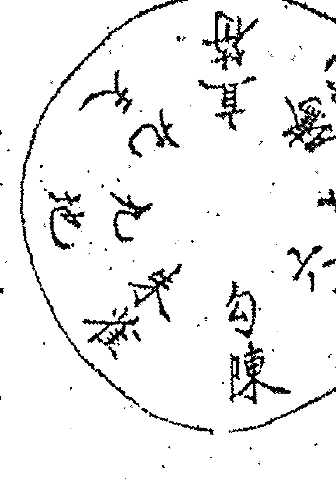

夏至后冬至前为地盘直符顺行左方前一位为九天前二位为九地前三位为朱雀更上直符逆行右方后一位为腾蛇后二位为太阴后三位为六合也

## 三仪为六合也

夏至后　冬至前　直符顺　逆之图

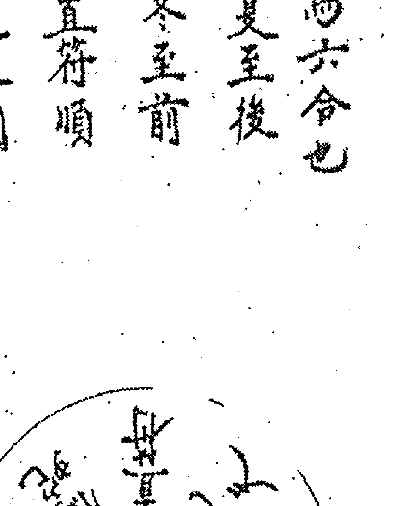

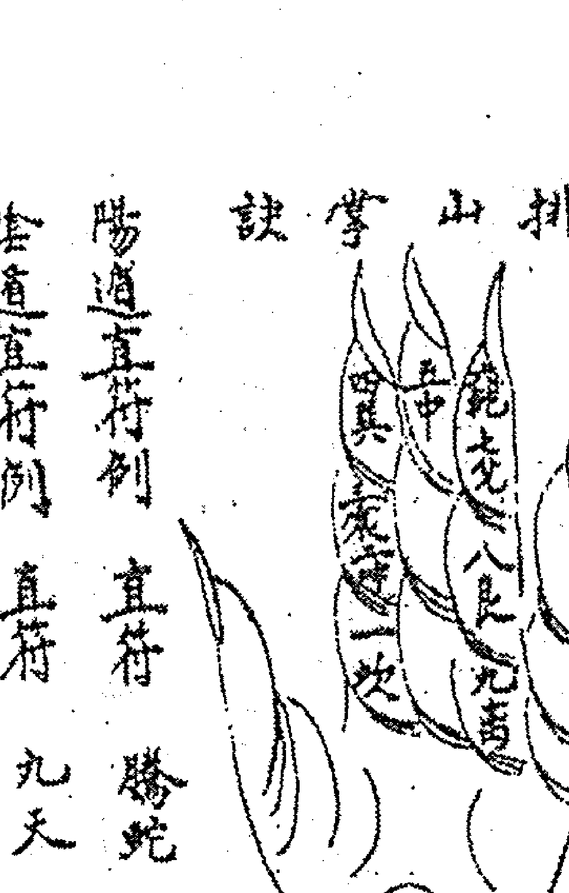

- 阳遁直符例
  - 直符
  - 腾蛇
  - 太阴
  - 六合
  - 勾陈
  - 朱雀
  - 九地
  - 九天

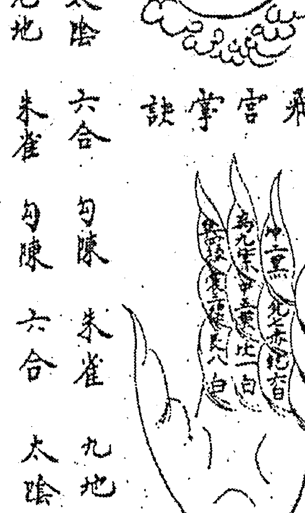

- 阴遁直符例
  - 直符
  - 九天
  - 九地
  - 朱雀
  - 六合
  - 勾陈
  - 太阴
  - 腾蛇

庚丙加岁月日时符不用
天盘直符在坎一起
甲子戊顺行九宫

阳　冬至上元
惊蛰上元
清明中元
立夏中元

直符加时　顺布六仪
直使加时　逆布三奇
乙加辛丙加庚丁加癸不用

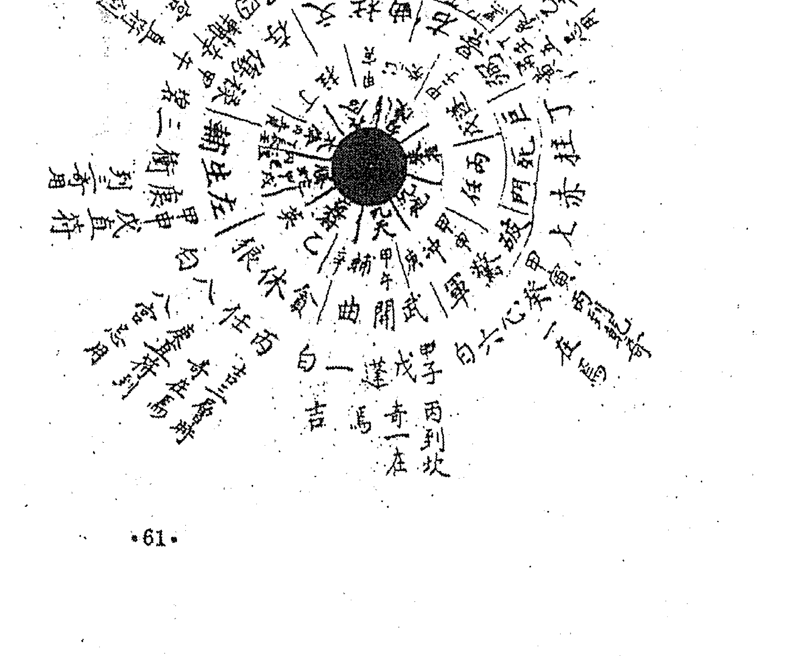

| 甲子日 | 乙丑日 | 丙寅日 | 丁卯日 | 戊辰日 | 己巳日 | 庚午日 | 辛未日 | 壬申日 | 癸酉日 | 甲戌日 | 乙亥日 |
| --- | --- | --- | --- | --- | --- | --- | --- | --- | --- | --- | --- |
| 丙子日　庚辰 | 丁丑日　辛巳 | 戊寅日　壬午 | 己卯日　癸未 | 庚辰日　甲申 | 辛巳日　乙酉 | 壬午日　丙戌 | 癸未日　丁亥 | 甲申日　戊子 | 乙酉日　己丑 | 丙戌日　庚寅 | 丁亥日　辛卯 |
| 戊子日　壬辰 | 己丑日　癸巳 | 庚寅日　甲午 | 辛卯日　乙未 | 壬辰日　丙申 | 癸巳日　丁酉 | 甲午日　戊戌 | 乙未日　己亥 | 丙申日　庚子 | 丁酉日　辛丑 | 戊戌日　壬寅 | 己亥日　癸卯 |
| 庚子日　甲辰 | 辛丑日　乙巳 | 壬寅日　丙午 | 癸卯日　丁未 | 甲辰日　戊申 | 乙巳日　己酉 | 丙午日　庚戌 | 丁未日　辛亥 | 戊申日　壬子 | 己酉日　癸丑 | 庚戌日　甲寅 | 辛亥日　乙卯 |
| 壬子日　丙辰 | 癸丑日　丁巳 | 甲寅日　戊午 | 乙卯日　己未 | 丙辰日　庚申 | 丁巳日　辛酉 | 戊午日　壬戌 | 己未日　癸亥 |

己加辛丙加庚丁加癸不用
庚丙加戊月日时将不用
天盘直符在坤
二起甲子戊

阳遁
小寒上元
立春下元
谷雨中元
小满中元
为　阳遁

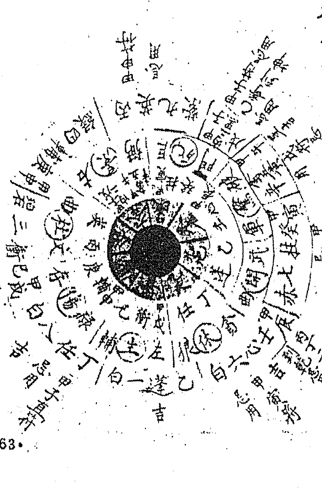

| 甲己日 | 乙庚日 | 丙辛日 | 丁壬日 | 戊癸日 |
|---|---|---|---|---|
| 甲子　九三 | 丙子　铺[?] | 戊子　金[?]九九 | 庚子　心[?] | 壬子[?]六六 |
| 乙丑　二四 | 丁丑　九七 | 己丑　四一 | 辛丑　六四 | 癸丑　八七 |
| 丙寅　一五 | 戊寅　三八 | 庚寅　五二 | 壬寅　七五 | 甲寅　仕[?]八 |
| 丁卯　九六 | 己卯　四九 | 辛卯　六三 | 癸卯　八六 | 乙卯　二九 |
| 戊辰　三七 | 庚辰　五二 | 壬辰　七四 | 甲辰　挂[?]七二 | 丙辰　二一 |
| 己巳　四八 | 辛巳　六三 | 癸巳　八五 | 乙巳　二八 | 丁巳　九二 |
| 庚午　五九 | 壬午　七三 | 甲午　心[?] | 丙午　一九 | 戊午　三三 |
| 辛未　六一 | 癸未　八四 | 乙未　二七 | 丁未　九一 | 己未　四四 |
| 壬申　七二 | 甲申　会[?] | 丙申　一八 | 戊申　三二 | 庚申　五五 |
| 癸酉　八三 | 乙酉　二六 | 丁酉　九九 | 己酉　四三 | 辛酉　六六 |
| 甲戌　替[?] | 丙戌　一七 | 戊戌　三二 | 庚戌　五四 | 壬戌　七七 |
| 乙亥　二五 | 丁亥　九八 | 己亥　四二 | 辛亥　六五 | 癸亥　八八 |

庚丙加成月日时将不用
天盘直符震起甲子戊

阳　遁
雨水下元
芒种中元

局
芒种中元

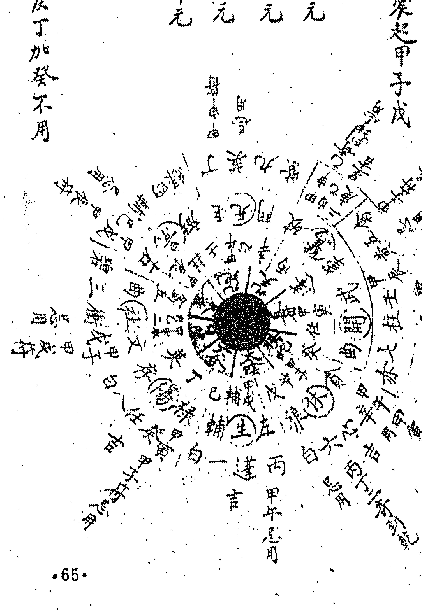

乙加辛丙加庚丁加癸不用

总用
甲戊符

| 甲己日 | 乙庚日 | 丙辛日 | 丁壬日 | 戊癸日 |
|--------|--------|--------|--------|--------|
| 甲子金 | 丙子三 | 戊子桂 | 庚子桂 | 壬子癸 |
| 乙丑四 | 丁丑二 | 己丑六 | 辛丑八 | 癸丑一 |
| 丙寅三 | 戊寅五 | 庚寅七 | 壬寅九 | 甲寅逢 |
| 丁卯二 | 己卯六 | 辛卯八 | 癸卯一 | 乙卯四 |
| 戊辰五 | 庚辰七 | 壬辰九 | 甲辰癸 | 丙辰三 |
| 己巳六 | 辛巳八 | 癸巳一 | 乙巳四 | 丁巳二 |
| 庚午七 | 壬午九 | 甲午逢 | 丙午三 | 戊午五 |
| 辛未八 | 癸未一 | 乙未四 | 丁未二 | 己未六 |
| 壬申九 | 甲申逢 | 丙申三 | 戊申五 | 庚申七 |
| 癸酉一 | 乙酉四 | 丁酉二 | 己酉六 | 辛酉八 |
| 甲戌零 | 丙戌三 | 戊戌五 | 庚戌七 | 壬戌九 |
| 乙亥四 | 丁亥二 | 己亥六 | 辛亥八 | 癸亥一 |

## 阳遁五局

天盘直符押二起甲于戊

### 庚丙加戊月日时符不用

小寒下元　立春中元　谷雨上元　小满上元

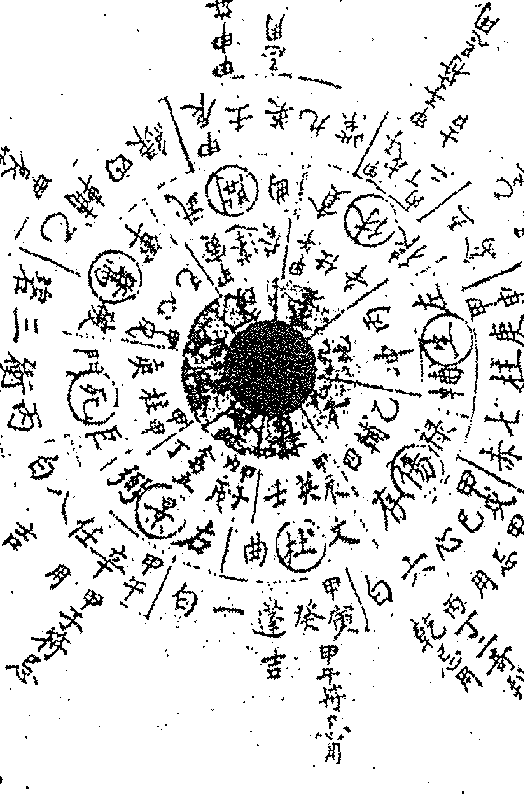

- 乙加辛　丙加庚　丁加癸　不用

甲三庚丙　甲　乙

| 甲己日 | 乙庚日 | 丙辛日 | 丁壬日 | 戊癸日 |
| --- | --- | --- | --- | --- |
| 甲子(符) | 丙子(符) | 戊子(符) | 庚子(符) | 壬子(符) |
| 乙丑二七 | 丁丑三一 | 己丑七四 | 辛丑九七 | 癸丑二一 |
| 丙寅四八 | 戊寅六二 | 庚寅八五 | 壬寅一八 | 甲寅三三 |
| 丁卯三九 | 己卯七三 | 辛卯九六 | 癸卯二九 | 乙卯五三 |
| 戊辰六一 | 庚辰八四 | 壬辰一七 | 甲辰(符) | 丙辰四四 |
| 己巳七二 | 辛巳九五 | 癸巳三八 | 乙巳五二 | 丁巳三五 |
| 庚午八三 | 壬午一六 | 甲午(符) | 丙午四三 | 戊午六六 |
| 辛未九四 | 癸未二七 | 乙未五一 | 丁未三五 | 己未七七 |
| 壬申一五 | 甲申(符) | 丙申四二 | 戊申六五 | 庚申八八 |
| 癸酉三六 | 乙酉五九 | 丁酉三三 | 己酉七六 | 辛酉九九 |
| 甲戌(符) | 丙戌四一 | 戊戌六四 | 庚戌八七 | 壬戌一一 |
| 乙亥五八 | 丁亥三二 | 己亥七五 | 辛亥九八 | 癸亥三三 |

庚丙加岁月日时专将不用
天盘直符乾
六起甲子戊

- 阳遁
  - 大寒下元
  - 雨水中元
  - 春分上元
  - 芒种上元

乙加辛
丙加庚
丁加癸不相生也

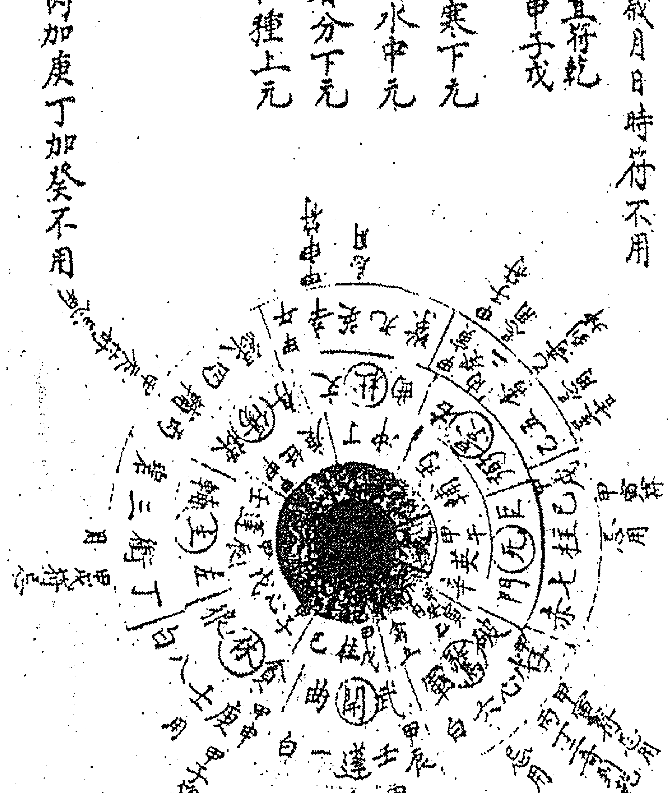

甲
戊
符
忌
第三禽丁
用
甲
直
符

### 甲日

- 甲子戊
- 乙丑己
- 丙寅庚
- 丁卯辛
- 戊辰壬
- 己巳癸
- 庚午甲
- 辛未乙
- 壬申丙
- 癸酉丁
- 甲戌戊
- 乙亥己

### 乙庚日

- 乙丑己
- 丙子戊
- 丁亥癸
- 戊戌壬
- 己酉辛
- 庚申庚
- 辛未己
- 壬午戊
- 癸巳丁
- 甲辰丙
- 乙卯乙
- 甲寅甲

### 丙辛日

- 丙子戊
- 丁亥癸
- 戊戌壬
- 己酉辛
- 庚申庚
- 辛未己
- 壬午戊
- 癸巳丁
- 甲辰丙
- 乙卯乙
- 甲寅甲

### 丁壬日

- 丁亥癸
- 戊戌壬
- 己酉辛
- 庚申庚
- 辛未己
- 壬午戊
- 癸巳丁
- 甲辰丙
- 乙卯乙
- 甲寅甲
- 丁丑丙

### 戊癸日

- 戊戌壬
- 己酉辛
- 庚申庚
- 辛未己
- 壬午戊
- 癸巳丁
- 甲辰丙
- 乙卯乙
- 甲寅甲
- 丁丑丙
- 戊子戊庚而加岁月日时符不用
天盘直符戊
七起甲子戊

冬至中元
惊蛰中元
清明下元
立夏下元

乙而加甲而加庚丁加癸不用
局

符甲乙用
甲己合
（其他相关文字）

甲己日
甲子重英 乙丑贵 丙寅登 丁卯休 戊辰开 己巳生 庚午伤 辛未杜 壬申景 癸酉死
甲戌英 乙亥任 丙子英 丁丑任 戊寅英 己卯任 庚辰英 辛巳任 壬午英 癸未任
甲申英 乙酉任 丙戌英 丁亥任 戊子英 己丑任 庚寅英 辛卯任 壬辰英 癸巳任
甲午英 乙未任 丙申英 丁酉任 戊戌英 己亥任 庚子英 辛丑任 壬寅英 癸卯任
甲辰英 乙巳任 丙午英 丁未任 戊申英 己酉任 庚戌英 辛亥任 壬子英 癸丑任
甲寅英 乙卯任 丙辰英 丁巳任 戊午英 己未任 庚申英 辛酉任 壬戌英 癸亥任

庚丙加岁月日时符不用

## 阳遁八局

天蓬直符
八门甲子戊

小寒中元
立春上元
谷雨下元
小满下元

乙加辛 丙加庚 丁加癸 不用

值符 值使

甲寅癸
甲子戊

日干
庚

甲己日
| 甲己日 |
| :--- |
| 甲子癸九完 |
| 乙丑八一 |
| 丙寅七二 |
| 丁卯六三 |
| 戊辰九四 |
| 己巳一五 |
| 庚午二六 |
| 辛未三七 |
| 壬申四八 |
| 癸酉五九 |
| 甲戌成连休 |
| 乙亥八二 |

乙庚日
| 乙庚日 |
| :--- |
| 丙子连休林三 |
| 丁丑六四 |
| 戊寅九五 |
| 己卯一六 |
| 庚辰二七 |
| 辛巳三八 |
| 壬午四九 |
| 癸未五一 |
| 甲申成完 |
| 乙酉八三 |
| 丙戌七四 |
| 丁亥六五 |

丙辛日
| 丙辛日 |
| :--- |
| 戊子完完六 |
| 己丑一七 |
| 庚寅二八 |
| 辛卯三九 |
| 壬辰四一 |
| 癸巳五一 |
| 甲午仲伤二 |
| 乙未八四 |
| 丙申七五 |
| 丁酉六六 |
| 戊戌九七 |
| 己亥一八 |

丁壬日
| 丁壬日 |
| :--- |
| 庚子冲完九 |
| 辛丑三一 |
| 壬寅四二 |
| 癸卯五三 |
| 甲辰辅四 |
| 乙巳八五 |
| 丙午七六 |
| 丁未六九 |
| 戊申九八 |
| 己酉一九 |
| 庚戌二二 |
| 辛亥三三 |

戊癸日
| 戊癸日 |
| :--- |
| 壬子辅四柱二 |
| 癸丑五四 |
| 甲寅金五 |
| 乙卯八六 |
| 丙辰七七 |
| 丁巳六八 |
| 戊午九九 |
| 己未一一 |
| 庚申二二 |
| 辛酉三三 |
| 壬戌四四 |
| 癸亥五五 |

阳遁九局

天盘直符离 九地甲于戊

庚丙加岁月日时符不用

大寒中元 雨水上元 春分中元 芒种下元

乙加辛丙加庚丁加癸不用

庚丙加岁月日时符不用

大寒中元 雨水上元 春分中元 芒种下元

乙加辛丙加庚丁加癸不用

### 甲己日
- 己日不用
- 甲子癸九
- 乙丑一八
- 丙寅二七
- 丁卯三六
- 戊辰四五
- 己巳六四
- 庚午七三
- 辛未八二
- 壬申九一
- 癸酉四十
- 甲戌五五
- 乙亥六六

符甲戌佳生

### 乙庚日
- 庚日不用
- 乙丑任五
- 丙子六
- 丁丑三五
- 戊寅九四
- 己卯八三
- 庚辰七二
- 辛巳六一
- 壬午五九
- 癸未四八
- 甲申桂九
- 乙酉一六
- 丙戌二五
- 丁亥三四

符甲申桂九

### 丙辛日
- 辛日不用
- 丙子桂三
- 丁丑五二
- 戊寅八一
- 己卯九二
- 庚辰一
- 辛巳六九
- 壬午五八
- 癸未四七
- 甲午心六
- 乙未一五
- 丙申二四
- 丁酉三三
- 戊戌九二
- 己亥一

符甲午心六

### 丁壬日
- 壬日不用
- 丁子心开
- 戊子九开
- 己丑一八
- 庚寅二七
- 辛卯三六
- 壬辰四五
- 癸巳六四
- 甲辰合死
- 乙巳一四
- 丙午三三
- 丁未三四
- 戊申九一
- 己酉八九
- 庚戌七八
- 辛亥七七

符甲辰合死

### 戊癸日
- 癸日不用
- 戊子合死
- 己丑一八
- 庚寅二七
- 辛卯三六
- 壬辰四五
- 癸巳六四
- 甲辰合四
- 乙卯一二
- 丙辰三一
- 丁巳三二
- 戊午九九
- 己未八八
- 庚申七七
- 辛酉六六
- 壬戌五五
- 癸亥四四

## 阴遁局

乙加辛丙加庚丁加癸不用

庚丙加岁月日时符杆不用

天盘直符在离九起甲子戊

夏至上元
白露上元
寒露中元
立冬中元

### 甲巳日
- 甲子 九六
- 乙丑 九七
- 丙寅 一六
- 丁卯 二五
- 戊辰 八四
- 己巳 七三
- 庚午 六三
- 辛未 五一
- 壬申 四九
- 癸酉 三八
- 甲戌 九六（符甲戌不用）
- 乙亥 九六

### 乙庚日
- 丙子 五五
- 丁丑 二四
- 戊寅 三三
- 己卯 七二
- 庚辰 六一
- 辛巳 五九
- 壬午 四八
- 癸未 三七
- 甲申 六五（符甲申不用）
- 乙酉 九五
- 丙戌 一四
- 丁亥 二三

### 丙辛日
- 戊子 三三
- 己丑 七一
- 庚寅 六九
- 辛卯 五八
- 壬辰 四七
- 癸巳 三六
- 甲午 九四（符甲午不用）
- 乙未 九四
- 丙申 一三
- 丁酉 二二
- 戊戌 八一
- 己亥 七九

### 丁壬日
- 庚子 六六
- 辛丑 五七
- 壬寅 四六
- 癸卯 三五
- 甲辰 八四（符甲辰不用）
- 乙巳 九三
- 丙午 一二
- 丁未 二一
- 戊申 八九
- 己酉 七八
- 庚戌 六七
- 辛亥 五六

### 戊癸日
- 壬子 四七
- 癸丑 三六
- 甲寅 二五（符甲寅不用）
- 乙卯 九二
- 丙辰 一一
- 丁巳 二九
- 戊午 八八
- 己未 七七
- 庚申 六六
- 辛酉 五五
- 壬戌 四四
- 癸亥 三三

## 阴遁

制遁阴

庚丙加岁 月日时符不用
天盘直符在艮
八起甲子戊

乙加辛丙加庚丁加癸不用
三奇得使

小暑上元
霜降中元
小雪中元

### 甲日
- 甲戌
- 乙亥
- 丙子
- 丁丑
- 戊寅
- 己卯
- 庚辰
- 辛巳
- 壬午
- 癸未
- 甲申
- 乙酉
- 丙戌
- 丁亥
- 戊子
- 己丑
- 庚寅
- 辛卯
- 壬辰
- 癸巳
- 甲午
- 乙未
- 丙申
- 丁酉
- 戊戌
- 己亥
- 庚子
- 辛丑
- 壬寅
- 癸卯
- 甲辰
- 乙巳
- 丙午
- 丁未
- 戊申
- 己酉
- 庚戌
- 辛亥
- 壬子
- 癸丑
- 甲寅
- 乙卯
- 丙辰
- 丁巳
- 戊午
- 己未
- 庚申
- 辛酉
- 壬戌
- 癸亥

### 乙日
- 乙丑
- 丙寅
- 丁卯
- 戊辰
- 己巳
- 庚午
- 辛未
- 壬申
- 癸酉
- 甲戌
- 乙亥
- 丙子
- 丁丑
- 戊寅
- 己卯
- 庚辰
- 辛巳
- 壬午
- 癸未
- 甲申
- 乙酉
- 丙戌
- 丁亥
- 戊子
- 己丑
- 庚寅
- 辛卯
- 壬辰
- 癸巳
- 甲午
- 乙未
- 丙申
- 丁酉
- 戊戌
- 己亥
- 庚子
- 辛丑
- 壬寅
- 癸卯
- 甲辰
- 乙巳
- 丙午
- 丁未
- 戊申
- 己酉
- 庚戌
- 辛亥
- 壬子
- 癸丑
- 甲寅
- 乙卯
- 丙辰
- 丁巳
- 戊午
- 己未
- 庚申
- 辛酉
- 壬戌
- 癸亥

### 丙日
- 丙寅
- 丁卯
- 戊辰
- 己巳
- 庚午
- 辛未
- 壬申
- 癸酉
- 甲戌
- 乙亥
- 丙子
- 丁丑
- 戊寅
- 己卯
- 庚辰
- 辛巳
- 壬午
- 癸未
- 甲申
- 乙酉
- 丙戌
- 丁亥
- 戊子
- 己丑
- 庚寅
- 辛卯
- 壬辰
- 癸巳
- 甲午
- 乙未
- 丙申
- 丁酉
- 戊戌
- 己亥
- 庚子
- 辛丑
- 壬寅
- 癸卯
- 甲辰
- 乙巳
- 丙午
- 丁未
- 戊申
- 己酉
- 庚戌
- 辛亥
- 壬子
- 癸丑
- 甲寅
- 乙卯
- 丙辰
- 丁巳
- 戊午
- 己未
- 庚申
- 辛酉
- 壬戌
- 癸亥

### 丁日
- 丁卯
- 戊辰
- 己巳
- 庚午
- 辛未
- 壬申
- 癸酉
- 甲戌
- 乙亥
- 丙子
- 丁丑
- 戊寅
- 己卯
- 庚辰
- 辛巳
- 壬午
- 癸未
- 甲申
- 乙酉
- 丙戌
- 丁亥
- 戊子
- 己丑
- 庚寅
- 辛卯
- 壬辰
- 癸巳
- 甲午
- 乙未
- 丙申
- 丁酉
- 戊戌
- 己亥
- 庚子
- 辛丑
- 壬寅
- 癸卯
- 甲辰
- 乙巳
- 丙午
- 丁未
- 戊申
- 己酉
- 庚戌
- 辛亥
- 壬子
- 癸丑
- 甲寅
- 乙卯
- 丙辰
- 丁巳
- 戊午
- 己未
- 庚申
- 辛酉
- 壬戌
- 癸亥

### 戊日
- 戊辰
- 己巳
- 庚午
- 辛未
- 壬申
- 癸酉
- 甲戌
- 乙亥
- 丙子
- 丁丑
- 戊寅
- 己卯
- 庚辰
- 辛巳
- 壬午
- 癸未
- 甲申
- 乙酉
- 丙戌
- 丁亥
- 戊子
- 己丑
- 庚寅
- 辛卯
- 壬辰
- 癸巳
- 甲午
- 乙未
- 丙申
- 丁酉
- 戊戌
- 己亥
- 庚子
- 辛丑
- 壬寅
- 癸卯
- 甲辰
- 乙巳
- 丙午
- 丁未
- 戊申
- 己酉
- 庚戌
- 辛亥
- 壬子
- 癸丑
- 甲寅
- 乙卯
- 丙辰
- 丁巳
- 戊午
- 己未
- 庚申
- 辛酉
- 壬戌
- 癸亥

## 阴遁九局

己加辛
丙加庚
丁加癸
不用

丙
甲戌
己
甲申
庚
甲午
辛
甲辰
壬
甲寅
癸
三奇得使

戊
甲子
戊
天显时格
甲己日
甲子时

太乙
上元
秋分上元
大雪中元
处暑下元

天蓬直符在兑
七起甲子戊

庚丙加岁月日时符不用

| 甲子一黄 | 乙丑七五 | 丙寅八四 | 丁卯九三 | 戊辰六二 | 己巳五一 | 庚午四九 | 辛未三八 | 壬申二七 | 癸酉一六 | 甲戌合六 | 乙亥五四 |
| :--- | :--- | :--- | :--- | :--- | :--- | :--- | :--- | :--- | :--- | :--- | :--- |

| 乙庚日 | 丙子禽九 | 丁丑九二 | 戊寅六一 | 己卯五九 | 庚辰四八 | 辛巳三七 | 壬午二六 | 癸未一五 | 甲申合四 | 乙酉七三 | 丙戌八二 | 丁亥九一 |
| :--- | :--- | :--- | :--- | :--- | :--- | :--- | :--- | :--- | :--- | :--- | :--- | :--- |

| 丙辛日 | 戊子禽九 | 己丑五八 | 庚寅四七 | 辛卯三六 | 壬辰二五 | 癸巳一四 | 甲午合三 | 乙未七二 | 丙申八一 | 丁酉九九 | 戊戌六八 | 己亥五七 |
| :--- | :--- | :--- | :--- | :--- | :--- | :--- | :--- | :--- | :--- | :--- | :--- | :--- |

| 丁壬日 | 庚子禽九 | 辛丑三五 | 壬寅二四 | 癸卯一三 | 甲辰合二 | 乙巳七一 | 丙午八九 | 丁未九八 | 戊申六七 | 己酉五六 | 庚戌四四 | 辛亥三三 |
| :--- | :--- | :--- | :--- | :--- | :--- | :--- | :--- | :--- | :--- | :--- | :--- | :--- |

| 戊癸日 | 壬子禽九 | 癸丑一二 | 甲寅合九 | 乙卯八八 | 丙辰七七 | 丁巳六六 | 戊午五五 | 己未四四 | 庚申三三 | 辛酉二二 | 壬戌一一 | 癸亥一零 |
| :--- | :--- | :--- | :--- | :--- | :--- | :--- | :--- | :--- | :--- | :--- | :--- | :--- |

## 局 随 阴

乙庚丙加戊丁加癸不用

庚丙加岁月日时符不用 天盘直符在乾 六起甲子戊

夏至下元

| 甲己日 | 乙庚日 | 丙辛日 | 丁壬日 | 戊癸日 |
| :--- | :--- | :--- | :--- | :--- |
| 甲子金 | 丙子辅左社一 | 戊子衡黄 | 庚子白元一 | 壬子逢休一 |
| 乙丑六四 | 丁丑八一 | 己丑四七 | 辛丑二四 | 癸丑九一 |
| 丙寅七三 | 戊寅五九 | 庚寅三六 | 壬寅一三 | 甲寅英元左 |
| 丁卯八二 | 己卯四八 | 辛卯二五 | 癸卯九二 | 乙卯六八 |
| 戊辰九一 | 庚辰三九 | 壬辰一四 | 甲辰逢左社 | 丙辰七七 |
| 己巳四九 | 辛巳三六 | 癸巳九三 | 乙巳六九 | 丁巳八六 |
| 庚午三八 | 壬午二五 | 甲午中高 | 丙午七八 | 戊午五五 |
| 辛未二七 | 癸未九四 | 乙未六一 | 丁未八七 | 己未四四 |
| 壬申一六 | 甲申中高二 | 丙申七九 | 戊申五六 | 庚申三三 |
| 癸酉九五 | 乙酉六二 | 丁酉八八 | 己酉四五 | 辛酉二二 |
| 甲戌辅左社四 | 丙戌七一 | 戊戌五七 | 庚戌三四 | 壬戌一一 |
| 乙亥六三 | 丁亥八九 | 己亥四六 | 辛亥三三 | 癸亥九九 |

## 阴遁五局

庚丙加岁月日时符不用
天盘直符在坤
一起甲子戊

小暑下元
霜降上元

壬辰
甲午符立秋中元

己用
蓬
白一
吉

乙加辛
丙加庚
丁加癸不用

小寒上元

不胜
甲戊时

| 甲已日 | 乙庚日 | 丙辛日 | 丁壬日 | 戊癸日 |
| :--- | :--- | :--- | :--- | :--- |
| 甲子蓬四 乙丑任三 丙寅英六 丁卯柱一 戊辰芮九 己巳禽八 庚午二六 辛未一六 壬申九五 癸酉八四 符甲戌芮三 乙亥五二 | 乙庚日 丙子中伤二 丁丑杜九 戊寅伤四 己卯八一 庚辰二六 辛巳一五 壬午九四 癸未八三 符甲申英二 乙酉五二 丙戌六九 丁亥七八 | 丙辛日 戊子丙四死七 己丑三六 庚寅三五 辛卯一四 壬辰九三 癸巳八二 符甲午蓬底一 乙未五九 丙申六八 丁酉七七 戊戌四六 己亥三五 | 丁壬日 庚子蓬休四 辛丑一二 壬寅九二 癸卯八一 符甲辰英景九 乙巳五八 丙午六七 丁未七六 戊申四五 己酉三四 庚戌二三 辛亥一二 | 戊癸日 壬子英景一 癸丑八九 甲寅任金八 乙卯五七 丙辰六六 丁巳七五 戊午四四 己未三三 庚申三二 辛酉一一 壬戌九九 癸亥八八 |

## 阴遁四局

乙加辛丙加庚丁加癸不用

庚丙加岁月日时符不用

天蓬直符在巽

四起甲子戊

大暑下元
处暑中元
秋分下元
大雪上元

甲己日
甲子 金四
乙丑 火三
丙寅 火二
丁卯 木一
戊辰 木九
己巳 土八
庚午 土七
辛未 金六
壬申 金五
癸酉 木四
甲戌 火三
乙亥 水二

乙庚日
丙子 水九
丁丑 土八
戊寅 土七
己卯 火六
庚辰 火五
辛巳 木四
壬午 木三
癸未 水二
甲申 水一
乙酉 土九
丙戌 金八
丁亥 金七

丙辛日
戊子 火六
己丑 火五
庚寅 木四
辛卯 木三
壬辰 水二
癸巳 水一
甲午 金九
乙未 金八
丙申 土七
丁酉 土六
戊戌 火五
己亥 火四

丁壬日
庚子 木三
辛丑 木二
壬寅 水一
癸卯 水九
甲辰 土八
乙巳 土七
丙午 火六
丁未 火五
戊申 木四
己酉 木三
庚戌 水二
辛亥 水一

戊癸日
壬子 土八
癸丑 土七
甲寅 金六
乙卯 金五
丙辰 火四
丁巳 火三
戊午 木二
己未 木一
庚申 水九
辛酉 水八
壬戌 土七
癸亥 土六

## 阴符经

乙加辛丙加庚丁加癸不用

庚丙加戊月日时符不用

夏至中元
白露中元
寒露下元
立冬下元

甲巳日
甲子丙一九
乙丑二三一
丙寅四九
丁卯五八
戊辰二七
己巳一六
庚午九五
辛未八四
壬申七三
癸酉六二
符甲戌五十一
乙亥三九

乙庚日
丙子蓬八
丁丑五七
戊寅二六
己卯一五
庚辰九四
辛巳八三
壬午七二
癸未六一
符甲申五九
乙酉三八
丙戌四七
丁亥五六

丙辛日
戊子英五
己丑一四
庚寅九三
辛卯八二
壬辰九一
癸巳六九
符甲午八十六
乙未三九
丙申四六
丁酉五五
戊戌一四
己亥二三

丁壬日
庚子任二
辛丑八一
壬寅七九
癸卯六八
符甲辰五十七
乙巳三六
丙午四五
丁未五四
戊申二三
己酉一二
庚戌九一
辛亥六九

戊癸日
壬子桂六
癸丑六七
符甲寅三五
乙卯四四
丙辰四四
丁巳五三
戊午二二
己未一一
庚申九九
辛酉八八
壬戌七七
癸亥六六

## 阴遁四局

乙奇加丙加庚丁加癸不用

小暑中元
立秋上元
霜降下元
小雪下元

庚丙加岁月日时符不用
天盘直符在中
一起甲子戊

甲己日
甲子蓬休一
乙丑二九
丙寅三八
丁卯四七
戊辰一六
己巳九五
庚午八四
辛未七三
壬申六二
癸酉五一
甲戌癸九
乙亥二八

乙庚日
丙子英二七
丁丑四六
戊寅一五
己卯九四
庚辰八三
辛巳七二
壬午六一
癸未五九
甲申休金六
乙酉二七
丙戌三六
丁亥四五

丙辛日
戊子任一四
己丑九三
庚寅八二
辛卯七一
壬辰六九
癸巳五八
甲午休癸九
乙未二六
丙申三五
丁酉四四
戊戌一三
己亥九二

丁壬日
庚子任一九
辛丑七九
壬寅六八
癸卯五七
甲辰六角六
乙巳二五
丙午三四
丁未四三
戊申二二
己酉九一
庚戌八九
辛亥七八

戊癸日
壬子六九
癸丑五六
甲寅角五元五
乙卯二四
丙辰三三
丁巳四二
戊午一一
己未九九
庚申八八
辛酉七七
壬戌六六
癸亥五五乙加辛、丙加庚、丁加癸不用。

庚加岁月日时符不用。
天盘直符在坎。
一起甲子戊。

寅申己亥为四马。
辰戌丑未为四库。
子午卯酉为四败之地。

前一二三四五。
后六七八九十。
天一生水地六成之。

| 天干合 | 地支冲 |
| :--- | :--- |
| 甲己 | 子午 |
| 乙庚 | 丑未 |
| 丙辛 | 寅申 |
| 丁壬 | 卯酉 |
| 戊癸 | 辰戌 |
|      | 巳亥 |

上局：甲子、乙丑、丙寅、丁卯、戊辰、己巳、庚午、辛未、壬申、癸酉、甲戌、乙亥、丙子、丁丑、戊寅、己卯、庚辰、辛巳、壬午、癸未、甲申、乙酉、丙戌、丁亥、戊子、己丑、庚寅、辛卯、壬辰、癸巳、甲午、乙未、丙申、丁酉、戊戌、己亥、庚子、辛丑、壬寅、癸卯、甲辰、乙巳、丙午、丁未、戊申、己酉、庚戌、辛亥、壬子、癸丑、甲寅、乙卯、丙辰、丁巳、戊午、己未、庚申、辛酉、壬戌、癸亥。
中局：己巳、庚午、辛未、壬申、癸酉、甲戌、乙亥、丙子、丁丑、戊寅、己卯、庚辰、辛巳、壬午、癸未、甲申、乙酉、丙戌、丁亥、戊子、己丑、庚寅、辛卯、壬辰、癸巳、甲午、乙未、丙申、丁酉、戊戌、己亥、庚子、辛丑、壬寅、癸卯、甲辰、乙巳、丙午、丁未、戊申、己酉、庚戌、辛亥、壬子、癸丑、甲寅、乙卯、丙辰、丁巳、戊午、己未、庚申、辛酉、壬戌、癸亥。
下局：甲戌、乙亥、丙子、丁丑、戊寅、己卯、庚辰、辛巳、壬午、癸未、甲申、乙酉、丙戌、丁亥、戊子、己丑、庚寅、辛卯、壬辰、癸巳、甲午、乙未、丙申、丁酉、戊戌、己亥、庚子、辛丑、壬寅、癸卯、甲辰、乙巳、丙午、丁未、戊申、己酉、庚戌、辛亥、壬子、癸丑、甲寅、乙卯、丙辰、丁巳、戊午、己未、庚申、辛酉、壬戌、癸亥。

宋平章赵普作烟波钓叟歌。
轩辕黄帝战蚩尤，涿鹿经年苦未休。偶梦天神授符诀，登坛致祭谨虔修。神龙负图出洛水，彩凤衔书碧云里。因命风后演成文，遁甲奇门从此始。
一千八十当时制，太公删成七十二。逮于汉代张子房，一十八局为精艺。
先须掌上排九宫，纵横十五在其中。次将八卦论八节，一气统三为正宗。
阴阳二遁分顺逆，一气三元人莫测。五日都来换一元，接气超神为准的。
论取九宫安九星，又逐九星行九宫。逢甲为直符，八门为直使，自分明。
符上之门为直使，十时一易堪凭据。直符加时干，直使顺逆遁宫去。
六甲原号六仪名，三奇即是乙丙丁。阳遁顺仪奇逆布，阴遁逆仪奇顺行。
吉门偶尔合三奇，值此虽云百事宜。六甲遇之非小补，戊己庚辛壬癸仪。

余宫不可有微疵。三奇得使诚堪仗。乙马逢犬丙鼠拱，六丁玉女骑龙虎。
又有三奇游六仪，号为玉女守门扉。若作阴私和合事，请君但向此中推。
天三门兮地四户，问君此法如何处。太冲小吉与从魁，此是天门私出路。
地户除危定与开，举事皆从此中去。六合太阴太常君，三辰元是地私门。
更得奇门相照耀，出行百事总忻忻。太冲天马最为贵，然有疑难难逃避。
但能常乘天马行，剑戟如山不足畏。三奇得使诚堪使。
乙奇使甲子甲戌，丙奇使甲子甲申，丁奇使甲辰甲寅。
虽得三奇之妙，又不若得三奇之使为尤妙也。
得使犹未为精，五不遇兮损其明。
损明须知时克日，反吟伏吟犹不吉。
掩捕逃亡须格时，占猎行人信宜迟。

丙奇属火，火墓戌时，诸事不吉。为更无天乙，未临二月，奇临六亦同论。又有时干入墓宫，课中时下忌相逢。戊己庚辛壬癸戊丙成癸未丁丑一同凶。五不遇时龙不精，号为日月损光明。时干来克日干上，甲日须知忌庚。奇与门兮共太阴，三般难得共加临。若还得二亦为吉，举措行藏必遂心。更得直符直使利，兵家用事最为贵。常从此地击其冲，百战百胜君须记。天乙之神所在宫，大将宜居击对冲。假令直符居离九，天英坐取击天蓬。甲乙丙丁戊阳时，神居天上要君知。坐击须凭天上奇，阴时地下亦如之。若见三奇在五阳，偏宜为客势高强。忽然逢着五阴位，又宜为主好裁详。直符前三六合位，太阴之神在前二，后一宫中为九地，九天之上好扬兵，九地潜藏可立营，伏兵但向太阴位，若逢六合利逃刑。

天地人分三道名，天道曰精华盖临。地遁月精紫微敌，人道当知是太阴。生门六丙合六丁也，为天遁自分明。开门六乙合六己，地遁如斯而已矣。休门六丁共太阴，欲求人遁无过此。要知三遁何所宜，藏形遁迹斯为美。庚为太白丙荧惑，庚丙相加难会得。六庚加丙白入荧，六丙加庚荧入白。荧入白兮贼即来，白入荧兮贼须灭。丙为勃兮庚为格，格则不通勃乱逆。丙加天乙为直符，天乙加丙为飞勃。庚加日干为伏干，日干加庚飞干格。加一宫兮战在野，同一宫兮战于国。庚加直符天乙伏，直符加庚天乙飞。庚加癸兮为大格，加巳为刑最不宜。加壬之时为上格，又嫌岁月日时逢。更有一般奇格者，六庚谨勿加三奇。此时若也行兵去，天乙行师无归期。六癸加丁蛇夭矫，六丁加癸雀入江。

六乙加辛龙游走，六辛加乙虎猖狂。请观四者是凶神，百事逢之莫措手。丙加甲兮鸟跌穴，甲加丙兮龙回首。只此二者是吉神，为事如意十八九。八门若遇开休生，诸事逢之总称情。伤宜捕猎终须获，杜好遨游及隐形。景上投书并破阵，惊门能擒讼有声名。若问死门何所主，只宜吊死与行刑。蓬任冲辅禽阳宿，英芮柱心阴宿名。辅禽心星为上吉，冲任小吉未全亨。大凶蓬芮不堪过，小凶英柱不精明。大凶无气变为吉，小凶无气一同名。吉宿更能逢旺相，万举万全功必成。若遇休囚并废没，劝君不必进前程。要识九星配五行，各随八卦考义经。坎蓬水星离英火，中宫坤艮土为营。乾兑为金震巽木，旺相休囚看重轻。与我同行即为相，我生之月诚为旺。生我之时乃为相，休囚死地克我亡。

急则从神缓从门，三五反复天道亨。十干加伏若加错，入墓休囚吉事危。十精当使用为贵，起宫天乙用无遗。天为客兮地为主，六甲推兮无差理。悟彻此中玄妙机，九宫扶助明主安。宫制其门为迫制，门制其宫是迫推。天网四张无路走，一二网低有路凝。三四八九高强宫，行人墓库东西分。节气推移时候定，阴阳顺逆要精通。三元积数成六纪，天地未成有一理。请观歌中精微诀，非是贤人莫传与。

# 奇门五字赋

黄帝治世，蚩尤作乱，涿鹿而经年未息。梦天神而授传神符，风后演成奇门，则遁甲由此而始。帝尧为君，洪水横流，殛鲧而复命，大禹得玄女而授传秘文。夏禹画为九畴，则奇门由此复著。一千八十之局，创自涿鹿之时；七十二之局，制乎会盟孟津之日。炎汉灭楚兮，子房总为十八局，得黄石公之真传。昭烈幸蜀兮，诸葛立为三奇例，本汉留侯之道。由是推之，先排九宫于掌上，次分八卦于其中。纵横十五，错综三元。将八卦以分八节，每八节统于三元。一元三局，一局五日。逢甲己为符头，当起局而按气。符头迟起，看甲己临在何支。节前符后，则按气验日辰临何甲己。仲上局，孟中局，季下局。识中间天地人元，阳水阴水。至当置其余为折局，补局于午东部兮，冬至后阳局己定；于午西邻兮，夏至后阴局无移。阳局顺而由一至九，阴局逆而由九至一。先遁五子之元，次寻六甲之首。认取九宫为九星，而为直符；分配八卦，列八门，而为直使。移直符于时干，寻直使于时宫。六仪定则与六甲同名，三奇取象配三光之临。度六仪则戊己庚辛壬癸定，三奇则乙日丙月丁星。阳遁也象，顺行奇布；阴遁也象，仪逆行奇顺布。顺为直符，而顺飞于九宫；逆为直使，而逆跳于八卦。上飞天盘，按天道运行于时候；下布地盘，由地道安静于方隅。天盘九星兮，共奇仪一时更步；地盘九星兮，与奇仪五日方移。天盘临地号，审吉凶之消长；地盘承天号，知休咎之盈亏。天上甲子临甲子，伏吟之号；天上天蓬过天英，返吟斯称。开居乾上伏吟，皆主凶；死位返吟，吉门合于三奇号，举动皆利。奇门嫌入迫墓号，所作非宜。奇门临本宫为伏吟，三奇之入墓。门制奇宫，为八门之受迫。三奇游于六仪，为玉女守其门户。六仪若见三奇，乃为奇人得其使命。三奇吉门共太阴，三全难得。奇门太阴或有无，一可相随。虽然六仪击刑，正凶恶不堪使令；九遁合门至吉，大可施为。开门合乙加己位，名为地遁，临紫微敞以日精。生门合丙临丁奇，号为天遁，乘华盖蔽以月精。人遁则休门合于丁奇，临地户为太阴之宫。丙奇同于生门，奇合九天，名为神遁。星奇合于休门，奇临九地，呼作鬼遁。龙遁持日奇合休癸，武临坎住。虎遁有乙奇临生门，不犯墓迫。风遁则日开合于巽上，灵通乃乙开合于坤宫。玉女方临天藏，八十四维顺行。人门地户有准，两仪夹干为吉。星有阴阳，门有开阖。蓬任冲辅禽阳宿，英芮柱心号阴星。阳星所临皆吉，阴星所为多凶。主客莫定吉凶时，临此应当回避。趋三避五要分明，为主无往其方，万事和合；为害无避其方，不至沉疴。迨夫胜地有三，天乙九天与生门；不击有五，二胜九地兼直使。如三军之内外，审八门之开阖。甲刑门虽出入而宜隐匿，乙奇阳内宜坚守以利藏兵。丙奇阳气在外，可以动众扬兵。阳星利客，阴星利主。

利主。六乙乃天德之神，扬兵而我师必胜。六丙为人威之神，出师而敌人败亡。时加六戊为乘龙万里之乡，但当对敌而战遇强徒自灭。其临时加六乙为明堂六合之地，惟宜偷营而劫寨，利秘密以潜其迹。六庚出将入相，将帅用其身。六辛行师，罪必加于其身。壬为天牢一所，必致出入飞祸连至。癸为天网四张，审下只利逃亡。甲加丙为青龙返首，丙加甲为飞鸟跌穴。返首则动作无阻，跌穴而万事有成。六乙加辛青龙逃走，六辛加乙白虎猖狂。辛临乙位而身体毁伤，己到辛宫而财物废坠。丁加于癸朱雀投江而讼书，癸临于丁腾蛇天矫而惊惶。六庚加符为伏宫格，不利为主；符加六庚飞宫格，不可轻谋。庚加符太白格于天乙，外兵侵而主将失守；符加庚天乙格于太白，强出师而客将必阻。直使临庚号野战，庚临直使为宫格。野战而征兵必败，宫格而英雄必失。是故太白入荧惑，谓庚加丙，金入火而其贼必起。荧惑入白，谓丙加庚，火入金而其贼必退。一时主客皆不利，莫倚奇门强用兵。天地大格，庚下加癸；天地小格，癸下加庚。庚加己上名曰刑格，庚加己而士卒亡于中道，己加庚而所作不成。六庚加岁干为岁格，则不利；六庚加月建为月格，则皆凶。庚临日干为伏干格，而主人多咎；日干临庚为飞干格，而主客未分。时干克日主，不过定损其明。丙加日干名悖乱，不宜举动；悖则紊乱于纲纪，格则开伤于主将。若能熟读此篇书，坐致太平如反掌。应天顺人役智力，必受明王之上赏。论功列土封公侯，万世斯民皆感仰。

阴阳迭顺妙无穷。
若能了达阴阳理，
天地都来一掌中。

阴阳者，太极静而生阴，动而生阳。冬至后阳爻升进，用阳遁顺行；夏至后阴爻起发，用阴遁逆行。玄妙深微，难穷其理也。
二至者，冬至夏至也。一者坎宫，九者离宫也。冬至一阳生于子，故冬至节居坎一宫也。夏至一阴生于午，故夏至节居离九宫也。阴阳理者，冬至后十二气为阳遁，则顺布六仪，逆布三奇；夏至后十二气为阴遁，则逆布六仪，顺布三奇。若能了达遁甲阴阳之理，则天地间之一元三才、四象五行、六甲七曜、八门九星，皆在于掌中而起也。

九宫先须掌上排。

坎一、坤二、震三、巽四、中五、乾六、兑七、艮八、离九，乃九宫也。天有九星以镇九宫，地有九宫以应九州。戴九履一，左三右七，二四为肩，六八为足，五居中宫。中宫者，土火之子，金之母，所寄理于西南坤位也。坎一白水居正北，坤二黑土居西南，震三碧木居正东，巽四绿木居东南，中五黄土居中宫，乾六白金居西北，兑七赤金居正西，艮八白土居东北，离九紫火居正南。

坎居一位是蓬休，伤死坤宫第二流。
更有冲伤并辅杜，震三巽四总为头。
禽星死五开心六，更有生任居艮八。
九等英星离九求。

天将八卦论八节。

天有八风以直八卦，地有八方以应八节。节有三气，气有三候，如是八节以周书二十四气，更录之七十二候备焉。八节：立春、惊蛰、清明、立夏、芒种、小暑、立秋、白露、寒露、立冬、大雪、小寒也。

冬至一宫坎卦。
立春八宫艮卦。
春分三宫震卦。
立夏四宫巽卦。
夏至九宫离卦。
立秋二宫坤卦。
秋分七宫兑卦。
立冬六宫乾卦。

### 一气统三为正宗

气者，中气也。雨水、春分、谷雨、小满、夏至、大暑、秋分、霜降、小雪、冬至、大寒也。冬至、小寒及大寒，天地人元一二三。立春、雨水并惊蛰，依艮顺增八九一。春分、清明并谷雨，但起震宫三四五。立夏、小满并芒种，四五六宫列成行。夏至、小暑及大暑，九八七宫还逆数。立秋、处暑并白露，从二却行于九一。秋分、寒露及霜降，七六五宫休此向。立冬、小雪并大雪，六五四五分依此诀。统三者，一气分三元，即三候也。又曰三者，三甲也。上局仲甲，谓甲己之日夜半子时，乃甲子时；丙辛之日日中甲午时是也。此时开格刑德在门，用兵先举者败，不可出入，利以避凶，主客并凶。
中局孟甲，戊癸之日平旦甲寅时，乙庚之日晡时甲申时是也。此时阳气在内，阴气在外，利藏兵固守，不可出师，利主不利客。
下局季甲，谓丁壬之日食时甲辰，戊己之日黄昏甲戌是也。此时阳气在外，阴气在内，利出兵动众，百事吉，利客不利主。又云六甲之日夜半子，二甲皆合，谓今月是甲直符时，皆合甲，故名三甲合也。

阴阳二遁分顺逆，一气三元人莫测。

冬至后用阳遁，顺飞于一宫起。如冬至上元阳局，顺遁甲子戊起一宫，甲己己二宫，甲申庚三宫，甲午辛四宫，甲辰壬五宫，甲寅癸六宫，丁奇七宫，丙奇八宫，乙奇九宫，乃仪顺奇逆也。
夏至后用阴遁，逆飞离九宫起。如夏至上元阴九局，逆遁甲子戊起于九宫，甲己己八宫，甲申庚七宫，甲午辛六宫，甲辰壬五宫，甲寅癸四宫，丁奇三宫，丙奇二宫，乙奇一宫，乃逆仪顺奇也。九星为直符，八门为直使。有顺阳使逆行阴，经术不显隐伏之事也。一节分三元，子午卯酉为上元，寅申巳亥为中元，辰戌丑未为下元。若不明三元，用奇不准，主有不测也。
甲己壬癸顺，阳仪乙丙丁逆行。
休门随奇顺数去，甲子起时当仔细。
阴转六仪当逆推，乙丙丁奇顺而随。
门随值时同逆起，休门排住顺风吹。

五日都来换一元。

甲子至戊辰五日为上元，己巳至癸酉五日为中元，甲戌至戊寅五日为下元。
下元己卯至癸未五日为上元，甲申至戊子五日为中元，己丑至癸巳五日为下元。
甲午至戊戌五日为上元，己亥至癸卯五日为中元，甲辰至戊申五日为下元。
己酉至癸丑五日为上元，甲寅至戊午五日为中元，己未至癸亥五日为下元。

接气超神为准的。

超者，越过也。神者，进神也。甲子、己卯、甲午、己酉，乃进神为符头。接，迎接也。气者，即节气也。超神者，谓节气未到而甲子己卯之符头先到，谓之超。接气者，谓甲子己卯之符头未到而节气先至，谓之接。如值节气日辰同列，其日即是此局上局，谓之正授。奇换皆甲子时换也。

须知闰奇之法。

方能起局接节。真积日以成闰月，积时以成闰奇。超接正授，闰有法分。全定局列，难明以五日一换，遇一节气，过换六局。以一月节气必三十日，今五时一刻，以三十日分六局，余五时二刻置闰。超神不过十月，过芒种大雪起，过九日即置闰也。假始丙戌年五月初一乙卯，至初九丁亥已过九日，于置闰即用初一日乙卯作芒种上局，初六日甲申作芒种中局，十一日己丑作芒种下局。此夏至一局作三奇闰法，以十六日甲午作芒种闰奇。此超神置闰之法也。二十四己亥夏至，是为置闰。借夏至九日，其五月小尽，至六月初二日乙酉方作夏至上局，初七日甲寅作夏至中局，十二日己未作夏至下局，以为接气奇也。闰奇之法，每遇芒种大雪二节内，却是走过九日，即合置闰，以归每节气所余五时一刻也。盖奇以冬夏二至分顺逆，故于二至之前置闰，以均其气，无不应也。

### 总取九宫九星

天蓬贪狼主坎一宫属水。
天芮巨门主坤二宫属土。
天冲禄存主震三宫属木。
天辅文曲主巽四宫属木。
天禽廉贞主中五宫属土。
天心武曲主乾六宫属金。
天柱破军主兑七宫属金。
天英左弼主离九宫属火。
天任右弼主艮八宫属土。

### 八门又逐九宫行

### 九宫配八门永定例

坎宫蓬星休门。
艮宫任星生门。
震宫冲星伤门。
巽宫辅星杜门。
坤宫芮星死门。
中宫禽星死门（寄于坤）。
离宫英星景门。
兑宫柱星惊门。
乾宫心星开门。

九宫逢甲为直符，八门直使自分明。如阳遁一局甲子时起坎一宫，即以坎宫天蓬为直符，休门为直使。甲戌时起坤二宫，即天芮为直符，死门为直使。甲申时起震三宫，即天冲为直符，伤门为直使。甲午时起巽四宫，以天辅为直符，杜门为直使。甲辰时起中五宫，以天禽为直符，死门为直使。甲寅时起乾六宫，以天心为直符，开门为直使。余例做此。
符上之门为直使，十时一位堪凭据。遁取时旬甲头为直符，如阳遁一局甲子在坎宫，天蓬为甲子直符，则休门即为直使，管至癸酉十时住。甲戌在坤宫，天芮为直符，则死门即为直使，管至癸未十时住。又换甲申符头在震，天冲为本宫直符，则伤门即为直使，管至癸巳十时住。又换甲午在巽，天辅为直符，则杜门为直使，管至癸卯十时住。又换甲辰在中宫，天禽为直符，则死门为直使，管至癸丑十时住。又换甲寅在乾宫，天心为直符，则开门为直使，管至癸亥十时住。阳一局六十时足而换他局，做此阴遁同例，以逆推。

直符常遣加时干。

如冬至上元阳遁一局图内，乙庚日丙子时。其图地盘甲申泊三宫，天冲管事。乙庚日申时，乃甲申时也。此是甲申直符，故此直符常加时干也。

直使顺逆遁宫去。

原天盘上休在坎，生在艮，伤居震，乃定位也。如冬至上元阳一局图内，乙庚日申时，就以伤门为直使，乃时干甲申居三宫也。阳遁顺飞，阴遁逆飞。

吉门偶尔合三奇，值此虽云百事宜。

开休生即北方之三白，为最吉，乃三吉门。合乙丙丁三奇，其中合得一位共临之方，乃三奇之妙用，此时百事大吉。如得门不得奇亦可，得奇不得门终非全吉，奇门俱不得即凶。当以其大小程等，轻重而用之。

更合从傍加检点，余宫不可有微疵。

如得开休生三吉门，又合上下盘三奇，是此时此宫有奇门吉神，须检点三盘上所加。余七宫凶星所在，未可以此即为全吉。如合天地人三遁、龙返首、鸟跌穴、天三门、地四户、玉女守门、三奇所及、避六仪击刑、制伏惟合等，故为吉也。
如合火入金、金入火、虎猖狂、龙逃走、雀入江、蛇夭矫、游魂入墓、五不遇时、损明、入墓及伏吟、返吟、刑格、飞宫、天乙伏宫、天网四张、门迫之类，却为凶也。

三奇得使诚堪使。

谓在六甲之上，自得所使之奇。甲戊甲午，乙为使；甲子甲申，丙为使；甲辰甲寅，丁为使。如阳遁三局乙庚之日丁亥时，此时六乙日奇下临九宫，甲午是为乙奇得使。又如阳遁五局丙辛之日己亥时，此时丁奇下临四宫，甲辰为丁奇得使。其法以天上甲子起中宫一宫而行，则乙奇到甲戊，丙奇到甲子，丁奇到甲寅。地下甲子起戊，地者妇人之道，不能自立，此假夫而立，故甲戊假对宫坤位上起甲，则乙奇在甲午，丙奇在甲申，丁奇在甲戊，取对冲故奇甲辰也。
六甲遇之非小补。

阳星加时为开，阳星天蓬、天冲、天任、天辅、天禽是也。阴星加时为阖，阴星天英、天芮、天柱、天心是也。六甲之时开时，百事吉。又曰甲为青龙，利以远行，将兵客胜，开忧无阖喜。有宜谒贵见尊，移徙嫁娶，百事吉。如阳遁九局甲己日黄昏，得天任阳星加时为开吉。若无奇门合得此局，亦得大吉。
六仪六甲本同名，三奇即是乙丙丁。

六仪者，戊己庚辛壬癸是也。六甲者，甲子、甲戌、甲午、甲辰、甲寅也。六十时六甲周流九宫，甲子常随六戊，甲戌常随六己，甲申常随六庚，甲午常随六辛，甲辰常随六壬，甲寅常随六癸。六甲隐于六仪之下，故曰同名。
三奇者，乙日奇，丙月奇，丁星奇也。

一奇合得开休生，便是吉门利出行。
万事从来无不利。

### 能知玄妙得真灵

如天上丙临地下乙丁，或天上丁临地下乙丙，又与开休生三门合者，此为吉门，宜出行、出兵、兴工、动土，无不利者，委有玄妙如神灵也。

急则从神缓从门，三五返覆天道亨。

若急速无奇门，则用玉女反闭之法，以六术而行从神机也。若运机缓行，须吉门而出。经云趋三避五，巍然独处，谓之趋三吉门避五凶门也。如用神机，则又为吉，是遁利矣。如遁得乙奇在门，念乙奇咒；丙奇在门，念丙奇咒；丁奇在门，念丁奇咒。出其方百事吉。
已上若得三奇妙，不知更得三奇使。

乙奇使甲子甲戌。
丙奇使甲子甲申。
丁奇使甲辰甲寅。
虽得三奇之妙，又不若得三奇之使为尤妙也。

得使犹未为精，五不遇兮损其明。

损明须知时克日，反吟伏吟犹不吉。

得三奇使为遁之妙。若五不遇时，乃刚柔相克之气，相克则损其明。如甲子日得庚午时之例。吟即返吟，二吟为上下相克。凡庚为格则万物凝滞，六甲相加为不吉也。
掩捕逃亡须格时，占猎行人信宜迟。

知掩捕逃亡，阳时可得，阴时不得；占行人，阳时来，阴时不来。又主失信。如遇庚加时，即有阻不来，主失信也。
年月日时加六仪，天乙会合主阴私。

乃天上乙丙丁为天上三奇，临地六甲之仪。如甲子有庚，甲戌有己，甲午有丁酉，甲辰有丙午，甲寅有乙卯。此三奇女守门时，利于阴私和合。
三奇上见游六仪，六仪便见五阳时。
并向八门寻吉位，万事从之无不宣。
计捕行人须明时下杜门，加癸加丁则蛇妖蹋，丁加癸则雀入水，乙加辛则龙逃走，辛加乙则虎猖狂。及时干杜门、日干皆为讨捕所忌也。若论行人信息，遇天上三奇乙丙丁，地下三奇甲戌庚，上见于甲子戊、甲戌己、甲申庚、甲午辛、甲辰壬、甲寅癸，谓之游六仪也，百事皆吉。惟行人信息若见甲、乙、丙、丁、戊之五阳时，忌之。故曰此时利以为客，而游主者不可得也。又如六仪与三奇合阴，又遇天三门、地四户，是为福食，则远行出入移徙万事皆宜也。

## 五阳在前五阴后，主客须知有盛衰

自甲至戊五阳时，利为客宜先起；自己至癸五阴时，利主宜后动。当五阳之时，客盛主衰；当五阴之时，主盛客衰。更相旺相休囚墓考，万不爽。
一如冬至休旺，生起伤胎杜没景死死囚惊休开废之例是也。
阴阳五子还须记，六仪如着更无利，三仪忽然加三宫，卯太冲。
更为刑击先须忌，六仪击刑三奇墓，此特击动百事惧。
六仪击刑：六甲直符加所刑之地也。甲子直符加卯，太冲，子刑卯也；甲戌直符加未，戌刑未也；甲申直符加寅，申刑寅也；甲午直符加午，午自刑也；甲辰直符加辰，辰自刑也；甲寅直符加巳，寅刑巳也。又有丑刑戌，卯刑子，己刑申，未刑丑，酉亥刑亥者，皆谓之击刑。凡击刑，主谋事不成，多有失陷。

不可出行出师，百事不吉。三奇入墓者，乙奇加坤，丙丁奇加乾，主求谋不获。此时举动百事失误，不吉。
太白入荧贼即和，火入金乡贼即去。
丙为悖兮庚为格，格则不通悖乱逆。
凡遇天上丙临地下庚，主贼自退；天上庚临地下丙，主贼来侵犯。门虽吉亦主容俱不利，客多败。凡遇丙临时干谓之悖，庚临时干谓之格，不可出行举事，主乱不通也。如有急事不得已，行筹布局支开而去，则变凶为吉也。

庚加日干为伏干，日干加庚飞干格。
庚加直符天乙伏，直符加庚天乙飞。

加己为刑遁之格，加癸路中大格宜，加壬之府为小格。
更嫌月日时移，当此之时俱不利，举动行兵亦不宜。
伏干格与飞干格，此时主战关不利，主客俱伤。天乙伏格，此时主客皆不利，战闻交兵气自衰。占见人不在，占来人不来。天乙飞格，此时同前，主客皆不利，只宜固守，出则大将遭擒。加己为刑格，主隐伏祸乱不祥，出则车败马伤，敌奔勿迫。占人刑狱，加癸大格，加壬小格，并不宜出军求望，不待托人失信。庚加岁为岁格，加月为月格，加日为日格，加时为时格，虽得奇门不可用。
丙加甲为鸟跌穴。
甲加丙兮龙返首。
只此二者是吉祥。
作事如意十八九。
加丙加甲直符，甲直符加丙，更逢开休生三门，万事皆吉。

辛加乙兮虎猖狂。
乙加辛兮龙逃走。

丁加癸兮雀入江。
癸加丁兮蛇跃蹄。

雀入江总速行，主词讼；蛇跃蹄主惶惑不安；龙逃走主失陷财物；虎猖狂主伤亡之灾也。四者皆相克制，用之百事凶。

符加丙丁为相佐。
使加六丁为守库。

丙合戊兮为天遁。
地遁己合开加己。

休乘丁合太阴人。
天网四张时加癸。

逢加英兮为文奇。
伏吟之府逢加逢。

吉宿见兮万事吉。
凶宿见兮万事凶。

伏吟时宜收敛财物。
伏吟时宜发散财物。
余事纵得奇门亦凶。

天辅冲任禽心吉，天蓬天英芮柱凶。
凡时下得辅禽心星大吉，冲任小吉，蓬芮大凶，柱英小凶。星吉方不合奇可用，凶星凶方奇到，呼其字而咒之，大吉矣。如天蓬呼子禽之例是也。

阴宿禽心柱英芮，阳宿冲辅及蓬任。
凡阳星加一宫为开，阴星加一宫为阖。盖一宫者九气之本，阴阳枢。占事开时吉，阖时凶。速信行人盗贼，开时来，阖时不来。

天网四张无走路，阴阳逆顺妙无穷。
天网者六癸也。经云天网四张，万物尽伤。盖六癸时不宜举动百事，惟宜逃亡，从天上六癸方而出，人不见也。然网有高低，不可不察。假令临一二宫尺寸低，可扬而出；临六七八九宫尺寸高，过人为之四张无走路，多遭刑厄。冬至后阳遁皆顺气布局，夏至后阴遁皆逆气布局，以推布趋吉避凶，微妙莫测。

| 直符前一六合位 | 後一九天二九地 |
| --- | --- |
| 前二之神号太阴 | 直符相冲勾陈位 |
| 前一腾蛇对朱雀 | 八神守门当此地 |
| 阳遁顺行定无疑 | 阴遁逆行依比例 |
| 地宜藏伏天扬兵 | 六合太阴可隐避 |

地静为伏匿，后二神名九地，六癸之下可以伏藏，则人不见。九天之上六甲可以陈兵而击其冲。然二奇合太阴而无吉门，名曰有阴无门；门合太阴无三奇，谓之有门无奇。

更有直符并直使，兵家用之为最贵。
若将此地击其中，百战百胜君须记。
直符者天乙也，直使者八门也。居天乙而击其冲，坐生门而击死门，此百战百胜，此兵家所以用之为贵也。

二至之前有闰期，芒种大暑是根蒂。有时超接事何如，到此局堪为例。节气推移时候定，阴阳顺逆理须通。
二元超遁游六甲，八卦周流遍九宫。

置闰之法，决在芒种大雪之后，设过小满小雪二气之交，虽超九日十日不可置闰。务于二至之前置闰，盖以冬夏至分阳遁顺行，阴遁逆行，故于二至之前置闰以均其气也。三元超遁游六甲者，符节超接以应候上。

## 中下元遁六甲八卦九宫应一岁之八节二十四气周流终而复始也

朱雀 是非 官符 螣蛇 资带 六甲 勾陈 资财 交易 太阴 婚姻 百事 直符 出兵 出行

太乙 情网 宜忌 婚姻 捕捉 盗贼 迟疑不 青龙 情诸 宜来财 诸事喜 招摇 人侵 口舌多

天符 百事 行客 阻迷 诸事喜 招摇 人侵 口舌多 轩辕 不利 人侵 口舌多 牵缠 不宜速行 有惊恐奸细事

咸池 大凶 万事不宜 太阴 神难 女财 诸事吉 天乙 意调 万事

## 奇门六十格已下贲格三十条随时而用各得其宜营为万事大吉利也

龙首 甲直符加地盘两奇 禺跌穴 丙奇加地盘甲直符

天遁格 生门丙临戊又曰开合丙 地遁格 开合乙奇临六己也

人遁格 休门丁临太阴也 神遁格 生门丙奇合九天也

龙遁格：生门与乙奇合艮宫也。
虎遁格：休门与乙奇合辛加艮也。
风遁格：休门开合乙奇在巽也。
重诈格：三奇三门会九地也。
天假格：三奇合景门会九天也。
人假格：六壬合惊门临九天也。
鬼假格：丁巳癸合死门临三隐也。
三奇得使：乙奇加甲戊，甲子、甲午；丙奇加甲子、甲申、甲辰、甲寅；丁奇加甲子、甲辰、甲寅。
玉女守门：甲己时丙，乙庚时辛，丙辛时乙，丁壬时己。
戊癸时壬十干时也。
龙遁格：休门乙奇合坎也。
云遁格：休开生乙合辛在震。
真诈格：三奇三门合太阴也。
休诈格：三奇三门合六仪也。
地假格：丁癸合杜门临三隐也。
神假格：丁巳癸合伤门临九地。
天盘奇与地盘仪合者谓之合。

天辅时格
甲己日巳时
乙庚日申时
丙辛日午时
丁壬日辰时
戊癸日寅时
天辅时支

三胜宫
天乙值符九天生门也
天三门
太冲小吉从魁也

地四户
月建加时取除定危开
地私门
六合太阴太常也

天马户
月将加时取太冲位也
三吉门
休开生次吉杜景

三吉星
禽辅心上吉冲任小吉
吉符位
太阴六合九天九地

已下贱格三十条皆为凶忌，凡有营为百事切勿用也。

虎猖狂
辛奇遇乙
龙逃走
乙奇遇辛
蛇跌踏
癸见丁奇

雀投江
丁奇见癸
伏干格
庚临日干
飞干格
日干加庚

伏宫格
庚临值符
飞宫格
直符加庚
大隔格
庚临六癸

**小隔格**: 庚临六壬
**刑隔格**: 庚临六乙
**悖隔格**: 丙临日干
**庚隔格**: 庚临岁干
**月隔格**: 庚临月干
**时隔格**: 庚临时干
**灾入白**: 丙奇加庚
**白入荧**: 庚加丙奇
**五不过**: 时干克日干
**天罗格**: 癸临时干
**地纲格**: 壬临时干
**反吟格**: 星符加对宫
**伏吟格**: 星符加本宫
**凶符格**: 白虎玄武螣蛇
**三奇入墓**: 乙奇临坤宫 丙丁奇临乾宫 又云乙未丙戊时同
**三奇受刑**: 乙奇临乾惊门庚辛囚死 丙奇临坎死门壬癸庚辛囚死
**六仪击刑**: 直符加刑宫也甲子加九甲申加八甲戌加四甲午加三甲辰加二甲寅加一
**门迫**: 宫克门，休门加坤艮 生门加震巽 景门加坎 惊门加离 杜门伤门加乾兑

## 宫迫格制

休门加九，杜伤二八，景门六七，生死如一，惊开制之。

## 玄门格

死门大凶，惊门小凶。玄星格，蓬芮大吉，莫挂小凶。

## 四吉星起应歌

天蓬 若值贪狼星过时，定应羽客及僧尼，不然衙府公人至。若是荒邨，是孝衣妇女担柴为起应。看惊看鸥及孩儿，三七南方角姓，送肉鹅鸭及菜通。角姓猪来至，不然生气及猫儿。但得时候寻星宿，仔细推寻定不移。

## 天芮

巨门星下利亨通，先见色衣和尚同。牛马妇人并伞杖，出郊飞鸟必应逢。其禽黄白来相应，妇女担柴在道中。大喜本音旗鼓至，如临小祸小儿孩童。手携利器并刀杖，四七月中见羽客是。

## 天心

吊惊羊牲忌物，不然诸犬血财逢。大墓辰戌小墓丑未。

## 天任

左辅加时甚吉良，贵人骏马来北方。八人节级僧道至，挂衣俱是色衣郎。

## 五出星特魁应歌

天衙禄存星位不堪当，必逢孩子色衣郎。僧道几帛并绫绢，道士烧却应当时。荒郊必然奴婢见，担柴卖木见时常。黑白飞禽时见过，七七式曲如临定。时先必免色衣牵执言，不然羽客和尚主来骑马牛又当。不然白物如时见，若在荒郊白鸟白鸦白衣皆言吉。财家元是贵人边。

衣即不然苍鸟双双至，主白白鸦争一场。七二月中官贵至，又主生财白云发。绫帛几财报四物小应，人家鸦鸭详。

日作长水狼花向生菜井一色贵人接引酒筵香。天辅文曲星反好把裁光，兄色衣拿扶来。风尘妇人青衣主，妇女担柴及小孩。孩儿聚集人长叫，郊野虫蛇自走来。二七有贵人送物，猪羊鹅鸭及生财。亲情邀命相迎接，见帛之中自送来。天禽廉贞应细推寻，先见公人打责见。工匠僧道并散乐，山原高上赤云飞。禽飞牛马相应妇人担柴摘菜归，五七日中商羽大人将野味送来知是帛生财。六十日利一门凶是此时。天柱破军星下细推详，公人军健宰屠医人针炙巡官过。童子担柴走略作花，却飞鸟牛相应。不然苍鸦鸟飞翔，妇人担花并摘菜。一七之中见火伤，黄白生物并无帛。不然延送味茶香，生入田庄家富贵必生妻。

子作官印又云有锣鼓声及铜鼓声，或人执刀杖铜鼓之畜则应。天英右弼星中事若何，唱人散令及村歌，只见缁衣并村客。荒郊百事合禽相应，幼稚手携刀杖遇。放马同牛齐玩，不然看鸭又看鹅。五七日中角用姓碗碟滴瓶白器过，应帛主人财客至。依时克应定无差。

## 三奇到方克应

### 乾
乙奇到乾，有着黄衣人至，又有缢缕人至。丙奇到乾，有披绿衣服人来，又有黑禽飞或双而至，若带西方庄亡大发，百日内进女人财。丁奇到乾，有人执刀斧来，不然有牵角畜人至，七日进金银。

### 坎
乙奇到坎，有皂衣人至，不然有鼓声应之，后七日进财，后宅内有喜事并色衣人入宅。丙奇到坎，有执杖者至，不然有黄白鸟从西北方来至。

六日进契书，百日内大吉。东方大惊大兴。丁奇到坎，有人从南方来抱小儿至，有黑云起，一二日进黑物。若四方有人自吊死，主大发。

### 艮
乙奇到艮，有人着衣过往，或小儿提铁器之人来，黑白飞鸟一只或担网卖鱼来，周年进人口。丙奇到艮，有着衣皂衣人至，或小儿啼，又名网卖肉至，或飞禽外至，后七日进金银，周年进白马大发。丁奇到艮，有人焚文书，然笔至，或小儿提铁至，过应二七日进黄白，一百二十日进人口并文书。

### 震
乙奇到震，有武士执铳，有三雷声或鼓声应，有打鱼人或捕猎或小儿群应，二七日进金宝物。若见东方有人庄死大兴。丙奇到震，若搯卖鱼人至，或小儿成群来，二七日进生物，周年生贵子。若见彼处地方有雷声推树大兴，或有武士持铳或鼓声亦是。丁奇到震，有女双至，及南方有女人或黑禽双至，一占日进白黄物头土。若见南方或东方有杀声大兴。

乙奇到巽，有白衣人来，或赤马至，不然有小儿至应，三年生贵子，进外宅田庄。若东林木柘时大蚁大蜂。丙奇到巽，有乐声应之，又唱唱音应时，二年或红云南来人有大惊马事应之，或色衣人来进财物并家宰贵人到宅大发。丁奇到巽，有小儿骑牛来，南方有黑云两至见，三七日有横财，周年有黄鹿在死相杀大发。

乙奇到离，有病眼病脚人或小儿两骑牛，又黑白禽自东南方来应，三七日进猪鸡犬，北方人家有瘴兴旺。丙奇到离，有黄白飞乌双至，或病脚目人至，或小儿骑牛马，北方人家病或火烧屋应大发，应七日周年进泥田旺气大发，或进六畜生气。丁奇到离，有披绿青色衣人至，三七日进横财，若见东方刀兵暗。

乙奇到坤，有叟目并披孝服雷伤牛马应，七日进猪犬，六十日进文书。

### 先
丙奇到坤，有人着青皂衣人至，或鸟鹊应之，自东南来，二七日进南方女人财物，或色衣人财物，或周年绝户产，北方老人死，更有鼓声应时大。丁奇到坤，有青皂衣及黑飞乌至，或人担水过。

乙奇到兑，有三五个至，或鸟唱，三七日进角羽或商音人田地，见东南方牛马自死大兴。丙奇到兑，有挑担人东方来，又有小儿啼声，二七日进财，遇年进人口，其地田坤艮方有先人死大兴。丁奇到兑，有人持文书笔来打卖网过，或马至。

主：见两马或孝服。
乙会休门出门：见牛马或扛木者或人穿红者。
开：逢客人或公吏。
关。

丁会休门 出门
二十里见白衣人或妇着白衣
见小儿手执物
见眼疾人或逢人闹

丙会休门 出门
五十里闻鼓声或见军器
见老人执物或哭声

## 门直使应验

休门三十里贵人迎，衣着蓝黄及碧青。
伤门三十里争讼起，立人着皂血光生。
景门三十里惊变事，非皂人衣要会实。
生门十五里逢窦突，官人着皂紫衣中。
杜门三十里逢男女，皂绢碧在纵行。
死门三十里逢疾病，黄皂衣官且免逆。

惊门三甲，鸠鹊噪，官相逢，六畜惊。开门，二十里阴金，贵人来，马祭火牛。

## 直使会应章

乙奇会天蓬生门 乙庚日 时雷鸣 儿现二鸟应 基风一阵应之大吉利
丙奇会天芮休门 甲己 日时 汤鹏二人 乘马来 应大吉
丁奇会天英开门 戊癸日时 马乌目 顶雷鸣大吉利

敢曰甲己阳仲上元天临血子时作中元临奉下元为局定此遁甲准
三元。夫遁甲加六壬之超宫，阴阳之风水，诸书之吉凶，福之枢机，诸神忌煞为忌。乙丙丁日月星奇能刻一切之凶神，三光齐到，土神永久，国得奇而太平者，得奇得门，得奇而旺相，上官上佳，得奇而旺相，奇门一切诸神拱手，杖藏如在南方无北利，若居东北造西宫二事，若在山头。

一切玄神俱伏藏，得奇不得门可，得门不得奇不可，用奇门俱利，无不利也。

## 支干总断

甲干乙巳丙辰丙戊丁丑丁未戊申己酉庚子辛亥壬寅癸卯，背支生干名宝日上吉。
甲子乙亥丙寅丁卯己巳戊午辛未庚辰庚戌辛丑壬申癸酉，背干生支名义日次吉。
甲辰甲戌乙未乙丑丙申丁酉戊戌己亥庚寅辛卯壬午癸未，背干克支名制日中平。
甲申乙酉丙子丁亥戊寅己卯庚午辛未壬辰壬戌癸未癸丑。

戌辰丑。
戊辰巳丑戊戌丙午。
壬子甲寅乙卯丁巳。
未庚申辛酉癸亥。
皆支干同类名和日吉。

皆支魁干名戌日吉。
丙子丁丑戊寅同，辛卯壬辰癸巳。巳丙午丁未戊申退，辛酉壬戌癸亥在其中。十二名退交日，忌出行求财捕捉、婚姻入学交易上官等事并出。

奎娄角亢鬼牛星。
天金神直日出行出兵。
大事不宜用。

## 孤虚法

九天玄女曰：此法皆孤击虚，一女可敌十夫。取击对冲之方是也，万无一失。皆古法，万人用年，千人用月，百人用日，十人用时。惟时孤最验，图局于后。

## 孤虚旺相

甲子旬 戌亥孤，辰巳虚。
甲午旬 辰巳孤，戌亥虚。
甲戌旬 申酉孤，寅卯虚。
甲辰旬 寅卯孤，申酉虚。
甲申旬 午未孤，子丑虚。
甲寅旬 子丑孤，午未虚。

甲子旬戌亥孤辰巳虚，是以空亡为孤，对宫为虚也。旺相如东方木旺于卯之类，春属木，甲乙木生丙丁火相，金到此则变，所以孤。孤有无辅助之义，今说四废。然水为母，木为子，子实则母虚，水到此所以虚。比兵家用时日有天德月德方位法也。

天地不宁，阴阳返伏，九宫不通，人门杜塞。太公太牢，吾无惧。急急如九天玄女圣母元君法音，动此堂月事耳，逢返伏吟避之不。

## 遁甲后序

及师客念道伏咒光七通以攘之，回返伏吟之方而去，则无忌而获吉矣。夫遁之妙，须趋三奇吉门。三奇者，天上乙丙丁是也；吉门者，休生开也。奇门会合之方，利宜出师征讨。九天之上，利击冲陈兵；九地之下，利以藏兵遁卒。又明天时，知地理，察人事，战攻决胜，可为良将也。
今措遁甲之书，亦兵家之枢机，义与孙子兵法相符合而用之也。故圣人之法，可以出军征伐，开战对敌，过恶捕贼，立营阵出天门，入地户，隐藏形，无出其右也。至于民间日用，上官嫁娶，远行移徙，访贤谒贵，商贾求财，登科射仪，博戏诸事，皆准无不验。上以利国，下以利民，万世之良法也。

凡一月之内有一个节气，共有二十日多五个时辰并二刻，方又交下月节气。所以将多余五个时辰并一刻，积多成一问奇也。可将历日节气时刻交度数等就见明白。假如正月大初一日子时初刻立春，乃正月节，至二十八日上至二月初一日巳时初一刻，即交惊蛰二月节也。此为三十日零五时二刻，盖正月初一日起至月终已有三十日矣，又加二月初一日子丑寅卯辰，乃为零五个时辰，巳时初初刻初一刻，则为零二刻矣。每月一个节气，必多五个时辰零一刻，亦因周天之度数共有三百六十五度多四分一厘秒故耳。所以置闰亦多比五时二刻也。

四象
老阳 少阳
老阴 少阴
定寅时法
老阳变少阴
老阴变少阳
正九五更一点微
二七平儿起寅时
五月日高三丈地
仲冬总到四更初
便是寅时君须记
二八五更四点歇
四六日出寅无别
十月十二四更二

### 遁甲演义

四库全书珍本初集
子部
术数类

详校官中书臣张经田
墨垒郎臣倪建校覆

## 钦定四库全书

### 子部七

### 术数类六阴阳五行之属

### 遁甲演义

### 提要

臣等谨按遁甲演义四卷，明程道生撰。道生字可生，海宁人。言遁甲者皆祖洛书，然河图以图名，当有奇偶之象；洛书以书名，当有文字之形。故班固以为六十五字，见汉书五行志；刘向以为三十八字；刘歆以为二十字。正义洪范。

为是阶，先汉以来，洛书无图之明证。若如宋以后所传四十五点之状，与河图不殊，则当名洛图，不名洛书矣。考大戴礼载明堂古制，有二九四七五三六一八之文，此九宫之法所自昉。而易纬乾凿度载太乙行九宫尤详，遁甲之法实从此起。方技家不知求其源，故妄托也。其法以九宫为本，纬以三奇六曜八门九星，视其加临之吉凶以为趋避，以日主。

遁甲演禽
于七月明于丙丁为南极星精，故乙丙丁皆谓之奇。而甲本诸阳首，戊己下六仪分丽焉，以配九宫而起符使，故号遁甲。其离坎分宫，主提超神闰奇接气，与历律通；开生之取北方三向，与太乙通；龙虎蛇雀刑囚旺墓之义，不外于生生乘克，与六壬星命通；至风云纬候，无不该备。故神其说者，以为出自黄帝风后及九天元女，其依固不待辩。而要于方技之中最有理致。考汉志所列，惟风角六甲风名孤虚而已，于奇遁尚无明文。至梁简文帝乐府，始有三门应遁甲语；陈书武帝纪，遁甲之名遂见于史，则其学始盛于南北朝。隋志载有伍子胥遁甲文、信都芳遁甲经、葛秘三元遁甲图等十三家，其遗文世不乐见。唐李靖有遁甲万一诀，胡乾有遁甲经，俱见于史志。至宋而传其说者愈多，仁宗时尝命。

修景祐乐历新经，述七宗二变，合古今之乐，参以六壬遁甲。又令司天正杨维德撰遁甲玉函符应经，亲为制序，故当时士遁之学最盛。谈数者至今多援引之。自好奇者援以谈兵，遂有靖康时郭京之辈以妖妄误国。后人又挽杂以道家符箓之法，益怪诞不可究诘。于是六壬盛行，而遁甲之学几废。究之遁，于天道为切；遁于人事为切，遁于天文为优，实亦未。

省以轩辕也。世所传五总龟烟波钓叟诀，稍存梗概。而是编目约词该，于用奇置闰之要颇为详具。至论本命行年，谓欲乘本局中吉星生旺，其说亦他书所未及。存之以备三式之一，殆亦五行家所不废欤。乾隆四十六年十月恭校上。
总纂官臣纪昀臣陆锡熊臣孙士毅
总校官臣陆费墀

## 遁甲源流

昔黄帝始创奇门四千三百二十局法乃效按八卦分八节节有三气岁大率二十四气也气有天地人三候岁大率七十二候也候有五日岁大率三百六十日也日有十二时岁大率四千三百二十时也一时一局故奇门四千三百二十局也。风后制奇门为一千八十局者，以冬至阳生起坎艮震巽四卦统气一十二候，计三百六十，分为五百四十为阳遁；以夏至阴生起离坤兑乾四卦统气一十二候，计三百六十，分为五百四十为阴遁。合阴阳二遁为一千八十定局也。此盖撮四候而共看六十时定局，四个一十八十定局，则依旧为四千三百二十局矣。周太公诸兵法善布奇门，以八卦分八节，节分三气，气分三候，岁计七十二候，立七十二活局，每局六十时，七十二局计四千三百二十时也。汉张子房删定冬至十二气分三十六候，撮四候为阳遁九局；夏至十二气分三十六候，撮四候为阴遁九局。此活图更捷也。夫一十八局、七十二局，皆不越一千八十局矣。作硬局则皆一千八十局，作活局则有七十二局、一十八局。然一十八局虽简，以奇门星仪符使之行悉定布于局中，其为课四千三百二十举目在前，其所未为者只加临一事耳。如欲加临，但依局所定正转两盘，其课遂成，是风后之法乃万世不易也。

## 年家奇门

上元一宫起甲子，中元四宫起甲子，下元七宫起甲子。俱逆飞六仪，顺布三奇。随三元内各年支干审在其甲旬内，则以其甲头为直符，符上之门为直使。将甲头直符之星逐年干转，直使随年支逆飞，审其方向，得奇门到者吉。自嘉靖四十三年甲子起杜门，十年一移。万历甲子年移休门。三元年通上元六十年，以阴遁一局加之；中元六十年，以阴遁四局加之；下元六十年，以阴遁七局加之。

## 月家奇门

二元分局。甲己遇四孟为上元，在一宫起甲子；甲己遇四仲为中元，在七宫起甲子；甲己遇四季为下元，在四宫起甲子。俱逆布六仪，顺布三奇。每一元管五年。凡推月奇门，先审其年在一元内，依前布门飞奇，次就其年遁月建，系其甲头直符逐地下月干转，符上之门为直使，随月支飞泊，方向得奇门到大利。自嘉靖四十二年十一月甲子起休门在坎，三箇月一移，至万历四十一年十一月甲子起休门在坎。三元月遁以五虎遁月建对之，六十年遁乙丙丁奇并同。

## 八门方位

## 日家奇门

分阴阳二遁，按节推排，三日一局，顺行六甲，周而复始。次乙丑日顺行。休开生景吉，得生旺合三奇加临更利。起诀：甲戊壬子居坎，丁辛乙卯坤裁，庚甲戊马震宫游，丁癸辛鸡巽在，庚丙鼠归乾六，己癸卯走西街，丙壬赤马艮安排，乙巳鸡飞离界。其法自坎宫起甲子，每三日一换，顺飞八方，不入中五。看其日到何宫，便起休门一顺轮去，三吉门到方便出入行事吉。如甲子、乙丑、丙寅在坎；丁卯、戊辰、己巳在坤之类。余依此推。甲子、乙丑、丙寅，休门在坎；丁卯、戊辰、己巳，在坤；庚午、辛未、壬申、癸酉、甲戌、乙亥，在巽；丙子、丁丑、戊寅，在乾；己卯、庚辰、辛巳，在兑；壬午、癸未、甲申，在艮；乙酉、丙戌、丁亥，在离；戊子、己丑、庚寅，在坎；辛卯、壬辰、癸巳，在坤；甲午、乙未、丙申，在震；丁酉、戊戌、己亥，在巽；庚子、辛丑、壬寅，在乾；癸卯、甲辰、乙巳，在兑；丙午、丁未、戊申，在艮；己酉、庚戌、辛亥，在离；壬子、癸丑、甲寅，在坎；乙卯、丙辰、丁巳，在坤；戊午、己未、庚申，在震；辛酉、壬戌、癸亥，在巽。甲子、乙丑、丙寅，又复自坎宫起，每三日一移。年吉不如月吉，月吉不如日吉，日吉不如时吉，与日吉相合者更吉。

## 时家奇门

假如阳遁一局，甲子在坎，天蓬为直符，休门为直使，管十时至癸酉止。甲戌在坤，天芮为直符，死门为直使，十时至癸未止。甲申在震，天冲为直符，伤门为直使，十时至癸巳止。甲午在巽，天辅为直符，杜门为直使，管十时至癸卯止。甲辰在五，天禽为直符，死门为直使，管十时至癸丑止。甲寅在乾，天心为直符，开门为直使，管十时至癸亥止。此阳一局五日六十时足，余类此推。乙奇离，丙奇艮，丁奇兑，乃阳遁仪顺而奇逆也。甲辰五乃寄在坤二宫。若阴遁九局，甲子在离，天英为直符，景门为直使，管十时，一换。甲戌在艮，天任为直符，生门为直使，管十时。甲申在兑，天柱为直符，惊门为直使，管十时。甲午在乾，天心为直符，开门为直使，管十时。甲辰在五，天禽为直符，死门为直使，管十时。甲寅在巽，天辅为直符，杜门为直使，管十时。此阴九局五日六十时足，余类此推。丁奇震，丙奇坤，乙奇坎，乃阴遁奇顺而仪逆也。

## 烟波钓叟赋

登坛致祭，虔请神龙，负图出洛水，彩凤衔书碧云里。轩辕黄帝战蚩尤，涿鹿经年苦未休。偶梦天神授符诀，因命风后演成文。遁甲奇门从此始，一十八局当时制。太公删成文十二，用于汉代张子房。一十八局为精艺。先须掌上排九宫，纵横十五在其中。次将八卦论八节，一气统三为正宗。阴阳二遁分顺逆，一气三元人莫测。五日都来换一元，接气超神为准的。认取九宫分九星，八门又逐九星行。九星逢甲为直符，八门直使自分明。符上之门为直使，十时一位堪凭据。直符常遣加时干，直使逆顺遁宫去。六甲元号六仪名，三奇即是乙丙丁。阳遁顺仪奇逆布，阴遁逆仪奇顺行。吉门偶合三奇得，值此须知百事宜。更合从傍加检点，余宫不可有微疵。二奇得使诚堪使，六甲遇之非小补。乙逢犬马丙鼠猴，六丁玉女骑龙虎。又有三奇通六仪，号为玉女守门扉。若作阴私和合事，请君但向此中推。天门地户与四户，问君此法如何处。大冲小吉与从魁，此是天门私出路。地户危定与开休，举事皆从此中去。六合太阴太常君，三辰元是地私门。更得奇门相照耀，出行百事总欣欣。太冲天马最为贵，卒然有难宜逃避。但当乘取天马行，剑戟如山不足畏。就中伏吟为最凶，天蓬加著地天蓬。天蓬若到天英上，须知即是反吟宫。八门反伏皆如此，生在生门死在死。纵有吉宿得奇门，万事皆凶不堪使。六仪击刑何太凶，甲子直符愁向东。戊刑在未申刑虎，寅巳辰午刑干。三奇入墓好细推，甲日那堪相见未。丙奇属火火墓戌，此是诸事不须为。更兼六乙来临二，月奇临乾亦同论。又有时干入墓宫，课中时下忌相逢。戊戌壬辰兼丙戌，癸未丁丑亦同凶。五不遇时龙不精，号为日月损光明。时干来克日干，须知时忌庚。奇与门兮共太阴，一般难得总加临。若还得一亦为吉，举措行藏必遂心。更得直符直使利，兵家用事最为贵。常从此地击其冲，百战百胜君须记。天乙之神所在宫，大将宜居击对冲。假令直符居离九，天英坐取击天蓬。甲乙丙丁戊阳时，神居天上要君知。坐击须凭天上奇，阴时地下亦如之。若见三奇在五阳，偏宜为客自高强。忽然逢着五阴位，又宜为主好裁量。太阴之神在前一，后一宫中为九天。后二之神为九地，九天之上好扬兵，九地潜藏可立营。伏兵但向太阴位，若逢六合利逃刑。天地人分三遁名，天遁日精华盖临。地遁月精紫云详，人遁当知是太阴。生门六丙合六丁，此为天遁自分明。开门六乙合六己，地遁如斯而已矣。休门六丁共太阴，欲求人遁无过此。要知三遁何所宜，藏形遁迹斯为美。庚为太白丙荧惑，庚丙相加谁会得。六庚加丙白入荧，六丙加庚荧入白。白入荧兮贼即来，荧入白兮贼须灭。丙为勃兮庚为格，格则不通勃乱逆。天丙加地庚为勃，天庚加地癸为格。丙加天乙为勃符，天乙加丙为勃飞。庚加日干为伏干，日干加庚飞干格。加一宫兮战在野，同一宫兮战于国。庚加直符天乙伏，直符加庚天乙飞。庚加癸兮为大格，加己为刑最不宜。加壬之时为小格，又兼岁月日时移。更有一般奇格者，六庚慎勿加三奇。此时若也行兵去，匹马只轮无返期。六癸加丁蛇跌蹠，六丁加癸雀入江。六乙加辛龙逃走，六辛加乙虎猖狂。请观四者是凶神，百事逢之莫措手。丙加甲兮鸟跌穴，甲加丙兮龙回首。此二者是吉神，为事如意十八九。八门若遇开休生，诸事逢之总称情。伤宜捕猎终须获，杜好邀游及隐形。景上投书并破阵，惊能擒讼有声名。若问死门何所主，只宜吊死与行刑。蓬任冲辅禽阳星，英芮柱心阴宿名。辅禽心星为上吉，冲任小吉未全亨。大凶蓬芮不堪遇，小凶英柱不精明。大凶无气变为吉，小凶无气一同之。吉宿更能逢旺相，万举万全必成功。若遇休囚并废没，劝君不必进前程。要识九星配五行，各随八卦考义经。坎蓬星水离英火，中宫坤艮土为营。乾兑为金震巽木，旺相休囚看重轻。与我同行即为相，我生之月诚为旺。废于父母休于财，囚于鬼兮真不妄。假令水宿号天蓬，相在初冬与仲冬。旺于正二休四五，其余仿此自研穷。急则从神缓从门，三五反复天道亨。十干加伏若加错，入墓休囚吉事危。十精为使用为贵，起宫天乙用无遗。天目为客地为主，六甲推兮无差理。劝君莫失此玄机，洞彻九宫扶明主。宫制其门不为迫，门制其宫是迫刑。天纲四张无走路，一二纲低有路踪。三至四宫行人死，八九高强任西东。节气推移时候定，阴阳顺逆要精通。三元积数成六纪，天地未成有一理。请观歌里精微诀，非是贤人莫传与。

## 金匮要略全书

（注：此标题下内容接续前文赋文，非医书《金匮要略》）
六仪击刑三奇基，此时举动百事吉。太白入荧贼即来，火入金乡贼将去。丙为勃兮庚为格，格则不通勃乱逆。庚加日干为伏干，日干加庚飞干格。庚加直符天乙伏，直符加庚天乙飞。加己为刑道上格，加癸路中大格宜。加壬之时为小格，更无岁月日时移。当此时皆不吉，遣将行师勿用之。丙加甲为鸟跌穴，甲加丙为龙返首。辛加乙为虎猖狂，乙加辛为龙逃走。丁加癸为雀入江，癸加丁为蛇夭矫。直符加丙丁为相佐，使加六丁为守户。生门合戊为天遁，开门合己为地遁，休门合丁为太阴人遁。天遁日精华盖临，地遁月精紫云详，人遁当知是太阴。庚加丙为白入荧，丙加庚为荧入白。白入荧兮贼即来，荧入白兮贼须灭。六癸加丁蛇夭矫，六丁加癸雀入江。六乙加辛龙逃走，六辛加乙虎猖狂。六庚加丙贼来侵，六丙加庚荧入白。六壬加己天地合，六己加壬地户合。六戊加癸合地户，六癸加戊天网张。六乙加庚太白合，六庚加乙太白逢。六丁加丙星转月，六丙加丁月转星。凡此变化无终始，学者详之仔细寻。

+   二五反复天道利，己上若得三奇妙，不如更得三奇使。
- 得使值符未为精，五不遇时损其明。损明须知时克日，伏吟格加尤不吉。掩捕逃亡须格时，占行信宜占失。十中三奇并六仪，天乙会合主阴私。讨捕须明时下克，行人信息遇三奇。三奇上见游六仪，六仪更见五阳时。兼向八门寻吉位，万事开三万事宜。五阳在前五阴后，主客须知有盛衰。阴后五子还须记，六仪加者更无利。六仪忽然加三宫，更为刑击先须忌。六仪击刑三奇基，此时举动百事吉。太白入荧贼即来，火入金乡贼即去。丙为勃兮庚为格，格则不通勃乱逆。庚加日干为伏干，日干加庚飞干格。庚加直符天乙伏，直符加庚天乙飞。加己为刑道上格，加癸路中大格宜。加壬之时为小格，更无岁月日时移。当此时皆不吉，遣将行师勿用之。丙加甲为鸟跌穴，甲加丙为龙返首。辛加乙为虎猖狂，乙加辛为龙逃走。丁加癸为雀入江，癸加丁为蛇夭矫。符加丙丁为相佐，使加六丁为守户。生丙合戊为天遁。

是书凡九法：一曰都天撼龙经，二曰八十一论，三曰遁甲用九神，四曰八卦周流遍九宫，五曰三元超用，六曰六甲八卦周流遍九宫，七曰阴阳逆顺妙无穷，八曰节气推移时候应，九曰一九还宫。

阴阳逆顺妙无穷，二至还归一九宫。若能了达阴阳理，天地都来一掌中。三才变化作三元，八卦分为八遁门。星符每逐时干转，直使常随天乙奔。六仪六甲本同名，三奇即是乙丙丁。三奇合合开休生，便是吉门利出行。万事从之无不利，能知玄妙得其灵。直符前三位六合位，前二太阴君须记。直符后一名九天，后二宫神名九地。地为伏匿天扬兵，六合太阴可藏避。急从神兮缓从门，反覆浮沉天际行。甲加丙兮龙遁起，丙加甲兮鸟跌穴。丙加乙兮入太阴，乙加辛兮龙逃走。辛加乙兮虎猖狂，癸加丁兮蛇夭矫。庚加癸兮太白入网，壬加己兮天地合。乙加庚兮太白合，丁加丙兮星随月转。值符天蓬休开门，天芮死门天任生。天冲伤门天辅杜，天禽中寄天心开。天柱惊门天英景，九星蓬芮任冲辅。禽心柱英各不同，符使转时随天乙。吉门偶合亦可用，终是不如天乙神。凡举百事皆须记，大吉之门所向临。天乙直符所游处，从此之无不利。甲日丙时丙日戊，时干克应须记取。若得开门丙合壬，此时得遇贵人迎。六丙加壬飞鸟跌，壬加六丙蛇入蛇。六乙逢辛龙逃走，六辛加乙虎猖狂。六癸加丁蛇夭矫，六丁加癸雀投江。六庚加丙贼来侵，六丙加庚荧入白。六壬加己天地合，六己加壬地户合。六戊加癸合地户，六癸加戊天网张。六乙加庚太白合，六庚加乙太白逢。六丁加丙星转月，六丙加丁月转星。凡此变化无终始，学者详之仔细寻。

## 奇門原始

太乙紫微，九宫八卦，乃天地之骨髓，星斗之枢机。八卦互变而及于无穷，五行推移而应乎无尽。以九宫为之九宫，以八门为之八卦。上可以补天地不全之化，下可以助君王不及之功。扶危助吉，发瑞生祥。既同游十二分之经图，又殊配二十八宿之格局。此书者，正天地之纪网，明阴阳之经纬。幽探赜隐，显达通玄。试其八卦门庭，配列九州蹊向。推迁六甲，驱使六仪。天乙直符，俾之运局；太乙司使之指挥。奇以六仪，偶以八节。上下招摄，内外应乎三盘。运局八卦，吉凶值其吉则万事堪为，值其凶则一分难举。其一曰都天九卦，其二曰入地三元，其三曰并军三奇，其四曰造宅，其五曰遁形太白之书，其六曰八山撼龙之诀，其七曰转山移水九守玄经，其八曰建国安邦万年金镜，其九曰玄宫获福救贫，变祸福如反掌，使贫富如等闲。倘二局之遇奇门，若蛟龙之得云雨；见六合之连格局，如狼虎之生羽翼。忌取休囚，防其刑击；如得奇星来到，必须吉位相宜。门开位位皆宜，门门俱吉，只要合得其所。仍须各论其时干，神不因支，神不剋，神煞没方知万事皆和。反吟伏吟定是十干数集，奇逢旺相是为富贵之媒。门逢开休，方协英雄之应；遇青龙返首，值甲乙之妙祥。若白虎猖狂，见庚辛之凶祸；若见腾蛇跌踏，知壬癸之峥嵘。倘逢朱雀投江，管丙丁之妖怪；飞鸟跌穴，便云百事皆祥。贵人登坛，管取九宫皆度。通玄机而天地皆转，得妙用则触事亨通。若为文武官禄修，职位皆增；咸与良民庶士，迁葬扶危。作福建州府而民安物泰，与县镇而富足相平。土宅室而福集，人依作庙宇而鬼安神安。桥梁船驿，井灶路途，以至其余行事，务在选择週全。或有太岁将军，尽在拱手；任是九良煞星，莫敢当头。不问诸家运气，不犯不闘，犯者空亡禁杀。但求此局，却要有奇，可保千年，皆招百福。最堪动土破山，埋宗葬祖，务有奇星到。生门户得开，有龙山者必求返首青龙；有白虎者忌其猖狂白虎；有玄武者走其踠蛇；有朱雀者怕其投江。朱雀如斯迎避，用意配求，万无一失之虞。动有十金之吉，分其头绪，布其提纲，具列千端，备述其鑑。非但谋猷之逢吉，实乃天地之献祥。助国安邦，济民利物，得之者宜什袭于玉匮金滕，其所谓至圣皇家之宝也。

## 遁甲神机赋

两仪主使，三才攸分。咒摄乎鬼神，存局通乎妙旨。前修州简灵文，裁整诸经要理。夫甲加丙兮龙回首，丙加甲兮鸟跌穴。回首则恍惚易逐，跌穴则显灼易成。身疾金木水火土，毁裂乙遇辛而龙逃走。才虚耗兮辛遇乙而虎猖狂。任癸见丁兮螣蛇跌蹠，丁见癸兮朱雀投江。生丙临戊天遁用兵，开乙临己地遁安营，休丁遇太阴人遁伏兵。伏干格庚临日干，飞干格日干临庚。庚加直符伏干格之名，直符加庚飞宫格之说。大格庚临六癸，刑格庚临六己。按格所向既凶，百事营为不喜。时干克日干乃五不遇，而火生丙奇临时干名为勃逆而祸起。二奇得使众善皆臻，六仪击刑百凶俱集。太白入荧贼即来，火入金乡贼将去。地罗旌障不占前，天纲四张无走路。真符宫同天乙位而取，如逢急难宜从直符方而行。二至顺逆，妙理玄微。阳符左为前数，阴符右为前灵。阳遁从冬至前一十二气，直符后一为九天，后二为九地，前三为六合，前一为太阴。阴遁从夏至后一十二气，直符前一为九天，前二为九地，前五为六合，前七为太阴。太阴潜形而隐遁，六合遁身而谋议。九天之上扬威武，九地之下匿兵马。天地备兮虽量，神机妙兮莫测。学者欲临事有谋，存心斯赋无惑。

## 起神接气置闰诀

歌曰：接气起神为准的。起者起过也，神者日辰也，接者承接也，气者诸节也。节未至而日辰符头先到，则以符头为主，而起用未来之节气，此之谓起。又有节已至而日辰符头未到，则以后日辰符头为主，而待日辰至，方承接之。盖其气未来而奇星常用于前，此之谓折补前局，遇完方接所到之节为接气也。假如丙午年四月十二日壬申交立夏节，然四月初五日是甲子，已在立夏前九日矣，则合超越，先于甲子下用立夏上局奇，己后用中局，此乃先得奇后得节，凡作用取效甚速。又如十一月初二日庚寅大雪节，日前己卯至庚寅已越十一日矣，是过旬也。余无再越之理，此合用闰。闰者何也？自甲午至戊申计十五日，重复大雪节前局奇，十六日甲辰交冬至节，方用冬至下局，是谓之接也。自此以后用按闰之法，又起接诀曰：但逢节气相交日，四仲符头恰相宜。一任推排无差忒，便为正局上元期。正局既明无混渐，渐移来换起局。起至旬余是闰期，三候终终当接续。闰奇若不居芒种，便是阴终大雪时。十五日完斯矣，还将其接正同推。起越经旬或九朝，或过十一日无闰。闰奇在斯三日，更不加前与后稍。凡闰奇一终即为接气，并气积久乃换正奇。正奇暂移乃换起局，起过九日或十日或十一日，又当置闰，以归再节气所余五时一刻也。置闰定在芒种、大雪之后。设过小满、小雪一气之交，虽超九日十日不可置闰。盖奇以冬夏二至阳极阴终，置闰者以毕各节气积余之气也。盖超神接气四字乃遁甲中之关键，苟不能明先后历数，但知超接之说，不知接用折补之妙，则天道废弛，人事乖违，而祸福不验矣。甚至不知超接正闰之法，据见成硬局以择日时，上局反作下局，颠倒错乱，无有效验，遂忽之以为不足信，可痛哉！况折补之局永为下之下局，必待符头先到日方为某节某气上局，岂不是子午卯酉为上局邪？上局永无拆补借用之理。

闰诀曰：闰奇闰奇有妙诀，神仙不肯分明说。甲己一日号符头，子午卯酉为上列。寅申巳亥配中元，辰戌丑未下元节。过符符过节闰积，原来为准则。节前得符谓之超，节后得符谓之接。有时超过一旬便当置闰，真妙绝。要知置闰在何时，端在芒种与大雪。超神接气若能明，便是天边云外客。

# 奇門遁甲

（注：此标题下接续前文表格内容）

| 顺 | 局 | 起 | 例 |   |   |   |
|---|---|---|---|---|---|---|
| 甲戌己二 | 甲申庚三 | 甲午辛四 | 甲辰壬五 | 甲寅癸六 | 月奇丙八 | 日奇乙九 |
| 冬至 惊蛰 一 七 四 | 小寒 二 八 五 相随 | 大寒 春分 三 九 六 | 芒种 六 三 九 是仪 | 谷雨 小满 五 二 八 | 清明 立夏 四 一 七 | 雨水 九 六 三 为奇 |
| 阴甲子戊九 | 逆甲寅庚七 | 局甲辰壬五 | 甲午辛六 | 甲寅癸四 | 起星奇丁三 | 月奇丙二 | 日奇乙一 | |
| 夏至白露九三六 | 小暑八五二之间 | 立秋二五八循环 | 大暑秋分七一四 | 霜降小雪五八二 | 大雪四七一相通 | 处暑排来一四七 | 立冬寒露六九三 | 诗曰：例 |

（注：原文第207页表格内容语义不清，保留原文格式）
| 列1 | 列2 | 列3 | 列4 | 列5 | 列6 | 列7 | 列8 |
| --- | --- | --- | --- | --- | --- | --- | --- |
| 门开位位皆宜门门俱吉只要合得其所仍须各论其 | 时干神不因支神不剋神煞没方知万事皆和反吟 | 伏吟定是十干数集奇连旺相是为富贵之媒门逢开 | 休方协英雄之应遇青龙过首值甲乙之妙详若白虎 | 猖狂见庚辛之凶祸若见腾蛇跌踏知壬癸之峥嵘倘 | 逢朱雀投江管丙丁之妖怪飞鸟跌穴便云百事皆祥 | 贵人登坛管取九宫皆度通玄机而天地皆转得妙用 | 则触事亨通若为文武官禄修职位皆增咸与良民 |

爽己日辰人之... 逆中落花... 十五

（注：原文第193页括号内干支序列，保留）
[甲子 乙丑 丙寅 丁卯 戊辰 己巳 庚午 辛未 壬申 癸酉 甲戌 乙亥]

（注：原文第202页列表，转换为列表项）
+   - 二五反复天道利，己上若得三奇妙，不如更得三奇使。
- 得使值符未为精，五不遇时损其明。损明须知时克日，伏吟格加尤不吉。
- 掩捕逃亡须格时，占行信宜占失。
- 十中三奇并六仪，天乙会合主阴私。讨捕须明时下克。
- 行人信息遇三奇，三奇上见游六仪。六仪更见五阳时。
- 兼向八门寻吉位，万事开三万事宜。五阳在前五阴后。
- 主客须知有盛衰，阴后五子还须记。六仪加者更无利。
- 六仪忽然加三宫，更为刑击先须忌。六仪击刑三奇基。

（注：原文第163页、第215页等处的零散文字，根据语义合并）
遂成是风后之法，乃万世不易也。

卷一终。六甲推分无差理，劝君莫失此玄机，洞彻九宫扶明主。

局必待符头先到日，方为某节某气上局，岂不是子午卯酉为上局邪？上局永无拆补借用之理。

（注：原文第204页“奇门原始”后内容，根据上下文调整至此）
金木水火土 | 毁裂乙遇辛而龙逃走，才虚耗兮辛遇乙而虎猖狂。任癸见丁兮螣蛇跌蹠，丁见癸兮朱雀投江。生丙临戊天遁用兵，开乙临己地遁安营，休丁遇太阴人遁伏兵。伏干格庚临日干，飞干格日干临庚。庚临直符伏干格之名，直符加庚飞宫格之说。大格庚临六癸，刑格庚临六己。按格所向既凶，百事营为不喜。时干克日干乃五不遇，而火生丙奇临时干名为勃逆而祸起。二奇得便众善皆臻，六仪击刑百凶俱集。太白入荧贼即来，火入金乡贼将去。地罗旌障不占前，天纲四张无走路。真符宫同天乙位而取，如逢急难宜从直符方而行。二至顺逆，妙理玄微。阳符左为前数，阴符右为前灵。阳遁从冬至前一十二气，直符后一为九天，后二为九地，前三为六合，前一为太阴。阴遁从夏至后一十二气，直符前一为九天，前二为九地，前五为六合，前七为太阴。太阴潜形而隐遁，六合遁身而谋议。九天之上扬威武，九地之下匿兵马。天地备兮虽量，神机妙兮莫测。学者欲临事有谋，存心斯赋无惑。

遁甲演义卷一终。

（注：原文第215页末“六丁六甲合... 通甲演义”疑为书名题记，保留）
六丁六甲合... 遁甲演义

（注：原文第208页“金匮”后文字，根据语义合并）
庶士迁葬，扶危作福。建州府而民安物泰，与县镇而富足相平。土宅室而福集，人依作庙宇而鬼安神安。桥梁船驿，井灶路途，以至其余行事，务在选择週全。或有太岁将军，尽在拱手；任是九良煞星，莫敢当头。不问诸家运气，不犯不闘，犯者空亡禁杀。但求此局，却要有奇，可保千年，皆招百福。最堪动土破山，埋宗葬祖，务有奇星到。生门户得开，有龙山者必求返首青龙；有白虎者忌其猖狂白虎；有玄武者走其踠蛇；有朱雀者怕其投江。朱雀如斯迎避，用意配求，万无一失之虞。动有十金之吉，分其头绪，布其提纲，具列千端，备述其鑑。非但谋猷之逢吉，实乃天地之献祥。助国安邦，济民利物，得之者宜什袭于玉匮金滕，其所谓至圣皇家之宝也。

（注：原文第210页“金木水火土”所在表格，内容已融入上文“遁甲神机赋”段落，此处不重复）

## 遁甲演義
### 超神接氣

假如淳祐六年丙午四月十三日壬申立夏，而本月初五日是甲子，即以立夏節用立夏前九日矣。則合初五日起超在先，借用立夏上局奇。自初十日己巳為立夏中局奇，至十六日甲戌用立夏下局奇。此乃先得奇後交節，為超，謂之超神連者也。又如淳祐七年丁未二月二十三日雖交清明，至二十五日是己酉始用清明上局奇。此乃先交節後得奇，為接，謂之接氣連者也。

又如其年六月二十八日已酉立秋，正值節與日辰同到，其日即立秋上局，謂之正授奇。凡換奇皆子時換也。又須知閏奇之法，方能起接得真也。積日以成閏月，積時以成閏奇。正起閏接有法，分金定刻明局。以五日一換，過一節氣通換六局。凡一月節氣必三十日五時一刻零，以三十分六局，以余五時一刻置閏起神，不過十日。遇芒種、大雪過九日即置閏也。假如丙戌年五月初一日已卯，至初九日已未刻芒种奇終，九日則當置閏，即用初一日己卯作芒種上超局，初六日甲申作芒種中超局，十一日己丑作芒種下超局畢。於此重用一局作三奇閏法，以十六日甲午作芒種閏奇。此起神置閏之法也。二十四日己亥夏至，是為置閏行夏至七日。其五月小盡，至六月初二己酉方作夏至上局，初七日甲寅作夏至中局，十一日己未作夏至下局，以為接氣然也。

假如萬曆二十四年丙申正月初九日丑時立春，初九丙子日戌時，猶是先生大寒下局。自丑時至亥十一時，初十丑日十一時，十一戌寅日十二時，共三十五筒時，俱值立春下局，陽二遁坤二起甲子，此為殘局也。蓋丙子、丁丑、戊寅三日乃甲戌旬五日管下，故為下局耳。十一己卯日符頭始到，自甲子時起至癸未日亥時止，共計五日方用立春上局，陽遁八宮艮上起甲子。十七甲申日換局，甲子時至戊子日亥時，二十五日俱以立春中局陽五遁中宮起甲子。二十一日己丑日甲子時至辛卯日卯時止，計二十八時，俱補足前立春下局所少之數，此乃補局也。二十四日辛卯日辰時雨水，至二十六癸巳日亥時，計二十一時，俱借雨水下局陽三遁震宮起甲子。蓋辛卯、壬辰、癸巳三日乃己丑旬管下，故為下局耳。二十七甲午日符頭方到，自子時起至二月初一戊戌日亥時，計六十時，始作雨水上局陽九遁離宮起甲子。二月初二己亥日干時起，至初六癸卯日亥時，計六十時，雨水局陽六遁乾宮起甲子。初七甲辰日十一時，初八乙巳日十一時，初九丙午日巳時，上共三十時，俱補足前雨水下局所少之數。前正月辛卯日辰時起，至癸巳日亥時上共三十二時，尚少二十八時，不滿一局也。今以此三十時補之，計六十時乃五日零二時，為下局，正是補局之法也。初九丙午日午時驚蟄節，自午時起至戊申日亥時上，共計三十時，俱驚蟄下局陽四巽宮起甲子，此為殘局。蓋丙午、丁未、戊申二日亦是甲辰旬管下，故為下局耳。十二己酉日符頭始到，子時至癸丑日亥時，共五日作驚蟄上局陽一遁玖宮起甲子。十七甲寅日子時起，至戊午日亥時止，共五日作驚蟄中局陽七遁兌宮起甲子。二十二己未日十二時，二十三庚申日十二時，至二十四辛酉日申時止，共算二十三時，俱補足前驚蟄所少下局之數。前三十時殘局，今三十三時補局，共五日零三時完一局也。寧可多二三時，不可少六十時。所零之時，留在後面作閏。

假如萬歷一十七年己亥五月十七甲子日午時小暑節，此乃符節兩到，名正授奇。餘做此。八月初三己卯日乃符頭到，初四庚辰日丑時秋分，乃符先到而節後到，當用超法。又如萬歷二十六年戊戌正月初八甲午日符頭已到，十五日戌時雨水，乃符先到而節後到，當用超法。自正月初八甲午日起，節氣超去，超至十月二十七己卯日超用大雪，直至十一月初九日乃大雪節已過十一日，合當置閏也。十三甲午日當作大雪節，此名開奇。做此日十一月十二接起節氣，俱要接去。其接去至萬歷二十七年己亥五月十七甲子日子時正交小暑節，此名正授奇也。做此正奇用至八月初三己卯日符頭已到，初四秋分，乃符先到而節氣後到，又當超用。自初四日秋分起超，節氣起至於萬歷二十九年辛丑四月二十七甲午日起用芒種，五月初七甲辰日丑時交芒種節，已起過十日，勢無再起之理。當此處置閏，五月十二己酉日冬起，又作芒種上局陽遁乾宮起甲子，此即謂閏奇。故書云：“一氣之前有閏奇”者此也。

### 遁甲錯誤須檢點

歌曰：“更合從旁加檢點，余宮不可有微疵。”假如得開、休、生三門，又合乙、丙、丁三奇，亦未便為全吉，猶忌余宮犯格。先賢隱其天機妙處，未言其故，所以奇門不吉百十馀格，不犯此則犯彼，非精究難知。如余宮有犯，若得直符、直使、時干相佐，則又何妨？蓋符使干佐乃三奇八門一時之主宰也。或用乙奇，余宮切忌走私猖狂、庚加乙等格不吉也，其餘躍躊不足忌矣。

夫用遁之法，不推本命行年，未見精妙。必人生年命乘本局吉星奇門生旺之方，始得神將護持，無不利也。若命入囚死刑克之宮，而又加以惡星，雖所謀事合吉開吉門，終不為美。故選將先擇其年命利者為主，否則當候直符移易可也。法以生命隨局順逆為主，行年隨命數至泊宮為是。男順寅，女逆申，皆起五虎遁。其泊宮生剋刑害，須以納音而論。歲月用支，蓋方隅生成之神；命年用音者，為八方有五命之堂也。緣五日為一局，一局六十時，而一時之中善惡不一，若不參之以年命，烏足以盡其美哉。

### 奇門吉格

#### 天遁

歌曰：“生門丙合六丁，此為天遁分明。”經曰：上盤六丙，中盤生門，下盤六丁。生門合六丙月奇，下臨天上六丁，此暗得月華之蔽，亦不可犯。奇門通其氣，升天有應，其心外主其身，下注其心，名曰玄珠。能聽而修者，升天有事呼五女神名丁卯而出，其神隨設呪曰：“丁卯玉女，衛我祐我，毋令傷我。視我者瞽，聽我者反受其殃。”呪畢行去，慎勿反顧。其方可以稱王侯之位，推利朝君王，無謝君禮神，求福征利，征戰使敵自伏，上吉。獻策求官進職，修身隱迹，剪惡除凶，市賈出行，百事俱吉，婚嫁入宅，住來此方大吉。

假如陽遁四局乙庚之日乙酉時，天心為直符加時干六乙，開門為直使加時干七宮，即生門與月奇六丙臨六丁於一宮，是為天遁。

陰遁六局戊癸之日庚申時，天蓬為直符加時干六庚，休門為直使加時干四宮，即生門與月奇六丙臨六丁於九宮，是謂天遁。

#### 地遁

歌曰：“開門六乙合六己，地遁如斯而已矣。”經曰：上盤六乙，中盤開門，下盤六己。開門與六乙日奇，臨地下六己，此時得日精所蔽，其氣黃，內應其脾，外應其形。任呼任用，又名黃婆金公。能修之者，南宮列仙。有事呼本旬玉女，依前法咒之，大設其驗。蓋己為地戶，得日精蓋之。其方可以藏休兵銳，立寨安營，建府造置，倉庫築垣牆，安墳開壤，修道求仙，逃亡絕迹，出陣攻城，全師捷勝，百事大吉。

假如陽遁一局丙辛之日辛卯時，天沖為直符加時干六辛，傷門為直使加臨一宮，即日奇臨六己於二宮，是為地遁。

假如陰遁九局夏至甲己日丙寅時，以甲子天英為直符加坤宮，以景門加七宮。其時開門合六己，下臨八宮，此名地道。

#### 人遁

歌曰：“休門六丁共太陰，欲求人遁無過此。”經曰：上盤六丁，中盤休門，下盤太陰。休門與六丁星奇，合下臨太陰之位，得星精所敵，其氣青黑，內應腎，外主耳目，名曰還陽丹。修之者，在世長年。有事出門，呼本旬玉女如前咒之。其方可以擇賢人，求僞將，隱形保身，通靈人夢，受道成功，說敵和仇，藏伏厥策謀，結婚姻，添進人口，和合交易，利而十倍。天則隨其所求，地則隨其所視，人則隨其所令，保持全勝之玄機也。

假如陽遁七局乙庚日丙子時，天任為直符加時干六丙於五宮，生門為直使加臨一宮，即休門與六丁星奇下臨直符前一六宮太陰中也。

假如陽遁上元一局甲己日丙寅時，此是天上直符臨八宮，即後一九天臨一宮，後二九地臨六宮，前一太陰臨四宮，前二六合臨九宮。

假如陰遁上元九局甲己之日丙寅時，此是天上直符臨一宮，即前一九天盤九宮，前二九地臨六宮，後二太陰臨四宮，後二六合臨三宮。或欲出行者，於所向之方呼其星辰之名而行六十步，方左轉入太陰中。

假如陽一局甲己日丙寅時，天芮在八宮，以天上六甲天蓬直符加八宮，欲出東北方呼其星長之字子禽，行六十步入太陰中。此特前二八陰臨四宮，前二六合臨九宮，左回入東南及正南，皆太陰中也。凡出入用事，皆向六甲所在之方呼其神名，五行相制，行六十步，左轉入太陰中。

甲子旬首神名王文卿。若登壇拜將，授兵符軍書，發令儲糧，皆向其方呼其神名，五行相制，行六十步，轉入太陰中，則發握如神。

甲戌旬首神名徐何。若開決河呼之，而行如前。

甲午旬首神名靈光。安營置陣，逆待戰鬭者呼之。

甲申旬首神名蓋新。入草畋獵者呼之。

甲辰旬首神名含章。求官拜將，臨民赴任者呼之。

甲寅旬首神名監兵。揚兵振武，行軍者呼之。

六甲內管五行，而動靜無方。其五行而含勝，有相生相克。左手象天，右手象地，其神體好靜，故書五行相制運化之道，無不兼該。

見貴求官，左手書天字。商賈興販，親友嫁娶，書和字。入山捕獵，書獅字。部工居眾，書強字。過河治水，書十字戍字。遊山入道，書龍字。

以上十二遁，最宜隱遁，人莫能窺。天遁下盤合六丁，乃三奇之最靈，又為六甲之陰，謂奇門相合，有如華蓋之覆體也。地遁下盤臨己，為六合之私門，又謂地戶之陰，謂奇門相臨，有如紫雲之體也。人遁下盤臨太陰，蒙昧之象，蓋陰晦不能視萬物，謂奇門陰宮相合，如有陰雲之遮蔽也。右三遁之時，凡用事興兵，施為出入，修營宮室，萬事吉利。

### 飛鳥跌穴

歌曰：“丙加甲為鳥跌穴。”進飛得地，雲龍聚會，君臣燕喜，舉動皆宜。此時從生擊死，一人敵萬人，百戰百勝。不論陰陽二遁，此時出兵行營遠遊，百事俱吉。君子利，小人不利。所謂天盤丙奇加地盤本時甲旬頭也。

假如大寒中元陽遁九局甲己日辛未時，此時六丙在七宮，以直符天英加時干六辛於三宮，得六丙下臨六甲於九宮，戊此名為飛鳥跌穴。

假如大寒上局陽三遁震宮起甲子，甲己日丁卯時，天沖直符加丁時干離上，即六丙下臨六甲於三宮，此名飛鳥跌穴。

### 青龍回首

歌曰：“甲加丙為龍回首。”不問陰陽二遁，得此局更合奇門，上吉。雖無吉門，亦可用事。凡利見大人，舉兵利客，揚威萬里，從生擊死，一敵萬人，百事皆吉。

假如陽遁一局甲己日丙寅時，直符甲子戊與開門相加於八宮，地丙之上，此為青龍返首也。

### 玉女守門

歌曰：“又有三奇遊六儀，號為玉女守門廊。”若作陰私和合事，此方可以隱遁而為。三奇遊六儀者，乙遊甲戌、甲午，丙遊甲子、甲申，丁遊甲辰、甲寅之六儀也。玉女守門者，謂丁為玉女，而會天乙直使之門。

如陽遁一局甲己日庚午時，丁奇在兌，而庚午時亦在兌，休門真使加地丁七宮是也。故甲子用庚午，甲戌用己卯，甲申用戊子，甲午用丁酉，甲辰用丙午，甲寅用乙卯。

### 三奇得使

歌曰：“三奇得使誠堪使，六甲遇之非小補。”乙為逢大丙為使，甲子甲申丙為使，甲辰甲寅丁為使其法。甲木畏庚金，是以三奇所用，乙能制庚故也。乙奇得使者，乙奇加甲戌、甲午也。丙奇得使者，丙奇加甲子、甲申也。丁奇得使者，丁奇加甲辰、甲寅也。此時最吉。

假令陽遁九局甲己日庚午時，此時六乙日奇下臨三宮甲午，是為乙奇得使。

假令陰遁三局丙辛日壬辰時，此時乙奇在杜門下臨九宮甲午辛，亦為乙奇得使。

假令陽遁九局乙庚日戊寅時，丁奇下臨四宮甲辰，是為丁奇得使。但乙奇加甲子辛乃青龍逃走，丙奇加甲申庚上乃熒入太白，丁奇加甲寅癸乃朱雀投江。凡此三者，尚有微疵不吉。如遇本旬直符同臨其上，方可用之而吉也。

### 神遁

歌曰：“天上六丙合九天，再合生門神遁然。”丙奇與生門下臨九天之位，得神靈所蔽。其方可以祭神靈，用聖術，畫地立籌，步風置造，壇場刻鬼神，攝魔昧自有威伏。更利支虛，陰謀密計，玄妙開基建廟宇，畫掛表神像以應神使。

### 鬼遁

歌曰：“天上六合九地臨於杜門鬼遁取。”丁奇與休門相合下臨九地之位，又曰乙奇與開門相合下臨九地之位，得鬼神隱伏之蔽。其方可以探機偷營，劫寨設伏，攻虛密伺動靜，詭詐文書，起士應孤，拔寨以候鬼應。

### 風遁

歌曰：“天上六乙合三門下臨英宮風遁矣。”又丙奇與開門相合下臨英宮而不犯墓，可得雲奇順風來帆不散。又曰三吉門臨地盤乙奇，又曰開、休、生三門與丁星奇相合下臨地盤六乙，又曰年儀與奇門下臨六乙。其方可以默吸風雲，變號布旗，令眾士沉靜聽音。又丙奇與開門相合下臨坤宮，更宜禱祭風伯雨師，發雷霆戰士，掛旗以候風應。

### 遁甲法式

### 雲遁

歌曰：“天上六乙合六辛臨三吉門雲遁取。”又曰凡乙奇與開門合下臨坤宮不犯墓迫，得雲之蔽。又曰乙奇與開門合下臨六辛，其方可以默吸風雲，噴噀甲遁，昔道或紀射鵰為名，令士卒仰望並及利，求雨澤助農稼，建立營造軍器以俟雲應。

### 龍遁

歌曰：“日奇合休於坎宮，此為龍遁雲從起。”又曰伏吟乙奇與休門相合下臨六合，或在坎得龍之蔽。其方可以祭龍神，祈雨得水戰，演敵計量江面，把守河渡，教習水戰，密運機謀，移舟轉向下船開江，造置水櫃，祭禱鬼神，填堤寒河，修橋穿井以應龍候。

### 虎遁

歌曰：“天上六合六辛臨休到艮虎遁。”又曰乙奇與生門臨六辛得虎之蔽。一云年儀合生臨艮。其方可以招安設伏，邀擊計度要害，據險守禦，建立山寨，措置關隘，防險修整以候虎應。

### 天乙門地四户

煙波叟曰：“天乙門，地四户，問君此法從何處？太沖小吉與魁，此是天門私出路。地户除危定與開，舉事皆從此中去。”

入式歌云：“天乙會合女陰私。”所謂天乙會合女陰私之事，要在三奇臨六儀與二奇吉門，合太沖小吉天乙三門，加除定危開地四户，是謂福食，遠行出入皆吉。

歌云：“本月將名加時支，十一月將順通數。太沖小吉與魁，三方遊禍天門便。”以月將加時支順數也。假如正月雨水後用午時出行，則以月將登明加於時支午宮。登明在午上，神后在未，大吉在申，功曹在酉，太沖在戌，戌方為天門。天罡在亥，太乙在子，勝光在丑，小吉在寅，寅方為天門。傳送在卯，從魁在辰，辰方為天門。餘做此。以授時曆看審訂太陽過宮，方可選用。如去年十二月大寒節某日時刻，日躔玄枵之次，太陽在子，以神后出將加用時。世俗但知登明為正月將，卻不知待雨水節後某日時刻，日躔娵訾之次，太陽方過亥宮，以登明為天月將，方可加用時。以次輪去，如遇從魁、小吉、太沖，即是天三門也。如得本日貴人到乾亥，就是貴人登天門。

天罡辰，太乙巳，勝光午，小吉未，傳送申，從魁酉，河魁戌，登明亥，神后子，大吉丑，功曹寅，太沖卯。

正月亥，二月戌，三月酉，四月申，五月未，六月午，七月巳，八月辰，九月卯，十月寅，十一月丑，十二月子。

歌云：“用時支上加月建，建除滿平一順流。定執破危相接去，成收開閉掌中過。除定危開為地户，此方有難來修避。”以月建加用時順數，如寅上起建，卯為除，辰為滿，巳為平，午為定，未為執，申為破，酉為危，戌為成，亥為收，開在子，閉在丑。除定危開為地户，二奇臨之大吉。正月寅上起建，二月卯上起建，餘做此。

如九月某日用巳時，則以戍建加於時支巳宮，除在午，午為地户，滿在未，平在申，定在酉，酉為地户，執在戌，破在亥，危在子，子為地户，成在丑，收在寅，開在卯，卯為地户。子午卯酉四方俱吉。

### 地私門

六合、太陰、太常三辰，元是地私門。更得奇門相照，出行百事總欣欣。以天月將加所用正時，看貴人所泊何宮，即於貴人上起螣蛇、朱雀、六合、勾陳、青龍、天空、白虎、太常、玄武、太陰、天后，順逆而行。

陽貴人出於先天之坤，子上起甲干順佈，乙癸在丑，庚與乙合，戊與癸合，取干德合者為貴人，故庚戊二干陽貴人在丑是也。己干在未，甲與己合，故甲干陽貴人在未。

陰貴人出於後天之坤，申上起甲干逆行，乙癸在未，庚戊得合，故庚戊陰貴人在未。己干在丑，甲與己合，故甲干陰貴人在丑。

自亥至辰，陰陽貴順行；自巳至戌，陰陽貴逆行。若得六合、太陰、太常三神與吉門同臨其方者，百事大吉。陽時宜幹，陰時宜決。陽先舉，陰從應。凡欲擊者，為破而擊之；逃者，密而去之。其敗軍宜向六合下走而出也。

假如以六合、太陰、太常為三辰，依圖推看在何方。日支自子至巳為陽，用陽貴人；自午至亥為陰，用陰貴人。

假如丁亥日，亥為陽日，丙丁豬鵝位，則亥豬為陽日貴人。須用貴人加亥上順數去，卻是六合、太陰、太常何處，即是地私門。此只論日不論時，然須得奇門方可。凡又一起例，審太陽過宮，以月將加用時尋本日貴人起星求地私門。

假如正月亥將，若甲日用辰時，即以亥加辰順數去尋本日陽貴未到子，陽貴順行，則螣蛇在丑，朱雀在寅，六合在卯為私門，勾陳在辰，青龍在巳，天空在午，白虎在未，太常在申為私門，玄武在酉，太陰在戌為私門，天后在亥。

如用陰貴，亦以亥加辰，陰貴丑到午，陰貴逆行，則螣蛇在巳，朱雀在辰，六合在卯為私門，勾陳在寅，青龍在丑，天空在子，白虎在亥，玄武在戌為私門，太陰在酉為私門，天后在未。餘做此。

陽貴詩曰：“庚戌見牛甲在羊，乙猴巳鼠丙雞方。丁猪癸蛇壬是兔，六辛逢虎貴為陽。”

陰貴詩曰：“甲貴陰牛庚戊羊，乙陰在鼠己猴鄉。丙猪丁雞辛遇馬，壬蛇癸兔屬陰方。”

### 日貴慕貴圖

陰陽貴人訣，此明願易，故附錄。

## 地私門陽貴人順行圓

旦貴用上一字即上圖之乙巽丙丁坤庚六時夜貴用
下一字即上圖之辛乾壬癸艮甲六時貴人所到之宮
自亥至辰為陽支宜順行自巳至戌為陰支宜逆行二
圖當相合推用但分之以知甲在卯宮用暮貴巽在巳
宮用旦貴餘倣此
假如正月雨水後太陽躔婁宮次月將在亥則以亥
加所用時之上下以分旦暮定其陰陽又視貴人所到
之宮詳其陽支宜順陰支宜逆以求三辰所在之方也
自五月八日至今假如甲日用卯時屬下一字用暮貴定爲陽貴則以亥加卯宮順行陽貴人在亥亥爲陽支加貴人順行六合在寅太常在未太陰在酉也假如甲日用午時屬上一字用旦貴定爲陰貴則以亥加午宮順行陰貴丑在申申爲陰支加貴人逆行太陰在戌太常在子六合在巳也假如甲日用子時屬下一字用暮貴又定爲陽貴人則以亥加子順行陽貴人在申申爲陰支加貴人逆行太陰在戌太常在子六合在巳也餘倣此

## 地私门贵人逆行图

（此处为图片）

## 天三門之圖

（此处为图片）

## 地四户之图

（此处为图片）

### 太衝天馬

歌曰太衝天馬最為貴卒然有難宜逃避但當乘取天馬行劍戟如山不足畏
歌云將支加在用時支順輸
十二逆卯止卯上宮為天馬方北方避難真有利
天月將加所用正時順流去遇卯字住處即是太衝天馬方也
凡有緊急事從天馬而出可避禍也
先用月將加於本時順數至卯即太沖太沖即天馬方也其月將過宮之法即太陽也
假如正月雨水前後用子時

| 月將數至卯在辰上逢卯字到辰其辰上天馬方也登 | 明在亥以亥加子宫則子在於丑矣 | 天月將 正月亥 二月戌 三月酉 四月申 五 | 月未 六月午 七月巳 八月辰 九月卯 十月 | 寅 十一月丑 十二月子 | 地月將 正月寅 二月卯 三月辰 四月巳 五 | 月午 六月未 七月申 八月酉 九月戌 十月 | 亥 十一月子 十二月丑 |
| --- | --- | --- | --- | --- | --- | --- | --- |

以授時歷看審訂太陽過
官方可選用太衡天馬方
正月登明將太衡天馬方
二月河魁將太衡天馬方
三月從魁將太衡天馬方
四月傳送將太衡天馬方
五月小吉將太衡天馬方
六月勝光將太衡天馬方
丑寅卯辰巳午未申酉戌亥子
卯辰巳午未申酉戌亥子丑寅
辰巳午未申酉戌亥子丑寅卯
巳午未申酉戌亥子丑寅卯辰
午未申酉戌亥子丑寅卯辰巳
未申酉戌亥子丑寅卯辰巳午
申酉戌亥子丑寅卯辰巳午未
酉戌亥子丑寅卯辰巳午未申

## 二計五假

| 月份 | 将领 | 太衡天馬方 | 方位序列 |
|------|------|------------|----------|
| 七月 | 太乙将 | 太衡天馬方 | 戊亥子丑寅卯辰巳午未申酉 |
| 八月 | 天罡将 | 太衡天馬方 | 亥子丑寅卯辰巳午未申酉戌 |
| 九月 | 天街将 | 太衡天馬方 | 子丑寅卯辰巳午未申酉戌亥 |
| 十月 | 功曹将 | 太衡天馬方 | 丑寅卯辰巳午未申酉戌亥子 |
| 十一月 | 大吉将 | 太衡天馬方 | 寅卯辰巳午未申酉戌亥子丑 |
| 十二月 | 神后将 | 太衡天马方 | 卯辰巳午未申酉戌亥子丑寅 |

歌曰奇與門兮共太陰三般難得總加臨若還得一亦
為吉舉措行藏必遂心　陽遁直符前一宮為太陰
造直符後一宮為太陰謂奇門與太陰二者不能皆得
若得二者亦吉遇之可伏兵也　古經云凡欲經求萬
事宜休開生下合乙丙丁即吉又取陰門相助謂之三
詐凡太陰六合九地宮助奇門全備用之有十分之利
若二門合二奇無詐宮謂之有奇無陰得七分之利若
二門合太陰無三奇謂之有陰無奇犯者不利　若三
門合三奇下臨太陰宮名曰真詐　若三門合三奇下臨

## 癸卯日干支

臨九地宮名曰重诈若二门合三奇下临六合宫名
曰休诈其诈宜施恩隐寓求仙重诈宜进人口取
财拜官授爵休诈宜合药治邪祈禳之事若杜门
合丁己癸下临九地名曰地假宜潜伏此三时加杜门
者可以藏形隐神若杜门合丁己癸下临六合宫利
逃亡若景门合乙丙丁临九天名曰天假乙为威德
丙为威武丁谓太阴二奇之灵宜陈利便进谒干求
若伤门合丁己癸下临九地名曰神假利埋葬若惊
門合六合下臨九天宮名曰人假利捕逃亡 若杜門合丁己癸下臨太陰宮利遣人間諜探事 若死門合丁己癸臨九地名曰鬼假利超亡薦度

## 亭亭白奸

歌曰更得直符直使利兵家用事最為貴常從此地擊其沖百戰百勝君須記
王璋曰亭亭者天之貴神也背之擊其沖為勝推法以天月將加所用正時神后所
臨之宮即亭亭居其上也 如正月月雨水後太陽某日
遇亥乃登明將將者太陽也午時用事即以天月將亥
加干子到未宮即是亭亭在未上是也宜背之背者坐
其上也 白奸者天之奸神也合於己亥格於寅申一
云背亭亭鮮白奸以天月將加所用時寅午戌三宮見
寅申己亥即孟神白奸居孟神之位白奸常居寅申己
亥之位是也如正月午時用事以亥加午亥即白奸在
午亨擊之 又如正月卯時用事以亥加卯數至辰上
得子亭亭在辰也數至午上得寅白奸在寅是也背亭

+   - 三勝宮五不擊

| 亭者大將背抵亭亭之位而擊向白杆之方是也 | 白杆方 | 日 | 亭亭方 | 正二三四五六七八九十十一 | 亭卯辰巳午未申酉戌亥子丑寅 | 白亥寅巳申亥寅巳申 |
|------------------------------------------|--------|----|--------|--------------------------|------------------------------|------------------------|
|                                          | 已申亥寅巳申亥寅 | 于丑寅卯辰巳午未申酉戌亥丑寅卯辰 | 已午未申酉戌亥子丑寅卯辰 | 正二三四五六七八九十十一 | 亭卯辰巳午未申酉戌亥子丑寅 | 白亥寅巳申亥寅巳申 |

歌曰天乙之神所在宮大將宜居擊對沖假令直符居
離九天英坐起畢天蓬 湯謂曰第一勝天乙宮天上
直符乘為天乙宮上將居之用兵而擊其沖百勝按萬
一訣云若在陽遁即用天上直符所居宮上將居之用
兵而擊其沖百勝後 第二勝九天宮陽遁天上直符
一為九天陰遁直符前一為九天我軍立九天之上而
擊其沖則敵人不敢當我之鋒 第三勝生門宮謂生
門合三奇之吉宮上將引兵從生門擊死門百戰百勝
上將引兵背生門擊死門又曰背亭亭向天門一勝背
月建二勝背生擊死三勝大同小異也假令大寒上
元陽三局甲己日丁卯時天上直符乘六丁臨九宮正
南為天乙宮為第一勝也九天四宮東南第二勝也生
門與丁奇合臨七宮正西第三勝也假令陰八局甲
己之日戊辰時地下直符在八宮東北天乙宮為第一
勝九天在三宮東為第一勝生門臨四宮東南為第三
勝 湯謂曰五不可擊第一不擊天乙宮第二不擊九
天宫第三不擊生門宫第四不擊九地宫第五不擊真
使宫已上皆不可擊假令陽八局丙辛日辛卯時天
乙在坤二宫西南生門在三宫正東九地在四宫東南
直使在八宫東北已上並不可擊我軍居之必雄勝
假令陰八局甲己之日丙寅時天上直符臨九宫陰遁
前一九天在二宫西南生門在 一宫正北九地在七宫
西方直使在五宫寄坤二宫西南已上不可擊我军居
之必雄勝註云上将居之引兵而擊其冲百戰百勝也

## # 三奇凶格

### 青龍逃走

歌曰六乙加辛龍逃走金為太白乃白虎木為青龍金
剋木龍虎相戰凶王璋曰此時不宜舉兵主客俱傷百
事凶 奇門大全云六乙加辛此時舉兵動眾主失財
遺亡破敗 又曰乙加庚亦是 假如立秋上元陰遁
一局丙辛日己亥時六乙在三宮以直符天任加時干
六乙於一宮即六乙下臨六辛於八宮此時青龍走也

## 金匱玉衡經

### 白虎猖狂

歌曰六辛加乙，虎猖狂，赤松子云，刀逢暗磨，畏如之何。彼欲見害，無陰可和，六辛加六乙，白虎也，悲哀若與幹
錢財自己，須防災華蓋，屬金為白虎，故辛加乙為白虎猖狂。王璋曰，天上六辛加地下六乙，此時不宜舉事，主客兩傷，婚姻修造大凶。假如小暑中陰遁二局，甲己之日，壬申時，此時天芮直符加天盤六辛，下臨於三宫，原乙在三宫，是為白虎猖狂也。

### 朱雀入江

歌曰六丁加癸雀入江丁屬火為朱雀癸属水故丁加
癸朱雀入江 奇門大全云丁加癸主文書牵連或失
脫文書占家宅有驚恐怪夢用兵防奸 王璋曰天上六
丁加地下六癸名曰朱雀入江使人百事皆凶 六丁
加六癸朱雀入水流口舌衙未罷官事使人愁 又曰
或有訟訟自陷刑獄或閃火起不必往救 假如夏至
中元陰遁三局甲巳日壬申時此时六丁在六宫以直
父己丑申巳亥

## # 金匱玉衡經

符天中加時于六壬於八宮即六丁下臨六癸於七宮
是為朱雀投江也

## # 螣蛇跌躊

歌曰：六癸加丁蛇跌躊六癸加六丁跌迷路桯憂惶
難進步端生却不算謂癸屬水為北方玄武龜蛇丁屬火故癸加丁為螣蛇跌躊
王璋曰天上六癸加地下六丁名螣蛇跌躊此時百事不利
假如冬至下元陽遁四局丙午日戊子時此六癸在九宮以直符天心

## ### 大格

| 列1 | 列2 | 列3 | 列4 | 列5 | 列6 | 列7 |
| --- | --- | --- | --- | --- | --- | --- |
| 加時于六戊於四宮即得天英為六癸下臨六丁於一 | 宮是為騰蛇跌踏也雖有奇門臨亦主虛驚不寧 | 歌曰庚加癸名為大格 六庚如加癸圖謀未可通求 | 人終不見端生即還宮 湯謂曰六庚加癸名曰大格 | 時也謂天上六庚臨地下六癸此時不可用百事凶遣 | 亡亦不可得求人即不在反招其咎 大格不宜遠行 | 車破馬死造作人財破散也 假如秋分下元陰遁四 |

## # # 金函玉鏡奇門遁甲卷之二

局甲己日丙寅時此特六庚在二宮以直符天輔加時
干六丙於六宮即得天芮六庚下臨六癸於八宮此名
大格也

小隔并歲隔月隔日隔時隔
歌曰加土之時為小格又兼歲月日時移 六庚加六
土謂之小格一云伏格當此之時並不宜出師 論歲
格 三元經云六庚加當年太歲之干名曰歲格此時
用事凶 奇門大全云六庚加今歲干如甲子年庚加
甲子也大凶六庚加年月日時干動有凶隔開客先敗
古家宅年為父母月為兄弟日為己身時為妻男假
今辛丑立春中元陽遁五局歲干在辛以甲己之日
癸酉時六庚在七宮以直符天禽加六癸於一宮即見
天柱六庚下臨六辛歲干於八宮此名為歲格也
月格 二元經曰六庚加月期格為凶時也 假如立
春上元陽遁八局月期干在甲己日丁卯時此六庚在
一宮以直符天任加六丁於五官即得天蓬為六庚

| 三元經曰六庚加當日日干為日干格此時用事大凶 | 假如小暑下元陰遁五局日干在甲己日丙寅時以 | 天禽為直符加時干六丙於七宮即六庚在七宮下臨 | 六己於四宮此名日干格 論時格 三元經曰六庚 | 加本時干者為格亦名伏吟格 假如小寒上元陽 | 遁一局丙子日己丑時六庚在四宮以直符天輔加時 | 干六己於三宮此為時格也 凡六庚為直符其十時 | 皆為時干格也 |

### 刑隔

歌曰加己為刑最不宜 六庚加六己赤地須千里遠
行車馬隨軍兵半路上 湯謂曰六庚加六己為刑格
謂天上六庚加地下六己此時出軍車破馬死中道而
上士卒逃亡慎勿追之反招凶咎 奇門大全云六庚
加六己來謀主失名破財疾病 假如大寒上元陽遁
三局甲己日丙寅時此六庚在五宮寄二宮以直符

## # # 奇門遁甲

天冲加時干六丙於一宮即得天禽為六庚下臨六己
於四宮此名刑格也巽己同宮己刑申也

### 劫隔

歌曰丙為劫庚為格則不通劫亂逆天丙加地庚
為劫天庚加地癸為格天上六丙加年月日時之干
直符類同凡舉百事主綱紀紊亂經曰丙丁直為劫火
星焚大屋移室且安自開愁哭庚加年月日時干
假爾為客不寧爭統兵領眾避此時惟宜固守不移行
以上勃格如不得已，运筹布局及闭而去，变凶为吉也。

### 荧入白

凡遇六丙六庚之时，为直符加时于，则十时皆勃格也。
歌曰：六丙加庚荧入白，荧入白兮贼须灭。天盘丙加地盘庚，是火入金乡。此时贼当退。
假如小满上元，用阳遁五局，丙辛之日，戊戌时。此时六戊在五宫，以天任星为直符，加时于六戊于五宫，得六丙下临六庚于七宫，即荧惑入太白也。《奇门大全》云：丙加于庚也，此时战
宜迴避不宜衝戰占賊來信必虚詐 赤松子云熒惑
入太白上下相触刺内外滅以兌賊陷詩曰二星相
入凶氣横伴得奇門慎勿行此星若也行兵去金火之
辰是惡神又曰六丙来加六庚上其賊避不為災
假如有六局甲乙日丙寅時六丙在八宫以直符天心
加時于即六丙下蹈六庚於四宫此為熒惑入太白占
賊不来天英天景門到七六宫未是火到金鄉也

### 白人煞

歌曰六庚加丙白入荧白入荧分贼即来 天盘庚加
地盘丙乃金入火乡而受克凶对敌宜防贼 假如清
明上元用阳遁四局甲己之日壬申时此时六壬在八
宫以天辅直符加时干六壬于八宫得天心为六庚加
临六丙于二宫即太白入荧感也 汤谓曰庚为太白
丙为荧感若此时对敌宜防贼来上盘六庚加下盘六
丙是也诗曰天上六盘加六丙太白入荧贼欲来 假
如夏至中元阴遁三局乙庚日戊寅时六庚在一宫以
天芮星符加时干于三宫即六庚下临六丙于二宫即太白入荧惑又天心天柱到离宫亦是金入火鄉也

## 伏干格

> 歌曰庚加日干為伏干
天乙伏干格三元经曰六庚为太白加日干即为伏干格此时主客鬭傷皆不利
> 诗曰日干若遇六庚临
以此名为伏干侵
若是战鬭须不利
大都为主必遭擒
假如小满上元陽五局甲申日壬申时六壬在九宫即天柱為六庚下临九宫見今

### 飛干格

甲申是為天柱六庚所加也此為天乙伏干格
> 歌曰：日干加庚飛干格
> 詩曰：日干及臨庚飛干格偏
明争戰還不利為客最平平
> 三元經曰今日之干加
六庚飛干格此時戰鬥主客兩傷
假如小满上元陽
遁五局甲己日庚午時此時甲子在五宫寄二宫以直
符天禽加時干六庚於七宫即得日干六甲下臨六庚
於七宫此名飛干格也

## 伏宫格

庚日庚加直符天乙伏庚加直符宫伏宫格为宗交锋多不利为客少成功三元经曰六庚加直符名为天乙伏宫格此时客主皆不利关战交兵气自衰占见人不在占来人不来奇门大全曰六庚加天乙直符此特主客皆不利假如立春下元阳遁三局甲己日壬申时此时六壬在六宫以天上天芮为直符加地下六壬于六宫即得天辅为六庚下临直符天芮于此

## 名天乙伏宫格也

## 飛宫格

歌曰直符加庚天乙飛 飛宫是何星直符加六庚兩
敵不堪爭爲主似不贏 二元經曰直符加六庚名天
乙飛宫格此時主客不利奇門大全云此時固守出則
大將遭擒 假如春分中元陽遁九局甲己之日日中
庚午時此時六庚在二宮天英爲直符以天上直符加
時干六庚於二宮即得天英爲直符下臨二宮見六庚

## 此名天乙飞宫格也

## 六庚加宫六庚同宫格

> 歌曰加一宫分战在野同 一宫分战于国 庚加日干
日干加庚俱不利如庚加一宫或天盘庚或地盘庚同
一宫皆主战不利 天乙格谓六庚临天乙所居地宫
也战于野凶也 天乙太白格谓天乙真符与六庚同
宫而行战于国凶也 加时与太白格利野战 若直使加
六庚宜固守伏藏凡遇诸格之时用兵主客俱不利占
人在否格則不在占人來否格則不來

## 三奇受制

王璋曰乙奇臨乾驚門庚辛囚死乃木入金鄉也丙奇
臨坎休門壬癸囚死乃火入水鄉也此謂三奇受制萬
事不可舉也

## 五不遇

> 歌曰五不遇時龍不精號為日月損光明時干來剋日
干上甲日須知時忌庚 葛洪曰五不遇時者謂剛柔

## # # 三奇入墓

歌曰三奇入墓好思推，甲日那堪见未宫，丙奇属火火墓戌，此时诸事不须为，更兼六乙来临未，星奇临入亦

+   * 癸日巳未时乃时干克日干阳克阳干阴克阴干名为
* 时己日乙丑时庚日丙子时辛日丁酉时壬日戊申时
* 午时乙日辛巳时丙日壬辰时丁日癸卯时戊日甲寅时
* 日相克而损其明纵有奇门不可行百事凶甲日庚
日相克而损其明纵有奇门不可行百事凶 甲日庚

同論 此乃乙丙丁奇臨六宮在戌謂之入墓不但奇
臨之遇丙日見戊時亦是 王璋曰三奇墓者謂六乙
日奇下臨一宮六丙月奇到六宮六丁星奇下臨八宮
是謂三奇入墓也 假如陰遁四局丙辛日庚寅時六
丙月奇下臨六宮是謂月奇入墓 凡遇三奇入墓縱
有奇門不可舉兵百事皆凶也經云三奇入墓何時辰
丙奇乾上乙臨坤或遇丙奇居戌上還加丁向丑中存
歌曰又有時干人墓宮課中時下忌相逢戊戌壬辰兼

生月日居自已
丙戌癸未丁丑已同上 葛洪曰三奇者谓丙戊时为月奇入墓之时又曰凡遇乙庚日丁丑时为丁奇入
墓黄唇是丙戊时故为月奇入墓之时是为三奇入墓
丙戊时丙属阳火火墓在戊 壬辰时壬属阳水水
墓在辰 丁丑时丁属阴火火墓在丑 癸未时癸属
阴水水墓在未 戊戌时戊属阳土土墓在戊 己丑
时己属阴土土墓在丑故戊己中央之土赖母而生盖
以戊同丙火生於寅己同丁火生於酉前六时千辰入

## 墓亦不可用

### 六儀擊刑

歌曰六儀擊刑何太凶甲子直符愁向東戊刑在未申刑虎寅巳辰辰午刑午 六甲地支相刑與自刑也如
甲子見卯甲戌見未甲申見寅甲寅見巳為相刑 甲辰見甲辰甲午見甲午為自刑 葛洪曰六儀擊刑者謂
六甲直符加所刑之地也甲子直符加卯卯刑子也甲
戌直符加未戌刑未也甲申直符加寅申刑寅也甲午

| Column 1 | Column 2 | Column 3 | Column 4 | Column 5 | Column 6 | Column 7 | Column 8 |
|----------|----------|----------|----------|----------|----------|----------|----------|
| 直符加千千自刑也甲辰直符加辰自刑也甲寅直 | 符加己寅刑己也 王璋曰甲子直符加三宫甲戌直 | 符加二宫甲申直符加入宫甲午直符加九宫甲辰直 | 符临四宫甲寅直符临四宫己上皆為六儀擊刑 郭 | 璞論三合之刑金剛火強各刑本方水流翅東木落返 | 本 甲寅甲午甲戌火局刑己未南方己酉丑金局 | 利申酉戌西方甲申甲子甲辰水局刑寅卯辰東方亥 | 郊未木局刑亥子丑北方 假令冬至上元陽遁一局 |

甲己之日，夜半甲子為直符。至日出外時是六儀擊刑，也。至庚午時，以甲子直符加六庚於三宮，即六儀擊刑，時也。其時極凶，不可用事。

## 伏吟格

歌曰：就中伏吟為最凶，天蓬加著地天蓬。九星伏吟，上盤天蓬加地盤天蓬，乃九星仍在本宮不動，謂之伏吟。主孝服損人口。湯謂云：甲子来加甲子為伏吟，不宜用兵，惟宜收斂貨財。凡六甲之時，門符皆是伏吟。

## 反吟格

假令冬至上元阳遁一局甲己日也夜半生甲子时天蓬直符加临一宫时干在一宫此名星符皆伏吟也

歌曰天蓬若到天英上须知即是反吟宫 九星反吟

若天盘上蓬星加地盘九宫英星上为反吟余

八宫此直符及吟谓上盘甲子加下盘甲干上盘甲

戊加下盘甲辰遇奇门盖之不至凶害不然灾祸立至

汤谓曰子来加午为反吟此时不利举兵动众惟宜

散恼仓库之事星符对冲皆反吟 假令冬至上元阳遁一局甲己日乙丑时六乙在九宫以天上蓬直符加临时干在九宫即是直符反吟反吟伏吟门若遇此虽得奇不可用

## 门迫宫迫

歌曰宫制其门不为迫门制其宫是迫惟三元经曰

吉门被迫则吉事不成凶门被迫则凶事尤甚 宫制其门是凶迫门制其宫为吉迫门生宫为和宫生门为

义
假令开门临二宫休门临九宫生门临一宫景门
临七宫为吉门被迫则事不成不吉也
假令伤门杜
门临二宫八宫死门临一宫惊门临四宫为凶门被
迫则为凶尤其

## 天网四张格

歌曰天网四张无路走一网低有路迹二至四宫行
入墓八九高强任东西
天网者天上六癸所加之下
是也凡六癸之时亦是如在一二三四宫为尺才低在
五六七八宫为尺寸高过之不可出出必伤若被客围
却从未酉三宫看何门奇可破出无妨 假令大暑
下用阴遁四局乙庚日己卯时此时天上六癸在八宫
以天符加三宫得天任为六癸下临八宫天盘癸
加地盘癸即天网高八尺矣阳遁此例也 奇门大全
云天网四张动众出兵忌逢若急事避难作法一人独
出追兵至此即自反伤 如天上六癸直符加地上一
二三四宫为尺寸低若临六七八九宫为尺寸高此时
次己卯日己卯时 遁甲演义

金定吕公今卷一
万事不宜杂合奇门吉宿亦不宜用 加破阵欲取直

土行宜两臂横负一刀则呼天辅之名匍匐而出则天

网自败自无所伤矣若临六七八九宫其尺寸过人尤

不可用将兵须当隐伏若敌人来攻当自溃败 美网

四张不可当此时用事有灾殃若是有人强出者立便

身死见血光

## 伏错休囚

歌曰十干加伏若加错入库休囚吉事危 时加六戊

乘龙万里莫敢呵止　六戊为天门又为天武宜以远

行万里百事吉戊为天门凶恶不起当从天上六戊出

故曰乘龙万里凶恶不敢害鸡不鸣犬不吠将兵客胜

闻忧无闻善有利以远行市贾小人惊走亡命　假如

立春中元阳遁五局甲己日戊辰时此时六戊在五宫

寄坤二以直符加时干即六戊临二宫出西南吉　时

加六己如神所使不知六己出被凶咎故己为六合此

时宜深谋秘密之事当从天上六己出不宜市贾显扬

## 金匮四月壬午

| 入官嫁娶六庚之时惟宜固守能知六庚之时谓此 | 利客利营固守闻喜无市买道死物伤无利 | 不被五木不知六庚快使人狱或被陵辱将兵主胜不 | 庚为天狱此时凶强有出者必遇刑罪故曰能知六庚 | 之事 时加六庚抱木而行强有出者必见斗争 谓 | 以出官嫁娶小人不利亡命惊走若占人有逃亡阴私 | 又为地户独出独入无有见者将兵闻喜无闻忧有利 | 之事隐匿如神所使不知六已者谓为显赫必逢殃咎 |
| :--- | :--- | :--- | :--- | :--- | :--- | --- | --- |

已下至六癸时不宜出动

时加六辛行遇死人强有出者罪罚缠身 此时行兵

出入并凶强有出入斧鑽在前行为受累故曰能知六

辛所住行来不知六吉反凶也

## 通甲演义卷一

## 全卷之二

| 通甲演义卷一 |   |   |   |   |   | 全卷之二 |
| :--- | :--- | :--- | :--- | :--- | --- | --- |

+   总校官编修臣王燕绪
校对官中书臣李镕
誊录监生臣龙维祺

工作部12倪建林张14
订校12 15 14 312经11

## 钦定四库全书

## 遁甲演义卷三

## 明 程道生 撰

## 九星所属

| 大益枢京天辅武曲纪星 | 总纲星连生总承元天心文曲组星 | 英明集华天任星 | 阳珠矛庆天芮洞明左辅星 |
| :--- | :--- | :--- | :--- |
| 执庆刚昱天禽廉贞纲星 | 凝华好化天衡破军关星 | 阴袭大衍天蓬隐光弼右星 | 照中动令天英贪狼太星 |

## 通玄须变天柱禄贝星

三元经曰辅禽心星为上吉衡任次吉理须明天凶天
蓬英天芮小凶天柱及天英更论五行旺相气吉凶轻
重自然分大凶旺相凶却小小凶旺相号中平吉星旺
相吉无比若还无气也中平凡吉宿亦要遇旺相若
遇休囚废没亦不可用经曰若上吉次吉星无旺气则
中平乘旺相气则大吉乘死休囚废则为凶以意审用
之九星休旺者谓九星各旺于同类月相于我生月休

| 于生我月囚于官鬼月死于妻财月日时同 | 五行旺相休囚 | 木 旺东相北休南囚西 火 旺南相东休西囚北 | 金 旺西相南休北囚东 水 旺北相西休东囚南 | 土 旺于四维辰戌丑未无所不用也 | 九星旺相休囚 旺 相 废 休 囚 | 天逢水星 亥子月寅卯月申酉月巳午月辰戌丑未月 | 天任禽土 辰戌丑未月申酉月巳午月亥子月寅卯月 |
| :--- | :--- | :--- | :--- | :--- | :--- | --- | --- |

## 金氏四库星法

## 天衙木星

寅卯月巳午月亥子月丑辰戌未月申酉月

## 天英火星

巳午月丑辰戌未月寅卯月申酉月亥子月

## 天柱金星

申酉月亥子月丑辰戌未月寅卯月巳午月

## 天蓬水星

天蓬守子禽宜安抚边境修城池春夏将兵大胜秋冬凶亡其土卒利主不利客嫁娶两凶移徙失火关争见血光入宫失盗贼修营宫室商贾皆凶

松庭平观过天蓬 阳性威灵最高 春夏用之皆大吉

秋冬用此最为凶 嫁娶远行应不利 葬埋修造亦闲空

| 栏位一 | 栏位二 | 栏位三 | 栏位四 | 栏位五 | 栏位六 | 栏位七 | 栏位八 |
| :--- | :--- | :--- | :--- | :--- | :--- | :--- | :--- |
| 须得生门同丙乙 同之万事得昌荣 | 天芮字于成宜崇尚道德交结朋侪受业师长吉不可 | 用兵嫁娶争讼移徒筑室秋冬吉春夏凶 | 受道交结宜芮星 行者其此最明 出行事宜先退 | 修造安坟发祸刑 盗贼忧惶惊小口 更宜因事横官非 | 纵将奇门从此宿 求其吉事也虚名 | 天冲字子翘宜出报仇春夏兵将胜秋冬无功不宜嫁 | 要移徒入官筑室祠祀市贾 |

嫁娶安床座女煞
出行 移徙 游游
修造 埋葬 皆不利

万般作事且迟巡

天辅字子卿宜藏身守道设教修理将兵春夏胜得托地千里嫁娶多子孙利移徙入市入官修造春夏有喜

天辅之星远行良
葬埋起造福添长
上官移徙皆吉利

喜溢人财万事昌

天禽字子公宜祭祀求福断绝群山将兵四时吉百福

助之不战用谋敌人畏服赏功封爵移徙入官祠祀

| 商贾嫁娶吉
天禽远行偏宜利 坐贾行商皆称意 投谒贵人两益怀
更造葬皆丰遂 | 天心字子里宜疗病合药将兵秋冬季胜得地千里春夏
不利嫁娶入官筑室祠祀商贾秋冬吉春夏凶利见
君子不利小人 | 求仙合药见天心 商远旅福又还新 又将迁葬皆宜利
万事逢之福禄深 |

天柱守子中宜逃兵自固隐迹将近兵车伤卒死不宜移

天柱藏形谦守直 不须远出及登高 为种所谋皆利并

天任守子章宜请谒通财将兵四时吉万神助之敌人

自降嫁娶多子孙入官吉移徙筑室凶

天任吉宿皆通 祭祀求官嫁娶同 断灭草凶移徙事

## 通甲演义

| 天英字子威宜出入远行饮宴作乐利不宜嫁娶出兵移 | 徙入官筑室祠祀商贾 | 天英之星嫁娶凶 远行移徒不宜逢 上官文武皆宜去 | 商贾求财总是空 | 天辅之时 | 三元经曰天辅之时有罪无疑斧锁在前天犹赦之 | 此时有罪皆能自释 | 甲巳之日巳时 乙庚之日甲申时 丙辛之日甲午时 |
| :--- | :--- | :--- | :--- | :--- | :--- | :--- | --- |

| 丁壬之日甲辰时 戊癸之日甲寅时 是天辅之时也 | 遁甲利客 | 经曰天盘星克地盘星在四时旺相日时有本方五 | 色云气在其方来助则客胜也地盘星克天盘星在 | 四时旺相日时有各方五色云气在其方来助则主 | 胜也 | 天蓬加九宫利客若在秋冬之月壬癸亥子日临 | 战有黑色云气从北方来助战客大胜 |
| :--- | :--- | :--- | :--- | :--- | :--- | :--- | :--- |

天柱天心加三四宫利以为客若在秋月及季夏

之月庚申辛酉日临战有白气云色从西方来助战

大胜

天任天禽天芮加一宫利以为客若在四季月戊己辰戌丑未日有黄云气从东北来助战客大胜

天英加七宫利以为客若在春夏月丙丁巳午日有

赤云气从南方来助战者容胜

适甲利主

天英加一宫利为主加秋冬月壬癸亥子日有黑

云从北来助战者主大胜

天任天禽天芮临三宫四宫利为主如冬夏之月

甲乙寅卯日青云从东南来助战主大胜

天蓬加八宫利以为土如在四季月戊己辰戌丑未

日有黄云从东北西南来助战者主胜

天辅天衡加六宫七宫利以为主如在季夏及秋月

庚申辛酉日有白云气自正西及西北来助战者主

| 胜 | 天柱天心加九宫利以为主如在春夏月丙丁巳午 | 日有赤云气从正南来助战主大胜 | 九星子时克应 | 天逢值子多不利入宅安坟上官下穴主有口舌争 | 讼作用之时有鸡鸣犬吠宿鸟闹林或为北方争关 | 而飞造葬后主有缺唇人至六十日应鸡生肉卵有官讼至主退财 |
| :--- | :--- | :--- | :--- | :--- | :--- | :--- |

| 天芮值子时秋冬用之吉春夏凶不可用作用之时 | 主有走禽惊西南火光二人为应造葬后主有 | 猫儿颠犬伤人公事发六十日内有女人自缢事秋 | 冬作用当进羽音人田地及妻女 | 天冲值子时主有大风雨至仙禽噪钟鸣为应造葬 | 后六十日有生气物入屋周年田蚕倍收更防新妇 | 产死凶因口舌得财 天辅值子时若反吟主天中有物衣明西方有人穿 |
| :--- | :--- | :--- | :--- | :--- | :--- | :--- |
|  |  |  |  |  |  |  |

红白衣人前来大叫为应造葬后六十日进商音人

物产野猴入屋甑鸣时主加官进禄生贵子若闻

奇并到有十二年大旺

天禽值子时主有怀孕女人来及紫衣至为应造葬

后六十日鸡上篱犬衔花僧人送物至为应主因武

得官进田土财物廿年后财谷大旺人丁千口

天心值子时主有人争闹鼓声从西北为应造葬后

百日内赤面人作牙进商音人古器及画轴家内生

| 白鸡十二年内田蚕大旺后因赌博见讼破财 | 天柱值子时作用主有大风四起火从东至缺唇人 | 为应造葬后六十日内主有蛇犬伤人过刀刃杀人 | 血光破财 | 天任值子时作用主有风雨至水畔鸡鸣东南方 | 有持刀人过为应造葬后百日内主有斩斫自离三牙 | 影人及木姓人上门由懒退田产出人男盗女娼 | 天英值子时作用有离葬自西北至及三五人犯 |
| :--- | :--- | :--- | :--- | :--- | :--- | :--- | --- |

## 九星丑时克应

火伐木为应造葬后主有破古人破家业三年内血光自刎小儿因汤火死

天逢值丑时主树倒伤人有雷电作及风雨为应造葬后七日内鸡生鸭子卵犬上主屋主丧小口三年后白头翁作牙进商音人田契大旺财谷十年后即退败

天芮值丑时作用时有金鼓声向西北至造葬后七

| 口大旺血财加官进禄 | 天禽值丑时有孝妇人持锡器来小儿拍掌笑吹笛 | 打鼓叫开为应造葬后赌博获财或拾窖发财三年 | 后因获盗贼致富 | 天心值丑时作用时北方有匠人携斧至树木上生 | 金花为应造葬后六十日进羽音人金银器三年被 | 火一贪微骨出入弄蛇戏犬 | 天任值丑时作用时有青衫妇人携酒至四方有鼓 |
| :--- | :--- | :--- | :--- | :--- | :--- | :--- |

声为应造葬后半年后进无名财物周年有鹎鸟入

屋主口舌得财三年后猫犬相咬主诸讼

天英值丑时东北方有师巫人至及锣鼓声为应造葬

后一月内主火烧屋一年内天作人言百怪俱见死亡大败

## 九星寅时魁应

天蓬值寅作用时有青衣童子持花来北方有和尚

裹衣头巾至女人着衫裙至造葬后有贼劫家财六

十日内有蛇入屋咬入因马牛死伤人及鬼打屋三

年后进田地大旺财谷

天芮值作用时有瘦妇怀孕至更有姜衣人至葬

日有奇门旺相六十日有水牛入屋大进血财加官

进禄子孙大吉

造葬后二十日进角音人契宇六畜及琉璃入屋六

天街值作用时有贵人乘轿至及童执金银器至

申日鸡母啼家主死因口舌争讼得财大发财谷主

生乙已丁人发福

天辅值寅时当见公吏人手执铁器及艺人擡物至，为应葬造后六十日内白鼻猫儿咬鸡时有贼送财

宝至赤面人作牙进羽音人田契十二年大发生贵子

天禽值寅时作用时金鸡乱鸣玉犬吠有人带深笠，至造葬后六十日进羽音契字发人丁田旺水

天心值寅时作用时有白鹭鸟及水禽至金鼓四鸣女

人穿青衣携篮至造葬后遗火烧小口六十日内由

赖公事至百日内大进金银因拾得吉窑进商音羽

音人物产三年内因要得财生贵子

杜值寅时作用时有牛马喧叫及僧道人持盆犬雷

雨至毒鹊喧噪莽造后六十日内有贼牵连公事因

公事认讼破财女人胎产死

任值寅作用时女人成队把火前行童子拍手大笑

西北有人轿马至葬造后六十日内贩鸭妇死百日

内进六畜女人财宝自至田蚕大旺缺唇人争讼婚

## 事败

英值寅东方有军马至及捕鱼猎网人至葬造后女人因行路拾得财宝六十日内进寡妇人田产契书

百日雷打屋即败

## 九星卯时壮应

蓬值卯黄云四起妇人把铁器前来大蛇横过造葬后十日内角音人相请半月内有征音人送财物六

十日内女人因贼带劫大破财百日拾得空财大发

天冲值卯时有女人穿红送物及贵人骑马至雨

犬相咬水牛作声造葬后六十日进东方绝户产业

因汤火伤小儿进血财及羽音人物二年内妇人堕

胎产死

辅值卯作用时女人挑伞至及师巫吹角声葬造后

六十日大发添人丁有生气入屋旺财谷因女人公

事得财帛及田地契字

禽值卯大风东起小禽四叫孕妇人至造葬后半年

年猫儿自来园内得窖大发

心值卯作用时有跛脚妇人相打及犬吠鼓声北方

有人轿至葬造七日内进横财三年后有牛自来犬

旺六畜有人请因军得财

杜值卯有瘦妇持刃至及僧道持盔至及女人相骂

葬造后六十日内火灾鸡母啼画鸣犬上屋周年疫

病死绝

任植卯有老人持杖至及喜鹊喧噪为应葬造后七

日内有人进古器物六十日内内外因女人发财宝进

牛羊六畜因赌博得财加官进职

英值卯时作事时有女人持灯来应或执木棍来应

若见雷鸣应六十日内进女人财宝因而天发

九星辰时赴应

蓬天芮值辰东北方树倒打人鼓声四起女人着红

至葬造后乌鸦四鸣近屋有劫贼至破财六十日有

| 风脚人上门由赖后家生贵子大发财谷 | 冲值辰主鲤鱼上树白虎出山僧道成群至葬造后 | 拾得黄金白银物大发横财七十日内来因家主见 | 伤折之灾一女一男进 | 辅值辰白羊与黄犬相撞卖油人与卖菜米人相撞 | 白衣小儿哭怀孕妇人至葬造后大发财谷一年内 | 双生贵子 | 禽值辰有师巫术人相争大叫及东方飞蝶莽造后 |
| :--- | :--- | :--- | :--- | :--- | :--- | :--- | --- |

| 六十日内有僧道人及绝户送物产至 | 心值辰有云从西北起青衣人擒鱼至女人僧道同 | 行葬造后六十日井中气如云出三日内家生贵子 | 请举及第大富贵 | 杜值辰有人扛树过及男人持鼓过黄衣老人持锄 | 至葬造后六十日鸟猫生龙子鸡生双子进北方人 | 财物寡妇送契至红面人佐牙进羽音人田产 | 英值辰西北大雨至鸡飞上树女人着红衣携篮 |
| :--- | :--- | :--- | :--- | :--- | :--- | :--- | --- |

至葬造后七日内有生气屋六十日内进横财天

发

## 九星已时起应

逢天芮位已有蛇背老人披蓑衣至女携酒及师巫

人至葬所造后一百日因火大发横财至周年因武

获职加官进禄

术值已有牛相打羊争行女人相骂西南方有鼓声

喧开葬造后六十日内蛇咬鸡牛入室有女人送契

至一百日天生花子大旺田财

辅值已有人相打女人抱布来四起小童唉叫葬

造后六十日内进东方人财物有魁运禾大发

禽值已有一百颗鸭成队飞鸣及师巫人相打贵人骑

马过葬造后七十日有妇人来合生贵子成家立产

三年田产大旺

心值已有女人着青抱小儿至紫衣人骑马至马鹿

上树葬造后半月内得四方人财物败人作牙进商

| 座契六畜兴旺三年内女人成家寡母坐堂 | 桂植已有黑牛过钟声鸣猪上山后二十日内进商 | 音人财物六十日内家内女人下水有生物入屋 | 周年内猫捕得白鼠大发大贵之兆 | 任天英值已有两犬争一物野人负薪过更人持益 | 至葬造后六十日内获止路人财南方人送鲤鱼生 | 贵子其路显进田财 |
| :--- | :--- | :--- | :--- | :--- | :--- | --- |

## 九星午时赴应

逢值午作用时有人持刀上山妇人持青衣童子至

发叫叹声后四十日内家主亡六十日内犬来作人语入屋为怪赤面风脚人上门凶破财三年

内得古窑天发

逢值午主天中有人缺唇白衣人至有狂妇过六十日内有猫甩咬人因买卖发横财周年内得妻家财产大发

逢值午东方人家火起穿白衣前来火喷山禽巢开

庚子午日下

六十日内拾得古器地运钱不发

辅值午有僧道持盏女人穿红至有石火光后六十

日内有贵人至送异物六十日内进西方人金银周

年内得寡妇人绝户物

禽值午有白衣女人来狗衔花山鸡斗叫风雨从东来六

十日内有犬自外来或野犬入屋主人进东北方人财更赌

博公事得财一年鸟鸡生白鸡生气自来为应田蚕大旺

心值午主大风雨骤至蛇搐路女人着红裙擡酒至后六

十日虫鸣有跂足人送生气物五年内进金银田蚕大旺
杜值午西方有人骑马至就有大雪鸦飞鸣起后五
日内孕妇先病行丧哭泣六十日内水边得古器水
边神为福退小口
任值午西北方黄色飞禽来师巫与君子人至后四
十日进外宝贵人财物紫衣入屋生贵子
英值午南方有婚姻事过捕猎人执弓箭至后六十
日内被木伤死及自绞公事败

## 九星未时壮应

逢值未童子牵二牛至及惊鹊群至北方有女人着

红衣至后六十日内军贼入屋劫掠财物败

两值未有捕侬人至及白衣道人擣茶过后七日有

乌鸦连屋啾啾赤面人三牙须人大闹开周年内劫

瘟见火烧屋蛇伤败

冲值未有鼓乐小儿着孝衣至牛马或群过西北方

或开或闭后六十日内有白羊入屋六畜大旺輔值未有犬争吠音，擒裹衣至及僧道成军过，或西北有人争屋后一百日内有文书契字进，商音人财物金银。

禽值未有老人及跛足担花过，或青衣担酒至，葬造后六十六日内进羽音人铁器六畜大旺。

杜值未有疲妇与僧道同行，东北方有人担盖骑马至，葬造后一百日内因媳妇见狐狸败。

任值未有白鸡飞来，飞禽自西南方至北方大斗。

开鼓声喧天，风雨大至，葬造后七日内女人送白色物至，六十日内家生异白物，得六畜大旺。

英值未有孕妇遇，及西北上鼓声为应，葬造后六十日内主落水死，周年瘟疫败。

## 九星申时赴应

逢值申有取水人伞笠至西方，有小鬼打水鼓叫喊，葬造后二十日内鸡窠内蛇伤人，新妇自缢，淫欲公事败。

丙值申主东方凉伞青盖及僧道胡须人至，及牛斗伤人，犬咬人，葬造后一百日当进羽音人产物，周年内有水牛入屋，鹞鸟入家，时主大病。

冲值申南方白衣人骑马过，吏卒人持刀相杀，葬造后一百二十日内女人作牙进绝户田产。

辅值申有青肿患脚人携酒至，三赦色衣人至西北金鼓声，葬造后半年内因妇人财大发，蛇从井中出，平白人送牛羊至。

禽值申主天中飞鸟天叫，师巫将符来，葬过后百日内女人自到拾得珠翠归，周年新妇昌盛生贵子，大旺田丰。

心值申僧道前来，金鼓四鸣，百鸟交噪，红袍女人送酒至，葬造后宾妇坐堂拾得古窖大发。

杜值申主水鹰鹞掠禽坠地，及青衣人携篮至，葬过后因失火丧家。

任值申主大风雨至，三牙类人打鼓至，僧道着黄衣为应，葬造后七日内翻呜女人被大汤烧败。

英值申中有怀孕妇人大哭，西方上有金鼓声及僧道持盏，葬造后大凶。

## 九星酉时赵应

逢天芮值酉主西方有赤马至及翰辇，群鸦四噪，葬造后百日内家生贵子，僧道作牙进商音人田地大吉，三年内鸡生双子，猪养白儿，请举。

冲天辅值酉远方人送书至，东方狐狸咬叫，妇人把次亡日事，金号通甲决书。

火来葬造后周年生贵子，得横财大发。

禽值西方火起，人家相打大叫，鼓声连嗓，葬造后周年生贵子，得横财大发。

任天心值酉主僧道尼姑把火西南来，北方钟鼓声，葬造后七十日内进商音骡马官员财喜及艺术人送远信至，大利。

莫值酉西方有人相争，鸟雀喧噪，白衣女人怀孕至，葬造未六十日小口宅母折足破财，一百日因口舌得财。

## 九星戊时赴应

蓬值戊主有老人持杖来，西工雷雨至，三牙髩人担笼来，葬造后有白犬至，六十日内因拾得军器得横财大发。

冲天辅值戊上三五人把火光寻失物，师巫与三牙髩人至，葬造后六十日鸡上树啼，远方有信获羽音人财，周年小口被牛踏损。

禽值戌东北方有枪声及铳鼓声，有青衣童子携篮至，后六十日白龟至，大发，就得寡母田契，有人请乐。

心值戌主南方大叫贼惊，小儿骑牛至，百日内家生贵子，金鸡鸣犬吠，三年诸举。

柱天英值戌有女人把白布至西，有鼓声北上，树倒打人大叫，六十日蛇虫入宅咬人，连人瘟疫死，大败。

## 九星亥时克应

逢值亥小儿成群，女人着孝服至，葬造后因捉贼得财谷，三年出入人道法，卖符咒水起家。

冲天辅值亥有足跛青衣人至，东北上人家火光，葬造后百日内猫儿捕白鼠为应，进商音人田契大发，财得妻财。

禽值亥西北上有妇人笑声，大风从西起，树倒折屋，大叫起，葬造后六十日内进铁匠人财物，商音人作牙进僧道产。

执铁器至，葬造后七日内有不识名人上门借宿，遗下财物去。

杜天任值亥主西方有王磬簦山下人把火叫喧，葬造后因救火得财大发。

英值亥女人把火来，造葬后百日内有癫疾人上门，由赖身死，破财。

## 天乙直符吉凶神说

心值亥作用时有金鸡鸣夜，主人犬吠，老人带皮帽手。

### 歌曰
直符前三大阴之神在前二后一宫中为九天，后二之神为九地。太阴布星起例随时直符。

宫直符 膝蛇 太阴 六合 白虎 玄武 九地 九天

阳遁直符宫所到之宫加活局直符顺布宫星，阴遁直符宫所到之宫加活局直符逆布星宫。

直符天乙之神，事急宜从此方而出，以击对冲，此急则从神之谓也。

九天威悍之神，可以扬兵布阵，呐喊摇旗。孙子曰：善战者，动于九天之上。

九地坚牢之神，可以屯兵固守，保障城池。白善守者，藏于九地之下。

玄武小盗之神，可以提防奸细，窥觇军情。若得奇门会合之方，不可以此为忌。

白虎凶恶之神，可以防备贼兵，偷营劫寨。若得奇门会合之方，不可以此为忌。

天气煊佑之神，可以覆符禁敌，闭城藏兵。人有急难可从此方避之，免其祸患。

六合护卫之神，可以埋伏提搪，防不测。人有急事宜于此方避之，免其害。

滕蛇虚诈之神，出此方者多主精神恍惚，梦寐毋张。若待奇门会合之方则不忌。

王璋曰：九天之上，六甲子谓六甲直符。当六甲之时，士众当背直符所临之宫而击其冲，无不胜。经曰：扬兵于九天之上。所以甲为九天之上者，谓易称乾纳甲壬，乾为天天道上升，以甲数至壬其数九，故六甲为九天之上。所以六皆称甲子者，六甲之始，支干之长，举上以明下，故六甲皆称甲子。

九地之下，六癸酉谓六癸之位，皆称九地之下。凡逃亡绝迹，当以天上六癸所临之方下出入。易称坤纳乙癸，又坤为地，地道下降，从乙数至癸亦为九，故六癸为九地之下。所以六癸皆称癸酉，是甲子之终。

六合之中，六己巳谓六己之位，皆为六合之中。凡为阴秘之事，从天上六己所临之方而出入，莫见之。经曰：六合为私门，独出独入，无有见者。所以六己为六合中者，从甲数至己其数六，为甲己合，故六合之中六己巳者，亦举甲子一旬之义，故俱称六己也。

本理曰：九天九地秘通神，太阴六合定乾坤。能知此诀备于我，肯把三门别立根。出向奇门分造化，人于心上起经纶。守攻城郭凭于此，道不虚行只在人。

### 歌曰
九天之上好扬兵，九地潜藏可立营。伏兵但向太阴位，若逢六合利逃刑。

本义云：九天者，刚健之至极也。九地者，幽隐之至深也。动于九天，故言攻之至极；藏于九地，故言守之至深。九天乃天之杀伐之气，在此方亦可以借此气扬兵耀武；九地乃地之蒙晦之气，在此方亦可以借此气遮藏形迹。太阴之下可以伏兵，六合之下可以逃亡。

冬至后阳遁逆，天上直符所临之宫，后一为九天，后二为九地，前一为太阴，前三为六合。夏至后阴遁顺，天上直符所临之宫，前一为九天，前二为九地，后二为太阴，后三为六合。

又凡出行呼十干神名：甲为天福神名王文卿，乙为天德神名龙文卿，丙为天威名唐文卿，丁为玉女名李由住，戊为天武名司马羊，己为明堂名纪舒卿，庚为天刑名邹元阳，辛为天庭名高子张，壬为天牢名王禄卿，癸为天狱名受子光。

伍子胥曰：若欲伏匿者，乘青龙六甲也，历蓬星六乙也，过明堂六丙也，出天门六戊也，入地户六己也，过太阴六丁也，取草折半障人中，入天藏六癸也。假令六甲日甲子时初起甲子，历丑过寅出辰入巳，还取草折半障人中，置卯地而入酉地，去人无见者。过太阴时，叱曰：天翻地覆，九道皆塞，有来追我者，至我至极，强见我者死，追我者亡。吾奉九天玄女母元君律令，径入天藏，慎勿反顾。

庚为天狱，辛为天庭，壬为天牢，宜避之。余有详解人道内。

## 三奇喜怒

乙奇者，日奇也。到震为白兔进宫，造作谒见出行吉。到巽谓玉兔乘风，百事吉。到离谓白兔当阳，宜作显扬殿，药炼丹百事宜良。到坤谓王兔暗目，又名入墓，上官远行市贾迁移修作用之，立见灾殃。到兌名受制，事多不利。到乾名王兔入林，上官远行修筑并吉。到坎名王兔饮泉，到艮名王兔步青，宜利。

丙奇者，月奇也。到震谓月入雷门，架柱修门修历，永逢吉庆。到巽名火行风起，龙神助威，发生之道事皆宜利。到离为帝旺之乡，但除子午二值符时不可急用外，其他寅申辰戌用之俱良。到坤谓子居母腹，吉。到兌谓凤凤拆翅。到乾谓光明不全，又名入墓，凶不可用。到艮名凤入丹山，艮为风道，丙火燥然，凶必然矣。

丁奇者，星奇也。三奇之中，此星最灵。六丁本火之精，化而成金。到震最明，若修营此方，可用竹级七筒燃火前引，人夫行四步外灭火，则兴工必有祥应。到巽为少女，名玉女留神，大风成象是也。到离乘旺而火，能销烁万物，燥暴不常。到坤为地户，谓玉女游地户，吉。到兌火死金旺之乡，能凶能吉。到乾名火照天门，又名玉女游天门，其妙异常之比。到艮名玉女游鬼门，凶。到坎名朱雀投江，又丁入癸乡，威德收藏，可慎静勿类扬。

### 冬至阳遁时奇起例
假如万历二十五年四月十二壬申日丙午时用事，初四甲子符头已到，初七丁卯戌时小满，乃符先到而节后到。用起法：甲子至戊辰五日，小满上局五中起甲子；己巳至癸酉五日，小满中局二坤起甲子；甲戌至戊寅五日，小满下局八艮起甲子。今壬申日午时，正是小满中局，阳遁二坤宫起甲子，逆布三奇，顺布六仪。甲子坤，乙坎蓬乙奇，丙离英丙奇，丁艮任丁奇。逢戊还元，甲子戊在坤，甲戌己在震，甲申庚在巽，甲午辛中寄坤，甲辰壬在乾，甲寅癸在兌。原用丙午时，甲辰旬管下，甲辰同壬在乾，即以乾下心星为直符。丙午时干泊离，乃移天盘心星加地盘离上，蓬乙奇到坤，任丁奇到兌，英丙奇到艮。丙午时甲辰旬，即以心星为直符加离，顺数甲辰原在乾，即以开门为直使，顺点去甲辰乾，乙巳兌，丙午时艮，开门加艮是也。丙午时丙奇到艮，曰凤入丹山，开门相生；丁奇到兌，火旺金死，景门加兌，宫迫不吉；乙奇到坤，入墓，杜门加坤，门迫不吉。

### 夏至阴遁时奇起例
假如万历二十五年五月十一辛丑日丙申时用事，初四甲午符头已到，初八戊戌日辰时夏至，乃符先到而节后到。用起法：甲午至戊戌五日，夏至上局九宫起甲子；己亥至癸卯五日，夏至中向三宫起甲子；甲辰至戊申五日，夏至下向六宫起甲子。今辛丑日申时，正是夏至中局，阴遁三震宫起甲子，顺布三奇，逆布六仪。甲子震，乙巽辅乙奇，丙中禽丙奇，丁乾心丁奇。逢戊逢元，甲子戊在震，甲戌己在坤，甲申庚在坎，甲午辛在离，甲辰壬在艮，甲寅癸在兑。原用丙申时，甲午旬管下，甲午同辛在离，以离下英星为直符。丙申时干泊中寄坤，乃移天盘英星加地盘坤上，禽两奇到兌，火入金乡，不吉；心丁奇到坎，火入水地，不吉；辅乙奇到离，玉兔当阳，吉。甲午旬丙申时，即以英星为直符加坤，逆数甲午原在离宫，即以景门为直使，逆点去甲午离，乙未艮，丙申兌，景门加兌是也。辛丑日丙申时，难兌坎三宫符奇不得门，艮震巽三宫得门不得奇，此时不宜用事。凡有急事欲行，即于天门地户天马等吉方而出，所谓急则从神也。又依张良运算玉女反闭局行之，必有天神护祐。事缓则从奇门吉方而行为上。

## 推九星分野吉凶

天有八门，地有八方，加以九星察其气运，随星消息应以八方，非惟可以戡乱除暴扶助邦国，又必先知岁内丰歉灾祥，而可预为备荒之计耳。尝以本年立春过宫之日布局，使符用星，就九宫分野以辨吉凶，盖太乙奇门六壬皆此应，故为之三式。然入门各有不同，要其极致则无二理也。太乙书曰：太乙在阳宫，辽东不用兵，正以坎艮震巽为阳宫，远东艮地也；太乙在阴宫，蜀汉可以全身，正以离坤兑乾为阴宫，巽与汉正坤在西南及西方之地也。

占用九星遁甲八方以决善恶，随其善恶所到之方定人民灾祥，岁时丰俭，人事得失，旱潦兵火，无不应焉。若天乙临方，当出大魁也。

乾宫西北属周秦之分，在天文胃初度，隶焉。

坎位北方应冀州晋魏之分，在天文觜至井十二度，隶焉。

艮宫东北应兖州郑之分，在天文角亢之南，轸宿之北，隶焉。

震位东方属齐国之分，在天文氐四至尾初度，隶焉。

巽居东南应荆州之分，在天文井鬼之翌，轸之初，隶焉。

离居南位应扬州吴越之分，在天文南斗牛女，隶焉。

坤居西南应益州之分，在天文觜参初度，隶焉。

兑位正西应梁州卫国之分，在天文牛西室三度，隶焉。

中宫应蔡宋之分，在天文氐心两，隶焉。寄游坤宫北辰。

### 丰蔀之间

### 奇遁布局法

夫遁甲之法，三重象三才。上层象天，列九星；中层象人，开八门；下层象地，列八卦九宫。天蓬及休门与坎一宫相对，三才定位也。乙丙丁三奇也，乙为日奇，丙为月奇，丁为星奇。戊己庚辛壬癸六仪也。一局六十时，六甲周流，而甲子常同六戊，甲戌常同六己，甲申常同六庚，甲午常同六辛，甲辰常同六壬，甲寅常同六癸。甲虽不用，而六甲为天乙之贵神，常隐于六仪之下，为直符，其发用实在此，故谓之道。此大衍虚一，太玄虚三之义也。

蓬任冲辅禽芮柱心九星也，号为直符。休生伤杜景死惊开八门也，遁为直使。二十四气直于八卦：坎则冬至小寒大寒；艮则立春雨水惊蛰；震开春分清明谷雨；巽则立夏小满芒种；离则夏至小暑大暑；坤则立秋处暑白露；兑则秋分寒露霜降；乾则立冬小雪大雪。四时分至及四立为八节，符八卦旺气，故为初中末三气从之，以分天地人元。又问六宫而行，各为中下元也。冬至后十二气为阳遁，皆顺行；夏至后十二气为阴遁，皆逆行。二道各占四卦为节气之中，各六诸气一周，八卦岁事备矣。此以月取之也。

五日为一候，故遁法遇甲巳易一局。盖自甲子至戊辰五日，六十时足为上局；己巳至癸酉又五日，六十时足为中局；甲戌至戊寅又五日，六十时足为下局。三局三才之道也。余如之。由是甲巳加四仲皆为中，加四孟皆为下，三局四之而六十甲子备矣。上局则起上元，中局则起中元，下局则起下元，不易之法也。故凡日虽以气候相推，至三元先后不同，三元始终日有多少，在经有起辰换气拆局补局之法，超接不及而闰生焉。因日定局，因局起元，终不可易。此以日取之也。

凡选时，先分二遁，次定三局，方起三元。盖先看其日在何节气内，合为某遁；次看其日在何甲巳内，合为某局。于是本局起，冬至后为阳遁，顺布六仪，逆布三奇；夏至后为阴遁，逆布六仪，顺布三奇。其法自甲至癸十干，常以序行。如局逆顺，前人俱先布三奇后布六仪，今皆反之。因指六甲为六仪而布局，及布三奇并以丁丙乙为序，皆提法也。布五宫则寄坤土，此土长生于申之说也。此寄宫终非正位，故避直符直使在五，则皆避五于本时之下，恐人误用之也。

九宫已布，方然出其时旬头之甲，在其星为直符，以其门为直使，然后以加临法用之。寻本时支落处，加以直使；寻本时干落处，加以直符。加临已，乃视其时课，大纲布方。

### 卷十 奇门遁甲

金口云：气占卷上。

命位得合开休生二门，并天上三奇，主大吉，方可用事。纵遇太岁金神等煞，亦无害。凡逃寄宫终非正位，虽得奇亦不宣用事。诸事乘三吉而避五凶，直前无惧，但于符应不可不详究也。

### 玉女反闭诀

阴阳二遁有闭塞，八方皆无门可出，即依玉女反闭符而出，此后则从门忌则从神之谓也。凡入阵掩捕，出入远行，见贵上官赴任，即出天门入地户，乘玉女而行，去人皆不见。

用事之人右手持刀，开气作法，画地布局。空内六尺为式，在庭六步为式，门外六丈为式，在野二百四寻为止。画圏四围，并以六为数。先定六数讫，先左手持六篝，各长一尺二寸，右手执刀，向旺方呼浊气一口，次吹旺气默欲讫，叩齿十二通了，祷祝心下事，然后却回身，皆旺气启请祝曰：维年月日时某，敢昭告于天父地母，六甲六丁玉女六戊藏形之神，其好乐长生之术，行不择日，出不问时，今欲为其事，虔告天地神祇，丁甲大神，护按天门，拜请六丁王女，直地局出天门入地户，闭金关乘玉辂，玉女青龙白虎朱雀玄武勾陈腾蛇六合六甲神王神将，乘我而行，行到其所在左右巡防，随行随止，随卧随起，辟除盗贼，鬼魅消亡。君子见我喜乐非常，小人见我惶惶，男女见我供侍酒浆，百恶鬼贼见我者，今日禹步上应天罡，玉女侍傍下辟不祥，万精厌伏，所向无殃，所理病瘥，所供者逮，所击者破，所求者得，所愿者成，帝王大臣二千石长吏见我者，受如赤子。

今日请召王女真君护我，进急如九天玄女道母元君律令。咒曰：吾左魁右魁，右魁左魁，上魁下魁，下魁上魁。吾藏身三五之中，魁魁之内，魁魁之裏，颠倒三五，低昂步罡，为吾生形。吾载日载月，足履北斗，三台七星覆我，二十八宿罗列卫我，璇玑玉衡卫我身形，衣斗履斗，与斗同仪，令我步罡三五合成步，璇玑衡超祥紫微，三五腾声，乘罡御斗，乘正天威，万世常存，日月同曜，邪道五害皆伏魁罡之下，无动无作，急急如律令。

吼毕，左手执筹，右手执刀，自鬼门起左画一园，佈四左八千十二神位。甲日便从甲地入局，乙日便从乙地入局，丙日便从丙地入局，丁日便从丁地入局，庚日便从庚地入局，辛日便从辛地入局，壬日便从壬地入局，癸日便从癸地入局。一说戊日只从乾入局，己日只从巽入手持六算祝四方。

谨请东方功曹大冲天罡青帝甲乙天神降于局所侍卫我身。

谨请南方太乙胜光小吉赤帝丙丁天神降于局所侍卫我身。

谨请西方传从魁河魁白帝庚辛大神降于局所侍卫我身。

谨请北方登明神后太吉黑帝壬癸大神降于局所侍卫我身。

右谨四方神讫，便从所求日辰上安置筹法。

假令子日，于上安第一筹，丑上第二筹，寅上第三筹，卯上第四筹，辰上第五筹，巳上第六筹。

术曰：
鼠行失穴入狗市，便移子上第一筹安戌上，大呼东方青龙下。
牛入兔园食甘草，便移丑上第二筹安卯上，大呼南方朱雀下。
猛虎逶迤入巳位，便移寅上第三筹安巳上，大呼西方勾陈下。
兔入牛栏伏不起，便移卯上第四篝安丑上，大呼西方白虎下。
龙入马廐因留止，便移辰上第五篝安午上，大呼北方玄武下。
蛇行宛转来申裏，便移巳上第六篝安申上，大呼东方六合下。

若午日，即从午上命上第一篝。
马入龙泉饮甘水，便移午上篝安辰上。
羊羊易位入西獒，便移未上筹安酉上。
象猴蟋蟀向猪中，便移申上筹安亥上。
鸡飞扑落来羊位，便移酉上筹安未上。
狗入鼠穴捕其子，便移戌上筹安子上。
猪入虎穴自投死，便移亥上筹安寅上。

喝筹讫，但两支夹一千，先成者天门，后成者为地户。如子日，先取丑上一篝掩闭天门，次取申上一篝掩闭地户，向庚上玉女方而去，一百二十步外不可四顾。如事三呼玉女咒或再念三奇咒而去，大吉。

若值何奇，念何奇咒方。如遇四仲地户不成，将初筹第一筹安衙辰命之，成地户之门，亦依法作用，退身少行而行。

## 十二日图式

+   子日：丙天门，乙地户，庚玉女，丑上取筹闭天门，申上取筹开地户。
+   丑日：丙天门，乙地户，辛玉女，丑上取筹闭天门，申上取筹开地户。
+   寅日：丙天门，庚地户，乾玉女，丑上取筹闭天门，辰上取筹开地户。
+   卯日：庚天门，丁地户，壬玉女，辰上取筹闭天门，亥上取筹开地户。
+   辰日：庚天门，丁地户，癸玉女，辰上取筹闭天门，亥上取筹开地户。
+   巳日：庚天门，壬地户，艮玉女，辰上取筹闭天门，寅上取筹开地户。
+   午日：壬天门，辛地户，甲玉女，未上取筹闭天门，寅上取筹开地户。
+   未日：壬天门，辛地户，乙玉女，未上取筹闭天门，寅上取筹开地户。
+   申日：壬天门，辛地户，巽玉女，未上取筹闭天门，戌上取筹开地户。
+   酉日：壬天门，辛地户，丙玉女，戌上取筹闭天门，丑上取筹开地户。
+   戌日：壬天门，辛地户，丁玉女，戌上取筹闭天门，丑上取筹开地户。
+   亥日：壬天门，辛地户，坤玉女，戌上取筹闭天门，丑上取筹开地户。

地户与壬同奇，此甲次右。

## 门

已上取筹闭地户
戌日
甲天门
癸地户
丁玉女
戊上取筹闭天

门
已上取筹闭地户
亥日
甲天门
丙地户
坤玉女
戊上取筹闭天

门
已上取筹闭地户
吉事出地入天门乘玉女而去勿返顾
凶事出天门入地户乘玉女而去勿返顾

如子日庚玉女酉华盖子青龙乙地户丙天门六丁玉女天之贵神不比青龙明堂太阴等星依法用之神验

## 九宫八卦三台之图式

| 本 | 上 | 中 | 下 |
|---|---|---|---|
| 亥 | ○ ○ 上台虚精 ○ ○ 三台生我来 利贞○○ | ○ ○ 中台六淳 ○ ○ 三台养我来 元亨○○ | ○ ○ 下台曲星 ○ ○ 三台敬我来 乾坤○○ |

## 定运等天门地户玉女图

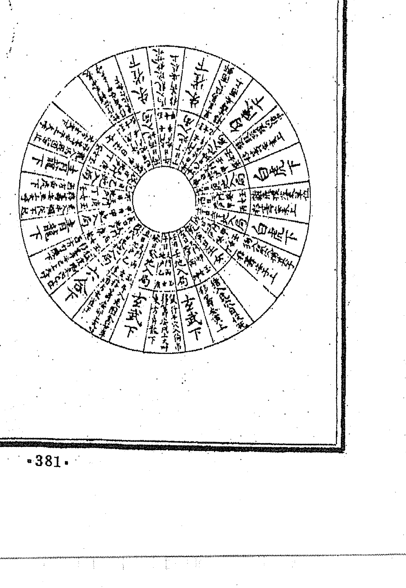

> > 经曰缓则从门急则从神

## 玉女咒曰

仁高护我丁丑保我仁和度我丁酉保生仁恭保我丁巳养神太阴华盖地户天门吾行禹步玄女真人默然坐队隐化藏形急急如律令

当行玉女反闭之法以全亿万军人

## 起初布阵安营咒

咒曰：乾坤巽灵坤顺内应二仪交泰要合利贞配成天地永宁肃清感玄黄上裳震离坎兑翊赞扶将。乾坤艮巽虎伏龙翔今日行筮玉女侍傍有急相佐常辅扶迫我者死捕我者亡牵牛织女化成河江急急如律令。

凡欲远行见贵上官赴任即出地户左行入天门咒：咒曰：天门天门今日惟良玉女侍我左右游傍行来出不逢祸殃君子一见喜气倍常所求如意万事吉昌急急如律令

## 凡欲出阵拖捕时即出天门右行入地户乘玉女去咒

咒曰：诺诺嘂嘂行无择日随斗所指与神俱出天苗地覆九道皆塞中心所欲令我自符有来追我使汝迷惑以东为西以南为北急急如律令。咒讫开金关即取余剩二筹开之，如子先取丑上一筹开天门，次取申上一筹开地户，余做此。

乘玉女即三呼所在玉女咒，如子曰三呼庚上玉女，余做此。
咒曰：某上玉女其上玉女速来护我保我持我某到某方杳杳冥冥视其形人莫闻其声鬼莫视其精受我者福恶我者殃百邪鬼贼当我者灭阻我者亡千万人中见我者喜急急如律令

咒讫再作九迹禹步，每移一步持咒一句。

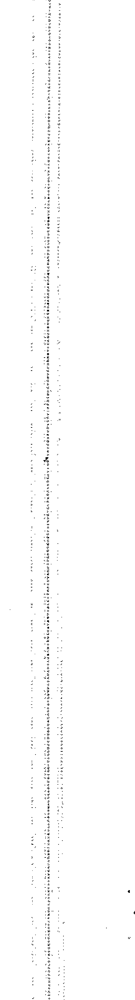

已上禹步每以左足先步行军伍等事如事急先遁奇言问吉凶何如然后出步此罡举咒如值乙奇就然念乙奇咒出一百二十步之外不可回头，如事急望玉女方而去呼其名念其咒。

踊罡口念咒曰：禹步相催登阳明白气混混我形天回地转步七星蹑罡履斗齐九灵我步我长生恶逆摧伏蛇妖惊我步我长生众火消灭火独存急急如律令

## 右禹罡咒记

> > 咒曰：六甲九章天圆地方四时五行青赤白黄太乙为师日月为光禹步治道噬尤避兵青龙夹毂白虎扶衡阴惑前引辟除不祥北斗诛罚除去凶殃五神导我周游八方当我者死逆我者亡左社右稷冠贼伏匿见者有喜留者有福万神护我永除盗贼急急如律令

咒讫即叩齿七遍上应北斗天罡，即次右手持刀画地四纵五横于地。

## 四纵五横法

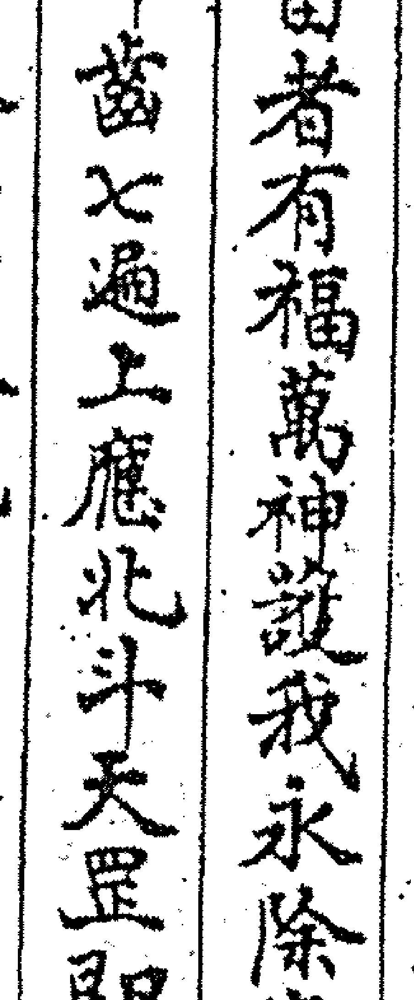

更步三台星，自上台虚精为初步，次中台六淳、下台曲星，一步一咒：三台生我来，三台养我来，三台护我来。精一切妖魔外道并向吾天罡赦下摄急急如律令。

又咒曰：律令律令四纵五横猛火烈兵游行天下搜捉邪者归呵吾者死恶吾者自受其殃急急如律令

咒曰：律令律令四纵五横万鬼潜形吾去千里者回万里

## 禹罡式

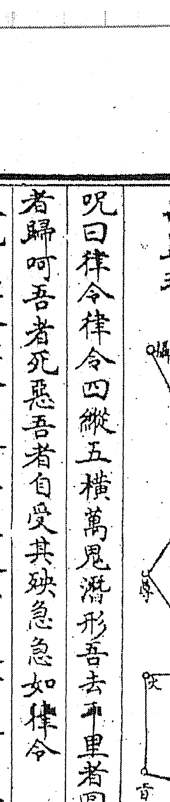

## 三奇咒

| 乙奇咒曰 | 丙奇咒曰 | 丁奇咒曰 |
|---|---|---|
| 天地威神诛灭鬼贼六乙相扶天道赞德吾令所行无攻不克急如玄女律令 | 吾德天助前后遮罗青龙白虎左右驱魔朱雀导前使吾会他天威助我六丙除病急急如玄女律令 | 天帝弟子部领天兵赏善罚恶出幽入冥来护我者玉女六丁有犯我者自灭其形急急如玄女律令 |

## 丁奇符式

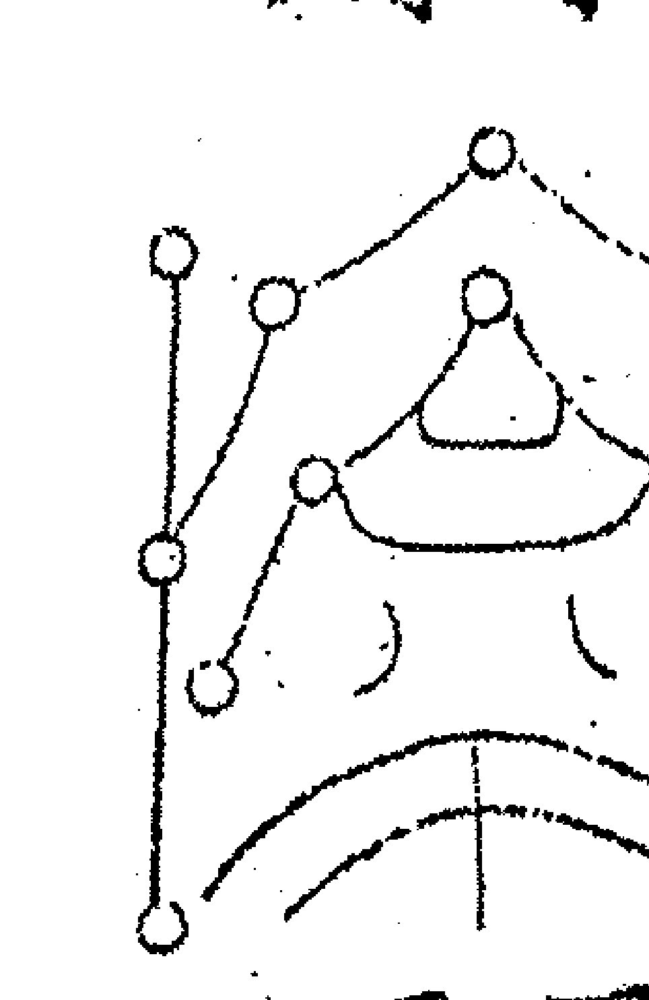

- 丁鬼印
- 丁鬼印
- 丁鬼印
- 丁鬼印

石已上三道符用雷霹东木方圆各一分二分离此符为住如不然但以黄素纸书之亦可

## 乙奇符式

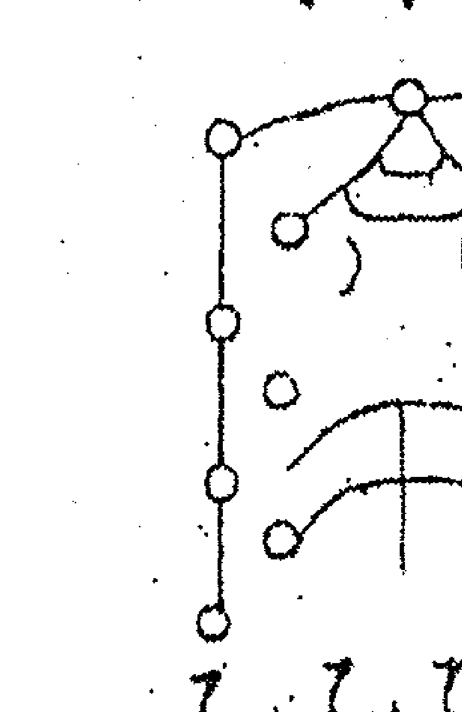

- 乙鬼印
- 乙鬼印
- 乙鬼印
- 乙鬼印

## 丙奇符式

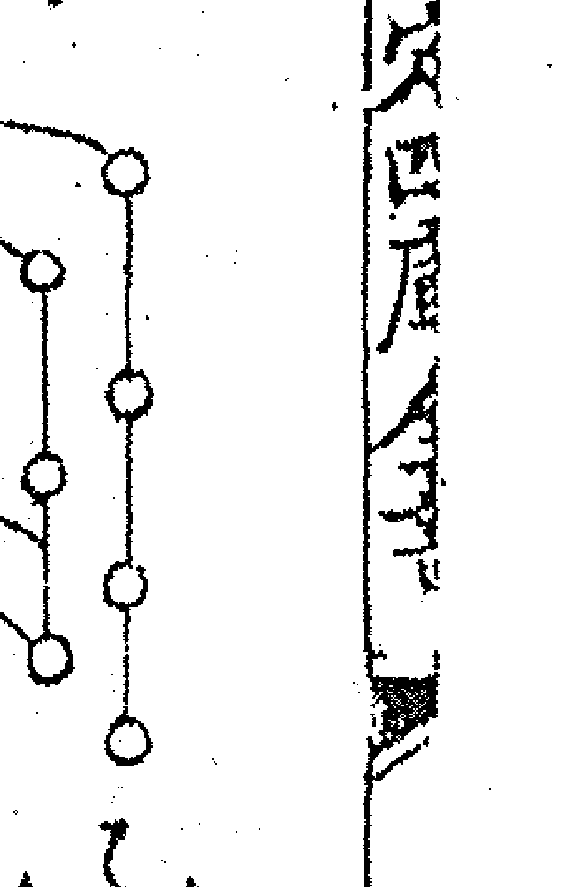

- 丙鬼印
- 丙鬼印
- 丙鬼印
- 丙鬼印

## 又传三奇咒并附录

乙奇咒曰：白虎踔跌青龙踔跌前遮后卫连克在纳仁德洋洋太虚廖廓天乙追摄万祥俱作急急如律令

丙奇咒曰：天罡扬威玄武后随玉彩摇曳荧惑流辉神光照耀太白成瑞六丙来迎百福攸归急急如律令

丁奇咒曰：玉女灵神太阴渊默华盖静覆我形不忒我气浩然悠然寰域六丁前导万福来格急急如律令

诀曰：以上运筹若不请神喝筹则神无验矣，此法实用

## 通甲演义卷三

兵之躯辔乃为将之权衡，以此破阵而前无完阵，以此攻城而无坚城，以致万邦咸怀宜王者之有锡命，四方无虞见天下之莫予争。后有不务智谋第恐勇力妄受斧钺之任，偷处爪牙之职，及其戎虏枭獍奸雄乱国在心，无已成之筹临事有不决之惑，岂知总戎之道哉。

## 钦定四库全书

## 遁甲演义卷四

明 程道生 撰

## 阴阳二遁十八局图列后

### 直符加时干
直使加时宫

顺布六仪
逆布三奇

| 直符 | 天蓬 | 天芮 | 天冲 | 天辅 | 天禽 | 天心 |
| :---: | :---: | :---: | :---: | :---: | :---: | :---: |
| 甲子 | 一甲 | 二甲 | 三甲 | 四甲 | 五甲 | 六甲 |
| 乙丑 | 九乙 | 九乙 | 九乙 | 九乙 | 九乙 | 九乙 |
| 丙寅 | 八丙 | 八丙 | 八丙 | 八丙 | 八丙 | 八丙 |
| 丁卯 | 七丁 | 七丁 | 七丁 | 七丁 | 七丁 | 七丁 |
| 戊辰 | 一戊 | 一戊 | 一戊 | 一戊 | 一戊 | 一戊 |
| 己巳 | 二己 | 二己 | 二己 | 二己 | 二己 | 二己 |
| 庚午 | 三庚 | 三庚 | 三庚 | 三庚 | 三庚 | 三庚 |
| 辛未 | 四辛 | 四辛 | 四辛 | 四辛 | 四辛 | 四辛 |
| 壬申 | 五壬 | 五壬 | 五壬 | 五壬 | 五壬 | 五壬 |
| 癸酉 | 六癸 | 六癸 | 六癸 | 六癸 | 六癸 | 六癸 |
| 宫门 | 休宫 | 死门 | 伤门 | 杜门 | 死门 | 开宫 |

## 阳遁一局图

冬至甲己日甲子时定局 惊蛰上 清明中 立夏中局

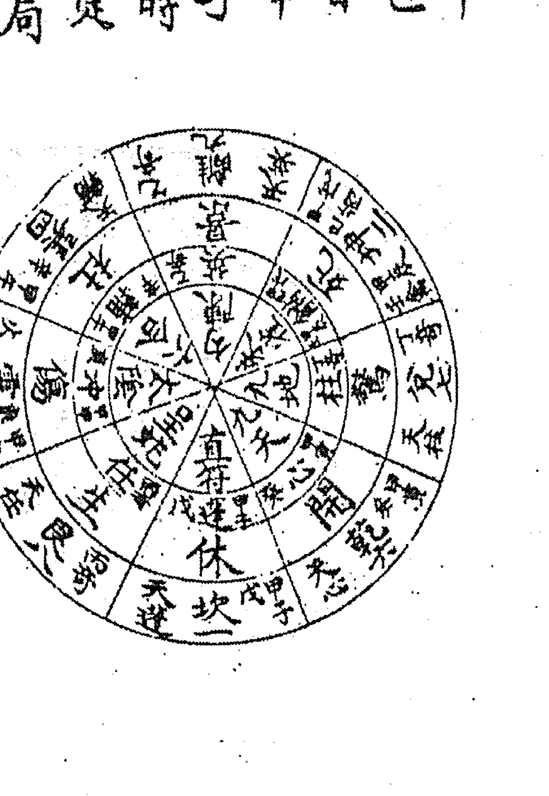

顺布六仪
逆布三奇
直符加时干
直使加时宫

| 天柱 | 天心 | 天禽 | 天辅 | 天冲 | 天芮 |
|---|---|---|---|---|---|
| 甲子 | 甲戌 | 甲申 | 甲午 | 甲辰 | 甲寅 |
| 乙丑 | 乙亥 | 乙酉 | 乙未 | 乙巳 | 乙卯 |
| 丙寅 | 丙子 | 丙戌 | 丙申 | 丙午 | 丙辰 |
| 丁卯 | 丁丑 | 丁亥 | 丁酉 | 丁未 | 丁巳 |
| 戊辰 | 戊寅 | 戊子 | 戊戌 | 戊申 | 戊午 |
| 己巳 | 己卯 | 己丑 | 己亥 | 己酉 | 己未 |
| 庚午 | 庚辰 | 庚寅 | 庚子 | 庚戌 | 庚申 |
| 辛未 | 辛巳 | 辛卯 | 辛丑 | 辛亥 | 辛酉 |
| 壬申 | 壬午 | 壬辰 | 壬寅 | 壬子 | 壬戌 |
| 癸酉 | 癸未 | 癸巳 | 癸卯 | 癸丑 | 癸亥 |
| 惊 | 开 | 休 | 杜 | 伤 | 死 |

## 阳遁二局图

小寒上
立春下
谷雨中
小满中
甲己日甲子时定局

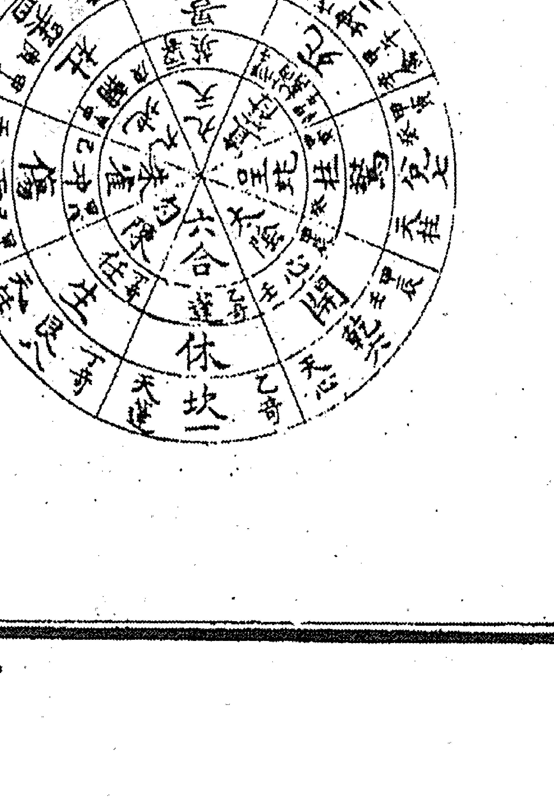

直符加时干
直使加时宫
顺布六仪
逆布三奇

| 天衡 | 天辅 | 天禽 | 天心 | 天柱 | 天任 |
|---|---|---|---|---|---|
| 甲三子 | 甲四丑 | 甲五寅 | 甲六卯 | 甲七辰 | 甲八巳 |
| 乙二丑 | 乙二寅 | 乙二卯 | 乙二辰 | 乙二巳 | 乙二午 |
| 丙一寅 | 丙一卯 | 丙一辰 | 丙一巳 | 丙一午 | 丙一未 |
| 丁九卯 | 丁九辰 | 丁九巳 | 丁九午 | 丁九未 | 丁九申 |
| 戊三辰 | 戊三巳 | 戊三午 | 戊三未 | 戊三申 | 戊三酉 |
| 己四巳 | 己四午 | 己四未 | 己四申 | 己四酉 | 己四戌 |
| 庚五午 | 庚五未 | 庚五申 | 庚五酉 | 庚五戌 | 庚五亥 |
| 辛六未 | 辛六申 | 辛六酉 | 辛六戌 | 辛六亥 | 辛六子 |
| 壬七申 | 壬七酉 | 壬七戌 | 壬七亥 | 壬七子 | 壬七丑 |
| 癸八酉 | 癸八戌 | 癸八亥 | 癸八子 | 癸八丑 | 癸八寅 |

## 阳遁三局图

大寒上 春分上 雨水下 芒种中
甲己日甲子时定局

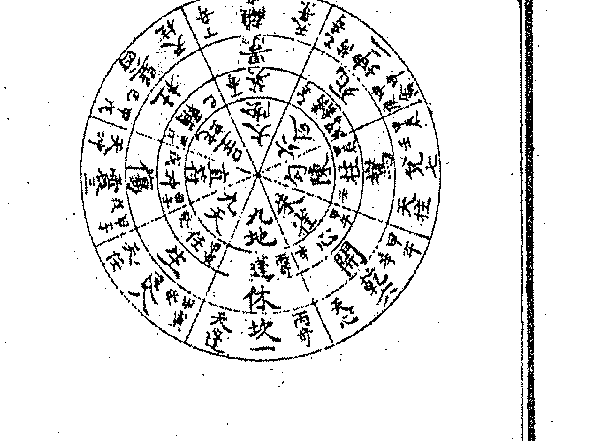

顺布六仪 逆布三奇
直符加时干 直使加时宫

| 天辅 | 天禽 | 天心 | 天柱 | 天任 | 天英 |
|---|---|---|---|---|---|
| 甲子 | 甲丑 | 甲戌 | 甲亥 | 甲申 | 甲酉 |
| 乙丑 | 乙子 | 乙亥 | 乙戌 | 乙酉 | 乙申 |
| 丙寅 | 丙丑 | 丙子 | 丙亥 | 丙戌 | 丙酉 |
| 丁卯 | 丁寅 | 丁丑 | 丁子 | 丁亥 | 丁戌 |
| 戊辰 | 戊卯 | 戊寅 | 戊丑 | 戊子 | 戊亥 |
| 己巳 | 己辰 | 己卯 | 己寅 | 己丑 | 己子 |
| 庚午 | 庚巳 | 庚辰 | 庚卯 | 庚寅 | 庚丑 |
| 辛未 | 辛午 | 辛巳 | 辛辰 | 辛卯 | 辛寅 |
| 壬申 | 壬未 | 壬午 | 壬巳 | 壬辰 | 壬卯 |
| 癸酉 | 癸申 | 癸未 | 癸午 | 癸巳 | 癸辰 |
| 杜 | 死 | 开 | 惊 | 生 | 景 |

## 阳遁四局图

冬至下
惊蛰下
清明上
立夏上局
甲己日甲子时定局

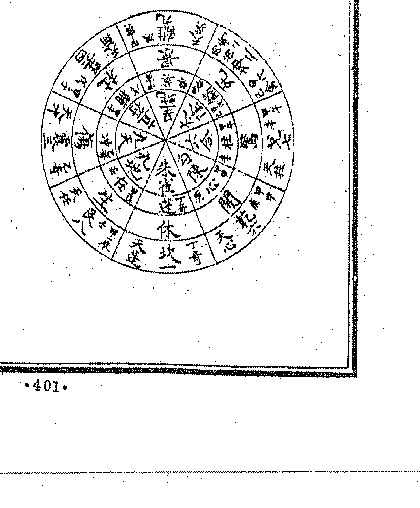

命宫四库全书

| 天禽甲子五 | 天心甲戌六 | 天柱甲申七 | 天任甲午八 | 天英甲辰九 | 天蓬甲寅一 |
| :--- | :--- | :--- | :--- | :--- | :--- |
| 直符加时干 | 直符加时干 | 直符加时干 | 直符加时干 | 直符加时干 | 直符加时干 |
| 乙丑四 | 乙亥四 | 乙酉四 | 乙未四 | 乙巳四 | 乙卯四 |
| 丙寅三 | 丙子三 | 丙戌三 | 丙申三 | 丙午三 | 丙辰三 |
| 丁卯二 | 丁丑二 | 丁亥二 | 丁酉二 | 丁未二 | 丁巳二 |
| 戊辰一 | 戊寅一 | 戊子一 | 戊戌一 | 戊申一 | 戊午一 |
| 己巳九 | 己卯九 | 己丑九 | 己亥九 | 己酉九 | 己未九 |
| 庚午八 | 庚辰八 | 庚寅八 | 庚子八 | 庚戌八 | 庚申八 |
| 辛未七 | 辛巳七 | 辛卯七 | 辛丑七 | 辛亥七 | 辛酉七 |
| 壬申六 | 壬午六 | 壬辰六 | 壬寅六 | 壬子六 | 壬戌六 |
| 癸酉五 | 癸未五 | 癸巳五 | 癸卯五 | 癸丑五 | 癸亥五 |
| 直使加时宫 | 直使加时宫 | 直使加时宫 | 直使加时宫 | 直使加时宫 | 直使加时宫 |
| 死宫 | 开宫 | 惊宫 | 生宫 | 景宫 | 休宫 |
| 顺布六仪 | 顺布六仪 | 顺布六仪 | 顺布六仪 | 顺布六仪 | 顺布六仪 |
| 逆布三奇 | 逆布三奇 | 逆布三奇 | 逆布三奇 | 逆布三奇 | 逆布三奇 |

## 阳遁五局图

小寒下
立春中
谷雨上
小满上
甲巳日甲子时定局

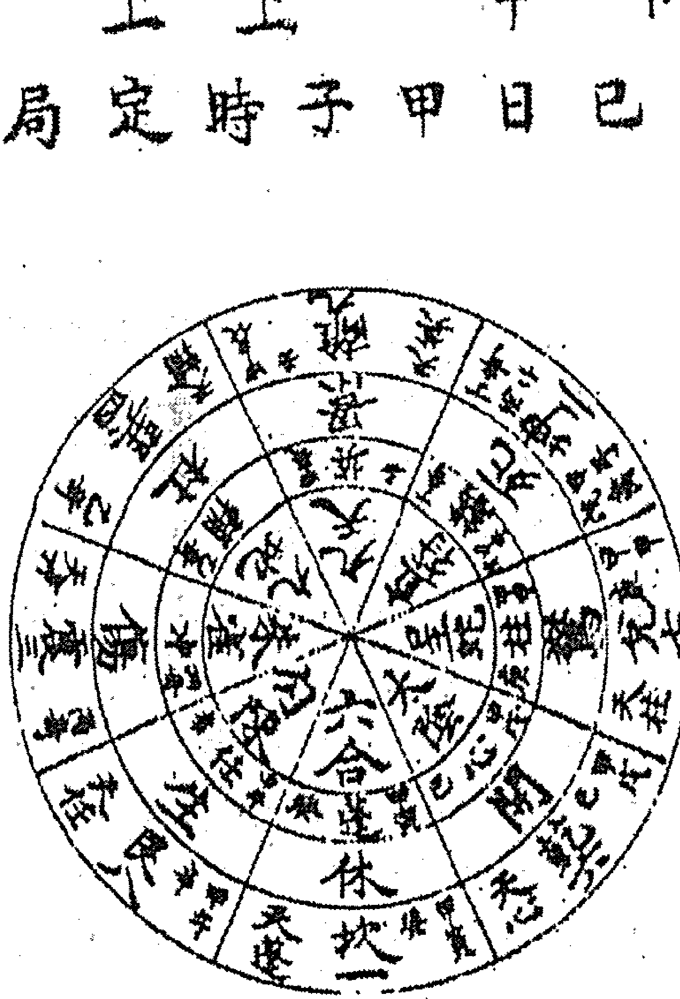

直符加时干

| 天心 | 天柱 | 天任 | 天英 | 天蓬 | 天芮 |
|---|---|---|---|---|---|
| 甲子戊 | 甲戌己 | 甲申庚 | 甲午辛 | 甲辰壬 | 甲寅癸 |
| 乙丑 | 乙亥 | 乙酉 | 乙未 | 乙巳 | 乙卯 |
| 丙寅 | 丙子 | 丙戌 | 丙申 | 丙午 | 丙辰 |
| 丁卯 | 丁丑 | 丁亥 | 丁酉 | 丁未 | 丁巳 |
| 戊辰 | 戊寅 | 戊子 | 戊戌 | 戊申 | 戊午 |
| 己巳 | 己卯 | 己丑 | 己亥 | 己酉 | 己未 |
| 庚午 | 庚辰 | 庚寅 | 庚子 | 庚戌 | 庚申 |
| 辛未 | 辛巳 | 辛卯 | 辛丑 | 辛亥 | 辛酉 |
| 壬申 | 壬午 | 壬辰 | 壬寅 | 壬子 | 壬戌 |
| 癸酉 | 癸未 | 癸巳 | 癸卯 | 癸丑 | 癸亥 |

顺布六仪

直使加时宫

| 开门 | 惊门 | 生门 | 景门 | 休门 | 死门 |
|---|---|---|---|---|---|
| 甲子 | 甲戌 | 甲申 | 甲午 | 甲辰 | 甲寅 |
| 乙丑 | 乙亥 | 乙酉 | 乙未 | 乙巳 | 乙卯 |
| 丙寅 | 丙子 | 丙戌 | 丙申 | 丙午 | 丙辰 |
| 丁卯 | 丁丑 | 丁亥 | 丁酉 | 丁未 | 丁巳 |
| 戊辰 | 戊寅 | 戊子 | 戊戌 | 戊申 | 戊午 |
| 己巳 | 己卯 | 己丑 | 己亥 | 己酉 | 己未 |
| 庚午 | 庚辰 | 庚寅 | 庚子 | 庚戌 | 庚申 |
| 辛未 | 辛巳 | 辛卯 | 辛丑 | 辛亥 | 辛酉 |
| 壬申 | 壬午 | 壬辰 | 壬寅 | 壬子 | 壬戌 |
| 癸酉 | 癸未 | 癸巳 | 癸卯 | 癸丑 | 癸亥 |

逆布三奇

## 阳遁六局图

芒种上局 春分下局 雨水中 大寒下
甲己日 甲子时 定局

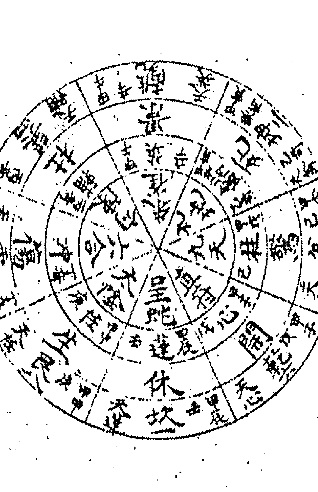

| 天柱 | 天任 | 天英 | 天蓬 | 天芮 | 天衡 |
|---|---|---|---|---|---|
| 甲子 | 甲戌 | 甲申 | 甲午 | 甲辰 | 甲寅 |
| 乙丑 | 乙亥 | 乙酉 | 乙未 | 乙巳 | 乙卯 |
| 丙寅 | 丙子 | 丙戌 | 丙申 | 丙午 | 丙辰 |
| 丁卯 | 丁丑 | 丁亥 | 丁酉 | 丁未 | 丁巳 |
| 戊辰 | 戊寅 | 戊子 | 戊戌 | 戊申 | 戊午 |
| 己巳 | 己卯 | 己丑 | 己亥 | 己酉 | 己未 |
| 庚午 | 庚辰 | 庚寅 | 庚子 | 庚戌 | 庚申 |
| 辛未 | 辛巳 | 辛卯 | 辛丑 | 辛亥 | 辛酉 |
| 壬申 | 壬午 | 壬辰 | 壬寅 | 壬子 | 壬戌 |
| 癸酉 | 癸未 | 癸巳 | 癸卯 | 癸丑 | 癸亥 |

顺布六仪
逆布三奇
直符加时干
直使加时宫

## 阳遁七局图

立夏下局 清明下局 惊蛰中局 冬至中局
甲巳日甲子时定局

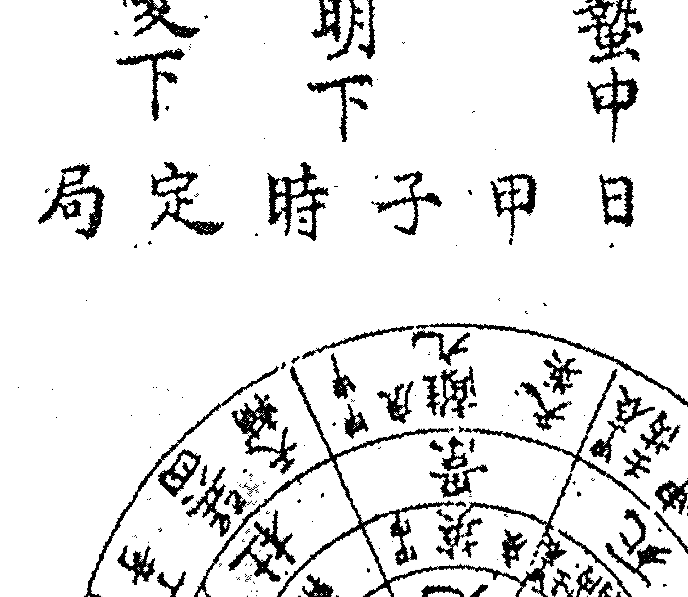

| 天任 | 天英 | 天蓬 | 天芮 | 天衡 | 天辅 |
|---|---|---|---|---|---|
| 八甲子 | 九甲戌 | 一甲申 | 二甲午 | 三甲辰 | 四甲寅 |
| 七乙丑 | 六乙亥 | 五乙酉 | 四乙未 | 三乙巳 | 二乙卯 |
| 九丙寅 | 八丙子 | 七丙戌 | 六丙申 | 五丙午 | 四丙辰 |
| 一丁卯 | 九丁丑 | 八丁亥 | 七丁酉 | 六丁未 | 五丁巳 |
| 二戊辰 | 一戊寅 | 九戊子 | 八戊戌 | 七戊申 | 六戊午 |
| 三己巳 | 二己卯 | 一己丑 | 九己亥 | 八己酉 | 七己未 |
| 四庚午 | 三庚辰 | 二庚寅 | 一庚子 | 九庚戌 | 八庚申 |
| 五辛未 | 四辛巳 | 三辛卯 | 二辛丑 | 一辛亥 | 九辛酉 |
| 六壬申 | 五壬午 | 四壬辰 | 三壬寅 | 二壬子 | 一壬戌 |

顺布六仪

直使加时宫

| 五庚午 | 四庚辰 | 三庚寅 | 二庚子 | 一庚戌 | 九庚申 |
|---|---|---|---|---|---|
| 六辛未 | 五辛巳 | 四辛卯 | 三辛丑 | 二辛亥 | 一辛酉 |
| 七壬申 | 六壬午 | 五壬辰 | 四壬寅 | 三壬子 | 二壬戌 |
| 八癸酉 | 七癸未 | 六癸巳 | 五癸卯 | 四癸丑 | 三癸亥 |

逆布三奇

杜 | 伤 | 死 | 休 | 景 | 生 | 宫

## 阳遁八局图

- 小寒中
- 立春上
- 雨水下
- 小满下

### 甲己日甲子时定局

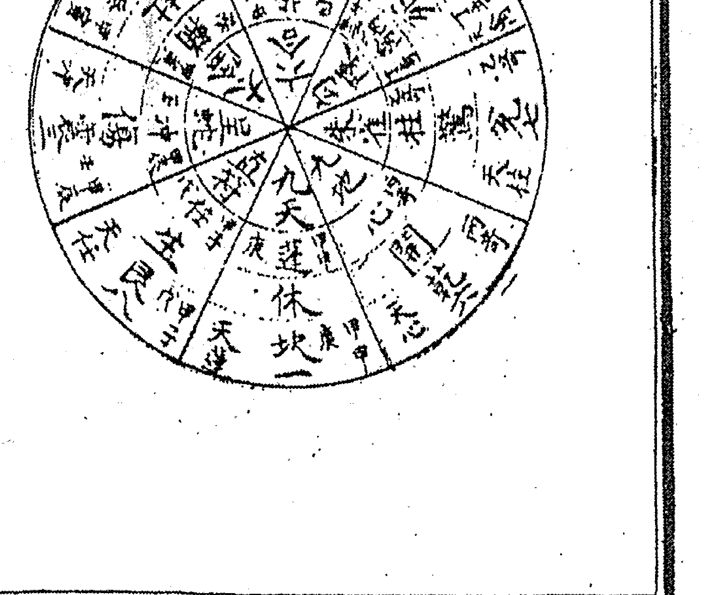

| 天禽 | 天辅 | 天冲 | 天芮 | 天蓬 | 天英 |
|---|---|---|---|---|---|
| 五甲 | 四甲 | 三甲 | 二甲 | 一甲 | 九甲 |
| 五寅 | 四辰 | 三午 | 二申 | 一戌 | 九子 |
| 八乙 | 八乙 | 八乙 | 八乙 | 八乙 | 八乙 |
| 六卯 | 五巳 | 四未 | 三酉 | 二亥 | 一丑 |
| 七丙 | 七丙 | 七丙 | 七丙 | 七丙 | 七丙 |
| 七辰 | 六午 | 五申 | 四戌 | 三子 | 二寅 |
| 六丁 | 六丁 | 六丁 | 六丁 | 六丁 | 六丁 |
| 八巳 | 七未 | 六酉 | 五亥 | 四丑 | 三卯 |
| 九戊 | 九戊 | 九戊 | 九戊 | 九戊 | 九戊 |
| 九午 | 八申 | 七戌 | 六子 | 五寅 | 四辰 |
| 一己 | 一己 | 一己 | 一己 | 一己 | 一己 |
| 一未 | 九酉 | 八亥 | 七丑 | 六卯 | 五巳 |
| 二庚 | 二庚 | 二庚 | 二庚 | 二庚 | 二庚 |
| 二申 | 一戌 | 九子 | 八寅 | 七辰 | 六午 |
| 三辛 | 三辛 | 三辛 | 三辛 | 三辛 | 三辛 |
| 三酉 | 二亥 | 一丑 | 九卯 | 八巳 | 七未 |
| 四壬 | 四壬 | 四壬 | 四壬 | 四壬 | 四壬 |
| 四戌 | 三子 | 二寅 | 一辰 | 九午 | 八申 |
| 五癸 | 五癸 | 五癸 | 五癸 | 五癸 | 五癸 |
| 五亥 | 四丑 | 三卯 | 二巳 | 一未 | 九酉 |
| 死 | 杜 | 伤 | 死 | 休 | 景 |
| 宫 | 宫 | 宫 | 宫 | 宫 | 宫 |## 阳遁九局图

### 甲己日甲子时定局

大寒中
雨水上
春分中
芒种下

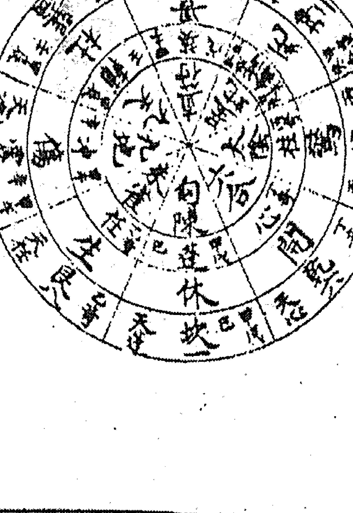

### 逆布六仪

| 天辅 | 天禽 | 天心 | 天柱 | 天任 | 天英 |
| --- | --- | --- | --- | --- | --- |
| 甲四寅 | 甲五辰 | 甲六午 | 甲七申 | 甲八戌 | 甲九子 |
| 乙一卯 | 乙一巳 | 乙一未 | 乙一酉 | 乙一亥 | 乙一丑 |
| 丙二辰 | 丙二午 | 丙二申 | 丙二戌 | 丙二子 | 丙二寅 |
| 丁三巳 | 丁三未 | 丁三酉 | 丁三亥 | 丁三丑 | 丁三卯 |
| 戊九午 | 戊九申 | 戊九戌 | 戊九子 | 戊九寅 | 戊九辰 |
| 己八未 | 己八酉 | 己八亥 | 己八丑 | 己八卯 | 己八巳 |
| 庚七申 | 庚七戌 | 庚七子 | 庚七寅 | 庚七辰 | 庚七午 |
| 辛六酉 | 辛六亥 | 辛六丑 | 辛六卯 | 辛六巳 | 辛六未 |
| 壬五戌 | 壬五子 | 壬五寅 | 壬五辰 | 壬五午 | 壬五申 |
| 癸四亥 | 癸四丑 | 癸四卯 | 癸四巳 | 癸四未 | 癸四酉 |
| **直使加时宫** | **直使加时宫** | **直使加时宫** | **直使加时宫** | **直使加时宫** | **直使加时宫** |
| 杜 亥戌 | 死 子丑 | 开 寅卯 | 惊 辰巳 | 生 午未 | 景 申酉 |

### 顺布三奇

## 阴遁九局图

- 立冬中
- 寒露中
- 白露上
- 夏至上

甲己日甲子时定局

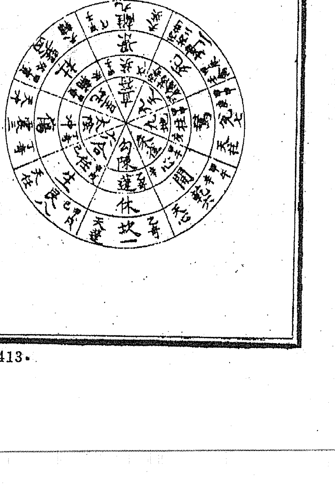

### 直符加时干 直使加时宫

| 天任 | 天柱 | 天心 | 天禽 | 天辅 | 天冲 |
|------------|------|------|------|------|------|
|            | 八 甲子 | 七 甲戌 | 六 甲申 | 五 甲午 | 四 甲辰 | 三 甲寅 |
|            | 九 乙丑 | 八 乙亥 | 七 乙酉 | 六 乙未 | 五 乙巳 | 四 乙卯 |
|            | 一 丙寅 | 九 丙子 | 八 丙戌 | 七 丙申 | 六 丙午 | 五 丙辰 |
|            | 二 丁卯 | 一 丁丑 | 九 丁亥 | 八 丁酉 | 七 丁未 | 六 丁巳 |
|            | 三 戊辰 | 二 戊寅 | 一 戊子 | 九 戊戌 | 八 戊申 | 七 戊午 |
|            | 四 己巳 | 三 己卯 | 二 己丑 | 一 己亥 | 九 己酉 | 八 己未 |
|            | 五 庚午 | 四 庚辰 | 三 庚寅 | 二 庚子 | 一 庚戌 | 九 庚申 |
|            | 六 辛未 | 五 辛巳 | 四 辛卯 | 三 辛丑 | 二 辛亥 | 一 辛酉 |
|            | 七 壬申 | 六 壬午 | 五 壬辰 | 四 壬寅 | 三 壬子 | 二 壬戌 |
|            | 八 癸酉 | 七 癸未 | 六 癸巳 | 五 癸卯 | 四 癸丑 | 三 癸亥 |
| 直使加时宫 | 伤 | 杜 | 死 | 开 | 惊 | 生 |

## 阴遁八局图

小暑上 甲己日
立秋下
甲子时定局

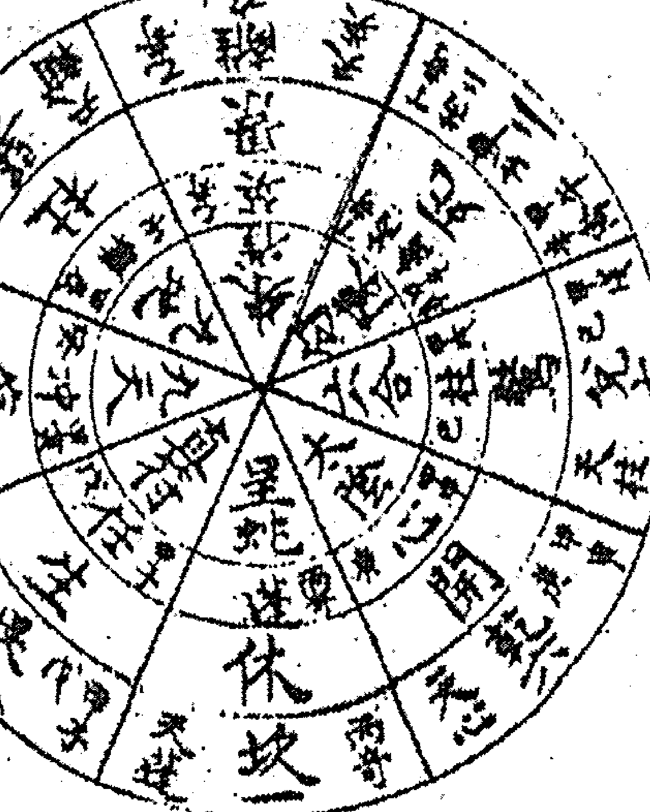

### 逆布六仪 顺布三奇

| 天芮 | 天衡 | 天辅 | 天禽 | 天心 | 天柱 | 直符加时干 | 直使加时宫 |
|------|------|------|------|------|------|------------|------------|
| 一 甲子 | 二 乙丑 | 三 丙寅 | 四 丁卯 | 五 戊辰 | 六 己巳 | 七 庚午 | 八 辛未 |
| 二 乙丑 | 三 丙寅 | 四 丁卯 | 五 戊辰 | 六 己巳 | 七 庚午 | 八 辛未 | 九 壬申 |
| 三 丙寅 | 四 丁卯 | 五 戊辰 | 六 己巳 | 七 庚午 | 八 辛未 | 九 壬申 | 十 癸酉 |
| ... | ... | ... | ... | ... | ... | ... | ... |

## 阴遁七局图

秋分上
处暑下
大暑上
甲己日甲子时定局
大雪中

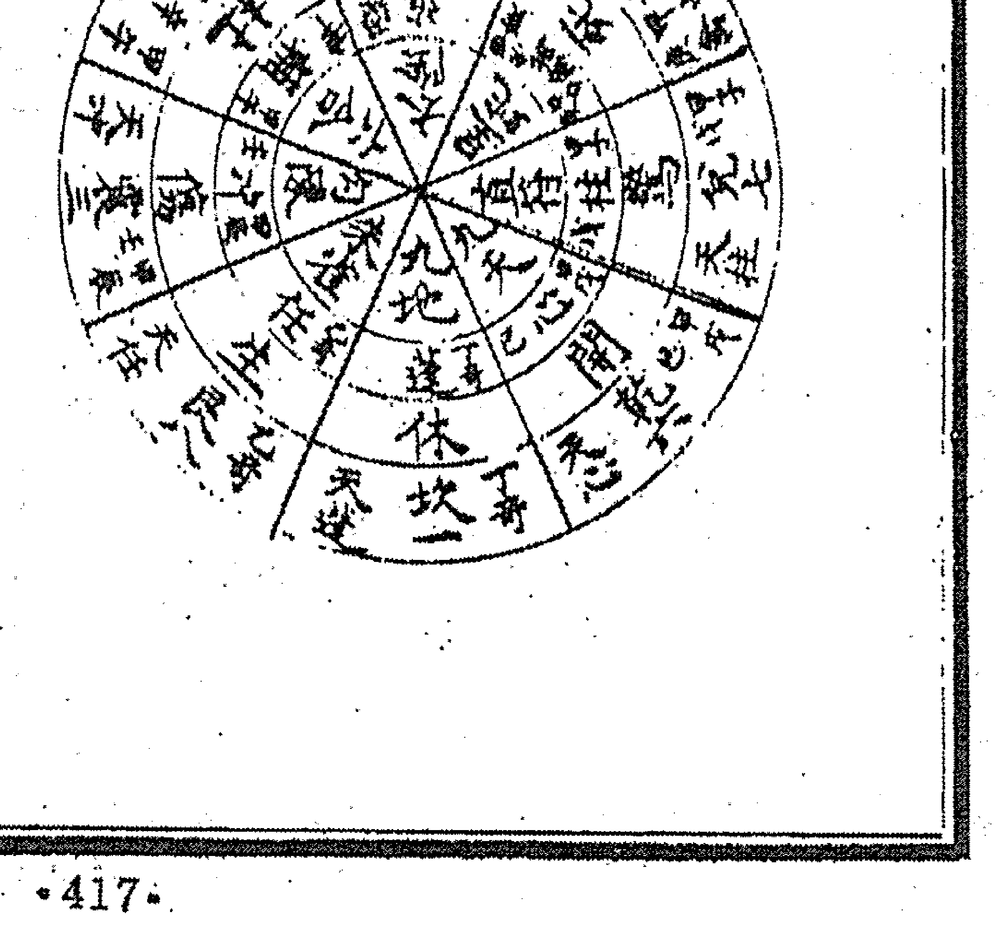

直符加时干
直使加时宫

天心 甲子 六甲 六乙 丑 加时干

天禽 甲戌 五甲 五乙 丑 加

天辅 甲申 四甲 四乙 丑 加

天冲 甲午 三甲 三乙 丑 加

天芮 甲辰 二甲 二乙 丑 加

天蓬 甲寅 一甲 一乙 丑 加

逆布六仪 一甲 二甲 三甲 四甲 五甲 六甲
顺布三奇 一奇 二奇 三奇 四奇 五奇 六奇

休 死 伤 杜 死 开 宫

## 阴遁六局图

- 立冬上
- 寒露上
- 白露下
- 夏至下

甲己日甲子时定局

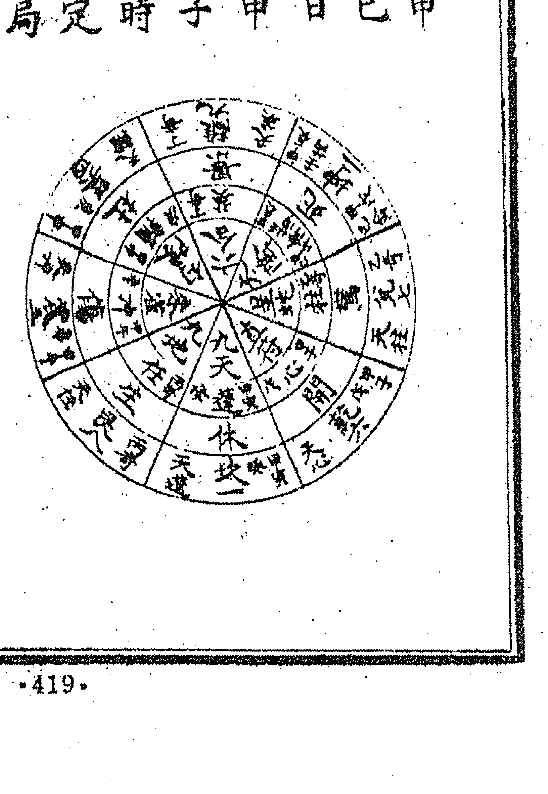

> 左侧竖排文字：奇门遁甲日课等。

### 逆布六仪

### 直符加时干

| 天禽 | 天辅 | 天冲 | 天芮 | 天蓬 | 天英 |
|------|------|------|------|------|------|
| 五甲子 | 四甲戌 | 三甲申 | 二甲午 | 一甲辰 | 九甲寅 |
| 六乙丑 | 五乙亥 | 四乙酉 | 三乙未 | 二乙巳 | 一乙卯 |
| 七丙寅 | 六丙子 | 五丙戌 | 四丙申 | 三丙午 | 二丙辰 |
| 八丁卯 | 七丁丑 | 六丁亥 | 五丁酉 | 四丁未 | 三丁巳 |
| 九戊辰 | 八戊寅 | 七戊子 | 六戊戌 | 五戊申 | 四戊午 |
| 四己巳 | 三己卯 | 二己丑 | 一己亥 | 九己酉 | 八己未 |
| 三庚午 | 二庚辰 | 一庚寅 | 九庚子 | 八庚戌 | 七庚申 |
| 二辛未 | 一辛巳 | 九辛卯 | 八辛丑 | 七辛亥 | 六辛酉 |
| 一壬申 | 九壬午 | 八壬辰 | 七壬寅 | 六壬子 | 五壬戌 |
| 九癸酉 | 八癸未 | 七癸巳 | 六癸卯 | 五癸丑 | 四癸亥 |

### 顺布三奇

### 直使加时宫

## 阴遁五局图

小暑下
立秋中
霜降上
小寒上
甲己日甲子时定局

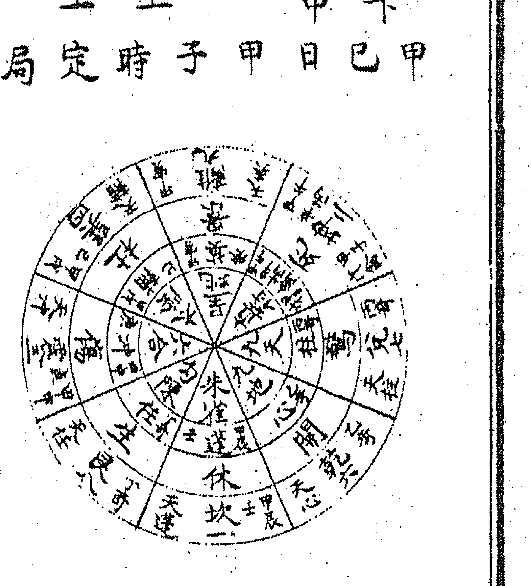

逆布六仪

顺布三奇

直符加时干

直使加时宫

| 天任 | 天英 | 天蓬 | 天芮 | 天禽 | 天心 | 天辅 |
| --- | --- | --- | --- | --- | --- | --- |
| 八 甲 | 九 甲 | 一 甲 | 二 甲 | 三 甲 | 四 甲 | 直符 |
| 八 寅 | 九 辰 | 一 午 | 二 申 | 三 戌 | 四 子 |  |
| 五 乙 | 五 乙 | 五 乙 | 五 乙 | 五 乙 | 五 乙 | 五 乙 |
| 七 卯 | 八 巳 | 九 未 | 一 酉 | 二 亥 | 三 丑 |  |
| 六 丙 | 六 丙 | 六 丙 | 六 丙 | 六 丙 | 六 丙 | 六 丙 |
| 六 辰 | 七 午 | 八 申 | 九 戌 | 一 子 | 二 寅 |  |
| 七 丁 | 七 丁 | 七 丁 | 七 丁 | 七 丁 | 七 丁 | 七 丁 |
| 五 巳 | 六 未 | 七 酉 | 八 亥 | 九 丑 | 一 卯 |  |
| 四 戊 | 四 戊 | 四 戊 | 四 戊 | 四 戊 | 四 戊 | 四 戊 |
| 四 午 | 五 申 | 六 戌 | 七 子 | 八 寅 | 九 辰 |  |
| 三 己 | 三 己 | 三 己 | 三 己 | 三 己 | 三 己 | 三 己 |
| 三 未 | 四 酉 | 五 亥 | 六 丑 | 七 卯 | 八 巳 |  |
| 二 庚 | 二 庚 | 二 庚 | 二 庚 | 二 庚 | 二 庚 | 二 庚 |
| 二 申 | 三 戌 | 四 子 | 五 寅 | 六 辰 | 七 午 |  |
| 一 辛 | 一 辛 | 一 辛 | 一 辛 | 一 辛 | 一 辛 | 一 辛 |
| 一 酉 | 二 亥 | 三 丑 | 四 卯 | 五 巳 | 六 未 |  |
| 九 壬 | 九 壬 | 九 壬 | 九 壬 | 九 壬 | 九 壬 | 九 壬 |
| 九 戌 | 一 子 | 二 寅 | 三 辰 | 四 午 | 五 申 |  |
| 八 癸 | 八 癸 | 八 癸 | 八 癸 | 八 癸 | 八 癸 | 八 癸 |
| 九 亥 | 九 丑 | 一 卯 | 二 巳 | 三 未 | 四 亥 |  |
| 生 | 景 | 休 | 死 | 伤 | 杜 | 惊 |

## 阴遁四局图

大暑下甲
处暑中甲
秋分下甲
大雪上局
时子甲 日己甲

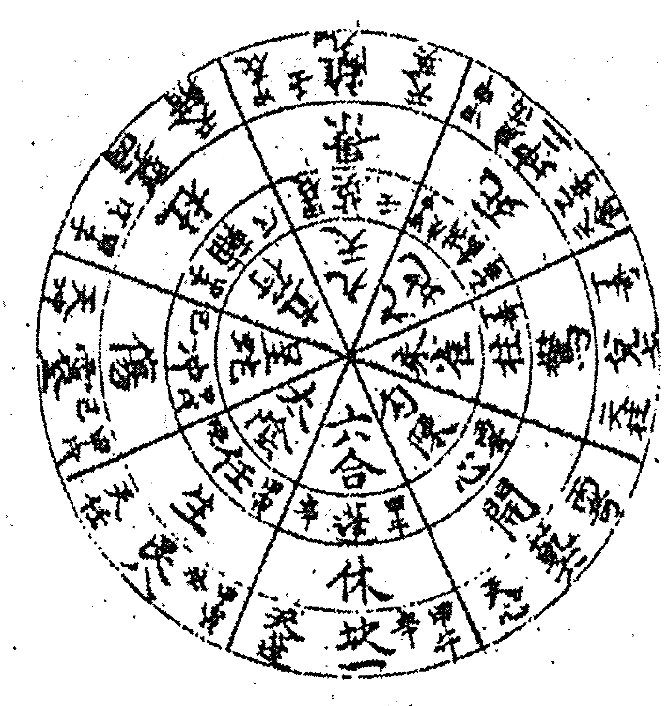

### 逆布六仪

### 顺布三奇

### 直符加时干

### 直使加时宫

| 天柱 (三) | 天任 (二) | 天英 (一) | 天蓬 (九) | 天芮 (八) | 天心 (七) |
|------------|------------|------------|------------|------------|------------|
| 甲子 三甲 | 甲辰 八甲 | 甲午 九甲 | 甲申 一甲 | 甲戌 二甲 | 甲寅 七甲 |
| 乙丑 四乙 | 乙巳 四乙 | 乙未 四乙 | 乙酉 四乙 | 乙亥 四乙 | 乙卯 四乙 |
| 丙寅 五丙 | 丙午 五丙 | 丙申 五丙 | 丙戌 五丙 | 丙子 五丙 | 丙辰 五丙 |
| 丁卯 六丁 | 丁未 六丁 | 丁酉 六丁 | 丁亥 六丁 | 丁丑 六丁 | 丁巳 六丁 |
| 戊辰 三戊 | 戊申 三戊 | 戊戌 三戊 | 戊子 三戊 | 戊寅 三戊 | 戊午 三戊 |
| 己巳 二己 | 己酉 二己 | 己亥 二己 | 己丑 二己 | 己卯 二己 | 己未 二己 |
| 庚午 一庚 | 庚戌 一庚 | 庚子 一庚 | 庚寅 一庚 | 庚辰 一庚 | 庚申 一庚 |
| 辛未 九辛 | 辛亥 九辛 | 辛丑 九辛 | 辛卯 九辛 | 辛巳 九辛 | 辛酉 九辛 |
| 壬申 八壬 | 壬子 八壬 | 壬寅 八壬 | 壬辰 八壬 | 壬午 八壬 | 壬戌 八壬 |
| 癸酉 七癸 | 癸丑 七癸 | 癸卯 七癸 | 癸巳 七癸 | 癸未 七癸 | 癸亥 七癸 |
| 惊 | 生 | 景 | 休 | 死 | 伤 |

## 阴遁三局图

- 夏至甲子日
- 寒露甲子日
- 白露甲子日
- 立冬甲子时

甲日巳时
定局

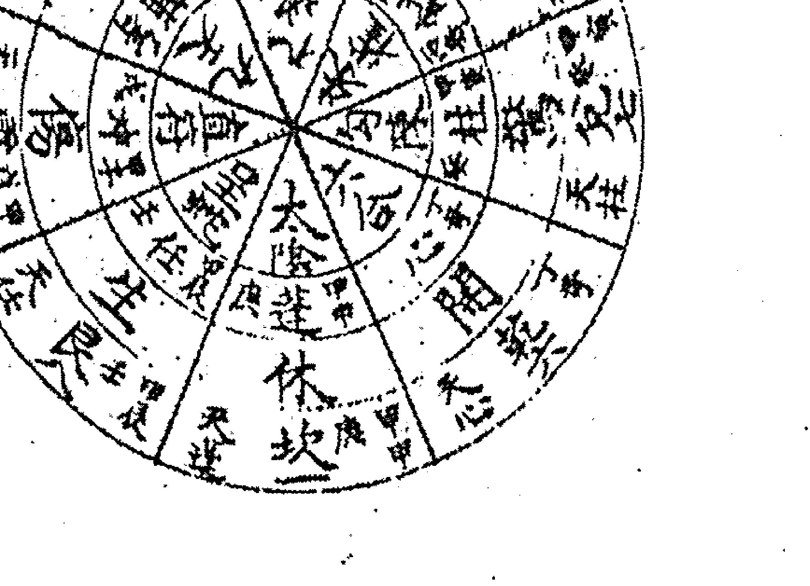

| 逆布六仪/顺布三奇 | 天芮 | 天蓬 | 天英 | 天任 | 天柱 | 天心 |
| :--- | :--- | :--- | :--- | :--- | :--- | :--- |
| 逆布六仪 直符加时干 | 二甲子 三乙丑 四丙寅 五丁卯 六戊辰 七己巳 八庚午 九辛未 十壬申 十一癸酉 十二甲戌 | 一甲戌 二乙亥 三丙子 四丁丑 五戊寅 六己卯 七庚辰 八辛巳 九壬午 十癸未 十一甲申 | 九甲申 十乙酉 十一丙戌 十二丁亥 一戊子 二己丑 三庚寅 四辛卯 五壬辰 六癸巳 七甲午 | 八甲午 九乙未 十丙申 十一丁酉 十二戊戌 一己亥 二庚子 三辛丑 四壬寅 五癸卯 六甲辰 | 七甲辰 八乙巳 九丙午 十丁未 十一戊申 十二己酉 一庚戌 二辛亥 三壬子 四癸丑 五甲寅 | 六甲寅 七乙卯 八丙辰 九丁巳 十戊午 十一己未 十二庚申 一辛酉 二壬戌 三癸亥 四甲子 |
| 顺布三奇 直使加时宫 | 死 一甲子 二乙丑 三丙寅 四丁卯 五戊辰 六己巳 七庚午 八辛未 九壬申 十癸酉 十一甲戌 | 休 九甲戌 十乙亥 十一丙子 十二丁丑 一戊寅 二己卯 三庚辰 四辛巳 五壬午 六癸未 七甲申 | 景 八甲申 九乙酉 十丙戌 十一丁亥 十二戊子 一己丑 二庚寅 三辛卯 四壬辰 五癸巳 六甲午 | 生 七甲午 八乙未 九丙申 十丁酉 十一戊戌 十二己亥 一庚子 二辛丑 三壬寅 四癸卯 五甲辰 | 惊 六甲辰 七乙巳 八丙午 九丁未 十戊申 十一己酉 十二庚戌 一辛亥 二壬子 三癸丑 四甲寅 | 开 五甲寅 六乙卯 七丙辰 八丁巳 九戊午 十己未 十一庚申 十二辛酉 一壬戌 二癸亥 三甲子 |

## 阴遁二局图

- 小雪下
- 霜降下
- 小暑中
- 立秋上

甲己日甲子时定局

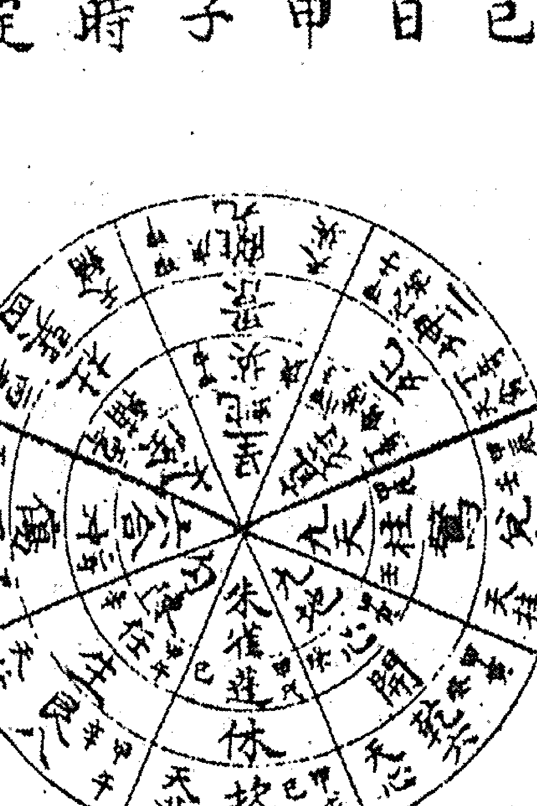

### 直符加时干 直使加时宫

| 天蓬 | 天英 | 天任 | 天柱 | 天心 | 天禽 |
|------|------|------|------|------|------|
| 甲子 | 甲戌 | 甲申 | 甲午 | 甲辰 | 甲寅 |
| 一   | 九   | 八   | 七   | 六   | 五   |
| 乙丑 | 乙亥 | 乙酉 | 乙未 | 乙巳 | 乙卯 |
| 二   | 一   | 九   | 八   | 七   | 六   |
| 丙寅 | 丙子 | 丙戌 | 丙申 | 丙午 | 丙辰 |
| 三   | 二   | 一   | 九   | 八   | 七   |
| 丁卯 | 丁丑 | 丁亥 | 丁酉 | 丁未 | 丁巳 |
| 四   | 三   | 二   | 一   | 九   | 八   |
| 戊辰 | 戊寅 | 戊子 | 戊戌 | 戊申 | 戊午 |
| 五   | 四   | 三   | 二   | 一   | 九   |
| 己巳 | 己卯 | 己丑 | 己亥 | 己酉 | 己未 |
| 六   | 五   | 四   | 三   | 二   | 一   |
| 庚午 | 庚辰 | 庚寅 | 庚子 | 庚戌 | 庚申 |
| 七   | 六   | 五   | 四   | 三   | 二   |
| 辛未 | 辛巳 | 辛卯 | 辛丑 | 辛亥 | 辛酉 |
| 八   | 七   | 六   | 五   | 四   | 三   |
| 壬申 | 壬午 | 壬辰 | 壬寅 | 壬子 | 壬戌 |
| 九   | 八   | 七   | 六   | 五   | 四   |
| 癸酉 | 癸未 | 癸巳 | 癸卯 | 癸丑 | 癸亥 |
| 十   | 九   | 八   | 七   | 六   | 五   |
| 甲戌 | 甲申 | 甲午 | 甲辰 | 甲寅 | 甲子 |
| 一   | 九   | 八   | 七   | 六   | 五   |
| 乙亥 | 乙酉 | 乙未 | 乙巳 | 乙卯 | 乙丑 |
| 二   | 一   | 九   | 八   | 七   | 六   |
| 丙子 | 丙戌 | 丙申 | 丙午 | 丙辰 | 丙寅 |
| 三   | 二   | 一   | 九   | 八   | 七   |
| 丁丑 | 丁亥 | 丁酉 | 丁未 | 丁巳 | 丁卯 |
| 四   | 三   | 二   | 一   | 九   | 八   |
| 戊寅 | 戊子 | 戊戌 | 戊申 | 戊午 | 戊辰 |
| 五   | 四   | 三   | 二   | 一   | 九   |
| 己卯 | 己丑 | 己亥 | 己酉 | 己未 | 己巳 |
| 六   | 五   | 四   | 三   | 二   | 一   |
| 庚辰 | 庚寅 | 庚子 | 庚戌 | 庚申 | 庚午 |
| 七   | 六   | 五   | 四   | 三   | 二   |
| 辛巳 | 辛卯 | 辛丑 | 辛亥 | 辛酉 | 辛未 |
| 八   | 七   | 六   | 五   | 四   | 三   |
| 壬午 | 壬辰 | 壬寅 | 壬子 | 壬戌 | 壬申 |
| 九   | 八   | 七   | 六   | 五   | 四   |
| 癸未 | 癸巳 | 癸卯 | 癸丑 | 癸亥 | 癸酉 |
| 十   | 九   | 八   | 七   | 六   | 五   |
| 甲申 | 甲午 | 甲辰 | 甲寅 | 甲子 | 甲戌 |
| 一   | 九   | 八   | 七   | 六   | 五   |
| 乙酉 | 乙未 | 乙巳 | 乙卯 | 乙丑 | 乙亥 |
| 二   | 一   | 九   | 八   | 七   | 六   |
| 丙戌 | 丙申 | 丙午 | 丙辰 | 丙寅 | 丙子 |
| 三   | 二   | 一   | 九   | 八   | 七   |
| 丁亥 | 丁酉 | 丁未 | 丁巳 | 丁卯 | 丁丑 |
| 四   | 三   | 二   | 一   | 九   | 八   |
| 戊子 | 戊戌 | 戊申 | 戊午 | 戊辰 | 戊寅 |
| 五   | 四   | 三   | 二   | 一   | 九   |
| 己丑 | 己亥 | 己酉 | 己未 | 己巳 | 己卯 |
| 六   | 五   | 四   | 三   | 二   | 一   |
| 庚寅 | 庚子 | 庚戌 | 庚申 | 庚午 | 庚辰 |
| 七   | 六   | 五   | 四   | 三   | 二   |
| 辛卯 | 辛丑 | 辛亥 | 辛酉 | 辛未 | 辛巳 |
| 八   | 七   | 六   | 五   | 四   | 三   |
| 壬辰 | 壬寅 | 壬子 | 壬戌 | 壬申 | 壬午 |
| 九   | 八   | 七   | 六   | 五   | 四   |
| 癸巳 | 癸卯 | 癸丑 | 癸亥 | 癸酉 | 癸未 |
| 十   | 九   | 八   | 七   | 六   | 五   |
| 甲午 | 甲辰 | 甲寅 | 甲子 | 甲戌 | 甲申 |
| 一   | 九   | 八   | 七   | 六   | 五   |
| 乙未 | 乙巳 | 乙卯 | 乙丑 | 乙亥 | 乙酉 |
| 二   | 一   | 九   | 八   | 七   | 六   |
| 丙申 | 丙午 | 丙辰 | 丙寅 | 丙子 | 丙戌 |
| 三   | 二   | 一   | 九   | 八   | 七   |
| 丁酉 | 丁未 | 丁巳 | 丁卯 | 丁丑 | 丁亥 |
| 四   | 三   | 二   | 一   | 九   | 八   |
| 戊戌 | 戊申 | 戊午 | 戊辰 | 戊寅 | 戊子 |
| 五   | 四   | 三   | 二   | 一   | 九   |
| 己亥 | 己酉 | 己未 | 己巳 | 己卯 | 己丑 |
| 六   | 五   | 四   | 三   | 二   | 一   |
| 庚子 | 庚戌 | 庚申 | 庚午 | 庚辰 | 庚寅 |
| 七   | 六   | 五   | 四   | 三   | 二   |
| 辛丑 | 辛亥 | 辛酉 | 辛未 | 辛巳 | 辛卯 |
| 八   | 七   | 六   | 五   | 四   | 三   |
| 壬寅 | 壬子 | 壬戌 | 壬申 | 壬午 | 壬辰 |
| 九   | 八   | 七   | 六   | 五   | 四   |
| 癸卯 | 癸丑 | 癸亥 | 癸酉 | 癸未 | 癸巳 |
| 十   | 九   | 八   | 七   | 六   | 五   |
| 甲辰 | 甲寅 | 甲子 | 甲戌 | 甲申 | 甲午 |
| 一   | 九   | 八   | 七   | 六   | 五   |
| 乙巳 | 乙卯 | 乙丑 | 乙亥 | 乙酉 | 乙未 |
| 二   | 一   | 九   | 八   | 七   | 六   |
| 丙午 | 丙辰 | 丙寅 | 丙子 | 丙戌 | 丙申 |
| 三   | 二   | 一   | 九   | 八   | 七   |
| 丁未 | 丁巳 | 丁卯 | 丁丑 | 丁亥 | 丁酉 |
| 四   | 三   | 二   | 一   | 九   | 八   |
| 戊申 | 戊午 | 戊辰 | 戊寅 | 戊子 | 戊戌 |
| 五   | 四   | 三   | 二   | 一   | 九   |
| 己酉 | 己未 | 己巳 | 己卯 | 己丑 | 己亥 |
| 六   | 五   | 四   | 三   | 二   | 一   |
| 庚戌 | 庚申 | 庚午 | 庚辰 | 庚寅 | 庚子 |
| 七   | 六   | 五   | 四   | 三   | 二   |
| 辛亥 | 辛酉 | 辛未 | 辛巳 | 辛卯 | 辛丑 |
| 八   | 七   | 六   | 五   | 四   | 三   |
| 壬子 | 壬戌 | 壬申 | 壬午 | 壬辰 | 壬寅 |
| 九   | 八   | 七   | 六   | 五   | 四   |
| 癸丑 | 癸亥 | 癸酉 | 癸未 | 癸巳 | 癸卯 |
| 十   | 九   | 八   | 七   | 六   | 五   |
| 甲寅 | 甲子 | 甲戌 | 甲申 | 甲午 | 甲辰 |
| 一   | 九   | 八   | 七   | 六   | 五   |
| 乙卯 | 乙丑 | 乙亥 | 乙酉 | 乙未 | 乙巳 |
| 二   | 一   | 九   | 八   | 七   | 六   |
| 丙辰 | 丙寅 | 丙子 | 丙戌 | 丙申 | 丙午 |
| 三   | 二   | 一   | 九   | 八   | 七   |
| 丁巳 | 丁卯 | 丁丑 | 丁亥 | 丁酉 | 丁未 |
| 四   | 三   | 二   | 一   | 九   | 八   |
| 戊午 | 戊辰 | 戊寅 | 戊子 | 戊戌 | 戊申 |
| 五   | 四   | 三   | 二   | 一   | 九   |
| 己未 | 己巳 | 己卯 | 己丑 | 己亥 | 己酉 |
| 六   | 五   | 四   | 三   | 二   | 一   |
| 庚申 | 庚午 | 庚辰 | 庚寅 | 庚子 | 庚戌 |
| 七   | 六   | 五   | 四   | 三   | 二   |
| 辛酉 | 辛未 | 辛巳 | 辛卯 | 辛丑 | 辛亥 |
| 八   | 七   | 六   | 五   | 四   | 三   |
| 壬戌 | 壬申 | 壬午 | 壬辰 | 壬寅 | 壬子 |
| 九   | 八   | 七   | 六   | 五   | 四   |
| 癸亥 | 癸酉 | 癸未 | 癸巳 | 癸卯 | 癸丑 |
| 十   | 九   | 八   | 七   | 六   | 五   |

死开惊生景休空## 陰遁一局圖

大暑中
處暑上

秋分中
大雪下

甲巳日甲子時定局

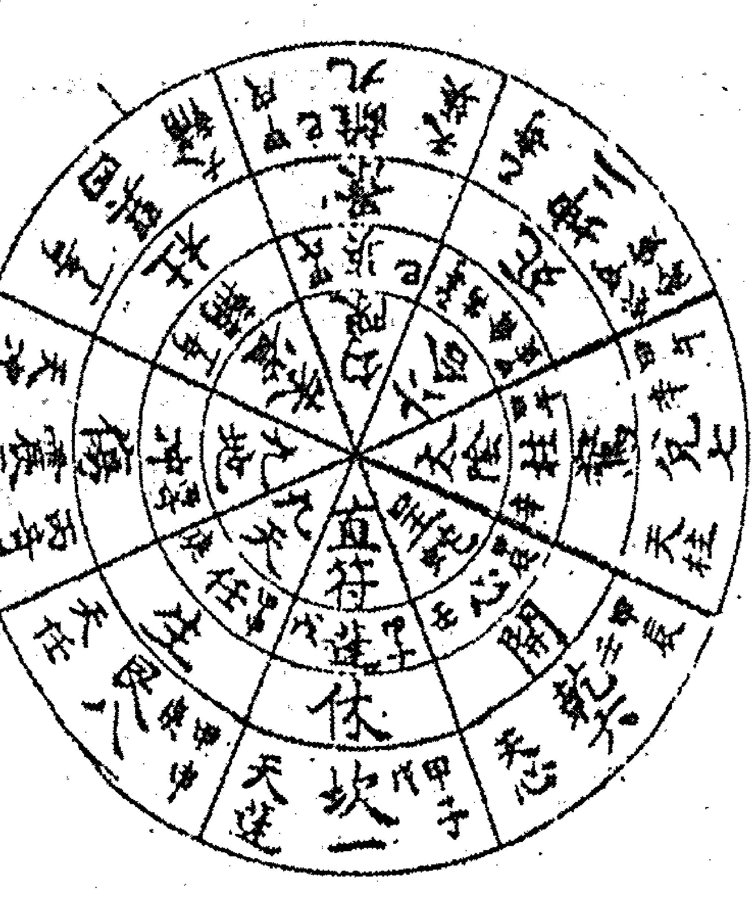

## 真人閉六戊法

夫六戊之法，謂世人欲求仙，入山林，渡江海，安立軍營，排兵布陣，置頓倉舍，或受法行篆，驅神使將，鎮邪避病，逃罪慝，避難潛身，遠行止宿，服防盗賊，必先用真人開戊局，則諸惡不能侵，龍虎來相助，神靈欽伏矣。若有急事，心迷不及布局行者，則以少年罡心眼存想，青龍蓬星入太陰，以句符印而呼玉女相敕，出天門，入地戶，天藏癸上隱去，無人見矣。或軍數眾多，厭野營寒安宿之時，防避敵人驚劫，便禹步吸玉方氣，噴手心，摑摩眼如數訖，便從中望北山林崖岸一遭至戌上住，心眼均訖定六戌位已定，則用旬符指六戌位，以心用符，却擬土從子上均布散，寅辰午申戌位各按連鬥報符，念六戊呪訖，收符安囊下，然後高枕無憂而臥，敵人不能害。縱有驚劫，賊兵自驚恐，他迷路而回。更專記天曉時，急存心目開天門，散土界，然後方令軍行。若忘不開天門，及不散土界，則隊伍迷亂，反被他兵圍劫。

## 金定四月分书

其布六戊之法，或用杜荆杖，或用熟過刀劍，相地以六為方數，臨時隨意作大小。先禹步吸王方氣，噴刀劍上，且隨方布定十二支，却以刀從支上起手畫地，如日之軌畫至戊上，留空乾位作門。再禹步從乾位空處入城中，祝曰：維某年月日時，弟子某敢昭告于天地父母、六丁六甲、六旬十二時辰、青龍蓬星、明堂太陰、天上玉女、六戊藏形之神，其好樂長生之術，行不擇日，出不問時，今欲遊行，為某事欲利自身，謹按黃帝風后遁甲式，再請玉女六戊，盡地數局，出天門，入地戶，開金闕，乘玉女，青龍、朱雀、勾陳、螣蛇、白虎、玄武、六合、太陰、六丁、六甲、六戊、六旬十二時辰，咸術我而出行到某處所在，左右巡防，隨行隨止，隨臥隨起，辟除盜賊，口舌消亡，君子見我喜樂倍常，小人見我歡躍徨徨，男女見我迎奉酒殽，百鬼惡賊當我者亡。今日禹步，上應天罡，玉女侍傍，下辟不祥，萬精壓伏，所向無殃，治病立瘥，凡百吉昌，所攻者逢，所擊者破，所求者得，所願者成。帝王大臣、二千石、長吏見我者，愛如赤子；萬姓三軍見我者，敬如父母。今按天文召請王女六戊大神，隨行引進，送達還宮。日後倘共役有召請，神當復出，急急如九天玄女元君律令勅。又呪曰：泰山之陽，恒山之陰，盜賊不起，虎狼不侵，天帝有勅，司命先行，城郭不完，閉以金關，千凶萬惡，莫之敢干，急急如九天玄女元君律令。呪畢，以刀枚掘取中央土一斗，或取艮上鬼門上土一斗，或六斗，呑王方氣噴在土上，均作六分土。復取六戊符置六戊之方，然後取六分土置六戊之位。六戊之上，必於本旬戊上起置土一分，即戊辰之類。其餘五分逆布六陽位，各置土一分。常以此布，逆布者，謂布戊寅、戊子、戊戊、申、戊年是也。假令甲子旬日戊在辰，甲戌旬日戊在寅，甲申旬日戊在子，甲午旬日戊在戌，甲辰旬日戊在申，甲寅旬日戊在午。假令甲子旬終辰上先布土一分，次布寅上，布子，布戊，布中，布午，皆布土訖。

却將子位上土微微布散作界，連接寅上，念曰：鼠窟土高均接虎穴。又將寅上土微微布散作界，連接辰上，念曰：虎穴土廣均接龍眼。又將辰上土微微布散作界，連接午上，念曰：龍眼土厚均接馬領。又將午上土微微布散作界，連接申上，念曰：馬領土堅均接猴山。又將申上土微微布散作界，連接戌上，念曰：猴山土硬均接狗城。布土訖，便以刀杖畫一遍所留空乾位地上，令其與前畫相連開窻天門上，却以刀畫天地印封訖，置其刀於取土之處，逐堆以劍孔下六戊神符，仍以土封固。乃禹步立中吸王方氣，噴手結天地印，咒曰：六戊之法，天神祐之，敢有不從，山嶽俱摧，急急如律令敕。咒訖，就局内任便宿卧，勿役出。如到晚欲出，即吸王氣，畫力撥開乾門去其印斗，散其界土，振衣而出吉。如不散土，即其神不敵去。已上仍如運籌之法堆土，即運籌也。認定天門地户之方，識其玉女守門之處，仍出天門入地户，乘玉女。

奇門遁甲秘笈

遁甲演義

三十二

437

而夫六中步，切勿回顧，自然迪吉。夫夫暑六戊應形，非直事六戊符印，供選六甲六丁吉日良時，以雷擊棗木或年久梫木或香檀木雕刻成像，仍設壇祭拜，先祭戊辰，次及戊寅，順而祭之，然後行用，方有神驗。如欲試之，即牽帶犢母牛一頭于中，將小犢牛放於閤外，終不能入，必待去土一堆，其牛即從散土之處而入，則見神靈矣。

## 六戊斗法

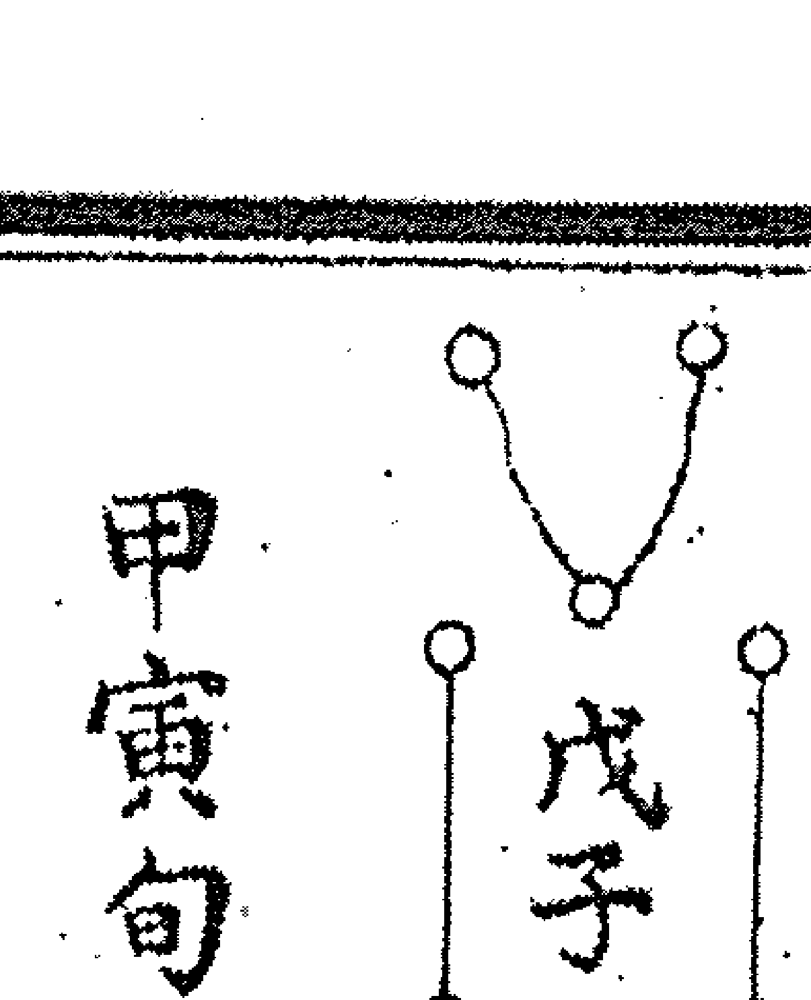

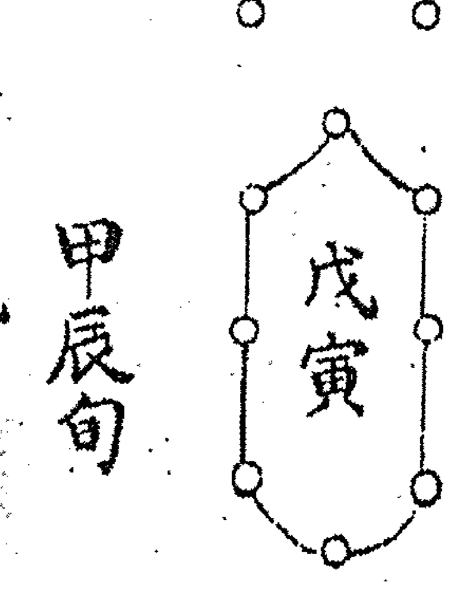

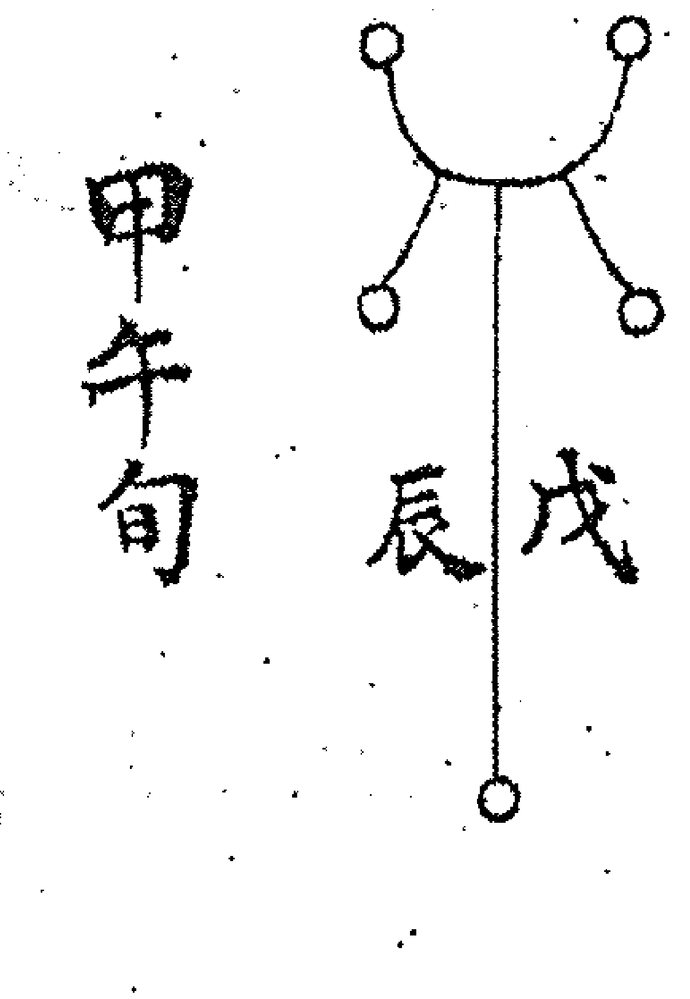

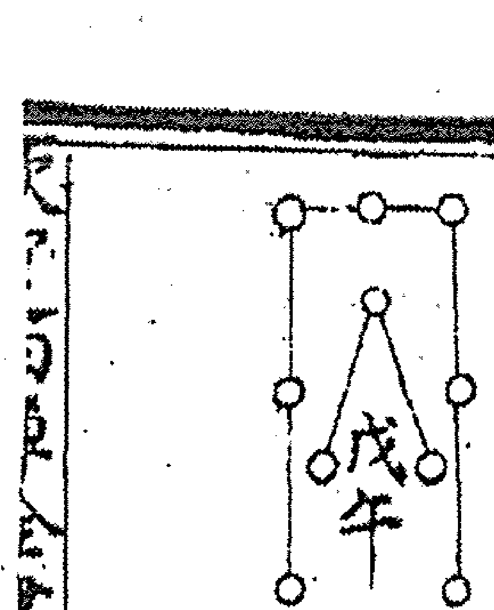

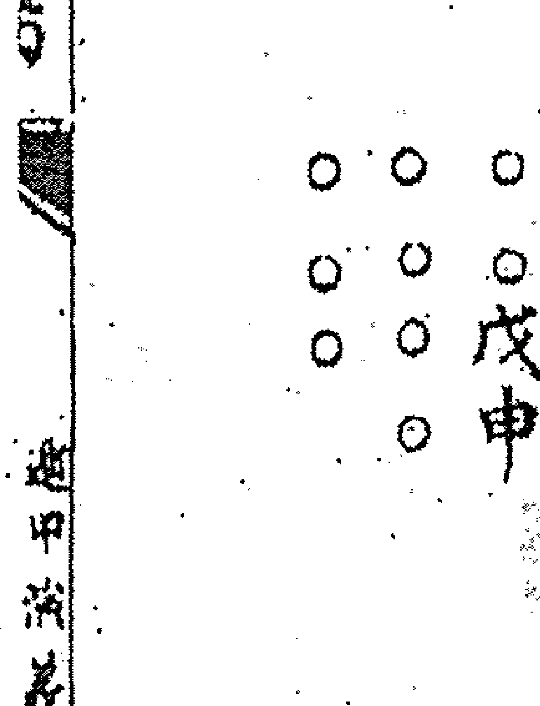

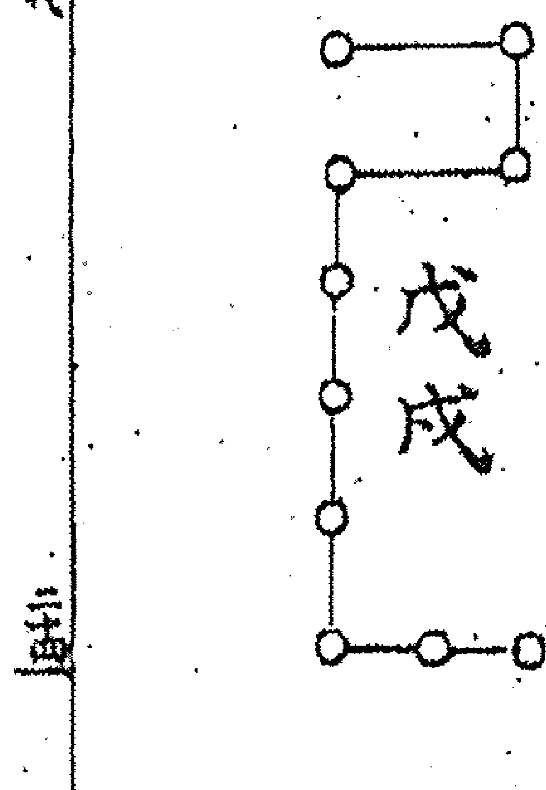

## 六戊局式

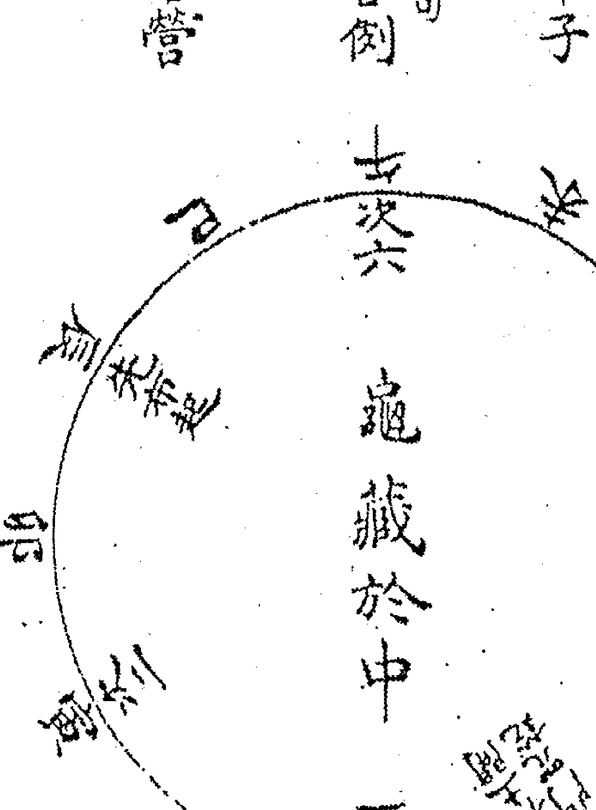

-   右此二印以刀畫乾地封局使用及上壇作成折罡用之

天印

地印

## 开六戊图局

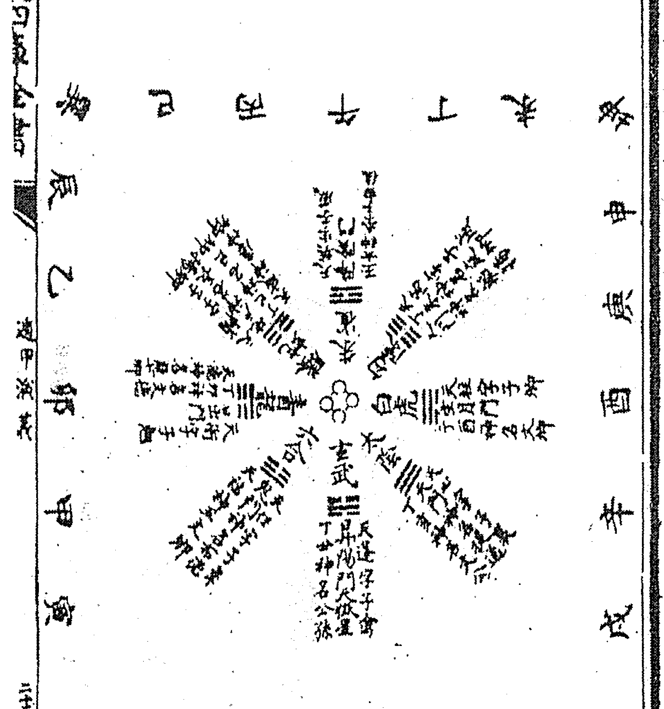

九天玄女閉六戊靈符，百忌潛避先置營以來書神符置六戊上。

## 六戊符式

-   威鬼李楚郎○
-   威米屈廉子張○
-   威男樂無名陽○
-   威昌范少郎○
-   威伯陽○
-   威夏復元充

博奕勝負局
李靖孤虚立成圖

金匱云得其無視孤盧謂摶浦博奕以正時六甲句孤，上坐者勝，盧上坐者負。又參以三奇八門斗星，以指指他人，必勝。

-   甲子旬: 孤在戌 虚在亥
-   甲戌旬: 孤在申 虚在酉
-   甲申旬: 孤在午 虚在未
-   甲辰旬: 孤在寅 虚在卯
-   甲寅旬: 孤在子 虚在丑
-   甲午旬: 孤在辰 虚在巳

伍子胥曰：凡速行諸事，不得往天庭、天獄、天牢三神，大凶。常乘青龍歷蓬星。

凡出行，百惡不敢起，大吉。

## 六甲出行訣

青龍華蓋及遊星，步去地戶太陰靈，天門天獄天牢固，陰陽孤宿合天庭，古得星辰真有准，凡事休之驗如神。

甲子旬子上起青龍，甲戌旬戌上起青龍，甲申旬申上起青龍，甲午旬午上起青龍，甲辰旬辰上起青龍，甲寅旬寅上起青龍。

## 真人步斗法

步斗經曰：夫步可以通神，當以夜半居星下白場畫地作九斗，星間相去三尺。天蓬從天罡起，隨作次第布人居魁前進布之。正立天英而歌斗呪，誦至天英，便先舉左足，並呼星名，以次依經步之，左右更遍履之如後。此法為之百日，則與神人通矣。秘之勿洩，洩非人者殃隨九祖，盗視者無驗也。乃誦曰：

斗要妙兮十二神，承光明兮威武陳，氣鬱鬱兮如浮雲。
七變動兮上應天，知變化兮有吉凶，入斗宿兮過天關。
合律呂兮治甲榮，履天英兮度天任，清冷淵兮可陟沉。
技天柱兮擁天心，從此度兮登天禽，倚天輔兮望天衝。
入天芮兮出天蓬，斗道滿兮剛柔際，天福祿兮流後世。
出其明兮千萬歲，急急如律令。

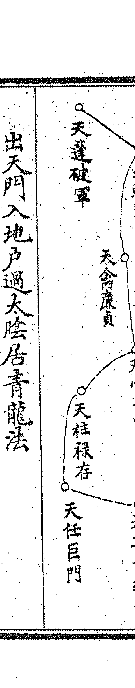

出天門入地戶過太陰居青龍法

三元經曰：初出天門，六戊也；入地戶，六巳也；過太陰，六丁也；居青龍，六甲也。所居之下，百戰百勝。假令冬至上元甲子日甲子時，初起兵出天門辰下，入地户已下，過太陰卯下，居青龍甲下，百戰百勝。又法：出天門者，天土六戊在一宮；入地户，天上六乙在九宮；過太陰在七宮；居天上青龍在一宮，餘倣此。

斗罡古本云：月常加戌時見破軍。假如閏月，將何以為用？比反錯，今星臺詳訣於後。書云：用時加月將，順數要尋辰，見辰罡指處，天地鬼人門所為，當合措口在此時行，雖不泥方向，無金值萬金。其法以天月將加用正時，王月將者即太陽是也，每以官歷上看太陽某月某日已過某宮為準。假如已亥年九月十七日卯時，太陽入卯，連有三十日俱以太衡卯為天月將是也。如九月初七癸未日巳時用事，即以卯加巳時上順去，至午得辰，即天罡在午，指正南離上天吉。如欲進表啟策，取斗所指戊亥之位，戍亥為天門方，工出之獲吉也。又如入病人之家，必取斗罡夫斗罡，又必指丑寅之位，丑艮寅乃鬼門之方，去之乃吉。凡出行征討一切謀為之事，俱從斗罡所指之方而出，天利已上出斗罡所指吉方，俱以左手持印取斗罡，无一口吹之印上出之，感應如神。

## 六甲陰符法

經曰：為上將禦敵者，須作六甲陰符法，令敵人自誅。故曰：寧與人千金，不教人六甲之陰。天地之間，此道最禁，藏之金匱，藏之於心，不傳非人，慎勿輕泄。盗視者首，盗讀者啞。若作六甲臨符，必須齋戒，若汙犯則無驗矣。六甲之臨者：甲子旬臨在丁卯，其神龜頭人身，神名孔林族；甲戌旬臨在丁丑，其神牛頭人身，神名梁丘；甲申旬臨在丁亥，其神豬頭人身，神名陸城；甲午旬臨在丁酉，其神雞頭人身，神名費陽；甲辰旬臨在丁未，其神羊頭人身，名王屈奇；甲寅旬臨在丁巳，其神蛇頭人身，名許咸池。凡作符法，常以月蝕之時伐杜荆及梧桐等木陰枝，或柏心亦可，悉長九寸，廣二寸，厚三分，用雌黃色圖畫之作像，並畫其神名著像下。

凡畫符，以錦絳為囊盛之，火將自隨身，用兵時便出六甲旬六甲之符于囊外以指敵人，自散不敢交兵也。

凡取木時，必先齋戒，取酒一升，鹿脯三斤，鹽一盞，祝卒祭之，白茆為席，北向再拜，祝曰：杜刑之先，百鬼之神，曾孫某甲欲與俱遊六甲之陰，百鬼之神與子俱遊，變化其身，以予所指莫不服者，謹奉清酌美脯子鹽，願歆享之。呪訖再拜，凡三呪畢，乃伐木。勿令穢污，亦勿令人近種物及雞犬見之，并女人見之。

先受持之法，齋戒五日，沐浴蘭湯，食香素淨飯，無食五辛之物，及置待單以六甲之日夜半然之於方壇之上。為壇方一丈二尺，外理方十二丈，開十二辰門，以竹為簍長三尺或九尺，隨地方列之在四向，六陸之符置壇上依位放，以色繒絲各二尺五寸，工安酒三杯，脯三斤，鹽一盂，帛布為席，北向北拜吃呼其四方空之長六甲六陸神名及門户神名者。

假令甲子日應在丁卯，正東再拜呼其神而咒之，以絳帛為囊盛陰符，常隨身則百鬼不能侵，以陰符指敵則敵人自滅。如含辛無環者，但於庭中或野外畫地為之亦可。

禁敵法
凡能展陰陽符者，令敵人兵不起。為術之法：甲乙日平旦南向，丙丁日食時西向，戊巳日日中北向，庚辛日日昳東向，壬癸日日入南向。已上各日依所向取方寸桃枝书敌师姓名着左履下，求者必得履。敵人之名兵不起者，謂書敌人冠贼姓名着左履下訖。咒曰：其甲不善天逆，轻毁天地日月，伐名木杜树，使神不得血食，神但持之，吾自与神诛击，陰陽神理共来翦灭。先于符下画作人之像，从月建上来呼其神名，而随六甲之神所在灭之，则敌人死仇自消亡矣。

## 六甲所在神身

-   甲子旬其神在头
-   甲戌旬其神在足
-   甲申旬其神右足
-   甲午旬其神殷仲
-   甲辰旬其神左手
-   甲寅旬其神右手

凡行軍遇惡風倒拆旗杆者，取四窮土作泥人，長三尺，手桃木弓葦矢箭，又執刀披髮向風三叩齒。咒曰：天有四狗以守四境，吾有四狗以守四隅，以城為山，以地為河，冠賊不得過來者不得進，出者不得逸，去者不得退，急急如律令。咒畢棄之而去，逆風之道即笑消除矣。如不能咒棄之而去。

## 六丁符式

> （左侧小字）
> 六丁
> 道法會元

## 遁甲演義卷四

術符上每加本形體手各持簡身穿朝衣佩帶各本相足，遇句中所用日期宜用本旬符照鎮以淨室一間果儀六碟面星奇召六丁奇符。

总校官编修臣王燕绪
校对官中书臣李容
誊录监生臣龙维祺

## 遁甲符應經三卷

宛委别藏傳録舊鈔本

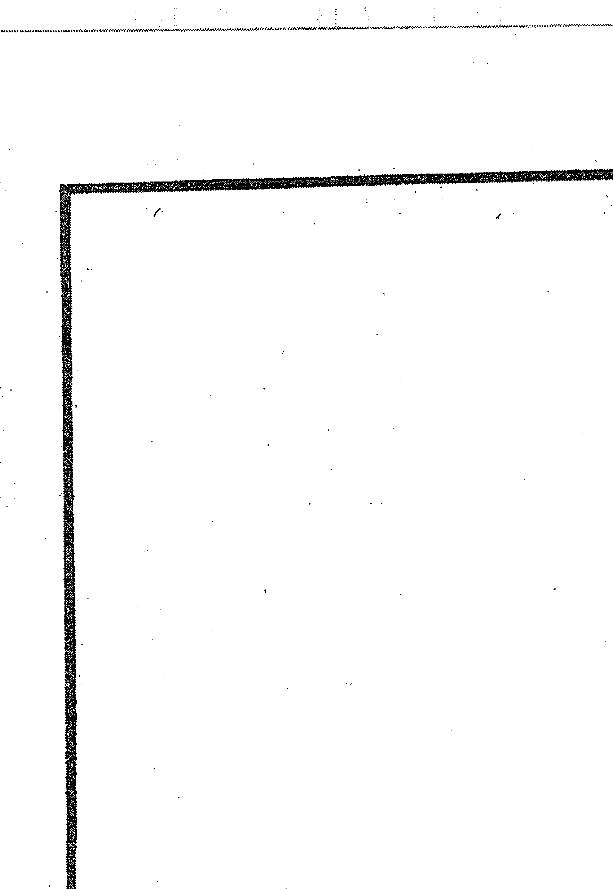

## 宋仁宗御製景祐遁甲符應經序

稽夫遁甲之書，出于河圖，黃帝之世命風后創名，始立陰陽二遁，共一千八十局。迨太公約七十二局，留侯佐漢議十八局。推歷授時起，授氣布門，耀德觀兵，取驗以明勝負，罔不迪吉。是以王者出師，以順討逆，前著龜兆，得天之中擬之，而後言議之，而後動動罔不吉，其斯之謂歟。朕嗣三聖之基，居兆民之上，萬幾之暇，在念庶績其凝，順天時而陳兵法，口神道而設教育，口蓬山之藏室有龍甲之秘經，雖緯帙甚多而繁文彌猥，攻乎異說動有萬殊，採其精純冀其明響。因進取其書，命太子洗馬兼司天臺春官正權同監判楊維德、春官副王用立、翰林天文李自正、何湛等於資善堂撰集，又命內侍省東頭供奉官管勾御藥院任成亮、鄧保信、皇甫繼和、周維德總其工程，度事數月成書三卷，命曰景祐遁甲符應經。昔箕子之演洛書，口武王遂承商祚；蕭何之收秦籍，佐高祖乃成炎漢。況茲聖賢之言，可通神明之德，不離掌握之中，能際天人之學。朕循上古之道，思致萬國之寧，親是書之三卷，陰陽變化，百端千緒，賢者豈遜能知，智者豈遜能用，用者豈遜能畫。自非好事者，未必家有其本，以潛心力業有年矣。上之於國家，下之於庶民，一切有為皆宜用也。昔漢求遺書於天下，又命劉向校書於禁中，使文物之隆無愧之云爾。

## 遁甲符應經目錄

| 遁甲符應經目錄 | 卷上 | 遁甲總序 | 九星所值宫 | 八節以主卦為初直 | 陰遁布局法 | 超神接氣拆局補局 | 天乙直符使起宮異所 | 二遁直符合於中宮 | 二遁陰陽 | 九星休旺 |
| --- | --- | --- | --- | --- | --- | --- | --- | --- | --- | --- |
|  |  | 造式法 | 八門法 | 陽遁布局法 | 二十四氣甲己日用上中下局 | 氣應變局 | 一順一逆應節變 | 二遁出於六四 | 九宫吉凶 | 九星所主 |
|  |  |  |  |  |  |  |  |  |  |  |
| 八門所主 | 三奇得使 | 九天之上六甲子 | 伏吟 | 擇日 | 利主 | 三奇靜應 | 捲中 | 釋天道 | 釋人道 | 六儀擊刑 |
| 三甲 | 三奇之靈 | 九天九地太陰六合 | 反吟 | 利客 | 門迫 | 奇門路應 | 釋地道 | 三奇入墓 | 太白入熒惑 | 荧惑入太白 |
| 青龙回首 | 飞鸟跌穴 | 天乙伏宫格 | 天乙飞干格 | 天乙伏干格 | 飞干格 | 岁干格 | 月干格 | 日干格 | 时干格 | 大格 |
| 刑格 | 青龙逃走 | 白虎猖狂 | 朱雀入江 | 腾蛇夭格 | 时勃 | 五阳所利 | 五阴所利 | 出行呼神字入太阴中 | 出入呼其时下十二干神 | 之三避五 |
| 三奇避六儀 | 天網四張 | 亭亭白奸 | 下賊多少 | 出軍疫癘禳法 | 卷下 | 十千人君所利 | 六甲下營法 | 五不擊宮 | 五不過時 | 威德之時 |
| 天輔之時 | 四時所利 | 孤虛法 | 迷路法 | 田螺卜勝負 | 十干吉凶 | 三勝 | 涉陰危之中 | 飲食左右冠帶步履法 | 急則從神緩則從門 | 伏匿藏形 |
| 十二局天門地戶玉女反閉立成 | 真人閉六戊 | 行千里法 | 真人步斗法 | 履陰符令敵兵不起 | 出天門入地戶遇太陰居青龍 | 玉女反閉局 | 門戶神名 | 出三奇吉門 | 六甲陰符 |  |

四次...

## 遁甲符應經卷上

## 遁甲總序第一

古法遁者隱也，幽隱之道；甲者儀也，謂六甲六儀在有直符天之貴神也，常隱於六戊之下。蓋取用兵機，通神明之德，故以遁甲為名。

## 造式法第二

昔黃帝受龍馬之法令，風后演之而為遁甲，造式三重，法象三才：上層象天布九星，中層象人開八門，下層象地布八卦以鎮八方。隨冬夏二至，立陰陽二遁，一順一逆以布三奇六儀也。

## 九星所值宮第三

古法曰：天有九星以鎮九宮，地有九州，其式托以靈龜洛圖，戴九履一，左三右七，二四為肩，六八為足，凡五在中宮。中宮者土火之子，金之母，所寄理於西南坤之位也。

## 八門法第四

-   天蓬主一宮
-   天芮主二宮
-   天衡主三宮
-   天輔主四宮
-   天禽主五官
-   天心主六宮
-   天柱主七宮
-   天任主八宮
-   天英主九宮

古法曰：天有八風以直八卦，地有八方以應八節，節有三氣，氣有三候。如是八節以三因之，成二十四氣，更三乘之，七十二候備焉。

## 推八節以主卦為初直第五

冬至一宮坎，立春八宮艮，春分三宮震，立夏四宮巽，夏至九宮離，立秋二宮坤，秋分七宮兌，立冬六宮乾。

陽遁上中下局
冬至驚蟄一七四，小寒二八五同推，大寒春分三九六，芒種六三九是宜，穀雨小滿五二八，立春八五二相隨，清明立夏四一七，小滿九六三為期。

陰遁上中下局
夏至白露九三六，小暑八二五之間，大暑秋分七一四，立秋二五八循環，霜降小雪五八二，大雪四七一相関，處暑排来一四七，立冬寒露六九三。

## 布局法

一蓬子上一蓬休，苗光排排第二流，更有傷冲并柱甫，不離三四數為頭。禽星死五心開六，柱驚遷從七上求，內外任生居八位，九尋英景逐方脩。

巳上四節十二氣，三氣分天地人上中下三局，冬至後陽遁，夏至後陰遁，逐節氣陽順陰逆而布之是也。

布上中下局法，此謂甲巳符頭。甲巳之日仲為上局，謂甲子、己卯、甲午、己酉為上局之首也。甲子至戊辰，己卯至癸未，甲午至戊戌，己酉至癸丑，二十四氣在此二十日中用上局。

甲巳之日孟為中局，謂己巳、甲申、己亥、甲寅為中局之首也。己巳至癸酉，甲申至戊子，己亥至癸卯，甲寅至戊午，此二十日為中局。

甲巳之日季為下局，謂甲戌、己丑、甲辰、己未為下局之首也。甲戌至戊寅，己丑至癸巳，甲辰至戊申，己未至癸亥，此二十日為下局。

假如甲子至戊寅十五日為三元上中下五日一元也。

## 超神接氣折局補局第九

假令甲巳之日季局第二十日乙庚，遇立春便立春下局，只得四日至十五日甲巳，却補足下局共五日，六十時足。其雨水氣准此，拆補局超接之氣明矣。

## 氣應變局第十

且如甲子日巳時交冬至中氣，方得作陽遁天元上局也。其辰時巳前，只作陰遁大雪上局。

## 天乙直符使起宮異所

王璋曰：天乙直符使起宮異，所謂直門相衝也。陰陽二遁各有二使，假令冬至後陽使初起一宮，陰使初起九宮；夏至後陰使初起一宮，陽使初起九宮，故曰起宮異所。直門相衝者，冬至後陽使起休門，陰使起景門；夏至後陰使起景門。

## 遁甲符應經卷中

### 釋天道第一

天道者生門與六丙月奇合地下六丁為天遁此時得日精之蔽也。

假令陽四局乙庚之日酉時天心為直符加時干六乙開門直使加時宮七即生門與月奇六丙合六丁於一宮是為天道也。

假令陰六局戊癸之日晡時天蓬為直符加時干六庚休門為直使加時宮四即生門與六丙月奇合臨六丁於九宮是為天道。

### 釋地道第二

地道者開門與六乙日奇合臨地下六巳為地道此時得日精之蔽也。

假令陽一局丙辛之日日出天衛為直符加時于六辛傷門直使臨一宮日即開門與日奇六乙臨六巳於二宮是謂地道也。

### 釋人遁第三

人遁者休門與六丁星奇合前二太陰中為人遁此時得星精之蔽也。

假令陽七局乙庚之日夜半天任直符加時于六丙生門加時宮一宮即休門與六丁星奇合前二太陰中六宮為人遁。

凡得三遁之時出門奇百事吉。

### 三奇入墓

洪曰三奇入墓者謂乙未時為日奇入墓乙為日奇木墓在未故為日奇入墓丙戌為月奇入墓在戌故為月奇入墓。

璋曰三奇墓者謂六甲日奇臨二宮六丙月奇六丁星奇在六宫是三奇入墓也。

### 六儀擊刑

洪曰六儀擊刑者謂甲子直符時加卯卯刑子甲戌直符時加丑丑刑戌甲申直符時加寅寅刑巳甲辰直符時加寅寅刑巳甲午直符時加午午刑自甲申直符時加寅刑巳。

假令陽遁天元一局甲巳之日夜半生甲子為直符以日出時六儀擊刑也至庚午時以甲子直符加六庚於三宮即六儀擊刑也此時凶不可用。

### 太白入熒惑

湯曰庚為太白丙為熒惑若庚加丙時對敵宜防賊來。

假令夏至中元陰二局乙庚之日平旦為丙寅六庚在乙宮以天芮直符加時干於三宮即六庚下臨六丙於二宮即太白入熒惑。

丙為熒惑庚為太白若丙加庚此時聞賊必當退避。

假令陰六局甲巳之日丙寅時六丙在八宮以直符天心加時干即六丙下臨庚於四宮此為熒惑入太白也占賊不來。

### 青龍回首

洪曰六甲加六丙名青龍回首凡陰陽二遁遇此時可以造舉百事吉若令其門利出行最為良也。

假令冬至一局甲巳之日丙寅時六甲在於一宮甲子天逢直符加時干六丙於八宮此為青龍回首。

### 飛鳥跌穴

六丙加六甲名為飛鳥跌穴凡二遁遇此時利為百事出行營造舉動皆吉。

### 天乙伏宮格

三元經曰六庚加直符名天乙伏宮此時戰主客皆不利。

### 天乙飛宮格

直符加六庚是也此時主客皆不利。

### 天乙伏干格

日六庚為太白加日干即為伏干格此時戰主客關傷。

### 飛干格

日今日之干加六庚是也此時戰主客兩傷。

### 歲干格

日六庚加今歲之干是也此時凶。

### 月干格

日六庚加今歲之干是也此時凶。

曰六庚加六已是也謂天上六庚加地下六巳此時用兵主車駁馬傷中道而止士卒逃亡不可以行。

### 大格

### 刑格

湯曰六庚加六癸為大格謂天上六庚臨地下六癸此時不可舉百事亡遺者不可求不在。

### 時干格

曰六庚加時干亦名伏吟格此時不宜舉事用兵凶。

### 日干格

曰六庚加今日之干是也此時凶。

曰六庚加今月之干是也此時凶。

### 青龍逃走

璋曰六乙加六辛是也此時百事凶。

### 白虎猖狂

璋曰六辛加六乙是也此時百事凶。

### 朱雀入江

璋曰六丁加六癸是也此時百事凶。

### 騰蛇夭橋

璋曰六癸加六丁是也此時百事凶。

### 時劫

璋曰六丙加六癸是也此時百事凶。

璋曰六丁加六癸是也此時百事凶。

璋曰六辛加六乙是也此時百事凶。

璋曰六乙加六辛是也此時百事凶。

日時之干直符類同六庚所加之義凡舉百事用兵遇

湯曰六丙所加皆名為劫劫者亂也謂天上六丙臨年月時劫。

劫主綱紀紊亂。

### 遁甲五陽所利

經曰五陽所利以為客當為客之時則先舉兵高旗鳴鼓耀武揚兵以決勝謂時得甲乙丙丁戊五千神臺事可以出軍征伐遠行求利建國邑臨武事入官移徙嫁娶舉造百事皆大吉此時逃亡者不可得故經曰直使之行一時一易陽利以為客故曰得陽者飛而不止。

陽五千在子午之東部生氣故為客利先舉。

假令甲巳之日夜半生甲子自子時至辰時得甲乙丙丁戊是五陽將利為客先舉不拘陰陽二遁如此例也。

### 五陰所利

曰五陰時利以為主當為主之時即後舉兵低旗叩杖待敵而後動以決勝謂時下己庚辛壬癸五干神治事不可拜官移徙嫁娶出行與造舉百事逃亡者不可得宜畫策密謀集式備禱祀祈福經云直使之一行一一易行陰利以為主故曰得陰者伏而不起陰五干在子午之西部殺氣也故利後動。

假令甲己之日甲子自已至酉時起己庚辛壬癸是五陰時利以為主宜後舉不拘陰陽二遁皆如此例。

### 出行呼神字入太陰中

又曰欲出行者所向之方呼其神之字而行六十五步五轉入太陰中直符陽前二辰為太陰中陰後二辰為太陰中六丁又為太陰皆是也呼其神名謂呼所出門天上所得之星之名字。

- 天蓬（禽字坎子）
- 天芮（戊字坤子）
- 天衝（字震子）
- 天輔（字巽子）

- 天禽（公字離中宮）
- 天心（字乾）
- 天柱（申字兌又常子）
- 天任（字艮又金子）

- 天英（威字子又子）

假令冬至上元陽遁一局以甲己之日平旦丙寅此六丙在八宮天上六甲天蓬直符加八宮欲出東北呼神名其字禽行六十步入太陰中比時前二太陰下臨四宮東南天上六丁臨九宮正南左回入東南正南皆是入太陰中做此出入呼六甲神名字五行相制。

百甲子天聖五。

經曰若有所用百事者皆向六甲所在之方呼其神名行六十步左轉入太陰中又六丁名太陰見貴人則喜悅遇陣則勝。

甲戌旬首神名徐何若開決溝渠平治道路分決河道得於自然開路無損路向其方呼其神之字左轉入太陰中則得所願自通道路。

甲申旬首神名蓋新若入山田獭捉捕虎狼虫獸者皆向其方呼其神之名而行六十步左轉入太陰中虫獸自然不動。

甲午旬首神名靈光安營置陣巡待戰鬥者皆向其方呼其神之名而行六十步左轉入太陰中則必勝。

| 甲辰句首神名含章若求官拜將臨民赴任者皆向其方呼其神之名而行舉步入太陰中則為官不晦散 |
| 甲寅句首神名監兵若揚兵振武教陣湯寇行軍伐不道者皆向其方呼其神之名而行六十步入太陰中 |
| 若出行安邊賊盜自然不起 |
| 又曰六甲內管五行而動應無方其五行而合勝有相生相克左手象天右手法地體好静故書五行相制運化之道無不該若見貴人求官二千石及令長者則於左手書天字若商賈販和結交友嫁娶立契則書和字若入山捕收牧攬則書獅子字若部工居象則書強字若過河治水則書土字或戊字波浪騰聲舟械而溺溺 |

忌八風觸水龍招搖咸池之日若遊山入道則書龍字其蛇虫不動此是五行相制勝負之道。

### 出入呼其時下十二辰神

#### 經曰凡出行呼十二干神名

| 甲為天福其神王文卿 | 丙為天威其神唐仲卿 | 戊為天武其神司馬羊 | 庚為天刑其神鄒元陽 | 壬為天宰其神王祿卿 |
| 乙為天德其神龍文卿 | 丁為天玉女其神季田住 | 己為明堂其神把遊卿 | 辛為天庭其神高子張 | 癸為天獄其神受子光 |

### 之三避五

經曰天道不遠三五復返之三避五快然獨處三為生氣。

故之二也五為害氣故避五也二為武盛於三衰於五足馬雙輪無有反顧

假令冬至一局甲已之日丙寅時宫得三，此時為生氣，則為百事吉，故曰之三。至戊辰時宫得五為害氣，故曰避五，百事凶。

## 六丁陰神名
- 丁丑神梁邱叔
- 丁未神王屈奇
- 丁已神許咸池
- 丁酉神費陽多
- 丁亥神陵成陸
- 丁卯神孔林族

丁丑神梁邱叔，丁未神王屈奇，丁已神許咸池，丁酉神費陽多，丁亥神陵成陸，丁卯神孔林族。

## 威德之時

> 蒼雅川曰：六丙為威，六甲為德，利以為客，發號施令，入其國，犬不吠，馬不斷，回車止輪，所動萬里，敢有舉兵來向者，皆還自減，賊必亡矣。天兵未動，敵人自驚，將兵征討，客不勝，不利為主，唯宜固守，以待天時也。

## 三奇遊六儀

經曰：三奇遊六儀，利以宮庭宴會喜樂之事。六儀者，六甲也；三奇者，乙丙丁也。謂乙丙丁遊於六儀之上。

甲子旬有庚午，甲戌旬有己卯，甲申旬有戊子。

甲午旬有丁酉，甲辰旬有丙午，甲寅旬有乙卯。

此為玉女守門之時，有罪無疑，故利宴樂也。

假令甲巳之日，申庚午是玉女守門之時也。

天輔之時

經曰：天輔之時，有罪無疑，斧頭在前，天猶救之。

甲己之日己時，乙庚之日甲申時，丙辛之日甲午時，丁壬之日甲辰時，戊癸之日甲寅時。

是天輔時也，凡此時有罪皆自釋也。

## 天綱四張

經曰：天綱四張，萬物盡傷，此時不可舉造百事。又神有高下，必須知之，謂時下得六癸之時也。

假令天乙在一宮，即天乙所加宮也，當此之時，必須匍匐而去，以左右肩紐而前行，過十步吉。若天乙高二尺以上，可消息避天綱，匍匐而去也。

四時所利

經曰：春夏之節，殺氣潛藏，陰氣居下，陽氣在上，故戰鬥利居平野之地，居下也。秋冬殺氣在上，陽氣在下，戰鬥利居野外，高下順其殺氣也。

## 亭亭白姦

將加時神后下，為亭亭所居也。

璋曰：亭亭者，天之貴神，背而擊其衝為勝。推之法，常以月將加時神后下，為亭亭所居也。

假令五月將小吉加寅時，即神后臨未，為亭亭之在也。

璋曰：白姦者，天之姦神，合於己亥，格於寅申。當合之時俱背之，當格與不合，合與不合者，皆亭亭向白姦。推之法，以月將加時，寅午戌上見孟神，即是白姦之位，常以行寅申巳亥四位也。

## 孤虚法

假令正月將登明加時于登明，孟神臨午，即白奸在亥也。他做此。

> 石公曰：背孤擊虚，一女可敵十夫。古法，十人用時孤，百人用日孤，千人用月孤，萬人用年孤。惟有時孤最驗，今立成於後。

- 甲子旬，虛孤在辰亥。
- 甲申旬，虛孤在午未。
- 甲寅旬，虛孤在子丑。
- 甲戌旬，虛孤在寅卯。
- 甲辰旬，虛孤在申酉。
- 甲午旬，虛孤在戌亥。

經曰：欲知賊之數多少，便以月將加聞賊時，視上神見天罡河魁，五百五十五萬人；見登明太乙，四百四十四萬人；見神后勝光，六百六十六萬人；見大吉小吉，八百八千八萬人；見功曹傳送，七百七千七萬人；見從魁太衡，一百一千一萬人。其神旺十倍，相氣五倍，休氣如數，囚氣減少，死氣減半也。

## 推迷路法

黄石公曰：出軍道逢三路迷，如何道通？以月將加時，天罡在孟，左道通；在季，右道通；在仲，中道通也。

## 出軍病禱法

經曰：出軍疫癘傳染，死者甚眾，號曰軍氣，可以上風焚死人觸骸數個，開氣即解也。

## 遁甲符應經卷中

## 田螺·勝負

經曰：兵家用筮之法，與他筮甚異。可用一盤，以黑為界，置一螺於其中，以左為主，右為客，而作咒曰：田螺舞，能知風雨，敵若來迫，入我城所；田螺索索，風雨不着；敵若不来，各守城廓。急急如律令。咒訖，露於星斗之下，左侵右則勝，右侵左則敗，不相侵不戰也。

# 遁甲符應經卷下

十干人君所利

> 經曰：甲為天福，人君此時宜行恩惠，進有德，賞有功，獲福慶。
> 乙為天德，亦為蓬星，人君此時宜施恩賞功，行德吉。
> 丙為天威，亦名明堂，以戰鬭發號施令，以振天威，不可行刑罰。
> 丁為太陰，宜安靜居處，無使煩擾，不可行怒譴責。
> 戊為天武，宜發號施令，以行誅伐，斷除凶惡。
> 己為地戶，宜發明審事，修封疆，理城廓。
> 庚為天獄，宜斷決刑獄，誅戮奸邪，而人無怨言。
> 辛為天庭，可以正行刑法，行威怒，制罪囚，不利為吉事。
> 壬為天牢，宜正平訴訟，決刑獄，不可為吉事。
> 癸為天歲，宜行威武，願罪責罰，積儲藏，原收斂。

## 十干吉凶

經曰：時加六甲，一開一闔，上下交接。又曰：能知三甲一開一闔，不知三甲六甲，畫闔。陽星加時為開，陽星天蓬、天任、天衡、天輔、天禽；陰星加時為闔，陰星天芮、天柱、天心、天英。六甲之時，遇陰加時為闔也。宜戰關往來，百事吉。

又曰：甲為青龍，利以遠行，勝兵勝客勝闘，憂無闘喜有。宜謁尊上，見貴人有喜，移徒嫁娶，百事吉。不可行詫怒及鞭杖事，利遠行。

假令上元陽一局，甲己之日黃昏時，得天芮陰星加時為開，百事吉。

假令陽九局，甲己之日黃昏，得天任陽星加時為開，百事吉。

> 經曰：時加六乙，往來恍惚，與神俱出。謂六乙為日奇，宜從天上六乙出，既隨日奇，恍惚如神，人無見者。將兵客勝，聞憂無聞喜有，行逢飲食，移徙入官市賈，嫁娶吉。不可行譴怒責鞭杖嗔責事。

假令冬至上元陽一局，甲己之日天蓬為直符，至乙丑時，六丁在九宫，以直符加時干，此時天上六乙下臨一宫，出北方吉。

時加六丙，萬兵莫往，此時王厭伏兵火。將兵聞憂無聞喜有，入宮得此仙市賈有利。丙為月奇，又為天威，丙火以銷金，精兵不起。若攻伐者，從天上六丙出，既挾月奇，又乘天威，丙火相隨，故曰厭伏兵災。

假令冬至下元陽四局，甲巳之日平旦丙寅，此時六丙下臨六宮，出西北方大吉。

時加六丁，出幽入冥，至老不刑。六丁為星奇，又為王女，宜逃亡迹。當從天上六丁出，隨星奇挟王女入太陰中而藏，人不見，故曰出幽入冥。又六丁為太陰，可以藏形，人皆不見，故曰敵人不敢侵。將兵主勝，聞憂喜各半，可以請謁嫁娶及陰私事，入官商賈吉。

假令立春下元二局，甲己之日夜半甲子日，出丁卯，此時六丁在東北，以直符天芮加時干，即六丁下臨二宮，出西南吉。

時加六戊，來龍萬里，莫可呵止。戊為天門，又為天武，宜可遠行，萬事吉。

戊為天門，凶惡不起。當從天上六戊出，校天武入天門，故乘龍萬里，凶惡不敢起，雞不鳴，犬不吠。將兵客勝，聞喜有利，以遠行市賈，小人驚走亡命吉。

假令立春中陽五局，甲己之日戊辰時，此時六戊在五宮，寄坤二，以直符加時干，即六戊臨二宮，出西南方吉。

時加六己，如神所使，不知六己出，被凶咎。己為六合，此時宜為陰謀秘密之事，當從天上六己出，不宜市買為顯揚之事，隱匿如神所使。不知六己者，謂為顯赫，必成凶咎。又為地户，獨出獨入，有見者。將兵聞喜無聞憂有利，以出入官嫁娶，小人七命驚走。若占人有逃亡陰私之事。

假令小寒中元八局，甲己之日己巳時，六己在六宮，以直符加時干，六己下臨六宮，出西北方吉。

時加六庚，抱木而行，強有出者，必見鬥爭。謂庚為天獄，此時凶，強有出必有刑罪。故曰：能知六庚，不被五木；不知六庚，誤使入獄，或被凌辱。將兵主勝，不勝利客，利七宮固守。聞憂有聞喜無，市買以道死物傷無利，入官嫁娶凶。六庚之時，惟宜固守。能知六庚之時，謂此時已下主凶。

時加六辛，行遇死人，強有出者，罪罰纏身。此時行來出入並凶，強有出入，斧鑑在前，行為罪累。故曰：能知六辛，所恒往來；不知六辛，多被杻械。又辛為天庭，罪網自縊。將兵主勝，不利客，聞憂有憂聞喜有喜，可行刑決罪人，宜嫁娶入官市買問疾。

時加六壬，為吏所禁，強出入者，飛禍將臨。此時不可遠行，出入百事凶，強出必有牢獄。壬為天牢，怨仇所稽。將兵主勝利伏藏邀遮，不宜入官移徙嫁娶，逃亡病者進退不死。

時加六癸，衆人莫視，不知六癸出門見死。此時不利出入，皆凶。隱遁求仙亡命絕迹，當從天上六癸下出入不見，故曰衆人莫視。又癸為天藏，利以伏匿逃亡。將兵主勝，開憂有聞喜無，不宜入官市買嫁娶移徙入室，出疾病重亡不得。

## 六甲下營法

經曰：夫將兵四出，統衆安營，必取其法。以六甲爲首，十時一易。真卑曰：以歲月旬而爲伏，或依歲月，或取六甲旬首而排布之。

大將居青龍甲，旗鼓居蓬星乙，士卒居明堂丙。

伏兵居太陰丁，軍門居天門戊，小將居地戶己。

斬副居天狱庚，判断居天庭辛，囚繫糧儲居天牢壬，府藏居天藏癸。

假令甲已之日夜半甲子，青龙在子，大将居之；蓬星在丑，旗鼓居之；明堂在寅，士卒居之；太陰在卯，伏兵居之；天門在辰，軍門居之；地户在巳，小将居之；天獄在午，斬伐居之；天庭在未，判断居之；天牢在申，囚繫糧儲居之；天藏在酉，府藏藏居之。

經曰：天上十干所居臨下之官。

假令冬至上元陽一局，甲已之日甲子時，六甲在乙宫，六乙在九宫，六丙在八宫，六丁在七宫，六戊在一宫，六巳在二宫，六庚在三宫，六辛在四宫，六壬在五宫，六癸在六宮。

## 三勝宮

- 陽遁第一勝天乙宮：天上直符乘為天乙宮，上將居之，用兵擊其衝百勝。據萬一記云：若在陽遁，即用天上直符所居；若在陰遁，即用地下直符所居宮，上將居而擊其衝勝。
- 第二勝九天宮：陽遁天上直符後一為九天，陰遁直符前一為九天。我軍立九天之上而擊其衝，則敵人不敢當我之鋒。
- 第三勝生門宮：謂生門合三奇之宮，上將引兵從生門擊死門，百戰百勝。

上将引兵皆生门击死门。又曰：背亨亨向天门一勝，背月建二勝，背生擊死三勝，背小異也。

假令大寒上元陽三局，甲巳之日丁卯時，天上直符乘六丁臨九宮，正南為天乙宮，為第一勝宮。九天在四宮，東南第一勝地。生門與丁奇合臨七宮，正西第三勝地。

假令陰八局，甲巳之日平旦時，地下直符在八宮，東北為天乙宮，第一勝地。九天在八宮，東北為第二勝地。生門臨六宮，西北為第三勝地。

## 五不可擊宮

> 湯曰：第一不擊天乙宮，二不擊九天宮，三不擊生門宮，四不擊九地宮，五不擊直使宮。已上皆不可擊，我軍居之必雄盛矣。

假令上元陽八局，丙辛之日辛卯時，天乙在一宮，西南陽遁天上直符所在宮而擊其衝也。

九天在九宮正南，生門在三宮正東，九地在四宮東南，直使在八宮東北。

已上並不可擊，我軍居之必雄勝。

假令陰七局，甲巳之日丙寅時，天乙在七宮，陰遁居地宮也，宜正西而擊其衝正東。天上直符臨九宮，陰遁前一九天在二宮西南，生門在一宮正北，九地在七宮正西，直使在五宮寄坤二，西南已上不可擊，我軍居之必雄盛也。

## 涉陰危之中

經曰：若涉陰危之中，山河水涸之際，兵不得移轉者，賊從利方上來，即視天時。若陽時者，令士卒皆前袒左肩，引聲大呼，鳴鼓擊鐘，先而擊之。若陰時，令士卒啣枚駐車馬樺鼓，静以待之。若敵四面圍之者，當分軍為二部。

## 五不遇時

洪曰：五不遇時者，謂剛柔日相克而損其明，時下之于尅今日之干是也。此時縱有奇門，不可行百事出。

- 假令甲日午時，乙日巳時，丙日辰時，丁日卯時，戊日寅時，己日丑時，庚日午時，辛日酉時，壬日申時，癸日未時。已。

> 真子曰：此法下。

飲食左右冠帶步履法

經曰：六甲為飲食，宜旬中六甲。假令甲子日向卯上也。

左右六丁謂左右，宜向旬中六丁。假令甲子旬向卯上。

冠帶六戊謂宜，旬中六戊。假令甲子旬向辰上。

步履乾坤者，謂初舉左足而言乾，次舉右足而言坤，次舉左足而言元，次舉右足而言亨，次舉左足而言利，次舉右足而言貞。一步一言行，六十步而去，勿回顧，隨所去方害不能及也。

急則從神緩則從門

經曰：謂有急事，不擇時并三奇吉門，當天乙所在宮及直符之神。若緩時，則可待三奇吉門而去，及天上六戊所在，以六戊常為天門。

假令冬至陽一局，甲己之日丙寅時，此時天乙加六丙於八宮，直符在一宮。若有急事，可東北天乙下及正北直符六戊下去，皆吉。

出天門入地戶遇太陰居青龍

經曰：初出天門戊，入地戶己，遇太陰丁，居青龍甲，所居之下百戰百勝。

假令冬至上元甲巳日甲子時，初起兵出天門辰，入地戶巳下，遇太陰卯下，居青龍子下，百戰百勝。

又法：出天門者，天上六戊在一宮；入地戶，天上六已在九宮；遇太陰在七宮；居天上青龍在一宮。做此。

伏匿藏形

子胥曰：欲伏匿者，來青龍甲，歷逢星乙，遇明堂丙，出天門戊，入地戶巳，還太陰丁，取草折半障人半入天藏癸。

假令六甲日夜半甲子時，欲伏藏者，初起甲子，歷丑遇寅，辰入巳還，取草折半障人中置卯地，而入酉地，去人無見者，遇太陰時。

咒曰：天翻地覆，九道皆塞，有來追我，至此而極，經入天藏，慎勿反顧。庚為天獄，卒為天庭，壬為天牢，宜避之，不宜抵向，即被束縛。

## 玉女反閉局法

> 經曰：凡用三元九宮遁甲，無三奇吉門者，則不可出行，宜玉女反閉局而去。

> 經曰：反閉局者，在室中六尺，庭中六步，在野六十步，並以六為數見定數記。便以左手執六箕，各長一尺三寸，右手努吸玉氣，叩齒十二通了，禱祝心下為某事，然後却回身背玉氣，謹啓其年月日時，其謹天父地母、六甲六旬、十二時辰、青龍逢星、明堂天上、玉女六戊、藏形之神，其好樂長生之術，行不擇日，出不問時。今欲行遊，為某事故祈大事，谨按天文请玉女画地局，出天門入地户，閉金闕乘玉辂，玉女青龙白虎朱雀元武勾陈六合六甲神十二时神乘而行到心所，左右巡防，随行随止随卧随起，辟除盗贼鬼魅消亡，君子见我喜乐倍常，小人见我欢躍惶惶，男女见我供侍酒浆，百恶鬼贼当我者亡。今日禹步上应天罡，玉女侍劳下者破，所求者得，所愿者成，帝王大臣二千石长吏见我爱如赤子。今日请玉女大神随我进为局法。

又咒曰：五为天目，与天相逐，睛如雷电，明辉八极，微如表裹，无物不然，逆害之徒皆摧灭，罡罡之下无动无作，急急如律令。

## 請神入局

若人志心修持，既濟乾坤，三台九宫，四縦五横，禹步而能出天門入地户，誦天鼎想諸神護衛之後，心誘于道，冥心一觀，萬物若空，上知有物，不知有物之自造，斯可大矣哉。右天請福，六甲六丁執勝文伯，禹步各作局分而布之。

## 九宫八卦图局

咒曰：吾左胜右魁，右魁左魁，上胜下魁，下胜上魁。吾藏身。

| 列1 | 列2 | 列3 |
| :--- | :--- | :--- |
| 亥 乾 申 己 | 亥 壬 子 癸 丑 令 | 巳 卯 甲 丑 乙 辰 |
| ○○利贞 | ○○元亨 | ○○乾坤 |
| ○○三合生我来 | ○○三台养我来 | ○○三台护我来 |
| ○○上台廉精 | ○○中台太清 | ○○下台曲星 |
| 庚 |  |  |

三五之中，魑魎之內，魑魎之裏，顛倒三五，低昂步罡，魁為我生形。吾戴日戴月，足履北斗，三星覆我，五星照我，二十八宿羅列衛我，璠璵玉衡衛我身形，衣斗履斗，與斗同儀，令步罡三五合成，步璠躡衡，趨祥紫微，三五勝乘罡御斗，東正天威，萬世常存，日月同曜，邪道五害皆伏，罡罡之下無動無作，急急如律令。

## 十二局天门地户玉女反閉立成

| 日期 | 天门 | 地户 | 玉女 |
| :--- | :--- | :--- | :--- |
| 子日 | 丙乙 | 庚丙 | 庚 |
| 丑日 | 乙丙 | 辛 | 辛 |
| 寅日 | 丙庚 | 乾 | 乾 |
| 卯日 | 庚丁 | 壬 | 壬 |
| 辰日 | 庚壬 | 癸 | 癸 |
| 巳日 | 壬庚 | 艮 | 艮 |
| 午日 | 壬辛 | 甲 | 甲 |
| 未日 | 辛壬 | 乙 | 乙 |
| 申日 | 天門 | 壬 | 玉女 |
| 酉日 | 天門 | 癸 | 玉女 |
| 戌日 | 天門 | 甲 | 玉女 |

## 真人閉六戊法

> 經曰：若不佈局請神喝箕，則神無驗矣。

| 日子 | 天門 | 天干 | 玉女 | 八卦 |
| :--- | :--- | :--- | :--- | :--- |
| 申日 | 天門 | 壬 | 玉女 | 巽 |
| 戌日 | 天門 | 甲 | 玉女 | 丁 |
| 酉日 | 天門 | 癸 | 玉女 | 丙 |

書局訖，便從心下排東南北布十二神四維八干位。

假令甲日，便從甲地入局；乙日，便從乙地入局；丙日從；丁日從丁；庚日從庚；辛日從辛；壬日從壬；癸日從癸；戊日從乾；巳日從艮地入局內。一說戊日即從乾，己日只從巽。內手持六算，禱祝四方。

謹請東方功曹太衡天罡青帝大神甲乙大神降于局所侍衛我身。

謹請南方太乙勝光小吉赤帝大神丙丁火神降于局所侍衛我身。

謹請西方傳送從魁河魁白帝大神庚辛大神降于局所侍衛我身。

謹請北方登明神后大吉黑帝大神壬癸大神降于局所侍衛我身。

右謹請四方訖，便從所求日辰上安置算法。

假令子上第一算，丑上第二算，寅上第三算，卯上第四算，辰上第五算，已上第六算。

已上第六算訖，但有兩支挾一千，先成為天門，後成為地戶。四仲日地戶不成，取初等第一算安辰所衝上命，起自然成門。

術曰：鼠行失穴入狗市，便移子上第一莫安戌上，大呼青龍下；牛入兔圍食甘草，便移丑上第二莫安卯上，大呼朱雀下；猛虎胸胸來入戶已，便移寅上第三莫安巳上，大呼勾陳下；鬼入牛欄伏不起，便移卯上第四莫安丑上，大呼白虎下；龍入馬廐因留止，便移辰上第五莫安午上，大呼元武下；騰蛇宛轉入申裏，便移巳上第六莫安申上，大呼六合下。若午日，即從午上命第一莫即日馬入龍泉飲甘水，便移午上莫安于辰上；羊雞易位入酉裏，便移未上莫安于酉上；猿猴踊躍北奔豕，便移申上莫安亥上；雞飛撲落羊欄裏，便移酉上莫安未上；狗入鼠穴捕于子，便移成上箕安子上；猪入虎穴自求死，便移亥上箕安于寅上。唱真訖，先成者為天門，後成者為地户。四仲地户不成，将初壽第一箕衝辰命之，乃成。咒曰：乾尊曜靈，坤順内營，二儀交泰，要合利亨，配天向地，求寧肅清，應感元黄，黄衣下裳，離坎兌翊贊扶将，乾坤艮巽虎步龍翔。今日行箕，玉女侍傍，有急相佐，常輔扶匡，追我者死，捕我者亡，牽牛織女化成江河，急急如律令。玉女左行八千四維，子日從庚起，周而復始。乘玉女去時有咒，當呼玉女所在，若庚上便呼上玉女速來護我，無令百鬼傷我，敵人莫見我，見我者以為薪，獨開我門而閉他門。每移一步持咒。

## 一白

右禹步咒曰：六甲九章，天圓地方，四時五行，青赤黃，太乙為師，日月為光，禹前治道，出尤避兵，青龍扶轂，白虎伏衝，熒惑在前，辟除不祥，北斗誅伐，除去凶殃，五神道我，周遊八方，當我者死，妖我者亡，左右社稷，冠盜伏匿，行者得喜，留者有福，萬神護我，永除盜賊，急如律令。

凡欲為吉事遠行見貴人上官赴任者，出地户入天門乘玉女而行，咒曰：天門天門，今日惟良，玉女侍我左右遊，在奇門中兵聖务行乘四出，不逢祸殃，君子一见喜乐倍长，所求如意，万事吉昌，急急如律令。

凡欲入陣掩捕之事，即出天門入地戶乘玉女而行，咒曰：喏喏嘍嘍，行無擇日，及迎無擇期，隨斗所指，與神俱出，天地反覆，中心所欲，皆得隨意，使汝迷惑，以東為西，以南為北，追我者死，汝不得以箕閉門而去。乘玉女咒曰：度皆一心，玉女玉女神至矣，護我侍我到么鄉么里，窈窈冥冥，莫覯其形，人不聞其聲，鬼不視其精，惡我者殃，百邪鬼賊當我者滅，值我者亡，千萬人中見我者喜，急急如律令。

次以刀畫地蹦禁諸惡咒，先叩齒七通，應北斗天罡氣，以右手持刀畫地。

咒曰：律律令令，四縱五橫，萬鬼潛形，吾去千里者萬里者歸，呵吾者死，吒吾者亡，惡我者自受其殃，急急如律令。

又咒曰：律律令令，四縱五橫，猛火烈兵，遊行天下，捉邪精，所有一切天魔外道，並向吾天罡劫下滅，急急如律令。

右前咒畢，更步三台星，自上台虛星為初步，次中台六淳，下台曲星，二步一咒：三台生我來，三台養我來，三台護我來。

經曰：諸欲止宿安營辟病去害者，當用真人開六戌之法，百惡莫敢近，神驗秘之。為術之法，先置其營落作旬中之戊上。

假令甲子旬中戊在辰上，以刀從鬼門起在左行畫地一周，次取中央土一斗分置六戊之上，六處各置十一斗土置，乃若取土之處入中央，咒曰：太山之陽，常山之陰，盜賊不起，虎狼不行，城郭不完全，以金關千凶萬惡莫之敢干。仍在營中宿，不獲出也。欲驗六戊之法者，先置營落訖施六戊土，取有犢特牛擊其母于營，其犢終不敢入。欲令入，舉一戊土土犢即從宮處而入。甲子旬戊在辰，甲午旬戊在寅，他做此。

## 遁甲門户神名

璋曰：門户神名，出軍行來並宜用之。神名送真太度經丁。十五。

甲子旬門名徐儀 戶名公孫齊解衣而去
甲戌旬門名天河 戶名徐何仰天大呼而去
甲申旬門名司馬光 戶名石戰解冠而去
甲午旬門名石眾 戶名于可解衣振迅去
甲辰旬門名公孫錯 戶名司馬勝解髮更結而去
甲寅旬門名公孫光 戶名司馬強解帶而去
大將軍出入及行無問多少住上之方必法變也以六為法大將軍列士卒左旋入太陰中呼門神名呪曰某甲有急請神佐我佑我匿我藏我無使敵人傷我覆我益我五兵摧折無令至我當我者死視我者亡使敵人冥冥嘿嘿視我迷為惑為者亂其鬼鬼使敵人不敢起呪令士卒左旋直去勿反顧藏于六癸之下者。假令甲子旬中六癸在酉他做此。

## 行千里法

經曰夫欲行千里咒曰六甲九章天圓地方四時五行日月爲光禹前治道蚩尤避兵蒼龍扶轂白虎扶衡熒惑前引辟除不祥北斗誅伐去除凶殃五神從我周遊四方當我者死向我者亡左右社稷寇賊伏匿行者有喜留者有福五神護佑所求者得急急如律令。

## 出三奇吉門

經曰出六乙門禹步三咒曰白虎除道路當遵吾慎勿悟仁德之士便來助。

出六丙禹步三呪曰天剛揚威武當從青龍與白虎行誅天賊及敢有不從伏天斧。

出六丁禹步三呪曰玉女名神母呼而問之道所在當從斗裏入斗裏清冷之淵多神草採以自障句駭。

凡出三吉門事遠亦可直去志心信之其神立驗慎勿反顧。

## 真人步斗法

步斗經曰夫步可以通神當以夜半居星下白晝地作九斗星間相去三尺天蓬從天罡起隨次第之人居魁前逆布之正立天英而歌斗經誦前至天英便先舉左足並呼星名以次依經步之左右更遍履之如後此法。

## 九星式

## 六甲阴符

为之百日即与神人通矣秘之勿泄於非人殃堕九祖。盜視者無驗也。乃誦曰斗要妙兮十二神承光明兮威武陳氣鬱鬱兮如浮雲七變動兮上應天知變化兮有吉登入斗宿兮遇天闕合律吕兮治甲榮履天英兮度天任清冷淵兮可陸沉拔天柱兮擁天心從此度兮登天禽倚天輔兮望天衝入天芮兮出天蓬斗道通兮剛柔濟天福祿兮流後世杳杳冥冥兮千萬歲急急如律令。

經曰凡為上將遇其敵須作六甲陰符令敵人自誅故曰寧與人千金不與人六甲之陰天地之間此道最禁嚴之金匱貳之于心不傳非人慎勿輕法盜視者盲讀者瘖須齋戒若污犯者則無驗矣。六甲之陰者：
- 甲子旬陰在丁卯其神兔人身
- 甲戌旬陰在丁丑其神牛人身
- 甲申旬陰在丁亥其神豬人身
- 甲午旬陰在丁酉其神雞人身
- 甲辰旬陰在丁未其神羊人身
- 甲寅旬陰在丁巳其神蛇人身

凡作符之法常以月蚀之时伐牡荆或梧桐阴上枝亦可用长九寸广二寸厚二分以雌黄画其神像并神名：
- 丁卯神名孔林，字旋音，若人吹笳，可使致人物。
- 丁丑神名梁丘，字叔音，若犬俱嗥，可使远行人情。
- 丁亥神名陵成，字陛音，若坏城声，可使致成小山平地。
- 丁酉神名费扬，字多音，若犀鸟夜鸣，可使致万人恐。
- 丁未神名玉屈，字奇音，若犀兽入城门，可使致饮食。
- 丁已神名许咸，字池音，若鱼跃于泉，可使致水虫类有。

凡画符讫以锦囊盛之大将自随身若有兵时便出当旬之符于囊外以指敌人敌人自败不可起反兵也。

凡取木時必先齋戒以酒一升鹿脯三朐鹽一埵維祭之日以白芀為籍向北與子俱遊變化其身以子所指莫敢服者謹奉清酌美脯顧如嚮之呪訖再拜三呪畢乃伐木。取木時勿令旁有穢污之物及女子狗見之。先受持之法齋戒五日沐浴蘭湯食香潔净勿食五腥之物乃可書符竟六甲之日於壇之上為壇方一丈二尺外埒方十二丈開十二時辰門以竹為幕幕長三尺一云九天隨色列上埒六陰之符壇上衣位色以色繪綠三尺五寸為藉各置酒三盂脯三斤鹽一盂向坐再拜跪呼其四方堂之長六甲陰神名者假令甲子日陰在丁卯正東再拜而呼其神而呪之以錦吊为囊盛陰符常隨身則百鬼萬兵不能侵以陰符指敵人自滅。若倉卒無壇但于庭中野外畫地為之做。

## 履陰符令敵人不起

經曰能履陰符者令敵人不起為兵之法甲乙日平旦南向丙丁日食時西向戊己日日中北向庚辛日日映東向各皆所向取方寸桃枝書其姓名著左履下所求者必得便咒曰惡惡不善大逆罵天地罵日月伐社稷使君不得血食君便持之吾自與君擊之陰陽之神共來誅之。先於地上畫敵人之像從月建上來呼其人姓名隨六甲之神所在滅之則敵人警怨自消亡矣。

六甲所在者：
甲子旬中在頭
甲辰旬神在左手
甲戌旬神在左足
甲申旬神在右足
甲午旬神在體腹
甲寅旬神在右手

几軍行遇惡風旗竿倒拆者取四窮上土作泥人長三寸手持桃弓菆矢執刀披髮向風三叩齒呪曰天有四狗以守四境吾有四狗以守四隅以城為山以池為河越盜不敢過來者不得進去者不得還急急如律令呪畢弃之而去逆風之道則災殃消除也。

## 遁甲符應經後序

永樂十二年孟娵之月註歷書用遁甲三奇吉門三奇者天上乙丙丁也吉門開休生也奇門會合之方利宜出師征討九天之上利以陳兵九地之下利以藏兵。予觀諸家兵書無出于孫子十三篇乃兵家之樞機故軍形篇曰：

> 善攻者動於九天之上善守者藏於九地之下故能自保而全勝也。明天將知地理察人事戰攻決勝則可為良將矣。

今稽遁甲之書惟景祐遁甲符應經亦兵家之樞機義與孫子兵法相符而用之也。其中立術精審凡諸神煞先述其事實以立假令條分類纂訂考較詳明先脩使人知所觀覽又便於檢閱也。故聖人立法可以出軍征伐，戰勝克敵遇寇捕賊立營置陣出天門入地户隱跡藏形，無出其右也。至於民間日用上官嫁要遠行移徒奏賢謁貴商賈求財登科取索射獵博戲萬事皆准無有不驗上，以利國下以濟民實萬世之良法也。特用工重刊以廣其聞庶使將者有所稽術者有所濟云耳。昔永樂歲在甲午孟秋良日秦臺子登仕郎欽天監五官司曆王異叟專序。

| 戰勝克敵遇寇捕賊立營置陣出天門入地户隱跡藏形 |
| --- |
| 無出其右也至於民間日用上官嫁要遠行移徒奏賢謁 |
| 貴商賈求財登科取索射獵博戲萬事皆准無有不驗上 |
| 以利國下以濟民實萬世之良法也特用工重刊以廣其 |
| 聞庶使將者有所稽術者有所濟云耳 |
| 昔永樂歲在甲午孟秋良日秦臺子登仕郎欽天監五官 |
| 司曆王異叟專序 |