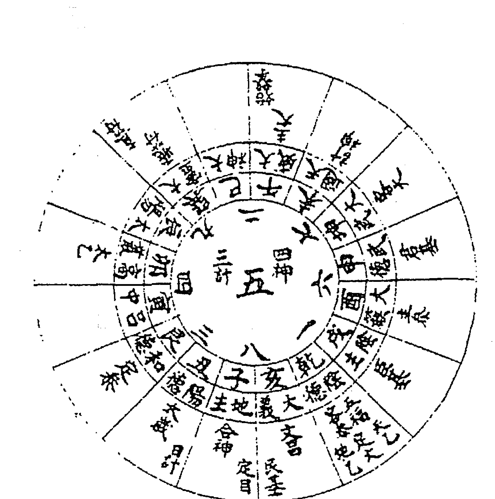

# 遁甲护身术

# 序

提到奇门，人们总是与遁甲联系在一起，而事实上，奇门包括——遁甲、太乙、六壬，合称「奇门三式」，是中国术数之中，最为高深的三门学说：古代的君王时代，很多开国之君均要倚重精通此术的谋士运筹布局，故奇门三式，称为帝王之学。

奇门，融汇天时、地利、人和，通过排演推算，综合时空因素的互动关系，从而判断吉凶，用以为决策的依据；众所周知的张良、诸葛亮、刘伯温等，无不通此术，尤其是诸葛亮的「八阵图」，更是举世闻名。

遁甲，以易卦九宫为基本，纬以三奇、六曜、八门、九星，视其加临后之互动关系论断吉凶。日生於乙，月明於丙，丁为南极星精，故以乙丙丁为三奇，甲为诸阳之首，戊己以下之六干分为六仪，配九宫而起符使，故名之为「遁甲」。

以冬至（坎）、夏至（离）分阴阳，正授超神，闰奇接气，与历法大自然之规律相应；开门、生门取北方三向，与太乙数相同；青龙、白虎、螣蛇、朱雀，刑囚旺墓之义，与六壬星命相通，亦即以五行生克制化为推算之根本。「太乙」，就是「太乙九宫占」，以一为太极，因而生二目，二目生四辅，取易卦之两仪四象耳；又有计神，合之与太乙为八将，也就是八卦。占法，以岁、月、日、时为提纲，以八将为纬，三基、五福、十精之类为经；以八将推其掩迫，囚击、关格之类，占内外之祸福；以推四神所临之分野来占水旱、兵丧、饥馑、疾疫等，民生诸事；又以推演三基、五福、大小游年二限、易卦大运，来占天下动乱等，国家之大事。

「遁甲护身术」，以奇门遁甲中的护身法为主，少为传布的「三奇符咒」、「真人闭六戊法」、「六戊斗式」、「六戊符式」，以及「真人步斗法」等，都是古代战将以护身之术。再加上「太乙金镜式」之能预测时空变化的区域吉凶，吉则往之、凶则避之，诚可护身宜也。

附录『六十甲子逐月取用』，比照日历干支，就可明白该日宜忌，俾能适其所谋，事半功倍。东海 徐宇农 识于丁丑孟夏于台北

# 奇门吉格

## 天遁

> 歌曰：生门六丙合六丁，此为天遁自分明。

经曰：上盘六丙，中盘生门，下盘六丁；生门合六丙月奇，下临天上六丁，此时得月华之所蔽，亦不可犯奇墓门迫，其气升，内应其心，外主其身，下注其心，名曰玄珠，能听而修者，升天；有事呼玉女神名，丁卯而出，其神随护。

> 咒曰：丁卯玉女护我佑我，毋令伤我，视我者瞽，听我者反受其殃。咒毕行去，慎勿反顾；其方可以种王侯之权，利朝君王，醮谢苍穹，礼神求福，极利征战，使敌自伏；上书献策，求官进职，修身隐迹，剪恶除凶，市贾出行，百事俱吉；婚嫁入宅，往来此方，大吉。

假如阳遁四局，乙庚之日乙酉时，天心为直符，加时干六乙，开门为直使，加时干七宫，即生门与月奇六丙临六丁于一宫，是为天遁。阴遁六局，戊癸之日庚申时，天蓬为直符，加时干六庚休门为直使，加时干四宫，即生门与月奇六丙临六丁于九宫，是谓天遁。

歌曰：开门六乙合六己，地遁如斯而已矣。经曰：上盘六乙，中盘开门，下盘六己；开门与六乙日奇临地下六己，此时得日精所蔽，其气黄，内应其脾，外应其形；任呼任用，又名黄婆金公，能修之者，南宫列仙；有事呼本旬玉女，依前法咒之，大护其验。盖己为地户，得日精盖之，其方可以藏休兵锐，立寨安营，建府造置仓库，筑垣墙，安坟开圹，修道求仙，逃亡绝迹，出阵攻城，全师捷胜，百事大吉。

假如阳遁一局，丙辛之日辛卯时，天冲为直符，加时干六辛伤门为直使，加临一宫，即日奇临六己于二宫，是为地遁。阴遁九局，夏至甲巳日丙寅时，以甲子天英为直符加坤丙，以景加...

## 人遁

七，其时开门合六己下临八宫，此名地遁。

> 歌曰：休门六丁共太阴，欲求人遁无过此。

> 经曰：上盘六丁，中盘休门，下盘太阴；休门与六丁星奇合，下临太阴之位，得星精所蔽，其气青黑，内应肾，外主耳目，名曰还阳丹，修之者，在世长年。

有事出门，呼本旬玉女如前咒之，其方可以择贤人，求猛将，隐形保身，通灵入梦，受道成功，说敌和仇，藏伏献策，谋结婚姻，添进人口，和合交易，利市十倍；天则随其所求，地则随其所视，人则随其所令，保持全胜之玄机也。

假如阳遁七局，乙庚之日丙子时，天任为直符，加时干六丙于五宫，生门为直使，加临一宫，即休门与六丁星奇下临直符前二六宫，太阴中也。

假如阳遁上元一局，甲巳日丙寅时，此时天上直符临八宫，即后一，九天临一宫；后二，九地临六宫；前二，太阴临四宫；前三，六合临九宫。

假如阴遁上元九局，甲巳之日丙寅时，此时天上直符临二宫，即前一，

九天临七宫；前二，九地临六宫；后二，太阳临四宫；后三，六合临三宫；或欲出行者，于所向之方，呼其星辰之名，而行六十步方左转，入太阴中。

假如阳一局，甲己日丙寅时，六丙在八宫，以天上六甲天蓬直符加八宫，欲出东北方，呼其星辰之字「子禽」，行六十步，入太阴中；
太阴临四宫；前三，六合临九宫，左回入东南及正南，皆太阴中也。
凡出入用事，皆向六甲所在之方，呼其神名，五行相制，行六十步左转入太阴中——
甲子旬首，神名王文卿，若登坛拜将，钦授兵符，运筹、发令、储粮，
皆向其方呼其神名，五行相制，行六十步，转入太阴中，则发握如神。
甲戌旬首，神名徐何，若开渠、治路、决河、呼之而行如前；
甲午旬首，神名云光，安营、置阵、巡狩、战斗者呼之；
甲申旬首，神名盖新，入草、畋猎者呼之；
甲辰旬首，神名含章，求官、拜将、临民赴任者呼之；
甲寅旬首，神名监兵，扬兵振武，行军者呼之。

六甲，内管五行而动静无方，其五行而含胜有相生相克，左手相天，右手相地，其神体好静，故书五行相制，运化之道，无不兼该；见贵求官，左手法地，

手书「天」字；商贾与贩，书「和」字；入山捕猎，书「狮」字；部工居众，书「强」字；过河治水，书「土」字、「戊」字；游山入道，书「龙」字；以上三遁，最宜隐遁，人莫能窥。

天遁下盘合六丁，乃三奇之最灵，又为六甲之阴，谓奇门相合，有如华盖之覆体也；地遁下盘临六己，为六合之私门，又谓地户之阴，谓奇门相临，有如紫云之遮体也；人遁下盘临太阴，蒙昧之象，盖阴晦不能睹万物，谓奇门阴宫相合，如有阴云之遮蔽也；右三遁之时，凡用事，举兵、施为、出入、修营、宫室，万事吉利。

# 飞鸟跌穴——

> 歌曰：丙加甲兮为鸟跌穴。

进飞得地，云龙聚会，君臣燕喜，举动皆宜；此时，从生击死，一敌万人，百战百胜，不论阴阳二遁，此时出兵、行营、远游，百事俱吉；君子利，小人凶，所谓天盘丙奇，加地盘本时甲旬头也。

假如大寒中元，阳遁九局，甲巳日，辛未时，此时六丙在七宫，以直符天英加时干六辛于三宫，得六丙下临六甲于九宫戊上，此名为飞鸟跌穴。

假如大寒上局，阳三遁，震宫起甲子，甲巳日丁卯时，天冲直符，加丁

## 青龙回首

> 歌曰：甲加丙兮龙回首。

不问阴阳二遁，得此局更合奇门，上吉；虽无吉门，亦可用事，凡利见大人，举兵利客，扬威万里，从生击死，一敌万人，百事皆吉；假如阴遁一局，甲巳日，丙寅时，直符甲子戊与开门相合，加于八宫地丙之上，此为青龙返首也。

## 玉女守门

> 歌曰：又有三奇游六仪，号为玉女守门扉；

若作阴私和合事，请君但向此中推。

三奇游六仪者，天上乙丙丁游于甲子戊、甲戌己、甲申庚、甲午辛、甲辰壬、甲寅癸之六仪也；玉女守门者，谓丁为玉女，而会天乙直使之门也。

如阳遁一局，甲己日庚午时，丁奇在兑二宫庚午时亦在丁，休门直使加地

丁七宫是也；故甲子用庚午，甲戌用己卯，甲申用戊子，甲午用丁酉，甲辰

用丙午，甲寅用乙卯。

# 三奇得使——

> 歌曰：三奇得使诚堪使，六甲遇之非小补；乙马蓬犬丙鼠猴，六丁玉女骑龙虎。

甲戌、甲午乙为使，甲子、甲申丙为使，甲辰、甲寅丁为使；其法，甲木畏庚金，是以三奇所使除去巳酉丑，而甲午、甲戌拱乙未，且乙木生午墓戌，故乙为使也。

火库于戌，而亥宫甲木生丙火，是以甲子、甲申拱戌亥，而丙为使也；

丁卯为甲子之阴，甲寅、甲辰拱之，故丁为使也；乙奇加甲戌、甲午；丙为使者，丙奇加甲子、甲申也；丁为使者，丁奇加甲辰、甲寅也，此时最吉。

假令阳遁九局，甲巳日庚午时，此时六乙日奇下临三宫甲午，是为乙奇得使；假令阴遁三局，丙辛日壬辰时，此时乙奇在杜门，下临九宫甲午辛，亦为乙奇得使；假令阳遁九局，乙庚日戊寅时，此时丁奇下临四宫甲辰，是为丁奇得使；但乙奇加甲午辛乃青龙逃走，丙奇加甲申庚上乃癸入太白，丁

奇加甲寅癸乃朱雀投江；凡此三者，倘有微疵不吉，如遇本句直符同临其上方，可用之而吉也。

## 神遁

歌曰：天上六丙合九天，再合生门神遁然。丙奇与生门下临九天之位，得神灵所蔽，

其方可以祭神灵、用圣术、画地、立筹、步凤、置造坛场、刻鬼神、摄魔昧，自有威伏；更利攻虚、阴谋、密计、玄妙、开基、修建庙宇、塑书、楷表神像，以应神侯。

## 鬼遁

歌曰：天上六乙合九地，临于杜门鬼遁取。

丁奇与休门相合，下临九地之位；又曰：乙奇与开门相合，下临九地位，得鬼神隐伏之蔽；其方可以探机、偷营、劫寨、设伏、攻虚、密伺动静、诡诈文书、超亡、荐孤拔寡、以候鬼应。

## 风遁

歌曰：天上六乙合三门，下临巽宫风遁矣。

又曰：丙奇与开门相合，下临巽宫，不犯墓迫，得灵奇顺风爽帆之蔽；

又曰：三吉门临地盘乙奇；又曰：开休生三门与六丁星奇相合，下临地下六己；又曰：辛仪与奇门下临六乙，其方可以默吸风云，喷噀旗旄，令众士沉吟听音；又丙奇开门相合下临坤宫，更宜祷祭风伯雨师，敌垒战立旌旗以候风应。

## 云遁

歌曰：天上六乙合六辛，临三吉门云遁取。

又曰：凡乙奇与开门合，下临坤宫，不犯墓迫，得云之蔽；又曰：乙奇与开门合，下临六辛，其方可以默吸风云，喷噀旗旄，令众士沉吟听音；又丙奇开门相合下临坤宫，更宜祷祭风伯雨师，敌垒战立旌旗以候风应。

## 龙遁

歌曰：日奇合休于坎宫，此为龙遁云从起。

又曰：伏吟乙奇与休门相合，下临六癸或在坎宫，谓得龙之蔽；

- 移舟转向
- 下船开江
- 造置水枢
- 祭祷鬼神
- 填堤塞河
- 修桥穿井

以应龙候。

- 以祭龙神
- 祈雨泽
- 水战演敌
- 计量江面
- 把守河渡
- 教习水战
- 密运机谋

## 虎遁

歌曰：天上六乙合六辛，临休到艮虎遁门。

又曰：乙奇与生门临六辛，得虎之蔽，一云辛仪合生临艮；其方可以招安、设伏、邀击、计度要害、据险守御、建立山寨、措置关隘、防险修凿，以候虎应。

# 天三门、地四户

> 烟波叟曰：天三门兮地四户，问君此法从何处；

> 太冲小吉与从魁，此是天门私出路；地户除危定与开，举事皆从此中去。

入式歌云：天乙会合女隐私，所谓天乙会合女隐私之事，要在三奇临六仪与三奇吉门，合太冲、从魁、小吉；天三门，加除定危开；地四户，是谓福食远行，出入皆吉。

歌云：本月将名加时支十二月，将顺遍数太冲、小吉、与从魁三方；游过天门，便以月将加时支顺数也；假如正月雨水后用午时出行，则以月将登明加于时支午宫，登明在午上，神后在未，大吉在申，功曹在酉，太冲在戌

戊方为天门；天罡在亥，太乙在子，胜光在丑，小吉在寅，寅方为天门；

传送在卯，从魁在辰，辰方为天门；余仿此。

以授时历看，审订太阳过宫，方可用；如去年十二月大寒节，某日时

刻日躔玄枵之次，太阳在子，以神后出将，加用时；世俗但知登明为正月月将

，却不知待雨水节后，某日时躔娵訾之次，太阳方过亥宫，以登明月将

将方可用；登明月将加用时，以次轮去，如过从魁、小吉、太冲，即是天

三门也；如得本日贵人到乾亥，就是贵人登天门。

天罡辰，太乙巳，胜光午，小吉未，传送申，从魁酉，河魁戌，登明亥，神后子，大吉丑，功曹寅，太冲卯。

正月亥，二月戌，三月酉，四月申，五月未，六月午，七月巳，八月辰九月卯，十月寅，十一月丑，十二月子。

> 歌云：用时支上加月建，建除满平一顺流，定执破危相接去，成收开闭掌中过，除定危开为地户，此方有难来修避。

以月建加用时顺数，如寅上起建，卯为除，午为定，酉为危，子为开，三奇临之，大吉；正月寅上起建，二月卯上起建，余仿此。

## 日貴、夜貴圖

如九月某日用巳時，則以戊建，加於時支巳宮，除在午，午爲地戶；滿在未，平在申，定在酉，酉爲地戶；執在戌，破在亥，危在子，子爲地戶；成在丑，收在寅，開在卯，卯爲地戶；子午卯酉四方俱吉。

六合太陰太常君，三辰元是地私門；更得奇門相照耀，出行百事總欣欣。

以天月將加所用正時，看貴人所泊何宮，即於貴人上起貴人、螣蛇、朱雀、六合、勾陳、青龍、天空、白虎、太常、玄武、太陰、天后，順逆而行；陽貴人出於先天之坤，子上起甲干，順布乙癸在丑，庚與乙合，戊與癸合，故庚戊二干，陽貴人在丑是也；己干在未，甲與己合，故庚戊

故甲干陽貴人在未。

陰貴人出於後天之坤，申上起甲干，逆行乙癸在未，庚戊得合，故庚戊之陰貴人在未；己干在丑，甲與己合，故甲干陰貴人在丑；自亥至辰，陰陽貴順行，自己至戌，陰陽貴逆行；若得六合、太陰、太常三神與奇門同臨其方者，百事大吉。

陽時宜擊，陰時宜陝，陽先舉，陰從應；凡欲擊者，爲破而擊之；陝者，密而去之，其敗軍宜向六合下走出也。

假如以六合、太陰、太常爲三辰，依圖推，看在何方日支；自子至巳爲陽，用陽貴人；自午至亥爲陰，用陰貴人；假如丁亥日，亥爲陰日，然丙丁豬雞位，則亥爲丁之陽貴，故須用貴人加亥上順數，見六合、太陰、太常於何處，即是地私門；此只論日，不論時，然須得奇門方可用。

又一起例，審太陽過宮，以月將加用時，尋本日貴人起星，求地私門。

假如正月亥將，若甲日用辰時，即以亥加辰，順數去，尋本日陽貴，未到子，陽貴順行，則媵蛇在丑，朱雀在寅，六合在卯，爲私門；勾陳在辰，青龍在巳，天空在午，白虎在未，太常在申，爲私門。

玄武在酉，太陰在戌，爲私門；天后在亥，如用陰貴以亥加辰，陰貴逆行，自丑到午，則媵蛇在巳，朱雀在辰，六合在卯，爲私門；勾陳在寅，青龍在丑，天空在子，白虎在亥，太常在戌，爲私門；玄武在酉，太陰在申，天后在未，爲私門，餘仿此。

> 陽貴詩曰：庚戊見牛甲在羊，乙猴己鼠丙雞方；

陰貴詩曰：甲貴陰牛庚戊羊，乙在鼠己猴鄉；丙豬丁雞辛遇馬，壬蛇癸兔屬陰方。

日貴用上一字，即上圖之乙巽丙丁坤庚六時；夜貴用下一字，即上圖之辛乾壬癸艮甲六時；貴人所到之宮，自亥至辰爲陽支，宜順行；自己至戌爲陰支，宜逆行；二圖當相合推用，但分之以知甲在卯宮，用夜貴，巽在己宮，用日貴，餘仿此。

假如正月雨水後，太陽躔娵訾之次，月將在亥，則以亥加所用時之上，下以分日夜，定其陰陽；又視貴人所到之宮，詳其陽支宜順，陰支宜逆，以求三辰所在之方也；假如甲日用卯時，屬下一字，用夜貴；定爲陽貴，則以亥加卯宮順行，陽貴人未在亥，亥爲陽支，加貴人順行，六合在寅，太常在未，太陰在酉也。

假如甲日用午時，屬上一字，用日貴；定爲陰貴，則以亥加午宮順行，陰貴丑在申，申爲陰支，加貴人逆行，太陽在戌，太常在子，六合在巳也；假如甲日用子時，屬下一字，用夜貴，又定爲陽貴人，則以亥加子順行，陽貴人在申，申爲陰支，加貴人逆行，太陰在戌，太常在子，六合在巳也；餘仿此。

## 太沖天馬

> 歌曰：太冲天马最为贵，卒然有难宜逃避；但当乘取天马行，剑戟如山不足畏。

> 歌云：将支加在用时支，顺轮十二逢卯止，卵止宫为天马方，此方避难真亨利。

以天月将加所用正时，顺流去，遇卯字住处，即是太冲天马方也。凡有紧急事，从天马而出可避祸也；先用月将于本时，顺数至卯，即太冲，太冲即天马方也，其月将过宫之法，即太阳也；假如正月雨水前后，用子时月将数至卯，在辰上逢卯字到辰，其辰上为天马方也；登明在亥，以亥加子宫，则子在于丑矣。

- 八月酉，九月戌，十月亥，十一月子，十二月丑。
- 八月辰，九月卯，十月寅，十一月丑，十二月子。
- 天月将：正月亥，二月戌，三月酉，四月申，五月未，六月午，七月巳
- 地月将：正月寅，二月卯，三月辰，四月巳，五月午，六月未，七月申

## 十二個月，十二時辰之太冲天马方——

- 時辰：子丑寅卯辰巳午未申酉戌亥
- 正月登明將，太沖天馬方：辰巳午未申酉戌亥子丑寅卯。
- 二月河魁將，太沖天馬方：巳午未申酉戌亥子丑寅卯辰。
- 三月從魁將，太沖天馬方：午未申酉戌亥子丑寅卯辰巳。
- 四月傳送將，太沖天馬方：未申酉戌亥子丑寅卯辰巳午。
- 五月小吉將，太沖天馬方：申酉戌亥子丑寅卯辰巳午未。
- 六月勝光將，太沖天馬方：酉戌亥子丑寅卯辰巳午未申。
- 七月太乙將，太沖天馬方：戌亥子丑寅卯辰巳午未申酉。
- 八月天罡將，太沖天馬方：亥子丑寅卯辰巳午未申酉戌。
- 九月天沖將，太沖天馬方：子丑寅卯辰巳午未申酉戌亥。
- 十月功曹將，太沖天馬方：丑寅卯辰巳午未申酉戌亥子。
- 十一月大吉將，太沖天馬方：寅卯辰巳午未申酉戌亥子丑。
- 十二月神後將，太沖天馬方：卯辰巳午未申酉戌亥子丑寅。

## 三詐五假

歌曰：奇與門兮共太陰，三般難得總加臨；若還得二亦為吉，舉措行藏必遂心。

陽遁直符前二宮為太陰，陰遁直符後二宮為太陰，謂奇門與太陰三者不能皆得，若得二者，亦吉；遇之，可伏兵也。

古經云：凡欲經求萬事，宜休、開、生下合乙丙丁即吉，又取陰門相助，謂之三詐。

凡太陰、六合、九地、宮助、奇門全備，用之有十分之利；若三門合三奇，下臨太陰，宮名曰「真詐」；若三門合三奇，下臨九地，宮名曰「重詐」；若三門合三奇，下臨六合，宮名曰「休詐」；真詐，宜施恩、隱遁、求仙；重詐，宜進人口、取財、拜官授爵；休詐，宜合藥、治邪、祈禳之事。

若杜門合丁已癸下臨九地，名曰「地假」，宜潛伏，此三時加杜門者，可以藏形隱神；若杜門合丁已癸下臨六合，宮利逃亡；若景門合乙丙丁臨九天，名曰「天假」，蓋乙為威德，丙為威武，丁謂太陰，三奇之靈，宜陳利便，進謁干求；若傷門合丁已癸下臨九地，名曰「神假」，利埋葬；若驚門合六合下臨九天，宮名曰「人假」，利捕逃亡；若杜門合丁己癸下臨太陰，宮利遣人，間謀探事；若死門合丁己癸臨九地，名曰「鬼假」，利超亡、薦度。

## 亭亭白奸

歌曰：更得直符直使利，兵家用事最為貴；常從此地擊其衝，百戰百勝君須記。

王璋曰：亭亭者，天之貴神也，背之擊其衝為勝。推法：以天月將中所用正時、神后所臨之宮，即亭亭居其上也；如正月雨水後，太陽某日過亥，乃登明將，將者，太陽也。午時用事，即以天月將亥加子到未宮，即是亭亭在未上是也，宜背之；背者，坐其上也；白奸者，天之奸神也，合於己亥，格於寅申；一雲背亭亭擊白奸，以天月將加所用時，寅午戌三宮；見寅申己亥即孟神，白奸居孟神之位，白奸常居寅申己亥之位是也。如正月午時用事，以亥加午亥，即白奸在午宜擊之；又如正月卯時用事，以亥加卯，數至辰上，得子亭亭在辰也；數至午上得寅，白奸在寅是也；背亭亭者，大將背抵亭亭之位而擊，向白奸之方是也。

| 月 | 白奸方 | 亭亭方 |
|---|---|---|
| 正 | 亥 | 卯 |
| 二 | 寅 | 辰 |
| 三 | 巳 | 巳 |
| 四 | 申 | 午 |
| 五 | 亥 | 未 |
| 六 | 寅 | 申 |
| 七 | 巳 | 酉 |
| 八 | 申 | 戌 |
| 九 | 亥 | 亥 |
| 十 | 寅 | 子 |
| 十一 | 巳 | 丑 |
| 十二 | 申 | 寅 |

## 三勝宫五不擊

> 歌曰：天乙之神所在宮，大將宜居擊對衝；假令直符居離九，天英坐起擊天蓬。

湯謂曰——

第一勝，天乙宮，天上直符乘爲天乙宮，上將居之，用兵而擊其衝，百勝；按萬一訣云：若在陽遁，即用天上直符所居宮上，將居之，用兵而擊其衝，百勝。

第二勝，九天宮，陽遁天上直符前一爲九天，陰遁直符前一爲九天，我軍立九天之上而擊其衝，則敵人不敢擋我之鋒。

第三勝，生門宮，謂生門合三奇之吉宮，上將引兵從生門擊死門，百戰百勝；上將引兵，背生門擊死門又曰：背亭亭向天門，一勝；背月建，二勝；背生擊死，三勝；大同小異也。

假令大寒上元陽三局，甲巳日丁卯時，天上直符乘六丁臨九宮，正南爲天乙宮，爲第一勝也；九天四宮東南，第二勝也；生門與丁奇合臨七宮正西，第三勝也。

假令陰八局，甲巳之日戊辰時，地下直符在八宮東北天乙宮，爲第一勝；九天在三宮東，爲第二勝；生門臨四宮東南，爲第三勝。

湯謂曰：五不可擊，第一不擊天乙宮，第二不擊九天宮，第三不擊生門宮，第四不擊九地宮，第五不擊直使宮，已上皆不可擊。

假令陽八局，丙辛日辛卯時，天乙在坤二宮，西南生門在三宮正東，九地在四宮東南，直使在八宮東北，已上並不可擊，我軍居之必雄勝；假令陰七局，甲巳之日丙寅時，天上直符臨九宮，陰遁前一，九天在二宮西南，生门在一宫正北，九地在七宫西方，直使在五宫寄坤二宫西南，己上不可击，我军居之必雄胜；注云：上将居之，引兵而击其冲，百战百胜也。

## 三奇凶格

### 青龙逃走

> 歌曰：六乙加辛龙逃走，金为太白乃白虎；木为青龙金剋木，龙虎相战百年凶。

王璋曰：此时不宜举兵，主客俱伤；奇门大全云：六乙加辛，此时举兵动众，主失财、遗亡、破败；又曰：乙加庚亦是；假如立秋上元阴遁二局，丙辛日己亥时，六乙在三宫，以直符天任加时干六己于一宫，即六乙下临六辛于八宫，此时青龙走也。

### 白虎猖狂

> 歌曰：六辛加乙虎猖狂。

赤松子云：刀逢暗磨，疑（？）…彼欲见害，无阴可和；六辛加六乙，…白虎也；悲氣若與干錢財，自己須防災；華蓋屬金為白虎，故辛加乙為白虎猖狂。

> 王璋曰：天上六辛加地下六乙，此時不宜舉事，主客兩傷，婚姻、修造大凶；假如小暑中陰遁二局，甲巳之日壬申時，此時天芮直符加天盤六辛下臨於三宮，原乙在三宮，是為白虎猖狂也。

### 朱雀入江

> 歌曰：六丁加癸雀入江。

丁屬火為朱雀，癸屬水，故丁加癸，朱雀入江；奇門大全云：丁加癸主文書、或失脫文書牽連，占家宅有驚恐怪夢、用兵防奸。

> 王璋曰：天上六丁加地下六癸，名曰朱雀入江，使人百事皆凶；六丁加六癸，朱雀入水流，口舌猶未能，官事使人愁。

> 又曰：或有訴訟，自陷刑獄，或聞火起，不必往救；

假如夏至中元陰遁三局，甲巳日壬申時，此時六丁在六宮，以直符天冲加時干六任於八宮，即六丁下臨六癸於七宮，是為朱雀投江也。

### 騰蛇躍踴

> 歌曰：六癸加丁蛇羅躑。

六癸加丁，羅躑迷路程，優惶難進步，端坐卻不寧；謂癸屬水，為北方玄武龜蛇，丁屬火，故癸加丁為騰蛇羅躑。

王璋曰：天上六癸加地下六丁，名騰蛇羅躑，此時百事不利；假如冬至下元陽遁四局，丙辛日戊子時，此時六癸在九宮，以直符天心加時干六戊於四宮，即得天英，為六癸下臨六丁於一宮，是為騰蛇羅躑也；雖有奇門臨，亦主虛驚不寧。

### 大隔

> 歌曰：庚加癸兮為大隔。

六庚如加癸，圖謀未可通，求人終不見，端坐即還宮。

湯謂曰：六庚加癸，名曰大隔時也，謂天上六庚臨地下六癸，此時不可用，百事凶，遺亡亦不可得，求人即不在，反招其咎。

大隔不宜遠行，車破馬死，造作人財破散也；假如秋分下元陰遁四局，甲巳日丙寅時，此時六庚在二宮，以直符天輔加時干六丙於六宮，即得天芮，六庚下臨六癸於八宮，此名大隔也。

## 歲隔、月隔、日隔、時隔

> 訣曰：加壬之時爲小隔，又兼歲月日時移。

六庚加六壬謂之小隔，一云伏格，當此之時，並不宜出師。

論歲隔，三元經云：六庚加當年太歲之干，名曰歲隔；此時用事凶。奇門大全云：六庚加今歲干，如甲子年，庚加甲子也，大凶；六庚加年、月、日時干，動有凶隔，聞客先敗；占之家宅，年爲父母，月爲兄弟，日爲己身，時爲妻男；假令辛丑立春中元，陽遁五局，歲干在辛，以甲巳之日癸酉時，六庚在七宮，以直符天禽加六癸於一宮，即見天柱六庚下臨六辛歲干於八宮，此名爲歲隔也。

論月隔，三元經曰：六庚加月朔，爲凶時也。假如立春上元陽遁八局，月朔干在甲巳日，丁卯時，此時六庚在一宮，以直符天任加六丁於五宮，即得天蓬爲六庚，下臨月朔干六巳於九宮，此名月隔也。

論日隔，三元經曰：六庚加當日日干爲日干隔，此時用事大凶。假如小暑下元陰遁五局，日干在甲巳日，丙寅時，以天禽爲直符，加時干六乙於五宮，即得天任六庚，下臨日干六甲於八宮，此名日隔也。

論時隔，三元經曰：六庚加時干，爲時隔，此時亦凶。假如陽遁三局，丙辛日戊子時，六庚在四宮，以直符天輔加時干六戊於二宮，即見天英六庚，下臨時干六戊於二宮，此時隔也。

干六丙於七宮，即六庚在七宮，下臨六己於四宮，此名曰干隔。

論時隔，三元經曰：六庚加本時干者，為時隔，亦名伏吟格。假如小寒上元陽遁二局，丙辛日己丑時，六庚在四宮，以直符天輔加時干六己於三宮，此為時隔也；凡六庚為直符，其十時皆為時干隔也。

### 刑隔

> 歌曰：加己為刑最不宜。

六庚加六己，赤地須千里；遠行車馬隨，軍兵半路上止。

湯謂曰：六庚加六己為刑隔，謂天上六庚加地下六己，此時出軍，車破馬死，中道而止，士卒逃亡，慎勿追之，反招凶咎。

奇門大全云：六庚加六己，求謀主失名，破財，疾病；假如大寒上元陽遁三局，甲己日丙寅時，此時六庚在五宮寄二宮，以直符天沖加時干六丙於一宮，即得天禽，為六庚下臨六己於四宮，此名刑隔也；巽巳同宮，巳刑申也。

### 勃隔

> 歌曰：丙為勃兮庚為隔，隔則不通勃亂逆；

天丙加地庚為勃，天庚加地癸為隔。

> 經曰：丙丁直為勃，火星焚大屋，移室且安然，獨自聞愁哭。

庚加年、月、日時干，假爾為客，不宜爭，統兵領眾避此時，惟宜固守不移行；以上勃隔，如不得已，運籌布局反閉而去，變凶為吉也；凡遇六丙六庚之時，為直符加時干，則十時皆勃隔也。

### 癸入白

> 歌曰：六丙加庚癸入白，癸入白兮賊須滅。

天盤丙加地盤庚，是火入金鄉，此時間賊當退；假如小滿上元用陽遁五局，丙辛之日戊戌時，此時六戊在五宮，以天任直符加時干六戊於五宮，得六丙下臨六庚於七宮，即癸惑入太白也。

> 奇門大全云：丙加下庚也，此時戰宜回避，不宜衝擊，占賊來信必虛詐

> 赤松子云：癸惑入太白，上下相擊，剝內往外滅，以讒賊陷。

> 詩曰：二星相入凶氣橫，任得奇門慎勿行；此星若也行兵去，金火之辰是惡神。

又曰：六丙來加六庚上，真賊逃避不爲災；假如陰六局，甲巳日丙寅時，六丙在八宮，以直符天心加時干，即六丙下臨六庚於四宮，此爲熒惑入太白，占賊不來；天英天景門到七六宮，亦是火到金鄉也。

### 白入熒

> 歌曰：六庚加丙白入熒，白入熒兮賊即來。

天盤庚加地盤丙，乃金入火鄉受剋而凶，對敵宜防賊；假如清明上元用陽遁四局，甲巳之日壬申時，此時六壬在八宮，以天輔直符加時干六壬於八宮，得天心爲六庚加臨六丙於二宮，即太白入熒惑也。

湯謂曰：庚爲太白，丙爲熒惑，若此時對敵，宜防賊來，上盤六庚，加下盤六丙是也。

> 詩曰：天上六盤加六丙，太白入熒賊欲來。

假如夏至中元陰遁三局，乙庚日戊寅時，六庚在一宮，以天芮直符加時干於三宮，即六庚下臨六丙於一宮，即太白入熒惑；又天心、天柱到離宮，亦是金入火鄉也。

伏干發

> 歌曰：庚加日干為伏干。

天乙伏干格，三元經曰：六庚為太白，加日干即為伏干格，此時主客門傷皆不利。

> 詩曰：日干若遇六庚臨，以此名為伏干侵；若是戰鬥須不利，大都為主必遭擒。

假如小滿上元陽五局，甲申日壬申時，六壬在九宮，即天柱為六庚下臨九宮，見今甲申，是為天柱六庚所加也，此為天乙伏干格。

### 飛干格

> 歌曰：日干加庚飛干格。

> 詩曰：日干及臨庚，飛干格偏明，爭戰還不利，為客最平平。

三元經曰：今日之干加六庚，飛干格，此時戰鬥，主客兩傷；假如小滿上元陽遁五局，甲巳日庚午時，此時甲子在五宮寄二宮，以直符天禽加時干六庚於七宮，即得日干六甲下臨六庚於七宮，此名飛干格也。

### 伏宮格

> 歌曰：庚加直符天乙伏。

庚加直符宮，伏宮格為宗，交鋒多不利，為客少成功。

三元經曰：六庚加天乙直符，此時客主皆不利，鬥戰交兵氣自衰，占見人不在，占來人不來；奇門大全曰：六庚加天乙直符，此時主客皆不利。假如立春下元陽遁二局，甲己日壬申時，此時六壬在六宮，以天上天芮為直符，加地下六壬於六宮，即得天輔，為六庚下臨直符天芮於二宮，此名天乙伏宮格也。

### 飛宮格

飛宮是何星，直符加六庚，兩敵不堪爭，為主似不贏。

> 歌曰：直符加庚天乙飛。

三元經曰：直符加六庚，名天乙飛宮格，此時主客不利；奇門大全云：此時固守，出則大將遭擒；假如春分中元陽遁九局，甲巳之日，日中庚午時，此時六庚在二宮，天英為直符，以天上直符加時干六庚於二宮，即得天英，為直符下臨二宮見六庚，此名天乙飛宮格也。

### 六庚加宮、六庚同宮格

> 歌曰：加一宮兮戰在野，同一宮兮戰於國。

庚加日干，日干加庚，皆不利；如庚加一宫，或天盘庚、或地盘庚同一宫，皆主戰不利；天乙格謂六庚臨天乙所居地宮也，戰於野，凶也；天乙太白格，謂天乙直符與六庚同宮，而行戰於國，凶也；加時與太白格，利野門；若直使加六庚，宜固守、伏藏；凡遇諸格之時，用兵主客俱不利；占人在否，格則不在；占人來否，格則不來。

## 三奇受制

王璋曰：乙奇臨乾，驚門，庚辛，囚死，乃木入金鄉也；丙奇臨坎、休門、壬癸，囚死，乃火入水鄉也；此謂三奇受制，萬事不可舉也。

## 五不遇

> 歌曰：五不遇時龍不精，號爲日月損光明；時干來剋日干上，甲日須知時忌庚。

葛洪曰：五不遇時者，謂剛柔日相剋而損其明，縱有奇門不可行，百事凶；甲日庚午時，乙日辛巳時，丙日壬辰時，丁日癸卯時，戊日甲寅時，己日乙丑時，庚日丙子時，辛日丁酉時，壬日戊申時，癸日己未時，乃時干剋日干，陽剋陽干，陰剋陰干，名爲主本不和，極凶。

## 三奇入墓

> 歌曰：三奇入墓好思推，甲日那堪見未宫，丙奇屬火火墓戊；此時諸事不須為，更兼六乙來臨未，星奇臨八亦同論。

王璋曰：三奇墓者，謂六乙日奇下臨二宫，六丙月奇到六宫，六丁星奇下臨八宫，是謂三奇入墓也；假如陰遁四局，丙辛日庚寅時，六丙月奇下臨六宫，是謂月奇入墓。

凡遇三奇入墓，縱有奇門，不可舉兵，百事皆凶也；經云：三奇入墓何時辰，丙奇乾上乙臨坤，或遇丙奇居戊上，還加丁向丑中存。

> 歌曰：又有時干入墓宮，課中時下忌相逢；戊戌壬辰兼丙戌，癸未丁丑己同凶。

葛洪曰：三奇者，謂丙戌時，時為月奇入墓之時；又曰：凡遇乙庚日，丁丑時，為丁奇入墓；黃昏是丙戌時，故為月奇入墓之時，是為三奇入墓。丙戌時，丙屬陽火，火墓在戊；壬辰時，丁丑時，水墓在辰；丁丑時丁屬陰火，火墓在丑；癸未時，癸屬陰水，水墓在未；戊戌時，戊屬陽土，土墓在戌；己丑時，己屬陰土，土墓在丑；故戊己中央之土，賴母而生，

## 六儀擊刑

> 歌曰：六儀擊刑何太凶，甲子直符愁向東；戊刑在未申刑虎，寅巳辰午刑午。

蓋以戊同丙火生於寅，己同丁火生於酉，前六時干辰入墓，亦不可用。

六甲地支相刑與自刑也，如甲子見卯，甲戌見未，甲申見寅，甲寅見己，為相刑；甲辰見甲辰，甲午見甲午，為自刑。丁屬陰火，火墓在丑；癸未時，癸屬陰水，水墓在未；戊戌時，戊屬陽土，土墓在戌；己丑時，己屬陰土，土墓在丑；故戊己中央之土，賴母而生，

葛洪曰：六儀擊刑者，謂六甲直符加所刑之地也；甲子直符加卯，卯刑子也；甲戌直符加未，戌刑未也；甲申直符加寅，申刑寅也；甲午直符加午，午自刑也；甲辰直符加辰，辰自刑也；甲寅直符加己，寅刑己也。

王璋曰：甲子直符加三宮，甲戌直符加二宮，甲申直符加八宮，甲午直符加九宮，甲辰直符加四宮，甲寅直符臨四宮，已上皆為六儀擊刑。

郭璞論三合之刑：金剛火強，各刑本方；流趨東木，落返本；甲寅甲午甲戌火局，刑己午未南方；己酉丑金局，刑申酉戌西方；甲申甲子甲辰水局# 伏吟格

六儀擊刑也；至庚午時，以甲子直符加六庚於三宮，即六儀擊時也；其時極凶，不可用事。

假令冬至上元陽遁一局，甲巳之日，夜半甲子為直符，日出卯時，是六儀擊刑寅卯辰東方；亥卯未木局，刑亥子丑北方。

- 歌曰：就中伏吟為最凶，天蓬加著地天蓬。

九星伏吟，上盤天蓬加地盤天蓬，乃九星仍在本宮不動，謂之伏吟，主孝服損人口。

湯謂云：甲子加甲子為伏吟，不宜用兵，惟宜收斂貨財；凡六甲之時，門符皆是伏吟。

假令冬至上元陽遁一局，甲巳之日，夜半生甲子時，天蓬直符加臨一宮，時干在一宮，此名門符皆伏吟也。

# 反吟格

- 歌曰：天蓬若到天英上，須知即是反吟宮。

九星反吟者，天盤一宮上蓬星加地盤九宮英星上，為反吟，餘八同宮，此直符反吟，謂上盤甲子加下盤甲午，上盤甲戌加下盤甲辰，遇奇門蓋之，不至凶害，不然災禍立至。

湯謂曰：子來加午爲反吟，此不利舉兵動衆，惟宜散倉庫之事；凡星符對沖皆反吟。

假令冬至上元陽遁一局，甲巳日乙丑時，六乙在九宮，以天上天蓬直符加臨時干在九宮，即是直符反吟；反吟、伏吟，門若遇此，雖得奇仍不可用。

## 門迫、宮迫

- 歌曰：宮制其門不爲迫，門制其宮是迫雄。
- 三元經曰：吉門被迫，則吉事不成，凶門被迫，則凶事尤甚；宮制其門是凶，迫門制其宮爲吉，迫門生宮爲和，宮生門爲義。

假令開門臨二宮，休門臨九宮，生門臨一宮，景門臨七宮，爲吉門被迫，則事不成，不吉也；假令傷門、杜門臨二宮、八宮，死門臨一宮，驚門臨三、四宮，爲凶門被迫，則爲凶尤甚。

## 天網四張格 （地網即壬臨時干，不贅）

歌曰：天網四張無路走，一二網低有路踨；三至四宮行入墓，八九高強任西東。

天網者，天上六癸所加之下是也；凡六癸之時即是，如在一、二、三、四宮，為尺寸低；在五、六、七、八宮，為尺寸高，遇之不可出，出必傷；若被客圍，卻從卯、未、酉三宮看何門奇，可破出無妨。

假令大暑下用陰遁四局，乙庚日巳卯時，此時天上六癸在八宮，以天沖直符加三宮，得天任為六癸下臨八宮，天盤癸加地盤癸，即天網高八尺矣（陽遁此例也）。

奇門大全云：天網四張，動眾出兵忌逢，若急事避難，作法一人獨出，追兵至此，即自反傷；如天上六癸直符加地上一二三四宮，為尺寸低；若臨六七八九宮，為尺寸高，此時萬事不宜，雖合奇門吉宿，亦不宜用。

如破陣欲取道出行，宜兩臂橫負一刀，呼天輔之名，匍匐而出，則天網自敗，自無所傷矣；若臨六七八九宮，其尺寸過人，尤不可用，將兵須當隱伏，若敵人來攻，當自潰敗。

天網四張不可當，此時用事有災殃；若是有人強出者，立便身軀見血光。

# 伏錯休囚

- 歌曰：十干加伏若加錯，入庫休囚吉事危。

時加六戊，乘龍萬里，莫敢呵止；六戊為天門，又為天武，宜以遠行萬里，百事吉；戊為天門，凶惡不起，當從天上六戊出，故曰乘龍萬里；凶惡不敢害，雞不鳴，犬不吠，將兵客勝，聞憂無，聞喜有，利以遠行，市賈小人，驚走亡命。假如立春中元陽遁五局，甲巳日戊辰時，此時六戊在五宮寄坤二，以直符加時干即六戊臨二宮，出西南吉；時加六己如神所使，不知六己出被凶咎，故己為六合，此時宜深謀秘密之事，當從天上六己出，不宜市賈顯揚之事，隱匿如神所使。不知六己者，謂為顯赫，必逢殃咎；又為地戶，獨出獨入無有見者，將兵聞喜無，聞憂有，利以出官、嫁娶，小人不利，亡命驚走；若占人有逃亡、陰私之事；時加六庚抱木而行，強有出者，必見鬥爭，謂庚為天獄，此時凶強，有出者，必遇刑罪，故曰：能知六庚，不被五木，不知六庚，誤使入獄或被陵辱。將兵主勝，不利客，利屯營、固守，聞憂有，聞喜無，市賈道死，物傷無利，入官、嫁娶凶；六庚之時，惟宜固守，謂已下至六癸時，不宜出動；時加六辛，行遇死人，強有出者，罪罰纏身；此時行兵、出入並凶，強有出人，斧鎖在前，行爲受累，故曰能知六辛所往，行來不知六吉反兇也。

# 九星旺相休囚

- 三元經曰：輔禽心星爲上吉，沖任次吉理須明；大凶天蓬與天芮，小凶天柱及天英；更論五行旺相氣，吉凶輕重自然分。大凶旺相凶卻小，小凶旺相號中平；吉星旺相吉無比，若還無氣也中平。凡吉宿亦要遇旺相，若遇休囚廢設，亦不可用。
- 經曰：若上吉、次吉星，無旺氣則中平，乘旺相氣則大吉，乘死休囚廢則爲凶，以意審用之；九星休旺者，謂九星各旺於同類，相於我生，休於生我，囚於官鬼，死於妻財。月日時同。

五行旺相休囚——

木：旺東、相北、休南、囚西。
火：旺南、相東、休西、囚北。
土：旺於四維，辰戌丑未，無所不用也。
金：旺西、相南、休北、囚東。
水：旺北、相西、休東、囚南。

| 九星旺相休囚 | 天蓬水星 | 天任禽芮土星 | 天辅木星 | 天英火星 | 天心柱金星 |
|--------------|----------|--------------|----------|----------|------------|
| 旺           | 亥子月   | 辰戌丑未月   | 寅卯月   | 巳午月   | 申酉月     |
| 相           | 寅卯月   | 申酉月       | 巳午月   | 辰戌丑未月| 亥子月     |
| 休           | 巳午月   | 亥子月       | 辰戌丑未月| 申酉月   | 寅卯月     |
| 废           | 申酉月   | 巳午月       | 亥子月   | 寅卯月   | 辰戌丑未月 |
| 囚           | 寅卯月   | 申酉月       | 辰戌丑未月| 亥子月   | 巳午月     |

# 九星宜忌

天蓬，字子禽——宜安撫邊境，修築城池，春夏將兵大勝，秋冬凶亡，其士卒利主不利客；嫁娶兩凶，移徙失火，訟爭見血光，入宮盜賊，修營宮室，商賈皆凶。

- 訟庭爭競遇天蓬，勝健威靈萬里同；春夏用之皆大吉，秋冬用此最為凶；嫁娶遠行應小利，葬埋修造亦閑空；須得生門同丙乙，同之萬物得昌榮。

天芮，字子成——宜崇尚道德，交結朋儕，受業師長，吉，不可用兵、嫁娶、爭訟、移徙、築室，秋冬吉，春夏凶。

- 受道交結宜芮星，行方值此最難明；出行用事宜先退，修造安墳發禍刑；盜賊憂惶驚小口，更宜因事橫官非；縱得奇門從此宿，求其吉事也虛名。

天冲，字子翹——宜出報仇，春夏兵將勝，秋冬無功，不宜嫁娶、移徙、入官、祭祀、市賈。

- 嫁娶安葬產女驚，出行移徒遇遭屯；修造埋葬皆不利，萬般作事且逡巡。

# 天輔，字子卿——

宜蘊身守道，設教修理，將兵春夏勝，得托地千里，嫁娶多子孫，利移徙、入市、入官、修營，春夏有喜。

- 天輔之星遠行良，葬埋起造福添長；上官移徒皆吉利，喜溢人財萬事昌。

# 天禽，字子公——

宜祭祀求福，斷絕羣凶，將兵四時吉，百福助之，不戰用謀，敵人畏服，賞功封爵，移徙、入宮、祠祀、商賈、嫁娶，吉。

- 天禽遠行偏宜利，坐賈行商皆稱意；投揭貴人兩益懷，更兼造葬皆豐遂。

# 天心，字子曩——

宜療病合藥，將兵秋冬勝，得地千里，春夏不利，嫁娶、入宮、築室、祠祀、商賈，秋冬吉，春夏凶，利見君子，不利小人。

- 求仙合藥見天心，商途旅福又還新；又將遷葬皆宜利，萬事逢之福祿深。

天柱，字子中——宜屯兵自固隱跡，將兵車傷卒死，不宜移徙、入宮、市賈，宜嫁娶、修造、祭祀。

- 天柱藏形謹守值，不須遠出及管為；萬種所謀皆利益，遠行從去見災危。

天任，字子章——宜請謁、通財，將兵四時吉，萬神助之，敵人自降，嫁娶多子孫，入宮吉，移徙、築室凶。

- 天任吉宿事皆通，祭祀求官嫁娶同；斷滅羣凶移徙事，商賈造葬喜重重。

天英，字子威——宜出入遠行，飲晏作樂利，不宜嫁娶、出兵、移徙、入官、築室、祠祀、商賈。

- 天英之星嫁娶凶，遠行移徙不宜逢；上官文武皆宜去，商賈求財總是空。

天輔之時——

- 三元經曰：天輔之時，有罪無疑，斧鑽在前，天猶赦之，有罪，皆能自釋；甲巳之日己巳時，乙庚之日甲申時，丙辛之日甲午時，丁壬之日甲辰時，戊癸之日甲寅時，是天輔之時也。

# 遁甲利客——

- 經曰：天盤星剋地盤星，在四時旺相，日、時有本方五色雲氣在其方來助，則客勝也；地盤星剋天盤星，在四時旺相，日、時有各方五色雲氣在其方來助，則主勝也。
天蓬加九宮利爲客，若在秋冬之月，壬癸、亥子日，臨戰時有黑色雲氣從北方來助戰，客大勝。
天柱、天心加三宮、四宮，利以爲客，若在秋月及季夏之月，庚申、辛酉日，臨戰時有白氣雲色從西方來助戰，大勝。
天任、天禽、天芮加一宮，利以爲客，若在四季月，戊己、辰戌、丑未日，有黃雲氣從東北來助戰，客大勝。
天英加七宮，利以爲客，若在春夏月，丙丁、巳午日，有赤雲氣從南方來助戰，客大勝。

# 遁甲利主——

天英加一宮，利以爲主，若在秋冬月，壬癸、亥子日，有黑雲從正北來助戰者，主大勝。

天任、天禽、天芮臨三宮、四宮，利以爲主，如冬夏之月，甲乙、寅卯日，青雲從東南、正東來助戰，主大勝。

天蓬加八宮，利以爲主，如在四季月，戊巳、辰戌、丑未日，有黃雲從東北、西南來助戰者，主大勝。

天輔、天沖加六宮、七宮，利以爲主，如在季夏及秋月，庚申、辛酉日，有白雲氣自正西及西北來助戰者，主大勝。

天柱、天心加九宮，利以爲主，如在春夏月，丙丁、巳午日，有赤雲從正南來助戰，主大勝。

# 九星子時剋應

天蓬值子時，多不利入宅、安墳、上官、下穴，主有口舌爭訟；作用之時，有雞鳴、犬吠、宿鳥開林，或鳥於北方爭鬥而飛，造葬後，主有缺唇人至。六十日應雞生肉卵，有官訟至，主退財。

天芮值子時，秋冬用之吉，春夏凶，不可用；作用之時，主有走禽驚，火光，二人相逐爲應，造葬後，主有貓兒顛犬傷人，公事發，六十日內有女人自縊事，秋冬作用，当进羽音人田地及妻女。

天冲值子时，主有大风雨至，仙禽噪，钟鸣为应；造葬后六十日，有生气物入屋，周年田蚕倍收，更防新妇产死，却因口舌而得财。

天辅值子时，若反吟，主天中有物衣明，西方有穿红白衣人，前来大叫，为应，造葬后六十日，进商音人物产，野猿入屋，甑鸣时，主加官进禄，生贵子，若门奇并到，有十二年大旺。

天禽值子时，主有怀孕女人来，及紫衣至为应；造葬后六十日，鸡上笼，犬衔花，儒人送物至为应，主因武得官，进田土财物，廿年后财谷大旺，人丁千口。

天心值子时，主有人争门，鼓声从西北为应；造葬后百日内，赤面人作牙，进商音人古器及画轴，家内生白鸡，十二年内田蚕大旺，后因赌博见讼破财。

天柱值子时，作用时有大风四起，火从东至，缺唇人为应；造葬后六十日内，主有蛇犬伤人，遇刀刃杀人，血光破财。

天任值子时，作用时有风雨至，水畔鸡鸣，东南方有持刀人遇为应；造葬后百日内，主新婦自離，二牙髪人及木姓人上門，由賴退田產，出人盜女婿。

天英值子时，作用时有锣声自西北至，及三五人把火伐木为应；造葬后，主有缺舌人，破家业，三年内血光、自刎，小儿因汤火死。

# 九星丑时剋應

天蓬值丑时，主树倒伤人，有雷电作，及风雨为应；造葬后七日内，鸡生鹅子卵，犬上主屋，主丧小口，三年后白头翁作牙，进商音人田契，大旺财谷，十年后即退败。

天芮值丑时，作用时有金鼓声向西北至；造葬后七日，有鸟龟自林中出，六十日被盗贼退财，口舌官事至。

天冲值丑时，作用时主雲霧以合，小兒成羣來，及婦人爲應；造葬後烏貓生白子，拾得古鏡發財，周年得僧道田契，生貴子。

天輔值丑时，作用时主东方有犬吠，有人持刀杀人斗叫；造葬后，有白兔、野鸡入室，六十日内僧道送物，及东南方羽音人送文契至，远行信归，周年添进人口，大旺资财，加官进禄。

天禽值丑时，有孝妇人持锡器，小儿拍掌笑，吹苗打鼓叫闹为应；造葬后，赌博获财，或拾窖发财，三年后，因获盗致富。

天心值丑时，作用时北方有匠人携斧至，树木上生金花为应；造葬后六十日，进羽音人金银器，三年遭火灾，一贫彻骨，出入弄蛇戏犬。

天任值丑时，作用时有青衫妇人携酒至，西方有鼓声为应；造葬半年后，进无名财物，周年有鹦鹉入屋，主口舌得财，三年后猫犬相咬，主请举。

天英值丑时，东北方有师巫人至，及锣声为应；造葬后一月内，主火烧屋，一年内犬作人言，百怪俱见，死亡大败。

# 九星寅時克應

天蓬值寅，作用时有青衣童子持花来，北方有和尚裹衣头巾至，及女人著衫裙至；造葬后有贼劫家财，六十日内有蛇入屋咬人，因马牛死伤人，及鬼打屋，三年后进田地，大旺财谷。

天芮值寅，作用时有瘦妇怀孕至，更有蓑衣人至；葬日有奇门旺相，六十日有水牛入屋，大进资财，加官进禄，子孙大吉。

天冲值寅，作用时有贵人乘轿至，及童执金银器至；造葬后二十日，进角音人契字、六畜，及琉璃入屋，六十日鸡母啼家主死，因口舌争讼得财，大发财谷，主生乙巳丁人发福。

天辅值寅时，当见公吏人手执铁器，及艺人携物至为应；葬造后六十日内，白鼻猫儿咬鸡时，有贼送财宝至，赤面人作牙，进羽音人田契，十二年大发，生贵子。

天禽值寅时，作用时金鸡乱鸣，玉犬吠，有人带深笠至；造葬后六十日，进羽音契字，发人丁旺田禾。

天心值寅，作用时有白鹭鸟及水禽至，金鼓四鸣，女人穿青衣携篮至；造葬后，遗火烧小口，六十日内由赖公事至，百日内大进金银，因拾得吉窖，进商音、羽音人物产，三年内妻得财，生贵子。

天柱值寅时，作用时有牛马喧叫，有僧道人持盖，大雷雨至，喜鹊喧噪；造葬后六十日内，有牵连公事，因公事说讼破财，女人堕胎产死。

天任值寅，作用时女人成队把火前行，童子拍手大笑，西北有人轿马至；缺唇人争讼，婚事败。造葬后六十日内，甑鸣妇死，百日内进六畜，女人财宝自至，田蚕大旺，

天英值寅，东方有军马至，及捕鱼猪肉人至；造葬后女人因行路拾得财宝，六十日内进寡妇人田产契书，百日雷打屋即败。

# 九星卯時刻應

天蓬值卯，黄云四起，妇人把铁器前来，大蛇横过；造葬后十日内，角音人相请，半月内有征音人送财物，六十日内，女人因贼牵执大破财，百日拾得窖财，大发。

天芮、天冲值卯时，有女人穿红送物，及贵人骑马至，两犬相咬，水牛作声；造葬后六十日，进东方绝户产业，因汤火伤小兒，进资财，及羽音人物，二年内妇人堕胎产死。

天辅值卯时，作用时女人挑伞至，及师巫吹角声；造葬后六十日大发，添人丁，有生气入屋，旺财谷，因女人公事得财帛，及田地契字。

天禽值卯时，大风东起，小禽四叫，怀孕妇人至；造葬后半年，猫儿自来园内，得窖大发。

天心值卯时，作用时有跛脚妇人相打，及犬吠鼓声，北方有人轿至；造葬七日内进横财，三年后，有牛自来，大旺六畜，有人请，因军得财。

# 九星時剋應

天柱值卯时，有瘦妇持刃至，及僧道持盖至，及女人相骂；造葬后六十日内火笑，鸡母啼昼，鸣犬上屋，周年疫病死绝。十日内进女人财宝，因而大发。

天任值卯时，有老人持杖至及喜鹊喧噪为应；造葬后七日内，有人进古器物，六十日内外，因女人获财宝，进牛羊六畜，因赌博得财，加官进职。

天英值卯时，作事时有女人持灯来应，或搪木棍来应；若见雷鸣应，六十日内进女人财宝，因而大发。

天蓬、天芮值辰，东北方树倒打人，鼓声四起，女人著红至；造葬后乌鸦四鸣绕屋，有劫贼至破财，六十日有风脚人上门要赖，后家生贵子，大发财谷。

天冲值辰，主鲤鱼上树，白虎出山，僧道成群至；造葬后拾得黄金白银物，大发横财，七十日内，家主见伤折之灾，一女一男进。

天辅值辰，白羊与黄犬相撞，卖油人与卖菜、米人相撞，白衣小儿哭，怀孕妇人至；造葬后大发财谷，一年内双生贵子。

天禽值辰，有师巫术人相争大叫，及东方鸡噪；造葬后六十日内，有僧道人及绝户送物产至。

天心值辰，有云从西北起，青衣人携鱼至，女人僧道同行；造葬后六十日，井中气如云出，三日内家生贵子，请举及第大富贵。

天柱植辰，有人扛树过，及男人持鼓过，黄衣老人持锄至；造葬后六十日，乌猫生龙子，鸡生双子，进北方人财物，寡妇送契至，红面人佐牙，进羽音人田产。

天英值辰，西北方大雨至，鸡飞上树，女人著红衣携篮至；造葬后七日内，有生气入屋，六十日内进横财，大发。

# 九星已時剋應——

天蓬、天芮值已，有驼背老人披簑衣至，女携酒及师巫人至；造葬后一百日，因火大获横财，至周年，因武获职，加官进禄。

天冲值已，有牛相打羊争行，女人相骂，西南方有鼓声喧闹；造葬后六十日内，蛇咬鸡，牛入室，有女人送契至，一百日，犬生花子，大旺田财。

天辅值已，有人相打，女人抱布来，风四起，小童叹叫；造葬后六十日内，进东方人财物，有魁运禾大发。

天禽值巳，有白颈鸭成队飞鸣，及师巫人相打，贵人骑马过，造葬后七日内，有妇人来，合生贵子，成家立产，三年田产大旺。

天心值巳，有女人著青抱小儿至，紫衣人骑马至，乌龟上树；造葬后半月内，得四方人财，跛人作牙，进商音产契，六畜兴旺，三年内，女人成家，寡母坐堂。

天柱值巳，有黑牛过，钟声鸣，猪上山；造葬后二十日内，进商音人财物，六十日内，家内女人下水，有生气物入屋，周年内，猫捕得白鼠，大发大贵之兆。

天任、天英值巳，有两犬争一物，野人负薪过，吏人持盖至；造葬后六十日内，获异路人财，南方人送鲤鱼，生贵子，异路显达，进田财。

# 九星午時剋應

天蓬值午，作用时有人持刀上山，妇人持青衣童子至，发叫叹声；造葬后四十日内，家主亡，六十日内，犬来作人语，入屋为怪，赤面风脚人上门，由赖行凶破财，三年内得古窖大发。

天芮值午，主天中有缺唇白衣人至，有孕妇过；造葬后六十日内，有猫鬼咬人，因见黄发横财，周年内得妻财产，大发。

天冲值午，东方人家火起，穿白衣前来大唤，山禽噪闹；造葬后六十日内，拾得古器，鬼运钱，大发。

天辅值午，有僧道持盖，女人穿红至，有石火光；造葬后六十日内，有贵人至，送异物，六十日后，进西方人金银，周年内，得寡妇人绝户物。

天禽值午，有白衣女人来，狗衔花，山鸡斗叫，风雨从东来；造葬后六十日内，有犬自外来，或野犬入屋，主进东北方人财，更赌博公事得财，一年乌鸡生白鸡，生气自来为应，田蚕大旺。

天心值午，主大风雨骤至，蛇横路，女人著红裙携酒至；造葬后六十日，蚕鸣，有跛足人送生气物，五年内进金银，田蚕大旺。

天柱值午，西方有人骑马至，就有大雪，鸦飞鸣起；造葬后五日内，孕妇先病，行丧哭泣，六十日内，水边得古器，水边神为福，退小口。

天任值午，西北北方黄色飞禽来，师巫与君子人至；造葬后四十日，进外宝贵人财物，紫衣入屋，生贵子。

天英值午，南方有婚姻事过，捕猎人执弓箭至；造葬后六十日内，被木伤至死及自缢，公事败。

# 九星未時剋應——

天蓬值未，童子牵二牛至，及惊鹅群至，北方有女人著红衣至；造葬后六十日内，军贼入屋，劫掠财物败。

天芮值未，有捕猎人至，及白衣道人携茶过；造葬后七日，有乌鸦绕屋噪，与赤面人三牙髩人六门闹，周年内动瘟，见火烧屋，蛇伤败。

天冲值未，有鼓响，小儿著孝衣至，牛马成群过西北方，或闹或争；造葬后六十日内，有白羊入屋，六畜大旺。

天辅值未，群犬争吠，丐推簑衣至，及僧道成群过，或西北方有人争屋；造葬后一百日内，有文书契字，进商音人财物金银。

天禽值未，有老人及跛足担花过，或青衣携酒至；造葬后六十六日内，进羽音人铁器，六畜大旺。

天柱值未，有瘦妇与僧道同行，东北方有人携盖骑马至；造葬后一百日内，因媳妇见狐狸，败。

天任值未，主有白鹅来，飞禽自西南方至，北方大门闹，鼓声喧天。

## 九星时刻应——

- 天蓬值申，有取水人伞笠至，西方小儿打水鼓叫吼；造葬后二十日内，鸡窠内蛇伤人，亲妇自绞淫欲，公事败。
- 天芮值申，主东方凉伞青盖，及僧道髭须人至，及牛斗伤人，犬咬人；造葬后一百日，当进羽音人产物，周年内有水牛入屋，鹅鸟入家时主大病。
- 天冲值申，南方白衣人骑马过，吏卒人持刀相杀；造葬后一百二十日内，女人作牙，进绝户田产。
- 天辅值申，有青肿患脚人携酒至，三数色衣人至，西北金鼓声；造葬后半年内，因妇人财大发，蛇从井中出，平白人送牛羊至。
- 天禽值申，主天中飞鸟大叫，师巫将符来；造葬后百日内，女人自到，拾得珠翠归，周年新妇昌盛生贵子，大旺田蚕。
- 天心值申，僧道前来，金鼓四鸣，百鸟交噪，红裙女人送酒至；造葬后寡妇坐堂，拾得古窖，大发。
- 天柱值申，主水鹰掠禽坠地，及青衣人挡篮至；造葬后因失火丧家。
- 天任值申，主大风雨至，三牙须人打鼓至；僧道著黄衣为应；造葬后七日内，瓯鸣，女人被火汤烧，败。
- 天英值申，有怀孕妇人大哭，西方上有金鼓声，及僧道持盖；造葬后大凶。

## 九星酉时剋应——

- 天蓬、天芮值酉，主西方有赤马及轮舆至，群鸦四噪；造葬后百日内，家生贵子，僧道作牙，进商音人田地大发，三年内鸡生双子，猫养白儿，请举。
- 天冲、天辅值酉，远方人送书至，东方狐狸咬叫，妇人把火来；造葬后周年，生贵子，得横财，大发。
- 天禽值酉，西方火起，人家相打大叫，鼓声绕噪；造葬后周年，生贵子，得横财，大发。
- 天心值酉，主僧道尼姑把火西南来，北方钟鼓声，造葬后七十日，进商音骡马，官员财喜，及艺术人送远信至，大利。
- 天英值酉，西方有人相争，鸟雀喧噪，白衣女人怀孕至；造葬后六十日内，小口宅母折足、破财，一百日因口舌得财。

### 九星戊时剋应

- 天蓬值戊，有白犬至，六十日内，因拾得军器，得横财，大发。
- 天冲、天辅值戊，西上三五人把火光寻失物，师巫与三牙鬓人至；造葬后六十日，鸡上树啼，远方有信，获羽音人财，周年小口，被牛踏损。
- 天禽值戊，东北方有钟声音及镜钺声，有青衣童子携篮至；造葬后六十日，白龟至，大发，就得寡母田契，有人请举。
- 天心值戊，主南方大叫贼，惊小儿骑牛至；造葬后百日内，家生贵子，金鸡鸣，玉犬吠，三年请举。
- 天柱、天英值戊，有女人把白布至，西有鼓声，北上树倒打人大叫；造葬后六十日，蛇虫入宅咬人，连人瘟疫死，大败。

### 九星亥时剋应

- 天蓬值亥，小儿成群，女人著孝服至；造葬后因捉贼得财谷，三年出入人道法，卖符咒水起家。
- 天冲、天辅值亥，有足跛青衣人至，东北上人家火光；造葬后百日内，猫儿捕白鼠为应，进商音人田契，大发财，得妻财。
- 天禽值亥，西北上有妇人笑声，大风从西起，树倒拆屋，大叫起；造葬后六十日内，进铁匠人财物，商音人作牙，进僧道产。
- 天心值亥，作用时有金鸡鸣，玉犬吠，老人带皮帽，手执铁器至；造葬后七日内，有不识姓名人上门借宿，遗下财物去。
- 天柱、天任值亥，主西方玉击声，山下人把火叫喧；造葬后，因救火得财，大发。

## 天乙直符吉凶神说

歌曰：直符前三六合位，太阴之神在前二；后一宫中为九天，后二之神为九地。

- 天英值亥，女人把火来；造葬后百日内，癞疾人上门，由赖身死破财。

太阴布星起例，随本时直符：腾蛇、六合、白虎、玄武、九地、九天；阳遁直符，所到之宫加活局，顺布宫星；阴遁直符，所到之宫加活局；逆布星宫。

直符，天乙之神，事急宜从此方而出，出击对冲，此急则从神之谓也。

九天，威捍之神，可以扬兵、布陈、呐喊、摇旗；孙子曰：善战者，动于九天之上。

九地，坚牢之神，可以屯兵、固守、布阵、城池；曰：善守者，藏于九地之下。

玄武，小盗之神，可以提防奸细，窥覰军情；若得奇门会合之方，不可免其害。

白虎，凶恶之神，可以防备贼兵，偷营劫寨；若得奇门会合之方，不可免其害。

太阴，阴佑之神，可以履符禁敌，闭城藏兵，人有急难，可从此方避之。

六合，护卫之神，可以埋伏抵搪，提防不测，人有急事，宜于此方避之。

腾蛇，虚诈之神，出此方者，多主精神恍惚，梦寐乖张，若得奇门会合之方，则不忌。

王璋曰：九天之上六甲子，谓六甲直符当六甲之时，士众当背直符所临之宫，而击其冲，无不胜；经曰：扬兵于九天之上，所以甲为九天之上者，谓易称乾纳甲壬，乾为天，天道上升，以甲数至壬，其数九，故六甲为九天之上；所以六甲皆称甲子者，六甲之始，支干之长，举上以明下，故六甲皆称甲子。

九地之下六癸酉，谓六癸之位皆称九地之下；凡逃亡，当以天上六癸所临之方下出入，易称坤纳乙癸，又坤为地，地道下降，从乙数至癸亦为九，故六癸为九地之下；所以六癸皆称癸酉，是甲子之终也。

六合之中六己巳，谓六己之位，皆为六合之中，凡为阴秘之事，从天上六己所临之方而出入，莫见之；经曰：六合为私门，独出独入，无有见者；所以六己为六合中者，从甲数至己其数六，为甲己合，故六合之中；六己者，举甲子一句之义，故俱称六己巳也。

本理曰：九天九地秘通神，太阴六合定乾坤；能知此诀备于我，肯把三门别立根。出向奇门分造化，人于心上起经纶；守攻城郭凭于此，道不虚行只在人。

歌曰：九天之上好扬兵，九地潜藏可立营；伏兵但向太阴位，若逢六合利逃刑。

本义云：九天者，刚健之至极也；九地者，幽隐之至深也；动于九天，故言攻之至极；藏于九地，故言守之至深；九天乃天之杀伐之气，遁在此方，亦可以藉此气扬兵耀武；九地乃地之蒙晦之气，遁在此方，亦可以藉此气遮藏形迹；太阴之下可以伏兵，六合之下可以逃亡。

冬至后阳遁，逆天上直符所临之宫，后一为九天，后二为九地，前二为太阴，前三为六合；夏至后阴遁，顺天上直符所临之宫，前一为九天，前二为九地，后二为太阴，后三为六合。

又凡出行呼十干神名——
甲为天福神，名王文卿；
乙为天德神，名龙文卿；
丙为天威，名唐文卿；
丁为玉女，名季由；
戊为天武，名司马羊；
己为明堂，名纪游卿；
庚为天刑，名邹元阳；
辛为天庭，名高子张；
壬为天牢，名王禄卿；
癸为天狱，名受子光。

伍子胥曰：若欲伏匿者，乘青龙，六甲也；历蓬星，六乙也；过明堂，六丙也；出天门，六戊也；入地户，六己也；过太阴，六丁也；取草拆半障人中，入天藏六癸也。

假令六甲日，甲子时初起，甲子历丑、过寅、出辰、入巳，还取草折半障人中，置卯地而入西地去，人无见者，过太阴时。

咒曰：天翻地覆，九道皆塞，有来追我至此，而极强；见我者死，追我者亡，吾奉九天玄女道母元君符命。径入天藏，慎勿反顾；庚为天狱，辛为天庭，壬为天牢，宜避之（余详解于人遁内）。

## 三奇喜怒

乙奇者，日奇也；到震为白兔进宫，造作、谒见、出行吉；到巽谓玉兔乘风，百事吉；到离谓白兔当阳，宜作显扬、煅药、炼丹、百事宜良；到坤谓玉兔暗日，又名入墓，上官、远行、市贾、迁移、修作用之，立见灾殃；到兑名受制，事多不利；到乾名玉兔入林，上官、远行、修筑并吉；到坎名玉兔饮泉，到艮名玉兔步青，宜利。

丙奇者，月奇也；到震谓月入雷门，架柱、修门、修营、永逢吉庆；到离为帝旺之乡，但除子午二值符时不可急用外，其他寅申辰戌用之俱良；到坤谓子居母腹，吉；到兑谓凤凰拆翅，到乾谓光明不全，又名入墓，凶不可用；到艮名凤入丹山，艮为鬼道，丙火燥然，凶必然矣。

丁奇者，星奇也；三奇之中，此星最灵。六丁，本火之精化而成金，到震最明，若修营此方，可用竹级七个，燃火于前，引人夫行四步减火兴工，必有祥应；到巽为少女，名玉女留神，大风成象是也；到离乘旺而太炎，能锁铄万物，燥暴不常；到兑为火死金旺之乡，能凶能吉；到乾名火照天门，又名玉女游天门，其妙异常之比；到艮名玉女游鬼门，凶；到坎名朱雀投江，又丁入壬癸乡，威德收藏，可慎静勿显扬。

## 冬至阳遁，时奇起例——

假如万历二十五年，四月十二壬申日、丙午时，用事初四，甲子符头已到初七丁卯戌时小满，乃符先到而节后到，用超法；甲子至戊辰五日，小满上局五中起甲子；己巳至癸酉五日，小满中局二坤起甲子；甲戌至戊寅五日，小满下局八艮起甲子。

今壬申日午时正是小满中局，阳遁二坤宫起甲子，逆布三奇，顺布六仪；甲子坤，乙坎蓬乙奇，丙离英丙奇，丁艮任丁奇，逢戊还元；甲子戊在坤，甲戌己在震，甲申庚在巽，甲午辛中寄坤，甲辰壬在乾，甲寅癸在兑。

原用丙午时，甲辰旬管下，甲辰同三，乾，即以乾下心星为直符，丙午时干泊离，乃移天盘心星加地盘离上，蓬乙奇到坤，任丁奇到兑，英丙奇到艮；丙午时，甲辰旬，即以心星为直符，加离顺数，甲辰原在乾，即以开门为直使，顺点去甲辰乾，乙巳兑；丙午时艮开门，加艮是也；丙午时，丙奇到艮，日凤入丹山，开门相生；丁奇到兑，火旺金死，景门加兑宫迫不吉；乙奇到坤入墓，杜门加坤迫不吉。

## 夏至阴遁，时奇起例——

假如万历二十五年，五月十一辛丑日、丙申时，用事初四，甲午符头已，夏至上局九宫起甲子；已亥至癸卯五日，申五日，夏至下局六宫起甲子。今辛丑日申时，正是夏至中局阴遁，三震宫起甲子，顺布三奇，逆布六仪；甲子震，乙巽辅乙奇，丙中禽丙奇，丁乾心丁奇，逢戊还元；甲子戊在震，甲戌已在坤，甲申庚在坎，甲午辛在离，甲辰壬在艮，甲寅癸在兑。原用丙申时，甲午旬管下，甲午同辛在离，以离下英星为直符，丙中时干泊中寄坤，乃移天盘英星加地盘坤上，禽丙奇到兑，火入金乡，不吉；心丁奇到乾，火照天门，吉；蓬乙奇到艮，玉兔步青，吉。

## 推九星分野吉凶

天有八门，地有八方，加以九星，察其气运，随星消息，应以八方；非惟可以戡乱除暴，扶助邦国，又必先知丰俭灾祥，而可预为备荒之计耳。

当以本年立春过宫之日，布局、使符、用星，就九宫分野以辨吉凶，盖太乙、奇门、六壬皆同比应，故为之三式，然入门各不同，要其极至，则无二理也。

太乙书曰：太乙在阳宫，辽东不用兵，正以坎艮震巽为阳宫，辽东艮地也；太乙在阴宫，蜀汉可以全身，正以离坤兑乾为阴宫，蜀与汉正坤在西南及西方之地也；占用九星，遁临八方，以决善恶，随其善恶所到之方，定人民灾祥，岁时丰俭，人事得失，旱潦兵火，无不应焉；若天乙临方，当出大魁也。

## 奇遁布局法

- 乾宫西北，属周秦之分，在天文至胃初度为。
- 坎位北方，应冀州晋魏之分，在天文觜至井十二度隶焉。
- 艮宫东北，应兖州韩郑之分，在天文角亢之南轸宿之北为。
- 震位东方，属齐国之分，在天文氐四至尾初度隶焉。
- 巽成东南，应荆州之分，在天文井鬼翌轸之初隶焉。
- 离居南位，应扬州吴越之分，在天文南斗牛女隶焉。
- 坤居西南，应益州之分，在天文觜参初度隶焉。
- 兑位正西，应梁州卫国之分，在天文牛西室二度隶焉。
- 中宫应蔡宋之分，在天文氐心西隶焉，寄遁宫北辰斗柄之间。

地列八卦九宫，在蓬及休门与坎一宫相对，三才定位也。

夫遁甲之法，三重象三才，上层象天列九星，中层像人开八门，下层像地列八卦；以配九宫，天有九星以开天门，地有九宫以夺地户，人有八门以通人路，三才定位，万物生成；乙、丙、丁三奇，乙为日奇，丙为月奇，丁为星奇；戊、己、庚、辛、壬、癸为六仪也，一局六十时，六甲周流，而甲子常同六戊，甲戌常同六己，甲申常同六庚，甲午常同六辛，甲辰常同六壬，甲寅常同六癸；甲虽不用，而六甲为天乙之贵神，常隐于六仪之下为直符，其发用实在于此，故谓遁；此大衍虚一，太玄虚三之义也。蓬、任、辅、禽、英、芮、柱、心，九星也，号为直符；休、生、伤、杜、景、死、惊、开，八门也，遁为直使；二十四气直于八卦，坎则冬至、小寒、大寒，艮则立春、雨水、惊蛰，震则春分、清明、谷雨，巽则立夏、小满、芒种，离则夏至、小暑、大暑，坤则立秋、处暑、白露，兑则秋分、寒露、霜降，乾则立冬、小雪、大雪；四时分至及四立为八节，得八卦旺气，故为初、中、末三气从之，以分天、地、人元，又间六宫而行，各为中、下、元也。冬至后十二气为阳遁，皆顺行；夏至后十二气为阴遁，皆逆行。一遁各占四卦，为节气之中各六，诸气一周八卦，岁事备矣；此以月取之也，五日为一候，故遁法遇甲己易一局，盖自甲子至戊辰，五日六十时足之也，为上局；己巳至癸酉，又五日六十时足，为中局；甲戌至戊寅，又五日六十时足，为下局，三局三才之道也（余如之）；由是，若乙加四仲皆为中，加四季皆为下，三局四之，而六十甲子备矣；上局则起上元，中局则起中元，下局则起下元，不易之法也。故凡日虽以气侯相推，至三元先后不同，三元始终，日有多少，在经有超辰接气，拆局补局之法，超接不及，而闰生焉；因日定局，因局起元，终不可易，此以日取之也。凡选时，先分二遁，次定三局，方起三元，盖先看其日在何节气内，合为某遁，次看其日在何甲巳内，合为某局，于是本局起遁。冬至后为阳遁，顺布六仪逆布三奇；夏至后为阴遁，逆布六仪，顺布三奇；其法，自甲至癸十干常以序行，如局逆顺。前人俱先布三奇，后布六仪，今皆反之，因指六甲为六仪而布局，及布三奇，并以丁、丙、乙为序，皆捷法也；布五宫则寄坤土，此土长生于申之说也，此寄宫终非正位，故遇直符、直使在五，则皆注避五于本时之下，恐人误用之也。

凡布局既定，然后以加临法用之；寻本时支落处，加以直使；寻本时干落处，加以直符；加临已，乃视其时课，大纲作方命位，得合开休生三门，并天上三奇，主大吉，方可利用，纵遇太岁金神等煞，亦无害。

凡遇寄宫，终非正位，虽得奇亦不宜利用，诸事乘三吉而避五凶，直前无惧，但于符应，不可不详究也。

## 玉女反闭诀

阴阳二遁有闭塞，八方皆无门可出，即依玉女反闭局而出，此缓则从门，急则从神之谓也；凡入阵、掩捕、出入，远行、见贵、上官赴任，即出天门入地户，乘玉女而行去，人皆不见；用事之人，右手持刀，闭气作法，画地布局，室内六尺为式，在庭六步为式，门外六丈为式，在野二百四寻为止，画匠四围，并以六为数，先定六数讫，先左手持六筹，各长一尺二寸，右手执刀，向旺方呼浊气一口，次吹旺气，默饮讫，叩齿十二通了，祷祝心下事，然后却回身，皆正气启。

请祝曰：继三口口口口口，某敢昭告于天父地母、六甲、六丁，玉女、六戊藏形之神，某好乐长生之术，行不择日，出不问时，今却为某事，虔告天地神祇，丁甲大神，谨按天门，拜请六丁、玉女、真君，画地局、出天门、入地户、闭金关、乘玉略，玉女、青龙、白虎、朱雀、玄武、勾陈、腾蛇、六合、六甲、神王神将，乘我而行，行到某所，左右巡防，随行随止，随卧随起，辟除盗贼，鬼魅消亡，君子见我，喜乐非常，小人见我，欢跃惶惶，男女见我，供侍酒浆，百恶鬼贼，见我者亡；今日禹步，上应天罡，玉女侍傍，下辟不祥，万粗厌伏，所向无殃，所现病瘥，所供者还，所击者破，所求者得，所愿者成，帝王、大臣、二千石长吏，见我者，爱如赤子，今日请召玉女真君护我进，急急如九天玄女，道母元君律令。

咒曰：吾左魁右魁，右魁左魁，上魁下魁，下魁上魁，吾藏身三五之中，履北斗三台，七星覆我，五星照我，二十八宿，罗列卫我，璇玑玉衡，卫我身形，衣斗履斗，与斗同仪；今我步罡，三五合成，步璇蹑衡，超祥紫微，三五腾声，乘罡御斗，乘正天威，万世常存，日月同曜，邪道五害，皆伏魁罡之下，无动无作，急急如律令。

咒毕，左手执筹，右手执刀，自鬼门起，左画一圈，布四方八干十二神位，甲日便从甲地入局，乙日便从乙地入局，丙日便从丙地入局，丁日便从丁地入局，庚日便从庚地入局，辛日便从辛地入局，壬日便从壬地入局，癸日便从癸地入局；一说，戊日只从乾入局，己日只从巽入局，手持六筹，荐祝四方。

## 祝四方——

谨请东方功曹，大冲天罡，青帝甲乙，大神降于局所，侍卫我身。

谨请南方太乙，胜光小吉，赤帝丙丁，大神降于局所，侍卫我身。

谨请西方传送，从魁河魁，白帝庚辛，大神降于局所，侍卫我身。

谨请北方登明，神后大吉，黑帝壬癸，大神降于局所，侍卫我身。

## 右谨请四方神讫，便从所求日辰上安置筹法——

假令子日，子上安第一筹，丑上第二筹，寅上第三筹，卯上第四筹，辰上第五筹，巳上第六筹。

术曰：

- 鼠行失穴入狗市，（移子上第一筹安戌上）大呼东方青龙下。
- 牛入兔园食甘草，（移丑上第二筹安卯上）大呼南方朱雀下。
- 猛虎逡巡入巳位，（移寅上第三筹安巳上）大呼西方勾陈下。
- 兎入牛栏伏不起，（移卯上第四筹安丑上）大呼西方白虎下。
- 龙入马廐因留止，（移辰上第五筹安午上）大呼北方玄武下。
- 蛇行宛转来申里，（移巳上第六筹安申上）大呼东方六合下。
- 马入龙泉饮甘水，（移午上第一筹安辰上）。
- 羊羔易位入酉乡，（移未上第二筹安酉上）。
- 猿猴蹦跃向猪中，（移申上第三筹安亥上）。
- 鸡飞扑落来羊位，（移酉上第四筹安未上）。
- 狗入鼠穴捕其子，（移戌上第五筹安子上）。
- 猪入虎穴自投死，（移亥上第六筹安寅上）。

若是午日，即从午上安第一筹——

喝筹讫，但两支夹一干，先成者为天门，后成者为地户；如子日，先取丑上一筹，掩闭天门；次取申上一筹，横闭地户；向庚上玉女而去，一百二十步外，不可回顾；如事三呼本日玉女，并念玉女咒，或再念三奇咒而去大吉；若值何奇，念何奇咒，方如遇四仲，地户不成，则将初筹第一筹安冲辰，以之成地户之门，亦依法作用，退身少许而行。

## 十二日图式

- 子日：丙天门，乙地户，庚玉女，丑上取筹闭天门，申上取筹闭地户。
- 丑日：丙天门，乙地户，辛玉女，丑上取筹闭天门，申上取筹闭地户。
- 寅日：丙天门，庚地户，乾玉女，丑上取筹闭天门，辰上取筹闭地户。
- 卯日：庚天门，丁地户，壬玉女，辰上取筹闭天门，亥上取筹闭地户。
- 辰日：庚天门，丁地户，癸玉女，辰上取筹闭天门，亥上取筹闭地户。
- 巳日：庚天门，壬地户，艮玉女，辰上取筹闭天门，未上取筹闭地户。
- 午日：壬天门，辛地户，甲玉女，未上取筹闭天门，寅上取筹闭地户。
- 未日：壬天门，辛地户，乙玉女，未上取筹闭天门，寅上取筹闭地户。
- 申日：壬天门，辛地户，巽玉女，未上取筹闭天门，戌上取筹闭地户。
- 酉日：甲天门，癸地户，丙玉女，戌上取筹闭天门，巳上取筹闭地户。
- 戌日：甲天门，癸地户，丁玉女，戌上取筹闭天门，巳上取筹闭地户。
- 亥日：甲天门，丙地户，坤玉女，戌上取筹闭天门，巳上取筹闭地户。

吉事，出地户入天门，乘玉女而去，勿返顾；凶事，天门入地户，乘玉女而去，勿返顾。

## 布定运筹

## 天门地户玉女图

（图片描述：天门地户玉女图）

## 九宫八卦 三后之图式

如子日，庚玉女，酉华盖，子青龙，乙地户，丙天门，六丁玉女，天之贵神，不比青龙、明堂、太阴等星，依法用之神验。

| 亥 | 子 | 癸 |
|---|---|---|
| 上宫虚精 | 中宫大浮 | 下宫曲星 |
| ○ ○ 三台我事 | ○ ○ 三台我事 | ○ ○ 三台我事 |
| 利贞 | 元亨 | 利贞 |
| 丑 | 寅 | 卯 |

经曰：缓则从门，急则从神。

## 玉女咒曰

仁高护我，丁丑保我，仁和度我；丁酉保生，仁恭保魄，丁巳养神，太阴华盖，地户天门；吾行禹步，玄女真人，默然坐卧，隐化藏形；急急如律令！

当行玉女反闭之法，以全亿万军人。

## 起初布阵安筹咒

咒曰：乾草曜灵，坤顺内营，二仪交泰，要合利贞，配成天地，永宁肃清；应感玄黄，上衣下裳，震离坎兑，翊赞扶将，乾坤艮巽，虎伏龙翔，今行筹，玉女侍傍，有急相助，常辅扶匡，追我者死，捕我者亡，牵牛织女，化成河江，急急如律令！

## 凡欲远行见贵，上官赴任，即出地户，左行入天门，咒——

咒曰：天门天门，今日惟良，玉女侍我，左右游傍，行来出入，不逢祸殃，君子一见，喜气倍常，所求如意，万事吉昌，急急如律令！

## 凡欲出阵掩捕时，即出天门，右行入地户，乘玉女去，咒——咒曰：諾諾嘂嘂，行無擇日，隨斗所指，與神俱出，天翻地覆，九道皆塞，中心所欲，令我自得，有來追我，使汝迷惑，以東爲西，以南爲北，急如律令！

上一籌閉地戶，餘仿此。咒訖閉金斗，即取餘剩二籌閉之，如子，先取丑上一籌閉天門，次取申乘玉女，即三呼所在玉女咒，如子日，三呼庚上玉女（餘仿此）。

咒曰：某上玉女，某上玉女，速來護我，保我持我，某到某方，杳杳冥冥，莫睹其形，人莫聞其聲，鬼莫視其精，愛我者福，惡我者殃，百邪鬼賊擋我者滅，阻我者亡，千萬人中，見我者喜，急急如律令！

咒訖，再作九跡禹步，每移一步，持咒一句。巳上禹罡，每以左足先步，凡出行、軍伍等事，如事緩，先遁三奇吉門之吉凶何如，然後出步此罡舉咒；如值乙奇，就默念乙奇咒，出一百二十步之外，不可回頭；如事急，望玉女方面去，呼其名，念其咒。

罡罡口念咒曰：禹步相催登陽明，白氣混池灌我形，天回地轉步七星，罡罡履鬥齊九靈；我步我長生，惡逆摧伏蛇妖驚；我步我長生，眾災消滅我獨存，急急如律令！

右禹罡咒訖。

咒曰：六甲九章，天圓地方，四時五行，青赤白黃，太乙為師，日月為光，禹步治道，蚩尤避兵；青龍夾轂，白虎扶衡，熒惑前引，辟除不祥，北斗誅罰，除去凶殃，五神導我，周遊八方，擋我者死，逆我者亡，左社右稷，寇賊伏匿，見者有喜，留者有福，萬神護我，永除盜賊，急急如律令！

咒訖即叩齒七遍，上應北斗天罡，即次右手持刀畫地。

## 禹罡式

四縱五橫於地——

## 四縱五橫法

咒曰：律令律令，四縱五橫，萬鬼潛形，吾去千里者回，萬里者歸，呵吾者死，惡吾者自受其殃，急急如律令！

又咒曰：律令律令，四縱五橫，猛火烈兵，遊行天下，搜捉邪精，一切妖魔外道，並向吾天罡敕下滅，急急如律令！

更步三台星，自上台虚精爲初步，次中台六淳，下台曲星，一步一咒——

三台生我來，三台養我來，三台護我來。

## 三奇咒——

乙奇咒曰：天地成神，誅滅鬼賊，六乙相扶，天道贊德，吾令所行，無攻不克，急急如玄女律令！

丙奇咒曰：吾德天助，前後遮羅，青龍白虎，左右驅魔，朱雀導前，使吾會他，天威助我，六丙除疴，急急如玄女律令！

丁奇咒曰：天帝弟子，部領天兵，賞善罰惡，出幽入冥，來護我者，玉女六丁，有犯我者，自滅其形。如玄女律令！

以上三道符，用雷霹棗木方圓各一寸二分，官雕此符爲佳，如不然，但以黃素紙書之亦可。

## 又傳三奇咒并附錄

乙奇咒曰：白虎蹲踞，青龍踊躍，前庇後衛，遵克存納，仁德洋洋，太虛寥廓，天乙追攝，萬祥俱作，急急如律令！

丙奇咒曰：天罡揚威，玄武後隨，玉彩搖曳，熒惑流輝，神光照耀，太白成瑞，六丙來迎，百福收歸，急急如律令！

丁奇咒曰：玉女靈神，太陰淵默，華蓋靜覆，我形不忒，我氣浩然，悠然寰域，六丁前導，善福來格，急急如律令！

訣曰：以上運籌，若不請神、喝籌，則神無驗矣；此法實用兵之宅鑒，乃焉將之權衡，以此破陣，而前無完陣；以此攻城，而無堅城；以致萬邦咸懷，宜王者之有錫命四方，無虞見天下之莫予爭後，有不務智謀，第恐勇力，妄受斧鉞之任，偷處爪牙之職，及其戎虜梗邀，奸雄亂國，在心無已成之籌，臨事有不決之惑，豈知總戎之道哉。

## 真人閉六戊法

夫六戊之法，謂世人欲求仙，入山林，渡江海，安立軍營，排兵布陣，置頓倉舍，或受法行籙，驅神使將，鎮邪避病，逃罪隱匿，避難潛身，遠行止畜，提防盜賊；必先用真人閉戊局，則諸惡不能侵，龍虎來相助，鬼神盡斂伏矣。

若有急事，心迷不及布局者，則禹步罡，心眼存想青龍、蓬星入太陰，以旬符印面，呼玉女相護，出天門，入地戶，天藏癸上隱去，無人見矣。

或軍數眾多，曠野營寨安宿之時，防避敵人驚劫，便禹步吸旺方氣噴手心，捫摩眼如數訖，便從中望北山林崖岸一遭，至戌上住，心眼均訖，定六戊位，己定則用旬符指六戊位，以心用符，搬土從子上均布，散寅、辰、午、申、戌位，各接連門，報符念六戊咒。

咒訖，收符安囊下，然後高枕無憂而臥，敵人不能害，縱有驚劫，賊兵自驚，恐他迷路而回，更專記天曉時，急存心目，開天門，散土界，然後方令軍行；若忘，不開天門及不散土界，則隊伍迷亂，反被他兵圍劫。

其布六戊之法，用杜荆杖，或用赦過刀劍相地，以六為方數，臨時隨意作大小，先禹步，吸旺方氣噴刀劍，且隨方布定十二支，以刀從亥上起手畫地，如日之轉畫，至戌上留空，乾位作門，再禹步，從乾位空處入城中。

祝曰：

維某年月日時，弟子某敢昭告於天地、父母、六丁、六甲，六旬十二時辰，青龍、蓬星、明堂、太陰、天上玉女、六戊藏形之神，某好樂長生之術，行不擇日，出不問時，今欲遊行爲某事，欲利自身。

謹按黃帝、風後遁式，專請玉女、六戊，畫地數局，出天門、入地戶，閉金關、乘玉女，青龍、朱雀、勾陳、勝蛇、白虎、玄武，六合太陽，六丁、六甲、六戊，六旬十二時辰，咸衛我而出行到某處所在，左右巡防，隨行隨止，隨臥隨起，僻除盜賊，口舌消亡，君子見我，喜樂倍常，小人見我，歡躍徬徨，男女見我，迎奉酒漿，百鬼惡賊，攩我者亡，今日禹步，上應天罡，玉女侍傍，下僻不祥，萬精厭伏，所向無殃，治病立瘥，凡百吉昌，所攻者達，所擊者破，所求者得，所願者成。

帝王、大臣、二千石長吏，見我者愛如赤子，萬姓三軍，見我者敬如父母，今按天文召請玉女六戊大神，隨行引進，送達還宮，日後倘某復有召請，神當復出，急急如九天玄女元君律令——敕！

又咒曰：泰山之陽，恆山之陰，盜賊不起，虎狼不侵，天帝有敕，閉以金關，千凶萬惡，莫之敢于，急急如九天玄女元君律令！

咒畢，以刀杖掘取中央土一斗，或取艮上鬼門土一斗或六斗，暖旺方氣，噴在土上，均作六分土，復取六戊符，置六戊之方，然後取六分土置六戊之上，必於本旬戊上起，置土一分，即戊辰之類，其餘五分，逆布六陽位，各置土一分，常以此布。假令甲子旬，日戊在寅；甲戌旬，日戊在寅；甲申旬，日戊在子；甲午旬，日戊在戌；甲辰旬，日戊在辰；甲寅旬，日戊在午。逆布者，謂布戊寅、戊子、戊戌、戊申、戊午是也；假令甲子旬，日戊在辰；甲戌旬，日戊在寅；甲申旬，日戊在子；甲午旬，日戊在戌；甲辰旬，日戊在辰；甲寅旬，日戊在午。

布土訖，卻將子位之土，微微布散，作界連接寅上，念曰：虎穴土廣，均接龍堤；又將寅上之土微微布散，作界連接辰上，念曰：鼠窖土高，均接馬嶺；又將辰上土微微布散，作界邊接辰上，念曰：龍堤土厚，均接馬嶺；又將午上土微微布散，作界連接申上，念曰：馬嶺土堅，均接猴山；又將申上土微微布散，作界連接戌上，念曰：猴山土硬，均接狗城。

布土訖，更以刀杖畫一遍所留空乾位地上，令其與前畫相連，閉塞天門上，卻以刀畫天地印封訖，置其刀於取土之處逐堆，以劍孔下六戊神符，仍以土封固，乃禹步立中，吸王方氣噴手，結天地印。

咒曰：六戊之法，天神佑之，敢有不從，山岳俱摧，急急如律令——敕！

咒訖，就於局內任便宿臥，勿復出，如到曉欲出，即吸王氣，畫刀撥開乾門，去其印斗，散其界土，振衣而出，吉；如不散土，即其神不敢去。

已上仍如連籌之法，堆土即連籌也，讓定天門、地戶之方，識其玉女守門之處，仍出天門、入地戶，乘玉女而去，六十步切勿回顧，自然迪吉。

夫大暑，六戊隱形並值事，六戊符印，俱適六甲、六丁，吉日良時，以雷擊棗木，或年久之楓木，或者香檀木雕刻成像，仍設壇祭拜；先祭戊辰，次及戊寅，順而祭之，然後行用，方有神驗；如欲試之，始牽帶犢母牛一頭於中，將小犢牛放於圈外，終不能入，必待去土一堆，其牛即從散土之處而入，則見神矣。

## 六戊斗式

## 六戊斗式一

## 六戊局式——

下之二印，以刀畫乾地封局使用，及上壇作威折罡用之。

九天玄女開六戊靈符，百惡潛避；先置營，以朱書神符置六戊上。

## 六戊符式

六戊符式——
戊辰李楚郎。戊寅張子張樂名陽
戊子范少郎。戊戌范伯陽。戊申張楚郎
戊午范少郎。戊辰張子張。戊寅范伯陽。
戊子張子張樂名陽。戊戌范少郎。戊申范伯陽。

博奕勝負局，李靖孤虛立成圖：
金匱云：得與無視孤虛，謂攜蒲博奕，以正時六甲旬，孤上坐者勝，虛上坐者負；又參以三奇八門斗罡，以拘指他人必勝。

- 甲子旬：孤在戌亥，虚在辰巳。
- 甲戌旬：孤在申酉，虚在寅卯。
- 甲申旬：孤在午未，虚在子丑。
- 甲午旬：孤在辰巳，虚在戌亥。
- 甲辰旬：孤在寅卯，虚在申酉。
- 甲寅旬：孤在子丑，虚在午未。

## 六甲出行訣

伍子胥曰：凡遠行諸事，不得往天庭、天獄、天牢，三神大凶；常乘青龍歷蓬星，凡出行，百惡不敢起，大吉。

青龍華蓋及蓬星，步去地戶太陰靈；天門天獄天牢固，陰陽孤宿合天庭；占得星辰真有準，凡事依之驗如神。

- 甲子旬，子上起青龍；甲戌旬，戌上起青龍；甲申旬，申上起青龍；甲午旬，午上起青龍；甲辰旬，辰上起青龍；甲寅旬，寅上起青龍；並順進十二支。

## 真人步斗法

步斗經曰：夫步可以通神，當以夜半，居星下白場，畫地作九斗，星間相去三尺，天蓬從罡起，隨作次第布人居，魁前逆布之，正立天英，而歌斗咒，誦至天英，便先舉左足，並呼星名，以次依經步之左右，更遍履之，如後此法為之，百日則與神人通矣；秘之勿洩，洩非人者，殃隨九祖，盜視者無驗也。乃誦曰：

斗要妙兮十二神，承光明兮威武陳；

氣髣髴兮如浮雲，七變動兮上應天；
知變化兮有吉凶，入斗宿兮過天關；
合律呂兮治甲榮，履天英兮度天任；
清冷淵兮可陵沉，枝天柱兮擁天心；
從此度兮登天禽，倚天輔兮望天沖；
入天芮兮出天蓬，斗道誦兮剛柔際；
天福祿兮流後世，出冥明兮千萬歲；
——急急如律令。

## 出天門、入地戸、過太陰居青龍法——

三元經曰：初出天門入地戸，過太陰分居青龍。

註：天門，六戊也；地戸，六己也；太陰，六丁也；青龍，六甲也；所居之下，百戰百勝。

假令冬至上元，甲子日、甲子時，初起兵出天門（辰下）、入地戸（己下），過太陰（卯下）、居青龍（甲下），百戰百勝；又法：出天門者，天上六戊在一宮；入地戸者，天上六乙在九宮；過太陰在七宮，居天上青龍在一宮。餘仿此。

斗罡古本云：月月常加戌，時時見破軍。

書云：用時加月將順數，要尋辰見辰，罡指處，天地鬼人門，所為當合指，只在此時行，雖不泥方向，兼金值萬金。

其法，以天月將加用正時旺月，將者即太陽是也，每以官歷上看太陽某月某日己過某宮為准；假如己亥年九月十七日，卯時太陽入卯，連有三十日，俱以太沖卯為天月將是也；如九月初七癸未日，巳時用事，即以卯加已時上，順去至午得辰，即天罡在午，指正南離上大吉；如欲進表、獻策、取斗所指戊亥之位，戊乾亥為天門方，於上出之獲吉也。又如入病之家，必取斗罡，夫斗罡又必指丑寅之位，丑艮寅乃鬼門方，去之乃吉；凡出行、征討，一切謀為之事，俱從斗罡所指之方而出大利；以上出斗罡所指吉方，俱以左手持印，取斗罡氣一口吹之，印上出之，感應如神。

## 六甲陰符法

經曰：為上將御敵者，須作六甲陰符法，令敵人自誅；故曰：寧與人千金，不教人六甲之陰；天地之間，此道最禁，藏之金匱，貫之於心，不傳非人，慎勿輕洩，盜視者盲，盜讀者啞；若作六甲陰符，必須齋戒，若污犯則無驗矣。

- 六甲之陰者，甲子旬，陰在丁卯，其神鬼頭人身，神名孔林族；
- 甲戌旬，陰在丁丑，其神牛頭人身，神名梁丘；
- 甲申旬，陰在丁亥，其神豬頭人身，神名陸城；
- 甲午旬，陰在丁酉，其神雞頭人身，神名費陽；
- 甲辰旬，陰在丁未，其神羊頭人身，神名王屈奇；
- 甲寅旬，陰在丁巳，其神蛇頭人身，神名許咸池。

凡作符法，常以月蝕之時，伐杜荆及梧桐等木陰枝，或柏心亦可，悉長九寸、廣二寸、厚三分，用雌黃圖畫之，作像，並畫其神名著像下。凡畫符，以錦絳爲囊盛之，大將自隨身，用兵時，便出六甲旬、六甲之符於囊外，以指敵人，自散不敢交兵也；凡取木時，必先齋戒，取酒一升，鹿脯三斤，鹽一盞，祝卒祭之，白茆爲席，北向再拜。

祝曰：杜荆之先，百鬼之神，曾孫某甲，欲與俱遊六甲之陰，百鬼之神，與子俱遊，變化某身，以子所指，莫不服者，謹奉清酌、美脯、子鹽，願歆享之。咒訖，再拜，凡三咒畢，乃伐取木，勿令穢污，亦勿令人近穢物及雞犬見之，並女人見之。

先受持之法，齋戒五日，沐浴蘭湯，食香潔淨飯，無食五辛之物，及畫符畢，以六甲之日，夜半醮之於方壇之上；爲壇方一丈二尺，外埒方十二丈，開十二辰門；以竹爲算，長三尺或九尺，隨地方列之在四向，六陰之符置壇上，依位放以色繒綵各三尺五寸，上安酒三杯，粟三斤，鹽一盞，白茆爲席，北向拜跪，呼其四方堂之長，六甲六陰神名，及門戶神名者。假令甲子日，陰在丁卯，正東再拜，呼其神而咒之，以絳帛爲囊，盛陰符常隨身，則百鬼不能侵；以陰符指敵，則敵人自滅；如倉卒無壇者，但於庭中，或野外畫地爲之亦可。

## 禁敵法——

凡能履陰陽符者，令敵人兵不起，爲術之法——甲乙日平旦南向，丙丁日食時西向，戊巳日日中北向，庚辛日日映東向，壬癸日日入南向。以上各日，依所向，取方寸桃枝，書敵師姓名，著左履下，求者必得。

書敵人寇賊姓名，著左履下，即咒曰：某甲不善大逆，輕毀天地日月，伐名木杜樹，使神不得血食，神但持之，吾自與神誅擊，陰陽神理，共來剪滅。先於符下畫作人之像，從月建上來，呼其神名，而隨六甲之神所在滅之，則敵人死，仇自消亡矣。

## 六甲所在神身

- 甲子旬，其神在頭；
- 甲戌旬，其神左足；
- 甲申旬，其神右足；
- 甲午旬，其神體腹；
- 甲辰旬，其神左手；
- 甲寅旬，其神右手。

凡行軍遇惡風，倒折旗杆者，取四窮上土，作泥人長三尺，手持桃木弓、葉矢箭，又執刀披髮，向風三叩齒——

## 六丁符式

術符上每加本形體，各持簡，身穿朝衣，佩帶各本相足；遇旬中所用日期，宜用本旬符照儀，室一間，果儀六碟，面星奇召六丁書符。

咒曰：天有四狗，以守四境，吾有四狗，以守四隅，以城為山，山地為河，寇賊不得過，來者不得進，出者不得逸，去者不得退，急急如律令！

咒畢，棄之而去，逆風之道，灾消除矣。

## 太乙金镜占

## 太乙金镜占一卷

推上元积年 自上元以来，歲代綿遠，紀法差殊，雖設繁詞備而靡用；今從上元甲子到唐開元十五年，甲子歲通前計四萬八百一籌，臣按宋琨置元似同兒戲，推求人紀之年，下求不得日辰，上求不得冬至，自三百餘年，學者何多？逮於淳風，但效尤而已。 臣今别修甲子元，四分曆法，與太乙同元，舉而力求用，得上元甲子冬至，引而下之，齊距歲計，太乙行宫，進不違於四分，退不失於元紀；自上元混沌甲子之歲，至今大唐開元十二年甲子，歲積得一百九十三萬七千二百八十一籌。 上考往古，每年減一籌，下檢將來，每年加一籌。

## 推太岁所在法

置上元甲子积年，以三百六十去之，不尽以六十去之，又不尽，命甲子算外，即太岁所在辰也。

## 推入六纪三元法

置上元以来，距所求积年，以周纪法，三百六十去之，不尽，以纪法六十去之，所得为纪数，不尽则入纪年数也。

## 推太乙所在法

推上元积年，以周纪法三百六十去之，不尽以元法七十二去之，又不尽，以太乙小周法二十四除之，又不尽，以「三」约之为宫数，不满为入宫以后年数，其宫数，命起一宫，顺行八宫，不游中五，算外即得太乙所在，及入宫以来之年数也。

## 推天目所在法

置上元积年，以周纪法去之，不尽以元法七十二去之，又不尽以天目周法十八去之，不尽者命起武德，顺行十六神，遇阴德大武重留一，算外即天目所在。

置積年，以紀法六十去之，不盡之數起寅宮，逆行十一辰，算外即計神所在也。

## 推太歲支合神法

假令太歲在子，合神在丑，逆行十二辰，十一年一周天矣。

## 推六紀月建法

- 一紀，二甲仲辰，甲子甲午；二甲仲辰，十一月建甲子，太乙在一宮，武德為天日，計神寅、合神丑。
- 二紀，二己孟辰，己巳己亥；二紀孟辰，十一月建甲子，太乙在六宮，地主為天目，計神、合神同上。
- 三紀，二甲季辰，甲辰甲戌；二甲季辰，十一月建甲子，太乙在一宮，大炅為天目，計神、合神同上。
- 四紀，二己仲辰，己卯己酉；二紀仲辰，十一月建甲子，太乙在六宮，武德為天目，計神、合神同上。
- 五紀，二甲孟辰，甲申甲寅；二甲季辰，十一月建甲子，太乙在一宮，地主為天目，計神、合神同上。
- 六紀，二巳季辰，己丑己未；二巳季辰，十一月建甲子，太乙在六宮，大炅為天目，計神、合神同上。

凡三十有六紀，三十年有三百六十個月，是以甲子甲午同建，太乙、天目，計神、合神，用式之法相同，歲計之法占驗，遂順其義亦等；臣今為李淳風定時計五日六十時法，以為月計；五年六十個月，三十年有三百六十個月，若有閏月，只以逐月節氣時刻為正也。

## 推太乙月計差法

- 章歲: 六百五十七。
- 章月: 八千七百二十六。
- 閏差: 二十秒二十七。
- 周紀: 三百六十。
- 秒法: 二百。

## 推積月

置積年所求年，以章月乘之；章歲而一為積月，不盡為閏餘。有餘月

## 推求闰月

置闰余每月加闰差及秒，满法从闰余，满章岁则闰月所在，或六百三十秒者，以上无中气者详之。

## 推太乙月计所在

置积月以周纪法三百六十去之，不尽以元法七十二去之，又不尽以太乙小周法二十四去之，不尽以三约之为宫数，不满为入宫之月数；命起一宫，顺行八宫，不游中五，算外即月计太乙所在。

## 推天目所在

置入月纪，以天目周法十八去之，不尽命起武德，顺行十六神，遇阴德、大武重留一，算外即天目所在。

## 推计神所在

置积月以纪法去之，不满者以周法十二去之，不尽命起寅，逆行十二辰，算外即计神所在也。

## 推日计差法

## 推积月朔法

日法：四十九。
月法：二千四百四十七。
朔策：二十九。
小余：三十六。
纪法：六十。

置积月，以月法乘之日法，而求积日，不尽为小余，以纪法除积日，不满为月余，命甲子算外，即所求年天正十一月经朔日辰及小余也；若更有余日，随数加之求次月，每月加二十九，小余三十六，各加法求之弦望等，如大历非此所须也。

臣按：梁武帝天监三年甲申，帝召太史虞履乐茂言之，今日太乙在八宫，和德为天目，文昌将外宫，迫灾轻，无所畏也，退谓人曰，外宫迫，为外人之迫也，四十年后，辰巳之年，同于桓公大亨之岁；臣以日计太乙求之，自梁天监三年甲申岁六月八日，凡得七亿七百五十万一千六十一日，以周纪法除之得一百九十六万五千二百八十，不尽以一百六十一小纪法除之，得

## 推日计太乙所在

置积日以周纪法三百六十去之，不尽以元法七十二去之，不尽以太乙小周法二十四去之，又不尽以「三」约之为宫数，不满为入宫以来日数，其宫数命起一宫，不超中五，算外即太乙所在也。

## 推月计天目所在

置积月以元法七十二去之，不尽以天目周法十八去之，又不尽，命起武德，顺行十六神，遇阴德大武重留一，算外即天目所在也。

## 推日计计神所在

置积日以纪法六十去之，不尽者又以计神十二除之，命起寅，逆行十二辰，算外即计神所在也。

## 推时计差法

全数：二十六万，（阙）千八百四十三。
气法：三万二千一百九十三。
辰法：二千六百八十一。
小分：十二分之也。
半辰：一千三百四十一。
小分：十二分之四半。

## 求冬至法

置积年减一，以余数乘之为气法，而一得积日，不尽为小余，以纪法去积日，不尽为大余，命大余起甲子，算外即天正冬至日辰也。

## 求次气法

置天正冬至大小余，每气加一十五日，余七十三千五秒，满一十四从小余，一满气法从大余，满纪法去之，即次气大小余也。

## 求加时法

先置半辰法之数一千三百四十一，以十二小分之四半，以夏至小余加之，满法，而一所得为辰数，命甲子算外，则气应加时也，不尽以三乘之辰法，而一得数，命为一辰中孟仲季数也。

## 求太乙冬夏至入纪

阳遁，太乙冬至起乾；阴遁，太乙夏至起巽；凡一百八十二日，三万三千二百九十三分日之一万三十一，为太乙变行。

## 推冬至太乙加时变行

臣希明按：张良云，大神变顺气为余；今置上元所求年天正积日及小余，先加半辰法以辰法除之，得为加时辰数，及置积日减一，以十二乘之，并加时辰数，为天正时，实以周纪法去之，不尽为入纪，实置入纪，实以太乙周法去之，余者以三约之为宫数，不尽为入宫时数；命起第一宫，顺行八宫，不游中五，筹外，即天正加时太乙所在宫也。

## 推太乙夏至加时所在变行

置天正积日及小余秒，加阳遁一百八十二日、三万二千二百九十三分日之二万三十五，为小余秒，满秒法从小余一，不尽为秒，其小余先加半辰法，以辰法除之，为加时辰数；乃置积日减一，以十二乘之，并入加时辰数，为夏至加时，实亦以周纪除之，不尽为入纪；置入纪，实以太乙周法二十四去之，不尽以三约之为宫数，不满为入宫时数；命起一宫，顺行八宫，不游中五，筹外则为阴遁太乙变行也。

## 推冬夏二至以后太乙所在法

## 推阴阳二遁时计计神法

置时，实各以十二去之，余者，阳遁命起寅，逆行十二辰；阴遁命起申，顺从十二辰，一时一移，筹外即阴阳二遁计神所在也。

## 推时计太乙变卦

经云：太公约之其师旅，所要者，以明军之吉凶。

置冬夏二至以来，并今日所求日，减一以十二乘之，先加冬夏二至时数，并加今所求时数，为冬夏二至后时；实以太乙周法二十四去之，不尽者以三约之为宫数，不满为入宫时数；阳遁，命起一宫，顺从八宫，不游中五，筹外即太乙所在宫；阴遁，命起九宫，逆行八宫，不游中五，筹外即阴遁太乙所在宫也。

张良与四皓等，略定纪术——阳遁，太乙起乾而顺行；阴遁，太乙起巽而逆行；周旋八方，理于八宫，八方八卦，八八六十四也；六甲日时十二纪，以主一卦，六甲六十日，凡七百二十时五日计；汉，四十日为一月，六十时为一纪，故积二十一纪，配于一卦；自乾毕震，四十八纪，从巽终兑，四十八纪，二纪相去，有四卦，一卦三纪，故积四十八纪，三纪一百四十八纪，二纪相去，有四卦，一卦三纪，故积四十八纪，三纪一百四十八纪，二纪相去，有四卦，一卦三纪，故积四十八纪，三纪一百。

八十时，配于一气。

臣以为，从冬至到夏至，有二百四十日二千八百八十时，以纪法除之，得四十八纪，兼之阴遁得四十八纪、得四百八十日五千七百六十时，九十六纪，此谓六纪同在冬夏至也；若随起百以四卦，则有三十六纪，此皆非得气也。

三纪一百八十时，配于一气，太公约为二十四纪，一卦一十二纪；艮与四皓等，定为冬至十纪，乾有一十二纪，甲子甲午，各推异神神位皆同，是以并之为六纪，巽卦亦然，故有十二纪也；五日六十时一移局，巽变为气用，变乾巽十二纪，因为六十四卦，三十六纪以配一岁二十四气而用之也。

## 推求阳遁太乙直使法

冬至起乾，六甲之夜半在一宫，以乾西北为一宫也；六己之日，夜半在六宫，以兑西方为六宫也；顺历乾、坎、艮、震四卦，八宫顺行，四卦八宫之地，是以不居中五也，凡一百八十二日、八分日之五，太乙变行。

一卦主一节，四节之日，故为此数，太乙变顺行以为逆行；乾一纪，纪者礼也，以六十时为一纪也；二甲仲辰冬至六日，甲子甲午为二甲仲辰，夜

## 求阴遁太乙直使之法

半甲子，太乙直使在一宫，历五日六十时，三时一移，顺行八宫，不居中五，为数一二三四，六七八九宫也。

-   乾一纪，二甲仲辰，夜半甲子，太乙在一宫，武德为天目，计神寅；
-   乾二纪，二己孟辰，夜半甲子，太乙在一宫，地主为天目，计神寅；
-   乾三纪，二甲季辰，夜半甲子，太乙在一宫，大炅为天目，计神寅；
-   乾四纪，二己仲辰，夜半甲子，太乙在一宫，武德为天目，计神寅；
-   乾五纪，二甲孟辰，夜半甲子，太乙在一宫，地主为天目，计神寅；
-   乾六纪，二己季辰，夜半甲子，太乙在六宫，大炅为天目，计神寅；

夏至起巽，六甲之日夜半在九宫，以巽东南为九宫也；六已之日，夜半在四宫，以震东方为四宫，逆历巽、离、坤、兑四卦八宫，不游中五也，凡一百八十二日八分日之五，太乙变行；太乙变逆行，以逆临行也。

按张良时计六纪云，二纪季辰冬至之日，夜半甲子，乾六宫，纪太乙在六宫，大炅为天目者，乘气而行，则合冬至气历；太乙方在一宫，武德天目已变行，或在立冬气终，已经之纪，则变化无复纪纲；又云一百八十二日八分日之五，太乙甲分日之五，若此，则一年三百六十五又四分之一日，中分言之，若气应，则早晚或未之定。

-   巽一纪，二甲仲辰，夜半甲子，太乙在九宫，吕申为天目，计神申；
-   巽二纪，二己孟辰，夜半甲子，太乙在九宫，大威为天目，计神申；
-   巽三纪，二甲季辰，夜半甲子，太乙在九宫，吕申为天目，计神申；
-   巽四纪，二己仲辰，夜半甲子，太乙在四宫，吕申为天目，计神申；
-   巽五纪，二甲孟辰，夜半甲子，太乙在九宫，大威为天目，计神申；
-   巽六纪，二己季辰，夜半甲子，太乙在四宫，阴德为天目，计神申。

臣今但以冬至气应，则太乙变行，亦不分阳日、阴日，孟仲季辰，以此为元，又自乾毕震，三十六纪，计日而言，始行一百八十日犹有二日又八分之五，即用乾之初纪；至于气变入幽行，以司鬼事，若气应早晚，断在临时矣。

夏至以后，变顺为逆，从巽终兑，唯前冬至以下十精，命甲已仲孟季等，悉皆仿此。

帝问曰，张良与四皓有所未通乎？答曰，是何言欤？张良所言己未日冬至入乾之六纪者，谓上元之时，甲已仲辰，冬至在乾之一纪，若至己未望初，类于斯也；且四计之中，时计尤要，失之毫发，将何敢用？

臣以开元十八年，三月二十日于含元殿，帝问太乙神验岂有错谬误吉凶之应验乎。

## 推二十四气黄道日度所在立成法

冬至，斗九度。
小寒，斗二十四。
大寒，女八。
立春，危二。
雨水，室一。
惊蛰，室一。
春分，奎四。
清明，娄二。
谷雨，胃四。
立夏，昴四。
小满，毕八。
芒种，参六。
夏至，井一。
小暑，井二十七。
大暑，柳八。
立秋，张三。
处暑，翼一。
白露，翼十六。
秋分，轸十三。
寒露，角九。
霜降，氐二。
立冬，房一。
小雪，尾六。
大雪，箕三。

## 推黄道数立成

北方：
斗，二十四。
牛，七。
女，十一半。
虚，二十五分半又四分之一度。
危，十六。
室，十七。

南方：
张，十九。
星，七。
柳，十四。
鬼，三。
井，三十。

西方：
壁，十。
奎，十七半。
娄，十三。
胃，十四半。
昴，十一。
毕，十六。
觜，一。
参，九。

## 推列宿十二分野立成

东方：翼，十九。轸，十八半。角，十三。亢，九。氐，十六。房，五。心，五。尾，十七。箕，十半。
斗牛，主吴越，属扬州、交州，丑。
女虚危，主齐，属青州，子。
室壁，主卫，属井州，亥。
金娄，主鲁，属徐州，戌。
胃昴毕，主赵，
觜参，主晋，
井鬼，主秦，
柳星张，主周，
翼轸，主楚，
角亢，主郑，
氐房心，主宋，
尾箕，主燕，
右十二分野，计属何辰，以时加位，立贵前后，以论将之吉凶。

## 推太乙当时法

算二至以后日度所在加时位，即加于时支也；明太乙天目，类时计终法，立五将式之天乙，朝暮治神——

甲日，朝治小吉，暮治大吉；戊、庚日，反是。
己日，朝治神后，暮治传送；乙日，反是。
丁日，朝治登明，暮治从魁；丙日，反是。
癸日，朝治太乙，暮治大冲；壬日，反是。
辛日，朝治功曹，暮治胜光。

不理魁、罡二辰，戌为天狱，辰为天庭，非贵所居也，老将所在，以宰天乙贵神，土，主贵人接引，升进旺相，吉囚死凶。
前一，腾蛇，火，主惊恐、战斗，凶。
前二，朱雀，主文书、口舌、衣物，凶。
前三，六合，木，主凡事和合、婚姻，吉。
前四，勾陈，土，主勾留、战斗，凶。
前五，青龙，木，主边官、钱财、婚姻，吉。
后一，天后，水，主蔽匿、妇人淫乱事。
后二，太阳，金，主阴人掌事，吉。
后三，玄武，水，主盗贼、亡失财物，凶。
后四，太常，土，主财物、金玉、酒食，吉。
后五，白虎，金，主死亡、哭泣、兵刃、道路，凶。
后六，天空，土，主万物欺殆、奴婢欺诈，凶。

臣希明以为算术时计，立五将亦未能决定大、小将之吉凶，更以日度加时，因步六壬式，知天乙成败之分，其主客诸将，在此吉神下者吉，在凶神下凶，若门具将发遇吉神，则大吉；若门杜闭塞凶神，则先吉后凶；若门杜闭塞吉神，守固大利也。

假十月五日，庚申时加戊寅，入立冬气六阴遁，为入第六纪，壬子元二十七局，太乙在九宫，大武为天目，午为计神，己为合神，主筹得二十九，客大将在九宫，参将在七宫，以计神加和德宫，天目下临高丛卯客；筹得单四客，大将在四宫，参将在二宫，因步天乙式，立冬六日，日在心宿，加寅庚日，天乙朝治大吉，太乙在青龙下，主大将在青龙下，参将在太常下，客大将在六合下，客参将在天定下，以此观之，诸将吉凶定矣；虽微有差，未可近而取之。

## 推太乙玄命法

天子，玄命在天乙。
皇后，玄命在天后。
公侯，玄命在太常。
将军，玄命在勾陈。
九牧，玄命在螣蛇。
常侍，玄命在天空。
二千石，玄命在青龙。
大夫、吏、士，玄命在朱雀。
庶人，玄命在行年。

## 推太公考时法

右太乙，左天目；假令太乙在一宫，天目临在三宫，是右太乙，左天目；阴阳和顺，上下无掩迫囚，又不得挟，太乙不在阳绝之地，神将独立，吉道清虚；吉道，谓开、休、生三门是也；清虚，谓门无凶恶之神也；则三门具，五将发，利以行兵，又合玄命，王相夹和。

假令天子玄命于天乙，临在旺相之乡，上下相生，故曰合也；门与玄命合者大吉。

## 推八门用法

张良云：阳遁，冬至甲日，夜半甲子，以后开门直使；丙日，日中甲午，以后生门直使；己日，夜半甲子，以后惊门直使；辛日，日中甲午，以后休门直使；三十时移门。

阴遁，夏至甲日，夜半甲子，以后杜门直使；丙日，日中甲午，以后死门直使；己日，夜半甲子，以后伤门直使；辛日，日中甲午，以后景门直使；常以直门加太乙及主客大将，随数而行，太乙三时一移，大将一时一移也。

## 推冬至加时所直门法

臣希明，今置天正时，实以一百四十去之，不尽以一百二十去之，不尽以三十约之为门数，命起开门，以次而行，即天正冬至加时两直门也。

## 推夏至加时所直门法

置夏至时，实以一百二十去之，不尽者，以三十约之为门数，命起杜门，以次而行之，即夏至加时所直门也。

## 推八门占岁计法

李淳风云：常以开门加太乙，即太乙之八门也；又以开门加主大将，即主大将之八门也；又以开门加客大将，即客大将之八门也；又以开门加定计大将，即定计大将八门也；本是太公考岁计、定八门、立五将也；又云，主八门与太乙八门，开休生命者，大利；太乙、天目在主客三门下者，闭塞不通，今云客主八门、与太乙八门、开休生三门合者，大利。

臣今别立新术，置上元甲子以来，距所求积年求岁计八门，以大游纪法七百二十去之，不尽以三分纪法二百四十除之，余以三十约之，为直门数，不尽即直门所入年，命起开门，以次休、生门，左行八门，周而复始；假令今开元十二年甲子，即开门为直使，至三十一年甲午岁，即休门为直使（他皆仿此）。

## 太乙金镜上——卷二

## 推太乙所在法

传曰：太乙者，天帝之神也，主使十六神，知风雨、水旱、兵革、饥馑、疾疫、灾害之国也；常考之，顺行八宫，不游中五，三年徙一宫。

第一年，治天齐，日月星辰，使七曜无差其度，以明天道所临之分；承天道而行，则获治天之考。

第二年，治地，调四气八风，能使风雨不僭其候，以明地道所临之分，无兴土木之功，役人民、妨稼穑，则获治地之考。

第三年，治民，使君臣父子长幼无失其序，以明人道两临之分，进忠良，察狱讼，恤孤寡，则获治人之考。

古太乙，考治天下，若无道之国，失礼之君，忖干戈，恣侵伐，则兵灾、水旱、饥馑、流亡，以行其罚；若守道安民，戢兵禁暴，则五纬不愆度，四民无失业；故经云，太乙所临之国，有道则昌，无道则殃，乐产云，能使日月无光，五纬孛现，山崩地震，川涌河竭者也。

## 推五将所主法

五将者，太乙监将，并上下二目，主客大小将也；监将者，东方岁星之精，受木德之正气，旺在春三月；上目者，南方荧惑之精，受火德之正气，在天为阳，号始击，将属客，旺在夏三月；下目者，中宫镇星之精，受土德之正气，在地为阴，号文昌，将属主，旺在四季；客大将者，北方辰星之精，受水德之正气，主兵革，旺在冬三月；大将者，西方太白之精，受金德之正气，主战斗，旺在秋三月；又五将各应五方，随四时各有休旺；经云，主客两阵相当，乘生气者胜，乘死气者败。

假令八月攻东方，以太簇为始击，将乘生气也，大胜；若高丛为始击，将乘死气也，大负（他仿此）；岁计者，岁星之使也，谓计岁、月、日、时之事也；是故，圣人则而象之，创法而制局，太乙为人君，二目法辅相，五将定主客，八门分胜负，运沉机于铸俎之间，突雄略于帷幄之内，盖王佐之要道也。

## 推九宫所主法

昔燧人氏仰观北极而定方，包牺氏因画八卦帝宣受命，使大挠造甲子，容成以造历数，八卦九宫之旨，自此兴焉；九宫之义，法以灵龟，以二四为肩，六八为足，左三右七，戴九履一，此为不易之常道也；黄帝又命风后为太乙式，九宫皆差一位，自晋以前，莫详所以推。

郭璞曜灵经云：地缺东南，宫数多者不出于九，故差九以填灾；乐产曰：太乙寄理，以明人事，后王得之，以统一天下，所以差一宫以就乾位；王希明曰：太乙统人事以知未来之道，故圣人特差一宫，以明知之义也。

1.  一宫在乾，主冀州、并州，若文昌将关囚，必有迫胁君父之象矣。
2.  二宫在离，主荆州，若太乙临之，君诛大臣将相矣。
3.  三宫在艮，主青州，若始击临之，嬖宠进中宫，兵起。
4.  四宫在震，主徐州，若始击临之，主西戎来侵。
5.  六宫在兑，主雍州，若客大将临之，南楚来侵。
6.  七宫在坤，主梁、益州，若主大将临之，梁、益二州兵起。
7.  八宫在坎，主兖州，若太乙临之，臣欺君也。
8.  九宫在巽，主扬州，若客大将临之，幽、冀二州来侵。

张良经云：八、三、四、九为阳，二、七、六、一为阴；一宫为纯阳，九宫为纯阴；五月一阴生，至戌月毕阳，亥月绝阴，戌亥在一宫之地，故曰绝阳；十一月，一阳生于辰月单阴，巳月纯阳，辰已在九宫之地，故曰绝阴；凡六、四为绝气，二午、八子冬、夏之至，位阴阳交易之地，故曰绝气；凡至阳绝之气，与事皆凶也。

## 推八门所主法

玄女云：天有八门，以通八风也；地有八方，以应八卦之纲纪；四时，主于万物者也；开门值乾位，在西北，主开向通达；休值坎位，正北，主休息安居；生门值艮位，东北，主生育万物；伤门值震位，正东，主疾病灾殃；杜门值巽位，东南，主间塞不通；景门值离，正位南，主鬼怪、亡遗、惊恐、奔走；死门值坤位，在西南，主死丧葬埋；惊门值兑位，正西，主惊恐、奔走。

## 推十六神所主法

开、休、生三门大吉，景门小吉，惊门死伤、小凶，杜大凶；八节八门，各主旺四十五日，遇旺可战胜，吉；不旺则凶。

太极运三辰五星于天，元气转三五流行于下地也。

律历志曰：四时和为玉烛。

子神曰地主，建子之月，阳气初发，万物阴生，故曰地主也。
丑神曰阳德，建丑之月，二阳用事，布育万物，故曰阳德也。
寅神曰和德，建寅之月，阴阳气合，群物方生，故曰和德也。
卯神曰吕申，建卯之月，阳气大申，草木甲拆，故曰吕申也。
辰神曰高丛，建辰之月，万物皆出，自地丛生，故曰高丛也。
巳神曰太阳，建巳之月，阳气大盛，阳气炎酷，故曰太阳也。
午神曰太神，建午之月，阳附阴生，刑暴始行，故曰大威也。
未神曰大武，建未之月，火能生土，土王于未，故曰天道也。
申神曰武德，建申之月，万物欲死，荠麦将生，故曰武德也。
酉神曰太蔟，建酉之月，万物皆成，有大品簇，故曰太蔟也。
戊神曰阴主，建成之月，阳气不长，阴气用事，故曰阴主也。
乾神曰阴德，秋冬将交，阴前生阳，大有其情，故曰阴德也。
亥神曰大义，建亥之月，万物怀垢，群阳欲尽，故曰大义。

## 推太乙式仪法

黄帝受命，龙马负图而出河，因体其象，而制太乙式；体有三重：上青法天，下黄法地，中体象人，即天、地、人三才悉备；天有十二辰，地有十二次，四维、八门、九宫、十二神，咸有象焉。

## 推太乙运式法

经云：运式之仪有八——

第一详太岁所在，欲求计神，故先详之。
第二详太乙所在宫，以立监将。
第三详何神为天目，以置文昌、始击诸神也。
第四详何神为计神，以知主、客计。
第五详何神为始击，以计神加利德宫，求文昌所临宫，以民为始。
求幽冥吉凶，故加和德而计之。

## 第六视天地二目各在何所，求主客之筹。

## 第七详置算之数，以定主客大将之宫。

## 第八论主客置算

若得十置一，若得二十四，弃二十，置四。余皆以例而推之，各视天目所在宫而行算，若天目在正宫，则按本数；若天目间神，则加一数而行算，至太乙宫止矣。

假令太乙在九宫，太乙为天目，后太乙一算，地主八算，和德三，高丛四，计得十六（余仿此）。

## 推太乙用式不同法

礼设尊卑，易陈贵贱，臣行君道，则政悖；子行父道，则义乖；故用式之道，事各不同；洪範曰：洪者，大也；範者，法也；言天地之大法也。

王省岁——

卿士各有所掌，如月之有别也。

师尹惟日——

象正官之吏分治其职，如岁有日也。岁、月、日、时无易，各顺其常，故王者用岁计，卿士惟月计，师尹惟日计，故时通上下，则上自天子，下及庶土，适时通用也。

## 推阴阳和不和

### 张良经曰：阴阳和不和者，谓太乙及上下二目，就筹数以相配；下目立正宫为阳，立间神为阴，立阳筹得奇为重阳，立阴筹得偶为重阴，则不和；上目所临阳宫，筹得阳为重阳，临正二宫，筹得奇也；临阴宫，筹得阴，为临间神，筹得偶也；若在阳，筹得偶，阴筹得奇，为阴阳和，和则吉

筹十一、十三、十七、十九、三十一、三十三、三十七、三十九为阳数，目临为重阳，筹中阴阳；若筹得二十二、二十四、二十六、二十八为阴，皆不和也；太乙在阳宫，筹得奇者，为重阳之数，八、三、四、九为阳宫；太乙在阴宫，筹得偶者，为重阴之数，二、七、六、一、为阴宫，皆不和；若太乙在阴宫，阳奇，筹得偶数者，为阴阳和也。

### 王希明曰：三、九寅辰为纯阳，二、八已丑为杂阳；二、十六未亥为纯阴，七、一戊申为杂阴；三十三、三十九为重阳；二十一、二十六为重阴；

二十四、二十八为杂阴；十三、十九、三十一、三十七为杂阳，皆以次凶。尤甚太乙、天目在阴位算得纯阴，在阳位算得纯阳，为内外有谋，在纯者胜；太乙、天目在阴位算得重阳，为内有谋，若算得十四、十八、三十三，为上和；二十三、二十九、三十二，为次和；十二、十六、二十七、三十三、四、三十八为下和；右太乙、天目立阴阳位，阳多者，利为客；阴多者，利为主；更须考其深浅，以明胜负也。

## 推帝王纪法

臣希明：自周厉王三十七年甲子为上元，至大唐开元十二年甲子岁，通计算一千五百六十一年矣。

周厉王三十七年甲子，入第一纪。

周幽王五年甲子，入第二纪。

周惠王二十一年甲子，入第三纪。

周桓王二年甲子，入第四纪。

周定王十年甲子，入第五纪。

周景王八年甲子，入第六纪。

- 周敬王四十三年甲子，入第一纪。
- 周威烈王九年甲子，入第二纪。
- 周显王十二年甲子，入第三纪。
- 周赫王十八年甲子，入第四纪。
- 秦始皇十年甲子，入第五纪。
- 汉文帝三年甲子，入第六纪。
- 汉武帝元狩六年甲子，入第一纪。
- 汉宣帝五凤元年甲子，入第二纪。
- 汉平帝始四年甲子，入第三纪。
- 汉明帝永平七年甲子，入第四纪。
- 汉安帝延光三年甲子，入第五纪。
- 汉灵帝中平元年甲子，入第六纪。
- 魏齐王正始五年甲子，入第一纪。
- 晋惠帝永兴二年甲子，入第二纪。
- 晋哀兴宋二年甲子，入第三纪。
- 后魏太武元年甲子，入第四纪。
- 后魏太和八年甲子，入第五纪。
- 西魏太武文统十年甲子，入第六纪。
- 隋文帝仁寿四年甲子，入第一纪。
- 大唐高祖龙朔四年甲子，入第二纪。
- 大唐开元十二年甲子，入第三纪。

## 太乙金镜占——卷三

## 推掩法

经曰：始击将临太乙宫，谓之掩，岁计遇之，王纲失序，臣张君弱，宜修德以禳之；盖掩，袭劫杀之义，若掩，太乙在阳绝之地，君凶；阴绝之地，臣诛；掩，主大将，主人算，和吉不和凶，参击之胜。

## 推击法

经曰：太乙所在宫，客目在太乙前一辰，为前击；在太乙后一辰，为后击；在太乙前一宫，为外宫击；在太乙后一宫，为内宫击；所为击者，臣凌君，卑凌尊，下凌上，僭也；岁计遇之，将相相伐之义也。

## 推迫法

经曰：前为外迫，后为内迫，为上下二迫；主客大小四将，在太乙左右为迫。

王希明曰：上目无迫，若下目在太乙前一辰，为外辰迫；在后一辰，为内辰迫；在太乙前一宫，为外宫迫；后一宫为内宫迫；宫迫，灾微缓；辰迫，灾急疾；岁计遇迫，人君慎之。

## 推囚法

经曰：囚者，篡戮之义也；若文昌将并主客大小四将俱与太乙同宫，总名曰囚，若在阳气绝气之地，大凶；若在绝阳绝阴之地，自败，臣受诛；若诸将与太乙同宫，或近大将，谋在同类，近参将谋在内也；筹和者利，筹不和者，谋不成也。

## 推关法

经曰：客主大小将，目相宫齐为关。数齐，皆为关日。

王希明曰：关之为义，但将相怕忌之事，不及于君也；主客大小将同宫。

## 推格法

经曰：客目大小将与太乙对宫为对格，言政事上下格也，若在阳绝之地。

## 推对法

又与岁计遇格，不利有为；所格者，格易之义也，若格太乙者，盗侮其君，主客算不和者，必败。

经曰：下目文昌将与太乙冲而相当者，为对；若下目相对之时，皆为大臣怀二心，君逐良将，凶奸生，下臣欺上。

## 推四郭固法

经曰：四郭固者，文昌将囚太乙宫，至大将、参将又相关，或客目临之，或客大小将相关，皆四郭固也；主人胜固者，凭胜不利先起；四郭之固，岁计遇之，主篡废之祸，利以修德禳之也。

## 推郭杜法

经曰：四郭杜者，为客参将与文昌将、并主大将与客大将、并兼之掩迫、关格、提挟；以出兵为闭杜不通，及谋诸事不成，岁计遇之，无大祸也。

## 推执提法

经曰：执提者，为开、生二门合冲，皆为不利；名为执提，对为提格，

岁计遇之，不可举事；所谓开、生二门合冲者，假令开门为直事，不可与开门合，冲生门为直事，不可与生门合冲，大凶；伍子胥曰：三门皆不可与太乙相冲。

## 推提挟法

### 李淳风云：客主两将，或一将而共太乙，挟客主目或大小将于正宫者，为提挟；若客主二目临间神，客主二将共太乙，挟二目于间神，谓之挟闭；

主人虽见提挟，而在内犹可战，自一至四为内宫，若囚死在阳绝气者，虽在外亦凶；客虽提挟，而在外犹可战，自九至六为外宫，若在囚死及阳绝之地者，虽在内，亦凶。

岁计遇提挟，凶；宫主有内外迫者，不利先起；

### 张良云：客目大将、参将挟主目，客胜；挟太乙，先胜后败；主计目囚迫太乙，客胜。

| 天目 | 太乙三门五将立成败论 |
| :--- | :--- |
| 太乙一宫 | 太乙六宫 |
| 太乙二宫 | 太乙七宫 |
| 太乙三宫 | 太乙八宫 |
| 太乙四宫 | 太乙九宫 |

| 阴主 | | | | | | | | 太簇 | | | | | | | 武德 |
| :--- | :--- | :--- | :--- | :--- | :--- | :--- | :--- | :--- | :--- | :--- | :--- | :--- | :--- | :--- | :--- |
| 主人胜 | 主小胜 | 门杜外迫 | 天目囚迫 | 大将迫 | 主人胜 | 主人胜 | 小将迫 | 大将囚 | 天目内迫 | 主小胜 | 主人小败 | 大将迫 | 天目内迫 | 参将囚 | 武德 |
| 客大胜 | 客大胜 | 门具将发 | 门具将发 | 客大胜 | 客大胜 | 门具将发 | 门具将发 | 主人胜 | 主人小胜 | 参将内迫 | 天目外迫 | 大将囚 | | | |
| 主人胜 | 客大胜 | 大将格 | 参将囚 | 客大胜 | 主人胜 | 门具将发 | 先起败 | 八门杜 | 主小胜 | 客大胜 | 大将迫 | 门具将发 | | | |
| 客大胜 | 主人胜 | 门具将发 | 大小将迫 | 主小胜 | 主人胜 | 大将迫 | 参将囚 | 天目格 | 主小败 | 主人小胜 | 参将囚 | 大将迫 | | | |

| 阴德 | 关囚 | 门杜 | 地主 | 大义 | 大义 | 阴德 | 阴德 | 阴德 | 阴德 | 阴德 | 阴德 |
| :--- | :--- | :--- | :--- | :--- | :--- | :--- | :--- | :--- | :--- | :--- | :--- |
| 天目外格 大将格 主胜 | 天目外格 大将格 主胜 | 主胜内外迫 先起迫 | 天目外迫 大将格 主人胜 | 天目外迫 大将格 主人小胜 | 门杜 天目外迫 主人小胜 | 主人胜 | 主人小胜 门具将发 客小胜 小将囚 | 门具将发 天目格 客小胜 | 杜门 大将囚 主人胜 客败 | 门囚 客败 | 门杜 |
| 主人胜 大将门囚 主人小胜 | 客大胜 | 天目囚 门具将发 大小将迫 客大败 | 客大胜 天目内迫 门具将发 主人败 | 客大胜 | 门具将发 天目格 | 主人胜 | 客大败 大小将迫 八门杜 天目内迫 | 客大胜 | 客大胜 门具将发 门具将发 | 主胜 | 天目格 门具将发 |

| 吕申 | 和德 | 阳德 |
| :--- | :--- | :--- |
| 主大人胜 | 八门杜 大将关囚 | 门具将发 大将囚 |
| 主人胜 大将格客 大将关囚 | 门具将发 主胜 | 大将外迫 天目外迫 |
| 八门杜 天目外迫 客败 | 天目外迫 大将关囚 | 天目内迫 小将囚 参将囚 |
| 门具将发 先胜后败 | 天目内迫 客大缺 | 门具将发 主小胜 |

| 高丛 | 太阳 | 大炅 |
| :--- | :--- | :--- |
| 主人小胜 | 八门杜 主胜 | 客大胜 先起 客败不利 门具将发 |
| 门具将发 主小胜 | 门具将发 客大胜 | 主小胜 客大胜 小将关囚 |
| 天目外迫 先起败 | 大将外迫 客大胜 主人胜 门具将发 | 客小败 主小胜 小将关囚 天目外迫 |
| 天目囚 大将关 | 大小将发 客败 大小将迫 客小胜 天目内迫 | 天目外迫 主胜 客大胜 天目内迫 小将格 |

门具将发

大小将发

主人胜

客大胜

大小将迫

大将外迫

主胜客败

主人胜

八门杜

门具将发

主胜客败

主大胜

门具将发

大小将囚

客大败

客大胜

天目外迫

门具将发

大小将发

主人胜

客大胜

天目大将关

门具将发

主胜

主人小胜

八门杜

主人胜

不利先起

门具将发

八门杜

不利先起

主人胜

客大胜

天目内迫

客大胜

大将格

主大胜

天目关囚

大将格

客败

大将关囚

主胜客败

大小将关

天目外迫

囚主小胜

大将外迫

主人胜

大将外迫

先起败囚

主大胜

阳局天目、地目、计神、主、客、大、小将立成

五子元 太乙 天目 主筹 大将 参将 计神 客目 客筹 大将 参将

| 天道 | | 大武 | | |
| :--- | :--- | :--- | :--- | :--- |
| 门具将发 | 门具将发 | 门具将发 | 天目外迫 | 大将囚 |
| 天目外迫 | 天目内迫 | 天目外迫 | 八门杜 | 大将囚 |
| 大将囚 | 参将囚 | 客胜 | 客大胜 | 客胜 |
| 大将格 | 大将格 | 客大胜 | 八门杜 | 客大胜 |

## 巳 辰 卯 寅 丑

## 子

- 十 十 十 九 八 七 六 五 四 三 二 大武 一
- 四 四 四 三 三 三 二 二 二 一 一 十三不和 一乾
- 太阳 高丛 吕申 和德 阳德 地主 大义 阴德 阴德 阴主 太簇 武德

太阳 高丛 吕申 和德 阳德 地主 大义 阴德 阴德 阴主 太簇 武德
三十七 四 一 三 一 八 二十五 二十五 二十五 一 六 三艮 七单阳不和
吕申 阳德 阴德 太簇 大武 大神 太阳 吕申 阳德 大义 阴主 九巽 七坤
一 四 四 十五 二十二 二十五 十 十四 十七 四十 一 格 一乾凶

## 角 辰 巳 午 未 申 酉 戌 亥 子 丑 寅

## 子：

| 二十七 | 二十六 | 二十五 | 二十四 | 二十三 | 二十二 | 二十一 | 二十 | 十九 | 十八 | 十七 | 十六 | 十五 | 十四 | 十三 |
| :--- | :--- | :--- | :--- | :--- | :--- | :--- | :--- | :--- | :--- | :--- | :--- | :--- | :--- | :--- |
| 一 | 一 | 一 | 九 | 九 | 九 | 八 | 八 | 八 | 七 | 七 | 七 | 六 | 六 | 六 |

| 和德 | 阳德 | 地主 | 大义 | 阴德 | 阴德 | 阴主 | 太簇 | 武德 | 大武 | 大武 | 天道 | 大威 | 大神 | 大炅 |
| :--- | :--- | :--- | :--- | :--- | :--- | :--- | :--- | :--- | :--- | :--- | :--- | :--- | :--- | :--- |
| 三十一 | 三十二 | 三十九 | 十六 | 十六 | 十六 | 二 | 七 | 八 | 七 | 七 | 一 | 九 | 十 | 十八 |

| 高丛 | 和德 | 太义 | 阴主 | 武德 | 天道 | 大神 | 太阳 | 和德 | 地主 | 大义 | 太簇 | 大武 | 大威 | 太阳 |
| :--- | :--- | :--- | :--- | :--- | :--- | :--- | :--- | :--- | :--- | :--- | :--- | :--- | :--- | :--- |
| 二十八 | 三十一 | 四十 | 十七 | 二十三 | 三十 | 十七 | 二十六 | 三十二 | 二十二 | 二十六 | 三十三 | 七 | 九 | 十九 |

- 子
- 丑
- 寅
- 卯
- 辰
- 巳
- 午
- 未
- 申
- 酉
- 戌
- 亥
- 子
- 丑
- 寅

## 太乙金镜占

子：

| 四十二 | 四十一 | 四十 | 三十九 | 三十八 | 三十七 | 三十六 | 三十五 | 三十四 | 三十三 | 三十二 | 三十一 | 三十 | 二十九 | 二十八 |
| :--- | :--- | :--- | :--- | :--- | :--- | :--- | :--- | :--- | :--- | :--- | :--- | :--- | :--- | :--- |
| 七七 | 七七 | 七 | 六六 | 六六 | 六 | 四四 | 四四 | 四 | 三三 | 三三 | 三 | 二二 | 二 | 二 |
| 大义 | 阴德 | 阴德 | 阴主 | 太簇 | 武德 | 大武 | 大武 | 天道 | 大威 | 大神 | 大炅 | 太阳 | 高丛 | 吕申 |

| 二十七 | 二十七 | 二十七 | 二十五 | 六 | 一 | 二十五 | 二十五 | 二十六 | 二十四 | 二十五 | 三十三 | 十三 | 十三 | 十四 |
| :--- | :--- | :--- | :--- | :--- | :--- | :--- | :--- | :--- | :--- | :--- | :--- | :--- | :--- | :--- |
| 太阳 | 吕申 | 阳德 | 大义 | 阴主 | 大武 | 大威 | 大神 | 高丛 | 和德 | 地主 | 阴主 | 武德 | 天道 | 大炅 |

| 十二 | 十六 | 十九 | 三十四 | 三十五 | 七 | 二十七 | 二十八 | 四 | 三 | 八 | 十 | 三十二 | 三十九 | 九 |
| :--- | :--- | :--- | :--- | :--- | :--- | :--- | :--- | :--- | :--- | :--- | :--- | :--- | :--- | :--- |
| 酉 | 戌 | 亥 | 子 | 丑 | 寅 | 卯 | 辰 | 巳 | 午 | 未 | 申 | 酉 | 戌 | 亥 |

## 子

| 五十七 | 五十六 | 五十五 | 五十四 | 五十三 | 五十二 | 五十一 | 四十九 | 四十八 | 四十七 | 四十六 | 四十五 | 四十四 | 四十三 |
| :--- | :--- | :--- | :--- | :--- | :--- | :--- | :--- | :--- | :--- | :--- | :--- | :--- | :--- |
| 阴主 | 太簇 | 武德 | 大武 | 大武 | 天道 | 大威 | 大神 | 大炅 | 太阳 | 高丛 | 吕申 | 和德 | 阳德 |
| 十五 | 十六 | 三十八 | 三十八 | 三十九 | 十五 | 六 | 二十四 | 一 | 四 | 五 | 三十二 | 三十三 | 八 |
| 大神 | 太阳 | 和德 | 地主 | 太义 | 太簇 | 大武 | 大威 | 太阳 | 吕申 | 阳德 | 阴德 | 太簇 | 大武 |
| 二十五 | 二十四 | 三十四 | 二十五 | 三十一 | 十三 | 十五 | 二十五 | 五 | 八 | 十六 | 七 | 十四 | 十七 |

午未申酉戌亥子丑寅卯辰巳午未申

## 子

| 七十二 | 七十一 | 七十 | 六十九 | 六十八 | 六十七 | 六十六 | 六十五 | 六十四 | 六十三 | 六十二 | 六十一 | 六十 | 五十九 | 五十八 |
| :--- | :--- | :--- | :--- | :--- | :--- | :--- | :--- | :--- | :--- | :--- | :--- | :--- | :--- | :--- |
| 大武 | 大武 | 天道 | 大威 | 大神 | 大灵 | 太阳 | 高丛 | 吕申 | 和德 | 阳德 | 地主 | 大义 | 阴德 | 阴德 |
| 二十九 | 二十八 | 二十七 | 二十六 | 二十五 | 二十四 | 二十三 | 二十二 | 二十一 | 二十 | 十九 | 十八 | 十七 | 十六 | 十五 |
| 大威 | 大神 | 高丛 | 和德 | 地主 | 阴主 | 武德 | 天道 | 大灵 | 高丛 | 和德 | 大义 | 阴主 | 武德 | 天道 |
| 三十一 | 三十 | 四十三 | 三十二 | 八 | 二 | 三十四 | 一 | 十一 | 二十二 | 二十五 | 三十四 | 十三 | 九 | 二十六 |
| 卯 | 辰 | 巳 | 午 | 未 | 申 | 酉 | 戌 | 亥 | 子 | 丑 | 寅 | 卯 | 辰 | 巳 |## 太乙金鏡占

| 四十三 | 四十二 | 四十一 | 四十 | 三十九 | 三十八 | 三十七 | 三十六 | 三十五 | 三十四 | 三十三 | 三十二 | 三十一 | 二十九 | 二十八 | 二十七 |
|---|---|---|---|---|---|---|---|---|---|---|---|---|---|---|---|
| 大炅 | 太陽 | 高叢 | 呂申 | 和德 | 和德 | 陽德 | 地主 | 大義 | 陰德 | 陰主 | 太族 | 武德 | 大武 |  |  |
| 三十三 | 三十七 | 四 | 一 | 和德 | 二十五 | 二十五 | 二十六 | 二十六 | 二十七 | 二十七 | 二 | 七 | 八 | 三十九 |  |
| 陽德 | 大義 | 陰主 | 大威 | 大威 | 大神 | 高叢 | 和德 | 地主 | 陰主 | 武德 | 天道 | 大炅 | 高叢 |  |  |
| 一十 | 二十三 | 廿五 | 不和 | 九十 | 二十 | 二十八 | 二十六 | 二十八 | 八十 | 五 | 二十 | 五 | 四 |  |  |

- 已
- 午
- 未
- 申
- 酉
- 戌
- 亥
- 子
- 丑
- 寅
- 卯
- 辰
- 已
- 午

## 子

- 五十四 八
- 五十三 八
- 五十二 八
- 五十一 九
- 五十 九

- 四十九 九
- 四十八 一
- 四十七 一
- 四十六 一
- 四十五 二
- 四十四 二
- 四十三 二
- 四十二 三
- 四十一 三

- 絕陰

- 和德
- 和德
- 陽德
- 地主
- 大義

- 陰德
- 陰德
- 太蔟
- 武德
- 大武
- 天道
- 大威
- 大神
- 大炅

- 三十二
- 三十一
- 三十
- 十五
- 十六

- 十六和

- 一
- 六
- 七
- 三十八
- 三十九
- 二
- 二十五
- 三十三

- 地主
- 大義
- 太蔟
- 大武
- 大威

- 太陽擊

- 呂申
- 陰德
- 陰德
- 太蔟
- 太蔟
- 大武
- 太陽
- 呂申

- 八
- 一
- 七

- 二十九
- 三十一

- 不和

- 二十九
- 三十二

- 二

- 三十一
- 三十一
- 二十八
- 二十四
- 三十八

卯 辰 巳 午 未 申 酉 戌 亥 子 丑 寅 卯 辰

## 子

| 六十九 | 六十八 | 六十七 | 六十六 | 六十五 | 六十四 | 六十三 | 六十二 | 六十一 | 六十 | 五十九 | 五十八 | 五十七 | 五十六 | 五十五 |
|---|---|---|---|---|---|---|---|---|---|---|---|---|---|---|
| 地主 | 大義 | 陰德 | 陰主 | 太族 | 武德 | 大武 | 天道 | 大威 | 大神 | 大炅 | 大炅 | 太陽 | 高叢 | 呂申 |
| 二十四 | 二十五 | 二十五 | 十 | 十五 | 十六 | 二十五 | 二十六 | 二十七 | 十 | 十八 | 十八 | 十二 | 十五 | 十六 |
| 和德 | 地主 | 陰主 | 武德 | 天道 | 大炅 | 高叢 | 和德 | 大義 | 陰主 | 武德 | 天道 | 大神 | 太陽 | 和德 |
| 十六 | 二十四 | 二十六 | 十六 | 二十三 | 三十三 | 四 | 三 | 十二 | 三十五 | 一 | 八 | 三 | 十二 | 十八 |

- 子
- 丑
- 寅
- 卯
- 辰
- 巳
- 午
- 未
- 申
- 酉
- 戌
- 亥
- 子
- 丑
- 寅

## 五子元积年立成法

| 七十二 | 一 | 陽德 |
| 七十一 | 和德 | 高叢 |
| 七十 | 一 | 高叢 |
| 三十一 | 大神 | 高叢 |
| 十五 | 大威 | 高叢 |
| 亥 | 戌 | 酉 |

## 太乙金镜占——卷四

## 推三门具不具

古法曰：三门者，谓开、休、生三门也；若太乙、天目在开、生二门下，为两门不具；若在休门下，为三门不具；岁计，州郡遇三吉门下，为大吉；景门，小吉；若在死、惊、伤、杜门下者，大凶也。置演纪上元甲子，所求积年与小游同以二百四十去之，不尽以三十约之，为直门数；不尽算外，即直门所入年，命起开门，次休、生，左行八门，周而復始者也。

假令上元甲子开门为直使，满三十年即休（他仿此）。年、月、日、时直使同此法，时计八门，在第一卷门篇内也。

## 推五将发不发

经曰：五将发不发，谓始击将无掩擊，文昌将无囚迫，主客大小将无相关，即门具、将发也；若开、休、生三门具，五将自然相会也；若三门不具，不可出兵，五将发不可临战也。

## 推主客相关法

古人言太乙主客相关者，以林虎渊蛟而为喻，盖取势不两立，物无双存之义，大抵与敌相遇，事不得已，当看客关得主人，则客胜；主人关得客，则主胜，皆用日计，以纳音决之；所谓关者，取五行相制之道也，假令高丛为地目，木神也；太簇为天目，金神也；金制木，此为客关得主人，客胜也；假令阴主为地目，土神也；地主为天目，水神也；土能制水，此谓主人关得客，主人胜也。

## 推主客

经曰：主客者，先后之理，动静之文也；古法曰：陈兵原野，先动者，为客；后应者，为主；若安居之势，先动者为主，后应者为客；若得三门具，五将发，阴阳和，称兵所向必克，先胜后负；若三门不具，五将不发，阴阳不和，则不利举兵，宜固守，吉；欲知主客出入之者，东以阴德，南以和德，西以大炅，北以大武，为始发之神，以定主客所起归之神也；客欲知主，视其算所知也，主人欲知客，亦视其算所知也。

## 推出师法

经曰：行师必出奇门，略地并用其二。古法：人君须出其各地及要置诸军者，算十二、二十二、三十二，五将发，三门具，乃可出兵各地，择便处以出军；故曰：各地并用二奇门者，为发，三门具，乃可出兵各地，择便处以出军；故曰：各地并用二奇门者，为

## 推陈兵向背

算得一，出军宜西北，战利东南，背深间隐匿之地，用方阵、举白旗。

算得二，出军宜正南，战利向正北，邪道向西南，背山邑火光耀耀焦之地，用直阵、举赤旗。

算得四，出军宜正东，战利向正西，背林木穷道曲堤之地，用锐阵、举赤旗。

算得五，出军宜正北，战利向正南，背积土负城邑山林之地，用曲阵、举黑旗，不然，深沟高垒固守，吉。

算得六，出军宜正西，战利向正东，背水泽堑于丘墟之地，用方阵、举白旗。

算得九，出军宜东南，战利向西北，背高山丘陵积土之土，用锐阵、举赤旗。

今则太乙，兵起乡阵随于地，观方制变，皆筹称神，此用兵之神道也。

## 推制阵随地法

经曰：置阵者，曲阵为水，锐阵为火，直阵为木，方阵为金，圆阵为土，皆取主客置阵，次以五行相克而取胜负；不知置阵之法，皆取地形而置之，若地形后高前下，则为锐阵，利以进战，以溃其敌也；前高后下，不便进退，利以近关，宜为直阵，以守之，以疲敌力。

若地湾邪不便於战者，宜为圆阵，利以坚守；若地高而平，宜为方阵，利以四向以通敌也；若左右势高，则宜为曲阵，以吞敌；地顺其向则吉，地反其向则凶；今则太乙，兵起乡阵随其地，观方置变，运变称神，此用兵之法也。

## ## 推随地制变

> 晁错曰：善兵临战，合用之急者有三——一曰士卒服习，二曰随其地开，三曰善用兵器。

五文之沟，居堑之水，山林积石，川泽丘阜，草木所临，此步兵之地也，车骑三不當一；土水平陵，曼衍相属，平原广野，此车骑之地也，步兵十不當一；两阵相近，平地浅草，可前可后，此长戟之地，剑盾三不當一。

萑苇竹箫，草木蒙笼，枝叶接茂，此矛锤之地也，弓弩三不當一；平阳相连，山谷幽涧，仰高临下，此弓弩之地也，短兵百不當一；士不选练，卒不服习，起居不精，动静不禁，避难不及，前击后解，与金鼓之指相失，此多勤卒之过也，百不當一；兵不完利，与空手同，中不能入，与无镞同，此将不习兵之过也，十不當一。

> 兵法曰：器械不利，以其卒与敌也；卒不可用，以其将与敌也；将不知兵，以其主与敌也；君不择将，以其国与敌也；此四者，兵之要也。是以太乙用兵之道，克敌于未来，制胜于来兆，临敌观变，在于将也。故曰：出兵当从奇门，临敌随形制变，此之要也。

## 推太乙在天外地内法

古法曰：太乙在八、三、四宫者，为地内宫，助主人；太乙在九、二、七、六宫者，为天外宫，助于客；若助主人之时，原野不利先起；若助客之时，安居不利先起。

> 经曰：欲为客，待太乙在天外之时；欲为主，候太乙在地内之时；又须得门具、将发，则决胜也。

## 推奇伏法

> 经曰：能识奇伏，变祸为福，为释五兵之义也。

奇兵之法，若有百人，以三十人为奇兵；中有千人，以三百人为奇兵；若有万人，以三千人为奇兵；随地伏形，不可常也。古者，伏兵必败大煞之地，望敌鼓噪而发；大煞之地，天目两临之下也，得十一、二十二、三十二之时伏兵。

经曰：伏藏遗迹，必居其一，篝十一、二十一、三十一之时，藏于山林沟润之中，人不能见也。

经曰：伏兵必用掩迫之时也，故伏兵待敌来掩袭者，必取掩迫太乙，军可发，若贼急，则伏兵于要害也。

## 推太乙风云飞鸟助战法

经曰：助战之法，常须观风云之势，察飞鸟之情；若太乙所在宫，有风云飞鸟等，来冲格迫击太乙者，大败之兆；若迫击大将宫者，主人败；若从客目上去击客，则客败；若从客目上击主，主败；若从主人形上来，客败。

若有风云飞鸟，从太威、太阴月建上来击主人者，主人必败，击客则客败；若有风云飞鸟扶主人阵者，主人胜，挟客阵则客胜；若其日有回风起伏，飞鸟旋转于阵中，旗折，大败之兆；若众来噪阵及有风云冲突主人阵者，主人败，冲突客阵则客败也。

## 推阵有风云气定胜负

臣按：前篇云气在敌上，击我败者，大义如此，中不无至妙今世之言。

假令敌在北方，若有黑气在敌阵上，敌大胜，壬癸日弥佳；若白云气在敌阵上，敌欲罢阵求和；若有青云气在敌阵上，将宽缓，急击则平；若红云气在敌阵上，客胜；若黄云气在敌阵上，大败，壬癸日弥恶也。

假令敌在南方，若有赤云气在敌阵上，大胜，丙丁日弥佳；若青云气在敌阵上，欲罢阵求解；若黄云气在敌阵上，敌将迟钝，急击则平；若白云气在敌阵上，失利；若黑云气在敌阵上，敌大败，丙丁日弥恶。

假令敌在西方，有白云气在敌阵上，庚辛日弥佳；若得黄云气在敌阵上，欲求解；若黑云气在敌阵上，将宽缓，急击则平；若青云气在敌阵上，敌大败，庚辛日弥恶；若赤云气在敌阵上，敌大败，庚辛日弥恶。

假令敌在东方，若青云气在敌阵上，大胜，甲乙日弥佳；若黑云气在敌阵上，欲求和；若赤云气在敌阵上，敌将迟钝，然不可击；若黄云气在敌阵上，大败，甲乙日弥恶。

此诸云气在敌阵上，既然，若在我阵上亦尔，诸胜气动，利大胜；虽得胜，云气断续不次，或南北溃乱，亦败；若得败云气坚实，动大利，虽是败气断续溃乱，不至全恶；若对阵之时，胜云气在大将上，大将胜，参将上，参将胜，败云气反此则败。

前诸格迫，或太乙云气，皆须约其方面，审候云气胜负，以定吉凶；若都无云气多少方分，无战或复相匀也。

## 太乙金镜占 卷五

## 推积年法

自上元甲寅之岁，至大唐开元十二年甲子岁，积得二十八万五千一十一算；臣今恐速要，自汉安帝元初甲寅为近，至开元十二年甲子岁，积得六百一十一算。

## 推君基太乙法

经曰：君基所临之地，至宜服其地，或幸其方，以应兆也。

置上元以来，以大周三百六十去之，不尽为入周以来年数，置入周以来年数，以三十除之，为邦数；不满，为入邦以来年数；其邦数命起戌邦，顺行十二邦，算外为君基所在也。

## 推臣基太乙法

经曰：臣基所临之分，宜进献，以供圣人也。

置上元积年以来，以大周法三百六十去之，不尽为入周以来年数，置入周以来年数，以小周六十四除之，不尽以三约之，为邦数，不满为入邦以来年数；命起戌邦，顺行十二邦，算外即臣基所在也。

## 推民基太乙法

置上元积年，以大周法三百六十去之，不尽者为入周以来年数，又以小周十二去之，不尽者为入小周以来年数，置小周以来年，命起戌邦，顺行十二邦，算外即民基太乙所在也。

## 推五福太乙法

> 经曰：五福太乙所临之分，无兵革、疾疫、饥荒、水旱之灾，行宫有五，四十五年移一宫，二百二十五年一周。

- 其一曰黄秘宫，在西河之乾地，西北方也。
- 其二曰黄始宫，在辽东之艮地，东方也。
- 其三曰黄室宫，在东吴之巽地，东南方也。
- 其四曰黄庭宫，在西蜀之坤地，西南方也。
- 其五曰玄师宫，在京都洛阳之地，中原也。

置上元积年以来，至开元十二年甲子，岁积得一万二千三百二十一岁，若上考往古，每年减一；下检将来，每年加一。

置积年以大周法二百二十一去之，不尽为入周以来年数，又以四五约之，为宫数，不满，为入宫以来年数，命起乾艮巽坤，中宫算外，即五福所在也。

今开元十二年甲子，在辽东十一年。

## 推大游太乙入纪年及天目法

- 纪法：七百二十（以六纪通周得纪法）。
- 元法：四千三百二十（是六纪数亦名元纪也）。
- 乘行率：一百二十。
- 太乙小周：二百八十八（以八乘三十六得行率）。
- 太乙行宫：三十六（以三乘十二也）。
- 天目周率：二百一十六（以十二求十八）。
- 天目行率：十八。

自上元甲寅岁，太乙在七宫，天道为天目，子为计神（三十六年一移宫），命起七宫，顺行八宫，不游中五，为大游所在也；自上元甲寅岁，距今开元十二年甲子，积一万三千三百三十一年，上元年以来，以元法除之，得元数也，不尽为入元年也；以纪除之得纪数，不尽为入纪年也；今从晋穆帝永和十年甲寅为上元，至今开元十二年甲子，计三百七十一年，不足纪法除之，即为入上元第一纪，三百七十一年。

## 推大游太乙所在（附天目大煞）

> 经曰：大游太乙者，巡考八宫，与小游同宫，一考三十六年，十二年治天，十二年治地，十二年治人，考校人君善恶，二百八十八年一周，而行其伐；太乙在阳宫，辽东不见兵；太乙在阴宫，蜀汉可以全身；八、三、四、九为阳宫，二、七、六、一为阴宫。

置上元甲寅所求积年，以元法四千三百二十去之，不尽为元以来年数，以大游小周法二百八十八去之，得周数，不尽以三十六除之为宫数，不尽为入宫以来年数；其宫数命起七宫，顺行八宫，不游中五，算外即大游太乙所在宫。

## 推大游天目所在法

置上元以来积年，以天目元法七十二去之，不尽以天目周法十八去之，命起天道，顺行十六神，遇大武阴德重留一，算外即天目所在也。

## 推小游太乙积年法（与四神天乙地乙直符同用）

置演纪上元甲子岁，至大唐开元十二年甲子岁，积得三千三百六十一筹，置积以小游大周法二百四十去之，不尽以小周六十四除之，不尽以三约之，为宫数；不满入宫以来年数，命起一宫，顺行八宫，不游中五，算外即得小游太乙所在，及入宫以来年数也；小游，主事见在岁计中，自此不复载，天目亦然也。

## 推四神太乙法

> 经曰：四神太乙者，水神也；纪纲有道之代则昌，无道之代则殃；若临克贼之乡，兼君无道，则兵革、水旱、饥荒也。

置上元甲子，所求积年一百八十去之，不尽以三十六除之，为纪数；不满，算外为入纪以来年数，其纪数命起第一纪，算外即得四神太乙所在，及入纪以来年数也。

- 入纪有五，三十六为一纪——第一，甲子；第二，庚子；第三，丙子；第四，壬子；第五，戊子。

置入纪年以三除之，为宫数，不满为入宫以来年数，命起一宫，顺行九宫，又以绛宫、明堂、玉堂接之，算外即得四神太乙所在，及入宫以来之年数也。

## 四神三元五纪立成（天乙地乙直符同）

## 推天乙太乙法

经曰：天乙太乙者，金神也；取六宫金气，主兵革，若果年兵革相接者，天乙临之，即有胜负，为金能决断，主兵丧也。

置入纪年与四神同，以三除之，为宫数；不满，算外为入宫以来年数，命起六宫，顺行尽九宫，又以三宫接之，算外即得天乙太乙所在，及入宫以来年数也。

## 推直符太乙法

经曰：直符太乙者，火神也，乃天帝之使者，天道观察理道于万民，若临无道之邦，即兵革、水旱、疾疫、饥饿、流亡也。

置入纪年与四神太乙同，以三除之为宫数，不满，为入宫以来年数；命起五官，顺行尽九宫，又以三宫接之，算外即直符太乙所在，及入宫以来年数也。

| 太岁 | 甲子 | 乙丑 | 丙寅 | 丁卯 | 戊辰 | 己巳 |
|---|---|---|---|---|---|---|
| 上元 | 地乙 | 四神 | 五一 | 五一 | 五一 | 六二 |
|  | 六二 | 六二 | 一九 | 一九 | 一九 | 二绛 |
|  | 二绛 | 二绛 |  |  |  |  |
| 中元 | 九五 | 九五 | 九五 | 绛六 | 绛六 | 绛六 |
| 下元 | 六六 | 六六 | 七七 | 七七 | 二二 | 二二 |
|  | 三三 |  |  |  |  |  |
| 天乙 | 上元 | 直符 | 上元 | 绛绛 | 绛绛 | 明明 |
|  | 明明 |  |  |  |  |  |
| 中元 | 九九 | 九九 | 绛绛 | 绛绛 | 五五 | 五五 |
|  | 六六 |  |  |  |  |  |
| 下元 | 一一 | 一一 | 二二 | 二二 |  |  |

| 丁丑 | 丙子 | 乙亥 | 甲戌 | 癸酉 | 壬申 | 辛未 | 庚午 |
|---|---|---|---|---|---|---|---|
| 五九 | 五八 | 四八 | 四八 | 四七 | 三七 | 三七 | 三七 |
| 一五 | 一四 | 玉四 | 玉四 | 玉三 | 明三 | 明三 | 明三 |
| 九一 | 九玉 | 八玉 | 八玉 | 八明 | 七明 | 七明 | 七明 |
| 绛 | 绛 | 九 | 九 | 九 | 八 | 八 | 八 |
| 六 | 六 | 五 | 五 | 五 | 四 | 四 | 四 |
| 二 | 二 | 一 | 一 | 一 | 玉 | 玉 | 玉 |
| 一 | 一 | 玉 | 玉 | 玉 | 明 | 明 | 明 |
| 九 | 九 | 八 | 八 | 八 | 七 | 七 | 七 |
| 五 | 五 | 四 | 四 | 四 | 三 | 三 | 三 |

| 甲申 | 癸未 | 壬午 | 辛巳 | 庚辰 | 己卯 | 戊寅 |
|---|---|---|---|---|---|---|
| 明七 | 明七 | 明七 | 绛六 | 绛六 | 绛六 | 九五 |
| 七三 | 七三 | 七三 | 六二 | 六二 | 六二 | 五一 |
| 三明 | 三明 | 三明 | 二绛 | 二绛 | 二绛 | 一九 |
| 玉 | 玉 | 玉 | 明 | 明 | 明 | 绛 |
| 八 | 八 | 八 | 七 | 七 | 七 | 六 |
| 四 | 四 | 四 | 三 | 三 | 三 | 二 |
| 三 | 三 | 三 | 二 | 二 | 二 | 一 |
| 明 | 明 | 明 | 绛 | 绛 | 绛 | 九 |
| 七 | 七 | 七 | 六 | 六 | 六 | 五 |# 太乙金镜占

| 乙酉 | 丙戌 | 丁亥 | 戊子 | 己丑 | 庚寅 | 辛卯 | 壬辰 |
|---|---|---|---|---|---|---|---|
| 玉八 | 玉八 | 玉八 | 九玉 | 九一 | 九一 | 絳一 | 絳二 |
| 八四 | 八四 | 八四 | 九五 | 九五 | 九五 | 六九 | 六一 |
| 四玉 | 四玉 | 四玉 | 一四 | 一玉 | 一五 | 二五 | 二六 |
| 一 | 一 | 一 | 二 | 二 | 二 | 三 | 三 |
| 九 | 九 | 九 | 絆 | 絆 | 絆 | 明 | 明 |
| 五 | 五 | 五 | 六 | 六 | 六 | 七 | 七 |
| 四 | 四 | 四 | 五 | 五 | 五 | 六 | 六 |
| 玉 | 玉 | 玉 | 一 | 一 | 一 | 二 | 二 |
| 八 | 八 | 八 | 九 | 九 | 九 | 絆 | 絆 |

| 癸己 | 甲午 | 乙未 | 丙申 | 丁酉 | 戊戌 | 己亥 |
|---|---|---|---|---|---|---|
| 二絳二 | 二 明二 | 三 明三 | 三 明三 | 四 玉四 | 四 玉四 | 四 玉四 |
| 一 六 一 | 二 七 二 | 二 七 二 | 二 七 二 | 三 八 三 | 三 八 三 | 三 八 三 |
| 六 二 六 | 七 三 七 | 七 三 七 | 七 三 七 | 八 四 八 | 八 四 八 | 八 四 八 |
| 三 | 四 | 四 | 四 | 五 | 五 | 五 |
| 明 | 玉 | 玉 | 玉 | 一 | 一 | 一 |
| 七 | 八 | 八 | 八 | 九 | 九 | 九 |
| 六 | 七 | 七 | 七 | 八 | 八 | 八 |
| 二 | 三 | 三 | 三 | 四 | 四 | 四 |
| 絳 | 明 | 明 | 明 | 玉 | 玉 | 玉 |

| 丁未 | 丙午 | 乙巳 | 甲辰 | 癸卯 | 壬寅 | 辛丑 | 庚子 |
|---|---|---|---|---|---|---|---|
| 三 | 七 | 三 | 六 | 二 | 六 | 二 | 六 |
| 二 | 五 | 一 | 五 | 一 | 五 | 一 | 一 |
| 明 | 六 | 明 | 五 | 絳 | 五 | 絳 | 五 |
| 絳 | 四 | 九 | 四 | 九 | 四 | 九 | 九 |
| 七 | 明 | 七 | 絳 | 六 | 絳 | 六 | 絳 |
| 六 | 九 | 五 | 九 | 五 | 九 | 五 | 五 |
| 八 | 八 | 七 | 七 | 七 | 六 | 六 | 六 |
| 四 | 四 | 三 | 三 | 三 | 二 | 二 | 二 |
| 玉 | 玉 | 明 | 明 | 明 | 絳 | 絳 | 絳 |
| 明 | 明 | 絳 | 絳 | 絳 | 九 | 九 | 九 |
| 七 | 七 | 六 | 六 | 六 | 五 | 五 | 五 |
| 三 | 三 | 一 | 一 | 一 | 一 | 一 | 一 |

| 甲寅 | 癸丑 | 壬子 | 辛亥 | 庚戌 | 己酉 | 戊申 |
|---|---|---|---|---|---|---|
| 九五 | 九五 | 九五 | 八四 | 八四 | 八四 | 七三七 |
| 八一 | 八一 | 八一 | 七玉 | 七玉 | 七玉 | 六明六 |
| 一九 | 一九 | 一九 | 玉八 | 玉八 | 玉八 | 明七明 |
| 绛 | 绛 | 绛 | 九 | 九 | 九 | 八 |
| 六 | 六 | 六 | 五 | 五 | 五 | 四 |
| 二 | 二 | 二 | 一 | 一 | 一 | 玉 |
| 一 | 一 | 一 | 玉 | 玉 | 玉 | 明 |
| 九 | 九 | 九 | 八 | 八 | 八 | 七 |
| 五 | 五 | 五 | 四 | 四 | 四 | 三 |

| 壬戌 | 辛酉 | 庚申 | 己未 | 戊午 | 丁巳 | 丙辰 | 乙卯 |
|---|---|---|---|---|---|---|---|
| 八 玉 | 八 明 | 七 明 | 七 明 | 七 絳 | 六 絳 | 六 絳 | 六 絳 |
| 四 明 | 四 絳 | 三 絳 | 三 絳 | 三 九 | 二 九 | 二 九 | 二 九 |
| 玉 四 | 玉 三 | 明 三 | 明 三 | 明 二 | 絳 二 | 絳 二 | 絳 二 |
| 一 一 | 玉 玉 | 玉 明 | 明 明 |  |  |  |  |
| 九 九 | 八 八 | 八 七 | 七 七 |  |  |  |  |
| 五 五 | 四 四 | 四 三 | 三 三 |  |  |  |  |
| 四 四 | 三 三 | 三 二 | 二 二 |  |  |  |  |
| 玉 玉 | 明 明 | 明 絳 | 絳 絳 |  |  |  |  |
| 八 八 | 七 七 | 七 六 | 六 六 |  |  |  |  |

# 太乙金镜占

| 癸亥 |
|---|
| 玉 八 玉 |
| 明 四 明 |
| 四 玉 四 |
| 一 |
| 九 |
| 五 |
| 四 |
| 玉 |
| 八 |

# # 太乙金镜占——卷六

## 推太乙七术序

太乙术者，昔玄女传授于黄帝，黄帝获之，败蚩尤于涿鹿，则前术也；其后范蠡习之，佐越王勾践而平吴国，终成霸业；赢秦失道，炎汉将兴，张良用辅沛公，西入关中，子婴衔璧，东会垓下，项羽摧锋；若然，入则为师，出授将略，或攻或守，靡不逾兹，其法有心，故谓之七术焉。

## 一、推临津问道术

临津问道者，常以呂申加敌兵起年，当视大神之下，是破年；又以呂申加破年，大神下是破月；又以呂申加破月，大神下是破日；又以呂申下加破时。

## 二、推狮子反掷术

假令敌以甲子年起兵征，便以呂申加子，则大神临卯，即可推敌当在丁卯年五月酉日子时破也。

狮子反掷者，常以呂申加敌起年，常视大神之下，临囚死休合，破；如在旺相间，则不破。假令敌以甲戌年起兵，便以呂申加戌，则大神临丑，丑且属艮，在东北。

## 三、推白云卷空术

白云卷空者，谓两阵相敌，则课太乙，悉宜主客，便以呂申加主大将宫，看大神囚死休废者，若展旗交锋、攻战，大败；若临冠带，士卒战死；若临帝旺，不可触犯。假令两军相见，太乙上元第一纪，第二局，太乙在一宫，武德为天目，主筹七，大将七，参将一，寅为计神，始击将临大武；客筹十三，大将三，参将九；先以呂申加主大将七宫，则大神临一宫金神，火克金。经曰：我克者囚，此名主大将乘囚气，则主大败；次以呂申加客大将于三宫，则大神临九宫；水神经曰：生我者为相，此名大神乘相气，则大胜也。

## 四、推猛虎相拒术

猛虎相拒者，视敌下营日，以呂申加其日太乙，大神临旺相，其营不可攻击；衰死兼墓，其营不久见破矣。假令上元第一纪，第七局，庚午日下营，其日太乙在三宫，便以呂申加三宫，则大神临九宫。

## 五、推雷公入水术

雷公入水者，常以呂申加太乙宫，看大神所临之下宫，若克主大将宫，将必死，克参将亦然；若克客大将，必厄，克参将亦然；不然，则士卒奔逃背叛矣。

假令上元第一纪，第一甲子元十三局，丙子日，太乙在六宫，大炅为天目，主算十八，大将八，参将四，寅为计神，始击将临太阳；客算十九，大将九，参将七，便以呂申加太乙于六宫，则大神临八宫属水，主大将八宫亦属水。经曰：同类为旺，此为主大将乘旺气胜；客大将九宫属水，大神临八宫属水，生我者为相，此名主大将乘相气，亦主小胜。

## 六、推白龙得云术

白龙得云者，以呂申加其日太乙宫，视大神大将所临下之宫，与主乘旺相，宜出军、下营，加临囚死休墓，不可出军；若彼阵大将宫刑克我军大将相，宜出军、下营，加临囚死休墓，不可出军；假令上元第一甲子元二十二局，乙酉日，太乙在九宫，阴德为天目，主算十六，大将六，参将八，己为计神，始击将在天道；客计三十，大将三，参将九，便以呂申加太乙于九宫，则大神临大武于七宫，主大将在六宫，属金，大神下宫，生主大将宫。经曰：生我者为相。此名主大将乘相气于下营，屯军吉；客大将在三宫属土，与大神下营同类为旺，此名客大将乘旺气，亦利屯军下营，吉。

## 七、推回军无言术

回军无言者，常以呂申加彼军初来时日太乙宫，看大神下，若彼军临旺相，其下有伏兵，宜备之；如临囚死休废，彼军自破，无能为也，立克之；如临本军旺相，亦自宜埋伏兵士。假令上元第一纪，第一甲子元二十八局，辛卯日，太乙在二宫，呂申为天目，主筹十四，大将四，参将二，亥为计神，始击将在大吕；客计得九，大将九，参将七，便以呂申加彼军初来时日，太乙在二宫，则大神临太簇金神。

客大将在九宫，属木，大神属金，金来克木，我克者为死，此客大将乘死气，无伏兵，自破，立可克之。

经曰：欲知诸将休旺者，常以同类为旺，生我为相，克我为死，我克为囚，我生为休。

假令高丛木以呂申、大炅同类为旺，以大义、地主为相，武德、大蔟为死，和德、大武、太阳、天道为囚，大神、大威为休；余仿此。

## 八、推三才以占天地人

三才者，天地人也，若筹中无十者，无天无变，则二曜亏蚀，五纬失度，彗孛飞流，霜雹为害也；此为筹得一、二、三、四、五、六、七、八、九，为无天者也。

经曰：筹中无五者，为无地；地有变，山崩地震，川竭蝗虫之象；此筹得一、二、三、四，十一、十二、十三、十四，二十一、二十二、二十三、二十四，三十一、三十二、三十三、三十四，此无人也。

经曰：若算得一十、二十、三十、四十，此无人也；人有变，口舌妖言，更相残贼，疾疫、迁移、流亡也。

## 九、推长短以占缓急

经曰：天目所算主，以长算宜缓，短算宜急；十一以上为长，单九以下为短；长多，利深入；短少，利浅入；长为胜，短为负也。

## 十、推五音以占灾变

经曰：算一、二为宫，宫有变，占在君。经曰：一为宫，二为比宫，宫有变，占在君；算得三为徵，四为比徵，徵有变，占在宗庙；算得五为羽，羽有变，占在后妃；算得七为商，商有变，占在疾病。

算得九为角，十为比角，角有变，占在疾病。

## 十一、推孤单以占成数

经曰：算孤单，以占主客成败；一、三、七、九为单阳，二、四、六、八为单阴；一十、三十为孤阳，二十、四十为孤阴；单阳拜孤阳，为重阳；单阴并孤阴，为重阴；单阴算不利下、不利客，单阳算不利上、不利主人。

## 十二、推内外以占攻击

经曰：算有内外，以占攻击者为天目，前为内，可以攻外；后为外，可以攻内；天目外孤内虚，欲举事于外，欲得外算，于内欲得内算；阴德至太阴为内，大炅至阴为外也。

## 十三、推多少以占胜负

经曰：多少以占胜负者，客以多算临少，主人败；客以少算临多，主人胜也。

## 十四、推阴阳以占厄会

经曰：太乙在阳宫，算得奇，为重阳，厄在火；太乙在阴宫，算得偶，为重阴，厄在水；若主人得主厄，若客得客厄也。
经曰：算有所主，以明吉凶；谓十为将军，五为吏士，一为兵卒，无此算者，凶；若数得十六以上，将吏卒备，百事吉也。

# 太乙金镜占——卷七

## 推太乙积年法

置演纪上元甲子岁，至今大宋景祐元年甲戌岁，得一千一十五万四千九百五十；若考往古，每年减一，下检将来，每年加一；若求小游太乙并天目所在，义见岁计；若月、日、时并置其积，同法求之，惟阴遁取阳遁所冲，各得所在也。

## 推天皇太乙法

经曰：天皇太乙者，在紫微宫勾陈口中，星曰天皇大帝，兼万国神图；天皇与太乙合东方，日晕大风；合西方，日晕云气；合在南方，大昏；合在北方，阴昏；天皇与飞鸟合，天小阴雨；与天时合，有小阴昏；与太尊合，太阴日月有变；与五风合，疾风起；与太乙计数合，有大风雨。

天皇者，置积年以天皇小周二十去之，不尽者命起武德，顺行十六神，至阴德、大炅、大武、和德重留一，算外即天皇所在也。

## 推帝符太乙法

经曰：帝符太乙者，天节之使也。
星赞曰：天节奉使，寿对无疑，帝符若与太一合，则日晕大风；若合太乙旺相之地，小雨小阴，云气卒起；若帝符与天目合，小阴疾风，日月有变。

帝符者，置积年以帝符小周二十去之，不尽从阴主，顺行十六神，至地主、高丛、大威、太蔟重留一，算外即帝符所在也。

## 推天时太乙法

经曰：天时太乙法，昴星之使也。
鸡鸣伺晓，审昼夜，察天时，与太乙合于旺相之地，有风云卒起，或则阴雨也。

## 推太尊太乙法

经曰：太尊太乙者，黄星之长也。
经曰：太尊一星，威此圣公。
太尊、太乙合旺相之地，有阴雨寒；合八宫日量，合六宫阴昏，合二宫；与天目合，天有阴雨。
太尊者，置积年以太尊小周四除之，不尽命起八宫，顺行四正宫，算外即得太尊所在也。

## 推飞鸟太乙法

经曰：飞鸟太乙者，七星之使，朱雀之体也。
飞鸟与太乙合旺相之地，天星有变；与天皇合，有大风雨；与天时合，有大阴风。
置积年以飞鸟小周九除之，不尽命起一宫，顺行九宫，算外即飞鸟所在也。

## 推五行太乙法

经曰：五行太乙者，五星之使，其变犹影音之与形声也。
五行与太乙合旺相之地，暴风大寒，云气昏暗，或即有雨；与天目合，有大风阴，日月有变；与帝符合，风昏小阴；与太阴合，日月有变色，小阴；与天时合，大阴风。

置积年以五行小周除之，不尽命起一宫，以三、五、七、九、二、四、六、八，算外即得五行所在也。

## 推三风太乙法

经曰：三风太乙者，心星之使也，谓心有三星，故曰三风也。

三风与太乙合在旺相之地，日月无光，寒云四起；与天时合，小阴；与飞鸟合，疾风、阴云，日月有变色；与太尊合，小阴风；与帝符合，小阴；与五风合，日月色变；与天皇合，有小风，日月有变；与天目合，大风阴。

置积年以三风小周除之，不尽，命起三宫，次行七、二、六、一、五、九、四、八，算外即得三风所在也。

## 推五风太乙法

经曰：五风者，箕星之使也，箕有五星，故曰五风也。

上元甲子岁起一宫，次行三、五、七、九、二、四、六、八，周而复始；若与太乙合旺相之地，主日月连日不见，天暴风疾雨。

# 推八风太乙法

置积年数以五风小周天除二九，不尽，算外即五风所在也。
八风者，毕星之使也；毕星有八星，故曰八风。
其星好雨，近之觜参；其星好风，乐产经云，八政之风气；上元甲子岁起二宫，次顺行九宫，算外即八风所在也。

置积年以小周天法九除之，命起二宫，顺行一、三、五、六、七、八、九、一宫。

# 推太乙数法

经曰：太乙数者，五子元七十二之数也。
与太乙合，日晕大风；数与太乙冲者，日晕风起；数得三十，日晕大风；数得四十，有阴雨黄雾；数得五十，与天目合旺相，日晕；数与太乙挟天目，阴雨日晕大风；数与飞鸟合六、八、九宫者，日数与天地并，日晕（天地相当，大风。十地九一），数与主计合，日晕；数与天地相当，大风。

# 推十精太乙法

置积年以太乙局法七十二去之，不尽起一算，算外即得太乙数所在也。

古者诸贤，所论太乙岁、月、日、时，各有篇目，推而求之，臣等今削去繁芜，撮其精要，演纪寻元，步历考数，并起上元甲子，求岁、月、日、时之积，十精以阳遁所冲，即各得阴遁十精所在也。

# 推候十精太乙云气法

经曰：常以太乙初移宫，日出、日午、日晡、日旁（余二时不使也），当候曰之上下左右。

- 若云气色青，而日时计得三、四，则变发在寅、卯时。
- 若云气色赤，而日时计得九、二，则变发在巳、午时。
- 若云气色白，而日时计得七、六，则变发在申、酉时。
- 若云气色黑，而日时计得一、八，则变发在亥、子时也。

经曰：帝符、太尊、天时、五行、八风与太乙合，在阳宫则为晴旱；合在阴宫，则为阴雨（合阴合阳者在位也）；天皇与太乙合，在阳宫则日量昼暝；天鼻与太乙合在阴宫，则月晕夜大昏；飞鸟太乙合，则风从其下来，天气纯厚则风，天气华薄则风，天气黄雾则晕，天气赤黑则风，天气青白则寒，天气湿润则雾雨；云气如扫，则晴云气色文彩轮囷；萧索则天大晴；天旱常阴阳占之，天帝常以阴占之，十精阴阳若得旺相气，则变疾速也。

## 推太岁有阳九之灾法

阳九灾者，若入元之始及元之末，或与太岁冲并于分野，亡国杀君事也；该四千五百六十为一元，四百五十六岁为一阳九也；十三年移一邦，命起寅邦，顺行十二邦，算外即阳九所在也；置演纪上元甲寅岁，至今唐开元十二年甲子岁，积得一万三千三百三十一年。

臣希明今求算，得炎帝熙二十五年庚寅入第二阳九，少昊十二年丙寅入第三阳九，至夏王相四年壬寅入第四阳九，后二十四年为羿所篡也；至殷沃丁二十九年戊寅入第五阳九，至殷王庚丁十三年甲寅入第六阳九，后渐国微；至帝禄绝；至周平王宜臼二十年，庚寅入第七阳九，王室微弱政由方伯；至周赫王延二十年，丙寅入第八阳九，数画之主；至汉桓帝延熹五年，壬寅入第九阳九，桓灵道丧，至献终亡；至隋义宁二年即武德元年也，戊寅岁入第十阳九，隋禄永终归于我唐；至大唐开元十二年，以后三百五十年，方会阳九之数。

## 推太乙有百六之厄法

百六者，太乙之厄，若入元之始及元之末，或与阳九及太岁冲并于分野，其灾为篡杀之祸。

置积年法以二百八十八年为一周，十五周为一元，共计四千三百三十为一元也；二十四年移一邦，命起寅邦，顺行十二年，算外即百六所在也。

- 自炎帝神农一百一十三年戊寅入第四百六。
- 自帝喾二十六年丙寅入第五百六。
- 少昊六十八年甲寅，入第六百六。
- 舜帝五十七年壬寅，入第七百六。
- 夏王不降三十年庚寅，入第八百六。
- 殷王小甲四年戊寅，入第九百六。
- 殷盘庚二十七年丙寅，入第十百六。
- 至周成王诵二十九年甲寅，入第十一百六。
- 周宣王二十九年壬寅，入第十二百六。
- 周敬王九年庚寅，入第十三百六。
- 秦始皇二十四年戊寅，入第四百六。
汉明帝永平九年丙寅，入第十五百六。
东晋帝永和十年甲寅，入第二元一百六。
大唐贞观十六年壬寅，入第二元二百六也。

## 太乙金镜占 卷八

昔者，元始无象，太素流形，对越在天，以为元首；则记所谓冬居营窟，夏居槽巢，饮血茹毛，未有麻丝者也；及燧人钻火，庖牺出震，风宗下武，炎祚昌基，昼夜无闻，其规归一揆也；黄帝则东海南，登崆峒岱，至于昆峰，振鳌风山，访道存诸汗竹，未可厚诬；高阳任地依神，帝喾顺天行义，东踰禹木，西济流沙，北至幽陵，南抚交趾，日月所经，舟车所至，莫匪王臣，不踰兹域。

夏功至于唐尧，殷亦无两损益，周武克商，自丰徂镐，至成王时，改作禹贡。帝尧时，禹平水土，以为九州，虞舜厥功弥劭，表礼类而分区宇，判山而考疆域；冀北创井部之名，燕齐起幽营之号，则书所谓肇十有二州者；梁徐入井青雍，翼野折于幽并，职方掌天下之土，以别厥州保章，辨九州之野，皆有星分焉。

# 九州分野疆次

魏太史令陈卓，因费直蔡邕，月令章句颇有先后，乃重订郡国，所宿度皆不取，止取天文玉历，森罗纪内，疆次为正。

角亢氏：郑兖州，在天三十八度，在地三十二度——东郡入角一度，鲁地、东平、任城、山阴入角六度，济北、陈留入亢五度，泰山入角十二度，济阴入氐一度，甾东入氐七度。

房心：宋豫州，在天十度，在地十四度——颍州入房一度，汝南入房二度，沛郡入房四度，梁国入房五度，淮阳入心一度，鲁国入心三度，楚国入心四度。

尾箕：幽燕州，在天二十七度，在地二十七度——凉州入箕中十度，上谷入尾一度，汉阳入尾三度，右北平入尾七度，西河、上郡、北地、辽西、辽东入尾十度，涿郡入尾十一度。渤海入箕一度，乐浪入箕三度，玄菟入箕六度，广阳入箕九度，凉州入箕十度。

斗牵牛须女：吴越扬州，在天四十一度，在地四十二度——九江入斗一度，庐江入斗六度，豫章入斗十度，丹阳入斗十六度，会稽入牛一度，临江入牛四度，广陵入牛八度，泗水入女一度，六安入女六度，闽在牛女之交。

虚危：齐青州，在天二十七度，在地三十四度——齐国入虚六度，北海入虚九度，济南入危一度，乐安入危四度，东莱入危九度，平原入危十一度，菑州入危十四度。

营室东壁：卫并州，在天二十七度，在地三十五度——安定入营室十一度，天水入营室八度，陇西入营室四度，酒泉入营室十一度，张掖入营室十二度，武都入东壁一度，金城入东壁四度，武威入东壁六度，敦煌入东壁八度。

奎娄胃：鲁徐州，在天十五度，在地十八度——东海入奎一度，琅琊入奎六度，胶东入胃一度。

## 昴毕

赵冀州，在天二十九度，在地三十四度——
魏郡入昴一度，钜鹿入昴三度，常山入昴一度，广平入昴七度，
中山入昴八度，清河入昴九度，信都入毕三度，赵郡入毕八度，
安平入毕十四度，河间入毕十度，真定入毕十三度。

## 觜参

魏益州，在天三十度，在地三十七度——
广汉入觜一度，越嶲入觜三度，蜀郡入参一度，犍为入觜三度，
洋河入参五度，巴蜀入参八度，汉中入参九度，益中入参七度。

## 东井舆鬼

秦雍州，在天三十三度，在地三十七度——
雁门入井十六度，定襄入井八度，云中入井一度，代郡入东井二
十八度，太原入东井二十九度，上党入舆鬼二度。

## 柳七星张

周三辅，在天十四度，在地十四度——
弘农入柳一度，河南入七星三度，河东入张一度，河内入张九度。

## 翼轸

楚荆州，在天三十七度，在地三十七度——
南阳入翼六度，南郡入翼十度，江夏入翼十一度，桂阳入轸六度。
零陵入轸十一度，长沙入轸十一度，武陵入轸十度。

甲：齐，乙：东夷，丙：楚，丁：南蛮，戊：韩，己：魏，庚：秦，辛：西戎，壬：燕，癸：北狄。
子：齐，丑：吴，寅：燕，卯：宋，辰：郑，巳：楚，午：周，未：秦，申：晋，酉：越，戌：鲁，亥：卫。

一宫——冀州
得保、安定、瀛、冀、深、洺、磁、相，西南尽河之地也。

冀州，按《禹贡》《周礼》并为河内之地，舜置十二牧，其一也，春秋元命包曰“昴毕”，散为冀州，为赵国；其地有险有易，帝王两都，乱则冀安，弱则冀强，荒则冀丰；州南北阔大，分卫以西为并州，燕以北为幽州，周人因焉。

二宫——荆州

冀
贝
相
卫
怀
泽
潞
绛
晋
隰
汾
石

代
井
邢
蔚
赵
镇
定
瀛
幽
易
平
檀

营
沁
蒲
朔
云
忻

得施、黔、黄、郢、信、阳、分、与、国及荆南以西之地也。荆州，《禹贡》荆及衡阳之地，舜置十二牧，其一也；《周礼》曰：正南荆州，春秋命包曰“轸星”，散为荆州；强也，言其气强躁，亦曰警也，言南蛮数为寇逆，其人有道后服，无道先强，常警备也；又云名为荆山，七国时其地楚分。

## 三宫——青州

- 荆
- 峡
- 鄂
- 辰
- 鼎
- 施
- 襄
- 邵
- 随
- 安
- 黄
- 申
- 鄂
- 澧
- 岳
- 谭
- 衡
- 柳
- 永
- 连
- 沔

得齐、青、淄、潍、密、登、莱，及辽东之地也。青州，按《禹贡》为海岱之地，舜置十二牧，则其三也；于舜以青州越海，又乃分为营州，则辽东本为青州，故以为名也；春秋元命包曰“虚危一，流为青州。

## 四宫——徐州

得宿全，徐、兖、沂、淮阳，连海之地也。

- 青
- 齐
- 莱
- 密
- 蓄
- 乐
- 济
- 德
- 平

徐州，按《禹贡》海岱及淮之地，舜置十二牧，其一也；于周入青州之
地，春秋元命包曰“亢氏”，流于徐州，历徐丘以立徐州也。

- 徐
- 沂
- 海
- 泗
- 琅
- 胶
- 莱
- 安丘

## 五宫——豫州

得东京、南京、曹、军、广、济、亳、貌陕，及京西、信阳之地也。
豫州，按《禹贡》为荆州、河内之地；《周礼》曰豫者，舒也，中和之
气，性理安舒也；春秋元命包曰“钩铃”，列为豫州，自华山东至淮北，自
济南界荆山，秦并天下为三川。

- 洛
- 郑
- 宋
- 毫
- 曹
- 汝
- 汴
- 陈
- 颍
- 商
- 虢
- 沛
- 梁
- 淮
- 邵

## 六宫——雍州

得永兴、河西、渭水、岷山，西北瓜沙之地也。
雍州，按《禹贡》黑水西河之地，舜置十二牧，则其一也；以其四山之
地，故以雍名焉，亦为西北之地，阳所不及，阳气雍阏也；《周礼》曰雍
州，盖并、禹、梁州；周自武王克商，都于酆镐，雍州为王畿，及平王东迁
洛阳，以岐、镐之地赐秦襄公，为秦地，累外都，至始皇遂平六国，至汉光武都洛阳，关中复置雍州。

## 七宫——梁州

- 雍、华、同、岐、邠、鄜、绥、银、延、丹、庆、原
- 廓、灵、沙、伊、会、夏、盐、胜、丰、秦、渭、兰、河
- 鄯、凉、甘、肃

得全、叠、石、阶、成、凤、商、金、房及泗州，滁、施、黔之地。
梁州，按《禹贡》华阳黑水之地，舜置十二牧，其一也；言西方金之气刚故，因名焉；《周礼》职方氏以梁并雍，汉不立州，名以其地为益州，及献帝初平六年，以临江县属永宁郡，刘备据于蜀，又分广汉之葭萌、涪城、梓潼、白水四县，改葭萌曰汉寿，魏泰始三年分益州为梁州于汉中焉。

## 八宫——兖州

- 益、金、房、己、渠、成、凤、典、利、蜀、剑、梓
- 遂、嘉、涪、渝、夔、邛、嵋、陵、资、泸、戎、牂
- 黔、果、梁、洮、叠、岷、宕、武、抉、陇、俊

得北京、滑濮、济、蕲、澶、恩、德、博、滨、沧、汾、乾、宁，永净之地也。

兖州，按《禹贡》济河之地，舜置十二牧，则其一也；《周礼》东北曰兖州，春秋元命包曰“氐星”为兖州，端信也，又云盖取兖水以为名焉。

- 山阴
- 济北
- 济阴
- 郏东

- 兖
- 郵
- 济
- 魏
- 沧
- 德
- 泰山
- 东平
- 东郡
- 任城

## 九宫——扬州

得潮、福、建、江、浙、淮、南、徐、宿、亳、黄，连海之地。

扬州，按《禹贡》淮海之地，舜置十二牧，其一也；《周礼》东南曰扬州，春秋元命包曰“牵牛”，流为扬州，分为江南之气，操劲，厥性轻扬，亦曰州；界多水，水势波扬，故曰扬也；于古则荒服之国，战国时，其地分为楚也。

| 列1 | 列2 | 列3 |
|-----|-----|-----|
| 表  | 钦  | 扬  |
| 洪  | 菱  | 寿  |
| 光  | 靳  | 舒  |
| 和  | 润  | 宣  |
| 苏  | 越  | 杭  |

## 震宫

交州，按《禹贡》扬州之城，是焉南越之土，秦始皇略定扬越以南，戍卒五十万人守五岭，自北徂南入越之道，必由岭峤，时有五处故曰五岭也；遂定南越焉桂林、南海、象等三郡，非三十六郡之限，乃置南海尉以典之。

## 绛宫

- 合浦
- 交趾
- 新昌
- 武宁
- 九真
- 日南
- 九德
- 象林

## 明堂

明堂，益州，按《禹贡》及舜置十二牧，其一也，焉梁州之城，周合梁焉雍州之地，春秋元命包曰“参宿”，流焉益州，益之焉言也，亦曰疆壤益大，故以名焉。

- 成都
- 捷为
- 汶山
- 汉嘉
- 江阳
- 越嶲
- 牂牁
- 蜀郡
- 益中
- 广汉

## 玉堂

玉堂，幽州，按《禹贡》冀州之域，舜置十二牧，其一也，《周礼》东北日幽州，春秋元命包曰“箕星”，散为幽州，分焉燕国，北方太阴，故以
幽为号，汉高帝分上谷，置涿郡，武帝置十三州，幽依旧，名不改。

- 幽州
- 范阳
- 燕国
- 右北平
- 广谷
- 广宁
- 代郡
- 辽西

## 太乙金镜占——卷九

### 推敌国动静

经曰：欲知敌国动静者，当用日时决之。若客计得诸五，八门杜塞，则敌不来；若门具、将发，不掩迫、关格，主客俱会太乙前，此则两间皆吉，敌来降，不为寇；若占北方事，天日数转而南行者，为来；转而北行者，不来矣。

假令阴遁第三纪，第五十二局，乙卯时，太乙在八宫，阳德为天目，己为计神，始击将临太蔟，客计得七，大将七，参将一，此为五将发，阴阳和，主客俱会北方，又敌转而北方，如此则敌来不为盗。

### 推敌使言虚实

经曰：欲知使言虚实者，当用太乙所制，以时决之。若太乙能制客目、客大将，则敌使言实而可信；若客目克太乙宫，反此言虚不可信也。

假令阳遁第一纪，二十五局，戊子时，占其时，太乙在一宫，地主为天目，寅为计神，始击将临大义，客筹四十，大将四宫，参将二宫，太乙在一宫，属金；客大将四，属木；以金制木，则敌言实可信之。

### 推敌国有无间谍

> 经曰：欲知敌国有无间谍者，当视天目以决之。

假令太乙在一宫，大簇为天目，从太簇至一、二、九，为前外；从大簇至七、八、三、四行去，为后内；若客目临阴主，是为敌人入我境，宜备之。

神，始击将在阴，主客计得一，客大将一，此局主客日与大将俱会太乙前内下，如此，则敌之将卒并入境，宜设备防之也。

假令阳遁第一纪，第二局，乙丑时，太乙在一宫，大簇在天目，丑为计

### 推敌来方面法

> 经曰：尘埃起，烽火举，射敌将多少，有将无将，从何方来者，若将在阳，有贼；在阴，无贼；阳奇阴耦之数也。若筹得十六以上，阴阳和，贼来有将卒，其数必多；若筹十五以下，贼少，无将；若天目临左，从东方来，
临右，从西方来；诸五、八门杜塞，贼不来。

假令阳遁第一纪，第八局，辛未时，占贼太乙在三宫，为阳；有贼在阳
奇之宫，阳德为天目，未为计神，始击将在大武，客算二十二，阴阳和，则
贼未有将，有卒其数多；客目临右，贼从西方来。

### 推太乙所在兵法

宜居一，祀西北方，以牛脯三分，酒三杯，白绢为藉；大将再拜祝曰：
之一，大将居中，出门无剽掠。

宜居二，祀正南方，以牛脯三分，酒三杯，赤绢为藉；大将再拜祝曰：
之二，大将居中，出门，车骑次

宜居三，祀东北方，以牛脯三分，酒三杯，黄绢为藉；大将再拜祝曰：
之三，万神护吾三军，令敌莫敢当我；筹得三，出军步卒在前，车骑次

宜居四，祠正东方，以牛脯四分，酒四杯，青绢为藉；大将再拜祝曰：
1. 四宫太乙，万神护吾三军，令敌莫敢当我；筹得四，出军步卒在前，车骑次之，大将居中，出门无剽掠。宜居六，祀正西方，以牛脯六分，酒六杯，白绢为藉；大将再拜祝曰：
2. 六宫太乙，万神护吾三军，令敌莫敢当我；筹得六，出军步卒在前，车骑次之，大将居中，出门无剽掠。宜居七，祀西南方，以牛脯七分，酒七杯，黄绢为藉；大将再拜祝曰：
3. 七宫太乙，万神护吾三军，令敌莫敢当我；筹得七，出军步卒在前，车骑次之，大将居中，出门无剽掠。宜居八，祀正北方，以牛脯八分，酒八杯，黑绢为藉；大将再拜祝曰：
4. 八宫太乙，万神护吾三军，令敌莫敢当我；筹得八，出军步卒在前，车骑次之，大将居中，出门无剽掠。宜居九，祠东南方，以牛脯九分，酒九杯，青绢为藉；大将再拜祝曰：
5. 九宫太乙，万神护吾三军，令敌莫敢当我；筹得九，出军步卒在前，车骑次之，大将居中，出门无剽掠。

若算得单五、十五、二十五、三十五，皆为杜塞无门，不利出军，宜深
沟高垒，画地而守之，吉。

### 推始击将临二十八舍法

古法云：始击将者，荧惑之精，随岁计所迁，临二十八舍于岁中，各有所主之事矣。

东方七舍：临角，大人有忧，兵出临亢，主民有疾疫之灾；临氐，内有叛臣忧火灾；临房，主人君将相灾；临心，诸王忧；临尾，后宫惊恐，后妃有灾；临箕，兵起。

北方七舍：临斗，爵禄关梁闭塞；临牛，米贵民饥，牺牲多死；临女，后妃有疾病，忧火灾；临虚，诸侯有忧，更改令，或有赦；临危，主岁多疾死者，又有土工兵起；临室，大人匿谋，岁不收；临壁，文章兴，兵发。

西方七舍：临奎，有下臣为孽；临娄，山林有鬼，道路不通；临胃，五谷不收；临昴，胡人疾病燕赵兵；临毕，有兵，刑罚相用；临觜，将叛，牛马疾行；临参，有移动事，将有忧。

南方七舍：临井，川渎满溢，小有兵动；临鬼，后妃失势，民多疫疾；临柳，民饥仅流亡；临星，忧火灾；临张，礼仪多变易；临翼，阴阳八序，
临轸，车骑惊，兵大起。

### 推太乙上下二目与太阴相并

经曰：太乙、文昌将、始击与太阴并（太阴者，太岁后一辰是也），主其年必有邻国进婉淑之女，入奉王庭。

假令太乙在一宫，太阴在戌亥是也；若文昌将与太阴并，忧上相与女主挟谋事；若始击将与太阴并，忧上将与妃主怀二事，被制之者，尤甚验也。

### 推太乙与太岁格

经曰：太岁格、太乙格者，主有崩亡、兵役之事；太乙在三宫，太岁申之皆东北，主流亡、疫疾；太乙在四宫，太岁在酉，当有太白出西方助太岁，东国前败，西国后败；太乙在八宫，太岁在午，当有荧惑出南方助太岁，北国前败，南国后败；若辰星出南方反之，兵革、丧亡也；太乙在九宫，太岁在亥，当有彗孛西北方助太岁，东南国前败，西北国后败；若彗孛出东南反之，主兵丧，疾疫。以上为太乙在三、四、八、九，来格午、未、申、酉、戌、亥岁而言之
也。

## 阴阳吉凶图

，此六年皆煞气；如有妖星出见，其方凶，君王以修德禳之矣，余年皆生气，惟格对无害，故不言之。

## 太乙金镜占卷十

### 推天子巡狩

古法曰：欲知天子巡狩之事，当视太乙与天目，在四维之岁，则为天子巡狩；若不出，则遣使者按行风俗；欲知出何方者，以主目两临起处决之。假令天目在阴德，出东方行；在和德，出南方行；在大炅，出西方行；在大武，出北方行。

### 推郡国举贤良

经曰：欲知郡国举贤良，方正学艺之士者，则须岁计天、地、人具，则郡国必然举也。

> > 王希明曰：近立新术，虽得天、地、人具，又须是亥、卯、未三合之年，则举也。

经曰：若岁计遇十六以上，为天、地、人算具，则举之；若毕九以下，为不举也。

### 推太乙择日

古法曰：择日之法有二，若太阴九地之下者，利客；太阳九天之上者，利主；盖非太乙元经之义，臣等今删而不取，但以日计太乙局法，看太乙局在何元、纪、宫分定，上下无掩迫、关击，则某日可以行师，出军征讨与造百事；反此，俱不利也。

法曰：天目（以前为内，以后为外），一日来在外，或算得在外，皆不得；一日天目掩内，亦以前为内；一日主人在外，皆不得；一日欲击捕彼人，则须知彼人藏匿之处，当得太乙临之，又带掩迫，往必擒之，所捕之地如旺相，必被辱败也。

### 推太乙择时法

王希明曰：新术有择时之法，上自人君，诸王、冢宰、后妃、将相、卿大夫、士庶人等，各设筹数而用之，臣等今参说此言，属乎胶柱，非通儒之至论，并皆削去，斯不复录；今所择时，但取时计、太乙、门具、将发，阴阳和，主客无掩迫，则为吉时，用此征伐、兴造、庶务，百事利；若用此法
择时，极天人之际，理通神明之德也。

### 推域中灾发

经曰：以岁合神，编加月建，若天目掩格太乙，即其月有灾变。假令上元甲子岁，天目起武德，若太乙在一宫，二月、三月为掩，八月、九月为格，若州郡长运数厄会遇之者，宜预防之。

### 推域名厄会法

古法曰：欲知州郡厄会，常以吕申加域名，太阳所临之辰，其州以兵袼为厄；阴主所临之辰，其州以疾疫为厄。假令荆州属丁未，当以吕申加未，则太阳临酉，酉年其州有兵袼之厄；阴主临卯，卯年有疾疫之厄。

> 李淳风曰：先以吕申加域名之干，之以吕申加域名之支，并而推之，今荆州属丁未，先以吕申加丁，则太阳加辛，阴主加乙；次以吕申加未，则太阳加酉，阴主加卯，当以辛卯年、辛酉年有兵袼，乙酉、乙卯年有疾疫之厄也。

### 推飞行四杀

古法曰：若攻其域名与飞行四杀并合，必有屠城之象。
以阴主加域名地主下，为灾杀；又以域名合神加灾杀下，为天贼杀；月杀者，孟月酉、仲月巳、季月丑；阴杀下为天吏杀，常以阴主加岁、月、日、时；合神加阴主灾杀下，为鬼杀；月杀下，为天败杀也。

### 推九州域名法

- 冀州：丁丑。
- 豫州：乙己。
- 扬州：癸酉。
- 荆州：丁未。
- 青州：癸丑。
- 徐州：甲辰。
- 雍州：甲申。
- 梁州：戊戌。
- 兖州：乙未。
- 交州：壬申。

- 又曰：甲｜齐，乙｜东夷，丙｜楚，丁｜南夷，戊｜魏，己｜韩，庚｜秦，辛｜西夷，壬｜燕，癸｜北夷。
- 又曰：子｜周，丑｜韩，寅｜楚，卯｜郑，辰｜晋，巳｜吴，午｜秦，未｜宋，申｜齐，酉｜鲁，戌｜赵，亥｜燕。

### 推见闻虚实法

古法曰：闻事以时计占之，若天目掩迫太乙，闻不善事实，闻善事虚，若门具将发，闻吉则吉，闻凶亦凶；若四郭固杜，闻吉不吉，闻凶则凶。

经曰：重阳有重吉，重阴者重凶，皆以重阳、重阴并数决之。

### 推召行人法

古法曰：主人数在南方，客数亦在南方，此为自得，主人之数为不来？

又法曰：望北方人，得北方算不来，得南方算来，掩迫关格者未来。

又曰：望北方人，得八、三不来，得二、七来；又望东方人，得四、九不来，得一、六来；望西方人，得六、一不来，得九、四来；望南方人，得七、二不来，八、三来；各以算数论之也，算近者，一曰来。

一曰：以天目算决之，数得二算，二日至，或数得三，三日至，若数尽，行人即至也。

### 推执囚

古法曰：天目掩迫太乙、或主人在外、或客立旺神皆吉，宜对吏入狱，易解；一日主人在内，主人立旺神，不可入狱对吏；一日太乙初入宫日，入狱必迟留难解；一日太乙与主人同宫，天目临之，入狱易出，见贵人解忧患也。

### 推求索

古法曰：算得天目在内者吉，可请谒见贵人及求财物，皆得；若天目在
外者，反此；天目在前为内，后为外，算得外为孤，内为虚，一曰主挟客，不可请谒、求索，反此，皆得。若主人在内得在外，不得；一曰算得天目在内者，谒人必在，有求皆得，利见贵人；算得天目在外者，访人不见，所求不得；一曰天目格太乙，见贵人、请谒、词讼，百事上下格之；一曰主人立旺神，不可以请谒及见贵人；一曰天目，春、夏得六，秋、冬得四，皆不可用之。

### 推叛亡

古法曰：讨捕叛亡，当用时计以决之；若客格主人，或天目在内，或太乙与主人同宫，或天目临之，皆为捕得也；主人挟客，客算长，天目在外，皆不获。

### 推杂事

古法曰：天目掩太乙，出征、兴造、买卖、百事皆败。天目迫太乙，行者见呵留，客挟主人，或得废算，主凶；一曰，门具将发，阴阳和，百事吉，反此凶；一曰，凡占万物，皆以太乙立休旺神决之。

集日，天阴，主有夜雨，昼有微少；曾曲日，天阴，主大旱伤田禾，万民灾；武曲日，全阴，主风损田禾也。

## 占雨日有无多少

太乙日，下雨尚见日光；太岁日，下雨风雾；三刑日，风随日光止；游曲日，风雨随日光止；大集日，雨名乍雨未时止；曾曲日下雨，午时日光止；武曲日，下雨福，丙丁日止也。

## 太乙占雨法

此法从未上数，初一日，顺行十三日，遇太乙、太岁等日，必见有雨、无雨之验也。

曲日，风雨随日光止；大集日，雨名乍雨未时止；曾曲日下雨，午时日光止；武曲日，下雨福，丙丁日止也。

## 奇门遁甲—活盘十八局图——直符·直使表

## 阳遁一局图——

冬至上
惊蛰上

清明中
立夏中

## 奇门遁甲——直符直使表·218·

| 1·休蓬·甲子 | 2·死芮·甲戌 | 3·伤冲·甲申 | 4·杜辅·甲午 | 5·死禽·甲辰 | 6·开心·甲寅 | 直符·直使表 |
|-------------|-------------|-------------|-------------|-------------|-------------|-------------|
| 乙丑        | 乙亥        | 乙酉        | 乙未        | 乙巳        | 乙卯        |             |
| 丙寅        | 丙子        | 丙戌        | 丙申        | 丙午        | 丙辰        |             |
| 丁卯        | 丁丑        | 丁亥        | 丁酉        | 丁未        | 丁巳        |             |
| 戊辰        | 戊寅        | 戊子        | 戊戌        | 戊申        | 戊午        |             |
| 己巳        | 己卯        | 己丑        | 己亥        | 己酉        | 己未        |             |
| 庚午        | 庚辰        | 庚寅        | 庚子        | 庚戌        | 庚申        |             |
| 辛未        | 辛巳        | 辛卯        | 辛丑        | 辛亥        | 辛酉        |             |
| 壬申        | 壬午        | 壬辰        | 壬寅        | 壬子        | 壬戌        |             |
| 癸酉        | 癸未        | 癸巳        | 癸卯        | 癸丑        | 癸亥        |             |

## 陽遁二局圖

小寒上 立春下

谷雨中 小滿中

（此处有图片）

## 陽遁三局圖

芒種中 雨水下 春分上 大寒上

（此处有图片）

### 直符·直使表

| 生任 8 · 甲寅 | 惊柱 7 · 甲辰 | 开心 6 · 甲午 | 死禽 5 · 甲申 | 杜辅 4 · 甲戌 | 伤冲 3 · 甲子 |
|---|---|---|---|---|---|
| 八 乙卯 | 七 乙巳 | 六 乙未 | 五 乙酉 | 四 乙亥 | 三 乙丑 |
| 一 丙辰 | 九 丙午 | 八 丙申 | 七 丙戌 | 六 丙子 | 五 丙寅 |
| 二 丁巳 | 一 丁未 | 九 丁酉 | 八 丁亥 | 七 丁丑 | 六 丁卯 |
| 三 戊午 | 二 戊申 | 一 戊戌 | 九 戊子 | 八 戊寅 | 七 戊辰 |
| 四 己未 | 三 己酉 | 二 己亥 | 一 己丑 | 九 己卯 | 八 己巳 |
| 五 庚申 | 四 庚戌 | 三 庚子 | 二 庚寅 | 一 庚辰 | 九 庚午 |
| 六 辛酉 | 五 辛亥 | 四 辛丑 | 三 辛卯 | 二 辛巳 | 一 辛未 |
| 七 壬戌 | 六 壬子 | 五 壬寅 | 四 壬辰 | 三 壬午 | 二 壬辰 |
| 八 癸亥 | 七 癸丑 | 六 癸卯 | 五 癸巳 | 四 癸未 | 三 癸酉 |

## 阳遁四局图

冬至下
惊蛰下

清明上
立夏上

（此处有图片）

| 景英9 | 生任8 | 驚柱7 | 開心6 | 死禽5 | 杜輔4 |
| :---: | :---: | :---: | :---: | :---: | :---: |
| 九九 甲寅 | 八八 甲辰 | 七七 甲午 | 六六 甲申 | 五五 甲戌 | 四四 甲子 |
| 一三 乙卯 | 九三 乙巳 | 八三 乙未 | 七三 乙酉 | 六三 乙亥 | 五三 乙丑 |
| 一二 丙辰 | 一一 丙午 | 九二 丙申 | 八二 丙戌 | 七二 丙子 | 六二 丙寅 |
| 三一 丁巳 | 二一 丁未 | 一一 丁酉 | 九一 丁亥 | 八一 丁丑 | 七一 丁卯 |
| 四四 戊午 | 三四 戊申 | 二四 戊戌 | 一四 戊子 | 九四 戊寅 | 八四 戊辰 |
| 五五 己未 | 四五 己酉 | 三五 己亥 | 二五 己丑 | 一五 己卯 | 九五 己巳 |
| 六六 庚申 | 五六 庚戌 | 四六 庚子 | 三六 庚寅 | 二六 庚辰 | 一六 庚午 |
| 七七 辛酉 | 六七 辛亥 | 五七 辛丑 | 四七 辛卯 | 三七 辛巳 | 二七 辛未 |
| 八八 壬戌 | 七八 壬子 | 六八 壬寅 | 五八 壬辰 | 四八 壬午 | 三八 壬辰 |
| 九九 癸亥 | 八九 癸丑 | 七九 癸卯 | 六九 癸巳 | 五九 癸未 | 四九 癸酉 |

# · 225 · 奇门遁甲—活盘十八局图

## 阳遁五局图

谷雨上
小满上

立春中
小寒下

（此处有图片）

### 直符·直使表

| 休蓬 1 | 景英 9 | 生任 8 | 驚柱 7 | 開心 6 | 死禽 5 |
|---|---|---|---|---|---|
| 一一甲寅 | 九九甲辰 | 八八甲午 | 七七甲申 | 六六甲戌 | 五五甲子 |
| 二四乙卯 | 一四乙巳 | 九四乙未 | 八四乙酉 | 七四乙亥 | 六四乙丑 |
| 三三丙辰 | 二三丙午 | 一三丙申 | 九三丙戌 | 八三丙子 | 七三丙寅 |
| 四二丁巳 | 三二丁未 | 二二丁酉 | 一一丁亥 | 九二丁丑 | 八二丁卯 |
| 五五戊午 | 四五戊申 | 三五戊戌 | 二五戊子 | 一五戊寅 | 九五戊辰 |
| 六六己未 | 五六己酉 | 四六己亥 | 三六己丑 | 二六己卯 | 一六己巳 |
| 七七庚申 | 六七庚戌 | 五七庚子 | 四七庚寅 | 三七庚辰 | 二七庚午 |
| 八八辛酉 | 七八辛亥 | 六八辛丑 | 五八辛卯 | 四八辛巳 | 三八辛未 |
| 九九壬戌 | 八九壬子 | 七九壬寅 | 六九壬辰 | 五九壬午 | 四九壬辰 |
| 一一癸亥 | 九一癸丑 | 八一癸卯 | 七一癸巳 | 六一癸未 | 五一癸酉 |

## 阳遁六局图

大寒下
雨水中

春分下
芒种上

（此处有图片）

### 直符·直使表

| 死芮2 | 休蓬1 | 景英9 | 生任8 | 驚柱7 | 開心6 |
|---|---|---|---|---|---|
| 甲寅 二二 | 甲辰 一一 | 甲午 九九 | 甲申 八八 | 甲戌 七七 | 甲子 六六 |
| 乙卯 三五 | 乙巳 二五 | 乙未 一五 | 乙酉 九五 | 乙亥 八五 | 乙丑 七五 |
| 丙辰 四四 | 丙午 三四 | 丙申 二四 | 丙戌 一四 | 丙子 九四 | 丙寅 八四 |
| 丁巳 五三 | 丁未 四三 | 丁酉 三三 | 丁亥 二三 | 丁丑 一三 | 丁卯 九三 |
| 戊午 六六 | 戊申 五六 | 戊戌 四六 | 戊子 三六 | 戊寅 二六 | 戊辰 一六 |
| 己未 七七 | 己酉 六七 | 己亥 五七 | 己丑 四七 | 己卯 三七 | 己巳 二七 |
| 庚申 八八 | 庚戌 七八 | 庚子 六八 | 庚寅 五八 | 庚辰 四八 | 庚午 三八 |
| 辛酉 九九 | 辛亥 八九 | 辛丑 七九 | 辛卯 六九 | 辛巳 五九 | 辛未 四九 |
| 壬戌 一九 | 壬子 九一 | 壬寅 八一 | 壬辰 七一 | 壬午 六一 | 壬辰 五一 |
| 癸亥 二二 | 癸丑 一二 | 癸卯 九二 | 癸巳 八二 | 癸未 七二 | 癸酉 六二 |

## 陽遁七局圖

- 冬至中
- 驚蟄中
- 清明下
- 立夏下

（此处有图片）

### 直符·直使表

| 伤冲·3 | 死芮·2 | 休蓬·1 | 景英·9 | 生任·8 | 惊柱·7 |
|---|---|---|---|---|---|
| 二二 甲寅 | 二二 甲辰 | 一一 甲午 | 九九 甲申 | 八八 甲戌 | 七七 甲子 |
| 四六 乙卯 | 三六 乙巳 | 二六 乙未 | 一六 乙酉 | 九六 乙亥 | 八六 乙丑 |
| 五五 丙辰 | 四五 丙午 | 三五 丙申 | 二五 丙戌 | 一五 丙子 | 九五 丙寅 |
| 六四 丁巳 | 五四 丁未 | 四四 丁酉 | 三四 丁亥 | 二四 丁丑 | 一四 丁卯 |
| 七七 戊午 | 六七 戊申 | 五七 戊戌 | 四七 戊子 | 三七 戊寅 | 二七 戊辰 |
| 八八 己未 | 七八 己酉 | 六八 己亥 | 五八 己丑 | 四八 己卯 | 三八 己巳 |
| 九九 庚申 | 八九 庚戌 | 七九 庚子 | 六九 庚寅 | 五九 庚辰 | 四九 庚午 |
| 一一 辛酉 | 九一 辛亥 | 八一 辛丑 | 七一 辛卯 | 六一 辛巳 | 五一 辛未 |
| 二二 壬戌 | 一一 壬子 | 九二 壬寅 | 八二 壬辰 | 七二 壬午 | 六二 壬辰 |
| 三三 癸亥 | 二三 癸丑 | 一三 癸卯 | 九三 癸巳 | 八三 癸未 | 七三 癸酉 |

## 陽遁八局圖

小寒中 立春上

谷雨下 小滿下

（此处有图片）

### 直符·直使表

| 生任8 | 景英9 | 休蓬1 | 死芮2 | 伤冲3 | 杜辅4 |
|---|---|---|---|---|---|
| 甲子 四四 | 甲戌 三三 | 甲午 一一 | 甲辰 九九 | 甲寅 八八 | 甲寅 八八 |
| 乙丑 五七 | 乙亥 四七 | 乙未 二七 | 乙巳 七七 | 乙卯 七七 | 乙卯 七七 |
| 丙寅 六六 | 丙子 五六 | 丙申 三四 | 丙戌 六六 | 丙辰 六六 | 丙辰 六六 |
| 丁卯 七五 | 丁丑 五五 | 丁酉 四五 | 丁亥 三五 | 丁巳 五五 | 丁巳 五五 |
| 戊辰 八八 | 戊寅 七八 | 戊子 五八 | 戊戌 四八 | 戊午 四八 | 戊午 四八 |
| 己巳 九九 | 己卯 八九 | 己丑 六九 | 己亥 六九 | 己未 三九 | 己未 三九 |
| 庚午 一一 | 庚辰 九一 | 庚寅 七一 | 庚子 七一 | 庚申 二一 | 庚申 二一 |
| 辛未 二二 | 辛巳 一一 | 辛卯 八二 | 辛丑 八二 | 辛酉 一二 | 辛酉 一二 |
| 壬申 三三 | 壬午 二三 | 壬辰 九三 | 壬寅 九三 | 壬戌 三三 | 壬戌 三三 |
| 癸酉 四四 | 癸未 三四 | 癸卯 四一 | 癸丑 三四 | 癸亥 四四 | 癸亥 四四 |

## 阳遁九局图

春分中 芒種下
大寒中 雨水上

（此处有图片）

### 直符·直使表

| 死禽5 | 杜辅4 | 伤冲3 | 死芮2 | 休蓬1 | 景英9 |
|---|---|---|---|---|---|
| 五五甲寅 | 四四甲辰 | 三三甲午 | 二二甲申 | 一一甲戌 | 九九甲子 |
| 六八乙卯 | 五八乙巳 | 四八乙未 | 三八乙酉 | 二八乙亥 | 一八乙丑 |
| 七七丙辰 | 六七丙午 | 五七丙申 | 四七丙戌 | 三七丙子 | 二七丙寅 |
| 八六丁巳 | 七六丁未 | 六六丁酉 | 五六丁亥 | 四六丁丑 | 三六丁卯 |
| 九九戊午 | 八九戊申 | 七九戊戌 | 六九戊子 | 五九戊寅 | 四九戊辰 |
| 一一己未 | 九一己酉 | 八一己亥 | 七一己丑 | 六一己卯 | 五一己巳 |
| 二二庚申 | 一一庚戌 | 九二庚子 | 八二庚寅 | 七二庚辰 | 六二庚午 |
| 三三辛酉 | 二二辛亥 | 一一辛丑 | 九三辛卯 | 八三辛巳 | 七三辛未 |
| 四四壬戌 | 三四壬子 | 二四壬寅 | 一四壬辰 | 九四壬午 | 八四壬辰 |
| 五五癸亥 | 四五癸丑 | 三五癸卯 | 二五癸巳 | 一五癸未 | 九五癸酉 |

## 阴遁九局图

夏至上
白露上
寒露中
立冬中

（此处有图片）

### 直符·直使表

| 杜輔4 | 死禽5 | 開心6 | 驚柱7 | 生任8 | 景英9 |
|---|---|---|---|---|---|
| 四四 甲寅 | 五五 甲辰 | 六六 甲午 | 七七 甲申 | 八八 甲戌 | 九九 甲子 |
| 三一 乙卯 | 四一 乙巳 | 五一 乙未 | 六一 乙酉 | 七一 乙亥 | 八一 乙丑 |
| 二二 丙辰 | 三二 丙午 | 四二 丙申 | 五二 丙戌 | 六二 丙子 | 七二 丙寅 |
| 一三 丁巳 | 二三 丁未 | 三三 丁酉 | 四三 丁亥 | 五三 丁丑 | 六三 丁卯 |
| 九九 戊午 | 一九 戊申 | 二九 戊戌 | 三九 戊子 | 四九 戊寅 | 五九 戊辰 |
| 八八 己未 | 九八 己酉 | 一八 己亥 | 二八 己丑 | 三八 己卯 | 四八 己巳 |
| 七七 庚申 | 八七 庚戌 | 九七 庚子 | 一七 庚寅 | 二七 庚辰 | 三七 庚午 |
| 六六 辛酉 | 七六 辛亥 | 八六 辛丑 | 九六 辛卯 | 一六 辛巳 | 二六 辛未 |
| 五五 壬戌 | 六五 壬子 | 七五 壬寅 | 八五 壬辰 | 九五 壬午 | 一五 壬辰 |
| 四四 癸亥 | 五四 癸丑 | 六四 癸卯 | 七四 癸巳 | 八四 癸未 | 九四 癸酉 |

## 阴遁八局图

- 小暑上
- 立秋下
- 霜降中
- 小雪中

（此处有图片）

### 直符·直使表

| 伤冲 3 | 杜辅 4 | 死禽 5 | 开心 6 | 惊柱 7 | 生任 8 |
|---|---|---|---|---|---|
| 三三 甲寅 | 四四 甲辰 | 五五 甲午 | 六六 甲申 | 七七 甲戌 | 八八 甲子 |
| 二九 乙卯 | 三九 乙巳 | 四九 乙未 | 五九 乙酉 | 六九 乙亥 | 七九 乙丑 |
| 一一 丙辰 | 二一 丙午 | 三一 丙申 | 四一 丙戌 | 五一 丙子 | 六一 丙寅 |
| 九二 丁巳 | 一一 丁未 | 二二 丁酉 | 三二 丁亥 | 四二 丁丑 | 五二 丁卯 |
| 八八 戊午 | 九八 戊申 | 一八 戊戌 | 二八 戊子 | 三八 戊寅 | 四八 戊辰 |
| 七七 己未 | 八七 己酉 | 九七 己亥 | 一七 己丑 | 二七 己卯 | 三七 己巳 |
| 六六 庚申 | 七六 庚戌 | 八六 庚子 | 九六 庚寅 | 一六 庚辰 | 二六 庚午 |
| 五五 辛酉 | 六五 辛亥 | 七五 辛丑 | 八五 辛卯 | 九五 辛巳 | 一五 辛未 |
| 四四 壬戌 | 五四 壬子 | 六四 壬寅 | 七四 壬辰 | 八四 壬午 | 九四 壬辰 |
| 三三 癸亥 | 四三 癸丑 | 五三 癸卯 | 六三 癸巳 | 七三 癸未 | 八三 癸酉 |

## 陰遁七局圖

秋分上
大雪中

大暑上
處暑下

（此处有图片）

### 直符·直使表

| 死芮2 | 伤冲3 | 杜辅4 | 死禽5 | 开心6 | 惊柱7 |
|---|---|---|---|---|---|
| 一一甲寅 | 二二甲辰 | 四四甲午 | 五五甲申 | 六六甲戌 | 七七甲子 |
| 一八乙卯 | 二八乙巳 | 三八乙未 | 四八乙酉 | 五八乙亥 | 六八乙丑 |
| 九九丙辰 | 一九丙午 | 二九丙申 | 三九丙戌 | 四九丙子 | 五九丙寅 |
| 八一丁巳 | 九一丁未 | 一一丁酉 | 二一丁亥 | 三一丁丑 | 四一丁卯 |
| 七七戊午 | 八七戊申 | 九七戊戌 | 一七戊子 | 二七戊寅 | 三七戊辰 |
| 六六己未 | 七六己酉 | 八六己亥 | 九六己丑 | 一六己卯 | 二六己巳 |
| 五五庚申 | 六五庚戌 | 七五庚子 | 八五庚寅 | 九五庚辰 | 一五庚午 |
| 四四辛酉 | 五三辛亥 | 六四辛丑 | 七四辛卯 | 八四辛巳 | 九四辛未 |
| 三三壬戌 | 四三壬子 | 五三壬寅 | 六三壬辰 | 七三壬午 | 八三壬辰 |
| 二二癸亥 | 三二癸丑 | 四二癸卯 | 五二癸巳 | 六二癸未 | 七二癸酉 |

## 陰遁六局圖

- 夏至下
- 白露下
- 寒露上
- 立冬上

（此处有图片）

### 直符·直使表

| 休蓬 1 | 死芮 2 | 伤冲 3 | 杜辅 4 | 死禽 5 | 开心 6 |
|---|---|---|---|---|---|
| 甲寅 -- | 甲辰 -- | 甲午 -- | 甲申 -- | 甲戌 -- | 甲子 -- |
| 乙卯 九七 | 乙巳 一七 | 乙未 二七 | 乙酉 三七 | 乙亥 四七 | 乙丑 五七 |
| 丙辰 八八 | 丙午 九八 | 丙申 一八 | 丙戌 二八 | 丙子 三八 | 丙寅 四八 |
| 丁巳 七九 | 丁未 八九 | 丁酉 九九 | 丁亥 一九 | 丁丑 二九 | 丁卯 三九 |
| 戊午 六六 | 戊申 七六 | 戊戌 八六 | 戊子 九六 | 戊寅 一六 | 戊辰 二六 |
| 己未 五五 | 己酉 六五 | 己亥 七五 | 己丑 八五 | 己卯 九五 | 己巳 一五 |
| 庚申 四四 | 庚戌 五四 | 庚子 六四 | 庚寅 七四 | 庚辰 八四 | 庚午 九四 |
| 辛酉 三三 | 辛亥 四三 | 辛丑 五三 | 辛卯 六三 | 辛巳 七三 | 辛未 八三 |
| 壬戌 二二 | 壬子 三二 | 壬寅 四二 | 壬辰 五二 | 壬午 六二 | 壬辰 七二 |
| 癸亥 -- | 癸丑 -- | 癸卯 -- | 癸巳 -- | 癸未 -- | 癸酉 -- |

## 阴遁五局图

小暑下
立秋中

小雪上
霜降上

### 直符 · 直使表

| 景英9 | 休蓬1 | 死芮2 | 伤冲3 | 杜辅4 | 死禽5 |
|---|---|---|---|---|---|
| 九九甲寅 | 一一甲辰 | 二二甲午 | 三三甲申 | 四四甲戌 | 五五甲子 |
| 八六乙卯 | 九六乙巳 | 一六乙未 | 二六乙酉 | 三六乙亥 | 四六乙丑 |
| 七七丙辰 | 八七丙午 | 九七丙申 | 一七丙戌 | 二七丙子 | 三七丙寅 |
| 六八丁巳 | 七八丁未 | 八八丁酉 | 九八丁亥 | 一八丁丑 | 二八丁卯 |
| 五五戊午 | 六五戊申 | 七五戊戌 | 八五戊子 | 九五戊寅 | 一五戊辰 |
| 四四己未 | 五四己酉 | 六四己亥 | 七四己丑 | 八四己卯 | 九四己巳 |
| 三三庚申 | 四三庚戌 | 五三庚子 | 六三庚寅 | 七三庚辰 | 八三庚午 |
| 二二辛酉 | 三二辛亥 | 四二辛丑 | 五二辛卯 | 六二辛巳 | 七二辛未 |
| 一一壬戌 | 二一壬子 | 三一壬寅 | 四一壬辰 | 五一壬午 | 六一壬辰 |
| 九九癸亥 | 一九癸丑 | 二九癸卯 | 三九癸巳 | 四九癸未 | 五九癸酉 |

## 陰遁四局圖

大暑下 處暑中

秋分下 大雪上

### 直符·直使表

| 天干 | 生任8 | 景英9 | 休蓬1 | 死芮2 | 伤冲3 | 杜辅4 |
|------|-------|-------|-------|-------|-------|-------|
| 甲   | 八八甲寅 | 九九甲辰 | --甲午 | --甲申 | 三三甲戌 | 四四甲子 |
| 乙   | 七五乙卯 | 八五乙巳 | 九五乙未 | --五乙酉 | 二五乙亥 | 三五乙丑 |
| 丙   | 六六丙辰 | 七六丙午 | 八六丙申 | 九六丙戌 | --六丙子 | 二六丙寅 |
| 丁   | 五七丁巳 | 六七丁未 | 七七丁酉 | 八七丁亥 | 九七丁丑 | --七丁卯 |
| 戊   | 四四戊午 | 五四戊申 | 六四戊戌 | 七四戊子 | 八四戊寅 | 九四戊辰 |
| 己   | 三三己未 | 四三己酉 | 五三己亥 | 六三己丑 | 七三己卯 | 八三己巳 |
| 庚   | --庚申 | --庚戌 | 四二庚子 | 五二庚寅 | 六二庚辰 | 七二庚午 |
| 辛   | --辛酉 | --辛亥 | 三一辛丑 | 四一辛卯 | 五一辛巳 | 六一辛未 |
| 壬   | 九九壬戌 | --壬子 | 二九壬寅 | 三九壬辰 | 四九壬午 | 五九壬辰 |
| 癸   | 八八癸亥 | 九八癸丑 | --癸卯 | 二八癸巳 | 三八癸未 | 四八癸酉 |

## 阴遁三局图

- 夏至中
- 白露中
- 寒露下
- 立冬下

### 直符·直使表

| 景柱7 | 生任8 | 景英9 | 休蓬1 | 死芮2 | 伤冲3 |
|-------|-------|-------|-------|-------|-------|
| 七七甲寅 | 八八辰 | 九九午 | 一一甲申 | 一一甲戌 | 三三甲子 |
| 六四乙卯 | 七四巳 | 八四未 | 九四酉 | 一四亥 | 二四丑 |
| 五五丙辰 | 六五午 | 七五申 | 八五戌 | 九五子 | 一五寅 |
| 四六丁巳 | 五六未 | 六六酉 | 七六亥 | 八六丑 | 九六卯 |
| 三三戊午 | 四三申 | 五三戌 | 六三子 | 七三寅 | 八三辰 |
| 二二己未 | 三二酉 | 四二亥 | 五二丑 | 六二卯 | 七二巳 |
| 一一庚申 | 二一戌 | 三一子 | 四一寅 | 五一辰 | 六一午 |
| 九九辛酉 | 一九亥 | 二九丑 | 三九卯 | 四九巳 | 五九未 |
| 八八壬戌 | 九八子 | 一八寅 | 二八辰 | 三八午 | 四八辰 |
| 七七癸亥 | 八七丑 | 九七卯 | 一七巳 | 二七未 | 三七酉 |

## 阴遁二局图

### 直符·直使表

| 開心6 | 景柱7 | 生任8 | 景英9 | 休蓬1 | 死芮2 |
| :--- | :--- | :--- | :--- | :--- | :--- |
| 甲寅 六六 | 甲辰 七七 | 甲午 八八 | 甲申 九九 | 甲戌 一一 | 甲子 二二 |
| 乙卯 五三 | 乙巳 六三 | 乙未 七三 | 乙酉 八三 | 乙亥 九三 | 乙丑 一三 |
| 丙辰 四四 | 丙午 五四 | 丙申 六四 | 丙戌 七四 | 丙子 八四 | 丙寅 九四 |
| 丁巳 三五 | 丁未 四五 | 丁酉 五五 | 丁亥 六五 | 丁丑 七五 | 丁卯 八五 |
| 戊午 一一 | 戊申 二一 | 戊戌 四二 | 戊子 五二 | 戊寅 六二 | 戊辰 七二 |
| 己未 一一 | 己酉 二一 | 己亥 三一 | 己丑 四一 | 己卯 五一 | 己巳 六一 |
| 庚申 九九 | 庚戌 一九 | 庚子 二九 | 庚寅 三九 | 庚辰 四九 | 庚午 五九 |
| 辛酉 八八 | 辛亥 九八 | 辛丑 一八 | 辛卯 二八 | 辛巳 三八 | 辛未 四八 |
| 壬戌 七七 | 壬子 八七 | 壬寅 九七 | 壬辰 一七 | 壬午 二七 | 壬辰 三七 |
| 癸亥 六六 | 癸丑 七六 | 癸卯 八六 | 癸巳 九六 | 癸未 一六 | 癸酉 二六 |

| 死禽5 | 开心6 | 景柱7 | 生任8 | 景英9 | 休蓬1 |
| :---: | :---: | :---: | :---: | :---: | :---: |
| 五五 甲寅 | 六六 甲辰 | 七七 甲午 | 八八 甲申 | 九九 甲戌 | 一一 甲子 |
| 四二 乙卯 | 五二 乙巳 | 六二 乙未 | 七二 乙酉 | 八二 乙亥 | 九二 乙丑 |
| 三三 丙辰 | 四三 丙午 | 五三 丙申 | 六三 丙戌 | 七三 丙子 | 八三 丙寅 |
| 二四 丁巳 | 三四 丁未 | 四四 丁酉 | 五四 丁亥 | 六四 丁丑 | 七四 丁卯 |
| 一一 戊午 | 二一 戊申 | 三一 戊戌 | 四一 戊子 | 五一 戊寅 | 六一 戊辰 |
| 九九 己未 | 一九 己酉 | 二九 己亥 | 三九 己丑 | 四九 己卯 | 五九 己巳 |
| 八八 庚申 | 九八 庚戌 | 一八 庚子 | 二八 庚寅 | 三八 庚辰 | 四八 庚午 |
| 七七 辛酉 | 八七 辛亥 | 九七 辛丑 | 一七 辛卯 | 二七 辛巳 | 三七 辛未 |
| 六六 壬戌 | 七六 壬子 | 八六 壬寅 | 九六 壬辰 | 一六 壬午 | 二六 壬辰 |
| 五五 癸亥 | 六五 癸丑 | 七五 癸卯 | 八五 癸巳 | 九五 癸未 | 一五 癸酉 |

曆學會通——中法選擇部

大千子威民成開

老志 徐宇裴

## 风的旅程

THE JOURNEY OF THE WIND

A FILM BY TIKTAK

## 曆學會通——中法選擇部

## 六十甲子逐月取用

### 正月——〈建寅〉：丙寅·戊寅·庚寅·壬寅·甲寅·

- 甲子日：宜祭祀、會親友、出行、入學、裁衣、沐浴、療病，修造、動土（宜用卯時），開渠、栽種、安碓磑、牧養。
- 乙丑日：宜祭祀，不宜出行、移徙、動土、針刺。
- 丙寅日：不宜出行、動土。
- 丁卯日：宜祭祀、上官、出行、嫁娶、移徙、交易、療病，修造、動土（宜用午時），掃舍、栽種、牧養、啓攢。
- 戊辰日：宜祭祀、會親友、進人口、裁衣（宜用辰時），經絡、牧養，不宜栽種。
- 己巳日：宜平治道涂，不宜出行。
- 庚午日：宜上官、结婚姻、会亲友、出行、冠带（宜用卯时，坐向西北），裁衣、竖柱、上梁（宜用卯时），捕捉。
- 辛未日：宜祭祀、结婚姻、进人口、修造、动土、竖柱、上梁（宜用卯时）。
- 壬申日：宜祭祀、疗病，破屋坏垣。
- 癸酉日：宜祭祀、安床（宜用午时）、沐浴、破土、安葬。
- 甲戌日：宜祭祀、结婚姻、会亲友、进人口、入学、裁衣（宜用辰时），开市、交易、疗病、安碓磑。
- 乙亥日：宜剃头、捕捉。
- 丙子日：宜祭祀、结婚姻、嫁娶、出行、移徙、入学、纳财、沐浴、疗病，修造、动土（宜用卯时），开渠、穿井、安碓磑，置产室、栽种、牧养、启攒。
- 丁丑日：宜祭祀，不宜出行、动土、移徙、针刺。
- 戊寅日：不宜出行、动土。
- 己卯日：宜祭祀、上官、嫁娶、立卷、交易，療病、修造、動土（宜用卯時），掃舍宇，不宜移徙。
- 庚辰日：宜會親友，不宜栽種。
- 辛巳日：宜平治道塗，不宜出行。
- 壬午日：宜祭祀、上官、結婚姻、會親友，出行、冠帶（宜用午時，坐向正南），裁衣，修造、動土、豎柱、上樑（宜用午時），安碓磑、破土、安葬。
- 癸未日：宜結婚姻、會親友、進人口（宜用卯時），捕捉。
- 甲申日：宜祭祀、療病、破屋、壞垣。
- 乙酉日：宜祭祀、安床（宜用卯時），沐浴，破土、安葬。
- 丙戌日：宜祭祀、結婚姻、會親友、進人口、入學，修造、動土（宜用寅時），開市、療病、交易、安碓磑、牧養。
- 丁亥日：宜祭祀、栽種。
- 戊子日：宜結婚姻、會親友，出行、入學、沐浴、療病，修造、動土（宜用卯時），開渠、穿井、置產室，安碓磑、栽種、牧養。
- 己丑日：宜祭祀，不宜出行、動土、移徙、針刺。
- 庚寅日：不宜出行、動土。
- 辛卯日：宜祭祀、上官、嫁娶、立券、交易、療病、修造、動土（宜用卯時）。
- 壬辰日：宜會親友、進人口，裁衣（宜用辰時），經絡、牧養，不宜栽種。
- 癸巳日：宜平治道塗，不宜出行。
- 甲午日：宜祭祀、上官、結婚姻、會親友、冠帶（宜用卯時，坐向東北），出行、納財，修造、動土、豎柱、上樑（宜用卯時），坐碓磑，不宜出行。
- 乙未日：宜祭祀、進人口（宜用卯時）、捕捉，不宜出行、動土。
- 丙申日：宜祭祀、療病，破屋、壞垣。
- 丁酉日：宜祭祀、出行、移徙、安床、沐浴，修造、動土（宜用午時），栽種、牧養、破土、安葬。
- 戊戌日：宜會親友、開市、交易、療病，不宜移徙、出行、栽種。
- 己亥日：宜剃頭、納財、栽種、捕捉。
- 庚子日：宜婚姻、會友、嫁娶、出行、入學（宜用卯時），沐浴、牧養、療病。
- 辛丑日：不宜出行、移徙，動土、針刺。
- 壬寅日：不宜出行、動土。
- 癸卯日：宜上官、療病，修造、動土（宜用卯時），立券、交易，破土、啟攢。
- 甲辰日：宜會親友，不宜栽種。
- 乙巳日：宜祭祀、平治道塗，不宜出行。
- 丙午日：宜祭祀、上官、結婚姻、會親友、冠帶（宜用午時，坐向西南），出行、移徙、納財，修造、動土、豎柱、上樑（宜用午時）、安碓磑、栽種、牧養、破土、安葬。
- 丁未日：宜祭祀、出行、結婚姻、進人口、移徙，修造、動土、豎柱、上樑（宜用巳時），栽種、牧養、捕捉。
- 戊申日：宜祭祀、療病，破屋、壞垣。
- 己酉日：宜祭祀、安床（宜用午時）、沐浴、破土、安葬。
- 庚戌日：宜祭祀、結婚姻、會親友、進人口、入學（宜用辰時）、開市交易、療病、安碓磑，不宜出行移徙。
- 辛亥日：宜剃头、纳财、栽种、捕捉。
- 壬子日：宜会亲友、出行、入学、沐浴、疗病、修造、动土（宜用午时）、安碓磑、栽种、牧养、启攒，不宜移徙。
- 癸丑日：不宜出行、移徙、动土、针刺。
- 甲寅日：不宜出行、动土。
- 乙卯日：宜祭祀、上官、交易、疗病、修造、动土（宜用卯时），扫舍宇、破土、启攒，不宜移徙。
- 丙辰日：宜会亲友、进人口、移徙、裁衣（宜用寅时）、经络、牧养，不宜栽种。
- 丁巳日：宜栽种、平治道涂，不宜出行。
- 戊午日：宜祭祀、上官、结婚姻、会亲友、冠带（宜用卯时，坐向东南）、出行、修造、动土、竖柱、上梁（宜用卯时），安碓磑，不宜移徙。
- 己未日：宜祭祀、结婚姻、进人口，修造、动土（宜用卯时），捕捉。
- 庚申日：宜疗病、破屋坏垣。
- 辛酉日：宜祭祀、安床（宜用午时）、沐浴、破土、安葬。
- 壬戌日：宜上表章、结婚姻、会亲友、进人口、入学（宜用辰时），开市、交易，疗病，安碓磑。
- 癸亥日：宜祭祀。

### 二月（建卯）：丁卯、己卯、辛卯、癸卯、乙卯·

- 甲子日：宜祭祀、进人口（宜用卯时），纳财、栽种、捕捉。
- 乙丑日：宜祭祀、结婚姻、会亲友、嫁娶、出行、入学、疗病，修造、动土、竖柱、上梁（宜用卯时），开渠、穿井、安碓磑、牧养。
- 丙寅日：宜立券、交易、栽种、牧养、破土、启攒，不宜移徙、针刺。
- 丁卯日：宜祭祀、出行（宜用午时），不宜动土。
- 戊辰日：宜祭祀、会亲友、扫舍宇。
- 己巳日：宜移徙、裁衣（宜用午时），经络、开市，不宜动土。
- 庚午日：宜平治道涂，不宜出行。
- 辛未日：宜祭祀、婚姻、会亲友、进人口、冠带（宜用卯时，坐向西南）。
- 壬申日：宜祭祀、破土、安葬，不宜移徙、出行。
- 癸酉日：宜祭祀、療病，壞垣、破屋，不宜移徙、出行。
- 甲戌日：宜祭祀、上官、結婚姻、進人口、安床，立券、交易、納財，修造、動土（宜用辰時）。
- 乙亥日：宜入學、裁衣、交易，沐浴、剃頭、療病，修造、動土、豎柱、上樑（宜用辰時），安碓磑、牧養，不宜出行。
- 丙子日：宜嫁娶、進人口（宜用卯時），納財、栽種，修造、動土、捕捉，不宜出行。
- 丁丑日：宜祭祀、上官、結婚姻、會親友、嫁娶，出行、移徙、入學、療病，修造、動土、豎柱、上樑（宜用卯時），開渠、穿井、安碓磑、牧養，不宜出行。
- 戊寅日：宜立券、交易，不宜出行、移徙、針刺。
- 己卯日：宜祭祀、出行（宜用卯時），不宜動土、移徙。
- 庚辰日：宜祭祀、會親友。
- 辛巳日：宜會親友、經絡，不宜出行、動土。
- 壬午日：宜祭祀、平治道塗，不宜出行、移徙。
- 癸未日：宜結婚姻、會親友、進人口、冠帶（宜用卯時，坐向東南）、裁衣、豎柱、上樑（宜用卯時），不宜針刺。
- 甲申日：宜祭祀、上表、上官，出行、沐浴、修造、動土、豎柱、上樑（宜用辰時），捕捉，破土、安葬，不宜出行。
- 乙酉日：宜祭祀、療病，壞垣、破屋，不宜出行、移徙。
- 丙戌日：宜祭祀、結婚姻、進人口，出行、移徙、安床、交易，修造、動土（宜用寅時）。
- 丁亥日：宜祭祀、療病。
- 戊子日：宜進人口（宜用卯時）、納財，栽種、捕捉。
- 己丑日：宜祭祀、會親友、療病，不宜栽種。
- 庚寅日：宜立券、交易，破土、安葬，不宜移徙、栽種。
- 辛卯日：宜祭祀、出行（宜用午時），不宜移徙、動土。
- 壬辰日：宜掃舍宇。
- 癸巳日：宜移徙、裁衣（宜用辰時），經絡、開市，不宜動土。
- 甲午日：宜祭祀、平治道途，不宜動土。
- 乙未日：宜祭祀、結婚姻、會親友、進人口，裁衣、冠帶（宜用卯時，坐向西北），不宜動土、針刺。
- 丙申日：宜祭祀、捕捉、破土、安葬。
- 丁酉日：宜祭祀、療病，壞垣、破屋，不宜出行、移徙。
- 戊戌日：宜立券、交易，不宜出行、移徙、栽種。
- 己亥日：宜結婚姻、入學、交易、納財，沐浴、剃頭、療病，修造、動土、豎柱、上樑（宜用午時），開渠、穿井、安碓磑，栽種、牧養。
- 庚子日：宜嫁娶、進人口（宜用卯時），納財、栽種、捕捉，不宜出行。
- 辛丑日：宜結婚姻、會親友、出行、入學、療病，修造、動土、豎柱、上樑（宜用卯時），開渠、穿井、安碓磑，牧養，不宜裁種。
- 壬寅日：宜立券、交易，破土、安葬，不宜移徙、針刺。
- 癸卯日：宜出行（宜用卯時），不宜動土。
- 甲辰日：宜會親友。
- 乙巳日：宜經絡、開市，不宜出行、動土。
- 丙午日：宜祭祀、栽種，平治道塗。
- 丁未日：宜祭祀、結婚姻、會親友、進人口、冠帶（宜用巳時，坐向正南），出行、移徙，裁衣、納財，修造、動土、豎柱、上樑（宜用巳時），安碓磑，栽種、牧養，不宜針刺。
- 戊申日：宜祭祀、出行、上表章（宜用辰時），沐浴、捕捉。
- 己酉日：宜祭祀、療病，壞垣、破屋，不宜出行、移徙。
- 庚戌日：宜祭祀、上表、結婚姻、進人口、安床，立券、交易，修造、動土（宜用巳時）。
- 辛亥日：宜祭祀、結婚姻、會親友、入學，交易、納財，沐浴、剃頭、裁衣、療病，修造、動土、豎柱、上樑（宜用午時），安碓磑、栽種、牧養，不宜出行。
- 壬子日：宜進人口（宜用午時），納財、栽種，不宜出行、移徙。
- 癸丑日：宜結婚姻、會親友，出行、療病、入學（宜用辰時）、牧養，不宜動土、栽種。

### 三月〈建辰〉

- 甲寅日：宜立券、交易、破土、啟攒，不宜移徙、针刺。
- 乙卯日：宜祭祀、出行（宜用卯时），不宜动土。
- 丙辰日：宜祭祀、修造、動土（宜用寅时），掃舍宇。
- 丁巳日：宜移徙、裁衣（宜用辰时），經絡、栽種、開市、牧養。
- 戊午日：宜祭祀、平治道塗，不宜移徙。
- 己未日：宜祭祀、婚姻、會親友、進人口、冠帶（宜用卯时，坐向東北）、裁衣，修造、動土、豎柱、上樑（宜用卯时）、安碓磑，不宜針刺。
- 庚申日：宜上表章、出行（宜用辰时），沐浴、捕捉，破土、安葬。
- 辛酉日：宜祭祀、療病，壞垣、破屋，不宜出行、移徙。
- 壬戌日：宜祭祀、療病、壞人口、安床，立券、交易，修造、動土（宜用辰时）。
- 癸亥日：宜祭祀、療病、納財、栽種。
- 甲子日：宜祭祀、上表章、會親友、進人口，豎柱、上樑（宜用卯时），交易。
- 乙丑日：宜祭祀、纳财、捕捉。
- 丙寅日：宜上官、上表章、结婚姻、会亲友、进人口、出行、移徙、开市、立券、交易（宜用未时），牧养、启攒，修造、动土、竖柱、上梁，开渠、穿井、安碓磑、栽种，不宜针刺。
- 丁卯日：宜祭祀，立券、交易，栽种、启攒，不宜针刺。
- 戊辰日：宜祭祀、出行（宜用辰时），不宜动土。
- 己巳日：宜上官、会亲友、进人口，裁衣、开市、剃头，破土、安葬。
- 庚午日：宜会亲友、移徙、裁衣（宜用卯时），开市、剃头，破土、安葬。
- 辛未日：宜祭祀、平治道涂。
- 壬申日：宜祭祀，破土、安葬，不宜出行、移徙。
- 癸酉日：宜祭祀、上官、进人口（宜用卯时），沐浴、疗病、捕捉，安葬。
- 甲戌日：宜祭祀、疗病，坏垣、破屋。
- 乙亥日：宜进人口、沐浴、疗病、安床（宜用辰时）。
- 丙子日：宜上表章、婚姻、会友、进人口，交易、纳财，沐浴、疗病，竖柱、丁丑日：宜祭祀、納財、置產室、栽種、捕捉，不宜移徙、針刺。

戊寅日：宜上官、結婚姻、會親友、進人口、出行、移徙、開市、立券、交易、修造、動土、豎柱、上樑（宜用辰時），開渠、穿井、安碓磑，栽種、牧養，不宜針刺。

己卯日：宜祭祀、立券、交易、裁衣，不宜移徙、針刺。

庚辰日：宜祭祀，不宜針刺。

辛巳日：宜會親友、療病、開市、掃舍宇，不宜出行。

壬午日：宜會親友、裁衣（宜用卯時），經絡、開市、剃頭，破土、安葬，不宜移徙。

癸未日：宜平治道塗。

甲申日：宜祭祀、進人口，沐浴、裁衣，修造、動土、豎柱、上樑、安碓磑，破土、安葬。

乙酉日：宜祭祀、進人口（宜用卯時），納財、沐浴、療病、捕捉、安葬，不宜移徙、動土。

丙戌日：宜祭祀、療病，壞垣、破屋。

丁亥日：宜栽種，不宜出行。

戊子日：宜上官、上表章、結婚姻、進人口、裁衣、交易、納財，沐浴、療病，修造、動土、豎柱、上樑（宜用卯時），開渠、穿井、安碓磑。

己丑日：宜祭祀、捕捉。

庚寅日：宜上官、結婚姻、會親友、進人口，出行、移徙，開市、立券、交易、納財，療病，沐浴，修造、動土（宜用辰時），開渠、穿井、安碓磑，栽種、牧養，不宜出行、移徙。

辛卯日：宜祭祀、立券、交易、啟攢，不宜移徙、針刺。

壬辰日：宜出行（宜用辰時），不宜動土。

癸巳日：宜上官、會親友、進人口，裁衣、經絡、開市、療病，修造、動土（宜用辰時）。

甲午日：宜會親友、裁衣、經絡（宜用卯時），開市、剃頭、啟攢。

乙未日：宜祭祀、平治道塗，不宜出行。

丙申日：宜祭祀、安葬、動土，不宜出行、移徙。

丁酉日：宜祭祀、上官、進人口，出行、移徙（宜用午時），沐浴、療病，栽種、牧養、捕捉，安葬，不宜動土。

戊戌日：宜療病，壞垣、破土，不宜出行。

己亥日：宜結婚姻、進人口，沐浴、安床，修造、動土（宜用午時），裁衣，不宜出行。

庚子日：宜上官、上表章、結婚姻、進人口，交易、納財，沐浴、療病，修造、動土、豎柱、上樑（宜用卯時），安碓磑、牧養、破土、啟攢。

辛丑日：宜納財、置產室、捕捉，不宜出行。

壬寅日：宜上官、結婚姻、會親友、進人口，出行、移徙，開市、立券、交易，修造、動土、豎柱、上樑（宜用未時），安碓磑，栽種、牧養，不宜針刺。

癸卯日：宜立券、交易、啟攢，不宜針刺。

甲辰日：不宜動土。

乙巳日：宜祭祀、會親友、療病，不宜出行。

丙午日：宜會親友、出行、移徙、裁衣（宜用午時），經絡、開市、剃頭，栽種、牧養，破土、安葬。

丁未日：宜祭祀、平治道塗。

戊申日：宜祭祀、進人口、沐浴、裁衣（宜用辰時），修造、動土、不宜出行、移徙。

己酉日：宜祭祀、上官、進人口、裁衣（宜用午時），沐浴、療病，捕捉、不宜出行、移徙、動土。

庚戌日：宜祭祀、療病，壞垣、破屋，不宜出行。

辛亥日：宜結婚姻、會親友，沐浴、安床（宜用午時）。

壬子日：宜上表章、上官、會親友、進人口，交易、納財，沐浴、療病，修造、動土、豎柱、上樑（宜用午時），安碓磑、牧養、破土、啟攢，不宜出行、移徙。

癸丑日：宜納財、捕捉，不宜出行。

甲寅日：宜上官、結婚姻、會親友、進人口、出行、移徙（宜用辰時），開市、立券、交易，栽種、牧養、啟攢，不宜針刺。

## 六十甲子逐月取用·270·

乙卯日：宜祭祀，立券、交易，破土、啟攢，不宜出行、移徙、針刺。

丙辰日：宜祭祀、出行、交易（宜用寅時），不宜栽種、針刺、動土。

丁巳日：宜祭祀、會親友、進人口、移徙（宜用辰時），開市、療病、修造、動土、掃舍宇，栽種、牧養、啟攢，不宜針刺。

戊午日：宜會親友、剃頭、經絡、開市，不宜移徙。

己未日：宜祭祀、平治道塗。

庚申日：宜進人口、沐浴、裁衣（宜用辰時），安碓磑、破土、安葬。

辛酉日：宜祭祀、進人口（宜用卯時），沐浴、捕捉，破土、安葬，不宜移徙、動土。

壬戌日：宜療病，壞垣、破土，不宜出行。

癸亥日：不宜出行。

四月〈建巳〉：己巳·辛巳·癸巳·乙巳·丁巳·

甲子日：宜祭祀、會親友、嫁娶、出行、安床（宜用卯時）、沐浴。

乙丑日：宜祭祀、結婚姻、會親友、進人口、入學、交易、納財、立券、修造、動土，療病（宜用卯時），安碓磑、牧養，不宜出行、移徙。

丙寅日：宜栽種、捕捉。

丁卯日：宜祭祀、結婚姻、會親友、進人口、出行、入學、立券、交易、納財，療病，修造、動土、豎柱、上樑（宜用午時），安碓磑、栽種、牧養、啟攢、移徙。

戊辰日：宜祭祀、交易，不宜出行、栽種、針刺。

己巳日：不宜出行、動土。

庚午日：宜上表、上表章（宜用卯時），掃舍宇、療病，破土、安葬。

辛未日：宜進人口、裁衣（宜用卯時），經絡、置產室。

壬申日：不宜出行、針刺。

癸酉日：宜祭祀、冠帶（宜用午時，坐向東南），裁衣、沐浴、剃頭，修造、動土（宜用午時），安碓磑、破土、安葬。

甲戌日：宜祭祀、上表章、結婚姻、會親友、嫁娶、進人口，修造、動土（宜用辰時），捕捉，不宜出行。

乙亥日：宜壞垣，破屋，不宜出行。

丙子日：宜出行、栽衣、安床（宜用卯時），納財、沐浴。

丁丑日：宜婚姻、會親友、進人口、入學，交易、納財、療病、修造、動土、豎柱、上樑（宜用巳時），安碓磑、栽種、牧養，不宜出行、移徙。

戊寅日：宜栽種、捕捉。

己卯日：宜祭祀、會親友、上官、結婚姻、出行、入學（宜用卯時），立券、交易、納財，療病、栽種、牧養，不宜移徙。

庚辰日：宜祭祀、交易，不宜栽種、針刺。

辛巳日：不宜出行、動土。

壬午日：宜祭祀、上表章、上官（宜用午時），療病、掃舍宇。

癸未日：宜會親友、進人口、栽衣（宜用卯時），經絡、置產室。

甲申日：宜嫁娶（宜用辰時），平治道塗，不宜針刺。

乙酉日：宜祭祀、冠帶（宜用卯時），坐向西北，栽衣、沐浴、剃頭，修造、動土（宜用卯時），安碓磑、破土、安葬，不宜移徙。

丙戌日：宜祭祀、上表章、結婚姻、會親友、進人口、嫁娶（宜用寅時）。

丁亥日：宜祭祀，壞垣、破屋，不宜出行。

戊子日：宜嫁娶、出行、安床、沐浴、修造、動土（宜用卯時），栽種、牧養。

己丑日：宜祭祀、會親友，交易、納財、療病，不宜移徙、動土。

庚寅日：宜捕捉，不宜動土。

辛卯日：宜祭祀、結婚姻、會親友、出行、入學，立券、交易、修造、動土、豎柱、上樑（宜用卯時），安碓磑、栽種、牧養、啟攢。

壬辰日：不宜栽種、針刺。

癸巳日：不宜出行、動土。

甲午日：宜祭祀、上表章、上官（宜用卯時）、療病，破土、啟攢，不宜出行。

乙未日：宜進人口（宜用卯時）、經絡，不宜栽種。

丙申日：不宜針刺。

丁酉日：宜祭祀、冠帶（宜用午時，坐向正南），裁衣、沐浴，修造、動土（宜用午時），安碓磑、破土、安葬。

戊戌日：宜會親友，不宜出行。

己亥日：宜壞垣、破屋，不宜出行。

庚子日：宜會親友、出行、安床（宜用卯時）、沐浴、破土、啟攢。

辛丑日：宜祭祀、結婚姻、會親友、進人口、入學、交易、納財、療病，修造、動土（宜用卯時），安碓磑、栽種、牧養，不宜移徙。

壬寅日：宜捕捉，不宜動土。

癸卯日：宜婚姻、會親友、出行、入學、進人口、立券、交易、療病，修造、動土、豎柱、上樑（宜用卯時），安碓磑、栽種、牧養，不宜移徙。

甲辰日：宜交易，不宜栽種、針刺。

乙巳日：宜祭祀，不宜出行、動土。

丙午日：宜祭祀、上表章、上官（宜用午時）、療病。

丁未日：宜進人口、裁衣（宜用巳時），經絡，不宜栽種。

戊申日：宜平治道塗，不宜針刺。

己酉日：宜祭祀、冠帶（宜用午時，坐向東北），出行、裁衣、納財，沐浴、剃頭、修造、動土（宜用午時），安碓磑、栽種、牧養，破土、安葬，不宜移徙。

庚戌日：宜祭祀、上表章、結婚姻、會親友、進人口，修造、動土（宜用巳時）、捕捉。

辛亥日：宜壞垣、破屋，不宜出行。

壬子日：宜會親友、出行、安床（宜用午時）、沐浴。

癸丑日：宜結婚姻、會親友、進人口，交易、納財、療病，修造、動土、豎柱、上樑（宜用卯時），安碓磑、栽種、牧養。

甲寅日：宜捕捉、栽種。

乙卯日：宜祭祀、會親友、出行、入學，交易、立券、療病，修造、動土、豎柱、上樑（宜用卯時），安碓磑、牧養、啟攢。

丙辰日：宜祭祀、裁衣（宜用寅時）、交易。

丁巳日：宜祭祀，不宜出行、動土。

戊午日：宜祭祀、上表章、上官、出行、療病，修造、動土（宜用卯時），掃舍宇、栽種、牧養，不宜移徙。

己未日：宜進人口、裁衣（宜用卯時），經絡、置產室、牧養。

庚申日：宜平治道塗，不宜針刺。

辛酉日：宜祭祀、冠帶（宜用午時，坐向西南）、裁衣、沐浴、剃頭、修造、動土（宜用午時）、安碓磑、破土、安葬，不宜移徙。

壬戌日：宜上表章、婚姻、會親友、進人口，修造、動土（宜用巳時）、捕捉。

癸亥日：宜祭祀，不宜出行。

## 五月——〈建午〉：庚午、壬午、甲午、丙午、戊午。

甲子日：宜祭祀、療病，壞垣、破屋，不宜出行。

乙丑日：宜祭祀、上表章、安床，修造、動土（宜用卯時）。

丙寅日：宜上官、結婚姻、會親友、出行、入學、立券、交易、療病，修造、動土（宜用未時），安碓磑、栽種、牧養，破土、啟攢。

丁卯日：宜祭祀、進人口（宜用午時），捕捉，不宜栽種、針刺。

戊辰日：宜祭祀、上官、結婚姻、會親友、進人口，出行、移徙，納財、入學、療病（宜用辰時），牧養，不宜動土。

己巳日：宜裁衣（宜用辰時）、栽種、牧養，不宜出行、針刺。

庚午日：不宜出行、移徙、動土。

辛未日：宜祭祀、結婚姻、會親友，立券、交易，修造、動土（宜用卯時），掃舍宇，不宜出行。

壬申日：宜經絡、開市、納財，破土、安葬，不宜出行。

癸酉日：宜祭祀、嫁娶（宜用午時），剃頭、平治道塗，不宜出行。

甲戌日：宜祭祀、結婚姻、會親友、嫁娶、冠帶（宜用辰時，坐向東北），修造、動土、豎柱、上樑（宜用辰時），安碓磑、牧養。

乙亥日：宜沐浴、捕捉。

丙子日：宜療病，壞垣、破屋。

丁丑日：宜祭祀、上表章，裁衣、安床，修造、動土（宜用巳時）。

戊寅日：宜上官、結婚姻、會親友、出行、入學，立券、交易、療病，修造、動土（宜用辰時），安碓磑、置產室、栽種、牧養。

己卯日：宜祭祀、進人口（宜用辰時），捕捉，不宜栽種、針刺。

庚辰日：宜祭祀、會親友、療病，不宜出行。

辛巳日：不宜出行、針刺。

## 六十甲子逐月取用·278·

壬午日：宜祭祀，不宜出行、移徙、動土。

癸未日：宜結婚姻、會親友，立券、交易，掃舍宇，不宜出行。

甲申日：宜嫁娶、出行、移徙、裁衣（宜用辰時），經絡、開市、納財、沐浴、破土、安葬。

乙酉日：宜祭祀、嫁娶（宜用寅時），剃頭、平治道塗，不宜出行、移徙。

丙戌日：宜祭祀、上官、結婚姻、會親友、嫁娶、冠帶（宜用寅時，坐向西南），納財、牧養。

丁亥日：宜祭祀。

戊子日：宜療病，壞垣、破屋，不宜移徙。

己丑日：宜祭祀，不宜栽種、出行。

庚寅日：宜婚姻、會親友、出行、入學，立券、交易、療病，修造、動土（宜用辰時），置產室、安碓磑，栽種、牧養，安葬、破土，不宜移徙。

辛卯日：宜祭祀、進人口（宜用卯時），捕捉，不宜出行、移徙、栽種、針刺。

壬辰日：宜上表章、結婚姻、會親友、進人口，入學、出行、療病，修造、動土、豎柱、上樑（宜用辰時），安碓磑、栽種、牧養。

癸巳日：宜栽種（宜用辰時），不宜出行、針刺。

甲午日：宜祭祀，不宜出行、移徙、動土。

乙未日：宜祭祀、結婚姻、會親友，立券、交易，不宜出行。

丙申日：宜經絡、開市、納財，破土、安葬。

丁酉日：宜祭祀、平治道塗，不宜出行。

戊戌日：宜會親友、納財，不宜出行。

己亥日：宜出行、移徙、沐浴，修造、動土、豎柱、上樑（宜用午時），栽種、牧養、捕捉。

庚子日：宜療病，破屋、壞垣。

辛丑日：宜上表章、安床，修造、動土（宜用卯時）。

壬寅日：宜上表章、結婚姻、會親友、出行、入學，立券、交易、療病，修造、動土（宜用未時），置產室、安碓磑，栽種、牧養，破土、安葬，不宜移徙。

癸卯日：宜進人口（宜用卯時），捕捉，不宜栽種、針刺。

甲辰日：宜會親友、療病，不宜出行。

乙巳日：不宜出行、針刺。

丙午日：宜祭祀，不宜出行、移徙、動土。

丁未日：宜祭祀、結婚姻、會親友、裁衣（宜用巳時），立券、交易。

戊申日：宜移徙、納財、裁衣（宜用辰時），經絡、開市，沐浴、栽種、牧養。

己酉日：宜祭祀、剃頭、栽種、平治道塗，不宜出行、捕捉。

庚戌日：宜祭祀、婚姻、會親友、冠帶（宜用巳時，坐向西北），納財，修造、動土、豎柱、上樑（宜用巳時），安碓磑、栽種、牧養，不宜出行。

辛亥日：宜會親友、沐浴、修造、動土（宜用午時），捕捉。

壬子日：宜療病，破屋、壞垣，不宜出行、移徙。

癸丑日：宜安床，修造、動土（宜用巳時）。

甲寅日：宜婚姻、會親友、出行、入學，立券、交易、療病，修造、動土（宜用辰時），安碓磑、栽種、牧養，置產室、破土、啟攢，不宜移徙。

乙卯日：宜祭祀、進人口（宜用卯時）、捕捉，不宜栽種、針刺。

丙辰日：宜祭祀、上官、結婚姻、會親友、進人口，出行、入學、療病，修造、動土、豎柱、上樑（宜用寅時），開渠、穿井、安碓磑，栽種。

丁巳日：宜栽衣（宜用辰時），不宜出行、針刺、牧養。

戊午日：宜祭祀，不宜出行、移徙、動土。

己未日：宜祭祀、結婚姻、會親友，出行、移徙，立券、交易，修造、動土（宜用卯時），掃舍宇、栽種、牧養。

庚申日：宜出行、移徙、栽衣（宜用辰時），開市、納財、沐浴，破土、安葬。

辛酉日：宜祭祀、剃頭、平治道塗，不宜出行、移徙。

壬戌日：宜結婚姻、會親友、冠帶（宜用辰時，坐向正南），修造、動土、豎柱、上樑（宜用辰時），交易、納財，安碓磑、牧養。

癸亥日：宜祭祀。

## 六月—〈建未〉：辛未、癸未、乙未、丁未、己未、

甲子日：宜祭祀、上表章、上官、沐浴，修造、動土（宜用卯時），捕捉，不宜移徙。

乙丑日：宜祭祀、療病、破屋、壞垣。

丙寅日：宜結婚姻、會親友、進人口、安床、開市、立券、交易、修造、動土（宜用未時），破土、啟攢。

丁卯日：宜祭祀、結婚姻、會親友、進人口、立券、交易、療病、修造、動土（宜用午時），安碓磑、啟攢、破土。

戊辰日：宜祭祀、納財、捕捉，不宜動土。

己巳日：宜上官、結婚姻、進人口、裁衣、療病、修造、動土、豎柱、上樑（宜用午時），開渠、穿井、安碓磑、牧養，不宜出行。

庚午日：宜立券、交易，破土、安葬，不宜出行、針刺。

辛未日：宜祭祀、出行（宜用卯時），破土、安葬，不宜動土。

壬申日：宜祭祀、療病，破土、安葬。

癸酉日：宜嫁娶、裁衣（宜用卯時），經絡、開市、沐浴、牧養，破土、安葬，不宜針刺。

甲戌日：宜嫁娶（宜用寅時），不宜動土。

乙亥日：宜結婚姻、會親友、進人口，裁衣、沐浴、修造、動土、豎柱、上樑（宜用寅時），開市、立券、交易、破土、安葬，不宜出行、針刺。

丙子日：宜上表章、上官、沐浴，修造、動土、豎柱、上樑（宜用卯時），安碓磑、牧養。

丁丑日：宜祭祀、療病，破屋、壞垣。

戊寅日：宜祭祀、結婚姻、會親友、進人口，移徙、出行，裁衣、安床，開市、立券、交易，修造、動土（宜用辰時），栽種、牧養。

己卯日：宜祭祀、結婚姻、會親友、進人口，出行、裁衣，立券、交易、療病，修造、動土（宜用卯時），安碓磑、栽種、牧養。

庚辰日：宜祭祀，不宜出行。

辛巳日：宜會親友、療病、納財，不宜出行、移徙、栽種。

壬午日：宜祭祀、立券、交易，破土、安葬，不宜出行、移徙、針刺。

癸未日：宜出行、嫁娶（宜用卯時），不宜動土。

甲申日：宜祭祀、上官、進人口、嫁娶（宜用辰時），開市、沐浴、療病，修造、動土、掃舍宇，破土、安葬。

乙酉日：宜嫁娶、沐浴、裁衣（宜用卯時），經絡、開市、納財，牧養、破土、安葬，不宜移徙、針刺。

丙戌日：宜祭祀。

丁亥日：宜祭祀、會親友。

戊子日：宜上書、上官、出行（宜用卯時），裁衣、沐浴、修造、動土、捕捉。

己丑日：宜祭祀、療病，破屋、壞垣。

庚寅日：宜上表章、結婚姻、會親友、進人口、安床（宜用辰時），開市、交易、立券，修造、動土、安葬，不宜出行。

辛卯日：宜祭祀、結婚姻、會親友、進人口（宜用卯時），立券、交易、修造、動土、安碓磑、破土、啟攢，不宜移徙。

壬辰日：宜納財、捕捉。

癸巳日：宜上官、婚姻、會友、進人口（宜用辰時），療病、牧養，不宜動土。

甲午日：宜祭祀、立券、交易、破土、啟攢，不宜出行、針刺。

乙未日：宜祭祀、出行、嫁娶（宜用卯時）。

丙申日：宜祭祀、療病，破土、安葬，不宜出行。

丁酉日：宜沐浴、裁衣（宜用午時），經絡、開市、牧養，破土、安葬，不宜針刺。

戊戌日：不宜動土，宜針刺。

己亥日：宜上官、結婚姻、會親友、進人口，出行、移徙，裁衣、沐浴，修造、動土（宜用午時），安碓磑、栽種、牧養。

庚子日：宜上表章、上官、沐浴，修造、動土（宜用卯時），捕捉、啟攢。

辛丑日：宜療病，破屋、壞垣。

壬寅日：宜結婚姻、會親友、進人口，安床、開市、立券、交易，修造、動土（宜用未時），破土、安葬。

癸卯日：宜婚姻、會親友、進人口，立券、交易，修造、動土（宜用卯時），安碓磑、破土、啟攢。

甲辰日：宜納財。

乙巳日：宜祭祀、會親友、療病，不宜出行、移徙。

丙午日：宜祭祀、立券、交易，破土、安葬，不宜出行、針刺。

丁未日：宜祭祀、出行（宜用巳時），不宜動土。

戊申日：宜祭祀、移徙、裁衣（宜用辰時），開市、沐浴、療病，修造、動土。

己酉日：宜沐浴、裁衣（宜用午時），經絡、開市、納財，栽種、牧養，不宜移徙、針刺。

庚戌日：宜祭祀，不宜動土。

辛亥日：宜上官、結婚姻、會親友、進人口，移徙、裁衣、納財、沐浴，修造、動土、豎柱、上樑（宜用午時），安碓磑、牧養。

壬子日：宜上表章、上官（宜用午時），沐浴、破土、啟攢，不宜出行、移徙。

癸丑日：宜療病、破屋、壞垣。

甲寅日：宜上官、結婚姻、會親友、進人口、安床（宜用辰時），開市、立券、交易、啟攢。

乙卯日：宜祭祀、會親友、進人口，修造、動土（宜用卯時），立券、交易、療病，安碓磑、破土、啟攢，不宜移徙。

丙辰日：宜祭祀、納財、捕捉。

丁巳日：宜祭祀、上官、結婚姻、會親友、進人口，安床、療病、修造、動土（宜用辰時），開渠、穿井、安碓磑、牧養。

## 七月—〈建申〉：壬申·甲申·丙申·戊申·庚申·

- 戊午日：宜祭祀、裁衣（宜用午时），立券、交易、纳财、牧养，不宜出行、移徙、针刺。
- 己未日：宜祭祀、出行（宜用卯时），不宜动土。
- 庚申日：宜上官、上表章、会亲友、进人口，开市、疗病，修造、动土（宜用辰时），置产室、扫舍宇，破土、安葬。
- 辛酉日：宜沐浴、裁衣（宜用午时），经络、开市、纳财、牧养，破土、安葬，不宜移徙、针刺。
- 壬戌日：宜嫁娶（宜用酉时），不宜动土。
- 癸亥日：宜祭祀、会亲友，不宜出行。
- 甲子日：宜祭祀、上官、结婚姻、会亲友、冠带（宜用卯时，坐向东北），裁衣、沐浴，修造、动土、竖柱、上梁（宜用卯时），安碓磑。
- 乙丑日：宜祭祀、结婚姻、会亲友、进人口，修造、动土（宜用卯时），牧养。
- 丙寅日：宜疗病，破屋、坏垣。
- 丁卯日：宜祭祀、结婚姻、会亲友、安床（宜用午时），交易、启攒。
- 戊辰日：宜祭祀、结婚姻、会亲友、进人口，交易、入学，修造、动土（宜用辰时），安碓磑、牧养，不宜针刺、出行、移徙。
- 己巳日：宜进人口（宜用辰时），剃头、捕捉，不宜栽种、针刺。
- 庚午日：宜结婚姻、会亲友，出行、入学、裁衣、疗病，修造、动土（宜用卯时），开渠、穿井、安碓磑，牧养、栽种。
- 辛未日：宜祭祀，不宜出行、栽种、针刺。
- 壬申日：宜祭祀，不宜动土。
- 癸酉日：宜祭祀、移徙、沐浴，修造、动土（宜用午时），扫舍宇、牧养，破土、安葬，不宜出行。
- 甲戌日：宜进人口（宜用辰时），经络、开市、交易、纳财，栽种、牧养。
- 乙亥日：宜平治道涂。
- 丙子日：宜上官、会友、婚姻、冠带（宜用卯时，坐向西南），裁衣、沐浴、捕捉。
- 丁丑日：宜婚嫁、会友、祭祀、进人口（宜用巳时），栽种、牧养、捕捉。
- 戊寅日：宜疗病、破屋、坏垣，不宜出行。
- 己卯日：宜祭祀、结婚姻、会亲友、安床（宜用午时），交易、牧养，不宜移徙、动土。
- 庚辰日：宜祭祀、会亲友，交易、疗病，不宜出行、栽种、移徙、针刺。
- 辛巳日：不宜出行。
- 壬午日：宜祭祀、结婚姻、会亲友，嫁娶、出行、入学、纳财、疗病，修造、动土（宜用午时），安碓磑、栽种、牧养。
- 癸未日：宜嫁娶（宜用卯时），不宜出行、栽种、针刺。
- 甲申日：宜祭祀、出行、嫁娶，不宜动土。
- 乙酉日：宜祭祀、沐浴、扫舍宇，破土、安葬，不宜出行、移徙。
- 丙戌日：宜进人口、裁衣（宜用寅时），经络、开市、交易、栽种、牧养。
- 丁亥日：宜平治道涂。
- 戊子日：宜上官、结婚姻、会亲友、冠带（宜用卯时，坐向东南），裁衣、修造、动土、竖柱、上梁（宜用卯时），安碓磑、破土、启攒。
- 己丑日：宜祭祀、捕捉，不宜移徙。
- 庚寅日：宜疗病，破屋、坏垣。
- 辛卯日：宜祭祀、结婚姻、会亲友、安床（宜用卯时），立券、交易、置产室。
- 壬辰日：宜结婚姻、会亲友、进人口，入学、交易，修造、动土（宜用辰时）。
- 癸巳日：宜嫁娶、进人口（宜用辰时），纳财、剃头、栽种、捕捉。
- 甲午日：宜祭祀、结婚姻、会亲友、嫁娶、出行、入学、疗病、修造、动土（宜用辰时）。
- 乙未日：宜嫁娶、进人口（宜用卯时），开渠、穿井、安碓磑，栽种、牧养。
- 丙申日：宜祭祀，不宜动土。
- 丁酉日：宜祭祀、沐浴，修造、动土（宜用午时），破土、安葬，不宜出行。
- 戊戌日：宜栽种。
- 己亥日：宜平治道涂，不宜出行。
- 庚子日：宜上官、会亲友、冠带（宜用卯时，坐向西北），裁衣、沐浴，修造、动土、竖柱、上梁（宜用卯时），安碓磑，不宜移徙。
- 辛丑日：宜结婚姻、进人口（宜用卯时），牧养、捕捉，不宜移徙、动土。
- 壬寅日：宜疗病，破屋、坏垣。
- 癸卯日：宜婚姻、出访、移徙、安床（宜用卯时），立券、交易，牧养、启攒。
- 甲辰日：宜会亲友、交易，不宜出行、移徙，栽种、针刺。
- 乙巳日：宜祭祀，不宜出行。
- 丙午日：宜祭祀、结婚姻、会亲友，出行、入学、疗病，修造、动土（宜用午时），开渠、穿井、安碓磑，栽种、牧养。
- 丁未日：宜祭祀，不宜出行、栽种、针刺。
- 戊申日：宜祭祀，不宜动土。
- 己酉日：宜祭祀、沐浴、破土、安葬，不宜出行、移徙。
- 庚戌日：宜会亲友、进人口（宜用辰时），开市、交易、纳财，栽种、牧养。
- 辛亥日：宜平治道涂。
- 壬子日：宜上官、结婚姻、会亲友、冠带（宜用午时，坐向正南），出行、移徙、裁衣（宜用辰时），经络、开市、沐浴。
- 癸丑日：宜结婚姻、会亲友、进人口，修造、动土（宜用巳时），栽种、牧养、捕捉。
- 甲寅日：宜疗病，破屋、坏垣。
- 乙卯日：宜祭祀、结婚姻、会亲友、安床（宜用卯时），立券、交易、启攒。
- 丙辰日：宜祭祀、结婚姻、会亲友、进人口，入学、疗病、交易、修造、动土（宜用寅时），安碓磑、牧养，不宜出行、移徙、栽种、针刺。
- 丁巳日：宜祭祀、进人口（宜用午时），纳财、捕捉。
- 戊午日：宜祭祀、会亲友，嫁娶、出行、入学、疗病、修造、动土（宜用卯时），开渠、穿井、安碓磑、栽种、牧养，不宜移徙。
- 己未日：宜祭祀，不宜出行、栽种、针刺。
- 庚申日：宜出行（宜用辰时），不宜动土。
- 辛酉日：宜祭祀、扫舍宇，破土、安葬，不宜出行、移徙、针刺。
- 壬戌日：宜会亲友、进人口，出行、移徙、裁衣（宜用辰时），经络、开市。
- 癸亥日：宜平治道涂，交易、纳财，栽种、牧养。

## 八月——（建酉）：癸酉·乙酉·丁酉·己酉·辛酉·

- 甲子日：宜祭祀、平治道涂，不宜出行。
- 乙丑日：宜祭祀、结婚姻、会亲友、裁衣、修造、动土、竖柱、上梁（宜用卯时），安碓磑、牧养。
- 丙寅日：宜上表章、会亲友，修造、动土（宜用未时），捕捉、破土、启攒，不宜移徙。
- 丁卯日：宜祭祀、疗病，破屋、坏垣。
- 戊辰日：宜祭祀、结婚姻、安床（宜用辰时），立券、交易，不宜栽种。
- 己巳日：宜结婚姻、剃头、入学，交易、纳财、疗病，修造、动土、竖柱、上梁（宜用午时），安碓磑，不宜出行。
- 庚午日：宜进人口（宜用卯时），捕捉，不宜出行、栽种。
- 辛未日：宜祭祀、婚姻、出访、入学、裁衣（宜用卯时），纳财、栽种、牧养。
- 壬申日：宜破土、安葬，不宜针刺。
- 癸酉日：宜祭祀、出行（宜用卯时），不宜动土。
- 甲戌日：宜祭祀、上书、修造、动土（宜用辰时），扫舍、栽种，不宜针刺。
- 乙亥日：宜出行、移徙、裁衣（宜用辰时），经络、开市、沐浴。
- 丙子日：宜平治道涂，不宜出行。
- 丁丑日：宜祭祀、婚姻、会亲友、裁衣、修造、动土、竖柱、上梁（宜用巳时），安碓磑、牧养。
- 戊寅日：宜上表章、会亲友、修造、动土（宜用辰时），捕捉，不宜移徙。
- 己卯日：宜祭祀、疗病、破屋、坏垣，不宜出行。
- 庚辰日：宜祭祀、立券、交易，不宜栽种。
- 辛巳日：宜会亲友、疗病、交易，不宜出行。
- 壬午日：宜嫁娶、进人口（宜用午时）、捕捉，不宜栽种。
- 癸未日：宜结婚姻、会亲友、进人口、移徙、入学（宜用卯时），纳财、栽种、牧养，不宜动土。
- 甲申日：宜出行、嫁娶（宜用辰时），沐浴、破土、安葬，不宜针刺。
- 乙酉日：宜祭祀、出行（宜用卯时），不宜动土、移徙。
- 丙戌日：宜祭祀、修造、动土（宜用寅时），栽种，不宜出行、针刺。
- 丁亥日：宜开市。
- 戊子日：宜平治道涂，不宜出行、移徙。
- 己丑日：宜祭祀、会亲友。
- 庚寅日：宜上书、上官（宜用辰时），会友、捕捉、破土、安葬，不宜移徙。
- 辛卯日：宜祭祀、疗病，破屋、坏垣，不宜出行、移徙。
- 壬辰日：宜结婚姻、出行、移徙、安床，立券、交易、修造、动土（宜用辰时），栽种。
- 癸巳日：宜祭祀、结婚姻，移徙、入学，交易、纳财、剃头、疗病，修造、动土、竖柱、上梁、安碓磑，栽种、牧养。
- 甲午日：宜祭祀、嫁娶、进人口（宜用卯时），捕捉，不宜栽种。
- 乙未日：宜祭祀、婚姻、会亲友、进人口、入学（宜用卯时），纳财、牧养。
- 丙申日：宜破土、安葬，不宜针刺。

## 六十甲子逐月取用

- 丁酉日：宜祭祀、出行（宜用午时），不宜动土。
- 戊戌日：宜栽种，不宜针刺。
- 己亥日：宜出行、移徙、裁衣（宜用午时），经络、开市、沐浴。
- 庚子日：宜平治道涂，不宜出行。
- 辛丑日：宜结婚姻、会亲友、裁衣（宜用卯时），牧养，不宜出行、动土。
- 壬寅日：宜上表章、会亲友、出行，修造、动土（宜用未时），栽种、牧养、捕捉，破土、安葬，不宜移徙。
- 癸卯日：宜疗病，破屋、坏垣，不宜出行、移徙。
- 甲辰日：宜交易，不宜栽种。
- 乙巳日：宜祭祀、交易、纳财、疗病，不宜出行。
- 丙午日：宜祭祀、进人口（宜用午时），捕捉，不宜栽种。
- 丁未日：宜祭祀、婚姻、会友、进人口、入学（宜用巳时），牧养，不宜动土。
- 戊申日：宜沐浴；不宜针刺。
- 己酉日：宜祭祀、出行（宜用午时），不宜动土。
- 庚戌日：宜祭祀、上官、会亲友，修造、动土（宜用卯时），扫舍宇、栽种。
- 辛亥日：宜会亲友、出行、移徙、裁衣（宜用午时），经络、沐浴，不宜针刺。
- 壬子日：宜栽种、平治道涂，不宜出行、移徙。
- 癸丑日：宜上官、结婚姻、会亲友，入学、移徙、裁衣、纳财，修造、动土、竖柱、上梁（宜用巳时），安碓磑、栽种、牧养，不宜出行。
- 甲寅日：宜上表章、会亲友、捕捉，破土、启攒，不宜移徙。
- 乙卯日：宜祭祀、疗病，破屋、坏垣，不宜出行、移徙。
- 丙辰日：宜祭祀、结婚姻、安床（宜用寅时），立券、交易、纳财、栽种。
- 丁巳日：宜祭祀、结婚姻，入学、交易、纳财、疗病，竖柱、上梁（宜用辰时），不宜出行。
- 戊午日：宜祭祀、嫁娶、进人口（宜用卯时），捕捉，不宜出行、移徙、栽种。
- 己未日：宜祭祀、婚姻、进人口、入学（宜用卯时），纳财、牧养，不宜动土。
- 庚申日：宜出行（宜用辰时）、沐浴，破土、安葬，不宜针刺、动土。
- 辛酉日：宜祭祀、出行（宜用午时），不宜移徙、动土。
- 壬戌日：宜出行、移徙，修造、动土（宜用辰时），栽种，不宜针刺。

## 九月〈建成〉：甲戌、丙戌、戊戌、庚戌、壬戌。

- 癸亥日：不宜出行。
- 甲子日：宜会友、进人口、裁衣（宜用卯时），经络、开市、沐浴，不宜移徙。
- 乙丑日：宜祭祀、平治道涂。
- 丙寅日：宜结婚姻、会亲友、进人口，修造、动土（宜用未时），安碓磑、破土、启攒，不宜出行、移徙。
- 丁卯日：宜祭祀、上表章、结婚姻、上官，修造、动土（宜用午时），捕捉、启攒，不宜出行。
- 戊辰日：宜祭祀，不宜出行、动土。
- 己巳日：宜结婚姻、进人口、安床（宜用午时），不宜出行、针刺。
- 庚午日：宜上官、结婚姻、嫁娶、移徙，交易、纳财、剃头、疗病，竖柱、上梁、修造、动土、安碓磑（宜用卯时），牧养、安葬。
- 辛未日：宜祭祀、嫁娶（宜用卯时），纳财、捕捉。
- 壬申日：宜祭祀、疗病，不宜出行。
- 癸酉日：宜祭祀、沐浴、栽种、破土、安葬，不宜针刺。
- 甲戌日：宜祭祀、出行（宜用辰时），不宜动土。
- 乙亥日：宜上官、进人口（宜用辰时），开市、沐浴、疗病、扫舍宇。
- 丙子日：宜会亲友、进人口（宜用卯时），开市、沐浴、破土、启攒、经络。
- 丁丑日：宜祭祀、平治道涂，不宜出行。
- 戊寅日：宜结婚姻、会亲友、进人口（宜用辰时），不宜出行、移徙、栽种。
- 己卯日：宜祭祀、上表章，修造、动土（宜用卯时），捕捉、不宜移徙。
- 庚辰日：宜祭祀、破屋、坏垣，不宜出行。
- 辛巳日：宜会亲友，不宜出行、针刺。
- 壬午日：宜祭祀、上表章、结婚姻、嫁娶、出行，交易、纳财、剃头、疗病、破土、安葬，不宜移徙。
- 癸未日：宜嫁娶、纳财，栽种、捕捉，不宜出行。
- 甲申日：宜祭祀、上官、出行、进人口，移徙、沐浴、疗病，修造、动土、破土、安葬，不宜移徙。
- 乙酉日：宜祭祀、沐浴、破土、安葬，不宜出行、移徙、针刺。竖柱、上梁（宜用辰时），开渠、穿井、安碓磑、栽种、牧养。
- 丙戌日：宜祭祀、出行（宜用寅时），不宜动土。
- 丁亥日：宜祭祀、疗病、开市，不宜动土。
- 戊子日：宜会友、进人口、裁衣（宜用卯时），经络、开市、沐浴，不宜动土。
- 己丑日：宜祭祀、平治道涂。
- 庚寅日：宜婚姻、会友、进人口、裁衣（宜用辰时），安碓磑、破土、安葬。
- 辛卯日：宜祭祀、上表章、上官、纳财、修造、动土、竖柱、上梁（宜用卯时），捕捉、破土、启攒，不宜移徙。
- 壬辰日：宜破屋、坏垣，不宜出行。
- 癸巳日：宜结婚姻、嫁娶、进人口、移徙、安床，修造、动土（宜用辰时），栽种、牧养，不宜出行、针刺。
- 甲午日：宜祭祀、结婚姻、交易、纳财、剃头、疗病，修造、动土、竖柱、上梁（宜用卯时），安碓磑、牧养，破土、启攒。
- 乙未日：宜祭祀、纳财、捕捉。
- 丙申日：宜祭祀、疗病。
- 丁酉日：宜祭祀、沐浴、破土、安葬，不宜针刺。
- 戊戌日：不宜动土。
- 己亥日：宜上官、进人口、裁衣（宜用午时），开市、沐浴、疗病，不宜动土。
- 庚子日：宜会友、进人口、裁衣（宜用卯时），开市、沐浴、启攒，不宜移徙。
- 辛丑日：宜平治道涂。
- 壬寅日：宜结婚姻、会亲友、进人口、裁衣，修造、动土（宜用未时），安碓磑、牧养，破土、安葬，不宜出行、移徙。
- 癸卯日：宜上官、出行、移徙，修造、动土（宜用卯时），栽种、牧养、捕捉，破土、启攒。
- 甲辰日：宜破屋、坏垣，不宜出行。
- 乙巳日：宜祭祀，不宜出行、针刺。
- 丙午日：宜祭祀、上官、结婚姻、会亲友，交易、纳财、剃头、疗病，修造、动土、竖柱、上梁（宜用午时），安碓磑、牧养，破土、安葬。
- 丁未日：宜祭祀、纳财、捕捉，不宜出行。
- 戊申日：宜祭祀、上官、出行、移徙、沐浴、疗病、修造、动土（宜用辰时）开渠、穿井、安碓磑，栽种、牧养。
- 己酉日：宜祭祀、沐浴、裁衣（宜用午时），不宜出行、移徙、针刺。
- 庚戌日：宜祭祀、出行（宜用辰时）。
- 辛亥日：宜上官、会亲友、进人口（宜用午时），沐浴、疗病、扫舍宇。
- 壬子日：宜会亲友、进人口、裁衣（宜用午时），经络、开市、沐浴、栽种、牧养、启攒。
- 癸丑日：宜平治道涂。
- 甲寅日：宜会亲友、进人口、裁衣（宜用辰时），安碓磑、破土、启攒，不宜出行、移徙。
- 乙卯日：宜祭祀、上表章、捕捉、破土、启攒，不宜移徙。
- 丙辰日：宜祭祀、破屋、坏垣，不宜出行、移徙。
- 丁巳日：宜婚姻、进人口、安床，修造、动土（宜用辰时），不宜出行、针刺。
- 戊午日：宜祭祀、嫁娶、裁衣，交易、纳财，剃头、疗病，修造、动土、竖柱、上梁（宜用卯时），安碓磑、牧养，不宜移徙。
- 己未日：宜祭祀、纳财、捕捉。
- 庚申日：宜上官、进人口，出行、移徙，沐浴、疗病，修造、动土、竖柱、上梁（宜用辰时），开渠、穿井、安碓磑、栽种、牧养。
- 辛酉日：宜祭祀、沐浴，破土、安葬，不宜出行、移徙、针刺。
- 壬戌日：宜出行（宜用辰时），不宜动土。
- 癸亥日：宜祭祀，不宜出行、动土。

## 十月〈建亥〉：乙亥、丁亥、己亥、辛亥、癸亥。

- 甲子日：宜祭祀、上官、出行、移徙，沐浴、疗病，修造、动土（宜用卯时），扫舍宇、栽种、牧养。
- 乙丑日：会亲友、进人口、裁衣（宜用卯时），经络、开市、牧养，不宜栽种。
- 丙寅日：宜平治道涂。
- 丁卯日：宜祭祀、结婚姻、会亲友、冠带（宜用午时，坐向正南）、裁衣，修造、动土（宜用午时），安碓磑、破土、启攒。
- 戊辰日：宜祭祀、上表章、结婚姻、会亲友、进人口（宜用辰时），纳财、捕捉，不宜动土。
- 己巳日：宜疗病，破屋、坏垣，不宜出行。
- 庚午日：宜结婚姻、嫁娶、安床（宜用卯时），伐木、畋猎，破土、安葬。
- 辛未日：宜祭祀、结婚姻、会亲友、进人口、入学，交易、纳财，修造、动土、竖柱、上梁（宜用卯时），开渠、穿井、安碓磑，栽种、牧养。
- 壬申日：宜祭祀。
- 癸酉日：宜祭祀、出行、入学、沐浴、疗病，修造、动土、竖柱、上梁（宜用卯时），开渠、穿井、安碓磑，栽种、牧养。
- 甲戌日：宜祭祀，置产室，不宜针刺。
- 乙亥日：宜出行（宜用辰时），不宜动土、针刺。
- 丙子日：宜上宫、出行（宜用卯时），沐浴、疗病，扫舍宇。
- 丁丑日：宜会亲友、进人口、裁衣（宜用巳时），经络、开市，不宜出行、移徙、栽种。
- 戊寅日：宜平治道涂，不宜出行。
- 己卯日：宜祭祀、冠带（宜用卯时，坐向东北），结婚姻、会亲友、嫁娶，裁衣、剃头，修造、动土（宜用卯时）、安碓磑，不宜移徙。
- 庚辰日：宜祭祀、会亲友，不宜出行、动土。
- 辛巳日：宜疗病，破屋、坏垣，不宜出行。
- 壬午日：宜祭祀、会亲友，嫁娶、裁衣、安床（宜用午时）、伐木。
- 癸未日：宜结婚姻、会亲友、进人口，入学、交易、纳财，修造、动土（宜用卯时），安碓磑、栽种、牧养。
- 甲申日：宜祭祀、捕捉、畋猎。
- 乙酉日：宜祭祀、上表章、上官，出行、入学、纳财、沐浴、疗病，修造、动土、竖柱、上梁（宜用卯时），开渠、穿井、安碓磑、牧养。
- 丙戌日：宜祭祀，不宜栽种、针刺。
- 丁亥日：宜祭祀，不宜动土、栽种、针刺。
- 戊子日：宜上官、出行（宜用卯时），沐浴、疗病、扫舍宇，不宜移徙。
- 己丑日：宜会亲友、经络、开市，不宜出行、移徙、栽种。
- 庚寅日：宜嫁娶（宜用辰时），平治道涂，不宜出行、移徙。
- 辛卯日：宜祭祀、结婚姻、会亲友，嫁娶、冠带（宜用卯时，坐向西南），裁衣、剃头，修造、动土（宜用卯时），安碓磑、破土、启攒，不宜动土。
- 壬辰日：宜上表章、结婚姻、嫁娶、进人口、裁衣（宜用辰时），捕捉、畋猎，不宜动土。
- 癸巳日：宜疗病，破屋、坏垣，不宜出行。
- 甲午日：宜祭祀、出行、移徙、安床，修造、动土（宜用卯时），栽种、牧养、伐木、畋猎，破土、启攒。
- 乙未日：宜祭祀、结婚姻、会亲友、进人口，移徙、入学、交易、纳财，修造、动土、竖柱、上梁（宜用卯时），安碓磑、牧养。
- 丙申日：宜祭祀，不宜出行。
- 丁酉日：宜祭祀、上表章，出行、入学、沐浴、疗病，修造、动土、竖柱、上梁（宜用午时），开渠、穿井、安碓磑，栽种、牧养。
- 戊戌日：不宜出行、栽种、针刺。
- 己亥日：宜出行（宜用午时），不宜动土、针刺。
- 庚子日：宜上表章、上官、出行（宜用卯时），沐浴、疗病、启攒。
- 辛丑日：宜会亲友、进人口、裁衣（宜用卯时），经络、开市，不宜栽种。
- 壬寅日：宜嫁娶（宜用未时），平治道涂。
- 癸卯日：宜结婚姻、会亲友、嫁娶、冠带（宜用卯时，坐向东南），裁衣、剃头，修造、动土（宜用卯时），安碓磑、破土、启攒。
- 甲辰日：宜会亲友，不宜出行、动土。
- 乙巳日：宜祭祀、疗病，破屋、坏垣，不宜出行。
- 丙午日：宜祭祀、安床（宜用午时），伐木、畋猎。
- 丁未日：宜祭祀、结婚姻、会亲友、进人口，入学、交易、纳财，修造、动土、竖柱、上梁（宜用巳时），安碓磑、栽种、牧养。
- 戊申日：宜祭祀、捕捉、畋猎。
- 己酉日：宜祭祀、上表章，冠带、入学、沐浴、疗病，修造、动土、竖柱、上梁（宜用午时），开渠、穿井、安碓磑，栽种、牧养，不宜出行。
- 庚戌日：宜祭祀，不宜出行、动土、针刺。
- 辛亥日：宜出行（宜用午时），不宜动土、针刺。

壬子日：宜上官、出访、裁衣（宜用午时），沐浴、疗病、扫舍，不宜移徙。

癸丑日：宜会亲友、进人口、裁衣（宜用巳时），经络、开市，不宜栽种。

甲寅日：宜栽种、平治道涂。

乙卯日：宜祭祀、结婚姻、会亲友、冠带（宜用卯时，坐向西北），裁衣、出行、纳财，修造、动土（宜用卯时），安碓磑、栽种、牧养。

丙辰日：宜祭祀、上书、婚姻、进人口（宜用寅时），捕捉、畋猎，不宜动土。

丁巳日：宜祭祀，破屋、坏垣，不宜出行。

戊午日：宜祭祀、安床（宜用卯时），伐木、畋猎，不宜出行。

己未日：宜祭祀、结婚姻、会亲友、进人口，入学、交易，修造、动土（宜用卯时），安碓磑、栽种、牧养。

庚申日：宜捕捉、畋猎。

辛酉日：宜祭祀、上表章，出行、入学、沐浴、疗病，修造、动土、竖柱、上梁（宜用卯时），开渠、穿井、安碓磑，栽种、牧养。

壬戌日：宜置产室，不宜出行、栽种、针刺。

癸亥日：宜祭祀，不宜出行、动土、针刺。

## 十一月〈建子〉：丙子·戊子·庚子·壬子·甲子·

- 甲子日：宜祭祀，不宜出行、移徙、動土。
- 乙丑日：宜祭祀、結婚姻、會親友、進人口，出行、移徙，立券、交易、療病，修造、動土（宜用卯時），掃舍宇、牧養。
- 丙寅日：宜會親友、出行（宜用未時），經絡、開市、立券、交易、納財，破土、啟攢，不宜移徙。
- 丁卯日：宜祭祀、平治道塗，不宜出行。
- 戊辰日：宜祭祀、婚姻、會友、進人口、冠帶（宜用辰時，坐向東南），裁衣、納財，修造、動土、豎柱、上樑（宜用辰時），安碓磑、牧養。
- 己巳日：宜修造、動土（宜用辰時），不宜出行。
- 庚午日：宜療病，破屋、壞垣，不宜針刺。
- 辛未日：宜祭祀、安床（宜用卯時），伐木、畋獵，不宜動土。
- 壬申日：宜祭祀、療病，破土、安葬。
- 癸酉日：宜祭祀、進人口（宜用午時），納財、栽種、捕捉、牧養。
- 甲戌日：宜祭祀、結婚姻、會親友，移徙、入學、納財，修造、動土、豎柱、上樑（宜用巳時），開渠、穿井、安碓磑、牧養。
- 乙亥日：宜沐浴、裁衣（宜用辰時），牧養，不宜針刺。
- 丙子日：不宜出行、移徙、動土。
- 丁丑日：宜祭祀、結婚姻、會親友、進人口，立券、交易、療病，修造、動土（宜用巳時）、掃舍宇。
- 戊寅日：宜會親友、出行、裁衣，修造、動土（宜用辰時），經絡、開市、交易、立券、納財，不宜移徙。
- 己卯日：宜祭祀、剃頭、平治道塗，不宜出行、移徙。
- 庚辰日：宜祭祀、會親友、納財。
- 辛巳日：宜會親友，不宜出行。
- 壬午日：宜破屋、壞垣，不宜移徙、針刺。
- 癸未日：宜裁衣、安床（宜用卯時），伐木，不宜栽種。
- 甲申日：宜祭祀、上官、出行、移徙、入學（宜用辰時），沐浴、療病、牧養、伐木，破土、安葬。
- 乙酉日：宜祭祀、進人口（宜用卯時），納財、捕捉、畋獵。
- 丙戌日：宜祭祀、上表章、結婚姻、會親友、入學，修造、動土（宜用寅時），開渠、穿井、安碓磑，栽種、牧養。
- 丁亥日：不宜針刺。
- 戊子日：不宜出行、移徙、動土。
- 己丑日：宜祭祀、會親友，立券、交易、療病。
- 庚寅日：宜祭祀、會親友，出行、裁衣，修造、動土（宜用辰時），開市、立券、交易、納財，破土、安葬。
- 辛卯日：宜祭祀、剃頭、平治道塗，不宜出行、移徙。
- 壬辰日：宜上官、結婚姻、會親友、嫁娶、冠帶（宜用辰時，坐向正南），進人口、裁衣（宜用辰時），納財、牧養，不宜動土。
- 癸巳日：宜裁衣（宜用辰時），置產室、捕捉、畋獵。
- 甲午日：宜祭祀、療病，破屋、壞垣。
- 乙未日：宜祭祀、出行、安床，修造、動土（宜用卯時），伐木、畋獵。
- 丙申日：宜祭祀、療病，破土、安葬。
- 丁酉日：宜祭祀、進人口（宜用午時），納財、捕捉、畋獵、栽種。
- 戊戌日：宜會親友，不宜出行。
- 己亥日：宜沐浴、裁衣（宜用午時），不宜出行、針刺。
- 庚子日：不宜出行、移徙、動土。
- 辛丑日：宜婚姻、會友、進人口，立券、交易、療病，修造、動土（宜用卯時）。
- 壬寅日：宜會親友（宜用未時），經絡、開市、立券、交易、納財，破土、安葬，不宜移徙。
- 癸卯日：不宜出行。
- 甲辰日：宜會親友、納財。
- 乙巳日：宜祭祀，不宜出行。
- 丙午日：宜破屋、壞垣，不宜針刺。
- 丁未日：宜祭祀、安床，修造、動土，伐木、畋獵，不宜動土。
- 戊申日：宜祭祀、沐浴、療病、入學（宜用辰時），牧養、伐木，不宜動土。
- 己酉日：宜祭祀、進人口（宜用午時），納財、栽種、捕捉。
- 庚戌日：宜祭祀、結婚姻、會親友、入學，修造、動土（宜用辰時），開渠、穿井、安碓磑，栽種、牧養，不宜出行。
- 辛亥日：宜沐浴、栽衣（宜用午時），不宜針刺。
- 壬子日：不宜出行、移徙、動土。
- 癸丑日：宜結婚姻、會親友、進人口、栽衣，立券、交易、療病，修造、動土（宜用巳時），掃舍宇。
- 甲寅日：宜會親友、出行（宜用辰時），經絡、開市、立券、交易、納財，栽種、牧養，破土、啟攢。
- 乙卯日：宜祭祀、剃頭、平治道塗，不宜出行、移徙。
- 丙辰日：宜祭祀、婚姻、會友、進人口、冠帶（宜用寅時，坐向西南），裁衣、納財，修造、動土、豎柱、上樑（宜用寅時），安碓磑、牧養。
- 丁巳日：宜祭祀、捕捉、畋獵。
- 戊午日：宜祭祀、療病，破屋、壞垣，不宜移徙。
- 己未日：宜祭祀、安床（宜用卯時），伐木、畋獵，不宜栽種。
- 庚申日：宜沐浴、療病、入學（宜用辰時），牧養、伐木、破土、安葬。
- 辛酉日：宜祭祀、進人口（宜用卯時），納財、捕捉、畋獵，不宜移徙、動土。

## 十一月〈建丑〉：丁丑、己丑、辛丑、癸丑、乙丑·

- 壬戌日：宜结婚姻、會親友、入學、修造、動土（宜用辰時）、安碓磑、栽種、牧養，不宜出行。
- 癸亥日：不宜出行、針刺。
- 甲子日：宜祭祀、立券、交易、牧養，不宜移徙、動土、針刺。
- 乙丑日：宜祭祀，不宜出行、動土。
- 丙寅日：宜上官、會親友、嫁娶、進人口，立券、交易、療病（宜用未時），修造、動土、掃舍宇、破土、啟攢。
- 丁卯日：宜會親友、嫁娶、進人口、裁衣（宜用午時），經絡、開市、立券、交易、納財、牧養，破土、啟攢。
- 戊辰日：宜祭祀，不宜動土。
- 己巳日：宜上官、結婚姻、會親友、進人口、裁衣，修造、動土、豎柱、上梁（宜用辰時），安碓磑、牧養。
- 庚午日：宜上官、上表章、剃头、修造、动土（宜用卯时），伐木、捕捉、畋猎，破土、安葬。
- 辛未日：宜祭祀，破屋、壞垣。
- 壬申日：宜開市，破土、安葬。
- 癸酉日：宜祭祀，沐浴、療病。
- 甲戌日：宜祭祀、納財，栽種、捕捉。
- 乙亥日：宜上官、結婚姻、會親友、進人口，沐浴、療病、修造、動土、豎柱、上樑（宜用辰時），開渠、穿井、安碓磑、牧養。
- 丙子日：宜沐浴、立券、交易、啟攢，不宜移徙、針刺。
- 丁丑日：宜祭祀，不宜出行。
- 戊寅日：宜上官、會友、進人口（宜用辰時），立券、療病、掃舍，不宜出行。
- 己卯日：宜會親友、嫁娶、進人口（宜用卯時），經絡、開市、立券、交易、納財、牧養。
- 庚辰日：宜祭祀、平治道塗。
- 辛巳日：宜會親友，不宜出行、栽種。
- 壬午日：宜祭祀、上表章、上官、剃头、修造、动土（宜用午时），伐木、捕捉、破土、安葬，不宜移徙。
- 癸未日：宜破屋、坏垣。
- 甲申日：宜上表章、上官、冠带、进人口、出行、移徙、开市、沐浴、修造、动土（宜用辰时），栽种、牧养、伐木、畋猎、捕捉、破土、安葬。
- 乙酉日：宜祭祀、沐浴、疗病、牧养，不宜出行、移徙。
- 丙戌日：宜祭祀、纳财，捕捉、畋猎。
- 丁亥日：宜祭祀、会亲友、疗病，不宜出行、移徙、栽种。
- 戊子日：宜沐浴、裁衣（宜用卯时），立券、交易，不宜出行、移徙、动土、针刺。
- 己丑日：宜祭祀，不宜出行。
- 庚寅日：宜上官、会亲友、嫁娶、进人口，立券、交易、疗病、修造、动土（宜用辰时），扫舍宇、破土、安葬。
- 辛卯日：宜会亲友、嫁娶、进人口（宜用卯时），经络、开市、立券、交易、纳财、裁衣、牧养、破土、启攒。
- 壬辰日：宜平治道塗。
- 癸巳日：宜上官、會親友、結婚姻、進人口、裁衣、修造、動土、豎柱、上樑（宜用辰時），安碓磑、牧養，不宜出行。
- 甲午日：宜祭祀、上表章、上官，出行、移徙、剃頭，修造、動土（宜用卯時），栽種、伐木、捕捉、畋獵，破土、啟攢。
- 乙未日：宜祭祀，破屋、壞垣。
- 丙申日：宜開市。
- 丁酉日：宜祭祀、沐浴、療病，破土、安葬，不宜出行。
- 戊戌日：宜納財。
- 己亥日：宜上官、結婚姻、會親友、進人口、裁衣（宜用午時），沐浴、療病、牧養，不宜出行、移徙。
- 庚子日：宜沐浴、立券、啟攢，不宜移徙、動土、針刺。
- 辛丑日：不宜出行。
- 壬寅日：宜上官、會親友、進人口（宜用未時），立券、交易、療病，破土、安葬。
- 癸卯日：宜會親友、進人口，開市、立券、交易、納財，裁衣（宜用卯時）。
- 甲辰日：宜平治道塗。
- 乙巳日：宜祭祀、會親友，不宜出行、栽種。
- 丙午日：宜祭祀、上表章、上官（宜用午時）、剃頭、伐木、捕捉、畋獵、破土、安葬，不宜出行。
- 丁未日：宜祭祀，破屋、壞垣，不宜出行。
- 戊申日：宜進人口、裁衣、開市，修造、動土（宜用辰時），沐浴、畋獵。
- 己酉日：宜祭祀、裁衣（宜用午時），沐浴、療病、安碓磑，不宜移徙。
- 庚戌日：宜祭祀、納財、捕捉，不宜出行。
- 辛亥日：宜上官、婚姻、會親友、進人口，納財、沐浴、療病，修造、動土、豎柱、上樑（宜用午時），開渠、穿井、安碓磑、置產室、牧養。
- 壬子日：宜沐浴、立券、交易、啟攢，不宜移徙、針刺。
- 癸丑日：不宜出行、動土。
- 甲寅日：宜上表章、上官、會友、進人口，移徙、立券、交易、療病、修造。
- 乙卯日：宜會親友、進人口，出行、移徙、立券、裁衣（宜用卯時），經絡、開市、交易、納財、牧養，破土、啟攢，不宜出行。
- 丙辰日：宜祭祀、嫁娶（宜用寅時），平治道塗。
- 丁巳日：宜祭祀、上官、結婚姻、會親友、進人口（宜用辰時），安碓磑、牧養，不宜出行、栽種。
- 戊午日：宜上表章、上官、剃頭、修造、動土，伐木、捕捉、畋獵，不宜移徙。
- 己未日：宜祭祀，破屋、壞垣。
- 庚申日：宜上官、進人口、沐浴、開市，修造、動土（宜用辰時），伐木、畋獵、捕捉，破土、安葬，不宜移徙。
- 辛酉日：宜祭祀、沐浴、療病，修造、動土（宜用卯時），安碓磑、破土、安葬，不宜移徙。
- 壬戌日：宜納財，捕捉、畋獵。
- 癸亥日：宜祭祀、會親友、療病，不宜出行、移徙。