# 铁书生奇门遁甲笔记

三十六计的反间计、离间计是惊门手段。

反间计：三国时周瑜巧用反间计杀了曹操手下精通水战的大将：蔡瑁张允。

历史上反间计如韩世忠反间计，皇太极施反间计除袁崇焕，岳飞施反间灭魏齐。

- 1、信息要封锁；
- 2、间谍要可靠，
- 3、情报可靠可推；
- 4、多方取证印证。

离间计：三国演义第五十九回 “许褚裸身斗马超，曹操抹书间韩遂”

“奇门遁甲”的含义是由“奇”“门”“遁甲”三个概念组成。“奇”就是乙、丙、丁三奇；“门”就是休、生、伤、杜、景、死、惊、开八门；“遁”即隐藏，“甲”指六甲，即甲子、甲戌、甲申、甲午、甲辰、甲寅，“甲”是在十干中最为尊贵，它藏而不现，隐遁于六仪之下。“六仪”就是戊、己、庚、辛、壬、癸。隐遁原则是甲子同六戊，甲戌同六己，甲申同六庚，甲午同六辛，甲辰同六壬，甲寅同六癸。另外还配合蓬、任、冲、辅、英、芮、柱、心、禽九星。奇门遁的占测主要分为天、门、地三盘，象征三才。天盘的九宫有九星，中盘的八宫（中宫寄二宫）布八门，地盘的八宫代表八个方位，静止不动，同时天盘地盘上，每宫都分配着特定的奇（乙、丙、丁）仪（戊、己、庚、辛、壬、癸六仪），这样，根据具体时日，以六仪、三奇、八门、九星排局，以占测事物关系、性状、动向，选择吉时吉方，就构成了《》《》《》《》《》《》《》《》《》《》《》《》《》《》《》《》《》《》《》神秘文化中一个特有的门类——奇门遁甲。

# 六仪用神与忌神性格特点

奇门十千克应的全部内涵，不真正的弄明白十千克应，你根本就成不了奇门高手。奇门的十千克应，可以说是奇门遁甲爱好者一见都头疼的事情。不知道里面说的到底是吉还是凶，基本都是模棱两可之间，其实十千克应是古人总结出来的精华，一直流传了几千年，自然有她的道理。这里面包含了古人的智慧，只是没有人把她弄明白而已。比如：戊加丙 青龙返首，动作大利，若逢迫墓击刑，吉事成凶。大家看看，这句话就是模棱两可了，开始在我的体系里，其实很简单的，也就是用神和忌神的关系。

> 戊加丙 青龙返首，动作大利，若逢迫墓击刑，吉事成凶。

现在世上流传的奇门遁甲，也讲十千克应格局的运用，就是不管是什么格局组合也不管是落在什么宫位里，所出来结果都是一样的，那么大家想想是不是错误的。

十干克应严格要求每个格局在每个宫位所处的环境及所处的状态。如这个格局：戊加戊凡事闭塞静守为吉，那么这个格局在八个宫位里面所处的环境状态都是一样的吗？

那是不可能的。因为每个宫位都有每个宫位的五行性质，乾宫是金，兑宫也是金，但金与金的大小能量是不同的。

巽卦是木，震木也是木，里面的木气能量根本是不同的。在本体系里，戊加戊，凡事闭塞，静守为吉。在艮宫的时候要静守为吉。

在兑宫的时候，怎么也不可能静守的。因为戊土在艮宫旺，所处的能量很强的，就像家里有很多的财产一样，不出去挣钱也照样生活的。在兑宫是不是泄气了，是不是很弱呀，当然要去挣钱了。大家想想是不是有道理。

读像是建立在旺衰、组合、喜忌、宫位的基础上读的，九星、八门、八神、三奇六仪在不同的宫位，不同的环境，不同的组合，不同用神和忌神的强弱的状态下，把信息锁定，读出信息象义。否则不按照这样的去读，那无疑是古人的刻舟求剑，《刻舟求剑》

奇门遁甲：甲为首长，为元帅他隐藏在幕后，隐藏在六仪这中，群龙见尾不见首，易经说群龙无首吉。所以叫奇门遁甲；

乙丙丁为三奇，是元帅身边最得力的三个助手，乙为文官叫日奇，丙为武官叫月奇；丁为星奇负责后勤保障供应。乙丙丁为三奇也可以作三支奇兵来理解，含义是出奇制胜，攻其不备，并不代表乙丙丁三奇。

戊就是一个大将，用神时他会做出来什么事？

这个大将很实在，讲诚信。代表人物：毛泽东、朱德

- 2、能忍辱负重，处理事情稳重，一步一个脚印地往前进行，脚踏实地，不容易上当，稳如泰山。
- 3、不打没有准备的战争，非常沉稳。例如：

在一次战役中，毛泽东的警卫员来报说：“首长快走，敌人已经进村了”毛泽东听到此言，他能不急吗？但是他是怎么做的呢？当时他站着收拾东西准备跑路，一听这话他反而坐下来，点燃一支烟吸了两口，把烟熄灭后说出一个字“走！”。毛泽东有大将风度，他早已盘算过了。他想坐下来抽支烟用不了十秒，如果这十秒都等不了，那你还跑得吗？你就是跑，敌人也会抓住了你，自己要是稳住了这几秒，军心就稳了。这就是戊土，戊土这种人泰山崩于前而色不变能经得起任何风浪，稳坐钓鱼台。

# 戊土用神：

讲诚信、诚实稳重、言行一致、宽宏大量、具有泰山之性，很守信用，包容力强，愿意接受挑战，重视节操、具有伟人的风格，有耐心、沉稳、踏实朴素、苦劳节约、谈吐谨慎，做事细心，讲究条理和逻辑，考虑周全，追求整体和谐，做事坚持不懈，有始有终，居安思危，忧患意识高，安定冷静。

性格策略：不论在任何行业，都能脚踏实地，稳固发展，不冒进，不容易上当，不打没有准备的战争；诚信，言而有信，言必行，行必果，不暗箭伤人，不趁人之危。

- 手段：
1. 看得远、目光远大，不冒进，不冒险，脚踏实地，有责任心，有担当力，永不低头，给让安全感（艮山）
2. 以诚信打天下。不玩阴谋诡计。不贪小便宜。
3. 爱兵如子，有包容心。诚实厚重，宽宏大量。
4. 有恒心，稳扎稳打。

> > 性格决定人生，性格决定团队。《亮剑》李云龙：有道理，兵熊熊一个，将熊熊一窝，要说魂，只要我在，遇到敌人就敢拼命。要是哪一天我牺牲了，独立团的战士也照样嗷嗷叫，我就不相信，他们从此就变成了棉花包，为什么呢？因为我的魂还在。

# 戊土忌神:

任性逞强，固执己见，墨守成规，四肢发达，头脑简单，有勇无谋，成不了大器，没诚信可言，缓慢迟钝，延误战机，傲慢，把握不住机会。过于固执，不懂变通，不善言谈，缺浪漫情怀。粗野暴躁，欠缺思考，散慢懒散。粗线条。言而无信，保守，不信别人，老子天下第一，狂妄自大认死理。好高骛远。无自知之明。又臭又硬，不见棺材不落泪。

# 戊土测病: -

- 1. 由于压力造成的。
- 2. 想不开事。

用奇门测病就是与病魔作战应以积极向上，乐观。藐视的心态，病算什么，保持良好的心态。性格决定一切。《五言独步》“有病方为贵，无伤不为奇，格中如去病，财禄两相随”。

从服饰上: 衣服的着色是戊的色，戊是什么，是正黄旗，黄色。

饮食上: 小米、粗粮。

测水: 戊是土主甜，这杯水是甜的（农夫山泉有点甜，农夫是坤土），土在人身上主胃，所以它能出现暖胃的效果。

测十八岁小姑娘的长相：朴实稳重、不爱多说话，朴实淳厚，不善言词，品貌端庄、耐人寻味。

# 己土用神：

田园之土，包容，博爱，关心呵护，深得人心，大爱无疆，做事稳重，平易近人，走进基层，大众化，形象高大，鼓励人心。

# 己土这个大将的性格特征：

- 1. 迂回，不与敌人正面冲突。例抗日战争时期，毛主席提出了我党我军抗战的十六字方针“敌驻我扰，敌疲我打，敌进我退，敌退我追”
- 2. 有大爱：博爱、仁慈。己土对敌人就是陷阱、埋伏。
- 3. 办理守规矩、讲原则，军法严明。己土在坤宫，坤主方形讲原则。

己土之用：仁慈宽厚，劳心劳力，多愁善感，宽以待人。有忍辱心，度量宽厚，处事有方，重情重义，言行一致，不失信用。象征正印。精神支柱，无私奉献

主人：为人性情静多动少，温顺沉静、低调不张扬。出奇不意攻其不备。善于埋伏。有主意想法多。忌讳多。思考问题细心有创意，节约。对部下爱兵如子。

测人：巳土在坤宫，首先他是从农村出来的。长的不是太高，给人感觉挺朴实的。

处事风格：不与人针锋相对，用迂回术将其套牢。

性格：双重性格，但内心是沉静的。

# 巳土忌神：

这个大将不守信誉，自私，贪婪，没有骨气。使绊子设陷阱。
私欲，体态瘦弱，面貌丑陋。邪念、吝啬、杂乱无章，声音含糊重浊，玩阴的、不冷静。有埋伏，狡诈。肮脏，不健康，小肚鸡肠，不体贴别人，做事只顾眼前，消极涣散，没有斗志，没有主张，没有骨气，软骨头。

人物代表：诸葛亮式的人物，策划、广告人、打坐。

人物忌神为身体屈尊的人，爱吃零食的人，握手抱拳的人，妓女，不守信、自私、贪婪，没有骨气，卖国者。

# 身体：

嘴、乳头、脐、肛门、小腿、脾、肠。

# 动物：

蜗牛、章鱼、墨鱼、身体过度卷曲、弯曲的动物；如休眠的动物蛇、熊、猫、狗等。

# 植物：

卷曲没有展开的植物，含苞待放的花蕾如圆白菜，菊花、含羞草，植物的芽。

静物: 土制、泥制、陶制工艺品，卷曲状物如绳索、线团、食物、垃圾、大便等。

地理: 坑沟、厕、下水道、明堂、垃圾、湿地、坟地、墓场、田园、低洼地、阳台、肮脏污秽之物。

奇门定数按天干的数来定: 1甲、2乙、3丙、4丁、5戊、6己、7庚、8辛、9壬、10癸

# 庚金用神:

大将、本领高强的人，横刀立马、正直、铁面无私，有刚健萧杀之力，有威严，坚忍不拔，不屈于人。为人性情刚健敏锐、有魄力。李云龙、叶挺。叶挺就是典型的庚金，杀气凛然，能打硬仗，啃硬骨头，勇往直前，宁可站着死，也不跪着生。

影星施瓦辛格是典型的庚金，在《真实的谎言》《蒸发密令》《未来战士》不屈于人。

# 庚金忌神:

心狠手辣，有暴力倾向，霸道，不讲理。以武力来解决问题、凶恶、野蛮、凶残之人、武断的人，威严残暴。有白虎的特征，身上会有伤痕，侵犯性强。残酷无情。小人得势，不讲理。代表人物: 张飞、吕布。

身体: 头骨、骨骼、大肠、皮毛、肩背、肺。

动物: 凶恶的动物、老虎、狼、狮子、豹子、毒蛇、生物病毒等（危险、难题）。

植物: 植物的干、根、果壳等。

静物: 石头、石制品、石兽、门窗、骨类、刀枪、器械、汽车、金属制品。

地理: 道路、关卡、收费站、钢材厂、矿山、机械等

测成年女人用神: 这是一位女强人，做事带有男人气概，能干，干净利索。讲理注重细节，对老人及老公的照顾面面俱到，无微不至，身上有巾帼不让须眉之气。

忌神: 性格泼辣，说话总是出口伤人，强势、强硬、自我、冷漠。

庚金在地平面上: 地势险峻、坡大、悬崖、壁立千仞，悬崖绝壁，峭壁峻岩。如果打仗就用这个山势做一个屏障。

金与金不同，金命分五行

| 组合 | 代表物 |
| :--- | :--- |
| 庚+丙 | 烙铁 |
| 庚+乙 | 电锯、锄头 |
| 庚+壬 | 船 |
| 庚+坤 | 犁 |
| 庚+艮 | 凿子 |
| 庚+巽 | 剪刀 |
| 庚+震 | 大锯 |

如果你是做企业的，庚金是用神，你是乙木，木旺喜欢他克，但是你管不住庚金，你怎样才能运用策略把庚金的心留住呢？

- 1、庚金这种人讲义气，我们得敬他。《三国演义》中曹操就用此计来攻关羽，因为关羽讲义气，义薄云天。
- 2、施小恩小惠，不要顶撞他，不要与他针锋相对。

# 辛金用神：

手饰之辛，辛金这员大将他做事领兵打仗的性格：尖刀连，敢死队，直插敌人的心脏。辛金是刀，是绣花针，巧中取胜，短小精悍。《敢死队》这种人单刀直入，容易攻到敌人的老巢。刚毅果断，不鲁莽，冷静，刚硬而不凶猛，以少胜多，点穴斩首行动。刚直不阿，暗器（明枪易躲，暗箭难防）

- 1、细腻，刚直不阿，主张正义、刚毅果断、为人公正，爱打抱不平，强健而不鲁莽，刚硬而不凶猛。
- 2、考虑事情比较周全，能一针见血，入木三分。尖锐，能发现问题解决问题。如赵子龙。精巧，有钢用在刀刃上。

这种人很难打交道，因为他一下子就把你看透了。辛金是尖子，他还是一个焦点，你看不透他，他反而能看透你。

如果测企业，你看他是用神还是忌神，如果是忌神旺，你可要注意了。他会挖你的墙角，找到你的软肋攻击你。

# 辛金忌神：

挑理、挑刺、刻板、固执，常惹事生非，无事生非，自高自大，找毛病，一身刺，错误多，犯毛病，暗箭伤人，挑拨事端，做事易露陷，亡羊补牢，爱出风头，爱攻击。笑面虎，笑里藏刀，绵里藏针，毒辣（辛为辣），肚量小，斤斤计较，庞统式的人物。

辛金测茶杯：洁白细腻轻巧，没有瑕疵，精致，光滑，干净，层次均匀，曲线好。

戴观音或佛：招桃花，佛是静的，不能戴着。

戴貔貅：主破财。

戴玉喻好的：象龙、蝙蝠、莲花、鱼、竹子等

测地形：坎坷不平、荆刺密布，崎岖，怪石丛生，小石子。

测老头：快言快语，说话不讲情面，爱挑刺，挑理，目光非常锐利，你做什么事都瞒不了他，爱打小报告，暗箭伤人，爱占小便宜，爱挑拨离间。用神是：干净利索、细腻、面面俱到，看问题直接。

# 壬水用神：

甲辰壬，水流动主智，大水、天河之水，这个大将有大智慧，有勇有谋，顺里成章，海纳百川，气势宏大，包容，力挽狂澜的人，进退自如，谈笑间强虏灰飞烟灭。

- 1、不会冒进，激流勇退，思想脱俗，反应快速。
- 2、有韧性，思维细腻。
- 3、能看清形式，多才多艺，多智多谋。
- 4、壬水讲海纳百川，能包容，宽宏大量。
- 5、目的性强，万水归东，能掌握分寸，随机应变。
- 6、能揣摸对方的心思，考虑周全，做事有条不紊。滴水不露，处事严谨，隐伏。

# 壬水忌神：

糊涂、瞎指挥、没头苍蝇、没有章法、没有骨气，多疑善变，不计后果，前后照应不了，乱冲乱撞，猥琐，代表人物三国马超。

多灾多难，路艰辛，受骗上当。

# 癸水用神:

甲寅癸这个大将不显山不露水，主智慧，含蓄不露，癸水是小水，含而不露，面沉似水，喜怒不形于色，隐藏平静，办事情游刃有余，眉头一皱计上心来，为人比较敏感、多幻想，足智多谋。矜持，点子多，短小精悍，不拖泥带水，讲实际有效率。上善若水，饮水思源。以眼泪征服别人（代表人物：刘备借荆州，吴国和他讨要他就哭。）

# 癸水忌神:

小心眼、小性子，小算盘，玩小脾气，没计量、狡诈，无情无义、忘恩负义，翻脸不认人，势利、贪小便宜，见利忘义，重色轻友、酒色之徒成不了大器，不思进取，水性扬花，无情无义，不服约束。傲慢好表现自己，喜欢空想，喜新厌旧行为诡秘。扭扭妮妮，小动作，外露逞能得瑟，

# 癸水测具体事

甲寅癸，无颜色，根据地盘干判别，癸+丁=红茶水，开水

测小姑娘：水灵灵的女人，文静，聪明

测老太太：鹤发童颜、皮肤好、干净有神、精神气足、智慧、随和、沉稳、利索、家庭和睦。

测中年男人：奶油小生、喜新厌旧、重色轻友

测佛珠：饱满、圆滑、手感好

测人忌神时：软骨头、阿谀奉承、谄媚

# 丁火用神：

星星之火，可以燎原，蜡烛之火，燃烧自己照亮别人，希望、主见、焦点、灯塔，乐观、大无畏、无私奉献、处事积极进取、谨小慎为、稳重老成、奉公守法、责任心强、心思细腻、富有理性、积极向上、各个击破、短小精悍，含蓄、神秘、朦胧，诡异，热情，认真，用心相待，认事准。

火主礼，理性，当向而阳光，未说话脸先红，不显山露水，关键时刻露一手。红色衣服，责任心，活泼可爱，举重若轻。代表人物：三国的赵云。

# 丁火忌神：

自私、发火、爱出风头、暴露无遗，使小性子，装不下事、缺乏自信，悲观、迷失，没有方向。徘徊、迷茫，追求蝇头小利，鼠目寸光，怪异，白日梦，空虚，不稳重受不了打击挫折，自恋，口腹蜜剑。

# 测女人丁火忌神：

浓妆艳抹，另类、神经病、妖艳、虚荣、虚伪，东施效颦

# 测老太太用神：

皮肤白里透红，打扮得体，有光泽，气色好，精神抖擞，容光焕发，神采奕奕。

# 测牛：

牛气冲天，奉献、有股出生牛不怕虎的精神。忌神：对牛弹琴，水牛掉井、吹牛B。

# 丙火用神：

太阳之火，普照大地，光芒四射。热心肠，一腔热血，做事性格急躁，直来直去，恭敬谦和，威仪凛烈，热情有义气，有权威，不屈服，激情四射，充满活力，朝气蓬勃，无私，希望，急人之所急。丙火主礼，听取别人意见。不拘私，恩怨分明，煽情。代表人物关公、张飞。

丙火在天阳光闪电，在地：炉冶之火。

在兵法战术上：对敌人，对部下先礼后兵。

# 丙火忌神：

发火，暴跳如雷，一点就着，头脑没有东西，惹乱子。出风头，容易被胜利冲昏头脑，不清醒，不冷静，伤害，心胸狭窄，目光短浅，有暴力倾向，善变，脾气大，自大，爱发脾气，惹事生非，心高气傲，行为放纵，狗脸反复无常，四肢发达头脑简单，心里装不下事，任我行，泼辣，欲火焚身。

测狗：温顺，有亲和力，见陌生人：暴跳如雷。

# 乙木用神：

在兵法人是美人计，攻心计。以柔克刚，四两拨千斤，乙木有杠杆的作用，温顺，缠绕，顺应听话，不达目的决不罢休，不正面交锋，积极向上，世界上力量最大的是种子，避实击虚，让你堕落，控制你的思想，围绕主要事情作出判断，有韧性。察颜观色，顺水推舟。辅助之角色，代表人物：和珅，李连英，三国的王平，马岱。

在兵法上是：借力打力，围魏救赵，避实击虚。

# 乙木忌神：

作茧自缚，胡搅蛮缠，黑白不分，纠缠不清，闹你，剪不断理还乱，势利眼，攀高枝，见利忘义，多愁善感，多疑善变，没有主张，墙头草，三姓家奴吕布，小肚鸡肠自寻烦恼的周瑜，代表人物：唐僧。

六仪，所有的年月日时，九星八门八宫八神都以它为核心，它就是一个人，定应期也是按它定，不能按其他神定。

奇门遁甲分主客，敌我关系，用神与忌神的关系，敌就是客，我就是主。

奇门遁甲是时空的关系，方位的关系，天时：流年，地利：宫位，人和：八门。运用奇门遁甲最好的是毛泽东：论持久战，麻雀战，农村包围城市。切记：大将全部隐藏在六仪三奇之下，所以看一件事的成败就从这里入手。

# 九星主气势，八神为魂，八门为手段

论宫位奇门遁甲的地利用法：

所谓天时不如地利，地利在预测中是关键的，环境可以改变一切。奇门遁甲是时空学、方位学，在古代战争中，输赢的结果，除了其他因素外，排兵布阵，方位起着很大的作用。大家看看三国演义，就有很多运用方位地形，战胜对方。在战争年代，毛泽东主席的方位学已经运用到炉火纯青，处处牵制敌人，决胜千里。

奇门遁甲的地利，首先要看宫位的喜忌，是否对自己有无伤害，我们运用八卦方位及二十四山向的喜忌，找出用神忌神，分析敌方所处的环境位置，做出攻敌对策。还要运用八卦的方位及二十四山向所代表的类象，全方位的进行推测决断。

不管做什么事情，如果想成功，首先要找一个适合自己的环境及平台，离开这些，成功只是南柯一梦而已。

巽宫五行属木，花草之木，蛇，绳子，仙。

测地理环境：茂密的草丛，丛林，象蛇一个隐藏起来，利用环境来伪装。

商战：思维敏捷，以柔克刚，起伏，时而动时而静，静如处子动如脱兔。忌神：一团乱麻理不清。

环境：环境能改变一切，对抗环境就是不理智。

地利非常主要，它决定了你的成败，离开了地利这个平台，你什么都不是。

# 论九星奇门遁甲的天时用法

世上说九星分吉星凶星，比如：天辅星、天禽星、天心星三星为上吉，天冲星、天任星为小吉，天蓬星、天芮星两星为大凶，天柱星、天英星两星为小凶。日干临天心星就是吉星，得天时的说法。临天芮星为不得天时，为大凶之说，实践证明，此法是错误的。

奇门遁甲《烟波钓叟歌》中讲到：“阴阳顺逆妙难穷，二至还乡一九宫。若能了达阴阳理，天地都在一掌中。”特别是：“若能了达阴阳理，天地都在一掌中”这句话，已经把奇门遁甲的精髓阐述的很明白了，只是后人没有悟出里面的三昧而已。这句话就是说，凡事都是要分阴阳。奇门遁甲是哲学、辨证学、模拟学、框架学，凡是哲学和辨证学的思想，都要分阴阳对等的。不能把事情定死，框架出死的条约。宇宙在运转，时空在运转，人也在运转，事情也在运转，就是动植物也在经过生老病死的运转。预测是不能框起来的，那就形成死路一条。

吉星凶星真正用法：奇门宫位不管九星是什么，因为不论是什么都有阴阳两面的，九星亦是如此，也有吉凶两面的。预测时一定要严格按照五行旺衰的原理，把九星定位用神忌神。

那么就是旺喜克耗泄，忌生扶帮。弱喜生扶帮，忌克耗泄的自然之道。

我所用的就是吉星，不为我所用的为凶星。那么就是不管是什么星为用神时就是吉星，为忌神时就是凶星。世界上本来就没有什么好坏之分，水可以灌溉，也可以水灾，火可以取暖，也可以烧死人的道理一样，这样才能真正的把奇门遁甲的内在内涵的技法展示出来。

天时的最主要的是运用年月日时四纲的变化，在预测中准确的掌握对自己有利的信息，去抢占先机，攻击对手。所谓知己知彼，百战不殆。奇门遁甲是军事学说，主要用于战争。但在现实生活中不论是商战还是战场，还是任何事情斗争都是与对方斗智。运用奇门遁甲的时空喜忌，在有利的时空做对自己有利的事情，来制约对手。

## 天心星用神：

天心星在乾宫属金，刚健，威武，威严，正直，刚正不阿，清廉，一身正气，两袖清风，积极向上，开朗，进取，高端，大气，上档次。高大上。开明，圆满，有魄力，有影响力，格局大，光明磊落，说一不二，金主义，非常义气。

天心星主能动能静，有领导才能，有军事方面的领导能力，又能医疗治病，故天心星又代表医院，治疗方案。其有惩恶扬善之能，仙风道骨又利求仙修佛等事。

## 天心星忌神：

飞扬跋扈，趾高气昂，以自我为中心，没有自知之明，做事缺了心，无情，冷酷，没有同情心，心狠手辣。不替别人着想。老滑头。

## 天蓬星用神：

胆子大，有魄力，冒险，敢闯敢干，多攻于心计，智慧，做事迂回，侠道精神，侠肝义胆，急人所急，想人之所想，杀官济贫，顺势，坎为水。打抱不平，顺里成章。

## 天蓬星忌神：

胆大妄为，随波逐流，黑社会，大盗，杀人犯，重大贪污犯，贪酒色之人，阴险狡诈之人，没有主见，隐伏，使绊子，打小报告，暗中做事，请君入瓮，好色，懒堕，无主张，匹夫之勇，盗贼。桃花劫，不讲情面，酒色误事，重色轻友。

代表人物：白骨精。

测中年男感情，临天蓬星，正好是忌神，挖墙角，破坏家庭，情场高手，动机不纯，恬不知耻，无事献殷勤非奸其盗，没有道德，做人没底线。

乙+天蓬+坎形容女人：乙旺纠结，以柔克刚，天蓬胆大好色、乙做别人不敢做的事，黑社会老大，还戴上眼镜装文静，做事有张有弛，长相婀娜多姿，运用美人计，临危不惧胆大心细。用神时是江姐，花木兰，温柔娴慧。

乙+天蓬+死，武则天杀子除皇后行为阴险。让人防不胜防，乙为表象假象。

## 天任星用神：

坚韧不拔，分清敌我，看清形势，明是非，明事理，恩怨分明，恒心，下死功夫，有始有终，为人诚信，性格稳重，说白了就是艮宫，站得高，任劳任怨，格局高，沉着冷静，靠山给人安全感，遇事能独挡一面，单刀赴会。 艮房地产，楼房。

测一个二十岁的姑娘：在感情上很专一，干工作踏实肯干，向上，认真。

测一个十七八岁的男孩子：沉稳，结实，依靠，支撑，责任。

## 天任星忌神：

这山望着那山高，挑媳妇的心态。不见棺材不落泪，固执，不开窍，笨，傻里傻气，水土重重为农民，不善于表达，表达不出来心中的愿望，缓慢，不思进取，满足现状，受不了挫折，半途而废，抬高自己看低别人。

## 天冲星用神：

雷厉风行，以迅雷不及掩耳之势，讲排场，影响力，号召力，精神抖擞，朝气蓬勃，浑身有使不完的力，一鼓作气，有始有终，有执行力，敢想敢干，坦诚，直率，大刀阔斧，从不拐弯抹角。

测男孩子心愿：有思想，有技巧的去表达自己的心思，胆大，单刀直入，直率，坦诚，不转弯抹角，改正错误快，理解问题快，开拓精神，理解能力强，一根筋。

谈判时不藏着掖着，直接与你说。这种人因为直来直去而守不住秘密，没心没肺，不记仇，武断，代表：树林，军人，部队，武装部门，冲动。

## 天冲星忌神：

乱冲乱撞，没头苍蝇没有目标，有勇无谋，草莽英雄(李逵)，出卖朋友。口无遮拦，露能，动摇宫心(杨修之死)成事不足败事有余，制造花边新闻，狗仔队，出卖你的人是你身边亲近的人，不稳重。

- 不守规矩，不受约束，不按套路出牌，我行我素，屡教不改，反复无常，雷声大，雨点小，瞎呼，做事不切实际，死要面子活受罪，弄巧成拙。如果是忌神这个人会用威胁恐吓的手段处事。
- 测小姑娘就是冲动做事
- 壬+天冲，忌神时测女的，长得黑，孙二娘母夜叉；用神时董明珠，刘晓庆型的女强人，聪明智慧。
- 壬+癸+天冲星，地盘干是内心内在的东西，天盘壬是大气，癸是内在的柔情，天冲星耗泄水气。

## 天辅星用神：

儒雅，文静，书香之气，风度翩翩，思维敏捷（如周恩来总理），饱读诗书，出口成章，讲理，气质好，举手投足非常得体含蓄，恰到好处不温不火，女的为大家闺秀，高雅，气质好，做事温和。代表：学校，老师，考试院。

## 天辅星忌神：

穷酸迂腐（天辅星为木，木为酸），老古董，之乎者也（孔乙己），说不清道不明，啰嗦，不诚实。爱吃醋，自我安慰，取笑别人，五十步笑百步，自以为是。

## 测老头忌神：

倚老卖老

## 测小姑娘：

轻浮，风尘女子，东施效颦，故弄玄虚，捉弄人，捕风捉影，摆谱，很难相处。

例: 庚+天辅，庚是他的行为，个子俊朗，白，如王志文，赵云，罗成。忌神时测女的武则天，天龙八部的周芷若，李莫愁，马夫人。自私损人利已。克父母。

## 天英星用神：

英气逼人，英姿飒爽，知书达理，彬彬有礼，掩盖瑕疵，掂掩，装扮，雍容华贵，热情奔放，爱美，面若桃花，端庄高雅，打扮得体。勇敢勇猛，嫉恶如仇。

## 天英星忌神：

显摆，得瑟，无成府，显示，爱臭美，装不住事，爱幻想，白日梦，空想，性格暴躁，没心计，道貌岸然，迷惑，以假象迷惑，装可怜，声泪俱下，东郭先生和狼，农夫与蛇，为君子，蒙蔽，易躁，好胜，沉不住气，只要是忌神千万不要他，防他骗你。虚荣心，虚伪。

如: 天英星与乙木在一起，乙未年甲申月，乙木落离宫为弱，八神没有五行，乙木被天英星泄了，乙木是天英星的用神，而天英星是乙木的忌神，如果你是乙木，那么天英星会不择手段地整死你。温顺的背后还算计，乙木被天英星泄尽了，乙木只有表象在，认清他内在已经被天英星控制。

## 天芮星用神：

勤奋好学，总结经验，不耻下问，吸取教训，模仿力强，记忆力超群，学艺快，以其人之道还至其人之身，资源整合，发现问题解决问题，有手艺，一技之长。

如：天芮星临一个小伙子为用神，如何向女孩子表白？

- 投其所好、送礼。庚+芮，天芮星是修饰庚金的霸气，仗义地对她说“你必须收下，象你这样的人用这样的手机糟蹋了你，你必须收下这个苹果手机，好手机只有你才值得拥有”
- 如果是乙+天芮星，乙是诱惑，引诱，说话不能大声。他对她说：我跟你商量个事，不知道你同意不同意，我想了很长很长时间。。。。。
- 如果是丙+天芮，丙是急躁的，声泪俱下地表达。

## 天芮星忌神：

毛病大，有问题，不思进取，愚钝，笨，邯郸学步，弄巧成拙，涣散，消极，鹦鹉学舌，好话说成坏话，有漏洞，说话不注意方式。

### 天禽星用神：

天禽星永远追随天芮星，天芮星落到哪宫都是坤宫土性，但是天禽星落到哪这就有那宫的信息。如果天禽天芮同时用时，日干是天芮，时干月干是天禽，天禽星为阴土，天芮星为阳土，阳扩散，阴收敛。如在艮宫读天任星，在震宫读天冲星，天禽星是变色龙，中五宫无定性，落在哪宫就是哪宫的心性：用神读用神，忌神读忌神。

### 天柱星用神：

纯洁干净，做事冷静，不冲动，玉树临风，婷婷玉立，端庄神秘，短平快，冰清玉洁，灵活机动，神仙姐姐透出神秘感神圣让人不可侵犯 ，朦胧感 ，充满美丽灵巧含蓄，冰面美人，冷美人、梦中情人，让人可望不可及，冷峻，沉稳，能抓住主题，独挡一面，有一种距离产生美的感觉。偶像派人物赵云，让人怜香惜玉下不去手。

前世冤家，灵巧，犹抱琵琶半遮面含而不露。

兑是手饰，美丽，高深莫测。

### 天柱星忌神：

冷酷无情，冰冷，笑里藏刀，伤害，强硬，杀人不见血，自杀向，自残，以伤害别人为乐，极端，把自己的快乐建立在别人痛苦的身上。给你造成伤害。不易接近，拒人于千里之外。

丁用神加天芮星形容一个小伙子的长相、性格、做事的风格：玉树临风，冷静，细腻，心细，奉献，有主见，充满神秘感，每天给你一个新鲜感，百事通，多才多艺，神秘莫测。但是他却是一个笨蛋，为什么呢？因为他没有手段，虽然长得好，会的多，没有手段就是笨蛋一个，你没有计谋，你怎么操控大局。———引出八门。

|      |      | 天芮 丁 戊 |
| :--- | :--- | :--------- |
|      |      |            |

丁在坤，火弱，胸无大志，消极懒散，虚伪，不学无术，虚荣心强，逃避问题，叶公好龙，有始无终，格局不高，长得不高（丁火泄气），不善于表达，没有主次无逻辑，啥也没有，挑剔，眼高手低。

# 论八门人和的用法

奇门遁甲讲究天时、地利、人和、神助、格局。那就是星、宫、门、神。真正的天时是四纲，星门神的组合叫格局。大家都知道，奇门遁甲是用于军事策划的，八门主人事方面，这个人事方面的问题，古人没有把其中的奥秘写出来，古书上流传的只是人的性格或其他无关紧要的话题。其实人和是奇门遁甲最主要的地方，是一种智慧和手段。八门主人事，古人的人事就是你的策略。男人没有计谋只有去搬砖，女人没有计谋被拐卖也有可能。情商主手段，情商高事业可望成功。

- 八门：开、休、生、伤、杜、景、死、惊。

## 开门用神：

开门就计谋，用神时门户大开，诱敌深入。空城计，孔明城上弹琴司马义不敢进攻。

敞开心扉，以心换心，毫不保留的把一切交付给你。

对人就很大度，心底无私天地宽，敞开心扉，开门有动之象。

开门用于商战就是胆诚相待，以心换心，大度。我与某某关系很好，把自己的底牌直接亮出来。

开门用于恋爱：真诚，开门见山，不能隐瞒，推心置腹交底，我爸是李刚。

## 开门忌神：

守不住秘密，口无遮拦，容易被骗，心无城府，漏洞百出，缺陷。(忌时) 快言快语。没有份量，出卖朋友 (一个人在不同的场合，不同的环境，不会说谎就等于出卖朋友) 谎话连篇，思想开放感情乱来。

你如果碰到忌神时转一下思路，宫星门神——有则改之，无则加勉，逢人只说三分话，不可全抛一片心，有所保留，这是对付忌神的方法。如对朋友你就需要肝胆相照了。只要开门一出现忌神，这种人就口无遮拦，胡言乱谈，造谣生非，没有防范之心。

庚+天心星+开门测求财：以庚金为主题用神，不遗余力的去做，全力以赴，大刀阔斧，不遗余力地冲出重重困难，勇往直前。不成功便成仁的格局，没有什么能阻挡我前进的脚步。一切的压力阻碍都改变不了我的决策。

投资方面：大手笔铺路，大手笔做事，用神全部比肩：联合同行，共同发展，会整合，庚金是头，胆子大，性同白虎，没有阻隔，极易成功，有魄力。

二十多岁的女人，她的性格长相，做事风格：

性格：男人个性，开朗，不拘小节，明事理，性格直爽，长相：骨架大，干净，自强不息，强制性的温柔，命令的是温柔。阻挡不了的，以理服人。说不过她，极易成功，有个性有主见。

忌神：虎性出来了，无情，霸道，河东狮吼，你怎么对她好也暖不了她的心。大嗓门，糊涂蛋，一块铁，顽固不化。

## 休门用神：

就是让你失去警惕，玩阴的，外松内紧，表象表现涣散，其实暗中操练，以假象迷惑别人，逢事不过三。

休为官时才为公门，蓄势待发，资源整合，战时休门为再练新兵，不等于马放南山，挂免战牌时待援兵，精兵减员。

两个谈判以休门为用神就是三陪，陪玩陪喝陪唱，直到对方放下警惕，投其所好。

找领导办事，先陪下几天棋。

司马义在家装病躲避杀身之祸，等待时机，养精蓄锐，也是休门。

乙+蓬+休在坎，对应感情：从今天起二十天面面俱到地对她好，二十天后立马换手机号玩失踪，一个星期后把原号码换上，和她说你病了，对她照料不到。。。。

表象懒散，不闻不问，暗中跟进。

女人临休门为贪玩。

## 休门忌神：

不学无术，懒。叶公好龙。做事装样子不会实际行动。

凡事一天推一天，一事无成。休门，精神涣散：猪八戒遇到困难就要散伙，就要回高老庄。涣散人心，花花公子，人到中年万事休，投降主义。

例：一个老板来看企业临休门忌神：断他在管理上懒散、内部人员没有责任心，财务一切都应付了事，员工没有上进心，任其自生自灭。

测投资：没有放在心上。

过日子：勤俭持家才能过好日子，但临休门不能过好日子。

测感情临休：见异思迁，没当回事。

测病休门忌神：不能让他躺在床上，让他多加锻炼。

临休的人好玩。用神，玩着的时候把事就给办好了。如果是忌神玩那家就散了。

组合：乙木在坎宫，木旺进到宫位上，又得天蓬星生，休也生他。

如果乙木是一个人为用神时读象先读天干，乙木要做一个策划：看他的能量，他怎么运用手段来谈成这笔生意？

- 首先乙要落坎宫得地利，谈判时游刃有余，得心应手。四面八方都是他的贵人，顺风顺水。
- 做事谦和，低调，柔和。星门宫都生他，主办事以以柔克刚，有大智慧，能把事情分析得头头是道，胆子大，富贵险中求，有魄力。
- 做事不急不燥的，谈笑间就把事情给办了。
- 他爱好喝茶，钓鱼，书法，养花，游泳，但他的爱好决不影响事业，是在玩乐中搞定的，在玩乐中赚钱。
- 乙木在社交关系上：积极向上的，面面俱到，胆大，顽强，冒险，侠盗，只要给我一个支点我就能把地球给撬起来。

如乙木为女孩子用神：长得非常漂亮，皮肤好，感情丰富，反应敏捷，温文尔雅，情商高，聪明，学历高，身材好。

怎么才能把此女追到手呢？

- 喜欢干净，追求精神上的文化上的高雅的文化，唐诗宋词，元曲。精神食粮。投其所好，送礼应送书，送那些琼瑶，莫言的，流行的情感小说。
- 正值情窦初开送什么礼物？送书，送比较含蓄的书如《创造自我》《少年维特的烦恼》。喜欢探险的送各种探险游记，情感幻想推理《鲁宾逊漂流记》《徐霞客游记》《福尔摩斯：基本演绎法》。

如果是忌神：好吃懒做、绝对不能交往、敬而远之。水为陷井，为险地。花钱如流水，表演象。缠人，象小姐特殊行业，就是骗子、坎为盗为阴险，这样的人只能敬而远之、不然她能缠死你。水是陷阱，乙木就在陷阱中害你、而且这女人花钱如流水。爱攀高枝，这边抱着你，那边还牵着另外一个人。

坎水为多灾多难，坎主肾，坎为忌神旺，主出大问题(妇科). 所以乙木为病无法根治之病，忌神在宫位，今年乙末年乙木临太岁，就是今年的事，今年病情加重。

假如乙木是老板，你与他谈生意？

你如送东西肯定不行，你得与他有共同爱好，才能接近他。如果这个领导喜欢古董，那么你说的知识比他还宽，你看他的表情马上就对你热情了，高看你三分。这个人如果喜欢书法，你夸他的字写得有神韵，与王羲之兰亭序上的差不多。说完古代说现代，如李铁生的画怎么样的好。对这样的人送物质方面的礼物不好使，送精神方面的好使。

看工作能不能干？

你这个工作很劳累，坎为乙之父母，为劳累之神。因为你的职业很辛苦很劳累，引起的职业病，所以你必须离开这个行业。

测二岁的小孩用神：活泼可爱。忌神：缠人，哭哭啼啼。

## 生门用神：

在兵法上以多胜少，持久战，车轮战，人海战术，紧紧死死地咬住你，不给对方喘息的机会，一鼓作气打你，耗你，耗到你筋疲力尽。浩浩荡荡，取之不尽，能量非常大。生生不息，保存自己实力耗对方，口才滔滔不绝，语言生动幽默。感情念旧，以熟人同学身份接近你。周瑜用生门之计骗蒋干除张允。

测病：缠绵不好治。

测投资：加大投资，扩大，延伸。

测感情：生生世世，永远，海枯石烂永不变心，持久。

谈合作：投其所好，去的频繁些，需要什么买点儿。

测性格：屡教不改，江山易改本性难移。

## 生门忌神：

死缠烂打，鬼影子无法摆脱，纠缠不清。感情用事（关公放曹操）熟人不可亲近，祸不单行，福不双至。

如果与这种人交往：忌神他就与乙木一样难缠，造谣中伤、无事生非。

测婚姻：是忌神时，对方的天盘干是你的忌神又临生门，那么这个生门也是忌神。

测投资：生为忌时内在财政没有解决清楚。

生门在巽手段方法不行，环境不行。

八门九星的喜忌与你根本没有关系，只有坐到你的宫位上才与你有关系，坐不到你的跟你一点儿关系也没有。它跟天盘干的三奇六仪有关，三奇六仪是用神，它就是用神，是忌它就是忌神。

假如生门是一个男人要追求一个女孩子，他的天盘干是用神，那么生门也是用神，它们是一体的。他们两个互为用神，那么生门为主动，天天找借口靠近她。如为忌神：生歪心眼整你，造谣无中生有。反制就是以其人之道还制其人之身，以毒攻毒。

## 伤门用神：

苦肉计，以自残的方式博得对方的信认达到目的，诉苦，伤害，聪明，有一技之长。判道，个性走极端，情绪波动大。跟踪追击抓住对方的弱点。

伤门就是将心比心，一定要把对方所经历的所有事情挖出来，说到他的心里去。伤门就是起到震慑的作用。缚荆请罪，刘备摔阿斗就是以苦肉计得到对方的信任。刘备为要荆州而哭。

伤门，有捕猎的意思。但在军事上就是苦肉计。大家都知道，周瑜打黄盖，一个愿打，一个愿挨，最后曹操输于此计。岳飞传的王佐断臂，也是运用的苦肉计，最后成功的把陆文龙收服。

## 伤门忌神：

有暴力，下金钩钓大鱼，以死抗争，歪点子，心术不正，制对手于死地。割腕，伤残，自残，走极端以死抗争。残暴，黑社会，杀人，虐待狂，报复心极强、无情，古代的潘金莲。

拼血本，拖垮对方，控股企业的兼并，临伤门为忌神时要防此行为。

舍不得孩子套不住狼，变态心理，赌红眼，冒险行为，破釜沉舟，如莫斯科保卫战。

天盘辛加伤门为用神时测小女孩子：这小姑娘不管做什么事都会把伤门运用得淋漓尽至，聪明好学，做事干净利落，能找到事情的焦点，有力度，做事快刀斩乱麻，说话一针见血，入目三分。

伤门在兑宫是不起作用的，是虚张声势；伤在震宫才是真的伤。

## 杜门用神：

闭塞不通，明修栈道，暗渡陈仓，佯攻，明里迷惑，暗中攻击。养精蓄锐，蓄势待发，低调，不张扬，闭门造车，等待时机，能坚守秘密，含而不露。真人不露相，露相非真人。埋伏，有大将风度，城府深，不露声色。请君入瓮，让你根本不知道对方的目的。

## 杜门手段：

看不见的东西，迷惑人，利用人的好奇心让人投进去。

## 杜门忌神：

笑里藏刀，受不了挫折，糊涂蛋，一蹶不振，不会东山再起，消极，不问正事，自暴自弃，破罐子破摔。对生活失去信心，心里起坏主意。封闭，一肚子坏水，掩盖所有错误，不容易沟通。

测感情：心像堡垒一样，有心结。心里有，但他不会表达，不会直截了当地说。忌神：错过良机，抓不住机会，不知道火候，没有技巧，没有行动。

忌神当用神用。

## 景门用神：

景门，主要是代表伪装，也代表吃喝热闹、血光之灾。

这是一个手段，自然界里的昆虫、动物、包括植物，都是为了保护自己及扑捉猎物，把自己伪装起来。比如竹叶青蛇，不仔细看就看不出来它的存在。蝴蝶、斑马、等等。

战争中的迷彩服、空城计、将计就计、明修栈道暗度陈仓等等，都是景门的真正用法。奇门遁甲预测中一定要结合三十六计和孙子兵法等兵书兵法，才能真正的做到趋吉避凶。

在战争中就是假象，变色龙，用假象迷惑对方。运用到生活中以假象迷惑对方而达到自己的目的。顺对方的大局走。烟雾弹虚张声势。

与人谈判：装门面，虚张声势，让你摸不到它的意图，要是用神他会让你察觉不到一点破绽。

## 景门忌神：美丽的陷阱、真实的谎言，忽悠，以假乱真，让你防不胜防，你想要什么他就用什么来骗你。美女蛇，糖衣炮弹，过分打扮，妖艳，泡影，忽悠，孔明用景门之计气死周瑜。赵本山卖拐。《真实的谎言》

## 死门用神：

诈死、假死、装死、将计就计让你掉以轻心防不胜防。三国的司马懿装病，博得对方的同情，不引起对方的注意，用极端的手段保护自己。这就是一个策略，装醉，把原有的放大，借尸还魂，装不知道，绝处逢生，狸猫换太子，置于死地而后生。战争时组成的敢死队。死门的手段比伤门更可怕，败中求胜。

## 死门忌神：

掉以轻心，穷寇莫追，以防狗急跳墙。

- 叫人不舒服，没有生机，一身负能量，迟钝，愚蠢，不灵活。
- 不能心慈手软，放虎归山必有后患。做事斩草除根，不给对方留一点余地，养虎为患。
- 沧桑，老气横秋，郁闷，死结，僵硬，死气沉沉。

## 惊门用神：

摇旗呐喊，草木皆兵以造声势。说客，信使，中间人，媒婆，使臣。冲锋号、国歌、历史上的四面楚歌，能稳住军心，乱对方的阵脚。

运用到企业：广告效应，王婆卖瓜。

## 惊门忌神：

弄巧成拙，惊弓之鸟，不小心露出破绽，不可抗地露出破绽，语言不当泄露秘密，沉不住气（解决：运用语言的技巧严守机密）因言获罪，不切合实际，因其声音让你惊吓。

赵括的纸上谈兵，挑拨离间，教唆犯，乱军心者，三十六计的反间计、离间计是惊门手段。

打小报告者，阴险毒辣，煽情，让你心神大乱，语言不当。

测三岁小孩忌神：出口成脏，恶作剧，天天挨打。

## 神助的用法

神助并不是神仙来帮忙解决问题的，而是一直“魂”的存在。比如在电视剧亮剑的李云龙，就是讲的一种军魂。不论做什么事情，一定要有一种思想存在，也就是意念。三国演义中曹操望梅止渴就是很好的一个例子。俗话说：“兵熊熊一个，将熊熊一窝。”一个主将就是一个旗帜，一定要敢冲敢打、不怕死、格局大，才能带动士气，取得胜利。

战争年代，我们的先烈靠的就是毛主席的思想和共产党的思想，赶走日本鬼子，蒋介石反动派，最后取得胜利。

那么今天，不管做什么事情，就要有目标，有理想，有抱负，坚定信心，克服困难，就能成功。主席说过：一切帝国主义都是纸老虎，没有什么可怕的。要发扬一不怕苦，二不怕死的大无畏革命精神。

八神：值符、腾蛇、太阴、六合、白虎、玄武、九地、九天。八神神跳出五行之外，不在五行之中。

## 值符用神：

名气大，有威望，高大上，德高望重，能量大，可以把你的能量带起来。红旗轿车，领头雁，高富帅。

## 值符忌神：

臭名远扬，反面教材、赝品、以假乱真、伤害你伤的严重。靖国神社。

测姑娘用神：三好学生，优秀生。忌神：不思进取，早恋，反面教材。

## 螣蛇用神：

灵活机动，丝丝入扣，警惕性强，每天都有一个新花样，像个魔术师，闪光点，做事游刃有余，能屈能伸，刚柔相济，给人一种神秘感，善于观察，想象力丰富，逻辑推理能力强，牵挂。神龙见首不见尾，做事八面玲珑，对答如流。

## 螣蛇忌神：

虚假，变化多端，惊恐怪异，缠绕，牵连，萎缩，时好时坏，阴森森的，阴险狡诈。怪梦，神经质，第六感官强。多疑。

## 太阴用神：

内心谋划，出谋献策，有涵养，有韵味，低调，不张扬；沉稳，策划，运策帷幄、内心丰富。

守口如瓶，逢人只说三分话。

### 测房子用神： 古朴，大气。

### 测临太阴的人： 非常冷静，时刻保持一颗冷静的头脑。

## 太阴忌神：

阴谋家、低落消极，算计，天天打小算盘的人；使绊子，天天想害人，暗箭伤人，偷袭，不能和平相处，不健康，怪异、冷漠、不阳光、不放在心上。天天沉着脸（金）。咬人的狗不会叫。

测三十岁的女人婚姻临太阴，一看她男人临太阴是忌神，说明外面有异性朋友。

## 六合用神：

人缘好，团结，同心协力，众地成城，往同一个方向使劲，合为多象，就指不是一件事，拥抱之象。测婚姻六合用神是好事。

## 六合忌神：

就是外面人多。测企业忌神就是捆绑，脱不开手，陷入其中。测病六合用神：多种疗法方能治好。忌神：多发病，病发症。合就是有点慢，稳步发展，稳中求胜。牵连，无法脱身，有阻力，有绊脚石，做事缓慢，拖后腿，麻烦事多，乱子多，理不清头绪，一团乱麻，分身乏术。

## 白虎用神：

干练、有魄力，光明磊落，威风，端庄，酷，有本事，做事有条不紊，干净利落，震撼，积极，快速，讲理，恩怨分明，心急口快，权威，有势力，领导。白虎堂煞威。霸气，命令式，手腕强硬。

## 白虎忌神：

攻击，凶伤打斗，孝服，血光之灾，伤灾。

测找个媳妇临白虎忌神：河东狮吼，争吵，不懂得心疼人，以自我为中心，破坏性强，暴力，速度快、突发性强，恐吓，威胁，老是想当头。

## 玄武用神：

姑娘就是充满神秘的，朦胧的，如同蒙娜丽莎越看越有味道，与众不同，剑走偏锋，高深莫测，雾里看花，非常聪明，迷人，回味无穷。风花雪月，性感，面如桃花，浪漫。

形容一个男人临玄武用神：虚怀若谷，超凡脱俗，绕梁三日，回味无穷。

临玄武用神：耐人寻味。忌神：冒牌货，故弄玄虚。

## 玄武忌神：

偷偷摸摸，分不清是非，不正当男女关系，稀里糊涂，小偷寻找机会下手的眼神。人妖不分，轻浮，虚假不实在，冒牌货，故弄玄虚，贼眉鼠眼，放浪形骸，慎不知耻，半推半就。

## 九地用神：

稳，低调，基层，能稳扎稳打，牢靠，平易近人，和蔼可亲，大众化，久远，德高望众，以德服人，博爱，慈祥，老诚，传统，谦卑。

测二十多岁的小姑娘临九地用神：柔情似水，矜持，低调，文静，处事老成，易沟通。测小伙子用神：沉稳，老练，可靠，信得过，办事有规则。

## 九地忌神：

自私，贪婪，陈旧，不健康，龌龊，消极，懒散，不守规则，不修边幅，不干净，古板，老古董，丑陋，让人不舒服。邋遢。

## 九天用神：

高瞻远瞩，雄才大略，讲面子，高档，格局大，做事大大咧咧，不拘小节，有英雄气概，出手不凡，舍得付出。

测十来岁的小姑娘用神：小大人。测年轻人：就是陈胜吴广，“燕雀安知鸿鹄之志，王侯将相宁有种乎。”

## 九天忌神：

好高骛远，说大话，空话，夸海口，不切实际，死要面子活受罪，全都是装的，虚伪，虚荣心强，光想干大的；大事做不了，小事又不愿做。假大空。

## 奇门取数预测

还有一个最主要的，也是广大易友最最头疼的事情，就是奇门遁甲的预测数字的问题。预测数字其实很简单，所谓真传一句话，假传万卷书。

奇门定数按天干的数来定：1甲、2乙、3丙、4丁、5戊、6己、7庚、8辛、9壬、10癸

## 奇门单宫断技法

不会单宫断，就无法掌握多宫断的技巧。

单宫断考虑到二十四山向，八卦中二十四山向为：丑艮寅，甲卯乙，辰巽巳，丙午丁，未坤申，庚酉辛，戌乾亥，壬子癸。

### 一、2015年11月24日下午课程：

|    |    |    |
|---|---|---|
| 己 | 丁 | 丙 |
| 乙 | 戊 | 辛 |
| 戊 | 壬 | 庚 |

- 测借兵：如可以说日干在艮，子丑合旺，故应到寅位去借兵
- 克我为官，寅位是官，戊在艮陷入困境有人帮。
- 到震乙木旺喜克耗泄，乙可以借兵给戊，但只能借小分队作游击。戊与乙木，
- 土旺，择吉选庚中日有利。乙得戊之物资。戊去借时如何说服乙？要锦里藏针，把当前的形势说服他。
- 戊去坎方借兵，壬主智慧，承诺给壬东西。
- 戊去乾方借兵：乾不会给借，因为乾旺不喜生。
- 戊去兑方借兵：兑同乾宫，讨厌戊这个人，嫌他麻烦，不喜欢他纠缠。
- 戊去坤方借兵：丙弱无能为力，帮不上忙。
- 戊去离方借兵：戊不喜欢丁，因为双方都旺，用神不一样。而丁可能借兵给戊，戊看不上丁之兵。
- 戊去巽方借兵：己土兄弟弱，不肯借，泥菩萨过河，自身难保。他还想让戊借给他一些兵呢。

根据用神旺衰择吉时要投其所好。

戊日在离宫购房，红眼病上火，测病为头上有病，左腿偃，子丑合，不是一种病。东边震宫治病用中药，甲卯乙木按摩。去北方治时要多喝水。

戊日干在艮，测何处寻得恋人？

本宫戊土旺，喜克耗泄，忌生扶帮，以戊放入中宫环顾四面八方。

震宫木旺喜克耗泄，与戊互为用神，但木克土，这个女人对戊来说娶到家里会管制他，乙为河东吼狮。

坎之壬水旺与戊正配。

兑与乾的庚辛金亦旺不喜戊来生，故而看不上戊。

离之丁女身旺，看上戊了，而戊看不上她。

坤之丙女身弱，不喜再生戊。不成。

巽之己女身弱。喜别人生扶帮自己，而成不喜她。嫌她没有能力。

### 二、2014年7月份案例

以下宫位的三奇6仪随便写：

|   |   |   |
|---|---|---|
| 癸 己 | 丙 戌 | 丁 壬 |
| 己 丁 |   | 戊 庚 |
| 乙 辛 | 辛 辛 | 丙 乙 |

单宫断有无职业、子女、学业、婚姻、环境、心情与事业？

乾宫丙加乙，丙这个日干旺，没有加上天时，丙向外展示象太阳，明亮、热情、热心肠、温暖，能带给人以希望、得体，有礼貌。

乙在内：心细，艺术，有风度，细腻。

丙老老实实在乾宫呆，丙墓在乾现在入墓了，坐下乙木正印，学历还行，但乙木受到乾金制，所以学历不会太高，大专左右。丙克乾宫，生存环境富足有钱人家。

乙为内在，如为用神：深思熟虑，反复思考。如为忌神：纠结，漂忽不定，缠绕，多疑善变（木为酸）。如女人来测，乙扭腰，金为白的胖的女人。

乙+辛，穿高跟鞋，走路好看阿娜多姿。在艮辛金入丑墓，乙在艮财运不错，地利适合发展，艮中寅支贵人暗中帮助，可以看作是合作伙伴，如果乙人一个人独自经营则容易破财。乙挣钱手段柔和高明，寅强。乙柔但内心强，辛是其内心，辛入墓，笑里藏刀，其内在的精明让人难以察觉。

测婚姻：必死无疑，如果乙旺，性格差异太大，不断有冲突，吵吵闹闹。辛在家中呆着入墓，乙常常在外跑，不爱呆在家。辛为七杀，此女为河东狮吼，辛旺喜欢乙，但乙弱不喜欢辛。如果他宫有个辛+丙，说明外面有人爱辛。丙+壬旺不会有真爱。

测官运：乙旺有官，未破丑库，辛以丑为印库，白虎生权威，未年得官。

如乙弱，临白虎必有灾，辛为忌，坎宫有辛主娘家人对乙不好，父母亲不让辛外出。

乙+辛，乙为花草，辛为剪刀，剪刀常修剪花园。

乙+辛：小铁管、铁线（乙弱时乙已失去花草的本色，取象成为有形状的东西）

乙+辛在艮，艮为山，黄山，茅尖，茅山。

乙+辛：对应一个男包，里面有钥匙。

测吃饭：酸辣粉，辣拉面，酸辣汤，辛为辣，乙弱为不值钱。

测衣服：乙弱辛强，衣服不贵。辛为忌，衣服短，超短裙，短牛仔裤。

测香烟：乙弱，香烟不会多，乙为两只，艮中有寅，乙木有肠子，不会是空壳子。

弱。午午自刑，且子午冲，对同行朋友同事兄弟刑，生闷气，伤害破财，自刑不会吭声。

两辛在坎，辛生水为弱，只要有一个来助，从弱不了。

己+辛，沙土，黄色的沙土，黄砂糖

癸+丙 为开水 癸+丁为热水。 丙+壬为海上大灯塔

乙+丁红木加热后使之弯曲 壬+庚瀑布 丁+己 香火、蜡烛。

### 三、2015年7月

戊土临艮宫：戊土旺，到寅方得到木克为有贵人，生活好，在寅月日时成功。但是不会发财，因为艮宫五行属于土，比劫重重夺财，守不住财；到丑位就不好，因为这个甲子戊大将到丑位子丑合被困住了，脱不开身了。粮草会出现问题。戊土旺在艮宫得不到地利，比肩重重，见钱财兄弟就得分。

戊土临震宫：胆小，没有魅力，最可怕的是还有一个子卯刑，格局下降了，刑就是痛苦伤害，压力重重，连吃饭都成问题，环境把你制约了，到处有人欺负你，心性都变了。

甲卯乙完全改变了戊土的心性，因为受制于木且是绝地，这个三位子全部是木，直接把你克死。戊在甲位受克，胆小，在乙是草地，可以减轻。

戊处死地受刑，从弱，无人帮，木旺之时可以成事，从弱没有事。装饰高贵。

戊土临巽宫：

巽为木，大环境不好，心里憋屈有压力，在辰位已位无碍，到巽位是死绝之地。最好去已位，已位有长辈照顾他，进到辰位亦好，主房屋车辆金库，但入库不如到已位上，在已位有吃有喝。戊弱喜已，戊旺要辰来收。

### 戊土临离宫：

离有丙午丁火太旺了，火生土，印越旺越懒堕，得不到长辈的关爱，没有学历胸无大志，又有子午冲主动荡，没头的苍蝇乱跑。

太冲，动荡，从旺，子午冲。

丙位旺懒堕，午位子午冲动荡，丁位，火越来越弱，近未位。丙午丁日破财。

戊土临坤宫：土旺喜欢申金来泄，水长生在申，进入申为戊土的长生之生，旺见申为长生，弱则不然。

定应期，申金为七月，那么办事就定在七月，六月未月办不成，六月不仅不成还易破财。加上今年是乙未年，远指年月，近指日时，今年乙未年，戊土在坤为忌神，未为太岁大忌神，休想成功。

今年办这个事会花很多钱，为什么？因为未土要争夺你的财，如果成了也不理想，所以建议不要办，因为今年太岁对你不利。太岁为领导掌管大局的人，你挣多少都是他的。坤为大，耗他的财。

带兵到未上，坐吃山空，内哄，无钱财。戊土入坤能量大，一盘散沙，没有一点吃的，是死地。申位好。

戊临坤测小姑娘：任性，头脑简单，蛮不讲理，假小子，蠢笨，没有学历，死脑筋，不开窍，不听劝。入申位：学历上有一点提高，知道付出，给予。

戊土弱临兑宫：懒惰，消极，破罐子破摔，有人管，不思进取，不成形，堕落。从弱，越泄越好。庚酉位耗。辛位甲午辛与甲子戊相冲动荡不安。

戊土临乾宫：哪去？毕竟在这个宫位上，到亥也弱，身弱财旺，小气，挣不来财，见财为祸。整个宫位的乾金泄戊，戊付出累而收获少，格局不高。

弱而有戊根，若戊旺喜克耗泄，在亥月日时成功，弱时在戊月、日、时，成功。

戊土临坎宫：弱，身弱财旺，小气，挣不来财，见财为祸。不得地利，漂流不定。

如果是一个戊土为从弱，我克为财，对上级、父母、国家，听话服从，会得到提拔。坎宫择吉就选壬、子、癸之日时。

解：戊去离宫，艮宫最好。

### 如图1：八卦图中找用神与忌神关系？

| 丙 | 戊 | 庚 |
| --- | --- | --- |
| 己 | 乙 | 壬 |
| 丁 |  | 癸 |

乙木临坎宫旺，喜克耗泄，艮宫丁泄气，巽宫丙泄气，离宫戊耗，坤宫庚克。这四个是用神宫位。

震宫五行属木，旺不得地利，乙木不喜欢这个宫位，但震宫己有点小钱，比肩劫财有水土不服，环境不利，不得地利之象。

乙木到巽宫，不能到巽位，不得地利，但到这里有手艺。

我生为子孙丙，子孙为技术，到巽上开支大，到辰上到巳上都可以，巳上比辰好。

乙木入离宫：火泄乙木，得地利，动中求财，有大财。甲子戊中子午冲，衣锦还乡。

玻璃门为兑，头为乾。

丁火喜欢乙木，而乙木不喜欢丁火，因为丁太弱小了，泄旺木的力小。乙木是名贵的细条，柔软的，毛绒绒的。

离宫测烟盒：子午冲，烟盒是开过的，红色+黄色=金黄色，戊土在离宫旺而无制为忌神，所以有少量的烟（身旺格局就低），实际里面只有一支烟。

### 例 2：下图红色为日干

| 天蓬 □ | □ 戊 | □ 庚 |
|---|---|---|
| 丁 | | |
| 癸 | 己 | 壬 |
| □ 丙 | | □ 乙 |
| 戊 | | 乙 |

| 辛 | 癸 | 己 |
|----|----|----|
| 丁 | 丙 | 辛 |

乙到坎宫，看病时忌神就是病，用神就是药，到戊就是想的多，有经济头脑。壬水到就是有病了，壬水主肾，肾病严重无法根治，用火来化解，戊土没有丙火好，丙在巽宫在巳亥冲丙火，用温阳的补品，从四月份开始治疗。

1. 冬天水旺在坎
2. 人参泡酒喝（烈酒）
3. 盖红色的被子。

己土在震宫：甲戊己，卯戌合，不是一般的病。甲己合肝气郁结，脾胃不合，还用丙火化解，丙为明目，养肝。

坤宫好，庚金表面刚强，因为地盘壬水旺，内在聪明有智慧。（庚+壬）做事急，顺里成章，讲策略，坤宫忌神是出生农村。

如坤宫：庚壬，天冲星，壬水地盘主内在聪明，做事有思路，面面俱到。坤宫是忌神，出生在农村，庚为高，壬水主住的地方周围有条河。他不喜欢这个地方，他想离开故乡去外地发展。坤是庚的印星，因为是忌神主没有学历，学历不高，壬水主智，内在有知识有学识。

乙木落兑： 乙木旺，因为有三个乙木，是比肩旺，但不占地利，比肩为同行，乙木可以庚金合作，庚金说了算，因为金克木。

庚金如果想找媳妇最好位置是在巽宫的丁火，因为阴阳之道，这个小女孩是位小家碧玉，与她商量事情她会委婉地提出意见，丁火下面有癸水主智慧。

离宫之戊也喜欢丁火这个女孩子，她热情奔放。庚金要与这个女孩子商量一个事，这个丁火姑娘说：你必须听我的。因为离宫为火克庚金之故。

坎宫的癸不喜欢庚金，而庚旺喜欢克泄喜欢癸水。因为坎宫癸水自身旺而喜欢丙火，她喜欢热情奔放激情四射的丙火。

从庚金的角度看艮宫的辛金，她是一个茅坑里的石头又臭又硬，不见棺材不落泪，针锋相对的女孩子。而艮辛女孩看庚金是一个白白净净文质彬彬的人，可以凑和，因为辛下之丁火可以克辛金就不与他吵得寻么凶了，但到了土旺金旺之流年必离婚。土旺克水泄丁火，两个人便无法在一起生活了。

庚金到震宫，震之丙火女孩子喜欢庚金，庚金也喜欢丙，但庚希望丙主动，丙之女孩子送什么礼物给庚呢？庚喜欢木与火。好烟好酒手机。庚金喜欢她热情象火，火的性格主动，童真、彬彬有礼，热心肠、乐于助人、打扮得体，无私奉献。

庚与震合作：可以合作，找到用神的宫位方位，旺到克耗泄的方位。

戊土旺在离宫：宫门为忌神，这个人做事固执，缓慢。

### 例 3，随便布下局：

| 天冲 0 己 | 天英 己 景 丁 | 符 天莲 丁 死 庚 |
| 戊 伤 丁 | 乙旺 内心 | 蛇 天辅 乙 开 乙 |
|  | 六合 天柱 庚 杜门 庚 |  |

乙木就是旺，如果乙木去震宫不可以。只能得到一些小钱（戊）顺为不得地利。

乙木借钱到坎，庚可以借到，而且可以多借一些。到震宫戊土有点小钱小本生意，戊看乙就是看螣蛇的忌神。

乙木到离宫借钱，一分钱也借不到，因为己从旺喜生扶帮，不喜欢乙木克耗泄。

乙木到坤宫也不行。

坤宫丁火从弱喜克耗泄，不喜生扶帮。

### 例4，乙未年甲申月庚午日癸未时

| 蛇 | 符 | 九天 0 |
| :--- | :--- | :--- |
| 天冲 庚 杜 己 | 天辅 己 景 癸 | 天英 癸< br>死 辛 |
| 阴 |  | 九地 0 |
| 任 丁 伤 庚 | 戊 | 戊禽 芮辛 开 丙 |
| 合 | 虎 | 玄 |
| 蓬 壬 生 丁 | 天心 乙 休 壬 | 柱 丙 开 乙 |

面测时看日干，电话测时以时干为客户，月干为朋友，长辈就是以年干为他。

奇门盘是静态的，四纲是动态的，四纲可以左右奇门盘，而奇门盘左右不了四纲。一个宫位的星门神宫就是这个人，这个事就是天盘干了，其他都是修饰他的。

庚金在巽宫不旺，庚下之己在离宫，庚为表象弱，午为内心旺，内心十分想帮你，可是庚表象太弱，他会感到心有余而力不足。

表象弱格局往下降，忌神太多了，地支辰巳巽，己是甲戌己与辰相冲；巳又与甲申合是忌神，找不到帮助他的人。甲申庚就是一个大将，被巳一合主持不清头绪，拿钱不知道去哪，找不到方向。

### 这个人要谈女朋友能不能成？

说女朋友用月干看，因为女朋友以姐妹相称，甲申庚落巽宫是好的，而且甲申也弱，互为用神。但是这个女孩子的内心中落在坤宫了，而坤宫癸水才是女孩子内心，癸水有根有力，癸水泄庚申金是百分之百的。这个女孩子表象对你好，但她的内心是动荡的，九天是走动之象，日干庚金全力以赴要把这个事处成。而她的内心直接把庚金全都泄了，她是玩表象的，不与你玩真的，内心不是这么想的。

时干癸未是结果，癸泄庚金，分手之象，癸水是庚的忌神，肯定得分，因为是忌神，等到癸水旺时就该分手了。

天干为表象，地支为内在。

问：我未来的老婆在哪个方向
因为弱喜欢生扶助，找生扶助的方向，最佳方向就是离宫，己土临生旺生庚金。
如果再问他到哪个方向找，一定重起一个局，不能再用这个局。
地支就是属相，如果同居一年就不能看比肩了，而应该看合干。癸水为结果为忌神。
壬水临艮宫弱：如果这个人测婚姻已经形成事实婚姻的就用日干相合之干庚乙合。乙木落坎宫旺，而庚金弱，所以断庚男不喜欢乙这个女人。那就是读女人的忌神，女人临白虎不温柔，不讲理胡搅蛮缠，气死你，人又懒。
但此女爱这个庚男，因为乙木旺喜欢克耗泄，女人心里看这个男人聪明机智灵活，把男人看得太死太紧了。结果时干为癸水是双方的忌神，今年乙未年太岁出来，未在坤宫是男女双方的忌神。未年必离，应期在癸未月离。
如果他问的是离婚？看月干的天盘在哪一宫，及月支在哪一宫，看那一月离？丁亥月看亥在哪一宫，亥在乾宫，丙戌月也在乾宫，戊子月在坎宫戊癸合主离不了，己丑月在艮宫，已在离旺，丑月上之干壬水助乙木的忌神，跑不了了。天干为表象，地支为内在。
丁火旺在震宫喜克耗泄，如果找女朋友应到兑宫，辛旺喜克耗泄，用神一样。但是他们的宫位对冲，易导致思想意见不统一。
把局打开以后先把日干与时干对到局中，时干是结果，年就是今年一年的事儿，如果是庚金那么乙未年就是庚金的忌神，乙就是他的天干就是它宫里的宫星门神，地支不能作用于天干。

- 找旺衰。
- 地支宫

庚是天干，内在的午火在离宫，庚午是一个人，午火不能与别人作用，午火通过庚金传递信息，午火就是内心所想的一切事情，这就是一个整体。
坎宫的乙+壬，乙木的内心是壬水，反到艮宫壬水为天盘干。庚的内心为己土反到离宫，己土在天盘干上露出来。
年上乙木是忌神，断父母不同意，时上忌神因为孩子或钱而分手。 结果不好先找原因。
奇门遁甲的入墓、旬空、门迫、击刑的具体用法，忌神最喜入墓、旬空、门迫、击刑，用神反之。

生用神：付出、给予、投资、爱慕、爱恋、奉献、呵护、无私、全身的投入、掏心掏肺、全力以赴。
生忌神：就是对方生我，分一下身旺身弱，身旺你不喜欢生，他来生你那就麻烦了。
生是被动的，一厢情愿的，难缠，死缠烂打，无事生非，挑事端，无中生有，不自愿。
兵法用神的生为：联盟，联手，联姻。
忌神的生：美人计，有目的的生。
克用神：教育、教导、大道理、依靠、依赖。
克忌神：讨厌、排斥、伤害、离间、反间、灾难、攻击
合用神：联合、团结、众志成城、资源整合、把这个事做成一个市场、共同发展，借外力，资源共享。
合忌神：六合的忌神，牵连，牵扯，纠缠不清，累，绑，窒息感。
门迫：门神克宫叫迫，忌神门迫为吉，用神门迫为凶。
刑用神：威严，纪律，公正
刑忌神：伤害、痛苦、摧残、磨难、难受焦躁

三刑。根据《阴符经》记载，三刑生于三合，亦如六害生于六合之意。如申子辰三合加寅卯辰三位，则申刑寅，子刑卯，辰见辰自刑。
寅午戌加巳午未，则寅巳，午见午自刑，戌刑未。
巳酉丑加申酉戌，则巳刑申，酉见酉自刑，丑刑戌；亥卯未加亥子丑，则亥见亥自刑，卯刑子，未刑丑。
合中生刑，犹人夫妇相合而反致刑伤。造化人事，其理一而已矣。或曰：三刑之法，以数起之。

> 经云：凡命定其无刑，先论太岁。盖言人恶见三刑，若月日时带煞而太岁不干预者不论，故曰先论太岁。

> 又云：以煞止煞，多掌兵刑之任。盖言太岁受刑而别刑若乃制刑太岁者。假令癸巳生人得戊寅日，却得庚申时之类。盖癸巳为戊寅所制，得庚申木却制戊寅之土，本有刑而却无刑，故曰以煞制煞。

三刑只是八字中的一小部分，并不能完全代表人的命运好坏。

> 古歌云：“三刑之位带三奇，天乙兼得在日时。刑若等分干遇德，官居极品定无亏。”可见三刑要相等，更带三奇、贵人、天德为吉。

## 三刑的无恩与恃势

寅巳申何以谓之无恩？盖寅中有甲木刑巳中戊土，戊以癸水相合为要，则癸水者，甲木之母也；戊土既为癸水之夫，乃甲之父也，彼父而我刑之，恩斯忘矣。
巳中之丙刑申中之庚，申中之庚刑寅中之甲，准此同义。又云：寅有生火刑巳上生金，巳上寄生之土刑申上长生之水，申中生水刑寅中生火。不恤所生，遥相克制，故曰无恩。生旺主人持重少语，寡欲无情，多招失义忘恩之扰；死绝则面誉背毁，忘恩失义。入贵格则惨虐好杀，好立功业；入贱格则言行乖越，贪吝无厌。妇人得之，多产血损胎之灾。

丑戌未何以谓之恃势？盖丑中有旺水，丑乃水中之土，戌中有墓火，丑恃旺水刑戌中之墓火；戌为六甲之尊，未为六癸之卑，戌恃六甲之尊刑未六癸之卑；未有旺土，复恃势刑丑中之旺水。又云：未恃丁火之势以刑丑中之金，丑恃旺水之势以刑戌中之火，戌恃辛金之势以刑未中之木，故曰恃势。生旺主人精神意气雄豪，眉粗面阔，以直交人；死绝刑露瘦小，精神乖佼，是非贱佞，乐祸幸灾。入贵格则公清平正，人多畏惧；入贱格则多犯刑书暗昧之灾。妇人得之，妨害孤独。

## 折叠三刑的无礼与自刑。子卯何以谓之无礼？

子属水，卯属木，水能生木，则子水为母，卯木为子，子母自相刑；又卯为日门，子为阳之所生，日出于卯，子卯角立，无钦卑之道，不恤所以相生，进相刑害，故曰无礼。又云：子中独用癸水，癸用戊土为夫星而败于卯，所以子刑卯；卯中独用乙木，乙用庚金为夫星而死于子，所以卯刑子。此二家因夫见刑，女命见之，尤为不良，故曰无礼。生旺主人威肃，面无和气，气强性暴，太察不容；死绝则侮慢忽略，狭劣刻剥，少孝悌，害妻子，吴越六亲。入贵格则多掌兵权、不利近侍；位居不久；入贱格则悖凶暴，多招刑祸。

## 辰午酉亥何以谓之自刑？

谓寅申巳亥有寅巳申互相刑，内有亥无刑；辰戌丑未有戌丑未互相刑，内有辰无刑；子午卯酉有子卯互相刑，内有午酉无刑。是以此四位谓之自刑。盖无别物相加，乃曰自也。又云：辰者水之墓，滔则盈；午者火之旺，暴则焚；酉者金之位，刚则缺；亥者水之生，旺则朽。各禀已盛太过之气而自致祸，故曰自也。生旺则沈静内毒，形容劣弱；死绝则深毒轻忽，察见渊渔，多肢节手足之灾。入贵格则机变权谋；入贱格则多忧顽愚，不情自害。带诸凶煞，非令终也。妇人主淫荡凶折之灾。

凡见刑不可便以凶论，须看五行中有无吉辰、旺相、官星、印绶、贵神、德福等物，有此诸吉相扶相助，刑不为害。而反为用；如无诸吉相助，更带亡劫、天中、羊刃等煞以恶济恶，祸不可言。又云：三刑怕金。

> > 《鬼谷遗文》曰：“君子不刑定不发，若居仕途多腾达；小人到此必为灾，不然也被官鞭挞。”

> > 沈芝云：“自刑带煞不为良，年月刑肤定见伤，不是狱中憔悴死，便因刀剑刃头亡。”

> > 又云：“带辰午酉亥全，中年丧明。”

> > 又云：“自刑怕火。若中有制，未可便此以论。”

又曰：凡命三刑，全须分刑得入、刑不得入。以年为主，月日时为客，如主刑客，刑得入为贵，刑不入即贱；若客来刑主，须是刑不入方为贵格，刑得入者即贱。假令丑刑戌，看是何丑何戌，如乙丑刑庚戌，是同类相刑，不吉；刑丙戌壬戌则相生相刑，不以刑论；戊戌甲戌相克相刑，戊戌刑得入，甲戌不得入；更看祸福所生之地如何。如戊戌，福聚之地，却乙丑来刑则大吉。刑不入福聚之地，不为贵命。余准此推。

用神刑是吉利的，忌神刑是凶的。
忌神所在的宫位，军事上是敌人重兵把守的地方。
生、克、合、刑，都不影响事情成败，不影响旺衰，只影响过程，不影响结果。

墓： 收藏、隐藏、暧昧、坟墓、房子、仓库、牢房、寺院、箱子、柜子、包物，银行。凡一切能装的物件可以用墓神来表示。

## 六亲临墓

- 1. 财临墓：财存放与财物相关的东西。钱财、支票、帐本、存折、金银手饰等。
- 2. 子孙临墓：表示货柜商店药店寺观等。
- 3. 兄弟临墓：兄弟姐妹朋友他人的房子仓库之类。
- 4. 官临墓：单位、房、办公楼、办公室、医院等。
- 5. 父临墓：车间厂房、宿舍家宅、坟墓、房子等。

解墓之法：一冲、二合、三冲入墓之爻。
用神旺为入库，蓄势待发，胸有成竹，心中有数，保护，储蓄，小金库，金屋藏娇，有底气，隐私。
用神弱为入墓，忌神：憋屈、难爱、有志难伸。
只用正五行之墓，十二长生之墓不用。
空亡用神：长久事用日空，短暂的事用时空，忌神空了是吉，用神空了就是等待。
用神空了你暂时没有好事。身坐空，用神有力，说明这个人淡泊名利，虚怀若谷。
空亡忌神：没有底气，没有魄力。
空亡不影响旺衰，不影响事情成败，只是在这个事上没有发生作用，心里没有底。

2015年11月26日上午
旺衰组合简单，但要验证，这需要时间的沉甸。
落宫、天盘干或地盘干，九星八门三个同五行以上为旺。
年月日时生用神则吉，生忌神则凶。易经是阴阳平衡之道，失衡则凶。如下局：

| 左列 | 中列 | 右列 |
|------|------|------|
| 九地 天心 丁 杜门 乙 |  | 值符 天辅 乙 惊门 己 |
| 玄武 天蓬 己 景门 己 |  | 螣蛇 天任 壬 伤门 庚 |
| 白虎 天芮 癸 生门 己 | 太阴 天英 戊 开门 丁 | 六合 天冲 丙 休门 辛 |

艮之癸，从弱，从弱其实就是纸老虎，就是表面现象，没有实际力量，自身能量大，是假的。
癸旺喜克耗泄，忌生扶帮，临白虎。好的格局，虎的能量大。优点是能发现问题解决，癸水若是女的为测，英气逼人，但又很温柔。做事有模有样，看着厉害，其实不厉害，因为癸水已经变性了。
癸与戊若是处对象，两人在一起，戊癸合，但是戊不喜欢癸，因为癸太弱了，而癸特别喜欢戊这个男人。
壬测投资，不能去坎宫，应拉坎到兑合作。
乾之丙，弱，一片克耗泄，天冲想跑也跑不了。丙到兑的壬借钱，壬克他，训斥丙，壬为丙之官。丙找戊借款，戊为子孙，戊旺，讨厌丙，还想找丙要钱，子孙是要赖的。
丙找乙，乙是丙之印星父母，乙弱，想帮丙但是没有能力帮他，只能从精神上支持。
这三个人如果找丙借钱，丙火会心甘情愿借给乙，但不会借给壬和丙。
如果把钱借给了他们，壬水会还钱，因为壬旺喜泄，戊不会还钱，丙生戊，所以戊赖帐。

所有的星门地盘干宫都是围绕天盘干。八神为其魂，九星为其气质，八门为手段和别人交往的方式，天盘干分析性格外在的东西，地盘干为六亲关系，转宫为其他神门地与天盘关系。
下局：

|   |   |   |
|---|---|---|
|   |   | 符 辅 惊 乙女 庚 |
|   |   | 蛇 任 伤 壬男 庚 |
|  | 太阴 天英 开 戊 丁 |   |

坎之戊，身旺，戊大将为人诚信有安全感，下临丁火主希望、火热。
壬看戊，戊为他的用神，很精明。戊喜克耗泄。
戊子年子水到有外遇。忌神时00结了婚，到了忌神年也会离婚

## 以坎宫测现在的下雪天气

戊为厚，主雪下得大。在坎，冬天为水冷。天阴，主寒冷。开为金，炙冷。开门，门外为冷，但室内丁火温暖。下临丁和天英虽然是火，但戊旺不喜生，所以今日是丙午日加大忌神力量，主雪不会停。
何时停？把忌神克制，雪会停。戊申日会少。
当天早上雪一直下到申左右稍少。第二天丁未日，雪仍然下比昨天还多..
第三天戊申日雪停了，申泄了戊，且出现太阳。

# 2015年11月26日下午课程

乙未 丁亥 丙午 丙申 阴三局

| 太阴 0 | 蛇 | 值符 |
| 天冲 戊 | 天辅 乙 | 天英 辛 |
| 生门 乙 | 伤门 辛 | 杜门 己 |
| 六合 |  | 九天 |
| 天任 壬 |  | 芮禽 丙己 |
| 休门 戊 | 丙 | 景门 癸 |
| 白虎 | 玄武 | 九地 |
| 天蓬 庚 | 天心 丁 | 天柱 癸 |
| 开门 壬 | 惊门 庚 | 死门 丁 |

日干丙午。男测谈女朋友能成否？
恋爱以月干为对方女友，丁亥为兄弟姐妹宫，丁外在的，亥内在的，恋爱去找相应的宫位就可以了。时干为结果。

- 1、丙日干弱，天禽值班而天芮休息，乙在离旺而生丙，丙的心里很想去追女人。丙地盘干癸水为性旺，想女人。
以月干丁为女朋友，兄弟姐妹宫。丁从弱，内心癸水旺克丁，而丁喜克忌生扶帮，所以丁不喜欢丙男。
- 2、丙男有乙帮助，想一鼓作气拿下丁美女，丙看丁临玄武如水中花，雾中月。
而癸水是丁内心的用神，她喜欢癸水。临死门，死心踏地的喜欢癸水。看丙临九天，是一个爱说大话，假大空的家伙。
丙心中暗藏癸水，而癸在乾宫临九地，时间久了，内心都是内在的思想活动。丙看到女的内心是癸水，他的忌神不喜欢他，排除他，拒他千里之外。因此选丁火，是同床异梦的局。

2、乙为年在离，是丙之父母，同样喜欢丁女孩，但丁姑娘不喜欢这个家。
3、时干为结果，丙喜生扶帮，丁不喜欢生扶帮，两者的用神不同注定失败。

# 丙问未来女友在何处寻？

在离宫之乙旺喜克耗泄，丙喜生扶帮，明年丙申年帮助，丙火到位，泄乙助丙成功。
如看夫妻，日干相合之干为配偶，辛老婆在坤，辛旺喜欢丙而丙不喜欢辛。
另：坎乾之丁癸结婚，丁弱满足不了丁。乾之癸下有丁，癸心里还有一个女人丁，癸帮助丁很大。

2015年11月27日上午课程
乙未 丁亥 丁未 丁未 阴六局（此局不吉利）

| 太阴 | 蛇 | 值符 |
|---|---|---|
| 天辅 庚 | 天英 丁 | 芮禽 壬 |
| 杜门 庚 | 景门 丁 | 死门 壬 |
| 六合 0 | 己 | 九天 |
| 天冲 辛 | | 天柱 乙 |
| 伤门 辛 | | 惊门 乙 |
| 白虎 0 | 玄武 | 九地 |
| 天任 丙 | 天莲 癸 | 天心 戊 |
| 生门 丙 | 休门 癸 | 开门 戊 |

从弱，针对人与物，旺的人不喜欢从弱的人。房子就不一样。结果：人干活没有领到工钱一样。
丁日干从旺，喜生扶帮，支为未。壬与丁制，辰之庚生壬制丁为凶。壬旺会克丁火伤元气。
今年乙未年运气还行，乙临九天跑来跑去。时干与未太岁同宫，初看好事连连，最后没有多大收获。乙生日干，未之壬生乙木，会出现在的好事，生我为父母房子车子。如本月丁亥月，朋友百分之百帮助日干，但亥所在的的乾宫为戊+戊泄丁火之气，力量减弱。丁月干永远是你日干的对手，竞争对手，官司、借钱、讨债、找对象，都是月干位。测领导是看年干。
明年丙壬克不好。后年丁，乙生好。
伏吟局为埋伏等待时机，是猫抓老鼠，潜伏在暗处，等待老鼠出来。
测事的原则：不问不占，不动不占。

2015年11月27日上午课程

# 乙未 丁亥 丁未 乙巳 阴六局 (此局排错错卦错断)

| 六合 | 太阴 | 蛇 |
| :--- | :--- | :--- |
| 天英 丁 景门 癸 | 天辅 癸 生门 己 | 六合 己 天冲 丙 |
| 白虎 0 天任 庚 开门 丁 | 丁 | 休门 禽丁芮 壬 杜门 乙 |
| 玄武 0 天莲 戊 惊门 庚 | 九地 天心 辛 死门 戊 | 九天 天柱 乙 景门 辛 |

日干旺，日支己亦旺，泄日干主内心非常理智，做事深思熟虑。时干从弱不喜生，有钱可赚但不能合伙。
巽宫三个丁，不能去。去震宫有但小钱还行。艮弱不能去。坎行。其他宫不行。

求购古董验真假：2015年11月27日上午课程

# 乙未 丁亥 丁未 乙巳 9：10 阴一局

| 太阴 | 蛇 | 符 |
| :--- | :--- | :--- |
| 禽癸芮 乙 死门 丁 | 天柱 辛 惊门 己 | 天心 壬 开门 乙 |
| 六合 0 天英 己 景门 丙 |  | 九天 天莲 戊 休门 辛 |
| 白虎 0 天辅 丁 杜门 庚 | 癸 | 九地 天任 庚 生门 壬 |

日干为求测人，干旺，日支亦旺，壬克丁，内心冷静，不让他冲动，自制，思考认真判别。
月干旺，为出售者。月支旺，丁克庚，出售者的内心着急。
结果时干宫乙弱生他俩，同时加力。又是太岁加持，增力。所以，买卖不行。旺忌生。
乙木是古董，丁火死门两个都是乙木的忌神。但都是丁火的用神，所以丁火看着会喜欢，乙木的格局高低，主此古董的真假。
乙下之丁为漂亮的，芮：地里来的，死，太阴，坟地里出来的。
看古董就要看时干，如果太岁再生它，就是它的气场大，但要看时干的位置的组合，如果格局好就不一样了。

千万不要找时干的值符，甲戊己就是己，再复制出一个宫位己来对应它。
测坐飞机：方向、结果、用神、用飞机起飞时间起卦，或用心动时起卦。

2015年11月27日学员打来电话问从兰州去北京发展如何？
乙未 丁亥 丁未 丁未 13:37 阴 5 局甲辰壬，天蓬休

| 九地、天冲、庚、死门、己 | 玄武、天辅、己、惊门、癸 | 白虎、天英、癸、开门、辛戊 |
|---|---|---|
| 九天、0、天任、丁、景门、庚 | （中宫）戊 | 六合、禽芮、戊、辛、休门、丙 |
| 值符、0、天蓬、壬、杜门、丁 | 蛇、天心、乙、伤门、壬 | 太阴、天柱、丙、生门、乙 |

学生因是老师的学生，故他用时干测。丁时干在震旺，临九天性格急燥，时支未之癸克丁，心里没有数，理智，到北京不行咋办？
结果丁在震宫亦旺，年太岁生丁火增力。北京在兰州的东北方艮宫，两个水克不住三个丁，耗财。
婚姻上三个丁比劫争合壬官，今年的婚姻会有问题，丁火借木气，明年丙申年有水出来
两个朋友中丁未（癸）丁亥（丙），只是丁未靠得近。
今年木生火加景门，比肩重重。乙代表纠缠缠绕，累。赚不了多少钱，开销大。她不想离婚，因为壬水中她的用神。
但另一个壬在北京是她遇到的另一个男友。
建议往西南去。

一女测老公外出多日，电话已关机了，如何找，有没有凶？
乙未 丁亥 丁未 丁未 14: 53阴4局甲辰壬，天英景

| 六合 | 太阴 | 蛇 |
|------|------|-----|
| 天任 癸 | 天冲 己 | 天辅 戊 |
| 休门 戊 | 生门 壬 | 伤门 乙庚 |
| 白虎 0 |      | 符 |
| 天蓬 辛 |      | 天英 壬 |
| 开门 己 | 乙 | 杜门 丁 |
| 玄武 0 | 九地 | 九天 |
| 天心 丙 | 天柱 丁 | 禽芮 乙庚 |
| 惊门 癸 | 死门 辛 | 景门 丙 |

老公为壬水，丁在坎从弱，爱克耗泄，壬水弱喜生，壬+丁，天英为雄雄烈火，丁不正常，丁壬合绊住。
两个从强的干可以相互喜欢，而一个从强一个从弱却不能相互喜欢。
兑之丁旺+英+杜，丁壬多人+杜=赌博，这个女人不让壬走开，兑生水为享受，说明她老公没有死。壬+英为上火。
丁未在坤，戊弱，忌神，蛇，乱想睡不着。
问老公哪天回？壬旺之时，庚生壬，戊戌日壬回家。
壬老公回家后咋和他老婆解释不回家的理由？
庚为领导或朋友的领导相约去打麻将，手机没有电了。
庚朋友的领导父母病了，去关照几天。在乡下手机没的讯号。
人出走都是有目的的，没有目的，他不会出走的。

## 值符：天任星，值使：生门，旬首：甲申庚 阴一局

| 九地 | 玄武 | 白虎 |
| :--- | :--- | :--- |
| 天辅 丁 | 天英 己 | 禽芮 癸 乙 |
| 杜 丁 | 景 己 | 死 乙 |
| 九天 | | 六合 |
| 天冲 丙 | | 天柱 辛 |
| 伤 丙 | 癸 | 开 辛 |
| 值符 | 腾蛇 | 太阴 |
| 天任 庚 | 天蓬 戊 | 天心 壬 |
| 生 庚 | 休 戊 | 开 壬 |

伏吟局：就是潜伏，猫捉老鼠的整个过程，埋伏，威武，伺机而动，制敌人于死地。

日干庚金旺而不从，因为有寅木泄；日支在离宫，日支己旺为日干之忌神，忌神主这个人没有策略，稀里糊涂的。月干是争夺，竞争对手，月干宫也在艮宫，月支在坤宫，这两个人同仇人般，在兵力能力上表象上一样，但月能略胜一筹，因为月支是它的用神，月支心里有智慧，而日干只凭三分蛮力与人打。

时干宫对日干宫不利，日干伤亡最大，月日时同宫，内在对方还有一个用神，这个用神厉害临太岁，有太岁帮助。

测财运：合伙投资，月干有点钱，月干破的少点，结果是庚旺。今年乙未年是用神，能进点小钱，寅年壬寅好，这个局不能投资，投资是两败俱伤的局。对方甲申的内心透到太岁宫里，认识领导，与领导关系好。坐太岁应是直系亲属，但是领导不喜欢帮他们，因为领导身弱，庚金是他的忌神。

如果要合伙，起了这样的一个局，你就劝他不要合了：

- 这个项目你想找领导，领导都不支持你。
- 在资金方面，你想找朋友垫资，朋友不会借钱给你，说不到一起去。
- 投资方向，最佳去乾宫，实在没有地方去的话，可以去坤宫，这个项目没有办法干下去了，去坤宫有乙木一点小钱。

测婚姻：庚金代表男人，男的喜欢女的，虽然女的性格暴躁，因为女人临太岁系出身名门。但是女的看不起庚这个男人，看他就是冰块子，还要打她。

找媳妇：乾宫之壬水肯定不行，因为乾不喜欢你，而你单方面觉得这个女人好，文静。乾之壬喜欢克耗泄。震宫是女神，不喜欢你，无法靠近。到巽宫，双方是一见钟情。

年主一年，月主一月，看看用神还是忌神。

## 求测者要开一个小饭店，不知哪个方向好？财运如何？

时间：乙未 甲申 辛未 壬辰 7:45分 阴7局

值符：天芮星，值使：死门，旬首：甲申庚

| | | |
| :--- | :--- | :--- |
| 九天 天柱 戊 生 辛 | 九地 天心 己 伤 丙 | 玄武 天蓬 丁 杜 癸 |
| 值符 芮禽 癸 庚 休 壬 | | 白虎 天任 乙 景 戊 |
| 腾蛇 天英 丙 开 乙 | 太阴 天辅 辛 惊 丁 | 六合 天冲 壬 死 己 |

辛日干弱，未土在坤宫是其内心。坤内心丁火忌神临玄武克辛金，主有压力，徘徊、纠结，看不清前途。没有魄力，丁火克金为官，弱，主胆小，害怕，怕亏损。

时干壬水弱，完全可以泄掉辛金，所以结果不吉。

辰在巽宫也弱，但辰完全可以控制一下壬水。

断：你投资这个店搞得自己很累，投资不是完全让你亏损，你的生意不稳定，一年亏一年赚，收入100你只能得30或50元，因为戊克壬生辛之时，你也能赚到钱。如果戊这个用神受伤了你就得赔钱。你得考虑清楚是不是可以投资，因为你的生意不是一帆风顺，乾宫的壬临六合是多项开销，多项投资且破财之象。

如果没有开饭店，以他的家为定点找方向，开饭店之后以饭店为定点。

明年丙申年，丙一出来就把辛金克死了，申在坤宫是太岁的内心与原住丁火一气，是丁火的心态，明年就是转让店面得点小钱，壬丙之冲。

你的饭店不赚钱，一年连十万都赚不了，你耗财非常大，如非要干这个饭店，必须找生辛克壬的宫位。你最好别做了。结果不好，即使有好的位置，干的热火朝天，也不赚到钱。

如果是电话预测，只出来一个时干，你把时干之个直接当成他，时干壬水，时支辰在巽宫。时干弱内心纠结，占六合表象有合作之象，用神方位定出来，延伸四纲，今年太岁乙未，比弱。壬水越泄乙木越好，乙木越弱，他壬水越得财，反之破大财，年月日都有结果，唯独时干没有结果，时干本身就是结果，把时干再复制一个宫位出来，结果戊把时干之壬水克了表象好，但挣不到钱。结果甲辰壬，甲戌己，辰戌相冲，明年丙申，丙旺身弱，财旺亦是破大财。

看月干庚金这个朋友，内心在坤，结果又泄了，此局是一个死局，凡事只看结果，如果结果不好就坚决不要做了，不管干什么只求结果。

## 乙未 甲申 辛未 壬辰 8:51分 阴5局

## 值符：天芮星，值使：死门，旬首：甲申庚

| 玄武 | 白虎 | 六合 |
| :--- | :--- | :--- |
| 禽戊芮 辛 死 己 | 天柱 丙 杜 癸 | 天心 乙 伤 辛 |
| 九地 | | 太阴 |
| 天英 癸 生 庚 | 戊 | 天蓬 壬 死 丙 |
| 九天 | 值符 | 腾蛇 |
| 天辅 己 休 丁 | 天冲 庚 开 壬 | 天任 丁 惊 乙 |

婚姻测法：未婚的用月干看，结婚或已同居6个月以上看相合之干，找媳妇就要找用神的方位。（看年干定未婚、能否白头偕老？这句话我理解不了）

求测他的老板用年干看，乙未年在坤宫临太岁，格局高有财有名有手段、表里如一非常和气，心地善良，财大，整个坤宫都是他的。

测老板的媳妇乙庚合，庚金在坎宫，庚金弱，他从弱喜欢他媳妇克耗泄，但是他媳妇克耗泄不了他。他做事稳，而他媳妇做事急（天冲忌神）他俩有点阴阳颠倒了。

辛日干辛金旺，未在坤宫，乙木为内心弱。辛在巽，巽宫属木，辛金喜欢巽木之财。测其妻看相合之干，丙落离宫旺，妻子丙坐下为癸水官星，妻子有问题。结果壬入兑宫好，旺，把癸水拉出来，在震之癸水是妻子以前的男朋友，他老婆看他有神秘感越看越有味，男人看女人有本事。

脾气大，但是讲理，结果有个壬丙冲，有时会生气回娘家了。男人感情混乱，癸水不会和丙火联络了，癸水喜欢庚金。丙之坐下是癸水，把癸水延伸出来，看癸水的宫位断。

辛日干临玄武+伤，情场高手，玄武为用神把握住女人的心。伤门是手段，其实就是表演高手，伤门是辛之财用钱去征服女人世界。

己土为辛之忌神，代表欲望，这个人看人一眼看穿，入木三分。天芮星他整天研究女人喜欢什么，巽是春风，春心荡漾。

时间：乙未 甲申 辛未 癸巳 9:26分 阴8局

值符：天心星，值使：开门，旬首：甲申庚

| 九天 天蓬 丙 生 壬 | 九地 天任 戊 景 乙 | 玄武 天冲 癸 杜 丁 |
| :--- | :--- | :--- |
| 值符 天心 庚 伤 癸 | 辛 | 白虎 天辅 壬 惊 己 |
| 腾蛇 天柱 己 生 戊 | 太阴 禽辛芮 丁 休 丙 | 六合 天英 乙 开 庚 |

测求官：能不能往上走一步？下个月或是几个月后有去向？

- 那么你用空亡的时候你要注意日子。
- 求官必须看太岁，太岁必须入宫位，太岁是大领导，是至高无上的人。

断法：如果太岁为用神，时干又好，你的格局还行那么这事儿就肯定行；结果好，太岁不好，那么你需要等太岁好的时候。太岁为忌，结果为忌，你莫求。——无结果。

辛金弱，看未土，到坤宫，申年癸月就能泄掉辛之气，这个格局不好，结果是癸巳。丙旺耗了一下癸，结果还有一点好处。结果癸是忌神临玄武，主你去的地方累、压力大，你还不得不动。太岁是忌神，因为他弱，太岁是乙木，是领导。太岁宫也弱了，主领导对你不是太好，也不是太坏。没有忌神受制，对你还是有点好的作用：

现在是甲申月弱，如果这个月旺可以生助辛金克乙木，庚可以生癸水，癸水出来一旦旺，整个局都乱了。癸水一旺生乙木泄辛金。假设是癸卯日办这个事，庚金生癸水，癸水生助太岁，泄你。那你就别去想了。这是个没底的局，建议不动为好。你别看他没有能量，他一旦有能量你就没好了。

月干是竞争对手，比他的能量大些，竞争对手又临值符，对手癸水入坤宫弱，泄不了庚金，又应点好事儿，他的申支又与癸水同宫，表示职位被同事占了。

年是领导，月是竞争对手，日是你自己，时为结果。

太岁好，结果好就主你有这个运气，虽然领导不看好你，但是这个活别人不会就你会，这就是你的位置。但领导会给你施加压力，且不会帮你。太岁好，结果不好，你把事办成了，但是在那裏忙死你，累死你。明升暗降，你出不来成绩你会非常被动。

领导说：有三个地方，你去哪儿？你把方位拉出来。就以现在所在单位的方位找，看三个地方的用神旺衰，如果三个地方都是忌神，就选相对忌神弱的地方，对你会好一点儿。

比如，乙木与癸水现在没有动向，一旦他们旺起来了，领导肯定找你麻烦，只要埋下了祸根，早晚都要出来的，一旦癸水旺你都要丢官的。

如果饭店的服务员摔坏了一个碗，碗的价值小，如果一个讲解员摔坏了一个博物馆的碗那么这个碗就值钱了。

## 测学业：乙未 甲申 辛未 癸巳 10:13分 阴6局

## 值符：天辅星，值使：杜门，旬首：甲申庚

| 玄武 | 白虎 | 六合 |
| :--- | :--- | :--- |
| 天柱 乙 死 庚 | 天心 戊 景 丁 | 天蓬 癸 杜 壬 |
| 九地 | | 太阴 |
| 禽己丙 壬 伤 辛 | 己 | 天任 丙 惊 乙 |
| 九天 | 值符 | 腾蛇 |
| 天英 丁 生 丙 | 天辅 庚 休 癸 | 天冲 辛 开 戊 |

测学业、父母代问拿六亲转换，母亲辛金代问儿子则找壬水。壬水为儿子在震宫身弱，内在辛金转入乾宫表象上不爱学习，在宫位上受制了。在震宫主去，坐不住，格局低，又临九地主学习很普通，中下等。内在好，乾金旺主肚子有东西。求学找用神的方向。求专业找用神的天盘干。

结果癸水旺是用神，内在巳火在巽宫，直接把壬、癸、天蓬三项泄尽，表象是好的。乙木太岁是忌神能泄壬癸水，主今年考不上，贵人也帮不了他，就是学校要收他，他也不死活不去读。

- 专业：出口、物流、运输、会计、快递与水有关的。
- 木五行：林业、苗、景观。
- 方向去乾宫好。

如果到艮方，易早恋，花钱如流水，与小女孩子相处不用心，而是抱着尝试的态度，不能去这个学校。

面测看日干，如果是公务员考试，面测看日干与太岁的关系，太岁是主考官。如果是女的测老公考公务员，就找日干相合之干对应的宫位，再比较太岁宫位。〖有疑问？〗

化解：考学就是把用神提出来，身上穿戴都是用神的着色，癸+乙=绿茶，癸+丁=红茶，癸+癸=矿泉水，癸+戊=农夫山泉，癸+辛=娃哈哈，癸+庚=大瓶娃哈哈。

如果金是忌神就不能带手表，穿白衣服。如果忌神是空亡，你先答填空题，冲选择题，合论文作文，忌火避开火，艮为藏为包。

- 测婚姻就找与婚姻有关的，艮宫：永结同心。
- 测求官就是官印。

测出行：乙未 甲申 辛未 甲午 11:00 阴2局

值符：天任星，值使：生门，旬首：甲午辛

| 九地 | 玄武 | 白虎 |
| :--- | :--- | :--- |
| 天辅 丙 杜 丙 | 天英 庚 惊 庚 | 禽丁芮 戊 死 戊 |
| 九天 | | 六合 |
| 天冲 乙 伤 乙 | 丁 | 天柱 壬 惊 壬 |
| 值符 | 腾蛇 | 太阴 |
| 天任 辛 生 辛 | 天蓬 己 休 己 | 天心 癸 开 癸 |

测出行：如果年是忌神就别去了，去了就没有救了，太岁为忌，时干为忌，宫位为忌，事就出来了。太岁是忌神，月是用神有利，才能去。

这个局日干旺不从，时干结果比合，主花钱多，有口舌，破财。这个局他去哪儿都无生命危险，因为太岁是用神，去离宫有比劫把钱花光了，去坤宫有戊印为忌神生他，容易被被骗，辛苦，口舌是非。去兑宫是自己把钱花光了，回家后会后悔自己买的东西没有用，因为兑为金也是忌神。

测寻物寻人：乙未 甲申 辛未 乙未 阴3局

值符：天英星，值使：景门，旬首：甲午辛

| 值符 | 九天 | 九地 |
| :--- | :--- | :--- |
| 天英 辛 惊 乙 | 禽丙芮 己 开 辛 | 天柱 癸 休 己 |
| 腾蛇 | | 玄武 |
| 天辅 乙 死 戊 | 丙 | 天心 丁 生 癸 |
| 太阴 | 六合 | 白虎 |
| 天冲 戊 景 壬 | 天任 壬 杜 庚 | 天蓬 庚 伤 丁 |

寻人：一、代问，分六亲用六亲走，你看他问的是谁？把时干当作结果，必须保证年太岁是用神，然后再看宫位，如果太岁旺，宫位旺，时干结果不好，他没有事，但是他不爱回来。如果太岁宫里一片忌神，那么这个人基本上不存在了。

- 一个朋友的父亲走失了，测用偏财。如庚午日找庚午的旬首。甲申月是你的朋友，月干相合甲己、己丑是他的父亲。测他大爷找年干。
- 测找媳妇：辛未日相合之干丙。丙落离宫临九天为走之象。丙禽读天英星的象，入开门，打开门走了。乙亥日回来之象，乙是结果又是太岁年上长辈劝回来的。如果这个日子不回来，乙酉月必回来，乙酉月的丙日跳出来，丙与辛合代表慢，合就是因为生老头的气而走的。辛为忌。如果为用神是代表她代表她外面有情人外遇。男见财，女见官两个相合都有情人。

寻物：二、如果丢了东西，不能进入到六亲体系，看结果就行了，用时干看结果。

## 断流年流财运 乙未 甲申 辛未 丙申 15:01 阴7局

值符：天辅星，值使：杜门，旬首：甲午辛

| 九天 天冲 壬 生 辛 | 值符 天辅 辛 伤 丙 | 腾蛇 天英 丙 杜 癸 |
| :--- | :--- | :--- |
| 九地 天任 乙 休 壬 | 庚 | 太阴 禽庚癸 景 戊 |
| 玄武 天蓬 丁 开 乙 | 白虎 天心 己 惊 丁 | 六合 天柱 戊 死 己 |

断流年流月的财运，以辛金在离从弱，临值符，结果丙申旺克耗泄辛，到癸未月会有点小问题，因为癸水克丙结果。

丙在坤宫旺与日干合，丙克辛主有贵人帮助，克我为官。丙辛合主有合作之象。结果又与自身紧密相联。

申未同坤宫。太岁乙在震旺，乙去生丙火就是赚到的钱。你的钱要耗到结果上了，钱要投到丙火上，钱花的好，不窝囊。这个局干点别的都可以，没有大的灾难。且收入大大的。

正月戊寅在乾+玄武忌神，戊生辛，劳累，晕头转向，内在寅在艮就是事多，丢三落四，艮宫丁又生戊，导致他稀里糊涂。钱每个月都有，这个月没有用到实处。

庚辰月，庚金在兑旺，开支大，但有癸水耗，伤不了元气。

丙戌月表象好，内在被泄了，劳累。但四面八方都有财。

乙酉月与全盘作用。

门克宫叫迫，忌神凶转吉。用神吉变凶。杜门克宫，说明自己的手段在这个宫位用不上，要适合当地市场的需求。

测诉讼：有三不测。

- 兄弟姐妹不合不测，但可以帮他打开心结。
- 没离婚的不测，但要把利害关系从因果中找出来。
- 父子爷们不合不测。

乙未 甲申 辛未 丙申 15:27 阴6局

年为法官，月为对手，日干为问测者，时干为结果，律师找日干的用神。

## 律师为用神，找律师就找用神。

| 九地 天英 丁 死 庚 | 玄武 禽己芮 壬 惊 丁 | 白虎 天柱 乙 开 壬 |
| :--- | :--- | :--- |
| 九天 天辅 庚 景 辛 | 己 | 六合 天心 戊 休 乙 |
| 值符 天冲 辛 杜 丙 | 腾蛇 天任 丙 伤 癸 | 太阴 天蓬 癸 生 戊 |

辛金在艮宫弱，对手庚在震也弱。他们两人互为用神，在丑金库用神在库。结果丙在坎弱。

如果打这个官司，那么到最后钱财都归太岁所有，法官乙木在坤宫是双方的忌神，主法官不偏袒哪一方，但庚与乙法官相合主他与法官接触多一些，而辛金则与法官接触少一些，辛金伤重，因为他坐下丙是结果，他与结果同坐一宫。

测病：乙未 甲申 辛未 丙申 15:47 阴8局

值符：天禽星，值使：死门，旬首：甲午辛

| 玄武 天蓬 丙 惊 壬 | 白虎 天任 戊 开 乙 | 六合 天冲 癸 休 丁 |
| :--- | :--- | :--- |
| 九地 天心 庚 死 癸 | 辛 | 太阴 天辅 壬 生 己 |
| 九天 天柱 己 景 戊 | 值符 芮丁禽 辛 杜 丙 | 腾蛇 天英 乙 伤 庚 |

测病：日主落坎宫弱，辛未日已经有病了，天干主表象，地支主内在，你的病究竟到什么程度了，可怕不可怕？

坤宫癸水泄了金气，这个人已经有病了，结果丙在巽宫弱主无碍，离宫主头部，用神戊土主没有问题。坤宫有问题了，癸水泄金，又有合还是忌神主，不是一个问题。

癸丁冲说明一动就出虚汗，为什么出虚汗？因为有六合，本身辛金在坎宫就被泄掉了，坤宫为右臂，我生为子孙，因为压力太大，负担重导致的。

乾宫：庚飞到震，肝胆不好，病根在伤门，找伤门的忌神，腾蛇主寒气（乾）是时好时坏，用暖来治寒。

断：你的身体有点问题，你去医院检查一下，到九月份会稍微有点不太好。

## 2015-11-27下午课程测天气

乙未 丁亥 丁未 戊申 15:34 阴4局 甲辰壬，天英景

测天气预报：用神就是所求的愿望。希望下雨，用神有力就是下雨。

| 值符 天英 壬 伤门 戊 | 九天 禽芮 乙庚 杜门 壬 | 九地 天柱 丁 景门 乙庚 |
| :--- | :--- | :--- |
| 腾蛇 天辅 戊 生门 己 | 乙 | 玄武 天心 丙 死门 丁 |
| 太阴 天冲 己 休门 癸 | 六合 天任 癸 开门 丁 | 白虎 天蓬 辛 惊门 丙 |

戊申在震，下大雨不可能。丁未弱，戊-丁，大雾。己酉时半晴半不晴。

测天气：乙未 丁亥 壬申 甲辰 8:13 阴3局

值符：天任星，值使：生门，旬首：甲辰壬

| 九地 | 玄武 | 白虎 |
| :--- | :--- | :--- |
| 天辅 乙 杜 乙 | 天英 辛 景 辛 | 禽丙芮 己 死 己 |

测天气：用神就是你想要的，大小看月年的喜忌、旺弱，锁定月份，再看日子与自身的组合，如在夏日炎炎，下雨好，久旱逢甘露。

日主落艮宫弱，结果弱也在艮宫，落同宫，七月申金旺，用神主七月会下雨，那么今天会不会下雨？今天是壬申日。

申金在坤宫旺，己土克壬水，今天不会下雨。癸酉日明天会下大雨，癸酉是旺助我的，助结果。

震宫：雷声大雨点小，天冲主风会伤到树木房屋。

测胎儿：以时干对时干定阴阳交错。

## 测房子

求测人说：我总觉得这个房子有问题，从住进来破财，夫妻孩子之间都有问题？

时间局定出来，日干就是他，壬弱，把壬放在中宫看，四面八方就是房子，凡是生扶帮日主的没有问题，克耗泄日主的肯定有问题：

- 1、从宫位上找。
- 2、从天干上找。天地盘干分清用神还是忌神。

能量最大的是乙木在巽宫。震宫戊忌神太弱无大碍。

坤宫己土旺，临白虎有大问题。时干甲辰时在巽宫临太岁，未同时在坤宫，这个房子住不了了。住进来表象好实则不然。

坤宫克为官，己土，陶瓷的神象，白虎导致的，位置也错了。这地方不常扫，有灰尘。因是忌神凶，产生病与压力，他不会自在，因为有辰戌冲，未戌刑，白虎又有虎性，造成精神恍惚，明年丙火加旺土就会生出大事了。破大财生大病伤官伤身，明年丙落在此中，官讼。如果没有找外围，真正聚到坤上，未上，只有申金能救他。

化解：用金属的，和谐的，能庇护我身的，正气的：首先有虎性的，金属的大象一对，头冲艮方（选黄铜色化己土）

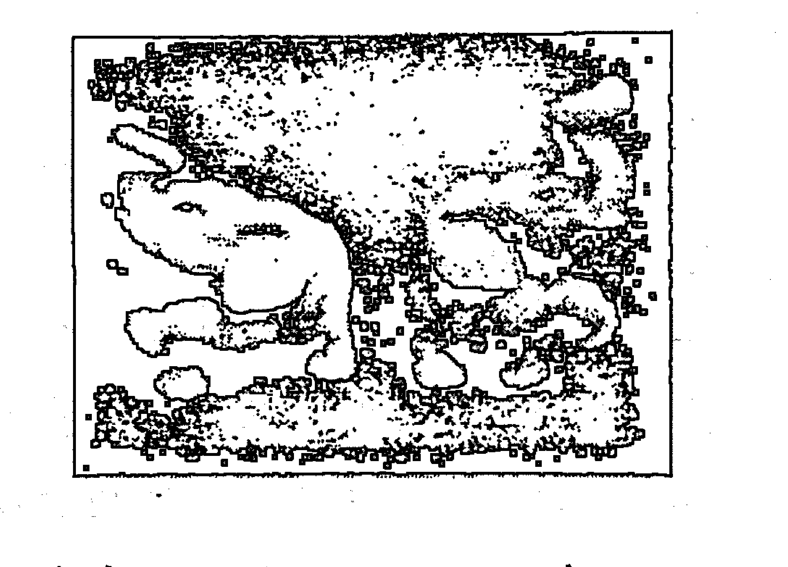

巽宫：临太岁有名气的，因为是忌神所以缩小，不能再放花草。放两串红木的手串放到巳位，让乙木生巳火。不能放吸收不了的成份，如果是放佛象归到庙里，花草归到田园与象相对的位置。

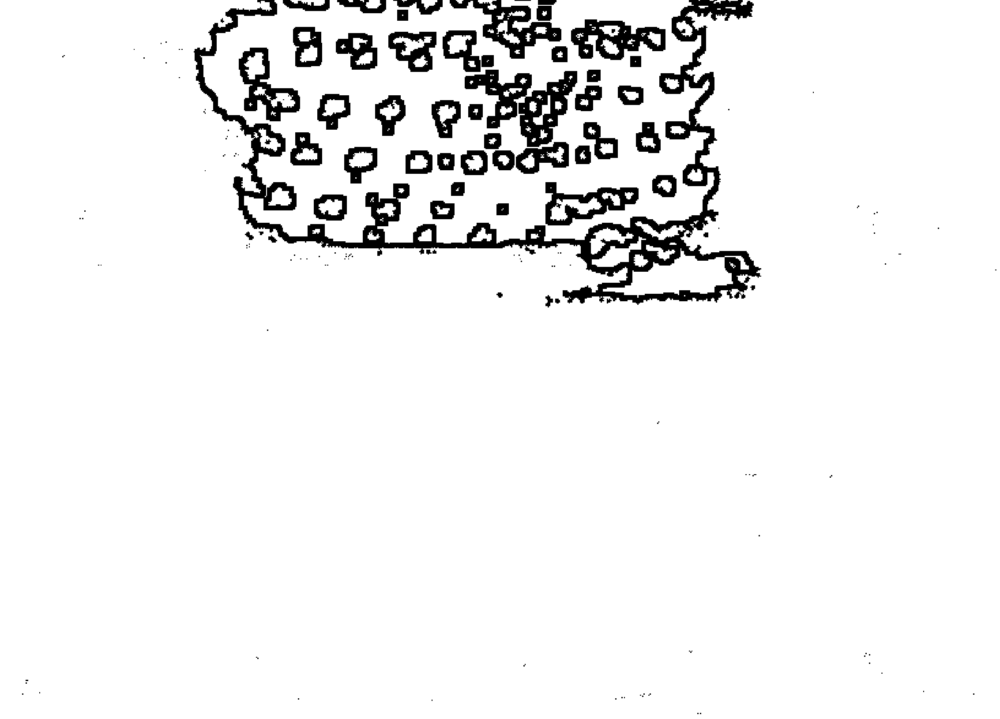

兑宫：癸水旺助壬日干，这个宫位，千万不能动，因为是用神。

乾宫：不要出现忌神的东西，壬丁合会出现外遇，且不易发现，因为有阴又有合，临开门。

艮宫：放一个风水轮，不能有灯的风水轮，有长流水。

插图：一幅风水轮或景观的示意图。

震宫：把九天化死，戊土化成树脂的东西。

离宫：用神辛金，金就是金。房子的开门一定用在用神的位置。如果是忌神的位置一定不能用。

如果是坟地，巽宫里的乙木为忌神。把这个宫位的枯枝烧成灰，绕着巽宫散半圈（草灰+朱砂+戊土来散）。

上课时一师兄测自身的财运：

测天气：时间：乙未 甲申 庚午 乙酉 阴3局

值符：天蓬星，值使：休门，旬首：甲申庚

| 值符 | 九天 | 九地 |
|---|---|---|
| 天蓬 庚 | 天任 壬 | 天冲 戊 |
| 开 乙 | 休 辛 | 生 己 |
| 蛇 | | 玄武 |
| 天心 丁 | | 天辅 乙 |
| 惊 戊 | 丙 | 伤 癸 |
| 太阴 | 六合 | 白虎 |
| 天柱 癸 | 禽丙芮 己 | 天英 辛 |
| 死 壬 | 景 庚 | 杜 丁 |

一师兄测自身的财运：结果他把八神都写错了，落写了九天，错写太阴写成太阳，这就是外应，主他的事不是很好，易有不顺的事发生，非要在这两个宫位出事，克太岁就为灾。

首先考虑他的财，日干庚金去天盘找，庚就是他自己，日干临巽宫弱，兑宫他写成：“太阳”乙木又是他的财，太阳又属火主他从这个行为破财，而师兄又是做针灸的，兑又主针，所以断师兄在今年的乙酉月耗财重，在工作上易破财。

乙是太岁主有大人物来找他做针灸，而且不是正大光明来的，因为临太阴，这个生意不能做，一做就会出大问题。乙是他的忌神，乙未年未在坤宫，又临太岁，乙木太旺了，就是耗财重。

戊是他的印星，主投资房产或车辆学习方面，因临九地，天冲星急躁脑袋一热就投资了。而八月乙酉月临太阴结果是乙酉时，三归一，宫位在酉，就是耗财了。

化解：1、放生放甲鱼，忌神的数就是你要放生的数。2、乙为财，黄铜镇宅之宝。宫位是金，金属的。太阴就是不是所有的人都见到的，这个东西大，利用宫位的金挂一个镇宅之宝在庚位，挂到明年立春。

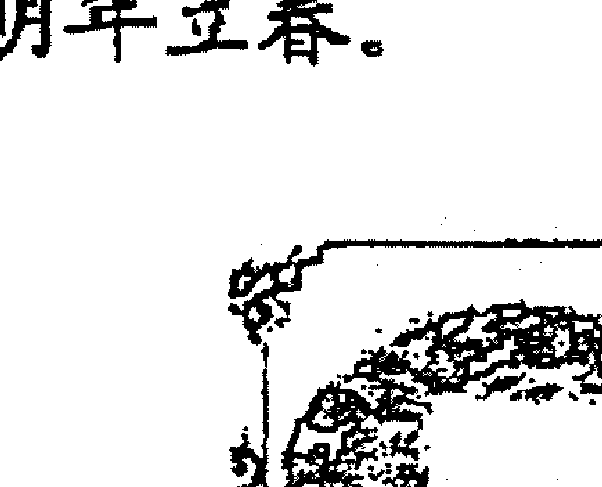

庚金临开门弱，日支午火在离宫临白虎，主有伤害。

化解：鸿运当头的水晶球。水晶属金，壬+辛，辛是坚硬的，天任是土。

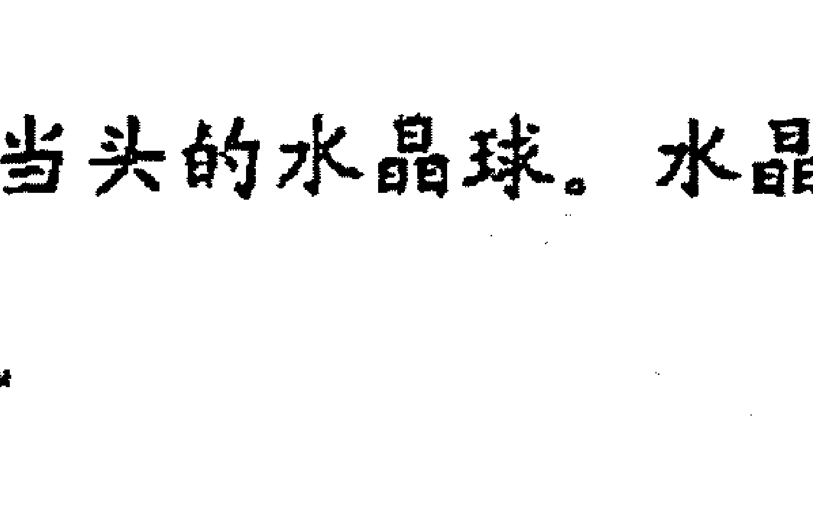

奇门遁甲六亲定位：

奇门遁甲的六亲定位，是根据局中的显示，来进行预测的，不懂六亲，可以说就无法进行预测。

## 伏吟反吟的用法：

- 伏吟局：就是潜伏，猫捉老鼠的整个过程，埋伏，威武，待机而发，一击毙命，从而制对方于死地。
- 反吟局：拳击手不断地出拳、收拳，那就是反吟。

## 天芮星和天禽星的用法及作用关系

（不懂天禽星与天芮星的真正用法，是不能用奇门遁甲预测事情的吉凶成败的，自古以来没人讲清楚的，天禽星的作用是重中之重）天禽星永远追随天芮星，天芮星落到哪宫都是坤宫土性，但是天禽星落到哪这就有那宫的信息。

如果天禽天芮同时用时，日干是天芮，时干月干是天禽，天禽星走阴土，天芮星走阳土，阳扩散，阴收敛。如在艮宫读天任星，在震宫读天冲星，天禽星是变色龙，中五宫无定性，落在哪宫就是哪宫的心性：用神读用神，忌神读忌神。

## 空亡、入墓、击刑、门迫、天干地支的阴阳对应关系

（预测一个人或者一件事情，不懂天干地支的阴阳之理，不可能知道对方外在的表现及内心的世界。所谓知己知彼，百战不殆。）

## 奇门遁甲的格局用法

格局主要是看阴阳内外的一种组合，在确定用神忌神之后，只要是用神有力，就是格局高，忌神旺或用神无力，就是格局低。结合宫、星、门、神及三奇六仪总体来判断。分析整个事情或者对方的全面的布局和内心所想，对方喜欢什么，下一步要进行什么规划决策。

## 奇门真正的旺衰

奇门遁甲的旺衰方面，古书上没有真正的说明白，烟波钓叟曰：“若能识得阴阳理，天地都在一掌中”。所谓的阴阳理就是旺衰，奇门遁甲的旺衰和年月日时四纲没有关系的，奇门盘好比是一个人能力格局，局中显示出来的格局就是本人的格局，绝对不是随着四纲的变化而变化的。

如果局中显示这个人是富翁，绝对不可能今年富贵，明年就变成要饭的了，只是在流年忌神的时候，有点不顺而已。

旺：一个宫里有宫、星、门、天盘干、地盘干，其中三个五行相同为旺。旺喜克耗泄。

弱：一个宫里有宫、星、门、天盘干、地盘干，其中一两个五行相同为弱，弱喜生扶帮。

### 详细讲解奇门起局

奇门遁甲起局方法，不外乎拆补、置润、不置不润等方法。试想，一个时辰两个小时内要发生多少事情呀。根本就不可能把全部的事情在两个小时里显示出来，想想也是不科学的，大家看看择吉书籍就知道了，里面有奇门择日。可以随时随地就能预测起局。

报数时间起局，有三个数超过90的如13、8、133就是1+3+8+1+3+3=? 报三个数就是天地人三才。

引干：提示：看不明白本宫有什么问题时看引干。

时干找值使门，阳顺阴逆。

如局伏吟时引干入中五宫，阳顺阴逆。

### 奇门外应

奇门遁甲这种高层...古称"征兆"，现在称为"外应"，经典奇门中特别重视“动应”、“静应”，现今流传的奇门著作中基本没有涉及到这个方面内容的。我们的心得体会是：要想有神奇、准确的预测效果，必须是卦里一半，局外一半。所谓局里一半，就是在起好的奇门局中分析阴阳五行生克制化，刑冲合害破；卦外一半则是求测时当事者的动作、衣着颜色、所坐方位、周围出现的各种动向、声音等。结合这些信息，便可将奇门断到高层准确、应验如神的境界。

### 奇门化解

预测只是第一步，更重要的是根据遁甲局中的五行喜忌给予正确化解，把不利于自己的五行转换成对自己有利的五行，否则预测人只能被动地做命运的奴隶。《易》曰：《易》不能使人趋吉避凶；圣人做易何用？市面上的奇门化解，不分喜忌；旺衰。一见门迫、击刑、入墓、空亡就害怕了，一见格局不好就害怕了。如：癸加癸，天网四张。其实根本就不是那回事，奇门遁甲的九星、八门、八神、三奇六仪组合的五行转换。

2015-11-28 上午

乙未 丁亥 戊申 丙辰 8:33 阴5局甲寅癸，天英景

| 合 | 阴 | 蛇 |
|-----|-----|-----|
| 天任 丁 | 天冲 庚 | 天辅 己 |
| 生门 己 | 伤门 癸 | 杜门 辛 |
| 白虎 |  | 符 |
| 天莲 壬 |  | 天英 癸 |
| 休门 庚 | 戊 | 景门 丙 |
| 玄武 0 | 九地 0 | 九天 |
| 天心 乙 | 天柱 丙 | 禽芮 戊辛 |
| 开门 丁 | 惊门 壬 | 死门 乙 |

戊申日干弱，日支弱。结果丙空亡，从弱是求购有结果。

戊希望丙生，但丙帮助不了戊。丙有那个名，而没有那个实。

没有实在的东西，助力太小。

化解要组象，想化解什么，就组什么象，原则就是把用神救活，把忌神化死。

如测婚时化解：

把在坎宫的丙救活：九地主天长地久，（在坎宫做一个同心结，不象）。惊门如何化解？

惊门为口为嘴。而惊在此是忌神，如何把忌神化死？宫里有什么就是化什么，那戊缺什么？丙主热情，风情与浪漫，丙处于死地，且丙壬冲主反复。

坎为水，引申为鱼水之欢，鱼水之神。坎生壬水亦是忌神。什么鱼是代表爱情忠贞不二的？购一对接吻鱼放在坎宫，丙火旺的日子放。因为是要火来生土。

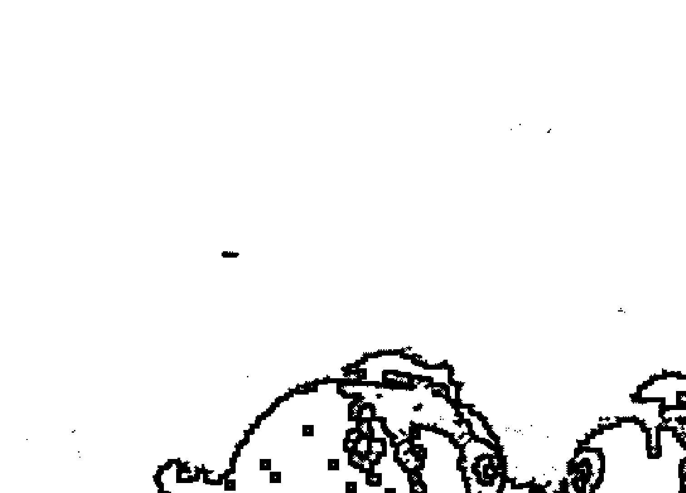

### 艮宫

乙弱，到寅月、日、时：肯定出现另一个竞争者。乙主纠结缠绕。临玄武为以假乱真的，围绕乙木去做。乙+丁，丁为希望，火火红色的，暧昧的，充满诱惑的（乙+丁为电线与灯）。

因为木为忌神，不能取木，取两个数量。丁是用神，希望、向往、激情。可以重新布置新房，粉红色的灯，两个红双喜，贴在艮宫。 让卧房布置为念旧的样子。

### 宸宣：

壬+庚，水是忌神，把水化死。 一对水晶。壬水不是小的水。庚为天鹅，嘴对嘴，虎为白色的， 尖硬的。休为玩物，摆设。 天蓬为大的。

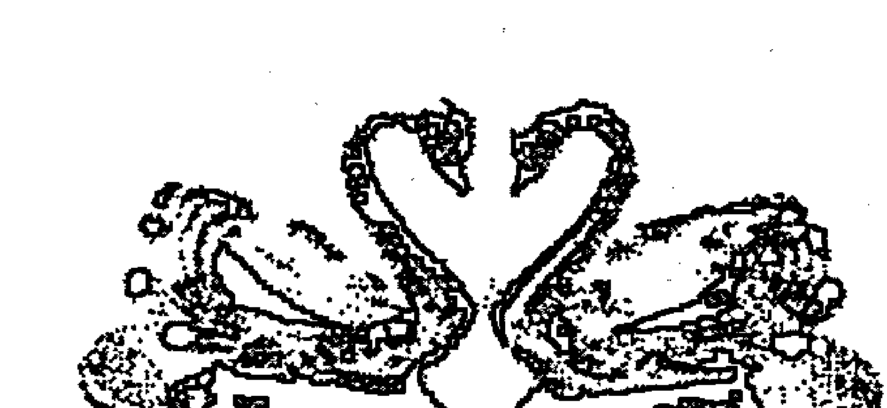

如在震宫求财（布财局）则不能放天鹅，天鹅是会飞走的，家里的财留不住会飞走， 放什么好？

白虎，天蓬主快速的，大的，休为假的，聚宝盆。

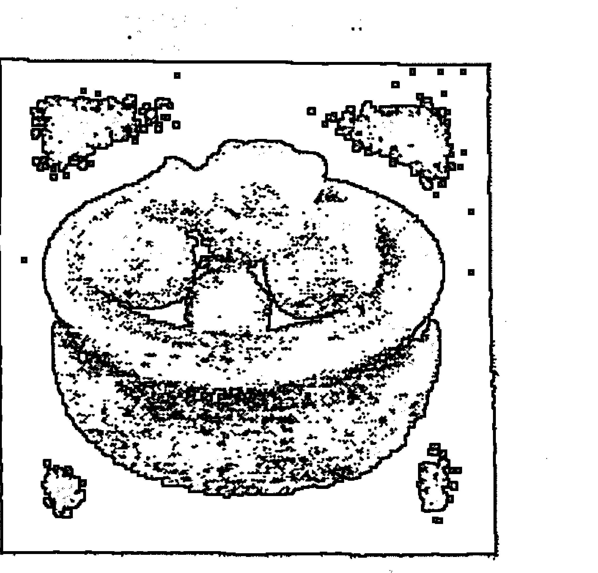

放什么色的？黄色玻璃的聚宝盆。

如去震宫方向出行，一去就要破财，化解时放什么好？

一帆风顺的船，且为木制的，化解用完之后，在太阳光底下爆晒十多天以上或烧掉。

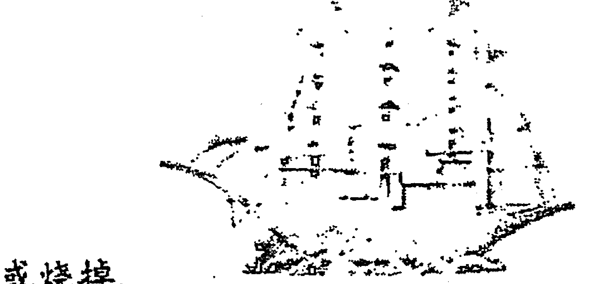

### 震宫测病：

| |
|---|
| 白虎 |
| 天蓬 壬 |
| 休门 庚 |

震宫测病以房为中心，东方水旺，乙为肝，郁结。所以病人的床不能放在东方，同时求医也不能去东方。

吃药要用什么药？“龙胆泄肝”中药。震宫不能放水有关的东西凶气阴气的东西，震放木也有阴气，佛也是阴的。不顺都是从环境习性引起的。如何把震宫调理好？把化解当作救人的心态多作善事放生，正能量就能加强。占者每一次化解都要去放生，说好话、心口如一，存善念，行善行。

### 巽宫：求官：

| |
|---|
| 六合 |
| 天任 丁 |
| 生门 己 |

六合是多的，丁火生成助戊，所以丁是用神。用红色的巽木是柔软的，飘动的，生门为生生不息的。那挂一面五：红旗。

### 离宫：

| 阴 |  |
| 天冲 | 庚 |
| 伤门 | 癸 |

庚弱，庚为忌神，把庚化死，让庚不能克耗泄戊气。+癸，甲申庚与甲寅癸相冲，冲都是快速的。放“马上封侯”

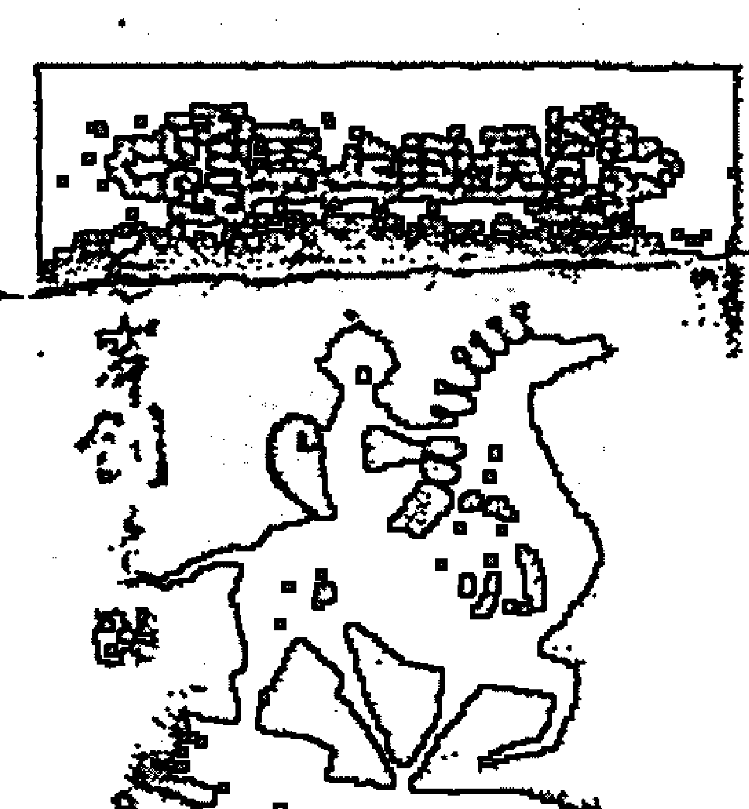

## 2015-11-28 下午

乙未 丁亥 戊申 己未   阴 7 局甲寅癸，天芮 死

| 白虎 | 六合 | 太阴 |
|---|---|---|
| 天任 乙 | 天冲 壬 | 天辅 壬 |
| 伤门 辛 | 杜门 丙 | 景门 癸 |
| 玄武     |          | 蛇       |
| 天蓬 丁 |          | 天英 丙 |
| 生门 壬 | 庚       | 死门 戊 |
| 九地     | 九天     | 符       |
| 天心 己 | 天柱 戊 | 禽芮 庚癸 |
| 休门 乙 | 开门 丁 | 惊门 己 |

戊日干在坎为身弱，结果己亦弱，申坤弱，没有结果应放弃。用神弱，没有必要化解，是一个全军覆没的局。假如要去西南求财要化解？天辅为儒雅的，景为好的，太阴为古色古香，辛金为戊己之忌神，要化为无。放一个舵手，或铜鼎。

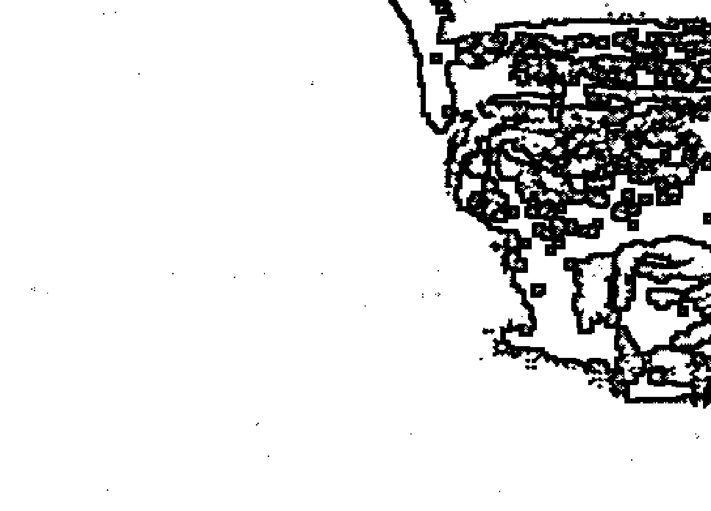

| 九地 |
| 天心 己 |
| 休门 乙 |

### 艮宫：

九地为稳定、低矮的，乙为山上的弯曲的，休为休闲观光的，天心为大气的，象为长城画。

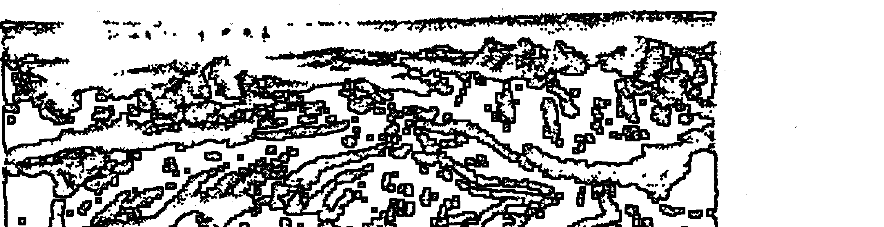

或在艮方围一个木栏种花草，或去东北方取土来种花草。

断局时外应的使用：只要出现外应，断局时马上使用。火是忌时点烟，那么烟就是伤害。水是忌神，客人喝水，水是伤害。

当断他老婆时，外面进来一个男人，他老婆会有外遇。

当一个男人测投资时，手机响了，他拿来听时，手机一下子掉地上摔坏了，那就断投资失败了。

当断局时，办公桌就是一个奇门盘，前是南，北是后，右是西，左是东，客人往那个宫位放东西，就是那个宫位加力了，东西越大越贵，忌神时灾就越大。如测谈判的座位，应坐对你位置有利的地方，那个地方生你的，就坐那个地方。

心无二用、平心静气地测。

九天

| 天柱 | 戊 |
| 开门 | 丁 |

坎宫：丁印弱，学历不高，九天为好高骛远，开门为守不住秘密，没有官位，格局不高。财坎为水，忌神无财。

| 六合 |  |
| 天冲 | 壬 |
| 杜门 | 丙 |

如离宫日干 改为壬。壬+丙为冲，动中求财，六合多种经营。财旺从财格，格局高。

## 测婚姻： 乙未 甲申 壬申 乙巳 阴1局

值符：天心星，值使：开门，旬首：甲辰壬

| 阴 | 蛇 | 符 |
| --- | --- | --- |
| 禽癸芮 乙 死 丁 | 天柱 辛 惊 己 | 天心 壬 开 乙 |
| 合 0 天英 己 景 丙 | 癸 | 天 天蓬 戊 休 辛 |
| 虎 0 天辅 丁 | 天冲 丙 | 地 天任 庚 |
| 杜 庚 | 伤 戊 | 生 壬 |

测婚姻化解：全部用阴阳来化解为成双成对的东西。

壬日干落坤宫旺，妻子丁火在艮宫亦旺，婚姻挺好的，但是大局上它说了算，可是他老婆性格火气大，结果乙落巽宫有点弱，心里不舒服。两个人思想不统一，生闷气，内心打鼓，壬坐下乙已是太岁，要说家里的事，两个人差不多。婚姻的化解必须在卧室，不能在客厅，也不能在办公室，卧室里必须成双成对。

乾宫如果出问题，乾为天，庚金是白的，下面有壬水，九地就是土。一对白色的天鹅，庚+壬就是漂在水上。

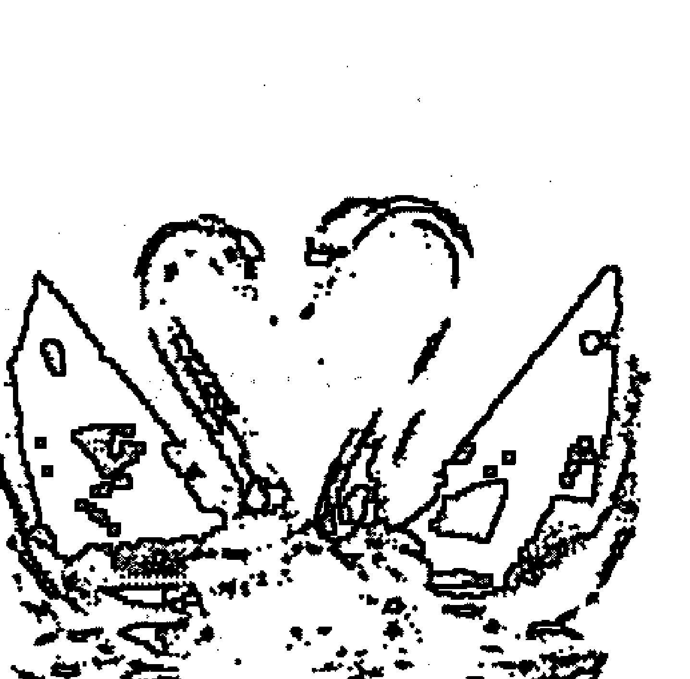

坎宫：玄武表示朦胧的，丙：含蓄的、热烈的。戊：厚实的。天冲：向上的——放一株并蒂莲象征百年好合同心。并蒂莲象茎杆一支花开两朵，可谓同心同根、同福同生的象征，喻意夫妻恩爱美满幸福。

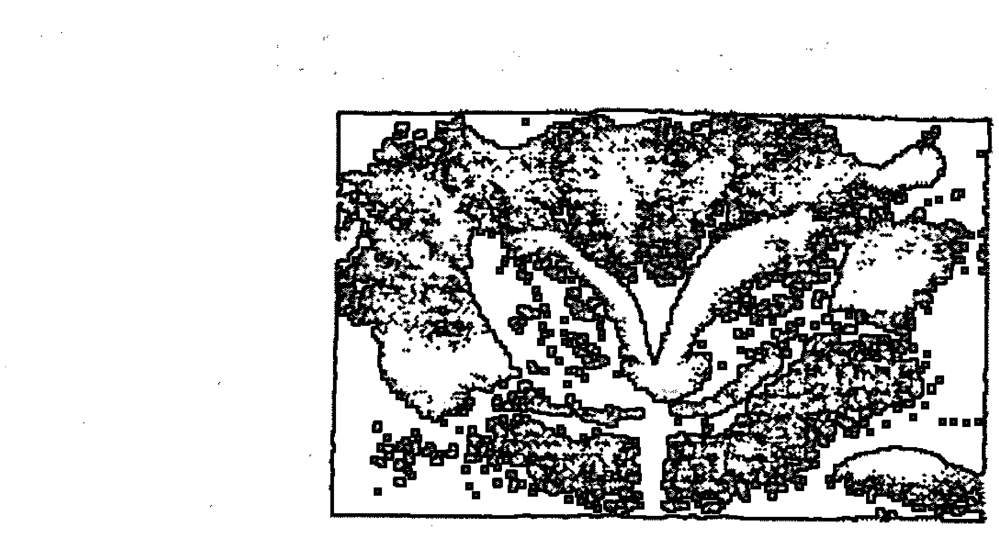

艮宫：丁+庚+白虎，丁火上庚下，金属底做的龙凤红蜡。

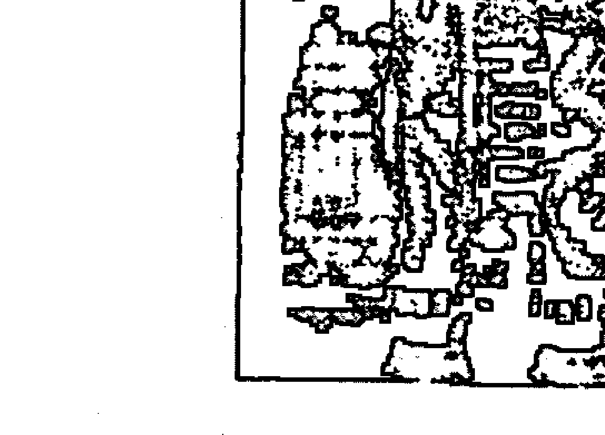

震宫：六合，己+丙，天英星和景门：合谐美好的同心结。

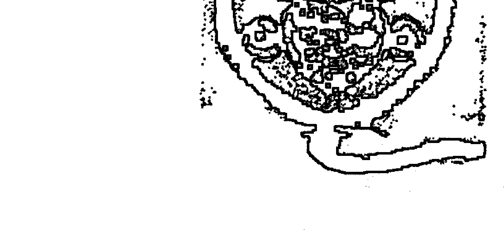

巽宫：乙木花草=百合花

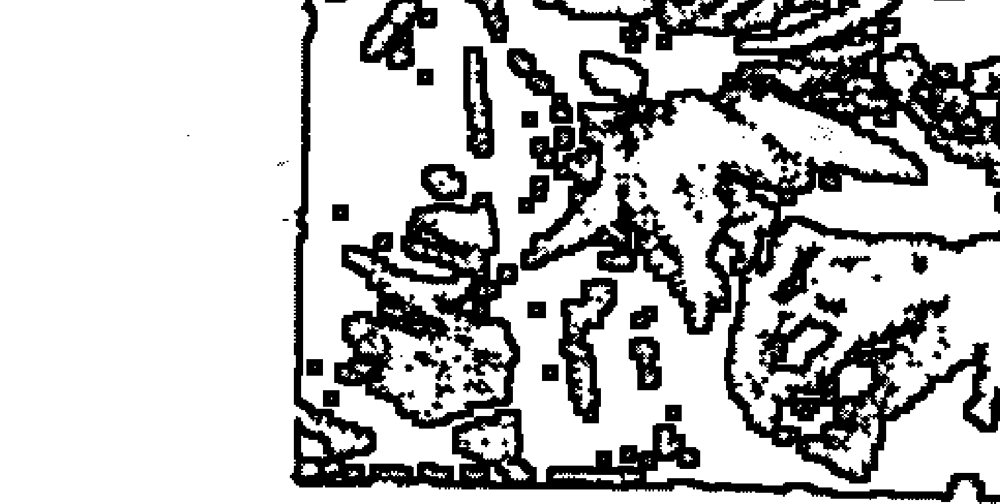

这些化解只治标不治本，真正的本在因果上。忌神就是你的业障，用神就是你的福报。

## 测婚姻： 乙未 甲申 壬申 乙巳 阴1局

## 值符：天心星，值使：开门，旬首：甲辰壬

| 阴 | 蛇 | 符 |
| :--- | :--- | :--- |
| 禽癸芮 乙 死 丁 | 天柱 辛 惊 己 | 天心 壬 开 乙 |
| 合 0 天英 己 景 丙 | 癸 | 天 天蓬 戊 休 辛 |
| 虎 0 天辅 丁 杜 庚 | 武 天冲 丙 伤 戊 | 地 天任 庚 生 壬 |

例如：离宫忌神非常旺：1、婚姻为什么出现问题，你顶撞父母，以下犯上，屡教不改。2、反反复复的吵架。3 异性朋友多。4、常说别人隐私。

用神：他要做的事在乾宫：首先谦和，施舍，要仗义疏财，厚德载物。生门就是永远不停地生生不息地孝顺父母。壬水是呵护付出、低调、放下架子。

壬日干，庚为忌神，不孝敬父母在乾宫。真正的药是心药！

时间：乙未年甲申月壬申日丁未时 14:12 阴8局

值符：天辅星，值使：杜门，旬首：甲辰壬

| 太阴 天任 戊 惊 壬 | 蛇 天冲 癸 开 乙 | 符 天辅 壬 休 丁 |
|---|---|---|
| 六合 天蓬 丙 死 癸 | 辛 | 九天 天英 乙 生 己 |
| 白虎 天心 庚 景 戊 | 玄武 天柱 己 杜 丙 | 九地 禽辛芮 丁 伤 庚 |

四纲生用神吉，事可成；四纲生忌神凶，事不成。如成了也会有凶事发生，事情成败找最旺的点，也就是太极点，成事找用神的太极点。

看月是甲申庚，庚金旺，看哪个月是用神？七月坤宫，壬申日，庚是用神，壬泄庚金不能成，癸酉月不能成，戊子月克壬水生用神，可成，最快是戊子月。

测官运的化解：1、找用神月向组织汇报，坦白因为之所以有灾是源于前因不好造的业障所致。官用神，他需要什么？求官一定要注意太岁。

兑宫测官运准备升：九天临乙木太岁，主大的，高贵的格局高，应当是一枚官印临生门，马上封候，步步高升，富贵树，马到成功，八骏图，舵手，鹏程万里，大展鸿图，更上一层楼。

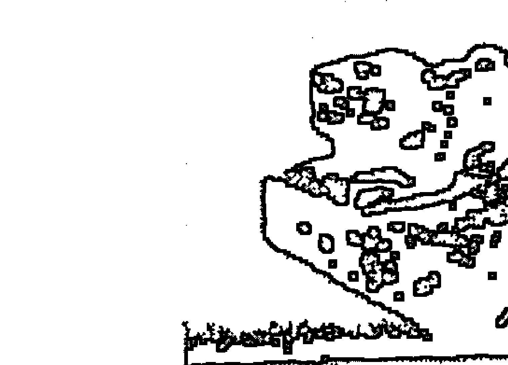
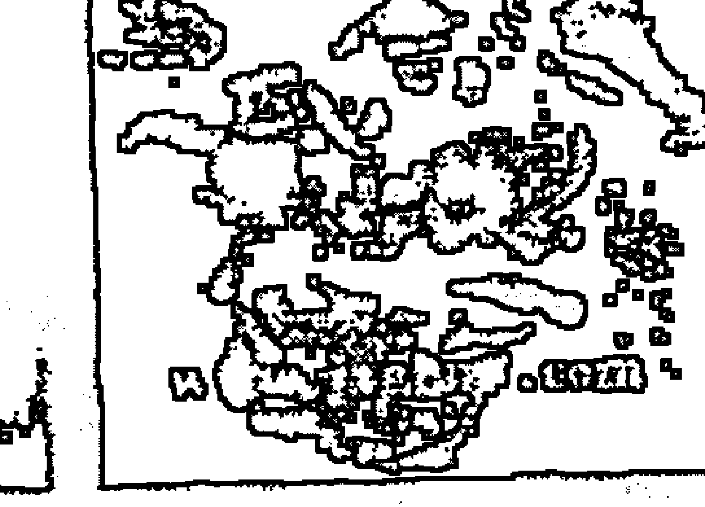
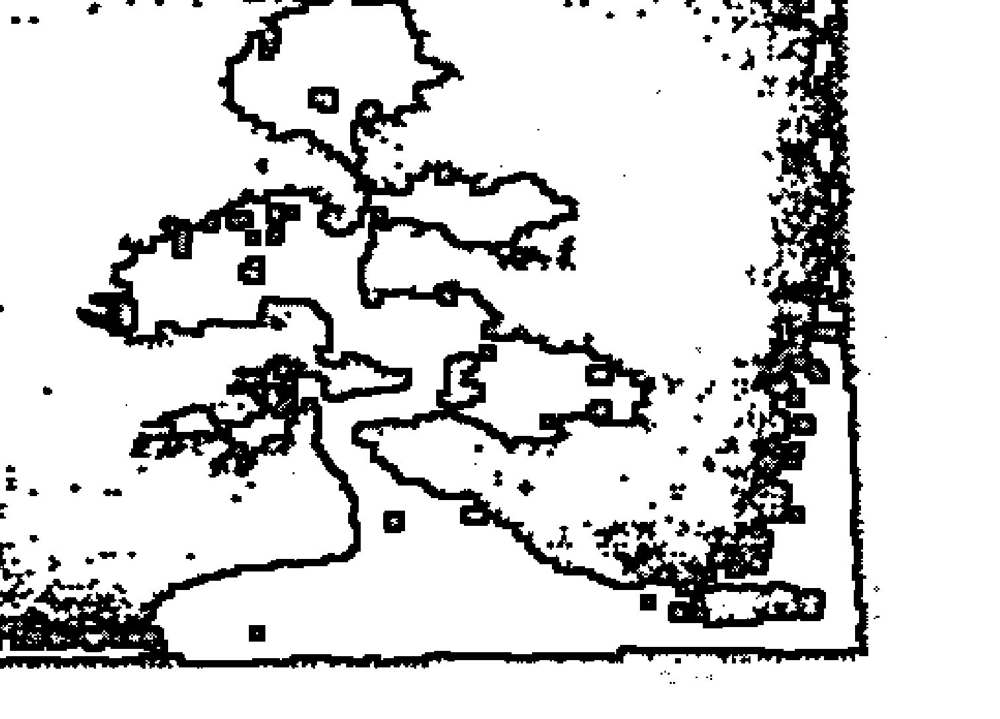

## 一生居士

震宫：用神：鸿运当头的风景画，紫气东来图画，但不能见水，用云彩形成一个聚宝盆。

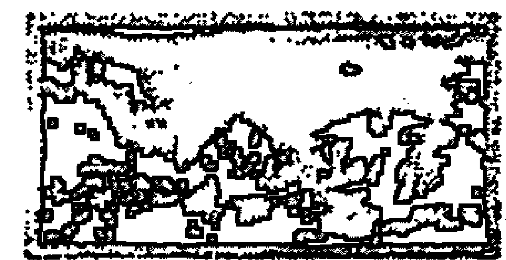

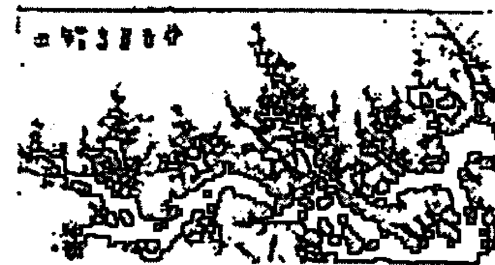

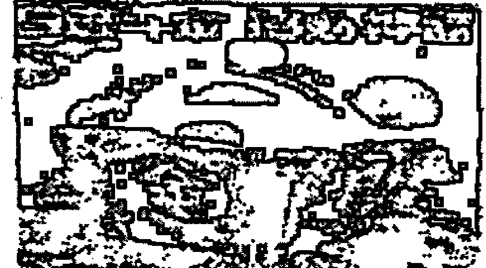

兑：乙+己 九天，天英+生门。救活乙木，用兰花草，用竹子寒气太重不适合北方。

求官，乙木太岁是用神，用神弱一定要加大他的力量。

坤宫：丁火彩灯值符名贵的，在坤宫不是很大的鱼缸放在申位，养九条鱼，因为丁壬合。

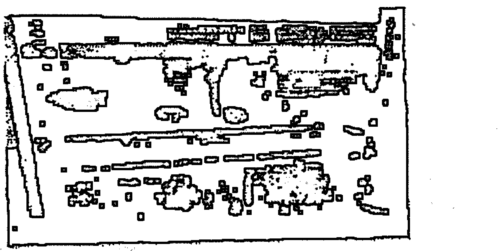

震宫：放一幅花开富贵，因为六合，丙为鲜艳的，下面癸水原因，震又是木，所以是牡丹。

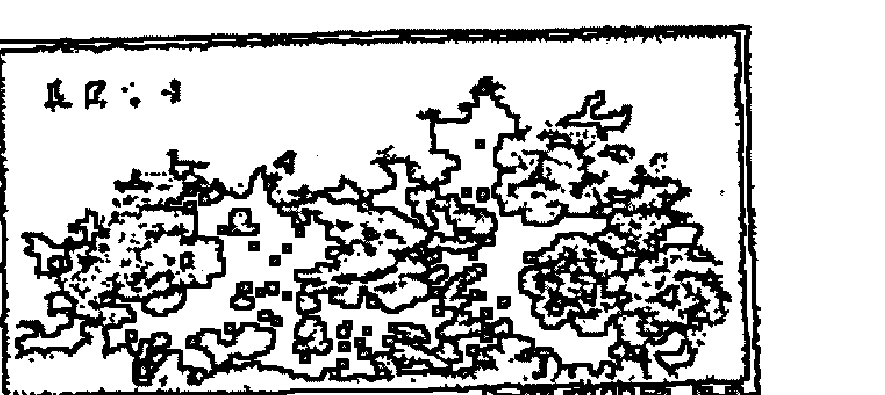

三奇六仪看植物：戊就是叶子大的厚的如橡皮树，己是阴的小的，庚是大气的光滑有主干的。

## 奇门看风水

奇门看坟地，例如人这个坟下葬后福主一直不顺，那么谁找你，你就以日干，找日干入宫、看内在，忌神与用神，千万记得不要伤到用神。测时不要离坟太近，太近会伤到官气的，离坟向外十二步之外，立向站在坟后立向。

化解原则：用神救活，忌神化死。

时间：乙未 甲申 壬申 丁未 14:12 阴8局

值符：天辅星，值使：杜门，旬首：甲辰壬

| 太阴 天任 戊 惊 壬 | 蛇 天冲 癸 开 乙 | 符 天辅 壬 休 丁 |
| :--- | :--- | :--- |
| 六合 天莲 丙 死 癸 | 辛 | 九天 天英 乙 生 己 |
| 白虎 天心 庚 景 戊 | 玄武 天柱 己 杜 丙 | 九地 禽辛芮 丁 伤 庚 |

巽宫：拾五个小石头放在左边包里。

震宫：带包烟和打火机。

艮宫：庚金是用神，换几个硬币放在艮位。

兑宫：乙木摘四季常青的树叶子。

## 铁老师的案例分析

一人竞选村官：
公历：2011年05月04日07时48分

干支：辛卯 壬辰 己未 戊辰 元阳八局
旬空：午未 午未 子丑 戌亥 旬首：甲子

| 己 太阴 | 丁 六合 | 乙 白虎 |
| :--- | :--- | :--- |
| 天辅 癸 | 天英 己 | 天芮 辛 禽丁 |
| 伤门 癸 | 杜门 己 | 景门 辛 禽丁 |
| --- | --- | --- |
| 戊 螣蛇 | 庚 | 壬 玄武 |
| 天冲 壬 | | 天柱 乙 |
| 生门 壬 | 丁 | 死门 乙 |
| --- | --- | --- |
| 癸 值符 | 马 丙 九天 | 辛 九地○ |
| 天任 戊 | 天蓬 庚 | 天心 丙 |
| 休门 戊 | 开门 庚 | 惊门 丙 |

奇门局一打开，我说你不服人，你这次没有你的份，她说啊......你再说说，我虽然你找到领导了，你的条件各方面都行，你是一厢情愿去找领导去谈的，而领导对你这个事不满意，领导旺不喜欢你去生，还有你的群众基础太差了(时干），他们都反对你，我说这次没你的事，领导已经早都安排好人了，是个男的。

领导是不是旺啊，喜克耗泄，看看领导的内心，壬水是不是竞争者弱啊，喜生扶帮，是不是早都安排好了。

领导说你干吧，没事我们给你撑腰；是不是，你看壬水格局虽然不是太好，工作能力不好，但是领导看着他顺眼，这个群众基础也不是太好，但是比你强，有癸水帮扶，他跟群众的内心走在一起了。

我说没你事，她说不可能的，她说我已经找领导而且已经花了好多钱，给谁啊，比和者为兄弟，贿赂。

日干己土旺，不喜生扶帮，时干戊土旺而帮身，不吉，说明群众基础不好。官星弱而受制，克身无力，当不了官。再一个来说，日干得月时帮，竞争很激烈，没有机会。年辛金自刑，上面领导对自己有看法。

## 婚姻家庭情感

这是云南红河州的一个客户电话预测，男，报数7。
真时：2011年04月06日 08时26分

辛卯 壬辰 辛卯 壬辰 指定局数阳七局

| 戊 九地 | 癸 九天○ | 丙 □□□○ |
| :--- | :--- | :--- |
| 天冲 癸 | 天辅 丁 | 天英 庚 |
| 惊门 丁 | 开门 庚 | 休门 壬 禽丙 |
| 乙 玄武 天任 己 死门 癸 | 己 | 辛 螣蛇 天芮 □ 禽丙 生门 戊 |
| 壬 白虎 天蓬 □ · □ 己 | 丁 六合 天心 己 杜门 辛 | 庚 太阴 天柱 戊 伤门 乙 |

我说你是一个领导，有正式工作是个头，你现在已经个非常急躁，为了感情之事，你根本不相信现在的感情已经到了尽头，对方已经离你而去。回答：对，我就是测这个事的。
我又说你不喜欢她。他问她心里有我吗？
我说有，她心里有你，她非常伤心啊。他问她现在在哪里？我说你不用找了，你找不到的，她现在跟一个男的在一起，这个男的能力非常强也是一个领导，但是这个男的年龄大，比你厉害，也是吃皇粮的。
后来他说你说没结果难道就真的没有结果吗？我说没有结果。我说她会给你打一次电话的，但是这一次联系了之后就再不会跟你联系了，他说哪一天？
我说你等一个星期吧！结果这次真准。最后我说你会找一个很好的，2012年结的婚，肯定是2012年壬辰年。

## 身体对应位置划分

| 左肩 | 头 | 右肩 |
| 左腰 | 胸 | 右腰 |
| 左腿 | 下阴 | 右腿 |

## 奇门测感情

公历：2012年04月06日16时33分

干支：壬辰 甲辰 丁酉 戊申 指定局数阳七局

| 丙 玄武 | 辛 九地 | 癸 九天 |
| 天冲 癸 | 天辅 □ | 天英 庚 |
| 生门 丁 | 伤门 庚 | 杜门 壬 禽丙 |
| 丁 白虎 ○ | 乙 | 己 □□ |
| 天任 己 |  | 天芮 壬 禽丙 |
| 休门 癸 | 丙 | 景门 戊 |
| 庚 六合 ○ □ | 壬 太阴 | 戊 腾蛇 |
| 天蓬 辛 | 天心 乙 | 天柱 □ |
| 开门 己 | 惊门 辛 | □ 乙 |

一个三十多岁的女的找预测起局。

1. 首先我说：你今天找我来的目的是你婚姻出问题了（马上她脸色一下子变了），为什么出问题了，因为你外面有相好了，你感觉他对你非常好，而你看不起你的老公，你想离婚，但是你现在又离不开，现在阻力很大，因为你的父母以及对方的父母、兄弟姐妹都站在你老公的一方，不跟你站在一起，你感觉很苦恼。
2. 你们现在正闹得不可开交，你原来那个相好的他并不真心爱你。她说：对！
3. 接着她把话题一转说：我真的想跟我老公离婚，我整天感觉我老公很不好。

> 我也把话题一转说：你老公确实是有点问题，没有做到一个丈夫所做的，是不是你老公身体有问题呢，你们夫妻生活是不是出现问题了。

> 她说，对。我又接着说：你老公还是一个吃皇粮的，有正式工作。 她说：对啊，是有一个正式工作。

> 我说：但他不是领导。 她说：嗯。

> 我确实外面有个相好，我今天找你的目的就是想离婚，我不爱我的老公，我和我老公三十多岁就已经分床睡了，已经好几年了，因为他先天性的身体有问题。

## 一客户测病

我说：“这个病特别是在今年发作的很厉害，这个月很难受，是脊椎和腰上的毛病，反复发作，建议保守治疗吧，除根是不乐观的。”

他听我说出病症连连点头：“老师，您说对了，您帮我看看什么时候能好，也少让我遭罪了。”

我对他说：“下半年会好一点，也就是说，立秋以后能强一点，现在不行。”

公历：2012年04月19日07时47分
干支：壬辰 甲辰 庚戌 庚辰       阳四局

| 壬 白虎 | 戌 玄武 | 庚 九地○ |
| --- | --- | --- |
| 天任 壬 | 天冲 乙 | 天辅 戊 |
| 杜门 戊 | 景门 癸 | 死门 丙 禽己 |
| --- | --- | --- |
| 辛 六合 | 癸 | 丙 九天○ |
| 天蓬 丁 |  | 天英 癸 |
| 伤门 乙 | 己 | 惊门 辛 |
| --- | --- | --- |
| 乙 太阴 | 己 腾蛇 | 丁 值符 |
| 天心 庚 | 天柱 辛 | 天芮 丙 禽己 |
| 生门 壬 | 休门 丁 | 开门 庚 |

日干庚金代表自己，在艮宫，宫星门又生助，旺，喜壬水泄。地盘壬水旺象，吉象，用神有力，说明身体没有什么大碍。日支戌土落乾宫，没有生助，入墓，弱极，无力克日干庚金，不吉之兆，说明内心因为这个毛病郁闷，上火。（丙火为忌神之故）

时干庚金为病的结果，日干庚金旺，喜时干克耗泄，今时干庚金和日干落在同一个宫位上，帮扶日干庚金，凶相。况且时支壬水落巽宫，入墓死地，无力泄时干庚金。那么病肯定在时支巽宫里面了，看巽宫，壬水弱而入墓，泄身无力，说明病是很重。根本就根治不了，后反馈一直在治疗，但是病情反复，没有针对此病的良方。

## 少女在校离家出走

一个朋友打过来的，告诉我说：“我侄女昨天下午出走，并留言说不回来了。你看有没有危险，如果没有危险，什么时间回来，到什么地方去了。”“昨天下午16点左右，老师打电话说不见了，昨晚也没有回来，都报警了。”

我对他说：“孩子在外没有问题，也没有走远。在同学和朋友家，是生气了。很堵心的走了，钱不多身上，还有个事情，孩子有恋爱之象。今天不回来，明天必回。结果反馈孩子在预测的第二天下午申时回来了（壬申日戌申时回）。

公历：2012年09月06日15时37分

干支：壬辰 戊申 庚午 甲申 阴四局

|辛 太阴 |丙 螣蛇O |癸 直符O |
| 天辅 戊| 天英 壬|乙 禽芮 庚|
|阴 杜门 戊|蛇 景门 壬|符 死门 庚|
|壬 六合 |庚 |戊 九天 |
| 天冲 己| |天柱 丁|
|六 伤门 己|乙 |天 惊门 丁|
|乙 白虎 马|丁 玄武 |己 九地 |
| 天任 癸| 天蓬 辛| 天心 丙|
|白 生门 癸|玄 休门 辛|地 开门 丙|

预测孩子，时干庚金代表孩子，在坤宫从旺，喜生扶帮。虽坤宫空亡，但旺而不空，孩子安全。

月纲也是用神，吉，明天未土日，坤宫填实，用神到位，孩子必回。坤宫临天芮病星，为求学之象，孩子在学校出走的。

格局伏吟，主痛苦呻吟之状，又临死门，格局庚见庚，都是孩子郁闷生气之象。幸亏都是用神临宫，再一个说庚金在坤宫与乙木相合，肯定有恋爱之象。

## 甲午 乙亥 丁未 丙午

| 乙 直符 | 辛 九天 | 己 九地 马 |
| 天柱 壬 | 天心 癸 | 天蓬 己 |
| 六 景门 丙 | 阴 死门 庚 | 蛇 惊门 戊 |
| 戊 螣蛇○ | 丙 | 癸 玄武 |
| 丁 禽芮 戊 |  | 天任 辛 |
| 白 杜门 乙 | 丁 | 符 开门 壬 |
| 壬 太阴○ | 庚 六合 | 丁 白虎 |
| 天英 庚 | 天辅 丙 | 天冲 乙 |
| 玄 伤门 辛 | 地 生门 己 | 天 休门 癸 |

客户刘女士来预测事业，看能做什么生意能赚钱；

财运：丁为日干，旺；克、耗、泄为吉，生扶为凶，宜做五行属土、金方面的生意。适合去西南方、东北方、西方为吉。

婚姻：不太如意，因为与日干相合之干壬在巽宫弱，不喜日干丁火耗，所以她的爱人从内心看不上她；景门为忌神，此人好掩饰，演戏是一个好手。天柱星为用神，口才方面语言犀利，说话一针见血，好逞口舌之快，临值符、小有名气或是一个小官。

丙为壬水的内在环境，在坎宫，临六合，忌神；做事拖拖拉拉、没完没了、缠绕纠结。天辅星为忌，是孔乙己类的人物，自命清高、没理讲三分；临生门，主无事生非，喜欢被人吹捧。对别人总是居高临下，这样的人根本看不起女方这样雷厉风行、直来直去，又喜欢纠缠不清，凡事总是秋后算账的个性了。

## 奇门测失物

07月07日18时42分

干支: 辛卯 乙未 甲戌 庚午 指定局数阴五局

|	丁 九天	|	己 九地	|	乙 玄武 □ |
|	天柱 丙	|	天心 乙	|	天莲 壬	|
|	开门 己	|	休门 癸	|	生门 辛 禽戊 |
|---|---|---|
| 丙 □ | 癸 | 辛 白虎 |
| 天芮 辛 禽戊 | | 天任 丁 |
| 惊门 庚 | | 戊 | 伤门 丙 |
| 庚 螣蛇 | 戊 太阴 | 壬 六合○ |
| 天英 癸 | 天辅 □ | 天冲 □ |
| [ ] 一 | 景门 壬 | 杜门 二 |

这个局是一个朋友丢了一个手包。

我说这个包肯定是在哪个地方合着呢，有人给你收起来了，给你保存着放着呢，是你的朋友男的，或者是个女的给你收着呢。这个包今天晚上如果不出现的话，明天就会回来的。恰恰就是当天晚上甲戌、乙亥时左右，他的一个朋友给他打电话，说包在他那儿，第二天他女朋友的女朋友把这包给送过来了。

分析思路：日干弱又冲，说明他内心着急，庚为这个包，现在空说明包不见了。但是忌神弱又空了额，就说明有结果；庚金弱，坐下乙木落乾宫旺直接将这个庚金给绊住，这个包就不会丢，这个庚金是忌神，但是它又空又弱，怎么能丢呢，但是乙木还有余力去克己土，那么今天晚上，甲戌、乙亥那个地方的时候。为什么是朋友，月干乙木跟己土是朋友，庚金是那个包，包下面是朋友。

再看庚金上面有六合，下面是朋友，说明人很多一起在玩（食伤），而且肯定里面有一个当官的；后来我说这个地方是在西北方或者是在正南方，我说你们是不是在一起喝茶了，看乾宫组合，后来之后他们说是。

该局如果庚金旺就找不着了，还有如果乙木弱也就不一定找着了；其实明天乙亥既是用神到位，又是填实。

## 奇门测车祸

公历：2012年10月04日15时33分
干支：壬辰 己酉 戊戌 庚申 指定局数阴六局

| 辛 口 | 丙 九天 | 癸 九地 |
| 天蓬 癸 | 天任 丙 | 天冲 辛 |
| 口 庚 | 生门 丁 | 伤门 壬 禽己 |
|---|---|---|
| 壬 螣蛇 | 庚 | 戊 玄武 |
| 天心 口 | | 天辅 口 |
| 开门 辛 | 己 | 杜门 乙 |
|---|---|---|
| 乙 太阴 O | 口 丁 六合 O | 己 白虎 |
| 天柱 乙 | 天芮 壬 禽己 | 天英 丁 |
| 惊门 丙 | 死门 癸 | 景门 戊 |

该局为一女的测朋友的车祸局。这个局日干落震宫弱，又是六仪击刑又是冲，时干庚金落兑宫又对冲，这就肯定有问题了。

一看日干，她人来了，肯定她人没事。再看月日同干支，将这一隐含信息给挖掘出来，那就可以肯定是她朋友的事了，而且是同性的朋友。

什么事呢，分清喜忌之后看组合取象义，冲、刑、腾蛇、年上太岁直接入宫又为忌神，那肯定是冲撞受伤之象，而且还是大事，我说是不是车冲撞在一起了，她说是。

再看是什么时候出的事，今天戊戌日，昨天丁酉日，正好落兑宫忌神到位冲，那肯定是昨天出的事，后来那女的说是昨天晚上出的事；

我又说车上人不少，时干落兑宫合，再看日干丁落乾宫旺回头生一下戊土，我说车是不行了人没事。

再看看他们去干什么去了，找时干庚金，我（戊）生着为子孙，子孙是游乐之神落兑宫。再看他们的组合，可知道他们是去KTV、歌舞厅之类的场所寻求刺激去了，而且出来还喝了酒，在车上闹闹呼呼的、晕晕乎乎的撞车了，属于醉驾；

我又说，这个事你们负全责，你们保险没有买全，年为保险公司是忌神，她说是......回过来我们在看看这个局的日干的旺衰喜忌以及组合，然后再对应一下四纲，就知道这个年这个月和对应的这个日是肯定要出事的，所以说这个局就是一个很明显的车祸局！

一位40多岁的男客户。

奇门盘起好，我对他说：“唉！这次村里选举村官对你很不利的，奇门盘显示你的自身条件根本不够。一是你自身群众基础不行，上面领导也对你不重视。”

电话反馈给我，村委领导班子基本没有动，比他条件好的竞争者也没有竞选成功。

公历：2011年05月04日07时48分

辛卯 壬辰 己未 戊辰 阳8局

| 左 | 中 | 右 |
|---|---|---|
| 乙 太阴 | 丁 六合 | 乙 白虎 |
| 天辅 癸 | 天英 己 | 天芮 辛 禽丁 |
| 伤门 癸 | 杜门 己 | 景门 辛 禽丁 |
| 戊 螣蛇 | 庚 | 壬 玄武 |
| 天冲 壬 |  | 天柱 乙 |
| 生门 壬 | 丁 | 死门 乙 |
| 癸 值符 | 马 丙 九天 | 辛 九地O |
| 天任 戊 | 天蓬 庚 | 天心 丙 |
| 休门 戊 | 开门 庚 | 惊门 丙 |

日干己土旺，不喜生扶帮，时干戊土旺而帮身，不吉，说明群众基础不好。官星弱而受制，克身无力，当不了官。再一个来说，日干得月时帮，竞争很激烈，没有机会。年辛金自刑，上面领导对自己有看法。

朋友打电话问他同事的母亲得了急病，看吉凶情况？

真时：2015 年 09 月 12 日 14 时 36 分

乙未 乙酉 辛卯 乙未 指定局数阴五局

| 癸 白虎O 马 | 戊 六合 | 丙 太阴 |
| 天任 丁 | 天冲 庚 | 天辅 己 |
| 休门 己 | 生门 癸 | 伤门 辛 禽戊 |
| 丁 玄武 | 壬 | 庚 螣蛇 |
| 天蓬 壬 | | 天英 癸 |
| 开门 庚 | | 杜门 丙 |
| 己 九地 | 乙 九天 | 辛 值符 |
| 天心 乙 | 天柱 丙 | 天芮 辛 禽戊 |
| 惊门 丁 | 死门 壬 | 景门 乙 |

预测六亲之外的长辈就看年干，现在乙未年干非常弱，就像一棵被砍伐得半死不活、摇摇欲坠的一棵枯树一样，经不得半点风吹草动的，而且年支耗年干，虽然月干和时干扶助乙木，但是目前最大的忌神在日干上面。

辛金是当天的值日神，不可能轻易放过乙木的！本来乙木就已经是风中的残烛了，再被辛金克制，就很难过去的。所以我断问卦人同事的母亲很危险，让他们有所准备；只要能过去当天晚上就应该没事了。

当天晚上那位同事回复说，母亲在下午就已经去世了。

在这个奇门局中，辛金是“压死骆驼的最后一根稻草”，本来已经岌岌可危的用神，是经不住这样的克制的。

公公在新疆因为生意上的纠纷被人打成重伤，在医院抢救，可能会随时有生命危险。

公历：2015年09月18日11时48分

乙未 乙酉 丁酉 丙午 指定局数阴二局

| 乙 值符 天柱 壬 景门 丙 | 辛 九天 天心 癸 死门 庚 | 己 九地 天蓬 己 惊门 戊 禽丁 马 |
| --- | --- | --- |

| 壬 太阴○ | 庚 六合 | 丁 白虎 |
| --- | --- | --- |
| 天英 庚 | 天辅 丙 | 天冲 乙 |
| 伤门 辛 | 生门 己 | 休门 癸 |

看年干乙木弱，内在的未土泄乙木，这个和上面的那个局差不多，结果是忌神，日干也是忌神，这样就加大了乙木的压力，本来就不旺，又被这样泄会好得了吗？

这个局中的月干虽然帮乙木，但是月干本身和他一样弱得不行，不会有余力帮助乙木的。所以这个局的乙木是非常危险的，我看还不如上面的那个局呢！

反馈说他二姐的公公已经去世了，就在当天。

阴遁6局，辛金落宫旺，喜克耗泄，丁为其用神。同样旺，结果不错，应该不会出现驾校拖延的情况。先看看这月有没有可能，辛喜克耗泄啊，庚申月却来生它，为辛的忌神，看来庚申月肯定不可能考试。看看下个月乙酉月呢？正好为辛的用神，乙还是今年太岁，肯定得等到酉月了。具体酉月哪一天呢？

于是我继续推日，9月8号是酉月的开始，恰好9月8号又是丁日！于是就不用向下推了，8号结果丁就会冒出来，于是我断的是9月8日变为酉月，又是丁日结果出现的这一天。

9月1日下午一个女孩说要开美容店，看看可以不？

我打开局一看，日干庚金弱，太岁乙木不旺，但是也耗日干而且年支生年干，忌神有力。再看结果时干乙酉忌神，虽然乙木忌神不吉，但是酉位丁火旺而泄乙木有力，问题还不大。不是太糟。虽然不是赚钱的局，但是也不会赔太多的钱。当时我就告诉她最好不要开这个店；她说尽量开起来，我只能告诉她尽量在阴历11月份开始运作，因为阴历11月戊子，为用神月。虽然不是太旺，但是也可以了。尽量在她家的东方去找，因为震宫辛金旺为庚金用神；到那里又不需要和谁合作，所以去东方还是可以的。

店门最好朝东开，我看她这个店其他地方没有用神或用神太弱，只能开在东方。又告诉她收银台最好放在西北方乾宫，这个地方是她的用神位。又和她说丁酉年千万注意，极容易有官司口舌、麻烦事，因为丁酉是她最大的忌神。在她店的正西方应该有广告灯箱或霓虹灯之类的东西。

她当时反馈说今天她们去找的一个店面就是我说的这样，门朝东开，门口有马路，背后是一个很大的广告灯箱。好像我去看见了一样。我告诉她这些这个店面必须这样布局，这些布局只能让她能把开店的风险降到最低，而不能给她发财千万，只能养店，到2018戊戌年才能逐渐好转。

我反复告诉她这个店开不开没有什么意义，因为不赚钱；不如去打工都比这个赚钱。她后来表示尽力而为。之后她又问婚姻问题，我看局中没有恋爱对象，看整个局中没有一个喜欢她的；唯一一个震宫辛金是她的用神，但是人家辛金不喜欢她，人家看她是忌神，是她一头热。她又问了性格方面的一些问题，我告诉她内心容易纠结、反复，火气比较大；做事爱掩饰。脾气比较冲，内心不定，容易天马行空地瞎想。

另一个女孩也要预测一下婚姻，我就让她报数起局。

我看局中显示日干庚金旺，她最佳的婚姻方位应该是震宫的乙木。因为乙木的旺衰和庚金对等，而且是相合之干；所以是最佳组合。就告诉她最佳的婚姻对象在她家的东方，人比较文静，心思细腻，积极向上，长相上有点侠义之相。能文能武，就是有点爱耍小性子。男人有女人性格。

再看她的性格，就是一个男人的阳刚脾气。遇事大大咧咧，心里装不住事。而且嘴下不留情。内心还有点固执！她反馈全对。另外她又问她的母亲现在的处境如何，我看庚金的正印己土，弱！在巽宫压力非常大，生活质量并不好。做事好走极端，容易伤害自己和别人，和女儿的关系不好。心里好耍小聪明，但是又耍不好。她说的。

后来这个女孩又问她妹妹怎么样？我看了一下庚金的比肩辛金，就和她说：你妹妹的性格和你差不多，甚至有些地方比你还厉害，属于毒舌女孩的类型，平时有点好高骛远，做白日梦，内心比较低下、休闲。不像她那样忙忙乎乎的没有一个定数。婚姻上一个去南方找。他们当时反馈说，对。

时间：2015年07月19日18时05分
干支：乙未 癸未 丙申 丁酉

| 玄武 | 白虎 | 六合 |
| 惊门 戊 | 开门 己 | 休门 丁 |
| 天柱 辛 | 天心 丙 | 天蓬 癸 |

| 九地 | | 太阴 |
|---|---|---|
| 庚 死门 癸 | | 生门 乙 |
| 禽 天芮 壬 | 庚 | 天任 戊 |
| 九天 | 值符 | 螣蛇 |
| 景门 丙 | 杜门 辛 | 伤门 壬 |
| 天英 乙 | 天辅 丁 | 天冲 己 |

求测婚姻？已知：与女友分手是否有机会从归于好走入婚姻殿堂？

日干为求测者丙落艮宫，女友落震宫，时干落坤，我说在你前女友眼里你这个男人不靠谱，性格急躁鲁莽，做事三分的热度没有持之以恒的精神 说话多虚情假意（丙旺是癸的忌神，所以癸女方认为男方的一切都是不好的）

做事好高骛远不切合实际，（这个是取象九天因为忌神所以在女方眼里就是不好的）不务实没有自己的立场原则。

你眼里她是一个聪明睿智成熟稳重，处事圆活立场坚定，做事认真谨慎踏实的人。所以你很喜欢她，但是她对你已经绝望了，死心了决不可跟你走进婚姻的殿堂。

丙旺结果丁极弱 这里可以理解丙无法受生还是想跟女方结婚的 但是女方弱 受之克泄 固然不会同意结婚之事。他说你说的非常对就是这样的！

公元：2015年7月19日18时55分 阴1局

干支：乙未年 癸未月 丙申日 丁酉时

| 第一列 | 第二列 | 第三列 |
| :--- | :--- | :--- |
| 丙 直符○ 天柱 辛 六 惊门 丁 | 庚 九天 天心 壬 阴 开门 己 | 戊 九地 天蓬 戊 蛇 休门 乙 |
| 乙 螣蛇 癸 禽芮 乙 白 死门 丙 | 丁  癸 | 壬 玄武 天任 庚 符 生门 辛 |
| 辛 太阴 天英 己 玄 景门 庚 | 己 六合 天辅 丁 地 杜门 戊 | 白虎 马 天冲 丙 天 伤门 壬 |

## 此人又求测工作之事？

丙落乾旺壬为用神有力我说你的职业是跑业务的吧，跑来跑去的动的厉害（用神壬主流动辰戌冲 临马星，天冲白虎 看着动的厉害。

他说我是送快递物流的天天就在路上跑，他说我的财运如何？我说你的工资总收入平均也就是9000块左右但是有浮动，不稳定。

## 奇门断生死

《奇门遁甲》是术数中最符合易学理论的一种高级预测绝技，而且预测只是一个非常浅显的一项小功能而已。

的法奇门、化解、运筹、计谋等等一系列的更高层次的东西
根本就没有透露出来。

公元：2015年6月16日10时   阳5局

干支：乙未 壬午 癸亥 丁巳

| 左 | 中 | 右 |
|---|---|---|
| 丁 九地 天柱 庚 六 休门 乙 | 庚 九天 天心 己 白 生门 壬 | 壬 直符 天蓬 癸 玄 伤门 丁 |
| 癸 玄武 戊 禽丙 丁 阴 开门 丙 | 丙  戊 | 戊 螣蛇 . 天任 辛 地 杜门 庚 |
| 己 白虎○ 天英 壬 蛇 惊门 辛 | 辛 六合○ 天辅 乙 符 死门 癸 | 乙 太阴 马 天冲 丙 天 景门 己 |

报数起局是以日干为求测人，日干癸亥，那他的母亲
就看庚金，弱。结果为忌神，太岁为忌神，今年很难过去。
这一点已经定下来了！再看还有多长时间，时干结果旺，可
能就这几天了。

丙寅日去世的，我又回头看这个奇门局，乙木虽然是忌
神，而且力量非常强，但是毕竟乙木制不动庚金，而丙火就
不一样了。

丙火克金是没有商量的，那么旺的火克那么弱的金是非常有力的。另外丙寅日，丙座下的寅木是不是也起推波助澜的作用啊？这个问题我没有问过老师，不敢私自下定论，但是就是觉得有这个因素。

她报数是6，起局开始预测，她对她的同学有好感，问那个男同学对她有没有感觉？已知那个男同学成家了，不知道他们感情怎么样？另外她知道那个男的有没有孩子。

公历：2015年06月01日09时22分

乙未 辛巳 戊申 丁巳 指定阳六局

| 白 螣蛇 | 己 太阴 | 辛 六合 |
| :--- | :--- | :--- |
| 天柱 己 | 天心 戊 | 天蓬 壬 |
| 杜门 丙 | 景门 辛 | 死门 癸 禽乙 |
| 壬 值符 | 丁 | 乙 白虎 |
| 天芮 癸 禽乙 | | 天任 庚 |
| 伤门 丁 | 乙 | 惊门 己 |
| 戊 九天○ | 庚 九地○ | 丙 玄武 马 |
| 天英 辛 | 天辅 丙 | 天冲 丁 |
| 生门 庚 | 休门 壬 | 开门 戊 |

从局上分析，日干为她自己，因为是报数起局，这个局就是她的；所以看日干为求测人；日干戊土，临离宫，天心，景门，太阴，下临辛金，她有些执着，爱显示，掩盖，气质好，口才好；这是表面。

看内在，水旺，说明她聪明，有智慧，灵活，好交朋友，因为临六合。死门，有些认死理，好一条路走到黑，内心胆量比较大；心目中的理想对象是一个聪明、智慧、头脑灵活，好交朋友的、成功的事业型男人。这是她本人的信息。

再看她同学，月干辛金；临艮宫，九天、天英、生门、下临庚金，口才好，为人比较热情，好高骛远；比较霸道，好反复无常。内心比较肮脏，火气大，脾气不好，但是她看这个人是非常好的，因为辛金为用神，所以她对这个男同学有好感。而这个男同学对她没有感觉，因为土是忌神，不可能对她有好感的。

再看那个男同学的内心，也是心口一致的。她问那个同学是否有孩子，金的食、伤为子女，食、伤为金用神，说明她这个男同学非常喜欢孩子。

但是看她男同学配偶，火弱，下临忌神，说明这个女人不可能有孩子，临坎宫，说明这个女人生殖能力不太好，可能是不能生育。

另外这个女人对她爱人没有好感，因为金是忌神；而火则是用神，这个男人对他爱人是非常喜欢的。而这个女人的理想对象应该是当官的或有官方背景的，因为乙木旺，又是太岁，能生丙火。

她又问她另外一个女同学来看这个男同学，是不是这个男的喜欢那个女同学？

预测另外那个女同学看庚金，这里庚金旺，性格比较阳光，爽朗，给人以依靠感；平易近人，而且正直，有爱心。口才好，内心热情好交朋友。平时有些小纠结而已。

这里看得出她很喜欢那个男同学，而且内心也是一样，因为土是那个女同学的内心，表里一致，但是庚金是辛金的忌神，所以这个男同学不喜欢那个女同学，他们也不可能在一起的。

这个局的结果不是很好。

其实这个局的太极点是水，只要用水就可以化解他们之间的问题，但是由于道德等方面的原因，我没有给她说。预测完这一段以后，她当时反馈：都对！

- 8月31日上午，我一人在站牌等车，想看下出租车啥时候来。日干已在坎宫旺，喜克耗泄，庚为其用神，所以应该不用加时间了吧？取己数6，果然9点36分时，出租车准时到了。

在公交站牌等6路车，我又想看看6路车何时来？于是又按时起一盘，己土在坎宫旺喜克耗泄，壬在坤宫弱而不从，丁为其忌神，需要延长时间，壬+丁13分钟。于是我从15:11一直等到15:24，还没看见车的影子，我有点失望，就在表瞬间变成15:25的时候，我看见6路车缓缓的从路口拐过来了，碧绿的6字看起来很让我激动！