# 阴盘奇门正宗秘笈


## 第一卷 阴盘奇门概论

本书是讲道家秘传的阴盘奇门遁甲。它的定局方法别具一格，是根据月相的变化来排盘定局的，因为太阳星为阳，太阴星为阴，所以称阴盘遁甲。社会上流传的拆补法、置润法为阳盘奇门，它是根据节气来定局盘，节气是由太阳在黄道上的位置确定的，因此拆补法与置润法是由太阳的运行规律推导出来的，因此称为阳盘奇门。阴盘遁甲每个时辰演一个局，而流行于世的阳盘奇门五天也就是六十个时辰演一个局，这意味着阴盘遁甲有着更为丰富的信息量，测事情更为精准、细致。

遁甲之术，实为道家秘传。道家传授，全在口传心授，绝不泄于纸上。历来世上所传之书，乃文人相互抄传，不得其法。

道家秘传阴盘遁甲的问世，将拨开其神奇的面纱，它类象直读，易学易会，预测事情极为细腻准确，调理风水立竿见影。

道家秘传奇门与当今世上流传的奇门究竟有什么不同呢？它有什么特点呢？

- （1）起局方法不同：道家秘传奇门为阴盘起局，不用拆补，不用置润，起局方法简单，信息更加明晰，断事更准。
- （2）空亡用法不同：有远空断、近空断、先天断、后天断，一切玄机尽在空亡中。
- （3）没有吉凶格局：没有三奇和三吉门之说，没有吉神凶神吉星凶星之说。
- （4）伏吟法：伏吟要转宫，转宫有秘诀。世上流行之书，把伏吟局列为凶格。不少奇门爱好者见到伏吟局就头痛，不知所措。而道家秘传阴盘遁甲却转宫自如，一样能模拟出事物发展的规律，断事精准。
- （5）翻宫法：妙断事物的缘由和发展方向，丰富了预测内容，解决了预测出现的多个问题。
- （6）一宫多断、多宫一断：一个宫里可以推断出多层意思，环环相扣。多宫也可以代表一件事情的来龙去脉。
- （7）隐干法：与世上流行奇门相比，道家秘传奇门多了九个符号，增加了信息量；并且，它深藏玄机，更有利于我们抓住主要矛盾，百试百验。
- （8）分项断事和世上流行的完全不一样，充分体现了简明快捷，金口直断，准确，实战性强的特点。道家秘传阴盘断事摒弃了世上流行奇门的那些繁文缛节，深明易学“简易”之内核。两者比较，一个花拳绣腿，令人眼花缭乱，一个一招制胜，无招胜有招。有很多研究奇门的人士，在接触道家秘传阴盘遁甲后，就有茅塞顿开，重见天日的感觉，从而发出“假传万卷书，真传一句话”的感叹。仅以断升学考试为例，世上传奇门的断法是：确定用神后（考生所落之宫），以天辅星为考试院，以值符为主考，以值使为副考，以丁奇为文章，以景门为试卷。看其生克、格局来确定结果。诸多因素，生克关系定然纷乱混杂。孰轻孰重，令人无所适从。而道家秘传阴盘遁甲断升学考试则很简单，只看用神落宫状态，参考天辅星就行了。一支枪，一个准星就能射中目标，这个准星的枪好使么？
- （9）风水移星换斗法：移星换斗法是道家秘传阴盘遁甲的根本大法，处理风水堪称一绝，快捷简单灵验无比。道家秘传阴盘遁甲排盘反映的是宇宙能量场在地球上的分布。易学注重的是天人感应。易云：在天成象，在地成形。地球上的人或事物与天上的星宿息息相关，也就是说地球上的人与事物不是孤立的，而是时时刻刻受宇宙气场的影响。这也与现代人的“万象全息论”、“万象相干论”、“万象有几论”、“万象系统论”十分吻合。所以说道家秘传阴盘遁甲处理风水是最为神奇灵验的，最有理论依据。道家秘传阴盘遁甲风水移星换斗大法，就是运用遁甲盘中天地人神符号所代表的象意，设定风水物品摆放在最佳方位，接受宇宙特定的能量气场，以此来调整环境能量结构分布，提升环境能量层次，使居住者的运势得以有效改善。道家秘传阴盘遁甲公开外传出一部分，在书中只讲中高级知识，很多心法诀窍并未点出，要想真正全面掌握必须由老师口口相传才能领会，希望有缘人抓住此机缘，身临其境体会道家千古不传之秘。

## 第二卷 易学基础

### 一、阴阳五行

1 阴阳：
阴阳学说将宇宙万物万象分为阴阳两大类，认为一切事物的形成、变化与发展在于阴阳二气的运动。自然界一切事物都存在着相反的两种属性，即存在着对立统一的阴阳。最初的阴阳现象来自阳光的背向，物体向阳的一面为阳，背面的一面为阴。继而不断引申广泛解释自然界与社会界的所有现象。比如明暗、寒热、日月、昼夜、内外、动静、上下、黑白、快慢、男女、强弱、奇偶、进退等等。这些事物都可以分为相反的两个方面，是相互对立又互相依存的统一体，而且阴阳关系不是一成不变的，它是相比较而确立的，并随着外界条件的改变而转化，并且是阴中有阳，阳中有阴，互相包含着。

- 1、阴阳互根：阴为阳根，阳为阴根，互存互依，互相为用。
- 2、阴阳消长：阴阳始终处于此消彼长，彼进此退的动态平衡中，量变时时处处存在。
- 3、阴阳转化：在一定条件下，阴阳发生“质”的变化，各自向其对立面转化。

阴阳学说与现代唯物辩证法的矛盾即对立统一规律完全相符。可知古人早就掌握了现代唯物辩证法的世界观与认识论。太极图十分形象的、直观的反映了阴阳的特征，它有着丰富的内涵，几乎成了道家的标志。该图中阴阳两仪，中间呈S形曲线，表示阴阳消长，刚柔相济，稳定和谐的分界线。对这个图，你感悟的愈多，你的道行修为就愈深，你的立足点就愈高！当一个预测师站在宇宙的角度看事物时，世上的一切都是一目了然的了。世界上任何事物都是矛盾的统一体，都有其正反两个方面。因此，我们看待一个事物，不能片面的、静止的去看待它，而是应该用全面的、发展的眼光去看它，这一点在道家奇门中极为重要。我们所说的“没吉没凶”的观点理论基础就是阴阳学说的认识论。古今世上流传的“奇门遁甲”之书及大篇幅的谈凶论吉，有违阴阳之理，使许多学易之人陷于泥潭，极大的阻碍了易学的发展。有时候最简单的道理就能说明问题，明白这个简单的道理，当有人再问“故宫风水好吗？”的时候，我们就不会再钻进人家的全套里面，受人以柄了。早在三千年前，我国的天文学家已经测定了太岁（木星）的运行和每年冬至、夏至的确定时间，从而分出四季和计时的天干地支。每年农历十一月的冬至节（太阳直射南回归线）太阳开始北移，日渐长，夜渐短，称为——阳生。每年农历六月的夏至节（太阳直射北回归线），太阳开始南移，日渐短，夜渐长，称为——阴生。把一年时间分作两份，冬至开始至夏至之前为阳，夏至开始至冬至之前为阴；这是阴阳划分之始，一年如此，一日之间白昼为阳，黑夜为阴，午前为阳，子后为阴。时间上阴阳相对，推而广之，物质亦是阴阳相对，而物质是五行生克所成，故阴阳与五行乃成为一体。

### 2 五行

五行学说是奇门遁甲的重要根本观念。水、木、火、土、金是构成宇宙的五种基本物质，自然界和人类社会的各种事物和现象都可以依其性质与这五种物质相比拟而进行归类。这五种各具特性的物质不断运动和互相作用，便形成了宇宙间万物生长与消亡的规律和原因，这是朴素唯物主义的观念。

阴阳五行既是自然的构成元素，而道家以研究自然为目的，于是把五行阴阳支配在一切物质上：先论人体的五行——阴阳家认为人是万物之灵，也是大自然的杰作，人与大自然息息相关，例如：人有毛发，自然有草木；人有双目，自然有日月；呼吸为风，挥泪成雨；骨为山，血脉为河流等，谓之天人合一，汉初诸儒盛宗之，道教采其说，合阴阳、儒术以为炼丹炼气的根据，当时中医皆先习儒术，旁及阴阳五行，而研究阴阳五行之学以道教为最精，故中医学说亦以阴阳五行为主，著书立说皆道教言，于是学中医者皆知：五脏属阴，肝属木，肾属水，肺属金，心属火，脾属土。六腑属阳，肝以胆为腑，肾以膀胱为腑，肺以大肠为腑，心以小肠为腑，脾以胃为腑，脏腑相连，有病互相。

### 3 五行的性质

| 五行的性质 |
|------------|
| 水——湿润入土，以生万物。具有寒冷，向下的特性。 |
| 火——火向上升，具有炎热、向上的特征。 |
| 木——具有发生、条达的特征。 |
| 金——具有清静、收杀的特征。 |
| 土——具有长养、育化的特征。 |

### 4 五行相生

五行相生好比母生子，有相亲相爱之意，指某种物质对另一种物质起着促进滋生的帮助作用。

- 金生水——铜镜凝结空气中水汽变成露珠，金属熔化后呈液体状态。
- 水生木——草木赖水分以生长。
- 木生火——木柴燃烧产生火。
- 火生土——火能把燃烧后的东西变成土，地震喷火，生成新土地。
- 土生金——一切金属自土中出。

有了相生、相克，世间万物才能够维持一种比较固定与稳定的平衡与和谐状态。

### 二、天干与地支

天干、地支，简称干支。是我国古代人民用来记录年、月、日、时的符号，用于古代历法之中。熟练地掌握好用干支纪年、月、日、时的方法相当重要，否则差之毫厘，失之千里！

- 十天干就是：甲、乙、丙、丁、戊、己、庚、辛、壬、癸。
- 十二地支就是：子、丑、寅、卯、辰、巳、午、未、申、酉、戌、亥。

六十花甲子：六十花甲子是古人在发明干支的基础上，将它们进行组合，同性干支依次配合，进行不重复的排列，从数学角度讲就是干支组合的最小公倍数，产生了六十对干支组合，俗称六十花甲子。六十花甲子是根据干支演变来的，其特点是阳干配阳支，阴干配阴支，由此可见，其是由天干地支叠加成的，之所以不用阳干配阴支，是因为干支原来即为两个独立的系统，本无阴阳之别。六十花甲子传为皇帝所制。六十花甲子是组成年、月、日、时四柱的元素。分别用来表示年、月、日、时四个时空参量，用六十花甲可以模拟任一时空。

十天干中有阴干和阳干，单数为阳，双数为阴。

1 天干阴阳五行：
甲乙同属木，甲为阳，乙为阴；丙丁同属火，丙为阳，丁为阴；戊己同属土，戊为阳，己为阴；庚辛同属金，庚为阳，辛为阴；壬癸同属水，壬为阳，癸为阴。
阳干为：甲丙戊庚壬；阴干为：乙丁己辛癸。

2 天干可与五行四时方位相配：
甲乙属木，其时春，其位东方；丙丁属火，其时夏，其位南方；戊己属土，其时四季（辰戌丑未月），其位中央；庚辛属金，其时秋，其位西方；壬癸属水，其时冬，其位北方。

3 天干的冲克合化：
- 冲：程度比较强烈
- 克：相对于冲而言比较缓和
- 相冲（方位相对）：
- 相克（根据五行相克）：丙火克庚金，丁火克辛金；甲木克戊土，乙木克己土；戊土克壬水，己土克癸水。

4 天干有冲合之论：
甲庚、乙辛、丙壬、丁癸为四冲；
甲己合化土、乙庚合化金、丙辛合化水、丁壬合化木、戊癸合化火。

冲也是一种克；因为方位相对，所以力量较大；合为合化合解之意，在奇门预测男女婚恋时，以相合之干为配偶和对象。相合（从河图中演化而来）：年份月份合化

- 甲年或己年（土） 戊辰月 甲己合化土
- 乙年或庚年（金） 庚辰月 乙庚合化金
- 丙年或辛年（水） 壬辰月 丙辛合化水
- 丁年或壬年（木） 甲辰月 丁壬合化木
- 戊年或癸年（火） 丙辰月 戊癸合化火

- 一（甲）六（己）共宗
- 二（乙）七（庚）同道
- 三（丙）八（辛）为朋
- 四（丁）九（壬）作友
- 五（戊）十（癸）居中

5 地支的五行和方位是：寅卯属木，巳午属火，申酉属金，亥子属水，辰戌丑未属土。图中是上南下北，左东右西。和现代地图刚好相反，以后的所有九宫图方位都是这样的。

### 6 十二地支和月建

值得注意的是：在运用干支纪年和纪日时，是用六十甲子的顺序依次反复循环；而在纪月和纪时的时候，在干支中所用的地支名称是固定不变的。
正月为寅月，二月为卯月，三月为辰月，四月为巳月，五月为午月，六月为未月，七月为申月，八月为酉月，九月为戌月，十月为亥月，十一月为子月，十二月为丑月。

对照如下表：

| 月建 | 正月 | 二月 | 三月 | 四月 | 五月 | 六月 | 七月 | 八月 | 九月 | 十月 | 十一月 | 十二月 |
|---|---|---|---|---|---|---|---|---|---|---|---|---|
| 地支 | 寅 | 卯 | 辰 | 巳 | 午 | 未 | 申 | 酉 | 戌 | 亥 | 子 | 丑 |

### 7 十二地支

子，丑，寅，卯，辰，巳，午，未，申，酉，戌，亥

### 8 地支阴阳五行

亥子同属水，子为阳，亥为阴；寅卯同属木，寅为阳，卯为阴；巳午同属火，午为阳，巳为阴；申酉同属金，申为阳，酉为阴；戌未同属土，戌为阳，未为阴；辰丑同属土，辰为阳，丑为阴。

### 9 地支方位

- 亥子北方水
- 寅卯东方木
- 巳午南方火
- 申酉西方金
- 辰戌丑未四季土

### 10 地支季节

- 春季：寅卯辰（辰属于春天的余气）
- 夏季：巳午未（未属于夏天的余气）
- 秋季：申酉戌（戌属于秋天的余气）
- 冬季：亥子丑（丑属于冬天的余气）

### 11 地支建月

- 一月寅月 从立春到惊蛰
- 二月卯月 从惊蛰到清明
- 三月辰月 从清明到立夏
- 四月巳月 从立夏到芒种
- 五月午月 从芒种到小暑
- 六月未月 从小暑到立秋
- 七月申月 从立秋到白露
- 八月酉月 从白露到寒露
- 九月戌月 从寒露到立冬
- 十月亥月 从立冬到大雪
- 十一月子月 从大雪到小寒
- 十二月丑月 从小寒到立春

### 12 二十四节气

二十四节气起源于黄河流域。远在春秋时代，就定出仲春、仲夏、仲秋和仲冬等四个节气。以后不断地改进与完善，到秦汉年间，二十四节气已完全确立。公元前104年，由邓平等制定的《太初历》，正式把二十四节气订于历法，明确了二十四节气的天文位置。太阳从黄经零度起，沿黄经每运行15度所经历的时日称为“一个节气”。每年运行360度，共经历24个节气，每月2个。其中，每月第一个节气为“节气”，即：立春、惊蛰、清明、立夏、芒种、小暑、立秋、白露、寒露、立冬、大雪和小寒等12个节气；每月的第二个节气为“中气”，即：雨水、春分、谷雨、小满、夏至、大暑、处暑、秋分、霜降、小雪、冬至和大寒等12个节气。“节气”和“中气”交替出现，各历时15天，现在人们已经把“节气”和“中气”统称为“节气”。二十四节气反映了太阳的周年视运动，所以节气在现行的公历中日期基本固定，上半年在6日、21日，下半年在8日、23日，前后不差1～2天。

口诀：

- （春）正月立春雨水节，二月惊蛰及春分，三月清明并谷雨，
- （夏）四月立夏小满方，五月芒种并夏至，六月小暑大暑当，
- （秋）七月立秋还处暑，八月白露秋分忙，九月寒露并霜降，
- （冬）十月立冬小雪涨，子月大雪并冬至，丑月小寒大寒昌。

### 13 出生年

年柱，即人出生的年份用农历的干支表示。注意上一年和下一年的分界线是以立春这一天的交节时刻划分的，而不是以正月初一划分。如某人1998年正月初三生，由于98年交立春是正月初八8时53分，因此此人的年柱为97年之丁丑，而非98年之戊寅。
十二地支和十二时辰纪时也是采用对应固定的十二地支，来表示每天的十二个时辰。每个时辰相当于现在的两个小时。

### 14 十二时辰表

对应情况见下表：

| 时间 | 23-1 | 1-3 | 3-5 | 5-7 | 7-9 | 9-11 | 11-13 | 13-15 | 15-17 | 17-19 | 19-21 | 21-23 |
|------|------|-----|-----|-----|-----|------|-------|-------|-------|-------|-------|-------|
| 地支 | 子 | 丑 | 寅 | 卯 | 辰 | 巳 | 午 | 未 | 申 | 酉 | 戌 | 亥 |

### 15 十二地支有冲、合、刑、害的关系

- 地支有六冲：子午相冲，丑未相冲，寅申相冲，卯酉相冲，辰戌相冲，巳亥相冲。
- 地支有六合：子丑合化土，寅亥合化木，卯戌合化火，辰酉合化金，巳申合化水，午未合化土。

地支有三合：

- 申子辰（水库）合化水：水长生于申，帝旺于子，库藏于辰。
- 亥卯未（木库）合化木：木长生于亥，帝旺于卯，库藏于未。
- 寅午戌（火库）合化火：火长生于寅，帝旺于午，库藏于戌。
- 巳酉丑（金库）合化金：金长生于巳，帝旺于酉，库藏于丑。

地支三会：

- 寅卯辰三会东方木，
- 巳午未三会南方火，
- 申酉戌三会西方金，
- 亥子丑三会北方水。

地支相刑：

- 寅刑巳，巳刑申，申刑寅，为无恩之刑；
- 未刑丑，丑刑戌，戌刑未，为恃势之刑；
- 子刑卯，卯刑子，为无礼之刑；
- 辰刑辰，午刑午，酉刑酉，亥刑亥，为自刑。

地支相害：子未相害，丑午相害，寅巳相害，卯辰相害，申亥相害，酉戌相害。

注：六害在古代有称为穿心六害；六害的功能是破坏六合。例：子丑相合，丑未相冲，未把丑冲掉。午未相合，子午相冲，子把午冲掉。子未之间彼此相冲对方的和。就成了子未相害。

口诀：从来白马怕青牛，羊鼠相逢一旦休。蛇见猛虎如刀刺，猪见猿猴不到头。玉兔见龙云中去，金鸡遇犬泪双流。

### 地支刑冲合害

- 子午冲
- 卯酉冲
- 寅申冲
- 辰戌冲
- 巳亥冲
- 丑未冲

例子：年 月 日 时 乙 辛 （辛克乙） 未 丑 （丑未相冲） 以上称为天克地冲。

| 巳 | 午 | 未 | 申 |
|---|---|---|---|
| 辰 | 子未相害 | 酉 | |
| 卯 | 丑午相害 | 戌 | |
| 寅 | 丑 | 子 | 亥 |

### 16 寄生十二宫

五行不仅在一年四季中有旺、相、休、囚、死的状态，而且与地支所代表的十二个月相对应还有一个从生长到死亡的全过程，叫做“寄生十二宫”的原理。十天干相对于十二地支有十二种状态：长生、沐浴、冠带、临官、帝旺、衰、病、死、墓、绝、胎、养。

- 长生：就像人出生于世，或降生阶段，指万物萌发之际。
- 沐浴：洗礼与生长之意，又叫“败”，形体柔而脆，易为所损。
- 冠带：为小儿可以穿衣服戴帽了，指万物渐荣。
- 临官：像人长成强壮，可以做官，化育，领导人民，是指万物长成。
- 帝旺：象征人旺盛到了极点，可辅助帝旺大有作为，是指万物成熟。
- 衰：指盛极而衰，是万物开始发生衰变。
- 病：如人患病，是指万物困顿。
- 死：如人气已尽，形体已死，是指万物死灭。
- 墓：也称“库”，如人死后归入于墓，指万物成功后归库。
- 绝：如人形体绝灭化归为土，是指万物前气已绝，后继之气还未到来，在地中未有其象。
- 胎：如人受父母之气结聚成胎，是指天地气交之际，后继之气来临，并且受胎。
- 养：像人养于母腹之中，之后又出生，是指万物在地中成形，继而又萌发，又得经历一个生生灭灭永不停止的天道循环过程。

阳干顺行：甲、丙、戊、庚、壬。甲生于亥，丙戊生于寅，庚生于巳，壬生于申。

阴干逆行：乙、丁、己、辛、癸。乙生于午，丁己生于酉，辛生于子，癸生于卯。

寄生十二宫的现象比较形象的反映了宇宙万物生生死死，循环往复、永无休止以至无穷的自然状态与规律。体现了古代人民朴素的唯物观与合理的科学与哲学思想。

| 五行 | 时令 | 状态 | 长生 | 沐浴 | 冠带 | 临官 | 帝旺 | 衰 | 病 | 死 | 墓 | 绝 | 胎 | 养 |
|---|---|---|---|---|---|---|---|---|---|---|---|---|---|---|
| 木 | 春 | 旺 | 亥 | 子 | 丑 | 寅 | 卯 | 辰 | 巳 | 午 | 未 | 申 | 酉 | 戌 |
| 火 | 夏 | 旺 | 寅 | 卯 | 辰 | 巳 | 午 | 未 | 申 | 酉 | 戌 | 亥 | 子 | 丑 |
| 土 | 季夏 | 旺 | 申 | 酉 | 戌 | 亥 | 子 | 丑 | 寅 | 卯 | 辰 | 巳 | 午 | 未 |
| 金 | 秋 | 旺 | 巳 | 午 | 未 | 申 | 酉 | 戌 | 亥 | 子 | 丑 | 寅 | 卯 | 辰 |
| 水 | 冬 | 旺 | 申 | 酉 | 戌 | 亥 | 子 | 丑 | 寅 | 卯 | 辰 | 巳 | 午 | 未 |

## 17 四时五方

时间与空间的观念是奇门术极为重要的观念。时间，在这里指的是“四时”，即一年四季；空间则指“五方”，即东、南、西、北、中五个方位。上面说到阴阳、干支、五行等观念中，尤其以五行观念极为重要，成为分析判断事物的核心。而五行的相生、相克等现象，则要与四时五方等因素相结合，看它们各自所旺盛的是哪个季节，所适合的是哪个方向。进行综合的分析，才能更精确地反映事物的情况。

| 五行 | 天干 | 地支 | 所旺四季 | 所主方向 |
| --- | --- | --- | --- | --- |
| 木 | 甲乙 | 寅卯 | 春 | 东 |
| 火 | 丙丁 | 巳午 | 夏 | 南 |
| 土 | 戊己 | 辰戌丑未 | 寄旺四季 | 中 |
| 金 | 庚辛 | 申酉 | 秋 | 西 |
| 水 | 壬癸 | 亥子 | 冬 | 北 |

五行、干支所适宜的时季与方位

这里土“寄旺四季”的意思是，指它旺盛于一年四季的最后一个月份。在每一年的四个季节里，每一个季节都有五行中的一个处于“旺”即“王”之意，也就是旺盛状态；一个处于“相”即“宰相”之意，属于次旺状态；一个处于“休”即“休息”状态，退休无事；一个处于“囚”即衰落、被关禁之意；一个处于“死”即被克制、毫无生气。从五行的相生相克等原理出发，来分析判断世间万事万物在发展与运动过程中的时间和空间具体关系，并从中拟出了一定的规律，以便用来寻找有利于事物发展运动的“时空”，避开不利于事物发展运动的“时空”的状态。

| 状态五行 | 旺 | 相 | 休 | 囚 | 死 |
| --- | --- | --- | --- | --- | --- |
| 木 | 春 | 冬 | 夏 | 四季末 | 秋 |
| 火 | 夏 | 春 | 四季末 | 秋 | 冬 |
| 金 | 秋 | 四季末 | 冬 | 春 | 夏 |
| 水 | 冬 | 秋 | 春 | 夏 | 四季末 |
| 土 | 四季末 | 夏 | 秋 | 冬 | 春 |

## 18 怎样排四柱

四柱即年柱、月柱、日柱、时柱。每柱由一个天干和一个地支组成。是由断事排局（或一个人出生）的年、月、日、时的天干和地支组合而成。

如1993年4月13日上午8点钟，农历三月二十二日，其四柱如下：
年柱 月柱 日柱 时柱
癸 丙 甲 戊
酉 辰 子 辰

排年干支：以立春为年分界线，立春前为上一年，立春后本年。例如：1993年农历12月24日上午9时33分，年干支为癸酉，同一日9时33分后的年干支为甲戌。又如：2005年农历12月26日前为乙酉，12月26日后就为丙戌年了。因为12月26日那天是立春。年分界是以立春为分界的。年的干支是固定的，可以从万年历中查出。

排月干支：月干支中地支是固定不变的，正月建寅，二月建卯，三月建辰，四月建巳，五月建午，六月建未，七月建申，八月建酉，九月建戌，十月建亥，十一月建子，十二月建丑。

人们习惯把初一到三十为一个月，如正月初一到正月三十为正月，而预测中的四柱，月是以月令为分界线的，正月是从立春起到惊蛰间的一段时间，立春可能是正月初一，也可能是上一年腊月中的某一天，也可能会是农历正月的某一天，这就有了月令与习惯上的不统一，此时以月令为准。月令的确立以二十四节气中的“节”为标准的。

| 年干 / 月支 | 寅 | 卯 | 辰 | 巳 | 午 | 未 | 申 | 酉 | 戌 | 亥 | 子 | 丑 |
| :--- | :--- | :--- | :--- | :--- | :--- | :--- | :--- | :--- | :--- | :--- | :--- | :--- |
| 甲己 | 丙 | 丁 | 戊 | 己 | 庚 | 辛 | 壬 | 癸 | 甲 | 乙 | 丙 | 丁 |
| 乙庚 | 戊 | 己 | 庚 | 辛 | 壬 | 癸 | 甲 | 乙 | 丙 | 丁 | 戊 | 己 |
| 丙辛 | 庚 | 辛 | 壬 | 癸 | 甲 | 乙 | 丙 | 丁 | 戊 | 己 | 庚 | 辛 |
| 丁壬 | 壬 | 癸 | 甲 | 乙 | 丙 | 丁 | 戊 | 己 | 庚 | 辛 | 壬 | 癸 |
| 戊癸 | 甲 | 乙 | 丙 | 丁 | 戊 | 己 | 庚 | 辛 | 壬 | 癸 | 甲 | 乙 |

### 月干求法查对表

比如农历2003年9月，我们可以从万年历上查出2003年的干支纪年法为癸未，9月为戌月，那么9月的天干是什么呢？对照年上起月口诀，其中有“若问戊癸何方起，甲寅之上好追求”，“戊”“癸”指的是天干为戊和癸的年份，“甲寅之上好追求”指的是，凡是戊和癸年的正月（即寅月）天干都以甲来表示，依次二月为“乙”，三月为“丙”……如乙酉年十一月，乙酉（年柱）戊子（月柱）。

排日干支：日干支是从《万年历》中查得。需要说明的是起至当晚亥时末为今日，即子时为日的分界线。1998年农历7月2日23时10分预测时间的年月日时干支为戊寅年庚申月癸丑日壬子时。

推时干支：时干支中地支是固定不变的。古人将一日等分为十二时辰，完全以当地的太阳光线的照射强弱而定，夏天与冬天的时辰长短都不一样的，即：半夜者子也，鸡鸣者丑也，平旦者寅也，日出者卯也，食时者辰也，隅中者巳也，日中者午也，日昳者未也，哺时者申也，日入者酉也，黄昏者戌也，人定者亥也。

| 时间段 | 时辰 |
| :--- | :--- |
| 23:00 - 1:00 | 子 |
| 1:00 - 3:00 | 丑 |
| 3:00 - 5:00 | 寅 |
| 5:00 - 7:00 | 卯 |
| 7:00 - 9:00 | 辰 |
| 9:00 - 11:00 | 巳 |
| 11:00 - 13:00 | 午 |
| 13:00 - 15:00 | 未 |
| 15:00 - 17:00 | 申 |
| 17:00 - 19:00 | 酉 |
| 19:00 - 21:00 | 戌 |
| 21:00 - 23:00 | 亥 |

从日上推时辰天干的方法称作“五鼠遁”：

甲己还加甲，乙庚丙作初，丙辛从戊起，丁壬庚子居，戊癸何方发，壬子是真途。

这个歌诀的用法与年上起月法的歌诀是一样的。年上起月是从正月起，日上起时是从子时起。

- 凡甲日、己日，时干从子上起甲，依次推出：甲子、乙丑、丙寅、丁卯……。
- 凡乙日、庚日，时干从子上起丙，依次推出：丙子、丁丑、戊寅、己卯……。
- 凡丙日、辛日，时干从子上起戊，依次推出：戊子、己丑、庚寅、辛卯……。
- 凡丁日、壬日，时干从子上起庚，依次推出：庚子、辛丑、壬寅、癸卯……。
- 凡戊日、癸日，时干从子上起壬，依次推出：壬子、癸丑、甲寅、乙卯……。

| 时支 | 甲己 | 乙庚 | 丙辛 | 丁壬 | 戊癸 |
|------|------|------|------|------|------|
| 子   | 甲子 | 丙子 | 戊子 | 庚子 | 壬子 |
| 丑   | 乙丑 | 丁丑 | 己丑 | 辛丑 | 癸丑 |
| 寅   | 丙寅 | 戊寅 | 庚寅 | 壬寅 | 甲寅 |
| 卯   | 丁卯 | 己卯 | 辛卯 | 癸卯 | 乙卯 |
| 辰   | 戊辰 | 庚辰 | 壬辰 | 甲辰 | 丙辰 |
| 巳   | 己巳 | 辛巳 | 癸巳 | 乙巳 | 丁巳 |
| 午   | 庚午 | 壬午 | 甲午 | 丙午 | 戊午 |
| 未   | 辛未 | 癸未 | 乙未 | 丁未 | 己未 |
| 申   | 壬申 | 甲申 | 丙申 | 戊申 | 庚申 |
| 酉   | 癸酉 | 乙酉 | 丁酉 | 己酉 | 辛酉 |
| 戌   | 甲戌 | 丙戌 | 戊戌 | 庚戌 | 壬戌 |
| 亥   | 乙亥 | 丁亥 | 己亥 | 辛亥 | 癸亥 |

以上排四柱最为简单的方法就是查万年历，年月日的干支都能查出来，就是记住“五鼠遁”，把时干推出来即可。

### 时干求法对照表

“年上起月”与“日上起时”有一个简便的记忆方法：生合者定月，克合者定时。比如甲寅年寅月，甲己合土，生土者为丙，故甲、己年寅月天干为丙；丙、辛日子时，丙辛合水，克水者戊，故丙日子时天干为戊。

## 19 十神

所谓的“十神”就是以日干为中心而生发出来的与日干本人相关的社会关系。日干代表自身（我），根据五行生克关系，克我者为官鬼，我克者为妻财，生我者为印绶，我生者为子孙，同我者为兄弟，称为六亲。根据阴阳五行之不同，我生，生我，我克，克我，同我共有十种存在方式，八字预测中称为十神。这种关系在道家奇门预测中找用神的时候会用到。

- (1) 我克者为财：
  - ①正财：异性相克，记作“才”。
  - ②偏财：同性相克，记作“财”。
- (2) 克我者为官：
  - ①正官：异性相克，记作“官”。
  - ②偏官：同性相克，又叫七杀，记作“杀”。
- (3) 我生者为食伤：
  - ①伤官：异性相生，记作“伤”。
  - ②食神：同性相生，记作“食”。
- (4) 生我者为绶印：
  - ①正印：异性相生，记作“印”。
  - ②偏印：同性相生，又叫枭神，记作“枭”。
- (5) 同我者为比劫：
  - ①劫财：异性，记作“劫”。
  - ②比肩：同性，记作“比”。

十神间生克关系随同五行生克关系，即相生：官杀生印枭，印枭生日主劫比，日主劫比生食伤，食伤生正偏财，正偏财生官杀。
相克：官杀克日主劫比，日主劫比克正偏财，正偏财克印枭，印枭克食伤，食伤克官杀。

以日干为中心，查其他天干是日干的什么十神：

### 六亲宫位：

年干论祖父，年支论祖母。月干论父亲，月支论母亲。日主就是我，日支论夫妻。
时干论子女，时支论子女。

### 十神的分类：

- **比肩**：以日干为主，和日干阴阳五行一样。例：甲的比肩为甲。
- **劫财**：和日干阴阳不同，五行相同。例：甲日主的劫财为乙。
- **食神**：为日主所生，阴阳相同。例：甲日主的食神为丙。
- **伤官**：为日主所生，阴阳不同。例：甲日主的伤官为丁。
- **正财**：为日主所克，阴阳不同。例：甲日主的正财为戊。
- **偏财**：为日主所克，阴阳相同。例：甲日主的偏财为己。
- **正官**：克日主的，阴阳不同。例：甲日主的正官为辛。
- **七杀 (偏官)**：克日主的，阴阳相同。例：甲日主的七杀为庚。
- **正印**：生日主的，阴阳不同。例：甲日主的正印为癸。
- **偏印 (枭)**：生日主的，阴阳相同。例：甲日主的偏印为壬。

| 日干 \ 他干 | 甲 | 乙 | 丙 | 丁 | 戊 | 己 | 庚 | 辛 | 壬 | 癸 |
|------|----|----|----|----|----|----|----|----|----|----|
| 甲 | 比肩 | 劫财 | 食神 | 伤官 | 偏财 | 正财 | 七杀 | 正官 | 偏印 | 正印 |
| 乙 | 劫财 | 比肩 | 伤官 | 食神 | 正财 | 偏财 | 正官 | 七杀 | 正印 | 偏印 |
| 丙 | 偏印 | 正印 | 比肩 | 劫财 | 食神 | 伤官 | 偏财 | 正财 | 七杀 | 正官 |
| 丁 | 正印 | 偏印 | 劫财 | 比肩 | 伤官 | 食神 | 正财 | 偏财 | 正官 | 七杀 |
| 戊 | 七杀 | 正官 | 偏印 | 正印 | 比肩 | 劫财 | 食神 | 伤官 | 偏财 | 正财 |
| 己 | 正官 | 七杀 | 正印 | 偏印 | 劫财 | 比肩 | 伤官 | 食神 | 正财 | 偏财 |
| 庚 | 偏财 | 正财 | 七杀 | 正官 | 偏印 | 正印 | 比肩 | 劫财 | 食神 | 伤官 |
| 辛 | 正财 | 偏财 | 正官 | 七杀 | 正印 | 偏印 | 劫财 | 比肩 | 伤官 | 食神 |
| 壬 | 食神 | 伤官 | 偏财 | 正财 | 七杀 | 正官 | 偏印 | 正印 | 比肩 | 劫财 |
| 癸 | 伤官 | 食神 | 正财 | 偏财 | 正官 | 七杀 | 正印 | 偏印 | 劫财 | 比肩 |

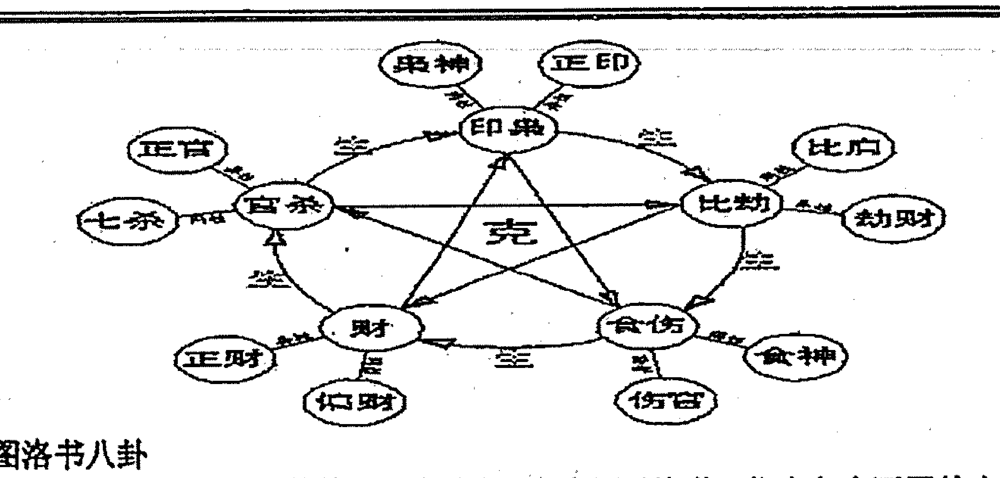

## 20 河图洛书八卦

以九宫八卦作为排盘的基础，为地盘。九宫源于洛书，代表九个不同的方位。这就是口诀“戴九履一，左三右七，二四为肩，六八为足，中央为五”的格局与数字。

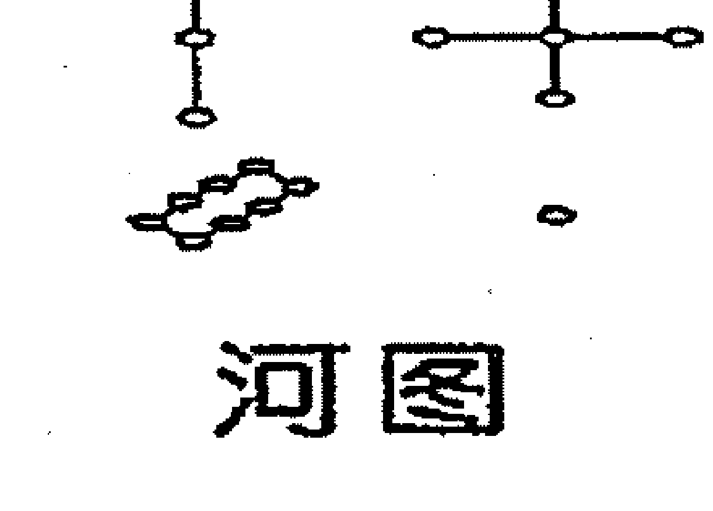

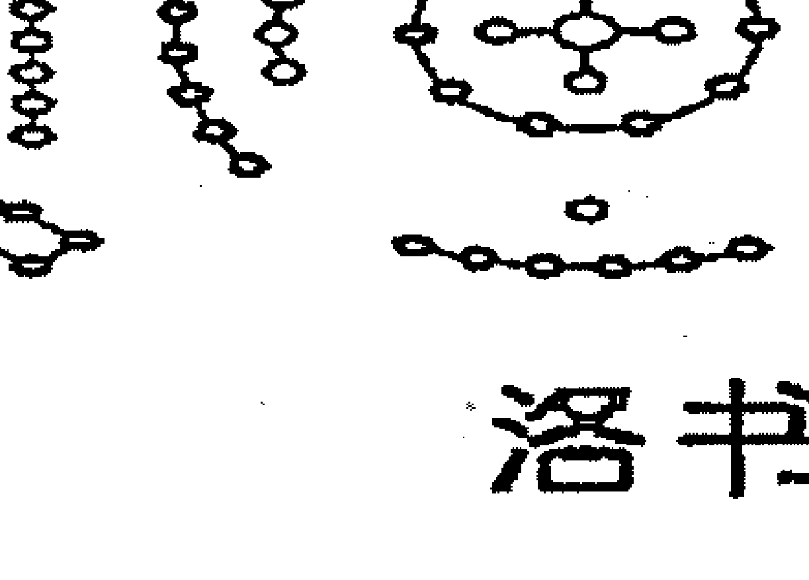

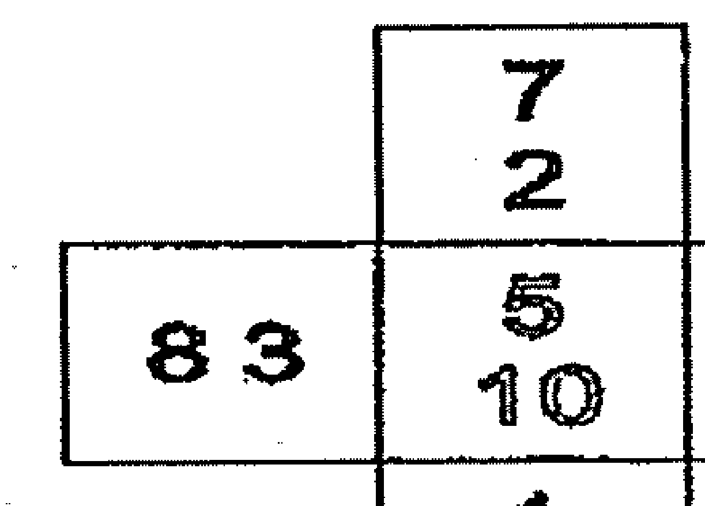

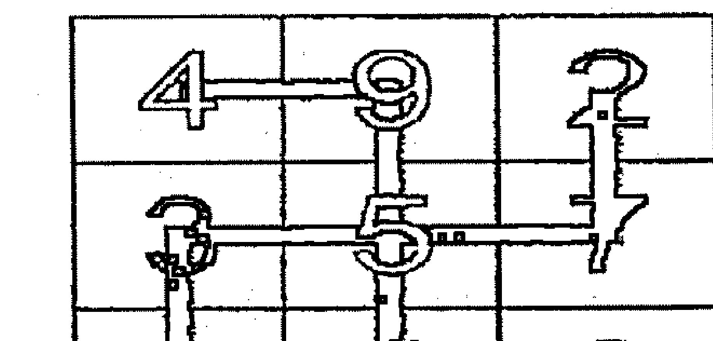

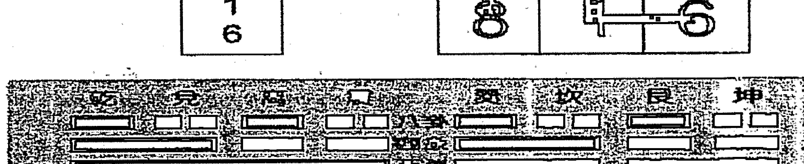

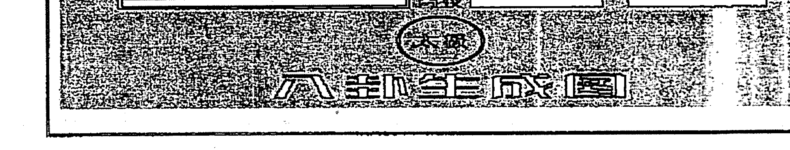

“八卦”是易经中的基本图形，八卦是怎样产生的呢？在《周易·系辞》中说：“是故易有太极，太极生两仪，两仪生四象，四象生八卦。”
太极生两仪：太极是天地混沌，阴阳未分时的“元气”状态，天地又如鸡蛋，后来盘古氏开天辟地，奠定乾坤。两仪就是天和地。
两仪生四象：阴与阳继续演变，相重或相交，产生出老阳、老阴、少阳、少阴四象，这四象象征着四时、四方等现象。
四象生八卦：四象再继续演变就产生出了上述的八卦了。八卦分别象征八节、八方等。
八卦的五行属性就是：坎属水，离属火，乾和兑属金，震和巽属木，坤和艮属土。请注意，奇门预测的生、克就是以八卦宫位的五行来确定的，如用神落震宫属木，克坤宫（土），又受兑宫（金）所冲克。八卦又分先天八卦与后天八卦。什么叫“先天”，什么又叫“后天”？以哲学的观点来说，宇宙万物没有形成以前，即是所谓的先天，有了宇宙万物，那就是后天。如果从人的方面来说，在出生前为先天，出生后为后天。从发展角度来看，发生过了的为先天，未发生过的为后天。先后天之时用以划分阶段、范围而已，先天八卦为伏羲所作。先天八卦为乾、坎、艮、震、巽、离、坤、兑。先天八卦与后天八卦的排列、象征方位及数都有所不同。先天八卦数为：乾一兑二离三震四巽五坎六艮七坤八。

- 先天八卦所主是：
- 乾居南方，数为一，与坤相对。
- 坤居北方，数为八，与乾相对。
- 震居东北，数为四，与巽相对。
- 巽居西南，数为五，与震相对。
- 离居东方，数为三，与坎相对。
- 坎居西方，数为六，与离相对。
- 艮居西北，数为七，与兑相对。
- 兑居东南，数为二，与艮相对。

另一种则是后天八卦，传为文王所创。

- 后天八卦所主：
- 离居南方，五行属火，与坎相对，数为九。
- 坎居北方，五行属水，与离相对，数为一。
- 震居东方，五行属木，与兑相对，数为三。
- 兑居西方，五行属金，与震相对，数为七。
- 乾居西北，五行属金，与巽相对，数为六。
- 巽居东南，五行属木，与乾相对，数为四。
- 坤居西南，五行属土，与艮相对，数为二。
- 艮居东北，五行属土，与坤相对，数为八。

后天八卦的宫位排法可以用以下歌诀记住：戴九履一，左三右七，二四为肩六八为足。
在奇门中，用后天的八卦图。后天八卦数可以用以下歌诀来记住：一数坎兮，二数坤，三震四巽数中分，五寄中宫六乾是，七兑八艮九离门。

### 先天八卦九宫图
| 巽4 | 乾9 | 坤2 |
| :---: | :---: | :---: |
| 离3 | 中5 | 坎7 |
| 震8 | 兑1 | 艮6 |

### 九宫八卦图（后天）
| 巽4 | 离9 | 坤2 |
| :---: | :---: | :---: |
| 震3 | 中5 | 兑7 |
| 艮8 | 坎1 | 乾6 |

八卦旺衰：
- 乾、兑旺于秋，衰于冬；
- 震、巽旺于春，衰于夏；
- 坤、艮旺于四季（每季最后一月），衰于秋；
- 离旺于夏，衰于四季；
- 坎旺于冬，衰于春。

## 21 九星简介

九星是古代天文学中的九个星宿，在奇门遁甲中，九星组成“天盘”，我们在运用中称为“天时”。九星就是：天蓬星、天任星、天冲星、天辅星、天英星、天芮星、天柱星、天心星、天禽星，在奇门中所占为天盘。在道家奇门中，天禽星随天盘值符。天蓬星五行属水，天任星、天芮星、天禽星属土，天冲星、天辅星属木，天英星属火，天柱星、天心星属金。九星在奇门地盘静止时位置也是固定的，天蓬星在坎一宫，天芮星在坤二宫，天冲星在震三宫，天辅星在巽四宫，天禽星在中五宫(寄坤二宫)，天心星在乾六宫，天柱星在兑七宫，天任星在艮八宫、天英星在离九宫。这种排列归宿不是固定不变的，根据事物发生的不同时间，天盘上的九星也要进行转动，因而产生出种种不同的形式与变化。九星各自旺于它生的月份，相于自己属性相同的月份，休于它克的月份，囚于克它的月份，废于生它的月份，九星论废不论死。

| 星名 | 描述 |
|---|---|
| 天蓬星 | 原名贪狼星。与北方一宫坎卦相对应。讼庭争竟遇天蓬，胜捷名威万里同。春夏用之皆为吉，秋冬用之半为凶。嫁娶远行皆不利，修造埋葬亦问空。须得生门同丙乙，用之万事皆昌隆。天蓬为水贼，所入之宫不宜嫁娶，营造，搬迁等，但如遇生门并合丙奇、丁奇，则可用无妨。春夏可用，秋冬助水之势，不可用。 |
| 天任星 | 原名左辅星。与东北八宫艮卦相对应。天任吉星事皆通，祭祀求官嫁娶同。斩绝妖蛇移徙事，商贾造葬喜重重。天任为富室，求官，嫁娶，迁徙，经商，诸事皆吉。百事皆吉，四时皆宜。 |
| 天冲星 | 原名禄存星。与东方三宫震卦相对应。嫁娶安营产女惊，出行移徙有灾难。修造葬埋皆不利，万般作为且逡巡。天冲为雷神，天帝，武士，宜出军报仇雪耻，征伐交战，鸣金击鼓，摇旗呐喊。不宜嫁娶，修造，迁徙，经商。有慈心造化助人为乐之德，并与农事活动有关。 |
| 天辅星 | 原名文曲星。与东南四宫巽卦相对应。天辅之星远行良，修造埋葬福绵长。上官移徙皆吉利，喜溢人财百事昌。天辅为草为民，宜远行，起造，移徙，婚娶，埋葬，访客。特别利于升学考官，发展文化教育事业。 |
| 天禽星 | 原名廉贞星。与中央五宫相对应。天禽远行偏得利，坐贾行商皆称意。投谒贵人俱益怀，修造埋葬都丰裕。天禽代表中宫，是遁甲元帅值符所在之地。为巫为工，宜远行，做生意，埋葬，修造，见贵。天禽星临宫，百事皆宜，四时皆吉。 |
| 天英星 | 原名右弼星。与南方九宫离卦相对应。天英之星居离宫之位，烈火炎炎，性躁易暴，虽如日中天，大放光明，但和血光之灾有关。嫁娶凶，远行移徙不宜逢，上官商贾凶败死，造作求财一塌空。天英为炉火为残患，宜于谋划献策，面君谒贵，不宜求财考官。 |
| 天芮星 | 原名巨门星。与西南方二宫坤卦相对应。天芮授道结交宜，行方值之最不吉。出行用事皆宜退，修造安坟祸难测。贼盗惊惶忧小口，更有官事被官责。纵得奇门从此位，求其吉事皆为虚。天芮为教师，朋友，故宜受道结交友，受业师长、屯兵固守，不宜用兵交战。不宜嫁娶，迁徙，诉讼，营造，即使得奇门，也难为吉。天芮为土星，秋冬用之吉，春夏用之凶。 |
| 天柱星 | 原名破军星。与西方七宫兑卦相对应。天柱藏形洁宜静，淫祀求福必成凶。出行移徙宜避免，修造安坟万事空。天柱为隐士，宜隐迹固守，不宜出战交兵，修造，嫁娶，经商。 |
| 天心星 | 原名武曲星。与西北六宫乾卦相对应。天心求仙合药昌，路逢仁者有灾殃。出行移徙皆吉利，忌将此日见官妨。天心为医道，为导师，宜求仙合药，治病服药，经商，嫁娶，见贵。秋冬用之吉，春夏用之凶。 |

| 天柱星 | 原名破军星，与西方七宫兑卦相对应。天柱藏形谨守宜，不须远行及营为。商贾百事皆不利，动作为凶危。天柱当金秋肃杀之气，喜杀好战，与惊恐怪异、破坏毁折有关。为隐士，宜隐迹固守，不宜出行谋事，一切所为皆不吉。宜于训练士卒，屯兵固守，不宜出战交兵，经商远行，强行则车破马伤、士卒败亡、破财折本，易有伤灾。 |
| --- | --- |
| 天心星 | 原名武曲星。与西北方六宫乾卦相对应。天心求仙合药当，商途客旅财禄昌。主将迁葬皆吉利，万事欣逢尽高强。天心星与乾卦相对应，因为乾为天、为父，故此星长于心计，和领导才能、军事指挥，医疗疾病有关，故天心为高道，为名医，宜治病服药，练气功，经商，迁徙，埋葬。秋冬吉，春夏凶。 |

## 2.2 八门简介

人世间的万事万物的运动与发展变化，受着空间方位的直接影响，于是就按各种方位与事物之间的联系与不同的特性，把空间分为八个方向，称作“八门”。八门就是休门、生门、伤门、杜门、景门、死门、惊门、开门，在奇门盘中所占为人盘。休门五行属水，生门、死门五行属土，伤门、杜门五行属木，景门五行属火，惊门、开门属金。

八门在奇门盘静止时位置是固定的，休门在坎一宫，生门在艮八宫，伤门在震三宫，杜门在巽四宫，景门在离九宫，死门在坤二宫，惊门在兑七宫，开门在乾六宫，中五宫无门。

如下图：地盘八门图

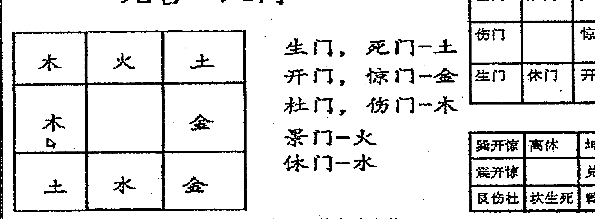

当输入了时间的信息之后，八门方位也开始产生变化。

### 八门分类简介

总分吉门和凶门。所谓八门是指奇门遁甲根据八卦方位所定的八个不同角度。休门、生门、伤门、杜门、景门、死门、惊门、开门各有不同的代表意义。

-   (1)休门
    求财、婚姻嫁娶、远行、新官上任等诸事皆宜。休门的气比较轻松，故很适合出外旅游或非正式的商业活动。

-   (2)生门
    谋财、求职、作生意、远行、婚姻嫁娶等诸事皆宜。生门有生生不息的意思，故最适合求财作生意或有病求医。

-   (3)伤门
    伤门意为破坏的磁场，若强出伤门易见血光，故一般吉事皆不宜。但很适合钓鱼打猎、博戏、索债或围捕盗贼，利刑事诉讼。

-   (4)杜门
    杜门有隐藏的意思，适合隐身藏形躲灾避难，其余诸事皆不宜。若要躲起来不让人发现杜门最适合。

-   (5)景门
    景门是八门之中除开休生三门之外另一吉门。景门最利考试、广告宣传活动、远行婚姻嫁娶等皆宜。

-   (6)死门
    死门主凶除吊丧捕猎之外其馀诸事不宜。

-   (7)惊门
    惊门有惊恐怪异之意思，若强出此门易遇惊慌恐乱之事，利民事诉讼。

-   (8)开门
    宜远行，利求职新官上任、求财、婚姻嫁娶、访友、见贵人。不宜政治阴私之事，易被他人窥见。

## 2.3 八神简介

关于神的概念，《荀子·天论》中说的很形象：群星追逐着循环运行，日、月交替着照耀大地，四时轮转着向前递进；阴阳造化普及于四方，风雨布施于万物，万物得到自然的滋养而生长，万物得到自然的和谐而成就，人们看不见他的行动，可是看得见他的功绩，这就叫“神”。在奇门遁甲中，八神即是神助，八神的规律，是总纲，是作出判断的一个主线。八神决定了一个局的大方向。所以八神盘在奇门断事中是非常重要的。

八神就是：值符、腾蛇、太阴、六合、白虎（下有勾陈）、玄武（下有朱雀）、九地、九天，在奇门盘中所占为神盘。值符属木、腾蛇属火、太阴属金、六合属木、白虎（下有勾陈）属金、玄武（下有朱雀）属水、九地属土、九天属金。在阳遁局和阴遁局中八神的排列有所不同，阳遁顺时针排，阴遁逆时针排。

## 2.4 奇门遁甲常用概念

奇门遁甲中经常要用到六仪，击刑、门迫、入墓、空亡等概念，这些概念在普通奇门书中也有所论述，但道家密传之法与众不同。

### 门迫与击刑

所谓门迫，就是八门克所落之宫叫做门迫。遇到门迫能量耗损减弱。

-   伤门落艮宫、坤宫；
-   开门落震宫、巽宫；
-   杜门落艮宫、坤宫；
-   休门落离宫；
-   景门落乾宫、兑宫；
-   生门落坎宫；
-   惊门落震宫、巽宫；
-   死门落坎宫；

以上都为门迫，如开门、惊门落巽宫均为门迫，门迫力量减弱百分之五十。以求财为例，如巽宫数为四，因为门迫，实得财之数为二。

所谓击刑，也就是时干与所落之宫构成三刑。甲子戊落震三宫，甲戌己落坤二宫，甲申庚落艮八宫；甲午辛落离九宫，甲辰壬落巽四宫，甲寅癸落巽四宫。以上都为六仪击刑，击刑是别扭、拧劲的意思。击刑力量减弱百分之五十。

| 宫位 | 天干 |
|------|------|
| 巽四宫 | 甲辰壬、甲寅癸 |
| 离九宫 | 甲午辛 |
| 坤二宫 | 甲戌己 |
| 震三宫 | 甲子戊 |
| 艮八宫 | 甲申庚 |

### 入墓与空亡

奇门遁甲中天干入墓。甲落坤宫为入墓；丙戊入乾宫为入墓；丁己落艮宫为入墓。庚在艮宫为入墓，辛在巽宫入墓，壬在巽宫，癸在坤宫为入墓。入墓是被藏起来的意思，就像物品装入仓库里，也象东西装进口袋里，天干入墓也起了一定的作用，但力量只有原来的百分之二十，百分之八十的力量失去了。比如武士用的宝剑，当把它拿在手中的时候，寒光四射，令人胆寒，把它装入鞘里的时候宝剑的锋芒不见了，但它毕竟还是一把宝剑，还具有一定的震慑力，只不过削弱了而已。空亡是六十花甲子分为六旬，每旬中有两个地支逢空。甲子旬中戌亥空，甲戌旬中申酉空，甲申旬中午未空，甲午旬中辰巳空，甲辰旬中寅卯空，甲寅旬中子丑空。在奇门中九宫逢空是信息转移了，百分之八十的信息转走了，只有百分之二十的信息留在原处。

## 第三卷 阴盘奇门排盘

### 第一步：排四柱

即是把起局时的阳历时间转换成干支表示方式。比如：2006年5月23日19时45分，四柱为：丙戌 癸巳 壬子 庚戌。

### 第二步：定局

-   阳遁：冬至后夏至前的这段时间为阳遁
-   阴遁：夏至后冬至前的这段时间为阴遁
    局数取（年支序数+月数+日数+时支序数）除9之余数。如2006年5月23日19时45分农历：四月二十六日，四柱为 丙戌 癸巳 壬子 庚戌。年支戌序数为11，四月二十六为4+26，时支戌序数为11，所以(11+4+26+11)÷9余数为7。因为此时是冬至后夏至前起的局，定为阳局，所以此局为阳7局。

### 第三步：画九宫格

现在比较流行的是井字格，因为画起来方便。道家奇门预测是讲神的，三式之中只有奇门有神盘。古法奇门布局以九宫格为最好，先画大方格，格定天地，再分小方格，格定九州，如此则信息能完全贯注其中，分析判断起来必然有如神助。井字格四面透风、气场不聚，能量呈消耗状态，操作者容易分散注意力，看不到关键，抓不住要领。还有一点，起奇门局要心平气和，讲究心法。如此，则产生共振的场效应，达到天人合一的境界，提高准确率。画九宫时心中默念：“无极生太极，太极生两仪，两仪生四象，四象生八卦，八卦定乾坤”。所画格局线与线之间要交接紧密，格与格之间不要相通，否则信息容易混乱，导致判断不清，切记！

### 第四步：布地盘三奇六仪

根据局数，以阳局顺布、阴局逆布原则排列：戊己庚辛壬癸丁丙乙，是几局戊就落几宫。这里要记住九宫数：戴九履一，左三右七，二四为肩，六八为足，五居中宫。如下表（以阳1局为例）：

| 宫位 | 九宫数 | 地盘仪 |
|------|--------|--------|
| 坎一宫 | 1 | 戊 |
| 坤二宫 | 2 | 己 |
| 震三宫 | 3 | 庚 |
| 巽四宫 | 4 | 辛 |
| 中五宫 | 5 | 壬 |
| 乾六宫 | 6 | 癸 |
| 兑七宫 | 7 | 丁 |
| 艮八宫 | 8 | 丙 |
| 离九宫 | 9 | 乙 |

如果是阳1局：戊落坎一宫，己落坤二宫，庚落震三宫，辛落巽四宫，壬落中五宫，癸落乾六宫，丁落兑七宫，丙落艮八宫，乙落离九宫。

如果是阴1局：戊落坎一宫，己落离九宫，庚落艮八宫，辛落兑七宫，壬落乾六宫，癸落中五宫，丁落巽四宫，丙落震三宫，乙落坤二宫。

如果是阳7局则为：

| 宫位 | 地盘仪 |
|------|--------|
| 坎一宫 | 丁 |
| 坤二宫 | 庚 |
| 震三宫 | 壬 |
| 巽四宫 | 癸 |
| 中五宫 | 丙 |
| 乾六宫 | 戊 |
| 兑七宫 | 己 |
| 艮八宫 | 辛 |
| 离九宫 | 乙 |

### 第五步：找出旬首

甲子戊，甲戌己，甲申庚，甲午辛，甲辰壬，甲寅癸，为旬首。旬首是以时柱来找的。可以从下表查询，比如：壬申时预测，则旬首是甲子戊。丁未时旬首是甲辰壬。

### 第六步：定值符与值使

值符就是值班的九星，值使就是值班的门。地盘的旬首落在哪个宫，那个宫的地盘星和门就为值符和值使门。

地盘的九星和八门（原始宫位）：

| 宫位 | 九星 | 八门 |
|------|------|------|
| 巽四宫 | 天辅星 | 杜门 |
| 离九宫 | 天英星 | 景门 |
| 坤二宫 | 天芮星 | 死门 |
| 震三宫 | 天冲星 | 伤门 |
| 中五宫 | (无) | (无) |
| 兑七宫 | 天柱星 | 惊门 |
| 艮八宫 | 天任星 | 生门 |
| 坎一宫 | 天蓬星 | 休门 |
| 乾六宫 | 天心星 | 开门 |

比如：阳一局：甲子旬，旬首戊落在坎一宫，则值符星就是天蓬星，值使门就是休门。如果甲寅旬，癸落兑七宫，则天柱星为值符，惊门为值使门。

### 第七步：确定天盘三奇六仪和九星

奇门局中，三奇六仪有两层，在下面的一层为地盘三奇六仪，在上面的为天盘三奇六仪。根据“旬首和值符随时干”的规律，看预测时辰的时干在地盘落几宫，就将值符和旬首直接写在这个宫内，同时将它原在地盘宫内的三奇六仪也随之写在它如运转到的宫内。

如下面的阳7局：

2006年5月23日19时45分农历：四月二十六日 四柱：丙戌 癸巳 壬子 庚戌（阳七局）

旬首：甲辰壬，天芮星值符，死门值使

地盘仪排列：
| 宫位 | 地盘仪 |
|------|--------|
| 坎一宫 | 丁 |
| 坤二宫 | 庚 |
| 震三宫 | 壬 |
| 巽四宫 | 癸 |
| 中五宫 | 丙 |
| 乾六宫 | 戊 |
| 兑七宫 | 己 |
| 艮八宫 | 辛 |
| 离九宫 | 乙 |

甲辰旬中壬为旬首。因为地盘的旬首壬落在了震三宫（注：原文此处有误，根据阳7局排盘，壬应在震三宫，但下文描述及示例均显示壬在坤二宫，为保持与原文示例一致，以下处理基于原文“壬落在了坤宫”的描述进行），所以坤宫地盘的星和门即为值符和值使。查地盘九星和八门表，坤二宫的地盘星为天芮星，因此天芮星为值符，在坤二宫地盘的门为死门，因此死门就为值使门。根据旬首和值符随时干的规律，则上面局的天盘六仪和九星排列如下：

时干为庚，地盘的庚落在了坤二宫（根据原文示例）。所以旬首壬就加在了坤二宫中的庚上面，再把旬首壬所在的宫（震三宫）的地盘九星（天冲星）移在了坤二宫。

地盘：丁 庚 壬 / 癸 丙 戊 / 己 辛 乙（九宫格）
天盘：      壬(天冲) /         /         
（注：原文此处的天盘填充示例较为混乱，且后续有完整局例，故此处按原文逻辑简述，以最终完整局为准）

依次填写三奇六仪和九星如下图（此为第七步完成后的天盘仪与九星示意图）：

| 宫位 | 天盘仪 | 天盘星 |
|------|--------|--------|
| 坎一宫 | 庚 | 天心星 |
| 坤二宫 | 壬 | 天冲星 |
| 震三宫 | 戊 | 天任星 |
| 巽四宫 | 丁 | 天辅星 |
| 中五宫 | 丙 | 天禽星 |
| 乾六宫 | 乙 | 天蓬星 |
| 兑七宫 | 辛 | 天柱星 |
| 艮八宫 | 己 | 天芮星 |
| 离九宫 | 癸 | 天英星 |

### 第八步：排八神

八神为：值符、螣蛇、太阴、六合、白虎、玄武、九地、九天。这里八神顺序一个接一个的顺序是固定不变的。八神排列阳遁顺时针运转，阴遁逆时针运转。八神中的值符首先写在地盘时干的宫内，也就是天盘中的旬首落几宫它就落几宫。余下的七神按顺序分别填在其他宫内。这里顺时针逆时针转不是指宫数顺逆，而是顺时针转：坎1-艮8-震3-巽4-离9-坤2-兑7-乾6。逆时针转为：坎1-乾6-兑7-坤2-离9-巽4-震3-艮8。

排八神（以阳7局时干庚落坤宫为例，值符起于坤宫）：

| 宫位 | 八神 |
|------|------|
| 坤二宫 | 值符 |
| 兑七宫 | 螣蛇 |
| 乾六宫 | 太阴 |
| 坎一宫 | 六合 |
| 艮八宫 | 白虎 |
| 震三宫 | 玄武 |
| 巽四宫 | 九地 |
| 离九宫 | 九天 |

（注：原文此处的表格混合了神、仪、星、门，较为复杂，此处按八神排布原则单独列出。）

### 第九步：定八门

看旬首地盘在哪里，哪里就是旬首的这个时间，值使门所落之宫。比如上局中为甲辰旬，地盘壬在坤2宫，所以在甲辰时这个时辰内，值使门在坤二宫值班。然后看预测时是什么时辰在哪个宫，再依次找到值使门落在哪个宫。上面的阳七局，庚戌时，在艮八宫（注：原文为“庚戌时，在艮八宫”），所以值使门落在艮8值班。甲辰时值使门在坤2宫，乙巳时在震3宫，丙午时在巽4宫，丁未时在中5宫，戊申时在乾6宫，己酉时在兑7宫，庚戌时在艮8宫。这里找值使门落宫是按宫位的顺序去找的，即阳局是按九宫数1234567891的顺序，阴局则为9876543219的顺序找。找出使门所落宫后，按八门固定不变的顺序填，即八门：休门→生门→伤门→杜门→景门→死门→惊门→开门。不管是阳局还是阴局，找出值使门后，在填其他的门的时候，都是按顺时针方向填写。这里的顺时针是坎1→艮8→震3→巽4→离9→坤2→兑7→乾6→坎1的顺序，而不是指宫数的顺序。

如上面的阳7局。死门落艮八宫后，惊门落震宫，开门落巽宫，休门落离宫，生门落坤宫，伤门落兑宫，杜门落乾宫，景门落坎宫。注意：中宫的奇仪寄坤二宫，此例中的丙寄于坤宫。

（原文此处有一个复杂的综合排盘示意图，描述天盘仪、地盘仪、八神、九星、八门在九宫格中的分布，因格式转换复杂且易错，此处保留原文描述，实际输出时应整合成清晰的九宫格表格。）

### 第十步：排隐干

原则是：时干加在值使门上，然后按照天盘的顺序或者地盘的三奇六仪顺序排列一圈即可。如上面的阳七局的隐干排法：这里天盘三奇六仪在九宫格的顺序为：庚→壬→戊→乙→辛→己→癸→丁。如下面的完整的局：2006年5月23日19时45分农历：四月二十六日丙戌癸巳壬子庚戌阳七局甲辰壬值符天芮星在9宫值使死门在8宫（注：原文此处与前面值符、值使宫位描述有矛盾，此处理解为完整示例，按原文列出）。

（原文此处有一个带隐干的完整排盘示意图，因格式转换复杂，此处保留原文描述。）

### 第十一步：空亡和马星

#### 空亡查法：

-   甲子旬中戌亥空，即乾宫空
-   甲辰旬中寅卯空，即艮和震宫空
-   甲申旬中午未空，即离宫和坤宫空
-   甲寅旬中子丑空，即坎和艮宫空
-   甲午旬中辰巳空，即巽宫空
-   甲戌旬中申酉空，即坤和兑宫空

#### 马星查法：

-   亥卯未时马星在巽宫（亥卯未马在巳）
-   寅午戌时马星在坤宫（寅午戌马在申）
-   申子辰时马星在艮宫（申子辰马在寅）
-   巳酉丑时马星在乾宫（巳酉丑马在亥）

如下面是个完整的局：2006年5月23日19时45分农历：四月二十六日丙戌癸巳壬子庚戌阳七局甲辰壬值符天芮星在9宫值使死门在8宫

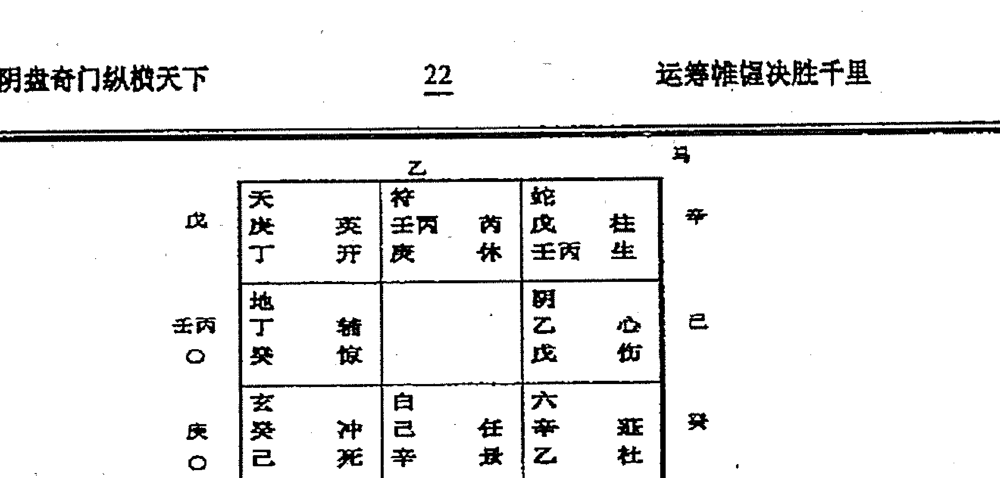

### 第十二步 奇门分析判断主要方法

分析判断前的准备工作：一个奇门局起好以后，在分析判断前，首先要做好三项准备工作。

-   第一项准备工作，是把纲领性的用神，即天盘上的年、月、日、时干标出来，同时把求测类别的特殊用神标出来。
-   第二项准备工作，就是根据六甲旬首把格局空亡的地方标出来。古人讲，空亡藏有玄机，也就类似命理学中所谓“天机泄于病处”一样。奇门局中某宫逢空，往往从中可以泄露事物的一些信息，特别是有关用神所在宫如果逢空亡，更能昭示给我们一些信息。空亡究竟能给我们提示哪些玄机，这要具体情况具体分析，很难概括地讲清楚，起码它表示事物有变化，过去实，现在空了，或者说现在空了，填实或冲实之年、月、日，该事物又可能实了，或者昭示此事将来要落空、应空，空忙乎一场，等等。总之，它与事物的成败得失有关。奇门用六甲旬空，由于我们讲的是时家奇门，一般情况下只标时干空亡之处即可，有时，日干空亡也有用，甚至年干空亡、月干空亡，都能向我们提供一些信息。
-   第三项准备工作，就是把时辰的驿马星标出来。古人云：天机泄于动处。驿马星的歌诀是这样的：申子辰马在寅，寅午戌马在申，巳酉丑马在亥，亥卯未马在巳。（日、月、年的地支驿马星在奇门中一般不用，故不用标出来。）

#### 十二地支与马星

-   三合局与马星：
    -   寅午戌——马在申
    -   申子辰——马在寅
    -   巳酉丑——马在亥
    -   亥卯未——马在巳

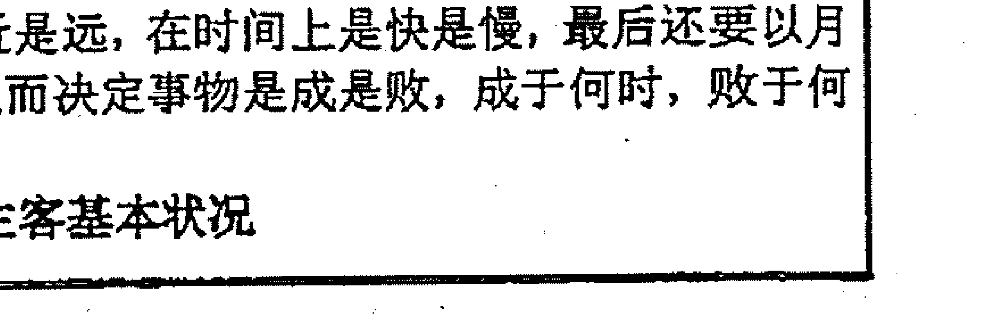

#### (一) 分析判断的根本思路

用苏轼登庐山诗概括总结为四句话，这就是：横看成岭侧成峰，远近高低各不同。不识庐山真面目，只缘身在此山中。意思是，要看清奇门格局中隐藏的该时空中立体的全方位的信息，必须竖看天、地、人、神四层盘，横看用神与周围有关事物的生克制化关系，还要通过内盘与外盘来分辨事物在空间上的位置是近是远，在时间上是快是慢，最后还要以月令为主，看用神与有关事物各自的旺相休囚，从而决定事物是成是败，成于何时，败于何时。

#### (三)竖看一个宫中天、地、人、神四大要素及主客基本状况

世界上的任何事物，依据天人合一的观点，都离不开主观、客观两个方面。而一个人或一件事物从主观本体上说，都离不开天时、地利、人和、神助四个方面。在奇门预测中，首先要从用神落宫中，分析天时、地利、人和、神助四大要素，看其主观条件如何。

#### (四) 横看用神落宫与所处周围事物之间的生克制化关系

依据五行关系论，事物必然与周围相关事物处在一个金、木、水、火、土又相生又相克的五行生物链条之中，或呈现平衡状态或出现失衡状态，由此而决定了事物的成败得失、吉凶悔吝。根据奇门九宫格模型，模拟事物之间所存在的生克制化关系，来横向分析用神与其他事物之间的关系，比如日干与年、月、时或其他特殊用神之间的关系。横向比较时，就不再考虑三奇仪，星、门、神原来五行属性，而均以其落宫地盘的五行属性来比较其生克关系。

#### (五) 通过内外盘以及伏吟反吟等格局，分辨事物在方位上的远近，在时间上的快慢

奇门在阳遁格局中，以一、八、三、四宫为内盘，在空间上表示近，在时间上表示快，以九、二、七、六宫为外盘，在空间上表示远，在时间上表示慢。

奇门在阴遁格局中，与阳局正好相反，即以九、二、七、六宫为内盘，在空间上表示近，在时间上表示快，以一、八、三、四宫为外盘，在空间上表示远，在时间上表示慢。另外，还要分伏吟局与反吟局。凡星门伏吟局，在空间上主近，在时间上主慢，凡反吟局，在空间上主远，在时间上主快。这一点，又与内外盘不完全一样。还有一点，日干为求测之人，时干为求测之事，这是二个纲领性用神。如果日干、时干均落外盘，则主远、主慢，日干、时干均落内盘，则主近、主快，如果日干和时干一内一外，也表示空间上比较远，时间上比较慢。

#### (六) 以月令为主，看用神与有关事物的旺相休囚，依据生克制化，决定事物是成是败，然后定应期，成于何时，败于何时

横看成岭侧成峰，远近高低各不同。其中所谓高低，在奇门格局中，就是以月令为主，分辨用神与有关事物各自落宫的旺相或休囚死墓绝等状态。从而才能依据生克制化的哲学原理，来判断事物的成败与吉凶悔吝。

## 第四卷 阴盘奇门用神

### 一、年、月、日、时取用神

奇门在定局排盘之前要排好四柱，即年、月、日、时。四柱本身是一个六亲体系。年干为父母，月干为兄弟姐妹朋友，日干为自己，时干为子女。六亲在具体定位时比较复杂。下面举一个例子说明。

```
年干  月干  日干  时干
乙    辛    戊    丁
酉    巳    寅    巳
```

假如一男士当面来问测事情，日干为问测人自己，当其问及其兄弟姐妹时，月干辛为其姐妹或异性平辈朋友，因为日干戊是阳干，辛为阴干，与日干戊相异。庚为其兄弟或男性平辈朋友。年干乙为其母亲，因为乙与戊相异，一阴一阳，那么乙的合神庚即为其父亲。时干丁为其女儿或异性晚辈，丙即为其儿子或男性晚辈。四柱也可以确定企业内上下级组织结构。这在后面的企业策划章节中专门论述。

### 二、方位取用神

如果有多个在现场用同一个局来预测，可以用问测人所在的方位来看落宫预测事情。阴盘奇门在室内没有阻隔的可视空间内用活坐标，即不是以室外大空间的南北为南北，而是以预测师的坐向来定坐标。以预测师的面向方位为朱雀及南方，后面为玄武即北方，左边方向为青龙即东方，右边方位为白虎即西方。

### 五、奇门预测用神

#### 一、测疾病

1.  以天芮代表病，生死二门代表生死。以本人年干或日干（均八字）落宫得生死二门休囚决其生死，生门生，死门难愈。如又得凶星凶格必死，其余六门主缠绵。以天芮废没之日为愈期或克天芮落宫之干支者为愈期。
2.  若天芮落宫乘凶神凶格，日干虽得旺相气而被天芮来冲克年命者亦死。又看病入年命日干（八字中）入墓者亦死。（如死门加生门，占病死者复生。）新病落空亡者生，久病落空亡者死。又看日干带死囚之气，带凶神凶格，或不得奇门者亦死。
3.  以求测者落宫之卦判断病者。以天心、乙奇为医生落宫的方向，天冲为医院，看其与天芮星落宫的生克关系，以此判断治疗的成败及效果。
4.  天心星、乙奇所落之宫乘奇门吉格为良医，二神乘旺相之宫，不逢奇门吉格为时医，不得旺相气及奇门吉格为庸医。不论良医、庸医，但能克天芮病神之宫者，医必有功。若病神落宫克二神落宫者，虽良医亦不能治也。
5.  以时干代表病神，值符代表病，时干加地盘星为医生，值使加三奇或六仪为病痊之期。值使落宫的五行如生时干宫的五行，病容易好，否则难好。时干宫五行克值使宫五行也容易好，否则好的慢。
6.  测人寿数长短事凶，以其出生之时的三盘布演。男以天冲顺布，女以天柱顺布，看至死门相隔几宫，一宫十年，余一宫一年，四维宫作二年，至生日之干宫为整个生命年岁。若年命日干旺相逢奇可再推第二轮。人以九十为标准，每宫代表十年，看天冲星落宫与死门之间相距远近定人寿数。阳遁顺数，阴遁逆数。逢五行旺相者，一生没有什么灾害，否则一生常有坎坷。
7.  占儿女病，时干入墓必死。
8.  身体部位，何种病症，兼看死门、伤门、惊门、杜门、景门等。天芮星所落宫看人体疾病。
9.  天干对应身体：甲、胆，头部；乙、肝，脖项和肩；丙、小肠，肩或额；丁、心脏，胸和齿；戊、胃，肋和鼻子；己、脾，腹部和面部；庚、大肠，脐轮和筋；辛、肺，胸部和股部；壬、膀胱、三焦和小腿；癸、肾，心包和足。以洛书九宫为准。

#### 二、测婚姻

1.  以天盘乙奇为女方，天盘庚为男方，六合为媒人，丁奇为妾或第三者插足女人，丙奇为第三者插足男人。
2.  乙奇与庚两者落宫相生，又逢吉门吉格，则恋爱可成，婚姻美满。两宫相冲相克，婚事难成，或夫妻关系不好。庚宫克乙奇，男嫌女；乙奇克庚，女嫌男，均不成。强成之后，必有刑克。庚入墓而成凶格刑伤丈夫，乙奇入墓乘凌凶格，克妻子。六合落宫生乙奇落宫，媒人偏向女方；六合落宫生庚落宫，媒人偏向男方。
3.  乙奇落宫所临的星、神、门及格局，代表女方性格、身材、长相及职业状态。庚落宫则为男方。乙奇落宫带刑击为女性凶恶，得吉星性情温良；庚落宫带凶星为男性暴烈，得吉星主男方温良。
4.  已婚者以用神相合之干为配偶的代表符号，以他们二者关系，判断婚姻的美恶吉凶。
5.  如测成婚或离婚，可以分别看男、女双方的年命落宫情况，以此帮助判断双方恋爱或婚姻的结局。
6.  男婚女嫁以盘中占据太阴、六合为完美。太阴、六合旺相或相生、比和，说明婚后和美。若居螣蛇、朱雀，媒人从中两相欺瞒。若居勾陈、白虎，肯定媒散难成，如成，男女也会有一早亡，半途丧偶。若居九地，婚姻能成，但很迟慢。若居九天，眼下就成，还可能会出外旅行结婚。若居玄武，要谨慎小心，内中可能有诈，或者婚后拐子带财而私奔他乡。居值符最吉，万无一失，美满称心。

#### 三、测怀孕分娩

1.  判断胎儿性别：以坤宫天芮星为母亲，以天盘临坤宫之星为胎儿，阳星为男孩，阴星为女孩。如天禽星临坤宫为双生，阳干为男，阴干为女。以坤宫所临之门为胎儿，阳门为男孩，阴门为女孩。以日干为母，时干为子，以时干阴阳和所临星、门、宫来判断男女。或以值符为产母，以六合或值使为胎儿来取用神。
2.  判断胎位情况及分娩是否顺利：以坤宫为产室，天芮星为产母，天盘所临之星为胎儿。天芮克天盘之星者，主产速。天盘星生地盘星天芮者，子恋母腹，产迟。天盘星克地盘天芮者，为子克母，主母凶；地盘天芮克天盘星者，母克子，主子亡，但得旺相之气，及奇门吉格者则不碍事。如时干所临天盘星落地盘墓，主子死母腹内。天地两盘如果乘凶门凶格者，子母俱凶。以坤宫所临之门为胎儿，产室克门，胎不安；门克坤宫，孕妇常病。如果伏吟，为子恋母腹，胎主稳而产迟。上乘白虎则产速。门到坤宫若休囚入墓，可能是死胎。如果临三奇，则为吉利。
3.  判断产期：一般以坤宫对冲之宫天盘所临之干为应期，也可按阴日看庚上之干，阳日看庚下之干等其他断应期的方法进行。

#### 四、测求学、考试、比赛、拜师学艺

1.  凡求学考试，考生本人求测，以日干为考生。父母代考生求测，以时干为考生。还可看考生出生年的天干，以年干为用神。以天辅星为考试院，以值符为主考或监考官，以值使为副主考官或副监考官，以丁奇为文章，以景门为试卷，以年干为录取学校。如为培训班，天芮为学员，值符为主办单位，天辅为老师。如果考生落宫旺相、得三奇、吉门、吉格，又得天辅星、值符、年干相生者，能考入理想学校。考生落宫旺相，得三奇、吉门、吉格，克天辅星、值符、年干者，也能考入较好学校。如果考生落宫休囚无力，又不得奇门吉格者，但得天辅星、值符、年干相生者，虽考试成绩不佳，但也能录取。如果考生落宫死绝入墓或空亡，又得凶门凶格，又受天辅星、值符、年干相克者，定然是考不上。
2.  丁奇、景门二者落宫状态及与天辅星、值符、年干的生克关系，以此来判断考试答题的优劣及得分状况。景门落宫为考分，日干落宫为录取考生数。岁干生丁、景门落宫且得吉格，定考取一类学校。岁干生景，不得吉格，可考取普通学校。岁干不生景、丁自乘旺相，可考取代培、自费、旁听生。岁干不生丁、景，或反吟入墓，或值空亡，难以录取。岁干克景、丁，是考学不被录取，反惹出麻烦。
3.  值符（天乙）五行生日干、景门五行，六丁宫又旺相，必获功名。年干遇三奇吉门、星，大利。虽得奇门而不得吉门，名不能得；得吉门而不得三奇，终必成功。
4.  体育、武术比赛：值符为裁判，以日干或时干为运动员，庚为比赛器具，辛为金牌、奖品，景是战略、战术或比赛取胜方法、技术指导。如果主队与客队比赛，则须分主客，一般以地盘时干为主队，以天盘时干为客队，以其落宫的旺相休囚、格局好坏、生克关系来定输赢博弈胜负。值符落宫为主方，六庚落宫为客方，五行生克论胜负。博弈看值符，值符加伤门，表示能胜。
5.  拜师学艺，入山访道：以天芮星为访道之人，以天辅星为传道之人。若天辅得吉门、吉格来生天芮者，必得高人传授；相比和者，空见人，不传道；相克者，不能见人，或不传道。投武、拜师学艺，以天冲星为武士，以值符为武师，二者相生，主利。彼此相克，不利。如天冲星就是值符，大利。遇反吟、伏吟不利。

#### 五、测工作就业

1.  一般以开门代表文职工作及单位，杜门代表武职工作及单位，年干代表上级领导，值符代表顶头上司，月干代表同事，日干代表求测者本人，时干代表上级或单位职工群众。如：日干或年命落宫旺相，又得吉门吉格吉神者，表示自身条件好，得天时地利，再得开门或杜门相生，则求职得官顺利。如：日干或年命克开门或杜门，经过努力也能得到工作或官职；如自身不得天时地利，又受开门或杜门冲克者，必然得不到官职或工作。
2.  能否晋升职务、职称：一看天时，二看地利，三看人和，四看自身条件和运气。自身条件好，又得年干、值符、开门相生者，必然能晋升，反之则不能。开门克用神，文官降调。杜门克用神，武官降职。反吟主调任，空亡必革职，入墓不但降罚，还会招来罪戾。太岁来克，上级领导不喜；值符来克，顶头上司不爱；月干来克，同事参劾；时干来克，下边群众告状。
3.  以开门为官星，以其所临九星为人品。如开门上乘吉星为好人，凶星为恶人。临天辅星文雅，天任星慈祥，天心星正直，天禽星忠厚，天冲星风厉，天英星昏烈，天芮星贪毒，天柱星奸诈，天蓬星大恶。
4.  军队干部和士兵转业或退役：可以杜门为官长，以日干为退役之人。如杜门生日干，主工作需要，领导有意留你，不准转业或退役。如果杜门克日干，则准退。比和者，也准退。如果日干乘青龙逃走或癸入白者，必退役；如果乘白入癸，虎猖狂者，则不可退。如果日干临蛇天娇，则可能有官司缠身，欲退不能。如果见大格或雀投江凶格，则可能被辞职。

#### 六、测经营求财

1.  以日干为求测之人，时干为财或货物，甲子戊为资本，生门为利息，生门所临之星为财星，值符为货主，值使为购货之人，六合为经纪人，月干为同行竞争者，值符、景门为行情，值符为物主或银行，时干、值使门落宫为经营项目，值使为借贷人。开、休、生落宫为得财方向，生门落宫为得财数量，开门为店铺、门面，生门为房屋，死门为地皮，天乙（值符下临地盘之星）为贷款人或借款人，以值符为债主，以天乙为欠债人，以伤门为讨债人。如生门落旺宫、又得奇、得吉格，则得利大；相则平；休囚利微；如休囚又逢凶格，无利赔本。甲子戊与生门落空亡，反吟，墓绝，再有凶格凶神者，不仅不得财，反会招惹是非。甲子戊和生门上乘吉星事更吉，乘凶星则含有凶的成份。又可以地盘甲子戊上乘之干来判断得财数量得财时间：甲子戊与生门同落内盘为距离近，速度快；一内一外则迟；全在外则更迟、更远。甲子戊与开门同宫，则得财迅速。又以地盘时干宫的地支定应期，为得财之年、月、日、时。伏吟，则生门对冲之宫地支为应期。
2.  交易求财：以日干为买主，时干为卖主，六合为经纪人、中介人。日干生时不利卖方，时干生日干利买方。日干克时干，买主不要；时干克日干，卖主不卖。六合生日干，经纪人向买主；六合生时干，经纪人向卖主。六合入墓或空亡，必有奸诈欺瞒之事。日干与时干比和，公平交易，也主成交。日干、时干有一空亡，交易不成。
3.  投资求财：以甲子戊为资本，以生门为利息。生门落宫得奇和吉格、吉星，生甲子戊落宫吉，必获倍利；比和，得中利。生门宫克甲子戊宫，又得凶神凶格者，必赔本。甲子戊落宫生生门落宫，主添加资本仍可获利。生门落墓绝之地（指月令与生门之关系），再有凶神凶格，必耗尽资本。
4.  买货求财：以日干为买主，时干为货物。时干宫旺相得吉门吉格，又上乘吉神者，为货的质量好；休囚不得奇门吉格吉神者，质量次。如果休囚，又临凶门凶格，上乘玄武者，必是假冒伪劣产品或腐烂变质货物。时干生日干，好货孬货终有利。时干克日干，或空亡、墓绝，则无利。日干生时干，为主动去买。日干克时干，也能买成。
5.  卖货求财：以值符为卖方，值使为买方。值使乘奇门吉格生值符或二者比和，可以卖出。值符生值使，或二者相克，则卖不出去。以日干为卖方，以时干为货物，甲子戊为资本，生门为利息。日干生时干，为人恋货，不肯卖；时干生日干，为货恋人，卖不出去。日干克时干，虽想快速将货卖出去，但成交迟缓；时干克日干，卖得快。卖货有利无利，只要时干宫（货物）生甲子戊或生门宫，则可获利；时干宫不生甲子戊或生门宫，或者二者相克，则无利。时干宫乘凶神凶格来冲克日干宫者，必赔本。（二、八宫不遇反吟，则按比和断，反吟，则按对冲断）
6.  买卖房地产求财：以生门为住宅，以死门为地皮，以值符为买房或卖房之人。生死二门乘三奇吉格，说明房屋和地皮好。如果生值符宫，对买主有利，买后可发达。如果生死二门不得吉格，说明房屋和地皮一般或质量差；如果生值符宫，则对卖主有利，卖后发达。如果二者比和，则主平安。如果生死二门休囚无力，又乘凶神凶格，说明房屋和地皮不好；如果二门宫来克值符宫，则主买后破家败财；如果值符来生此二门落宫，则必因此宅产而破败不利。以日干为买主或卖主，以生门为房屋，以死门为地皮，看其二者之间的生克关系。以日干为买主或卖主，以时干为房屋或地皮，来看其二者之间的生克关系。
7.  开店求财：商场、门市、酒店、旅馆、餐厅等，包括开办工厂等坐地经商预测，一般均以日干为求测之人，开门为其商场、门市、工厂、酒店等的代表符号。
8.  合伙求财：以日干为我方，时干为合伙之人。时干乘奇门吉格来生日干宫者，对我方有利；日干宫生时干宫者，对他方有利；日干与时干比和者，公平。时干宫克日干宫者对我不利；日干宫克时干宫者，对他不利。同时，生门宫生我则吉，克我则不吉。以地盘日干为我方，以上乘天盘之干为合伙之人。天盘之干生地盘日干者，对我方有利；地盘日干生天盘之干者，对他方有利；比和者公平；二者相克则不成，成则不顺利。
9.  贷款或借钱：以值符为物主或银行，以值使为借贷之人。值符生值使，或值使克值符，可以借到或贷到；如果值符克值使，或值使生值符，则借贷不遂。值符与值使有一方空亡，也主借贷不成。以所往之方的天盘星与地盘星之间的生克关系论之，天盘为动为客，为借贷人；地盘为静为主，为物主、银行。地盘星生天盘星者，必借给或贷给；二者比和，虽然肯借贷，但必迟疑；二星相克主不借，反惹羞辱。如果天盘星所临之干入地盘墓库者，则物主吝啬，不肯借。所去借贷之方，如果遇空亡，则说明物主无钱或人不在，去了也借贷不成。
10. 放贷：值符为银行为放贷人，天乙（值符落宫原地盘之星）为借贷人，生门为利息。值符克天乙落宫吉，天乙克值符落宫凶。天乙生值符落宫吉，值符生天乙落宫凶。生门与天乙同克值符落宫，放出之款损失殆尽。生门与天乙同生值符落宫，本息全还。生门与天乙有一生一克值符宫者，借出之款不能全还或迟还。如果天乙落宫休囚无力，虽生值符宫，是无力偿还，结局是不全还或迟还。
11. 讨债：值符为放债之人，天乙（值符下临地盘之星）为欠债人，伤门为讨债人。伤门克天乙，讨债人实心实意去讨。天乙克伤门，彼此争斗不服。伤门与天乙同生值符，本息全能追回。伤门与天乙同克值符，本息不还。伤门生值符，克天乙，能讨回；伤门生天乙，克值符，讨不回。天乙旺相克伤门，虽有能力，但不还；天乙休囚生伤门，虽有心还，而无力量，即使还，也还不全。如果天乙乘庚辛来克值符，必有经官之事。值符克天乙乘丁奇或景门落四宫（四宫杜门主执法机关）者，也有经官之事。甲子戊会开门落内盘者，其债速还。天乙乘天蓬或玄武，又克值符宫者，欠债人存心不还。

#### 七、测出行出国

1.  以日干落宫为出行之人，看去什么方向。这个方向如果有吉格吉门来生日干落宫，则为顺利；如果无吉门吉格，但该方向地盘宫与日干落宫比和，也为顺利；如果日干落宫得吉门吉格，克所往方向之宫，也可出行；如果出行之方得吉门吉格，但克日干落宫，虽勉强可行，但必不顺；如果所往之方遇凶门凶格，又来冲克日干落宫，则大凶；如果所往之方为时干空亡之地或为日干之墓地，则不利；如果日干或年命刑、墓、空亡出行方位之宫，也为不利。同时，也可兼看日干与时干的关系，以便帮助判断出行的利弊吉凶。
2.  凡出行乘车，以景门所临之宫为道路，以伤门为车。遇白入荧凶格易遭盗贼，逢荧入白凶格，则可能碰上火灾，临天蓬、玄武可能被盗或丢失钱物。
3.  凡出行乘船，以休门所落之宫为水路，以伤门为船贝。如果遇青龙逃走或白虎猖狂凶格，可能遭遇风暴；如果碰上雀投江，蛇天矫凶格，则可能有沉船的危险。
4.  如果坐飞机出行，可以九天所临之宫为航线，以开门为飞机，看其临宫状态，格局如何，以定其利弊吉凶。
5.  测出发时间，先看日干和时干。如果日干和时干均在内盘，则行期近；如果日干和时干俱在外盘则行期远；日干和时干一内一外，也主行期远。一般以开门落宫地盘所临之干为具体出发时间。未动身时预测外出归来之期，一般以出门之日的日干落宫下临地盘之干为归来日期。
6.  测行人在外吉凶，一般以用神及其年命落宫所临星门、宫、神及其格局好坏旺衰来判断。
7.  预测行人归期，以庚格来判断。阴日以庚上之干为归期，阳日以庚下之干为归期。逢年格，年内必归；逢月格，月内归来；逢日格，当日即回；逢时格，本时辰内即归。不逢格，则不归。何谓不格？乙庚合，不为格；庚金入墓或空亡，不为格。古人又以天蓬、天芮二星为代表行人，行人在千里之外以天蓬星为用神，行人在千里之内以天芮星为用神。如果时干临天蓬或天芮，则可归来，时干就是归期；伏吟不来，反吟来。如果用神临三奇和三吉门，三奇六仪又正好是行人的年干，则马上可以回来；如果凶星凶门临行人年干，必有妨碍不能归来。

#### 八、测行人走失

1.  测行人走失，如果以走失时间起局，就以日干为用神；如果按问测时间起局，以六亲关系取用神。如父母问测子女走失，以时干为用神；问测同辈人走失以月干为用神；问测老年人走失以年干为用神。同时，都还可以兼取行人年命为用神。
2.  行人走失方向，多以六合落宫为走失方向。一般情况下，六合落宫是行人开始走失的方向，中间值符落宫，值使门落宫都可能是其落脚点，而最终找回或死亡的方向往往是用神（包括年命）落宫的方向。如果走失之人是有意潜藏，杜门落宫则可能是其躲藏方向。如果九星或八门反吟，或用神宫逢空亡，用神落宫的对冲之宫则可能是其走失方向。又以内盘外盘分其远近，阳遁用神落宫在一、八、三、四宫，则为内为近；九、二、七、六宫为外为远。阴遁则以九、二、七、六宫为内为近，以一、八、三、四宫为外为远。
3.  行人在外安危吉凶，则主要以用神落宫的格局来判断。如果用神旺相，又临三奇、吉门、吉格、吉神、吉星则平安无事；如果用神落宫是太岁、月干、日干或时干宫相生，则为有人帮助。如果用神休囚无力，又遇凶星、凶神、凶门、凶格或入墓、空亡、六仪击刑，则不吉或大凶。
4.  行人走失，能否找回或自己回来：一般日干与时干同宫，或时干生日干，则容易找回或自己回来；日干生时干，日干克时干，或时干克日干，则不易归。用神旺相，又临开、休、生、杜四门者，不好找到；用神休囚，又临伤、景、死、惊四门者，则有消息，可以找到或自己回来。用神乘九地、太阴，可能有人潜藏；乘九天，远走高飞；乘玄武，被人拐骗；乘腾蛇，有人盘查羁留；乘白虎，防止刑伤；乘值符、六合，安全无事。伏吟，人难归；反吟，人必归。
5.  行人归期：
    -   （一）以用神和值符定应期，旬空者，以填实之时或冲实之时为应期；逢冲者，以合为应期；逢合者，以冲为应期。
    -   （二）以庚格定应期，逢年格者年内归，月格者月内归，日格者当日归，时格者本时辰内归。阴日看庚上之干，阳日看庚下之干为应期。或者看时干，时干临阴星，则以庚上之干为应期；时干临阳星，则以庚下之干为应期。
    -   （三）看马星，马星动或冲动马星之时为应期。

#### 九、测钱物丢失

1.  钱物丢失，一般以日干落宫为失主，以时干落宫为丢失之钱物。如果日、时同宫，为没有丢失，可以找到；如果时干落宫乘旺相之气来生日干落宫，也能找回；反吟者也主能找回。相反，则不易找回。时干落空亡、墓、绝之宫，也主难找回。
2.  日干与时干同在内盘，则钱物丢失在家中或近处；日干与时干同在外盘，则钱物丢失在外边或远处；日干在内，时干在外，则丢失在外边；时干在内，日干在外，则丢失在家中。
3.  如果时干临玄武，则可能被人偷去或自己忘记；如果时干宫被玄武宫或天蓬宫所克，则可能被人盗走。玄武乘阳星为男人，乘阴星为女子；旺相有气为青壮年，休囚无气则为老年人。
4.  丢失钱物找到时间，一般以时干生日干之日时为应期，或按庚格而断，阴干寻庚上，阳干寻庚下；入库者，以冲出之日时为应期；旬空者以填实之日时为应期。

#### 十、测刑事案件

刑事犯罪包括偷盗、抢劫、流氓、杀人以及贪污受贿等经济犯罪。

#### 十一、测官司诉讼

1.  偷盗财物、流氓强奸、轻微经济犯罪以玄武为用神，抢劫杀人、奸情杀人、重大贪污受贿罪犯，以天蓬星为用神，甲午辛为罪人，凡是犯错误或犯罪之人，都还可以同时以六仪辛为用神。
2.  罪犯特征：一般以用神落宫旺衰，结合所临星、门、神三奇六仪，来判断其职业、长相、身高、性格等。蓬、玄临庚多为老奸巨猾的重大案犯，临辛多为惯犯或曾被劳教关押者，临壬、癸多为在逃罪犯。
3.  作案手段与工具：蓬、玄临伤门或伤门生蓬、玄，多为用车。临景门或景门生蓬、玄，多为使用枪枝火器。临庚、辛或庚、辛生蓬、玄，多为使用尖刀、匕首等金属器械。临巽宫或腾蛇，多以绳索将人勒死或以手掐颈而致死人命。临甲、乙或伤、杜二门，也可能用木棍或木制东西将人打伤或致死。
4.  星门伏吟或用神落内盘，则可能是本地人或单位内部之人所为，星门反吟或用神落外盘，则可能是外地、外单位人或流窜犯再次作案。
5.  罪犯逃跑、藏匿方向，一般以六合为逃犯，以杜门落宫为藏匿方向。以内盘、外盘、杜门所落宫数，来判断其远近。
6.  发现无名尸首，以死门为其代表符号。死门临甲子戊可能是为钱财而被杀，临乙、庚、丁、壬或桃花者，多为奸情所杀，乘太阴、六合，多为隐私暧昧之事所杀。
7.  能否破案：以伤门、白虎、六仪中的庚和值使门为公安捕盗之人，公安捕盗之人落宫旺相，冲克罪犯落宫者，案一定能破。相反则难破或破不了案。星、门伏吟者难破，反吟则能破或案犯再次作案时可破。同时，有庚格，即庚临年、月、日、时者，能破，不格者不破或难破，另外，杜门逢庚辛壬癸，或天盘六仪克地盘六仪，或地盘六仪生天盘六仪，一般也能破案。
8.  破案时间：以庚格而定，庚临年干，一般年内可破，庚临月干，月内可破，庚临日干，当日可破，庚临时格，本时辰内或表示较短时间内可破，如果一局中同时出现两个庚格，则表示该案一定能破，而且时间较短。具体破案时间，还可结合阳日看庚下，阴日看庚上之干，或时干临阳星看庚下之干，时干临阴星看庚上之干等方法来判断。还可以按旬空出空、马星动、值使门落宫等方法判断。
9.  死门加壬，主讼人自讼和壬临坤宫凶犯自首。

1.  以值符为原告，天乙（值符落宫地盘之星）为被告，开门为法官，六合为证人、证据，景门为诉状，丁奇为传票，惊门为律师。如值符落宫旺相有气，又乘吉门、吉星、吉格来克天乙落宫者，原告胜。如果天乙落宫旺相有气，又乘吉门、吉星、吉格来克值符宫者，被告胜。如果二宫比和，则可能合解。如果值符宫生天乙宫，可能原告主动求和，如果天乙宫生值符宫，则可能被告主动求和。
2.  开门落宫既克值符宫，又克天乙宫者，法官铁面无私，公平审判。开门生值符，法官向原告，开门生天乙，法官向被告。如果开门入墓，则法官糊涂，审不明白，开门落空亡，不予审理，反吟，需换官来审。
3.  起诉书是否被法官受理，以景门为用神，代表起诉书。如果景门落宫旺相，又得三奇吉格，说明情词恳切，不被开门宫冲克者，必被受理。如果受开门宫冲克，则不予受理。如果景门落宫空亡，又乘玄武或腾蛇者，主所诉事情不实。如果六害宫逢空，则说明证据不足。
4.  是否判刑：以甲午辛为罪人，以壬为天牢，以癸为地网，甲午辛临壬、癸者，必有牢狱之灾，临三奇，特别是丁奇者，则可能无罪释放。再结合与开门落宫的生克关系，综合判断之。
5.  如果是犯罪本人或亲属预测，还可以日干或按六亲关系取用神。以辛为天狱，壬为地牢，癸为地网。如果用神落宫，下临辛主被囚禁，临壬、癸者为误入天地网，待冲破之日可出。如果天盘壬、癸之干下临地盘辛者，为网罗蒙头，主囚禁时间长。如果用神落空亡之宫，则不被囚禁。

#### 十二、测天时气象

1.  奇门中以九星代表天时，故预测天气，以九星为主，兼看天干、八门、八神及其落宫状况。以天英星为火神、主晴，天辅星为风伯、主风，天柱星为雨师、主雨，天蓬星为水神、主雨，天冲星为雷公，主雷霆。
2.  冬季以天心、天柱星主雪，以八门中的景门主晴，开、伤二门主雷，休门主云雨，生门主风，杜门主电，惊门主虹霓。十天干中，以甲、乙主风，丙、丁主火，戊、己主阴云，庚、辛主冰雪，壬、癸主雨水，壬为大雨，癸为小雨。八神中，以值符为日、月，九天主晴，九地主阴，六合主风和日丽，白虎主风，玄武主雨，太阴主阴云霜雪，腾蛇主闪电虹霓等等。天英星乘旺相，落三、四宫，或克日、时二干，主晴天，天辅星乘旺相，落离九宫，或克下落之宫，或克日、时二干，主风晴。天蓬星乘壬、癸二干，游于一、三、七宫，或天柱星乘壬、癸二干，游于一、三、七宫，主雨，乘壬主大雨，乘癸主小雨。如果同时天英、天辅星落宫天盘之干克地盘之干，必然风雨雷电交作。与值符近，则雨速，远则雨迟。天蓬、天柱乘壬、癸二干游于坤二宫，主密云不雨。天蓬、天柱如果不乘壬、癸水神，即使游于一、三、七宫，也不下雨。
3.  冬月，天心、天柱二星乘壬、癸到乾、兑二宫，主雪。
4.  测河水消涨，以天蓬、休门为用神而判断。天蓬、休门乘旺相气而得三奇者，水虽涨，不至泛滥。天蓬、休门乘旺相气而值庚格，主河水壅塞泛滥涨满。如果再乘甲辰壬带腾蛇，则洪水肆虐为害。天蓬、休门落于二、五、八宫，水被土克，洪水立消，或无水。天蓬、休门不乘庚格与甲辰壬者，水虽旺发，也不会决堤出岸。

#### 十三、测地理环境（风水）

1.  以日干为人，以时干为住宅。时干临三奇吉门、吉星、吉神、吉格乘旺相来生日干，则为最佳住宅，此居住环境对人最为有利。如果时干不临三奇吉门，但临吉星、吉神、吉格乘旺相来生日干宫，也为较好住宅。如果时干所临有吉有凶，则为一般住宅。如果时干临凶门、凶星、凶神、凶格，又来克日干宫，自然就是大凶之宅了。具体吉凶，再根据星、门、宫等的生克关系来具体分析。
2.  测阳宅，一般以生门为房屋，以死门为地皮（宅基），再以其旺相休囚，与日干的生克关系来判断其优劣，又以值符为新宅，以值使为旧宅。
3.  测阴宅，一般以死门为用神，死门落宫地盘为死者，天盘为生者，吉神、吉星又得三奇，上下相生者吉，凶神、凶星不得奇，且上下相克者凶，天盘克地盘，对死者不利，地盘克天盘，对生者不利。死门落二、五、八、九宫为吉，落六、七宫次之，落一、三、四宫不吉。

#### 十四、测人生机迟

1.  测一个人的先天素质和后天大的机迟，可以通过其出生时间的奇门格局进行分析，一般以日干落宫为本人，在家庭以年干为父母，月干为兄弟姐妹，时干为子女，在社会群体，以年干为上级领导，月干为同事朋友，时干为下级群众。以九星为天时，八门为人事，九宫为地理，八神为自然力量。结合时令和落宫分析其旺相休囚，结合格局分析其机迟好坏，通过五行生克制化分析其吉凶祸福。
2.  测一个人近期机遇和行运，可以通过问测时间的奇门格局进行分析，一般以日干为本人，结合年命落宫，综合判断之，也可以结合来人落宫方位，帮助判断之。

#### 附、奇门测终身方法

（一）奇门与四柱结合；
（二）奇门出生时间局与问事局同参；
（三）严格按照拆补法定局，同时中五宫阳遁寄八宫，用生门；阴遁寄二宫，用死门。

#### 总体思路

1.  首辨男女与阴阳二遁：男命阳遁为顺，女命阴遁为顺，否则就有可能不顺。
2.  看何星值符、何门值使：①看是吉星照命，还是凶星、门值班；②看日干所临之星的生克关系，就是看日干所临之星与值符的生克关系；③再比较值使门与日干所临之门的生克关系。比如毛泽东的八字奇门格局是天禽值符照命，天柱为日干所临之星，天禽土生天柱金，天禽为百官之首；生门值使生日干所临之惊门。蒋介石是天任吉星照命，生日干所临之天柱星；但生门值使照命克日干所临之休门，人事上不行。值符、值使生日干所临之星、门，成功机遇较多；日干所临之星、门生值符、值使，则一生付出较多。
3.  看大局：①天显时格，六甲之时生人都是天显时格，一生较平稳；②星门伏吟；③星门反吟，星反吟天时不利，门反吟人事不利，反吟起伏大。
4.  竖看日干落宫的状况：①完全合局：就是日干得天时、地利、人合、神助、时干等吉格，此为大富大贵之人；②基本合局：天时、地利、人合、神助五个方面得多数比较好的格局，为富贵人；③半合局：五个方面占一半左右，一半吉、一半凶，这样可以为社会中层人士；④失局但有气：上述五个方面都不太好，但有气，这样可以是下等穷人中的脑力劳动者，如农村教书先生；⑤完全失局：格局都不好，且日干在死墓绝之地或逢空，就为穷苦之人。
5.  由开休生三吉门，断其一生发展方向，如果一方为空，对冲之宫为方向。
6.  以日干所临之星门的阴阳五行属性，断其适宜从事的职业和工作，因为星为上天赐给你的天时、天赋。毛泽东、蒋介石都是临天柱星，适合从事打破旧世界，建立新世界的工作。
7.  由生门落宫与日干落宫的生克关系判断其财运。
8.  由开门落宫与日干宫的生克关系判断官运与事业的情况，还要看杜门情况。
9.  由休门落宫、六合落宫、乙与庚、日干与相合之干的落宫及其关系判断婚姻家庭状况，休门是休息的港湾，也就是家庭。乙与庚同在内盘为早婚，一内一外基本是晚婚，都在外盘为晚婚。
10. 由天辅星、天蓬星所落宫与日干宫之间的关系判断受教育情况。天辅星主文化，天蓬星主智慧，根据这两个星判断文化程度。
11. 由天芮星、死门、伤门落宫与日干落宫的状态及关系判断身体状况。
12. 由年干落宫和乾坤二宫的状态判断父母。
13. 月干落宫、时干落宫判断兄弟姐妹和子女情况。
14. 由值使门落宫，参照日干、年干、时干落宫的旺衰判断寿限，年干为根，年干旺了为有根，寿自然也就长了。

#### 九宫八卦先、后天数及五行数

| 宫位 | 先天数 | 后天数 | 五行数 | 先天卦位 |
| :--- | :--- | :--- | :--- | :--- |
| **一宫** | 6 | 1 | 1、6 | 坤 |
| **二宫** | 8 | 2 | 2、7 | 巽 |
| **三宫** | 4 | 3 | 3、8 | 离 |
| **四宫** | 5 | 4 | 4、9 | 兑 |
| **五宫** | 3 | 5 | 5、10 | 中 |
| **六宫** | 1 | 6 | 6、1 | 乾 |
| **七宫** | 2 | 7 | 7、2 | 坎 |
| **八宫** | 7 | 8 | 8、3 | 艮 |
| **九宫** | 3 | 9 | 9、4 | 震 |

#### 二、奇门如何排大运、看流年

人一生120岁，八宫模拟120岁，一个宫为15年，从出生年的地支算起，出生年地支在哪一宫，从哪一宫算起；然后顺时针往下算。比如今年（乙酉年）地支酉在兑宫，从兑宫开始第一个15年，九星代表前5年，八门代表中间5年，宫的十干克应代表后5年，也就是八宫的状态代表后5年。
流年以天干为主，兼看地支，要看天干与地支之间关系，以及与日干落宫之间的关系，六甲之年看所遁的天干落宫，如甲申年看庚，兼看申落宫。

## 第五卷 阴盘奇门断事秘法

## 一 空亡象断转宫法（远空断、近空断、先天断、后天断）

排好四柱之后，时柱必有旬空，反映在奇门盘中必有一个宫或两个宫显现空亡状态。空亡则事情有变，空亡不是不存在了，而是由一种状态转化为另一种状态，由一个空间转移到另一个空间。比如一锅水在常温下是液态的，当锅下点起柴火时，水便被加热，不停地加热之后，水温升高到100摄氏度便气化了，水由液态转化为气态。但空亡后，空亡之宫存在百分之二十的信息，转移之宫有百分之八十的信息。就像上边提到的那锅水，当锅里的水被蒸发了一大部分之后，锅里仍剩下一小部分。这种百分之二十与百分之八十的比例也符合现在所通用的二八法则。
空亡象断又分远空断和近空断。当一个人向预测师问测时，有时当面问，有时通过电话咨询，或其人在预测师面前问别人的事，而那个人不在现场，这就会出现人在面前和不在面前的两种情况，也就是所谓的远空与近空。空亡之后，信息转移到哪里去了呢？如何转呢？当人在预测师面前时，信息所成的是实象，出现空亡之后，表面那层空了，深层的信息还存在，奇门遁甲用的是后天洛书九宫，但后天为用，先天为体，可以说先天的信息是深层的东西，是本原的东西。表面宫空了之后，深层的信息便显露出来，但深层的信息又必须到后天洛书九宫里去成象，所以又要转到后天洛书九宫里面。
例如 公元2005年3月10日12时28分，A先生与其兄弟当面问测。
乙 己 癸 戊
酉 卯 巳 午
10 2 1 7
甲寅癸，阳二局，天柱星为值符，惊门为值使。
| 地丙庚英景 | 天戊辛丙死 | 符癸柱戊辛惊 |
| 玄庚己辅杜 | 蛇壬癸心开 | 白己丁冲伤 |
| 六丁乙任生 | 阴乙壬蓬休 |  |
从盘中看出艮宫与坎宫空亡。其兄弟为月干己落艮宫，艮宫空亡，人在面前，往深处挖，艮宫深处为先天的震，先天震要在后天成象，转到洛书的震三宫。震三宫的神、星、门组合便是其兄弟的百分之八十的信息，艮宫只占百分之二十的信息。
问测人在面前，其落宫出现空亡时转宫如下：
落坎宫空亡时，转到坤宫；落艮宫空亡时，转到震宫；落震宫空亡时，转到离宫；
落巽宫空亡时，转到兑宫；落离宫空亡时，转到乾宫；落坤宫空亡时，转到巽宫；
落兑宫空亡时，转到坎宫；落乾宫空亡时，转到艮宫。
当人不在面前问测时，或人在面前而所问的是不在面前的人的事时，所成的象是虚象，这时不再往深处挖，当空亡之后是飘着转，是由空亡之宫所对应的卦转到与其对应的先天卦中去。
下面举例说明：公元2005年6月15日上午10时35分，B先生来电问测其妹妹的事情。
乙 壬 庚 辛
酉 午 午 巳
10 5 9 6
甲戌己，阳三局，天辅星为值符，杜门为值使。
| 白辛己心生 | 玄丙丁旋伤 | 地癸乙庚伍杜 |
| 六壬戊柱休 | 天戊壬冲景 | 阴乙癸芮开 |
| 蛇丁丙英惊 | 符己辛辅死 |  |
B先生的妹妹看月干壬的另一半癸落宫，癸落坤二宫逢空亡，人不在面前飘着转，由坤宫转到坎宫，那么坎宫是B先生妹妹百分之八十的信息，坤宫只占百分之二十的信息。问测人不在面前，其落宫逢空亡时，转宫如下：落坎宫空亡时，转到兑宫；落巽宫空亡时，转到坤宫；落离宫空亡时，转到震宫；落坤宫空亡时，转到坎宫；落兑宫空亡时，转到巽宫；落乾宫空亡时，转到离宫；落震宫空亡时，转到艮宫；落艮宫空亡时，转到乾宫。

## 二. 伏吟象断转宫法（远空断、近空断、先天断、后天断）

当奇门局出现六甲伏吟时，与空亡同断。因为伏吟局的信息量相对要少，必须要转宫看信息才会增多。伏吟为天地重叠不动之象，与空亡有许多相似之处，所以伏吟的转宫法与空亡的转宫法相同，参照上面空亡象断的内容即可。

**九星反吟**
| 天蓬 |  |
| 天英 |  |

**九星伏吟**
| 天英 |  |
| 天蓬 |  |

**八门反吟**
| 休门 |  |
| 景门 |  |

**八门伏吟**
| 景门 |  |
| 休门 |  |

## 三 翻宫法（奇门通六壬，前后翻宫妙断事物的前因后果、来龙去脉）

排四柱、定局盘之后，用神落宫反映的是人的一个特定时空的状态，但此时空之前与此时空后的状态又如何呢？这就需要察其前因后果。用什么方式来查呢？这就需要用翻宫法。阴盘奇门翻宫法与六壬的天地翻宫法相似，有异曲同工之妙。用神十干天盘落宫，翻为地盘落宫，那么其天盘落宫即为其以前的时空状态，用神十天干天盘落宫下面所压的地盘十干翻为天盘落宫即为其以后的时空状态。如此可以往以前翻三步，以后翻三步。下面举例来说明。
公元2005年5月11日上午9时35分，C先生来当面问测事情。
乙 辛 乙 辛
酉 巳 未 巳
甲戌己，阳六局，天柱星为值符，惊门为值使。
| 丁天癸乙丙芮 | 符己辛柱死 | 蛇戊癸乙心惊 |
| 地辛丁英杜 | 阴壬己蓬开 | 玄丙庚辅伤 |
| 白丁壬冲生 | 六庚戊任休 | 戊○马 |
日干为乙木，乙便是C先生落巽宫，要看以前的状态，天盘乙翻为地盘落坤宫，坤宫便是C先生以前的状态，坤宫天盘戊。再翻天盘落乾宫是以前第二步的状态，如此方式可翻三步。日干乙木落宫的地盘为丙，丙再翻到天盘落艮宫，艮宫便是C先生以后也就是未来的状态，艮宫地盘庚再翻为天盘落乾宫，乾宫就是C先生以后也就未来第二步的状态，如此方式往后也可以翻三步。通过前后翻宫便可查以前和以后的事态。

## 四 隐干用法

隐干就是暗干，暗干的作用：拓展思维，也有玄机（伏吟二婚）。如测婚，庚为强奸，一夜情，辛为女人的一夜情，己为妓女，戊为鸭子，干伏吟测婚时，不管是什么干，婚姻都有偏差了。隐干用法：‘地盘时干加值使门上，然后看地盘时干，后边的顺序将地盘干加在9宫上。如此局的地盘时干丙在8宫，下一宫的地盘是癸，再下一个为戊，依次类推。伏吟局将时干放入中5宫，按照阳顺阴逆的排法排列。如阳遁则按1宫，2，3，4...宫排列；阴遁则按9宫，8，7，6...宫排列。此局女士先问女儿怎么样，日干为辛，时干为丙，时干丙为异性为男，显然不对，那么要看丙的同性丁，丁就是女儿，此局丁落4宫空亡，转宫到坤宫，天盘乙为其女儿，隐干也为乙，谈对象了？乙+乙伏吟婚姻就有问题，就有玄外因，取掉（西南）己和壬就爱学习了，想转学看怎么样，就看女儿乙下临地盘壬，临天盘宫的状况为转学后的好。此时一个坐在西北方的人问一个朋友准备卖一古董，看能成否，乾宫有癸，朋友为壬，壬落9宫，9宫刚用过了，转宫到先天震，震宫刚才也用过了，震再转到先天8宫，8宫有值符为高档，辛+丙，天盘丙下临癸，网住了卖不了。
断局思路。天时不如地利，地利不如人和，人和不如神助，神助的规律大于一切。在每一宫中，八神起了领袖作用，事物具有八神的性质。时干是先锋主干，转宫排盘，内藏玄机。断事要看三步。第一步、看时干临宫状况，第二步、发展情况看时干下临之干的天盘落宫，第三步、依此类推。天盘是已经浮出水面的事情，地盘是将要或正在发生的事，地盘的天盘是未来发生的事情，是继续发生的事情，发生的事情和时间没有规律，但和时间发展顺序有规律。阴的东西比阳的厉害，地盘比天盘重要，浮出水面的东西比没有隐藏的力量大。天地盘干，上面是代表一个人的性格，下面是代表她的内心活动。如乙+庚女测，则长得苗条，曾谈过朋友，同过床，和同床的男的是公检法或黑社会。乙+乙也谈过，乙+丁男测婚，他的老婆会叫床，伶牙俐齿，说话带刺，乙+丙老婆不顾家，有魄力，办事出乱子，乙+戊老婆会持家，管钱有方，憨厚老实，乙+己主意多，会策划，乙+辛老婆一说就错，口无遮拦，爱打架一打就跑，无人理，乙+壬闲不住，任劳任怨，怀孕了，乙+癸好色性欲强。应期：冲的力量小，填实力量大。用神空亡，时间要延长一些，力量小一点，转一宫时间慢一步。空亡：是玄机点，空亡就是冬至点，是阴阳转换下一个玄机点，相当于人的会阴穴，也就是生殖系统，空亡就是从有到无，从无到有的转换点，玄机点。如发展经济找空亡就是有空子可钻，想生孩子也找空亡点。

## 第六卷 阴盘奇门占法

### 第一章 疾病预测

#### 1 奇门预测疾病

一、综述
人吃五谷杂粮没有不得病的，得病就得调理。要想调理好疾病，先得诊断好它。奇门的诊病方式，是通过对用神所在九宫里的天干、地支、九星、八门、八神的组合，来分析出被预测者得的是什么疾病。在分析出病宫的环境是什么样子。运用万象相干论、万象全息论、万象系统论、万象有意论的原理，解除环境中不良物质信息场的组合，从而达到调理疾病的目的。
要诊断好疾病，就要了解天干、地支、九星、八神、八门的象意。象意在前边已经描述的很清楚。我们来了解他们的组合，就从天干入手。

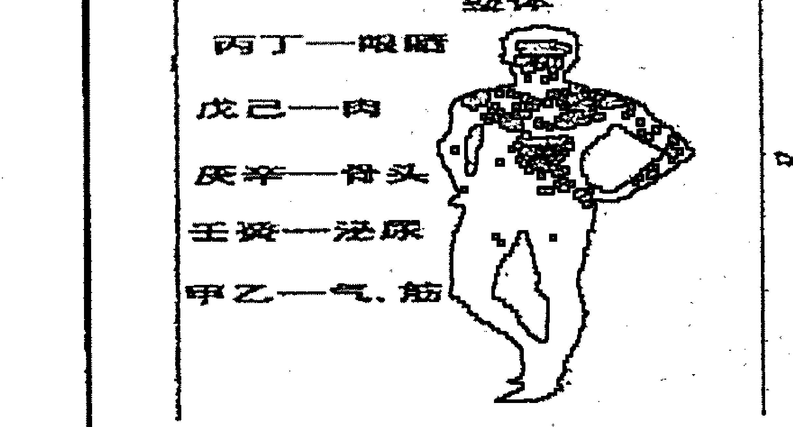

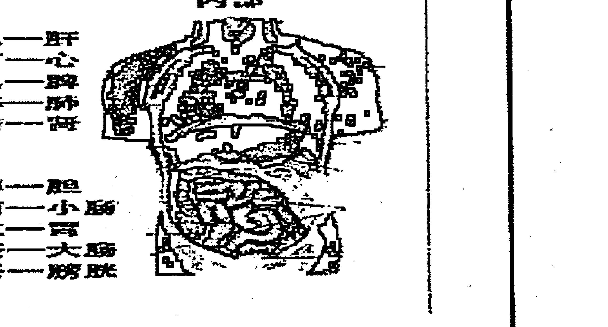

| 序号 | 部位 |
|------|------|
| 1    | 肩膀 |
| 2    | 头   |
| 3    | 肩膀 |
| 4    | 腰   |
| 5    |      |
| 6    | 腰   |
| 7    | 脚   |
| 8    | 生殖 |
| 9    | 脚   |

天芮星
现在西方医学飞速发展，在诊病治病方面有着骄人的成就，尤其是在人体生理解剖学上更是精确入微，在诊断疾病上更有着里程碑式的发展，现代医学借助很多先进的设备仪器来诊断疾病，诸如听诊器、温度计、血压表、B超、X光机、CT、核磁共振等等。很多疾病的名字也与中医叫法大不相同，但是无论怎样变化也超脱不了医学体系的框架。
奇门遁甲能够很精确地模拟人体的从上到下，从内到外的各种系统、器官、组织以及涉及到的各种疾病，因为它跳不出阴阳五行的范畴。奇门的九宫格是宇宙的法则，可以模拟天、模拟地、模拟人、模拟大自然中的万事万物。九宫格可以模拟整个人体，洛书九宫即是戴九履一，左三右七，二四为肩，六八为足。九宫格也同样可以模拟人体的每个器官和组织，比如他可以模拟整个胃，可以模拟整个心脏，可以模拟头，可以模拟手等等。根据医学象、数、理的模拟性，用比类取象的方法，只要能举一反三，触类旁通，就能够很好的读出读准奇门局。

#### 2 奇门断病的思路

奇门测病分为整体断法和单宫断法两种情况。传统的断法是看天芮星落宫的情况，此种方法过于片面狭隘，是不足取的。当一个人问测疾病时，可以看天芮星落宫，以天芮星为主要测病用神，结合日干落宫的情况来分析，同时时干反映的是疾病目前的状态，将天芮星落宫、时干落宫与日干落宫的生克制化进行比较后综合判断疾病的性质、部位、内外、程度、病因、病理、发展状况等等。
当预测者问及别人的病时，也就是代问及病时则不看天芮星，而是看用神落宫的情况。比如问父母的病看年干落宫，问兄弟姐妹的病看月干落宫，问子女或晚辈的病时看时干落宫等等。
遇到落空亡宫或伏吟时说明原来是此宫所反映的病，后来病情发生了变化，病灶转移了，应该用空亡转宫法来查其状态。
宫外的隐干是查疾病的引子，先从隐干入手分析原由，一般来讲隐干是导致疾病产生的导火索，然后再从宫内进行分析，其神、星、门、奇仪及宫的属性都从不同侧面、不同角度反映疾病的各种情况，在进行分析判断时一定要理论联系实际，具体问题具体分析，用排除法一点一点地最后圈定目标得出结论，不能漫无边际的瞎联系，这样才能确保预测的准确性。
当然如果具备相当的中医与西医知识的话，预测起来更会得心应手，如虎添翼，所以学习掌握一些必要的医学知识是必须的。
日干为人，天芮星为病，时干为病的发展总体趋势。人克病主病易好，病克人对人不利，病不易好。
天心星、乙奇为医生医药，天心星为西医药，乙奇为中医药。如天心星乙奇临值符则为高级药品，名医院。临螣蛇玄武则多虚假不实，假医假药。临螣蛇、死门也主巫婆、神汉、仙姑之类，玄武多主假医假药。天心、乙奇临杜门加白虎则主医术一流，技术过硬。临太阴则主医生心思细腻，心细认真，临开门、丁奇则主手术开刀治疗。但不论庸医、良药，但能克病星所落之宫，医必有功。
六仪击刑主灾病。甲辰壬临巽四宫，甲寅癸临巽四宫必主肢体伤残或腿疼。甲申庚临艮八宫则多主车祸伤灾，甲子戊临震宫、甲午辛临离宫、甲戌己临坤宫，一般主病痛之灾。
反吟代表急性病，病情反复。伏吟则为久病，慢性病，得病时间较长，短时期难以治愈。
在治疗疾病时可以用奇门来指导选择有利的方位去就医以及找什么样的医生比如什么属相、什么形体特征等等，以便更有效更快的治愈疾病。选择时以克病神落宫的方位为首选，最好阳克阳、阴克阴，因为同性相克力量大，治疗效果更好。

#### 3 天干落九宫的象意

天干一般代表预测者的人体疾病状态。

##### 九宫对应天干

| 甲乙 | 丙丁 | 戊己 |
|------|------|------|
| 甲乙 |      | 庚辛 |
| 戊己 | 壬癸 | 庚辛 |

口诀：甲胆、乙肝、丙小肠、丁心戊胃、己为脾。庚是大肠、辛主肺、壬是膀胱癸肾脏。

现论：甲乙木多主气血筋络；丙丁火眼睛、血液、心脏；戊己土多主肉，胃、脾；庚辛金主骨头；壬癸体液。

测病先要记住下面口诀：

| 其一 | 甲胆乙肝丙小肠， | 丁心戊胃己脾乡。 | 庚是大肠辛属肺， | 壬是膀胱癸肾脏。 |
|------|------------------|------------------|------------------|------------------|
| 其二 | 甲头乙肩丙为额， | 丁齿戊鼻己为面。 | 庚筋辛肋壬为胫， | 癸为双足是真踪。 |
| 其三 | 甲头乙项丙为肩， | 丁胸戊肚己为腹。 | 庚为腰间辛为肋， | 壬为腹部癸四肢 |

同时参看九宫八卦的位置和五行。

甲为头部，为肝胆，性质为直，为硬。

乙为肝胆、食道、脖颈，乙又为神经、背部，乙的性质为曲，为通道；乙代表中医、中药。乙在离宫、巽宫一般为脖子、食道、颈椎，在坎宫为男性生殖器、女性输卵管、阴道。

丙在体表主额头、肩、背、嘴唇，体内则为小肠。丙的性质为炎症，主烧伤、烫伤、血光肿胀，病灶部位发炎红肿、伤口有血之象。丙落离宫多主头部肿胀、眼有血丝，坎宫则主阴道、子宫发炎。

丁主眼睛、心脏、牙齿，性质也为炎症，但较轻。丁为针，为针灸，也为手术，因手术后必要缝针。对于老年人，丁多主心脏，特别是落离、兑、乾宫，青年人则主眼，其它宫位多指病灶发炎。

戊主胃，主肚子，主鼻，性质为增生物，为大，在离宫多主头部血液循环系统受阻出现脑血栓导致偏瘫；临坎宫则主子宫肌肉增生，输卵管或尿道、阴道受阻，前列腺肥大；落中宫、震兑宫多主肠胃、腰椎增生、后背酸痛，临乾艮多主腿部静脉曲张，麻木、酸痛，结肠问题。

己为面，见壬癸主脓疮粉刺，体内则主脾脏问题，体表则代表腹部、口腔。己也代表增生之物。

庚为大肠、筋骨，性质为阻碍、肿瘤肿块，临壬癸落离宫多主血栓、脑瘤、血脂瘤，临坎多主腹部肿胀子宫肌瘤，庚临死伤二门主癌症，临中宫或兑宫又主腰椎增生。

辛为肺、支气管、腹部，又为骨骼，性质为错位、颗粒、小的增生物，辛在兑、乾、离宫多主支气管肺部疾病，临中宫则病在腰椎，见戊己多为骨刺或骨椎增生，临丙丁多主肺炎、支气管炎、肺结核病。

壬为血液、主动脉、心脏、膀胱、泌尿系统，又为眼睛、头发、腋下，性质为流动，壬为游离态的水。壬临离宫多为心脑疾病，乾宫多为脑病腿病，坎宫则为生殖泌尿系统疾病，震、巽二宫多为肝胆、心脏、腿脚之病，特别是壬落巽宫为六仪击刑，必有腿脚之伤。男性、青年人壬临坎宫主糖尿病、膀胱、肾功能问题。壬临坤宫则为食道、耳朵、脖子有问题。

癸主肾、泌尿、输卵管、尿道、静脉、神经系统、足部、四肢、循环系统、性病，癸的性质为脏的液体。妇女测病壬癸落中宫、兑宫、坎宫多主生殖泌尿功能疾病，临离宫多主神经、脑血管疾病，临巽宫则主腿脚伤灾，坤宫主皮肤病。癸见戊己落坎宫多为糖尿病。

| 八门 | 象意 |
|------|------|
| 休门主休息、静养，不宜四处求医问药，又主泻痢。 | 生门主治疗有望，伤口愈合好，有生机，起死回生。 |
| 伤门主伤灾，受伤部位，肿块，也主抽风、伤寒，伤心过度。 | 杜门主有阻隔，治疗有难度，堵塞不通之症。 |
| 景门为血光之灾，受伤流血，心脑血管疾病，血压头晕一类。 | 死门大凶，主死亡，无药可救，也主伤疤，尸体腐烂组织，肌肉坏死部位。 |
| 惊门主心惊，心慌，心律不齐，脉搏不稳，失眠恶梦，心理有病，担心治疗之类。 | 开门主积极治疗，宜到外面就医，又为肺痛、喉舌之疾，开也为开刀。 |
| 八神 | 象意 |
| 值符为名医名院，治疗环境好，一流高档次。 | 螣蛇主惊恐，病情变化不定时好时坏，疾病缠身，夜里多梦，中枢神经有问题，或受怪异之灵物影响造成意识模糊不清。 |
| 太阴为肺病，也主骨虚、无力、软弱、打不起精神。 | 六合多主综合症，多种病，病扩散，麻风病，病变等。 |
| 白虎代表受伤部位，也为凶丧之事。 | 玄武主暗疾，诊断不明、病因不详，又为头晕、昏迷、血液病，又为灵物作怪，又主呕吐、伤或死于路上。 |
| 九地为阴症，表示病情稳定，没有扩散发展，但又有入地死亡之象，血压偏低，不精神，昏沉。 | 九天主阳症，血压高，病灶在上部，又有升天西去之象，九天须防丧魂失魄，高处摔下。 |

天心星、乙奇为医生医药，天心星为西医西药，乙奇为中医中药。天心临开休生三门为药到病除之象，临死惊伤杜均为不理想。心乙临值符值使为高级药品，名医名院。心乙临螣蛇或玄武多虚假不实，假医假药，螣蛇也主巫婆神汉，玄武防上当受骗。心乙临杜门白虎为医术一流，技术过硬。临太阴为医生细腻，认真负责。临开门丁奇主手术开刀治疗。不论良医庸医，好药坏药，只要能克病星所落之宫，医必有功，反之，名医良药也不能治。

翻宫空不叫落空，就不再翻了

2005年 12月 5日 15时 25分 农历：十一月 初五日
乙酉 丁亥 癸亥 庚申 阴八局 甲寅癸 子丑空
值符天冲星在6宫 值使伤门在6宫 暗干伏吟

公历：2005年12月5日15时25分
农历：2005年腊月初五日
四柱：乙酉 丁亥 癸亥 庚申
节气：小雪～大雪 月将：亥 阴遁8局
值符：天冲星落6宫 值使：伤门落6宫
旬空：甲寅旬 子丑 空 马星 寅

乙
六 庚 心 开
阴 丙 柱 休 丁辛
地 壬 任 生
天 丁 英 死
白 己 芮 惊
玄 戊 冲 伤 庚

问母亲病 母亲为庚落9宫为心脏有病，临庚为起搏器，看病只有坎宫能治，坎空等进入子月就有好转，壬+丙为汤药，杜门为中药，天辅为辅助治疗。

2，西南角人问风水运气，风水调理：东南和东面克西南，东宫丁火不能取，因为丁火泄震木，木就不克坤了，三宫癸水取掉，辛金留下；四宫为厕所门上挂一铜铃就可以了，厕所不能放木器。天芮乘蛇一般都有虚病，就是着没脸的了，或惊吓，蛇临7宫刺猬大仙跟着你（五大仙）天芮临死门鬼也……

### 第二章 婚姻预测

一、综述
男大当婚，女大当嫁，乃人之常情，也是千古不移的自然法则；婚姻，是家庭的纽带，家庭是社会的细胞。在提倡安定团结，社会稳定和共建和谐社会的今天，在具有“家合万事兴”传统文化的熏陶下，美满的婚姻、稳定的家庭是人们共同的心愿。
随着社会的发展，人们的婚姻观也发生了很大的变化。伴随着开放，中西方文化的交融，现代人的婚姻似乎变得更加脆弱，离婚率呈逐年上升之势。拜金主义、多角恋、婚外情……等怪胎侵蚀，威胁着人们的家庭稳定。
美好的婚姻是人们梦寐以求的，优美的爱情故事是人类永恒的主题。在天愿作比翼鸟，在地愿作连理枝。但愿人长久，千里共婵娟。天仙配、梁山伯与祝英台、红楼梦的贾宝玉、林黛玉、杜十娘怒沉百宝箱等对爱情的千古绝唱，世代相传，百听不厌。可是，人们最向往的，也是人们最不容易得到的。人世间最美好的婚姻并不多。为什么有的婚姻和和美美，皓首白头。为什么有的夫妻相亲相爱，却生离死别。为什么有的吵吵闹闹，也能冤家对头厮守一生。为什么有的夫妻一闹就分，破镜难圆。为什么有的人谈对象，一见钟情，相见恨晚。有的人却阴差阳错，鳏寡孤独。世间婚姻千姿百态，可聚散离合，全在奇门一掌之中。

### 例:单宫分析法

丙戌 庚寅 壬辰 乙巳 阳六局 甲辰壬 寅卯空
值符天蓬星在5宫 值使休门在2宫 王教授案例

九地 马 | 九天 | 值符 马
空天柱带己 惊门 丙 | 空天心带戊 开门 辛 | 空天蓬带壬 休门 乙癸
--- | --- | ---
玄武 马 | 螣蛇
空天丙乙癸 死门 丁 | 空天任带庚 生门 己
白虎 马 | 六合 | 太阴
空天英带辛 景门 庚 | 空天辅带丙 杜门 壬 | 空天冲带丁 伤门 戊

##### 一，巽宫

断事从巽宫开始示范：东南方地势低，空间相对窄，是楼房可能吊顶了（九地的特性，神是规律性的东西，此宫的事物都带有九地的性质，相对应的九天为开阔）；东南有根柱子（电杆和比较直的树）这根柱子也不高；东南边有发出响声的东西（惊，柱都是发声的东西）如果你家在农村，有可能那电杆上有喇叭，而且是低音喇叭（体现九地的规律）。东南有垃圾（见己），或者，你家东南的凉台上有红色的东西，或者说凉台光线很强（丙十己：光线被堵）。
住这样的环境，易犯口舌，出乱子，流血事件，经常发烧（低烧）嘴角发炎，犯痔疮）肛门发炎，肠炎，爱肠鸣，经常放屁（己为嘴，肛门，小肉，肠，丙为血，为乱子，为炎症）。
问职业：你们家出教师，律师，歌唱家等用嘴说话的人才，但发展缓慢，挣钱不多（适合己，惊，柱的职业，惊门落此宫为门迫，所以挣钱数就打折了，九地发展慢）；但你很能说，如果对方说“我不爱说，我是做生意的，也不是律师，教师”那你就是做歌厅生意，做音响生意的，你的商店在地下，或是楼层很低的地方，你卖的音响个也不高，买低音喇叭才好呢！你嘴角发炎越厉害，你生意才越红火呢，你想生意好，不发炎也不行呢！
如果问婚姻：你们婚姻不怎么样，经常吵架，而且不是公开的吵，只要经常吵就可能离不了，要是不吵就该分手了（己的配偶为甲，坤宫的值符为甲，相克）。

##### 二，离宫

你们家南边有墙，墙很高，很不平（九天为高，戊为墙，辛为不平）这墙对咱不利（戊+辛为墙犯错）。南边有一个影壁墙（心为影壁），有学员说：南边有个装钱的罐子（戊为罐，辛为钱）。
“贴谱。大家看这人长的怎么样？”有人说：“这人个子高，鼻子不好看，满脸的不平。”有人说：“这女人鼻子上有一个金属饰品，很漂亮，开朗大方，爱穿开放，性感的衣服。”（戊为鼻，辛为颗粒，为饰品，开门为开放）。
职业：开公司的，开店的，做财会金融，首饰的。是卖包子的（戊为包子，为皮，辛为馅）王教授说：“没错，可这包子质量不好，大家可要注意，如果是卖食品的，那用铁皮包装就好。”（戊为食品，辛为金属，辛为错误）这人经常坐飞机，到处跑（九天为动为高为远）。这人干的很开心的事，总想出国发展呢。

##### 三，坤宫

西南边有尖状的房子或建筑物，有个休闲娱乐场所，酒吧，王教授补充：“档次还挺高的，强调值符。”（蓬为尖状的建筑物，休，壬，癸为休闲娱乐之地）那边放了高档的酒水，化妆品（值符贵重），桑拿房，放了雨伞；那里有一个水龙头（癸+乙），而且一定是高档的水龙头，一个艺术感很强的漂亮水龙头了。
这人怎么样：这人很聪明（蓬），在当地很有名气（值符），敢想敢干，风流倜傥，胆大好色（天蓬），有时也很懒散（休）。

##### 四，兑宫

西边有路，路边有垃圾，很零乱，清理过后又有（庚为路，己为垃圾，生为生长，产生）阳台或庭院里放了金属的东西，或盘着的钢丝。“那边有个做生意的，是废品收购的，看上去很老实，这样断行吗？” “很好，这人还是“罗锅”呢！可这家伙临蛇，常变来变去的，很狡猾，有时老实，有时又不老实。是个地，富，反，坏，右份子，是该批斗的对象。”

##### 五，乾宫

西北方有一条路，冲着咱（丁为路口）那边有面墙，对咱有影响，你可能看不见呢（阴为隐藏）墙上有灯，柱子上有灯，柱子上有伤，西北墙边有车。那边墙上还装了面镜子（太阴为镜子，乾宫也有镜子的意思）。
这家是干什么的？有的说是开屠宰场的，有人说是晚上出去开黑车挣钱的；伤为车）有人说是个“心狠手辣”的外科大夫；（丁和伤为手术信息）

##### 六，坎宫

北边有水，低洼之地，北边有条路，有很多树，树把路给遮上了，路在这儿断了。（壬为水，为路，辅为植物，杜为堵）有热水管（丙）丙为红，那边有红水，王教授立即纠正：“要符合常规，红水不多见，断热水管才合理。” 水箱被堵，漏水。
这人是二把手（辅），搞辅导的，搞技术的，圆脸，眼大，文职警察（见白虎，庚，辛就是公检法的）搞中介的，传销团队的。

##### 七，艮宫

东北边有两条大路，那边景色很美。（白虎，庚为道路）东北边有刀，剑，金属之物或构成某种威胁的物体。
是干什么的呢？钢厂的炼钢工人，锅炉工，警察，黑社会性质的，交通收费站（白虎，庚为关卡）
断病：肠癌，还吐血，（白虎，庚在一起主癌症，英，景为红，为血）；粉碎性骨折，交通事故。

##### 八，震宫

东边有艺术的灯，有问题的灯，那边有女神，佛堂，神佛用品等物品。（丁为灯，乙为艺术，玄武为不亮，丙为有问题，天芮，死为神佛及神佛用品，玩偶），可断东边有个书房，那里有笔架，挂着毛笔。
教室东边墙上有两盏灯，正符合这个局。此宫格局可读：大家是学生，来学玄学了，大家是一心一意，咬定青山不放松（芮为学生，死是一心一意），王教授特别强调：“因为临玄武，大家在实践的过程中，被测的这个人他是不明白的，你说的他不知道，但事物一定存在的。”
震位正坐着一位僧人学员，所以针对震宫的格局，有位学员说：“老师，可以断这个和尚暗地里还有两个女人吗？”（玄，芮，可断修行之人，佛僧之人，丁为女人）同学们都乐了。老师也笑着说：“可以这么说，但也可以说这个和尚是一心一意修行，但还是有两个女人暗恋着他；也可以说丁为香火，表现的是寺庙和他周边的环境。”和尚也站起来，双手合掌，对着大伙，口中念道：“阿弥陀佛，”又是一阵哄堂大笑。

#### 二、取用经验：例一

| 乙 | 己 | 乙 | 丙 |
| 酉 | 卯 | 未 | 午 |
| 阳三局 | 甲辰壬 | 天柱星值符 | 惊门值使 |

| 六癸己 | 任死 | 白戊丁 | 冲惊 | 玄己庚 | 辅开 |
| :--- | :--- | :--- | :--- | :--- | :--- |
| 阴丙戊 | 蓬芮 | | | 地丁壬 | 英休 |
| 蛇辛癸 | 心柱 | 符壬丙 | 杜伤 | 天乙庚辛 | 内生 |

1.  如求测者落宫空亡，其配偶仍然以空亡之宫天盘相合之宫断。以例一为例，如求测者为丙，丙落震宫，因为空亡（参见空亡转宫法，以求测者为例）震宫有本人20%的信息。先天转后天，落离宫。其配偶为与丙相合之干而定。辛为配偶落艮宫，因为艮宫也为空亡。如求测者的配偶不在眼前，则按转宫法，后天转先天，即艮转乾。那么乾宫的格局为求测者的配偶的状况，再以相互落宫生、比、克的关系断婚恋的状况和结果。
2.  求测者相合之干的地盘六仪是求测者的第二个婚恋对象，以此为例，日干丁为求测者，壬为其配偶落坎宫，如婚恋失败，则由坎宫的地盘丙翻宫，那么，震宫的丙为日干丁的第二个婚恋对象；同理，离宫戊为日干丁的第三个婚恋对象。
3.  如用神为甲，就找值符（旬首，因为甲遁于其中）落宫以例一为例，甲落坎宫，其配偶是与壬相合之干为丁，而不能为己。只有用神为己时，己的配偶才为甲，也就是值符所落之宫。

### 三、天干、神、星、门婚恋象意特征:

1.  用神临八门（人事、职业特点）
2.  天干主要反映男女的相貌性情
3.  九星代表人的性格，所谓“江山易改，秉性难移”
4.  八神在婚姻的预测信息象意
5.  天干相合看婚后的感情，家庭关系及发展状况

用神临八门（人事、职业特点）

| (1) 用神临开门则主男女双方性格：豁达爽朗、谈吐不凡、坦诚无私、性情愉快、意识活跃、思想开放（女人遇开门，再见乙+戊就是穿衣暴露、性感）、通情达理、讲情重义、自尊心强、勤奋好学等。职业为管理者、经理、老板、领袖、名人。 |
| :--- |
| (2) 用神临休门则主男女性格柔顺平静、休闲懒散、追求时尚、语言温和、多有能人提携，喜欢旅游；有时是懒散。职业为水产、旅游、劳碌性质工作的人。 |
| (3) 用神临生门则主男女性情敦厚老实、做事规矩、前途美好、经济观念强、诚恳守信用。职业为生产管理、经营、贸易之人。 |
| (4) 用神临伤门则主男女为人雷厉风行、勤勉奋进、多动少静、直爽性急、自尊心强，易伤害对方，性情急躁，说话不计后果。职业为运动员、军人、军警、渔猎、机械设备、兵工、车船、技术制造使用有关。 |
| (5) 用神临杜门则主男女性情动作缓慢、朝气不足、思想保守、不爱说话（或聋哑）。职业为从事与技术有关的工作等。 |

(6) 用神临景门则主男女美貌漂亮，化妆打扮，处事虚心，能说会道、脸色红润、知书达理。职业为影视、广告、图书、电子、文化艺术、美容美体等职业。

(7) 用神临死门则主男女性格保守内向，循规蹈矩、思想束缚、固执迟钝，一心一意，“咬定青山不放松”。职业为教徒、宗教工作、宗教信仰，或从事职业与地产、不动产屠宰、医院等有关。

(8) 用神临惊门则主男女性格声音宏亮、一鸣惊人、热情大方、惊恐不安、心跳加速。职业为声音有关、例如教师、律师、歌手、乐器、音响、播报员、导游、营销人员、娱乐场人员等。

##### 天干主要反映男女的相貌性情

(1) 甲主人性情：正直严肃、不怒而威、气质高雅，爱出风头，自以为是。相貌：主人脸形长方、皮肤清白、筋骨强健、浓眉秀发。职业：一般是有名望、有一定地位、有领导才能的人。

(2) 乙主人性情：温柔贤惠、仁慈善良、柔情似水、娴于世故、思前想后、优柔寡断。相貌：主人脸长体长、肤色青白、体态柔美、身材苗条水蛇细腰、性感品味。职业：一般是艺术工作者、文人、演艺界的人等。

(3) 丙主人性情：英武雄猛、威武庄重、脾气急躁。相貌：主人圆脸色红、皮肤干、身体瘦长。职业：一般是与热的工作有关，如电力、化工、采暖、锅炉、照明、影视

(4) 丁主人性情：机智圆融、洞察力强、锋芒毕露。相貌：主人额宽鄂尖、秀气妩媚、眼睛有神。职业：一般是电子行业、照明行业、图书行业、影视行业、娱乐行业等。

(5) 戊主人性情：忠厚老实、遵守信誉、大智若愚、傻哩傻气。相貌：面放大耳、嘴厚鼻直、丰满憨厚。职业：一般是金融会计、地产矿产、建筑施工、农业能源等。

(6) 己主人性情：温顺沉静、诡计多端、机智圆滑。相貌：身材矮小、圆头圆脸、面黄肌瘦。职业：广告策划、中介传媒、泥工陶艺、卫生清洁等。

(7) 庚主人性情：大义凛然、刚健锐利、凶猛威严。相貌：魁梧高大、肌肉健壮、方脸豹头。职业：一般是军人、警察、公检法、炼钢、机械、黑社会。

(8) 辛主人性情：思想叛逆、性格偏激、阴谋诡计。相貌：体态瘦长、方脸形窄、肤色灰白。职业：一般为评论家、思想家、改革者、理论家、军警、公安、犯错人、金银首饰产销、小件金属加工。

(9) 壬主人性情：圆滑多变、聪明过人、目标迷茫、性情不定。相貌：长脸腭方、皮肤色黑、眼大而双。

(10) 癸主人性情：多愁善感、犹豫不决、聪明欲望。相貌：脸方圆、皮肤清白、眼大有神。职业：一般是酿造业、水产、养殖、菜果产销、运输业等。

##### 九星代表人的性格，所谓“江山易改，秉性难移”

(1) 天蓬星主人性情：大胆妄为、聪明智慧、心狠手辣、敢于冒险、阴险奸诈。相貌：眼睛大火皮肤黑、头发蓬松。能干大事业之人。

(2) 天任星主人性情：老诚厚道、勤勤恳恳、任劳任怨、保守固执、怕老婆（老公）的人，慎重守信。相貌：驼背驼身（含胸），但缺乏创意和开拓精神。

(3) 天冲星主人性情：直爽果断、声音雄壮、自尊心强、心烦易怒、性情倔强、耐性不足。相貌：个子高大、身材挺直、面色青白。作事情不动脑筋、半途而废。

(4) 天辅星主人性情：气度非凡、性情彬彬有礼、心慈尔善、有教养有文化、谦恭礼让、漂亮含蓄、谈吐不凡。相貌：稳重大方、气质高雅、做事勤恳认真、有奉献精神。

(5) 天英星主人性情：急躁、沾火上身、英俊潇洒、聪明好学、虚心处事。相貌：英俊潇洒、脸色光亮、皮肤白里透红。做事情急躁、虎头蛇尾。

(6) 天芮星主人性情：吝啬贪婪、节俭朴素、固执迟钝、温厚柔顺、恭敬谦让。相貌：肚大腰圆、面色萎黄、满脸雀斑。做事问题多，从事文化教育、医疗卫生等职业为好。

(7) 天禽星主人性情：忠厚诚实、信守中正、宽以待人、慈祥和善、坦诚节俭、气度宏大（在奇门中是随值符走的）。

(8) 天柱星主人性情：能说会道、声音清脆、语调响亮。相貌：脸型方长、胡须粗硬（男）、活泼好动、身体灵巧。做事中流砥柱、业务骨干、顶梁柱。

(9) 天心星主人性情：思维缜密、精于管理、办事周到。相貌：仪表堂堂、脸方项圆、严肃活泼。做事有心计、有能力、心眼多、有责任心、里外一把手、有所作为。

##### 八神在婚姻的预测信息象意

(1) 值符临用神主人性情：气质高雅、性格直爽、不怒而威。相貌：国字脸、皮肤清白、道貌岸然、有名望、有管理能力或做领导。不屈居人下，多得能人帮助，有靠山。

(2) 腾蛇临用神主人性情：反复变化、奸诈虚假、三心二意、阴阳怪气。相貌：男主身材窈窕，女主水蛇腰、清秀、大脑门、头发黄。腾蛇也主智慧、才能出众。

(3) 太阴临用神主人性情：思想细腻、性情温顺、自私隐瞒、暗中行事。相貌：面白身细、品相极佳、食指如葱。少说多做、策划能力强。

(4) 六合临用神主人性情：随和温顺、慈祥乐观、人缘极佳。相貌：身绵如玉、手如佛掌、眼睛细长、测婚临六合就在一起了。

(5) 白虎临用神主人性情：威严霸道、武断狂傲、本领过人。相貌：脸圆项粗、豹头环眼、脸白身净、虎背狼腰。白虎主有过硬的职业技能，干什么事都愿出头之人。

(6) 玄武临用神主人性情：神秘莫测、口若悬河、奸诈虚假、暗有私情。相貌：贼眉鼠眼、弯背含胸、视物昏花。玄武也主人聪明智巧、道法高明。

(7) 九地临用神主人性情：沉稳安静、憨厚笃实、节俭勤恳。相貌：身材矮小、脸方唇厚、手指粗短、九地主发展稳定、事业稳固。

(8) 九天临用神主人性情：志向高远、心高气傲、性情不定。相貌：高大英俊、威严刚猛、头小体长、九天主远见卓识、发展空间大，技术超群。

##### 天干相合看婚后的感情，家庭关系及发展状况

(1) 甲己合则为中正之合，夫妻生活和谐，你恩我爱、互勉互谦、上尊下爱、即使发生矛盾相互给对方留有余地，不伤害对方，互相尊敬。

(2) 乙庚合则为仁义之合，双方注重情感，讲面子，不给对方难堪，矛盾再大也不让其当众出丑，大多注重家庭、人事、六亲的关系。

(3) 丙辛合则为权威之合，大多父母、长辈、领导作合，碍于情面，顾全大局，外界的影响力胜于双方的真实感情，但这种婚姻大多都能维系。

(4) 丁壬合则为淫荡之合，注重外表形象美貌，肉体的感受，大多婚姻坎坷。

(5) 戊癸合则为无情之合，双方无真实内在情感，只是作为形势或职责义务性的姻缘，不讲究和注重情感的体验交流，只考虑生儿育女，养家口，照顾老幼等责任，婚后情感交流太少，缺少你恩我爱。

以上论述只作参考，婚姻成败按生克制化格局详断，不可拘泥。

### 第三章 事业与财运

#### 一、策划事业与财运思路

财是养命之源，事业是求财之路。财运和事业是不可分割而又不能等同的两个概念。求财的人一定要去做事业，但做事也不一定就为了求财。比如，有的歌唱家唱歌是为了追求音乐的最高境界，为了艺术的完美，很看重自己的艺术品德和名望，他决不为了一个出场费多少万去“跑穴”。有的唱歌就是为了求财，到处“跑穴”，什么歌都唱，目标只有一个，只是要你给钱。世上求财之路千万条，行业差别千万种，路路都生财，行行出状元。靠山吃山，靠水吃水，一方水土养活一方人。这是一个极其简单的道理，可很多搞易学研究的大学者们却总是弄不明白。好像只有开、休、生才有财，只有戊才是财，其实不然。在我们看来，开门、休门、生门利求财，景门、死门、惊门也是财；不仅仅戊是财，庚、辛、壬、癸也是财；奇门遁甲所有符号都是财。你出生在农村，那你就靠土地求财，你是“天任”那就该任劳任怨，像牛一样凭力气去求财，如果神助你，还临个值符，顶多就是个村长。如果爹妈给了你个好嗓子（临惊门），有的天时，地利，人合，那你就会是个歌唱家，是惊门给了你的财，惊门就是吉门、与开门、生门无关。这就是道家奇门“没吉没凶”观念的具体应用，它是符合辩证法的，是经过几千年实践经验的真理。

#### 二、奇门策划事业和财运有三个要点

1.  其一，首看日干落宫（求测者落宫），适应干什么，应该选什么职业，奇门就已经给人定格了；是靠山，还是靠水，细推所落之宫的组合。
2.  其二，时干为求测者所问之事，是事物发展或是否达到求测者愿望的一个大趋势。
3.  其三，选定一个用神，便于细断。如此，教育医疗看天芮星；物流运输看天蓬星；广告传媒看天英星；管理营销看天心星……前两点很直观，排好奇门局就能定下来了，唯有确定用神有些难度。但是，在实践中，往往时干与所测之事（用神）是符合的。为了拓展大家的思路，我们列举选用神的两个实际范例：

**选用神的技巧例一**
程先生有两个预选项目，第一个项目是送变电。第二个项目是生产维护。究竟选择哪个才有利，举棋不定，
第一个项目适合你。
分析策划思路：程先生为日干戊落震宫，第一个项目是送变电，根据送变电工程的特点，第一个项目落巽宫。丙为电压(火性)，壬为电流(动态的)，又丙为火，为高；壬为水，为低，是高低压得转换，蛇主变来变去，具有典型的变电项目特点；天柱为铁塔，惊门为变压器运行时发出的响声。整个巽宫不就是个声色俱全的变电站了吗？巽宫与震宫比合，当然选择第一个项目了。此例为我们打开了一个灵活选择用神的思路，王教授的高明就在于灵活机动，不拘一格，意料之外，情理之中。

公元：2005年 11月 10日 15时 48分阴2局
干支：乙酉丁亥戊戌庚申(子丑空)
直符：天心直使：开门旬首：甲寅癸

| 丙 | 乙 | 辛 |
| :--- | :--- | :--- |
| 蛇<br>壬 柱<br>丙 惊 | 阴<br>戊 芮<br>乙 死 | 六<br>庚 英<br>辛 景 |
| 符<br>癸 心<br>庚 开 | 白<br>丙 辅<br>己 杜 | |
| 天<br>己 蓬<br>戊丁 休 | 地<br>辛 任<br>壬 生 | 玄<br>乙 冲<br>癸 伤 |
| 马 | 己 | |

**“选用神的技巧例二**
孙先生想开矿求财

公元：2005年12月17日15时34分阴2局 干支：乙酉 戊子 乙亥 甲申 (午未空)直符：天英 直使；景门 旬首：甲申庚

| 辛 | 壬 | 乙 |
| :--- | :--- | :--- |
| 蛇<br>丙 辅<br>丙 杜 | 阴<br>乙 冲<br>乙 伤 | 六<br>辛 任<br>辛 生 |
| 符<br>庚 英<br>庚 景 | | |
| 天<br>戊丁 芮<br>戊丁 死 | 地<br>壬 柱<br>壬 惊 | |
| | | 玄<br>癸 心<br>癸 开 |

断：“你想开采金矿，但不会成功，不但开不出金矿，还有麻烦事”孙先生反馈：“正式这样的。”
思路分析：孙先生为日干落震宫，时干为事落离宫，离宫格局组合正符合孙先生所测之事。英，景为孙先生美好的计划和愿望；庚为金属，符主名贵，那名贵的金属自然就是金矿了，见丙还主不仅仅是开出矿来，还得用火冶炼。因为甲申旬时干离宫落空亡，故断希望不能实现，丙为乱子。2005年流年兑宫克震宫，惊柱为官非口舌，所以，可断不但开不出金矿来，还有麻烦事。

小结：时干一般就反映了所测之事的特征和状态，世上流行的一句话，“学了奇门遁，来人（断事）不用问”就是说明了时干是断事之纲要的道理，时干与我们要选的用神大多相同和一致的，有的是形异神合。从以上两例中，大家定有所得。

### 三 奇门符号求财信息

1.  八神所主事业、求财信息
2.  九星所主事业、求财信息
3.  八门所主事业、求财信息
4.  十干所著事业、求财信息
5.  八卦所主事业、求财信息

##### 1. 八神所主事业、求财信息

| 名称 | 描述 |
|------|------|
| 值符 | 代表求测人有名望、或是管理者。事业、求财信息为经营高档物品、高级产品、质高价高、名牌正宗、货真价实的物品。 |
| 腾蛇 | 代表求测人工作变动频繁，思想不稳定。事业、求财信息为经营影视产品、光电设备、电信传媒、绸缎丝麻、装饰材料、绳带物品等。 |
| 太阴 | 代表求测人思想细腻、做事缜密。事业、求财为经营玉器珠宝、木雕石刻、印章制作、剪裁艺术、手术医疗、电子器件、策划公司等。 |
| 六合 | 代表求测人有团队精神、协调合作能力。事业、求财信息为经营文化教育、俱乐部、组装焊接，或多人合作才能完成的工作。 |
| 白虎 | 代表求测人技术过硬、做事果断。事业求财信息为机械制造、金属加工、兵工企业、道路建设、矿山开发、竞技产品，或从事公检法兵等国家机器的工作。 |
| 玄武 | 代表求测人聪明智慧、应变能力强。事业、求财为经营文学艺术、演艺策划、哲学研究、宗教行业、心理咨询、美容行业等。 |
| 九地 | 代表求测人稳重大方、思想保守。事业、求财为经营地产开发、农田水利、农产品交易、地表地下能源开发，或从事不能公开的工作等。 |
| 九天 | 代表求测者积极主动、思想高远。事业、求财为经营高空作业、高处作业、航天事业、国际贸易、中外合资企业、金属加工等。 |

#### 2 九星所主事业、求财信息

| 名称 | 描述 |
|------|------|
| 天蓬星 | 在策划事业、财运的信息中表示做建筑、边贸、国际贸易、兵工企业、军界、政法界、水利建设水产、养殖、运输、酿造、餐饮、娱乐、洗浴、酒吧、美容美体等。 |
| 天任星 | 在策划事业、财运的信息中表示做农产、矿产、土地资源开发利用、建筑、贸易、法律、利益、教育等。 |
| 天冲星 | 在策划事业、财运的信息中表示做营销、体育、竞技、电器、机械制造、木器加工、娱乐设施、电器设备、邮电系统。 |
| 天辅星 | 在策划事业、财运的信息中表示做文化教育、服装鞋帽、工艺美术、设计规划、科技攻关、木材加工、园林设计、装饰装修。 |
| 天英星 | 在策划事业、财运的信息中表示做电子电器、音响灯具、表演艺术、音像出版、美术美工等。 |
| 天芮星 | 在策划事业、财运的信息中表示做教育办学、文化用品、医疗设备、宗教用品、农贸产品、土地资源、农林牧渔、禽畜养殖等。 |
| 天柱星 | 在策划事业、财运的信息中表示做律师、老师歌唱表演、音响器材、说教咨询、或在人声鼎沸、机器喧闹的环境中从事事业或求财。 |
| 天心星 | 在策划事业、财运的信息中表示做技术管理、政治指导、组织策划、医药卫生、宗教哲学、金融机构、交通运输等。 |

#### 3 八门所主事业、求财信息

| 名称 | 描述 |
|------|------|
| 休门 | 则主机械修理、美容美发、物流储运、休闲娱乐、宾馆设施 |
| 生门 | 则主买卖交易、种植养殖、地产开发、朝阳企业、生产制造。 |
| 伤门 | 则主车船交易、驾驶培训、体育竞技、博采渔猎、国家机器 |
| 杜门 | 则主技术应用、软件开发类行业、公检法司等。 |
| 景门 | 则主美容美发、装饰装修、化妆用品、影视传媒、通信器材玻璃门窗、美术美工、文艺文化等。 |
| 死门 | 则主宗教用品、肉类加工、食品制作、锁具制品、地皮交易 |
| 惊门 | 则主口舌求财、说唱艺术、娱乐饮食、乐器制造、喧嚣行业热闹场所。 |
| 开门 | 则主公司工厂、店铺商店、五金行业、产品营销、能源开拓 |

#### 4 十干所主事业、求财信息

| 天干 | 所主事业、求财信息 |
| :--- | :--- |
| 甲 | 所主事业、求财信息为经营管理、领导、领袖。或从事有影响力、号召力的事业。 |
| 乙 | 所主事业、求财信息为文化艺术、教育用品、艺术制作加工销售、木器建材、家居用品、中医中药、山林艺术、城市绿化等。 |
| 丙 | 所主事业、求财信息为露天作业、石油化工、电力热力、煤炭加工、烧烤蒸煮型事业，或权力机构等。 |
| 丁 | 所主事业、求财信息为电子产品、照明采暖、厨房用具、玻璃制品、烟酒鞭炮、文化用品、电子类行业。 |
| 戊 | 所主事业、求财信息为地产建筑、农业生产、金融证券、银行股票、中介整合等。 |
| 己 | 所主事业、求财信息为泥土制品、水泥制品、食品加工、粮食生产、垃圾处理、策划创意等。 |
| 庚 | 所主事业、求财信息为机器制造、金属加工、金属冶炼、矿山开发、桥梁假设、道路修筑、军工生产等。 |
| 辛 | 所主事业、求财信息为首饰加工、电子芯片、金属制品、金融行业等。 |
| 壬 | 所主事业、求财信息为交通运输、水厂养殖、物流储运、邮政储蓄、产品批发等。 |
| 癸 | 所主事业、求财信息为流体加工、餐饮娱乐、水产经营、运输旅游。 |

#### 5 八卦所主事业、求财信息

| 卦宫 | 所主事业、求财信息 |
| :--- | :--- |
| 乾宫 | 所主事业为金属加工、机械设备、金融会计、银行债券等。得财数为一、六、四、九。 |
| 艮宫 | 所主事业为保健产品、山林矿产、山地养殖、登山健身、石料加工、少儿教育等。得财之数为五、七、八、十。 |
| 震宫 | 所主事业为机械设备、车船制造、竹木茶货、邮电通信等。求财数目为三、四、八。 |
| 离宫 | 所主事业为软件开发、IT行业、金属冶炼、画廊美术、电影电视、电子电力、娱乐传媒等。求财之数为一、三、七、九。 |
| 坤宫 | 所主事业为妇女用品、粮食作物、农妇产品、农田水利、地产庄园等。求财之数为二、五、八、十。 |
| 兑宫 | 所主事业为五金交电、珠宝玉器、金属加工、影视娱乐等。得财之数为二、四、七、九。 |
| 坎宫 | 所主事业为交通运输、物流储运、流体经营、贸易合作、营销传媒、宾馆饭店、娱乐餐饮、旅游开发、水产海产等。得财数一、六。 |
| 巽宫 | 所主事业为木材纸张、杂志报业、股市证券、电气设备、烟草中药、工艺美术、文化教育等。得财之数为三、四、五、八。 |

### 第四章 毕业分配、求职

求职以日干代表求测之人、以时干代表求测者所测之事。

日干落宫旺相，既不门迫（门克宫，如果景门落兑宫），也不击刑（如甲子戊落震宫）表示自身条件好，如得天时地利，再得时干相生，则毕业分配、求职上岗顺利；如果日干克时干，经过努力，也能找到工作和达到自己的目的；如果自身不得天时地利，又逢时干相克者，必然求职不利。

有几点经验供大家参考：

+   其一、作为策划师，要明白求测者（日干落宫之组合）适应干什么，应该去选什么职业，做到自知之明，量体裁衣。
+   其二、求测者所求职业是否与自身条件相符，所以要参照“选定一个用神”的一节，为求职者策划，指明求职的方向。
+   其三、时干是大势，也是“神助”，所求之事与自身条件再相符，身不由己也是枉然的。韩信不得志时曾受“胯下之辱”，秦琼也有卖马的时候，那只有等待时机了。能否晋升职务、职称也是如此。一看天时，二看地理，三看人和，四看自身条件和运气。自身条件好，又得年干、月干、值符、开门相生者，必然能晋升；反之则不能晋升。

五、升迁、调动、官运
凡工作升迁、调动、官运等均以日干为自己，时干代表部属、员工、手下人，月干代表同事、竞争对手，年干代表上级领导、老板、总裁，值符为顶头上司、主管。首先要判断求测人的自身条件，即隐干、八神、天干、九星、八门的组合。隐是发端之机，是万物的端倪；八神是预测者的主要性格、特点；天干是预测者所从事的事业性质；九星是对事业性质的概括；八门是事业性质的特点。升迁成功与否要综合评断，日干自身条件好，又得时干、用神相生，所求必一帆风顺。日干克时干，经过主观努力也能成功，如果自身条件不好再受时干冲克，则所求不得。时干克日干，必降调；伏吟主平稳，不易有谋求；反吟则主调任；空亡必革职；入墓则主丢工作，易被老板炒鱿鱼。年干克日干，领导不喜；值符来克，顶头上司不满；月干来克，同事参劾；时干来克，手下人员不服气。日干临门迫、击刑，主能力发挥不出来，别扭等。日干临值符，上司提拔；年干生日干，领导喜爱；月干与日干相比和，同事相处融洽；时干生日干，群众、手下人拥护。若求测者问调动之事，用神临马星或见隐干“壬”必动。当时干临玄武克日干，是主单位内部有小人作祟，引起口舌官非；临腾蛇，烦恼多，无法摆脱；临白虎、柱、惊门相冲克时，不仅求官不成，反遭官非，丢官。

### 第五章 经营、求财

正如前文所讲，事业和财运是不可分割的，求财之道万千条，行业差别千万种，但是，我们的纲领是不变的。任何求财方式，任何行业，在我们看来大家的目标很明确，就是能挣钱，能达到自己经营的愿望和目的的。因此，求财和事业一样就看三点，日干为求测人，时干为市场，为事，为求测人的期望值，根据求测者求财的行业，特征选用神。

时干、用神生日干，比和为求财有利；日干克时干、用神，经过努力也能达到自己的愿望；日干生时干、用神，一般有两种结果，时干、用神的格局组合不利日干为消耗，其组合好，与日干的组合相吻合也有利可图。

时干、用神克日干，这对日干不利，强行去做一定会亏损和失败。如卖货求财，时干克日干主市场对自己的产品不认可，再根据日干和时干的格局与组合来分析，是产品的问题还是经营方式、销售人群存在的问题等。

如日干落宫门迫和击刑，则所获财之数减半。如日干落巽宫遇开门为门迫，巽宫数为四，那么减半时就为二数。用神的选取要活，要熟悉奇门符号的意象，要有丰富的阅历和实践经验。

一般房地产为生门，地皮、不动产为死门，医院、学校看天芮星，公检法、执法部门可看伤门、影视旅游可看景门……根据用神的组合格局来细细推断。

以开公司，开店为例：测公司、门面、店铺等坐地求财之事均以日干为求测人，时干为顾客、市场，月干为同行竞争者，时干又为企业员工，看其生克比和的关系。如果求测时，时干临开门，开门乘旺气来生日干者为大吉，比合为次吉，开门虽生助日干，但是遭遇反吟、入墓、空亡，则未开的开不成，已开的停产或经济效益差，打工上班的则有被解雇的可能。开门冲克日干，必因开店而破财。

日干、开门所临星神、奇仪能反应所测企业、公司、厂矿、门面、店铺内部管理经营运作情况。

| 开门所临 | 含义 |
| :--- | :--- |
| 值符 | 必得上级领导帮助成功，靠名望，名牌，货真价实获利； |
| 腾蛇 | 则说明时好时坏，反复变化，不稳定，且凡事缠绕，管理混乱； |
| 太阴 | 则主密谋策划，管理细致； |
| 六合 | 为股份制，心齐，团结，合作，合伙开门面、工厂企业等； |
| 白虎 | 主遇到阻力，压力大，经营有难度，有危险性，易出意外伤灾或产品、经营手段、服务质量过硬； |
| 玄武 | 则主生产产品质量有问题，企业内部管理混乱，有人从中捣鬼； |
| 九地 | 主平稳，起落不大，发展不快，保守，不愿冒风险，停滞不前，缓慢发展； |
| 九天 | 则主前景广阔大有作为，市场广阔，名声远扬；但开门入死绝空亡，则会表现为好高骛远，异想天开，定的目标与实际情况差距太大，难以实现等。 |

时干为顾客、员工，生助日干、开门则产品易卖有利润，顾客多，雇员勤勉，为企业、公司负责，反则生意萧条无人问津。时干入墓顾客不愿来，员工不愿干。时干临玄武、腾蛇冲克开门或临天芮星，则主企业公司内部员工暗中捣鬼，破坏生产，从中营私舞弊，中饱私囊，产品存在质量问题，特别是临玄武必是以假充好之货物。

### 第六章 企业预测

整体情况要看值符星，值使门为企业执行能力。大企业要看董事长，小企业要看法人。值符为董事长，值使为总经理。年干为上面的主管部门，月干为同行，时干为竞争者，日干为求测人。水上运输看休门，交通看伤门，杜门为技术或产品质量，死门为安检部门……

九星：天心为企业管理制度好，管理能力强。时干为员工。

值符临白虎不一定为病，说明讲义气，能力强，不以凶断。值符临六合，人缘好，不一定是合作企业。开门临六合，可能是合资或合作的企业。值符临蛇，优柔寡断。值使临天任，总经理做事迟缓，没有开拓精神。

值符值使都落内盘，管理与销售都要在内部下功夫；落外盘则重点在外。

天芮落哪里，哪个地方或部门有问题。庚落内盘，内部有问题；落外盘，外面有问题。

戊，财务部。生门，生产部门或效益。时干为产品，入墓，此宫就是库房。如果庚为时干，墓在艮。为库房，艮逢空，产品没有积压。时干落辰戌丑未宫（四隅宫），容易产生产品积压。

# 八神：

值符临开门，大单位，知名企业。企业能力强。开门临蛇，企业动荡，时好时坏，或有麻烦事。开门临太阴，善于谋划。临六合，合伙的企业或合资。开门临白虎，阻力大，难度大，竞争激烈。开门临玄武，有隐患，没有查出来。时干临玄武，可能员工有盗窃行为。值符临玄武，董事长脑袋转得快。开门临九地，发展迟缓。开门临九天，有能力，但已经快达到高峰点了。

企业的能力主要看值使。问题主要看庚、辛、芮、虎。董事长的运气主要看值符。空亡一定要看，是最薄弱的环节。开门空，销售上有问题，是最薄弱的。如果是新开的企业可能开不起来，要停产。月干为同行，时干为竞争者。月干不克开门或生门，与企业没有竞争或利润竞争。遇到五不遇时，动荡不安。反吟与国家大的政策违背。星门都反吟，市场变化大，人事变化也大。企业竞争或人财物竞争通过主客动静，看利主还是利客。伏吟局或五阴时（己庚辛壬癸）都是利主的。值符或开门入墓、空亡，应做内部的事，内部调整。值符落外盘，市场重点放到外部。庚在内盘，内部有难题。天芮在哪宫，哪宫有问题。辛在哪宫，哪个部门有错误。杜门技术部门，生门生产部门……值符落哪里，哪里做得好。开门临九天，市场应往外；临九地在内盘在本地做；玉女守门在家里做。开门逢合，有相连的事，合到年月日时，与相应的人或单位有相连之事。五不遇时（阴干克阴干），有别扭的事，办下去不易成功。时干为事体，入墓或空，所办的事难以实现。景门为计划。不投资的项目或行业，日干为求测人，日干地盘就是提供钱财的人，有时也要结合时干。如自己是从事预测的，日干地盘就是提供钱的人。时干为事体，可能测得不完美，测得不对。时干临辛金，测错了。但日干地盘生我，有钱挣。临死门，可能是看地皮。景门可能是电话求测。关键是看地盘干是不是生自己。日干的状态一定看，如果日干弱，即使生我也不得财。身旺，克我，主动找我，也得财。还要看指使门。

十天干代表行业：
-   甲乙为木制品、种植业、中药类。
-   丙丁为电子器材、烟酒、石油化学物品。
-   戊己为土建、地皮、房地产。
-   庚为金属冶炼、矿山、桥梁道路。
-   辛为金银首饰，金属装饰。
-   壬癸为水产、养殖、餐饮、娱乐、海洋运输。

九星代表行业：
-   天蓬捞偏门，做风险生意，发不正之财。
-   天任土地农产品、养殖业、房地产、山林、田地交易，不敢放手大干。
-   天冲山林竹木、茶货、交通运输、车船类，成败迅速。
-   天辅文化用品、设计规划、科技攻关、木材类，儒商。
-   天英电器产品，电视、音响、液化气之类。
-   天芮医疗用品、学习用品。
-   天柱动口说教、娱乐性、破坏性行业。
-   天心心动脑行业、策划行业、医药行业。

八门代表求财特点：
-   休门有贵人扶持。
-   生门做生意求财，房地产生财。
-   伤门车船类生意。
-   杜门交易不顺，或靠科学技术发财。
-   景门美容、化妆品、广告、显示屏发财。
-   死门丧葬业、地皮发财，或求财不成。
-   惊门求财人内心不安，求财必与口舌说教有关。
-   开门工厂、五金类行业发财。

八神代表经营特点：
-   值符为经营高档物品，名牌产品，正宗之物，货真价实。
-   腾蛇为经营假货，生意不是正道，易骗人和被骗，交易三心二意。
-   太阴主暗地交易，密谋策划，商品为细腻之物，阴私物品，女人物品。
-   六合主合伙求财，中介公司，经纪人，或经营多种生意。
-   白虎为经营大件物品，凶器、金器，对手强硬，交易有阻。
-   玄武主上当受骗，货物虚假不实，或不正当职业，小偷、盗贼一类。
-   九地主交易平稳，合作长久。
-   九天动中求财，把名声宣扬出去。

开公司开店铺，开门入墓或空亡，未开的开不成，已开的停产关门。开门乘值符，必得上级领导或贵人从中帮助。乘腾蛇说明时好时坏，变化反复，不稳定，且烦事缠绕，管理混乱。乘太阴则主密谋策划，管理细致。乘六合为股份制经营，心齐，团结合作，合伙办企业。乘白虎主遇到阻力，压力大，经营有难度，有危险性，易出意外伤灾。乘玄武主产品质量有问题，企业内部管理混乱，有人从中捣鬼。乘九地主平稳，起落不大，发展不快，保守不愿担风险，停滞不前。乘九天主前景广阔，大有作为，声名远扬，但要注意好高骛远，异想天开，目标脱离实际，难以实现。

### 第七章 交易买卖借讨

时干为他。他生我，他找我。我生他，我上门推销。相生比和能成。相克不成。

时干克我，货不在我这里呆了，易出货。生门生我吉。也要看天盘日干与地盘日干的关系。

日干临虎、蛇、玄，小心被骗，同时也代表货有问题。九地主久货，放了很久的货。

买货求财
日干为我，时干为货物。时生日，可买。其它情况尽量不要买。比和都不要买。时干临生门，我生他，也可买，可以产生利润。时干临值符，克我，不要买。

卖货
比和，不想卖。时克日，不卖也不行了，易卖出。但不一定能挣钱，关键看生门是否生我。还要参看格局。日克时，我不想要货了。房地产，还要看生死门。生门克日干，一定要想办法卖掉。

借贷
值符为银行，为债主，钱庄。谁要贷就是指使门。只有值符生指使，才能成。而且值使也要旺，相生才能成。空必须也要出空。值符临庚格或悖格，虽然答应了也不成。丁或景为手续。值符临死门也不成。借钱要向哪方借，哪方生我去哪方。

讨债
值符为债主。天乙为欠钱人。（落星就是天乙，值符宫原来的星，如在震3宫，天冲就是欠钱人）伤门就是讨债人。如果是自己讨，值符就是讨债人。公司找人去讨就是伤门。

天乙生值符，伤门克指使，能要回。伤门克天乙，但天乙不生值符，要不回。伤门临庚辛克天乙，或值符临庚辛，可能要惊官，通过官方要钱。

### 第八章 失物走失

#### 失物预测

日干落宫为失主，时干为财物，同宫可回。反吟可回，伏吟不回。时入墓绝，难找回。以填实与冲实为应。

测钱物丢失，一般以日干落宫为失主，以时干落宫为丢失之钱物。如果日、时同宫，为没有丢失，可以找到。如果时干落宫乘旺相之气来生日干落宫，也能找回。反吟者也主能找回。相反，则不易找回。时干落空亡，应该看旺衰来决定能否找回；墓、绝之宫，难以找回。日干与时干同在内盘，则钱物丢失在家中或近处；日干与时干同在外盘，则钱物丢失在外边或远处；日干在内，时干在外，则丢失在外边；时干在内，日干在外，则丢失在家中。如果时干临玄武，则可能被人偷去或自己忘记；如果时干宫被玄武宫或天蓬宫所克，则可能被人盗走。玄武乘阳星为男人，乘阴星为女子，旺相有气为青壮年，休囚无气则为老年人。丢失钱物找到时间，一般以时干生日干之日时为应期，或按庚格而断，阴干寻庚上，阳干寻庚下；入库者，以冲出之日时为应期；旬空者以填实之日时为应期。

#### 行人走失预测

+   一：方向
以出走人年命年干落于何宫即何方，落内者近，外者远。像私奔之类有意躲藏的兼看杜门。
+   二：在外状况
以年命落宫定之，乘旺带奇吉者平安；休囚为困苦。死墓绝、凶门、凶格、凶神主死亡。
+   三：归期
冲、合、马星、庚格理论综合定应期。
+   四：主动寻找能否找到
大局利客、直使克用神、时干生日干，可找到。反之不能找到。

### 第九章 股票

戊与生门的关系，玄武是否临日干，是否生日干，求测人是否适合炒股：时干是否生日干或年命，生门是否生日干或年命，戊是否临玄武，终身局是否命中有财，近期是否有财运。选股票时要事先起局预测，股票宫是否生日干宫，年命也可做参考。①时干是否生日干或生年命；②生门是否生日干或年命；③甲子戊是否乘玄武；④终身局是否命中有财，近期是否有财运。选股票，先起局预测，看自己所选的股票宫与日干宫的关系，年命也可以做参考。日干好年命不好，适合短期经营；日干不好，年命好，可长线操作；日干和年命都好，适合炒股。

#### 如何选择最佳的股票

日干为股民，时干为大盘，戊为资本，生门为利润。值符、景门为行情，值使为涨跌幅也为中间过程与方向。指使遇九地，易买入。是否上涨，是否超过前期，地盘……指使为方向，为涨落的速度。

# 如何选择最佳股票及时间：

+   ①纲领性用神：日干为股民，时干为大盘、为股市，甲子戊为资本，生门为利润。
+   A、值符、景门为行情：值使为涨跌的幅度，为中间过程，炒作方向及性质（种类）。值符为行情，值使为操作方向，值使遇九地，宜屯积，宜买股票。能否超过前期高点，首先确定哪个是前期，地盘时干宫为前期，值符地盘天干也为前期。值使为方向，为涨落幅度，九天临景门旺，有政府信息。值符临景门，为银行方面的信息。年干为政府与管理机构。
+   B、九天临景门旺，高层信息；年干也为政府、为管理机构，代表政策方面的因素。腾蛇为变化，虚假，指使与时干临蛇，显示的信息为虚假的，不可靠。白虎杀伤力强，值使与时干临虎，大盘要跌。玄武为投机，短线。九地屯积、慢，长线。九天为上升，冲高，但下落很快，防回落，随时准备出货。
+   C、八神含义：腾蛇，代表变化无常，虚假无实，值使、时干上乘腾蛇都是虚假的，信息不可靠；白虎是危险信号，杀伤力较强，值使、时干上乘白虎，大盘要下跌；玄武代表投机，代表短线炒作；九地不错，代表屯积、为慢、为长线；九天代表上升，代表冲高，防回落，随时准备出货。（这些都是指八神临时干、值使门）九星为天时，大政策，起辅助的作用。
+   D、九星：为天时、大气候、宏观面、参考业绩的优劣。（八门为动态，尤其是指使为……）开、休、生为上涨，三个凶门为下降，以死门、惊门最凶，跌幅很大，伤、杜为冲高回落。景门为上升。但景门不长久。
+   E、八门：代表股市的动态，尤其是值使门；三吉门表示上涨因素，为建仓良好时机，也代表绩优股；三凶门表示下跌、低迷，以观望为主或退出股市，死门、惊门最凶，跌幅很大；伤、杜二门一般是冲高回落；景门代表上升，唯一的缺点就是不长久。九宫反应时间与对应关系，反应板块关系。汽车以伤门为主，看八宫哪个格局好，看落宫的状态，看时干指使是否克他，再看哪个宫生伤门，就选哪个宫的股票。
+   F、九宫：反映股市时间和空间的对应关系，又反映股市各板块的信息。十天干，通过年月日时值使门……遇吉格，如戊加丙，为上升；丙加戊反吟高卖低买。门迫入墓，价格回到原位。飞门伏宫，换股。刑格、悖格……时干入墓，五不遇时，尽量不要操作。癸加丁、丁加癸，下降。凶格、凶门、宫、神等都要考虑是否会跌落。
+   G、十天干：通过年月日时，值使落宫的旺相休囚以及落宫的格局，对各板块各股票和大盘作出优劣判断。

吉格：返首跌穴，唾手可得（戊加丙，旺相，逢吉门、神、星为上升；丙加戊，如遇反吟，可高卖低买，如门迫、入库等，价格易归原位）。

凶格：伏宫飞宫，换股票；刑格、悖格早抽身（丙加符、符加丙、丙加丙、丙加癸、癸加丙、庚加己为刑格、悖格）。

丙加庚宜买，庚加丙宜卖。

五不遇时空费心力，不宜操作。

癸加丁、丁加癸，下跌。

生门克戊，易亏。易选长线。生门生戊，无论上涨下降，都可盈利。日干入库，不宜多买。

甲子戊为资本，生门为利润，生门克甲子戊，容易亏损，被迫作长线。日干入库，不宜多买，不宜贪。

大盘要看值符与景门，如果衰，格局好，宫衰，还是跌。可以值符为买方，生门为卖方，生门生值符，卖的人多，下跌。值符旺，生生门，涨。戊生生门，资金入市，涨。值符生门吉格，涨。值符与生门比和，涨跌幅度不大，或平。

先看值符和景门，如果旺相，行情好，格局不好，宫旺，最后是涨。

取甲子戊为资金，生门为股票，为大盘。值符为买方，生门为卖方。

生门生值符卖的人多，买的人少，股市下跌，买进股票有利。

值符得旺相又生生门，买进的人多，卖出的人少，股市主涨。

甲子戊生生门，主有增量资金入市，股票大涨，卖出股票有利。

甲子戊、值符、生门旺相吉格股市主涨。

甲子戊、值符、生门休囚凶格股市主跌。

甲子戊、值符、生门休囚凶格相克主股市大跌。甲子戊、值符、生门比合者主股市涨跌幅度有限。

### 第十章 附杂论

测来意、测着装、考学的运用、移星换斗。

四个原则：日干落宫，时干落宫，来人方位的落宫，值使门。

来人的落宫，以自己为中心，前为离宫，不是以实际方位为准。看风水时也是这样，但调整时以罗盘为准。通常后面坎、艮、乾宫不会有。如果预测室只有一个沙发，每次坐的地方只有一个，不能用方位测。

临值符（日时或来人方位或值使临值符），通常与职务与当官有关。临玄武、蓬，与失物被盗有关。景门，饮食。九天或马星，出门。天芮，学习或病。

以神为主。格局也可参考。与年月日时有关的，与六亲有关。值使门与方位比较重要。

测性格，先看干。如测朋友性格，看月干。合作看日干下临之干。临丙，外刚内柔。喜怒无常。虚荣。

九星为人生自带的性格。天蓬，胆大好色。

八神的精神状态：值符高兴，太阴郁闷，六合舒畅，玄武摸不清，九地不动不理人，九天兴奋。

八神与物体：值符贵重的柔软的，蛇弯曲的，太阴暗淡冷的，六合木制品，虎坚硬，玄武流动，九地庄稼，九天圆的动的。

测人说话的声音：值符浑厚有力，说话动听，蛇尖细高。

八神与表情：死门哭丧脸，伤门面带忧伤，杜门不说话面无表情，开门认真，惊门惊恐、喊，死门为哭、惊门为喊，生门开怀大笑，笑眯眯，景门和颜悦色。

服装：天盘为外衣的上衣，地盘干为外衣的下衣，星为内衣的上衣，门为内衣的下衣。神为牌子为名牌，值符高档，九天也为高档名牌，蛇、阴、玄为杂牌冒牌。衣服的新旧以干或星、门、神的落宫旺衰来定。

#### 考学的运用

以进入考场的时间起个局。先到考场量大门在中心点什么方位，景门在哪里，以景门进入大门，如果自己的方位不在景门方位，就要到景门方位上站15分钟以上，立上太极点，必须超过百米外，再进入考场。
求财以可用，看生门在哪里，不是门的话站上15分钟再进入。打猎看死门。
风水的调整，必须现场起局，好的移到有利自己的宫，不好的宫合住。

#### 射覆

法在天兮用在人，占物之应莫搜奇。壬先射覆奇克应，恍惚之中用使时。忽然午未难分别，或言辰已是和非。此乃轩辕定时法，静中察物辨其宜。
奇门之法玄妙难知，如天之高而不穷。天地间事事物物，悉在其中。吉可趋凶可避，造化可以挽回。随问随答，不假思索，顺乎天而不杂以人，自然吉凶之验，如回应声无不灵。切勿以私心搜索玄奇，以涉于伪妄。六壬以射覆为先锋，奇门以克应为微妙。触机即发，物来顺应。凡有所遇，恍惚之中或用当下正时，或随便摄取一时布局推占。云翳雨蒙，皆用此法，不必搜求时刻，只要静心理会，无有不验。
甲乙自然体象木，丙丁火性定无移。戊己中央必是土，庚辛壬癸金水仪。直木方土金主圆，水形弯曲火形尖。木蓝土黄金色白，火为紫赤水为玄。长胜他兮即木体，偏斜炎削火形占。形兼方正土为主，金末砂尘也是圆。多纹多曲皆为水，五行分属并无偏。
此以三奇六仪推占克应之法。甲乙属木，体长色青蓝；丙丁属火，体偏斜炎削色紫赤；戊己属土，体方正色黄；庚辛属金，体圆砂碎色白；壬癸属水，体多纹弯曲色苍黑。
蓬星为白芮星黑，冲是碧兮辅是绿。中央禽将色为黄，心星色白柱星赤。任星白兮亦兼黄，英星紫兮尤兼赤。追体之时有生克，总然消长搜其实。
此以九星推占克应之法。天蓬水星其色为白，天芮土星其色为黑，天冲木星其色为碧，天辅木星其色为绿，天禽土星其色为黄，天心金星其色为白，天柱金星其色为赤，天任土星其色为白，天英火星其色为紫。而其物之方圆曲直，亦如奇门之法推之。其物之多少、新旧、全缺、生死，皆以生克衰旺推之。
值符贵物及钱财，体是青龙木局排。腾蛇非丑多形怪，假作空虚异处栽。太阴雕琢文书事，又兼飞物并羽毛。六合原来是布帛，果实相连上下交。白虎物烈多伤损，铁石相兼破及危。玄武通灵不测物，水族胎形字迹随。九地之司光不佳，深藏旧物及神抵。九天利器及盘旋，更得有声与有足。
此以八将推占克应之法。值符属六甲，为青龙，是贵神，主尊贵之物及金钱财帛；腾蛇主丑陋、怪异、空虚、花假之物；太阴主雕琢、刻镂及文书字迹或羽毛飞动之物；六合是布帛、果实、二体交连之物；白虎是燥裂损伤之物或铁石之类，其体或有破环兼有锋芒；玄武是水中鱼蛇蛹蛋、字迹、屈曲、多纹之物；九地是故旧、神像、胡涂、暗昧不明之物；九天是刀轴旋、活动、有声、有足、光亮玲珑之物。
甲乙之气是青龙，木体苍然直瘦同。更有丝麻兼布帛，总然花果属相从。丙丁之物朱雀是，彩体华状如尖。更有文书兼字迹，羽毛飞舞属相连。戊己之属是腾蛇，形若盘旋有口斜。物属土形方且厚，沙与磁器真不谬。庚辛白虎属是金，体洁身坚若有声。阳气在时真铁石，阴强必定是金银。壬癸之属玄武是，两体相成形假如。鳞甲水中一切物，更兼水曲及珍珠。

此以时干推占克应之法。甲乙属木，故其物花卉、直瘦或丝麻、布帛、花果之类；丙丁属火，故其物华彩、偏斜、尖角、文字、飞动、羽毛之类；戊己属土，故其物盘旋有口、方厚、瓷器、砖瓦之类；庚辛属金，故其物坚实、洁净、有声之物，在阳宫是铁石，在阴宫是金银；壬癸属水，故其物多纹、弯曲、鳞甲、珍珠、水族之物，或其形状皆两体合成一物。

休为坎坑象，包裹亦相同。生是初成物，身如山体隆。伤为转动者，其气附青龙。杜有难通利，诈成无有终。景气必奢华，光芒体似霞。死中无活动，体度定无差。惊气多损伤，有口及歪斜。开门通利物，刚健动相加。

此以八门推占克应之法。休门属水，故其物有坑坎缺陷，外有包裹；生门属土，是新成之物，其身高大如山之有峰峦；伤门属木，故其物能震动有响声；杜门属木，故其物闭塞不通、尚未成就者；景门属火，其物华彩有光芒，皎洁可爱；死门属土，其物死而不活且废缺不全；惊门属金，其物伤损缺口，歪斜不正；开门属金，其物圆转通利，刚健能动，是官贵家所存者。

诸物形体有分属，将神主管各归宗。上衣下裳成六合，丝麻布帛是青龙。石为白虎金同主，九天金主石难同。玄武腾蛇俱转变，再观利器九天重。值符常为首领物，玄武多来下物看。太阴六合交合物，有声飞舞入九天。歪异腾蛇伤是虎，玄武乘之有秽污。

此以阳将阴神推占克应之法。诸物之形体，六合为上衣下裳相和而成物；青龙即值符，为丝麻、布帛之物；白虎为金石之物；九天为金铁之物；玄武腾蛇相合，其物能转移变动者；白虎九天相合，为利器刀枪；值符是首上之物；玄武是下体之物；太阴、六合是两体相合文彩之物；九天是飞扬有声之物；白虎为伤残之物；腾蛇是歪斜怪异之物；玄武是秽污不洁之物。

击刑之物必无余，定为身伤体不坚。更为刑格占同类，不缺身驱少半边。入墓之物不遇时，更兼美物不扬之。天乙飞宫将欲损，动之破败真有准。伏宫之格埋蔽物，此物当藏不当露。玉女守门物喜食，隐私和合喜盈溢。青龙逃走受损伤，本物身形将有失。白虎猖狂口大开，一般美物忽然衰。白入荧兮因火成，荧入白兮因火败。丁合重重何所主，兼之饮食妇人依。青龙回首钱财进，旺相休囚是总机。飞鸟跌穴文书至，门神气内合其宜。五行为主多全备，一一挨排仔细推。合体合形合其的，总然灵应要相随。取其配合各相当，多生多喜多光辉。多死多伤多破败，阴阳变化依次推。

此以诸格推占克应之法。击刑、刑格主刑伤破败，故其物必主伤残破缺。奇仪入墓，必非应时之物，暗昧无光彩。天乙飞宫，将损未损，动之方破败。太乙伏宫，其物隐藏不露，无人见者。玉女守其门，物从饮宴中来，阴私和合之物。龙逃走，其物受伤，身形破缺。虎猖狂，其物有口而张开，美物忽变为丑恶。白入荧，是火中锻炼而成者；荧入白，是为火烧毁而败者。上下丙丁相合，玉女重重，当有酒食欢迎，妇人归依者。龙回首，钱财进益；鸟跌穴，文书到家。总以八门阴神余气休囚旺相推断之。天地两盘推排无差，自无不验。其奇仪星门多生，则多喜有光辉；多死，则多伤有破败。

## 第七卷 移星换斗

移星换斗是道家奇门的秘法。我们常说的易学不仅仅是思维科学，更是实用科学，而且是研究科学的科学。移星换斗法正是使用科学的具体体现，充分发挥人的主观能动性，通过调理环境去建立一个人与自然新的平衡关系，而达到人们的愿景。

奇门的符号代表的都是宇宙的能量，当我们转换或变化他们（或我们的）位置时，它的能量也随之变化，对人的影响也会随之变化。当预测者的宫位和所达愿景的宫位不协调时，通过转宫法、拆填法、添加法等来调理环境，这就是奇门风水所说的移星换斗大法。

### 移星换斗主要有三种方法：

- 转宫法: 就是运用奇门盘中天、地、人、神符号所代表的象意，设定风水物品摆放在相应的宫位，从而转变原有宫位的格局。转换求测者的位置，从而改变运势。如: 把坎宫的符、英、开、戊、己（所有相应的物象），移到震宫去（即主人活动空间的东边）。
- 拆填法: 根据预测者的愿景，在不改变宫位的前提下，拆掉一些物品（去除垃圾），填补相应的风水物品，以减少或消除对求测者的不利因素。
- 添加法: 在不改变宫位的前提下，添加应象的风水物品（如放一个文昌塔），以提升能量层级，达到趋吉避凶的效果。

### 运用移星换斗大法必须注意以下三点：

- 移星换斗大法是高层次的学术，历来道家都是口传心授，心法十分重要。
- 移星换斗大法是个双刃剑，既能助人，又能害人，因而历来师傅授传，心术不正者不传。
- 对道家奇门一知半解者、学术不精者不宜使用，否则轻则故此势必，重则害人害己。运用移星换斗大法，成功地案例很多，但使用不当，出现问题的也不少。

如: 为某某校校长调理环境，由于布局不合理，几天后该校频繁出乱子，学生天天打架，校长不得安宁； 又如: 某学员为自己调理财运，财运确实是好了许多，可是‘桃花’也惹来了极大的麻烦，只得用挣来的钱去平息这场风波。鉴于以上因素，我们在此郑重声明，并劝戒大家，不要随意滥用移星换斗大法，必须熟练掌握道家奇门知识，得到奇门心法，才能运用自如，造福于人。否则因运用不当而造成的不良后果，我们只能表示遗憾。

| 左列 | 右列 |
|------|------|
| 公历:2005年12月4日16时31分<br>农历:2005年寒月初四日<br>四柱:乙酉 丁亥 壬戌 戊申<br>节气:小雪~大雪 月将:寅 阴遁7局<br>值符:天冲星落7宫 值使:伤门落8宫<br>时空亡:甲辰旬 寅卯 空马星 寅<br><br>乙<br><br>六 己 心 娄<br>丁 辛 蓬 死<br>阴 丁 死<br>蛇 乙 任 惊<br>庚 惊<br><br>丁<br><br>己 白 戊 柱 杜<br>符 壬 冲 开<br><br>戊<br><br>戊 玄 癸庚 丙 伤<br>地 丙 英 生<br>天 辛 辅 休<br><br>己<br><br>马 癸庚 | 这是现场调理局<br>日干壬落 7，此人有两分壬性，八分甲性，看财以戊为中心，戊落宫，见白虎有阻隔，戊击刑就是损了。<br>值符，壬+戊，壬+戊为瓷的，戊为瓷器，用贵重瓷瓶子装上动的水，也就是河水，然后将此物埋到北门内一尺或一丈的地下，在往下面放一些颗粒状的钱（硬币），天冲为兔子，也埋到北方一尺地下。为了保险，正南方也处理一下，东面有柱，柱为鸡，在南面可以埋下个铜公鸡，南面也需要埋个瓷罐子，里面放上河水。北方在子日酉时埋，本来应该在子日子时埋，但生门门迫，应选酉日酉时，可是酉时过九天了，只能选子日酉时，南面的也在这个时间埋。 |

处理风水后最多保证九年。

以上是移星换斗法，将日干宫转到坎宫，那么戊+壬就转到9宫，明年开始坎宫就旺了，坎克离财，可以发财。

这个局三宫的己本来也可以埋到9宫，但这个企业不是策划，所以就不能埋了。此局为什么将日干转到坎宫，因为坎宫有大门，是经常走的地方，动得最厉害。

此局调整后会对哪些人不利，有何不利？今天丁未时的局，为何不好？答：主要看调整的宫内有什么不利信息。

### 奇门策划环境地理实例精解

2006年3月4日9时阳6局干支：丙戌庚寅壬辰乙巳(寅卯空) 直符：天蓬直使： 休门旬首：甲辰壬

| 地 | 天 | 符 |
|---|---|---|
| 己 柱 | 戊 心 | 壬 蓬 |
| 丙 惊 | 辛 开 | 癸乙 休 |
| 玄 | 蛇 | 白 |
| 癸乙 丙 | 庚 辛 | 辛 庚 |
| 丁 英 | 辅 | 冲 |
| 景 | 杜 | 伤 |
| 壬 | 马 | |

- 巽宫断事从巽宫开始：东南方地势低，空间相对窄，是楼房可能吊顶了（九地，神是规律性的东西，此宫的事物都带有它的性质）东南方有根柱子（电线杆或比较直的树）这根柱子也不高；东南边有发出声响的东西（惊门、天柱都是发声的东西）如果你家在农村，有可能那电线杆上有喇叭，而且是低音喇叭（体现九地规律）。东南有垃圾（见己），或者你家东南的晾台上有红色的东西，或者说晾台上光线很强。住这样的环境，易犯口舌，出乱子，流血事件，经常发烧（低烧，嘴角发炎、犯痔疮）肛门发炎，肠炎，爱肠鸣，经常放屁（己为嘴、肛门、小肉、肠、丙为血、为乱子、为炎症）。

问职业：你们家出教师、律师、歌唱家等用嘴说话的人才，但发展缓慢，挣钱不多（适合己、惊门、天柱的职业，惊门落此宫为门迫，所以挣钱数就打折了）；但是你很能说，如果对方说“我不爱说，我是做生意的，也不是律师、教师”那你就是做歌厅生意、做音箱生意的，你的商店在地下，或是楼层低的地方，你卖的音响个也不高，卖低音喇叭才好呢！你嘴角发炎越厉害，你生意才越火红呢，你想生意好，不发炎还不行如果问婚姻：你们婚姻不怎么样，经常吵架，而且不是公开的吵，只要经常吵就可能离不了，要是不吵就该分手了（己的配偶为甲，相克）。怎样断风水环境，怎样断事？

- 离宫你们家南边有墙，墙很高，很不平（戊为墙，辛为不平）这墙对咱不利（戊+辛为墙犯错）。南边有一个影壁（天心为影壁），有学员说：南边有个装钱的罐子（戊为罐，辛为钱）。“贴谱。大家看这人长得怎么样？”有人说：“这个人个子高，鼻子不好看，满脸的不平。”有人说：“这个女人鼻子上有一个金属饰品，很漂亮，开朗大方，爱穿开放、性感的衣服。”（戊为鼻，辛为颗粒，为饰品，开门为开放）职业：开公司的、开店的、做财会金融、首饰的。“是卖包子的”（戊为包子、为皮、辛为馅）“没错，可这包子质量不好，大家可要注意，如果是卖食品的，那用铁皮包装就好。”（戊为食品；辛为金属，辛为错误）这人经常坐飞机，到处跑（九天为动为高为远）。这人干的事开心的事，总想出国发展呢。
- 坤宫西南边有尖状的房子或建筑物，有个休闲娱乐场所，酒吧，“档次还挺高，强调值符。”（蓬为尖状的建筑物，休门，壬，癸为休闲娱乐之地）那边放了高档的酒水、化妆品（值符贵重），桑拿房，放了雨伞：那里有一个水龙头（癸+乙），而且一定是高档的水龙头，一个艺术感很强的漂亮水龙头了。这人怎么样：这个人很聪明，在当地很有名气，敢想敢干，风流倜傥，大胆好色，有时也很懒散。
- 兑宫西边有路，路边有垃圾，很零乱，清理过后又有（庚为路，己为垃圾，生门为长生、生产）阳台或庭院放了金属的东西，或者挂着钢丝。有个学员问：“那边有个做生意的，是废品收购的，看上去很老实，这样断行么？”“很好，这个人还是“罗锅”呢！这家伙临腾蛇，经常变来变去，很狡猾，有时老实，有时又不老实。是个地、富、反、坏、右分子，应该是批斗的对象。”
- 乾宫西北方有一条路，冲着咱（丁为路口）那边有面墙，对咱有影响，你可能看不见呢（因为太阴为隐蔽）墙上有灯，柱子上有灯，柱子上有伤，西北墙边有车。旁边墙上还装了镜子（太阴为镜）。这家是干什么的？有的人说是开屠宰场的，有的人说是晚上出去开黑车挣钱的；（伤门为车）有人说是个“心狠手辣”的外科大夫。（丁和伤为手术信息。）
- 坎宫北边有水，低洼之地，北边有条路，有很多植物堵上了，路在这儿断了。（壬为水，为路，天辅为植物，杜门为堵塞）有热水管（丙），有学员说：“丙为红，那边有红水。”“要符合常规，红水不多见，断热水管才合理。”水箱被堵，漏水。这人是二把手，搞辅导的，搞技术的，圆脸，眼睛大，文职警察（见白虎，庚，辛就是公检法的）搞中介的，传销的。
- 艮宫东北边有两条大路，那边景色很美。（白虎，庚为道路）东北边有刀、剑，金属之物或构成某种威胁的物体。是干什么的呢？钢厂的炼钢工人、锅炉工、警察、黑色社会性质的、交通收费站。（白虎、庚在一起主癌症、天英、景门为红、为血、）粉碎性骨折，交通事故。
- 震宫东边有艺术的灯，有问题的灯，那边有女神，佛堂，神佛用品等物品。（丁为灯，乙为艺术，玄武为不亮，为有问题，天芮，死门为神佛及神佛用品，玩具可断东边有个书房，那里有笔架，挂着毛笔。教室东边墙上有两盏灯，正符合这个局。此宫格局可读：大家是学生，来学玄学了，大家是一心一意，咬定青山不放松（天芮位学生，死门是一心一意）。“因为临玄武，大家在实践的过程中，被测的这个人他是不明白的，你说的他也不知道，但事物一定存在的。”因为课堂震位正坐着一位僧人学员，所以针对震宫的格局有位学员说：“老师，可以断这个和尚暗地里还有两个女人吗？”（玄武、天芮、可断修行之人，佛僧之人，丁为女人）同学们都乐了。“可以这么说，但也可以说这个和尚是一心一意修行，但还是有两个女人暗恋着他；丁为香火，表现得是寺庙和他周边的环境。”那位站起来，双手合掌，对着大伙，口中念道：“阿弥陀佛。”这是一堂生动的课，这是一堂高质量的课。至今，同学们兴奋的表情，涨红的脸，开怀的笑容在我的脑海里久久不散。

## 第八卷 奇门风水

### 一、奇门符号在风水判断中的对应

日干为求测人，时干为风水，主要看两者之间的关系。
值符为新宅，天盘值符下的六仪为阳宅的坐向，地盘值符为阴宅坐向。
值使门为旧宅，生门为阳宅房屋，死门为阴宅地气。
戊为阳宅；己为坟墓；辛为骸骨、小路，冲煞之物形成的不良气场。
腾蛇为虚假怪异，不好的阴性信息，为弯曲。

①八门：

生门为房产、桥； 死门为地产、死人、锁、过去的事情； 休门为水，家庭内部风水情况； 杜门为风，外部风水情况； 景门为闹市、风景区、学校、电器、冶炼之地、字画，如景门乘天辅、值符，落内盘为家里有名人字画，如落坤宫为家里有瓷器；开门为单位、场地、店铺、政府机关、开基立祖之地；伤门为大树，运动场所，车辆；惊门为游戏说唱，排气口。

②八卦代表人物：

乾卦为父，坤卦为母，震为长男，坎为中男，艮为少男，巽为长女，离为中女，兑为少女。

③八神：

值符为新宅，为头；腾蛇为虚假怪异，不好的阴性信息，为弯曲；太阴为阴暗、佣人、小保姆；六合为会议室、众人聚集的地方；白虎为道路；玄武为下水道、阴沟；九地为暗室、地下室；九天为明堂、院落。

④十天干：

甲（值符）为大梁、大树，地盘六甲值符为墓地的山向。乙：檩条、床、窗户、花木；丙：阳火、烟囱、炉灶、高地；丁：阴火，香火堂、电、钉状物、高地、门把手、手术刀；戊：院墙、场地、熟土、陶瓷器物；己：阴土、坟墓、田园；庚：大路、屋脊、阻挡之物、金属、锐利之物；辛：白骨、小路、冲煞之物形成的不良气场、奖牌、锅、锐利之物；壬：阳水、大水、河流、水路、水管、井；癸：阴水、水坑、低洼之处、厕所、酒，癸+蓬+死门+庚为毒药、毒品。

⑤九星：

天蓬：中男，亭榭，近水的地方；天任：少男，门栓；天冲：长男，大树；天辅：长女，苗圃、菜园、草坪、花坛；天英：中女，明亮之地；天芮：老年女人，庄稼、乡村小路，佛龛、神坛、箱柜、抽屉；天禽：姨妈，中厅；天柱：少女，门户；天心：老年男人、影壁、屏风、医药、珠宝。

### 3、奇门上的吉凶格局：

龙返首（戊+丙），宅宇轩昂；鸟跌穴（丙+戊），画栋雕梁；遁格藏风聚气，诈格拱谋有情；得使堂墙森严；玉女守门家居清洁；五假抽添偏宜，三奇修造获吉；乙加辛房廊有损；辛加乙虎首房强；癸加丁厨厕不利；丁加癸魅祟为殃；伏干人宅欠顺；飞干基址遭殃；伏宫招人妒害；飞宫祸起萧墙；大格、小格冲射不利；刑格、悖格卷属不昌；荧入白兮防怪异，白入荧兮慎火光；五不遇时人有损；罗网布兮见乖张；六仪击刑凶灾伏；三奇入墓暗幽房；天马空陷无出路；反吟伏吟门迫总不祥；吉凶格见防其类，检点六亲何者当。

奇门风水就是宇宙的能量（神、星、门、干等表示）通过人们工作生活的环境与人发展的作用而产生的对人的各个方面（事业、家庭、婚姻、财运、健康）的影响。奇门所说的环境小到一滴水，一个病毒、一粒尘埃，中到一樽器物、一个果实、一头动物，大到一座建筑、一条河流、一座山脉、一条道路，再大到一颗恒星、一颗行星、一条星系。当我们转化或变化他们（或我们）的位置时，它的能量也随之变化，对人的影响也随之变化。这就是奇门风水所说的移星换斗大法。

在奇门遁甲中，年干代表父辈、领导，月干代表兄弟辈、竞争对手，日干代表预测者本人，时干代表晚辈、下属。分析所落之宫的具体情况，来判断环境的弊端。抛开宇宙能量来谈论风水是舍本逐末，丢了西瓜保芝麻。上等帝师观星斗，中等帝师看水口，下等帝师满山走，说的就是这个道理。奇门遁甲作为一种术数体系是从一个非常高的角度运用独## 奇门与风水

三大块 1：大环境与住宅的关系，住宅与人的关系

住宅为生门，阴宅为死门。阴宅育人，阳宅养人。阳宅重气，阴宅重水。值符为大环境，人为日干。值符的落宫决定山向，壬丙，可能就是壬山丙向。另外生门的对宫就是向。指使门代表大门，门对住宅的好坏主要看指使门。年命为主（卧室），不是以日干为卧室的。因为住宅里住的不是一个人。年命在哪宫卧室在哪宫。灶（厨房），丙、壬来代替。卫生间的水，癸水。自来水，壬水。丙也为烟囱、煤气灶或炉子。景门为电视机。客厅，天英为代表。阳台为己土。坐山不能逢空，空一定有事。山向，1、实地测，2、以值符的落宫来定，临丙+壬为丙山壬向。这里如果离宫空，人一定有事。山为人丁。时干不代表房子（生门为房子），代表现实状态。时干与日干关系为人与房子的关系，时干克日干，不能住。时干永远为事物的现在状态。

### 整体与局部

局部看生门，生门放到中宫，看八个方位与中宫相比，整体看值符，值符旺相，出，衰出，值符临芮，旺为土地田产，医生医药，衰为疾病，临冲，当兵之人，衰则出车祸之人，或莽撞之人。大环境出什么样的人才——首先看星，同时看门，同时看格局。门代表从事的行业。星门神相生，格局又好，出大人才。门迫，星克宫克门，总体来说一生不顺。值符一般为大环境与新宅。具体就是看值符的九星旺衰。重点是看值符落宫里面的星。星是按我生之宫为旺，废于父母……如果值符不作为值符九星时，天心星代表隐蔽，院落。蓬代表蓬子，水沟水塘，不管旺弱都代表。天任，土丘高岁，如震宫临天任东方有高岗，任为道路。冲为树木，窗户。辅为花草，学校。英为客厅，堂屋，不毛之地，变电站，发电厂。芮，布帛，废井，道路，病人。柱，柱子，门户，柱临九天高柱子，临九地矮柱。时干为房子的状态，时干所临的门为门里的人的状态或行业。时干临值使门，时干或值使门为里面住的人的情况，临开门住的是领导或开公司的或办事业的。门临休废，为打工的。休门临值使门，房子安静，休囚时游手好闲之人，有河流或低地。休门也为政府机关。生门旺时新房子，休废为旧房或财源不好。

### 天干在风水的象意

甲为高档的，新房子。乙为窗子，床，楼梯扶手，拐弯的，值使临乙打开门就能见到楼梯或窗户。乙丁，床下有电褥，乙癸，床下有酒或鞋子。乙辛，铁床。乙戊，床下有钱，戊也为土坑、瓷器。丙为厨房，烟囱，尤其是在天干，丙在哪方往往有烟囱，临白虎有煞气，如果不冲克日干或值使门也不一定对自己有影响。丙辛，烟囱堵了，临杜不通，逢合或杜往往不通。丁，丁字路，十字路，灯，电话，丁癸灯不亮了，丁空可能有灯座但没有灯泡。戊为高岗、房屋、院墙，戊壬桥梁，戊临景冲电线杆，戊丙为变压器。己为阳台，阴沟，排水沟，坟地，菜园，天井，耳朵，楼与楼间的空地，兜，垃圾，生门临己下面可能有坟，己辛可能是坟，生门临辛可能有尸骨。庚，大路，铁架子，保险柜，铁路，屋脊。辛，颗粒，小路，尸骨，粮仓（颗粒），辛在离宫脸上有颗粒，戊辛墙上不平。壬水为门，不是指进房的门，而是室内的门，壬壬门门相对，壬也为路，戊壬大桥，壬戊大坝。癸厕所、垃圾，排水。

#### 八神

值符
蛇临死门跳大神。
阴，粮仓，玉器，佣人，太阴克日干保姆偷自己的东西。
合，生门临六合，房子不只一处，临年月……很准确？？六合临辛，子女不好管教。
虎，是最关键的，一定要看，有形的煞气，可以看见的。
玄，看不见的煞气，如光，地下磁场，如果冲克日干生门或年月日时就会有影响，否则没事。
地，低矮的房子，潮湿的房子，即使临乾宫也不高。地临值使，门楼低矮，光线不好。
天，高，房子空间大，离地面高，明亮，临值使门则门楼高大。
八神没有旺与弱。不仅是断风水时，断任何事都不论旺衰。

### 格局

+   日干+庚或庚+日干，住的不踏实。
- 飞宫伏神，戊庚，庚戊，常搬家，坟为动过的。
- 庚壬，庚癸，大格小格，煞气冲入，也为割脚水。
- 庚丙，贼必来，临玄武可能来过了。
- 丙庚，贼必去，要搬家或破财。
- 六仪击刑，有刑伤之事。坐山逢空，一定有死人之事，不是正常死亡。

## 第九卷 阴盘奇门解局

+   1、起局：起局就是修炼的过程，奇门盘就是兵马营，念斗姥真君九字真言画九宫格，（并不是别人说的是无极生太极之类）临，是天兵天将降临。兵是六甲六丁兵马。斗的九宫。者是的助词，皆是都。阵是布阵，列是排列，在是听令，前是前进。总体意思是六甲六丁降临九宫排好队伍布好阵，听令前行。其画法如图：
2，纳 壬放癸：地球是由 70%的水组成的，人是由 70%的水组成的，人与地球共振，去客户家调理风水一定要喝水与地理沟通，一定要喝房间的壬水，不要放茶叶，无色。在预测调理过程中会进入局中，吸收不好的信息场，故结束要放癸水，在其家马桶里撒泡尿念声六字大明咒再走。保护自己，切断信息源。本门弟子切记。
3，封局：对于大的疾病，官司，阴性的物质，一定要封局。有次在课堂上面测邪病，一学员帮忙起完局就头晕，就是邪的阴性的物质通过局眼出来，影响了他，故我们起完局后一定要封局，把坏的信息封住，不让坏的信息影响到自己。用斗姥真君的九字真言封局，如上图
4，入局：就是进入局中吸收好的信息能量，如下局
公元：2014年1月13日16时51分 阳7局
农历：蛇年12月13日16时51分 刻盘
干支：癸巳 乙丑 甲申 壬申 辛亥 (寅卯空)
直符：天芮 直使：死门 旬首：甲辰壬
只有进入兑宫，成为丁奇，就能很快获取能量，先定下宫位先对应房间风水，西边地上放丁的东西，穿红色内衣，就能获取能量。
在西方烧个丁奇符。甲子戊符，念丁奇咒。入局的目的是获取能量，当你给别人办事必须自己
5 出局;就是看了别人的坏局，从坏的信息中走出来。如看的局多了，吸收坏的信息过多，不知道出局，就会产生一种负作用，对自己的运气有一定的影响，举例说明
公元：2014年1月13日19时42分 阳6局
农历：蛇年12月13日19时42分 时盘
干支：癸巳 乙丑 甲申 甲戌 (申酉空)
直符：天柱 直使：惊门 旬首：甲戌己

|      米   |      玄   |      地   |      天   |      亥   |
| :------- | :------- | :------- | :------- | :------- |
|      戊   |      丙   |      辛   |      英   |      丙   |
|      破   |      丙   |      杜   |      景   |      开   |
|      午   |      白   |      符   |      子   |          |
|      乙   |      丁   |      己   |      辛   |          |
|      执   |      丁   |      伤   |      惊   |      闭   |
|      巳   |      六   |      阴   |      蛇   |      巳   |
|      壬   |      庚   |      壬   |      庚   |          |
|      定   |      庚   |      生   |      休   |      建   |
| 辰 平 | 卯 满 | 寅 除 |          |          |

此局给人看病，长了瘤子要开刀摘除。你看这个局了，就参加了这个局的信息中，所以要从这个局里出来，要找个刻局，随意起出局都行。

|      子   |      符   |      蛇   |      阴   |      辰   |
| :------- | :------- | :------- | :------- | :------- |
|   乙庚   |      戊   |      己   |      丁   |      辛   |
|      闭   |      己   |      景   |   乙庚   |      平   |
|      亥   |      天   |      六   |      巳   |          |
|      丁   |      癸   |   乙庚   |      丙   |          |
|      开   |      戊   |      杜   |      开   |      定   |
|      戌   |      地   |      玄   |      白   |      午   |
|      己   |      丙   |      辛   |      壬   |      癸   |
|      收   |      癸   |      伤   |      生   |      执   |

自己是直符宫就出来坏局进好局了。意念加持。必要的话烧直符宫的符在巽位。
6 定局;把一个局怎样定下为我所用。烧三个宫位的符。定局就是把信息稳定，时空停下来，就像一辆车跑着不好修，让它停稳再修理。如下局

| 公元：     | 2014年1月13日19时56分 | 阳4局     |
| :--------- | :-------------------- | :-------- |
| 农历：     | 蛇年12月13日19时56分 | 刻盘      |
| 干支：     | 癸巳 乙丑 甲申 甲戌 庚午 | (戌亥空) |
| 直符：     | 天辅                  | 直使： 杜门 | 旬首： 甲子戊 |

上局兑宫乙奇符，坎宫丁奇符离宫丁奇符，任意选择3个好宫子 闭 11 建 寅 除

|      戌   |      马   |
| :------- | :------- |
|      亥   |      白   |      玄   |      地   |      卯   |
|      乙   |      庚   |      丁   |      壬   |      癸   |
|      开   |      戊   |      惊   |      开   |      满   |
|      戌   |      六   |      天   |      辰   |          |
|      壬   |      辛   |      乙   |   己丙   |          |
|      收   |      乙   |      死   |      生   |      平   |
| 酉 丁 戌 | 阴 丙己 芮 壬 景 | 蛇 癸 英 丁 杜 | 符 戊 辅 庚 伤 | 已 辛 定 |

位的符烧，有奇先烧奇，无奇烧六仪，但不能有 4 害，这样这个局再处理就灵验多了，吉利的能量加大了，坏的能量就会减少。是处理奇门局的前提必须做的工作。

## 一、 天时地利人和神助

+   1、 天时：九星，是天体运行对地球和人类的影响。是上天给与的能量。能量大小是以星生宫，比和宫为大，宫克，克宫。宫生，都小。
公元：2014 年 1 月 13 日 20 时 11 分 阳 5 局
农历：蛇年 12 月 13 日 20 时 11 分 刻盘
干支：癸巳 乙丑 甲申 甲戌 辛未 (戌亥空)
直符：天禽 直使：死门 旬首：甲子戊

|      戊 丙 收   | 阴 己 心 惊 乙 | 六 癸 蓬 壬 开 | 白 辛 任 丁戊 休 | 寅 壬 除 |
| :------------- | :------------- | :------------- | :--------------- | :------- |
|      酉 辛 戌   | 蛇 庚 柱 丙 死 |                | 玄 丙 冲 庚 生   | 卯 戊丁 满 |
|      申 癸 危   | 符 丁戊 芮 辛 景 | 天 壬 英 癸 杜 | 地 乙 辅 己 伤   | 辰 庚 平 |

如艮宫天芮星能量大，因为是比和宫位，放风水物要突出天芮的象意吸收天体的能量为我所用。坎宫天英能量就弱了，是宫克了，不接受天星的能量，放风水物就不要过多考虑天英。当星的能量很强时，上天会帮你成功，当星弱时，上天就帮不上你，就要考虑人和和地利了。

+   2、 地利：九宫。是周围的生存环境对人和事的影响，强龙压不住地头蛇，有时地利对人和事起到了关键的作用。大多用 12 长生来定。有的用五行来定。12 长生是一件事物的从最初到灭亡的过程，也就是落在那个地方了，到那个阶段了，如果是青年就抵抗力大，能量强点。一般的坑坑坎坎能过去。老年人就不行了，有点波折就过不去，天时不行，地利好能过的去，地利不好就很难了。有的用五行来解说地利，如火落坎宫就不旺，但北方的火就不旺吗？现实情况是北方的火炕多，南方的水多。还有是不是和时空同行，如现在是丑，在艮就落宫旺。我们用 12 长生和节气定就行了。
公元：2014 年 1 月 13 日 20 时 11 分 阳 5 局 农历：蛇年 12 月 13 日 20 时 11 分 刻盘干支：癸巳 乙丑 甲申 甲戌 辛未 (戌亥空) 直符：天禽 直使：死门 旬首：甲子戊
奇门遁甲排盘图，包含天盘、地盘、八神、八门、九星及三奇六仪等复杂布局。具体内容需参照图像中表格所示。

+   3、 人和：八门。就是人际关系，人脉。人与人的影响。上局艮宫景门，就是穿的漂亮点，多表现自己，在人场中要鲜艳夺目。

+   4、 神助：八神。宇宙中8种神秘的能量加持。上局艮宫直符的能量加持。

## 二 奇门四害的正确认识

1、 门迫，门去克宫，人和克地利，由于人际关系紧张导致自己不安，事情有阻力，阻隔，不容易达到。也就是人为的操作和事情的环境气氛不融洽，犯克，压迫，强迫。
2，击刑、冲击，刑罚，伤害，患病，犯法。
三刑：寅刑巳，巳刑申，申刑寅；为无恩之刑。寅巳申何以谓之无恩？盖寅中有甲木刑巳中戊土，戊以癸水相合为要，则癸水者，甲木之母也；戊土既为癸水之夫，乃甲之父也，既为父而遇我刑之，当然是忘恩负义的。巳中之丙刑申中之庚，申中之庚刑寅中之甲，也属同理。
丑刑戌、戌刑未、未刑丑：为恃势之刑。丑戌未何以谓之恃势？盖丑中有旺水，丑乃水中之土，戌中有墓火，丑恃旺水刑戌中之墓火；戌为六甲之尊，未为六癸之卑，戌恃六甲之尊刑未六癸之卑；未有旺土，又恃势刑丑中之旺水。又云：未恃丁火之势以刑丑中之金，丑恃旺水之势以刑戌中之火，戌恃辛金之势以刑未中之木，故曰恃势。
自刑：辰辰自刑，午午自刑，酉酉自刑，亥亥自刑；自己作错事自己承担。辰午酉亥何以谓之自刑？谓寅申巳亥有寅巳申互相刑，内有亥无刑；辰戌丑未有戌丑未互相刑，内有辰无刑；子午卯酉有子卯互相刑，内有午酉无刑。是以此四位谓之自刑。盖无别物相加，乃曰自也。又云：辰者水之墓，滔则盈；午者火之旺，暴则焚；酉者金之位，刚则缺；亥者水之生，旺则朽。各禀已盛太过之气而自己致祸，故曰自刑。

#### 六仪击刑的应象

+   1.击刑是奇门遁甲的一种格，格就是格斗的意思。上天与下界格斗为惩罚；下界与上天格斗为招灾。
+   2.用神落宫临击刑，往往造成事物的挫折不顺，在人事方面多为触犯刑法和纪律，于人体多为疾病痛苦。
## 3.各宫击刑应象（坎、乾、兑三个宫不存在击刑）:
艮宫击刑: 庚在艮宫击刑，属于无恩之刑。性情冷酷、薄情寡义，扛上与叛逆。好心反而招怨、斗殴伤灾等，离婚或女性流产。凡事事与愿违，不得伸展，寸步难行。
震宫击刑: 戊在震宫击刑，属于无礼之刑。性格暴躁，排斥异己，缺乏礼貌，卑鄙，好色。
巽宫击刑: 壬、癸在巽宫击刑，其中壬为自刑、癸为无恩之刑。如果壬击刑：做事情不能有始有终，缺乏独立能力，自私自利，党营私，游荡不羁，容易离家出走，内心阴险，损害自家门风，多肢节手足之灾；如果癸击刑：冷酷无情，常有叛逆的行为，易与人结下冤仇，有刑拘、牢狱之灾，弃妻纳妾，离婚等。
离宫击刑: 辛在离宫击刑，属于自刑。内心阴险，报复心强，爱指手划脚，自私，只可共患难、不能共享福，惟我独尊、鄙视他人，自己气急而残害自己、粉碎自己。郁闷时离家出走。
坤宫击刑: 己在坤宫击刑，属于恃势之刑。依仗自己具有某种优势，而猛进或孤注一掷，容易受挫折，做事情有成有败、大起大落，身体多慢性病，夫妻不睦，孤独短命。

+   2、 入墓:就是真正失去能量了。就像人死了。埋在土里了，消失了
入库：就是暂时失去能量，拿出来还能用。按节气旺衰来定

|      午 戊 执   | 白 壬丙 丁 | 玄 丙 戊 庚 | 地 乙 壬丙 伤 |      戊 辛 收   |
| :------------- | :--------- | :--------- | :----------- | :------------- |
|      己 壬丙 定 | 六 庚 癸 英 开 |             | 天 辛 戊 蓬 杜 |      亥 己 开   |
|      辰 庚 平   | 阴 丁 己 辅 惊 | 蛇 癸 辛 冲 死 | 符 己 乙 任 景 |      于 癸 闭   |

如上局乙在乾宫入墓，现在是冬天，有水资源养着，没有死掉，春天还要发芽，所以是入库。丁在艮入墓，冬天火死地，是入墓了。是电器也修不好了。
+   3、 空无：就是没有了，移除了，换地方了。空亡不要转宫，看对宫就是对本宫的说明。

## 二、 拆、补、移、

+   1、 拆、宫里有4害就拆，拆掉。用本宫的时间拆，拆时念净天地神咒：
天地自然，秽炁分散。洞中玄虚，晃朗太元。八方威神，使我自然。灵宝符命，普告九天；乾罗答那，洞罡太玄；斩妖缚邪，度鬼万千。中山神咒，元始玉文，持诵一遍，却病延年；按行五岳，八海知闻；魔王束首，侍卫我轩；凶秽消散，道炁常存。急急如律令。烧符：在拆宫里烧念
+   2. 补，宫里无4害就放风水物，用本宫时间补念昆仑咒：
昆仑九天，吾命通仙，放上此物，镇守凡间，催财发财，催官发官，吾奉太上老君急急如律令。烧万能符：
## 3移，不能拆补就移
公元：2014年1月13日22时51分 阳7局 农历：蛇年12月13日22时51分 时盘干支：癸巳 乙丑 甲申 乙亥（申酉空） 直符：天任 直使：生门 旬首：甲戌己

|          |      未破   |      申危   |      酉成   |
| :------- | :--------- | :--------- | :--------- |
| 马       |      乙     |             |             |
| 午       | 白 壬丙 芮 | 玄 戊 柱   | 地 乙 心   |
| 戊       |      丁 休   |      庚 生   |   壬丙 伤   |
| 执       |             |             |      收     |
| 巳       | 六 庚 英   | 天 辛 蓬   |      亥 己   |
| 壬丙     |      癸 开   |      戊 杜   |      开     |
| 定       |             |             |             |
| 辰       | 阴 丁 辅   | 蛇 癸 冲   | 符 己 任   |
| 庚       |      己 惊   |      辛 死   |      乙 景   |
| 平       |             |             |      闭     |
|          |      卯 满   |      寅 除   |      丑 建   |

上局把乾宫移离宫临官位，无4害，坤移震，12长生临官位念咒画符在离宫烧，再在震宫烧。

#### 移星换斗

+   斗咒：弟子布局移星斗，惊天动地显圣手，敬请祖师多加持。
辅助弟子佑苍生，乾坤运转归其位，日月星辰自耀明。
临兵斗者皆阵列在前，急急如律令。
移星换斗要用用神宫的时间，移时要步调一致，如乾移离，坤必须到震，距离一样。不要随便，用神到那宫，其他宫跟随，最低移2宫，最多3宫。

## 第十卷 意识起局与修炼

意识也叫意念，什么是奇门意识？奇门意识就是人修炼的一种超强的意志力。是人的一种战胜困难的信心和恒心，意识也是精神绝对支配行为的一种神识，所以一个人意识强大，人的精神，就会产生强大的磁场，精神就会引导身体和行为向意愿、积极乐观，健康的方向发展。具有超强的意识，是我们希望，也是一直追求的。当然，好的意识与修炼有很大的关系，修炼好的人，意识是强烈的。为了试验自己，修炼自己的意识，意念，我会经常的，不用手或手机起盘，而是用自己的意念起出一个奇门局，起出一个九宫格，用意念起出，神，星，门，干，支。用意念进入特定的时间和空间。手工或手机起局，一旦起局出来，就有很大的局限性，比如你问这个事情的好坏，一旦你局出来了，如果这个事情面临着击刑门破，空无入墓，这个事情基本就是定局了，坏的信息掺杂进去了，如果想事情变好，怎么办呢？只有用符咒或者风水来处理四害，尽量化解事情的好坏程度。这个就是最大程度的改变了，仅此而已。可是意识奇门不同。因为意识是一种意念力，是自己的信心和战胜困难的毅力。用意念起出的奇门局，加上好的信息和磁场，肯定自己从思想上给这个局，这个事情，往好的方面尽量转化。是自己用意识起的局，局是虚的，局随着自己的意念来走，意念健康，局就健康，意念积极，局就积极，意念感觉这个事情，肯定成功，那么局就随着意念来往成功的方向发展。意念是什么，就是自己的一种绝对强大的精神力量与指示。经常用奇门处理风水，我对于每个顾客都喜欢用意识转化。因为现在比较忙，修炼的时间不是很多，所以意识还没达到自己所追求和希望的能量。我感觉，奇门重在处理。奇门有因果，有感应。八字没有，给一个人预测八字，一天可以说一百遍，即便是说一百遍，人的信息和气场还是不变的，看八字，就好比是翻译。这篇文章的语言你不懂，我给你翻译出来了，翻译出来有什么因果呢，是吧。可是奇门不行，奇门有时候会映像，会入局，所以奇门预测的时候，我都会尽量用自己的意识给顾客转化不好的信息。希望给顾客用奇门预测后，身体的不舒服可以得到小程度的缓解。所以很多时候，我给顾客聊天的时候，意识转宫，单宫动、所以很多朋友反映，和我聊天后，心情好些了，头痛好些了。其实他不知道，我在悄悄的给他意念转化。所以意识奇门。我几乎天天在用，在练习。有一天下午两点左右，一个很好的师姐电话说，自己和知己吵架。闹矛盾了。彼此很喜欢，可是刚吵架了，吵得很厉害。师姐说感觉男人很生气，不会联系自己了。自己很喜欢男人，可是自己很要强，不会向对方低头。当然这位师姐本来就是奇门绝对高手，可是呵呵，当局者迷。师姐给我打电话。让我处理。我得赶紧啊。可是我不用电脑起局。我用自己的意念按照时间起出了一个局，我的意念想让师姐和男人和好。时间是下午2点，那么就是坤。我把用神师姐，就放在坤里，为何坤不好呢，艮是平衡木，坤不好，原因在艮。知己属于情人类型的关系，那么就是癸，癸本宫在坎。情人是什么呢，直白的就是丁。好了。第一，我的意念让他们和好。2 我让师姐，在西南烧香。香就是丁。然后在艮化解符和丁奇符，丁奇符就是丁。在坎宫化化解和丁奇符。那么三宫建立共同的符号，丁。丁就是什么呢，丁就是情人，丁就是希望，丁就是电话联系。当然我一直用自己的意念来定这个事情。奇门一共是八宫加中宫，可是我的意识就定位三宫，处理三宫，就可以了。第二天早上，师姐反馈，男人主动和解了。知己还是知己。感情和好如初。有时候，我还会用意识起局，入别人的场，来借能量。有一次吃饭和政府的一些干部，还有企业老板，一桌子人，他们的财运是比较好的。酒店的方向，很难分清，这个没关系，奇门是可以自己来定方向的。那么我用意识起了一个局，这个局只看财运，不看健康，看健康就坏了，这些人天天应酬，身体都是有问题的。所以我的意识只看他们的权利和财运。意念起局后。我让自己是震，意念入像意，让最厉害的人坎生着我。然后把其他人的强势，入我的局。那么干支，门神，全部入了后，一个磁场很强的局就起出来了。意念加大信息。那么回店以后一周时间，我的财运都是很好的。为何好呢，我意念入局，借了能量。意念，时时在用，时时在练。我希望喜欢奇门的爱好者，也和我一样，验证意念奇门。真正的用奇门来转化信息和磁场。希望，有那么一天，我们给别人预测，处理的时候，不要再去现场拆补移了，而是怎么样呢？用自己的意念，意识，给人一转。坏的变好，弱的变强，一切，因意念而变。

### 意识奇门修炼

意识奇门力非常大，别人不知道你在做，实际你给他做了。任何一组象意，任何一个符号加在一个物上都可，意识到来很重要。意识到了力大，只要意识到了就管用。用意识画一张符也管用。

-   意识局：
1)  一般按来者时间把用神放到时间宫里。
2)  找出用神之对宫。
3)  找出第三宫位处理。
4)  对怀孕妇女，一般不要起盘，用意识奇门，一般情况看坤。

意识奇门需要修炼：前提是以大明咒的修炼为基础。

#### 第一节、大明咒的修炼

##### 一、心法

坐空无宫修炼。空无，空无可以不受。坐在不通风处，盘腿打坐。念六字大明咒，发音及功能见下。结大莲花手印，手印上可盖一黄布或其它干净的布。心法就是把自己想成一个透明体（可以加大财运、可以治病）。修炼注意：打坐要穿正规的衣服，不能裸体，不能通风。

### 二、修炼程序：

-   1、盘坐合掌。念 4 归依 3-7 遍。南无咕噜碑。南无蒲达雅。南无达尔嘛雅。南无僧噶雅。
2、念：南无十方三十诸佛、菩萨、金刚护法神祗（三遍）。
3、祈祷发愿：祈求诸佛，菩萨、金刚护法神祗，慈力加被，消我业障，使我安心入佛，虔修六字大明咒法，早日成就，救度众生。
4、结印持咒：结印时手要用黄布或干净布盖好，念咒速度不急不缓，手印忽散，持咒（金刚持）不停，心念耳稳。一次时间不少于半小时。
5、每次修毕，将手印举至头顶，念咒 15 遍，发愿回向。
发愿文：愿此生速开智慧成佛，救度众生，不求余果。
6、双手在头顶散印。（手印平时勿戏结）
7、修法三要：一要上坐时手印不能散开，此是身密。以此戒杀、盗、淫三恶业。二要口持咒勿停，不可说话，为口密。以此戒口四恶业。三要心空如佛，自己即是四臂观音，观一切众生如醉，病即佛，一醒即愈，同体不二，此是意密，以此戒贪嗔（chen）痴（痴）。此法中戒定慧三法具足，使三业清净。

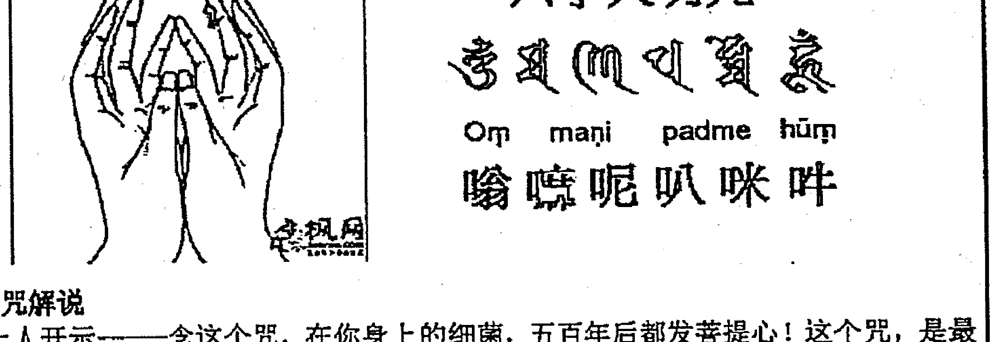

##### 三、大明咒解说

-   1、宣化上人开示——念这个咒，在你身上的细菌，五百年后都发菩提心！这个咒，是最妙的咒。我现在教你们，是有声教你们。你们念的时候要无声念，不要说出口来。因为这是秘密的咒，你要说出口来，就不秘密了。你行、住、坐、卧要常常念这个咒，这个咒的力量可就大了。你在山上念，所有山上的众生，过五百年后都会成菩萨，就有这么大的功德；你在水里头念，水里的一切众生，过五百年后都发菩提心，将来都成菩萨；你本人念，身所有的虱子、虮子、臭虫所有在你身上的细菌，在你身上的这些个众生，过五百年之后，都可以发菩提心，成菩萨。假如你自己不愿意作菩萨，那么你帮助其他的众生成菩萨，这也是一件善事，所以你不可以不念这个咒。这个咒，现在告诉各位，传给你们，各位要注意。已经知道了这个咒，不要说：“我已经知道了”生一种轻慢的心；不知道的呢，更应该生一种尊重法的心。我现来教这个咒，只教三遍，记不记得就随你了。什么咒呢？就是“嗡嘛呢叭美吽。”（六字大明咒）
2、科学家证实了佛门咒语有神奇的力量！
佛法的力量妙不可言，咒语的效果难以度计，六字大明咒的神奇威力，会随着你不断持咒的精进，越来越大，这是真实不虚的。不但被历代高僧大德所推崇，也被无数的信众所验证。但是，以前从来没有接触过佛法的朋友中，很多人可能对咒语的功效持怀疑态度；更有人认为持咒只不过是一种心理暗示而已。那么，咒语是否有科学依据？它的力量到底来源于哪里？其实，美国科学家已经用科学实验，验证了咒语神奇的效果，它确实会对我们人体产生作用。咒语是一种制控声波。近几年国外一些科研机构与科学家都在研究咒语，现在比较公认的结论是：咒语是一种制控声波，具有一切声波的特点：
①穿透性。它的速度为每秒钟 332 米，可以穿过固体、液体和气体。在遇到密度很大的障碍物，会产生折射，根据不同的密度，会相应地改变传播方向。
②与温度有关。温度升高（降）一度，吐音声速每秒增大（或减）0.6 米。③声压。声压的大小反映了声调的高低，当声音超过某一最大值时，在耳中会引起触痛感，还可使人血压升高，听觉受到损伤，出现病态；正常范围内，则使人心情畅达，智慧闪现。④频率越大，音调越高，频率越小，音调越低。人耳能听见的频率范围是 20-20000 赫。使人悦耳的乐音多在 40~40000 赫的频率之间。⑤声波的震动，可产生共鸣现象，发生音谐。咒语声波会改善身体生理指标。显气咒法可以理解为利用声波的穿透性、折射性，带动内气行走，达到意到声到气到。以意领气，以意催声，声气结合，形成一股强大的浑沌气流，达到特种的疗效。尤其是次声波频率在 0.0001-20Hz 之间的字音，就能够在人体内传播，穿透体内病态组织（细胞）内，使病灶组织内闭塞的血管重新开放，并推动其血液流动，从而改善病态组织内的血液循环。在长期的修持下，念诵咒语就会形成一股强大的气流，这种音频气流会使身体气脉产生震动，除血流速度加大以外，血液粘稠度会下降，血球悬浮，这就给血液及血液中的氧气、负离子、吞噬细胞、免疫球蛋白等物质，向病变组织内输送创造了有利条件，为肌体抵御疾病创造了有利条件，从而使病变组织（细胞）恢复为正常细胞。默想咒语大脑会出现脑磁图。美国密苏里大学研究咒语的奥妙。美国密苏里大学的科学家们，主要是从咒语和脑电波、脑磁场的关系角度，研究咒语的作用机理与效果。他们的研究取得了重要成果，其中最惊人的发现是“咒语会产生脑磁图”。在默想一个咒语时，可以从不接触被试者的上，测到一个相对应的脑磁图。研究人员让测试者默想一些咒语，同时用不与测试者身体接触的“超导磁强计”，来观察测试者大脑电波磁场。结果令他们十分震惊：当测试者默想咒语时，“超导磁强计”测到一个相对应的脑磁图。他们分别测试了 27 个不同的咒语，得到了 27 个不同的脑磁图。测了 27 个词语，就发出了 27 个词语的脑磁图。这个实验证明，咒语的力量不只是来源于念诵时产生的声波，当我们默想时，依旧会产生磁场力量。可见意念也是物质能量的一种表现形式。中国圣贤教育认为，命由心造，心存善念就可以改变我们的命运。这个实验或许能证明心念对我们身体的影响，但为何这些咒语具有其他词汇所不具有的强大磁场力量，还有待更进一步的科学研究。念咒可以让人体气脉震动。近年来，美国密苏里大学研究人员在研究咒语和脑电波，脑磁场的关系，取得长足的前进。他们惊人地发现，当人在默想一个咒语时，可以从不接触被试者的超导磁强计上，测到一个相对应的脑磁图。于藏区中，经常可见左手持念珠，右手转吉祥如意转经轮（轮中装有“唵嘛呢呗美吽”的咒文），口中喃喃念诵着六字大明咒的人们。有人认为这只是宗教的行为，其实即使是不信佛的人，如果能经常心无旁骛地念诵，体质也会逐渐增强。这其中的原理并没有什么神秘，生命在于运动，而念诵咒语也是一种运动。“唵嘛呢呗美吽”的咒文是一切文字和声音的精华声音是由于震动产生的，咒语的健身功能就在于能够使身体内的气脉产生震动。我们每个人体内都有一个内在的能量系统，六字真言，一字一音，各有所属，针对人体相应的部位，从上到下，层次分明：
“唵”其声发自生法宫，沿任脉上升至喉部，张口微聚，有“嗡嗡”之声，其声上头震动整个头部，充于七窍，如有目疾，则睁眼出气；如有耳疾，则震耳治之；如有鼻病，可掩一耳出气；如头部有病，则引气上头，再向下出气。“唵”音遍满一切处。宇宙中最根本的频率就是唵音，宇宙中的所有发音物体，所发出的音频，充满各处，其共振的音频，就是唵音。念诵唵音的频率，可以使人体产生共振，唵音又为天部音，以此音可以调动宇宙的原始生命能量。“嘛”字是开口喉音，发音时，唇先合后开，声振喉部，天突发麻，波及两臂，以至两掌心部发麻，可治疗喉炎、咳嗽、肩周炎、两臂部等疾病。“呢”字舌尖音，注于心，心地光明，发此音时，声振于胸，反射双掌，劳宫发麻。治疗心悸、胸决闷、肺病、高血压及横膈以上的内脏疾病。“叭”是唇音，口先闭后开，内气自气海达于命门，命门及肾均有温热之感，治腰肾、脊椎等病。“美”发音时口微开，舌下音，声向下，内气沿带脉转动，小腹有振动感；主治三焦病，肝、肠、腹等病。“吽”（也可读作“吽舍”两声连发），吽字引气上行，至喉部即向下，气沿身体前部及双腿下行，直达涌泉，主治腿痛、关节等病。这种震动好比是在做“气脉的体操”，气脉通畅则血行通常，气血调和则百病消除，所以经常念诵六字真言发声法从健身方面说，可防病、治病、延年益寿。

#### 第二节、太极修炼

太极图修炼，补成能量。

-   一、准备。念六字大明咒，意念把自己观想成透明体。如此，阴性物质进入不了我体。因阴性物质进来需要依附，透明体无处依附。就进入不了我体。
二、修炼。
时间：每月的阴历 14、15、16 三日的中午和晚上，即 3 个中午、3 个晚上。中午用左手吸收太阳真气，晚上用右手吸收月亮真气。
15 年 3 月班：又，阴历 14 日子时开始，到 17 日午时结束。
行为：中午左手吸收太阳真气，每日中午将左手伸出掌心对准太阳，意念真气从手心进入体内到达下丹田（肚脐眼处），观想下丹田有太极图形。一个小节 9 次呼吸，一呼一吸为 1 次呼吸。每次修炼至少 3 个小节。晚上右手吸收月亮真气。每日晚上将右手掌心对准月亮修炼。意念、动作
同上。
天气不好不影响修炼，看不见太阳或月亮可以想象太阳月亮。

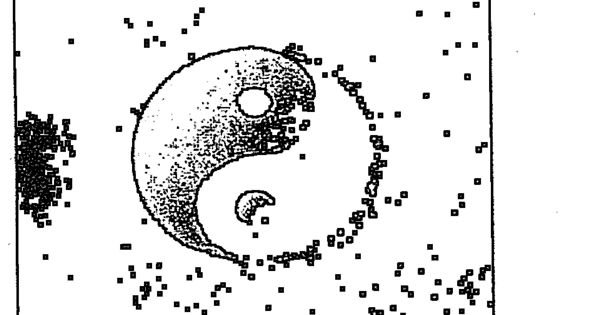

当局中有坤有癸、壬害时，太极图出来就可解掉。如，坤六癸癸芮杜，隐辛丁，对宫任丁（男生殖不行），因他找了很多小姐（六合），太多了。造成因果（杜了）。把家西南处理好。到西南方高上把心里的纠结（癸）都说出来，杜就变开了。

-   一、摩利支天简介：
「摩利支天菩萨」是观世音菩萨和大日如来「毗卢遮那佛」的化身（毗卢遮那：佛之法身、报身、化身）。摩利支天菩萨也被尊称为“斗姆元君”，其大儿子和二儿子是“四御”中的“勾陈大帝”和“紫微大帝”，其余七个儿子是“北斗七星君”。摩利支天菩萨是北斗众星之母，是帝释天的眷属，地位极其崇高！摩利支天菩萨常随日天，在前疾走，有隐形自在的大神通力，「摩利支天菩萨」统御管理北斗七星、二十八宿星辰、三十六天罡、七十二地煞、缦天华盖、日天、月天。她管理一切星宿鬼神（摩利支天菩萨统御所有的太岁星君）。
「摩利支天菩萨」有「隐身法」，不是说修了此法就真的能消失不见，而是会很巧妙的躲过灾难不会被伤害。没有一个人可以欺负修摩利支天法的人，任何灾难摩利支天菩萨都可化解，学她的法，不会受人侮辱、欺负，不会被人偷盗，没有人能够胜过修摩利支天法的人。

「摩利支天菩萨」是战斗之神，其密号是战威金刚，修持摩利支天法的人，能够打胜战，战无不胜，威风显赫，如必胜的狮王，勇猛无敌。所以对于有官司缠身的人，只要诚心向摩利支天菩萨祷求，都会有所感应。摩利支天菩萨被尊称为：「大圆满月光王」、「东华慈赦皇君天医大圣」、「九灵太妙白玉龟台夜光金精祖母元精」、「中天梵炁斗母元君紫光明哲慈惠太素元后金真圣德天尊」，道教也尊称她为：「先天道姥」、「象道之母」，在佛教中，她是一位能够自我隐形，同时为众生除灭障难，施予利益的菩萨！尊称她为摩利支天菩萨、大摩里支菩萨。在道教中的朝斗法科，都遵奉斗姆元君为主神，斗姥元君的神号全称：「先天斗姥紫光金尊摩利支天大圣圆明道姥天尊」。《太上玄灵斗姆大圣元君本命延生心经》里，对斗姆元君做了相当详尽的描述：「能阳能雨能变化，救灾救难救刀兵；祠嗣就生麒麟子，祈名金榜就题名；商贾者，利加增，祈求父母得长生，子孙得荣盛，夫妇寿康宁，万邪自皈正，诸恶化为尘。」这句经文的意思是：摩利支天菩萨能够随意的统御天气的变化，她想让天下雨就让天下雨，她想让天晴就让天晴。修摩利支天法的人，摩利支天菩萨能够保护这个修法人远离一切的灾难，远离一切的战争祸患。经常供养礼拜摩利支天菩萨就能生出富贵孝顺、德才兼备的孩子。修摩利支天法能够让考学的人得到功名利禄，能够让商人挣到更多的钱，能够让父母长命百岁，能够让后代子孙富贵荣华，能够让夫妻长寿、健康、安宁。一切想要对自己不利的人，在修摩利支天法后，他们都会改邪归正，所有一切的灾难、祸患等等将要伤害自己的人或事都将消失殆尽。为什么在佛门众多法门中，摩利支天法门最容易应验呢？主要原因是「摩利支天菩萨」，太慈悲了！只要你有求于她，摩利支天菩萨不管你是谁，反正先让你如愿以偿，以后的事以后再说！这就是「先以利钩牵，后令入佛智」。摩利支天菩萨为了帮助众生，都是用次第接引的方法，先满足世间法，再成就出世间法的究竟圆满。现在经济不景气，众生共业重，生意不好又借不到钱，被裁员又找不到工作……等等，出现许多贫困不足的情形。可以修「摩利支天法」，祈求摩利支天菩萨赐福、赐财富、赐法财。

毗卢遮那佛，佛有三身。毗卢遮那佛有三身，分别是：法身、报身和化身。分别用毗卢遮那佛、卢舍那佛和释迦牟尼佛来象征。法身佛：毗卢遮那佛（即大日如来），即是中道之理体也，佛以法为身，故称法身，法身处于常寂光净土。其实十方三世一切佛，共同一法身，法身象征了世间宇宙的一切法，皆有此出。报身佛：卢舍那佛，义曰：光明遍照，又作“净满”。报身佛是表示证得了绝对真理获得佛果而显示了佛的智慧的佛身。是行六度万行功德而显佛之实智也。对于初地以上菩萨应现之报身，报身处于实报庄严土。化身佛：释迦牟尼佛，是表示随缘教化，度脱世间众生而现的佛身，特指释迦牟尼的化身。世尊曾在我们娑婆世间示现无数次的成佛和涅槃，还化身成白衣、僧人、佛陀、山河大地，就为了广度有缘众生。

##### 二、摩利支天菩萨供奉

-   1. 帮助众生的方法是：
   - 第一，先助众生清除恶业所造成的贫困。
   - 第二，再助众生，远离贫困。
   - 第三，接着助众生「失而复得」。
   - 第四，再助众生好运一直保持、福寿绵绵。无论如何，修持大乘的任何法门，根本、基本的条件是发菩提心，虽然今天是为了保护自己而修，但发愿一定是：「我不去做恶行，不去伤害别人，希望别人不要做恶业、不与我结恶缘而修持，为众生去想。」不能想自己一定要胜利、别人要失败等等，这种心态去修持是不对的。

-   2、念诵法：

念诵内容如下：

> 不空三藏译《摩利支天经念诵法》云：南无释迦牟尼佛！（十声）。南无摩利支天菩萨！（十声）；

我弟子（某甲）归命三宝摩利支天菩萨！愿护我身，无人能见我，无人能知我，无人能捉缚加害我，无人能欺诳责罚我，无人能债我财物，不为怨家能得其便。即说最上心真言曰：唵或唸。摩利支。娑婆诃或梭哈。（百声或千声）唵（引）摩（引）里支（引）娑嚩（二合引）贺。（注音：weng mó lǐ zhī suō pó hè）亡难中护我，贼难中护我，失道旷野中护我，水火刀兵中护我，鬼神毒药难中护我，恶兽毒虫难中护我，一切怨家恶人难中护我，佛实语护我，法实语护我，僧实语护我，天实语护我，仙实语护我，一切处一切时愿常护我。

弟子（某甲）娑婆诃。诵时，想（观想）菩萨作天女形，璎珞庄严坐莲华上，左手执天扇，右手垂掌向外，作与愿势。若欲见天真身，求胜愿者，诵满十万遍。佛言：此天常行日月前，日月所不能见。我因知此天名，得免一切厄难。注：以上提到的灾难都能救护，但是要诚心诚意，不能掺假。如果是求私利，为升官发财之类低级愿望，我看就免了，也不可能帮你实现，除非是发大心利益众生。而且修这种法，一般是为自己修解脱法做铺垫，如果不结合解脱法门修行，只能防灾免厄。

-   3、摩利支天咒

```
【摩利支天菩萨心咒】（长咒）
「南摩三满多。母陀南。唵。摩利支。梭哈」
【摩利支天菩萨六字最上心真言】（短咒）
「唵。摩利支。梭哈」
```

摩利支天咒语注音：om maritsa mam soha
摩利支天咒语：唵 玛惹哉 盟 梭哈

##### 4、光明佛母（摩利支天咒）简要修行方法

-   1、光明佛母简要修行方法

只念摩利支天咒（在后面有详细的念法教程），念完回向也是可以的，最简单的做法是：
念摩利支天咒（默念或念出声皆可），念完七遍后（当然念遍数的越多越好），当您念完后（最好是大于七遍）就结摩利支天手印（在后面有详细介绍）回向给您想回向的人或是求取您想达成的愿望，比如回向：“一切三世诸佛如何回向，我今日亦当如此回向”；或是求取“愿摩利支菩萨帮助我早日拿到朋友欠我的货款，拿到货款后本人将更精进的修行，并且将经常去放生，帮助有困难的人！”（因为我们现代人时间有限，我本人就是修的“简要修行方法”效果还是比较好的！）

-   2、光明佛母详细修仪轨

和简要修行方法比效果要好一点，蒙祈竹仁波切（祈竹仁波切为藏传佛教格律派高僧，大藏寺法台）开许，允许阅读，未受灌顶，可以照书修习，但不能观想“自成本尊”的部分！

-   3、光明佛母法相：（方便观想）

我们观面前虚空中，突然变出了光明母。祂的身体黄色，三面八臂，中间的脸黄色，右面白色，左面是黑色的猪脸，其右边四手分别持金刚杵、箭、金针及作手印，左边四手分别持弓、经页、线及一株无忧树（藏名 mya ngan med paishing）的枝。祂坐在由猪拖拉的金车上，有莲花及垫褥座。光明母的垫座与其他本尊法门不同。其他本尊之通式为寂静尊配月座，忿怒尊配日座，但光明母则并非如此。在白天修光明母法时，我们观其座为日座；若在晚上修，则观月座。有关本尊所持法器，其实大有密义，譬如说其金针能放光令行者之仇乱连眼也睁不开，令其看不到我们等等，但今晚衲不宜对未受灌顶的在座各位详解。有关这些内义，即使你们不深入理解，亦不减此法门的效力，所以大家不必担心。本尊的座驾由七头野猪拖拉。这七头猪形相十分凶猛、恐怖，尖牙露出嘴外。猪的身上不断化出大大小小的化身，吃尽一切病毒。这七头猪其实并非凡俗畜牲，而是光明母之智慧化现。在观好本尊后，我们便诵仪轨中的四句礼赞文。唯只诵持忆汝之圣名救脱一切障碍事业母赐与无死大乐事业母光明佛母于汝致礼敬读以上的汉译礼赞文，便懂其中意思，没必要衲每个字讲解了。在作礼赞后，便到持咒环节了。光明母有短咒、长咒、心咒、近心咒、护轮咒等等许多种咒。宗喀巴大师说过，光明母之短咒与其长咒之利益完全相同，故此我们修其短咒既可。嗡 玛惹哉 盟 梭哈 om maritsa mam soha

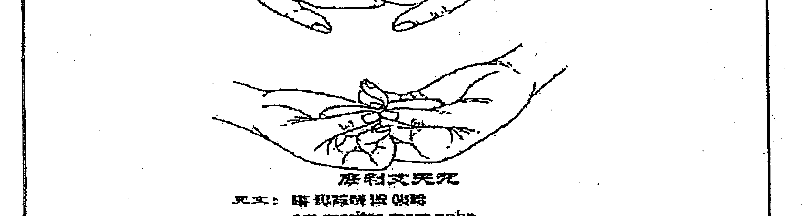

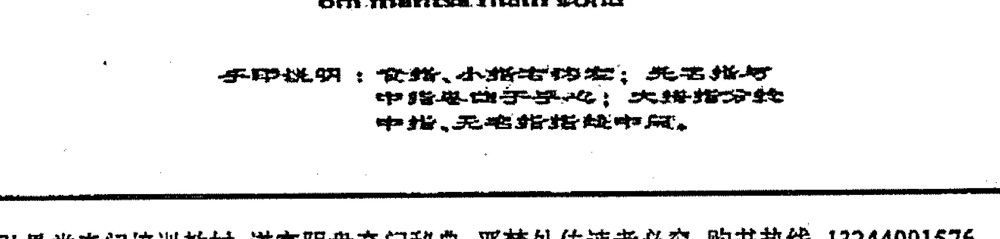

```
光明母短咒
嗡 玛惹哉 盟 梭哈
om maritsa mam soha
```

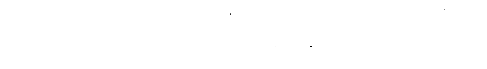

手印说明：安详，小指与无名指；无名指与中指半曲于掌心；大拇指护中指，无名指指尖对中指。

#### 第三节、摩利支天催财、催债

用先天数。如乾1、兑2、离3等。用后天宫位。如报8数为后天坤宫，报1数为后天坎宫等。以客厅为主，把家里东北方、西南方清理干净，通气。在太岁宫找一张桌子，尽量高些（砂）。供奉摩利支天菩萨。今年若报5在巽，与坤先后天，亦可供在坤位。若不好报数，今年可直接供在西南方。
供品：鲜花（真的，一小盆即可）。上香。一般戌日戌时（乾宫时）供最好，财库。然后每天戌时念经文（详见前《念诵法》）20遍。佛像后不要有电线，不要放阳台上，更不要放厨房里，要清洁。

#### 第四节、修炼例局与案例

- 一、寻好局修炼增加九星能量，找一个好局。
- 1）若自己的终身局好，休门宫及对宫无四害，就在自己终身局的休门宫修炼最好。
- 2）空无宫盘腿（单双盘均可）打坐修炼。修炼准备，先做一个先后天八卦图，先天在下后天在上，坐在上面修炼；给天师上香；念六字大明咒并结手印，清空磁场；天师加持，神我合一。
- 3）意念修炼。想，从任到蓬八个星符的样子。记不得可把符贴在房子各宫看几遍记住再练。练前在各宫烧各自的符是最好的。
- 4）从空无宫（例子为艮）艮开始到艮止。其它宫开始，也是在艮停止。如在震空无宫开始亦到艮止。顺时针。若从坎修，从坎到震（水生木），不要经过艮土宫，从坎震巽离五行相生顺序顺时转到艮止。循环多次。
- 5）修炼时间。每次定坐10分钟以上，坐8+1=9天。即空无宫连续坐8天，到了第9天时，要换位移到中宫，中己，盘腿坐。在中宫时，想一下子午卯酉四宫的星星，从子卯午酉顺序想四宫星星。如此坐9*9=81天一个大周期。更好。处理局：风水师意识大于行为，要有信心，有正能量思想。自己认为这个局就好，风水师意识就可以转宫。
- 二、修炼例局（4例）
- 例1 意识修炼
- (1) 先找一个好局，要能量大，找空无宫（可寻时借运或借别人的局亦可）。
- (2) 坐在空无宫里。如上例，在客厅房间的艮宫。
- (3) 空无须是真空。不能是有四害的假空，坐哪加大了不好的能量。
- (4) 做一个先后天八卦图，先天在下，后天在上，坐在上面。

##### 修炼过程——意识

- (1) 给天师上香。在天师图像前上香。
- (2) 首选观想自己是一个透明体，空。意念通天师。和天师同体。
- (3) 盘腿打坐。最好结手印。
- (4) 坐空无宫后，穿越九宫，想该局各宫星星样子（星符的图案）。顺时针到艮宫为止。不管从哪宫出发，都是顺时到艮为止。艮是最终停止的时间，但必须转到一圈以上，才能到艮宫停止。

| 奇门局信息（左侧） | 修炼说明（右侧） |
| --- | --- |
| 公历:2014年1月22日17时16分<br>农历:2013年腊月廿二日(时盘)<br>四柱: 癸巳年 乙丑月 癸巳日 辛酉时<br>节气: 大寒-立春 月将:子 刑暮迫 阳遁5局<br>值符:天芮落8宫 值使:休门落8宫<br>时空亡:甲寅旬 子丑 空 马星 亥<br><br>（奇门局图示：乙 阴丙乙 冲伤 六乙壬 和杜 白壬丁戊 英 丁戊；蛇辛丙 任生；癸辛 丑休 天己癸 心开 地庚己 柱惊；丙 辛 壬 癸 丁戊 庚 己 乙） | 每次定坐10分钟左右，每天都坐。坐8+1=9天。即空无宫要连续坐8天，到了第9天时，要换位移到中宫，中己，盘腿坐。在中宫时，想一下子午卯酉四宫的星星即可。如此坐9*9=81天一个大周期。更好。 |

### 例3: 九星意识修炼

利用9星的能量，找一个好的局。
- (1) 若八字终身局中休门宫及对宫无害，可以终身局修炼。休门宫的害入墓或空无尚可以炼。但有刑破不可。休门宫也不能有白虎。
- (2) 选局炼。如14年10月3日辰时局（见上例2）。

### （3）修炼程序。

修炼备2个垫子（先天在下后天在上）。地点在客厅即可。
意念: 九星符。从艮宫开始，想: 任冲辅英芮柱心。首先入空无，观想自己为透明体，结莲花手印。手印要盖黄布。要穿衣修炼。念六字大明咒。从空无宫进入，若空在震就从震进，也是到艮为止。修炼9天为一个小周期，81天为一个大周期。一个小周期（8+1=9天）内，炼8天，第9天到中宫直走子午卯酉四宫星。

### 例4: 摩利支天——催财催债修炼

| 说明 | 奇门局信息 |
| --- | --- |
| 例2: 自测意识修炼。修炼步骤同上。 | 公历 :2014年10月3日8时40分<br>农历 :2014年九月初十日(时盘)<br>四柱: 甲午年 癸酉月 丁未日 甲辰时<br>节气: 秋分-寒露 月将:辰 刑庚迫 阴遁4局<br>值符:天英落9宫 值使:景门落9宫<br>时空亡:甲辰旬 寅卯 空 马星 寅<br><br>（奇门局图示：癸 蛇戊戊 转柱 特壬癸 其生 天庚乙 芮 丙壬；丁 阴己己 冲伤 地丁丁 柱惊 庚；己 六癸癸 任生 白辛辛 丑休 玄丙丙 心开 辛；癸 丁 己 乙 庚 辛 壬 戊 丙） |

符合的条件: 有钱，有借的能力，有贷的能力。离宫供放摩利支天，佛像亦可。
- (1) 奇门局: 伏吟局好，景门在离更好。条件必须离坎宫无害。
- (2) 把摩利支天供在离宫，供品: 蛋糕、花、摩利支天经文。
- （3）乾宫戊日戊时开始上香，给摩利支天上香。
说话：要达到什么愿望，保证要做功德，子时读摩利支天经文（369遍数），坚持每天上香（午时上亦可）。

> 如：一女报数7（报数用先天数，即先天艮7）。这个情况不能半夜去讨债，只能坤时去讨。做到欠债人与用神艮比和就可。我们开车走到欠债人的西南方，给他打电话，谈钱的问题丁戊，那样欠债人就可在艮宫了。与我比和。

##### 三、意识奇门案例

起局必化，有些事不一定起局，如说出了一个很坏的事，一起局会先入为主，找出事宫会不好。此时，可用意识奇门转化。

### 例1：外应起局。

14年午月，午时一女来周店里，穿花纹衣服来，测身体。周手机一下死机了。手机——丁。不能开机，看八字，女人不知时辰。外应，有不好的东西。用意识奇门。午时，用神放九宫。取象：花纹衣服，蛇，灵异。死机，死门。九宫位太岁宫位，临年月，力量大，蛇代表睡眠等。离代表头、血液等。离宫高血压是因血液堵塞。
断：肾出大问题了。（流年月力大冲坎）。坎为肾，尿毒症晚期，每周3次透析（换血）。不不通关，木（肝胆）也不好。震宫有问题堵了，结果子午宫相冲克。此例，生死不平衡，要出事了。（死门对应的是生门）
处理：杀生太多了（死门），蛇，灵异。让她自己烧烧元宝，在离宫的亥时烧。坎宫，一个房间太低（蛇对应宫是地），开开窗户，透透气，除除癸。震宫，为动，震方有何物把它拿开，通通气，让它动一动。

网上该例原文：
中午十一点一女人找我，让看看身体，刚要用电脑点奇门局看，电脑突然死机。女人带着一个黑眼镜，穿着条纹衣服。电脑是丁。被癸干扰了一下。所以说明女人身体肯定有不干净磁场。电脑是丁，犯错误就是丁加辛。我年命是丁，这种情况对我是一种保护。经常出去做风水，被干扰也是正常的事情。磁场很差的时候，我的手机都会死机，手机也是丁，一出错误就是加了辛，那么无形中保护了我。呵呵，感谢错误，很多事情，真的是没吉没凶。这种磁场不干净的时候，不用手机起局或者手起局，因为信息是共同的，不入局也入局。当然可以选择八字预测。
起局。意识奇门。衣服花纹，神就是蛇，刚才死机了，就是死门。宫有癸，加上辛，坎就是生门，今天是午年午月午日午时，这样好坏力量最大，生门又在坎，门破。这个月肯定会不舒服的厉害，最不舒服的离和坎，原因是震，女人肝胆肯定不好，现是火月，泄木厉害，肝胆不好很厉害。肝是木。需要水来养，那么坎不好，坎是肾，肾严重损伤。所以女人整个代谢机构，内分泌都是混乱的。那么头痛，失眠，盗汗，抵抗力严重下降，肾衰竭。等等，我说了很多，女人回答是的，自己肝胆是先天不好，现在尿毒症晚期，一周输血三次。苦命啊，无语的人生啊，这种病，只要换肾，否则不能维持太久，开始一周输血1次，慢慢变成2次，三次，然后输不进了，生命也就终止了。肾不是那么好找的。什么原因引起的呢，就是蛇的原因，那么就是灵异。这种情况，最好不要用奇门处理了，可以怎么做呢，借别人的局，找合适的宫位，超度吧，唯有超度可以化解，可以延迟。

### 例2：网友起局，女儿明天考试，现牙疼厉害。

公历：2014年7月7日6时3分
农历：2014年六月十一日[时盘]
四柱：甲午年 庚午月 己卯日 丁卯时
节气：芒种-小暑 月将 未 阳遁七局
值符：天蓬星落4宫 值使：休门落7宫
时空亡：甲子旬 戌亥空 马星 巳
庚
戊 符 戊 死 杜 任
蛇 壬 惊 伤
阴 辛 景 休
壬 天 己 生 开 心
六 乙 戊 丙 乙 奕
丁 辛
白 己 壬 英
丙 地 乙 奕 丙 冲
玄 丁 休 开
乙
丙 丁
乙
戊

按照看局的时间取用，巽宫时间看局了，巽又临马。就取巽为用。何时看，意识才动，才产生信息场。巽临马星。出来马星宫和对宫就可以了。乾宫，白虎为疼的厉害，乾有花盆，把乾宫的花盆拿掉。巽宫有伞，把伞拿掉。后反馈，方向搞错了，但意识奇门可以这样，错卦错断也是对的。

### 例3：

一怀孕女来测，医院检查胎儿不正常。用意识奇门处理4、9、2宫。

### 例4：

跪拜象意分析。7月24日约戌时，近30人拜师跪地，25日辰时上课时讲拜师的。符，名气，权利。乙，手，温柔、善意。戊己，财。符己同宫合住了。固定住则不能得财，需要打开，加马星。举手在头——把乙加在符上。跪拜到地——戊，为大财。跪拜的动作为马星动。从己到戊，小钱到大钱。口传心授是己，己——符——思维打开了。给老师茶水，是水生乙。跪拜中有人反对，就是加了辛，被置换了。
符
乙己
（敬茶水）戊

### 例5：

男测孙子病了。下午16：00时，一外地男人说我的孙子刚50多天，突然不舒服，看怎么回事。申时，坤宫。甲午年生人。午火含丁丙。突然不好，必有马星。断：孩子发烧（火），烧在头（符，实际脑炎）。生下后反复不舒服（坤亦代表反复）。申时金，呼吸道。是感冒治的不好，引起脑炎。坤为先天，为遗传。这个病是遗传基因不好引起。感冒是癸丙丁，癸在坤墓。孩子母亲以前爱吃凉东西，且干的工作与冷有关（实际在冷库）。时干为父母平台，时干不好（孩子为时干），父母也不顺。孩子的父亲，奔波劳累辛苦。还可断，来人的老伴糖尿病高血压。坤既为母，代表小孩的母亲和奶奶。两个女人在坤宫，伏吟，儿媳和婆婆关系必然不好。孩子母亲临符必然脾气不好。房子西南不好。坤，符癸己杜伤。有大树（符伤杜），没阳光形成了一个堵（杜）的象。

### 例6：夫妻吵架。（意识+行为风水）

女人09：00左右电话，说夫妻昨天吵架很厉害。用神，按时间找用，巽宫时间为用。夫妻事，看六合，乙庚。巽乾对立，不合。六合放哪里？意识取坎宫，则金生水，水生木，和谐。是晚21：00时以后吵架的。亥时巽旺反克乾。乾宫，钱，男人。为钱矛盾，男人想花钱，女不让。象意：庚金、佛经、乙木手印，六合在坎，合作关系。在乾念三遍心经。东南方造个乙木象。然后坐到坎宫即可。想夫妻和睦的事就可以了。坎象：合，乙庚，开。此为最简单的预测处理。

### 例7：随机意识。

饭店吃饭一男孩说请客，问多大，说你猜。90年（庚午）。回答对。为何？她正要吃饭，来人请客，周年命天干丁禄在午。吃饭得禄，该男岁数也不大。故断1990年生。

#### 第五节、意识之先、后天八卦

一、先后天图示（如下）：
先天在下（九宫格内），后天在上（九宫格外）。本宫的先天八卦——所在的后天宫位
一、出来看人先天，前世，原因、基础。本宫的后天八卦——所在的先天宫位——进去看人后天、未来、发展。
- 1）用神在坤。坤宫，为先天巽卦，后天坤卦的宫位。看以后、未来深挖到先天巽——转到后天的巽宫来看。看前世则漂移到坤的先天位——坎宫来看。即深挖或进去看未来。漂移或出来看前世。
- 2）坤（后天）宫，出来到坎为后天，未来。进去为巽宫看前世。兑宫，则出来到巽，进去到坎。
说明：九宫格内（楷体）为先天，九宫格外或中宫（宋体）所标示为后天。

## 二、先天为因，后天为果为发展。

如，先天乾出来为离。后天乾进去为艮。后天乾六宫，问前世原因——就出来看先天宫（离九宫）。看以后事情发展，就进去看艮宫。图示见上。若离为用，看以后发展，进去找到先天乾——再转——后天乾宫位看。看原因、前世，就出来找到后天离——再转——先天离，即后天的震宫位看。如，一人坐坤，一定要转到先天宫测——坤转坎，到坎宫测。用在坤，把坤落到坎来看。今巳日为巽宫，坎宫生巽宫，日子来泄宫位。坤与坎又是相克关系，土克水，花钱。坤的象意很重要，地方官员等。用巽——看——坤（死门），时间巳时，与（巽先天）坤相克，坤代表脾胃，身体不会太好。坤，灵性干扰，工作也捆绑，有很多事情不好处理。家里夫妻关系也不太好。要搞好夫妻关系。死门，也主死心眼，爱学习，态度执着。还要看艮生门宫，放生最好。巽——先天在坤——对宫艮。用为乾。时间（乙巳日辛巳时）和用相冲。乾事业、财富、呼吸等。时间生乾之先天（离宫），说明先天因素好。但用乾坐的方位和时间宫冲，目前日时和用对冲。开店客不多，日时克用之故。再看八门，看艮宫。坎宫：低谷——潜力大。最低层，发展空间最大。坎智慧，心机，与水有关行业在坎宫。迷茫。男人肾，女妇科，性生活，娱乐场所，子宫，前列腺，泌尿生殖系统。蓬星：蓬星与坎宫象意很近似。定位，发展空间大，海绵吸收空间大，主智慧能力心机。但当蓬遇到四害时，胆大好色懒惰等。无害时为正面意义，可利用天蓬星。休门也代表床，休门破如无水，可能离宫放了床。也代表娱乐场所。坎宫，中男。用在坎，会说事业尚未发展，但潜力巨大，离宫代表广告宣传，搞好广告宣传。坎与离是对应的。离英景，代表头、思想、名气。英火气大，热情，三分中热血。景场面情景。今天讲课日子（巳日）生景门，生这个讲课的场景。若调官在离不是升而是保官。离已经到了最高处，最辉煌时，要稳一些，防止下滑。离宫：离，中女。一女未时间，坐离宫，一男配三女（369），婚不好。离婚。离宫，火克先天乾。有三次婚。第三次刚结婚。乾为父，离也克父，关系不好。坤艮宫，天芮代表学习等。坤芮死。阴土，土地，坟地，己。艮任生。阳土，土地、房子、戊。人一生下来，从生到死，即从艮到坤。宫位的象意，也即本宫星的象意。艮为止，象，叫停止。五行到此停了。艮宫可以催财。大病移星换斗，一定不要走中宫。艮宫，不要拆盘，拆了就出事（或死了）。艮，忠厚老实，反意为不开窍，老年痴呆，艮不好。一个小孩不愿说话，内向，就移到震宫，动起来。吃东西不消化，不要在艮宫住。艮代表停滞不前、压力、想不开、懒、不动等。任，任劳任怨，乞丐。处理艮如动（搬）不了，可用它法，如缩小太极法等。生，利润，生活用品等。做行为风水时，艮生放花，不如让一个小孩在艮宫呆一会。把年命转到生门宫——一种救人法。例，一人得大病，用在兑，生在巽宫无害——可救。处理时，把此人年命丙移到生门宫。即在巽宫烧一张丙奇符，一张生门符。再救就没问题。——把年命和生门转到一起，一种救人法。坤芮死。坤芮，捆绑之意。慢性病，生育宫，测怀孕是非常重要的宫位。学校、学习。但调学习不要加大芮，可加大辅、心。调学习放观音不好。看风水芮有害，先看家中有无佛像，有就送走，效果很快。芮，又为医院、佛堂。购房时，不要靠近医院、学校近的。若芮有害，则不吉。购房要远离医院佛堂学校。死门，死心眼，好时为执着、好学。不吉时代代表附体，暗能量，遇到死门要超度。震宫，冲伤。震声音大，直接、发脾气，木（乙木为手），伤门，冲动，有击刑门迫时打人（伤人）。看对宫兑，冲动打人了——兑口舌，惊门官司等。故，震四害时——出伤、打官司。伤，伤害车祸等。处理伤门时，如伤在艮，则震艮宫都要解决（处理）。艮震——伤门先后天关系。处理伤灾时，艮震两宫都要解决处理，艮为震先天，也隐藏了伤门信息。若震有害，艮无害。震要处理，艮也要用地支亥符来合一下（合住寅，潜在的伤门信息）。另，天蓬为猪的象，再用一张天蓬星符压在艮宫，二个符都压在艮宫。放多长时间，解决了事情就可以拿掉烧掉。如伤在坤，拆了坤后，也要处理震宫（伤的原宫）。如坟地有事，奇门局埋上东西合住伤门，效果是很好的。坟地可以埋东西。同理，如芮在巽有害，也要处理芮的先天宫——坤。为何要同时处理先天宫？先天是原因之故。巽宫：辅杜。巽女，长女。巽为风，家人嗓子喉不好，东南方有水库。很准。风缓慢的动。辅，辅助，也代表女人。教学，衣服辅导。东南为文昌，装修，东南一定要高一些。也代表会计，财务人员。房子巽宫有水，处理时，盖上看不见不行，要彻底清除才行。对宫乾，事业，地位，权力，财富。心，事业、中心。开，开业大吉。例：夫妻吵架，对冲。钱，财务没有管好，要好，找个辅一女人来辅助。事情败露，可用杜门符压上，隐藏起来。

三、说明：九宫格内（楷体）为先天，九宫格外或中宫（宋体）所标示为后天。各宫内的星门为其所在的原始宫位。先后天预测，预测师不象起局那样会入局。

| 巽 （后天） 离 | | 坤 |
| :--- | :---: | :--- |
| 兑2 辅杜 | （先天）乾1 英景 | 巽5 芮死 |
| 离3 冲伤 | 中（后天） 兑 | 坎6 柱惊 |
| 震4 任生 | （先天）坤8 蓬休 | 艮7 心开 |
| 艮 （后天） 坎 | | 乾 |

意识奇门先后天八卦预测一般规律：
- 用神：
1) 位置取用：一般预测人所坐或站的宫位为用。
2) 以日支或干宫为用。日为当前、最近状态。电测一般以日宫为用。
3) 以年命天干或地支所在宫为用。年为长远状态，但不能表示一生（一生要结合大运）。
每个局都有年、日两个宫，都可代表同一个用神。一个是当前状态，一个长远状态。可单看，也可同时预测。取决于预测者和被预测者的即时取用。看六亲为相应宫位先后天结合看。配偶看对宫；父母看乾、坤；一个儿子看震宫（次子坎，三子艮）；一个女儿看巽宫（次女看离、少女看兑）。日支宫，为当日的地支所在之宫。是用神的现在状态。时支宫，即问事时辰，为预测者所问事情的具体时间，为时辰地支所在之宫。代表一件事情的整体情况。时间宫不变，用神宫位的先后天分别看与时辰宫的关系（生克、比和、泄），每转到一个宫，就结合其先后天关系，同时看与时辰宫的生克关系，并结合对宫来断。一般时辰宫克用神宫吉，生用神宫更吉。用神确定，则现在，过去、未来的情况瞬间必须看清把握好。

##### 四、案例

例1: 12月24日案例: 讲课己巳日, 1110时多来一女问事。时干, 是总体事情, 日干用神, 巽就为其问的老公。午时间。时间泄日干, 可往不好的方面断。巽是先天兑, 口舌喝酒。又坤为先天巽, 年龄大的, 芮, 学校医院的领导。口舌, 吵架, 兑宫时口舌, 冲动震宫伤门, 震与离先后天, 离火克乾金, 为大钱, 离宫数。369, 断300万。实际336万。调, 把坤宫佛像调一下即可。或在坤超度一下, 一超度, 生门艮也出来了, 则生乾宫。

例2: 下午酉时, 一男人坐离宫测事。坐宫是当前状态(后天), 找原因转先天宫一一离的先天在震, 为后天转先天。看发展一一转乾宫, 为后天以后的发展(先天乾到后天乾)。看其与时辰宫的生克关系综合断事。六亲: 配偶看对宫; 父母看乾坤; 一个儿子看震宫(次子坎, 三子艮); 一个女儿看巽宫(次女看离、少女看兑)。若看阳宅风水, 看生门宫艮。时辰为兑宫时, 泄艮宫。艮一般为高楼。看儿子在震宫, 住上此房后, 与时辰宫相克, 学习下降了。

例3: 先后天意识奇门。2014年12月28日。酉日, 早晨0747(巽宫)一女来电问事。日时宫相克, 先后天关系。这种情况, 克中有缘。卦象为风泽中孚, 嘴对嘴。男女关系, 现有了矛盾。来电响后卦了电话(巽杜), 无形中加大了杜门信息, 行为转换。这就是换门思路。杜加大, 开门平衡了。加大后平衡了。电话了, 不接辛(错)。巽宫: 丁辛, 杜。丁网, 犯错了辛, 嘴对嘴了, 悄悄的, 杜门, 暧昧了。丁证据。男人心里想钱了, 要3、6、9万数(乾宫, 肯定有戊乙丙, 想的出乱子了)。一一这就是意识奇门。处理乾巽, 巽用申支合。坎为色情, 拆掉。把坎上有不动的水拿掉。(死门的水, 变态)。把乾电器、红色的拿掉。处理坎为通关, 金生水生木。

例4: 丑日辰时女人测孩子病。女人说2个月孩子每天拉肚子20次。孩子年命甲午(符)。小孩, 在艮, 病芮(258数), 拉肚厉害, 癸己癸, 隐干辛错误, 1天20次, 受到很大伤害。辰时间, 克艮孩子。孩子在艮宫。时间宫克用神宫。这样, 巽有问题, 艮及对宫坤有问题。巽为肝胆, 与坤先后天, 母亲的遗传基因不好。坤害有, 己癸符。使孩子体内有大量寒气。巽克艮, 有害对宫乾也有问题(不平衡), 乾代表父亲, 又与艮先后天。父亲的身体也差, 得大病了。父亲身体也不好。脾胃心脑血管不好。实际, 父亲得癌症, 胃癌。女人回娘家, 招了一些附体回来了。孩子沾上了。让女人到死门宫, 离宫超度一下(从伤艮数到离为死), 第二天就好了。意识奇门一般处理3个宫。

例5 通关平衡今年甲午, 身上起疙瘩(辛), 先天八卦, 火克金, 先后天关系。有辛击刑了。坏的太旺了, 是因坤艮无足够的力量来泄你。如此, 艮坤均有害, 能量低。把艮坤拆掉, 离宫拆掉。

例6: 空间测例。上午1000时, 一女来电话, 一做家政的女老板要和她合作, 可否。意识奇门测。今丑日巳时, 时宫克日宫。丑在艮为求测人, 女老板为女人也为领导, 对宫为女老板, 符墓状态。工作上有阻力能力发挥不了。艮先天在乾, 乾为钱为事业, 艮坤都生之, 二人事业心都很强。艮的发展看震, 为雷为动, 动冲动兑宫, 为冲动有口舌。时于是状态, 时干冲动乾宫, 巽坤为先后天, 艮乾为先后天, 动则都生乾, 双方都为钱都在生乾, 挣钱, 同一个目标, 六合吉。断其合作没问题。开始工作有点难, 尽量避免口舌是非就可。当日午时双方签了协议。

## 例 7: 测教室艮宫。

艮空无，课堂艮宫人最少，空无。代表迷茫，不在状态，但有潜力。时干宫为事情的整体发展，也代表你的平台。要满盘测，整个盘都是他的，若左肩痛，巽宫时间克之，则有四害。巽宫时间平台不理想，巽克用神艮，发展平台就不好。看身体有些问题，寅也为骨髓，丑为寒，有寒气。坤为母，母亲遗传的因素有一些。坤也为血液，血液有问题。但空无潜力大，坤冲之，潜力大。又巽宫感情反复，谈恋爱很难确定，感情不好成立。离宫通关巽坤，处理好离宫。该宫一人，有慢性病，是先天问题，骨髓有问题。空无艮要多放生，加大生门宫，放生超度多做，平衡因果。又艮为土，脾胃、土地有关，时间克你，做的项目不大，忙碌一些，辛苦，艮空，你没多少钱。坤（治病）花空了钱。巽宫：伏吟，感情至少两段的，潜力很大。口舌，财运可以，冲乾的。杜辅，技术没有问题，感情不稳定的，加辛，有新的感情，要哪个？坤兑都为巽之先后天，坤则为老或为过去，兑为少或为新的，小的一个，长的可以，但脾气一般。要坤为我克，说了算。要兑为克我，她说了算。巽辛巳巳，若犯错置换出来了。本宫之害，巽克坤，母亲身体不好，需要离宫通关。本人脾胃也有问题。因为养老出问题会争吵。任何事都可九宫测。

## 例 8: 5 月 30 日午日 1630 申时坤宫。

教室内，时间坤宫，人在坤宫，伏吟。伏吟超度一次不是干净，要两次，西南或东北。再看巽宫，亦伏吟盘。时间坤，人在巽为用，时干在坤宫。相克关系。时干平台。巽代表自身能量。相克关系，以后会出现不好的问题。财运不好（坤太岁）。巽感情。兑口舌是非，感情不成立。自己克六合。不管谈多少要分开的。为何？兑口舌是非。矛盾，太岁坤，女的想分开，一分为二。女朋友想离开。现郁闷。巽伏吟，想有一份长久的感情（伏吟）。这是他的心里。这与性格有关，说话说了一遍还要再说一遍，有一些女人特征。要改改性格，顶天立地——看乾。又，巽坤先后天。经过努力可以建立连接。下半年感情还会再来的。

#### 第六节、终身局、自测局

##### 第一节、终身局运用

一、终身局因是一个不变场，都是你的六亲，可以全部处理。一般终身局适合：

+   ①要求测的、处理的比较多。
    ②有房子装修（终身八字不变）。时局是当时局，不稳定。
    ③当前状态也可用终身局测。终身局，可做改运处理，可全盘处理，可全家受益。但不可做移星换斗。灾难替代法：造一个象，替代哪个祸的象。如知有车祸。弄一个小人，写上本人的八字名字，放路上，让车压后，就替代了。八字可以改变磁场，运气。

二、终身局运用范围：

+   ①可用于装修。
    ②调理全家受益。
    ③力长久，但慢一些。
    ④可改变气场。对多年运气不好的。
    ⑤终身局全盘都可拆。不限于三宫。
    ⑥终身局不能做移星换斗。
    ⑦终身局若生死宫无害，就以终身局多做放生超度功德即可。
    ⑧可意识转换。
+   ⑨可吸能量。
+   ⑩用自己的终身局可预测任何一个人。选用终身局布局，9 天后，再用时盘布局。但若终身局不好，就不要用自己终身局。

## 三、终身局好的话可以吸能量。若不好可换出生时辰改八字。

①改时辰法：以时辰改动局盘，从 12 支中选一个好盘，这样八字 6 个字可以共振。找出的好盘，马星宫及对宫无刑破才好。改变八字相当于改变风水，但马宫及对宫有害则不好。此为八字改命。所改动八字地支方，一定要干净，要多到时支方走动。多做地支方的事情如寅时，艮宫事，生放生。子时坎宫事，休水，修炼，喝纯净水，加能量，多走动，烧宫位地支符，和本支人做朋友。

②吸能量。如，多人在一起吃饭时，用自己的盘预测。各宫位人即是这个人的情况，应象了。此宫位人情况好，冲动对宫（自己的宫位），增加自己的能量。把一个人的负能量加到不好的宫位上，冲动对宫。把好的正能量加到好宫，冲动对宫。

##### 第二节、关于砂水等略谈

1234 要砂。要放高的，不要开门。 6789 要水。要低，开门好。此人门开巽宫，为水不好。此处可设玄关。在进门的小太极内看为开艮门，在室内看档住了巽门。调文昌：东南砂，西北水。值符、太阴、九天。放孩子床头或学习桌。玄；也是佛家，东南放个关公不好，拆了内环境，再超度，外环境就进不来了。玄，质量不稳，伤，产品不好、裂。宅内三合局催财：宅内按照砂水理论，可三合方设定砂水催财。如巳酉丑局，巽方做假山，艮、兑方设低设水。

##### 第三节、家庭装修

+   一、依据终身局装修。能量好的终身局，全家受益。
+   二、砂水装修原则。三合局也可用。如寅午戌。寅水，午水，戌水。申子辰，申砂，子砂，辰砂。巳酉丑，巳砂，酉水，丑水。亥卯未，亥水，卯砂，未砂。
+   三、山向局装修。详见山向部分。山向局用飞星入斗择日。以顾主年命为主，选日。生比年命为吉。如乙酉 9 金，选 4、9 日时刻。如果流年，月与命主年命生比更好。但年日不符，是不能等的，为尽快处理，可忽略年月。急时可只选时刻。

##### 第四节、终身局例

例 1：乾造 1975 年 4 月 17 日 7 时 36 分

乙卯 庚辰 癸巳 丙辰(子丑空)

公历:1975年4月17日7时36分
农历:1975年三月初六日[时盘]
四柱:乙卯年 庚辰月 癸巳日 丙辰时
节气:清明～谷雨 月将:戌 刑室迫 阳遁9局
值符:天芮星落7宫 值使:死门落7宫
时空亡:甲寅旬 子丑空 马星寅

| 玄 辛 壬 冲 伤 | 地 壬 戊 杜 | 天 戊 庚癸 英 艮 |
| 白 乙 辛 任 生 | 符 庚癸 丙 死 | |
| 六 己 乙 休 | 阴 丁 己 心 开 | 蛇 丙 丁 惊 |

此八字看似身弱，因先天风水庚弱原因，实际为从弱格。此人是开公司的。局中，癸日干兑宫无四害，有能力。但临庚、癸、丙不太好。芮死表示执着、好学等。庚癸的组合象意：有四害的组合，主大病、色情、做小姐、有附体（厉害的）。无四害时也会出问题。如一女测离宫：阴癸庚丙，芮惊。为子宫糜烂或肿瘤，有炎症，无四害症状不严重。性格也不好。丙时干，为平台。顾客等。压在身下。在乾入墓。亏损了，转不动了，产品不好，库存。质量不稳（蛇）。年干，大环境，对宫。国家政策不支持。去年不好，巽宫，有伤害发生。甲午年离宫，冲坎宫。甲午临为动为马，30%。坎宫填实后，金水木流通了。月干庚，同行同宫，无威胁竞争。

# 婚姻:

老婆在坤宫入墓，生男人。家里男人说了算。夫妻感情一般（因两宫能量不等）。六合宫空，感情不好，老婆很老实（戊入墓）。

# 身体:

重点看日宫，日支宫（日支为人身体）。上一步是原因，下一步是发展。庚癸下一步在坤，胃不好，头痛。老婆也不好。儿子（戊），也不好。日支宫：巽宫也不好。

## 例 2: 乾造终身局

男，面测。要测的多，家庭，妻子，父母，房子等。

丁巳 辛亥 乙酉 乙酉 （午未空） 八字丁乙为用。

+   ①夫妻事业。日干空入墓，坤为2，符芮伤，最近工作事情让伤脑筋。上火了。因乙宫出问题（和领导同事关系不好了）。因脾气不好，伤门表示得罪人。为何？看阴干，己小心眼小财，吃饭，喜欢占小便宜。乙庚又为夫妻感情，吵架让老婆伤心。己说话伤人，遇庚也是这个像。让老婆（乙）伤心。己说脏话骂人。乙手打人。乙
    公历:1977年11月24日17时40分
    农历:1977年十月十四日[时盘]
    四柱:丁巳年 辛亥月 乙酉日 乙酉时
    节气:小雪～大雪 月将:寅 刑墓迫 阴遁4局
    值符:天芮星落5宫 值使:死门落1宫
    时空亡:甲申旬 午未空 马星亥

    | 阴 戊 戊 | 蛇 壬 壬 | 符 庚乙 庚乙 |
    | 六 己 己 |          | 天 丁 丁     |
    | 白 癸 癸 | 玄 辛 辛 | 地 丙 丙     |

    又为 时干，孩子。芮学习。空无。学习不好，捆在一起了。伏吟2个孩子。乙代表语文，庚为数学。各科学习。乙若为物理，庚就为化学成绩不理想，学习无窍门（己）。乙为孩子，符就为老师（等同领导）。老师对孩子也不喜欢的。孩子不是头脑简单。而是方法不对。学习一般，其它方面很有心眼。孩子不好，是因吵架影响了孩子。要改正，把伤门变成开门。从思想上布一下行为风水。平台很好，伤门把握不住。激动马上发脾气，快。把自己搞坏了。死心眼，把伤门去了，事业没问题的。

②财运。戊在巽无害，与坤能量不平衡且克坤。故12、13年花钱多，购房，土地等(戊戊)。偏财，六合己震门破。开就是不开心。吵嘴，婚不开心，压抑。婚已上也是钱，偏财也是不好的。偏代表投资。失败了且和朋友发生口角、乱子(己己乱，六合作)。

③母亲，看坤。父亲，看乾，母亲。伤，难受。符头难受。若不明再看对宫。艮白癸癸，腿白代表大的不舒服。庚骨增生，乙膝盖。丙，病吃药。庚乙，庚西医，乙中医。以后多看中医，少吃中药。否则庚加点了。庚大了伤害的是脾胃。父亲。景门，爆脾气。个子不高(地)，胖胖的(丙丙)。故乾宫伏吟入墓。则心脏有问题。看对宫，肝胆也有问题。吸烟重(丙丙)，应少吸烟。父亲问题大不大，看艮，隐干丁为手术。父亲有心脏病(丙丙)，父亲虽然身体不好，还经常走动(不是马的原因)，是因加了辛(给宫位加了辛，即心脏打了支架辛，加辛置换了，故死不了)。本人八字用神。丁乙。兑宫丁丁，桃花。杜丁偷情。冲动六合震宫，夫妻吵的厉害。处理: 辛(坟)。坤，太岁宫离。坤乙庚合，夫妻在一起不好。分床睡。破了坤像。坤方己(也代表电器)，伤门在震声音大，看电视声音太大了，上火，把电视拿出去，乙庚夫妻照也不要。拆数为258符合宫位数。丙、佛象没有，乙，可能脖子上戴有佛象，摘掉。庚金佛。客厅的东南方，放了花盆(乙)一堆，不能都拿掉拿掉5盆。这样，夫妻感情，人际关系也就好了。男人本身也身体不好。离宫，头一蛇，睡眠一坎宫，子时还不睡，为何？蓬玄。喝酒后到娱乐场所偷情。坎隐干庚乙，又看电视，故晚不睡觉。坎死宫要做超度。离宫放生，力量就发挥出来了。此正北方放鱼缸，死水，要拿掉。做行为风水填实。蛇眼镜，换个好的，离主视力，放生，平衡因果。应调用神丁火，吸烟没问题。红色衣服，家中兑方弄个丁奇挂起来(美女照也可以)，女儿照片放兑也可以。对宫震不在纲上，冲了没事。终身局，也可以把有四害的宫全部处理。

## 例 3: 坤造终身局: 1977 年 10 月 24 日卯时。丁巳 辛亥 乙酉 己卯 (午未)

公历:1977年11月24日6时20分
农历:1977年十月二十四日[时盘]
四柱:丁巳年 辛亥月 乙酉日 己卯时
节气:小雪一大雪 月将:寅 刑穿迫 阴遁7局
值符:天心星落6宫 值使:开门落1宫
时空亡:甲戌旬 申酉空 马星 巳

| 白辛 帅伤 | 六丙 葵杜 | 阴癸庚 丙艮 |
| 壬辛 壬伤 | 壬丙 壬杜 | 癸庚 癸艮 |
| 乙壬 乙冲 | 乙生 乙死 | 癸庚 桂死 |

本命星力量最大。年日宫有蓬心辅最好。为本命星。蓬星若不在纲上力大也可用。此局，本命星为年干宫之蓬星。双份。钱双份，搞策划。要常画天蓬，在正北搞一个天蓬星的象都可。

## 例4: 乾造。

公历:1965年3月10日22时6分
农历:1965年二月初八日[时盘]
四柱:乙巳年 己卯月 癸亥日 癸亥时
节气:惊蛰-春分 月将:亥 刑 巳迫 阳遁1局
值符:天心星落6宫 值使:开门落6宫
时空亡:甲寅旬 子丑空 马星巳

| 白 辛 辅 社 | 玄 乙 英 | 地 己壬 芮 丙 死 |
| 六 庚 冲 伤 | | 天 丁 柱 惊 |
| 阴 丙 任 生 | 蛇 戊 心 休 | 符 癸 开 |

+   奇门穿八字: 看天干在地支宫有无刑害。如壬辰柱，辰巳年不好，有刑。不看终身局，看八字干用忌神有关。
    ①此命超度: 在巽宫，与坤先后天，有共同符号。可摘下坤宫象意，在巽宫烧。为何: 坤有害之故。
    ②西南拆己，庚癸。水晶串。动南拆。
    ③震: 乙，丁，戊地支符都可。
    ④在坎宫修炼，一修炼财就来了。打坐。烧五路财神符。调理大病时，不起局也可把艮宫清理干净。
    ⑤终身局不限于3宫，每宫都可处理。

## 例5: 终身局处理。

公历:1981年9月21日23时0分
农历:1981年八月廿五日[时盘]
四柱:辛酉年 丁酉月 癸卯日 壬子时
节气:白露-秋分 月将:酉 刑 酉迫 阴遁8局
值符:天辅星落4宫 值使:杜门落5宫
时空亡:甲辰旬 寅卯空 马星寅

| 符 壬 辅 生 | 天 乙 英 伤 | 地 丁辛 芮 杜 |
| 蛇 癸 冲 休 | | 宫 己 柱 惊 |
| 阴 戊 任 开 | 六 丙 心 惊 | 白 庚 死 |

1981年9月21日2300时。辛酉 丁酉 癸卯 壬子。
伏吟局。处理: 巽坤兑。
客厅等大小太极。上香，超度。隐干戊，丁壬合，酉合。巽的问题，是戊的原因，在艮。在艮放乙奇(合庚)，坤宫将杜门迫变开(清理的东西与东南类似，先后天关系)。正西看景门，有无画景。

## 例6: 坤造:

公历:1960年1月21日23时46分
农历:1959年腊月廿四日[时盘]
四柱:己亥年 丁丑月 己酉日 甲子时
节气:大寒-立春 月将:子 刑 丑迫 阳遁4局
值符:天辅星落4宫 值使:杜门落4宫
时空亡:甲子旬 戌亥空 马星亥

| 符 戊 辅 杜 | 蛇 癸 英 惊 | 阴 丙己 芮 死 |
| 天 乙 冲 伤 | | 六 辛 柱 惊 |
| 地 壬 任 生 | 玄 丁 心 休 | 白 庚 开 |

1959年12月24日子(60年1月22日)。
乾宫空，白庚庚。身体一般。日干宫己刑害。想学习，赚钱(丁戊)。
今年太岁，蛇癸癸，迷茫，冲坎玄，不行。明年与玄先后天，但相克，需酉年。玄一一玄学。

## 例7:

公历：1966年6月26日11时59分
农历：1966年五月初八日[时盘]
四柱：丙午年 甲午月 丙辰日 甲午时
节气：芒种—小暑 月将:未 刑害迫 阴遁4局
值符:天心星落6宫 值使:开门落6宫
时空亡:甲午旬 辰巳空 马星申

| 白 英 壬 | 合 轩 戊 | 六 丙壬 丙壬 |
| 癸 丁 |   | 丁辛 |
| 蛇 庚 乙 | 阴 壬 丙 | 六 癸 庚 |

1966 年 6 月 26 日午时。丙午 甲午 丙辰 甲午。 艮入墓，处理己。策划不好。今明年不错。拆掉东南，西南超度。

## 例8: 男终身局。1962 年 11月

公历：1962年11月5日5时33分
农历：1962年十月初九日[时盘]
四柱：壬寅年 庚戌月 丁未日 癸卯时
节气：寒露—立冬 月将:卯 刑害迫 阴遁8局
值符:天芮星落3宫 值使:死门落5宫
时空亡:甲午旬 辰巳空 马星巳

| 天 己 壬 | 蛇 丁 辛 | 阴 壬 乙 |
| 符 丁 癸 |   | 白 戊 己 |
| 蛇 乙 戊 | 阴 壬 丙 | 六 癸 庚 |

脾气：暴躁的。符领导。事业，癸与水有关行业。隐干庚，有阻力。看对宫，白虎，有口舌是非。小人癸。婚，在坎壬，有共同符号相生关系，六合乾，对宫巽有害，巽有问题。在辰巳年分不开，到 14 年午年分开。六合害的下一步在离，离与乾想克。一男配二女或三女。老男配中女。壬癸色情激情，桃花旺。丁丙桃花。感情追着你，女人多。年命在坎，感情变动时迷茫。身体，芮在震，没大问题。但隐有庚在离。本局，三个丁辛三角布了全局。丁辛，有时犯错误。丁桃花，人生轨迹在丁辛上。睡眠不好，肝胆不好，脾胃不好，腰椎不好，伴随终生。处理：解决丁辛问题。念心经。

吃颗粒状东西，大枣核桃之类等。多吃乙类（蔬菜），合庚。少吃肉（生庚）。骨不好，要常针灸按摩加大丁力，少犯错误。可找丁人，找丁巳人。震，处理庚癸辛。庚用乙，要脾气好。蔬菜水果。六字手印。找个女人乙过日子。癸，正东门，放了鞋柜，一进门形成癸象，若隔断不开，则放乙丁，在门口福字内放乙丁。早起念心经，带水晶串。终身局，马宫及对宫非常重要。 处理：巽与乾。巽要破空无，东南卫生间不通气，光要处理。这个房子从购时就出问题的。感情有波动。上厕所，为马星动。壬，加丁，阳光丙在外面堵住了。要常开灯。在巽还要放乙木。放鸡不太好，更不要放金属的。最好放丁乙奇。打开灯最好，好于丁奇，已在艮——放生活用品，开灯即可。财运，加大坤，放生，超度都可。多修炼莲符咒，念心经。在坤供财神或佛象，玄，挂贴佛象可以。乾可放丁制庚癸，放乙入墓。乾代表夫妻感情，现想感情（隐乙），最重要的是婚姻。坎宫，阴有智慧的，辅学习，壬丙，想赚大钱，还常花小钱丁辛。地盘翻天盘在坤，好好学习。

## 例9: 终身局

1973 年 4 月 5 日 15:18 时。
癸丑 丙辰 辛未 丙申 （辰巳空）。此人，脾气不好。辛未坤，辛错误。日柱当前状态。未有错误，丙申以后也有炎症。此为奇门穿八字用法。年干，代表社会大环境。月干，同事，亲朋好友关系。日干，自己的能力。催财官日干宫要旺。时干，子女，平台。日干宫，事业符，想身体，改变辛。年干宫，坤（当前状态看日干，长远事情看年干）。癸墓，思想开悟慢，今年太岁到，以后好起来。终身局好的话可以吸能量。若不好可换出生时辰改八字。

+   ①改时辰法：以时辰改动局盘，从 12 支中选一个好盘，这样八字 6 个字可以共振。
    找出的好盘，马星宫及对宫无刑破才好。改变八字相当于改变风水，但马宫及对宫有害则不好。此为八字改命。所改动八字地支方，一定要干净，要多到时支方走动。多做地支方的事情如寅时，艮宫事，生放生。子时坎宫事，休水，修炼，喝纯净水，加能量，多走动，烧宫位地支符，和本支人做朋友。
+   ②吸能量。如，多人在一起吃饭时，用自己的盘预测。各宫人即是这人的情况，应象了。此宫位人情况好，冲动对宫（自己的宫位），增加自己的能量。把一个人的负能量加到不好的宫位上，冲动对宫。把好的正能量加到好宫，冲动对宫。
    找出的好盘，马星宫及对宫无刑破才好。改变八字相当于改变风水，但马宫及对宫有害则不好。此为八字改命。所改动八字地支方，一定要干净，要多到时支方走动。多做地支方的事情如寅时，艮宫事，生放生。子时坎宫事，休水，修炼，喝纯净水，加能量，多走动，烧宫位地支符，和本支人做朋友。
+   ②吸能量。如，多人在一起吃饭时，用自己的盘预测。各宫人即是这人的情况，应象了。此宫位人情况好，冲动对宫（自己的宫位），增加自己的能量。把一个人的负能量加到不好的宫位上，冲动对宫。把好的正能量加到好宫，冲动对宫。

##### 第五节、自测局

## 例 1、自测局

公历:2014年7月7日15时41分
农历:2014年六月十一日
四柱:辛未 己卯 壬申 甲辰
节气:小暑~大暑 阴遁2局
值符:天柱星落7宫 值使:惊门落7宫
时空亡:甲辰旬 寅卯 空 马星 寅

| 戊 | | |
|---|---|---|
| 六丙辅社 | 阴庚英癸 | 蛇戊丁芮丙壬 |
| 白乙冲伤 | | 符壬柱惊 庚 |
| 玄辛任生 | 地己蓬休 | 天癸心开 辛 |
| 丁 | 乙 | |
| 己 | 马 | |

刻局月干做年干论。不看甲午。起局时要给自己加正能量。伏吟局是能量，动起来能量大。壬为日主为女（周）。不停的说话，不停的走动，加大符的能量。但隐干有庚，是壬的偏印，主名气，不能一看就断为阻隔，要把庚阻隔转化成名气。庚在离9宫，阴庚，技术一流，隐干戊，可以挣钱。但9和7相隔相克，故壬常去西南方活动（做风水），以用坤来通关。丁又是壬的老公，夫妻关系好，亦可通关。

年干，玄、辛。都为思想，变新变法来说，动（马），玄学，任劳任怨，填实后，生日干宫。但毕竟逢空，要常放生。己为同行，兑生坎，相生关系，同行可成为朋友。坤宫戊丁、戊丁，老公有犯桃花之象。可转换意识。丁是周的年命，丁下丁，丁就是自己，自己当老公的情人。老公把自己看成情人了。
处理（庚毕竟是阻力的象）：1）拉外砂。外有啥，内放啥，外有河，内养鱼放乙。金生水，乙合庚，可消除庚。养7条鱼，鱼缸打养（惊）、高档一点、园的（符柱），再养些花就行。2）东北方。家里是厨房，假空，不做饭，成了真空。处理艮。

## 例 2： 自测局（3 号自测，5 号借此局做行为）3 号自测局

自测目的，把不好的变好，预测——转化——布局。布局加正能量。日干丁，年命也是丁，信息量很强。丁奇，希望，正能量很大。星门原宫能量最大。柱惊大声说话。丁文字，喜欢写文章。加大能量，自己现讲课——做行为风水。地丁，红鞋，上下丁——头发也红。和顾客交流时很开心。脚踏实地讲课，加正能量，事业稳定发展。隐干庚，此想的是技术过硬，庚——坤。思想着庚（钱），技术过硬。坤芮死——学生成为认真学习，技术过硬的人。坤生兑，学生生老师。乙庚男女同学一起学习。坤隐干丙壬一起为智慧，学到了庚过硬的技术，夫妻，人际关系就没问题。这些做了就是九天之人。远大目标理想就实现了。再看时干，平台。社会大形势——年干。都在离宫。离宫平台起点高，顾客中年女人多，老男人多，离婚女人多，火克金，事业迷茫多。壬壬伏吟，壬代表动，活跃，一动起来就好。英景符一名气就出来了。离生坤，壬壬意识奇门生坤，生学员，离与兑相克，故要把坤动起来通关就可。坤为西南，经常到西南做风水。一动就通关（去干何？调乙庚夫妻感情，芮的最多），做超度的多（死门），多做超度。坤——捆绑——保护，超度要保护自己，做好了——坤对宫六合，婚就没问题。八运气口冲动开了（空无代表大，无限大）。巽宫，蛇辅杜。教学法变幻好，来戊。冲乾宫，玄学力大，开公司，中心人物。乾宫昨日开光，有辛置换了，丙出墓了。坎宫，白辛辛，蓬休。休修炼，辛置换改革，白表示勤修炼，技术一流。艮宫，空，马，伏吟。马动不伏吟。动了，让顾客放生，多放水生物，让多个顾客去放、多放（六合）。则周的生门就好，精力充沛。马动，生门，空。

往里送。震宫，空阴己己，冲伤。给自测要转化伤。卯戌合，卯戌代表虚心学习（奇门可找同音字意），虚心学习了，己己策划了，双份钱。空无洞，源源不断的进来了。同时己阴为坟地，要常超度，平衡阴阳。巽宫：三人（康、李、昌盛），都戴眼镜。蛇戊戊辅杜，三人遇到的客都是高价位的（戊）。搞玄学，以前不可以，现在可以。此宫不能喝酒（隐干癸）。对宫昨日开光了，冲动巽宫起来了。10月5日下午自测用3号的局。

公历：2014年10月3日8时40分
农历：2014年九月初十日
四柱：甲午 癸酉 丁未 甲辰
节气：秋分～寒露 月将：辰 阴遁4局
值符：天英星落9宫 值使：景门落9宫
时空亡：甲辰旬 寅卯空 马星 寅

乾宫，最好，明年生乾宫，刚做了风水，开光了，置换了。

坎宫，待发展，要勤修炼。有潜力。

艮宫，最好的，所有的人。但有癸，迷茫一些，所有人都入了这个局，但要搞好家庭关系。

震宫，策划象意见前。策划为主。

中宫，寄坤宫，能量很大。

| 戊 | 符 | 天 |
|---|---|---|
| 蛇 戊 戊 辅 杜 | 壬 壬 英 景 | 庚乙 芮 死 |
| 阴 己 己 冲 伤 | 地 丁 丁 柱 惊 | |
| 六 癸 癸 任 生 | 白 辛 辛 蓬 休 | 玄 丙 丙 心 开 |

#### 第七章、平衡点

### 一、平衡点适用：
- 1、平衡点，或称局眼。一般用于：1）应急。2）预测。基础差的用此法调理很好。
- 2、平衡点局眼处理适合：意外、突发、口舌、车祸、官司等。长期的事也可用，没基础的用此法很好。
- 3、平衡点还可以作为测来意的一种方法。
- 4、还可以找出事情的本源。如平衡点巽宫阴己癸英开、隐乙，击刑门破，表示事业开展不开，有阻力，不开心。这就是事业不好的中心点。巽有天辅，会计没有管理好，导致出问题，己漏洞很多，下属想离开流失（癸）。

##### 二、平衡点（或局眼）确定原则
局眼和平衡点是不同的，但都必须拆，包括空亡都要拆。拆是有条件的。
- 1、四纲天干，都好都坏或两好两坏，天干无局眼。
- 2、天干无局眼，看四支，地支都好都坏或两好两坏，四支无局眼。
- 3、四纲干、支都无平衡点。则看马星宫为主次看流年支宫。这两个宫若都有害，则都处理，就一个有害就处理有害的宫。注意：马星宫比四纲力大，代表最近发生的事。
- 4、天干或地支，三好一坏，坏宫是局眼（必拆）。
- 5、天干或地支，三坏一好，好宫是局眼。好宫不拆，看好宫的对宫，对宫有害拆对宫，对宫无害都不拆（一般不存在都好的情况）。
- 6、流年支及局眼宫拆的条件：
  - ①局眼无害，对宫有害，则好的局眼宫、有害的对宫一起拆。？
  - ②局眼及其对宫都无害则不能拆，拆了出事。
  - ③此时，看流年太岁宫，太岁宫有害就拆太岁宫，太岁宫无害不拆。再看马星宫。处理马星宫比在纲上更显著，来的快。
  - ④马星宫无害，马宫对宫有害，只拆马宫的对宫即可。
  - ⑤马宫有害，对宫无害，则只拆马星宫。
  - ⑥马星宫无害，太岁宫有害，就拆太岁宫及其对宫。
  - ⑦若太岁、马星宫都有害，先拆马星宫及对宫。再拆太岁宫。
  - ⑧局眼正好为太岁宫，拆太岁宫及有害的对宫，若两宫都无害则不拆。

## 7、注意事项：（基本同上）
这里就要注意一个平衡点的问题。当三坏一好，拆哪个好宫时要看对宫，本宫和对宫也是一个平衡体，当对宫临四害时也要把对宫同时拆了。处理本宫的同时也要处理有四害的对宫，以保持平衡。但对宫不临四害时则不予处理。当局眼旺和对宫无问题时，要拆马星宫。当流年是局眼时，局眼宫很好，对宫也很好。这时局眼的处理要转为马星宫以及马星宫的对宫的处理。对宫有四害时则两宫都要拆。为何处理马星宫？因四纲是当前状态，马星则是当前状态中更近的状态。

## 三 局眼+值符等的处理
局眼是告诉你处理，要如何处理。局眼是断局的一种方法，亦可长期用。测风水可用此法。
- 1）先拆环境。2）策划。
临符：离宫，符戊辛 伤，到正南方找公检法或一把手的人，花点钱（3、6、9 数）处理这个事。
临九天，则不用找一把手，找个权力大的或高个的都可以。
临玄、蛇，找高玄学（奇门等）的就可以，
临死门，阴宅风水有问题。要超度（以前杀生了）。
临九地，事慢，不要急，顺其自然。

## 四、《运筹篇》局眼论述（仅参考）：
局眼如同太极阴阳眼，是阴阳宅的阴阳通道，一通百通，找出局眼，打通阴阳通道，阴阳之气就循环流通。是奇门调理的基本内容方法。局眼调理只能拆不能补。把该方位的物象拆掉。调理时间可选每月的节气，落宫时间或马星时间。
- 1）阳局眼主要用于阳宅（住宅或办公）风水，人的身体调理。重点是调理阳眼宫，地盘翻天盘宫，隐干打开宫。如在四纲为重中之重。
- 2）阴眼。阴局眼主要用于调理阴宅或六亲因果的超度。包括无形六亲、冤亲债主、邪灵。特别用神宫与死门宫有共同符号更应。
  - （1）阴局眼找法：看阳眼天干与日干的六亲关系原则。以确定在哪个方面六亲有因果问题。如日干为丁，阳局眼宫天盘干为乙木，与日干的六亲关系为印，说明在印方面有因果问题。在巽宫则为母亲。看局眼在四纲上的位置定六亲，年上为长辈因果，月为平辈、时为晚辈。
  - （2）阴眼调理：因果层次：第一层次：先看天盘与用神的六亲关系。第二层次：次看地盘、隐干、局眼宫中地支与天盘的六亲关系。因果人如出现在四纲，重中之重。阴眼宫，地盘翻天盘宫，隐干打开宫三个方位是阴宅调理的重点。如果出现在四纲，则重中之重。父支还是母支的祖坟，以阴眼天盘干定，并注意合干，地盘与天盘合，则父母都有。调理：一是因果要超度。二是阴宅重点三方位要进行处理，如果宫中有四害，必须处理。

## 五、局眼、平衡点案例：
平衡点局眼处理，适合：意外、突发、口舌、车祸、官司等。局眼和平衡点不一样，有时相同，有时不相同。

公历:2014年10月2日21时3分
农历:2014年九月初九日
四柱:甲午 癸酉 丙午 己亥
节气:秋分~寒露 月将:辰 阴遁1局
值符:天柱星落9宫 值使:惊门落2宫
时空亡:甲午旬 辰巳空 马星巳

例 1:
此局，四纲三坏一好。局眼是己宫，无害，对宫也无害，这种情况不能拆。可找平衡点——马宫及对宫。马宫巽有害，拆掉即可。
家里客厅的东南方，有否灯不亮（丁）电线（乙）、有否佛（芮）等，有拿掉。
症状：易得病（芮），蛇代表腰，睡眠、神经、抑郁症（癸）。丁丙癸——感冒（冷热交替状态）。乙吃中药，丙丁晒太阳，丁也打吊瓶。天芮星落宫——代表病症的一个总体状况。看身体：芮——病整体状况。
日干——自己现有状态。年命——看大病（有无危险）。

|  | 蛇 ○<br>乙癸 丙<br>丁 景 | 符<br>辛 柱<br>己 死 | 天<br>壬 心<br>乙癸 惊 |
|---|---|---|---|
| 阴<br>己 英<br>丙 杜 |  | 地<br>戊 蓬<br>辛 开 |
| 六<br>丁 辅<br>庚 伤 | 白<br>丙 冲<br>戊 生 | 玄<br>庚 任<br>壬 休 |

巽如有佛象，不常烧香（癸丁），或者没开光（丙代表开光）。如有，送走。
拿起在东方停一下，送走，择日再调沙水。东南方肯定有灯不亮。电器（蛇乙癸丁芮——电脑电视）。看一下砂水情况：有否水，卫浴。砂水理论——一物一太极。看厨房的东南角有否水或水池。砂水位置，不要用眼看估计，必须用罗盘看。砂水结合奇门，效果很快的。如东南方有水，申子辰局，此三种人不好。巳酉丑合局，此三种人也好。装修以三合局砂水布局则吉长久。如寅午戌合局，此三方都见水为好。如东南方有卫浴动不了，则改小太极之东南方不要见水。如改不了，则只有和解，但效果差。放风水物注意：按照砂水原则放风水物。如该放水的地方则不能放砂。

公历:2014年8月31日7时3分
农历:2014年八月初七日
四柱:甲午 壬申 甲戌 戊辰
节气:处暑~白露 月将:巳 阴遁9局
值符:天英星落9宫 值使:景门落5宫
时空亡:甲子旬 戌亥空 马星 寅

癸
| 蛇 辛 辅 伤 | 符 戊 英 杜 | 天 丙壬 芮 丙壬 景 |
|---|---|---|
| 阴 丁 冲 生 |  | 地 庚 柱 庚 死 |
| 六 己 任 休 | 白 乙 蓬 开 | 玄 辛 心 辛 惊 |
丁
己
乙
戊
丙壬
庚
马
辛

例 2、一女辰时电话，说不舒服。
早晨时电话，巽宫时，先天在兑。看四纲，四干宫、四支宫都无问题。则看，马宫及对宫。以前说四纲宫无问题看太岁支宫，是不对的，应看马星宫。巽先天宫，在外边，电话时在巽。因吃饭（兑为口），生气（巽为风为气），坤为食物（土，养育）——吵了架，生了气，吃了饭——引起的。坤主脾胃，食物，2 数（夫妻 2 人吵架）。为何吵？兑少女，因为女人，也为口。六合，婚姻吵架。己己嘴对嘴吵（刑），或不消化堵。好的时候亲嘴或在一起吃饭，坏的时候吵。原因：看隐干乙，因为女人吵，女的见老公和女人在一起吃饭发生了。行为风水（让其女人入局）：先走到艮方（己思想），入到这个象里。想象自己是一个空无的透明体（己想）。马代表走路，走到正东生门宫即可（走到坎亦可，但坎有白故到震去）。结果好了。
处理局：风水师 意识大于行 为，要有 信 心，有正能量思想。自己认为 这个局好就好，风水师意识就可以转宫。

公历:2014年7月7日13时47分
农历:2014年六月十一日
四柱:甲午 辛未 己卯 辛未
节气:小暑~大暑 月将:未 阴遁5局
值符:天禽星落2宫 值使:死门落7宫
时空亡:甲子旬 戌亥空 马星巳

己
| 阴 己 辅 伤 | 蛇 辛 英 杜 | 符 辛戊 丙 辛戊 景 |
|---|---|---|
| 六 庚 庚 冲 生 |  | 天 丙 柱 丙 死 |
| 白 丁 任 休 | 玄 壬 蓬 开 | 地 乙 心 乙 惊 |
癸
丁
壬
癸
辛戊
丙
马
乙

例 3: 一男突然出事，把人打伤，现在派出所里。
此局，天干，三坏一好，局眼为巽。把巽宫拆了。

## 例 4：女面测看我最近怎么了。

公历:2014年8月6日8时42分
农历:2014年七月十一日
四柱:甲午 辛未 己酉 戊辰
节气:大暑~立秋 月将:午 阴遁3局
值符:天冲星落3宫 值使:伤门落8宫
时空亡:甲子旬 戌亥空 马星寅

| 己丙 | 辛 乙 辅 景 | 辛 地 辛 英 死 | 玄 己丙 芮 己丙 惊 | 癸 |
| 辛 | 符 戊 冲 杜 |  | 白 癸 柱 开 | 丁 |
| 乙 | 蛇 壬 任 伤 | 阴 庚 蓬 生 | 六 。 丁 心 休 | 庚 |
| 戊 |  |  |  |  |
| 马 | 壬 |  |  |  |

看四纲，无局眼。四支无局眼。则平衡点为马星宫，太岁宫。
处理: 马星宫及对宫，太岁宫。三个宫。看何事？坤，芮惊，玄己丙己丙隐癸。惊吵架。己丙吵架骂人。己丙坤为母，老女人——婆婆吵架。己刑，己也是钱，养老问题，刑了小心眼，小气。看对宫，艮蛇壬壬，任伤，隐戊。蛇神经，戊钱，壬壬也是想不开的象。伤门破——伤灾，想这个事想多了，一不留神车祸。（伤+马即为车祸）。在东北方向。有水处（下水道的盖子处）伤了（玄己己壬壬结合起来）。若整盘为车，则在车后左处被伤。

伤的程度：要结合白宫看（白代表医院、医生、警察、大的伤灾等）。白宫现无四害，与坤有共同符号癸，断：伤不大，但流血了（癸），不多（癸少壬大）。车上 2 人（壬壬）都伤了。天任，腰，没直接伤腰但腰却伤了（蛇任）都为腰。看环境西南方，玄己丙己丙芮惊，玄学，隐藏的，佛象（供了百家仙），身体还不好（芮坤主脾胃），玄，头晕。己丙有痔疮，脾气暴躁。睡眠不好。子宫也有问题，阴妇科生殖系统，庚瘤，蓬生长的快。处理： 把芮放西方可以（只有这里可放），无四害。或本房间的兑方（在无法移别处的情况下这样，一物一太极原理）。当然，如果有条件还是拿到大太极的兑方。另外，此人找风水师看过（玄），对宫艮放了一个龙（伤壬壬蛇）。这个龙放何处？震离兑比较，找一个最好的地方放。震离有害，故放兑宫为妥。离宫死门，做超度，念心经，如有东西拆，拆了。如不能拆，考虑因果的事情（超度）。因果是看不见的。坤上，又为生育宫，与离有共同符号，己丙，英（英灵，小孩），打过胎，辛辛骨头。空宫，现在是多的象（辛伏吟为满），打胎了，369 数，一般为 3 个。故到正南方做超度。己丙——己吃的，丙代表火。另，今年太岁，冲力大，坎宫被动的受伤，冲击力大。要处理坎宫。坎：阴庚庚蓬生，隐壬。环境，房子北处又盖起一间房子（蓬），且吵架了（庚抢占的，吵架了），现拆不掉，看屋内，正北厨房。拿不掉。做缩小太极处理。处理厨房的正北方——庚，金属。阴藏的。柜子里有一个金属的锅生锈了（庚见壬生莲），把这个锅拿掉后，就感觉好多了。

公历:2015年3月10日17时23分
农历:2015年正月二十日
四柱:乙未 己卯 乙酉 乙酉
节气:惊蛰～春分 月将:亥 阳遁3局
值符:天禽星落2宫 值使:死门落6宫
时空亡:甲申旬 午未空 马星亥

| 符 ◦ | 蛇 | 阴 |
|---|---|---|
| 乙庚 芮<br>乙庚 社 | 壬<br>壬 贵 | 辛 辛<br>心 死 |
| 天 ◦ | 地 | 玄 |
| 丁 英<br>丁 伤 | 己 钥<br>己 生 | 戊 戊<br>冲 休 |
| 六 | 白 | 戊 |
| 丙 丙<br>英 惊 | 癸 癸<br>任 开 | 丙<br>任 |

例5：酒店策划。年月日时找平衡点（问题，在坤。空假空。乙也时干，员工流失多。有男有女（乙庚）。剩下的还不服从管理。符名气贵人，坤大形势变化影响。不支持。堵住财路，不来吃饭了。乾辛，把死换生，多变花样，品种。合作人少两棵牙。（辛辛阴，牙可丁可辛）。坤，整房外有一变压器。动不了。乾宫在五楼，有坤数，外不能处理。只有处理内环境。办公室西北方，放了佛象（乙庚在坤芮），供品放多了，满满一桌子。震宫里面一定有空调拿掉（丙在坎惊）。

公历:2015年5月31日16时48分
农历:2015年四月十四日
四柱:乙未 辛巳 丁未 戊申
节气:小满～芒种 月将:申 阳遁8局
值符:天冲星落8宫 值使:伤门落7宫
时空亡:甲辰旬 寅卯空 马星寅

| 符 ◦ | 蛇 ◦ | 阴 |
|---|---|---|
| 壬 戊<br>冲 死 | 壬 戊<br>辅 惊 | 己 癸<br>英 开 |
| 天 | 六 | 玄 |
| 戊 庚<br>任 景 | 辛丁 己<br>芮 休 | 丙 乙<br>心 伤 |
| 地 | 白 | 庚 |
| 庚 丙<br>蓬 杜 | 乙 辛丁<br>柱 生 | 丙<br>柱 |

例6： 2015年6月班平衡点例: ①先看四天干（四纲），找出一个不同的即平衡点。兼顾马星宫及对宫。此例马宫空，可以处理（如填实）。②四纲找不出，看四个地支，找出不同的。平衡点为己，巽宫。把巽宫象意去掉。首选无害宫，如兑宫可以。（此象意与原宫象意不要管）。但拆的东西一定不要放到空无宫，放上就丢东西，出事。放空无宫对宫没事。若东南方啥也没有，就造象处理。用符咒装象贴东南方吸收能量（放的时间为 147 数时间），然后拿到兑宫烧掉。装符：三清敕令，阴己癸英开，阴乙，罡。行为风水：一个好看精致装茶水或饮料的杯子，用手拿着在巽宫停一会，然后到兑宫喝掉。以上这些可以同时做。贴符与行为风水同时做。

## 第十一卷 奇门象意

### 第一章 阴阳信息特征与含义
任何事物和现象都具有阴阳两方面，如黑夜白天、男女、冷暖、主客、动静、粗细、夫妻、雌雄、高低、大小、生死、内外、贫富、贵贱等等。宇宙一切的事物的形成、变化和发展，全在于阴阳二气的运动。我们奇门遁甲预测术也离不开阴阳。九星之中：天蓬星、天任星、天冲星、天辅星是阳星；天英星、天芮星、天柱星、天心星是阴星。天禽星比较特殊，位居中宫，是中性之星，但因为奇门遁甲中把五宫寄于坤二宫，故在实践中有阴阳同论之说（一般看做阳星）。八门之中：休门、生门、伤门、杜门是阳门；景门、死门、惊门、开门是阴门。八卦中，以乾、坎、艮、震为阳；以巽、离、坤、兑为阴。十天干中：甲木为阳木、乙木为阴木；丙火为阳火、丁火为阴火；戊土为阳土，己土为阴土；庚金为阳金，辛金为阴金；壬水为阳水、癸水为阴水。十二地支中：子为阳水、亥为阴水；寅为阳木，卯为阴木；午为阳火，巳为阴火；申为阳金，酉为阴金；辰戌为阳土，丑未为阴土。八神中值符为土、腾蛇为火、太阴为金、六合为木、白虎为金、玄武为水、九地为土、九天为金。八神属于阴性物质，通常情况下我们不按阴阳划分，预测中也不按五行属性参与生克制化，只代表它自身的信息含义。在奇门遁甲中对于十天干还有一个特殊的划分方法，其主要用于出行和举事，即时干甲乙丙丁戊为五阳时，己庚辛壬癸为五阴时。五阳时利客，打仗宜主动出击，日常生活宜远行、求财、上任、迁徙、嫁娶、举事；五阴时利主，商战上宜采取守势，等待时机，军事上宜按兵不动，后发制人。奇门遁甲中又分阳遁几局或阴遁几局。“冬至一阳生”开始用阳遁；“夏至一阴生”开始用阴遁。每个局中又分内外盘，阳遁之局将一、八、三、四左边的四个宫称为内盘；九、二、七、六右边的四个宫称为外盘。阴遁之局，将一、八、三、四左边的四个宫称为外盘；九、二、七、六右边的四个宫称为内盘。通常内盘为内、为近、为快，代表事物现在发生的过程及结果。外盘为外、为远、为慢，代表事物将来的发生过程及结果。内盘为阳面，外盘为阴面。

阳性的事物，具有积极、进取、活跃、刚健、外放、强盛的一面。阴性的事物，具有消极、退守、呆板、柔弱、吸纳的一面。用神都落在阳面（内盘），这个事情就快、就积极。用神都落在阴面（外盘），这个事情就慢，就消极。奇门预测中，凡用神临阴性符号多的，他多消极、动作慢悠悠、发愁而不想动，我们在决策思路上，就要促其动起来，加快进度。凡阳性符号多的，他多主动，常常操之过急，我们在决策思路上，就要建议他把问题考虑周密，稳稳当当，不要把事情做过头。要把阴阳思路贯彻到所有的事情与预测当中去，才能做好预测。

对于阴阳的变化规律，也要深入掌握。主要是五个方面，即：

- 阴阳对立
- 阴阳互根
- 阴阳消长
- 阴阳交媾
- 阴阳转化

阴阳对立，是指自然界的万事万物，其内部都同时存在着相反的两种属性，即阴阳两个方面。

阴阳互根，是指这对立的两个方面具有互相依存、互相为用的联系。互为因果，没有阴，阳不能存在；没有阳，阴也不能存在。

阴阳消长，是指这对立的两个方面始终处在彼此消长、此进彼退的动态平衡之中，这样才保持了事物的正常发展变化。如果这种变化出现了反常，也就是阴阳消长的异常反应。

阴阳交媾，说的是对立的双方，一方进入另一方的内部，相吸引和联结，这是产生新事物的前提条件。

阴阳转化，事物的阴阳两方面在一定状态下，向其对立面转化。这推动了事物的变化和发展，阴阳才能长期共存。

在奇门遁甲中，阴阳的划分开始时是在巳亥的位置，后来改为子午。但是，凡是在巳亥的位置时，时间点就具有了变化性，有时提前，有时滞后。子午卯酉四正位，气场纯清，是用一个地支表示的。而四隅位，则气场混乱，用两个地支来表示，求测比较杂乱。所以奇门遁甲中就出现了一个特点：用神落在四隅位的，则事情不明确、牵连的事情多、摇摆性、波动性就大；而落四正位的比较单纯、单一、明确，这些都是宇宙的能量场造成的。

阴阳是事物的两大统领。凡是阳干与阳干的碰撞，多是冲突性的、动态性的。凡阴干与阴干的碰撞，多是被动的。这里需要说明的是两个有特性的东西，即火和土。天干里面火土是一家。火是不持久的，最终要变成土，所以说：己和丁到一块，出事也不大；丙戊在一起也是这个道理，还应吉。除此之外，你看阳配阳、阴配阴的有几个好的？因为阳配阳、阴配阴，不是正配，就相互排斥。（异性相吸、同性相斥）

凡阳干都是积极的、乱的、躁动不安的。阴干是消极的、被动的、不情愿的。凡阳的都是在基础面上凸起的、裸露的或突出的。凡阴的都是凹陷的、塌下去的，这些都是它们的特性。比如测坟地遇到己，就表示有坑洞之类。凡阳的大多是干脆的、直的。凡阴的大多是柔软的、曲折的。所以说解读象意并不是很难，只要了解了它的特性，解读起来就容易一些。

不管是天干，还是八门、九星等都有阴阳属性的界限，这就好像男人和女人的区分一样，即使这个女的长得十分凶悍，是个母老虎，但她也有女性的特征，本质属性没有改变，所以说，解读奇门遁甲符号的象意、用奇门遁甲预测，还是从阴阳以及五行上来解读。

### 第二章 五行信息特征与含义象意
五行，就是指金木水火土五种基本的物质元素。奇门遁甲中乾兑两宫五行为金；震巽两宫五行为木；艮中坤三宫五行为土；坎宫五行为水；离九宫五行为火。九星中：天柱星、天心星五行为金；天冲星、天辅星五行为木；天任星、天芮星、天禽星五行为土；天蓬星五行为水；天英星五行为火。八门中：开门、惊门五行为金；伤门、杜门五行为木；生门、死门五行为土；休门五行为水；景门五行为火。甲乙木、丙丁火、戊己土、庚辛金、壬癸水。寅卯木、巳午火、申酉金、亥子水、辰戌丑未土。

我们在学习中要注意归类，比如对天冲星、天辅星、伤门、杜门、震宫、巽宫、甲乙木等先把他们统统归于“木”类，它们就首先具有木这一五行的特性与象意。在掌握了它们共性的基础上，再细分，如天冲星、伤门、震宫、甲木又具有相似、类同的特性与象意；天辅星、杜门、巽宫、乙木具有相似、类同的特性与象意。然后再分析它们的差别，就便于记忆与应用了。

五行木：名曰曲直，能屈能伸之意，具有生发、条达的特性，反映了事物曲直向上的过程。对应方位：东方；对应季节；春天（寅卯辰月）；数目：三、八；对应人体：肝胆、四肢、毛发、神经系统等；对应事物性质：曲直向上，有条达、恻隐、善良、仁慈、倔强之性等；对应五味：主酸；对应五常：主仁；对应五色：绿色、青色。气候：主风。木主人物修长、眉清目秀、肤色清白、坐立身多倚侧、说话畅快、声调高。主人性情仁慈、忠厚、理智、有主见，举止稳重端庄、潇洒。木所代表的职业大多为种植业、医药、文教、印刷、纸张、书籍、木材、园艺、司法、布匹、纺织、装饰、装潢等等。

五行火：名曰炎上，具有火热、向上、发光、温暖的特征。火主礼，与人代表文明，好礼，文采好。性格还代表热情、奔放、性情活跃、开朗大方、作风严谨、有奋发精神、尊长爱幼、有创造力、爱打扮、不畏艰辛等。主人面貌上尖下阔、肉多、印堂窄。多动少静、肤色红黄、话多语快。于季节为夏天。方位：南方；数目：二、七。颜色：赤色、红色。气候：热。五脏：心。行业是：美容化妆、照明灯饰、电子电器、易燃品、加油站、高温行业、消防、摄影、化工等。

五行土：名曰稼穑，具有生化万物、长养、化育的特性。于季节是四季之末，即阴历的三、六、九、十二月，具有养育、包容、慈爱、主诚实、守信、踏实认真、主静、有信仰、忠厚、朴实、心胸宽广、安静耐心。土主人鼻子肉多、口方、头圆面阔、声音重浊、多静少动、举止缓慢、话语迟钝等。在身体代表皮肤、肌肉、脾胃。对应方位：为内地、本地、中心地带、在四面八方方位上居中；对应人体：皮肤、肌肉、脾胃、消化系统等；对应着事物：厚重、容纳、承载。五味：主甜；五常：主信；五色：黄色。数目：五、十。行业：土地种植、养殖、矿产、房地产、建筑、水泥、石器、丧葬、基础设施、建筑材料等。

## 五行金：名曰从革，具有清净收杀、变革的特性。金主义，于人代表果断、勇敢、坚韧、客观、冷静，多才多艺、好酒好饮、宁折不弯、仗义、通情达理、重名声、善交际、重感情、好管事。配合不好则固执钢硬、冷酷、杀戮。季节是秋天。于身体代表骨头、钙质、骨髓、肺、呼吸器官。物质代表金属、矿石等。方位：西方。五味：主辛辣；五常：主义；五色：白色。数目：四、九。金主人：皮肤白皙、眉目英俊、圆脸尖下巴、鼻直口正、说话清亮、骨肉匀称、多短发、胡须少。行业：金属器材、冶炼、金银珠宝、金融、铸造、钟表、钢铁、汽车等。

## 五行水：名曰润下，具有滋润万物、寒冷向下的特性。水主智，于人表示聪明、灵活、善变、流动、润下、胆大、智慧、胸怀广阔、目光远大、学识俱佳。方位：北方；对应着季节：冬天（亥子月）；人体：耳部器官、血液循环系统、肾脏泌尿系统等。五味：主咸。五常：主智；五色：黑色。数目：一、六。水主人皮肤黑细、圆脸、瘦肩、骨骼不壮，身体柔弱、眉清目秀、大眼睛、语调清和、抑扬顿挫。行业：水产、餐饮、运输、娱乐界、渔业、水利、旅游、服务性行业、商业等。

我之所以要大家从五行本质上来把握其性质，这是我们能有效深入学习的方法。奇门遁甲中的星门神仪除具有自身的五行性质和自有特点外，它落在哪个宫，就又具备了这个宫的性质以及其五行属性所反映出来的特征和象意。大家从易理上来理解，从源头上来把握，就能一通百通、融会贯通、熟能生巧、应用自如了。

奇门遁甲是将阴阳五行的生克制化作为预测判断事体过程与结果的主要依据的。实际上生克制化，就是五行学说用以概括和说明事物联系和发展变化的基本观点。相生，含有互相滋生、促进助长的意思。相克，含有互相制约、克制、抑制的意思。

相生一般表示做事能成，一方喜欢另一方。木生火、火生土、土生金、金生水、水生木。相克一般表示做事不成，一方对另一方不满意。木克土、土克水、水克火、火克金、金克木。相生相克是一切事物维持相对平衡不可缺少的条件，是正常现象，如同阴阳一样，也是事物不可分割的两个方面。没有生，就没有事物的发生和成长；没有克，就没有维持事物在发展变化中的平衡与协调的条件。这种生克也是生中有克、克中有生、相反相成、相互为用的关系。

在对五行生克的把握上，还要注意五行亢乘与五行反悔的问题。所谓五行亢乘：就是物极必反的道理。物盛极为亢为过。凡事物亢极则乘，强而欺弱叫乘。事物亢极、太过，往往易折。所谓五行反悔，就是说五行生克中，并不只存在顺克，如旺克衰、强克弱，有时也会出现逆克，衰克旺、弱克强的现象。如土旺木衰，木则受土“反悔”，正如“木能克土，土重木断”的道理。

至于相生相克的情况在什么时候是吉，什么时候是凶的看法，宋朝徐子平所著的《元理赋》就一一解释得非常清楚。

- 金赖土生，土多金埋
- 土赖火生，火多土焦
- 火赖木生，木多火炽
- 木赖水生，水多木漂
- 水赖金生，金多水浊
- 金能生水，水多金沉
- 水能生木，木盛水缩
- 木能生火，火多木焚
- 火能生土，土多火晦
- 土能生金，金多土变

| 金能克木，木坚金缺 | 木能克土，土重木折 | 土能克水，水多土流 | 水能克火，火炎水热 |
| :--- | :--- | :--- | :--- |
| 火能克金，金多火熄 | | | |
| 金衰遇火，必见销熔 | 火弱逢水，必为熄灭 | 水弱逢土，必为淤塞 | 土衰遇木，必遭倾陷 |
| 木弱逢金，必为砍折 | | | |
| 强金得水，方挫其锋 | 强水得木，方泄其势 | 强木得火，方化其顽 | 强火得土，方正其焰 |
| 强土得金，方制其害 | | | |
| 金旺得火，方成器皿 | 火旺得水，方成相济 | 水旺得土，方成池沼 | 土旺得木，方能疏通 |
| 木旺得金，方成栋梁 | | | |

掌握这些五行规律，事实上在我们奇门判断中也是很重要的。比如求谋事，时干落乾六宫，日干落坎一宫，很多人一看到时干生日干就认为事情能成。事实上，这种判断不够准确甚至是错误的。为什么？如果时令在午月，时干宫处于死地又入墓或逢空，能生得起来吗？再如春天木旺，时干在震三宫为旺，日干在兑七宫为囚，日干克时干，经过努力可成之象，但要注意休囚的金可能会被旺相之木反悔，事情也难成。要成也要等到金旺木衰之时。大家在预测中一定要注意各用神的旺相休囚状态，才能做出细致的分析与准确的判断。

五行旺相休囚死状态：同我者为旺、我生者为相、生我者为休、克我者为囚、我克者为死。

- 春天：木旺、火相、水休、金囚、土死。
- 夏天：火旺、土相、木休、水囚、金死。
- 秋天：金旺、水相、土休、火囚、木死。
- 冬天：水旺、木相、金休、土囚、火死。
- 四季月：土旺、金相、火休、木囚、水死。

注意：九星的旺衰有独立的法则。我们再讲九星时再做论述。

### 第三章 天干特性与基本含义

天干在奇门遁甲中占据着十分重要的地位，有人将奇门遁甲称为天干学。天干作为信息语言符号，基本体现了阴阳五行的特性，但其内涵和外延更深入更广泛涵盖了万事万物。十天干，由于甲木被遁起来了，余下的九干被称为“三奇六仪”。三奇即乙丙丁，六仪即戊己庚辛壬癸。三奇六仪被赋予了人的形式，着重于人的肢体、器官、行为、精神意识活动的研究，模拟人的内在和外在的各种因素、行为与精神意识形态方面的东西，代表的事物最多，解读起来比较复杂。组合多、联系就多，人的存在不是孤立的，做任何事情也不是孤立的行为，用天人合一的观点来预测事物。

- 1. 表示自然环境（天）时：甲—宇宙的核心、耶和华。乙—日奇、太阳。丙—月奇。丁—星奇。戊—天武。己—明堂。庚—天刑。辛—天狱。壬—天牢。癸—天网。解释：甲就是宇宙的核心；乙就是太阳；丙就是月亮；丁就是星星。戊，天武，就是武力、动态性的，能够调动天上的日月星，代表的是阴云密布。己是明堂，讲的也是天体而不是讲的地理，明堂是开阔、平坦的意思，代表的是晴空万里。庚，天刑，就是刑罚之意，以天喻地、以地喻人，有时候，可以理解成彗星、陨石、流星招灾了、冰雹之类。辛为天狱，这个天狱不是牢房的意思，而是是储备和隐藏，主隐患或储藏。壬为天牢，代表限制如黑洞。癸为天网就是各种波和磁场，比如用癸测通讯网，特别准。么老师讲：癸+癸，一客人测坟地，遇此格，实际是四通八达的高压线笼罩住了坟地。以上讲的是十天干最初的本意，都是天空的景象，反映的是天的变化。己代表晴空、透明度。戊：黑云。

- 2. 上应天星、下应地理（地）：甲一地球的核心与主宰；乙一花草；丙一地上的火、冶炼之火；丁一灯烛之火，是人加工后的火。戊—高山、云彩、阴云密布；己一大地、也指缺陷、阴暗面，所以在人体上也代表皮肤。庚是裸露之金，自然矿、大件金属。辛金是修饰之金，实际上被人加工过的应为辛金如刀枪剑戟之类，但我们目前有所融通和变化，常用庚金来代表剑锋金，泛指大塔、大桥、粗糙修饰的都是庚金了，刀枪剑戟也用庚金来代表了。辛金代表经过细腻的修饰精美的东西如玉器、金银珠宝、项链、首饰等。壬水是江河之水，是大海之水。癸为雨露之水。壬水是自然之水、饮用之水。而癸水则是脏水或一些弱水，加工后的水如咖啡、茶、酒等都是癸水。壬癸水在风水调解时，单独用壬水或癸水一种都不行，阴阳和合才能用，要阴阳水并用，孤阴不长、独阳不生，有山无水不行、有水无山也不行，要阴阳合抱。所有事物必须具有了阴阳两种属性时，才能产生能量。

- 3. 表示人事（人）：甲一核心、首领。乙一女人；丙--男人；丁---女人。戊一房屋；己一坟墓，也代表人的活动场所。庚一男人、仇人；辛一灶具、炊具、生活工具、厨房厨具，最原始的代表的是粮仓。辛又代表犯错误、有罪过的人和事。壬水---两层含义：一是道路，这是最初本意；第二是水源。壬主交通、交流、沟通，原来是指自然之路，但现在引申为马路、通道。壬水又代表室内的门扇、门。癸---最初本意代表的是窗户，也代表厕所、垃圾、遗留物。癸为什么代表窗户?因为是沟通之意，户就是窗户。

- 4. 进一步深化就到了内在的东西，对于人体的研究也就出现了。甲木代表头、代表人的精神核心。三奇六仪有天地人三种形象，落实到具体的人时，又分了三个层面：外在的（肢体的）、内在的（五脏六腑的）和精神层面的。
    - （1）外在的：乙---脖子、膝盖、肩、肘、拐弯处、头发；丙---肩、额头、脑门、嘴、嘴唇；丁---眼睛、牙齿、指甲；戊--鼻子、乳房、肌肉，代表屁股；己一皮肤、鼻孔、耳孔、肚脐、肛门；庚一前胸、肋、筋骨、后背；辛一臀部、腋下、肋骨；壬---大腿、耳孔、耳道；癸一四肢、手、手掌、脚，也代表胡须和隐私之处。
    - （2）内在的：甲---心脏、心里行为；乙一肝胆；丙一-小肠；丁一心；戊一胃；己一脾，也代表肌肉、小肉；庚一大肠；辛一肺与骨骼；壬一膀胱；癸一子宫、肾。壬一动脉血管、心脏。癸代表静脉、神经系统。
    - （3）意识思维层面：乙---委屈、曲折、萎靡不振、消极、艰辛；丙一急躁、忙乱、烦恼、是非、动乱；丁---清晰、明确，临丁的人点子多、悟性好、急中生智；戊---迟钝、缓慢、阻塞、愚昧；己一阴险、自私、幻想、暧昧、迷惘；庚---固执、任性、倔犟、阻碍、执迷、具有破坏性；辛一自私、细腻、消极、私欲、过失、错误、幻想；壬--不安、惊恐、不专一、动荡；癸---变化、伤心、难受、阻碍、迷惘、幻想。眼泪为癸水。人对自己不了解的事物，看不清的事物都容易幻想。

## 下面对十天干做进一步的深化讲述：

### （一）甲为阳木，名为大林木，有参天之势，性坚质硬，栋梁之材。主人体形长方，皮肤青白，筋骨强健，国字脸，浓眉秀发，为人清洁，过于自负，不能娴于事故。奇门中称甲为天福为贵人，代表首领、主要领导人、大人物、将帅，隐遁于六仪之下。因为奇门遁甲甲是隐遁的，我们在判断时，六甲以值符为代表，无论六甲谁出现，都代表同一种象意。六甲是头，测企业是企业领导；测家庭是长辈，是中心。测疾病，也是病的头。对于甲最重要的是记住：甲木正直，以值符为代表，在职业上多为领导，是核心，是重要的。

- 概念：高贵的、有名望的、第一的、首领。
- 人物：领导人、经理、董事长、将军、元帅、名人。
- 形态：直、方、高。主人体形长方、皮肤青白、筋骨强健、国字脸、浓眉秀发。
- 性情：威严、正直、愉快、独断、心高、清洁、浪费。
- 人体：头、指甲、大脑、肝、胆、筋。
- 感觉：酸胀。
- 动物：穿山甲、玳瑁、龙虾、乌龟、鳖、贝壳、螺类、螃蟹。
- 植物：大树、带壳的果实、花生、核桃、松子、栗子、棱角、瓜子。
- 静物：金、玉、珠宝、古董、文物、帽子、甲胄。
- 地理：无烟烟囱、粗柱子、房梁、棺材、高亢之地、省会、首都、领导人办公室、名人居所、高大建筑物、机关、办公室。
- 方位：东方。天时：风、春天、早晨。食物：馐珍、美味、高档食品。色彩：青色、绿色。

在奇门预测中，遇到六甲年月日时或年命甲的人求测时，怎么看？阴盘奇门是逢甲就看值符。我们传统奇门，一般是遇到甲申，就看庚；遇到甲戌，就看己；遇到甲午就看辛；遇到甲子就看戊；遇到甲辰就看壬；遇到甲寅就看癸。幺老师在实践中给我们讲过：年上遇到甲年，以值符为主，参考所遁六仪。如甲申年，以值符为主，次看庚金落宫。月上遇甲，就看所遁六仪，如甲子就看戊。日上遇甲，以所遁六仪为主，参看值符。时干遇甲，一定是天显时格，就看值符落宫。我实践，以年命为主线，预测出行方向等是否是墓绝之地时，要以甲来判断，参考所遁六仪。

### （二）乙为阴木，名为花草之木，有装扮人间之美，质软柔弱，情满人间。主人身材苗条，男子微驼身，皮肤白嫩，骨肉松弛，瘦长脸。为人性情柔顺，重情仁慈，爱打扮，依附世情。奇门中称乙为天德，为仁德之君。代表日奇、女人、妻子、象是人在爬、头发、眉毛、耳朵、舌头、大脑的神经、血管、肠子、肩膀、胳膊、脖子、肩、腿、脚、手、手指、弯曲的东西。乙落离宫为头、临天芮星，脑血管有毛病。为护士、肝脏、月亮、艺术品、男性生殖器、蚯蚓、胡子、画、神经、木制的桥、小树木、木制的门窗、桌子、椅子、床柜、弯曲的河流、床、领带、输卵管、中药、中医、草地、花草、蝴蝶、蔬菜类的食品、多足的动物、长大的希望、歌女、水果、腰身、柔软的身材、茶叶等。对于乙，测婚一般为妻子的代表符号。性格忧郁、柔弱、逆来顺受、身体微驼。

- 概念：希望达成、质软、转机、艺术、文化、柔弱、弯曲、曲折、依附。
- 人物：中医、医生、女人、妻子、艺人、画师、作家。
- 形态：苗条、微驼身、皮肤白嫩、骨质松弛、瘦长脸。
- 性情：仁慈、柔弱、仁爱、柔情、善人、依赖、柔顺、忧郁、敏感、自私、逆来顺受。
- 人体：肝、胆、肠、发、神经、淋巴、输卵管、输精管、阴道、阴茎、手、足、肩、颈、臂、腿。
- 感觉：酸胀。
- 动物：蚯蚓、蛇、天鹅、龙、海参、海肠、蚕虫、鸟类。
- 植物：中草药、花草、小树、水果树、藤蔓细嫩植物、牵牛、黄瓜、柳枝、爬山虎、龙爪槐。
- 静物：漂亮的雕梁画柱、美丽的艺术品、葫芦、木雕、油画、椅子、办公桌、床、装饰性强的物品、漂亮的房间、门、窗、藤椅、管道、拐弯之处、楼梯、面条。
- 地理：草地、花园、果林、菜园、艺术馆、美容院、漂亮的建筑物。
- 方位：东方。天时：风、月亮、春天、早晨。色彩：苍、碧、绿。

### （三）丙为阳火，名为太阳之火，有光明天地功，其性刚烈威严，果敢欺霸。主体体态丰满，圆脸，少胡须，短发，皮肤白里透红。为人性情刚烈勇猛，不怒自威，工作清廉，能成大材，但难持久。奇门中称丙为天威，有雄威之义，代表权威之人、婚姻中第三者男人、情夫、嫖客、月奇、病灶浮肿，炎症部位、手肿、牙龈肿。代表火、太阳、饼、圆形的、红色的、悖、出乱子、红色的花朵、血液、发烧、丙加癸是酒鬼、红嘴唇、心脏、男人、发烧友、发炎、窗、高处、炮火、炉火、烧烤、烧伤、少男、强烈的希望、小肠、红绿灯、性感、眼镜、欲望、脾气大急躁、见光的地方、发热的东西、熊猫眼（眼肿的意思）、流鼻血、超短裙、太阳能等。对于丙火，测婚一般为女性第三者的使用符号。脾气暴躁、刚猛果断。有权戚，圆脸、皮肤白里透红。

- 概念：希望（乱中取胜）、光明、雄威、乱子、刚猛、热烈、急速、圆状、片状、权戚。
- 人物：情人、当权者、有指挥能力、脾气暴躁之人、果断刚猛之人、化工工人、司炉工、电厂工作者。
- 形态：体型丰满、圆脸、少胡须、短发、皮肤白里透红。
- 性情：暴烈、强悍、虚荣、正义、愤怒、性急、果断。
- 人体：眼、血液、唇、心脏、小肠、浮肿部位、炎症部位。
- 感觉：热烫痒。
- 动物：马、牛、猪、驴。
- 植物：带柄的果实、梨子、樱桃、西瓜、南瓜、莲蓬、苹果。
- 静物：光亮之物、灯、灶、发热之物、有栖之物、饼干、火箭、大炮、变压器、烟囱、窗户、加油站、代表权威之人。
- 地理：厨房、高岭、南方、炉冶、化工厂、煤炭、电厂、明亮场所。
- 方位：南方。天时：太阳、晴朗、炎热、夏季、中午。色彩：红色、紫色。

### （四）丁为阴火，名为灯烛之火，性质柔弱，有照亮万户之功，为人为己。主人秀丽清高，肤白粉嫩，发细而长，额宽颏尖。为人性情和顺而有心计，体贴人情，洞察奸邪。奇门中称丁为玉女太阴，代一星奇。婚姻中第三者女人、情妇、妓女、三陪女、红色、花、耳丁、火、烟、吸烟、灯光、女孩、打电话、丁有丙的含义、男丁、生殖器、癸加丁是性行为、眼睛、红嘴唇、血、血管、马上达成、希望、丁的希望最好（乙是弯曲实现，丙是出乱子实现）、高根鞋、画、樱桃、葡萄、肉丁、宫爆鸡丁、胸罩、针灸、扎针、手术刀、牙齿、牙医、香火、烧香、口子、有文化、脐、电子产品、幼儿、小孩、叮咬、盯人（一种动作，看得目不转睛）、路口、丁字路口、高处、瓜子脸、演员、辣椒、子弹等。对于丁奇，测婚一般为男性第三者的使用符号。性情和顺而有心机，体贴人，头脑中经常有新奇点子。

- 概念：希望、执著、发展、尖锐、逼人、带刺、顶尖、突出。
- 人物：情人、妓女、歌星、技术一流之人、表现突出之人、说话带刺之人、眼睛好的人。
- 形态：主人秀丽清高、肤白粉嫩、发细而长、额宽耳尖。
- 性情：性情柔弱、和顺而有心计、体贴情人、洞察奸邪。
- 人体：眼、牙、心脏、血液、骨刺、肉刺、男性生殖器。
- 感觉：热、烫。
- 动物：叮咬人和动物的昆虫、蚊子、跳蚤、马蜂、蜜蜂、牛虻、带刺的动物、刺猬、野猪、蛇。
- 植物：带刺的植物或果实、玫瑰、月季、槐树、仙人掌、松树、石榴、板栗、毛丹、枣树、榛子。
- 静物：发光体、灯、弱热体、刀、针、剑、注射器、钉子、牙签、票据、文章、拐杖、香火、电子产品、证件、焰火、打火机、手机、子弹、小型金属物件、首饰、灶。
- 地理：路口、屋檐、屋角、房顶。
- 方位：南方。天时：星星、晴天、夏天、中午。色彩：红色、紫色。

### （五）戊为阳土，名为大地山川之土，性高亢质硬而向阳，生育万物。主人形体敦厚，四方脸，皮肤黄白，身体多肉，胖子。为人性情果敢豪杰、刚烈暴躁、憨厚或愚笨痴呆、行动迟缓。奇门中称戊为天武为天门，代表资本、钱财、土地、脸、鼻子、胸、乳房、肠胃、屁股、肌肉、肌肤、（乙加戊落乾宫脚肥）性格忠厚、笨、大地、雾、矿石、大石头、水泥、矿产、（房檐上的草叫乙加戊）瓷器、玉器、横梁、屋梁、房子、地质学家、会计、建筑工人、建筑商、金融、黄金、金融机构、农场、城墙、高岗、墙面、桥、讲信用、有财源、经济好等。对于戊，重要的是记住它是钱财、资金的代表符号。表示预测人为人宽厚守信、憨厚、体型敦厚、四方脸。

- 概念：中正、厚德载物、包容、资本、钱财、金融、宽厚、守信、忠诚、直方大。
- 人物：会计、金融机构、出纳、银行职员、地产商、中介人、矿山开采者、从农者、德高望重之人、宽厚中庸之人。
- 形态：形体敦厚、四方脸、肤黄白、身体多肉。
- 性情：果敢豪杰、刚烈暴躁、憨厚、愚笨、痴呆、行动迟缓。
- 人体：鼻、胸、乳房、臀部、胃、脾、腹部。
- 感觉：沉重。
- 动物：牛、猪、骆驼、狗熊、企鹅、熊猫等。
- 植物：叶子宽厚肥大或土生的肉质多的果实，如芭蕉、向日葵、杨树、南瓜、倭瓜、白薯、土豆、山药、萝卜等。
- 静物：陶制品、土制品、瓷碗、瓷杯、瓷勺、瓷盆、瓷缸、砖瓦、水泥制品等。
- 地理：庭院、起居室、客厅、墙壁、水泥横梁、堤防、坟地、陵园、土地、中介所、顾问机构、水泥厂等。
- 方位：中央，寄在坤宫。天时：星云、银河、云彩、阴天。色彩：黄色、棕色。

### （六）己为阴土，为田园之土，有培木溶水之能，其性温质软，低洼向阴。主人形体单薄，瘦弱丑陋，忧愁之相，声音含糊重浊。为人性情静多动少，温顺沉静。奇门中称己为六合为明堂，代表坟地、阴沟、低洼之地、小肉、有戊的性质，嘴、耳坠、脑子、朋友多、欲望、花花肠子、消化系统、乳头、皮肤、肚子、肛门、院落、阳台、肚脐附近、小个子、大便、肮脏、马桶、垃圾、地井下水道、坑道、地下室、菜园、低洼、盆地、策划、打结、食物、面包、蛋糕、痘、餐具、疤痕、蜷缩、幻想、杂乱、脾、水果、药丸等。对于己，记住：旺则有主意，有创意，想法多。衰则有私欲、花花肠子，体态瘦弱、面貌丑陋。

- 概念：策划、欲望、邪念、创意、花花肠子、节约、拐弯抹角、吝啬、杂乱、有主意、想法多、忌讳多、思考问题细心。
- 人物：诸葛亮式的人物、策划人、广告人、打坐人、身体屈尊的人、爱吃零食的人、握手抱拳的之人、妓女。
- 形态：身体单薄，瘦弱丑陋、圆脸。
- 性情：忧愁之相、声音含糊重浊、静多动少，温顺沉静。
- 人体：嘴、乳头、脐、肛门、小腿、脾、肠。
- 感觉：沉重。
- 动物：蜗牛、章鱼、墨鱼、卷曲身子的动物、身体过度弯曲的动物、休眠的动物如蛇、熊、猫、狗等。
- 植物：卷曲没有展开的植物、含苞待放的花蕾、如圆白菜、菊花、含羞草、植物的芽。
- 静物：土制泥制陶制工艺品、卷曲状物、如绳索、线团、食物、垃圾、大便等。
- 地理：坑、沟、厕、下水道、垃圾、湿地、坟地、墓场、田园、低洼地、明堂、阳台、肮脏污秽之物。
- 方位：中央寄于西南。天时：星云、乌云、阴天、四季。色彩：黄色、黄绿色。

### （七）庚为阳金，名为剑戟之金，有刚健肃杀之力，其性刚质硬。主人形体瘦长，骨骼健壮，长脸白皮肤，筋强骨健。为人性情刚健敏锐、有威严、坚忍不拔、能屈人而不屈于人。奇门遁甲中称庚为天狱为天刑，代表仇人、丈夫、公安干警、道路、皮毛、大肠、骨骼、肺、大腿骨、阻隔、阻挡、技术、虎、军人、背、打斗、刀、武器、高个子体态长方、钢键锐力、威严、收费站、脊骨、关口、黑社会、车祸、石块、墙角、技术过硬、凶猛等。对于庚，测婚一般为男性的使用符号。为人性刚硬、脸较长，皮肤白，骨骼健壮。

- 概念：阻碍、阻隔、打斗、魄力、气概、刚健、肃杀、凶恶、野蛮、技术过硬。
- 人物：军警、黑社会、武术、本领高强之人、凶残之人、武断之人。
- 形态：体型瘦长、骨骼健壮、长脸白皮肤、筋强骨健。
- 性情：刚健敏锐、坚忍不拔、威严残暴、性刚质硬。
- 人体：头骨、骨骼、肺、大肠、皮毛、肩背。
- 感觉：疼痛。
- 动物：凶恶的动物、老虎、狼、狮子、豹子、毒蛇、生物病毒等（危险、难题）。
- 植物：植物的干、根、果壳等。
- 静物：石头、石制品、石兽、门窗、骨类、刀枪、器械、汽车、金属制品。
- 地理：道路、关卡、收费站、钢铁厂、矿山机械等。
- 方位：西方。天时：雷电、秋天、傍晚。色彩：白色、粉色。

### （八）辛为阴金，名为珠玉装饰之金，性软洁净。主人形体修长方正，皮肤白嫩，长脸凹腮，为人性情忠诫爽快，温润秀气自尊但虚荣，意志稍不坚。奇门中称辛为天庭，代表罪人或犯过错误的人、错误、革命、变革、铁匠、工匠、白色、小石块、手表、斑点、刀具、电子产品、计算器、罪犯、肺、呼吸系统、看守所的狱警、金融界、五金制品、首饰、珠宝、首饰店、门窗、尸骨、枪、小路、腰、刑具、粮食、颗粒状的东西、诱惑。对于辛金，旺相为变革创新之人；衰弱则指易犯错误、出问题。

- 概念：错误、问题、叛逆、创新、变革、更新。
- 人物：罪人、犯法者、革命者、改革之人、宗教徒。
- 形态：修长方正、皮肤嫩白、脸长凹腮。
- 性情：忠诚爽快、温润秀气、自尊但虚荣、意志稍不坚。

##### （九）壬为阳水

壬为阳水，名为江河湖海之水，通天河而周流不息，性猛而不收，难以回头。主人皮肤稍黑，大眼睛，走路摇摆，长发秀眉，为人性情柔顺而阴险，勇敢多智，纵欲任性，可共忧患难以同乐。奇门中称壬为天牢，代表不稳定的事物、牢狱、流动的东西、装在什么里就是什么东西、什么事情往回一想就是好事、变动、大水、自来水、热水器、瀑布、迷糊、迷茫、柔性、智慧、动脉、血液、血管、流动的车、膀胱、风流、船、海边、码头、海港、海滩、海军、黑色的、怀孕、娱乐的地方、聚众、驾驶员、司机、运输行业、流动的云、门扇、养殖业、海产品、水上运动、鱼类、小孩、小偷、眼睛、演员、邮电行业、道路、腿、飘动等。对于壬水，旺相指有智慧、勇敢；衰则任性。

- 概念：孕育、蕴藏、流动、迷惘、迁移、变化、智慧、困境、生产。
- 人物：孕妇、水产者、养殖者、旅游者、航海者、海员、风流、流氓、渔猎者。
- 形态：皮肤稍黑、大眼睛、双眼皮、走路摇摆、长发秀眉。
- 性情：柔顺、阴险、勇敢、多智、纵欲、任性、热情、威严、容纳。
- 人体：发、眼、动脉、心脏、膀胱、宫胞、小腿。
- 感觉：胀痛。
- 动物：水中物、鱼、虾、蟹、龟等。
- 植物：荷花、菱角、海带、海草等。
- 静物：被子、窗帘、灯罩、水池、自来水、洗手间、厨房、水管、水仙、消防用品。
- 地理：江、河、湖、海、道路、人流、电影院、娱乐场所、礼堂、饭店、车站、码头、机场、监狱等。
- 方位：北方。
- 天时：雨天、冬天。
- 色彩：黑色、蓝色。

##### （十）癸为阴水

癸为阴水，名为雨露之水，性发生至静至弱，滋润万物。主人矮小黑丑，圆脸瘦肩，声调不高，为人性情阴柔怕事，多伤感，不能自主。奇门遁甲中称癸为天网，代表性及性生活有关之事、牢狱、小水、淋浴、饮料、咖啡、可乐、眼泪、哭泣、奶、尿尿、厕所、（癸加辛水珠）汤粥、污水、眼睛（水汪汪的大眼睛）、湿度大的雾气、（戊加癸是钱财都流了）洗浴用品、鞋子、头发、油类、鱼缸、下雨、子宫、足、女性用品、便池、鼻涕、蛋、黑色的发、黑色的眼睛、困难、静脉、血液、酒、（癸加己酒鬼，丁加己烟鬼，在坎宫女人来例假了）色情、肾、神经系统、化妆品、精液。对于癸，旺则有悟性、有灵性；衰则淫荡，好饮酒，穷困。测婚，多和淫秽有关。

- 概念：制约、管束、艰难困苦、跋涉、流动、变动、变化、性、淫。
- 人物：瓜农、菜汉、茶农、酒鬼、淫荡之人、囚犯、被困之人、穷困潦倒之人等。
- 形态：矮小黑丑、圆脸瘦肩、声调不高。
- 性情：阴柔怕事、多愁善感、不能自主。
- 人体：足、私处、静脉、肾脏、眼球、精液、痣、口水、眼泪、鼻涕、汗液、尿溺。
- 感觉：麻凉。
- 动物：水鸟、鸭、鹅、雁、鸽、鹭、黑蝇等。
- 植物：水稻、蔬菜、水果、水仙、喜水植物。
- 静物：酒、醋、盐、茶、饮品、油漆、汤、液体、物品水具、鞋。
- 地理：湿地、池塘、水塔、地沟、地井、地下水、污水、粪池、污秽场所等。
- 方位：北方。
- 天时：雨天、深夜、冬天。
- 色彩：黑色、玄色。

在对十天干象意的解读中，有一点要引起重视。比如在测婚姻中，乙为妻，庚为夫，丙丁火为情人。我们选取了其中的某一符号为用神来看时，就不能以其符号本身的象意为解读重点。如乙奇为妻子，岂不所有的乙奇都一样的信息了。这时，应以她的落宫状态，所临星门神仪格局组合等状态来综合判断。其他天干的落宫，也都有类似的况。

### 第四章 天干作用关系与十二状态

十天干之间有相合、相冲的关系，即异性相吸、同性相斥。天干自身还有十二状态。

在奇门遁甲里，天干的相合代表了事物的发展变化规律。比如甲己为中正之合，就像君子间一样的情谊。乙庚为仁义之合，就像桃园三结义一样的情谊。丙辛为威制之合，就像军队中的将军与部属间的关系。丁壬合为淫荡之合，就像西门庆与潘金莲，有见不得人的勾当。戊癸为无情之合，就像陈世美休妻一样，无情无义。如，开门代表法官，如果临丁+壬的格局，则表明法官与原告或被告某一方有见不得人的事。

天干五合在奇门中我们有两种使用方法：一是如判断配偶的情况时，比较自身落宫与相合之干的落宫状态以及关系。如甲己合、乙庚合、丙辛合、戊癸合、丁壬合。二是我们通常把一个宫内遇合的情况称为“合格”。如值符（甲）己同宫；庚+乙，乙+庚；丙+辛，辛+丙；丁+壬，壬+丁；戊+癸，癸+戊。古人在论冲合动静时有一个讲法：“凡事在尚未发生的时候，遇冲则发生变动；在已经发生的时候，遇冲则冲散。事未起而遇合，结果是静而不起；事已起而遇合，则事成。”奇门遁甲中又把这类格局称为“奇仪相合”吉格：乙庚、丙辛、丁壬为奇合；戊癸、甲己为仪合。若得吉门，凡和解事吉利。一般说来，逢合格利于合作，并且逢合格必牵连他人或他事。测出行，遇合格，多牵绊，难出行。

关于天干相冲，在奇门遁甲里一般遇到相冲的格局，都是不太好的格局，被定为凶格。这个相冲关系有：甲与庚；乙与辛；丙与壬；丁与癸四组。其中；乙遇辛，丙遇壬，丁遇癸三奇失灵。冲格中还有一些地支相冲的格局如戊+辛，辛+戊；己+壬，壬+己；庚+癸，癸+庚；主动或主散，更加重要。戊辛相遇破财；己壬相遇争讼；庚癸相遇官司走动等。我们在详论格局时再做具体分析。

以判断求测人状态为例：天干落宫的旺衰状态就反映了被测人的吉凶状态。天盘日干状态代表求测人现在或将来的情况。地盘日干状态代表求测人过去的情况。

甲长生在亥，死在午，则乙长生在午，死在亥……阴生阳死，阳生阴死，这是一个交替的过程，是一个规律。但是，它们的节奏和时间、连续性，形式是不一样的。一样生但百样死，但是生老病死的规律是相同的。这不仅反映的是人，万事万物都有这个规律。制约它的旺衰主要受落宫的影响，其次是时间因素。

| 辰巳 | 午 | 未申 |
| --- | --- | --- |
| 四 | 九 | 二 |
| 卯 |  | 酉 |
| 三 | 五 | 七 |
| 寅丑 | 子 | 戌亥 |
| 八 | 一 | 六 |

阴生阳死，阳生阴死。甲长生在亥，乙死在亥。判断天干的情况时，必须对天干的十二状态做深入的了解。所在状态象意如下：

- 长生: 其包含有出生、生长、来源、起点、帮助、依靠、哺育、源泉、根子、原始、苏醒、获救、救助、产生、寻找、得到、发生等意思。
- 沐浴: 含有洗澡、入水、裸体、淫乱、淫亵、脱衣、恩泽、好处、有利、暴露、光秃秃、光溜、光滑、享受、坦诚、大小便、睡觉、破败、难看、无耻、滋润、照顾，薄弱点，致命处，除去防卫，不设防，无防护能力等意思。
- 冠带: 含有穿衣、正装、和衣、打扮、包装、装饰、衣服、升级、荣誉、戴帽、入伍、遮盖、外表、表彰、嘉奖、防护、保管、获得证书等意思。
- 临官: 含有公家的、官府、巴结当官的、阿谀奉迎、出仕、当官、拍马屁、有官运、有地位、公务员、自力更生、自我努力、成长、快要成功、国营、危险、忧虑、发愿、许诺、变化、神出鬼没等意思。
- 帝旺: 含有荣发、发达、得意、精神、兴奋、神气、有力、雄壮、高大、擅长、强大、辉煌、欣欣向荣、腾达、有权、极限、高潮、顶点、到头、终点、结局等意思。
- 衰: 含有无力、软弱、衰弱、弱小、不景气、弱智、败落、力小、倒霉、退缩、没靠山、弱点、胆小、虚弱、矮小、无能、没本事、不学无术、高不成低不就、不敢反抗等意思。
- 病: 含有疾病、病灶、瘟神、讨厌、憎恨、仇人、仇视、不足之处、缺点、欠缺、毛病、弱点、漏洞、把柄、要害、心病、腐败、问题、伤损、需要吃药、寻欢、想小孩等意思。
- 死: 含有死亡、钻牛角尖、不灵活、不能变通、滞留、终结、完蛋、认死理、一条道走道黑、没有余地、不景气、无生气、无活力、呆板、笨拙、想不开、心胸狭窄、无退路、寂静、安静、可怕等意思。
- 墓: 含有包容、收藏、埋藏、关闭、收拾、存放、管理、管制、属于、控制、操纵、指挥、包含、囊括、陷阱、不自由、入迷、受管束、隐藏、保护、护卫、围拦、仓库、权限、昏沉、糊涂、黑暗、不流畅、不畅通、结束、阻力、堵塞、暗味、不明白、痴迷、想不开等意思。
- 绝: 含有无退路、危险、绝地、绝境、悬崖、分手、断绝、背水一战、失望、心灰意冷、死心、无可救药、无能为力、无情冷酷、不通融、停止、消失、无影无踪等意思。
- 胎: 含有怀胎、酝酿、初步打算、计划、形成、先天的、与生俱来的、天生的、本性难移、初级、勾连、牵挂、操心、想法、幼稚、弱小、年龄小、起步、遗传的、命中带的、有点想不通、反映迟钝等。
- 养: 养主狐疑，含有出生、生长、寄托、收养、休养、疗养、休息、依靠、营养、滋养、扶助、怀疑、不放心、不踏实、心虚、操心、不安，过继、培养、养育、弱小、扶持等意思。

天干所落宫为地盘。在十二状态中“长生”、“临官”、“帝旺”三种情况是旺的状态，为得地利。当其旺的时候，则说明他的状态比较好，有能力，做事容易成功。反之，则比较难办。先前我们讲过：天干落宫的旺衰状态就反映了被测人的吉凶状态。天盘日干状态代表求测人现在或将来的情况。地盘日干状态代表求测人过去的情况。我们分述如下：

#### 【日干落长生】

长生就是这人正处于新的增长点，是正在蒸蒸日上的上升阶段，因此是一种吉利的征兆。代表生长、生活品位高、有根基、有靠山，慈爱，享受。长生之处可看其财源情况与新生事物。

#### 【日干落沐浴】

凡预测人处在沐浴状态时，如果是测事业，我们常常说他处于败地，这时的“沐浴”就是指“私欲”，欲望，想美事，想入非非，问题多多。容易暴露、曝光，目标短浅、思想简单等。如果是测婚恋、情欲，则代表其桃花要开了，也表示其有桃花和私欲之事。落沐浴，也代表美丽或有异性关系。沐浴之处看其情欲、败露。

#### 【日干落冠带】

凡被预测人落冠带状态时，指此人好面子，“打肿脸充胖子”，外强中干、华而不实，做表面文章，实际是“窝囊废”“草包”。虚伪、遮盖、隐藏真相、包装自己、伪装等。冠带之处，看其学历、名气。

#### 【日干落临官】

这是一种比较旺相的状态，也叫“禄地”。此人正处在收获的时期，事业兴旺，有财路，有收入，吉利。这就是当官的、做管理的，是和领导在一起的等等。临官之处，看其工作、职务、女人之丈夫。

#### 【日干落帝旺】

则表示此人正在最旺盛期，眼下是顺利的。是鼎盛，是壮大。但孕育着以后将走下坡路，容易受挫折。帝旺之处，看比赛、争夺、顶级等。

#### 【日干落衰地】

则表示此人走上了下坡路，有气无力，缺乏自信心，是一种衰退、脆弱、软弱可欺的状态。也代表此人无能为力，比较孤独。衰地，看其缺点、退处。

#### 【日干落病地】

代表此人有问题发生、有毛病、缺点，做事漏洞多。落病地，可看其问题、疾病。

#### 【日干落死地】

是一种消极状态、自己没有信心、看不到希望、做事不灵活、死板教条、停止、不可调和等情况。落死地，可看其终结。

#### 【日干落墓地】

墓地，有“入墓”和“入库”之说。什么情况下叫入库？什么情况下叫入墓？这是由其天干在月令（时令）中的状态判断旺弱来确定的。比如丙火在乾六宫为入墓库，现在时令是午火月，丙火在月令中旺，则它在乾宫为入库。“入库”就是暂时放在仓库里，还有出来的时候。再如现在是子月，丙火在月令中死，则它在乾六宫为“入墓”。“入库”代表隐藏、储藏、掩盖、伪装，是暂时失去了原来的作用，暂时力不从心，入库实际是在暗中积蓄能量。而“入墓”是指事物受到了限制。日干入墓，如同手脚被捆住了，发挥不出来。入墓的人，常常内向、不爱多说话。日干入宫墓，表明无作为、遇事束手无策、能力得不到发挥或遇有棘手事、求财不得。日干下临的地盘干入墓，主有志难伸、犹豫不决等。落墓地，可看其归藏、暗昧不明之事。

#### 【日干落绝地】

绝望、孤立、入绝境了、到了尽头、没了希望、走到了极端，断绝了。一般落绝地不是好现象，但是如果其星门神旺相逢吉格，亦有绝处逢生、东山再起之象。落绝处，可看其绝断之事。

#### 【日干落胎地】

有了新的想法还不完善，还没有对外讲。是一种在孕育、酝酿，计划刚刚有点雏形。表明求测人正在酝酿要做的事，自己感觉还不成熟等。落胎地，可看孕育之类的事。

#### 【日干落养地】

就是正在筹备力量、积蓄力量、孵育、修养。表面上看什么也没有干，实际上内心已经活动了。落养处，可看其培训、计划之类。

以上十二状态，其中死、墓、绝、胎、养，属于地下的状态。长生、冠带、临官、帝旺属于地上的状态。沐浴、衰、病，属于地上弱的状态。沐浴、冠带为脆弱、残缺。衰墓死绝，什么事都难干成。胎、养，只是想法，有待实施。把握好十二状态，可以进一步的分析这个人的特征与心态。细节决定成败，通过细致的分析，你能把事情预测的更准确。

### 第五章 地支基本特性与信息含义

十二地支源于木星围绕太阳运转对地球的影响，形成十二种不同的能量场，从而产生了各种生克制化的关系，这也是易学描述推演自然规律及事物和现象的依据。十二地支根据阴阳划分为子、寅、辰、午、申、戌为六阳；丑、卯、巳、未、酉、亥为六阴。依五行划分为寅卯木；辰戌丑未土；巳午火；申酉金；亥子水。根据五行的生克制化关系和十二支阴阳五行划分形成了生、克、冲、合、刑、害这六种关系。

#### 一 子 五行：阳水

概念：首领、名人、智慧、聪明、豪奢、阴私、奸邪、暗昧、色欲、悲泣、丢失。

人物：女人、儿童、艺人、书画者、盗贼、好色之人、旅游之人、科学研究者、文化事业、化学行业、秘书、会计、水上工作者、运输者、从事液体物质经营者、黑衣人、混血人、淫乱人。

形态：面黑或眼大、大头、身体圆润、皮肤光滑。

性情：可圆可方、处事圆滑、上善若水、聪明吉祥。

人体：肾、膀胱、精神、血液、血管、大脑、卵子、脚趾、生殖系统、内分泌系统、精液、经血。

动物：老鼠、田鼠、鸟类、蝙蝠、鱼类、喜水动物。

植物：蔬菜、水果、水草、芦苇、荷花、棱角、水稻等一切水中生长的植物。

静物：书画、乐器、珠宝玉器、墨水、颜料、首饰、筐、笼、绳索、汤匙、碗、杯、桶、瓶、盆、瓮、液体物品、丝绸、布匹、大豆、茶、糖、盐、饮品、车、船、交通工具。

地理：江、河、湖、海、塘、沟渠、安河、道路、水管、厕所、厨房、水池、喷泉、水厂、饮料厂、化工厂。

方位：正北。
天时：雨、雪、雾、霜。
色彩：黑色。

#### 二 丑 五行：阴土

概念：忠厚、正直、贤良、福德、职称、难堪、丑陋、田宅、房屋、财产、院落、争斗、诅咒、冤仇、告状、官司、举荐。

人物：领导、房地产经纪、种植者、采矿者、长者、父母、僧人、基督徒、教徒、个子矮、瘸子、驼背。

形态：丑陋、矮子、瘸子、驼背、大肚子、秃发人、眼睛有毛病者、鼻子有毛病者、嘴有毛病者、诅咒的人、受冤屈的人、精神病、言语瓮里瓮气。

性情：忠厚、贤良、说话不好听、爱骂人、告状。

人体：脾、胃、肠、血管、精神、大脑、神经、足、棉布、眼睛、子宫、结肠、脾脏、肛门、嘴唇。

动物：牛、马、驴、骡、羊、猪、龟、鳖、蜈蚣、鸭、鹅等。

植物：蔬菜、瓜果、桑树、地瓜、土豆、山药、植物的根。

静物：车、首饰、珠宝、柜子、尺子、食物、枯物、锁、钥匙、鞋子。

地理：主桑园、河流、桥梁、宫殿、礼堂、寺庙、仓库、田园、菜地、监狱、死尸、坟墓。

方位：北偏东。
天时：阴天、多云、雨天。
色彩：黄色。

#### 三 寅 五行：阳木

概念：开始、发挥、实际、变化、进行、木器、文章、文艺、艺术、教育、管理、婚姻、喜庆。

人物：官员、领导、管理员、朋友、家长、丈夫、女婿、文化人、医生、药品产销者、医疗器械产销者、教徒、木匠、艺人、教育工作者、采矿者。

形态：方脸、面色青白、额头大、有胡须、身材魁梧。

性情：仁慈、虚伪、伪装、易怒。

人体：肝、胆、发、口、眼、筋、手、指甲、腿。

动物：老虎、豹子、猫、狐狸、狗、啄木鸟。

植物：高大树木、竹子、果树、花木等。

静物：横梁、柱子、电杆、屏风、保健、炉灶、车后轮、香炉、盆、桌椅、桥梁、竹制品、蔬菜、食品、书籍、文件、袜子、鞋子、衣服、虎画、毛画、山水画。

地理：山林、桥梁、花园、草坪、果园、丘陵、房山、柱状建筑、办公室、寺院、塔等。

方位：东北。
天时：风、云。
色彩：绿色。

#### 四 卯 五行：阴木

概念：逃亡、振动、摇摆、急促、消耗、失盗、流动、文化、艺术、欢乐、祥和。

人物：长子、富贵女子、丈夫、母亲、姑母、教徒、偷盗者、艺人。

形态：面长、脸色青白、大脑门、身体细长。

性情：冲动、直白、说话不拐弯抹角、性急。

人体：十指、毛发、肝、胆、四肢、胆经、肝经、脖子、手腕、脚腕、膝盖、肩头。

动物：兔子、松鼠、羊、鹿、水獭、旱獭、蝴蝶、蜻蜓、蛐蛐、甲壳虫。

植物：花草、叶子、植物的茎、农作物。

静物：家具、床、柜、窗、茶几、船、车、被子、毯子、衣物、药材、书、报、材料、纸张。

地理：桥梁、道路、大街、车船、树木、森林、花园、艺苑。

方位：东方。
天时：风、云。
色彩：绿色。

### 五 辰 五行:阳土

概念：斗争、死丧、困难、牢狱、官司、迟滞、玩恶、坚硬、凶怪、打架、动摇、辈分、惊恐、焦虑、孕育、恶梦、自缢。

人物：黑社会、流氓、无赖、公检法人员、军人、安全工作者、捕猎者、杀人犯、病人、医生、律师、寡妇、三狗者、将要死亡的人、孕妇、胖人。

形态：圆脸、满脸严肃、冷酷、色黄、多须。

性情：心狠手辣、心情冷酷、思想顽固、邪恶多淫。

人体：肠、胃、胸、乳、眼睛斜视、视物昏花、臀、脾、作践、项背、坐骨神经。

动物：龙、蛟、鱼类、蜥蜴、蚯蚓、不带翅膀的虫、昆虫类的幼虫。

静物：瓷盆、瓦罐、甲胄、渔网、缸瓮、钱物、头盔、盆、皮毛、衣物、五谷、米麦、药品、碾磨、香纸。

地理：走廊、寺观、沟渠、土堆、浅滩、删减、泥泞、池塘、山包、高岗、坟墓、庄稼地、医院、公检司法机关。

方位：东偏南。
天时：龙卷风、台风、飓风、浓云秘密布。
色彩：黄色。

### 六 巳 五行:阴火

概念：信息、惊扰、怪异、争斗、口舌、流血、变化、乞索、讨债、赏赐、奖赏、聪明、狡诈、虚伪、忧愁、文艺、轻狂、谩骂、犯法。

人物：精神病患者、经常做梦的人、怪人、流血受伤的人、爱打架者、讨债者、文艺工作者、犯法者、虚伪狡诈者、厨师、歌手、少女、美人、乞丐、妇人。

形态：红脑门、大嘴、头发黄、眼目不整、水蛇腰、哈腰、走路摇摇。

性情：狡猾善变、神经质、虚伪怪异、精神恍惚。

人体：血液、心、面部、口腔、喉咙、齿、唇、左肩小肠、眼睛、肛门。

动物：蛇、蚓、蝉、萤火虫、飞虫、飞鸟、蜥蜴、鳝鱼。

植物：植物的尖部、藤萝、瓜秧、牵牛、蒺藜、爬山虎等蔓状类植物。

静物：文字、文件、文书、书画、证件票据、砖瓦、花果、烟囱、电视机、灯、手机、电话、电器类、发热物体、火光、烟雾、火灾。

地理：热闹向阳质地、供嗅那个娱乐场所、砖厂、化工厂、弯曲的河流、弯曲的小路、长城、电器店。

方位：南偏东。
天时：炎热、星星。
色彩：红色。

### 七 午 五行:阳火

人物：富商、名人、经理、第三者、善良的人、教徒、爱骑马的人、纺织者、胆小者、惊恐者、胎孕、爱骂人者、文化人、广告经营者、导演、演员、制片人、工矿冶炼、电业、兵工、烧伤者、烫伤者、发烧者。

形态：目圆、面赤、身体高大。

# 八 未 五行: 阴土

概念: 口味、味道、酒食、宴会、婚姻、喜庆、拜神、召见、会见、小的收获、否定。

人物: 丰满之人、胖人、喜食者、好打扮者、经营酒水者、厨师、调酒师、茶师、经营食品者、父母、老人、姑嫂、姨妹、教徒、寡妇。

形态: 肥胖、丰满、肉多、皮肤干燥、唇厚。

性情: 豪爽好饮、乐观性直、知书达理。

人体: 头、胃、肝、脊柱、右肩、腹腔、手、口舌。

动物: 海鲜、河虾、羊、鹿、驴、骡等一切能提供人们饮食的动物。

植物: 农作物、蔬菜、果树等一切能提供人们饮食的植物。

静物: 盘子、碗、帽子、衣裳、印信、酒器、用嘴的乐器、医疗器械、药品、窗帘、食品。

地理: 院子、墙、坑、底洼处、沼泽、湖泊、监狱、动物的圈、水晶、自来水、厨房、田地、坟墓、田野、砖厂、庙宇、神祠。

方位: 南偏西。天时: 多云、燥热。色彩: 黄色。

# 九 申 五行: 阳金

概念: 运动、传递、道路、疾病、精神、意识、交易、失脱、问题、阻隔、困难。

人物: 军人、公检法、猎人、恶人、旅游者、首饰加工者、冶炼者、金属加工、汽车制造者、财务、经商、医生、屠宰、穿孝的人。

形态: 圆脸、圆眼、脖子粗短、脑门后平、身材肥大。

性情: 严肃、急躁、不怒而威。

人体: 大肠、右胸、右臂、骨、肺、食道、气管。

动物: 狮子、老虎、猴子、猿、猩猩。

植物: 大麦、坚果、榛子、核桃、栗子、松子、胡桃。

静物: 刀、剑、武器、绢帛、经文、羽毛、药物、金银、铁器、汽车、飞机、石制品、金属制品、水泥制品。

地理: 道路、关口、路障、悬崖、湖、池、河水之发源地、灵枢、神堂、佛堂、麦地、机械场、金属加工冶炼厂、水泥厂、首饰厂。

方位: 西偏南。天时: 霹雳、闪电。色彩: 白色、金色。

# 十 酉 五行: 阴金

概念: 密谋、筹划、策划、缜密、精致、细节、完美、金融、经济、市场、交易、买卖。

人物: 经商人、策划人、总经理、细致完美的人、资助自己的异性朋友、女人、女友、第三者、戴金银首饰的人、歌星、律师、教师、从事说教工作的人、金融工作者、经纪人、银行工作者、刀伤的人。

形态: 形貌端庄、面色黄白、声音清脆圆润。

性情: 文静、文雅、谈吐不凡、细腻认真。

人体: 右肋、手臂、口、耳、目、嘴、鼻、肛门、尿道、手、骨骼、经血、小肠。

动物: 鸡、鸽、鸭、鹅、羊、善鸣叫的鸟类。

植物: 葱、姜、辣椒、大蒜、小麦、辛辣植物。

静物: 金银、首饰、皮革、玻璃制品、金属制品、玉石制品、镜子、玻璃、宝剑、小刀、手术刀、钱币、信用卡、珠宝、首饰、洗衣机、瓜果、口罩、石柱、石碑、酒制品、菜食。

地理: 门、窗、路、停车场、平坦之地、跑道、光滑之地、酒店、房子、车子、乐器。

方位: 西。天时: 霜、雪。色彩: 白。

# 十一 戊 五行: 阳土

概念: 欺诈、虚伪、虚耗、虚假、思考、空虚、伪装、虚幻、缥缈、茫然、不切合实际、深邃、精神、宗教。

人物: 军人、狱警、门卫、长者、教徒、猎人、恶人、黑社会、强盗、乞丐、善人、小孩、舅舅、妹妹、建筑者。

形态: 方脸、眼泡大、嘴唇厚、手掌松软、皮肤干燥。

性情: 慈祥、宽厚、态度安然。

人体: 命门、膀胱、腿足、腹部、胃、脾、臀、胸。

动物: 狗、豺、狼、鹰、大雁。

植物: 红柳、甘草、枸杞、枣树、仙人掌、地黄等沙漠或抗旱的植物。

静物: 服装、鞋履、刀剑、手铐、刑具、农具、钥匙、锁头、碾磨、瓦器、石块、出土文物、佛珠、坛子、坚硬之物、干燥之物、炉子、燥、变压器、瓷器、锁、药箱、钥匙、尸骨。

地理: 高岗、高坡、山岭、寺观、学校、牢狱、冶炼厂、化工厂、堂屋、坟墓、墙垣。

方位: 西偏北。天时: 云、阴天。色彩: 黄色。

# 十二 亥 五行: 阴水

概念: 惊讶、胆怯、流动、光明、召见、隐私、肮脏、偷盗、目眩、恍惚、困难、疑惑、争斗、沉溺、索取。

人物: 儿童、军人、酗酒人、乞丐、艺人、盗贼、产销饮品者、风流淫荡之人、下流之人、阴谋之人、哭泣之人、腹泻之人。

形态: 长脸、黑面、手脚也黑、大头。

性情: 精神恍惚、神经衰弱、聪明伶俐、风流淫荡。

人体: 眼、头发、毛发、肾、膀胱、血液、体液、分泌物、肛门、脚。

动物: 猪、熊、鱼虾等水中生长的动物。

植物: 梅花、葫芦、水草、海带、荷花、水稻、菱角、芦苇等水中生长的植物。

静物: 笔墨、布匹、毛皮、帐子、麻布、图画、幔帐、伞、雨具、斗笠、圆环、酱油、醋、糖、盐、饮料。

地理: 庭院、菜园、墙角、低洼地、江河、湖海、仓库、寺院、楼台、饮料、酒厂、盐场、酱油厂、浴场等。

方位: 北偏西。天时: 云、阴天。色彩: 黑色、蓝色。

关于十二地支信息象意的运用，经常被我们所忽视。其实，如果要想做更深层次的预测，运用和解读好十二地支的象意也很有益处。如在预测中，地支的象意是隐藏的事物发生的先机条件；代表着事物发生的地理环境；影响着事物的成败和应期。比如在分析一个人的性格和外貌时，通过星门神仪等做出判断后，也可以用地支来补充他周围的环境、爱好以及他目前的状态。比如丁到丑为入墓，但看丁火是看不出这个人的形态的，但结合地支就好判断。丁落丑，女性其身躯就会稍微前探，男性很可能驼背。用神入墓，还常常代表一些坏的信息，如丁入丑墓，代表爱骂人、爱告状、爱诽谤别人等。地支的作用还表示为外来因素的干扰，是你想象不到的意料之外的因素。

天干代表的是动的、明的、看得见的；而地支代表的是静的、暗的、看不见的。地支代表着时间概念和方位。地支的影响，再如：甲子戊落艮宫，子丑合，你要账，这个钱就不好拿出来，有别扭事，不好动；测投资，则有别的事勾连。甲子戊落离宫，子午冲则财散。甲子戊落震宫，子卯刑，破财。甲子戊落坤宫，子未相害，可能有人在财上搞鬼等等。

地支也代表着一些类象，比如甲子戊落艮宫，临玄武，小人可能是属牛的；落震宫，小人可能是属兔的等。对于这些问题，我们将在实战预测中结合实例再做讲解。

### 第六章 地支之间的作用关系

在地支的作用关系中有子卯相刑、寅巳申相刑、丑未戌相刑、辰午酉亥自刑几种说法。相刑就是互相伤害、互相刑罚的意思。日干遇击刑说明了什么呢？说明这人极度难受、不安、压力大、疲劳、损失、受伤、辞职、为有问题，为受到了迫害，多与疾病或刑伤有关，测运气是低谷。事体遇击刑，则遇事别扭、拧劲、难办。击，就是受打击。刑，就是刑伤刑罚。用神临击刑，这人思维方式给人不一样，阿凡提的驴，你让它往东它朝西。

#### 一 六仪击刑

甲子戊落震宫，形成子卯相刑，这是个无理之刑，不讲道理，多因投资或桃色事件破财。甲戌己落坤宫，形成未戌相刑，这为持势之刑，依仗权势造成的伤害，多表现为窝火和赌气。甲申庚落艮宫，形成寅申相刑，这为无恩之刑，多恩将仇报，容易引起争斗、受伤。甲午辛落离宫，形成午午自刑，因为自己的原因而受到责罚，容易破财、犯错误、犯罪，头部受伤、亲人离别等。甲辰壬落巽宫，辰辰自刑，也是因自己的原因受到责罚，自己伤害自己。甲寅癸落巽宫，巳寅相刑，也是无恩之刑，恩将仇报。若日干（年命）壬癸落巽宫，一般都有腿脚容易受伤之象。再临杜门主牢狱。临惊门，有官司。临伤门，有伤灾等。

#### 二 相生

寅卯木生巳午火；巳午火生辰戌丑未土；辰戌丑未土生申酉金（注：新派八字中论未戌土脆金）；申酉金生亥子水；亥子水生寅卯木。相生是帮助给予等。

#### 三 相克

金克木、木克土、土克水、水克火、火克金。是约束，控制，管制，不利等。

#### 四 相冲

子午相冲、丑未相冲、寅申相冲、卯酉相冲、辰戌相冲、巳亥相冲。相冲为散的意思，同性且方位相对的两个地支即为相冲。相冲者有身心不安、出行、变化、财产耗散等信息。

我们要密切注意：一是六仪所含地支，与所到之宫所形成的“相冲”，如甲子戊在离宫子午冲；甲戌己在巽宫形成的辰戌冲；甲申庚在艮宫形成的寅申冲（又击刑）；甲午辛在坎宫形成的子午冲；甲辰壬在乾宫形成的辰戌冲；甲寅癸在坤宫形成的寅申冲（又入墓）。二是天地盘六仪所含地支之间相互形成的“冲格”，如辛戊组合；庚癸组合；己壬组合。凡事在尚未发生的时候，遇冲则发生变动；在已经发生的时候，遇冲则冲散。冲，就是矛盾。逢冲就不协调。

#### 五 相害

子未相害、丑午相害、寅巳相害、卯辰相害、申亥相害、酉戌相害。相害是受害、被害和相克制之意。凡受害如气旺无制易出凶灾、轻则破财，重则损伤人口；如气弱受制处休囚又有相冲者，多为出行走动或工作调动、职业变化、环境变化。测婚遇相害，可能有第三者插足。奇门中注意：甲子戊落坤宫子未相害；甲戌己落兑宫，酉戌相害；甲申庚落乾宫，申亥相害；甲午辛落艮宫，丑午相害；甲辰壬落震宫，卯辰相害；甲寅癸落巽宫，寅巳相害（又六仪击刑）。

#### 六 相合

相合者为和好之意。合中相生者，越合越好；合中相克者，事情先好后坏。相合多贵人相助。奇门中甲子戊落艮宫，子丑合；甲戌己落震宫，卯戌合；甲申庚落巽宫巳申合；甲午辛落坤宫，午未合；甲辰壬落兑宫，辰酉合；甲寅癸落乾宫，寅亥合。逢合以冲为应期。在奇门预测中我们要考虑相关因素才能准确把握事物的状态。

#### 七 三合

三合即三个地支合到一起，这是一种力量的聚集。申子辰、亥卯未、寅午戌、巳酉丑。这个相合在找“马星”时常用。申子辰马在寅；寅午戌马在申；巳酉丑马在亥；亥卯未马在巳。

#### 八 马星

马星表示人和事物有动态的信息，有快的含义。在预测时，主奔波、走动、外出、旅行、出差、搬家、转职等与移动有关的事项。如用神处沐浴桃花状态临马星时，桃花运来得快；用神处禄地（临官）临马星时，财来得快。日干临马星，变动事、调动事、外出事来得快。以时支定马星。

#### 九 相破

子酉相破；丑辰相破；寅亥相破；卯午相破；巳申相破；未戌相破。相破在奇门预测中一般不用。

### 第七章 八卦（九宫）的信息含义

在前面的章节中我们讲过，日干所落之宫显示其地利状况。地利状况，首先要看天干落在宫中是处于什么状态，旺了就好，死墓绝就不好。这就是我们在前面章节所讲的内容。其次，要看其所落九宫是否当令，当令就是月上的时间与宫的时间相对应，即月上的五行与宫的五行相对应。若所落之宫当令的，吉利成分则增多。由于各宫位的性质不同，九宫是空间属性，日干落在哪个宫，这个宫的性质就对他有影响和制约，这就是他的根基，被打上了这个宫的烙印和标签。这个宫的旺弱，如同植物是种在了贫瘠的地上还是种在了肥沃的土地上一样，这里事实上也反映着被预测人是否得地利等运气情况。同样一个符号，同样一个格局，落宫不同，出现的情况和结果也会不同。这里先就日干落在不同的宫中所反映的信息，做一说明。考量所落之宫的性质与旺弱——代表所在环境是否得时当旺，又反映着被预测人的年龄、方向及从事的职业等。

#### 一、八卦九宫

奇门以九宫八卦作为排盘的基础，为地盘。九宫源于洛书，代表九个不同的方位。就是口诀“戴九履一，左三右七，二四为肩，六八为足，中央为五”的格局与数字。

| 4 | 9 | 2 |
|---|---|---|
| 3 | 5 | 7 |
| 8 | 1 | 6 |

我们来看，在河图中，1+5=6，2+5=7，3+5=8，4+5=9，5+5=10，两数相配，其差为5，展示出5为推动河图的原动力，这个原理在奇门的二至还乡九宫定局表中，也完整地体现出来。

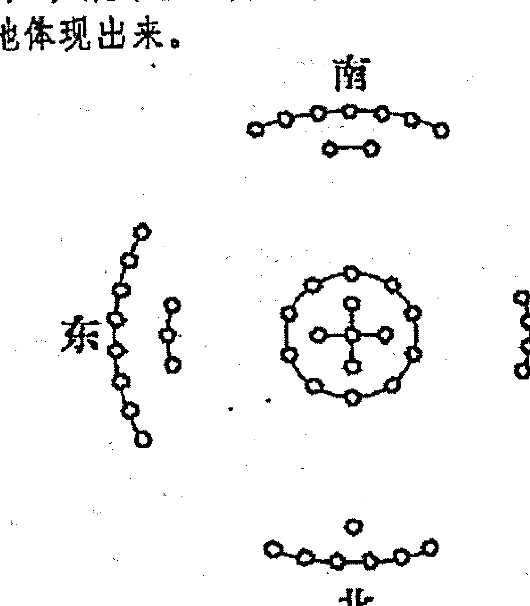

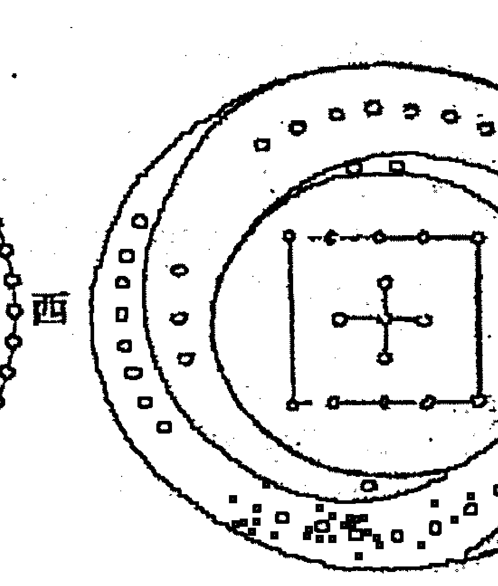

河图 太极河图

下面我们来看几个图表，通过奇门局来解说深刻的原理，真正揭示奇门创始之源，通过对一门预测学原理的研究，才能真正掌握这门预测术。

> “上分于天，下别于地，各以九位，天则二十八宿，北斗九星，地则四方四维及中央，分配九州，谓之宫者，皆神所游处，故以名宫也。”

这是对洛书九宫具体作用的概括，一般用来界定范畴，类聚群分，所以叫做九宫。至于古人说的“上分于天，下别于地，各以九位，天则二十八宿，北斗九星，地则四方四维及中央，分配九州”等内容，详见下表。

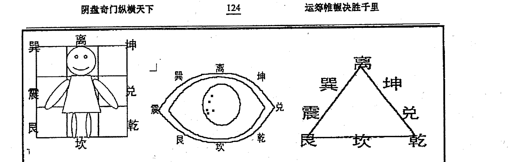

“八卦”是易经中的基本图形，八卦是怎样产生的呢？在《周易——系词》中说：“是故易有太极生两仪，两仪生四象，四象生八卦。”

太极生两仪：太极是天地混沌，阴阳未分时的“元气”状态，天地又如鸡蛋，后来盘古氏开天辟地，奠定乾坤。两仪就是天和地。

两仪生四象：阴与阳继续演变，相重或相交，产生出老阳、老阴、少阳、少阴四象，这四象象征着四时、四方等现象。

四象生八卦：四象再继续演变就产生了上述的八卦了。八卦分别象征八节、八方等。

八卦的五行属性就是：坎属水，离属火，乾和兑属金，震和巽属木，坤和艮属土。请注意，奇门预测的生、克就是以八卦宫位的五行来确定的，如用神落震宫属木，克坤宫（土），又受兑宫（金）所冲克。

八卦又分先天八卦与后天八卦。

什么叫“先天”，什么叫“后天”？以哲学的观点来说，宇宙万物没有形成以前，即是所谓的先天，有了宇宙万物，那就是后天。如果从人的方面来说，在出生前为先天，出生后为后天。从事发展角度来看，发生过了的为先天，未发生过的为后天。先后天之时用以划分阶段、范围而已。

不论先天八卦还是后天八卦，都是由乾、坎、艮、震、巽、离、坤、兑八个单卦组成，它们是古人通过长期观察而得到的一种以模拟万事万物的象征的符号，是建立在阴阳三财基础上最基本的八个符号。

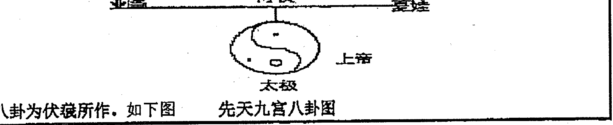

| 兑二 | 乾一 | 巽五 |
| :---: | :---: | :---: |
| 离三 | | 坎六 |
| 震四 | 坤八 | 艮七 |

先天八卦为乾、坎、艮、震、巽、离、坤、兑。先天八卦与后天八卦的排列、象征方位及数都有所不同。

先天八卦数为：乾一 兑二 离三 震四 巽五 坎六 艮七 坤八。

先天八卦所主是：

乾居南方，数为一，与坤相对。坤居北方，数为八，与乾相对。
震居东北，数为四，与巽相对。巽居西南，数为五，与震相对。
离居东方，数为三，与坎相对。坎居西方，数为六，与离相对。
艮居西北，数为七，与兑相对。兑居东南，数为二，与艮相对。

另一种则是后天八卦，传为文王所创。如下图：

#### 后天九宫八卦图

| 巽四 | 离九 | 坤二 |
| :---: | :---: | :---: |
| 震三 | 五 | 兑七 |
| 艮八 | 坎一 | 乾六 |

后天八卦所主：

离居南方，五行属火，与坎相对，数为九。
坎居北方，五行属水，与离相对，数为一。
震居东方，五行属木，与兑相对，数为三。
兑居西方，五行属金，与震相对，数为七。
乾居西北，五行属金，与巽相对，数为六。
巽居东南，五行属木，与乾相对，数为四。
坤居西南，五行属土，与艮相对，数为二。
艮居东北，五行属土，与坤相对，数为八。

后天八卦数可以用以下歌诀来记住： 一数坎兮二数坤 三震四巽数中分五寄中宫六是 七兑八艮九离门。

后天八卦的宫位排法可以用以下歌诀记住： 戴九履一，左三右七，二四为肩六八为足。在奇门中，用后天的八卦图。

八卦旺衰：乾、兑旺于秋，衰于冬；震、巽旺于春，衰于夏。坤、艮旺于四季，衰于秋；离旺于夏，衰于四季；坎旺于冬，衰于春。

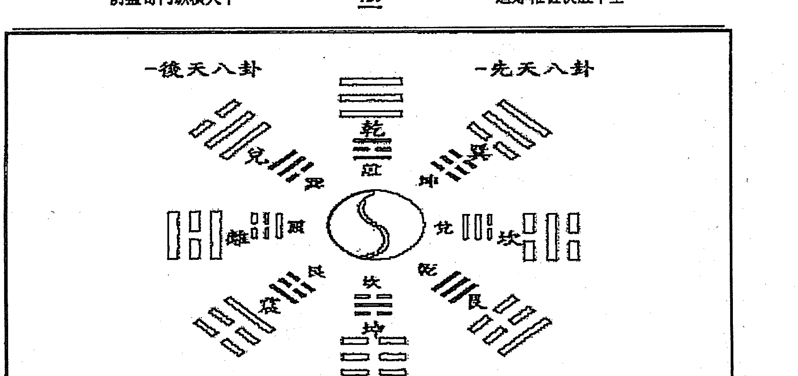

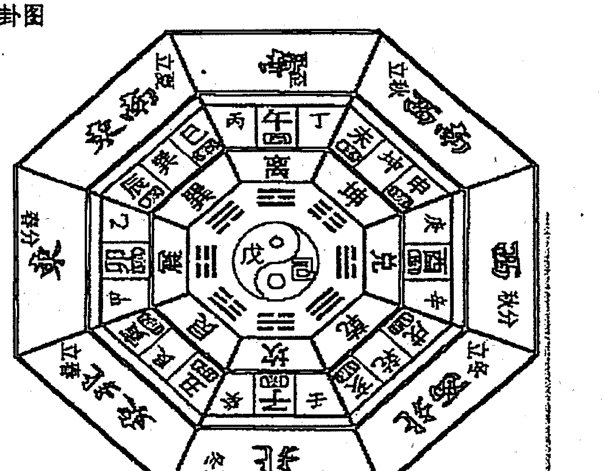

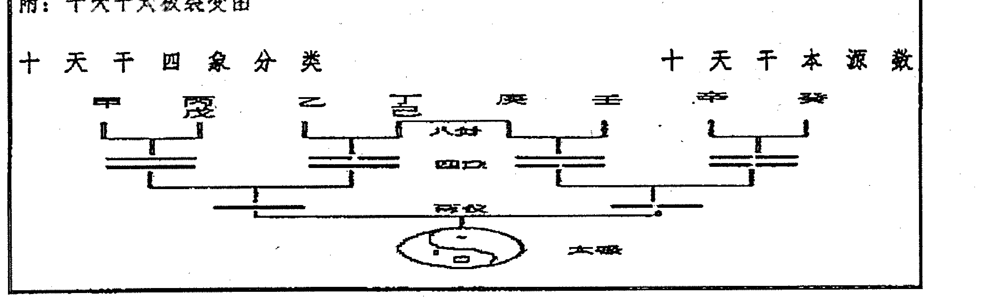

| 太阳干：甲丙戊 | 5 甲己 10=土运甲癸乙 |
| :--- | :--- |
| 少阴干：乙丙丁 | 4 乙庚 9 =金运 |
| 少阳干：庚壬 | 1 丙辛 6 =水运 |
| 太阴干：辛癸 | 8 丁壬 3 =木运 |
| | 7 戊癸 2=火运 |

#### 一、日干落宫反映的信息

- **【日干落坎一宫】** 坎宫就是动荡不安，就是变化、波折、忧患。（坎离是阴阳分界线）。落在坎宫，就说明他有忧虑、忧郁、奔波、劳碌、现在不太安定。如果旺相还能“自在悠闲”，如衰弱，劳力劳心。衰弱还主风流。坎宫代表中年男性或为中间排行，北方之人，肤色稍黑。多从事公务员、企业中的机关类工作、从事液体类行业等。
- **【日干落坤二宫】** 坤宫就是慢而稳，从小处着眼方成大事。多从事与农业有关的工作，也适合做研究工作。旺相，人厚道包容，平易近人、朴实。衰弱，有问题，眼光短浅。落坤宫的人，多是普通人，即使是名人也不是很重要的人物。坤宫主母亲，又代表年龄较大或长女，西南之人或来自农村。肤色较黑。（落坤宫、坎宫，出发大财的人）
- **【日干落震三宫】** 有突发的变动，突然的机遇、意想不到的事情等。容易一鸣惊人，或突然出现意外。旺相神气潇洒、衰弱丑陋、多病、落寂、憔悴。长男或家中排行老大，东方之人，肤色中等。多在工厂工作或从事运输、建筑、机械、体育等工作。
- **【日干落巽四宫】** 巽宫具有飘摇不定、没有主见、进一步退两步等特点，常常说明求测人正处于犹豫不决、不落实，尚在变化中的状态、徘徊、进退维谷。巽利市三分，多从事商业。旺相聪明智慧，衰弱瘦弱、不安。代表年长女子或排行老大的女子，东南方之人，肤色中等。
- **【日干落中五宫】** 同二宫，但方向不定。
- **【日干落乾六宫】** 主事大、心高气傲、是领导或有居高临下的心态，一般层次比较高、看得远，多在政府机关或科室工作。旺相家庭富有、气质高雅，聪慧俊秀、城市或名门大家之人。衰弱丑陋、孤苦无依。代表父亲、老年男子或排行老大，西北方或大城市之人，肤色较白。
- **【日干落兑七宫】** 常常预示着胆战心惊，有口舌是非，不利索，有缺陷等。多从事教育、说唱或服务人员、或者牙医。旺相聪明伶俐或家庭富有，衰弱贫寒困苦。少女或排行最小的女子，西方之人，身材瘦小。
- **【日干落艮八宫】** 慢性子、讲诚信。事物发展不快，在等待，停滞不前。旺相较胖，衰弱较矮。多从事保险、金融或建筑行业等。少年男子或排行最小的男子，东北方之人，肤色较白。
- **【日干落离九宫】** 有名望，容易引人注目，旺相伶俐大方，衰弱风流。做事开始轰轰烈烈，最后悄无声息，缺乏持之以恒的精神。中年女子或排行居中之女，南方之人。从事文化、通信、娱乐、IT 行业或饮食方面的工作等。

#### 二、九宫的性质与象意

关于九宫的性质与象意等，具体阐述如下：

##### （一）乾卦
为天，为太阳，为主宰万物，积极主动，遇事稳妥，不焦不躁有威严，统率决断之意，具有刚健的特性。大部分人落此宫，有头脑。具有高、广阔、华丽、精美、震撼、荣誉第一、物性突显等特征的人、事、物。

(1) 象义: 圆、原始，向上，本源，高亢，核心，傲慢，精华，健全，有创造性、活动力、统帅，扩大，只争朝夕、有威严、权力、战争、竞争、胆量、优胜、充实、满足、模范、正直、尊敬、喜悦、健壮、圆满、收获、永久、法则、核心、长辈、父亲、坚固、激烈。
(2) 性情: 刚健勇猛，重情讲义，多动少静，威严豁达，正直勤勉，自尊高傲、严正威武。
(3) 形态: 高档的，精致完美的，高的，大的，坚硬的，圆滑的，趾高气昂的，金黄色的、贵重的、白色的等。
(4) 天时: 代表天，冰，雹，雾、晴天、晴空、太阳、寒气、雪、霜。
(5) 地理: 西北方，京都，大城市，形盛高亢之所，大饭店，名胜古迹，大会堂，圣地，寺院，高级住宅，大厦，金属工厂，配件商店、广场、繁华地、首脑集中地、银行、警察局、机关、武馆、博物馆、邮局。
(6) 人物: 主席，总统，一把手，主要领导人，总经理，老板，祖父，名流，专家，厂长、寺院主持、元老、高贵的人、长辈人、大人、老头、公门人、宦官。
(7) 静物: 金玉珠宝，圆珠，木果，高档用品，金钱，钟表。圆形金属，帽子，神佛，物品，手饰，飞机，高大物、火车、轿车、刀剑、贵重物品。
(8) 动物: 马、天鹅、狮子、大象、老虎、熊、龙、鹰、鲸鱼、猪、狗、鹅、凶猛的动物。
(9) 人体: 头，面部，肺部，右腿，骨骼，男性生殖器官，胸部、肋骨、指甲、大肠、皮毛、精液、右下腹。
(10) 植物: 秋花、菊花、大树、能结果的树、药草。
(11) 食物: 水果、糖果、蛋糕、年糕、豆腐、冰激淋、鸡蛋、高级食品、香肠、干肉、马肉、米、麦、豆类、花生、辣味食品。
(12) 疾病: 头痛、脑淤血、心脏病、肺部疾病、神经病、肋膜炎、发肿、扭伤、皮肤病、骨折、骨病、硬化性疾病、老病、旧病、伤寒、急性暴病、结肠疾病。
(13) 时间: 秋天，戌亥年月日。
(14) 颜色: 大赤色，玄色，金黄色，白色，强烈耀眼的颜色。
(15) 姓氏: 带金属旁的。在兄弟中排行老大，老四，老九。

##### （二）坎（水）
(1) 象义: 心急好动，不规则形，仁慈义气，愁闷，苦难，劳苦、险阻、烦恼、陷落、沉溺、色情、诱惑、交际、交往、关系、结合、悲哀、哭泣、毒害、灾难、踌躇、缺陷、失败、困难、思考、暗昧、滋润、沉默、狡诈、漂泊、隐伏、追求时尚，聪明智慧，外柔内刚，漂泊不定，沉沦隐浮。
(2) 性情: 外柔内刚，随波逐流，善谋多智，多心计，城府深，善算计，奸诈。多变的性格。旺相则有独立的见解、创新思维。
(3) 形态: 劳碌的，辛苦的，忍耐的，流动的，暗昧的，不成形状的，寒冷的，变化的。
(4) 天时: 雨，雪，露，霜，水、寒风、深夜、月。
(5) 地理: 北方的，江河湖海，溪涧，泉井沟渠，洼地，下水道，鱼池，浴池，酒。

## （三）艮（土）为土，为阻隔，艰难之意。有静止和安定的特性。（不是绝对的停止）。

从硬到软，有阻隔性，从大向小延伸，有纽带连接的人、事、物（如漏斗、显示器）。

- （1）象意：静止，呆板，稳定，固守，慎重，等待，困难，迟滞，诚实守信，主观任性，沉着固执，中止、独立、艰难、安定。
- （2）性情：保守，固执，憨厚，诚实守信，稳重，谨慎迟缓，安静笃实，任劳任怨。
- （3）形态：坚硬的，顽固的，或与腿有关的，向下发展，或是上硬下软，停止不前，独立存在，静止、保守。
- （4）天时：云，雾，山峦、阴天。
- （5）地理：山径路，丘陵，坟墓，山地，高坡，堤坎，休息室，大楼，仓库，宗庙祠堂，矿山，采石场，监狱，派出所，银行，桥梁、东北方。
- （6）人物：少男，山里人，童子，宗教人员，土建人员，警卫，矿工，贵族，法官，房地产商，犯人，保守者，学生，信徒、家具商、孤独人。
- （7）动物：虎，狗，鼠，狐狸，喜鹊，啄木鸟，爬虫，有尾巴的动物、有牙有角的动物。
- （8）静物：岩石，山坡，石碑，土坑，桌子，床，瓜果，土中之物，木生之物，石块，门户，门槛，台阶，座位，屏风，墙壁、瓷器。
- （9）人体：鼻子，背部，手指，关节，左腿，脚趾，乳房，脾胃，结肠、男性生殖器。
- （10）食物：牛肉、兽肉、根类食物、山蘑菇、汤圆、甘薯、糖果。
- （11）疾病：筋骨酸痛、脾胃病、消化不良、虚弱、小儿麻痹症、疮肿、瘤、结石、皮肤过敏、疑难杂症、虚胀、麻木、痘类疾病。
- （12）时间：冬春之交，丑寅年月日时
- （13）颜色：黄色，棕色，咖啡色，棕黄色
- （14）姓名：土旁的，排行5、7、10、8

##### （四）震卦

为雷，使万物运动勇敢直前，具有震动，奋起，惊动的特征。蓄势震动、瞬间突发声音、出现动态效果的人、事、物。

- （1）象意：奋进，上升，躁动，积极，性急，冲动，兴起，显现，影响大，迅速、喧哗、争论、转移、旺盛、发育、果断、生长、妄动。
- （2）性情：易怒，性急，多动少静，勤奋直爽，自尊心强，心烦易乱，倔强、宁死不屈、意气风发、积极果断、刚愎自用、独断专行、冲动鲁莽。
- （3）形态：震动的，激烈的，急躁的，华而不实的，有声有响的，高速的，勇敢的，竞争的，吃惊的，外虚内实的，上虚下实的，好看而无内容的、粗糙的、移动的。
- （4）天时：雷雨，地震，火山喷发，雷鸣、大冰雹、闪电、海啸、东风。
- （5）地理：东方，树木，竹林、草木繁茂、闹市，广播电台，歌舞厅，公安机关，军队，机场，战场，运动场，菜市场，停车场，花店，乐器店，游乐场，公园，夜总会、音乐厅、商店、噪声大的场所。
- （6）人物：长男，长子，名人，将帅，驾驶员，运动员，军人，飞行员，说大话的人，音乐家，易发怒的，壮士，精神过敏，警察，法官，社会活动家、歌手、吵架者、木匠、旅行者、狂人、足球爱好者、名医、学生。
- （7）动物：龙，蛇，百虫，鲤鱼，善鸣之物，昆虫、蜈蚣、燕子、蜘蛛、蝉、蜂。
- （8）静物：木、竹，鲜花、芦苇，乐器，电话，飞机，汽车，火车，鞭炮，闹钟，音响，手机，裙裤、电器、铃铛、麦克风、武器、鼓、腰带、绳子、箱子。
- （9）人体：足，肝，发，声音，左肋、大拇指、舌、喉咙、左手臂、左手。
- （10）食物：醋、酸的食物、樱桃、柠檬、凤梨、橘子、蜜柑、梅子、海藻类、蔬菜类、筋、蹄。
- （11）疾病：神经病、足疾、扭伤、脚气、发狂、歇斯底里、恐惧、精神失常、癫痫病、心悸、关节炎、肝脏疾病、气喘、喉咙疾病、手足麻痹、毛发病、神经衰弱、神经过敏、妇科病、腿痛、多动症、强迫症、碰撞性伤。
- （12）时间：春二月，卯年月日时
- （13）颜色：绿色，碧色
- （14）姓名：带“木”的人，排行3、4、8

##### （五）巽宫

为风，使万物消散，其好动而慢，进退无常，具有自由活动和渗透的特性。归纳为：飘动、巧妙、三教九流、缺乏针对性的，条、藤、管、任意状、外实内虚，具散发、传播性质的人事物。

- （1）象意：自由运动，流动徘徊，不稳定，渗透，忙碌奔波，轻浮，空虚，随声附和，基础不稳、顺从、疑惑、轻快、深入浅出、高度、货运、迷途、谦逊、荣誉、普遍性、摸不着边际。
- （2）性情：进退不果，柔和谦虚，心情不定，虚情假意，没有主见，超俗世外，华而不实，反复不定，难以决断、优柔寡断、心情徘徊、狡猾市侩。
- （3）形态：基础差的，外实内虚，外刚内柔，轻浮，忙碌，波动，神奇的、烟状气态、向下向里发展、上实下虚、游动传播。
- （4）天时：刮风，巨风，龙卷风、臭气。
- （5）地理：东南方、花木茂盛之地，草原，寺观楼台，洞穴、山林之地，邮局，过道、管道、通风口、楼道、电梯、索道、风力发电站、机场、港口、发射场。
- （6）人物：长女，科技人员，教师，僧尼，仙道之人，商人，尼姑，狡猾者，流浪者，优柔寡断者，文质彬彬者，新闻人员，公安人员，能工巧匠或自由职业者、寡妇、秃头、木匠、有狐臭、营销员。
- （7）动物：鸡，鸭，鹅，蝴蝶，蚯蚓，蜻蜓，蛇，带鱼，鳝鱼等。（长条类）
- （8）静物：树木，木制品，纤维品，竹木品，香烟，水果，丝绳，药材，汽艇，帆船，宣传品，各种票据，下面有口之物、草鞋、椅子、风筝、床、毛巾、抽屉、化妆品、雕刻物、有香味的东西。
- （9）食物：鸡肉、泥鳅、鲤鱼、大蒜、有刺激味的、胡萝卜、芹菜、韭菜。
- （10）人体：大腿，胆，肝，气管，神经，左肩，耳
- （11）疾病：伤风、感冒，气管阻塞，哮喘、支气管炎、中风、肋骨神经痛、内脏疾病、肝脏损害、脱肛、胆结石、脱发、食道疾病、痔疮、狐臭、发恶臭的病、毛发病、动脉硬化、骨折、受风寒、疥癣、胆类疾病、传染病、坐骨神经痛、淋巴疾病、抽筋、强直强硬症，病情不稳定、左肩疼、胀气、忧郁症、血管病等。
- （12）时间：辰巳年月日时
- （13）颜色：绿色，碧绿，洁白。
- （14）姓名：草木旁，排行4、5、3、8

##### （六）离卦

外刚内柔，离为火，其性好动而躁，具有光明，美丽，变化，迅速等特性。归纳为多彩、散发热量、外显、出众、深度内涵、求真的人事物。

- （1）象意：光明，文明，前进，上升，华丽鲜艳，光彩照人，显示轻浮，流动，时尚，枯燥，空虚，装饰，文章，文学，巧言聪明、尊敬、化妆、警惕、文采、远见、洞察、判断、鉴定、餐馆、暴露、虚伪。
- （2）性情：重礼节，爱美，喜欢装扮，虚心好学，知书达理，易冲动，性急暴躁，内心虚荣、聪敏、名誉、色情。
- （3）形态：鲜明的，明亮的，发光的，美丽的，可燃的，冒火的。
- （4）天时：晴天，热天，干旱，彩虹，光，闪电，云霞
- （5）地理：南方，朝阳的场所，电影院，图书馆，印刷厂，冶炼厂，电视台，火车站，火山，教堂，华丽街道，学校，电厂，广告牌、美容院、画廊、殿堂。
- （6）人物：中女，文人，目疾人，中层干部，漂亮的人，美容师，作家，画家，编辑，纪检员，白领，艺术家，多情的人，幻想者、摄影者、影视工作者、通信行业、侦查员、博学者、虚伪的人。
- （7）动物：龟，带壳的蚌类，蟹，鸟，凤凰、孔雀，萤火虫、硬壳虫。
- （8）静物：报刊，图书，字画，文件，证件，电话，广告，打火机，手机，电动机，锅炉，玻璃门窗，电脑，电视，复印机，化妆品，电气焊工具，电子，电器产品。
- （9）食物：烧烤类、味苦的食物、贝类、虾蟹、红色食物。
- （10）人体：眼睛，头部，血液，心脏、乳房、小肠、女人私处。
- （11）疾病：心脏病、眼疾、视力减退、近视、色盲、头疼、精神疲劳、神经错乱、耳疾、失眠、幻觉症、烫伤、热症、面部疾病。
- （12）颜色：红色，紫色，花色
- （13）姓名：火字旁的，红，赤，紫。

## （七） 坤卦

为地，有生化万物之功，平稳发展，动静有序而安稳，具有潜意识和柔顺的特性。归纳：乡土气息，可见花草、厚胖、粗糙、内部、第二位有关的人事物。

- 1. 象意：大地、方形、平安、开阔、稳健、文雅、柔顺，平衡，包容，含蓄，勤俭、谦卑、依赖、迷惘、忧虑、慈悲、伏藏、消极沉默，优柔寡断，懦弱迟缓，卑贱丑陋，逆来顺受，敬奉神佛。
- 2. 性情：温厚柔顺，行动迟缓、吝啬消极、感情暧昧，守信诚实，卑贱狭小，固执，保守、多重性格。
- 3. 形态：方形的、粗笨的、柔软的，平常的，普通的，共用的，虚空的，包容的，黄色的，粉状的，平整的，多数的。
- 4. 天时：阴天，雾气，冰霜、多云、露水、低气压、温暖
- 5. 地理：西南方，田野，乡村，农村，民房，农贸市场，故乡，旷野，原籍，矮屋、平地、盆地、空地、仓库、肉联厂、鸡窝、兔圈、庄稼地。
- 6. 人物：母亲，妇人，农民，群众，房地产，农牧业经营者，体胖，大腹人，忠厚之人、副手、书商、寡妇、建筑工人、胆小的、丑陋的、女领导、奶奶、领导夫人、皇后。
- 7. 动物：牛，百兽，母马、乌鸦、鸽子、海鸥、夜行动物。
- 8. 静物：方柔之物，水泥，砖瓦，五谷，布帛，丝棉，土中之物，食物，大车，衣服，药品、箱子、农具、日用品、书包、妇女用品、纸张、汽车。
- 9. 植物与食物：苔、小麦、芹菜、柿子、面粉．肉类、长在土中的食物。
- 10. 人体：腹，右肩，耳，肌肉，女性生殖器，肠，消化器官、右手、右臂、脾脏、肚脐。
- 11. 疾病：胃疾、消化系统疾病、食欲不振、贫血、下体流血、过度疲劳、失眠、恶心、消化不良、痢疾、便秘、黄疸、皮肤病、肩周炎、虚脱、伤寒、健忘症、皮肤斑、浮肿、晕症、慢性病、癌症。
- 12. 时间：农历六七月份，丑未年月日时
- 13. 颜色：深黄或黑色，
- 14. 姓名：带土姓的人，排行2、5、8、10、

## （八） 兑（金）

为泽，为雨，其性偏激好静，动而下沉，至喜反忧，具有言辞喜悦向往的特性。（归纳：转换局势、深邃、口腔、管状内堵塞或流动、回收、表里不一、引导有关的人事物）。

- 1. 象意：口舌，俏骂，吵闹，雄辩，讲演，言谈，娱乐，歌唱，亲密，爱欲，媚力，使上面开口的，外软内坚的、议论、饮食、舞会、色情、恩惠、和睦、敬爱、魅力、接吻。
- 2. 性情：喜悦，口舌是非，阿谀奉承，开朗，色情，亲热，温和，多愁善感，重情讲义，忧愁，口馋。
- 3. 形态：坚硬的，顽固的，与口舌有关的，与说唱有关的，不动的，金黄的，发光发亮的，昂贵的，光华的，锋利的。
- 4. 天时：潮湿的天气，气压低，露水，阴雨连绵，小雨，黄昏、星星。
- 5. 地理：西方，沼泽地，峡谷，湖泊，池塘，滑冰厂，娱乐场，井，坑，洞，穴，咖啡馆，废物收购站，音乐厅，娱乐场所，影剧院，公关部，会议室、小路。
- （6）人物：少女，二奶，坐台小姐，歌手，话务员，小女孩，教师，律师，讲解员，翻译，巫师，媒婆，神汉，导游，相声演员，性魅力者，经销人员，音乐家、评论家、牙医、厨师。
- （7）动物：羊，鸡、兔、猴，水鸟，沼泽地动物、猿猴。
- （8）静物：金银首饰，乐器，带口之物，金属制品，破损物，垃圾箱，骨头，石榴，刀剑，剪刀，手术刀，油桶、锅碗。
- （9）植物、食物：荷叶、水草、芦苇、菱角、水稻、泥鳅、羊肉、石榴、啤酒、辣味食品。
- （10）人体：口，舌，牙齿，咽喉，肺，右肋，肛门、女性性器官、气管、胸部、大肠。
- （11）疾病：口腔疾病、牙病、舌病、咽喉病、气喘、胸部疾病、结核病、受伤、打伤、神经衰弱、性器官病、贫血、皮肤病、咳嗽、膀胱病、尿道病。
- （12）时间：秋天，8月，酉年月日时
- （13）颜色：白色，浅黄，金色，金黄色
- （14）姓名：带口字的，金字旁的，排行2、7

我们讲了这么多的象意，重在从根本上把握，原理上来理解。重申：所谓落宫，就是这个人、事、物是否得地利的问题。同样一个格局，落宫不一样，出现的情况和结果也会不一样。比如，都是丙+庚，临白虎、死门的格局，用神都是丙火，断车祸，落艮宫者，没有严重危险，因为丙火长生在艮；而落乾宫者，却大凶，因为丙火入墓在乾。格局是状态，是目前测事的状态，吉凶的程度与所落之宫关系很大。用神落在哪个宫，就打上了这个宫的烙印，就具有了这个宫的一些性质。

落乾宫：主事大，为人则心高气傲、重要、眼光高，即使是穷人，也不是一般的市井小民。若是落坤宫，就算是名人，也是大众化的、思想境界不够高的。乾为高地、大地方、重要的地方。落乾宫，事情大、范围广。如果求测人落乾宫，一般都有职务。乾宫也为终老之宫，也是事物、人生的终结点。因太高，又是孤独之位，落乾宫的人，多目中无人。有好的一面，也有不好的一面。落乾宫的人，一般具有广阔的胸怀、层次比较高、站得高看得远，是有社会地位、有身份的人。但落乾宫的人，并不是发大财的人。发财的人多落坎宫或坤宫。

落坎宫：波折、变化、曲折。若命盘日干落坎宫，为一生忧患意识强。测事落坎宫，此事不顺利或与社会闲散人员、黑社会黑势力有关。对于停滞不前的事情，落坎宫的话，也预示着要出现好的变化。落坎宫，就是不稳定、曲折、劳心劳力，即使有贵人帮，也是曲折迂回的。用神落坎宫，先天下之忧而忧、忧患、忧郁、自责、摇摆、不安。

落艮宫：艮为止，落此宫，事物发展不快，要静守。如测企业落艮宫，不能大刀阔斧的去干。坏的事情落此宫，也趋于停止了。艮宫之人，慢性子，但讲诚信、一步一步的去办，发展慢。如果格局不好，为反应迟钝。如果此宫临马星或逢冲，说明还有点劲，能行动。

落震宫：有突然的机遇、突发性的、意想不到的事情。命盘日干落震宫，一生容易大起大落。用神此宫，有一鸣惊人的，也是大人物。预测事情，要注意突然的转变。

落巽宫：飘摇不定、象赵本山的脸阴晴不定、没有主见、左右摇摆、犹豫迟疑，没有结果、是尚在变化之中的、不落实。注意这里与落坎宫的差别：落坎宫，是曲折劳心，但还是能向前走的；而落巽宫，是徘徊，是时好时坏、进退维谷，走一步退两步，左思右想。巽宫利市三分，利于商人。

落离宫：主不持久、短暂性。优点是：特别容易引人注目、开局好，但红火一阵子就不行了，虎头蛇尾、有始无终。落离宫，事情也主急进。大项目落离宫，很难干下去。落离宫还主名声大。轰轰烈烈的干事，但后来却偃旗息鼓、悄无声息了。（形式主义、表面文章）

落坤宫：慢而稳，从小处着手成大事，于无声处听惊雷。也代表杂乱、问题多、散乱，但有包容心、厚道、平易近人、平稳。人落坤宫，适合做研究工作。坤宫的人很难有重要人物。但临天英星落坤宫，出老百姓喜欢的名人，如相声大师侯耀文之类。

落兑宫：胆战心惊、不会很利索，又主口舌是非。经常开会，谈判也不会一次成功。落兑宫常常是唇枪舌战的事。光说不干，缺乏行动。好事、坏事来的都意外。兑为缺陷之宫，再圆满的事情，也会出现一些问题。因为兑宫的事情，有原则、有框架，所以也就有缺陷。

九宫是地盘系统，九宫自身的旺衰是以时令来看的。逢生我为旺、比我为相、克我为死、泄我为休、我克为囚。若代表符号所落宫位当令的，为吉时，则吉利成分增多。

### 第八章 九星的特性及信息含义

一般讲，天心星、天任星、天禽星、天辅星为四吉星；天冲星次吉；天英星中平；天蓬星、天芮星、天柱星为凶星。古人有歌云：“蓬任冲辅禽阳星，英芮柱心阴宿名。辅禽心星为上吉，冲任小吉未全亨。大凶蓬芮不堪使，小凶英柱不精明。”

九星为天盘，代表的是人的先天秉性、长相及脾气性格。九星的旺相休囚废又反映着被预测人是否得天时。天时是指时间、政策、大趋向、人生际遇等因素。临吉星旺相为最好。而凶星越衰是越不利。九星旺相为得天时。九星一般反映的是事物最初成像的一些情况，事情开始时，是因为什么原因引起的，或者因为什么原因发生了这件事等。古人强调大事看星，事情的起因就是因为九星的作用而产生的。我们前面讲的九宫，就是因为九星的起因，这个引起的变化，落在了那个基础面上。

#### 一、日干所临九星体现出的状态

- 【日干临天心星】旺相此人有管理能力，多才多艺、有心计，做事周全，心高气傲、正直、善良。衰弱，则歪心眼多、工于心计。貌美清秀、皮肤较白。一般说来，天心星临宫，有才华，能治病救人。策划周密、进退自如。
- 【日干临天蓬星】旺相能做大事情，敢冒险、敢作敢为，也可能破大财。衰弱，则为游荡之人、胆大好色。浓眉、脸微黑、络腮胡子。一般说来，天蓬星临宫，经商破财、出行遇盗。只宜安分守己。
- 【日干临天任星】旺相为人厚道、宽容心强，做事任劳任怨。衰弱则任性、固执。身材矮胖、或有点驼背、面色发黄、相貌平平。一般说来，天任星临宫，经商嫁娶，百事皆吉。
- 【日干临天冲星】旺相做事雷厉风行，敢说敢干，特性是大慈大悲、助人为乐。衰弱，主鲁莽，爱冲动。个高好动、声音洪亮、语速快。一般说来，天冲星临宫，宜于出征交战，摇旗呐喊。
- 【日干临天辅星】旺相文化程度高、有涵养、文雅，知识渊博、言行高雅。衰弱，为学究、没主见或有隐藏之事。身材高挑、才貌出众，说话柔声细语。一般说来，天辅星临宫，百事皆宜，更宜升学考官，发展文化教育事业。
- 【日干临天英星】旺相有名望，要面子，做事光明磊落，宜于谋划策略。衰弱，主办事虎头蛇尾，有始无终，半途而废。长相英俊、潇洒，有气质。一般说来，天英星临宫，有文书、合同、书信之事，也主口舌是非。
- 【日干临天芮星】旺相爱学习，善于思考，爱结交朋友。衰弱、格局差，则表现为贪婪或身体有病等。身材矮胖、面色发黑或有黑痣斑点，容貌较丑。出身农村或现为学生。一般说来，天芮星临宫，不宜主动谋吉事，只宜坐待时机。
- 【日干临天禽星】旺相处事稳重、正直大方、有帅才、循规蹈矩、为人诚信、按制度办事。衰弱，则死板、办事缺乏灵活性。面貌端庄秀丽，脸型为方脸型或圆脸型。一般说来，天禽星临宫，百事皆吉。
- 【日干临天柱星】旺相能言善辩，为中流砥柱，能独当一面。衰弱则性格叛逆。面白清瘦、俊丽，嘴巴灵巧或声音突出，旺则骨架宽大。一般说来，天柱星临宫，有意外伤灾、官司牵连，求财赔本，出征、远行车破马伤。只宜固守本分。

通常情况下，我们说天心星、天禽星、天辅星、天任星为四吉星。天冲星为次吉；天英星中平。天蓬星、天芮星、天柱星为三凶星。日干逢吉星相助“吉星高照”为得天时。天时有利，则求谋较顺遂。天时是第一位的，时势造英雄。

#### 二、九星旺弱

关于九星的旺弱判断《烟波钓叟歌》中讲：与我同行即为相，我生之月诚为旺。废于父母休与财，囚于鬼兮真不旺。九星的旺衰评定有两种情况：一是指九星落宫的状态，即九星与地盘九宫的关系。一是指九星在特定时间内的状态。就是说，也是有空间上的旺衰和时间上的旺衰两种情况。一般以九星的落宫状态为主，兼看在月令中的旺衰。两项都旺，这人运气正好，下步也不错。两项都衰，这人运气正背，下步也好不了。落宫衰月令旺，眼下还有点能量，要抓紧时机办。落宫旺月令衰，暂时不行，很快就有转机。长久的落宫状态是主线，短期的月令状态是支线。

星相分野，在天划分九个区域，在地划分九州。在天成像，在地成形，形是像的表现。古人用井字格和方位学来划分和表示其属性。北极星是永远不变的，指南针应该叫“指北针”。阳主动，阴主静。（太阳是动的，北极星是静的），以不变应万变，要理解易与不易的道理。奇门遁甲就是用不变的理论，模拟事物发展的规律，事物受着天体的影响而变化。最初，是感应学说，天地感应、天人感应，人根据天的变化，提前防范地上的变化。如雨天不方便出行，则做伞避雨、造屋而居等。对于地上的河流、洪水，人们可以造桥、造船来防范、通行。这就是人参与了天地的变化，产生了天地人三者之间的感应与关系。现在科技能力非常高了，可以改变“天”了，但是天地人三才这种现象是不会改变的。夏商周 三代前，人们很聪明，人人观天象，知天文。商朝的社会结构，已经比较完善了。人们发现，天上九个区域的任何变化都会影响到人，继而影响到人类社会，因此，就由研究自然转到了人类社会的研究。九星变化的影响：

- （1）天蓬星（坎一宫）出现异常（隐晦/明暗），人类就会出现影响安定团结的问题。天蓬星主黑社会、土匪等。如83年严打；风水学上是6，7运交接，7为晦折口舌。此年，国家地痞流氓最猖獗，国家不得不开展严打。此年天蓬星就出现了异常，坎为水，主江湖人物、黑社会老大。落坎宫，身心劳累、动荡不安，即使是大老板，也是心神不宁、忧心忡忡、劳累艰辛。
- （2）天芮星（坤二宫）如潘多拉的盒子，出现异常，则人类有大的瘟疫、疾病流行。如03年出现的非典。03/04在坤未申之年出现非典、禽流感等，是天体作用造成的。社会的大变化，会影响到每一个人。用神有个主次与重点，核心只有一个，坤宫的星体就是病。

三、九星的具体象意与特性

##### （一）天蓬星

原名贪狼星。与北方一宫坎卦相对应。“讼庭争竟遇天蓬，胜捷名威万里同。春夏用之皆为吉，秋冬用之半为凶。嫁娶远行皆不利，修造埋葬亦凶空。须得生门同丙乙，用之万事皆昌隆”。天蓬为水贼，所入之宫不宜嫁娶，营造，搬迁等，但如遇生门并合丙奇，丁奇，乙奇，则可用无妨。春夏可用，秋冬助水之势，不可用。理解天蓬星重点，它是凶星、盗星、破财之星。在奇门遁甲中，代表大盗、抢劫犯、杀人犯，又是贪淫好色之星。胆大妄为、敢于冒险、喜欢暗中行事，亦代表黑势力黑社会。但天蓬星旺相，格局好，也有吉利的象意。如镇守边关的大将、敢于做风险投资的大企业家、商人、做投机生意的人。天蓬星格局好旺相临宫，亦修造家居、买房购物、兴做土木工程。不利于经商、出行，如临凶格、凶门，容易遭盗贼或破财、生病。测人为胆大妄为、机智过人，皮肤黑、眼睛大。测事，为风险投资、水产品、海上物品、贩毒走私、娱乐业、餐饮业、养殖业、不正当行业等。天蓬星象意细化如下：

- 概念：聪明智慧、大胆妄为、心狠手辣、贪恋酒色。
- 人物：妓女、盗贼、乞丐、头发蓬松的人、黑社会、猎鱼者。
- 形态：庄严、威猛、彪悍、精干、面黑或眼大。
- 性情：圆融果敢、大胆妄为、贪婪、敢于冒险、喜欢暗中行事、多情多欲、贪酒恋花。
- 人体：耳、肾、膀胱、生殖系统、排泄系统、头发、眼睛、足部。
- 动物：猪、鼠、蝙蝠、多毛多厚的动物、水生物等。
- 植物：蘑菇类、菌类植物、树冠大的树、大叶植物、蓬草类、刚出土的植物、水果、蔬菜、水中生长的植物。
- 静物：伞、雨具、渔具、船、车。
- 地理：宫殿、亭子、庙宇、茅屋、简陋的房屋、四面通风的房子、破了门窗的房子、房顶、三角状的建筑、桥等。
- 天时：阴天、雨天、多云的天气、黑夜、冬天。
- 色彩：黑色、蓝色、玄色。

##### （二）天任星

原名左辅星。与东北八宫艮卦相对应。“天任吉星事皆通，祭祀求官嫁娶同。斩绝妖蛇移徒事，商贾造葬喜重重”。求官，嫁娶，迁徙，百事皆吉，四时皆宜。天任星临宫，人物上多代表农民、开矿的人、种植业者、任劳任怨的老实人、驼背人、辛勤劳碌之人。测事多与矿产、田地、种植、房产、土地有关。经商求财虽然见天任星不凶，但一般收获并不大。因为临天任星的人温和、忍让、慈善，不会投机取巧，所以难挣大钱。具体象意如下：

- 概念：担当、承受、任劳任怨、任重道远。
- 人物：驼背人、怕老婆、老实人、长者、寿星、地产商、农业生产者、种植业者、矿山开采者、登山者、建筑者、辛苦劳碌之人。
- 形态：弯腰驼背、胸部丰满、方脸重眉。
- 性情：忠厚老实、任劳任怨、倔强、勤奋，有韧性但固执、保守、小气、缺乏开拓精神。
- 人体：手、腰、脊椎、鼻、胃、脾、腿、腹部、男性生殖器、乳房。
- 动物：牛、骆驼、虎、豹、狗、狼、猪、山中的动物。
- 植物：谷穗、稻子、黍子、葵花、山里红、桃李梨杏荔枝等山果。
- 静物：桌子、椅子、床、被子、车子、柜子、鞋子。
- 地理：桥、山丘、土包、丘陵、梯田、台阶、门槛、起伏不平的路等。楼梯、斜坡。
- 天时：云、雾、风沙。
- 色彩：黄色。

##### （三）天冲星

原名禄存星。与东方三宫震卦相对应。“嫁娶安营产女惊，出行移徙有灾难。修造葬埋皆不利，万般作为且逡巡”。天冲为雷神，天帝，武士，宜出军报仇雪耻，征伐交战，鸣金击鼓，摇旗呐喊。不宜嫁娶，修造，迁徙，经商。有慈心造化助人为乐之德，并与农事活动有关。天冲星是次吉之星。奇门中多代表军人、武警、武术爱好者、拳击散打、运动员。也代表雷管、炸药、子弹等武器。天冲星临宫，宜于选将出师、鸣金击鼓、争取市场、开拓事业、任人唯贤、主动采取行动。测人一般性子急、雷厉风行、好出风头、工作麻利、敢打敢冲、冲锋陷阵、有勇气、骨气。如休囚，格局不好，则为不稳重、好冲动、鲁莽、欠考虑。具体象意如下：

- 概念：冲动、直往前闯、冲击、猛烈、鲁莽。
- 人物：警察、军人、报复者、证人、挑起事端者、田径运动员、武术爱好者、拳击者、性格直爽、说话速度快者。
- 形态：直、高、长方脸、长发、梳抓髻的人、身体瘦长。
- 性情：性子急、工作麻利、为人爽快、敢打敢冲、好出风头、不稳重、好冲动、做事多为欠思考、不顾后果、意识冲动、也表示有闯劲、开拓性、办事不拖泥带水、雷厉风行、有勇气、积极进取。
- 人体：肝、筋骨、发、大腿、神经、气管。
- 动物：兔子、天鹅、燕子、蛇、鹰鸢、跳蚤、蟋蟀、蝗虫、蚱蜢。
- 植物：竹、树、高粱、玉米。
- 静物：乐器、音响、钟、铃、枪炮、剑、汽车、飞机、弹药、鞭炮、电动玩具。
- 地理：高大建筑物、交通枢纽、交通要道、机场、车站、公安局、派出所、公园、噪音大的场所。
- 天时：雷电、冰雹、海啸、地震。
- 色彩：碧绿。

##### （四）天辅星

原名文曲星。与东南四宫巽卦相对应。“天辅之星远行良，修造埋葬福绵长。上官移徙皆吉利，喜溢人财百事昌”。天辅为草为民，宜远行，起造，移徙，婚娶，埋葬，请客。特别利于升学考官，发展文化教育事业。奇门中多代表老师、文化教育、学校、大文豪、有文化之人等。为人文雅、有风度。测事，多和谐、融洽、相互谦让、有君子风度。求学之人临之，学业好。休囚，老学究、迂腐或有隐藏之事、墙头草、没主见、随波逐流。天辅星有看官之意，比如监狱、劳教所。具体象意如下：

- 概念：帮助、辅佐、协助、指导。
- 人物：教育部门工作者、教师、教授、文化人、大文豪、总理、策划人、秘书、祝寿、导游、指导员、政委、公安、狱警、门卫。
- 形态：身体细长、发缜密、脸青白、手细长。
- 性情：文雅、谦虚、有修养、有文化、有风度、仁慈面善、测事多和谐、融洽、相互谦让、有君子之风。
- 人体：大腿、呼吸器官、食道、神经、头发。
- 动物：鸡、蛇、泥鳅、蚯蚓、蜥蜴、壁虎、带鱼、斑马、蝴蝶、蜻蜓。
- 植物：柳树、葡萄、葫芦、丝瓜、南瓜、小杨树。花草、植被、小树林
- 静物：空调、风扇、窗口、绳子、电线、窗帘、衣服、筷子、桌椅、板凳、家具、雨衣、伞、床。
- 地理：围墙、栅栏、隔离带、护栏、林荫路、监狱。
- 天时：风、旋风、彩虹、祥云。
- 色彩：绿色。

##### （五）天禽星

原名廉贞星。与中央五宫相对应。“天禽远行偏得利，坐贾行商皆称意。投谒贵人俱益怀，修造埋葬都丰裕”。天禽代表中宫，是遁甲元帅值符所在之地。为屋为宫，宜远行，做生意，埋葬，修造，见贵。天禽星临宫，百事皆宜，四时皆吉。临天禽星的人，为人忠诚讲信用、可靠、稳重。测事，大多有贵人扶持、平和、公平、正义。

##### （六）天英星

原名右弼星。与南方九宫离卦相对应。天英之星居离宫之位，烈火炎炎，性躁易暴，虽如日中天，大放光明，但和血光之灾有关。嫁娶凶。“远行移徙不宜逢，上官商贾凶败死，造作求财一场空”。天英为炉火为残患，宜于谋划献策，面君谒贵，求朋交友、不宜求财考官、嫁娶、出行、修造。奇门中天英星代表爆炸易燃物品、家用电器、与火有关的事物与物品。测人，旺相有名望。衰弱脾气急暴，但讲礼仪。说话声大，脖子粗、脸庞红。测事，多与血光之灾有关。经商求财，多与电器、火光、灯具、通信、易燃物品、烟花爆竹等有关。具体象意如下：

- 概念：卓越、杰出、贤明、秀丽、智勇。
- 人物：电器经营者、烟花经营制造者、电子产品经营制造者、文艺工作者、演员、导演、画家、美术工作者、美容美发、编剧、导演、作家、文秘。
- 形态：瓜子脸、面红白、身体瘦、头发较黄。
- 性情：声音焦脆、礼貌虚伪、焦躁不安、易怒。
- 人体：眼睛、血液、心脏、小肠、唇。
- 动物：孔雀、鹦鹉、火鸡、锦鸡、金鱼、热带鱼等一切漂亮的动物。
- 植物：开花的植物、盆景、花卉。
- 静物：爆炸易燃物品、家用电器、影视用品、烟花爆竹、太阳、眼睛、望远镜、霓虹灯、灯具、证件、图片、图书、灶、与火有关的事物或物品。
- 地理：高亢之地、阳光充足的场所、炉冶之地、美容院、语言学校、电影院、百货店、图书馆。
- 天时：晴天、夏天、中午、彩虹、闪电、太阳。
- 色彩：红、品红、绛红。

##### （七）天芮星

原名巨门星。与西南方二宫坤卦相对应。“天芮授道结交宜，行方值之最不吉。出行用事皆宜退，修造安坟祸难测。贼盗惊惶忧小口，更有官事被官责。纵得奇门从此位，求其吉事皆虚为”。天芮为传教授道，朋友，故宜受道结交友，受业师长、屯兵固守，不宜用兵交战。不宜嫁娶，迁徙，诉讼，营造，即使得奇门，也难为吉。天芮为土星，秋冬用之吉，春夏用之凶。天芮星为病星，代表疾病、孕妇、子宫、产妇、学生、授业弟子。旺相为吉的方面是：测职业为医生、医疗机构、药店、医疗器械经营、学生、农民、群众等。旺相为好学、好交朋友。休囚则贪婪、阴险、毒辣、无耻。天芮星在判断疾病时，作为疾病落宫的符号。测人临天芮星，大多身患疾病、精神不佳、身体素质较差。测事，为出现问题、质量不过关、有缺陷等。具体象意如下：

- 概念：问题、毛病、错误、联合、结交。
- 人物：朋友、学生、教师、医生、图书管理、病人、产妇、女神、达夫人、肥胖、种田人、孕妇、地产。
- 形态：方脸、大嘴、肚子大、面色较黄、有雀斑。
- 性情：固执、迟钝、懦弱、阴险毒辣、贪婪无耻。
- 人体：脾、胃、腹部、肩部、嘴部、肚部。
- 动物：牛、羊、家畜。
- 植物：庄稼、农作物、土豆、地瓜。
- 静物：书籍、菩萨、女神、瓦罐、瓷器。
- 地理：庭院、走廊、街道、学校、书店、医院。
- 天时：云、雾气、黄沙。
- 色彩：黄色。

##### （八）天柱星

原名破军星。与西方七宫兑卦相对应。“天柱藏形谨守宜，不须远行及营为，商贾百事皆不利，动作立刻见凶危”。天柱当金秋肃杀之气，喜杀好战，与惊恐怪异、破坏毁折有关。为隐士，宜隐迹固守，不宜出行谋事，一切所为皆不吉。宜于训练士卒，屯兵固守，不宜出战交兵，经商远行，强行则车破马伤、士卒败亡、破财折本，意久伤灾。奇门中天柱星多代表检察官、纪检人员、军警、教师、律师、演艺圈人、歌手等。测人，多口才好、能说会道、好斗争讼、口舌是非。旺相为吉的一面是能言善辩、顶天立地、力挽狂澜、中流砥柱，敢于向旧事物开刀挑战。休囚，性格叛逆。测事，则为从中有人破坏，有是非出现，不按常规出牌、喜新厌旧、弃旧图新。具体象意如下：

- 概念：惊恐怪异、喜杀好战、顶天立地、力挽狂澜、中流砥柱、能独当一面、破坏毁折。
- 人物：检查官、纪检人员、职业军警、教师、律师、娱乐演艺人员、歌手。
- 形态：面白、方圆脸、唇薄、身体健壮。
- 性情：口舌是非、能说会道、好斗争讼、为能言善辩。
- 人体：中直部位、颈椎、腰椎、手指、脚趾、阴茎、大腿。
- 动物：公鸡、鼹鼠、羊、鸟类。
- 植物：直的树、芦苇、毛竹、胡杨。
- 静物：乐器、音响、喇叭、钟表、筷子、电器、发声的物体。
- 地理：钢管、水泥管、烟囱、线管、高塔、水塔、大厦、电线杆。
- 天时：秋天、雷电、冰雹、霹雳。
- 色彩：白色。

##### （九）天心星

原名武曲星。与西北方六宫乾卦相对应。“天心求仙合药当，商途客旅财禄昌。主将迁葬皆吉利，万事欣逢尽高强”。因为乾为天、为父，故天心长于心计，和领导才能、军事指挥，医疗疾病有关，故天心为高道，为名医，宜治病服药，练气功，经商，迁徙，埋葬。秋冬吉，春夏凶。奇门中多代表领导、管理指挥人员、医生、医药、参谋助手、医卜星相之人。测人，多为聪明智慧、有领导才华、乐善好施、工于心计、阴柔细腻。测事，为策划周密、进退自如、管理有方、惩恶扬善。衰弱，则歪心眼多，阴险、城府深。具体象意如下：

- 概念：思想活动、想法、情感、坚固、专制、压抑。
- 人物：领导、管理人员、指挥人员、医生、医药、参谋助手、医卜星象之人、宇宙的中心、为核心人物、核心力量。
- 形态：圆形、高大、威严、雄伟。
- 性情：聪明能干、精明机智、有领导才能、乐善好施、攻于心计、阴柔细腻、测事为策划周密、进退自如、能惩恶助善。
- 人体：头、心脏、肺、肠、骨骼。
- 动物：马、猪、狗、狮子、老虎、熊、天鹅、鲸鱼。
- 植物：菊花、果树、大树、桔子、草药。
- 静物：影壁墙、金、银、珍珠、贵重物品、神像、佛像、铁器、金属器皿。
- 地理：高亢之所、领导办公室、珠宝店、影壁墙、堂屋、马路、塔、郊野、远处、大平原、教堂、寺院。
- 天时：冰雹、雷电、赤霞、白气、霜、雪。
- 色彩：白色、金色。

刚才我们讲了九星旺弱的判断法则，这个法则是把九星作为天时来讲的。要注意的是，在奇门遁甲预测中，还经常有把九星作为用神的情况。比如断病时，天芮星做为疾病的代表符号，则就按“生我为旺，同我为相，我克为囚、我生为休、克我为死”来判断天芮星的旺弱。因而才有“天芮星落震巽，不药而愈”的说法，而天芮星落离宫，则不为废，而是病星旺，病情重。以九星作为用神，常用的还有：天芮星代表学生；天辅星代表学校、代表老师，代表授业者；天蓬星代表大盗、黑社会人物；天心星代表医生等。天辅星作为学校的用神时，巳午月就是泄气，就不能按旺来断。但如果作为天时，则是旺的。

古人在判断九星天时旺弱时，强调的是时间因素。与我同行即为相，我生之月诚为旺，废于父母休于财，囚于鬼兮真不妥。这里古人强调的是时间，而没有强调落宫。时间是第一位的，时间对人也是最重要。第二个因素，才是空间因素。

时间单位有年月日时，为什么古人偏偏重月令？这是根据人类活动的常理来说的，是人类生活的一个习惯。随着社会的发展，节奏的加快，我们应该与时俱进，适当调整。一年发生的事情----以月令为主；一月发生的事情----以日建为主；一天发生的事情----以时辰为主。

关于空间因素，就是方位和区域环境的影响。天辅星作用在震巽离宫旺，作用在兑乾宫，则受制；作用在坎宫则废了，作用在坤艮宫为休，这样怎样判定时间、空间的矛盾方面？根据不同的事情、重点不同，有一个原则：办短暂的事情，以时间为第一位的；办长久的事情，以落宫为第一因素；长久规划、连续性的事情看落宫。一次性的事情，以时间为主。但是，这两个因素都要考虑，只是有侧重点的区别。

关于九星旺衰理论的应用，我们还是以天辅星为例，一月所办的事情，要看哪个日子好。天辅星代表天时，如午月，天辅星旺，但并不是天天都旺，虽然午月利于我办这件事，但今天是申日，天辅星不旺，后推酉日、戌亥子日天辅星都不旺，不利。而寅卯日天辅星旺了，则此时行动比较好。注意：当然还要考虑其他因素。再就是，假如此月虽然不利，但可以选择此月中有利的日子。择日就是选择最佳的时间和空间。

### 第九章 八门特性及信息含义

八门即开门、休门、生门、伤门、杜门、景门、死门、惊门。八门是由八卦衍生而来的，同样具有八卦的一些属性。同时八门又代表八个方向、八个区域。八门又反映了事物和现象，从生长到衰弱的变化过程，在奇门遁甲四盘（即天、地、人、神）中代表人和，即人事这一事物因素。而所有的预测学都是把人这个主题作为研究对象，所以八门的作用在奇门遁甲中极为重要，特别是值使门（即值班的门）和用神所临之门基本上反映所求测的事物的信息含义。古人有歌诀云： 欲求市价出生方，捕捉须经死路强。要问远行开户去，休门最好谒君王。索债伤门多称意，杜门有事可潜藏。捕捉惊门宜词讼，献策酒食出景乡。见贵参官须用休，求财觅利奔生来，避难求官开上去，伤门索债可相催。寻人觅故须逢景，钓鱼猎射死门该。擒贼捕盗伤门好，杜门走失不能回。

这就是说，如果求测生意、市价、财利之事，看生门所落宫位，该宫所代表的方向便是求财、经商之地。例如生门落乾宫，如求财则要向西北方，综合星神格局辨其优劣。要问埋葬、阴宅风水的优劣及钓鱼、打猎所往之方，便要看死门所落何宫。如果远行、出国、旅游、出差办事，用神临开门则一路顺畅无阻。求人办事、拜见上级领导即求谒贵人则看休门所落之宫对用神的影响，如临用神则所求有望。惊门临用神或所在之宫多惊恐怪异，是非官讼。杜门所落宫位之方是最好的躲灾避难的场所，但捉捕贼人却不宜。伤门方向适宜讨债、搏斗、捉贼、赌博，但伤门临用神也易出现伤灾车祸不吉之事。如果饮酒作乐、消遣、朋友聚会、商议谋划，最好到景门所落之宫的方位。这只是大致的比附，判断求测格局时则要相对来看。如出行的方位正好赶上死门时，也不一定非要死人，大多则为有不顺利、不愉快的事情发生、或办事不成功等等，要综合各种因素分析判断。

八门为人盘，代表人事活动，代表“人和”，一定程度上表示了被预测人的心情心态心理活动情况以及人际关系等特征，又反映了一些职业特征的信息。八门也能体现一些人的长相信息。八门是由八卦衍生出来的，具有八卦的一些属性。以日干为例，日干所临八门体现的状态如下：

#### 九宫 - 八门

|      | 木  | 火  | 土  |
| :--- | :-- | :-- | :-- |
| 木   |     |     | 金  |
| 土   |     | 水  | 金  |

生门，死门 - 土
开门，惊门 - 金
杜门，伤门 - 木
景门 - 火
休门 - 水

#### 一、日干临八门体现的状态

【日干临开门】多从事政府机关或有公职的工作；又代表正关心工作或办公司、开店、经商或关心事业情况等。多表示事业顺利、利办企业，事情已经进行，遇事表示同意。长相白净、貌美，开朗、做事保不住密。开门临宫，开业经商、婚娶、建造、参军考学、治病求医、利于求官求财，百事称心。

【日干临休门】职业多为公务员、机关类人员，善做经纪人。旺相会自我调理，但应加强竞争意识。长相英俊，性格多迟疑和懒惰、休闲好玩。休门临宫，宜上官见贵、嫁娶经商。攻防时利退却，不宜用武力解决问题。不利于急进，不利于行刑断狱。

【日干临生门】职业为生意人、有财路的人、多从事银行、金融、房地产行业、养殖业、种植业。有财气、才貌出众、性格敦厚。生门临宫，利于办吉事，如求财、养殖、土建、嫁娶等。不宜于埋葬治丧、捕猎、求问阴宅风水。

【日干临伤门】如论职业多从事军警、车辆运输、机器、竞技方面的工作。来人临伤门多有伤感、伤心、伤脑筋的事情。旺相容易对别人造成伤害，休囚容易被伤害。女人临伤门爱挑剔。男人临伤门，容易改变主意。性子直、身材高挑、相貌一般。伤门临宫，经商破财、出门有灾，但旺相利于讨债、捕捉、戏耍、赌博等。利于竞争意识，应注意防受损。

【日干临杜门】论职业多从事保密性的工作，如军警、纪检、保安、技术人员等。来人临杜门，多心思重，窝气、不愿多说、不轻易暴露自己的意图。性格内向、身材高挑、相貌一般。测婚，女方临杜门易失约、不同意或男女方保密等。临杜门，自己不想行动。杜门临宫，只宜藏身避难、捕盗、防洪、搞技术工作、修炼等。测病，中风、脑血栓等。

【日干临景门】论职业多从事策划、信息、电器、通讯、文化、广告、书籍、美容院、酒店、图画、娱乐、繁华场所的工作等。较漂亮、聪明伶俐、虚荣、多爱好喝酒、唱歌、电脑游戏等娱乐活动。日干临景门，多信息灵通或正在等待某方面的信息，并多主文书方面之事。临景门旺相宜谋划、选贤、派遣、宣传、聚会等。要防口舌及血光之灾。

【日干临死门】论职业多从事执法部门工作、屠户、殡葬、救死扶伤等部门。论性情，死板、固执己见、教条、想不开。来人临死门，心里不愉快，烦闷、不同意，死门的特性就预示着死伤、争战。死门临宫，不宜吉事，只宜吊死送丧、捕猎。相貌丑、个矮、心境压抑。要防口舌是非。

【日干临惊门】论职业多从事说教、律师、宣传、教师、歌星等工作。来人临惊门，多有惊恐、担心、争讼、疑、创伤、官非口舌、不安等事。论相貌主清瘦、多忧疑。惊门临宫，不宜吉事，但宜于蛊惑乱众、设疑伏兵、赌博游戏。

我们生活的世界以人为核心，天和地发生的任何一种事物都与人这个主题有关，一定有人的参与，没有人参与就构不成社会。而人是比较复杂的事物现象，既有行为又有心理活动。人的行为用三奇六仪十千克应能够体现，而心理活动用八门来体现。前者是肢体行为，后者是心理行为。三奇六仪是表示外在的，行为上的，而八门表示的是内在的、心理上的。任何一个事物都有此两个层面，不管你高兴不高兴，事物都是朝前走的。临死门，也不意味着就不能成功。虽然临生门、开门，但遇到六仪击刑、入墓等，就是能得点小钱，但也会遇到很大的麻烦。要抓主要矛盾和本质性的东西，每一层有每一层的含义，不是单纯的解释符号。八门与三奇六仪二者有时候是和谐统一具有协调性的；有时候并不统一，而是背道而驰。比如看格局丙+戊飞鸟跌穴，丙+丁星奇朱雀，丁+丙星随月转，看起来很高兴，跟在领导后面屁颠屁颠的，但是一看所临之门，临伤门或惊门、死门之类，又门迫，就是说他表面高兴，而内心并不高兴。三奇六仪与八门的关系也很重要：一个是行为，一个是心理活动。有时候门特别好，门宫相生又临三吉门，内心想的特别好，但格局不好，六仪击刑又逢冲格，想的挺好但是做不到、事与愿违，好心办坏事，越做越糟糕。三奇六仪和八门是事物变化的一个核心，这也是一个基本面。

## 二、八门的特性与象意：

### （一） 开门

开门位居乾宫，五行属金。乾为天门又为八卦之首，乾纳甲、壬，甲又为十干之首，乾位有亥水，为资生万物之初，又是甲木长生之地，有万物开始之意。古人称之为开门为大吉之门。在中国的历史中，几乎所有开国之君均从西北开门（乾位）创立基业。古代三国之诸葛亮孔明六出祁山，姜维九伐中原，近代毛泽东领导红军二万五千里长征到延安，均为夺取乾位（君王之位）开门。临开门就是开始之意，如预测一个事情临上了开门，首先有一个基础面，即这个事情马上要做了或已经开始做了，或者说公开了。开门有动态的信息，临开门都是有些事情要行为了，但这并不是说临开门就能做好。如果开门门迫、入墓，只能是开始了，并不一定做得好。而且开门利客不利主，代表积极的、主动的信息，要主动的寻求最佳的时机。幺老师讲：前段有个易友为得财，整天去生门方向转悠，但也没有得到财。其实，我们做预测的人，这是一个职业是工作，你应该往开门方向去转悠。做生意、贸易的去生门方向比较好。开门有开创，公开之意。临开门的人，心里藏不住事，开放式的，不能保密。大方，公正，有什么说什么，有什么事做什么事。临开门，最基本的性质要从事业上着手。开门属金，乾为天，所以，开门也可以代表飞机。开门代表手术，开刀，隐私的地方被公开。开门还代表工作，公检法，政府部门。

开门利于坐地求财、开业经商、出行旅游、升学考试、婚嫁乔迁、建筑贸易、治病求医、庆典赏功、惩恶伐异、谋求大计、举事皆顺利通畅、官讼得理、寻人得见、利于求民求财、百事称心。

奇门遁甲中开门代表公门人、有公职之人、公司企业、厂矿、工作单位、文官、领导、创业者、店铺、门市、法院、法官、检察院、审判庭、出行为飞机、家宅为西北门路、开学典礼、开会、开工厂、名人、白领、暴露、创业、打开分离、开机、开商店、开店铺、开公司、舒展、开花、开放、张开、警察、开车、开船、开刀、开窗、做手术、开洞、开朗、开水、开心、开展工作、开始。具体象意如下：

- 概念：公开、暴露、舒展、宽广、开放、开创、开始、开明、公开、开朗、打开、手术、驾驶、顺利、通畅、经营、经济、升迁、出行、学业、婚嫁、贸易、庆典、谋求。
- 人物：领导、公务员、白领、名人、公司企业老板、文官、创业者、法官、检察官、司机、生意人、外科医生。
- 脸方顶圆
- 鼻正口方
- 上身长直
- 不怒而威
- 豁达爽朗
- 谈吐不凡
- 坦诚无私
- 性情愉快
- 无所拘束
- 意志活跃
- 思想开放
- 通情达理
- 容易沟通
- 讲情重义
- 自尊心强
- 勤奋好学
- 头
- 肺
- 大肠
- 脊椎
- 骨骼
- 皮肤
- 虎
- 狮
- 豹
- 马
- 天鹅
- 龙
- 高大之树
- 结果实的植物
- 金银饰品
- 贵重物品
- 圆形物品
- 高亢之地
- 开阔之地
- 高大建筑物
- 名人居所
- 领导办公室
- 矿场
- 工作单位
- 店铺
- 门市
- 法院
- 检察院
- 审判庭
- 飞机场
- 车站
- 码头
- 又代表公司的大门
- 晴空万里
- 天高云淡
- 傍晚
- 秋天

### （二） 休门

休门位居正北坎宫，五行属水。坎宫处冬月最寒冷之季，万物休息冬眠，又坎水乃滋生万物之源。且坎水是一阳复始的起点，草木遇此萌动，故称为休门吉门。如历代帝王均建都于休门北京，解放后中国将首都定于北京，中国正北方休门之位不无道理。（旧中国千疮百孔，百业待兴，亦要休养生息）。

休门--代表从容、稳定、休闲、清闲，还有持之以恒的意思，不能中断。只要不断的寻求最佳的行为和方法就能成功。休门并不代表不积极，而是不急不躁、始终如一的做一件事，就能成功。临休门的人，主清闲，富贵。休门代表政府中人，琐碎的事情缠身，政府部门的事务与水一样不会平息。休门做贵人时，一定是权贵之人。而值符做贵人的，可能就是临时帮你一把的人。做事临休门，你有贵人相帮，可以找政府部门的人帮忙。

休门利于求见领导、谒见贵人、托人办事、上官赴任、嫁娶出行、经商建造，但不利于急进，不利行刑断狱。奇门遁甲中休门代表休养生息的场所、贵人、有人相助、离退休人员、公职之人、事务工作者、轻闲之人、美容、美容器材、美容装饰、人流、人多的地方、睡觉休息、调试调理、修饰。求见领导选择在休门最好，追求时尚、工作轻闲、休闲、安静、休养、临水的场所、按摩、过度了就是懒散退废，（休门的美容是内部调理，景门的美容是外表涂抹）、脑子、河流、水上运动、死亡、不动、娱乐场所、修理、夜晚、音乐会、电影院、月亮、火车、运输、漂亮的男子、安静的场所、休闲的服装。具体象意如下：

- 休养生息
- 休闲
- 懒散
- 旅游
- 休息
- 漫不经心
- 调养
- 调理
- 整理
- 美容
- 美发
- 死亡
- 品质高贵之人
- 美容美发
- 修理工
- 营养师
- 白领
- 近领
- 护士
- 护理人员
- 离退休人员
- 清闲休闲之人
- 懒散之人
- 睡觉者
- 死人
- 漂亮
- 美丽
- 气质好
- 语音偏低
- 语速偏慢
- 着装宽松
- 休闲
- 半睁着眼的人
- 不慌不忙
- 安然
- 漫不经心
- 懒散倦怠
- 性情温顺
- 没有活力
- 生殖系统
- 泌尿系统
- 循环系统
- 金鱼
- 毛虫
- 蜗牛
- 水牛
- 黄牛等性情温顺、动作缓慢的动物
- 水中动物
- 栖息在沼泽中的动物
- 喜水的动物
- 水草
- 白菜
- 青菜
- 萝卜
- 芹菜
- 黄瓜
- 西瓜等含水量大的植物
- 饮料
- 酒
- 油
- 盐
- 酱油
- 醋
- 调料
- 水
- 油器
- 汽油
- 煤油
- 柴油
- 润滑油等液体物质
- 布匹
- 绳索
- 衣物
- 棉花海绵等松软物质
- 船
- 汽车
- 火车
- 自行车
- 电瓶车
- 摩托车等运输工具
- 钟表
- 风扇
- 洗衣机
- 空调等能动的家电

### （三） 生门

生门位居东北艮宫，五属为土。艮是寅位，古人云“万物回春柄指寅”，天开子位，地辟丑位，人生寅位，天气至此，三阳开泰，万物复生。因此生门为最吉祥之门。三大战役的首战辽沈战役奠定了新中国的诞生，而辽沈战役正是从生门打响。

一般遇到生门为吉利，生门遇到庚+丙(贼必来)为得财，并不是临甲子戊得财。有些情况特殊，如人家买房子也临生门。但是如果测疾病治疗后还临生门或手术后，天芮星临生门，则不理想。如果是伤灾或意外灾害临生门则是比较好的。得病，天芮星临生门不好，说明病情有深入发展。而用神临生门则吉。生门是生命之所，主希望，奇迹发生。临生门，去办事，有生机，有契机，所以说生门为财。生门属土，土主财。物质是土里生长出来的。生门的钱财，是生长的钱财，是活钱。而临甲子戊，则是倒霉的钱，往下走，是花钱。最后是“雾里看花”。逢戊，必花钱。明戊，明花；暗戊，暗花。在风水上来讲，一个是来水，一个是去水。

生门利于见官求官、求财经商、嫁娶迁移、出行旅游、修造建屋、利于搞房地产开发、种养殖业、田产交易。但不利于埋葬治丧、求问阴宅风水。用神、算命临生门财名双利、财运超脱。代表生长、生活、有生长生活的强烈愿望、生孩子、（戊加已在兑宫或临天芮加生门就是乳房长肉瘤）钱的含义、利润、生产、动的含义、生机勃勃、哺育、生活的场所、房子、生活的空间、有人在的地方、希望、家庭美满、财力旺盛、勤恳、山的含义、乳汁。

奇门遁甲中生门代表生意人、经理、老板、有钱之人、财务人员、房屋建筑、利息利润、活着的人、土地田产、产业等。具体象意如下：

- 概念：延续、靠山、利润、利息、效益、学习、工作、经商、生意、生活、生产、生存、生长、活着。
- 人物：工作者、生产者、劳动者、生意人、学生、孕妇、从事金融机构者、经理人、领导者、管理者。
- 形态：方脸、厚唇、鼻子方直、乐观向上。
- 性情：忠厚、守时、诚恳、乐观、稳重、有经济头脑。
- 人体：鼻、嘴、胃、脾、肠。
- 动物：泛指一切动物。
- 植物：泛指一切植物。
- 静物：利于人们生活所需的一切物品。
- 地理：生活的地方，如房屋、桥梁、街道、公园；生产的地方，如工厂、农场、渔场；商品交易场所，如：商店、销售部、交易市场等。
- 天时：云、雾、阴天。
- 色彩：黄色。

### （四） 伤门

伤门位居东方震宫，五行属木。为凶门。震卦主动，动则易伤又时值春分之时，嫩甲发生，精液外出，发至皮表，从而造成元气外泄太过所谓外华而内虚，极易受伤，故称为伤门为凶门。

伤门——也代表能力非凡，伤门具有杀伤力，也代表影响力。临伤门的人，敢作敢为、敢出头、有能力，最适合去给人谈判，接洽一些事。同时，伤门也代表伤害和破坏力。伤门是突然受到了伤害，容易伤寒，感冒、受伤。临伤门，事情再好，也会突然出现打击和意外破坏的事。代表破坏，伤心，伤脑筋，也代表伤疤。代表公安干警。临伤门，如果再遇白虎，六仪击刑，刑格之类，格局组合凶，是自己受到伤害。而遇到的是值符等格局组合吉，是伤别人，而你自己不一定受伤。你们可以多检验一些出现车祸的例子，当能量旺相，即上乘值符、九星旺相临伤门，你出的车祸都是撞别人。自身能量强，三奇六仪旺相有力，又临吉神，出车祸时，是伤别人。如果临伤门，三奇六仪又入墓、击刑、逢空或刑格，则容易伤自己和自我伤害。不仅伤门如此。临惊门，你可能是恶人先告状，还是要看格局组合的吉凶。是你对别人造成的影响，还是别人对你造成的影响。

伤门适宜捕捉、索债、赌博、戏耍、收敛财货、渔猎等。不宜出行、经商求财、修造建筑贸易、嫁娶。算命临伤门只求平安、守旧、出行易有伤灾。测事多有难投进程、多阻隔，凡吉利之事临伤门皆不可为。

奇门遁甲中伤门代表公安捕盗、讨债人、竞争对手、汽车船只、司机、驾驶员、身体受伤部位、砸伤、伤心、忧伤、伤感、伤灾、肿块、硬物、难度、阻隔、别人或他人受伤、公检法系统、军队、伤痕、捕猎、船、喜好运动、车祸、骑车人（摩托车）、打架、赌博、收购、挑逗、猎人、火车、斗牛、搏斗、木棒、疤痕、伤人的动物狼、乐器、勤奋、多少静、容易对对方造成伤害、性子急、武器、凶器、运动员、逮捕证。具体象意如下：

- 概念：损害、消耗、妨碍、受伤、伤心、伤痛、抓捕、索取、赌博、戏耍、挑逗、收敛财货、渔猎。
- 人物：公安、军警、斗殴、讨债人、竞争对手、伤心人、驾驶员、手术医生、受伤者。
- 形态：威严、恐惧、难看、丑陋、长方脸、面部少有笑容，健壮。
- 性情：性情直爽、不拐弯抹角、雷厉风行、易怒、暴躁、粗野。
- 人体：脚、手、肝、胆、筋、眼、伤疤、做过手术的部位。
- 动物：狮子、老虎、狗、鹰、豹子、蚊子、跳蚤、马蜂等一切能够伤人和骚扰人的动物。
- 植物：仙人掌、金虎、刺梅、荆棘、玫瑰、月季、蝎子草、茅草等一切容易炸伤、拉伤、刺伤人的植物花草。
- 静物：刀、剑、剪子、针、枪、炮、子弹、弓箭、锐器、炸药、武器、毒药、毒气、等一切使人伤亡的物质；破裂不完整的物质。
- 地理：破坏的道路、危险的环境、悬崖、屠宰厂、医院、停车场、化工厂、兵工厂、公安局、检察院、法院、危险品生产存放地。
- 天时：春天、早晨、风、雷电。
- 色彩：青色、绿色。

### （五） 杜门

杜门位居东南巽宫，五行为木。杜有阻塞之意，因我国东南方为大海（古代以西安为中心），大陆到海边就杜塞不通，因此称之为杜门。杜门为小凶之门亦为中平，适宜躲灾避难、捕盗、捉贼、防洪筑堤、学习技业、钻研科技。
杜门又为阻碍、停滞。测运多为事业有阻、困难重重。在行为决策上，不管是吉门还是凶门，都应该做到有进有退。比如说，临杜门，有人说应该保守，这是不对的。有时候应退缩保守；有时候也应该积极主动的突破屏障。杜门如同一道屏障，你突破了它，就能成功。就像伏吟局，满盘伏吟，进退维谷，如果你咬牙进一下，就可以突破伏吟的这种状态。杜门是保守的、封闭的，但如果你凝聚很大的能量来突破这个屏障，就能成功。而大多数事物都是在突破性发展和变动的情况下，才产生的机遇和发展。所以说，临上消极信息时，储备力量突然一击是比较好的策略，而且杜门还有一个特性，临杜门要寻求策略性、密谋策划，要想方法。杜门——是从空间、环境方面来说明影响事物的因素。杜门为堵住的意思。画地为牢。引申为现在的公检法司等限制人身自由的部门；也代表消息不灵，保密，闭塞，阻塞等。古人讲：“杜门无事好逃藏”。杜门也代表技术。也代表房屋，楼房，桥梁，隧道。杜字就是土木工程。

奇门遁甲中杜门代表公检法、保安、部队服役之人、武官、军队、警察、退伍转业军人、具有保密性质的学位、技术人员、修炼之人、气功师、僧道。测病为中风、血栓。测人为性格内向、不爱言语。测出行闭塞不通。代表隐藏、掩盖、掩盖、堵、技术、不爱说话、不情愿、不同意、技术性工作、公检法工作、不高兴、大坝、花草、武术、哑巴、绿地、行走不通、书包、伪装、太阳落山（万物渐渐隐藏在夜幕中）、化妆美容、隔离、面具、隐居、大雪遮盖了、技术性的、学习性的、隐蔽性的、僧道、修炼、血的脂肪。具体象意如下：

- **概念**：阻塞、阻止、困难、限制、闭塞、隐藏、覆盖、遮掩、关闭、断绝、技术、艺术、体会到的、感觉到的、意识到的、想象到的。
- **人物**：技术人员、理论工作者、心理学者、管理学者、佛教徒、基督徒、从事神的工作、气功师、僧道、公检法、安全保密人员、狱警、军人、聋哑人、中风者。
- **形态**：晦涩、呆滞、深色安然。
- **性情**：不爱言语、心平气和、文静内向。
- **人体**：呼吸系统、肝、胆、筋、大脑、神经、循环系统不畅或被堵塞的部位。
- **动物**：夜行动物，如：黄鼠狼、老鼠、猫、狗、猫头鹰、蚊子。
- **植物**：小草、庄稼、树木、苔藓植物。
- **静物**：书籍、报刊、门窗、瓶塞、瓶盖、衣物、被子、窗帘、内衣、胸罩、电子芯片。
- **地理**：堤坝、围墙、隔离带、绿篱、通道、闸口、门槛、闭塞之地、交通拥堵之地。
- **天时**：风、空气、气流、气旋。
- **色彩**：绿色。

### （六） 景门

景门位居南方离宫，五行属火。正值夏日景色怡人之时，又烈日难耐。南方一年四季草木繁茂，故古人将位居南方离宫之门称为景门。景门多主血光、口舌、流血事件，但亦为小吉，宜建议献策、选用人才、获取信息、宣传、广告、探寻市场、扩大声名、饮酒游乐、朋友聚会。

景门——表示信息、计划、渠道、宣传；遇到景门要多沟通才比较好。自己的能力达不到，哪怕这个人无用，也要想尽办法与人沟通。遇到景门要多沟通、多宣传、多自我表现。

景门——景色宜人。也代表血光。南京大屠杀等3次大流血事件（建文帝，太平天国，南京大屠杀）。景门，代表通讯，音讯，消息，信息传递的所有东西，旅游。景门如果落在巽，坤，艮三个宫，最容易出现血光之灾。景门不可旺，旺则有血光。因为这三个位置，都能发挥景门凶的作用。

奇门遁甲中景门所代表娱乐场所、繁华地带、电影、电视、电话、电子产品、手机、图画、文书、书籍、美容院、酒店、通信设施、起诉书、考卷，测人为漂亮爱说、能歌善舞、从事文艺之人。测事多与血光之灾和婚姻、饮乐有关、与火有关、发热的东西、晚霞、景色的东西、用眼看的东西、饱眼福的东西、刺眼睛、美丽的花、鲜艳的、辩论、景色、演戏、数码、花店、导演。具体象意如下：

- **概念**：文化、文书、漂亮、火光、流血、风景、旅游、远景、前程。
- **人物**：文化人、作家、文学家、诗人、漂亮的人、美容美发师、美容者、旅游者、烫伤者、烧伤者、电信类工作者、电子产品生产经营者、广告人、策划人、影视行业仁、信。

### （七） 死门

死门位居西南坤宫，五行属土。正值秋季来临，万物春种秋收，春生秋死，又死门与艮宫生门相对，故为死门。死门为凶门，不利吉事，只宜吊死送丧，刑杀征战，捕猎杀牲。死门-----“蜀道难，难于上青天”，鸟无人烟，是难以生存之意。也有闭塞的意思。死门临白虎，来测命（不是测事），则命上有凶丧孝服之事，有亲人去世。凶门都有两种性质。死门，也代表没有希望，缺少生机，也代表神佛，死人。释迦牟尼也临死门。死门也代表神秘信息。如果测风水，时干临死门，则房子有神秘物质或阴性信息。死门也代表垃圾、废旧物品等。死门-----是最不好的，代表消极的，没有希望的事物。但是临死门，可以多拜神佛、烧烧香，能缓解一下心理压力。民间的烧纸钱，也能得到心理安慰或得到死人的帮助。有一次有人想送礼临死门，幺老师让他送神佛比较好。死门也代表身上的痞子、伤疤之类。

奇门遁甲中死门代表死人、死尸、地皮、坟墓、疤痕、死肉、锁、屠户、行刑之人、救死扶伤等。测病临庚多为癌症、一切不动的东西、雕塑、大地、没人住的地方、活佛、宇宙、子弹、殡葬用品、木偶、死心眼、冷酷的。具体象意如下：

- 概念：执著、不灵活、没有变化、丧失生命、没有生命、不可调和、固定不变、不可周转、断了念头、鬼神。
- 人物：故去的人、执著的人、不灵活的人、死板的人、不能变通的人、固执的人、无药可救的人、行刑之人、屠夫、救死扶伤的人。
- 形态：脸色呆板、木纳、不灵活、死板。
- 性情：固执迟钝、稳重保守、死心眼、死气沉沉、死不认账、一条路走到黑、不灵活。
- 人体：一般指没有活力的部位、病灶部位、死疤、死肉、癌症、肿块、肿瘤等部位。
- 动物：牛、羊、动物的尸体。
- 植物：松树、柏树等生长缓慢的树、有病的植物、干枯的植物。
- 静物：雕塑、神佛、偶像、木偶、玩具、死人照片、锁、凶器、刀、枪、剑、炸弹、绳索、枷锁、医疗器械、墓碑、俑。
- 地理：地皮、坟墓、屠宰厂、玩具厂、雕塑厂、不住人的空房、停尸间、医院、刑场。
- 天时：云、雾、雨。
- 色彩：灰色、黑色、蓝色。

### （八） 惊门

惊门位居西方兑宫，五行属金。正当秋分，寒露霜降值时，金秋寒露肃杀，草木面临凋敝，一片惊恐萧瑟之象，又兑为泽、为破损、为口舌是非，故名为惊门。
惊门一如官鬼爻持世一样，再有把握的事情，也难免惊恐不安、犹豫，忐忑不安。惊门主口舌是非、害怕、担心，主争讼、议论纷纷。人逢惊门心不安。惊门主争讼、惊恐、担心、犹疑、创伤、官非口舌，忐忑不安之事，适宜斗讼官司、掩捕盗贼、蛊惑乱众、设疑伏兵、赌博游戏，其余事不可为。
奇门遁甲中惊门代表官司口舌是非缠绕，诉讼律师，教师、歌星、唱歌、演说、播音员、音响、唱片、心惊肉跳、心律不齐、担心的事、说的、乐器、喊叫、惊讶、惊叫，吃惊打架，发声的器物、钟、打电话、纪检监察人员、专家、公安局、法院、教室、军警、冷酷、叫喊、狼嚎、喇叭、辩论、舌战、乐队。具体象意如下：

- 概念：惊恐、奇怪、刺激、吃惊、诧异、惊慌、恐慌、声音、官非、口舌是非、斗讼、忧疑、音乐、响声。
- 人物：律师、教师、歌星、纪检监察人员、心律不齐之人、哮喘之人。
- 形态：瞠目结舌状、大眼睛、嘴闭不上、呆若木鸡状。
- 性情：能说会道、声音宏亮、惊恐不安、担惊受怕、忐忑不安、心事重重、心惊肉跳。
- 人体：心脏、喉咙、声带、肺、肠。
- 动物：蝉、蛙、蝈蝈、蟋蟀、黄鹂、麻雀、等一切善于鸣叫的生物。
- 植物：白杨（沙沙）、松树（松涛阵阵）。
- 静物：风铃、钟、音响、电视、电话、钟表、乐器、鞭炮、一切能发声的物体。
- 地理：闹市、汽车噪声的街道、公安局、检察院、法院、歌厅、影院、娱乐场所、球场、草场、乐器厂、兵工厂、炸药厂、一切能够发声的场所。
- 天时：雷电。色彩：白色。

上面我们具体讲述了八门的特点和象意。奇门中讲趋三避五，即趋三吉门：开休生。避：伤杜景死惊。而杜景不算太凶，特别是临伤惊死为凶。伤门、死门、惊门最怕门迫！如果门迫并在月令上旺相，则凶力巨大。遇到门迫，主要要考虑时间上的能量旺衰，如惊门落震巽门迫，假如时间能克制门，则事态不严重。如果时间再生扶凶门，则事态严重。这是死惊伤三门的特性。

还有景门不能旺，火不能旺，旺则出灾。休门不能旺，旺者出祸乱。如景门落震巽为旺，一般落本宫(如景落离，休落坎)不考量。休门落乾兑宫不见得是好事，容易出口舌和祸乱。景门落震巽，容易出血光之灾和意外灾害。水火无情，五行中水火是最不安定的，最容易产生吉凶变化的信息。所以说信息千变万化这体现在景门上；老百姓说当官的说话不算数，这是休门的信息。

我们已经强调过，有时候人的行为和想法并不一致。我明明不想干，但有时还表现的愿意干。有时候能够协调一致，有时候是矛盾的。还有时候内心也愿意做，行为上也想做，但是做不到，受到了客观原因的制约。如叫你去抢100万，你巴不得抢100万呢，但是你的能力达不到也不行。以上这些情况都有，这体现在八门和三奇六仪之间的作用关系上。
八门也不是单纯的，八门表示的是心理活动。如开门落震三宫，有时候格局状态很好，表示行为上能够支撑，但是开门门迫，他的内心是不情愿做的或是内心是矛盾着的。这就要分析深层次的状态。再如开门落坤宫，遇到己+癸的格局，开门落宫，门宫和义，心里非常积极，也想办这件事，但是地刑玄武又甲戌己六仪击刑，也做不成或做不好。就如同让一个瘫痪的人去跑田径，他心里也想跑，但能力不行啊！这就是门的反映。八门落宫不同，体现出的吉凶信息是不同的。
八门以其五行所属在预测时常以它们的落宫情况及与所落之宫的五行生克和旺相休囚来定应期吉凶，另外古人把门在本宫不动叫做门伏吟，门到对冲之宫叫做反吟。伏吟指原地不动，反吟则指唱反调。把门克宫叫门迫，古歌云：吉门被迫吉不就，凶门被迫事更凶。实际就是说，吉门克宫，吉事不吉，凶门克宫，事情更凶。又云：吉门受克吉不就，凶门受克凶不起，就是说吉门受到地盘宫的制约吉的成分就会减弱，凶门受到地盘宫的制约，相对说凶的力量也会减弱，凶事也就闹不起来了。古人又将门生宫叫做和，宫生门叫作义。门宫相生对于吉门自然是好事情，但对于凶门如果受生，更旺相那就更凶了。所以不能认为相生就是好事，相克就不好，一定要具体情况具体分析，同时要结合时令季节论其旺相休囚。

关于日干所临之门，什么情况下才算得人和？人和是指临八门的状态及吉凶，也包括人际关系、上下级、同事间的关系相处能否融洽，能否被接受或能否接受的问题。前面说过：吉门被克吉不就，凶门被克凶不起；吉门相生有大利、凶门得生祸难避；吉门克宫吉不就，凶门克宫事更凶。不少人在讲，日干落宫临凶门旺相，也是得人和，如日干临死门落离宫为得人和。我实践中认为这种“得人和”是特定条件下的得人和，如此人就是个屠户，或问殡葬等事等，在我们一般的预测中我们不能把它看为得人和，而是应该看为“凶门得生祸难避”。因此，真正意义上的得人和，是逢吉门生助为得人和。

关于门迫、入墓等问题，我们下面的章节中还有专题讲述。

关于八门的旺弱也有时间因素和空间因素两种情况。在时间上、空间上都是同我为旺、生我为相、我生为休、我克为囚、克我为死。比如开门在申酉月“同我为旺”、在兑乾宫“同我为旺”；在辰戌丑未月“生我为相”、在坤艮宫“生我为相”等。八门能量的旺弱是以落宫为主，月令中的旺衰做辅助参考（也有资料讲：以月令为主，以落宫为参考的）。究竟该怎样看？我实践看，这里还是要具体问题具体分析。比如，你在判断日干所临之门时，如果他临开门落坤宫，开门落宫旺相，则表明他有不错的工作，但月令在巳午月，开门受制，这时表明他的工作还没有到达最好的阶段；等未申酉月开门月令中旺，则此人工作成绩更加突出。再如，判断此人找工作，以开门为用神，开门落震三宫门迫，落宫不好，去东边找工作不好；但现在时令是申酉月，开门旺于月令，可去西南或西方开门旺的地盘去找工作。落宫旺，时间休囚时，要选择有利的时间，等待机会。时令旺，落宫不好，就要在有利的时间内，去选择好的空间。八门主人事活动，所以时间因素也是很重要的。

关于用神得时令旺弱。有一个原则，便是在象、理、数三者中被取用一方，不计与时令之旺弱，旺弱全有其他两个条件来定。如预测生意取生门为用，看生门的旺弱，以生门所落宫来衡量其生门用神的旺弱，如现在时令为秋天，生门落6，7金宫为旺，落3，4木宫为死。而不能以生门为土来与秋令金泄土气为弱来论，若如此论生门在春天为死气，难道春天就不能做生意吗？又如取方位为用，看求谋如何，所去为东方3宫的方位，3宫里是开门，看此事与时令的旺弱不以3宫木气取，而以3宫里的开门秋天金气旺来论。此也是主客之理，用客看主，用主看客。主客是一个相对的关系，在现实中的求谋，对方的旺弱则是事情成败的关键。

八门主人事活动，八门与日干以及八门与日干下所临地盘干，组成的克应关系常常更确切地反映着求测人面临的活动状态，提示着事物的原因，预示着一些结局。大致是：三奇加三吉门为上吉。各教科书上都有这方面的内容，但大家在预测中却常常忽视了八门与不同的天干组合所形成的差别。这里再强调一下，学会古人关于门干克应的组合关系，也是很有益处的。

- 【乙+八门】开门：小财可求。休门：求谋重不得；求轻，可得。生门：主阴人生产，迟吉。伤门：主求谋不得，反防盗失财。杜门：主暗求男人财物，得主不明致讼。景门：讼事不成。死门：主求事不成。惊门：主谋财不得。
- 【丙+八门】开门：贵人印绶。休门：文书和合喜庆。生门：主贵人印绶、婚姻、书信喜事。伤门：主道路损失。杜门：主文契遗失。景门：主文书急迫，火速不利。死门：主信息忧疑。惊门：主文书印信惊恐。
- 【丁+八门】开门：远信必至。休门：百讼休歇。生门：主词讼、婚姻、财利大吉。伤门：主音信不实。杜门：主男人讼狱。景门：主因文书印状招非。死门：主老阳人疾病。惊门：主词讼牵连。
- 【戊+八门】开门：财名俱得。休门：财务和合。生门：嫁娶、求财、谒贵皆吉。伤门：失脱难获。杜门：谋事不成、密处求财得。景门：因财产词讼，远行吉。死门：主作伪财。惊门：主损财、信阻。
- 【己+八门】开门：事序不定。休门：暗昧不宁。生门：主得贵人维持，吉。伤门：主财散人死。杜门：主因私谋害人招非。景门：主官司牵连。死门：主病讼牵连不已，凶。惊门：主恶犬伤人成讼。
- 【庚+八门】开门：道路词讼，谋为两歧。休门：文书词讼，先结后解。生门：主财产争讼破产，不利。伤门：主讼狱被刑仗，凶。杜门：因女人讼狱被刑。景门：主讼人自讼。死门：主女人生产，母子俱凶。惊门：主道路损折，遇盗贼。
- 【辛+八门】开门：阴人道路。休门：疾病退愈，失物不得。生门：主产妇疾病，后吉。伤门：主夫妻怀私恣怨。杜门：主打伤人，词讼，男人小口凶。景门：主阴人词讼。死门：主盗贼失脱难获。惊门：主女人成讼，凶。
- 【壬+八门】开门：远行有失，防破财。休门：阴人词讼牵连。生门：主遗失财后得，贼盗易获。伤门：因囚盗牵连。杜门：主奸盗事，凶。景门：主因贼牵连。死门：主讼人自讼自招。惊门：主官司囚禁，病者大凶。
- 【癸+八门】开门：阴人失财小凶。休门：阴人词讼牵连。生门：婚姻不成，余事皆吉。伤门：主讼狱被冤，有利难伸。杜门：主百事皆阻，病者不食。景门：主因奴婢受刑。死门：主妇女嫁娶事凶。惊门：主被盗，事物难获。

### 第十章 八神的特性与信息含义

奇门遁甲按九宫八卦即“井”字格的形式，将影响人类万事万物的因素分为天时、地利、人和、神助四个条件，又叫四盘。九星代表天盘即天时，八门代表人盘即人和，九宫代表地盘即地利，八神代表神盘即神助。八神即值符又叫天乙贵人；螣蛇；太阴；六合；白虎（下隐勾陈）；玄武（下隐朱雀）；九地；九天。奇门遁甲中的八神又叫八将、八诈门。是古人在天人感应中发现的与九宫八卦具有相对应性质的八种神秘的自然力量，现代有人叫作暗物质、信息波等，对事物的发生及过程结果有着一定的影响。

- 值符显示物品的高贵、高价和稀有；显示人的高尚、显赫和权力。
- 螣蛇显示物品的花纹、柔软和光亮；显示人的狡诈、善变和缠绵。
- 太阴显示物品的精致、细腻和缜密；显示人的文静、贤惠和忧愁。
- 六合显示物品的数量、相连和状态；显示人的和蔼、慈祥和乐观。
- 白虎显示物品的锐利、坚硬和危险；显示人的坚强、凶恶和威严。
- 玄武显示物品的伪劣、假冒和伪装；显示人的假象、谎言和贱性。
- 九地显示物品的稳定、稳固和长久；显示人的宽厚、包容和吝啬。
- 九天显示物品的高大、雄伟和庄严；显示人的理想、目标和志向。

八神，可以看：是否得神助、求测人的心态、个性及事物的性质等。很多资料都把八神看做是影响人和事物的一种无形力量。其实，八神还是一种精神层面的符号，八神反映着人的心态，具有什么样的符号，就反映什么心态。八神，对事物的发生及过程结果都有很大的影响。王凤麟老师更提出了“神助大于一切”的观点。得吉神，为得神助。

- 【日干临值符】表明被预测人器宇轩昂、具有领导才能，或有贵人帮助，组织能力强、团队作用发挥的好、处事大度，一般做过干部或现担任领导职务，在圈子内有一定的影响力和关系。人们常说：值符所到之处，平安吉祥，逢凶化吉、百恶消散。若论五行，值符为土。
- 【日干临螣蛇】虚诈、狡诈、诡诈、假话，易变化、不诚信、忧疑惊恐，又指被事情缠绕。有时也是此人有宗教信仰如信佛信道信仙之类。格局再配合不好，也可能是精神异常者。多指变化无常、被人唆使。是凶神，多主异常现象和口舌之事。有时候三教九流也用此符号代表。螣蛇五行属火。
- 【日干临太阴】宫中格局吉有贵人相助，爱思考、利策划、细致缜密、阴谋、喜暗中行事。测婚姻临此符号的人爱情专一、婚姻美满。若宫中格局衰弱，则易犯小人或听信他人之言、太阴所到之处可隐蔽藏身、密谋策划、屯兵积粮。太阴亦主权柄。五行属阴金。
- 【日干临六合】善于待人接物，开朗平和、利于攻关谈判、处事圆滑、没有原则性、八面玲珑等。六合也主多的意思。如日干临六合+天芮星，测病则主多种病、综合症。六合也是测婚姻的代表符号，亦主合作之事。日干临六合可能是有合作事或面临婚姻上的问题。六合所到之处，利于中介、谈判、交易、婚嫁、调解矛盾。五行属木。
- 【日干临白虎】格局吉，主脾气直爽、有能力、有本事的人、性格凶猛好斗。职业上白虎代表正在执勤的警察（伤门代表职业是警察）。白虎所到之处，防打斗、交通事故、疾病刑伤、主凶伤孝服。白虎+死门，基本上有亲人离世的事情。五行属金。
- 【日干临玄武】主暧昧、投机事。宫中格局吉，主聪敏、预测学生学习的则成绩上乘。玄武代表是小人或犯小人、有口舌是非。格局凶，主贪婪、风流、虚诈、不诚信、欺骗。日干临玄武，有违背道德的想法或做法，做事不光明正大若玄武再遇己辛壬癸，则是一贯的或多次的行为。玄武也代表小偷、盗贼。五行属水。
- 【日干临九地】格局吉则做事沉稳、持之以恒、包容。格局差，主消极、停顿、慢慢悠悠、固执、内向、办事拖拉，易钻牛角尖。五行属阳土。临九地，利于隐藏埋伏。
- 【日干临九天】性格外向。格局吉主有远大抱负、理想，开拓、有精气神，积极、敢作敢为，九天之上好扬兵、刚强好战、有出行之象等，做事利于主动。格局凶，则好高骛远、做事浮躁、爱空想等。五行属阳金。

虽然八神也有五行属性，但我们在预测事物时，不用考量其旺相休囚，他不受时空的影响。“跳出三界外，不在五行中”。但如果某神作为预测中的用神来看时，则有必要考量其能力大小。如测婚姻，六合落坤宫就不旺，婚姻不够好等。

八神的含义比较散乱，因为八神的特性就是变化的，是意识形态的东西，具有模糊性。对于八神的具体象意，阐述如下：

##### （一）值符

值符是八神之首，又叫天乙贵人。古籍云：“天乙在前，太乙在后”。天乙指值符之神，太乙指太乙神数，是最吉之神煞。由于它与地盘值班大将和天盘值班星球相对应，故叫值符。预测时一般代表领导、顶头上司、贵重高档物品、贵人相助、银行部门等。《奇门遁甲大全》云：“值符禀中央之土，为贵人之位，能育万物，大将利居其下，为人性清高而厚重，为仙佛、为尊贵，失令则为牙保媒医，于物为印绶、文章、金银首饰、丝麻布帛、珍宝、谷、鳌之类，变异则为水木之精，鳞鱼之怪。于事旺相则为吉庆、诏书、宴会、酒食，休囚则为哭泣、愁闷。为黄白，其形端方，其数八。” 临值符是头等大事，重要的，有贵人相帮助的。但这个贵人能不能帮上你，一是取决于值符是不是旺相；二是落宫的三奇六仪是否旺相；有时候值符虽然帮你，但弱就不明显。三是古人讲，临值符百灾消除，临值符千灾万祸化为尘，一般说来，临上值符就没有大的问题，不会出大凶事，因为基础有保障。值符是保护伞，预测用神临值符，则凶事也有惊无险。临值符代表有一定的社会地位，有贵人相帮，有靠山、救星。但是，值符不可空。测命，值符逢空、年命不保。树倒猢狲散，爬的高摔的狠。树大招风，靠山完了，则人人喊打。一般说来：六仪击刑最凶，说连值符都救不了。其实从我们实践来看，六仪击刑没有那么凶。六仪击刑临值符，最多也就是小灾小难，没有大事。值符最大，值符是中央戊己土的性质，比较稳定。

具体象意如下：

- 概念：高贵的、高档的、稀有的、有组织能力的、名牌的、重点的、高尚的、有影响力的、服众的、威严的、德高望重的。
- 人物：名人、明星、领袖、领导、教授、老板、经理、管理者、负责人、宗教领袖。
- 形态：方脸、粗眉、重发、鼻子直大、嘴唇方面有棱角、唇线清晰、身材长直、敦厚。
- 性情：气概雄伟、文韬武略、品质高雅、态度安然、庄严矍铄。
- 人体：头、面、心脏、手。
- 动物：名贵稀有的动物，如藏獒、老虎、熊猫、狮子、天鹅、金龙鱼、燕鱼。
- 植物：名贵稀有的树种和花木，如金丝楠木、红木、君子兰、玫瑰花。
- 静物：贵重高档物品、钱币、珠宝首饰、名贵股东、钻石、名人字画、名贵艺术品、高档家具、印章、玉玺、符、国旗、帽徽、领徽、委任状、证书。
- 地理：首都、首府、古建筑、庙宇、高档场所、首饰店、古董行、金矿、珠宝、煤矿、油矿。
- 方位：中央地带。天时：晴朗、风和日丽。色彩：绚烂、五彩缤纷。

##### （二）螣蛇

螣蛇为虚诈之神，具有南方火的性质，性格虚伪，口舌毒辣。专管惊恐怪异、虚华不实之事。测人主虚伪无有诚信，多猜疑善呻吟之辈或由有宗教如佛道仙的信仰。测病易反复转移或有精灵阴邪之物作怪。奇门遁甲大全云：“螣蛇禀南方之火，为虚耗之神，为人性虚伪而巧诈，为公吏为妇女，失令为市井人为奴婢牙婆，于物为光亮为丑陋为歪斜破损，为花梨为绳为蛇，其于事为胎产婚姻文契钱货，变异为光怪火烛惊疑为恶梦缠扰为污秽臭气之类。其色红白，其形虚幻。”

螣蛇是没有固定形态，是盘旋的、逶迤曲折、不实的、不好扑捉的。蛇是最神秘的，是不确定、模糊的，预示人的思想行为没谱、虚伪、谎言、不靠边、不切实际。临螣蛇的人，精神方面与正常人不同，也主精神病、怪异等。也主具有宗教思想的、神秘思维的人。测风水临螣蛇，房子里肯定有怪异的东西。测阴宅临螣蛇，可能有蛇鼠、黄鼠狼等东西或一些怪异的事情发生。螣蛇，还代表梦，梦的性质就是蛇的性质，是意识和精神的产物。螣蛇临死门，梦到了以前的死去的亲人朋友，赶紧拜佛、烧香磕头，圣灵赐福，能发财。螣蛇代表绳子、缠绕、丝绸、彩带，也代表花篮、口袋、麻袋等。螣蛇临生死二门，主有怪异的事。临别的门，就不能这样断。特别是在判断疾病时，有时螣蛇代表的是转移和变化；而有时代表的是异病。但究竟是什么？一般说，时干临生死二门乘螣蛇或天芮星临生死二门乘螣蛇，多为外邪侵扰(异病)。一般说来，不管测什么事，临螣蛇，都主虚假、不真实。

螣蛇，代表火光的、变来变去的、心性不定、惊疑扰乱、花里胡哨、眼花了乱、加戊好打扮、小孩、美女、弯曲的东西、长城、徘徊的东西、烟火、烟雾、转来转去的东西、蜈蚣、灯光、幽灵、恶梦、龙、妖怪、精神有病的人、斑马、虚幻的东西、弯曲的小路、花布、花纹、绳子、网状的衣服、网络、海岸线、彩绘、线、脑电波、演出、缠绕。

具体象意如下：

- 概念：惊恐、虚惊、怪异、虚幻、梦境、变来变去、反反复复、虚诈、虚伪、华而不实、闪烁不定、光怪陆离、耀眼、妖艳、猜疑、狠毒、纠缠、变化、拐弯抹角。
- 人物：委屈婉转、狡猾之人、善变之人、虚诈之人、变化无常之人、死缠烂打之人、漂亮妖艳之人、口舌毒辣之人、呻吟之人、疑心之人、做梦人、精神病患者。
- 形态：水蛇腰、驼背、头发黄或稀少、大脑门。
- 性情：虚伪巧诈、奸佞心毒、惊恐不安、心口不一。
- 人体：心脏、血液、血管、神经、经络、梦、精神。
- 动物：蛇、蟒、蚯蚓、爬虫类、海参、海肠、地蚕、蜈蚣。
- 植物：龙抓槐、爬山虎、西瓜秧、南瓜秧、黄瓜秧、豆角秧、牵牛、红薯秧、藤萝、紫藤等一切蔓状类植物。
- 静物：绳子、绳索、锁链、烟囱、灯、霓虹灯、烟火、汽车排气筒、蜡烛、香火、带花纹的布和衣服、渔网、腰带、鞋带、领带、项链、手链、表链、拉锁、发辫。
- 地理：弯路、海岸线、河流、烟囱、窑燥、塔吊、高压线、山脉、弯曲的建筑物、反光的建筑物、耀眼的光。
- 方位：南方。天时：太阳、星星。色彩：杂色、红色、五彩斑斓。

##### （三）太阴

太阴为荫护之神，具有西方阴金的性质。性格阴匿暗昧。太阴所临之方可密谋策划，避难藏兵，善作祯祥吉祥的好事。测人品质优良，正直慷慨，助人为乐，或过于自信或自私。测事件有忧愁，思虑之事。奇门遁甲大全云：“太阴禀西方之金为荫佑之神，为祯祥护持为人正直无私性为文人，失令为婢妾，为物为雕琢金银、羽毛精洁、阴霖露雨冰冻，佛寺，字迹，其于事旺相则为喜庆婚姻胎产。休囚则为淫乱犹疑、欺诈阴私、口舌诅咒、哭泣、暗谋密约、私通走失。其色白，其体柔，其数九”。

太阴表示事物的阴暗面，心里的想法。心细、善于策划和营谋，善于琢磨事。有时候太阴也有小人的含义。临太阴的人，性格上善于思考。测合作谈判，对方如果临太阴，你就要更加注意了，对手是个很会算计的人，说不定还是小人。临太阴的人，利于暗中谋事，是地下党、探子、特务、私家侦探，也代表保姆、佣人。太阴也代表玉器。

太阴代表隐藏、周密、有秩序、腋下、隐私的部位、哭泣的含义、暗暗的、雕刻、内衣、看不见的地方、欺诈、少女、收获、首饰、怀孕、阴宅，淫乱、诅咒、金属、当兵。

具体象意如下：

- 概念：护佑、隐避、藏匿、喜庆、贞详、淫乱、阴私、隐私、密谋、缜密、诅咒、哭泣、忧疑、欺诈、口舌、私通、策划、遮盖、暗处、雕刻。
- 人物：保姆、女友、二奶、女人、私通者、少女、歌手、雕刻师、裁缝、策划师、书画家、秘书、文人、暗中行事者、隐居者、巫师、祷告者、哭泣者。
- 形态：脸色白净、口似樱桃、鼻子挺直、身白如玉、四指如葱。
- 性情：品质优良、正直慷慨、助人为乐、深谋远虑、阴匿暗昧。
- 人体：嘴、肺、皮肤、私处、胎儿、涕液。
- 动物：刺猬、老鼠、猫、猫头鹰等夜间出没的动物。
- 植物：带壳的果实，如花生、瓜子等；苔藓植物、沼泽生长的植物如苇子、蒲草等。
- 静物：为雕琢品、金银、羽毛、字迹、墨迹、字画、玩具、喜庆用品、化妆品、冰、冷饮、车、碾碎机。

地理：佛寺、山的阴面、看不见光的房屋、地下室、潮湿的地方、洞穴、厕所、洗手间。

方位：西方。天时：月亮、阴天、暴雨。色彩：灰色、白色。

##### （四）六合

六合为护卫之神，具有东方木的性质。性格开朗平和，荐贤不妒，喜做好人说合之事，身份多为贤士、医生、教师文艺等，专管婚姻交易中介之事，六合所在之方利于谈判、交易、婚姻嫁娶。奇门遁甲大全云：“六合禀东方之木为护卫之神，能飞腾变化，为人好贤乐善，为贵族高隐。失令则为工巧技艺、僧道术士、医生书客，其于事旺相则为爵禄荣庆，婚姻和合、胎产，休囚则为娟女、口舌、争财、致疾、胆怯、同谋、求降、勾引。其色黄，其形光彩，其数六与七。”

六合代表合作，团结力、凝聚力、和气。临六合的人，最适合做中层管理人员和做生意的人。和则利。六合，一般代表事物的和谐。六合代表婚姻。六合代表和事佬。测人性格，临六合，此人和气、善于团结、左右逢源。六合代表中介、媒婆、婚介机构、中间人，也代表投资公司、代理商等。还有一条特别重要，看合作的事情，要取六合为关键的用神。日时只是反映了双方的心态、立场，而六合才是最终结局。六合逢空的，没有一个能合作成功的。即使日时相生，最终也会分道扬镳。另外，六合主多，12地支两两相合正好6对，逢合必多。测什么事逢六合，该事物必被其他事物牵连、具有复杂性。测房屋临六合，四世同堂或居住的人多。

六合代表众多的、合作、人缘好的、慈善、小孩、能合上的、婚姻、小形的花草、娃娃、搞文字工作的、兔子、树林、花草、竹笋、胎儿、亲吻、怀孕、亲善力很强、母子关系、握手、拥抱、清纯、蔬菜、伞、魔术师、子孙、化妆品、白糖、盐。

具体象意如下：

- 概念：欢乐、祥和、仁慈、包容、合作、联合、交易、谈判、结婚、众多、收拢、关闭、平和、共同、适合、合抱、重叠、相聚、聚集。
- 人物：乐善好施之人、医生、人缘好的人、组织能力强的人、中介人、儿童、幼儿、教师、僧道、基督徒、信教人、艺人。
- 形态：圆脸、兔牙、一团和气、笑容可掬、点头哈腰、缩头耸肩。
- 性情：开朗和平、仁慈谦让、荐贤不妒、喜做说合之事。
- 人体：手、手指、脚趾、肝、胆、毛发、眉毛。
- 动物：兔子、鸳鸯、狼、麻雀、蜻蜓、蝴蝶、蜜蜂、蝗虫、燕子、大雁、天鹅等一切群居双聚的动物。
- 植物：小树、花草、果树、竹林、柳树。
- 静物：合子、伞、低矮的柜子、箱子、椅子、床、窗、结婚证书、合约、合同、证书、信印、书契、果品、羽毛、布帛、衣裳、轿车、轮船、飞机、钱财。
- 地理：草地、公园、竹林、苇塘、葱岭、树林。
- 方位：东方。天时：风和、旭日、春天、早晨。色彩：绿色、多种颜色的组合。

##### （五）白虎

白虎［下隐勾陈］为凶煞之神。具有西方金的性质．性格凶猛好斗，专管兴兵打仗、凶杀打斗、疾病死伤、交通事故等，测人性直威雄，有一定权力，讲义气，从事技术过硬的职业。测事多与公安捕盗、犯罪重病、凶伤孝服有关。奇门遁甲大全云：“白虎禀西方之金为刚猛之神，主兵戈战斗，为人性猛烈威、雄威、权官、使者、侍卫，失令则为军卒、丑妇、工匠、农夫、牧童、捕役、屠宰凶人、孝服病人、于物为金银、刀剑、财帛、鱼鳖蛟龙，失令则为朽铁、瓦石、网罗，变异则为水雹狂风、迅雷害物，于事为争讼、疾病、死伤、道路跌伤、流连、遗失。其色青白，其形锐利、其数七与五。

白虎——也代表阻力和压力，代表阻隔。但是，测疾病临白虎，未必就很严重。白虎代表突发性的、突然的，突然产生的压力。测病临白虎，严重是严重，但一般并没有死人。临白虎，也代表此人有能力，伴君如伴虎。首先是因为你有能力才能伴君，你有虎的才能，有能力的人压力才大，所以白虎代表压力。白虎代表阻隔，但是这个阻隔与庚所代表的阻隔是不一样的。白虎的阻隔，是通过自身的努力和行为能够突破的；而庚的阻隔不能突破和逾越，只能搁置和保存。如同台湾问题、南沙群岛问题就是庚；港澳问题是白虎。对于白虎，只要你有能力降伏它，它就为你所用。要注意：有些符号有相类似的信息，但他们的性质和含义是不一样的。如果一样就没有必要用两个符号了。白虎、伤门都代表警察。白虎是正在执行、正在工作的警察。而伤门一是代表职业是警察，但未必正在执行警察的权力；二是伤门代表警察机构，并非是指一个人。另外临白虎，也代表是重要的、有价值的、重大的事件。白虎也代表权势，武力。穷兵黩武，穷文富武。政权，财富都是武力解决的。以文治国的几乎全部完蛋，如南宋。临白虎，也代表财富聚集，聚积。风水学上，青龙代表权势，白虎代表财富。有一个经验：预测时，发现大老板一般临凶格多。相安无事的人，挣10元钱，高兴得一夜不睡的人吉格多。这个世界是弱肉强食，财富的取得就是掠夺。而奇门的信息，表现得就是现实，凶多吉少。

白虎代表技术过硬的、威严的、白色的脸、姓白的名字、凶猛、骨骼、锁、大灰狼、刺猬、武器、石狮子、军人、一切能伤害人的、冰雹、车祸、疾病、仿生武器、女人、关口、恐怖的东西、爆炸、刀剑、石制品、口红(把男人战胜了)、武士、死亡。

具体象意如下：

- 概念：凶猛、威严、阻隔、斗争、权力、刚毅、冷库、严肃、艳丽、强硬、官司、伤灾、牢狱、疾病、死亡、技术过硬、道路。
- 人物：技术过硬之人、好斗之人、黑社会之人、威猛之人、权力之人、讲义气之人、高科技人员、为公安、军警、捕盗人、罪犯、重病人、凶杀人、孝服人、恐怖人、死亡者、侍卫、军人、工匠、屠夫。
- 形态：圆眼、虎头虎脑、面部表情严肃或死板、身体多肌肉、强健。
- 性情：凶猛刚毅、大义凛然、残暴易怒、决断冲突。
- 人体：骨骼、拳头、肺、大肠。
- 动物：虎、豹、豺、狼、猎狗、鹰、食肉动物。
- 植物：猪笼草、蒺藜草、蝎子草、荆棘、枣树、杜梨树、刺槐等能够使人类动物类伤亡的一切植物。
- 静物：毒品、金银、刀剑、枪枝、武器、凶器、锁、碾子、磨、石狮子、石制品、铁质品、钛制品、瓦、石、网罗、交通信号灯。
- 地理：道路、关卡、收费站、悬崖、峭壁、房角、堤坝、闸口、路口。
- 方位：西方。
- 天时：闪电、霹雳、狂风、龙卷风、飓风、地震、火山喷发、傍晚、秋天。
- 色彩：白色、刺眼的光。

##### （六）玄武

玄武[下隐朱雀]为奸谗小盗之神，具有北方水的性质。性格爱偷[如偷情]喜盗，专管贼盗，逃亡、口舌之事，爱偷摸拐骗，阴谋诡计也好争斗。测人聪明多智、能言善辨、文艺人才，但也主诚信不高，爱说谎话，虚伪不实等。奇门遁甲大全云：“玄武禀北方之水为形戮奸谗之神，为人聪明而躁急巧辩而反复为文士、醉客、孕妇。失令则为牙伶、书吏、盗贼、娼妇、买渔人，于物为文章、印信、敕令、服物、鱼蛇、蛋、卤油、酒、伞、碳之类，变异则为妖魔鬼魅，于事则为谒官求望，失令则为口舌、玄武临六合，因怀孕打官司。啼哭、梦想、离别、惊恐、遗失、逃人、奸邪、色情。其色赤黑、其性缺、其数四九。”

临腾蛇与临玄武是有区别的。临腾蛇、不真实、假的多；而玄武，不一定是假的，而是指不清楚的、不明确的、暗昧不清的。测信息临玄武，主道听途说。测疾病临玄武，主不确定和模糊。测具体事，临玄武主事件不清楚、状态模糊。奇门中，水、火为两个不稳定的因素，排列规则很有趣，土最多，双金双木是对称的。只有水与火各占一宫。水多泛滥，火多，出灾。所以：丙+丙，乱套了，引火烧身。壬+壬，一百个兔子拉车，乱套了。癸+癸，也不是好格，难上加难。但水，火的性质有本质区别。火，不计后果，如临腾蛇，说了谎话，做了见不得人的事，但他不管这些，他不计后果（火向上来），最后不承认。而临玄武，偷偷摸摸的做事，说了就后悔，做了也后悔，但还是做。水往下流，主退缩。背后说闲话。犯小人，害怕人家知道，暗昧不清。临玄武，背后一定有小人。

玄武代表稀里糊涂、玄学、不明白、玄晕、黑暗、哭泣、鼠、有好色的信息、演员、会表演的人、玄天玄色、变天的含义、偷情、暧昧、小孩、影子、胎儿、酒鬼、醉鬼、乞讨、怀孕、偷看、穿着少、图片、把事情说得很玄、不切实际、胡说八道、演员表演、头晕

具体象意如下：

- 概念：深奥、玄虚、不可靠、不可捉摸、玄妙、神秘、幻想、领悟、理解、智慧、小偷、偷盗、偷情、谎言、阴谋、诡计。
- 人物：聪明多智者、能言善辩者、文艺人才、诚信不高者、爱说谎话者、虚伪不实者、巧辩反复者、文士、醉客、孕妇、导演、演员、胎儿、孕妇、盗贼、娼妇、水产经营者。
- 形态：贼眉鼠眼、神色不定、弯腰驼背、肩窄腿细、视力衰退。
- 性情：机智灵活、巧言善辩、干练虚伪、偷奸取巧。
- 人体：眼睛、头发、肾、膀胱、尿液、体液。
- 动物：老鼠、鹰、蛇、猫头鹰、鱼类、喜水动物。
- 植物：水草、海带、紫菜、蔬菜、水果、含水量大的植物。
- 静物：图片、图画、文章、印信、盐、酱、醋、油、酒、油漆、伞、碳、一切流体类物质；瓶、罐、瓢、缸等容器；黑色物质。
- 地理：阴沟、地井、下水道、地窖、地下室、不见光的场所、低洼地、河流、池塘、湖泊、污水、粪便、厕所、洗手间、厨房。
- 方位：北方。天时：雨天、阴天、黑天。色彩：黑色、玄色、蓝色。

##### （七）九地

九地为坚牢之神，具有坤土的性质。性格柔顺文静，厚德载物，有时过于自私消极，缺乏上进心，测人为医生、农民、老妇、卜卦之人等。奇门遁甲大全云：“九地坤土之象，万物之母为隐晦之神。为人性柔顺吝啬，为人像为大腹为医卜人为老妇、道姑、乡农、狱卒，于物为子母牛为五谷、布帛、沙石、云物、符录、药饵、旧物，于事为模糊忧思、病患牢狱、暗昧哭泣、死伤，其色黑。其形厚有柄，其数八二。”

九地——有几种说法：大事临九地吉；年轻人临九地不吉。测寿命临九地主长寿。但是年轻人临九地主懒惰。测国家安定临九地吉。测公司发展，临九地则不好，发展慢。九地，一般表示消极的、不积极的、保守的、稳定的，观望状态的，具有坤土的性质。九地也代表稳扎稳打。大公司临九地吉，你不能大刀阔斧的改革。一个国家也如此，前苏联改革的步骤太快，反而使国家解体了，分崩离析。小民百姓临九地，比较安逸。国家总统临九地，无作为。大企业临九地发展稳定；小店铺临九地，发展不起来。越大的越缓慢，越小越要精。身份大的人临九地，老练、稳定。九地也主长久、顽固。测病临九地，病顽固，病程长，好不了。测房子、坟地，临九地比较好，坚固、质量好。有时九地也代表旧房子或楼层低。老坟墓临九地主平安。空穴临九地，要深埋。

九地代表稳定的、低洼、低矮的、玩固不化的、往下边走、腹部、阴暗的地下室、沉稳。

具体象意如下：
- 概念：矮小、稳定、厚重、柔顺、文静、恭敬、谦卑、吝啬、消极、哭泣、自私、模糊、旧物、博大、包容、关怀、缓慢、困惑。
- 人物：乡农、医生、老妇人、道姑、村姑、狱警、地下工作者、不公开的职业、吝啬之人、慢吞吞的人、性格柔顺、自私消极的人。
- 形态：大腹、肥厚、方脸多肉、肥胖、身材五短、声音如瓮。
- 性情：柔顺文静、自私消极、缺乏上进心、吝啬节俭。
- 人体：胃、脾、肉、鼻、唇、腹、臀。
- 动物：牛、猪、熊猫、地蚕、虫类、大象等动作缓慢、性情温柔的动物。
- 植物：地瓜、土豆、农作物、地衣、苔藓、地丁、姜、荸荠、大蒜、中草药。
- 静物：五谷、布帛、沙石、缸、瓦盆、瓦罐、土制品、储存粮食的器皿、储存衣物的柜子、首饰盒、载物载人的车子。
- 地理：地基、地窖、低洼地带、地下室、地道、地下铁、地摊、地下水、地炉、地炕。
- 方位：西南。天时：多云、阴天。色彩：黄色。

##### （八）九天

九天为威悍之神，具有乾金的性质。性格刚强好动，志向远大，有时好高骛远，不切实际。九天之方利于扬兵布阵、行军打仗、乘飞机出行。测人刚健，身份为长辈，官长、有威望之人。

奇门遁甲大全云：“九天乾金之象万物之父，为显扬之神、为人刚健、为君父、为官长为僧道、老人为首脑、骨肋，于物为马、为金玉宝石、剑戟、征战、槌铃、钱、镜、寒水、钢铁、水果、丝竹、光亮玲珑、旋转活动、有声有足之物，于事为谋望、博奕、远行之类。其色赤白、其形园其质坚、其数一六。”

九天是积极主动的。一个大国家临九天并不见得是好事，表示发展过头了。九天也代表有远大的志向和理想。但能否实现，还是要看三奇六仪。因为三奇六仪为人，有时候临九天,就代表好高骛远。年轻人临九天吉；老年人临九天就差一些。（在符号的解读上,要遵循其原始的信息含义来联想，重点围绕三奇六仪再参考其他因素。）九天、九地都要特别注意。临九天，在格局好，能量大的情况下，则起点高、进步大，成绩大等。如果能力弱，则是好高骛远，不切实际的幻想。

九天代表不切实际、很高的地方、理想、思想境界高、天空、天上飞的东西、活泼可爱、宇宙、天涯海角、风车、屁股、贝壳、刚健的男人、高高的大厦、圆形的水果、跳跃的动作、空姐、天堂、理想高远。

具体象意如下：
- 概念：高大、天空、虚无、高处、极端、重要、主宰、意志、灵魂、自然、高大、聪明、光明、恩赐、幸福、豪放、美丽。
- 人物：领导、首脑、长辈、父辈、长官、僧道、神甫、牧师、有威望之人。
- 形态：高大、魁梧、威严、脸方正、手绵软、言语掷地有声。
- 性情：不怒而威、高强好动、志向远大、有时好高骛远、不切实际。
- 人体：头、额头、肺、大肠、皮毛。
- 动物：马、龙、飞鸟、虎、狮、天鹅。
- 植物：高大的树、高梁、果树、高山或高原植物。
- 静物：金玉、宝石、高耸、剑戟、刀枪、钱、镜子、铜铁、帽子、眼镜、水果、天马、光亮玲珑物、旋转或动物、直升飞机。
- 地理：天井、天车、开阔地、高原、高空、高大建筑、首府、办公室、经理室、豪华地方、楼房最高层。
- 方位：西北。天时：蓝天、雷电、秋天。色彩：白色、青色。

八神的排列次序从值符到九天，无论顺逆，位置不变，其运行规律是阳顺阴逆即阳遁顺时针行，阴遁逆时针行，又分为天盘八神和地盘八神两种。随天盘九星运行的叫天盘八神，随地盘六甲值符运行的叫地盘八神。天盘八神每个时辰随天盘九星的值符星转动一次。地盘八神转动较慢，每十个时辰随旬首六甲值符转动一次。测风水及择日择吉常用地盘八神，测事测运常用天盘八神。

### 第十一章 十干克应解读

十干克应是指天盘天干与地盘天干重叠后产生的各种生克制化关系。这种关系代表着某种吉凶悔吝信息，产生出某些信息象意，为奇门遁甲预测万事万物提供了基本依据。学习十干克应要注意：每一个格局到每一个宫的情况，落宫不同产生的变化也就不一样。比如：戊+丙一同是测做买卖、要投资。戊+丙一自身之象是龙返首、投资能返回来。但落艮宫：一是长生之地；二是子丑相合；三是艮为止。而戊+丙落震宫：一是沐浴之地；二是子卯相刑；三是震为动。这些因素都会影响戊+丙这个格，影响它的状态。戊+丙，大环境艮宫为停止之意，但又是长生之地，怎么解释？这里面有个问题，这个问题是来自于子丑合，要先解决这个问题才行。

三奇六仪分天盘三奇六仪和地盘三奇六仪。天盘三奇六仪一般表示事物的本身，而地盘三奇六仪表示事物本身以外影响事物本身的因素。这是一个基本概念，还有特殊的，如辛+乙虎猖狂格局。辛在天盘，乙在地盘，我们预测现在的状态以天盘为主，辛金的本义是犯错误、过失，是没有任何理由就犯错误或出现过失吗？肯定不是，肯定是有其他因素的影响造成的。辛+乙虎猖狂，土话说急眼了、惹急了。为什么急眼？是因为地盘三奇六仪影响了他。乙木主委屈，是因为受了委屈才急眼的，是地盘三奇六仪影响了天盘三奇六仪。乙+辛龙逃走也是这个道理，为什么要逃走？是因为辛，他犯错误了，出现过失了，呆不住了才逃的。所以说，三奇六仪天地盘之间是相互影响的，但影响力多大，却要看哪个的能量大。

一是要看落宫能量的比较。比如辛+乙一落坤宫，辛金在坤宫为帝旺，而乙木在坤宫为胎养，辛金旺，他闹腾的大。乙木胎养，他只受了一丁点的委屈，就急眼了，大喊大叫的。而同样是辛+乙落艮宫，辛金在胎养之地，而乙木在帝旺之地，他受的委屈很大，却不敢大声伸张，只能像阿Q一样偷偷的骂一句。由此看：辛+乙虎猖狂落坤宫，他是得理不饶人；落艮宫，却是敢怒不敢言。这就是奇门遁甲最本质的东西，能量大小强弱，这是落宫情况的反映，是环境因素。我们在预测中还要考虑时间因素。

二是三奇六仪能量强弱的时间因素。比如辛+乙落坤宫，但预测此事时正好是巳午月，辛金虽然落在帝旺之地，但时令不佳，正是火克金，虽然他能闹得起来，闹得也很大，但是他闹不持久。因为时间对他不利。就像一个犯了错，被抓到了派出所，一开始他的劲头挺大，大喊大叫的，但等所长一来，他不喊了。因为这个时间变了，他的能量弱了。如果是处在申酉月，辛金当旺，他的劲头就大了。辛+乙落艮宫也是同样道理，本来像个阿Q似的，但时令正好是辛金旺的申酉月，他也敢闹腾一阵子，等时间一过又傻眼了。所以说格局的变化、落宫的不同以及时间的不同，都会出现不同的反映。

## 十千克应具体信息阐述如下：

##### （一）乙木

- 1、乙+乙... 日奇伏吟，不宜见上级领导、贵人；求名求利及进取事不可求，只宜安分守己。为什么呢?乙木为希望，乙木又主曲折，都是阴干，相互排斥啊，所以这类伏吟，就是曲折更多了。乙是日奇，是太阳，太阳不能有两个。测事，进度不大，拐弯的事情多啊。测婚姻也好不了，就是希望太多了，个个就虚无缥缈。乙多出来一个，那么庚肯定也要多出来一个，所以伏吟主多婚或二婚。测人事方面，这事不是自己一个人干的，因为多出来一个，是与别人合伙的，而且参与人多，伏住了，进展就慢。遇此格，测出行走不了或曲折多发。测出国，走不动，被缠住了。“道路曲折，但并不是前途光明”。……逢乙+乙，利主，宜静不宜动，宜守不宜进。大家在实际的运用中，可以就象意组合展开形象的思维与联想。比如乙+乙，看成牵手、握手（乙为手）；亲吻（乙为嘴）；头发厚长（乙为发）；两个老婆（乙为妻）；戴着项链、打领带（乙为脖子、乙为弯曲缠绕）；这个方位有花草、草坪、庄稼、植被等；有花卉或艺术品、绳子等。再如，测人，他走路不直，是罗圈腿等。测疾病，乙+乙落乾宫，可能是腿部血管或神经相缠，腿部不能伸直；落坎宫，男性阳痿、输精管狭窄或阻塞，女性输卵管狭窄或阻塞等；落艮宫，手关节酸疼、变形，腿不直，结肠重叠等；落震宫，胆管狭窄；落巽宫食道不畅、神经错乱、血管缠绕等；落离宫，脑血管狭窄；落坤宫，食道不畅、颈部神经、淋巴等病症；落兑宫，气管狭窄等。

- 2、乙+丙... 奇仪顺遂，吉星加官尽职，凶星夫妻反目离别。星代表一个人的先天秉性，这个格局是吉还是凶，取决于所临之星是吉星还是凶星。乙木为阴木，丙为阳火——一阴一阳，绝妙搭配。乙/委屈，丙/乱子。一个想出头/一个怕出头——二人融合，则奇仪顺遂了。我们中国人讲究的就是个度。乙+丙，丙为权威啊，就是贵人多的意思，公开做有公开的贵人，暗中做有暗中的贵人。木火通明之象，就是有贵人扶持。但是女人测，特别是摊上凶星，第三者就要来了，这女人作风不好。这里可以从丙的特征来联想。男人测，则他可能成为第三者。乙+丙... 有好事，但这个好事是伴着乱子麻烦来的。……再次强调，乙+丙，临吉星谋事多吉；临凶星求谋不顺，特别是不利于婚姻。如果展开联想，象意也是无穷无尽的。如：床上铺的是红被单（乙为床，丙主红色）；找的老婆是带小孩的（丙也为小男孩）；头发乱了，头发染红了；拐弯的路上有红灯（乙主弯曲）；女警察（丙主权柄，为警察）等。这个位置有开红花的植物、有化工厂、热电厂；有炉灶、暖气片、火炕等。测疾病，乙+丙落乾宫表示腿部有炎症、烧伤、烫伤；落坎宫尿血、阴茎炎、阴道炎；落艮宫，结肠炎、手脚烧烫伤；落震宫，肝炎、胆囊炎；落巽宫，气管炎、血管炎；落离宫脑神经炎；落坤宫，食道烫伤、食道炎；落兑宫，气管炎、妇科炎症等。

##### （二）丙火

-   1. 丙+乙---日月并行，公谋私为皆为吉。一个比较剧烈，一个比较消极，事物的协调性就比较好，做事有张有弛的，丙火想出乱子，乙木阴柔的提醒，乙木不敢做的事情，丙火来做，所以说这是个比较好的格局，利于合作、合伙、求谋。
象意联想：牵牛花、花开了、红花、妻子有外遇、妻子是警察。此方位有热力管线、有窗子、炉灶等。测疾病，丙+乙落乾宫，脚后跟疼；落坎宫，外生殖器畸形；落艮宫，背酸、消化不良；落震宫，心脏动脉狭窄；落巽宫，眼部中风、鱼尾纹；落离宫，嘴歪眼斜；落坤宫，贲门或幽门狭窄；落兑宫，气管狭窄。

-   2. 丙+丙---月奇悖师，文书逼迫，破耗遗失，主单据、票证，不明遗失。此格是火上浇油。丙火就是麻烦乱子，性格暴躁、办事容易偏激过火，丙+丙不就乱套了吗？像热锅上的蚂蚁，乱了方寸。此格虽然乱，但是伏吟，乱也没有好法子的。拖拉/难受，因为丙火主文章、票据、单子、凭证，所以遇此格，常常是票据等不明遗失了，做会计工作的应特别注意。---此格，凡是过犹不及，要防患于未然。
象意联想：窗户明亮、向日葵园地、火警、消防队、化工厂、熊熊烈火、加油站。此处有电气设备、炉灶、地势高、开阔地、厨房等。测疾病，丙+丙落乾宫，脚后跟炎症，头发热；落坎宫，外生殖器炎症、瘙痒、经血；落艮宫，背部红肿、拔火罐；落震宫，心肌炎；落巽宫，眼红了；落离宫，眼红肿、嘴发炎；落坤宫，贲门、幽门炎症；落兑宫，支气管炎。

-   3. 丙+丁---星奇朱雀，贵人文书吉利，常人平静安乐，得三吉门为天遁。此格不错，太阳之火和星星之火到一起比较如意。但测病就不好，丙丁火都是炎症，代表心脏、眼睛、血液，代表手术。丙代表重症，丁代表局部炎症。这玩意要真是测病，麻烦也不小，发烧也能烧死。这格局，如果是女性测情人，这情人还有别的女人。丙+丁或丙+戊与生门同宫为天遁格，丁+休门+太阴，为人遁格，遇这两个格，在较长时间内夫妻恩爱、相敬如宾。测风水，临天遁，宅舆高大，遇人遁一团和气。
象意联想：偷情；煤气灶；肠炎、牙周炎。此处有电器、炉灶、灯具、发光物、热气设备等。测疾病丙+丁，落乾宫，脚后跟有骨刺；落坎宫，外生殖器湿疣；落艮宫，背部有炎症、肠炎；落震宫，心肌炎；落巽宫，眼红了；落离宫，眼睛长疗、嘴部长疗；落坤宫，贲门幽门炎症；落兑宫，支气管炎。

-   4. 丙+戊---飞鸟跌穴，事业可为，可谋大事，对好事大吉大利，如求婚、求财、考试、求官等，不用费多大力气，就能成功。求财遇此格，财来了，到财库了。测病遇此格，麻烦也不小。

-   5、丙+己--火传入刑，因人刑杖，文书不行，吉门得吉，凶门转凶。丙火比较盛烈，己土比较阴柔，它想掉到己土的陷阱里还进不去，己土想缠绕丙火，还缠不住，这种情况进退维谷，比较难受。丙为希望，己土为私欲，背后捣鬼、奸诈，遇到此格临凶门表示表里不一，表面一套、背后一套，表面为人师表，实际男盗女娼，一肚子坏水，是无耻的小人。遇此格，多是因为自私行为和幻想惹出的麻烦，但多数情况下出现的问题是能够解决的。

象意联想：
- 肠炎、垃圾桶、红砖、圆形的坑、红包（己为信封）、红土地、热气包
- 此方位有红色绳状物等
- 生门丙+己入死墓乘太阴，房子光线暗
- 测疾病，丙+己落乾宫，脚后跟有脚垫或皮质增厚
- 落坎宫，外生殖器有增生物、分泌物
- 落艮宫，肠炎、背后有疙瘩、疮、瘤
- 落震宫，冠心病
- 落巽宫，肿眼泡、眼部生疮
- 落离宫，额头长包、眼疾
- 落坤宫，贲门幽门有溃烂处、咽炎
- 落兑宫，气管增生物

-   6、丙+庚--荧入太白，贼必去。门户破败，盗贼耗失，事业亦凶。这是个动格，测什么都是动的。测工作，要离职或调动、此人不想干，主动的走。测出行，此人特别想去，你拦也拦不住。如果测求财，一般不是太有利，往往破财，但临生门可以说要出去做生意，不能说是破财。如果测病，此格容易病情好转。此格的要点是一个“去”字，就是主动的去。因为它是个阳干，阳干主动。----谋求好事，遇此格为大凶格。但如果测敌人、仇人、盗贼来不来，遇此格贼退去，自然就是吉利的了。商战中，利主不利客，利退不利进，利于卖货。但测命盘遇“荧入白者，退，主家业萧条”，是讲日干丙遇此格，如果不积极主动谋事，采取消极退让的态度，则必然破家败财。测风水如果生门时干逢此格，要防火灾破财。

象意联想：
- 国道、公车、执法部门的车、灯塔、电杆、枪战、警匪片、警察抓贼、电线杆、明亮的窗子等
- 测疾病：丙+庚落乾宫骨折
- 落坎宫，外生殖器有癖或萎缩
- 落艮宫，背痛、白斑、皮肤病、小肠恶性病
- 落震宫，心肌梗塞
- 落巽宫，眼睛视力障碍
- 落离宫，白内障、眼盲
- 落坤宫，贲门幽门病变
- 落兑宫，呼吸困难、气管受阻

-   7、丙+辛---日月相会，谋事成就，病人不凶。丙辛合是权威之合，相互之间为利益、权势而合作，遇到合格都是拖拖拉拉的事、合作的事，一个人干不了的事。此格是在错误中互相利用，好像局面很乱，实际大局是稳定的。此格虽然合作中会出现一些问题，但这些问题能够解决。利于合作、利于等待。不利于出行。遇此格--要看门，格局衰弱、遇凶门，则易犯错误。

象意联想：
- 红花、红果、花生米、罚款、红豆、第三者出问题
- 此方位小路高出地面
- 测疾病，丙+辛，落乾宫脚踝骨问题，脚垫
- 落坎宫，湿疹
- 落艮宫，背部手术、小肠疾病
- 落震宫，心脏瓣膜病
- 落巽宫，眼疾，增生物
- 落离宫，视力差，兔唇、说胡话；落坤宫，贲门幽门颗粒状炎症；落兑宫，气管炎、痰鸣。

-   8、丙+壬---火入天罗，为客不利，是非颇多。壬丙相逢是非多，是一对矛盾。这些麻烦都是因为外部原因导致的，并不是因为自己的失误或错误造成的。这乱子中还有变化，釜底抽薪，越往前进乱子事越多。此格-为客不利，则不宜进。

象意联想：圆形的水池、血流成河、红河、热水、红鱼、巡警、巡逻艇；河上有红色的漂浮物、热水器、暖水瓶、圆形容水器、水塔。测疾病，丙+壬，落乾宫，脚踝骨酸胀；落坎宫，外生殖器有分泌物；落艮宫，背部有斑有痣、肠炎；落震宫，心脏病；落巽宫，眼部水肿；落离宫，哭、流泪、流口水；落坤宫，贲门幽门发涨；落兑宫，支气管水肿。

-   9、丙+癸---月奇地网，阴人害事，灾祸频生，凡事暗昧不明。指阴人、小人、看不见的人，搞一些破坏性的东西，也是指犯小人，背后有人捣鬼，招来灾祸。遇到这样的格局，要从内部找原因、找身边人是否在捣乱。丙+丁，丙+壬癸临伤门、死门、马星等，煤气管道或自来水管道易泄露。

象意联想：红酒、葡萄酒、荷花塘、淫荡、天罗地网、喜酒。有热力管线、荷花池。测疾病丙+癸落乾宫，脚跟发麻、踝骨问题；落坎宫，外阴溃烂；落艮宫，肠炎、背部溃烂；落震宫，血液循环不畅；落巽宫，眼疾；落离宫，眼口生疮；落坤宫，贲门幽门溃烂；落兑宫，支气管炎。

##### （三）丁火

-   1、丁+乙---人遁吉格，贵人加官进爵，常人婚姻财帛有喜。"丁乙同宫，另续相亲"，乙主曲折变化，丁、乙都是阴干，此格表明事物会有新的变化或者转化。测婚姻，有新的变化，那可能是离婚了，或者在外面有新的女人了。测生意，可能有新的生意或者选择新的合作伙伴。丁奇在天盘，乙奇在地盘，则必然是小妾受到丈夫的宠爱，在家中说了算，此格有焕然一新的新奇感觉。测婚姻不吉，不要老婆了。要注意，实际上此格有点消极，但对于文书、合同方面的事情比较有利。测工作，为要调动、原来的工作不理想或保不住。丁+乙叫人遁吉格。在九遁中还有一个“人遁”，即天盘丁奇加休门加太阴，那个格局，也是谋为吉利。

象意联想：情人想结婚，拐弯的丁字路，小姐在床上，艺术灯。此方位有开红花的草、小树；有首饰、造型漂亮的灯具、电话。测疾病，丁+乙落乾宫，脚趾弯曲或酸痛；落坎宫，阳痿、性冷漠；落艮宫，指甲变形；落震宫，舌头发炎、流口水；落巽宫，牙齿不齐；落离宫，冠心病；落坤宫，肚脐部位酸痛；落兑宫，说话不利索，牙齿不齐。

-   2、丁+丙---星随月转，贵人越级高升，常人乐极生悲，要忍、不然因小的不忍，而引起大的不幸。表示这个事情很难驾驭，星星想支配月亮，那哪行？一个老百姓是享受不了这个福分的。这就是小马拉大车，能力不够，乐极生悲，这事看着挺好，但你如果不是有能力的贵人或有大贵人帮助的人，你驾驭不了，好事就变成坏事了，因此老百姓遇此格不吉，忘乎所以、得志便猖狂。如果你是有地位、有身份的人，有能力驾驭这事，这事就成为好事了。就是说，我们普通人遇此格，还是要保持冷静、收敛一下为好，不要做过头的事，慎防物极必反，造成不幸。

象意联想：文章乱了，票据出麻烦了，情人还有他人。此方位有锅炉、热电厂、地势高，有炉灶、电气设备。测疾病丁+丙落乾宫，脚趾炎症；落坎宫，外阴红肿瘙痒；落艮宫，指甲炎症；落震宫，舌头发炎；落巽宫，牙龈出血；落离宫，心肌炎；落坤宫，肚脐部位炎症；落兑宫，口腔炎、牙龈炎。

-   3、丁+丁---星奇入太白，文书证件盗失，官讼迟而不利。此格是希望过大，乱了分寸，是心急如焚、乱了章法之象。丁为希望，双丁叠加，就是希望太大了，反而成了麻烦，像没头苍蝇一样乱撞，结果容易把事情办砸。丁+丁，伏吟，也主事情拖拉，反复不定。测婚姻，有二女争夫之象，或主女人多，有纷争。测工作，易有职位重叠或工作重复之象。测疾病，有开刀多次手术之象。其他格局伏吟，主不宜动，唯独丁奇伏吟，仍然为吉。

象意联想：节日灯，组合灯，转盘道，经常做第三者女人。此方位有尖状类建筑物、有灯具、电气设备、香火等。测疾病：丁+丁落乾宫，脚气、脚丁、有刺；落坎宫，外阴湿疣、刺痒；落艮宫，指甲够有倒刺；落震宫，舌头溃疡；落巽宫，牙结石、牙周炎；落离宫，心肌梗塞；落坤宫，肚脐长疮；落兑宫，口舌生疮、牙龈肿痛。

-   4、丁+戊—青龙转光，官人升迁，常人威昌。无论遇到多大困难，将来都会出现转机。开始不好，后来好。诸如求婚、求学、求官等好事会更加顺利。此格如果遇到入墓或凶门门迫其吉利的程度会大减，甚至招来是非。命盘日干丁+戊“青龙转光，邑长县令”，官运好。

象意联想：桌子上有台灯、方形灯箱、裸女，牙龈肿胀。此方位有墙角、墙面反光、墙上有灯、路灯、电线杆。测疾病：丁+戊落乾宫，脚趾肿胀、发麻；落坎宫，外阴麻胀、肥厚；落艮宫，指尖发麻；落震宫，舌头增厚；落巽宫，牙龈肿；落离宫，心脏肥大；落坤宫，脐部麻胀；落兑宫，牙龈肿。

-   5、丁+己—火入勾陈，奸私仇怨，事因女人。星星掉到井里了，看不到希望了。测事要小心女人或遭到女人/小人/暗中做事之人在背后的捣鬼。看婚姻，可能是男性外面有女人引起了感情不和。遇此格，常常因个人的事情或私人的事情，出现意外或问题。

象意联想：证件过期了，灯泡坏了，做美容的（己为皮肤），阑尾手术、伤口、不检点的女人。此方位有塑料、玻璃、瓷片、有垃圾、物品凌乱。测疾病，丁+己落乾宫，脚趾不干净；落坎宫，外阴不洁；落艮宫，指甲营养不良；落震宫，舌头发麻；落巽宫，牙齿不齐；落离宫，心脏传导阻滞；落坤宫，脐部不适；落兑宫，口腔不洁。

-   6、丁+庚—星奇受阻，文书阻隔，行人必归。测去干事，停滞不前又回到了起点，就是这个事情不太好成，有阻力。测婚姻，有情人，但难以离婚，因为行人必归，又回来了。此格，会回到起点上来。遇事，有需要回避或退守之意。测信息，主文书阻隔、消息不通。

象意联想：十字路口、女人遇到了小偷、房间被隔开了。此方位有路口、铁塔、有高楼、炉灶、电器等。测疾病丁+庚落乾宫，脚趾折断了；落坎宫，外阴萎缩、硬皮症；落艮宫，手指疼痛；落震宫，舌硬、舌癌；落巽宫，牙结石、口腔病；落离宫，心脏病；落坤宫，脐部白斑；落兑宫，口腔病变。

-   7、丁+辛—朱雀入狱，罪人失囚，官人失位。这个格表明干事容易犯错误、出现问题。实际上，测领导是在其位不谋其政。丁为希望，辛为错误，希望变成错误了。对于当官的和我们一般的人求事而言，这个格不好，希望被转化了，当官的要下台了。对于已经处于极地的人或地位极低的人，本来就在低谷，一转化反而会好了，失囚，倒是好事。(可见丁+丙—利贵人；丁+辛—利罪人)。07年一朋友找我测办文凭的事情，遇丁+辛，临玄武的格局，我说你是办假文凭吧，他说是的。我说别办了，你会上当的。他不信，讲是他姐夫的一个大学老师帮助办，关系很硬。我说那也不行。结果他又邀请了其他2个朋友，共缴费5万多去办证。结果那老师跑掉了，打官司都无门。测消息是否属实，景门宫中逢丁+辛，这个格说明消息失位，也不准确。

象意联想：小蜜出错了；阳痿；爱花钱；手术有问题；眼疾。此方位有岔路或道路不平；有小型电器、金银首饰、灯具等。测疾病，丁+辛落乾宫，脚趾骨刺；落坎宫，外阴湿疹；落艮宫，手指尖畸形；落震宫，舌疮；落巽宫，牙结石；落离宫，心率不齐；落坤宫，脐部麻疹；落兑宫，舌部溃疡。

-   8、丁+壬—奇仪相合，贵人恩诏，诉狱公平。测婚姻多为苟合/媾和。逢合格，测出行或者合作都是有牵连。此格测婚姻，未婚先同居，是淫荡之合，表明肉体上的感受比较敏感一些，肉体享受比较多。测合作也非道义的合作，是不正规的合作，将来会出事。但丁壬合为淫欲之合，也主合作中有私情。此格利于解决诉讼、狱讼之事。

象意联想：女人在洗澡、游泳；红色的河流、道路；有热水器、水壶。测疾病，丁+壬落乾宫，脚趾肿胀流脓；落坎宫，外阴红肿、分泌物多；落艮宫，指甲发炎；落震宫，舌体肿大；落巽宫，牙龈出血；落离宫，眼充血；落坤宫，肚脐炎症；落兑宫，口舌生疮。

-   9、丁+癸—朱雀投江，文书口舌是非，音信沉溺不见。此格是希望落空之象。丁为希望，癸为脏水、地网，希望掉进污水坑或罗网里了，自然没好结果。测信息，主消息不实、杳无音信。测婚姻，有分开之象。测求谋，事不成。测出行，有阻碍。丁+癸临玄武，防口舌是非、被骗。

象意联想：女人掉进水里；有热水器、洗衣机；红色的污水；下水道。测疾病丁+癸落乾宫，脚气、脚部湿疹；落坎宫，外阴湿疹、瘙痒；落艮宫，指甲营养不良；落震宫，舌头溃疡；落巽宫，牙龈肿；落离宫，眼疾；落坤宫，肚脐感染；落兑宫，口腔溃烂。

一般说来，这还是吉格，主事情能成，有贵人辅助，讼狱公平。

象意联想：暖水瓶、洗浴室、水塔，门上有灯、情人要走。此方位有河口、温泉、有电动设备等。

测疾病丁+壬落乾宫，脚趾发胀流血；落坎宫，小便失禁；落艮宫，指骨错位；落震宫，舌肿；落巽宫，牙龈出血；落离宫，高血压、心脏病；落坤宫，肚胀；落兑宫，口腔出血。

- 丁+癸---朱雀投江，文书口舌是非，经官动府、词诉不利，音信沉溺不到。如果测出行坐飞机，可能飞机会出事故。测疾病，要命了。测房事男上女下。测什么都是办事难成，手续办不下来。乘船，翻船。测卖货，主货物卖不出去，再便宜也没人要，还招惹口舌是非。测风水生门时干临此格主家中口舌颇多。“朱雀投江，刀笔书吏”命盘日干临此格可能做法官、调解员。测婚姻，遇丁+癸，主婚后夫妻双方易发生口舌，还要防媒人居心不良。

象意联想：暖水瓶、洗浴室、水塔；性关系；女人洗澡；上厕所；近视眼。此方位有污水。电动设备等。

测疾病丁+癸落乾宫，脚趾发炎；落坎宫，遗精盗汗、淫荡；落艮宫，烂指甲；落震宫，舌溃疡；落巽宫，牙龈感染；落离宫，心脏病；落坤宫，脐部湿疹；落兑宫口腔溃烂。

##### (四)戊土

- 戊+乙---青龙和会，门吉事吉，门凶事也凶。这是一个合格，必有他人他事牵连。遇到好的中间人（门），事情就吉，反之则凶。测投资代表股份制、合作等。测办事有人帮。测病，多种病。遇到此格，要特别注意门的影响。凶门或吉门门迫，应吉的效果就很不理想。此格利于合作和聚集，不利于一个人独立做事或独立出行。戊+乙，乌云遇到日头，云开雾散。乙是日头，作用在人事上事情明朗，贵人相帮。作用在地理上主清风和煦，鸟语花香。从神助上讲，花点钱敬神---乙奇神咒。

象意联想：墙头起伏不平；墙头草；有钱多次花；鼻炎。此方位有牛圈、猪圈；陶制的艺术品。

测疾病戊+乙落乾宫，腿肚子酸痛；落坎宫，腹股沟部酸胀；落艮宫，胃胀胃酸；落震宫，乳房、腹部问题；落巽宫，胸大肌酸胀；落离宫，脑中风；落坤宫，胃痛、痉挛；落兑宫，肺上页扩张困难。

- 戊+丙---青龙返首，动作大吉，但若逢门迫、入墓、击刑，则吉事成凶。测投资，投进去的资本又回来了，发财啊。但就怕入墓和击刑：戊落乾宫入墓了，破财。落震宫击刑了，损财。戊落巽宫最吉。门迫不好，主会遇到人事上的变化，戊想回来，但门被锁死了，回不来。此格，测疾病一坏了，旧病复发，主反复。测要债，很好，要回来了，但有乱子。打官司，还得重审。测出行，打架妻子失踪了，还会回来。但我遇到多次，去异地卖货，遇此格卖不了，龙返首，货又回来了，但钱却花费了。“青龙返首，鳌头独立”命盘临此格，主金榜题名。测婚姻戊+丙，男方为百里挑一的女婿、女方为华贵娇娘。青龙返首就是往返照耀之意。丙是月亮，开始时是乌云遮月，后来是月出云没。喻人事，开始时挺难的，一片混乱，后来有眉目了，见到光明，事物必有转机。

象意联想：得到钱了；交罚款；变压器。此方位有窑灶炉冶、热力塔、电饭煲。

测疾病戊+丙落乾宫，腿肚子发炎流血；落坎宫，腹股沟部炎症；落艮宫，胃炎、胃出血；落震宫，乳腺炎；落巽宫，胸大肌酸胀；落离宫，脑炎；落坤宫，胃炎；落兑宫，肺上页炎症。

- 戊+丁—青龙耀明，宜见上级领导、贵人，求功名，为事吉利，若值墓迫，招惹是非。丁主希望、机遇、奇迹，一般说来是好事，但如果一个男的来求测，那他可能外面有女人。测公关，需要动用少女。测病，需要动手术。测运气，主人生有重大机遇。命盘“戊加丁奇，富贵荣耀”。青龙耀明，即闪耀着一点光明，一丝丝的光线，代表希望和奇迹。这个光明也受到外力的影响，门吉则吉；门凶，则枉费心机。门吉，一点点光明，再加上人为的助力，则希望加大。而门凶，刚有一点希望又被外来因素破坏了。

象意联想：壁灯、鼻炎、花钱找情人、小姐爱财、胃开刀、乳腺手术；有墙角、电线杆、路灯。

测疾病戊+丁落乾宫，腿肚子被叮咬；落坎宫，腹股沟部刺痒红肿；落艮宫，浅表性胃炎；落震宫，乳腺增生；落巽宫，胸大肌长疮或手术；落离宫，脑出血；落坤宫，浅表性胃炎；落兑宫，肺上页炎症、钙化点。

- 戊+戊一名为伏吟，凡事不利，道路闭塞，以守为好。测投资，资本难以周转，要双倍的投。测出行，戊就是山，阻隔重重，会堵车。测婚姻，没有动向，难变。测疾病，有肿胀的地方、胃胀难受、不想吃东西、混混沌沌、想睡觉。测办事，一次办不成，需要不断的完善和补充才能办成。戊+戊一作用在人身上，主愚钝、无知、不转弯、死心眼。作用在人事上，闭塞不通，推行不开，迟缓。

象意联想：双倍的投资；梯子；傻子；双份收入；背靠背。此方位有土丘、高岗、食品店。

测疾病戊+戊落乾宫，腿肚子肿胀；落坎宫，腹股沟部肥厚或失去知觉；落艮宫，胃瘤、胃动力不足；落震宫，乳房肥大；落巽宫，胸大肌麻木；落离宫，脑痴呆；落坤宫，胃蠕动差；落兑宫肺上页肥厚肿大。

- 戊+己----贵人入狱，公私皆不利。己为陷阱，戊为钱，钱掉到陷阱里了，主破财。测投资为合伙投资、各怀鬼胎，钱不到位。己是私欲，想美事。打官司，有好事也实现不了。贵人入狱，测牢狱，出不来。找贵人，此人帮不上忙。逢这种格局，就是能力不足的问题，只有等待冲出墓库之时，才能有转机，一般说来还能挺得过去，困难是暂时的。而戊+壬青龙入天牢，却是长久的困惑之象。在人事上，看起来有人帮你这事可行，但贵人的能力不足；又戊为钱，你可能经济实力不行。

象意联想：老板的想法、墙边有垃圾。此方位有土丘、坟墓、冈陵。

测疾病戊+己落乾宫，腿肚子长瘤；落坎宫，腹股沟部增生；落艮宫，消化不良；落震宫，乳房瘤；落巽宫，胸大肌长瘤长疮；落离宫，脑瘤；落坤宫，胃瘤、胃结石；落兑宫，肺结核。

- 戊+庚----值符飞宫，吉事不吉，凶事更凶，求财没利益，测病也主凶。同时，甲庚相冲，飞宫也主换地方。这是一个动格，肯定动，不会安份的。测工作，肯定要换。临生门，换房子，改生意，换地方。临开门，工作调整。测投资，钱换主人了。开店要迁址，选房子，住不长。测什么，什么都呆不住。经商遇到戊+庚或庚+戊，主此地不如他地，即不能在此地做生意，有时候可以转换门庭就好了。命盘“庚+戊，戊+庚，多成多败，此地不比他地”，必然遇到反复较量的斗争局面，最好是避开对手，换地经营。如果是合作或做事，主不是一路人，你所说的事和他做的事不是一回事，合作不到一块去。测运气，为事业的转成，换行业或换单位。测病，为转移。测坟地，景+戊+庚+腾蛇，不能用，主坟换地方，因景为路，故以后这地方要修路。测什么换什么，代表转移，走。

象意联想：拉砖的车；钱丢了；交罚款了。此方位有桥梁、水泥路；水泥柱子、横梁。

测疾病戊+庚落乾宫，腿肚子肌肉萎缩；落坎宫，腹股沟部有癣、白斑；落艮宫，胃癌；落震宫，乳房肿块；落巽宫，胸大肌肌肉硬化；落离宫，脑梗塞；落坤宫，胃癌；落兑宫，肺上页恶性病变。

- 戊+辛---青龙折足，吉门有生助，尚能谋事；若逢凶门，主招灾，失财或有足疾、折伤。如果是年轻人求测，可能是腿脚上有毛病。测财运，肯定是破财，无论落在哪个宫都是破财。只是落宫不同，破财的形式或者破财的地方不一样。这是一个冲格，干什么都要动，但这个动是错误的。测投资，投错了。测工作，换错地方了。测出行，容易腿脚受伤。测事情，要出问题、夭折、半道折损、半途而废。测怀孕，要防流产。测疾病，为增生类的疾病。冲格，指动态的事情。此格坐不住，也留不住，最忌讳投资，此局做事，就发生不利的变化。作用在人事上，主半途而废或者出现扯后腿的人或意外闪失。遇到戊+辛，开始顺，则以后不顺。开始不顺，则马上要顺利。

象意联想：电线杆、鼻子有病；要破财了；老板要发工资了；老板出手大方、墙上有裂缝、有沙堆、墙不平、墙角冲射、肉里有碎骨头。

测疾病戊+辛落乾宫，腿肚子有颗粒状物质；落坎宫，腹股沟部有湿疹；落艮宫，胃部有颗粒状炎症；落震宫，乳房结节；落巽宫，胸大肌长癣；落离宫，脑血栓；落坤宫，胃炎或胃手术；落兑宫，肺结核或有钙化点。

- 戊+壬---青龙入天牢，凡阴阳事皆不吉利。此格也主破财，主钱财收不回来，借出的钱打水漂了。壬水主变化，戊是什么，什么就变化了。投资，亏本。测婚姻、钱财、工作、公司等，都要发生不利的变化。此格，也代表运气不好，办不成事，处在一个低潮期。当官的遇此格没好事，要不就是犯错误，要不就是退二线/下台或进去了。青龙代表权位，代表政府官员，壬水牢狱，动了。此格也是一个变动格。测工作，也是要动的。测疾病，病要走了，好事啊。此格表示贵人失陷，小人挡道，被小人牵扯。要注意身边的人或当地地方的人牵扯，陷害。外出求财、做事，受到当地地方势力的欺凌。

象意联想：花钱如流水；水库；水缸、桥梁、蓄水池、河堤、堤坝、西瓜、坛子。

测疾病戊+壬落乾宫，腿肚子胀痛；落坎宫腹股沟部黑斑；落艮宫，胃胀胃寒；落震宫，乳房肿胀；落巽宫，胸大肌胀痛；落离宫，脑出血；落坤宫，胃出血、胃胀；落兑宫，肺上页积水。

- 戊+癸--青龙华盖，又戊癸相合，故逢吉门为吉，可招福临门；逢凶门，事多不利，为凶。逢合必有勾连、合伙。不仅论天地盘之合，也论天禽星和天芮星所带之干。逢合为多，为合伙。婚姻为不是第一次或表示同居。事情有合绊、障碍。戊看的是癸的性，癸看的是戊的钱。有钱的找性感的女孩，性感的女孩爱嫁有钱的人。戊土也为诚实憨厚的人，赖汉取娇妻也是戊癸合。戊癸为利而合，也可以说是无情之和。测婚姻，为年龄差距大。测病，为多种病。测出行，必有他人他事牵连、有瓜葛。出行遇到冲格比较好。这个格，有吉有凶。癸为天网，戊为天武。你想做兵戈之事或你想变化；需要通过天网。它既有保护你的意思，也有钳制你的意思。此格，中间要有一个媒介即和事佬。如果门吉则吉；门凶枉费心机。就是说，在外界事物影响推动他的时候，双方有合作的意思。如果门凶，则说明双方合作没有用，反而互相钳制，大家都干不好。

象意联想：桥梁、金屋藏娇、房子里有卫生间、足疗、湿土、湿泥巴。

测疾病戊+癸落乾宫，腿肚子长疮流脓；落坎宫腹股沟部湿疹；落艮宫，胃溃疡；落震宫，乳房湿疹；落巽宫，胸大肌湿疹或疮痂；落离宫，脑栓塞；落坤宫，胃溃疡、胃出血；落兑宫，肺上页积水。

## （五）己土：

- 己+乙---墓神不明，戊为乙木之墓，己又为地户，故名墓神不明，地户逢星，宜遁迹隐形为利。此格不好，庄稼长在了坟地里，长在了井里，长在了地户里，表示这个事不明确。测事，不要去做，你自己都还没有搞清楚。测疾病，不能确诊，只是怀疑。测事，表示这个事还不清楚，没有眉目，只看到了太阳的影子，没有看到太阳。测投资，看不到市场的变化。测前途，前途渺茫，自己搞不清自己的位置。此格，一般做事拖拉，看不见光明，这本身就不是很好的事，没有头绪，却还要去做。这个格局不宜进取。

象意联想：犹豫不决、作家、画家、搞艺术的、搞策划的、想老婆了、拉肚子。此方位有田园、菜园、公园、绳索电线乱成一团。

测疾病：己+乙落乾宫，脚跟腱酸痛；落坎宫，前列腺炎、阴道病；落艮宫，消化不良；落震宫，脾脏、腹部不适；落巽宫，三角肌酸胀；落离宫，脑中风；落坤宫，小腹酸痛、妇科病；落兑宫，肺下页扩张困难。

- 己+丙----火悖地户，己在天盘，丙在地盘，戊为火墓，己为地户，阴阳颠倒，所以叫火悖地户凶格。

如果男人遇此格，容易冤冤相害；女人则易被人奸污。测合作，双方合作不成功，反而遭一些麻烦事，不痛快的事。丙是太阳之火，落到井里了，它不干啊，所以相互攻击。测婚姻：女性测，脚踏两只船，张郎来了想李郎；男性测，到处沾花惹草、寻花问柳。测对手，则乱来，两败俱伤。此格表明会因为不正确的思想和行为，造成一些麻烦事。遇此格，主麻烦是非，由于私心而产生的问题，犯小人，且知道小人是谁。

象意联想：设想的计划乱套了；肚里窝火；思想混乱；肠炎；糊涂；此方位有花园、锅炉房、厨房、阳台、饭店等。

测疾病己+丙落乾宫，跟腱痛痒；落坎宫，前列腺炎、痔疮；落艮宫，肠炎、脾脏出血；落震宫，腹部、脾脏炎症；落巽宫，三角肌红肿；落离宫，脑炎；落坤宫，肠炎、妇科病；落兑宫，肺下页炎症。

- 己+丁-----朱雀入狱，天盘甲戌己，地盘丁奇，因戊/丑都为火墓，丁奇为南方火，又名朱雀，所以叫朱雀入狱。

就是丁火落到井里了，但星星是埋不住的，表示开始时有曲折变化，但坚持下去就会有好的机遇。我理解此格，就是道路是曲折的，前途是光明的。经过困难、曲折和磨难之后会有转机，所以此格主文书词讼，先曲后直，先凶后吉。不要冒进，不要急于求成，要缓一步才能成功。

象意联想：垃圾邮件；想找小姐；变压器；土地官司。此方位有菜园子、有垃圾、阳台、电气设备、电磁炉、茶壶等。

测疾病己+丁落乾宫，跟腱炎症；落坎宫，前列腺炎、肛部炎症；落艮宫，肠炎、脾出血；落震宫，脾手术或腹部炎症；落巽宫，三角肌长疮或手术；落离宫，脑溢血；落坤宫，腹部湿疹水疱；落兑宫，肺下页钙化点。

- 己+戊-----犬遇青龙，戊为犬，甲为龙，故名犬遇青龙。门吉为谋望遂意，上人见喜。若门凶，枉费心机。

这体现了主客关系的吉凶，主要有八门的吉凶来决定的，因八门代表人事。此格遇吉门，主有贵人帮助，有了施展才华的机遇和新生事物的发生。己土本来是藏在地下的东西，现在放在了阳地上，有人要帮你了，你升值了，做好的肥料了。测投资，有人要给你出资。我理解此格是一人得道鸡犬升天，是个借鸡下蛋沾光揩油的格局。己是明堂，天象是晴空万里。戊是云彩，在地成山。己+戊，事态明朗，叫犬遇青龙。狗骑龙，美是美，得有人帮你。所以，门吉则吉；门凶则凶。外界会影响到他俩的组合搭配，是遇到贵人相帮之意。但有时贵人也会变成小人，要看外面的情况。贵人得谗言，就会害你；得贵人美言，就助你。

象意联想：肚子大了、怀孕了、大肚和尚；临值符弥勒佛；想钱了；脂肪瘤；此方位有陵园、有坟地、垃圾堆等。

测疾病己+戊落乾宫，跟腱酸麻；落坎宫，肛门息肉；落艮宫，脾肥大，肠蠕动慢；落震宫，脾脏肥大，腹部肥大；落巽宫，三角肌肥厚；落离宫，痴呆；落坤宫，腹部生疮；落兑宫，肺下页肿大。

- 己+己-----地户逢鬼，病者发凶或必死，百事不遂，暂不谋为，谋为则凶。

阴土会阴土，见不得人的勾当，想美事，这个事还成不了。此格主暗中做事，不见阳光，而这个事情做不成功。贪欲太强，自私心重，做事无力，光做美梦。我理解这个格局就是花花肠子一大堆，偷鸡不成蚀把米，聪明反被聪明误。测疾病见鬼了，难好。测出行，路上坑坑洼洼。测人事，到处都是陷阱。

象意联想：坟头很多；再三考虑；自私吝啬；肚皮贴肚皮；此方位有坟地、垃圾场、地下室等。

测疾病落乾宫，跟腱有瘤；落坎宫，阴部不洁；落艮宫，脾肿胀、肠粘连；落震宫，腹部肿瘤；落巽宫，三角肌长疮；落离宫，脑癌；落坤宫，腹部生疮；落兑宫，肺结核。

- 己+庚------刑格返名，词讼先动者不利，如临阴星（凶星）则有谋害之情。庚为阻隔之神，所以不宜谋事。为什么遇阴星有谋害之情？己为阴，本身就是阴谋，再遇阴星这个事情就更不透明了，被人暗中算计了。遇到庚，大多都是刑格。因为庚为天刑，是破坏性的。己+庚，就是破坏平静的气场。遇庚就是破坏性的。遇此格，测事，你不能先动。因为你先做，才出事。你不做则没事。测疾病，多为受伤之意，有时皮肤受伤，有时精神受伤。是难受、别扭、受伤害。遇此格想办的事办不成，那条路走不通，还得回来。

象意联想：想阻止而没有阻止；装垃圾的车；有不健康的想法；此方位有弯曲的大路；马桶；路旁有垃圾堆等。

测疾病落乾宫，跟腱受伤；落坎宫，便秘、阴部不洁；落艮宫，肠梗阻，肠癌、脾脏病变；落震宫，脾裂、腹癣；落巽宫，三角肌癣、萎缩；落离宫，脑梗阻；落坤宫，小腹白斑、念珠菌；落兑宫，肺癌。

- 己+辛------游魂入墓，易招阴邪鬼魅作祟。己为地户，戌为午火之墓，辛主罪人，又主骸骨，坟墓里有骨头，主人鬼相亲，住宅易遭阴气。凡事需小心谨慎为妥，这就是两个坏蛋凑到一起了，相互捣鬼，被人捣鬼。如果对方临此格，这是你给人家捣鬼。测房子，不干净，有阴气、有鬼。遇此格，容易上当犯小人，阴人作祟，惊怪之事。用神临此格，就是被小人或被自己不清晰的事情捣鬼或扰乱。这个格局，特别忌讳测房子。测房子，遇此格都有不良的阴性气场、神鬼之类。测坟地，更需特别注意，如果是还没使用的地时，遇此格说明以前这里有坟。如果是已经安葬的坟墓，遇此格有可能别人要侵占这块地做坟地。古书中讲：遇此格被人借气了。测人事则是犯小人，背后有人整你。幺老师讲：开平有一鬼屋，西南一小桥，水拐过来往北流，测局己十辛，见九地，主老鬼，辛主尸骨，己主坟墓。因辛为错误，骨头是错的。只遇己可能无事，因无骨，为空坟。化解：两种方法，一种是：甲子戊，甲午辛，戊是钱，烧钱冲散。辛墓在辰，写一个辰字放在辰位上，买点烧纸、东西南方洒五谷，祭祀，买点纸，香，在辰位上烧。房内、房外都得写辰字，内外相应。子时烧，因甲子戊，子冲午，冲为散。另一种是合的方法，丙辛合，用镜子，己十辛在乾宫，则在戌宫挂一照妖镜，但这个需要用口诀。又如，饭店生意，化解丁十壬格，壬时干为顾客，在门中放两大马，上面两个大蜡烛（丁），在未时点上（丑未相冲，因丁入墓了）。后做火地晋大门，因是大饭店，用地，主平稳。结果老板弄错，做成火雷噬嗑，财不好。

象意联想：想法错了；拉肚子、肠炎；皮肤病；羊肠小道；想犯错误。此方位有土堆、菜园子、坟头、有颗粒物、金属摆件等。

测疾病落乾宫，跟腱受伤；落坎宫，阴部有颗粒物；落艮宫，脾增生、肠梗阻；落震宫，腹部湿疹；落巽宫，三角肌湿疹；落离宫，脑血栓；落坤宫，小腹有疤、湿疹；落兑宫，肺结核。

- 己+壬------地网高张，狡童佚女，奸情伤杀，凡事不吉，谋为不利。一阴一阳暗中冲克，逢冲必动，暗中的私欲要起变化了，没有好事。己壬同宫，天罡与地煞谁也不服谁，表示争斗之事。测什么事都代表要动。壬为天牢，这事难成功。动了也没有好的结果。遇此格，容易犯小人。这也是个冲格。辰为天罡，戌为地煞，起争执；口舌、斗打、狡童佚女、狗叫蛇咬，没好事。

象意联想：洗澡、上厕所、不想干了、要走了、思想开小差。此方位有条弯曲的河流或不规则的湖泊，有动的物品等。

测疾病落乾宫，跟腱胀痛；落坎宫，肛门流血；落艮宫，肠胀气；落震宫，脾移位；落巽宫，三角肌胀痛；落离宫，脑出血；落坤宫，小腹胀痛、月经；落兑宫，肺下页积水。

- 己+癸------地刑玄武，男女疾病垂危，有囚狱词讼之灾。己土克癸水，癸水又在北方玄武之位，故名地刑玄武凶格。也不是什么好事，癸、己都主有问题。癸主污秽之事，为天网，容易出犯法之事或容易有疾病发生。都是暗地里的事，本身就是不正确的东西，会引起一些问题的发生。测病，为性病。遇此格也主口舌是非，而且容易上当受骗。凡是阴配阴、阳配阳，都不是特别好，但最终体现在地支的刑冲合害上。己为地户、癸为天网，也是暗昧之意。临网必有口舌争讼。

象意联想：想去厕所；想喝酒；拉肚子。此方位有坑、有厕所、有泥塘、有动的物品等。

测疾病落乾宫，跟腱感染；落坎宫，痔疮；落艮宫，肠炎、脾腹水；落震宫，腹部溃疡；落巽宫，三角肌湿疹、疮疖；落离宫，脑栓塞；落坤宫，外阴溃烂，小腹湿疹；落兑宫，肺积水。

不是伤人就是伤钱。最怕测合作之事，测合作，准有倒霉事，谁测谁倒霉。因为这是个动格，不完善、不完美。最忌讳坐地求财，开公司、店铺、当口，与伙伴搭档干不到一块去，有小人，分赃不均，因钱的问题打仗，见利忘义。测婚姻逢庚+戊、戊+庚，主夫妻品行不佳，如：不讲道理、有外遇、道德品质差等。

象意联想：路上有土堆；路断了；换地方了；要换人了；面目全非；胃癌。此方位有铁塔、墙角、铁栅栏、钢筋、水泥墙、有横梁等。

- 5、庚+己——官府刑格，主有官司口舌，因官讼被判刑，住牢狱更凶，百事不利。庚为阻隔、己为地户，为丑土，即庚金的墓地，所以两者相遇无论为主为客都不吉利。刑格就是难受、别扭、心灵或肉体上受到伤害。己为私欲，想暗中伤害。这个难受是不情愿的，是被别人拖累的。测婚姻为婚姻受伤；测合作，为互相伤害，官灾横祸。测身体身体受伤。测什么，什么受伤，什么就起争执。经商破财，出行患病，做事受阻、拧劲。求财遇到刑格和悖格，要尽早撤出，又主企业内部不团结。测婚姻遇到庚+己刑格或者悖格（天盘丙+地盘丙、己、壬、癸组合在一起，或天盘己辛壬癸+地盘丙，形成悖格，悖格就是做事无顺序、出乱子），夫妻双方脾气暴烈，做事不计后果，易发生家庭暴力。

象意联想：水泥路面、路上有垃圾、路上遇到一条狗；床下很乱、环卫车；道路不平、路面有坑；此方位有废铁堆、废水泥堆、门窗旁垃圾多。

- 6、庚+庚——太白同宫，又名战格，官灾横祸。兄弟或同辈朋友相冲撞，意见不一。这个格，伏不住，打仗，仇人相见分外眼红。测工作，遇到此格，肯定动，他坐不安稳的。逢庚就打架、争执、争斗。测合伙，干不成，打的头破血流。测婚姻，两男争女。测求财，竞争激烈。测公司，主内部乱套，内忧外患，要重组了。要注意这个格局却是利客不利主，不利于呆着静守，而是要积极行动、敢于战斗和攻击，才能克敌制胜。谁先动谁有利。命盘庚+庚，主兄弟雷攻，必主客相斗，与兄弟姐妹同事合伙人争斗、相互攻击。冲格，战格。最不利合作，合作必打架。老人测，时干见庚+庚，两儿子打架，不合。

象意联想：两车相撞、车祸、警匪片、两个丈夫、上下铺、骨头断了；此方位有两条路、路上有关卡、收费站；此方位有两个窗子。接起来的房子。一次我去郊区给人看风水，在去的路上我起局见生门临庚+庚，我说你家的房子是后来接起来的两层小楼吧，他很吃惊，说正是，前年接上第二层后，运气就背了。

- 7、庚+辛——白虎干格，不宜远行，远行车折马伤，求财更为大凶，诸事有灾殃，时间越长越凶。庚辛金都是虎，一山不容二虎。这个格局最怕动，一动就出事。但是，他很少能听进你的话，非动不可。测出行要小心伤灾。办事容易摔跟头。遇此格为主没事，不妨以静待劳观其变。此格，也主打架受伤，因冲动打斗之事。

象意联想：骨裂；拉肚子；车出问题了；床坏了；关节炎：丈夫老出错；仇人失误了。此方位的大路路不平、有坏损：一条大路，一条小路；路边堆放着碎石块；门窗一大一小。

- 8、庚+壬——移荡格，上格又名小格。金化水流，主远行迷失道路，男女音信难通、变动、外出。壬水主流动，庚金为阻隔，故远行道路迷失，男女音信难通。但如果站在庚的角度，庚若为用神，遇壬水流动，又有变动、变化之意，所以叫移荡格。从主客关系来讲，利于客。逢此格必动。测工作，有变动之象，但是一般是岗位的调动、单位内部的调整。测运气，身心不安、劳心劳力，是来回的跑，谈业务的。庚+壬为小格，小在哪里？是指这个变动的范围不大，是本地。此格主忧患，主奔波劳累，不安定、求谋不遂。出行有阻，但堵车堵不住。测婚姻，遇庚+壬，庚+癸：婚后分居，常常配偶一方在家，独守空房，如两地分居或配偶经常出差不回家等，因而也代表鳏寡孤独。若庚处衰地，再逢凶星凶神凶门，则夫妻一方可能早亡，无法白头偕老。测消息是否真实，如果景门遇庚+壬，也为消息不真实。命盘遇庚+壬“小格者，暂时清贫”，如果能审时度势，及时改变自己的处境，经过奋斗也能富裕。

象意联想：丈夫要出差了、翻车了、车掉水沟里了、贼跑了、仇人遁了、此方位有车站港口、码头；此方位有水管、窗帘。

- 9、庚+癸——大格，因寅申相冲，庚为道路，故多主车祸，行人不至，官司不止，生育母子具伤，婚姻易鳏寡孤独。此格为什么主大动？冲的力量大。比如从河南去了广东…大格者,萍迹四害，就是跑到外地去了。如果格局组合好，为去外地创业，到外地发展去了或为高官、为大领导服务的人。若格局衰，是给人打工的。测工作，不是经常出差跑业务的，就是要调动工作了。等人不来，求人不在，经商破财，出行车毁马死，只宜扑捉罪犯。命盘“大格者，萍迹四海”，主一生漂泊不定，四海为家。

象意联想：车陷到坑里了；丈夫是酒鬼；丈夫上厕所了；此方位有储运罐、水管、金属管道、下水道等。

##### （七）辛金

- 1、辛+乙——白虎猖狂，家败人亡（分家、婚散、破产），出行有惊恐，远行多灾殃，尊长不喜，车船俱伤。测婚姻，离散，主因男人，是男人主动离婚，把家拆散。测疾病，病更猖狂了。测求财代表小问题，惹出了大麻烦，但测投资、举事，是可以做的。此格是个动格，利主不利客。修造、交易大凶。命盘遇“白虎猖狂，凶顽之辈”，说明此人凶狠顽固，不是善良人。

象意联想：歪点子；挑老婆的毛病；为女人犯罪；此方位有铁丝网、小树结果实了、开花了、有手镯、项链发在了这里。

- 2、辛+丙——干合悖师，荧惑出现，占雨无，占晴旱，占事必因财致讼。门吉则无事；门凶，则事凶。测事，是在合作中出现乱子。本来两个人关系好，是合作伙伴，但后来打官司出现纠纷了。遇此格，只要合作，肯定出口舌官司是非。

象意联想：同谋犯罪；被警察抓了；闯红灯、此方位有饭店、厨房、电厂、金属加工厂、电热器等。

- 3、辛+丁——狱神得奇，经商求财获利倍增，囚人逢天赦释免，办其他事，也会有意外的收获。如果犯了错误，也会免于处分。坐牢狱的囚犯，也会获得赦免。此格，不利于婚姻，主第三者插足或是犯错误。辛想犯错误，丁给他纠正。男的是个败家子，女的给他把持，浪子回头金不换。丁有希望、解救之意，遇此格，被绊之事获得释解。

乙、丙、丁都是奇，都是希望，但它们的层次是不一样的。临乙，受委屈才能成功；临丙，是乱中取胜；临丁，是直达的希望。

辛+乙：此人进去了，判缓刑，表示有奇迹，但未能完全解脱，还得判刑。辛+丙：也进去了，虽然没有被判，但被打的腿断胳膊折，因为乱子出来了。辛+丁：双规进去了，但没事，出现了奇迹，很快就被释放了。

象意联想：找小姐、卖淫女、近视眼、肺部手术、食管开刀、此方位是个小路口、此方位有电话、电器等。

- 4、辛+戊——困龙被伤，主官司破财，屈抑守分尚可，妄动则带来祸殃。但是如果用神是天盘的辛，那就不仅不凶，反而为吉，也可以说为客无害了。当然，由于子午相冲，挣到手的钱，也容易花掉，所以也有不吉的一面。只要辛与戊在一起必破财。测运气，不好，正身陷困境之象，没钱了。测什么事，这个事受伤、受困，不能自拔。此格，为没事找事，妄动必破财，不动就不破财。此格，是因为自己的错误导致的经济危机或事情的失败。

注意：庚金一般代表的是外界带来的不良后果与影响；而辛金则是自己内部或因为内因造成的不良影响。

象意联想：靠足疗挣钱；经济问题；墙坏了；罚款；二手房；墙面不平、墙上镶的是瓷砖等。

- 5、辛+己——入狱自刑，辛为罪人，成为午火之墓，故为入狱自刑，主奴仆背主，有苦诉讼难伸。就是说遇此格，错误都是因为自己的私欲造成的，是自己找的麻烦事，自酿的苦酒自己喝，有理也难辨。遇此格千万别帮人，帮了变仇人。别与人合作，主心里有苦难言，受委屈却无处发泄。为什么有理难辨？本来他是小人，是毒蛇，是中山狼，可你非去救他，他恩将仇报，是你自己的错误造成的，因此是奴欺主。测坟地风水遇此格，前面有更大的坟山或建筑物离坟头太近了。

象意联想：青春痘、皮肤病、粉刺、皮肤粗糙、错误的想法、坟地、口误；小路上到处是垃圾；路过菜园子；窗子旁是垃圾桶。

- 6、辛+庚——白虎出力，刀刃相交，主客相残，逊让退步则安，强进血溅衣衫。就是两个老虎拴在一起，没好事、主伤灾、斗打。遇此格，宜静不宜动。逢动必出灾。此格不利合作，不利主动去做，越强行去做越倒霉。此格是因自己的错误，引来了外界的影响导致更大的问题发生。

象意联想：路上遇阻；车祸、锁坏了；小路连接大路；丈夫犯罪；路上有障碍物、此方位有门窗，门上锁了等。

- 7、辛+辛——伏吟天庭，公废私就，讼狱自罗罪名。此格主为事自破，进退不果，是一大堆错误在一起，这些错误都是自己造成的，怨不得别人。主毛病多多、漏洞百出。测罪人，是惯犯、二进宫。

象意联想：二进宫、自责、同样的问题一再发生、门窗有毛病、此方位是一条崎岖的小路等。

- 8、辛+壬——凶蛇入狱，因为壬为凶蛇，辛为牢狱，故名。两男争女，一货售两家、讼狱不息，先动失理，利主不利客。此格主犯罪、犯错误。遇此格最容易出现婚外恋、三角恋，而且是被两者同时发现了，引起争斗。壬水主缠绕，多数是两男争一女，多指男女关系引起的口舌是非。如果是女的来测，肯定是脚踩两只船。男的来测，则是破坏人家的家庭。测事，则表示发生三角连锁官司，牵连多人多面，是因为自己的过失，导致的竞争或同时受到了多方面的影响。

象意联想：一座小桥、花钱如流水、流动资金、因贪污而入狱、风流成性。此方位有车站、码头等。有钟表、手表、玩具模型等。

- 9、辛+癸——天牢华盖，日月失明，误入天网，动止乖张。辛为白虎、癸为地网，此格又叫虎投地网格。遇此格是指走错路了，是自己判断失误造成的。一失足成千古恨，牢狱是非，倒霉事就出来了。遇此格，测生意，不能干，判断失误。

象意联想：性病、卖淫赚钱、腿脚出问题、强奸犯罪；此方位有沼泽地、有坑、有地位低、湿地、池塘、有酒瓶子、厕所、下水道等。

##### （八）壬水

- 1、壬+乙——小蛇得势，女人柔顺，男人通达。测生育生子、禄马光华，出门有车坐。是在忧愁之中突然遇到了别人的帮助。遇此格，宜曲中求，不能直截了当的去办，要以柔克刚就好，别急躁。

象意联想：拐弯的河流、道路曲折、门变形了、人流很多的街道、漂亮的窗帘、艺术大门、长发飘逸等。

- 2、壬+丙——水蛇入火，因为壬丙相冲克，故主官灾刑禁，络绎不绝，主两败俱伤，为客不利。遇此格，主口舌是非麻烦一大堆，忙中出乱子，越急越出乱子。越想干越乱，为客不利。

象意联想：太阳能热水器、温泉、温水、水晶球、此方位有圆形的湖泊或水池、红窗帘、透光的门窗。

- 3、壬+丁——干合蛇刑，文书牵连，贵人匆匆，男吉女凶。因天盘壬水为阳为男，遇丁奇相合，自然为吉。而地盘丁，为阴为女，上有天罗壬水盖头，毕竟不吉。此格为合格，利于合作、谈判。遇此格，本来是要出乱子的，因为有机遇使乱子平息了。

象意联想：有私心了、歪主意、非分之想、有猫腻、在外面有情人、走错道了、要做手术了、流产了、此方位河流交汇或道路交汇；此方位有连体的门窗或热水器、水管交织在一起等。

- 4、壬+戊——小蛇化龙，男人发达，女产婴童，做事要防耗散。测企业，企业发展要上新台阶。测事业运气，要转运了。测前途，是提升之象。测疾病不吉，小病要变大病了。此格，利于投资，遇贵人，有人提携帮助你，或者找到了强大的支撑因素。此格，风水好环境好，依山傍水见平川。

象意联想：流动商贩、商人、在流动中赚钱、要搬家了、水上建筑；此方位有河堤、水坝、桥梁、道路堵塞、浴盆、游泳池、水管堵了。

- 5、壬+己——反吟蛇刑，主官司败诉，大祸将至，顺守为吉，妄动必凶。己壬相遇斗讼场，壬丙相逢是非多。这是一个动格，是一对冤家，口舌是非，因为想好事，出现的矛盾，闹出的官司。这个局最好不要动，不然容易掉进别人设计的陷阱里、被人陷害。

象意联想：拥挤的人流、车道、火车的硬座、流水不畅、水路弯弯、此方位有水池；水中的淤泥。

- 6、壬+庚——太白擒蛇，因庚为太白，壬为蛇，故名。主刑狱公平，立判邪正，这是对于词讼之类来讲的。但就有何作为来讲，难以进展，为做事有阻之象。测学习，遇此格，老师有水平，能分清是非。测事也是邪正分明。总体上算是个吉格，是变化中的阻隔，可以融通，虽然有难度，但会发生好的变化。命盘遇此格，做政客、做科研、做教师比较好。一般都有正确的主见，不被其他事物或不利因素所迷惑，能够看清方向。对方临此格，你骗不了人家。如六合临此格，测婚姻或合作，找这样的中介比较好，中立、公正、秉公办事。

象意联想：客车、出租车、抗洪、换丈夫、公平、河流上有闸口、河道堵塞、立交桥、河上有桥、门窗不常开、上锁了等。

- 7、壬+辛——腾蛇相缠，纵得吉门，亦不能安。如有谋望，被人欺骗。遇此格，麻烦事一大堆，解决不了，到处都是，内忧外患，没完没了，没有正经事，但很棘手、缠人。测消息，若日干、时干、景门宫中遇到壬+辛格局，说明消息是道听途说、添油加醋、被人欺瞒，不可听信。

象意联想：走错路了、路岔口、项链丢了、河改道了、门窗关的不严、门窗有问题等。

- 8、壬+壬——天狱自刑或蛇入地罗，壬为天罗又名天狱，辰辰自刑，故名。遇此格，主求谋无成，祸患起于内部，诸事主破败，外人缠绕，内事索索。如遇吉门吉星，尚可缓解困顿的处境。此格主乱套了，内忧外患，主事因勾连越变越乱，一百个兔子拉车，按下葫芦浮起瓢，乱七八糟，没有秩序的乱。癸+癸，你不动就没事，但壬+壬，不管你动不动，它都找你，难以解决，找不到一个源头和突破口。

象意联想：洪水、浴室、大雨磅礴、海浪滔滔。此方位有宽广的河流、街道、广场、车水马龙人来人往不停息、门窗开阔、浴室很大等。

- 9、壬+癸——幼女奸淫，主有家丑外扬之事发生；门吉星凶，反福为祸。此格又叫天罗逢地网，诸事不利。因为阳水在上，阴水在下，两水相遇，阴阳交合；玄武水又主暧昧之事，所以此格称为幼女奸淫，主丑事。如果门吉，尚可谓风流男女。如果星凶，说明本质上坏，且本性难改，故必然反福为祸，因男女暧昧之事招来凶灾。——遇此格，说明事情还没做，问题就一大堆了，矛盾就暴露出来了，主要是事物内部的问题。测公司，内部有不可告人的事，想贪便宜的事。测家庭，有不好的事情发生。测婚姻，乱搞。测求财，不是正当的生意。“外清而内浊”，只要把自己的事情搞清楚了，外边一般比较清晰。

象意联想：游客、饮料厂、洗澡堂、此方位河流混浊肮脏、街道凌乱不平、窗户不干净、卫生间太脏了、上水下水搅在了一起、厨房与卫生间太近了等。

##### （九）癸水

- 1、癸+乙——华盖逢星，贵人禄位，常人平安。癸为地网，但高者可为华盖。癸水虽然多为凶的符号，但现在癸为用神又得日奇相助，故对癸水来说为吉。如果得吉门，则贵人禄位，常人平安。如果得凶门，自然就又凶了。遇此格，性格含蓄，做事内敛好，别太露锋芒，要悄悄的办。此格，也主希望被网罩住了，有才难伸。

象意联想：洗头房、洗头、老婆性欲强、此方位有池塘、水草、低洼地、煤气管线、淋浴器、水龙头、下水道拐弯了。

- 2、癸+丙——华盖悖师，贵贱逢之皆不利，唯上人见喜。只有修养高超，能屈能伸，善于因势利导的上等人物才能变不利为有利，反怒为喜。遇此格，易犯小人，忌讳女人参与。遇此格，利主不利客，一动就有乱子事。

象意联想：和别的男人睡觉、红眼病、热水器、脚发炎。此方位有圆形水池、热水管线、消防系统、地下热能、暖气、灭火器等。

- 3、癸+丁——腾蛇天娇，文书官司，火焚也逃不掉，虚惊不宁。合作必散伙，主口舌官司、争斗。测出行、合作，有是非，非打架不可。乘船、坐车有船翻车毁之险。测病，问题重了。测女人，一母老虎。测男人，不讲理，阴毒小人。测水，水开了。测风水——家宅不宁。测婚姻，是一个吵闹的天干组合。男子预测，妻子絮叨吵嚷。女子预测，丈夫口舌是非多。命盘遇“腾蛇天娇，毒心小人”此人心底贪毒。“失时者目盲耳聩，乘气者火焚伤身”是说命盘遇丁+癸，癸+丁的格局，处死墓绝的状态，前者（丁+癸）眼睛不好，如近视眼、青光眼、失明等；后者（癸+丁）耳朵不好，如耳聋、耳背等；如果格局特别旺相的状态，还要防止火灾、水灾等损伤身体。

象意联想：近视眼、性生活、此方位有星罗棋布的池塘或污水遍布、水道纵横、下水井、阴沟、厕所等。

乙、丙、丁三奇遇到六仪，都为凶中有吉之象，但各有缺陷：丁遇到癸，就完了。丙遇到壬，力量马上消失。乙遇到辛，最凶。这些大凶之格，不能化解。

- 4、癸+戊——天乙合会，吉门宜求财，婚姻喜美，吉人赞助成合。若门凶迫制，反祸官非。此格也是个合格，有投资、钱财方面的合作之事。临惊门，合作打官司。遇此格，与他人他事有牵连。

象意联想：子宫增生、靠卖淫挣钱；做足疗的。墙边有污水池、污水井、酒坛子、汤盆、水缸等。

- 5、癸+己——华盖地户，男女测之，音信皆阻，躲灾避难方为吉。这是一个小冲格，不利于客，私欲幻想多。你安静、等待、退守、观看、等待就没有事，就应吉。但不管做什么事，只要动了，都有不利。纯阴不生，纯阳不长。单相思，办不成。

象意联想：垃圾、发酵了、酒箱子、醋坛子、淫欲。此方位有垃圾、脏水、湿地、发酵物、厕所等。

- 6、癸+庚——太白入网，主以暴力争讼，自逞罪责。由于寅申相冲相刑，所以凡事无成，吉事也易成空。遇此格，主斗打争斗之事，相冲突，是因冲突、冲动造成的。庚是仇人，逢冲必乱，干什么都有难度，有别人来捣乱、破坏。

象意联想：路遇劫色的男人；要打架了。道路不平、路积水了。门窗脏了。窗台上有水珠。

- 7、癸+辛——网盖天牢，主官司败诉，死罪难逃。测病，亦大凶。落巽宫，易出牢狱之灾。遇到六仪击刑，主牢狱或伤灾。小孩遇此格，犯错误，不爱出门。遇此格最好不要动，你不动网就下不来，因此利静不利动。

象意联想：性犯罪、肾结石、吸毒、此方位有酿造厂、小路积水、变质的饮料等。

- 8、癸+壬——复见腾蛇，癸水、壬水均为水蛇，主嫁娶重婚，后嫁无子，不保年华。遇此格，主此事一再不成功。以前做过这事，现在又去想，但实现不了，表示重复之象，老想不能实现的事，“这张旧船票，还能否登上那条旧船”涛声依旧，没有结果。

象意联想：流窜犯、跑业务的、卖淫的、小雨转大雨。此方位河流纵横、街道车水马龙、此方位黑暗、漏雨、双层窗帘、洗手间等。

- 9、癸+癸——天网四张，主行人失伴，病讼皆伤。天网四张不可谋事，只宜退避。如果强行谋事，不仅无成，还会带来凶灾。古人讲：“天网四张不可当，此时用事有灾殃。若是有人强出者，立便身躯见血光”。又说：如果落入1,2,3,4宫为网低，受困更重，最好退避忍耐为上，以等待时机。如果落6,7,8,9宫为网高，可匍匐而出，故尚可小心谨慎谋事，以逐步改变受困之境遇。遇此格一利静不利动。出行结伴主失散，还容易得病。遇伏吟，不宜动。一动，就出事。如果此格临马星或九天，你不让他动，他肯定也动，一动就倒霉，然后他后悔。此格，遇到击刑，也主牢狱、伤灾。实践中发现，遇此格，自己独立出行、独立行事，一般没有大问题。就怕多人出行以及合作做事，则必然出问题。庚+庚，癸+癸，一合作就出事。遇到此格，切忌结伴出行，若结伴出行：一是自己生病；二是与同伴失去联系或分道扬镳。二者必应其一。

象意联想：大眼睛、性生活频繁、阴雨连绵、此方位是湿地、黑暗潮湿、毒气味、

### 十二章 补充象意

#### 第一节 八宫像意

- 1、坎宫

蓬休。蓬为解害三星之一。心辅蓬三星可解四害。若终身局临此三星之一（年日宫）为本命星，可常画此星。可用此星解四害（也可给别人解），各宫烧，在有四害的每个宫都烧，无害不用烧。

坎，水、阻力、困难、迷茫（水多）。阴阳交替。肾、智慧、性生。故蓬胆大好色，与休闲、娱乐有关的（休蓬）蓬（反面）；懒，不愿动，蓬松，不修边幅等。休，停止、休闲、打扫。坎宫子时，阴阳交替。例：晚11:00时多一男人电话，阴阳交替时。性色情，感情波动，老感情去，新感情来了。常到娱乐场所，认识一些色情女人。测事业，迷茫阻力，老事业没劲要换新的工作。测婚则喜新厌旧等。测身体为肾系统方面，并喝酒多等。故问事时间，就以本宫象意来测，不用起盘。子时不起卦。附体或大病时，不要子时起局。其它时间可以。蓬象意，则动中求财，辛苦一点，做到此，可蓬勃发展。一个宫可测很多

- 2、艮宫## 第二节 八神像意

##### 1、值符（甲）
事业，总体，符咒等。大的东西是符，不能放西南坤宫。如财字、福字都不要放。符在震巽离好。其它有下降趋势。方脸身长鼻子直、品质优良、名牌、高档、有身份名望、领导、领导关系、第一、名气、名贵、高档、权力，正宗货真价实、头、心脏、手、子宫、符咒等等。是一个奇门局的总导思想。入墓能量差或不能胜任本质工作。如坎宫，符癸癸，辅开。癸癸为阴气，暗微物质。此宫加大符甲的力量，用木泄水除掉癸，做2个月的超度，化符，癸被甲吸收。再把辅变心，则由辅位变中心位。值符是总体状态，值符好，大势坏也坏不到哪里去。法术奇门，见到符，就是告诉你要用符咒来解决。但值符在坤宫入墓，只能烧不能贴或压。又中宫寄坤宫，两宫在一起，故中宫（如阳宅客厅）也不能贴符。符咒，若终身局符宫无害，可用法术奇门调理，画符调理是最好的。一般催文昌，放值符、九天、太阴三个宫位，表示智慧等意义。如值符在震宫无四害，可以把学习桌放在此位。不能调就把头朝向值符宫的方向也可。调宫，一定要看符落宫。若有害、有白虎则不能调。用临天、阴、马等可调，符临白有害就不能调。符在坤，拿掉后放震巽离拱可以，放兑乾坎，则为下降，故要放上升的宫，不放下降的宫。若坤符休害可以分割处理。符在离，休（鱼缸），拿兑宫可以。符代表总体走势。局如符宫好，大势无问题。符宫在坤入墓，则不能放符咒、贴符。大小太极都不能放符。贴上就出事。中宫也不要贴（因寄在坤）。但可以烧符。做风水，坤、中宫有符一定要拿掉。原因：坤死门，芮。贴上符易得病，暗能量很多。今年甲午，太岁力大，在离宫为符。坤宫也不要养龟。若拉入局后，坤宫无象意，只有空调而拆不掉，则会头痛更厉害。这时，可造一个象出来处理。如，坤符戊癸，芮休。让女人拿一个杯子装水在坤停2数的时间，从坤走到兑宫喝掉。记住，起局必化，不要轻易起局。

##### 2、腾蛇
灵异、附体、睡眠、腰、美女、眼镜等。蛇，代表腰，睡眠精神上，吸烟。宫有蛇丁，做一个吸烟的行为风水即可。善变、大脑门、蛇腰、心脏、血液、神经络、失眠、梦、精神、缠绕、电线、淫亵、婚不专、弯曲、烟、裂纹、网状、花被、欺骗、产品不稳、变来变去、弯弯曲曲、花纹彩色衣服、美丽、耀眼的光、灵异等。男水蛇腰狡猾不良。女苗条淫邪不贞。蛇宫有害，如睡的好，就是腰等身体有问题了，必有其一。蛇、玄是睡眠的2个符号。蛇宫问题时最好的解决办法是超度。布局一般不要放一些蛇、龟等灵异物，会出现解决了这个问题出现了哪个问题的情况。灵异。如，巽蛇戊癸芮死。首先要拆，拆后做超度。若不拆则送走后还会回来的。灵异、因果——超度，替身，还阴债。把因果送走。

##### 3、太阴
隐藏、智慧、小三、情人、私情、隐私、暗处、精致、花纹、雕刻。圆脸白净、樱桃口、阴地、地下室、缜密、欺诈、隐遁不公开、不开心、窗帘、雕刻、镜子、首饰、钱、珍贵的金属品、轮胎、赤裸、暗、厕所洗手间、潮湿、精细的、阴险、思维、策划、井井有条私通、隐私、小三、权力、等等。太阴宫无害，可让孩子去学习。太阴值符九天宫无害，可放孩子学习桌。时间长了，效果非常好。若阴宫有害，一般阴宅有问题。阴，小人。（壬癸宫、对宫都是小人）。如阴乙戊——小人女人，为钱的事。举报你，拆隐藏的东西。放风水物要根据宫内符号。阴己癸杜，测秘密的事情，隐私事。也代表智慧。

##### 4、六合
家庭关系，人际关系，合作、感情、婚、缘分、附体都看六合。是缘分的聚集点。和领导、同事、合作等人际关系看六合。谈合同，一定要把六合宫调好。圆脸、兔牙和气、说合、慈善、小孩、花草、盒子、人缘、系扣多节、窗户、组合柜、证书印信、中介、夫妻感情，与人的关系（领导、上下等），合作、缘分的延续、逃犯方向等。六合是一种合力很大。合的缠绕大于蛇。如六合宫遇癸癸，伤。是被阴性的东西合住了，这个超度很麻烦、要小心。否则把自己合住了。超度用的元宝要多一些。六合宫有害表示大的负能量。六，死癸癸：超度，来了多人全用这个盘超度，人多符合象意。要符多、人多、元宝多。要放尽量多的戊，且超一次不会干净的，要多次的。夫妻，空表示分开了。墓刑都不好。如艮六丁丁空。则需冲开，若坤上己己击刑。说明坤宫年可以找上对象，但基础不牢固，要降低要求，通过别人介绍，不满意（己刑），但冲动六合，可以婚的。坤日女面测（86丙寅年生）。六丙己丙己芮死，隐辛，马星。刑往坏处断，但因有辛可往好处断。入了这个局就把不好的置换出来了。本宫死，但对宫生，可断网上认识男的很开心，马最近发生的事，女主动喜欢男人。六合也代表负能量，要做多次超度。在坤加卯，找属兔的。拆坤，拆震（因卯无力之故）。有人家里坤有己却无事，是因卯起了好作用。

##### 5、白虎
圆脸、肤白、严肃古板、脾气不好、阻隔、生硬、凶神、凶器、破坏性、冰雹、打斗、横祸、血光、伤人、伤灾、突发、病不好治、顽固、警察、军人公检法，黑老大，刚猛有勇谋乏周密、技术过硬仿造不了、一流的，白的，对手强硬等。测病遇白大都恶性。白临有害之门（景、伤、死），重则家破人亡之象。白虎（也包括庚），该宫有害，拆了。无害一定不要加大它，不要管它。如白乙乙，任生。不要放白加大白，但烧乙奇可以（乙合庚），故无四害也不要加大白。白有四害，灾就出来了，官灾、伤灾、口舌灾等，一定要拆掉。如艮白戊辛伤，临马。有辛可以置换，临马，快，伤警察来抓你。辛可置换，你可到医院转一下，在医院花点钱（戊辛），如见个穿白孝服的亦可应象替代。应象了，事情就小一些。若白虎宫有癸，死门，拆掉这个象意后，一定要烧元宝（让癸拿钱走掉），否则你用法术赶走后，它会上到你身上。一般情况能和解尽量和解，合的力量要大于克的力量。以和为贵为上。故做超度，对别人自己都好。白虎，本、对宫无害，稳定的白，不要动它，动反而不好。如有害，一般代表明煞，一定要拆。有辛可以置换，照象意做即可。如白戊辛伤。把人打坏了，一可应象替代，若家中该方有丧事，你去参加送纸钱即可解。此为替代应象。二可置换，因有辛之故，亦可念心经，但念经需要一段时间。

##### 6、玄武
阴暗、挂、悬挂、佛像，玄神，思想、风水师、神灵（意识）、睡眠、暗煞、偷偷的。拉上窗帘。贼眉鼠眼、神色不定、鬼点子、头晕、视力衰弱、虚假、偷盗、贪污、晚上做事、不正当职业、风流、暧昧偷情、怀孕、迷糊、小沟小河、厨房、洗手间、厕所、阴沟地井、池塘、水沟、污水、下水道、井、地窖、自来水塔、图片画、头脑灵活、产品有问题、过分谨慎等。玄武代表暗的，暗纹，向看不见的方面拓展。无四害，代表搞玄学、风水等。可进去（有四害不可进去）。可解四害。一女，坎玄生（门迫）——坎宫放了鱼缸，外面坎为小区水池。甲午年得了子宫癌，做了手术。风水上要换房，否则，手术后还要复发，要找个坎宫不见水（为砂）的环境。故得病要改变砂水，否则治好后还会复发。玄武也可解四害。如有人头疼在巽或离宫，我玄在兑无害，可走过去为他解之。震玄戊戊芮死，隐癸。宫内戊可与隐干癸形成相合。处理，佛像拿掉，风水布局，拆玄。蛇，玄——灵异、神佛——超度——睡眠、神经、腰。

##### 7、九地
稳定的、扎实、牢固。缓慢、善良、土地、个小等。方脸多肉、大腹肥胖、五短声嗡，狭窄空间、为低处、为矮、为稳、缓慢、踏实、资格老、隐藏、保守、底部、地下、地下水、地坑、入地象、土制品等。慢，发展缓慢，稳重等。测事遇九地不要求快，顺其自然，扎实。地，投资不要急。缓慢（不好的）、稳定（好时）。

##### 8、九天
目标大，高大，好高骛远、权力。九天玄女，天师。好动、快、心气高、阳刚、高、谋略、理想高、升天、不稳、为头、空间大、动中求财。产品不稳但往往处发展。权力、远、远走高飞等。不好的方面好高骛远等。天+伤高处摔下。例，兑天辛景，门迫，产品价高，顾客无。有辛可以价变低一些。符、阴、天代表智慧。调学习，可把孩子转入这几个宫（无害）。

#### 第三节 九星

##### 1. 天蓬
为解害三星（心辅蓬）之一。大眼、黑、暗中行事、胆大好色、贪婪、盗窃、冒险、直白、投机、魄力、蓬松、伞状、小蓬、性感、鼓包、肿瘤、耳、生殖排泄系统、凶手、冲煞、乱中取胜、不正当行业或财、头发眼足、蓬状建筑。蓬方位一般为亭台、楼阁、阳台、透风。坎宫水星，水，迷茫，阻力，运输。反面胆大好色等。蓬潜力很大，代表蓬勃发展。蓬宫有四害时代表情。

##### 2. 天任
方脸弯腰驼背、香炉、鞠躬、哈腰、弯曲、山、桥、爬上、厚道、宽容、任劳任怨、怕对象、脚踏实地、慢、倔强、男生殖器、乳房、鼻子、脾胃、腰、田地、土产品养殖、桌椅、床鞋、被子等。朴实、实在、本分，土的性质，农民等。乞丐、乌龟是任的象义。看局，临天任的人可交，实在，领导临任，不是一把手（弯腰对方），家里男人临任，女主权。

##### 3. 天冲
长方脸、直高、大腿、交通要道、噪音大场所、脾气大、冲动、急、火爆雷厉风行、冲天大树、直、急、交通运输车船业等。孩子懒惰、不动，在艮宫的话可调到震宫去，他就好动了。

##### 4. 天辅
为解害三星（心辅蓬）之一。辅助、辅即符，辅宫用辅符，花草果木、文教等。脸清白、发缜密、身体手细长、大腿、食道、神经、头发、德商、有修养、风度、文雅、文化之星、文化高、文化用品、辅佐行业、文教、考试院、老师、秘书、科技、设计规划、花草、椅子、水果、围墙、隔离带、空调、窗帘、家具、床等。调文昌的主要宫位，调巽宫（辅的原宫），乾宫砂水。加大星力。教师、技术的可加大辅星力量。

##### 5. 天英
瓜子脸、红白、头发黄、体瘦、眼睛、血液、心脏、小肠、礼貌虚伪、英雄、发展、烈性、气质名声不错、漂亮美丽、影视、电器、火爆、花草、图画、文化、图书、血光、冶炼、变压器、电器、灯具、证件、阳光充足的场所、与火有关的用品为情商。天英逢刑交友小心。

##### 6. 天芮
方脸大嘴、肚子大、脾胃腹，与神有关的、神象、神物、女性神仙、佛龛，孕妇、问题、错误百出、病态、病、脾气不好、贪心、丑，旺交友、衰贪婪，医院、医疗用品，学校、文教、学生、书、学习用品、好学、好研究，脏土、厕所、农村、房屋地皮、农作物、键商等。芮小心眼，生气，钻牛角尖、脾气不好、贪心等。人性格临芮不好，用映象替代法解。让其信佛道可以，代替脾气不好、贪心等。芮宫临四害，供佛的话，送走就好了。送到庙里去。

##### 7. 天柱
方圆白脸、身健，支柱、柱状物、电杆或木、管子、脊柱、阴茎、大腿、声音、顶天立地、能说会道、大声的说话、脾气不好、口才、说教、沟通、律师教师、演艺、乐器、喇叭、发声物体、惊恐、破坏性、喜斗好杀、顶梁柱、有掌握局面力挽狂澜能力等。女人柱+开——爱性关系。

##### 8. 天心
为解害三星（心辅蓬）之一。中心、圆形、威严、雄伟、精明机智、工心计、佛、神仙、男和尚道士、仁慈、乐善好施、同情心、责任心、光盘、西瓜、苹果、影壁墙、墙、医生、西医、心脏、开心、骨骼肺肠、管理强、领导、经理等。利医疗、经商、婚姻、求谋进见、兴师，动脑、医疗、领导办、远处策划、教堂、寺院行业等。心逢死门、腾蛇见鬼怪。

##### 9. 天禽
方正、规矩、厚道之人、居中、公正、气量大、为人宽厚、高的、利见上级、经商、婚嫁。

##### 10. 九星要点
**1）九星旺衰**
我生之月诚为旺，与我同行即为相，废于父母休于财，囚于鬼兮真不妥。

**2）本命星解四害**
天心、天辅、天蓬三星可解四害。若终身局临此三星之一（年日宫）为本命星，可常画此星。可用此星解本宫或它宫四害（也可给别人解），在有四害的每个宫都烧，无害不用烧。如，巽宫有蓬临四害，不知他法处理。可用蓬星符在此宫烧之处理。则四害解之。若临天芮等不可用。本命星：八字日干宫无四害临蓬、心、辅，就是本命星。日干宫没有年干宫有也是，若有以上三星之一即是本命星。可用符咒来催。

#### 第四节 八门像意

##### 1、休门
休闲、休息、漂亮、美容、懒、性格平衡、静多动少、周围安静、停止、公务员、水有关、泌尿循环系统等。临宫有四害，官司、吵架、纠纷等，在宫内烧几张休门符可解。疾病临生门，烧休门符让其停止生长。如辛乙芮生，烧休门符。

##### 2、生门
阳宅、房地产、土地、养殖、生长、有生命力，一切活动的、种、养殖、生意等。嘴鼻脾胃肠。死门宫可以用生门替换。不生孩子的女人房间放一个笙好。测病临生门不好。有门迫的情况，可以用不门破的符来替换。生门可解四害。

##### 3、伤门
性直、易怒、粗野、威严、有魄力、受伤、伤疤、不退让、竞争、不完美、车船及类工作、车辆、开车、公检法、猎取、破旧裂的、手、脚等。外有大树。赌博可以用伤门符（须无四害），有四害，为伤害。伤门也为破，如乙乙伤，注意宫内有无破的东西，如宫内无四害可以拿掉换新。有四害，则快拿掉再不要放。伤门宫不临四害也要注意，伤门在震3宫，卯年月应注意伤害事，可用戊来解。处理伤门宫，要同时处理伤门之原宫（震），如伤在坤宫，处理坤的同时要处理震之伤门原宫，可用戊符合之。

##### 4、杜门
技术即过硬、从事神的工作、利秘密暗中行事、公检法保密机关、隐藏、躲避、门窗帘、被子、内衣、隔离、墙、堵塞、神色黯然、内向、花草树木、肝胆等。有事情败露了（开门），可在暴露之宫烧杜门符咒。

##### 5、景门
红脸、偏瘦、血液、血光、心直口快脾气急躁、灯光、表演、影视、文章、电脑、手机、策划信息广告画、包装、明亮、名誉、景色美、娱乐、喝酒、闹市等。见丁好强，见丙脾气不好。

##### 6、死门
循规蹈矩、整洁、倔强、执着、固执保守、严肃木讷、守原则、不动不变通、目标太集中、死板、结束、停止、行刑、杀人、雕刻、神佛、坟地、地皮、肉、肉食品、死人、尸体、锁、不通、老实、本分、无表情、狠、毒、稳重、静、稳、坟、死、埋、杀、地户等。

##### 7、惊门
大眼、爱说、怪异、口舌、恐惧、内心不安、教师、利斗讼官司、风铃、响声、娱乐场。求财必与说教有关。唱歌临惊一鸣惊人。普通人住惊精神病，临合喉咙发炎、喇叭不响了。声音大，吵架等。

##### 8、开门
脸方、开朗、低胸装、工作、单位、文职、开关、宅门、开放、开朗、行为暴露、开业，开公司、开创事业。名利求财、五金类行业财等。开门可解四害。

##### 9、八门要点
吉门克宫吉不就，凶门克宫事更凶。吉门被克吉不就，凶门被克凶不起，吉门相生有大利，凶门得生祸难避。常用的：开生，蓬心辅。伤门仅限用于赌。

##### 10、关于害
奇仪在各宫的刑、墓。注意，壬癸在巽，庚在艮只看击刑不看入墓。3个星星，可解四害。（三星：天心，天蓬，天辅）生门，开门也可解四害。开店，店里生日不好时，烧开门符。

#### 第五节 天干像意

以阴阳干象意比较来理解，阴阳一定条件可以互换。阴阳干调局。

##### 1、甲乙

| 比较项 | 甲 | 乙 |
|--------|----|----|
| 象征   | 领导、男、树、高档家具、中医专家等 | 秘书、女、草、低挡家具、一般中医等 |
| 形态 | 长方脸、清白、筋骨强健、浓眉秀发 | 纤细、苗条、曲线美、 ev |
| 性格 | 城府深、有威、气质高、领导素质、庄重威严 | 仁慈、懦弱、犹豫、敏感、柔中带刚 |
| 人体 | 头、胆、肝、筋骨、大脑 | 手、足、肝、胆、经脉、神经系统 |
| 动物 | 熊、虎、鹤 | 鹿、鸳鸯、蚕、蛇 |
| 植物 | 大树、竹子、槟榔、带壳果实 | 小树、花草、藤蔓、庄稼 |
| 物品 | 高档家具、金饰、乔木、药材（人参） | 低档家具、手工艺品、药材（甘草） |
| 场所 | 森林、高楼、政府机关、名人住所 | 公园、花园、草地、艺术馆 |
| 方位 | 东北（艮）、正东（震） | 东南（巽）、正东（震） |
| 天时 | 春天、大风 | 春天、和风 |
| 颜色 | 青色、绿色 | 绿色、碧色 |
| 数字 | 1、3 | 2、8 |
| 有利 | 领导、管理、开创、决断 | 策划、艺术、沟通、辅佐 |
| 不利 | 独断、专行、僵硬 | 懦弱、犹豫、依赖 |

甲：第一，男，硬发，后壳，直的，大树，高档家具等。参见值符。长方脸、清白、筋骨强健、浓眉秀发，城府深、有威、气质高、领导素质、庄重威严。有名望、地位、领导或中心人物。甲布局象意，领导、主席、高档的。终身局，符宫无害，可大胆用符。若坤符己，不可用符，会头痛、拉肚子。事业，符生我好，与符同宫既代表自己也代表领导，和领导在一起好。权利，如巽符己戊辅，若不是领导就是独立开店的，必应符的象意。预测要知道，要么权利，要么独立开店。若此象在坤，则领导迷茫、难受想不开，抓钱多了，别人人生你的气，职位有问题了。符在离宫有害，可直断头痛为主。符在坤为副职（坤2、墓），代表肚脐。如符己戊，要生产，为脐缠脖子2道，要剖腹产。如，坤符乙戊辛，伤，则肚子难受（伤），但有辛可置换。乙手，可让其躺下用手搓一下，辛代表发热，病就好了。行为风水很重要。如，坤符丙壬癸伤芮隐己，刚生儿，看如何？年命在本宫，儿子病了，一热一凉感冒（丙壬），流鼻涕（癸），肚子也不好受（己拉肚子），符为头，热发烧，己也为瑟瑟发抖，芮病住院了。原因，坤为多，很多病，总是跑医院吃药，坤为母，为母遗传不好，体内寒气多，吃凉东西多了，传给孩子。坤符墓，拆西南，看有无符象意，福字，百年好合贴等也是符，也要拆掉。办公室搞大的发财树，直的，就为符，养龟（甲）在西南，拿掉。符坤有生门，忌放龟，越放越不好。如你是符，对象是己，若符下有戊，则对象为癸也可。就看你的挪移，是生是克。女人临符，婚不好，但可以干事业。符甲坤墓，事业不好干。要从助手中找原因。人员让你不平衡。从夫妻感情入手。

乙：女人，护士，教师，艺术，委曲，弯曲，肝，神经，头发，手，花草，禾苗，藤条，温柔，柔弱，依赖，犹豫，善良。乙+庚，争夫，情敌。乙+丙，女强人，性格急。乙+丁，女性想主动，有想法。乙+戊，为钱困扰。乙+己，女性乱想，有私欲。乙+壬，女性漂泊，不稳定。乙+癸，女性有问题，生病。乙+辛，女性想改变，有错误。乙+乙，女性自己缠自己。

乙：第二，女，软发，薄壳，拐弯的，小树，一般家具等。中医药、脖子、手、温柔、神物、艺术品、花草、血管等。有弯的东西，沙发、茶几、花草等。乙原位在巽，代表神经等系统。乙的布局，葫芦、乙奇、花草等。乙木要成功，须攀甲木。行为风水，如艮宫，符庚（临马），四害了，放乙（葫芦或再画上个乙奇符、花草），烧乙奇符，找个女人来和解，最好乙年生的。用手印乙，见面送茶叶等。脾气不好（庚），戴个木质手链，不要戴金的。打坐（乙）平衡坏脾气。如艮胃难受了，吃点中药（乙），乙卯、乙丑年生的人可合住庚。甲为乙的贵人。乙在艮，符在离，乙要升官，找离宫贵人，花369数。故乙木用神的人，借甲木。

##### 2、丙丁

- 比较：丙，阳光 乱子 大钱 大炎症 流血 丙奇、大权、大钱等。
丁，小火 小乱 小钱 小炎症 小血 丁奇、小权、小钱等。

丙：圆脸、面红、胖丰满、威严性急、大火，大希望，大炎症，大手术、园的、红的、发光的、中国结、权力、阳光、太极图、中国结、大电器、电子产品、混乱的达成、灶火、明火、广告、灯、权柄、发烧、炎症等。镜子，园，丙象。但镜子又是空无象。代表丙并不好，一般不要放镜子。丙有害，考虑电器，丁害一般考虑灯不亮。

丁：小白脸、秀气放荡、男生殖器、性功能、牙齿、舌眼、钉子、房檐屋角、针、细心、烟香火、丁奇、红衣服、红内裤、戒指、叮叮当当、顺利达成、证书、文书、文章、信息、职称、档案、状纸、针灸、照明、电视、电话、手机，丁字路、小火，希望、机遇、太阳、血液、炎症，小手术，钉象等。丁未穿着漂亮，丁艮爱添脚趾，丁兑爱抓乳房，丁坎注意下身受伤。病遇丙丁手术出血。有四害为有病。有四害拆了，无四害加大。丁火，可烧香。行为风水吸烟，烧丁奇符，挂美女像等。男主情人、女主易成第三者。推桃花用丁不用丙（有乱子）。男性功能不仅看丁，也看丙（强一些）。丙也代表权力。用神丁火人，可借丙火力量。如周为借丙力，在13年农历5月始写日记（丁）。丙代表大钱，去南方找一个权力大的人。丁为用的人，处理风水好（直接），挂美女（丁）画。丁治病扎针，如白癸癸空伤，隐丁。用丁戊针。丁扎针，戊皮肤；空针眼。

##### 3、戊己

- 比较：戊，阳宅 大钱 大肉 单纯简单等。
己，阴宅 小钱 小肉 阴险复杂等。

戊：大钱，明钱，五路财神符、阳宅，活人，厚道，大肉等。四方脸、面、黄白，胖，厚道、不聪明、脾胃肚子、胸乳房、丰满，厚、墙、土陶品、桥、房地产、山、高岗、肿、瘤、子宫、食物、资本、钱、财位，见戊三分笨。男性第4者。戊戊为不思者为智者为傻子。戊，放大象，牛，钱包（放宫位数的钱）。戊癸，活人被阴性东西（阴、鬼）干扰（合住）。

己：小钱，暗钱，阴宅，死人，花肠，小肉、骂人、口舌、肚子不好、策划、等。己，弯的象，水晶串等。个矮瘦小、温顺沉静、含苞花、强烈想法、策划、花肠子、私欲、脑子、口、食物、脏的东西、小肉、阳台、凉台、床、窗户、瓦罐、凌乱、地下室、地产、阴宅、垃圾、下水口（己癸），下水道、女性第4者。起局用戊，放个钱包，放钱放宫位数。己，可放水晶串，尽量不要放貔貅（因貔貅也为庚）。

##### 4、庚辛

- 比较：庚，阻碍 大恶病 佛像 龙虎 大刀金属 脾气暴等
辛，小阻 良性病 佛珠 变化 小刀金属 错误等

庚：大金属，大错误，大阻碍，大骨。长白方脸、高瘦、白、金属、铁架、威严、武术、本领高强，绝技、女人绝色、黑社会、敌人、罪人、凶狠、刀枪、硬、肿瘤、大肠、背、筋骨、锁、门窗、水泥梁、阻碍；关卡、大路，车、成熟、权威、超常能力、丈夫、公检法、军人（庚庚）、神像、钱财等。庚，看婚，庚临马，大的错误。庚脾气不好与大病有很大关系。用乙温柔来合。宫有庚或庚害，在宫中念大明咒用手印乙，则合住庚。其它，放花乙、到田间看乙呼吸空气、拜观音（乙）、双手合（乙）。工作遇庚，移星还斗。移与乙同音。乙也为移星还斗。庚遇害用乙丁来解。此类人可多吃蔬菜，水果、不要吃肉。庚癸的组合象意：有四害的组合问题大，主大病、色情、做小姐、有附体（厉害的）。无四害时也可能会出问题。超度，死癸庚，厉害的暗物质。应多烧元宝，多加乙，丁，多念心经。隐干是庚、癸应处理。处理庚的落宫（拆或用乙等）。庚落宫好也有阻隔或困难的象。癸的困难象也同理。

辛：小金属，错误，疙瘩、小阻隔，小骨、小心眼等。瘦高白灰、做过牢、罪人、问题、错误、变革、变化、有害气体、墙角小路、门窗、锅碗瓢盆、筋骨、喉结、疙瘩、骨刺、牙齿、癌、湿疹、尸骨、血栓、颈椎、腰、睾丸、手术刀、金牌、金银珠宝、五帝钱、项链、首饰、颗粒、米、镜子、佛珠、心经、小摆件、花朵、钱财、保险柜等。辛有置换功能。宫内有辛可以置换。包括隐干。置换，不管有无四害害，都可以按照辛宫象意去做即可。无论宫内或是宫外隐干，有辛时可放：水晶串，一放就管用。放五帝钱，或放现代硬币，念心经，心想事成。行为风水等。如巽己癸辛，或隐干辛，拉肚子（己癸）——喝热水（辛）即可。身上长痘为辛，用烤电来治（丙辛合）。如是起局，如震宫有丙，可走到震宫呼吸空气——辛（疙瘩）可去。辛在离宫击刑，念心经或放水晶串均可置换。阳宅水晶串，阴宅五帝钱。有四害的宫，有辛，可放水晶串解，但不长久。念念心（辛）经。还可放硬币等。若硬币数量达不到宫位数，可只放一枚（如兑宫 7 数，身边只有 5 枚，可只放一枚即可）。上述条件都不具备，还可以“心想事成”，用心来想。心与辛同音。隐干辛错误，宫内再有辛错上加错。（组合吉以吉论，凶以错论。）辛，在兑与胆有关，口舌是非。有辛可置换。无论宫内宫外有辛都可置换出来（无意犯错而不是故意犯错）。一男 71、73 年生都用辛宫测。辛表示改变，看会哄人，但实际不是。若不准看辛命，把辛命做隐干看，实际此人是结巴，与柱惊相反。巽符戊辛，辅死隐癸。一男测事业不好，男人伤人了，让担因果，可学校捐钱（化钱），拉肚子（吃些凉的）。

##### 5、壬癸

- 比较：
- 壬，大变动 正能量 净水 囊肿等。
- 癸，小变动 负能量 脏水 囊肿等。

壬：大水、河水，自来水，大动、水晶球（能量）等。圆脸黑、不胖、大眼、双眼、舌头、头发、腋下、智不专一，任性、热情、容纳、阴险、溃烂、镜子、路、变化流动迷茫、劳碌、大困境、天牢网、牢狱、痔疮、血液、泌尿系、石油、动脉、动水、干净水、自来水、水井、大河、小路、厨房（财）、被子、水管、水产品或行业、娱乐场所等。当壬害时，变癸，为负能量。

癸：脏水，污水，困难，抑郁、小动等。圆脸黑、矮或丑、多愁善感，为动态、血液、泌尿系统、输卵管、尿道、静脉、足、四肢、肿瘤、痣、舌头、眼睛、性、杂物、油、私处、精液、眼泪、酒、饮料、洗澡、暖气水、鱼缸、口水、水道、奶水、脏水、厕所、地沟、脏话、粪池、脏的液体、垃圾：鞋、电脑、网络、美容行业、餐饮、娱乐、淫秽场所等。隐干癸为皮肤黑，眼大、做事细腻踏实。妇科附件炎（癸庚）、性关系（癸癸）、桃花、色情、感情乱，厕所或卫生间（壬癸）等。测感情癸代表激情，代表没有感情的色情。男多与犯罪有牵连。内多指水道、外指精神系统。壬癸为困难。壬无四害为正能量，癸代表负能量，癸同鬼。癸所代表的正面意义，放百事可乐比放酒好。癸见戊己为糖尿病、小河水沟、雨露水、美容行业。壬癸水可以互换，壬水遇四害时，变为癸水，很大的癸。壬水四害，变癸大，超度费劲。壬壬在坎宫，伏吟，可自己在坎宫动一下，动就难伏吟。壬也为桃花。壬癸戊己都代表囊肿。到顾客家做风水，先喝水（壬），走是则要如厕放癸。布局风水，壬用水晶球。癸用百事可乐（不要打开瓶盖），夏天放两天就可以。隐干是癸、庚应处理。癸也为跪拜，癸与跪同音，附体。做阴宅后，要把袜子、裤头扔掉。东南癸害，若房该方无水，肩无痣，则外有一个桥，人来人往。

##### 人体的三种思维 三种思维的应用方式

逻辑思维 为主导思维。形象思维 为展现思维。灵感思维 为灵魂思维。

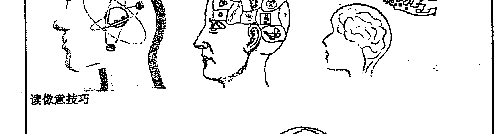

##### 读像意技巧

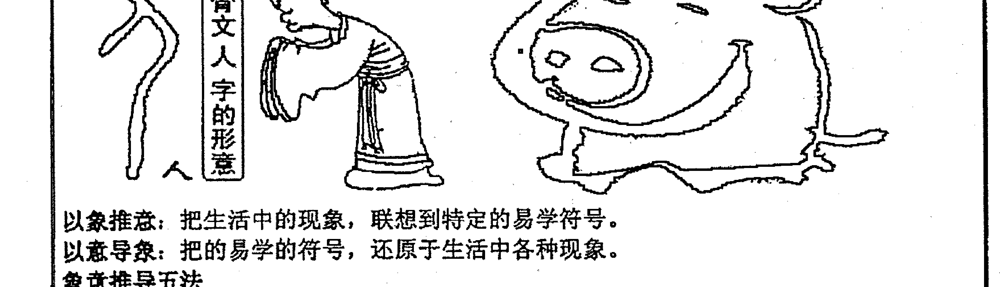

- 1. 以象推意: 把生活中的现象，联想到特定的易学符号。
- 2. 以意导象: 把的易学的符号，还原于生活中各种现象。

##### 象意推导五法

- 一、阴阳五行取象法: 根据符号阴阳五行的特点，来推导生活中的具体事物。
- 二、数字取象法: 根据符号的排列顺序，推导具体的事物顺序量词。
- 三、谐音取象法: 根据字意的谐音，推导出相对应的事物。
- 四、形态取象法: 根据字体字形图推算出相应的事物。
- 五、动静取象法: 根据以上的方法推导出物体的静态和动态。

##### 天干——乙

阴阳五行取法: 乙为阴木，为小木，代表木少的事物，如花草，家具，木质的门，篱笆墙，笛子，木质的刀柄等等，都可以取乙木为用。乙木的颜色为花草的颜色、绿，红色。

数字取法，乙在天干中为二，可以代表二个人、两件物品、二个小孩、二个想法、二种意

##### 天干——乙

谐音取法：与乙谐音的有椅子、依靠、衣服、衣柜、一心一意、义气、义胆忠心，艺术……。

形态取法：正反 左右 倾斜。正的乙为鱼钩，弯曲的衣架等等，反的乙为坐的椅子 人蹲下的形状等等。左右倒过来是人脑合纵的毛细血管 是正在飘动的红旗等等。乙倾斜起来为上斜坡的摩托车，正在爬树的毛毛虫……。

动静取法：静态乙可以为一个弯曲的电线，一个静止的衣架。动态的乙可以为一条水中游动的水蛇。一条飘动的彩带……。

##### 天干——丙

阴阳五行取法：丙为阳火，可以是太阳，是大火，是火灾，是火多的地方火葬场、火山、火气大的人等等。如火如荼干活等等。火的颜色红色、紫色。

数字取法：丙在天干中为三，三生万物，丙为太阳，太阳也赋予万物生命，在一些情况下丙可以代表万物的大生命，大宇宙，大的自然现象，火山喷发等。丙也可以代表人做事情三心二意，虎头蛇尾。甚至可以代表与“三”相关的著作和事件如三国演义、三顾茅庐，三个臭皮匠赛过诸葛亮……。

谐音取法：丙的谐音为病、可以代表人的状态不佳，毛病多。代表食物中的煎饼 大饼，代表明星中的大兵。士兵、兵器、外表冰冷……。

形态取法：丙的形状类似于圆形，那么圆形的事物，比如玻璃球、足球、台球、水晶球等。还可以是佛珠。车轮子。圆规等。丙的下半身有个分叉，可以代表迷惘的人。十字路口。。用神临丙、往往处在选择的阶段。

动静取法：丙在静止的物品可以是一个球，圆形的锅碗瓢盆。在动态的时候电脑里面cup的正在转的风扇等。静态的还是可以是田径场，运动场。动态的可以是运动的地球，可以是转动的车轮，可以娱乐城的大转盘。一个转圈跑动作…

##### 天干——丁

阴阳五行取法：丁为阴火为小火打火机、火柴、蜡烛、烛光、为开小灶。小灯泡。为人外表温和内心急躁等。火的颜色：红色、紫色。

数字取法：丁在天干中为四、可以是四个人、死亡游戏、撕开、撕裂、道路四通八达、为人四面楚歌、甚至是死里逃生……

谐音取法：钉子、做事情盯着一个目标、人的臀部（腚），下属对领导的支持个鼓励（我顶你）、叮叮当当的响声、约定、预定、定海神针……

形态取法：丁为细长的一根棍子、一炷香火、一根鱼竿、一个打火机、一把剑、一根抢、一双筷子……

动静取法：静态丁是，一根插在路边的棍子。动态的是一根正在点燃的香。丁横起来静态可以是一条笔直的道路，动态是一个发射出去的子弹。盯着看 一个盯人的蜜蜂等……

##### 天干——戊

阴阳五行取法：戊为阳土为大土。可以代表土多的地方，山丘，高楼大厦，隆起的地方，比方说人脸上的鼻子，身上的水泡，也可以代表有威望的人，鹤立鸡群的人。房地产商人。过去的地主老财等等。五行土黄色，戊以黄色为主。

数字取法：戊为在天干为五、可以是无中生有之人，五花八门的手段，无厘头的人事。学富五车之人。五彩斑斓的人生，务实的人……。

谐音取法：戊无厘头、巫师、巫婆、诬告、无力回天。房屋、不学无数的人，物理学家，姓吴的人。务实的人 乌鱼乌龟……

形态取法：戊为方形，可以是一片麦田，一张纸 一本书，电脑的主机，液晶显示器。一块石头，一栋长方形的高楼、一套音响。一个方脸的人。一个精致的盒子……

动静取法: 静态的戊可以是，一块大理石、一个手机、一个饭盒等等，动态的为一个正在实用的遥控器、一个正在摇的骰子、一个正在实用的印章等等。

##### 天干——己

阴阳五行取法: 己为阴土为小土，代表土少的地方，有坟墓、小土包，碉堡、小石头，小土块，土里面的小东西，如:花生、土豆、山药、人参、萝卜…。土的颜色为黄色。

数字取法: 己在天干中为六，出现己的时候可以代表六个人、六件物品、断事情的时候历经波折最终成功 如——过五关斩六将。代表人能力多主意多如——三头六臂、三十六计。代价家田事业旺盛如六畜兴旺等。

谐音取法: 己的谐音取法有: 自己、挤出、挤奶、急躁。测感情往往寄托与他人的能力、寄信、公鸡、着急，机会 、垃圾等等。

形态取法: 己的形态为收拢卷成一团 含苞待放的东西，可以是含苞待放的鲜花、可处女。可以是折叠起来的衣服，女人的胸罩，折叠的钱包。卫生纸、卷在一团的垃圾。含羞草，折叠后的雨伞、儿童折叠的玩具变形金刚、折叠起来雨伞等等。

动静取法: 静态的己可以是一个含苞待放的花朵、动态的己可以是一个缩在一团蠕动的毛毛虫、静态的己也可以是一张窝在一团的钞票、动态的己也可以一个蹲在地方玩耍的小孩、静态的己还可以是一条收缩的卷尺，动态的己还可以是一个没有开屏的孔雀。

##### 奇门遁甲八门——开门

- 1. 阴阳五行取象法:, 开门属金，为阳金，大金。首先想到的是金属多的地方，炼钢厂，金银首饰店、铁轨。器械厂等等。
- 2. 字意取象法。开门，为打开的。为有开口的东西。为开阔进取之人。为开心的人。为正在开口讲话的人……
- 3. 形态取象法。结合八卦的形态。乾为天。为三个爻合在一起的。可以是完美无缺的物体和人。可以是有层次感的东西比如塔。可以是一页页的书本。可以是三个男人……
- 4. 动静取象法。一个正在开心唱歌的小孩、一个打开了的袋子、一群正在开创事业的人，人体打开的部位眼睛 嘴巴、鼻孔……

##### 奇门遁甲八门——休门

- 1. 阴阳五行取法: 休门为水，水多的地方在人体，可以是膀胱、可以人体的肾脏、可以是眼球、在地理环境可以是大海，长江。可以是沼泽多湿气重的地方。可以是水中的动植物等等。
- 2. 字意取象法: 休门，休息的人。休闲的人。懒散的人。退休的人。可以是运动缓慢的动物树袋熊。可以是正在休息的老人。家里的环境中可以是一个放着长期不动的物品。
- 3. 形态取象法: 休门起源于坎卦。坎的上下有缺口可以是一个上下不完整的物品。可以是外虚内实的物品。临休门也可以是人生的一道坎。可以是一个两头轻中间重的物品。
- 4. 动静取象法: 休门静态的可以是一件休闲的衣服。动态的是一个懒散休息的人。静态的可以是一个长长的假期。动态的可以是一只休眠的动物。

##### 奇门遁甲八门——生门

- 1. 阴阳五行取法: 生门属性土，可以是土多的地方。高山。可以是大片的麦田。可以是一片广大的土地。
- 2. 字意取象法: 生门为有生气的东西，懂得生活的人。生生不息的规律，出生的小孩。正在发生的事情。花生。生气。
- 3. 形态取象法：生门起源于艮卦。可以是一个倒置的洗脸盆。是一个打翻的碗。是一个外虚内实的东西。是一个漂浮在水面上的船。（按照形象的推导还有哪些？）
- 4. 动静取法：静态的生门可以泛指一切生物。动态的生门可以是一个正在生气发脾气的人。静态的生门可以是一个陌生的事件，动态的是可以是一群正在生火烧

##### 奇门遁甲八门——伤门

- 1. 阴阳五行取法：伤门五形为木；阴阳为阳。阳木为大的木。可以是大树林。木材厂。家具厂。可以是制门厂。可以是山多木多的地方。
- 2. 字意取象法：伤门可以是受伤的人（被动），可以是伤害别人的人。（主动）伤害人的动物（老虎，狮子等）受伤的部位。破损损坏的事物。伤心的人。说话伤害人的人。
- 3. 形态取象法：伤门起源与震宫。可以是一个摆放整齐的饭碗，一个做饭的电饭煲。一个玻璃杯。一个打火机。下实外虚之物。
- 4. 动静推导方法：静态的是一个损坏的桌子，动态的一个被打伤的人。静态的一个伤害人的动植物。动态一个受伤正在流血的人或者动物。或者是带刺伤人的仙人掌，和一个说话讽刺的人的朋友。

##### 奇门遁甲八门——杜门

- 1. 阴阳五行取法：杜门五形为木，阴阳为阳。阴木小的木。可以是小树枝 筷子 笛子 可以是木质的门 可以是房子的横梁。
- 2. 字意取象法：杜，为堵的意思。可以是堵起来的事物。可以是堵心。赌气，肚子。毒品。嘟嘟响的声音等等。杜鹃红甚至是杜十娘等等。
- 3. 形态取象法：杜门起源于巽卦。巽为细长可以是细长的物品。比如绳子，人的手指。巽下断可以是下面断开的物品。可以是头重脚轻的东西。可以联想到一个被截肢的人。一个开着的小汽车下面连不接触地面而且还有两个轮子。
- 4. 动静推导方法：静态的杜门可以是一个技术人员。一个正在思索问题的人。动态的杜门可以一个正在关门的人。可以是一个受尽严刑拷打死活不招供的犯人。一个挡道的人。

### 16 补充核心技法卷

#### 1 宫害处理

包括门迫、击刑、入墓、空亡，可用拆、补、移、山向、法术的方法来处理。击刑、门迫，最好用拆的方法。当有 2 个及以上的四害时，最好拆。如巽宫，六癸戊，辅开（或己癸）把花盆拿掉就可以了。拿掉的花盆不要送人（会带去不好的信息），若盆没碎放在离宫无四害亦可。碎了，拿走再不能换一个继续放在巽宫，否则，就是动了，马上出事。墙上有山水画（辅）拿掉。先找力大的拿掉最重要，星力最大，首先考虑。山水石头不能做戊，要意识嫁接，石头就是己，把象意嫁接过来。还可画符，敕令，内写己己辅开，放上一会，然后拿掉烧了即可。若电话对话，此方有拿不掉的不要说，如有空调动不了就不要说，只说能拿掉的。拿不掉的就和解（合门迫、合地支）。如震戊伤，戊刑，看有无碎的东西，拆不掉就和解，甲子戊用丑合。若加癸合戊不好，癸本身代表付能量，其力也小。四害处理要注重行为风水，不要局限放东西，尽量不要放风水物，行为风水最好。

##### 第一节、单宫拆

拆适用：病、桃花可拆。附体拆最好，如家里不拆，尽管超度干净了，以后又回来了。感冒、意外伤灾、小人等可拆。宫害 2 个以上，拆的力量最大。拆东西，要看门的象意来考虑。如杜找暗处的东西拆，开找明处的东西拆。一般的病、附体：拆了很管用。桃花：可以拆。若要求拆掉原配，与小三结婚，不要做，做了会有因果，会落在孩子身上。

拆官灾：白虎临马星较多，拆马星及对宫，效果快。孩子迷恋上网：要拆。拆不了的，就和解（打不过就和解），可贴符烧符。如开门迫用寅支合，力虽然小于拆，但也管用。有种拆不掉情况的(如癸是门口)，则补。年命可拆：本人的年命有四害时，不要顾虑，照样可以拆，没问题。上例巽宫癸年命刑，可以拆。不能拆的：催的不要拆(催官、财、婚等)。7岁以下小孩不要拆，不要影响生长。小孩体质弱的，不要轻易拆。得大病的不要拆，老人不要拆。 拆物处理： 拆物要放在无害宫中。但拆的东西一定不要放到空无宫，放上就丢东西，出事。放空无宫对宫没事。

##### 第二节、补

- 补——增加能量。 适合：催官、催婚、催财等。 条件：原宫无四害。
- 适合：催财、官、事业、婚等。体质弱的小孩可补。
- 忌补：得大病不能补，补了恐出事。 大病忌补也忌拆。附体的人不能补。
- 如：离空，丁丁，加大符合丁象的东西，美女、灯、丁奇等。

##### 第三节、击刑

击刑门破的处理原则：能用拆的先用拆，拆不掉的才用地支符合。先拆后合。拆不了再合(打不过就和)。

###### 一、六仪击刑象意

- (1) 击刑是奇门遁甲的一种格，格就是格斗的意思。上天与下界格斗为惩罚；下界与上天格斗为招灾。
- (2) 用神落宫临击刑，往往造成事物的挫折不顺，在人事方面多为触犯刑法和纪律，于人体多为疾病痛苦。
- (3) 各宫击刑应象(坎、乾、兑三个宫不存在击刑)：
  艮宫击刑：庚在艮宫击刑，属无恩之刑。性情冷酷、薄情寡义，扛上与叛逆。好心反招怨、斗殴伤灾等，离婚或女性流产。事与愿违，不得伸展，寸步难行。
  震宫击刑：戊在震宫击刑，属于无礼之刑。性格暴躁，排斥异己，缺乏礼貌，卑鄙，好色。
  巽宫击刑：壬、癸在巽宫击刑，其中壬为自刑、癸为无恩之刑。如果壬击刑：做事情不能有始有终，缺乏独立能力，自私自利，党营私，游荡不羁，容易离家出走，内心阴险，损害自家门风，多肢节手足之灾； 如果癸击刑：冷酷无情，常有叛逆的行为，易与人结下冤仇，有刑拘、牢狱之灾，弃妻纳妾，离婚等。
  离宫击刑：辛在离宫击刑，属于自刑。内心阴险，报复心强，爱指手划脚，自私，只可共患难、不能共享福，惟我独尊、鄙视他人，自己气急而残害自己、粉碎自己。郁闷时离家出走。
  坤宫击刑：己在坤宫击刑，属于恃势之刑。依仗自己具有某种优势，而猛进或孤注一掷，容易受挫折，做事情有成有败、大起大落，身体多慢性病，夫妻不睦，孤独短命。

### 二、壬在巽宫击刑：

- (1) 酉来合。放一只鸡。如开业时巽壬刑，找个属鸡的当迎宾好(合住)，可和解。
- (2) 画地支酉符(贴在此位)。符：三勾、敕令、酉、罡。可盖明咒和天师印。放鸡与放符的作用一样大。画符不在形式，在你的能量大小。
- (3) 最简单的，在此位写一个“酉”字。颜色无所谓。写酉字有时更好，因鸡有角，可动，会影响磁场。写字却动不了。
- (4) 问，此位用丁来合壬如何？答：丁合壬可以，但力小。
  例：巽符壬。符头，壬刑后变癸，喝了酒。何时喝酒？乾宫戌亥时。画酉地支符在巽宫烧了或贴，如果不能画符，就在巽宫写个酉字亦可。

### 三、癸在巽宫击刑：与壬刑解法类推。

###### 四、戊在震三宫击刑
用丑合。丑地支符。戊在震宫刑，不可冲动的投资。可到艮宫投资与土有关的事业。丑合子，不光是震宫放丑，到艮宫更好。

###### 五、庚在艮宫击刑
四害解庚用乙合（无论击刑入墓），如葫芦等。找人合作加上乙，合作关系。乙年生人或女人合作。不能用巳，已在艮宫形成寅巳申刑。如艮宫空，庚庚，生门。若男的去要钱，就带上老婆乙，就不会吵起来。艮宫庚，要乙一些，包括打坐、手印都是乙。庚为害时，还可用丁。无害时用乙。庚无害时也不要加大能量。不要动它。庚为阻隔、车祸、打架、喝酒等。凡东北方有大金属的，各方面身体财运都不好。如艮上正建金属楼梯，为庚马星动，艮为止——无资金了，动不了了。又艮为小男孩，小孩学习不可能好。对宫坤母身体亦不好。如艮庚空处理事情——不要拿酒癸，金佛庚，不可穿黄色衣服戊生庚。要带茶叶乙、烟丁等，穿红或绿色衣服，说话温柔一些。多种害要拆：艮空庚乙伤，要拆。空与刑破同宫，不考虑空，就以拆的方式解决刑破。（详见空无处理部分）

例：艮六庚癸伤，隐丁。谈生意合作，带女人乙。第一要拆，拆庚，伤。一般拆不干净，谈判时，行为风水（带女人，乙奇、茶叶）。谈判时温柔一些，价格369数（伤门，卯戊合形成的），放葫芦，穿绿或红色的。找人帮忙找戌年、乙年、西北方的。

###### 六、辛在离宫击刑
辛宫击刑，好解，可用置换法。如放水晶串，若实在没有辛象物（水晶）可放时，还可动一下家具，来改变磁场，此是应急处理。有时只要临时动一下，磁场就会改变。辛有置换功能。无论宫内或是宫外隐干，有辛时可放：水晶串，一放就管用。放五帝钱，或放现代硬币，念心经，心想事成。等。

###### 七、己在坤宫击刑
放卯可解。注意坤宫不能贴符放符（甲入墓），贴了出事，但可以烧符。数取258，时间为坤宫的时间烧（未申日时）。如符：三勾、赦令、卯罡、或卯罡两边右侧加大吉左侧写大利、或右写身体左写健康。坤符己丙死，己嘴——策划——钱，刑说的不好。己学多了，换成戊简单了，把以前的忘掉。则戊在坤不刑，有了大钱。己在坤刑也代表口舌是非、话多成垃圾，又代表食品，吃的太多太杂。

##### 第四节、门迫

###### 一、先拆后合
先拆，拆不了就合。拆了再放地支符合（防止没有拆掉的）。但大病不要拆，只能和解，可画符解。如，离宫符癸休，门迫，是小鱼缸拿掉，大的拿不掉就贴一张符在鱼缸上。贴符的能量大于烧符。如地支符酉：三勾、赦令、酉（可不画酉字地支符，写“酉”字即可）、罡。符腹内两侧有印的可盖印，左盖明咒印，右盖天师印。一般下列情况要拆：①桃花可拆。②附体拆最好。如家里不拆，如果超度干净了，以后又回来了。③其它，感冒、意外、小人等。

###### 二、不能拆的情况
-   ①大病不要拆。②孩子太小7岁以下不要拆。③催的情况，如催婚、官、财等情况不要拆。

###### 三、地支符合八门
-   (1) 休门（坎子）：丑支合。
-   (2) 生门（艮寅）：亥支合。
-   (3) 伤门（震卯）：戌支合。
-   (4) 杜门（巽巳）：申支合。
-   (5) 景门（离午）：未支合。
-   (6) 死门（坤申）：巳支合。
-   (7) 惊门（兑酉）：辰支合。
-   (8) 开门（乾亥）：寅支合。

地支合法形式，放风水物，写地支等都可。如：孩子吃好多东西，肚痛。休门迫，可在坎宫子位，手上子位写个丑字，躺一会即好。

例：巽戊壬惊。用酉支符即可。不要考虑甲壬辰与酉合的问题。用就行。贴符用红纸即可，也可折起压在哪也管用。意识奇门力非常大的，别人不知道你在做，实际你给他做了。任何一组象意，任何一个符号加在一个物上都可，意识到来很重要。意识到了力大，只要意识到了就管用。用意识画一张符也管用。

##### 第五节、入墓

###### 一、入墓之宫
1、坤宫甲癸，乾宫乙丙戊，艮宫丁己庚，巽宫辛（壬以刑看）。对宫无四害，可加大能量会把入墓宫冲开。对宫有四害，就把入墓宫拆了即可。还可“造象破象”法处理。造个象让这个象与局符合，然后处理掉，就解了。造象破象很管用。如乾丙丙或丙戊，心开，拿宫位数元宝或丙奇加开门符烧掉即可。若相对两宫同时入墓，可同时来做。双宫都动起来。如艮丁丁墓，坤癸癸墓，艮灯亮，坤加丁更好，建立了连接，去了癸。墓、空之害要比刑迫轻一些。不墓不发，不破不立。冲开能量大。

2、入墓烧符的原理：不是增加其力，而是做象后除掉的原理。如烧元宝：要先应这个象，再用拆来解。就是先做一个象出来，一堆戊（元宝），然后再烧（丙丁）。烧的时间为乾宫戊亥时。就解决了丙戊入墓的问题。

五路财神符画法：三勾、赦令、五路财神到罡、或戊罡。或加写，左侧写大吉右侧写大利。本宫对宫都入墓可同时处理。如巽辛墓，乾戊墓（辛戊都在纲上），则巽拆了，乾烧元宝同时处理。

###### 二、入墓处理
1、巽辛墓：①水晶串放上就管用。②念念心经。③实在不行就放硬币。④再不行就东南方动一下，活动一下。⑤最后一个法，心想一下，心想事成，辛代表改变。⑥阴宅，五帝钱、小米、沙子都代表辛。己辛惊——拉肚子。喝点热的辛，搓热手（乙丙——丙合辛）

2、坤甲（符）癸墓：①最好冲，但对宫须无四害（冲仅限入墓且无它害），对宫艮无四害，加大艮能量。如艮六乙，找女人合作。烧乙奇，坤符事业就冲开了。②对宫有四害，就把入墓宫拆了即可。③如无东西可拆（无癸符的象意），可考虑是阴暗潮湿等，打开窗户通通气，把灯打开也可。癸代表暗物质，经常过去活动，人气多了（戊），戊自然克癸。亦可自己动动，冲出癸。④癸，甲寅癸，在坤烧申的地支符，冲一下也可，放一个猴子都行。西南坤，符墓，不要贴符，但烧地支符或它符可以，写地支这个字也可。但不能贴地支符。如己刑，写卯字可以，合己。但不要贴卯地支符。

例：坤符戊乙杜。拆后放到震巽离。能放就放到此三宫（指戊），即坤宫的戊坏了，拆了选个好宫位的垃圾桶扔掉。如果戊在坤宫害了，拿掉放到坤宫位外面的垃圾桶，则更凶。又，符代表事业，拿掉不要放兑宫，下滑了，放到门或星的原宫位上。但若原宫有害，则只有选别的无害宫。贴在东南方巽宫。坤贴了“财源广进”是一个符，碎鱼缸——分开。还可造符（如福字）。坤宫有符象很多解法。坤宫无符象意的东西就造一个出来，造出后不用在坤停留，就直接贴巽宫即可。如符戊乙杜，没有东西，就造一个，戊五路财神符，乙奇符，如是搞技术的亦可画杜门符（只限杜门）——一贴到巽宫。

3、艮丁己墓。丁己在艮，先考虑，此处是否有灯不亮，修好，这是快的。坏的电器有否。如己在此处为垃圾等物，拿掉。三样东西及类象先处理为先。如拆不掉，坤宫无四害时可来冲。坤放风水物加大坤能量来冲，但坤有白或庚时不可加大其象意，要加乙或丁或行为风水。这时则要动墓宫，拆了这个墓象即可。其它宫同理。如坤乙乙，可放葫芦，烧乙奇加大坤能量。若此象为空无状态，空为镜子，可放填实宫位的象。艮墓坤刑破，拆坤拆艮处理。坤有四害，艮入墓时，拆艮，拆掉的东西拿到无害宫（即单宫移）。如艮丁死，死的象意不要到坎的内外方位放，更不能拿到本宫外环境方位扔掉，若实在拆不掉，则要合。若拆不掉。如，若有床没地方移，可把床搬出来后重新铺床，打扫干净（动一动），来解这个入墓问题。丁墓艮，把灯打开，弄亮。也代表香，日时宫入墓点香。把香放在艮，入墓了。然后点着了，烧完了，出来了。在艮站着吸烟（丁），也可坐（坐为乙）抽，烧丁奇也可。——行为风水要比布局效果好。坤壬壬，壬可为水晶球等。也为人，坤上住人，可把丁冲出来，阳宅坤上住人，产生一个动的磁场把丁冲出来。艮宫，六丁乙死，可穿黄色衣服（戊泄丁），则既是丁出墓，又有了钱（丁戊），也是解决丁入墓的一个方法。死门有时也代表垃圾。己墓艮，打扫垃圾，己也代表不动，也代表阴钱，给死人烧了纸。艮己戊伤——入墓门破。造像，狗肉，卯戊合（伤为卵），吃掉即可。——先造象再破象。造这个象与局象符合，然后拆掉、烧掉或吃掉，就解了。造象破象很管用。如，丙戊——备一大堆元宝烧掉，丙，要大火。地支冲。艮丁壬丁壬，甲辰壬，用戊支符来冲壬，带出丁。若隐干为壬，同样可用戊支来冲。

4、乾乙丙戊墓。
如乙丙戊在乾宫入墓时，巽宫无四害的情况下，在巽宫放符合本宫象意的风水物加大能量，可把乾入墓的冲出来。对宫有四害，则直接把入墓宫拆掉就可以了。巽宫如有四害，则直接把乾宫拆掉。如乙入墓，本宫有花，就把花拿掉。对宫有四害，本宫如不能拆，则要合解，画符解。上例乾宫乙壬，用一个戊冲辰，把壬冲出来，乙同时带出。画戊地支符，贴在乾宫壬乙上（大鱼缸）。又如乾丙戊墓，烧元宝（丙戊）或烧符咒（地支符、五路财神符、万能符均可）。

造像破像法：如，当丙在乾墓，先弄一堆元宝，再烧掉。但对宫须无四害。戊在乾墓也是这样。包括隐干。若对宫巽有辛，念四晚心经可解。戊墓实在没法烧，去化钱也可。丙墓可拿一件红衣扔掉。

5、墓宫有马的情况。
——可踏罡步走宫数破之坤入墓，艮无害，坤有马星，无刑破。可踏罡步走宫数遍。2天5天都可。注意中宫一定不要踩。或2人5人一起走。还可用朱砂画一个万字图片，放在西南方（这个不叫符，不入墓）。入墓+空无，亦可这样做。

6、行为风水——解入墓
如，六合为夫妻生活，丁和老婆多一些夫妻生活，也可解。丁不入墓了，其他，如文书、学习、合同、希望都来了。活人（戊）到坤方多活动一下，戊癸一合，癸走。戊代表阳，癸代表阴，戊癸合加上人气阳气，控制癸。或在此弄个灯长期亮着（阳）。等。入墓例：戌时一小孩不停哭。为乾宫时间，象：乾壬乙惊。处理：写个辰字，造像，弄个碗放水盖上盖。分析：壬是乙墓带坏的，成灵异了。让它入墓，动不了了。在碗盖上写一个辰字即可。

##### 第六节、空无

###### 一、空无运用
1、空无（或入墓），临马星。动起来时潜力巨大。遇到空无，测++关系曾经++（如大病）过。

2、空无解法，一般用冲，是最好的办法。空无入墓都可用冲的办法。忌冲的情况：身体弱的，老人、大病初愈的，孩子太小的（7岁以下）。

3、做风水在顾客家中，站在空无宫里讲事，不受生克。入空无，不要入局里的空无（尽管无害，但仍有该局信息）。要入到日柱的空无宫里。如今天己巳日，戌亥空。以家里为中心的方向，把该扔的东西（如裤头袜子）仍到日柱的空无宫里。修炼时，可在空无宫里打坐修炼。镜子也是空无，一照进去了。

4、空无宫使用的条件是：仅限真空。不能有其它击刑、门迫。但入墓没事。

5、宫位象意，一般是本宫象意。但本宫空无时，可能是对宫象意，或是先后天宫象意，本宫空无时大都如此。时间也有这个规律，处理的时间可以是本宫、或对宫与先后天宫。如一女穿衣右肩有花亮丽。取象癸辛、癸墓。断右肩或有问题。但实际左肩痛。则象在坤，症在巽，为先后天。说明坤空无了。癸辛在巽了。家中西南同，实际，有镜子有烟筒，象在坤实际在巽。

6、逃逸可到空无宫。躲藏逃逸可到空无宫，如何入局？在家客厅的空无官方装一个镜子，用敕令符写好宫位象意，贴在镜子上。然后逃向空无方。但若有刑迫不可这样做。

7、拆的东西不能放空无宫，放上就出事，丢东西。放空无对宫没事。

### 二、真空：空方位无物，为真空。
①可冲（无害用对宫来冲），力大些。但有害或有庚（包括隐干）不宜冲，一冲庚动不好。②可填实，填实为宫位数或1。力弱些。如震宫空，乙，填上乙象的东西。兑宫无四害，可用兑来冲，加大对宫能量来冲。对宫有四害，就填实处理。如乾宫，阴庚庚心死，可放庚的物象，念心经，贴心经来应象填实，但不能放葫芦（乙乾墓），烧乙奇符可以。填实法很多，可根据象意取。如坎空丁丁开。——开店，可由女人站一会，可放收款台开票、放灯等。空无宫的天地盘干在纲上，为填实。但时过则又空。

### 三、假空：空宫有物过多，是一种堆满的象为假空。
1 假空要拆。假空要以空破空处理。假的力量很大，要拆掉这个象，让其真空。如坎空六癸癸，则是假空，正北放了很多酒，变假空，把酒拿掉。假空的拆，还可以用对宫地支来冲。如坤空癸庚芮死，满满的，可用丑来冲，在坤宫放牛或丑符来冲未，同时加大对宫的力量，在艮宫加大生门力度，化生门符或写一个生字。如2014年12月30日1316时，一拆桃花局，坤为平衡点，也为空满象，在坤上放牛，艮上写生字放上冲去堆满的癸庚可解。

②大多伏吟局的空亡宫尽管无四害，但是重复，堆满的象，多数是假空（如巽丙丙辅杜隐壬，乾癸癸心惊隐壬等）（微信咨询）。

③可到现场查看环境判断真假空，不在现场要详问客户。假空的处理——用拆的方法。拆了，把假空变成真空，真假转换一下就行了。如上例，假空时，震宫是满满的东西，衣服等。不能填，填要出事。例：坤空，丁戊丁戊生。有人测财有人处理身体等。先判断真空假空。若西南有垃圾满满的，就拆掉它。若真空，就填实或加大对宫力来冲动它。但填实之力小于冲之力。若放生，到东北方放生效果更好。因坤空，象意可到艮。附体。当附体且空时，说明多年了。要慢慢填实（这时能量差的太大，不能冲，要慢慢填实）。这实际是假空。要常做行为风水，在坤加佛像，天天烧香。若有白虎，如艮白己己，坤乙乙此时两宫平衡（都有害），则只把坤填实即可。若艮再有庚，则要拆了它。白虎不要加大。坤填实后艮不会出现危险情况。

###### 四、万字罡步与马星破空无
详见化煞与加能量部分行为风水——活人》动物》物象。如乙在乾入墓，巽宫无四害，乾宫有马星。可直接在乾宫做行为风水。入墓+空无亦可这样做。方法：
（1）万字踏罡步。后天万能罡步加大磁场。在空无宫画一万字符，从万字一个S的一端先迈“左脚”开始走第一步，一个4步（1234），走完一个再（任意走）到另一个S的一端走（5678），如此反复走6次、6天或6人来走都可以（应宫位数）。
（2）也可在乾方画一个罡步（万字符），放一马星物象。即，动的。如钟表、马、八骏图等。企业，可在西北处让工人在此方活动，做一下行为风水。若对宫有四害，则空宫一动，对宫马上就出事。一般本宫有四害，可到空无宫住，就不受四害。出了事，可到空无宫躲藏逃避。有些情况，找到空无宫，有四害。会出现解了被人破坏的情况，这是天意，解不了。当空无+击刑或门迫时，拆不掉，就处理其它四害，不处理这个空无。空无加刑迫，填实事更大。先迈左脚第一步，依次循环走。

###### 五、空无案例
例1：同行给一男人处理婚姻事业出事。当面测，丙为用。巽空，同行只知空无可填可冲，冲的力很大，看男人现财运不好，便在乾宫放了一个大水晶球。亥时放，第二天男人出车祸。是处理的有问题还是凑巧了，此同行学奇门好几年，读像没问题，乾难道不是放水晶球？

公历：2005年12月4日16时31分
农历：2005年寒月初四日
四柱：乙酉 丁亥 壬戌 戊申
节气：小雪-大雪 月将：亥 阴遁7局
值符：天冲星落7宫 值使：伤门落8宫
时空亡：甲辰旬 寅卯空 马星 寅

| 乙 | | |
| :---: | :---: | :---: |
| 六己
辛心
景 | 阴丁
丙死 | 蛇乙
癸庚任
惊 |
| 丁 | 白戊
壬杜 | 符壬
戊冲
开 |
| 己 | 玄癸
庚乙芮
伤 | 地丙
丁英
生 | 天辛
己辅
休 |
| 戊 | | |

此局乾放水晶球没错，错误出在哪里？就是空无，空无有2种，一个是真空，真空是好事，空了才可以容纳。这时冲动，潜力是无可限量的。另一种是假空。假空是一种堵塞的像。是一种病态，你去冲动他，出事很快。同行说顾客东南家里外面是垃圾场，屋内是储存间。所以不是真空。丙在遇到四害时，就是乱子，流血。丁流血量小，丙是大的流血事件。巽宫假空，乾放水晶球。坤是巽宫的发展，白虎了。结合艮，就是头部受伤。这个局，如果巽宫不是假空，如果乾的阴干不是庚，那么你放了水晶球也是没事的。只是没有好的改变而已。课堂记录该案例：同行测男开店（办公室、家里）。做法：在家里、办公室的东南方地上，各放了2个大的红色水晶球。不但没发财，反而出事。原因：巽是假空，没有看出。东南方有一个垃圾场，本来已堵塞，又放上水晶球，结果第二天，酒后开车头被撞出血，看对宫——心开了。乾的先天在离，头部伤。所以，一定要看看外面环境，判断是真空假空。是假空反而堵塞要外溢了。空无也是镜子，照出对宫。正确处理：清理走东南方垃圾（壬、杜）。局盘同上。因此，奇门空无很重要。开课讲过空无的玄机和用法、空无法术等。还没有讲空无星星的用处；这个局，巽宫是天辅星，星在本位，所以顾客出很大车祸，可是不至于死人。换了其他星，就会出大事，这个就是奇门中说的本位星。什么国度生什么人，什么星星注定宫内事情旺衰生死。前讲过本命星，很多人说本命星就是日干的星。不一定。蓬、心、辅都是。星星可以照耀四方，奇门中星星力量很大，玄机很多，如果不懂星星的妙处，解决问题自然不尽人意。

例 2: 给学员第二次处理。
-   - （拆掉老公的桃花，让小三走掉）
    -   坤为平衡点，为桃花，空满象，在坤上放牛或丑符冲未，同时加大对宫力量，
    -   （艮上写生字放上或化生符）冲去堆满的癸庚可解。

公历 :2014年12月30日15时16分
农历 :2014年寒月初九日
四柱: 甲午 丙子 乙亥 甲申
节气: 冬至－小寒 月将:丑 阳遁9局
值符:天芮星落2宫 值使:死门落2宫
时空亡:甲申旬 午未空 马星寅

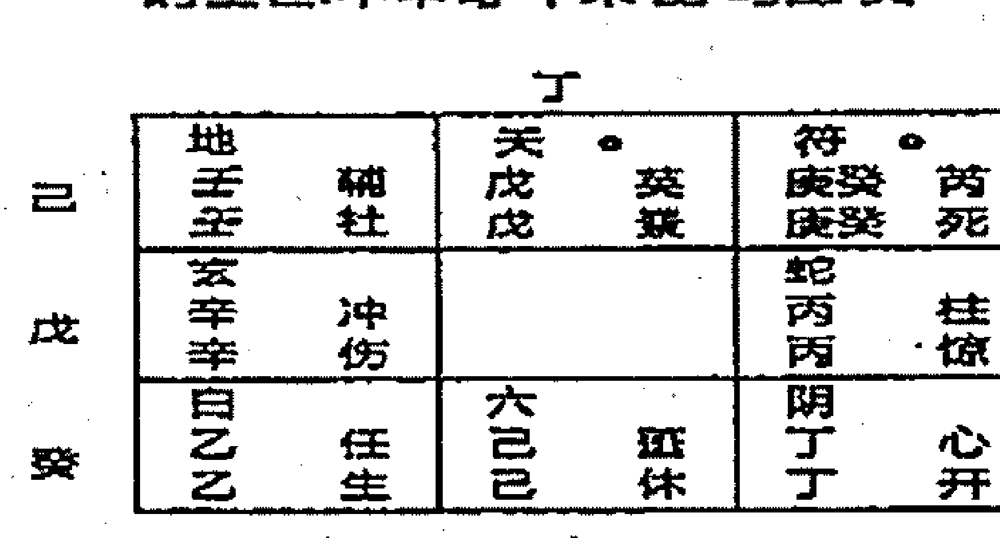

例 3 男当面测。
用神庚。看局，本宫，对宫，隐干。丁在离蛇灵异。对宫乙癸长头发。在酒（癸）后开车时，总看到长头发的黑影。但心害怕。原因在坤，思想害怕，击刑了（坤己），想不开，害怕出事（死），抑郁头痛。对宫艮导致车祸（庚刑），花了不少钱，坤表示多，出了一次，还要出的。用黄裱纸写下坤宫象，包上自己的头发，指甲（258数），站在坤宫，走到兑宫，入空无（有共同符号）。坤象——移兑。再如何处理，拿用神干的墓库方（庚墓在艮），然后再走到家中的丑位埋掉。此为利用空无——墓通气

+   1. 两宫是否有相同的符号。
    2. 两宫位或多宫位是否处在相同的状态。（共有四害，或共同没四害）

翻宫（来龙脉）
翻宫：（用神宫天盘变地盘以前，用神地盘变天盘以后。）
用神的天干落宫，翻为地盘落宫，那么地盘落宫为以前的时空状态。
用神天干落宫，所压的地盘天干，翻动为天盘为以后的时空状态。库——处理。

公历:2014年11月5日13时49分
农历:2014年闰九月十三日
四柱:甲午 甲戌 庚戌 癸未
节气:霜降~立冬 月将:卯 阴遁1局
但符:天英星落5宫 值使:开门落9宫
时空亡:甲戌旬 申酉空 马星巳

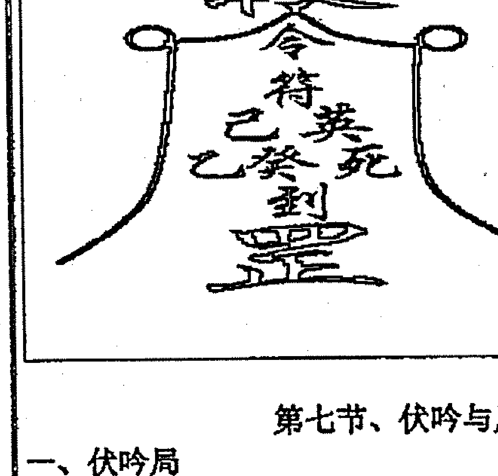

| 己 丙 丁 | 庚 辛 | 壬 癸 乙 |
| :---: | :---: | :---: |
| 丙 庚 辛 | 庚 辛 壬 | 癸 乙 丙 |
| 戊 庚 辛 | 壬 癸 乙 | 甲 乙 丙 |

##### 第七节、伏吟与反吟

###### 一、伏吟局
伏吟能量大，但动不起来了。可走罡步动起来。如下：
在客厅中心画一个九宫图，大小以能走开为宜，然后在各宫烧一张（烧宫位数更好）各宫的原星符，先走几遍再烧，以催旺磁场最好。走的遍数不限。若多年财运不好，可这样做，走罡步后，再进行拆补移。
罡步：从离宫开始第1步，巽2步，震3步，艮4步，坤5步，兑6步，乾7步，坎8步。再从离宫开始下一循环。测感情，不好，但又分不开，牢固不易离婚。测事业，财运，代表发展缓慢，想动，动不了。伏吟局相生不一定好。真正好要动起来。冲动起来。若有刑破，则达不到理想的程度。要付出多。伏吟局的应期和一般情况是不同的。测婚，若逢冲为分手应期的时候。伏吟局，好时为神助。不好时为附体，付能量。伏吟局，测病慢性，反复难好。

### 二、反吟局## 第八节、隐干与天地盘

表示快。好的快，坏的也快。反复无常。测病，出事快，好的也快。

###### 一、隐干作用意义

- 1、藏。
- 2、引子。
- 3、偷偷的。
- 4、是一个宫的解释说明。
- 5、代表外环境。
- 6、代表思想里想的什么。
- 7、隐干遇庚、癸要处理。处理隐干引到的宫位。处理庚的落宫（拆或用乙等）。庚落宫好也有阻隔或困难的象。处理癸的落宫，拆或用戊等。
- 8、隐干宫是本宫如何看——就看本宫。

### 二、天地盘。

天盘为阳，地盘为阴为以后发展。天盘为表象，地盘为内心或心中所想。天盘为现在。地盘为以后。天盘的地盘宫为上一步或原因。奇门穿六爻中，天盘为上卦，地盘为下卦。

##### 第九节 起局调理

起局时间说明：正一派起局时间有两种法，一是王风麟采用提前 5 分钟进入下一时辰或刻。故下一时局或刻局提前 5 分钟。二是周采用正点时间进入下一时辰或刻。在使用王和周的排盘软件时要注意区分。本资料所有局为正点起局。

## 第十二卷 做风水步骤与准备

### 一、起局步骤与准备

一人问题，多阳宅。多人问题，多阴宅。调理阴阳宅取决于顾客和奇门局。

- 1、到场。坐一会，可先喝水（壬水），喝矿泉水即可，加正能量。
- 2、尽量坐北朝南，客户坐离，关机，想事情。
- 3、布思想风水。意识大于行为，就是稳定一下气场，如和主人说说话，问一些事情等。顾客心里想，符思想，代表正能量。
- 4、起局。时局 2 小时。刻局 10 分钟。一般到他家前，先点开时盘看如何，若好，到后就用这个局，若不好，就不用该时盘，到家可起刻盘处理。这个局一定要对应环境，对应目的是拉入磁场。不要对应有害的宫，要拉入没害的宫位，不要拉有害宫。
- 5、一般情况都能对应上，没有对应不上的。然后再处理坏的环境。即用好宫位拉进入局，处理坏的宫位。不符合象意是不管用的。要在符合象意的环境中进行处理。
- 6、一般来时喝壬水，走时放癸。走时，在日干的空无宫站一会，不是局的空无宫，局的空无宫可能会有不好的信息。在做阴宅或超度后，回到家里，现场操作人各自要洗澡并换掉内裤。原内裤脱下后用开水烫一下。放出癸水。原理：阴部为人体太阴集聚处，做风水或超度后易同类相聚。故要进行处理。
- 7、起局，手工起局困难或慢，就用软件起局，然后认真抄到纸上。5）盖印。纸上的局排好后，把 2 个印盖在中宫傍边即可。
- 8、起局如出现时局不好或不会看时，或再起一刻局，再不好，再起一刻局。从本时辰所有的刻局中可选一个好的刻局。但只能是本时辰内的刻局，不能从别的时辰选。这个也是小的寻事借运法。母局不好，用子局。
- 9、预测。很多调风水的前提是预测准确。你预测说的准，才会接下来让你调理。预测重点看——本宫、对宫、隐干。

### 二、做风水步骤

风水师一般坐坎位，顾客坐离。具体要根据房子朝向来定坐法。起局时，对方不要接电话（电话设到静音）。

- 1) 布思想风水。顾客意识想自己的愿望，然后 5-6 分钟起局。
- 2) 写盘。手写局，把磁场拉进，中宫盖天师印。天师会加持你。
- 3) 拉入磁场。看哪宫有符合的象意。三宫即可定面。
- 4) 若磁场不好，先不要处理（拆补移等）。要先要净场，用六字大明咒，在中宫烧化解（万能符）符，亦可加配元宝化符，以化解不干净的磁场。如是来求财的，在中宫加烧五路财神符。中宫也是一个空无洞，无形的，大的、看不见的空无。中宫要做到真空最好，家中的中宫不要放东西。在太岁宫烧也可。
- 5) 起局后，首先要保护好自己，不要在有害宫，要到空无宫。用心法保护（此要加强修炼）。护体根据风水师八字用食神法即可，详见护体部分。护体仅对风水师而言，陪同人员无所谓。
- 6) 处理局。选一种合适的调理法。如拆、补、移、马、平衡等。若当时处理不到位，第二天补上也可。处理一般不要择日（因不可能等下去），但要择时，择先后天、对宫时辰均可。风水调理的一般做法：一拆。二合。三行为风水。四功德。也即首选拆，不能拆就合，再行为风水，加超度放生。
- 7) 注意事项：要告知顾主，9 天内要往好处想，不要吵架等。临走时，上厕所，把癸放掉。做风水，尤其是阴宅，要到无害的空无宫站一下，再走。

### 三 立太极点

#### 一、客厅太极

一个房子客厅大，一般以客厅布局，立客厅为太极点。不一定用罗盘。若客厅不在中间，其它房间可忽略不管。在客厅起盘。哪个方位有问题，首调客厅的八宫方位。若客厅很小，其它全是房间，这时就以整个房子立太极点，不一定要用罗盘。但处理砂水时，必须用罗盘。

奇门风水与其它风水定向不一定相同，奇门风水以奇门局中符合象意宫位置定宫定向。如巽宫象意实际在罗盘方位正南方，则将正南方定为巽宫。奇门处理最主要的是，象一定要如局。宫位不一定以罗盘向为准，可能是正位，也可能是旋转或扩大或缩小的太极。如巽蛇丁戊芮。若东南方无物，则邻处找象，看哪个地方入局。芮东南方无佛象类物，东方有，则九宫太极移了（旋转或扩大或缩小了），则处理这个符合象意的太极。太极共有正太极、扩大或缩小太极、变形九宫格、旋转太极、压缩太极、立体九宫等。立体九宫如各楼层方位宫位都符合象意则都要拆。

#### 二、多太极宫位处理。

- ①处理客厅太极。在客厅立太极处理宫位象意。
- ②处理整房太极。以整个房子为太极处理宫位象意。
- ③处理小太极。若单个房间有符合处理宫位象意，则单个房间也进行处理。
- ④其它。

看厨房时，以厨房小太极为主。因这里每天都在做饭，活动很多。缺角的，可拉进太极点。即凹进部分为该方位。环境大，调理身体等，各房间太极，同局处理。如多层房，坤有害，女人，调一楼客厅该方位，因一楼为坎为坤之先天位。再调最高层客厅即可，只调 2 个，其它层不用调。

#### 三、用哪个局？

1、一个测局，一个调局，一般用预测局处理。若多日后再去处理，就重新起局。若一个时间（如 1030）来接你，若打开此时局，问几个事，准确时他就入局了，就拉进这个局了。若这个局不好，尽害，可不用，到达后若进入下时辰，可用下时辰局，若不到，可设法拖延等一下。
2、有时本人自调局，受到自身因素干扰，起一个局不好，又起一个局，两个局都应象或不应象，六神无主。此时，可请示老师或高手让其选择，他会根据心法问你何宫有什么，你就把能动的东西说出来，不能动的不要说，这样可定出你想要的局。

#### 四、楼房，以客厅为太极点。

客厅太小，以整个房子为九宫。如四间房，以两间中间为中心。奇门象意与环境象意吻合时才能处理。若一个房间起的局不符象意，则找符合象意的房间来处理即可。如在夫妻住的西南间起局不合象意，但东北儿子房间符合象意，就处理这个东北房间。门暂不要管。如起局看芮在坎门迫，但房子西北有芮象（一个佛象），则此就为坎宫，此为旋转太极。要知，奇门象意要与环境吻合是关键，象意要入局，处理才管用。象意出现在门外院子里的，说明九宫延伸到房子外面拉长了。如自以为是东方，无物。但东南方有与局中吻合的物象，则这个东南方即是局中的东方。局中簸有乙，实际东南方有乙，则东南就是东。所以奇门局，可以不拿罗盘，局中自定方位。插段，酒席通关：我（坎）与领导（离）相对，可找震宫的人通关，拿起酒杯到震处找震的人一起去敬酒。

### 四、处理

奇门处理关键——找出关联四害或平衡点，解决问题。
奇门的力量很大，但时效性短。因此，起局后要在短时间内处理完毕。一般 9 天为一个局的信息期。九天后信息不强。若九天后再用此局，则以借局理解，再重复一遍初期调理步骤，信息同样强。

一、布思想风水。告知处理后 9 天内不要吵闹。
二、处理时间：如不急，可选起局当日的所有的超度，如有通灵人士观察，可知超度的效果。有通灵人士协助的超度，可以沟通协调阴阳两界生灵，有时可不限于白天晚上以及宫中四害的情况也能做到超度成功。这要取决于超度法师的能力。时间段，处理的越快越好。选四纲的时间，四纲的对宫，马星及对宫的时间段都可选。如坤宫未申时。乙在坤未申时，戊乾戊亥时或丙午时做等。若事情急，就不要找时间段，直接处理即可。时间等的长，比如即时处理效果差。一般 1-3 日内就用这个盘，时间长了要再起盘。当时处理就用当时局，如果当时测的局过几天再去，要重新起盘。但若原局应象信息强，就用这个局，信息定位了（3-5 天）。
三、有些大事可起多个盘处理。一天一个盘都可，不必固守 9 天后再起盘。如处理鬼，第一个盘在艮旺，第二个盘在兑弱了，第三个盘在坎更弱（太岁午冲之）。常用风水物力量大小比较：活人、符 > 物 > 字
四、走时除癸。小便排掉（去癸）即可。给别人做超度一般自己的内裤要烧掉，给自己做不用。

### 五、借太极

不在顾客家里时，可借当时所在地房屋太极做行为风水。
例：女当面测，办一个事情。8—11 时，巽宫时间。

公历:2015年1月23日9时42分
农历:2014年腊月初四日
四柱:丁丑 己亥 己巳 戊辰
节气:大寒一立春阳遁7局
值符:天柱星落7宫 值使:惊门落2宫
时空亡:甲子旬 戌亥 空马星寅

|   | 玄 | 地 | 天 | 外部标记 |
|---|---|---|---|---|
| 左列 | 庚<br>丁<br>丁 | 辅<br>景 | 英<br>死 | 芮<br>惊 | 戊 |
| 中列 | 白<br>癸<br>冲<br>杜 |  |  | 枉<br>开 | 乙 |
| 右列 | 六<br>己<br>任<br>伤 | 阴<br>辛<br>运<br>生 | 蛇<br>乙<br>心<br>休 |  | 辛 |
| 底列 | 马 |  | 己 |  | 顶部标记：壬丙 |

合同丁，处理马宫，时间宫巽。六己己，伤门破，不好。上火。巽伏吟，隐庚，加大丁奇、乙奇（合庚）。艮拆伤门，巽行为加大丁乙。但现在情况，不在顾客家里，就借太极在周的店里做这个行为风水。东北方有镜子（己也为镜子），不能拆。有空调（伤己）也动不了。可用二个凳子或椅子放艮上，停一会拿走放到无害宫，若放水晶串拿掉则力太小。结果在办事情时，在巽宫有20多人，突然来个男的问之帮助，结果领着一会办完。应：乙庚合象，丁丁手续办好。

### 六 寻时借运

#### 一、寻时借运

在预测调理布局中，所起的局很差、尽四害不能用，特别是太岁为忌神时，这时，可通过寻找新的时空通道，即找个以后时间的好局，把这个局借来，以期达到预测调理的目的，此为寻时借运。但这个新局的马星一定要无四害。实战中，开始起的局不好，封局入空无，入局或日干的空无宫中，烧掉这个局。若为手机起局就直接退出即可。

- 1. 借局：一般情况是本时辰内的局中寻，只有意识强大可借所有时间的局。如处理事情的时局信息差，或不会处理。可找本时辰内的刻局，第一个刻局不好，就再找一个刻局，在这个时辰中总会有一个差不多可处理的局。借局要借四纲之力之局:用三奇定位（无害）;做行为：处理。这几步。
- 2. 入局方法：把这个好局找个同行高手看看，他说好时，你就好了。（他也许不知道你是在寻事借运），这就是入了这个局。
- 3. 刻局处理：刻局处理一定要考虑时局的太岁，不能把太岁移坏了，即搞坏了大的主干（刻局是时局下的分支），不能把值符太岁移坏。如14年是甲午太岁符，太岁对一个局的力量很大的。来一个客可用时局，亦可用刻局。这个人用时局，下个人用刻局都可以。独立局最好，情况允许尽量少用共局。调理与预测不同。预测直接看时干宫，时间宫，坐位宫，属相宫，年干宫等。调理日干月干就不要那样看了，不一定非要那样测。看与哪个属相的人和与不和，看年命宫生克就行。

#### 二、寻时借运步骤：

是奇门布局之秘。奇门者学会此一招足矣。布局，请神、符咒缺一不可。寻时借运咒：圣洁天地水，洗涤凡体尘。日月同辉照，北斗七星临。脚踏阴阳斗，手托日月轮。助我走天道，寻时借运贵，助我上青云。

- 1. 测局，若好就可以用。若这个局不好。则进行第二步。
- 2. 重新起刻局，若好就可以用，若不好，则进行第三步。
- 3. 报数起局，就是再重新起局。若好就可以用，若不好，则进行第四步。
- 4. 前三步，可进行面测或电测。再找一个好局，但不能电测。随机相约定布局的时间。在好局中心下印。到相约定布局的时间去现场布局。

#### 三、借局例

公历:2014年10月30日19时55分
农历:2014年闰九月初七日
四柱:甲午 甲戌 甲戌 甲戌
节气:霜降~立冬月将:卯阴遁7局
值符:天心星落6宫值使:开门落6宫
时空亡:甲戌旬申酉空马星申

男人谈项目（合作）。重要的项目，四纲同宫，力很大，力集中在一个人身上。如下局。并化求财符催之。（画法详见法术部分求财符）谈合作，借下列局。借四纲，利用月干力（大于 50%）。乾宫集中甲。甲已合，合作，乾大钱。策划，甲已是一种合作，靠嘴说。成功了，戊来了，开心。入局，三奇定位，东北艮烧乙奇（无害），坎宫烧丁奇（无害），离宫烧丙奇（无害），三点定位。这个事很大，要进入这个局，让男人走到艮宫，入局。在艮打坐，放花，葫芦，谈判这几天让老婆住艮宫。坎宫烧香147数，烧时跪拜（隐干癸），男人做行为进入磁场。乾宫伏吟，要冲动可能量大。把巽宫置换出了。伏吟住了，是戊的原因，在兑处理一下。在震宫置换。符在乾震暗藏符，在震做行为，念经（隐干辛），二个人（壬），把戊冲开。在巽宫念心经，烧财神符，画乙奇（合庚）。超度。震宫，2人念经，冲动兑宫。

|   | 丁 |   |
|---|---|---|
| **庚** | 白 辛 辅 辛 杜 | 六 丙 英 丙 景 | 阴 。 癸庚 芮 癸庚 死 | 马 |
| **辛** | 玄 壬 冲 壬 伤 |   |   |   |
| **丙** | 地 乙 任 乙 生 | 天 丁 蓬 丁 休 | 符 己 心 己 开 | 壬己 |
| **乙** |   |   |   |   |
| **戊** | 蛇 。 戊 柱 戊 惊 |   |   |   |
| **癸** |   |   |   |   |

### 七、正能量盘例

1、一人临时头痛。3 宫有辛（改变），你到 3 宫搓搓手吧（乙），会好。可用各好宫的信息把不好的带起来。方法：讲好宫位的象，要 3 个好宫支撑九宫格，病可能好起来。有人水平很高，但挣不到钱，是因负能量。就是因看局把坏的都说出来。要问啥处理啥。找出三个点定位。如新房子，空空的。可在乙丙丁三宫烧符，即可定位。从预测开始，给局加正能量。

2、临时处理：一次和人吃饭朋友说肚子痛。处理，朋友在震宫，丁戊惊，则把丁戊移兑7宫到星门的原位能量最大（星、门在本宫时能量最大），到兑宫后，丁（本人）说你捂一下肚子吧，则好了。应，丁景—戊（肚子）——好了。

| 害 | 日干 符休 | 害 |
| :--- | :--- | :--- |
| 干 辛<br>生<br>马 | 年干 | 时干害 |

### 八、砂水调理与奇门局协调处理

当一个房子或房子某小太极宫位砂水颠倒需要动工改造时，无须起局即可调理。但若

公历：2014年11月27日5时28分
农历：2014年十月初六日
四柱：甲午 乙亥 壬寅 癸卯
节气：小雪 - 大雪 月将:寅 阴遁9局
值符:天心星落4宫 值使:开门落6宫
时空亡:甲午旬 辰巳空 马星 巳

马 辛 庚 丙壬
| 符。 辛 癸<br>心 杜 | 天 乙 戊<br>蓬 芮 | 地 己 丙<br>任 死 |
| 蛇 庚 丁<br>桂 伤 |  | 玄 丁 庚<br>冲 惊 |
| 阴 丙 壬 己<br>芮 生 | 六 戊 乙<br>英 休 | 白 癸 辛<br>辅 开 |

此时起局发现要调理的宫位及对宫无害而正常，这时就要暂停砂水的调理，先按照奇门局调理，等过 9 天以后，再对砂水颠倒的宫位进行改造。
如测房，该房头天现场观看，厨房小太极砂水颠倒（燃气灶在兑，水槽在坎），确定改造，将燃气罩和水盆换位。第二天卯时起如上局看，坎宫正常。这种情况，就不能立刻对坎宫进行改造，而是要根据局象进行本局调理。厨房小太极的砂水颠倒改造等到 9 天后再动工处理。

### 九、入局出局

#### 一、不入信息不好的局

起局出现的信息差时不要进入，可找一个好局进入（如从过去的局找一个信息好的），出坏局（即是要处理的局）。感到不好，找个好局入局，用它的场替代出不好的信息——入局。

- （1）找一个过去的或未来的好局。
- （2）在局中的三奇方烧符，用三奇把局的信息跟店里或家里建立一个共同连接符号。
- （3）把店或家里的环境拉进局里。

#### 二、磁场不好：可做一下超度——

客厅的中心点，不要放东西，不要堵，在中宫烧万能符，元宝或心经。或用淘米水+朱砂+烧的万能符灰，在周围走一圈洒水。超度原理：烧元宝：元宝为戊、香为丁，烧戊丁可去癸。戊合癸，丁多制癸，用丁+戊，即烧元宝烧香造这个象去鬼。实际就是五行生克的原理。

#### 三、磁场不好的入局出局借能量。

如起局很差，局不好，我处理受干扰，就要出局。找一个好局，开店的放店里，贴墙上。放口袋里也可。三点定一面后，看三个点的宫有无物象，三点入进来。我就入这个局了。此为入好局，出坏局。

|   |   |   |
|---|---|---|
| 乙 |   |   |
|   | 戊 | 入 |
|   | 丁 | 入 |

#### 四、处理局：

风水师意识大于行为，要有信心，有正能量思想。自己认为这个局好就好，风水师意识就可以转宫。

#### 五、封局：九字真言

| 临 | 兵 | 斗 |
| 在 | 前 | 者 |
| 列 | 阵 | 皆 |

### 十、用神

#### 一、取用方法与原则

- 1、按四纲看。年月日时干不用分阴阳。
- 2、按年干看。
- 3、按方位取宫看。
- 4、按时间宫预测。效果更好，尤其预测来意时。
- 5、按马星宫测来意。最近发生的事。最近几个小时、几天、或几个月。马宫之力大于四纲。
- 6、当不在眼前问时，看月干，不用分阴阳。否则，一比较时，自己也进局了。如一个女的问，是异性还得比较一下，这样自己易入局，所以，以后不分阴阳看。其它同理，如看长辈年干，下辈等看时干。
- 7、选取用神后，以看本宫、对宫和隐干为主。
- 8、其它。具体取法要根据当时情况选取。如根据问话情况来选取用神。
  当面测：看日干为本人，月干为预测师或同事朋友。年干为用之长辈，时干为用之晚辈。人在面前，暗测他情况也用日干。不当面测（信息测、电话测、偷测他人）：月干为用，日干为预测师，年干为用之长辈，时干为用之晚辈。如，甲午 辛未 癸巳 丁巳 一男测。当面测，癸为男，先问母亲则年干甲就为母，己为父。儿子看丁，女儿为丙。如先问的是父亲，则乙为父亲，母亲就为庚，而不是甲。电话测，假设预测师为女。男就为庚，先问父亲为年干甲，母就为己。女儿是丁火，儿子丙火。若来人进门问孩子如何？直取时干为用，其它六亲同理。

#### 二、阳宅

1、看时干，看生门。
时干：无四害的情况下：有三奇，都可住、可买。生用神宫最好。若克、泄用神稍逊，也可住。无三奇，生用神宫，可住可买。不能住或买：临死门，有四害，无三奇。房子临死门，不能住或要，要死人的。临虎伤灾，玄易被偷或出盗贼。蛇易招灵异。
2、关于买房子
看时干——和用的关系（生门或日或月干）。看时干——要生年命——可买。时干、生门——总体看即可。
3、按元运选房：
按左右单元与上下户顺序看。1、2、3、4 单元从右到左数到 9 为 1——9 运。楼层 1、2、3、4 等接单元户上下楼从排过来的单元序号始从一楼接往上数。具体：从右侧第一个单元上下户序列起始现运数（8 运），从右往左依次为一单元（按一梯 2 户看）右侧户 8、左侧户为 9，二单元右侧户为 1，左侧户为 2，三单元右为 3，左为 4 等依次数到整栋楼的最左端。往上则以本单元横向排列序号运数始往上数，如上述右数第三个单元右户为 3，则一楼户为从 3 始往上数，二楼为 4，三楼为 5，四楼为 6。——依次类推。凡户逢 8、9、1 之旺气数为好，其余不好。如逢 2、5 则不好。地下室、小棚不算，但若住人则算。

#### 三、阴宅

1、看时干，看死门，看天干。
有时实际情况与局不符，以实际情况而论。如局中艮有死门，但告诉西北方有坟地，则以西北方为死门宫。死门宫用神不能空无，空要出事的。用神要无四害，不空无，临值符、九天当官名气。死门宫有四害，星的象意是反的，如蓬宫四害，为胆大好色。坟地临蛇招灵异。死+伤主伤灾。
2、判断阴宅 死门；日干七杀；太阴、壬、癸、己：方位，看方位，说家西北有祖坟，直接看方位。死+符，无害时，后代都是有名气的，社会地位很高的；死宫无害，有三奇，临符、天后代非常好。死+蓬，好时蓬勃发展，但也与色情黑道有关。死+蛇玄，易出神婆，灵异事。死+白，伤灾、疾病。死+空，死人丁，身体出问题。

#### 四、企业预测

1、当面测：
日干用神。为预测人，如总经理，企业，生产商等。月干为对手，同行竞争者。年干，国家形势等。时干，发展平台，产品等。供应商，日干的印。长期的正印，短期的偏印。销售商，时干的食伤。时干：临九天，销路非常好。临值符，质量好，名贵。临蛇，质量不稳定。临阴，精致，销不广，有待推广。临六合，很受欢迎。临白，产品技术过硬。临玄，劣质产品。临地，稳定。
十干意义：
甲：决策部门。乙：策划部门。丙：广告，宣传部门。丁：技术，入基技术不过关。戊：财务。己：策划，公关。庚：保卫部门。辛：技术薄弱环节。壬：生产线，运输部门。癸：## 二、企业催财

#### 1、奇门局处理
厂区、办公室等，根据局显示看：
- 戊：财务方面。
- 庚：保卫。
- 丙丁：宣传。
- 符：主管部门、人事管理。
- 乙己：策划公关问题。
- 辛：问题，薄弱环节。
- 壬癸：运输业务部门。
- 时干：产品。

若财戊有问题，有刑破，换一个能解四害的会计。如震宫戊壬开破，在财务重点调财务办公室。办公室西南有问题，需调理。一物一太极，找出重点处理。

#### 2、艮宫处理法
在东北方烧万能符+五路财神符+乙奇（在外环境烧，屋外），外面不适合在屋内烧也可以。此为化解磁场，艮为局的磁场，适于不起局或不敢起局的情况下用，任何人都可做，远点无所谓。时间：坤艮宫时日。

### 五、事业

#### 1、调官
值符代表：
（1）事业整体状态。
（2）领导关系。
（3）领导能力。
（4）地位等。

事业主要看值符落宫，无害+马星，很好。符宫无害。若有刑迫（虽有能力领导不满），动不了，一动就出事。用神反映能力，须无四害才好。若用有害，符无害，虽能力一般，但领导很赏识你，大环境好。用神临马星快，临九天、丙为权利，临太阴也有权力，都可调。

当面测，日干为自己能力，月干为同事关系，年干为社会大形势，时干为平台。

有人请去调官，遇符害，不能调。但可以调其它（让其走不掉）。如调官，坤宫符芮开己有害，这个官不能调，可让其调理身体，到家中由调官变为调身体。但若说了半天该人就是不做这个风水，就让他入我们的局，可走到一个让他生你的宫中去。他若在兑宫，我可走到坎宫去，这样他就生你了。

#### 2、调官注意事项
- 用神临值符、九天、太阴、丙丁、天心、乾都可调，但不可有刑破。如有这时却要保官为主。空墓伏吟可以调。临刑破，要先处理官灾是非，保住官位。若用在离宫，已经做到最顶端了，一般不要动，这时看下八字情况。
- 要结合马星及对宫。若符宫好，但马宫有伤刑破，可能会有问题。这时不要动，动则出事。这种情况是告知，不调，自然会发展到哪个官位的。不要着急调。马宫比四纲力还大。

#### 3、催官
日干为用神。无四害的情况下，临值符、九天、太阴、丙奇时，可催官。若有四害，就可能把官催掉。要看一下八字，有无官灾信息。临马星、壬、癸为调动之象。官在离宫值符，已经最高了，不要轻易催，以保为主。

#### 一般催官条件：
- 1）自己落宫要临值符、九天、太阴、丙奇。不临升不了。临马星为调动。若起局自己的落宫不临符天阴丙，则九天后可再起局看，若符合条件，可布局来催。
- 2）官星要生比自己，七杀（阴宅）生比最好，说明阴宅帮你。不帮，可用移星换斗处理，一切将会变好。
- 3）与七杀要和谐，即它好你也好，它坏你也坏，平衡。
- 4）四纲中的领导、对手坏，没人帮你。年干为大领导，生你是重用你，想提你。月干为直接领导、对手，生比为对你有利。时干为舞台为下属，舞台不好，再有本事也无用。时干若空，则近期不成。
- 5）催官物象：值符催官：值符宫，军人武官放狮子，一般官放大象，厅处级放龙，一般职员放五帝钱。九天催官：九天宫位放一匹四平八稳马，想调任放一匹腾飞的马。
- 6）测官能升还是到头了，看值符、年干、时干和他的关系。未来地盘状态，临击刑要降。

### 六、财运

#### 1、看用神
用神落宫，看有否能量来担这个财。戊，大财。己，小钱。丁，也是财。调财，若戊己丁不在纲上，就调好四纲及马星宫。戊己丁在纲上，就调戊己丁。若纲上有辛，可变换方式或首饰。

当面测例：日干本人。用神宫无四害，有能量。时干，发展的平台，也代表子女（由此可知，一个人运气好时，生的儿女也好，因时干平台和儿女同宫）。年干，国家政策，形势。月干，同事、朋友、兄弟、竞争对手等（月干要加好信息，正常做朋友看）。戊，正财、偏财。

#### 2、催财
- ①改八字。改出生当日的时辰，选一个好局。改动八字以奇门终身局来看为主。奇门局大于八字格局。
- ②太岁宫。今年为坤宫，艮宫——供摩利支天菩萨。
- ③戊（四纲上），纲上戊调好，最直接。有刑破可以拆（不管年命是否戊）。
- ④大病、急病不要拆。
- ⑤用神宫必须调好。要旺，有能力担财。
- ⑥四纲要调好。兼看戊道落宫。马宫及对宫也要好。
- ⑦奇门砂水。寅午戌要水，申子辰要砂，巳酉丑要水，亥卯未要砂。原则：一物一太极，厨房很重要，厨房可以三合局奇门砂水布局。其次，客厅小太极三合局布局。如寅午戌局，艮宫水，戌宫水，离宫上不宜水就坎宫上加砂。

### 七、婚姻、感情

#### 1、六合
六合代表婚的总体状况。六合——缘分。六合+击刑或门破就是吵架。空墓，是没感情、分居、分床、冷战。结合用神看，六合临马星——离婚了。六合之对宫有害，往不好的方面看。结婚仪式：看六合、对宫、先后天宫都可以表示。看六合（婚姻宫）为主。入墓时，不爱说话，没交流。如坤宫，六乙癸乙癸，芮死。门迫击刑时，要吵架。空无了，要么分居，分床，要么分开离婚了。

催婚，如用神己，催长久的，要催合干。如乾宫己己癸为一个整体，故可催值符甲己合，戊癸合。白虎动主离婚。

#### 2、乙庚
乙庚同宫吵架。对冲相克。一般男为庚，有时是女人说了算，女也可为庚。看两干落宫如何。如女人在家看孩子，男人在外挣钱，局中庚艮有害，乙坤，可让乙为男，因乙好、重要一些。让她在家有脾气吧。乙庚同宫，无论有无四害，都是吵架的象。故一般夫妻现实中不要在一起干，不要靠得太近。测感情时，看能量是否相同很重要。

#### 3、其它
年干宫生克、能量是否平衡、先后天、共同符号都要看。

#### 4、配偶
看用神合干。有时直接看六合，看乙庚，不用找日干或月干。整个盘都是顾客。日干宫所有的天地盘符号是本人的连体，每一个合干都是婚姻配偶。如符丁辛癸，则壬丙戊己都是合干，都可用。形成合干就是长久感情。

夫妻关系不好：有时只看两个人的宫位，一个有四害，一个无四害。无四害的能量大，你不能让有四害的和你一个样，你就得降低自己要求将就对方，达到平衡。是否离婚，看丁（文书）如何，白虎如何（白虎主离），合宫如何等。巽宫，六乙庚辛，隐辛（墓），六合夫妻缘分，乙庚夫妻关系。夫妻吵架，厉害（庚），乙手，动手了。解法：一放水晶串，二念心经，三可心想事成。四在东南方抱一下老婆（六合，巽肩、乙抱）——照这个宫的象意做即可。

催婚催桃花：催婚用合干，合干在纲上最好。无害有共同符号生我好。合干宫内的所有干，即是要催的对方出生的年命干。如丁合干宫壬内有丙，则壬丙年都可催。

桃花：用地盘、隐干、丁丙乙。催桃花，短期感情。乙丙丁隐干，壬癸及宫里的符号都可。相反也可斩桃花。三奇，可催桃花。丁奇最快直接。乙奇门慢些。丙奇会有些乱子。

我们催婚，可以选自己年干日起局催，但别人催婚，不要刻意这样，他何时来催，就何时起局催即可。催桃花（婚姻）还可，年命相合的干支调一宫就行。如辛亥，辛宫加丙，寅位放虎。调情人，辛宫男加丁，女加丙。但若癸用神，加丁会相克闹得凶，不能调。可调戊，但若癸和戊对宫则冲克，也不能调。但宫位如不冲只克仍可调。

#### 例1：当面时局预测
- 1）单转宫保护磁场。当作风水时，把最不好宫的符号单转宫到无害宫，这叫保护磁场。让李学员，甲寅年生。写巽宫象意放到离宫。单转宫。巽象在离无害。把符宫保护起来，无害。符，事业总体状态，领导关系，日干个人能力，年干贵人，社会形势。时干为下属与平台，月干同事关系。临符有能力的人，但刑，大运一般。学习风水、策划想达到一流水平。壬丙有智慧，有时测准有时测不准。壬起来坏作用。遇到空无，测某关系曾经有过大病。
- 2）测婚。六合，婚姻的总体状况。未婚的代表婚姻缘分。六合在巽刑破，吵架过日子。日干本人。日干宫所有的天地盘符号是本人的连体，每一个合干都是婚姻配偶。如符丁辛癸，则壬丙戊己都是合干，都可用。合干是长久感情。

公历：2015年5月31日14时10分  
农历：2015年四月十四日  
四柱：乙未 辛巳 丁未 丁未  
节气：小满～芒种 月将：申 阳遁7局  
值符：天芮星落4宫 值使：死门落5宫  
时空亡：甲辰旬 寅卯空 马星 巳  

九宫格：

|      |      |      |      |      |
| :--- | :--- | :--- | :--- | :--- |
|      | 癸   |      |      |      |
|      | 符   | 蛇   | 阴   |      |
| 己   | 壬丙 | 戊   | 乙   | 心   |
|      | 芮   | 庚   | 壬丙 |      |
|      | 杜   | 投   | 死   |      |
| 甲   | 天   |      | 六   |      |
|      | 庚癸 |      | 辛   | 惊   |
|      | 英   |      | 丁   |      |
|      | 伤   |      | 投   |      |
| 乙   | 地   | 玄   | 白   |      |
|      | 丁   | 壬癸 | 己乙 | 开   |
|      | 辅   | 辛   | 任   |      |
|      | 生   | 休   |      |      |
|      |      | 戊   |      |      |

以张学友例测婚。以丁日干看，合干在巽，巽克艮。都有害，但有共同符号，同能量级，勉强可成。再看年干壬在巽，合干在艮，巽克艮，又克她。艮巽通关，用离宫，加乙丙丁，景门（热闹）。在午月份到丙火旺的地方，请亲朋好友聚餐，搞一个形式吃一个饭。吃戊或乙、丁的东西。这样，巽生离生艮，巽生离生生坤生兑六合，婚在下半年六合没问题的。

### 八、身体疾病
芮，病的总体状况。病的种类、状态。坤为先天芮宫。用神宫，当前状况（日干或月干等）。目前的能量。

- 马星宫：马+芮——突发病。
- 伏吟：伏吟芮，慢性病或附体（可用超度）。
- 反吟：病快，反复。
- 年干，本宫若好，有病可躲过去。大病一定要看年干。
- 用神宫：临玄武、腾蛇，一般是灵异类，医院不好解决，要超度。反吟，发展快。伏吟，慢性病。天心星，西医、药。乙，中医、药。临值符要找名医。乙+玄武，中医是假的。乙+白虎，一流的技术。

### 九、综合取用例
当面测，根据问话不同选用。
1.  看日干壬。
2.  看时间宫。如上午8：00时。看巽宫。
3.  看马星宫及对宫。如同刚发生的时，看马宫。
4.  看方位。若问到某方位工作，可直接看方位宫，如到南方买房看离宫。
5.  看神。事业看符宫。若问谈判、结婚、看六合。睡眠看蛇玄。等。
6.  看星。如同问到学校看学生。看芮宫。
7.  看门。若问房子看生门。开店看开门宫。
8.  问六亲。问父母看年干，孩子看时干等。
9.  看数字宫。问70万能否要回。可选先天兑宫（巽宫），或后天兑宫。意识选一个好的宫位。70万，选巽宫，温和点要，而不是粗暴的要。
10. 看宫位。问父母看坤乾。若问母病况，则看坤的先后天宫巽，若直说坤象则病上加病。
11. 同事对手。看月干，对宫。
12. 时干。事情状况。
13. 合干。配偶。

公历：2015年3月17日8时39分  
农历：2015年正月廿七日  
四柱：乙未 己卯 壬辰 甲辰  
节气：惊蛰～春分 月将：亥 阳遁5局  
值符：天英星落9宫 值使：景门落9宫  
时空亡：甲辰旬 寅卯空 马星寅  

### 十、伏吟反吟
测感情，不好，但又分不开，牢固不易离婚。测事业，财运，代表发展缓慢，想动，动不了。伏吟局相生不一定好。真正好要动起来，冲动起来。若有刑破，则达不到理想的程度。要付出多。伏吟局的应期和一般情况是不同的。测婚，若逢冲为分手应期的时候。伏吟局，好时为神助。不好时为附体，负能量。伏吟局，测病慢性，反复难好。

表示快。好的快，坏的也快。反复无常。测病，出事快，好的也快。

### 附 奇门各类预测参考“用神”
- 年干（父母、最高领导）；月干（兄弟姐妹、同辈、中层领导）
- 日干（求测者本人）；时干（子女、下级、基层群众）
- 开门（公职、单位店铺、法官）。休门（退休、休闲人）。
- 生门（老板、财会、房屋、利润、生者）。伤门（公安、讨债人、车船、司机、伤位）。杜门（军警、保密处、躲藏之处、闭塞不通、血栓）。景门（文书、规划、酒宴、枪支、血光）。死门（尸体坟墓、地皮、屠户杀手）。惊门（官讼律师、歌星、口舌是非）。

**大选用神：**
1.  候选人年命；
2.  开门（竞选岗位）；
3.  时干（选民、主选战）；
4.  月令；
5.  大局（门星伏吟、反吟）

**战争用神：**
1.  庚（攻方）；
2.  值符（守方）；
3.  天盘六仪（攻方）；
4.  地盘六仪（守方）；
5.  日干（攻方）；
6.  时干（守方）；
7.  甲午辛（罪人）

**弹劾用神：**
1.  值符（被弹劾者）；
2.  年干（被弹劾者）；
3.  甲午辛（罪人）；
4.  开门（国会、法官）

**航天用神：**
1.  时辰；
2.  值符之星；
3.  值使之门；
4.  九天

**人物用神：**
1.  日干（人物）；
2.  时干（事件）；
3.  月干（同伙）；
4.  六合（同伙）；
5.  年命（人物）

**案件线索用神：**
1.  天蓬（罪犯）；
2.  甲午辛（罪犯）；
3.  六合（逃犯）；
4.  杜门（藏地）；
5.  白虎、伤门、值使（公安刑警）；
6.  月令；
7.  伤门（汽车）；
8.  时干（案发）；
9.  景门（道路、枪支）

**寻人用神：**
1.  日干（求测者）；
2.  时干（晚辈）；
3.  月干（同辈、同事）；
4.  年干（长辈、领导）；
5.  天蓬（罪犯）；
6.  杜门（藏地）

**诉讼用神：**
1.  原告（值符）；
2.  被告（值符对地星）；
3.  法官（开门）；
4.  诉状（景门）；
5.  证据（六合）；
6.  律师（惊门）

**商贸用神：**
1.  日干（求测者）；
2.  日干地盘上方之天盘（对方）；
3.  开门（新项目）；
4.  甲子戊（资本）；
5.  生门（利润）；
6.  值符（银行）

**贷款用神：**
1.  时干（主事）；
2.  值符（银行）；
3.  值使（贷款人）

**中介用神：**
1.  日干（买方）；
2.  时干（卖方）

**讨债用神：**
1.  伤门（讨债人）；
2.  天乙（值符对地盘星）（欠债人）；
3.  开门宫位（讨债方向）

**申办运动会用神：**
1.  值符（运委会主席）；
2.  值使（运委会委员）；
3.  地盘时干（我方）；
4.  天盘时干（外方）；
5.  丁（选票）；
6.  月令

**比赛用神：**
1.  地盘时干（主队）；
2.  天盘时干（客队）；
3.  值符（裁判）；
4.  景门（教练）；
5.  庚（器械）；
6.  辛（金牌，天地盘）

**职务用神：**
1.  开门（职务）；
2.  日干（求测者）；
3.  年命；
4.  时干（主事）

**婚恋用神：**
1.  乙奇（女方）；
2.  庚（男方，乙庚合）；
3.  六合（婚恋）；
4.  值使（动态）；
5.  丁（第三者女子）；
6.  丙（第三者男子）；
7.  白虎（主离散）

**疫情、病情用神：**
1.  天芮（疫情、病情）；
2.  天心（西医、药）；
3.  乙奇（中医、药）；
4.  月令；
5.  时干（主病况）；
6.  值使（疫控）；
7.  值符（逢空者年命不保）

**风水用神：**
1.  日干（住者）；
2.  时干（风水）；
3.  天芮（寺庙）；
4.  死门（地皮）；
5.  景门（规划）

**买房用神：**
1.  房屋方位大局；
2.  生门（利益）；
3.  甲子戊（房价）；
4.  年命

**时运用神：**
1.  日干（求测者）；
2.  年干（长辈）；
3.  月干（同辈）；
4.  时干（子女）；
5.  乙庚（妻夫）；
6.  值符（领导）；
7.  年干（领导）

**出行用神：**
1.  日干（求测者）；
2.  景门（道路）；
3.  伤门（车船）；
4.  九天（飞机）；
5.  甲子戊（钱财）

**寻人用神：**
1.  时干（主事）；
2.  年命；
3.  伤门（车船）；
4.  杜门（藏地）；
5.  值符（逢空者年命不保）；
6.  值使（应期）

**寻物用神：**
1.  日干（求测者）；
2.  时干（失物之事）；
3.  应期（阴日干寻庚之上）

**天气用神：**
1.  天英（火，主晴）；
2.  景门（火，主晴）；
3.  天柱（金，雨师）；
4.  壬癸（主雨）；
5.  天蓬（水，主雨）；
6.  天辅（木，主风）；
7.  月令；
8.  日、辰

**分娩用神：**
1.  坤宫（产房）；
2.  天芮（产妇）；
3.  男胎（阳为主）；
4.  女胎（阴为主）；
5.  胎儿（飞落坤之星）

**生育用神：**
1.  乙奇（为妻）；
2.  庚（为夫，乙庚合）；
3.  天芮（病星）；
4.  乙奇（中医、药）；
5.  天心（西医、药）

**闹事用神：**
1.  庚（闹事者）；
2.  日干（求测者）；
3.  时干（主事件）

**应聘用神：**
1.  日干（应聘者）；
2.  时干（主事件）；
3.  开门（招聘单位）；
4.  值使（招操作）

**供电用神：**
1.  丁奇（电力、电信）；
2.  日干（求测者）；
3.  时干（供电之事）；
4.  开门（供电）。

### 十一、断局技法

#### 1、预测转宫技巧
若一女巽宫有害，她要坐巽，就不要让她坐此，可让坐无害宫。若巽转西宫可无害，就把巽象转入西宫——此为新法。如，巽宫符芮开乙己，转兑宫，就问家里西方有佛是否有符否？说有就入局了。若说没有，就继续问，有沙发（己）否，有花否，说有就能入局。预测也是调理，调理也是预测，是相互结合的。

#### 2、象意解读
例，丁戊。手机号，7为丁，5为戊。丁戊也代表男女关系（丁男生殖，戊乳房子宫），丁在离宫，英景，戊芮死。男女关系后，戊肚子，丁孩子，孩子的遗传基因主要是母亲的。离代表思想，坤母。女人的肚子要争气，戊也代表能量，要吃得好，吃五谷杂粮，坤为多，吃的东西要多。丁代表茁壮成长，离思想，生的孩子有智慧。丁又为眼睛，戊代表屁股、子宫，那样生的孩子才是好的。

#### 3、庚伤等的处理
- 1）奇门局不管多好，庚、癸、白虎、伤门、杜门都有不好的象。无害的情况也好不到哪里去（一师兄讲）。
- 2）阴干是庚、癸要处理，处理庚的落宫（拆或用乙等）。庚落宫好也有阻隔或困难的象。癸的困难象也同理。
- 3）处理局：风水师意识大于行为，要有信心，有正能量思想。自己认为这个局好就好，风水师意识就可以转宫。
- 4）意识嫁接象意：有些东西可以意识想象为某物。如饮水机一壬已丙乙。
- 5）分析问题时，主看本宫，对宫，隐干。其它少看。
- 6）对一些有问题的人，担心自己不好。一定要把下一步（地盘翻宫）拆掉。如问题现在已经发生，就拆上一步。
- 7）让拆东西时，不要让其多问，否则入局越多，拆的越多。如让拿掉花盆，说还有什么什么的，不要多问。

#### 4、造像破象原理
- （1）造象。在宫内按照象意造出这个象，然后拆掉这个象——即单转到无害宫。
- （2）单宫转到无害宫。
- （3）与转入的宫要融合起来。如癸癸一己己，喝水。

#### 5、问答
宫中地支何时可合？答：有害乱七八糟的可合，如巽丙壬蓬生，壬刑害可合。若无害就不要合，如离符戊乙心伤，事业好无害，不要合。

#### 6、经常无意入局的情况
没事不要乱起盘，乱套了。一般有事可用自己的终身局就可以了。

#### 7、马星宫
力大于四纲；快。

#### 8、关于值符
值符是总体状态，值符好，大势坏也坏不到哪里去。法术奇门，见到符，就是告诉你要用符咒来解决。但值符在坤宫入墓，只能烧不能贴或压。又中宫寄坤宫，两宫在一起，故中宫（如阳宅客厅）也不能贴符。符咒，若终身局此宫无害，画符调理是最好的。

一般催文昌，放值符、九天、太阴三个宫位，表示智慧等意义。如值符在震宫无四害，可以把学习桌放在此位。不能调就把头朝向值符宫的方向也可。调宫，一定要看符落宫。若有害、有白虎则不能调。用神临九天、太阴、马星等可调，符临白虎有害就不能调。符在坤，拿掉后放震巽离三宫拱可以，放兑乾坎，则为下降，故要放上升的宫，不放下阵的宫。若坤符休害可以分割处理。符在离，休门（鱼缸），拿兑宫可以。符代表总体走势。局如符宫好，大势无问题。符宫在坤入墓，则不能放符咒、贴符。大小太极都不能放符。贴上就出事。中宫也不要贴（因寄在坤）。但可以烧符。做风水，坤、中宫有符一定要拿掉。原因：坤死门，天芮。贴上符易得病，暗能量很多。今年甲午，太岁力大，在离宫为符。坤宫也不要养龟。

### 十一、其它预测法

13、若拉入局后，坤宫无象意，只有空调而拆不掉，则会头痛更厉害。这时，可造一个象出来处理。如，符戊癸，芮休。让女人拿一个杯子装水在坤停二数的时间，从坤走到兑宫喝掉。记住，起局必化，不要轻易起局。
14、宫位象意。一般是本宫象意。但本宫空无时，可能是对宫象意，或是先后天宫象意，本宫空无时大都如此。时间也有这个规律，处理的时间可以是本宫、或对宫与先后天宫。如一女穿衣右肩有花亮丽。取象癸辛、癸墓。断右肩或有问题。但实际左肩痛。则象在坤，症在巽，为先后天。说明坤空无了。癸辛在巽了。家中西南同，实际，有镜子有烟筒，象在坤实际在巽。
15、当象意拆不掉时，（指符合宫位象意的），就找能够拆掉的东西。如震六乙癸己心惊（门破），此处有水管符合象意但拆不掉，就找其它，如照片（六合），风景画（惊与景同音）。然后烧乙奇符、地支符都可。
16、空墓宫的冲，无四害时可来冲。放风水物加大能量来冲，但对宫虽有害但有白或庚时也不可加大其象意来冲，要加乙或丁或行为风水。这时则要动空墓宫，拆了这个象即可。

#### 一、套局测法
当预测人与自己或其它局发生共振时，即可套用该局。如癸巳日一人来测，周八字中有辛亥，与癸巳相冲发生反向共振，则与周终身局共振，套用周的终身盘来预测该人即可。乾宫，符高，己己双眼皮，身高 1.79 米，等。

## 二、取象入局（15 年 3 月班）
此为预测新法，取象入局，就是先把他（她）拉进来，入这个局来预测。如某局测一人说坎宫时，又说了刘辛、易真、丰翼等的情况，用坎离等宫来测。这几个人就有此宫象意的情况。

#### 三、造象处理
若某一宫位啥也没有，就造象处理。用三清敕令符装上本宫象意贴在这个宫位放宫位数时间（一般为分钟），吸收能量后，拿到无害宫位烧掉。

#### 四、行为风水，意识转换
若一个局多宫或七宫都不好，用神在不好的宫里，可用行为风水把用神转换到好宫。用九字真言封局，进行预测。这样顾客就不会产生不好的感应。你说他头痛，他现场就不会感到头痛等。

#### 五、电话号码组局测
如坤宫时间测。电话后 5 位：91591。从左到右依次为：神星门，后两位为六仪天干。则该宫组象为：坤一符（9）蓬（1）死（5）壬（9）戊（1）。此局，坤宫有害，用丁合壬，认识周（丁巳）后好了。丁可制四害。

#### 六、奇门钟表法
例：早上 0830 时，庚戌年生男人打电话。在艮宫之丑位上。事情发生在昨日的未时，冲丑的时间发生。最近发生事有马星（艮或坤）。说话冲（庚年命、己说）。庚又为车祸，发生地，东北方向拐弯处。之后吵架厉害，打起来了。庚骨折，腿上。庚人开车，后边己（实际有己酉年生人）。258 数人，实际 5 个人。又，伤门，卯月，实际有个乙卯年生人。此事，艮不好，坤也不好。坤有四害，坤害有己癸甲伤（杜不存在，事已出来了）。付驾驶有己未、甲寅、癸丑其中一个。实际有己未年生的。此局判断为反吟局。艮庚己，坤己庚。车，庚阻关卡桥。马宫为八运气口，断为越野车。艮方有高楼。以上测都对。反吟局，脾气不好，人还可以，冲动伤人，喜欢喝白酒（庚）。钱在艮（己）遇到困难了，就是破财。此人八字大运不好。坤不好，胃也不好，艮马阵痛。喝酒就发脾气破财。此车上没有女人，若有则乙庚合，不会出车祸。夫妻关系也不好，坤己庚，老婆脾气也不好，一吵就扔东西。老婆妇科有囊肿，多（庚己）。两人都吆喝。老婆现做手术了，在坤方（济南）做的。

## 7、奇门穿六爻
奇门穿六爻适合： 1）身体。2）官司、口舌、意外、突发事件。3）附体。4）运气。当面测效果好。

起卦：用日干的天盘为上卦，配日干的地盘为下卦。若伏吟局为八纯卦。六亲不按原卦六亲分，只按五行生克而论。凡克世爻者为官鬼，世爻所克者为财等，其它类推。六爻的官鬼主运气。有2个官鬼就两个都处理。当面测选日干，不当面选月干。

### 例 1：奇门穿六爻，男人测病。
日干天地盘组卦。此例穿六爻为坤卦（己己）。世爻酉，其官鬼为二爻巳火。而不为原卦中之三爻卯木。其它同理。巳为东南，蛇附体，有因果，以前打过蛇。巽不好，乾也不好。男人父亲身体不好。空了，父死亡多年。（空，隐干庚在震死）。附体不止一个。一个蛇，一个是父亲。

出现症状，一喝酒就胡话，就以父亲的语气来说。（震隐干己壬在坤）。

| 公历 | 2015年3月4日8时48分 |
| :--- | :--- |
| 农历 | 2015年正月十四日 |
| 四柱 | 乙未 戊寅 己卯 戊辰 |
| 节气 | 雨水～惊蛰 月将:亥 阳遁1局 |
| 值符 | 天蓬星落1宫 值使:休门落5宫 |
| 时空亡 | 甲子旬 戌亥空 马星 寅 |

处理巳火，用申处理。但这样并不能完美。（地支看不见，隐藏的）。要拆了巳的象，宫象也只是表象。真正巳象为电器。若巽有电视或其它电器就拿掉。并用申支符贴在哪里合住巳。还可用亥支冲。巳亥地支符带上。若多间房子，则多个房间巳位都贴（因伏吟）。画地支符烧掉（亥时烧申支符）。但不伏吟也可每个房间都贴或烧。注意：若人仕途好，就不要合官鬼，否则会把官合没了。

### 例 2：变卦。女当面测。老公政府官员，看最近有灾否。

## 八门用神先后天组卦。
公历:2015年3月21日8时26分
农历:2015年二月初二日[时盘]
四柱:乙未年 己卯月 丙申日 壬辰时
节气:春分-清明 月将:戌刑羞迫 阳遁8局
值符:天蓬星落3宫 值使:休门落9宫
时空亡:甲申旬 午未空 马星寅

当官，看值符落宫。也是其它有星组卦等。但星组卦要慎用，因星力大一旦组错事大。事业。在震，有迷、口舌、上火。还有车祸信息。伤门起了坏作用。故以伤看(起六爻，因伤力最大)。伤门，震艮先后天，后天用神宫为上卦，先天为下卦，穿出雷山小过卦。此卦，也可取天地盘组卦，但不如伤门力大，且问事以伤为主，故取变卦，伤门之先后天。世爻为整体状态，应爻似时干，代表事情，也代表马星。世爻午火相当丙火，工作出乱子。心想的事情在应爻辰，现状在午火丙火，情况在辰，甲辰壬，象意为丙壬。(一般少用地支组卦，因地支较慢)。官鬼亥水在乾，玄丙丙心开，合住亥用寅支符。画法：三钩赦令简画法。拆，把亥的东西拿掉。合住：用地支符合住宫位地支，防止原宫流失，如夫妻合住等。若想让它走，就用地支冲火做行为风水。

### 例 3：女当面测事业。用神符宫。
公历:2015年3月1日11时34分
农历:2015年正月十一日
四柱:戊寅 丙子 甲午 丁卯
节气:雨水~惊蛰 阳遁4局
值符:天辅星落1宫 值使:杜门落7宫
时空亡:甲子旬 戌亥空 马星巳

戊钱，丁戊，会计．符，主管会计火财物负责。迷茫，钱出问题（死门破）。值符也代表企业，企业问题很大，死门动不了。他想改变，加大丁力。做假帐，目的为了利润（生门）。对宫，白庚警察查帐了，去年太岁，数额很大。为何查，隐在乾，门破。对宫巽错误辛，六合。很多企业，从去年9、10月开始的。女人说不知情，但隐于乙，在乾乙庚合，男女关系，不可能不知情。和老板有男女关系。穿六爻看看。戊天地盘，得水风井卦。世爻为寅木，问题出在亥上，亥坏了，不合寅了。故做牢否，取决于老板亥水（老板也属猪的）。你们的感情。又，寅亥合，男女关系。处理：坎、艮、坤、巽、乾宫。
坎：有照片，死很多灰尘，放时间长了。拿掉可在正西方扔掉即可。把正北方所有的垃圾死角全部打扫干净。震有照片在抽屉里。坤，脖子上带的佛象摘掉。烧戊支符合住伤门（卯）。巽，金项链，有床，电器（柱状、丙己），是空调，拿不走。清理下上面的东西，打扫垃圾。乾，有夫妻照处理。艮，在纸上画亥支符和蓬星符，配元宝烧掉。

## 8、奇门穿八字
##### 奇门穿八字
看天干在地支宫有无刑害。如壬辰柱，辰巳年不好，有刑。不看终身局，看八字干用忌神有关。
终身局可改时辰寻好局。奇门八字不同于一般看八字。奇门八字还可以借鉴寻时借运之法改变自己的终身局。若自己八字时干不好，可在年月日不变的情况下在本出生日12个时辰中选一个好的时辰来起局，这个局会与本人原命局信息接近，运用时发生信息共振，会起到改变命运的奇效。

### 例 1: 某男 81 年 4 月 24 日未时生。
辛酉 壬辰 壬申 丁未（戊亥）
身旺。丁为用。壬辛申为忌。己丑运。

辛酉兑宫始，脾气不好，口舌。壬辰巽与乾，要做风水，赚大钱。壬在辰击刑，内有乙，有兑，缺头发。现壬申柱，在坤无害，状态变好了，临太岁了。己丑运，己在艮墓，不好运，对宫也不会好。坤为母，母有病，己土起了坏作用，乾也不会好，父母吵架，但离不了婚。
此局，在东南超度，多化乙奇（合庚）丁丙奇也可，敕令三清符装上死宫象。宫位象意隐干本期限装在符内。如上。一般终身局自己死门宫及对宫无害，超度就不用另起局了，就用终身局定期超度即可。若终身局死宫有害，可起时局超度。很多人身体、财运、事业等不好，学会超度就不用怕了。

### 例 2: 不起盘预测。奇门穿八字。
乾造: 乙卯 辛巳 戊辰 丁巳 现丁丑运。
天盘表象, 地盘内心, 天盘本人, 地盘对象。戊辰在巽宫, 辛巳墓事业反复出现错误, 震伤, 出现口舌是非, 错误。丁丑运在艮, 为止。停止的是合同。此人表面有钱, 有房子。企业的订单形势, 戊辰(戊壬)投资过大, 周转不过来, 故是失误。一个八字, 与一个奇门局的四纲形式是一样的。时空八字。两人八字相同, 断事不一定相同, 可加用时空奇门来断。戊辰, 巽宫, 戊壬(天地), 夫妻吵架因钱, 男人说了算。阳宅风水, 东南见水, 有电器的东西(已), 远处有大马路(卯)。丁丑大运, 丁在艮墓, 导致合同订单没有了, 换了新的房子, 房子改变了环境。此八字测过程中, 把课堂巽宫人拉入局中进行预测。一人巽宫风水, 优柔寡断, 临蛇不稳定, 学习不进去。以后做风水靠灵异——蛇来做。有附体, 不止一个, 2个已火。整个巽宫人都有此象。

### 十二、奇门护体
一般常搞风水多的人, 脸黑, 坤巽之癸害附体了。做风水有癸上身, 感冒多, 流鼻涕, 眼泪多。身上鬼另要子孙来平衡, 对子孙有影响, 故要进行护身。

#### 一、护体类别
1. 起局必化。
2. 神助重要。如果懂八字, 会正确找出八字用神的, 则以用神 护体最好。对不懂八字的来讲, 则以下方法选护体。如一个八字中丁为用神 就用丁奇符护体。
    (1) 四柱中有三奇的, 用三奇。
    (2) 当乙丙丁同时存在时, 选乙、丁护体为宜。丙有乱子之嫌。
    (3) 四柱中无三奇但有甲的, 可任选三奇之一。
    (4) 能用三奇的用三奇, 无三奇和甲的, 用日干或年干食神来制官鬼。
    戊: 庚—虎, 金属, 刀, 佛, 经, 金刚经, 心经等。做完风水走时烧掉。
    己: 辛, 心经, 水晶串, 阴宅用五帝钱等。
    庚: 壬水。到客户家里多喝水与走动。壬代表动, 走动 +念经或明咒 (净宅)。
    辛: 直接用辛, 即水晶串即可。心经, 阴宅五帝钱。
    壬: 甲符, 用三奇护体。最好丁奇。
    癸: 乙, 乙奇护体。
    例: 戊午 戊午 丙午 辛卯。此八字日干为丙, 就 化丙符。
    哪个食神护体? 答: 日干最好, 年干也可以。即首看八字日干, 次看年干。
    (1) 用乙丙丁为主。甲也用三奇。
    ①八字看日干。日临乙丙丁三奇, 则三 奇奇护体。如, 戊午 戊午 乙未。用日干乙—则用乙奇护体。
    ②不知八字的看年干。临三奇用三奇。
    ③若三奇都有, 看八字用神为哪一个, 就用哪一个。如用丁奇, 则画一张丁奇符带在身上, 做完风水后烧掉。不能拿回来的。
    (2) 其它戊己庚辛壬癸干的, 同上。
    (3) 做风水, 特别是做阴宅, 就站在空无宫指挥, 不受干扰。但空无宫必须无害才行。
    (4) 局与环境一定要对应的。客厅较大, 用客厅代表整个房子即可。房子小, 则整个房子为九宫。若客厅和整个房子都符合象意, 则都处理。测小太极不符, 而大太极符合, 则以大太极处理。哪宫符合象意就是哪个宫。奇门局可拉长, 可缩小, 压扁, 倾斜。不符合象意是不管用的。要在符合象意的环境中进行处理 (布局、拆补移)。
    (5) 三点 (宫) 定一面。 (三角定律)。注意要拉进三个无四害的宫。奇门无罗盘也一样处理，它有奇门符号定位。如实际坎宫有佛象，局则乾宫有。是九宫转了，这种情况不太好，说明磁场不稳。
    (6) 当面测用神乙（在巽）。①让其坐离。②做手动作（九宫格）。③离宫封宫（九字真言）。临兵斗者，皆阵列在前。（此情况，封宫，一般指来人有病有事，救人之需，小事情不要这样做）。信息是共同存在的，顾客如为日干，我就在月干。顾客能量大，可借他的好磁场，借了他的磁场，则也加强了自己的能量。

3、处理风水，空无宫有四害不能进入，怎么办？出来后重新起一个刻局，站在无害的空无宫一会即可。方法：以起局点为中心，看无害的空无宫在哪个方位即到哪个方位站一会。

#### 二、护体意识行为
1. 入空无
    (1) 观想自己透明体。阴性东西进不来。
    (2) 入到局的空无宫里。要做一个本宫空的象，如生空，烧生门符或在墙上写一个生字。
    (3) 如日干空无宫。调病时用。
    (4) 阴宅必须要入空无宫。入奇门局的空无宫。一人藏身，若局中西方空无，就往西躲藏或在家中西方封一个镜子，造这个象。

2. 九字真言
    起局或封局护体，免入不好的局。
    | 临 | 兵 | 斗 |
    | 者 | 皆 | 阵 |
    | 列 | 在 | 前 |

### 第十三节、择日
常用的择日为奇门局择日、飞星入斗择日、12 建星择日，三种择日同时兼用最好。其它择日法也很多，但不常用，此不赘述。

#### 一、飞星入斗择日（查下表）
1. 适用范围：搬家、出行、开业、婚姻、下葬、找贵人、找朋友（对象、朋友、知己）。
2. 条件：生我比和日为用。查下列飞星入斗择日表。
    1、6 水，2、7 火，3、8 木，4、9 金。
    例：女 87 丁卯年生人，为 6 水。
    大利日——阳进阴退。丁卯为阴为退，退一位为正月寅，寅对冲申，故寅申月为大利月。丁卯 6 水，找生比之日——1、6、4、9 这四个日子为吉日。此法还可结合其它择日法进行优化选择，如 4、9 有两个日子可供选，进一步看那个日子为用神日，或单双日或 12 建除吉日进行优化择日。
3. 年柱日柱问题。
    一般情况以年柱五行生比为首选。有些情况则以日柱为主，如罗盘催财择日首选日主五行，次选年柱五行。

#### 二、奇门局择日
一般选定用事日的范围，如本月本周等。然后起局，根据用事性质择相应无害宫位为用。如婚喜搬家选取六合、生门无害宫为用，丧葬则选取无害死门宫为用，其它同理。如初起局用神宫有害不宜选，则在本时辰内找一个或两个刻局选取。刻局选不出就过几天再起局选取。如所选日子离起局日较长，则过 9 天后再起局选取最好。

#### 12建星排法
排法：从建星始，由各个月中第一个日支与月支相同之日谓之建日或除日。

## 1、黄道十二吉凶日简意：
(1) 建日: 建基立业，从头开始，如苗初长，终获收成。
(2) 除日: 除旧迎新，沐浴洗礼，拜神祈福，安居乐业。
(3) 满日: 满载而归，圆圆满满，兴高采烈，得胜之时。
(4) 平日: 平平安安，平平常常，不平不怒，吉凶各半。
(5) 定日: 定如泰山，安定团结，事已成形，根基牢固。
(6) 执日: 执日多忧，顽固不化，吉凶各半，不可大用。
(7) 破日: 月建冲破，最喜动工，红白喜事，十用九凶。
(8) 危日: 危日惊险，做事小心，岌岌可危，凶煞占宫。
(9) 成日: 吉星高照，贵人接引，天皇地皇，金玉满堂。
(10) 收日: 煞集中宫，只宜回笼，收帐要债，此日最佳。
(11) 开日: 马到成功，旗开得胜，大吉大利，百无禁忌。
(12) 闭日: 闭门不出，闭塞不通，万物归仓，只宜静养。

#### 2、择日通胜十二建详意
十二建择日口诀：
建满平收黑，除危定执黄；成开皆可用，闭破不可当。
说明：建满平收四日为黑道凶日，除危定执为黄道吉日。

### 1) 吉日：成、收、开三日。红白二事皆宜的日子。
(1)、成日: 成功、天帝纪万物成就的大吉日子，凡事皆顺。
    宜：结婚、开市、修造、动土、安床、破土、安葬、搬迁、交易、求财、出行、立契、竖柱、栽种、牧养。
    忌：诉讼。
(2)、收日: 收成、收稷，天帝宝库收纳的日子。
    宜：祈福、求嗣、赴任、嫁娶、安床、修造、动土、求学、开市、交易、买卖、立契。
    忌：放债、新船下水、新车下地、破土、安葬。
(3)、开日: 开始、开展的日子。
    宜：祭祀、祈福、入学、上任、修造、动土、开市、安床、交易、出行、竖柱。
    忌：放债、诉讼、安葬。

### 2) 次吉：建、除、满三日。
(1) 建日: 万物生育、强健、健壮的日子。
    宜：赴任、祈福、求嗣、破土、安葬、修造、上樑、求财、置业、入学、考试、结婚、动土、签约、交涉、出行。
    忌：动土、开仓、掘井、乘船、新船下水、新车下地、维修水电器具。
(2) 除日: 扫除恶煞、去旧迎新的日子。
    宜：祭祀、祈福、婚姻、出行、入伙、搬迁、出货、动土、求医、交易。
    忌：结婚、赴任、远行、签约。
(3) 满日: 丰收、美满、天帝宝库积满的日子。
    宜：嫁娶、祈福、移徙、开市、交易、求财、立契、祭祀、出行、牧养。
    忌：造葬、赴任、求医。

### 3) 平常日：平、定二日。普通的日子。
(1) 平日：平常、官人集合平分的日子。
    宜：嫁娶、修造、破土、安葬、牧养、开市、安床、动土、求嗣。
    忌：祈福、求嗣、赴任、嫁娶、开市、安葬。
(2) 定日：安定、平常、天帝众客定座的日子。
    宜：祭祀、祈福、嫁娶、造屋、装修、修路、开市、入学、上任、入伙。
    忌：诉讼、出行、交涉。

### 4) 凶日：执、破、危、闭四日。诸事不宜，最好避之则吉，喜事更可免则免。
(1) 执日：破日之从神，日小耗，天帝执行万物赐天福，较差的日子。
    宜：造屋、装修、嫁娶、收购、立契、祭祀。
    忌：开市、求财、出行、搬迁。
(2) 破日：日月相冲，日大耗，斗柄相冲相向必破坏的日子，大事不宜。
    宜：破土、拆卸、求医。
    忌：嫁娶、签约、交涉、出行、搬迁。
(3) 危日：危机、危险，诸事不宜的日子。
    宜：祭祀、祈福、安床、拆卸、破土。
    忌：登山、乘船、出行、嫁娶、造葬、迁徙。
(4) 闭日：十二建中最后一日，关闭、收藏、天地阴阳闭塞的日子。
    宜：祭祀、祈福、筑堤、埋池、埋穴、造葬、填补、修屋。
    忌：开市、出行、求医、手术、嫁娶。

### 奇门笔记第一课
1. 每个时辰局都是一样的
2. A 日干代表求测人，只看天盘干， 在奇门局里天盘干找到日干
   B 时干代表求测的事情，在奇门局里天盘干找到时干
   C 对比两个宫位的生克关系判断吉凶（按照五行生克关系）
3. 一般有几种情况：
   a. 好：时干生日干，日干克时干（事情宫位生人宫位，人宫位克事宫位）
   b. 不好：时干克日干，日干生时干（事情宫位克人宫位，人宫生事情宫位）
   c. 一般：日干和时干比和，即两个情况差不多（不生不克）

| 宫位 | 天干地支 | 方位 | 五行 |
| :--- | :--- | :--- | :--- |
| 巽四 | 巳辰 | 东南 | 木 |
| 离九 | 午 | 南 | 火 |
| 坤二 | 未申 | 西南 | 土 |
| 震三 | 卯 | 东 | 木 |
| 兑七 | 酉 | 西 | 金 |
| 艮八 | 寅丑 | 东北 | 土 |
| 坎一 | 子 | 北 | 水 |
| 乾六 | 亥戌 | 西北 | 金 |## 看财运事业工作

3. 一个宫位内部所有象义出来之后，从象义最少的干上开始找共通性的象义组合，预测对方的职业或者工作。
4. 求测事情时，看事情宫位时描述工作一般用名词，如道路、管道、园艺、教学等；看事主宫位时描述人的性格、关系等一般用形容词，如：辛苦、困惑、敏感、果断、执着、热情等等。
5. 芮：很多时候代表问题，比如医院解决健康问题，比如学校解决教育问题，宗教解决精神问题。
6. 红字、斜体字：出现的时候就往不好的方面说，如果没有就往好的方面说。
7. 看感情：找天干对应的天干宫，比如丁的对应天干是壬。

1. 看事主。
2. 看时干（有无机会，运势的大趋势）。
3. 具体事情、具体项目（如合伙做生意看生门六合，房地产看生门戊；物流看壬癸水；电子商务看玄武丁）。
4. 看平台、大老板可以看年干，直接领导看月干。
5. A 一般的普通上班族：工作是否顺心，钱有没有到位。
    A 先看事主的能力。
    B 工作平台（公司部门）。
    C 领导的态度。
    D 同事。

年 | 月 | 日 | 时 | （此为面测）
---|---|---|---|---
领导 | 同事 | 事主 | 事情/工作平台 | 预测师

年 | 月 | 日 | 时 | （此为远程）
---|---|---|---|---
领导 | 事主 | 预测师 | 事情/工作平台 | 同事

6. 主要看各个之间的生克关系，比如领导克事主，那么就是达不到老板的要求。
7. 选用神：我制定的目标用那个字代表，领导选用神是年干。
8. 面测的时候以日干为求测人，月干为预测师。远程测的时候以日干为预测师，月干为求测人。年干看长辈，月干看同辈，时干看晚辈。性别分阴阳：在起局之后，看预测师的干位，a 如果是阴干，那么求测人女的话都看阳干，男的都看阴干；b 如果预测师干位是阳干，那么求测人男的话看阳干，女的看阴干。远程如果不知道事主的性别，直接看月干，但是最好问男女性别。
9. 看项目：A 园艺看天干乙，B 混社会看天干庚，C 网店看天干丁。
10. 戊代表钱、房子、地产等等。
11. 远程测如果不知道事主性别，直接看月干，但是最好还是知道一下。
12. 坎宫：在八卦上代表生殖泌尿系统，远程是一个人趴在八卦上，面测是一个人仰面在八卦上，找相应的宫位。
13. 如果手里有投资项目：比如有三个项目：要去相应的宫位找天干，比如想做园艺的项目要看乙木，比如我想去混黑社会要看庚金，比如我想开个网店可以看丁火（代表信息），然后再结合大老板年干等信息组合。
14. 斜体字和红字说明是不好的，往不好的方面断，比如乙好的是艺术性，不好是软弱。
15. 首先考虑的是平台、领导、事主的三点的生克关系。
16. 九天代表高、大、快。
17. 辛+戊，如果是红字或者斜体字，说明破财了；+天的话，说明破大财。
18. 玄：时干临玄武一般有被骗的信息。事主干临玄武也有被骗的信息。
19. 一般猜数字，看事主宫位，震宫数字3，猜工资有可能是3千，有可能是3万。如果宫位里有斜体字的话会打折，有一个打一折，有两个打再打对折。对折后的数字可以放后面，做尾数，自由调整。
20. 丁：有信息、网络、票据。戊+丁，事主有可能是做财务的。
21. 芮代表问题、教育、宗教、医疗。
22. 奇门破解，比如改运，要从星上看出信息，如芮代表的信息教育宗教医疗，事主可以通过教育学习提高自己的技能，有一个宗教信仰，或者提高自己的健康。
23. 戊+天代表财神。
24. 同气相求，看事主、看领导、看事情宫位，有没有四害，通气不通气。
25. 宫位内有斜体字和红字代表有四害，有四害说明不好。
26. 如果事主问适合干什么工作，要看事主的宫位，有什么信息，适合往那方面发展，看有没有四害。也可以看生他的宫位，对他比较好的宫位。
27. 有玄武的人最好不要做实体店。
28. 有九地的人要踏实的工作，一步一步一个脚印。
29. 九天的人做事情要快，但是前提宫位要好。
30. 直属领导看月干，工作上交际比较多的话。
31. 大领导看年干。
32. 震宫、巽宫升官是最容易的，这两个宫位都是往高升的一个迹象（这个时间太阳往高升）。
33. 如果在离宫的话，虽然格局好，但是太阳将往下走，说明事业到头了。
34. 空亡：在局里有一到两个圆圈，是一个洞，表示宫位上的能量空掉了，说明这个宫位的能量（本质和内在）已经被抽走，转移掉了。
35. 门迫：从内在的不好，自身的能量达不到，内部存在问题，门克宫，下列宫位出现。
36. 击刑：从外在的不好，地支相刑。壬癸在巽宫，辛在离宫，己之坤宫，戊在震宫，庚在艮宫，只要这个几个位置上出现这个几个字为击刑。

| 巽 | 离 | 坤 |
| :--- | :--- | :--- |
| 木 | 火 | 土 |
| 开、惊 | 休 | 伤、杜 |
| 震 | | 兑 |
| 木 | | 金 |
| 开、惊 | | 景 |
| 艮 | 坎 | 乾 |
| 土 | 水 | 金 |
| 伤、杜 | 生、死 | 景 |

37. 入墓：封印，关起来了，力量得不到发挥，有能力，但是没有施展平台。

| 巽 | 离 | 坤 |
| :---: | :---: | :---: |
| 壬、辛 | | 符（甲）、癸 |
| 震 | | 兑 |
| 艮 | 坎 | 乾 |
| 丁、己、庚 | | 乙、丙、戊 |

| 巽 | 离 | 坤 |
| :---: | :---: | :---: |
| 辰、巳、壬、癸 | 午、辛 | 未、申、己 |
| 震 | | 兑 |
| 卯、戊 | | 酉 |
| 艮 | 坎 | 乾 |
| 寅、丑、庚 | 子 | 亥、戌 |

38. 奇门断事的基本思路：奇门断事基本思路是三点定位，最少寻找三个与事件相关的基本点。相互参考，再找其它次要因素辅助参考。
通常最重要的两点：一个是事主的用神，一个是时干。
1. 事主用神代表当事人自己的状态，时干代表整个事情的趋势状态。（时干代表任何事情的总概括）
2. 根基需要再找出另一个关键点：事主宫位、对方宫位、时干宫位，主要看两个人的感情以及时干对他们的影响。有时候明明两个人没有感情，却在一起，时干很好。
39. 结婚的话看父母的态度：要看年干。有没有钱结婚、买房子要看戊。
40. 面测：以日干为求测人，月干为预测师。远程：以日干为预测师，月干为求测人。以性别分阴阳，年干看长辈，月干看平辈，时干看晚辈。
41. 如果问能不能和前任复合，最好问有没有现任。
42. 凡事看感情的，或者有恋爱苗头的、有关系的、和某人有没有可能的，都看合干。如果看相亲对象，那要看相亲到什么程度，如果有几个相亲对象的话不能看合干，只有一个就要看合干。同性恋也看合干。
43. 丁的合干是壬。
44. 惊门代表口角吵架的信息。
45. 玄：看有没有四害，如果没有说明这个人喜欢玄幻，喜欢虚，让别人琢磨不透。如果有四害的话：说明自己都搞不清状况，自己都迷迷糊糊，不知道自己要什么。
46. 心+杜：心里比较堵，很纠结很犹豫。
47. 乙+癸：男的撸打飞机的意思。乙+癸+杜：女的，落坤宫的话，输卵管有堵塞的意思。
48. 起局的每一个宫位都代表着事主的信息。
49. 能不能复合：如果两个人通气，比和，有共同符号，说明这个两个人还是有一定的缘分的。
50. 如果两个人的宫位对冲的话，两个人一定会联系。奇门时间看地支：如年月日时。
51. 1. 面测以日干为求测人，远程以月干为求测人（相对预测师分阴阳）。
2. 以求测人天干的合干为对象（不管是否结婚是否恋爱，都以合干为第一所谓对象）。
3. 比较双方各自宫位的好坏，同好同坏为两个人同气相求-同气，还有机会；一好一坏，为两个人不是一路人或者已不来电，不能沟通-不同气，比较难。
4. 比较相互的宫位生克关系。有下面几种关系：
    + A 宫位相克：
        a 如果同好同坏，克者约束被克者（同气）。
        b 一好一坏，为克者刁难、嫌弃被克者（不同气）。
    + B 宫位相生：
        a 同好同坏，生者为被生者付出，被生者感激（同气）。
        b 一好一坏，生者费力不讨好（不同气）。
    + C 宫位比合：
        a 同好同坏，两个人惺惺相惜（同气）。
        b 一好一坏，不来电（不同气）。
5. 时干为交往的平台基础，重要的现状和大趋势，也代表晚辈和子女。
6. 宫位之间无共同符号，代表没有共同语言。
7. 如不是合干而出现乙丙丁易有情人，乙丙丁出现的宫位就是桃花的位置。如果两个人宫位内都有相同桃花字符（乙丙丁），说明两种情况：1 两人各自有桃花；2 桃花两个人都认识，或者有周边信息连接。桃花如果和年干同宫，说明桃花和父母有关；如果在月干宫位，说明桃花和平辈亲友有关系。
8. 伏吟局、反吟局、空亡、寄宫婚姻都有问题。
    + 空亡：如果有一个人宫位空亡，说明那个人心思已经不在这里了。
    + 寄宫：就是宫位内有两个符号。
9. 年干为事主父或母，年干的合干为父或母的配偶，月干为兄弟姐妹朋友。
    + 甲己相合 中正之合；乙庚相合 仁义之合；丙辛相合 权威之合；丁壬相合 淫欲之合；戊癸相合 无情之合。

52. 猜测人高矮，看宫位，宫位数代表个位数，天代表高，地代表矮。比如男事主在震宫为3，临天，一般猜测183或193；临地一般猜163/153等。如果女事主在震宫为3，临天，一般猜测173或183；临地，一般猜测153/143。
53. 空亡的话要转宫，本宫只有20%的信息，被转宫位有80%的信息。远程如果离宫空亡是转移到震宫。虽然转宫但是合干还是不变的，还是原来的合干宫位。坤宫空亡转坎宫。
54. 天盘代表外在，地盘代表内在。
55. 八门九宫：休、生、伤、杜、景、死、惊、开。

| 杜 | 景 | 死 |
|---|---|---|
| 伤 | | 惊 |
| 生 | 休 | 开 |

+ a 休：水，主要是休养生息、休息，娱乐场所、酒吧、公园、休息的地方等等，北方。
+ b 生：土，延续，生长，持续发展，女性生门临坤宫，代表怀孕的意思，学生、孕妇、劳动者，动物、植物有生命的泛指。
+ c 伤：临伤门的人可能会主动攻击别人，伤人，或者被别人伤（特别是宫位不好的时候）。庚+伤+马=被车撞；辛+丁+伤=动过手术。
+ %%: 宫位内容相同的信息的两个字，可以往这个方面考虑推，信息加强。
+ d 杜：木，临杜门有技术，但是喜欢隐藏的人，一指爱赌博的人，堵塞。
+ e 景：火，炫耀的，文化人、作家、文学家、诗人、烧伤烫伤的人、图书、图画、照片。和天英星的区别：景门：显眼、吸引眼球、回头率很高，炫耀、高调。

天英星：大家认可的貌美、英俊。天蓬星+景门=在娱乐场所呆着。
开门+击刑=打官司、上法庭。

### 起局看健康

通过一个局断身体健康：

1. 一看事主宫位：事主的个人情况。
2. 二看时干：病情的发展趋势。
3. 三看芮：病灶。
4. 四：身体健康的人，不能随便看，预测师有能量。如果看病的话，事主宫位不临天芮，时干一定临天芮。

### 小窍门

1. 想象一个人趴在九宫上，头部为离宫，坎为下身。
2. 十天干对应人体器官：甲胆，乙肝，丙小肠，丁心，戊胃，己脾，庚是大肠，辛是肺，壬是膀胱，癸肾。
3. 分清远程和面测，面测为人仰面在九宫上，远程人趴在九宫上。
4. 芮在那个宫位就代表病因在那个位置。
5. 庚+乙+杜=便秘、肠梗；壬+丙+景=烫伤烧伤；玄武+死门+入墓=昏迷。
6. 一些基本病断法：
    + A 感冒：日干临丙，时干临丙、丁，或者天芮星临丙、丁为发烧症状；戊+壬或者戊+癸为流涕症状。
    + B 腮腺炎：是戊和己的关系、坤宫、巽宫出现丙星，日干和时干加重戊上，临巽宫和坤宫之上。
    + C 肝炎：乙+丁、丙为肝炎，乙+庚为肝硬化，如果时干、日干、天芮星有这个信息要根据他的组合来断病。
    + D 脊髓炎：脊髓为天柱星，天芮、日干、时干如果临离宫+庚代表发热、头疼；临兑宫遇惊门或者天柱星代表咳嗽；戊+己+庚+癸+壬代表流鼻涕；庚+丙代表恶心；庚+己代表呕吐；壬、癸水代表汗液、临旺地人必多汗；庚+戊还代表食欲不振；乙+壬癸落坎宫代表大便溏稀；己+壬代表糖尿病。
    + E 糖尿病：必有水，因为壬癸水代表血液；必有土，土代表田的东西，代表血液成分不太好；必有天芮，如果没有天芮，庚或白虎都可以，组合血液粘稠，和糖尿病有关系。
    + F 痢疾：天芮星、日干、时干落坎宫，天心星临庚也落其中，戊+庚代表呕吐，天心星临庚代表恶心，天芮星落坤宫、坎宫，又有白虎或壬癸代表肚子痛、腹泻，又临六合，大便次数增多，六合是次数多的意思，如有以上特征就是湿热型痢疾。
7. 空亡不是正常意义下的同气不同气了，说明两人心都不在了（如果看感情两个人空亡的话）。
8. 工资主要看戊的宫位，但是也要根据时干综合分析。
9. 戊+丁是指财务工作，丁为票据。
10. 戊+辛为破财，击刑为破财，入墓为套牢。无四害说明发财。
11. 对宫一般为补充修饰本宫位。
12. 影响运势的轨迹一般是：命（八字）——运——环境（风水）。
13. 天+戊+生工资很高。
14. 第一层性格表象分析，第二层为环境风水分析。
15. 阴性物质干扰主要有以下情况：
    + A 堕胎婴灵：a在宫位坤/艮/坎中有壬癸丙丁辛伤；b时干见阴蛇及+a的信息。
    + B 去世亲人：年干宫位临阴蛇并和时干和事主宫位有共同符号；阴/蛇+年干+戊为祖先要钱。
    + C 路上撞犯：自己宫位和对宫位有太阴和蛇，并有共同符号，主要是时干对宫相冲多。
    + D 前世债主。
    + E 家族或者其他原因大仙：一个人在北边宫位临腾蛇，长时间的运气/身体/感情不好，很多人都看不好。
    + F 神灵供奉不当（风水）：天芮星看神灵，事主宫位见符为高级神灵，前提是宫位里面没有四害，乙庚为观音，丙为如来，戊为弥勒或者财神，庚为关公。
16. 关于神像处理：
    + A 不供奉的神像：烧个香说在家里供奉不用，希望不要怠慢，红布/红纸包好送到庙里去，放一些香火钱。
    + B 如果神仙破旧残的话，用红布包好丢到河里去。
    + C 如果家里没有请神，也有这个信息的话，那就是让事主请这个神。
17. 面相：如果一个人的眼尾下面有纹路（不是眼尾纹）粗而深的为儿子，细而浅的为女儿。面相断生男生女：看三阴三阳，印堂、上眼皮到眉骨、下眼皮骨，如果是鼓出来的那么就多生儿子，如果凹进去就生女儿多。

### 数字奇门

1. 奇门测手机号码，把手机号码的后六位转换成奇门符号。后面六位分别代表：宫、神、星、门、天、地。备注：红色为入墓，粉色为击刑，所有中宫按照坤宫断。如果宫位内出现击刑、门迫等都为不好，从不好的那个字入手去判断好坏吉凶。

| 九宫 | 坎水 | 坤土 | 震木 | 巽木 | 中土 | 乾金 | 兑金 | 艮土 | 离火 | 坎水 |
|------|------|------|------|------|------|------|------|------|------|------|
| 八神 | 值符木 | 腾蛇火 | 太阴金 | 六合木 | 白虎金 | 玄武水 | 九地土 | 九天金 | 值符木 | 腾蛇火 |
| 九星 | 天蓬水 | 天芮土 | 天冲木 | 天辅木 | 天禽土 | 天心金 | 天柱金 | 天任土 | 天英火 | 天蓬水 |
| 八门 | 休门水 | 死门土 | 伤门木 | 杜门木 | 中门土 | 开门金 | 惊门金 | 生门土 | 景门火 | 休门水 |
| 天盘 | 甲木 | 乙木 | 丙火 | 丁火 | 戊土 | 己土 | 庚金 | 辛金 | 壬水 | 癸水 |
| 地盘 | 甲木 | 乙木 | 丙火 | 丁火 | 戊土 | 己土 | 庚金 | 辛金 | 壬水 | 癸水 |

例如：2 0 0 9 6 5
对应：坤 蛇 芮 休 己 戊
解读：坤宫，己在坤为击刑。

2. 怀孕：
    1. 事主宫位。
    2. 先看合干。
    3. 看时干。
    4. 顺便看一眼天芮星，代表健康。
    5. 问两个人结婚多久了，备孕多久了。
    6. 空亡宫位填实时候力量大，可建议。
    + A 如果宫位都没有四害，说明能怀上。
    + B 一般在时干和事主和合干宫位的时候比较有机会。
    + C 看芮在的宫位，可以让她去相应宫位方向的庙里求，求天盘干的神，或者送子奶奶，或者在家里相应的方向敬相应的神。
    + D 检查风水上有没有影响受孕的地方。
    + E 挑选一个啪啪的时间。

### 婚姻：双方感情不通气怎么改善

+ 未婚情况下，再看六合有无四害，有说明两个人不能结婚。
+ 已婚情况下，再看六合有无四害，有说明两个人婚姻出现问题，可以从风水上调理，或者神灵方面。

六合：只代表结婚的缔约关系，不代表具体的人。六合空亡的话，是婚姻名不存实亡。如果夫妻双方出现空亡，六合无四害，代表婚姻名存实亡。

如果未婚的话，看什么时候出现对象：

1. 看合干，是否通气。
2. 看事主宫位有没有桃花，如果没有的话：A 时间未到；B 身边有没有注意到。
3. 看时干。
4. 看四柱上对应的宫位，如果和桃花位同宫，可以考虑作为对象。
5. 结婚时间可以看六合和六合对面的宫位，相应的年月。如果事主年龄小可以多说年份，如果事主年龄长可以说月份。
6. 事主宫位：可以考虑先后天八卦宫位，有无联系。

### 运势

明年运势在那个宫位，就是那个宫位好坏。
年干看长辈，时干看晚辈孩子。
年命：看事主或者父母属相，宫位为年命。
看事业：一定没有四害为好。

1. 如果事主直接说我先做个副业，看看做什么好，直接看时干，不用管本来做的事情。
2. 如果事主先说看现在的事业，再看看做的副业，常规的看法有三种：
    A 翻宫：就是时干地盘翻宫天盘，找到相应的宫位，那个宫位就相当于想做的下一个事情。
    B 事主说出的事情，直接找象仪对应的宫位就可以，比如想做金融看戊，想做网店看丁。
    C 事主说的话里面的字，找宫位里的词，比如我要做副业，副同辅，可以看天辅星宫位。

空亡：如果事主空亡，要看转宫。
伤门：在事主宫位，无四害是事主伤害别人，有四害是被别人伤害。

### 1 寻找失物

+ A 看时干，直接看时干准确率更高。
+ B 看明确的组合信息宫位，比如结婚证丢失，看六合。
+ C 地理方位：确定方向，在那个宫位就是在相应的方向，站在房子中间面朝南方起局更好。
+ D 相对方位：或者在起局的位置，自己的面前为南方，为离宫，背后为北方坎宫。
+ E 看宫位内组合，相应象仪，天就是位置比较高的地方，九地就是在地处，太阴在阴暗处或者缝隙夹角里，值符就是显眼的地方，腾蛇在一堆杂物中间，玄武比较麻烦，很难找，可能过一段时间特殊的时候才能找到。
+ F 再结合宫内其他象仪组合判断。
+ G 如果失物临马星：说明东西不在，在外地。
+ H 临空亡也有可能是东西不在了，但不一定。

## 2 长辈的兄弟姐妹，若不是本人来，怎么找用神？

+ A 通常看年干，年是指长辈。
+ B 如果是远程的话直接看月干，看第三人，如此，直接看月干。
+ C 如果事主先看自己，之后提出看父辈或者小孩，可以考虑年干和时干区分。
+ D 或者看年命，第三人属相，看相应宫位。

### 3 问借出的钱能不能要回

+ A 看时干，时干生/克事主。
+ B 还要考虑看戊，戊是否击刑或者空亡，看还的到不到位，还的够不够多。

### 4 看车牌

+ A 看庚。
+ B 看值符在的宫位。

### 5 断名片

在相应宫内有文字，越多说明就有相应的能量。一家公司的能量不可能全面，名片如此。可以发挥优势，避免短处。

| 名气 | 文化 | 资源 |
|------|------|------|
| 生长力 | | 业务口才 |
| 员工 | | 钱 |

### 6 看健康 怎么建议看中医西医

乙木为中医，天心星为西医，丁+辛手术，看那个对事主好，建议那个。丁+戊/丁+己为针灸，己+.... 为食疗。

### 意识奇门修炼卷

意识奇门力非常大，别人不知道你在做，实际你给他做了。任何一组象意，任何一个符号加在一个物上都可，意识到来很重要。意识到了力大，只要意识到了就管用。用意识画一张符也管用。

意识局：

1）一般按来者时间把用神放到时间宫里。
2）找出用神之对宫。
3）找出第三宫位处理。
4）对怀孕妇女，一般不要起盘，用意识奇门，一般情况看坤。

意识奇门需要修炼：前提是以大明咒的修炼为基础。

#### 第一节、大明咒的修炼

##### 一、心法

坐空无宫修炼。空无，空无可以不受。坐在不通风处，盘腿打坐。念六字大明咒，发音及功能见下。结大莲花手印，手印上可盖一黄布或其它干净的布。心法就是把自己想成一个透明体（可以加大财运、可以治病）。修炼注意：打坐要穿正规的衣服，不能裸体，不能通风。

### 二、修炼程序：

1、盘坐合掌。念 4 皈依 3-7 遍。南无咕噜碑。南无蒲达雅。南无达尔嘛雅。南无僧噶雅。
2、念：南无十方三十诸佛、菩萨、金刚护法神祗（三遍）。
3、祈祷发愿：祈求诸佛，菩萨、金刚护法神祗，慈力加被，消我业障，使我安心入佛，虔修六字大明咒法，早日成就，救度众生。
4、结印持咒：结印时手要用黄布或干净布盖好，念咒速度不急不缓，手印勿散，持咒（金刚持）不停，心念耳闻。一次时间不少于半小时。
5、每次修毕，将手印举至头顶，念咒 15 遍，发愿回向。发愿文：愿此生速开智慧成佛，救度众生，不求余果。
6、双手在头顶散印。（手印平时勿戏结）
7、修法三要：一要上坐时手印不能散开，此是身密。以此戒杀、盗、淫三恶业。二要口持咒勿停，不可说话，为口密。以此戒口四恶业。三要心空如佛，自己即是四臂观音，观一切众生如醉，病即佛，一醒即愈，同体不二，此是意密，以此戒贪嗔痴。此法中戒定慧三法具足，使三业清净。

##### 三、大明咒解说

1、宣化上人开示——念这个咒，在你身上的细菌，五百年后都发菩提心！这个咒，是最妙的咒。我现在教你们，是有声教你们。你们念的时候要无声念，不要说出口来。因为这是秘密的咒，你要说出口来，就不秘密了。你行、住、坐、卧要常常念这个咒，这个咒的力量可就大了。你在山上念，所有山上的众生，过五百年后都会成菩萨，就有这么大的功德；你在水里头念，水里的一切众生，过五百年后都发菩提心，将来都成菩萨；你本人念，身所有的虱子、虮子、臭虫所有在你身上的细菌，在你身上的这些个众生，过五百年之后，都可以发菩提心，成菩萨。假如你自己不愿意作菩萨，那么你帮助其他的众生成菩萨，这也是一件善事，所以你不可以不念这个咒。这个咒，现在告诉各位，传给你们，各位要注意。已经知道了这个咒，不要说：“我已经知道了”生一种轻慢的心；不知道的呢，更应该生一种尊重法的心。我现在来教这个咒，只教三遍，记不记得就随你了。什么咒呢？就是“唵嘛呢呗美吽。”（六字大明咒）

#### 六字大明咒

Om maṇi padme hūṃ
嗡 嘛 呢 叭 咪 吽

2、科学家证实了佛门咒语有神奇的力量！

佛法的力量妙不可言，咒语的效果难以度计，六字大明咒的神奇威力，会随着你不断持咒的精进，越来越大，这是真实不虚的。不但被历代高僧大德所推崇，也被无数的信众所验证。但是，以前从来没有接触过佛法的朋友中，很多人可能对咒语的功效持怀疑态度；更有人认为持咒只不过是一种心理暗示而已。那么，咒语是否有科学依据？它的力量到底来源于哪里？其实，美国科学家已经用科学实验，验证了咒语神奇的效果，它确实会对我们人体产生作用。咒语是一种制控声波。近几年国外一些科研机构与科学家都在研究咒语，现在比较公认的结论是：咒语是一种制控声波，具有一切声波的特点：

1.  穿透性。它的速度为每秒钟 332 米，可以穿过固体、液体和气体。在遇到密度很大的障碍物，会产生折射，根据不同的密度，会相应地改变传播方向。
2.  与温度有关。温度升高（降）一度，吐音声速每秒增大（或减）0.6 米。
3.  声压。声压的大小反映了声调的高低，当声音超过某一最大值时，在耳中会引起触痛感，还可使人血压升高，听觉受到损伤，出现病态；正常范围内，则使人心情畅达，智慧闪现。
4.  频率越大，音调越高，频率越小，音调越低。人耳能听见的频率范围是 20-20000 赫。使人悦耳的乐音多在 40~40000 赫的频率之间。
5.  声波的震动，可产生共鸣现象，发生音谐。咒语声波会改善身体生理指标。显然气咒法可以理解为利用声波的穿透性、折射性，带动内气行走，达到意到声到气到。以意领气，以意催声，声气结合，形成一股强大的浑沌气流，达到特种的疗效。尤其是次声波频率在 0.0001-20Hz 之间的字音，就能够在人体内传播，穿透体内病态组织（细胞）内，使病灶组织内闭塞的血管重新开放，并推动其血液流动，从而改善病态组织内的血液循环。在长期的修持下，念诵咒语就会形成一股强大的气流，这种音频气流会使身体气脉产生震动，除血流速度加大以外，血液粘稠度会下降，血球悬浮，这就给血液及血液中的氧气、负离子、吞噬细胞、免疫球蛋白等物质，向病变组织内输送创造了有利条件，为肌体抵御疾病创造了有利条件，从而使病变组织（细胞）恢复为正常细胞。默想咒语大脑会出现脑磁图。美国密苏里大学研究咒语的奥妙。美国密苏里大学的科学家们，主要是从咒语和脑电波、脑磁场的关系角度，研究咒语的作用机理与效果。他们的研究取得了重要成果，其中最惊人的发现是“咒语会产生脑磁图”。在默想一个咒语时，可以从不接触被试者的上，测到一个相对应的脑磁图。研究人员让测试者默想一些咒语，同时用不与测试者身体接触的“超导磁强计”，来观察测试者大脑电波磁场。结果令他们十分震惊：当测试者默想咒语时，“超导磁强计”测到一个相对应的脑磁图。他们分别测试了 27 个不同的咒语，得到了 27 个不同的脑磁图。测了 27 个词语，就发出了 27 个词语的脑磁图。这个实验证明，咒语的力量不只是来源于念诵时产生的声波，当我们默想时，依旧会产生磁场力量。可见意念也是物质能量的一种表现形式。中国圣贤教育认为，命由心造，心存善念就可以改变我们的命运。这个实验或许能证明心念对我们身体的影响，但为何这些咒语具有其他词汇所不具有的强大磁场力量，还有待更进一步的科学研究。念咒可以让人体气脉震动。近年来，美国密苏里大学研究人员在研究咒语和脑电波，脑磁场的关系，取得长足的前进。他们惊人地发现，当人在默想一个咒语时，可以从不接触被试者的超导磁强计上，测到一个相对应的脑磁图。于藏区中，经常可见左手持念珠，右手转吉祥如意转经轮（轮中装有“嗡嘛呢叭咪吽”的咒文），口中喃喃念诵着六字大明咒的人们。有人认为这只是宗教的行为，其实即使是不信佛的人，如果能经常心无旁骛地念诵，体质也会逐渐增强。这其中的原理并没有什么神秘，生命在于运动，而念诵咒语也是一种运动。“嗡嘛呢叭咪吽”的咒文是一切文字和声言的精华声音是由于震动产生的，咒语的健身功能就在于能够使身体内的气脉产生震动。我们每个人体内都有一个内在的能量系统，六字真言，一字一音，各有所属，针对人体相应的部位，从上到下，层次分明：“嗡”其声发自生法宫，沿任脉上升至喉部，张口微聚，有“嗡嗡”之声，其声上头震动整个头部，充于七窍，如有目疾，则睁眼出气；如有耳疾，则震耳治之；如有鼻病，可掩一耳出气；如头部有病，则引气上头，再向下出气。“嗡”音遍满一切处。宇宙中最根本的频率就是嗡音，宇宙中的所有发音物体，所发出的音频，充满各处，其共振的音频，就是嗡音。念诵嗡音的频率，可以使人体产生共振，嗡音又为天部音，以此音可以调动宇宙的原始生命能量。“嘛”字是开口喉音，发音时，唇先合后开，声振喉部，天突发麻，波及两臂，以至两掌心部发麻，可治疗喉炎、咳嗽、肩周炎、两臂部等疾病。“呢”字舌尖音，注于心，心地光明，发此音时，声振于胸，反射双掌，劳宫发麻。治疗心悸、胸闷、肺病、高血压及横膈以上的内脏疾病。“叭”是唇音，口先闭后开，内气自气海达于命门，命门及脊均有温热之感，治腰肾、脊椎等病。“美”发音时口微开，舌下音，声向下，内气沿带脉转动，小腹有振动感，主治三焦病，肝、肠、腹等病。“吽”（也可读作“吽舍”两声连发），吽字引气上行，至喉部即向下，气沿身体前部及双腿下行，直达涌泉，主治腿痛、关节等病。这种震动好比是在做“气脉的体操”，气脉通畅则血行通常，气血调和则百病消除，所以经常念诵六字真言发声法从健身方面说，可防病、治病、延年益寿。

#### 第二节、太极修炼

太极图修炼，补成能量。

- 一、准备。念六字大明咒，意念把自己观想成透明体。如此，阴性物质进入不了我体。因阴性物质进来需要依附，透明体无处依附。就进入不了我体。
- 二、修炼。
  - 时间：每月的阴历 14、15、16 三日的中午和晚上，即 3 个中午、3 个晚上。中午用左手吸收太阳真气，晚上用右手吸收月亮真气。
  - 15 年 3 月班：又，阴历 14 日子时开始，到 17 日午时结束。
  - 行为：中午左手吸收太阳真气，每日中午将左手伸出掌心对准太阳，意念真气从手心进入体内到达下丹田（肚脐眼处），观想下丹田有太极图形。一个小节 9 次呼吸，一呼一吸为 1 次呼吸。每次修炼至少 3 个小节。晚上右手吸收月亮真气。每日晚上将右手掌心对准月亮修炼。意念、动作同上。
  - 天气不好不影响修炼，看不见太阳或月亮可以想象太阳月亮。

当局中有坤有癸、壬害时，太极图出来就可解掉。如，坤六癸癸芮杜，隐辛丁，对宫任丁（男生殖不行），因他找了很多小姐（六合），太多了。造成因果（杜了）。把家西南处理好。到西南方高上把心里的纠结（癸）都说出来，杜就变开了。

### 一、摩利支天简介：

「摩利支天菩萨」是观世音菩萨和大日如来「毗卢遮那佛」的化身（毗卢遮那：佛之法身、报身、化身）。摩利支天菩萨也被尊称为“斗姆元君”，其大儿子和二儿子是“四御”中的“勾陈大帝”和“紫微大帝”，其余七个儿子是“北斗七星君”。摩利支天菩萨是北斗众星之母，是帝释天的眷属，地位极其崇高！摩利支天菩萨常随日天，在前疾走，有隐形自在的大神通力，「摩利支天菩萨」统御管理北斗七星、二十八宿星辰、三十六天罡、七十二地煞、缨天华盖、日天、月天。她管理一切星宿鬼神（摩利支天菩萨统御所有的太岁星君）。「摩利支天菩萨」有「隐身法」，不是说修了此法就真的能消失不见，而是会很巧妙的躲过灾难不会被伤害。没有一个人可以欺负修摩利支天法的人，任何灾难摩利支天菩萨都可化解，学她的法，不会受人侮辱、欺负，不会被人偷盗，没有人能够胜过修摩利支天法的人。

「摩利支天菩萨」是战斗之神，其密号是战威金刚，修持摩利支天法的人，能够打胜战，战无不胜，威风显赫，如必胜的狮王，勇猛无敌。所以对于有官司缠身的人，只要诚心向摩利支天菩萨祷求，都会有所感应。摩利支天菩萨被尊称为：「大圆满月光王」、『东华慈赦皇君天医大圣』、『九灵太妙白玉龟台夜光金精祖母元精』、『中天梵炁斗母元君紫光明哲慈惠太素元后金真圣德天尊』，道教也尊称她为：『先天道姥』、『象道之母』，在佛教中，她是一位能够自我隐形，同时为众生除灭障难，施予利益的菩萨！尊称她为摩利支天菩萨、大摩里支菩萨。在道教中的朝斗法科，都遵奉斗姆元君为主神，斗姥元君的神号全称：「先天斗姥紫光金尊摩利支天大圣圆明道姥天尊」。《太上玄灵斗姆大圣元君本命延生心经》里，对斗姆元君做了相当详尽的描述：「能阳能雨能变化，救灾救难救刀兵；祠嗣就生麒麟子，祈名金榜就题名；商贾者，利加增，祈求父母得长生，子孙得荣盛，夫妇寿康宁，万邪自皈正，诸恶化为尘。」这句经文的意思是：摩利支天菩萨能够随意的统御天气的变化，她想让天下雨就让天下雨，她想让天晴就让天晴。修摩利支天法的人，摩利支天菩萨能够保护这个修法人远离一切的灾难，远离一切的战争祸患。经常供养礼拜摩利支天菩萨就能生出富贵孝顺、德才兼备的孩子。修摩利支天法能够让考学的人得到功名利禄，能够让商人挣到更多的钱，能够让父母长命百岁，能够让后代子孙富贵荣华，能够让夫妻长寿、健康、安宁。一切想要对自己不利的人，在修摩利支天法后，他们都会改邪归正，所有一切的灾难、祸患等等将要伤害自己的人或事都将消失殆尽。为什么在佛门众多法门中，摩利支天法门最容易应验呢？主要原因是「摩利支天菩萨」，太慈悲了！只要你有求于她，摩利支天菩萨不管你是谁，反正先让你如愿以偿，以后的事以后再说！这就是「先以利钩牵，后令入佛智」。摩利支天菩萨为了帮助众生，都是用次第接引的方法，先满足世间法，再成就出世间法的究竟圆满。现在经济不景气，众生共业重，生意不好又借不到钱，被裁员又找不到工作……等等，出现许多贫困不足的情形。可以修「摩利支天法」，祈求摩利支天菩萨赐福、赐财富、赐法财。

毗卢遮那佛，佛有三身。毗卢遮那佛有三身，分别是：法身、报身和化身。分别用毗卢遮那佛、卢舍那佛和释迦牟尼佛来象征。法身佛：毗卢遮那佛（即大日如来），即是中道之理体也，佛以法为身，故称法身，法身处于常寂光净土。其实十方三世一切佛，共同一法身，法身象征了世间宇宙的一切法，皆有此出。报身佛：卢舍那佛，义曰：光明遍照，又作“净满”。报身佛是表示证得了绝对真理获得佛果而显示了佛的智慧的佛身。是行六度万行功德而显佛之实智也。对于初地以上菩萨应现之报身，报身处于实报庄严土。化身佛：释迦牟尼佛，是表示随缘教化，度脱世间众生而现的佛身，特指释迦牟尼的化身。世尊曾在我们娑婆世间示现无数次的成佛和涅槃，还化身成白衣、僧人、佛陀、山河大地，就为了广度有缘众生。

## ## 二、摩利支天菩萨供奉

1、帮助众生的方法是：

- 第一，先助众生清除恶业所造成的贫困。
- 第二，再助众生，远离贫困。
- 第三，接着助众生「失而复得」。
- 第四，再助众生好运一直保持、福寿绵绵。不管如何，修持大乘的任何法门，根本、基本的条件是发菩提心，虽然今天是为了保护自己而修，但发愿一定是：「我不去做恶行，不去伤害别人，希望别人不要做恶业、不与我结恶缘而修持，为众生去想。」不能想自己一定要胜利、别人要失败等等，这种心态去修持是不对的。

## ## 2、念诵法：

念诵内容如下：

> > 不空三藏译《摩利支天经念诵法》云：
>
> 南无释迦牟尼佛！（十声）。
> 南无摩利支天菩萨！（十声）；
> 我弟子（某甲）归命三宝摩利支天菩萨！愿护我身，无人能见我，无人能知我，无人能捉缚加害我，无人能欺诳责罚我，无人能债我财物，不为怨家能得其便。即说最上心真言曰：唵或嗡。摩利支。娑婆诃或梭哈。（百声或千声）唵(引)摩(引)里支(引)娑嚩(二合引)贺。（注音：weng mólǐ zhī suǒ pó hè）亡难中护我，贼难中护我，失道旷野中护我，水火刀兵中护我，鬼神毒药难中护我，恶兽毒虫难中护我，一切怨家恶人难中护我，佛实语护我，法实语护我，僧实语护我，天实语护我，仙实语护我，一切处一切时愿常护我。弟子（某甲）娑婆诃。诵时，想（观想）菩萨作天女形，璎珞庄严坐莲华上，左手执天扇，右手垂掌向外，作与愿势。若欲见天真身，求胜愿者，诵满十万遍。佛言：此天常行日月前，日月所不能见。我因知此天名，得免一切厄难。注：以上提到的灾难都能救护，但是要诚心诚意，不能掺假。如果是求私利，为升官发财之类低级愿望，我看就免了，也不可能帮你实现，除非是发大心利益众生。而且修这种法，一般是为自己修解脱法做铺垫，如果不结合解脱法门修行，只能防灾免厄。

## ## 3、摩利支天咒

###### 【摩利支天菩萨心咒】（长咒）

> 【南摩三满多。母陀南。嗡。摩利支。梭哈】

###### 【摩利支天菩萨六字最上心真言】(短咒)

> 「嗡。摩利支。梭哈」

摩利支天咒语注音：om maritsa mam soha
摩利支天咒语：嗡 玛惹哉 盟 梭哈

##### 4、光明佛母（摩利支天咒）简要修行方法

###### 1、光明佛母简要修行方法

只念摩利支天咒（在后面有详细的念法教程），念完回向也是可以的，最简单的做法是：念摩利支天咒（默念或念出声皆可），念完七遍后（当然念遍数的越多越好），当您念完后（最好是大于七遍）就结摩利支天手印（在后面有详细介绍）回向给您想回向的人或是求取您想达成的愿望，比如回向：“一切三世诸佛如何回向，我今日亦当如此回向”，或是求取“愿摩利支菩萨帮助我早日拿到朋友欠我的货款，拿到货款后本人将更精进的修行，并且将经常去放生，帮助有困难的人！”（因为我们现代人时间有限，我本人就是修的“简要修行方法”效果还是比较好的！）

###### 2、光明佛母详细修仪轨

和简要修行方法比效果要好一点，蒙祈竹仁波切（祈竹仁波切为藏传佛教格鲁派高僧，大藏寺法台）开许，允许阅读，未受灌顶，可以照书修习，但不能观想“自成本尊”的部分！

###### 3、光明佛母法相：（方便观想）

我们观面前虚空中，突然变出了光明母。祂的身体黄色，三面八臂，中间的脸黄色，右面白色，左面是黑色的猪脸，其右边四手分别持金刚杵、箭、金针及作手印，左边四手分别持弓、经页、线及一株无忧树（藏名 mya ngan med paishing）的枝。祂坐在由猪拖拉的金车上，有莲花及垫褥座。光明母的垫座与其他本尊法门不同。其他本尊之通式为寂静尊配月座，忿怒尊配日座，但光明母则并非如此。在白天修光明母法时，我们观其座为日座；若在晚上修，则观月座。有关本尊所持法器，其实大有密义，譬如说其金针能放光令行者之仇乱连眼也睁不开，令其看不到我们等等，但今晚衲不宜对未受灌顶的在座各位详解。有关这些内义，即使你们不深入理解，亦不减此法门的效力，所以大家不必担心。本尊的座驾由七头野猪拖拉。这七头猪形相十分凶猛、恐怖，尖牙露出嘴外。猪的身上不断化出大大小小的化身，吃尽一切病毒。这七头猪其实并非凡俗畜牲，而是光明母之智慧化现。在观好本尊后，我们便诵仪轨中的四句礼赞文。唯只诵持忆汝之圣名救脱一切障碍事业母赐与无死大乐事业母光明佛母于汝致礼敬读以上的汉译礼赞文，便懂其中意思，没必要衲每个字讲解了。在作礼赞后，便到持咒环节了。光明母有短咒、长咒、心咒、近心咒、护轮咒等等许多种咒。宗喀巴大师说过，光明母之短咒与其长咒之利益完全相同，故此我们修其短咒既可。

> 嗡 玛惹哉 盟 梭哈
> om maritsa mam soha

摩利支天咒
梵文：唵 嘛 呢 叭 咪 吽
om mani padme hum

手印说明：食指、小指若掐左；无名指与中指必曲于手心；大姆指分缝中指、无名指掐缝中后。

#### 第三节、莫里支天催财、催债

用先天数。如乾 1、兑 2、离 3 等。用后天宫位。如报数 8 为后天坤宫，报数 1 为后天坎宫等。以客厅为主，把家里东北方、西南方清理干净，通气。在太岁宫找一张桌子，尽量高些（砂）。供奉莫里支天菩萨。今年若报数 5 在巽，与坤先后天，亦可供在坤位。若不好报数，今年可直接供在西南方。

供品：鲜花（真的，一小盆即可）。上香。一般戌日戌时（乾宫时）供最好，财库。然后每天戌时念经文（详见前《念诵法》）20 遍。佛像后不要有电线，不要放阳台上，更不要放厨房里，要清洁。

#### 第四节、修炼例局与案例

一、寻好局修炼增加九星能量，找一个好局。

1）若自己的终身局好，休门宫及对宫无四害，就在自己终身局的休门宫修炼最好。
2）空无宫盘腿（单双盘均可）打坐修炼。修炼准备，先做一个先后天八卦图，先天在下## 二、修炼例局（4例）

后天在上，坐在上面修炼；给天师上香；念六字大明咒并结手印，清空磁场；天师加持，神我合一。

##### 例1 意识修炼

+   （1）先找一个好局，要能量大，找空无宫（可寻时借运或借别人的局亦可）。
+   （2）坐在空无宫里。如上例，在客厅房间的艮宫。
+   （3）空无须是真空。不能是有四害的假空，坐哪加大了不好的能量。
+   （4）做一个先后天八卦图，先天在下，后天在上，坐在上面。

##### 修炼过程——意识

+   （1）给天师上香。在天师图像前上香。
+   （2）首选观想自己是一个透明体，空。意念通天师。和天师同体。
+   （3）盘腿打坐。最好结手印。
+   （4）坐空无宫后，穿越九宫，想该局各宫星星样子（星符的图案）。顺时针到艮宫为止。不管从哪宫出发，都是顺时到艮为止。艮是最终停止的时间，但必须转到一圈以上，才能到艮宫停止。

公历:2014年1月22日17时16分
农历:2013年腊月廿二日[时盘]
四柱:癸巳年 乙丑月 癸巳日 辛酉时
节气:大寒-立春 月将:子 刑遥迫 阳遁5局
值符:天蓬星落8宫 值使:休门落8宫
时空亡:甲寅旬 子丑 空马星亥

乙 阴 丙 冲 伤 六 乙 辅 柱 白 壬 英 丁戊 丁戊
丙 蛇 辛 任 生 玄 丁戊 芮 死 庚
辛 特 癸 玲 休 天 己 心 开 地 庚 杜 惊 己

每次定坐10分钟左右，每天都坐。坐8+1=9天。即空无宫要连续坐8天，到了第9天时，要换位移到中宫，中己，盘腿坐。在中宫时，想一下子午卯酉四宫的星星即可。如此坐9*9=81天一个大周期。更好。

### 例2：自测意识修炼。修炼步骤同上。

公历:2014年10月3日8时40分
农历:2014年九月初十日[时盘]
四柱:甲午年 癸酉月 丁未日 甲辰时
节气:秋分-寒露 月将:辰 刑盛迫 阴遁4局
值符:天英星落9宫 值使:景门落9宫
时空亡:甲辰旬 寅卯空 马星 寅

| 戊 符 英 天 | 茂 乙 死 | 丙 壬 |
|---|---|---|
| 癸 阴 己 冲 | 地 丁 惊 | 庚 |
| 丁 六 癸 任 | 白 辛 盘 玄 丙 心 | 辛 |

##### 例3：九星意识修炼

利用9星的能量，找一个好的局。

+   1. 若八字终身局中休门宫及对宫无害，可以终身局修炼。休门宫的害入墓或空无尚可以炼。但有刑破不可。休门宫也不能有白虎。
+   2. 选局炼。如14年10月3日辰时局（见上例2）。
+   3. 修炼程序。

修炼备2个垫子（先天在下后天在上）。地点在客厅即可。
意念：九星符。从艮宫开始，想：任冲辅英芮柱心。首先入空无，观想自己为透明体，结莲花手印。手印要盖黄布。要穿衣修炼。念六字大明咒。从空无宫进入，若空在震就从震进，也是到艮为止。修炼9天为一个小周期，81天为一个大周期。一个小周期(8+1=9天)内，炼8天，第9天到中宫直走子午卯酉四宫星。

##### 例4：摩利支天——催财催债修炼

符合的条件：有钱，有借的能力，有贷的能力。离宫供放摩利支天，佛像亦可。

+   1. 奇门局：伏吟局好，景门在离更好。条件必须离坎宫无害。
+   2. 把摩利支天供在离宫，供品：蛋糕、花、摩利支天经文。
+   3. 乾宫戌日戌时开始上香，给摩利支天上香。

说话：要达到什么愿望，保证要做功德，子时读摩利支天经文（369遍数），坚持每天上香（午时上亦可）。
如：一女报数7（报数用先天数，即先天艮7）。这个情况不能半夜去讨债，只能坤时去讨。做到欠债人与用神艮比和就可。我们开车走到欠债人的西南方，给他打电话，谈钱的问题丁戊，那样欠债人就可在艮宫了。与我比和。

##### 三、意识奇门案例

起局必化，有些事不一定起局，如说出了一个很坏的事，一起局会先入为主，找出事宫会不好。此时，可用意识奇门转化。

### 例1：外应起局。14年午月，午时一女来周店里，穿花纹衣服来，测身体。

周手机一下死机了。手机——丁。不能开机，看八字，女人不知时辰。外应，有不好的东西。用意识奇门。午时，用神放九宫。取象：花纹衣服，蛇，灵异。死机，死门。九宫位太岁宫位，临年月，力量大。蛇代表睡眠等。离代表头、血液等。离宫高血压是因血液堵塞。
断：肾出大问题了。（流年月力大冲坎）。坎为肾，尿毒症晚期，每周3次透析（换血）。
不通关，木（肝胆）也不好。震宫有问题堵了，结果子午宫相冲克。此例，生死不平衡，要出事了。（死门对应的是生门）处理：杀生太多了（死门），蛇，灵异。让她自己烧烧元宝，在离宫的亥时烧。坎宫，一个房间太低（蛇对应宫是地），开开窗户，透透气，除除癸。震宫，为动，震方有何物把它拿开，通通气，让它动一动。
网上该例原文：中午十一点一女人找我，让看看身体，刚要用电脑点奇门局看，电脑突然死机。女人带着一个黑眼镜，穿着条纹衣服。电脑是丁。被癸干扰了一下。所以说明女人身体肯定有不干净磁场。电脑是丁，犯错误就是丁加辛。我年命是丁，这种情况对我是一种保护。经常出去做风水，被干扰也是正常的事情，磁场很差的时候，我的手机都会死机，手机也是丁，一出错误就是加了辛，那么无形中保护了我。呵呵，感谢错误，很多事情，真的是没吉没凶。这种磁场不干净的时候，不用手机起局或者手起局，因为信息是共同的，不入局也入局。当然可以选择八字预测。起局。意识奇门。衣服花纹，神就是蛇，刚才死机了，就是死门。宫有癸，加上辛，坎就是生门，今天是午年午月午日午时，这样好坏力量最大，生门又在坎，门破。这个月肯定会不舒服的厉害，最不舒服的离和坎，原因是震，女人肝胆肯定不好，现是火月，泄木厉害，肝胆不好很厉害。肝是木。需要水来养，那么坎不好，坎是肾，肾严重损伤。所以女人整个代谢机构，内分泌都是混乱的。那么头痛，失眠，盗汗，抵抗力严重下降，肾衰竭。等等，我说了很多，女人回答是的，自己肝胆是先天不好，现在尿毒症晚期，一周输血三次。苦命啊，无语的人生啊，这种病，只要换肾，否则不能维持太久，开始一周输血1次，慢慢变成2次，三次，然后输不进了，生命也就终止了。肾不是那么好找的。什么原因引起的呢，就是蛇的原因，那么就是灵异。这种情况，最好不要用奇门处理了，可以怎么做呢，借别人的局，找合适的宫位，超度吧，唯有超度可以化解，可以延迟。

### 例2: 网友起局，女儿明天考试，现牙疼厉害。

| 符戊丁 癸 | 天己任 | 地丙乙冲 |
| 蛇壬丙 心 |        | 主丁辛 轮 |
| 阴辛庚 柱 | 六乙癸戊 伤 | 白己壬 英生 |

按照看局的时间取用，巽宫时间看局了，巽又临马，就取巽为用。何时看，意识才动，才产生信息场。巽临马星。出来马星宫和对宫就可以了。乾宫，白虎为疼的厉害，乾有花盆，把乾宫的花盆拿掉。巽宫有伞，把伞拿掉。后反馈，方向搞错了，但意识奇门可以这样，错卦错断也是对的。

### 例3: 一怀孕女来测，医院检查胎儿不正常。用意识奇门处理4、9、2宫。

### 例4: 跪拜象意分析。7月24日约戌时，近30人拜师跪地，25日辰时上课时讲拜师的。符，名，气，权利。乙，手，温柔、善意。戊己，财。符己同宫合住了。固定住则不能得财，需要打开，加马星。举手在头——把乙加在符上。跪拜到地——戊，为大财。跪拜的动作作为马星动。从己到戊，小钱到大钱。口传心授是己，己——符——思维打开了。给老师茶水，是水生乙。跪拜中有人反对，就是加了辛，被置换了。

###### 符

###### 乙己（敬茶水）戊

### 例5: 男测孙子病了。

下午16:00时，一外地男人说我的孙子刚50多天，突然不舒服，看怎么回事。申时，坤宫。甲午年生人。午火含干丁丙。突然不好，必有马星。断：孩子发烧（火），烧在头（符，实际脑炎）。生下后反复不舒服（坤亦代表反复）。申时金，呼吸道。是感冒治的不好，引起脑炎。坤为先天，为遗传。这个病是遗传基因不好引起。感冒是癸丙丁，癸在坤墓。孩子母亲以前爱吃凉东西，且干的工作与冷有关（实际在冷库）。时干为父母平台，时干不好（孩子为时干），父母也不顺。孩子的父亲，奔波劳累辛苦。还可断，来人的老伴糖尿病高血压。坤既为母，代表小孩的母亲和奶奶。两个女人在坤宫，伏吟，儿媳和婆婆关系必然不好。孩子母亲临符必然脾气不好。房子西南不好。坤，符癸已杜伤。有大树（符伤杜），没阳光形成了一个堵（杜）的象。

### 例6: 夫妻吵架。（意识+行为风水）

女人09:00左右电话，说夫妻昨天吵架很厉害。用神，按时间找用，巽宫时间为用。夫妻事，看六合，乙庚。巽乾对立，不合。六合放哪里？意识取坎宫，则金生水，水生木，和谐。是晚21:00时以后吵架的。亥时巽旺反克乾。乾宫，钱，男人。为钱矛盾，男人想花钱，女不让。象意：庚金、佛经、乙木手印，六合在坎，合作关系。在乾念三遍心经。东南方造个乙木象。然后坐到坎宫即可。想夫妻和睦的事就可以了。坎象：合，乙庚，开。此为最简单的预测处理。

### 例7: 随机意识。

饭店吃饭一男孩说请客，问多大，说你猜。90年（庚午）。回答对。为何？她正要吃饭，来人请客，周年命天干丁禄在午。吃饭得禄，该男岁数也不大。故断1990年生。

#### 第五节、意识之先、后天八卦

### 一、先后天图示（如下）:

先天在下（九宫格内），后天在上（九宫格外）。本宫的先天八卦——所在的后天宫位——出来看人先天，前世，原因、基础。本宫的后天八卦——所在的先天宫位——进去看人后天、未来、发展。

+   1. 用神在坤。坤宫，为先天巽卦，后天坤卦的宫位。看以后、未来深挖到先天巽一转到后天的巽宫来看。看前世则漂移到坤的先天位——坎宫来看。即深挖或进去看未来。漂移或出来看前世。
+   2. 坤（后天）宫，出来到坎为后天，未来。进去为巽宫看前世。兑宫，则出来到巽，进去到坎。

说明：九宫格内（楷体）为先天，九宫格外或中宫（宋体）所标示为后天。

### 二、先天为因，后天为果为发展。

如，先天乾出来为离。后天乾进去为艮。后天乾六宫，问前世原因——就出来看先天宫（离九宫）。看以后事情发展，就进去看艮宫。图示见上。若离为用，看以后发展，进去找到先天乾——再转——后天乾宫位看。
看原因、前世，就出来找到后天离——再转——先天离，即后天的震宫位看。
如，一人坐坤，一定要转到先天宫测——坤转坎，到坎宫测。用在坤，把坤落到坎来看。今巳日为巽宫，坎宫生巽宫，日子来泄宫位。坤与坎又是相克关系，土克水，花钱。坤的象意很重要，地方官员等。用巽——看——坤（死门），时间巳时，与（巽先天）坤相克，坤代表脾胃，身体不会太好。坤，灵性干扰，工作也捆绑，有很多事情不好处理。家里夫妻关系也不太好。要搞好夫妻关系。死门，也主死心眼，爱学习，态度执着。还要看艮生门宫，放生最好。巽——先天在坤——对宫艮。用为乾。时间（乙巳日辛巳时）和用相冲。乾事业、财富、呼吸等。时间生乾之先天（离宫），说明先天因素好。但用乾坐的方位和时间宫冲，目前日时和用对冲。开店客不多，日时克用之故。再看八门，看艮宫。坎宫：低谷——潜力大。最低层，发展空间最大。坎智慧，心机，与水有关行业在坎宫。迷茫。男人肾，女妇科，性生活，娱乐场所，子宫，前列腺，泌尿生殖系统。蓬星：蓬星与坎宫象意很近似。定位，发展空间大，海绵吸收空间大，主智慧能力心机。但当蓬遇到四害时，胆大好色懒惰等。无害时为正面意义，可利用天蓬星。休门也代表床，休门破如无水，可能离宫放了床。也代表娱乐场所。坎宫，中男。用在坎，会说事业尚未发展，但潜力巨大，离宫代表广告宣传，搞好广告宣传。坎与离是对应的。离英景，代表头、思想、名气。英火气大，热情，三分中热血。景场面情景。今天讲课日子（巳日）生景门，生这个讲课的场景。若调官在离不是升而是保官。离已经到了最高处，最辉煌时，要稳一些，防止下滑。离宫：离，中女。一女未时间，坐离宫，一男配三女（369），婚不好。离婚。离宫，火克先天乾。有三次婚。第三次刚结婚。乾为父，离也克父，关系不好。坤艮宫，天芮代表学习等。坤芮死。阴土，土地，坟地，己。艮任生。阳土，土地、房子、戊。人一生下来，从生到死，即从艮到坤。宫位的象意，也即本宫星的象意。艮为止，象，叫停止。五行到此停了。艮宫可以催财。大病移星换斗，一定不要走中宫。艮宫，不要拆盘，拆了就出事（或死了）。艮，忠厚老实，反意为不开窍，老年痴呆，艮不好。一个小孩不愿说话，内向，就移到震宫，动起来。吃东西不消化，不要在艮宫住。艮代表停滞不前、压力、想不开、懒、不动等。任，任劳任怨，乞丐。处理艮如动（搬）不了，可用它法，如缩小太极法等。生，利润，生活用品等。做行为风水时，艮生放花，不如让一个小孩在艮宫呆一会。把年命转到生门宫——一种救人法。例，一人得大病，用在兑，生在巽宫无害——可救。处理时，把此人年命丙移到生门宫。即在巽宫烧一张丙奇符，一张生门符。再救就没问题。——把年命和生门转到一起，一种救人法。坤芮死。坤芮，捆绑之意。慢性病，生育宫，测怀孕是非常重要的宫位。学校、学习。但调学习不要加大芮，可加大辅、心。调学习放观音不好。看风水芮有害，先看家中有无佛像，有就送走，效果很快。芮，又为医院、佛堂。购房时，不要靠近医院、学校近的。若芮有害，则不吉。购房要远离医院佛堂学校。死门，死心眼，好时为执着、好学。不吉时代代表附体，暗能量，遇到死门要超度。震宫，冲伤。震声音大，直接、发脾气，木（乙木为手），伤门，冲动，有击刑门迫时打人（伤人）。看对宫兑，冲动打人了——兑口舌，惊门官司等。故，震四害时——出伤、打官司。伤，伤害车祸等。处理伤门时，如伤在艮，则震艮宫都要解决（处理）。艮震——伤门先后天关系。处理伤灾时，艮震两宫都要解决处理，艮为震先天，也隐藏了伤门信息。若震有害，艮无害。震要处理，艮也要用地支亥符来合一下（合住寅，潜在的伤门信息）。另，天蓬为猪的象，再用一张天蓬星符压在艮宫，二个符都压在艮宫。放多长时间，解决了事情就可以拿掉烧掉。如伤在坤，拆了坤后，也要处理震宫（伤的原宫）。如坟地有事，奇门局埋上东西合住伤门，效果是很好的。坟地可以埋东西。同理，如芮在巽有害，也要处理芮的先天宫——坤。为何要同时处理先天宫？先天是原因之故。巽宫：辅杜。巽女，长女。巽为风，家人嗓子喉不好，东南方有水库。很准。风缓慢的动。辅，辅助，也代表女人。教学，衣服辅导。东南为文昌，装修，东南一定要高一些。也代表会计，财务人员。房子巽宫有水，处理时，盖上看不见不行，要彻底清除才行。对宫乾，事业，地位，权力，财富。心，事业、中心。开，开业大吉。例：夫妻吵架，对冲。钱，财务没有管好，要好，找个辅一女人来辅助。事情败露，可用杜门符压上，隐藏起来。

### 三、说明：九宫格内（楷体）为先天，九宫格外或中宫（宋体）所标示为后天。各宫内的星门为其所在的原始宫位。先后天预测，预测师不象起局那样会入局。

| 兑2 辅杜 | (先天)乾1 英景 | 巽5 芮死 |
| 离3 冲伤 | 震(后天)兑 | 坎6 柱惊 |
| 震4 任生 | (先天)坤8 蓬休 | 艮7 心开 |

艮 （后天）坎 乾

## 意识奇门先后天八卦预测一般规律：

## 用神：

+   1) 位置取用：一般预测人所坐或站的宫位为用。
+   2) 以日支或干宫为用。日为当前、最近状态。电测一般以日宫为用。
+   3) 以年命天干或地支所在宫为用。年为长远状态，但不能表示一生（一生要结合大运）。

每个局都有年、日两个宫，都可代表同一个用神。一个是当前状态，一个长远状态。可单看，也可同时预测。取决于预测者和被预测者的即时取用。看六亲为相应宫位先后天结合看。配偶看对宫；父母看乾、坤；一个儿子看震宫（次子坎，三子艮）；一个女儿看巽宫（次女看离、少女看兑）。日支宫，为当日的地支所在之宫。是用神的现在状态。时支宫，即问事时辰，为预测者所问事情的具体时间，为时辰地支所在之宫。代表一件事情的整体情况。时间宫不变，用神宫位的先后天分别看与时辰宫的关系（生克、比和、泄），每转到一个宫，就结合其先后天关系，同时看与时辰宫的生克关系，并结合对宫来断。一般时辰宫克用神宫吉，生用神宫更吉。用神确定，则现在，过去、未来的情况瞬间必须看清把握好。

##### 四、案例

例1：12月24日案例：讲课己巳日，1110时多来一女问事。时干，是总体事情，日干用神，巽就为其问的老公。午时间。时间泄日干，可往不好的方面断。巽是先天兑，口舌喝酒。又坤为先天巽，年龄大的，芮，学校医院的领导。口舌，吵架，兑宫时口舌，冲动震宫伤门，震与离先后天，离火克乾金，为大钱，离宫数。369，断300万。实际336万。调，把坤宫佛像调一下即可。或在坤超度一下，一超度，生门艮也出来了，则生乾宫。

例2: 下午酉时，一男人坐离宫测事。
坐宫是当前状态（后天），找原因转先天宫——离的先天在震，为后天转先天。看发展——转乾宫，为后天以后的发展（先天乾到后天乾）。看其与时辰宫的生克关系综合断事。

六亲：配偶看对宫；父母看乾坤；一个儿子看震宫（次子坎，三子艮）；一个女儿看巽宫（次女看离、少女看兑）。若看阳宅风水，看生门宫艮。时辰为兑宫时，泄艮宫。艮一般为高楼。看儿子在震宫，住上此房后，与时辰宫相克，学习下降了。

例3: 先后天意识奇门。
2014年12月28日。酉日，早晨0747（巽宫）一女来电问事。
日时宫相克，先后天关系。这种情况，克中有缘。卦象为风泽中孚，嘴对嘴。男女关系，现有了矛盾。来电响后卦了电话（巽杜），无形中加大了杜门信息，行为转换。这就是换门思路，杜加大，开门平衡了。加大后平衡了。电话丁，不接辛（错）。巽宫：丁辛，杜。
丁网，犯错了辛，嘴对嘴了，悄悄的，杜门，暧昧了。丁证据。男人心里想钱了，要3、6、9万数（乾宫，肯定有戊乙丙，想的出乱子了）。——这就是意识奇门。处理乾巽，巽用申支合。坎为色情，拆掉。把坎上有不动的水拿掉。（死门的水，变态）。把乾电器、红色的拿掉。处理坎为通关，金生水生木。

例4：丑日辰时女人测孩子病。
女人说2个月孩子每天拉肚子20次。孩子年命甲午（符）。小孩，在艮，病芮（258数），拉肚厉害，癸己癸，隐于辛错误，1天20次，受到很大伤害。辰时间，克艮孩子。孩子在艮宫。时间宫克用神宫。这样，巽有问题，艮及对宫坤有问题。巽为肝胆，与坤先后天，母亲的遗传基因不好。坤害有，己癸符。使孩子体内有大量寒气。巽克艮，有害对宫乾也有问题（不平衡），乾代表父亲，又与艮先后天。父亲的身体也差，得大病了。父亲身体也不好。脾胃心脑血管不好。实际，父亲得癌症，胃癌。女人回娘家，招了一些附体回来了。孩子沾上了。让女人到死门宫，离宫超度一下（从伤艮数到离为死），第二天就好了。意识奇门一般处理3个宫。

例5 通关平衡
今年甲午，身上起疙瘩（辛），先天八卦，火克金，先后天关系。有辛击刑了。坏的太旺了，是因坤艮无足够的力量来泄你。如此，艮坤均有害，能量低。把艮坤拆掉，离宫拆掉。

例6：空间测例。
上午1000时，一女来电话，一做家政的女老板要和她合作，可否。意识奇门测。今丑日巳时，时宫克日宫。丑在艮为求测人，女老板为女人也为领导，对宫为女老板，符墓状态。工作上有阻力能力发挥不了。艮先天在乾，乾为钱为事业，艮坤都生之，二人事业心都很强。艮的发展看震，为雷为动，动冲动兑宫，为冲动有口舌。时干是状态，时干冲动乾宫，巽坤为先后天，艮乾为先后天，动则都生乾，双方都为钱都在生乾，挣钱，同一个目标，六合吉。断其合作没问题。开始工作有点难，尽量避免口舌是非就可。当日午时双方签了协议。

例7：测教室艮宫。
艮空无，课堂艮宫人最少，空无。代表迷茫，不在状态，但有潜力。时干宫为事情的整体发展，也代表你的平台。要满盘测，整个盘都是他的，若左肩痛，巽宫时间克之，则有四害。巽宫时间平台不理想，巽克用神艮，发展平台就不好。看身体有些问题，寅也为骨髓，丑为寒，有寒气。坤为母，母亲遗传的因素有一些。坤也为血液，血液有问题。但空无潜力大，坤冲之，潜力大。又巽宫感情反复，谈恋爱很难确定，感情不好成立。离宫通关巽坤，处理好离宫。该宫一人，有慢性病，是先天问题，骨髓有问题。空无艮要多放生，加大生门宫，放生超度多做，平衡因果。又艮为土，脾胃、土地有关，时间克你，做的项目不大，忙碌一些，辛苦，艮空，你没多少钱。坤（治病）花空了钱。巽宫：伏吟，感情至少两段的，潜力很大。口舌，财运可以，冲乾的。杜辅，技术没有问题，感情不稳定的，加辛，有新的感情，要哪个？坤兑都为巽之先后天，坤则为老或为过去，兑为少或为新的，小的一个，长的可以，但脾气一般。要坤为我克，说了算。要兑为克我，她说了算。巽辛巳巳，若犯错置换出来了。本宫之害，巽克坤，母亲身体不好，需要离宫通关。本人脾胃也有问题。因为养老出问题会争吵。任何事都可九宫测。

例8：5月30日午日1630申时坤宫。
教室内，时间坤宫，人在坤宫，伏吟。伏吟超度一次不是干净，要两次，西南或东北。再看巽宫，亦伏吟盘。时间坤，人在巽为用，时干在坤宫。相克关系。时干平台。巽代表自身能量。相克关系，以后会出现不好的问题。财运不好（坤太岁）。巽感情。兑口舌是非。感情不成立。自己克六合。不管谈多少要分开的。为何？兑口舌是非。矛盾，太岁坤，女的想分开，一分为二。女朋友想离开。现郁闷。巽伏吟，想有一份长久的感情（伏吟）。这是他的心里。这与性格有关，说话说了一遍还要再说一遍，有一些女人特征。要改改性格，顶天立地—看乾。又，巽坤先后天。经过努力可以建立连接。下半年感情还会再来的。

#### 第六节、终身局、自测局

##### 第一节、终身局运用

一、终身局因是一个不变场，都是你的六亲，可以全部处理。一般终身局适合：

- 要求测的、处理的比较多。
- 有房子装修（终身八字不变）。时局是当时局，不稳定。
- 当前状态也可用终身局测。终身局，可做改运处理，可全盘处理，可全家受益。但不可做移星换斗。灾难替代法：造一个象，替代哪个祸的象。如知有车祸。弄一个小人，写上本人的八字名字，放路上，让车压后，就替代了。八字可以改变磁场，运气。

二、终身局运用范围：

- 可用于装修。
- 调理全家受益。
- 力长久，但慢一些。
- 可改变气场。对多年运气不好的。
- 终身局全盘都可拆。不限于三宫。
- 终身局不能做移星换斗。
- 终身局若生死宫无害，就以终身局多做放生超度功德即可。
- 可意识转换。
- 可吸能量。
- 用自己的终身局可预测任何一个人。选用终身局布局，9 天后，再用时盘布局。但若终身局不好，就不要用自己终身局。

三、终身局好的可以吸能量。若不好可换出生时辰改八字。

- 改时辰法：以时辰改动局盘，从 12 支中选一个好盘，这样八字 6 个字可以共振。找出的好盘，马星宫及对宫无刑破才好。改变八字相当于改变风水，但马宫及对宫有害则不好。此为八字改命。所改动八字地支方，一定要干净，要多到时支方走动。多做地支方的事情如寅时，艮宫事，生放生。子时坎宫事，休水，修炼，喝纯净水，加能量，多走动，烧宫位地支符，和本支人做朋友。
- 吸能量。如，多人在一起吃饭时，用自己的盘预测。各宫位人即是这个人的情况，应象了。此宫位人情况好，冲动对宫（自己的宫位），增加自己的能量。把一个人的负能量加到不好的宫位上，冲动对宫。把好的正能量加到好宫，冲动对宫。

##### 第二节、关于砂水等略谈

1234 要砂。要放高的，不要开门。 6789 要水。要低，开门好。此人门开巽宫，为水不好。此处可设玄关。在进门的小太极内看为开艮门，在室内看挡住了巽门。调文昌：东南砂，西北水。值符、太阴、九天。放孩子床头或学习桌。玄：也是佛家，东南放个关公不好，拆了内环境，再超度，外环境就进不来了。玄，质量不稳，伤，产品不好、裂。宅内三合局催财：宅内按照砂水理论，可三合方设定砂水催财。如已酉丑局，巽方做假山，

##### 第三节、家庭装修

一、依据终身局装修。能量好的终身局，全家受益。
二、砂水装修原则。三合局也可用。如寅午戌。寅水，午水，戌水。申子辰，申砂，子砂，辰砂。巳酉丑，巳砂，酉水，丑水。亥卯未，亥水，卯砂，未砂。
三、山向局装修。详见山向部分。山向局用飞星入斗择日。以顾主年命为主，选日。生比年命为吉。如乙酉 9 金，选 4、9 日时刻。如果流年，月与命主年命生比更好。但年日不符，是不能等的，为尽快处理，可忽略年月。急时可只选时刻。

##### 第四节、终身局例

例 1：乾造 1975 年 4 月 17 日 7 时 36 分
乙卯 庚辰 癸巳 丙辰（子丑空）
公历：1975年4月17日7时36分
农历：1975年三月初六日[时盘]
四柱：乙卯年 庚辰月 癸巳日 丙辰时
节气：清明～谷雨 月将:戌 刑害迫 阳遁9局
值符:天芮星落7宫 值使:死门落7宫
时空亡:甲寅旬 子丑空 马星亥

| 玄 | 辛壬 | 冲伤 |
|---|---|---|
| 白 | 乙辛 | 任生 |
| 六 | 己乙 | 休 |
| 地 | 壬戊 | 和杜 |
| 符 | 庚癸 | 芮死 |
| 阴 | 丁己 | 心开 |
| 天 | 戊庚癸 | 英见 |
| 蛇 | 丙丁 | 柱惊 |

此八字看似身弱，因先天风水庚弱原因，实际为从弱格。此人是开公司的。局中，癸日干兑宫无四害，有能力。但临庚、癸、丙不不太好。芮死表示执着、好学等。庚癸的组合象意：有四害的组合，主大病、色情、做小姐、有附体（厉害的）。无四害时也会出问题。如一女测离宫：阴癸庚丙，芮惊。为子宫糜烂或肿瘤，有炎症，无四害症状不严重。性格也不好。丙时干，为平台。顾客等。压在身下。在乾入墓。亏损了，转不动了，产品不好，库存。质量不稳（蛇）。年干，大环境，对宫。国家政策不支持。去年不好，巽宫，有伤害发生。甲午年离宫，冲坎宫。甲午临为动为马，30%。坎宫填实后，金水木流通了。月干庚，同行同宫，无威胁竞争。

### 婚姻：
老婆在坤宫入墓，生男人。家里男人说了算。夫妻感情一般（因两宫能量不等）。六合宫空，感情不好，老婆很老实（戊入墓）。

### 身体：
重点看日宫，日支宫（日支为人身体）。上一步是原因，下一步是发展。庚癸下一步在坤，胃不好，头痛。老婆也不好。儿子（戊），也不好。日支宫：巽宫也不好。

例 2：乾造终身局
男，面测。要测的多，家庭，妻子，父母，房子等。

丁巳 辛亥 乙酉 乙酉 (午未空) 八字丁乙为用。

一、夫妻事业。日干空入墓，坤为2，符芮伤，最近工作事情让伤脑筋。上火了。因乙宫出问题（和领导同事关系不好了）。因脾气不好，伤门表示得罪人。为何？看阴干，己小心眼小财，吃饭，喜欢占小便宜。乙庚又为夫妻感情，吵架让老婆伤心。己说话伤人，遇庚也是这个像。让老婆（乙）伤心。己说脏话骂人。乙手打人。乙

公历:1977年11月24日17时40分
农历:1977年十月十四日[时盘]
四柱:丁巳年 辛亥月 乙酉日 乙酉时
节气:小雪一大雪月将:亥刑室迫阴通4局
值符:天芮星落5宫 值使:死门落1宫
时空亡:甲申旬午未空马星亥

| 阴 | 戊 | 休 |
| 蛇 | 壬 | 生 |
| 符 | 庚乙 | 芮 |
| 六 | 己 | 开 |
| 空 |  |  |
| 天 | 丁 | 杜 |
| 白 | 癸 | 任 |
| 玄 | 辛 | 死 |
| 地 | 丙 | 心 |

又为 庚乙 时干，孩子。芮学习。空无。学习不好，捆在一起了。伏吟2个孩子。乙代表语文，庚为数学。各科学习。乙若为物理，庚就为化学成绩不理想，学习无窍门（己）。乙为孩子，符就为老师（等同领导）。老师对孩子也不喜欢的。孩子不是头脑简单。

而是方法不对。学习一般,其它方面很有心眼。孩子不好，是因吵架影响了孩子。要改正，把伤门变成开门。从思想上布一下行为风水。平台很好，伤门把握不住。激动马上发脾气，快。把自己搞坏了。死心眼，把伤门去了，事业没问题的。
二、财运。戊在巽无害，与坤能量不平衡且克坤。故12、13年花钱多，购房，土地等（戊戌）。偏财，六合己震门破。开就是不开心。吵嘴，婚不开心，压抑。婚己上也是钱，偏财也是不好的。偏代表投资。失败了且和朋友发生口角、乱子（己己乱，六合作）。

三、母亲，看坤。父亲，看乾，母亲。伤，难受。符头难受。若不明再看对宫。艮白癸癸，腿白代表大的不舒服。庚骨增生，乙膝盖。芮，病吃药。庚乙，庚西医，乙中医。以后多看中医，少吃中药。否则庚加点了。庚大了伤害的是脾胃。父亲。景门，爆脾气。个子不高（地），胖胖的（丙丙），故乾宫伏吟入墓。则心脏有问题。看对宫，肝胆也有问题。吸烟重（丙丙），应少吸烟。父亲问题大不大，看艮，隐干丁为手术。父亲有心脏病（丙丙），父亲虽然身体不好，还经常走动（不是马的原因），是因加了辛（给宫位加了辛，即心脏打了支架辛，加辛置换了，故死不了）。本人八字用神。丁乙。兑宫丁丁，桃花。杜丁偷情。冲动六合震宫，夫妻吵的厉害。处理：辛（坟）。坤，太岁宫离。坤乙庚合，夫妻在一起不好。分床睡，破了坤像。坤方己（也代表电器），伤门在震声音大，看电视声音太大了，上火，把电视拿出去，乙庚夫妻照也不要。拆数为 258 符合宫位数。芮、佛象没有，乙，可能脖子上戴有佛象，摘掉。庚金佛。客厅的东南方，放了花盆（乙）一堆，不能都拿掉拿掉 5 盆。这样，夫妻感情，人际关系也就好了。男人本身也身体不好。离宫，头——蛇，睡眠——坎宫，子时还不睡，为何？蓬玄。喝酒后到娱乐场所偷情。坎隐干庚乙，又看电视，故晚不睡觉。坎死宫要做超度。离宫放生，力量就发挥出来了。此正北方放鱼缸，死水，要拿掉。做行为风水填实。蛇眼镜，换个好的，离主视力，放生，平衡因果。应调用神丁火，吸烟没问题。红色衣服，家中兑方弄个丁奇挂起来（美女照也可以），女儿照片放兑也可以。对宫震不在纲上，冲了没事。
终身局，也可以把有四害的宫全部处理。

例 3：坤造终身局：1977 年 10 月 24 日卯时。

丁巳 辛亥 乙酉 己卯（午未）

| 白 | 辛辛 | 辅伤 | 六 | 丙丙 | 英杜 | 阴 | 癸庚 | 癸庚 | 芮 | 芮 |
|---|---|---|---|---|---|---|---|---|---|---|
| 壬 | 白 | 辛辛 | 辅伤 | 六 | 丙丙 | 英杜 | 阴 | 癸庚 | 癸庚 | 芮 | 芮 | 丙 |
| 乙 | 玄 | 壬壬 | 冲生 |  |  | 蛇 | 戊戊 | 柱死 | 癸庚 |
| 丁 | 地 | 乙乙 | 任休 | 天 | 丁丁 | 蓬开 | 符 | 己己 | 心惊 | 戊 |
|  |  | 己 |  |  |  |  |  |  |  |

公历:1977年11月24日6时20分
农历:1977年十月十四日[时盘]
四柱:丁巳年 辛亥月 乙酉日 己卯时
节气:小雪～大雪 月将:寅 刑癸迫 阴遁7局
值符:天心星落6宫 值使:开门落1宫
时空亡:甲戌旬 申酉空 马星 巳

本命星力量最大。年日宫有蓬心辅最好。为本命星。蓬星若不在纲上力大也可用。此局，本命星为年干宫之蓬星。双份。钱双份，搞策划。要常画天蓬，在正北搞一个天蓬星的象都可。

例 4：乾造。

公历：1965年3月10日22时0分
农历：1965年二月初八日[时盘]
四柱：乙巳年 己卯月 癸亥日 癸亥时
节气：惊蛰~春分 月将:亥 刑害迫 阳遁1局
值符:天心星落6宫 值使:开门落6宫
时空亡:甲寅旬 子丑 空马星 巳

| 白 | 辛 | 辅 | 玄 | 乙 | 英 | 地 | 己壬 | 芮 | 庚癸 |
| 六 | 庚 | 冲 | 蛇 | ○ |  | 符 | 癸 | 心 | 丙 |
| 阴 | ○ | 任 | 蛇 | ○ | 休 | 癸 | 开 | 丁 |
| 壬 | 辛 | 乙 | 己 |  |  |  |  |  |

奇门穿八字：看天干在地支宫有无刑害。如壬辰柱，辰巳年不好，有刑。不看终身局，看八字干用忌神有关。①此命超度：在巽宫，与坤先后天，有共同符号。可摘下坤宫象意，在巽宫烧。为何：坤有害之故。②西南拆己，庚癸。水晶串。动南拆。③震：乙，丁，戊地支符都可。④在坎宫修炼，一修炼财就来了。打坐。烧五路财神符。调理大病时，不起局也可把艮宫清理干净。⑤终身局不限于3宫，每宫都可处理。

例5：终身局处理。

公历：1981年9月21日23时0分
农历：1981年八月廿五日[时盘]
四柱：辛酉年 丁酉月 癸卯日 壬子时
节气：白露~秋分 月将:巳 刑害迫 阴遁8局
值符:天芮星落4宫 值使:杜门落5宫
时空亡:甲辰旬 寅卯 空马星 亥

| 符 | 壬 | 轩 | 玄 | 乙 | 英 | 地 | 丁壬 | 芮 | 壬 |
| 蛇 | ○ | 冲 | 蛇 | ○ |  | 符 | 癸 | 心 | 乙 |
| 阴 | ○ | 任 | 蛇 | ○ | 休 | 癸 | 开 | 丁辛 |
| 丙 | 庚 | 戊 | 己 |  |  |  |  |  |

1981年9月21日2300时。辛酉 丁酉 癸卯 壬子。伏吟局。处理：巽坤兑。客厅等大小太极。上香，超度。隐干戊，丁壬合，酉合。巽的问题，是戊的原因，在艮。在艮放乙奇（合庚），坤宫将杜门迫变开（清理的东西与东南类似，先后天关系）。正西看景门，有无画景。

例6：坤造：

公历:1960年1月21日23时46分
农历:1959年腊月廿四日[时盘]
四柱:己亥年 丁丑月 己酉日 甲子时
节气:大寒～立春 月将:子 刑墓迫 阳遁4局
值符:天辅星落4宫 值使:杜门落4宫
时空亡:甲子旬 戌亥 空 马星 寅

| 符 | 戊 | 杜 | 蛇 | 癸 | 英 | 阴 | 丙己 | 死 |
| 天 | 乙 | 冲 | 辛 | 柱 |  | 己 | 惊 |
| 地 | 壬 | 生 | 玄 | 丁 | 休 | 白 | 庚 | 心 | 开 |

1959 年 12 月 24 日子 (60 年 1 月 22 日).
乾宫空，白庚庚。身体一般。日干
宫己刑害。想学习，赚钱（丁戊）。
今年太岁，蛇癸癸，迷茫，冲坎玄，
不行。明年与玄先后天，但相克，
需酉年。玄——玄学。

例 7:

公历:1966年6月26日11时59分
农历:1966年五月初八日[时盘]
四柱:丙午年 甲午月 丙辰日 甲午时
节气:夏至～小暑 月将:未 刑墓迫 阴遁9局
值符:天心星落6宫 值使:开门落6宫
时空亡:甲午旬 辰巳 空 马星 申

| 白 | 癸 | 杜 | 六 | 戊 | 英 | 阴 | 丙壬 | 死 |
| 玄 | 丁 | 冲 | 蛇 | 庚 | 柱 | 己 | 惊 |
| 地 | 己 | 生 | 天 | 乙 | 休 | 符 | 辛 | 心 | 开 |

1966 年 6 月 26 日午时。丙午
甲午 丙辰 甲午。
艮入墓，处理已。策划不好。今明
年不错。拆掉东南，西南超度。

例 8 ： 男 终 身 局 ． 1962

公历:1962年11月5日5时33分
农历:1962年十月初九日[时盘]
四柱:壬寅年 辛亥月 丁未日 癸卯时
节气:霜降～立冬 月将:卯 刑星落迫阴遁8局
值符:天芮星落3宫 值使:死门落5宫
时空亡:甲午旬 辰巳空 马星 巳

| 庚己 | 天己柱杜 | 地庚心乙宫 | 玄丙死丁辛死 | 癸 |
|---|---|---|---|---|
|  |  | 符丁辛芮伤 |  | 白戊任己惊 | 壬 |
|  | 蛇乙戊英生 | 阴壬丙朝休 | 六癸庚冲开 | 乙 |
|  | 丁辛 | 年 |

脾气：暴躁的。符领导。事业，癸与水有关行业。隐干庚，有阻力。看对宫，白虎，有口舌是非。小人癸。婚，在坎壬，有共同符号相生关系，六合乾，对宫巽有害，巽有问题。在辰巳年分不开，到 14 年午年分开。六合害的下一步在离，离与乾想克。一男配二女或三女。老男配中女。壬癸色情激情，桃花旺。丁丙桃花。感情追着你，女人多。年命在坎，感情变动时迷茫。身体，芮在震，没大问题。但隐有庚在离。本局，三个丁辛三角布了全局。丁辛，有时犯错误。丁桃花，人生轨迹在丁辛上。睡眠不好，肝胆不好，脾胃不好，腰椎不好，伴随终生。处理：解决丁辛问题。念心经。

吃颗粒状东西，大枣核桃之类等。多吃乙类（蔬菜），合庚。少吃肉（生庚）。骨不好，要常针灸按摩加大丁力，少犯错误。可找丁人，找丁巳人。震，处理庚癸辛。庚用乙，要脾气好。蔬菜水果。六字手印。找个女人乙过日子。癸，正东门，放了鞋柜，一进门形成癸象，若隔断不开，则放乙丁，在门口福字内放乙丁。早起念心经，带水晶串。终身局，马宫及对宫非常重要。
处理：巽与乾。巽要破空无，东南卫生间不通气，光要处理。这个房子从购时就出问题的。感情有波动。上厕所，为马星动。壬，加丁，阳光丙在外面堵住了。要常开灯。在巽还要放乙木。放鸡不太好，更不要放金属的。最好放丁乙奇。打开灯最好，好于丁奇，己在艮——放生活用品，开灯即可。财运，加大坤，放生，超度都可。多修炼莲符咒，念心经。在坤供财神或佛象，玄，挂贴佛象可以。乾可放丁制庚癸，放乙入墓。乾代表夫妻感情，现想感情（隐乙），最重要的是婚姻。坎宫，阴有智慧的，辅学习，壬丙，想赚大钱，还常花小钱丁辛。地盘翻天盘在坤，好好学习。

例 9：终身局

1973年4月5日15:18时。
癸丑 丙辰 辛未 丙申 （辰巳空） 。此人，脾气不好。辛未坤，辛错误。日柱当前状态。未有错误，丙申以后也有炎症。此为奇门穿八字用法。年干，代表社会大环境。月干，同事，亲朋好友关系。日干，自己的能力。催财官日干宫要旺。时干，子女，平台。日干宫，事业符，想身体，改变辛。年干宫，坤（当前状态看日干，长远事情看年干）。癸墓，思想开悟慢，今年太岁到，以后好起来。终身局好的话可以吸能量。若不好可换出生时辰改八字。

1. 改时辰法: 以时辰改动局盘，从 12 支中选一个好盘，这样八字 6 个字可以共振。
找出的好盘，马星宫及对宫无刑破才好。改变八字相当于改变风水，但马宫及对宫有害则不好。此为八字改命。所改动八字地支方，一定要干净，要多到时支方走动。多做地支方的事情如寅时，艮宫事，生放生。子时坎宫事，休水，修炼，喝纯净水，加能量，多走动，烧宫位地支符，和本支人做朋友。
2. 吸能量。如，多人在一起吃饭时，用自己的盘预测。各宫人即是这人的情况，应象了。此宫位人情况好，冲动对宫（自己的宫位），增加自己的能量。把一个人的负能量加到不好的宫位上，冲动对宫。把好的正能量加到好宫，冲动对宫。

- 公历:1973年4月5日16时18分
- 农历:1973年三月初三日酉时生
- 四柱:癸丑年 丙辰月 辛未日 丙申时
- 节气:清明-谷雨 月将:戌 刑墓迫 阳遁8局
- 值符:天芮星落6宫 值使:死门落4宫
- 时空亡:甲午旬 辰巳空 马星亥

| 白虎 戊癸 任死 | 玄武 壬己 冲惊 | 地户 癸丁丁 轩开 |
|六合 庚壬 虹口 |  | 天乙 己乙 英休 |
|阴符 丙戊 心杜 | 螣蛇 乙庚 柱伤 | 直符 辛丁丙 芮生 |

找出的好盘，马星宫及对宫无刑破才好。改变八字相当于改变风水，但马宫及对宫有害则不好。此为八字改命。所改动八字地支方，一定要干净，要多到时支方走动。多做地支方的事情如寅时，艮宫事，生放生。子时坎宫事，休水，修炼，喝纯净水，加能量，多走动，烧宫位地支符，和本支人做朋友。
2. 吸能量。如，多人在一起吃饭时，用自己的盘预测。各宫人即是这人的情况，应象了。此宫位人情况好，冲动对宫（自己的宫位），增加自己的能量。把一个人的负能量加到不好的宫位上，冲动对宫。把好的正能量加到好宫，冲动对宫。

##### 第五节、自测局

###### 例1、自测局

| 六 | 阴 | 蛇 |
|---|---|---|
| 辅 丙<br>杜 丙 | 英 庚<br>景 庚 | 蛇 戊丁<br>死 戊丁 |
| 白 乙<br>冲 乙 |  | 符 壬<br>柱 壬 |
| 玄 辛<br>生 辛 | 地 己<br>休 己 | 天 癸<br>开 癸 |
| 马 | 乙 | 庚 |

公历:2014年7月7日15时41分
农历:2014年六月十一日
四柱:辛未 己卯 壬申 甲辰
节气:小暑~大暑 阴遁2局
值符:天柱星落7宫 值使:惊门落7宫
时空亡:甲辰旬 寅卯空 马星寅

刻局月干做年干论。不看甲午。起局时要给自己加正能量。伏吟局是能量，动起来能量大。壬为日主为女 (周)。不停的说话，不停的走动，加大符的能量。但隐干有庚，是主的偏印，主名气，不能一看就断为阻隔，要把庚阻隔转化成名气。庚在离 9 宫，阴庚技术一流，隐干戊，可以挣钱。但 9 和 7 相隔相克，故壬常去西南方活动 (做风水)，以用坤来通关。丁又是壬的老公，夫妻关系好，亦可通关。

年干，玄、辛。都为思想，变新变法来说，动 (马)，玄学，任劳任怨，填实后，生日干宫。但毕竟逢空，要常放生。已为同行，兑生坎，相生关系，同行可成为朋友。坤宫戊丁、戊丁，老公有犯桃花之象。可转换意识。丁是周的年命，丁下丁，丁就是自己，自己当老公的情人。老公把自己看成情人了。

1. 处理 (庚毕竟是阻力的象): 1) 拉外砂。外有啥，内放啥，外有河，内养鱼放乙。金生水，乙合庚，可消除庚。养 7 条鱼，鱼缸打养 (惊)、高档一点、园的 (符柱)，再养些花就行。
2) 东北方。家里是厨房，假空，不做饭，成了真空。处理艮。

#### 例 2： 自测局 (3 号自测，5 号借此局做行为) 3 号自测局

自测目的，把不好的变好，预测——转化——布局。布局加正能量。日干丁，年命也是丁，信息量很强。丁奇，希望，正能量很大。星门原宫能量最大。柱惊大声说话。丁文字，喜欢写文章。加大能量，自己现讲课——做行为风水。地丁，红鞋，上下丁一头发也红。和顾客交流时很开心。脚踏实地讲课，加正能量，事业稳定发展。隐干庚，此想的是技术过硬，庚——坤。思想着庚 (钱)，技术过硬。坤芮死——学生成为认真学习，技术过硬的人。坤生兑，学生生老师。乙庚男女同学一起学习。坤隐干丙壬一起为智慧，学到了庚过硬的技术，夫妻，人际关系就没问题。这些做了就是九天之人。远大目标理想就实现了。再看时干，平台。社会大形势——年干。都在离宫。离宫平台起点高，顾客中年女人多，老男人多，离婚女人多，火克金，事业迷茫多。壬壬伏吟，壬代表动，活跃，一动起来就好。英景符一名气就出来了。离生坤，壬壬意识奇门生坤，生学员，离与兑相克，故要把坤动起来通关就可。坤为西南，经常到西南做风水。一动就通关 (去干何? 调乙庚夫妻感情，芮的最多)，做超度的多 (死门)，多做超度。坤一捆绑一保护，超度要保护自己，做好了——坤对宫六合，婚就没问题。八运气口冲动开了 (空无代表大，无限大)。巽宫，蛇辅杜。教学法变幻好，来戊。冲乾宫，玄学力大，开公司，中心人物。乾宫昨日开光，有辛置换了，丙出墓了。坎宫，白辛辛，蓬休。休修炼，辛置换改革，白表示勤修炼，技术一流。艮宫，空，马，伏吟。马动不伏吟。动了，让顾客放生，多放水生物，让多个顾客去放、多放（六合）。则周的生门就好，精力充沛。马动，生门，空，往里送。震宫，空阴己己，冲伤。给自测要转化伤。卯戊合，卯戊代表虚心学习（奇门可找同音字意），虚心学习了，己己策划了，双份钱。空无洞，源源不断的进来了。同时己阴为坟地，要常超度，平衡阴阳。巽宫：三人（康、李、昌盛），都戴眼镜。蛇戊戊辅杜，三人遇到的客都是高价位的（戊）。搞玄学，以前不可以，现在可以。此宫不能喝酒（隐干癸）。对宫昨日开光了，冲动巽宫起来了。

## 10月5日下午自测用3号的局。

| 左侧信息 | 右侧解读 |
| :--- | :--- |
| 公历:2014年10月3日8时40分<br>农历:2014年九月初十日<br>四柱: 甲午 癸酉 丁未 甲辰<br>节气: 秋分~寒露 月将:辰 阴遁4局<br>值符:天英星落9宫 值使:景门落9宫<br>时空亡:甲辰旬 寅卯 空 马星 寅<br><br>九宫格图示 (简化描述):<br>四隅：癸(蛇戊辅杜)、丁(阴己冲伤)、己(六癸任生)、乙(马)；<br>四正：戊(符壬英景)、庚(天芮乙死)、辛(玄丙心开)、丙(地丁柱惊)；<br>中宫。 | 乾宫，最好，明年生乾宫，刚做了风水，开光了，置换。<br>坎宫，待发展，要勤修炼。有潜力。<br>艮宫，最好的，所有的人。但有癸，迷茫一些，所有人都入了这个局，但要搞好家庭关系。<br>震宫，策划象意见前。策划为主。<br>中宫，寄坤宫，能量很大。 |

#### 第七章、平衡点

### 二、平衡点适用:

- 1、（平衡点，或称局眼。一般用于：1）应急。2）预测。基础差的用此法调理很好。
- 2、平衡点局眼处理适合：意外、突发、口舌、车祸、官司等。长期的事也可用，没基础的用此法很好。
- 3、平衡点还可以作为测来意的一种方法。
- 4、还可以找出事情的本源。如平衡点巽宫阴己癸英开、隐乙，击刑门破，表示事业开展不开，有阻力，不开心。这就是事业不好的中心点。巽有天辅，会计没有管理好，导致出问题，己漏洞很多，下属想离开流失（癸）。

##### 二、平衡点（或局眼）确定原则

局眼和平衡点是不同的，但都必须拆，包括空亡都要拆。拆是有条件的。

- 1、四纲天干，都好都坏或两好两坏，天干无局眼。
- 2、天干无局眼，看四支，地支都好都坏或两好两坏，四支无局眼。
- 3、四纲干、支都无平衡点。则看马星宫为主次看流年支宫。这两个宫若都有害，则都处理，就一个有害就处理有害的宫。注意：马星宫比四纲力大，代表最近发生的事。
- 4、天干或地支，三好一坏，坏宫是局眼（必拆）。
- 5、天干或地支，三坏一好，好宫是局眼。好宫不拆，看好宫的对宫，对宫有害拆对宫，对宫无害都不拆（一般不存在都好的情况）。
- 6、流年支及局眼宫拆的条件：
  - ①局眼无害，对宫有害，则好的局眼宫、有害的对宫一起拆。
  - ②局眼及其对宫都无害则不能拆，拆了出事。
  - ③此时，看流年太岁宫，太岁宫有害就拆太岁宫，太岁宫无害不拆。再看马星宫。处理马星宫比在纲上更显著，来的快。
  - ④马星宫无害，马宫对宫有害，只拆马宫的对宫即可。
  - ⑤马宫有害，对宫无害，则只拆马星宫。
  - ⑥马星宫无害，太岁宫有害，就拆太岁宫及其对宫。
  - ⑦若太岁、马星宫都有害，先拆马星宫及对宫。再拆太岁宫。
  - ⑧局眼正好为太岁宫，拆太岁宫及有害的对宫，若两宫都无害则不拆。
- 7、注意事项：（基本同上）这里就要注意一个平衡点的问题。当三坏一好，拆哪个好宫时要看对宫，本宫和对宫也是一个平衡体，当对宫临四害时也要把对宫同时拆了。处理本宫的同时也要处理有四害的对宫，以保持平衡。但对宫不临四害时则不予处理。当局眼旺和对宫无问题时，要拆马星宫。当流年是局眼时，局眼宫很好，对宫也很好。这时局眼的处理要转为马星宫以及马星宫的对宫的处理。对宫有四害时则两宫都要拆。为何处理马星宫？因四纲是当前状态，马星则是当前状态中更近的状态。

## 三 局眼+值符等的处理

局眼是告诉你处理，要如何处理。局眼是断局的一种方法，亦可长期用。测风水可用此法。

- 1）先拆环境。2）策划。
  - 临符：离宫，符戊辛 伤，到正南方找公检法或一把手的人，花点钱（3、6、9数）处理这个事。
  - 临九天，则不用找一把手，找个权力大的或高个的都可以。
  - 临玄、蛇，找高玄学（奇门等）的就可以，
  - 临死门，阴宅风水有问题。要超度（以前杀生了）。
  - 临九地，事慢，不要急，顺其自然。

## 四、《运筹篇》局眼论述（仅参考）：

局眼如同太极阴阳眼，是阴阳宅的阴阳通道，一通百通，找出局眼，打通阴阳通道，阴阳之气就循环流通。是奇门调理的基本内容方法。局眼调理只能拆不能补。把该方位的物象拆掉。调理时间可选每月的节气，落宫时间或马星时间。

- 1）阳局眼主要用于阳宅（住宅或办公）风水，人的身体调理。重点是调理阳眼宫，地盘翻天盘宫，隐干打开宫。如在四纲为重中之重。
- 2）阴眼。阴局眼主要用于调理阴宅或六亲因果的超度。包括无形六亲、冤亲债主、邪灵。特别用神宫与死门宫有共同符号更应。
  - （1）阴局眼找法：看阳眼天干与日干的六亲关系原则。以确定在哪个方面六亲有因果问题。如日干为丁，阳局眼宫天盘干为乙木，与日干的六亲关系为印，说明在印方面有因果问题。在巽宫则为母亲。看局眼在四纲上的位置定六亲，年上为长辈因果，月为平辈、时为晚辈。
  - （2）阴眼调理：因果层次：第一层次：先看天盘与用神的六亲关系。第二层次：次看地盘、隐干、局眼宫中地支与天盘的六亲关系。因果人如出现在四纲，重中之重。阴眼宫，地盘翻天盘宫，隐干打开宫三个方位是阴宅调理的重点。如果出现在四纲，则重中之重。父支还是母支的祖坟，以阴眼天盘干定，并注意合干，地盘与天盘合，则父母都有。
  - 调理：一是因果要超度。二是阴宅重点三方位要进行处理，如果宫中有四害，必须处理。

## 五、局眼、平衡点案例：平衡点局眼处理，适合：意外、突发、口舌、车祸、官司等。局眼和平衡点不一样，有时相同，有时不相同。

公历:2014年10月2日21时3分
农历:2014年九月初九日
四柱:甲午 癸酉 丙午 己亥
节气:秋分~寒露 月将:辰 阴遁1局
值符:天柱星落9宫 值使:惊门落2宫
时空亡:甲午旬 辰巳空 马星巳

蛇 。
乙癸 芮
丁 景
阴
己 英
丙 杜
六
丁 辅
庚 伤
符
辛 柱
己 死
白
丙 冲
戊 生
天
壬 心
乙癸 惊
地
戊 莲
辛 开
玄
庚 任
壬 休

例 1:
此局，四纲三坏一好。局眼是己宫，无害，对宫也无害，这种情况不能拆。可找平衡点——马宫及对宫。马宫巽有害，拆掉即可。
家里客厅的东南方，有否灯不亮（丁）电线（乙）、有否佛（芮）等，有拿掉。
症状：易得病（芮），蛇代表腰，睡眠、神经。抑郁症（癸）。丁丙癸——感冒（冷热交替状态）。乙吃中药，丙丁晒太阳，丁也打吊瓶。天芮星落宫——代表病症的一个总体状况。看身体：芮——病整体状况。
日干——自己现有状态。年命——看大病（有无危险）。

巽如有佛象，不常烧香（癸丁），或者没开光（丙代表开光）。如有，送走。拿起在东方停一下，送走，择日再调砂水。东南方肯定有灯不亮。电器（蛇乙癸丁芮——电脑电视）。看一下砂水情况：有否水，卫浴。砂水理论——一物一太极。看厨房的东南角有否水或水池。砂水位置，不要用眼看估计，必须用罗盘看。砂水结合奇门，效果很快的。如东南方有水，申子辰局，此三种人不好。巳酉丑合局，此三种人也不好。装修以三合局砂水布局则吉长久。如寅午戌合局，此三方都见水为好。如东南方有卫浴动不了，则改小太极之东南方不要见水。如改不了，则只有和解，但效果差。放风水物注意：按照砂水原则放风水物。如该放水的地方则不能放砂。

## 例 2、一女辰时电话，说不舒服。

早晨时电话，巽宫时，先天在兑。看四纲，四干宫、四支宫都无问题。则看，马宫及对宫。以前说四纲宫无问题看太岁支宫，是不对的，应看马星宫。巽先天宫，在外边，电话时在巽。因吃饭（兑为口），生气（巽为风为气），坤为食物（土，养育）——吵了架，生了气，吃了饭——引起的。坤主脾胃，食物，2 数（夫妻 2 人吵架）。为何吵？兑少女，因为女人，也为口。六合，婚姻吵架：己己嘴对嘴吵（刑），或不消化堵。好的时候亲嘴或在一起吃饭，坏的时候吵。原因：看隐干乙，因为女人吵，女的见老公和女人在一起吃饭发生了。行为风水（让其女人入局）：先走到艮方（己思想），入到这个象里。想象自己是一个空无的透明体（己想）。马代表走路，走到正东生门宫即可（走到坎亦可，但坎有白故到震去）。结果好了。处理局：风水师意识大于行为，要有信心，有正能量思想。自己认为这个局好就好，风水师意识就可以转宫。

## 例 3：一男突然出亭，把人打伤，现在派出所里。

此局，天干，三坏一好，局眼为巽。把巽宫拆了。

## 例 4：女面测看我最近怎么了。

- 公历:2014年8月6日8时42分
- 农历:2014年七月十一日
- 四柱:甲午 辛未 己酉 戊辰
- 节气:大暑～立秋 月将:午 阴遁3局
- 值符:天冲星落3宫 值使:伤门落8宫
- 时空亡:甲子旬 戌亥空 马星 寅

辛 乙 辅 地 辛 英 玄 己丙 芮
乙 景 辛 死 己丙 惊
符 戊 冲 白 癸 柱
戊 杜 癸 开
蛇 壬 任 阴 庚 亚 六 丁 心
壬 伤 庚 生 丁 休

看四纲，无局眼。四支无局眼。则平衡点为马星宫，太岁宫。处理：马星宫及对宫，太岁宫。三个宫。看何事？坤，芮惊，玄己丙己丙隐癸．惊吵架．己丙吵架骂人。己丙坤为母，老女人——婆婆吵架。己刑，己也是钱，养老问题，刑了小心眼，小气。看对宫，艮蛇壬壬，任伤，隐戊。蛇神经，戊钱，壬壬也是想不开的象。伤门破——伤灾，想这个事想多了，一不留神车祸。（伤+马即为车祸）。在东北方向。有水处（下水道的盖子处）伤了（玄己己壬壬结合起来）。若整盘为车，则在车后左处被伤。

伤的程度：要结合白宫看（白代表医院、医生、警察、大的伤灾等）。白宫现无四害，与坤有共同符号癸，断：伤不大，但流血了（癸），不多（癸少壬大）。车上 2 人（壬壬）都伤了。天任，腰，没直接伤腰但腰却伤了（蛇任）都为腰。看环境西南方，玄己丙己丙芮惊，玄学，隐藏的，佛象（供了百家仙），身体还不好（芮坤主脾胃），玄，头晕。己丙有痔疮，脾气暴躁。睡眠不好。子宫也有问题，阴妇科生殖系统，庚瘤，蓬生长的快。处理: 把芮放西方可以（只有这里可放），无四害。或本房间的兑方（在无法移别处的情况下这样，一物一太极原理）。当然，如果有条件还是拿到大太极的兑方。另外，此人找风水师看过（玄），对宫艮放了一个龙（伤壬壬蛇）。这个龙放何处? 震离兑比较，找一个最好的地方放。震离有害，故放兑宫为妥。离宫死门，做超度，念心经，如有东西拆，拆了。如不能拆，考虑因果的事情（超度）。因果是看不见的。坤上，又为生育宫，与离有共同符号，己丙，英（英灵，小孩），打过胎，辛辛骨头。空宫，现在是多的象（辛伏吟为满），打胎了，369 数，一般为 3 个。故到正南方做超度。己丙一一己吃的，丙代表火。另，今年太岁，冲力大，坎宫被动的受伤，冲击力大。要处理坎宫。坎: 阴庚庚蓬生，隐壬。环境，房子北处又盖起一间房子（蓬），且吵架了（庚抢占的，吵架了），现拆不掉。看屋内，正北厨房。拿不掉。做缩小太极处理。处理厨房的正北方一一庚，金属。阴藏的。柜子里有一个金属的锅生锈了（庚见壬生蓬），把这个锅拿掉后，就感觉好多了。

公历:2015年3月10日17时23分
农历:2015年正月二十日
四柱:乙未 己卯 乙酉 乙酉
节气:惊蛰-春分 月将:亥 阳遁3局
值符:天禽星落2宫 值使:死门落6宫
时空亡:甲申旬午未空马星亥

| 地 己 辅 生 | 天 丁 英 伤 | 符 乙庚 芮 杜 |
| :--- | :--- | :--- |
| 玄 戊 冲 休 |  | 蛇 壬 柱 景 |
| 白 癸 任 开 | 六 丙 蓬 惊 | 阴 辛 心 死 |

## 例 5：酒店策划

问题，在坤．空假空．乙也时干，员工流失多。有男有女（乙庚）。剩下的还不服从管理。符名气贵人，坤大形势变化影响。不支持。堵住财路，不来吃饭了。乾辛，把死换生，多变花样，品种。合作人少两棵牙。（辛辛阴，牙可丁可辛）。坤，整房外有一变压器。动不了。乾宫在五楼，有坤数，外不能处理。只有处理内环境。办公室西北方，放了佛象（乙庚在坤芮），供品放多了，满满一桌子。震宫里面一定有空调拿掉（丙在坎惊）。

公历:2015年5月31日16时48分
农历:2015年四月十四日
四柱:乙未 辛巳 丁未 戊申
节气:小满~芒种 月将:申 阳遁8局
值符:天冲星落8宫 值使:伤门落7宫
时空亡:甲辰旬 寅卯空 马星 寅

|   | 阴己癸开 | 六辛丁芮己休 | 白乙柱辛丁生 |
| :--- | :--- | :--- | :--- |
| 蛇癸辅壬惊 |          | 玄丙心乙伤 |              |
| 符壬冲戊死 | 天戊任庚景 | 地庚蓬丙杜 |              |

例6： 2015年6月班平衡点例：①先看四天干（四纲），找出一个不同的即平衡点。兼顾马星宫及对宫。此例马宫空，可以处理（如填实）。②四纲找不出，看四个地支，找出不同的。平衡点为己，巽宫。把巽宫象意去掉。首选无害宫，如兑宫可以。（此象意与原宫象意不要管）。但拆的东西一定不要放到空无宫，放上就丢东西，出事。放空无宫对宫没事。若东南方啥也没有，就造象处理。用符咒装象贴东南方吸收能量（放的时间为147数时间），然后拿到兑宫烧掉。装符：三清敕令，阴己癸英开，阴乙，到罡。行为风水：一个好看精致装茶水或饮料的杯子，用手拿着在巽宫停一会，然后到兑宫喝掉。以上这些可以同时做。贴符与行为风水同时做。

### 19 补充移星换斗卷

#### 一、布局方法

移星换斗就是整个盘都转起来。顺转7宫或逆转1宫。

- 1、三点定一面的布局原则，只取三宫的物象来做象布局，并首先考虑值符，因值符宫重要。但选其它相应的三个宫也可。为三点定一面之法。
- 2、三奇布局：可在移到的三奇宫中烧三奇符来定局。
- 3、如果以上方法布局做不了，就把宫的象意写下来，贴在移的宫中（要选对时间）。如艮符庚丙辅开，移坎。可将象意写好贴在坎宫亦可。其它两宫同理。
- 4、移星换斗注意问题：
  - （1）终身局或四纲在不同宫位全坏不能做移星换斗。
  - （2）移星换斗不一定要到现场。可以电话指挥做（电话为丁）。超度也可不到现场，通过电话由风水师指挥做。

#### 二、1布局方法

移星换斗能量大，应事快。移星换斗和山向力大，搞错了，第一件事就是易出车祸或其它不吉。如马宫有问题，可直接把马宫拆掉即可。

- 1、移星换斗的条件：
  - （1）四纲全坏不可做。但四纲在一个宫位可做。
  - （2）移后四纲要全好。
  - （3）移后马星宫及对宫无四害（击刑、门迫）。（马宫力很大，移不好还不如不移）。入墓、空无状态差，虽害但比刑迫好些，勉强可用。若找不到理想局，而马宫有问题，则先处理马宫，然后再做其它。
  - （4）（王凤麟）移后要日干宫和时干宫都好才行。宫中有辛移到哪都没问题。时干临伤门，自己测事不伤自己就伤他人。

## 2、布局方法:

- 方法一：原物布局。拆时利用共符布象。如原宫有乙奇，就在原宫将乙奇象拿下停一会然后到所移之宫。如离宫、坤宫有乙奇则在离宫、坤宫停一下，到坎宫贴上。其它同理。如坤有照片（景），用手拿下（乙癸），到艮宫贴上，则为原物布局。它宫同样这样做。
- 方法二：购物布局。不能原物布局时，可购买物象布局。购物布局应注意：象意搞不好有时会出问题。。
- 方法三：利用门的象意布局。如画一景门符在坤宫一停到艮宫贴上。开门符在坎宫呆会到离宫贴上。
- 方法四：做行为。在西南坤宫读心经（辛），边读边走到艮宫。离宫，蛇思想，己嘴，乙手，癸走。想着想着走到坎宫即可。
- 方法五：纸上布局。如上述之法没有条件来做。亦可将原宫象意写在纸上，原宫停一会，再移到所到之宫贴上。
- 方法六：意念布局。如以上各法均不可施。就以意念布局，意念想，坤象移到艮，离象移到坎。震象移到兑。但这需要强大的意念，强大的意念很重要。
- 三点定一面。一般只移三宫（最多只能移三宫），信息含量最大。其它宫不要移。移时一定要保证在原宫停一会，然后再移过去。移走的路线没有特别规定。

## 三、布局方法:

1、写象布局。最快是把选好定位的三宫象意写下，贴到他家里，即可解决。以贴客厅为主。若客厅无象意，就在大太极该方找象意，找出后，就把符贴在这个方位象意上。此法同用实物换斗效果一样。

写宫位象意如下形式： 烧掉。根据象意提示可贴可烧，如“戊景”“丙丁”等是提示你烧掉。如果事情很急，不要管时间，马上做。若不急，可选宫的时辰来做。事情解决即可。若贴符，事情解决后可拿掉烧了。

- 2、用风水物布局。同上。
- 3、原物布局。比较长久。改变磁场是最长久的。若大、小太极都符合象意，贴大小都移，处理两层。一物（屋）一太极，多个房间符合，就移多个房间。各宫都同一时间转。也可弄符咒烧一下，再原物布局。
- 4、三奇布局（三点定面）。也是临时布局。但真正解决问题的是原物布局好。原物布局，如不能到家里移星还斗，亦可借一个太极处理。但对自己有损伤的。如来不及可在宾馆或其它房间处理。若碰上有钱人，能量很大。要进他的局，他回家处理，我们到家里处理。

#### 五、移星还斗案例

例 1：未来局布局。这个局选的是以后的局，为何选以后？因移星换斗能量较大，怕改变磁场。若这是一个男的当面调事业，财运。顺转 7 宫或逆转 1 宫。

1) 思路：

- (1) 把四纲好起来。
- (2) 移动后的马宫，一定不能击刑、门迫。
- (3) 四纲全坏，一定不要做移星换斗。但四纲在一个宫里可做。顺转 7 宫或逆转 1 宫。

2) 布局

把值符象放在坎宫。坎放领导人照片。
乾宫放中国结（丙戊）。
离，玄乙丁，葫芦上画个丁，悬挂起来。选择值符（年干）宫或对宫坤的时间来做，时干宫的时间都可以，日干宫空，不如值符更重要。坤宫时间：去年选未时，今年选申，与甲午太岁同性作用力大。也可以不选日子，只选时辰（13—15 时）来做。放的物象，符等，解了击刑门迫后，3 个月后要将其拿掉，解决问题就行了。布局，最好原物布局。原物布局是首选，其次为组合象意。如艮上的庚丙物，直接拿起放在坎宫最好，没用再放其它。这是最好的布局，要比组合象意要好，既经济又方便。

公历:2014年7月23日19时32分
农历:2014年六月廿七日
四柱:甲午 辛未 乙未 丙戌
节气:大暑~立秋 月将:午 阴遁6局
值符:天辅星落8宫 值使:杜门落2宫
时空亡:甲申旬 午未空 马星申

【顺转7宫】

九宫格布局：
左图：
戊 乙 壬己 | 玄 乙 丁 | 白 戊 壬己
庚 生     | 柱 伤    | 心 杜
...        | ...       | ...

右图：
玄 乙 丁 | 白 戊 壬己 | 六 癸 乙
柱 伤    | 心 杜    | 蓬 景
...        | ...       | ...

【三点定一面的布局原则，所以只取三宫的物象来做象，并首先考虑值符，因值符宫重要。但选其它相应的三个宫也可。

例 1 三奇布局：在移到的三奇宫中烧三奇符定局，是三点定一面的方法。此局，艮烧丁，巽烧乙，兑烧丙。三奇转起来，也就移星换斗了。为了时间长久，可贴三奇符亦可。如果以上方法布局都做不了，就把宫的象意写下来，贴在移的宫中（要选对时间），如艮宫，符庚丙、辅开，写好象意贴在坎宫亦可。其它两宫同理。

例 2：催桃花：催桃花：乙丙丁。如催婚，看合干。桃花催丁最快。但要注意分清色情，色情一定要拆。巽宫放丁奇，丁还可放离宫、兑宫。

## 在巽、离、兑宫各烧一张符，再各宫贴一张美女图。催丁最直接，快。

#### 顺转两宫

公历:2013年7月19日9时54分  
农历:2013年六月十二日  
四柱:己未 丙戌 癸巳 丁巳  
节气:小暑～大暑阴遁9局  
值符:天辅星落3宫 值使:杜门落1宫  
时空亡:甲寅旬 子丑空 马星亥

##### 第一个排盘图表

| 九宫 | 天盘 | 地盘 | 八神 | 八门 | 九星 | 天干 |
|---|---|---|---|---|---|---|
| **巽 (4)** | 辛 | 丁 | 蛇 | 冲 | 丁 | 己 景 |
| **离 (9)** | 戊 | 癸 | 符 | 辅 | 癸 | 丁 死 |
| **坤 (2)** | 庚 | 壬 | 天 | 英 | 戊 | 壬 惊 |
| **震 (3)** | 戊 | 丙 | 地 | 芮 | 丙 | 壬 开 |
| **中五** | / | / | / | / | / | / |
| **兑 (7)** | 庚 | 辛 | 玄 | 柱 | 庚 | 丙 壬 休 |
| **艮 (8)** | 辛 | 庚 | 白 | 心 | 辛 | 庚 生 |
| **坎 (1)** | 丙 | 壬 | 六 | 任 | 乙 | 辛 伤 |
| **乾 (6)** | 壬 | 戊 | 阴 | 杜 | 乙 | |

*注：此图表为奇门遁甲排盘，包含九宫、天盘、地盘、八神、八门、九星、天干等信息，结构复杂，以上为简化示意。*

如兑宫，玄戊丁壬、辅景，隐干乙癸，门迫。乙癸色情，丁桃花情人。乙桃花。门迫时，壬变癸色情。这种情况一定要拆，拆了桃花没了，财也好了。看这个宫位的象，把它拆了就行了，包括隐干也要拆干净。否则，丁壬拆了，留下隐干，情人没了，光找小姐了。无门迫四害时。如兑宫，玄戊丁癸，辅生，隐干乙。（女癸，男戊）男的有情人丁，拆了丁，则要破财，丁不生成了。这个情况要主动破财，拆时要把钱借出去，同步来做。有人问，以前的对象散了，现又找一个要结婚了，前一个又来找，如何拆？答：若戊为本人，现在的为癸。以前的为乙丙丁，就是拆乙丙丁。

## 例 3：调人际关系。

值符，一局总导思想。癸害阴暗，景上火脾气。和领导关系有问题。问题如何？对宫，庚白丙，大的口舌，冲动的吵架。引起乱子。引干丁在震六合——人际关系一下子破坏了。丁还代表文字材料。因一份表格导致的，和领导吵架，和领导关系不好导致人际关系不好。他的目的是想和领导搞好关系。此局移星换斗顺转四宫。移坤、离、震三宫。

公历:2014年9月27日13时6分  
农历:2014年九月初四日  
四柱:甲午 癸酉 辛丑 乙未  
节气:秋分～寒露 月将:辰 阴遁1局  
值符:天柱星落2宫 值使:惊门落6宫  
时空亡:甲午旬 辰巳空 马星巳

###### 第二个排盘图表

| 九宫 | 天盘 | 地盘 | 八神 | 八门 | 九星 | 天干 |
|---|---|---|---|---|---|---|
| **巽 (4)** | 丙 | 辛 | 阴 | 英 | 己 丁 | 伤 |
| **离 (9)** | 乙 | 癸 | 蛇 | 芮 | 乙癸 己 | 杜 |
| **坤 (2)** | 辛 | 壬 | 符 | 柱 | 辛 乙癸 | 惊 |
| **震 (3)** | 丁 | 丙 | 六 | 辅 | 丁 丙 | 生 |
| **中五** | / | / | / | / | / | / |
| **兑 (7)** | 壬 | 辛 | 天 | 心 | 壬 辛 | 死 |
| **艮 (8)** | 丙 | 庚 | 白 | 冲 | 丙 庚 | 休 |
| **坎 (1)** | 庚 | 戊 | 玄 | 任 | 庚 戊 | 开 |
| **乾 (6)** | 戊 | 壬 | 地 | 蓬 | 戊 壬 | 惊 |

*注：此图表为另一个奇门遁甲排盘示例。*

若找不到理想局，而马宫有问题，则先处理马宫，然后再做其它。此局，先拆马宫巽，再做移星换斗布局。《布局各法见本章 2——2) 之 6 种方法》三点定一面。一般移三宫 (最多只能移三宫)，信息含量最大。其它宫不要移。移时一定要保证在原宫停一会，然后再移过去。移走的路线没有特别限制。

##### 【顺转4宫】

| 马 | 地<br>戊<br>壬 | 乙癸 | 玄<br>庚<br>戊 | 任<br>开 | 白<br>丙<br>庚 | 冲<br>休 | 王 |
|---|---|---|---|---|---|---|---|
| 己 | 天<br>壬<br>辛 | 心<br>死 | | | 六<br>丁<br>丙 | 辅<br>生 | 戊 |
| 丁 | 符<br>辛<br>乙癸 | 柱<br>惊 | 蛇<br>乙癸<br>己 | 丙<br>杜 | 阴<br>己<br>丁 | 英<br>伤 | 庚 |
| 丙 | | | | | | | |

## 例 4: 移星换斗

测最近发生的事，看马宫艮，地庚庚任生，再看兑宫之对宫震伤——出了车祸。庚车，+庚又一辆。生气骂人 (己)，对宫乙芮，打人，庚也为警察，多个警察。隐干己，拐弯时相撞，坤隐干丙壬流血了，凝固了。打的骨折了 (庚庚大折)，腿骨折了。处理：做移星换斗，顺转 5 宫如下：符+四纲在离宫，太岁宫。马宫尚可。庚宫无四害，文定。马宫虽空，但有马星，填实即可。本就是花钱的象 (用钱来填实)。临时解决问题，快啊。

公历:2014年10月18日8时35分  
农历:2014年九月廿五日  
四柱:甲午 甲戌 壬戌 甲辰  
节气:寒露～霜降 月将:辰 阴遁1局  
值符:天心星落6宫 值使:开门落6宫  
时空亡:甲辰旬 寅卯空 马星寅

###### 【顺转5宫】

| 戊 | 白<br>丁<br>辅<br>丁 杜 | 六<br>己<br>英<br>己 景 | 阴<br>乙癸<br>芮<br>乙癸 死 | 丙壬 |
|---|---|---|---|---|
| 癸 | 玄<br>丙<br>冲<br>丙 伤 | | 蛇<br>辛<br>柱<br>辛 惊 | 庚 |
| 丁 | 地<br>庚<br>任<br>庚 生 | 天<br>戊<br>蓬<br>戊 休 | 符<br>壬<br>心<br>壬 开 | 辛 |
| 己 | 马 | 乙 | | |

###### 【顺转5宫】

| 辛 | 蛇<br>辛<br>柱<br>辛 惊 | 符<br>壬<br>心<br>壬 开 | 天<br>戊<br>蓬<br>戊 休 | 乙 |
|---|---|---|---|---|
| 庚 | 阴<br>乙癸<br>芮<br>乙癸 死 | | 地<br>庚<br>任<br>庚 生 | 己 |
| 丙壬 | 六<br>己<br>英<br>己 景 | 白<br>丁<br>辅<br>丁 杜 | 玄<br>丙<br>冲<br>丙 伤 | 丁 |
| 戊 | 马 | 癸 | | |

## 布局：

(1) 最快是把以上六合离宫等三宫象意写下，贴到他家里，即可解决，以贴客厅为主。若客厅无象意，就在大太极该方找象意，找出后，就把符贴在这个象意上。此法同用实物换斗效果一样。

写宫位象意如下形式：

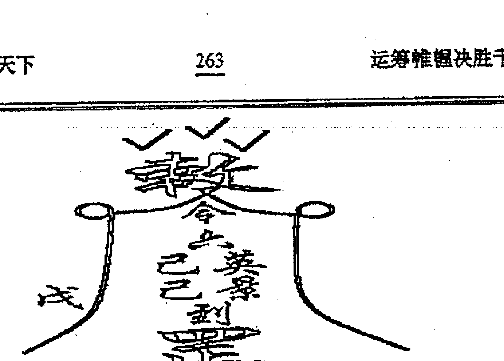

烧掉。因“戊景”就是提示你烧掉。若事很急，不要管时间，马上做。不急，可选个问题宫的时辰来做。事情解决即可。若贴符，事情解决后可拿掉烧了。

（2）用风水物布局。

（3）原物布局。比较长久。改变磁场是最长久的。若大、小太极都符合象意，贴大小都移，处理两层。一物（屋）一太极，多个房间符合，就移多个房间。各宫都同一时间转。也可弄符咒烧一下，再原物布局。

（4）三奇布局（三点定面）。也是临时布局。但真正解决问题的是原物布局好。原物布局，如不能到家里移星还斗，亦可借一个太极处理。但对自己有损伤的。如来不及可在宾馆或其它房间处理。若碰上有钱人，能量很大。要进他的局，他回家处理，我们也到家里处理。

（5）意念处理：用意念，正南，艮、兑方贴上移宫的符来处理。此法需强大的意识才可。要经常用。如用意念画符都可。如医院看病人，不能在病房设局，可以用意念处理。如死门换生门，在死宫写生字即可。

##### 预测系统

- 一、 当我们面对一个局，满脑子空白，无话可说，当有人问你一件事，不知如何下手时，就去用下面的来突破。真正做到来人不用问。
  1、 落宫：坎宫，落在水里面，水主忧患，麻烦，劳苦。慢，拖拉。
  2、 艮，落在山上了，会停止不前，有困难，阻隔。
  3、 震，动，意想不到的动，身不已的动，不动也动
  4、 巽，风中，徘徊，犹豫不决，走走停停
  5、 离，快速，火热，但消失的也快，午时的太阳
  6、 坤，为多，事多，人多，土也主慢，消极
  7、 兑、口舌，是非，兑为缺，不完美
  8、 乾、积极主动，思想意识高，高人一筹

- 二、 奇仪
  乙、委屈，受气，曲折，与女人有关
  丙、乱子，很急，烦躁，热烈
  丁、机会，希望。情人
  戊、钱财，房子有关
  己、幻想，欲望，陷阱、垃圾策划
  庚、敌人，仇人，对手，小人，阻隔
  辛、错误，改变，问题
  壬、迷茫，困难
  癸，困住，艰难

## 三、12 长生

- 长生: 正处于新的增长点，有新事物出现
- 沐: 桃花地，败露之事出现
- 冠: 包装，装饰，做表面文章
- 临: 处于收获的时候，工作，女人之夫
- 帝: 最旺盛时期，比赛，夺标
- 衰、走下坡路
- 病、有问题毛病发生
- 死、看不到希望，
- 墓、失去作用，隐藏起来
- 绝、到了尽头
- 胎、开始制作计划，
- 养、修养，准备实施计划

##### 四、六亲 天盘干坐下之干

- 正官: 运气，官运，官司，工作，女人丈夫
- 偏官: 小人，仇人，伤害，惊吓，附体，欺诈。口舌，女人情人
- 正财: 男人妻子，钱财有关，工资
- 偏财: 男人的情人，暗财，横财，
- 正印: 父母，合同，单位，房子，衣服
- 偏印: 名气，领导，上级
- 伤官: 晚辈，付出，女人测丈夫不顺
- 食神: 吃喝，付出，想财。
- 比劫: 是非，口舌，犯小人，同事。朋友，合伙

##### 五、格局

乙+乙-----是个伏吟局.凡是伏吟局,都是事物的停滞不前,如测股票,不上不下.对于伏吟局的决策,要储备能量.有人说:伏吟局利主不利客,这不完全对.如果用神落宫能量特别旺,而且星门能量也足够,此时可以突然一击,反而是好事,打破伏吟的局面.乙+乙/两个都太柔软了,这时需要给她一个强有力的支撑.乙+乙,日奇伏吟,不宜求名求利,只宜安分守己.阴干相排斥,逢排斥就没有好事.牵连的事物多,测出行往往走不了.希望太多,各个虚无缥缈.

乙+丙---奇仪顺遂.机遇多,有贵人扶持.凶星夫妻反目.乙+丙,有些好事发生,但当中会有些乱子与麻烦.

乙+丁---奇仪相佐.利于文书,考试,有机遇奇迹发生.测婚姻不好.男人有第三者或女性是第三者.

乙+戊-----利阴害阳.门凶门迫,破财伤人.戊一旦出来,就容易破财.遇到此格,最好的方法是:一是委托女人去做;二是白天不做晚上做(7点以后.卯酉为门户).这样就能避免破财.遇到此格,不宜主动做事,等事情发生以后再出击.

乙+己-----日奇入墓,被土暗昧.这个格与乙+戊正好相反.不适合女性做事,女性去了就倒霉适合男性，而且是适合白天做事，不适合晚上做事。测病，查无病因。逢阴干都是被动做事；逢阳干都是主动做事。

乙+庚----日奇被刑。这是一个合格。奇门中有三大格：比劫格；合格，冲格。要注意，在奇门策划与指导上逢合格，对出行不利，但对合作有利；对单独行动不利，对群体行动有利。出行遇合格，主牵绊，牵扯的事多，最好别一个人去。自己做不行，就找合作者。伏吟格，也是被他人他事牵连或者是合作的事，不是自己一个人的事。逢冲格，是合作不利，合作就散。单独行动有利，群体行动不利，矛盾大。遇到冲格，主动，积极，先行动就好。而遇到合格，自己先别动，消极一点比较好。乙+庚，有私欲，想达到自己的私欲。测婚姻，有矛盾，各有各的算盘。

乙+辛----龙逃走。奇门中为什么把奇放在前面？先用奇，后用门，实在不行再找甲。地方能办的就不要找中央，下面能办的就不要找领导。奇也不是万能的，三种状态下奇失灵：乙遇辛，丁遇癸，丙遇庚。这需要通过其他的方法来解救。乙+辛，如果有丙的联系；丁+癸，如果有戊的联系；丙+庚，如果有乙的联系---这样为凶中有救。一个小偷正在偷东西，虽然你不是警察，但穿了一身警服，也能把小偷吓逃。乙+辛是个动格，变动的，被动的，有思想活动的事。测疾病，龙逃走，病就好的快了。测求财不吉，要破财了。

乙+壬----日奇入天罗。尊卑悖乱，官讼是非，有人谋害之事。表示内心自我矛盾，变化，茫然，犹豫不决。也表示有人在你背后捣鬼。

乙+癸----日奇入地网。完全退守的意思，是不积极，消极避守的。遇到这个格，一般不要主动出击，要退守，一出去，就容易撞到网里。遇到乙+癸或癸+乙，最适合修炼，打坐，练气功。测终生局，遇到癸+乙或乙+癸，此人可能具有特异功能。癸为天网，是信息网，能接受宇宙的信息。乙+癸，癸主微小的变化，有掣肘，是出于私欲的破坏，被人拖了后退。

丙+戊----十天干中，火土到一块有点好的地方，因为火土是一家，具有协调性，亲密性。而且在阳配阳的信息中，只有火土相配的格局是吉利的，因为火土同源。其他的都是阳阳排斥，阴阴排斥。丙+戊飞鸟跌穴；戊+丙青龙返首都是吉利的。丙+戊飞鸟跌穴是储备的意思，利于投资，经商，储存和交易，如同放出去的鹰，抓到猎物再回来，表示获得。丙+戊，戊+丙，都适合出行做生意。但最怕墓迫击刑。墓迫击刑则出问题。如丙+戊（或戊+丙）落乾宫入墓，想回来回不来。落震宫为击刑，受伤了。再如，测投资办厂，丙+戊临开门落震宫开门门迫，我在行为上去了做了，但是我的心理承受能力还没有达到，行为与心理没统一，就会出现问题，等我回来，公司就关门了。遇到丙+戊或戊+丙，如果不出现墓迫击刑，测求官能提职，是比较吉利的。

丙+己----火悖入刑。囚人刑杖，文书不行。容易犯小人，但影响力不是太大。由于是阳配阴，阴阳具有一定的和谐性，只要是阴阳和合的，即使出现一些问题也都能够解决。这要看地盘干与天盘干的能量对比（讲课中讲：地盘所落之宫与天盘所落之宫的能量对比）。阴阳相合，能量守中，就不会有大问题。丙+己格局的信息含义：因为自己的私利和幻想惹出的麻烦。己主私欲,丙主麻烦.这个事件是由于自己的私利或他人的私利与行为导致了一些麻烦事.

丙+庚------格，在奇门遁甲中丙+庚/庚+丙;乙+辛/辛+乙;丁+癸/癸+丁是最凶的组合.但是丙+庚,格，只是这个得财的方式需要到处跑,如同狗出去找食一样,也能找到生门.但如果不是临生门,而是临戊,戊+庚,丙+庚则是破财,出行就破财.临死门,丙+庚,也代表破财.死门代表死伤和财产死亡.不要认为去了东西就不是好事,如测病天芮星临丙+庚,打官司惊门临丙+庚,说明疾病能走掉,官司能够消除障碍,所以丙+庚,也代表积极的一面.而且,很多情况下庚是最难以解决的问题,但临上了丙,就容易解决.例如台湾问题如果临上丙+庚,就能用武力解决.庚需要大火来炼,丁的小火不足以改变庚金的性质,而丙则是可以改变庚金的性质的.我测过一人患肿瘤,遇到丙+庚格，虽然没有做手术,但多年了还没有大事.如果中药配置一些火性大的东西,应该能够治疗肿瘤.

丙+辛---日月相会,谋事成就,病人不凶.这是一个合格.逢合格,必有他人他事牵连牵绊,就不是一件事,会有很多事情搅合在一起.丙辛合,指在合作中会有一些失误或错误,但是这些问题都能够解决掉.合格,利于合作,利于等待,但不利于出击,出行.

丙+壬---火入天罗,为客不利,是非颇多.阳配阳不和谐,而且五行中水火是最不稳定的.丙壬在一起,就是麻烦多多,是非多多,而这些麻烦都是因为外界的影响,是外因造成的,而不是因为自己的错误/失误造成的.此格,釜底抽薪,越往前进,乱子事就越多.

丙+癸---月奇地网.阴人害事,犯小人.是内部人造成的,要从身边人,内部人找原因,是内因造成的,而丙+壬,是受到了外在的影响.凡事阳的都具有辐射性;凡事阴的都具有内敛和吸收性.丙+癸,是指有人在背后捣鬼.

丙+乙-----日月并行.也是利于合作,合伙,利于求谋和寻求他人的帮助.日月并行好,但太阳与太阳并行就不行(丙+丙),火势太大就出乱子.

丙+丙----月奇悖师.文书逼迫,破耗遗失.主单据票证,不明遗失.像热锅上的蚂蚁乱套了.此格也是伏吟,逢伏吟就拖拉,难受.遇到丙+丙,就需要提防,防患于未然.

丙+丁---星奇朱雀.贵人文书吉利,常人平静安乐.好事不怕多,多多益善.遇此格,测病不吉,代表炎症.

奇门遁甲中首用一奇!奇也分天地人.天三奇:日月星(乙丙丁);地三奇:花草植物(乙),烟火,厨火(丙),烛光(丁).人三奇:女人(乙),男人/小男孩(丙),小女孩(丁).使用使,应该是天地人同时使用作用力才强.三奇的使用是有区别的.丁奇和其他天干的克应关系除丁+癸外,其他都还行.

丁+戊---青龙转光,指事物有转机的意思.  
丁+己---火入勾陈,奸私仇怨,事因女人.因个人的事情或私人的事情,出现一些意外和问题.  
丁+庚---文书阻隔,行人必归.也不是特别坏的格局,指遇到了难题,需要回避和退守之意.测去干事,干了但停滞不前,又回到了起点.测婚姻，有情人，但难以离婚(因为行人必归来)。  
丁+辛----朱雀入狱。丁也代表文章。朱雀入狱就是犯错误。丁为希望，辛为错误，让希望变成错误了，这个格局不够好。但临丁奇一般有解救。测犯罪，犯错误，临丁奇为有解救。  
丁+壬----贵人恩诏，诉狱公平。凡合格都有相同的含义但是信息不同。共有五个合局，其中甲己合比较特殊，这是因为奇门的特性造成的。因为甲遁起来了。如果出现己临值符时，也称为合格。丁+壬，也是利于合作，不利于出行，出行主牵绊。不过这种合作多是非道义的合作，将来会出现问题。测婚姻，未婚先同居。  
丁+癸-----朱雀投江。古书上讲：出行最不利。但是，实践看你还是要看周围的信息符号对他的影响力。别一看丁+癸，坐飞机就不敢坐。有一次，一个易友坐飞机去新疆，开门临丁+癸，买了机票后吓得不敢走。但我看临着吉星吉神，就说没有大的问题，可能是飞机出现点小故障。后来去了，是飞机出现点小毛病，在兰州迫降后，检修好安全到了目的地。还有一次，开车出行遇到戊+辛因龙被伤的格局，是同行的一人把脚搭在了车窗边，把鞋子弄丢了。老出小事的人没有大灾；病秧子，没有大病。  
丁+乙---人遁吉格。贵人加官进爵，常人婚姻财帛有喜。阴配阴，实际上这是一个变化，消极的格，只利于合同，文书，测其他事情都不利。测婚姻更不好。丁乙同宫，另续相亲。测工作，为工作调动或原有的工作保不住，不理想。  
丁+丙-----星随月转。贵人升迁，常人乐极生悲。就是过头的意思。遇到此格，要保持冷静，收敛一些比较好。  
丁+丁---星奇入太阴。文书证件即至，喜事遂心。是奇门中最吉利的一个格局。群星灿烂。  
戊土的特性：凡是遇到戊，不管测任何事情都是一个阻隔性，障碍性的东西。从戊的本性来说，钱是一个障碍。但戊的阻隔是可以转化和解决的。  
戊+乙----青龙和会，利于合作和聚集，此格局不利于出行。一个人出行不好，一大帮子朋友一起去比较好。此格，也怕墓迫击刑。逢墓迫击刑吉事成凶。测病，有多种病。  
戊+丙---青龙返首。动作大吉，若值墓迫击刑，吉事成凶。  
戊+丁-----青龙耀明。宜见领导，求功名。若值墓迫，招惹是非。  
戊加乙丙丁都是良好的信息体现，又有钱，又有机会，障碍就能突破，事物出现的问题就能解决。  
戊+戊---伏吟，障碍+障碍，遇事困难重重。测投资，为重复投资。测办事，一次办不成，需要不断的完善和补充才能办成。测婚姻测事，没有动向。  
戊+己---贵人入狱，公私皆不利。测投资是短暂的困难。贵人不能老呆在狱中。测终生局，人生会遇到短暂的困难，但是能挺过去。而戊+壬，青龙入天牢，是被围住，长久的困惑之意。戊+己，测合伙投资，为各怀鬼胎。此格破财，打官司，牢狱。  
戊+庚----值符飞宫。围绕庚有乙丙丁戊癸等几个符号来解决。在预测中我们经常会遇到人家问：老师，我还要注意什么？这时，就要注意庚---你测企业也是如此。一起局，就要看庚。

那是他注意的情况和他本人不好解决的事情，这个企业的大问题，大毛病也在症这里。---工作的重点在值符-----隐患或未察觉的问题在空亡处-----目标重点在值符-----目前首要解决的问题在于天芮星。-----大问题庚，但不一定是现在就要解决的问题。-----要解决庚，就要看庚与乙/丙/丁/戊/癸中的哪个符号产生联系了，就用哪个来解决。解决庚的方法之一就是用戊。---戊+庚/值符飞宫，换地方/换人。测疾病，转移了。测房子，住不长久。

戊+辛---青龙折足。戊+辛与辛+戊，有些信息相同的地方，都是经济困难或身陷困境。戊+辛，是基础没有了。辛+戊是基础还有，但目前短缺。遇到这两个格局，注定破财。记得一位奇门易友拿来一张奇门遁甲的格局让我看，说这个格局是一作者的朋友，打电话要去拜访作者，作者不知何意，特起局预测，让我给分析一下，这个作者的朋友，所为何事？当时日干是戊，我见地盘戊（地盘日干代表主，代表作者），上临天盘辛（天盘为客，为朋友）组成了辛+戊困龙被伤的格局，戊土生辛金，戊为钱财为作者本人，生辛金，生朋友，必是朋友在钱财方面受困扰去向作者借钱。

戊+壬---青龙入天牢。凡事皆不吉利。此格代表办不成事，运气不好，处在一个低潮期。测疾病，病要走了，是好事。

戊+癸---青龙华盖。合格，受事物的牵连。婚姻为年龄差距大。

己加乙丙丁都不是特别有利的。我们知道十天干中戊己是制约平衡的信息因素。戊是突出的问题；己是隐藏的问题或陷阱。任何事物遇到己，都要小心了，难以自拔或落入陷阱。戊是凸出的，己是塌陷的，吸收的。己在上，戊在下，就是平衡的，好的。己在下，戊在上，戊就会被己吸收。

己+乙---墓神不明。还没有看到光明，一般主做事拖拉，本身就不是很好的事，却还要去做。

己+丙----火悖地户。男人冤冤相害，女人必致淫污。容易因为不正确的思想和行为，造成一些麻烦事。

己+丁----‘朱雀入狱’道路曲折但前途光明。先曲后直。遇此格，不要冒进，不要急于求成。

己+戊----犬遇青龙。有贵人相帮之意。有了施展才华的机遇和新生事物的发生。

己+己----地户逢鬼。贪欲太强，自私，做事无力，光做美梦，百事不顺。

己+庚-----刑格返名。己想吃掉庚还吃不下去，消化不了，吐又吐不出来，代表难受，别扭，是刑格。庚+己，也是这个道理。

己+辛-----两个都不是好东西。己代表私欲陷阱，辛代表错误。布置一个陷阱让你犯错误。己+辛游魂入墓，易遭阴邪鬼魅作崇。即遇此格容易上当受骗犯小人。特别是预测房子风水时，遇此格，一般指房子里有怪异的东西。我给人测风水有两次遇到此格局：一次是地基下埋着个小孩尸体；一次是楼底下地基曾经是关帝庙。如果测合作办事，遇到此格就要注意了，你的合作伙伴不一定是好人。

己+壬----地网高张。辰戌相冲主怄气，生气，争执，冲突。天罡与地煞，谁也不服谁。

己+癸-----地刑玄武。也是一个容易犯小人，犯口舌的格局。而且容易上当受骗。合作，出行容易招人破坏与受骗。

庚，是奇门遁甲的重点。庚加什么都不好。庚，是一个事物中最重要的，如同现在的东西方对立一样，美国就是庚。什么时间美国的国务卿能是华裔女性或美国出现了华裔女性主持人主播，则中美关系就能得到大大改善。这一天能够到来。（乙庚/丁庚）。

庚+乙---太白逢星。合格。委曲求全，事就好办。此格，留恋，牵绊，有合伙人，与异性合伙好。

庚+丙---太白入荧，贼必来。临生门，会有钱财送上门。测病，病来。

庚+丁----亭亭之格。金屋藏娇。测事业，主因一己私利出是非，被人告状，损公肥私。

庚+戊---天乙伏宫。庚+戊/戊+庚---最忌讳合作，而且最忌讳坐地求财。比如开公司，小卖铺，杂货店，饭店等。遇此格，人家问你能否开店？肯定开不成。还有测工作，人家问我要去一家公司当主管，如果遇到庚+戊或戊+庚，你肯定做不长。最忌讳开店/合作与坐地求财。此地不比他地，此人不如他人。

庚+己-----官府刑格。难受，而且这个难受是不情愿的，是被别人拖累的。记住了，一般遇到庚和丙，都是受到别人影响的；而遇到己和辛，都是因为自己的原因，贪小便宜和私欲造成的错误。

庚+庚----太白同宫，战格。这个格在伏吟格中是特别特殊的一个，它利客不利主，不利于呆着静守，而是要积极行动，利于战斗和攻击。庚+庚，就是仇人见面，谁先动谁有利。

庚+辛-----白虎干格。古书讲：不宜远行，远行则车折马伤，诸事有灾殃。但实践看，因为是一阴一阳的组合，并不是特别凶。

庚+壬----上格，又名小格。忧患，动荡不安。出行遇到庚+壬，堵车堵不住。测工作遇到庚+壬，一般是岗位的调动，在原单位内部动。一般是局部的变化与调整。

庚+癸-----大格。萍迹四害，变化大，彻底改变。

庚金一般代表外界给你带来的不良后果；而辛金则是自己内部或内因造成的不良影响。

辛+乙---虎猖狂。是个动格，利主不利客。

辛+丙----干合悖师。合格。但容易在合作中出现一些是非麻烦。

辛+丁----狱神得奇。经商求财吉。测罪人，获释。测婚姻，主第三者插足。

辛+戊----困龙被伤。因自己的错误，导致的经济危机或事情的失败。

辛+己----入狱自刑。奴仆背主，有苦诉难伸。本来他是小人，可你非要救他；本来它是毒蛇，可你偏偏救了它。背叛的原因，是你自己的错误造成的。辛+己，也叫奴欺主。你手底下的人，以前不如你，现在比你强了，反过来了。辛+己，测坟地风水，前面有比你大的山或建筑物靠你太近了。可能是有比你高的坟或山压住了你，叫奴欺主。前面应该矮才行，现在反过来了，就不行。遇此情况不好处理。除非把自己的加高。甲己合，利用值符，值符代表背景，你的背景要强才行。

辛+庚---白虎出力，刀刃相交，主客相残。是由于自己的错误，引来了外界的错误。因为自己的失误，引来了外界的影响而导致更大的问题。

辛+辛----伏吟天庭。毛病多多，漏洞百出。老挑别人的毛病，实际都是自己的问题造成的。是自己给自己找事做。

辛+壬-----凶蛇入狱。两男争女，讼狱不息。争执。是因为自己的错误，导致竞争或同时受到多方面的影响。

辛+癸----天牢华盖。因自己的失误，导致困境，出现麻烦。测生意，不能干，判断失误。

##### 十干克应续讲（壬癸水）

壬，并不是不良的符号，而是发展和变化，是个最积极的符号。有时候，壬也表示奇迹发生的含义。因为任何事物在它停滞不前或徘徊时，都会产生问题，所以伏吟局有问题，难受。事物要发展，就要产生变化。壬，就是一个变化的信息。任何事物只要能够变化，能够动，都会带来或好或坏的机会，但不变化，就没有机会。为什么有的人兢兢业业一辈子却没有发展提拔的机遇？为什么有的人刚来就能受到重用和提拔？事物就在于变化。遇到壬时，就要努力去改变！

- 壬+乙----小蛇得势。在忧愁之中突然遇到了别人的帮助。与此格，曲中求变，以柔克刚。
- 壬+丙----水蛇入火。为客不利。口舌是非，麻烦一大堆，越急越出乱子。
- 壬+丁---干合蛇刑。利于合作谈判。
- 壬+戊----小蛇化龙。本来是阳阳碰撞，为什么会有良性信息呢？就是因为壬水在动。这是个吉格，有贵人相帮，找到了靠山或找到了强大的支撑因素。
- 壬+己---在阴阳相配中只有壬，己势不两立，是特殊的。壬+己叫反吟蛇刑。本来不变还是好事，保持中立还平安，但这一变反而跳到井里了。壬+己，就是变化掉入了陷阱里，被人涉及和陷害了。这个局，动不好。
- 壬+庚----太白擒蛇。如果测终生局遇到此格：一是做政客；二是做科研；三是做教师。是个吉格，一般有正确的主见，不被其他事物或不利因素所迷惑，能够看清方向。遇到壬+庚，你骗不了人家。叫立剖邪正，是非分明。谈判，人家临上壬+庚，你想骗人家，门也没有。如六合临壬+庚，测婚姻或合作，找这样的中介比较好，中立，秉公办事。
- 壬+辛----腾蛇相缠。是非缠绕，麻烦多。如有谋望，被人欺骗。明知道上当受骗，你还上当。内忧外患，没完没了，没有正经事，但很棘手。
- 壬+壬-------天狱自刑，蛇入地罗。测家庭或公司，都是内外都有事。测合作，是按下葫芦浮起瓢，内忧外患。内因和外因同时缠绕着你。一百个兔子拉车，乱套了，出不来了。

而癸+癸，叫天网四张。壬+壬，是没有秩序的乱；而癸+癸，则是有秩序和规律。壬+壬，是难以解决，找不到一个源头和突破点。而癸+癸，只要你不乱，非常镇静的理清头绪，则什么事都没有，不妄动就没事。而壬+壬，不管你动不动，它都找你。

癸，叫天网，又叫华盖。癸水的信息特性：只要你保持沉静，别盲目行动，就会由凶转吉的机会。你妄动，就撞网，不动则很自在。华盖就是皇帝打的伞。癸是有秩序，有规律可循的。临癸，一般说安静，守静，等待，不作为，就没有多大问题。

癸+乙------华盖逢星，贵人禄位，常人平安。与此格，性格含蓄，做事内敛比较好。不要太露锋芒，要悄悄的办。此格，也主希望被网罩住了，有财难伸。

癸+丙-----华盖悖师，贵贱逢之皆不利，唯有上人见喜。遇此格，易犯小人，忌讳女人参与。遇此格，一动就有乱子事。

癸+丁----腾蛇夭矫。文书官司，火焚也逃不掉。官司口舌，问题林立。合作必散伙。

癸+戊-----天乙合会。吉门易求财，婚姻喜美，吉人赞助成合，若门凶迫制，反祸官非。是个合格，利于合作。

癸+己---华盖地户。音信皆阻。要求你安静，退守，静止，等待，观看，你就没有事，就应吉。如果乱撞，就出灾。是一个小冲格，不利于客，私欲幻想多，难实现。单相思，办不成。

癸+庚----太白入网。主以暴力争诉，自罹罪责。是事物难以控制，容易被他人他事影响，造成麻烦和是非。主斗打，相冲突，容易有别人来捣乱，破坏。凡事无成，吉事也易成空。

癸+辛-----网盖天牢。主官司败诉，死罪难逃，测病亦大凶。这是奇门中最凶的一个格局。测人运气遇此格，一般主牢狱之象。特别是落巽宫，都有牢狱之灾。唯一的方法是什么都不干，静守闭关，你不动网就不下来。癸+辛，落巽宫，犯罪或坐过牢。我上次去塘沽，朋友请客时，一人穿着税务制服坐在巽宫，他问我运气，我实在看不出好来，就对他讲，你要小心啊，有牢狱官司的，原来此人被判5年刚刚出来。小孩子遇此格，犯错误，不爱出门。

癸+壬----复见腾蛇。叫重复做以往的错误，屡教不改，又导致第二次失败。有些人做事中正好临癸+壬，他是旧事重提，以前失败了，现在也没有好下场。

癸+癸----天网四张。它有一个最大的特点，只要独立出行，独立行事就没事，最怕多人出行及合作。在合作上最容易出现问题的格局就是庚+庚/癸+癸，只要一合作，人一多，矛盾就出来了。

##### 六、暗干

就是宫中八门的原先落宫，如下例：

公元：2014年2月14日14时46分 阳4局
农历：马年01月15日14时46分 时盘
干支：甲午 丙寅 丙辰 乙未 (辰巳空)
直符：天柱 直使：惊门 旬首：甲午辛

|      | 亥   | 子   | 丑   | 寅   | 卯   | 辰   | 巳   | 午   | 未   | 申   | 酉   | 戌   |
| :--- | :--- | :--- | :--- | :--- | :--- | :--- | :--- | :--- | :--- | :--- | :--- | :--- |
| **门** | 开   | 闭   | 建   | 除   | 满   | 平   | 定   | 执   | 破   | 危   | 成   | 收   |
| **神** | 玄武 | 地   | 天   | 白   | 六合 | 阴   | 蛇   | 符   | 白   | 六   | 阴   | 蛇   |
| **星** | 辅   | 英   | 芮   | 冲   | 任   | 蓬   | 心   | 柱   | 芮   | 辅   | 英   | 任   |
| **干** | 壬   | 癸   | 丙己 | 丁   | 庚   | 辛   | 戊   | 乙   | 丙己 | 壬   | 癸   | 丁   |
| **地** | 乾   | 坎   | 艮   | 震   | 巽   | 离   | 坤   | 兑   | 中宫 | 乾   | 坎   | 艮   |

如用神落艮宫，惊门，暗干宫就是惊门的原宫兑宫，也就是说明艮还隐藏着一个像就在兑，龙逃走。面对这个局，无论客户问不问话都要看出他的来意：先落宫艮，有困难发生了，难解决，丙是乱子，下压偏官，是官司口舌，再格局等等，都纳进去，就会做到学会奇门遁甲。来人不用问。

##### 一、催财

催财，催财必须先吸收能量才能给别人催财。先给自己起个能量局吸收能量。

- 公元：2014年1月14日15时3分 阳5局
- 农历：蛇年12月14日15时3分 时盘
- 干支：癸巳 乙丑 乙酉 甲申（午未空）
- 直符：天柱 直使：惊门 旬首：甲申庚

|      | 戌   | 亥   | 子   | 丑   | 寅   | 卯   | 辰   | 巳   | 午   | 未   | 申   | 酉   |
| :--- | :--- | :--- | :--- | :--- | :--- | :--- | :--- | :--- | :--- | :--- | :--- | :--- |
| **门** | 收   | 开   | 闭   | 建   | 除   | 满   | 平   | 定   | 执   | 破   | 危   | 成   |
| **神** | 白   | 玄武 | 地   | 天   | 蛇   | 六合 | 阴   | 符   | 白   | 玄武 | 地   | 天   |
| **星** | 冲   | 辅   | 英   | 芮   | 任   | 蓬   | 心   | 柱   | 芮   | 辅   | 英   | 任   |
| **干** | 戊   | 丁   | 壬   | 乙   | 丙   | 癸   | 辛   | 庚   | 戊   | 丁   | 壬   | 乙   |
| **地** | 乾   | 坎   | 艮   | 震   | 巽   | 离   | 坤   | 兑   | 中宫 | 乾   | 坎   | 艮   |

现在日干在巽，玄武的能量很大，找个好宫就行，进入局吸收能量。时生年，年在坎又生巽，能量很大。入了局，然后定下，画个乙奇符念乙奇咒，天人合一。

> 乙奇咒曰：天帝神威，诛灭鬼贼。六乙相扶，天道赞德。吾令所行，无攻不克，急急如玄女律令。

> 丙奇咒曰：吾德天助，前后遮罗。青龙白虎，左右驱魔。朱雀道前，使我会他。天威助我，六丙除疴。急急如玄女律令。

> 丁奇咒曰：天帝弟子，部令天兵。赏善罚恶，出幽入冥。来护吾者，玉女六丁。有犯我者，自灭其形。急急如玄女律令。

自己就是乙奇了，然后再给别人催财。

### 催财举例：

公元：2014年1月14日15时19分 阳8局
农历：蛇年12月14日15时19分 刻盘
干支：乙丑 乙酉 甲申 丙寅 (戊亥空)
直符：天任 直使：生门 旬首：甲子戊

|      | 辰   | 巳   | 午   | 未   | 申   | 酉   | 戌   | 亥   | 子   | 丑   | 寅   | 卯   |
| :--- | :--- | :--- | :--- | :--- | :--- | :--- | :--- | :--- | :--- | :--- | :--- | :--- |
| **门** | 平   | 定   | 执   | 破   | 危   | 成   | 收   | 开   | 闭   | 建   | 除   | 满   |
| **神** | 白   | 玄武 | 地   | 天   | 蛇   | 符   | 六合 | 阴   | 蛇   | 符   | 六   | 阴   |
| **星** | 芮   | 柱   | 心   | 英   | 蓬   | 任   | 辅   | 冲   | 蓬   | 辅   | 任   | 英   |
| **干** | 辛丁 | 乙   | 辛丁 | 壬   | 庚   | 戊   | 己   | 癸   | 庚   | 癸   | 戊   | 乙   |
| **地** | 巽   | 离   | 坤   | 兑   | 乾   | 坎   | 艮   | 震   | 中宫 | 巽   | 离   | 坤   |

催财时根据他的财路，职业找个好宫，没有四害的宫位，有四害就催不出来，如上局我们就选离，震，兑。坤4宫都行，

震适合策划，中介，饭店，流动性的，合伙的性质。

离适合推销，玄学风水等

坤电器，说唱，电热等

兑适合开店，远处求财，大财，合伙求财。

定好宫就按像意做那宫的行为风水，如用兑就去西方（空间）酉时（时间）穿着西服，别扣扣，开着车，打开天窗，带着女人（乙）就会打开财路。

##### 调理案例思路

- 1.应急处理，女打电话，和情人吵架了，想和好。

2013年12月23日16:28 刻局
干支：甲子 乙亥 庚申 甲申 阳2局
直符：天辅 直使：杜门 旬首：甲申庚

|      | 亥   | 子   | 丑   | 寅   | 卯   | 辰   | 巳   | 午   | 未   | 申   | 酉   | 戌   |
| :--- | :--- | :--- | :--- | :--- | :--- | :--- | :--- | :--- | :--- | :--- | :--- | :--- |
| **门** | 开   | 闭   | 建   | 除   | 满   | 平   | 定   | 执   | 破   | 危   | 成   | 收   |
| **神** | 玄武 | 地   | 天   | 白   | 六合 | 阴   | 蛇   | 符   | 白   | 六   | 阴   | 蛇   |
| **星** | 心   | 任   | 蓬   | 冲   | 辅   | 英   | 芮   | 柱   | 蓬   | 辅   | 任   | 心   |
| **干** | 丁   | 癸   | 壬   | 戊   | 己   | 庚   | 丙   | 辛   | 戊   | 庚   | 癸   | 乙   |
| **地** | 乾   | 坎   | 艮   | 震   | 巽   | 离   | 坤   | 兑   | 中宫 | 乾   | 坎   | 艮   |

###### 1、急事我们用刻局，长远事我们用时局

局一出来，这个局就是反应她和情人的情况，记住情人是丁就行，不用在纲上去找，丁在艮入墓，不想见她，临马癸想走。解决艮出墓要坤来冲开平衡，坤解决就行了，坤咋解决看引干咋引导，乙庚给你说结手印，意念和合二仙降临。在坤做行为风水冲开艮，丁的引干在离，在离宫烧丁奇符，填实离宫，丁情人的内心就会改变。处理此局一看吵架不要处理兑惊门，因为是吵过了，关键是情人不理她了，处理情人宫就行了，自己的宫也不用看，关键是改变情人。见辛照着宫的做行为风水就行。从这个局就能体会到应急处理要用刻局，引干是说明宫内咋调理的，如离宫引干丁说明要想除掉蛇就要用丁火。见辛照着做就能换回好的能量。

###### 2、乾坤挪移转换用神

- 公元：2013年12月14日8时47分 阴1局
- 农历：蛇年11月12日8时47分 刻盘
- 干支：癸巳 甲子 甲寅 戊辰 癸亥 (子丑空)
- 直符：天禽 直使：死门 旬首：甲寅癸

```
      亥     子     丑
    ┌─────┬─────┬─────┐
    │开    │闭    │建    │
    │天    │地    │玄武  │
    │心    │蓬    │芮    │
    │丙    │壬    │庚    │
    │      │      │      │
    │卯    │      │      │
    │      │      │      │
    ├─────┼─────┼─────┤
    │定    │执    │破    │
    │六合  │阴    │蛇    │
    │柱    │英    │任    │
    │丁    │乙    │癸    │
    │      │      │      │
    │寅    │      │      │
    │      │      │      │
    ├─────┼─────┼─────┤
    │危    │成    │收    │
    │白    │符    │玄武  │
    │冲    │辅    │己    │
    │辛    │戊    │      │
    │      │      │      │
    │丑    │      │      │
    └─────┴─────┴─────┘
       马
```

这是一个策划很成功的案例，有几个易学策划师举办企业家座谈会，前两天效果很不好，没谈成一单风水业务，有人请我去试试，于是我应急而动起了这个局来给自己策划。当四纲都坏时，就不要从纲上找用神了，不然很难成功。用神戊空，戊的财是癸，癸入墓，我们就找壬，让壬当用神，从乾宫出发去会场，坐在了会场的西北角，喝着矿泉水，让2个女司仪在东南来回走动，这样全盘都活起来了，四纲坤生乾，结果很成功，接了16个企业策划单子。如按我们传统的方法纲上找用神，就不会扭转乾坤，转败为胜。所以我们不要老抓住四纲分阴阳等不放，要活用。

###### 3、10年供神没有事，一朝引发祸非轻

- 公元：2013年12月30日10时1分 阳4局
- 农历：蛇年11月28日10时1分 刻盘

干支: 癸巳 甲子 庚午 辛巳 甲午 (辰巳空)
直符: 天柱 直使: 惊门 旬首: 甲午辛

|      | 亥   | 子   | 丑   | 寅   | 卯   | 辰   | 巳   | 午   | 未   | 申   | 酉   | 戌   |
| :--- | :--- | :--- | :--- | :--- | :--- | :--- | :--- | :--- | :--- | :--- | :--- | :--- |
| **门** | 开   | 闭   | 建   | 除   | 满   | 平   | 定   | 执   | 破   | 危   | 成   | 收   |
| **神** | 玄武 | 地   | 天   | 白   | 六合 | 阴   | 蛇   | 符   | 白   | 六   | 阴   | 蛇   |
| **星** | 辅   | 英   | 芮   | 冲   | 任   | 蓬   | 心   | 柱   | 芮   | 辅   | 英   | 任   |
| **干** | 庚   | 癸   | 丙己 | 丁   | 戊   | 辛   | 壬   | 庚   | 丙己 | 癸   | 丁   | 戊   |
| **地** | 乾   | 坎   | 艮   | 震   | 巽   | 离   | 坤   | 兑   | 中宫 | 乾   | 坎   | 艮   |

这是个女的面测风水的局，现在疾病破财很不顺测风水全盘皆看，坏的宫位巽，坤。

1. 戊的引干在坤外面，问她西南敬神了吗，说敬了10年了一直都很好，为何现在发凶了。
2. 马星降临，发动了，马星能量很大。说是西南在建河坝。肯定西南外面还有东西，说河坝外面是坟场。这下明白了，是敬的神的像把西南坟场的像拉了进来。河坝不动不会发凶。于是到她家去看风水。她家西南是一个大的佛堂，都移除不可能，一查共8尊佛，那我们拿掉1个就破了坤宫的像，应了兑宫直符的像了，这就叫换数移神。那我们拿那一尊呢？己击型，就拿己，己是什么，引干说了算，注意又是引干。在震，是龙王。于是请走了龙王。切断了外援。巽宫咋处理？在巽放钱，放储钱罐，别放满，放隐蔽的地方。白虎方也要处理，带龙的画拿掉。
3. 这个局记住，我们一定要封局，记得出局。
4. 在处理阴性东西时，一定要在中宫烧万能符加持能量，然后再调风水，烧5张，切记。
5. 坤宫不能贴符，用符，因为符在坤入墓，越用越坏。
6. 缩小太极是本门秘法：如拆西方的东西，太多，不能全拿掉，就缩小太极，把兑宫分九宫，拆掉兑宫的东西就行了。
7. 如果一个人运气背多年了，想改变，就要全盘动，全盘调理，就能改变。并不是像世面上奇门说的只动3宫。
8. 放上风水物100天不动是错误的，要看宫的引动说明。凡事没有绝对的，如胎神不能动，但看你是求的什么，建的什么平台，如造的是车不动行吗，建的是房子就不能动了。

我们举例说明：
公元: 2014年2月14日20时37分 阳7局
农历: 马年01月15日20时37分 时盘
干支: 甲午 丙寅 丙辰 戊戌 (辰巳空)
直符: 天蓬 直使: 休门 旬首: 甲午辛

| 宫位 | 天盘 | 地盘 | 八神 | 九星 | 八门 | 天干 |
| :--- | :--- | :--- | :--- | :--- | :--- | :--- |
| 巽四宫 | 辛 | 辛 | 九地 | 天辅 | 杜门 | 辛 |
| 离九宫 | 乙 | 乙 | 九天 | 天英 | 景门 | 乙 |
| 坤二宫 | 丙 | 丙 | 直符 | 天芮 | 死门 | 丙 |
| 兑七宫 | 壬 | 壬 | 太阴 | 天柱 | 惊门 | 壬 |
| 乾六宫 | 丁 | 丁 | 螣蛇 | 天心 | 开门 | 丁 |
| 坎一宫 | 己 | 己 | 九地 | 天蓬 | 休门 | 己 |
| 艮八宫 | 庚 | 庚 | 太阴 | 天任 | 生门 | 庚 |
| 震三宫 | 戊 | 戊 | 六合 | 天冲 | 伤门 | 戊 |
| 中五宫 | 癸 | 癸 | 玄武 | 天禽 | 中门 | 癸 |

一个局出来，不用预测人开口，我们就把预测系统拉进来说：坤宫为多，你测的这件事牵扯的人多，与钱财有关，(戊)下压财合干，夫妻感情也有问题，惊门，口舌官司，说说就对了。调理：拆掉对宫白虎，在坤念心经。不好的就是转化，如见辛就可以念心经(心惊)

-   9. 关于放生，并不是放生都好，还是那句话，凡事没有绝对的。宫内有击刑，门迫，入墓，就不能放生，其它都可以。无论4害什么只要宫内有辛引干有辛都能放生。上局兑宫就能放生加能量。
-   10. 关于超度，如宫内击刑门迫不能超度，入墓可以超度，有辛可以。
-   11. 数字拆补：补要按宫位数，拆要去掉宫位数。数字也是能量。
-   12. 烧元宝，放一张心经上去一起烧，效果非常好。做过阴宅或法事，把短裤在十字路口烧掉。
-   13. 自测局：自己一般不要经常给自己测，如测了一定要化解，不化解到时候就会爆发。所以一定要看好的宫位，发挥好的能量为我所用。

##### 我们举一例总结

公元：2014年1月15日11时9分 阳6局
农历：蛇年12月15日11时9分 刻盘
干支：癸巳 乙丑 丙戌 甲午 乙丑 (戌亥空)
直符：天心 直使：开门 旬首：甲子戊

| 已 定 | 午 执 | 未 破 |||
| :--- | :--- | :--- |||
| 辰 丁 平 | 地 癸乙 芮 丙 景 | 天 己 柱 辛 死 | 符 戊 心 癸乙 惊 | 申 辛 危 |
| 卯 庚 满 | 玄 辛 英 丁 杜 | | 蛇 壬 蓬 己 开 | 酉 癸乙 成 |

| 宫位 | 天盘 | 地盘 | 八神 | 九星 | 八门 | 天干 |
| :--- | :--- | :--- | :--- | :--- | :--- | :--- |
| 巽四宫 | 辛 | 辛 | 九地 | 天辅 | 杜门 | 辛 |
| 离九宫 | 乙 | 乙 | 九天 | 天英 | 景门 | 乙 |
| 坤二宫 | 丙 | 丙 | 直符 | 天芮 | 死门 | 丙 |
| 兑七宫 | 壬 | 壬 | 太阴 | 天柱 | 惊门 | 壬 |
| 乾六宫 | 丁 | 丁 | 螣蛇 | 天心 | 开门 | 丁 |
| 坎一宫 | 己 | 己 | 九地 | 天蓬 | 休门 | 己 |
| 艮八宫 | 庚 | 庚 | 太阴 | 天任 | 生门 | 庚 |
| 震三宫 | 戊 | 戊 | 六合 | 天冲 | 伤门 | 戊 |
| 中五宫 | 癸 | 癸 | 玄武 | 天禽 | 中门 | 癸 |

一个局出来，不用预测人开口，我们就把预测系统拉进来说：坤宫为多，你测的这件事牵扯的人多，与钱财有关，(戊)下压财合干，夫妻感情也有问题，惊门，口舌官司，说说就对了。调理：拆掉对宫白虎，在坤念心惊。不好的就是转化，如见辛就可以念心经(心惊)

## 第十三卷 法术化解与加持

### 一、天门地户

天门地户是做法术获取天地的通道，画符念咒朝天门地户获取能量才能量。我们做法就是跟天上地下的阴性能沟通，达到我们的目的。

-   1. 天门三门：太冲（卯）小吉（未）从魁（酉）是沟通上天的三个通道求法 1.先找到月令，如月令为寅，找出合支亥，则亥就是本月的月将，加时上顺排一周

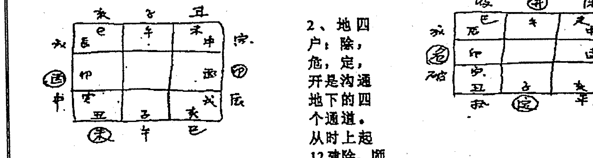

-   2、地四户：除，危，定，开是沟通地下的四个通道。从时上起12建除，顺

### 二、护法

就是站在自己两边的童男童女，是以年命为准查出的贵人。
甲戊庚牛羊，乙己鼠猴乡，丙丁猪鸡位，壬癸蛇兔藏，庚辛逢马虎。
也就是说甲年生人，护法是牛与羊，属牛的与属羊的，画丑与未符带身上。

### 三、画符

用黄表纸朱砂毛笔画符，画好符中下面，面朝天门地户烧，然后烧护法。有时候条件限制就用舌头，眼睛画，用意念画。常炼。

### 一、奇门穿壬

就是奇门局起出月将，用月将解宫内的四害。

解官： 如神.侧门也用合

-   值：合
-   刑：合
-   入墓：冲
-   空亡：冲

### 八神化支

-   值：子
-   丑：丑
-   寅：寅
-   卯：卯
-   辰：辰
-   巳：巳
-   午：午
-   未：未
-   申：申
-   酉：酉
-   戌：戌
-   亥：亥

### 干化支

-   甲子戊：子
-   甲午辛：午
-   甲辰壬：辰
-   甲寅癸：寅
-   ……

### 神化支

-   符：亥
-   蛇：寅
-   阴：巳
-   合：卯
-   白：申
-   玄：亥
-   地：未
-   天：亥

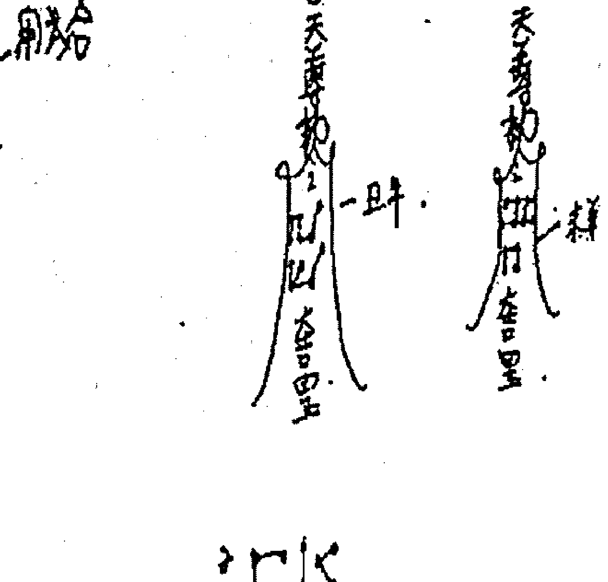

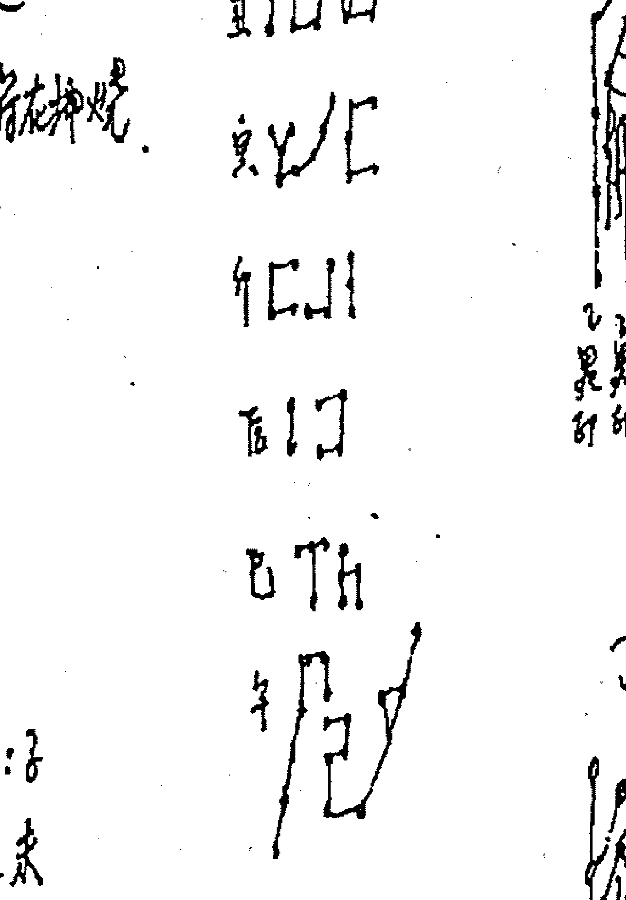

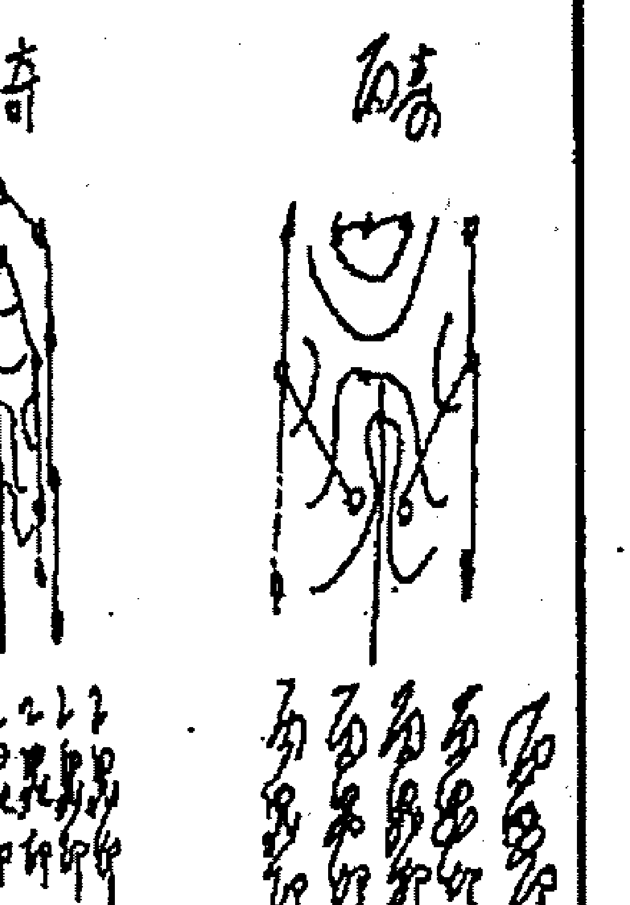


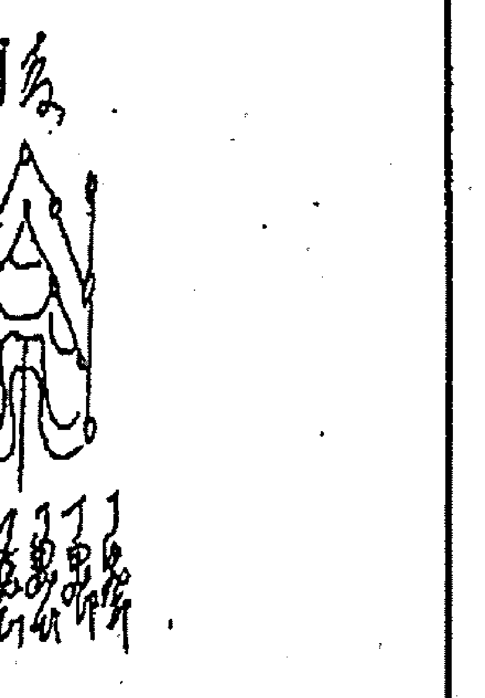

戊癸合化火 戊癸合化火

甲己合化土 甲己合化土

# # 化煞与加能量

## ## 第一节、天罡地阵

### ### 一、阵法运用

1、此阵一定要结合奇门局。作用：化煞、催财。破空无。主要是阴宅。即死宫空或山向空。阳宅用的少。

2、条件：死空且无击刑门迫才可做。如起盘死宫空在艮不空，但说坟在乾空，则也为坟空。日干为辛，七杀丁落宫为空无，坟地也要处理。坟向空无线，则要做山向。阴宅山向空。山空在山上做，向空在向上做。可在山上或向上挖一个大坑，在这一个大坑内做成4个格（2个九宫格，2个星斗格）。在大坑内做这个天罡地煞阵。即在坟地山向的空无宫埋天罡地砂。阳宅房屋缺角或空无。缺处是空。如乾宫空无或缺角，意味着房主的重大缺失、象征父权利、大财、夫妻关系等。如不能换房，可用天罡地煞阵解之。阳宅的山向空无，也是山空在山上做，向空在向上做。向空可在门口做。南、北星斗用铜丝连起来，系上铜钱。九宫格用朱砂画出或用铜丝围均可。

-   3、催财化煞。路冲、风口、尖物、电器等。
-   4、做法：
    方法一，在坟的四周做。挖4个30公分左右的坑。
    方法二，在坟的空无宫方位做。挖4个30公分左右的坑。
    方法三，山向局的空无宫也要做此局。

### ### 二、阴宅破空无

：阴宅空解法——用天罡地煞破空无。乾宫空，符戊辛，死门。—死为阴宅，戊年破大财。乾为男。此象，男人很不舒服。头、呼吸等有问题。此种情况，就要在坟上破空无了。

#### #### 1、准备

-   (1) 在阴宅前面的左右、后面的左右各挖两个一尺长宽深左右（30-35公分）的坑。用毛笔朱砂划出九宫格。格内放铜钱。一面2个坑布天罡，一面2个坑布地煞。
    (2) 阳宅：在缺角或空无等处用朱砂高度就狼毫笔画出宫格，或用0.5以上金银或铜丝围成上述大小的2个九宫格和2个方格。
    (3) 五帝钱共121枚。选择铜钱：康熙主身体。乾隆主财。雍正主官。顺治主安全、意外。铜钱用真的最好，无真的用假的亦可。
    (4) 万能符2张，朱砂若干。阳宅或备0.5以上金银或铜丝若干。

#### #### 2、布置

-   (1) 36天罡：36天罡：一个九宫格中各宫内布置4枚铜钱，共36枚。格上方再布置一个与九宫格同样大小的方框，内布南斗六星图案。
    (2) 72地煞：一个九宫格中各宫各布置8枚铜钱，共72枚。格上再布置一个与九宫格同样大小的方框，内布北斗七星图案。
    (3) 用飞星入斗择日。选一个生比用神（最好是年命）的日时布置。
    (4) 布置前烧一张万能符和解，布完后再烧一张。
    (5) 用朱砂围出2个九宫格和2个星斗格。摆好铜钱，铜钱眼上撒上朱砂。星斗各铜钱用铜线串连起一个星斗之象（见图）放入坑内。最后填土埋好，以后不要扒出。埋土前每个坑都要烧万能符，以化解磁场。
    (6) 天罡地煞的左右位置没有特别规定。但南斗天罡、北斗地煞必须对应一上一下。

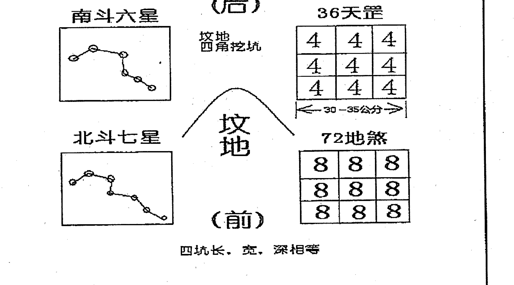

四坑长、宽、深相等

### 三、阳宅破空无

阳宅：用朱砂毛笔画出九宫格和星斗格。或用金银或铜丝在空无或缺角处围出 4 格，把铜钱和丝粘在地上，盖上地板或其它。如乾空，在乾宫地下布置两个 9 宫格。可用 0.5 以上的铜丝或银丝布置。
72 地煞：一个九宫格中各宫各布置 8 枚铜钱，共 72 枚。九宫格上再布置一个与九宫格同样大小的方框，内布置北斗七星图案。
36 天罡：一个九宫格中各宫内布置 4 枚铜钱，共 36 枚。九宫格上再布置一个与九宫格同样大小的方框，内布置南斗六星图案。布法同上。

## 第二节、罡 步

#### 一、万字罡步与马星破空无

如乙在乾入墓，巽宫无四害，乾宫有马星。可直接在乾宫做行为风水。入墓+空无亦可这样做。行为风水——活人》动物》物象。

-   1、方法：
    (1) 万字踏罡步。后天万能罡步加大磁场。在空无宫画一万字符，从万字一个 S 的一端先迈“左脚”开始走第一步，一个 4 步 (1234)，走完一个再（任意走）到另一个 S 的一端走 (5678)，如此反复走 6 次、6 天或 6 人来走都可以（应宫位数）。
    (2) 也可在乾方面画一个罡步（万字符），放一马星物象。即，动的。如钟表、马、八骏图等。企业，可在西北处让工人在此方活动，做一下行为风水。若对宫有四害，则空宫一动，对宫马上就出事。一般本宫有四害，可到空无宫住，就不受四害。出了事，可到空无宫躲藏逃避。有些情况，找到空无宫，有四害。会出现解了被人破坏的情况，这是天意，解不了。当空无+击刑或门迫时，拆不掉，就处理其它四害，不处理这个空无。空无加刑迫，填实事更大。
    先迈左脚第一步，依次循环走。

#### 万字罡步（能量）

后天万能罡步加大磁场

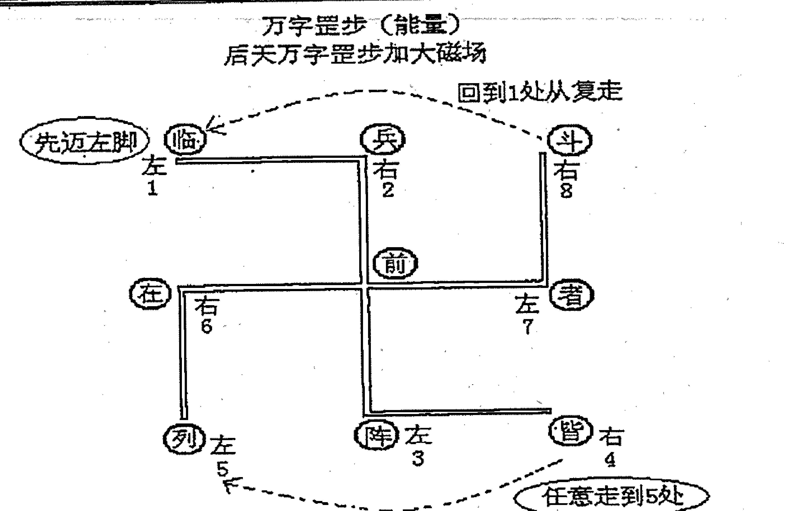

### 二、踏先天罡步——加大磁场。

适宜于运气、财运多年不好，楼房开工总出灵异之事。若是开工盖房，就在地面的中宫做。

1) 先天罡步——在客厅踏，一步一个宫位。按照 1-2-3-4-5-6-7-8 的数字排列走。如图。

另有按照先天宫位数步法来走的：一一一二一一三一四一中五一六一七一八一九。各宫写上各个原星名称，走完后烧各宫的星符。烧一张或按宫位数烧更好。

2) 客厅中宫。罡步走完后，客厅中宫烧如下符：元宝，五路财神符，万能符，天师符。此两步可单做，最好一起做。

3) 加大磁场。很多问题，老人，孩子不好都可做。亦可弄一张布画上九宫，做时放开，方便一些。

先天罡步图示：

| 辅四 | 英九 | 芮二 |
| :---: | :---: | :---: |
| 2步 | 1步 | 5步 |
| 冲三 | 中宫 | 柱七 |
| 3步 | | 6步 |
| 任八 | 蓬一 | 心六 |
| 4步 | 8步 | 7步 |

#### 三、各种罡步走法示意图

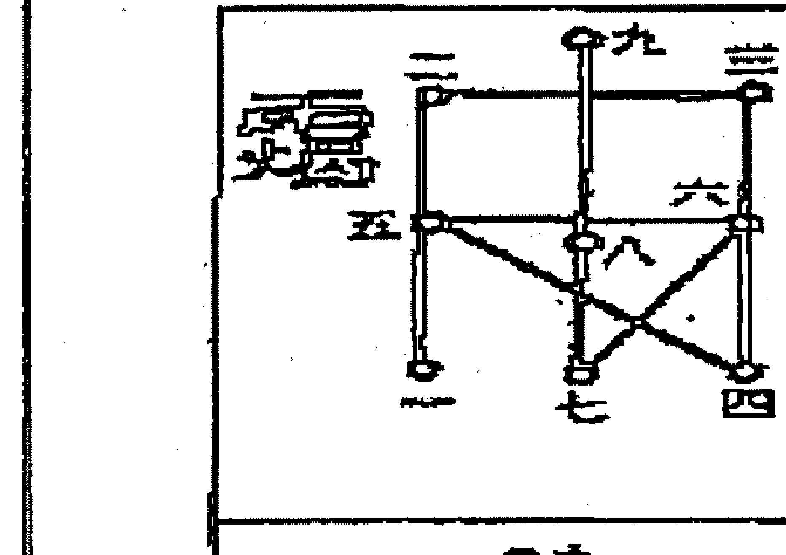

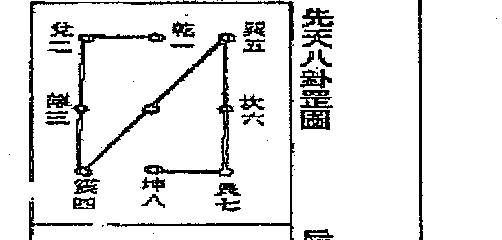

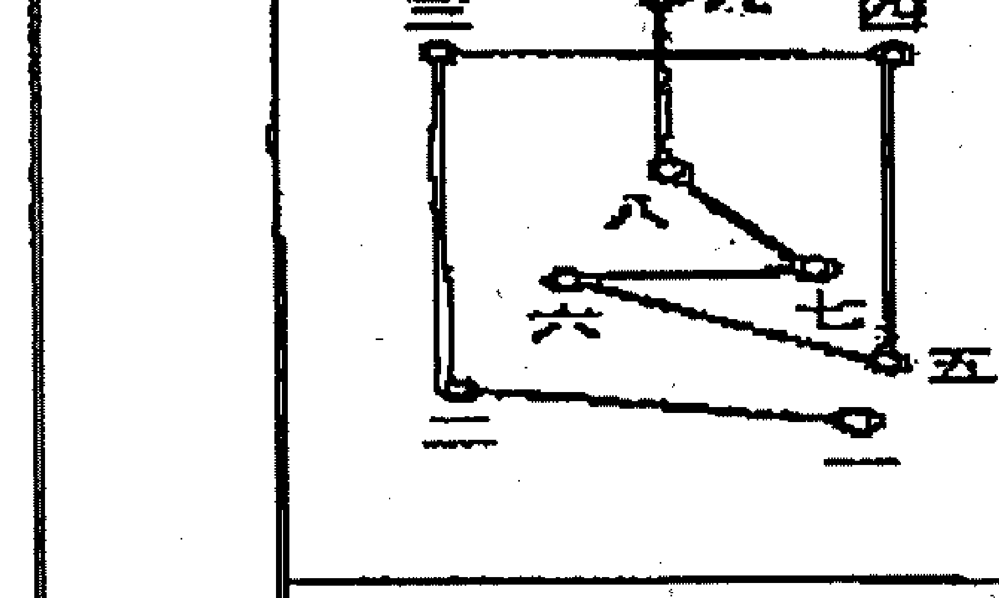

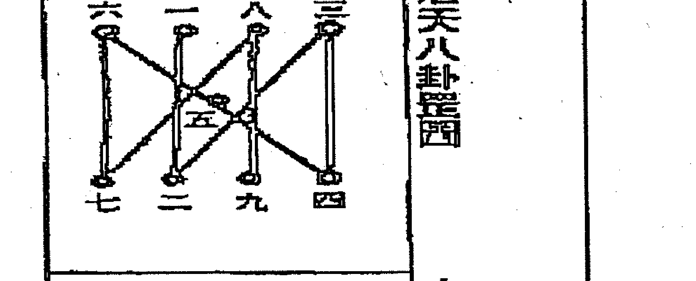

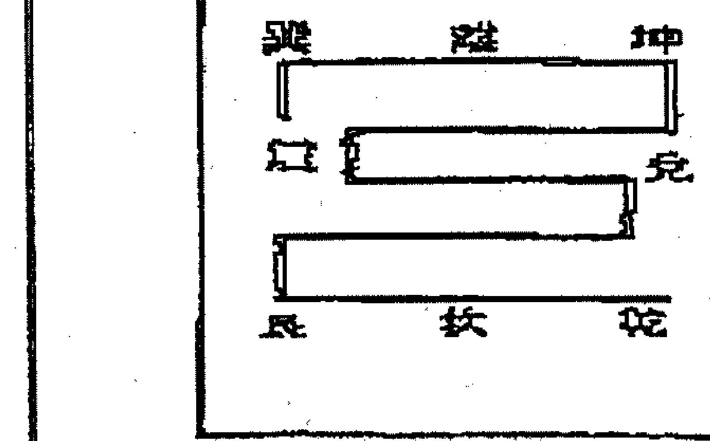

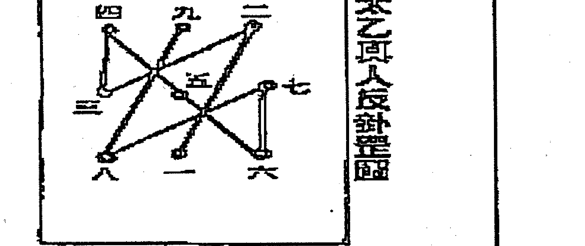

## 第十四卷 催财

### 第一节、艮宫催财法

#### 一、催财盘做法

在 A4 纸上画或打印一个先天八卦和一个后天八卦。两卦图相叠加，先天放后面，后天放前面（先基础后发展），用双面胶粘在一起，把这两个卦图放在钟表的后面，选一个合适的时间放在艮宫催财。钟表必须是圆形的，红或黄图案颜色，直径大于 33 厘米，要动，有无声音无所谓。放的时间，选冲动它的时间，未日未时挂上。艮的五行为土，故用未冲，用申不可。最好用奇门局，艮有马星的好，但不能有四害。临丁、己入墓、庚不要放。不好，就停一段时间再起局处理。

#### 二、钟表摆放论点

-   1、从风水学上来讲“吉凶皆藏于动处”，钟是动的，有转动、去旧迎新之功用，也是吉凶反覆变动的最重要媒介，所以钟的摆设还是不可马虎，需要讲究讲究的，特别是声音又响又大的钟，摆设尤需小心。现介绍一下摆放钟的注意事项：
    -   (1) 钟宜摆或挂在吉方而面对凶方，这样它能把对面的凶物挡住和转走。
    -   (2) 家里主钟只需一个，房间如需要小闹钟，一个即可。如果家中的钟太多的话，会造成屋内气场不安，令人情绪焦虑、有反复多变的烦恼。
    -   (3) 钟的形状宜方、宜圆，方圆结合最为安祥，忌三尖八角形等，因三尖八角形的钟易生口角是非，不吉。
    -   (4) 房内的钟宜小不宜大，大则会使人心神不宁，既不利睡眠，也不利学习，尤其是小孩房。
    -   (5) 钟的大小要与住宅大小相配，宅小不宜配大笨钟，以免喧宾夺主，造成声煞。
    -   (6) 钟宜摆或挂在玄空飞星之旺向位，忌退气，病符，五黄，三煞，太岁等不吉之位。
    -   (7) 至于不能走动的大落地钟，宜摆在玄空飞星之当旺山星位。

#### 2、时钟的悬挂

时钟可悬挂在房主生肖的六合位置，如生肖虎，则卦在西北位之亥方，以催动吉气。时钟也可悬挂在城门位置。《逢凶化吉》p303、《逢凶化吉》p14

-   (1) 易云：吉凶悔处咎生乎动”。时钟可悬挂于朱雀方，因朱雀方即前方，前方本属动。
-   (2) 时钟可悬挂于客厅的左方即青龙方，因为青龙方为吉方，所有客厅的左方宜放时钟。
-   (3) 时钟悬挂的方位，时钟颜色应与该部位五行颜色相一致。
-   (4) 时钟不要悬挂于玄武方，因玄武为后宜静。忌挂白虎方，虎动不吉；不宜放客厅正中，尽量不要对任何门，不宜悬挂于沙发的上方。

### 第二节、艮方治病化解法

九宫图中的五行流通从震巽宫木开始生——离火生——坤土——兑乾金——坎水。到了艮宫为土克水，阻止了五行相生的流通。艮为止由此而来。所以艮宫很关键。所有停止不动的象都与艮有关。家里艮方堵了，很不好。如艮方有下水道、门等堵了都不好。艮有问题对宫坤也不会好。女人生育也会有问题。人体的脾胃，血液、皮肤病等都是艮上有问题。凸起的病，不动了也是艮上的事。艮象还有小孩。懒、内向、不愿意动。也是种地农民的象，老实、无心机。事业停滞不前，艮象。肥胖的人，循环不好，胖，就是艮上有问题。

#### 一、艮宫清理

##### 1、艮方清理

杜一堵。庚一金属、刀、抢、石头等。己一垃圾、花盆等。丁——灯不亮等。

##### 2、艮方通关法

一些大病，不要轻易起局。先考虑把东北方空出来。用一个盆，放 2/3 的水，用一个铜金属的鸡（酉）放在里面。原理：土生金，金生水。水的作用还在耗土。如放花，则木克土，相克易引起矛盾。选一个未日未时放上鸡。病人是卯年生，放鸡冲卯不可，大病怕冲，刑克没问题。

#### 二、艮方万能符化解法

1、烧化解符法之一。即万能符，又叫化解符（消炎药）画法：草写“敕令”。符外 4 个圈，右上圈写“五湖”，右下圈写“水令”，左上圈写“四海”，左下，写“法令”。符内：上写“斩”、下写“丰”。二字的写法现传用变写法，即上面的斩字左边“车”偏旁改为“丰”字写法，右偏旁“斤”不变，下边的丰字写法不变，但下面的字也有写成“斗”的。（符图见后——奇门常用符）晚上 2100 时（亥时）后在艮方烧 8 道万能符（至少烧 5 道）。并加烧心经一张（心经最好打印在 A4 黄色纸上）。
2、烧化解符法之二。烧万能符+五路财神符+乙奇（在外环境烧，屋外），外面不适合在屋内烧也可以。此为化解磁场，艮为局的磁场，适于不起局或不敢起局的情况下用，任何人都可做。远点无所谓。时间：坤艮宫时日。此法企业或个人催财都适宜。
3、万能符亦可解四害。如意识修炼的好，画符能量大，可在四害宫烧万能符来化解四害。

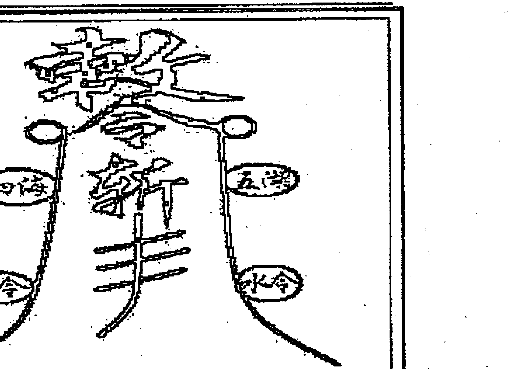

#### 三、奇门艾灸

象意治病——丁辛——灸的象。

-   1）补阳气。
-   2）治疗大病。
-   3）保健、除湿气。

### 第三节、罗盘催财

主要用于专门催财。不用起局，选日子即可。八字财运不好可用此法催之。

#### 一、准备

开光可在神图坛上，可开多个。如6个、8个都可。用红色的罗盘，大一点。（一般7—9寸，30公分以上为宜）。罗盘中间放香炉，四个角放油灯。

#### 二、罗盘上画符（重要）

备高度酒、朱砂、狼毫笔在罗盘上画符。见下图。位置：在罗盘的子午两个位置（第一层）画子位符和午位符。符头朝外。符：三勾，敕令。午位符内由上到下写“神月到驻罡”。月字内上面为一点，下为一横。会意，“二月”。子位符内由上到下写“星精到驻罡”。

#### 三、烧香三天

由开光当天的午时开始开光布坛。意念：通神，神我合一（把自己观想透明体，神才能进来）。燃油灯，三天（72小时）内不能熄灭。注意补充燃油。当日午时开始上香三次，每次三支香，共烧9支。烧完一组剩一点时再接上一组，烧完三组后本时辰上香结束。到晚上的子时（当日2300时始），按照午时的上香程序再上香三次，每次三支。之后，第二天，第三天的子午两个时辰各按照上面方法。

#### 四、催财布置

罗盘开光完毕后，开始布局催财。

##### 1）画五路财神符

朱砂（适当倒点红墨水）高度酒、狼毫、黄表纸。符：三勾，敕令。内由上到下写“五路财神到罡”两旁再左写“大吉”，右写“大利”。或左写“日进”，右写“斗金”。均可。符画好后，要折叠成三角形。把符放在罗盘上压在禄位，三角尖朝里正对禄哪个字（如乙禄在卯，符三角尖正压第一层地盘卯字线上）。符里最好包着催财人的信息（十个指甲，头发几根）。

#### 2）放盘时间——飞星入斗选时间。（以日柱或年柱择日）

一般以日柱为主。如日干为乙酉9金，就找4金或9金的日、时、刻（生比日或年柱五行的时间，金五行只有比没有土生）。如丁酉日4，丙午时4，己丑刻9。年月可忽略不计（能生比更好）。如不知日干可按年干五行择日同理。
搬家、结婚、出行可采用飞星入斗法择日。

#### 3）以客厅为太极点，把在禄位放上财神符的罗盘放在宅内禄位宫。首选日干禄位，不知八字的选年干禄位。如乙干，罗盘放在东方的震宫正卯位（见下图。）。符叠成三角后放乙禄位，尖头对准卯线，朝里。

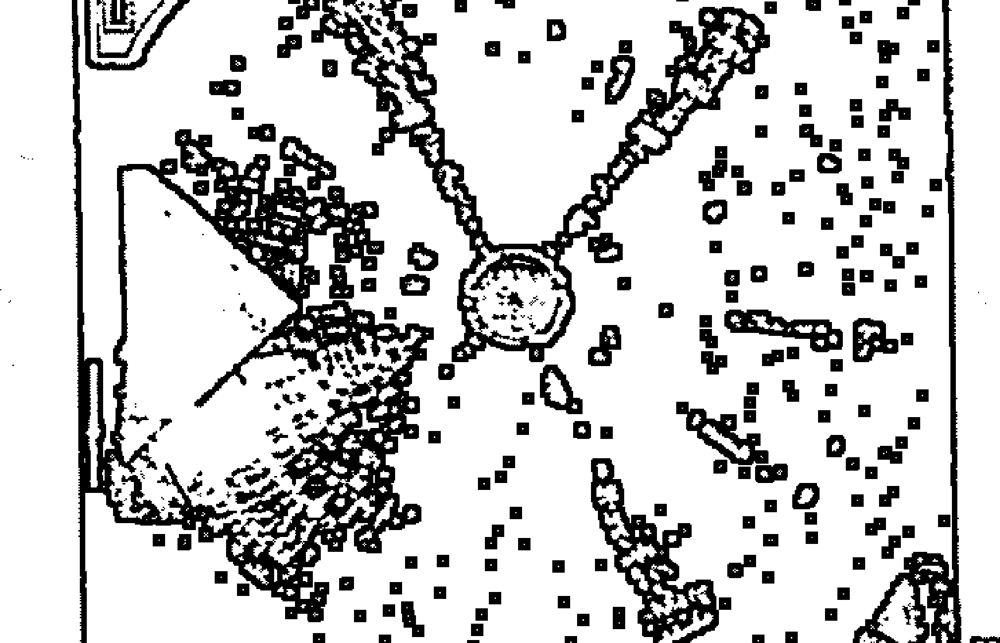

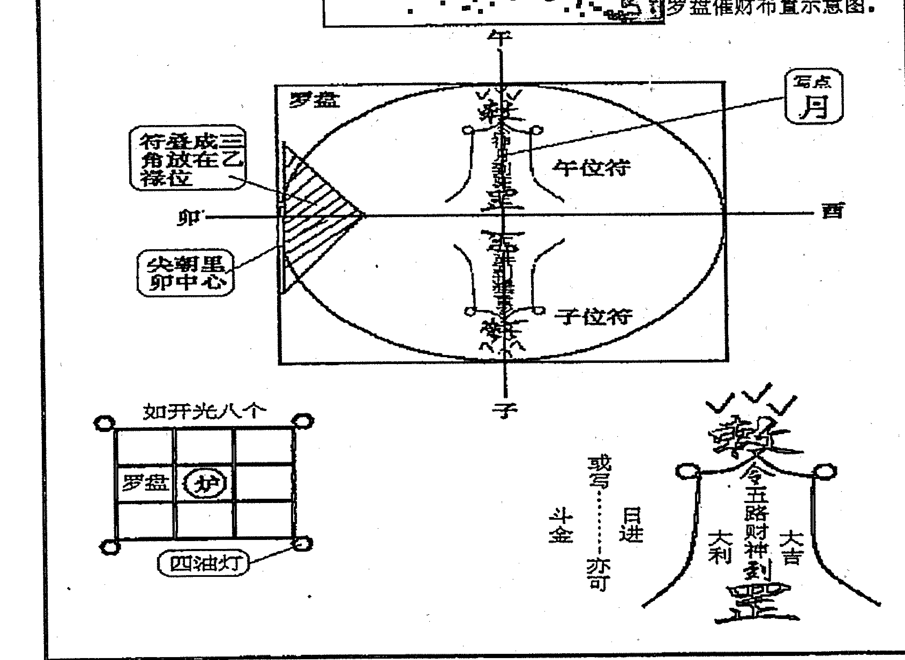

### 五、罗盘催吉说明

- 催官、催财都放在禄位。但若此人八字显示有官灾、破财的信息，则不宜催，会起反作用。
- 罗盘放在日干或年干的食神方，能克制七杀（官灾、小人）。
- 罗盘放在沐浴桃花位，可催桃花。适宜未有配偶者。
- 戊己土的禄位在南方，同丙丁火。

### 六、罗盘的其它功用

罗盘不仅用来定向定位，还有其它重要作用：

- 安神：把罗盘放在厚的枕头下，能起到镇宅、辟邪、安神的作用，让你睡眠好，放心不会压坏它的。但要用荞麦皮的枕头放罗盘才管用，像布艺、亚麻、棉的枕头，效果就不好。老用荞麦皮枕头枕着罗盘睡的人，思维境界特别高。可以用小一些的罗盘，三寸左右的就行，不用大的。
- 催桃花：把罗盘竖着拿，让水平仪的油跑到上边，在十五、十六月圆之夜，拿着它朝向满月，倾斜成 30 度夹角，心想“吉利”二字，跟月亮说：“情缘情缘请速来。”不久，情缘就找你来了。这是最大的催桃花工具，是“日月合一”的意思，罗盘为日、满月为月，但必须是满月，取圆缘合位、日月同辉之意，如果是上弦月，催出来的多是脾气暴躁的人，下弦月催出的是消沉的人。罗盘有很多的辟邪、催桃花、催财的功效，只是一般人不会用罢了。
- 增加财运：一只手托着罗盘，放到胸、腹部的高度，手一边慢慢的转动，一边慢慢抬高到脖子的高度，从下往上过渡，反复的做这个动作，这是增加财运的，叫做“腰缠万贯”。一只手做完了，再换另一只手，也是同样的动作。任何时间都可以做，天天如此的这样转，就特别好。但要保证把十字天心线必须调到子午卯酉四正位，这个财才正，如果偏一点就成了偏财，如果调到了乾坤艮巽（四维），就是横财、爆财，比如做股票、期货的，但这种财催出来就必须得做善事。
- “打盘”增运：一只手握住罗盘的角，另一只手从旁边进入，敲打罗盘的底部，打底，这是增运之意，但别太使劲。我以前天天都这么做，一边读唐诗宋词一边敲盘，每天五分钟，都可以帮助增运。
- “阴阳转盘”：拿着罗盘顺时针转，内盘不动，转外盘，倒起来，是帮你去掉晦气，顺时去晦，利解决麻烦，尽量在家里的正中央去做，那的气场最硬。
- 踩盘：把它当成体重计，放在地上，光着脚上去踩。踩盘的目的是防止你在路途中遇到劫匪抢劫，“踩”通“采”，盘里的福气都给了你，采盘中的精华之气，防止踏入歧途、遭遇灾祸麻烦。但不能一家人都踩，而是谁用这盘谁去踩，别人踩就对它不敬了。而且不能轻易的踩，要时间长一些你跟它混熟了，它才愿意让你踩。
- 抱盘：罗盘还可以像抱书本一样抱着，让天池放到膻中穴的位置（在体前正中线，两乳头连线之中点），这是防止心脏病、血液病，利于健康。
- “好日当头”：不用时，罗盘放的位置也有用，放得太高、太低都不好，我一般建议竖着把它放在两个木柜中间的夹缝处，上面用红的套壳一盖，代表“好日当头”，永远有好的日子，一定要露出红色来，如果藏着就不利于好日子出头。可以放在客厅、书房，别放到卧室。

这是罗盘的一些功能。另外，罗盘有一层是 64 卦，找到“午”所指的乾为天、天风姤这两卦，从这里开始一圈一圈的读，每天都读，可以增加记忆力。

## 七、罗盘催财例：

公历:2014年6月24日8时4分
农历:2014年五月廿七日
四柱: 庚午 丙戌 壬辰 丙午
节气: 夏至 - 小暑 阴遁6局
值符:天芮星落8宫 值使:死门落9宫
时空亡:甲辰旬 寅卯空 马星 申

|  | 丙 | 马 |
| :--- | :--- | :--- |
| 坤 (戊庚) | 兑 (癸丁) | 乾 (丙壬己) |
| (天乙辛) | (玄死) | (白惊) |
| 离 (乙辛) | 坎 (戊庚) | 艮 (壬己丙) |
| (地杜) | (符伤) | (蛇英) |
|  | 壬己 | 辛 |
| 巽 (壬己丙) | 震 (丁癸) | 巽 (庚戊) |
| (符芮) | (蛇英) | (阴辅休) |
| 癸 | 丁 | 丁 |
| 戊 | 戊 | 丁 |

男人面测。壬为用。艮宫符，为事业而来，伤脑筋。时干丙代表顾客（发展平台），又为壬的财。符号多，杂乱。理不出头绪来。反吟，反反复复。开了个店，无客源。芮，化妆品。质量不好（伤门迫不好）。符价高。为质量不好价又高。丙√。壬×。要改变品牌，变成开门。减弱水，加丙。策划做一个免费体验（+丁，丁动起来就是不入墓了）。印卡，写凭卡可免费美容。减少水加上火，把面膜搓热了或放温水里温一下。
处理：找平衡点。四纲都害，看四支，艮为平衡点。处理艮坤2宫，缩小太极。坤上有床（己），有马星（天天睡觉起床即是），把坤作为太极，看床上在哪，若在偏西南方，往北移一下即可。艮方厨房，管道修好就可以了。

# 罗盘催财:

本人的日干为辛金（年干也可），禄位在酉上，兑宫无害，有辛可置换（罗盘即为辛）。在酉上放一个开了光的罗盘。（具体见以上罗盘开光催财）。

### 第四节、五路财神催财

## 一、五路财神催财的条件:

1、有奇门局。
2、戊宫须无四害，但空无可以，好。
3、较适合落魄很厉害的人。通常情况也可修。
4、方位: 戊宫方。如此局为西南方。五路财神符画在红纸（黑字）或黄纸（红字）上，把这个符折叠成箭头状的牌位，可用两根筷子两边支起。

#### 二、修炼

1、 戌日戌时开始修炼 9-12 天（戌代表乾金的意思）。所有的局的方位各有不同，但修炼的日子须都在戌日戌时开始。修炼时要对着牌位 9 拜，表达心意。
2、 观想财神。念咒，每天修炼时念 108 遍。咒：南无（摩）三满多，母驮南，唵，度鲁度鲁地尾，梭哈。（放录音、歌不可）。
3、 修完天数后，符就放哪即可。催财的数量不得超过正常的 9 倍。超过会有因果的（一般根据自己往年正常的财平均数估算一下即可）。

## 第十五卷 符咒

### 符的功能分类

- 一、小儿用符：有小儿关煞符、小儿夜啼符、小儿夜遗尿符、小儿犯新娘杀符、冲犯符，天师收惊符……等等。
- 二、和合符：和合洗符，相催向符，修脚符，和合符，合心情符，变合符，男女和合符，良缘符，情通符……等。
- 三、治病用符：大吉符，治腹痛，目痛符，狗咬符，治虐符，五灵治病符，金力气符，除寒热符……等等。
- 四、孕妇用符：插花换斗符，难产符，胎死腹中符，安胎符，……等等。
- 五、六畜用符：六畜平安符，治瘟符……等等。
- 六、财利符：财神符，福运符，繁荣符……等等。
- 七、其他用符：镇宅用符，化骨用符，吉利用符，丧葬用符，婚日用符，开工、动土用符，精神符，调兵符，收兵符，替身符，风水用符，修炼用符，斗法用符……等等。

### 符的用法

- 一、带身符：置于所需用者身上，用以保平安，避邪，祈福。
- 二、化食符：将符令烧化于水中，后饮用，或擦洗全身。
- 三、贴用符：将符令贴于门上，或床下，或屋梁上……等等。
- 四、放水符：将符令放于水中流走。
- 五、洗符：将符令化于水盆中，以洗患部，或身体等。
- 六、煎药符：配合中药外方，一起煎者食用。
- 七、埋符：将符令埋厌处或动土处等。

### 画符

一、画符的状态、时间、地点、步骤、敕符、加印。

### 画符的步骤

- 一、焚香咒（道由心学 心假香传 香蒸玉炉 心存帝前 真灵下盼 仙旌临轩 今臣关告 径达九天、所启所愿，咸赐如言）
- 二、敕水咒（天一生水，地六成之；一六即成，五行乃基；吾今喷荡，移逐尘飞，乾元亨利贞，急急如律令）
- 三、咒纸文（褚玉之英，天地生成，龙章凤篆，资之以陈，符飞迅速，遍历灵天）
- 四、咒笔文（神笔扬扬，万古传芳，吾今书篆，飞招千方，云兴飓驭，速降灵场）
- 五、咒墨文（神墨灵灵，通幽达冥，松君效职，兰友凝馨，仙真降格，速驾云乘）

### 画符疏文

（ ）年（ ）月（ ）日、时奉道茅山弟子（ ）道师，瑾以真诚直心祈求、轩辕老祖、太上老君、茅山祖师爷、纯阳仙师、张府天师、瑶池圣母、三山九侯、六丁六甲列为神尊师、敕符、与善男、信女（）人（）年（）月（）日，祈求神恩降临、下笔有神、弟子以至诚之心。匍匐上禀。

### 敕符

> 乾元阴复，玄远无偏，造化发育，万物资焉，东南西北，任意安然，云行雨施，变化莫测，吾奉三茅真君急急如律令。

### 练习画符

步斗符

通心符

符头

三清符头

三将军符头

三台星君符头

日月符头

敕令

符胆

符脚

印

### 画符的阶段

初学时：依葫芦画瓢，画出符的形状。

中级阶段：用红色或者黑色的记号笔，在黄纸上画符，加上法印。

高级阶段：按照我前面说的步骤：焚香、敕水、敕纸、敕笔、敕墨、下笔、敕符。

### 道教咒语——六甲神咒

上清上帝，东华大帝君，令吾受六甲天书，并使六甲六丁之神、天游十二溪女、那延溪女，五人统摄神兵，三员大将，火光大将，浮海大将，吼风大将，此等众圣，各领神兵百万垓，助吾法力，神通千变万化，永得遵吾，六甲神印，立在坛前，令吾七政九宫保佑尔身，使之从吾，上朝元君，与道合真，和形炼魂，策空驾浮，升天摄云。急急如律令。

### 消灾吉祥神咒

曩谟三满哆。母驮喃。阿钵啰底。贺多舍。娑曩喃。怛侄他。唵。佉佉。佉呬。佉呬。吽吽。入嚩啰。入嚩啰。钵啰入嚩啰。钵啰入嚩啰。底瑟姹。底瑟姹。瑟致哩。瑟致哩。娑癹吒。娑癹吒。扇底迦。室哩曳。娑嚩诃！
nā mó sān mǎn duō. mǔ tuó nán. ē bō là dǐ. hè duō shě. suō láng nán. dá zhí tuō. an. qié qié. qié xì. qié xì. hōng hōng. rù wā là. rù wā là. bō là rù wā là. bō là rù wā là. dǐ sè chà. dǐ sè chà. sè zhì lǐ. sè zhì lǐ. suō pō zhà. suō pō zhà. shàn dǐ jiā. shì lǐ yī. suō pó hē。
拿摩三满多，母陀难，阿波啦底，贺多舍，所曩南，达至脱，唵，戒戒，戒西，戒西，哄哄，入哇啦，入哇啦，波啦入哇啦，波啦入哇啦，底色吒，底色吒，色至里，色至里，缩泼炸，缩泼炸，扇底加，室里以，所哇诃

### 手印（1）

符体结构详解

### 法器

1. 叩齿
2. 掐诀

### 实战操作

> 踏罡步斗咒
斗要妙兮十二神 承光明兮威武陈 气仿佛兮如浮云
七变动兮上应天 知变化兮有吉凶 入斗宿兮过天关
合律吕兮治甲荣 履天英兮度天任 清冷渊兮可陵况
枝天柱兮拥天心 从此度兮登天禽 倚天辅兮望天冲
入天芮兮出天蓬 斗道咏兮刚柔际 天福禄兮流后世
出冥明兮千万岁 急急如律令

视、听、嗅、味、触、脑——六识、六根、六尘

眼、耳、鼻、舌、身、意——六根

### 圆光术

查事功能

- 治病功能
- 驱邪功能
- 开光功能
- 通灵功能
- 惩恶功能
- 寻师功能

### 圆光术咒语1

请土地咒：“本宅土地神之最灵，通天入地，出幽入冥，为我传奏不得留停，有功之日，明书上请”。

起师咒：分天黑地，海水茫茫，何人到此，鲁班到此，何人发令，鲁班发令，何人出兵，鲁班出兵，鲁班先师问我，弟子姓和名，天上差来黑山神，山神天断，地神地断，邪妖鬼神，我师断，法尺在手，鲁班先师命我到坛前，头带紫金帽，身穿黄金锁……

圆光咒：开光现象，光显灵，天之精光明，地之精光现，日之 阳光平，月之华光闪，上帝威光大，祖师神光亮，二十八宿星光，雷神火光，九华毫光，金光速现，金光速速到坛……

### 圆光术2

七星咒：一步天光用，二步地光现，三步人光亮，四步神 灵，五步五行光北日聚，六步南斗灿烂，七步北斗光圆圆。

催光咒：匆匆阳阳，光明即通，见光有光，天有象，有 五星之精光，光要金光速现，急急到坛，………

藏魂咒：“弟子起光藏三魂七魄归在我师香火之中，满屋长中全家

### 圆光术练习方法（1）

- 一、前世累积传承的缘分。
- 二、报恩关系，善缘。
- 三、报怨关系，恶缘。

启灵咒：师爷叫得声喊声得灵，快把千二百盏灯打开灵。青天净水洒三千，性功八德利人天，列位神君恭请速至，上守天庭下护我身，助我功德一身，德行万事通灵，吾奉南天功德主急急如律令！

### 圆光书咒

天皇敕日演法真，九天五色祥云降，
金光皎洁乾坤照，万神奉召赴龙华，
降坛全依铁口断，不得隐形说虚言，
天皇仙神三七字，圆满呈光地下书。
吾奏昊天上帝元神降光急急律令。

- 一、前世累积传承的缘分。
- 二、报恩关系，善缘。
- 三、报怨关系，恶缘。

### 开印疏文

（）年（）月（）                日—（）时 茅山弟子（）
以至诚之心祈求轩辕老祖，太山老君、三茅真君、纯阳祖师、张府天师、瑶池圣母、三山九侯、六丁六甲、列位神仙、请祖师爷派茅山兵马，任我调遣、然后写上（）人（）年（）月（）（）时。然后不要摇铃，心里呼喊三茅祖师爷，然后眼睛看着三茅山主帅爷。然后进行三拜九叩礼仪。把开印符上面，写上你的窥名，然后烧掉。

### 一、常用符

- 万能符（化解符），五路财神符，三奇符，生门符，开门符，天蓬符，天心符，天辅符、天师符、天师治病符、护身符、五路财神符、地支符等。各符画法见后。

1.  星星可解四害。如，巽宫有蓬临四害，不知他法处理。可用蓬星符在此宫烧之处理。则四害解之。为何？答：贴的能量要比烧的能量大，加大能量要贴，除四害烧。如巽宫无四害，如戊丁蓬生，可直接贴个蓬星符，此宫加大了能量，再贴个生门，丁奇都可。若该宫临死门，就不能用死门符。若此宫是芮生，就贴生门符，若芮死，就贴丁奇符。若乙戊，冲生。要财运好，就弄个马（乙戊冲）。最简单的法，在四害宫烧万能符。但只能解一段时间。但要烧不能贴，万能符只能烧不能贴。生开门等符可以贴。有的人处理局专门用万能符烧，也很好。
2.  如无布局物品，可画星符奇在宫位布局。如艮，壬癸心开，可画天心、开门贴在艮宫位。如有三奇，亦可加画三奇符都贴上也可以，其它象意可忽略。把三个符画在一张纸上贴上即可。三奇符方便画法——三勾，赦令，某奇到罡。在不会布局的情况下，若本命星在值符宫，则可用本命星（蓬辅心之一）去解局中四害。这个局也可以是自己的局也可以是别人的局，仅限蓬辅心三星且为值符宫方可。其它星不可。把三星画出，在四害宫里烧即可。因值符力大，是局的总导思想。例：兑宫，符乙戊辅惊。画天辅符即可。
3.  地支符
    1)  用于解门破、击刑。八门或天干在相关宫位有刑破时，可用地支符解。
    2)  合住原宫地支。原宫地支是隐藏的作用力更大。一般适用于，他想离开，不想让他离开（婚上）。针对感情，其它不适合。隐藏的意为原宫地支，如震宫永远隐藏着伤门。但不如奇门串六爻效果好。

### 二、画符与修炼

修符一般在家中的离宫练习为宜。因离代表符。

### 1、备料：

朱砂、狼毫笔、高度酒等。一般练习用红墨水+朱砂+高度酒。天师图像。香炉，香，黄裱纸等。一般少用黄 A4 等纸，因纸厚有碍符的能量发挥。

### 2、画符修炼，建立共同符号。

- 画符训练一般至少连续画九天时间为一个周期。14 年甲午，离宫值符。正好在离宫练习画符。每天午时画最好。晚上子时不要画。乾宫时（1900—2100）可以画。
- 画符准备：坛图前摆好香炉，烧三柱香（九柱更好），供奉天师等。意念通神、通体天师，想象天师的样子与我同体。一次每种符画一、三、六、九张。连续练习 9 天以上最好。各符可在中宫盖明咒印。
- 练习所画的符处理。9 天后晚上亥时，到一个正南方找一个丁或十字路口（丁象），加元宝（戊）、香（丁）一起把符烧掉。取象：丁戊+符，同时做了行为风水。作用：天师共振；加强定力；增加了如下象意：名气（符），思维意识都有，财富（戊丁）。

#### 3、万能符（化解符、消炎药）（详见艮方万能符化解部分）

画法：常规草写“敕令”，符外 4 个圈，右上圈写“五湖”，右下圈写“水令”；左上圈写“四海”，左下圈写“法令”。符内上写“斩”、下写“丰”。二字的写法周传承为变写法。即下边的丰不变，上面的斩字左边“车”偏旁改为“丰”字写法。下面字也有写“斗”的。万能符亦可解四害。如修炼的好，画符能量大，可在四害宫烧万能符来化解四害。万能符只能烧不能贴。因符放哪里要积聚能量的，时间长了不一定好。

### 三、注意事项

1.  关于贴符与烧符的问题。贴符的力量大于烧符，时效也长。但有时不具备贴的条件，如坤宫不能贴，明显让人看到的地方不宜贴等。这种情况只能烧。万能符只能烧不能贴。

2、开业用开门或生门符，但巳卯日时开门为门破尽量避开。生门可用。生门：病、生孩子用生门符，但不能在坎宫时间用。

3、宫象画符可画在一张纸上。
如：巽符戊丁蓬死。把死门变生门，就会发生一些事。

| 五路财神符 | 天蓬符 |
| :--- | :--- |
| 丁奇符 | 生门符 |

若怕事情败露，开门换杜门。方法同上。

4、其它：
1）、《神奇符咒》P41：画符心诀：画符忌破日，刑日，否则不仅不灵且本人有灾。画符时辰为：亥子午卯酉。画符要请神念咒（画符咒、净身、心、口、安神等咒 p37）。
画符咒：天园地方，律令九章， 吾今下笔，万鬼灭藏，急急如律令。
2）、被人下咒之后的破咒术（茅屋君子）
男左手心贴在中丹田上，右手心贴在左手掌背上，男左女右，站在地上默念咒语，天道毕，三五成，日月俱，乾坤明，气即道，环吾身，通神灵，显神威，我去昌，彼遭殃。（7 遍）
咒念完吐一口吐沫在前面踩 3 遍，男左女右，对方任何咒术可失灵。

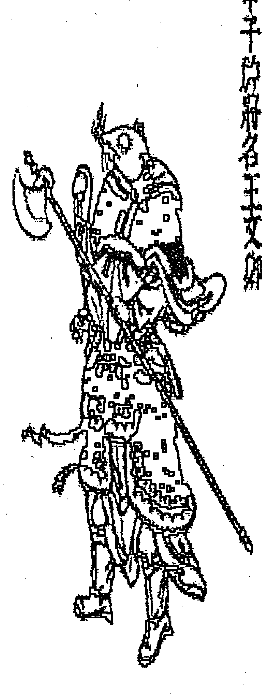
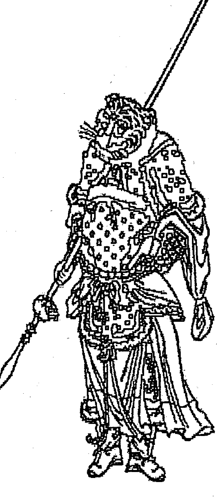

六甲神兵画像

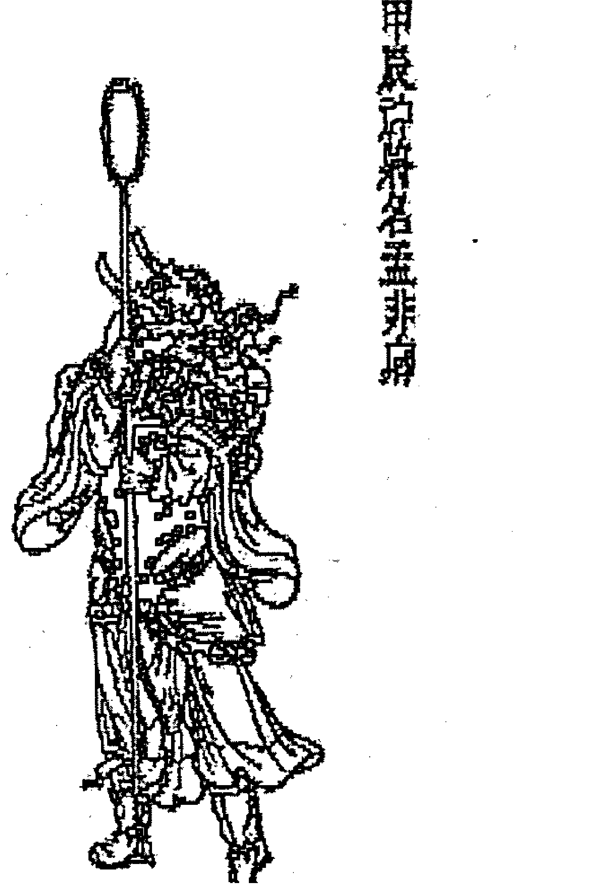
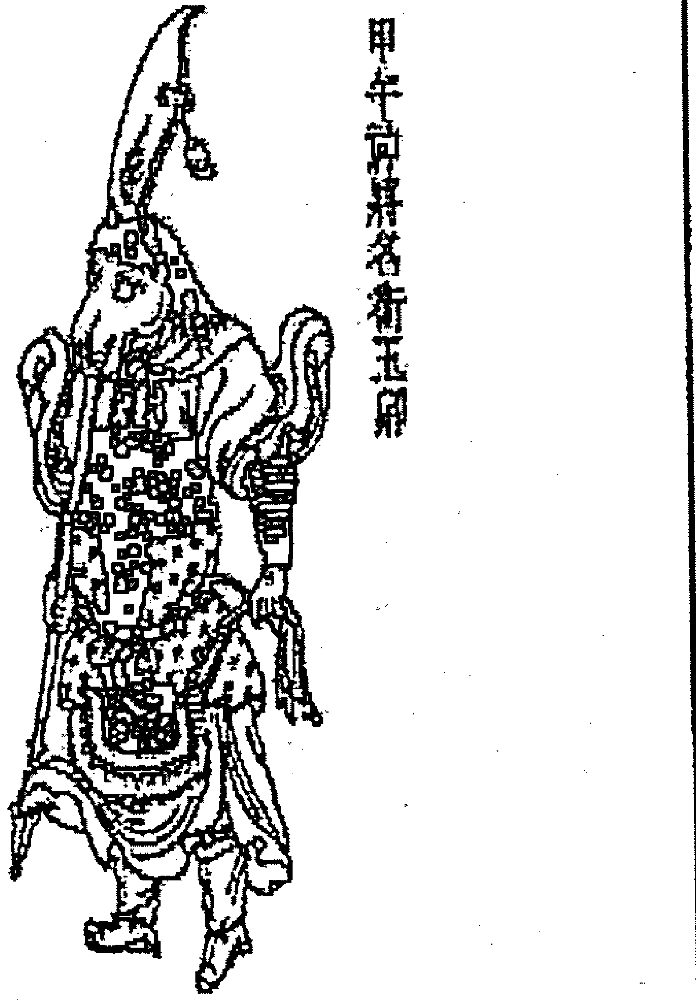
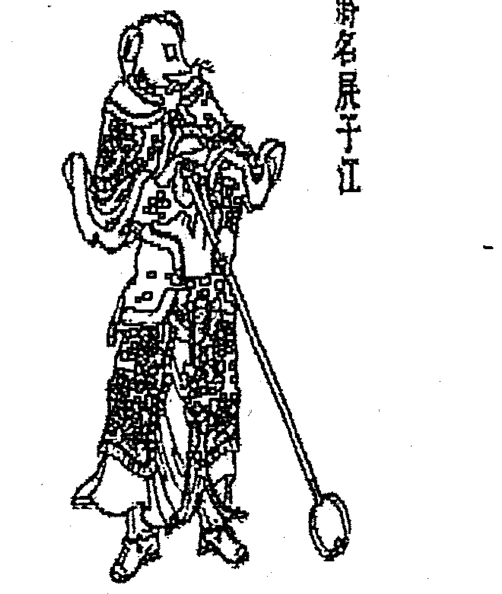


### 奇门常用符


### 奇门常用符


### 奇门常用符
2014年12月25日

| 天师加持符 | 诸神符之一 | 死宫象意壬 |
| :--- | :--- | :--- |
| 三奇简易法 | 天师能量符(花符) | 天师治病符(邪病) |
| [手绘符咒] | [手绘符咒-财源] | [手绘符咒] |
| | 阴盘能量符之二 | |

天师加持符


诸神符之一


死宫象意壬


三奇简易法


天师能量符(花符)


天师治病符(邪病)


阴盘能量符之二


### 奇门常用符（15年3月18日班）


- 1. 符咒一般放到屋外。
- 2. 若大病，(1),(2) 符咒配合起来效果，放水望地可减轻痛苦。

### 2015.3.21 常用符

| 敕文推算符 (1) | 敕未财符 (2) | 天天报时符 (3) 急急如律令 |
| :--- | :--- | :--- |
| 平安符 | 调兵符 | 小人符 |
| 大病 (1) | 大病 (2) | 若大病，(1)(2)配合起来烧掉，放水里喝或剪掉脚。 |
| 五鬼财神符 | 星符画法 | 请神符画法 |

烧符一般在屋外烧。

护身符:

求财符:


### 招财符 (3)——最快
(1) (2) 符放钱包或东北方烧均可。
调官符，起局符宫要好，不起局亦可带身上。


### 大病 (1)


### 大病 (2)


若大病，(1) (2) 配合起来烧掉，防水里喝可减轻痛苦。

小人符，起局后在小人宫位烧掉。


宫里能量弱，画符贴到巽宫（伏吟局提示你要贴，两个东西沾在一起，要两份）。一个贴上，一个烧掉。隐干癸到离，有景门，告诉你要烧一下。
辅表示贴，离景表示烧


隐干癸就不要了，因为癸代表助力困难。
上王字与大横连在一起


4、常用符：
1）三奇符
乙奇


丙奇


丁奇


### 星符
五真人妙正

| 天蓬符 | 天任符 | 天心符 |
| :---: | :---: | :---: |
| (符咒图像) | (符咒图像) | (符咒图像) |
| **天英符** | **天芮符** | **天柱符** |
| (符咒图像) | (符咒图像) | (符咒图像) |
| **天冲符** | **天杜符** | **天禽符** |
| (符咒图像) | (符咒图像) | (符咒图像) |

### 八门符

### 玉女巡人咒证

| 符号 | 符号 | 符号 |
| :--- | :--- | :--- |
| 开 | 休 | 生 |
| 符号 | 符号 | 符号 |

### 玉真道人正法


死
惊


六仪咒诀 (掐诀是大母指点住12地支)
戊仪 乙子坎宫罡，用奇之法，运肘如风，现肘如空，不可久持。

### 六甲符
甲子


甲戌


甲申


甲午


甲辰


甲寅


戊仪：存想戊仪形象，取剑向空中催符一道，掐甲子戊诀，念甲子戊咒：主劫耗炁，黄镇将军，禀炁发赤，鼠道人身。副将文通，赤面长身，领守北极。统摄兵。借山缩地，走石扬尘，天师敕旨，速来队伍，听令施行。急急如律令。念毕开目存想。再催符二道，念咒，存想黄镇领兵降临左右，取耳中左手、右手诀剑，喝曰：以后随叫随到，火速现形，听令施行。若然不召，立下留退，誓且退去。若申听令。放甲剑台上，弃尔退去。

#### 六仪符


已仪：重质将军，人面蛇身，文八蛇牙，口吐红雾。口中剑石，变化红霧。刚将丁五名太常持枪摇铃。统兵万万，虎豹如林，飞虹奔河。披沙走石，天师查覆，召你临我，听令施行。急急如律令。再念咒。勿得退避。还现真形。相立白朗。令到无违。急急。

以左手食指，无名指，小指，三指紧握；俱插中心横纹，以中指掐大指上节横纹，却以大指压覆中指，紧掐之。

### 辛仪：
甲午之神，萧烈将军，眉清粉面，铠甲浑银。奇鹊跨马，喜作诗吟，丁酉为副名倾伟朱冠德仁，领兵万万，步雨兴云，弥漫日月，搬运金银，逢敌丧胆，鬼逢亡魂。天师密旨速召降临，，，，，，，


### 壬仪：
甲辰之神，菡涤将军，首领天下，拱卫北辰。巍峨罗刹，钟馗后尘。金戟环甲，乌龙奔云。副将丁未名飞遁率兵万万，抓雾拿云。沉山作海，鬼哭神惊凭空使魔，晦气皆无。天师密旨，速降来临。急急如天师律令！

##### 王仪


### 6.癸仪：
甲寅之神，黑豹将军，面如黑铁，红甲乌靴。手持钢鞭，声吼如雷。副将狰如，獠牙赤发，亿万天兵，如猪如熊，隐伏潜行，临锋速发，呼啸山风，山摇木拔。天师密旨，召你速来，听吾速发………


癸仪：


小指
食指比小指
大指比食指
中指比食。

5、12 地支符

#### 十二地支


## 其它（民间）符咒：
##### 1、治病万能符

**适应症：** 诸病皆宜。如符名。

**用法：**
- 1. 用剑指书符于水中或意念书符发往患者病患处。
- 2. 写此符的顺序：横、横、横；竖、撇、捺，再写左边的点提勾，最后写右边的对勾。
- 3. 注意三横是一个比一个长些。
- 4. 忌用剑指在病人身上划此符。


注意事项：恭敬态请符

## 第十六卷 山向奇门
### 山向诀

> 山向奇门始轩辕，钦天管辖 500 年。
后流道家寒机子，多代口传存世间。
山向奇门探真元，可查坤地与乾天，
扭转乾坤据于此，无中生有此法前，
山为人元命之基，向为养命之财源。
内姓根气山上寻，外姓反用财归山。
内事皆从山上起，外财常由向上发。
内外之用颠倒颠，不明机理莫往前。

山向在风水中、占有很要的地位。它是一个能量隧道，人在这个场中受其影响。用玄空可调出旺山旺向，但这旺山旺向益何人不益何人，用山向奇门可以看的很清楚。还可以根据每个人的愿景来改变山向实现愿望，这就是山向奇门布局改山移向不用动一砖一瓦，只用一根钢丝结合人的尺骨线拉在门口，来形成对人磁场的磁力切割，从而改变人的命运。还可以把外公的坟为我所用，也可把阴阳宅的能量. 调到一个人身上尽快达到目的。世面上公开的山向奇门为何用起来不灵验，更有的花两万元学来的却用起来光出事这都是传的不全害的人。山向局年月日时卦不能与山向刑、反卦、八败等，要飞星入斗应天象. 如不应天象则应人象物象，会害人损物不吉不利. 所以在布局时要多加斟酌，考虑周全. 在我多年布局中，山向结合玄空或八宅再结合飞星入斗日课更会完美无比. 所以山向被称为风水之王是不为过的。道德经曰；一生二，二生三，三生万物. 凡事以三而立. 奇门也分三个层次：天气奇门、地气奇门、神气奇门. 天气奇门以天时起局，地气奇门以山向起局，神气奇门以宇宙略能量为宗旨，踏是布斗、念咒掐诀设局，就是法术奇门。山向奇门就是调理地气的奇门，何为地气？就是地脉。地层的脉气决定了阴阳宅的旺衰。也就是把山向的磁场与地脉的磁场相同，市面上寻龙的书林林总总。但真正能找到龙穴的能有几人？从祖山到少祖山又找到太极晕。以为是是真龙穴，共不知龙脉断了几断，能量几乎不存在。但那真龙穴又是一把双刃剑，能量之大，可以发达也可以杀人。对谁好对谁不好，怎样去定，这对我们风水师来说是必须掌握的，山向就是坐山的方向。方向是发展之路，做人也要有方向，才能发展。立此向发财还是发官还是招灾致祸，也是我们风水师要明白的，但普天下的风水师们能有几人分的清？还有日课大师们，不知道日课也是一把双刃剑。如搬家，此新家风水不好，日课只能加快不好的事的发生。龙穴不好，日课只能加快致灾致贫。日课只为风水服务，诸位不可不知。净空法师讲：一门精进。一门深入精进，就能步入真正的易学殿堂。愿各位易友，都认真学习山向奇门。都能发达，学有所成。

### 第一章
#### 一、二十四山向
二十四山是由八干，四维（乾，坤，艮，巽）十二地支组成，组成后分成24山，一卦管三山。

二十四山向又分为天地人三元卦，每元卦，每元卦含纳八山向，四山向为阳，四山向为阴。（罗盘上红字表示奇阳，不是红的是偶阴）


子午卯酉【阴】，乾坤艮巽【阳】，为天元卦。
辰戌丑未【阴】，甲庚丙壬【阳】，为地元卦。
乙辛丁癸【阴】，寅申巳亥【阳】，为人元卦。

一卦管三山，又分为父母，顺子，逆子。
天元卦为父母卦，地元卦及人元卦均统称为子息卦，其中人元卦是顺时针方向排列的，即为“顺子”，地元卦是逆时针方向排列的，即为“逆子”。父母卦只可兼顺子，不可兼逆子，即天元卦只可兼人元卦而不可兼地元卦是也。如坎卦有壬子癸三山，子取中位，为天元卦，而癸为顺时针数去的山，此山在看卦内名顺子，而壬山为逆数字的山，此山也在坎卦内，名逆子，天元卦为父母山，人元卦为顺子山，地元卦为逆子山。

在立向时，父母可兼顺子山，不可去兼逆子山，如子兼壬则是阴阳差错，出卦更不行，所以在沙水布局时要一卦清纯，必须阳调阳，阴调阴。

天地之中同声相应，同气相求，人与人群居，兽与兽同群，在奇门布局中，有许多风水物摆上不灵验，就是不懂一卦清纯。三宫中是否一气相应，这是奇门布局调理中的秘中之秘，能有几人悟出？子字出脉字字寻，莫叫差错丑与壬，壬子癸三山，壬为地为阳，子为天为阴，癸为人阴，子山转癸可用，转壬则阴阳差错，转丑则出卦，同在一卦阴阳差错，尚不可，况出卦呼。

在奇门布局中，移星换斗，坎，震，离三宫放风水物品，看宫放在子位上，震宫卯乙上放，离宫午丁上放，则为一卦清纯，这叫阴调阴，反过来也可以，癸壬甲丙上放叫同阳一气。细节注定成败，大家牢记，还有一点注意，在移星换斗的时候需要催动移星换斗咒，现在就公布给广大弟子

#### 移星换斗咒

> 弟子布局移星斗，福薄功浅恐难成，
扣请祖师多护佑，辅助弟子佑苍生，
乾坤运转归其位，日月星辰自耀明，
急急如律令。

#### 二、山向奇门的立向
各派风水测向各不相同，我们主张以门为向，因为人出进从门中而过，可以起到一种切割磁感线的作用。

定向，用罗盘定向时有好多方法，有人在门里有人在门外，现在建筑对磁场干扰很大，最好用电子罗盘，无干扰。“山向差一线，富贵不相见”，定准山向线对山向布局影响很大，如山向线不准，一切都等于零。如没有电子罗盘，就要把室内一切电器关掉，多用个罗盘校向。

罗盘分成三层子午，我们看第二层，子午针指第一层，也就是所说的打一看二。

| 宫 | 坎 | 艮 | 震 | 巽 | 离 | 坤 | 兑 | 乾 |
|---|---|---|---|---|---|---|---|---|
| 山 | 子 癸 | 丑 艮 寅 | 甲 卯 乙 | 辰 巽 巳 | 丙 午 丁 | 未 坤 申 | 庚 酉 辛 | 戌 乾 亥 |
| 起度数 | 3.5 3.5 7.5 | 2.5 3.5 5.5 | 6.5 8.5 9.5 | 1.5 1.5 1.5 | 1.5 1.5 1.5 | 2.5 2.5 2.5 | 2.5 2.5 2.5 | 3.5 3.5 |
| 止度数 | 3.5 3.5 7.5 | 2.5 3.5 5.5 | 6.5 8.5 9.5 | 1.5 1.5 1.5 | 1.5 1.5 1.5 | 2.5 2.5 2.5 | 2.5 2.5 2.5 | 3.5 3.5 |
| 阴阳 | 阳 阳 阳 | 阳 阳 阳 | 阳 阳 阳 | 阳 阳 阳 | 阴 阴 阴 | 阴 阴 阴 | 阴 阴 阴 | 阳 |
| 局数 | 1 2 3 | 8 9 1 | 3 4 5 | 4 5 6 | 9 8 7 | 2 1 9 | 7 6 5 | 6 5 4 |
| 向 | 丙 午 丁 | 未 坤 申 | 庚 酉 辛 | 戌 乾 亥 | 壬 子 癸 | 丑 艮 寅 | 甲 卯 乙 | 辰 巽 巳 |

## 三. 山向奇门的起局

首先把二十四山分阴阳局，从巳到乾为阴局，从亥到巽为阳局。

#### 定局度数表

确定山向后，以山定阴阳，定局数。

例如 子山午向，看线压在那个字的格度，如图 2 则是阳二局。

当罗盘压在两个格子中间如图，则是阳五局。

山向共分为两部分，一是预测，一是设局，我们先弄清楚预测。

一搬进新住房的年份为日干支，如某人 2010 年搬进新房，则庚寅年就是日干支。

子山中有三局 2 5 8，在 2 中则为阳二局，向午为时支。

庚寅午日上起时为壬午，则庚寅壬午，壬午在甲戌旬中。

#### 起局案例

主人搬进新房的时间是 2010 年【庚寅】。

房子的门向是 子山午向，二上。

庚寅年壬午甲戌己旬阳二局。

为了照顾新弟子，再把起居讲一下，在起局前，要在房前后里面转一转，把信息感应下，然后坐北朝南起局，心无杂念。

- 一，1.三奇六仪顺序：戊 己 庚 辛 壬 癸 丁 丙 乙
- 2.八神顺序： 蓬 任 冲 辅 英 芮 柱 心
- 3.八门： 休 生 伤 杜 景 死 惊 开

二、四害。刑 墓 门破 空亡

门破表

| 巽宫 | 离宫 | 坤宫 |
|---|---|---|
| 惊门 开门 | 休门 | 伤门 杜门 |
| 震宫 | **门迫歌诀** 伤杜木落坤艮土，惊开金克震巽木。景门烈火烧乾兑，生生死死坎水枯，休门进驻离火宫，灰飞烟灭柴无补。 | 兑宫 景门 |
| 艮宫 | 坎宫 | 乾宫 |
| 伤门 杜门 | 生门 死门 | 景门 |

入墓表

| 壬辛 |  | 甲癸 |
|---|---|---|
|  |  |  |
| 丁己庚 |  | 乙丙戊 |

马星 亥卯未时马在巽，寅午戌时马在坤，巳酉丑时马在乾，申子辰时马在艮。

孤虚：坐孤相虚，孤为空亡，虚为对宫。

大耗：太岁前六位，如今年寅年坐坤宫，申耗，大的破财。

小耗：太岁前五位，子年见巳，丑年见午……损耗。

起局（与天时起居相同）

庚寅壬午甲戌己 2+ 值符：天冲 值使 伤门

阳二局从2宫起六仪三奇。

阳顺排 戊2己3庚4辛5（写在坤二）壬6癸7丁8丙9乙1

| 丙4 | 庚9 | 戊2 |
| 乙3 | 丁 | 壬7 |
| 辛8 | 己1 | 癸6 |

| 癸 | 壬 | 乙 |
| 庚4 | 丙9 | 戊辛2 |
| 戊辛 | 辛5 | 丁 |
| 己3 | | 癸7 |
| 丙 | 庚 | 己 |
| 丁8 | 乙1 | 壬6 |

阳二局地盘

阴二局（如果）从2宫起戊土，阴逆排 戊2己1庚9辛8壬7癸6 丁5丙（写在坤二）4乙3。几局就从几宫，按照阳顺阴逆排戊 1 2 3 4 5 6 7 8 9，九宫格是死的，固定不变。
阴二局地盘旬首加在向支干上，旬首己，向支干为壬，则己+壬上；排天盘干不用阳顺阴逆，下一个要跟着转排。阳二局天地盘要常练习就会排盘自如！【把年干当日干．向干当时干，与天时一样排法】

| 戊丁 | 壬 | 癸 |
| 丙4 | 庚9 | 戊丁2 |
| 庚 | 丁 | 己 |
| 乙3 | | 壬7 |
| 丙 | 己1 | 辛 |
| 辛8 | | 癸6 |

阳二局天地盘

定八神值符：

八神值符加在天盘旬首上，阳顺阴逆，天盘旬首为己。

| 白癸庚 | 玄壬丙 | 地乙戊辛 |
| :---: | :---: | :---: |
| 六戊己 |   | 白癸庚 |
| 阴丙丁 | 蛇庚乙 | 值己壬 |

#### 阳二局八神

阴局，值符加在天盘局首上逆排。

排八星，值符星加在八神值符上，无论阴阳局，永远顺排，值符星是地盘落宫中的星定为值符，门为值使门其中一个固定盘，己落3宫，故值符星为天冲，直使门为伤门。值符星天冲加在八神值符上在六宫，值符星。阴二局，旬首已在坎宫，故值符星为天蓬，值使门为休门，值符星加在值符神上顺排。

#### 排八门

八门要推出来，根据九宫的顺序，庚寅壬午甲戌己，从己落宫为戌推到午就是值使门的落宫，阳顺推，阳二局己地盘落了3宫，戊为3——亥为4——子为5——丑为6——寅为7——辰为9——巳1——午为2，则伤门在2宫顺排八门。

| 休门 | 生门 | 伤门 |
| :---: | :---: | :---: |
| 开门 | 顺 | 杜门 |
| 惊门 | 死门 | 景门 |

阴局八门从旬首落宫逆排，旬首为己落坎1宫，则从1宫起戊（甲戌）戌1——亥9——子8——丑7——寅6——卯5——辰4——巳3——午2，则在2宫。如果在中五宫则写入2宫顺排，因而局直使门为休门。

| 开门 | 生门 | 休门 |
|---|---|---|
| 惊门 |  | 伤门 |
| 死门 | 景门 | 杜门 |

#### 阴二局

加在值使门上，向干壬加在休门上。排空亡，甲戌旬中申酉空，则申酉两宫空亡，画上 ○。

马星：向支干寅戌戌马在申，“马”在申宫。到此排局结束，别看多，但不复杂，有心人一天就能学会！

## 四．双山五行

如甲山庚向，向上是庚干无支，要化成支，二十四山向化成十二对。

如 乾山巽向，则巳为支。

### 第二章 设局

一. 年命: 出生年，如 1971 年辛亥，年命为辛；2010年出生，庚寅，年命为庚。

男的以坐山为主，女的以向为主。

> 男 {
> 坐山的先天宫为官
> 坐山的后天宫为财
> }
> 女 {
> 向的先天宫位为官
> 向的后天宫位为财
> }

| 8 | 4 | 6 |
|---|---|---|
| 7 |   | 5 |
| 1 | 2 | 3 |

**先天查法**

| 2 | 1 | 5 |
|---|---|---|
| 3 |   | 6 |
| 4 | 8 | 7 |

**后天查法**

#### 男女先后天宫位的确定

- 乾 2
- 兑 3
- 离 4
- 震 5
- 巽 6
- 坎 7
- 艮 8
- 坤 1

如查男女坎宫的先天则是2，2为兑宫，后天在8在坤宫。

先天为官，后天为财。

| 巽 | 离 | 坤 |
|----|----|----|
| 震 |    | 兑 |
| 艮 | 坎 | 乾 |

如果是外公的坟地，则在向上设局，发自己。

## 二 假山假水 挪移大法

如震宫有一座山，如果在山向奇门中没显示出像意来，则不起作用，称为假山。假水也是如此，如果离宫有水克自己的年命，设法改山向，让它成为假水，把凶的信息挪移走。

破阴破阳，也成为锁龙，如阴宅来龙很好，我们可在克制龙的方位上放风水物品，来把龙锁死，阳宅同理，把山克住，也可在一定的时间把风水物品拿开，来开龙山。

|  | 锁 |
| 锁 | 1 |

壬山，坎宫山好，在艮坤放上风水物克制坎。

二十四山向财官设局表，男山女向。

注：一个宫位用到原数能量最大，如坎山，坎后天八卦为一数，用一局数最大，震山用三数，用坎宫，先天一四七山范围内设局，再在二八五设局，无合适之局在三九六范围内设局，别离开坎宫，能量最大。如转入兑宫与艮宫相邻宫中设局，能量为第二。

在设局中一般用流年山向局设局，如想事在本年内尽快实现，可用流月山向设局，更。

### 第三章 改向

阳宅改向用横线，阴宅用竖线，线最好用金银线，但为了方便经济一般用铜线。阴宅以碑为向，在碑前埋竖线，线两端栓铜钱，因为线具有杀伤力。

- 一。具体做法: 以流年起山向局，不管何年居住，改向时以改向现在的时间起山向局，根据主人的愿景设局即可。

在原山中三个局里面挑一个合适主人的局，如没有，可以选择相邻的山向，符合要求为止。

在山向线度的调查中，往往放在罗盘调整度误差很大，但可以计算出来，这样误差会很小，增加灵验度。

如，癸山丁向，改成子山午向才合局。测得原局山向是癸山丁向，根据需要调整子山午向，原线度至新线度的夹角，就是所要调整的角度。记做调角，调角=新改向（午向）与原向（丁向）之间的差，可以在罗盘中查出。

AC的长度用公式: AC=BC×TG调角 求出 AC 的长，在 A 处固定一个点，把 BA 相连就是铜丝新改的子山午向，固定点绕圈，直线有冲力，这样不用再做罗盘调整了。

阴宅的线度调整，先测出原山向。

在坟中心做罗盘拉一条红线是要改的线度，在碑前放一段铜线与新调整的线平行。

注意：铜线的长度与布局人的尺骨线相等。

## 五 TG 调角度

| 度数 | 数值 | 度数 | 数值 |
|------|------|------|------|
| 1度 | 0.0175 | 16度 | 0.2867 |
| 2度 | 0.0349 | 17度 | 0.3057 |
| 3度 | 0.0524 | 18度 | 0.3249 |
| 4度 | 0.0699 | 19度 | 0.3443 |
| 5度 | 0.0875 | 20度 | 0.3640 |
| 6度 | 0.1051 | 21度 | 0.3839 |
| 7度 | 0.1228 | 22度 | 0.4040 |
| 8度 | 0.1405 | 23度 | 0.4245 |
| 9度 | 0.1584 | 24度 | 0.4452 |
| 10度 | 0.1763 | 25度 | 0.4663 |
| 11度 | 0.1944 | 26度 | 0.4877 |
| 12度 | 0.2126 | 27度 | 0.5095 |
| 13度 | 0.2309 | 28度 | 0.5317 |
| 14度 | 0.2493 | 29度 | 0.5543 |
| 15度 | 0.2679 | 30度 | 0.5774 |

## 六 山向的调理原则

1. 山管人丁水管财，要想旺丁，把命宫调整到山上，旺财把年命调整到向上。
2. 男的落山，女的落向，上门女婿落向上，调整外公的坟地，从向上着手。
3. 若男的落不到山，女的落不到向上，退而求其次，女山男向。
4. 实在落不到山与向上，就落到山向的先后天上。
5. 要注意家人及预测师的命宫上。
6. 山向的连线最好能到罗盘外圈的红点上。
7. 最好选局时，左右不超过15度。
8. 空亡不论。

## 七 山向奇门基本断法

门是第一要素，做的方位是第二要素，经常活动的是第三要素。

起居后，看自己年落宫，有无击刑，门破，看自己年命落宫。按以下顺序落宫好：大门，做的地方，经常活动的地方，年命落宫。首看天盘，再看隐干。

如果三个人年命一样，老大应天盘，老二应地盘，老三应隐干，以前清朝皇宫里排序时，老四是排在外面看砂水。

山向奇门局一经确认，要想调整的话，【不能用移星换斗的方法处理】，这两个方法不一样，不能混用。

看老婆最好看年命落宫，也可看本人年命合干落宫。

整体上，山管男，向管女。

父母和子女落宫同宫时，父母先应事，类似于抢风水。

农村的房，一大院门定向，再以卧室为中心，每个门起个局，综合比较。大格局和小格局冲突时，小格局服从大格局。

给企业调风水时，领导的办公室所在地非常重要，先处理老总办公室，领导的运气要好。

双穴（合葬）问题，按照最后死的那年为准。不合葬，如果母亲最后死，以母亲的时间为准。反葬，儿女早死，对母亲也有影响。

阴宅：山腰有靠山，（局内见山），外有山局内无山，不算。向上见水（同理）。

阳宅：山前要见明堂，向上论水口。

### 第四章 举例详解

#### 简例

大家先看一个简例，下面我们会详细心法注解，让每个弟子真实学到学会。测得阳宅向是癸山丁向，癸山的第一局 3+，主人年命辛酉，2009 年搬进去就不吉利，故改运也在 2009 年为主人挑一个好的山向局。查癸山丁向，癸为 3 9 6 局，癸山丁向 3 局。
己丑 辛未 甲子戊，值符天冲星，值使门伤门。

| 左 | 中 | 右 |
|----|----|----|
| 虎 壬 己 死 | 玄 辛 丁 惊 | 地 丙 乙庚 开 |
| 合 乙庚 丙 戊 景 |  | 天 癸 壬 任 休 |
| 阴 丁 癸 英 杜 | 蛇 己 丙 辅 伤 | 符 戊 辛 冲 生 |

断年命辛在离宫击刑，己引干是小脑，玄武头晕，自动搬进这个宅中，心惊头晕，医院也查不出毛病。向上为财，丁为票据，投资证券业亏了大本。

2. 再看下9局。
己丑辛未甲子戊

| | 蛇 庚癸芮 壬生 | 阴 丙柱 戊伤 | 合 丁心 庚癸杜 |
|---|---|---|---|
| 丁 | | | 乙 |
| 丙 | 符 戊英 辛休 | | 虎 己蓬 丙景 |
| 庚癸 | 天 壬辅 乙开 | 地 辛神 己惊 | 玄○ 乙任 丁死 |
| | | 戊 | 壬 |

断 此局天盘辛在山上无病，年命在向上可用。向上为丙+戊，是好格局，生意火好起来。布局的时间，就是在离宫或者坎宫的时间来实施，在坎宫的时间放一只金蝉或者水晶球来加大主人的能量。

再看下6局（癸山有三个局3 9 6）

| | 天 己柱 丙开 | 符 戊心 辛休 | 蛇 壬蓬 癸乙生 |
|---|---|---|---|
| 辛 | | | 己 |
| 丙 | 地 癸乙芮 丁惊 | | 阴 庚任 己伤 |
| 丁 | 玄 辛英 庚死 | 虎 丙辅 壬景 | 合○ 丁神 戊社 |
| | | 庚 | 壬 |

此时辛在艮宫不在山向上，向上戊+辛击刑，休门门破要失大财，故不能用。

#### 杨公五子气 择日之用

| 孤气旺 | 财 | 甲子 | 乙丑 | 丙寅 | 丁卯 | 戊辰 | 己巳 | 庚午 | 辛未 | 壬申 | 癸酉 | 甲戌 | 乙亥 |
|---|---|---|---|---|---|---|---|---|---|---|---|---|---|
| | | | | | | | | | | | | | |

| 气 | 旺 | 子 | 丑 | 寅 | 卯 | 辰 | 巳 | 午 | 未 | 申 | 酉 | 戌 | 亥 |
| :--- | :--- | :--- | :--- | :--- | :--- | :--- | :--- | :--- | :--- | :--- | :--- | :--- | :--- |
| 虚 | 火 | 戊 | 己 | 庚 | 辛 | 壬 | 癸 | 甲 | 乙 | 丙 | 丁 | 戊 | 己 |
| 气 | 坑 | 子 | 丑 | 寅 | 卯 | 辰 | 巳 | 午 | 未 | 申 | 酉 | 戌 | 亥 |
| 相 | 官 | 庚 | 辛 | 壬 | 癸 | 甲 | 乙 | 丙 | 丁 | 戊 | 己 | 庚 | 辛 |
| 气 | 旺 | 子 | 丑 | 寅 | 卯 | 辰 | 巳 | 午 | 未 | 申 | 酉 | 戌 | 亥 |
| 杀 | | 壬 | 癸 | 甲 | 乙 | 丙 | 丁 | 戊 | 己 | 庚 | 辛 | 壬 | 癸 |
| 气 | | 子 | 丑 | 寅 | 卯 | 辰 | 巳 | 午 | 未 | 申 | 酉 | 戌 | 亥 |

布局择日埋葬，山上一个字，如子山午向，山上一个支子用年月日时给戴上天干的帽子，如四柱中有庚子即可用在相气中，如壬子戊子甲子则不可用。

如壬山丙向，把山也化成双山五行，壬的下一山是子，则壬化成子，从壬山起时（日上起时）丁壬庚子居，则用庚子日，在相气中，用庚子则财旺官大。

杨公五子气择日，只是一般的择日方法，用飞星入斗灵效更大，但相当复杂，在不会飞星入斗的情况下，用杨公五子气。飞星入斗在后面我会详细解说。

- 一 坟地无碑，按照流年山向起局即可。（大体山向）

坎山离向，起局后看龙德来处是何宫，震为青龙，兑为白虎，坎为山，离为向，再看像意，好坏，把家人年命放居中，看利谁不利谁。

如向上有条河，在别派风水冲，向上有水吉，但在山向奇门中，向上有水不一定吉利，如休门门破，肯定年命落离宫的有问题。如没有河水，只是休门门破，祸会轻些。奇门风水，是神说的定的，那好那不好，其他派别是人说的。

#### **实战案例**

玄空大师来求助，山向奇门显神功。今年在苏州开起名馆的王先生请我吃饭，谈到今年刚。开的馆。生意十分冷淡。可从玄空飞星上看，是旺财局，可效果就是不显著，想请我用山向奇门一看，推辞不过，只好当场起局，一看吉凶，条件，辛山乙向局，2010年入住开馆，辛山上元5局———上元5辛———-中元8——————下元2

王先生年命辛，职业，策划，口才，目标：旺财。

庚寅 流年，乙向化成辰，则庚寅，庚辰，甲戌旬（乙庚丙作初，日上起时）
甲己还加甲，乙庚丙作初，丙辛从戊起，丁壬庚子居，戊癸何方发，壬子是真途
庚寅 庚辰 甲戌己 天辅星为值符 杜门为值使    申子辰马在寅 甲戌旬中 申酉空

|   | 天 |   | 地 |   | 玄 ○ |
|---|---|---|---|---|---|
| 癸 | 英 | 休 | 辛戊 | 芮 | 生 |
| 己 |   |   | 癸 |   |   |
| 丙 | 柱 | 伤 | 乙 → 丁 | 符 |   |
| 辛戊 |   |   | 己 | 辅 | 开 |
| 庚 |   |   | 庚 |   |   |

| 虎 ○ |   | 蛇 |   | 阴 |   | 合 |   |
|---|---|---|---|---|---|---|---|
| 乙 | 心 | 杜 | 庚 | 冲 | 惊 | 丁 | 任 | 死 |
| 丙 |   |   | 丁 |   |   | 壬 |   |   |
|   |   |   |   |   |   | 壬 | 蓬 | 景 |
|   |   |   |   |   |   | 乙 |   |   |

辛戊 → 己
马

断：
- 首先看山，坐空亡，无靠山，休杜为何而杜？为丙，看丙在坤，玄武，玄学，辛戊为钱，为看风水挣不到钱，心杜。
- 向开门门迫，向为财，财门迫，财不旺。英 芮 心。
- 再看山的先后天巽宫，癸击刑，对人不好。
- 山的后天主财在坎，死门门迫，财也不好。综合来看，整个阳宅的山向不利财。

二. 我知道王先生是玄空大家，让他拿来飞星图来看。

| 25 七 | 61 三 | 34 五 |
|-------|-------|-------|
| 43 六 | 16 八 | 88 一 |
| 79 二 | 52 四 | 97 九 |

# 2. 玄空盘怎样用山向来看，在这里指出，同样男以山的先后天来看财官，女以向的先后天来看财官。

兑的财在坎宫 2, 5 二黑五黄，兑的官在巽宫 25 二黑五黄。

山上一对旺星到坐，先后天得通道都被25凶星堵住，故财很难通畅。

接下来我们在起居，看辛的其他两山，28 两局也不符合要求，在看酉的三山 693 三局也不行，接下来看庚，庚的三个局 714，唯有 4 局符合，我们就用 4 局布局。

庚寅己卯（甲的双山五行）甲戌己 阴四局

| 天戊辅 | 地壬英 | 玄○庚乙丙庚乙生 |
|--------|--------|------------------|
| 符己冲己惊 |  | 虎○丁壬丁伤 |
| 蛇癸任癸死 | 阴辛莲辛景 | 合丙心丙杜 |

此局 辛年命落入坎宫，伏吟力量大。布局坎宫放两个水晶球，震宫放一对貔貅，兑宫放水晶串，这样兑生坎生震，三宫相生，财气流通，向上己为策划，嘴巴以此生财。

择日，庚山，庚下一山是酉（双山五行）乙庚丙做初，为乙酉，乙酉日在向气内，用乙酉时，下面看下玄空局

| 97 七 | 25 二 | 79 五 |
|-------|-------|-------|
| 88 六 | 16 八 | 34 一 |
| 43 二 | 16 四 | 25 九 |

庚好寡双8到向旺财，财位坎16相生，官巽9紫到临，此局布后，立与效果显著，王先生对山向也上了瘾！

### 例二 山向挪移大法

09年山东一个弟子，搬入新房后，得了病，肿胀发疼，绵延不愈，请了好多风水先生去看，说是东南角的水塘发凶，可经过多次化解不见效果，2010年请我前往化解。

此房依公路而建，很斜，测得门向为未山丑向，未山的8局。

2009年入住 己丑 乙丑 甲子戊 天任星为值符，生门为值使

| 戊 | 丙 壬 | 庚 |
|---|---|---|
| 蛇 丙 壬 | 符 戊 乙 | 天 癸 丁 |
| 阴 庚 癸 | 地 壬 己 | |
| 合 己 戊 | 虎 丁 丙 | 玄 乙 庚 |

酉山向局可以看到水塘在巽宫显像.丙+壬蓬惊，应眼肿胀，山向都入墓，天芮病宫是杜门，遮起来，杜上白虎又加临，难以治病，看怎样把东南水移换咸假水。

先在未山之中，去找，这样比较灵验，未山2.5.8局

己丑，乙丑 甲子戊 2局 天芮星为值符，死门为值使，

| 天 壬 丙 | 地 癸 庚 | 玄 己 戊丁 |
|---|---|---|
| 符 戊丁 乙 | | 虎 辛 壬 |
| 蛇 庚 辛 | 阴 丙 己 | 合 乙 癸 |

此局可看出东南 壬+丙 还是在局中显像，现象为真水，不显像假水，故不能用。

再看阴五局己丑，乙丑 甲子戊 5局 天芮星为值符，死门为值使

| 虎 丁 己 | 合 庚 癸 | 阴 己 辛戊 |
| 玄 壬 庚 |          | 蛇 癸 丙   |
| 地 乙 丁 | 天 丙 壬 | 符 辛戊 乙 |

此局可以看出东南只有隐干壬，宫内没有水的信息，然后拉线改向变成未山丑向的中元向，今年四月份山东弟子打来电话讲，水塘让小区填平了搞了建筑，改向之后，眼病慢慢变好。


# 例三. 外公的坟为我所用

徐州的张先生，说经过大师看过，外公的坟风水特别好，且出了好多官，就是他没沾上光，故请我去布局。张先生外公的坟那年葬已经记不清了也没立碑，只记得大体找一个向出来，找准方向了才能发展，变着法的成功。申山 936 三局，把这三个局全起出来，用一个符合愿景的局布局。张先生，1971年生 辛亥 年命辛

2008年布局，申山寅向，戊子 甲寅 甲寅癸 9局 天辅星为值符，杜门为值使门。

| 符<br>癸 辅<br>癸 杜 | 天<br>戊 英<br>戊 景 | 地<br>丙 壬<br>丙 壬 死 |
| 蛇<br>丁 冲<br>丁 伤 | 空 | 玄<br>庚 柱<br>庚 惊 |
| 阴<br>己 任<br>己 生 | 合<br>乙 蓬<br>乙 休 | 虎<br>辛 心<br>辛 开 |

记住，外公的坟布自己要从向上着手，向为艮宫寅先后天为乾震，乾为官有年命辛，震宫没有可用，但张先生，要求布财，因为年龄大了，不要官，要财，财官无辛不能用。

再看下局，3局 戊子 甲寅 甲寅癸 天柱星为值符，惊门为值使门

| 合<br>乙 辅<br>乙 杜 | 阴<br>辛 英<br>辛 景 | 蛇<br>己 丙<br>己 丙 死 |
| 虎<br>戊 冲<br>戊 伤 | 空 | 符<br>癸 柱<br>癸 惊 |
| 玄<br>壬 任<br>壬 生 | 地<br>庚 蓬<br>庚 休 | 天<br>丁 心<br>丁 开 |

此局向的先天宫与后天宫乾震均没有辛，不可用。

在看6局 戊子 甲寅 甲寅癸 天蓬星为值符，休门为值使门

| 玄 | 虎 | 合 |
| :---: | :---: | :---: |
| 庚 辅<br>庚 杜 | 丁 英<br>丁 景 | 壬 己 芮<br>壬 己 死 |
| 辛 冲<br>辛 伤 | | 乙 柱<br>乙 惊 |
| 天 O<br>丙 任<br>丙 生 | 符<br>癸 蓬<br>癸 休 | 蛇<br>戊 心<br>戊 开 |

此局后天财落震宫，是年命辛，在坟地震宫埋两串水晶串，或者水晶兔，大家能量，在寅宫埋一段与张先生尺骨线长的铜丝，申山寅六向线，选甲申戊申日或戊寅壬寅日时埋。

### 第六章 山向穿玄

一，山向穿玄，大多数弟子对不同流派，的风水都有研究，入玄空，八宅，过路阴阳等，在堪宅时，可装进山向盘中会有意想不到的效果。山向穿玄空，一是预测时参考，一是宅内家庭成员多，无法改向布局，可结合玄空飞星布局，关于玄空山向布局起居，可参考其他书籍。要以宅中心放罗盘，把卧室各处如厕所，客厅，厨房，一一用宫位标明，最好按比例画下草图。根据门向测出山向，起山向局，在起玄空局，二盘合一。预测吉凶合理布局。今年秋天深圳看一阳宅，2008年搬入，今年年底深圳走访，其宅主发展很好。酉山卯向，6 9 3 下元 3局 戊子 乙卯 甲寅癸，天柱星 为值符，惊门为值使。宅主1959年生人 己亥

| 丁 | 马 | 符癸乙 | 坤柱伤 | 天戊丁 | 震心杜 | 九己乙丙 | 坎蓬景 | 壬 |
|---|---|---|---|---|---|---|---|---|
| 癸 | | 蛇乙丙反 | 艮芮生 | | | 玄丁壬 | 巽任死 | 戊庚 |
| 己丙 | | 阴辛壬 | ○乾英休 | 六乙庚 | ○兑辅开 | 白戊丁 | 离冲惊 | 乙 |

| 97 七 | 25 三 | 79 五 |
|-------|-------|-------|
| 88 六 | 16 八 | 34 一 |
| 43 二 | 16 四 | 25 九 |


1. 先看主卧，在离宫，九天上三路，头目心脏（天心）杜阻塞，隐干，庚也是阻塞，辛击刑，睡在主卧之人有目与心脏之疾。应夏天冬天，子年太岁相冲，开刀之灾，玄空飞星，二黑五黄两凶星飞到，2008年三煞（丙午丁）又再主卧，床犯三煞，此灾定逃不过。坤宫已击刑，飞星79“七九合辙”应回禄之灾，回禄之灾就是你赚多少钱，还回多少钱去，可见主卧之人病是必应的了，已有是宅主年命。

2. 旁卧在巽四宫，癸击刑，乙为希望，值符为官马星动，癸天罗地网，网住了希望，是山星的官卦，故走马上任会有权难伸，是柱子也会变弯，飞星97又是回禄之灾。故旁卧也不吉

| 7 | 3 | 5 |
| 6 | 8 | 1 |
| 2 | 4 | 9 |

3. 2010年7又飞到了巽宫，实际宅主春节搬入，新居，4月份升职走马上任，以前的老单位，却揭发他贪污，现已停职检查，今年秋天布局好，才又重新走上仕途。

4. 书房是宅主的思想意识集中的地方，白虎，戌入墓，戌为大脑，容易冲动愤怒，又2.5飞星到，故此书房不能呆时间过长。

5. 厨房，空亡，能量低，证明很少在家吃饭，动火。飞星1.6飞到：“水淫天门来年殃”一白与六百同宫，意味者会很多金水，飞临的方位，所代表家庭成员，沉溺于色情之事中，给家庭生活带来很大的困扰。

6. 坐山分析: 客厅的西侧为本宅坐山，临玄武为玄学，证明西侧有风水物品，答曰: 是搬家时一个大师放的安忍水来净化宅气的，34飞到三四碧绿风尘，三化代表盗贼四绿三碧受2010年一白水生更甚“安忍水”又加大了一白水的能量，故此背后盗贼事起，＜揭发＞山的后台财位，坎空亡，财不旺，先天巽宫击刑，官也不吉。

7. 像首分析: 戌击刑，己是宅主，芮是毛病，宅主胆囊炎虽双8旺星到向，有厕所污气之水，也不吉利，瓷器与桶定有破损之像。

### 二处理 调理方案

因宅主对山向认识还不够，不同意改向，依然用玄空布局.

困扰主卧的主要辛击刑，二黑五黄，在主卧南窗口挂一串水晶把辛金置换掉，在悬挂 2串铜风铃，每串 7 个借二七为朋，泄二黑五黄之煞气。
旁卧，癸+乙把房内一盒富贵竹拿掉，去掉坏得信息，放一马上封侯，的饰品来化解，回禄之灾，在挂四个红灯笼，借九紫的火气压制失运的七赤金星的口舌方面的凶事，主旁卧要择日重新按床，去掉 08 年安床时所犯的三煞之气。
厕所：换掉坏得马桶和浴缸，放两串六帝钱把旺星崔旺。
餐厅：在厨房房门的两侧各悬挂一个铜葫芦或者铜龙来填实财位，收 16 之气。
书房：挂六个铜铃化解 25 之气，放龙一个（辰）冲戌出墓。

此局虽没有去改向但是也收到了效果，客厅放了一只玄武在北方镇宅没，才稳住了宅主的前程。

### 第二节 八宅山向穿

> 乾六天五祸绝延生，坎五天生延绝祸六，
> 艮六绝祸生延天五，震延生祸绝五天六，
> 巽天五六祸生绝延，离六五绝延祸生天，
> 坤天延绝生祸天六，兑生祸延绝六五天。

游年八宅法，在青龙最为旺盛，目前在港台新加坡等地的风水书中，此法应用最多。

2007 年 癸山丁向，07 年入住，指 07 奶奶丁亥起局 3 9 6 丁亥 丁未（丁的双山五行）甲辰壬 3 局 天柱星为值符，惊门为值使

条件 宅主：年命：丁巳 妻子：乙卯 父亲：戊子 母亲：庚寅 儿子：甲申

癸山丁向，先天官在坤，门迫仕途受阻，后天财在兑 门迫（景门）本人年命落辰，戊击刑空亡，财又落祸害地，官又落绝命宫，故断其宅主，官无，财也不顺。

妻子巽宫，临天芮有病，生门，生气落宫病不重，妻子看向，向的先天在乾宫，后天在辰宫空亡击刑，财也不好。

母与妻子同宫，看地盘加庚，在坤门迫，绝命，这样容易得癌症，实际母亲患有癌症。

父落坎山上，有白虎，天冲性急，惊门大吵大叫，脾气不好，血压上升，戊是大脑，防脑溢血。儿子甲在离宫，合格（丁壬合）人缘好，会说话，伤门容易受伤，延年吉星。小伤无大伤。

宫内格分冲格合格：如辛+戊（甲午辛+甲子戊）肯定是财，丁壬，乙庚，这都是合格。

# 第三节 山向时盘相结合，过路阴阳相穿插。

1. 2007年11月在山东为一个老板查风水

时间柱是：丁亥 壬子 庚辰 甲申

西山卯向 6 9 3 上元 6局 丁亥 癸卯 甲午辛 天冲星为值符 伤门为值使

表格内容（九宫格布局）：
周边标注：
上：辛
左：丙、癸、戊
右：庚、丁、壬己

表格主体：
第一行：
玄（内含：壬己丙 庚 牡）
虎（内含：乙 柱 丁 景）
合（内含：戊 心 壬己 死）
第二行：
地（内含：丁 英 辛 伤）
（空）
阴（内含：癸 蓬 乙 惊）
第三行：
天（内含：庚 辅 丙 生）
符（内含：辛 冲 癸 休）
蛇（内含：丙 任 戊 开）
底部标注：乙

### 2. 老板年命是戊，戊在坤宫

六合与人合伙开厂，庚为阻隔，己击刑，死门，天心为管理。此时老板与人合伙开厂出问题了，死门，企业发展缓慢。出了什么问题？对宫是面对的，庚是戊的伤官，食神他生者为产品，庚下丙是乱子，生是生产，公司生产的产品（庚入墓）大量（九天）积压，产生了危机。

# 3. 这种现状怎么造成的呢？

东北有一高大建筑物，北方是水，老板排行老二，二门在过路阴阳上主位在北水凶，从位东北所凶，所以发展不利。从山向上讲，山的后天财位是坎，无病，但先后巽击刑空亡，管理上没了实权，马星不停的跑，厂内出了问题。问题让其弟来厂管理行不行？其弟没告年命，从四柱上看月干壬落巽宫，击刑不行，（山向结合四柱看）对此环境布局，只有改向，把东北砂转为假砂，北方水转为假水，把年命放入山上火财向。由于其他两位老板不相信风水，导致09年四月终于倒闭了，准备用法术奇门处理的玄智子把法器都准备好了，其老板又不肯多出功德费，只好做罢，无财不足以养道，实乃令人痛惜。

# 二、2010年12月21日14时为苏州一服装厂，老板查风水。

庚寅 戊子 乙巳 癸未 阴二局 甲戌己 天蓬星 为值符，休门为值使

| 左 | 中 | 右 |
| --- | --- | --- |
| 白 庚 丙<br>坤 英 杜 | 六 戊 丁<br>震 丙 景 | 阴 壬 丁<br>坎 任 死 |
| 玄 丙 乙<br>艮 辅 伤 |  | 蛇 癸 壬<br>巽 心 惊 |
| 地 乙 辛<br>乾 冲 生 | 天 辛 己<br>兑 任 休 | 符 己 癸<br>离 蓬 开 |

1. 因为2010年暖冬生产的羽绒服市场不好，共生产了60万件，到12月份10万件还没卖出，去年市场好却没多做，这几年一直生意不好，故请我和玄智子取调理风水。

2. 乙落艮宫，艮为山，又九地，故发展很慢。厂的整个地势也低，兑宫壬为客户（印）空亡，如填实一冲事业才能上去，市场癸又空亡。

3. 服装厂的大门在东北方，克乙落宫，这就是发展不上去的瓶颈所在之处，玄武，做过玄学风水。老板讲05年有一风水师在大门立了三个旗杆说能扭转乾坤，没想到却成了克制企业的瓶颈，所以作为一个风水师，不能让人获福便是致祸（山向放在时盘看）。西方挖一水池说是旺财，看来此师定是过路阴阳，西方要水，东方要砂，没想到西方竟把市场挖空。

# 处理方案：

4. 先把坤宫填起冲动乙，客户才能前来，空亡无底洞怎样填，先搭桥，因在办公室起局，在办公室西南角放一黑财神，丁西南挂一大型柱形风铃，正西，池塘改成喷泉音乐，在未日未时做，当即应了天象，气温骤降，客户也陆续前来提货，元旦前后形成了一个销售高潮。

5. 后来旗杆也去掉，南方挂了9个大红灯笼生艮，艮宫地下埋了2串水晶，企业才发展起来。

### 第七章 锁龙 破阴破阳

1. 公元2010年12月21日17时54分，农历11月16日 干支 庚寅 戊子 乙巳 乙酉（午未空）甲申庚（天芮 死门 4一局）

| : | 阴 戊 辅 戊 休 | 蛇 ○ 壬 英 壬 生 | 符 ○ 庚乙 芮 庚乙 伤 | 己 |
| :--- | :--- | :--- | :--- | :--- |
| 辛 | | | | 戊 |
| 丙 | 合 己 冲 己 开 | | 天 丁 柱 丁 杜 | |
| 丁 | 虎 癸 任 癸 惊 | 玄 辛 蓬 辛 死 | 地 丙 心 丙 景 | 壬 |
| | | | | 马 |
| | 癸 | | 乙庚 | |

在一块地给人点穴，龙从东南来向西南20步为“观音莲花穴”因现不葬先锁死，让外来地师找不到此穴，让其隐象，龙为木在兑宫，乾宫埋风水物，酉时埋克制龙。在起局的地方向西20步，埋2个水晶柱，向西北60步埋两个红色的玻璃球。解锁：卯日卯时挖出，连周围的一些土倒入长流水。

2. 破阴破阳如同此法，如不好埋风水物就烧符咒，符咒以后看法术奇门。

3. 在寻龙点穴时，一块地如找不准穴位，就在此方起局，那个宫位好用哪方。

二 庚寅 戊子 乙巳 丙戌

| : | 合 乙 心 己 死 | 阴 ○ 壬 英 癸 惊 | 蛇 ○ 丁 任 辛戊 开 | 己 |
| :--- | :--- | :--- | :--- | :--- |
| 丁 | 虎 丙 柱 庚 景 | | 符 庚 冲 丙 休 | 癸 |
| 壬 | 玄 辛戊 丙 丁 杜 | 地 癸 蓬 壬 伤 | 天 己 辅 乙 生 | 辛戊 |
| 乙 | | | | |
| | | | 丙 |

1. 巽宫，无四害，在日干乙，时干已透出可用。
2. 离宫，四柱干支无头，也就是无天星对应无能量不用。
3. 坤宫，戊透出无四害可用。
4. 兑宫，年干时干透出可用，有值符首选。
5. 乾宫，日干乙透出戊透出，入墓不行，不能用。
6. 坎宫，有子透出，水太多，伤门，不用。
7. 艮宫，丁入墓不用。
8. 震宫，丙庚透出可用。


八个方向配数米步尺皆可。

### 第八章 飞星入斗应天象

飞星入斗在山向奇门调理布局中起决定性作用，山向奇门是从遁甲的角度，对阴阳宅进行预测及风水调整的，其理论的精髓就是天运与地度的综合运用，我们现在运用的是年柱（天运）与山向（地度）的结合，其实月柱日柱时柱甚至刻柱等天运，都可以与山向结合，天运卦与地度卦的组合关系有多种情形，诸如 反卦，三音刑，四音刑，先后天八败等都是绝对不能调整的，当天运卦与地度光相同时，叫飞星入斗，此时也叫天运对地度，修作或调整是，其年 月 日 时 刻 哪个出现飞星入斗，其吉的程度和持续时间都是不一样的。

有好多会用山向奇门的，为人家调整，由于不清楚天运和地度的配合，往往不验。

具体操作方法是排出四值（操作的时间）对应的先天卦，再排出地度对应的六画卦，分析各四值卦与地度卦是否反卦，三音刑，四音刑，先天八败等关系。如遇上几种情况必不可操作，强行操作绝不会有应，甚至反变为灾祸。

关键的用法就是年内用事看年山向奇门断事，月内用事看月山向奇门断事，日内用事看日山向奇门断事，时用时，刻用刻。

那些传山向却不传飞星入斗的大师简直害人！

下面我们就一一详细举例说明。

奇门遁甲日课讲究的是天运对地度，运用上是时间与空间契合度的调整，也就是天时地利人和的契合点，调整至最完美的境地，如此用事无往不利。

### 六十四卦

| 二十四山 | 元   | 卦名       | 五行 | 上卦 | 下卦 |
|----------|------|------------|------|------|------|
| 壬山丙向 | 上元 | 风地观卦   | 火   | 5    | 8    |
|          | 中元 | 水地比卦   | 水   | 6    | 8    |
|          | 下元 | 山地剥卦   | 水   | 7    | 8    |
| 子山午向 | 上元 | 坤卦       | 水   | 8    | 8    |
|          | 中元 | 地雷复卦   | 水   | 8    | 4    |
|          | 下元 | 山雷颐卦   | 水   | 7    | 4    |
| 癸山丁向 | 上元 | 山雷颐卦   | 水   | 7    | 4    |
|          | 中元 | 水雷屯卦   | 火   | 6    | 4    |
|          | 下元 | 风雷益卦   | 火   | 5    | 4    |
| 丑山未向 | 上元 | 震卦       | 木   | 4    | 4    |
|          | 中元 | 火雷噬嗑卦 | 木   | 3    | 4    |
|          | 下元 | 泽雷随卦   | 金   | 2    | 4    |
| 艮山坤向 | 上元 | 天雷无妄卦 | 金   | 1    | 4    |
|          | 中元 | 地火明夷卦 | 水   | 8    | 3    |
|          | 下元 | 山火贲卦   | 水   | 7    | 3    |
| 寅山申向 | 上元 | 山火贲卦   | 水   | 7    | 3    |## 二十四山向地度配卦

| 山向 | 元运 | 卦名 | 五行 | 数1 | 数2 |
|------|------|------|------|-----|-----|
| 甲山庚向 | 上元 | 雷火丰卦 | 木 | 4 | 3 |
| | 中元 | 水火既济卦 | 火 | 6 | 3 |
| | 下元 | 风火家人卦 | 火 | 5 | 3 |
| | 中元 | 离卦 | 木 | 3 | 3 |
| | 下元 | 泽火革卦 | 金 | 2 | 3 |
| | 上元 | 天火同人卦 | 金 | 1 | 3 |
| 卯山西向 | 中元 | 地泽临卦 | 水 | 8 | 2 |
| | 下元 | 山泽损卦 | 水 | 7 | 2 |
| | 上元 | 山泽损卦 | 水 | 7 | 2 |
| 乙山辛向 | 中元 | 水泽节卦 | 火 | 6 | 2 |
| | 下元 | 风泽中孚卦 | 火 | 5 | 2 |
| | 上元 | 雷泽归妹卦 | 木 | 4 | 2 |
| 辰山戌向 | 中元 | 火泽睽卦 | 木 | 3 | 2 |
| | 下元 | 兑卦 | 金 | 2 | 2 |
| | 上元 | 天泽履卦 | 金 | 1 | 2 |
| 巽山乾向 | 中元 | 地天泰卦 | 水 | 8 | 1 |
| | 下元 | 山天大畜卦 | 水 | 7 | 1 |
| | 上元 | 山天大畜卦 | 水 | 7 | 1 |
| 巳山亥向 | 中元 | 水天需卦 | 火 | 6 | 1 |
| | 下元 | 风天小畜卦 | 火 | 5 | 1 |
| | 上元 | 雷天大壮卦 | 木 | 4 | 1 |
| 丙山壬向 | 中元 | 火天大有卦 | 木 | 3 | 1 |
| | 下元 | 泽天夬卦 | 金 | 2 | 1 |
| | 上元 | 乾卦 | 金 | 1 | 1 |
| 午山子向 | 中元 | 天风姤卦 | 金 | 1 | 5 |
| | 下元 | 泽风大过卦 | 金 | 2 | 5 |
| | 上元 | 泽风大过卦 | 金 | 2 | 5 |
| 丁山癸向 | 中元 | 火风鼎卦 | 木 | 3 | 5 |
| | 下元 | 雷风恒卦 | 木 | 4 | 5 |
| | 上元 | 巽卦 | 火 | 5 | 5 |
| 未山丑向 | 中元 | 水风井卦 | 火 | 6 | 5 |
| | 下元 | 山风蛊卦 | 水 | 7 | 5 |
| 坤山艮向 | 上元 | 地风升卦 | 水 | 8 | 5 |
| | 中元 | 天水讼卦 | 金 | 1 | 6 |
| | 下元 | 泽水困卦 | 金 | 2 | 6 |
| 申山寅向 | 上元 | 泽水困卦 | 金 | 2 | 6 |
| | 中元 | 火水未济卦 | 木 | 3 | 6 |
| | 下元 | 雷水解卦 | 木 | 4 | 6 |
| 庚山甲向 | 上元 | 风水涣卦 | 火 | 5 | 6 |
| | 中元 | 坎卦 | 火 | 6 | 6 |
| | 下元 | 山水蒙卦 | 水 | 7 | 6 |
| 酉山卯向 | 上元 | 地水师卦 | 水 | 8 | 6 |
| | 中元 | 天山遁卦 | 金 | 1 | 7 |
| | 下元 | 泽山咸卦 | 金 | 2 | 7 |
| 辛山乙向 | 上元 | 泽山咸卦 | 金 | 2 | 7 |
| | 中元 | 火山旅卦 | 木 | 3 | 7 |
| | 下元 | 雷山小过 | 木 | 4 | 7 |
| 戌山辰向 | 上元 | 风山渐卦 | 火 | 5 | 1 |
| | 中元 | 水山蹇卦 | 火 | 6 | 7 |
| | 下元 | 艮卦 | 木 | 7 | 7 |
| 乾山巽向 | 上元 | 地山谦卦 | 水 | 8 | 7 |
| | 中元 | 天地否卦 | 金 | 1 | 8 |
| | 下元 | 泽地萃卦 | 金 | 2 | 8 |
| 亥山巳向 | 上元 | 泽地萃卦 | 金 | 2 | 8 |
| | 中元 | 火地晋卦 | 木 | 3 | 8 |
| | 下元 | 雷地豫卦 | 木 | 4 | 8 |

#### 二、天运

天运是四柱（操作时间）年月日时刻卦。

- 1 年日行度度，年卦求法公式：2637+流年数÷720÷72=x 覆（1-5）…余 x 组。

①例求 2011 年年卦

```
2637+2011=4648÷720=6…328 328÷72=4…40       4 覆除完，也就是在 5 覆第 40
```

组查表得四六雷风恒卦（䷟）。

择日用圆卦：一二九八壹组 三四六七壹组。

#### 2 月卦行裁度

公式：2637+流年数÷720的余数×12 再除720 再除72（商数+6 余数+3 余数-12）+地支序数-3。

其中地支序数为 子 丑 寅 卯 1 2 3 4 等等。

择日用圆卦：

一二九八一组

三四六七一组

### 例求 2011 年正月月卦

2673+2011=4648÷720=6…328×12=3936÷720=5…336÷72=4…48

4+6=10 10 载表里


48+3=51-12=39组 在 10 载表里三十九组。庚寅四十七（䷇）。

#### 3 日卦行裁度

- ①查万年历，冬至后甲子日起阳一局，然后五日一局，顺排阳一阳二 一阳九局，再回到阳一局反复排列。

夏至后甲子日起阴九局，然后五日一局，逆排，阴九阴八 一阴一局再回到阴九局反复排列。

### 例：2011 年正月 1 日 日卦

1 先查 2010 年 30 日 日卦（上午最后一日日卦）。

2 2010 年冬至后甲子日为 1 月 9 日起阳局 五日一局，刚好在阳五局里 正月初一为 2 月 3 日 相差 25 天 25 除以 5=5 正好在阳五局。

阳局从复一开始，阴局从载六开始排。

3 阳五局从复一开始，在复一第二十五组干支戊子，七三下推一位便是，2011年1月1日干支 乙丑 八三 山火贲。


#### 4 时卦

- ①时卦的上卦：先找出旬首，以甲子旬为起点，用局数逆推至旬首，此数为时卦的上卦卦数。

如：2011年正月1日已已时的时卦，已时，从已起甲逆推至时干已支为子即为甲子旬。


旬首为甲子，正月1日在阳六局内，故从甲子起6（以甲子旬为起点6）。


顺至旬首，旬首为甲子，故是6不变，由旬首顺行逆数至时 6 5 4 3 2 1 到己巳为一，所以时卦上卦为1。

如 亥时的上卦卦数，己丑日上起时，甲己还顺加甲为乙亥时。

从亥上逆推至时干乙为戌，故为甲戌旬(旬首)。

从甲子起6→甲戌为7，由旬首 7 6 5 4 3 2 1 顺推逆数至亥时为6则6为上卦。

- 2 时卦的下卦，由时卦的上卦卦数，在旬首起数，排到用时干支之数就是下卦卦数。

2011年1月1日巳时，上卦卦数为一。

```
巳①午 未 申
辰② 酉
卯③ 戌
寅④丑⑤⑥ 子 亥
```

上卦卦数为一，在旬首甲子起1数至巳时为六，故下卦为六时卦则为 一 六。


#### 五 刻卦

- 阳局顺布：戊 己 庚 辛 壬 癸 丁 丙 乙 至时干。
- 阴局顺布：戊 乙 丙 丁 癸 壬 辛 庚 己 至时干。

| 4 | 9 | 2 |
|---|---|---|
| 3 | 5 | 7 |
| 8 | 1 | 6 |

几局从几数起戊，阳顺，阴顺。

2011年1月1日巳时为阳六局，从六上起戊。

| 丙4 | 辛9 | 癸2 |
|---|---|---|
| 丁3 | 乙 | 己7 |
| 庚8 | 壬1 | 戊6 |

则已在七宫，由七七为一刻，七八二刻，七九三刻，七一四刻，七二五刻，七三六刻，七四七刻，七五八刻，15分钟一刻。

##### 如：阴六局

| 庚4 | 丁9 | 壬2 |
|---|---|---|
| 辛3 | 乙 | 乙7 |
| 丙8 | 癸1 | 戊6 |

从6布 戊乙丙丁癸壬辛庚己。已在中五寄六，由 六六一刻，六五二刻。六四三刻，六三四刻，六一五刻，六九六刻，六八七刻，六七八刻。

由此推出2011年1月1日巳时卦。

#### 年 月 日 时

```
雷风恒 水雷屯 山火贲 天风姤
```

## 六 格局：

- 1，反卦：坐山卦数与年月日时任何一柱上下卦数合十就是反卦。

如图：

兑2与艮8合十，
乾1与坤9合十，
相对之卦为反卦。

| 兑二 | 乾一 | 巽六 |
|---|---|---|
| 离三 | | 坎七 |
| 震四 | 坤九 | 艮八 |

如 坐山 (67) 涣卦与年卦，雷火丰 (丰43) 互为反卦。

四柱中不可与月年坐山反卦。

四柱中不可互有反卦。

年反卦，整年不可用。

月反卦，整月不可用。

日反卦，整日不可用。

- 2，三音刑：凡子午卯酉，寅申巳亥为三音刑冲，月时相刑冲财难进，年日相刑冲了不全，龙山刑冲也如此。

即坐山及年干支在罗盘十字线上的其他三组干支，择日时四柱中均忌用。

例：丙寅年或丙寅分金，罗盘十字线上的 乙亥 壬申 乙巳 三组干支，择日时四柱中均忌用。


- 3 四音刑，辰戌 丑未为四音刑，凡坐山或年干支，有辰戌 丑未；任何一组干支者其在罗盘十字线上之四组干支，择日时四柱中均为忌用。


例：乙丑分金忌四柱中用乙丑，甲戌 辛未 戊辰。
乙丑年忌坐山 甲 乙丑 甲戌 辛未 戊辰 分金亦忌月日时三柱用 乙丑 甲戌 辛未 戊辰。

#### 4财丁格

年 月 日 时
火 木 木 火
← → 分头生出

年 月 日 时
土 金 金 土
← → 分头生入

财格：
年 月 日 时
金 木 水 火 一路生下
顶格
年 月 日 时
土 火 木 水 一路生上

此五行为纳音五行。

- 5 后天八败，有两支，与太岁年干支天冲地克的两组干支的卦就是后天八败，冲山及岁破均忌用。

##### 如：癸未年

```
己 癸 丁 戊 壬 丙
丑←→未←→丑 子←→午←→子
分 年 分
金 金
```

##### 辛巳年

```
乙 辛 丁
亥←→巳←→亥
```

- 6 先天八败 - 先天八败有六支。

主卦：以当年年卦的上卦为主卦。如2011年年卦 恒（䷟）则震（☳）为主卦。

副卦：以下年的上卦为副卦，如2012年年卦为中五。如次年年卦是中五，年卦，干支在复1-复5范围内者，其年卦的上卦都是震卦，所以副卦都是震卦。如次年年卦是中五年卦干支在 载六-载十范围内，年卦的上卦都是巽卦，所以副卦都是巽卦。2012年年卦在复1-复5范围内者，副卦是震卦。

- 1: 起卦(上卦)在主卦后起第一卦。

如：2011年主卦为 雷在复盘由右向左起数 1—6。


以中五为界，上卦起数要与主卦同边。

若不同边，则第一，第二卦主动排在主副之前 1对1，2对2当年的主副卦上不取数，所以下卦也不配数，但逢当年的下卦为副卦吗（如：2011年为 下卦此为2011年的先天八败卦为巽，当副卦为巽要配数）。

- 1, 泽风大过
2, 火山未济
3, 风山渐
4 水地比
5 山天大畜
6 地泽临

4) (下卦) 以当年下卦起第一卦，2011年下卦为巽，从巽起1。

例: 丙寅年先天八败，年卦风泽中孚，上卦巽为主卦，下年丁卯年年卦水泽节，坎为副卦，在复五盘内右→左。


- 山泽损 2.地火明夷 3.天雷无妄 4.泽山咸 5.火地晋 6: 雷天大壮

此为丙寅年的先天八败不可用。

- 7. 八兴: 主宫的兄弟卦是八兴卦，用之主兴旺。如: 丙寅年主卦是巽卦，巽为风，风天小畜，风泽中孚，风雷益，风火家人，风水涣，风山渐，风地观，此为丙寅年的八兴卦。

- 8.贵人: 1 以纳音五行坐山的天干叫各柱的地支是: 阳贵人。

## 2 以坐山纳音分金的地支叫各柱的天干为阴贵人。

起贵人口诀：甲午戊为羊，乙鼠己猴乡，壬虎癸马位，丙猪丁鸡藏，庚蛇辛是兔，此为贵人方。

| 山向 | 分金1 | 分金2 | 分金3 | 分金4 | 分金5 |
|------|-------|-------|-------|-------|-------|
| 子山 | 甲子金 | 丙子水 | 戊子火 | 庚子土 | 壬子木 |
| 癸山 | 甲子金 | 丙子水 | 戊子火 | 庚子土 | 壬子木 |
| 丑山 | 乙丑金 | 丁丑水 | 己丑火 | 辛丑土 | 癸丑木 |
| 艮山 | 乙丑金 | 丁丑水 | 己丑火 | 辛丑土 | 癸丑木 |
| 寅山 | 甲寅水 | 丙寅火 | 戊寅土 | 庚寅木 | 壬寅金 |
| 甲山 | 甲寅水 | 丙寅火 | 戊寅土 | 庚寅木 | 壬寅金 |
| 卯山 | 乙卯水 | 丁卯火 | 己卯土 | 辛卯木 | 癸卯金 |
| 乙山 | 乙卯水 | 丁卯火 | 己卯土 | 辛卯木 | 癸卯金 |
| 辰山 | 甲辰火 | 丙辰土 | 戊辰木 | 庚辰金 | 壬辰水 |
| 巽山 | 甲辰火 | 丙辰土 | 戊辰木 | 庚辰金 | 壬辰水 |
| 巳山 | 乙巳火 | 丁巳土 | 己巳木 | 辛巳金 | 癸巳水 |
| 丙山 | 乙巳火 | 丁巳土 | 己巳木 | 辛巳金 | 癸巳水 |
| 午山 | 甲午金 | 丙午水 | 戊午火 | 庚午土 | 壬午木 |
| 丁山 | 甲午金 | 丙午水 | 戊午火 | 庚午土 | 壬午木 |
| 未山 | 乙未金 | 丁未水 | 己未火 | 辛未土 | 癸未木 |
| 坤山 | 乙未金 | 丁未水 | 己未火 | 辛未土 | 癸未木 |
| 申山 | 甲申水 | 丙申火 | 戊申土 | 庚申木 | 壬申金 |
| 庚山 | 甲申水 | 丙申火 | 戊申土 | 庚申木 | 壬申金 |
| 酉山 | 乙酉水 | 丁酉火 | 己酉土 | 辛酉木 | 癸酉金 |
| 辛山 | 乙酉水 | 丁酉火 | 己酉土 | 辛酉木 | 癸酉金 |
| 戌山 | 甲戌火 | 丙戌土 | 戊戌木 | 庚戌金 | 壬戌水 |
| 乾山 | 甲戌火 | 丙戌土 | 戊戌木 | 庚戌金 | 壬戌水 |
| 亥山 | 乙亥火 | 丁亥土 | 己亥木 | 辛亥金 | 癸亥水 |
| 壬山 | 乙亥火 | 丁亥土 | 己亥木 | 辛亥金 | 癸亥水 |

坐山，即是阴宅阳宅的山向坐山，山向共有二十四个山向。现在玄空风水学中山向是以坐山的角度分山向。以坐山来定山向。例如 子山午向，坐山以零度为子山中间角度，线位偏左或偏右 4 度以内叫下卦，偏左或偏右 4 度到 6 度之间叫做替卦，偏左或偏右 6 度到 7.5 度叫错卦。古人先贤不是以角度分下卦 替卦或空亡错卦，古人为了使坐山偏 左偏右的区别妙用，又把二十四山的每个山分为 5 份，把二十四山共分成 120 份，人们称为120分金，每山五份又分五行 金 木 水 火 土。如子山 在罗盘子的下方有5个小格，从右向左分别为 甲子 丙子 戊子 庚子 壬子。甲子为金 丙子为水 戊子为火 庚子为土 壬子为木。可以看出分金的五行，即是纳音五行，只是没有在罗盘上写明金木水火土。为了使读者明白什么是分金的内容，下面将一百二十分金五行以顺时针排列如下 。

例：坐 丁山 恒卦 丙午分金
丙寅 癸巳 庚辰 乙酉 时支酉是坐山丁的阳贵人，分金地支午是月干癸的阴贵人。
贵人：阳贵大于阴贵，贵人到时最大，到日也好。
贵人到月柱，2~3个月才有应，贵人到日柱，10~20天应，贵人到时柱，三天即应，在移星换斗放风水物择日，贵人必用。

#### 9，择日要则

人事：生在阳世之事重日，上官就任，嫁娶入宅，可四柱选时不用，取年月日三柱纳音五行相生即可，月居中，以看年日。

造葬：死去往生，时刻三界轮回，用五柱择时 年月日时不可相互倒装，既有反卦坐山与年不可有反卦，四柱中不可有八败卦 坐山及年干支的三音刑，四音刑均不可用坐山为主，年月柱的卦数最少要有一柱与坐山同组，刻卦及时卦，卦数定要与坐山卦数同组 同组：一 二 九 八一组 三 四 六 七一组。

兑二 乾一 巽六
离三 圆卦 坎七
震四 坤九 艮八

#### 5.择日举例

辛山 乙向， 火山旅 三柱卦用三 四 六 七一组。

2002年八月用事。

先查 2002 年卦为雷（四四）与坐山(三八)不是反卦，是三四六七同组。

查是否有八败卦。

先天八败卦：当年年卦为雷，以震卦为主卦。

下年年卦为中五，上卦都是震卦，副卦为震。

年卦在 1-5 复内，由右向左起一。


- 1. 二四
2. 三六
3. 六七
4. 七八
5. 八九
6. 九一

日课 2002 年八月 19 日·午时。

| 根 | 苗 | 花 | 果 | 刻 |
|---|---|---|---|---|
| 壬 | 己 | 丙 | 甲 | 一 |
| 午 | 酉 | 申 | 午 | 刻 |
| 四 | 九 | 三 | 六 | 六 |
| 四 | 八 | 八 | 六 | 六 |

戊子 丙子

分金 分金

七四 八四 →从罗盘可以查出。

- 2. 后天八败 戊 壬 丙
子→午←子

- 3 三音刑：

壬午年 戊子
己酉 + 乙卯 壬午

- ④将三音刑，四音刑，八败卦的日子选掉不用，取与坐山同组卦数的日子，坐山（三）。
- ⑤取与坐山同组卦数为用（上卦）与日上卦。
- ⑥取与坐山同组卦数刻卦为用。
- ⑦求出贵人。

卦数遇中五，年月日寄坤九，时刻寄大（副）卦寄震巽。

壬 己 丙 甲 一
午 酉 申 午 刻 此为平安课，月卦的坐山上卦不同组。
四 九 三 六 六 四比1课 坐山（三）三四六七一组。
四 八 八 六 六

要点，以坐山卦数为主，各柱卦数与其同组之比率：五比零吉20年 四比一吉7.8年。
三比三吉1.2年 零比五凶 一比四凶 二比三凶。

- 6 课例 寅葬卯发课 1965年8月18日

乙 乙 庚 壬 年月上卦，三七合十。
巳 酉 午 午
三 七 六 四 日时上卦，四六合十。
九 九 六 六

有此两卦合催发的最快，坐山上卦有三 七 六 四一组均可用。

- 7 课例

巳 丙 庚 癸 年月一九合十。
亥 子 申 未
九 一 四 九 日时四九为友。
九 一 一 九

- 8 1986年五月2日亥时 坐未山兼丁，戊午分金 六六卦

#### 第一节、先后天卦向

大向必须以先后天通气为原则，是立奇门山向的前提。奇门山向前先根据“城门决”找出玄关点立大向，即宫位山向。如坐坎向离、坐震向兑等。然后根据大向进一步精确山向并在山向 5 度范围内确定分金最佳度数。

### 玄命风水精汇

| 24山 | 阴阳 | 正神 | 零神 | 玄关点 | 伏位 | 小阴阳 | 说明 |
|---|---|---|---|---|---|---|---|
| 壬山 | 阳 | 去 | 坤 | 坤庚 | 子 | 二七 | |
| 子山 | 阴 | 进 | 坎 | 坤庚 | 兄 | 一六 | |
| 癸山 | 阴 | 进 | 坎 | 坤辛 | 财 | 二七 | |
| 丑山 | 阴 | 进 | 震 | 乾乙 | 父 | 三八 | |
| 艮山 | 阳 | 去 | 离 | 乾卯 | 子 | 四九 | |
| 寅山 | 阳 | 去 | 离 | 乾甲 | 兄 | 二七 | |
| 甲山 | 阳 | 去 | 巽 | 艮丙 | 兄 | 三八 | |
| 卯山 | 阴 | 进 | 艮 | 艮丁 | 财 | 四九 | |
| 乙山 | 阴 | 进 | 艮 | 艮丁 | 父 | 二七 | |
| 辰山 | 阴 | 进 | 兑 | 坤庚 | 父 | 三八 | |
| 巽山 | 阳 | 去 | 中 | 坤辛 | 父 | 四九 | |
| 巳山 | 阳 | 去 | 中 | 坤辛 | 子 | 二七 | |
| 丙山 | 阳 | 去 | 离 | 乾甲 | 官 | 三八 | |
| 午山 | 阴 | 进 | 坤 | 乾甲 | 兄 | 四九 | |
| 丁山 | 阴 | 进 | 坤 | 乾乙 | 父 | 三八 | |
| 未山 | 阴 | 进 | 离 | 巽癸 | 父 | 二七 | |
| 坤山 | 阳 | 去 | 震 | 巽子 | 子 | 四九 | |
| 申山 | 阳 | 去 | 震 | 巽壬 | 父 | 三八 | |
| 庚山 | 阳 | 去 | 艮 | 巽壬 | 财 | 二七 | |
| 酉山 | 阴 | 进 | 巽 | 巽癸 | 父 | 四九 | |
| 辛山 | 阴 | 进 | 巽 | 巽癸 | 官 | 三八 | |
| 戌山 | 阴 | 进 | 中 | 艮丁 | 兄 | 二七 | |
| 乾山 | 阳 | 去 | 兑 | 艮丙 | 父 | 四九 | |
| 亥山 | 阳 | 去 | 兑 | 艮丁 | 兄 | 三八 | |

伏位：
子孙吉，后代昌，财源好，但不利官。凶则父母不寿。
兄弟吉，人口众，人强利官。凶则贫穷，口舌是非多。
妻财吉，财多利官，老婆多。凶时子息少，体弱多病。
父母吉：文昌地，利文利官。凶则辛劳地。
官鬼吉：吉则利官，终吉少凶多。多灾、疾病等鬼怪事。

#### 第二节、山向奇门与立向

##### 一、砂水原则

- 1、砂水必须正位。山向八方位正常为1234砂，6789水，此为正位。1234为砂。如电器、柜子等。6789为水，低、水。如宅正东不能有水，靠路，对长子不利。若正东有路即为水，家中正东有水池，则拉进外砂（即水），可断，卯年破财很大，事业、权力也有问题。这种情况不用起盘，可直断。午年也破财，因先后天之故。震宫不好，头胎流产。艮宫也不会太好。震宫水，男人怕老婆，受欺负，男人没有精气神。厨房的东方，有水池不好。正东有水伤的是值符，男人。若家中人都不好，阴宅必有问题。老大没了，老二就成老大。老二没了，老三成老大。
- 2、山向不可颠倒。环境出现 1234 水，6789 砂的情况，即为砂水颠倒。山向砂水颠倒是大原则问题。砂水必须正位，不可颠倒。
- 3、阳宅砂水颠倒情况如要做山向的话，这种情况不能拉线，拉线会引动外面的一些不良信息。可采取贴符化符的形式布置相关宫位。如周预测店属砂水颠倒情况，就是采用贴符的方式处理。见例1。
- 4、在南方有些地方坟地和碑连在一起，出现砂水颠倒的情况，碑动不了，如果不拉线处理，可以采用通气原理解决，即16, 27, 38, 49 通气。如乾山巽向砂水颠倒，可在正南方挖一个池子即可。巽为4，离为9，巽的位置是水，则在离宫造一个水象出来，水由9进从4出。实现49通气。如图。其它依次类推。

| 4出水 | 9进水 | 2出水 |
|-------|-------|-------|
| 3出水 |       | 7进水 |
| 8进水 | 1出水 | 6进水 |

- 5、不可在砂水颠倒的情况下设立山向局，必须正位（砂水不颠倒）可用。山向调局可以超出本卦。如原山向在乾卦范围，本卦范围无好局或砂水颠倒，可以在兑卦或坎卦范围找山向。超出本卦度数大没关系，只是能量少些。山向奇门的本质是移星换斗。山向主要是看向上或山上的度数，打一看二或打一看一不要过于在乎，向上度数取局是主要因素。

##### 二、山向调整原则

- 1. 对有大罪如杀人犯对其风水不可做，其他错有悔改的可做。
- 2. 原山向有问题。砂水反；年命宫不在山向宫；年命宫、值符宫有四害等情况。
- 3. 选局原则：①砂水必须正位；②山、向本宫无四害；③年命宫无四害；④值符宫能量好，无刑破，墓空有辛可用。⑤马星宫及对宫能量好，无刑破。若只能选择有害的马星宫，则必须适当处理一下马星宫（拆）。
- 4. 护身：一般常搞风水多的人，脸黑，坤巽之癸害附体了。做风水有癸上身，感冒多，流鼻涕，眼泪多。要进行护身。

##### 三、山向拉线

- 1. 尺骨线。阳宅门内或阴宅用尺骨线。尺骨线放门内“调向线”中间。尺骨线的长度为命主手腕线至肘腕线之间。两头拴铜钱或将铜丝圈三圈。拴铜钱后为两铜钱边缘内的实际线长，不计铜钱任何长度。
- 2. 全线。阳宅门外拉全线。全线长为门一边到另一边的连线。即三角形的长边和短边的和。拉全线的力量大于尺骨线。
- 3. 拉线要求。用0.4—0.5毫米金银线,铜线可1—2毫米,线两头要求各接上一个铜钱或圈起三圈。地面开槽放线，若无条件亦可用双面胶将铜线粘地后再用黄色胶带盖上处理比较简单。放地面的线，上面要放置朔胶地板或地毯盖住。
- 4、提前按调向角要求在需要拉线的位置把线画好，然后按飞星入斗择好日时刻后再正式下线，以免操作时间不够。择日一般选择生比年命的日、时、刻即可。月份和流年五行一般不强求，但若能生比年命更好。

### 四、山向择日年命为主，选日。

生比年命为吉。如乙酉 9 金，选 4、9 日时刻。如果流年，月与命主年命生比更好。但做风水时，一般按天计，年月时间长一般顾主不能等，为尽快处理，可忽略年月时间。但年月在择日时与顾主年命生比更好。有时择日很急可只选时或刻。

##### 五、山向造象

- 1、布局。山向一根线的力量不足以拉动整个局磁场，要结合局盘象意进行布局处理。一般按照山向局各宫象意，选择无四害的 3 个以上宫位造象或画符。一般包括以下三宫：值符宫、年命山向宫、三奇宫之一。阳宅一般首选将上述三宫物象由原山向宫移到调整宫。没有可移之物或不符合像意时再配置造像物品。如原局符在震宫，调整局符在兑，则把震宫的符或必要像意移到兑宫即可。其它宫同理。
- 2、山向空亡处理。如阴阳宅原山向宫有空亡，可直接用天罡地煞法破空处理。（详见天罡地煞阵）。也可填实处理。

##### 六、做阴宅风水注意的问题

- 1、护体。带护体符，带心经或水晶串。走时要撒五帝钱。阴宅死癸——附体第一症状是感冒，或会伤及肝（解毒不好起疙瘩）。一定要做超度。女人经期不要做阴宅。当出现睡眠不好，感冒发烧情况时，一定不要做（感冒是癸象）。
- 2、净化磁场。烧万能符，无路财神符，请土地符。
- 3、其它。烧元宝、香。

##### 七、山向案例

例 1：（2014 年 7 月班案例）：丁巳年命山向（7 月、12 月例）。预测店原山向酉山卯向，山的后天坎门迫，向门迫刑。现改向庚山甲向，65—69度。丁在山，无四害。把年命宫调好，值符宫调好。度数再大也没有关系。辅一帮人。休——修炼。辛---错误、变化。故意犯文字错误，替代其它错误。给学员做的示范，并没有拉线。原山向：一次量为卯向80—84度。二次量为卯向85—89度。现2局都列出。

## 2014年酉山卯向度数:80～84

干支:甲午 丁卯 黄泉:巳8 阴遁9局
值符:天英星落3宫 值使:景门落6宫
时空亡:甲子旬 戌亥空马星巳

| 位置 | 天 | 地 | 玄 |
|------|----|----|----|
| 马   | 丙壬 丙壬 | 庚 柱 | 辛 心 |
| 庚   | 休 戊 生 | 伤 丙壬 |    |
| 丙壬 | 符 戊 英 | 白 乙 丁 |    |
| 戊   | 开 乙 | 任   |    |
| 蛇   | 癸 辅 | 丁 冲 | 己 任 |
| 己   | 惊 乙 | 死 辛 | 景   |

## 2014年酉山卯向度数:85～89

干支:甲午 丁卯 黄泉:巳8 阴遁3局
值符:天冲星落6宫 值使:伤门落9宫
时空亡:甲子旬 戌亥空马星巳

| 位置 | 白 | 六 | 阴 |
|------|----|----|----|
| 癸   | 癸 柱 | 丁 心 | 庚 任 |
| 乙   | 乙 生 | 辛 伤 | 己丙 杜 |
| 己丙 | 玄 己丙 芮 休 |    | 蛇 壬 任 癸 |
| 辛   | 地 辛 奂 开 | 天 乙 辅 惊 | 符 戊 冲 死 |
| 乙   |    |    |    |

分析：年命离宫击刑，置换一下。老公戊在乾入墓，儿子在兑，也害，总体不好。现调整的山向甲向65—69度如下：调整后：符宫无害。丁、戊、任三个年命宫都无害。山向宫无害。但，所转山向庚山甲向，砂水颠倒。这种情况不要拉线。拉线可引动外面的一些不好的东西来。

处理：在巽宫画了一张蓬符贴上。把死门换生门。且在东南方放了一个表，马星一动，戊就来了。正西方，贴了丁奇。东方贴了一张天心星符。我每次出门办事，就在巽方烧生门符，(我的店门也在东南方) 这个局是6月5号，学员在我店里学习，我移动后的山向局，我没有在门口拉线，只是屋内做了调理。效果一直很好，昨天我想验证一些问题。中午12点20分在巽宫化了三张天蓬符、一张丁奇符，在震化了一张天心符。丈夫年命是戊，我年命是丁，儿子是壬。昨天我和丈夫吃晚饭的时候我脑子里记住这个局，我对他说，今天中午吃的饭，一共七种。他想想回答是的，有肉和红色的条形食品，回答是的，茄子切条蒸的。我说你们吃的是馒头，回答是的。我说一共四个人，回答开始三个，后来来了一个，一共是四个，我说，吃饭这几个人中一个人头发长，蓬头散发的，回答是的，一个男人头发中分，好理发了，很长了，乱七八糟的。我说，下午12点20以后工作很清闲，没干活吧，回答，上午忙死，从中午12点20左右吃饭到下午下班，没事做，闲着。然后我问儿子，今天中午吃水果了吧，回答是的，和三个小朋友玩的是吧，而且儿子最大，回答是的，和两个比自己小的，一起玩的。乱花钱了，花钱的数是，3的数。说是的，33。

2014年 庚山甲向 度数:65-69
干支:甲午 丁卯 黄泉:巳8 阴遁1局
值符:天蓬星落4宫 值使:休门落7宫
时空亡:甲子旬 戌亥空 马星 巳

| 马 戊 壬 辛 | 符 戊 丁 蛇 壬 丙 阴 辛 庚 | 庚 天 庚 己 六 乙癸 戊 | 地 丙 乙癸 玄 丁 辛 白 己 壬 | 丙 丁 己 |

奇门真的很神奇。丈夫是 12点20 开始吃饭，我是 12点20 开始烧符，我烧丁奇，本来三个人，一个男人穿着红色短裤后来了，凑成 4 的数字，红色短裤造成了丁的像，我化了天蓬符，后来这个男人蓬头散发，这些都是我给加上的。蓬是懒惰，清闲，所以丈夫一下午没事做。 儿子震宫，天心星，就是领导，三的数，所以和小朋友一起玩，自己领导小朋友。壬和丙是花钱的格局，所以花钱了。我处理的巽宫，符，戊丁，我加上了丁奇，不想真的给丈夫形成丁，那么我们一起吃饭，戌时吃饭，是巽宫对宫时间，我年命就是丁，那么造成戊加丁的像，吃的菜也是戊加丁的像，应此像，破彼像。

坤，入墓。调值符宫。本想以周丁巳年命来做，但改变了注意，以值符宫为山，调至值符生坤（学生）。调整山向壬向 330—334 度。

己入墓了，都往下位动了一下，把符戊直接移到离宫。（成了移星换斗）。这个局，符为周，戊为戊年生人，向为乙壬年生人。

2014年午山子向 度数:350~354
干支:甲午 甲子 黄泉:亥4 阴遁2局
值符:天芮星落2宫 值使:死门落2宫
时空亡:甲子旬 戌亥空 马星寅

癸

|      | 辅 | 英 | 符 |
| :--- | :--- | :--- | :--- |
| 阴丙杜 | 蛇庚景 | 戊丁芮死 |
| 六乙伤 |      | 天柱惊 |
| 白辛任 | 玄己休 | 地癸开 |

己庚丁马  辛丙乙  壬

2014年丙山壬向 度数:330~334
干支:甲午 甲子 黄泉:亥4 阴遁9局
值符:天英星落9宫 值使:景门落9宫
时空亡:甲子旬 戌亥空 马星寅

癸

|      | 辅 | 英 | 天 |
| :--- | :--- | :--- | :--- |
| 蛇癸杜 | 戊景 | 丙壬芮死 |
| 阴丁伤 |      | 地庚柱惊 |
| 六己任 | 白乙休 | 玄辛开 |

己庚丁马  辛丙乙  壬

### 例 2: 教室门山向调整。原山向子向 350—354 度

### 例 3: 案例

一个同行朋友，晚上聊天交流了阴宅山向的问题。我问阴宅以前的山和向是什么，同行说是丑山未向。同行给顾客起了奇门局，做了山向局。埋了三个罗盘，放了很多风水物品，一个龙，一个水晶球，一个金钱龟。三个罗盘，这个真是浩浩荡荡的大工程。拉线的时候，用的是金线。

我和同行说了山向的利弊。说了我的观点，这个做法我是不赞同的。丑山未向，砂水颠倒了，一根线足以拔千金吗？那么不是金线了，肯定是神仙，神线了。大局原则性的错误了。这个时候，我们用奇门去做山向。不处理还好，一处理或许出坏事。不动，磁场坏可是相对稳定，你一动。很多不好的信息直接引发出来。很容易出事。三个罗盘，一堆风水物品。场面很宏伟，可是适得其反吧。

这个就是没有理解山向的真正含义，盲目操作。后果怎么样，只有顾客知道吧。昨天我也是去一个坟地处理事情，未山丑向。巽宫有水，地势很矮，这个犯了很大的砂水原则，所以家人女老大都不好，乾位被动受伤。家里老男人也不好。外面大环境的地势决定了，东南就是水，这个时候，我们去拉山向管用吗。一根线可以改变大环境的砂水吗。答案肯定是否定的，所以这种情况，我根本不去拉线做山向，而是改变巽宫砂水，缩小太极处理。让小太极中，巽宫为砂。

2014年乙山辛向度数:270~274
干支:甲午 甲戌 黄泉:申6 阳遁5局
值符:天心星落6宫 值使:开门落6宫
时空亡:甲戌旬 申酉空 马星申

| 戊 | 乙 | 壬 |
| --- | --- | --- |
| 白乙辅社 | 玄壬英累 | 地丁戊丙死 |
| 六丙冲伤 |  | 天庚庚生惊 |
| 阴辛任生 | 蛇癸蓬休 | 符己心开 |

### 例 4: 14 年 9 月山向奇门案例

一女人投资五十万开了个公司，虽然，自己的能力完全可以胜任这个事业，可是很多时候，人的能力是一方面，运气和命理又是另一方面。所以女人来找我，去办公地点处理策划。加大财运，化解煞气。要求平安中求发展。

房子是 2 层楼。分办公，宿舍，食堂，好几个区域。因为女人想长期在这里发展，时局具有时效性，所以我用山向局布局环境就可以，于是用罗盘测出门的向是 272 度，起了这个局。
局是伏阴，潜力很大，可是启动起来，会比较慢。乙山辛向。做的是培训工作，山上有伤门不是好事情，这个一旦有伤门就是大事，责任很大。所以一定破除伤门。教育培训是天辅，在巽宫，临白虎，技术没问题，可是有白虎，所以加大乙化解白虎，利用星星。戊和己都是钱。所以西南财神位处理一下。西北是己也是符，符是名气，所以让女人睡西北的房间，可是要化解一下，在一楼有好几个房间，所以多层太极处理，东北催财阵布局。奇门山向听着很神秘的事情，可是如何利用一根线来改变磁场呢。10.1 周纳羽阴盘奇门实战班详细讲解。

2014年子山午向度数:175~179
干支:甲午 庚午 黄泉:辰3 阳遁5局
值符:天禽星落7宫 值使:死门落2宫
时空亡:甲子旬 戌亥空 马星申

| 壬 | 乙 | 丙 |
| --- | --- | --- |
| 玄丙乙冲杜 | 地乙壬辅景 | 天壬丁戊死 |
| 白辛丙任伤 |  | 符丁戊庚惊 |
| 六癸辛生 | 阴己癸心休 | 蛇庚己柱开 |

### 例 5、山向案例男乙巳年生。调山向。

原山向：癸山丁向，向 185-189°。2014 年甲午。年命乙（若庚、癸、壬、丁人同样不好）在乾空亡入墓。肯定受影响，事业、财源、夫妻感情都有问题。玄，对宫巽蛇，睡眠不好，腰也不好，做事反复。巽宫壬癸害生气，引干丁上火。芮，孩子、学习肯定不好，若是女儿更甚。乾巽宫的病都有。有问题的山向。
选择调整山向：子山午向，175—179°，2014 年甲午。

山向年命值符宫无四害，符合山向调理原则。
山向+移星换斗结合起来。年命乙在离宫，借太岁的力量。辅，太岁辅助。
拉线，门内拉尺骨线或门外拉全线。一根线带动整个磁场力弱，要结合移宫位物象改变磁场。
包括：符年命及三奇宫（移星换斗）。符原在震，移到兑。如无物或符合的像意物可移，就造像处理。它宫同理。

### 例 6案例:

2014年癸山丁向 度数:180~184
干支:甲午 辛未 黄泉:辰4 阳遁3局
值符:天冲星落6宫 值使:伤门落1宫
时空亡:甲子旬 戌亥 空 马星 巳

| 巽 | 离 | 坤 |
|---|---|---|
| 辛 丁
心 惊 | 丙 乙庚
英 开 | 白 壬己
柱 死 |
| 震 |  | 兑 |
| 六 乙庚 戊
芮 景 |  | 天 癸 壬
任 休 |
| 艮 | 坎 | 乾 |
| 阴 丁 癸
英 杜 | 蛇 己 丙
辅 伤 | 符 戊 辛
冲 生 |

年命乙。癸山丁向。180—184 度 甲午 辛未
山向盘也可预测。年命乙，震宫，学生芮，六合多人。
乙庚，需学习强硬的技术。
山向玄，伤、被盗。

2014年子山午向 度数:175~179
干支:甲午 庚午 黄泉:辰3 阳遁5局
值符:天禽星落7宫 值使:死门落2宫
时空亡:甲子旬 戌亥 空 马星 申

| 艮 | 坎 | 乾 |
|---|---|---|
| 玄 丙 乙
冲 杜 | 地 乙 壬
辅 景 | 天 壬 丁戊
英 死 |
| 坤 |  | 巽 |
| 白 辛 丙
任 伤 |  | 符 丁戊 庚
芮 惊 |
| 离 | 震 | 兑 |
| 六 癸 辛
蓬 生 | 阴 己 癸
心 休 | 蛇 庚 己
柱 开 |

预调子山午向。175——179 度。甲午庚午符宫无害。山向宫，年命宫无害。
调理：离宫，放葫芦，景门，学校的照片。辅，书。值符宫，放观音，烧香，元宝。
（乙芮，乙合住庚）坎宫：心经，裱起来，卦上即可。放水晶串亦可（休心）。山向拉线操作：门内尺骨线。门外全线（力大于尺骨线）。用 0.5——1 毫米银或铜丝。粗了不好。山向择日：用飞星入斗，精确到刻。

### 例 7、案例。

- 1）男 70 年生，处理事业。原房屋山向丑山未向 205 度。山向都有害。如下：原山向丑山未向 205 度。，反吟，做事反复。男人在乾反复。阻力大，前一步更不好。

迷茫。问题：砂水颠倒，庚不好，山向宫不好调整山向癸山丁向 180-184 度。调后的山向条件：
- 砂水必须正位；
- 山、向本宫无四害；
- 年命宫无四害；
- 值符宫无刑破；有墓空但有辛可用（置换）。
- 马星宫及对宫无刑破。

在调整操作时，有时罗盘量取得度数不一样，则一般以第一次量取得山向度数为准。罗盘一定要保持水平，质量好。拉线：门内尺骨线，门外拉全线。用 0.4-0.5 银线即可。具体见前。

对调整后的山向情况：换一个会计，把账目重新理顺一下（艮坤）。值符在艮坤，遇四害说明大运是走到衰运。一般情况 20 年都不太好。坤宫为基础，母遗传基因不好，运气一直不是太好。夫妻关系不好，入墓吵架，离婚。从小就不太好。先天风水，阴宅。母亲生他时一老房子西南方向有水（实际是一条河）。死门为阴宅风水的总体状况，死门是阴宅的总体状况，死忌空无。空无的处理：破空处理。天罡地煞阵或填实处理。一般阴宅能不迁坟就不迁，动坟经常出事，除非不吉之地。阴宅山向，有碑以碑为向，无碑以坟头为向。空无是镜子，可以把对宫拉进来。宫象是一整体，风水物分开放，则不如一个代表本宫象意的风水物效果好。

### 2）阴宅山向。癸山丁向。185-189度。

此山向，不宜动，动后死人。马在巽与坤先后天。坤把巽象拉过来。正好坤上有建学校的工地，应马动。应刑象。

2015年癸山丁向度数:185~189 干支:乙未 癸未黄泉:辰4 阳遁9局 值符:天芮星落5宫 值使:休门落1宫 时空亡:甲戌旬 申酉空 马星巳

| | | | | | | | | |
| :---: | :---: | :---: | :---: | :---: | :---: | :---: | :---: | :---: |
| 马 | 己 | 丁 | 丙 | 乙 | | | | |
| | 地 | 丙 | 柱 | 壬 | 玄 | 庚癸 | 芮 | 辛 |
| 伤 | 白 | 戊 | 英 | 乙 | 生 | 天 | 丁 | 心 |
| 戊 | 景 | 六 | 壬 | 辅 | 己 | 休 | 符 | 己 |
| 蓬 | 庚癸 | 死 | 蛇 | 乙 | 任 | 丙 | 惊 | 阴 |
| 辛 | 冲 | 丁 | 开 | 庚癸 | 辛 | 壬 | 戊 | |

一女人在此阴宅现场。（86 丙寅生人） 断：婚不好，巽长女，老大先出事。坤巽先后天。老大易得癌症。坤上符墓，总势不好。甲己合，夫妻感情都不好。夫妻不和睦，吵吵闹闹的，击刑了。且甲己合有离婚的象，离婚再嫁。坤死宫有害，影响生宫，有结婚几年不生孩子的。

**此例，山向还可，值符马宫不好。可拉山向处理。若不好拉（无好局）则解决四害，破空无，把四害解了即可。把阴宅九宫格分出，埋上东西。**

**处理：兑、坤、巽宫。坤，有土堆石头清理掉，平起来。放风水物。放乙奇、兔子。巽，烧丁、乙奇、放鸡。兑，放乙奇或乙奇工艺品。填实。**

**择时下葬。起刻盘。2015 年 5 月 4 日 16:40**

公历:2015年5月4日16时40分
农历:2015年三月十六日
四柱:庚辰 庚辰 甲申 甲戌
节气:谷雨-立夏 阳遁2局
值符:天冲星落3宫 值使:伤门落3宫
时空亡:甲戌旬 申酉空 马星申

可选下午 13:00——17:00（未申）时下葬。
坤宫有马一动，冲动生门，人丁旺。
一顾主年命癸天盘在震，地盘在坤。穿出豫卦。世未在坤，官在卯。得病附体了，受到附体的伤害。附体至少有 3个（震宫数），庚癸代表大的负能量。
可做超度。找个属狗的帮做超度最好。

##### 八、实战山向实例

### 例 1: 聊城张氏阴宅山向。2014 年 10 月 18 日 (阴历 9 月 25 日) 午时丑刻
阴宅山向。甲午年甲戌月壬戌日 丙午时 己丑刻。

1) 选局论证 地理环境: 砂水除艮坤反背颠倒，乾巽卦砂水持平。其余砂水情况正常。
砂水立向，可选立向坐北向南、坐东向西，坐乾向巽次选。最佳山向筛选如下: 卦向。
坤水对坎山离向设计合地命法，先后天相通坤土局成立。艮坤砂水颠倒变不利为有利。
坐东向西与先天方位地命不通，弃之。机点。庚方环境低水，此与庚方配成机点之局为子山午向，庚子局成立。

子山午向当为第一首选，壬癸坐山无通气处，无机点可寻不可用。
顾主家族男女年命顺序: 戊、壬、庚、甲、辛、乙。权衡取午向 178° 立向，年命大都进入山向或其先后天宫，其中癸也为逝者年命。奇门山向局四个重要宫位均正常，符合山向立局充要条件。
午向 178° 局如下:

2) 择日: 2014 年 9 月 7 日 (8 月 14 日) 择日局
辛日辰时局，日时符宫可用。象取时干壬乾宫为用事日，对宫有辛无妨。
2014 年 10 月 18 日 (9 月 25 日) —— 甲午年甲戌月壬戌日乾宫全部信息。
封气时辰: 飞星入斗丙午时己丑刻。甲午，甲戌，壬戌，丙午，己丑 (1111-1120) 刻。

2014年子山午向度数:175~179
干支:甲午 庚午黄泉:辰3阳遁5局
值符:天禽星落7宫 值使:死门落2宫
时空亡:甲子旬 戌亥空 马星申

| | | |
| :--- | :--- | :--- |
| 玄 丙 乙 冲 杜 | 地 乙 壬 辅 景 | 天 壬 丁戊 英 死 |
| 白 辛 丙 任 伤 | | 符 丁戊 庚 芮 惊 |
| 六 癸 辛 蓬 生 | 阴 己 癸 心 休 | 蛇 庚 己 柱 开 |

### 3) 操作

宫象。六壬己冲死。当日气象: 晴间多云, SW3-4, 15-24°。当地自然: 绿山果实, 天象氤氲, 云不成块状。太阳光照恰好。阴宅立碑。开工。顾主及做风水人员共6人。护身: 三奇、辛。开工前超度。处理坤宫。坤离宫化各种符共13道。元宝香纸钱、往生咒。午时丑刻立碑, 精确山向度数。用五帝、硬币200余枚。11:15时, 立碑而起地面1.16米。风水物: 离坎坤等位以风水物处理。乾宫一并拉进外环境做象。11:30时山向顺利完成。

### 例2: 14年11月北山山向操作预案 2014年11月10日 (阴历闰9月18日)未时。甲午9 乙亥3 乙酉9 癸未4 丙辰4刻 (1340-1350)

1) 选局论证 原山向为丑山未向, 208.5度。砂水不好, 山向入墓及年命空无伏吟不吉。调整论证如下。地理环境:砂水除艮坤反背颠倒, 乾巽卦砂水持平。其余砂水情况正常。砂水立向, 可首选立向坐北向南、坐东向西, 坐乾向巽次选。最佳方案筛选如下: (1) 卦向。坤水对坎山离向设计合地命法, 艮坤砂水颠倒可变不利为有利。先后天相通坤土局成立。坐东向西与先天方位地命不通, 弃之。(2) 寻机点。庚方环境低水, 此与庚方配成机点之局为子山午向, 庚子局成立。子山午向当为第一首选, 壬癸坐山无通气处, 故无机点可寻不可用。(3) 顾主家族男女年命顺序: 戊、壬、庚。权衡取午向177°立向, 年命大都进入山向或其先后天宫, 其中癸也为逝者年命。奇门山向局四个重要宫位均正常, 符合山向立局充要条件。午向178°局如下:

| 原山向为丑山未向, 208.5度。 | 调整山向178度。 |
| :--- | :--- |

### 2014年丑山未向 度数:205-209
干支:甲午 辛未 黄泉:寅8 阳遁2局
值符:天芮星落5宫 值使:死门落9宫
时空亡:甲子旬 戌亥空 马星巳

| | | |
| :--- | :--- | :--- |
| 戊辛 | | |
| 地 庚辅<br>庚景 | 天 丙英<br>丙死 | 符 戊辛芮<br>戊辛惊 |
| 玄 己冲<br>己杜 | | 蛇 癸柱<br>癸开 |
| 白 丁任<br>丁伤 | 六 乙蓬<br>乙生 | 阴 壬心<br>壬休 |
| 丙 | 庚 | 己 | 丁 | 乙 | 壬 | 癸 |

### 2014年子山午向 度数:175-179
干支:甲午 庚午 黄泉:辰3 阳遁5局
值符:天禽星落7宫 值使:死门落2宫
时空亡:甲子旬 戌亥空 马星申

| | | |
| :--- | :--- | :--- |
| 丁戊 | | |
| 玄 丙冲<br>丙杜 | 地 乙辅<br>乙景 | 天 壬英<br>壬死 |
| 白 辛任<br>辛伤 | | 符 丁戊禽<br>丁戊惊 |
| 六 癸蓬<br>癸生 | 阴 己心<br>己休 | 蛇 庚柱<br>庚开 |
| 壬 | 乙 | 丙 | 庚 | 己 | 癸 |

2）操作
做山向前超度。坟前烧在坤宫烧 4 张万能符、4 张五路财神符、1 张城隍神符，和土地沟通一下。烧一些元宝、香、纸、往生咒。
护身：三奇。丁奇 4 张（开始 2 张，结束时 2 张）拉山向线。尺骨长铜丝一段。子山午向 188°（碑前约 9 公分处拉）3）埋风水物：
- ①离宫：地乙壬辅景 隐丁戊。碑前约 3 尺或 90 公分处地下约 60 公分处，埋水晶串（30 粒）。碑前放元宝状香炉并烧香。
- ②坎宫：阴己癸心休隐辛。地下 1 尺处理刻有心经的小香炉，内装五帝钱+硬币 1，4，7 数。
- ③坤宫：坟高处或浅埋放水晶元宝 2 个。用土盖好。
4）择日：2014 年 11 月 10 日（阴历闰 9 月 18 日）未时（13:41—13:50）。甲午 9— 乙亥 3 —乙酉 9 —癸未 4 —丙辰 4 刻（1341—1350）

### 例 3、阳宅山向调整预案。年命：壬寅为主，戊为次。

1）现大门山向：向 105 度。（乾 6 宫范围，看一辛山乙向，看二戊山辰向）

### 2014年戊山辰向 度数:105-109
干支:甲午 戊辰 黄泉:午3 阴遁6局
值符:天心星落6宫 值使:开门落2宫
时空亡:甲子旬 戌亥空 马星寅

| | | |
| :--- | :--- | :--- |
| 乙 | | |
| 白 庚辅<br>庚死 | 六 丁英<br>丁惊 | 阴 壬己丙<br>壬己开 |
| 玄 辛冲<br>辛景 | | 蛇 乙柱<br>乙休 |
| 地 丙任<br>丙杜 | 天 癸蓬<br>癸伤 | 符 戊心<br>戊生 |
| 壬己 | 丁 | 庚 | 戊 | 癸 | 丙 | 马 | 辛 |

山空符害且年命不在山向。计划改向。

2）改向预案：原计划改辛山乙向，向 100——104 度（兑 7 宫，辛山乙向）这个山向，值符及戊命在坤宫有害，且砂水有颠倒之嫌。分析后宜不可用。该山向兑乾宫均无好局可选，只在坎宫有唯一可选的子山午向，向175-179°

2 个山向如下：

| 100——104 度山向。 | 175——179 度山向。 |
| :--- | :--- |
| 2014年辛山乙向度数:100~104<br>干支:甲午 戊辰黄泉:巳8 阴遁2局<br>值符:天芮星落2宫 值使:死门落7宫<br>时空亡:甲子旬 戌亥空 马星寅<br><br>丙<br>明 蛇 符<br>丙 丙 辅 伤 庚 庚 英 杜 戊丁 戊丁 芮 景<br>六 天<br>乙 乙 冲 生 壬 壬 柱 死<br>白 玄 地<br>辛 辛 任 休 己 己 璇 开 癸 癸 心 惊<br>乙 辛 己 壬 癸<br>马 | 2014年子山午向度数:175~179<br>干支:甲午 庚午黄泉:辰3 阳遁5局<br>值符:天禽星落7宫 值使:死门落2宫<br>时空亡:甲子旬 戌亥空 马星申<br><br>丁戊<br>玄 地 天<br>丙 乙 冲 杜 乙 壬 辅 景 壬 丁戊 英 死<br>白 符<br>辛 丙 任 伤 丁戊 庚 芮 惊<br>六 阴 蛇<br>癸 辛 璇 生 己 癸 心 休 庚 己 柱 开<br>壬 乙 丙 辛 癸<br>马 |

此局年命壬、戊在向，山向无害，值符宫无害。是唯一可选之山向。

### 例4:2015 年王某山坟改向预案。

###### 1）选局论证

地理环境：砂水除艮坤反背颠倒，乾巽卦砂水持平。其余砂水情况正常。砂水立向，可首选立向坐北向南、坐东向西，坐乾向巽次选。原山向为丑山未向，208.5 度。砂水不好，山向入墓及年命空无伏吟不吉。2014 年对该山向做山向处理，通过拉线调整为子山午向，但效果不大。现计划重新做山向。将原坟头拆掉，重新建新坟头为坐北朝南。乙未年重新调整新的山向

### 2）方案筛选：

- (1) 卦向。坤水对坎山离向设计合地命法，艮坤砂水颠倒可变不利为有利。先后天相通坤土局成立。坐东向西与先天方位地命不通，弃之。
- (2) 寻机点。庚方环境低水，此与庚方配成机点之局为子山午向，庚子局成立。子山午向当为第一首选，壬癸坐山无通气处，故无机点可寻不可用。
- (3) 顾主家族男女年命顺序：戊、壬、庚、己、甲。权衡立向，主要年命进入山向或其先后天宫且无害。奇门山向局四个重要宫位均要正常，符合山向立局充要条件。
- (4) 山向选择。

山向可供选择的局有2 个：癸山丁向170——174°。此山向壬庚在山，隐干戊，己在向，符宫震无害，马宫坤空可用。但戊年命不在山向且天盘在乾墓为遗憾。壬庚己好戊不好。

癸山丁向180——184°。此山向戊在山，隐壬，向壬。马在巽无害。但符宫在艮墓，为遗憾。戊好，庚不在山向，符主总体不太好。权衡最终，选取180—184度山向局立向。

但此局坤艮兑宫要进行适当处理。

###### 180—184度

2015年癸山丁向度数:180~184
干支:乙未 癸未黄泉:辰4阳遁3局
值符:天辅星落8宫 值使:杜门落4宫
时空亡:甲戌旬 申酉空马星 巳

| | | |
| :--- | :--- | :--- |
| 阴 乙庚 己 杜 | 六 壬 丁 景 | 白 辛 乙庚 死 |
| 蛇 丁 戊 伤 | | 玄 丙 壬 惊 |
| 符 己 癸 生 | 天 戊 丙 冲 休 | 地 癸 辛 开 |

###### 170—174度

2015年子山午向度数:170~174
干支:乙未 壬午黄泉:辰4阳遁8局
值符:天英星落3宫 值使:景门落8宫
时空亡:甲戌旬 申酉空马星 申

| | | |
| :--- | :--- | :--- |
| 蛇 辛丁 葵 惊 | 阴 乙 己 开 | 六 丙 辛丁 休 |
| 符 己 壬 死 | | 白 庚 乙 生 |
| 天 癸 戊 景 | 地 壬 庚 杜 | 玄 戊 丙 伤 |

### 3) 择日:

计划用事日范围为3月中旬至4月中旬。象意选离宫午日用事。
定日: 安定、平常、天帝众客定座的日子。宜: 祭祀、祈福、嫁娶、造屋、装修、修路、开市、入学、上任、入伙。
忌: 诉讼、出行、交涉。以壬寅年命为主择日: 选3月31日离宫丙午日甲午时为用事日。

公历:2015年2月23日4时45分
农历:2015年正月初五日
四柱:乙未 戊寅 庚午 戊寅
节气:雨水～惊蛰 月将亥 阳遁8局
值符:天英星落8宫 值使:景门落4宫
时空亡:甲戌旬 申酉空马星 申

| | | |
| :--- | :--- | :--- |
| 阴 乙 癸 景 | 六 丙 己 心 死 | 白 庚 辛丁 蓬 惊 |
| 蛇 辛丁 壬 杜 | | 玄 戊 乙 任 开 |
| 符 己 戊 英 伤 | 天 癸 庚 辅 生 | 地 壬 丙 冲 休 |

### 飞星入斗择日卦气表

| 组合 | 干支 | 先位 | 后数 | 后数 | 九运 | 后位 | 先位 | 卦宫 |
| :--- | :--- | :--- | :--- | :--- | :--- | :--- | :--- | :--- |
| 甲己 1 6 | 甲子 | 坤 | 1 | 1 | 一 | 2 | 1 | 坤 |
| | 乙丑 | 噬嗑 | 3 | 8 | 六 | 4 | 2 | 巽 |
| | 丙寅 | 家人 | 2 | 3 | 四 | 4 | 2 | 巽 |
| | 丁卯 | 损 | 6 | 4 | 九 | 8 | 6 | 艮 |
| | 戊辰 | 履 | 9 | 5 | 六 | 6 | 3 | 艮 |
| | 己巳 | 大壮 | 8 | 9 | 二 | 2 | 1 | 坤 |
| | 庚午 | 恒 | 8 | 2 | 九 | 3 | 8 | 震 |
| | 辛未 | 讼 | 9 | 7 | 三 | 9 | 3 | 离 |
| | 壬申 | 师 | 1 | 7 | 七 | 1 | 7 | 坎 |
| | 癸酉 | 渐 | 2 | 6 | 七 | 8 | 5 | 艮 |
| | 甲戌 | 蹇 | 7 | 0 | 二 | 7 | 4 | 兑 |
| | 乙亥 | 晋 | 3 | 1 | 三 | 3 | 9 | 乾 |
| 乙庚 2 7 | 丙子 | 临 | 6 | 8 | 三 | 4 | 2 | 离 |
| | 丁丑 | 随 | 4 | 8 | 七 | 3 | 8 | 艮 |
| | 戊寅 | 丰 | 8 | 3 | 六 | 1 | 7 | 坎 |
| | 己卯 | 节 | 7 | 4 | 八 | 1 | 7 | 坎 |
| | 庚辰 | 萃 | 1 | 9 | 九 | 12 | 1 | 坤 |
| | 辛巳 | 大有 | 3 | 9 | 七 | 6 | 9 | 乾 |
| | 壬午 | 需 | 2 | 2 | 一 | 4 | 2 | 坎 |
| | 癸未 | 困 | 4 | 7 | 八 | 7 | 4 | 兑 |
| | 甲申 | 未济 | 3 | 7 | 九 | 9 | 3 | 离 |
| | 乙酉 | 遁 | 9 | 6 | 四 | 6 | 9 | 乾 |
| | 丙戌 | 艮 | 6 | 6 | 一 | 8 | 6 | 艮 |
| | 丁亥 | 豫 | 8 | 1 | 八 | 3 | 8 | 震 |
| 丙辛 3 8 | 戊子 | 屯 | 7 | 8 | 四 | 1 | 7 | 坎 |
| | 己丑 | 无妄 | 9 | 8 | 二 | 4 | 2 | 巽 |
| | 庚寅 | 萃 | 3 | 3 | 一 | 9 | 3 | 坎 |
| | 辛卯 | 中孚 | 2 | 4 | 三 | 8 | 6 | 巽 |
| | 壬辰 | 大畜 | 10 | 9 | 四 | 13 | 5 | 艮 |
| | 癸巳 | 夬 | 4 | 8 | 六 | 2 | 1 | 乾 |
| | 甲午 | 乾 | 9 | 9 | 一 | 6 | 9 | 乾 |
| | 乙未 | 井 | 1 | 2 | 六 | 3 | 8 | 震 |
| | 丙申 | 鼎 | 8 | 7 | 四 | 3 | 8 | 离 |
| | 丁酉 | 咸 | 4 | 6 | 九 | 7 | 4 | 兑 |
| | 戊戌 | 谦 | 1 | 6 | 六 | 7 | 4 | 坤 |
| | 己亥 | 观 | 2 | 1 | 二 | 0 | 9 | 乾 |
| 丁壬 4 9 | 庚子 | 益 | 2 | 8 | 九 | 4 | 2 | 巽 |
| | 辛丑 | 明夷 | 1 | 3 | 三 | 1 | 7 | 坎 |
| | 壬寅 | 同人 | 9 | 3 | 七 | 9 | 3 | 离 |
| | 癸卯 | 归妹 | 8 | 4 | 七 | 7 | 4 | 兑 |
| | 甲辰 | 贲 | 3 | 2 | 二 | 8 | 6 | 艮 |
| | 乙巳 | 畜 | 7 | 9 | 三 | 2 | 1 | 艮 |
| | 丙午 | 大过 | 4 | 2 | 三 | 3 | 8 | 震 |
| | 丁未 | 蛊 | 6 | 2 | 七 | 4 | 2 | 巽 |
| | 戊申 | 涣 | 2 | 7 | 六 | 9 | 3 | 坎 |
| | 己酉 | 旅 | 3 | 6 | 八 | 9 | 9 | 离 |
| | 庚戌 | 否 | 9 | 1 | 九 | 6 | 9 | 乾 |
| | 辛亥 | 比 | 7 | 1 | 七 | 2 | 1 | 坤 |
| 戊癸 5 10 | 壬子 | 需 | 8 | 8 | 一 | 3 | 8 | 坎 |
| | 癸丑 | 贲 | 6 | 3 | 八 | 8 | 6 | 艮 |
| | 甲寅 | 既济 | 7 | 3 | 九 | 1 | 1 | 坎 |
| | 乙卯 | 嗑 | 1 | 4 | 四 | 2 | 1 | 离 |
| | 丙辰 | 兑 | 4 | 4 | 一 | 7 | 4 | 兑 |
| | 丁巳 | 小畜 | 2 | 9 | 八 | 4 | 2 | 巽 |
| | 戊午 | 师 | 3 | 2 | 四 | 9 | 3 | 坎 |
| | 己未 | 升 | 1 | 2 | 二 | 3 | 2 | 坤 |
| | 庚申 | 坎 | 7 | 7 | 一 | 1 | 7 | 坎 |
| | 辛酉 | 小过 | 8 | 6 | 三 | 7 | 4 | 震 |
| | 壬戌 | 萃 | 4 | 1 | 四 | 7 | 4 | 艮 |
| | 癸亥 | 剥 | 6 | 1 | 六 | 6 | 9 | 艮 |

### 飞星入斗择日表

| 巽 | 巽 | 辰 | 乙 | 卯 | 甲 | 寅 | 艮 | 丑 | 癸 | 子 | 壬 |
|---|---|---|---|---|---|---|---|---|---|---|---|
| 丁乙 | 壬庚 | 戊丙 | 甲癸 | 辛己 | 丁乙 | 壬庚 | 戊丙 | 甲癸 | 辛己 | 丁乙 | 壬庚 |
| 巳巳 | 辰辰 | 辰辰 | 卯卯 | 卯卯 | 寅寅 | 寅寅 | 丑丑 | 丑丑 | 子子 | 子子 | 亥亥 |
| 小畜 | 大畜 | 需 | 泰 | 临 | 兑 | 萃 | 妹 | 中孚 | 节 | 损 | 临 |
| 2 | 7 | 6 | 1 | 9 | 4 | 3 | 8 | 2 | 7 | 6 | 1 |
| 9 | 9 | 9 | 9 | 4 | 4 | 4 | 4 | 3 | 3 | 3 | 3 |
| 8 | 3 | 4 | 9 | 6 | 1 | 2 | 7 | 3 | 8 | 9 | 4 |
| 4 | 2 | 8 | 2 | 8 | 7 | 8 | 7 | 8 | 1 | 8 | 2 |
| 2 | 1 | 6 | 1 | 6 | 4 | 6 | 4 | 6 | 7 | 6 | 1 |
| 巽 | 坤 | 艮 | 坤 | 艮 | 兑 | 艮 | 兑 | 艮 | 坎 | 艮 | 坤 |
| 亥 | 乾 | 戊 | 辛 | 酉 | 庚 | 申 | 坤 | 未 | 丁 | 午 | 丙 |
| 丁乙 | 壬庚 | 戊丙 | 甲癸 | 辛己 | 丁乙 | 壬庚 | 戊丙 | 甲癸 | 辛己 | 丁乙 | 壬庚 |
| 亥亥 | 戌戌 | 戌戌 | 酉酉 | 酉酉 | 申申 | 申申 | 未未 | 未未 | 午午 | 午午 | 巳巳 |
| 豫 | 否 | 萃 | 否 | 谦 | 艮 | 咸 | 旅 | 小过 | 艮 | 井 | 升 |
| 8 | 3 | 4 | 9 | 1 | 6 | 7 | 2 | 8 | 3 | 4 | 9 |
| 1 | 1 | 1 | 1 | 6 | 6 | 6 | 6 | 7 | 7 | 7 | 7 |
| 8 | 3 | 4 | 9 | 6 | 1 | 2 | 7 | 3 | 9 | 9 | 4 |
| 3 | 6 | 7 | 6 | 7 | 8 | 7 | 8 | 7 | 9 | 7 | 6 |
| 8 | 9 | 4 | 9 | 4 | 6 | 4 | 6 | 4 | 3 | 4 | 9 |
| 乾 | 兑 | 乾 | 兑 | 艮 | 兑 | 艮 | 兑 | 离 | 兑 | 乾 | 坎 |

| 宫 | 坎 | 艮 | 震 | 巽 | 离 | 坤 | 兑 | 乾 |
|---|---|---|---|---|---|---|---|---|
| 山 | 壬子癸 | 丑艮寅 | 甲卯乙 | 辰巽巳 | 丙午丁 | 未坤申 | 庚酉辛 | 戌乾亥 |
| 起度数 | 3 35 7.5 2. 3. 2. 5. 2. 6. 7.5 8. 2. 97 11 12 14 15 17 18 20 21 23 24 26 27 29 30 32 2.5 5 5 5 5 5 5 5 5 5 5 5 5 5 5 5 5 |
| 止度数 | 3 5 2. 7. 2. 5 7. 2. 5 8. 7. 2. 9 11 12 14 15 17 18 20 21 23 24 26 27 29 30 32 33 7.5 5 5 5 5 5 5 5 5 5 5 5 5 5 5 5 5 |
| 阴阳 | 阳 阳 阳 阳 阳 阳 阳 阳 阳 阳 阳 阴 阴 阴 阴 阴 阴 阴 阴 阴 阴 阴 阴 阴 阳 |
| 局数 | 1 2 3 8 9 1 3 4 5 4 5 6 9 8 7 2 1 9 7 6 5 6 5 4 7 8 9 5 6 7 9 1 2 1 2 3 3 2 1 5 4 3 1 9 8 9 8 7 4 5 6 2 3 4 6 7 8 7 8 9 6 5 4 8 7 6 4 3 2 3 2 1 |
| 向 | 丙午丁未坤申庚酉辛戌乾亥壬子癸丑艮寅甲卯乙辰巽巳 |

### 山向奇门定局图


山向奇门始轩辕，钦天管辖500年。
后流道家寒机子，多代口传存世间。
山向奇门探真元，可查坤地与乾天，
扭转乾坤据于此，无中生有此法前，
山为人元命之基，向为养命之财源。
内姓根气山上寻，外姓反用财归山。
内事皆从山上起，外财常由向上发。
内外之用颠倒颠，不明机理莫往前。

二十四山向地度配卦

| 二十四山 | 元 | 六十四卦 | | | |
| --- | --- | --- | --- | --- | --- |
| | | 卦名 | 五行 | 上卦 | 下卦 |
| 壬山丙向 | 上元 | 风地观卦 | 火 | 5 | 8 |
| | 中元 | 水地比卦 | 水 | 6 | 8 |
| | 下元 | 山地剥卦 | 水 | 7 | 8 |
| 子山午向 | 上元 | 坤卦 | 水 | 8 | 8 |
| | 中元 | 地雷复卦 | 水 | 8 | 4 |
| | 下元 | 山雷颐卦 | 水 | 7 | 4 |
| 癸山丁向 | 上元 | 山雷颐卦 | 水 | 7 | 4 |
| | 中元 | 水雷屯卦 | 火 | 6 | 4 |
| | 下元 | 风雷益卦 | 火 | 5 | 4 |
| 丑山未向 | 上元 | 震卦 | 木 | 4 | 4 |
| | 中元 | 火雷噬嗑 | 木 | 3 | 4 |
| | 下元 | 泽雷随卦 | 金 | 2 | 4 |
| 艮山坤向 | 上元 | 天雷无妄 | 金 | 1 | 4 |
| | 中元 | 地火明夷 | 水 | 8 | 3 |
| | 下元 | 山火贲卦 | 水 | 7 | 3 |
| 寅山申向 | 上元 | 山火贲卦 | 水 | 7 | 3 |
| | 中元 | 水火既济 | 火 | 6 | 3 |
| | 下元 | 风火家人 | 火 | 5 | 3 |
| 甲山庚向 | 上元 | 雷火丰卦 | 木 | 4 | 3 |
| | 中元 | 离卦 | 木 | 3 | 3 |
| | 下元 | 泽火革卦 | 金 | 2 | 3 |
| 卯山酉向 | 上元 | 天火同人 | 金 | 1 | 3 |
| | 中元 | 地泽临卦 | 水 | 8 | 2 |
| | 下元 | 山泽损卦 | 水 | 7 | 2 |
| 乙山辛向 | 上元 | 山泽损卦 | 水 | 7 | 2 |
| | 中元 | 水泽节卦 | 火 | 6 | 2 |
| | 下元 | 风泽中孚 | 火 | 5 | 2 |
| 辰山戌向 | 上元 | 雷泽归妹 | 木 | 4 | 2 |
| | 中元 | 火泽睽卦 | 木 | 3 | 2 |
| | 下元 | 兑卦 | 金 | 2 | 2 |
| 巽山乾向 | 上元 | 天泽履卦 | 金 | 1 | 2 |
| | 中元 | 地天泰卦 | 水 | 8 | 1 |
| | 下元 | 山天大畜 | 水 | 7 | 1 |
| 巳山亥向 | 上元 | 山天大畜 | 水 | 7 | 1 |
| | 中元 | 水天需卦 | 火 | 6 | 1 |
| | 下元 | 风天小畜 | 火 | 5 | 1 |
| 丙山壬向 | 上元 | 雷天大壮 | 木 | 4 | 1 |
| | 中元 | 火天大有 | 木 | 3 | 1 |
| | 下元 | 泽天夬卦 | 金 | 2 | 1 |
| 午山子向 | 上元 | 乾卦 | 金 | 1 | 1 |
| | 中元 | 天风姤卦 | 金 | 1 | 5 |
| | 下元 | 泽风大过 | 金 | 2 | 5 |
| 丁山癸向 | 上元 | 泽风大过 | 金 | 2 | 5 |
| | 中元 | 火风鼎卦 | 木 | 3 | 5 |
| | 下元 | 雷风恒卦 | 木 | 4 | 5 |
| 未山丑向 | 上元 | 巽卦 | 火 | 5 | 5 |
| | 中元 | 水风井卦 | 火 | 6 | 5 |
| | 下元 | 山风蛊卦 | 水 | 7 | 5 |
| 坤山艮向 | 上元 | 地风升卦 | 水 | 8 | 5 |
| | 中元 | 天水讼卦 | 金 | 1 | 6 |
| | 下元 | 泽水困卦 | 金 | 2 | 6 |
| 申山寅向 | 上元 | 泽水困卦 | 金 | 2 | 6 |
| | 中元 | 火水未济 | 木 | 3 | 6 |
| | 下元 | 雷水解卦 | 木 | 4 | 6 |
| 庚山甲向 | 上元 | 风水涣卦 | 火 | 5 | 6 |
| | 中元 | 坎卦 | 火 | 6 | 6 |
| | 下元 | 山水蒙卦 | 水 | 7 | 6 |
| 酉山卯向 | 上元 | 地水师卦 | 水 | 8 | 6 |
| | 中元 | 天山遁卦 | 金 | 1 | 7 |
| | 下元 | 泽山咸卦 | 金 | 2 | 7 |
| 辛山乙向 | 上元 | 泽山咸卦 | 金 | 2 | 7 |
| | 中元 | 火山旅卦 | 木 | 3 | 7 |
| | 下元 | 雷山小过 | 木 | 4 | 7 |
| 戌山辰向 | 上元 | 风山渐卦 | 火 | 5 | 7 |
| | 中元 | 水山蹇卦 | 火 | 6 | 7 |
| | 下元 | 艮卦 | 木 | 7 | 7 |
| 乾山巽向 | 上元 | 地山谦卦 | 水 | 8 | 7 |
| | 中元 | 天地否卦 | 金 | 1 | 8 |
| | 下元 | 泽地萃卦 | 金 | 2 | 8 |
| 亥山巳向 | 上元 | 泽地萃卦 | 金 | 2 | 8 |
| | 中元 | 火地晋卦 | 木 | 3 | 8 |
| | 下元 | 雷地豫卦 | 木 | 4 | 8 |

### 一百二十分金

| 子山 | 甲子金 | 丙子水 | 戊子火 | 庚子土 | 壬子木 |
| --- | --- | --- | --- | --- | --- |
| 癸山 | 甲子金 | 丙子水 | 戊子火 | 庚子土 | 壬子木 |
| 丑山 | 乙丑金 | 丁丑水 | 己丑火 | 辛丑土 | 癸丑木 |
| 艮山 | 乙丑金 | 丁丑水 | 己丑火 | 辛丑土 | 癸丑木 |
| 寅山 | 甲寅水 | 丙寅火 | 戊寅土 | 庚寅木 | 壬寅金 |
| 甲山 | 甲寅水 | 丙寅火 | 戊寅土 | 庚寅木 | 壬寅金 |
| 卯山 | 乙卯水 | 丁卯火 | 己卯土 | 辛卯木 | 癸卯金 |
| 乙山 | 乙卯水 | 丁卯火 | 己卯土 | 辛卯木 | 癸卯金 |
| 辰山 | 甲辰火 | 丙辰土 | 戊辰木 | 庚辰金 | 壬辰水 |
| 巽山 | 甲辰火 | 丙辰土 | 戊辰木 | 庚辰金 | 壬辰水 |
| 巳山 | 乙巳火 | 丁巳土 | 己巳木 | 辛巳金 | 癸巳水 |
| 丙山 | 乙巳火 | 丁巳土 | 己巳木 | 辛巳金 | 癸巳水 |
| 午山 | 甲午金 | 丙午水 | 戊午火 | 庚午土 | 壬午木 |
| 丁山 | 甲午金 | 丙午水 | 戊午火 | 庚午土 | 壬午木 |
| 未山 | 乙未金 | 丁未水 | 己未火 | 辛未土 | 癸未木 |
| 坤山 | 乙未金 | 丁未水 | 己未火 | 辛未土 | 癸未木 |
| 申山 | 甲申水 | 丙申火 | 戊申土 | 庚申木 | 壬申金 |
| 庚山 | 甲申水 | 丙申火 | 戊申土 | 庚申木 | 壬申金 |
| 酉山 | 乙酉水 | 丁酉火 | 己酉土 | 辛酉木 | 癸酉金 |
| 辛山 | 乙酉水 | 丁酉火 | 己酉土 | 辛酉木 | 癸酉金 |
| 戌山 | 甲戌火 | 丙戌土 | 戊戌木 | 庚戌金 | 壬戌水 |
| 乾山 | 甲戌火 | 丙戌土 | 戊戌木 | 庚戌金 | 壬戌水 |
| 亥山 | 乙亥火 | 丁亥土 | 己亥木 | 辛亥金 | 癸亥水 |
| 壬山 | 乙亥火 | 丁亥土 | 己亥木 | 辛亥金 | 癸亥水 |

### 玄命风水精汇

| 24山 | 阴阳 | 正神 | 零神 | 玄关点 | 伏位 | 小阴阳 | 说明 |
|------|------|------|------|--------|------|--------|------|
| 壬山 | 阳 | 去 | 坤 | 坤庚 | 子 | 二七 |  |
| 子山 | 阴 | 进 | 坎 | 坤庚 | 兄 | 一六 |  |
| 癸山 | 阴 | 进 | 坎 | 坤辛 | 财 | 二七 |  |
| 丑山 | 阴 | 进 | 震 | 乾乙 | 父 | 三八 |  |
| 艮山 | 阳 | 去 | 离 | 乾卯 | 子 | 四九 |  |
| 寅山 | 阳 | 去 | 离 | 乾甲 | 兄 | 二七 |  |
| 甲山 | 阳 | 去 | 巽 | 艮丙 | 兄 | 三八 |  |
| 卯山 | 阴 | 进 | 艮 | 艮丁 | 财 | 四九 |  |
| 乙山 | 阴 | 进 | 艮 | 艮丁 | 父 | 二七 |  |
| 辰山 | 阴 | 进 | 兑 | 坤庚 | 父 | 三八 |  |
| 巽山 | 阴 | 去 | 中 | 坤辛 | 父 | 四九 |  |
| 巳山 | 阳 | 去 | 中 | 坤辛 | 子 | 二七 |  |
| 丙山 | 阳 | 去 | 离 | 乾甲 | 官 | 三八 |  |
| 午山 | 阴 | 进 | 坤 | 乾甲 | 兄 | 四九 |  |
| 丁山 | 阴 | 进 | 坤 | 乾乙 | 父 | 三八 |  |
| 未山 | 阴 | 进 | 离 | 巽癸 | 父 | 二七 |  |
| 坤山 | 阳 | 去 | 震 | 巽子 | 子 | 四九 |  |
| 申山 | 阳 | 去 | 震 | 巽壬 | 父 | 三八 |  |
| 庚山 | 阳 | 去 | 艮 | 巽壬 | 财 | 二七 |  |
| 酉山 | 阴 | 进 | 巽 | 巽癸 | 父 | 四九 |  |
| 辛山 | 阴 | 进 | 巽 | 巽癸 | 官 | 三八 |  |
| 戌山 | 阴 | 进 | 中 | 艮丁 | 兄 | 二七 |  |
| 乾山 | 阳 | 去 | 兑 | 艮丙 | 父 | 四九 |  |
| 亥山 | 阳 | 去 | 兑 | 艮丁 | 兄 | 三八 |  |

伏位：子孙吉，后代昌，财源好，但不利官。凶则父母不寿。

兄弟吉，人口众，人强利官。凶则贫穷，口舌是非多。

妻财吉，财多利官，老婆多。凶时子息少，体弱多病。

父母吉：文昌地，利文利官。凶则辛劳地。

官鬼吉：吉则利官，终吉少凶多。多灾、疾病等鬼怪事。

## 第十七卷 奇门超度

### 第一节、超度概论

#### 1、方法

1）佛家经咒。主要依靠念经咒超度。属于一种普遍的感化形式的超度。超度的时间较长。出家人有传承的超度仪轨。民间自我超度念经咒一般难度较大。

往生咒：如拔一切业障根本得生净土陀罗尼（往生咒）：南无阿弥多婆夜，多他伽多夜，多地夜他，阿弥利都婆毗，阿弥利多，悉耽婆毗，阿弥利多，毗迦兰帝，阿弥利多，毗迦兰多，伽弥腻，伽伽那，枳多迦利，娑婆诃。（21 遍或 49 遍或更多）。其它如佛号经文等都可念。

2）强制处理: 如靠气功，法术、针刺（针灸、穿刺）或特异功能强行赶走附体。附体的离开是被赶走而不是情愿的走。这种处理没有化解因果，却消耗处理者大量的功力和功德，慢慢的，功能功力会消失，甚至百病缠身。曾经对附体针刺的医者也可能会有事，因为被赶走的灵体来找他麻烦了。

3）恩威并用: 要具备高于灵异的功力，使它们奈何不了你，可防止附体无赖。但你也不能强制执行，要给利益。要了解解释因果，冤冤相报何时了，说服附体或让附体获得一定利益，最后甘心离开。

4）过阴调解。修炼的一种道法，可以和阴灵沟通。用道法打开沟通阴灵通道然后与其进行交流对话，或商量离开的条件，如同市场买卖的讲价一般，然后再做超度。有的称为过阴，有的称为法术。此类人具备一定的通灵的能力，但功力尚不够，不是真正意义上的通灵人士，他每超度一次，都要耗费自身很大的能量，看上去很累。这种超度会知道阴灵是否离开，但做法者会受到阴灵或多或少干扰。长期修炼提高功力可减少灵异对自身的影响。

5）奇门超度：通过奇门局可以知道一些事情因果，用超度化解怨怒，附体心甘情愿离开，甚至感恩你的帮助。而且功德功力也不断增长。每个奇门局都有生死两个相对宫位，在奇门局死门等宫位超度负能量。也属于五行生克原理的运用，以丁为正能量代表，癸为负能量代表，用大量的丁反克癸，或用戊合克癸来处理。此法，阳人和阴人会同时获利，皆大欢喜，不损功德功力，还可以积累功德。缺点是超度是否得法，阴灵是否离开有时把握不准。

#### 2、超度要具备一定的法事能力

1）超度人员具备如下能力即可做事超度：

(1) 天眼通与德行: 具有看见并与鬼神交流的能力。可以与鬼神对话并超度。可随时叫出鬼神来和谈。凡可以跟灵体沟通交流的，一般都是前世在天界鬼界当官的，或者修行的。今生虽然投胎为人，当前世的师友还在。有很多回来帮忙，而且人脉广，面子大。很多前世的朋友，通过附体他人来找他帮忙。前世的能力固然重要，而如果今生没有好好修行。前世功力功德容易耗尽，不久就失去功能。只有今生修行得法，不断积累功德，功力才可以提升。

(2) 道法与德行：具有道家或兼佛家修行的品德和阴盘奇门技法超度水平。一般人员经传承学习后即可进行。

2）谈判。通灵人士一般可直接和附体对话并商量和条件才能离开。如要多少冥币、经咒等。如没有通灵人士观察，一般超度者尽管按超度程序往好处做即可。走与不走你看不见，但日后的变化会证明你是否超度走了它们。附体或跟随的灵异，交流方式一般要引导它们出来后谈判离开的条件。

(1) 引出：一般用香可以引出来，把香弄成一簇，让他吸香，吸吸舒服了，他就肯出来了。有的是烟鬼，给他香烟吸吸，点着了，放在一边，他会去吸。

(2) 身份：来了之后问问，你是谁，姓名，性别，年龄，身高。有的会冒充神佛，应辨别清楚。

(3) 谈判：为什么附体，有何恩怨。需要什么利益才肯离去。

(4) 一般特征：来去，有的低头来抬头走，很干脆。有的来时发抖一阵，去时往后一摔。有的来时，发抖还笔划一阵，甚至跳跳唱唱等。还有的无声无息。肯不肯说，有的肯出来说话，乐意说。有的不肯出来说话。有时候肯出来，有时候不肯出来。也许有时候他们有事外出不在了。等。

#### 3、一般和解处理的修炼

1）冥币的积累：常常烧纸钱，念变亿咒，搞好跟地府关系，多积累冥币。纸钱的用处：统一让地府支配，一部分给地府办公用，一部分支持地府教育事业，一部分资助地府苦难众生，一部分还给冤亲债主，一部分孝敬祖宗亲戚，一部分存在地府银行。阳间现在用是钱币本身是一张纸，印上符号就是钱，印上的数多少就是钱多少，国家大众承认即可。阴间也一样，你的纸钱，只要诸鬼神认可它就是钱。烧了之后可以直接送达地府，是哪种纸钱都可以。你可以时常多烧些纸钱，积累在地府。以备冤亲债主来讨债，同时多在地府做慈善事业，多捐钱给地府办公，同时存钱在地府银行。这样在地方存了大量多钱财，跟地府官员有了关系，同时在地府有了名望地位，办事就方便了。烧纸钱的时候，可以念变亿咒，一张都变成十万张。焚化吽字杵印图一枚，加念《变亿咒》三遍，用作布施孤魂等众，则每焚一枚，可变成十万张纸钱之用。《变亿咒》亦名《无量种咒》，见《宝错经》。咒曰：嗡、三拔嘞、三拔嘞、比嘛纳、萨惹嘛哈佳瓦吽。嗡、斯嘛惹、斯嘛惹、嘎惹嘛哈佳瓦吽。写个单子上：所烧纸钱：20%捐助给地府办公费，20%捐助给地府教育慈善事业，20%还给累劫以来的冤亲债主，20%相聚给历代祖宗，20%存在地府银行本人账户以备用。分摊比例由自己确定。作为阴阳师：请人办事必需有钱，所以平实多积累钱财于地府，多做好与地府多关系。在地府做个有钱有势的大人物。

2）施食的修炼：常常练习施食，多结鬼神善缘。多谢鬼神朋友。

3）经咒的修炼：大悲咒，《楞严咒》，准提咒，大白伞盖咒。地藏经，普贤菩萨行愿品。

多积累功德。

-   4) 神佛的供养：阿弥陀佛、地藏王、观音、普贤菩萨。阎王，判官，鬼王、城隍等。

### 八、超度功德与回向

#### 1、超度的功德利益

-   1) 超度最大的利益和目的是利益亡灵，让它们往生西方极乐世界。脱离鬼魂野鬼的孤寂，避免沦为畜道或下地狱之苦。
-   2) 次之。皈依、受戒、听经闻法可心开意解，种下善根。减轻痛苦烦恼。或可重新转生人道、天善道。
-   3) 不再附体缠扰阳人。不再障碍阳间人事的生活感情身体状况。
-   4) 最低，亡灵可得到阴间一餐饮食之乐。不会加重讨报追债之程度。

#### 2、回向

-   1) 愿以此功德，回向给弟子某某累生累世的冤亲债主、父母师长、亲朋兄弟姐妹，身上或跟随的所有的阴魂冤魄，愿他们业障消除、离苦得乐，往生净土。并保佑我在俗世间身体健康（或家庭幸福、婚姻美满、事业顺利、财运大吉、万事如愿等）。如愿后我将多做功德，普度众生（或更具体一点，如如愿后我将每月或定期做超度、放生、供佛烧香等功德）。或更具体的功德。
-   2) 愿以此功德，回向某某及累劫冤亲债主、业障消除、福慧增长、承此功德往生西方极乐世界脱离苦道，证涅槃乐，成无上佛果上品上生（三遍）。
-   3) 愿以此功德， 庄严佛净土；上报四重恩 ，下济三途苦 若有见闻者 ，悉发菩提心；尽此一报身， 同生极乐国；所有功德果报，悉与一切众生共回向阿耨多罗三藐三菩提。愿十方法界过去、现在、未来一切众生的一切功德和我过去、现在、未来的一切功德至心回向给西方极乐世界，至心回向给十方法界一切众生，至心回向给历生父母师长亲朋以及累世怨亲债主，愿我和一切众生早日往生西方极乐世界上品上生。

### 第二节、奇门超度

#### 一、概述

-   1、奇门超度为道家阴盘奇门超度之法。其特点是比较直接，时间短见效快。但要有一定的奇门基础和法术配合。另有超度佛家超度（经咒），道家法术超度，等不为一般人所掌握。此不多述。
-   2、一般意义：超度是很好的因果调理法。暗物质附在人身上，自己也痛苦的，我们可以用一定的方法程序超度其离开自己身体。很多人身体、财运、事业等不好，学会超度就不用怕了。正常人身上有时附有负面能量（各种灵异附体、骚灵附体等）。这种情况奇门超度较适合。已经死去或刚死去的的人超度，一般用佛家方法超度。刚去世的人超度之法处佛家法之外，奇门超度法可考虑生门宫取象超度，意在往生净土或重新托生之意。但此法应用的有效性有待进一步实证。
-   3、所有的超度，如有通灵人士观察，可知超度的效果。有通灵人士协助的超度，可以沟通协调阴阳两界生灵，有时可不限于白天晚上以及宫中四害的情况也能做到超度成功。这要取决于超度法师的能力。
-   4、终身局超度。一般情况，终身局中死门宫及对宫无害，超度就不用另起局了，就用终身局定期超度即可。若终身局死宫有害，可另起局超度。
-   5、回向问题。超度一般回向给雇主或超度者本人的冤亲债主，有人超度回向给雇主或自己，没有回向给冤亲债主，其效果不好。只有回向给冤亲债主，他好了，你才能减少阴性干扰。故应先回向给冤亲债主为主，次回向给雇主本人。回向通俗语：愿以此功德，回向给弟子某某累生累世的一切冤亲债主、父母师长、兄弟姐妹，愿他们业障消除、离苦得乐，往生西方净土（或天人）。保佑我在俗世间身体健康（或家庭幸福、婚姻美满、事业顺利、平安大吉、事事如意等）。如愿后我将多做功德、普度众生或更具体的功德做法（如我将每月做一次超度或放生功德等）。超度回向用语很多，也可选其它回向语来念。如加念-----上报四重恩，下济三途苦，若有见闻者，悉发菩提心，尽此一报身，同生极乐国。

#### 二、奇门超度原理

-   1、奇门超度是五行生克原理。丁为正能量代表，癸为负能量代表。烧元宝为戊，烧香为丁，丁多反克癸。戊可合癸，用丁+戊，即烧元宝（戊钱）造这个象去鬼。实际就是五行生克的原理。为何破财？看戊癸、丁癸。丁、戊都是钱，癸为阴性的物质为鬼。戊丁制癸。是以解决之法——奇门超度。任何人，尤其是婴儿流产，怨恨很大，附体母亲，要做超度。此不可理解为巫术，而是五行生克原理。超度方位：一般在死门等宫超度。超度后一定要回向。
-   2、死门宫超度。
坤为死门原宫，巽、坎宫为其先后天宫，都有死门的象。如，坤——癸害，阴性癸附体，拉肚子等象。巽宫——懒洋洋的，有气无力。坎宫——泌尿系统不好。对宫离头痛。睡不好。当人有了这些现象时，影响面广，多宫出问题。死宫象意如符合常规象意（戊癸等）最好，如不符合（如壬己等）也按照常规备品来做，壬的应象在水处，壬人等。
-   3、其它阴性物质的超度。
超度不限于死门宫，凡有阴性物质且与用神宫有因果联系的宫都可以超度。死宫是因果，癸阴等也是因果。阴性物质包括：蛇、阴、地、癸、死。因果与联系：与用神宫有先后天关系，与用神宫有共同符号的宫位，若与阴性物质因果关系均可超度。如用神宫震丁辛癸，丁辛地盘在坤死，隐干丁辛在坎阴、癸在乾宫，震本宫。这些阴性物质宫为与用神宫有因果联系，在这些宫无四害的情况下都可以超度。对宫有四害如癸乾宫对宫巽壬击刑（在纲上）就不能选此宫超度。没有先后天联系或共同符号的宫对用神无因果关系，就不要超度。

#### 三、超度护体

超度之阴性物质有时可能会附于或跟随在超度法师身上，八字七杀为用且有力或起好作用或为忌制之有力一般附体情况较少。但其它情况附体可能性就大。此需要食神来制之。食神制官鬼同时也消耗能量，你做的超度或阴宅风水越多，则与鬼接触也多，最终要用食神来平衡。这就要消耗你儿子的能量。故风水师后代（儿子）多不好。但当你保护好自己，有护体时可免。一般到现场，也可以不到现场，通过电话由风水师指挥做。超度主要是处理死门、癸等阴性的东西。（死蛇阴地癸己）。一般常搞风水多的人，脸黑，坤巽之癸害附体了。做风水有癸上身，感冒多，流鼻涕，眼泪多。鬼上身自然要子孙来平衡，对子孙有影响，故要进行护身。

##### 1、护体类别

-   1) 如果懂八字，会正确找出八字用神的，则以用神护体最好。
-   2) 对不太懂八字的来讲，则以下方法选护体。八字看日干。日临乙丙丁三奇或甲，则用三奇护体。如，戊午 戊午 乙未。日干乙——则用乙奇护体。
-   3) 不知八字的看年干。临三奇用三奇。若八字中三奇都有，看八字用神为哪一个，就用哪一个。若都可用则丁乙为先，丙慎用。年日干为甲的酌取三奇之一用之。如用丁奇，则画一张丁奇符带在身上，做完风水后烧掉。不能拿回来的。
-   4) 总体原则是：能用三奇的用三奇，无三奇和甲的，用日干或年干食神来制官鬼。护体食神，日干最好，年干也可以。即首看八字日干，次看年干。
-   5) 戊己庚辛壬癸干的，用法如下：
    -   戊：庚——虎、金属、刀、佛、金刚经，心经等。超度或做完风水走时烧掉。
    -   己：辛，心经，水晶串，阴宅用五帝钱等。
    -   庚：壬水。到客户家里多喝水与走动。壬代表动，走动+念经或咒咒（净宅）。
    -   辛：直接用辛，即水晶串即可。心经，阴宅五帝钱。
    -   壬：甲符，用三奇护体。最好丁奇。
    -   癸：乙，乙奇护体。例：戊午 戊午 丙午 辛卯。此八字日干为丙，就化丙符。

##### 2、超度结束净身

奇门超度一般不特别强调超度前净身。而超度后则要净身。超度结束后要换掉内裤用开水烫一下洗净晒干。净身则要沐浴冲洗。最好的净身是用无根水（雨水）加白芷烧成的香汤洗身（辟邪，去三尸）。其次为无根水加桃树皮（最好是桃树去掉栓皮后的树皮），也辟邪，醒脑提神。最简单的是用肥皂或其它消毒液（药店有卖）洗身。

#### 四、超度条件

超度不是任何情况下都可做的，是有一定条件的。

-   1、死门宫无害时在本宫做超度。超度（或放生），生死宫无害、入墓、空无可以在本宫做，但对宫须无四害。否则，加大了本宫，则对宫出事了。
    -   1)、死门宫及对宫无四害可做。对宫有害若不在纲上，勉强可超。但效果不理想。
    -   2)、无四害的空无宫可做。伏吟局的空无宫若无它害也可以做。但房间风水调理必须拆掉该宫。
    -   3)、死门宫有害，有辛，也可以做，做了辛置换出来。
    -   4)、对宫有四害有辛或空无或入墓，这些情况也可以做。超度用数为死门宫的数，如坤2。
    -   5)、死宫有害有白庚时不可轻易超度，有辛可勉强超度。要超度就选无害、无白虎或庚的先后天宫来做。如有通灵人士来助无妨。如后例自处理局。

##### 2、死门宫有害情况的超度

门破击刑不可本宫做超度。可选死门宫的先后天宫、邻宫做，或另起刻局选宫做。具体用哪个方法要看时局的需要。如先后天宫有害，邻宫好就在邻宫做。选不出来就起刻局。

-   1) 在无害的先后天宫做。
-   2) 在邻宫做。邻宫超度时，在邻宫正中位画一太极图，然后在太极图的原死宫方位进行超度。如坤死己，选无害的兑宫超度，则在兑宫的西南超度。
-   3) 单宫转到无害宫进行超度。这里的单宫转也要看对宫，对宫须无害才可超度，放生也是如此。
-   4) 或者时局不好超，起当下时辰之刻局，再不好，再起一刻局。选可超度之死门宫做。

#### （1）周处理法：

此局坤宫有害有白虎，坤宫不可超度。可选坤之先后天无害宫来超度。巽宫无害，坎宫无害但有庚不能用。邻宫兑虽无害但隐干庚也不宜用。故选巽宫超度。此局艮假空本可以放生，对宫坤有害不在纲上勉强可放，但坤又有白虎，故这个局不宜放生。自处理法：拆艮（鱼缸移到乾）。拆坤（台灯拿到巽）。并坤烧卯符万能符，艮烧万能符。

#### （2）刘辛此局处理法：

夜梦询刘辛。告知起个局超度一下。此局，坤刑，在兑宫超度。抄下死宫象意，进行超度程序。元宝等物品数用坤数，时间不限于亥时，戌时也可。兑与艮也为山泽通气。处理：艮坤 艮先是以真空，以填实处理。后看有鱼缸等，为假空。又拆处理移鱼缸到乾宫。并烧万能符。坤，拆 2 台灯，并烧卯符处理。中宫，烧 2 张万能符。刘选兑宫超度：元宝 2000+300 个。香 2 组。肉、水果、辛、万能符、请神符、护身符坤宫数。晚 1900 时后正西方超度。

公历：2015年7月15日7时15分
农历：2015年五月三十日
四柱: 乙未 癸未 壬辰 甲辰
节气: 小暑 - 大暑 月将: 未 阴遁3局
值符:天任星落8宫 值使:生门落8宫
旬空:甲辰旬 寅卯空 马星 寅

|      |      |      |      |      |      |      |      |      |
| :--- | :--- | :--- | :--- | :--- | :--- | :--- | :--- | :--- |
| 戊   | 白   | 己丙 | 芮死 | 丙壬 |      |      |      |      |
| 地   | 乙   | 辅   | 杜   |      |      |      |      |      |
| 乙   |      |      |      |      |      |      |      |      |
| 天   | 戊   | 冲   | 伤   | 六   | 癸   | 桂   | 庚   |      |
| 符   | 壬   | 任   | 生   | 蛇   | 庚   | 送休 | 阴   | 丁   |
| 心   | 开   | 辛   |      |      |      |      |      |      |
| 马   |      | 乙   |      |      |      |      |      |      |

#### 五、超度一般备品

-   1、万能符: 敕令（无三勾）—符外 4 个圈，右上圈写“五湖”， 右下圈写“水令”；左上圈写“四海”，左下圈写“法令”。符内上面的字左偏旁周传承为“丰”字写法，右偏旁为“斤”字。下写“丰”字，竖稍向左弯。画符之前绝对要把心境调到最恬淡的境界，要心如止水，一气呵成。
-   2、护体符。根据八字日干食神选取。如三奇符辛等。
-   3、死门宫象意符。用敕令三清符把死门宫象意写下装入。或者把死门宫的象意抄在万能符的反面（万能符在宫象好时为加能量，不好有害时起化解作用）。超度时烧掉。
-   4、请神符。包括地藏王菩萨、观音菩萨、太乙救苦真尊、九天玄女、天师、城隍神、土地神等各路神灵。用三清敕令符装好。需要哪个写哪个。
    -   如：三勾+敕令——观音菩萨、地藏王菩萨到罡。
    -   三勾+敕令——城隍神到罡。左写各路神灵，右写土地。
    -   三勾+敕令——九天玄女到罡或天师到罡、加持罡。
    -   三勾+敕令——太乙救苦真尊。流产女人超度用。
-   5、超度用品。元宝、烧纸、香；水果、水（或红酒冰红茶等）；肉；小米或沙子；水晶串或五帝钱或现代硬币、心经（打印在黄纸上）。超度表文。
-   6、其它。催财+无路财神符。催丁+丁奇符；感情+乙奇；身体+丁奇。

#### 六、奇门超度一般要求

-   1、超度不限于针对象意。如坤白空，丁庚乙，死柱。这种情况要烧香、化丁奇和乙奇符，去庚，而不烧元宝成可以。也可以按常规超度法来做，死宫象意会应验在环境上。
-   2、流产婴儿超度。此超度与一般超度不同。做个小孩，红上衣，黑下衣。食品 2 包。请神：请太乙救苦真尊。如要做的彻底一些，则再加上千纸鹤，一个孩子要扎 108 个千纸鹤。千纸鹤上写太乙救苦真尊。超度。
-   3、超度时间地点：阴的东西必须晚上做，亥时为阴为水，超度为必须为亥时。戌时为土金不宜做。即使超度宫无癸壬也不宜戌时做。但不是严格限定。超度地点：为超度宫位方的十字或丁字路口。城市不便在立交桥下亦可。一般要找符合宫位象意的地方。
-   4、现场超度：给别人做说自己的道号，给自己做说真名字。
    -   1) 上香三柱，猪肉戊（生熟均可），水果癸，若超度婴灵，还要弄小孩衣服饼干等小孩用品。
    -   2) 点香后，烧化解符、请神符、念几遍心经。再开始下一步程序。①心经 ② 超度过程中念咒语：嗡啊米你达，得家哇地梭哈。
    -   3) 烧元宝，烧纸，心经（多点好，心经也是元宝，要盖印），一起烧。
    -   4) 围道场，一边撒小米（或沙子），一边念上述咒语，念到不想念为止。最后把供品放到火中一同烧。
    -   5) 走时把五帝钱撒在身后，烧掉身带护身符。9 天内不要超度现场来，因该局气场还没散。超度可否自家的坟地做？超度如不在同一方位就最好不要去做。如自家坟地和死门宫在同一方位可以到坟地去做。
-   5、特殊超度咒语。只读一遍，我们念，雇主也跟着念。
    -   1）忏悔。南无从今乃至菩提果，如海诸部坛城主，上师金刚萨埵（saduo）前，无以深解信皈依，一切等空诸有情，为得安慰竞乐地，身口意之诸精勤，皆当不离菩提道，自前口海供云中，白莲月轮坐垫上，部主金刚萨埵尊，明现洁白皎月色，一面一臂持铁杵（chu），圆满报饰阴阳坐，放射智光遍十方，澄清意中观明然，呜呼上师金萨尊，请忆往昔所立誓，吾等痛哭诸有情。哀思大悲以加持，无始以来至今生，身口意造诸罪堕，如同已服恶毒药，深生追悔发露忏（chan），今后纵遇命难时，亦绝不造诸恶业，祈汝（ru）悲眼观吾等，柔和之手赐解脱，我与一切诸有情，失坏誓言皆令净，一切胜共诸悉地，愿今悉皆得成为。
    -   2）净宅咒（念八遍）——净化磁场 嗡，班杂萨埵，萨玛呀，玛呢哇拉呀，得查（zha）资助美巴瓦，事度卡育美巴瓦，事度卡育美巴瓦，沙瓦事达，美渣牙挃，沙哇嘎嘛食扎米之达姆，哈牙玛格日轰，哈哈哈哈，虎泮噶吻，沙瓦打探噶达，班杂嘛咪猛扎，班杂八瓦，嘛哈萨嘛呀，萨都啊，轰呸（hei），嗡，嘛杂萨埵轰。
风水师拿一个杯子（放上水），在房间每个角落洒水，包括雇主身上也洒。或用淘米水拌朱砂念这个咒，围房四周洒水，雇主坐哪里，也往其身上洒。

#### 七、其它情况的运用

-   1、如坤戊丁芮死。艮空白乙巳生。艮宫有白虎，不建议做这个超度。如做可在坤的先天宫巽做超度（巽无刑破）。冲起乾。若巽有刑破又无辛，可选坤的另一个先后天宫——坎宫来做（无刑破），若坎也有刑破，则可选一个和用神宫坤有共同符号的无害宫位来做亦可，也可产生共振。注意：对宫也不能有刑破，做时，一定要装下死宫符。凡遇到有白虎之宫不宜做超度，但白宫有辛可做，包括对宫。
-   2、单转宫超度。如巽戊癸死，有刑破无辛。此时，可以单转宫超度。把巽宫符号写下来装起来，转到正南方无害宫做超度。
-   3) 伏吟。伏吟超度一次不是干净，一般要两次。如有通灵人士助超，一次也可超净。

#### 八、超度一般做法

-   1、其它阴性物质的超度。超度不限于死门宫，凡有阴性物质且与用神宫有因果联系的宫都可以超度。死宫是因果，癸等也是因果。阴性物质包括：蛇、阴、地、癸、死。
-   2、因果与联系：与用神宫有先后天关系，与用神宫有共同符号的宫位亦可超度。如用神宫蕤丁辛癸，丁辛地盘在坤死，隐干丁辛在坎阴、癸在乾宫，震本宫。这些阴性物质宫为与用神宫有联系，在本宫无四害的情况下可以超度。但对宫有四害如癸乾宫对宫巽壬击刑（在纲上）就不能选此宫超度。没有先后天联系或共同符号的宫不能超度。超度宫若有害则选超度宫之先后天宫、邻宫或起刻局超度。详见 P26 超度条件部分。
-   3、超度条件：本宫及对宫无四害可以超度，有四害但有辛（辛可置换）可以超度。对宫有四害如不在纲上可以超度，对宫有四害在纲上则不可超度。
-   4、终身局可以超度，但多数情况要用时局或刻局。
-   5、超度符合象意最好，如坎阴壬丙辅休隐丁辛象，选肉、水果、水、元宝、香、小米等。不符合象意的死宫也可选肉、水果、水、元宝、香、小米来超。宫内象意会应超度环境或人物。如壬在临有大水的地方做超度等。
-   6、必须在死宫方位超度。宫位日最好。时辰亥时。如果用神宫与超度宫有克可在超度宫选小太极通关。如用在坎，坤方超度就选坤方路口的乾或兑位超度。
-   7、做了风水，有时身上起疙瘩。因风水为巽，坤死宫，巽为先天兑，为小疙瘩，在肩等部位会有，这时，要超度死门宫。
-   8、自家已故亲属长辈的超度。可到其坟上超度。不必依奇门局超度那样做象，烧香、烧些元宝即可。如果坟地不便烧，可到其坟地方位或其它方位超度。但要用黄纸写上为+++超度。可加用带有往生咒的纸和心经一并烧掉。
-   9、超度回向：以回向给冤亲债主为主。它好了你才能好。
-   10、其它。超度用有色的水，如冰红茶、茶水、红酒、可乐等代表癸水。矿泉水为壬水。白酒有白庚之嫌要慎用。星象一般考虑的不多，若细化时可用。如坤玄蓬死，丙丁辛，烧 2 把小雨伞或蓬象物，香（丁）、元宝或纸钱（辛也为钱，与戊同功）。宫有辛时也可化五路财神符，化丁奇、丙奇。辛超度象意很多：可与戊同功用，纸钱、铜钱、硬币、元宝、小米、沙子等都是。超度回来后要洗澡并换掉内裤烫一下洗干净。超度如条件所限，亦可白天午后超度，但悬浮空中，晚上才走，也管用。

#### 11、自身超度

一般每年对自己至少要超度 4-8 次。有些阴性物质你超度走后，又处处都会碰到与你有缘的一些阴性物质或冤亲债主再来找到你，这些阴性物质不一定要附体，有的是跟随着你，影响你的阳间生活。所以要进行定期超度。超度的方式可以是时局，也可以用终身局。超度表文。进行奇门超度（无论是否到现场都有）一般写表文。内容如下：如一家两人超度，写一张表文即可。

#### 超度表文（例文）

> 鲜花迎，弟子壹心顶礼奉请南无冥阳救苦本尊地藏菩萨地藏大士，誓愿弘深，明珠照破铁围城，金锡震幽冥，化雨缤纷大地布阳春，三涂六道闻妙法，钦奉天济地主差，更换名册点清白，阴阳两界花名栽，薄上三曹姓氏开。上至天承下至十王殿前各路差员敬请前来听秉：今有壹泗天下南瞻部洲中华人民共和国 吉林 省 舒兰 市 舒兰大街 号 某某某。
今叩首南无大慈大悲大愿地藏王菩萨，西方极乐世界接引导师阿弥陀佛，龙天护法，诸上善神菩萨多多加持弟子     道人施法。
今仗佛功德慈悲接引无始劫来生身父母，历代师长，六亲眷属，三代九祖，冤亲等众，早生西方极乐世界，早离地狱苦海，今生前的父母师长。家人福慧增长，平安吉祥。
特求赦免    某某某的冤亲债主的 的地狱之苦，早生西方极乐世界，特献元宝六十万 两。
2015 年 7 月 1 日（农历 5 月 16 日）
（盖章：六字大明咒章；天师印章；佛法僧印。）

## 第十八卷 替身阴债

### 1、查童子

春天和秋天出生的人，春秋寅子贵；日支或时支有寅或子的字的就是童子。冬夏卯未辰，金木午卯合，如年命（60花甲子纳音五行）属金或木的，日支时支有午或卯的就是；水火酉戌多，土命逢辰巳，童子定不错。童子命，两个都占，以前面的为准，不需送两次。婚姻，身体，工作多不如意，但男女都很帅气漂亮，死的早。

### 2、制作

- ①、用布做得直接回天复命，没有轮回。
- ②、纸做得可以再轮回（一般用纸）。
- ③、分颜色：看黑在哪一柱（日，时）。
  - 天干为上身：甲乙为青绿色，丙丁为红赤色，戊己为黄色，庚辛为白色，壬癸为黑色。
  - 地支为下身：辰戌丑未为黄色，寅卯为青绿，巳午为红赤色，申酉为白色，亥子为黑色。
  - 鞋：男为黑，女为红色。（日支时支同时是，以日支为准）
  - 高度：为他人高度的1/3。
  - 用高粱杆做，用彩纸糊。
  - 开光：用当事人的中指血滴在替身的额头上，用当事人的三根头发沾在替身的头上。

### 3、忌

- ①、三代以内直系亲属做得无效。
- ②、做完没有给钱的。
- ①、做好后沾到脏水、污水、血、荤腥之类的不行。
- ②、做完后被带孝的人、怀孕的人、月经期的女人碰过的就不可以用了。

### 4、送法

- 选择日期：最好是童子命本人的生辰，即生日当天。
- 定方位，按地支以家为中心来定时间。
- 送的时间：晚上7:00——9:00。
- 送替身的人：亲属方面：舅舅，叔叔。什么姓氏最好：宋、谢。不能用：刘、白。
- 本人亲手叠元宝，不会叠的让妈妈代劳，越多越好。
- 表文写好，盖天师道印。
- 香，水果，元宝，找到方位之后，把水果摆上，把香点上，等到香烧到1/3时，开始操作。
- 操作前烧点元宝，拜谢一下土地山神。
- 然后操作：烧元宝，边烧边念表文，然后把表文也烧掉，然后烧纸人，烧替身的时候替身不能沾地。
- 做完之后，转身之后不要回头，当事人十天之内不要经过此地。
- 最好认个干妈（找一棵大树当干妈也可以）。

童子的来处：寅申三清伺道尊，巳亥观音门前蹲，子午佛道扫墙根，卯酉娘娘草木春，辰戌土地掌公文，丑未关帝牵马蹲。

### 送替身表文

今有中华人民共和国 省 市 县 区 街 信士弟子 为付累世业债消除疾患于冥府天诸司前接收照察纳受真假替身。
此替身带有足够路费，生活费以及一切开销，愿将本人以往住宿账目一并还清。请代替本人免去身边苦，消了前世罪，虔诚望祈，
本师释迦摩尼佛，消灾延寿药师佛，大悲观世音菩萨，大势至菩萨，解冤结菩萨，解业结菩萨，大愿地藏王菩萨，增福护佑解脱众苦，灾业消除；又有，冥府诸司，十殿阎君，天曹神差，五道神将，六道将军，八福鬼差，天龙八部，守桥使者，守山大将，玉皇土地及送子娘娘，泰山娘娘，骊山圣母，日游神将，夜游神将，可命真君诸大金刚，哪吒太子，托塔天王，天界诸神，善使幽头灵，祈护佑到达。送还之后，即免身边苦，还了前世罪，一免被恶人窥算之灾，二免风雹之灾，三免火光之灾，四免血光之灾，五免痨病之灾，等灾星不照，灾难不临。福耀常临。四时无病，六时吉祥，八节无灾，信士弟子虔诚祈祷，谨献上。
伏望鉴纳，护佑替身，八节有泰来之庆，愿送还替身之后合家安吉，用享太平。南无本师释迦摩尼佛 南无大悲观世音菩萨 南无大愿地藏王菩萨 南无十殿阎君 法师叩拜天运
年 月 日 时

### 替身开光咒语

替身代人身，白纸为你面，五色纸做身，未开光是纸，开光变神光，开你左耳听阴曹，开你右耳听阳门。你与某处某姓名同时同日同月同年生。开你左手提钱财，开你右手提灾殃。担起煞走外方，要刑刑大山，要克克大海，无刑无克担煞急速走，神兵火急如律令。

给66岁前意外不正常死亡，太乙救苦天尊，超度婴灵。

- 表文背面写先人的信息。
- 超度时间：晚上7:00——9:00或子时。
- 方位：不起局的情况下选择西方，以他家为中心，在他家西方的十字路口，起局找死门，看死门在哪，就去哪里。
- 需要：香，水果，元宝。点上香，摆上水果，多准备一些元宝（比替身要多），香烧到三分之一时操作。
- 首先：请土地，请六甲六丁护体，请地藏王菩萨，黑白无常前来拘魂，最后请祖师加持。烧元宝时，读表文，读出来，说普通话，读完后把表文烧掉，本人亲属不要去。

### 给婴灵超度拜太乙救苦天尊

（流产、打胎）折千纸鹤，让母亲亲手叠，一个婴灵108个千纸鹤，用五色纸叠，两个翅膀，左边写自己的名字（例：张三道之子），右边写太乙收仙童。（用红笔写）。

叠千纸鹤是要念一遍《护身妙经》，谁叠谁念。

- ①、香、水果、糖果，折的千纸鹤，元宝。
- 操作方法：晚上7:00——9:00，方位同上十字路口（家的西方，起局死门的方向）。点上香，摆水果，糖果，面向东做，面东背西，拜土地……
- 念太乙救苦宝诰，念一遍即可。闭目打响指，叩头（三下）。
- 念咒：青华长乐界，东极妙严宫，七宝芳骞林，九色莲花座，万真环拱内，百亿瑞光中，玉清灵宝尊，应化玄元始，浩劫垂慈济，大千甘露门。妙道真身，紫金瑞相，随机赴感，誓愿无边，大圣大慈，大悲大愿，十方化号，普度众生，亿亿劫中，度人无量，寻声赴感太乙救苦天尊青玄九阳上帝。（三叩首）。
- 最后回向：愿一切众生脱离苦海。回向完后离开。
- 做完后让她母亲一段时间不要从那里经过。

### 超度表文

坛为摄召度亡事

今据

中华人民共和国 省 市

地方居住奉

道诵经施食度亡生方今有孝信

右咱合人等是日祈仗

神力超度生方切虑冥关阻滞路途危险为此谨备牒文通诣

三界十方无极神乡天牢地狱北都罗丰遮蛭铧海岳洞天大小幽关拘囚亡魂之安葬去处仔细

追摄亡故 一位 性彤魂原命生於 年 月 日 时享寿岁慟於

年 月 日 时天命告终一自去世罔卜升沉代荐本音门中先远三代宗亲并及本境

五音男女十类孤魂等祔r於今宵

太乙灵幡摄召之际勿得迟误如遇神祠庙堂关津度口把隘去

处不许阻滞验此放行谨遵道旨共济迷津使幽途无阻滞之程法会有超升之果度人功大星火

奉行须至牒者

右牒上

北魁玄范府神虎追摄司一行官军将吏承行本坛法部诸司官军吏兵祥照前事部集神祇飞云

走电摄魄提亡无怖畏之心宵幡入自然之体玄科有禁火急奉行

谨牒

天运 年 月 日×××（施术者法名）

### 还阴债

阴债人人欠（只是有的欠的多，有的欠的少）需要的元宝较多。

债务多找不到老婆，对象。

水果，香，以家为中心，找十字路口，北方的十字路口，晚上7:00——9:00。

如果客户方便的话，让他一起去。叩头。

元宝分三份：先拜土地，送土地，再送冤亲债主，送：城隍土地，山神，五道将军。

### 阴债表文

今有一泗天下南瞻部洲中华人民共和国 省 市
信仕： 敬备元宝 万两。弟子叩首焚香叩拜幽冥教主地藏王菩萨，地府真君五殿阎君，十殿将军护法善神：大开圣恩，诚请本城隍土地善神五道将军，查清弟子在阴界于哪处有冤消冤，有孽消孽，有罪消罪，有债还债，让冤孽罪债速消。让信仕吉祥，发财如意。还有弟子在阴界的冤亲债主，六亲眷属，杀生之债，受生债，风流债，官利债，历劫冤久人命债，牢狱债，让一切债务速消，让弟子吉祥如意，发财健康。
弟子另送金元宝两万两，让城隍土地山神五道将军，护法善神均分用。
还债人：
年 月 日

### 九、超度例

#### 例1
男，67年生，得恶性病，起局超度。用神已空无。又在女人宫里，无阳气，身体很弱。（一般病情上，巳囊肿，庚癌症，癸肿）。对宫蓬，白癸癸。白+癸——恶性瘤子。戊为良性的。病神宫，芮宫，临年命、蛇，死芮——由灵异引起。引干壬已在巽兑宫。为食道方面，巳管子，肠，实际患食道癌。

超度：男阳气没了。在女人宫，空。在西南超度。找丁字或十字路口点香（丁）。备钱（元宝，辛），贡品（辛）。补阳气：行为风水，兑147数，7个人找不到，就4个，找了3个男的，一个女的。阳火入芮的象。在西南方做超度。2个以上的附体，超度原则，超度死门宫，把阴性的东西超度干净就完了。

#### 准备
1.  香钱供品：香炉（插香用），香、元宝、适量纸钱、肉、水果、五帝钱（用硬币代替亦可）、小米、心经几张（黄纸打印的）。
2.  符咒：画符。三钩，敕令。（符图详见后面——奇门常用符）
    - （1）符腹内写：地藏王菩萨到罡。两边左写身体，右写健康。一张。如果常流产导致身体不好的女人超度则用：太乙救苦真尊到罡。一张。
    - （2）城隍神到罡。两旁左边写各路神灵，右边写土地。一张。
    - （3）万能符画几张。把死门宫象意符号摘下抄写在此符后面。
3.  护体：根据八字或年命用自己的护体符（详见护体章）
4.  结束走时每个人扔掉各自的五帝钱或硬币。
5.  许愿：一般情况让超度人许愿，如做不到可由法师代为许愿。如，超度后如***身体健康（或康复、灾消等）。让***病好或灾消后，再到此来超度。
6.  最后，让超度人先上车或走出，法师留下送神。恭送地藏菩萨，请张天师、各路神灵、城隍神、土地神回各自仙府。同时并作揖谢过。
7.  麒麟。买铜麒麟（如坐北向南房子），放坐山北方一对，高大于30公分。再弄一对玉的麒麟放向上，可催财。这个可同时做。如坐东向西放东方同理。

#### 例2
女当面测。时间宫测来意并超度放生。
巽宫时间测婚姻。对宫六合，空亡分居，乾宫本身也主夫妻感情。甲符，性格很直接，易伤人（隐藏伤），甲符在原宫，心里想钱，戊击刑了。己想不开，头痛。丈夫为癸在坎，喝酒，犯错，打人，小心眼。辛加天盘在乾，六合宫，想离开。女则不想离，想留住。
调：震 艮 巽。震，有一面大镜子（符、辅、景），拆了。画丑支符贴上或烧。女人开店的，找一个属牛的，帮你收钱（合子）。艮，杜门破，破碎了。对宫玄丁，厨房灯不好了，下水道常堵。东南方：不在四纲上，可以“映象拆局”法处理。即找一个物象来拆。什么都没有，那就打扫一下垃圾（死门也为垃圾）。乾，夫妻感情。离宫：离婚，合住地支。画个未地支符合住。不管有无四害，都能合住。放个羊也可。乾宫画个寅符，或虎。

公历：2014年10月20日9时46分
农历：2014年九月廿七日
四柱：甲午 甲戌 甲子 己巳
节气：寒露~霜降 月将：辰 阴遁4局
值符：天辅星落3宫 值使：杜门落8宫
时空亡：甲子旬 戌亥空 马星 亥

| 宫位 | 神 | 天盘 | 地盘 | 门 | 天盘奇仪 | 地盘奇仪 |
| :--- | :--- | :--- | :--- | :--- | :--- | :--- |
| 巽四 | 太阴 | 壬 | 戊 | 死 | 英 | 庚乙 |
| 离九 | 螣蛇 | 己 | 癸 | 惊 | 芮 | 壬 |
| 坤二 | 六合 | 辛 | 丙 | 开 | 柱 | 丁 |
| 震三 | 值符 | 戊 | 己 | 景 | 辅 | 戊 |
| 中五 |  |  |  |  |  |  |
| 兑七 | 九天 | 丙 | 丁 | 休 | 心 | 丙 |
| 艮八 | 玄武 | 癸 | 辛 | 杜 | 任 | 癸 |
| 坎一 | 白虎 | 丁 | 庚 | 伤 | 冲 | 辛 |
| 乾六 | 九地 | 乙 | 壬 | 生 | 蓬 | 乙 |

通过这个盘，看放生超度。西北方放生，六数，可念心经，夫妻一起带孩子去。并烧香，供水果等。一定要回向：如愿以此功德，回向给+++，愿+++身体健康，或财运大吉。放生，入墓、空无可以，门破击刑不可做。若用此盘超度死门宫（死宫代表所有的负能量）。须把巽宫转到无害宫去放，在离宫最好，近且有共同符号，晚上亥时到正南方超度。如此，第一超度了，第二达到了拆的目的。

1.  生、死宫无刑破，就在本宫放或超度，但对宫须无四害。否则，加大了本宫，则对宫出事了。
2.  生、死宫有刑破，就单宫转到无害宫进行放生或超度。这里的单宫转也要看对宫，对宫须无害才可放生或超度。
3.  超度。正南方，香炉、香。
4.  造一个象出来。放2个苹果（造癸），壬刑变为癸。再放一块肉。象意，戊癸合之。元宝是戊，五路财神符也是戊。若有辛，就小米或沙子、五帝钱、心经。
5.  所用各种符：超度用谁就请谁。见图示。
    - 地藏菩萨、城隍神、各路神灵；太乙救苦菩萨等。
    - 天师加持到罡符。三勾，敕令，天师加持到罡。右写身体，左写健康。
    - 天师能量符：加能量的，起化解作用，任何时都能用。见附图。
    - 天师治病符。天师治病、主要是邪病。
    - 抄下死宫象意，三清敕令符。符腹内写天壬戊英死--到罡，腹左外写隐干壬或把隐干写在符腹内更好。
6.  香烧到1/3时：
    - ① 化和解符，护身符，化请神符，如地藏王菩萨等。
    - ② 点元宝。
    - ③ 念心经、咒语。咒语：嗡啊米你达，得家哇地梭哈。要多念，很多灵异附体的东西，用此咒超度。
    - ④ 烧死宫象符。把造的物象（水果、肉等）扔到火里烧掉。心经等也烧掉。
    - ⑤ 许愿：愿以此功德，回向——。好了后，何时再来超度。
    - ⑥ 离开时，五帝钱或硬币，要扔掉。离开道场还要烧掉护身符。
    - ⑦ 回来后要洗澡并换掉内裤洗干净。

### 超度选用相关符

| 天师加持符 | 请神符 | 死宫象意 | 天师能量符 | 天师治病符 |
| :---: | :---: | :---: | :---: | :---: |
| (图像) | (图像) | (图像) | (图像) | (图像) |
| | | 摘下超度 | 化解，加能量 | 治邪病 |

#### 例3
超度例。
坤死芮，戊辛戊辛 隐己壬。艮空阴丁丁任生，隐丙。（如15年3月24日15点46时刻局即是）。西南坤宫超度。超度条件：死宫无击刑门迫；有击刑门迫，但有辛，可做；对宫无击刑门迫（入墓空无可做）。
1）备品：
- ① 符咒类：万能符；护体符；请神符（地藏菩萨、城隍神、土地神、各路神灵、太乙救苦真尊。请多个神办一个事情）；催财+五路财神符；催丁+丁奇符；感情+乙奇符；身体+丁奇符；死宫符——三清赦令，符腹内装死门宫象意，地死芮，戊辛戊辛 隐己壬。心经（打印在黄纸上）；
- 咒语：嗡啊米你达，得家哇地梭哈。或六字大明咒。
- ② 物品类：香；元宝、烧纸；肉（生熟均可）；水果（红酒、可乐、冰红茶均可）；小米（其它米或砂子亦可）；铜钱（或现代硬币）；
2）时间地点：晚上亥时，西南方十字或丁字路口或其它低处可超度之处。
3）操作步骤：
- ① 摆案。香炉点香三只，案放水果或水（癸），肉（戊），小米（辛）。造像后去象。当香燃至1/3时，开始如下操作。
- ② 烧化解符、化解磁场。
- ③ 烧请神符并同时点燃元宝。再烧护体符一张。
- ④ 意念通神：天师或九天玄女均可。观想自己是一个透明体，然后念心经接手印，意念天师或九天玄女，化成一粒种子从头顶进入身体，慢慢长大，然后神我合一。说：我是弟子+++（道号），为+++做超度，要求（财、事业、身体、感情等），若能达成心愿，弟子+++一定多做功德利益、普度众生。若给自己超度，说自己名字即可。怀孕女人慎做。可白天或天快黑时做。
4）超度过程：
- ① 念心经（遍数不限）。围道场撒小米。
- ② 说心愿。
- ③ 把水果、肉等扔到火里烧掉。
- ④ 感谢各路神灵。
- ⑤ 撒铜钱于身后。走时烧掉护身符。超度完后，一周内或9天内不要经过这个地方。

#### 例4：本人调身体超度
1）2015年6月1日0800时。胶州。本人测调身体。课堂当面测。

| 左侧内容 | 右侧内容 |
| :--- | :--- |
| 公历：2015年6月1日8时0分<br>农历：2015年四月十五日<br>四柱：乙未 辛巳 戊申 丙辰<br>节气：小满～芒种 月将：申 阳遁5局<br>值符：天蓬星落3宫 值使：休门落3宫<br>时空亡：甲寅旬 子丑空 马星 寅<br><br>九宫格图表：包含蛇、阴、冲、辅等汉字，具体布局见原图 | 用神戊为本人，临乾墓。临芮。看本宫对宫隐干。亥头不舒服，睡不好。乾男人年龄较大。其它是说明自己的。己囊肿，丁男性，己多出，戊也是多出来的。乾丁戊己——前列腺病症。乾总体身体状况，有气无力的状态（死）。芮也代表学习策划。想的很好（丁），但状态不理想。有心无力。学习迷惑。己增生，也代表思想想的多，脑不舒服。巽，蛇睡眠或腰不好，辛增生。风水有问题。阳宅风水有问题。有错误辛，易吸灵异事情（蛇）。导致产生负能量。身体有一些负能量。压的喘不过气来，腰也不舒服。<br>调理：四纲，马星及对宫。坤巽乾艮。 |

风水调理的一般做法：一拆。二合。三行为风水。四功德。也即首选拆，不能拆就合，再行为风水，加超度放生。

处理时间：如不急，可选起局当日的时间段，处理的越快越好。选四纲的时间，四纲的对宫，马星及对宫的时间段都可选。如坤宫未申时，乙在坤未申时，戊乾戌亥时或丙午时做等。若事情急，就不要找时间段，直接处理即可。时间等的长，比即时处理效果差。一般1-3日内就用这个盘，时间长了要再起盘。坤宫。从坤宫开始调（现在的上一步），又是太岁、日子。坤六合，主床（但动不了），再找可以拿走的，辅（挂的），乙丁戊（乙弯管，丁钉戊墙），墙上有挂式空调，实际也动不了。拆：常用的，可移走的。其它，有挂历（六合夫妻照，习彭）。把此宫象意写好，贴到挂历上，然后移走，这叫意识嫁接。意识入局后，拿走）。拿到无害宫或扔掉，可放到离宫去。放离宫再烧掉坤宫这组象意符号。这个挂历扔掉最好（扔到正南方去，丁字路口，马路树林花草的地方去）。还可巳申合，杜门破，用申合。夫妻照巳申合，经常在这个房间走动。夫妻如果和睡的话，也自然好起来。还可画乙奇，丁奇符都可。行为风水：唱一首弯弯的月亮或其它符合象意的行为。巽宫。入墓，有辛。不拆。念心经，放水晶串。打坐（乙）。放生都可以。或在此每天做几个弯腰动作（任，腰）。可烧乙奇符、万能符等。注：万能符又叫化解符、能量符。宫中有害烧为化解，无害烧为增加能量，这个符只能烧不能贴。

- 东南物象：
  1.  看有无佛象，有拿走。实际巽有药品，拿走。
  2.  拆原风水布局。
  3.  工艺品类。

巽东南物拿到震宫去。有个套上佛珠的瓷葫芦，拿到震宫去。把东南方的物品擦一擦，死门代表垃圾，打扫一下。巽又为口，生活用品，吃可以置换的，保护肝胆的东西，带辛、乙的东西（如洋葱、姜等）。用姜片、红糖放杯子里（己）喝了。乾宫。烧香（丁）。但可以不做，只要把巽宫做好了，就冲出来了。还可烧五路财神符，元宝之类。乾宫也可打扫一下（死，垃圾）。当环境动不了时，可以重新整理一遍。如巽坤宫乙床不能动，就把被垫子等重新拿起整理一下。

艮宫。空，天己辛，开心。隐辛。坤拆，艮也要拆。假空。东北方与马有关的东西，鞋子、门、挂包之类等。心星代表客厅，显示的是客厅的东北方问题。这里实际是放鞋挂衣处。单宫移：先考虑移无害宫。但若放无害宫有害产生时，再放其它宫位。单宫移象，用敕令符装起放在相应宫位。这里可放兑或乾。课堂现场对本局处理。把坤的象意符在离宫烧掉。巽做行为风水，动一下，念心经做行为风水。艮宫一属牛、虎之人换到乾宫去坐。乾宫暂不要动了，动巽就冲出来了。功德。

此局，巽宫可放生，乾宫可超度。放生。（蔚灵子讲）放生宫及对宫有刑破不能做，但若有辛可做。本宫或对宫有空基可做。放生时一般要写生门符烧掉（宫位数）。放生时间：一般上午或选宫位数时间。此例选上午辰巳东南方放生。此可放泥鳅等生物，宫位数量。若此方无放生环境，可来到东南方停留4数时间，再到有放生环境的地方去方可。放生完后，一定要回向（宫位数遍数）。愿以此功德，回向给自己或某某，愿他身体健康或其它愿望。如达到心愿，吾将多做功德，普度众生。事情比较大，要隔三差五的经常去放。放生带小孩（生），带女人（乙），撒五帝钱（辛），小米都可。此放生，本人于6月4日辛亥日在东南方放生海菠萝2400余个。

超度。（刘辛讲）在自己家西北方做。时间：乾宫时间（戌亥日时）
1.  画万能符几张（一般宫位数）。写下死宫象意。用敕令装符或将象意写在万能符的后面均可。
2.  写请神符。包括天师到罡、地藏菩萨到罡、观音菩萨到罡、九天玄女到罡、各路神灵（城隍神、土地神等）到罡、若给婴儿做要请太乙救苦真尊到罡。
3.  画自己的护体符。如丁奇符。
4.  备物。元宝3300个。心经3张。香6支。小米（或沙子或大米都可）3两肉一块，2瓶水（一般冰红茶即可）。2种水果（苹果或梨或其它，2种为死原宫数）。做超度之前，先给当地土地神烧300个元宝、3支香。
5.  咒语。嗡啊弥你哒，得家哇地梭哈。此咒为和谐磁场意，都可念。
6.  做法：按上述步骤做超度。围道场。

## 第十九卷 超度

### 7 许愿
原以此功德，回向给自己或某某，愿他身体健康或其它愿望。如达到心愿，吾将多做功德，普度众生。

### 8 其它
超度完后，超度师要送神回各自仙府，并答谢各路神灵。走时烧护体符，撒五帝钱。之后，被超度之人九天内不要经过这个路口。此超度，本人于6月3日庚戌日在自家西北方按上述要求已做。后问刘辛，将第一次超走了一些怨亲债主，第二次超走了一个小孩子。这个小孩子是很难超度的。但还是超度走了。

### 2）自起局超度
2015年7月15日04:00时左右，梦自家老房后窗进水，询刘辛。告知有财进，有阴人帮。起个局超度一下。

- 公历：2015年7月15日7时15分
- 农历：2015年五月三十日
- 四柱：乙未 癸未 壬辰 甲辰
- 节气：小暑~大暑 月将：未 阴遁3局
- 值符：天任星落8宫 值使：生门落8宫
- 时空亡：甲辰旬 寅卯空 马星 寅

| 戊 |  |  |
|---|---|---|
| 地乙辅杜 | 玄辛英景 | 白己丙芮死丙壬 |
| 天戊冲伤 |  | 六癸柱惊庚 |
| 符壬任生 | 蛇庚休 | 阴丁心开辛 |
| 乙 |  |  |

1. 处理法：此局坤宫有害有白虎，坤宫不可超度。可选坤之先后天无害宫来超度。巽宫无害，坎宫无害但有庚不能用。邻宫兑虽无害但隐干庚也不宜用。故选巽宫超度。此局艮假空本可以放生，对宫坤有害不在纲上勉强可放，但坤又有白虎，故这个局不宜放生。
2. 自处理法：拆艮（鱼缸移到乾）。拆坤（台灯拿到巽）。并坤烧卯符万能符，艮烧万能符。
3. 处理法：此局，坤刑，在兑宫超度。抄下死宫象意，进行超度程序。元宝等物品数用坤数，时间不限于亥时，戌时也可。兑与艮也为山泽通气。处理：艮坤先是以为真空，以填实处理。后看有鱼缸等，为假空。又拆处理移鱼缸到乾宫。并烧万能符。坤，拆2台灯，并烧卯符处理。中宫，烧2张万能符。选兑宫超度：元宝2000+300个。香2组。肉、水果、辛、万能符、请神符、护身符坤宫数。晚19:00时后正西方超度。

### 3）15年8月12日自局超度（本人和孩子）
坤拆放到坎。坎放到巽或震。有辛宫念心经。坎宫超度即可。因坎宫有辛。有附体，附体可能是个7-8岁的小孩。超度元宝4000个+300个即可。化乙奇丁奇符。表文2人写一张即可。自处理：当日辰时，坤元宝，兔拿到坎宫。坎宫花瓶拿到巽。超度：20:47时超度，21:00时结束。刘辛讲，基本走了。但层次不太高，以后做些功德会走的。缺少点力度。实际，做的很好，但走时忘了回向。回来后，在楼下回向了一下。这样不管用。

- 用品：元宝 4000 个 (80 万两) 300 个，香 4 支，肉，癸水 2 瓶，小米，水果 7 个，心经，小孩饼干，硬币。
- 公历：2015年8月12日7时30分
- 农历：2015年六月廿八日
- 四柱：乙未 甲申 庚申 庚辰
- 节气：立秋--处暑 月将：午 阴遁2局
- 值符：天蓬星落9宫 值使：休门落4宫
- 时空亡：甲戌旬 申酉空 马星 寅

戊丁
| 蛇 癸丙 心休 | 符 己庚 惊生 | 天 辛戊丁 任伤 |
|---|---|---|
| 阴 壬乙 柱开 |  | 地 乙壬 冲柱 |
| 六 戊丁 芮惊 | 白 庚己 英死 | 玄 丙癸 辅景 |

此局，坎宫象意超度后，第二天，坎宫鱼死了一条，二天后，老婆的姨因癌症死在医院。此局说明，死宫有害有白庚为大病，会有死亡事情发生。有辛能把用神本人置换出来。应象说明本人没事，不应象本人就要应象。这种情况超度如没有通灵人士在场沟通，最好不要做超度。

### 4）自调局超度
- 公历：2015年8月18日7时13分
- 农历：2015年七月初五日
- 四柱：乙未 甲申 丙申 壬辰
- 节气：立秋--处暑 月将：午 阴遁7局
- 值符：天芮星落3宫 值使：死门落6宫
- 时空亡：甲申旬 午未空 马星 寅

己
| 天 戊辛 柱生 | 地 己丙 心伤 | 玄 丁癸 芮柱 |
|---|---|---|
| 符 癸庚 芮休 |  | 白 乙戊 任景 |
| 蛇 丙乙 英开 | 阴 辛丁 辅惊 | 六 壬己 冲死 |

2015年8月18日先起卵时局，看无法超度。虽到辰时用辰时局调理并超度。兑为平衡点，门破用未合住。马宫对宫坤拆，并用猴合住杜门。离宫为上一步原因，空满象，饮水机移到坎。超度死门宫乾（乾为年命，为时干为用之先天宫）。晚戌时（20:35——20:55）时超度完毕。刘辛看，超度的不错。走了两个小鬼。为外来信息。第二天辰时，巽宫放生。辰水库，水里放，菠萝和海锥（辛柱）。栈桥上（戊），柱子旁高处放（天柱）。巽宫象意出来：巽天戊辛柱生。

### 例5：超度例
为王某某超度处理局（函测处理）。6月30日（5月15日）丁丑日收到符类物件。因15日阴性东西太多，故选戊寅日，申时未申刻处理。壬为用，坤宫刑破墓。性格看似大方客气（符壬，对宫白开丙空），实际心眼小（己刑）、内心隐私多多不肯说（杜己）。思想迷茫、智商不高、怪异（符壬己），受刺激后会错乱（符壬己杜芮）。嘴上说的多了（壬己壬己）、废话乱语、脏话、黑话多（壬己壬己）。事业不好（符），身体妇科（符壬己）炎症囊肿、头（符己）痛、眼睛（壬杜）视力不好。很多事情都有阻隔（隐庚）。庚在巽生门庚庚，生命力受到阻隔（庚庚）。

| 公历:2015年6月25日18时25分<br>农历:2015年五月初十日<br>四柱:乙未 壬午 壬申 己酉<br>节气:夏至~小暑 月将:未 阴遁6局<br>值符:天芮星落5宫 值使:死门落6宫<br>时空亡:甲辰旬 寅卯空 马星亥<br><br>辛<br>阴 辅<br>庚 庚 生<br>六 •<br>辛 冲<br>辛 休<br>白 •<br>丙 任<br>丙 开<br>癸 戊<br>蛇 英<br>丁 丁 伤<br>玄 蓬<br>癸 癸 惊<br>乙<br>符 芮<br>壬己 壬己 杜<br>天 柱<br>乙 乙 景<br>地 心<br>戊戊 戊死<br>壬己<br>庚<br>丁<br>马 |
|---|

原因：壬己在乾，戊戊，2个以上阴灵附体，心死，必须超度。（艮宫戊也在乾）。壬己喝药，乾男人，头脑简单，喝药死的男人附体。泄坤严重。
处理：坤、艮。乾、兑，坤乾重点。
坤宫：拆。拿掉西南带嘴的物件（如壶、装液体的瓶子等）放正南。杜门已拆用申合住。烧符：卯符2道，乙奇符一道。杜门可用申支符合（写申字即可）。
中宫也拿掉2个壬己物品放正南。时间为未申时或刻。
艮宫：丙丙空，填实或冲开。放灯、丙类物品。
兑宫：客厅兑宫拆景门类像物品。烧未支符一张。

震宫：辛辛空，置换处理。念心经、放水晶串2串。
乾宫：家中西北方烧五路财神符一张或369张。
乾宫超度：伏吟局超度或要2次。时间为戌亥日时。备物如下：超度表文，万能符、护身符—此2符没有补上、死宫象意符，请神符（观音菩萨、地藏菩萨、九天玄女、天师、城隍土地神等各路神灵5道）。五路财神符。心经（未寄过来，补上）。元宝3000+300个（每个200两），香6支。水果2种，肉一块，冰红茶2瓶。购元宝时每袋拿出几个写上每个200两。

其它：各身上带五帝钱或硬币每人5个左右。走时扔掉。

超度操作：时间20:20时——20:41时。

1.  先沟通当地土地神，关照一下。送香3柱。元宝300个。完后操作正式超度。沟通土地送冥币为刘辛超度所用法，所有的超度之前都要例行给当地土地烧3柱香，300个元宝。然后将进行正式超度。
2.  点香。供肉、水果2种6个、水（冰红茶）2瓶。小米。点请神符、死宫象意符、五路财神符、超度表文。并同元宝一起点燃。王撒小米围道场转并念超度咒。走时扔硬币。烧护身符（丁奇）。
3.  结束后。询刘辛：已经超度干净。第一层超走了一个喝药死的男人。狐黄仙。第二层，超度走了7个小孩，2个是她流产的，5个是鬼生鬼的小鬼。最后出来一个蟒仙。这么多附体，全是她的因果所造。
4.  回家后，现场操作人各自要洗澡并换掉内裤。原内裤脱下后用开水烫一下。放出癸水。原理：阴部为人体太阴集聚处，做风水或超度后易阴性同类相聚。故要处理一下。

## 第十九卷 放生

### 第一节、放生概述

#### 一、放生一般规定
1.  时间：放生在每月初八、十五、二十五、三十或佛菩萨的纪念日较为殊胜，尤其在神变月（藏历正月）的功德更大。但也可以不定期放生。另外，由于每个人的命运结构不同，放生的时间地点有其特定的规定，这种情况可有开悟者给予指导，还可以由精通奇门者给予指导。奇门放生在生门宫位时日。
2.  地点：宜在放生池、以及远离捕杀之水域、山林等尽量能使所放众生存悦意且能长寿之地。奇门放生在生门宫方位。
3.  类别：虫类、鱼类、飞禽、畜类等，所放众生之躯体越大，则所获之功德也越大。
4.  方式：动作轻柔，若有甘露丸、解脱丸等则预先化于水中，在放生前洒在所放动物上。用密宗《系解脱》在其上方加持则更为殊胜。奇门放生一般要化生门符或烧香。
5.  发心回向：应发利益众生之清净心，一心一意为其获得暂时之安乐及究竟之解脱而祈祷。

#### 四、放生仪规
仪轨即礼法规矩。中国汉传佛教寺院在长期的放生法会中形成了独特的《放生仪规》。一般说来，按现行《放生仪规》，放生全过程可分为洒净诵偈、说三皈依、放生发愿三个程序。

##### 1、仪轨一：
1.  念三遍“南无本师释迦牟尼佛”
2.  念三皈依三遍（“皈依佛 皈依法 皈依僧 皈依佛，两足尊，皈依法，离欲尊，皈依僧，众中尊，皈依佛 皈依法 皈依僧 皈依佛不堕地狱，皈依法不堕饿鬼，皈依僧不堕傍生）
3.  念忏悔文，一遍。（我昔所造诸恶业 皆由无始贪恚痴 从身语意之所生一切我今皆忏悔）
4.  念以下佛菩萨名号，各7遍，要念大声，让动物听清楚！切记要大声！
    南无宝髻[jì]如来 南无宝胜如来 南无妙色身如来 南无阿弥陀佛 南无地藏菩萨摩诃萨
5.  回向。如，愿以此放生功德庄严佛净土、上报四重恩、下济三途苦、若有见闻者、悉发菩提心、尽此一报身、同生极乐国。放生功德殊胜行、无边胜福皆回向、普愿沉溺诸众生、速往无量光佛刹、十方三世一切佛、一切菩萨摩诃萨、摩诃般若波罗蜜。

##### 2、仪轨二：
1.  称名：南无本师释迦牟尼佛！南无西方极乐世界阿弥陀佛！南无观世音菩萨！南无大势至菩萨！南无清净大海众菩萨！（念三遍）
2.  忏悔：往昔所造诸恶业。皆由无始贪嗔痴。从身语意之所生。今在佛前求忏悔。（念三遍）
3.  皈依：皈依佛。皈依法。皈依僧。皈依佛两足尊。皈依法离欲尊。皈依僧众中尊。皈依佛不堕地狱。皈依法不堕饿鬼。皈依僧不堕傍生。皈依佛竟。皈依法竟。皈依僧竟。（念三遍）
4.  念佛：南无阿弥陀佛！阿弥陀佛！（念数遍）
5.  放生：希望你们，被放以后，获尽天年。临命终时，乘佛本愿，往生极乐。（念三遍）
6.  回向：愿以此功德，庄严佛净土。上报四重恩，下济三途苦。若有见闻者，悉发菩提心。尽此一报身，同生极乐国。

##### 3、简单的放生仪规：
1.  称名：南无本师释迦牟尼佛！南无西方极乐世界阿弥陀佛！南无观世音菩萨！南无大势至菩萨！南无清净大海众菩萨！（念三遍）
2.  忏悔：往昔所造诸恶业。皆由无始贪嗔痴。从身语意之所生。今在佛前求忏悔。（念三遍）
3.  皈依：皈依佛。皈依法。皈依僧。皈依佛两足尊。皈依法离欲尊。皈依僧众中尊。皈依佛不堕地狱。皈依法不堕饿鬼。皈依僧不堕傍生。皈依佛竟。皈依法竟。皈依僧竟。（念三遍）
4.  念佛：南无阿弥陀佛！（念数遍）
5.  放生：希望你们，被放以后，获尽天年。临命终时，乘佛愿力，往生极乐。（念三遍）
6.  回向：愿以此功德。平等施一切。同发菩提心。往生安乐国。（念三遍）

##### 4、洒净诵偈
放生仪式开始前，于放生处设香案，备净水杨枝，中供观世音菩萨像。放生仪式开始，众等即以慈眼视诸众生，念其沉沦，深生哀悯，复念三宝有大威力，能救拔之。法师手执水盂，默念想云：一心奉请十方慈父、广大灵感观世音菩萨，降临道场，加持此水，具大功勋。洒沾异类，念彼身心清净，堪闻妙法。法师边洒净水边诵《香赞》：“杨枝净水，遍洒三千，性空八德利人天，福寿广增延。灭罪消愆，火焰化红莲。”然后三称“南无大悲观世音菩萨”。诵毕，法师与大众同诵《大悲咒》若干遍，并且于众生灵处边绕行边洒净水。接着，再诵《心经》一遍，《往生咒》三遍，三称“南无甘露王菩萨摩诃萨”。

##### 5、三皈依
法师拈香，启请尽虚空、遍法界十方常住佛法僧三宝。然后，法师代这些水陆飞行、为他网捕、将入死门的诸众生行忏悔，忏悔毕持咒。接下来，法师向众生传授三皈依法说：“诸佛子，汝等不闻三宝，不解皈依，所以轮回三有，今堕畜生。我今授汝等三皈依法，汝今谛听。”然后法师念道：皈依佛，皈依法，皈依僧。皈依佛两足尊，皈依佛不堕地狱；皈依法离欲尊，皈依法不堕饿鬼；皈依僧众中尊，皈依僧不堕畜生。皈依佛竟，皈依法竟，皈依僧竟。法师说一遍，大众答一遍，如是三遍。法师授“三皈依法”后，再说“十二因缘”，以令众生“了知生灭之法，悟不生灭之法”；再为众生称“四弘誓愿”，望其“依佛发愿，依愿修行”。发愿词为：先诵“众生无边誓愿度，烦恼无尽誓愿断，法门无量誓愿学，佛道无上誓愿成”三遍；再诵“自性众生誓愿度，自性烦恼誓愿断，自性法门誓愿学，自性佛道誓愿成”。然后，法师又为众生三称七佛名号：南无多宝如来，南无宝胜如来，南无妙色身如来，南无广博身如来，南无离怖畏如来，南无甘露王如来，南无阿弥陀如来。复称赞佛的十种通号：如来、应供、正遍知、明行足、善逝、世间解、无上士、调御丈夫、天人师、佛世尊。

##### 6、放生发愿
法师在放生前对众生叮咛道：“唯愿汝等，既放生以后，永不遭遇恶魔吞噬、网捕相加，获尽天年。命终之后，承三宝力，随缘往生，持戒修行。”又说：“更愿放生，菩提行愿，念念增明，救护众生。……愿捕生人等回心向善，同得解脱，共证真常。”最后，法师拈香念佛，将众生灵轻轻放去。大众即同念回向偈：“愿以此功德，庄严佛净土，上报四重恩，下济三途苦，若有见闻者，悉发菩提心，尽此一报身，同生极乐国。”

##### 7、放生回向

###### 1) 佛家全文回向
所有十方世界中 三世一切人师子 我以清净身语意 一切遍礼尽无余
普贤行愿威神力 普现一切如来前 一身复现刹尘身 一一遍礼刹尘佛
于一尘中尘数佛 各处菩萨众会中 无尽法界尘亦然 深信诸佛皆充满
最胜衣服最胜香 末香烧香与灯烛 一一皆如妙高聚 我悉供养诸如来
我以广大胜解心 深信一切三世佛 悉以普贤行愿力 普遍供养诸如来
各以一切音声海 普出无尽妙言辞 尽于未来一切劫 赞佛甚深功德海
以诸最胜妙花鬘 伎乐涂香及伞盖 如是最胜庄严具 我以供养诸如来
我昔所造诸恶业 皆由无始贪嗔痴 从身语意之所生 一切我今皆忏悔

###### 2) 简单的放生回向：
佛家：愿以此放生功德庄严佛净土、上报四重恩、下济三途苦、若有见闻者、悉发菩提心、尽此一报身、同生极乐国。
一般通用：
愿以此功德，回向给弟子或+++的冤亲债主，并使+++身体健康（财运大吉、婚姻幸福等），如愿后我将多做功德，普度众生。

##### 8、说明
有条件的话，可以先加持一杯大悲咒水（可以预先加持准备好），洒在被放众生的身上。在什么都不具备或紧急的情况下，可大口出声念“南无阿弥陀佛”，让所放众生听的清楚真切，在八识田中种下金刚种子，等到因缘具足，种子成熟，自有开花结果，修成佛道，彻底脱离苦海的时候。如在马路旁或任何地方，看见人家正在杀害生命，没办法救它的时候，我们应发出怜悯的心，口中赶快为它念三皈依及往生咒或“阿弥陀佛”佛号，也略尽我们三宝弟子的一点悲心。细心周到：放生地点宜选择人烟稀少，地广水深，适合物类生存之地域为愿则，放生是救命的行为，把众生当作是自己的父母手足子女看待，尽量做到周全完备，庶几乎问心无愧才可以。放生仪式宜简单隆重，放生过程宜迅速确实，千万不可因人为因素拖延搁置，害笼内众生多受不必之苦。

### 第二节、奇门放生
奇门放生与超度是同一个局相对应两个宫对应的处理奇门技法。

#### 一、放生条件
奇门局生门宫可放生。放生物种即宫中象意代表的物。

##### 1、放生条件
1.  生门宫无害，对宫也无害可放。
2.  生宫有害有辛，对宫无害可放。
3.  生宫有害有辛，对宫有害但不在纲上可放。
4.  对宫（死宫）有空无，入墓可放。放生可冲开对宫。
5.  生门宫无害但有庚有白，不宜放生处理。可选其它方法处理。
    如，巽阴丙庚任生隐庚，生宫无害但有庚，对宫入墓。这种情况不要放生。可在对宫（乾宫）做超度处理。如，生门宫无害可放，宫内有害但有辛也可放，放生可置换辛。无辛不可。如震宫，戊辛，生门。可放生置换辛。坎宫，辛辛，蓬生。门迫，放生水生物，147的数。正北方。如北方无河塘但艮方有，则往北方走，走到北方站一会，再到艮方去放生。生门宫有害无辛放生增加其负能量会出事。放生的根本要义是要“救命”，放动物一条生路，给予慈悲、离苦、救济。佛教中最大的放生莫过于弘扬正信佛教，让更多的人来了解、信仰佛教，从而减少对动物的虐杀和人类之间相互的杀戮。我们当站在一个时代的高度来面对和适应新形势下的发展和需求。也许，减少屠杀与虐待动物的最有效方法，就是教导世人明白佛陀的教义。

2.  放生后一定要回向。回向遍数为宫位数。——愿以此功德，回向给+++，愿身体健康（或生意兴隆、大吉大利等）。
3.  过生日放生最好。生门宫无四害，放生最好。若终身局生门有四害，则起时局，找无害生门宫放生。时盘不好再起刻盘，再不好，改日放。

#### 二、放生程序
1.  放生基本程序。
    1.  放生时，最好点三柱香（不方便也可不点），说一下，为某某人身体健康等，来放生。如放甲鱼可放到岸上，让它自己爬进水里。其它同理。
    2.  放生要回向，否则白做。（详见回向部分）简单的，愿以此功德，回向给弟子或+++的冤亲债主，并使+++身体健康（财运大吉、婚姻幸福等），如愿后我将多做功德，普度众生。最简单的如，愿以此功德，回向给+++（给自己就说自己，他人就说他人），望（愿）+++（身体健康、发财、高升等）。放了10只，回向10遍最好。有时给了乞丐10元钱，也可回向，念，愿以此功德——。回向遍数为宫位数。如，——愿以此功德，回向给+++，愿身体健康（或生意兴隆、大吉大利等）。如愿后，我将（经常、月月）多做功德，普渡众生。
    3.  画生门符：生门宫方位，香炉点香。大的问题，画生门符。本宫的象意写在后面+顾客的八字（正面生门符，背后写姓名八字）。到生门方位放生。水生动物若适合放生的环境，可放其它适合的动物。数量为宫位数。放了后，在放生地点（如河岸），点香烧一段时间后，把符烧了。如果家里有孩子带着孩子去最好。说说心愿。小孩子为生的象，老年人则有死+癸的象。
    4.  过生日放生最好。终身局生门宫无四害，放生最好。若终身局生门有四害，起时局或选无害的邻宫或先后天宫，找无害生门宫放生均可。起时局放生，若时盘不好则再起刻盘，再不好，改日。
2.  帮顾主放生：放生，择日选八字的正印或偏印日，在这个日子放生（不管用忌）。放生结束后，顾主念以下咒语：
    > 此善为主三世善，回向为利无边众，愿诸一切能速得，金刚萨埵之果位，我与一切诸有情，失坏誓言皆令净，从今乃至菩提间，诸观清净身庄严，诸声圆满密咒性，诸念成熟智慧中，圣德圆满愿吉祥。
3.  终生局放生。其生门宫也要无害。如果生宫方位无放生环境（如放生水生物找不到河流或水），而死宫或它宫处有放生环境，可带放生物走到生宫方位稍停，然后再能放生的环境去放生，放生结束后再走到自己生宫方位，然后回家。
4.  有害生门宫如何放生## 5、放生例局：详见超度相关例局。

### 29、补充测来意卷

预测很多法：日月时干、年命、马星、宫位、平衡点、值符、太岁、取象、意识、先后天、砂水、八字六亲、来意测、宫内翻转等很多法都可以用。

### 1，面测：女看一下最近怎么样。

| 公历 :2014年9月25日9时5分 | 当面测用神己，巽宫。 |
| --- | --- |
| 农历 :2014年九月初二日 | 己土，思想。+阴代表思想。阴又偷偷的，隐情，私情。壬刑变癸，隐癸，代表癸象意。乱桃花，色情，激情。 |
| 四柱: 甲午 癸酉 己亥 己巳 | 己壬，想的都迷茫了，反复想，越想越抑郁。困惑。对宫，丙乱子。丁隐干桃花情人。空无满了。乾宫主男人。 |
| 节气: 秋分~寒露 月将:辰阴遁6局 | 马星动，把空无填实了。出乱子了。因喜欢一个男人思想抑郁。——为乱桃花来的。己癸，思想阴暗，就是迷茫抑郁。女人己土，喜欢庚，两人有了性关系（癸）。男人喜欢她否？庚在艮，宫内无，己男人喜欢自己的乙，不喜欢她。 |
| 值符:天心星落5宫 值使:开门落1宫 | |
| 时空亡:甲子旬 戌亥空 马星 亥 | |

此宫，乙为男的老婆。丙为男的情人。他以家庭为重。下面还有桃花。在和此女交往之前已经有另一个情人。（丙，在乾），局顺时转，丙在己之前。男人是一个警察（白庚休）。女人干啥？阴癸惊，开酒吧。唱歌（对宫惊）。这个女人很喜欢这个男人（己想庚癸）。己为女人，庚为己伤官，让女伤心。庚想癸性。男的比女的大（乾老男，巽长女）。女丈夫甲，坤宫。二人相克。丙伤己，脾气不好。唠叨。老公脾气也不好——景符（己刑了变为脾气不好）。但两人先后天，前世有缘分。老公心里想着她的，虽然发脾气，但有共同符号。女，去掉乱桃花（癸），思想就不迷茫了，唠叨。思想好了，己就不刑了，就不会多说话了，和外男人断了就可以了。符代表男人，也代表女人的思想（因女的测）。思想好了，正当了。一个宫的符号，还可以翻过来测。其实也是风水影响，但客没要求调风水。在外地租房，首先要断了关系再说。酒吧生意不好，常给警察钱，每次2000元能好一个星期（伤，警察）。壬为己的财，想少花钱，慢慢的和哪个警察好了。

#### 2、平衡点测来意

公历:2014年11月13日9时22分
农历:2014年闰九月廿一日
四柱:甲午 乙亥 戊子 丁巳
节气:立冬～小雪 月将:卯 阴遁7局
值符:天芮星落1宫 值使:死门落8宫
时空亡:甲寅旬 子丑 空 马星 亥

| 玄丁辛<br>迎开 | 自乙丙<br>任休 | 六壬癸庚<br>冲生 |
| --- | --- | --- |
| 地己壬<br>心惊 |  | 阴辛戊<br>辅伤 |
| 天戊乙<br>柱死 | 符癸庚丁<br>芮景 | 蛇丙己<br>英杜 |

马 此局，干支无平衡点。看，流年宫与马星宫。离宫，乾宫。马星宫比四纲力大，代表最近发生的事情。

- 1) 马宫乾: 蛇临，不是腰不好就是睡眠不好，此宫睡眠不好（因巽乙代表神经睡眠），结合原宫（开心），心里想不开（隐藏的东西），丙己吵架了，心里很堵的慌。
- 2) 再看离宫（流年），离宫，离的象，丁证生太岁，五月离婚办的证（白虎在离代表离婚），离婚证生离婚生六合，一步步过来。离婚后还在一起，五月离婚到了后天宫乾的时间，又分开了。

本局，处理乾、巽、离宫（离的对宫坎空可不处理，但若有其它四害则要处理）。

乾宫: 有坏的电视，拿掉。己机器，丙大的电器（卖掉，一出墓，隐干戊就来了），本宫隐干戊，告诉你要如何做。

巽宫: 玄暗，蓬窗帘。隐干壬表示动，拉开窗帘，丁就进来，丁来解四害，并打开窗户。另，放水晶串，烧丁奇符，念心经（玄说，辛心经），烧天蓬符也可。宫中有辛，可置换，即照象做就行了。丁也表示站立，在巽宫站一会也可，蓬松，打开衣服，壬，走动一下——这样，冲动乾，出墓了。

离宫: 休门迫，在正南方放个躺椅（乙休）。休是水还是床要看六仪。

#### 3、年命测来意

一女到店测外甥。1978 戊午年生，用神坎，无四害，但对宫有，往坏处断。庚，车祸，大的病，打架，黑社会等。预测中主要看这三种情况。隐干癸，在离，癸血，空堵住，离为头，程度看芮，六己丙，小脑全堵塞。

公历:2014年12月16日9时29分
农历:2014年十月廿五日
四柱:甲午 丙子 辛酉 癸巳
节气:大雪~冬至 月将:寅阴遁3局
值符:天蓬星落7宫 值使:休门落1宫
时空亡:甲申旬 午未空 马星亥

戊
六 己丙 芮
阴 癸 柱 辛 景
蛇 丁 心
乙 丙 死
壬 庚 白 辛 英 戊 伤
符 庚 蓬 癸 惊
玄 乙 辅 壬 生
地 戊 冲 庚 休
天 壬 任 丁 开
癸
马

对宫乾马上开头颅，打开头部，九天大手术。
看坤宫死亡（头天手术，第二天死亡）。己丙在巽不用看了，看坤大的堵塞，死亡。
测后，女人拿出 5 千元要求给自己做风水。
辛用神在震刑，脾气太直，易伤人，伤门胃不好正吃中药。
老公看丙巽无害，两人能量不平衡。两人都好或都不好，可生克，如一好一坏，生克不能，能量不平衡之故。老公，地盘乙桃花，己丙想乙，隐干壬想激情事。芮杜，偷偷犯错误。女要面子，不说。如何打破这个气场，看对宫乾，丁阳光，开，开心。
以象意行事，杜己不说，丁，笑了笑，对方就说了老公有问题。

### 4: 男当面测，75 乙卯年生。

公历:2014年10月19日18时7分
农历:2014年九月廿六日
四柱:甲午 甲戌 癸亥 辛酉
节气:寒露~霜降 月将:辰阴遁7局
值符:天芮星落4宫 值使:死门落4宫
时空亡:甲寅旬 子丑空 马星亥

丙
符 癸庚 芮 辛 死
天 戊 柱 丙 惊
地 己 心 癸庚 开
蛇 丙 英 壬 景
玄 丁 蓬 戊 休
阴 辛 辅 乙 杜
六 壬 冲 丁 伤
白 乙 任 己 生
丁
马

看乙卯年命。乾白乙己任生，隐己。马。己本人思想。也是乙的偏财（大财、贷款等都属偏财），隐干也是。为钱来，测财运的。
看对宫，巽事业，遭遇阻隔了，困难错误（符癸庚辛芮）。一是社会大形势引起。平台时干不好了，产品的质量不好，有毛病了。时干又代表客户，不好了，客户不来了。资金周转不动了。
分析问题时，主看本宫，对宫，隐干。其它少看。
己在坤，坤地方，乾大钱（银行有），击刑入墓，钱不好贷。调成平衡，坤生乾就好了。若相克，调平衡也难。
处理：巽、坤、艮三宫。
巽，死门，有辛，可超度。东南方，有无佛，医院，学校。如有拆相对应的物品。如有医院，拿掉药品。学校拿掉学习用品。有佛像，拿掉。符：产品有问题，辛改变。把癸用丁去，丁包装，宣传，文字。让拆东西时，不让其多问，否则入局越多，拆的越多。如让拿掉花盆，说还有什么什么，不要多问。

#### 5、马星宫测来意

公历:2014年11月13日10时23分
农历:2014年闰九月廿一日
四柱:乙亥 戊子 丁巳 戊申
节气:立冬~小雪阴遁7局
值符:天冲星落7宫 值使:伤门落8宫
时空亡:甲辰旬 寅卯空 马星寅

| 己 辛 | 丁 丙 | 乙 癸庚 |
| --- | --- | --- |
| 白 戊 壬 | | 符 壬 戊 |
| 玄 癸庚 乙 | 地 丙 丁 | 天 辛 己 |

看马宫艮及对宫坤(周最习惯看艮坤，因艮在8运上)。芮不舒服(当时看状态不像大病)。对宫蛇睡眠差，乙庚同宫，夫妻一个状态。伤门难受，隐干戊化钱了，导致财运不好，梦到的是女鬼(乙癸)，玄乱想事情。阴宅不好。阳宅不好，门迫，用癸庚也到生宫。有灵异，导致生病。平衡点，离宫无害可不处理，但对宫坎有害，处理坎宫。处理马宫及有害的对宫。艮宫，佛像很多。堵(供的百家仙)，送走一个关公(伤门)，庚芮。若艮无佛像，则坤宫必然有。实际坤也有佛图案、书——拿走，送到庙里。如果送的庙在艮方(其它方向无庙)，则不能直接送去，要拿红纸包好，走到局中一个无害的宫位，停一会(宫位数时间)，然后再送到艮方的庙里。
注意，扔掉的东西一定要放到室外无害的宫位方。

#### 6、隐干测来意

公历:2014年11月12日14时0分
农历:2014年闰九月二十日
四柱:乙亥 丁亥 丁未 丙午
节气:立冬~小雪阴遁6局
值符:天芮星落8宫 值使:死门落9宫
时空亡:甲辰旬 寅卯空 马星申

| 戊 庚 | 癸 丁 | 丙 壬己 |
| --- | --- | --- |
| 天 乙 辛 | | 六 辛 乙 |
| 符 壬己 丙 | 蛇 丁 癸 | 明 庚 戊 |

女 (50 多岁) 当面测，说随便看看。用神丁在坎。坎蛇丁癸英生，隐壬己，反吟，说明事情反反复复，好了没好。有害，往坏的方面断。若本宫无害，对宫有害，也往坏的方面断。蛇，神经缠绕。癸抑郁，生生气上火。己思想，英发脾气。女人不好。隐干壬己为来意，隐藏的，壬己思想，打开在艮——空符壬己丙伤，堵了。伤，伤心，上火。符，事业难干，出乱子 (丙)，芮毛病。什么问题出乱子，壬己，小人的嘴起作用，这个小人是谁，隐干乙，是一个女人。
平衡点，坎，坤，艮。一般有事的话，马宫肯定出问题了。伤门迫，先看有无破的东西。生表示生命力，实际，她女儿生了孩子住在她家偏北方处，己壬也代表孩子 (己肚子，壬人)。工作出了问题，夫妻感情不好，丁老婆，合干壬。

处理：艮方有照片，拿走。（己壬一也可视为照片），壬己丙乙—也是饮水机的象。意识嫁接象意：有些东西可以意识想象为某物。如饮水机—壬己丙乙。西南有床，可把床往西动一下（小太极，缩小太极处理）打扫一下西南垃圾，还可烧卯的地支符，或写个卯字也可。但不能贴地支符。卯字可以。合巳。

#### 7、时间宫测来意

东南方：不在四纲上，可以“映象拆局”法处理。映象，即找一个物象来拆。

| 公历：2014年10月20日9时46分 | 女当面测。巽宫时间测婚姻。对宫六合，空。分居，乾宫本身也主夫妻感情。甲符，性格很直接，易伤人（隐藏伤），甲符在原宫，心里想钱，戊击刑了。己想不开，头痛。丈夫为癸在坎，喝酒，犯错，打人，小心眼。辛翻天盘在乾，六合宫，想离开。女则不想离，想留住。调：震，艮，巽。震，有一面大镜子（符、辅、景），拆了。画丑支符贴上或烧。女人开店的，找一个属牛的，帮你收钱（合子）。艮，杜门破，破碎了。对宫玄丁，厨房灯不好了，下水道常堵。 |
| --- | --- |
| 农历：2014年九月廿七日 |
| 四柱：甲午 甲戌 甲子 己巳 |
| 节气：寒露~霜降 月将:辰阴遁4局 |
| 值符:天辅星落3宫 值使:杜门落8宫 |
| 时空亡:甲子旬 戌亥空 马星亥 |
| 庚乙 |
| 壬 戊 己 | 天 壬 戊 符 己 癸 | 英 死 辅 景 冲 杜 | 地 庚乙 壬 阴 癸 辛 | 芮 惊 任 伤 | 玄 丁 庚乙 丙 辛 六 | 柱 开 休 生 | 丁 丙 辛 马 |

什么都没有，哪就打扫一下垃圾（死门也为垃圾）。乾，夫妻感情。离宫：离婚，合住地支。画个未地支符合住。不管有无四害，都能合住。放个羊也可。乾宫画个寅符，或戊。通过这个盘，看放生超度。（详见 P61 放生超度）西北方放生，六数，可念心经，夫妻一起带孩子去。并烧香，供水果等。一定要回向：愿以此功德，回向给+++，愿+++身体健康，或财运大吉。放生，入墓、空无可以，门破击刑不可做。若用此盘超度死门宫（死宫代表所有的负能量）。须把巽宫转到无害宫去放，在离宫最好，近且有共同符号，晚上亥时到正南方超度。如此，第一超度了，第二达到了拆的目的。1）生、死宫无刑破，就在本宫放或超度，但对宫须无四害。否则，加大了本宫，则对宫出事了。2）生、死宫有刑破，就单宫转到无害宫进行放生或超度。这里的单宫转也要看对宫，对宫须无害才可放生或超度。超度。正南方，香炉、香。造一个象出来。放 2 个苹果（造癸），壬刑变为癸。再放一块肉。象意，戊癸合。元宝、五路财神符是戊。若有辛，就用小米或沙子、五帝钱、心经都可。3）所用各种符：超度用谁就请谁。见下图。地藏菩萨、城隍神、各路神灵；太乙救苦菩萨等。天师加持到罡符。三勾，敕令，天师加持到罡。右写身体，左写健康。天师能量符：加能量的，起化解作用，任何时候都能用。见附图。天师治病符。天师治病、主要是邪病。抄下死宫象，三勾，敕令。符腹内写天壬戊英死到罡，符腹左外写隐干壬。4）香烧到 1/3 时：①点元宝。②请神，如地藏王菩萨等。③念心经、咒语。心经：观自在菩萨行深般若波罗蜜多时照见五蕴皆空度一切苦厄舍利子色不异空空不异色色即是空空即是色受想行识亦复如是舍利子是诸法空相不生不灭不垢不净不增不减是故空中无色无受想行识 无眼耳鼻舌身意无色声香味触法 无眼界乃至无意识界无无明亦无无明尽乃至无老死亦无老死尽无苦集灭道无智亦无得以无所得故菩提萨埵依般若波罗蜜多故心无挂碍无挂碍故无有恐怖远离颠倒梦想究竟涅盘三世诸佛依般若波罗蜜多故得阿耨多罗三藐三菩提故知般若波罗蜜多是大神咒是大明咒是无上咒是无等等咒能除一切苦真实不虚故说般若波罗蜜多咒即说咒曰揭谛揭谛波罗揭谛波罗僧揭谛菩提娑婆诃。咒语：嗡啊米你达，得家哇地梭哈。要多念，很多灵异附体的东西，用此咒超度。④烧死宫象符。把造的物象（水果、肉等）扔到火里烧掉。心经等也烧掉。⑤许愿：愿以此功德，回向——好了后，何时再来超度。⑥离开时，五帝钱或硬币，要扔掉。

## 超度相关符：

2014.12.25拍摄

| 天师加持符 | 诸神符（地藏菩萨、城隍神、各路神灵） | 死宫象意（抄下超度死宫的象意） | 天师能量符（化解符、起化解作用、加能量的） | 天师治病符（邪病等） |
| :---: | :---: | :---: | :---: | :---: |
| [符咒图案1] | [符咒图案2] | [符咒图案3] | [符咒图案4] | [符咒图案5] |

#### 8、日干测来意

1）男面测，看戊。 坤，天戊庚癸，英景，隐庚癸。男人戊在太岁宫，思想想钱，隐干也是，庚癸 (癸是戊的财), 地盘思想。太岁九天, 国家公务员, 坤为地方政府, 太岁, 坤 2, 为 2 把手。是为财而来。想通过合作 (艮六合), 己乙蓬休——与房地产建筑行业有关。艮为先天震, 有卯。艮路, 修路工程。艮空但临马, 力很大。工程很大, 此人为财政局的领导, 258数, 8 千万。如何合作, 坤为 2, 55 分成, 各一半利润。第二事情, 是为身体而来。隐干在兑, 符庚癸丙, 芮死。他有个姐姐是 70 年的, 符事大厉害。对宫又白, 恶性病。符病的厉害。大到生命力都有问题了。实际妇科恶性肿瘤切除了。以后如何, 看乾, 手术后身体一直很弱做化疗。看目前, 就天底盘翻看, 看长远的就先后天。

公历:2015年3月3日7时59分
农历:2015年正月十三日
四柱:乙未 戊寅 戊寅 丙辰
节气:雨水~惊蛰 月将:亥 阳遁9局
值符:天禽星落7宫 值使:死门落7宫
时空亡:甲寅旬 子丑空 马星寅

| 戊 |
| --- |
| 玄 辛 冲 地 壬 辅 天 戊 英 庚癸 |
| 辛 王 伤 戊 杜 庚癸 景 庚癸 |
| 白 乙 任 符 庚癸 芮 丙 |
| 辛 辛 生 丙 死 六 己 蓬 阴 丁 心 蛇 丙 柱 |
| 乙 乙 休 己 开 丁 惊 |
| 马 己 丁 |

#### 2) 多人测

公历:2015年1月21日8时24分
农历:2014年腊月初二日
四柱:甲午 丁丑 丁酉 甲辰
节气:大寒~立春 月将:子 阳遁8局
值符:天冲星落3宫 值使:伤门落3宫
时空亡:甲辰旬 寅卯空 马星寅

| 乙 |
| --- |
| 蛇 癸 辅 阴 己 英 六 辛丁 芮 己壬 |
| 癸 癸 杜 己 景 辛丁 死 符 壬 冲 白 乙 柱 |
| 庚 庚 伤 乙 惊 天 戊 任 地 庚 蓬 玄 丙 心 癸 |
| 丙 戊 生 庚 休 丙 开 |
| 马 戊 |

女面测。用神丁。
巽宫, 一男一女测。
震宫, 一男测。符空事业空了, 受到阻力, 发脾气, 想动动不了, 目前状态不理想。但没关系, 认识乙丁之人, 则合庚, 合壬事业会起步。
整盘都是这个人的。死宫是因果, 癸也是因果, 有些因果的东西。
坤辛丁, 今年会转变的。因有了丁人(指周), 跟丁巳年学, 改变思维, 婚没问题, 人际关系没问题, 丁也为财源。芮死关心自己的身体。坤有辛, 不一定是 258 数, 六合可能是 6 数, 3 数也可。用在乾。庚乙，英杜隐戊马。遇乙庚时，可考虑一下六合宫，乙庚合作，夫妻关系。此人想钱（戊），合作思路打不开。14年卯月分开，六合分不明白，到戌亥月，打官司（巽白开，开庭）。处理：四纲及马宫。乾宫处理，对宫巽处理（马及对宫）。巽癸白，明煞（玄为暗煞）。开门破，有裂纹——在鱼缸的左上方有裂痕。要扔掉的，放坎宫扔掉。震宫：拆，有水管但拿不掉。六合与夫妻感情有关的东西。惊同景，有风景画照片拿掉即可。当应象物拆不掉时（指符合的），就找能够拆掉的东西。此例即是。乙癸己，水管不能拆，就拆照片风景画。然后烧乙奇符，地支符都可。

### 3) 男面测.

公历:2015年1月14日18时32分
农历:2014年寒月廿四日
四柱:甲午 丁丑 庚寅 乙酉
节气:小寒~大寒月将:丑阳遁7局
值符:天英星落6宫 值使:景门落1宫
时空亡:甲申旬 午未空 马星 亥

| 白辛丁 蓬开 | 玄己庚 任休 | 地癸壬丙 冲生 |
| --- | --- | --- |
| 六乙癸 心惊 |  | 天丁戊 辅伤 |
| 阴戊己 柱死 | 蛇壬丙辛 芮景 | 符庚乙 英杜 |

当用电话，不在眼前问时，看月干，不用分阴阳。否则，一比较时，自己也进局了。如此局，一个女的问，还得比较一下。选庚，这样自己易入局，所以，以后不分阴阳看。其它同理。如看长辈年干，下辈等看时干。最不好的宫坤，有已放了几天的花拿掉放离宫。黑板后面隐藏着（对宫空，隐藏着之意）。这样拆了后，放个兔子写个卯符都可。看东北方8宫，符壬壬，不在生，空人在艮属相也入局。先拉进来，共振。为了钱（丙）迷茫，为事业迷茫。------。

### 4) 当面测。看日干。

公历:2015年5月31日8时14分
农历:2015年四月十四日
四柱:乙未 辛巳 丁未 甲辰
节气:小满~芒种月将:申阳遁4局
值符:天任星落8宫 值使:生门落8宫
时空亡:甲辰旬 寅卯空 马星 寅

| 阴戊戊 辅杜 | 六癸癸 英景 | 白丙己丙 芮死 |
| 蛇乙乙 冲伤 |  | 玄辛辛 柱惊 |
| 符壬壬 任生 | 天丁丁 蓬休 | 地庚庚 心开 |

### 9、电话测来意。

#### 1) 男电话测工作

公历:2015年3月12日6时59分
农历:2015年正月廿二日
四柱:乙未 己卯 丁亥 癸卯
节气:惊蛰~春分 月将:亥 阳遁8局
值符:天芮星落4宫 值使:死门落2宫
时空亡:甲午旬 辰巳空 马星 巳

马 壬
符 坤 挂 阴 丙 辛 心 死
辛丁 芮 杜 乙己 繁 辛丁 白
天 己 壬 英 伤 六 庚 乙 惊 己
地 癸 戊 辅 生 玄 壬 庚 冲 休 白 戊 丙 任 开 辛丁
乙

看巽宫。原因，符思想。马宫最近发生的事。辛犯了错误，钱放到洞里去了。杜（藏）。丁票做了假账。有权利的是主管会计。对宫白，警察或单位监察部门查账。
处理：先看四纲，平衡点在巽宫，拆掉巽乾宫。
还要看一下发展，在艮，无害不用处理。若有害，则处理（这是下一步发展）。巽有佛象，送走。送时烧烧香。用红纸包好（杜），说说原因送走。
乾宫，有钱柜，移到坎宫无害。

## 第二十卷 奇门案例

### 1 婚姻例 1：男测，你看我夫妻感情如何？看六合、命主合干、隐干为主。

公历:2014年7月13日18时2分
农历:2014年六月十七日
四柱:甲午 辛未 乙酉 乙酉
节气:小暑~大暑 月将:未 阴遁4局
值符:天芮星落5宫 值使:死门落1宫
时空亡:甲申旬 午未空 马星 亥

公历:2014年7月13日18时2分
农历:2014年六月十七日
四柱:甲午 辛未 乙酉 乙酉
节气:小暑~大暑 月将:未 阴遁4局
值符:天芮星落5宫 值使:死门落1宫
时空亡:甲申旬 午未空 马星 亥

阴 蛇 符
戊 戌 辅 休 壬 英 生 庚乙 芮 伤
六 冲 开 天 丁 柱 杜
癸 癸 任 惊 辛 辛 死 地 丙 心 景
庚乙

阴 蛇 符
戊 戌 辅 休 壬 英 生 庚乙 芮 伤
六 冲 开 天 丁 柱 杜
癸 癸 任 惊 辛 辛 死 地 丙 心 景
庚乙

例 1 处理： 如老婆对男的不好，重点处理坤。如男人对老婆不好，重点处理乾。此重点处理乾，房子乾方有灶，有钟表。须移灶，去掉钟表。乾隐干壬在离宫，蛇壬壬空，再看看对宫。离宫有镜子（空也为有镜子，多少人都可以进去）。对宫隐干庚乙在一起，可放一个财神，一个观音。西南方，空。镜子，芮也可做镜子（毛病，镜子就是照一照看毛病）。辛也为镜子，壬、癸、辅都有镜子的象意。坎宫死门要超度。北方念一下心（辛）经。按照宫内象意去做就解了。

### 例2：绑定婚姻

用神坤宫。乙庚同宫，吵架。对宫白惊一官司离婚。实际男的要离，女的不想离。要求处理。西南方要处理，坤之先天坎要处理（为原因），坎死门是因果（以前打过胎，玄怀孕，死因果；生宫空，没了，壬壬至少2个）。蓬胆大好色，出过轨，跟一个已婚男人私奔过，辛辛错误，隐干乙庚男女关系，喜欢一个有老婆的男人（隐乙庚）。表面的一个象。有什么因就有什么果。最终导致夫妻吵架。隐干乙庚在坤，这是他老公想离婚的主要原因。坤宫无符合象意的东西。符乙庚芮伤空。造这个象，应这个象，出事就少一些。用一个带玻璃（空己）框的照片（乙庚夫妻照），画伤门符贴到镜子后边，打碎玻璃，符烧掉。即造这个象再破了，连同照片一起烧掉。替代应（映）象法———意外伤害破法。用面捏一个人，把八字信息、头发、指甲放在里面。黄纸、朱砂再画一个象意出来（一个伤门符），用符把人包起来，找一套他穿的时间长的内衣包起来，到伤门宫位（此例西南方）找个路口开车压过去（自己给自己解也可），压2次就可以了。然后把这个盘的信息处理掉，即把该局写下抄在纸上，放在该盘的空无宫方位烧掉，让有形变无形。若手机起得局在手机保存档案无所谓。此局即可这样处理。绑定婚姻 这个象拆掉了。就要给她绑定婚姻。咒语：嗡（weng）哇日拉，惹（re）野（ye）梭哈。念108遍。用男女鞋各一只，用红线绑起来，缠99圈。亥子时放床上或床边，念咒108遍。做7天或更多个7天。手印：在胸前叉起两臂，掌心向里贴在胸前。

### 例3：催桃花或婚姻

催桃花用地盘、隐干、丁丙乙等。催婚用合干，合干要在纲上有力。无害有共同符号生我最好。

| 公历:2014年10月4日11时39分 | 男面测催婚。用神戊——正桃花癸。另有己、有甲（戊己为一个整体）。有丁（已在坎，有共同符号）。丙远且无共同符号，不可用。乙与乾先后天且相生可用。对宫壬害变癸。乾巽两宫都有害，平衡了。以上这些都可以催。 |
| :--- | :--- |
| 农历:2014年九月十一日 | 比较：癸正桃花。符为地盘的合干也可论正桃花，时间要长（天盘为阳，地盘为以后发展为阴）。己是关系最近的一个。说话，吃吃喝喝。丁有共同符号，且两宫生。乙木，先后天关系，也是一种缘分。催桃花，最好用丁奇，快。首先要把六合宫处理好。离我的远近，本宫最近，其次邻宫。家中，巽方，壬刑拆掉。拆不干净放辛的东西，念念心经。 |
| 四柱:甲午 癸酉 戊申 戊午 |  |
| 节气:秋分－寒露 月将:辰 阴遁7局 |  |
| 值符:天芮星落7宫 值使:死门落7宫 |  |
| 时空亡:甲寅旬 子丑空 马星 申 |  |
| \begin{tabular}{|c|c|c|c|} \hline 六 辛 壬 冲伤 & 阴 辛 丙 辅杜 & 蛇 丙 癸庚 景 & 癸庚 戊 \ \hline 白 乙 壬 任生 & 符 癸庚 戊 死 & \ \hline 玄 丁 乙 蓬休 & 地 己 丁 心开 & 天 戊 己 朱惊 & 己 \ \hline \end{tabular} |  |
| 羊 壬 乙 | 丁 | 马 戊 己 |


行为风水也可同时来做。六壬辛，和朋友一起洗澡搓背，冲伤，唱歌大声吆喝（伤）。六合调好了，稳定的，长期的。乾也出墓，可与兑宫癸合。时间：流年到。需时间冲动六合（兑宫死门不动，需六合动来冲）。兑宫，符领导，把死换开门。这里放上个国家领导人本身就是开门象。坎宫，用离来冲，离可超度。丙辛也是夫妻关系。乾烧丁奇符。坎这个人离本人近。上网亦可（丁也代表上网）。应知道，一般不要催癸壬（癸壬也代表一些乱七八糟的东西），催丁乙好。调好日干宫，合干（桃花宫），六合宫，肯定出来的。催了丁，喜欢钱（已想丁钱）。催了乙，温柔，但也有别人。催了癸，有能力霸道说了算。插段：1）如戊，坤对象或情人要离开，就把坤象拆了——这样使对方能力减弱，与乾宫平衡了能量，就离不开了。2）一个看好另一个，另一个不喜欢你。可选一个局处理，放物。局不好，可再选一个，让对方生你（无害，年命相生），无共同符号可加上。3）调孩子，天辅生天芮——学习可好。

## 例 4: 女面测婚姻感情

- 公历：2014年9月16日10时2分
- 农历：2014年八月廿三日
- 四柱：癸酉 庚寅 辛巳 甲午
- 节气：白露～秋分 阴遁6局
- 值符：天冲星落3宫 值使：伤门落3宫
- 时空亡：甲午旬 辰巳空 马星 申

| 乙 | 马 |
|---|---|
| 天 。 地 玄<br>庚 辅 丁 英 壬己 芮<br>庚 杜 丁 景 壬己 死<br>丁辛 | 白 六<br>乙 柱 戊 心<br>乙 惊 戊 开 |<br>庚

用神为辛。测婚：看六合，乙，庚，日干及合干。
六合宫，入墓，伏吟，有阻隔，不开心。隐干庚，阻隔伤心的象。乙庚巽兑相克。兑，白乙吵架，先天兑在巽，故两人都兑象，总吵。女人的状态，震符辛辛，冲伤，冲动上火。男人状态，艮蛇丙丙任生，老公有外遇，对宫玄，表示偷情，临马，领着女人跑掉了。又问事业：符冲伤，果断，直来直去，有能力有头脑。有管理才能。辛与金钱有关的（在银行当主任）。老公问题原因，在坤有害，为处理重点。玄也代表风水，搞风水可解决。哭出来（大哭）壬己，就好。丁希望，辛置换。老公经常外遇。母亲也为其婚事伤心。母亲糖尿病，有10年了（20年太长），玄睡不着，眼看不清楚。父亲乾，身体不好，心庚（阻隔）过一次了，戊戊墓。看风水。四纲。重点处理坤巽。房子坤有厨房水，客厅坤有照片，把照片拿到东南方乙合住庚。巽宫，毛发。庚庚直头发，乙木换个心情.空一有镜子。东南角有镜子拿掉。老公在艮打电话也不回，走了。我们用地支来把他合回来。用亥支符（寅亥），天蓬符也可（子丑）。用符后下午3点多，男的来信息了。让和公公婆婆一起去见他。地支是隐藏的作用力更大。一般适用于，他想离开，不想让他离开（婚上）。针对感情，其它不适合。隐藏的意为原宫地支，如此例。但不如奇门串六爻效果好。拆桃花要注意：如某宫，戊辛丁，隐癸。拆了丁这个桃花，戊会找癸小姐。故拆丁也要拆癸宫。

### 例5：女当面测催婚

| 马 | 己 | 蛇 | 戊 |
|---|---|---|---|
| 癸 | 六<br>莲 | 阴<br>娄 | 白<br>心丙 |
| 辛 | 丙<br>柱庚乙 | 地<br>芮辛杜 | 英<br>伤 |
| 丙 |  |  |  |

女当面测，甲兑宫。催婚。心里想感情，想感情来到。有乱桃花，入墓了。合干癸宫相克。可催的婚与桃花有：己感情，己害，不能找己年生的。癸感情。丁桃花。丙有乱一般不要催。戊桃花。不好。壬桃花。有害不好。己宫坤，庚、乙年都可，有共同符号戊。看乙木，只要这个男的乙有钱（戊）就可。这个用戊钱来联系。这个男的（乙庚）以前有过对象，把坤己拆掉（如有电线将其拿走），平衡。相生关系，就成了。癸，戊癸合，两宫就平衡。但相克。处理坤己，连生就可。处理己（媒婆），一个年龄大的老女人，就是媒人。催庚亦可（在坤），与乙相同。若催桃花，看艮宫丁，丁墓了，调好艮宫，生克即可。烧丁奇，打开灯加大丁信息即可。我们催婚，可以选自己 年干日起局催，但别人催婚，不要刻意这样，他何时来催，就何时起局催即可。

### 例6：本人测婚

六合，婚姻的总体状况。未婚的代表婚姻缘分。六合在巽刑破，吵架过日子。日干，本人。日干宫所有的天地盘符号是本人的连体，每一个合干都是婚姻配偶。如符丁辛癸，则壬丙戊己都是合干，都可用。形成合干就是长久感情。以本人为例测婚。以丁日干看，合干在巽，巽克艮。都有害，但有共同符号，同能量级，勉强可成。再看年干壬在巽，合干在艮，巽克艮，又克她。艮巽通关，用离宫，加乙丙丁，景门（热闹）。在午月份到丙火旺的地方，请亲朋好友聚餐，搞一个形式吃一个饭。吃戊或乙、丁的东西。这样，巽生离生艮，巽生离生坤生兑六合，婚在下半年六合没问题。

| 项目 | 内容 || 项目 | 内容 |
|---|---||---|---|
| 公历 | 2015年5月31日14时10分 || 同能量级，勉强可成。再看年干壬在巽，合干在艮，巽克艮，又克她。艮巽通关，用离宫，加乙丙丁，景门（热闹）。在午月份到丙火旺的地方，请亲朋好友聚餐，搞一个形式吃一个饭。吃戊或乙、丁的东西。这样，巽生离生艮，巽生离生坤生兑六合，婚在下半年六合没问题。 |
| 农历 | 2015年四月十四日 || |
| 四柱 | 乙未 辛巳 丁未 丁未 || |
| 节气 | 小满-芒种 月将:申 阳遁7局 || |
| 值符 | 天芮星落4宫 值使:死门落5宫 || |
| 时空亡 | 甲辰旬 寅卯空 马星巳 || |
| 马 己 辛 乙 | 符 \n壬丙\n丁 杜 \n天 \n庚\n癸 英 伤 \n地 \n丁\n己 精生 | 蛇 \n戊\n庚 度 \n玄 \n癸\n辛 冲休 | 乙 \n心 \n死 \n六 \n辛\n戊 游惊 \n白 \n己\n乙 弄 || 丁 庚 壬丙 |

## 例 7：中年女人电话测婚

公历:2015年6月1日6时33分
农历:2015年四月十五日
四柱:乙未 辛巳 戊申 乙卯
节气:小满-芒种 月将:申 阳遁4局
值符:天英星落3宫 值使:景门落1宫
时空亡:甲寅旬 子丑空 马星巳

看辛在离。击刑思想迷茫。阴眼睛，流泪了（癸），想不开。柱大声吆喝。离含离乾，离，离婚事，吵架。夫妻感情想停止目前的状况——离婚。男人摔东西地上，打老婆。符宫破，能量低。闹离婚，男人想丁，喜欢激情漂亮女人。
处理：坎离艮巽。巽，拆，先看有无佛像，次看风水用品。巽实际一个破电视，拿掉。离坎艮（路）是否离婚，但丁（文书）如何，白虎如何（白主离），现分居。

马 辛 丙己 戊 | 蛇 \n丙己\n戊 开 \n符 \n癸\n乙 英 伤 \n天 \n戊\n壬 辅死 | 阴 \n辛\n癸 柱 惊 \n地 \n乙\n丁 冲量 | 六 \n庚\n丙己 心 生 \n白 \n丁\n辛 班伤 \n玄 \n壬\n庚 任柱 || 乙 |

### 2、事业财运

#### 一、厂企单位

例 1：男人面测，开了印刷厂，半年都启动不了。
1）先看四纲。2）看马星。
庚入墓了状态不好。乙庚合作伙伴，没出来（墓）。乱七八糟（丙），无宣传（丙墓），光想（玄），太懒、不动（丙乙墓）。壬宫空，地主慢、少，没客户。符宫已无问题，经过策划，是可以成名的。
处理法：四纲，马星。南方，壬己，建个水池，不要开（杜），封死。水池己，一个五帝钱的象。方形池中间开个园口，弄个盖子盖上。要常换水（壬）加大己的象意。如此，既符合砂水理论，又造出了离宫的象。此为砂水结合奇门局。震宫可放生。兑宫可超度。无四害的空无宫可以超度。但隐干丙火在乾宫有四害，为防加大丙火引乱子，可在兑宫小太极的震位超度。震宫辛己也为超度的象。东南位找一个女人合作，花点钱找她。巽宫若无癸，填实冲开乾宫，得财顺利。巽宫若有癸，填实冲开乾也可得财，但难受、别扭得财或事倍功半。犯桃花，乙、丙都是，有桃花，乱子，要注意。

公历:2014年6月28日12时8分
农历:2014年六月初二日
四柱:甲午 庚午 庚午 壬午
节气:夏至～小暑 月将:未 阴遁4局
值符:天冲星落9宫 值使:伤门落4宫
时空亡:甲戌旬 申酉空 马星申

| 壬 | 戊 | 己 |
|---|---|---|
| 蛇 癸戊 伤 | 符 壬己 杜 | 天 乙庚 景 |
| 阴 己癸 生 | | 地 丁壬 死 |
| 六 丙癸 休 | 癸 丁辛 开 | 玄 乙庚 惊 |

##### 例2、工厂催财

顾客讲：机械厂，破财，有伤灾。取用神，可直看伤门宫。临符，出事就是大的。壬，生产线。戊（时干），员工。又代表钱，破大钱。英，红，血液。本宫要看对宫，对宫是本宫的修饰、说明。对宫，白虎，惊门，官司口舌。结论：工人在生产线上发生流血伤灾且有官司。

公历:2014年7月5日15时10分
农历:2014年六月初九日
四柱:甲午 庚午 丁丑 戊申
节气:夏至～小暑 月将:未 阴遁4局
值符:天英星落4宫 值使:惊门落5宫
时空亡:甲辰旬 寅卯空 马星寅

| 癸 | 甲 | 丙 |
|---|---|---|
| 符 壬戊 英伤 | 天 乙庚 芮杜 | 地 丁戊 柱景 |
| 蛇 己戊 辅生 | | 武 丙丁 心死 |
| 阴 癸己 冲休 | 六 辛癸 任开 | 白 辛丙 罗惊 |

本厂环境，北朝南，东南门，西南门。西北锅炉房，正东方为房东及空墙。4、2 两门先后天，为水流先后天，破财门。
解决: 设法开南门，封死 4、2 两门。实际南门开不了。在场大院中间南北建一隔墙，把大院分两个，工厂门原在右边，这样，坤、巽门都变成了离门。房东也好了。此厂西北房锅炉、伙房。可放在东方，这样乾除了锅炉由砂变为水，震加砂了。置换了辛。但惊门不能到震（电器带响的），门迫。震宫，空戊己。空了没墙了。引起错误（辛在乾）。现填实了，辛置换出来了，好了。有辛，放啥都可以，辛可以置换出来。处理完后，几天来电话，已有客户找到该厂合作了。

### 例 3：开钢厂的，找做风水。

马星乙，又时干，在巽。空，顾客订单不多，工人走了。本宫惊门对宫伤门——车祸。乙木又代表孩子（79 生人）得病。丙癸感冒，嗓子不好，做了小手术。每次大的破财都是车祸。男人辛金，女人是偏财。反馈，有一年出了车祸后就破了2千万。这个空无乱的都堵塞了。乙木为孩子（是个女儿），女儿也得病了。先天是兑，（先后天互为阴阳，有时后天也可以代表原因，先天也可以代表发展）。先天因素就有芮白。戊丁发票被查（假）。处理：在兑宫埋辰符及龙，合住兑就要合住震，正东方震宫埋戊符和狗（铜的）。插段：当时处理就用当时局，如果当时测的局过几天再去，要重新起盘。但若原局应象信息强，就用这个局，信息定位了（3-5天）。何因如此？本宫看不出看对宫。此房子三层楼。每个房子的北方都贴的财神符（巽宫隐干为暗物质，到了坎宫，找不出砂水问题，结果是符）。客厅的东南又放了佛像（本宫看不出，先天宫有芮）。

超度震宫死门，在本厂房内超度。周念心经，顾客念地藏经（因厂里死过人）。震为三，念三天。一个象意拿出来放在一个宫位，有辛很好。插段：有些大事可起多个盘处理，一天一个盘都可，不必9天后再起盘。如处理鬼，第一个盘在艮旺，第二个在兑弱了，第三个在坎更弱（太岁午冲之）。

### 例 4、男面测事业

-   公历:2014年9月17日14时44分
-   农历:2014年八月廿四日
-   四柱: 甲午 癸酉 辛卯 乙未
-   节气:白露～秋分 月将:巳 阴遁2局
-   值符:天任星落3宫 值使:生门落7宫
-   时空亡:甲午旬 辰巳空 马星 巳

| | | |
| --- | --- | --- |
| 马 | 己 | |
| 癸 壬 戊丁 | 天 乙 丙 冲 惊 符 辛 乙 蛇 己 辛 任 死 返 景 | 地 丙 庚 辅 开 阴 癸 己 心 杜 | 玄 庚 戊丁 英 休 白 戊丁 壬 芮 生 六 壬 癸 柱 伤 | 辛 乙 丙 |

用时干预测。此局是例3的

坤空，六壬辛戊 蓬杜 隐壬。遇到门破击刑往不好的方面断。六合，代表同领导、同事、单位的关系。杜堵了。蓬建筑。辛戊钱。壬动（壬大动，癸小动）。马最近。对宫，开门之象。断：在建筑公司负责外墙的包工头。想辞职不干。壬时干，员工，伤出血。从高处掉下（对宫天）伤，马星，最近出了事情，壬动想离开，栓，心里想不开堵的慌，他管理的人出事了。丁是希望在艮入墓，癸丁迷茫的很。换了工作干啥？象意还要干建筑行业。坤为母为包容养育。可干此行业的水电行业，加上了丁奇（有辛置换出来了）。水电壬丁，正适合本人。日干好，强。时干克也可成功。（与阳盘不同）

公历:2014年9月21日11时19分
农历:2014年八月廿八日
四柱:甲午 癸酉 乙未 壬午
节气:白露~秋分 月将:巳 阴遁5局
值符:天辅星落1宫 值使:杜门落5宫
时空亡:甲戌旬 申酉空 马星申

| 巽四 | 离九 | 坤二 |
|---|---|---|
| 天丙己 度 | 地辛戊 度 | 蛇癸丁 度 |
| 蛇丙己 生 | 地辛戊 休 | 天癸丁 开 |
| 玄乙癸 辅 | 白壬辛戊 心 | 六丁丙 蓬 |
| 己 宫 | 伤 杜 | 任 丁 |
| 宫 | 壬 | 壬 丁 |
| 符己壬 辅 | 阴丁丙 任 | 六辛戊 蓬 |
| 惊 | 死 | 惊 |

### **例5:女当面测，老公有升迁机会，看能否提升（工作调动）。**

公历:2014年11月12日7时22分
农历:2014年闰九月二十日
四柱:甲午 乙亥 丁亥 甲辰
节气:立冬~小雪 月将:卯 阴遁5局
值符:天蓬星落1宫 值使:休门落1宫
时空亡:甲辰旬 寅卯空 马星寅

马宫，力大于四纲:快。此局就看马宫。
马入墓空无，一一文书、任命书，能量很低的。
男人在坎，下一步在乾，乙墓，男人年命也是乙，能量低，不好调动。
艮隐干已在巽，故此局的中心在巽。做风水就好了。巽玄己己，做风水。伏吟局，同时处理，女人在家处理，周在自己店里也处理一下。加大坤宫力量，冲艮。周加大坤，对自己有利。周店坤方有城隍庙，可去捐个258数钱，烧烧香，喝点水。这样双方互借能量。各方都好。超度用亥时。不用戌子时。子时坎宫时间不稳。

| 坎一 | 艮八 | 震三 |
|---|---|---|
| 玄己己 辅 | 白癸癸 英 | 六辛戊丙 丙 |
| 地庚庚 冲 | 符壬壬 蓬 | 阴丙丙 柱 |
| 天丁丁 任 | 蛇乙乙 心 | 丁 己 |
| 马 乙 | 乙 | 丙 壬 |
| 杜 伤 | 景 休 | 死 惊 |
| 惊 | 生 开 | 辛 庚 |


隐干癸就不要了，因为癸代表助力困难。

上王字与大横连在一起

宫里能量弱，画符贴到巽宫（伏吟局提示你要贴，两个东西沾在一起，要两份）。一个贴上，一个烧掉。隐干癸到离，有景门，告诉你要烧一下。

#### 二、工作财运

例1：砂水催财男，面测工作。丁为用。
公历：2014年9月3日16时15分
农历：2014年八月初十日
四柱：甲午 壬申 丁丑 戊申
节气：处暑～白露 月将：巳 阴遁7局
值符：天冲星落7宫 值使：伤门落8宫
旬空：甲辰旬 寅卯空 马星 寅

| 丁 | 六合
己
辛 | 阴
丁
丙 | 螣蛇
乙
癸庚 | 壬
| 己 | 白虎
戊
壬 |   | 符
壬
戊 | 辛
| 戊 | 玄武
癸庚
乙 | 太阴
丙
丁 | 天乙
辛
己 | 丙
| 马 |  | 乙 | 蓬死 | 任伤 |

阴丁丙，蓬死。蓬，建筑行业。娱乐场所，强盗——引申与黑社会有关。离宫表示老大，也搞建筑行业，搞沙场，靠黑势力。
时干平台戊，看震，空戊壬破大财，白，警察要抓。隐干己——巽宫，六人多，己吵架——丁引到离——打人伤人、炎症、流血了。是哪个卯年月，看马宫（伤），最近发生的。（与马宫有共同符号且震离艮最近，伤）——此也为定应期待一种技巧。以前好因口舌打架，警察抓他了。符宫——头，想到是金钱。壬戊，钱没有了。辛——想改变（壬——戊）。辛到乾，休，修改，己策划，要想到做风水了。辅做风水。处理：时干宫震、坎宫（甲午年出事北方肯定有水）。艮宫、坤宫（马宫及对宫一定要拆）。且坎隐干在艮，坎是导致出事的重要原因。坎宫水鱼改到兑宫（厨房的兑宫）。灶在东北方，芮在艮，犯砂水错误了，此人在艮方养了狗（伤）。巽宫：景代表风水，场面，己辛思想错误。六合代表多，改变砂水错误了。此宫全是水池。不能改，只有按小太极处理。改成巽宫的艮有水，把池子堵死一块，小太极的巽方为砂。院子，直接以院子为太极看即可。东北艮方客厅，放了很多佛。有关公（伤），拿走关宫。阴阳宅风水环境一般情况都相应。如房东南缺角，家坟地东南方也有水。

### 例2：女面测事业——催财公历:2014年9月4日7时48分
农历:2014年八月十一日
四柱: 甲午 壬申 戊寅 丙辰
节气: 处暑~白露 月将: 巳 阴遁4局
值符: 天任星落6宫 值使: 生门落6宫
时空亡: 甲寅旬 子丑空 马星寅

| 戊 | 壬 | 庚乙 |
| :--- | :--- | :--- |
| 辛 | 丙死 | 丁壬 杜惊 | 阴 丙 庚乙 心开 |
| 壬己 英景 | | 蛇 辛丁 越休 |
| 地 戊癸 辅杜 | 天 己辛 冲伤 | 符 癸丙 任生 |

用神戊在艮。开服装店的(辅)。应为开门，但杜了，不好。堵了，开的不好。戊癸，没钱了，引干癸，阻力大。九地遇四害时，发展很慢。平台，坤宫无四害。(断语: 本宫无四害宫有四害，被动受伤)庚乙，合作不开心。有乱子(丙，和男的合作)。乙庚，阴--(戊癸)她和这个男的有了性关系。合作不开心了。戊癸无情之合，由合作伙伴变成了情人。女人在艮，坤也为土，坤为大为姐和坤宫姐姐之夫有了性关系。是自己的姐夫。(坤大于艮，同类看大五行)，平台没有顾客了。看坤——巽，因不正当关系，有了口舌。巽长女，乙庚合作——让不要和姐夫合作了，找一个女人合作就可以了。找巽女人后，冲乾，生门利润就了。新的合作等于巽宫加辛(变化)。更改同姐夫合作改为同女人合作。到了未年生乾符宫，值符好了，整宫就变了。时干——平台。日干——自己能力，要好。年——社会大形势。戊——正偏财。日干一定要调好，日干好了是根本，日干好了有能量，它宫克不成问题。处理: 艮杜破巳——用申来解。申传送传导。自己就不常到店里去走动不可，要多到店里去，店里招一个属猴的导购、开朗活泼的属猴的加大辅象意。烧个申支符也管用，但时间短，要考虑长远一点。分解处理: 杜合了。拆了杜象，加上马星(即马+申，马上封侯)，有门要开门及拆了堵住的象意不完整的东西。行为风水，积极勤奋一点。巽死宫超度一下: 戊肉，二人一起到东南方做一下，念心经(白)。(不一定是夫妻，和一个女人都可)。

### 例3: 早上一女进店测

女从东南门进来，用巽宫。日干寅在艮，时辰巽宫。(先意识奇门测一下)
日干——自己。时辰——事业、平台。平台克自己，事业难干，睡眠不好。夫妻吵架，花钱多。巽又为兑先天，吵架，口舌是非。

壬
| 白\|癸壬 | 冲生 | 六 |
| :--- | :--- | :--- |
| 壬乙 | 辅伤 | 阴 |
| 乙 | 英杜 | 乙 |
| 玄 | 戊癸 | 任休 | 蛇 |
| 丁辛 | 丙 | 己 |
| 丁辛 | 地 | 丙戊 | 逛开 | 天 |
| 庚丙 | 心惊 | 符 |
| 己庚 | 柱死 | 己 |
| 癸 | 戊 | 丙 | 马 | 庚 |

进店坐下：用神庚金坎宫，结合意识局，主要看巽宫。时在巽生离事业，但巽不通关，处理巽为重点。有人在暗处说是非，导致事业（乾）不好。口舌是非（因男女关系壬癸）

- 符，事业总体，领导关系。
- 时干，平台，员工，顾客，产品。
- 日干，自己能力。
- 月干，同事，竞争对手，对日干作用力很大。

处理：值符对宫巽要处理。坤宫处理，乾宫处理一下庚（用符咒合住）。巽外有河，拉进了外水（厨房东南有水池）。——一物一太极。小太极与大太极不一样，小太极重要。巳酉丑三合布局。坤，妇科不好（阴乙杜），输卵管堵。超度，烧元宝，香。

拆，符纸箱，癸酒瓶。己垃圾。这些东西无，但杜，是隐藏起来了，看不见，找找就有。

### 例 4：男在自己办公室面测

用神乙在乾，时干癸巽宫。符坤，事业。己财。坤为土为大财，癸庚，困难重重。迷茫。事业，财击刑了。因大小财都击刑了，出现错误了（辛），思想，想不开了。符又为领导，领导管理方式不好，社会大形势也不好。坤又为捆绑。月干同宫，说明能力很强，开拓事业。任劳任怨，想事情很周密（己），乾为男人，但遇到阻隔（巽癸庚），时干没顾客，房子卖不出去了（癸客，辛墓），这个小区的名字带水，在东南方有一个庙（芮），小庙，偶尔有人来，丁不旺，癸自然多。乙在乾，庚为妻，让他老婆来做这个事情，冲动乾宫。必须由老婆来帮才行。有辛可置换。加丁（广告人气），东南方搞宣传，地方上一些人来做宣传（横幅），适当往庙捐点款。

公历:2014年11月20日13时3分
农历:2014年闰九月廿八日
四柱: 甲午 乙亥 乙未 癸未
节气: 立冬~小雪 月将:卯 阴遁7局
值符:天心星落2宫 值使:开门落6宫
时空亡:甲戌旬 申酉空 马星 巳

| 马 | 壬 | 辛 | 丙 | 癸庚 |
| :--- | :--- | :--- | :--- | :--- |
| 乙 | 阴<br>癸庚<br>辛<br>杜 | 蛇<br>戊<br>丙<br>景 | 符<br>○<br>己<br>癸庚<br>死 | |
| 丁 | 六<br>丙<br>壬<br>英<br>倒 | | 天<br>○<br>丁<br>戊<br>惊 | 丙 |
| 己 | 白<br>辛<br>乙<br>辅<br>生 | 玄<br>壬<br>丁<br>冲<br>休 | 地<br>乙<br>己<br>任<br>开 | 癸庚 |
| | 戊 | | | |

拆不掉时，如何处理利用。再看办公室内环境。同局处理多环境。坤，巽，乾（癸庚）。办公室，坤上一颗树拿掉（发财树），扔掉最好（时间长了负能量多），不要随便送人。办公室东南无佛像，但在西北方有金佛像（2楼，200多万买的），要换一下位置。西南有佛像更好清理。若无害，拆了要补回。但此局乙墓，拆了没关系。癸水代表员工，害不听管理。不好的原因，在巽宫，给学校捐了1千万，员工有意见。东南方有水池，弄不掉，就把池子东南位置堵上（填死）即可。癸就不是了。把癸去了反而催了财。说明：水只能去掉，如有水池堵上不行，作用力不减轻，必须填死才行。有象在，就不行。必须去掉水池。让女人庚到公司多管管钱（庚丁，庚为他老婆），找一个年轻的会计，找一个属兔的（甲戌己合）来帮这个老会计。

### 例 5: 中年女人电话测财运

看辛。阴思想，丙辛合作关系。犯了错误，上火，伤脑筋。导致钱空了。引起口舌是非官司。破财多，空无了。隐干己，被人说服动员你，钱空了。看上一步（原因），还是空了，被忽悠了。以欠条形式弄空了。对宫艮生，利润，蓬生高利息。成为一笔死帐。要不回来了。258数。取中间数5，坤宫代表合作，钱是从家人中借来的（从母亲妹妹处借来的）。数为兑宫数。70万要不回来了。

公历:2015年5月29日14时30分
农历:2015年四月十二日
四柱: 乙未 辛巳 乙巳 癸未
节气: 小满~芒种 月将:申 阳遁5局
值符:天心星落1宫 值使:开门落6宫
时空亡:甲戌旬 申酉空 马星 巳

| 马 壬 乙 丙 | 六 丙 乙 冲 杜 | 白 乙 壬 辅 景 | 玄 壬 丁 戊 英 死 | 庚 |
| :--- | :--- | :--- | :--- | :--- | |
| 丁 戊 | 阴 辛 丙 任 伤 | | 地 丁 戊 庚 丙 惊 | 己 |
| 辛 | 蛇 癸 辛 返 生 | 符 己 癸 心 休 | 天 庚 己 柱 开 | 癸 |

隐干已在坎。符己癸心休。符领导，公司大老板。坎动已缩，大领导跑了。藏起来了（己癸）———原因，为怕警察牢狱（白），这些钱对这个公司为小钱（辛兑），但对此女为大钱戊。钱要靠警察，拿着欠条（景），可要回一部分来（1/3），总数为 3，离乾先后天都为 3。离宫离乾合也为 3，离 2，乾 1=3。课堂坎宫有人喝水即入局。想钱了（土克水），想女人（甲己合），此人发展空间很大。从坎一步步翻到离。

### 例 6：一男电测投资

用神可选：日干辛、戊、马宫均可。投资，看戊+太岁，大的投资，500 万左右。是最近要投资的事，辛到巽蓬与建筑有关，合作的（乾六乙庚），戊巳又为房子土地。可翻宫，可看值符。投资困难，因为思想错误，导致投资干不起来了，盲目投资，会导致一些意外事情出来。丁宫手续不全，缺证。给你办事的领导，口头说没问题，但实际很难办下来。5 月份给办事的领导本身都会出来（因钱的问题），到酉月又冲震，惊门破。最终不成，会出事情的。接下又让看身体。艮翻宫到离，头玄，脑血管，头不好，高血压，脚发麻。家人的身体。对象看癸。妇科囊肿，手术拿走了（癸肿）庚恶性，空曾经、镜子照巽宫。实际子宫切了一部分。生长。随便找一个合干都可测出：男人是戊找癸，是己找甲，是辛找丙，都可看出老婆问题。任意组合，合干都可看：说有 2 个孩子。大女儿在巽，孩子看学习。实际，癸蓬——感情事。对宫六合，孩子早恋了。杜悄悄的。男人知道女儿早恋的事（辛共同符号），女儿下一步在离，休破不想上学了，天天不学习，打扮（己庚）。离宫象——坎宫——吸毒象。景火，芮毒，辛错误，白烟。离——甲己合，男男女女的在一起，丁火事。艮男人的事，是因果的。艮辛在巽。儿子震，受惊吓，大女儿不好，小儿子也不好。
处理：震巽乾和四纲。

公历:2015年6月3日8时45分
农历:2015年四月十七日
四柱:乙未 辛巳 庚辰 甲申
节气:小满～芒种 月将:申 阳遁7局
值符:天任星落9宫 值使:生门落5宫
时空亡:甲戌旬 申酉 空马星 寅

| 天 辛 丁 | 符 己 庚 | 蛇 癸 壬 丙 |
| :--- | :--- | :--- |
| 地 乙 亥 | 心 惊 | 阴 丁 戊 | 损 伤 |
| 玄 戊 己 | 柱 死 | 白 壬 丙 辛 | 景 | 六 庚 乙 | 英 杜 |

震有电器拿到离坎。注意空无宫不可放，放后丢东西。放地支符巽。开显眼，贴画（花为主，有水），阳台东南本身有花，开花开不起来。东南为文昌位，做一下行为风水，烧丁奇烧香，念心经。行为风水，一家人（六合）去看一个喜剧片（丁票，蓬开喜剧），东南方。另，给女儿改变一下发型，蓬开，少给孩子零花钱，限制住。念念心经。坤可放生，艮可超度____。

#### 三、五路财神

- 有奇门局。
- 戊宫须无四害，但空无可以，好。
- 较适合落魄很厉害的人。通常情况也可修。
- 方位：戊宫方。如此局为西南方。五路财神符画在红纸（黑字）或黄纸（红字）上，把这个符折叠成箭头状的牌位，可用两根筷子两边支起。
- 戊日戊时开始修炼 9—12 天（戊代表乾金的意思）。所有的局的方位各有不同，但修炼的日子须都在戊日戊时开始。修炼时要对着排位 9 拜，表达心意。
- 观想财神。念咒，每天修炼时念 108 遍。咒：南无（摩）三满多，母驮南，唵，度鲁度鲁地尾，梭哈。（放录音、歌不可）。
- 修完天数后，符就放哪即可。催财的数量不得超过正常的 9 倍。超过会有因果的（一般根据自己往年正常的财平均数估算一下即可）。

### 例 1：一男人面侧

按照问话，用神放在符合象意的宫内（太岁力很大，破了 300 万），为何？看对宫（对宫是平衡木），家的北方供佛象，牌位。起了坏作用。5 月初 8，北方打了井（阴低、壬水、丙圆）。

公历:2014年7月3日10时34分
农历:2014年六月初七日
四柱:庚午 乙亥 辛巳 丁酉
节气:夏至~小暑阴遁9局
值符:天心星落3宫 值使:开门落3宫
时空亡:甲午旬 辰巳空 马星亥

| | 戊 | |
| :--- | :--- | :--- | :--- |
| 天 | 蓬 | 休 | 地 | 任 | 生 | 玄 | 冲 | 伤 |
| 乙 | 己 | 丁 | 戊 | 丙壬 | 丙壬 | |
| 癸 | | | | | | |
| 符 | 心 | 开 | | | 白 | 辅 | 杜 |
| 辛 | 丁 | | | 癸 | 庚 | 庚 |
| 丁 | | | | | | |
| 蛇 | 柱 | 惊 | 阴 | 芮 | 死 | 六 | 英 | 景 |
| 庚 | 乙 | 丙壬 | 丙壬 | 戊 | 辛 | 辛 |
| 己 | | | | | | |
| | 乙 | | | | | |
| | 马 | | | | | |
| 癸 | | | | 丁 | | | | 己 |

要点: 1) 按象，用放到离宫. 2) 据太岁，找到坎。3) 破大财，外环境中找，同时布局。4) 砂水问题，是最近引发。5) 坎宫佛、井。6) 乾，加水，辛置换。7) 和解。四害宫写一个字。应象随意掌握，拿掉一个东西。钱数大，亥时乾宫请五路财神。备供桌。香，香炉（放五谷米（大、小米、花生、麦子、绿豆或高粱），酒（倒在杯子里），豆腐，肉，馒头，鱼或全鸡。共 5 个供盘。现场画五路财神符：三勾，敕令。符内从上到下写“五路财神到罡”，两旁左写“大利”，右写“大吉”。供的位置: 在无四害的宫位，或在戊宫（入墓但有辛可供，辛可以置换)。用红纸叠个牌位“上三角刑，下长方形。”放哪供。

### 例 2：女面测财运

公历:2014年9月11日8时21分
农历:2014年八月十八日
四柱:癸酉 乙酉 庚辰 甲申
节气:白露~秋分 阴遁2局
值符:天英星落9宫 值使:景门落9宫
时空亡:甲申旬 午未空 马星寅

庚符——事业，思想。伏吟，阻力大。值符甲为偏财，亏空厉害。导致结果——坎宫，休——停止。隐干丁，还是钱。白官司（贷款太多，还不上引起官司）。丁在坤，企业变卖了。银行收回了。戊丁——大小钱在一起，空，亏空大（几千万）。此时，简单的拆补不可能解决问题。要修炼五路财神符。坤：丁一香，戊一五路财神，芮死一佛。天天做，此借暗能量神灵的帮助。会大小钱来。五路财神来修炼的条件: 见上。

| | 丙 | |
| :--- | :--- | :--- | :--- |
| 蛇 | 辅 | 杜 | 符 | 英 | 景 | 天 | 芮 | 死 |
| 丙 | 丙 | 庚 | 庚 | 戊丁 | 戊丁 | 丙 |
| 辛 | | | | | | |
| 阴 | 冲 | 伤 | | | 地 | 柱 | 惊 |
| 乙 | 乙 | | | 壬 | 壬 | 壬 |
| 壬 | | | | | | |
| 六 | 任 | 生 | 自 | 己 | 休 | 玄 | 心 | 开 |
| 辛 | 辛 | 丁 | 己 | 己 | 丁 | 癸 | 癸 |
| 乙 | | | | | | |
| | 丁 | | | | | |
| | 马 | | | | | |
| 辛 | | | | 壬 | | | | 乙 |

#### 三、身体官灾

### 例 1：女测身体

测病: 最近的，看马宫及对宫。慢性常年的病，或身体健康状况，看芮及用神。此例，用神辛乾。芮离。

公历:2014年6月23日9时40分
农历:2014年五月廿六日
四柱:庚午 乙丑 辛巳 壬辰
节气:夏至～小暑阴遁4局
值符:天芮星落9宫 值使:死门落3宫
时空亡:甲申旬 午未空 马星寅

| 丁 |
| :--- |
| 庚乙 | 蛇壬戊 | 英惊 | 符。庚乙 | 芮开 | 天丁庚乙 | 柱休 |
| 壬 | 阴己 | 辘死 | 地丙丁 | 心生 |
| 戊 | 六己癸 | 冲盘 | 白癸辛 | 任杜 | 玄辛丙 | 蓬伤 |
| 马 |
| 己 |

离宫, 符——记忆力差, 空壬一脑供血不足。丁一文字, 脑供血不足。原因是得病了——庚瘤子, 为何——对宫——白+辛及本宫开——手术过 (符大手术), 丁符花了很多钱。乾宫, 玄头晕抑郁想不开。对宫——蛇惊, 恶梦惊吓。壬眼泪 (做梦哭了)。手术留下后遗症。白癸辛生气了, 任杜堵了还不说, 己想不开。己到艮六合宫, 六己癸, 己嘴脏话, 艮脾胃腿不好 (马)。处理: (若空无不在纲上, 可以不处理) 庚离宫, 乾、巽、艮。本人日柱丁丑——艮宫, 故艮宫很重要。

离宫处理, 无佛象, 无镜子, 是否有园的东西——庚, 此放了园的鱼缸 (水少空, 园空), 里面有龟。要把这个龟放生了。兑宫, 可放生 (对宫虽有害, 但不在纲上不要紧)。附讲放生条件: ①生门宫无害, 对宫也无害可放。②生宫有害有辛, 对宫无害可放。③生宫有害有辛, 对宫有害但不在纲上。④对宫 (死宫) 有空无, 入墓、放生冲开, 好。放生: 生门宫, 正西, 香炉点香。大的问题。画生门符。本宫的象意写在后面+顾客的八字 (正面生门符, 背后写姓名八字)。到生门方位放生。水生若无水的环境, 可放鸟。放宫位数的。放了后, 在放生地点 (如河岸), 点香烧一段时间后, 把符烧了。如果家里有孩子带着孩子去最好。说说心愿。小孩子为生的象, 老年人则有死+癸的象。放生后一定要回向, 才是好的。回向遍数为宫位数。——愿以此功德, 回向给+++, 愿身体健康 (或生意兴隆、大吉大利等)。过生日。生门宫无四害, 放生最好。若终身局生门有四害, 则起时局, 找无害生门宫放生。时盘不好再起刻盘, 再不好, 就改日放。巽宫处理: 蛇壬戊英惊。蛇窗帘, 壬刑为癸代表黑暗, 让其换个窗帘, 黄红为主。红丁壬合。黄戊癸合, 则原来磁场破坏。坟地, 有时动动, 原来的磁场就破坏了, 但若很顺利则不要动。动一下的象就是辛——改变。如打牌, 赢时不要动, 输时可动一下, 如上厕所等。但若是做手术、怀孕——入墓, 千万不要动, 动就流产了。艮宫: 六己癸, 是一个卧室。垃圾, 灰尘, 上下打扫, 重新铺床叠被。日支丁丑在艮, 八字日干日支可以放到奇门中, 丁丑在艮, 丁入墓——坑, 水坑脏水池, 先天风水影响了。

### 例2: 男人当面测

用神戊离宫。对宫坎, 隐干丁辛在坎。玄空, 晕的厉害。打针 (丁), 花了不少钱 (丙), 还是有。打针错误 (丁辛)。坤丁辛, 符杜, 脑血管堵塞, 心脑血管有问题了。玄, 睡眠空, 睡不好。子时睡不着。用神宫, 戊乙伤——用手赔钱, 身体不好的。
要求看看财运: 大财看戊, 其它看正偏财。

公历:2014年12月3日9时15分
农历:2014年十月十二日
四柱:甲午 乙亥 戊申 丁巳
节气:小雪~大雪 月将:寅 阴遁8局
值符:天冲星落2宫 值使:伤门落9宫
时空亡:甲寅旬 子丑空 马星亥

| 丁辛 | 阴 丙 壬 | 六 庚 癸 | 白 己 戊 |
| :--- | :--- | :--- | :--- |
| 蛇 戊 乙 |
| 符 癸 丁辛 | 天 壬 己 | 地 乙 庚 |
| 生 伤 |
| 任 冲 |
| 辅 天 |
| 英 |
| 杜 |
| 景 |
| 开 |
| 惊 |
| 死 |
| 丙 乙 戊 癸 己 庚 丁 壬 |

正财在坤，偏在兑，都不好。调身体加大生门力度。乾宫: 合住地支。艮坤: 下水道阻塞了 (厨房在艮, 象在坤)。西南清理干净。但若住院了是大病不要拆。用符咒丁奇。坎宫: 有问题, 尖的东西拿掉。离有桃木剑 (大的)。把离宫伤门合住 (因坎有害, 离虽无害, 但被动受伤)。

伤门破碎, 把坏的东西找出换新的 (伤), 以新换下旧的。破的不好找 (玄), 要仔细找。实际厨房玻璃碎了。如找不出, 用戊支合住伤。
巽壬刑, 壬起坏作用, 在兑宫有一幅山水画, 拿掉 (这个像在兑宫体现)。
此宫是壬水坏原因引起, 看壬的象在兑现出。

### 例3: 本人身体调理

公历:2015年5月17日13时16分
农历:2015年三月廿九日
四柱:乙未 辛巳 癸巳 己未
节气:立夏~小满 月将:酉 阳遁3局
值符:天任星落4宫 值使:生门落4宫
时空亡:甲寅旬 子丑空 马星巳

| 马 | 丁 | 己 |
| :--- | :--- | :--- | :--- |
| 符 癸 己 | 天 丙 戊 | 地 辛 癸 |
| 蛇 戊 丁 |
| 任 生 |
| 冲 伤 |
| 辅 杜 | 乙庚 |
| 六 丁 壬 |
| 英 景 | 壬 |
| 天 |
| 蓬 |
| 休 |
| 玄 壬 丙 |
| 柱 惊 |
| 白 乙庚 辛 |
| 芮 死 | 辛 |
| 丙 |

第一次调理。
外地一个中年男人, 身体不舒服, 约我到家里布局风水, 调理健康。于是来到男人家里起了这个局, 看看吧。男人当面预测, 直接看癸, 癸在巽宫畸形生门没气, 乾宫, 入墓临白虎, 这样的像说明男人思想比较乱, 郁闷, 为何呢? 因为身体不理想, 头晕, 另外乾宫、巽宫, 也是男人的常见病前列腺。巽宫也代表感情, 这个像说明男人的感情不稳定口舌多, 多婚命。男人是癸在巽宫人很不错, 巽宫主风水学习风水很多年。可是癸畸形了, 说明学习一般情况, 学的东西太杂, 实战能力还是需要进步。
简单给男人预测了, 取像环境处理吧。
男人会风水家里层层机关。九宫几乎每个方向都有布局。

客厅的离宫是一个表, 一个饮水机 可是符合巽宫的像, 所以家里太极是旋转的。取像立太极就可以。处理表。嫁接。坤宫是太岁宫, 门破, 畸形, 坤有空调拿不走, 嫁接, 拆羊挂历。乾宫, 是麒麟还有其他风水物, 处理。兑, 是夫妻照片, 处理。奇门六爻找病的原因。得风山渐卦 (癸天盘巽, 地盘艮)。世爻是申, 临子孙。男人是个小领导，可是今天日子是巳，合中有克，说明权利不大。卦的官鬼，巳和午，午没有大问题，简单处理。巳问题最多，找出巽宫物品合住。巳也代表风水，让男人没事不要随便起局。男人身体不好，与乱布局也有很多关系。现场给男人画了护体符。愿顺利。生门大吉。乾宫象配药方：补锌（前列腺液缺锌）。用中药：水蛭、地龙、山甲、蜈蚣穿透类药。当归注射液，地塞米松，西药甲磺酸左氧氟沙星。注射部位：前列腺钙化点。

### 第二次调理

公历 :2015年5月28日6时26分
农历 :2015年四月十一日
四柱: 乙未 辛巳 甲辰 丁卯
节气: 小满~芒种 月将:申 阳遁9局
值符:天英星落6宫 值使:景门落3宫
时空亡:甲子旬 戊亥空 马星 巳

| 列1 | 列2 | 列3 |
|-----|-----|-----|
| 己 壬 | 乙 戊 | 辛 庚癸 |
| 丁 辛 | 庚癸 己 | 壬 丙 |
| 丙 乙 | 庚癸 丁 | 戊 丁 |

2015年5月27日搬家进驻后，自起局周指导调理。平衡点——坤宫、马宫及对宫艮乾。中午未时电话指导调理：坤宫拆掉癸。坤有注射用水及消毒液等拿走。艮拆杜门，艮方客厅、小房间有钟表，拿到震宫。杜也指技术类，钟表即是。客厅艮方原有乙奇、卯支符同时烧掉。巽宫，有猪风水物拿到离宫。有2只鸡风水物添试后继续放在该方位。乾宫，空加墓满的。有罗盘等物。拿掉罗盘（罗盘能量很大）放到离宫。原局所用申符、亥符烧掉。

### 第三次调理

公历 :2015年6月1日8时1分
农历 :2015年四月十五日
四柱: 乙未 辛巳 戊申 丙辰
节气: 小满-芒种 月将:申 阳遁5局
值符:天蓬星落3宫 值使:休门落3宫
时空亡:甲寅旬 子丑空 马星 寅

| 列1 | 列2 | 列3 |
|-----|-----|-----|
| 蛇 辛 乙 | 阴 丙 壬 | 六 乙 丁戊 |
| 符 癸 丙 | 白 壬 庚 | 玄 丁戊 己 |
| 天 己 辛 | 地 庚 癸 | 玄 丁戊 己 |

2015年6月1日8:00时。本人测调身体。课堂当面测。用神戊为本人，临乾墓。临芮。看本宫对宫隐干。玄头不舒服，睡不好。乾男人年龄较大。其它是说明自己的。己囊肿，丁男性，己多出，戊也是多出来的。乾丁戊己——前列腺病症。乾总体身体状况，有气无力的状态（死）。芮也代表学习策划。想的很好（丁），但状态不理想。有心无力。学习迷惑。己增生，也代表思想想的多，脑不舒服。巽，蛇睡眠或腰不好，辛增生。风水有问题。阳宅风水有问题。有错误辛，易吸灵异事情（蛇）。导致产生负能量。身体有一些负能量。压的喘不过气来。腰也不舒服。

调理。四纲，马星及对宫。坤巽乾艮。风水调理的一般做法：一拆。二合。三行为风水。四功德。也即首选拆，不能拆就合，再行为风水，加超度放生。处理时间：如不急，可选起局当日的时间段，处理的越快越好。选四纲的时间，四纲的对宫，马星及对宫的时间段都可选。如坤宫未申时。乙在坤未申时，戊乾戌亥时或丙午时做等。若事情急，就不要找时间段，直接处理即可。时间等的长，比即时处理效果差。

一般1-3日内就用这个盘，时间长了要再起盘。坤宫。从坤宫开始调（现在的上一步），又是太岁、日子。坤六合，主床（但动不了），再找可以拿走的辅（挂的），乙丁戊（乙弯管，丁钉戊墙），墙上有挂式空调，实际也动不了。拆：常用的，可移走的。其它，有挂历（六合夫妻照，刁彭）。把此宫象意写好，贴到挂历上，然后移走，这叫意识嫁接。意识入局后，拿走）。拿到无害宫或扔掉，可放到离宫去。放离宫再烧掉坤宫这组象意符号。这个挂历扔掉最好（扔到正南方去，丁字路口，马路树林花草的地方去）。还可申合，杜门破，用申合。夫妻照巳申合，经常在这个房间走动。夫妻如果和膝的话，也自然好起来。还可画乙奇，丁奇符都可。行为风水：唱一首弯弯的月亮或其它符合象意的行为。巽宫。入墓，有辛。不拆。念心经，放水晶串。打坐（乙）。放生都可以。或在此每天做几个弯腰动作（任，腰）。可烧乙奇符、万能符等。注：万能符又叫化解符、能量符。宫中有害烧为化解，无害烧为增加能量，这个符只能烧不能贴。东南物象：①看有无佛象，有拿走。实际巽有药品，拿走。②拆原风水布局。③工艺品类。巽东南物拿到震宫去。有个套上佛珠的瓷葫芦，拿到震宫去。把东南方的物品擦一擦，死门代表垃圾，打扫一下。巽又为口，生活用品，吃可以置换的，保护肝胆的东西，带辛、乙的东西（如洋葱、姜等）。用姜片、红糖放杯子里（己）喝了。乾宫。烧香（丁）。但可以不做，只要把巽宫做好了，就冲出来了。还可烧五路财神符，元宝之类。乾宫也可打扫一下（死，垃圾）。当环境动不了时，可以重新整理一遍。如巽坤宫乙床不能动，就把被垫子等重新拿起整理一下。艮宫。空，天己辛，开心。隐辛。坤拆，艮也要拆。假空。东北方与马有关的东西，鞋子、门、挂包之类等。心星代表客厅，显示的是客厅的东北方问题。这里实际是放鞋挂衣处。单宫移：先考虑移无害宫。但若放无害宫有害产生时，再放其它宫位。单宫移象，用敕令符装起放在相应宫位。这里可放兑或乾。课堂现场对本局处理。把坤的象意符在离宫烧掉。巽做行为风水，动一下，念心经做行为风水。艮宫一属牛、虎之人换到乾宫去坐。乾宫暂不要动了，动巽就冲出来了。功德。此局，巽宫可放生，乾宫可超度。放生。

> （蔚灵子讲）放生宫及对宫有刑破不能做，但若有辛可做。本宫或对宫有空基可做。放生时一般要写生门符烧掉（宫位数）。放生时间：一般上午或选宫位数时间。此例选上午辰巳东南方放生。此可放泥鳅等生物，宫位数量。若此方无放生环境，可来到东南方停留4数时间，再到有放生环境的地方去方即可。放生完后，一定要回向（宫位数遍数）。愿以此功德，会向给自己或某某，愿他身体健康或其它愿望。如达到心愿，吾将多做功德，普度众生。事情比较大，要隔三差五的经常去放。放生带小孩（生），带女人（乙），撤五帝钱（辛），小米都可。此放生，本人于6月4日辛亥日在东南方放生海菠萝2400余个。超度。

> （刘辛讲）在自己家西北方做。时间：乾宫时间（戌亥日时）。

- 1. 画万能符几张（一般宫位数）。写下死宫象意。用敕令装符或将象意写在万能符的后面均可。
- 2. 写请神符。包括天师到罡、地藏菩萨到罡、观音菩萨到罡、九天玄女到罡、各路神灵（城隍神、土地神等）到罡、若给婴儿做要请太乙救苦真尊到罡。
- 3. 画自己的护体符。如丁奇符。
- 4. 备物。元宝3300个。心经3张。香6支。小米（或沙子或大米都可）3两。肉一块，2瓶水（一般冰红茶即可）。2种水果（苹果或梨或其它，2种为死原宫数）。
做超度之前，先给当地土地神烧300个元宝、3支香。
- 5. 咒语。嗡啊弥你哒，得家哇地搬哈。此咒为和谐磁场意，都可念。
- 6. 做法：按上述步骤做超度。围道场转并撒小米，念咒语。最后水果、肉要一起烧掉。水在周围撒掉。
- 7. 许愿：原以此功德，回向给自己或某某，愿他身体健康或其它愿望。如达到心愿，吾将多做功德，普度众生。
- 8. 其它。超度完后，超度师要送神回各自仙府，并答谢各路神灵。走时烧护体符，撒五帝钱。之后，倍超度之人九天内不要经过这个路口。

此超度，本人于6月3日庚戌由在自家西北方按上述要求已做。后问刘辛，将第一此超走了一些怨亲债主，第二次超走了一个小孩子。这个小孩子是很难超度的。但还是超度走了。

6月13日，询周若继续按上局做调理是否可以，复可以。

后，按照上局，多次在相关日子进行调理并多次超度与放生。

## 例 4：一女家里调身体

公历 :2015年3月3日15时52分
农历 :2015年正月十三日
四柱: 乙未 戊寅 戊寅 庚申
节气: 雨水 - 惊蛰 月将: 亥 阳遁4局
值符: 天英星落6宫 值使: 景门落6宫
时空亡: 甲寅旬 子丑空 马星 寅


坎空，蛇丙己丁芮死。隐丁。妇科炎症。蛇反复，空代表多（门破假空）。把对宫生拉进来，不是死还在生长。原因：上步在坤临太岁有害，需做手术。坎隐丁，做一次后还要继续做。又说了刘辛，易真、丰翼等情况。有坎离等宫。此为预测新法：取象入局，就是先把他拉进局来，入这个局来预测。

## 例 5：女电话测老公，事业出了问题

公历:2014年10月3日21时7分
农历:2014年九月初十日
四柱: 甲午 癸酉 丁未 辛亥
节气: 秋分～寒露 月将:辰 阴遁2局
值符:天柱星落8宫 值使:惊门落9宫
时空亡:甲辰旬 寅卯空 马星 巳


用神壬水。为何？为直接看月干，预测师为丁为女，女测老公为男，直接看月干之阴阳，不用确定该女后再找合干。若是问长辈看年干，孩子看时干。杜门，偷偷，空无洞，辛错误，壬移动挪动，符职业思想。空遇害为堵，贪得太多了。——老公贪污公款。对宫，乙辅助，白警察，丁帐目，戊钱。6、7月已经查了，自己还不知道(壬辛)。艮，壬思想辛错误。到9、10月份问题大了，生死攸关，转到艮，杜关起来了。对宫公开了，证据丁。此种情况：利用空无宫躲藏，艮有四害不能在艮，一到艮就被抓。现只有震空无可用(无害)。天，癸乙，心癸。这个象如何找不到？先在家里造这个空无的象。象意写下写到一张纸上，画乙奇符一张，天心符一张，找一个大的镜子造一个空无的象，在客厅的东方挂上，把画符的纸贴到镜子上。其它把正东卯位清理干净，不要有水和景门的东西。天代表远，东方国家有韩国。此为内部查出来的。坤为内部（养育宫，地方官）。艮要做功德置换。

## 例 6：一一行长担心出事面测

公历:2014年12月6日15时0分
农历:2014年十月十五日
四柱: 甲午 乙亥 辛亥 丙申
节气: 小雪～大雪 月将:寅 阴遁5局
值符:天芮星落7宫 值使:死门落9宫
时空亡:甲午旬 辰巳空 马星 寅


对一些有问题的人，担心自己不好。一定要把下一步（地盘翻宫）拆掉。如现在已经发生，就拆上一步。辛为用，本宫及对宫无害。但辛戊的上一步地盘有害，往坏方面断。坤基，对宫门迫。男人是领导，出了问题（芮），乱子（丙），壬水代表迷茫。戊（大脑）+符，很直的性格，直接。事业出问题了（丙乱子），对宫困难重重，阻力很大。说话不注意，把上面的符（领导）得罪了。本来坤生兑，有共同符号，因说话不注意得罪了，不想生你（坤为领导），对宫丁壬，合住希望。壬为小人（隐干在艮），六合空婚不好。分居或离婚。因震有白（白表示离婚），结果4月离婚了。厨房坎上水，封住厨房（因不做饭），用红纸画生符，乙符封住门。一张纸上画了乙奇、天蓬符、亥支符三个符，把正北的门封住了。用红纸，加丁，震宫葫芦上画丁、乙奇放震位暗处。巽宫，空堵，拆了通开（还可烧五路财神符）。乾宫造像拆象处理。男人担心下部不好，处理乾。乾宫贴寅支符。

##### 例4：多人同局测

公历:2014年11月24日9时6分
农历:2014年十月初三日
四柱:甲午 乙亥 己亥 己巳
节气:小雪～大雪 月将:寅 阴遁3局
值符:天任星落7宫 值使:生门落3宫
时空亡:甲子旬 戌亥空 马星亥

| 丙 | 六己杜伤 | 明庚心柱乙杜 | 蛇丙丁辛推拟 |
| 庚 | 白丁辛癸芮生 |  | 符戊己任蛇 |
| 己 | 玄乙戊英休 | 地壬丙辅开 | 天癸庚地惊 |
| 丁辛 |  | 乙 |  |
|  | 庚 |  | 戊 |
|  | 己 |  | 癸 |
|  | 丁辛 |  | 壬 |
|  |  |  | 马 |

（1）女当面测。开了店，巽己，内衣，己说话，冲。
（2）一人当面测，女儿事，93癸酉。
（3）一人当面测，员工受伤了，左眼伤。
（4）一女人测，开学校犯小人。己在巽，小人壬，处理。
（5）女人胃不好，吃中药不管用，看马星及对宫。己壬拉肚子。
（6）一男说，开帽子的，看订单如何。乾男，时干己不好。
（7）女孩问何时结婚。己用申在兑，两年结婚。对象不一定满意（合宫有害），但还是可以结婚的。乾填实冲巽可婚。

一男测身体。慢性病，脑血管不好，最近又要发作。

公历:2015年3月13日9时21分
农历:2015年正月廿三日
四柱:乙未 己卯 戊子 丁巳
节气:惊蛰～春分 月将:亥 阳遁2局
值符:天柱星落8宫 值使:惊门落1宫
时空亡:甲寅旬 子丑空 马星亥

| 戊辛 | 阴乙庚蓬生 | 六丁丙任伤 | 白己戊辛冲杜 |
| 丙 | 蛇壬己心休 |  | 玄庚癸辅景 |
| 庚 | 符癸丁柱开 | 天戊辛乙芮惊 | 地丙壬英死 |
| 己 |  | 丁 |  |
|  | 丙 |  | 癸 |
|  | 庚 |  | 壬 |
|  | 己 |  | 乙 |
|  |  |  | 马 |

1）一女面测投资。用神坎。多人投资，有问题。回不来。
2）一女给弟选职业。1974年生人。看艮宫。不适合投资，上班后动起来跑业务，签合同，推销（加大丁）。如网络广告合同等。
3）一女问买了二手房风水如何。看生门。看巽宫，房西南有煞，乾上有坟庙之类烧香处。实际有土地庙。做风水可以用这个局。
4）男电话测工作调动。用符宫。不好，调后在离，看好实际不好（下一步在乾）。

## 例 6：一局测多人

公历:2015年1月26日9时40分
农历:2014年腊月初七日
四柱: 丁丑 壬寅 乙巳 庚辰
节气: 大寒～立春 阳遁1局
值符:天芮星落3宫 值使:死门落8宫
时空亡:甲戌旬 申酉空 马星 寅

己壬
| 蛇 丁 辛 开 | 阴 癸 乙 休 | 六 戊 己壬 蓬 生 | 丁
| 符 己壬 庚 芮 惊 | | 白 丙 丁 任 伤 | 癸
| 天 乙 丙 英 死 | 地 辛 戊 辅 景 | 玄 庚癸 冲 杜 | 戊
| 马 | 丙 | |

1）女30左右测身体。用在艮，与坤结合看。桃花乱子，因庚为男女合作关系。坤逢色情。
2）女30多测婚。看六合坤。空。近期看马星。马宫下一步在兑，白空，闹离婚。待到二月冲兑填实会离婚。
3）女测邻居得大病有无危险。母坤，父乾。对宫有害，被动受伤。头眩晕，心脑血管有问题，做过手术。孩子庚在乾，学习不好，网络游戏(巽丁)。
4）女问，第一个房好还是第二个房好？第一个看坎，第二个看坤。第二房，装修已刑，不好。不建议装修，看休也可，也有害，隐干也不好。
5）男测昨天发生了什么？略（未记录）。
6）男电话测78戊午女与自己是否相克？看戊宫与壬用神宫关系。震坤相克不合。

公历:2014年11月6日0时7分
农历:2014年闰九月十四日
四柱: 甲午 甲戌 辛巳 戊子
节气: 霜降～立冬 月将:卯 阴遁4局
值符:天芮星落4宫 值使:死门落7宫
时空亡:甲申旬 午未空 马星 寅

癸
| 符 庚乙 戊 丙 伤 | 天 丁 壬 柱 杜 | 地 丙 庚乙 心 死 | 己
| 蛇 壬 己 英 生 | | 玄 辛 丁 蓬 死 | 戊
| 阴 戊癸 辅 休 | 六 己辛 冲 开 | 白 癸丙 任 惊 | 壬
| 庚乙 |

一网男看能否搞玄学。看玄 马 宫。喜欢但迷茫。现在不行。以后可以在兑无害。带丁戊（银行卡钱），加乙（合庚）。去时，考虑乙（乙奇、乙木、女人或老婆），巽从东南转一圈，站一会，搓搓手等行为风水。生活常用的事情，在这个时间做了，就置换出来了。去说出来已，美好愿望景，让其帮助铺，哪天吃个饭吧。巽宫日子最强大。直接把乾宫冲出来。巽有辰巳日，巳日巳时都可（辰击刑不用）。

处理风水：艮乾坤。艮伤有破碎，电器等。拆有否动动东西（临马）。马的属相。看对宫与佛有关的东西，东北方实际有一个木制桃木剑。移走，烧戊支符亦可。

乾宫空，在巽烧乙奇冲。奇门察六爻。乾宫天地盘同。为乾卦（六爻不管空无否）。

- 父戌、 世 世爻官鬼为寅木，巽为克他的。
- 兄申、 运气: 吉时为官，凶是为鬼为病。故宫鬼只限在不吉时
- 官午、 合之，好时合把官合没了。
- 父辰、 应 合寅者，亥、莲猪。
- 才寅、 此为伏吟局，在二张纸上，分别画一个亥支符和莲星符子子、 贴在艮宫。画子子，

- 公历:2015年5月23日8时0分
- 农历:2015年四月初六日
- 四柱:乙未 辛巳 己亥 戊辰
- 节气:小满~芒种月将申阳遁5局
- 值符:天禽星落5宫值使:死门落9宫
- 时空亡:甲子旬 戌亥空马星寅

| 列1 | 列2 | 列3 |
| --- | --- | --- |
| 地乙乙辅景 | 天壬壬英死 | 符丁戊芮丁戊惊 |
| 玄丙丙冲杜 |  | 蛇庚庚柱开 |
| 白辛辛任伤 | 六癸癸蓬生 | 阴己己心休 |

法: 三清 马 敕令符。

官运事业，看己，心领导，已阴有心机，休停顿停止改变。乾权利领导。策划能量很强，但空。曾经是领导，现空了。没了。对宫辅，退到二线，没实权了，想离开动（癸）。测来意。阴已符，隐干、马宫、时间看，看方位，都可测。事业总体看值符，庚阻力是非。芮问题多，丁戊贪钱了，想动（对宫马）。芮阴壬癸——是小人的象意。想动，避开这些阻力错误。能动否？马在艮，八运气口力大，不得不动，一动就是权力，大事情，问题。要动，可去医院（芮），当二把手（符落坤2），到医院做功德事（救死扶伤），这样乱子就没了（艮有丙）。动，找人，找坤宫符领导，花钱（戊丁），把艮用一种行为置换出来。同时合住庚，可找丙年人，找个成人（合伤），或西北方有故宫鬼只限在不吉时。
2）此盘。一女测婚，30多岁。可单宫断。已想不开，空无能量，状态不好，对宫夫妻感情宫，休停止有问题了。老公在坤墓，都有四害。能量相同，可生。测感情时，看能量是否相同很重要。患难夫妻，伏吟，从无到有。但当有了钱时，感情不好了，有了乱子（马宫）。此时，女人眼泪流下。08子年婚变有矛盾（生错误辛），导致出现问题（蓬严重），09年10年白虎出现（白虎动主离婚），脾气不好，随着男名气地位提高，乱子多了，差点离婚。能量弱时，越生越不好。马星代表最近，故不断09；10年离，而断丑月离。离了，要求再给催一个。催婚。用神己，催长久的，要催合干。乾宫己已癸为一个整体，故可催值符甲己合，戊癸合。结婚仪式：看六合、对宫、先后天宫都可以表示。此局，甲戊都在坤宫，把坤调好即可。但二宫无共同符号，不共振，二人无法沟通或沟通不好，心离得远。但兑宫隐有己，可以通关（己说），为中间人。坤生兑再与乾比和。把正西磁场动一下，清理一下。行为风水：男男女女（乙庚）在一起吃饭（己），唱歌都可。找对象有庚阻碍，小孩影响，可把孩子送到东南找一个女的老师辅导，可有精力谈感情。兑，女人脾气太大，要温和一些（乙），要变短发为长发，不要穿白色的衣服。穿红绿蓝色（乙），这样动了兑宫，带出的庚由乙来合住。若催桃花。只要有缘分就可催。催桃花，短期感情。乙丙丁隐干，壬癸及宫里的符号都可。相反也可斩桃花。此局，乙木可以。乾坎共同符号，坎生震丙桃花。乾生坎生震，处理好这三宫，在乾烧丙奇，坎烧丙都可以。男，乾空，乙从对宫照过来，在乾放乙奇符亦可。用一个美女贴东南，和西北各一个，长发的，弯曲的，生门破，面带笑容的，加强共振磁场。还可在三宫（震坎乾）加癸水共振，还可加乙木共振。

#### 7、行为风水

例1：夫妻想离婚，办离之前面测。

公历：2014年7月17日8时2分
农历：2014年六月廿一日
四柱：甲午 辛未 己丑 戊辰
节气：小暑~大暑 月将：未 阴遁3局
值符：天冲星落3宫 值使：伤门落8宫
时空亡：甲子旬 戌亥空 马星寅

己丙
辛 天乙 辅景 地辛 英死 玄己丙 茵惊 癸
乙 符戊 冲社 白癸 柱开 丁
戊 蛇壬 任伤 阴庚 蓬生 六丁 心休 庚
马 壬

伏吟局，啰嗦。测婚，粘贴到一起，一种不好分的象。二人同时进店坐下。一甲一己。双方（女甲男己）。双方脾气都不好，六合空，分居。几个月了。吵的厉害，震克坤，应搞好离宫通关。家中离方有问题，不流通了。己丙话多了，发炎了（辛辛）。周到自己店里离宫，坐在地上，对他们进行说服。进行通关。家中震宫戊刑，有破损的东西（实际有老式电视放此处）。西南有一张床，但动不了。可用缩小太极法处理。（床也是己，引申人上下床的动作）。把灯弄亮一些。——把床往外移一点，灯弄亮。还要超度，离宫死门要超度（辛辛地，阴性的东西）。引开己丙——坤。坤宫，玄怀孕，实际流了好几个，击刑就流产。坤隐干癸到了兑宫，白，白服——医生，丁隐干，打针。丁柱，打胎。
离宫超度，与乾先后天，在正南乾宫时间做超度就可（亥时做好）。

例2：女面测，要选个合适的日子离婚。

公历：2014年6月21日9时5分
农历：2014年五月廿四日
四柱：甲午 庚午 癸亥 丁巳
节气：芒种~夏至 月将：申 阳遁6局
值符：天芮星落3宫 值使：死门落5宫
时空亡：甲寅旬 子丑空 马星亥

庚
壬 蛇己 柱杜 阴戊 心景 六壬 癸乙 蓬死 丁
戊 符癸乙 芮伤 白庚 己 任惊 丙
己 天辛 英生 地丙 壬 铺休 玄丁 戊 冲开 辛
癸乙 马

癸为女人，戊为老公。看六合宫、乙庚。乙庚对冲；六合入墓，没用交流，死气沉沉。癸在震宫，象意脾气很不好。乙癸丁一宫，有桃花了，但隐干戊为老公，心里还有老公，生老公，舍不得。老公离宫，辛刑心景脾气也不好。阴戊辛，身体不好，高血压。孩子丁，也是丁奇。钱、电影票。女人心里有孩子，在离宫加丁，置换辛——让孩子买了电影票，从东北方转一圈，买点吃的东西（隐干己），转动就是马星，填实了。把对宫冲出来（入墓），六合宫就不入墓了。己吃的，庚大路，辛小路。常用风水物力量大小比较：活人、符 > 物 > 字问：庚在艮刑，能填实空亡宫吗？
刘心：有辛，可以填实，有辛拆、补均可。

## 例3：电话测，父母吵架很厉害，摔东西，劝不了。

公历：2014年7月12日8时15分
农历：2014年六月十六日
四柱：甲午 辛未 甲申 戊辰
节气：小暑~大暑 月将：未 阴遁7局
值符：天柱星落7宫 值使：惊门落3宫
时空亡：甲子旬 戌亥空 马星寅

| 宫位 | 内容 |
|------|------|
| 巽宫 | 己 六 辅 开 辛 |
| 离宫 | 丙 英 休 |
| 坤宫 | 蛇 癸 庚 芮 生 乙 |
| 震宫 | 戊 白 冲 惊 壬 |
| 中宫 | 符 戊 桂 伤 |
| 兑宫 | 壬 |
| 艮宫 | 玄 乙 任 死 癸庚 |
| 坎宫 | 地 丁 蓬 景 |
| 乾宫 | 天 己 心 杜 辛 |

马在艮，玄无四害，再看时干戊也无四害。
看对宫，白冲惊，门迫，吵的厉害。六合宫，有四害也要处理。
告，让其造这个象出来（就代替了吵架）。拿一个水盆，水壶，站在震宫倒水并发出声音，由上往下倒，边倒边走向巽宫，停一会（置换辛，辛为辣为热为热水），然后再走倒离宫，借太岁宫，就好了。离休门，休了，停止了。离宫休门门迫，但不在四纲上问题不大。画一个休门符在震宫也可。

## 例4：己卯生人报考志愿。1999年己卯生人。上大学是一个长久的事情，一定要看年命。

公历：2014年7月6日7时9分
农历：2014年六月初十日
四柱：甲午 庚午 戊寅 丙辰
节气：夏至~小暑 月将：未 阴遁1局
值符：天芮星落3宫 值使：死门落3宫
时空亡：甲寅旬 子丑空 马星寅

| 宫位 | 内容 |
|------|------|
| 巽宫 | 天 辛 柱 伤 |
| 离宫 | 丁 符 乙 癸 死 |
| 坤宫 | 白 庚 辛 生 辛 |
| 震宫 | 蛇 己 任 景 |
| 中宫 | 阴 丁 戊 英 杜 |
| 兑宫 | 六 丙 壬 冲 伤 |
| 艮宫 | 地 壬 心 井 玄 戊 乙 芮 休 乙癸 |
| 坎宫 | (空) |
| 乾宫 | 马 戊 |

用神已在艮。艮土一脾胃主先天之气，四害临，体质不好。入墓好解决，让他动起来即可。但庚刑不好解决，临马星不好。
从事的职业：找出年命宫，根据象意选，有四害的找能除掉四害的职业，无四害的选增加其能量符合象意的职业。
即选职业，有四害——和解。无四害——加大能量。
这个象应从事职业 中医针灸。乙（手推拿）合庚。若选土金行业不行。

## 例5：一男孩打母亲——用行为风水解决子在巽宫，白伤戊癸 母乾宫。吵架动手打母亲。行为风水——晚上，母坐在乾宫，再走到坎宫，给孩子说话。说养你不易等，说的让孩子掉泪（癸出），就好了。坎生木，和解了。

## 例6：不起局断事。

1）子时一女问明谈判成功否？回复：明午时带一男的谈可成。女为阴，子为阴，为阴阳交替时，马上就阳了。阴阳交替时，到午时阳，带个男的阳，阴阳达到平衡。成功。该例不用起局。

2）戌时一男的问婚能离否。问夫妻各自的属相？答，我属虎；她属马。回复离不了。寅午戌三合局。

## 例7：孩子病发烧6天。

公历：2014年7月23日16时1分
农历：2014年六月廿七日
四柱：甲午 辛未 乙未 甲申
节气：大暑~立秋 月将：午 阴遁4局
值符：天芮星落2宫 值使：死门落2宫
时空亡：甲申旬 午未空 马星寅

| 宫位 | 内容 |
|------|------|
| 巽宫 | 阴 戊 戊 辅 杜 蛇 壬 壬 英 景 符 庚乙 庚乙 芮 死 癸庚 |
| 离宫 | 王 六 己 己 冲 伤 天 丁 丁 柱 惊 戊 |
| 坤宫 | 乙 癸 癸 癸 任 生 玄 辛 辛 涵 休 地 丙 丙 心 开 己 |
| 震宫 | 马 丁 |
| 中宫 |  |
| 兑宫 |  |
| 艮宫 |  |
| 坎宫 |  |
| 乾宫 |  |

孩子看时干。总的情况，对宫有马。要结合实际，小孩常见病首选考虑。肠胃、感冒等。主要看：时干，空无，肠胃，常识，隐干，共同符号。孩子出生不到一月。坤空，符墓。一种堵塞的象。258的数，不能大便。便秘。西南方有脏东西（癸庚），一个尿盆，拿走放东方就可以（东无四害）。抱着走动一下，就填实了。壬壬，两个人动就填实，二人抱孩子动一动。另问题：三宫都拆三宫有共同符号，象意有一定共同点，共同符合必然有共同象意成分。如震癸戊，坤己癸，巽隐干癸。

## 例8：登泰山做行为风水。

今年夏天最热（丁）时登泰山（戊），济南大明湖（平衡）。方向在胶州的西南方。同丈夫儿子（六合）。丈夫年命戊，儿子丁，本人丁。
去泰山为乙未（泰山在西南坤未方，乙木为山水草木）。明年太岁乙未，早早提前与明年太岁建立联系。登山出汗置换癸。坤含芮，学生多多。
当中孩子找不到了，丁辛。坤2数，2次找不到了。辛置换了，能力更大。

公历：2014年12月2日15时23分
农历：2014年十月十一日
四柱：乙亥 丁未 戊申 庚申
节气：小雪-大雪 阴遁4局
值符：天任星落8宫 值使：生门落8宫
时空亡：甲寅旬 子丑空 马星申

| 宫位 | 内容 |
|------|------|
| 巽宫 | 丁 地 戊 戊 辅 杜 玄 壬 壬 英 景 白 庚乙 庚乙 芮 死 乙癸 |
| 离宫 | 丙 天 己 己 冲 伤 六 丁 丁 柱 惊 辛 |
| 坤宫 | 庚 符 癸 癸 任 生 蛇 辛 辛 涵 休 阴 丙 丙 心 开 壬 |
| 震宫 | 戊 |
| 中宫 |  |
| 兑宫 | 马 |
| 艮宫 |  |
| 坎宫 |  |
| 乾宫 |  |

女电话测，76年生丙辰，用神丙（预测师女）。用在乾，艮符先后天，符又为总导思想，头痛，心脏不舒服．癸，吐酸水．时干符，想让一件事情好起来，先看符宫．告诉：用手（乙）（合庚，隐干）拿一杯水或饮料，两手拿着（伏吟），在动北方弯腰坐下（任），停一会，然后走到震宫喝几口或喝完（己己）．用手揉揉肚子．即，造艮宫象，移到震宫，拆掉移到的震宫．造像原理：

- ①造象．在宫内按照象意造出这个象，然后拆掉，单转到无害宫．
- ②单宫转到无害宫．
- ③与转入的宫要融合起来．如癸癸一己己，喝水．乾，阴丙丙，心开．阴思想深处，想不开．越想不开就越想，想的发炎了．看对宫，戊戊为钱而伤心．隐干壬，离开丢失没有一一离，玄骗盗——对宫坎，蓬盗．钱被欺骗了．人走掉了．坎空，藏起来了．找不到了．钱数 147（实际 70 万）．老公辛在坎，六合在兑无害，虽相生，但无共同符号，能量不平衡．婚也不好．老公对其发脾气．

处理：艮、乾宫．乾，阴丙丙，丙大的电器影响，外有大空调．阴丙墓，西北方无光，把西北窗户打开，空气流通．不好变好．原因，着隐干．要求上午9—10时到东南方晒晒太阳，冲动乾．理念太极图（与风水有关的）．乾心脏不舒服，隐干壬，有寒气，多吃热的，加芋、大枣、核桃类的，喝辛水（姜汤类）．艮宫，符癸癸，任生，看不出找对宫，白芮死．实际，艮方有坟，室内有毛泽东画像（癸）．

#### 4、综合预测

##### 意识先后天卦、宫位取象测

例1：饭桌位置测．一饭桌几个人吃饭，坐各自方位．周坐艮宫，时间13：30时，坤宫时间．分别测每个人．先后天八卦测，一层层看．如果不知东南西北，用一念定位．1）离位一女人．坤泄之（时间），克乾不吉．离夫妻分离．离先天震，配长男，老公是长子．3位是伤门，老公受伤，女人也伤心，震先天在艮（伤门、大路、土高处）．艮又与乾先后天，车祸在高低不平的大路上出了车祸．乾伤到了头，故断第一个男人死亡了．2）坤位，搞教育的，时间宫位相帮．芮死在坤，坤有捆绑、合作之意．合作多，帮他的人是年龄较大的女人．死门做事认真．转到先天宫位坎，土克水，花钱．今年花钱多，购5套房，坤数．一男人坐在坤地，老婆就为乾．这个男人对老婆好，很有钱，有坤的特点．此男人男女朋友非常多，女友多，对女人好．3）兑宫，一个男人，先天之坎宫．时干（坤）生兑男，金生水，先天生后天，但得年所克．大形势不好，今年不太好，很会说话，很多少女都喜欢之．到了明年坤生兑又好了．4）乾宫．先天艮开心．一女人坐此位，后又来个男的在此坐下，乙庚．有了马星．乾，领导．自己做事业，乙，此人墓．时干生，求财好，但乙庚相合在乾．乙入墓（有能力，一个领导，自己做事业的，挣钱，地位没问题）．目前夫妻感情与配合关系出来问题．事业上有了事，多走动一下．多说和说和是非自然解．5）坎宫，先天坤，蓬休．坤宫时间，坐在最底层，待发展．迷茫的事情多，此人做导游的．和时间虽克，但先后天，明年事业起步．时间，先天宫都克她，很辛苦．坎也主动，奔波劳碌．但却要慢慢做，是没问题的．坤宫年，捆绑之意，与人合作．到了申年事业好，申酉年发展．6）艮宫．时间坤，冲艮，力大．故自己潜力很大．太岁生之．八运气口旺运上，不怕冲．

例2：乾宫时间取象预测．晚20：00时，看乾宫时间．并看对宫巽．家里所有人都嗓子有病．这种情况肯定阴宅有问题．一般是砂水颠倒了，反了（实际是亥山巽向）．此来测的女人嗓子也不好．家族有问题，东南见水．一种象是巽宫，东南有河，亥山巳向．砂水颠倒了．此家亥最不好，此时砂水颠倒，拉山向不管用．可改碑向，把碑动一下，该成砂水正常不颠倒的向．此种情况起局，在坟地埋东西也不可（砂水颠倒）．此坟地东南方河水，巽又为长女．此长女已死．老大死后，老二变成老大了．结果老二身体也不好，夫妻关系也不好．东南水，意识奇门宫取象．巽一六合己癸辛死．合家族多人．己阴宅嗓子．癸见水，跪拜．辛钱尸骨．死人．到坟地跪拜，置换一下，说话，隔一断时间去一次（因坟地改不了），只能这样．

###### 例3：吃枣取象预测

10月2日14时05时吃枣．为辛．今年午年丙午日（太岁）．造一个象．离宫：符六己丁辛，心辅．六合人多．关系好，夫妻感情好．心符看风水辅别人成功．他信你你就是中心人物．已策划．丁辛，丁周年命，辛吃枣置换负能量．开为开光开公司．

###### 例4：不起局找原因

一女人找．婆婆身体不好，糖尿病，老女人．本人妇科不好，坎上事．有附体，还是坤死．问题在坤坤．坤：符、己、癸、杜、伤——这些四害的东西，看看有哪些？到家里看，婆婆在东北方，自己在西南方．在婆家就看坤，是一个厕所（癸），有很多垃圾（己），多，六合．堵满了（杜），犯错了辛．象：六合癸己辛杜．把这些清理干净．正北，外环境有河，与坤先后天，正北方有佛像．坎有癸，把外象拉进来了，死为佛．妇科炎症，肌瘤，癸辛丁，死辅（辅住了）．把此象意到女人家解决就可以了．此为不起盘，根据环境找象意，来解决．女人家西南有坟地（己），拉进了环境，癸西南癸己不能有．床在西南，在小太极处理一下．女人家坎方小佛不足以如此，外亦无煞，实际楼下有库房，乱七八糟的东西，全部弄走．

## 例5：亥日午时，宫位测．

乾坐周．坎女服．艮女朋友．震男用神．巽男，离男，坤男朋友．震男测：太岁一贵人，地方政府．震方木克太岁坤土钱．没有贵人帮，必有坎．男人说对．只要他说的对就进入了磁场，就好测了．我们就有信心了．时干离宫在乾泄用，去年甲午年被骗30万（对宫坎有玄），震用为369数，被骗30万．坤为老婆，震克2坤，震有伤门，克着女人．妇科肠胃必有问题且做了手术．因坤有芮死，能量很大，且有慢性病．伤门克你，做了手术．离宫男人测：时间1255时．占有时干宫，去年的太岁宫．后勤工作者（临辅星），钱是偷偷（杜）得来的．后天宫乾大钱．投资女儿开公司（午生未），女儿长的好．坤男测：地方官员，土地局的，太岁宫，有权力．但日子宫（亥）泄他花钱多．此人能喝酒，坤癸白，人很好，霸道直接，身体有病，糖尿病多年．

## 例1：一女人测老公最近不舒服。

公历：2014年7月9日10时20分
农历：2014年六月十三日
四柱：辛未 辛巳 癸巳 庚申
节气：小暑~大暑 阴遁5局
值符：天英星落3宫 值使：景门落3宫
时空亡：甲寅旬 子丑空 马星寅

癸
天 辛戊 芮 丙 柱 乙 心 辛戊 开
己 己 死 癸 惊 辛戊
符 癸 英 庚 景
庚
蛇 己 辅 庚 冲 丁 任 生 乙
丁 丁 杜 王 伤 乙
马
王

## 例2：单宫处理。

##### 隐干、单宫处理预测

公历：2014年11月28日15时22分
农历：2014年十月初七日
四柱：甲午 乙亥 癸卯 庚申
节气：小雪~大雪 月将：寅 阴遁6局
值符：天蓬星落4宫 值使：休门落4宫
时空亡：甲寅旬 子丑空 马星寅

丁
符 癸 庚 休 天 丙 丁 任 生 地 辛 壬 己 冲 伤 壬己
蛇 戊 辛 心 开 玄 庚 乙 辅 杜 乙
阴 乙 丙 柱 惊 六 壬 己 癸 芮 死 白 丁 戊 英 病 戊
马
癸

- ①隐藏。
- ②引子。
- ③偷偷的。
- ④是一个宫的解释说明。
- ⑤代表外环境。
- ⑥代表思想里想的什么。

用神直看马星宫。以前讲四纲，但马宫力量大于四纲。近腰不好有问题。若睡的不好不至于来找。杜门破蛇腰。己弯腰，杜破，难受。躺在家里，丁针灸，入墓不起作用。实际是腰椎间盘突出。丁墓越针越不好。丁乾加力，冲巽病宫（辛墓）。且花钱不少（天辛戊）。越花越直不起来。医生也不明白（芮己）。何因？隐干的事。此隐干丁在乾。乾砂水环境应为水，此原来有个门口为水，后被堵死变砂。没几天就躺在床上了。应在乾宫日子时间把门改回来。这个门是断出来的（六合为门，开原来的门，隐藏了）。遇到伏吟，空无，墓，选时间应选对宫的时间来冲动。

## 男人面测。

男人时庚为这件事，上火迷茫，打了人，花钱。用坎通关。处理巽，三纲在巽，信息集中。把巽宫符号摘下，放在震宫就无害了，乾翻到震（伤）。但此人无房，可随意立太极，宿舍亦可，预测店都可。让他老婆放开头（蓬）带饮料（癸）。二人一起走到宿舍的正东方花钱戊辛（辛水果等）。此单宫处理，随意立太极。

## 例3：单宫断事。

一组象意如何解读。巽六戊辛莲开、隐乙庚。

1）测婚。若未婚，婚有阻力，无钱买房，不开心。若已婚，因钱吵闹，有矛盾，夫妻太近了。
2）事业财运。财运不好，钱出问题，合作当中发展不好，分开了。
3）身体。不好，女神经。男肩不好。
4）寻物。被盗钱包，多人作案，打开玻璃拿走。
5）阴宅。破财，易招小偷，强盗。
6）阳宅。房子风水有问题。有很多问题（婚财身体）开始产生（蓬），开始搬家的日子没选好，没有乙丁。

公历：2014年9月18日8时54分
农历：2014年八月廿五日
四柱：癸酉 壬辰 甲辰 乙亥
节气：白露~秋分 阴遁3局
值符：天芮星落4宫 值使：死门落1宫
时空亡：甲戌旬 申酉空 马星巳

| 宫位 | 内容 |
|------|------|
| 巽宫 | 符 己丙 乙 芮 休 蛇 辛 戊 英 开 阴 乙 壬 辅 惊 |
| 离宫 | 天 癸 辛 柱 生 |
| 坤宫 | 地 丁 己丙 心 伤 玄 庚 癸 蓬 杜 白 壬 丁 任 景 |
| 震宫 | 六 戊 庚 冲 死 |
| 中宫 |  |
| 兑宫 |  |
| 艮宫 |  |
| 坎宫 |  |
| 乾宫 |  |

— 值符宫（分解预测）

## 例1：一女网测最近运气。看符宫——为一种预测法。壬水在乾，对宫符又临马。符的作用力大，以符宫为主看。符己丙乙，芮休马。隐癸。事业有乱子了，马快，癸水代表帮助。今天来的目的是测事业——正确。己口舌是非，谣言。乙因为一个女人说了话，引起是非。己丙说的多，嘴发炎了，代表多，谁说的，女人说的。符领导。巽先天星为辅，说你和领导有关系（符号可拆开来读，可以把乙木反到上面来看）。为何？休门，代表夫妻男女关系。跟领导有了男女关系，休为坎宫的符号水性。甲己合，休门。导致情况：对宫，白壬丁，任景。壬丁夫妻关系。白吵的厉害。闹离婚。壬合丁，壬为女，丁为老公，不想离婚。再看巽，为何造谣？此时也可以把全宫看成那个女人。直符代表事业，工作。己丙——特殊符号，正印，丙为己的印。印代表工作中的分配合同等。此女管着工作中的合同，分配问题。处理：离乾要处理。己丙的宫要处理（口舌是非）。坤，震，离宫（通关巽宫）。隐干宫有四害要处理。拆共同符号。实际，震坤乾宫都有照片（己丙、丁壬、景），夫妻照，景照片。

## 四、年命、月干等取用测。

例1：男网测最近郁闷，然后就不说了。等我们说。公历：2014年9月27日9时57分
农历：2014年九月初四日
四柱：甲午 癸酉 辛丑 癸巳
节气：秋分~寒露 月将：辰 阴遁8局
值符：天心星落3宫 值使：开门落6宫
时空亡：甲申旬 午未空 马星亥

| 宫位 | 内容 |
|------|------|
| 巽宫 | 己 天 丙 壬 蓬 杜 |
| 离宫 | 地 戊 乙 任 景 |
| 坤宫 | 玄 癸 丁 辛 冲 死 丙 |
| 震宫 | 丁辛 符 庚 癸 心 伤 |
| 中宫 |  |
| 兑宫 | 白 壬 己 辅 惊 戊 |
| 艮宫 | 乙 蛇 己 戊 柱 生 |
| 坎宫 | 阴 丁 辛 丙 芮 休 六 乙 庚 英 开 癸 |
| 乾宫 | 马 |

用神月干癸。正常看。但她没有看癸，而是看白，郁闷与白有关，用神定为壬水，按传统看法也是壬水。因壬的对宫为符，白代表一个局不好的信息量。故看壬水。象，白口舌，惊口舌，己口舌。发送口舌后，对宫有了伤害！注意：宫内无四害，并不代表什么都是好的。口舌伤人，动手了（震为手），伤人了。为何？男壬妻丁。因为和老婆打架，打的非常厉害。两人已经起诉离婚了。男人坐白惊。丁辛为女人犯错误，女人先动的手。看坤（因癸时干，故选坤，不找坎），为何犯错误？癸代表孩子，因孩子病了，住院，男人没去看，女的到男家要钱，打起来了。庚，伤代表车（把各自的车砸了）。村里人全出动了。四纲。甲好，癸害，辛好，癸害。处理：坤巽。

## 例 2：一男电话预测。

- 公历:2014年9月24日22时30分
- 农历:2014年九月初一日
- 四柱:癸酉 戊戌 癸亥 辛酉
- 节气:秋分 - 寒露 阴遁3局
- 值符:天柱星落9宫 值使:惊门落9宫
- 时空亡:甲寅旬 子丑空 马星亥

| 蛇己丙芮乙死 | 符癸辛惊 | 天丁己丙开心己丙 |
|---|---|---|
| 阴辛戊英景 | 地庚白蓬休 |  |
| 六乙壬辅杜 | 白戊庚冲伤 | 玄壬丁任生 |

用神月干戊。坎宫。不分阴阳，没必要。月干在纲上，信息很强。不用分阴阳（即若日干为师为男，测男与日同性，测女为与日异性，此不强调分这个阴阳）此人，戊人忠厚。脾气不好（白庚伤冲）。癸是她老婆在对宫，也暴躁（柱惊）也能吵。尤其是甲午年吵的更厉害。破大财了，全败。戊是大财，与对宫癸合，癸临符是破大财。辛击刑，贷款不少，也换不上了。符代表大趋势，社会，政府。庚阻隔了。

事业：符不仅代表领导，也是事业。和领导对冲，伤门得罪人，领导不喜欢你。身体，芮在巽无害，可看符宫（代表总体），有头疼，高血压，常头疼。男性，看坎宫，坤宫。坤丁己丙，前列腺做过手术，己是弄出来的今年不顺看坎宫无水，但对宫有一样，一个道理（镜子——平衡木）。先天转宫不要看，对宫最直接。若日月同干，对手是谁？看对宫即可。他在正北方向开了一个门（门也是水—假水。不是真正的水）。对宫解释说明在本宫，有水是门。（08 年开的）。开了门后，出了很多不顺的事情。坎与坤先后天，开门后，母亲身体也不好。乾看父，坤看母。母去年死亡（坤巽先后天）。申子辰，子年生人不吉，开这个门后父亲也死了（08 年）。房子想卖，短期内卖不了。把门口堵上，戊庚阻隔了。要选本宫及对宫的时间堵上。此人也好玄学，丁壬合，很多关系就搞好了（丁钱）。乾宫无害，丁壬（指一种合作关系）。所有人际关系好了。有钱了，生活质量就好了。要学习一下。芮死，还有一些负能量。

## 例 3：年命和用神结合看。

用神是当前状态，年命是一生的事，女人丙想儿子（地盘壬，地盘是心里、深处想的事情），想的头痛（对宫），上火。儿子如何？隐干庚。壬在天盘在震，壬下有庚（警察），蓬为偷色情（蓬壬），和警察在一起，因偷色被抓。关起来了（阴，牢里）。被拘留了。年命、用神丙结合看。女人年命辛，在乾，有病了，长疙瘩了瘤子。隐干庚——恶性的。生病在打针，辛是改革的针，化疗。化疗很多钱（戊），9 万多。开，开刀在东南或西北。是东南方，做了手术才一个月，儿子就出事了。辛戊，钱被骗走了（购股票）。隐干丁，内有芮，错的票据，戊辛—钱犯错误。辛戊的上一步在坤死，隐宅有问题（空无）。（日干的偏官也代表阴宅）。

##### 一、玄关与通关调理

## 例 1：一女人事关系不好，同领导、同事、夫妻都有矛盾，犯小人。

- 公历:2014年7月12日10时20分
- 农历:2014年六月十六日
- 四柱:甲午 辛未 甲申 己巳
- 节气:小暑～大暑 月将:未 阴遁8局
- 值符:天任星落7宫 值使:生门落3宫
- 时空亡:甲子旬 戊亥空 马星 亥

| 六己壬 桂伤 | 阴庚乙 心杜 | 蛇丙丁辛 逞宜 |
|---|---|---|
| 白丁辛 丙生 | 符戊己 任死 |  |
| 玄乙戊 英休 | 地壬丙 调井 | 天癸庚 冲惊 |

按时间取用，问事取用都在巽宫（六合）。信息强。己壬——脾气暴躁，直来直去，说话伤人。原因：对宫平衡木。马星，最近发生的事，在西北。西北方最近装了空调（惊、冲击），冲动巽宫，不好。解法：巽方为门，进门口加一隔断，改变门向。挡住乾方来冲。

## 例 2：女面测，自己和大 20 岁男人要分手。

- 公历 :2014年7月17日9时13分
- 农历 :2014年六月廿一日
- 四柱:辛未 己丑 己巳 乙丑
- 节气:小暑~大暑 阴遁6局
- 值符:天心星落7宫 值使:开门落5宫
- 时空亡:甲子旬 戌亥空 马星亥

| 六丁庚 英死 | 阴壬己丁 芮惊 | 蛇乙壬己 柱开 |
|---|---|---|
| 白庚辛 辅景 | | 符戊乙 心休 |
| 玄辛丙 冲杜 | 地丙癸 任伤 | 天癸戊 罵生 |
| (丁) | (庚) | (辛) |

女人，己在离宫。阴壬己丁，色情，做小姐的。男人，甲符，在兑。两宫相克，亦无共同符号。
处理好坤宫通关。坤宫堵了。搞好坤的通关就可以了。对宫艮有四害，可置换。六合宫及对宫。坤是分手原因，临开门，男的第三者色情，让女的看到败露。壬己一变癸己了，骂人，最后决定分手。居住环境，西南有鞋柜（壬变癸之故）。有门。让其把东西拿掉后，电话找男人好好谈谈(艮丙辛合、玄说，辛置换，杜就不迫了)。西北方做个蓬发，二人再吃顿饭就好了。夫妻关系不好：有时只看两个人的宫位，一个有四害，一个无四害。无四害的能量大，你不能让有四害的和你一个样，你就得降低自己要求将就对方，达到平衡。

## 例 3：男人当面测。

- 公历 :2014年6月11日7时45分
- 农历 :2014年五月十四日
- 四柱:甲午 庚午 癸丑 丙辰
- 节气:芒种~夏至 月将:申 阳遁4局
- 值符:天英星落2宫 值使:景门落2宫
- 时空亡:甲寅旬 子丑空 马星寅

| 地乙戊 冲伤 | 天戊癸 辅杜 | 符癸丙己 英景 |
|---|---|---|
| 玄壬乙 任生 | | 蛇丙己 芮死 |
| 白丁壬 蓬休 | 六庚丁 心开 | 阴辛庚 柱惊 |
| (戊) | (乙) | (壬) |

艮空实际是满的（有四害），堵塞的象。流血了，休是不停的象。蓬已是发炎肿象。坤丙己，嘴发炎。吵架了。伤了头（符）。对方不和解，要告他。白虎找警察了。要和解看六合，艮克坎，难和解，让艮生金，金生水。兑宫在四纲力大，用兑泄艮生坎。兑宫放兵马俑。死人的东西招灵异。有医院，家不好。己辛撒谎。丙大的。己暗钱。把医生请出来，给他点钱。说话让他撒谎把病说的轻一点，不重。蛇代表反复说。丙己表示对多个人说。最后和解了。

#### 六、调学习

## 例 1: 一母亲家里调孩子的学习

- 公历:2014年6月10日15时31分
- 农历:2014年五月十三日
- 四柱:甲午 庚午 壬子 戊申
- 节气:芒种~夏至 月将:申 阳遁7局
- 值符:天芮星落7宫 值使:死门落6宫
- 时空亡:甲辰旬 寅卯空 马星 寅

调学习一般调：辅、心、芮。辅：学习状态，孩子不愿学时，调辅。心：中心。对学习很重要，学习达到的程度，调天心。芮：学习的情况、问题，动作等。局眼：在坤。对宫艮。拿掉坤宫物象。坤有纸箱、木偶等。福字（符）也拿掉。艮宫，有坏的钟表（辛）。拿掉。坎宫，阴主智慧潜力。要头朝北睡。

| 丁玄癸丁冲生 | 地丁庚辅伤 | 天庚壬丙英杜庚 |
|---|---|---|
| 白己癸任休 | | 符壬丙戊芮景壬丙 |
| 六辛己蓬开 | 阴乙辛心惊 | 蛇戊乙柱死戊 |
| 己辛马乙 |  |  |

#### 七、嫁接象意，意识造像

## 例 I: 孩子哭闹不停。

- 公历:2014年3月29日20时53分
- 农历:2014年二月廿九日
- 四柱:甲午 丁卯 己亥 甲戌
- 节气:春分~清明 月将:戌 阳遁4局
- 值符:天禽星落5宫 值使:死门落5宫
- 时空亡:甲戌旬 申酉空 马星 申

问：孩子哭闹不停，是不是病了。直接看时干即可。疾病特殊符号：壬丙，己丙。看：1）时干。2）马星。3）己丙、壬丙。家西南有阳台（己）不能拆。这种情况可造象，吸收磁场，然后再拆掉。符——木，己——珠。芮——佛有关系的。丙——圆、红。如家里实在没有啥，就让其把坤宫符号抄下，包上一串珠子，放在西南阳台上，5分钟左右，然后拿掉，珠子放在无四害的3、4、9宫。然后烧掉符（就在坤宫烧掉画有符号的纸）。要点：用水晶串把坤宫不好的象意移接到水晶上，然后处理。

| 庚马地戊辅杜 | 天癸英景 | 符丙己芮死壬丙 |
|---|---|---|
| 玄乙冲伤 | | 蛇辛柱惊戊 |
| 白壬任生 | 六丁蓬休 | 阴庚心开乙 |
| 丁癸己辛 |  |  |

## 例 2: 女测，要离婚。

- 公历:2014年7月16日7时32分
- 农历:2014年六月二十日
- 四柱:辛未 戊子 丙辰 辛卯
- 节气:小暑-大暑阴遁6局
- 值符:天辅星落3宫 值使:杜门落6宫
- 时空亡:甲申旬午未空马星巳

| 天丁英 | 地王己丙 | 玄乙杜 |
|---|---|---|
| 庚开丁休王己生 |  |  |
| 符庚辅 | 白戊心 |  |
| 辛惊乙伤 |  |  |
| 蛇辛冲 | 阴丙任 | 六癸蓬 |
| 丙死癸景戊杜 |  |  |

庚

难入局。不入局，效果就差。这样处理风水，布局风水，几乎没有作用力。女人是三天前上午八点来找我，因为我刚到店，电脑还没启动，就和女人随意聊几句，女人说，自己和男朋友分开了，很伤心。所以租了一个简单的房子。经济的原因，房子里只一张床，其它没有。因是上午八点，巽宫时间，我意识起局把女人放巽宫。再说女人本来就是巽。因房子空白，所以我要造像。让女人在东南放一个水晶串晚上七点到十一点放，我意识起局，女人是巽宫，那么用乾的时间，来做事情。女人按照我说的做了。今天正好是第三天。女人来找我。于是起了这个局。感情分手，就看六合乾和巽宫。巽宫我造像放了水晶。已经显示出来了。好的。像和局吻合了。那么我让女人巽宫时间拆掉水晶串。乾宫做行为风水就可以。没有的可以变有，这个就是江湖中传说的，无中生有。

## 例 3: 策划店门口右侧有垃圾桶的处理。

处理: 此方放了镜子，加了辛，用辛来置换己，变废为宝（己也为钱），为策划（己为策划）。

#### 母子局（最高心法）

此人房子，空空，只有一张床。象——环境，要对应起来。此人 7 月 13 日 0800 时到的，巽宫时间，就取用神为巽宫。有问题，4、6宫放辛。让回去在家中八个方向墙上贴写字的纸。结果，7 月 16 号回来，起出上述局。房子的巽宫，乾宫放了五帝钱（辛），数量为宫位数，如没有那么多的话就放一枚。乾方，晚 2100 时后烧元宝。巽上拆掉五帝钱。烧个合和符亦可。

> 原文：一女感情不好，和男友天天吵，三天前来找。我给在家里布局，合婚姻，可是家里的磁场是空白，租的一个房子几乎什么都没有，没有像。

## 例 1: 讨债、合作、赌博。

问现在（如 24 日）的事起出明天（25 日）的局，就错局错断。结果一样，这个磁场已形成，如再纠正，第二个不如第一个强，只要意识形成磁场就行。再如罗盘侧向，由于磁场的问题，经常测一次一个度数，则就以第一次测的为准。如同错卦错断的道理一样。主要是意识定位。再看上局：震宫，隐干庚，阻隔，如是癸也不好。选 9.宫太岁的日子旺。强调一下，要尽量起时局，刻局时间短。午日午时去，就可以了。子局：借太岁能量，就用午日午刻起居（子局），跟其母局查日子。母局——处理家里的环境。子局——处理行为风水，不动环境。先处理母局，

- 1) 四纲。
- 2) 马星。坤、巽、乾、艮要处理。艮白伤是不能用作选日子的，出门谈合作，一定不能遇白虎。看看各屋东北方有无不好的东西。一物一太极，都处理。一物一太极。有大太极小太极。大太极的东北方处理。小太极的东北方处理，如客厅东北，卧室东北等。还有多层太极，则出现多层九宫。多层太极，东北客厅房一定要多层处理。三层以下楼别墅的处理：只起一个局就可。多个环境、店，也用一个盘来处理。把九宫格竖起看，乾坎艮为一楼。震兑二楼。巽离坤三楼。如艮乾有四害，就为一楼这两宫。兑有四害，就为二楼的兑宫。巽有四害，就为三层的巽宫。注：一个宫有四害，所有层的该方位最好都看看。

## 母局：

- 公历:2014年7月25日6时32分
- 农历:2014年六月廿九日
- 四柱:甲午 辛未 丁酉 癸卯
- 节气:大暑～立秋 月将:午 阴遁1局
- 值符:天柱星落5宫 值使:惊门落7宫
- 时空亡:甲午旬 辰巳空 马星 已

|  | 丁 | 己 |
|---|---|---|
| 丙 | 阴 己 丁 英 杜 | 蛇 乙 癸 芮 景 |
| 庚 | 六 丁 丙 辅 伤 | 天 壬 辛 心 惊 乙癸 |
| 戊 | 白 丙 庚 冲 生 | 玄 庚 戊 任 休 | 地 戊 壬 蓬 开 辛 |
| 马 | | 壬 |

多层，以中心层客厅为太极点。层层处理，看了第一层，再看第二层。坤有问题，如找不到东西，就看隐干己。隐干，引子，引在巽宫，拆巽宫，阴己丁，英杜。发现死人（阴己，他父亲）的照片（英）放在抽屉（己杜）里。把照片拿掉，到父亲坟山拜烧掉（坤宫象）。乾宫，戊入墓，可化五路财神符。

## 子局：

- 公历:2014年8月3日11时32分
- 农历:2014年七月初八日
- 四柱:甲午 辛未 丙午 甲午
- 节气:大暑~立秋 月将:午 阴遁2局
- 值符:天任星落8宫 值使:生门落8宫
- 时空亡:甲午旬 辰巳空 马星申

| 辛 | 壬 | 癸 | 甲 | 乙 | 丙 | 丁 | 戊 | 庚 |
|---|---|---|---|---|---|---|---|---|
|  | 己 |  |  |  | 壬 |  | 辛 |  |
| 癸 |  | 己 | 庚 | 辛 | 壬 | 癸 | 甲 | 乙 |
|  | 地丙辅杜 | 玄庚英景 | 白戊丁芮死 |  |  |  | 天乙冲伤 | 六壬柱惊 |
|  | 丙 | 庚 | 戊丁 |  |  |  | 乙 | 壬 |
|  |  |  |  |  |  |  |  | 辛 |
|  |  |  |  |  |  |  |  | 庚 |
|  | 符辛任生 | 蛇己蓬休 | 阴癸心开 |  |  |  |  |  |

巽宫四害不行，震宫不行，可选离、坤、兑、坎、乾宫。继续筛选，乾是巽的对宫不行，去掉。兑也不行。坎宫隐干丙，在巽宫有四害，去掉。离宫不行。剩下坤宫，有辛可以置换，临马，冲动符。可选未申时（有辛可置换，有白不怕）。象意：严肃点，去讨债。艮宫隐干戊，生门，钱就要来了。白虎，可以故意把东西打碎，让其应这个象，白就没有了。找一个白色的丁（女），穿黄色衣服，男的穿红内裤，丁年生的女人。快到目的地时，在坤方打一个电话（应马星），也把艮冲了一下。这就是行为风水。一般大项目，最好选一个日子。由奇门、八字、飞行入斗之法选一个共同的好日子最好。

## 例 2：女面测。

- 公历:2014年7月5日8时20分
- 农历:2014年六月初九日
- 四柱:甲午 庚午 丁丑 甲辰
- 节气:夏至~小暑 月将:未 阴遁9局
- 值符:天禽星落5宫 值使:死门落5宫
- 时空亡:甲辰旬 寅卯空 马星寅

| 辛 | 壬 | 癸 | 甲 | 乙 | 丙 | 丁 | 戊 | 庚 |
|---|---|---|---|---|---|---|---|---|
|  | 丁 |  |  |  | 辛 |  | 己 |  |
| 乙 |  | 丁 | 戊 | 己 | 庚 | 辛 | 壬 | 癸 |
|  | 阴癸辅杜 | 蛇戊英景 | 符丙壬芮死 |  |  |  | 六丁冲伤 | 天庚柱惊 |
|  | 癸 | 戊 | 丙壬 |  |  |  | 丁 | 庚 |
|  |  |  |  |  |  |  |  | 辛 |
|  |  |  |  |  |  |  |  | 庚 |
|  | 白己任生 | 玄乙蓬休 | 地辛心开 |  |  |  |  |  |

2 人与人合作(带 20 万),朋友跑了,剩 10 万。让其策划。马星快,移星换斗,行为风水都是快的。时干。
乾坤挪移,换用神。让丁变成甲(府),利用马星。让在坤动,就是马星。移星换斗,在坤宫站一下,来到兑宫。坤——兑。兑——乾。震——巽。四纲无四害了。丁奇符在巽宫烧掉。丙、乙符同理。最终,给了 11 万成事。

##### 例3 1）母局（时局）

- 公历:2014年11月14日10时35分
- 农历:2014年闰九月廿二日
- 四柱:甲午 乙亥 己丑 己巳
- 节气:立冬~小雪 月将:卯 阴遁8局
- 值符:天任星落7宫 值使:生门落3宫
- 时空亡:甲子旬 戌亥空 马星亥

第一个盘若是伏吟或盘比较干净，信息量很小。这时，紧接用此时间再起一个刻局。用母子局处理。
这个局，用神宫六合。壬刑，感情婚姻不好，有问题。但其它宫干净。不好看，这时再起出该时间的刻局看。

| 庚 | 六已生柱伤 | 阴庚乙心杜 | 蛇丙丁辛瑾景 | 戊 |
|---|---|---|---|---|
| 己 | 日丁辛癸丙生 | 地壬丙辅开 | 符戊己任死 | 癸 |
| 丁辛 | 玄乙戊英休 |  | 天癸庚冲惊 | 壬 |

##### （2）子局（刻局）

- 公历:2014年11月14日10时35分
- 农历:2014年闰九月廿二日
- 四柱:乙亥 己丑 己巳 癸酉
- 节气:立冬~小雪 阴遁9局
- 值符:天英星落4宫 值使:景门落9宫
- 时空亡:甲子旬 戌亥空 马星亥

用神在坎。符宫害，头痛，对宫乾，头、心脏，乙辛乳增生。艮，阴，妇科炎症。丁炎症，烤电让丁动起来，就不入墓。艾灸最好（丁）。老公在巽，子局不好。看母局在兑好。母局儿子是戊。子局儿子是壬。聪明，学习好。对宫，六合，己乙，恋爱了。

| 丁 | 符戊癸英杜 | 天丙壬戊景 | 地庚丙壬柱死 | 戊 |
|---|---|---|---|---|
| 己 | 蛇癸丁辅伤 |  | 玄辛庚心惊 | 丙壬 |
| 乙 | 阴丁己冲生 | 六己乙任休 | 白乙辛蓬开 | 庚 |

## 例4: 择日——子母局。博弈，讨债，合作等。

- 1) 庚宫，无四害也不考虑。
- 2) 四害宫不予考虑。
- 3) 本局只有离宫较好，又为太岁。

选午日。午日午时再起一局，选时辰。
根据母局找出日子为午日，午日去要钱，哪个时辰要好？再根据母局找子局。
现在时间的局叫母局。午日午时再起一时盘（不要起刻盘，时间太短，午日在 15 年 1 月 6 日）。1 月 6 日午时时盘看看。
第一个盘（母局）处理家里环境。第二个盘（子局）做行为风水。
母局处理：坤乾震。离宫，加能量，烧震宫符（丁戊）。

## 母局：
公历：2014年12月28日11时5分
农历：2014年腊月初七日
四柱：甲午 丙子 癸酉 戊午
节气：冬至－小寒 月将：丑 阳遁5局
值符：天蓬星落5宫 值使：休门落5宫
时空亡：甲寅旬 子丑空 马星申

| 壬 | 马 |
| :--- | :--- |
| 地乙庚 惊柱 | 天己壬 心开 | 符癸丁戊 惊休 丁戊 |
| 玄丁戊丙 死芮 | 蛇辛庚 生任 | 庚 |
| 白壬辛 景英 | 六乙癸 辅杜 | 阴丙己 冲伤 己 |
| 癸 |  |

## 子局：
公历：2015年1月6日11时10分
农历：2014年腊月十六日
四柱：甲午 丁丑 壬午 丙午
节气：小寒－大寒 月将：丑 阳遁5局
值符：天英星落3宫 值使：景门落2宫
时空亡：甲辰旬 寅卯空 马星申

| 辛 | 马 |
| :--- | :--- |
| 蛇丁戊乙 伤芮 | 阴庚壬 杜柱 | 六己丁戊 景心 丙 |
| 符壬丙 生英 | 白癸庚 死蓬 乙 |
| 天乙辛 辅休 | 地丙癸 冲开 | 玄辛己 惊任 壬 |
| 庚 | 丁戊 |

若打牌，讨债等。在可选方位的情况下，选——伤门，丁戊。太岁宫应考虑（1100——1300时）。伤门表示赌，伤门原宫震，巽宫生离宫。若讨债也可选离宫。

-   1）加大巽宫象意——要带乙（要去庚），加丁找丁年命的女人。长的好。做离宫行为。让女人站在巽宫，身上带一个伤门符，带个佛象（或关公图像），女人站在男的左侧（巽），也穿丁戊戴个眼镜。男的左侧口袋装一个伤门符。
-   2）另一种情况。若伤门在震，就自坐震宫（震无害时）。若伤在震有害，不可坐，一般选太岁宫。若无害但隐干有庚或癸，对宫有害或庚癸，也不可坐。但不在纲上勉强可坐。
-   3）在没有选择方位余地的情况下，把自己日干宫能力处理好。如戊在震击刑，找丑合一下。从东北方进入。
-   4）模拟情况。先起局（同一个时辰内）。若 3 时去，1 时先模拟这个局哪个方位赢钱。真打时，就坐在赢钱的方位。
-   5）起局各方位都不好，就封局不好的盘，找好局，再起一个（时刻局都可），但若此局无法用三奇等定位，可这样，若伤在震，坎永远生震，就在坎宫的方位开心的喝水，这样加大伤门力度。要按宫位选时间段，选好的时间段宫位，无害的。
-   6）注意：我之对宫有害，对我有利。但若对宫无害，则不能把它搞坏，否则，你也坏了。调竞争，只能加大自己，不能把对方（月干）搞坏，那样自己也坏了。故只能调好自己，不能搞坏对方。

#### 九、阴阳平衡
公历：2014年7月2日13时13分
农历：2014年六月初六日
四柱：甲午 庚午 甲戌 辛未
节气：夏至－小暑 月将：未 阳遁9局
值符：天英星落6宫 值使：景门落2宫
时空亡：甲子旬 戌亥空 马星巳

| 庚 |  |
| :--- | :--- |
| 白乙癸乙 伤柱 | 六己戊 任杜 | 阴丁丙壬 冲景 辛 |
| 玄丁丁 生心 | 蛇癸庚 死蓬 乙 |
| 地丙壬 惊辅 | 天庚乙 开芮 | 符戊癸 惊任 己 |
| 戊 | 壬 |

例 1：一男面测。甲为用。惊遇空亡，脾气暴躁，大声。己思想不开，英火爆。这个空是一种堵塞的象。人不错，但脾气不好。对宫伤，想打人，乙手，马动，心里烦，想找人打架。原因在巽，巽代表肝胆，慢慢的动，缓慢发展。这是先天性肝火旺的情况。把巽宫解决了，就好了。
晚上于 11——1 时，在坎方，放一杯热水，一杯凉水（达阴阳平衡）。即可解。

#### 十、催生育
公历:2014年5月9日8时12分
农历:2014年四月十一日
四柱:甲午 己巳 庚辰 庚辰
节气:立夏~小满月将:酉阳遁9局
值符:天蓬星落2宫 值使:休门落7宫
时空亡:甲戌旬 申酉空 马星寅

|   | 壬 |   |
| :--- | :--- | :--- |
| 地 | 天 | 符 |
| 丙 柱 壬 死 | 丁 心 戊 惊 | 己 蓬 庚癸 开 |
| 玄 |   | 蛇 |
| 庚癸 景 辛 | 丙 任 乙 休 | 庚癸 |
| 白 | 六 | 阴 |
| 戊 英 乙 杜 | 壬 辅 己 伤 | 辛 冲 丁 生 |
| 丁 |   |   |

例 1: 一女结婚5—6年不育。看坤及对宫。时干庚。坤空，是一种堵塞的象。己，输卵管堵塞，蓬，妇科炎症了。对宫马，找医生了通过了（白乙）。还是没用通好。木土。壬癸玄——是怀孕符号。癸代表寒气。己癸符——吃了大量的凉东西。体内寒气大。另一方面，开符——莲癸——干的事业，与水有关。实际是冷库。常年。行为风水处理：符己，夫妻，同宫吵架。癸是生气、哭的象。解：辛（可以置换）——喝姜汤。庚癸丙——红糖水+姜片。把癸庚置换出来——蓬星好的方面出来——凸，怀孕，由冷的象变怀孕凸的象。不要吵（己刑为吵。不刑为说话，策划），生气（癸），换工作（不干冷库）。砂水处理：坤上，东北厨房下水道堵塞（己杜），要彻底通开（此位有厨房）。有关断语：测生育有时丁癸不上纲。艮，丁入墓，临马，也是怀孕的象。临马是最近有的。若临四害不行。

## 5 转换用神与借能量
例 1: 转换用神让顾客走不掉。
1) 如四纲，甲、乙、丙、丁。丙为顾客。甲符在3，乙在4，丙在坤（有四害），丁在兑。丙有问题生丁不好，就意识转变丙为乙，我为符。则丙、符在4宫3宫比和了。如我转换为离9宫生我更好，则顾客就按照我意愿做了，跑不掉。
2) 要意识起局，让她生你，前提是需要强大的意识能量，需要要修炼才行。但若某宫害，宫不好，不要做。如把客入无害的坤，我入无害的兑，如何坐？让客坐在坤，我到兑。若坤有乙，让其搓搓手等。如兑有戊，我穿黄色的衣服或包里有钱都是戊。人体也是一个九宫。在自己身上拆个什么也有效。若人有大病则不要这样。
例 2: 借能量。一个有钱人，出外看顺否。来测。得局较好，唯有坤宫有问题。让其回家拆掉坤宫物象，同时，风水师自己家里坤方东西也拿掉。此就借了她的能量。

#### 十二、三奇符处理
公历:2014年12月2日9时2分
农历:2014年十月十一日
四柱: 甲午 乙亥 丁未 乙巳
节气: 小雪~大雪 月将:寅阴遁7局
值符:天冲星落8宫 值使:伤门落2宫
时空亡:甲辰旬 寅卯 空 马星 亥

| 地 丙 辛 休 | 玄 癸庚 丙 生 | 白 戊 癸庚 伤 |
| 天 辛 壬 辅 开 |   | 六 己 戊 心 杜 |
| 符 壬 乙 冲 惊 | 蛇 乙 丁 任 死 | 阴 丁 己 蓬 景 |

女当面测。用神丁，景门迫，坏处断。丁己口舌，丁钱。心脏不好。原因坎，死门迫，灵异，坤后天。与老公先后天，艮宫，无或分居，儿子看甲，儿子情况也不好，符大脑。儿子弱智，脑子不好，对宫伤，有伤害。处理：乾、艮、坤、坎。处理时要考虑共同符号，共振。虽然很差，但艮有乙，可有奇迹，各宫都有三奇。可改变的。各宫放上三奇后，九天后拿下来烧掉。贴符，吸收能量。把负能量吸收过来了。再烧掉，但坤宫不能贴符，只能烧。局中若坏宫有三奇，会有救的。三奇符简画法：用：“三清敕令，（乙、丙、丁）奇到罡”。

#### 十三、应急处理（马星）
要点：直看马星，很准。应急处理马星宫是很重要的。

例 1：电话，儿子发烧，说 2012 年生人，可直接看年命。
公历:2014年7月10日9时6分
农历:2014年六月十四日
四柱: 甲午 辛未 壬午 乙巳
节气: 小暑~大暑 月将:未 阴遁6局
值符:天芮星落7宫 值使:死门落1宫
时空亡:甲辰旬 寅卯 空 马星 亥

| 六 辛 庚 冲 休 | 阴 庚 丁 辅 生 | 蛇 丁 壬 英 伤 |
| 白 丙 辛 任 开 | 符 壬 己 乙 | 丙 杜 |
| 玄 癸 丙 迟 惊 | 地 戊 癸 心 死 | 天 乙 戊 柱 景 |

看壬宫，己壬发烧（丙壬、己壬为发烧）。对宫，空临四害，堵塞的象。用神宫，符头，杜迷糊。地盘翻天盘乾——发展。马星宫及对宫：乾宫要处理（临马）。巽要处理。讲乾宫有电器拿不掉。问还有啥，看看还有小孩的衣服，定乙戊为小孩衣服（意识定乙戊为小孩衣服）。拿掉。让，抱孩子到巽宫（六合），喝热水（加大辛能量，辛，热、辛辣）。做完后没多久，就好了。

## 例 2: 应急看马星
公历:2014年7月22日22时49分
农历:2014年六月廿六日
四柱:辛未 甲午 乙亥 丙戌
节气:小暑~大暑 阴遁8局
值符:天心星落1宫 值使:开门落4宫
时空亡:甲申旬 午未空 马星 申

| 玄癸壬<br>冲开 | 白 。<br>壬乙<br>辅休 | 六 。<br>乙丁辛<br>英生 |
| 地戊癸<br>任惊 | 丁辛 | 阴丁辛<br>己<br>芮伤 |
| 天丙戊<br>蓬死 | 符庚丙<br>心景 | 蛇己庚<br>柱杜 |

意识奇门，转换。拆掉上一步原因的处理法。
应急处理，直看马星，很准。孩子急病哭。马宫，原因在离（乙翻），离又在巽（壬翻）。今年太岁甲午，去年巳，明年未。太岁及上任太岁、下任太岁一定要处理好。离宫休也有停止或永远无休止之意。女主人不辨方向。让她自己以为的东南、南、西南方拿一个东西到兑宫，很快好了。有时应急，可问他房子放东西有没用变化，也是原因。

## 例 3, 一同行电话孩子急病，求帮忙处理。小孩 2006 年生人（丙戌）
公历:2014年6月28日7时10分
农历:2014年六月初二日
四柱:甲午 庚午 庚午 庚辰
节气:夏至~小暑 月将:未 阴遁2局
值符:天蓬星落9宫 值使:休门落4宫
时空亡:甲戌旬 申酉空 马星 寅

| 蛇癸丙<br>心休 | 符己庚<br>蓬生 | 天 。<br>辛戊丁<br>任伤 |
| 阴壬乙<br>柱开 | 地 。<br>乙壬<br>冲杜 | 六戊丁辛<br>芮惊 |
| 白庚己<br>英死 | 玄丙癸<br>辅景 |   |

既然告知 06 年生人，就看丙年宫。丙癸发烧的象。玄晕了。看马，艮，芮惊，戊丁得急病。艮与乾先后天，离与乾先后天。离宫，符己庚蓬，脑膜炎，肿的炎症。无四害宫，无病往好处断，有病往坏处断。生门、死门宫是对宫，要平衡。不平衡时，就要出大事了。此反吟局。处理法：借太极法。保护年命。丙年，先把孩子年命保护起来。看丙无四害的宫，坎、艮、震、离均可。哪宫最好？坎白不好，震原有害，艮临马动且有害不好。只能放离宫，太岁宫，借太岁之力。把丙奇符、生门符贴在离宫。（宫内见符，就是提示你要用符。符是神的力量）。年命用丙奇代替。还有庚，烧 9 张乙奇符去庚。这样，丙——丙奇——转到太岁宫，借太岁力量，保护起来。周的年命丁，也克庚。她感到这样处理孩子能活过来。之后，所有的宫给处理了一下，把所有的四害全部解掉。（用符）

## 例 4: 男人面测，出事了，把人打了。
公历:2014年7月25日10时33分
农历:2014年六月廿九日
四柱:甲午 辛未 丁酉 乙巳
节气:大暑~立秋 月将:午 阴遁3局
值符:天任星落4宫 值使:生门落7宫
时空亡:甲辰旬 寅卯空 马星亥

| 符任惊 | 天戊辛冲开 | 地乙己丙辅休 |
| :--- | :--- | :--- |
| 蛇庚戊死 | 空 | 玄辛癸英生 |
| 阴丁壬心完 | 六癸庚柱杜 | 自丙己丁芮伤 |

周围标注：庚、丁、癸、戊、乙、辛、马
1976 年生人。丙辰。急看马星及对宫。担惊受怕，任在四害宫不好的信息中有坐牢的象。弓曲。隐干庚，代表打斗、车祸等。——对宫，白虎警察，己丙伤——口舌、打架、流血。芮——医院治疗中，丁——手术，缝针。家里乾方有貔貅，东南阁楼茶室为壬动（来人壬动），有照片（惊）。处理：拆了乾宫。巽宫。

## 例 5: 马宫预测处理
一女问投资国外股票如何。
公历:2014年9月24日7时43分
农历:2014年九月初一日
四柱:甲午 癸酉 戊戌 丙辰
节气:秋分~寒露 月将:辰 阴遁4局
值符:天任星落6宫 值使:生门落6宫
时空亡:甲寅旬 子丑空 马星寅

| 白庚乙丙死 | 六丁柱惊 | 阴丙庚乙心开 |
| :--- | :--- | :--- |
| 玄壬己英景 | 空 | 蛇辛丁蓬休 |
| 地戊癸辅杜 | 天己辛冲伤 | 符癸丙任生 |

周围标注：戊、己、癸、马、辛、庚乙、丁、丙
马宫艮，戊大钱。马宫代表最近发生的事情。丙时干——则是整个事情状态。看投资：戊癸合。杜门破。癸代表欺骗，是一种骗术，空代表没有了。被骗。杜门，股票上不了市（开门能上）。若投资了，看戊——巽宫白官司。乙庚合起来打官司，钱想要回来，但没你的份，巽克艮之故。若和解，看六合离宫（一个有害一个无害，生不起来），离生艮不平衡，要不回来，生不起来。再看，月干也是戊癸合，身体不好，脾胃不好。戊癸合，要么拉肚，要么便秘。此宫空有害，杜也是堵塞。堵象。便秘原因：看戊到地盘巽宫（艮的上一步，即戊的地盘，原因）。是因为身体有病，何病？大病癸巳年得的，看对宫乾癸丙任生。乾也代表肺，是肺癌做的手术。此例，首先看芮宫，也可看艮之先天乾宫。继续分析：巽死宫，有因果。到了坤宫，又对着艮宫。（她本人是医生）。阴一偷偷做了给人流产的事（乙庚夫妻生活有孩子）。坤之对宫，杜地隐藏处理的，给人打胎太多了。这种情况，一定要做超度。在死宫做。戊癸——花钱。东北方找一个学校（辅），钱（因杜四害了）。捐了后——变开心（对宫）数量 258 的数，实际捐了 2 万。几千不可。癸到乾宫临符不能低。

#### 3、结合风水看
### 例 1：意外伤灾
-   公历:2014年8月26日9时14分
-   农历:2014年八月初二日
-   四柱:甲午 壬申 己巳 己巳
-   节气:处暑~白露 月将:巳 阴遁5局
-   值符:天禽星落4宫 值使:死门落9宫
-   时空亡:甲子旬 戌亥空 马星亥

| 符 辛戊 芮 景 | 天 丙 癸 柱 死 | 地 乙 辛戊 心 惊 |
| 蛇 癸 庚 英 杜 |   | 玄 壬 丙 蓬 开 |
| 阴 己 丁 辅 伤 | 六 庚 壬 冲 生 | 白 丁 乙 任 休 |

巽宫门，为水，且有猪窝。砂水颠倒。东南芮，必有病；辛墓，隐干庚，大的疾病。与头有关，马星，来的快发病大（白）。此处外面又有一坟地，乾动起来，拉进坟外砂（3、4月份盖了3个小房）。今年太岁离宫死门，乾也必有死像。他舅妈死了（1971 生），巽门天天走冲乾，脑血栓。此用砂水断出的事情。结合奇门更准。改：院子中间加个南北墙，挡东南冲煞。东南门口再弄一个屏风挡一下。家的艮方有一个大锅，要改掉。

### 例 2：女面测，家里不顺多。
公历：2014年8月20日9时31分
农历：2014年七月廿五日
四柱：甲午 壬申 癸亥 丁巳
节气：立秋~处暑 月将:午 阴遁9局
值符:天辅星落3宫 值使:杜门落1宫
时空亡:甲寅旬 子丑空 马星亥

| 庚 |   |   | 辛 |
| :--- | :--- | :--- | :--- |
| 天 戊癸 英惊 丙壬 | 地 丙壬 芮开 戊 | 玄 庚丙王 柱休 | 白 辛庚 心生 乙 |
| 符 癸丁 辅死 |   |   | 六 乙辛 蓬伤 己 |
| 蛇 丁己 冲景 癸 | 阴 己乙 任杜 丁 |   | 马 |

对象的姐姐突亡，长得漂亮。实际告诉你巽宫、死宫因果。阴宅东南不好，就一个姐姐，可知长女巽死亡，坟地东南一般有水。用神，癸宫。无害，癸下丁(不要一看到丁就桃花)，为钱，来找的目的是看财。隐干戊，在巽击刑。破财很大。戊也是老公，戊癸老公破了财，对宫六合，合作失败。巽隐干丙壬，思维不缜密。老公英景脾气很暴，戊男，癸也是色情，对宫蓬伤，乙辛，越去娱乐场所越破财。

老公和老婆越亲密越破财（癸也为夫妻生活）。走的近反而不好。.让孩子跟她睡，丁可制癸，两人中间放孩子一戊丁癸。可生戊去癸，财运会好。乾宫蓬为欺骗类，六合，跟别人合作搞的事业，369 数的人专去色情场所。己，吃吃喝喝，必有车祸。伤、惊都是车祸的信息。朋友中有吸毒的。己——艮丁己景（吸烟蛇）——隐癸一震，吸烟了，符（政府）来克他就是国家不允许的——象意吸毒。朋友中还有吸毒的。辛兑（白辛庚，生利润），这个利润警察不允许的——乾地辛翻天盘，以后的发展，白，警察来抓。家中，艮蛇灵异，景照片。隐干癸——暗物质。引申为死人。人死后照片衣服放在这里，磁场不干净。为丈夫姐姐的东西。要在艮烧万能符，超度。艮空蛇丁己冲景，隐干癸。喝药死了（己癸）。这里的东西全部送走。家中、坟地东南方都有水。另外，坤之先天宫也不好。打过胎。（戊癸、戊辛临英——肯定打胎）打胎 40 天左右，临马快。农历 34 月份打掉的。公公婆婆：公公乾脑溢血，婆婆坤玄，眼睛不好，丙壬休。到坟地看看。坟，丑山未向，西南可以。但东南很低。这样西北就高，东南不好，长女凶。老宫在这个宫里也不好。此坟，拉山向没必要（正位），弄个局也不行。解决办法：在坟地东南垒一个圆弧状的墙，与坟同高。催官。东南文昌塔（81 数高），正南值符（今甲午年）——搞个水池。阴阳宅风水，按三合局原则做亦可。

### 例 3：一女行长做风水处理。
公历:2014年12月6日12时25分
农历:2014年十月十五日
四柱:甲午 乙亥 辛亥 甲午
节气:小雪~大雪月将黄阴遁3局
值符:天英星落9宫 值使:景门落9宫
时空亡:甲午旬辰巳空马星申

| 乙 | 马 |
| :--- | :--- |
| 符 辛 景 | 天 丙 丙 死 丁辛 |
| 壬 | 己 |
| 阴 戊 冲 伤 | 地 癸 柱 惊 |
| 癸 |   |
| 六 壬 任 生 | 白 庚 蓬 休 |
| 戊 | 玄 丁 心 开 庚 |
| 丙 |   |

看了办公室，伏吟局，动不起来，力弱。但动起来力大。辛为用，领导符。在离宫太岁，大行长、总行长（一把手），判断一把手。辛刑，头痛，不舒服，睡不好。乙在巽（蛇睡），腰不好。为何不好，壬在艮六合，人际关系有问题。对宫坎，蓬庚，子宫有肌瘤（年命庚，信息集中）。老公在坤击刑，都有害，平衡，相生，感情没问题。不好，员工使发脾气，想想辛就要发脾气（辛员工）。是因自己管理方式有问题。说话太直了。以太岁断，巽为上任领导，离为自己，坤为付行长。处理：离。也可做超度。坎，乙丁合制庚。巽，拆。坤，拆（有辛，可超度）。

震处理。在东南方找老领导沟通一下，拿点茶叶（乙），事情就好干了。坤下任领导，付行长，和付行长搞好关系，吃饭聊天（有辛置换）。正东方，有水喷泉，改掉放花。行长本人不要坐伤宫，因自己年命与坤太岁相克，要坐太岁位，坐西南方。把得力付行长放离宫（生坤）。另一个付行长坐震（木生火生土）。

### 例 4：
女，电话问：我现在就在商场里，有个摊位我想租下，你看看行不行？

见面后：她又问，今年的财运就是不好了吗？她又说：那你说今年就啥也干不成，就休息了。

> 先找用神，电话测事情看月干，日干是用神，相反的月干就要用阴干，庚就是阴干，所以这个局的用神就是庚。

> 这话就看今年的地盘宫，坤宫入墓加休门，就是休息了，马星是动的，但是入墓，动不了，一动就赔钱，为什么？入墓，就要往坏处断，逢空加戊，是破财的信息，庚是财，在下边，癸是水，在上边，钱投到水里去了，丁是希望，是火，被水灭了

> 庚乙合，有合作的人，不是她一个，柱，惊，热闹的地方，惊门，门迫，不好，九地，在低处，一楼

租房子是为了赚钱，是做生意的，做生意需要投资，资金看戊，投资是为了赚钱，为了利润，看生门，生门又是财源，这个局主要看赚不赚钱？怎么看？

公历:2016年3月2日12时14分 农历:2016年正月廿四日 四柱:丙申 庚寅 戊子 丁巳 节气:雨水~惊蛰月将亥阳遁局 值符天蓬落宫值使休门落宫 时空亡:甲申旬午空马星申

-   1. 生门生戊是赚钱的
-   2. 生门生用神是赚钱的，并且两宫是和谐的，不和谐，就不行，生也不行。
这个局为什么不行？对比戊和生门，就不和谐，生门克戊，没有利润，戊击刑，加玄武，破财

要想干，就到下半年，6，7月份开始# 例5：

公历：2016年2月28日18时50分
农历：2016年正月廿一日
四柱：丙申 庚寅 庚辰 乙酉
节气：雨水-惊蛰 月将亥 阳遁5局
值符天柱星落4宫 值使惊门落8宫
十空亡：甲申旬 午未空 马星亥


男女同来面测，问：今年想投资做白银生意，准备开个店，明天就去西北方看店面，看看今年的运气咋样？

- 1. 局起出来了，首先看四柱，也叫四纲。再看看四害，就是门迫、击刑、入墓、空亡。总之是客户问什么就看什么。问时间，就找时间的位置；问地点就找地点，地点是方位。
- 2. 看卦，首先看四纲，先把四纲定下来，然后抓住问话的核心，围绕核心去断事。
- 3. 这个局是男女同来的，每断一个局，都要弄清问话人的意思，就这个局，是当面问的，不论谁问，都是看日干。
- 4. 根据问话，再定其他的用神。
- 5. 他问：今年，你就先把这个用神找出来。今年是申，按申的宫位，这里就是他问的重点，就以坤宫为主题，去分析。
- 6. 大家看，有四害没有？有。宫中见四害的，就往坏处断，见一个就算，没有四害的就往好处断。首先看这里，有空亡、癸入墓、伤门门迫，三坏，就是坏事，所以只能说坏的，不能说好的。

现在开始看，一个一个字的断：
(阴) 阴暗不明，也代表心细，在这里是代表不明朗、不清楚，有时候也代表阴谋。
(癸水) 是黑暗的，入墓了，是看不清楚、不明白，也是迷茫的，也是困难。
(丁) 是希望，是最大的、直接的希望。
(戊) 是钱财。
(天蓬) 是胆大妄为，无法无天。
(伤门) 是掠取的意思，是得到的意思。
(己) 是策划。

癸加丁，丁是希望，癸是水，希望落到水里了。
癸加戊，戊是钱财，钱财落到水里了。
戊与癸合，钱被合住了，出不来。
戊加伤，要破财。
癸加戊，要破大财，天蓬星是大盗星，江洋大盗。
玄武加戊时：是破一般的财，因为玄武是盗贼，是小偷。
己是策划，也是事情不顺利，拐弯抹角。
空亡，要落空。

这就断完了，可以总结到一起说事了。这就是他俩问的今年的财运，总体的。

下一句话是：明天去西北方看店面。
这里就要看方位了，就看西北方了，乾，临白虎，景门门迫，丙入墓，马星动，还有辛错误。
是这样的，白虎不一定是坏的，也不一定是好的，只能表示它随宫，宫中坏了他就坏，宫中好了他就好，特别的好，或特别的坏，极端。
丙是希望，是不大不小的希望，己是坑、洞、井，丙加己，就是希望落到坑里了，己是井，就是陷阱，希望落到陷阱里了。冲是冲动、是直达，景门是前景、是好事，但是破了，门破。辛是变化、是变革、是革命、是改变、是错误，在这里就是以错误来用的；马星是快的意思，是动的，白虎在这里就是往坏里断的。这样就可以把这些意思总结到一块了。

其实还可以继续分析，看戊和生门，戊是本金，生门是利润，看他到底赚钱不赚钱，就看生门生不生戊，生不生用神？不生就不赚钱，生一个就行，相生还要和谐才行。克不行。

### 第二十卷 择吉

### 一、十二建择日

#### 1、十二建排法

按十二建星择日法，共有十二位星神轮流值日，依次曰建、除、满、平、定、执、破、危、成、收、开、闭。其值日以节气为准，每月从第一个与月支重合的日子起“建”，次日为“除”，后日为“满”……如此一天一位，依次循环。逢节重复前一天的神值，一年共重复十二次。如：立春后为正月，正月为寅月，即从正月的第一个寅日为“建”，依次轮值。惊蛰后为二月，二月为卯月，即从二月的第一个卯日为“建”，依次轮值。其余月份依此类推。

#### 十二建星吉凶口诀

建满平收黑，除危定执黄；成开皆可用，闭破不吉祥；黑中平不碍，黄中危不强。建宜出行收嫁娶，定宜冠带满修仓；破除疗病执宜捕，危本安床开丈量；成日所作皆成吉，平乃做事总平常。

| | 正月 | 二月 | 三月 | 四月 | 五月 | 六月 | 七月 | 八月 | 九月 | 十月 | 冬月 | 腊月 |
| :--- | :--- | :--- | :--- | :--- | :--- | :--- | :--- | :--- | :--- | :--- | :--- | :--- |
| 建日 | 寅 | 卯 | 辰 | 巳 | 午 | 未 | 申 | 酉 | 戌 | 亥 | 子 | 丑 |
| 除日 | 卯 | 辰 | 巳 | 午 | 未 | 申 | 酉 | 戌 | 亥 | 子 | 丑 | 寅 |
| 满日 | 辰 | 巳 | 午 | 未 | 申 | 酉 | 戌 | 亥 | 子 | 丑 | 寅 | 卯 |
| 平日 | 巳 | 午 | 未 | 申 | 酉 | 戌 | 亥 | 子 | 丑 | 寅 | 卯 | 辰 |
| 定日 | 午 | 未 | 申 | 酉 | 戌 | 亥 | 子 | 丑 | 寅 | 卯 | 辰 | 巳 |
| 执日 | 未 | 申 | 酉 | 戌 | 亥 | 子 | 丑 | 寅 | 卯 | 辰 | 巳 | 午 |
| 破日 | 申 | 酉 | 戌 | 亥 | 子 | 丑 | 寅 | 卯 | 辰 | 巳 | 午 | 未 |
| 危日 | 酉 | 戌 | 亥 | 子 | 丑 | 寅 | 卯 | 辰 | 巳 | 午 | 未 | 申 |
| 成日 | 戌 | 亥 | 子 | 丑 | 寅 | 卯 | 辰 | 巳 | 午 | 未 | 申 | 酉 |
| 收日 | 亥 | 子 | 丑 | 寅 | 卯 | 辰 | 巳 | 午 | 未 | 申 | 酉 | 戌 |
| 开日 | 子 | 丑 | 寅 | 卯 | 辰 | 巳 | 午 | 未 | 申 | 酉 | 戌 | 亥 |
| 闭日 | 丑 | 寅 | 卯 | 辰 | 巳 | 午 | 未 | 申 | 酉 | 戌 | 亥 | 子 |

#### 十二建星吉凶解说

**建**：此日与月令合二为一，至高无上，非极端大富大贵之人不能受用，故对于平常百姓来说，当属黑道日。然此日一元伊始，适宜万事开端，故宜出行谋求。

**除**：此日为除旧布新之日，大吉，属黄道日。尤其宜于治病，病根得除。

**满**：因物极必反，满为极境，故属黑道日。然此日宜于修仓，金银满仓，五谷丰登，多多益善。

- **平**：此日做事，总得平常，不至大好，亦不致太坏，故属黑道日，然亦无大碍。
- **定**：此日稳平无险，属黄道日。此日宜加冠，一生平安。
- **执**：此日做事，皆在掌中，属黄道日。此日捕猎，多有获取。
- **破**：此日万事破败，属黑道日。然此日宜于治病，病解得痊。
- **危**：危本意为高，做事高就，故属黄道日，此日安床，高枕无忧；然高处有险，故有不强之说。
- **成**：此日做事可成，万事大吉，属黄道日。
- **收**：收乃微缩，衰微退行，属黑道日。然此日宜于嫁娶，女得其家，无休遣之虞。
- **开**：开乃扩加，兴盛致大，属黄道日。此日丈量，田园得广。
- **闭**：闭意关闭，门路断绝，诸事不就，属黑道日。

### 2、黄道十二吉凶日简意：

- 1. 建日：建基立业，从头开始，如苗初长，终获收成。
- 2. 除日：除旧迎新，沐浴洗礼，拜神祈福，安居乐业。
- 3. 满日：满载而归，圆圆满满，兴高采烈，得胜之时。
- 4. 平日：平平安安，平平常常，不平不忿，吉凶各半。
- 5. 定日：定如泰山，安定团结，事已成形，根基牢固。
- 6. 执日：执日多忧，顽固不化，吉凶各半，不可大用。
- 7. 破日：月建冲破，最喜动工，红白喜事，十用九凶。
- 8. 危日：危日惊险，做事小心，岌岌可危，凶煞占宫。
- 9. 成日：吉星高照，贵人接引，天皇地皇，金玉满堂。
- 10. 收日：煞集中宫，只宜回笼，收帐要债，此日最佳。
- 11. 开日：马到成功，旗开得胜，大吉大利，百无禁忌。
- 12. 闭日：闭门不出，闭塞不通，万物归仓，只宜静养。

#### 3、择日通胜十二建详意

#### 十二建择日口诀：

**1) 吉日：成、收、开三日。红白二事皆宜的日子。**

(1)、成日：成功、天帝纪万物成就的大吉日子，凡事皆顺。
宜：结婚、开市、修造、动土、安床、破土、安葬、搬迁、交易、求财、出行、立契、竖柱、栽种、牧养。
忌：诉讼。

(2)、收日：收成、收穫，天帝宝库收纳的日子。
宜：祈福、求嗣、赴任、嫁娶、安床、修造、动土、求学、开市、交易、买卖、立契。
忌：放债、新船下水、新车下地、破土、安葬。

(3)、开日：开始、开展的日子。
宜：祭祀、祈福、入学、上任、修造、动土、开市、安床、交易、出行、竖柱。
忌：放债、诉讼、安葬。

**2) 次吉：建、除、满三日。**

**(1) 建日**：万物生育、强健、健壮的日子。
宜：赴任、祈福、求嗣、破土、安葬、修造、上樑、求財、置業、入學、考試、結婚、動土、簽約、交涉、出行。
忌：動土、開倉、掘井、乘船、新船下水、新車下地、維修水電器具。

**(2) 除日**：掃除惡煞、去舊迎新的日子。
宜：祭祀、祈福、婚姻、出行、入伙、搬遷、出貨、動土、求醫、交易。
忌：結婚、赴任、遠行、簽約。

**(3) 滿日**：豐收、美滿、天帝寶庫積滿的日子。
宜：嫁娶、祈福、移徙、開市、交易、求財、立契、祭祀、出行、牧養。
忌：造葬、赴任、求醫。

**3) 平常日：平、定二日。普通的日子。**

**(1) 平日**：平常、官人集合平分的日子。
宜：嫁娶、修造、破土、安葬、牧養、開市、安床、動土、求嗣。
忌：祈福、求嗣、赴任、嫁娶、開市、安葬。

**(2) 定日**：安定、平常、天帝眾客定座的日子。
宜：祭祀、祈福、嫁娶、造屋、裝修、修路、開市、入學、上任、入伙。
忌：訴訟、出行、交涉。

**4) 凶日：執、破、危、閉四日。諸事不宜，最好避之則吉，喜事更可免則免。**

**(1) 執日**：破日之從神，曰小耗，天帝執行萬物賜天福，較差的日子。
宜：造屋、裝修、嫁娶、收購、立契、祭祀。
忌：開市、求財、出行、搬遷。

**(2) 破日**：日月相衝，曰大耗，斗柄相衡相向必破壞的日子，大事不宜。
宜：破土、拆卸、求醫。
忌：嫁娶、簽約、交涉、出行、搬遷。

**(3) 危日**：危機、危險，諸事不宜的日子。
宜：祭祀、祈福、安床、拆卸、破土。
忌：登山、乘船、出行、嫁娶、造葬、遷徙。

**(4) 閉日**：十二建中最後一日，關閉、收藏、天地陰陽閉塞的日子。
宜：祭祀、祈福、築堤、埋池、埋穴、造葬、填補、修屋。
忌：開市、出行、求醫、手術、嫁娶。

### 四、綜論十二月建

##### 1、建日

为岁君，为元神，吉凶众神之主，可坐不可向，在山在方叠吉则吉，叠凶则凶，在方为堆黄方，亦叠吉则吉，叠凶则凶。由各个月中第一个日支与月支相同之日谓之建日或除日，旺建之气，势不可当。阳气过盛不宜结婚（要阴阳调和），适合上任，祈福，营造及出行。

##### 2、除日

为四利太阳小吉（吉庆之神）。旺建之气有所减，其气温和，宜安宅，祭礼，百事皆宜。出军行师，宜嫁娶。

##### 3、满日

为土瘟为四利丧门凶，又为天富小吉。满日较除日为次，为月中福德之神，但与戌日同值为“天狗凶日”，满日忌葬，有完满之意。与破日、开日三合有破日坏影向，不是全好。忌祭祀祈福（寅日同）亥日嫁。

##### 4、平日

为三台，又为士曲，又为四利太阳大吉。物满必溢，溢之则平，平宜收瘟，剥削，解除，除百灾，补垣，修造。平日不吉不凶之日（因其异名为死神）。

##### 5、定日

为岁三合，为显星吉，又为地官符凶。遇平而定，为辅佐建日之神，不可求医，（安宅适合祭礼，祈福）。建日三合。定乃死气之异名。

##### 6、执日

为四利死符，又为小耗凶。建日之气至此而绝，故称小耗，执日为破日的从神，故可以破坏，为固执，威仪权势之意。忌开市，交易，纳财。宜新船下水，祭礼，求嗣。（宜破坏不宜建设）。

##### 7、破日

为岁破，为大耗大凶。月令地支与日支相冲，破坏月令之气，冲战交恶。称大耗，最凶之日亦称月破。宜破屋坏垣，求医，离婚，分家。忌出行，移居，嫁娶，有除旧破新之意，（丛神法）天德、月德临之失力。（如同岁破，宜破坏不宜建设）。

##### 8、危日

为极富星，为谷将星，四利龙德吉。是破日之从神，有危险之义，注意安全，宜捕猎，伐木，祭礼。救破以危。（极富星，小吉。八座，小凶）。忌造葬，嫁娶。

##### 9、成日

为三合，天喜吉，又为飞廉，四利白虎凶。成日为建日与定日构成三合，万物死而后萌，终而始复之意，故有天医日之称，全吉（之象）。天喜成成日位同（但仍须计算，只粗略）。

##### 10、收日

为四利福德小吉。为第十日，物之极宜收之，收为继开日之功，吉神收日宜娶妻埋葬吉。生神，十极数，不吉不凶，建破之中间，但因收才开有辅开之意，开之从神小吉（或平）。

##### 11、开日

为青龙太阴为生气华盖，四利吊客小凶。福神生气开端之象，为阳气再生万事吉。极福之神是生气之异名。开之破之三合未能大吉只小吉。不宜婚事因无合之意。

##### 12、闭日

为病符凶。血支。乃承接上一日开，为接生气闭而收之，生于开而养于闭，始而为之义，故宜诸事，但忌开刀见血，因为闭之义为不可。月令仲冬以后忌作土事谓地气宣。

奇门遁甲的占测主要分为天、门、地三盘，象征三才。天盘的九宫有九星，中盘的八宫（中宫寄二宫）布八门，地盘的八宫代表八个方位，静止不动，同时天盘地盘上，每宫都分配着特定的奇（乙、丙、丁）仪（戊、己、庚、辛、壬、癸六仪）。这样，根据具体时日，以六仪、三奇、八门和九星排局，来占测事物的关系、性状、动向，为择吉时吉方，就构成了中国神秘文化中一个特有的门类——奇门遁甲。

奇门用于择日中，应该如何应用？这是很多研究奇门者共同的疑惑。现将本人的一些看法在此提出，与大家共同探讨。

首先必须明确一点，奇门择日的前提必须要配合风水之法运用，这是本末主次的问题。下面再谈一下奇门在择日运用中的几个疑点。

#### 1、奇门择日的主要原理

奇门趋避的主要原理在于“动应”的把握。这个有别于一般的择日学理。奇门术数要发挥它的最大功效，就必须有“动应”来催动，才能发挥它的时空效力，将时空的灵动因子为我所用。而一般的风水择日原则注重“扶龙、补山、相主命”，奇门用于择日，也是要符合这个原则，乃能真正起到造福催吉的功效。而不是仅仅单纯的依靠某一奇门的格局，就能够起到作用的。这就是奇门择日的局限性，阴阳二宅的造葬择日，由于其宅墓是不能移动的，因此一般的奇门择日，纵得奇门格局之助，也难于发挥实际意义上的功效。比如此时的奇门格局南方为吉，但是如果南方的方位上没有“动应”，那么也就无吉可言，由于真正懂得奇门择日用法的，大多秘而不宣，致使一些奇门学者虽然依样画瓢，照本宣科，但是实际的功效则是相差十万八千里。皆因不知动应之故。

#### 2、奇门择日的总体原则

奇门择日也是以“扶龙、补山、相主”为总体原则，但是它首选必须是在风水学理的基础之上运用，离开了风水的学理依据，那么将奇门用之于阴阳二宅的择日上，就是本末倒置了。在阴阳二宅中，奇门择日的方法有所不同，简要论之：须分别具体用事之不同来择之。如阴宅的下葬，首重补龙，即是来龙的方位上要得奇门之助（吉门、吉星、吉神、奇），在此基础之上，然后再看具体用事的属性，如下葬要看死门必须得吉格；最后再来考虑到“相主”的运用，即是死门要与主事之年命有利。对于没有明显来龙的墓穴，则要以补山为重，再考虑相主。但是这也有很多情况需要注意。如果来龙已经很旺了，或者是坐山旺相，并用其它的风水学理能够起到“扶龙、补山”的作用，这时就只须用奇门学理来“相主”即可。

对于阳宅而言，则有所不同，在开山立向之时，用奇门择日，首选必须坐山得奇门之吉格，然后还要求生门与主造之年命有益，这样方能趋福。如果是入宅、开业等日课，奇门择日则要以向上为主，要向上得奇门吉格之助，对于阳宅的修造等，则要以修造之方为重，再进行相主之用。特别注意的是，用奇门来进行上述的择日，一定要懂得“动应”之法，否则则是空有其理，而无其验。

#### 3、奇门择日的配合原则

风水的门派众多，各种门派都有其系统的峦头、理气、择日的完整体系。有所谓的“奇门风水学”者，不过只是奇门预测的一种方式，实际与风水学理相差万里，若误认此法为风水之学，乃误人不浅。奇门要用之于风水——即阴阳二宅方面的择日，其前提必须是要符合风水学理的基础。风水乃是追求长时间的效应，而奇门术数的特性决定了它只能作为特定时间段的时空趋避效应，如时家奇门即时某一时辰之内的时空方位之旺相生死。因此，时家奇门的效力只是在一个时辰之内，最多也只能是找寻到一个好的轨迹点，使之按照这条轨迹良好的发展下去。而年家奇门主一年的时空场态，但是在一年之中，不可能月月皆吉，日日皆吉，因而时家奇门的场态特性最明显，但是它的效应也最短。所以奇门用之于阴阳二宅，必须是在符合其他风水学理的前提之下，然后再用奇门来作锦上添花之功。千万不能仅仅依靠奇门格局，而抛弃风水学理肆意乱择，必自误误人。

风水的门派众多，择日的学理也有斗首、造命、从辰、紫白、天星、乌兔、演禽、大卦、河洛、连山等等，用奇门择日，最好能结合上述学理使用，切不可只懂奇门，而自立门户，仅仅依靠奇门来为人择取日课，这样不仅是对主家极不负责，也是对自己人格的践踏！由于奇门择日的时空方位性只能确立到宫位，所以它并不是精准的择日法则，在扶龙补山方面，它也太过笼统，它的一个宫位只能确定到45度，而精深的风水学理是要求精确到24山（15度），或者120分金（3度），甚至384爻（尚不到1度），可想而知奇门择日的粗陋，所以应该配合其它择日综合应用。例如可以用配合风水派别的择日学理进行补龙扶山的第一原则，然后再用奇门来进行“相主”的“动应”催引，以增益其吉，这时必须配合具体用事的种类，来选取奇门的“类象”，以取得和主命的两性共振。

#### 4、奇门运用中的几个问题

奇门择日的时候，一定要注意用事的属性，不同的用事其运用原则有所不同，应该灵活地掌握。例如安神的择日，用奇门的时候，当首重神盘，还要注意的一点是，如果所安的神祇是天上的（如财神、观音、如来等），则要以天盘八神为用，如果是地下的神祇（如土地、地主财神、祖先等）则要以地盘八神取用。还有在安葬、破土、启攒、动土、起基等的奇门择日时，要以地盘八神为主；在安门、上梁、合脊、修造、立碑、修坟等时要以天盘八神为主，需要灵活地运用。对于奇门中的星、门、神、奇仪、格局等，虽然古人的原则是得门为上，得奇次之，但是实际运用的时候，一定要结合具体的用事，来灵活地掌握。按求测时间起局，而不是定好的时间起局。如某人来求测，要选个时间结婚，以求测时间起局，从局上可以看出要结婚或开业的时间。如果从局上看不出来要办事的时间，可以问对方。

剖腹产，时间要利于财官，母子要平安。在预产期的7天之内可选，否则可能生了。因为剖腹的时间与顺产的时间差太多，不利于孩子的发育。

要避天冲克日干支的日时，如日支为子，不可选午。日干为甲不可选庚。五不遇时不能选。日干最怕同性相克。

开业、结婚、下葬，大事，必须结合年命的落宫。不能冲克年干与年支。

开业，要选生帮或比和日干或年命的日时，尤其是年命。伏吟选冲的日子，以地支冲的日子，反吟选合的日子。开门生年命。入墓选冲的日时，如开门入艮墓，选未申。如开门克年命，或没吉时，可以选休门。开门生生门，生门生年命，是最好的。

结婚或搬家，选生门，生门克日干，找开门的日子。

结婚选六合。六合生比年命，谁来择就看谁的年命，两人都来，谁问话用谁的年命。

总之，奇门择日是风水、择日师的一种利器，在掌握风水、择日的原理之后，再合理使用奇门择日，则能福人福己；如果对风水、择日的学理、原则未能吃透，盲目地用奇门来为人择日，只会是自误误人。

### 奇门择日入门（一）

空间是奇门遁甲的二大要素之一，首先要有太极点，没有太极点就无从分辨方位，也就无法发挥奇门遁甲的效用，太极点就是奇门遁甲的中宫，一般讲时盘要形成太极点需十至三十分钟，日盘要三至六个小时，若事不重要，停留十分钟或三小时即可，事情重要的话，就停留三十分或六小时以上，太极的强弱和停留的时间成正比，时间愈长太极就愈强，效力也就愈大。以下就举两个例子说明。

例一：你要参加考试，考场在家里的西南方，正好是景门方，直接由家里到考场就可以了，如果路途曲折，须绕道而行才能到考场仍是有效，因为形成太极点的时间够长，威力够强，虽然经过别的方位，并不会受到影响，不过一定要在那个时辰到达才有效，超过时辰就要换下一个时辰的盘了。
例二：如果辰时要考试，考场在西南方，吉方却在东方，这时就不可以直接由家里出发，你可以以考场为中心画八卦方位，在吉方的对宫停留半小时形成太极，再进入考场。形成太极可以跨越时辰，如前例须在考场的西方形成太极。可以提早在六点半或更早在西方找舒适的位子看书，等到七点再前往考场。

十二星神：又称十二黑、黄道。次序是：青龙（黄道）、明堂（黄道）、天刑（黑道）、朱雀（黑道）、金匮（黄道）、天德（黄道）、白虎（黑道）、玉堂（黄道）、天牢（黑道）、玄武（黑道）、司命（黄道）、勾陈（黑道）。

每日各时辰中的黑道各是什么，是由日支来决定的。要知一日各时辰的黑黄道，可先由日支确定青龙在哪一个时辰。子、午日青龙在申时。卯、酉日青龙在寅时。寅、申日青龙在子时。巳、亥日青龙在午时。辰、戌日青龙在辰时。丑、未日青龙在戌时。只要知道了青龙在哪个时辰，便可依次顺推出明堂、天刑、朱雀、金匮、天德、白虎、玉堂、天牢、玄武、司命、勾陈各在本日的哪个时辰起青龙、明堂不分冬至、夏至。如甲子日从申起青龙，则十二黑黄道例图：

|        |        |        |        |
| :----- | :----- | :----- | :----- |
| 司命   | 勾陈   |        |        |
| 玄武   | 巳     | 午     | 未     |
| 申     | 青龙   | 天牢   | 辰     |
| 酉     | 明堂   | 玉堂   | 卯     |
| 戌     | 天刑   | 白虎   | 寅     |
| 丑     | 子     | 亥     | 朱雀   |
|        | 天德   | 金匮   |        |

诗曰：
子午青龙起于申，卯酉二日居在寅。
寅申则从子上起，巳亥在午不须论。
辰戌二日归辰位，丑未宜从戌上寻。

五不遇时：时干克日干的时辰，为五不遇时。
诗曰：
甲日忌逢庚午时，乙日辛巳最为忌。
丙日壬辰不宜遇，丁日癸卯百事滞。
戊日甲寅时为灾，己忌乙丑乙亥时。
庚日丙子与丙戌，辛日丁酉不宜事。
壬日戊申时不宜，癸日己未时应避。

又曰：五不遇时知岂难，定为时干克日干。所谓时干克日干，只限于阳干克阳干，阴干克阴干，若阴干克阳干，或阳干克阴干不算。

### 天罡十二时辰所指方位速查表（时局）

### 节气划分）

| 天罡指向 | 正 | 二 | 三 | 四 | 五 | 六 | 七 | 八 | 九 | 十 | 十一 | 十二 |
| :--- | :--- | :--- | :--- | :--- | :--- | :--- | :--- | :--- | :--- | :--- | :--- | :--- |
| 用时 | 月 | 月 | 月 | 月 | 月 | 月 | 月 | 月 | 月 | 月 | 月 | 月 |
| 子时 | 辰方 | 巳方 | 午方 | 未方 | 申方 | 酉方 | 戌方 | 亥方 | 子方 | 丑方 | 寅方 | 卯方 |
| 丑时 | 巳方 | 午方 | 未方 | 申方 | 酉方 | 戌方 | 亥方 | 子方 | 丑方 | 寅方 | 卯方 | 辰方 |
| 寅时 | 午方 | 未方 | 申方 | 酉方 | 戌方 | 亥方 | 子方 | 丑方 | 寅方 | 卯方 | 辰方 | 巳方 |
| 卯时 | 未方 | 申方 | 酉方 | 戌方 | 亥方 | 子方 | 丑方 | 寅方 | 卯方 | 辰方 | 巳方 | 午方 |
| 辰时 | 申方 | 酉方 | 戌方 | 亥方 | 子方 | 丑方 | 寅方 | 卯方 | 辰方 | 巳方 | 午方 | 未方 |
| 巳时 | 酉方 | 戌方 | 亥方 | 子方 | 丑方 | 寅方 | 卯方 | 辰方 | 巳方 | 午方 | 未方 | 申方 |
| 午时 | 戌方 | 亥方 | 子方 | 丑方 | 寅方 | 卯方 | 辰方 | 巳方 | 午方 | 未方 | 申方 | 酉方 |
|      | 亥   | 子   | 丑   | 寅   | 卯   | 辰   | 巳   | 午   | 未   | 申   | 酉   | 戌   |
| 未时 | 子   | 丑   | 寅   | 卯   | 辰   | 巳   | 午   | 未   | 申   | 酉   | 戌   | 亥   |
| 申时 | 丑   | 寅   | 卯   | 辰   | 巳   | 午   | 未   | 申   | 酉   | 戌   | 亥   | 子   |
| 酉时 | 寅   | 卯   | 辰   | 巳   | 午   | 未   | 申   | 酉   | 戌   | 亥   | 子   | 丑   |
| 戌时 | 白（寅） | 卯   | 辰   | 巳   | 午   | 未   | 申   | 酉   | 戌   | 亥   | 子   | 丑   |
| 亥时 | 卯   | 辰   | 巳   | 午   | 未   | 申   | 酉   | 戌   | 亥   | 子   | 丑   | 寅   |

## 注：

-   1、密诀：“乘其罡气，攻其死气，背生而向死”。即背朝天罡所指的方向，而向天罡所坐的方向使天罡指我而背他，乘旺以攻他方，如此则大吉。切记不可混淆错乱。否则用之必凶。
-   2、七星罡斗法，所用的方位同“六甲孤虚法”相同，也以“十二地支方位”定方位，每30度为一个方位。
-   3、使用方法：如十月午时用事查表如天罡指向未方，即坐未向丑方大吉。如此类推。
-   4、奇局在实践中用于谈判、交易、棋牌、博彩等具有效验。若舍得奇门吉星更为有利，奇效倍增。

### 奇门择日入门（二）

贵登天门吉时速查表：1、表中打横线处为无吉时。2、贵登天门是最吉的时辰，其效力可以转化黑道凶星及日破的破坏力为吉，但遇截路空亡则效力大减，截路空亡与旬中空亡不同，截路空亡只指时空亡，凡甲、己日，申、酉时为空亡，乙、庚日午、未时为空亡，丙、辛日辰、巳为空亡，丁、壬日寅、卯为空亡，戊、癸日子、丑、戌、亥时为空亡。这些时辰古人认为是不吉利的同样忌五不遇凶时。

### 贵登天门吉时速查表

| 中气日干 | 雨水至春分 | 春分至谷雨 | 谷雨至小满 | 小满至夏至 | 夏至至大暑 | 大暑至处暑 | 处暑至秋分 | 秋分至霜降 | 霜降至小雪 | 小雪至冬至 | 冬至至大寒 | 大寒至雨水 |
| :--- | :--- | :--- | :--- | :--- | :--- | :--- | :--- | :--- | :--- | :--- | :--- | :--- |
| 甲日 | 卯时<br>酉时 | — | — | — | — | — | 酉时 | 寅时<br>申时 | 丑时<br>未时 | 午时<br>子时 | 巳时<br>亥时 | 辰时<br>戌时 |
| 乙日 | 戌时 | 酉时 | — | — | 戌时 | 酉时 | 申时 | 卯时<br>未时 | 寅时<br>午时 | 丑时<br>巳时 | 子时<br>辰时 | 卯时<br>亥时 |
| 丙日 | 亥时 | 戌时 | — | 戌时 | 酉时 | 申时 | 未时 | 未时 | 卯时<br>巳时 | 辰时<br>寅时 | 丑时 | 子时 |
| 丁日 | 丑时 | 子时 | 酉时<br>亥时 | 申时<br>戌时 | 未时 | 午时 | 巳时 | 辰时 | 卯时 | — | 卯时 | 寅时 |
| 戊日 | 卯时<br>酉时 | 寅时<br>申时 | 丑时<br>未时 | 子时<br>午时 | 巳时<br>亥时 | 辰时<br>戌时 | 卯时<br>酉时 | — | — | — | — | — |
| 己日 | 寅时 | 丑时<br>酉时 | 子时<br>申时 | 未时<br>亥时 | 午时<br>戌时 | 巳时 | 辰时 | 卯时 | — | — | 辰时 | 卯时 |
| 庚日 | 卯时<br>酉时 | 寅时<br>申时 | 丑时<br>未时 | 子时<br>午时 | 巳时<br>亥时 | 辰时<br>戌时 | 卯时<br>酉时 | — | — | — | — | — |
| 辛日 | 申时 | 卯时<br>未时 | 寅时<br>午时 | 丑时<br>巳时 | 子时<br>辰时 | 卯时<br>亥时 | 戌时 | 酉时 | — | — | — | — |
| 壬日 | 未时 | 午时 | 巳时 | 寅时<br>辰时 | 卯时<br>丑时 | 子时<br>寅时 | 亥时 | 戌时 | 酉时 | — | — | 申时 |
| 癸日 | 巳时 | 辰时 | 卯时 | 寅时 | — | 寅时 | 丑时 | 子时 | 酉时<br>亥时 | 申时<br>戌时 | 未时<br>酉时 | 午时<br>申时 |

注： 1、表中打横线处为无吉时。
2、贵登天门是最吉的时辰，其效力可以转化黑道凶星及日破的破坏力为吉。
但遇截路空亡则效力大减，同样忌五不遇凶时。

奇门择日使用秘法： 若要发挥奇门择日的神奇效力，关键在于“向背用奇真机”。若不明此诀，即使你对奇门排局演式多么精通，仍无法发挥出“奇门”所拥有的巨大威力，甚而导致完全相反的效果。若配合《五帝旺气定局》《五行四时定局》即可使奇门吉方的效力成倍的增长。

## （一）五帝旺气定局利用法：

-   农历正、五、九月——向北背南（即坐南面北）
-   农历二、六、十月——向西背东（即坐东面西）
-   农历三、七、十一月——向南背北（即坐北面南）
-   农历四、八、十二月——向东背西（即坐西面东）

## （二）五行四时定局旺气表：

| 五行 | 四季 | 月份 | 旺气 | 平气 | 衰气 | 死气 | 向背明指 |
| :--- | :--- | :--- | :--- | :--- | :--- | :--- | :--- |
| 木 | 春 | 寅、卯月 | 东 | 北 | 南 | 西 | 坐东向西 |
| 火 | 夏 | 巳、午月 | 南 | 东 | 西 | 北 | 坐南向北 |
| 金 | 秋 | 申、酉月 | 西 | 南 | 北 | 东 | 坐西向东 |
| 水 | 冬 | 亥、子月 | 北 | 西 | 东 | 南 | 坐北向南 |
| 土 | 四季月 | 辰、未、戌、丑月 | 东南、西南、东北、西北 | 中 | 中 | 中 | 坐西北向东南 |

2、四季月为每季第三个月（辰月、未月、戌月、丑月）四维方指东南、西南、东北、西北四偏方。

### (三)五行旺气法

凡有博斗、比赛、交涉、谈判、棋牌或有彼此敌我之分的局面出现，即可利用气法以增胜利机会。

-   1、公历2月4日——5月5日：背东向西而战则吉，宜穿绿蓝衣服，忌背西向东而战。
-   2、公历5月6日——8月7日：背南向北而战则吉，宜穿红橙衣服，忌背北向南而战。
-   3、公历8月8日——11月7日：背西向东而战则吉，宜金、白色衣服，忌背东向西而战。
-   4、公历11月8日——2月3日：背北向南而战则吉，宜穿黑灰色衣服，忌背南向北而战。

## (四)2003年孤秘诀：癸未2003年太岁旺气利用法，用于有敌我之分的局面，

方法是自己全年宜背南向北，使对方背北而向南，谓之借太岁之力，可以一敌万，使你在全年的比赛或竞争局面当中，增强胜数，但应配合奇门择日吉门吉星奇局使用。

## 附注：怎样使用向背用奇真机与奇局应用：

运用奇门遁法，欲正确发挥其借助天地之力为我所用的神奇效力，至关重要诀窍就是审明“向背”。否则势必使奇门错乱颠倒，不仅无效可言，甚而产生完全相反的效果。

-   1、向背：向、即朝向面对。背、即背对坐方。
-   2、审明向背用奇的真诀，在前面介绍局时已有说明。很简单，真传一句话：在运用奇门时一律背生向死，乘旺对衰。
-   3、八门奇遁向背示例：1、凡避难潜藏，背休门向开门吉。2、出行、迁移、赴任、巡查、会见，背景门向休门吉。3、吊丧、下葬、审判，背生门向死门吉，等等。望各位一通百通。

生日黄道吉时有些事关涉一生，如结婚、开业、上任等百事，非短暂的功利目的，使用时最好择取生日的黄道吉时。其口诀为：

-   子午青龙起在申，卯酉之日又在寅。
寅申须从子位数，巳亥在午不须论。
唯有辰戌归辰位，丑未原从戌上寻。

如子午日生人、申日起青龙，酉日起明堂，戌日起天刑，亥日起朱雀，子日起金匮，丑日起天德，寅日起白虎，卯日起玉堂，辰日起天牢，巳日起玄武，午日起司命，未日起勾陈。其中必有六个日支为黄道，六个日支为黑道。再从六个黄道日支中去选择大吉方位与大吉时辰（方法同上），此时间内举凡百事，均吉利攸长。

注： 十二时辰分六个黄道、六个黑道、其中青龙、明堂、金匮、天德、玉堂、司命为黄道。天刑、朱雀、白虎、天牢、玄武、勾陈为黑道。黄道为吉可择用、黑道为凶勿择用。

### 奇门择日续解（一）

一、关于奇门动应的问题。老师已明言“奇门趋避的主要原理在于‘动应’的把握。”，易曰，吉凶生乎动，故对于“动应”问题必须准确理解，恰当运用，也就是在择日用事的时候，要针对“动方”而施用，方有可能发挥奇门在择日中应有的功效，如阳宅的开山动土、起基等用奇门择日时，当以坐山为主（有的奇门择日书称为“用神”以下姑且称“用神”），因此类用事的“动应”在坐山，而在向上（屋前）修方时，当以向上为用神，修任何一方都应以该方为用神，如修巽方，则以巽方为用神，余类推；又如阴宅的破土、安葬时须以坐山为用神，而修墓台、竖立墓碑（于墓前的向方立），则用以向上为用神，那么择日时上述这些用神即“动应”方就须得奇门之助（吉门、吉星、吉神、吉格、三奇飞到该方），今有一些奇门择日派对于阴阳宅用事的择日上，不管是修方、入宅、立碑一律以坐山为用神，此显然不合易理，乃未明奇门趋避之理。

## 二、关于奇门择日的配合原则问题。

-   1、首先要正确认识择日的功用，要正确认识日课的功用，其实也就是要正确认识择日与风水的关系，蒋公曰“峦头者，体也；理气者，末也；天星（择日）者，末之又末也”又曰“初年祸福天时验，岁久方知地有权”，实质上，就日课本身而言并没有什么绝对的吉凶，而通常风水的效应是有好有坏的，择日只是风水的一个延伸，日课只是时空因素、只是风水效力的一个引动而已，日课的吉凶根本的依据就是是否与风水相协调适应，换句话说，日课只是起到一个催化作用，风水效应好的，择日而趋动，不好的，择日而补救，如此方能真正发挥日课的趋吉避凶的作用。日课不会产生长久的效力，而真正显长效之应，此非日课之效，乃风水之力也。好的日课，在很长的一段时间里产生良好的效果，这并不是日课本身的功效，而是风水效应的显现，只能说日课催化了风水的力量，使风水较大限度地舒发其本身就拥有的吉凶功效。总而言之，风水之道，若真能发福，三者并无本末体用之分，而是紧密联系，密不可分，缺一不能显效。其实此三者一也，一者三也，峦头即是理气，理气即是天星，蒋公的上述之言，本意在于提醒初学者，不可舍本逐末而将三者脱节[欲求详解者请参阅薛老师《择日——三才合一之道》（又名《择日学理正解》）等相关文章]。对择日的功用的理解和掌握之后，对正确认识奇门就好办多了。

### 2、要正确认识奇门择日

-   (1) 奇门日课并无扭转乾坤、移星换斗之功。就造葬等运用奇门日课所达的功效而言，奇门日课并无扭转乾坤、移星换斗之功，也就是并没有朝贫夕富、凶祸立除等一些人所吹嘘的哪种神奇功效。因相传奇门遁甲为“帝王之学”，在行兵打仗、选将求贤、招兵买马方面有奇效，不少古籍也有古人将奇门结合兵谋用于出奇制胜、建功立业等的记载，一些略通奇门的学者也许据此就认为奇门可以万能，包括用在择日上，认为只要使用奇门择日，可以百无禁忌，旺发顺遂无疑，其实对术数有正确认识的人都知道，天下无神术神数，任何一种传世的术数都有其特点和长处，同时也存在其之缺陷，没有一种术数是完整无缺天衣无缝无所不能的，所以奇门择日的运用也和其它术数一样，必须与其它各种术数综合运用，融会贯通，才可能实际为人催福应吉（欲对此论深究者请参阅薛老师的《术数必须贯通运——谈术数研究的方向》等相关文章）。如奇门择日就存在一样要符合“扶龙、补山、相主命”原则，且其效力绝不是一些人所说的二、三十年之久，时家奇门的效力只是在一个时辰之内，使用时家奇门择日最多也只能是找寻到一个好的轨迹点，使风水之吉利效应从这一个切入点开始按照这条轨迹良好的发展下去，正因为其也存在这样的局限性，因此，要使奇门择日真正发挥其功用，除择日者必须对命理、诸家风水学理深刻领会、熟悉掌握外，对峦头、理气等有深厚的考验心得之外，还必须配合多种择日学理——诸如神煞克择、翰林集要（造命格局）、紫白、七政四余、天元乌兔、六壬、演禽、斗首、禄马贵人、八节三奇、卦气等其中的两种以上的择日方法，综合有机运用；针对不同的择日课题、类别、个案实际，采取不同的结合运用手段方有可能，而不能将奇门择日与风水割裂开来，弃斥其它择日学理及方法单独运用，如在择日上搞“唯奇门是尊”，本身就已隐埋祸根于无知中，警告诸君：不可不慎！不管如何夸大、神化其中的门、星、神、奇的功能，若将扭转乾坤、移星换斗之期望全寄予奇门日课；那可要小心遭一落千丈之遇或受雪上加霜之苦了！今人有研习奇门择日者，认为奇门日课不忌讳一切神煞、无所不适，哪怕是三煞叠五黄太岁戊己都天，不须参考其它择日学理和方法所告戒要注意的事项，与值事主命无关，又认为奇门日课不但适于造葬、嫁娶、入宅出行等动静百事，一律是至高无上应验无比的择日法则，这种认识是不正确的。只要多加考证古今实例，深思其理，就会发现，所谓“不忌”、“无关”者、“福力绵长”者实是峦头佳、理气验的前提下，加上该奇门日课偶合其它择日法理，其凶已解于无形，而绝非全是奇门日课之功。警告诸君：如动方尤其是近人居大动之方，有三煞叠五黄大岁（岁破）戊己都天等大煞，若造葬只得奇门之吉，奉劝还是暂避为宜，确需用事，须配合其它择日法则解凶之后庶几可行，妄动凶多吉少。

无庸讳言，在中国的历史上，奇门遁甲在“治国、平天下”上曾有光辉的篇章，古代的很多军事谋略家，例如太公、张良、诸葛亮、刘伯温等，都是精通多种术数，并且合理运用，在军事、政治等方面取得令人瞩目的成效，后人实在望尘莫及。为什么术数在这些人手里能够运用得出神入化，而且让世人叹为观止，深信不疑，从来没有人指责为“迷信”呢，我们值得深思！其实这些军师谋士是在善于审时度势，正确预见天下大势所趋，人心所向的基础上，选准明主，运用正统的治国用兵之法，创造政治、经济和军事条件，采用正确的战略战术来争夺胜利为根本的，补以术数结兵法谋略施用于行兵布阵、选将求贤、防御进攻等方面，往往是在势均力敌的关键时刻略胜一畴，从而达到最终的胜利而夺取天下。反之，如果这些军师和开国皇帝们不是采取顺天意应民心之大举，没有治国用兵的雄才大略，而只靠术数，只靠奇门日课，是绝不可能于乱世中改朝换代、开国建功的；因此奇门日课也不能改变“人民群众创造历史”的规律。这就明显告诉我们术数只是治国、用兵的一种辅助工具，必须将多种方法贯穿起来，再配合其他学问综合运用，才能用之正道，真正造福于江山社稷。我这样解释并不是否定奇门日课的真正价值，而是想让大家对奇门日课有个恰如其分的理解和把握，以免误入歧途，从而掌握正确运用奇门日课为人造福的法则，以达到利人利己的效果。

(2) 不能将奇门日课与巫俗混为一谈。如上所述，奇门趋避的主要原理在于“动应”的把握，如果没有动应奇门就没有所谓的吉凶，如一个十二个时辰躺在床上的人，在十二个时辰中时家奇门的吉凶星门神格必定轮流飞至其人床头和床尾，而这些星门神格的吉凶性情只是和时空的正常流转运动一样，不会影响到其人，就是其人偶有痛痒也。

### 第十节 奇门择吉

无关奇门之事。时下有研习奇门和使用奇门日课者，认为只要在造葬的坐山宫得奇门神格吉，加以烧香意念神灵保佑的仪式，不管在何方动作或不动作皆可获吉，百无禁忌；认为奇门吉局和意念即可无所不灵，这无疑是将生死吉凶祸福全托于神，此乃巫俗之见，是很不可靠的择日方法，是极不保险的用事举措。烧香意念祈神既是地方风俗，又是人们之信仰，将其作用神化实为巫俗，巫俗再向前一步就成了迷信，在日课吉利的前提下，兼行这些仪式，一可尊重地方风俗和人们的信仰，二可作日课的锦上添花，在心理上兼得安慰与鼓励（因有诚心的意念在其中）。但是，易学是科学，绝不能将之与巫俗迷信混为一谈，奇门用之于择日亦属易学的应用范畴，它是非常讲究时空紧密结合的科学，研用奇门者若不明此理，既不利于为人造福，也不利于作为科学的易学文化的继承与传播，千百年来，易学文化遭受误解、破坏，研易学者常遭受冷嘲、打击，其中一个重要原因就为此。

### 一、方位择吉

在奇门遁甲中有很多关于方位吉凶的表述，我们学习其中的一些片段：
《烟波钓叟歌》讲：“急则从神缓从门，三五反复天道享”-----“急则从神”（神，值符被称为天乙之神）是指在危机时刻，没有余地选择三奇和吉门，则可从天盘值符之宫或地盘值符之宫而去，可保平安。“缓从门”，指事缓从容，可选三奇吉门之方而往。“三五反复”中的“三”指开休生三吉门，“五”指的是死惊伤杜景五凶门。三吉五凶，反复变化无穷，顺应天道，或从神或从门，则可以做到亨吉无凶。（也有讲：缓从门的门是指值使门）
张志春老师对奇门方位择吉做过总结，附录如下，供学习参考：
选择最佳方位，应避开三奇入墓、六仪击刑，年月日时格和大格、小格、刑格及飞干格、伏宫格、飞宫格等凶格，选择乙丙丁三奇与开休生三吉门相会的方位，这是最佳的方位。
如果只有奇而没有吉门，这叫得奇不得门，还不能算吉利方位。
如果只有吉门而没有奇，叫作得门不得奇，也算吉利方位，可用。可见吉门比三奇还重要。
如果不得奇，又不得吉门，那就不是吉利方向，但如果逢吉格，也可用；如遇凶格，则不可用。
选择最佳方位，一般而言，要尽量选择三奇和三吉门所在方位，但还要看办什么事情，比如捕猎讨债，就可用伤门；吊唁送葬则可用死门。《烟波钓叟歌》讲：
八门若遇开休生，诸事逢之总称情；
伤宜扑猎终须获，杜好遨遮及隐形。
景上投书并破阵，惊能擒讼有声名；
若问死门何所主，只宜吊死与行刑。

- 开门处，宜远行、利求职、上任、找工作、利求财、婚姻嫁娶、访友、谒贵，公开宣传等，但不利于隐私之事、不利于需要保密的事情。
- 休门处，宜求财、婚姻嫁娶、远行、上官、见贵，适合出外旅游或非正式的商业活动。
- 生门处，最宜谋财、做生意、远行、婚姻嫁娶、求职、远行、种植等诸事皆宜，也适合治病求医。
- 伤门处，具有破坏性，若强出伤门易见血光，因此一般的事情皆不宜，但适合钓鱼、打猎、搏击、竞赛、体育、围捕盗贼、刑事诉讼，特别是适合索债。
- 杜门处，有隐藏的信息，适合隐身藏形、躲灾避难、技术学习等，其余事不利。
- 景门处，利于考试、广告宣传、旅游、远行、酒宴、聚会、婚姻、合约、嫁娶。
- 死门处，最凶，除吊丧、捕猎之外，其余诸事不宜。
- 惊门处，有惊恐、怪异之事，若强出此门，易遇惊恐、是非、怪异之事，但利于演说、法律活动以及民事诉讼等。

怎样才叫出吉门，这是指要往吉门的方向行走15分钟（也有资料讲要在吉门方位停留半个小时以上）才有效果。比如吉门在西方，就必须先往西方行走15分钟以上，才能往目的地去。如目的地本来就在吉利的方位，则可以出门直接前往。再如欠你钱的人，住在你的北方，你可在伤门在北方的时候给对方打电话索债或前往讨债，会有出乎意料的效果。比如你是开店的卖货求财，以你的店铺为立极点，起局后找到生门方位，在生门方向的超过100米的地方停留15分钟以上，然后再直接进入你的店铺。学生考试，以考场为中心点，看景门方位在哪里，到100米外的景门方位站15分钟以上，然后由景门方位不停顿的直接进入考场。

古代还有“孤虚法”传世，讲“此法背孤击虚，一女可敌十夫，取击对冲之方是也，万无一失”。此法古时用于出征，现今一般用于战斗、博戏，如各类比赛、牌局，均能百战百胜。例如甲子时子时至酉时，孤（空亡宫）在戌亥，这段时间坐西北方的胜。

九星之方也各有所主，有其吉凶和适宜性。

天蓬星位，宜安抚边境、修筑城墙、兴做土木。赔垫堤防、屯兵固守，保障一方。秋冬亥子月日加离九宫利于客，可以捣巢破敌，掩其不备。若埋葬、斩草，立茔，遇乙庚日六乙时加天蓬星上，主雷电交加，大风一阵，双鸟至，后主子孙兴旺，官禄不绝。其余须得奇门会合方为吉。其他情况下，天蓬星为凶星，盗星，特别是经商出行易遇盗贼或破财、生病。

天任星位，“天任吉宿事皆通，祭祀求营嫁娶同。断灭群雄移徙事，商贾造葬喜重重。”百事皆吉，四孟皆宜。春夏寅卯巳午月日加二八宫利为客，加六七宫利为主。若嫁娶生贵子，上官连人、应举中试，面君、求财，一应俱吉。埋葬、斩草、破土，如与奇门会合，主子孙繁衍，世代科甲官禄。

天冲星位，宜于选将出师，征伐交战，鸣金击鼓、摇旗呐喊、宜于捕捉。若嫁娶主离散，上官到任文吏坠马，移徙女人病死，竖造（指营建住宅、城郭、寺庙、库馆等）修方三年不吉，唯离宫三山无祸；遇天冲星埋葬，主出少亡、残疾、痨病；若会合奇门则吉，不合凶。春夏四五月日加二八宫利为客，加六七宫利为主，左将大胜，秋冬不得成功。

天辅星位，“天辅之星远行良，修造埋葬富绵长。上官移徙皆吉利，喜溢人财百事昌”。特别有利于升学、考官，发展文化教育事业。如得奇门会合，则更加吉利。嫁娶多子孙、修造埋藏合巽离震坎四山，不出百日得横财。

天英星位，宜于谋划献策，面君谒贵。不宜求财考官、嫁娶移徙。“天英之星嫁娶凶，远行移徒不宜逢。上官商贾凶败死，造作求财一场空”。惟竖造主火光，生产主死，祭祀不享。若埋葬、斩草破土，合吉门者，主子孙超越寻常。

天禽星位，“天禽远行偏得利，坐贾行商皆称意。投谒贵人皆益怀，修造埋葬都丰裕”。

天芮星位，“天芮授道结交宜，行方值之最不吉。出行用事皆宜退，修造安营祸难测。”不宜用兵、嫁娶、争讼、移徙、修造等。但立券（签订契约）、埋葬、斩草破土，遇甲己日六丙月奇加在天芮星上，主二人乘马或鹏鹤双来，后主子孙富贵，世代官禄。其余须得奇门会合方吉。

天柱星位，“天柱藏形谨守宜，不须远行及营为。商贾吉事皆不利，动作立刻见凶危。”秋冬亥子月日加三四宫利为客，加九宫利为主，须合奇门方吉。妄动主车破马死、破财、伤灾。

天心星位，“天心求仙合药当。商途客旅财禄昌。更将扦葬皆吉利，万事欣逢尽高强。”既能惩恶助善，百事吉昌，又能求仙长寿，治病配药。

神盘上有四个吉利之神，这就是太阴、六合、九地、九天。《烟波钓叟歌》中说：“九天之上好扬兵，九地潜藏可立营，伏兵但向太阴位，若逢六合利逃形”。这就是说，八神中除值符外还有四个吉神，九天所临之宫宜于为客，可以主动出击，先发制人；九地所临之宫宜于为主，可以屯兵固守，以逸待劳；太阴所临之宫适宜埋伏军队，不易被敌人发现；六合所临之宫，对于逃亡退却有利。其他的螣蛇位，主官司牵连、罗网，惊恐怪异；白虎位主死伤、秽气、杀伐，凶灾；玄武处，主惊恐、贼盗以及云雨为应。

方位择吉，也应考虑格局的影响，遇青龙返首、飞鸟跌穴、九遁、三奇得使、玉女守门、三诈五假、三奇升殿（乙到震、丙到离、丁到兑）、奇游禄位（乙到震、丙到巽、丁到离）、奇仪相合（甲+己、戊+癸、乙+庚、丙+辛、丁+壬）、交泰格（乙+丙，丁+丙，遇吉门）、天运昌气格（丁+乙，乙+丁）、天辅大吉时（天显时格）、欢怡（乙丙丁+地盘值符）、相佐（值符+地盘乙丙丁）、吉门和义（门生宫为和，宫生门为义）。遇到这些吉利的格局，一般为吉。而遇到青龙逃走、白虎猖狂、螣蛇天矫、朱雀投江、太白入荧（庚+丙）、荧入太白（丙+庚）、飞宫格、伏宫格、飞干格、伏干格、三奇入墓、六仪击刑、大格、小格、刑格、岁格、月格、时格、悖格、天网（天盘六甲值符+地盘六癸，癸+癸）、伏吟、反吟、五不遇时、门宫迫制、三奇受制等，则此方位常不吉，或出现大的凶殃。

以上可见，择时择方，必须综合运用。在门、星、神三者中，吉门最重要（门主人事）、吉星（大事看星）、三奇次之，吉神可起辅助作用。不仅要考虑门、星、神、奇仪是吉是凶，还必须结合时令和所临宫位，看其旺相休囚，运用阴阳五行生克制化的原则，辨其旺相休囚，然后才能确定吉凶以及吉凶的程度。

在奇门择方择吉中，“通关”的作用是经常需要考虑的。利用九宫五行属生克制化原理，扶胜于制，能扶不制。如离九宫临开门克我乾六宫，不利于我的工作或求职，此时可找到坤宫或艮宫帮忙，即可以找未申年生或者丑寅年生人，也可以从西南或者东北方向找人从中帮忙，或到西南方向或东北方向去谈判等。也可以找老太太，还可根据宫中宫的意象取用，如乙奇为花草、葫芦等。当然也要注意相关宫内的情况，如果临刑格、六仪击刑、悖格、凶的星门神仪也常常不能用。

运筹和处理都是用最基本的阴阳五行关系。比如当事人落在巽宫，要找兑宫的人帮忙，就得用坎宫通关。往北方找贵人，看坎宫的符号。呈阳星，找男的。旺，找年青人，衰，找老年人。就是遇到克制对方的情况，也要考虑旺弱。比如当事人在兑宫，要找巽宫的人办事，我克他，正月二月去找（木旺金衰）不一定好，辰月，金旺木衰时去，则好办成。

还有一点很重要：年命的死墓之地，永远是他不利的位置。甲年出生的人，既要看甲木的墓绝之地，也要看干支组成后“遁甲”形成的干，如甲辰年出生的，甲墓在未，未方不利，遁甲后成为甲辰壬，壬水的墓库在辰，辰方也不利。到墓地好事少。出行方位上，一般也不宜去日干的死墓之地。入墓有十二长生之墓，还有五行入墓之说。十二长生入墓是临时入墓，五行入墓则是从根基上入墓，是彻底的入墓，这事就更难办，甚至彻底的完了。

> 《奇门大全》上讲到：“凡奇门占法，静则只查值符值使，动则专看方向。”

动，比如去西北方有笔生意要做，这种情况下专看方向（一般不用看自身状态），如果此方向逢真空、临死门、休囚无力，则求不到财。逢击刑、冲格，主求财中有麻烦事。如果是静的，即你是在家等待人家上门来找你，这时候自身落宫情况很重要，看你有没有获得这个钱财的能力，遇到庚+丙临生门、戊+丙、丙+戊等，一般可得财。

关于用事时辰中的方位择吉。请大家留意一下，我看古人是以问事时辰来预测，以用事时辰来择吉的，主要看时干和方位。

> 《奇门法窍》中讲到：

> “时加六甲，一开一阖，上下交接。加阳星为开时，百事吉。加阴星为阖时，百事不利。”

我的理解是当时干落在地盘六甲值符之宫，临阳星则为开时，百事吉；加临阴星，百事凶。若无奇门，合得此局亦得次吉。又有：“甲为天福，又为青龙，阳开利客，阴开利主，阖则固守，开则扬兵”；“ 时加六甲为开阖，六甲虽同用不同。阳星加开移徙吉，阴星加阖所为凶”。

> “时加六乙，往来恍惚，与神俱出”、“ 时下得乙为日奇也，宜从天上六乙出”

——遇到时干加地盘乙奇的情况，遭攻击逃亡者，宜从天盘乙奇落宫而出，若神相助，不宜被人发现。天盘乙奇（天德）之方，百事皆宜。

> “时加六丙，万兵莫往，王侯之象”。“时下得丙为月奇也，凡攻伐，宜从天上六丙出”

——逢时干加地盘丙之时，天盘丙奇（天威）之方最吉利。

> “时加六丁，出幽入冥，到老不刑”。“又六丁为三奇之灵，行来出入，宜从天上六丁所临之方出，百事吉利”

——逢时干加地盘丁奇，出入天盘丁奇（玉女星奇）之方大吉大利。

> “时加六戊，乘龙万里，莫敢呵止”。“戊为天武，从天上六戊而出，挟天武入天门，百事皆吉，逃走亡命远行万里无所拘止，又宜发号施令，诛恶伐罪，谋大事”

——时干加地盘戊上，从天盘戊土（天武）落宫谋为大吉大利。

> “时加六己，如神所使，出被凶咎”

——时干加地盘己土之时，则天盘己土（地户）所在之宫用事为凶，只宜私下制定计划。

> “时加六庚，抱木而行，强有出者，必有斗争”

——时干加临地盘庚金落宫，则天盘庚金（天狱）所在的方位最凶，百事不利。

> “时加六辛，行逢死人，强有所作，殃罚缠身”

——时干加地盘辛金之时，天盘辛金（天庭）所在之方诸事不利，“将兵主胜客死”。

> “时加六壬，为吏所禁，强有出入，非祸相邻”

——时干加地盘壬上，天上六壬（天牢）所在之方，百事皆凶。

> “时加六癸，众人莫视，不知六癸，出门即死”

——时干加地盘癸上，癸为天藏，宜求仙、远遁、绝迹，从天上六癸所临之方出，则众人莫见，但不宜市贾、入官、迁除、嫁娶、移徒、入室，问疾病者重。

《烟波钓叟歌》中还有关于“天三门”、“地四户”、“乘天马”、“地私门”等择时择方的办法，我们可以参用。

“天三门兮地四户，问君此法何处；太冲小吉与从魁，此是天门私出路：地户除危定与开，举事皆从此中去。”

天三门的求法，以月将加用时（支）顺行，看从魁、小吉、太冲临何位，即是天三门。

首先要明白月将，正月中气雨水节后为“登明亥将”，二月中气春分节后为“河魁戌将”，三月中气谷雨节后为“从魁酉将”，四月中气小满节后为“传送申将”，五月中气夏至节后为“小吉未将”，六月中气大暑节后为“胜光午将”，七月中气处暑节后为“太乙巳将”，八月中气秋分节后为“天罡辰将”，九月中气霜降节后为“太冲卯将”，十月中气小雪节后为“功曹寅将”，十一月中气冬至节后为“大吉丑将”，十二月中气大寒节后为“神后子将”。其用法示例：

公元：2010年4月18日16时0分31秒 阳4局
干支：庚寅年 庚辰月 戊戌日 庚申时
旬空：午未空 申酉空 辰巳空 子丑空
值符：天英 值使：景门 旬首：甲寅癸
未将小吉“收” 申将传送“开” 酉将从魁“闭”

| 己 白虎 | 丁 玄武 | 乙 九地 |
| :--- | :--- | :--- |
| 天蓬 丁 | 天任 壬 | 天冲 乙 |
| 休门 戊 | 生门 癸 | 伤门 丙 | 二月中气河魁戌将（申位）“建” |
| --- | --- | --- |
| 戊 六合 | 庚 | 壬 九天 |
| 天心 庚 | | 天辅 戊 | 三月中气登明亥将（酉位）“除” |
| 地 开门 乙 | 己 | 阴 杜门 辛 |
| --- | --- | --- |
| 癸 太阴○马 | 丙 螣蛇○ | 辛 值符 | 神后子将（戌位）“满” |
| 天柱 辛 | 己 禽芮 丙 | 天英 癸 |
| 玄 惊门 壬 | 白 死门 丁 | 六 景门 庚 | 大吉丑将（亥位）“平” |

### 太冲卯将“执” 功曹寅将“定”

因为2010年4月20日才到谷雨，4月18日还属于二月中气春分节后为“河魁戌将”，以申时用事，则讲“河魁戌将”加在申上，顺行，依次是“登明亥将”（兑宫对应地支酉）、神后子将、大吉丑将、功曹寅将、太冲卯将、天罡辰将、太乙巳将、胜光午将、小吉未将、传送申将、从魁酉将。看太冲、小吉、从魁加在何处，此为天三门。本例太冲卯将临艮宫的丑位，小吉未将在巽宫的巳位，从魁酉将在坤宫的未位，则丑、巳、未三方为“天三门”。

天三门的用法，即现在这个时辰，这三个方位是非常吉利的。如遇兵败或紧急情况，就可以从这三个方向逃跑。但所临的宫位，如果被冲破则不能用；假如戌方为天三门的吉方之一，遇到辰月被冲，这个戌方就不能用。据说天三门是上天的通道，是改运用的，用于处理风水择吉比较好。此时此地不良气场藏起来了，只有贵人。风水师在处理时，能得到保护，调整起来效果比较灵验。“太冲卯将”又是“天马方”，用于出行最吉、效果快；“从魁酉将”求财、卖珠宝、酒水最吉；“小吉未将”用于食品加工业、餐饮业最吉。

关于“地四户”的求法是以月建加用时，除、定、危、开所落之方为地四户。我们先学习一下什么是“月建”以及十二值星（建除十二神）、“黄道吉日”“黑道凶日”的概念。

正月建寅，二月建卯，三月建辰，四月建巳，五月建午，六月建未，七月建申，八月建酉，九月建戌，十月建亥，十一月建子，十二月建丑。所谓的正月建寅，是寅木当令，而寅木当令必在立春后才能施令；交了惊蛰节，即是卯木当令，清明节后，是辰土当令，其余依此类推。这就是“月建”。

建除十二神的排法：以与月支相同的第一个日支起“建”，如子月子日，午月午日、辰月辰日之类。顺行第二支为“除”，如子月丑日、午月未日、辰月巳日。依此类推，顺序是：建、除、满、平、定、执、破、危、成、开、收、闭。传统择日方法以“除、危、定、执、成、开”六日为“黄道吉日”，以“建、满、平、收、闭、破”六日为“黑道凶日”，有歌诀“建满平收黑，除危定执黄。成开皆大吉，闭破不相当。”

我们这里讲的“地四户”是以所用之时上顺行起“建”、除、满、平、定、执、破、危、成、收、开、闭。如上例：辰月用申时，则从申上起建、酉上除、戌上满、亥上平、子上定、丑上执、寅上破、卯上危、辰上成、巳上收、午上开、未上闭。其中：除、定、危、开，所落之方为“地四户”，本例除落西方、定落子方、危落卯方、开落午方，酉、子、卯、午四方为地四户。余仿此。

地四户也是吉利之方。天门第一，地户第二，如果天门地户重叠在一起的方位则更好。择吉时，首选天门、次选地户，天门不好用时，才选地户。“除”用于扫除、搬家、辞旧迎新、沐浴、上官赴任最吉（忌婚礼、开井）。“定”用于订婚、签约等最吉（忌诉讼）。“危”宜于处理问题与安床等。“开”宜于开业、开公司、就业、赴任等（破土、埋葬类不宜）。

有口诀“月建来加所用时，除危定开排来知，四星地户天门会，福星出入并皆宜”。天三门、地四户之方，利于出行、避难等。

《烟波钓叟歌》中又有“六合太阴太常君，三辰原是地私门，更得奇门相照耀，出门百事总欣欣。”这里讲一下，关于地私门的求法。

求地私门，首先要明白阴阳贵人的概念。阳贵人诀为“庚戊逢牛甲在羊，乙猴己鼠丙鸡方，丁猪癸蛇壬是兔，六辛逢虎贵为阳。”阴贵人诀为“甲日阴牛庚戊羊，乙逢鼠位己猴乡，丙猪丁鸡辛见马，壬蛇癸兔属阴方。”有此诀可知：甲日未为阳贵，丑为阴贵；乙日申为阳贵，子为阴贵；丙日酉为阳贵，亥为阴贵；丁日亥为阳贵，酉为阴贵；戊日（庚日）丑为阳贵人，未为阴贵人；己日子为阳贵人，申为阴贵人；辛日寅为阳贵，午为阴贵；壬日卯为阳贵，巳为阴贵；癸日巳为阳贵，卯为阴贵。

在十二时辰中，自寅至未为“旦”，用阳贵人；自申至丑为“暮”用阴贵人。再以月将加用时，看贵人落于何位，从此位上依次起贵人：螣蛇、朱雀、六合、勾陈、青龙、天空、白虎、太常、玄武、太阴、天后。贵人落亥、子、丑、寅、卯、辰位上则顺行，落于巳、午、未、申、酉、戌位上则逆行，最后再看六合、太阴、太常之方为地私门。比如2010年4月18日（戊戌日）申时，（申至丑为暮），用阴贵人未，此日虽然是三月初五，但还在三月中气谷雨节前，为二月河魁戌将，讲月将（河魁戌将）加申上顺行（同天三门的求法），则阴贵人未（月将）临巽宫的巳上，“贵人落于巳午未申酉戌，应逆行”，则以巳乘贵人，逆行，辰乘螣蛇、卯乘朱雀、寅乘六合、丑乘勾陈、子乘青龙、亥乘天空、戌乘白虎、酉乘太常、申乘玄武、未乘太阴、午乘天后。则六合临寅位、太常临酉位、太阴临未位，此三方即为“地私门”，若有奇门再相临，诸事可为。

“太冲天门最为贵，卒然有难宜逃避，但当乘取天马行，剑戟如林不足畏。”天马方即太冲方，这里再次提出重点阐明，在遇到紧急危难之时，一时之间找不到得奇、得门的吉方，这时可以向天马太冲之方避难，虽刀剑如林，亦无所伤。

“三为生气五为死，胜在三兮衰在五，能识游三避五时，造化真机须记取。”对此，历来解说不一。我们可以结合“奇门遁甲总序”中：“胜地有三：天上值符所临，天乙大将居之，一也；值符后一方为九天，我军居之，二也；地生门而合三奇之宫，若引军而从生门击死，百战百胜，三也。不击有五：天乙、九天，击之必被其殃，一与二也；生门、九地，犯之必罹其害，三与四也。值符面临值使之位，如用兵突围摧阵，将死军亡，五也。”我认为这里的“三”，是指“三胜”，即天盘值符所在宫、九天所临之宫、九地生门合三奇之宫，我军居之战而必胜。五不击：一不击天乙宫，二不击九天宫，三不击生门宫，四不击九地宫，五不击值使与值符同宫的地方，如击之，必将死军亡。

### 第十二章 奇门运筹要点及突破

奇门遁甲，其本质功能就是运筹帷幄之学，预测不过是其附属功能。相传黄帝曾得九天玄女授予三式之学，大破蚩尤之后，奇门遁甲就在军事运筹上大放异彩。古代著名军事家，如太公、张良、孔明等，皆是通晓三式的奇门大家，翻开奇门古籍，可以看到很多篇幅都是论述奇门在军事用兵方面的运用论述。

奇门遁甲乃是一门揭示宇宙间时空气数运行规律的学问，通过式盘中八方九宫的衰旺生死，从而有效利用奇门遁甲场态之效能，趋生避死，趋旺避衰，从而达到趋吉避凶，利用时空能量，取得人事的最大成功。

#### 第一节 古代奇门运筹趋避要点

世传的奇门典籍，皆是基于军事上的运用，克敌制胜或避实击虚转败为胜。大体上有以下几个运用原则。

#### 趋三避五

趋三避五，又作“游三避五”，出自《烟波钓叟赋》：“三为生气五为死，胜在三兮衰在五。能识游三避五时，造化真机须记取”。对此不同的奇门典籍有不同的解释，如：《奇门法窍》：“三、五者，七色星中三白与中宫五黄也。凡五黄所到之处，虽合奇门，亦当避；三白所临之方，虽不合奇门，亦宜游也，故云游三避五。世本以震三宫为生气宜游，中五宫死气宜避，盖误以中五独寄坤二死门也，若此，则四千三百二十时中，俱向三宫而出矣，不知立春后，中五寄艮为生门，甲子直符临三宫为击刑，若是则为游刑避生矣，特述此以释其谬”。《三元经》曰：“天道不远，三五反复。知三避五，恢然独处。”三为生气，故游三也。五为害气，故避五也。三为威，五为武。盛於三，衰於五。匹马双轮，无有返期。假令冬至上元，阳遁一局，甲己之日夜半生甲子，至平旦丙寅时得三，此时生气，宜举百事。至食时，戊辰时得五，此时害气凶，百事不宜，故避五也。阴遁仿此。一本云：直使加震宫，三为生宜向之。直使加中宫，寄二宫为死，宜避之。又云：重阳有重吉，谓大将在三宫。重阴有重凶，谓大将在七宫也。三乃数吉也，七乃位凶也。《御定奇门宝鉴》：“趋三：值使到震宫，宜向之。一说，生气所在之方，不合奇门，亦宜趋。”“避五：值使到五宫，宜避之。一说，死气所在之方，即合奇门，亦当避”。趋三避五，还有一些典籍认为是和“三胜五不击”同理，总之说法不一很难统一，笔者认为“趋三避五”的含义，只可能是“三胜五不击”或是“三吉门五凶门”者两种观点，才真正能够合乎、体现奇门遁甲有效趋避之道。但这两种不管是其中哪一种，对于运用趋避来说不会有什么矛盾的问题存在。

#### 三胜五不击

《御定奇门宝鉴》论三胜地：“直符、九天、生门也。一说：大将居直符，击对冲。阴遁阴时，宜背地下直符宫；阳遁阳时，宜背天上直符宫，为第一胜。我军居九天之上，而击其冲，敌不敢向，为第二胜。生门合三奇，大将引军，背生击死。阳时用天上乙丙丁，阴时用地下乙丙丁，为第三胜。又一说：背亭亭，击白奸，为第一胜地。亭亭者，天之贵神，可背不可向。白奸者，天之奸神，可击不可背。背生门而击死门，为第二胜地。谓生门与死门相对，故背吉而击凶。背月建，击对冲，为第三胜地。盖生神随月建而行，其对冲为死神。故背建击冲，可以制胜。”

论五不击：“直符、直使、九天、九地、生门，五宫也”。

注：【释亭亭白奸】亭亭者；天之貴神也。白奸者；天之奸神也。求神之法，以月將加正時、視神后所臨之下，為亭亭方；功曹、勝光、天魁臨孟辰為白奸方。二神常合於巳亥，格於寅申。將兵者合時宜戰，格時宜守。餘時皆背亭亭、擊白奸大勝。

三氏諸書，以寅午戌上見孟神為白奸，白奸與亭亭對為格。合為囚。囚格之時，不利有為。然考經中謂背亭亭擊白奸，百戰百勝。蓋坐子擊午，以水制火，故百戰百勝也。所稱白奸者，為北方三白之奸神也，坎宮一白與離宮九紫相對，何奸之有。惟是乾宮六白藏有戌。艮宮八白藏有寅，寅戌與離宮午三合結成火局。而藏於坎子之左右，是以寅戌為白奸也。

凡子加巳，則寅加未、戌加卯、午加亥，亥為寅之合神，未為午之合神，卯為戌之合神，寅卯交相合，卯戌交相合，三神貪合，不能為奸，故宜守。子加亥、則寅加丑，亭奸並加其合神，亦謂之合。

子加寅、則戌加子，奸來制亭，亭反生奸，亦謂之格。此午奸之格合也。寅戌加巳亥，則亭奸互相合。寅戌加寅申，則亭奸互相格。此寅戌二奸之格合也。若以寅午戌上見孟神為白奸，不惟非白奸之義，且亦無格合之時矣！故詳古以明之。

三氏又有日月亭亭法。正卯二神順行為月亭亭。火局亥，木局寅，水局巳，金局丑為日亭亭。諸書亦間有之，姑存之以備博學之考。

三胜五不击，乃是兵家利用时空场能趋吉避凶克敌制胜之法，三胜之方，乃顺乎时空之旺气、有利之气，背之，则能借助时空之能量克敌制胜，就像顺风行车、射箭，从上风火攻一样，利用自然之力量为我所用：五不击方，乃是不可逆反时空之旺气、有利之气，若迎之击地，则有利之时空场态效能为敌人所占，于我不利，如逆水行舟，逆风行车，从下风火攻一样，将会受到看不见的时空效能限制，无法发挥最佳战斗力。三胜五不击的原则，在古代兵家的短兵交接与今日的比赛竞技、外交谈判、诉讼讨债等方面有重要运用，一定要遵循上述原则。对于文中提到的“亭亭白奸”，其起法乃是从大六壬的式盘中推演，大家只须了解即可。

#### 孤虚

年月日时，俱以后一位为孤，对冲为虚。如子年亥为孤，巳为虚。万人以上，用年孤；千人以上，用月孤；五百人以上，用旬孤；百人以上，用日孤；数十人以上，用时孤。宜坐孤向虚，可以取胜。

年月的孤虚，是年月支的后一位为孤，对冲为虚。如子年月，后一位亥为孤，对冲巳为虚。丑年月，后一位子为孤，对冲午为虚。日时孤虚，则是六旬的空亡为孤，如甲子旬中空戌亥，戌亥为孤对冲辰巳为虚；甲戌旬中空申酉，申酉为孤，对冲寅卯为虚。

古谓：“背孤击虚，一女可敌十夫”。孤虚之法的运用，其原理就是敌明我暗，我背靠孤之暗，以击敌方之明，出其不意攻其不备，故能以一当十。

但在奇门遁甲中，空亡并不仅仅揭示明暗的含义，在运用的时候要结合实际情况，以及空亡宫位的旺衰真假而客观合理看待。有些时候，虚方为备，孤方为不备，此时以虚击孤，反而合乎兵家攻其不备之意。下面将以前我在《兵某商用易学特训班》中关于《孙子兵法》虚实一节的论述摘录如下，供大家参考：先处战地而待敌者，为主也；后处战地而趋战者，为客也。致人或致于人，并不决定于主客，关键是择时择机，合于利而动之为之。我若为主，则须使敌自至；如果能使其自至，则利诱之。我若为主，但形势不利为主，敌来袭之有害，则须使其不得至。如何能使其不得至，则为害之。所以，虚实的运用关键就在于处处调动敌人，是交战违背敌人的意志：敌佚能劳之，饱能饥之，安能动之。要处处迷惑、调动、分散敌人。不仅要细致的了解敌人的动作打算，同时更要隐蔽自己，使敌人摸不清自己的动作、计划。我若为客时，则能避开敌人的实处，攻击敌人的薄弱、不足环节；并且攻击敌人的时候要以我方之“实”处，去攻击敌人之虚处，这样才能取得最大的有利。虚实的关键就在于合理的筹划、揣摩、预计。出其不意，攻其不备。首先在于正确的预测。攻而必取者，攻其所不守也。守而必固者，守其所必攻也。虚实决定了攻防的成败。攻者，则敌之虚处为之；守者，则敌之实处为之。如果是结合奇门术数来用之，则可以根据式盘的虚实而参而决之。实处者，月令、值符、吉门吉格方；虚处者，空亡、衰宫、凶门凶格方。出其不备，攻其不意。则要从太阴、孤虚、腾蛇并三诈五假之方而动之，则能并得时空之吉助。微乎微乎，至于无形；神乎神乎，至于无声——乃是意料与诈之运用。攻则要能够攻其关键之处，重要之处，则敌必就之，随我所攻而动之。守则要守敌人不能进攻之处，则必能固守。虚实乃是出于“备”之而来，强备之处，则实也；弱备之处，则虚也。如果能够摸清敌人各处所“备”之情形，则可得虚实之妙用也。即是两方兵力相当，但若以我之强备之力，攻敌之弱备之处，则两方兵力虽相当，但却能以我之十倍之攻击敌之一倍之守。则能以众敌寡。自然也就削弱了敌手的防御能力。但这样的以众敌寡，决定能否成功最最关键的一点是，我所欲攻之处千万不能让敌人知道、料到。如果是敌人有知，则自然是有备，且必是实备，我再去攻之，也就没有优势可言了。对于双方来说，战争的关键就是备的运用。而取胜的关键，也就是对双方备的估计统筹。

#### 急则从神缓从门

张志春先生《神奇之门》对此有详细的论述：

##### （一）急则从神

> 《烟波钓叟歌》中曰：“急则从神缓从门”，《奇门遁甲统宗》说：“如逢急难，宜从值符方下而行”。这就是说，事情危难紧急，没有选择三奇和吉门的充裕时间，便可从天盘值符所在之宫或地盘值符所在之宫而去，就会比较吉利，没有什么大的危险。

比如惊蛰上元阳遁1局，甲、己日庚午时，属甲子旬，天蓬星为值符，值符随时干，庚午时，六庚在3宫，天盘值符天蓬星落在3宫，地盘值符甲子戊在1宫，因此在这个时辰若有急难事，就可以从天盘值符所在3宫的正东方向或地盘值符所在1宫的正北方向去采取行动。

所谓“从神”，就是指从值符，值符被称作天乙之神。

##### （二）缓从门

所谓“缓从门”，就是说事情不太紧急，可以比较从容地选择吉利的时间和吉利的方位去办。

- 首先从时间选择上，要尽量避开五不遇时和时干入墓的方位。所谓五不遇时，就是时干克日干的时辰，而且是阳克阳、阴克阴，所以主凶。具体而言即：甲日庚午时，乙日辛巳时，丙日壬辰时，丁日癸卯时，戊日甲寅时，己日乙丑时，庚日丙子时，辛日丁酉时，壬日戊申时，癸日己未时。时干入墓方位，即用事时辰天干落入其墓地所在之宫。比如丙戌时，时干丙落入6宫戌墓之方；丁丑时，时干丁落入8宫丑墓之方；壬辰时，时干壬落入4宫辰墓之方；癸未时，时干癸落入2宫未墓之方；等。

- 其次，在避开凶的时辰之后，还要选择最佳方位。选择吉方，应避开三奇入墓，六仪击刑，年、月、日、时格和大、小、刑格及飞干格、伏宫格、飞宫格等凶格，选择乙、丙、丁三奇与开、休、生三吉门相会的方位，这是最佳的方位。如果只有奇而没有吉门，这叫得奇不得门，还不能算吉利方位。如果只有吉门而没有奇，叫作得门不得奇，也算吉利方位，可用。可见吉门比三奇还重要。如果不得奇，又不得吉门，那就不是吉利方向，但如果逢吉格，也可用；如遇凶格，则不可用。选择最佳方位，一般而言，要尽量选择三奇和三吉门所在方位，但还要看办什么事情，比如捕猎讨债，就可用伤门、吊唁送葬则可用死门。除此之外，还要看神盘。神盘上有四个吉利之神，这就是太阴、六合、九地、九天。《烟波钓叟歌》中说：“九天之上好扬兵，九地潜藏可立营，伏兵但向太阴位，若逢六合利逃形”。这就是说，八神中有四个吉神，九天所临之宫宜于为客，可以主动出击，先发制人；九地所临之宫宜于为主，可以屯兵固守，以逸待劳；太阴所临之宫适宜埋伏军队，不易被敌人发现；六合所临之宫，对于逃亡退却有利。在门、星、神三者中，吉门最重要，吉星、三奇次之，吉神可起辅助作用。

- 择时择方必须综合动用，门、奇、星、仪是吉是凶，还必须结合节令和所临宫位看其旺相休囚。比如生门、本属吉门，生门属土，如临艮8宫、坤2宫和离9宫，因艮、坤2宫属土，离属火，火能生土，所以叫做得地；时令在立春至春分前45天（艮8宫对应季节）或四季月（三月、六月、九月、十二月即辰、未、戌、丑土旺之月），则为得时。得时又得地，为旺相，才是真正的吉。如果生门临震3宫、巽4宫，木来克土，生门受制，或临冬十月、十一月，秋七月、八月，土逢休囚之时，则吉门也就不吉了。相反，凶门如果得时得地则为真正的凶；如逢休囚死衰之时之地，则凶门也就不能逞凶了。九星也是如此。九星的旺衰与五行有些不同。九星旺相时节，称为有气，吉者为吉，凶者为凶；如果逢休囚衰废季节，则无气，吉凶程度都大大减低。三奇六仪则主要看它们与门、宫、地盘奇仪之间的生克制化关系。如乙奇属木，宜遇休门（属水）及临坎、震、巽3宫，这样水能生木或同类比和，则自然吉利，乙奇能够发挥它的作用；如果遇开门，则受金之克，如临乾六宫，不仅受乾金之克，而且入戊墓，乙奇自然也就不奇了，不能发挥它的作用了。如果奇仪相合，即天盘乙奇临地盘六庚，乙庚合；天盘丙奇临地盘六仪辛，丙辛合，天盘丁奇临地盘六壬，丁壬合；天盘值符（甲子戊）临地盘六己，甲己合；天盘六戊临地盘六癸，戊癸合，则成和解之象。如果打仗，双方可能议和，比赛成平局，词讼可能私下了结。又如六辛加乙为虎猖狂，阴金克阴木，天盘为客，地盘为主，客兵大胜，主军必败。如果又遇开、惊二门或生、死二门，辛金得同类壮之或被土所生，更旺，白虎猖狂就更加厉害，主军败得更惨，如果遇休门或杜门，乙奇得水生助或同类壮之，水、木泄金之气，则白虎力量减弱，主军不致惨败，也可能打个平手。总之，必须结合时令季节和方位，运用阴阳五行生克制化的原则，辨其旺相休囚，然后才能确定吉凶以及吉凶的程度。

关于奇门遁甲的运筹趋避，古籍多隐而不发，学者无法从隐晦的文辞中找到具体的操作方法，张志春先生《神奇之门》里这段论述，算是国内当代奇门著作中对于奇门趋避论述得最为明确具体的。但是，很多奇门爱好者从上面这段论述中，还是只能弄清奇门运筹的一个大概，而对于具体的操作运用还是比较模糊，并且在几个问题上还含混不清疑窦丛生。《奇门宝鉴》曰：“凡遇事势急迫，又无奇门可出，须从直符加临之地，及太冲天马方，并六戊天门下而出、则吉。此所谓急则从神也。三者三吉门，五者五凶门。事稍缓可从吉。经云：阴阳二遁有闭塞，八方皆无门可出，果有急事，又可倚张良运筹，玉女返闭局。出天门、入地户、乘玉女而去，吉无不利。”可见“急则从神”并不是仅用于“事情危难紧急，没有选择三奇和吉门的充裕时间”这种情况，而是“事势急迫，无奇门可出”之时。实际上古代的奇门学者脑袋并不比我们今人的笨，对于能够将奇门遁甲用之于兵谋之中的奇门先贤，其排盘起局的速度决不会慢于今人先打开一个排盘软件或网页，然后输入时间参数，让电脑排盘的速度。既然天地盘值符都确定了，那么八门的排布也只是几秒钟的事了，在危急时刻还能够心中起盘，来寄望作重大决策，那么也不会在乎多几秒钟的时间。所以认为“急则从神”是因为没有时间来选择“三奇和吉门”是站不住脚的。真正的“急则从神”用法，并不是仅“从值符下而出”就可以确保“比较吉利，没有什么大危险”，这个道理连奇门初学者都明白：天地盘值符所临之方并不能保证获吉，甚至可能大凶！如果这样从值符下来“从神”运用的话，那么人人可知，人人可用。那么是不是知道对方大将通晓奇门，先出其不意打个措手不及，然后就可以逸待劳在当时值符方等着其束手就擒了。这个极其弱智的学理问题，很多奇门爱好者恐怕从来没有思考过，辨析过。

古人真正的“急则从神”的用法是：

- 凡遇事势急迫，又无奇门可出，须从直符加临之地，及太冲天马方，并六戊天门下而出、则吉。此所谓急则从神也。三者三吉门，五者五凶门。事稍缓可从吉。可以看出，这是从值符加临之地、太冲天马、六戊天门三处巧妙运用，综合取得这三方之有效力量，才能论吉。《奇门遁甲玄机赋》曰：“六戊天门，利于出师遣将。六戊号天武，又为天门，时加六戊，乘龙万里，所向摧阻，莫敢呵止，此时此方，利于出师遣将，入人之国，犬不吠，马不惊，战必胜攻必克，远行商贾，百事大利凶恶不起。”

- 经云：阴阳二遁有闭塞，八方皆无门可出，果有急事，又可倚张良运筹，玉女返闭局。出天门、入地户、乘玉女而去，吉无不利。可以看出，这种从神的方法乃是布玉女反闭局，“出天门、入地户、乘玉女”，具备这三个条件。《奇门遁甲玄机赋》曰：“六丁玉女，宜筑垒安营，阴神最灵，宜偷劫守隘。六丁号玉女，又为太阴，太阴最灵，出幽入冥，刀虽在项，犹安不惊，此时此方，宜阴谋暗计，私约交通，偷营劫寨，伏匿逃亡，据关守隘，安营筑垒，俱利。”

实际上，上述这两种“急则从神”的运用，并不是完全根据奇门遁甲式盘数理，从几个方位上去趋避以获得时空之利，而是在具体操作中还结合了“真人闭六戊”及“玉女反闭”这两种奇门法术。下面将这两种奇门法术的一些资料介绍如下，供大家参考认识：

### 真人闭六戊法（图略）

夫六戊之法，谓世人欲求仙入山林，渡江海，安立军营，排兵布阵，置顿仓舍，或受法行箓，驱神使将，镇邪避病，逃罪隐匿，避难潜身，远行止宿，提防盗贼，必先用真人闭戊局，则诸恶不能侵，龙虎来相助，鬼神尽钦伏矣。若有急事心迷，不及布局行者，则禹步斗罡，心眼存想，青龙蓬星入太阴，以旬符印面，呼玉女相护，出天门入地户，天藏癸上隐去，无人见矣。或军数众多，厂野营寨安宿之时，防避敌人惊劫，便禹步吸王方气，喷手心们摩眼，如数讫，便从中望北山林崖岸一遭，至戊上住，心眼均讫定，六戊位已定，则用旬符指六戊位，以心用符却搬土从子，上均布散寅辰午甲戌位，各接连门报符念六戊咒，咒讫，收符安囊下，然后高枕无忧而卧。敌人不能害，纵有惊劫，贼兵自惊恐，他迷路而回。更专记天晓时急存心目，开天门散土界，然后方令军行。若忘不开天门，及不散土界，则队伍迷乱，反被他兵围势。其布六戊之法，或用杜荆杖，或用敕过刀剑相地，以六为方数，临时随意作大小。先禹步吸王方气，喷刀剑上，且随方布定十二支，却以刀从亥上起，手画地如日之转，画至戌上，留空乾位，作门，再禹步从乾位空处入城中。祝曰：维某年月日时，弟子某，敢昭告于天、地父母，六丁、六甲、六旬、十二时辰，青龙、蓬星、明堂、太阴，天上玉女，六戊藏形之神，某好乐长生之术，行不择日，出不问时，今欲游行，为某事，欲利自身，谨按黄帝风后遁甲式，专请玉女、六戊，画地敷局，出天门，入地户，闭金关，乘玉女，青龙、朱雀、勾陈、螣蛇、白虎、玄武、六合、太阴、六丁、六甲、六戊六旬、十二时辰，咸卫我而出行。到某处所在，左右巡防。随行随止，随卧随起，辟除盗贼，口舌消亡。君子见我，喜乐倍常，小人见我，欢跃徨徨，男女见我，迎奉酒浆。百鬼恶贼，当我者亡。今日禹步，上应天罡，玉女侍傍，下辟不祥，万精压伏，所向无殃。治病立瘥。凡百吉昌，所攻者达，所击者破，所求者得，所愿者成。帝王大臣，二千石长吏，见我者，爱如赤子。万姓三军见我者，敬如父母。今按天文召请玉女、六戊、大神，随行引进，送达还宫，日后倘某复有召请，神当复出。急急如九天玄女元君律令敕。

又咒曰：泰山之阳，恒山之阴，盗贼不起，虎狼不侵。天帝有敕，司命先行，城郭不完，闭以金关，千凶万恶，莫之敢于。急急如九天玄女元君律令敕。

咒毕，以刀杖掘取中央土一斗，或取艮上鬼门上土一斗，或六斗，吸主方气，喷在土上，均作六分土，复取六戊符，置六戊之方，然后取六分土，置六戊之位六戊之上，必于本旬戊上起置土一分，即戊辰之类。其余五分逆布六阳位，各置土一分，常以此布逆布者，谓布戊寅、戊子、戊戌、戊申、戊午是也。

假令甲子旬日戊在辰，甲戌旬日戊在寅，甲申旬日戊在子，甲午旬日戊在戌，甲辰旬日戊在申，甲寅旬日戊在午。

假令甲子旬于辰上先布土一分，次布寅上，布子、布戌、布申、布午、皆布土讫，却将子位上土微微布散，作界接连寅上，念曰：鼠窟土高，均接虎穴。又将寅上土微微布散，作界连接辰上，念曰：虎穴土广，均接龙堤。又将辰上土微微布散，作界连接午上，念曰：龙堤土厚，均接马岭。又将午上土微微布散，作界连接申上，念曰：马岭土坚，均接猴山。又将申上土微微布散，作界连接戌上，念曰：猴山土硬，均接狗城。布土讫，便以刀杖画一通所留空乾位地上，令其与前画相连，闭塞天门，上却以刀画天地，印封讫，置其刀于取土之处，逐堆似剑孔下，六戊神符，仍以土封固，乃禹步立中，吸王方气，喷手结天地印。咒曰：六戊之法，天神佑之。敢有不从，山岳俱摧，急急如律令敕。咒讫，就于局内，任便宿卧，勿复出。如到晓欲出，即吸王气，尽力拨开乾门，去其印，斗散其界土，振衣而出吉。如不散土、即其神不敢去。已上仍如运筹之法，堆土即运筹也。认定天门地户之方，识其玉女守门之处，仍出天门、入地户、乘玉女而去，六十步。切勿回顾，自然迪吉。

夫大署，六戊隐形，并直事六戊符印，俱选六甲六丁吉日良时，以雷击枣或年久枫木，或香檀木、雕刻成像，仍设坛祭拜，先祭戊辰，次及戊寅，顺而祭之，然后行用，方有神验。如欲试之，即牵带犊母牛一头于中，将小犊牛放于圈外，终不能入，必待去土一堆，其牛即从散土之处而入。则见神灵矣。右此二印，以刀画乾地，封局使用，及上坛作感折罡用之。九天玄女闭六戊灵符，百恶潜避。先置营，以朱书神符置六戊上。金匮云：得与无视孤虚，谓摴蒲博奕，以正时。六甲旬孤上坐者胜，虚上坐者负。又参以三奇八门斗罡，以拘指他人，必胜。

甲子旬，孤在戌亥虚在辰巳，甲戌旬孤在申酉虚在寅卯，甲申旬孤在午未虚在子丑；甲午旬孤在辰巳虚在戌亥；甲辰旬孤在寅卯虚在申酉；甲寅旬孤在子丑虚在午未。伍子胥曰：凡远行诸事，不得往天庭、天狱、天牢，三神大凶常乘青龙历蓬星。

凡出行百恶不敢起大吉。

### 六甲出行诀

青龙华盖及蓬星，步去地户太阴灵。天门天狱天牢固，阴阳孤孀合天庭。占得星辰真有准，凡事依之验如神。

甲子句子上起青龙，甲戌旬戌上起青龙，甲申旬申上起青龙，甲午旬上起青龙，甲辰旬辰上起青龙，甲寅旬寅上起青龙。并顺行十二支。

### 真人步斗法

步斗经曰：夫步可以通神，当以夜半居星下白场画地，作九斗星，间相去三尺，天蓬从……天罡起，随作次第布。人居魁前，逆布之。正立天英而歌，斗咒诵至天英，便先举左足，并呼星名，以次依经步之，左右更遍履之，如后此法为之，百日则与神人通矣。秘之勿泄，泄非人者，殃随九祖，盗视者无验也。乃诵曰：斗要妙兮十二神，承光明兮威武陈。气仿佛兮如浮云，七变动兮上应天。知变化兮有吉凶；入斗宿兮过天关。合律吕兮治甲荣，履天英兮度天任。清冷渊兮可陵沉，枝天柱兮拥天心。从此度兮登天禽，倚天辅兮望天冲。入天芮兮出天蓬，斗道诵兮刚柔际。天福禄兮流后世，出冥明兮千万岁。急急如律令。

### 出天门入地户过太阴居青龙法

三元经曰：初出天门，六戊也入地户，六己也过太阴，六丁也居青龙，六甲也所居之下，百战百胜。假令冬至上元甲子月，甲子时，初起兵出天门辰下，入地户已下，过太阴卯下，居青龙甲下，百战百胜。又法：出天门者，天上六戊在一宫，入地户，天上六乙在九宫过太阴在七宫，居天上青龙在一宫，余仿此。 斗罡古本云月月常加戌时时见破军假如闰月，将何以为用？此反错今星台，详诀于后。 书云：用时加月将顺数，要寻辰，见辰罡指处，天地鬼人门所为，当合指只在此时行，虽不泥方向兼金值万金，其法以天月将如所用正时王月将者，即太阳是也。每以官历上看，太阳某月某日已过某宫为准。假如己亥年九月十七日卯时，太阳入卯，连有三十日，俱乙太仲卯为天月将是也。如九月初七癸未日己时用事，即以卯加已时，上顺去至午得辰，即天罡在午指正南离上大吉，如欲进表献策，取斗所指戊亥之位，戊乾亥为天门方，上出之获吉也。又如入病人之家，必取斗罡，夫斗罡又必指丑寅之位、丑艮寅乃鬼门之方，去之乃吉。凡出行征讨，一切谋为之事，俱从斗罡所指之方，而出大利。已上出斗罡所指吉方，俱以左手持印，取斗罡气少一口吹之，印上出之感应如神。

### 玉女反闭诀

阴阳二遁，有闭塞八方皆无门可出，即依玉女反闭局而出，此缓则从门，急则遁神之谓也。凡入阵掩捕，出入远行，见贵上官赴任，即出天门入地户，乘玉女而行，去人皆不见。用事之人，右手持刀闭气作法，画地布局，室内六尺为式，在庭六步为式，门外六丈为式。在野二百四寻为止，画匝四围，并以六为数，先定六数讫，先左手持六筹：各长一尺二寸，右手执刀，向旺方呼浊气一口，次吹旺气，默饮讫，叩街七二通，了祷祝心下事，然后却回身皆旺气启请祝曰：维年月日时，某敢昭告于天父地母，六甲六丁玉女六戊藏形之神，某好乐长生之术，行不择日出不问时。今欲为某事虔告天地神祇，丁甲大神，谨按天门拜谒六丁玉女真君，画地局，出天门，入地户，闭金斗乘玉辂，玉女、青龙、白虎；朱雀、玄武、勾陈、腾蛇、六合、六甲、神王神将，乘我而行，行到某所，左右巡防，随行随止，随卧随起，辟除盗贼，鬼魅消亡，君子见我，喜乐非常，小人见我，欢跃惶惶。男女见我、供侍酒浆，百恶鬼贼，见我者亡。今日禹步。上应天罡玉文侍傍，下辟不祥，万精厌伏。所向无殃，所理病瘥，所供者达，所击者破，所求者得，所愿者成。帝王大臣，二千石长吏，见我者爱如赤子，今日请召玉女真君护我，进急急如九天玄女道母元君律令。

咒曰：吾左魁右（鬼票），右魁左（鬼票），上魁下（鬼票），下魁上（鬼票），吾藏身三五之中，（鬼+鹤无鸟字旁）（鬼行）之内，（鬼+鹊无鸟字旁）（鬼+甫）之里，颠倒三五，低昂步罡，为我生形，吾载日载月，足履北斗，三台七星，覆我五星，照我二十八宿罗列，卫我璇玑玉衡，卫我身形，衣斗履斗，与斗同仪，今我步罡三五合成，步璇蹑衡趋祥，紫微三五腾声，乘罡御斗，乘正天威，万世常存，日月同曜，邪道五害皆伏，魁罡之下无动无作，急急如律令。咒毕，左手执筹，右手执刀，自鬼门起，左画一圈，布四方八千十二神位。甲日便从甲地入局，乙日便从乙地入局，丙日便从丙地入局，丁日便从丁地入局，庚日便从庚地入局，辛日便从辛地入局，壬日便从壬地入局，癸日便从癸地入局。一说戊日只从乾入局，己日只从巽入局，手疗六筹祷祝四方。

- 谨请东方功曹大冲天罡，青帝甲乙大神，降于局所，侍卫我身。
- 谨请南方太乙胜光小吉，赤帝丙丁大神，降于局所，侍卫我身。
- 谨请西方传送从魁河魁，白帝庚辛大神，降于局所，侍卫我身。
- 谨请北方登明神后大吉，黑帝壬癸大神，降于局所，侍卫我身。

右谨四方神讫，便从所求日辰上安置筹法

假令子日子上安第一筹，丑上第二筹，寅上第三筹，卯上第四筹，辰上第五筹，巳上第六筹。

术曰

- 鼠行失穴入狗市，便移子上第一筹，安戌上。大呼东方青龙下。
- 牛入兔园食甘草，便移丑上第二筹，安卯上。大呼南方朱雀下。
- 猛虎逡巡入巳位，便移寅上第三筹，安巳上。大呼西方勾陈下。
- 兔入牛栏伏不起，便移卯上第四筹，安丑上。大呼西方白虎下。
- 龙入马厩因留止，便移辰上第五筹，安午上。大呼北方玄武下。
- 蛇行宛转来申里，便移巳上第六筹，安申上。大呼东方六合下。
- 若午日，即从午上命上第一筹。
- 马入龙泉饮甘水，便移午上筹安辰上。
- 羊羔易位入酉乡，便移未上筹安酉上。
- 猿猴踊跃向猪中，便移申上筹安亥上。
- 鸡飞扑落来羊位，便移酉上筹安未上。
- 狗入鼠穴捕其子，便移戌上筹安子上。
- 猪入虎穴自投死，便移亥上筹安寅上。

喝筹讫，但两支夹一干，先成者天门，后成者为地户。如子日先取丑上一筹，掩闭天门。次取申上一筹，横闭地户，向庚上玉女方而去一百二十步外，不可回顾，如事三呼，本日玉女，并念玉女咒，或再念三奇咒而去，大吉。若值何奇，念何奇咒，方如遇四仲地户，不成将初筹第一筹，安冲辰命之成地户之门，亦依此法作用退身少许而行。

### 十二日图式

| 日辰 | 天门 | 地户 | 玉女 | 取筹闭天门 | 取筹闭地户 |
|------|------|------|------|------------|------------|
| 子日 | 丙 | 乙 | 庚 | 丑上取筹 | 申上取筹 |
| 丑日 | 丙 | 乙 | 辛 | 丑上取筹 | 申上取筹 |
| 寅日 | 丙 | 庚 | 乾 | 丑上取筹 | 辰上取筹 |
| 卯日 | 庚 | 丁 | 壬 | 辰上取筹 | 亥上取筹 |
| 辰日 | 庚 | 丁 | 癸 | 辰上取筹 | 亥上取筹 |
| 巳日 | 庚 | 壬 | 艮 | 辰上取筹 | 未上取筹 |
| 午日 | 壬 | 辛 | 甲 | 未上取筹 | 寅上取筹 |
| 未日 | 壬 | 辛 | 乙 | 未上取筹 | 寅上取筹 |
| 申日 | 壬 | 辛 | 巽 | 未上取筹 | 戌上取筹 |
| 酉日 | 甲 | 癸 | 丙 | 戌上取筹 | 巳上取筹 |
| 戌日 | 甲 | 癸 | 丁 | 戌上取筹 | 巳上取筹 |
| 亥日 | 甲 | 丙 | 坤 | 戌上取筹 | 巳上取筹 |

吉事出地，入天门，乘玉女，而去勿返顾。凶事出天门，入地户，乘玉女，而去勿返顾。如子日庚玉女，酉华盖，子青龙，乙地户，丙天门，六丁玉女，天之贵神，不比青龙明堂太阴等星，依法用之，神验。

### 九宫八卦三台之图式

经曰：缓则从门，急则从神。

## 玉女咒曰：

仁高护我，丁丑保我，仁和度我，丁酉保生，仁恭保魄，丁巳养神，太阴华盖，地户天门，吾行禹步，玄女真人，默然坐卧，隐化藏形，急急如律令。当行玉女反闭之法，以全亿万军人。

### 起初布阵安筹咒

咒曰：乾尊曜灵，坤顺内营。二仪交泰，要合利贞。配成天地永宵，肃清应感玄黄。上衣下裳，震离坎兑，翊赞扶将。乾坤艮巽，虎伏龙翔。今日行筹，玉女侍傍。有急相佐，常辅扶匡。追我者死，捕我者亡。牵牛织女，化成河江。急急如律令。

### 凡欲远行见贵上官赴任即出地户左行入天门咒

咒曰：诺诺哗，行无择日。随斗所指，与神俱出。天番地覆，九道皆塞。中心所欲，令我自得。有来追我，使汝迷惑。以东为西，以南为北。急急如律令。咒讫，闭金关，即取余剩二筹，闭之如子，先取丑上一筹，闭天门，次取申上一筹，闭地户。余仿此。乘玉女，即三呼所在玉女咒，如子日，三呼庚上玉女。余仿此。咒曰，某上玉女，某上玉女，速来护我，保我，持我。某到某方，杳杳冥冥，莫睹其形，人莫闻其声，鬼莫视其精，爱我者福，恶我者殃，百邪鬼贼，当我者灭，阻我者亡，千万人中，见我者喜。急急如律令。咒讫，再作九迹禹步。每移一步，持咒一句。（图5）已上禹罡，每以左足先步，凡出行，军伍等事，如事缓先遁。奇吉门吉凶何如，然后出。步此罡举。咒如值乙奇，就默念乙奇咒，出一百二十步之外，不可回头，如事急，望玉女方而去，呼其名念其咒。

蹑罡口念咒曰：禹步相催登阳明，白气混沌灌我形。天回地转步七星，蹑罡履斗齐九灵。我步我长生恶逆，摧伏蛇妖惊我步。我长生众灾消灭，我独存急急如律令。

右禹是咒讫

咒曰：六甲九章，天圆地方。四时五行，青赤白黄。太乙为师，日月为光。禹步治道，蚩尤避兵。青龙夹毂，白虎扶衡。荧惑前引，辟除不祥。北斗诛罚，除去凶孤五神导我，周游八方。当我者死，逆我者亡。左社右稷，寇贼伏匿。见者有喜，留者有福。万神护我，永除盗贼。急急如律令。咒讫，即叩齿七遍，上应北斗天罡，即次右手持刀画地。（见图6）

### 四纵五横于地

### 四纵五横法

咒曰：律令律令，四纵五横。万鬼潜形，吾去千里者回，万里者归。呵吾者死，恶吾者自受其殃。急急如律令。

又咒曰：律令律令，四纵五横。猛火烈兵，游行天下。搜捉邪精，一切妖魔，外道并向，吾天罡敕下灭，急急如律令。更步三台星，自上台虚精为初步，次中台六淳，下台曲星、一步一咒，三台生我来，三合养我来，三台护我来。

### 三奇咒

乙奇咒曰：天地威神，诛灭鬼贼。六乙相扶，天道赞德。吾令所行，无攻不克。急急如玄女律令。（见图7）

丙奇咒曰：吾德天助，前后遮罗。青龙白虎，左右驱魔。朱雀导前，使吾会他。天威助我，六丙除响。急急如玄女律令。

丁奇咒曰：天帝弟子，部领天兵。赏善罚恶，出幽入冥。来护我者，玉女六丁。有犯我者，自灭其形。急急如玄女律令。

右已上三道符，用雷霹枣木，方圆各一寸二分，官雕此符为佳如不然，但以黄素纸书之亦可。

### 又传三奇咒并附录

乙奇咒曰：白虎蹲踞，青龙踊跃。前遮后卫，进克存纳。仁德洋洋，太虚廖廓。天乙追摄，万样俱作。急急如律令。

丙奇咒曰：天罡扬威，玄武后随。玉彩摇曳，荧惑流辉。神光照耀，太白成瑞。六丙来迎，百福攸归。急急如律令。

丁奇咒：玉女灵神，太阴渊默。华盖静覆，我形不忒。我气浩然，悠然寰域。六丁前导，善福来格。急急如律令。

诀曰：以上运筹，若不请神喝筹，则神无验矣。此法实用兵之高抬贵手，乃为将之权衡，以此破阵，而前无完阵。以此攻城，而无坚城。以致万邦咸怀，宣王者之有锡命。四方无虞，见天下之莫予争。后有不务智谋，第恐勇力，妄受斧铖之任，偷处爪牙之职，及其戎房梗逊，*雄乱国，在心无已成之筹，临事有不决之惑，岂知总戎之道哉。 因法术奇门不是我们研讨的内容，上面内容只是给大家增进了解，明白古人对于“急则从神”的真正含义，在学理方面我们关键是探讨从奇门式盘揭示的宇宙时空状态来有效利用时空能量因子，尽量摒弃一些玄奇成分，从现代日用百事的运筹中去继承发掘。对于“急则从神”这一趋避之道，如果离开了法术运用之道，那么也就没有实际借鉴利用意义了。而在今日社会里，在一些重大事项的运筹中我们利用奇门遁甲来趋吉避凶克敌制胜，需要的是立体全面的分析权衡，通常都有足够的时间，自然也就不存在这种“急则从神”的制约，通过对式盘全面周详的分析，才能够真正有效的发挥奇门遁甲的最大威力。另外就是奇门择时的问题，五不遇时、时干入墓是否不吉，不能用事？很多奇门学者，在奇门预测或是运筹的时候，一看是五不遇时，就认为百事大凶，这是极其肤浅片面的认识。也说明未能真正掌握奇门运筹的精髓所在。奇门遁甲揭示的是一个时空中各个方位的死生旺衰吉凶休囚情形，奇门趋避的重点在于一个“动”字，亦即是靠“动”来获趋吉避凶克敌制胜的效果的。因此并没有某个时辰绝对凶，某个时辰绝对吉的说法。大家可以看看周围世界，每一个时候，都有人发财、升官的，也有人生病受伤破财的，即使在一个赌桌上，在有人输钱的同时也必然有人赢钱。奇门遁甲趋吉避凶依据的是一个时辰宫，八方九宫能量场态的吉凶区别，善于运用奇门的人，能够利用此时辰中有利的方位，避开不利或是有害的方位。到这里或许大家会认为奇门遁甲一个时辰并没有吉凶绝对性，只有空间方位的绝对性。实际上，空间的吉凶死生也是没有绝对性的。这个正是奇门遁甲运筹的原则性与灵活性。例如这个时辰的奇门局中，南方星门神格局较好，而西方星门神格局大凶，而要办事的地方在西方，是不是就意味着大凶不成了呢？实则非也！奇门遁甲的九宫八方吉凶是一一定不变的，但是中宫是不确定的，通过运筹的“动”，实际上就是改变中宫的位置，原本办事的地点是在西方，但是通过“动”了之后，当事人移到了办事地点的北方，这样用事地点就变为在当事人的南方了，原先的凶方已经变成吉方。这个“动”法，乃是奇门遁甲运筹的精髓所在。五不遇时、时干入墓等格局，并没有绝对的吉凶定论，关键在于使用者的巧妙把握，五不遇时、时干入墓，并非八方皆凶，若能明白趋生避死之道，何惧五不遇时，何妨时干入墓？

### 主客

奇门遁甲中的主客，并不是日常生活中的主动与被动之含义。而是主人与客人的关系。先动为客，后动为主；攻方为客，守方为主；外来者为客，东道主为主；天盘为九星为客，地盘九星为主；天盘奇仪为客，地盘奇仪为主。对于利主还是利客的判断，主要是从天盘九星落宫状态或天地盘奇仪克应情况来确定的。例如，天蓬星落震巽宫，是星生宫，星被泄，宫受生，是利主不利客。如天蓬星落艮坤宫，是宫克星，宫主客，星受克，是利主不利客。天蓬落离宫，是星克宫，星主客，宫受克，是利客不利主。天蓬星落乾兑宫是宫生星，为利客不利主。天蓬星落坎宫为天地盘比和，即主客比和。注意：可能这里大家会有疑惑，天蓬星落乾兑宫为废地，怎么还利客？上面说过，主客的判断是以天地盘九星来确定的，虽然说得是星与宫的主客，实际上乃是天盘九星与地盘九星的主客关系。另外还有五阳时利客，五阴时利主之说，这点大家完全不必拘泥。是否五阴时，我们的推销员就应该守在家里等待客人来拜访了？只要略动脑子想想就知道轻重。

### 奇门运筹趋避的几个要点

从上面介绍的古代奇门运筹要点中归纳起来，可知奇门遁甲在运用中的几个原则：
1. 计划进行某一类人事活动，用奇门遁甲来选时择方。
2. 确定人事的性质，在固定的方位中来择时，使得在此方的这种人事活动在某个时辰最有利。
3. 确定人事的性质，在固定的时间中来择方，使得在这个时辰中的这种人事活动在某一方位最有利。
4. 人事活动、时间、地点固定，则可以根据奇门遁甲式盘机理来改变太极点，使得时、空、事获得奇门之吉。
5. 在时间、空间方位、人事物确定之后，再根据主客原则来确定为主或为客。

### 第二节 奇门遁甲现代运筹谋略趋避

从上节奇门遁甲古代运筹趋避方法要点可以看出，古代对于奇门遁甲的趋避运用，乃是主要针对于短兵交接的古代冷兵器时代，用于克敌制胜、反败为胜或是保存实力，这些趋避原则，对于今日纷纭繁杂的现代商业社会，在运用上就显得力不从心或局限太多。其实奇门遁甲的诸多趋避运筹秘法及兵家奇门谋略古人多隐而未发，若非有缘决不泄之于书。所以学者单凭奇门典籍中的只字片语或断简残篇，是无法领略奇门遁甲在运筹帷幄方面的精深玄妙，并在日常百事及现代社会各个领域中发挥奇门遁甲的神奇功效的。要把奇门遁甲从短兵相接的战术运用提升到今日社会各个领域的战略谋划及战术技巧，这在今日社会才算是对奇门遁甲的真正继承发扬。而要达到这一点，不是单凭奇门学理就能实现的，大家在学习奇门的同时，还要学习兵家典籍著作，并拓展在各个领域的专业知识，具备渊博的自然社会知识，并有丰富的人生阅历，这样才能将奇门遁甲由“器”入“道”，升华奇门遁甲的用途。奇门遁甲运筹，分为两个重点。一个是式盘谋略，即通过奇门遁甲式盘揭示的象理含义来演拟人事物之间的复杂联系，从这些联系中找到解决突破问题的方案策略；一个是场态利用，即根据奇门遁甲式盘所揭示的时空方位的死生旺衰吉凶休咎来有效利用宇宙空间的灵动因子，达到天人合一，和谐共振，借助时空之能量来取得人事物的最大成功。太公、张良、孔明这些古代奇门先贤，都是熟读兵书、深谙韬略的军事家，他们是极尽奇门遁甲运用造化的真正大家，大家阅读史书及诸位先贤著作会发现，甚少有用奇门占卜的记载，而更多的是将奇门遁甲发挥到极致的运用，在战略上的长期谋划，在临阵交兵中的变阵破敌，巧妙的将奇门遁甲与兵家谋略结合，在谋略与时空场态利用中都臻于无形。要掌握奇门遁甲运筹的精髓，熟读兵家典籍著作典籍是不可或缺的，以前我曾举办过一起“兵谋商用易学特训班”，对于奇门运筹，花了很大力气讲解《孙子兵法》与《鬼谷子》，把这两者与奇门运筹结合起来，大家才基本上能够把握住奇门运筹谋略的方向与切入点。本次教学时间有限，无法再系统的讲解兵家谋略著作，因此希望大家在课余或日后自行研习相关兵谋典籍，提升奇门遁甲运用的高度与深度。

### 式盘谋略

谋略是什么？从字面意思来理解：“谋”者，言谋也，《韩非子》曰：“辩说属辞，饰非诈谋。”《春秋》曰：“在事为诗，未发为谋。”还有“虑难曰谋”“心思为谋”等观点。可以看出，谋的一个重点就是口才、说话、谈判的艺术，“一人之辩，重于九鼎之宝；三寸之舌，强于百万之师”，这是语言之力量。谋是针对语言对象的一系列方案，也就是怎么说服人。怎么打动人的学问。《孙子》曰：“夫用兵之法，全国为上，破国次之；全军为上，破军次之；全旅为上，破旅次之；全卒为上，破卒次之；全伍为上，破伍次之。是故百战百胜，非善之善也；不战而屈人之兵，善之善者也。故上兵伐谋，其次伐交，其次伐兵，其下攻城。攻城之法，为不得已。”伐谋、伐交者，都是靠嘴巴、言辞来完成的。“略”者，田各也，《左传》曰：“天子经略土地，定城国，制诸侯”。《说文》曰：“略，经略土地也。”可以看出，略是对事物的一种统筹解决方案，将事物分解开来寻找突破口。谋略，乃是用最小的代价取得最大的胜利。奇门谋略，乃是从式盘中去探究人与人、人与事、事与事之间的规律联系，然后采取一定的措施，控制事物的恶性发展，促使其向良性发展，而实施的这个措施，是在顺应自然规律前提之下的，通过言语或行动来操控事物的短期和长期发展演变模式。奇门谋略是建立在奇门预测之上的，是对预测的一种延伸运用。但是奇门谋略有和奇门预测有一定的区别。预测，是分析人事物之间的联系；谋略，是从事物的联系中采取的干预控制手段。要掌握奇门谋略，首先要明白奇门式盘因子的对应谋略方案。（注：下面的内容，很多乃是兵法典籍中的语句，大家可能一时难以理解，日后多参阅相关典籍理解则能透彻。）

### 九星与谋略

- 天蓬：天蓬性贪，因此要采用“利而诱之”，声色，财货之法的策略，也即是要以利欲为重点，用利欲来打动，然后才能“为人自为”。
- 天任：要取信于人，即鬼谷子所言之“信诚术”“阳励于一言”，如施于人，对于固执的一面，则要采用揣情、量权的方法，探求其情，找到突破口而入。
- 天冲：要快刀斩乱麻，摩而恐之，高而动之，威逼利诱以势取人。孙子曰：兵闻拙速，未睹巧之久也。天冲则要势如破竹。
- 天辅：鬼谷子：“与智者言，要依于博，与拙者言，要依于辩。”“智人达于数，明于理，不可欺于诚，要示以道理，以使立功。”
- 天英：要修饰言辞，进献策略，采用鬼谷子说人主之法。要对事物的方方面面进行分析权衡，然后找到突破口，在心中形成一篇文章，然后献计献策。
- 天芮：要投之亡地而复存，置之死地，或是欲高反下，欲取反予，故意留给敌手破绽。在谈判中，则要避免“感衰气而不神”“肠绝而无主”“闭塞而不泄”“妄动而不治”之言。

### 一、奇门八门与神煞

辞，同时抓住对方出现的上述情况。
天柱：要以利辞取胜。口为守司之门户，心为六神之主宰。要通过外交谈判的途径来寻求解决之道，以言辞取胜。
天心：要以身作则，《孙子》：“将者，智、信、仁、勇、严也。”鬼谷子：“以阳德之。”
上面很多语句都是《鬼谷子》中的内容，本来是想用浅显直白的文字来解说的，但是奇门谋略本身就是与兵家术数紧密联系的，这也是学习奇门运筹的根本功底。

#### 八门

1. **休门**：代表休养生息、休闲、懒散、休息、漫不经心、调养、调理等。
性情：安然、漫不经心、懒散倦怠、性情温顺、没有活力。
如敌方休门，我们要用佚而劳之。
对于这类性情我们应该赏罚有信，用利诱之。
阳动而行，阴止而藏；阳动而出，阴隐而入；阳远终阴，阴极反阳。

2. **生门**：代表效益、生存、生长、延续、靠山、利息、活着等。
性情：忠厚、守时、诚恳、乐观、稳重、有经济头脑。
如需生门，则得兵之利，地之助。

3. **伤门**：代表损害、消耗、妨碍、伤心、索取、收敛等。
性情：性情直爽、不拐弯抹角、雷厉风行、易怒、暴躁、粗野等。
a. 如刺激对方那得怒而挠之，诱而辱之。B. 索取敌之利者，货也。

4. **杜门**：代表阻塞、阻止、困难、限制、闭塞、隐藏、关闭、断绝、技术等。
性情：不受言语、心平气和、文静内向。
阻塞就得守而必固，守其所不攻。
这类性情其钓语合事，得人实也。其犹张口纲而取兽也。多张其会而司之，道合其事，彼自出之，此钓人之纲也。常持其纲驱之已反往，彼复来，言有象比，因而定基，重之、袭之、反之、复之，万事不失其辞。圣人所愚智，事皆不疑。
说者，说之也；说之者，资之也。饰言者，假之也；假之者，益损也。应对者，利辞也；利辞者，轻论也。成义者，明之也；明之者，符验也。（言或反覆，欲相却也。）难言者，却论也；却论者，钓几也。

5. **景门**：代表文化、文书、流血、火光等。
性情：心直口快、脾气急躁、虑心处事、知书达理。
令之以文，齐之以武。

6. **死门**：代表执着、不灵活、没有变化、固定不变、不可周期、不可调和。
性情：固执迟钝、稳重保守、死心眼、死气沉沉、不灵活。
致于人而不致于人。

7. **惊门**：代表惊恐、奇怪、刺激、心慌、声音、口舌是非等。
性情：能说会道、声音宏亮、惊恐不安、忐忑不安、心事重重。
攻其无备，出其不意。

8. **开门**：代表开始、公开、暴露、开放、开始、公开、出行等。
性情：豁达爽朗、谈吐不凡、坦诚无私、容易沟通。
a. 道者，令民与上同意。b. 未战庙算。c. 如对方被公开、暴露我方践墨随敌。

#### 八神

1. **值符**：代表高贵、高档的、稀有的、有组织能力的、重点的、高尚的人、有影响力的、威严的、德高等。
性情：气概雄伟、文韬武略、品质高、态度安然、庄严。
a. 以上智为间。b. 将军可夺心。

2. **腾蛇**：代表惊恐、虚惊、怪异、虚幻、变来变去、反反复复、虚诈、虚伪、华而不实、闪烁不安、猜疑、狠毒、纠缠、变化等。
性情：虚伪巧诈、奸佞心毒、惊恐不安、心口不一。
> 兵者，诡道也。形兵之极，至于无形。

3. **太阴**：代表隐蔽、藏匿、阴私、隐私、密谋、欺诈、口舌、策划、遮盖等。
性情：品质优良、正直慷慨、助人为乐、深谋远虑。
> 辞卑而益备者，进也。辞强而进驱者，退也。兵不厌诈。
与《揣篇》联系。

4. **六合**：代表欢乐、祥和、仁慈、包容、合作、联合、交易、谈判、收拢、关闭、平和、共同、适合、相聚等。
性情：开朗和平、仁慈谦让、荐贤不妒、喜做说合。
a. 合于利而动。b. 衔地交合。
这类性情：《鬼谷子》中，要让对方产生好感而主动亲近，则要“利之”：主动去接近、迎合对方；如果要离开对方，则要“害之”：以危言胁迫对方，或者让对方感觉到危机感。

5. **白虎**：代表凶猛、威严、阻隔、斗争、权力、刚毅、强硬、伤灾、疾病、死亡等。
性情：凶猛刚毅、大义凛然、残暴易怒、决断冲突。
a. 威加于敌；b. 避其锐气，击其惰归；c. 择人而任势；d. 强而避之。e. 少则能逃之。能同者，藏于九地之一。

6. **玄武**：代表深奥、玄虚、不可靠、不可捉摸、玄妙、神秘、幻想、领悟、理解、智慧、阴谋、诡计等。
性情：机智灵活、巧言善、干练虚伪。
> 作之而知动静之理。
与《揣篇》联系。

7. **九地**：矮小、稳定、厚重、柔顺、文静、谦卑、包容等。
性情：柔顺文静、自私消极、吝啬节俭。
> 善守者，藏于九地之下。

8. **九天**：高大、天空、高处、极端、重要、主宰、意志、灵魂、自然等。
性情：不怒而威、高强好动、志向远大、有时好高骛远、不切实际。
> 善攻者，动于九天之上。

例如瞒天过海:杜门;以逸待劳：休门；趁火打劫：景门或伤门十离；声东击西：反吟；
围魏救赵：丙十庚（对方为庚时）。干支可以这样，干为人，支为根据地. 就那简单三十六计来说，瞒天过海：甲寅变乙寅，干合支冲. 借刀杀人——庚欲克乙卯，庚不动，指使辛攻乙卯。围魏救赵——敌方庚攻我方甲寅，我方求丙攻申。等等。把这些干支放到兵法中去，是很有意思的。同时让自己联想能力增强，学习更有乐趣。

### 二、奇门穿壬八害化解法

德神：

1. **天德**：（只用地支）
正月见丁未，二月见坤申，三月见壬亥，四月见辛戌，
五月见乾亥，六月见甲寅，七月见癸丑，八月见艮寅，
九月见丙巳，十月见乙辰，十一月见巽巳，十二月见亥申

2. **天德合**：
正月见壬亥，二月见巽巳，三月见丁未，四月见丙巳，
五月见艮寅，六月见己未，七月见戊巳，八月见乾亥，
九月见辛戌，十月见庚申，十一月见坤申，十二月见乙辰

3. **月德与月德合**：
月份 月德 月德合
寅午戌月 丙巳 辛戌
申子辰月 壬亥 丁未
巳酉丑月 庚申 乙辰
亥卯未月 甲寅 己未

4. **日德**
甲己日 寅 乙庚日 申 丙辛日 巳 丁壬日 亥
戊癸日 巳

5. **驿马与天马**：
1、午；2、申；3、戌；4、子；5、寅；6、辰；7、午；8、午；9、戌；10、子；11、寅；
12、辰。

6. **禄神**：甲禄（寅）、乙禄（卯）、丙戊禄（巳）、丁己禄（午）、庚禄（申）、辛禄（酉）、壬禄（亥）、癸禄（子）。

7. **化解方法**：刑用德与合；冲用德与合；破用合；害用德；鬼用德；墓用冲破；败用比肩印；空用填冲。败用比肩印；空用填冲。

### 三、符号状态对应表

| 符号状态 | 墓 | 刑 | 破 | 败 | 害 | 冲 | 吟 | 迫 | 死 |
|---|---|---|---|---|---|---|---|---|---|
| 戊 | 震 | 艮 | 坤 | 坤 | 坤 | 震 | | | |
| 己 | 艮 | 坤 | 震 | 震 | 兑 | 巽 | | | |
| 庚 | 艮 | 艮 | 巽 | 离 | 乾 | 艮 | | | |
| 辛 | 艮 | 震 | 乾 | 震 | | 坎 | | | |
| 壬 | 艮 | 巽 | 坤 | 艮 | 震 | | | | |
| 癸 | 坤 | 巽 | 坤 | 乾 | | 坤 | | | |
| 子 | 巽 | 艮 | 兑 | 艮 | 坤 | 震 | | | |
| 丑 | 艮 | 乾 | 艮 | 巽 | 离 | 坤 | | | |
| 卯 | | 坎 | 离 | 乾 | 巽 | 兑 | | | |
| 辰 | 巽 | 巽 | 坎 | 巽 | 震 | 乾 | | | |
| 午 | 乾 | 离 | 震 | 坎 | 艮 | 坎 | | | |
| 未 | 坤 | 艮 | 坎 | 巽 | 坎 | 艮 | | | |
| 酉 | 艮 | 兑 | 离 | 离 | 乾 | 离 | | | |
| 戌 | 乾 | 坤 | 坤 | 震 | 兑 | 巽 | | | |
| 子 | 巽 | 艮 | 兑 | 艮 | 坤 | 震 | | | |
| 寅 | 乾 | 巽 | 乾 | 乾 | 巽 | 坤 | | | |
| 卯 | 坤 | 坎 | 离 | 乾 | 巽 | 兑 | | | |
| 巳 | 艮 | 坤 | 坤 | 坎 | 艮 | 乾 | | | |
| 午 | 乾 | 离 | 震 | 坎 | 艮 | 坎 | | 兑 | |
| 中 | 震 | 艮 | 坤 | 离 | | 艮 | | | 乾 |
| 酉 | 艮 | 兑 | 震 | 离 | 乾 | 震 | | 巽 | |
| 亥 | 坤 | 乾 | 艮 | 艮 | 坤 | 巽 | | 巽 | |

### 四、水晶、五帝钱和盐的功用

#### 【一】水晶

1. **水晶开光通用方法-阴阳无根水开光法（推荐）**
这里介绍的是阴阳无根水（用纯净水即可）开光法。本法简单使用，适合所有天然水晶的开光。再次强调，开光的时候心要诚！
准备物品：纯净水、食盐（最好是海盐，超市就有卖，看产地）、瓷容器（比如家用瓷碗）、新牙刷、小块棉红布。

    1. 先用纯净水把水晶、容器清洁干净后晾干；
    2. 碗里倒进纯净水，并加少量食盐；
    3. 将水晶放进盐水里，用牙刷刷洗全身。刷的时候自己要全神贯注，并深情地说“我是你的主人”。可多说几次；
    4. 将开光后的水晶用红布包好，放进卧室。
    5. 第二天起床后你自己亲手抚摸一遍水晶球。至此开光结束。水晶即可针对你本身产生最大能量！

2. **不能戴着水晶睡觉**
    1. 水晶日间吸纳负能量，需要时间恢复元气，应将它安放在晶簇中休息，如没有晶簇，就把它放在一个安静的地方，达到净化的目的；
    2. 人在酣睡时，进入潜意识状态，感觉的敏锐性相对会提高，这个时候水晶石的能量可能变得强大异常，导致神经系统有过急的反映，这样对身体不利。

3. **各种水晶的能量与作用**
水晶这种体积细小但能量高的物品，是效果极佳的家居风水摆设。摆放水晶时，要注意不同的水晶，对人体产生的作用亦不相同，以免摆放错误，而适得其反。

    *   **白水晶**：有利事业健康。透明无色或白色的水晶，天然结晶形状为六角柱形，属白晶族。白水晶的能量，相应人体七轮（即指人体各部分）中的“顶轮”，即头顶正中位置，可将体内之病气、黑气，从脚底排出，使人头脑清晰、精神爽利，对事业与健康非常有帮助。若是放在办公桌或书台上，就要摆放较大的白水晶柱，更可帮助提高工作效率及有利升职。此外，以“白水晶”静坐冥想，或经常配戴白水晶饰物，可加强个人的灵感泉源，思想更敏捷。灵修方面，因为“顶轮”活跃，更容易收到灵界的讯息，有效地向彼方发放讯息。但要留意的是，应尽量避免将白水晶放在床头附近，这样会令人精神振奋，难以入睡。

    *   **绿幽灵**：有助积极创富。绿幽灵代表着事业中的财富，其能量亦是相应人体的“心轮”，能使个人胸怀广阔，容易接受新事物，积极地创造、开发新途径，因此对个人事业，不论攻或守，皆有极大助力，事业有成，财富便自然积聚起来。

    *   **海蓝宝**：稳定情绪。海蓝宝是一种非常珍贵的宝石，相应人体七轮中的“喉轮”，即喉咙位置，能稳定及安抚个人情绪，提高表达、语言及领悟力，有助喉部健康，平衡淋巴系统等，好处多多。由于海蓝宝的五行属水，最适合五行喜水的人士使用和配戴，更适合常用语言、谈话、声线等行业，如教师和推销员等使用。

    *   **白幽灵**：清洗不良记忆。白幽灵内有如雾状的山影，或金字塔形的白晶柱。其特别的功能，可净化个人的内气场，即是可以清洗潜意识里的不良记忆。只要将白幽灵柱放于枕下，便可透过发梦，将个人某些不良记忆彻底洗掉。

    *   **玫瑰晶**：增强感情。红晶、芙蓉晶、粉晶、玫瑰石英等都属玫瑰晶，又称玫瑰石英，是最佳的感情石。玫瑰晶的能量，相应人体七轮中的“心轮”，即胸口正中，两乳之间，帮助平衡“胸腺”，加强心肺健康，松弛紧张的情绪。多接近或配戴玫瑰晶饰物，可增强个人魅力，受到异性关注，感情也可增温。由于玫瑰晶的能量柔和舒服，不会影响睡眠，可放在书桌、床头或枕下。在灵修方面，玫瑰晶可舒缓烦躁情绪，使人心胸广阔，懂得体谅别人，易于察觉到别人的内意，即心灵相通的意思。

    *   **黄水晶**：增强自信。黄水晶是一种颇为罕有，产量较少的水晶。其能量相应于人体七轮中的“太阳轮”，即肚脐与胸部中间位置，是支持自我能量的中心。只要多配戴黄水晶饰物，即可增强自信，使自我立场坚定；又可促进肠胃、肝脏健康。黄水晶为财富之石，可提升个人气场里的黄光物界的最强能量，对应着爱好投资、投机活动的人士使用。

    *   **茶晶**：减少胡思乱想。茶晶的能量，沉实安定，相应人体七轮中的“底轮”，即指肛门与生殖器之间，有助肾上腺及结肠的健康。对于精神活跃、神经过敏者，或多说话少做事者，茶晶便是他们的最佳帮手，因为茶晶可帮助安定个人精神，令人不再胡思乱想，清晰地落实主见，加强行动能量。身体方面，茶晶有助七轮中的“下三轮”，又称“脐轮”，即指肚脐下三寸的位置，加强能量扎实，增强性能力及生育能力，减轻或预防失眠症。

    *   **紫水晶**：提升个人智慧。紫水晶之所以是紫色，是因为混入铁的元素。紫水晶的能量，相应人体七轮中的“眉心轮”，即两眼中间的位置，可全面提升身体各部份的“自愈”能力，有助健康。此外，紫水晶适宜放在工作里和书桌上，有助提升个人的思考、创作能力，亦能加强记忆力、智力。想发挥紫水晶的功效，就要多近接它，如用以静坐，或配戴紫水晶饰物，便能使个人气场里的紫光特别显现，可增进人缘，及多遇贵人。在灵修方面，若“眉心轮”能量增加时，阴阳眼亦同样加强。

    *   **碧玺**：化解有害幅射。碧玺又名电气石，非常漂亮，颜色甚多，又称“西瓜碧玺”。就算是同一块原石，也能有多种颜色，因此其能量可相应身体每一部份。碧玺特有的强劲能量及冲力，可为你冲破长期郁结，所造成的负能量，帮助身体疏道血气，可治疗风湿及关节炎。此外，将较大块的碧玺原石，摆放在电脑和电视机附近，可化解有害身体的幅射磁场。至于有使用手机习惯的人士，则应配备碧玺饰物，系于手机的天线附近，以助化解强烈的幅射或电磁波。

4. **挑选水晶有秘诀**
选择水晶时，先要判别真假，这时你可凭直觉，找出能够吸引你注意的水晶，觉得顺眼话，便可带回家中摆放。
此外，如果你易于感应到磁场及能量，可以凝视及把水晶放在左手手心，尽量放松身体，集中注意力，试着找出让你有感觉的水晶。所谓感觉，包括热、冷、麻、痒、刺、跳和震动等，以上反应仍让你觉得舒服时，这块水晶便适合选用。
看水晶真假：最简单的方法，真水晶照不出影子，玻璃的能照出人影。

5. **水晶必须净化**
所有晶石使用前，必须经过净化后，才可摆放或随身携带。用作风水、改运或者输入讯息。此外，使用了一段时间的水晶，能量会降低，只要利用净化过程，即可补充能量。方法如下：

    1. 将晶石埋于海盐之中，约6~8小时，再以清水冲洗数分钟即可。
    2. 将晶石放在白晶簇上，至少24小时净化。
    3. 将晶石埋于天然溪涧旁的泥土中，至少24小时，再以流水冲洗即可。
    4. 输入讯息前，应集中念力，引入宇宙白光，流进晶石内，冲走所有污气。也可以请寺庙的法师开光，效果更好！！！有能量的饰品或者开光的饰品需要主人来养，可以参考我的一篇日志：“什么是开光？”

#### 【二】粗盐

粗盐在风水中的化煞妙用。

1. **镇宅及防止意外、血光发生**。
    *   一是如果你平常上班要骑车或开车，建议您大约一个月左右，建议您用粗盐在车轮胎前后挥洒粗盐，让车子永远保有干净的磁场，让厄运不会靠过来，让我们行车一路平安。
    *   二是在家中或办公室、生意场所，您可以用粗盐从屋中的东北角顺时钟撒粗盐（数量不用太多），然后大约半年撒净一次，保证会让您感觉事事顺利，财源广进，有人会问为什么要从东北角开始撒净，因为东北跟西南一直线是叫鬼门线，所以就从东北边开始。

2. **净化阳宅**。
    *   用杯子装30公克粗盐放到如下位置，可以净化阳宅。
        *   一是放在房子四周角落。
        *   二是在厕所内放。
        *   三是放在厨房内。
        *   四是放在大门入口处。
    *   用以来改善居家的不好宅气，有相当好的效果，记得一个月换一次粗盐，将换下来的粗盐洒到外面的土地上，让它归回大地，此方法很有效喔。

#### 【三】五帝钱

五帝钱的化煞功用。

1. **忌房门对房门**：室内房门对房门，家人易产生口舌争吵及家庭不合的现象发生。
    *   化解方法：
        *   ☆在门上挂门帘，以超过门长度的3/4为宜。
        *   ☆在门楣上挂天官赐福，或者在两边门上各挂一串五帝钱，都可以。

2. **忌房门对卫生间门**：室内房门对卫生间门，卫生间之秽气会直冲进房内，造成居住其中之人会时常病痛，运势相应也会跟着不好。
    *   化解方法：
        *   ☆在房门和卫生间门上挂门帘。
        *   ☆房门和卫生间门脚垫下各放一串五帝钱，可以。
        *   ☆卫生间门内挂放“一串五帝钱”。

3. **忌房门对厨房门**：室内房门对厨房门，厨房之废气和火煞之气会直冲房内，造成居住其中之人会时常病痛、脾气暴躁，运势相对也会跟着不好。
    *   化解方法：
        *   ☆在房门和厨房门上挂门帘。
        *   ☆房门和厨房门上各挂或脚垫下各放一串五帝钱可以。
        *   ☆房间内安放“一串五帝钱”，头朝向房门位置。

4. **忌大门对房门**：大门对房门，通常房间为财库之一，入门见门会有漏财的现象，而且没有隐私可言，会让居住该房间之人有桃花倾向。
    *   化解方法：
        *   ☆建议设置不透光的一串五帝钱来化解。
        *   ☆大门入口处安放一尊秘法一串五帝钱。
        *   ☆房间内安放“一串五帝钱来化解”，头朝向房门位置。

#### 注意事项

床位的摆放主要有以下注意事项：
- ☆床上面不宜有圆灯照到人
- ☆卫生间门不宜冲床
- ☆床头不宜与卫生间或厨房同一墙面
- ☆床头不宜挂放照片
- ☆床头不宜背门
- ☆床不可放在横梁下
- ☆开门不宜直冲床
- ☆镜子不宜正对床
- ☆床头后方一定要有靠，如床头板
- ☆床头后方忌楼梯走道，电梯更不宜
- ☆床头最好能靠实墙
- ☆床头不可开窗
- ☆床上方不可装空调

使用「五帝钱」藏在门坎内化解煞气，带起了潮流，很多的读者也懂使用方法，「五帝钱」可以化解哪些煞气呢？

*   飞刃煞——即是墙角冲射，在门坎内安五帝钱可化此煞。
*   枪煞——即是门外犯直路相冲，摆放屏风嫌浪费室内空间，用珠帘又嫌出入不便，这时便可以在门坎下藏五帝古钱来化解煞气了。
*   反弓——宅向反弓路主耗财，若果希望地气不被反弓路牵走，亦可以在门坎内藏下一套五帝古钱。
*   开口煞——如升降机冲大门，代表家人的健康会发生问题，化解方法如上。

五帝钱，是力量非常大的吉祥化煞物。五帝钱是指清朝顺治、康熙、雍正、乾隆、嘉庆五个皇帝的。铜钱并且需经过净化、焚香、续气，始有力量。

### 5、古铜钱化煞旺财的原理：

1. 古铜钱的性质刚，五行属金，铜质吸收气场的力量比金银都好；
2. 铜钱外圆内方，外圆代表天，内方代表地，中间的黄帝号代表人，三才具备，力量很强；
3. 处于国力强大的年代铸造的铜钱带有“兴旺发达”、“镇压百邪”的朝代信息；
4. 处于流通的货币，经过千万民众的手，集中了众人的力量；
5. 大多数铜钱曾埋于地下，而所埋之地方多为藏风聚气的气场强盛之地（因多阴气，所以也是一定要开光开运的道理），接收了好的地气等等。

### 6、五帝钱的作用：

1. 旺财、旺宅气。悬挂安置于客厅、办公室、神位等的地方吊挂一套，可以趋吉避凶。
2. 催财。悬挂安置于宅中财位处，亦可放置在金库、保险箱中。
3. 保平安。可悬挂在汽车中、装饰且保平安。
4. 化五黄煞。宅的正前方，宜吊挂一套，以化屋宅之五黄煞气。
5. 化太岁方。每年的太岁方皆不同，可在每年宅内的太岁方，吊挂一套以化太岁方的冲煞。
6. 化开口煞。屋宅大门，直冲电梯、停车场、马路等，皆为开口煞。宜在进门处吊挂一套，予以化解。
7. 宅内房门对冲（厕所、厨房尤甚），宜在门上吊挂一套，化解并装饰。
8. 阳台、窗户向外看，冲庙宇、别户屋角、电箱、电线竿等，皆主凶，宜在该处悬挂一套，予以化解。

### 7、五帝钱的形态设计与家居旺财。

五帝钱是指清朝顺治、康熙、雍正、乾隆、嘉庆五个皇帝年间流通的铜钱。由于五帝钱本身是钱币，且是清朝最鼎盛时期的钱币，因此，其在家居风水中最重要的功用之一就是旺财，不过，若要让五帝钱达到旺财的效果，其形态设计和摆放方法还是有一定讲究的。五帝钱在家居风水中最基本的形态设计有三种，且其摆放顺序均为顺治、康熙、雍正、乾隆、嘉庆。

### 五帝钱摆放方式

具体如下：

- 1. 按顺治、康熙、雍正、乾隆、嘉庆的顺序，从上至下或者从左到右一字形排列，此为在“时间”上连续不断的发财之象。其主要摆放在过道、门路等处，预示着一路顺境、一路发财等。
- 2. 按顺治、康熙、雍正、乾隆、嘉庆顺序，呈圆形排列，且摆放时顺治务必处在圆的至高点，此为在“空间”上循环往复不断发财之象。因风水命理中圆为天，故其主要摆放在家居中至少离地面一米以上高处，预示财从天降之义。
- 3. 按顺治、康熙、雍正、乾隆、嘉庆的顺序，顺治处中间，其余处四周，呈“东南西北中”的形态排列，此为“方方大利”、“四季发财”、“五谷丰登”等之象。因风水命理中方为地，故其一般摆放在家居中离地面一米以下的地方。

### 关于五帝钱之点对点化煞功用

- 1. 根据自身命局需要，随身佩带五帝钱，可放在钱包、提包、口袋等内，可提升个人运势尤其是财运，同时亦有辟邪之功用。这些自然与五帝钱自身所特持的“财气”和“正气”分不开的。
- 2. 五帝钱化解路冲、门冲等凶煞之气有较为独特的功效。这需要根据煞气方位、形态等摆放不同形态设计的五帝钱，这样效果会更佳。此中隐含有“以钱消灾”之义。五帝钱是指清朝最兴盛的五位皇帝：顺治、康熙、雍正、乾隆、嘉庆统治时期的钱币，一般会配合中国结作成装饰或配件，作为化煞和镇宅之用。五帝在位时期是从1644年至1824年，总共一百八十年，刚好是风水上的一个循环。其次，顺治属北方水、康熙属东方木、雍正属中央土、乾隆属西方金、和嘉庆属南方火，这也是五行的一个完整数。

五帝钱的运用方式，介绍如下：

- （1）可化解五黄煞、太岁方、和二黑土。在门口或窗户旁悬挂一串五帝钱。可解其煞气并保平安。
- （2）凡室外有对冲到庙宇、尖角、或刀刃煞的住家或办公大楼，只要悬挂一串五帝钱，即可化解其冲杀方位。
- （3）室内的，门对门，或与厕所位置有相对的，也必须使用五帝钱帮助挡掉煞气。
- （4）佩戴在身上或放入随身背的包包，可逢凶化吉辟邪，增加自身能量和好运。由于五帝钱的磁场以及五帝的正气能量十分强大，故可以保主人平安、趋吉避凶、增加主人信心、精神甚至财运。

### 五帝钱的化煞功用二

五帝钱是指清朝顺治、康熙、雍正、乾隆、嘉庆五个皇帝的铜钱，具有挡煞、防小人、避邪，旺财之功效。女孩子可以用红线把五帝钱穿起来挂在包包上，也可以随身挂带，用以避邪。

### 五帝钱化煞原理

- 1. 铜钱性刚，五行属金，铜质吸收气场的力量比金银都好。因此，铜钱具有极强的化解煞气的作用。
- 2. 铜钱外圆内方，外圆代表天，内方代表地，中间的皇帝年号代表人，“天、地、人”三才具备，因而具有扭转乾坤的能量。
- 3. 顺治、康熙、雍正、乾隆、嘉庆五帝处于中国国力最强大的年代，时代相连，国运昌盛，社会安定繁荣，帝王独尊，百姓乐业，钱币铸造精良，流通时久，得“天、地、人”之精气，故能镇宅、化煞，并兼具旺财功能。
- 4. 流通无数人之手，集中了众人的力量。
- 5. 曾埋于地下，所埋之处大都藏锋聚气气场好，接收了好的地气。

### 第二 下列情况都可以用五帝钱镇之化解

- 1. 住宅门对楼梯：楼梯向下泄宅之气财留不住，容易破财。楼梯向上形成煞气，影响健康，容易受伤。
- 2. 门对电梯口：主财来财去，又犯开口煞：不利家运。
- 3. 门被墙角冲（俗称飞刃煞）主损伤、车祸、血光之灾。（宜配合貔貅或八卦镜等）。
- 4. 犯路冲：主损人丁、意外血光、破财官非等（宜配合貔貅或八卦镜等）。
- 5. 反弓路：主损耗财气，居之不安。
- 6. 拱门（俗称担牛担）主辛劳，又易招引桃花，不利婚姻、家运。（宜加挂珠帘）。
- 7. 房门对厕所门：主暗疾、泌尿系统毛病。（宜加挂珠帘）。
- 8. 房门对厨房：主车祸、血光之灾。（宜加挂珠帘）。
- 9. 房门对房门：主易招口舌是非。（宜加挂珠帘）。
- 10. 摆放金库或收款机内，可增进财富。
- 11. 带身上有利牌运、偏财运，具提升运气和招财功用。
- 12. 安神明炉内；可辟邪兼旺家运、财运。
- 13. 暗沟煞：令人财来财去守不住财。

### 第三 几点常见的问题

#### 1、真假之辩

五帝钱作为法器有其特殊性，不能把它和其他法器简单比拟归类。其他法器如貔貅、财神等“现代制造”和“古代制造”原理上没有区别，但五帝钱本质上还是“钱”，是钱自然就有真假之分，假钱带上多么眩目的光环也是假钱，本质上的“假”铸就它百无一用。用假东西去“辟邪神”、“化煞神”、“聚宝神”、“招财神”，上坟烧报纸——这是糊弄鬼啊。

#### 2、开光之争

五帝钱不需要开光，因为五帝钱根本就不属于任何宗教。五帝钱托帝威自盛，是“帝”物是“俗”物，如天干地支、星宿历法，三元九运，五行八卦、喜神、财神、龙王、土地，这些都是我们民族自己的祥瑞和文化！僧、道、俗各有各道，也各守各道，佛教不能诠释道教，道教也不能诠释佛教，“俗”自然也孑然独立。

#### 3、编织五帝钱绳子的颜色

五行与五色：东方木，在色为苍；南方火，在色为赤；中央土，在色为黄；西方金，在色为白，北方水，在色为黑。黄色，属土，宗教意义上的辟邪色，五帝钱本身自有辟邪功能，这样配功用重复。有些人提出用黄色穿五帝钱是想土生金，但五行之事“过”反而杂，造成了很多的“金”夹杂一点点“土”，因为“土多金埋，土薄金杂”，薄土不生强金，所以，是个很错误的搭配。红色，属离卦，代表光明、正气、太阳等，旺家旺财万事吉利，有些人会说，红色绳子属火，古钱是铜属金，火克金不好，其实不然，红绳系铜钱是“微火炼金”，而不是火克金，因为五帝钱本身自有五行属性，顺治属北方水，康熙属东方木，雍正属中央土，乾隆属西方金，嘉庆属南方火，五帝在时间上除了正好180年（1644~1824）是完整的三元九运外，空间上也五行俱足，所以在五帝钱全部包真的前提下，其威力毋庸置疑！古铜钱在现今虽不能流通使用，但它却在风水上有其特殊的作用。无论是想加强自家的财运，或者化解家宅内外遇到的煞气，古铜钱都能派上用场。一般风水上常用的古钱有五帝古钱和六帝古钱，五帝古钱是指顺治、康熙、雍正、乾隆、嘉庆五种古钱。

### 第四 用于挡煞方面

一般家居的煞气，主要是分两方面的，先讨论室外的煞气：室外的煞气一般是来自大门口及窗口等主要的入气处，来自大门的煞气有很多，一般常见的有档煞、反弓煞、白虎开口煞等，化解来自大门口的煞气，最好的方法是将六帝的古钱，顺序放在大门的门槛下。左起为嘉庆、乾隆、雍正、顺治、康熙、道光。这样做有助化解室外冲的煞气及不致令宅内之气外泄，要注意是门槛要高四分，及要将古钱顺序放好，（在屋内面对大门，顺序是道光、康熙、顺治、雍正、乾隆、嘉庆）。同时要将古钱字脚向内及钱面向上，有皇帝名是为字面，假若将字脚向外，会招致宅内泄气。如果大门不能做门槛，可将五帝钱串好，挂在门槛上便可，效果当然比不上放在门槛下那么好。窗外的煞气比大门的煞气为多，但因窗门不是人出入之处，气之流动是没有大门口之动机那么大，常见的煞气有反弓煞、冲射煞、刺面煞、反光煞、天斩煞、白虎煞及见烟囱或旗杆所造成的煞气等等，如果你家窗外见到这些煞气，除了摆放有关风水物品外（如八卦镜之类），最好在风水物品上加上一串六帝古钱，或将一串六帝古钱排在窗前，这样便可解其煞气。

### 第五 室内煞气的化解

内煞气较简单，主要是来自厕所，门与门冲、墙角冲射、横梁压顶及家具放置不好所造成的煞气，我们只须六帝古钱一串挂在面对煞气之处，便解其煞气。古钱用于旺宅旺财：

- 1. 用于个人方面：可将一串五帝古钱，顺序串好配带在身上，可放在银包及手袋内或吊在手袋肩带，可令自己运气转好有助运同时亦有辟邪之效果。
- 2. 在旺宅旺财方面：将六帝古钱顺序放在大门槛之下，方法与前面所说一样，除了有挡煞的作用外，对改善宅运是有一定的帮助。如果大门口得到病符或五黄凶星飞到时，最好改用六帝古钱。第二个方法是将五套五帝古钱，分别顺序放在屋内四个角及中央，因为屋内面积比较大，所以不能用一套五帝钱，因其力量是不足够的，五套五帝钱的放法是面对大门，左方角放五个顺治，右方角放五个康熙，中央放五个雍正，后左方角放五个乾隆，后右方角放五个嘉庆。（这个做法要五套五帝钱埋在地下，所以最好是入住前做好）。另一个旺宅同时旺财的方法，是将五帝古钱顺序放在屋内地主之红砖上；其摆放的次序分别是，以地主牌为后方，前方放顺治，右方放康熙，中间放雍正，左方放乾隆，

### 五帝钱的化煞功用三

家宅内外煞气尽阻挡：古铜钱在现今虽不能流通使用，但它却在风水上有其作用。用于挡煞方面：一般家居的煞气，主要是分两方面的，先讨论室外的煞气；室外的煞气一般是来自大门口及窗口等主要的入气处，来自大门的煞气有很多，一般常见的有档煞、反弓煞、白虎开口煞等，化解来自大门口的煞气，最好的方法是将五帝古钱，顺序放在大门的门槛下。左起为嘉庆、乾隆、雍正、顺治、康熙、道光。这样做有助化解室外冲的煞气及不致令宅内之气外泄，要注意是门槛要高四分，及要将古钱顺序放好，（在屋内面对大门，顺序是顺治/康熙/雍正/乾隆/嘉庆）。同时要将古钱字脚向内及钱面向上，有皇帝名是为字面，假若将字脚向外，会招致宅内泄气。如果大门不能做门槛，可将五帝钱串好，挂在门槛上便可，效果当然比不上放在门槛下那么好。窗外的煞气比大门的煞气为多，但因窗门不是人出入之处，气之流动是没有大门口之动机那么大，常见的煞气有反弓煞、冲射煞、刺面煞、反光煞、天斩煞、白虎煞及见烟囱或旗杆所造成的煞气等等，如果你家窗外见到这些煞气，除了摆放有关风水物品外（如八卦镜之类），最好在风水物品上加上一串六帝古钱，或将一串六帝古钱排在窗前，这样便可解其煞气。室内煞气的化解：内煞气比较简单，主要是来自厕所，门与门冲、墙角冲射、横梁压顶及家低放置不好所造成的煞气，我们只须六帝古钱一串挂在面对煞气之处，便解其煞气。五帝古钱除了在风水上有用途外，对人的运气也能产生良好的影响：

- 一、可以辟邪，以免被邪灵骚扰。
- 二、增加自己的运气，不妨试试在打牌时带上，赢的机会较高。
- 三、把五帝钱用利是封包妥，然后放入银包或手袋之内，便能增加自己运气。

有些人更把五帝钱用绳穿着佩挂在颈上，效果与上列方法相同。为何五帝钱有特别的功效？现试分析之，这是因为，五帝钱有五位帝王的封号，清朝在历史上统治时间最长也是历史最后一个王朝，利用它们的封号有强大的磁场。再者，清朝的钱有承上启下的作用，清朝的顺治、康熙、雍正、乾隆、嘉庆五个皇帝为清代最兴旺之时期，换言之，皇帝的运气也很好，因此五帝有着极大的承载信息。五帝钱能够改变运气，这是一个方法，不过并非一般的五帝钱可以相比，因为五帝钱必须经开光处理才能有效果。而这开光并不是一般人都能开光，必须要修行的人去开光才有效果。五帝钱是清朝其中五个皇帝在任时铸造而流通的铜钱。分别为顺治，康熙，雍正，乾隆，嘉庆。那时候是清朝最旺的年代，所以在那个时候流通的铜钱充满旺气。五帝钱主要的功能是用来化解风水上的煞气。此外，流年的二黑小病位及流年五黄大病位也可以用五帝钱来化解。例如明年的小病位及大病位在正东方及西北方，我们就可以在家中这两个地方放置五帝钱来化煞。有些人也会将五帝钱用红包封好放在口袋里以保平安。如不知道家中煞位所在，也可以在大门口的门槛上或地毡下放置五帝钱以保平安。无论放置于大门或流年煞位，放置的方法也有规则：方法是由右至左，顺序为：顺治，康熙，雍正，乾隆，嘉庆。有字的一面向天，而字头则向门外。五帝钱在古董店可以买得到。现代仿制的效用不会太大。因为在当年铸造的铜钱沾染了当代皇帝的旺气，化煞力量自然会加强。五帝钱是指清朝顺治、康熙、雍正、乾隆、嘉庆五个皇帝的铜钱，可挡煞、避邪。把五帝钱放在门槛内，可挡尖角冲射、飞刃煞、枪煞、反弓煞、开口煞；放在身上可以避邪，不被邪灵骚扰，或用利是封包装着，或用绳穿着挂在颈上，可增加自己的运气，颜色可用喜用神的颜色。

#### 【功效】

旺财、镇宅、避邪、化煞、防小人。公司行号可放在金库、收银机内，上班族则安放在办公室左边抽屉，聚财纳气、增加收入。可随身携带，有助增加偏财运、提昇运气和招来财富。家庭可挂在家中财位，或将五帝钱放在卧室柜子的左边抽屉，让您财源广进。若家中有拱门、拱窗，在风水的看法会使家运衰退，建议将其装潢修平，或可在拱门背后二边各挂一串五帝钱化解煞气。

#### 【化解】

- 1. 房门对厕所门：主暗疾、泌尿系统毛病及影响家人运势。（宜配合在厕所门加挂长门帘，长度须盖过马桶哦！）
- 2. 房门对房门：家中如有房门对房门，主易招口舌是非。（宜配合在房门加挂长门帘）。如果门与门没正对到，而是切到的话，这就是另一种室内壁刀煞了，室内梁柱切到房门或床铺，主血光及口舌，更为严重呢！）。用法：在门帘中央钉上钢钉吊挂六帝钱。
- 3. 飞刃煞：大门被墙角冲射，主损伤、车祸、血光之灾。（宜配合貔貅或八卦镜）。
- 4. 大门对电梯口：主财来财去，又犯开口煞及血光，不利家运。（宜配合山海镇或八卦镜）。
- 5. 犯路冲：有时路冲并不一定刚好正对或斜对到门口或窗户，但是却对此宅中的人有所影响，此煞气主损人丁、意外血光、破财官非。（宜配合貔貅或八卦镜）。
- 6. 反弓路：有时反弓路正对或斜对到门口或窗户，但是却对此宅中的人有所影响，此煞气主损耗财气、居家不安。
- 7. 房门对厨房：主车祸、血光之灾。（宜配合在房门及厨房门加挂长门帘，长度要盖过炉灶哦！）
- 8. 厨房门对灶：主家人不睦、漏财（宜配合在厨房门加挂长门帘，长度要盖过炉灶哦！）。
- 9. 安神明炉内：可避邪、旺财运。
- 10. 背后无靠：你在办公室的座位，背后如果没有实墙可靠的话，主工作气不稳、不易升迁，可在坐垫下放置一串五帝钱来加强气场，提昇你的工作运（升迁运）。
- 11. 家中招财小妙方：在家中财位或旺位、卧室左边（青龙）抽屉，放置五帝钱，可以让你财源滚滚！
- 12. 放置五帝钱（没串的）在住宅的天花板上（装潢有做天花板的），可以为增加财运哦！
- 13. 有开车的朋友们，可将七枚古铜钱，安置于车内前方摆成七星阵的排列，铜钱下面可用黏着剂固定，可保行车平安，这比挂五帝钱吊饰来得有效。开计程车的“运将”先生/小姐们，安置于车内，可让财运更旺盛哦！
- 14. 住宅门对楼梯：楼梯向下主泄住宅之气且财易留不住。楼梯向上主影响住宅内家人健康，且容易受伤哦！
- 15. 拱门煞（俗称担牛担）：家中有拱门或拱窗者，主家中成员辛劳、家运衰退又易引来烂桃花不利婚姻，如果没办法拆除的话，可在拱门（窗）二边各挂一串五帝钱。
- 16. 五帝钱招财术：摆放金库、收银机或办公室左边（青龙）抽屉内，可增进财富哦！
- 17. 五帝钱身上带：带在身上有偏财运、利牌运、提昇运气和招财功用。
- 18. 所谓穿堂煞就是大门正对后门或是前面窗户正对后面窗户，只要是房子最外围之气口彼此互对中间又无不透光之物体阻隔这就是穿堂煞气！！穿堂煞之效应就是气刚入宅随即而出所以不聚气聚财，穿堂也会造成宅内气场快速流动极不稳定容易会有血光意外之效应产生！！由于其极为严重所以俗称阳宅第一煞气！！可以在大门门槛安置五帝钱。

### 五帝钱的化煞功用四

房子是人类居住的地方，不管你是买房住还是租房子住。房屋的风水对人的运势影响很大，这在上千年前的古人就已经发现这种现象了。如果是居住在里面的人感觉运势很好，那他可能居住的房子风水就很好；如果居住在里面的人感觉自己运势很差，特别是居住了很长时间，运势还不见好转，易缘提醒；这个房子肯定有问题，风水上管这种房子叫衰气房。如果是租的房子那还好办一些，直接换掉就行了。要是自己花钱买的房子，那问题就大了。现在的房子这么贵，换的机会就不大了。特别是买了那种运势不好的房子，明明知道不好，既不能换房子，又不能外出租房子住，只能是硬挺。而且这种情况非常之多，得有三分之二是这种衰气房。一个房子的运势好不好，得有不少说法，就是导致房子运势不好也得有二三十种情况。我们的大师根据自己二十多年的经验，发现影响一个房子的运势，其中至少有三点是必须要注意的。那就是入户门、旺气方位和夫妻床位。这三个位置主管家中的祸福、运势和夫妻情感，这也是每一个家庭中所面临的最主要的问题。因此只要把这三个位置的气场调旺，就能给家中带来好运。入户门开运、招财纳福房门也就是我们家里的入户门；象人的咽喉一样重要。因为此处是唯一的进出通道，无论是东西、还是家里的每一位成员，都要由此通过。另外从风水理论中讲，大门是家里最主要的纳气口，风水盘起年运星，就是从大门处起。无论是流年事业运气，还是流年财运都由此进入，同时还对我们家庭的幸福，身体健康都有一定的影响。根据易缘所掌握的风水资料，案例近1000多个，其中在流年运程中出现不利情况的，有三分之二以上都跟大门有关系。由此可见大门对我们的居家生活是何等的重要，不能不引起我们的重视。可以用以下三种方法进行开运。

#### 1、入户门贴福字

中国人有个特点，那就是迎新年时都要在自家的门外边贴上福字。寓意福到运到，招财纳福一年吉祥，好运连连。几乎所有的家庭都贴，可见人们对大门纳吉气，招财运是肯定的。还有的家帖秦琼、敬德二位门神，起保平安的作用但是无论是普通的福字、还是门神仅仅能起到象征性的意义，并不能真正起到招财、保平安的作用。开光的门福就能起到上述的作用，能化解门外的各种煞气，招财、聚福、保平安的作用，门福均经过开光。背面是镇宅、旺财符。

#### 2、门下放置五帝钱

古代的门下边都有很高的门槛，在风水中可以阻挡外面煞气的进入。现代楼房的设计，已经取消了门槛，或者门槛变的很低。现代的风水解决方案是用门内的踏殿来解决，根据不同颜色的踏垫进行化解，同时垫下面放上一套真五帝钱，可以起到旺财，解灾的作用。

#### 3、门内悬挂钱到家连年有余

门内也是一处不可忽视的旺财宝地，门口的玄关处是藏风聚气之地。此处也是风水家用来化解门犯煞气的地方，在此处可以化解一切门外带来的不祥之气。风水家常用连年有余来风水物来开运。人都有机会遇上五鬼，每逢 17、29、41、53、65 和 77 岁；而八字中，下列人士就是犯了五鬼：上表的日期以农历月份为主，正月出生的人，只要他的生肖是马，就是犯五鬼；如果他不是属马，但在午日出生者也是犯五鬼；即使他不是马年或午日出生，只要他是中午 11 至 1 时出生的，也同样是犯五鬼。现在以今年为例，今年是牛年，在农历八月的乙丑日（9 月 17 日）或丁丑日（9 月 29 日），而时辰是凌晨 1 至 3 时出生的人，就是命犯三个「五鬼」凶星。如果八字中犯：一个五鬼星：是非口舌多，惹朋友嫉妒；二个五鬼星：六亲中有人对你欠奉，常因爱成嫉；三个五鬼星：工作上出现小人，六亲无靠；刚才已经说过，五鬼星除了命中带来，也会在流年及风水位置上出现，如果命中有五鬼的人，再遇五鬼出现的流年，以及睡/坐在五鬼的方位，就真的是：「五鬼凶星五个头，十人碰上九人愁」。易缘一直认为冤冤相报何时了，化解小人的最好方法就是化敌为友，如果命中有五鬼的朋友，不妨在身上放置一套五帝钱。「五帝钱」是指清朝顺治、康熙、雍正、乾隆、嘉庆五个皇帝的铜钱，又叫五皇钱。1986 年笔者开始为客人占卜算命的时候，五皇钱还未流行。1991 年易缘在「广星传呼杂志」的「玄学信箱」解答读者来信，教导大家以五帝钱防小人，自始之后，五帝钱在坊间普及及使用起来，价钱由 50 元一套暴升至现在 1260 元一套，说起来易缘也要负上一部分责任。

### 五帝钱的用途

- 1. 增加财运（配合地主、香炉、财神使用）
- 2. 门楣、门槛、门框或铁门等挡煞（门对门、电梯房等）
- 3. 防身辟邪（遇鬼或被鬼压等）
- 4. 化风水上的五黄凶星（五黄得令会害宅主交通意外）
- 5. 犯五鬼星（八字、流年或风水上出现）
- 6. 八字金弱的人
- 7. 占卜（金钱卦）
- 8. 陪葬品（起骨后，留给子孙，称子孙钱）

五帝钱的灵气，很多人知道，但解释不出来。五帝钱具有：天、地、人的力量，五帝在位是从 1644 年至 1824 年，刚好是风水上的一个循环（每 180 年一个循环），顺治属北方水，康熙属东方木，雍正属中央土，乾隆属西方金，嘉庆属南方火，这也是五行的一个完整数。今年是 2009 年，距顺治帝## 附录 金锁玉关风水

#### 第一节：如何正确确定人丁排行定位

- 男女排行分开：注：长男又称长房，中男又称二房，少男又称三房。
- 少年：指年龄十岁到十五岁之间的阶段。
- 青年：指年龄在十五六岁至三十岁左右的阶段。
- 壮年：指年龄在三十岁及以上阶段。
- 男子排行：出生后是男则归入男丁排行，顺次为1、2、3、4、5、6...
    - 排行1、4、7为长男（长房），壮年男子为长男。
    - 排行2、5、8为中男（二房），青年男子为中男。
    - 排行3、6、9为少男（三房）。青少年男子为少男。
- 女子排行，出生后顺次为1、2、3、4、5、6...，出嫁后排行随夫，若夫为长男，则为长媳、为长女宫位。其它类同。
    - 排行1、4、7为长女。壮年女子为长女。
    - 排行2、5、8为中女。青年女子为中女。
    - 排行3、6、9为少女。青少年女子为少女。

计算排行以父亲的方面为准。以父亲的第一个儿子（女儿）为长男（女）、第二个为中男（女）、同父异母的兄弟（姐妹）也就这样。如同母异父所生子女，各自按照其生父的方面来定排行。

#### 一、人丁宫位分布（注：以下未特别指明的八卦方位皆为后天卦方位）

- 男丁：排行1、4、7、10，宫位分布在震、艮。
- 男丁：排行2、5、8、11，宫位分布在坎、兑。
- 男丁：排行3、6、9、12，宫位分布在艮、乾。

女子未出嫁前以其在家排行为准，出嫁后随夫而定，如丈夫是老大，则为长女

- 女子：排行1、4、7、10，宫位分布在巽、坤。
- 女子：排行2、5、8、11，宫位分布在离、震。
- 女子：排行3、6、9、12，宫位分布在兑、巽。

排行1、2、3，主宫位为内砂内水（近砂近水），排行4、5、6的主宫位为外砂外水（远砂远水）。同宫位（卦位）砂水远近对排行不同的人的影响：如：排行为1、4、7、11的宫位在东方震卦和东北方艮卦。东方震卦近处有水，排行为1的凶。远处有砂，排行为4的吉。图示如下：东方 砂4 1 排行 老父的宫位在乾、离。老母的宫位在坤、坎。

### 二、先后天八卦同看

先天为体，后天为用，先天为根本、后天为表现。先后天同看、先后天砂水同时调整是周易地理学的最高层次，不可偏执于某一端。

#### 第二节：砂水辩证与五黄立极秘诀

#### 一、砂水鉴别法

什么叫砂、什么叫水呢？风水学认为，高一寸为砂，低一寸为水。我们知道，风水学中最强调的是藏风聚气，山环水抱。就离不开砂水的组合配置，不同的砂水组合，其宇宙信息能量的分布和汇集点是不相同的。砂和水是对各种信息能量起反射、折射、阻隔和增强或减弱等作用，就是风水学所称的“界气作用”。何为砂：高大之物、起火之物、路、建筑物、灶等。何为水：低洼之处、海、湖、河、一切有水之地、流动之物。

#### 二、五黄定位立极

##### 一、中心立极点

- (1) 房屋为正方形、长方形时，以对角线的交叉点为中心。这是应用最普遍的房屋中心点立极。
- (2) 当房屋有缺角时，面积较小，可以用“补角法”来补全正方形或长方形，再按对角线的方法来取用中心点。
- (3) 当房屋有缺角，对宫有多角部分时，可以用割补的方法测定中心点。对于有一些不规则的房型，此法可用。
- (4) 房屋为平行四边形时，以对角线的交点为中心点。
- (5) 农村院落建筑类型以主房的中心点立极。如果院落中居住几户人家或原是一家现已分家，则不将整个院落视为整体，居住东屋的如果已经分家独立，则以东屋为主屋取中心点。其它同理。

##### 二、床位立极

- (6) 以床的中心点为立极：因为人的一生大部分的时间在床上度过，故床位立极非常重要，其总的作用力稍次于房屋的中心立极。在风水实践中，判断不同的事情，立极的重点、要点都不相同，有些风水应用需要使用特殊立极法，立极之法属于金锁玉关风水学的核心内容之一。

#### 第三节：五步地理

考察地理环境本着从大到小的原则进行，可初步分为五步，当然，六步，七步也是可以的。

五步地理：注：五黄又名太极，五黄点，太极点，立极点等，同义。

- (1) 五百米处。
- (2) 一百五十米处。
- (3) 庭院（独家独院或共院）。
- (4) 房屋中心立极定太极点（五黄点）。
- (5) 小太极（卧室太极点）或者（办公室太极点）。

#### 第四节：罗盘使用规范

罗盘的种类很多，常用的有三元盘、三合盘、三元三合两用盘、玄空盘及金锁玉关风水学专用盘等。但无论是那门那派的罗盘，中间必有一层是二十四山方位的，从北方开始依次序排列分别是壬子癸、丑艮寅、甲卯乙、辰巽巳、丙午丁、未坤申、庚酉辛、戌乾亥等。共二十四个方位。罗盘与指针相对的度数如下：

| 方位 | 卦位 | 二十四山 | 角度(度) |
|------|------|----------|----------|
| 正北 | 坎 | 壬 | 337.5-352.5 |
| 正北 | 坎 | 子 | 352.5-7.5 |
| 正北 | 坎 | 癸 | 7.5-22.5 |
| 东北 | 艮 | 丑 | 22.5-37.5 |
| 东北 | 艮 | 艮 | 37.5-52.5 |
| 东北 | 艮 | 寅 | 52.5-67.5 |
| 正东 | 震 | 甲 | 67.5-82.5 |
| 正东 | 震 | 卯 | 82.5-97.5 |
| 正东 | 震 | 乙 | 97.5-112.5 |
| 东南 | 巽 | 辰 | 112.5-127.5 |
| 东南 | 巽 | 巽 | 127.5-142.5 |
| 东南 | 巽 | 巳 | 142.5-157.5 |
| 正南 | 离 | 丙 | 157.5-172.5 |
| 正南 | 离 | 午 | 172.5-187.5 |
| 正南 | 离 | 丁 | 187.5-202.5 |
| 西南 | 坤 | 未 | 202.5-217.5 |
| 西南 | 坤 | 坤 | 217.5-232.5 |
| 西南 | 坤 | 申 | 232.5-247.5 |
| 正西 | 兑 | 庚 | 247.5-262.5 |
| 正西 | 兑 | 酉 | 262.5-277.5 |
| 正西 | 兑 | 辛 | 277.5-292.5 |
| 西北 | 乾 | 戌 | 292.5-307.5 |
| 西北 | 乾 | 乾 | 307.5-322.5 |
| 西北 | 乾 | 亥 | 322.5-337.5 |

罗盘中央是一个圆形天池（即定向用的指南针）。外面是铜面黑底金字的活动转盘，称内盘或圆盘。盘上一圈圈的堆满着字，习惯上一圈叫做一层，其中有一层是二十四方位，最外是一方形盘身，称为外盘或方盘。外盘有四个小孔，分别有两根鱼丝或胶线以十字形穿于四边中间的小孔内，它是用来定坐向的。

罗盘的使用主要是中央的磁针，天池外的内盘是钢制的，天池底色一般是白色的，底部划有一红色直线，有一端是有两个红点在红线的左右，红线是以南北定位的，有红点的一方是子方（正北方），另一端是午方（正南方），上面有一根很灵敏的磁针，磁针有一端是有一个小孔的。使用罗盘时，双手分左右把持着外盘，双脚略为分开，将罗盘放在胸腹之间的位置上，保持罗盘水平状态，不要左高右低，或者前高后低。然后以你的背靠为坐，面对为向，开始立向。罗盘上的十字鱼丝线应该与屋的正前、正后、正左、正右的四正位重合，如果十字线立的向不准，那么，所测的坐向就会出现偏差的了。定了十字鱼丝的位置之后，用双手的大拇指动内盘，当内盘转动时，天池会随之而转动。一直将内盘转动至磁针静止下来，与天池内的红线重叠在一起为止。注意磁针有小孔的一端必须与红线上的两个小红点重合，位置不能互掉。这时显示坐向方的鱼丝线（是横的那一条）与内盘各层相交。我们要找寻的各种数据和资料，就显示在这条鱼丝线所穿越和涵盖的区域上。然而，罗盘上有十多二十层，究竟那一层才是坐向呢？就是二十四山那一层了。它就在天池附近。鱼线向方上的那一个“山”，我们用它表示向，鱼丝坐方上的那一个“山”，我们用它表示坐。譬如说，向山是子，坐山是午，我们便称之为坐午向子。知道自己宅中的坐向后，将罗盘放在全屋的中心点，便可以由坐向求出全屋的方位（或宫位）。

注意：新购买的罗盘一定要经过校正后方可使用，最好请经验丰富的人帮你校整。

#### 第五节：吉凶应期与流年吉凶断秘诀

#### 一、风水学吉凶应期

一、八卦、二十四山各方位上砂水的吉凶，以金锁玉关1234要砂、6789要水为主要标准。

二、断人事吉凶以流年“太岁”为主，内容较多。关于多种以上太岁之法的详细内容在学习班中加以详细解说！并涉及以下一系列精深的理论体系的内容：

#### 干支同断论

- 1. 年干支分断论
- 2. 戊己流年断法
- 3. 九宫吉凶应期断法
- 4. 飞星吉凶应期断法

#### 第六节：12属相之人吉凶判定秘诀

#### 一、具体方法

凡人出生以后，他的属相对他的影响非常大，在风水上，属相为十二地支分落在24山的地支记位上。如某人属相是马，午为马，午在南方离卦（后天卦），若南方有水，为吉水，属相为马的人得吉气故吉。若南方有砂，为凶砂，属相为马的人得凶气故凶。

#### 二、对宫比较在属相上的应用

金锁玉关风水要对宫比较，接上例，若坎方有水（后天卦）为凶水，对属相为子（鼠）的人不吉，对属相为马的也不吉，子午对冲。故：属相为马的人，离卦、午位、坎卦、子位对其有重要的影响作用。吉砂（水）则吉，否则凶。属相为鼠的人，坎卦、子位、离卦、午位对其有重要的影响作用。吉砂（水）则吉，否则凶。其它属相同理。

#### 三、十二属相落宫定位吉凶一览表

| 属相 | 定位 | 得砂吉凶 | 得水吉凶 |
| :--- | :--- | :--- | :--- |
| 鼠 | 北方（坎） | 吉 | 凶 |
| 牛、虎 | 东北方（艮） | 凶 | 吉 |
| 兔 | 东方（震） | 吉 | 凶 |
| 龙、蛇 | 东南方（巽） | 吉 | 凶 |
| 马 | 南方（离） | 凶 | 吉 |
| 羊、猴 | 西南方（坤） | 吉 | 凶 |
| 鸡 | 西方（兑） | 凶 | 吉 |
| 狗、猪 | 西北方（乾） | 凶 | 吉 |

### 第三章：《金锁玉关经文》点窍

#### 经文

混沌初开立五方 乾坤日月布三纲 周天万象排星斗 天清地浊理阴阳
风雨雷电皆虚气 山高水阔有良方 乾天坤地分高下 置成顺理逆纲常
排成甲子周天地 配合男女两成双 四时八节分昼夜 九宫八卦接天罡
五行颠倒推天转 金木水火土中央 一百二十诸神煞 九十四位吉凶将
几位年并月方利 几位日吉与时良

故金锁择日之法以五行生克制化、星神格局为主。

乾山艮水人丁旺 巽上满墀大吉昌 离上来龙临坟位 子孙代代出文章
田庄人口年年盛 衣紫履金佐朝纲 门前曲曲弯弯过 世世荣华又远昌
一山二水是兄弟 二山一水路旁人

> 注：此句是隐语，不可直接以字面来解。

西北路上气昂昂 此地名为吉庄扬 家家兴隆多富豪 四下平正是天堂
前高后低难长久 后高前低广田庄 东低西高名逆地 水流震宫不相当
虽然流去无妨碍 亦主人丁窜远方 东高西低为泽地 定主后代出贤良

强然不动皆富贵 后代儿孙作栋梁 当前冲水伤五箭 定主痨伤有灾殃
若然冲破二位上 后代淫乱没主张 却然流去无妨碍 宅后池塘渐渐伤
巽上取水难长久 纵然富贵不为祥 堂后污池为绝地 东北两箭最难防
却然富贵无多载 十五年后定有伤 后高前低为上吉 壬子旺相进牛羊
资财仓库皆茂盛 富贵荣华大吉昌 后有丘陵前有河 弯弯曲曲透长江
进财添丁牛羊旺 子子孙孙福寿长 四边低洼正中高 水流四散杀人刀
纵然四下成龙虎 二十四中主失抛 门前有石倒尘埃 贼盗临门殃愁怀
官事口舌年年有 神箭难防暗射来 四边高广正中低 此地名为地狱池
家门衰败难为厚 阴盛阳衰事渐亏 前窄后宽盛足夸 家道兴隆定富华
子孙昌盛临官照 田园丰厚足桑麻 前宽后窄不须言 定主家乏卖尽田
子孙逃出他方去 只因口大犯凶拳 风雷高广天泽低 有粮有谷足生意
出门车马皆随足 儿孙代代做官厅 左伸右缩最为良 艮上来龙丁财祥
雁行人仪家和顺 后代儿孙紫衣郎 猪羊牛马成群走 四十年后渐渐扬
子午足足主宽怀 年年进禄广招财 见官得喜方化吉 一世衣禄笑颜开
总然富贵田产旺 后代不脱子孙来 玄武高来朱雀低 门前几道九龙池
东青龙来西白虎 福寿双全不孤凄 两边流水冲中间 前高后窄定招难
人离财散招官事 男为盗来女要顽 水绕孤村去又来 其中妙理实难猜
世人不识其中妙 山旺人丁水旺财 三山玄武气昂昂 水流东去复朝堂
路冲坤道通来往 不做公侯做栋梁 宅后青山数丈高 前面池塘起波涛
东南流水滔滔滚 九重直上做班僚 去水来山福寿全 绕腰金带出美贤
若得来龙正穴上 代代儿孙出魁元

这里讲的是寻龙点穴的部分，因为是口传之诀，内容太过精简。去水要收拢，不宜散乱，来山要脉气相连，起伏有致，阴阳协调的穴点如能找到，此地发儿孙数代，是代代出文武状元的好风水。

辰卯青山申末捉 乾涛坎丘福寿齐 丙丁曲水朝拱向 绿袍金带拜丹墀
酉上高冈卯上低 午边广阔后污池 男女内乱无高下 房中寡妇受孤凄
地方广阔四边平 任定立宅去安营 不问山来并去水 家道兴隆百事盈
营后沟河切莫宜 儿孙流落走东西 阴人眼目来残害 少吃无穿受孤凄
草木鲜明色又嘉 中间立宅万人夸 此地名为龙穴地 安营立宅定荣华
百事如意家道盛 左右邻田买进家 不信挖地三四尺 轻肥前狭后萱华

这里是一种超常规的风水勘察方法之一，风水选地，除了砂水以外，另要看植物、草木的长势，色泽，鲜明艳丽必得天地灵气，植物尚起如此，安宅立营自然大吉。如果在震、兑之间建宅时选定好的穴地，地下有非常鲜明的良好土质，必主荣华富贵，百事如意，家财日盛。

坟前穿道最难当 儿孙流落去远方 纵然存住皆贫乏 二十年后破败家
地如馒头四下低 四下流水透长溪 高岗岭上难成立 造房安营切莫宜
八风吹散人丁绝 错认时乖时运低 水透青山世所稀 龙盘虎踞两相宜

> >玄武如峰高数丈 中间一块做坟基 多生聪明伶俐子 庄田牛马库金资
此地两边生瑞气 二十年中跃龙池 鸡卵相争最为良 挖深三尺见龙塘
不信左右龙骨在 前窄后宽甲鳞藏 立宅安营必富贵 定生贵子挂金榜
时师岂晓玄中妙 紫气昂昂扬四方 辰卦有高大之砂，兑卦有端正之水，这样的地形最佳 地形若前窄后宽 此地必汇脉结穴

安宅立营必然富贵昌盛。儿孙金榜题名。这样的上佳穴地非一般地师所能识别，这是暗藏于地下之龙脉穴位，

> >顾绝山岗葬个坟 腾蛇坟地主贫乏 田产卖尽他乡去 儿孙痴腿眼睛昏
坟前两修厥头沟 营后弯弯土一丘 东西若有人行道 儿孙强暴不温柔
此地名为牯牛地 凶横年年祸事愁 不信挖出观仔细 一双石子在里头

此段是以地形象断，坟前有两个回弯之沟如牛角，坟后有弯弯之土丘如牛身，东西再有人行之道，此地则为牯牛地，主后代儿孙性格暴燥，多出横事。

> >平地三墩势若峰 更兼震卯与来龙 北有山岗西有泽 中间一块做坟靠
此局金鸡抱蛋地 定主富贵出英豪 不信其中生瑞气 挖深三尺出铜瞧

平坦之地，东方震卦有高大之峰，北方坎卦有高大山岗，西方兑卦有河、泽地，选择这样的地形中间安坟，必主后人世出英豪。此地为“金鸡抱蛋地”，这地瑞气尽显，此地地下有金色（铜色）之地脉。

> >宅后人家势若峰 犹如交椅一般同 立宅安营多富贵 孝子贤孙得朝封
藏风聚气真立妙 紫气腾腾四方飘 森森树木绕山岗 一弯流水透长江
东西龙虎相连接 坡地安营大吉昌 莲池藕地人难识 子孙兰桂主声香
不信深挖仔细观

> >藤根九尺有余长 地似鼓形最为奇 定然此做坟营地 何用山来并去水
发福兴隆百事宜 玄武高来朱雀低 若有福人葬此地 田园六畜人丁旺
后代儿孙着紫衣 前后又无山共水 因甚荣华福寿齐 不信挖深三四尺
一团阳气跃光起

#### 注：重点

> >平川之地有山岗 山岗安营大吉昌 东首若有神堂庙 儿孙必然广田庄
唯忌逆水伤人箭 后代儿孙主败亡 立宅安营莫避阳 避阳阴气不相当
却然富贵难保后 常常孤妇守空房 造房立营莫向东 向东水流去无踪
虽然目下无灾害 三十年中定主凶 立宅安营莫向西 坤申逆水最难医
虽然富贵无多载 定主逃亡四败离 住宅安营莫向北 向北主家鬼神哭
少年衣服都显脊 财败人亡主破屋 立宅安营向东南 万物朝阳气轩昂
后要栽松前栽柳 四边围护内安康 家常平安人安乐 祖过砂水子孙昌
逆来山水临官旺 福来无穷渐渐扬 青龙乙脉起峰簇 丙丁潮水又相招
庚辛位上蛇形露 壬癸山峰重重高 戊己位上安一茎 儿孙将相出英豪
此地名为四相地 安营立宅最为高 东南广阔微峰埵 艮乾潮港最可宜
泽西弯曲离边绕 任君立宅做坟基 此地名为凤凰地 朝阳春色四时奇

有福凤凰身上葬 儿孙代代穿紫衣 丙上沟渠丁上流 辛酉青龙发动舟
四下厥沟为四足 名为龟地好兴楼 不问居住井下葬 儿孙强盛足田畴
猪羊牛马成群走 荣华富贵出诸侯 玄武高来丘陵怀 有水有库有余财
山水相交为上吉 一弯流水去又来 此地名为狮子地 儿孙执笏拜金阶
住宅安营向东南 去水流山仔细看 院里水从长巽出 井泉莫向卯边潜
开门莫负天罡诀 三五六七祸如山 又如财门九六七 家和子孝父心安
正屋面前偷一墙 莫呼风箭透门堂 天文地理休违拗 九宫八卦定阴阳
安营立宅不忌方 不论平地与山岗 问郭璞天罡诀 百般安营家道昌
岂晓连年惹祸殃 家门破败人口损 良方妙诀莫知晓 方知郭璞有阴阳
此地皇子多吉庆 莫人知晓泄天机

正层大门如果同院子大门成一直线，这样，风会长驱直入，不利宅藏风聚气，应该在门内修一照壁墙，用以挡风。平地和山岗，地理要求有所不同，风水应该应地制宜，不可硬套砂水口诀。金锁玉关经文曾一度为皇室所专掌，专门为皇家服务，不肯传于民间怕泄露天机。现传于世，实为宝贵！

安营立宅不用师 不论山岗与高低 又要年向月方利 论甚阴阳妙诀师
家财破败人口伤 说他时乖命运低

建房立宅不请高明之地师，不去选择建宅的地址，只选择一个认为是吉利的日子动工，过后家败人亡，不知道是风水的原因，还以为是自己命运差！

本付天机真妙诀 恐他与后错推寻 故将金锁重重论 扫尽师人无细心
认得天丈和地理 才知妙理值千金 金锁玉关非容易 熟习牢记莫当轻
仙家秘授真口诀 细心参详要当心 困穷不过十三载 看他家败又发丁

金锁玉关是真正的地理学秘诀，符合金锁的风水理论则吉，否则凶。即使是大败之家，经过金锁玉关风水学调整后，最多不会超过十三年，也会重新发家旺丁。

透出青山世所稀 龙盘虎踞两相宜 前面天池如月样 西南丘陵乱箭堆
朝城后转贪狼势 玄武昂昂文武归 师人若识玄中妙 中间一块作坟基
多生聪明贤进士 儿孙必到凤凰池 紫气昂昂远四方 安营主宅最为良
左右无冲后无箭 田园茂盛子孙昌 平川之地无山岗 踏看坟基取妙方
但看坟基高才用 兑离唯要水流长 会看远山流进水 龙吟虎啸两相当
八方周围寻戊己 向近子午定山岗 留上波涛总不宜 风吹疯瘫受孤凄
家门衰败难为厚 儿孙逃脱走东西 不请名师另安葬 定然贫乏不相宜
三叉河口葬个坟 水流左右要相应 时师不识玄中妙 三十年中出贵人
坟田中间又葬坟 不知坟是什家人 若是葬入他家祖 定然存亡两不灵
丧家若不失人口 葬后不久死师人

在坟聚集区葬坟，如果下面有其它家的坟，这样的情况，会使亡灵和后人都不得安宁，绝不是某些流派所说的“棺上加官”，丧家葬坟以后多有人口损伤，并且对地师也非常不利。如果丧家不伤人口，地师肯定会死，这里速报！

坟前坟后两家当 人行左右实可伤 贫穷不过十三载 看他家败又人亡

| 墓前坟葬最不高 | 必主儿孙四散逃 | 可恨师人无眼力 | 占他风水两相凋 |
| :--- | :--- | :--- | :--- |
| 宅后沟河活水流 | 左蟠右绕有刚柔 | 前面若有波涛滚 | 富贵荣华永不休 |
| 乾艮广阔通大道 | 定生贵子出王侯 | 人家宅后有池塘 | 虽然富贵也不祥 |
| 定生风流浪荡子 | 三十年中主败亡 | 人家住宅要朝阳 | 玄武必要护从场 |
| 前案后遮多吉庆 | 自然富贵足田庄 | 前面无案朱雀孤 | 后面无护玄武虚 |
| 前案后遮多安稳 | 自然家道足丰余 | 营后池塘最不宜 | 定主儿孙四散离 |
| 凶灾破败伤人口 | 早请地师择地移 |  |  |

- 一看风水清其贵
- 二看行葬地心良
- 三取日时为第一
- 四择高师理阴阳
- 五看山家当立基
- 六过山人选地方
- 七逢天地开通日
- 八忌瘟期少日光
- 九选星神来到应
- 十要临时无暗伤

这里讲的是风水勘察、调整时要注意的要点：
一是风水要阴阳分清，环境优美。
二是要葬地的土质要好。
三是要选吉日吉时，金锁玉关师门使用本门独特的择日之法，和其它流派绝不相同。只有使用本门独特的择吉之法，方可保地师和主家吉利安祥。
四是要找高明的风水师仔细勘察风水，设计方案。
五是根据情况定穴定向立墓。
六是向当地人了解当地的以前一些情况，择福地而用。有大凶之事之地不用。
七是要选天地信息交流顺畅，无凶神之日。（因神煞众多，只用金锁择日之秘法选取）
八是忌连绵阴雨，缺少阳光之时日。
九是要选吉神、星来照应之时日。
十是要仔细计划，不可忙中出错，留下隐患。

### 第四章：金锁玉关秘传择

#### 第一节、日课择吉

日课择吉可分为两类：

#### 一、适合地师的日课

大家知道，在所有的术数应用中，风水对从业人员的负面影响是最大的，自古就是“杀师日”、“冲师”的记载，事实上，如果风水师不适当的时间去勘察、调整风水，风水的负面信息对风水师的影响会加大，就会有危害身体健康，阻滞运程的影响发生，“杀师”、“冲师”的现象只不过是最严重的情况罢了。

#### 二、适合主家的日课

传统上那些事情需要择日呢？我来来看看古籍中的记述。
祭祀：祭祖先，拜神明的拜祭等事。
祈福：祈求神明降福。
酬神：答谢神恩。
沐浴：斋戒沐浴清洁身体。
求嗣：向神明祈求后嗣之事。
斋醮：建立道场祈拜平安祈福等事。
出行：出外旅行观光。
解除：冲洗宅舍或房屋器具解除灾厄。
入学：拜师接受教育。
剃头：初生婴儿第一次剃头，僧尼削发、新娘挽面、新郎理发。
求医：动手术或治疗疾病。
订盟：过文定（订婚）。
请期：送结婚日。
裁衣：裁制新娘衣服。
嫁娶：结婚生日。
纳婚：男方入赘女方为婿。
会友：宴会亲友或访问亲朋。
进人口：收养子女。
出火：移动神位到别处位置。
拆卸：拆掉建筑物。
修造：修理家居布置。
起基：大厦建筑锄头。
竖柱：竖立柱子。
上梁：安屋顶之顶梁。
经络：安装机器。
盖屋：盖房屋之屋顶。
定门：安装大门。
安床：新床安装（结婚、移旧床）。
移徙：搬家迁新居。
安香：搬迁供奉之神明。
竖旗：竖立旗柱。
挂匾：挂招牌。
造仓：修造仓库。
修室：修理厂房。
开市：商店开张或新年开业开工。
立券：订立契的买卖。
纳财：商人置货收租、讨债、收账、入仓。
开会：销货送货。
出财：放债。
整手甲：初生婴儿初次剪手足甲。
开渠：开筑下水道。
穿井：开凿水井。
补垣：修补破墙。
塞穴：堵塞蚁穴或洞穴。
修垣：粉刷墙壁。
破屋：拆除旧屋围墙。
栽种：种植植物。
放水：水池灌水入蓄水池。
修堤：修建堤防。
开生坟：开造坟墓。
入殓：盖棺材。
成服、除服：穿丧服和除去丧服。
移柩：举行葬礼时棺木移出屋外。
破土：埋葬动土。
放攒：洗骨（拾金）。
安葬：埋葬进金。
谢土：建筑物完成后所举行的祭典。

不同的门派，因为从事风水实践的方法不同，所以对“冲师日”的记载也不同，这是科学的，所以说，某一派的择日之法也并不适合另一派择日时使用。金锁玉关风水学派是以师传之择日大法为宗，其它所有的择日之法都不适用于金锁玉关派！请读者明鉴！

### 《二十四山（过路阴阳）经文详解》

#### 论水一白方：后天坎卦 壬子癸

> 壬水没儿郎 先绝是二房 形如一箭去 小口命难长 形如葫芦样 亦主腰浣伤
四季澄清萏 尤主淋卵衰

北壬山有水，水势较大，这种风水环境，使家中容易产生难生男孩或多产女孩的现象。如果父亲是排行老二、老五的中男（二房）的话，情况会更严重，不但没有男孩，连女孩都不会有，或者有男、女孩但养不大，绝后的情况就会应验。

坎卦五行属水，标志的人体是生殖、泌尿系统，在风水坏的信息影响下，会极大地损害人的肾功能、生殖功能，常常表现为男子有器质性的病变。

壬水的形状如果象箭一样直流而去（此指水的流速较大、水量相对较大的情况），这样风水环境会使此家的孩子，不论是男孩或女孩，都会有夭折死亡的情况。再则如果水箭不是“去”而是“来”，直冲而来，水流较快及水量较大，此家无论什么小孩都养不大。

壬水的形状如果象胡芦那样团团圆相连，会导致居住此宅的人的肾脏及泌尿系统出现疾病，表现为如肾虚、肾亏、肾病、尿路感染（男子前列腺炎为常见疾病）等。肾为人之本，主精气，肾有损则气虚，气虚则神不足，此人表现为劳苦样，精神不旺，表现最为特出的是引起腰疼病。

壬山有一年四季（时间长、能量大、坏的风水信息长期作用）都澄清的水（如水井、水池、水坑、水洼等），此家的人必患泌尿系统的疾病。如尿路感染、疝气、各种性病、大小便失禁、红肿、糜烂等症。现代由于水质污染，臭水塘较多，壬水坏的影响会加大，有可能患泌尿、生殖系统的不治之症。

> 子水一条沟 流去不回头 无子身逃外 凶死一笔勾 形如项裹袋 妇女把命休南北

北子山位置有一水沟向外直流去，水量较大的情况下，此家必无子或儿子养不大。并且主人也会背井离乡，逃到外地而死在异乡。中男（二房）先验，次为长男（长房）和少男（三房）。如果无子无妻光棍一个，长男（长房）、少男（三房）或可幸免，中男（二房）逃脱不了命运的安排！

子山的水形如果中间大两头小，居住此宅的妇女会有生命之危。

> 癸水妇不育 常为夫羞辱 亦主黄鹤怨 独灯独伴宿 形若不齐正 犹被教姑逐 形若一条枪毒死夫常哭南北

癸为阴，癸山有水，妇女生殖能力受影响，多患妇科隐疾。如果癸山之水较大的情况下，会引起妇女不孕症。

如果癸山之水量不是太大，水势不凶猛的情况，通常只表现为子迟子晚。妇女不育因此经常遭受丈夫的羞辱和责难、冷落，从而影响夫妻感情。形如黄鹤鸟（一种鸟，声音有怨恨之调）哀叹自己凄苦的命运，忍受独灯独宿，孤苦和屈辱。主夫妻争斗，分居必然，严重的情况夫妻离异。

如果癸水的形状不整齐，不但丈夫责备、冷落，还会被婆婆和小姑子言语相逼、相逢争斗，如见仇人。

如果癸水的形状如长枪那样笔直急流而去或冲本宅，情况更严重，夫妻相克，必损一人。妇女不是服毒自杀就是毒死自己的丈夫。癸为险、为伏、有毒品之象。

> 一白是汪洋 流若通两旁 流乾老父乖 流艮俊儿郎 聪明怕自误 身体算不强 流若通巽位绝嗣长二房 形如七桠叉 财产不绵长

如果坎卦水流通到乾卦的位置，合乾卦要水为吉的条件，乾卦代表老父，老父能干，性格和顺、“乖巧”。

如坎卦水流通到艮卦位置，合艮卦要水为吉的条件。艮卦有水则出英俊、能干的儿郎。坎水艮水缺点是身体较弱、单薄，并有聪明自误现象。

如坎卦水流通到巽卦位置，坎卦、巽卦的风水坏信息叠加后。使得长房、二房无儿、或有儿子早亡，造成绝嗣的后果。

如果坎水的形状乱七八糟、枝枝叉叉，“形如七桠叉”，此家家道逐渐衰退，日见凋零，最终败落。

#### 论砂一白方：后天坎卦 方位壬子癸

> 壬砂发武贵 秀峰高大位 出入佳备有 大名振海内 再得丙水照 儿孙以文会

北壬山有高、秀沙吉，主此家出武贵人，壬方之沙如果是秀丽挺拔的高大山峰或大楼，会出武行之大贵人，位高权重，出入前呼后拥排场。

如果壬方有秀砂且对宫丙山有水相对应，那么此宅必出文武全才，并且是文人辈出，儿孙以文相会，在文途上必大展宏图，取得相当的成就。风水学上自古就有“山管人丁水管财”，壬山有高大秀砂出武才，如果再有丙水对照，主文明之象，文人辈出。

> 子砂定发富 家有金钱库 形若兼破军 兴家是寡妇 远近午水照 丑名亦不顾

子山有砂，砂形端正较高大，必然会发家致富，并且会聚钱，有财有库。如果子山之砂的形状破败、不整齐、凌乱。那么此家男主人必然寿命不长，兴家建业的必定是这家的寡妇。如果对宫午山有水相对照，此寡妇风流、惹桃花，声誉不好也顾不了。俗语说“寡妇门前是非多”，即是客观事实，也有深层次的原因。

> 癸砂女当家 发在上元花 不问男何汉 惧内定数他 远近丁水秀 丁财足可夸 形若葫芦样 矮郎要怕他

癸山有砂，必是女人当家。癸山有砂主女人能干、相对而言男子在家庭中就没有决策权了，无论是普通男子还是有能力的男子，都会顺从妻意。表现为“惧内”，当然不能一概说成是缺点，见仁见智吧！癸山有砂、对宫丁山有水，就会丁财两旺。癸为阴，在坎卦，主生育，丁山有水，利财，故丁、财两旺。如果癸砂的形状象葫芦那样两个圆形相连，家中易出身材矮小的的人，丈夫不是矮子，儿郎就是矮子，总之还是女人当家。有威信。

> 一白砂兼有 形要梭与查 不问阴阳宅 曲抱在其中 立向宜留意 不要逼压宫 隔溪并隔水见之不为凶 形如中然断 名为寒透风 丁损财亦耗 定主不丰隆 若无离水照 孤苦又贫穷

坎卦位置全部有较高大之砂，砂形要象梭子一样整齐、秀丽，不论是阴宅还是阳宅，坎卦砂成环抱态势，藏风聚气，则大吉。如果山向外弓则散气，吉稍减。

坎砂不可形成逼压宫的态势。如果对宫无丙水相对照，则经济必差，居住此处的人必孤苦无依，不是无子赡养，就是子女不在身边，孤苦贫穷那是一定的。

#### 论水二黑方：后天坤卦 方位未坤申

> 未水出盗贼 事犯产收没 形若斜飞去 战场寻尸骨

未水为不吉之水，出盗贼，三房特别应验。未水如果成45角度快速流去，主此家男丁会被送上战场并死在战场上，三房特别应验。

> 坤水伤妻房 贤妇不久长 形若破军样 定主胀病亡

坤水对妇女不利，主身体、运程不好，如果此妇女不贤良，反而不会有太大的健康和运气挫折，只是名声不好。如果此妇女贤良，不损名声则损健康，主疾病缠身，寿命不长了。

如果坤水的形状散乱，不整齐，坏的影响会放大，坤为腹，主腹胀病而亡。现在常表现为腹积水之病，肚腹之肿瘤等症。

> 申水伤小女 亦主客路亡 形如团圆聚 定主是飞娘

申山和兑卦交接，兑为小女，故申水对小女不利较多，兑卦庚为强盗、为暴力。故申水主小女外出遇强盗丧命。

申水如果形状象团团圆聚在一起，主小女会随人私奔。

> 二黑水当先 巫婆小姑仙 流神通丙午 儿郎死父前 水龙入兑位 阴邪一处眠 形如三叉口 飞刃妇身边

坤卦全是水，坤为阴、为妇女，主家中出巫婆，家中的小女、小媳最容易应验，多有“邪病”及怪异之事。学员请注意，遇到这种情况，一定要小心，不要随便动其坤卦风水！很多所谓“过路阴阳”风水大师传授调整技术时对这个问题避而不谈，有的甚至根本是自己不懂！实在是对学员不负责的一种表现。可与师门师尊联系帮助解决此问题。

坤卦水流到离卦的丙山、午山，长男（长房）、少男寿不长，死在父亲前面，白发人送黑发人，痛哉！坤卦水流到兑卦，家中出阴邪之人，有特殊的第六感能力，并有一些常人所没有的能力，但毕竟为阴邪之人，多为妇女，不利丈夫和儿孙。对丈夫和儿孙的影响要结合其它人的排行宫位和流年运来定。

坤卦水形状如三叉分流而去，此家妇女为阴邪之人并且寿命不长。易被利刃自伤或他伤而亡。事实上，我们发现，很多民间的巫婆都有过自伤的经历，就是这个原因。

#### 论砂二黑方：后天坤卦 方位未坤申

> 未砂能发财 行为不正来 军贼与土匪 名臭通六街 形若眠夕秀 丑水照当坏 也可置田庄 农家乐和谐

未砂出军贼和土匪及以黑社会为主要职业之人，行为不正，名声不好，但能聚集不义之财。

未砂如果形状端正秀丽，也可能以正当手段取得财产。置家立业，老少和睦。

> 坤砂叠叠起 真是上元花 妇女持家政 把酒喝桑麻 女儿个个俊 发福庆年华 若得艮水照血财发无涯 不许形破军 七叉与飞斜

坤山有层层叠叠之砂，在社会环境较好的情况下发家致富。且女人当家，有酒有菜有桑有麻，家道兴隆。坤为阴，母亲能干，女儿俊俏，为发福兴隆之家。

若坤砂艮水，主大发，若坤砂形状不正，散乱，有多个分叉和斜飞之势，也主吉中有凶，不为美也。

> 申砂女儿美 圆面与长腿 形若尖秀起 勤能通义理 若与寅水照 丹青照优美

申砂主此家女儿秀美，如果申砂形状高尖秀丽。主女儿勤劳明白事理。

如果有寅水对宫相应，寅水主出艺术之人，出画家，故申砂寅水必出擅长丹青之女。

> 二黑砂完全 金城一照眠 上中丁财盛 家富积银钱 如得艮水照 福寿又双全 局大官清正 内助有名贤

坤卦全是砂，为上吉，金城指不论阴阳宅，是睡觉安息的好地方。社会大环境中上之时人丁、财源茂盛。有财能聚，为致富之家。

如果再得艮山之水来对应，有财有福有寿。

坤卦砂形势大，端正还主家出清正廉洁之官员，且妇女为贤内助。

#### 论水三碧方：后天震卦 方位甲卯乙

> 甲水主贫穷 长房不兴隆 形若斜飞去 定主长绝踪 黄肿大等胀 都应长房宫

甲水对长房不利，主贫穷、身体不好。甲水如果成45度左右的角度快速流去，长房无儿，水流如果很快再加上水量较大或者有水箭冲本宅，主长房无儿无女，或小口夭折。且长房身体会非常之差，除了下肢之病，还易得腹胀病，如肝腹水，胆囊之症等。

需要着重提出：现在有很多对过路阴阳一知半解之人，胡乱更改二十四经经文，还美名其曰为：过路阴阳断语修正，误导广大学习过路阴阳风水的易友，带来很严重的后果。如某本书把“甲水主贫穷，长房不兴隆”改为“中水主贫穷，长房定不兴”，注解为：甲水势大，且斜飞而去，长房富贵。简直是胡说八道！按照这种歪理，在3、8运中实施如上风水调整方案，无异于谋财害命！

> 卯水属同人 先富小财神 家物他人有 伯道在本身 形如方深聚 近对作城门 暂可不言凶 终究假与真

卯水在震卦本不吉，但也有一些人号称小财神，财气较好，可以发家致富。但终有不美之事，无儿继承家业或者有子难以养大，财产为侄儿所占，故为“伯道在本身”。当然在现在社会，女儿也可以继承家产，时代不同，社会规则也有所不同，风水师不可不知，灵活而断。这应了一名老话：旺丁不旺财，旺财不旺丁。更多的人情况是即无财也无子，或者有子特别贫困。
卯水形状如方形，较深、水容积较大，正对门作为水口（这里多指一些庸师按照某些风水学理论把水口安在大门外正东方，本意为旺官旺财，其实是祸害之根！水口在某些流派称为城门。），暂时还看不出吉与凶，时间长了，祸害主家的一面终就会表露无遗！

> 乙水曲曲钩 叔嫂暗相偷 形如破军样 肝疯病不休 临卦主运乱 财富不到头

乙水成曲曲弯钩的形状，且水量较大的情况下，主此家家庭内部有乱伦情况。乙水交巽卦，巽为长媳为嫂，巽又为淫卦。乙水对人的肝脏功能损害较大，乙处震卦为长男（长房），长男（长房）肝有疾病、身体不好，不能满足妻子的需要，故会有嫂子与小叔私通之事。
如果乙水的形状破散、凌乱，长男（长房）有严重的肝病难以治愈，如果乙水的水量较大，长男（长房）会因肝病而病故。如果乙水再成曲曲钩形状，主嫂子嫁给小叔。这种现象社会上可以经常见到，莫非命也？
流年干支走到东方震卦上时，即甲、卯、乙时，运程急转直下，破败家业。

> 三碧沟塘破 其家定遭祸 流神通巽地 宫飞巳次过 艮水若交会 兄弟时目怒

震卦有沟塘，且水势较大，其家一定会惹来凶灾横祸。长房不损丁即损财，如果有财则没有儿子，或者儿子不学好，是败家子。且财产最终会败落。此家最终没有社会地位，为破败之家。
震卦水流通到巽卦，家庭中纷争不断。如果震卦水流通到艮卦，家庭中兄弟不和，争斗、吵架、打架为常事。

#### 论砂三碧方：后天震卦方位 甲卯乙

> 一马不断甲龙宫 上中时势大吉风 若得庚酉波浪起 管教顺利运不穷 若在湖中连天涌 定是交鹅影雁中

甲方来龙（砂、山）如骏马奔腾，连绵不断，在社会大环境上中之时，呈大吉之象，长房得吉气最大。如果对宫庚、西方有河、湖、海等流动之水，那么运程顺利、发家致富是必然了。如果水面、水量较大，那么长男（长房）必是领头之雁为人中龙凤。

> 卯砂能致富 血财发无涯 长子风四海 性好采野花 形若几案拱 威名振三通 形如鸡爪样军贼产其家 若照单酉水 多生女娃娃

卯砂主长男（长房）因辛勤劳动而得血汗之财而致富，但长男（长房）喜好女色，惹桃花事件。如果卯砂形如两边拱起来的案桌一样，案桌象征官运，主长男（长房）有名气，名震天下，贵不可言。如果卯砂形如鸡爪一样分叉且弯曲，主家出强盗、军贼。长房特别应验。

卯砂酉水，长房多生女娃娃，男儿少或无儿。

> 乙砂发文章 几个读书郎 形似朝笏起 为官名振扬 形如笋笔样 翰墨字亦香 若辿辛水照尤主内贤良

乙砂主文，对文采有益，主家出多个学习好，有文采的男儿郎，长房特别应验。

乙砂形状如清秀之毛笔样，主家中出有文采、书法好之人。

乙砂辛水，男人能干，妻子贤良，为贤内助。

> 三碧全体砂 文武共兴家 若配乾兑水 上中一鲜花 形若贪狼样 人秀分外嘉

震卦全部有砂，贵气全，主文武兴家，出文人、成绩好，有地位之人，

震砂得乾卦和兑卦之水，在社会大环境上、中之时，如花一样灿烂兴旺。

如果形状象犬狼起身时前后起伏有致、刚健之形时，主家出英俊、秀丽、能干之人。长男（长房）特别应验。

### 论水四绿方：后天巽卦方位 辰巽巳。

> 辰水盗贼来 抄家并抢财 形若一条枪 命因恶死埋 形如搪三角 军贼命之该 形为都不正抢劫开心怀

辰山有水，招强盗、贼上门，必有家财损失。若辰水形状如直线冲对本宅，即形如一条枪，不但财产损失，还会丢了性命。

辰山之水如果形状如三角形状，此地不担会有盗贼光顾，并且还出盗贼，军贼。形为不正，心态异常，以抢劫、盗窃为乐事。

> 巽水女淫乱 性偏爱老郎 形如鸭公脚 公媳共一床 形若斜飞去 私奔到异乡 口舌因此起兴讼到公堂

巽山有水主长女、长媳、小女、小媳淫乱，喜物质利益，偏爱年龄大的男子。

如果巽山之水形状如鸭子的脚一样，家中出乱伦之事，多为公公与媳妇之间。

如果巽山之水形状成45度快速斜飞而去，家中长女、长媳、小女、小媳会有发生同外人私奔之事，此外人多为年长之男子。从而招惹官司，劳神耗财。

> 巳水配秃郎 僧人入香房 夫若头无发 假夫假久长 形若七八桠 秦楼楚馆娘

巳山之水如果形状不整齐成七八杈形状，长女、长媳、小女、小媳会跑到异乡从事色情服务行业。

> 四绿满水汪 出人为匪狂 吃喝与嫖赌 贪恋将家亡 水若流入坎 必定抢余粮 水如流坤地 个个伤妻房 流神通到乾 小女必为娼 最怕聚震位 儿郎往西方

巽卦全是旺水，此地为强盗之地，出喜吃喝嫖赌之人，最终败家。

如果巽卦之水流通到坎卦，其家必遭到军贼、土匪的抢劫。

如果巽卦之水流通到坤卦，男子不务正业，不利妻子。
如果巽卦之水流通到乾位，小女、小媳必定为烟花女。
巽卦之水流通到震卦位聚集，长子、中子魂归西天。

### 论砂四绿方：后天巽卦方位 辰巽巳

辰砂虽发富 匪人其家住 财源不正来 名臭也不顾 六亲均无助 相逢似行路 形若破碎 斜怕谊非命故

辰山有砂，此家得不义之财且窝藏强盗，名声不好，六亲无助。

辰山如果有砂形状不整齐成破碎样，此人会因为从事黑社会而被仇人追杀死亡或者其它意外死亡。

巽砂女主家 村邻赞许她 形如贪狼起 男女大名华 若得乾水照 定发上元花

巽山有砂主妇女能干，女人当家，得众人称赞。如果巽砂形状秀美，如贪狼起身前后起伏有致之形，此家在妇女主持下，家和人美，男女皆有好名声。如果再得对宫之乾山之水来相应。在社会环境较好的情况下，必发家致富且人人夸赞。

巳砂文书发 中子称美恙 形如赤蛇绕 官清似尔萱 形若葫芦样 有子为方丈 形若尖峰起 财高名声大

巳山有砂，二房有文采，有能力，为人中龙凤。

如果山型为红色盘旋形状，二房当官且清正廉洁。

如果山型象葫芦一样，二房出家且为有为之人，为方丈或高僧。

如果山型高大有尖峰起，二房财产丰厚且名声响亮。

四绿砂完全 正助上中大 为人吉幸福 此处卜中眠 若得乾午水 父子名声贤 为官官也正 不贪人民钱

巽卦全是砂，对此家的作用可谓：一股向上的力量推动此家走向中高层。家中之人能得幸福、吉祥，无论是阳宅还是选作阴宅都吉利，故有“卜中眠”之语。

如果对宫有乾水对照，午方有水相应，主家中父子都名声好，有威望，且为人正直，廉洁奉公，不取不义之财。实为可贵！

### 论水六白方：后天乾卦方位 戌乾亥

单戌水 土家 暗通匪类性如麻 形破军 囚官衙 妻子假坏不救他

戌水出土匪，又出勾结强盗、土匪之人，如果水形状散乱如军破之样，必然会受到法律制裁。妻子不与其同流，不去营救他。

乾水长 最为良 老父兴家寿而康

乾为老人，乾得水，老父能干、兴家，且身体健康长寿。

形宽大 仕官郎 少子回家近道旁

乾为艮卦之先天卦，主三房发达，水形宽大，主有官有财。衣锦还乡。

形曲曲 已现光 读书就有声名扬

水曲曲为有情水，发文昌，读书必然会金榜题名、有名有利。

亥水塘 方团汪 天生小儿夜啼郎 天皇皇 地皇皇 不犯亥水寿命长

亥水有方形、团形的水塘，家中小儿会有夜啼的习惯，但对身体无妨，不会有健康问题。

### 论砂六白方：后天乾卦方位 戌乾亥

六白全是水 不嫌短与长 在天如奎照 在地为文昌 无论阴阳宅 遇之发其祥 形若不斜飞 为官声名香

乾卦全是水，水不管大小，都利学习，奎星主文章，文昌星也主文，故无论大人、小孩得乾卦水都利文。 乾卦之水不喜斜飞而去，要形状端正，主老父兴家且为官声名好，有财且无为富不仁之恶名。

戌砂号火星 定主回禄惊

回禄：火神之名，引伸指火灾，故戌砂易招惹火险有惊恐之噩。 形若兼破碎 亦怕鼓盆吟

戌砂形状破碎样，家中易有令人恐惧之怪异现象，如盆自吟等，或有怪响。对人从心理到生理上都有不利之影响。

形如反门背 为盗又投军 若遇辰水照 逆水乱胡行

戌砂形状如门背之丑陋不整齐，家中出盗贼，也出军贼，如果对宫有辰水相对应，坏的影响会加大一倍以上。出败家之人，必破败祖业。

乾砂老父伤 小子泪汪汪

乾砂老父健康受损，易有意外事故致伤或残。三房身体、运程不佳，困苦不堪，故有泪汪汪之语。 形若破军样 亦主非命亡

如果乾砂形状不整齐，破碎不堪，老父、三房有意外事故或得病早亡。

形若单肠路 人巽私去娘

如果有小路通向巽卦，大媳妇、小媳妇、大女、小女会有私通、私奔之事。 巽水勺井样 公媳共一床

乾砂得巽水形勺样，家中有乱伦之事，多为公媳之间。

亥砂天皇皇 家生夜啼郎 形若十丈起 发富不久长

亥砂出夜啼之小儿，身体不好，防肺部疾病。如果形状高大，此家即使富裕也会因小儿身体不好治疗而破败家业。旧时肺结核为痨病，为不治之症，又为富贵病，病人的食量比正常人大许多，很多人为治此病花尽财产，当然现在此病已经可以治疗了，但又有新的肺病来了……

巳水方形照 僧人入香房 夫君为秃子 丑名不可扬

巳水对宫相照，主妇配秃子为夫，如果丈夫不是秃子，会与秃顶之人私通，如秃子，和尚等，不顾声名。

六白一体砂 上中时败家 老父心无主 行事乱如麻 再遇辰巽水 杏仁野桃花 子媳长少绝 定是砂飞斜

乾卦全是砂，无论社会环境如何此家都会败，老父思维混乱，败家损业。很多年青时年轻有为之人辛苦创下的产业在这个时候破败一空。风水的作用力实在是太大了。 对宫有辰巽之水对照，老父迷恋于烟花女子，不顾家，必破败家业。 如果乾卦之砂形状如刀飞斜而来或去，大媳、小媳必定会早亡，如果作风不好可免，易绝子绝孙。

### 论水七赤方：后天兑卦方位 庚酉辛

- 单庚水 武爵封 庚子庚孙在其中 形势大 对奇峰 师团旅长威名雄

庚山有水，有出武将的信息，古时可能出武状元，将军等。现代社会，出名运动员，股市、期市有名的投资家、操盘手等。

如果庚水水势较大，且对宫甲山有高大山峰来对应，此地必出军队中的高官。和平时代，出全国闻名的名运动员、有名的风险投资家、股市、期市的弄潮儿。

- 酉水来 一线收 江湖花柳快风流 形宽大 女多愁 愁的夫妻不到头

酉水为桃花水，如细条状来或斜飞皆不吉，不利婚姻，主长房风流，不顾家。如果水势较大，长房必贪恋酒色不回家，妻子独守空房，导致夫妻感情破裂而离婚，如果不离婚，夫妻必有一人会重病缠身或有意外伤害事故发生。

- 辛水秀 文人夸 澄清形正美女娃 方与宽 莫嫌他 得元兴隆富贵家

辛山有形状端正、澄清之秀水，一是出文人，二是出美女。

无论辛山水大小，对此家的吉的作用是长久的，如果运到七运、流年天干为辛时，必然文上有喜，又有美女美名远扬之机会，古时有入选秀女之机，现代多为在电影、歌坛等娱乐业有崭露头角的机会。

- 兑水源源来 必定发横财 流神通丙午 挥金土内埋 龙神趋乾位 父子上讲台 无论阴阳宅 得之皆和谐

兑卦全是水，且为流动之朝水，此家必定暴发。

兑卦之水流通到离卦的丙、午方，此家虽富但出挥金如土之人，长男（长房）尤验。虽然初时富贵但最终会破落。

兑卦之水流较大且流通到乾卦的位置，这样的风水对家中所有的人都非常有利，老父能干，不论何房之人都精明、好学。父子都为读书之人且名声在外，常被邀请到特定场合去作报告、演讲等。不论阳宅还是阴宅得此水都吉利。属相为鸡和狗及猪的人特别有利。

### 论砂七赤方：后天兑卦方位 庚酉辛

- 庚砂惹祸端 杀到主见官 甲水对宫照 长子绝嗣完 形若飞刀下 是非闹不安

庚砂主人性格刚暴，惹事生非，不测祸来，庚砂形状不正带煞气为“杀”，必主官司上身或有牢狱之灾。

庚砂得对宫甲水相应，长房性格残暴，主无后。有孩子也难养活，会有意外事故致亡。

庚砂形状如刀直对本宅，家中是非不断，官司、口舌缠身。

- 酉砂直硬来 丑女怀私胎 哑儿因此出 毒入口难开 长子多斩嗣 绝朝有愁怀 卯水再对照 定是要破财

酉砂主桃花劫，砂型强硬冲宅，家中出丑女，且会有桃花劫，丑女被无良之人勾引怀孕而惹诸多是非，且将来生出小孩也会说话迟或哑，甚至有自闭症发生的现象。

长房主无子或有子养不大，绝后必然忧愁万分。如果对宫再有卯水对应，此家必破财，破败家业。长房特别严重。

- 辛砂主肺痨 医药病难调 形若尖刃下 肝病焉难逃 再遇乙水照 小口似风摇

辛砂主呼吸系统疾病，如咳嗽、肺部、上、下呼吸系统感染等。如果辛砂砂型高大，能量巨大，必主有严重的肺部疾病。用医药的方法很难调治，这样的情况调整事主的阴、阳宅的风水就特别重要了。

辛砂乙水，小儿特别受害必主重病或早夭，长房应验，对其它房的小儿也有不利的影响。

七赤砂满现 子宫难多见 长舌妇女有 男女把天怨 官非时不断 心田不良善 再照辰巽水 奸猾百诈变

### 论水八白方：后天艮卦方位 丑艮寅

丑水好 发田庄 行为不正作事强 形宽大 臭钱耍 有事与匪好商量

丑水发财、出强盗、土匪，也出与强盗勾结之人，总之是行为不正但有财。

艮水高 儿郎多 身验竹马弟与哥 文书事 美锦罗 男男女女都吟娥

艮水水大，家中男孩多，三房特验。旧时认为儿孙多为福，现代社会不一定了。艮水又主儿子成年后有财有官，故有“身验竹马”之说，小孩子小时候经常玩一种游戏，就是用竹子编成马的形状，骑上扮有钱人。艮水主长大后有财，有马骑，为富裕人家。

艮水利文，利文书，主男、女都有才学，会吟诗作曲。

单寅水 心玲巧 医药中医数大名 丝与竹 调善平 泉石隐居乐辛劬

单寅水，主人聪明，对医药类有天赋，水势大主出名医。又出世外隐居之人，喜音乐，不尚功名。有孤僻之倾向。

八白水汪汪 上中胎元强 田园家快乐 少男名字香 长子能致富 中子为仕郎 小媳无所为 挟室上高堂 通午与流兑 发福均至强 流坎并流巽 一点不为良

艮卦为胎元卦、子孙卦。艮卦全是水，对儿孙全都有利，在社会大环境比较好的情况下最有益。

这是详细描写了艮卦水的益处：少男有名有财，长子能发财，中子能做官，真是一家都发达了！指小媳即使没有什么特别长处，但也孝敬父母，持家立业。

艮卦之水流通到午方或者兑方，都主人能干，发财，有福。

艮卦之水流通到坎卦和巽卦，那么风水的信息就逆转了，不但无益，而且害处很多，这里因为坎为险，巽为淫，对胎元卦的影响特别大，主小孩不学好，难养，学业差。

### 论砂八白方：后天艮卦方位 丑艮寅

丑砂为贼盗 名被他人告 形若拖刀样 屠夫手快妙 少男人丁绝 家财人争闹

丑砂出盗贼，且会被他人告发。如果丑砂形状象刀一样如现代社会中的高大楼房的尖角等，主此家人会有意外伤害。故有“屠夫手快妙”之说。

艮砂没儿郎 胎元受其伤 小口难抚养 尤主家不祥 形若七桠叉 先绝是小房 坤水对面照 腹病妇女亡

艮卦为胎元卦、子孙卦，艮山为卦之中，故艮山有砂主少男家缺子，小孩子难养，不是有病就是有意外伤害。

艮山砂坤山水，艮砂形状破碎且高大，坤山水势很大，主妇人得腹病而亡，不论何房皆有应验。

寅砂出僧道 或出医师妙 形如三角样 犬狼偏遇到 六指或产出 学道有心窍

寅砂出孤僻之人，常为僧道。也会出孤僻但医术较好的医生。寅砂形状如三角形，会被犬类动物所伤。寅为手，寅砂为凶，故此地还出六指之人，孤僻但很聪明，在宗教领域有很好的发展。

八白砂完全 凶现在三元 形为都不正 是非多缠绵 穷郎与乞丐 到处惹人嫌 未坤水对照 夫妻不团圆

艮卦全体砂，在任何的社会大环境下都不吉，此地多出心地不善，爱惹是非之人，出穷郎，没有社会地位。2004年后八运来临，这种风水现象会更加明显！再得对宫未坤之水来对照，主夫妻难团圆，不离异则必有生死之别。

### 论水九紫方：后天离卦方位 丙午丁

丙水洋 上中良 无论宽长发儿郎 太微水 寿星光 催官催财水中央

丙山为流动之水，为大吉之水，不论水面大小都发儿孙，在社会大环境较好的情况下主丁财两旺。即使是水面不大，为流动之真水，都能起到催寿、催官、催财的效果。

午水来 光不开 桃花滚滚惹愁怀 形不正 必耗财 嫖赌逍遥大快哉

午水为桃花水，主桃花运，因男女关系而忧愁。午水形状不整齐，主男子喜嫖赌，破败家业，这是桃花劫了！

丁水流 有良田 局大齐正晒牛眠 人文盛 笔墨全 少微辛勤福寿绵

丁山得流水，这样风水环境必定发财，买田置业。如果丁山之水来势大，水形整齐，不但有田有业，家中的牛多的都可以轮流使用了。这样形容此家不但是有财、有田、且为有福之家，不用太辛苦。

丁山水发文章，家中必为书香之家，且不用辛苦即可以获福，同辛苦得财相比，实在是高人一筹。

九紫水全通 三阳庆大功 流若乾方去 八代诗书公 若是流兑出 江湖花柳中 若然流艮位 也主田舍崩

离卦全是水，丙、午、丁三方得吉水即立下丰功，实在值得庆贺！凡宅得离水，利文、利官、利财、是健康长寿的标志。

离水流通到乾方，为世代书香之家，家中文人辈出，可延绵八代之久！实为祖遗砂水子孙昌。

离水流通到兑卦，吉水的性质发生了变化，主此家先富后贫，因贪恋烟花破败家业，严重的情况还会得性病。

离水本吉，艮水亦吉，但离水如果势大流通到艮水，水势太大，阴阳失衡，吉变凶，主败家，先富后贫。风水学的最根本的真诀为阴阳平衡！

### 论砂九紫方：后天离卦方位 丙午丁

丙砂太不祥 中子目定盲 形若高尖起 亦主吐血亡 壬水再对照 先绝是二房

丙砂为凶砂，无论大小对人都有坏的影响，主中子眼睛有疾病。丙砂高大，主中子眼睛天生或意外致盲。

丙砂形状高大且尖，主二房有吐血之病，再得壬水对照，主二房没有儿子。其它排行之人也有一定影响，不利小口。

午砂出穷郎 亦主非命亡 形若三角起 双目一起伤 心痛为小事 野郎伴似娘 子水再相见 吐血面皮黄

午砂主贫困，砂型高大中男（二房）还会有意外伤害致伤致死，午砂形状如三角形高尖，主中男（二房）双目失明。还主中男（二房）有心疼病之疾病，午砂主桃花劫，有不良之人勾引妻子，午砂子水，砂水无情，中男（二房）有严重的吐血之病，气色黄黑，寿命不长。

丁砂病不皇 药炉不离房 形若一条枪 尤怕非命伤 形苦探扒祥 军贼枪下亡 癸水澄清蓄 定有寡妇娘

丁砂主久病缠身，如果形状如一条红缨枪冲宅，必有意外伤害，致伤致残。

丁砂形状如探头样冲向本宅，主死于暴力犯罪或军贼、土匪手下。再得癸水有寒水相对，这样的风水环境必然让男丁灭绝，是出寡妇的风水。

九紫全体砂 三元是败家 绝二又绝长 四九配交叉 五官形不正 难比施公斜 壬子癸水照 注定是绝家 无论阴阳宅 切忌犯离砂 离灶与离路 都宜改换它

离卦全是高大凶砂，无论什么样的社会大环境都败家，长房、二房没有儿子。

巽四离九交界处下水，出丑陋之人，比施公还难看，离水主文，故虽然丑陋但有一定的文采。

离砂坎水，此家必绝儿郎，如果砂强水大，连女儿都不会有了。

灶为砂，路为砂，不论阴宅、阳宅，都不能有离卦全体砂的风水环境，如果有这种情况，宜请高明之地师，择吉日吉时改变这样的风水环境。

### 学习十要

1. 投拜名师
2. 虚心学习
3. 脚力健壮
4. 登山指点
5. 考验祖坟
6. 见识广多
7. 辨得祸福
8. 眼大心细
9. 临时变机
10. 拿定把握

### 一、择吉

建筑阳宅牵涉到破土动工、上梁谢土，乔迁新居这三个过程。此三过程，必须择吉，择吉才能催福。

- 1. 十二建星：即建除满平定执破危成收开闭，建满平收闭破为黑道（凶），除危定执成开为黄道（吉）。
- 2. 天德：正丁二坤宫，三壬四辛同，五乾六甲上，七癸八艮同，九丙十居乙，子巽丑庚宫。
月德：正五九逢丙，二六十逢甲，三七十一逢壬，四八十二逢庚。
- 3. 天乙贵人：甲戊并牛羊，乙己鼠猴乡，丙丁猪鸡位，壬癸兔蛇藏，庚辛逢虎马，此是贵人方。
- 4. 文昌贵人：乙午报君知，丙戊申宫庚猪辛鼠壬逢虎，癸人见卯入云梯。
- 5. 天赦：戊寅，丑…午，秋戊申，冬中子。
- 6. 龙日：子午临申位，丑未戌上行，资中须加子，卯酉却在寅，辰戌龙为上，己亥午上行。青龙明堂与天刑，朱雀金贵天德神，白虎玉堂天牢出，玄武司命。
- 7. 二十八宿：角亢氐房心尾箕，斗牛女虚危室壁，奎娄胃昴毕觜参，井鬼柳星张翼轸。
- 8. 四离日：春分秋分夏至冬至俱为前一天。
- 9. 四绝日：立春立秋立夏立冬俱为前一天。
- 10. 天聋：丙寅、戊辰、丙子、丙申、庚子、壬子、丙为天聋日。
- 11. 地哑：乙、丁卯、己卯、辛巳、乙未、丁酉、己亥、辛丑、辛亥、癸丑、辛。
- 12. 火星：
1,4,7,10月 乙丑甲戊癸未壬辰辛庚戊己未
2,5,8,11月 子癸壬午辛卯庚子己酉戊午
3,6,9,12月 壬申辛己庚寅己亥戊申丁巳。

### 一、术语解释

- 1、外环境（大峦头）——以室外砂水的形态、走势论吉凶。
- 2、内环境（小峦头）——以到内物品（砂、水）布局论吉凶。
- 3、砂——山、楼、树、墙、堆砌物、塔、烟囱（凶砂）、垃圾（浊砂）等。山（砂）管人丁，以静秀为佳。浊砂水意指来路不正、思想歪。
- 4、水——河、塘、池、井、厕所（浊水）、养鱼（动水）、门窗（动水）、路或平地（虚或假水）等。水管财，清水吉于浊水，动水吉于静水。
- 5、穴——堪舆家将结穴的地方（风水所在的中心点）指点出来，叫做“点穴”。真穴掘开三尺多深，会有“太极晕”（太极圈）等灵气散发呈现。
- 6、小太极——某一房间（卧室或客厅、厨房、书房、办公室、酒店大堂等）的对角线交叉点。
- 7、大太极——居室（包括卧室、客厅、厨房、书房、厕所整体面积的外形等）或庭院、工厂整个片区的对角线交叉点。
- 8、立向——在太极点上置“指南针或罗盘”，测出四面八方；阴宅的太极点在坟顶中央。

### 三元九运

三元九运是对时空的一种划分，它以甲子年起运，每元管三运，每运管二十年。

#### 上元

- 第一运 1864年——1883年归一方坎水。
- 第二运 1884年——1903年归二方坤土。
- 第三运 1904年——1923年归三方震木。

#### 中元

- 第四运 1924年——1943年归四方巽木。
- 第五运 1944年——1963年归五方中土。
- 第六运 1964年——1983年归六方乾金。

#### 下元

- 第七运 1984年——2003年归七方兑金。
- 第八运 2004年——2023年归八方艮土。
- 第九运 2024年——2043年归九方离火。

### 三元命宫

#### 六十甲子三元

| 甲子 | 癸酉 | 壬午 | 辛卯 | 庚子 | 己酉 | 戊午 |
| 乙丑 | 甲戌 | 癸未 | 壬辰 | 辛丑 | 庚戌 | 己未 |
| 丙寅 | 乙亥 | 甲申 | 癸巳 | 壬寅 | 辛亥 | 庚申 |
| 丁卯 | 丙子 | 乙酉 | 甲午 | 癸卯 | 壬子 | 辛酉 |
| 戊辰 | 丁丑 | 丙戌 | 乙未 | 甲辰 | 癸丑 | 壬戌 |
| 己巳 | 戊寅 | 丁亥 | 丙申 | 乙巳 | 甲寅 | 癸亥 |
| 庚午 | 己卯 | 戊子 | 丁酉 | 丙午 | 乙卯 |  |
| 辛未 | 庚辰 | 己丑 | 戊戌 | 丁未 | 丙辰 |  |
| 壬申 | 辛巳 | 庚寅 | 己亥 | 戊申 | 丁巳 |  |

性别 上元 1864—1923 1 9 8 7 6 2 4 3 2 男 8 6 7 8 9 1 2 3 4 女
中元 1924—1983 4 3 2 1 9 8 7 6 2 男 2 3 4 8 6 7 8 9 1 女
下元 1984—2043 7 6 2 4 3 2 1 9 8 男 8 9 1 2 3 4 8 6 7 女

例：1975年男性生人的三元命宫？

（1）1975年在1924年—1983年范围内，即查“中元”栏。同理，如1985年生人，则查下元栏。

（2）1975年的干支为“乙卯”（查万年历），然后找到“六十甲子”中的“乙卯”垂直往下看，停在“中元男格”的交叉点上，即此人命宫为“7方，方位在西方，为兑卦”。余同理！

六冲杀 相冲必动且有事发生（冲吉则吉，冲凶则凶），并具有口舌、惊吓、驿动之含义。

- 子（鼠）午（马）相冲——身心不安、事不顺、忧虑、血光灾。
- 丑（牛）未（羊）相冲——事我烦闷、人口多、家有外姓或病重之人。
- 寅（虎）申（猴）相冲——变更计划、相争、易碰撞。
- 卯（兔）酉（鸡）相冲——惊吓受伤、惹事驿动。
- 辰（龙）戌（狗）相冲——处是非、有争端、身体暗病。
- 巳（蛇）亥（猪）相冲——防灾晦、事反覆、易惹官非。

（龙）戌（狗）相冲——口舌、官司、兄弟不和。巳（蛇）亥（猪）相冲——生气罗嗦，婚姻不顺。相冲之方位不宜开门、设灶、置床、神坛，否则此生肖之人运气差、多病且易损伤，如不常居住或活动，则影响力较小。例：属鼠之人不宜在南方开大门（影响家远）、厨灶、置床（健康）、放书桌（学习或工作），多在马、鼠年或子月、午月、子日、午日有事发生；反之，属马之人的家或公司不宜在北或南方开大门、置床、放书桌，多在鼠、马年或子月、午月、子日、午日有事发生。福元：申子辰合、亥卯未合、寅午戌合、巳酉丑合。如果在三合位（福元）开门、设灶、放床，主在工作或交际方面顺利，易得贵人相助；若在此方位置水，则主有财运；设神坛主家宅平安。例如：生肖猴（申）之人在子（北方）或辰（东南方）位开门主吉（尤其在鼠或龙年）；以整个家的“大太极”来说，属猴之人适宜北方或东南方的房间，而对某个房间内的“小太极”来说，属猴之人的床或书桌……，宜置放在北方或东南方位上。（太极与小太极同理！）；属鼠（子）之人在申（西南方）或辰（东南方）位开门、安床、书桌……主吉。余同理！

### 风水禁忌

自古相传有些日子是不宜开罗盘的（多指阴宅点穴），否则会对风水师不利。由年、月所定的日子叫做“罗候日”，由日定出的时辰叫做“杀师时”。

- 年罗候日： 子年——癸酉日 丑年——甲戌日 寅年——丁亥日 卯年——甲子日 辰年——乙丑日 巳年——甲寅日 午年——丁卯日 未年——甲辰日 申年——己巳日 酉年——甲午日 戌年——丁未日 亥年——甲申日
- 季罗候日： 春季——乙卯日 夏季——丙午日 秋季——庚申日 冬季——辛酉日
- 月罗候日： 正月——亥日 二月——子日 三月——丑日 四月——寅日 五月——卯日 六月——辰日 七月——巳日 八月——午日 九月——未日 十月——申日 十一月——酉日 十二月——戌日
- 杀师时： 子日——丑、午时 丑日——巳、亥时 寅日——寅、午时 卯日——辰、戌时 辰日——巳、丑时 巳日——辰、戌时 午日——卯、申时 未日——午、辰时 申日——戌、丑时 酉日——子、午时 戌日——卯、午时 亥日——辰、卯时
- 阴阳宅禁日： 正月十三日、三月九日、六月二日、九月六日、十二月二日

### 补充 正文篇

#### 一、论北方坎卦

壬宫见水表示——损人丁，尤其是老二、属鼠马之家人；如此宫水势直流不回头，主小孩命不长；此宫水形（鱼缸或水池、河的形状）呈葫芦状，多易得腰酸背痛、肾脏、妇科病。

壬宫见沙表示——行政武职显赫、名震一方（尤其沙形高大秀）丽儿孙聪慧文武双全（尤其“南方丙宫”能同时见水，否则，其吉祥程度要相应降低，以下各方同理）。

子宫见水表示——水形细长直流，易无子，年老无依靠，奔波漂流，妇女意外多

子宫见沙表示——利读书，多富贵；如此宫沙形不正似“破军星”样，则主寡妇家立业；如果“南方午宫”有水相应配合，则主风流玩乐，臭名远扬。

癸宫见水表示——妇女不育无子，常被丈夫欺，孤单守空房；如水形弯曲不正，主辛苦劳累；水形细长如杆，主丈夫多因毒或意外损伤。

癸宫见沙表示——女人当家作主，人财两旺，尤其“南方丁宫”有清水相应配合；如沙形似“葫芦”样，主后辈身材矮小。北方全是水（含壬子癸三宫）表示——小孩多病或无子，学习成绩差，家人喜游玩，辛苦挣钱留不住，犯小人，易过失，惹桃花，乏贵人相助，不利女子，老母多病难长寿；易患耳病、肾虚、浮肿、胃病、子宫肌瘤、胆结石、生殖泌尿系统病。

北方水如与西北方水相连通，则主父辈慈善；如北方水流向东北方，主后辈聪明俊俏，但易聪明反被聪明误，且体质弱；

如北方水与东南宫水相连通，主损子；如北方水形似树权样，预示不守财，富贵不长久。室内此方如有真水（鱼缸、洗手池、马桶等）门、窗或室形缺角、内凹，均以“1”方凶水论断；反之，凸出则以“1”方吉沙论。多发生在中男或老母、属鼠之人身上；尤其鼠、马年要谨慎注意；如诊断公司，则预示鼠、马年单位效益不佳。

此方室内置放“福禄寿三星像、玉如意、文峰塔、龟饰物”等化解通关；此方忌黄色。北方全是沙（含壬子癸三宫）表示——后代聪明灵活，利读书，扬名气，得长辈或领导支持，利固定收入者；如沙形呈棱样（指北方沙）同时东方沙，西方水环抱左右，又见南方有水相应配合，预示人财两旺；如沙形中间断开不正，主破财损人丁，福禄不丰厚；若对面南方无水相应配合，则主孤苦，事业阻滞，但不贫穷。多发生在中男或老母、属鼠之人身上；尤其鼠（重点首选）马年吉利；如诊断公司，则预示鼠、马年单位效益较好。（待续）

#### 二、论西南坤卦

未宫见水表示——易违法而身败名裂，如水形斜向而流，容易意外伤残。

未宫见沙表示——预示有财运，但来路不正，且与不良之人关系密切，臭名远扬；如沙形端正秀美，又有“东北方丑宫”水相应配合，则主发家致富。

坤宫见水表示——主妇女损伤（包括手术开刀）多病，寿命不久长；如水形呈“烟斗状”，则易生肝病腹水等病而影响寿命。坤宫见沙表示——上元1—3运大发，妇女勤劳持家，儿女俊丽，发福长久，如“东北方”能同时见水，则主财运无限（但须沙形端正秀美）。

申宫见水表示——不利小女，亦主易在旅途中意外伤害；如水形呈圆团状，则主妇女外出或另嫁。

申宫见沙表示——主儿女俊丽，脸圆腿脚长；如沙形端下秀美，则主勤劳且通情达理，如对面“东北方寅宫”同时见水，则主书香艺术。西南方全是水（含未、坤、申三宫）表示——多思迟疑、事业缓慢、夫妻不合、易违法、风流、孤寡辛苦、是非破财（含因病破财）、家中易出巫医卜相之人；易得胃肠腹病、痔疮、肝火旺、肿瘤、增生（乳腺或前列腺、骨刺、结石）、妇科炎症肿块（尤其在西南方有水池，且又主长年有病）经血症等；如“西南方”水与南方（含丙午丁三宫）水相连通，则主儿在父先亡；“西南方”水与西方（含辛、酉、庚三宫）水相连，主阴气重、生邪灵（怪事或阴性病）;如水形呈“三叉”样，则主妇女易损伤。室内此方如有真水、门、窗、厕所或室形缺角、内上凹、凸出（欲望大、增生……）均以“2方凶水”论断；反之，以“2方吉沙”论。多发生在老母或长女、属羊、猴之人身上；尤其在羊与猴（重点）、牛、虎年要注意。此方可置放“玉葫芦、罗盘、八卦图”等化解通关；忌绿色。

西南方全是沙（含未、坤、申三宫）表示——聪明灵活，利行政武职人员；沙形端秀，则预示上中元1—6运人财两旺，如“8方”同时见水，则主福寿双全，女儿脸圆腿长；沙形大者，主为宫清正，双得贤内助。多发生在老母或长女、属羊与猴之人身上；尤其在羊与猴（重点）、牛、虎年吉利。

#### 三、论东方震卦（用“3”方代替）

甲宫见水表示——预示长子贫穷;如水形斜飞而去，则主长子无后，多易得肝病、腹水、肿胀等病。甲宫见沙表示——主上、中元（第1—6运）宝贵旺人丁，若对面“西方庚、酉宫”有水相应配合，则吉祥顺利长久，祖荫泽照。

卯宫见水表示——小富不守财，被他人所利用，旺财不旺丁，多生女儿；易患肝胆、四肢、眼等病，故吉凶参半。卯宫见沙表示——主勤劳致富，但长子风流犯桃花，如沙形似“茶几桌面”，则主名声传四方；如沙形呈“鸡爪”样，主军警或违法之人；如对面“酉宫”有水相应配合，主多生女儿。

乙宫见水表示——预示叔、嫂犯桃花，尤其水形弯弯曲曲如蛇一样;如水形呈“树权”样，主易患肝病、癫狂病。乙宫见沙表示——利文章读书，多出大学生;如沙形呈“屏风”样，多出官人，且名声远扬;如沙形呈“文笔峰”，主才华出众，喜书好画，若对面“辛宫”有水相就配合，则主这家有贤内助。

东方全是水表示——争强好胜、犯桃花、财进财出难富裕，不学好、名誉受损、是非官讼；易沾邪灵、手足损伤、肝胆病、关节筋骨疼、气管肺病、眼病、心理精神病。如此方有池塘水沟，主其家会败落；如东方水流入“巽宫”，则主家族内犯桃花、闹婚、女当家，妇女如贤惠则寿短，男子阳萎、体质弱;如东方水流入“艮宫”，则主兄弟反目（震木长男克艮土少男，故兄弟不合）。

室内此方如有真水、门、窗或室形缺角、内凹，均以“3方凶水”论断;如是厨灶、凸出，则以“3方吉沙”论。多发生在长男或中女、属兔之人身上;尤其在兔年（重点）、鸡年要注意。

此方可置放“木葫芦、盆景、植物、非金属龙饰物”等化解通关；忌金、白色。东方全是沙表示——上进齐力，致富立业，出文人干部（尤其有北方吉沙相应配合）；若对面“干、兑两宫”有水相应配合，主富贵（尤其在上中元1—6运）；如沙形呈“贪狼星”样，主后辈健美俊秀，才化出众。多发生在长男或中女、属兔之人身上；尤其在兔年

#### 四、论东南方巽卦

辰宫见水表示——主失窃:如水形似一条枪直冲而来,则有人恶亡;如水形呈“三角”样，主违法丧命；如水形不端正，主出损人利已这人。

辰宫见沙表示——主有财运，但多来路不正，喜与不良之人交往，六亲不认，臭名远扬；如沙形似“破军星”样，倾斜破损，则主易遭非命。

巽宫见水表示——主妇女犯桃花，少妇老夫；如水形呈“鸭脚”样，则内犯桃花；如水形斜向而流，主男女私奔他乡，多因口舌而惹官司。

巽宫见沙表示——主妇女贤惠能干，当家作主，众人称赞；如对面“干宫”之水能相应配合，则到上元1—3运时能发家致富。

巳宫见水表示——口舌事非，易惹祸，与修炼者私通，假夫妻长久无人知；如水形呈“树权”样，主家风放纵不正。

巳宫见沙表示——主多出读书人，尤其老二更优秀；如沙形呈“蛇样”主为宫清正，做人善良；若沙形呈“葫芦”样，则主后非有人修行或出家；如果沙形呈“贪狼星”样，主有财名气大。

东南方全是水表示——口舌事非不讲理，出违法之人，损小孩（尤其4运、9运时），女或男吃喝嫖赌败家子（尤其西南方同时见水），阴盛阳衰，婚姻易变，闹情绪自杀，喜游荡，子女难成器，面形多为三角瓜子样。易得肝胆病、四肢损伤、气管炎喘、肩周炎、神经痛、食物中毒、口腔疾患（含暗哑）。如东南方之水流入“坎宫”，预示夺人之爱恋；如水流入“坤宫”，主刑克妻子；如水流入“干宫”，主小女风流；如水流入“震宫”，主损人丁易断后，女子能干多艺，其夫有病体质弱。室内此方如有真水、门、窗或室形缺角、内凹，均以“4方凶水”论断；如是厨灶，凸出，则以“4方吉沙”论。多发生在长女或少女、属龙、蛇之人身上；尤其在龙与蛇年（重点）、猪、狗年要注意。

此方可置放“文峰塔、盆景、植物、和合二仙像”等化解通关；忌金、白色。

东南方全是沙表示——上中元1—6运吉星福气大。学习优良，女子貌美，计划多变动，夫家良好，财运平稳；如沙形高大，也主女强男弱；如对面“干、午两宫”有水相应配合，则主父子得赞各，做官亦廉正。多发生在长女或少女、属龙、蛇之人身上；尤其在龙与蛇年（重点）、猪、狗年吉利。

#### 五、论西北方乾卦

戌宫见水表示——家庭霸道，暗通违法之人（须干、亥两宫无水）；如水形呈“破军星”样，主家长易惹官司，妻子薄情寡义。

戌宫见沙表示——主身体损伤；如沙形尖耸破碎似“廉贞星”样，主悲痛之事；如沙形似反开的门扇，主违法或从军；若对面“辰宫”有水相应配合，则易胡作非为，犯桃花。

乾宫见水表示——主老父兴家立业，且健康长寿；如水面宽广，则官居要职，儿女乖巧；如水形弯弯曲曲且清亮，主后辈学习了类拔萃。

乾宫见沙表示——损父早逝；如沙形似“破军星”样，主长辈逝于非命；若沙形单薄似屏风，并直连到“巽宫”，则主孤寡回娘家；如果对面“巽宫”有水似“勺井”样，主内犯桃花，风流不规。

亥宫见水表示——主小孩夜啼哭闹，易病受损。

亥宫见沙表示——主小孩夜啼喜闹；如沙形高大，主发福（但不长久）；若对面“已宫”有水相应配合，预示与修行者私通，夫君看破红尘，家丑不外扬。

西北方全是水表示——主读书有成，出文秘会计，晚福多子孙，有权威，利行政武职人员（尤其在上中元1—6运）；如水形不斜流，则主为官有声望。多发生在老父或少男、属猪、狗之人身上；尤其在猪年与狗年（重点）、龙、蛇年吉利。

西北方全是沙表示——上中元1—6运家族败落。老父内心无主、难长寿、做事烦乱没威信、争执官讼、官位不保、父子不和、思维学习差。易患头痛、秃头个矮、肾病、脊椎筋骨痛、气管肺病、心血管、手脚不利等疾病，血光损伤。如沙体直连到“东南方辰巽巳三宫”，则主风流开放；若西北方沙形倾斜不正，主老大无后。室内此方如有厨灶（头痛、损伤、婚姻不顺……）或室形缺角、内凹，均以“6方凶沙”论断；如是真水门窗，则以“6方吉水”信纸。多发生在老父或少男、属猪、狗之人身上；尤其在猪年与狗年（重点）、龙、蛇年要注意。

此方可置放“玉寿桃、龟、马上封侯、貔貅印、麒麟印、龙印”等化解通关；忌红色。

#### 六、论正西兑卦

庚宫见水表示——为官从军（须酉、辛两宫无水）：如水势浩大，并有对面挺拔奇秀的“甲宫”沙形相应配合，则预示出中层干部、军官。

庚宫见沙表示——易惹事生非，伤人见官司；如对面“甲宫”有水相应配合，主损长子；若沙形似飞刀直下，则主口舌是非不安宁。

酉宫见水表示——如水形呈“一条线”样，主易犯桃花之事；如水形浩大，主要女多风流，夫妻难到头。

酉宫见沙表示——如沙形坚硬直冲而来，主风流怀私胎，出生多为残疾儿，老大多无后；如果对面“卯宫”有水相应配合，则破财。

辛宫见水表示——主文人；如水形端正澄清，则主女人俊丽；如水形方或宽，主家庭富贵。

辛宫见沙表示——主肺病，医治难显效；如沙形似尖刀样，主疾病威胁生命；若对面有“乙宫”水再相应配合，则多损伤小孩。

西方全是水表示——口齿灵活、和谐顺利、男子易有桃花，发福有横财（尤其动水流入）；如西方水流入“丙、午宫”，主用钱大手大脚，破财；如西方水向“干宫”，主父子多为文化人。多发生在少女或中男、属鸡之人身上；尤其在鸡年（重点）、兔年吉利。

西方全是沙表示——多主难生育或女多男少，妇女长舌惹事，离乡外出，缺乏修养，官司不断，夫妻怨天怨地；易患口腔、牙病、贫血、月经多、气管肺病、血光损伤。若再有“辰、巽两宫”之水相应配合，则主狡猾奸诈。室内此方如有厨灶（损伤、崩漏……）或室形缺角、内凹、凸出均以“7方凶沙”论断，如是真水、门、窗，则以“7方吉水论。多发生在少女或中男、属鸡之人身上；尤其在鸡年（重点）、兔年要注意。

此方可置放“水晶球、风轮、铜麒麟”等化解通关；忌红色。

#### 七、论东北方艮卦

丑宫见水表示——主小财，易行为不正、强做事。

丑宫见沙表示——出违法之人，多被人举报发；如沙形似“拖刀”状，主后代多为屠宰等劳作之人，少男损人丁，并因家财而闹得鸡犬不宁。

艮宫见水表示——人丁旺，心灵手巧，英俊秀丽。

艮宫见沙表示——易动胎气流产或小孩难抚养成人，家宅不安；如沙形呈“丫叉”样，主老幺易损难长寿；如对面“坤宫”有水相应配合，则主妇女因腹病而难求治。

寅宫见水表示——聪明伶俐，在医学或术数、音乐艺术、农业都有成绩，勤劳致富，远近闻名（尤其丑、艮两宫无水）。

寅宫见沙表示——主易出修行者或医生；如沙形呈“三角”样，预示易被狗咬伤或后代出六指人、得道者。

东北方全是水表示——主和睦快乐，孝顺忠良，文武双全，儿女英俊漂亮，独立固执，利经商之人，少男有名气，中男进官场，长男能发家，媳妇贤惠，相夫教子；如东北方之水流向“午宫”或“兑宫”，主富贵吉祥；如水流向“坎宫”或“巽宫”，则主小财小福。多发生在少男或长男、属虎、牛之人身上；尤其在虎与牛（重点）、猴、羊年吉利。东北方全是沙表示——财运不济，做事费力，下属反判，兄弟不各，得意忘形出差错，口舌是非，不利小孩或易无子。易患肿块、骨质增生、皮肤病、鼻病、关节痛或手足损伤、脾胃病；如沙形不端正，主事非不断或贫穷，到处让人讨厌；如对面“西南方坤卦”有水相应配合，则主夫妻不和闹分离、风流、肝胆病。室内此方如有厨灶或室形缺角、内凹、凸出，均以“8方凶沙”论断；如是真水、门、窗，则以“8方吉水”论。多发生在少男或长男、属虎、牛之人身上；尤其在虎与牛（重点）、猴、羊年要注意。此方可置放“送子麒麟、文峰塔、八卦图、灵芝饰物”等化解通关；忌绿色。

#### 八、论南方离卦

丙宫见水表示——主老大、老二发福受益，财官两旺，后辈聪明俊丽。

丙宫见沙表示——主中子易得眼病或目盲；如沙形尖耸，主吐血难救；若对面“壬宫”有水相配合，则主老二命难全。

午宫见水表示——主犯桃花，惹事非；如水形不正又混浊，多出吃喝玩乐败家子。

午宫见沙表示——主生活平淡或损于非命；如沙形呈“三角”样，主易患心脏病、视力弱或盲瞎，妇女犯桃花；如对面“子宫”有水相应配合，则主面黄肌瘦、肺痨吐血。

丁宫见水表示——主有财，且出读书人，成功较容易。

丁宫见沙表示——主易患眼病、难治之症，医药长年不断；如沙形呈一杆枪样，主易损非命；若沙形呈“探扒”样，主易被坏人伤害，如再有对面“癸宫”澄清之水相应配合，则主寡妇。

南方全是水表示——吉祥幸福，事业顺利，内柔外刚，如南方之水流向“干宫”，预示出文化人；若水流向“兑宫”，主家庭平稳安定。多发生在中妇或老父、属马之人身上；尤其在马、鼠年吉利。

南方全是沙表示——主事业阻滞、口舌官非。易患眼病、头痛、心血管病、疮毒、失眠、胃病、便秘、火烧或碰损伤及生殖泌尿系统疾病；如沙形连接到“巽宫”，则主老大、老二易无子；如沙形不端正，主后辈面貌平常或畸形；若对面“壬、子两宫”有水相应配合，主损丁或无后。室内此方如有厨灶或室形凸出，均以“9方凶沙”论断；反之，如是真水、门、窗，则以“9方吉水”论。多发生在中妇或老父、属马之人身上；尤其在马、鼠年要注意。此方可置放“风轮、水晶球、鸡饰物”等化解通关；忌黑色。太岁流年所到方位当太岁飞到大门时，当年容易招惹是非、官灾。但只要在方位挂上一个八卦，便能够解决问题。

| 公元年份 | 农历     | 太岁流年所到方位 |
|----------|----------|------------------|
| 2000     | 庚辰 龙年 | 东南位           |
| 2001     | 辛巳 蛇年 | 东南位           |
| 2002     | 壬午 马年 | 正南位           |
| 2003     | 癸未 羊年 | 西南位           |
| 2004     | 甲申 猴年 | 西南位           |
| 2005     | 乙酉 鸡年 | 正西位           |
| 2006     | 丙戌 狗年 | 西北位           |
| 2007     | 丁亥 猪年 | 西北位           |
| 2008     | 戊子 鼠年 | 正北位           |
| 2009     | 己丑 牛年 | 东北位           |
| 2010     | 庚寅 寅年 | 东北位           |
| 2011     | 辛卯 兔年 | 正东位           |
| 2012     | 壬辰 龙年 | 东南位           |
| 2013     | 癸巳 蛇年 | 东南位           |
| 2014     | 甲午 马年 | 正南位           |
| 2015     | 乙未 羊年 | 西南位           |
| 2016     | 丙申 猴年 | 西南位           |
| 2017     | 丁酉 鸡年 | 正西位           |
| 2018     | 戊戌 狗年 | 西北位           |
| 2019     | 己亥 猪年 | 西北位           |
| 2020     | 庚子 鼠年 | 正北位           |
| 2021     | 辛丑 牛年 | 东北位           |
| 2022     | 壬寅 虎年 | 东北位           |
| 2023     | 癸卯 兔年 | 正东位           |
| 2024     | 甲辰 龙年 | 东南位           |
| 2025     | 乙巳 蛇年 | 东南位           |
| 2026     | 丙午 马年 | 正南位           |
| 2027     | 丁未 羊年 | 西南位           |
| 2028     | 戊申 猴年 | 西南位           |
| 2029     | 己酉 鸡年 | 正西位           |
| 2030     | 庚戌 狗年 | 西北位           |

流年三煞预示 三煞、太岁三合中杀也。门口犯流年三煞，主家人易受伤及病痛、运滞、是非；化解之法较容易，只要在门口摆放三或二只铜麒麟（头向门口）即可转凶为祥。

- 虎或马、狗年，三煞在北方门（多发生在中男或16—30岁身上）；
- 猪或兔、羊年，三煞在西方门（多发生在少女身上）；
- 蛇或鸡、牛年，三煞在东方门（多发生在长子或31—45岁男子身上）；
- 猴或鼠、龙年，三煞在南方门（多发生在中女或16—30岁女子身上）

流年五黄预示 五黄星是风水上较凶的灾星，每年的五黄星飞临的方位不同，有时在东方，有时在西方……，而这此方位上的门或灶、床、神位、动土、鱼缸、冰箱、电视机、音响、风扇（没启动、则无所谓）都会受五黄力的影响，五黄星飞临到什么方位，就以其方位的沙或水预示叙述，如此方位的沙或水是吉，则五黄影响力以吉论（但其吉祥程度要相应降低）；同理，此方位沙或水是凶，则以凶论，但如果家人的八字较好，则五黄的不良影响力也将相应减轻。室外片区的五黄星飞临原理与室内相同，如某一村庄，在2000年时，五黄星就飞临到村正北头一家，那么对其家人便产生直接或间接的影响。片区有大有小，大片区中还可分出小片区，一切凭灵感划分，用心而断。

- 1991: 北
- 2011: 东
- 1992: 西南
- 2012: 东南
- 1993: 东
- 2013: 中央
- 1994: 东南
- 2014: 西北
- 1995: 中央
- 2015: 西
- 1996: 西北
- 2016: 东北
- 1997: 西
- 2017: 南
- 1998: 东北
- 2018: 北
- 1999: 南
- 2019: 西南
- 2000: 北
- 2020: 东
- 2001: 西南
- 2021: 东南
- 2002: 东
- 2022: 中央
- 2003: 东南
- 2023: 西北
- 2004: 中央
- 2024: 西
- 2005: 西北
- 2025: 东北
- 2006: 西
- 2026: 南
- 2007: 东北
- 2027: 北
- 2008: 南
- 2028: 西南
- 2009: 北
- 2029: 东
- 2010: 西南
- 2030: 东南## 化解法

1.  五黄到门（任选一种均可）
    (1) 门口挂风铃；
    (2) 头朝门口摆一对铜貔貅（独角瑞兽）；
    (3) 门楣上或门槛下放铜钱六个；
    (4) 关门不用（只限当年）。
2.  五黄到灶底放铜片或改灶不用。
3.  五黄到床
    (1) 摆放铜钱六个或铜尺一把；
    (2) 摆放铜葫芦一个。
4.  五黄到窗关窗或放一对头朝外的铜麒麟或铜狮子。
5.  五黄到中央
    (1) 敬供铜“福禄寿三星”；如是风扇、电视等可以移位或关闭不用（只限一年）。

### 助学法

#### 一、个人文昌位

- 1941 辛巳 北
- 1961 辛丑 北
- 1981 辛酉 北
- 2001 辛巳 北
- 1942 壬午 东北
- 1962 壬寅 东北
- 1982 壬戌 东北
- 2002 壬午 东北
- 1943 癸未 东
- 1963 癸卯 东
- 1983 癸亥 东
- 2003 癸未 东
- 1944 甲申 东南
- 1964 甲辰 东南
- 1984 甲子 东南
- 2004 甲申 东南
- 1945 乙酉 南
- 1965 乙巳 南
- 1985 乙丑 南
- 2005 乙酉 南
- 1946 丙戌 西南
- 1966 丙午 西南
- 1986 丙寅 西南
- 2006 丙戌 西南
- 1947 丁亥 西
- 1967 丁未 西
- 1987 丁卯 西
- 2007 丁亥 西
- 1948 戊子 西南
- 1968 戊申 西南
- 1988 戊辰 西南
- 2008 戊子 西南
- 1949 己丑 西
- 1969 己酉 西
- 1989 己巳 西
- 2009 己丑 西
- 1950 庚寅 西北
- 1970 庚戌 西北
- 1990 庚午 西北
- 2010 庚寅 西北
- 1951 辛卯 北
- 1971 辛亥 北
- 1991 辛未 北
- 2011 辛卯 北
- 1952 壬辰 东北
- 1972 壬子 东北
- 1992 壬申 东北
- 2012 壬辰 东北
- 1953 癸巳 东
- 1973 癸丑 东
- 1993 癸酉 东
- 2013 癸巳 东
- 1954 甲午 东南
- 1974 甲寅 东南
- 1994 甲戌 东南
- 2014 甲午 东南
- 1955 乙未 南
- 1975 乙卯 南
- 1995 乙亥 南
- 2015 乙未 南
- 1956 丙申 西南
- 1976 丙辰 西南
- 1996 丙子 西南
- 2016 丙申 西南
- 1957 丁酉 西
- 1977 丁巳 西
- 1997 丁丑 西
- 2017 丁酉 西
- 1958 戊戌 西南
- 1978 戊午 西南
- 1998 戊寅 西南
- 2018 戊戌 西南
- 1959 己亥 西
- 1979 己未 西
- 1999 己卯 西
- 2019 己亥 西
- 1960 庚子 西北
- 1980 庚申 西北
- 2000 庚辰 西北
- 2020 庚子 西北

“文昌星”是掌管功名利禄之星，故此在风水学中，“文昌位”能够直接或间接的令人头脑灵活、开智、学业进步，若能勤奋用功，成绩定能独占鳌头。

#### 二、催学法

1.  根据出生年找到自己的“文昌位”，然后把书桌放在其方位上即可。书桌宜背后有靠，切忌门桌相冲（桌与门的方位相冲杀。如：子宫与午宫相冲）。
2.  如在桌面靠左边置放“水晶文峰塔或玉塔、瓷塔、龙”，则效果更佳。
3.  如果“文昌位”上不便放书桌，可具情摆风水物代替，大门或客厅（可置放毛笔四枝或文笔塔、铁树代替放书桌）；厨房（四根葱和一个芹菜）；而厕所（铁树或富贵竹四枝）。

### 催桃花法

有很多人的姻缘来得迟，除了先天本命影响外，风水也有一定的作用。桃花即是异性缘，住宅桃花位除影响当位之人外，还影响全家人，而本命桃花位只针对个人。如果在桃花位上放花瓶或安床、置水等，可令桃花运增强，结识理想伴侣。

| 出生年 | 桃花位 | 小峦头催旺 | 大峦头催旺 | 备注 |
| :--- | :--- | :--- | :--- | :--- |
| 猪 | 正北方 | 放置麻花状黑或蓝色花瓶 | 西北方水 东南方沙 | 瓶中装水*花（最少应瓶装水），如能配合大峦头催旺调整，则更灵验。 |
| 兔 | 正北方 | 东方沙子 | 西方水 | |
| 羊 | 正北方 | 西南方沙 | 东北方水 | |
| 蛇 | 正南方 | 放置三角状红或紫色花瓶 | 西北方水 东南方沙 | |
| 鸡 | 正南方 | 东方沙子 | 西方水 | |
| 牛 | 正南方 | 西南方沙 | 东北方水 | |
| 虎 | 正东方 | 放置圆形细长青或绿色花瓶 | 西南方沙 东北方水 | |
| 马 | 正东方 | 南方水 | 北方沙 | |
| 狗 | 正东方 | 西北方水 | 东南方沙 | |
| 猴 | 正西方 | 放置方形金或白色花瓶 | 西南方沙 东北方水 | |
| 鼠 | 正西方 | 南方水 | 北方沙 | |
| 龙 | 正西方 | 西北方水 | 东南方沙 | |

一、门口大树一坎倒，邻居的老人死了，怀孕的妇人胎死腹中了。
二、门口正对的树枝折断了，马上破财兼血光之险。
三、屋子门口附近的树给藤蔓缠绕了，家族官司不断。
四、屋子附近的树给虫子蛀了，家族成员闹内哄。
五、祖坟附近有大树遮盖了，家庭成员没有一个能出头。
六、门口树木给飓风吹倒了，家中主人骨折去世了。

### 宅外生殺論

屋宅四周建物，如庙宇，桥梁，外墙，学校，等。对屋宅都将产生影响，亦是所谓的[外六事]，而这些事物的影响，其距离如何？尚需以局势大小来决定，标准是一百步内称风水区，其有影响愈近则愈大。但如外事气势宏伟，体积庞大，则虽处百步之外，亦有其相当的影响力，宜细审之。此章非关冲煞，系以宅外之物所居方位之吉凶而言，对屋宅的影响不亚于内六事，因此，堪宅之先宜观察了解屋宅四周有否足以影响屋宅之事物，作为鉴宅之参考，方尽其完备。万物皆有其五行，而影响屋宅之事務亦有其五行，藉其五行来了解影响之有无或强弱。

1.  属木者—长屋，屁，庙宇，公家机关，大人书堂，竹树，木桥，旗竿。
2.  属水者—溪，河，池塘。
3.  属金者—圆环，碾米厂，围堤，圆池，圆墩，圆山，圆物。
4.  属火者—加油站，银楼，铁铺，塔，学校，牌坊，墓，香火，炉，钟楼。
5.  属土者—路，方屋，街市，方山，方墙。

以形状来分五行，称为五行之形，以颜色来分五行称为五行之色。形色之间亦互相产生生克关系，而有受生而旺，有受克而衰，端看其五行之变化。

- 五行之形—金圆、木长、水动(曲)、火尖、土方。
- 五行之色—金白、木青、水黑、火红、土黄。

此种五行之互相克制，称为形煞，可以制煞为用，另章宅外冲煞论篇有详细探讨，暂且带过。

### 一、沖、屋:

屋外造墙不宜过高，尤其堂前关方(五黄到方)若过高又开中门，则五黄之气无法外泄，将反扑立见伤人。若未开中门而关方墙高，遇流年凶煞临堂仍需提防凶祸到来。兹将各坐山关方墙高所可能引发之凶应供作参考。

- 乾宅巽方墙高—凶星临方，恐失火或有人溺死。
- 兑宅震方墙高—凶星临方，恐失火或出孤寡。
- 离宅坎方墙高—凶星临方，恐意外之灾，人员损伤。
- 震宅兑方墙高—凶星临方，恐子孙游荡，做贼。
- 巽宅乾方墙高—凶星临方，平日防灾，若退气方有灶，恐受刀伤而亡。
- 坎宅离方墙高—凶星临方，恐伤小儿及有堕胎之患，如临盆恐有难，防失火。
- 艮宅坤方墙高—凶星临方，恐人命有损伤。
- 坤宅艮方墙高—凶星临方，恐有人溺死，损伤小口。

前墙虽不宜过高，若前方有他人屋角尖角斜冲直入，此时前墙亦不宜过低，或有破裂，皆会有凶应。恐少年灾多，三年两头官司缠身。造墙若高于眉心（以宅中最高的人为准），或靠近墙边垫起脚尖如仍看不见外面，则称过高。造墙若低于腰部以下，则称过低。

屋宅未盖之前，不可先建墙，称为囚字，则宅不兴旺，并且完工困难。

不宜造八字墙，屋小墙宽阔亦不宜，则多生女。

墙上不宜开大窗，若于正前名[朱雀开口]，恐是非多。若于左右开大窗，皆名[虎眼]，恐宅不旺且人多病。若于后墙开大窗，将招贼来且人不健康。后墙在东边有风疾，在西边有目疾，在南边犯官符，在北边会发火。

墙外如有水渠围绕，墙要方正，水渠要圆，称内正外圆，大吉大利也。

前方有屋檐相射，则有凶，对方屋檐低，我方屋檐高，则对方射我。我方屋檐低，则成我射他。若屋檐愈斜长，则其杀力愈大，需防凶煞之年。

### 二、橋樑, 道路:

桥梁高则相应大，低则相应小。若高凸于地面甚多则所应更大矣！水泥长桥以道路论。天元歌云：[冲桥冲路莫轻猜，须与元龙一样排。冲起乐宫无价宝，冲起囚宫化作灰]所谓元龙，即屋宅之生杀各方，乐宫者，生气方，旺气方，囚宫者，屋宅之斗方，死气方，泄气方，煞气方，曜杀方。复将桥梁在各屋宅各方位吉凶之应，供作参考。吉凶相应程度大小，仍需视各屋宅宅体强弱及所冲之煞力大小而定，非一概如此也。同时了解各方神煞，吉凶星辰所临之年月，可推相应之期也。

- 乾宅--桥梁在坤位震位两方（死气方），人有残疾，癫疯，痨症，且易犯淫欲而破财。
- 桥樑在离位（泄气方），恐犯眼睛之残疾。
- 桥樑在巽位（斗方），恐损小口或出孤寡。
- 桥樑在艮位（煞气方），恐损少男出孤老。
- 桥樑在兑位坎位（生气方），可旺人丁出贵。

- 兑宅--桥梁在坎位坤位（死气方），虑犯人命损伤及易遭盗贼。
- 桥樑在艮位（泄气方），人出外乡，财渐退失。
- 桥樑在震位（斗方）。出入疯哑，恐损小口，防人落水。
- 桥樑在兑位（煞气方）。虑犯官司，易遭盗贼。
- 桥樑在离位乾位（生气方），生意兴隆又旺丁。

- 离宅—桥梁在坤位震位（死气方），人口不兴。易遭贼盗。
- 桥樑在巽位兑位（泄气方），退财，易招官事是非。
- 桥樑在坎位（斗方），恐犯官符，有损怀孕妇女，且少男丁。
- 桥樑在乾位(煞气方),虑犯残疾,癫痫之症。
- 桥樑在艮位离位(生气方),多生男,出秀士。

- 震宅一桥梁在坎位巽位(死气方) ,恐损小口.并女人离家出走。
- 桥樑在坤位(泄气方),防损丁,有黄肿类疾病。
- 桥樑在兑位(斗方),防人自缢,人命丧失。
- 桥樑在离位艮位(煞气方),防人员损伤。
- 桥樑在乾位(生气方),可发财,但防出人强横无理。

- 巽宅一桥梁在离位(死气方),主犯淫欲。
- 桥樑在坎位(泄气方),飘荡无依。
- 桥樑在乾位(斗方),出入喜飘荡,生产不顺。
- 桥樑在兑位艮位(煞气方)逐渐退财,部属有损伤。
- 桥樑在坤位(生气方),有意外之财;会因亲戚而富,日后仍需出外求人。

- 坎宅一桥梁在巽位(死气方),出入愚呆,四处游荡,恐会杀人。
- 桥樑在兑位艮位(泄气方),家中出赌博之人。
- 桥樑在离位(斗方),提防火灾,且损少年,退财。
- 桥樑在乾位震位(煞气方),少年有损伤,犯痨病对孕妇极不利,恐将伤命。
- 桥樑在坎位坤位(生气方),可旺丁并发秀。

- 艮宅一桥梁在兑位(死气方),虑犯妇人意识颠倒,不正当之淫欲。
- 桥樑在震位巽位(泄气方),恐犯官盗并退财。
- 桥樑在坤位(斗方),有损少年,出做赌及赌博人。
- 桥樑在离位坎位(煞气方),易遭火灾,并犯淫欲,有绝丁之虑。
- 桥樑在乾位(生气方),可发秀,恐强横无理。

- 坤宅一桥梁在巽位(死气方),出入愚呆,折损六畜,易遭移灾贼盗。
- 桥樑在离位坎位(泄气方),恐对孕妇不利,有损人命。
- 桥樑在艮位(斗方),易遭火灾,惹官司,员工工作不尽力。
- 桥樑在乾位兑位(煞气方),有损小口,伤六畜。
- 桥樑在震位(生气方),可发秀并旺丁。

门前道路愈行愈宽大，居之可安泰。
门前道路愈行愈狭窄，恐有意外事。
门前道路如呈八字形，子弟多忤逆，家渐散离。
门前若有反弓路，恐犯孤寡淫欲，并惹官事是非，逐渐退财。
门前若有道路三五折，可有富贵与荣华。
屋内不可开路巷供人往来，称为带剑杀，将对妻子不利。

### 三、庙宇：

- 乾宅一庙宇在坤方，对男主人不利。
- 庙宇在震方，对女主人不利。
- 庙宇在离方。伤足而跛，虑犯痫症。
- 庙宇在巽方十二年间若煞逢火杀到方则发火。
- 庙宇在艮方，两代间恐有眼伤。
- 庙宇在坎方兑方，将发科名，但有孤绝之应。
- 庙宇在乾方，将出名人文士，两世为官。

- 兑宅—庙宇在坎方坤方，恐有人断足，或因病伤命。
- 庙宇在艮方，兄弟犯官符，恐家破损人命。
- 庙宇在震方，十二年后因犯官符而退财败落，但三十年后能出秀士。
- 庙宇在兑方，防官符及损小口。
- 庙宇在乾方离方，有科甲之庆。
- 庙宇在巽方，能因女而得到横财。

- 离宅—庙宇在坤方震方，世代均出寡妇。
- 庙宇在兑方巽方，防意外伤害，毒虫所伤。
- 庙宇在坎方，家中多出女孩，人多矮小。
- 庙宇在乾方，世代分屋起争端而有损伤。
- 庙宇在艮方离方，能因国家之关系而发富。
- 庙在宅之中，世代可发秀。

- 震宅—庙宇在巽方，应犯孤寡，损夫或损妻。
- 庙宇在坤方，连续两代均出意外人命。
- 庙宇在兑方，世代均犯重病，后退败而绝，三十年后遭火焚烧。
- 庙宇在艮方离方，恐夫不存，满门皆寡妇。
- 庙宇在震方，世代均发秀士。
- 庙宇在乾方，能发财据成巨富。

- 巽宅—庙宇在离方震方，易犯妇人淫。
- 庙宇在坎方，世代出孤寡人。
- 庙宇在乾方，两代之间将出疯症疾病病人。
- 庙宇在兑方艮方，恐有火灾并损伤人。
- 庙宇在坤方，长年官讼缠身。
- 庙宇在乾方，子孙满堂，长子可得荣华。
- 庙宇在艮方，出贞节妇人，得二子三女。

- 坤宅一庙宇在巽方，靠北边犯寡，靠南边有疾病。
- 庙宇在坎方离方，恐出癫狂之女。
- 庙宇在乾方兑方，恐有牢狱之灾及损人命。
- 庙宇在艮方，易遭火灾，但可发秀士。
- 庙宇在震方，世世代代可发秀。
- 庙宇在坤方，可生多男儿，子孙均聪明。

### 四、竹与树：

- 门前若有大树，且高二三丈，对屋宅即有杀，若隔道路宽广谓之隔河，其杀方减。
- 门前大树，若树心已空，恐应心腹疼痛。若树枝腐烂，恐应手与足生疮。如再逢太岁杀，戊己杀，岁破，十二都天，或各种杀飞临，恐有妖亡。
- 门前勿植石榴树与桃李梅杏等树，虽高不过丈许，但逢关煞方，恐神煞临而为祸，应呕血之症。
- 屋宅中庭莫植花木造景，恐常生意外事件且疾病不断，所谓求医问卜不曾停也。
- 屋内不可种芭蕉树，房门门前亦不可，恐犯妇人血疾疼痛难忍。
- 门前明堂勿遮塞，再植青松或青竹于屋宅四周。而将屋宅遮蔽于外不易窥探，则为大吉，可应荣华富贵吉昌也。
- 门前有大树露出根者，恐应难愈之恶疾，且出寡母有残疾。

### 五、塔：

塔为文笔峰，如在关煞两方则不宜，如在三吉六秀方及屋宅生气旺气方，或四绿一白所到之方，可促发贵。三吉者，即巽亥庚三方。六秀者，艮为天市垣，巽为太微垣，兑为少微垣，丙为天贵星，辛为天乙星丁为南极星，此六方为六秀也。

佛塔不宜与屋正对着，恐家中多事，并有伤眼之虑，烦恼忧愁事不断。

除了以上所列对屋宅之有影响外，其他建筑物等，只要在堂前，或其物庞大或与屋宅逼迫，都将产生影响，需以其形或色之五行，来加以判新影响与否，与影响层面之广否，方尽完美。

### 宅外冲煞论

宅外冲煞者，需分其煞别，有可制有不可制，有可解有不可解，非过煞皆能加以制之。若一味制煞而当制力减缓或消失时，其煞反更凶也。首先了解各煞，解煞之法下章探讨之。一者相煞，相者宅相也，计有八十不可犯。二者形煞、三者冲煞、四者关煞。

### 相煞八十：

- 一曰欺主煞——屋有左右两厢房，或屋盖三间属自家所有，中间当正堂，而正堂较左右两间为低为小，即犯此煞。恐家道中落，贫穷，且出寡妇。
- 二曰寒肩煞——如前述之情形，中间正堂高大而两边低小，即犯此煞，恐逐渐退败而外。
- 三曰无依煞——如前述之情形，两边突出呈夹状，又未设正堂，称为臣夺君位，即犯此煞。恐家中出入淫，退败出寡，改姓而居。
- 四曰刺胸煞一屋宅正前方有双栋合并之宅直冲堂前，且逼近者即犯此煞。恐有少年而亡之应。
- 五曰刺脊煞一屋宅正前方有双栋合并之宅直冲堂前，而距离较远者即犯此煞，恐有少年而亡之应。
- 六曰摩头煞一门楼高大，但厅堂未能相配而显得相当低小即犯此煞。家将渐渐败落退财，人口并外离。
- 七曰明堂煞一屋宅正前有屋脊冲射即犯此煞，恐有少年亡，及因败顷而四处奔走无家可归。
- 八曰暗箭煞一屋宅正后方有屋脊冲射即犯此煞，虑犯残疾，有少年而死，灾害常生起之应。
- 九曰刺面煞一屋宅正前方有屋斜穿即犯此煞，恐要遭贼所伤，多病且严重。
- 十曰刺背煞一屋宅正后方有屋斜穿即犯此煞，恐易生毒病难治之症。
- 十一曰牢狱煞一屋宅前后左右房屋与树木城墙等，统称为四兽，如屋宅低而四兽高即犯此煞。恐犯官符而受到拘囚。
- 十二曰露风煞一四受低小，而我屋宅独高即犯此煞，出人痴呆，病重，劳苦无依。
- 十三曰四害煞一邻家房屋皆高而我宅独低即犯此煞，出人愚呆，疾病多且痛苦难熬。
- 十四曰过头煞一屋宅前面高后面低即犯此煞，恐有少年而亡，贫穷孤寡，改姓或易人而居。
- 十五曰横胸煞一屋宅外长内短即犯此煞，恐将贫穷及少年而亡。
- 十六曰曲背煞一又名抬轿煞，屋宅中间高而前后低即犯此煞。恐钱财耗散并出寡妻。
- 十七曰折腰煞一屋宅前后两头高，而中间独低即犯此煞，恐长年卧病在床，逐渐败退不能有所作为。
- 十八曰垂头煞一屋宅高而大门特别低小即犯此煞，恐出人皆矮小，并会克伤妻与子。
- 十九曰离乡煞一左右一排一连房屋，而一间比一间低即犯此煞。此屋难住将致贫穷，需依靠富豪之家而生活。
- 二十曰埋儿煞一四面均是大屋，而在中间天井盖小屋一间即犯此煞。恐损小口，并犯胸部郁闷之症。
- 二十一曰穿堂煞一屋宅厅堂下方当过路通道，亦即厅堂不贴地即犯此煞。恐有克妻子。
- 二十二曰失契煞一大屋背后有一间小屋即犯此煞，恐会先卖了田园，后卖了房屋。
- 二十三曰顶头煞一在屋宅前后两头各有小屋一间即犯此煞。恐出孤寡，无财且凡事无法如愿。
- 二十四曰担担煞一大屋后面直连着数间小屋即犯此煞，不但孤寡且又穷又忙。
- 二十五曰款气煞一大屋后面横连着数间小屋即犯此煞。一年到头忙忙碌碌却钱财仍不足。
- 二十六曰虚耗煞一大屋门前有一间小屋即犯此煞。恐钱财总是不足。
- 二十七曰停柩煞一住屋的旁边或前面有无人居住的破空屋。若遇到神煞冲临，恐家中会停柩而哭。
- 二十八曰推车煞一两旁的房屋低矮但却直长，比本宅超出甚多即犯此煞。防子孙在路。
- 二十九曰伸手煞--两旁房屋与我宅同高，却直长而比本宅超出甚多，如两手外伸即犯此煞。如左边长则应长子，右边长则应幼子，将败离家乡。
- 三十曰孤寡煞--在大屋正前或前面两边有小屋正面对着即犯此煞，恐出疯颠或瘫痪儿孙，又年年欠债久久无法偿还。
- 三十一曰塞胸煞--屋宅正前方近距离内有高楼遮住厅堂即犯此煞。恐田园逐渐退失。
- 三十二曰寡宿煞--孤楼独耸即犯此煞。恐出寡无子。
- 三十三曰摸肩煞--头间当厅又当卧房即犯此煞，恐出寡娘独力抚儿女。
- 三十四曰孤辰煞--头间当卧房，而将后室当厅堂即犯此煞。恐出寡并屋中犯淫事。
- 三十五曰夺主煞--将中宫当客厅接待一般访客即犯此煞。恐来客常喧宾夺主。如用以接待员工，恐员工顽强难以管理。
- 三十六曰反手煞--左右两间屋或厢房接屋宅之背后如人之两手反背者即犯此煞。恐将败退，出凶残之人。如只左边反背则应长房，如只右边反背则应小房。
- 三十七曰青龙反手煞--屋宅前方一横屋，左边向外即犯此煞。亦曰曲足煞，恐应手折或足伤受残之应。
- 三十八曰白虎惊头煞--屋宅前方一横屋，右边向外即犯此煞。亦曰曲足煞，恐应手折或足伤受残之应。
- 三十九曰青龙摇尾煞--屋宅前方一横屋，左边向内即犯此煞。亦曰曲足煞，恐应手折或足伤受残之应。
- 四十曰白虎含笑煞--屋宅前方一横屋，右边向内即犯此煞。亦曰曲足煞，恐应手折或足伤受残之应。
- 四十一曰青龙反足煞--屋宅后方一横屋，左边向外即犯此煞。亦曰曲足煞，恐应手折或足伤受残之应。
- 四十二曰白虎反足煞--屋宅后方一横屋，右边向外即犯此煞。亦曰曲足煞，恐应手折或足伤受残之应。
- 四十三曰青龙转尾煞--屋宅后方一横屋，左边向内即犯此煞。亦曰曲足煞，恐应手折或足伤受残之应。
- 四十四曰白虎张威煞--屋宅后方一横屋，右边向内即犯此煞。亦曰曲足煞，恐应手折或足伤受残之应。
- 四十五曰博弈煞--屋宅左后接着另一间屋宅的右后边，即犯此煞。将应儿孙喜赌博，并喜外出不喜回家。
- 四十六曰露足煞--正屋的四个角落有小屋即犯此煞，虽只一角落有小屋亦要避免，仍属此煞。唯应较小。犯此煞恐惹官灾及疾病，钱财快速退败。
- 四十七曰拖辫煞--屋宅原来已有屋檐，旧屋檐未拆又加盖一屋檐覆上，即犯此煞。家运将逐渐退败离散。
- 四十八曰披麻煞--于屋宅后檐接一间披屋但不完整又留有通道，且外壁又与原屋非同一建筑材料者即犯此煞。需整个横面披齐，且不得过深可不犯此煞。犯此煞恐家中事多。

傷人或損財哭聲多

- 四十九曰空亡煞——屋宅單獨一棟且只一間房，即犯此煞。防太歲來臨或太歲所沖時有火災之慮，又防常有病痛憂愁心不開朗。

- 五十曰虚瘀煞——有空屋四五間在我屋宅之左右即犯此煞。如在左邊恐有官事是非，如在右邊防小兒有災殃。

- 五十一曰流移煞——屋宅外有樓梯由旁側上樓，樓梯非造於宅內即犯此煞。恐有人移出外鄉。

- 五十二曰釘倒龍唇煞——於樓門前造一排樓即犯此煞。恐容易發生火災而因火災致窮。

- 五十三曰張唇煞——住屋門前有船肪即犯此煞，恐有官事敗之應。

- 五十四曰孤寡煞——住屋門前有水開即是此煞。恐應孤寡且二房將遷移出外。

- 五十五曰暗建煞——與旁邊屋宅雖不見兩者屋簷，但下雨時滴水卻會相連，即犯此煞。恐家中有人常遭眼疾且有懷孕生產時防有意外發生。

- 五十六曰相激煞——屋宅有兩屋簷雨水明顯的互相流射，即犯此煞。將應家中人員時常爭吵不休，難得安寧。

- 五十七曰樹頭煞——兩間屋宅前面相連，而後面呈分開的狀態，類似人字樣即犯此煞。恐常生疾病惶恐不安。

- 五十八曰丁字屋——屋宅一間為橫，一間為直，且直間在橫間中間，類似丁字者即犯此煞。恐應疾病連連。

- 五十九曰漏氣煞——兩間屋宅均為正堂，而左側有廂房連接，右側未築牆或無屋宅呈空缺狀態，類似亡字者，即犯此煞。此種屋宅不興盛，且逐漸退失。

- 六十曰川字屋——屋宅共三間直排，而無屋宅或牆垣遮蔽，類似川字形者即犯此煞。此種屋宅亦不興盛，且逐漸退失。

- 六十一曰牢奢煞——連接而造之屋宅，高低參差不齊，長短不一，顯得雜亂即犯此煞。恐應敗退，更防有人易傷亡。

- 六十二曰退神煞——屋宅前面高而後面低，高的部份不足屋宅之半間，又稱頭重腳輕，即犯此煞。恐家中經濟漸退而致貧窮，又後代子孫出入痴迷。

- 六十三曰倒螯煞——屋宅前寬後狹，又稱楹口，即犯此煞。則屋宅難保已有及子孫外移並無財。

- 六十四曰慌忙煞——屋宅左邊高右邊低，即犯此煞。恐人逃亡外鄉。如左邊低右邊高則吉而可昌。

- 六十五曰損人煞——兩間新蓋屋宅夾著一間舊宅，舊宅即犯此煞。恐錢財敗退。如兩間舊宅夾著一間新屋，此新屋則為吉。

- 六十六曰破脊煞——舊宅未拆，新屋接棟而造，即犯此煞。恐三年內不順心事接連發生。

- 六十七曰破傷煞——屋宅基地已毀敗，而屋宅仍繼續居住著，即犯此煞。終將漸漸敗絕。如基地良好，而屋宅損壞，將屋宅重建仍可興盛也。

- 六十八曰散氣煞——房屋不大，而大門即明堂的部份特別大，與屋宅不相襯，即犯此煞，恐宅內之人體弱多病，防少年而亡，並逐漸退敗。

- 六十九曰闭气煞——屋宅很高大，而大门即明堂却特别狭小矮小，感觉极不相衬即犯此煞。恐宅内之人易犯痰气心痛等病，而经常需赖服药。

- 七十曰无主煞——正屋已留好地基而尚未建造，却先造旁边房屋，即犯此煞。恐对屋主极不利，有损伤之虑。且钱财会逐渐远离。

- 七十一曰不正煞——正应呈现倾斜又高低不齐者，即犯此煞，恐会贫穷及出淫妇。若很宽阔则有益。

- 七十二曰青龙破碎煞——屋宅左边已经破裂而未予修复，或右边邻屋已塌未拆，即犯此煞。恐不进财，易有失。

- 七十三曰白虎破碎煞——屋宅右边已经破裂而未予修复，或右边邻屋已塌未拆，即犯此煞。恐易退失，人不康健。

- 七十四曰破耗煞——屋宅堂前有破漏无人居住之空屋，即犯此煞。人多病痛，常有事扰，庄园易退。

- 七十五曰漏耗煞——宅前有阶梯进屋，但阶沿破损未修，即犯此煞。恐钱财逐渐失去难以挽回。

- 七十六曰花粉煞——住家屋宅在墙壁或梁柱上雕花凿样，即犯此煞。家中恐事情多，心情常纷乱。

- 七十七曰朱雀吐气煞——屋宅正前有烟囱相冲，即犯此煞。恐三年之中将因意外而哭泣。

- 七十八曰星障煞——房屋不大，烟囱却有两三个，即犯此煞。恐有人堕胎，或患眼疾，并出寡妇。

- 七十九曰长短煞——两间长屋夹着一间短屋，此短屋即犯此煞。并先退财而卖屋。

- 八十曰失序煞——大屋上面叠盖一间小屋，即犯此煞，恐家中之人喜淫欲而常财不足。

以上计八十种，称相煞。

### 形煞

即五行形与色之煞，概两宅屋于风水区内则有相互牵制之作用，两者之间五行变化，生克而论此煞。有五行之形，有五行之色，论其宅形或色与我屋宅之形或色较量。他生我，则我吉，他克我则我凶。我生他则他吉，我克他则他凶。以其物之行形论五行，该物长，则以木论。该物方，则以土论。该物尖，则以火论。该物圆，则以金论。该物玄曲或动，则以水论。其形状不明确者，以所接近之形而论，但其力较弱。以其物之颜色论五行，该物红色，则以火论。该物白色，则以金论。该物黑色则以水论。该物青色，则以木论。该物黄色，则以土论。如颜色在此五色之外，以接近之色而论，但其力弱。

### 冲煞

即宅外之物正对明堂或凶位产生对冲之煞力，诸如：梁柱冲，尖角冲，屋脊冲，屋檐冲，来路冲，水路冲，等等。此种煞仍需观察其煞力大小，与我屋宅气势大小，以辨别受煞之强弱。非有煞即有祸，也有虽受冲煞而不为祸者。此煞如于正堂前皆以凶论，唯其凶有大小之别而已。若煞之势力强大，我宅落于受制之方则祸大。若煞之势力弱，我宅处于反制之方则祸小。祸大难解，祸小可解而终能无害矣！若煞非居于正堂之前，则视该煞在我屋宅之何位而论。如在劫杀曜杀方且煞之势力大，则祸甚烈。若煞力小虽可减免，仍不能避其为祸。如在退杀泄方且煞之势力大，则祸不能免，如煞之势力弱，仅应小灾而已。如在生旺之方又逢当运，则免制可无害。（欲知当运与否之法，见运盘与空亡一节）。

#### 关煞

关煞者乃外关煞之谓，即值年五黄凶星所到之地。值年五黄所到之方为关煞方。若到方，该方不动作则能无害。若到向或到门，其年恐有祸，应以化煞法解之（见宅外化煞就生论一节）。若到山（坐山），屋宅受冲煞或犯相煞，则该年祸事难免矣！

### 宅外化煞就生论

有关前节宅外冲煞论一节，遇各煞时，由于煞之种类有别，采取对应之策自有其异。有化煞、避煞、剋煞、制煞、反煞等之法。自该拿捏正确清楚，以免于解煞时，非但未获其成效，反而惹来意外之灾。尤其采取制煞法者，更应明瞭该煞之可制与否，否则当制煞力量消失后，煞力反扑，则更见其凶。

- 一、化煞者——使贪生而忘克，煞者，必有其五行，置一物使之生而忘却克我。或是煞者本身五行生我，亦可减缓其煞力。例如：于兑宅正前有高楼遮住正堂，此煞为相煞中之遮胸煞，若此屋盖成方形，方形属土，煞为土反生我之兑宅金，类似此法则称为化煞也。

- 二、反煞者——即藉外力，如镜子等物将煞反射或驱散之作用。唯需正向来煞始成，且需依煞之不同而有所抉择，非不分任何镜物也。镜有三种区别：一者平面镜，二者凹透镜，三者凸透镜。每种用法不同，要细分之方准。平面镜之作用系将来煞反射回去，虽反射力量较另二者为大，但反射后恐将伤于对方，慎用之。凹透镜之作用系将来煞上下颠倒，而使煞于接近我屋宅时即告消失，而对于来煞颠倒后仍不变其形者，则不适用。凸透镜之作用系将来煞散于上下左右四方，而非反射回去，此法不伤对方，只是其力较弱，适用于煞力较弱之时。

- 三、制煞者——制煞之法有二：一者使吉方高以制凶方之盛。二者以我之五行制他之五行。此法仅适用于五行之煞（若遇煞烈，而只依赖外来物之五行以为制煞则曰不可）。可为制者，如我屋成方形，他屋成圆形，我屋方土生他之圆金，则我方有退失，可造水形局于顶，使他方反生于我，则不致受损。再如：我屋颜色绿色，他屋颜色白色，他屋白色属金克我屋绿色属木，我屋受克恐有受制即衰败之应，宜于我屋造尖形物，以尖火制其圆金，则金气弱便无力克我。此法适用于五行形色之煞，如相煞则不宜。其他之煞亦宜小心运用。武捍不鼓动用此制煞之法，毕竟为利己而伤害他人非慈悲之行径也。

- 四、避煞者——避煞者亦有二：一者使煞不复存在。如相煞中有犯披麻煞者，则将屋后增建部份拆除，披麻煞因而消失，即无此煞此言避煞。二者若无法解其煞，则人走避之。所谓煞力过盛，唯避之一图也。

- 五、剋煞者——我之五行克制对方之五行。所谓我之五行乃坐山之五行，及形色之五行。对方若为形色之煞，我方始能以相同之形色五行剋之。而堂前之煞需赖以坐山五行剋之。唯需具备二个条件，剋之方始有效。一者，需煞力弱。二者，需我宅体旺，此剋方成。凡赖坐山五行为剋制者，需是自然形成，凭藉外力促成之五行则无力也。

### 解相煞

宅相犯八十煞者，不可藉外力，使用制煞之法。例如使用奇门遁甲制煞，最好能避免。若煞之五行能生我之坐山，则为化煞，如前制煞之例，再例如堂前有屋脊冲射，名为明堂煞，屋脊尖角属火，若我宅为坤宅或艮宅，则火生土则为化。又此屋脊尖角在上方成其煞，另可用反煞法解之。即是用凹透镜使成倒影，尖角透过凹镜而变向下，故而煞有解。若对于其他冲煞无法使成倒影者，则不可用此凹透镜，宜选择平面镜或凸透镜，不可一成不变。贵在灵活应用也。相煞如欲使用剋煞之法，需屋宅本身宅体生旺及交运才可，只能藉屋宅本身之五行剋煞，不可藉外物之五行剋此相煞，概力量甚小也。解相煞另一法为避煞，亦即知道屋宅形态犯相煞后，则将所犯的因素想法消除即是。

### 解形煞

此五行形色之煞，为外来之五行，即可藉外来之五行而使用制煞之法。如我屋宅外面有物成方形（例如招牌），而他人有招牌成圆形，两者营业项目类似且正对或隔邻而居。则两者外物之五行即互相产生牵制作用。我物方形属土，他物圆形属金，即我土生他金，他旺而我泄气。两者营收将有明显的他优我劣。宜将我之外物改成曲形，使他之金生我之水，即为解煞，或另造一物为曲形，使他受我生后又反生于我。再例如：我屋外墙漆成青色，他屋外墙漆成白色，则他白金剋我青木，我方受剋难以施展，可于屋上置一尖物属火剋他之白金，则他之金弱便无力剋我。类似以上二例，即是制煞之法。因此，制煞者，最适宜形色之煞也。

### 解冲煞

冲煞之种类繁多，最常见者有：路冲，屋角冲，尖角冲，柱冲（电线杆），屋檐冲等。其他若有未列出者，宜依解煞原理加以活用，应能达到解煞之目地。

路冲：应先了解此路冲所冲之方位位于我宅何卦，以坐山卦入中宫飞紫白九星，观所冲为屋外之生杀泄旺死何方。作为判定路冲之吉凶（吉凶详见宅外生杀论道路一节）。另外以三个要件来了解路冲煞力之强弱，知其可解或不可解。倘遇不可解者，应处促请宅主搬迁，方免受其害，不可以他人屋宅为试验也。所谓三个要件：一者，是否为来气。有否来气以屋宅前方四周是否来水为判断。水由前方来（不一定要正前方，只要知道水流的方向是往我宅而来即可），则符合第一要件。若完全无水可为观察，则依路况而决定。如前面较高离我愈近愈低，则以来水论处。但其斜度不宜过大，否则煞力加剧。但如不合来水要件，但所冲来道路形同荒废，来往人车甚少，也视同符合第一要件。二者，有远山，屋宅二楼以上曰山。即站于屋宅受冲之路口，往前观之，如前有二楼以上屋宅在路的另一头，则称为有远山。如往前望去，而一望无际，或几公里之远才有房屋，则难符合此要件。有远山愈近则煞力愈短而愈弱。三者，路冲需不位于屋宅之曜杀位及天劫位方可。有关各屋宅之曜杀与劫杀位，详见后曜杀与劫杀一节。如路冲能符合以上三要件，则为可解。如冲来正面无墙可遮蔽，则于门斗上安八卦镜（于平面镜上画上先天八卦），或于平面镜上书佛光普照则可。如冲来非是正面，只要能筑墙即可无害。无墙者，可于壁面上画山海图，以求藉力使力。总凡能解者为害不大，或终能无伤。而无法符合此三要件者，恐怕就算解之亦无效益也。

屋角冲：即俗称的壁刀。亦即对面屋宅墙壁斜如刀锋正对我，逢此冲煞宜先了解此冲目前所行为几运，法以罗盘于屋宅前正对此屋角，以六十四卦之运盘观其为几运，如下元乙亥为七运。若运盘指于七运者称为当运，八运九运称为生运。逢以上三运则煞易解，若逢六五四三二一等运，则称为退运或衰运，则煞难解（详见运盘与空亡一节）。此冲以凹透镜无法因倒影而消失，故不适宜。以平面镜力虽较大，恐伤对方，有失慈悲。可使用凸透镜将所冲外散，唯力量较弱。如何取舍，端看煞力大小而择用之。最好我宅能有屋檐以为配合，其阻力始大。屋檐者，布帆类不适宜，最少需能以石棉瓦方有其效。

煞力大小除了行运与否，也看双方气势而为分别。如对方屋宅二楼，屋角亦至二楼而已，我屋宅四楼，则我之气势高涨，其冲则力小。若壁刀高至四楼，我係一楼平房，则冲甚大，虽该冲正行当运，其解亦有难矣！

尖角冲：尖形之物或屋脊之角均属之。除了增加屋檐亦有助力外，可配合凹透镜使用。其他亦需如前所言观其气势行运以作为参考。

屋檐冲：对面屋宅尾檐斜射人我屋即是冲，宜建造屋檐挡之。屋檐比对方斜低，其效果最佳。若对方屋檐又斜又长（如菜市场大面积之屋檐），其冲更是不容忽视。虽我宅体旺，亦需以屋檐遮挡，若宅体甚弱，则迁移方为真也。

柱冲：以镜物反煞，其效力不大。此冲如能合乎三条件，单以屋檐即能阻其发凶。一者，该柱正行当运或生运。二者，来水之局。三者，我宅气势胜过该柱。如三者无一能具备，最好将该柱儘速迁移，恐流年凶星或五黄到该柱之方而发凶也。该柱于我宅正面方谓其为冲，如在屋宅左右或后方，需柱的面积相当庞大，才以外六事论其所在卦位之吉凶。柱在后方如有开门则有小殃，如于左右可无害也。以上各冲，所应将不尽相同，盖各屋宅宅体有旺衰（详见宅体旺衰论一节），宅运有强弱（详见宅运旺衰一节），故受冲伤害大小自有其别。倘能宅体旺，又交二至三运，则小冲煞亦能无害矣！

#### 解关煞

值年五黄所到为关煞，若在宅前或门上，该年恐有祸事。五黄属土，宜以化煞法藉金之力量。教五黄生而泄气以减其害。五黄到门可用铜铃挂于门上（需纯铜所製，且能赖风而发出声响力量才大）。五黄到向，则挂于屋宅正中。此二者不可用错。或用古铜钱（纯铜且百年以上为佳）七个，串起后挂上亦可。到门到向亦要分别。

### 宅内吉凶论

宅内者，藉合命以纳福，藉紫白寻理气，若二者无法尽如人意，则择一所需而作为之。亦即以理气为重时，西四命人可居东四宅。宅内吉凶者，非东四人犯西四卦，也非西四人居东四房，係以宅气为主，不当的摆设、使用、装修。而使屋宅产生凶祸之应。这些不当可归类为五。如无此五种不常，则宅内称吉也。

何者为五：一曰破。二曰伤。三曰散。四曰断。五曰害。逐一叙述如下：

- 一、破——即是对屋宅理气产生破坏者。楼梯建于屋宅中间或比中宫更超前。由于中宫为聚气转气之所，楼梯将因此破坏理气的正常运行，此为一破。厕所造于屋宅中央，污秽运行中的理气，此为二破。厕所造于屋宅之乾卦，污秽至刚之天促使阳气渐衰，此为三破。厕所造于屋宅文昌所居之位，污秽文昌促使文弱出人愚庸，此为四破。犯前三破，虽然不一定有极凶之应，但导致宅气衰弱。平日则难以得到屋宅之助，若再逢神煞叠临则更为难解。如是动宅，当整栋大楼或公寓逢冲煞有凶应之时，此宅将首当其衝，所应最烈。如整栋得利，此宅得之亦较他宅少矣！唯污秽文昌仅不利于读书之人，余则无大害也。

- 二、伤——即明堂进气不顺使宅气有损伤者，影响进气不顺的因素有三：
一者，转折之气。门口导气入室需经转折才能到达屋宅中宫，此伤不大，仅使宅气降低，助力减弱而已。
二者，宽窄明暗与明堂属性不配：
1、乾宅属阳金，客厅应明亮不宜昏暗，昏暗则伤阳气而致使出人愚鲁。明亮将有助于文人，且出人聪明。
2、坎宅属阳水，水为财宜较邻屋为沉（往后缩），所谓财不露白，若沉则能进财，唯财来财去主人所得亦不多！但不宜较邻屋为露，比邻屋往外突出，恐逐渐退财。与邻屋平齐可也。
3、艮宅属阳土，客厅最好窄又高，于初建之年即可人才两旺。
4、震宅属阳木，客厅要深不宜太浅，深才能旺人又发财，若太浅恐钱财渐失，且家人多疾病。而深浅的标准以宽度来决定，如长有宽度的两倍即谓深。如长不及宽度即谓浅。
5、巽宅属阴木，客厅则应浅不宜过深。虽宜浅但最少应与宽度同等，深达两倍则不可也。
6、离宅属阴火，火应实火不宜虚火。即露为实沉为虚，与坎宅正好相反，宁可比邻屋突出，不可比邻屋为缩。
7、坤宅属阴土，客厅应宽阔而不宜窄小。宽阔有利于进财及旺人丁，窄小虽无害，或许人财亦不缺，但不甚发达。
8、兑宅属阴金，客厅则不要过于明亮，微明有利于家庭和谐。太明亮将由女人掌权，而且怕会伤了丈夫。
三者，明堂不着地，即明堂（客厅）挑高，底下为车库或杂物间等。对屋宅之损伤即大矣！虽不似穿堂煞严重，但遇凶星神煞临，尤其到山仍需防人员有损伤也。

- 三、散——即是散气。将已入宅之理气散出者。如屋宅后面为生气方，则不宜开后窗，宜紧闭以养气。此其一。屋宅空间与窗户的比例应适当，如屋小而窗户大则曰散气，此其二。犯此散者，屋宅无力矣！

- 四、断——即是断气。将已入宅之理气阻断者。如楼梯转角有窗，则应闭不宜开，开则使上楼之气中断，宅体弱而难调，即无力以助人矣，此其一。中宫有墙壁阻隔，致使宅气中断不及全屋，如两间併成一间，中间墙壁未拆，仅留一门做两间进出口，此其二。犯此断者，屋宅无力矣！

- 五、害——两两相害。一者，宅内房间门与房间门相对而相害。大房间影响小房间，两者若非难得交谈，就是易生争执，甚至居小房间者，身体状况将长期不佳。二者，房间门与厕所门正对，秽气直冲入房，易生意外之灾。三者，房间门与厨房门正对，火气直冲入房，心绪常不宁，将导致情绪常暴躁。四者，厕所门正对厨房门，家中成员常有人身体不适，屡求医。五者，大门正对房间门一气直入主人室，家中不安受窥视。六者，大门正对厨房门，进门直见炉上火，恐犯血光财难久。七者，大门正对厕所门，恐入宅之气变秽气，宅弱无力矣！以上宅内各凶，所应均不同。强弱也有别，概因各宅理气体質均不相同，因此，所论应再参详也！不过，既是不吉能避则避，能不犯则不犯。若已然犯之，有者有可解之法，详见下节宅内趋吉避凶论。

### 宅内趋吉避凶论

凡对于屋宅有不良影响者，应设法使凶应降到最低，甚至消失。能改动者则变动之，无法改动者则以方法解之，此即本节的重点。

前节中，屋宅有破者，不管楼梯或厕所，都有改动的困难。楼梯于中宫或超前，只好筑墙壁以为遮蔽，并于隔间处加造一门，虽该破仍在，至少明堂或客厅理气独立，再善用客厅理气，好好造作，虽力量有限，仍有提升作用矣！厕所如不使用并于封闭，其破稍减，不能尽无。如需继续使用，可用净化方式，以减少秽气上升。净化者——首先，于平日即需保持洁净，再以食盐一杯（最好浅而口宽的杯子），第一次使用时，以手抓盐巴散于厕所上下四周（要散盐之前，最好能口诵现在要做厕所净化散撒盐巴，如有兄弟请离开念后再行散撒，可免误伤无形），撒后再装盐巴约八九分满，放置于厕所马桶盖上，或其他地方，但不宜过高，否则力弱。如盐巴已然潮湿则属无效。放置约二到三天或七天（视发凶及严重与否来决定换新盐的时间），此盐巴则需换新。换新之前，将原杯内盐巴抓取一些再散于四方（第二次以后不需要再念诵），剩余的盐巴倒入马桶内（是否立刻冲掉都无妨），再重新装上八九分满如前述放置。（杯子可类似一般市售矿泉水所附的杯子大小）此法甚灵验，不可等闲视之。通常一至两週即有感应。此则净化法也。

屋宅有伤者，如系转折气致使宅弱，可于玄关转折处将玄关内墙做成圆活形，则有所帮助。如宽窄明暗与坐山不配，或明堂挑高悬空，除了改动别无他法。

屋宅散气者，则常闭自可改善，并无其凶也。

屋宅断气者，如屋宅中宫有墙壁阻隔，拆之即解，别无他法。

屋宅宅内相害者，如房门与房间门相对，如两者之间有足够空间，则可置盆栽于两房之中，若空间不足，亦可放置于各房进门之处所。解害所用之盆栽，需放置地板上，由下而上，且要盆栽的高度至少要高至胸膛，力量才能显现。如厨房门正对厕所门，除了应用盆栽，最好再利用橱柜或密闭的木板屏风阻隔。放置于厕所前的盆栽，最好选择骨干粗大者，概取其木性，厕所属金，金克木而力泄而力弱，若能同时配合使用净化法，则效力增矣！若房间门正对厨房门，厨房属火，用盆栽稍嫌力量不足，宜用铜铃挂于房间门口，使火剋铜铃之金而力泄而力弱。其余门门相对相害，可依如上法方解之。

### 阳宅催财

利用阳宅来催财，有无真正的效果？只要宅中理气最旺的方位也就是财位正确，答案是肯定的。虽然阳宅具有催财的力量，但却是不能无中生有。何以此言？一个人命中注定有多少福报几乎是固定的。除非你一直在培福，否则能享用多少钱也将是固定的。这么说，人就不需要奋斗了？那倒也不是，如果好逸恶劳，则所能享用的将更少，也就是说：会减少使用，但不可能超出命裡所有，所谓凡事必须尽了人事之后，才能听天命。这也代表一个意义，凡事要放得下，当我们努力之后却得不到相同的回报，也不要太过于在意，凡事尽了力问心无愧就好。如果阳宅可无中生有，那所有阳宅勘舆师只需找间吉宅催动财位，不就财源滚滚，何需辛苦呢？

那么阳宅催财又代表着什么意义呢？一者，将命裡所有的，催到极限或更接近极限。二者，将所能取得的，以更轻松的方式取得。例如：此人命裡有一亿元，是否一辈子就能享完一亿元？答案是否定的。何以如此？因为我们平常除了真正的花费，生活当中也一直在消损。福報，動邪惡的念頭，口出惡言，損人利己，傷害眾生（如垃圾往車外丟）等等，都視同在使用福報，因此，如果不能繼續植福，都不知道已經花費掉多少了。而陽宅的力量在於一樣是增加收入（此收入是命裡所有），而以更輕鬆的方式取得。今天，某個人要賺兩千元，可能要挑一整天的磚塊，但有些人要賺兩千元，可能只需在辦公桌上寫寫就可以。當然，影響我們一生好壞的也不只是陽宅而已，但是，能多一個幫助我們的力量，自然就會比較輕鬆。我們常聽到「一分耕耘一分收穫，要怎麼收穫先怎麼栽」當然，沒有努力就沒有收穫，這是一定的道理，天底下本來就沒有不勞而獲的事情，但是有時候，同樣的努力卻沒能得到相等的收穫，何以故？譬如：我們說種瓜得瓜種豆得豆，如果我將瓜果種於肥沃的土地，再加上認真照料，相信在有朝一日一定可以採收瓜果。但是，如果將瓜果種在石頭上，雖然付出同樣的勞力精力，也相信，將是扛沙填海，別奢望石頭上長出瓜果。因此，唯有正確的方法才能事半功倍，否則非但事倍功半，甚至於徒勞無功呢？

在陽宅的催財法，首先要找出正確的財位，財位，簡言之，就是屋宅宅氣最旺的方位（卦位），也就是星氣下降，地氣上升，集結相交之點，這個最旺的方位就是以紫白九星所找出的生旺方（如有不解，請參考理氣生殺論一節）。但這個生旺方也不是每年都為可用。需紫白吉星和吉神同到且無凶煞神殺輪臨，該年該位才為可用（有關吉星吉神及凶煞神殺等，詳見屋宅佈殺法與屋宅尋吉法各節）。另可找出每年之「流財方」，此方亦是財位，但最好在無凶殺之地。

因此，屋宅之財位有二：一為理氣之生旺方，如前述者。一為每年之流財方。若二者該年疊臨，則益旺矣！關於流財方，依如下之法尋之可得，首先知道每年固定流財輪至之方，為：丑酉戌亥四年在未申二方。子巳午未四年在乾戌二方。寅辰卯申四年在子丑二方。再依每年以太歲起十二建除——建、除、滿、平、定、執、破、危、成、收、開、閉，佈於十二地支上，例如丁丑年，太歲在丑，佈上十二建除：

該十二建除中，開字為生氣為華蓋，危字為極富星為谷將星。因此該兩字所到之方如正為該年之流財方，則催之有力也。以丁丑年而言：丑年流財在未申兩方，而在申位上又逢危字，此為今年之流財位也。此法亦可以月太歲尋之，即該月之流財位。其法亦以月太歲起十二建除：如丁丑年三月月建甲辰，即由辰上起十二建除。未申二方均為丁丑年之流財方，但只有申上年逢危字，而於甲辰月未逢危開到流財方申位上，因此，申位於丁丑年可旺，逢三月甲辰則未能加力也！

已知財位之後，續談催動的方式。七玄武所採用者皆以自然的方式為主，因此，催動法有三：

- 頻繁使用該卦位。
- 盆栽。
- 魚缸。

逐一敘述。

- 頻繁使用該卦位，例如放置沙發，不管家人使用，走動，客人來訪，皆能增加其使用機率。唯其應驗時日較遲，約需五至六個月力量才開始發揮。但卻是最沒有五行變化候的影響，因此，可不必考量該財位之五行也。

- 放置盆栽於財位，藉盆栽招動理氣運行，樹可招風亦會招氣，因此該卦位之氣便會跟著活絡起來。故名為催財。其應驗時日較前者為快，約需二到三個月力量便會產生。只是使用之盆栽不宜過小，過小則無法發揮作用。應自地板起至少至胸膛的高度，而樹葉愈茂盛愈好。而且以圓形葉片為最佳，不可使用尖形葉者，如仙人掌等，及攀藤類等樹幹弱細者。尤於使用之盆栽體積不小，因此其所屬木性亦強，就必需考量放置盆栽後是否會影響甚至破壞該卦位與宅星，例如就兌宅以理氣尋財位(暫不考量凶煞神殺)，如兌宅七赤入中宮後，生方為離卦與乾卦，甲戌年逢六白值年，此兌宅生方在離與乾二位，甲戌年六白值年離卦飛得一白宮星為吉星。乾卦飛得七赤賊星為凶星，乾卦戊位又逢太歲，因此，此年可為催財者僅離卦一方。

- 利用魚缸催財。魚缸之種類有三，使用時要細分何者能用，不是有水就可以的。

- 第一種稱為[死水]。亦即魚缸內的水並不曾產生循環，一直是靜止的狀態，頂多隔三四天換一次水而已。此種魚缸并无催財的能力，如魚缸体積小倒也無妨，否則反而會破壞理气的运行。尤其不可放置於神桌下而(如神桌是挑高貼壁，下面有水也不可)，恐犯所謂[正神下水]。而有財化為水之應。

- 第二種稱為[外水]，亦即类似一般造景假山，也就是手平著過去可以觸摸到水，如水花會四濺者也是，此種水亦不可置於財位，所謂[撥水入零堂]指的就是這種外水。而零堂就是衰位，也就是說，這種外水只能放置於衰力，也是洩氣殺氣死氣之方。這種外水貼地而造，氣遇水止即止，因此，將會影響理氣。其實，宅內造假山是不吉的，尤其堆石頭造山於屋內，就等於將骨頭外露，豈能平安无事。而真正能放置於財位做催財者，也只有第三重稱為[内水]的。

- 第三種稱為[內水]也就是將水利用水族箱利用抽水馬達，使達到水流下斷，循環不停的目地。這種水的水花並不外濺而且又高於膝蓋以上，因此，並不會破壞理氣同時因為水下斷的流動，氣隨水行，該卦位的理氣自然生動起來，而達到催動的目地。使用魚缸催財，應驗時日較為迅速。如量度正確，約十五天至一個月，力量便會顯現出來。但是，由於魚缸屬水水性很強，需與放置盆栽一樣，要考量具五行所產生的影響。以免催財的同時，又產生一些後遺症。(其實，有時為了催財，事實上也難顧慮太多)。

### 屋宅寻吉法

看宅需知怖殺，而怖各殺後便知何宅何位能動，何宅何位不能動作。除了有年月司禍之凶煞神殺，亦有年月司吉之吉神星辰，稱之為[尋吉]。每年每月勘宅之前，均需先怖殺與尋吉，有殺遇吉而可解者，有吉遇吉到而益旺者。每年每月應先了然於胸，則方便運用矣！尋吉者，有年吉、月吉。由各吉知何位雖有殺，但因吉神至而可解。

年吉一每年變化，但卻全年固定於一方，且不論何坐山都在相同之卦位上。計有太陽，貴人，紫白。

月吉一每月輪值變化，也是該整月固定於一方，且不論何坐山都在相同之卦位上。計有月貴人，天德，月德，祿馬，祿馬又分以年為主的歲活祿馬，與以人命為主的命活祿馬兩者。

## 論年吉

#### 年太阳

尋本年太陽到何位?有二:一者，直接由太歲順數後一位即是。例如丁丑年，太歲在丑，太陽則在寅。太陽只輸地支不輸天干。另一者，以寅上起戌之法，自寅支上起數戌，數至該年太歲，後一位則是太陽。例如丁丑年，尋另一太陽，則自寅上數戌，卯上得亥，辰上得子，巳上得丑，則已得本年太歲，後一位午即為太陽。

#### 年贵人

又称天乙贵人，诀曰：甲戊庚年求丑未，乙己申子二遁分，丙丁阳亥阴在酉，六辛先午后临寅，壬癸巳阳阴处卯，不过魁罡非贵人。

即甲年戊年庚年共三年阳贵在丑，阴贵在未。乙年己年共两年阳贵在申，阴贵在子，丙年丁年共两年阳贵在亥，阴贵在酉。辛年一年阳贵在午，阴贵在寅。壬年癸年共两年阳贵在巳，阴贵在卯。地支中，成为河魁为天狱，辰为天罡为牢神，此二地支贵人因而不居。故称：不过魁罡非贵人，知道每年之阳贵与阴贵之后，尚需了解每年冬至后到夏至这段期间由阳贵用事。夏至后到冬至这段期间由阴贵用事，若于冬至后寻得阳贵，称为得力贵人。若寻得阴贵，则称为减力贵人，此贵人不救大灾。若所寻得之贵人不但为得力贵人，所到之宫（卦位）。又是贵人原出生之地，则称为还家贵人，此贵人大有力，可救大灾。例如丙年于冬至后寻得阳贵亥在乾，亥为得力贵人。乾卦又为亥之出生地，此称为还家贵人也。

寻法：以年太岁入中宫，阳贵用事时，按紫白顺飞之序（称顺遁），阴贵用事时，按紫白逆飞之序（称逆遁），寻出该年贵人落于何宫，依使用期间视其得力与否。如八宫轮遍而无贵人，则该年贵人不居，八宫均无贵人也。例如丁丑年，阳贵在亥阴贵在酉。则将太岁丁丑入中宫。如丁丑年三月顺遁寻阳贵，寻得阴贵酉在巽，则冬至到夏至期间无阳贵以助力，只巽宫得阴贵为减力贵人，将不救大灾。再如丁丑年七月是夏至后，阴贵用事，需阴遁寻贵人。则丁丑入中宫逆遁，寻得阴贵酉在乾，为得力贵人。此为年吉贵人，另有月贵人，以下续有探讨。

#### 年紫白吉星

值年九星中，一白，六白，八白，九紫为吉星，每年此四吉星轮至之卦位则吉。但要能救较大之灾，需能合五虎遁后，所遁得干支仍不剋本宫者，始大有力也。例如丁丑年，由三碧值年，得知丁丑年坎宫、坤宫、震宫、艮宫得四吉星轮至，欲视其有力否，将丁丑年再遁壬寅于八宫；将各宫以五虎遁后，原八白吉星所到之坎卦，遁得己酉土到，土剋坎卦水，因此八白吉星虽吉而无力，难救大灾。而一白所到震卦，遁得癸卯金到，金剋震卦木，因此一白在此亦嫌无力也。六白临艮卦又逢遁得壬寅到。壬寅金不剋艮土，只要不剋本宫即大有力矣！坤卦九紫亦然。

### 论月吉

欲寻月贵人，与年贵人同样需分冬至后阳贵用事，及夏至后阴贵用事，其法相同不再赘述。唯不同者，月贵人以月建入中宫，如丁丑年三月，月建（月太岁）甲辰，即以甲辰入中宫，顺遁寻丁丑年阳贵，寻得丁丑年甲辰月阳贵[亥]居震卦，此为得力贵人。且不论寻年贵人或月贵人，均以该年所居之贵人为主，唯年贵人以年干支入中宫寻，月贵人以月干支入中宫寻，而寻法则相同矣！

寻月天德需先知晓每月天德在何位，天德者，正月在丁，二月在坤，三月在壬。四月在辛，五月在乾，六月在甲，七月在癸，八月在艮，九月在丙，十月在乙，十一月在巽，十二月在庚。天德只行天干四维，遇乾巽时在戊。遇艮坤时在己。

寻法：将每月干支（即月建），入中宫顺飞寻得本月份天德所临之宫即是。例如：丁丑年三月月建甲辰，三月天德为壬，即将甲辰入中宫，三月天德壬飞临巽卦，因此巽卦三月得天德神之助，若有微灾可解。若再能得天德还元本宫，其力大矣！称大之灾亦可保无殃。天德还元宫者，即天德飞临本出生卦位也，例如：丁壬年六月，天德在甲，六月月建丁未，將丁未入中宮,飛得天德甲於震卦,震卦又是甲的本宮(震卦甲卯乙三山),則稱天德遷元宮,不論凶神惡煞皆可加以制伏.如以天德合日修造,正月丁為天德,丁與壬合,則壬日為天德合日,修造大吉.二月天德在坤,坤為戊,而戊與癸合,因此癸日稱天德合日,依此類推.

月德者,以地支三合局配上四正之陽干,即甲、壬、丙、庚四干.如申子辰月,申子辰三合水局配陽干之壬水,因此該三月月德在壬.寅午戌三合火局之月配陽干之丙火,因此該三月月德在丙.亥卯未三合木局之月配陽干之甲木,因此該三月月德在甲.巳酉丑三合金局之月配陽干之庚金,因此該三月月德在庚.

尋法:將每月干支(月建)入中宮尋出月德在何宮即是.例如丁丑年四月,月建乙巳,巳為三合之金局,因此月德在庚,即將乙巳入中宮尋月德所遁之宮,四月月德[庚]適臨坎卦,因此坎宮為四月月德所居.

#### 月祿馬

祿者:甲祿在寅乙祿卯，丙戊在巳丁己午。庚祿在申辛祿酉,壬祿在亥癸祿子.

馬者:申子辰馬居寅，寅午戌馬居申。巳酉丑馬在亥，亥卯未馬在巳.

祿馬需分以太歲為主的[歲活祿馬]，與以年命為主的[命活祿馬]。歲活祿馬所遁之宮為該月可造作。而命活祿馬所遁之宮為該人可造作.

尋法:歲活祿馬，首先以年太歲利用五虎遁尋出該年真祿馬，如丁丑年，祿在午馬在亥，首先尋出何午何亥為真祿馬，尋後知道午為丙午，亥為辛亥。則丙午丁亥為本年之真祿馬。然後再以月干支（月建）入中宮尋出祿與馬所居之宮，例如五丁丑年二月月建癸卯，以癸卯入中宮即得.

## 論文昌星與文昌位

文昌星與文昌位,有其不同之處.文昌星係值年九星中的四綠星.該星每年輪值變化,所到之卦位該年為文昌星坐鎮,利於讀書之人.若能同時落於屋宅之文昌位上,謂之[還宮復位]或與一白同位,謂之[四一同宮],將其位供與讀書之人使用,則其助力大矣!尤其對於應試之文人,更可助其試場順心如意.值年九星每年依逆飛方式輪值,如下元乙亥年五黃當值,四綠飛臨巽卦,巽卦即為本年文昌星所到.丙子年由四綠當值,即文昌星據守中宮.丁丑年由三碧當值,四綠文昌輪至乾卦,依此逆飛.此星力量較大於屋宅固定之文昌位.

文昌位者,即每間屋宅依開門之不同,而位於不同之卦位.同時也將是每間屋宅固定之所.由於屋宅開門或建築形態之不同,找尋文昌位亦有其異,分析如下：

-   公寓或大樓僅居於一層者,不管大樓之坐山,僅以進自己屋宅之納氣口為主(第一道門)門為向,後面即為坐.如納兌卦來氣(門向兌卦),則稱震宅,則以三碧入中宮,尋宅星四綠所到之方,如是房間,則稱此房為文昌房,再以此房之門向為主,仍取其[坐]入中宮,再尋四綠所到文昌位,也就是說先尋文昌房復尋文昌位.如無文昌房可尋,則擇一採光良好之房間以其房間所坐入中宮,僅尋文昌位亦可,如該年並無文昌星到屋宅之文昌位,雖其力弱,但聊勝於無,對讀書人亦有微助也.或可得流年文昌,利名星到,則轉強也.文昌位上總有碰上文昌星,流年文昌,利名星之一年,只要每年加以推算並不難明瞭.

-   透天屋宅者,亦即左鄰右舍非同一戶使用,首先尋文昌房,係以本棟屋宅坐山入中宮尋四綠所到之方位,如有房間即是文昌房.再與此房門成一直線量度出房間坐山(門口出去的方向為房向, 後則為坐), 例如房間門向震, 則此房稱兌房. 復以房間坐山入中宮, 尋四綠所到之方為該房之文昌位. 亦即有房先尋文昌房, 再於文昌房中尋文昌位, 其力較大於單純之文昌位. 如此文昌位能得值年四綠同到(還宮復位)或值年一白同到(四一同宮), 其力更大矣！

-   整排幾間房都屬同一戶使用者, 類似三合院四合院建築, 欲尋文昌間, 尚須分別外局是否成一太極, 而有不同的論法, 若外局不成太極者, 以坐山之九星為第一間, 按九星順序往側順佈而去(仍需以一般間數算法分向陰或向陽, 而來決定自左或自右起數). 例如屋宅坐乾向巽, 屬向陰屋宅, 自自右手邊起算, 即第一間為六白, 第二間為七赤, 第三間為八白, 第四間為九紫, 第五間為一白, 依此順佈. 如總數僅房間五間, 則數至一白止, 無文昌房也.

如外局成一太極者, 以香火(正廳)為主量度坐山, 以坐山卦入中宮, 尋得四綠所到之方, 其房即為文昌房. 知文昌房之後再依前法尋出文昌位及是. 如無文昌房, 於每一房間亦各有其文昌位, 只是其力較弱而已. 雖尋出文昌位, 但也需考量置放書桌時其他禁忌, 如面對廁所門, 如居於門邊進出口, 皆曰不可.

流年文昌, 係以每年太歲為主, 全年據於一方, 對文人有助益者. 如此方能與值年文昌星, 屋宅文昌位同方, 力量倍矣！

> 訣曰:甲蛇乙鼠報文昌, 丙猴戊豬丁己兔, 庚豬辛羊壬虎逢, 癸人鸡唱青雲路.

尋法:以太歲干支入中宮, 尋該年之流年文昌, 即甲年在巳, 乙年在子, 丙年在申, 戊年在亥, 丁年與己年在卯, 庚年在亥, 辛年在未, 壬年在寅, 癸年在酉. 例如丁丑年. 丁丑年流午文昌是卯, 而卯居於兌卦, 因此兌卦為丁丑年之流午文昌所到, 到房或到位均有助力也.

> 訣曰:甲乙巳午報君知, 丁巳雞同庚金豬, 丙戊申宮辛見戌, 壬年見虎癸兔知.

即甲年與乙年出生者, 選用巳方與午方讀書, 或擇巳日午日或巳時午時而用. 丁年與己年出生者, 選用西方讀書, 或擇酉日酉時而用. 庚年出生者, 選用亥方讀書, 或擇亥日亥時而用. 丙年與戊年出生者, 選用申方讀書, 或擇申日申時而用. 辛年出生者, 選用戌方讀書, 或擇戌日戌時而用. 壬年出生者, 選用寅方讀書, 或擇寅日寅時而用. 癸年出生者, 選用卯方讀書, 或擇卯日卯時而用. 以上為各年出生之入之文昌貴人.

利名星者, 有助於求取功名, 亦為助文人之星.

> 訣曰:庶人求顯用官星, 土局三奇最有靈, 祿馬貴人傳送列, 不登科試也留名.

訣中土局亦名土曲星, 即十二建除中[平]字所到, 即自太歲起十二建除遇平字即為該年土曲星. 如於月干支之地支上起十二建除, 遇平字即為該月之土曲星. 例如丁丑年尋土曲星, 自太歲[丑]起十二建除, 順佈地支不輸天干. 則[平]字落於辰位, 則丁丑年之辰位即是土曲星. 再例如丁丑年三月, 月建甲辰, 即自辰上起十二建除, 即丁丑年三月土曲星落於未方. 而三奇者, 有天上三奇:甲戊庚, 此為擇日之用. 人中三奇:乙丙丁, 此為命理之用. 地下三奇:壬癸辛, 此為地理之用. 此利名星所用者為地下三奇, 即土曲星與三奇所到之方. 若逢歲活祿馬或貴人同到, 則有力也. 尋三奇之法, 將太歲入中宮順佈八宮, 逢壬癸辛三奇所到者即是. 例如丁丑年, 將丁丑人中宮, 年土曲星在辰方, 年三奇居坎坤離三宮, 年逢貴人到宫，或逢太阳到方皆属有力。如寻丁丑年贵人，冬至至夏至期间由阳贵[亥]用事，如丁丑年顺遁寻阳贵，寻得阴贵酉在巽，土局与三奇所到之处无贵人助力。再如丁丑年七月是夏至后，阴贵用事，需阴遁寻贵人。丁丑入中宫逆遁，寻得阴贵酉在乾，为得力贵人，可解灾。惜未能与土局三奇同位，无助于科试与求名。年不得助力，复寻月令贵人禄马，如该月得此二者之助，则该月力大。例如丁丑年六月，月建丁未，夏至后故阴遁，三奇居坎卦，六月得阳贵亥，虽是减力贵人亦有助力。坎卦又得真马辛亥到，此称三奇逢贵人禄马临，其力大矣！

### 催婚

男女过了适婚年龄，却一直苦无对象，或对象屡换屡不成者，可先观察其个人卧室、房门、床铺、床向。男子恐犯阳路多，女子恐犯阴路多。量度之法，立于房间正中，罗盘上所指房门中心及床头中心，以二十四之正体五行察其阴位或阳位，再立于床前量度床向向阴或向阳。果真是犯孤阳或孤阴，则促其移床，使门与床呈阴阳配合，此为简单之催婚。倘需催婚者为长子长女，则需调度大门与坐山成阴阳配配合以为助力。如系长子，而大门与坐山俱阳，虽调整房间阴阳，力量稍嫌薄弱，如系长女，而大门与坐山皆阴，虽房间分阴阳，亦不足矣！

除了以上以阴阳为催婚外，尚可于天喜红鸾之天喜方上栽种果树，花开结果之日，将是成婚之时。寻天喜方之法，详见[天喜与红鸾一节]。

### 求子论

对于久婚无子者，阳宅亦有对治之法，称为[求子]。有三合法以年命纳音配位者，此法易行，安床亦容易。唯受孕无分男女之力(其法见后节安床论，三合安床一节)。另有利用太阳神安床之法，可藉枕阳星或阴星而使生男或生女。唯其位较难求(其法详见后节安床论，太岁太阳十二神生男女法与枕太阳法二节)。本节叙述另一求子之法，用十二都天天喜。此法专救人无子者。其法利用天喜到山时，若逢年命与天喜方相生，即移床至该方，并在对宫冲动作，可于下半年生子。若再能于五月受胎者，必生男儿不生女。凡有多生女儿者，亦可在红鸾方以磨压之，则能生男。此天喜为十二都天之天喜，寻法见前节十二都天杀与佈杀法二节。

如丁丑年天喜五月轮于坤宫，即坐坤向艮屋宅，若坐山分金纳音与年命纳音五行相生者，则移床至坤方，并于艮方修动，则能催子。例如坤卦计有未坤申三山，每山各有五分金，总计十五分金。如屋宅坐甲申分金，甲申为水，则分金属木与分金属金者皆为可用。

### 天喜与红鸾

此节天喜与十二都天之天喜不同，此方天喜有催婚之力，于天喜方栽种花果树木，于开花之时必主嫁女娶妻，但红鸾方则不可，于红鸾方栽种花果树木反生火灾，不可不慎。另天喜方可助生男，红鸾方可助生女。若于安床位上适逢天喜到或红鸾到，则可应此二星而生男或生女，此其力也。寻法如下：

天喜红鸾有三：一者曰坐盘。二者曰流年。三者曰流月。

坐盘天喜红鸾：即每屋宅固定之天喜红鸾方，单纯坐盘力弱，若能遇流年或流月到，则大有力。其法于[酉上起子]逆寻屋宅所属地支，即是坐盘天喜。若坐天干或四维者，以双山论之。即壬子一山，癸丑一山，艮寅一山，甲卯一山，乙辰一山，巽巳一山，丙午一山，丁未一山，坤申一山，庚酉一山，辛戌一山，乾亥一山。如坐甲山，即属卯支。如辛山，即属戌支等。

## 坐盤天喜與流年、流月天喜推算法

如屋宅坐申向寅，酉上起子後逆行十二支，尋得坐山申落於丑方，則丑方為坐盤天喜，對宮未即為紅鸞。若坐庚山，庚酉同一山，尋得酉落於子位，則此庚山之坐盤天喜為子。對宮午即是紅鸞，再尋流年天喜，仍以酉上起子之法，逆尋本年太歲即是。亦即與坐盤天喜同，唯坐山異動為太歲而已。例如丁丑年，太歲在丑，尋得太歲落於申方，此申方即為流年天喜。

復尋流月天喜，即寅卯辰三年，逆行三會木局，一至四月落於辰方，五至八月落於卯方，九至十二月落於寅方（東方三支）。巳午未三年，逆行三會火局，即一至四月落於未方，五至八月落於午方，九至十二月落於巳方（南方三支）。亥子丑三年，逆行三會水局，即一至四月落於丑方，五至八月落於子方，九至十二月落於亥方（北方三支）。申酉戌三年，逆行三會金局，即一至四月落於戌方，五至八月落於酉方，九至十二月落於申方（西方三支）。

以上若能坐盤天喜與流年天喜，或與流月天喜相逢，則效力尤大矣！

## 治病與助痊

對於久病不癒者，陽宅也有可使之力。如果症狀輕微，卻是難能根治，或常跟著流行病毒走，雖不甚嚴重，卻足以使人鬥志消滅，情緒受到影響，總覺得提不起勁。則前面所授之八宅法即能為用。以該個人使用場所為主，從床鋪，私人使用之辦公桌著手。床鋪者，首先需避莫安於陽宅宅氣之生氣方（紫白九星），儘量選合命卦之方位為房間。則西四命人選西四卦為用，東四命人選東四卦為用。如房間選擇確實困難，則必定要將床向年命的吉方，即東四命人床向震巽坎離四方，西四命人床向乾坤艮兌四方。量度時立於床前，睡臥時腳之向即為床向也，如此對於身體自有助益。如床向又同時能合地盤一百二十分金，使與年命納音相生，則助力加大。若辦公桌使用時間亦長，則可將辦公桌置於合本命之卦位，再向於本命之吉方，如此當有助於身體之康健。唯，合命之卦位，不一定是屋宅理氣生旺之方，若二者不能兩全，只好選擇需要而用，如只為協助病體康癒，是也難考慮理氣或坐運或坐爻了！

如病體較為嚴重，藥石難奏其效者，可施以陽宅學中之人道方對治之。

> 訣曰：人道順行干與維，月大正癸二從艮。月小對沖為定期，不須吊替本方鎮。

即：人道方只一天干四維順行，不輪地支。正月行至癸山，二月行至艮山，三月行至甲山，四月行至乙山，五月行至巽山，六月行至丙山，七月行至丁山，八月行至坤山，九月行至庚山，十月行至辛山，十一月行至乾山，十二月行至壬山，如圖：

- 月大在本山，月小在對山
- 九月月大庚，辛十月月大，八月月大坤，乾十一月月大，七月月大丁，壬十二月月大。
- 六月月大丙，癸正月月大，五月月大巽，艮二月月大，四月月大乙，甲三月月大。
- 月大在本山，月小在對山

如三月若月大（三十天），則人道方在甲山，若三月月小（二十九天），則人道方在庚山（對山）。再例如七月若月大在丁方，若七月月小則在癸方。以上即為各月固定之人道方，只要將病者移入該方，即可痊癒，此為陽宅助癒之法。

## 起造論

起造新宅，需避太歲三殺，戊己殺，十二都天殺到山之月，需避伏吟之月，五黃到山之年月。避以上凶煞起造，方可言吉。除此，若能再納各山之得氣，則宅氣尤倍矣！得氣起造，曰六氣也。即將二十四節氣分成六氣運行，每氣各管四節之氣，共六十日零八十七刻半為一氣。五行之中，木分則小，土分則弱，金分則輕，水份則竭，只有火則愈分愈旺。故六氣中，金木水土各一，唯火為二。

六氣者，首先為主氣，又稱為地氣。即二十四山固定不變之氣，亦即主管一年之中，正常的季節性的氣候變化，自大寒起依序為：厥陰風木，少陰君火，少陽相火，太陰濕土，陽明燥金，太陽寒水。以上六主氣，年年不變。即：

- 氣之初：稱為生氣，於大寒到驚蟄四節氣，臨寅甲卯乙巽五山。為厥陰風木主守。
- 氣之二：稱為舒氣，於春分到立夏四節氣，臨巳丙二山。為少陰君火主守。
- 氣之三：稱為長氣，於小滿到小暑四節氣，臨午丁二山。為少陽相火主守。
- 氣之四：稱為化氣，於大暑到白露四節氣，臨辰戌丑未艮坤六山。為太陰濕土主守。
- 氣之五：稱為收氣，於秋分到立冬四節氣，臨申庚酉辛乾五山。為陽明燥金主守。
- 氣之六：稱為藏氣，於小雪到小寒四節氣，臨亥壬子癸四山。為太陽寒水主守。

以上主氣為地氣，主靜，年年不變。另有天陽之氣，曰客氣，主動，將隨年支的變化而變化。客氣者，順序為先陰後陽，三陽三陰，即一者厥陰風木，二者少陰君火，三者太陰濕土，四者少陽相火，五者陽明燥金，六者太陽寒水，依如上順輪，凡當年輪值主守稱司天。對面為在泉，左右為在間，依此運行，遇主氣與客氣相合，按其節氣為得氣之時，所臨之山修造大吉。

凡逢：子午之年，為少陰君火司天，陽明燥金在泉。

- 丑未之年，為太陰濕土司天，太陽寒水在泉。
- 寅申之年，為少陽相火司天，厥陰風木在泉。
- 卯酉之年，為陽明燥金司天，少陰君火在泉。
- 辰戌之年，為太陽寒水司天，太陰濕土在泉。
- 巳亥之年，為厥陰風木司天，少陽相火在泉。

亦即：司天之客氣臨於主氣氣之三，在泉之客氣臨於氣之六。司天左間臨於氣之四，司天右間臨於氣之二，在泉左間臨於氣之初，在泉右間臨於氣之五。將客氣之盤疊於主氣盤上，以客氣生主氣為得氣，如主氣氣之二少陰君火，得客氣風木所生，則為得氣，臨於巳丙二山，利於修造。如客氣克泄主氣則不美也。

## 安桌論

此節為辦公桌的安置，首先講究大條件的配合，再細論至坐卦坐爻。所需具備的條件，若能完全符合固然最吉，但事實上並不容易。其實只要能有合其中一二，即為有力，安桌可也。

- 一、尋理氣生旺方：未安桌前若欲擇辦公室，則仍先以理氣（見理氣生殺論一節），尋出生氣方為辦公室，再於辦公室內依門向取坐山。復以坐山入中宮，仍以紫白飛訣尋出辦公室內之生氣方。尋出辦公室理氣最生旺的方位後，尚需考量當年吉凶神煞才能移入。若該年不吉，仍可擇月吉而安。但該年若犯戊己殺，則雖是吉月仍以不動為妙。但有命活祿馬並吉星貴人或太陽同到，可無忌也。（請詳閱屋宅佈殺法與屋宅尋吉法二節）。
- 二、配命：若有身體精神上的考量，則需配以使用人之命卦為宜。以桌向本命吉方為良。如西四命人向西四卦，東四命人向東四卦。如因環境不允許向吉，可在不吉之向配以分金，使地盤分金與本命納音相生亦可。
- 三、坐運：以理氣定出方位後，在同一卦位上，坐向可自由取用，前者要求取向配命，坐則要求坐運。即，最好同時坐在運盤上（見運盤與空亡一節），譬如今年為下元乙亥年，由七赤當令，名七運。若坐運盤為七運，則稱為當運，運盤上八運九運稱生運，五六運稱退運，三四運則稱失運，一二運則稱死運。以當運為旺，生運為用，退失死運則不可。
- 四、坐爻：運盤每運占五點六二度，一運之中復有六十四卦之變爻，等於一運有六爻，每一爻佔零點九三度，以判別坐運坐卦吉凶。因此，如量度精準，宜以坐吉爻為佳，如鋼製辦公桌太近恐影響羅盤準度，只考慮到運盤即可。（變爻應用詳見六十四卦應用一節）。
- 五、祿馬：此處祿馬乃命活祿馬之謂。（尋命活祿馬方法，見屋宅尋吉法一節）。在辦公室之內，若無生方可用，或生方難以使用，則安桌時，可尋該人命活祿馬該年所據之方位安桌，再配合坐運坐爻可也。

## 安床論

陽宅中，藉由更動而欲達到趨吉避凶之目的，動作上最簡單容易者，莫過於安床法。也由於需求之條件或目的不同，故仍需施以不同之安床法，方能達到真正的要求。安床法中，有以納福為用，希望能對於身體健康有所幫助的八宅安床法。有以納氣為用，希望對於氣運有所幫助的三元奇門安床法。有較簡單單純的八門加臨安床法。有以夫妻之間合寧為用的九星安床法。有久婚不孕，希望藉此助力能受胎的三合安床法與枕太陽安床法。有屬生女不生男，希望能得男兒喜的十二神安床法。並能藉由已有之床鋪，了解已受胎婦女生男或生女。同時，在安床之時，尚需注意一些與方位無關及形家的禁忌，以下逐一介紹：

### 形家的禁忌

- 臥室不可開天窗，恐身體多病，易生異物。
- 臥室不可開兩門（指進出之門，僅到陽台不能出去外面者不忌），易生口舌是非。
- 床鋪上方不宜有懸掛物，如樑柱，吊燈，吊扇等，易心不安寧，睡不安穩。
- 床鋪不可背門，易招小人，並受人控制。
- 床鋪後面不宜開窗，有窗白散氣窗，恐精神不濟，懶散，或身體常感不適。若有窗不開，且封閉使光線無法透進即可。
- 床鋪左邊曰青龍，右邊曰白虎，虎邊留通路莫太逼，逼虎恐傷人。虎邊應比龍邊寬敞，雖不傷人但仍無助於睡眠。若將虎邊緊閉無通路，虎成捲臥狀夜晚則好眠。但新婚夫婦不宜，怕有難懷孕之嫌。
- 床下不宜堆雜物，尤其尖銳物更是不可，恐致人病。
- 不可舊床未拆，又於其上疊上一床，床上安床，病重難熬（乃一人同時睡兩個床鋪，非指雙層床鋪）。
- 躺臥床上不宜照到鏡子，鏡子反氣恐有傷。
- 床頭不宜懸空，最好緊靠牆壁，謂之靠岸。坐於床上，以能觀測掌握全房動靜為佳。少，坐於床上應能看到進房之人為吉。房門最好不要與其他的門正對，否則有害。（詳見宅內吉凶害一節）。

### 一、八宅安床法

安床時避開形家的禁忌後，以命卦取床向。即西四命人床向西四卦，東四命人床向東四卦。背凶迎吉，自然化雜生息。

### 二、三合安床法

推命宜向納音尋，五行所屬長生起。獨取生旺位而安，兼取生日旺或時。此安床法，為催子之用，所謂移床生子易如反掌也。以男命納音五行所屬，利用其三合局，如乙亥年出生納音屬火，三合火局寅午戌。亦即納音屬火之人，寅方為長生，午方為帝旺，即用寅方或午方，再擇寅日或午日，寅時或午時安床則大吉。如納音屬金者，巳酉丑三合金局，即巳為長生，酉為帝旺，即用巳方或酉方，擇巳日或酉日，巳時或酉時安床。如納音屬水與土者，申子辰三合水局（土與水同起），即申為長生，子為帝旺，即用申方或子方，擇申日或子日，申時或子時安床大吉。如納音屬木者，亥卯未三合木局，即亥為長生，卯為帝旺，即用亥方或卯方，擇亥日或卯日，亥時或卯時安床。

## 三、八門加臨安床法

乾山起艮坎山震，艮則加巽巽從震。震則從離離從乾，坤坤兌兌休門起。八門若遇休開生，諸事用之總稱意。

八門：即
- 休門
- 生門
- 傷門
- 杜門
- 景門
- 死門
- 驚門
- 開門

八門原屬各卦，因此八門五行與八卦相同，即休門屬水，生門屬土，傷門屬木，杜門屬木，景門屬火，死門屬土，驚門屬金，開門屬金。本八門加臨之安床法，並不考量其五行，獨取休門、開門、生門三門為安床。以如前之口訣起休門，逢休開生所到之卦位安之則吉。乾山由艮起，坎山由震起，艮山由巽起，巽山由震起，震山由離起，離山由乾起，坤山由坤起，兌山由兌起。例如房間坐乾向巽，即自艮卦起休門，震卦得生門，巽卦得傷門，依此類推。

## 四、三元奇門安床法

休臨景上禍加臨，死到休門定主凶。傷杜合臨死大惡，五黃生死休莫逢。驚開莫犯傷杜位，景到驚開人損空。景臨六七死臨一，杜臨二八驚三四。此是奇門真秘訣，吉凶禍福甚分明。

以上各句言此奇門遁甲之八門，臨於各卦，即門與門之間禍福吉凶。休臨景上禍加臨，休門屬水，景門隸於離卦屬火，因此休門水剋景門火，謂之門剋宮大凶也。死到休門定主凶，死門屬土，土剋休門坎宮水，亦是門剋宮大凶也。傷杜合臨死大惡，傷門杜門同屬木，臨死門坤土宮，木剋土故凶也。五黃生死休莫逢，五黃與生門與死門同屬土，休門屬水，土剋水故不宜相逢也。驚開莫犯傷杜位，驚門開門同屬金，傷門杜門同屬木，金剋木故莫相犯為宜。景到驚開人損空，景門火剋驚門與開門之金，亦是門剋宮，須防人員有損傷也。景臨六七死臨一，六七指六白乾金與七赤兌金，一指一白坎水，因此景門火剋金不宜，死門土臨坎宮亦不良。杜臨二八驚三四，二八為二黑坤土與八白艮土，杜門屬木剋宮土，三為震木四為巽木，驚門金剋宮木，二者皆凶也。以上各言門與宮之生剋，概以門生宮與門宮比助為吉。宮剋門尚可，宮生門洩氣有凶，門剋宮為大凶。

起法：上元時，自乾起甲子，順行四維，乾、艮、巽、坤。即乾為甲子，艮為乙丑，巽為丙寅，坤為丁卯，乾復得戊辰，艮再得己巳，巽得庚午、依此順行四維，至尋得該年太歲為止。中元時，自坎起甲子，順行四正。坎、震、離、兌。即坎為甲子，震為乙丑，離為丙寅，兌為丁卯，坎復得戊辰、依此四正順行。至尋得該年太歲為止。下元時，自艮起甲子，順行四維。艮、巽、坤、乾。即艮為甲子，巽為乙丑，坤為丙寅，乾為丁卯，艮復得戊辰、依此四維順行，至尋得該年太歲為止。

以三元尋得太歲知由何宮起休門後，尚需論該山陰陽，陽主順，陰主逆。即陽山順佈八門於八宮，陰山逆佈八門於八宮。此二十四山陰陽，非三合之陰陽，係以三元之陰陽為斷。四正坎震離兌各三山為陽陰陰。四維乾艮巽坤為陰陽陽。即：

- 坎卦一壬山為陽，子山為陰，癸山為陰。
- 艮卦一丑山為陰，艮山為陽，寅山為陽。
- 震卦一甲山為陽，卯山為陰，乙山為陰。
- 巽卦一辰山為陰，巽山為陽，巳山為陽。
- 離卦一丙山為陽，午山為陰，丁山為陰。
- 坤卦一未山為陰，坤山為陽，申山為陽。
- 兌卦一庚山為陽，酉山為陰，辛山為陰。
- 乾卦一戌山為陰，乾山為陽，亥山為陽。

例如下元辛未年坐甲向庚屋宅或房。下元由艮起甲子，辛未年太歲在乾，即自乾宮起休門，甲為陽山故順佈，如同年坐卯向酉，酉為陰山逆佈，因此，同年坐陽山陰山可為安床之方則有不同。安床雖於吉位，但其年若逢戊己或五黃諸殺亦不相宜。此八門之三元起法，最好再論流年吉凶，即以流年陰陽為順佈或逆佈，如乙亥陰年逆佈八門於八宮。丙子陽年順佈八門於八宮，再以門宮生剋定該年吉凶，絕佳安床之法，能得流年吉位，又得坐山吉位者是也。

### 五、九星安床法

陽床陰門夫婦配，陰床陽星也合寧。端看生出或剋入，妻足生夫可為真。

此法應用於夫妻房，以床之坐向與門上所飛之星論斷，床舖坐陽即是夫，門上陰星即為妻。如床舖坐陰即是妻，門上陽星即是夫。除了促其陰陽相配外，猶論床位與門星之生與剋，受生者旺，但生人者洩。雖取相生，但如夫掌一家生計，使夫去生妻，妻受生而體強，夫弱而體衰，凡事不能積極，必有退失。故以妻生夫為宜，但妻體弱家事無力亦不美，因此，妻之五行旺而生夫為最佳矣！例如，床舖坐坎向離（立於床前下羅盤），為坎床。坎為陽卦，則床為夫，則以坎床一白入中宮。依此類推。若房門開於乾卦，乾卦飛得二黑，二黑為陰卦為妻，雖陰陽相合，唯二黑土剋一白水，妻剋夫也。夫受剋恐有傷，故非宜。如門開於兌卦，兌卦飛得三碧，三碧為陽卦與陽床雙陽不配。恐致夫妻不睦或有傷，故不宜。如門開於坤卦，坤卦飛得七赤，七赤為陰為妻，與陽床陰陽相配，又陰金生陽水，為妻生夫，又七赤居坤卦受坤土助力，此妻之金則足，此局即是妻足生夫可為真也。如門開於離卦，知離卦為五黃居，五黃陰陽不定，故夫妻房不宜開中門也。若門開於巽卦，巽卦飛得九紫，九紫為陰為妻，與陽床陰陽相配，水剋火夫剋妻之局。但妻居巽卦得巽木之助，妻雖受夫所剋，但仍不致於弱矣！反之，妻壯使夫難以剋制，恐怕夫也未必能得其好處，但不致於兩傷，也稱半吉。如門開於震卦，震卦飛得八白，陽床陽星不配。如門開於艮卦，艮卦飛得四綠，四綠為陰為妻，夫生妻之局，則夫弱家宅不強也。

## 六、枕太陽安床法

歲後一位太陽神，枕星察知男與女。吉星同位財子足，凶星同居凶可解。

每年太歲後一位即是太陽神，能枕星受胎必可生子。如該年太陽為陽星，必定可生男。如該年為陰星，必定生女，太陽所到之方無不稱吉。此亦是催生子之法。（有關太陽尋法二種，詳見屋宅尋吉一節太陽法）。

## 七、太歲十二神安床法

寅上起戌順行位，數到當年便起歲。太歲一位太陽臨，四孟仲季生男貴。

尋太陽位則由寅上起戌，卯上得亥，辰上得子，巳上得丑，依此尋本年太歲落於何支，太歲後一位即是太陽，如癸酉年，太歲在丑方，寅方即是太陽位，如辛未年，太歲在亥方，子方即是太陽，等等。四孟者寅申巳亥。太陽若落於此四孟位上，則寅申巳亥月受胎可生男。四仲者子午卯酉，太陽若落於此四仲位上，則子午卯酉月受胎可生男。四季者辰戌丑未，太陽若落於此四季位上，則辰戌丑未月受胎可生男。以上為各安床之法，總之，適用而用方能收其效也。

## 動宅論

陽宅概分靜宅與動宅，靜宅不育，動宅主生。靜宅者自身宅體論旺衰，動宅者宅體同源，五行順生論旺衰。以現今的建築結構，透天屋宅一户同居者，則以靜宅論，也就是說，天地交感人居其中，透天屋宅獨棟受天地盛衰變化而有吉凶，故吉凶亦應於該屋上下。動宅則非，如公寓大樓整棟多户同居則以動宅論，天地交感吉凶便相應於整棟，故宅體論法自有其別。承受吉凶亦有其差異。因此動宅如整棟受煞，則全棟皆凶。唯其凶有別，凶中有極凶有小凶，凶中有吉，唯雖吉亦有限矣！如整棟受生而旺，則整棟皆吉。其吉亦有別，吉中有大吉小吉，吉中有凶，唯凶亦不過甚也。因此，動宅首先應考量整體之得運與否，犯凶煞与否，及得助力與否。察其是否得運步驟有三：

- 一者，以整棟坐山論交三元運，如下元乙亥年七赤當令，七赤屬金故金山得旺運，金生坎水，故坎山亦得運，七與三合十，故震山亦得合運，七與二同道，故坤山亦得合運。
- 二者，以羅盤六十四卦運盤直接量度，以七運為當運，八九為生運，餘此皆不得運。量度之時，立於整棟樓層前方下羅盤，直接觀看運盤即可。
- 三者，察大游年星法應幾層為宜，即頂屋為吉星則整棟皆善（大游年法續看本節）。

以上三者或不能全吉，能得其二或得其一亦可，再則外局形勢對我無傷則有運也。因此，外局與運攸關整棟良劣，而非專屬個户，故如不吉，當於自家宅內調理理氣，自能於凶中取吉，而不致為禍也。除此之外，樓層之間五行順生便有其吉凶，選樓層可據此法作為參考。如樓層房已然不吉，是缺助力，但仍非禍事之端，勿太在意也。又有正門與維門之分，屋宅若門卦與向首同者稱正門，如乾向開乾門，兌向開兌門，離向開離門、等皆是。共有八正門。若門卦與向首不同者稱維門。即：非開正門即是維門。但不論正門或維門皆是以門起卦，只是起一層之星不同而已。翻層之法，以大游年察其向星，大游年歌訣：

> 乾六天五禍絕延生，坎五天生延絕禍六，艮六絕禍生延天五，震延生禍絕五天六，巽天五六禍生絕延，離六五絕延禍生天，坤天延絕生禍五六，兌生禍延絕六五天。

以上由門納氣口起卦，門即是伏位，順佈歌訣。

- 六一六煞文曲水星，天一天醫巨門土星，五一五鬼廉貞火星，禍一禍害祿存土星。絕一絕命破軍金星，延一延年武曲金星，生一生氣貪狼木星，伏一伏位輔弼木星。

對於翻層法，古本或坊間都有不同的用法，所謂翻層之妙，在於氣口變，則整宅皆變。因此，以門為納氣口起卦，大體上都相同。所不同者為六樓層以上翻法有別而已。為利於研習者探究，特將各種不同用法列出，以供諸君明瞭，方不致於人云亦云而莫衷一是。

五樓以下動宅，翻層名為巧番八卦法，五行用盡，僅此一翻故名巧翻。如是正門，以門起卦至向首之星總為輔弼伏位木，故取坐山之星為一樓，如再以坐山起卦，可以發現，至門向之星正與坐山之星相同，故引而為用。（所言門之卦位係自家屋宅開門之位，向首係整棟樓層之向）。知一樓星後，以吉不生凶，凶不生吉之法則順生而上，例如坐震向兌開兌門，為正門。門與坐山均得絕命破軍金星，故以絕命金起一樓，二樓為六煞文曲水（金生水），三樓為生氣貪狼木（水生木，雖有雙木，但五層以下伏位木不用），四樓為五鬼廉貞火（木生火），五樓為禍害祿存土星（火生土，雖有雙土，但五鬼為凶星只生凶土）。再例如乾宅巽向開巽門，為正門。一樓為禍害祿存土星。二樓為絕命破軍金星。三樓為六煞文曲水星。四樓為生氣貪狼木星。五樓為五鬼廉貞火星。

若所開非正門，則以門之卦位起大游年，向首所到之星為一樓，依巧番八卦法順生即是。例如：坐震向兌開坤門，開維門，共五層。一樓為天醫土，二樓為延年金，三樓為六煞水，四樓為生氣木，五樓為五鬼火。

如前二例，兌向坤門五樓為五鬼廉貞火，離向兌門五樓為生氣貪狼木，此二者，以整棟而言，離向兌門較兌向坤門為吉。

## 六樓以上動宅

對於六層以上者，各種翻層法略異，分述如下：

- 一、清初版本：六樓至七樓一使用七星變式，即翻層順生時用雙金雙土單木單水單火，即六樓雙一層，七樓雙二層。八樓雙三層。八樓以上一使用雙金雙土雙木單水單火。翻層法沿用五層時之吉不生凶，凶不生吉。
- 二、乾隆年間版本：凡六樓以上，一律使用雙金雙土雙木單水單火。亦六樓雙一層，七樓雙二層，八樓雙三層。翻層法則以門起數，先到者先生。如火需生土時，天醫巨門土先到，則先生天醫土，如禍害土先到，則先生禍害土。絕命金與延年金，生氣木與伏位木亦如是。
- 三、清末嘉慶宣統年間版本：凡六樓以上，一律使用雙金雙土雙木單水單火。亦六樓雙一層，七樓雙二層，八樓雙三層。翻層法則以延年金與絕命金何者先到，來決定先生吉星或先生凶星。如火需生土時，如延年金先到，則先生天醫土，如絕命金先到，則先生禍害土，依此法而順生之。
- 四、清朝之前版本：法僅至五層相生而已，且係用於前後之層，非用於上下之層。翻層時仍以延年金與絕命金何者先到來決定生吉生凶。
- 五、武樺沿用之法：六樓至七樓一使用七星變式，七星夠用時，伏位輔弼木不用。六樓雙一層，七樓雙兩層。八樓以上，使用雙金雙土雙木，即七星不足應用時，加入伏位輔弼木為用。

翻層法，六樓以上，一律以延年金或絕命金何者先到，來決定先生吉星或先生凶星。六樓至十樓稱為變宅，以接續相生法。即頂樓復生一樓，故稱接續相生。十一樓以上稱為化宅，頂樓不再生一樓，如竹節貫穿而上，故用竹節貫井法。

## 靜宅論

動宅雖也有宅體，但為眾家共有，故不似靜宅強弱明顯且影響之巨。因此靜宅首重體法，即以君臣佐使論其宅體五行強弱之法。若要再論各層，則有五行順生法與九星翻層法供作選擇。該二法用法如述。體法：即以坐山、層數、間數、開門論其宅體強弱，陰陽與五行變化。所謂：體強不畏沖剋，體弱但懼微災。因此靜宅首重宅體（詳見前述宅體論）。

### 体旺衰论

五行顺生法：即静宅楼层，以坐山五行为一楼。如坐兑向震，兑宅属金，则一楼为金，金生水，二楼为水，三楼为木，四楼为火，依此顺生。唯单用于静宅，动宅则不以此法矣！但因此法无实质应用之意义，故多弃而不用。

九星翻层法：即静宅楼层，以坐山原星为一层，顺生九星。如坐震向兑，震宅为三碧震，则一楼为三碧木，二楼为四绿木，三楼为五黄土，四楼为六白金，依此顺生。如二楼为四绿木所居，四绿为文昌星所到，可作为书房之考量也。

又同一时间起造之屋宅，亦可以九星法论其间数作为参考，即以坐山原星为第一间，顺挨间数（由左或由右起算，仍引用宅体间数算法）。如坐坎向离，则第一间为一白水，第二间为二黑土，第三间为三碧木、依此顺挨。以上静宅论法，可在知宅体强弱后，再了解何星到间。所谓到间，即到间数之间，异数层之间，非房间之谓也。因此，综述如下：宅体强弱为择屋第一考量，复于总间数择吉星所到之间，如间数飞星不吉亦无妨，只缺助力并无害也！宅体强弱攸关宅外形势变化之对应。如前有冲煞，宅体旺自能抵挡，而将祸事减至最小。宅体若衰，纵然是很小的冲煞，怕也承受不了。因此，择屋以宅体为重，五行顺生法或九星翻层法，只作为参考，并无改变宅体之力量，在于知吉星所在而善用而已。

### 分金论

地盘正二十四山，每山各十五度。如为取向纳气，则不能谓其全吉，十五度中来气亦有清浊，欲辨其清浊则以分金线为之。一山之中计有五个分金，每一分金占有三度，二十四山共一百二十分金，正以六十甲子两轮相配。

其取用之法，凡天干为甲壬者，因纳于乾卦（见天干纳甲一节），乾卦三爻全阳，气无从入，为孤阳不化，简称[孤]，故弃而不用。凡天干为乙癸者，因纳于坤卦，坤卦三爻全阴，阴阳不调，气亦无从入，为虚阴不化，简称[虚]，故弃而不用。凡天干为戊己者，因各纳于离卦与坎卦，离卦虽有阴阳，但外两爻均为阳，如龟甲般坚硬而气难入且浊。坎卦虽有阴阳，但外两爻均为阴，亦如龟甲而气难入且浊。故天干为戊己称[龟甲空亡]，两者亦弃而不用，因此，一百二十分金中，凡天干为甲、乙、戊、己、壬、癸共七十二分金为不可用。另外，天干为丙丁庚辛者，因各纳于艮卦、兑卦、震卦、巽卦，该四卦外两爻各为阴阳来气阴阳可入且清，称为[旺]为[相]。故丙丁庚辛为天干之分金，共四十八分金为可用。在罗经上，一山五分金中，犯孤、虚、龟甲者，大都呈现空白的状态，仅写上可用之分金。

分金为取向纳福之用，阳宅之运用有：门向，床向、桌向、等。概取向者，均与人命纳音五行相生为吉，门向以宅主分金取用，床向屋向等个人使用场合，以该人纳音五行取用。以地盘分金生人命纳音为大吉。如乙未年生人，乙未纳音属金。取用庚午土或辛未土为吉。应用时，如坐山分金与宅主纳音相克，宅体又弱，宅又不吉，则都天杀轮临坐山月份，恐其有伤。宜改动大门，取门向分金五行与宅主五行相生，以邀其福。避其凶祸。但修改门向幅度不宜过大，以十五度之内为之。若只为迁就分金相生而致使明堂歪斜，亦属不美。如床向虽使合命（床头为坐，脚为向），即西四命人向东四卦，东四命人向西四卦，又其他场所均未能纳其福，而又极需利用分金邀福者，方移床向以就之。又如孩儿身弱，易生小病，也可利用其睡卧床铺，使其床向分金相生。移床时为迁就分金，而需使床铺斜出者，仍以十五度内为之，并尽可能将床铺与墙避偏离之处，以床头框或装修补齐，勿使床头悬空为宜。平地阳宅无山水（平地龙），以坐山为主，坐山则以二十四山合之。若宅前有山，有来龙，以山龙来气为主时，则以分金线为重。所谓“分金差一线，富贵不相见”，此时当依分金与来龙干支定吉凶，如不可得，再以宅主分金取相生为用，再为坐山之考量。居山之屋宅定来龙时，需来龙一气纯清方为可用，若阴阳驳杂为杀龙时，则可不定来龙干支，仅以宅主纳音与宅向分金相生亦可。或以平地屋宅论法，专注坐山宅体生旺亦不失其吉。因此，于平地、于山区，阳宅虽有其别，也只是分金线取用之重要与否而已。取用分金应虑犯孤虚龟甲等空亡方成。

对于桌向分金应用之场合，办公桌若为铁制品，其感应力小，若为天然木制品，其灵动力则大，坐运坐卦与否关系攸大。或为纳福而取用分金者亦同（详见安桌论一节）。

### 发火论

火煞火神轮临之方忌修动，若犯之则易发火。依经验中发火多因火方修动而致，不可不防。首先了解每年固定之火方，此方上若再逢火神火煞叠临，极易发火。关于火方前面已述，请翻看屋宅布杀一节中之独火杀。除此独火杀之外，每年火神尚有丙丁独火、飞天独火、打头火。每月火神有月建独火、月游火、巡山火。每日火神有童子火。以上年、月、日火神若叠临于同一宫位上，该年该月该日若然修动必定发火。若仅年月火神相逢，则该月亦防修动而发火。虽未临于火方之上，亦须提防，莫轻视之。因此每年每月须将各火杀逐一布上，知何位最凶，以为规避之道。概水火最无情也。

再则将各火神轮临之法，逐一论述：

- 一、丙丁独火：此火所到为一宫（卦），以五虎遁遁八宫之方式寻之，适得丙丁二字所到即是。例如丁丑年遁壬寅，丙丁二字遁至坤宫与兑宫，该两宫即为丁丑年丙丁独火所临之位，如逢月火到宫，则该月该位不宜修动，若再逢该月之日遇童子真火到，则必发火无疑。
- 二、飞天独火：即每年以太岁三合起十二长生之死位，（十二长生起法见后述长生水法一节），如申子辰年，死位在卯方。巳酉丑年，死位在子方。寅午戌年，死位在酉方。亥卯未年，死位在午方。以上每年火神之方，最忌与每年固定之火方同位，若然同位又逢修动，发火机率倍增。又如将月建入中宫，寻得该年之独火到方，该方再逢火神叠临，或逢月家打头火同位，则发火机率大增，必不可修动，如该火到兑宫则兑方不可动也。例如丁丑年飞天独火在子位，五月月建丙午，即将午字入中宫，则子字落于坤方，则需再知坤方有何火煞到位，则以不修动为要。
- 三、打头火：即每年以太岁三合起十二长生之旺位，如申子辰年旺位在子方。巳酉丑年旺位在酉方，寅午戌年旺位在午方。亥卯未年旺位在卯方。以上每年火神之方，最忌修造，一动便易发火。同时每月将月建入中宫，逢打头火所到方亦不可动作，与月家飞天独火寻法相同，如丁丑年五月建丙午，则艮方为月家打头火所到之方。
- 四、月建独火：即以月建天干入中宫，寻得丙丁二字为该月之月建独火，例如丁丑年甲辰月，则以甲辰入中宫，丙字落于兑卦，丁字落艮卦，但丑年火方在震，故此二月建独火并不为祸，但需留意其他火神。再例如辛丑年正月，知丑年独火方在震，正月建庚寅，将庚寅入中宫，丁字落于震卦火方上，因此震卦本月切忌修动，动则极易发火。
- 五、月游火。此月游火最忌与年打头火同位，发火机会倍增矣！月游火：子年丑年，正月在艮卦二月居离卦，三月临坎卦，四月坤卦，五月震卦，六月巽卦，七月乾卦，八月兑卦，九月艮卦，十月离卦，十一月坎卦，十二月坤卦。逢寅年，正月自震卦起依法顺推，逢卯年辰年，正月自巽卦起依法顺推，逢巳年，正月自离卦起，依法顺推，逢午年未年，正月自坤卦起，依法顺推，逢申年，正月自兑卦起，依法顺推，逢酉年戌年，正月自乾卦起，依法顺推，逢亥年，正月自坎卦起依法顺推。

### 六、巡山火

为每年每月固定轮临之方，诀曰：正月十二火星乾，二坤三四坎宫眠，五入中宫六七卯，八酉九十艮受煎，十一巽离君好记，犯之红火定连天。亦即，乾卦逢正月与十二月巡山火到，坤卦逢二月，坎卦逢三月四月巡山火到。五月不可动中宫，八山则不忌。兑卦逢八月，艮卦逢九月十月巡山火到，巽卦与离卦逢十一月巡山火同到。

### 七、童子火

如该年该月，火星火位有诸火叠临，又遇该月该日犯童子火到，此为真火，必发火无疑。如该月之日非犯此童子真火，亦即该日非此星宿轮值，则未必发火也。正月之辰日遇亢宿轮值。（可翻看农民历自有记载）。二月之丑日遇牛宿轮值。三月之戌日遇娄宿轮值。四月之未日遇鬼宿轮值。五月之卯日遇房宿轮值。六月之子日遇虚宿轮值。七月之酉日遇昴宿轮值。八月之午日遇星宿轮值。九月之寅日遇尾宿轮值。十月之亥日遇室宿轮值。十一月之申日遇觜宿轮值。十二月之巳日遇翼宿轮值。

### 纳水论

地理之有克择，概乘天星之生气。地理之有水法，概乘地阳之生气。地理之有穴法，概乘地阴之生气。所谓地道静，龙穴为静中之静，水局为静中之动，故水局祸福应验较速，近则六年即有大用。龙穴应验迟缓，近则一甲远则数纪。论水局者，需以天然水局方能受用，水为龙之血，气随水行，纳水之处其气必丰，然亦非有水皆可纳之，水局自身亦有吉凶，凶水虽于吉位纳之亦凶。所谓山管人丁水管财，山主出贵水主富。故今人喜纳入水局为用，虽来水纳于吉位，凶水消于凶位。但一味纳水而枉顾水局自身吉凶，亦不可取。要合于水法，条件甚苛，故来路非同来水，慎用为宜。来水称天门，去水称地户。天门宜开，地户宜闭。来水水口不宜狭窄，窄则无财，去水水口不宜宽广直去，宽则财不聚。在各家水法中，下罗盘处亦不尽相同，于各章探讨时再逐一论述。

水局入于二十四山，有大神，中神，小神之别，屋宅取向亦分三神。概来水所入与屋宅向首为乾坤艮巽寅申巳亥八位者为大神。甲庚丙壬子午卯酉八位为中神。乙辛丁癸辰戌丑未八位为小神。小神来水喜入中神，中神来水喜入大神，大神来水喜入大神，若非如此则未能称吉。同时，来水喜流天干，天干之水轻清气又长，又无冲煞。地支之水重浊气又短。又有冲煞。故正位之水喜流天干，而不喜流地支。同时十二地支中，寅申巳亥称亡神劫杀之地，子午卯酉为桃花咸池之地，辰戌丑未乃墓魁罡之地，因此水法以地支为忌，因此有说，虽有大神，但八天干水不来，也只平稳难发富，称之为“无禄马贵人”。

凶水六式：并非将水局纳入吉位则能称吉，依水本身性质来分，共有六凶水是不可为用的。

- 一、瀑：水由上而下如飞泉瀑布者，如水流落差太大也是，此为凶水不可纳入。
- 二、潦：容易干涸或无来源的水均称之，此水亦不可纳。
- 三、浊：水质过于混浊不清亦非可用之水。
- 四、滩：水浅不及膝，而且石头多的水流亦为凶水。
- 五、濑：即水流喘急有声即是，断不可纳。
- 六、滲：泥浆水，已腐臭或靠近有异味的水都属此凶水。

勘定水局时，需先判断是否犯此六凶之水方尽全善，不可不查。

### 局水七式

水局的变化产生有七种形式，每一种局式均需有条件的配合，同时需避上述之六凶之水，方能称为完美且吉格全备之水局，分析如下：

- 一、朝水局：亦称来水局，水由前方向着屋宅而来，我方虽处于“纳水入库”之局，但来水不宜太急，若然水流太急太冲或直射而来，或水流喘急有声，恐将反吉为凶。须能水势屈曲流动悠然深缓，则为大吉。并非以水来朝皆断其吉也。

- 二、横水局：水局于堂前经过，不论左来右出，或右来左出，皆称为横水局。此局喜来水宽阔（天门开），去水窄又狭（地户闭）。若然相反，虽在吉位，不称其吉。倘能在堂前形式抱弓，或如玉带（腰带），或凝聚，则所能获致之福将更大矣！若成一字横于宅前者，于吉位者亦吉。

- 三、顺水局：亦称去水局。虽水小入库，但去水若有关有锁，使水徐徐而去。将无害。顺水局最喜水势玄曲，与他水相交，能不直放为佳。若只见水势荡然而去，则纵然宅体旺，宅运交与，关煞皆避，也决不发富。

- 四、抱水局：水山前远方曲来，于堂前却偏于左右之一侧，再环抱宅身而去。亦称“水缠玄武”，此局甚佳，虽非于入首或堂前，也可使人丁繁盛至二三百年而不衰。但水不可直来，除了玄曲若能有三四摺，则太妙矣！

- 五、聚水局：亦称注水局。所谓地理之道，得水为上，而水以此局（凝聚者）为佳。但需湖面水流平缓或不见流动，且不干涸者为之。此局为自然形成，而以屋宅立向来迁就（水门身无吉凶，因立向有别，吉凶始现）断不可于堂前自开新池塘以为聚水之用，亦忌宅前有双池也。

- 六、勾水局：水局由前方曲来，至堂前却俯仰而回似勾状，或虽经宅身但到尽处，却也反勾而回，或由左右来水，甫经堂前即反勾而回者，皆称之。此种水局亦可纳，但必须来水玄曲且翻摺处整齐顺势，方尽全善。

- 七、旱龙局：即无水之局。遇全无水局之处，则以屋宅坐山为主。其宅体，宅运，宅气等，更见重要。如城市大都无可用之水局（水局加盖，不见天门地户，无可纳也）。则以坐山套用各法为宜。

### 流水八式

依水的流动情形亦分吉凶，共有四吉四凶以为抉择。

- 一、交：两水相交于堂前更美。此为吉格也。
- 二、织：即玄曲的水。不论来去皆宜。来则益善，去则无凶，此为吉格。
- 三、锁：去水有锁为吉格，来水则不可。
- 四、结：同于聚水之局，此为吉格。
- 五、穿：虽前方来水，但触穿屋宅者，即为凶格。由左称穿龙，由右称穿虎，皆属不吉。
- 六、割：如横水之局，但水局触割屋宅者，即为凶格。于堂前称割首，于宅后称割脚或称割玄武，皆属不吉。
- 七、箭：直去如箭一去不回者，此为凶格。
- 八、射：水未有转折直射屋宅而来者，此为凶格。

以上为水局之别，何以路只能以为来路，不能以水局而论。水局之苟，由此可见一斑。水局法行龙走向以地盘正针为主，纳水以天盘缝针为主。即立屋宅坐向时，以罗盘上地盘二十四山量度，但欲将水纳入吉位时，以天盘缝针量度。罗盘上正子午线为地盘正针，较子午（即正针）前半位，即天盘壬山居地盘壬子之中线，天盘子山居地盘子癸之中线，每山亦占十五度，依此类推：而知二十四山皆前进半位！

### 十二长生水法

十二长生水法又称三合水法，系以三合双山五行定水门，长生分金五行定坐向，故称之。十二长生者：长生，沐浴，冠带，临官，帝旺，衰，病，死，墓，绝，胎，养。
长生分金五行者（不以正体五行）：甲寅辰巽戌子辛申八山属水，丑癸坤庚未五山属土。
午壬丙乙四山属火，酉丁乾亥四山属金，艮卯巳三山属木。

- 双山者：壬子一山，癸丑一山，艮寅一山，甲卯一山，乙辰一山，巽巳一山，丙午一山，丁未一山，坤申一山，庚酉一山，辛戌一山，乾亥一山。

起法：凡坐山属水者，从“申”起长生，顺布十二长生于地支上，即知该地支为何字，纳水时，为纳入天干，故以双山之天干纳之。凡坐山属土者，亦从“申”起长生。（土水同宫），布法纳法与前述相同。
凡坐山属火者，从“寅”起长生，布法纳法亦同。凡坐山属金者，从“巳”起长生，布法纳法亦同。凡坐山属木者，从“亥”起长生，布法纳法亦同。

例如屋宅坐甲向庚，甲山属水，水由“申”起，壬子山帝旺，癸丑山衰，艮寅山病，甲卯山死，乙辰山墓，巽巳山绝，丙午山胎，丁未山养，坤申山长生，庚酉山沐浴，辛戌山冠带，乾亥山临官。

长生位为贪狼吉星，水来为吉去水则凶，贪狼星助文人功名，来水人丁兴盛，富贵忠良，曲水大潮来重官职，水小湾蜒环抱则福寿绵长。去水流破贪狼位，恐将败绝出寡妇。

沐浴位为文曲，介于吉凶之间，来水则犯桃花，女子犯淫乱，重者恐投河自缢，终将败家。若此水自子午两方而来，买盎田产。自卯酉两方而来，出人好赌生活奢华。

冠带位为文曲，介于吉凶之间，若有来水可出聪明人，但房风流又沾赌。有助文人出头，若是去水则不利，防儿童及闺女意外而亡。若水局能在此位停留最佳。

临官位为武曲吉星，喜来水不宜去水，来水则出人秀气，少年得志，辉煌腾达，并能发财。若是去水，有才能子弟恐先亡，并逐渐退财家中常哭声。

帝旺位为武曲吉星，喜来水不宜去水，来水则出富贵之人，并助官名显赫有余财。若是去水，恐眼前富贵将尽，贫寒相怨不足。

衰位为巨门星，属半吉之星，巨门有财，如能应入大神之局，亦能发富。水到亦出聪明人，少年文章华富，歌舞升平。去水亦吉，最爱湾曲水局有情。若是斜流或直来直去，恐有奢华淫欲事，虽有财，弟子却有盗偷之习。

病位为廉贞凶星，此位不吉，水不宜来，去水则吉。

死位为廉贞凶星，此位极凶，来水必有祸事，去水则能纳福。与病位同属廉贞，最忌水来又斜飞，恐有血光刀兵祸，并防重病女堕胎，形骸消瘦。

墓位为破军凶星，属半吉之星，水仍不宜来，去水则有半吉尚能旺人，但不可荡然直去，恐应家贫借债终年无力偿还。来水应人颤零，家中人丁稀少。

绝位为禄存凶星，此位人凶，来水不可，去水则吉。与胎位同为禄行星，水来无儿，有儿难养活，父子夫妻无情相离，女子淫乱。

胎位为禄存凶星，若能去水可生人发财，只是限于初年，毕竟凶位不能久远。

养位为贪狼吉星，喜来水，唯只应初年发财，亦难久远，去水则不吉，与长生位略同。

### 长生秘水诀

二十四山中，何山何位之水宜来去，各吉凶之应又如何？古学创此水诀，现逐山探讨，以利查照。

> 诀曰：乾山巽巳水来长，庚酉旺方皆吉利，大江潮入不寻常，流丁申出公即破，败伤庾死走逃亡，辰巽若后当面去，其家长子切须防，抱养不风光。

坐乾山巽向之屋宅，乾山长生五行属金，金由巳起长生，庚酉同山均为帝旺，巽巳同山均为长生，该两方吉位喜水来，若有江水来潮流入，自然大吉大利而非比寻常。同时，乾位为大神，庚酉均为中神，应“中神入大神”之局。巽巳同为大神。应“大神不入小神”之局，故极善。丁未同山为冠带不宜去来，坤申同山为临官，水不宜出，若流出丁与申，恐伤男子并有祸。辰为养位，巽为长生位，两者若是去水流出，恐长子无嗣，难生子。

> 诀曰：亥榫贪狼巽巳好，庚申辛戌自南来，积玉堆金进横财，丁水一去锦衣回，马羊走入女怀胎，但破庚辛兼辰巽，三年一度哭哀哀，家业化成灰。

坐亥向巳之屋宅，亥山长生五行属金，巽巳为长生贪狼，申为临官，庚为帝旺，四者均宜来水。辛戌同为衰位巨门，但应“小神入大神之局”巨门来水，故以上皆可大造横财。丁位为冠带文曲，天干水清，虽去水亦能衣锦而回。而午马为沐浴，未羊为冠带则不宜去来，若该两位来水，恐应人淫荡，女未嫁而怀胎。庚辛辰巽吉位若走破（吉位去水称走破），恐家业败落，哭生连连。

> 诀曰：壬山奇寅贪狼是，蛇马潮来还便好，流归庚乙正相宜，家富足出贤儿已，丙去长子受孤栖，且还朝来为上相，流破寅申定跷蹊，妻子两分离。

坐壬向丙之屋宅，壬山长生五行属火，由寅起长生，寅为长生为贪狼，蛇巳为临官，马午为帝旺，若能来水并流出庚死位或乙冠带位，则属正局，不但居家富足，更出贤能之子孙。丙位帝旺若然去水，恐长子家居不宁常受惊恐。如能于丙位来水，则富贵可期。若流破长生寅位或申位均属不吉，恐妻离子散之应。

> 诀曰：子山丁未及坤申，四位潮来多富贵，酉卒戌箭妇人淫，龙走去定遭刑破，流破生旺不须寻，文曲潮来劲瘟火，如流丙巽出公卿，来去要分明。

坐子向午之屋宅，子山属水，由申起长生，丁未坤申均为贪狼，若有来水则主富贵，酉为沐浴，辛戌为冠带皆属文曲，去水则主淫，来水则有伤。辰龙来水去水都不利，须防官刑破财。若然长生与帝旺位去水，则不必造作，将白费心机。丙位为胎，巽位为绝，两者若有去水可发富贵。

> 诀曰：癸山来穴未中裁，更得申庚潮拱入，须防辰巽送流回，丙宫一去永无灾，酉辛水射定为乖，潮人风声并落水，三年两载哭哀哀，军贼损资财。

坐癸向丁之屋宅。癸山属土，土由申起长生，未位为养，申位长生，庚虽沐浴位，在此局...為吉位，以亡三者喜水來，來則為真穴，旺人發財。辰巽來水則不可，丙位去水和樂無災。西為地支沐浴位，辛為冠帶位，兩方有來水，做起事來，必事與願違，並防有落水之災，不如意事恐接連發生，更須防犯盜匪並損財。

訣曰：丑山未坤水滔滔，萬派潮來坐下水，亥壬拱入穴監牢，亡者安禁茜袍內。丙巽水去出英豪，辰午逆行家退敗，出入疾患主風癆，忤逆動槍刀。

坐丑向未之屋宅，丑山屬土，上由申起長生。未坤均為貪狼，來水大吉利，名利可雙收。若有水自亥(臨官)壬(帝旺)方而來。此吉穴不移，陽宅安穩並得利。丙方巽方去水。出英豪人物。但若反從辰方午方來水，恐家道逐漸退敗，屢有疾病憂患，子弟頑劣忤逆，常與人爭執爭鬥。

訣曰：艮峰龍虎兔來雄，乾位戌豬從左入，須尋卯酉見仙蹤，庚丁一去出三公，丙丁水破亦無凶，只怕未宮並午位，這般水來若相沖，即便主貧窮。

坐艮向坤之屋宅，艮山屬木，木由亥起長生，辰為衰位為巨門，虎寅為臨官，兔卯為帝旺，乾亥為長生，戌為養位，以上來水皆大利，最好卯來出酉(胎位)宮，或由庚位丁(墓位)去水，則可出富貴之家。若是流出丙位丁位則無凶，最怕水自未(墓)午(死)兩方來，恐應貧窮無財了。

十二長生水法(寅山至戌山)訣曰：寅長申庚水過堂，亥壬子癸橫來吉。流歸辛戌正相當，巳午酉最是無良。宜去不宜橫箭射，潮來人口敗其家。夫走子去難得回，媳婦守空房。

坐寅向申之屋宅，寅山屬水，由申起長生，故來水得申為長生水。庚雖沐浴，但屬天干又逢中神入大神之局，故吉。酉位同為沐浴，但屬地支位非吉則凶。若能由亥(臨官)壬子(帝旺)癸(巨門)橫水來更吉。辛戌本是冠帶位去水亦吉。此局最忌由巳位(絕)午位(胎)酉位(沐浴)來水，此三方來水，恐家漸敗退，男丁不保，獨留女子守空房。

訣曰：甲庚壬子及坤申，二水名為貪武位。但來潮入進昌榮，家宅亨通好安寧。辛酉若云旺人丁，返遇明堂人少死。安墳立宅並孤窮，災禍起頻頻。

坐甲向庚之屋宅，甲山屬水，由申起長生。壬子為帝旺武曲，坤申為長生貪狼，兩位若能有水來朝，可榮華富貴家宅平安。辛酉方去水尚能旺人丁，如水由明堂前酉位而來，有少年而亡之慮。不論造葬或依此水局建宅，皆屬不可，更要防災禍時時生起。

訣曰：卯山金雞最不良，乾宮戌亥皆為吉，庚兌出朝不尋常，未方坤水有實難。雷穴前流主瘟產，不問人家並寺觀，年年水死動官方，家宅落空亡。

坐卯向酉之屋宅，卯山屬木，木由亥起長生。此山之西方為最凶之位，不可有水來朝，如能於庚酉正酉之位去水，反而有喜。乾亥為長生，戌為養位，均為貪狼喜水來。未為墓位，坤為絕位，兩者凶位來水恐有禍難。雷為震為卯為帝旺，若流出卯位恐犯難治之疾，不論是一般住家或廟宇都將不吉。逐漸敗退並防橫禍。

訣曰：辰山奇難不相宜，但喜申庚壬子癸。潮墳潮穴最為奇，酉也去辛著緋衣。庚壬流破損頭妻，但得龍真并穴正。千門萬戶足光輝，請君細細享。

辰山戌向之屋宅，辰山屬水，水由申起長生，酉雞沐浴位來水不相宜，卻喜申庚壬子癸五山來水，此山此穴有水來潮，最為吉利。酉方（沐浴）辛方（冠帶）來水固不吉，去水出入入空門。庚位，壬位（帝旺）若然去水恐損妻。能得正龍或正穴，此局之所有住戶，自能發達顯露光輝，並能源遠流長，請君慢慢分享也。

訣曰：巽山乾坤坎潮墳，此水人來名第一。酉辛子孫來遭瘟，申子若去命難存。人丁夭折絕家門，昔日顏回因此地。至今世代盡傳名，術者細推尋。

巽山乾向之屋宅，巽山屬水由申起長生，乾戌位臨官，坤申位長生，壬子位帝旺，此三方水為最吉，如來水必出能人。酉位沐浴，辛位冠帶不宜來水，子孫恐將遭惡疾。申子兩方如去水，走破生旺方恐有橫禍大損人丁且觀昔日之顏回即是因居此水局之地，至於今日只傳名聲卻无子嗣也。

訣曰：巳山亥乾戌水來，寅卯引龍東折入。世家富貴永无灾，庚癸直去旺田財。不宜牛風逆行回，坤未宮中皆不利。頻頻流去養屍骸，水蟻侵棺材。

巳山亥向之屋宅，巳山屬木由亥起長生。乾亥長生位，戌為養位喜水來，若能引水由寅（臨官）卯（帝旺）轉折而入，世代均富貴且无災禍。水由庚（胎）癸（冠帶）二方去水可旺田產。不可由丑牛子鼠二方來水，坤（絕）未（墓）來水則屬不利，去水亦是不吉。

訣曰：丙山虎牛過此汀，去水從壬及西北。房屋位位旺田庄，彭祖百壽永長享。巳丙在抱永古昌，三五十年無破財。若還流戌定遭刑，囚陷配他鄉。

丙山壬向之屋宅，丙山屬火由寅起長生，若能由寅虎丑牛來水，水出壬（胎養）西北（墓絕）而去屋宅間間皆能生吐發達長寿無災。或能由巳（臨官）丙（帝旺）來水，亦屬吉利无禍，三五十年內皆無損財破財情事，若由戌（墓）來水，須防遭宮刑。

訣曰：午山砂水要相顧，丑艮寅甲響潺潺。流歸乾壬世豪富，犬回顧且鼠趕虎。投軍作賊敗宗祖，君榮仍向巽宮遜。兒孫拜相為宰輔，田地遍山川。

午山子向之屋宅，午山屬火由寅起長生，午山喜丑（養位）艮寅（長生）甲（沐浴此位亦叫）來水。若水流出乾（絕）壬（胎）兩位則出豪富人家。如自犬戌方來水或由鼠子方來水而流出寅虎位則為不吉。弟子作賊敗壞門風。若要能享榮華還得改遜坐巽向乾（因巽宮屬水，子鼠帝旺，寅虎病位，最合此局）。自能兒孫發達，享盡榮華富貴。

訣曰：丁山庚酉要橫流，但愛龍定井穴正。水流甲卯足堪求，田地豐饒萬餘坵。辰申巳潮旺田牛，兩宮真富貴賽過小楊州。

丁山癸向之屋宅，丁山屬金由巳起長生，最喜庚酉方（帝旺）橫水過堂流出甲寅卯位。如得龍穴端正无缺，必得田甲萬餘坵。辰（養位）申（臨官）巳（長生）三位有水來潮富饒足長遠。

訣曰：未山龍卯乙怕逢，子水潮來君可卜。坤申後入一般同，且待福祿永無窮。辰巽宮水最為凶，切忌回頭侵入坎。宜流甲乙主財豐，富勝石崇公。

或由坤申(長生)而入，自當福祿均全而不衰敗。最怕辰墓巽絕來水，更怕水又回頭流出坎位(走破臨官，帝旺位)。宜回頭流出甲乙(死，墓位)，則財富豐厚，尤勝昔日之石崇公。

訣曰：坤山亥壬子癸來，流歸丙乙去無災。安墳立宅足錢財，青龍擺去虎頭回。家業蕭瑟化成灰，連年須防凶禍起。不聞歡樂只聞哀，室女定懷胎。

坤山艮向之屋宅，坤山屬土由申起長生，最宜自亥(臨官)壬子(帝旺)癸(巨門)來水，而流出丙(胎)乙(墓)而去，則家樂平安。此山向之局，最忌自寅方(病)來水流向屋宅左方(青龍方)直去，恐家道敗落不興，更防每年凶禍加臨，及室女未嫁懷胎。

訣曰：申山猴赴鼠牛走，三宮潮入女妃作。男侯富貴在他州，甲丙歡樂永無憂。寶馬金鞍侍冕旒，不問三房並二戶。人人起屋架高樓，錢旺主鄉州。

申山寅向之屋宅，申山屬水由申起長生。若是水局自後(申)方而來，倘流出鼠子(帝旺)丑牛(衰)，利男不利於女，但男兒雖無害而有財，但離鄉不回。若能流出甲(死)丙(胎)則全家歡樂無憂无慮，享富貴榮華此局之內，不論几户人家均沾其益，錢財恆有。

訣曰：庚山壬亥皆大旺，但得三灣并五曲。一灣抱處得榮昌，龍安靜虎藏闘中。室女德備淑賢良，最怕死兔年死虎。若還逆轉退田庄，歲歲動瘟疫。

庚山甲向之屋宅，庚山屬土由申起長生。此山喜壬(帝旺)亥(臨官)來水。最好水勢玄曲成環抱，必得富貴人昌榮。辰龍(墓)寅虎(病)不可有水來去，若能安靜守中，必出賢淑女。最怕兔卯死位，或十二長生年寅虎輪死位，該兩力來水俱不宜，恐遭惡疾不斷。

訣曰：酉山龍蛇總潮迎，四季流來添進寶。逆流艮上出公卿，世世代代任專城。庚辛立宅好安墳，四個祿存流進出。兒孫跨馬入朝門，個個盡超群。

酉山卯向之屋宅，酉山屬金由巳起長生。辰龍養位，巳蛇長生位最喜來水相迎，自能流來財富。若能再由艮絕位流出，則出公卿享榮華。庚(帝旺)辛(巨門)兩位立宅安墳皆相宜。四個祿存位，即艮，寅，甲，卯，若有去水出將出旺相子孫，大吉出！

訣曰：辛山水宜來坤申，左右兩邊橫有穴。宜流丙甲忌流辰，仔細認朝迎旺方。勝過遼穴下未方，庚趕龍蛇趕馬兔。逆流坤申定遭瘟，少死絕人丁。

辛山乙向之屋宅，辛山屬水由申起長生。坤申長生位最宜來水，此局左方帝旺與衰巨門位，右方為養與長生位，兩方來水為真穴。由左方來水時宜出丙。由右方來水時宜出甲，若直出辰位則不可。最怕水由後方庚位(沐浴)來，由前方龍辰，蛇已，馬午，兔卯四位去水，或水局逆回坤申長生位。恐有年少而亡之禍。

訣曰：戌山子癸及坤申，此水貪狼并武曲。兩宮遷穴旺人丁，金玉滿堂萬象新。此東南去救貧經，左右山砂無返顧。生人長壽亡者寧，誰識富家墳。

戌山辰向之屋宅，戌山屬水由申起長生。最喜子癸(武曲位)及坤申(貪狼位)來水，形成此穴為財丁兩旺之局，堪稱為救貧之經。

三元龍門水法：
又稱三元龍門八大局，此水法非單用於納水，在方位上的取捨出常用之。又稱陽宅水法，諸水法中應用於陽宅者，就屬此法最為頻繁，應驗也最久，故稱陽宅水法。因此，對於此法尤應細細研究，詳知其法及各吉凶卦位，並作適當的取捨規避。

此法如用於納水，需論其陰陽，水清為用。水清者，即淨陰淨陽稱水清，陰陽駁雜非所宜。概以三元盤之陰陽，陽山納陽水稱淨陽，陰山納陰水稱淨陰，陽山納陰水稱駁雜，以坐山為主，即有其八“位”吉凶，故稱八大局，八位者，“先天位”“後天位”“賓位”“客位”“天劫位”“地刑位”“案劫位”“輔位”等。

一、先天位：此位取人丁，來水可旺丁，去水稱走破先天須防損丁。此位為坐山之先天八卦位即是。例如震山，震卦先天在后天之艮位，故艮位為震山之先天位。
二、後天位：此位取錢財。來水可旺財，去水稱走破後天須防破財。此位為坐山之後天八卦位對應之先天卦位。例如震山，震山後天位是先天八卦之離位，故離卦為震山之後天位。以上先天位與後天位，若兩水齊來則財丁兩旺。若是去水雖為走破先後天，但如去水後凝聚成大埤或湖者，稱反局，則先凶後吉，但若去水不聚埤湖則大凶，須留意！但仍防是否相犯“消亡敗絕水局”，犯之極凶，不可等閒視之。(繼續介紹各坐山八大局時有說明)。
三、賓位：此位不宜來水，唯家中無男丁者可用，因此局可蔭福女。此位為向首之先天八卦位即是。例如震山，向首為兌，而兌之先天在後天之巽位，故巽為震山之賓位。
四、客位：此位吉凶與賓位同斷。此位為向首之後天八卦對應之先天卦位。例如向首為兌，兌之後天位為先天八卦之坎位，故震山之客位為坎卦。
五、天劫位：此位最凶，非但來水有禍，此方上若有沖射亦將有災，須防損丁。此位為坐山之後天卦位對應之先天位之後天。例如震山，震之後天對應之先天為離卦，而離卦之後天卦位為乾卦，故震山之天劫位在乾卦。此位若不在“左前”即在“右前”，如在左鄰或右鄰，則取對宮為天劫位位。
六、地刑位：此位喜水來，若去水稱流破地刑，防妻財兩空，或女多病。若天劫位在右前，地刑位則在左前。若天劫位在左前，地刑位則在右前。
七、案劫位：水不宜直射而來，又有沖射則大凶，防損丁絕敗。此位向首(明堂)即是。
八、輔位：此位水來可旺人丁。此位除去各卦，餘卦即是。若無餘卦，則與地刑同位。

再逐山分析，以利查照，應用。(一卦管三山)。

坐乾向巽：先天位：離卦 後天位：艮卦 賓位：坤卦 客位：兌卦 天劫位：震卦 地刑位：離卦 案劫位：巽卦 輔位：坎卦
庭前水宜放巽卦而出則大吉。去水流震位亦大吉，但不可兼寅山，否則反凶。若水出艮位為流破後天，恐婦人犯經水之症。流出離卦稱走破後天，恐損幼丁。水流甲山出口可發富貴並旺人丁，出乙出巽皆吉。艮位屬本局庫池，故以深聚為佳。最忌震卦來水而由離卦出水，及乾卦來水由艮卦出水稱為“消”，亦忌震卦來水流艮位，及乾卦水流離卦稱此為消亡敗絕水局，則大凶。震卦天劫位若甲卯乙來水，恐犯血疾，夭折退敗。而震卦，離卦，巽卦不可有沖射。甲山來水，恐人自縊或受木石壓而亡。或瘋跛有殘疾。乙辰兩山同時來水，防受木類物壓而亡。辰山來水，有瘋疾或缺唇或耳聾之疾。更忌大水由辰方來，防被盜，或與人爭鬥被害而亡。寅午兩山同時水來，或有樹木，恐出狂人。卯山有路沖或來水，女人自弔而亡。午山有路沖來，男人自縊而亡。辰方有路彎蜒如繩索，恐有牢獄之災而亡。屋宅排出之水，不可有樹木塞住水路，恐犯眼疾。巽巳兩山來水，不管貧富男人皆好色，風評不佳。

坐坎向離：先天位：兌卦 後天位：坤卦 賓位：震卦 客位：乾卦 天劫位：巽卦
地刑位：坤卦 案劫位：離卦 輔位：艮卦
先天位在兌，最好收庚水來朝，而辛酉兩山如有聳峰再加上坤方有水來匯聚於明堂，則文官可至宰相位。武官可逢三公。若局小，亦有靈氣能發富貴。如局外之水放於丙位，二房有利，利於財丁。如水出巽位則應長房及子孫榮華。三房也吉，唯對二房則不吉。若水出乙位應三房富貴，長房也吉，二房則凶。若水放巳位雖天劫位，須忌亥年沖動及申寅之年退財及人丁損傷。若水放辰位應長房二房皆吉，但防戌年修動辰方以免損丁。水放凶位雖吉，但若有樹木或屋宅遮蔽則不能發，且多疾病，慎之。若水來自震（甲卯乙）與乾（戌乾亥）者，而歸於坤位而成湖深聚，應女子清秀貌美，男子發富。切不可流破坤卦而出，坤卦為後天位，在局內走破，恐婦人犯陰虛之症。如於局外走破，恐婦人產厄，有血光之災。水出兌卦曰走破先天，防損幼丁，家庭絕敗。遇流破先天或後天時，可栽種樹木或牆或屋宅遮蔽，以不見其破則無害。若巽卦水來出兌卦而去，名消亡敗絕水局，應吐血之疾及夭折絕嗣之凶。若震卦水來出兌卦而去，亦名客盛主衰水局，應出女子成群，男丁單薄。亦懼天劫位案劫位地刑位有屋宅相沖射，或有樹木繁盛亦不可，恐多疾病也。若午方水來流入酉方，名遊魂桃花水局，應女人淫亂出不守婦道也。內局之水路，不可有樹木塞住水口，恐男女犯眼疾或導致眼瞎。辰午兩方有路沖者，應男少自縊而亡。

坐艮向坤：先天位：乾卦 後天位：震卦 賓位：坎卦 客位：巽卦 天劫位：離卦 地刑位：兌卦 案劫位：坤卦 輔位：兌卦
乾卦先天位喜來水，或乾亥兩方有尖聳峰為金星得位，應大貴之家。若能得後天震卦水來會合先天位聚於明堂前（數丈遠），則功名即得，官運亨通。外局水放丁位，應少男富貴，長男財丁尚旺，二男則不吉。如水轉流入坤位，則二男成巨富，其他各房也吉，如水流入丙方，則長房財丁可旺，二房先凶後吉先貧後富。如水放午方，則長房有豪富，而二房不吉，至辰子之年。防二房損丁。若水流入巽卦，長房先富後逐漸退敗，而二房先敗後能發富貴又旺人。後天震卦喜水來，則將水出於庚位，則長男發福，二房亦吉。若巽卦水來出辛方，長房傷人退敗，三房也凶，唯二房吉。若出於戌位，則房房皆敗絕，流出乾方房房亦凶。但若凝聚未出為反局者，先凶後吉能成巨富。巽位來水不流坤兌，離卦水來不流乾位，坤卦水來不流坎位，以上為消亡敗絕水局，恐有退敗絕嗣之應。離卦天劫位最忌來水及屋宅牆角等沖射，恐血光並損人丁，內局之水路猶忌有樹木塞住，恐致眼疾或瞎眼。天劫位極凶，午方有水或有路沖來，恐應男人自縊。或午方有異物亦極凶，恐人多病也！丙午方有水來朝稱桃花水局，應女人淫欲不守婦道。

坐震向兌：先天位：艮卦 後人位：離卦 賓位：巽卦 客位：坎卦 天劫位：乾卦 地刑位：坤卦 案劫位：兌卦 輔位：坤卦
先天艮卦喜水來可發富出秀旺人丁，若流破後天離卦恐損妻破財。局內水放右邊則右側人家榮華。水放左邊則左側人家吉祥。乾卦水不可來，若水局小則房房皆凶，若水局大僅長房有利，餘房敗絕。如外局水出辛戌中間者，諸房均發富貴。如水流出乾方，則應二房吉，長房雖發財卻乏丁，三房則凶。若水流入坎位雖有財丁，但後來二房將損人退敗。若先天或後天位流破，可栽種樹木使不見其破自然無害。乾位不宜水來又流艮位（先天破後天名消），乾位水來不宜流離位或坎水來流出兌卦（後天破先天名亡），稱消亡敗絕水局，恐應絕嗣。且天劫乾位水來本就極凶，防癆症等病。此天劫位及地刑案劫，若有屋脊壁刀等沖射，防吐血之症，此方亦不可有古松或樹葉茂盛，恐人多疾病。若天劫位有水來，又申方有樹木，或申方有水來，乾卦有樹木，皆應出狂亂之人。酉方忌來水，稱咸池水局，恐婦女淫亂，男人易生意外有血光之災。若酉水來又流入午位，稱遊魂桃花水局，婦女淫亂離家不回。坤申兩方來水亦應男女好淫，花街柳巷之輩。若戌方有水來，或有路沖而來，防男女自縊而亡或遭刑殺。庭內水局放出亦不可有樹木塞住，恐也跟疾至眼瞎。

坐巽向乾：先天位：坤卦 後天位：兌卦 賓位：離卦 客位：艮卦 天劫位：坎卦 地刑位：兌卦 案劫位：乾卦 輔位：震卦
先天位坤卦來水能出秀士又發富若再合後天兌卦來水，流出癸丑艮三方者，必人財兩旺長年不衰。若流出壬方，則二房與四房皆吉，但長房與三房皆凶。凡水流來吉位宜明現若有阻礙如樹木或建築物遮蔽而不見水來，則吉亦不相應，反而須防多病。若水流破後天位，在局內應婦女經痛，在局外應主人重妻，以上相應並須配合年運。若凶水或流出吉位反而明現者，恐婦人有產厄或有血光之災。若水流破先天位，應少年而亡者多，且房房皆退敗不吉。申位出口三房極凶，未位出口二房極凶。若流出坤位後未出，而聚成湖埤者，雖於初年逐漸退敗，但當流年吉至此湖埤時，反發大富貴，人丁大旺。最忌艮卦水來流出震位，坎卦水來流出坤位，此為先天破後天之局，名曰消。最忌艮卦水來流山乾位，坎卦水來流出兌位，此為後天破先天之局，名曰亡。以上稱消亡敗絕水局則大凶矣！天劫位與地刑位與案劫位與曜殺位不可有屋宅(角脊)補射，應犯吐血及癆症。天劫之位不宜有高大物，如人石。古樹等，須防有血光之災。水由丑:方來防刀劫，水由癸方而來防溺亡意外而亡，水由乾方來防重物壓死，水由戌方而來防凶死男人自縊而亡，水由坎卦來應病癲之症，若酉卯巳三方有大樹，恐出狂人。庭內外放之水若被樹木等物塞住，亦應眼疾。

坐離向坎：先天位：震卦 後天位：乾卦 賓位：兌卦 客位：坤卦 天劫位：艮卦 地刑位：乾卦 案劫位：坎卦 輔位：巽卦
乾卦後天位若流破防婦女經水之症，內局水宜出壬癸兩方，外局水宜出辛方，可出清秀文學與賢能之人。若水轉庚方而出，可發財丁。或轉流坤卦而出亦主大吉。凡流正位(吉)位之水局都應明現，有任何遮蔽物皆應排除。癸方來水名惡死水局，防溺斃等意外之禍。丑方來水名地網水局有刀劫，丑方有路沖，防女人自縊亡。寅方來水有禍事，坎卦來水又午申亥三方有大樹，恐出癲狂之人。若子癸兩方來水名痼疾水局防人重症不癒。喜震卦甲卯乙三山來水，應旺人富貴，若水由艮位或坤位而來，必多生女。倘又轉震卦而去，流破先天之局，恐有少亡夭折，若轉乾卦而去，走破後天防婦人產難并血光。最宜震卦水過明堂與乾水相會，出辛方而去，此為財丁貴全備之局，大富大貴大旺人丁也。最忌兌卦水來流出坎卦。艮卦水來流出震卦，名曰消。艮卦水水流出乾卦，乾卦水來流出艮位(雖後天水出天劫位但先後天相破亦不取)，名曰亡。稱消亡敗絕水局，犯之大凶。在天劫地刑案劫等位有屋宅沖射，防血光之災傷人口。若在曜殺方則出瘟腫人。明堂前有大樹高壓則人多病，左右亦不宜疊石堆挖井有大石，須防凶殺所到之年發禍。戌方來水來路不宜如繩索，恐有牢獄之災。此局艮方不宜有深坑，防人得青盲之症。如正午山子向之局，子方來水名曰桃花水局，亦稱蛾眉水局，應女人淫蕩不守。若水流出卯位名曰遊魂桃花水局，應男人見血光夭折，女人淫亂不回。若子方水來轉由午位而去亦同凶。

坐坤向艮：先天位：坎卦 後天位：巽卦 賓位：乾卦 客位：震卦 天劫位：震卦
地刑位：坎卦 案劫位：艮卦 輔位：離卦
巽卦後天位喜水來，若去水流破能聚湖潭則大富(此為庫池)，未聚直出恐損妻財。庭水放出艮方有富貴，或流出甲方乙方亦大吉，若流出坎卦三房大凶，長房二房亦凶。最喜坎卦三山與巽卦三山來水明堂會合出甲方而去，則大發富貴大旺人丁。流出坎卦三山防損丁傷人口。流出巽卦三山防產難有血光。需栽種樹竹或牆或堤防以不見去水則免發凶。震卦水來恐有退敗及吐血之疾，最忌艮卦來水流出乾卦，震卦來水流出艮卦，名曰消。艮卦來水流出震卦，坤卦來水流出坎卦，名曰亡。稱消亡敗絕水局則大凶。而卯辰酉三方不可有樹木或重物。天劫地刑案劫等位有屋角屋脊沖射，防吐血之疾。左右皆不可有大樹屋宅高壓，恐多疾病。亦不宜有大石水井或其他沖射，遇流年凶煞輪臨防傷人竹家業逐漸退敗。丑方來水名惡死水局犯刀劫，甲方來水稱惡殺水局，防人自縊或橫死。卯辰兩方同時來水名癲狂水局，恐出癲狂人。若卯方有水或路直沖而來稱自縊水局，防女人及年少之人自縊。甲方來水稱不全水局，恐出人跛殘不全。艮方不可有深坑慮犯青盲之症。放出庭外之水亦不可有樹或物三住。亦防正面艮方有水直來。防血光男女年少有大禍災。

坐兌向震：先天位：巽卦 後天位：坎卦 賓位：艮卦 客位：離卦 天劫位：艮卦
地刑位：巽卦 案劫位：震卦 輔位：坤卦
外局水流宜出甲位，可旺丁發富。若庭內之水放出甲位亦主大吉，且房房吉利。水放艮方也吉。不宜放坎卦及巽卦，此為先後天位出水易致禍，防婦女經病及長房幼兒之傷。若外局水流破坎卦艮卦更凶，走破先天恐損人丁並家業退敗，走破後天則婦女有血光之災。但流破坎卦若能聚為湖潭，稱反局水局，則房房皆大發也。若遇流破先後天者，宜栽種樹竹或圍牆籬笆等遮蔽，使不見去水則無害。最忌艮卦來水流出震卦，兌卦來水流出巽位是先天破後天名曰消。震卦來水流出艮卦，震卦來水流出離卦，是先後天相破亦名亡，以上稱消亡敗絕水局應退敗大凶矣！艮卦天劫位不可來水，防吐血之症或出人意外而亡。天劫位有古松或樹木繁盛恐家人多病。卯方正位水來稱桃花水局，恐婦女淫亂男人有血光之災，若酉方或卯方水來流入午方者，名遊魂桃花水，應女人淫亂離家不回。天劫位，地刑位，案劫位均不宜有屋角尖物等沖射，須防吐血或夭折之禍。艮方來水名惡死水局，防橫災而亡。甲方來水亦防橫禍。辰巳兩方雖屬先天位，來水固然有發財之慶，但防吉中之凶，此方有樹木則不可，恐出狂人。而辰力有水或路直沖而來名自縊水局，防家中少男自縊而亡，若卯巳兩方有路或水沖來，則防家中少女自縊而亡。丑方來水名瘤疾水局，防水腫黃膽等病。艮方有深坑防得青盲之疾，若卯方來水水局甚大則稱刑戮水局。亦防出外之災。龍門八大局終！

八煞水法
八煞與曜殺雖同樣引用“八煞口訣”但在應用時略有不同，曜殺有正曜殺，天曜殺，地曜殺三者(詳見曜殺與劫殺一節)，而八煞水法係以向首所犯之八煞為最凶，陽宅不論開門位或來路，若立於此八煞位上恐家有大禍，首當其衝為宅主，再者為與太歲相沖，逢歲破刑傷之年。如八煞位在酉，卯有相沖，因此家中屬兔者犯之，又子酉相破，家中屬鼠者次犯之，依此類推。所謂：“起屋造葬犯此煞，立見凶禍臨頭，毫無情義可言”而三曜殺位有來路来水或冲射亦凶，但凶祸不如下八煞为祸之烈。八煞，即克我之五行，如辰土克坎水，故辰为坎之八煞。依此类推。有克向首之八煞，有克坐山之八煞，而克坐山之八煞名正曜杀，归类于曜杀一节，故此处不再赘述。

### 八煞水法口诀

八煞水法口诀：坎龍坤兔震山猴，巽雞乾馬兌蛇頭。艮虎離豬為八煞，墓宅逢之禍即至。坎向之屋宅，辰（龍）為其八煞位。坤向之屋宅，卯（兔）為其八煞位。震向之屋宅，申（猴）為其八煞位。巽向之屋宅，酉（雞）為其八煞位。乾向之屋宅，午（馬）為其八煞位。兌向之屋宅，巳（蛇）為其八煞位。艮向之屋宅，寅（虎）為其八煞位。離向之屋宅，亥（豬）為其八煞位。該方位不可開門，或有來路來水，或有異物沖射。

### 桃花水法

阳宅中，凡向首为地支者虑犯之。若向首为天干者即不犯。则亥卯未三合向，若子方来水或来路皆犯此煞，唯来水为祸较烈，任何屋宅都难避免，而来路依宅体及宅运之不同，避杀与否之异而有差别，或将致小害，或能无害矣！唯毕竟凶险之位，故难免会使屋宅吉势降低，若再有冲射，或流年凶神恶煞到山极凶之年仍难规避，当心为要。则巳酉丑三合向，若午方来水或来路即犯。则寅午戌三合向者，若卯方来水或来路即犯。则申子辰三合向者，若西方来水或来路即犯。而正桃花位仅于此四正之位，非犯此四正则不应。所谓桃花，即阳水（子）破阴局（亥卯未三合局），阴水（卯）破阳局（寅午戌三合局）。犯桃花局者，家中男女贪爱淫欲，家业并逐渐败退，尤甚者有意外之灾祸也。在桃花位上，若水来而有围聚称内桃花，应验于居家中人，若仅来水未聚称外桃花，更加验于旅居在外之人。若在桃花位上去水，称军贼水局，恐应家中男女不务正业，窝藏罪犯惹犯官灾。

### 九星水法

九星者，即一白贪狼星，二黑巨门星，三碧禄存星，四绿文曲星，五黄廉贞星，六白武曲星，七赤破军星，八白左辅星，九紫右弼星。九星在水法的运用上，非以一白、二黑、三碧之顺序来作卦变，而是以一武、二破、三廉、四贪、五巨、六禄、七文之序，用此七星，而将辅弼二星弃而不用。也就是将向首所纳之卦，以先武曲星，再破军星，再廉贞星，再贪狼星，再巨门星，再禄存星，再文曲星，再回本位即伏位（亦辅星）之顺序翻变，而将所翻得之卦，即为该局吉凶卦位，以此作为纳水之依据。九星水法，又称辅星卦水法。取卦之净阴净阳，而卦之所纳二十四山，亦同属该卦之阴阳。先天八卦中以四正乾离坎坤配洛书之九三七一之数，数为单为阳，故四正之卦亦为阳。而四维兑震巽艮配洛书之四八二六之数，数为双为阴，故四维之卦亦为阴。以阳卦依前述九星之序自中爻起翻，所得吉位皆是阳卦，故称净阳。以阴卦翻变后所得之卦皆是阴卦，故称净阴。若然阳卦之向取阴卦之水来，则称阴阳驳杂，故不取。而此阴阳驳杂之位，正是翻变后凶星之位矣！此法以二十四山纳甲为之，即甲纳于乾，乾为阳故甲亦为阳。乙纳于坤，故坤为阳乙亦阳，因此，庚亥卯未皆阴（纳于震卦，震卦为阴故），丁巳酉丑亦阴（对纳甲法如不明瞭，详见二十四山纳甲一节）。壬寅午戌四山皆阳，癸申子辰则阳，艮丙为阴，巽辛为阴。例如：坐甲向庚，庚纳于震，故以震卦中爻起翻，震卦中爻变得兑为武曲。兑之下爻变得坎为破军。坎之中爻变得坤为廉贞。坤之上爻变得艮为贪狼。艮之中爻变得巽为巨门。巽之下爻变得乾为禄存。乾之中爻变得离为文曲。（变爻以中、下、中、上、中、下、中之顺序）。以上庚震同为阴，翻得吉位兑艮巽三宫皆阴，始成净阴也。翻得坎坤乾离为阳，该四宫为阳，成阴阳驳杂故凶也。吉位水来则吉，凶位水来则凶。此水法用于葬法（阴宅）居多，倘用于阳宅尚待印证方美。武曲星之位：可发丁，助进财，凡事可兴隆，可成富豪进官职。破军星之位：男人凶暴，女人好淫，并防血光火灾等祸，严重者，恐有少年而亡致绝嗣也。廉贞星之位：应犯血症之疾，或遭致意外而亡。贪狼星之位：可发人丁富贵，有功名，可富。巨门星之位：此位能应子嗣来，如配阴阳则促夫妇合宁。禄存星之位：出贼盗之人，虑犯官刑，遭杀害早亡。文曲星之位：易出游荡不务正业之子，并防人漂移。

### 纳甲还元法

在八卦所纳之二十四山，同一卦所纳之位（山），则称还元位，亦称纳甲还元。例如：乾纳甲，乾与甲互为还元位。阴宅以向首取其还元位，若有来水则称纳甲还元水局，亦称归元水局。而阳宅应用上略有不同，阳宅以坐山取其还元位。在屋宅无局可成，无吉可取之时，再取该位为用。如商店之柜台收银台等，总要众人出入位方可。个人办公室或个人使用办公桌则不取用。概取一宅之吉，不单益于个人也！例如：阴宅之乾山巽向，辛位（巽纳辛）为其还元位。阳宅中同样乾山巽向，甲位则为其还元位，概取其坐山与向首之不同也！

因此运用本节，须熟知二十四山纳甲方成。使用时，仍需考量各山该年吉凶，是否犯其他之凶煞，总要清吉才可，不可顾此失彼。例如：兑纳丁巳酉丑，巳虽为兑（酉）之归元位，但亦是兑之八煞位（兑蛇头），故仍不可取。

上节“九星水法”各山之图，即有标明各山之还元位。请参详之，本节不再赘述。

### 曜杀与劫杀

曜杀者，虽亦引用八煞口诀（见八煞水法一节），但其应用于阳宅与八煞则有差异，八煞忌门位，来水来路皆不可，犯者凶应大。曜杀则分正曜杀、天曜杀、地曜杀三者。不宜来水及来路及冲煞，犯者虽不及八煞之烈，但若宅体衰弱，又逢凶险之年，仍防为祸不微。故云宅体之重要耳。

八煞以向首为忌。正曜杀以坐山为忌。天曜杀以先天位为忌。地曜杀以后天位为忌。凡曜杀之方忌门路与冲射，高大石器石磨及堆置石块亦忌，凿井孤篑树木亦要避免，最怕该三方有尖角斜角屋脊冲，有路冲虽不烈，但逢此位而来则难解。慎也！

坐山之曜杀即正曜杀，如乾山则午方为正曜杀。如艮宅则正曜杀在寅方。坎宅则正曜杀在辰方，八宅依此类推。

坐山之先天位即天曜杀，如乾宅先天在离，则亥为乾宅之天曜杀（离猪）。如艮宅先天位在乾，则午为艮宅之天曜杀（乾马），八宅依此类推。

坐山之后天位即地曜杀，如乾宅后天在艮，则寅为乾宅之地曜杀（艮虎）。如艮宅后天位在震，则申为艮宅之地曜杀（震山猴），八宅依此类推。

劫杀即天劫之位（详见龙门八大局一节），劫杀与三曜杀位皆是勘宅时对于外局应留意之方位，因此，若有冲煞或来路而非自明堂前而来，须知是否犯此劫杀曜杀之位。能避此两杀才可言解，宅中若有人多病，且细观察此两杀之位，凡堆高之器物或高树都尽量避免，此为外局之杀。量度此曜杀劫杀之位，于明堂前滴水处下罗盘（无滴水处则于门前约三至五步处），非于中宫也。

### 五鬼运财水法

此法之用于阳宅，系利用屋宅外局来路或来水，配门位而成，总要自然形成之水或来路，其力较大。如向上配卦正确，一至三月即能应验。若自造来路使成五鬼运财之局，其力则小矣！辛龙甲坤门路，只管用现钱，自有五鬼运将来。

此局为使屋宅门在五鬼位，将来水或来路立于巨门位，自能将巨门之财运入宅中。而必须能成此局方能开五鬼之门，单纯的五鬼门是不能开的，否则反而有害。此点切记。其法：即二十四山引用八卦纳甲，将二十四山配入各卦，再以对宫起贪之法即得。

所谓对宫起贪，即以向首所配之卦，自上爻变，起贪狼九星。例如辛龙（坐乙向辛屋宅），辛纳于巽卦，则以巽卦上爻变坎为贪狼。再以坎卦中爻变坤为巨门。再以坤卦下爻变震为禄存。复以震卦中爻变兑为文曲。复以兑卦上爻变乾为五鬼。复以乾卦中爻变离为武曲。再以离卦下爻变艮为破军。依此，由上变之序，得知：

辛向屋宅，五鬼位在乾，乾纳甲，因此乾甲二山为此宅之五鬼位。门开于上述二位，即是五鬼门。再知，巨门在坤，坤纳乙，因此坤乙两山为此宅之巨门位。有来路或来水立于此两位，即为巨门财。因此，此宅五鬼运财格局为，门开于乾甲二位（如巨门位无来路来水此门不可开），于坤乙二方有来路或来水则成矣！

量度方位时，须于明堂前滴水处下罗盘，非于中宫也。兹将各山之五鬼运财格局，逐一探讨：

1.  坐庚向甲，坐巽向乾屋宅—五鬼门在巽辛两方，巨门财在庚亥卯未四方。
2.  坐辛向乙，坐艮向坤屋宅—五鬼门在庚亥卯未四方，巨门财在巽辛两方。
3.  坐甲向庚，坐巳向亥，坐酉向卯，坐丑向未—五鬼门在坤乙两方，巨门财在乾甲方。
4.  坐乙向辛，坐乾向巽—五鬼门在乾甲两方，巨门财在坤乙两方。
5.  坐丁向癸，坐寅向申，坐午向子，坐戌向辰—五鬼门在丁巳酉丑四方，巨门财在艮丙两方。
6.  坐丙向壬，坐申向寅，坐子向午，坐辰向戌—五鬼门在艮丙两方，巨门财在丁巳酉丑四方。
7.  坐坤向艮，坐壬向丙—五鬼门在壬寅午戌四方，巨门财在癸申子辰四方。
8.  坐癸向丁，坐亥向巳，坐卯向酉，坐未向丑—五鬼门在癸申子辰四方，巨门财在壬寅午戌四方。

### 六十四卦应用

六十四卦即是每卦各配上八卦，谓之重卦，则八八共六十四卦。自最底下起称初爻，再二爻、三爻、四爻、五爻、上爻。凡该爻为阳仪时称“九”，为阴仪时称“六”。每一爻为一变，共有三百八十四之爻变。外盘之重卦排列，依先天八卦之序，即乾、兑、离、震、巽、坎、艮、坤之顺序为下卦，各叠上此顺序为上卦。并自午山起右旋排至子山止共三十二卦，再自午山起左旋排自子山止共三十二卦，即成罗盘上六十四卦盘，又称为外盘。静宅重宅体及爻变四运与否，故不用此盘。而动宅与静宅之体有别，则以此盘断其行运与否。办公桌之安置首重吉位，再于吉位上以坐入当运为主，并能坐入先后天合成卦。若未能坐入吉卦中，再于每卦交变，抽其交换其象，以得合成为要。八卦之数，以先天八卦配洛书所得之数，以象为名，即乾卦称天九，兑卦称泽四，离卦称火三，震卦称雷八，巽卦称风二，坎卦称水七，艮卦称山六，坤卦称地一。即以所属重卦两卦之数观之合成与否？即合成五数，合成十数，合成十五数，合一六共宗，合二七同道，合三八为友，合四九为朋者，皆称吉卦。如该卦不吉再以其中之交变而变为另一卦象后，再观其合成否？此则六十四卦之用法也！

罗盘上六十四卦排列情形如下，并标其有合成之交，以供查照，并为应用时之参考：

#### （午山起逆旋）

| 卦象 | 卦名 | 合成情况 |
| :--- | :--- | :--- |
| 上乾下乾 | 乾为天卦 | 三爻与上爻合成 |
| 上兑下乾 | 泽天夬卦 | 六爻皆未合成 |
| 上离下乾 | 火天大有 | 初爻与四爻合成 |
| 上震下乾 | 雷天大壮 | 初爻与二四五爻合成 |
| 上巽下乾 | 风天小畜 | 二爻与五爻合成 |
| 上坎下乾 | 水天需卦 | 初爻与二四五爻合成 |
| 上艮下乾 | 山天大畜 | 三爻与上爻合成 |
| 上坤下乾 | 地天泰卦 | 三爻与上爻合成 |
| 上乾下兑 | 天泽履卦 | 六爻皆未合成 |
| 上兑下兑 | 兑为泽卦 | 三爻与上爻合成 |
| 上离下兑 | 火泽睽卦 | 初爻与二四五爻合成 |
| 上震下兑 | 雷泽归妹 | 初爻与四爻合成 |
| 上巽下兑 | 风泽中孚 | 初爻与二四五爻合成 |
| 上坎下兑 | 水泽节卦 | 二爻与五爻合成 |
| 上艮下兑 | 山泽损卦 | 三爻与上爻合成 |
| 上坤下兑 | 地泽临卦 | 三爻与上爻合成 |
| 上乾下离 | 天火同人 | 初爻与四爻合成 |
| 上兑下离 | 泽火革卦 | 初爻与二四五爻合成 |
| 上离下离 | 离为火卦 | 三爻与上爻合成 |
| 上震下离 | 雷火丰卦 | 六爻皆未合成 |
| 上巽下离 | 风火家人 | 三爻与上爻合成 |
| 上坎下离 | 水火既济 | 三爻与上爻合成 |
| 上艮下离 | 山火贲卦 | 二爻与五爻合成 |
| 上坤下离 | 地火明夷 | 初爻与二四五爻合成 |
| 上乾下震 | 天雷无妄 | 初爻与二四五爻合成 |
| 上兑下震 | 泽雷随卦 | 初爻与四爻合成 |
| 上离下震 | 火雷噬嗑 | 六爻皆未合成 |
| 上震下震 | 震为雷卦 | 三爻与上爻合成 |
| 上巽下震 | 风雷益卦 | 三爻与上爻合成 |
| 上坎下震 | 水雷屯卦 | 三爻与上爻合成 |
| 上艮下震 | 山雷颐卦 | 初爻与二四五爻合成 |
| 上坤下震 | 地雷复卦 | 二爻与五爻合成 |

#### （午山起顺旋）

| 卦象 | 卦名 | 合成情况 |
| :--- | :--- | :--- |
| 上乾下巽 | 天风姤卦 | 二爻与五爻合成 |
| 上兑下巽 | 泽风大过 | 初爻与二四五爻合成 |
| 上离下巽 | 火风鼎卦 | 三爻与上爻合成 |
| 上震下巽 | 雷风恒卦 | 三爻与上爻合成 |
| 上巽下巽 | 巽为风卦 | 三爻与上爻合成 |
| 上坎下巽 | 水风井卦 | 六爻皆未合成 |
| 上艮下巽 | 山风蛊卦 | 初爻与四爻合成 |
| 上坤下巽 | 地风升卦 | 初爻与二四五爻合成 |
| 上乾下坎 | 天水讼卦 | 初爻与二四五爻合成 |
| 上兑下坎 | 泽水困卦 | 二爻与五爻合成 |
| 上离下坎 | 火水未济 | 三爻与上爻合成 |
| 上震下坎 | 雷水解卦 | 三爻与上爻合成 |
| 上巽下坎 | 风水涣卦 | 六爻皆未合成 |
| 上坎下坎 | 坎为水卦 | 三爻与上爻合成 |
| 上艮下坎 | 山水蒙卦 | 初爻与二四五爻合成 |
| 上坤下坎 | 地水师卦 | 初爻与四爻合成 |
| 上乾下艮 | 天山遁卦 | 三爻与上爻合成 |
| 上兑下艮 | 泽山咸卦 | 三爻与上爻合成 |
| 上离下艮 | 火山旅卦 | 二爻与五爻合成 |
| 上震下艮 | 雷山小过 | 初爻与二四五爻合成 |
| 上巽下艮 | 风山渐卦 | 初爻与四爻合成 |
| 上坎下艮 | 水山蹇卦 | 初爻与二四五爻合成 |
| 上艮下艮 | 艮为山卦 | 三爻与上爻合成 |
| 上坤下艮 | 地山谦卦 | 六爻皆未合成 |
| 上乾下坤 | 天地否卦 | 三爻与上爻合成 |
| 上兑下坤 | 泽地萃卦 | 三爻与上爻合成 |
| 上离下坤 | 火地晋卦 | 初爻与二四五爻合成 |
| 上震下坤 | 雷地豫卦 | 二爻与五爻合成 |
| 上巽下坤 | 风地观卦 | 初爻与二四五爻合成 |
| 上坎下坤 | 水地比卦 | 初爻与四爻合成 |
| 上艮下坤 | 山地剥卦 | 六爻皆未合成 |
| 上坤下坤 | 坤为地卦 | 三爻与上爻合成 |

### 运盘与空亡

罗盘上在六十四卦外盘，依卦的排列关系，主卦称父卦（上下两卦相同），即八主卦为：乾为天卦、兑为泽卦、离为火卦、震为雷卦、巽为风卦、坎为水卦、艮为山卦、坤为地卦。以上八组卦亦称贪狼，为一运又称北卦。因此在罗盘上可发现此八个卦同一位置标有“北”、“一”、“贪”各字，即其代表意义。

由父卦之初爻变，各变成另八个卦，即：天风姤卦、泽水困卦、火山旅卦、雷地豫卦、风天小畜卦、水泽节卦、山火贲卦、地雷复卦。以上八组卦称左辅，为八运，又称江东天元，简称东卦。

由父卦之二爻变，各变成另八个卦，即：天火同人卦、泽雷随卦、火天大有卦、雷泽归妹卦、风山渐卦、水地比卦、山风蛊卦、地水师卦。以上八组卦称破军，为七运，又称江東人元，简称东卦。

由父卦之三爻变，各变成另八个卦，即：天泽履卦、泽天夬卦、火雷噬嗑卦、雷火丰卦、风水涣卦、水风井卦、山地剥卦、地山谦卦。以上八组卦称武曲，为六运，又称江東地元，简称东卦。

对应之卦互组，为母卦，即天地否卦、地天泰卦（否泰反类）、山泽损卦、泽山咸卦（损咸见义）、火水未济卦、水火既济卦（未济既济）、雷风恒卦、风雷益卦（恒益地益）。以上八组卦称右弼，为九运，又称南卦。

由母卦之初爻变，各变成另八个卦，即天雷无妄卦、泽火革卦、火泽睽卦、雷天大壮卦、风地观卦、水山蹇卦、山水蒙卦、地风升卦。以上八组卦称巨门，为二运，又称江西天元，简称西卦。

由母卦之二爻变，各变成另八个卦，即：天水讼卦、泽风大过卦、火地晋卦、雷山小过卦、风泽中孚卦、水天需卦、山雷颐卦、地火明夷卦。以上八组卦称禄存，为三运，又称江西人元，简称西卦。

由母卦之三爻变，各变成另八个卦，即：天山遁卦、泽地萃卦、火山旅卦、雷风恒卦、风火家人卦、水雷屯卦、山天大畜卦、地泽临卦。以上八组卦称文曲，为四运，又称江西地元，简称西卦。

以上系运盘之组成原理，而在卦与卦之中，即两卦交界之缝（两边不着卦），便称空亡，或称六十四卦空亡（二十四山、八卦，亦都有空亡以作区别）。在空亡线上不可为坐山，在需坐入运盘之场合都不可落于空亡线上。而空亡尚有分别，有：大空亡、龟甲空亡、阴阳无所主宰空亡等。略述如下：

### 一、大空亡：
共有八线，在卦数是一与九之缝。
-   乾山巽向中线—地山谦卦与天地否卦之缝
-   巽山乾向中线—地天泰卦与天泽履卦之缝
-   子山午向中线—坤为地卦与地雷复卦之缝
-   午山子向中线—乾为天卦与天风姤卦之缝
-   坤山艮向中线—天水讼卦与地风升卦之缝
-   艮山坤向中线—天雷无妄与地火明夷之缝
-   卯山酉向中线—天火同人与地泽临卦之缝
-   酉山卯向中线—地水师卦与天山遁卦之缝

### 二、龟甲空亡：
共有八线，在卦数是二与八之缝。
-   亥壬中线—风地观卦与雷地豫卦之缝
-   癸丑中线—风雷益卦与震为雷卦之缝
-   甲寅中线—风火家人与雷火丰卦之缝
-   乙辰中线—风泽中孚与雷泽归妹之缝
-   巳丙中线—风天小畜与雷天大壮之缝
-   丁未中线—雷风恒卦与巽为风卦之缝
-   申庚中线—雷水解卦与风水涣卦之缝
-   辛戌中线—雷山小过与风山渐卦之缝

### 三、阴阳无所主宰空亡：
共有二十四线，在卦数是阴阳之缝。
-   壬山—卦数二与七之缝
-   子山—卦数六与一之缝
-   癸山—卦数七与二之缝
-   丑山—卦数八与三之缝
-   艮山—卦数四九与一六之缝
-   寅山—卦数七与二之缝
-   甲山—卦数八与三之缝
-   卯山—卦数四九与一六之缝
-   乙山—卦数七与二之缝
-   辰山—卦数八与三之缝
-   巽山—卦数四九与一六之缝
-   巳山—卦数七与二之缝
-   丙山—卦数八与三之缝
-   午山—卦数四与九之缝
-   丁山—卦数三与八之缝
-   未山—卦数二与七之缝
-   坤山—卦数六一与九四之缝
-   申山—卦数三与八之缝
-   庚山—卦数二与七之缝
-   酉山—卦数六一与九四之缝
-   辛山—卦数三与八之缝
-   戌山—卦数二与七之缝
-   乾山—卦数六一与九四之缝
-   亥山—卦数三与八之缝

### 形法

在形法应用上，若只针对形相上的吉凶，而不论五行的生克，则不管坐山为何，左边即是青龙（由宅内往外看），右边即白虎，前面即朱雀（五大步外），后面即玄武，门外五大步内即外明堂，门内（第一进气口之太极）即内明堂。虽云：坐坎向离之屋宅，才论所谓左青龙青色属木居东，右白虎白色属金居西，前朱雀红色属火居离，后玄武黑色属水居坎。此乃需论及五行变化时才有的要求。凡有太极，即八卦生，犹如君王一立，自有文武百官。此是名词上的应用，取其左动右静，后有靠，前聚气之理。本节形相上的吉凶，不论屋宅何坐山，皆应也！

### 吉青龙：
外局青龙方有此形相，称吉。

1.  青龙有山如库仓，家足富贵米满仓。
2.  青龙昂首如起头，子子孙孙旺田牛。
3.  青龙绵延如串螺，家足富贵丰田禾。
4.  青龙头起如聚库，儿孙代代可发富。
5.  青龙样如晒衣袍，子孙代代官职高。
6.  青龙直耸如笔峰，应试及第振家风。
7.  青龙稳重如柜库，家产财宝多无数。
8.  青龙有山重重叠，可保横财年年接。
9.  青龙圆润如瓜瓠，米谷钱财多无数。
10. 青龙形如金斧覆，此等断作是厨库。
11. 青龙流船一般样，唤作盐山贩盐匠。
12. 青龙圆圆形势好，便唤玉盆可聚宝。
13. 青龙长圆如卧蚕，可断熟丝绵延长。
14. 青龙横如秤竿样，便断教鞭藤杖相。
15. 青龙抬头高高起，家族富贵耀乡里。
16. 青龙若有白石生，虽积钱财眼不瞎。

### 凶青龙：
外局青龙方有此形相，为凶。

1.  青龙有山直直去，离乡背井心戚戚。
2.  青龙不整有崩破，宅防男女招横祸。
3.  青龙尖直如枪刺，出入必做军贼事。
4.  青龙有陷如跌凹，长子意外死相抛。
5.  青龙低落直下坑，后代子孙无人灯。
6.  青龙横卧如人倒，长病缠身未曾好。
7.  青龙双山来互并，女人失节养汉定。
8.  青龙抬头高压逼，长房受压绝子息。

### 吉白虎：
外局白虎方有此形相，称吉。

1.  白虎内抱如弯弓，世世代代出三公。
2.  白虎笔峰在右前，必出美女似红莲。
3.  白虎形如金斧覆，可保钱财积聚富。
4.  白虎状如眠弓朝，广结善缘器物招。
5.  白虎昂首微起头，富足骑马管庄所。
6.  白虎形如一横秤，活计不虑年年进。
7.  白虎弯弯带生气，端看年年进田契。
8.  白虎牛角曲来朝，家门进契不计早。
9.  白虎姿态如照掌，门声良好家旺长。
10. 白虎有山重重叠，家无余殃富不歇。
11. 白虎有如横尖入，田笔也进可发富。
12. 白虎形似乱石多，也可唤作蜂蜜窝。

### 凶白虎：
外局白虎方有此形相，为凶。

1.  白虎山上若开口，难防百端凶祸有。
2.  白虎山上若露骨，苦心积虑也化无。
3.  白虎粗蛮体庞大，子孙丑貌渐渐败。
4.  白虎虎脚遭横破，女子产难防瘟火。
5.  白虎山忌摆虎尾，退尽田产年年悔。
6.  白虎长长如刀尖，子孙投军佐贼嫌。
7.  白虎高压叠叠落，家中不平难避祸。
8.  白虎横卧侧如扇，朋友反背祸常招。
9.  白虎长短似蚕样，家中孤寡离难量。
10. 白虎如手来反背，必犯奸淫家业退。
11. 白虎中腰有跌凹，但看夫妇两相抛。

### 吉朱雀：
外局朱雀方有此形相，称吉。

1.  朱雀耸立俊秀峰，代代发贵出三公。
2.  朱雀形势弯刀样，佩银带着罗衫相。
3.  朱雀直入云霄中，金榜题名庆高中。
4.  朱雀饱满如圆月，人人传颂家富贵。
5.  朱雀形似连珠意，家门欢庆庆有余。
6.  朱雀圆润如瓜瓠，细数财帛来无数。
7.  朱雀清傲似箫高，世世代代出英豪。
8.  朱雀稳重如覆钟，荣华到宅事事通。
9.  朱雀细弯似生龙，此宅必定出三公。
10. 朱雀形势如覆釜，千仓万米齐入库。
11. 朱雀并列一层层，百口兴旺人丁盛。
12. 朱雀双鱼来相向，得势佩印为卿相。
13. 朱雀若能起双峰，辅佐君王出三公。
14. 朱雀开张似张旗，身居武职镇蛮夷。
15. 朱雀形如天马起，子孙贤良登甲第。
16. 朱雀游鱼一般样，佩印富贵八皇相。
17. 朱雀高耸如楼台，可断富贵自天来。
18. 朱雀稳当如柜库，金银财宝积无数。
19. 朱雀有水当面朝，宅安富贵出官僚。

### 凶朱雀：
外局朱雀方有此形相，为凶。

### 朱雀形相

- 一. 朱雀丑陋并生石，再有欹斜主死刑。
- 二. 朱雀斜如横刀入，百祸临门难发富。
- 三. 朱雀前突如出嘴，口舌频频一回回。
- 四. 朱雀一横直长样，凶来必定损妻房。
- 五. 朱雀长卧似人眠，痨疾世代来相连。
- 六. 朱雀形势似倒瓜，踵病忧患生其家。
- 七. 朱雀若然生黄石，世代烧宅难留足。
- 八. 朱雀石崖险又高，瘟火难避定须遭。
- 九. 朱雀若是排符向，此宅瘟病无人葬。
- 十. 朱雀圆峰细又小，须防产难妇人夭。
- 十一. 朱雀顾盼抱山头，宅居淫欲不知羞。
- 十二. 朱雀样如一草鞋，黄肿瘟死没人理。
- 十三. 朱雀案山高过脑，代代寡妇岂能了。

### 吉明堂

外明堂有此形相，称吉。

- 一. 明堂方稳如柜库，主人代代出豪富。
- 二. 明堂清澈如圆月，富贵长久无休歇。
- 三. 明堂水不外流出，田产牛羊常富足。
- 四. 明堂形如掌心样，家富金银可斗量。
- 五. 明堂开阔又宽敞，纵处商场心能安。
- 六. 明堂若有高岗起，家业富足田庄齐。
- 七. 明堂形局有凸峰，发达顺意在其中。
- 八. 明堂前聚锁龙水，光宗耀祖富贵随。
- 九. 明堂生动如蛇走，可保田契年年有。
- 十. 明堂勾水局到芦，出人文武通今古。
- 十一. 明堂耸秀水东流，出人文笔振皇州。
- 十二. 明堂若有四水归，待看子孙著衣绯。

### 凶明堂

外明堂有此形相，为凶。

- 一. 明堂圆圆似镜样，内人不正主不像。
- 二. 明堂前水直射害，出人少亡祸端来。
- 三. 明堂若然突出头，主人必然退田牛。
- 四. 明堂坑洞如米筛，儿孙贫穷头难抬。
- 五. 明堂若是有崩破，折损牲畜生灾祸。
- 六. 明堂朝宅开口阔，钱财散去多失脱。
- 七. 明堂一边有残缺，贵人助力要分别。
- 八. 明堂乱石来堆积，曝睛病眼患不息。
- 九. 明堂若有水反弓，难防家破下后凶。
- 十. 明堂卷帘朝前去，退尽家产和田地。
- 十一. 明堂犹惧水斜直，心不遂顺人无食。
- 十二. 明堂若有八字水，父子东西去难随。
- 十三. 明堂直水逆流去，恐遭官事重重至。
- 十四. 明堂去水外流长，家业败退主离乡。
- 十五. 明堂不正斜反射，新妇不守贪花色。
- 十六. 明堂形似直条长，心狠杀人不用刀。
- 十七. 明堂直直去不回，家业一败散如灰。
- 十八. 明堂漏风广阔野，败散田产牛羊缺。
- 十九. 明堂半凸半凹样，人口衰亡子业散。
- 二十. 明堂面前有逼促，宅中人天寿不禄。
- 二一. 明堂内暗水如泣，恐应主人有宿疾。
- 二二. 明堂幽深深似井，先贫渐败后灭定。

### 吉玄武

外局后方玄武有此形相，称吉。

- 一. 玄武形如起飞鹅，世世代代定登科。
- 二. 玄武丰厚如华盖，文武耀里传世代。
- 三. 玄武威势气长，世世代代出官郎。
- 四. 玄武若是后峰高，可保世代出英豪。
- 五. 玄武邻后有护托，作为有守多官爵。
- 六. 玄武有山多从迎，富贵荣华显登名。
- 七. 玄武立见有三台，宅出能人坐京台。
- 八. 玄武平稳如舒掌，后代平安家兴旺。
- 九. 玄武盘顾转回龙，依靠禄俸家业宏。
- 十. 玄武巍峨起贪狼，可进官职坐朝堂。
- 十一. 玄武位列成三峰，富贵荣华出三公。
- 十二. 玄武形势势如瓜，富贵到来并荣华。
- 十三. 玄武弯湾如半月，也可富贵朝金阙。
- 十四. 玄武形势似龙头，世世代代出公侯。
- 十五. 玄武形势似龙腹，常遇贵人黄金屋。
- 十六. 玄武形势似燕巢，世代发富积禾草。
- 十七. 玄武一连起三峰，必也荣华似石崇。
- 十八. 玄武形势插入天，可断富贵永绵绵。
- 十九. 玄武倘若落平田，须使气要相连。

### 凶玄武

外局后方玄武有此形相，为凶。

- 一. 玄武前突压龙虎，败坏田园卖田土。
- 二. 玄武后龙低又低，下落后人主孤栖。
- 三. 玄武若是来反背，前后见人财皆退。
- 四. 玄武坐山有弯锹，干活百计似水消。
- 五. 玄武山落低又款；发迹必然要迟缓。
- 六. 玄武山形如铳嘴，百祸重重起相随。
- 七. 玄武陷落下深坑，子嗣全无人丁绝。
- 八. 玄武细长如横笛，用心计较无进益。
- 九. 玄武依附岸旁边，后人不守卖田园。
- 十. 玄武形势如佩弓，后人难发应贫穷。
- 十一. 玄武孤立无来，必也孤寡退田财。
- 十二. 玄武虚细如棒杖，出入必然要游荡。
- 十三. 玄武但见坐碎石，宅中失火又遭劫。
- 十四. 玄武形似片纸款，人丁零落贫贱传。
- 十五. 玄武形势如覆釜，败卖卖尽田共土。
- 十六. 玄武形势如覆钟，儿孙忤逆各西东。

### 十凶

在形家上，形势虽吉格，但若遇有十凶者，亦不可犯。十凶者：

- 一. 名曰天败—此基地曾经遭受洪水推荡，致龙神不安。若用则犯之，恐致子孙败离之应。
- 二. 名曰天杀—此基地曾经遭受雷电霹雳震击，致龙神惊恐。若用则犯之，恐子孙艮年愁困之应。
- 三. 名曰天穷—此基地坐落之处孤单吐舌，致龙神不聚。若用则犯之，恐子孙孤独无所依靠之应。
- 四. 名曰天冲—此基地四面低垂，八风争相交吹，致龙神不定。若用则犯之，恐子孙游手好闲不务正业之应。
- 五. 名曰天倾—此基地明堂歪斜泻出，四面之水均不来，致龙神不住。若用则犯之，恐财帛如流星片刻消散之应。
- 六. 名曰天湿—此基地或明堂渐渐污渣，臭秽不堪，致龙神不吉。若用则犯之，恐有疾病缠身之应。
- 七. 名曰天狱—此基地在深坑，不见外面阳光，终年阴暗，致龙神暗昧。若用则犯之，恐子孙愚病顽强之应。
- 八. 名曰天狗—此基地在山肘之外，并无六建，致龙神反背。若用则犯之，恐子孙性恶横逆妄为之应。
- 九. 名曰天魔—此基地土的颜色虚浮，又土质脆弱不坚，致龙神浅薄。若用则犯之，恐子孙贫贱之应。
- 十. 名曰天枯—此基地皮毛焦黑，泥土坚硬干燥，水不滋润，致龙神凶败。若用则犯之，恐子孙多夭折绝败之应。

### 吉凶神杀总论

在勘定阳宅之前，每年每月应先布好各吉神凶煞，以知该年或该月，何方位为吉，何方位为凶。倘屋宅外有冲煞，或内有破局足以发凶之时，最怕又逢神杀叠临。倘凶卦上，有二至三凶神同到，发凶机率则增大。若宅体衰弱，外有冲煞，煞力又大，则凶煞叠临坐山之年必发凶，逢月杀再临，则应于该月也。

凶煞叠临“到方”不动作即无凶。因此每年最忌“到山”，尤其坐山分金与主人若纳音相克，该年更需提防发凶。

### 基础原理

#### 一、太极点的确定

太极点是一个独立的住宅、商铺、工厂、楼房、坟地的五黄点或中心点。

- 1. 农村住宅以住宅整体的中心，定外五黄点；室内客厅定内五黄点，看一家人的情况；个人卧室定小五黄点，看个人的情况。
- 2. 城市住宅楼以住宅室内客厅定大五黄点，看一家人的情况；个人卧室定小五黄点，看个人的情况。

#### 二、先后天的划定

- 1. 室外
    - (1) 室外邻居的房子为先天；
    - (2) 室外自家的房子为后天；
    - (3) 先后天一致均按后天。
- 2. 室内
    - (1) 上半部为先天；
    - (2) 下半部为后天；
    - (3) 先后天煞水一致按后天。

#### 三、砂水的划分

- 1. 砂的划分
    - 室内：电视机、电脑、炉灶、箱柜、动物偶像、山景、花木画、字符匾额、红色物品。
    - 室外：椿树、槐树、榆树、桑树、梧桐树、松柏树、硬木。
- 2. 水的划分
    - 室内：鱼缸、饮水机、卫生间、长青草木、植物、水银玻璃。
    - 室外：杨树、柳树、芦荟、魔芋、薄荷、水井、圈坑。

#### 四、煞与吉祥物的划分

- 1. 煞：六畜圈舍、死树、枣树、枯枝，对应其所在卦位的人和事。路冲为犯风、墙角冲为犯煞、直纹为伤、曲纹为病。
- 2. 吉祥物：果树、花草、山清水秀有生机的环境、空调、电扇、大象、耕牛。兑卦方有花男人风流，震卦方有花女人有外遇。

### 风水像意

#### 一、先后天卦象六亲以及卦色调煞

先后天卦象六亲（后天返先天，在实际操作中必须注重，以先天为体、后天为用，综合判断吉凶祸福；若目一落宫即落凶星又落凶煞，它的危害所伤害的是先天暗藏的六亲的可能性比较大。）

- 乾：西北、主父亲、先天艮少男；为白色、杏色、金色；若为煞克制他时用克金的火色红色或紫色；耗泄它时用水的黑色或蓝色；若为吉需填补生金的土色黄色或棕黄色。
- 兑：西、主少女、先天坎中男；为白色、杏色、金色；若为煞克制他时用克金的火色红色或紫色；耗泄它时用水的黑色或蓝色；若为吉需填补生金的土色黄色或棕黄色。
- 离：南、主中女、先天乾老父；为红色、紫色色；若为煞克制他时用克火的水色黑色或蓝色；耗泄它时用土的黄色或棕色；若为吉需填补生火的木色绿色或青色。
- 震：东、主长男、先天离中女；为青色、绿色；若为煞克制他时用克木的白色、杏色、金色；耗泄它时用火的红色或紫色；若为吉需填补生木的水色黑色或蓝色。
- 巽：东南、主长女、先天兑少女；为青色、绿色；若为煞克制他时用克木的白色、杏色、金色；耗泄它时用火的红色或紫色；若为吉需填补生木的水色黑色或蓝色。
- 坎：北、主中男、先天坤老女；为黑色、蓝色；若为煞克制他时用克水的土色黄色或棕黄色；耗泄它时用火的红色或紫色；若为吉需填补生水的金色、白色或杏色。
- 艮：东北、主少男、先天震长男；为土色、黄色；若为煞克制他时用克土的木色绿色或青色；耗泄它时用金的白色、金色或杏色；若为吉需填补生土的火色红色或紫色。
- 坤：西南、主老妇、先天巽长女；为土色、黄色；若为煞克制他时用克土的木色绿色或青色；耗泄它时用金的白色、金色或杏色；若为吉需填补生土的火色红色或紫色。

#### 八卦与疾病

乾

- 乾卦方位，(1) 臭水坑胃癌，(2) 灶火脑血管病、早期硬化，(3) 乱石或白石头脑血管病、偏瘫，(4) 路冲犯风伤头颈椎小儿子，(5) 耗子洞神经错乱、东躲西藏，(6) 有昭珠、碾子，老人偏瘫、半身不遂，(7) 有变压器脑血栓，(8) 有裂纹老人脑溢血，(9) 有破损陈旧损伤，(10) 有镇宅符、压了头，头脑混沌不舒服，(11) 有树枝压房顶、出懒汉、老人脑出血，(12) 有死树、老人多病，(13) 有带刺的花、偏头疼，(14) 有戍子、颈椎病，(15) 有亥子、脑血管病、膀胱炎。

后天乾位(1) 路冲犯风伤小儿子是傻子、成人不务正业，(2) 有坑小儿子硬伤，(3) 有水小儿子有灾，(4) 低矮小儿子偏瘫、头疼。

(5) 乾外艮，外别人的地方有坑、伤小孩腿或小孩有水灾；内自家老人不务正业，胃癌而亡。

兑

- 兑卦方位，(1) 有炉灶肺炎肺癌，(2) 有高房子腰腿疼、半身不遂，(3) 有煞食物中毒、或头发脱落，(4) 有结婚照男女都风流，或失眠、腰腿疼，(5) 低矮出秀女，擅长歌舞，(6) 高大口舌官诉，夫妻吵架，少女风流，(7) 西高东低、北低见水为绝地，(8) 西高东渐低为肺癌，(9) 兑坎多引起高血糖，伴咳嗽或者胰腺；(10) 有裂纹女方面部神经麻痹症。

阴宅(1) 西高东平、官司口舌不断，(2) 兑方犯路冲风煞，喝毒药、伤神经。

坎

- 坎卦方位(1) 犯路冲风或煞尿毒症；震卦又低、绝子孙，(2) 见水糖尿病、腰疼，(3) 有石头、肾结石，(4) 破损肾衰竭，肾病综合征，(5) 后边露着烂木头、主人有牢狱之灾，(6) 前边露着木头为死人，(7) 坎卦高，主人头不好，(8) 有裂纹家人不能结婚或婚前有私生子死亡，(9) 有泰山石，下肢浮肿、肚子疼，(10) 有宝剑，主人懒惰、事业无助，(11) 有离卦符号，神经错乱。

坎卦(1) 有饮水机、离卦有电视机，主人有糖尿病，(2) 后山中间高、两侧低为艮上缺、有母无儿，(3) 乾处缺，无老父或头疼，(4) 坎卦处有离卦符号或犯路冲风，可在客厅坎处张贴伟人画像，避煞化解。

艮

艮卦位吉、人丁兴旺；凶孩子发育不良、呆傻。

- 艮卦方位(1) 有火胎儿不成，(2) 有电视机孩子学习不好，(3) 有炉灶男孩多病、鼻窦炎，(4) 有裂纹男腿疼、伤幼子，(5) 艮高奴欺主，(6) 有裂纹习惯性流产、硬伤痕或伤四肢，(7) 有泰山石有女无儿、胆结石，(8) 艮高坎低关节炎。

#### 巽

巽卦，石磨、石撑、石碾、石槽、石雕、瓷器、砖跺、玉石等器物。

- 巽卦方位，(1) 内角为女儿、外角为儿媳；东面为外甥、南面为外甥女。(2) 有井有水、卫生间长女、儿媳易私奔出逃，易得乳腺炎、乳房肿块，(3) 巽巳方低、有水坑易得胸膜炎、气管炎，(4) 犯路冲风伤长女婿、乳腺食道易患病；再有脏东西易得淋巴癌，(5) 外角有坑儿媳与人私奔，(6) 院内有煞女儿与人私奔，(7) 巽低家庭不富裕、吃穿少、女人好吃懒做，男人不好找对象，(8) 巽高人勤劳。

巽方风水化解 (1) 楼房易放长青物；卫生间门两侧 (低) 易挂红辣椒；中间贴红福字中国结；(2) 平房易栽榆树；可化解病灶。

#### 离

- (1) 易低不宜高，有杨树、桑树等带砂的硬木不吉；a. 高有犯煞易得脉管炎、心率衰竭，b. 离高小孩肺病、中年人口舌、老年人脑溢血，cde. (2) 按毒火看，有煞或风或裂纹均按毒风看，(3) 有路冲风，易得脉管炎，白血病、贫血、心跳过速、女人寿命短等疾病；a. 犯西南风易得心肌梗死、b. 犯东南风易得血液病、c. 有风洞易得眼病、妇女排卵不正常，d. 有煞易得脉管炎、心肌梗死，(4) 有灶，男女都易得眼伤、小儿肺炎，(5) 有房或两边裂纹，高血压、心肌缺血、脑血管病。

风水化解 (1) 南边犯风，可栽垂柳、竹子、冬青，化解控制疾病；(2) 犯角煞楼房或平房凹进来，可用三串竹叶、枫叶、葡萄叶，挂在墙角上可化解。

#### 坤

- 坤卦位 (1) 宜高不宜低，放五谷可增加卦气；(2) 有水为外债，资金存款少；末位有问题应在丑未年，申位有问题应在寅申年。(3) 有水、洞或裂纹易得宫寒、胃病，a. 南墙再有易得输卵管不通，b. 西墙再有易得妇科炎症；(4) 外面有水坑易得老母有子宫肌瘤病，长女私奔；(5) 犯路冲风或破损易得，胃、子宫、甲亢或小孩缺少微量元素，(6) 树长势不好，母易得有疾病；(7) 放弃林，妇女子宫癌，(8) 乱放其他东西，易得呼吸道、脸上长痘痘等疾病。(9) 客厅小，电视大；易得阴道炎。

#### 震

- 震卦宫位 (1) 过高有铁塔、高烟筒、宝剑等物；a. 长子易受伤害或横死，b. 伤损男丁，没有男孩或有子无孙，c. 男孩易得头部病、哮喘病，(2) 里外皆震，大不吉；(3) 放宝剑或白色水晶球在下部易伤男人的腿脚，在上部为伤头部，(4) 有脏臭水坑，男人易上吊死亡；(5) 有裂纹、男人易得面部神经麻痹症；(6) 放麒麟，儿子易受伤或往外跑；(7) 犯路冲风煞易伤肝胆和四肢；(8) 有树长势不好、男孩有疾病，(9) 低矮女孩不好找对象；(10) 有西配房、无东配房，易得腰腿病并伤儿子。(11) 震高易得哮喘病，(12) 震低或有死树易得酒瘾。

风水化解 (1) 东部上部破损易得癫痫病；修好房屋，置放中药可化解。

### 三、八卦与人事

乾

乾卦位宜高不宜低；(1) 高而有水最吉，出官贵、有实权、有能力和业绩、事业兴旺、工作顺利；(2) 低陷损而不吉，领导无权威不得势、事业滑坡、发展受挫，老父无威仪不受人尊重、不务正业。

坎

坎卦位宜高不宜低；(1) 高而财官双收、计划与储蓄能力强，身体健康、免疫力好。(2) 低矮凶险，工作预测力、计划性差，储存不足，奔波劳碌、挣钱费力。

艮

艮卦宫，宜低不宜高；(1) 高了凶险，事业受挫、员工不守纪、创新能力差、新人（年轻人）不足、工伤破财。(2) 低了吉利，员工守纪、工作积极、操作精细、正品率高、企业兴旺。

震

震卦宫宜高不宜低，(1) 高了吉利，有官贵佑之、生命力强、前景广阔、市场稳定、效益跳跃式增长、好事连连；(2) 低了凶险、市场困扰、销路不畅、内部风气差（吃喝嫖赌盗、打架斗殴）、治而不绝、决策失误、事故频出、一波赛似一波。

巽

巽卦宫宜高不宜低；(1) 文人妇女当政、员工积极、企业兴旺、销路广阔、交易顺畅、效益连连；(2) 低了凶，资金欠缺、原料不畅、动力不足、员工懒惰、废品迭出、隐（淫）晦事不断。

离

离卦宫，宜低不宜高；(1) 高了凶、合同文书不完善、口舌是非、官诉不断、忧虑困苦、损耗破财。(2) 低了吉，利文化传媒产业、名誉名声远播、前途事业广阔、合同文书效果丰硕、财富广进。

坤

坤卦宫，宜高不宜低，(1) 高了吉利、母荣子贵、包容慈善、吃苦耐劳、身体康健。(2) 低了凶，愚笨迟钝、吝啬小气、寡妇淫乱。

兑

兑卦宫，宜低不宜高；(1) 低主吉、美色秀女、口才演讲、艺术歌舞、财气旺；(2) 高了凶，官司口舌、食物中毒、风流好色、硬伤横祸。

### 四、八卦与企业（工厂）

- 乾卦为董事长
- 坎卦为经理（厂长）计划部门
- 艮卦为员工技术部门或人员
- 震卦为副职和车间主任
- 巽卦为包装组装部门
- 离卦为销售部门
- 坤卦为成品库和资金回融部门
- 兑卦为原材料和公关部门

### 工厂商铺风水

### 一、八卦与企业（工厂）风水

#### （一）原则

- 1. 工厂所属产业的八卦卦位要高；对冲位一定要低，若高了克本卦产业，其产品质量废次品率高、企业效益差。
- 2. 产业性质卦位定位要准确；销售部门离位要高大，财务资金回笼的坤位要高大。
- 3. 中心太极点（五黄点）的高度要适中，不宜高也不宜低，否则倒闭。

#### （二）工厂管理职能划分

- 乾卦为董事长
- 坎卦为经理（厂长）计划部门
- 艮卦为员工技术部门或人员
- 震卦为副职和车间主任
- 巽卦为包装组装部门
- 离卦为销售部门
- 坤卦为成品库和资金回融部门
- 兑卦为原材料和公关部门

#### （三）特例

- 1. 加工厂只考虑巽卦位和坤卦位，不考虑离卦位；
- 2. 医院的外环境（先天）、要反过来调理；内环境（后天）治疗室要正常调理。
- 3. 养生馆外环境（先天）要东低西高；内环境（后天）要东高西低。

#### （四）卦性与产业分类

- 巽卦位宜高大：加工业、服装厂（服装鞋帽）、食品厂、造纸厂、纺织厂、印刷厂。
- 兑卦位宜高大：陶瓷厂、金属厂、饮料厂、酒厂、糕点糖果厂、电子元件厂。
- 艮卦位宜高大：(1) 玩具厂，(2) 施工建安企业（震位要高大）。
- 离卦位宜高大：电子塑料厂、化工化肥橡胶厂、铸造厂、炉窑、陶瓷厂、砖瓦厂。
- 震位宜高大：(1) 机器机械制造厂、木器厂（加工设备在西、原料木材在东）；(2) 施工建安企业（艮要高大）。
- 乾位宜高大：(1) 学校（艮要低）；(2) 养老院敬老院（坤也要高大、宿舍在坎位）。

### 二、矿业开采

- 金属矿，从震卦位开始开采。
- 大理石矿，从震或巽卦位开始开采。
- 煤矿，从兑卦位开始开采。
- 沙场，由南往北采挖。

### 三、八卦与养殖业风水

#### 1. 原则

- (1) 饲养动物以地支对应的本属象为宜。
- (2) 饲养动物如没有在地支对应的本属象上；就把其对应的卦位，调高、调大。

#### 2. 具体分类

- 兑卦位高大，宜鹿、宜养鸡（坎卦为脱肛、离卦位鸡瘟、震卦位肝炎）。
- 震卦位高大，宜养羊、兔。
- 坤卦位高大，宜养牛（艮卦位公牛、震卦位肉食牛，震卦位死亡率高）。
- 乾卦位高大，宜养马、狗（震卦位咬人、巽卦位狂犬病）、宠物狗宜艮卦位。
- 坎卦位高大，宜养猪（离卦位忌）。
- 巽卦位高大，宜养鸽子、野鸡。
- 坐北向南，宜养狐狸（反向不生育）。

### 四、八卦与店铺风水

#### （一）原则

##### 1. 店铺

离卦位高、纳气是关键，点火是辅助手段；收银台不能放在门（楼）口。

##### 2. 饭店

纳气最重要、吧台必须迎宾；厨房设在巽位饭菜质量好、口味高；艮位饭菜质量土腥味重；震位饭菜质量酸菜为重；坎位饭菜质量味道清淡；乾位饭菜质量不宜烂；离位饭菜质量焦糊味重；兑位饭菜质量肉宜烂、油炸的酥。

##### 3. 经理（老板）办公室

- (1) 按正常的家用住宅调理；注重信息磁场。

##### 4. 业务往来、商务谈判、签订合同；站在克制对方的位置上。

#### （二）具体分类

- 离卦高易生财；周易预测馆（客户不宜站在辰位）、玉石玉器店（乾位也要高）、网吧、正台迎宾、各类中介、配货物流（震巽位也要高）。
- 巽卦高生意旺；印刷复印、皮革加工、运输（震卦也要高）。
- 震卦高财源茂；照相馆、配货物流（离卦也要高）、运输（震卦也要高）。
- 理发店；兑位宜高。
- 美容业；兑低艮低最好。
- 废品收购站、汽修厂；喜兑高震低。
- 足疗店；艮卦见水为佳。
- 宾馆酒店；迎宾坎高为上，星级酒店明亮、豁亮。
- 写字楼；外形规整气旺。
- 冷冻食品店；台面红色为佳。

### 五、八卦与政府机关风水

- 乾卦位宜高；各级政府（坎卦位也宜高）。
- 离卦位宜高；法院、检察院；电力、计量质检。
- 坤卦位宜高；税务、财政、银行、监狱。

### 阳宅风水

### 一、八卦与阳宅风水

#### (一) 八卦的方位与应用

- 乾：金，(1) 金黄色、白色，色彩鲜明吉祥；忌烟、黑色泄其气；(2) 此卦位可供佛像；(3) 可放置玉石、宝剑之类器物，可显示其权贵尊严；(4) 可放置木制家具；(5) 不宜放置电器、其父或长辈或其属相之人宜得脑血管病。

- 坤：土，(1) 黄色、红色为吉；(2) 可放置木制家具或橱柜、代表财库、越高越好；(3) 不宜放镜子、压则欠贷还不清。

- 震：木，(1) 青、红色为好，忌黑色；(2) 宜放置家具家电，做车库；(3) 不可放置鲜花，压则女人外遇出轨；(4) 震、巽卦交接部位可悬挂夫妻照片；宜缓和关系。

- 巽：木，(1) 红色、绿色为吉，忌黑色、忌黄色；(2) 宜放置花草植被；(2) 不宜放置硬物、玉器，压则长女、媳妇宜得乳腺癌。

- 离：火，(1) 忌红色，越低越好，有水为佳；(2) 厕所宜放置次方位；(3) 不宜放置家电家具等高物，压则宜得脑出血病，夫妻间口舌是非。

- 坎：水，(1) 红色、紫色为吉，忌黑色；(2) 越高越好，可放置家电、橱柜、安置厕所，压则易得肾脏、尿泌系统疾病。

- 艮：土，(1) 越低越好、黑黄湿润为好，忌红色；(2) 可安置厕所、养鱼、放水、养竹子最佳；对男孩有利，利于学习成长；(3) 不可放置家电，压则宜伤孩子的腿脚；

- 兑：金，(1) 白色鲜亮为佳，忌粉红色；(2) 越低越好，宜养鱼但不宜红色的鱼，可放置厕所，有水发横财；(3) 不宜放置家电橱柜等高物，压则男人宜得肝胆、骨头方面，女人宜得呼吸道方面的疾病；还有员工殴斗、夫妻口舌是非。

#### (二) 室内常用物品摆放喜（忌）

- 电视机；属性砂、火炎上

在兑卦位；小孩肺炎、年轻人车祸、中年人腰腿骨病、老年人半身不遂、少儿游动离家、不尊老孝贤；

在艮卦位；妇女孕期胎儿发育不正常、幼儿学习比较差；

在离卦位：事业不旺、财运不佳、夫妻不和、离婚吵架；高血压、脑供血不足、糖尿病、妇女排软不正常等妇科炎症；

在乾卦位；脑血管早期硬化、肾炎；

- 空调：吉祥物

在离卦位；家庭和睦财运佳；

在坤卦位；父母康健、父有权威、积蓄上升、子女聪慧；

在兑卦位；少女俊美、外财滚滚；

在乾卦位；慈父贤母、儿女孝顺、文人之家；

在坎卦位：家庭和睦美满、小康有余富足；

在艮卦位：家庭有生机、孩子聪明好学；

在巽卦位：女人勤奋、爱护家庭；

#### 鱼缸：水、润下

- 在离卦位：夫妻爱吵架
- 在巽卦位：女宜得乳腺癌
- 在震卦位：腰腿疼、儿子丧志
- 在坎卦位：肾虚、女人精血不正常
- 在乾卦位：头疼、颈椎病、老父懒惰
- 在兑卦位：宜放水不宜养鱼
- 在离卦位：宜放水、养黑白色的鱼
- 在艮卦位：宜放水养鱼

#### 花，吉祥物

- 在乾卦位：老父风流、带刺的偏头疼
- 在兑卦位：男人有外遇、带刺的少女不正派或有皮肤病
- 在坤卦位：母亲爱打扮、带刺的有不义之财
- 在离卦位：心烦火气大、夫妻吵架、带刺的皮肤瘙痒
- 在震卦位：女人有外遇、带刺的男孩不好管教
- 在巽卦位：女儿、儿媳孝顺贤惠
- 在艮卦位：男孩早恋、带刺的男孩皮肤瘙痒、爱哭闹
- 在坎卦位：肾病腰疼、阴道炎症、妇女经血不正常，白色的花女人爱哭；

#### 玻璃镜子

- 在乾卦位：老父懒惰、颈椎病
- 在坤卦位：胃病、宫寒
- 在震卦位：四肢疼
- 在巽卦位：乳腺炎症、妇女风流
- 在坎卦位：肾虚、腰疼、四肢无力、妇女经期不正常、小便多
- 在艮卦位：胎儿羊水大、发育不正常，长男腿宜受伤
- 在兑卦位：肺炎、失眠、脑供血不足

#### 床

- 无论门在哪个卦位，床都斜对着门；卧室的床头应与门呈斜对角。
- 床头背门口胸闷、好叹气，正对门宜中风或关节疼、串感冒；
- 卧室不宜摆放带刺的花草、钟表不宜摆在乾位、压则好失眠。

#### 钟表

- 在乾卦位：失眠
- 在兑卦位：失眠
- 在坤卦位：岳母失眠、财来财去流水财
- 在离卦位：心律不齐
- 在艮卦位；小孩淘气、不爱学习
- 在坎卦位；家人勤劳
- 在震巽卦位；上吉

#### 照片

- 在乾卦位：男人心胸狭义、妒忌
- 在兑卦位：夫妻风流、吵架离异；女失眠、男腿疼
- 在坤卦位；性生活不协调、吝啬爱财，与子女关系不好
- 在离卦位：夫妻吵架
- 在艮卦位：不求上进
- 在坎卦位；吝啬贪财
- 在震巽卦位；夫妻和善、勤劳

#### 厕所

- 在震卦位；男人腿疼、小男孩易得病
- 在坎卦位；家人肾虚、腰腿疼，做事没魄力、财力不足
- 在巽卦位；妇女乳腺炎症、易出轨外遇、男孩难找对象、妇女不爱做家务、女儿身体弱
- 在坤卦位；家人胃病、女人宫寒、怀孕困难、积蓄少
- 在乾卦位：男人靠女人吃饭

### 二、农村各种怪异阳宅房屋的判定

#### 1. 悔吝（败运）房

- 欺压房：自己的住宅低、四周皆高或有外家的树压自己的房顶，对应的卦位不吉、应验在自己家的卦位的属性或属相的人身上；儿子反老子、外家欺主家。
- 背靠背房：北房吉、南房凶
- 继母宅： 住宅的坤方多一块或少一块
- 缺角房： 砂位缺的放红色的物品，水位缺的放常青草本植物
- 八字房： 两种一种是缺乾巽、一种是缺坤艮
- 忤逆房： 配房高大、主房矮小，奴欺主
- 风流门： 院子外有跨院，两个大门相对，儿媳有外遇
- 分心房： 一座房子，跨两家的院子，家人不睦、是非不断
- 脱脉断臂房：正房与配房离的太远（超过5尺），父子不睦
- 拔灰房：兑卦位的房子与乾卦位的房子相通，老公公与儿媳有私情
- 哥养弟房：艮卦位的房子与震卦位的房子相通，父亲死的早，哥哥抚育弟弟成人。

#### 2. 伤病房

- 气亏房：环抱型的房子，家人多病、事业萧条。
- 停尸房：一座房子的正前方或正后方，有一座孤立的小房子，左右不是，宜出事故
- 骗孤房：院子的左边或右边，缺少配房，（左）东边少房伤少男，（右）西边少房伤少女
- 地狱房：四面高、自己低，家人多病多灾、事业不顺
- 尸体房：尸体形状的房子或者屋子，多出伤病
- 白虎张口：没门、没窗户似口张的房子，多出意外车祸，伤本卦位和对冲卦位的人或属相的人
- 单身房：在艮卦位伤女儿、在乾卦位伤老人；若做厨房或磨坊凶上加凶
- 外丧鬼：大门里有小门直冲的房子为外丧鬼，
- 辰字门直冲离卦位为伤妻房 巳字门直冲离卦位为伤夫房
- 虎探头：西配房又接出一间小房为龙探爪，伤长女；
- 孤独房：没有四邻、命犯孤独，伤男女主人
- 四正门：（一般做庙宇）住宅不宜；正阳南门家宅不宁、宜患高血压、心脏病、眼病；正西门煞气重、有硬伤；正北门寒气多，体弱多病；正东门，风气重，宜得偏瘫和神经方面的疾病。
- 鬼探头：在房顶上又建小房，所压的方位或相关属相的人宜出伤亡
- 压房基：自己家的房基压住别人家的房基，易得神经方面的疾病
- 南北通透：客厅南北都是窗户，水火相煎，南北穿堂风，易得癌症
- 楼头房；东西楼头都不好；西头女孩宜得面部神经麻痹症，东头男孩宜得面部神经麻痹症，
- 房中房：（必须有顶）建在哪个部位，伤哪个部位或属相的人
- 露骨房；（大梁外露）前露伤宅主、后露进监狱

#### 3. 亡人房

- 蜗居房：院子很小、房子很大，气弱；男主人寿短
- 错向房：窗户和门口不在一个方向，不死爹就死娘；南房的大门洞里、类似开了很多小卖部的那种
- 南北错向；男人早死、女人也亡 东西错向；儿女也宜出事
- 掉背房；大房子后边有小房，小房没有后山，伤儿、有死有伤
- 倒骑驴；（坟地左右护砂高也是倒骑驴，左右配房高也是倒骑驴）后接出的房高于配房，易死年轻男子
- 单门不是户：一边有跺、一边没有，男女生死离别；工厂应在老板身上；坟地有龙山、没虎山，有虎山、没龙山，宜死男，夫妻分别得多
- 白虎张口：一个房子没墙或有墙没窗户，都是白虎张口；在东边为青龙箭、在西边为白虎找口、在南边为朱雀笑、在后边为玄武哭；不伤宅主就伤长男。

#### 4. 破财损财房

- 亏损房；中间低、两头高，事业萧条；在中间的凹处插红旗
- 速拜房：房顶突出、或者前边突出，可以在突出的位置两边放两棵常青树，房顶也涂成红色
- 气亏房：环抱型的房子（不好调理）家人多病，事业衰败
- 推车房：配房长度长于主房长度，不存财，长破财
- 簸麒房：前面大、后边小，不存财
- 八面风；四周低，唯自己高，不稳定
- 常瘠财；门下明走水，常破财

### 阴宅风水

1. 阴宅以坟体（堆）四周（与坟同高），划分九宫，对应家族人的分支：每宫的左半支为男性、右半支为女性。（1）坟切不可有直角或死角、宜出硬伤；（2）坟上有小窟窿为气旺、家里病人多；可填土用脚踏实；（3）坟头高大宜犯风，西边犯风宜得神经病、东边犯风宜出硬伤

2. 坟堆各宫的缺陷，对应相应支脉分房病症以及具体病灶，在坟体周围找；震卦有坑，大儿子有肝胆方面的疾病，或车祸；坎宫塌陷，二儿子肾不好、尿闭系统有病离宫塌陷，女儿有心脏病离宫高奇，女儿因火灾、触电或煤气中毒

3. 阳宅住宅门口和坟地墓碑对应；墓碑和坟墓对应；住宅和人对应。墓碑中下有裂纹，主人有肾病；女人有痔疮；

4. 坟上长树，对应宫位；（1）树旺人旺，树衰人衰，树亡人死；（2）树漏根、后代人腿脚有残疾，（3）树死为气弱、气弱坟有洞，有洞人多病

5. 坟堆上的草的旺衰，按九宫决定福主病或死亡的缘由；（1）草干尖或红叶、坟没气；（2）草长的旺、为气旺；（3）不长草为没气。

6. 调坟；以坟体的框架垂直高度为基点，同等距离长度调整坟体四周。

### 中药与风水调理

### 一、中药调（化）解、八卦卦位凶像

离卦位；任选10味药，阳宅每味60克、阴宅110克；知母、竹叶、芦根、决明子、密蒙花、天花粉、石膏、芦荟、黄连、金银花、连翘、大青叶、板蓝根、穿心莲、半枝莲、灯芯草、车前草、滑石、冬瓜子、菊花、通草、鲤鱼骨、茶叶。

艮卦位；同离卦位，但艮卦位必须有鲤鱼骨；离卦位可有可无；

坤卦位；任选13味药，楼房每味30克、平房每味80克、阴宅每味150克；人参、半夏、附子、高良姜、胡椒、山药、白术、黄精、肉苁蓉、大枣、黄芪、甘草、当归、苦参、苍术、肉桂、大回香、丁香、沉香、女贞子、独活、砂仁、厚补、

乾卦位；可调坤卦位替代、乾坤一体；乾位不可动、绝对不能挖地皮，但可填土，乾位发黑是气弱；

震卦位；任选14味药，楼房每味30克、平房每味90克、阴宅每味140克；人参、山药、肉苁蓉、肉桂、独活、厚补、黄芪、韭菜子、糯米、八斡天、骨碎补、破故纸、淫羊藿、千岁果、枸杞子、菟丝子、阳起石、杜仲、狗脊、续断、锁阳、仙茅、桑寄生、

（1）若东边在有水加白术、甘遂；（2）东边再有墙角犯风，加防风、独活、当归、威灵仙其中的两味；（3）已得了肝炎的再加甘草、黄芪、枸杞、人参补气最好，但枸杞先用开水烫过再埋土里、以防止发芽；(4) 东边在有水塔加甘遂、白术、大斡每味 50 克；(5) 有地下室再加辣椒 2 斤。

巽卦位：同震卦位，但巽卦位基础上再加女贞子、龙骨即可。

坎卦位：任选 15 味药：客厅每味 30 克、宅子内外每味 100 克、阴宅每味 150 克：附子，大戟、甘草、土茯苓、山药、益智子、川椒、狗脊、核桃、肉苁蓉、干姜、肉桂、杜仲、大枣、韭菜籽、糯米、炒小麦、诸实、芍药、胡陌吧、丹参、锁阳、桑寄生、黄花、独活、白术、续断；

兑卦位：任选 10 味药，楼房每味 20 克、平房每味 60 克、阴宅每味 110 克：朴硝、海藻、桑白皮、昆布、鸡内金、石膏、贝母、天花粉、金银花、金钱草、消石、穿心莲、百部、海螵蛸、

特别注意：阴宅埋药切不可伤害坟头，在坟体外的平地即可

### 二、中药调（化）解、各种疑难杂症凶像

#### (一) 日常生活

- 防风的化解，垂柳树、千年健、药方、防风、独活、松带、每味 50 克、三年换一次
- 裂纹修复法，用防风、独活熬水和泥、修补裂缝
- 孩子不爱学习，艮卦位放水促动
- 墙角煞化解，东或北用枫叶，巽用花叶，西或南用柳叶、葡萄叶、竹叶或用木工斧在墙角上划一下
- 犯风用防风、独活、威灵仙、当归、桑寄生
- 那一年有灾就喷无根水、客厅和卧室都喷
- 人不回家；把他穿过的衣服放在床底（地）下，(1) 放鞋时、喊他一声，(2) 再放裤子、喊他一声，(3) 在放衣物、在喊他一声；七天之内不能动，然后再提高相应的卦位即可 ；

#### (二) 婚姻、生育

- 外遇兑卦位有花，拿掉后放开水，在震卦位点火；
- 夫妻不和睦，将结婚照悬挂在震巽位的交接处
- 生男生女法，(1) 想生男，提高震卦、降低兑卦；(2) 不生育，提高坤卦、降低离卦；(3) 流产的提高坎卦、降低艮卦，(4) 死胎的，降低艮卦；

#### (三) 助运、辟邪法

红辣椒；也可；(2) 用中药化解用甘遂、白术、附子、黄芪、辣椒、干姜每味80克，放在卫生间挂起来；在乾卦的门中间只贴红福字，门两边不能用红辣椒；

- 半夜惊醒（是有人害你）（1）把五雷大震符放在门口或者贴在胸前，戴三天就好了；（2）用雷击木贴上符、冲向害你的人的方向，能反坐，等于是还自己；
- 小孩失魂，在门口放小孩衣服、点三张纸、然后那会让小孩枕着睡觉
- 人在家中邪，或者遇见故人回家；傍晚点火，等阳气提升了就好了或者佩戴符也可；
- 避鬼，可用皂角、徐长卿、石长生、檀香每味8克，佩戴在身上即可
- 驱邪虚症，在迷迭香、雄黄、百合、蜈蚣、石长生、皂角、琥珀、苏合香、檀香、降真香、徐长卿、开（升）麻中任选5——6味，每味5克，用红布包好、戴在身上即可。
- 院子里有坟、阴气重；驱伏尸用天门冬、鬼口、青蒿、忍冬、卷柏、巴戟天、锁阳、摆在院子里

#### （四）调理疾病法

- 补气的药，党参、黄芪、甘草、山药、白术、棉花根、莲子、枸杞子、大枣、，补阳气的药
- 补阳气的药，糯米、韭菜籽或用2、3两白酒，逢初一十五早上，在客厅中间燃烧两次即可
- 心慌，用鲤鱼骨头、玉米须或泥猴桃2、3斤
- 腰腿胳膊疼，在震卦位用药的基础上，在加上细辛
- 脊椎病，调理乾卦的犯风和被重物压迫
- 帕金森，震和坎卦位都用药
- 静心益智，用朱砂
- 抑郁症、精神病，用朱砂、菖蒲、远志、柏籽仁、酸枣仁、放在枕头或床下，每味10克；
- 头疼，用离卦用的药，泡在大缸子里，放在乾位
- 发烧心慌，降低震卦、离卦、可暂时缓解
- 肾病，在坎卦埋中药，同时客厅的坎卦位也放一副，
- 宅主有病，子时可在坎卦点火三碗、加治百病符（一起烧掉）

#### （五）调理生意财运法

- 饭店商店不兴旺，可在出太阳时，在饭厅点火
- 有人欠债不还，傍晚可在坤卦位点火，加讨债符
- 有货物卖不出去，可在货物的离卦位点火或悬挂红色的物品
- 农村不好养猪，可在有结婚的新娘下轿时，在猪圈的四角各放一个铜钱或在新娘下轿放炮时，提高乾卦卦位。

### 各种民间调理法

### 一、运气提升法

- 运气不好或身体不好，可在院子中间和客厅中间点火，卯时点火、火越大越好、半月一次
- 官司口舌的化解，子时或巳时可在院子或客厅的坎卦位点火，再加官司口舌符，连点3天
- 考试成绩提升法，考试前可提高坤卦、在坤卦位放红花（去掉绿叶），加利与生学符一起烧三天；考试前最好将红花戴在身上；
- 运气不好或身体不好，每月初一，太阳出来卯时，可在院子中间和客厅中间点火，火越大越好、配合符咒一起烧掉
- 求助办事顺利、可在院子中间和客厅中间点火，卯时点火、火越大越好
- 旺财、求官、求学、求职，快速应验法，乾卦位最高领导，室内客厅或卧室此宫位，摆放：玉如意或常青树；坤卦位为财库、学历、室内客厅或卧室此宫位摆放：黄花瓷瓶、内插无绿叶的红花
- 古老的城墙土、放置在住宅或客厅四角，可提高不吉卦位的气并助高
- 实现心愿法，把自己的写在裱纸上，在十字路口烧掉。
- 新房屋运气提升，可在客厅四角各放一枚硬币或金元宝，卯时点酒或酒精火换气
- 二手房、旧房屋、病死人住过的晦气房屋，关闭所有的门窗，辰时在客厅中间点酒火三碗，其他房间可点一碗、洗手间和厨房用粗盐水清洗，同时打开窗子换气
- 化解流年不利，每月的初一，在不利的年份的地支上用无根水喷3口、在对冲的地支方位上再喷3口，再在其地支三合局的长生位喷3口；例，卯在正东、酉在对冲、亥为长生，各喷3口
- 改变运气，用12根蜡烛代表阴爻、9根蜡烛代表阳爻，在阵外的正北放一个八卦炉、烧上3炷香，用蜡烛摆成八卦阵法，然后挥舞桃木剑、绕阵法脚走虐步转三圈、口念咒语、

### 二、助财运法

- 在离宫、兑宫放置鱼缸，养黑色的鱼1或6条及倍数、可旺财
- 催讨外债，可在太阳落山的酉、戌时，在客厅或办公室或院子的西南坤位，点1碗酒火、连点3天；同时将上裱着欠账人的姓名、住址、属相、方位、款数的裱纸，在点火时冲着其所在的方位默念后并焚烧；必要时加讨债符一并烧掉；工厂企业商铺在坤位钱柜或保险柜最佳。
- 求人做事、签订合同、促成合作，可在客厅或办公室，卯时点火三碗、连点3天。
- 货物促销，可在离卦加红色的条幅或挂红色的物品；戌时在离卦位点火、连点3天
- 商铺重视纳气，离卦位要高；办公桌上放貔貅、金蟾生意冷淡；饭店屋顶挂红灯笼生意萧条
- 开卦馆、坐北朝南断得准、效益好；按预测人预测的时辰方位不可站人预测，一是不准、而是难缠；
- 快速售楼法，在正南离卦位用红布贴上别色的字，写上：山环水抱风水好
- 自家财不旺，可借富人家的气脉土、旺财，将在中心取得土、用红布包好放在自家的钱柜子里长期储藏；
- 生意不好, 又急于求成，在震卦位点火、配合烧符，饭店商铺在太阳落山西戌时点火、每7天点一次。
- 快速销售法，可在所卖物件的店铺内离卦位、卯时点火，配合烧销售符；或在离卦位悬挂红色的物品
- 桃木剑放在震卦位、巽卦位上，信息失灵、减少客户、影响业绩
- 照相馆门口，气旺纳气就好
- 开茶馆把兑宫位、坎宫位调高，生意兴旺
- 农村不好养猪，可在有结婚的新娘下轿时，在猪圈的四角各放一个铜钱或在新娘下轿放炮时，提高乾卦卦位。

### 三、建筑避煞法

- 寺庙冲射，用朱砂在青石上、写上：玉清，二字，然后放在对冲位上
- 房脊冲射，用朱砂在青石上、写上：摄气，二字，然后放在对冲位上或在对冲的方位上，在上垂柳
- 主体房屋，四周有其他的房屋角煞、射向此房屋，可用开光的罗盘返照射或采用1、2的方法
- 主体房屋，内外有角煞，可用枫叶或柳叶，挂在煞角上，以避煞
- 邻家的房屋、比自家的高，可在自家的房顶上，用5块砖、排成炮型、对准邻家超高的部分进行炮轰
- 房屋两头接小房，凹凸型都不吉，可在凹处用红砖6或24块，摆成无限高、压上通天符；也可用女娲补天符；
- 房屋对冲或反弓、胡同冲射犯风，可在室内张贴，伟人像
- 住宅、商铺门对门、或后楼高于前楼，可悬挂风铃化解
- 寺庙要乾卦位高、戌位为香火之地，高了才旺向
- 邻居家拆房子，要把自己家的烟筒口盖好，烟筒是鬼道
- 新建房屋时，在乾位放青石一块、用坤位的土掩埋，可提高主人的运气
- 门口的墙一边大、一边小；树一边多、一边少：小的受气、不吉
- 用高台放飞马的雕像，马头朝向出车祸的路口、在高台上书写：神到飞马到，化解车祸
- 房顶上有牌子，上写：吉星高照，必不吉；伤自家或邻居的孩子
- 起脊的房子、低于别人家的，做不了无限高的；可用用过的2个火罐、红黄黑绿四种颜色的纸在火罐里点燃焚烧，埋在房子的低洼处
- 用红黄黑绿四种颜色的纸在火罐里点燃焚烧，配上写有：你家房子比我高、我收了你的气，埋在邻家房子的对冲位地下，可化解冲力
- 填埋坑塘、老井，先点燃一支蜡烛或火纸扔下去，先填上一层草木灰，在填埋黄土，接近上口时，再撒上一层草木灰，加防风用的独活水，再填上黄土或炉渣灰即可。
- 地面发红曾是砖窑或发生过火灾，地面发黑说明曾是坟地或大坑，地面发白曾是水塘水井水坑；用无根水喷洒后，再用锅炉灰撒埋一层，然以用黄土，最上层再撒上一层草木灰，加防风用的独活水，再填上黄土或炉渣灰即可。

- 19. 无限高的做法，用红砖6或24块，做成阶梯式的或金字塔三角形的3层，既可提高。

- 20. 楼房正北是洗手间，可加高地面5.5—10公分，或在北墙做无限高或在加高地面时取城墙土和灰铺垫4墙角即可，也可将墙面的用米黄色的瓷瓦进行装饰；

- 21. 搬家的程序，一是搬家前夜，将室内所有灯长明，二是搬家的前一天或当天室内客厅点火、洗手间盐水冲洗助运，三是搬家的当天，物品进屋前，现在客厅撒一把硬币、越多越好，四是搬家先搬神佛，供财神、上贡品、供香火，五是择日的时辰以搬锅碗瓢勺餐具为主，并点火开灶或烧水。

- 22. 房屋装修，一是择日选择开工的时间，二是开工前在客厅中间或房屋中间点火，余灰或余火水和泥用在房屋或客厅的4个角上，4个角上并压上硬币或金元宝；特别是二手房必须先点火换气，厕所必须用盐水冲洗；三是装修施工的顺序，必须从正北开始、顺时针而行。

### 四、鬼神惊吓病灾解法

#### 鬼神惊吓解灾法

- 1. 孩子被惊吓，把孩子常穿的衣服放在惊吓地，叫三声小孩子的名字，然后把衣服折叠好或孩子穿上即可。

- 2. 如果大人或小孩见鬼，可在院子或客厅中心，点3碗酒火即可。

- 3. 鬼压床，把当天穿的全部衣物，用腰带捆扎好，放在枕头底下睡觉。

- 4. 小孩惊吓哭啼或梦见已故亲人或鬼神仙家附体，戌时可在家的院子或客厅或卧房中心点一碗酒火即可，最多不可超过3天，疮则影响自身元气。

- 5. 走夜路害怕破解法，边走边念：羊、无、良；三个字，就不害怕了；

- 6. 走失没有音讯的人，半夜子时有父母亲人，叫走失人的名字，同时在乾宫位放一盆热水。

- 7. 人出走不回家；不啊他穿过的衣服放在床底（地）下，(1) 放鞋时、喊他一声，(2) 再放裤子、喊他一声，(3) 在放衣物、在喊他一声，；七天之内不能动，然后再提高相应的卦位即可；

- 8. 半夜惊醒（是有人害你）(1) 把五雷大震符放在门口或者贴在胸前，戴三天就好了；用雷击木贴上符、冲向害你的人的方向，能反坐，等于是还自己；

- 9. 小孩失魂，在门口放小孩衣服、点三张纸、然后那会让小孩枕着睡觉。

- 10. 人在家中邪，或者遇见故人回家；傍晚点火，等阳气提升了就好了或者佩戴符也可；

- 1. 避鬼，可用皂角、徐长卿、石长生、檀香每味8克，佩戴在身上即可。

- 2. 祁邪虚症，在迷迭香、雄黄、百合、蜈蚣、石长生、皂角、琥珀、苏合香、檀香、降真香、徐长卿、开（升）麻中任选5——6味，每味5克，用红布包好、戴在身上即可。

- 3. 院子里有坟、阴气重，；祁伏尸用天门冬、鬼口、青蒿、忍冬、卷柏、巴戟天、锁阳、摆在院子里。

- 4. 迁坟，要先烧纸祭拜，新地有长子先动土、给土地烧纸、倒酒，坑里下补气的草药。

- 5. 阴宅最忌坟头八面风，四正方位受风也大凶，风吹坟头女儿愁。

- 6. 罗盘不落无福之地，好地方放罗盘是要把眼睛闪开，一旦有灾烧香即可。

- 7. 罗盘受磁指针失灵，可用磁铁在罗盘下转动，以吸磁法消磁，阴宅大幕要在向口方开口。

- 8. 坟地缺坤，后代下吧小缺德；先天坤位看下吧，后天坤位看佐鬓。

- 9. 殡仪馆存放骨灰最好选择下层，低下层气旺；利于避风、避潮湿。

- 10. 怀孕女人，常梦见自己已故的亲人，在太阳下山酉戌时、在院子或客厅点火，避免流产；

- 11. 看墓地图形，在四周何方看都必须一致，才是气旺、自然形成的真穴，此地要按自然朝向立山立向，以不变型的自然图像为准；

### 病灾解灾法

- 1. 孩子夜哭看时辰，时辰对应的方位必有煞气、感应孩子的身体，抵御不了此煞气。

- 2. 如果每天定时闹心、烦躁，说明有小人加害；把五雷符放在胸口，默念{五雷五步步跟随，21遍即可。

- 3. 电视机在艮位，孩子也容易夜哭啼，挪走即可。

- 4. 小孩回家夜里发高烧，进屋前用手弹4个衣角，然后开门进屋，进屋后背手关门；

- 5. 新生婴儿救生法，在艮宫放水、在震宫点酒火，直至小孩病好为止。

- 6. 母亲在医院生孩子，在家里点酒火，在离卦位放水、可救孩子的命、救母亲心脏病、高血压之危。

- 7. 调理好了风水，孩子又大病或母亲有病，仍用酒精点火的方法；

- 4.2.8. 破解病灾，巳时在坎卦位点酒火，然后在疾病所在的卦位点酒火，而后还要用常青植物养气、补气；

### 病灾的化解

- 1. 巽卦低宜肌肉萎缩，可调整坟地的巽卦位，用中药补气；

- 2. 眼睛无幸看不清，可用薄荷叶熬水洗眼调理，薄荷叶也可用于家庭驱蚊。

- 1. 颈椎病头晕，调整兑卦位即可。

- 2, 4. 肾病综合症、尿毒症，是坎卦位犯风、震卦位低空而致。

- 5. 耳聋耳聋、调理乾卦位，是亥子位有水或太低而致。

- 6. 阴道炎是坤卦有火型砂煞电视、空调、微波炉等所致。

- 7. 女人生育后得了精神病是因为兑卦位高所致。

- 8. 室内南墙有洞、易得眼病，用柳树叶、皮、根熬水洗眼既可。

- 9. 肺病面色白透红，说明同时得了胃病、出气短，不是很严重，男人有气管炎、女人有高血压。

- 10. 室内西墙有洞、女人易得精神病或面瘫，用独活、放水熬水拌水泥泥墙堵洞既可。

- 11. 鱼刺卡喉咙可用食指、拇指、小指形成三山指诀，左手托一碗水、用三山剑指，书写：虎子；然后把水喝掉，一会即可化掉鱼刺。

- 12. 被蝎子蜇着，口念：日里金鸡风食蝎、太上老君一只捏；一口气念7遍、可解疼。

- 13. 碾盘为龙、碾砣为虎，只可放在坤、震二宫，放置在其他宫位可导致病。

- 14. 牛角放在巽卦位，宜得食道癌；象牙为珠宝放在办公桌上可招财。

- 15. 任何卦位放电视等离火形的物品，挪走后、可在原来的位置放一盆热水，可化解离火砂而导致的病症。

- 16. 西高引起肺病、先调理坎卦位补肾，后在兑卦位放热水。

- 17. 无论任何原因，首一宫位受损，必影响6种反应；本卦宫、对冲卦宫、本位先天位的卦宫、对冲先天位的卦宫、本宫位相邻的两个卦宫。

- 18. 补气的药，党参、黄芪、甘草、山药、白术、棉花根、莲子、枸杞子、大枣、补阳气的药。

- 19. 补阳气的药，糯米、韭菜籽或用2、3两白酒，逢初一十五早上，在客厅中间燃烧两次即可。

- 20. 心慌，用鲤鱼骨头、玉米须或泥猴桃2、3斤。

- 21. 腰腿胳膊疼，在震卦位用药的基础上，在加上细辛。

- 22. 脊椎病，调理乾卦的犯风和备重物压迫。

- 23. 帕迷森，震和坎卦位都用药。

- 24. 静益心智，用朱砂。

- 25. 抑郁症、精神病，用朱砂、菖蒲、远志、柏籽仁、酸枣仁、放在枕头或床下，每味10克；

- 26. 头疼，用离卦用的药，泡在大缸子里，放在乾位。

- 27. 发烧心慌，降低震卦、离卦、可暂时缓解。

- 28. 肾病，在坎卦埋中药，同时客厅的坎卦位也放一副，

- 29. 宅主有病，子时可在坎卦点火三碗、加治百病符（一起烧掉）。

### 五、煞气的化解

- 1. 卫生间化解，（1）在巽卦、震卦、坤卦、坎卦、乾位的a门中间贴红福字，门两边再挂上红辣椒；也可；b（2）用中药化解用甘遂、白术、附子、黄芪、辣椒、干姜每味80克，放在卫生间挂起来；在乾卦的门中间只贴红福字，门两边不能用红辣椒；

- 2. 大型锅炉挪走后，可在原地用草药补气。

- 3. 凶器、刀剑，放在什么宫位都不吉，对应的宫位身体或流年必有灾殃。

- 4. 法庭争理法，开庭后手捏一枚大洋钱或一张十元的人民币，心里默念咒语：虎去龙飞人居住，三遍即可。

- 5. 财物被偷、千万不可骂；可连说3遍：就所我接济穷人了，会很快把它挣回来的。任何一句话连说三遍都是咒语，所以千万不要说对自己不利的话。

- 6. 化解煞气，乾坤艮兑方位用铜葫芦，震巽坎离用木葫芦。

### 六、婚姻、桃花化解法

- 1. 破解男（女）外遇有桃花，在兑宫位放鱼缸放（开）水，分离的效果快、（不养鱼）或在震卦位点火即可。

- 2. 夫妻口舌不睦磁，将结婚照悬挂在震巽位的交接处。

- 3. 生男生女法，（1）想生男，提高震卦、降低兑卦；（2）不生育，提高坤卦、降低离卦；（3）流产的提高提高坎卦、降低艮卦，（4）死胎的，降低艮卦；

- 4. 男人犯桃花有外遇，是兑宫位有花；拿掉后，在兑宫位放一盆热水，7天后倒掉即可；女人犯桃花有外遇，是震宫位有花；拿掉后，在震宫位放一盆热水，7天后倒掉即可；

- 5. 男不愿意回家或离婚后不好找对象，是坎卦位出了问题。

- 6. 女人找对象可在客厅或卧室，震卦位放18朵红玫瑰花即可；男人找对象可在客厅或卧室，巽或兑卦位放18朵红玫瑰花即可。

佛易人生整理于戊戌年初夏吉林舒兰弘易堂