## 易经最高层次的预测学

## 奇门遁甲

## 阴阳遁合编

## 黄极经世

奇门遁甲乃为兵家运用之至宝，上可定邦，下能安民，如今多用于占卜预测。研习者须知，奇门遁甲术除命理、基本常识外，大多为阴盘奇门遁甲不传之法，学者学成这本数理奇门后，法师奇门自然应运而生，深得其用，大助天命，自助而助人。


李羽宸 黃垣堉 合撰

## 繪製馬祖列島漁業具樂部社團章程


進源文化事業有限公司出版

## 陰盤奇門遁甲真的很神奇

- 這本奇門遁甲教您入門
- 這本奇門遁甲由淺入深
- 這本奇門遁甲毫無保留
- 這本奇門遁甲教您解盤
- 這本奇門遁甲教您方案
- 這本奇門遁甲資料最完整

中國五術教育協會

道家易經陰盤奇門遁甲研究學會

台中市五術教育協會

高雄市五術教育協會

聯合推薦


## 作者：杨景震·简介

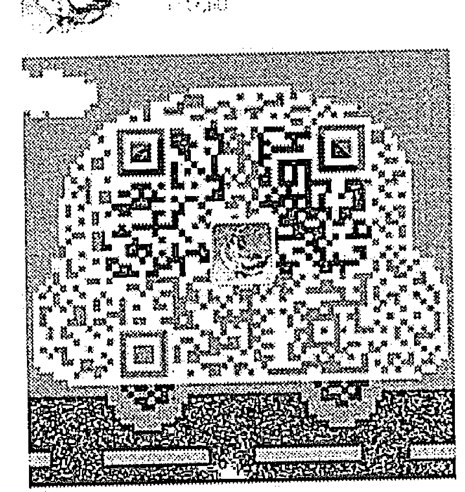

阴盘奇门辅导
微信
13898813411

微信头像 圣惠道人

- 吉謙坊命理開運中心
- 负责人
- 高雄市五術教育協會
- 創會理事長
- 道家易經陰盤奇門遁甲研究學會
- 創會理事長
- 形家陽宅長眼派第三代
- 入室弟子
- 紫陽門在台第五代
- 弟子
- 星元五術大學
- 五術博士
- 星元五術大學
- 奇門遁甲專任教授
- 中華民國丙級喪禮服務
- 技術士
- 電視節目天天好運來
- 專任老師
- 萬世達殯葬禮儀公司
- 命理首席顧問
- 中國註冊環境文化評估師
- 副研究員
- 蘋果日報地產王居家風水
- 專任老師
- 中華易學教育研究院協會
- 國家易經人相課程教材編訂及題庫命製委員

## 著有：

- 十分鐘學會看懂陽宅風水
- 各派陽宅診斷現象、化解
- 學會八宅明鏡這本最簡單
- 學會三元玄空這本最好用
- 學會乾坤國寶這本最容易
- 學會紫白飛星這本最好學
- 學會各派羅盤這本最正確
- 嬰兒命名就用這一本
- 面相論吉凶
- 面相一本通
- 手相與數字
- 拜拜一本通
- 神算一本通
- 教您如何拜拜

## 命理教學：

- 陽宅風水大全集
- 嬰兒命名一本通
- 手指占卜一本通
- 手指長短斷吉凶
- 求人問卜我最靈
- 從手相面相判斷吉凶
- 無理取鬧之金玉良言
- 面相秘訣教學DVD
- 總合學派陽宅教學DVD
- 擇日學與喪葬禮儀DVD
- 開運名片創佳績教學DVD
- 吉祥十九層羅盤教學DVD

## 作者：黄鉴·简介

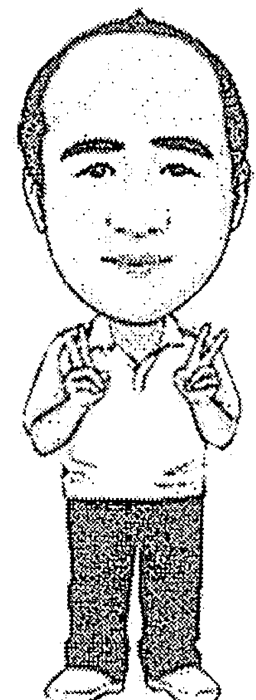

- 吉祥坊易經開運中心負責人
- 中國五術教育協會講師團團長
- 奇門遁甲研究學會榮譽會長
- 電視易經風水節目專任講師
- 道家易經陰盤奇門遁甲研究學會首席顧問
- 道家九天奇門遁甲易經學會榮譽理事長
- 中信、住商、信義房屋、陽宅教育訓練講師
- 大學社團；讀書會，命理與人際關係養成講師
- 各大壽險公司，命理行銷專題講師（1000場）
- 扶輪社、獅子會、青商會等社團命理講座

> 著有：
學八字，這本最好用
學數字斷吉凶，這本最好用
初學手相這本最好用
學姓名學，這本最好用

- 大師教您學八字
- 大師專用彩色萬年曆
- 學奇門遁甲這本最好用
- 學擇日原來這麼簡單
- 這年頭每個人都需要懂紫微
- 一次就學會多派姓名學
- 十分鐘學會看懂陽宅風水
- 嬰兒命名就用這一本
- 學會八宅明鏡這本最好用
- 學會紫白飛星這本最簡單
- 學會三元玄空這本最好用
- 學會乾坤國寶這本最好用
- 神秘盲派八字大解密
- 股市易經峰谷循環
- 鐵口直斷之秘法
- 陽宅吉凶一目了然
- 數字論吉凶
- 用數字DNA論特質
- 八字論命軟體一套
- 姓名學軟體一套
- 擇日合婚軟體一套
- 紫微斗數論命軟體一套
- 奇門遁甲各項佈局軟體
- 設計20套命理風水專業軟體（PC版）
- 設計35套命理風水專業軟體（手機版）
- 錄製20多種命理教學DVD
- Tel:04-24521393 0980258768黃老師

## 推薦序

子奇 （道家易經陰盤奇門遁甲研究學會 名譽理事長）

評定一個文明科技的進步程度可以由該文明的『曆法』而得知，一個文明的曆法越精準，它的科技程度就越高等，因為曆法包含了對宇宙時空的知識與了解。我們知道，不僅太陽繞地球運行時，會對地球上的氣候、四時、物種會有規律的發生作用，同時發現太陽及宇宙星辰，在不同的天球宇宙方向的位置變化，碰到地球磁場後，也會交互的對地球上的氣候、萬物生長都產生重要的影響與作用。萬事萬物之間，無論是天象（日月星辰）、地象（山川大地）、人象、物象（一花一草一木）、意象（意念想法）等，彼此是互相關聯的，而且會相互作用。當然，宇宙的時空也會對人產生作用，這在奇門遁甲，稱之為『萬物相干論』，而在量子物理的世界裡，稱之為『量子纏繞現象』。

奇門遁甲正是一本上古傳下來的研究宇宙時空的科學鉅著，它所使用的奇門遁甲曆，基本上是一種宇宙的星曆，是一種時空計算器（space-time computer），中隐含着深邃的时空奥义。“黄帝阴符经”里说：“八卦甲子，神机鬼藏”，其中一甲子指的是赖以计算时间的六十甲子，代表时间系统，而八卦，代表的是空间系统，也就是一种气或能量，或称为卦气，用时间（六十甲子）去计算卦气（天气）与卦气（地气）的碰撞，对人或事件所产生吉与凶，成与败的不同作用就是奇门遁甲。所以奇门遁甲是一门天文物理学，藉由时间精准的计算，而得知气场的流行运转方向，进而推算出气场与气场之间的碰撞会产生什么样的吉凶作用。这种能夺天地造化的知识与学问，自然为古代君王所重视，而深藏于皇宫内院，所以奇门遁甲素有“帝王之术，万术之王”的美誉。昔日姜子牙、张良、诸葛亮及刘伯温等人皆悉此术，以此辅佐明君，攻城掠地，成就不凡霸业。因能习此术之人有限，自古以来大多数人对奇门遁甲只有一层神秘的感觉，而无法窥见其貌。原本素称帝王之学深藏于皇宫院内的奇门遁甲，在古代主要用于国事、打战、兵法方面，看似好像与一般个人无关。然而后来在民间由道家所流传下来的“道家阴盘奇门”，则不仅仅能应用于“占卜预测”，我们个人生活上各方面的事情，更神奇的是还可以藉由调理转变奇门符号所对应家居环境的物品或位置，以“改变及影响「一個人未來事物發展的運勢，達到佈局調理、催吉避凶的效果。簡而言之，【道家陰盤奇門遁甲」，不僅能「占卜預測」生活上各方面我們所關心的事情，最主要還能運用於「風水調理」以改變運勢（能算又能改，收效快速）。

敵人於2015年8月蒙「台中市五術教育協會理事長」、「創會長」、「黃恆培理事長引薦，認識當今紅遍海峽兩岸「形家長眼法」恩師、「陳義霖」大師，及「高雄市五術教育協會」理事長，李羽宸理事長，時值「陳義霖」大師在高雄教授「形家風水」課程，課程結束後，旋即在黃恆培理事長的推薦及李羽宸老師的邀請下正式對外教授陰盤奇門課程。而近幾年獲得各界朋友的肯定及支持，得以在台灣、馬來西亞、香港，並在大陸北京、上海、蘇州、深圳等地教授奇門遁甲，期間很多學員及對奇門感興趣的朋友，多方詢問是否能推薦陰盤奇門有關的書籍。恰好此時，欣聞李羽宸老師提議希望能出一本陰盤奇門的書籍，以淺顯易懂的方式，讓更多人可以了解「陰盤奇門」之應用，並邀請我為其作推薦序。

李羽宸老師係敵人之好友，為人幽默風趣、治學嚴謹、誠懇熱心、專業人品俱佳，在我於高雄教授陰盤奇門之時，李羽宸老師日夜勤奮鑽研，並結合其個人之專業與實務應用，將陰盤奇門運用的出神入化，青出於藍。這本「陰盤奇門遁甲真的很神奇」，把陰盤奇門隱藏不宣之秘訣毫不藏私的傾囊披霧。只要能沏一壺清茶，品一段奇門，細細研讀，必能獲益匪淺，適合初學者或執業者參考使用，為一本研究『陰盤奇門』愛好者必讀之好書也，此書之出版，實為眾生之福。很高興能為李羽辰老師新書作推薦序，除表達恭賀之意，並預祝本書能暢銷熱賣。

學習聯繫電話：（歡迎海內外包班上課）
- 北部：心語身心靈推廣中心，電話：02-27775716 0920-066026，子奇老師
- 中部：吉祥坊易經開運中心，電話：04-24521393 0980-258768，戴贊增老師
- 南部：吉謙坊命理開運中心，電話：07-6922600 0930-867707，李羽辰老師

歡迎洽詢奇門遁甲各式軟件

子奇老師過去曾任職于世界前10大公司高階主管，擁有美國匹茲堡大學企管碩士及淡江大學電腦碩士，現為【道家易經陰盤奇門遁甲研究學會名譽理事長】，專精於『奇門遁甲』、『紫微斗數』、『古歸藏易』、『三元納氣』、形家長眼法風水、『古典占星』、『塔羅牌』、『鄭子太極拳』、『九宮大道針法』及『文始派仙道氣功』。

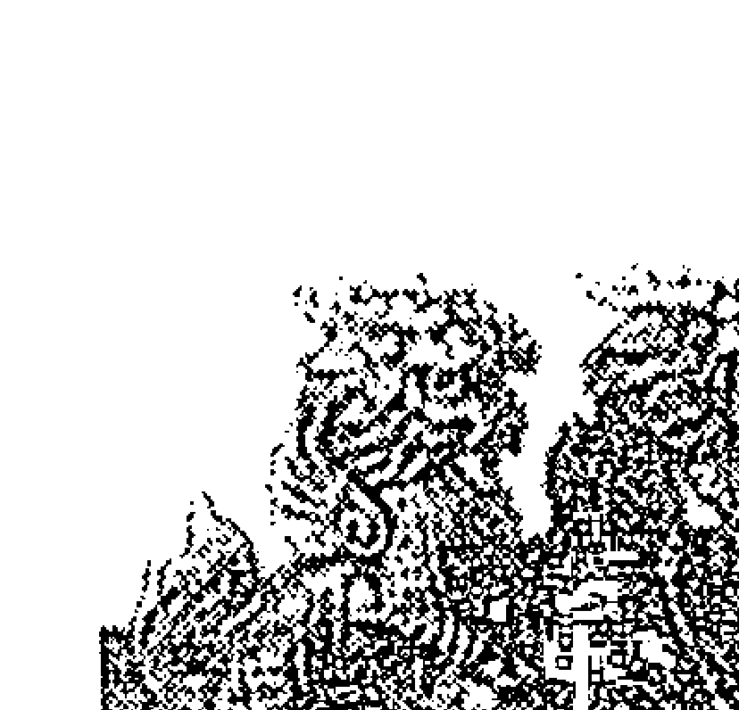

## 推薦序

玄靈（道家易經陰盤奇門遁甲研究學會 副理事長）

多年前，『高雄市五術教育協會』理事長，李羽宸理事長為提升對五術界同好之專業學識，在高雄加萣殿嚴選聘請全台各類五術權威開班講課，因此有幸與李羽宸老師結緣相識，此時李羽宸老師已在五術界享譽已久，但他仍謙沖平和，和藹可親，謙虛厚重，奬掖後學，常無私分享秘訣及經驗，更提攜不才共同上台教學，是我命中之大貴人，如今得知，李羽宸老師願將教學中，道家陰盤奇門遁甲最寶貴密而不傳的資料與實際運用的案例，編輯出版成書，嘉惠喜愛奇門同好，廣結善緣，感佩非常。人生在世，當八字運歲皆喜用，誰能擔保自己與家人不會遭遇困境？更何況運歲皆忌。接觸學習五術，山、醫、命、相、卜，各類學術皆有其優處，然當下真正遇到狀況，能立即排解困境者，首推道家陰盤奇門遁甲。道家陰盤奇門遁甲不同於以往任何一門學術，它是一套時空能量預測學，是天、地、人、神在世間的瞬間組合，是過去、現在、未來在自然界的展現，陰盤奇門遁甲以『全息讀象』的方式，解碼了上天神的旨意，更取代了陽盤奇門遁甲的格局定式，淡化生剋，強調沒吉沒凶和神助大於一切。

陰盤奇門遁甲不僅可以預測未來知曉過去，還能透過方法轉換宇宙的能量，以改變及影響事物發展的態勢。『萬象全息論』，式盤中的符號代表的都是宇宙，日、月、星辰的能量，此術可以扭轉乾坤、撥亂反正，由敗轉勝，讓我方佔地利方位，趨吉避凶，而使對手陷於萬劫不復之地。

『類象直讀』，易學易懂，預測事情極為準確，佈局調理、行為風水、符令罡步更能改變當下困境有立竿見影之效，『移星換斗大法』轉換或變化符號所對應的物品或環境的位置，去建立一個人與自然的平衡關係，而達到人們的願景。這更是道家奇門的秘法。是最快最好用的一門實質學術。

李羽宸老師最新大作《陰盤奇門遁甲真的很神奇》即將付梓，本書對初學者或已執業者，喜愛道家陰盤奇門遁甲之人，實乃一大福音，細細研讀深究會有莫大之受益，是本非常實用之好書。出版前夕，樂於為序推薦之。

- 道家易經陰盤奇門遁甲研究學會　創會總幹事暨現任副理事長
- 道家九天奇門遁甲易經學會　首席學術顧問
- 桃園市易經研究學會　榮譽會長
- 嘉義縣福慧圓滿易經學會　榮譽會長
- 中國五術教育學會　星元五術大學　奇門遁甲副教授

玄靈手機：0933-296613
歲次己亥孟秋敬序於台南

劉芳利
（道家易經陰盤奇門遁甲研究學會 副理事長）

據《龍甲神章》及《煙波釣叟歌》記載，關於奇門遁甲的起源，可追朔至遠古時期涿鹿大戰的傳說年代。當時軒轅黃帝面對強大的蚩尤，涿鹿久戰不克陷入不利境地，軒轅黃帝向上天祈禱，誠心感動了九天玄女，授與天書《龍甲神章》（上古傳說：神龍負圖出洛水，彩鳳銜書碧雲裏）。天書內容記載各種兵器製作工法、調兵遣將運籌帷幄、行軍佈陣作戰的兵法，軒轅黃帝受啟發而作指南車以示四方，有效地壓制蚩尤天降大霧奇法，逆轉局勢，始得克敵致勝。
軒轅黃帝涿鹿戰役獲勝之後，授命宰相風后演繹天書《龍甲神章》，依據天地人三才範疇，分別完成太乙神數（天時——國祚天命）、大六壬（人和——百姓家常）、奇門遁甲（地利——兵法佈陣），統稱為上古三式，後人也稱為「天書三式」。其中奇門遁甲風后演繹成《孤虛法十一章》、《兵法十三章》、《奇門遁甲一千零八十局》。經歷周朝太公望（刪減為七十二局）、漢朝黃石公、商朝范蠡、漢朝張良（各演繹七十二局）、張良等，承先啟後一脈相承，最終由漢朝劉邦的第一謀臣張良（戰國末年，西元前250年），刪繁就簡為奇門遁甲一十八局，奇門遁甲陰、陽遁局數爾後以此標準奉為圭臬，沿用至今。

中華文化博大精深，傳統預測術數淵源流長，在歷史長流中觀察發現歷代帝王將相，面臨軍國大事、社稷存亡決斷之際，往往取決於術數推演的結果為最終決策依據。

> 「萬術之王」、「帝王之學」的《奇門遁甲》，主要運用於行兵佈陣、攻城掠地、安營紮寨，甚至用來預測天候，掌握時間、空間的有利條件，擬定制敵機先的策略，掌控兵家勝負關鍵的強勢術數，奇門之術是兵家問生存法則，既分高下，也決生死，因此歷代良臣名將皆精通奇門遁甲之術，透過奇門遁甲的秘術學問，維護國之興盛，家之安康。

數千年來中華文化改朝換代、開國建基的君王，輔佐幕僚群中必定有精通奇門遁甲的高手，周朝的太公望、春秋戰國時期的管仲、漢朝的張良、陳平、三國蜀漢丞相諸葛孔明、明朝國師劉伯溫、連近代西元一九九一年的波斯灣戰爭的「沙漠之盾」防衛作戰，美軍多位將領皆人手一本《孫子兵法》，實際運用於指揮現代化軍隊進行佈局、作戰，僅費時一百小時地面戰，伊拉克便無條件投降，以極少的損失大獲全勝。

> 《孫子兵法》軍形篇：「善守者，藏于九地之下；善攻者，動于九天之上，故能自保而全勝也。

《煙波釣叟歌》：「九天之上好揚兵，九地潛藏可立營。」孫子兵法箇中玄妙與奇門遁甲不謀而合之處甚多，可謂儼然是奇門遁甲的縮影。

兵聖孫武及歷代受人敬頌的軍師謀臣皆深諳奇門之道，運籌帷幄、謀劃先機、順應四時、臨事沉穩不亂，進則克敵致勝開疆拓土，退則留後守厚植實力，建立為後世傳頌的承平盛世。

奇門遁甲之所以為帝王之學，除了涵蓋學術領域廣泛，結構非常嚴謹，高度的理智慧科學，克敵致勝的兵法之外，更是生死存亡、興盛不衰的密術。

透過奇門遁甲盤能輕易洞悉天時地利，綜觀局勢變化，掌握星體天時與時空地利之間互動，透過數理、時間、空間三大重要元素，轉換為奇門盤符號，呈現宇宙間萬事萬物的關係，分析天時與地利優勢之所在，扭轉乾坤立於不敗之地。

如此玄妙深為歷代帝王所忌，將此學術禁錮於宮殿百尺高牆之內，限定特定人士研習運用，嚴禁民間流傳學習，查獲必定斬首，甚至誅連九族。

奇門遁甲背後擁有的強大功能，運用於兵法上的成效無庸置疑，於當今新月異科學昌明的時代，只要能善用於業務發展、企業經營、改善生活品質、趨吉避凶提昇整體運勢，在日常生活中，時時處於有利的位置，知命造命，知己知彼，百戰百勝，掌握人生制勝關鍵運途，必定能產生正面的靈動效應，其妙用無法言喻，只能親身感受。

> 「藏器在身，乘勢而行，因時而動。——《奇門遁甲》的重要核心理論不是神通道法，而是以易經、八卦為主軸，結合陰陽五行、天文地理、星相曆法...等融合諸多學術，為歷代先聖先賢的智慧結晶，應用於戰略、人生智慧的一門獨特學問，是從三維時空模擬呈現多維度時空訊息的智慧戰情室工具，用來觀察、解讀當下宇宙時空，大道運行的法則，透悉天、地、人之間因緣關係，進行分析思辨，從而預測世間萬事萬物，能知趨吉避凶之理，天地之道，簡易而已。

奇門遁甲功能非常強大，是道家最高層次的預測學，古代師徒間以心印心，口傳心授，所以掌握在極少數人手中。而且奇門遁甲涉及的學理知識廣泛又複雜深奧，經常讓學習者難窺堂奧之密，便黯然放棄，實在可惜。李羽宸老師與後學關係亦師亦友，其教學經驗豐富，為人毫不藏私，樂於分享，提攜後學不遺餘力，學術涵養傲人依然謙卑為懷。新書《陰盤奇門遁甲真的很神奇》是李老師累積奇門的教學經驗，製作大量的圖表，輔以簡潔易懂的語意說明，搭配黃恬增老師開發的《道家陰盤奇門遁甲專用軟體》，沒有深厚五術底蘊也可以藉由軟體的效益，讓奇門的學習之路如虎添翼，馭馬駕輕車就熟路，得心應手而獲益匪淺。

> 「八卦甲子，神機鬼藏」，期待此書的問世，能引領更多人一窺奇門遁甲的神妙用，也期許運用奇門之術要本著利己利人，達己達人，你好、我好、大家好為原則。新書付梓前夕，榮幸有機會為此書作序推薦，後學與有榮焉，身為奇門人樂見其成！祝福所有讀者開卷有益，道業精進。

- 道家易經陰盤奇門遁甲研究學會 副理事長
- 台灣上市櫃企業 資訊部主管
- 中華易學教育研究院 桃園分院副院長
- 中國五術教育學會 星元五術大學奇門遁甲副教授
- 道家九天奇門遁甲易經學會 首席學術顧問
- 福慧圓滿易經學會 榮譽顧問
- 中華風水命相學會 學術顧問

歲次己亥年立秋後敬序於台北漱心居
劉芳利

## 推薦序

孫正昇
（奇門遁甲時空斷創始人）

在中國傳統文化中，奇門遁甲以易經八卦為基礎，結合星相曆法、天文地理、八神、八門、九星、陰陽五行、三奇六儀等要素，是我國預測學中集大成者，是易經最高層次的預測學，因此奇門遁甲自古被稱為帝王學，故有『學會奇門遁，來人不用問』之盛譽。

歷代政治家、軍事家以及現代企業家把奇門遁甲用於決策，成就了非凡的事業。古代使用奇門遁甲之術的聖賢們大多是治國平天下的軍師，如姜太公、范蠡、張良、諸葛亮、劉伯溫等。奇門遁甲在我國古代主要用於國事、兵法方面。現代則可應用於商戰、事業、學業、求財、愛情、健康、家庭、環境等各方面的預測及風水調理，成效非常顯著。

奇門遁甲是由時間、空間、數理三大要素架構起來的立體模型，陰陽、五行、天干、地支、二十四節氣、上中下三元、陰陽十八局、九宮、八門、九星、八神、

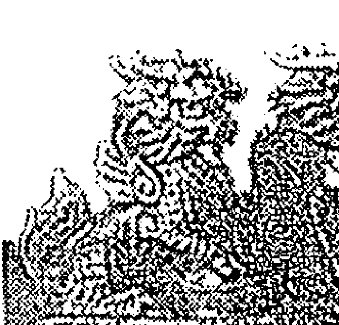三奇、六儀是這個模型中的骨架。

運用求測者問事的特定時間起局，通過這個模型的運動，看代表天時的九星，每顆星運轉到哪個方位，代表人事的八門，每一門運轉到哪個位置；代表吉凶的八神，每一神運轉到哪個地方；代表被預測物件主體的三奇、六儀運轉到哪一宮內，用所各自代表的內涵與外延與所測物件的內在聯繫，分析判斷事物的現狀、產生、發展、變化和結果。九宮格局動中有靜，靜釋象意，可一目瞭然，吉凶禍福，盡在其中。格局中的所有動的符號動愈奇，愈奇愈繁。雖然千變萬化，但萬變又不離其宗。

【道家陰盤奇門遁甲】主要效用占卜、預測、造局、改運四合一，來妙斷事物的緣由和發展方向：能準確占算出當事人想要問的所有事情及其來龍去脈，如：工作、錢財、感情、健康、家人等。斷局：豐富細膩、層次分明、快速方便、具體、準確，涵蓋廣的優點。而且運用移星換斗風水調理來達成心中願望：能化解困境、提升運勢，立竿見影、收效快速。

運用奇門盤中【天、地、人、神四合一】符號所代表的象意，設定風水物品擺放在相應的宮位，以提升能量，達到問測者所要達到的願望。配合選擇時、辦方、辦事事半功倍：如何選擇有利的時間與方位，去做對自己有利的事情，讓我們辦事能有事半功倍的效果，如：接洽客戶、銷售談判、開市開工、考試、面談、投資買賣、相親、結婚、求醫祛病、出差旅遊等。

目前在五術界，李羽宸老師除了在教學上有卓著成就，推廣道家陰盤奇門遁甲不遺餘力，更是孫立昇個人努力學習的榜樣，今日欣逢李老師出版道家陰盤奇門遁甲書，有此殊榮特為之序，甚感榮焉。

## 孫立昇

五術經歷二十年，研究創立奇門遁甲時空觸機預測學。善長運用形家陽宅風水配合奇門遁甲策劃，規劃廠辦公司行號，及配合形家姓名，形家面相，幫企業尋找各部門人才定位法則，目前以教授形家長眼法風水及陰盤奇門遁甲時空預測學及擔任簽保密條款之公司運籌帷幄策劃顧問，房地產買賣技術指導顧問，廠房建造規劃佈局指導顧問。

### 目前職務：

- 孫奇　奇門時空觸機研究學院院長
- 立昇命理地理擇日館館主
- 桃園市易經研究學會榮譽會長
- 道家易經陰盤奇門遁甲研究學會創會首席顧問
- 道家九天奇門遁甲易經學會首席學術顧問
- 著作：行家必讀之陽宅形家長眼法
- 形家陽宅築基研究班教學DVD 17單元
- 形家姓名學教學DVD 15單元
- 易經卜卦初中高教學DVD課程 72單元

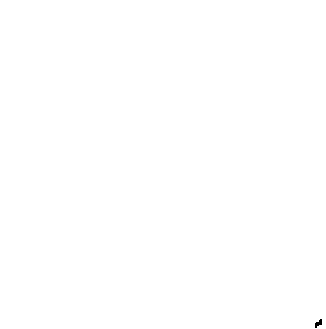

## 本書作者李明後序

朕諸史書，中國傳統決策體系數術之學太乙神數、大六壬、奇門遁甲號稱『古傳三式』。而奇門遁甲是三大秘寶中的第一大秘術，亦是其它技法難以比擬的易經最高層次預測學，號稱『帝王之學』。它出於河圖洛書、九宮八卦；融於天地的人文、陰陽律曆。歷代統治者與軍事家皆擅於奇門之運用，將時間與空間完美無缺的互相結合，體現在國事、決策、陣法、兵法方面，據『煙波釣叟歌』當中記載：軒轅黃帝戰蚩尤，涿鹿經年苦未休，偶夢天神授符訣，登壇致祭謹虔修。神龍負圖出洛水，彩鳳銜書碧雲裡；因命風后演成文，遁甲奇門從此始。一千八十當時制，太公刪成七十二，逮於漢代張子房，一十八局為精藝。此謂從上古軒轅黃帝大戰蚩尤，經過多年戰事始終未能結束而陷入困戰，偶夢天神九天玄女授予符訣，利用祭祀天神之機，登壇傾心虔誠進行修煉的傳說時期；演至神龍從洛水而出發現的『河圖』與彩鳳從碧雲降至人間的『洛書』，授命宰相風后演成『奇門遁甲』一書而流傳至至今的夢境時期；經由宰相風后擬構計一千零八十局，傳至姜太公將其去繁就簡簡化為七十二局，終至漢朝開國之君劉邦之能臣張良再次簡略成十八局流傳至今，亦即本書所著之「陽遁九局」、「陰遁九局」的歷史時期。

古往今來學者必有師。師者，所以傳道、授業、解惑也。筆者學習十餘年陽盤奇門遁甲至今，都用在擇吉擇日出行訣方面，約略五年前經由黃恆增老師介紹恩師子奇老師（道家易經陰盤奇門遁甲研究學會名譽理事長）授予陰盤奇門遁甲，初試啼聲就在台灣、新馬、港澳、大陸命理漸露頭角佔有一席之地，雖不若曠世絕倫，也是無出其右、獨占鰲頭，漸漸蔚為學習陰盤奇門遁甲的風潮，如火如荼、方興未艾。笔者也偕同我們「形家陽宅長眼法第三代入室弟子」與「紫陽派在台第五代」師兄弟 玄靈師（道家易經陰盤奇門遁甲研究學會創會總幹事暨現任副理事長）與 劉芳利老師（道家易經陰盤奇門遁甲研究學會第一屆總幹事暨現任副理事長）成立「道家易經陰盤奇門遁甲研究學會」在兩位師兄弟於本書內容與圖檔製作襄助之下順利付梓。本書奇門遁甲之研究，皆以學術為依據，期盼在人心空虛、傍徨無助、搔首踟躕、惴惴不安的時候，能夠得到適時的心理輔導與迷津撫慰，嘉惠大眾，自助而助人。

人猶如滄海之一粟邈若山河，而萬物更迭的變化卻高深莫測。奇門遁甲抉奧闡幽、懸疑神祕，若非道德品尚之人，概難習得其中之密。本書除了第壹篇第貳章與第參章介紹命理基礎專業知識之外，餘皆為陰盤奇門遁甲不傳之法，盼與讀者互相切磋學習，溫故而知新。這本好書一定要上手，千萬不要讓後悔成為你（妳）的學習習慣。

壹、陰盤奇門遁甲用神類象：九宮、八卦、天干、地支、九星、八門、八神、天盤、地盤、馬星、引干、寄干、伏吟、反吟、翻宮、轉宮最鉅細靡遺的類象介紹與運用操作方法，只要你（妳）翻閱第壹篇第肆章仔細研讀，保證能夠『一觸類旁通』。

貳、宮干星門神辨其旺衰，決得失，定成敗。古曰：「年干父母，月干兄弟，日干本身，時干子女。要詳細其強弱，即能決其榮枯。旺相得奇，且富且貴；死囚墓絕，極賤極貧」。如何辨其旺衰訣，請看第壹篇第伍章，就會「豁然開朗、茅塞頓開」。

參、奇門遁甲出行訣：此法陽盤奇門遁甲使用最多也最廣，當我們選擇有利的時間與方位去辦事，無論從事任何事情都會有提升運勢的效果！翻開第壹篇第陸章仔細推敲，融會貫通之後，定能在陰盤奇門的發揮成效上更加「相得益彰」。

肆、以紮實的學理為根基，按部就班、盈科後進，一定教您學會如何排定陰盤奇門遁甲時盤與刻盤，請翻閱第貳篇第壹章，學習排盤就會「得心應手」，不再是一件難事。

伍、陰盤奇門遁甲的斷事第一歩驟就是取用神，請利用第貳篇第貳章運用四綱（年干、月干、日干、時干）、六親、年命、八卦、萬象萬物，把心動念之意念選取用神，保證「斷事神準」無疑。

陸、陰盤奇門遁甲首重宮位健康與否？最忌逢奇門四害：「門迫、擊刑、入墓、空亡」。尤其是日干宮、時干宮、專有用神宮，第貳篇第參章會教您四害如何化解，以求平安健康順遂。

柒、請看第參篇第壹章與第貳章的內容，保證都是坊間奇門遁甲找不到的真訣。書云：「傳書不傳訣，傳訣不傳書」、「真經不在紙上傳」、「假傳萬卷書，真傳一句話」，就是學不到真才實學而鬱鬱寡歡。

捌、第肆篇第壹章與第貳章都是真實的案例分享與利用陰盤奇門遁甲特殊技法來進行各種催財、催官、催考試、佈文昌、催桃花、催丁的判斷與佈局實務運用，只要讀者孜孜矻矻，勤勉不懈的反覆細讀，筆者保證一定會讓您收穫滿滿。

奇門遁甲主要分為「數理奇門」與「法術奇門」，乃為兵家運籌之圭臬，上可定邦、下能安民之法門，如今多用於占卜預測，調理佈局，讀者學成這本數理奇門之後，法術奇門自然應運而生。筆者承繼出版二十本書的初衷，此書付梓旨在延續先聖先賢的知識與智慧，開導後知、後進，留給後世人們正確的學術，藉以「承先啟後」，繼承前人，開闢未來，繼續發揚光大而不被淹沒，得以「繼往開來」。要「為往聖繼絕學，為萬世開太平」，期許每位讀者都能夠深得其用，自助而助人。

最後謹以《中國五術教育協會》三尊保護神：謙虛、尊重、禮讓，與大家共勉，祝福大家、謝謝大家，感恩！感恩！再感恩！

道家易經陰盤奇門遁甲研究學會
創會理事長 林羽宸

網址：www.3478.com.tw 0930-867707

己亥年仲秋謹序於吉謙坊命理開運中心


## 奇門軟體研發：黃俊淩序

這三十多年來學過五術命理風水不下十多種課程，本以為學了這麼多知識就能為人解決所有人生困擾之事，但事實並不是如此單純，在論命架構下必須考慮所謂一個人的天時，地利，人和，這樣才能比較客觀。直到學了陰盤奇門遁甲之後才發覺這門學問真的很神奇，能斷，能分析，能提出方案解決問題，奇門遁甲的預測診斷之準確度不輸於八字，紫微斗數，姓名學，擇日等。

在十多年前到大陸參加易經大會，在易學大會中就有許多奇門遁甲老師發表論文且現場預測，當時觀察其論述的準度還真神奇的準，當時我就下定決心要學習陰盤奇門遁甲，如果學會後一定可以幫助更多的有緣人。

或許人生的際遇就是早有安排，就在幾年前遇上了子奇老師跟他學習了陰盤奇門遁甲，學後發覺太神奇了，運用在命理諮商方面太好用了，當發現個案有問題、就可從奇門盤中找到解決方案，讚嘆這門學問真的太棒了。

但真正要學會奇門遁甲必須不斷的記憶奇門六十四用神的個別象意，要在短時背會這些象意並不容易，於是跟子奇老師提出開發奇門軟件來幫助學習，奇門遁甲雖是好用，但就是要記憶的專有用神太多不容易記熟，想不到子奇老師一口答應於是我完成了陰盤奇門遁甲專業版軟件的開發，到目前至少有千百個學員因有了奇門軟件的幫助，縮短學習至少數倍的時間，結業後隨時信手拈來，答案即刻擺在眼前，大家都說太好用了。

學後經過自己摸索了一、二年，要精進奇門論斷及各項移星換斗佈局，還是有一些困難度，當感到困擾時，得知好友（本書作者 李羽宸老師）正在教授奇門遁甲秘笈班，我毫不考慮就跟李老師學習，從李老師認真教授當中，理論與實際合一運用，讓我領悟到更多奇門遁甲使用技巧。我當時就跟李老師提出是否能增加奇門遁甲專業版的功能好讓學員更好運用，李老師一話不說就協助我花了兩年的時間不斷的修改對稿校正，終於完成了奇門遁甲各種佈局開館版，用過的學員紛紛來說：軟件太好用又方便。

李羽宸老師奇門遁甲為什麼能教得那麼好，因為很會整理課程內容，由淺入深循序漸進，讓初學者或已入門者都很容易接受，綜觀這本書整理有四大篇，十三章，幾十個小節，詳細寫出了各種理論及奇門運用技巧，由第壹篇理論篇，坊間陰盤奇門遁甲的書您絕對找不到像這本，整理了這麼豐富且詳細，接著進入第二篇教學篇：教您如何輕易學會排盤，奇門遁甲取用神定位法，奇門四害介紹暨化解方法；再到第參篇秘法篇：拆、補、移、換、合、通關；起局、入局、定局、封局、出局、撤局，等交代的清清楚楚。進行到第四篇：就是解盤與各項奇門佈局，終身財位佈局、催財、催丁、催官、催債、催桃花、催考試、催文昌等佈局方法。

只要您用心循序漸進從頭看到尾您就可以入門，正式進入奇門遁甲的殿堂，學會奇門遁甲就等於您家中開了一家診所，有煩惱的事或很難的解決的事，就開盤看看發生什麼事，也許就會從盤中找到解決方案，您說這門學問值不值得您來學習。

# 033 陰盤奇門遁甲真的很神奇

## 目錄

### 第壹篇 理論篇

- 作者：李羽宸、簡介......003
- 作者：黃恆堉、簡介......006
- 推薦序 子奇......009
- 推薦序 玄靈......013
- 推薦序 劉芳利......016
- 推薦序 孫立昇......021
- 本書作者李羽宸序......025
- 奇門軟體研發：黃恆堉序......030
- 前言......038

### 第二章 奇門遁甲概論

#### 第一節 奇門遁甲的意義與簡介

044

#### 第二節 奇門遁甲的歷史緣由

051

### 第三章 奇門遁甲必須記住的基本知識

#### 第一節 陰陽五行生剋論—必須懂

053

#### 第二節 八卦九宮生剋論—常用到

062

#### 第三節 天干、地支生剋論

094

#### 第四節 基本五行判斷

### 第四章 奇門遁甲盤中的八卦暨五行生剋

#### 第一節 易經河圖洛書基本架構介紹

118

118

#### 第二節、河圖與先天八卦為論斷之體 .................... 120

#### 第三節、洛書與後天八卦為論斷之用 .................... 123

### 第五章 詳論奇門遁甲用神類象 .................... 126

#### 第一節、十天干所代表的人、事、地、物之類象 .................... 128

#### 第二節、十二地支所代表的人、事、地、物之類象 .................... 150

#### 第三節、八神所代表的人、事、地、物之類象 .................... 178

#### 第四節、九星所代表的人、事、地、物之類象 .................... 198

#### 第五節、八門所代表的人、地、物之類象 .................... 218

#### 第六節、八卦、九宮所代表的人、地、物之類象 .................... 238

#### 第七節、天盤、地盤所代表的人、地、物之類象 .................... 246

#### 第八節、馬星、引干、寄干所代表的作用 .................... 260

#### 第九節、伏吟、反吟所代表的事情是怎麼一回事 .................... 266

#### 第十節、翻宮、轉宮，什麼情況下需要用到 .................... 270

### 第六章 天干、九星、八門、八神、宮位之旺衰訣 .................... 275

#### 第一節、天干旺衰訣對解盤…………………277

#### 第二節、九星旺衰訣對解盤…………………283

#### 第三節、八門旺衰訣對解盤…………………285

#### 第四節、八神旺衰訣對解盤…………………287

#### 第五節、宮位旺衰訣對解盤…………………288

### 第七章 奇門遁甲擇吉擇日

#### 第一節、方位擇吉是奇門基本功能之一

#### 第二節、奇門擇日是奇門基本功能之一

#### 第三節、用事時辰擇吉是奇門基本功能之二

### 第貳篇 教學篇

### 第壹章 教您如何輕易學會排盤

#### 第一節、時盤排盤法則基本功

#### 第二節、刻盤排盤法則基本功

### 第貳章 奇門遁甲取用神定位法

#### 第一節、當面問測取用神

#### 第二節、遠程問測取用神

#### 第三節、萬象萬物取用神

### 第叄章 奇門四害介紹與化解方法

#### 第一節、入墓與化解方法

#### 第二節、擊刑與化解方法

#### 第三節、門迫與化解方法

#### 第四節、空亡與化解方法

#### 第五節、伏吟、入墓、空亡之特殊解法

### 第三篇 秘法篇

### 第一章 拆、補、移、換、合、通關

#### 第一節、拆——拆掉四害的宮位

#### 第二節、補——補上符合宮內象

#### 第三節、移——移星換斗之移行

#### 第四節、換——置換、換門、換局

#### 第五節、合——先拆再合化解

#### 第六節、通關——化解宮位之間的沖剋

### 第二章 陰盤奇門遁甲技法運用

#### 第一節、起局

#### 第二節、入局

#### 第三節、封局

#### 第四節、奉局

#### 第五節、出局

#### 第六節、撤局

#### 第七節、奇門先天護體

### 第四篇 奇門實務診斷佈局篇

### 第一章 陰盤奇門遁甲案例解盤實務

#### 第一節 奇門遁甲【實際案例分享】
#### 第二節 奇門遁甲【陽宅買賣求財判斷】
#### 第三節 奇門遁甲【投資求財判斷】
#### 第四節 奇門遁甲【公司求財判斷】
#### 第五節 奇門遁甲【賣貨求財判斷】
#### 第六節 奇門遁甲【買貨求財判斷】
#### 第七節 奇門遁甲【合夥求財判斷】

416
440
443
446
449
451
453

### 第二章 陰盤奇門遁甲佈局實務

#### 第一節 奇門遁甲【終身財位佈局法】
#### 第二節 奇門遁甲【催財佈局法】
#### 第三節 奇門遁甲【催丁佈局法】
#### 第四節 奇門遁甲【催官佈局法】
#### 第五節 奇門遁甲【催債佈局法】
#### 第六節 奇門遁甲【催桃花佈局法】
#### 第七節 奇門遁甲【催考試佈局法】
#### 第八節 奇門遁甲【催文昌佈局法】

456
456
467
474
478
485
490
495
501

附記 511

## 前言

『奇門遁甲』以乙、丙、丁稱為三奇；以休、生、傷、杜、景、死、驚、開稱為八門，故名『奇門』。天干中『甲』最尊貴而不顯露，六甲常隱藏於『戊、己、庚、辛、壬、癸』六儀之內，三奇、六儀分布九宮，而甲不獨佔一宮，故名『遁甲』。

了皇帝手上的時候，他看得明白一千零八十局，張良手上的時候只明白七十二局，後世漸漸失傳。

道門古老三大卜術，太乙神數、大六壬、奇門遁甲號稱『古傳三式』。太乙占測國家大事，運籌帷幄之興盛衰微；六壬占測人世間上，生活周遭之吉凶禍福；而奇門遁甲被譽為『帝王之學』，因為奇門遁甲融合周易、天文、地理、數理於一體，是地學、是兵法，奪天地造化之學，是三大密法中第一大秘術，亦為易經最高層次的預測學。奇門遁甲在古代只有帝王身邊之重臣，才會有學習與運用的機會，因為深怕民間臥虎藏龍者多，避免造成政治上的波瀾，於是對其學術過於吹噓與神化，其实就是誇大、穿鑿附會罷了！但是現今則多運用於事業經營管理、事業經營規劃、工作運勢、婚姻感情、健康疾病等與生活息息相關的事情之上，確實有非常顯著的效果。

陰盤奇門遁甲之不同於其它術數，是在於它六十四個基本用神都有相對應的「符與咒」，包括十天干、十二地支、九星、八門、八神、九宮、八卦等，這就是所謂的「法奇門」。每個符號都可從其「形、精、氣、神」的角度來看，於易理謂之「在天成象，在地成形，在人應事」。由於「萬物相干論」、「萬象全息論」、「萬物系統論」，是故與你有關的萬事萬物都會影響到你。有其形必有其相干之點，經過調理之後就能夠改運，當然問題也會剋應在「人」的身上。而我們就可以運用宮內的符號，將其轉換成適當的「風水開運物品」，來達到催財、催官、生男育女、催桃花、佈文昌之象應。

要了解或預測奇門，如同蘇東坡先生的「廬山詩偈」之作所示：橫看成嶺側成峰，遠近高低皆不同；不識廬山真面目，只緣身在此山中。找出奇門局中的癥結點去拆、去補、去移星換斗…透過環境風水、居家風水、行為風水的調理來改變運勢，扭轉乾坤，甚至可以『尋時借運』。本身運勢不好可以借別人的好運，財運不佳可以借別人的好財運，當你開盤佈完奇門局之後，往往很多好事就會發生，祂雖然不能讓您從無到有，但一定可以讓你越來越好！

煙波釣叟歌：『陰陽逆順妙難窮，二至還鄉一九宮。若能了達陰陽理，天地都來一掌中。軒轅黃帝戰蚩尤，涿鹿經年苦未休，偶夢天神授符訣，登壇致祭謹虔修。神龍負圖出洛水，彩鳳銜書碧雲裏，因命風后演成文，遁甲奇門從此始。一千八十當時制，太公刪成七十二。逮於漢代張子房，一十八局為精藝。』陰陽理就是奇門遁甲最高的心法；功法在於先後天的河圖與洛書。一至冬至與夏至，根據地球與太陽之間的角度變化而設立了九個局或陰與陽。隨著時間的變換冬至到夏至這段期間我們稱它為陽一局（陽九局，稱之『陽遁』；夏至到冬至期間我們稱它為陰九局（陰一局，陽順陰逆，稱之『陰遁』。

『奇門遁甲』是一個模擬宇宙全息立體的時空器，隨著時空一直在變動，將天時、地利、人和、神助等：曾影響人類的能量場與時空匯集在一起，可以說奇門遁甲就是一種時空計算器！之所以能夠了解過去、預測未來，甚至改變與影響事物的發展，說穿了就是『起卦時機』。要知道無事不起卦，心不動不起卦，無感覺也不起卦，感觉越强越好则预测越准，就是当下来人问卦者的「起先动念」，盖因奇门遁甲乃是藉由这门数术精准的计算，经过气场的运转而推算出之间的吉凶作用，它具有多重性、多角度、多层面、取象直读、象意定位、寻象应数、象意组合、重复取象，让预测更加准确。

奇门盘以我为中心，脚踩地球八卦九宫。中宫不动，上面有太阳与月亮，地球自转绕行于星球之间。奇门遁甲的九天星代表整个宇宙，在天为天盘、在地为地盘、中间为人盘，而八门是门路，是通道，接天地的门路，故主人和。是故奇门遁甲盘有天、地、人盘，也就是天时、地利、人和，包括八神之神煞系统，空间及方位之八卦九宫，时间之地支，三奇六仪等符号做出解释，它就代表你的状态、处境，于是神准的奇门遁甲就具有「学会奇门遁，来人不用问」的应用空间与特色。

「奇门遁甲术」质意就是事情发生的来龙去脉，提供学习者依循其奇门遁甲的原理所获得的资讯与条件，运用智慧的判断与经验的累积而建立预测的能力。在推断奇门遁甲的过程当中有太多处于「未知」的状态无法解说完全，于是就要以「已知」来证明，解决的方法就是知识！知识是不断地在成长增进，几百年前世界上所有的智者能人，都无法想象当下我们能够使用软件，只要手机按一按就能够排出奇门遁甲盘是一样的道理！

奇门遁甲在推论的过程中一定要有依据，最好是化繁为简，普及通俗化，才能突显本门学术的价值。期待透过这本书，让读者们对于「道家阴盘奇门遁甲」能成为坊间每个人对于阳宅居家风水、姓名学等五术一样知之甚详，不再是……一般人认为神秘又难懂的玄学！

## 第一章 奇门遁甲概论

### 第一节、奇门遁甲的意义与简介

#### (一)、奇门遁甲的意义

奇门遁甲是社会学，它是生活当中规划设计的主臬，能够造福自己，为他人服务；是创造学，它是探索模拟宇宙万事万物，可以无限放大，可以预见未来；是预言学，它是依据阴阳五行之变化，预测天时、地利、人和、神助、克应，藉以趋吉避凶；是帝王学，它是创造世界宇宙不可思议的能量，国家长远发展最高层次的造化之学。

万物皆有灵，无论是植物类、动物类、外星人皆有，更有其独特的语言，藉以传达、沟通。万事万物都会存在彼此之间的关联性，无论是宇宙万物大或小、动或静，都会是一个时空所属的物体，而有其一定的震动与频率，在佛道理论与现代科学都认为是有生命的、有能量的，因而才会影响到人类，所以说也是有灵性的。

> 辞曰：「在天成象，在地成形，变化见矣！」宇宙能量物质就是虚空的本质「精、气、神」，在佛道界的宇宙万物都与上帝息息相关，盖因所有的物质都内含着信息、物质波的能量及其可动性，并且具备了记忆的功能，所以证实它本身是一个生命体，能够产生共振的频率，因而影响到人类。

据此得知，奇门遁甲之所以能够改变及影响事物发展的态势，关键在于它是一种时空计算器，宇宙具有「共时性」，起心动念的问测当下，我们这门数术就可以精准的计算，进而得知气场的流行运转来推算出气场之间碰撞出的吉凶作用，建立了一个宇宙全息场的景象。此时您若能知晓奇门遁甲的符号象意，就能够用奇门解。方法何其多，诸如地支解六壬、八字解奇门、奇门穿六爻、行为风水、山向奇门、法奇门……等。

我们学习奇门就是为了预测及改变未来，因为可以算命、可以占卜、最主要能够改运，如此能算又能改三合一，一应俱全，其它五术很难出其右。当然奇门遁甲可以助人，相对的也可以害人，我们要的是，你好、我好、大家好，自助助人与趋吉避凶是我们学习奇门的宗旨，倘若心念不正，受伤肯定是自己，切记！切记！

### (一)、奇门遁甲简介

中国传统文化中，奇门遁甲是以易经八卦为基础，结合星相历法、天文地理、九星八门、阴阳五行、三奇六仪等要素，是我国预测学中集大成、易经最高层次的预测学！因此奇门遁甲自古被称为帝王学，故有『学会奇门遁，来人不用问』之盛誉。

历代政治家、军事家以及现代企业家把奇门遁甲用于决策，成就了非凡的事业。古代使用奇门遁甲之术的圣贤们大多是治国平天下的军师，如姜太公、范蠡、张良、诸葛亮、刘伯温等。

奇门遁甲在我国古代主要用于国事、兵法方面。现代则可应用于商战、事业、学业、求财、爱情、健康、家庭、环境等各方面的预测及风水调理，收效非常显著。阴盘奇门遁甲不仅能占卜预测各方面我们所关心事情，最主要还能运用于『风水调理』藉以改变运势，影响未来事物的发展方向：

### 1、占卜预测

巧断事情的缘由与发展的趋向，准确占算出当事人所问之事及其来龙去脉，如个性、长相、工作、财运、运势、考运、感情、健康、家人和谐等，丰富多彩，精致细腻，层次分明，最主要随手可开盘论断，具有方便、具体、准确、意象深、涵盖广的优点。

### 2、移星换斗风水调理

转换有碍与有害的磁场，达到趋吉避凶的效应，完成心中愿望，化解困境、提升运势、立竿见影、收效快速。此乃运用奇门遁甲盘中天、地、星、干、门、神符号的象意，以行为风水、宫位对应之开运风水物、书符念咒等，以提升能量，达成问测者之愿望。

### 3、择日择时辨方办事

选择有利的时间与方位，去做对自己有利的事情，让我们办事能有事半功倍的效果，如买卖求财、业务推广、考试推甄、广告宣传、开张造势、接洽客户、销售谈判、开市开工、商品销售、投资买卖、相亲结婚、求医祛病、出差旅游等。
阴盘奇门有别于其它数术，如紫微斗数、子平八字、姓名学等，并不需要问测者生辰八字，仅需当下起心动念的时间即可起盘，透过盘中的符号组合，就能洞悉对方的心理状态、个性长相、事情的来龙去脉、前因后果、吉凶祸福，一次搞定。再配合摆放相对应的风水物品，达到催吉避凶的效果，不仅可以算命，还可以占卜，风水调理。

### 4、奇门遁甲的基本定义

「奇」就是【三奇】乙、丙、丁，三个天干为代表，【六仪】戊、己、庚、辛、壬、癸；「门」就是【八门】休门、生门、开门、伤门、杜门、景门、死门、惊门。

休门、生门、开门三门最吉；景门次吉，其余伤、杜、死、惊四门代表各类凶意，除了特殊用途，应少取用为妙。「遁」就是隐藏、不见之意，即遁于六仪之中。甲为首长、元帅，必定隐蔽在幕后，所以我们称之为「遁」。

甲是老大领导身边最得力的三个助手。乙是文官，为日奇；丙是武官，为月奇；丁负责后勤保障供应，为星奇。也可以把它当作是三支奇兵，要出奇制胜就非常需要它们的协助。另外亦能以阴阳五行论乙、丙、丁何以称为三奇！我们知道甲为主帅，为阳木，最怕庚金克制（阳金克阳木为七杀，最凶），我们适时用甲的妹妹乙（阴木）来合庚（阳金），乙庚相合，将乙妹嫁给庚金为妻，自然解除庚金对于甲木的威胁，此为乙的「美人计」；丙为阳火，木生火，好比是甲木的儿子，能克制庚金，保护甲木，当然也有保护的作用，只是阳火克阳金，造成的动盪太激烈，难免会出「乱子」，所以还是少用为宜；丁为阴火，她是甲木的女儿，同样可以克制庚金，保护甲木，所以也是一奇，更是阴盘奇门遁甲中最直接产生功效的吉星，故其尚有「玉女」的美称。十天干配上十二地支，形成六十甲子，则十天干每个都会配六次，就有了六甲、六乙、六丙、六丁、六戊、六己、六庚、六辛、六壬、六癸。所谓六甲，即甲子、甲戌、甲申、甲午、甲辰、甲寅。就是六位将帅，其中甲子为元帅，其它五甲为大将，他们在排兵布阵中都会隐遁在六仪当中旗帜之下，而且是永远固定不变的。

元帅甲子隐于戊土，大将一甲——甲戌隐于己土，大将二甲——甲申隐于庚金，大将三甲——甲午隐于辛金，大将四甲——甲辰隐于壬水，大将五甲——甲寅隐于癸水，大将六甲。

我们用简单的旬首掌诀来加强记忆（如图示）——必背：甲子戊、甲戌己、甲申庚、甲午辛、甲辰壬、甲寅癸。

## 第二节、奇门遁甲的历史缘由

上古世纪轩辕黄帝时代，大战蚩尤于涿鹿，屡战而不胜，是当时中原非常重要之事。接连好多时候，梦里忽见天神——祖师九天玄女授予符法，醒后即命精通天文历法及兵法的宰相风后演绎成「兵法十三章」、「孤虚法十二章」，立「奇门遁甲一千零八十局」，因而打败蚩尤，此为奇门遁甲最早起源之历史记载。后来经过周朝姜太公吕尚，应用奇门臻至炉火纯青之境，立下七十二活局，打败纣王。继而由汉朝黄石公授予张良，从此才将奇门改为阴、阳各九局，合计十八局，藉以辅助汉高祖刘邦而取得天下。之后三国时期蜀国诸葛孔明也运用奇门遁甲，布「八阵图」，其为阵形的一种，是八种阵形组成的综合阵法，襄助刘备三分天下。尔后诸葛亮将奇门遁甲传授部下姜维之后便去世，姜维深怕其无比的威力落于不善之人，故将其全部销毁，往后也只口授传之于在野贤德之人。最后才在明朝刘伯温重现于世，以奇门辅佐明太祖朱元璋称帝天下。奇门遁甲已逾几千年之久，流传至今派别甚多，十几年前笔者学习阳盘奇门遁甲之后，感觉应用上比较局限，不若由对岸开始发展推广的阴盘奇门遁甲来得简要、易懂。恩师子奇老师（道家易经阴盘奇门遁甲研究学会名誉理事长）于五、六年前在台湾如雨后春笋地开枝散叶之后，渐渐蔚为学习阴盘奇门遁甲的风潮，于此同时笔者在三、四年前偕同我们『形家长眼法第三代入室弟子』与『紫阳派在台第五代』师兄弟玄灵师（道家易经阴盘奇门遁甲研究学会创会总干事暨现任副理事长）与刘芳利老师（道家易经阴盘奇门遁甲研究学会第二届总干事暨现任副理事长）成立『道家易经阴盘奇门遁甲研究学会』，祈盼在各位老师多方研究印证之下，能够获得更多的真诀。特写此书，以飨同好早日进入『阴盘奇门遁甲』的领域，进而改变自己，嘉惠大众，自助而助人。

## 第二章 奇门遁甲必须记住的基本知识

### 第一节、阴阳五行生克制论——必须懂

#### （一）、阴阳学说

天干、地支、九星、八门、八神、九宫八卦都有阴阳之分。五行学说是中国哲学的基本概念，更是“法奇门”与“术奇门”论断的重要依据。

太极生两仪，也就是阳仪和阴仪，而阴阳贵在中和，配合阴阳相吸，磁场才有好能量，若阴阳相斥，则能量就会散，如同磁铁异性相吸，同性相斥一般。宇宙万物的变化都是阴阳的变化，阴阳相吸则好的能量就会聚集，就是属于好的磁场了。向外扩张是阳，向内缩是阴；太阳为阳，月亮为阴；天是阳，地是阴。阴盘奇门遁甲也不例外，就是要顺应天地阴阳的变化法理。以龙虎、后前、浅深、逆顺、凸凹、上下、疏密、近远、左右、新旧、强弱、轻重、人宅、低高、动静、尖圆、男女等来分阴阳与万物。

阴阳包括五行，五行含有阴阳，宇宙间的一切事物根据其属性而分为阴类与阳类。盖因任何具体的事物都具有阴阳的双重性，即阴中有阳，阳中有阴。

阴阳学说源于夏朝之时，咸认阴阳之气是天地万物的泉源。阴阳相吸，万物生长，天象形成风、雨、雷、电的自然气象；地势形成河海、山川之大地形体；方位则有东、南、西、北四方；气候则为春、夏、秋、冬四季。凡事都可以分为二，这就是阴阳。

此谓老子《道德经》道生一（无极），一生二（阴阳），二生三（阴阳配合），三生万物（万事万物）。

阴阳可以相互依存与转化，亦即有阴就有阳，有阳也有阴。如同有乾就有坤，有天就有地，而阴阳五行，就是阴阳学说和五行学说的合称。

#### （二）、五行学说

学习阴盘奇门遁甲必须先了解五行相生相克的原理，才能够有解盘的能力，这是必备的知识与基本功。首先我们会用最简单的方式来呈现天干、地支中各字所代表的五行之互动关系。

### 1、五行介绍

五行就是木、火、土、金、水，是构成宇宙万事万物的五种基本物质元素。自古皆认为世间的万事万物都离不开这五种元素，包括事物的运转、变化、发展都是依其之间的相互辉映而进行归类，进而透过五行的分析研究，就能够预测事情发展的吉凶。

五行相生（图一）：木生火、火生土、土生金、金生水、水生木。
五行相克（图二）：木克土、土克水、水克火、火克金、金克木。

人体的五行犹如与自然界一般相对应，我有肝胆，自然界中就是春天；我是肾、膀胱，自然界就是冬天。人体五行与自然界都有着密不可分的关系存在，虽然各为不同的属性，还是会依照特殊秩序的规律而相互影响，形成事物与自然界的对应关系。

#### (1)、五行相生（如图一）

- 木生火：木有温暖之气，为火之本源，钻木取火为意，故木能生火。
- 火生土：火燃烧木之后化成灰，灰尘积于土地，故火能生土。
- 土生金：土中经节选之后化为金石，故土能生金。
- 金生水：金虽为硬物，但经过高温熔化之后化为液体，故金能生水。
- 水生木：水为灌溉之源，木有水的滋润方能成长，故水能生木。

#### (2)、五行相克（如图二）

- 木克土：树木植入土中，吸取来自土中养分，故木能克土。
- 土克水：所谓「兵来将挡，水来土掩」，土可淹没水之溢散，故土能克水。
- 水克火：水为灭火之源，故水能克火。
- 火克金：金属高温熔化后化为液体，故火能克金。
- 金克木：金属为制木之器，故金能克木。

水克火：火炎炙热，遇水调候，火便熄灭，故水能克火。
火克金：金虽为硬物，但经过高温熔化之后化为液体，故火能克金。
金克木：大斧、小刀可以砍伐大树、小草，亦能雕刻成品，故金能克木。

五行相生克的原理是学习奇门遁甲的基本原则，惟运用上必须配合节气之变化与十二长生旺衰诀，方能判断其吉凶，绝不可以为相生就是好，相克就是凶，凡事过犹不及取其中庸为宜，简要如下：

- 木生火，火多木焚；火生土，土多火晦；土生金，金多土虚；金生水，水多金沉；水生木，木盛水缩；金生水，水多金埋；火生土，火多土焦；土生金，土多金埋；木生火，木多火塞；水生木，水多木漂。故五行相生，宜取其中和。
- 木克土，土重木折；如遇四季旺土，木弱，则木萎，难以克土。火克金，金多火熄；如遇秋天金旺，火弱，则火熄，难以克金。
- 土克水，水多土荡，如遇冬天水旺，土弱，则土崩，难以克水。金克木，木坚金缺，如遇春天木旺，金弱，则金钝，难以克木。水克火，火旺水干，如遇夏天火旺，水弱，则水失，难以克火。

### ## 2、五行性质所属与旺衰

### ### (1)、五行的性质

故学习五术命理，一定要灵活运用。

- 木的性质：具有生长、调理通达的性质，讲话实在、诚实、仁厚、慈祥善念的个性。
- 火的性质：具有发热、向上炎发的性质，性情开朗、较外向、为人豪爽讲信用的个性。
- 土的性质：具有抚育、培养育德的性质，做事实在、忠厚老实、童叟无欺的个性。
- 金的性质：具有肃杀、变化革新的性质，做人讲义气、刚毅、眼光不错的个性。
- 水的性质：具有向下、水泽滋润的性质，智慧聪颖、为人处事圆满、做事机伶的个性。

|   | 木 | 火 | 土 | 金 | 水 |
|---|----|----|----|----|----|
| 五行 | 木 | 火 | 土 | 金 | 水 |
| 五位 | 东方 | 南方 | 中央 | 西方 | 北方 |
| 天干 | 甲乙 | 丙丁 | 戊己 | 庚辛 | 壬癸 |
| 地支 | 寅卯 | 巳午 | 辰未戌丑 | 申酉 | 亥子 |
| 五色 | 青 | 赤 | 黄 | 白 | 黑 |
| 五脏 | 肝 | 心 | 脾 | 肺 | 肾 |
| 六腑 | 胆 | 小肠 | 胃 | 大肠 | 膀胱 |
| 五形 | 矩形 | 尖形 | 方形 | 圆形 | 波形 |
| 体形 | 修长 | 尖峭 | 健硕 | 精致 | 肥胖 |
| 五常 | 仁 | 礼 | 信 | 义 | 智 |
| 五态 | 臊 | 焦 | 香 | 腥 | 腐 |
| 五味 | 酸 | 苦 | 甘 | 辛 | 咸 |
| 五液 | 泪 | 汗 | 涎 | 涕 | 唾 |
| 五情 | 喜 | 乐 | 欲 | 怒 | 哀 |
| 五气 | 风 | 暑 | 湿 | 燥 | 寒 |
| 五音 | 角 | 徵 | 宫 | 商 | 羽 |
| 五象 | 风 | 晴 | 云雾 | 雷 | 雨 |
| 五势 | 树木 | 山势 | 平原 | 道路 | 河流 |
| 季节 | 春天 | 夏天 | 四季 | 秋天 | 冬天 |
| 月份 | 1-2月 | 4-5月 | 3-6-9-12月 | 7-8月 | 10-11月 |

### (2)、五行在四季的旺衰

五行生克的原理是随着季节的变化而产生五行的旺、相、休、囚、死（绝）。

| 四季\五行 | 木 | 火 | 土 | 金 | 水 |
|-----------|----|----|----|----|----|
| 春        | 旺 | 相 | 死 | 囚 | 休 |
| 夏        | 休 | 旺 | 相 | 死 | 囚 |
| 秋        | 死 | 囚 | 休 | 旺 | 相 |
| 冬        | 相 | 死 | 囚 | 休 | 旺 |
| 四季      | 囚 | 休 | 旺 | 相 | 死 |

以五行「木」举例说明：

- 木旺于春（木）——帮衬比和
- 木生火（夏天火旺）为休——我生泄气
- 木克土（四季土旺）为囚——我克耗气
- 木被金克（秋天金旺）为死绝——克我受制
- 木逢水生（冬天水旺）为相——协助生扶

- 旺：当令者（最旺）——当权者
- 相：生我者（次旺）——宰相
- 休：我生者（衰弱）——退休者
- 囚：我克者（被囚）——被囚禁
- 死：克我者（死绝）——毫无生机与生气

### (3)、五行在十二长生的旺衰

五行除了在四季中有旺、相、休、囚、死（绝）的状态之外，与地支（时间）十一个月也有10天干与12地支相对应的十二种状态，分别是：长生、沐浴、冠带、临官、帝旺、衰、病、死、墓、绝、胎、养。对于五行：木火土金水；十天干：甲乙丙丁戊己庚辛壬癸，反映出与宇宙万事万物自然的状态与规律，永无休止的循环不已！据此我们会在本篇第五章做非常详细的介绍。

### 天干十二长生

| 十二长生 \ 天干 | 甲 | 乙 | 丙 | 丁 | 戊 | 己 | 庚 | 辛 | 壬 | 癸 |
| :--- | :--- | :--- | :--- | :--- | :--- | :--- | :--- | :--- | :--- | :--- |
| 长生 | 亥 | 午 | 寅 | 酉 | 寅 | 酉 | 巳 | 子 | 申 | 卯 |
| 沐浴 | 子 | 巳 | 卯 | 申 | 卯 | 申 | 午 | 亥 | 酉 | 寅 |
| 冠带 | 丑 | 辰 | 辰 | 未 | 辰 | 未 | 未 | 戌 | 戌 | 丑 |
| 临官 | 寅 | 卯 | 巳 | 午 | 巳 | 午 | 申 | 酉 | 亥 | 子 |
| 帝旺 | 卯 | 寅 | 午 | 巳 | 午 | 巳 | 酉 | 申 | 子 | 亥 |
| 衰 | 辰 | 丑 | 未 | 辰 | 未 | 辰 | 戌 | 未 | 丑 | 戌 |
| 病 | 巳 | 子 | 申 | 卯 | 申 | 卯 | 亥 | 午 | 寅 | 酉 |
| 死 | 午 | 亥 | 酉 | 寅 | 酉 | 寅 | 子 | 巳 | 卯 | 申 |
| 墓 | 未 | 戌 | 戌 | 丑 | 戌 | 丑 | 丑 | 辰 | 辰 | 未 |
| 绝 | 申 | 酉 | 亥 | 子 | 亥 | 子 | 寅 | 卯 | 巳 | 午 |
| 胎 | 酉 | 申 | 子 | 亥 | 子 | 亥 | 卯 | 寅 | 午 | 巳 |
| 养 | 戌 | 未 | 丑 | 戌 | 丑 | 戌 | 辰 | 丑 | 未 | 辰 |## 第一節、八卦九宮生剋制化——常用到

### (一)、八卦與九宮

**1、八卦**

八卦起源於人文始祖伏羲，伏羲是三皇五帝之一。道家的說法，宇宙是無邊無際，稱為「無極」；而觀察亦或想像宇宙間是有其極限的，稱為「太極」，是無極當中的一部份，故曰：「無極生太極」。

周易・繫辭傳曰：「易有太極，是生兩儀，兩儀生四象，四象生八卦，八卦定吉凶，吉凶定大業。」

八卦是指離、巽、震、艮、坤、兌、乾、坎八個卦，稱為「卦名」，每個卦名皆由三條爻線所組成，稱為「卦符」。為了方便記憶，宋代學者朱熹理出一個歌訣：

- **乾三連**：由三條相連不斷的爻線組成。
- **坤六段**：由六段短線組成。
- **震仰盂**：如仰面朝上的盂。
- **巽下斷**：斷在最下層。
- **坎中滿**：上下斷，中間滿線。
- **離中虛**：上下滿，中間斷線。
- **艮覆碗**：如碗蓋著一般。
- **兌上缺**：唯獨上面有缺口。

八卦的名稱與符號如圖示：

### 《先天八卦圖》
| | | |
|---|---|---|
| 兌 ☱ | 乾 ☰ | 巽 ☴ |
| 離 ☲ | ☯ | 坎 ☵ |
| 震 ☳ | 坤 ☷ | 艮 ☶ |

### 《後天八卦圖》
| | | |
|---|---|---|
| 巽 ☴ | 離 ☲ | 坤 ☷ |
| 震 ☳ | ☯ | 兌 ☱ |
| 艮 ☶ | 坎 ☵ | 乾 ☰ |

**2、九宮**

在正方形九宮之內當中一『九』的數字有一定的位置與五行，以後天八卦為依據分別是：乾六（金）、坎一（水）、艮八（土）、震三（木）、巽四（木）、離九（火）、坤二（土）、兌七（金），落在九宮之內，無論橫、豎、斜三個方向數字相加皆為「十五」。

| 巳 (東南) | 午 (南) | 未 (西南) |
|:----------|:--------|:----------|
| 東南<br>四<br>木<br>巽 | 南<br>九<br>火<br>離 | 西南<br>二<br>土<br>坤 |
| 卯 (東) | 中 | 酉 (西) |
| 東<br>三<br>木<br>震 | 五<br>土<br>中宮<br>(兌 乾 巽 離 坎 震 坤 艮) | 西<br>七<br>金<br>兌 |
| 寅 (東北) | 子 (北) | 亥 (西北) |
| 東北<br>八<br>土<br>艮 | 北<br>一<br>水<br>坎 | 西北<br>六<br>金<br>乾 |

歌訣曰：「戴九履一，左三右七，二四為肩，六八為足，五居腹中。」意即頭上戴著九，腳下踩著一，左邊是三，右邊是七，二四如同肩膀，六八就好背！最重要的是宮位之間的生克制化作用關係，不論在預測方面或是化解的時候，在陰盤奇門遁甲具有非常重要的功能，讀者們一定要熟知熟記（如圖示）！如上圖：五中宮為先天八卦，其它南、西、南、北、東北、西北、西（東、東南）為後天八卦。順序記憶方法：坎一、坤二、震三、巽四。

八卦九宮圖是時空的結合，也可以說是古時候的地圖，因為其方向剛好與我們當下相反，所以對於初學者往往造成很大的困擾，但其實它的方位是完全不變的。古代是上南下北，左東右西（如八卦九宮圖）；現今是上北下南，左西右東（如台灣）。

- 【坎一宮】 北方 五行屬水。
- 【坤二宮】 西南方 五行屬土。
- 【震三宮】 東方 五行屬木。
- 【巽四宮】 東南方 五行屬木。
- 中五宮為中央
- 【乾六宮】 西北方 五行屬金。
- 【兌七宮】 西方 五行屬金。
- 【艮八宮】 東北方 五行屬土。
- 【離九宮】 南方 五行屬火。

### (二)、八卦九宮奇門遁甲盤

奇門遁甲根植於易理之天地人合一的理論：「在天成象，在地成形，在人應事。」古時候用於國事、兵法，現在則用於預測或調理化解。舉凡工作、感情、考試、升遷、健康、疾病、事業發展、經營管理等所有跟我們生活息息相關的人、事、物。大到可以模擬一個國家、整個地球、戰爭狀況、一間企業或小至個人。九宮裡的任何一宮都可以再分成九宮去看，所以有別於其它術數，天、地、人、神、宇宙時空都放在一個奇門盤裡面，可以斷任何事。

我們腳下踩著地球，也就是八卦九宮。我的上面可以看到太陽和月亮，地球自轉旁邊星球跟著繞，北斗七星是整個宇宙的座標和我們產生了共振；奇門遁甲代表了整個宇宙，在天上稱為「天盤」，在地下稱為「地盤」，在中間稱為「人盤」，八門是門路、通道，是接天接地的門路，主「人和」。

奇門遁甲盤是一個時空盤，天干（三奇六儀）、九星、八門、八神、地支、八卦九宮、馬星、引干（如圖示），每個盤都有這些符號，我們就可以將符號組合起來聚焦解說。

以下圖示是由吉祥坊易經開運中心所研發的陰盤奇門遁甲軟件的排盤畫面：

## 第貳章 奇門遁甲必須記住的基本知識

公曆：2018年4月28日10時35分
農曆：2018年3月13日 陽遁6局
四柱：戊戌 丙辰 庚寅 辛巳
時空亡：甲戌旬 申酉空 馬星：亥
值符：天柱星 值使：驚門 十二長生 庚

（二）八卦二十四山
陰盤奇門遁甲首重奇門四害：「門迫、擊刑、入墓、空亡」，所以羅盤使用方法正確與否非常重要（建議參考這本——學會各派羅盤這本最正確——作者黃堉增、李羽宸），才能真正找出病因癥結，本書第二篇——第三章奇門四害介紹暨化解方法會有深入解說。
譬如離宮地支「午」，「辛」落在離宮，辛的符頭是「甲午」，故辛與離宮的午，形成了「午午自刑」。造成擊刑的源頭是因為「午」的關係，故離方忌煙囪、高壓電、火葬場等，正確位置是在丙午丁的「午方」，易患眼症、肺病。
其它宮位也同論，所以詳知羅盤使用方法是學習奇門遁甲的基本功，不可不慎矣！

- 1、二十四山總稱
- 八天干：甲、乙、丙、丁、庚、辛、壬、癸。
- 十二地支：子、丑、寅、卯、辰、巳、午、未、申、酉、戌、亥。
- 四隅位：乾、艮、巽、坤。

2、二十四山的組成（如圖示）
- 壬子癸（北方屬水、坎卦）。
- 丑艮寅（東北屬土、艮卦）。
- 甲卯乙（東方屬木、震卦）
- 辰巽巳（東南屬木、巽卦）
- 丙午丁（南方屬火、離卦）
- 未坤申（西南屬土、坤卦）
- 庚酉辛（西方屬金、兌卦）
- 戊乾亥（西北屬金、乾卦）

### 3、每個卦位各有三山，每山15度，合計360度

- 坎卦：壬山丙向、子山午向、癸山丁向。
- 艮卦：丑山未向、艮山坤向、寅山申向。
- 震卦：甲山庚向、卯山酉向、乙山辛向。
- 巽卦：辰山戌向、巽山乾向、巳山亥向。
- 離卦：丙山壬向、午山子向、丁山癸向。
- 坤卦：未山丑向、坤山艮向、申山寅向。
- 兌卦：庚山甲向、酉山卯向、辛山乙向。
- 乾卦：戌山辰向、乾山巽向、亥山巳向。

吉祥十九層風水專用羅盤

### (四)、八卦的象意

易經上說：「仰以觀於天文，俯以察於地理」，取象於大自然的地理形勢，形成的符號象意，稱為「本象」。在這就讓我們更深入來了解八卦在陰盤奇門遁甲當中重要的意涵吧！

**1、八卦簡意**

(1)、「坎」為「水」，其意為「陷」。

落宮狀態：艱難險阻、困頓挫折、局勢險要、進退兩難。

☆歷史故事意義：青梅煮酒論英雄

三國劉備身陷險境許昌之時，深怕遭曹操陷害，於是不理世事之變遷，終日假意以種菜為志，以避曹操之鋒芒與口實。有一天獲邀談論誰乃當今天下之英雄，劉備說是袁術、袁紹、劉表、劉璋、孫策、張繡、張魯等人，曹操卻說天下英雄唯「劉備與曹操！」此時正好雷聲大響，劉備馬上接著說：「聖人聽到雷風不變，必定會改變臉色，怎麼會不畏懼呢？」此為劉備運用謹慎、機智可以在坎險中安然度過，克服險難「坎為水為陷」的最佳寫照。

(2)、「艮」為「山」，其意為「止」。

落宮狀態：行動抑止、停止不前、困難阻隔、危險重重。

★歷史故事意義：賈瑞無法抑制慾念

中國古典篇章回小說四大名著之一《紅樓夢》當中有寫到，賈瑞心生調戲王熙鳳的邪念，後因調戲不成而得了憂鬱症，久治不癒。經一跛足道人取了一個雙面的鏡子給賈瑞，慎重告知此鏡只能照反面，正面絕對不能照。只是賈瑞始終無法抑制心中好奇的慾念而為之，鏡中看的都是調戲王熙鳳的幻影，終致鬱鬱寡歡，病魔纏身而離開人世。此為賈瑞無法抑制「艮為山為止」慾念的下場。

(3)、「震」為「雷」，其意為「動」。

落宮狀態：急動晃蕩、突如其來、手足無措、身不由己。

★歷史故事意義：信陵君救趙化解危機

春秋戰國時期，各國皆處於動盪不安的局勢之中，在秦軍將滅趙國於都城邯鄲之際，趙王急派使者向各國求援。但是礙於秦昭王放話：「誰敢去救，待我滅趙之後就去攻打誰！」各國只好按兵不動。無計可施之際趙孝成王只能吩咐平原君給魏公子信陵君寫信求救，只是魏王不允，於是信陵君藉由魏王的寵妾如姬去偷兵符，假傳魏王之令，出兵救趙。在局勢急動突來的不安當中「震為雷為動」，由於信陵君的小心應對，才得以讓趙國解除有可能亡國的危機。

(4)、「巽」為「風」，其意為「入」。

☆歷史故事意義：招致滿清衰落與注重環保之省思

清朝時期國際間西方國家紛紛從事大量的海上貿易交流活動，當時滿清政府並沒有順應國際情勢的潮流，而是下達只能在廣州地區進行貿易通商，值此有如鎖國的政策主張，趕不上世界文明科技與商業趨勢的腳步，造成落後西方國家的困境！又在人類發展經濟的過程當中，無視於過度大自然開發造成環境的破壞，與天爭地，而時有大自然反撲的動作，因而帶來嚴重的傷害與災難。此為「巽為風為入」沒有掌握時局順應潮流所產生的副作用。

(5)、「離」為「火」，其意為「麗」。

落宮狀態：璀璨亮麗、外剛內柔、趨炎附勢、先盛後衰。

☆歷史故事意義：孫劉結盟抗曹的赤壁之戰

三國時期蜀國軍師諸葛亮智謀超群，運用與東吳孫權結盟之利，依附他人壯大自己，齊力抗曹打敗當時擁有百萬大軍的曹操，史稱為「赤壁之戰」。從此劉備便開始有了自己的地盤而三分天下，並且在軍師諸葛亮奇謀方略配合之下，立足於三國時期。此為軍師諸葛亮善用「離為火為麗」趨炎依附，花言煽動來成就自己的精神典範。

(6)、「坤」為「地」，其意為「順」。

落宮狀態：溫厚柔順、優柔寡斷、依賴性強、懦弱遲緩。

★歷史故事意義：管仲輔佐齊桓公成為春秋五霸的霸主

管仲在春秋時期經由好友鮑叔牙的協助而當上齊國的宰相。期間不論在政治上、經濟上、軍事上都發揮其治理國家的長才。讓齊國得到百姓的愛戴、支持，成為天下的經濟重要樞紐與重鎮，並且歷經九次號召天下諸侯共同抵禦外夷侵略，完成「尊王攘夷」的春秋大業。此為齊國宰相管仲善用「坤為地為順」輔佐齊桓公成為春秋五霸之首，運用順從為臣之道的典範。

(7)、「兌」為「澤」，其意為「悅」。

落宮狀態：口舌口角、言談議論、肅殺缺憾、萬物毀折。

☆歷史故事意義：蔣琬欣悅寬宏待人

蔣琬在諸葛孔明過世之後接任大司馬之職，其處事圓融，不卑不亢，待人寬厚，胸襟廣闊，量如江海，識量弘恢，善於結合團隊同僚之間的合縱連橫。就算有人在背地裡誹謗於他，也都虛懷若谷、和顏悅色的對待他人。此為蔣琬嚴以律己、寬以待人、口碑載道、善政親民，順應「兌為澤為悅」上下一心，安居樂業。

(8)、「乾」為天，其意為「健」。

落宮狀態：積極主動、上層人物、居高臨下、剛強堅固。

☆歷史故事意義：包文拯審張世真

宋朝仁宗年間，江南地區陸陸續續發生瘟疫，導致百業蕭條，民不聊生。當時相傳玉皇大帝三女兒轉世，名曰：張世真！感念上蒼有好生之德，便祭台祈禱告於天地，盼能減輕災情，但卻不盡人意，使得災情趨嚴重，於是受到百姓們的汙衊而下獄！經由宋仁宗欽點包公至江南賑災，才在包公生俱陰陽神通重新審理此案之下，觀之其乃玉皇上帝女兒轉世，方能洗刷冤情。此乃包公「乾為天為健」積極主動，剛健有為，理斷分明，才得以使得冤屈獲得平反。

| 卦名 | 卦象 | 借名 | 卦意 | 落宮狀態 |
|------|------|------|------|----------|
| 坎 | ☵ | 水 | 陷 | 艱難險阻、困頓挫折，局勢險要，進退兩難。 |
| 艮 | ☶ | 山 | 止 | 行動抑止、停止不前，困難阻隔，危險重重。 |
| 震 | ☳ | 雷 | 動 | 急動晃蕩、突如其來、手足無措、身不由己。 |
| 巽 | ☴ | 風 | 入 | 隨風飄動、慢慢滲入、來往不定、虛無飄渺。 |
| 離 | ☲ | 火 | 麗 | 璀璨亮麗、外剛內柔、趨炎附勢、先盛後衰。 |
| 坤 | ☷ | 地 | 順 | 溫厚柔順、優柔寡斷、依賴性強、懦弱遲緩。 |
| 兌 | ☱ | 澤 | 悅 | 口舌口角、言談議論、肅殺缺憾、萬物毀折。 |
| 乾 | ☰ | 天 | 健 | 積極主動、上層人物、居高臨下、剛強堅固。 |

**2、八卦類象**

無論「九宮」或「九星與八門」，都是由「八卦」衍生而來，其信息象意都深植在卦位當中（如檔案）。

- 坎卦：天蓬星、休門，稱為「坎一宮」
- 艮卦：天任星、生門，稱為「艮八宮」
- 震卦：天沖星、傷門，稱為「震三宮」
- 巽卦：天輔星、杜門，稱為「巽四宮」
- 離卦：天英星、景門，稱為「離九宮」
- 坤卦：天芮星、死門，稱為「坤二宮」
- 兌卦：天柱星、驚門，稱為「兌七宮」
- 乾卦：天心星、開門，稱為「乾六宮」

### 八門

| 杜 | 景 | 死 |
|---|---|---|
| 傷 | 八門 | 驚 |
| 生 | 休 | 開 |

### 九宮八卦

| 巽 | 離 | 坤 |
|---|---|---|
| 震 | 宮位 | 兌 |
| 艮 | 坎 | 乾 |

### 九星

| 天輔 | 天英 | 天芮 |
|---|---|---|
| 天沖 | 九星 | 天柱 |
| 天任 | 天蓬 | 天心 |

PS：所以只要掌握八卦分類象意，就可以熟悉九宮、九星、八門的意涵。

| 東南<br>四<br>木<br>巽 | 南<br>九<br>火<br>離 | 西南<br>二<br>土<br>坤 |
|---|---|---|
| 東<br>三<br>木<br>震 | 中<br>五<br>土<br>（中宮） | 西<br>七<br>金<br>兌 |
| 東北<br>八<br>土<br>艮 | 北<br>一<br>水<br>坎 | 西北<br>六<br>金<br>乾 |

### 九宮八卦圖示說明（必背）

- 中宮：先天八卦
- 九宮：後天八卦
- 宮內數字：後天洛書數
- 宮內五行：木火土金水
- 宮外12地支：年命、年、月、日、時

(1)、坎宮的各種象意（如果能背起來最好，如果背不起來奇門軟件上都有）坎宮五行屬水，陽卦，正北方位，代表人物中男，屬「子鼠」，時間為子年子月子日子時。坎為水為陷，測人測事用神落入皆有陷、受困之象，奔波勞碌，身心俱疲，時常感覺心有餘而力不足，也容易犯小人，易被扯後腿。

| 八卦 | 陰陽 | 五行 |
|---|---|---|
| 坎一宮 | 陽卦 | 水 |

| 年命 | 時間 | 方位 |
|---|---|---|
| 子年生（鼠） | 年月日時：子 | 北方 |

| 特徵 | 人物 | 個性 | 身體 | 疾病 | 景物 | 靜物 | 植物 | 動物 |
| --- | --- | --- | --- | --- | --- | --- | --- | --- |
| 勞苦、艱難、險陷、勞苦、毒害、災難、盜賊、隱伏、矯柔、躊躇、沉溺、色情、誘惑、交際、交往、結合。 | 中男、江湖之人、黑社會者、船務員、保安員、數學家、思想家、發病家、勞苦者、勞務者、破產者、誘惑者、詐騙者、水貨商、酒鬼、病人、多情輕浮、娼妓、淫婦、足智多謀者。 | 善謀多智、外柔內剛、獨立見解、追求時尚、聰明智慧、城府深沉、漂泊多變、猜忌多疑。 | 腎臟、膀胱、泌尿系統、血液、性器官、耳、臂、腰、脊骨。 | 腎病、膀胱、泌尿系統、免疫系統、性病、耳痛、腰背疾病、尿毒症、心臟病。 | 江湖海河、溪澗泉水、溝渠窪地、泉井、濕地、水道、酒吧、冷飲店、浴室澡堂、水族館、地下室、暗室、自來水公司、漁市魚塘、飲。 | 油鹽醬醋、帶核之物、液體物質、酒、飲料、染料、塗料、藥品、水車、車輪、弓箭、刑具、計算機、黑色物品、冷藏設備。 | 水草、海草、荷花、水仙、菱角、蘆葦、冬梅。 | 豬、魚、狐狸、水鳥、鼠、水中生物、四足動物、脊椎動物。 |

(2)、艮宮的各種象意（如果能背起來最好，如果背不起來奇門軟件上都有）

艮宮五行屬土，陽卦，東北方位，代表人物少男，屬「丑牛、寅虎」，時間為丑年丑月丑日丑時、寅年寅月寅日寅時。艮為山為止，代表阻力，測人測事用神落人皆有停滯不動之象，行動遲緩、不積極。

| 八卦 | 陰陽 | 五行 | 年命 | 時間 | 方位 | 特徵 | 人物 |
|---|---|---|---|---|---|---|---|
| 艮八宮 | 陽卦 | 土 | 丑年生（牛）<br>寅年生（虎） | 年月日時：丑<br>年月日時：寅 | 東北方 | 靜止、禁止、阻擋、抑止、沉著、冷靜、慎重、主觀、叮囑、艱難、等待、開始、變化、轉折、改革、斷絕、任性、厚重。 | 少男（小兒子）、門衛、礦工、兒童、繼承人、官僚、獄吏、建築人員、礦工、石匠。 |
| 個性 | 身體 | 疾病 | 景物 | 靜物 | 植物 | 動物 |
|------|------|------|------|------|------|------|
| 穩重、誠實、守信、保守、固執、憨厚、審慎、遲滯、安靜、篤實、任勞任怨。 | 手背、腳背、手、左腳、背、腳趾、指關節、膝關節、肘關節、鼻、脾、胃、顴骨、乳房。 | 脾胃病、鼻炎、手腳背疾病、關節病、手指疾病、腫瘤、結石、消化系統疾病、筋骨酸痛、血液循環系統。 | 山、山路、小路、土墩、假山、丘陵、墳墓、堤壩、最高點、房屋、監獄、大樓、圍牆、倉庫、宗廟、祠堂、礦山、採石場、儲藏室、帳篷、銀行、車站。 | 岩石、山坡、土堆、墳墓、牆壁、門板、門檻、樓梯、台階、傘、石碑、屏風、櫃子、櫃台、床、桌子、手套、金庫、鞋。 | 瓜類、蘿蔔、黃色植物。 | 有牙有角的動物（老虎、狗、鼠、狼、熊、狐等）、有尾巴的動物、昆蟲、爬蟲類、家畜、能喙的動物（鳥類） |

(3)、震宮的各種象意（如果能背起來最好）

震宮五行屬木，陽卦，正東方位，代表人物長男，屬「卯兔」，時間為卯年卯月卯日卯時。震為雷為動，測人測事用神落人皆有衝動、突發性、誇大之象。

| 八卦 | 陰陽 | 五行 | 方位 | 時間 | 年命 | 特徵 | 人物 |
|------|------|------|------|------|------|------|------|
| 震☰宮 | 陽卦 | 木 | 東方 | 年月日時：卯 | 卯年生（兔） | 震動、意氣風發、驚恐、勇敢、憤怒、輕舉妄動、奮起、上升、躁動、積極、顯現、影響、迅速、喧嘩、爭論、性急、衝突、轉移、旺盛、發育、果斷、生長。 | 長男、指揮人員、行政人員、歌唱人員、武裝人員、官員、運動員、舞者、駕駛員、壯丁、將軍、軍人警察、法官。 |

## (4)、巽宫的各种象征（如果能配起来最好）

巽宫五行属木，阴卦，东南方位，代表人物长女，属「辰龙、巳蛇」，时间为辰年辰月辰日辰时，巳年巳月巳日巳时。巽为风为入，代表摇摆不定，测人测事用神落入，皆有风的性质，犹豫不决，不稳定，与精神方面有关之现象。

| 个性 | 身体 | 疾病 | 景物 | 靜物 | 植物 | 動物 |
|------|------|------|------|------|------|------|
| 喜動不喜靜、性急易怒、暴躁、倔強、自尊心強、勤奮、直爽。 | 足、腿部、肝臟、左肋、左肩臂、胸部、腹部、腰部、頭髮。 | 足疾、肝經之疾、神經衰弱、神經過敏、精神病、多動症、婦科病、疼痛性症狀、咽喉病症。 | 菜市場、鬧市、花市、廣播電台、郵局、電信局、演藝廳、戰場、機場、車站、軍隊、山野林區。 | 樹木、竹子、鮮花、蔬菜、鞭炮、音響、樂器、電話、鬧鐘、廣播、車輛、火箭、大砲、飛機、槍、劍、武器、裙子、褲子、蹄、鮮肉。 | 樹木、草、竹、蔬菜。 | 龍、蛇、鷹、百蟲、蜂、鶴、天鵝、兔子。 |

| 八卦   | 阴阳   | 五行 | 年命          | 时间                | 方位   | 人物                                                                 | 特征                                                                 |
|--------|--------|------|---------------|---------------------|--------|----------------------------------------------------------------------|----------------------------------------------------------------------|
| 巽四宫 | 阴卦   | 木   | 辰年生（龙）<br>巳年生（蛇） | 年日月日时：辰<br>年日月日时：巳 | 东南方 | 长女、处女、寡妇、僧尼、仙道者、练功者、教师、医生、商人、技术人员、作家、宗教人员、设计师、公关人员。 | 基础不稳、柔和、顺从、附和、传达、交流、号召、高度、流动、书信、谦逊、徘徊、直爽、整齐清洁、营业生意、术数。 |

| 個性 | 身體 | 疾病 | 景物 | 靜物 | 植物 | 動物 |
| --- | --- | --- | --- | --- | --- | --- |
| 優柔寡斷、柔和謙虛、心志不定、輕浮薄情、奔波忙碌、幻覺、煩躁、權謀、反覆不定。 | 頭髮、股、膽經、呼吸系統、食道、腸道、神經、左肩、血管、淋巴系統、肝。 | 膽疾、腸疾、傷風感冒、風濕、傳染、神經痛、支氣管炎、哮喘、淋巴疾病、憂鬱症、血管症。 | 寬直道路、長廊、通風、通氣、通道、線路、管道、郵局、商店、港口、碼頭、機場、升降機、傳送帶、工藝廠、竹林草原。 | 木材、木製品、纖維品、絲襪、繩子、棉花、風扇、長桌櫃、床、筆、管狀物、氣球、汽艇、帆船、飛機、救生圈、香草、香料、草藥、蚊香、花花草草、竹、枝葉、腰帶、海帶、羽毛。 | 柳、蘆葦、薹草類。 | 雞、鴨、鵝、山林禽蟲、蚯蚓、蛇、帶魚、鰻魚、鰭魚等細長魚類、虎、貓、編鬣狗、斑馬等條紋動物、蝴蝶、蜻蜓、蝙蝠。 |

## (5)、离宫的各种象意（如果能背起来最好）

离宫五行属火，阴卦，正南方位，代表人物中女，属「午马」，时间为午年午月午日午时。离为火为丽，测人测事用神落入皆有遇事缠绕、变动、麻烦、虚幻不实际的现象。

| 八卦 | 阴阳 | 五行 | 年命 | 时间 | 方位 | 人物 | 特征 |
|---|---|---|---|---|---|---|---|
| 离九宫 | 阴卦 | 火 | 午年生（马） | 年月日时·午 | 南方 | 中女、文人、目疾之人、大腹之人。 | 外刚内柔、外强中乾、花言巧语、光明、依附、华丽、鲜艳、文明、磊落、扩张、蔓延、焦躁、抗拒、排斥、流行、自满、干枯、空虚、检举、侦察。 |

| 個性 | 身體 | 疾病 | 景物 | 靜物 | 植物 | 動物 |
|------|------|------|------|------|------|------|
| 好禮、愛美、聰明知學、知書達禮、內心空虛、孝順、色情、性急暴躁。 | 頭面、眼睛、心臟、視力、血液、乳房、上焦、喉嚨、小腸。 | 眼疾、視力減退、心臟病、火燒燙傷、乳腺、婦科、發燒、炎症、血壓、囊腫。 | 陽台、聖地、教堂、殿堂、學校、醫院、銀行、廚房、博物館、法所、軍營、展覽館、圖書館、影劇院、書畫店、印刷廠、放射檢驗、冶炼廠、警察局、倉庫、橋樑、火車站、電視台。 | 美術字畫、文件、書報雜誌、文書印章、證件、證券、契約合同、旗幟、廣告、獎狀、信息、電報、電話、電視機、照相機、打火機、燒烤物品、玻璃、門窗、烤箱、霓虹燈、化妝品。 | 花朵、竹子、椰子、帶殼的果實。 | 雉、孔雀、鳳凰、金魚、熱帶魚、龜、鱉、貝類、蝦、蟹、螢火蟲、變色龍。 |

## (6)、坤宫的各种象意（如果能背起来最好）

坤宫五行属土，阴卦，西南方位，代表人物老母，属「未羊、申猴」，时间为未年未月未日未时、申年申月申日申时。坤为地为顺，代表大地、大众、平稳，但阴盘奇门遁甲在测人测事用神落入皆有捆绑之象，口舌是非，麻烦事情特别多。

| 人物 | 特征 | 五行 | 阴阳 | 八卦 | 年命 | 时间 | 方位 |
|------|------|------|------|------|------|------|------|
| 老母、后母、妻子、女主人、妇女、里妃、女性长辈、忠厚者、阴气盛者、大腹者、消极胆怯者、小气者、农夫、泥瓦工。 | 安静柔顺、沉默踏实、谦卑包容、慈悲温厚、勤劳含蓄、迟钝迟缓、消极懦弱、乡村田野、大地、方形、开阔、肥胖、大腹、稳健。 | 土 | 阴卦 | 坤二宫 | 未年生（羊）、申年生（猴） | 年月日时：未、年月日时：申 | 西南方 |

| 个性 | 身体 | 疾病 | 景物 | 静物 | 植物 | 动物 |
|------|------|------|------|------|------|------|
| 温良恭俭让、勤劳、守信、诚实、懦弱、吝啬、固执、优柔寡断、逆来顺受、封闭沉闷、感情暧昧、敬奉神佛。 | 胃脾、腹部、右肩、消化系统。 | 胃肠、消化系统疾病、皮肤、湿疹、慢性病、虚弱疲乏。 | 乡村田野、平原平地、郊外空地、平房农舍、牧场、市场、粮库、储藏室、操场、广场。 | 田地、土地、地窖、方形之物、柔软之物、布帛丝绸、衣服被褥、妇女用品、五谷杂粮、陶制品、大车、车轮、水泥、砂石。 | 蕨类、芹菜、柿子、苔藓植物、绿茸柔软草地。 | 牛、母马、百禽、雌性百兽、地下虫类、白面鼷鼠、白鼻心等夜行性动物。 |

## (7)、兌宮的各種象意（如果能背起來最好）

兌宮五行屬金，陰卦，正西方位，代表人物少女，屬「酉雞」，時間為酉年酉月酉日酉時。兌為澤為悅，測人測事用神落入會有缺憾、缺陷、遺漏、錯誤、不完美之處，亦代表創新、變革。

| 人物 | 特徵 | 八卦 | 陰陽 | 五行 | 年命 | 時間 | 方位 |
|------|------|------|------|------|------|------|------|
| 少女、年輕可愛女孩、演唱者、老師、教授、講師、鋼琴音樂家、巫師、巫婆、解說翻譯員、外科醫師、牙醫師、拆卸人員、秘書、傳令、服務員、媒人。 | 說話、魅力、服從、商量、音樂、娛樂、慶典、飲食、酒食、接吻、口舌、吵鬧、議論、破壞、破損、毀謗。 | 兌七宮 | 陰卦 | 金 | 酉年生（雞） | 年月日時·酉 | 西方 |

| 個性 | 身體 | 疾病 | 景物 | 靜物 | 植物 | 動物 |
|------|------|------|------|------|------|------|
| 喜悅、奉承、愛唱歌、重感情、溫厚、活躍、拍馬屁、重義氣、破壞性強。 | 口、舌、牙齒、涎、肺、氣管、咽喉、右肋、肛門、顴骨。 | 口、舌、咽喉、牙齒、肺部疾病、膀胱疾病、肛門疾病、性病、低血壓、皮膚病、咳嗽。 | 沼澤地、坑窪地、水井、淺溝、湖泊、溜冰場、廢墟、垃圾場、洞穴、墓穴、山坑、公關交誼廳、遊樂會會議廳、演場音樂廳、飲食飯館、門口、路口。 | 飲食盛水用具、開口瓶罐、帶口器物、垃圾桶、計時器、瓷器、刀劍、剪刀、玩具、破損物品、金屬製品、樂器、石榴、胡桃、各式食品。 | 荷、菱、水草、蘆葦。 | 羊、豹、猿猴、兔子、泥鰍。 |

## （8）、乾宫的各种象意（如果能背起来最好）

乾宫五行属金，阳卦，西北方，代表人物老父，属「戌狗、亥猪」，时间为戌年戌月戌日戌时、亥年亥月亥日亥时。乾为天为健，测人代表此人是领导者、格局高、管理者，测事代表大事、重要的事情。

| 八卦 | 阴阳 | 五行 | 方位 | 时间 | 年命 | 人物 | 特征 |
|------|------|------|------|------|------|------|------|
| 乾宫 | 阳卦 | 金 | 西北方 | 年月日时：戌、亥 | 戌年生（狗）、亥年生（猪） | 父亲、头儿、上位者、领导者、当权者、富有者、当官者、家长、老人、君王、董事长、总经理、厂长、经理、管钱者、专业者 | 长辈、统帅、核心、一把手、名人、管理阶层、威严、模范、健壮、圆满、坚固、权力、永久、创造、充实、唯我独尊、金银珠宝、高档、精致完美、喜悦、向上、高大、高亢 |

| 個性 | 身體 | 疾病 | 景物 | 靜物 | 植物 | 動物 |
|---|---|---|---|---|---|---|
| 剛健勇猛、積極主動、好動少靜、果決、豁達、正直、高人一等、重情重義。 | 頭、胸、肺、大腸、右腳、心臟、血管、骨骼、男性生殖器。 | 頭痛、心臟病、肺病、骨病、筋骨、腦瘀血。 | 皇宮京城、名勝古蹟、繁華都市、博物館、政府機關、主管位置、廣場。 | 金玉珠寶、珍珠瑪瑙、高檔寶物、鐘錶眼鏡、高級車、飛機、火車、圓形物、實心金屬物、鏡子。 | 風鈴花、野薑花、桂花、銀杏、白芙蓉、菊花、大樹、藥草。 | 龍、馬、大象、天鵝、獅子。 |

## 第三節、天干、地支生剋制化—基本五行判斷

天干與地支我們一般簡稱為「干支」。在陰盤奇門遁甲的預測占卜、調和化解當中，佔了非常重要的地位與份量，也是古時候我們用來記錄年、月、日、時的符號。

## 一、天干介紹

- 1、十天干的陰陽屬性

十天干就是甲、乙、丙、丁、戊、己、庚、辛、壬、癸。
天干有分陰陽，單數為陽，雙數為陰。
陽天干：甲、丙、戊、庚、壬。
陰天干：乙、丁、己、辛、癸。

- 2、十天干的五行、方位、季節

十個天干分成五對，而形成對應的五行、方位、季節。於是每個五行都有一陰一陽的兩個天干，其屬性分別為：

- 3、十天干的相合與合化

天干都有各自的屬性，除了相合之外，尚有能否合化的問題。所謂合化，指合與化的統稱，只是「相合」並不一定能夠合化。依八字論，若合化的五行不得地，此乃「合而不化」，反之通根得地則稱為「合化」。但是陰盤奇門遁甲我們只要論「天干五合」即可，並不用論合化與否。

甲：陽木、大樹之木。乙：陰木、花草之木。丙：陽火、太陽之火。丁：陰火、燭光之火。戊：陽土、城牆之土。己：陰土、田園之土。庚：陽金、大斧之金。辛：陰金、飾件之金。壬：陽水、大江之水。癸：陰水、雨露之水。

| 天干 | 五行 | 方位 | 季節 |
|------|------|------|------|
| 甲乙 | 木 | 東方 | 春季 |
| 丙丁 | 火 | 南方 | 夏季 |
| 戊己 | 土 | 中央 | 四季 |
| 庚辛 | 金 | 西方 | 秋季 |
| 壬癸 | 水 | 北方 | 冬季 |

| 天干相合 | 天干合化 | 合化特性 |
| :--- | :--- | :--- |
| 甲己合 | 【甲己】合化土 | 中正之合 |
| 乙庚合 | 【乙庚】合化金 | 仁义之合 |
| 丙辛合 | 【丙辛】合化水 | 威制之合 |
| 丁壬合 | 【丁壬】合化木 | 淫匿之合 |
| 戊癸合 | 【戊癸】合化火 | 无情之合 |

## 4、十天干的相冲

以羅盤二十四山論，天干面對面相對冲，五行相剋，在奇門遁甲中是非常嚴重的事情，為大兇之象。

我們在奇門遁甲基本定義當中有提到，「甲」為首長、元帥，因為畏懼「庚」而隱蔽在幕後。而乙、丙、丁是三奇，【乙庚】相合，使得庚貪合忘剋，以解主帥「甲」的危機，是為一奇；庚受制於丙的剋制，又為一奇；丁火剋庚，同樣可以減弱庚的氣焰，亦為一奇。所以學習奇門遁甲我們要了解三奇就是源至於此。

## 十天干相冲（陽冲陽、陰冲陰）

- 阳冲阳：甲冲戊、丙冲庚、戊冲壬、庚冲甲、壬冲丙。
- 阴冲阴：乙冲己、丁冲辛、己冲癸、辛冲乙、癸冲丁。

## 5、十天干与人体部位

十天干与人体部位有歌诀曰：
甲头乙颈丙肩求，丁心戊胁己属腹。
庚是脐轮辛属股，壬胫癸足一身由。

歌诀意义代表：
甲—头部、乙—颈项、丙—肩膀、丁—心脏、戊—胁肋、己—肚腹、庚—大腿、辛—大腿、壬小腿、癸—足脚。

## 6、十天干与脏腑

十天干與臟腑有歌訣曰：甲膽乙肝丙小腸，丁心戊胃己脾鄉。庚是大腸辛屬肺，壬系膀胱癸腎藏。

歌訣意義代表：三焦亦向壬中寄，包絡同歸入癸方。

肝、心、脾、肺、腎稱為「五臟」；膽、小腸、胃、大腸、膀胱、三焦稱為「六腑」。

一臟一腑就是一「對」，有陰陽互為表裡的關係，臟為陰為裡，腑為陽為表。

五臟六腑加上「心包」是12個，但是只有十個天干，所以其中兩個就寄在兩個天干：三焦寄在「壬」天干；心包寄在「癸」天干。

| 天干 | 臟腑 | 身體 | 寄干 |
|---|---|---|---|
| 甲 | 膽 | 頭 | |
| 乙 | 肝 | 頸 | |
| 丙 | 小腸 | 肩 | |
| 丁 | 心臟 | 心 | |
| 戊 | 胃 | 脅 | |
| 己 | 脾 | 腹 | |
| 庚 | 大腸 | 臍 | |
| 辛 | 肺 | 股 | |
| 壬 | 膀胱 | 胫 | 三焦 |
| 癸 | 腎 | 足 | 心包 |

## (二)、地支介紹

## 1、十二地支的陰陽屬性

十二地支就是子、丑、寅、卯、辰、巳、午、未、申、酉、戌、亥。
地支與天干一樣都有分陰陽，單數為陽，雙數為陰。
陽地支：子、寅、辰、午、申、戌。
陰地支：丑、卯、巳、未、酉、亥。

## 2、十二地支的五行、方位、季節

十二個地支與天干一樣都有對應的五行、方位、季節。另外我們還要熟悉十二地支所屬的生肖、月份、時辰、宮位，這些在陰盤奇門遁甲實際運用操作上都是必備的基本功——必背。

| 地支 | 子 | 丑 | 寅 | 卯 | 辰 | 巳 | 午 | 未 | 申 | 酉 | 戌 | 亥 |
|------|----|----|----|----|----|----|----|----|----|----|----|----|
| 五行 | 水 | 土 | 木 | 木 | 土 | 火 | 火 | 土 | 金 | 金 | 土 | 水 |
| 季節 | 冬 | 冬 | 春 | 春 | 春 | 夏 | 夏 | 夏 | 秋 | 秋 | 秋 | 冬 |
| 生肖 | 鼠 | 牛 | 虎 | 兔 | 龍 | 蛇 | 馬 | 羊 | 猴 | 雞 | 狗 | 豬 |
| 陰陽 | 陽 | 陰 | 陽 | 陰 | 陽 | 陰 | 陽 | 陰 | 陽 | 陰 | 陽 | 陰 |
| 宮位 | 坎 | 艮 | 艮 | 震 | 巽 | 巽 | 離 | 坤 | 坤 | 兌 | 乾 | 乾 |
| 方位 | 北方 | 東北 | 東北 | 東方 | 東南 | 東南 | 南方 | 西南 | 西南 | 西方 | 西北 | 西北 |
| 月份 | 11月 | 12月 | 1月 | 2月 | 3月 | 4月 | 5月 | 6月 | 7月 | 8月 | 9月 | 10月 |
| 時辰 | 23:00—01:00 | 01:00—03:00 | 03:00—05:00 | 05:00—07:00 | 07:00—09:00 | 09:00—11:00 | 11:00—13:00 | 13:00—15:00 | 15:00—17:00 | 17:00—19:00 | 19:00—21:00 | 21:00—23:00 |

## 九宫方位五行

| 东南 木 | 南 火 | 西南 土 |
|---|---|---|
| 东 木 | 空间 | 西 金 |
| 东北 土 | 坎 水 | 西北 金 |

## 九宫十二地支

| 巳 | 午 | 未 |
|---|---|---|
| 辰 |  | 申 |
| 卯 | 地支 | 酉 |
| 寅 |  | 戌 |
| 丑 | 子 | 亥 |

## 九宫时间

| 07-11 | 11-13 | 13-17 |
|---|---|---|
| 05-07 | 时间 | 17-19 |
| 01-05 | 23-01 | 19-23 |

## 九宫八卦

| 巽 | 離 | 坤 |
|---|---|---|
| 震 | 宫位 | 兌 |
| 艮 | 坎 | 乾 |

## 3、十二地支與人體部位

十二地支與人體部位有歌訣曰：

子丑為腿腳，寅亥為腿膝，卯戌為屁股，
辰酉為兩臂，巳申為肩膀，午未為頭面。

歌訣意義代表：

以地支六合的關係來對應人體身體部位。

- 子丑—腿腳、寅亥—腿膝、卯戌—屁股、
辰酉—兩臂、巳申—肩膀、午未—頭面。

## 4、十二地支與臟腑

十二地支與臟腑有歌訣曰：

子屬膀胱水道耳，丑為胞肚及脾鄉，
寅膽發脈並兩手，卯木十指內肝方，
辰土為脾肩胸肋，巳為齒咽小腸肛，
午火精神司眼目，未土胃脘膈脊樑。

歌訣意義代表：
申金大腸經絡肺，酉中經血小腸藏，
戌土命門腿踝足，亥水為頭及腎囊。
此歌訣是由其十二地支「五行與臟腑」的關係演繹而來，如子五行屬水，對應的就是膀胱，中醫理論「腎」開竅於耳，故也為水，餘此類推！
特別要注意，此歌訣與子午流注：「子膽丑肝寅肺卯大腸，辰胃曰脾午心未小腸，申膀胱酉腎戌三焦亥心包」是沒有關係的。

## 5、天干地支與六十甲子的關係

六十甲子的排列是以天干之首「甲」，配地支之首「子」。並且以陽干配陽支、陰干配陰支的方式依序排列，共計六十組，俗稱「六十甲子」或「六十花甲」或「一週甲子」。
如下圖所示：六十甲子的排列，不可能出現陽干陰支或陰干陽支的狀況。而十天干在六十甲子中，都能與地支配對六次，故有六甲、六乙、六丙、六丁、六戊、六己、六庚、六辛、六壬、六癸之稱，倘若有人說他是六甲生，則必然斷定此人之生年天干為「甲」。由於十天干只能配十地支，故每旬中就有兩個地支無法與天干配對，這兩個地支則稱為「旬空」，一般命理師大多以「空亡」稱之，表示運勢受阻，阻力增加而助力減少之意。有訣曰：「甲子旬中空戌亥，甲戌旬中空申酉，甲申旬中午未，甲午旬中空辰巳，甲辰旬中空寅卯，甲寅旬中空子丑」。六十甲子在「奇門遁甲」中，使用非常廣泛，包括「符頭」、「旬首」、「空亡」。現今曆書的第一甲子，遠從黃帝就開始了，一直到民國七十三年的甲子年，為第七十九週甲子的第一年，也就是黃帝開國後的第四千六百八十一年。

### 旬首（符頭）、空亡速查表

| 符頭 | 旬首 | 天干地支 | 空亡 |
|---|---|---|---|
| 戊 | 甲子 | 乙丑 丙寅 丁卯 戊辰 己巳 庚午 辛未 壬申 癸酉 | 戌亥 |
| 己 | 甲戌 | 乙亥 丙子 丁丑 戊寅 己卯 庚辰 辛巳 壬午 癸未 | 申酉 |
| 庚 | 甲申 | 乙酉 丙戌 丁亥 戊子 己丑 庚寅 辛卯 壬辰 癸巳 | 午未 |
| 辛 | 甲午 | 乙未 丙申 丁酉 戊戌 己亥 庚子 辛丑 壬寅 癸卯 | 辰巳 |
| 壬 | 甲辰 | 乙巳 丙午 丁未 戊申 己酉 庚戌 辛亥 壬子 癸丑 | 寅卯 |
| 癸 | 甲寅 | 乙卯 丙辰 丁巳 戊午 己未 庚申 辛酉 壬戌 癸亥 | 子丑 |

公曆：2018年12月18日0時34分
農曆：2018年11月12日 陰遁8局
四柱：戊戌 甲子 甲申 時空亡：甲子旬 戌亥空 馬星：寅
值符：天任星 值使：生門 十二長生 甲

論父親
論母親
論兄弟
論姐妹
論兒子
論女兒
論配偶
問測者

| 地支 | 病巳 | 死午 | 慕未 |
| :--- | :--- | :--- | :--- |
| 宮位 | 辰巳 | 午未 | 申酉 |
| 十干 | 壬 | 丁 辛 | 丙 辛 |
| 八神 | 朱雀 | 玄武 | 白虎 |
| 九星 | 輔 | 英 | 任 |
| 八門 | 杜 | 景 | 死 |
| 天干 | 乙 | 辛 | 戊 |
| 地支 | 卯 | 子 | 酉 |
| 旺衰 | 帝旺 | 沐浴 | 死 |
| 十干 | 癸 | 己 | 丙 |
| 八神 | 太陰 | 勾陳 | 六合 |
| 九星 | 沖 | 禽 | 柱 |
| 八門 | 傷 | 中開 | 驚 |
| 地支 | 寅 | 丑 | 子 |
| 旺衰 | 臨官 | 冠帶 | 沐浴 |
| 十干 | 戊 | 庚 | 乙 |
| 八神 | 太常 | 螣蛇 | 太陰 |
| 九星 | 任 | 蓬 | 心 |
| 八門 | 生 | 休 | 開 |
| 地支 | 長生亥 | 空亡戌 | 入墓辰 |
| 旺衰 | 長生 | 空亡 | 入墓 |

### （1）、空亡

陰盤奇門遁甲由四柱的時柱旬，找空亡落在哪一個宮位。如檔案所示，四柱（時柱）甲子空亡落在「戌亥」，我們軟體就會在戌亥宮內「乾宮」標示「◎」代表空亡的記號，以利識別之用。

### （2）、旬首與符頭

旬首與符頭是奇門遁甲起局的基本必備知識，在此之前談過的「三奇與六儀」。三奇就是乙丙丁；六儀為戊己庚辛壬癸，十個天干當中獨缺「甲」。
「甲」，因為主帥要隱蔽之故，勢必要躲藏起來，那麼究竟藏在哪裡呢？
這個時候我們只要查詢——旬首（符頭）、空亡表，左側第一行符頭「六儀」，左側第一行旬首「甲」開頭：
以戊中藏「子」，簡稱甲子【戊】，甲子的甲藏在戊下，故稱甲子遁戊。
以己中藏「戌」，簡稱甲戌【己】，甲戌的甲藏在己下，故稱甲戌遁己。
以庚中藏「申」，簡稱甲申【庚】，甲申的甲藏在庚下，故稱甲申遁庚。
以辛中藏「午」，簡稱甲午【辛】，甲午的甲藏在辛下，故稱甲午遁辛。
以壬中藏「辰」，簡稱甲辰【壬】，甲辰的甲藏在壬下，故稱甲辰遁壬。
以癸中藏「寅」，簡稱甲寅【癸】，甲寅的甲藏在癸下，故稱甲寅遁癸。

甲子-戊
甲戌-己
甲申-庚
甲午-辛
甲辰-壬
甲寅-癸

## 引申意象：

- 戊（隐藏子）+辛（隐藏午）= 子午相冲【冲格】
- 己（隐藏戌）+壬（隐藏辰）= 戌辰相冲【冲格】
- 庚（隐藏申）+癸（隐藏寅）= 申寅相冲【冲格】

## 6、年命天干地支换算法

出生年「年命干支」，其算法是以「立春」为分界点。「立春」当天的前后就是当时这两年的区隔了。

## 举例：

民国一〇八年交「立春」的时间：国历是一月四日午时11时15分（立春都在国历二月四日或五日）
农历是十二月三十日午时11时15分
所以一〇八年在「立春」国历2月4日午时11时15分之前出生的人，必须算民国一〇七年生，其出生年的年命干支是「戊戌」年。
在「立春」国历1月4日午时11时15分之后出生的人，必须算民国一〇八年生，其出生年的年命干支是「己亥」年。

### (1)、天干換算法

民國出生年之個位數減2，其「餘數」就是年天干。 如出生年是108年，個位數8減2等於6，圖表顯示天干為「己」。

| 天干 | 餘數 |
|------|------|
| 甲   | 1    |
| 乙   | 2    |
| 丙   | 3    |
| 丁   | 4    |
| 戊   | 5    |
| 己   | 6    |
| 庚   | 7    |
| 辛   | 8    |
| 壬   | 9    |
| 癸   | 0    |

### (2)、地支換算法

民國出生年除以12，其「餘數」就是年地支。 如出生年是108年，108除以12沒有餘數，就是0的意思，圖表顯示地支為「亥」。

| 地支 | 餘數 |
|------|------|
| 子   | 1    |
| 丑   | 2    |
| 寅   | 3    |
| 卯   | 4    |
| 辰   | 5    |
| 巳   | 6    |
| 午   | 7    |
| 未   | 8    |
| 申   | 9    |
| 酉   | 10   |
| 戌   | 11   |
| 亥   | 0    |

例一：民國47年出生（1958年）
天干换算法：47减2等于5
依图示：1甲、2乙、3丙、4丁、5戊、6己、7庚、8辛、9壬、0癸，故得知天干为『戊』。
地支换算法：47除以12＝3「余数」为11
依图示：1子、2丑、3寅、4卯、5辰、6巳、7午、8未、9申、10酉、11戌、0亥，故得知地支为『戌』。
据此得知47年次（1958年）出生年年命干支为「戊戌」。

例二：民国54年出生（1965年）
天干换算法：54减2等于2
依图示：1甲、2乙、3丙、4丁、5戊、6己、7庚、8辛、9壬、0癸，故得知天干为『乙』。
地支换算法：54除以12＝4「余数」为6
依图示：1子、2丑、3寅、4卯、5辰、6巳、7午、8未、9申、10酉、11戌、0亥，故得知地支为『巳』。
据此得知54年次（1965年）出生年年命干支为「乙巳」。

## 7、十二地支相刑

在奇門遁甲當中，「相刑」是很凶的奇門四害格局之一。它是由六儀隱藏的地支產生相刑而來。如戊落在震三宮，地支為卯，六儀戊藏子，則形成子卯相刑即是，我們後續會在第貳篇第參章奇門四害化解方法做詳細的介紹。
- (1)、無禮之刑：子刑卯、卯刑子。因子水為卯木之母（子水暗藏癸水，卯木暗藏乙木，癸水生乙木為印代表母親），母子相刑則無禮也。
- (2)、恃勢之刑：寅刑巳、巳刑申、申刑寅。乃因寅巳申都是五行長生之地（火在寅起長生，金在巳起長生，水在申起長生），是為恃強而刑也。
- (3)、無恩之刑：丑刑戌、戌刑未、未刑丑。乃因丑戌未五行皆属土（丑土暗藏己土，戌土暗藏戊土，未土暗藏己土），土土相戰。
- (4)、自刑：辰刑辰、午刑午、酉刑酉、亥刑亥。

## 8、十二地支相冲

地支相冲在奇门遁甲使用的很广，两两相冲有六组，故亦称为地支「六冲」。这边我们要建立一个观念，地支相冲，可能是「子冲午」或是「午冲子」；但是与十天干的相冲是不同的，我们只能论「庚冲甲」，而不能说是「甲冲庚」，这点要谨记。

| 巳 | 午 | 未 | 申 |
|---|---|---|---|
| 辰 | 酉 | | |
| 卯 | 戌 | | |
| 寅 | 丑 | 子 | 亥 |

冲有六组，故亦称为地支「六冲」。这边我们要建立一个观念，地支相冲，可能是「子冲午」或是「午冲子」；但是与十天干的相冲是不同的，我们只能论「庚冲甲」，而不能说是「甲冲庚」，这点要谨记。
- 子午相冲：水火冲；藏干癸水克丁火。
- 丑未相冲：皆暗藏己土；藏干癸水克丁火。
- 寅申相冲：木金冲；藏干庚金克甲木、壬水克丙火。
- 卯酉相冲：木金冲；藏干辛金克乙木。
- 辰戌相冲：皆暗藏戊土；藏干辛金克乙木、癸水克丁火。
- 巳亥相冲：火水冲；藏干壬水克丙火、甲木克戊土、庚金克甲木。

PS：十二地支藏干如图示

| 地支 | 藏干 |
| --- | --- |
| 子 | 癸 |
| 丑 | 己癸辛 |
| 寅 | 甲丙戊 |
| 卯 | 乙 |
| 辰 | 戊乙癸 |
| 巳 | 丙戊庚 |
| 午 | 丁己 |
| 未 | 己丁乙 |
| 申 | 庚壬戊 |
| 酉 | 辛 |
| 戌 | 戊辛丁 |
| 亥 | 壬甲 |

## 9、十二地支三会

- 寅卯辰三会东方木（春天）：1月建寅、2月建卯、3月建辰。
- 巳午未三会南方火（夏天）：4月建巳、5月建午、6月建未。
- 申酉戌三会西方金（秋天）：7月建申、8月建酉、9月建戌。
- 亥子丑三会北方水（冬天）：10月建亥、11月建子、12月建丑。

| 月份 | 季节 | 地支 |
|------|------|------|
| 11月 | 冬   | 子   |
| 12月 | 冬   | 丑   |
| 1月  | 春   | 寅   |
| 2月  | 春   | 卯   |
| 3月  | 春   | 辰   |
| 4月  | 夏   | 巳   |
| 5月  | 夏   | 午   |
| 6月  | 夏   | 未   |
| 7月  | 秋   | 申   |
| 8月  | 秋   | 酉   |
| 9月  | 秋   | 戌   |
| 10月 | 冬   | 亥   |

## 10、十二地支三合

奇门遁甲在应期的论断当中，通常会用到三合。如申子辰当中缺一个「子」，所缺的地支，通常也就是「应期」。

申子辰合成水局，长生在申、帝旺在子、墓库在辰。
巳酉丑合成金局，长生在巳、帝旺在酉、墓库在丑。
寅午戌合成火局，长生在寅、帝旺在午、墓库在戌。
亥卯未合成木局，长生在亥、帝旺在卯、墓库在未。

## 11、十二地支六合

六合在奇门遁甲运用当中非常重要，它是化解「奇门四害」当中最严重的「门迫」与「击刑」的最佳法宝，一定要熟练谨记。
子丑合、寅亥合、卯戌合、辰酉合、巳申合、午未合。

## 12、十二地支六害（六穿）

六害在奇门遁甲当中运用的并不多，我们只要知道十二地支相互之间有这层关系即可。

| 地支六害 | 六害歌诀 |
| --- | --- |
| 子未害（鼠羊） | 羊鼠相逢一旦休 |
| 丑午害（牛马） | 从来白马怕青牛 |
| 寅巳害（虎蛇） | 蛇遇猛虎如刀戮 |
| 卯辰害（兔龙） | 玉兔见龙云里去 |
| 申亥害（猴猪） | 猪见猿猴似箭投 |
| 酉戌害（鸡狗） | 金鸡遇犬泪双流 |

## 13、十二地支六破

與六害一樣，六破在奇門遁甲當中運用的也不多，只要知道十二地支相互之間有這層關係即可。
- 子酉破
- 丑辰破
- 寅亥破
- 卯午破
- 巳申破
- 戌未破

> PS：四孟『寅申巳亥』自破；四仲『子午卯酉』自破；四季『辰戌丑未』自破。故絕對沒有「四孟」破「四仲」或「四季」破「四孟」的現象。

| 巳 | 午 | 未 | 申 |
|----|----|----|----|
| 辰 |    |    | 酉 |
| 卯 |    |    | 戌 |

## 第二章 奇門遁甲盤中的八卦與五行生剋

### 第一節、易經河圖洛書基本架構介紹

河圖與洛書為八卦的來源，乃出自於易經。繫辭傳上曰：「河出圖，洛出書，聖人則之。」但可惜的是圖與書早已失傳，疑為失於周幽王或毀於秦始皇之時。另一種「河圖洛書」的說法是指，中國傳統文化五千年以來的「河洛文化」。「河圖洛書」乃是發現於黃河及洛水一帶的殷商甲骨文，在名為洛書的甲骨中，記載了縱橫圖。河圖洛書就是易經八卦，先天為體，後天為用。運用在陽宅內格局的擺設，如大門、客廳、神位、房間、樓梯、灶位、廚房、廁所、辦公桌、床位等，皆以易經八卦之陰陽理論為基礎。易云：「易有太極，太極生兩儀，兩儀生四象，四象生八卦」。八卦兩兩相配，而成六十四卦（如圖檔所示）。

由先天四正位演變：乾、坤、離、坎。
乾卦變卦成兌上缺，故乾兌同源；坤卦變卦成艮覆碗，故坤艮同源；
離卦變卦成震仰盂，故離震同源；坎卦變卦成巽下斷，故坎巽同源。

### 第二節、河圖與先天八卦為同源之體

易經·說卦傳云：「天地定位，山澤通氣，雷風相薄，水火不相射。」後人於是將這句話的涵義繪製成了八卦圖，為伏羲八卦圖，又稱為「先天八卦圖」。
伏羲是我國傳說中的三皇五帝之一，在他為王的時代，就對日月星辰、氣候天象、草木興衰等等有很深的觀察與認識。直到有一天，黃河中忽然躍出了一「龍馬」，也就在此時，他發現龍馬身上的圖案，與自己一直觀察萬物「意象」完全神合，於是伏羲運用龍馬身上的圖案，與自己的觀察，將之繪成圖案叫做河圖（如圖所示）。

### （一）、先天八卦方位
將五行配上河圖：
1、6在北共宗水（天一生壬水、地六癸水成之）。
2、7在南同道火（地二生火、天七丙火成之）。
3、8在東為朋木（天三生甲木、地八乙木成之）。
4、9在西為友金（地四生辛金、天九庚金成之）。
5、10居中同途土（天五生戊土、地十己土成之）。

白點為陽，紅點為陰，每個方位的數字相差數皆為五。除了中央土之外，不管陽數或陰數皆為順時針轉向，表示五行相生依序為：
1、1、6北方水生3、8東方木；
2、2、7南方火生5、10中央土；
3、3、8東方木生4、9西方金；
4、4、9西方金生1、6北方水。
5、5、10中央土生1、6北方水。

此河圖為伏羲先天八卦之根源，其順序皆為陰陽相配，相生始能生成。

易云：
> 「天地定位」：乾卦代表天——南方，坤卦代表地——北方，南北兩極確立。
> 「山澤通氣」：艮卦代表山——西北方，兌卦代表澤——東南方。
> 「雷風相薄」：震卦代表雷——東北方，巽卦代表風——西南方。
> 「水火不相射」：離卦代表火——東方，坎卦代表水——西方。

八卦数：乾一、兑二、离三、震四、巽五、坎六、艮七、坤八（如上图数字）。

### （二）、先天八卦数
先天八卦数与后天八卦数并不相同，先天八卦数即前述之乾一、兑二、离三、震四、巽五、坎六、艮七、坤八。

### （三）、先天八卦的阴阳相对
如上图先天八卦的对面一定是阴阳相对，也就是乾卦老父对面就是老母。乾卦三阳爻【≡】对坤卦三阴爻【断裂的≡】，离卦第一爻为阴爻【断裂的—】对坎卦第一爻为阳爻【—】，故曰：“阴阳相对”。
★读者必须要将先后天的八卦方位熟记，才能运用自如于奇门遁甲之上。

### 第三節、洛書與後天八卦為論斷之用

自伏羲發現河圖，經過了八百年左右，當時洪水氾濫成災，百姓叫苦連天，於 是大禹銜命治水，且當時剛新婚，卻數次經過家門而不入，其悲天憫人、因公忘 私、無悔無怨的胸懷，當今還是為後代世人所津津樂道。當時大禹始終找不到治水 的良策，後來他發現一隻神龜出現在洛水，背上甲裂成紋繪成圖案叫做洛書（如圖 所示）。

### 一、後天八卦方位
> 「洛書」古稱「龜書」。所謂：「戴九履一，左三右七，二四為肩，六八為足，五居腹中。」白點內空為陽數，紅點實心為陰數，除5之外，陽數1（北方）、3（東方）、7（西方）、9（南方）在四正方；陰數2（西南方）、4（東南方）、6（西北方）、8（東北方）在四隅方。洛書由逆向轉序為相剋。

乾卦純陽之卦【☰】代表父親，坤卦純陰之卦【☷】代表母親。其餘六卦特徵是根據陰陽爻卦的位置論男女與長幼，下為先、為初、為年長，往上依序為中、少，一卦有三爻，陰或陽屬少數者而稱之。

### （一）後天八卦數
數：坎一、坤二、震三、巽四、乾六、兌七、艮八、離九（如上圖數字）。

### （二）後天八卦人物譜別
- 坎卦（中男）
- 坤卦（母親）
- 震卦（長男）
- 巽卦（長女）
- 乾卦（父親）
- 兌卦（少女）
- 艮卦（少男）
- 離卦（中女）

### （三）河圖五行相剋：
- 1、6 水剋 2、7 火；
- 2、7 火剋 4、9 金；
- 4、9 金剋 3、8 木；
- 3、8 木剋中央土 5、10；
- 中央土 5、10 剋 1、6 水。

【☰】阳爻（男）一个属于少数，第一爻为先，故【震卦】为长男。

【☵】阳爻（男）一个属于少数，第二爻为中，故【坎卦】为中男。

【☶】阴爻（女）一个属于少数，第二爻为少，故【兑卦】为少女。

其余如后所示：

【☰】乾三连：乾卦、老父、天。

【☲】离中虚：离卦、中女、火。

【☴】巽下断：巽卦、长女、风。

【☶】艮覆碗：艮卦、少男、山。

【☱】兑上缺：兑卦、少女、泽。

【☳】震仰盂：震卦、长男、雷。

【☵】坎中满：坎卦、中男、水。

【☷】坤六段：坤卦、老母、地。

公历：2018年4月28日10时35分
农历：2018年3月13日 阳遁6局
四柱：戊戌 丙辰 庚寅 辛巳
时空亡：甲戌旬 申酉空 马星：亥
值符：天柱星 值使：惊门

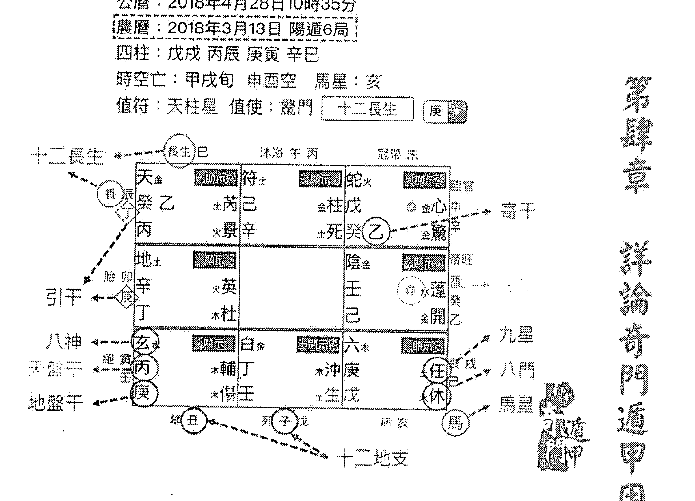

## 第十八章 断论奇门遁甲用神类象

面，吉凶影响甚大，故要记得奇门遁甲是多重性、多层次（隐）干。八卦、九宫，再加上马星和引十二地支、八神、九星、八门。基本用神（必背）：十天干、个最重要的六十四卦。谈奇门遁甲当中改变未来。所以这一章我们来谈，就可以说我们可以自助助人，进而可以解决问题、化解问题，也可以调理自身与阳宅磁场，阴盘奇门遁甲可以算命占卜。

## 十天干意象

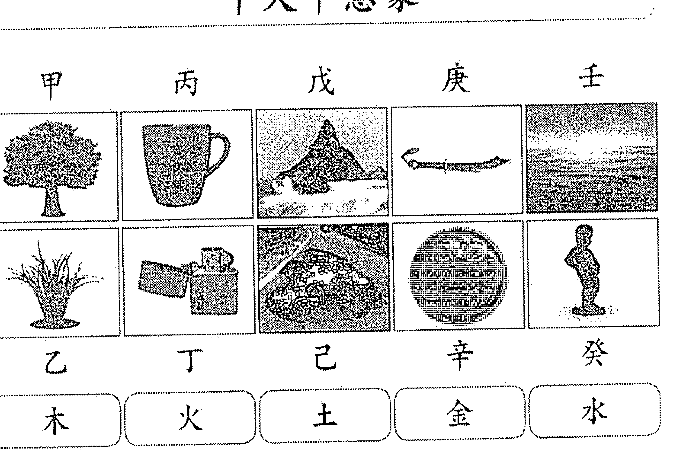

不起卦原则：
- 首先「心不动不起卦」，当下起心动念问卦或起卦感应力最强；
- 接着「无事不起卦」，开盘当下就是要与神佛共振，若常抱着玩耍的心态开盘，久而久之就没有相连接应的灵动力，效力与效用会慢慢消失；
- 最后是「无感觉不起卦」，在懵懵懂懂、迷迷糊糊，神智不清的情况下开盘，肯定会有失准的现象。

为了方便读者能够加深了解十天干、十二地支、八神、九星、八门的意象，特别将十天干、十二地支、八神、九星、八门，循序渐进完整的内容介绍，根深蒂固加深印象，以利学习效果。

##### 第一节、十天干所代表的人、事、地、物之类象

（如果能背起来最好，如果背不起来奇门软件上都有）十天干就是三奇六仪，是宇宙天象万物自然规律的变化过程，落在宫中就是一个个人或一件事情的来龙去脉，无论是显性或是隐性的状态，都可以在用神宫当中去读取。

十天干「甲」为首、「乙丙丁」三奇、「戊己庚辛壬癸」六仪称之：乙奇又称「日奇」、丙奇又称「月奇」、丁奇又称「星奇」，合称三奇。老子《道德经》曰：「道生一，一生二，二生三，三生万物。」而十天干也是依照事物发展变化的规律，甲乙东方木、丙丁南方火、戊己中央土、庚辛西方金、壬癸北方水而产生相生与相克的自然法则。

> 老子《道德经》曰：「道生一，一生二，二生三，三生万物。」

如下图示，甲是大树，是尊贵、主导，代表科甲、有地位，乙是小草，是温柔、柔弱，代表机会光明与希望，余此类推！

## 十天干意象

|      | 象意(1)         | 象意(2)     | 象意(3)         |
| :--- | :-------------- | :---------- | :-------------- |
| 甲(阳木) | 主导/掌控/科甲  | 尊贵/高档   | 头儿/符咒       |
| 乙(阴木) | 机会/希望/光明 | 情人/仁慈   | 柔弱/艺术       |
| 丙(阳火) | 机会/希望/光明 | 情人/性躁   | 乱子/权柄       |
| 丁(阴火) | 机会/希望/光明 | 情人/美女   | 迅速/光芒       |
| 戊(阳土) | 钱财/本金/金融 | 经济/信用   | 务实/阳宅       |
| 己(阴土) | 欲望/想法/策划 | 陷阱/诡计   | 杂乱/阴宅       |
| 庚(阳金) | 阻隔/霸道/暴力 | 打斗/灾害   | 官非/刚健       |
| 辛(阴金) | 错误/问题/辛苦 | 罪人/悲伤   | 创新/改革       |
| 壬(阳水) | 动态/智慧/迷茫 | 困惑/天罗   | 任性/变化       |
| 癸(阴水) | 走动/肮脏/污秽 | 困惑/地网   | 性淫/潦倒       |

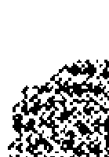
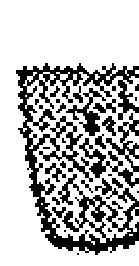
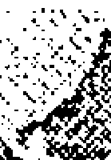

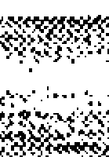
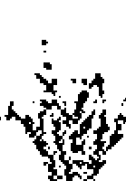
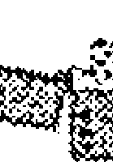
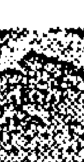
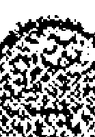
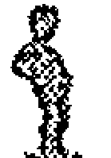

### （一）、甲的各种象意（如果能背起来最好）

「甲」在十天干为首、头儿、老大，也是「值符」。元帅出兵打仗隐藏于六仪之中，让敌人不易察觉，才能制敌于先机。测人、测物、测事临甲，意谓此人有名望，有一定的社会地位，名牌贵重高级的物品，为真货、上级品、顶头上司、直属长官。

| 人物                                                                                                                               | 特征                                           | 图像 | 天干 | 阴阳五行 | 对应方位 | 疾病                                         | 身体                                         | 外表形态                     |
| :--------------------------------------------------------------------------------------------------------------------------------- | :--------------------------------------------- | :--- | :--- | :------- | :------- | :------------------------------------------- | :------------------------------------------- | :--------------------------- |
| 首长、首领、队长、老大、头儿、冠军、尊者、上司、名人、中心人物、管理者、众所瞩目者、被人敬仰者、身强体健者。 | 大人物、将帅、总经理、高贵的、有名望的、第一的、大树、栋梁、中心。 |      | 甲    | 阳木     | 震卦·东方 | 头疼、脚疾、肝胆病症、左手                   | 头、指甲、头发、肝胆、指甲、甲状腺           | 修长高直、长方、国字脸、体健、唇厚白 |

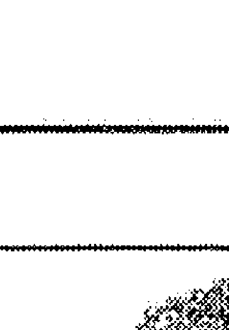

| 个性                                             | 音形义                                   | 事业求财                                   | 静物                                                                               | 景物                                                                 | 植物                                                                               | 动物                                                                                         |
| :----------------------------------------------- | :--------------------------------------- | :----------------------------------------- | :--------------------------------------------------------------------------------- | :------------------------------------------------------------------- | :--------------------------------------------------------------------------------- | :------------------------------------------------------------------------------------------- |
| 宽厚仁慈、光明磊落、挺立出众、气质高贵、庄重威严、性格直爽、心高气傲、主观武断。 | 科甲、甲壳、甲虫、很假、带壳花生、带壳龙眼、条状物、手指头、脚趾头、车船外壳。 | 茶货业、木制业、中药业、文化业、艺术业、家具、园艺、种植。 | 家具、乐器、大树、竹木、高楼、楼梯、电线杆、金银珠宝、贵石玉器、古董文物、帽子、甲胄、盔甲、盾牌、背心、纸箱。 | 首都、楼阁、草木旺盛之所、烟囱、粗柱子、房梁、高大建筑物、主管办公室、机关行号、名人居所。 | 大树、松树、杨树、乔木、向日葵、带壳的果实、花生、核桃、松子、栗子、麦角、瓜子。 | 龙、狮子、老虎、熊猫、甲壳类生物、穿山甲、玳瑁、龙虾、虾、乌龟、鳌、贝类、藤壶、螺类、螃蟹等。 |

### （一）、乙的各种象意（如果能背起来最好）

「乙」为日奇、柔顺依附、花草、机会、希望、光明、情人。测人、测物、测事临乙，代表女人、有机会与希望、乙年命之人、妻子、中医、艺术、弯曲之物、葫芦、桌椅、床、绳子，曲折性事物，受委屈之人。

| 人物                                                                 | 特征                                                                 |      | 天干 | 阴阳五行 | 对应方位   | 疾病                 | 身体                               | 外表形态             |
| :------------------------------------------------------------------- | :------------------------------------------------------------------- | :--- | :--- | :------- | :--------- | :------------------- | :--------------------------------- | :------------------- |
| 承相、妻子、副手、助手、二把手、西军、第一名、继承人、依附者、爱美者、爱打扮者、中医、艺术家、艺人、文人、作家。 | 小草、藤蔓、盆栽、低矮木制品、弯曲、曲折的机会与希望、文化艺术、质软、柔弱、忍辱负重、屈尊降贵、趋炎附势。 | （插图） | 乙    | 阴木     | 巽卦：东南 | 肝胆病、颈椎疼痛、风疾、左眉 | 头发、头顶、手脚腕、肝胆、阑尾、毛发 | 苗条、身子微驼、皮肤白嫩、瘦长脸 |

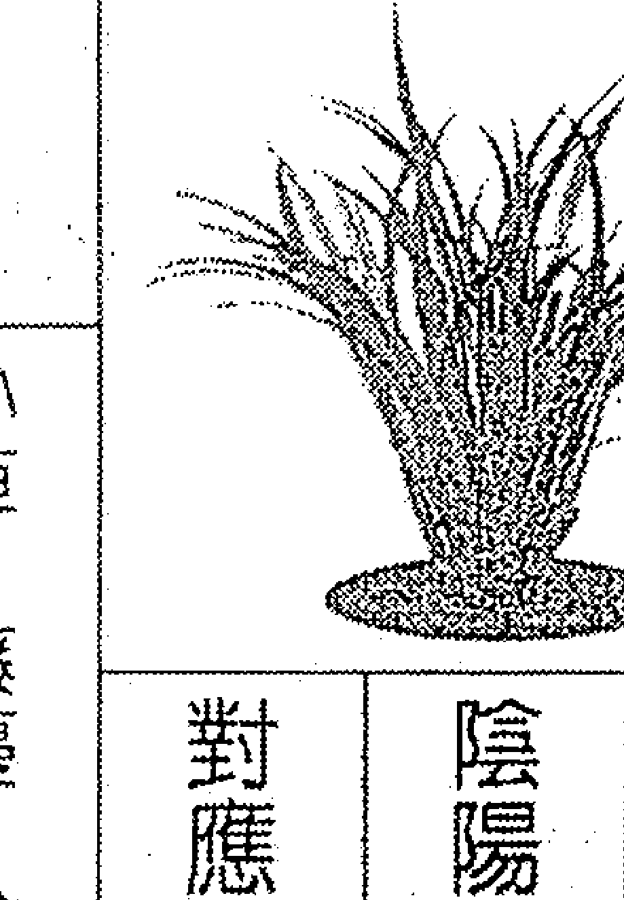

| 动物                               | 植物                                                                               | 景物                                                               | 静物                                                                 | 事业 求财                         | 音形义                                                                 | 个性                     |
| :--------------------------------- | :--------------------------------------------------------------------------------- | :----------------------------------------------------------------- | :------------------------------------------------------------------- | :-------------------------------- | :--------------------------------------------------------------------- | :----------------------- |
| 蛇、毛毛虫、龙、蚯蚓、天鹅、海参、蚕、鸟类。 | 中草药、花草、小树、柳树、桂花、灌木、葡萄树、豆田、小盆栽、爬墙虎、藤萝类植物、牵牛花、庄稼、棉花、禾苗、蔬菜。 | 风光旖旎、花木扶疏、花园、果林、菜园、管道通道、楼梯、艺术馆、图书馆、美容院。 | 家具、木器、木雕、花园、公园、栏杆、毛笔、丝织物品、床、门、窗户、软木条、藤条、艺术品、图画、葫芦、拐弯之物、椅子藤椅、办公桌、面条。 | 园艺业、蔬果种植业、艺术文化、演艺表演、木制业、家具业、中药品业。 | 艺术、椅子、床、弯曲或软的条状物、窗帘、面条、头发、手脚、牵手、小草、中医。 | 仁慈善良、朴实无华、温和儒雅、艺术气质、委曲求全、消极、不稳定、优柔寡断。 |

### （一）、丙的各种意象（如果能背起来最好）

「丙」为月奇、大火，机会希望当中带有麻烦与乱子。测人、测物、测事临丙，代表麻烦事情多，容易出乱子，婚姻易有第三者介入，它是女性的情夫；是镜子、圆形发热物、灶、官印、权柄。

| 天干 | 阴阳五行 | 对应方位 | 身体                       | 疾病                                     | 外表形态             | 特征                                                                               | 人物                                 |
| :--- | :------- | :------- | :------------------------- | :--------------------------------------- | :------------------- | :--------------------------------------------------------------------------------- | :----------------------------------- |
| 丙   | 阳火     | 离卦·南方 | 额、肩、眼目、视力、小肠、血压 | 上火炎症、烧烫伤、眼疾、心病、高血压     | 体态丰满、圆脸短发、肤白透红、少髯鬓 | 机会希望光明、笑容满面、影视传播、热情活跃、虚心学习、急速刚猛、权力权柄 | 热心者、不怒而威者、领导者、将军、关公、威权者、帝王、霸主、第二者 |

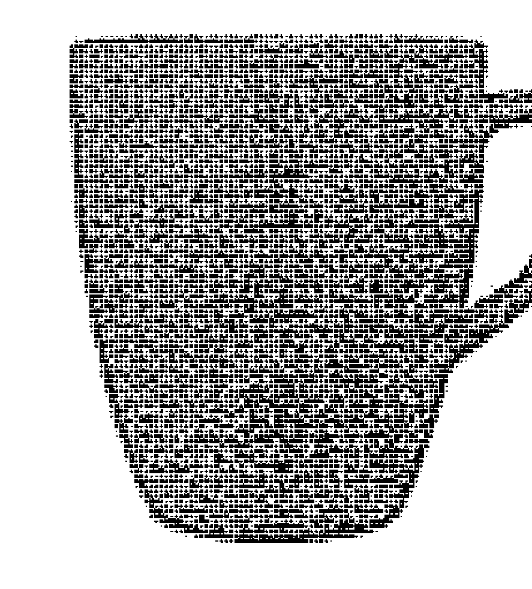

| 个性                                     | 音形义（丙）                                                                 | 事业求财                                                                       | 静物                                                                                                                               | 景物                                                                                   | 植物                                                                                             | 动物                                 |
| :--------------------------------------- | :--------------------------------------------------------------------------- | :----------------------------------------------------------------------------- | :--------------------------------------------------------------------------------------------------------------------------------- | :------------------------------------------------------------------------------------- | :----------------------------------------------------------------------------------------------- | :----------------------------------- |
| 激情暴烈、热情不续、强悍威严、重情重义、缺乏耐心、缺乏耐力、爱面子、虚荣心强。 | 太阳、炉火、厨房、饼干、眼镜、电器、权柄、有柄之物、圆形物、肉饼、上禀、翻脸、翻桌、打扫。 | 文书、影视文化、电子电器业、网络、化工、化学物品、锅炉、烟酒、鞭炮、玻璃制品、照明、摄影。 | 飞机、炮火、电器、电话、光碟、圆形物、文件合同、信件包裹、书籍、字画、眼镜、武器、窗户、灯、灶、剧场、球类、礼服礼品。 | 窑灶炉冶炙热之所、向阳热开之地、阳台、屋顶、太阳、明亮场所、厨房、电器、高压电、电力厂、化工厂。 | 向日葵、绣球、红色或圆形花木果实、带柄的梨子、榴种、樱桃、芭乐、西瓜、南瓜、莲蓬、苹果、荔枝。 | 凤凰、禽鸟类、圆胖的动物，如马、牛、猪、孔雀、熊猫。 |

### （四）、丁的各种象意（如果能背起来最好）

「丁」为星奇，三奇当中最好。乙奇——曲折机会、丙奇——麻烦乱子的机会、丁奇——最神奇直接的机会。测人、测物、测事临丁，代表找人协助要找未婚小女孩，男测为情人，女测有可能为别人的情人；临丁点香祈福，求神拜佛助力最大。

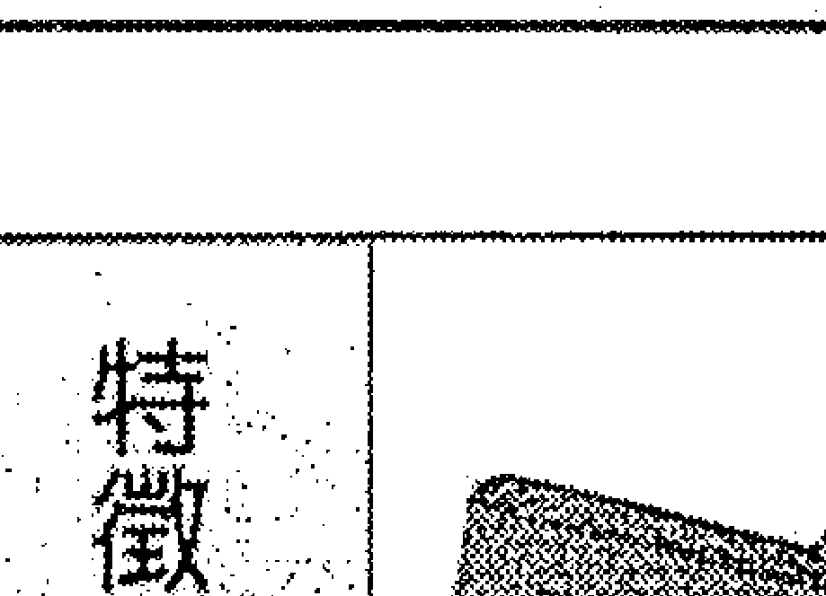

| 天干 | 阴阳五行 | 对应方位   | 外表形态                     | 身体                             | 疾病                         | 特征                                                                               | 人物                                         |
| :--- | :------- | :--------- | :--------------------------- | :------------------------------- | :--------------------------- | :--------------------------------------------------------------------------------- | :------------------------------------------- |
| 丁   | 阴火     | 离卦：南方 | 秀丽清高、肤白粉嫩、发细而长、额宽颊尖 | 心脏、眼、舌、血压、牙、神经、男性器 | 心脏疾病、烫灼伤、血液疾病、热疾炎症 | 直接的机会与希望、名望、荣誉、吸引目光、装模作样、装腔作势、虚伪奉承、热情华丽、尖锐带刺、咄咄逼人、消息、讯息、医学、玄学、暧昧、诱惑、挑逗。 | 玉女、美女、文人、作家、舞者、演员、术士预测师、宗教人士、牙医。 |

| 动物                                     | 植物                                     | 景物                                                           | 静物                                                                                                                                                           | 事业求财                         | 音形义                                                                               | 个性                     |
| :--------------------------------------- | :--------------------------------------- | :------------------------------------------------------------- | :------------------------------------------------------------------------------------------------------------------------------------------------------------- | :------------------------------- | :----------------------------------------------------------------------------------- | :----------------------- |
| 叮咬的动物或昆虫、蚊子、跳蚤、蜜蜂，带刺的动物或昆虫，刺猬、野猪、腾蛇。 | 带刺的植物或果实、辣椒、玫瑰、美人蕉、仙人掌。 | 干燥炎热与烟雾阴霾的地方、丁字路口、屋角、墙角、屋顶、屋檐、塔、美容院。 | 灯烛、蜡烛、香火、火柴、打火机、钉子、小刀、注射器、牙签、手术刀、小花、香烟、烟火、子弹、丁字路口、电话、手机、拐杖、电、灶、网络、文书文字、首饰、文章图书、报章杂志。 | 灯具照明业、演艺事业、善用口才的相关行业、摄影、网络、化工业、烟酒、鞭炮、文化、玻璃业。 | 灯、男丁、叮叮当当、紧盯、钉子、蚊子叮咬、高跟鞋、丁状物、丁字路、立灯、香、香烟、叮咛、补丁、男性器。 | 温柔体贴、利益他人、心思缜密、聪明智慧、苛刻严格、执着、咬住不放、洞察奸邪。 |

### （五）、戊的各种象意（如果能组合起来最好）

「戊」为阳土，是大地孕育的土地，为钱财、资金、阳宅、墙面。测人、测物、测事临戊，代表身体多肉、四肢发达、胸部、鼻子等多肉的部位；若宫内有病，则戊就好像高山一样，凡事不顺，重重阻隔。

| 天干       | 戊             |
| :--------- | :------------- |
| 阴阳五行   | 阳土           |
| 对应方位   | 艮卦·东北      |
| 外表形态   | 形态敦厚、四方脸、皮肤黄白、丰腴多肉 |
| 身体       | 鼻、胸、乳房、胁肋、胃脾、食道、皮肤 |
| 疾病       | 胃疾、皮肤病、肿瘤包块、疼痛肿胀     |

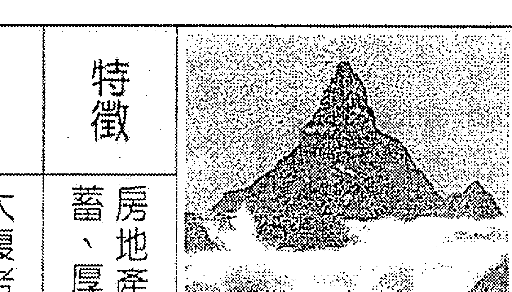

- **特征**：房地产、资本、金融、经济、会计、中介、房子、忠诚可靠、兼包容蓄、厚德载物、中正包容、宽厚大方、守信忠诚、缓慢。
- **人物**：大腹者、会计、金融业者、土地不动产商、中介者、巾帽者、名望小气。

| 动物                       | 植物                                                                               | 景物                                                                 | 静物                                                                 | 事业求财                               | 音形义                     | 个性                                     |
| :------------------------- | :--------------------------------------------------------------------------------- | :------------------------------------------------------------------- | :------------------------------------------------------------------- | :------------------------------------- | :------------------------- | :--------------------------------------- |
| 熊、狗、牛、猪、大象、熊猫（肉多）。 | 叶子宽厚或肉质多者，芭蕉、菊花、向日葵、包心菜、杨树、南瓜、白薯、土豆、山药、萝卜、大草坪。 | 宽广空旷、山地丘陵、寺院、仓库、坟地、庭院、起居室、客厅、墙壁、堤防、陵园、仲介所、顾问机构、水泥厂等。 | 房屋建筑、广场、高坡护岸、高台城墙、古董、旧物、陶土制品、瓷器杯碗瓢盆、砖瓦、水泥制品。 | 土地建筑业、金融、会计、仲介、房地产、矿产、矿石、陶器、磁器、肉品加工、农业发展。 | 务实、屋、大地、山地、丘陵、天空、彩霞、高旷、云雾、钱包、食物、悟。 | 忠厚、老成、果敢豪杰、诚实信用、慢性子、行动迟缓、呆板、愚笨、固执白目、嘴拙。 |

### （六）、‘己’的各种象意（如果能配起来最好）

「己」为阴土，戊为阳土凸起，己为阴土凹陷、虚像、空幻、垃圾、肮脏、不真实。测人、测物、测事临己，代表矮小、想法多、小心眼、自信心不足、弯曲之象，若宫内有病，则己就是花花肠子，天马行空，不切实际，爱幻想之人。

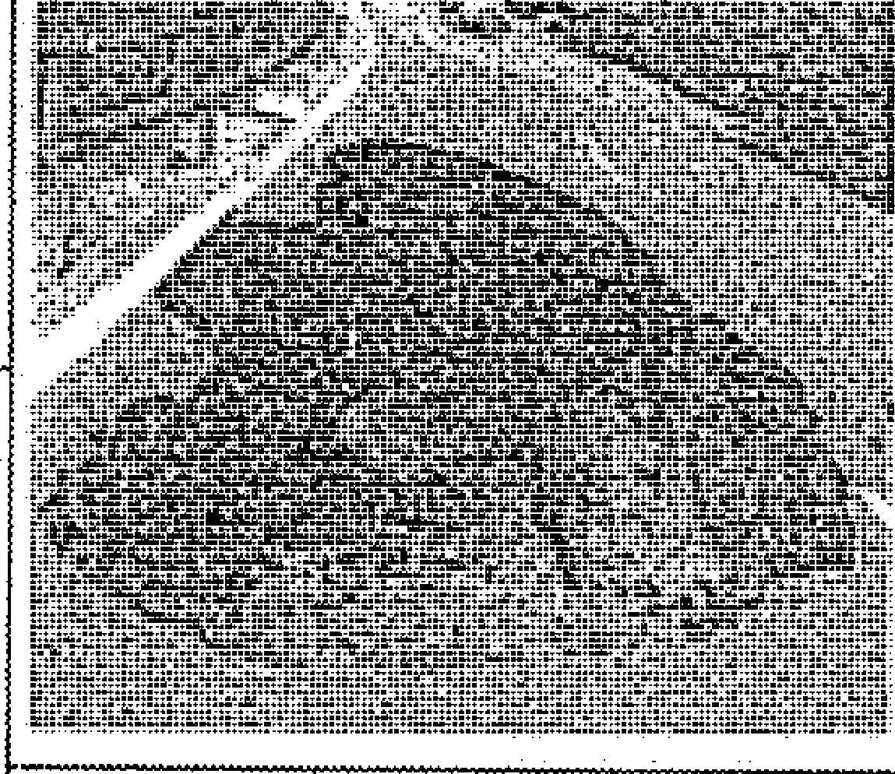

| 天干 | 阴阳五行 | 对应方位   | 外表形态                     | 身体                       | 疾病             | 特征                                                                               | 人物                     |
| :--- | :------- | :--------- | :--------------------------- | :------------------------- | :--------------- | :--------------------------------------------------------------------------------- | :----------------------- |
| 己   | 阴土     | 坤卦、西南 | 形体单薄、柔弱丑陋、忧愁抑郁、温顺恬静 | 脾、胰腺、皮肤、嘴、乳头、肚脐、肛门 | 胃脾之疾、消化不良、腹痛 | 和善、和气、柔婉、守成、预测、策划、欲望、私欲、邪念、创意、花花肠子、拐弯抹角、弯弯曲曲、节约、吝啬、杂乱。 | 农夫、记者、经纪人、主持人、画框尾、农妇人、清洁人员。 |

| 个性                                                                               | 音形义                     | 事业求财                                                               | 静物                                                                               | 景物                                                                                         | 植物                                                                                                 | 动物                                                                                     |
| :--------------------------------------------------------------------------------- | :------------------------- | :--------------------------------------------------------------------- | :--------------------------------------------------------------------------------- | :------------------------------------------------------------------------------------------- | :--------------------------------------------------------------------------------------------------- | :--------------------------------------------------------------------------------------- |
| 含蓄谨慎、猜忌多疑、多静少动、温顺沉静、能屈能伸、忍辱负重、以柔克刚、策划能力强、主意想法多、诡计多端、机智圆滑、花花肠子。 | 拥挤、弯曲、鞠躬、点头、阳台、打坐、跪拜、纠结、缠绕。 | 土地田园、隧道工程、探勘、广播传媒、策划、仲介、陶瓷业、矿石、卫生清洁、肉品加工。 | 土地、围墙、陶土泥制工艺品、卷曲状物、绳索、信件、架子、线圈、皮带、抽屉、开口物、电线、食物、垃圾、大便。 | 田野乡村、庭院、房屋、坟地、平原、坑沟、下水道、湿地、坟地、菜地、低洼地、阳台、洗手间、厕所、垃圾肮脏污秽之物。 | 卷曲未开与含苞待放的花蕾、含欢花、大小白菜、高丽菜、甘草、洋葱、菊花、含羞草、植物的芽、豆芽。 | 牛、蜗牛、草鱼、鳄鱼、卷曲形体弯曲或休眠的动物，蛇、熊、穿山甲、龟、蟹、猫、狗。 |

### （七）、庚的各种象征（如果能画起来最好）

「庚」为阳金，性质刚硬健壮，最具有破坏性。天干相合性质不变其中之一，甲己合为土（己土其性不变）、乙庚合为金（庚金其性亦然）。测人、测物、测事临庚代表阻隔、障碍、仇人、军警、黑道，难以解决的事就是庚金。

| 天干 | 阴阳五行 | 对应方位   | 外表形态             | 身体                         | 疾病                           | 特征                                                                               | 人物                                                                                               |
| :--- | :------- | :--------- | :------------------- | :--------------------------- | :----------------------------- | :--------------------------------------------------------------------------------- | :------------------------------------------------------------------------------------------------- |
| 庚   | 阳金     | 乾卦：西北 | 形体瘦长、脸长肤白、筋骨强健 | 骨骼、牙齿、大肠、肺、咽喉、呼吸道 | 骨骼病、病毒性疾病、咳嗽、口腔炎 | 阻碍阻隔、阻力障碍、威猛强悍、蛮横强硬、交通事故、道路风波、技术过硬、敌人仇人、打斗、刚健、灾害、车祸、骨头、肃杀 | 领导、路人、丈夫、军警、外科医生、运动员、大力士、勇者、武师、伐木工人、敌人、强盗劫杀者、屠夫、刽子手 |

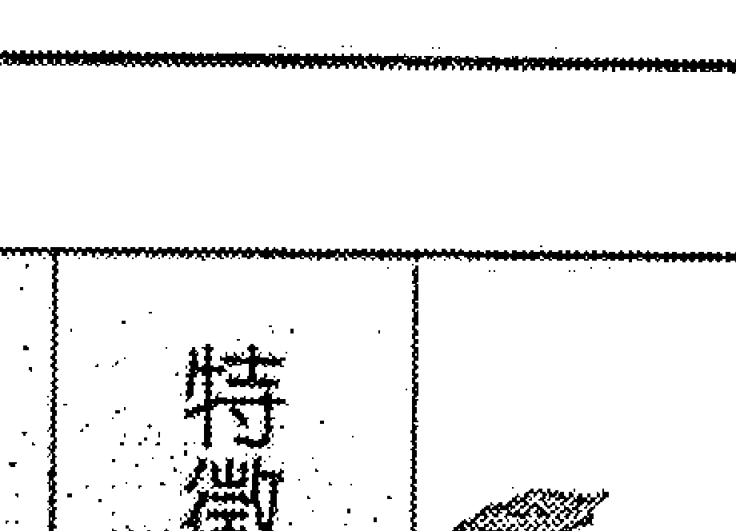

## (八)、辛的各種象意 (如果能記起來最好)

「辛」為陰金，為貴金屬，珠寶首飾與裝飾之金。測人、測物、測事臨辛，代表錯誤、變革、創新，但也表示機會的到來，辛也是精子、改革者，當任何宮位遇上四害裡面有辛的時候，都可以直接用辛來置換予化解。

| 動物 | 植物 | 景物 | 靜物 | 事業求財 | 音形義 | 個性 |
|------|------|------|------|----------|--------|------|
| 兇狠或硬殼的動物、老虎、豹、獅子、鱷魚、烏龜。 | 植物樹幹、樹根、果實、核桃、椰子、果殼。 | 高速公路、國道、省道、道路、四通八達之處、關卡、收費站、鐵絲網、鋼鐵廠、礦山、機械。 | 車輛、健身器材、刀劍槍械、斧頭、鐵器、鋼材、機器、石磚、石製品、石獸、門窗、骨類、飛機、金屬製品。 | 金屬建材、鋼鐵礦石、金融、軍警、機械、橋梁、道路、車船、黑社會、違法的行業。 | 白虎、大白虎、惡性病、傷疤、車禍、糞、金剛經、心經、頭部、更換。 | 剛健敏銳、堅忍不拔、剛強威武、暴躁、固執、大義凜然、強硬、霸道、武斷、銳利、激進、倔強、不服管教、不服輸、兇惡、野蠻、殘暴、肅殺。 |

| 天干 | 阴阳五行 | 对应方位 | 外表形态 | 身体 | 疾病 | 特征 | 人物 |
|---|---|---|---|---|---|---|---|
| 辛 | 阴金 | 兑卦·西方 | 身形修长、腮陷脸长唇白粉润 | 口、牙、肺、喉咙、骨、刺、脊骨、瘤、痘 | 咳嗽、肺部、呼吸系统疾病、骨骼病症 | 错误、障碍、阻力、革新、变革、改革、创新、颗粒、花、假花、毒药、犯罪、牢狱、交通事故、小道消息、废气、亮丽、嫉妒、排斥、刑具。 | 少女、演艺歌手、音乐人、巫师、说客、仲介、掮客、革命者、改革者、情报人员、罪犯、犯错者。 |

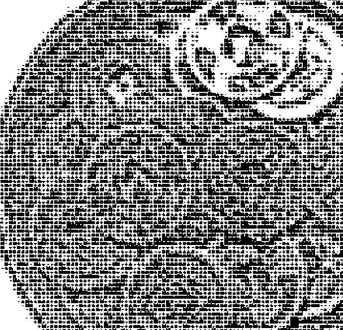

| 個性 | 首形義 | 事業求財 | 靜物 | 景物 | 植物 | 動物 |
|------|--------|----------|------|------|------|------|
| 溫潤秀氣、好面子得失心重、虛偽不實、愛慕虛榮、意志不堅、變革創新之人、洗心革面之人。 | 心經、水晶、銅板、革新、辛辣、新鮮、辛苦、心境、心情、花心、小 | 金銀珠寶業、金融貨幣業、金屬裝飾業、評論演說家、創新研發行業、軍警罪犯相關行業。 | 金銀珠寶、鑽石玉器、奇石珍品、戒指耳環、鐘錶手錶、刀劍、剪刀、小刀、鑰匙、小飾品、針、筆、錢幣、水晶、電冰箱、餐具、酒器、保險櫃、樂器、化妝品、螺絲、印章、骸骨、屍體。 | 沼澤、小路、門窗、道路、石塊、水泥、金屬首飾工藝廠、蔽陰隱密之所。 | 顆粒狀糧食與小型花卉、大豆、高粱、稻穀、小麥、玉米、花生、仙人球、植物種子。 | 雞、母老虎，人與動物身上寄生的生物或病毒，直徑小於一公分的蟲類與動物的卵或胚胎。 |

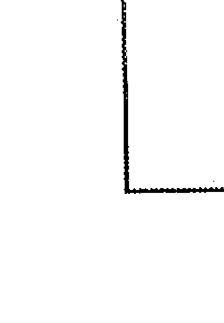

「壬」為陽水，是動態與變化，為江河與大海之水。測人、測物、測事臨壬，代表天牢受困、牢獄之災、天羅地網、騰蛇、玄武、迷茫、聰明智慧、妊娠懷孕；水多行動艱難容易被困淹沒，火多則纏繞麻煩事多。

| 天干 | 壬 |
|---|---|
| 陰陽五行 | 陽水 |
| 對應方位 | 坎卦、北方 |
| 外表形態 | 膚色稍黑、大眼睛、走路搖擺、長髮秀眉 |
| 身體 | 膀胱、髮、眼、耳、泌尿血液循環、動脈 |
| 疾病 | 泌尿攝護腺疾病、耳疾、腿疾 |
| 特徵 | 危險、困境、善變、迷惘、迷茫、陰陷、漂泊、流動、旅遊、運輸、聰明、智慧、慵懶。 |
| 人物 | 中男、聰明智慧、船夫漁者、退休閒人、消防人員、海軍、司機、孕婦。 |

| 個性 | 音形義 | 求財事業 | 靜物 | 景物 | 植物 | 動物 |
|------|------|------|------|------|------|------|
| 智謀好動、縱欲任性、水性楊花、勇敢威嚴、包容熱情、目標不明、性情不定、柔順、陰險。 | 放任、任性、韌性、姙娠、懷孕、騰蛇、天羅地網、玄武、胎記、蜘蛛人。 | 水產養殖、茶酒飲品、娛樂餐飲、物流運輸、航運、貿易、飯店、石油、水彩、洗浴業。 | 清潔用具、過濾器具、飲水機、排水設備、洗手機、廚房、水管、被子、窗簾、圖片、燈罩、水池、自來水、消防用品。 | 大海、江河、湖泊、河流、溪澗溝渠、道路、水流之處、人潮之地、電影院、娛樂場所、禮堂、會堂、飯店車站、碼頭、機場、監獄。 | 蓮花、荷花、菱角、海帶、水草。 | 水中物、魚、蝦、蟹、龜。 |

## (十)、癸的各种意象（如果能联想起来最好）

「癸」为阴水，滋生万物雨露点滴之水。癸水是小变化、小痣、小胎记；壬水是大变化、大黑痣、黑色胎记。测人、测物、测事临癸，代表天罗地网、牢狱受困、眼泪、女性生殖器、足、鞋。在十天干中与庚都是最不好的意象符号。

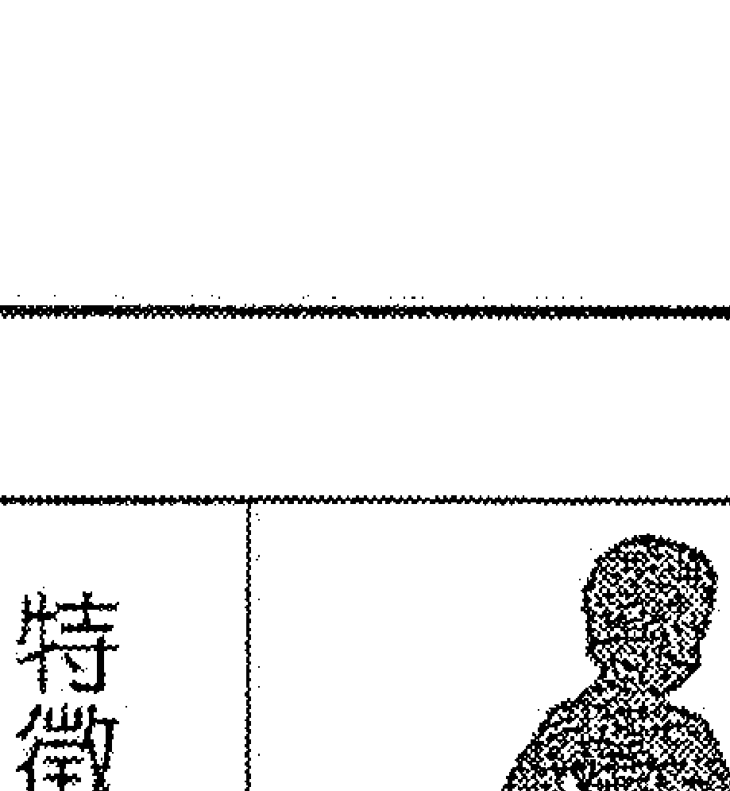

| 天干 | 阴阳五行 | 对应方位 | 外表形态 | 身体 | 疾病 |
|------|----------|----------|----------|------|------|
| 癸   | 阴水     | 坎卦、北方 | 身形矮小、肤黑不俊、脸圆唇厚、声调低平 | 足、眼、生殖系统、私处、静脉、肾脏 | 性病、肾脏病、妇科疾病、脾虚、畏寒 |

- 酒鬼、淫荡之人、囚犯。
- 盗贼骗子、黑道流氓、贩毒吸毒、心理医生、参谋策划、茶农、菜农。

- 偷渡走私、盗窃贩毒、制约管束、变化、变动、流动、性、淫、麻烦、困境、欺骗、卑鄙、下流、私通、苟且、丑陋。

個性

智謀聰明、機敏精靈、陰柔怕事、弱小保守、多愁善感、猶豫不決、不能自主、多情多慾、善變。

音形義

偷窺、虧損、負能量、骯髒、污穢、騰蛇、天羅地網、玄武、痣、蜘蛛人。

事業求財

物流運輸、海鮮水產、汙水垃圾環保相關行業、茶酒飲品、娛樂餐飲。

靜物

茶、鹽、酒、醋、湯、粥、垃圾髒水、破爛汙穢、液體物品、毒品、報廢品、眼淚、黑墨、油漆、雨具、圖片、鞋。

景物

湖泊、井水、泉水、濕窪地、垃圾場、池塘、水池、水坑、水庫、沼澤、廁所、水塔、地下水、汙水、糞池、淫穢場所。

植物

水稻、水仙、蔬菜水果、喜水植物、枯葉。

動物

水中物、魚、蝦、龜、鰲。

##### 第二节、十二地支所代表的人、事、地、物之类象

（如果能背起来最好，如果背不起来奇门软件上都有）

十二地支与十天干符号都有各自所属的象意，是我们论断事情细节始末与事物发展重要的脉络依据。十二地支有其阴阳、五行、生肖、二十四山的八卦宫位，天干地支二十二个字都是宇宙万物的代表，除了阴阳之外，永远离不开五行「木火土金水」，所以任何事物就是相对论，有日有月、有圆有缺、有起有落、有男有女，掌握阴阳五行，就能够让你的奇门遁甲更上一层楼。
我们将分成四组，以十二地支的三会来做介绍，让读者能够更加深对于十二地支深刻的了解。

- ★一寅卯辰——三会东方木（春天）
- ★一巳午未——三会南方火（夏天）
- ★一申酉戌——三会西方金（秋天）
- ★一亥子丑——三会北方水（冬天）

### 九宫十二地支

| 巳 | 午 | 未申 |
| :---: | :---: | :---: |
| 卯 | 地支 | 酉 |
| 寅丑 | 子 | 戌亥 |

### 九宫方位五行

| 东南 木 | 南 火 | 西南 土 |
| :---: | :---: | :---: |
| 東 木 | 空間 | 西 金 |
| 東北 土 | 坎 水 | 西北 金 |

### 九宫时间

| 07-11 | 11-13 | 13-17 |
| :---: | :---: | :---: |
| 05-07 | 時間 | 17-19 |
| 01-05 | 23-01 | 19-23 |

### 九宫八卦

| 巽 | 離 | 坤 |
| :---: | :---: | :---: |
| 震 | 宮位 | 兌 |
| 艮 | 坎 | 乾 |

公曆：2018年12月18日0時34分
農曆：2018年11月12日 陰遁8局
四柱：戊戌 甲子 甲申 甲子
時空亡：甲子旬 戌亥空  馬星：寅
值符：天任星 值使：生門 十二長生

甲 V

| 論父親 | 論母親 | 論兄弟 | 論姐妹 |
|--------|--------|--------|--------|
| 論兒子 | 論女兒 | 論配偶 | 問測者 |

病巳 死午癸 墓未 衰辰己 帝旺卯庚 临官寅丁 馬 冠帶丑 沐浴子壬 長生亥 絕甲辛 胎酉丙 養戌乙

| 地土 壬 壬 木輔 乙 木杜 乙 | 玄水 乙 乙 火英 丁 辛 火景 丁 辛 | 白金 辛 辛 土芮 甲 辛 土死 戊 |
| 天金 癸 癸 木沖 木傷 | 禽 己 己 | 六木 己 己 金柱 金驚 |
| 符土 戊 戊 土任 丙 土生 丙 | 蛇火 丙 丙 水蓬 庚 水休 庚 | 陰金 庚 庚 ○金心 開 |

| 空亡 | 入墓 | 擊刑 | 門迫 | 干伏吟 | 門伏吟 | 星伏吟 | 干反吟 | 門反吟 | 星反吟 |
|------|------|------|------|--------|--------|--------|--------|--------|--------|

## 筆記欄

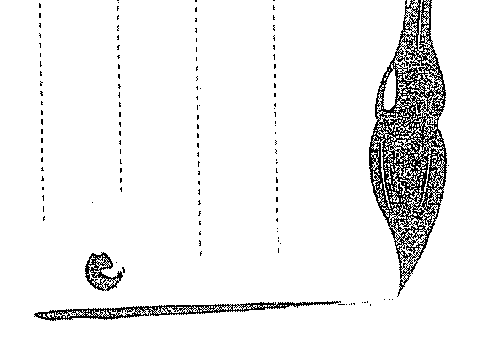

## （一）『亥子丑』三方北方水

### 1、亥的各種象意（如果能背起來最好）

『亥』為陰水，與天干『癸』可以互相轉化，所以亥水本身也具有癸水的性質。與水、金融、亥豬等行業有關，亥在乾宮，為開門，代表開創、開拓、求職、就任、貴等。

| 特徵 | 對應方位 | 身體 | 疾病 | 時間 | 外表形態 |
|------|----------|------|------|------|----------|
| 恐懼害怕、膽怯驚訝、淫慾色情、偷情盜竊、漂亮絢麗、沉溺、疑惑、危險、流動、祈禱、光明 | 乾宮、西北 | 頭、足、膀胱、腎臟、乳房、內分泌系統 | 性病、生殖系統疾病 | 21:00～23:00 | 膚黑圓胖、氣質脫俗 |

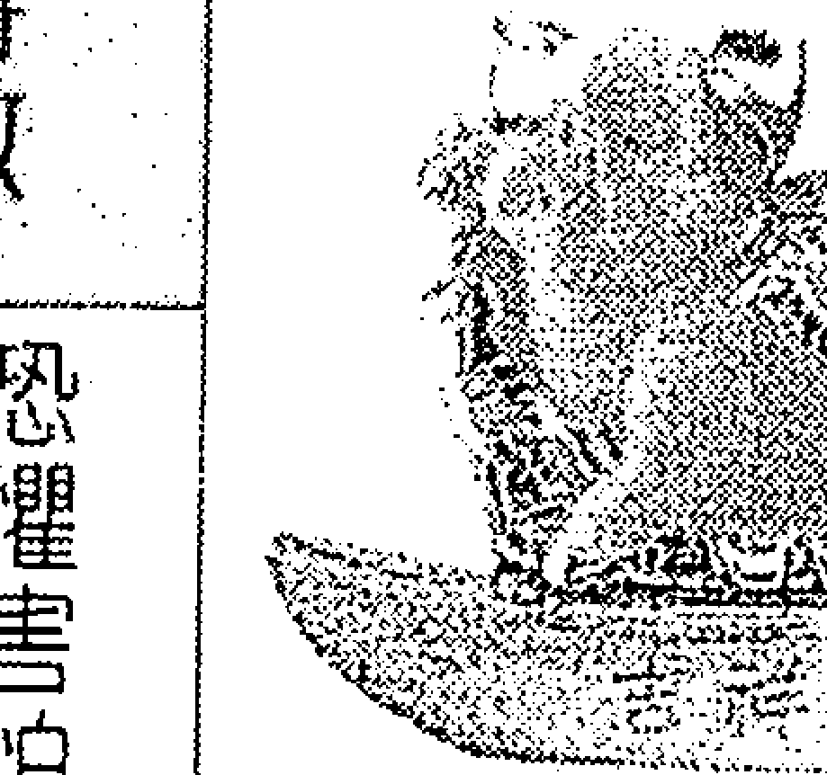

| 動物 | 植物 | 景物 | 靜物 | 求財 | 人物 |
|------|------|------|------|------|------|
| 魚、豬、龍、熊貓、狐狸。 | 水中植物、蓮花、荷花、水草、梅花、葫蘆。 | 河流、湖泊、池塘、水道、溝渠、水井、浴場、泳池、廟宇、寺院、塔、涼亭、蓬子、衛浴間、渡口。 | 筆墨書畫、茶酒飲品器具、水產、珍珠、雨具、窗簾、被子、飲水機、墨鏡、帽子、鞋、圓形物、碗。 | 水產養殖、行政文書、書法家、作家、畫家。 | 貴婦、醫生、國之棟樑、孩童、智者、演藝者、性感者、風流者、相士、僧人、道士、漁者、養豬戶。 |

### 2、子的各種象意（如果能背起來最好）

「子」為陽水，與天干「壬」可以互相轉化，所以子水本身也具有壬水的性質。與水產養殖、物流運輸等行業有關；子在坎宮，為休門，代表遠行、婚姻家庭、休養生息、婚姻嫁娶、見貴等。

- 領袖
- 第一
- 名人
- 思考
- 智慧
- 圓融
- 胎兒
- 性淫

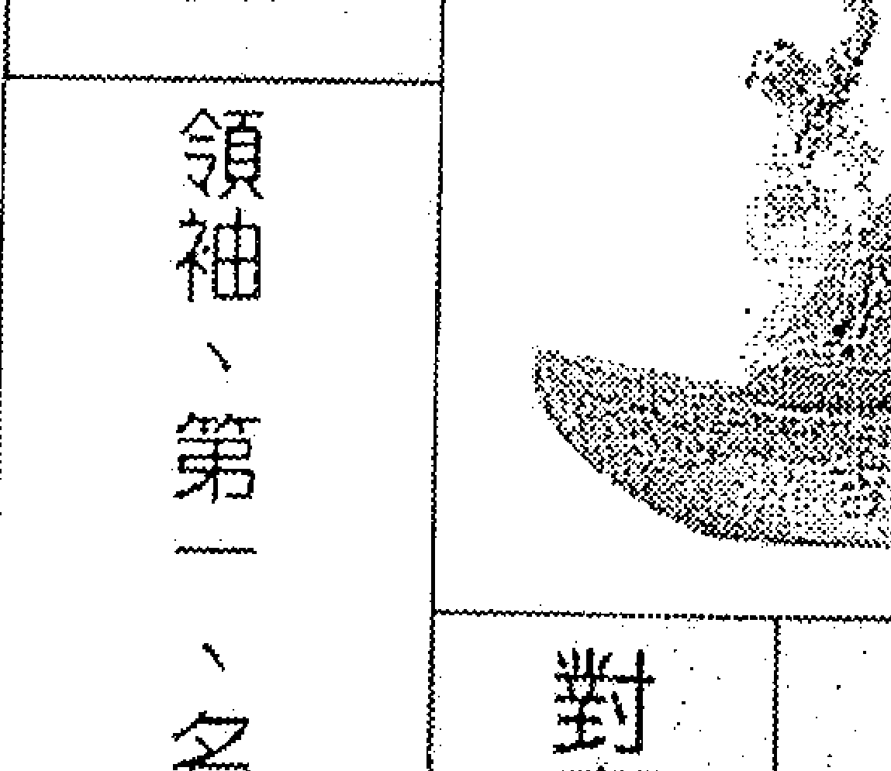

| 時間 | 陰陽五行 | 對應方位 | 外表形態 | 身體 | 疾病 |
|------|----------|----------|----------|------|------|
| 23:00~01:00 | 子：陽水 | 坎宮：北方 | 膚黑圓臉、漂亮窈窕 | 泌尿系統、性器、腰、血液、喉嚨、耳朵 | 性病、生殖系統疾病 |

| 人物 | 求財 | 靜物 | 景物 | 植物 | 動物 |
|------|------|------|------|------|------|
| 風流好色、淫女淫婦、江湖人、聰明者、技術員、孩子、藝人、畫家、美容師、黑臉者、偷盜者。 | 水產養殖、茶酒飲品、物流買賣運輸業。 | 首飾耳環、茶酒飲品器具、車篷帷幕、衛生清潔器具、交通工具、化妝品、冰、水、水缸、魚缸、風箏、消防設備。 | 與水有關之處、溪澗溝渠、河流、湖泊、水池、游泳池、井水、瀑布、淨水廠、水管、廁所、濕地、妓院。 | 蘆葦、水草、水稻、荷花、金桔、西瓜、草莓、種子。 | 鼠類（老鼠松鼠袋鼠等）、水裡動物、小型動物、夜行性動物、蝙蝠、魚、燕子、蝴蝶、蜻蜓、蒼蠅、蚊子。 |

### 3、丑的各种象意（如果能背起来最好）

「丑」為陰土，五行「土」沒有互相轉化的天干。辰戌丑未四墓庫都代表財運、官運、事業運、磁場大之意；能量好的時候有活力、有衝勁、有魅力，能量不好的時候個性固執、執拗、牛脾氣。

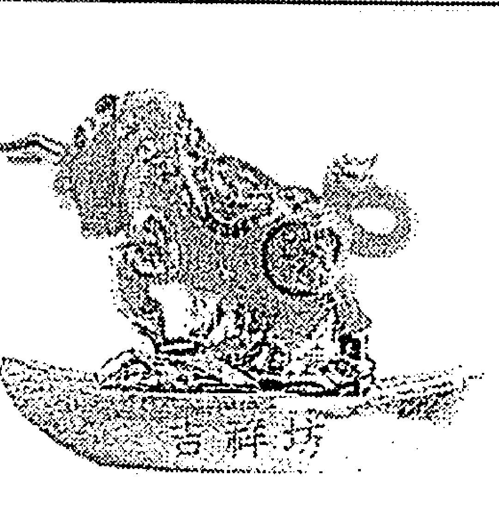

| 特徵 | 陰陽五行 | 時間 |
| --- | --- | --- |
| 正直忠厚、賢慧、福德、缺陷、骯髒、淫穢、不和諧。 |  |  |
| 對應方位<br>艮宫·東北 | 丑·陰土 | 01:00~03:00 |
|  | 身體<br>胃脾、足、腹、腫塊 | 外表形態<br>膚色淡黃、長臉偏矮 |
| 疾病<br>胃脾疾病、足疾 |  |  |

| 人物 | 求财 | 静物 | 景物 | 植物 | 动物 |
|------|------|------|------|------|------|
| 地主、工匠、神占、农矿工、地产商、矮胖、壮汉、僧人。 | 水产养殖、金银珠宝、珍珠翡翠。 | 金库、珠宝首饰、帽子、雕像、鞋、车、枯树、骷髅、大便。 | 池塘、仓库、圆环、帷幕、湿土、沼泽、田园、地下室、下水道、礼堂、寺庙、祠堂、教室、监狱、银行、客厅、庭院、大地、坟墓、桥梁。 | 根茎植物、红薯、木薯、山药、土豆。 | 牛、羊、马、猪、斑马、大象、骆驼、乌龟、天鹅、蜈蚣。 |

## (二) 『寅卯辰』三會東方木

### 1、寅的各種象意（如果能背起來最好）

『寅』為陽木，與天干『甲』可以互相轉化，所以寅木本身也具有甲木的性質。環境中代表一切高大木製品，硬的直的條狀物，向上伸展，寅在艮宮，為生門，代表投資、洽商、求職、求醫、種植等。

| 特徵 | |
|------|------|
| 時間 | 03:00~05:00 |
| 陰陽五行 | 寅、陽木 |
| 對應方位 | 艮宮、東北 |
| 外型形態 | 臉型圓短、髮黃個高 |
| 身體 | 頭、毛髮、肝膽、筋脈、神經、尾椎、手 |
| 疾病 | 肝膽、筋膜炎疾病 |

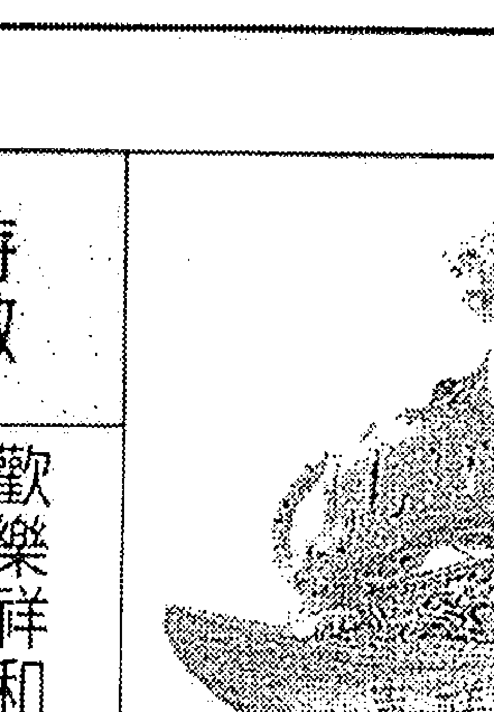

- 歡樂祥和
- 婚姻喜慶
- 教育
- 藝術
- 經濟
- 表演
- 創意
- 化妝
- 變化
- 開始

| 人物 | 求财 | 静物 | 景物 | 植物 | 动物 |
|------|------|------|------|------|------|
| 警察、医生、丈夫、秘书、文化工作者、矿工、桥梁工程师、电信网络人员、樵夫。 | 山林与园林相关行业、木制品相关行业、桥梁兴建。 | 床、书柜、桌椅、橱柜、炉灶、香炉、箱子、柜子、梯子、家具、衣帽、鞋、奖状、书画。 | 电厂、山林、桥梁、塔、电杆、花园、公园、草坪、梯田、茅屋、办公室、寺庙、政府机关、文化场所、丘陵、楼梯。 | 竹林、报春花、香炉瓜、大树。 | 虎、豹、猫、狐狸、豺狼。 |

### 2、卯的各种象意（如果能連起來最好）

「卯」為陰木，與天干「乙」可以互相轉化，所以卯木本身也具有乙木的性質。環境中代表小草、盆栽、藤蔓，數量為多，而且放的時間一般都已經很久了。

卯在震宮，有傷門，代表舞蹈、競賽、捕獵、討債之情事等。

| 特徵 | 快速、震動、搖擺、流動、偷盗、偷窺、文化、藝術、歡樂、祥和。 |
|---|---|
| 時間 | 05:00~07:00 |
| 外表形態 | 瓜子臉型、漂亮個高 |
| 陰陽五行 | 卯·陰木 |
| 身體 | 毛髮、肝膽、四肢、頸椎、腰 |
| 對應方位 | 震宮·東方 |
| 疾病 | 肝病、神經系統疾病 |

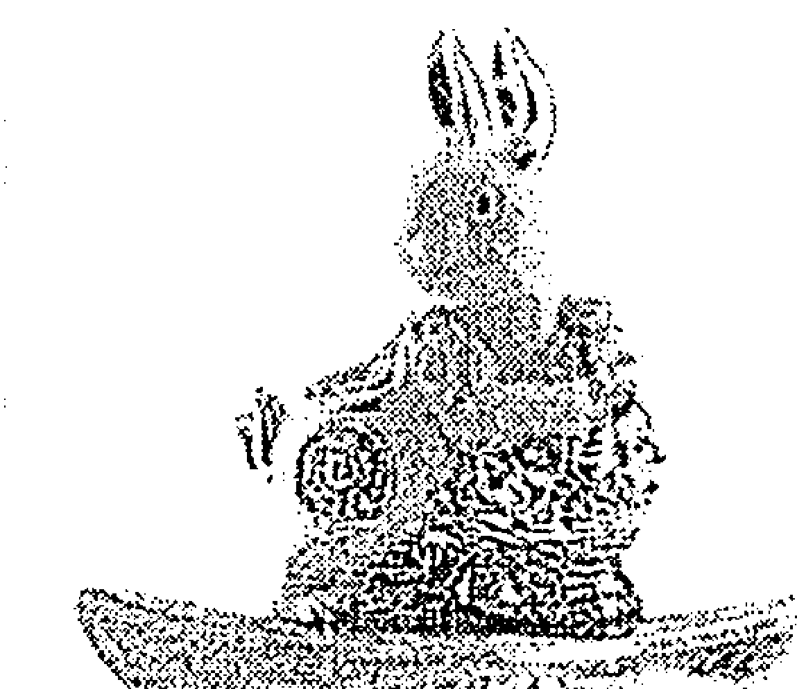

| 動物 | 植物 | 景物 | 靜物 | 求財 | 人物 |
| :--- | :--- | :--- | :--- | :--- | :--- |
| 兔、青蛙、螳螂、蜻蜓、蜘蛛、蚊子、蝴蝶、螞蟻、螻蛄。 | 藤蔓植物、柳樹、桃樹、蘆葦、竹子、富貴竹、牽牛花、蘭花、絲瓜、荸薺。 | 道路、山林、草地、公園、園藝、傢俱廠、建材行。 | 打擊樂器、門、門窗、衣架、花草樹木、車、船、傢俱、竹木製品、椅子、床、圖書、中藥材。 | 園藝花卉相關行業、木製品製造相關行業。 | 司機、木工、術士、易衝動者、開快車者、偷竊者。 |

### 3、辰的各種象意（如果能合起來最好）

『辰』為陽土，五行『土』沒有互相轉化的天干。辰戌丑未四墓庫都代表財運、官運、事業運、磁場大之意，能量好的時候代表沉著、冷靜、穩定，能量不好的時候沒有自信、自閉。

| 特徵 | 圖片 | 時間 | 外表形態 | 陰陽五行 | 身體 | 對應方位 | 疾病 |
|------|------|------|----------|----------|------|----------|------|
| 官司訴訟、牢獄、焦慮、驚恐、困境、孕產。 | [图像] | 07:00~09:00 | 膚色淡黃、圓臉偏矮 | 辰：陽土 | 胃、消化系統、左肩、左胸 | 巽宮、東南 | 腹疾、消化系統疾病 |

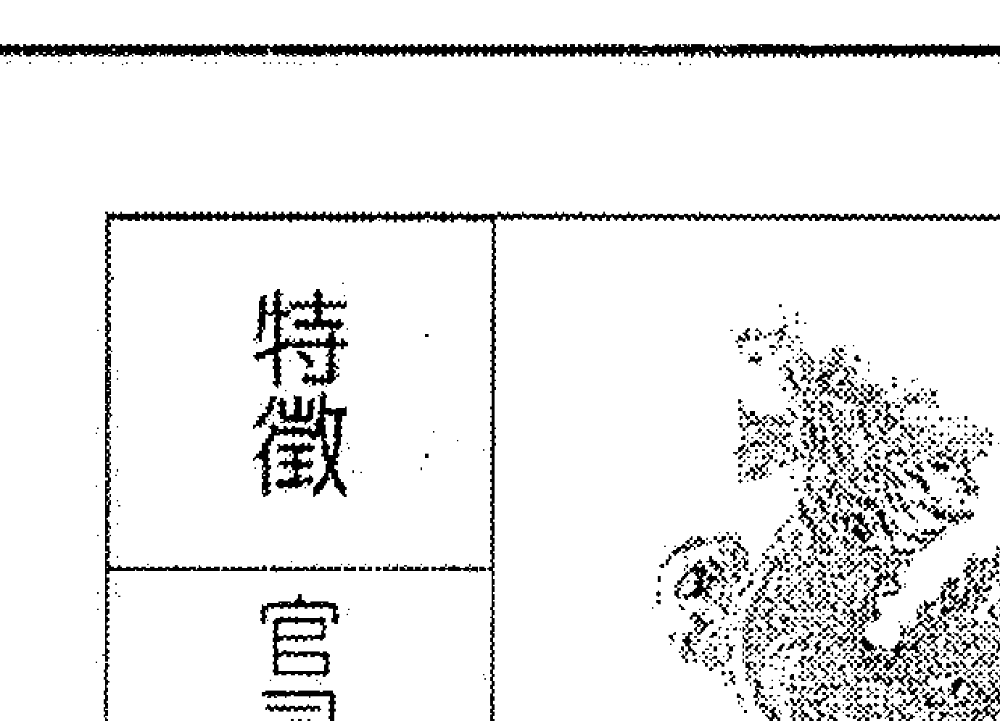

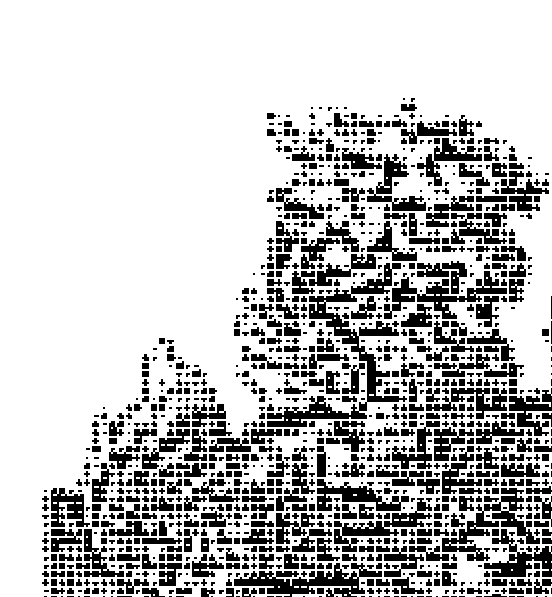

| 動物 | 植物 | 景物 | 靜物 | 求財 | 人物 |
|------|------|------|------|------|------|
| 龍、魚、金龍、蜥蜴、蝴蝶、蜈蚣 | 水生植物、水葫蘆 | 水庫、游泳池、井水溝渠、池塘、沼澤地、田園、港灣、監獄、拘留所、垃圾場 | 鍋碗瓢盆、旗幟、藥品、清潔衛生器具、汙水設備、捲尺、香包 | 清潔衛生相關行業 | 黑社會、漁夫、軍人、調查員、獄政人員、囚犯 |## （一）、「巳午未」三會南方火

### 1、「巳」的各種象意（如果能背起來最好）

「巳」為陰火，與天干「丁」可以互相轉化，所以巳火本身也具有丁火的性質。代表美好的希望、機會、目標，巳在巽宮，有杜門，代表技術學習、隱匿躲藏、遮掩避難等。

| 特徵 | 疾病 | 身體 | 陰陽五行 | 對應方位 | 外表形態 | 時間 |
|------|------|------|----------|----------|----------|------|
| 光芒絢麗、性感迷人、纏繞、彎曲、搖擺、變化、驚訝、驚恐、憂愁、誘惑、疑惑、思考。 | 腸炎、呼吸系統疾病 | 心臟、小腸、眼目、神經、咽喉、血液 | 巳·陰火 | 巽宮·東南 | 由字臉型、髮少面紅 | 09:00~11:00 |
| 人物 | 求財 | 靜物 | 景物 | 植物 | 動物 |
| 歌者、郵差、設計師、網路工程師、文藝工作者、廚師、磚瓦鍋爐工作者、捲髮者、犯罪者、精神病患者。 | 禮品、文化用品、烹飪、冶煉、網路。 | 廚灶用具、電器發光發熱品、煙、煙霧、煙囪、繩索、辣椒、書籍、文書、扇子、電扇、吹風機、空調、弓箭。 | 郵局、彎曲河流或道路、磚窯廠、化工廠、涼台、娛樂場所、塔、寺廟道觀、鬧市。 | 藤蔓植物、牽牛花、葡萄、鳳凰花、牡丹、杜鵑、爬山虎、靈芝、櫻桃。 | 蛇、魚、鱔魚、蚯蚓、龍、螢火蟲、蝌蚪、蟬。 |

### 2、午的各種象意（如果能背起來最好）

「午」為陽火，與天干「丙」可以互相轉化，所以午火本身也具有丙火的性質。環境中代表火、燈光、電器、陽光。午在離宮，有景門，代表表演藝術、廣告宣傳、旅遊遠行、簽證合約等。

| 特徵 | 時間 | 陰陽五行 | 對應方位 | 外表形態 | 身體 | 疾病 |
|------|------|----------|----------|----------|------|------|
| 光鮮亮麗、光明、光亮、漂亮、美容美髮、演藝、廣告、信息、化妝。 | 11:00~13:00 | 午·陽火 | 離宮·南方 | 瓜子臉型、美麗漂亮 | 額、眼、心臟、血液、神經、小腸 | 眼疾、心臟血壓疾病 |
| 人物 | 求财 | 静物 | 景物 | 植物 | 动物 |
| 文人雅士、作家、书法家、画家、演艺人员、广告人、马术从业人员、秘书、情人、发烫烫伤者。 | 文化相关用品业、微信通信相关行业、婚丧礼庆用品业。 | 锅炉、炉灶、变压器、热水器、暖气、灯烛、电话、旗帜、书画、烟花、炮竹、酒食。 | 高处、体育场、高楼大厦、剧场、漂亮景点、客厅、电影院、高速公路、马路、马场、图书馆、书店、照相馆。 | 含羞草、米兰花、茉莉花、桂花、栀子花、金冠柏、胡椒木。 | 马、斑马、鸟类、乌龟、鳖、螃蟹、贝类。 |

### 3、未的各种象意（如果能背起来最好）

「未」為陰土，五行「土」沒有互相轉化的天干。辰戌丑未四墓庫都代表財運、官運、事業運、磁場大之意，能量好的時候代表未來充滿無限希望，能量不好的時候沒有朝氣，沒有活力，日落西山，如同黃臉婆。

| 特徵 | 時間 | 陰陽五行 | 對應方位 | 外表形態 | 身體 | 疾病 |
|------|------|----------|----------|----------|------|------|
| 味道、未來、偽裝、收穫、喜慶、宴會、食品 | 13:00~15:00 | 未·陰土 | 坤宫·西南 | 膚色淡黃、方臉偏矮 | 胃脾、口腔、皮膚、腹部、消化系統 | 胃腸、消化系統疾病 |
| 動物 | 植物 | 景物 | 靜物 | 求財 | 人物 |
| 羊、魚類、長頸鹿、老鷹、駱駝 | 蔬菜、水果、荷花、茶樹 | 林場、田園、公園、庭院、倉庫、村落、客廳、廚房、餐廳、起居室、茶樓、酒店、地下室、書廟、監獄 | 中草藥、酒食器具、布料、香料、味精 | 茶園蔬菜相關行業、中草藥業、婚宴喜慶相關行業 | 農夫、美食家、廚師、田園主、調酒師、茶藝師、品酒品茶師 |

## （四）『申酉戌』三會西方金

『申』為陽金，與天干『庚』可以互相轉化，所以申金本身也具有庚金的性質。能量好是是有能力，技術過硬，能量不好代表霸道、是非、血光、牢獄暴力等。申在坤宮，有死門，適合弔喪、捕獵、超度之外，其餘皆不利。

### 1、申的各種象意（如果能背起來最好）

| 時間 | 陰陽五行 | 對應方位 | 疾病 |
|---|---|---|---|
| 15:00~17:00 | 申，陽金 | 坤宮：西南 | 骨疾、胃腸疾病 |
| 外表形態 | 身體 | 特徵 |
| 申字臉型、額顎偏窄 | 肺、大腸、骨骼、食道、氣管、牙齒 | 傳遞、運輸、伸展、延伸、申請、伸張、深情、神秘、交易、阻隔、兇惡。 |

| 人物 | 求財 | 靜物 | 景物 | 植物 | 動物 |
| :--- | :--- | :--- | :--- | :--- | :--- |
| 行人、路人、通訊員、傳令兵、交通員、物流人員、警察、軍人、惡霸、商賈。 | 商業買賣、仲介業、金屬鐵器相關行業。 | 車輛、硬物、刀劍、武器、飛機、金屬與石製品、醫療藥品、孝服、經文。 | 廟宇、醫院、道路、礦場、祠堂、飯店、車站、交通轉運站、商店、懸崖、靈柩、墳地。 | 蔥、薑、蒜、核桃、榴槤、仙人掌、蘆薈、玫瑰。 | 猴、鳥類、虎、豹、貓、獅子。 |

### 2、酉的各種象意（如果能背起來最好）

「酉」為陰金，與天干「辛」可以互相轉化，所以酉金本身也具有辛金的性質。能量好是能說會道，專業技術強，能量不好代表花言巧語、小心眼、小氣、要心機等。酉在兌宮，有驚門，利於演說或從事相關法律訴訟等。

| 特徵 | 時間 | 外代表形態 | 陰陽五行 | 身體 | 對應方位 | 疾病 |
|---|---|---|---|---|---|---|
| 金融、商務、交易、策畫、陰謀、誘惑、精緻、辛辣、花心。 | 17:00 ~ 19:00 | 膚白圓臉、氣質漂亮 | 酉．陰金 | 肺、口、咽喉、牙齒、骨骼、耳朵 | 兌宮．西方 | 肺疾、呼吸系統疾病 |
| 人物 | 求財 | 靜物 | 景物 | 植物 | 動物 |
| 樂師、調酒師、教師、律師、歌者、金融工作者、善於裝扮者、商人、經紀人、少女 | 金融證券相關行業、金融珠寶業 | 金銀珠寶、手錶、首飾、水晶、玉石、鐘錶、門窗、樂器、刀劍槍、茶酒器具、假牙、羽毛、信用卡 | 銀樓、銀行、街頭巷尾、沼澤地、酒店、妓院、停車場、劇場 | 蔥、薑、蒜、辣椒、洋蔥、小麥、銀杏 | 雞、喜歡嗚叫或大型鳥類、火雞、鸚鵡、鴿子、海鷗 |

### 3、戌的各種象意（如果能背起來最好）

『戌』為陽土，五行『土』沒有互相轉化的天干。辰戌丑未四墓庫都代表財運、官運、事業運、磁場大之意，能量好的時候代表謙虛、虛心學習，能量不好的時候霸道、脾氣差、強勢、目中無人。

| 陰陽五行 | 時間 | 外表形態 | 身體 | 疾病 | 對應方位 | 特徵 |
|----------|------|----------|------|------|----------|------|
| 戌：陽土 | 19:00~21:00 | 膚色淡黃、方臉偏矮 | 心臟、背部、腿、足、踝、肌肉 | 肺疾、呼吸系統疾病 | 乾宮、西北 | 謙虚、虚怀若谷、虚幻、虚无缥缈、虚伪、假装、茫然、幻想、思考 |
| 人物 | 求財 | 靜物 | 景物 | 植物 | 動物 |
| 警察、軍人、黑社會、強盜、守衛、農夫、獵人。 | 環保能源相關行業、鋼鐵鋼材相關行業。 | 武器、軍火、燒窯、煤炭、煤礦、打火機、火柴、天然氣、盔甲鋼盔、安全帽、骷髏、陶瓷器、變壓器、農具。 | 曠野、高岡、山嶺、廟宇、加油站、加電站、學校、電影院、鬧市、高樓、監獄、墳墓、衛浴間。 | 仙人掌、虎皮蘭、太陽花、銅錢草、吊蘭、光棍樹、三角梅、發財樹、豆瓣綠、虎刺梅、蘆薈。 | 狗、豺犬、狼犬。 |

## 第三节、八神所代表的人、事、地、物之象

（如果能背起来最好，如果背不起来奇门软件上都有）八神在阴盘奇门遁甲的特性是神煞系统，代表神助或阻礙、观念与想法。分別是值符、螣蛇、太阴、六合、白虎、玄武、九地、九天，简记为：符蛇阴六白玄地天。排盘时候比较特殊的是九星（天蓬、天任、天冲、天辅、天英、天芮、天柱、天心）与八门（休门、生门、伤门、杜门、景门、死门、惊门、开门）都是顺轉排列，但是八神卻有阴遁逆排、阳遁顺排之分。如下图示，值符意象也是甲，主第一、名贵、主导；螣蛇代表狡猾虚诈、变化反复、三心二意，余此类推！

| 八神 | 八神象意 |
|---|---|
|  | **值符**<br>甲、第一、名贵、名高、名牌、名誉、名望、气场、主管、贵人、领导、权力、真货。 |
|  | **白虎**<br>庚、阻隔、权威、伤疤、意外血光、伤灾、殘暴斗争、易怒、技术、恶性病。 |

在陰盤奇門遁甲排盤軟體中用紅色圈起來的位置就是八神

### 六合

開心快樂、合作合夥、媒介仲介、討人喜歡、合約證書、多數之意、婚姻感情、合抱相聚。

### 太陰

保護庇佑、密謀策劃、心思細膩、漂亮女人、雕琢精緻、暗昧私通、印章、神佛觀音。

### 騰蛇

狡猾虛詐、變化反覆、三心二意、身材惹火、纏繞、難纏、彎由、密謀、假貨。

### 九天

天上、高大、飛行、變動、聲名遠揚、志向遠大、好高騖遠、積極主動、眼光高、手低、遠離、數大。

### 九地

地下、低小、緩慢、穩固、牢固、保守、空間狹窄、鬱悶、消極、數小。

### 玄武

竊盜、行賄、迷糊、謊言、玄學、頭腦不清、怪病、偷情、虛假、貪污、假貨。

公曆：2018年12月18日0時34分
農曆：2018年11月12日 陰遁8局
四柱：戊戌 甲子 甲申 甲子
時空亡：甲子旬 戌亥空 馬星：寅
值符：天任星 值使：生門 十二長生

| 論父親 | 論母親 | 論兄弟 | 論姐妹 |
| :---: | :---: | :---: | :---: |
| 論兒子 | 論女兒 | 論配偶 | 問測者 |

馬 冠帶丑 沐浴子壬 長生亥

空亡 入墓 擊刑 門迫 干伏吟 門伏吟 星伏吟 干反吟 門反吟 星反吟

## 筆記欄

### （一）、值符的各種象意（如果能配起來最好）

「值符」是整個盤的靈魂人物、領導中心，所謂值班拿符令，祂也是甲，代表地位崇高、有名望。測人、測物、測事臨值符，意謂是大事、真貨、高級品、有貴人，有轉變的機會。

| 特徵 | 人物 | 八神 | 五行 | 吉凶 | 外表形態 | 身體 | 疾病狀態 |
|------|------|------|------|------|----------|------|----------|
| 高檔、高雅、能力強、有貴人、財富、榮華富貴、顯赫、關愛、直覺、高尚、名牌、升遷。 | 領袖、老闆、直屬上司、主管、管理者、放款人、傷員有氣質、禿頭者、監考官、裁判、原生、公務員。 | 值符 | 木/土 | 大吉 | 鼻大粗眉、氣派穩重 | 頭、面 | 痛苦難以忍受，病情明朗易於辨別治療 |
| 个性 | 音形义 | 事业求财 | 静物 | 景物 | 植物 | 动物 |
| 雄伟豪迈、文韬武略、气质高雅、志向远大、光明正直、组织领导能力强。 | 师父、辅助、符令、直条物、直白、正直、知名学府、天乙之神、青龙、贵人、靠山。 | 从事高档名贵物品买卖相关行业、企业经营单位管辖者。 | 高档名贵物品、精品、金银珠宝、钻石翡翠、金币、稀世珍宝、名车、名表、名人古董或字画、信用卡、财神、钱币、高级香水。 | 银行、金融中心、金银珠宝行、高档住宅别墅、富丽堂皇宫殿、龙脉、神位。 | 名贵或高贵的植物与花卉、荷花、牡丹、兰花、红杉树、紫檀、金丝楠木、红木。 | 名贵或稀有的动物、名马、名犬、藏獒、老虎、熊猫。 |

### （二）、騰蛇的各種象意（如果能冒起來最好）

「騰蛇」就是有纏繞的意象，有麻煩的意思。測人、測物、測事臨騰蛇，代表這個人不是很實在、不誠實；男女朋友交往喜歡纏著人不放，騙人、心懷不軌；做事容易中途變卦，意志不堅。

代表人物：婀娜多姿吸引目光者、穿著網格花俏者、紋身者、愛糾纏者、狡猾虛詐者、精神病者、漁民。

| 八神 | 五行 | 吉凶 | 外表形態 | 身體 | 疾病狀態 |
|------|------|------|----------|------|----------|
| 騰蛇 | 火 | 凶 | 苗條惹火、身軀微駝 | 心臟、血液、血管 | 變化不定、驚疑多夢、驚悸、失眠、怪異 |

- 捲曲、彎曲、纏繞、捆綁、纏綿、纏住、怪異、驚恐、變化反覆、幻覺、夢境、迷惑、干擾、擾亂、虛詐不實、虛驚惡夢、棘手、陰暗、假貨。

| 動物 | 植物 | 景物 | 靜物 | 事業求財 | 音形義 | 個性 |
|------|------|------|------|----------|--------|------|
| 蛇、蜈蚣、蜥蜴、蚯蚓、鸚鵡、鱔魚、海參、爬蟲類。 | 藤蔓類植物、捲曲葉子類、牽牛花、爬山虎、吊籃、菊花、狗尾草、蕨菜、黃瓜。 | 羊腸小徑、彎曲道路、彎曲河流、彎曲建物、蜿蜒山脈、高壓線、亮麗燈光、蛇窠、袅袅炊煙、煙霧。 | 捲曲物、長曲物、蛇形物、柔形物、條紋物、窗簾、繩索、帶子、彈簧、電線、香火、火燭、中國結、鍊條、領帶、腰帶、手鍊、項鍊、麵條、眼鏡、雜草、毒氣、毒液、毒品。 | 從事需要死纏爛打或時常變化的相關行業、銷售次貨或瑕疵品的相關行業。 | 蛇、懶美女、腰、睡眠、作夢、領帶、皮帶、手鍊、頂鍊、難纏、纏繞、上吊、舔、難分難解、神經、爬行。 | 虛情假意、虛詐不實、虛偽、狡猾、隱瞞、難纏、多疑、心機重、變來變去、反反覆覆、拐彎抹角、狠毒、奸佞、小人、暗算、手腕高明、死纏爛打、三心二意、心口不一、行事怪異。 |

### （三）、太阴的各种象意（如果能背起来最好）

「太阴」有黑夜、阴暗、暗中、隐私、私下、光线昏暗之意。测人、测物、测事临太阴，代表心思细腻，私下办事，私下密谋，故适合从事策划、献策；平时不苟言笑、城府颇深。

| 八神 | 五行 | 吉凶 | 外表形态 | 身体 | 疾病整体状态 | 特征 | 人物 |
|---|---|---|---|---|---|---|---|
| 太阴 | 金 | 吉 | 肤白如玉、鼻挺口小 | 肺、口、皮肤 | 病在内部、沉疴痼疾、虚弱无力、精神萎靡 | 贵人暗助、提升护佑、密谋策划、心思细腻、头脑聪明、阴谋诡计、暗昧私通、女人私通、精致物品、隐匿、避难、升迁、怀孕、淫乱、阴暗。 | 观音佛祖、地藏王菩萨、贵人、策划者、通灵者、漂亮女人、二奶、酒吧女、少女、小姐、逝者。 |
| 個性 | 音形義 | 事業求財 | 靜物 | 景物 | 植物 | 動物 |
| 暗中助人、密謀策劃、正直慷慨、性情溫和、感情細膩、老謀深算、隱私深藏、暗戀。 | 私、助陰、鏡子、觀世音、悄悄的、看不到的、隱密、隱居、隱藏、隱私、陰暗、陰謀、陰天、月亮。 | 從事未公開地下交易相關行業、精雕細琢手工藝品相關行業、難以公開啟口的女人專屬用品等。 | 觀音佛像、地藏王菩薩神像、精雕細琢品、金銀首飾、玉器寶石、字畫墨寶、喜慶用品、鏡子、內衣、羽毛、冷飲。 | 觀音寺、地藏王廟、陰曹地府、地下室、地下道、下水道、地鐵、暗道、隧道、酒吧、濕地、墳地、洞穴、廁所。 | 帶殼果實或苔蘚沼澤植物、花生、瓜子、蘆葦、蘑菇樹、靈芝、蒲草等。 | 夜行性與喜潮濕的動物、貓頭鷹、蝙蝠、刺蝟、臭蟲、蝸牛、老鼠、蟑螂。 |

### (四)、六合的各種象意（如果能背起來最好）

「六合」就是多的意思，有合作或多人合作之象，為合作的專有用神，包括婚姻感情。測人、測物、測事臨六合，有喜慶、和氣、和善的意象，代表媒人、仲介、婚姻介紹所、人緣好。

| 八神 | 五行 | 吉凶 |
|------|------|------|
| 六合 | 木   | 吉   |
| 外表形態 | 身體 | 疾病整體狀態 |
| 圓臉青白、笑容可掬 | 手、手指、腳趾 | 病情綜合，頭暈嘔吐，身痛麻木等多種病症 |

- 和樂融融
- 心心相印
- 婚姻嫁娶
- 樂善好施
- 歡樂
- 喜慶
- 合作
- 組合
- 結合
- 團隊
- 緊抱
- 合抱
- 相依偎
- 懷孕
- 討人喜歡
- 聚集
- 重疊
- 收攏
- 關閉
- 數量多。

- 孕婦
- 胎兒
- 戀人
- 彌勒佛
- 證人
- 合夥人
- 媒人
- 仲介
- 經紀人
- 小孩
- 小說家
- 能工巧匠
- 魔術師
- 掮客。

| 個性 | 形義 | 事業求財 | 靜物 | 景物 | 植物 | 動物 |
|---|---|---|---|---|---|---|
| 仁慈開朗、喜做說合、謙沖為懷、愛好和平、舉賢任能、歡樂陽光。 | 胎兒、盒子、床、合照、兔子、合作、合夥、親和。 | 從事經紀仲介行業、事業合夥經營多樣化、瓜果蔬菜類、竹木傢俱業。 | 合約合同、結婚證書、心形物、盒子、桌椅、匣子、矮櫃、箱子、床、合照相片、抽屜、被子、傘、證書、證物、印信、契約、果品、羽毛、布衣、花草樹木、車船。 | 莊稼田園、綠草如茵、娛樂場所、喜宴場所、竹木樹林、電影院、學校、公園、幼兒園、商場、酒店、會議廳、慈善機構、交易場所。 | 葡萄、櫻桃、竹林、百合、菊花、香蕉、南瓜、小樹、花草、嫩芽、荔枝、枝、柳樹。 | 兔子、雞群、羊群、鴛鴦、麻雀、蜻蜓、蝴蝶、蜜蜂、蝗蟲、燕子、天鶴、蜘蛛、蜈蚣。 |

## （五）、白虎的各种象意（如果能背起来最好）

「白虎」是凶灾、損傷、血光、打鬥、爭執，凶神之象。測人、測物、測事臨白虎，代表脾氣暴躁、有阻力、壓力大、事情難成；官位健康旺相，反而是本身能力強、技術過人、執行能力強。

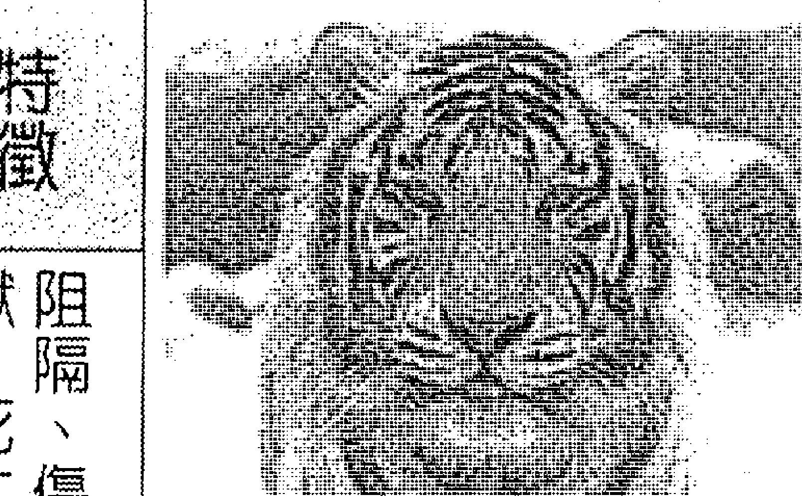

| 八神 | 五行 | 吉凶 |
| :--- | :--- | :--- |
| 白虎 | 金 | 凶 |

| 外表形态 | 表情嚴肅、身強體健 |
| :--- | :--- |
| 身體 | 骨骼、拳頭 |

| 疾病整體狀態 | 病入膏肓、傷災、刀傷、槍傷、車禍、災難，難以治療的病症 |
|---|---|

- 特徵：
- 阻隔、傷災、驚恐、兇殘、災難、破壞、恐嚇、傷痛、殺戮、流血、牢獄、死亡、車禍、道路、官司、技術過硬。
- 人物：
- 軍人、警察、醫生、黑社會、狠毒者、威權者、殺氣騰騰者、恐怖分子、病者、受災者。

| 個性 | 音形義 | 事業求財 | 靜物 | 景物 | 植物 | 動物 |
| :--- | :--- | :--- | :--- | :--- | :--- | :--- |
| 狠毒、殘暴、猖狂、兇猛、兇悍、暴虐、性躁、豪爽、城府深沉、工於心計、野性難馴、鋒芒畢露、果斷、義氣。 | 庚、地震、閃電、風災、水災、有形的煞、狐假虎威、白色、白事、壁刀、路沖。 | 從事金屬機械五金相關行業、醫藥殯葬相關物品業、體育用品或道路維修業等。 | 刀劍、槍械、飛機、車輛、武器、大鎖、石磨、石獅子、石製品、骨骼、金銀銅鐵、毒品、手術刀、鐵絲網、鈕扣。 | 道路、路障、關口、牆角、牆、門、法院、交通信號燈、機械鐵工廠、兵工廠。 | 罌粟、大麻、玫瑰、斷腸草、虎皮蘭、仙人掌、豬籠草。 | 虎、獅子、豹、豺、狼、熊、鱷魚、老鷹、獵狗、兇猛或肉食動物等。 |

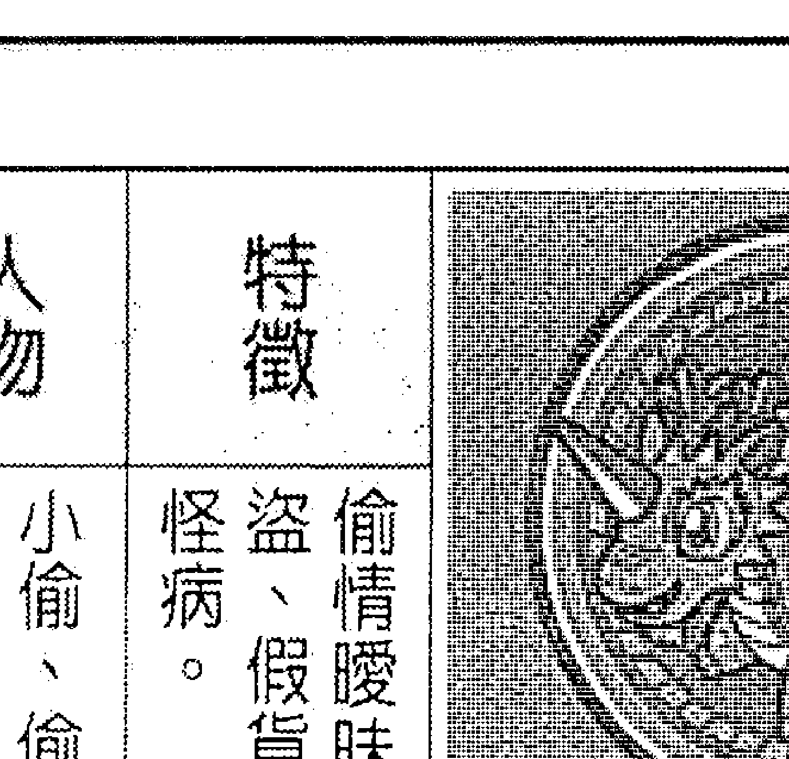

| 八神 | 五行 | 吉凶 | 外表形态 | 身体 | 疾病整體狀態 | 特徵 | 人物 |
|---|---|---|---|---|---|---|---|
| 玄武 | 水 | 凶 | 贼眉鼠眼、彎腰駝背 | 眼睛、頭髮、腎 | 暈眩嘔吐、糊塗怪病、肾虚失眠、遗精性病，没有对症下药 | 偷情暧昧、聪明多智、忽忽騙人、好色偷情、贪污行贿、谎言虚假、偷盗、假货、迷糊不清楚、上当被骗、阴谋诡计、无形的煞、怪病。 | 小偷、偷情、贪污、行贿者、窃盗、頭晕迷糊者、小人、通靈者、船員、漁民、玄學者。 |

## （六）、玄武的各种象意（如果能背起来最好）

「玄武」代表阴暗、悄悄的、偷偷的，见不得光、目标不明确。测人、测物、测事临玄武，代表小人，迷迷糊糊搞不清楚状况者，是玄学、假货、骗人或被骗者、有暗煞、頭量昏迷者。

| 個性 | 音形義 | 事業求財 | 靜物 | 景物 | 植物 | 動物 |
|---|---|---|---|---|---|---|
| 聰明圓滑、隱私不明、偷騙劫奪、懶惰昏倦、性慾衝動、愛偷情、愛盜竊、歪門邪道、巧言善變、虛偽狡猾。 | 玄學、懸掛、睡眠、怪病、無形煞氣、看不清楚、頭腦不清楚、騙人、被騙、偷竊、被竊、後方、後頭、後面、探頭煞。 | 從事撈偏門或不正當之行業、經營宮壇廟宇、買賣非真品之貨物、暗中進行不為人知的相關行業。 | 情色物品、圖片、地圖、圖畫、電視、垃圾、髒水、墨水、酒類、盥洗用具、醬醋油鹽瓶罐鍋碗瓢盆缸等黑色物容器。 | 大海河流、陰溝地井、廁所、陰暗的地方、探頭煞、電影院、下水道、地窖、地下室、窪地、池塘、湖泊、污水、廚房。 | 布袋蓮、水萍、滿江紅、金魚藻、水金英、水草。 | 烏鴉、黑狗、黑豹、黑熊、松鼠、黃鼠狼、老鼠、狐狸。 |

## （七）、九地的各种象意（如果能背起来最好）

「九地」是不高的、旧的、缓慢的、陈年往事。测人、测物、测事临九地，代表旧物、古董、地下物、目标不高、没有自信、事情发展平缓；另一方面也表示稳定、平稳、稳重、低调、保守。

| 人物 | 特徵 | 八神 | 五行 | 吉凶 |
|---|---|---|---|---|
| 土地公、农民、地下工作者、房地产业者、老姑婆。 | 坚牢稳固、厚载之德、滋生万物、发展平稳、停滞不前、缓慢、长久、低小、地下、数字小、低处、老旧、存放时间长、躺着、本地。 | 九地 | 土 | 吉 |
| | | 外表形態 | 身体 | 疾病狀態 |
| | | 方脸腹肥、五短身材 | 胃、脾 | 血压偏低、昏迷、阴症、懒得说话、病情逐渐稳定 |

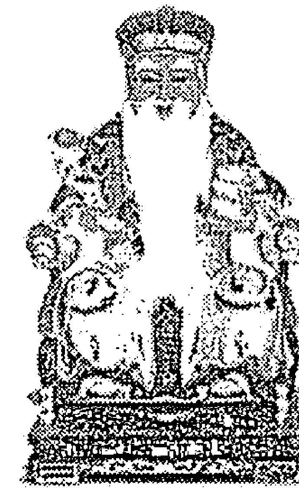

| 個性 | 音形義 | 事業求財 | 靜物 | 景物 | 植物 | 動物 |
|---|---|---|---|---|---|---|
| 敦厚、柔順、恭敬、謙卑、關懷、包容、耐心、忍耐、保守、頑固、消極、自私、沉悶、沉靜、死板、久拖不決、被動、低調、吝嗇、節儉。 | 陰暗、低窪、埋葬、死亡、地基、地下出土之物、長久、分數低、萬物之母。 | 從事經營本地發展之事業、播種養殖業、殯葬禮儀業等。 | 農作物、五穀雜糧、農糧器具用品、土製品、衣櫥。 | 農場、養殖場、陰暗低窪處、地窖、地下魚、下水道、隧道、防空洞、陰廟。 | 農作物、土豆、地瓜、水稻、地丁草、苔蘚、薑、大蒜。 | 牛、豬、熊貓、大象、蟲等動作緩慢或性情溫順。 |

## （八）、九天的各种象征（如果能背起来最好）

「九天」是高的、紧急的，目标理想远大格局高。测人、测物、测事临九天，代表心高气傲、好高骛远、远方、分离、动态，好的时候代表声名远播、名气响亮、迅速发展、升迁、考试高分。

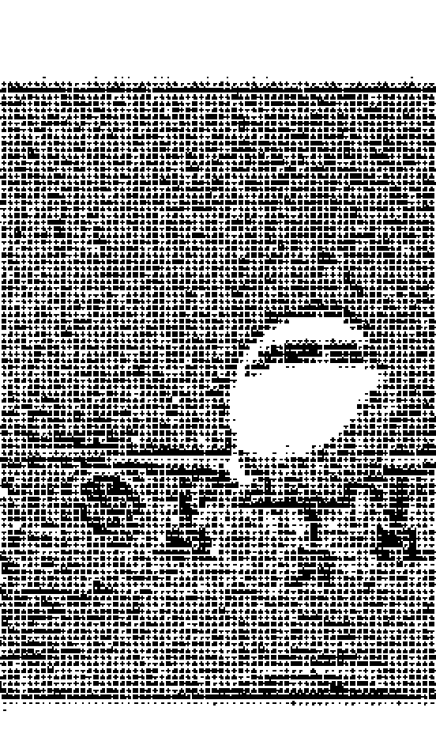

| 八神 | 五行 | 对应方位 |
| :--- | :--- | :--- |
| 九天 | 金 | 吉 |
| **外装形态** | **身体** | **疾病状态** |
| 高大魁梧、铿锵有力 | 头、肺、大肠 | 血压高、兴奋多动、阳症、病情逐渐加重 |
| **特征** | **人物** | |
| 高大、高处、远行、视察、天空、云游、飞行、变动、主动出击、大展鸿图、排兵布阵、行军打仗、低调张扬、名气响亮、畅销货、进口货、竞争激烈、分离。 | 机师、威强猛悍者、刚性好动者、聪明远扬者。 |

| 個性 | 音形義 | 事業求財 | 靜物 | 景物 | 植物 | 動物 |
|---|---|---|---|---|---|---|
| 志向遠大、技術超群、聲名遠播、性剛好動、好強爭辯、好高鷲遠、快速、高調、耀武揚威、威嚴威武、心高氣傲。 | 升遷、升官、驛動、考高分、天上、高空、高處、宇宙、九天玄女、玄天上上帝、天上聖母、飛機航線、站著、分離、數字大。 | 從事主動積極動中求財之相關行業、跨國交易事業、航空業、金融業、金屬製品。 | 飛機、金銀珠寶、高價物品、刀劍槍、金錢、錢幣、鏡子、銅鐵、帽子、眼鏡、光亮物、旋轉物。 | 天空、飛翔、太空、宇宙、最高之處、天井、明堂、開闊處、高原、高樓大廈、銀行、名氣大的地方、舶來品商店。 | 紅檜、扁柏、鐵杉、高粱等高山高原植物。 | 鳥類、龍、馬、獅、虎、豹、老鷹、天鵝。 |

## 第四節、九星所代表的人、事、地、物之類象

（如果能背起來最好）

九星在陰盤奇門遁甲的特性是天時系統，代表個性與其性質，更是財星佈局的專有用神。分別是天蓬、天任、天冲、天輔、天英、天芮、天柱、天心，簡記為：

蓬任冲輔英芮柱心。

陰盤奇門遁甲以天為大，萬古不變，自古皆然，表示天體是我們人類無法去超越的，就算現在科技如此發達還是一籌莫展。

九星吉凶，古有歌訣曰：

> 輔禽心星為上吉，沖任小吉未全亨；大凶蓬芮不堪使，小凶英柱不精明。

但是九星在陰盤奇門遁甲論斷當中基本上是沒有吉凶之分，宮內健康與否是輔助判斷九星吉凶的重點方向之一。

| 九星 | 九星象意 |
|---|---|

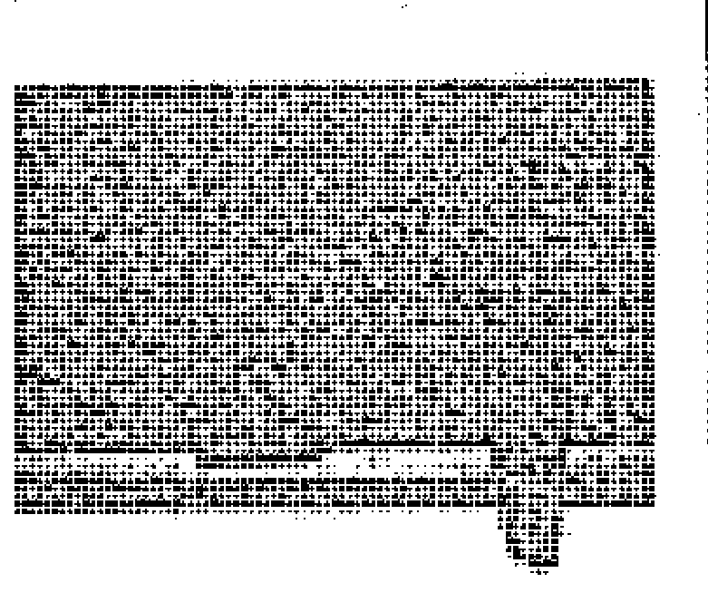

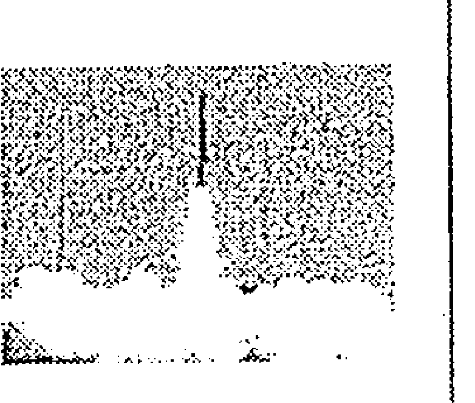

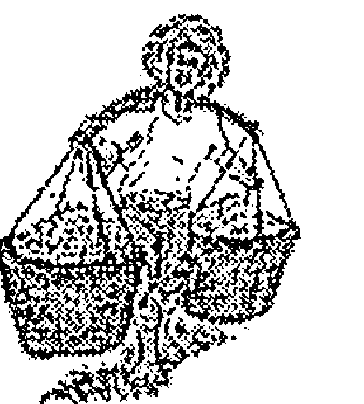

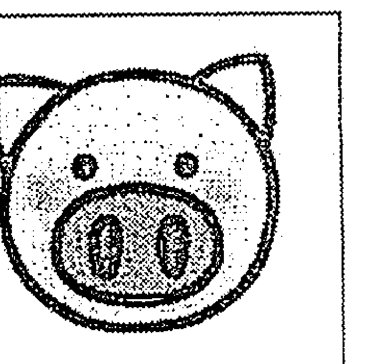

| 天辅 | 天冲 | 天任 | 天蓬 |
|---|---|---|---|
| 温文儒雅、辅佐指导、循循善诱。如孔子、教师、文人。 | 性急冲动、敢冲敢撞、执行力强。如军警、运动员。 | 任劳任怨、宽容厚道、脚踏实地。如登山者、挑夫。 | 胆大妄为、敢冒风险、蓬勃发展。如黑社会老大。 |

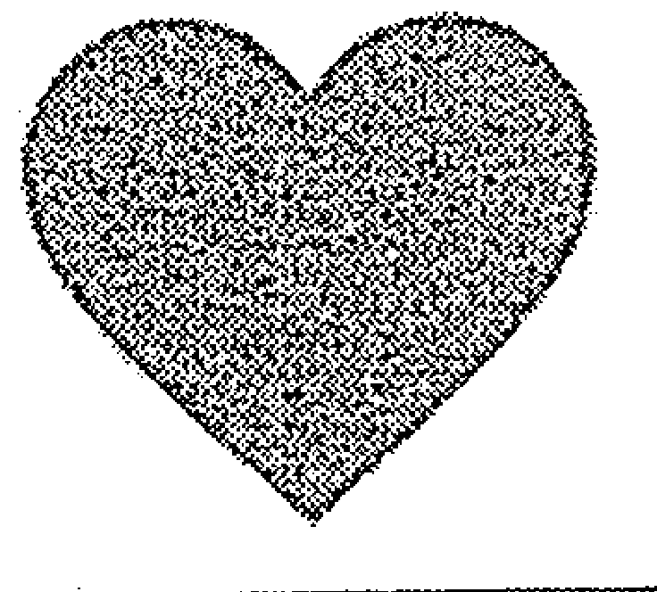

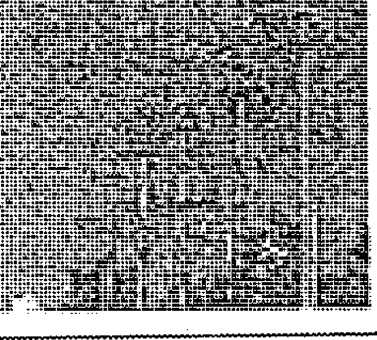

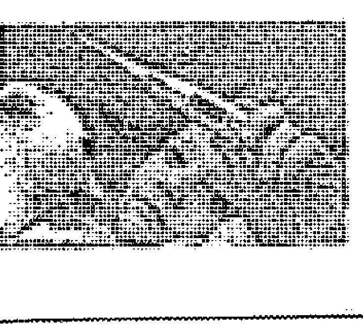

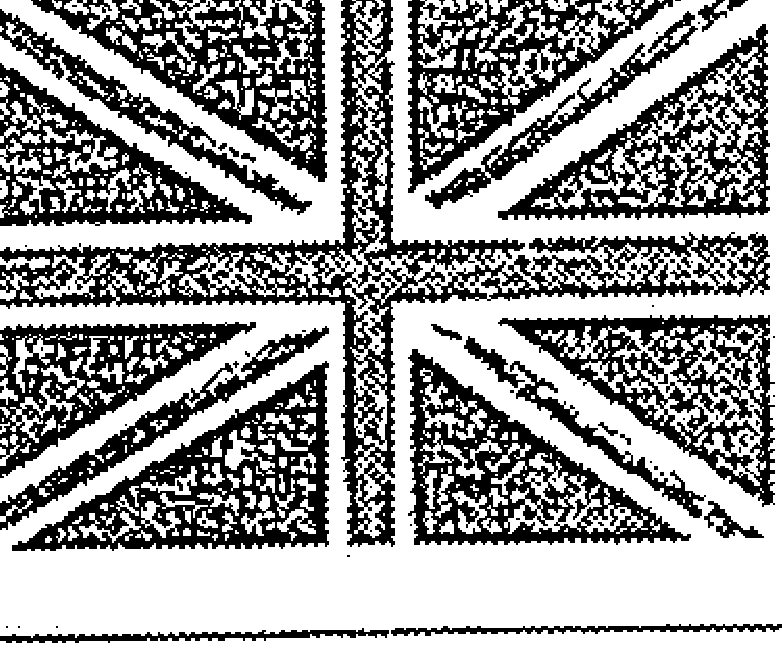

| 天心 | 天柱 | 天芮 | 天英 |
|---|---|---|---|
| 核心领导、中心人物、聪明能干。如领导人、军师参谋。 | 能言善辩、中途惊变、喜唱反调。如律师、检调人员。 | 有问题、与神佛有关、钻牛角尖。如病人、仙佛。 | 礼貌虚浮、热情爱现、聪明漂亮。如演艺、公关人员。 |

公曆：2018年12月18日0時34分
農曆：2018年11月12日 陰遁8局
四柱：戊戌 甲子 甲申 甲子
時空亡：甲子旬 戌亥空 馬星：寅
值符：天任星 值使：生門 十二長生

| 論父親 | 論母親 | 論兄弟 | 論姐妹 |
|---|---|---|---|
| 論兒子 | 論女兒 | 論配偶 | 問測者 |

```
病巳 死午癸 墓未
地土 玄水 白金
衰辰己 絕申辛戊
帝旺卯庚 臨官寅丁
```

| 空亡 | 入墓 | 擊刑 | 門迫 | 干伏吟 | 門伏吟 | 星伏吟 | 干反吟 | 門反吟 | 星反吟 |
|---|---|---|---|---|---|---|---|---|---|

## 九星

| 天辅 | 天英 | 天芮 |
| :---: | :---: | :---: |
| 天冲 | 九星 | 天柱 |
| 天任 | 天蓬 | 天心 |

## （一）、天蓬的各种象意（如果能背起来最好）

「天蓬」星属水，主智慧，敢冒风险，富贵险中求。测人、测物、测事临天蓬，宫位健康能量旺相，绝对不是一般人，而是干大事的人物；相反若是休囚无力，则只是喜欢耍弄一些小聪明，投机取巧，上不了檯面的小混混而已。

| 九星 | 阴阳五行 | 对应方位 | 疾病特性 | 身体 | 外表形态 | 特徵 | 人物 |
|---|---|---|---|---|---|---|---|
| 天蓬 | 阳水 | 坎卦．北方 | 病情易变化转移，医治要善于因应变化 | 膀胱、肾脏、子宫、耳朵、下腹部 | 脸黑眼大、威猛精悍 | 聪明智慧、异性缘、吸引力、魅力、风流好色、投机、捞偏门、偷情、破财、蓬鬆、懒惰、自由。 | 猪八戒、黑社会老大、巨贾、大将、兇犯、盗贼、风流人物、妓女。 |

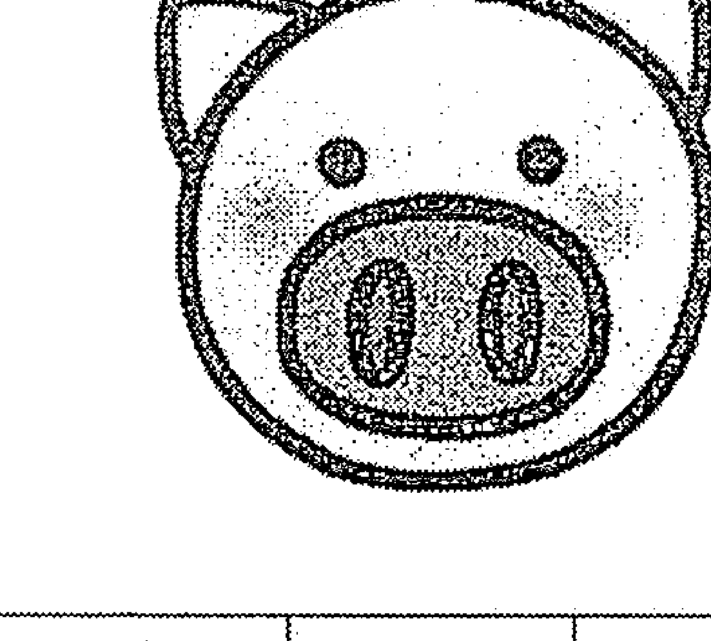

| 動物 | 植物 | 景物 | 靜物 | 求財事業 | 音形義 | 個性 |
|---|---|---|---|---|---|---|
| 豬、老鼠、蝙蝠 | 香蕉樹、榕樹、荷花、蘑菇類、菌類植物 | 大榕樹、廟宇、帳篷、涼亭、茅屋、四面透風屋、損壞破舊屋、尖形物體或房子、拱門、拱橋 | 雨傘、棚子、屋簷、漁具、雨衣、雨具、車、船、寬鬆衣服、黑色物品 | 從事非正道之財的行業、運輸業、水產養殖業、洗浴休閒業、餐飲業、妓院酒吧 | 蓬勃發展、蓬鬆、蓬頭垢面、棚架、帳篷、涼亭、雨傘 | 膽大妄為、心狠手辣、貪杯好色、敢冒風險、投機巨賈、聰明多智、風流淫蕩、投機取巧 |

## （二）、天任的各种象意（如果能背起来最好）

「天任」星属土，原始宫位在艮宫，为山，为止，有停止、阻隔的意象。测人、测物、测事临天任，宫位健康能量旺相格局佳，主做事认真负责、意志坚定；反之若是休囚无力，则保守固执，缺乏远见，开创能力弱。

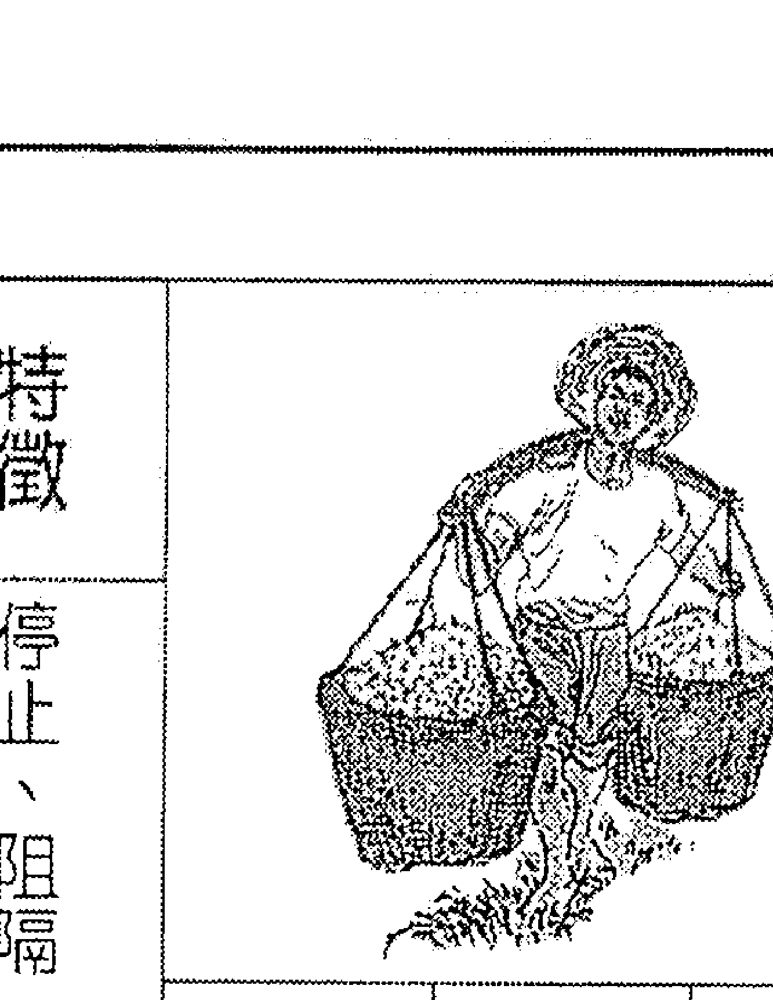

| 九星 | 天任 |
| :--- | :--- |
| 阴阳五行 | 阳土 |
| 对应方位 | 艮卦·东北 |
| 身体 | 脊柱、左肩 |
| 疾病特性 | 病情发展缓慢，医治时间长 |
| 外表形态 | 弯腰驼背、胸部丰满 |

- 特征：停止、阻隔、担当承受、唯唯诺诺、开创力差、缺乏浪漫、恒毅坚忍。
- 人物：登山者、挑夫、轿夫、驼者、农夫、采矿者。

| 個性 | 音形義 | 事業求財 | 靜物 | 景物 | 植物 | 動物 |
|---|---|---|---|---|---|---|
| 肯負責、任勞任怨、忠厚老實、按部就班、任重道遠、保守固執、吃苦耐勞、做事認真、不善表達。 | 認真負責、韌性、任性、派任、擔當、承受。 | 從事土地建築礦產相關行業、農產品業、穩定性高的事業。 | 桌椅、床、盆景、積木、櫃子、背包、扁擔、鞋子。 | 橋、階梯、土包、山總、丘陵、梯田、山坡、門檻、陡路。 | 稻穀、玉米、黍子、玉米、綠蘿、花葉蔓長春、愛之藤、千葉蘭、柳樹等。 | 龜、鰲、牛、馬、駱駝、虎、豹、獅、狼等。 |

## （三）、天冲的各种象意（如果能背起来最好）

「天冲」星属木，有冲锋陷阵、积极奋发、主动出击的意象。测人、测物、测事临天冲，宫位健康能量旺相格局佳，会步步为营的勇往直前，而不会莽撞行事；反之若是休囚无力，则续航力不足，做事情考虑不周、虎头蛇尾。

| 九星 | 阴阳五行 | 对应方位 | 身体 | 疾病特性 |
| :--- | :--- | :--- | :--- | :--- |
| 天冲 | 阳木 | 震卦、东方 | 肝、筋骨、左手 | 病情发展快速或突发，医治要用快速手法 |
| 特征 | 行动、冲动、冲击、冲撞、猛烈、发出声响、执行力强、敏捷。 | | | |
| 人物 | 军警、消防员、运动员、司机、赛车手、武士、性急者。 | | | |

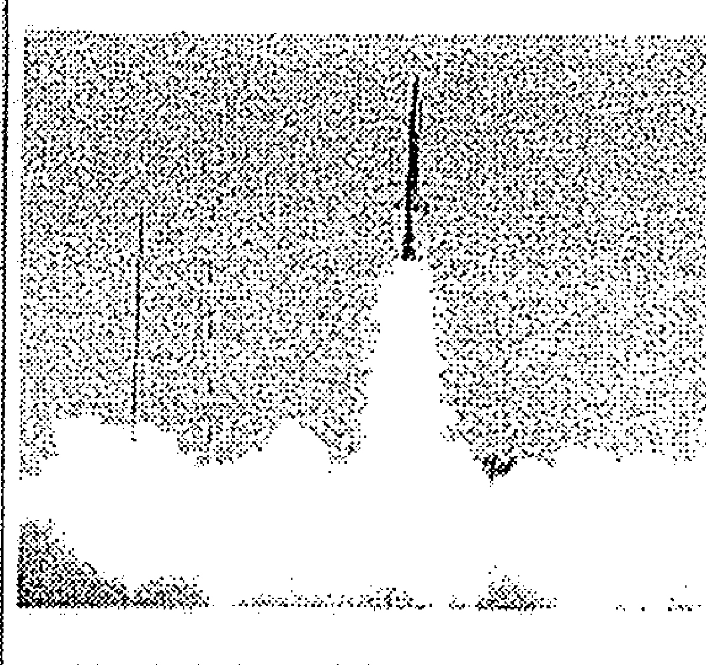

| 動物 | 植物 | 景物 | 靜物 | 事業求財 | 音形義 | 個性 |
|---|---|---|---|---|---|---|
| 兔子、天鵝、燕子、老鷹、飛魚、跳蚤、蚱蜢。 | 高粱、椰子樹、松柏、竹樹、白楊樹等高直的樹。 | 台北101大樓、高樓大廈、交通樞紐、消防局、警察局、運動公園、遊樂場。 | 槍砲彈藥、炮竹、搖擺鐘、音響、喇叭、樂器、鈴鑰、銅鈴、鞭炮、火箭、發射筒、汽機車、飛機、噴射機、電動玩具。 | 金融、金銀飾品、電器、樂器、花店、遊樂、投機性相關行業。 | 直、高、煙囪、體育、傷災、衝動、衝撞、沖天之志。 | 性急衝動、積極任事、敢衝敢撞、衝鋒陷陣、劍及履及、操之過急、輕舉妄動。 |

## （四）、天辅的各种象意（如果能背起来最好）

「天辅」星属木，代表老师、学校、文化教育，学习的技巧，亦是文曲星。测人、测物、测事临天辅，宫位健康能量旺相格局佳，表现的是受人尊敬的学者、教授；反之若是休囚无力格局不好，表现的是无法学以致用，做事犹豫不决。

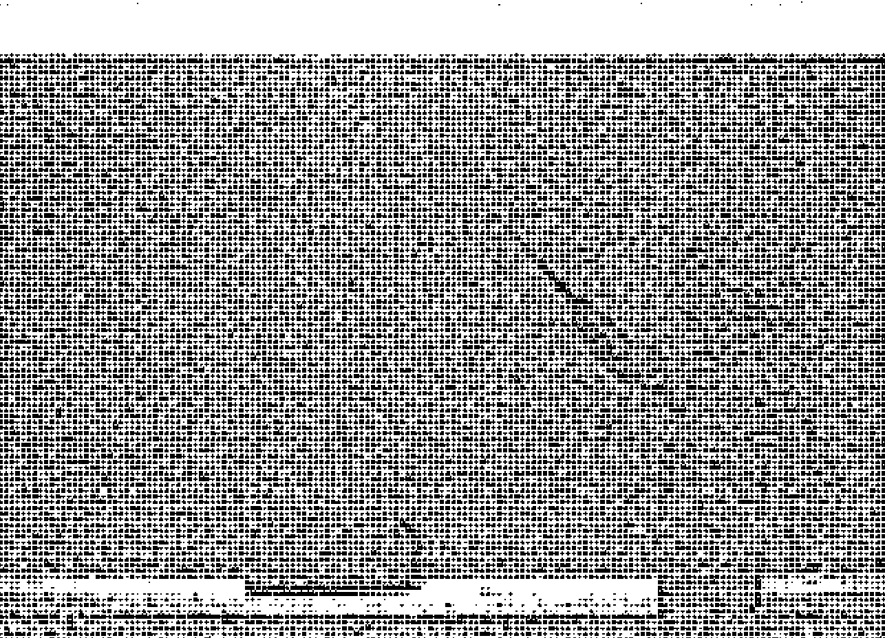

| 九星 | 天辅 |
| :--- | :--- |
| 阴阳五行 | 阴木 |
| 对应方位 | 巽卦·东南 |
| 外表形态 | 身形修长、肤白发密 |
| 身体 | 肝胆、大腿、呼吸器官、乳房、左肩 |
| 疾病特性 | 传染与感染，医治时要切断感染源 |

- 特征：辅助提升、学习技巧、文化内涵、辅助、协助、指导、一把手、关怀、奉献、诚信、关心、传染。
- 人物：孔子、老师、宰相、护士、助理、保姆、文化工作者。

| 個性 | 音形義 | 事業求財 | 靜物 | 景物 | 植物 | 動物 |
|---|---|---|---|---|---|---|
| 溫文儒雅、如沐春風、循循善誘、謙虛有禮、彬彬有禮、奉獻包容、會蓄心善。 | 文昌、乙木、符令、輔導、輔助、學習、傳染、一把手、廟、風、學校。 | 從事文化教育相關行業、心理輔導諮詢、工藝木材業、服裝設計業等。 | 空調、風扇、窗口、窗簾、繩子、電線、筷子、條狀物、桌椅、板凳、床、低矮木製品、衣服、雨衣、傘、食品、水果。 | 學校、考試院、廟宇、圍牆、柵欄、護欄、隔離區、麥田、稻田、竹林、果園。 | 藤蔓類、柳樹、葡萄、胡蘆、絲瓜、南瓜、楊樹、花草等。 | 蛇、泥鰍、蚯蚓、蜥蜴、壁虎、蝴蝶、蜻蜓等。 |

## (五)、天英的各种象意（如果能背起来最好）

「天英」星属火，主有礼貌、燥热性急、动态变化。测人、测物、测事临天英，宫位健康能量旺相格局佳，表示此人家喻户晓、名声远扬，反之若是休囚无力，表示耐力不足，做事虎头蛇尾。

| 项目 | 描述 |
|------|------|
| 九星 | 天英 |
| 外表形态 | 玲珑有致、帅哥美女 |
| 阴阳五行 | 阴火 |
| 对应方位 | 离卦·南方 |
| 身体 | 头部、眼睛、血液、心脏 |
| 疾病特性 | 表象虚象之疾，医治宜从根本治标 |
| 特征 | 帅哥美女、英俊漂亮、风姿绰约、性急易躁、亮丽、聪明、热情、名气、明亮、光芒、爱现、虚华浮夸、社交公关。 |
| 人物 | 演艺人员、公关社交人员、文艺工作者、时尚美容人员、电子电器人、艳丽四射之人。 |

| 個性 | 音形義 | 事業求財 | 靜物 | 景物 | 植物 | 動物 |
|------|--------|----------|------|------|------|------|
| 聰明智慧、勤奮好學、才華洋溢、虛情假意、躁鬱、焦慮、好強、愛現、易怒。 | 英語、英雄、英明、英姿、鷹架、空洞。 | 從事表演藝文相關行業、電子電器照明業、公關社交業。 | 閃亮發光明亮突顯之事物或物品、電子電器照明用品、霓虹燈、望遠鏡、爐灶、爆炸易燃物品、證件、漂亮圖片、彩色圖書。 | 太陽、首都、鬧市、繁華之地、陽光充足的場所、爐冶之地、美容院、電影院、圖書館。 | 向日葵、四季海棠、龍船花、長壽花、長春花、虎刺梅、漂亮盆景或花卉等。 | 蝴蝶、極樂鳥、鸞鵲、駿馬、孔雀、鸚鵡、火雞、錦鯉、金魚、熱帶魚等漂亮動物。 |

## （六）、天芮的各种象意（如果能背起来最好）

「天芮」星属土，为纯阴之星，是病星，所以视为有问题。测人、测物、测事临天芮，宫位健康能量旺相格局佳，表示学习态度好，善吸收、包容，是个做大事的人物；反之若是休囚无力格局又差，表现的是贪小便宜，巧言令色，毛病问题多。

| 九星 | 天芮 |
|---|---|
| 阴阳五行 | 阴土 |
| 对应方位 | 坤卦，西南 |
| 外表形态 | 方脸有斑、嘴大肚大 |
| 身体 | 胃脾、腹部、右肩、嘴、肚脐 |
| 疾病特性 | 病灶与病源，医治必须要治本 |
| 特征 | 病星、疾病、学习态度、有问题、事情多、麻烦多、反应慢、错误、结交、神佛、修道。 |
| 人物 | 医生、老师、学生、仙佛、病人、孕妇、农民、低层人员。 |

| 個性 | 音形義 | 事業求財 | 靜物 | 景物 | 植物 | 動物 |
|------|--------|----------|------|------|------|------|
| 固執、遲鈍、懦弱、剛愎、包容。 | 直、方、大、多、有問題、嘴巴大、肚子大、斑點、藥品、神佛、宗教、錦囊、子宮。 | 醫生、老師、從事醫療或醫療衛生器材相關行業、文化教育、農業、肉品業、家禽家畜等。 | 醫藥器械與用品、神佛、書籍、文化用品、布包、瑕疵品。 | 醫院、學校、廟宇、庭院、圖書館、書店。 | 黍、稷、麥、菽、麻、土豆、花生、地瓜等農作物。 | 牛、羊、豬等家禽家畜。 |

## (七)、天柱的各種象意（如果能背起來最好）

「天柱」星屬金，有中流砥柱、創新、革新、支撐的意涵。測人、測物、測事臨天柱，宮位健康能量旺相格局佳，表示此人口才佳、善辯、有演說、表演等行業，相反若是休囚無力格局不佳，則易有口舌是非、官訟刑傷。

| 人物 | 特徵 | 九星 | 陰陽五行 | 對應方位 | 外表形態 | 身體 | 疾病特性 |
|------|------|------|----------|----------|----------|------|----------|
| 檢調人員、律師、軍警、教師、外交人員、演員、仲介、講師、叫賣哥、推銷員 | 破壞、毀滅、頂天立地、力挽狂瀾、中流砥柱、中途驚變、驚恐怪異、依然故我、自以為是、口舌爭吵 | 天柱 | 陰金 | 兌卦：西方 | 身強體壯、膚白方臉 | 頸椎、大腿、食道、呼吸系統、右手 | 病況外因明顯，宜劍及履及對症下藥 |

| 動物 | 植物 | 景物 | 靜物 | 事業求財 | 音形義 | 個性 |
|---|---|---|---|---|---|---|
| 公雞、鳥類等叫聲悅耳的動物。 | 楓香、椰子樹、檳榔樹、棕櫚樹、竹子等直立的樹。 | 台北101、直立高樓、直立煙囪、直立水塔、柱子、電線桿、鐵塔、高壓電塔、鋼管、水泥管、直立紀念碑。 | 有聲響的電器與樂器用品、電視、音響、喇叭、鋼琴、風琴、吉他、鐘錶、直立物、立燈、球棒、筷子、筆、金屬物品。 | 從事法律訴訟能言善道者、演藝唱歌表演者、外交談判者、仲介銷售者、金屬製品業者。 | 頂天立地、一柱擎天、支柱、壁刀、骨幹、路燈、脊椎、發出聲響、變化、阻礙、導遊。 | 叛逆、不服輸、愛唱反調、搞破壞、能言善辯、好鬥爭訟、剛愎自用、強硬固執、我行我素、獨當一面。 |

## (八)、天心的各種象意（如果能背起來最好）

「天心」星屬金，表現的是心思細膩，善於策謀計畫、領導管轄。測人、測物、測事臨天心，宮位健康能量旺相，具有領導才華，公正無私，受人尊敬；相反若是休囚無力，則易工於心計，學習潛力無法發揮。

| 人物 | 特徵 |
|------|------|
| 領袖、主管、諸葛亮、醫生、護士、軍師、參謀、企業家、中心人物。 | 中心、核心、領導、主管、管理有方、學習潛力、居高臨下、掌控全局。 |

| 九星 | 天心 | 外表形態 | 高大威武、膚白圓臉 |
|------|------|----------|--------------------|
| 陰陽五行 | 陽金 | 身體 | 肺、大腸、頭部、心臟、右腳 |
| 對應方位 | 乾卦 |  |  |
| 疾病特性 | 病況根源因素引發頭部與心臟方面的疾病 |  |  |

| 动物 | 植物 | 景物 | 静物 | 事业求财 | 音形义 | 个性 |
| :--- | :--- | :--- | :--- | :--- | :--- | :--- |
| 狗、猪、天鹅、狮子、老虎、鲸鱼。 | 兰花、牡丹、百合、菊花、芍药。 | 首都、闹市、繁华之地、广场、客厅、金银珠宝店、庙宇、主管办公室。 | 金银珠宝、饰品珍玩、贵重物品、医疗器具、神佛、财神爷、金属器皿、光碟、球类。 | 从事医疗相关事业、组织策划管理相关行业。 | 中心、核心、心情、心想事成、薪资、薪饷、心愿。 | 机智聪明、善于谋略、精于策划、专于管理、心思缜密、头脑冷静、领导才能、正直不阿、乐善好施、济世救人、惩恶扬善。 |

## 第五节、八门所代表的人、事、地、物之类象

(如果能画起来最好) 八门在陰盤奇門遁甲的特性是人和系統，代表心中的狀態與行為。分別是休門、生門、傷門、杜門、景門、死門、驚門、開門，簡記為：休生傷杜景死驚開。八門是一個人或一件事情的表象與通道，最怕遇到四害的「門迫」，其傷害力可以說是最強的。於此我們就必須利用化解四害的手法來進行處理，藉以疏通阻礙，減輕衝突，達到和諧的目的。

| 八門 | 象意 |
|------|------|
| 休门 | 休閒娛樂、休息、休養、倦怠、休止、婚姻、家庭和諧。 |
| 景门 | 美麗風景、景氣行情、考試成績、消息訊息、廣告文宣、文書、合同。 |
| 杜門 | 躲避隱藏、祕密行事、文靜內向、堵住阻塞、專業技能、軍警檢調。 |
| 傷門 | 性直易怒、受傷、損傷心、破壞、破舊、傷、訂債、車子。 |
| 生門 | 有生氣有活力、生產、生活、生意、利息、利潤、陽宅。 |
| 開門 | 開創、開拓、開朗、開心、開放、開始、開店、開刀、工作、單位、法官、飛機。 |
| 驚門 | 是非口舌、驚惶不安、發出聲響、破碎之物、美麗圖畫、律師檢調、官司訴訟。 |
| 死門 | 沒有活力、死氣沉沉、循規蹈矩、固執保守、嚴肅木訥、死亡、束縛、死板、不動、死結心。 |

### 杜門
躲避隱藏、祕密行事、文靜內向、堵住阻塞、專業技能、軍警檢調。

### 傷門
性直易怒、受傷、損傷心、破壞、破舊、傷、訂債、車子。

### 生門
有生氣有活力、生產、生活、生意、利息、利潤、陽宅。

### 開門
開創、開拓、開朗、開心、開放、開始、開店、開刀、工作、單位、法官、飛機。

### 驚門
是非口舌、驚惶不安、發出聲響、破碎之物、美麗圖畫、律師檢調、官司訴訟。

### 死門
沒有活力、死氣沉沉、循規蹈矩、固執保守、嚴肅木訥、死亡、束縛、死板、不動、死結心。

公历：2018年12月18日0时34分
农历：2018年11月12日 阴遁8局
四柱：戊戌 甲子 甲申 甲子
旬空：甲子旬 戌亥空 马星：寅
值符：天任星 值使：生门 十二长生

甲
▼

| 论父亲 | 论母亲 | 论兄弟 | 论姐妹 |
| :---: | :---: | :---: | :---: |
| 论儿子 | 论女儿 | 论配偶 | 问测者 |

| 病巳 | 死午癸 | 墓未 |
| :---: | :---: | :---: |
| 衰<br>辰己<be土><br>壬<br>木辅乙<br>木杜乙 | 帝旺<br>卯庚<br>天金<br>癸<br>木冲<br>木伤 | 临官<br>寅丁<br>符土<br>戊<br>土任丙<br>土生丙 |
| 玄水<br>乙<br>火英丁辛<br>景丁辛 | 离<br>己<br>六木<br>己<br>金柱<br>金惊 | 蛇火<br>丙<br>水蓬庚<br>休庚 |
| 白金<br>辛<br>土芮<br>土死戊 | 阴金<br>庚<br>○金心<br>金开乙 |

马 冠带丑 沐浴子壬 长生亥

| 空亡 | 入墓 | 刑刑 | 门迫 | 干伏吟 | 门伏吟 | 星伏吟 | 干反吟 | 门反吟 | 星反吟 |
| :---: | :---: | :---: | :---: | :---: | :---: | :---: | :---: | :---: | :---: |

## 八門

| 杜 | 景 | 死 |
| :---: | :---: | :---: |
| 傷 | 八門 | 驚 |
| 生 | 休 | 開 |

## (一)、休門的各种象意（如果能背起来最好）

「休門」屬水，有休養生息、調養、休整、整頓的意涵。測人、測物、測事臨休門，宮位健康能量旺相，表示漂亮英俊氣質佳，貴人多助，相反若是休囚無力，代表此人懶散，做事不勤快，常常偷懶，但若是退休之人，反以吉論。

| 人物 | 特徵 |
|------|------|
| 公務員、貴人、退休者、戀人。 | 休養生息、家庭、婚姻、戀愛、退休、休止、倦怠、結束、沒有活力、鬆軟、運輸、流動、調節、調理、調養、美容、美髮、出行。 |
| 對應方位 | 陰陽五行 | 外相形態 |
| 坎卦：北方 | 陽水 | 氣質漂亮、溫和愜意 |
| 疾病特性 | 身體 |
| 萎靡倦怠，處於修復、潛伏或停止的狀態 | 生殖系統、子宮、下腹部 |

| 个性 | 音形义 | 事业求财 | 静物 | 景物 | 植物 | 动物 |
|------|--------|----------|------|------|------|------|
| 懶散、漫不經心、性情溫和、說話和緩、怡然自得、休閒娛樂、熱愛旅行。 | 修理、休息、休閒、休養、休克、停止、退休、休止、修養、修練、修、行、婚姻感情、娛樂旅遊。 | 從事休閒娛樂養生美容美髮相關行業、水產類、流動運輸業。 | 飲料、飲水機、水、酒、醋、油、車、船、休閒器具、涼椅、鐘錶、電風扇、洗衣機、馬達、冷氣機、空調、布料、衣物、棉花、抱枕等液體、休閒、流動、運輸、動態、鬆軟之物。 | 池塘、河邊、湖岸、海濱、溝渠、馬路、車站、捷運、機場、高鐵、公園、遊憩區、度假區、道觀、養老院、客廳等水域、運輸、修練、休閒、休憩之所。 | 水草、水稻、白菜、青菜、蘿蔔、西瓜、柳丁、椰子。 | 金魚、毛毛蟲、蝸牛、牛、羊、鹿、烏龜等性情溫和的动物。 |

## 一、生门的各种象意（如果能背起来最好）

「生门」属土，有万物萌生，阳气开始上升，生机无限之象。测人、测物、测事临生门，宫位健康能量旺相，表示生气蓬勃，欣欣向荣，积极乐观，不断成长；反之若是休囚无力宫内有病，代表生活困顿，投资毫无利润可言，甚至血本无归。

| 属性 | 值 |
|------|----|
| 八门 | 生门 |
| 阴阳五行 | 阳土 |
| 对应方位 | 艮卦·东北 |
| 疾病特性 | 病情正处于活跃发展生长蔓延的状态当中 |
| 身体 | 胃脾、嘴鼻、左脚 |
| 外表形态 | 方脸黄肤、乐观进取 |
| 特徵 | 利润、生意、生长、生活、生存、活的、房屋、产业、新面貌、财运、阳宅、延续、靠山。 |
| 人物 | 生意人、生产者、学生、小孩、孕妇、妇产科医生、农夫。 |

| 动物 | 植物 | 景物 | 静物 | 事业求财 | 音形义 | 个性 |
|------|------|------|------|----------|--------|------|
| 牛、兔、马、羊、鸡、猪等活跳的动物。 | 花草树木等生长有生气的植物。 | 房屋、桥梁、闹市、公园、产房、工厂生产线、农渔场、交易所等熙熙攘攘的地方或动物植物之所。 | 柴、米、油、盐、酱、醋、茶、牙膏、牙刷、洗面乳、洗发精、沐浴乳、肥皂、化妆镜等日常生活用品。 | 从事房屋土地买卖相关行业、经济贸易、种植农物与养殖业。 | 生意、日常生活用品、生长、生活、生命、接生、生病、声明、新生、开始、启发。 | 生气蓬勃、乐观进取、生龙活虎、守时守信、重视经济、诚正信实。 |

## （三）、傷門的各種象意（如果能背起來最好）

「傷門」屬木，有受傷、傷害、傷心、打鬥、挑逗、損壞的意思。測人、測物、測事臨傷門，宮位健康能量旺相，代表此人很有能力，做事執行力強；反之若是休囚無力宮內有病，就是被傷害，做事不圓滿，物件有破損瑕疵之意。

| 人物 | 特徵 | 八門 | 陰陽五行 | 對應方位 | 外表形態 | 身體 | 疾病特性 |
| :--- | :--- | :--- | :--- | :--- | :--- | :--- | :--- |
| 獵人、軍警、受傷者、傷心者、司機、運動員、殺手、打手。 | 受傷、傷心、傷痛、傷身、傷人、破壞、毀損、捕捉、漁獵、打鬥、挑逗、破財、破產、官司、賭博、討債執行力、車船。 | 傷門 | 陽木 | 震卦，東方 | 身強體壯、威嚴震懾 | 肝膽、手腳 | 疾病發展迅速，處於消耗損害身體的狀態 |

| 個性 | 音形義 | 事業求財 | 靜物 | 景物 | 植物 | 動物 |
|------|--------|----------|------|------|------|------|
| 直來直往、盛氣凌人、咄咄逼人、剛愎自用、劍及履及、顧影自憐。 | 受傷、傷心、傷痛、傷害、傷人、傷身、傷痕、破壞、打鬥、迅速、挑逗、討債、賭博、車子、體育、舞蹈、官司。 | 從事車船運輸或司機駕駛相關行業、軍警、運動員、討債賭博、炮竹爆炸等危險性行業。 | 刀、劍、槍砲、鐵鎚、子彈、弓箭、飛鏢、木棍、球棒、毒氣、毒藥等傷人利器或物品破損殘缺之物。 | 車、船、道路、鬧市、軍營、警局、法院、化工場、屠宰場、停車場、拍賣場、周年慶、道路崎嶇或環境危險之處。 | 仙人掌、玫瑰、蒺藜、野生曼陀羅、蒼耳、鬼針草、大小劑。 | 老虎、獅子、老鷹、豹、狗、毒蛇、箱型水母、蝎子、虎頭蜂、蚊子、跳蚤、等傷人的動物或昆蟲。 |

## (四)、杜門的各種象意（如果能背起來最好）

「杜門」屬木，有隱密、隱藏、阻塞、暗中行事之意。測人、測物、測事臨杜門，宮位健康能量旺相，代表具有專業技術能力，虛懷若谷，深藏不露；反之若是休囚無力宮內有病，此人難溝通，不喜歡與人交談，自我封閉。

| 八門 | 杜門 | 外表形態 | 身體 | 疾病特性 | 對應方位 | 陰陽五行 | 特徵 | 人物 |
|------|------|----------|------|----------|----------|----------|------|------|
| 杜門 | 文靜內斂、沉悶黯然 | 肝膽、筋、左肩 | 疾病不易察覺或隱藏阻塞，不順暢的狀態 | 巽卦，東南 | 陰木 | 阻塞、阻隔、阻礙、堵住、隱藏、隱匿、隱瞞、覆蓋、遮掩、關閉、斷絕、技術研究、不清楚。 | 獄警、軍警、法官、檢察官、調查員、專業技術人員、技術研究人員、通信社人員、囚犯。 |

| 動物 | 植物 | 景物 | 靜物 | 事業求財 | 音形義 | 個性 |
|------|------|------|------|------|------|------|
| 老鼠、貓、狗、貓頭鷹、蚊子、蚯蚓、蟋蟀等夜行性與長期在土裡的動物 | 花草樹木、田園莊稼、苔蘚植物等 | 圍牆、柵欄、監獄、看守所、無尾巷、通道、門檻、堤防、護欄、隔離區、塞車、人群或交通擁擠地區 | 報章、雜誌、書籍、胸罩、口罩、門窗、窗簾、密合物、塞子、蓋子、套子、被子、內衣 | 從事專業技術研究相關行業、軍警檢調、建材業、園藝 | 杜撰、防堵、圍堵、堵住、堵塞、偽造、捏造、造謠、此路不通 | 沉默寡言、內向文靜、木訥無言、個性害羞、不善表達 |

## （五）景门的各種象意（如果能背起來最好）

「景門」屬火，有景氣行情、風景圖畫、資訊信息、廣告宣傳、影視娛樂的意思。測人、測物、測事臨景門，宮位若過於強旺，反而容易發生意外血光之災，因為火旺急躁，有陽極轉陰的現象。

| 八門 | 陰陽五行 | 對應方位 | 外表形態 | 身體 | 疾病特性 | 特徵 | 人物 |
|------|----------|----------|----------|------|----------|------|------|
| 景門 | 陰火 | 離卦·南方 | 身形苗條、臉蛋漂亮 | 血液、心臟、頭部 | 處於活躍發展狀態，如發燒、燙傷等急症 | 喜慶宴會、計劃策謀、市場行情、華麗漂亮、化妝打扮、文書文件、聰明熱情、餐飲、旅遊、演藝、照耀、帥哥美女、光彩明亮、虛華浮誇、血光意外、發炎。 | 表演工作者、廣告宣傳者、策劃者、空姐、模特兒、設計師、文人作家。 |
| 動物 | 植物 | 景物 | 靜物 | 事業求財 | 音形義 | 個性 |
| 孔雀、蝴蝶、鸚鵡、天皇鳥、火烈鳥、帕芬鳥、鶴鶯、雉雞、觀賞魚等漂亮動物。 | 玫瑰、蘭花、九里香、風鈴草、牡丹等漂亮植物或盆栽。 | 繁華地區、漂亮風景、霓虹燈、飯店、陽台、公園、電影院、歌劇院、美容美髮店、五光十色、燦爛絢麗、酒吧等娛樂場所。 | 手機、電視、電腦、電器電子用品、圖書、合照、護照、簽證、證書、文件、時裝美容美髮用品、炮竹煙火、燈光、顏料、投影機、風景畫。 | 從事演藝影視表演相關行業、廣告宣傳業、電子通訊業、美容美髮業、文化圖書藝術、娛樂業、餐飲業、裝飾藝術類。 | 風景、前景、願景、景氣、漂亮、攝影、文化、圖畫、美術、廣告宣傳、決策計畫、護照、簽證文書、消息、訊息、公告、合同、考試成績、試卷、面試、訴狀、合照、井然有序。 | 悅己者容、表演慾強、虛榮心強、心直口快、性情急躁、知書達禮、能說善道。 |

## （六）死門的各種象意（如果能背起來最好）

「死門」屬土，有成熟收穫、受困、死氣沉沉，毫無生機的意涵。測人、測物、測事臨死門，在坤宮未、申月進入秋季階段，古有言：春生秋死，乃萬物休囚凋零之始，代表此人沒有信心，沒有活力，前景不看好。

| 人物 | 特徵 | 八門 | 外形象態 | 身體 | 疾病特性 |
|------|------|------|----------|------|----------|
| 屠夫、獵人、死人、死板者、醫護人員、神佛、弔喪者、行刑者。 | 結束、靜止、死亡、受困、埋葬、奔喪、捕獵、疤痕、醫療、救死扶傷、難過、纏繞。 | 死門 | 呆滯呆板、木訥寡言 | 胃脾、消化系統 | 有傷疤腫塊，組織壞死，功能退化的狀態 |
| 個性 | 音形義 | 事業求財 | 靜物 | 景物 | 植物 | 動物 |
| 死氣沉沉、保守內向、木訥呆板、笨拙遲鈍、一意孤行、死咬不放、循規蹈矩、愛生悶氣、死不認帳。 | 死傷、地產、地基、地皮、陰宅、醫療、醫護、死心、附體、不開心、沒有活力、反應慢、死心眼、不靈活、低潮、不動。 | 從事醫療相關行業、地產業、屠宰業、廟宇神佛相關用品、肉製品業等。 | 神佛、佛具、醫療器具、刀劍槍砲彈、遺照、木偶、玩偶、玩具、雕塑品、枷鎖、繩索、墓地、俑。 | 醫院、太平間、陰宅、墳墓、廢棄場、屠宰場、垃圾場、回收場、刑場、雕塑間、空屋、人煙罕至之處。 | 松柏、銀杏等生長緩慢或乾枯有病的植物。 | 牛、豬、烏龜、蝸牛、海馬、蛞蝓、海星、樹懶等行動緩慢的動物或動物的屍體。 |

## （七）驚門的各種象意（如果能背起來最好）

臨驚門，一般會與「口」有關係，所以事情處理不當，就會有口舌爭吵的現象。驚門就是動口不動手；傷門則是動口又動手或砸東西來洩憤。

| 八門 | 陰陽五行 | 對應方位 | 疾病特性 | 身體 | 外表形態 | 特徵 | 人物 |
|------|----------|----------|----------|------|----------|------|------|
| 驚門 | 陰金 | 兌卦、西方 | 處在抽搐、酸麻、陣痛、脹氣、咳喘狀態 | 食道、咽喉、呼吸系統 | 身強體壯、口大眼圓 | 擔心害怕、驚恐不安、爭論吵架、口舌是非、官非訴訟、聲音、音樂、疼痛、刺激。 | 律師、檢調人員、教師、外交人員、歌手、推銷員、中介 |
| 個性 | 音形義 | 事業求財 | 靜物 | 景物 | 植物 | 動物 |
| 能說善道、聲音宏亮、口才便給、反應敏銳、表達力強、口齒伶俐。 | 受驚、擔心、驚恐、驚慌、驚嚇、驚醒、驚險、收驚、一鳴驚人、精明、發出聲音、破碎之物、景色、美麗圖片、井。 | 從事演藝歌唱相關行業、律師、教師、導遊、娛樂、樂器、金融、精緻金屬、推銷等行業。 | 電視、音響、喇叭、電話、風鈴、搖擺中、樂器、炮竹等發出聲響或景緻好看的圖片。 | 軍警檢單位、法院、鬧市、菜市場、拍賣場、吵雜之地、是非之所、兵工廠、歌劇院、電影院、競技場。 | 竹林、白楊樹、松柏、甘蔗田等微風徐徐發出聲響的植物。蟬、青蛙、蟋蟀、蝗蟲、麻雀、鸚鵡、黃鸝、貓、狗等善於發聲的動物或昆蟲。 |

## （八）開門的各種象意（如果能背起來最好）

開門屬金，有開創開拓、開放公開、開門通道的意涵。測人、測物、測事臨開門，宮位健康能量旺相，表示做事順利，個性開朗大方，通情達理；反之若是休囚無力，代表被受制，應當隱密的事情暴露公開了，開店生意不好，婚姻分開分。

| 八門 | 陰陽五行 | 外表形態 | 身體 | 對應方位 | 疾病特性 | 特徵 |
|------|----------|----------|------|----------|----------|------|
| 開門 | 陽金 | 高大威武、臉圓鼻挺 | 心臟、頭、肺、大腸 | 乾卦：西北 | 疾病顯而易辨，依照專業醫治，療效明顯 | 工作單位、公開、升遷、明顯、暴露、開刀、出行、出國、開放、展開、寬廣、開始、開明、打開、手術、順利、通暢、經營、經濟、婚嫁、貿易、慶典 |
| 人物 | 個性 | 音形義 | 事業求財 | 靜物 | 景物 | 植物 | 動物 |
| 法官、仲裁者、掌權者、開創者、公眾人物、駕駛。 | 豁達開朗、思想開放、卓越不凡、不拘小節、勇於開創。 | 敞開、開心、開悟、開導、開創、開拓、開門、開店、開工廠、開公司、飛機。 | 從事法律諮詢相關行業、開門做生意、金屬類、操控駕駛等。 | 金銀珠寶、翡翠珍玩、時鐘、救生圈、球類、唱盤、標靶、錢幣、金幣、輪胎等貴重或圓形物品。 | 首都、法院、開市、開闊寬敞之地、高樓大廈、街道、市場、名人居所、機場、車站、碼頭、公司大門、工作單位、店面。 | 高大樹木與開花結果的植物。 | 獅、虎、豹、狼、龍、天鵝、孔雀、老鷹。 |

## 第六節 八卦、九宮所代表的人、事、地、物之類象（如果能背起來最好）

### （一）八卦演繹六十四卦順序

八卦與九宮在第二章第二單元已經介紹的很詳細，在此我們可以將八卦演繹成六十四卦象，期待有緣與各位讀者共同研究『奇門穿六爻』之學，以解急症、官司、和合、留人等技法。

乾、兌、離、震、巽、坎、艮、坤，八卦之數為天在上，地在下，由內外盤六十四卦所組合而成，而六十四卦卻是由「河圖」與「洛書」演繹而來。此為不易之理，其所居順序如圖表所示：

### 九宫八卦

| 巽 | 離 | 坤 |
|---|---|---|
| 震 | 宮位 | 兌 |
| 艮 | 坎 | 乾 |

### 二、八卦五行疾病論

學習奇門遁甲必須熟記的八卦九宮所屬五行：

- 【坎一宮】北方——五行屬水。
- 【坤二宮】西南方——五行屬土。
- 【震三宮】東方——五行屬木。
- 【巽四宮】東南方——五行屬木。
- 中五宮為中央
- 【乾六宮】西北方——五行屬金。
- 【兌七宮】西方——五行屬金。
- 【艮八宮】東北方——五行屬土。
- 【離九宮】南方——五行屬火。

五行對應疾病論斷：

| 五行 | 對應疾病 |
|---|---|
| 木 | 免疫系統、容易疲勞、肝膽、四肢無力、左癱右瘓、口乾舌燥。 |
| 火 | 循環系統、心臟血管、血壓、眼睛、小腸、傷寒、心律不整。 |
| 土 | 消化系統、脾胃、脅肋、糖尿病、虛黃瘟痰。 |
| 金 | 呼吸系統、肺大腸、筋骨酸痛、牙齒、氣管炎、易感冒、便秘。 |
| 水 | 泌尿系統、腎臟、膀胱、腰酸、子宮、卵巢、遺精白濁。 |

### 三、八卦疾病論

奇門遁甲的八卦九宮，大到可以模擬天、地、人及宇宙上的萬事萬物，小至影響人體的每一個部位。因此奇門遁甲診斷疾病的方法就是以八卦九宮內用神落宮的符號組合來分析其病症，再運用「萬物相干論」的原理，排除環境中不良的物質，進而達到調理疾病的目的。

| 卦 | 症狀 |
|---|---|
| 兌（兌上缺）少女 | 呼吸系統、腦神經衰弱、氣管炎、牙痛、鼻、肺。 |
| 坤（坤六斷）老母 | 腸胃、小產、脾虛、泌尿疾病。 |
| 巽（巽下斷）長女 | 肝膽、痔瘡、氣喘、脊椎、坐骨神經、排泄、筋骨。 |
| 離（離中虛）中女 | 循環系統、心臟血管、中風、眼疾、頭痛。 |
| 震（震仰盂）長男 | 免疫系統、肝、車禍、筋骨、手腳酸痛、神經失常。 |
| 坎（坎中滿）中男 | 泌尿系統、腎、膀胱、婦女病、耳塞、膽石。 |
| 艮（艮覆碗）少男 | 呼吸系統、皮膚炎、風濕關節痠痛、腫瘤、車禍。 |
| 乾（乾三連）老父 | 頭疾、氣管炎、筋骨酸痛、腦病、腸炎、感冒遲癒。 |

### （四）八卦方位突出或凹陷疾病論

黃帝宅經云：「宅以形勢為身體，以泉水為血脈，以土地為皮肉，以草木為毛髮，以舍屋為衣服，以門戶為冠帶，若得如斯，是事優雅，乃為上吉。」又云：「人之福者，喻如美貌之人，宅之吉者，如醜陋之子得好衣裳，神采尤添一半，若命薄宅惡，即如醜人更又衣弊，如何堪也。」透露出陽宅與自然生態的融合，與人為環境的交媾，影響至鉅，豈不愼乎！

| 八卦方位 | 凸出或凹陷疾病論斷 |
|---|---|
| 乾：西北方 | 筋骨、頭部、肺部、呼吸系統。 |
| 艮：東北方 | 消化系統、皮膚、胃脾。 |
| 坎：北方 | 暗疾、泌尿生殖系統毛病。 |
| 震：東方 | 貧窮不順、筋骨、肝膽毛病。 |
| 離：南方 | 眼、心血管疾病、口舌是非、官司。 |
| 兌：西方 | 呼吸系統、肺部、牙齒、骨骼。 |
| 坤：西南方 | 消化系統、皮膚、胃脾。 |
| 巽：東南方 | 敗家運、敗財、筋骨、肝膽毛病。 |

化解方法建議請專業人士處理！

| 缺角化解 | 凸化解 |
|---|---|
| 1. 安奉直徑12公分以上水晶球畫上鎮宅符令。<br>2. 中國結（宮位色澤各異）。<br>3. 道醫藥包。<br>4. 八卦圖。 | 1. 安奉五帝錢或葫蘆（要打開）畫上押煞符令。<br>2. 中國結（宮位色澤各異）。<br>3. 道醫藥包。<br>4. 八卦圖。 |

公曆：2019年1月25日6時36分
農曆：2018年12月20日 陽遁2局
四柱：戊戌 乙丑 壬戌 癸卯
時空亡：甲午旬 辰巳空 馬星：巳
值符：天芮星 值使：死門 十二長生 王▼

| 論父親 | 論母親 | 論兄弟 | 論姊妹 | 論兒子 |
|--------|--------|--------|--------|--------|
| 論女兒 | 論配偶 | 問測者 |        |        |

奇門遁甲排盤表格（簡化）：
| 宮位 | 天盤 | 地盤 | 門 | 星 | 神 | 天干 | 地干 | 長生 |
|------|------|------|----|----|----|------|------|------|
| 乾宮 | 玄水 | 己   | 休 | 蓬 | 太陰 | 壬   | 乙   | 帝旺子丁 |
| 兌宮 | 白金 | 丁   | 傷 | 任 | 六合 | 乙   | 己   | 衰丑  |
| 離宮 | 符土 | 戊   | 生 | 衝 | 九天 | 丙   | 庚   | 長生申 |
| 震宮 | 陰金 | 癸   | 死 | 英 | 玄武 | 戊   | 辛   | 沐浴酉 |
| 巽宮 | 蛇火 | 壬   | 驚 | 芮 | 白虎 | 庚   | 壬   | 冠帶戌 |
| 坎宮 | 地土 | 丙   | 開 | 柱 | 九地 | 辛   | 丙   | 臨官亥 |
| 艮宮 | 天金 | 戊   | 景 | 心 | 勾陳 | 丁   | 癸   | 絕巳  |
| 坤宮 | 福土 | 庚   | 杜 | 輒 | 朱雀 | 乙   | 戊   | 胎午  |
| 中宮 | 央土 | 辛   | 驚 | 芮 | 白虎 | 壬   | 己   | 養未  |

| 空亡 | 入墓 | 擊刑 | 門迫 | 干伏吟 | 門伏吟 | 星伏吟 | 干反吟 | 門反吟 | 星反吟 |

## 第七節 天盤、地盤所代表的人、事、地、物之類象

「天盤」為我，為表象，為當下現在，屬陽，主動；「地盤」為以後的發展，為內心與心裡所想。天盤為下一步，地盤翻至艮宮；天盤乙翻至（地盤乙翻至乾宮）。步驟（天盤壬翻至地盤為上一）。

## 第肆章 詳論奇門遁甲用神類象

### 一、三奇六儀八十一格局意象

宇宙萬事萬物皆有靈，包含花草樹木，所有的動植物，甚至外星人，都有其特有磁場的存在，無時無刻彼此互相影響。而我們現在談的格局也是如此，它代表人、事、物的變化與狀態，內心潛藏與人生軌跡的運行。天盤＝人事物，為我，為表象，為當下，為動，屬於陽；地盤＝為以後的發展，為內心或心中所想，為靜，屬於陰。將宮內天地盤（格局）看清楚之後，加上星門神（九星—八門—八神）引干，再慢慢地仔細推敲論斷！本章特別在第二大項增列天干值符甲十九格，方便讀者加強熟悉天干符號的意象連結，有助於在滿盤占之外的奇門時空斷能夠運用自如，更加得心應手。

1. 天盤乙奇九格
   (1) 乙十乙：日奇伏吟。只在原地徘徊，欠缺行動力。
   (2) 乙十丙：奇儀順遂。日月相逢屬吉，有貴人幫助，但好事當中需防出點小亂子。

## 2、天盘丙奇九格

(1)、丙十乙：日月并行。日奇月奇相会属吉，且乙木生丙火更吉。此格公私皆利。
(2)、丙十丙：月奇伏吟。月奇悖师，伏吟格，主文书招咨，破耗遗失。
(3)、丙十丁：月奇朱雀。丁为朱雀，得月奇，吉格。
(4)、丙十戊：飞鸟跌穴。甲木生丙火，丙遇甲，如飞鸟归巢，故名“飞鸟跌穴”，属大吉。
(5)、丙十己：月奇入墓。己为火之墓（甲戌），又为坟墓，故名“月奇入墓”。
(6)、丙十庚：癸入太白。癸者火也，癸入太白即是火入金乡，凶格。
(7)、丙十辛：谋事能成。丙辛相合，故谋事能成，吉。
(8)、丙十壬：火入地罗。壬属水克丙火，又为地罗，故曰：“火入地罗”，凶格。
(9)、丙十癸：悖师华盖。丙为悖师，癸为华盖、天网，癸水克丙火，丙奇遇之，自然为凶。
(10)、乙十戊：利阴害阳。木克土，资金、本钱被克。
(11)、乙十己：日奇入墓。乙为日奇，己为坟墓，乙落于坟墓之中，故凶。
(12)、乙十庚：日奇被刑。遇到了阻隔、争执、官司。
(13)、乙十辛：青龙逃走。乙坐卯向，辛坐酉向，卯酉相冲金克卯木，故曰：“逃走”，凶格。
(14)、乙十壬：日奇入地。壬为地罗，乙坐地罗，故曰：“日奇入地”，凶格。
(15)、乙十癸：日奇华盖。癸为天网、华盖，有逃匿躲藏之意。华盖逢日奇蔽佑，故宜于藏形。

## 3、天盘丁奇九格

(1)、丁十乙：人遁吉格。丁为星，乙为日，相逢为吉格。但婚姻中以丁为妾，有妾在妻上之意。
(2)、丁十丙：星随月转。丁为星，丙为月，相逢为吉格。但火气太旺，易出乱子。
(3)、丁十丁：星奇伏吟。丁奇最灵，喜事遂心，快乐的等待好消息。
(4)、丁十戊：青龙转光，戊为青龙，遇星奇属吉格。
(5)、丁十己：星奇入墓。己为坟墓，故曰：“星奇入墓”，凶格。
(6)、丁十庚：文书阻隔，庚为阻隔之神，故名“文书阻隔”。文书阻隔则行人必归。
(7)、丁十辛：朱雀入狱，辛为牢狱，为罪人。得丁奇则是罪人出狱，官人入狱。
(8)、丁十壬：五神互和。得到公平处理（贵人恩昭，讼狱公平），吉。
(9)、丁十癸：朱雀投江。癸主江河，故名“朱雀投江”，又因癸水克丁火，故为凶格。

## 4、天盘戊仪九格

(1)、戊十乙：青龙合灵。甲、乙皆为青龙，甲藏于戊下，与乙会合，故曰：“青龙合灵”，成败皆为平时的一倍。又因乙木克戊土，所以此格吉凶需视九宫八门的情况而定。
(2)、戊十丙：青龙反首。戊为青龙属木，生丙火，大吉。
(3)、戊十丁：青龙耀明。戊为青龙属木，生丁火，丁为星奇，故曰：“耀明”，大吉。
(4)、戊十戊：伏吟。障碍十障碍，遇事困难重重，问办事，一次难办成。
(5)、戊十己：贵人入狱。甲为元帅，坐己墓，凶格。
(6)、戊十庚：天乙飞宫。甲木元帅最怕庚金来克，故为大凶。
(7)、戊十辛：青龙折足。戊为甲子，辛为甲午，子午相冲属凶。又因辛克甲木，故曰：“折足”。
(8)、戊十壬：青龙入牢。壬为天牢，青龙遇之自然属凶。
(9)、戊十癸：青龙华盖。癸为天网，主躲藏。青龙遇之，可躲难避灾。但躲成与否需视九宫八门综论，故属中。

## 5、天盘己仪九格

(1)、己十乙：墓神不明。己为墓神，逢乙木克之，凶格。
(2)、己十丙：火悖地户。己为地户，丙为火，故名“火悖地户”，凶格。
(3)、己十丁：朱雀入墓。丁为朱雀，故曰：“朱雀入墓”，凶格。
(4)、己十戊：犬遇青龙。己为甲戊，逢戊甲青龙，故曰：“犬遇青龙”，属中吉。
(5)、己十己：伏吟。自私有邪念，贪欲强，办事无方，诸事不顺。
(6)、己十庚：利名反格。刑格反名，因刑格正好与其相反而得名。己土生庚金，故利主不利客。
(7)、己十辛：游魂入墓。辛为白虎，藏于墓下，犹如墓地游魂恶鬼，凶格。
(8)、己十壬：地网高张。壬为地罗（网），墓地挂网，故为地网高张，凶格。
(9)、己十癸：地刑玄武。癸为玄武，己土克癸水，故名“地刑玄武”，凶格。

## 6、天盘庚仪九格

(1)、庚十乙：合格。庚乙相合本属吉格，但合而化金，反助金力，日奇遭刑，凶格。
(2)、庚十丁：破格。金入火乡，星奇遭刑，凶格。
(3)、庚十戊：天乙伏宫。庚金克甲木元帅，大凶。
(4)、庚十己：刑格。己土生庚金，助庚金之力，大凶。
(5)、庚十庚：伏吟。又称“战格”，庚力倍增，硬碰硬大凶，要积极行动。
(6)、庚十辛：白虎干格。庚辛二金互助，白虎之力大增，大凶。
(7)、庚十壬：小格。庚遇地罗，凶气更增。壬主流动，庚主阻隔，此格也有行人难归之意，大凶。
(8)、庚十癸：大格。相冲不合，看似四通八达，却如网般所困。

## 7、天盘辛仪九格

(1)、辛十乙：白虎猖狂。辛金克乙木，辛为白虎，故曰：“白虎猖狂”，凶格。
(2)、辛十丙：干合悖师。丙辛相合本属吉，但丙奇落于辛金之下，故为中。
(3)、辛十丁：狱神得奇。丁为星奇，辛为狱神。丁火克辛金，故名“狱神得奇”，吉。
(4)、辛十戊：困龙被伤。甲子戊冲甲午辛，又因辛金克甲木，故名“被伤”。
(5)、辛十己：入墓自刑。己为甲午辛之火墓，辛落己中，好比自己入墓受刑，凶格。
(6)、辛十庚：白虎出力。庚辛二金相助，然辛金在上，故要靠辛金白虎出力，凶格。
(7)、辛十辛：伏吟天庭。毛病多多，漏洞百出，老挑别人的毛病，反而自找麻烦。
(8)、辛十壬：凶蛇入狱。壬为腾蛇，上临天狱，故名“凶蛇入狱”，凶格。
(9)、辛十癸：天牢华盖。辛为天牢，癸为华盖，故曰：“天牢华盖”，凶格。

## 8、天盘壬仪九格

(1)、壬十乙：小蛇得奇。壬为腾蛇，得乙奇，故名“小蛇得奇”，吉格。
(2)、壬十丙：小蛇入火。壬为蛇为水，入丙火之地，故名“水蛇入火”。又因水克火，故属凶格。
(3)、壬十丁：干合蛇刑。丁壬相合，合而化火，被水刑克，故曰：“干合蛇刑”。
(4)、壬十戊：小蛇化龙。壬为腾蛇，戊为青龙，蛇遇青龙且壬水生甲木，故吉。
(5)、壬十己：凶蛇入墓。己为坟墓，甲辰壬冲甲戌己，又因己土克壬水，凶格。
(6)、壬十庚：太白擒蛇。庚为太白，壬蛇主疑惑，故此格为解疑持正之意。且壬为地罗，制住庚金，故此格属吉格。
(7)、壬十辛：腾蛇相缠。辛金以甲辰壬为墓，且辛金生壬水，使腾蛇之力倍显，故属凶格。
(8)、壬十壬：伏吟。蛇入地罗出乱了，动荡不安，勾心斗角，内忧外患不断，难解。
(9)、壬十癸：主有家丑外扬之事发生，外面没事，是内部出现问题。

## 9、天盘癸仪九格

(1)、癸十乙：华盖逢星。甲寅癸为木之帝旺，下临乙木如同星归正位，故吉。
(2)、癸十丙：华盖悖师。华盖遇丙火自然名“华盖悖师”，吉格。
(3)、癸十丁：腾蛇天矫。丁奇本应合壬蛇，然癸水克丁火之后，丁已经无法再去合壬，故壬蛇之力显出，名为“腾蛇天矫”，凶格。
(4)、癸十戊：天乙会合。戊癸相合，且癸水生甲木，故名“天乙会合”。但癸又主天网罩在甲上，所以此格还要视九宫八门吉凶而定。
(5)、癸十己：华盖地户。己为地户，故曰“华盖地户”。己土克癸水，本属凶，然癸主躲藏，己又主地户，所以此格宜于藏身遁形。
(6)、癸十庚：太白入网。庚为太白，癸为天网，故曰：“太白入网”。此格有天网擒太白之象，故此格内必然争斗不止。
(7)、癸十辛：网盖天狱。上有天网，下有天狱，故曰：“网盖天狱”，有在劫难逃之意，大凶。
(8)、癸十壬：复见腾蛇。甲辰壬为癸水之墓，癸入墓，那只有“复见腾蛇”，主凶。
(9)、癸十癸：伏吟。天网四张，大凶。疾病、诉讼皆伤，在合作上最容易出现矛盾问题。

## (二)、天干值符十九格

### 1、天盘值符甲十格

(1) 甲十甲：双木成林。欢乐吉庆，和顺畅达，惟伏吟宜静守。
(2) 甲十乙：青龙会合。贵人多助，伸展自如，门吉事更吉，门凶事亦凶。
(3) 甲十丙：青龙回首。吉祥如意，谋事能成，若宫内逢四害，则吉事反凶。
(4) 甲十丁：木火通明。诸事吉利亨通，利于求取功名、升迁、谒贵。
(5) 甲十戊：双龙会。伏吟，受困阻塞，诸事不顺，徒劳无功，宜守不宜动。
(6) 甲十己：贵人入狱。受制于人，在人屋檐下，不得不低头，公私营谋皆不利。
(7) 甲十庚：值符飞宫。求财不利，测病凶，动辄得咎，吉事不吉，凶事更凶。
(8) 甲十辛：青龙折足。吉门生助犹尚可为，凶门至，主灾祸叠至，损财、足疾。
(9) 甲十壬：青龙入牢。心中苦闷，郁郁寡欢，阴阳事皆不利。

### 2、地盘值符甲九格

(1) 乙十甲：藤萝系甲，可春可秋，高山仰望，路途宽广，人事圆满。
(2) 丙十甲：飞鸟跌穴，谋事能成，名利双收，贵人多助。
(3) 丁十甲：青龙转光，加官进禄，不分身份地位与贵贱，凡事皆吉利。
(4) 戊十甲：巨石压木。伏吟，诸事不顺，闭塞不通，不得人和，凡事宜守。
(5) 己十甲：犬遇青龙。逢吉门谋事顺遂，逢凶门枉费心机，慎防被利用受累于人。
(6) 庚十甲：天乙伏宫。动荡不安，不利财官，降职、背弃，谋事皆凶。
(7) 辛十甲：龙争虎斗，怀才不遇，官非诉讼，破财损伤，徒劳无功。
(8) 壬十甲：小蛇化龙。浪里行舟，宫内逢吉为吉格；逢凶则内忧外患，险阻之象。
(9) 癸十甲：天乙会合。青龙入地，贵人得助，逢凶化吉之象；逢四害则主官非灾厄。
(10) 甲十癸：青龙华盖。逢吉门可招福，临凶门主诸事不利。

## 第八节、马星、旬干、寄干所代表的作用

### (一)、马星

阴盘奇门遁甲论断与处理的重点，除了专有用神之外，永远离不开四纲（如档案显示四柱：戊戌年、甲子月、甲申日、甲子时）、马星宫（如档案在艮宫）、太岁流年宫（戊戌、己亥年支在乾宫、庚子年支在坎宫）。

马星是正在发生或即将发生的事情，代表当下、快速之意，所以它往往就是催发或调理的重点。

马星：阴盘奇门遁甲由时柱旬找马星，在第贰篇教学篇会有详细的介绍。
- 寅午戌时马星在申（坤宫）；
- 申子辰时马星在寅（艮宫）；
- 巳酉丑时马星在亥（乾宫）；
- 亥卯未时马星在巳（巽宫）。

### (二)、引干

本宫（如艮宫）是信息的能量场，对宫（艮宫的对宫——坤宫）是修饰、限制、补充、说明本宫，当两个宫位符号还不能完全显示出人、事、物缘由的时候，我们可以再利用本宫的引干（艮宫——丁）找寻更多的资讯，此时“丁”落在“坤宫”的天盘干，恰巧落在对宫，倘若落在离宫或兑宫，则落人的宫位都与艮宫息息相关，其引干作用意义如下：
1. 隐藏着本宫没有显示的信息。
2. 它是个“引子”。
3. 它是暗藏、偷偷的，不易被察觉之事。
4. 代表外环境的一切事物与心里所想之人、事、物。
5. 对本宫的解释与说明。

### （三）、寄干

“寄干”是宫位内多出一个或两个天干而称之。阴盘奇门遁甲在“坤宫”地盘与天芮星所落宫位的天盘，永远会多出一个天干（如图档——坤宫与兑宫），倘若是干吟（天干）星（九星），则坤宫就会多出两个天干（如图示）。寄干又称为“宫”。通常代表人多、事多、麻烦多；多人参与，多件事情，解决有难度，很多事情纠绑在一起。尤其是测婚姻多了一个人，婚姻就容易出现问题。

总之：天盘寄干代表另外一个人；地盘寄干代表另外一件事。又有另外一件事情之意。

##### 第九节、伏吟、反吟所代表的事情是怎么一回事

### 一、伏吟

“伏吟”主不动，没有变化，停滞不前，毫无生气，但是动起来能量大。

伏吟分为“干伏吟”、“星伏吟”、“门伏吟”，若是干星门皆伏吟，我们称为“全伏吟”，其代表意义分别介绍如下。
1. 干伏吟：宫位内天盘和地盘的天干相同，代表本身没有太大的变化。
2. 星伏吟：九星是天时，当蛰伏在原来的宫位，代表大的政策没有变化。
3. 门伏吟：八门是心里面的状态，是人和与行为，当蛰伏在原来的宫位，代表人事没有变动。
4. 全伏吟：干星门全部伏吟称为“全伏吟”或“满盘伏吟”。代表全部的人、事、物都有不动之象，事情缓慢，时间拖得很长。

### 二、反吟

“反吟”无论好或坏，主快，举步维艰，力有未逮，反覆不定，反反覆覆。反吟分为“干反吟”、“星反吟”、“门反吟”，若是干星门皆反吟，我们称为“全反吟”。其代表意义分别介绍如下。
1. 干反吟：本宫与对宫天地盘相反，代表本身反复变化不定。
2. 星反吟：九星是天时，由原来宫位跑到对面宫位，代表大的政策反复变化不定。
3. 门反吟：八门是心里面的状态，是人和与行为，由原来宫位跑到对面宫位，代表人事方面反复变化不定。
4. 全反吟：干星门全部反吟称为“全反吟”或“满盘反吟”。代表全部的人、事、物都有在动的现象，事情变化快速，迫不及待。

# （一） 翻宮

## 第一節 翻宮、轉宮，什麼情況下需要用到

| 論父親 | 論母親 | 論兄弟 | 論姐妹 | 論兒子 |
|---|---|---|---|---|
| 論女兒 | 論配偶 | 問測者 |  |  |

宮——是翻盤，奇門遁甲的特殊技巧，僅可以，它不僅可以預知過去，更可以預知未來。宮地盤是由天盤翻來，盤為下一步，代表未來（地盤乙），步代表上一步，代表過去（天盤癸）。

翻至艮宮），天盤翻地盤為上一步，代表過去（天盤丁翻至乾宮）。

# 二、轉宮

「翻宮」與「轉宮」在找尋用神系統（第貳篇第二章）是非常重要的手法，在此我們先學會如何使用翻宮與轉宮。

轉宮使用時機如下，方法相同：

+   1. 空亡
    當宮位臨空亡時可以轉宮參看，若轉宮後又是逢空亡，就不用再轉宮了。
+   2. 不同六親系統
    在找尋六親不同系統，必須要用轉宮。如年干為長輩系統、月干為平輩系統、日干為我本身的系統、時干為晚輩系統，倘若在同一系統就要用「翻宮」尋找用神。

# 轉宮方法有兩種：

+   1、深挖
    問測者在預測師面前（問測者——人在現場）而稱之，以「深挖」為用。如檔案用神在兌宮逢空亡，問測者【在】預測師面前問事，宮位臨空亡可以轉宮參看深挖至後天「坎宮」，則坎宮內的干星門神符號都代表當事人的狀態！
    > 深挖口訣：先天的後天位
+   2、飄移
    問測者用電話或LINE問（問測者——人不在現場）而稱之，以「飄移」為用。
+   3、兩人同宮
    兩個月用神同時在一個宮位，後者必須要轉宮（人壓人）。
+   4、人事同宮
    用神與問事宮在同一個宮位，事情要轉宮（人壓事），而且永遠深挖。

公曆：2019年1月23日10時5分
農曆：2018年12月18日 陽遁2局
四柱：戊戌 乙丑 庚申 辛巳
時空亡：甲戌旬 申酉空 馬星：亥
值符：天沖星 值使：傷門 十二長生  庚 ▼

| 論父親 | 論母親 | 論兄弟 | 論姐妹 | 論兒子 |
|---|---|---|---|---|
| 論女兒 | 論配偶 | 問測者 |  |  |

| 空亡 | 入墓 | 擊刑 | 門迫 | 干伏吟 | 門伏吟 | 星伏吟 | 干反吟 | 門反吟 | 星反吟 |
|---|---|---|---|---|---|---|---|---|---|

用。如檔案用神在兌宮逢空亡，問測者【不在】預測師面前問事，宮位臨空亡可以轉宮參看飄移至後天一異宮一，則異宮內的干星門神符號都代表當事人的狀態！

# 《後天八卦圖》

| 巽 | 離 | 坤 |
|---|---|---|
| 三三 | 三三 | 三三 |
| 震 | ☯️ | 兌 |
| 三三 | 三三 | 三三 |
| 艮 | 坎 | 乾 |

# 《先天八卦圖》

| 兌 | 乾 | 巽 |
|---|---|---|
| 三三 | 三三 | 三三 |
| 離 | ☯️ | 坎 |
| 三三 | 三三 | 三三 |
| 震 | 坤 | 艮 |

公曆：2019年1月23日10時5分
農曆：2018年12月18日 陽遁2局
四柱：戊戌 乙丑 庚申 辛巳
時空亡：甲戌旬 申酉空 馬星：亥
值符：天沖星 值使：傷門 十二長生 庚

| 論父親 | 論母親 | 論兄弟 | 論姐妹 | 論兒子 |
|---|---|---|---|---|
| 論女兒 | 論配偶 | 問測者 |  |  |

|  | 長生巳 | 沐浴午丁 | 冠帶未 |
|---|---|---|---|
| 衰辰乙 | 地± 先天 乙 庚 兒 | 四宮 水蓬 丁 ±死 丙 | 天金 任己 ±驚 戊辛 |
| 病卯壬 | 玄水 金心 火癸 | 四宮 飄 移 | 蛇火 後天 庚 天兒 癸 辛 |
| 絕寅癸 | 白金 四宮 柱 戊辛 丁 杜 乙 | 六水 四宮 丙 丙 傷 壬 | 四宮 辛冲 金開 ○火輔 水休 四宮 英 丙 ±生 戊 |
|  | 墓丑 | 死子戊辛 | 病亥 | 馬 |

| 空亡 | 入墓 | 擊刑 | 門迫 | 干伏吟 | 門伏吟 | 星伏吟 | 干反吟 | 門反吟 | 星反吟 |
|---|---|---|---|---|---|---|---|---|---|

# 第伍章 天干、九星、八门、八神、宫位之旺衰訣

天干、九星、八門、八神、宮位都有五行屬性，根據十二長生的狀態與月令的關係論旺衰。十二長生之陽天干——甲丙戊庚壬順行，陰天干乙丁己辛癸逆數；陰天干的長生起點在陽天干的「死」位，故曰：陽死陰生。讀者必須謹記十二長生的狀態，圖示如下：

十二长生\天干 | 甲 | 乙 | 丙 | 丁 | 戊 | 己 | 庚 | 辛 | 壬 | 癸
--- | --- | --- | --- | --- | --- | --- | --- | --- | --- | ---
养 | 戌 | 未 | 丑 | 戌 | 丑 | 戌 | 辰 | 丑 | 未 | 辰
胎 | 酉 | 申 | 子 | 亥 | 子 | 亥 | 卯 | 寅 | 午 | 巳
绝 | 申 | 酉 | 亥 | 子 | 亥 | 子 | 寅 | 卯 | 巳 | 午
墓 | 未 | 戌 | 戌 | 丑 | 戌 | 丑 | 丑 | 辰 | 辰 | 未
死 | 午 | 亥 | 酉 | 寅 | 酉 | 寅 | 子 | 巳 | 卯 | 申
病 | 巳 | 子 | 申 | 卯 | 申 | 卯 | 亥 | 午 | 寅 | 酉
衰 | 辰 | 丑 | 未 | 辰 | 未 | 辰 | 戌 | 未 | 丑 | 戌
帝旺 | 卯 | 寅 | 午 | 巳 | 午 | 巳 | 酉 | 申 | 子 | 亥
临官 | 寅 | 卯 | 巳 | 午 | 巳 | 午 | 申 | 酉 | 亥 | 子
冠带 | 丑 | 辰 | 辰 | 未 | 辰 | 未 | 未 | 戌 | 戌 | 丑
沐浴 | 子 | 巳 | 卯 | 申 | 卯 | 申 | 午 | 亥 | 酉 | 寅
长生 | 亥 | 午 | 寅 | 酉 | 寅 | 酉 | 巳 | 子 | 申 | 卯

# 第一節、天干旺衰訣如何解盤看要點嗎？

## （一）、十二長生狀態

天干在落宮中的旺衰除了要考量與【天時、地利、人和、地盤】間的生剋之外，也必須參考月令與落宮十二長生的現象。

+   1. 長生
    如同人剛出生之時、有理性、能步步高昇、發跡、健康。包含來源、起點、助力、救助、撫育、甦醒、憑藉、源泉、關懷、長壽等。長生就是此人正處於新的增長點，正在蒸蒸日上的上升階段，表示吉利的徵兆。代表生長、生活品位高、有根基、有靠山、慈愛、享受。長生之處可看其財源情況與新生事物。
+   2. 沐浴
    人出生後要沐浴去穢除垢，凡事容易半途而廢，時常有始無終，較難有大成就。包含淫亂、兩性關係、滋潤、恩澤、公開、坦誠、漂亮、吸引、清理、清除、清潔、娛樂、休閒。測事業我們論為敗地，此時沐浴指的就是私慾、慾望、想入非非、問題多，也表示容易暴露、曝光、目標短淺、思想簡單之意。若是測婚戀、情慾、異性關係，則代表桃花要來了。

# 3、冠帶

已到成年而有所成就戴冠之時，運勢聲望俱佳、人格圓滿、交際手腕靈活。包含打扮、宣傳、修飾、裝飾、虛假、深藏、深沉、整裝、戴帽、榮譽、高貴等。落宮冠帶之時，指此人好面子，打腫臉充胖子、外強中乾、華而不實，喜做表面之事，實際是窩囊廢、草包、虛偽、遮蓋、隱藏真相、善於包裝、偽裝等。

# 4、臨官

成長至成年，出外做事或為官，敦厚圓滿、聰明黠慧、人品極佳，為旺盛富貴之命與運勢。包含官祿、成長、頭兒、有地位等。是一種旺相的狀態，亦稱【祿地】。此人正處在收穫的時期，事業興旺，有財路，收入佳，逢貴人、吉祥如意。

# 5、帝旺

人生到達最有成就頂峰之時，有旺盛之企圖心、毅力堅強、魄力十足、自我觀念重、運勢非常強旺。包含發達、富有、極致、極限、高潮、頂點、輝煌等。正處於最旺盛時期，當下是順利、鼎盛、壯大，但即將走下坡、易受挫折。

# 6、衰

凡事物極必反，運勢漸衰、消極畏縮、猜疑心重、好幻想、進取心不足。包含弱小、膽小、虛弱、疲倦、失落、退縮、無能為力等。有氣無力，缺乏自信心，是衰退脆弱、軟弱可欺的狀態。也代表此人無能為力，比較孤獨。

# 7、病

人漸漸衰弱而有一些病痛、富同情心、人情味、樂於助人、喜閒靜生活、嫉妒心稍強些。包含生病、憎恨、仇視、欠缺、缺失、遷移、貧困、損壞、漏洞等。代表此人有問題發生、有毛病，做事缺失多。

# 8、死

病得大重就會死亡，此人極端聰明，但卻容易迷失自己，時常自尋煩惱。包含保守、死心眼、墨守成規、鑽牛角尖、不會變通、腦筋不靈活、死氣沉沉、心胸狹窄、休息等。一種消極的狀態，沒有自信，嘴上無毛、辦事不牢、毫無生氣之象。

# 9、墓

又稱為「庫」。如同人死後進入墳墓，個性內向保守，宜打開胸襟，努力進取。包含包容、收藏、埋藏、關閉、綑綁、保護、倉庫、陰暗、模糊、堵寨、阻力等。何時為「入庫」，又何時為「入墓」？我們要以天干在「月令」的旺衰來判斷。如乙木在乾宮為入墓。當下月令是卯月，乙木在月令中當旺，則乙木在乾宮就是「入庫」。表示暫時放在倉庫裡，還有出來的時候。若目前是酉月，乙木在月令中為絕，它就是「入墓」。【入墓】代表隱藏、儲藏、掩蓋、偽裝，只是暫時失去作用。入墓之人，不自覺就是內向、不喜多說話。日干入墓，就是沒有作為，遇事束手無策，能力無法發揮或遇到棘手之事，求財不得。日干下臨的地盤干入墓，表示有志難伸、猶豫不決等。

# 10、絕

人死後進入墳墓身軀漸漸腐爛而滅絕，凡事易輕舉妄動，運勢起伏不定，宜謹慎多留意。包含危險、懸崖、斷絕、失望、死心、無能為力、心灰意冷、盡頭、隔絕等。絕望、孤立、入絕境到了盡頭。一般落絕地不是好現象，但若是星門神旺相，逢吉格，亦有絕處逢生，東山再起之機。

# 11、胎

生命之開始，受氣成胎、好奇心強、研究心旺盛、富人情味、幽默感，凡事講義理義氣，唯稍會見異思遷。包含想法、牽掛、起步、蘊藏、思考、內心、內涵、懷孕等有了新的想法還不完善，還沒有對外講。是一種在孕育、醞釀，計劃剛剛有點雛形。表示求測人正在醞釀要做的事，自己感覺還不成熟等。

# 12、養

母體內之胎漸漸孕育成長，凡事認真負責，講求實力，事業運頗佳。包含出生、寄託、收養、休養、休息、養生、調理、調養、養育、教養、教育、培養等。表面上看似沒有作為，實際上內心已經在醞釀進行了。

## （一）、天干在十二長生狀態陰陽日令之旺衰

+   1、十二長生當中，死、墓、絕、胎、養是屬於地下的狀態；長生、冠帶、臨官、帝旺屬於地上的狀態；沐浴、衰、病，屬於地上弱的狀態；沐浴、冠帶為脆弱、殘缺；衰、墓、死、絕表示什麼事都難成；胎、養則只有想法，沒有行動。熟悉十二長生的狀態，就可以更精確的了解此人的特徵與心態。
+   2、在判斷十二長生狀態會有一個問題，就是四隅宮內有兩種現象：如戊土在乾宮有【墓】、【絕】兩種狀態；在艮宮有【長生】、【養】兩種狀態，此時該如何判斷？此時應該以【時辰】的陰陽五行來定用神，對應的是陽支或是陰支，藉以確定其十二長生的狀態。
+   3、十天干的旺衰是以月令來決定。甲乙木旺於寅卯亥子月、丙丁火旺於巳午寅卯月、戊己土旺於巳午辰戌丑未月、庚辛金旺於辰戌丑未申酉月、壬癸水旺於申酉亥子月。餘之為衰弱！
+   4、用神落宮十二長生旺相，在月令中又旺相，則力量加倍；反之用神落宮十二長生在死墓絕，又逢月令休囚無氣，則力量必定折損。
+   5、當落宮狀態不好，而月令中旺相之時，當下還不至於很凶。倘若在月令中休囚，而落宮旺相時，待時令旺相之時，肯定春風得意，如魚得水。在關於求測人落宮狀態與月令狀態的判斷中，以空間（落宮）為主，以時間（月令）為輔。
+   6、久遠之事落宮最為重要，辦理短暫的事情，月令反為其要。亦即落宮十二長生的狀態最重要，月令次之。

# 第二節、九星旺衰訣對解盤重要嗎？

## （一）、九星為天時論之

+   1. 以九星為天時論之，九星的旺衰是以【我生為旺，同我為相，我剋為休，生我為廢，剋我為囚。】
+   2、九星為天時的旺衰判斷分為兩種：其一是九星與宮位的關係、其二是九星與月令的關係。
+   3、九星與宮位和月令的關係都旺，此人運氣正好，往後也不錯；兩項都衰，則運氣正背，下一步也好不到哪裡，落宮衰月令旺，當下還有點能量，要掌握時機；落宮旺而月令衰，只是暫時能量不好，待得月令旺相之時，很快就會有轉機。重點是長久之事以落宮為要，短期之事反以月令狀態為主。

## (二)、九星為用神論之

+   1、如斷病以天芮星為疾病的用神。此時宮位同樣以【我生為旺，同我為相，我剋為休，生我為廢，剋我為囚】的說法，而天芮星落震巽不藥而癒"的說法，而天芮星落震巽不藥而癒。症纏身；落坎宮雖是病情有纏繞之象，但卻是可治之症。
+   2、九星常用的用神天芮星代表學生；天輔星代表學校、老師、授業者；天蓬星代表大盜、黑社會人物；天心星代表醫生等。如若天心星作為醫生的用神時，中

# 第三節、八門旺衰訣解盤輔助原則？

+   1. 門迫：門五行剋宮位五行。
+   2. 門制：宮位五行剋門五行。
+   3. 門和：門五行生宮位五行。
+   4. 門義：宮位五行生門五行。
+   5. 門伏吟：門在本宮謂之門伏吟。
+   6. 門反吟：門到原宮的對宮謂之門反吟。

## （一）、八門分為門迫、門制、門和、門義、門伏吟、門反吟

## （二）、吉人有歌曰：

> 【吉門迫宮吉不就，凶門迫宮事更凶。】

此為陰盤奇門遁甲專用的四害之一

## （三）、又曰：

> 【吉門受制吉不就，凶門受制凶不起。】

亦即吉門受到宮位的剋制，吉的力量會減弱；凶門受到宮位的剋制，反而會減弱凶事發生的力量。

## (四)、八門的旺衰有時間和空間兩種條件

都是以同我為旺、生我為相、我生為休、我剋為囚、剋我為死。如生門在辰戌丑月與在艮坤宮【同我為旺】，在巳午月與在離宮【生我為相】。

## (五)、八門能量以落宮和月令論旺衰，其運用方式如下：

+   1、開門落坤宮為旺相，表示目前有不錯的工作，但是月令在巳午月，顯示工作狀況還沒有達到最好的階段，待辰戌丑未申酉月旺相之時，運勢必定大顯。
+   2、找工作以開門為用神，開門落震宮為門迫，此時去東方找工作肯定不好，倘若時令在申酉月，開門旺於月令，就適合去西南方或西方開門旺的宮位方向去找工作。
+   3、落宮旺，月令休囚時，要等待機會，選擇有利的時間；月令旺，落宮衰，就要在有利的時間內，去選擇好的空間方位。

公曆：2019年1月31日17時41分
農曆：2018年12月26日陽遁5局
四柱：戊戌 乙丑 戊辰 辛酉
時空亡：甲寅旬 子丑空 馬星：亥
值符：天蓬星 值使：休門 十二長生 | 戊 ▼

| 論父親 | 論母親 | 論兄弟 | 論姐妹 | 論兒子 |
|---|---|---|---|---|
| 論女兒 | 論配偶 | 問測者 |  |  |

# 第四節、八神旺衰訣對解盤重要嗎？

八神旺衰是以八神宮內之星來論定。
九星逢我生為旺、比和為相、剋我為死、洩我為休、我剋為囚。

以坤宮為例：
八神白虎宮內九星天英星（五行屬火）在辰戌丑未月【我生為旺】、在巳午月【同我為相】；在坤艮宮【我生為旺】、在離宮【同我為相】。

+   公曆：2019年1月31日17時41分
+   農曆：2018年12月26日陽遁5局
+   四柱：戊戌 乙丑 戊辰 辛酉
+   時空亡：甲寅旬 子丑空 馬星：亥
+   值符：天蓬星 值使：休門 十二長生 戊▼

| 論父親 | 論母親 | 論兄弟 | 論姐妹 | 論兒子 |
|---|---|---|---|---|
| 論女兒 | 論配偶 | 問測者 |  |  |

| 宫位 | 天盘 | 地盘 | 神盘 | 星盘 | 门盘 |
|---|---|---|---|---|---|
| 坤宫 | 白金 | 壬、丁 | 九地 | 英 | 景 |
| 艮宫 | 六木 | 乙、壬 | 九天 | 辅 | 杜 |
| 坎宫 | 阴金 | 丙、乙 | 螣蛇 | 冲 | 伤 |
| 震宫 | 蛇火 | 辟、丙 | 太阴 | 任 | 生 |
| 中宫 | 空 | 空 | 空 | 空 | 空 |
| 兑宫 | 玄水 | 丁、戊、庚 | 玄武 | 芮 | 死 |
| 巽宫 | 符土 | 癸、辛 | 直符 | 蓬 | 休 |
| 离宫 | 天金 | 己、癸 | 九天 | 心 | 开 |
| 乾宫 | 地土 | 庚、己 | 九地 | 柱 | 惊 |

# 第五節、宮位旺衰對解盤重要嗎？

九宮本身的旺衰是以時令來論定。逢生我為旺、比和為相、剋我為死、洩我為休、我剋為囚。

> 以坤艮、乾兌宮位為例：如辰戌丑未月在坤艮宮【同我為相】、在乾兌宮【生我為旺】。

# 第陸章 奇門遁甲擇吉擇日

## 第一節、方位擇日是奇門基本功能之一

### （一）、何謂擇吉

就是選擇有利的時間、空間、貴人來實現心中的願望或願景，藉以達成趨吉避凶之效用與目的。

### （二）、如何選擇最佳方位

+   1、喜歡【乙丙丁】三奇與【休生開】三吉門的方位，重複意象落在同宮更佳。
+   2、忌諱擊刑、門迫、門制、入墓、空亡、刑格、白虎、伏吟、反吟、五不遇時、年月日時格、天芮、死門、玄武、騰蛇、傷門、驚門等。
+   3、遠離青龍逃走、白虎猖狂、朱雀投江、騰蛇天矯、癸入太白、太白入癸、大格、小格、飛宮格、伏宮格等凶格。

4、若有二奇，没有吉门，此谓得奇不得门，还谈不上是吉利的方位。
5、若有吉门，没有三奇，此谓得门不得奇，视为吉利方位。由此可见在方位择吉当中【吉门】的重要性。

## (二)、八门的使用方法

选择最佳方位除了最喜欢有【三奇】和【三吉门】之外，第二用神的选择才是上乘之法！

- 休门：宜求财、婚姻嫁娶、家庭和谐、远行、见贵、休养生息，适合出外旅游或非正式的商业活动。
- 生门：宜求财、投资、洽商、婚姻嫁娶、求职、求医、远行、种植等。
- 伤门：宜讨债、捕猎、竞赛、赌博、寻车、体育、舞蹈、官司诉讼。因具有破坏性，切勿强出头，易见打斗、意外血光之情事。
- 杜门：宜隐匿躲藏、遮掩避难、技术学习等，其余皆不利。
- 景门：宜考试、面试、演艺、广告宣传、旅游、远行、聚会、婚姻嫁娶、签证、合约等。

## (四)、吉门行为风水之运用

【吉门】谓之吉利的方位。表示前往目的地之前，要先往吉门方向行走或骑车（开车要摇下车窗）纳吉气15分钟左右，或是在吉门方位停留30分钟之久，才会有显著的效果。

- 假若吉利方位在东方，此时就必须先往东方行走或骑车15分钟左右再前往目的地；当然要去的地方恰巧是吉利的方位，就直接前往即可。
- 债主或仇人来找人，我们就可以前往杜门的方向来躲藏、逃避。
- 伤门是讨债的专有用神。开盘以自己所在地立太极，欠债人在你的南方，此时若伤门在南方或克南方的宫位，你可以打电话或直接前往讨债，效果非常好。
- 开店求财，以店面立太极，找生门落宫，在生门方向约100公尺处停留15分钟左右，再进入店铺，此为拉外砂，就是增加生意利润的方法。
- 死门，为最凶之门！除适宜吊丧、捕猎、超渡之外，其余皆不利。
- 惊门，宜演说、从事相关法律诉讼等。易有惊恐、是非怪异之事。
- 开门，宜出国远行、开创开拓事业、求职、上任、求财、婚姻嫁娶、访友、谒贵、公开宣传等。隐匿保密或见不得光的事情就非常不适合。
- 参加考试就以考场立太极，找景门落宫，在景门方向约100公尺处停留15分钟左右，再直接进入考场。

## (五)、通关与五行旺衰之运用

运用八卦九宫五行生克制化的原理，达成五行相生【通关】，相对事情进展就比较顺利。

1. 当巽宫（木）临生门克我用神坤宫（土），不利于求财、投资、洽商，这个时候我们可以找离宫（火）帮忙，亦可以找午年生人或从南方找人协助，或去南方进行谈判，或以宫内意象拉外砂来取用等。
2. 我在坎宫（水），有求于坤宫（土）之人，【通关】就是好方法。我们可以寻象应数往西方或西北方找贵人。宫内符号是阳星，可找男人，阴星就找女人，旺相可找年青人，休囚可找老年人等。
3. 得令与否也是旺衰考虑的重点。如我在兑宫，要找巽宫之人办事，我克他就是我强，但若是一月、二月去找，则此时木旺金衰，效果肯定没有三月、八月（金旺木衰）来得好了。

## 第二节 奇门择日是奇门遁甲基本功能之二

以问事盘择吉日，在当日的时盘中从优选取，建议配合通书择日。

### (一)、问事盘择吉的方法

1. 问事盘择吉日，以天干落宫干星门神组合为主，并且参考地支的所在宫位。天干为一切事物的状态，地支是时间的感应。
2. 假如择107年09月10日乙巳日，我们就看天盘【乙】落宫的干星门神组合状态，在参看地支落巽宫的信息来判断吉凶。
3. 择日开业、嫁娶等，同样选择干星门神好的组合。如兑宫临九天、天心星、开门、乙十丁（符号意象佳），我们首选就是乙酉日，找不到再选天盘干【乙】的日子，最后再找地盘干的日子，如丁酉日。
4. 问事盘择日，最重【天干】落宫，择时则重【地支】。如移徙入宅择日，生门在震宫（木）临乙十丙，生日干的离宫（火），就可以选乙日卯时为用。
5. 择日择时，要避开【五不遇时】或【入墓时】开盘，更不能择当日为用。

### (二)、八门的运用

八门代表通道、人和，除了本宫符号的相互克应之外，选择吉日的首要之务，就是要运用八门。

- 公司、工厂开幕开业、生意贸易、买卖求财首重开门临吉，生比日主为宜。如开门在坤宫入墓，选未申日开业，开门克日干，就选【通关】日。
- 娱乐场所、广告宣传、服务行业的开业活动首重景门，生比日主为宜。若景门不宜，次选开门，生比日干的日子。
- 请托于人，可选休门、值符（生比日干宫或通关为用）。
- 打官司可选惊门或开门。
- 密谋策划，私下进行的事情，首选杜门。
- 请客、举办大型活动等，首选景门。
- 讨债、谈判，首选伤门。
- 搬家择日选生门，生比日干或日干克生门之日。
- 结婚择日首重六合的落宫，前提是六合落宫要健康。
- 埋葬选死门，生日干之日为用。

## 第三节、用事时辰择吉奇门遁甲基本功能之三

### (一)、用事时辰择吉的方法

- 阳宅、阴宅动土要避开太岁方动土，也不要选择与太岁相冲的日子。包括年命也不能与四纲年月日时相刑克为宜。
- 要避开【五不遇时】或【入墓时】；日干克年干太岁、反吟局、伏吟局的日子。
- 忌讳日干宫内与白虎、腾蛇、玄武三大凶神同宫。

### (二)、阳宅动土择吉的方法

- 阳宅动土、起基、上樑等，坐山就是用神，落宫要健康，临二吉门、三奇门、格局漂亮为最吉。
- 避免用神落宫逢四害、白虎、腾蛇、玄武、天芮星、死门、伤门、庚...等。
- 日干为人，时干为宅。时干克日干为宅克人，不能用；时干生比日干为宅助人，吉祥之宅（前提是日干、时干宫位都要健康）。
- 阳宅动土择日，注重坐山用神、日干、时干，兼看坐山用神与年命、时干的生克关系。

### (一)、阳宅移徒入宅择吉的方法

1. 坐山用神宫与时干宫不能有四害、凶格。
2. 主事、主馈年命落宫不能有四害、凶格，夫妻年命落宫要彼此相生或比和。

### (四)、安床择吉的方法

安床以脚的朝向为用神，落宫要健康，不能逢空亡。

### (五)、开店择吉的方法

1. 座山为用神：以制造产品为主，如大型工厂、农厂、矿厂等。用神宫要健康，生比老板年命落宫，并且用神宫与年命皆不能空亡。
2. 向山为用神：以服务娱乐为主，如店面、饭店、商场、超市等。用神宫要健康，生比老板年命落宫，并且用神宫与年命皆不能空亡。同时开门落宫不逢空又健康；与生门及戊落宫的关系要良好。

## 清风明月

## 山水之乐

公历：2018年4月28日10时35分
农历：2018年3月13日 阳遁6局
四柱：戊戌 丙辰 庚寅 辛巳
时空亡：甲戌旬 申酉空 马星：亥
值符：天柱星 值使：惊门 [十二长生] [庚]

## # 第一章 教你如何快速学会排盘

- 阴盘奇门遁甲盘的组合架构：
- 九宫格：坎、坤、震、巽、中、乾、兑、艮、离。
- 地盘干：戊、己、庚、辛、壬、癸、丁、丙、乙。
- 天盘干：戊、己、庚、辛、壬、癸、丁、丙、乙。
- 八门：休门、生门、伤门、杜门、景门、死门、惊门、开门。
- 九星：天蓬、天芮、天冲、天辅、天英、天任、天柱、天心（天禽不用）。

公历：2019年6月11日14时20分
农历：2019年5月9日 阳遁7局
四柱：己亥 庚午 己卯 辛未
时空亡：甲子旬 戌亥空 马星：巳
值符：天柱星 值使：惊门 十二长生：巳

| 论父亲 | 论母亲 | 论兄弟 | 论姐妹 | 论儿子 |
| :--- | :--- | :--- | :--- | :--- |
| 论女儿 | 论配偶 | 问测者 |  |  |

| 帝旺 巳 | 胎 午 乙 | 冠带 未 |
| 衰 辰 己 戊 丁 | 官 任 癸 庚 | 临 丁 壬 丙 |
| 病 卯 辛 癸 | 沐 蓬 杜 | 绝 庚 戊 |
| 死 寅 乙 己 庚 | 符 戊 辛 伤 | 生 乙 |
| 绝 丑 | 死 子 丁 | 胎 亥 |

## 第一节、时盘排盘法则基本功（两个小时一个盘）

八神：值符、腾蛇、太阴、六合、白虎、玄武、九地、九天。
其它：马星、引干（隐干）、十二地支、十二长生、空亡等！

### （一）、排四柱

国历108年6月11日14时20分，我们要转换成农历排成四柱（请查阅万年历），年月日时的天干与地支，俗称「四柱八字」。
如档案所示：转换之后农历108年5月9日，四柱分别是：

公历：2019年6月11日14时20分
农历：2019年5月9日阳遁7局
四柱：己亥 庚午 己卯 辛未
时空亡：甲子旬 戌亥空 马星：巳
值符：天柱星 值使：惊门 十二长生：己▼

| 论父亲 | 论母亲 | 论兄弟 | 论姐妹 | 论儿子 |
| :--- | :--- | :--- | :--- | :--- |
| 论女儿 | 论配偶 | 问测者 | | |

| 宫位 | 属性 | 天盘 | 地盘 | 八门 | 八神 | 星曜 | 状态 |
| :--- | :--- | :--- | :--- | :--- | :--- | :--- | :--- |
| 巽四宫 | 六合木 | 丁 | 己 | 杜门 | 太阴 | 蓬星 | 衰辰 |
| 离九宫 | 白虎金 | 庚 | 癸 | 景门 | 太常 | 任星 | 帝旺巳 |
| 坤二宫 | 玄武水 | 壬丙 | 丁 | 死门 | 玄武 | 冲星 | 临官午 |
| 兑七宫 | 九地土 | 戊 | 庚 | 开门 | 九地 | 英星 | 沐浴未 |
| 震三宫 | 九天金 | 辛 | 癸 | 惊门 | 九天 | 柱星 | 病卯 |
| 中宫 | 腾蛇火 | 乙 | 壬丙 | 伤门 | 腾蛇 | 心星 | 死寅 |
| 艮八宫 | 符土 | 壬丙 | 戊 | 生门 | 符 | 柱星 | 墓丑 |
| 坎一宫 | 天金 | 乙 | 辛 | 休门 | 天 | 芮星 | 绝子 |
| 乾六宫 | 地水 | 壬丙 | 己 | 死门 | 地 | 蓬星 | 胎亥 |

### （一）、定局数，分阴阳

「年：己亥」、「月：庚午」、「日：己卯」、「时：辛未」。

1. 国历108年6月11日14时20分↓农历108年5月9日，排四柱：「年：己亥」、「月：庚午」、「日：己卯」、「时：辛未」。
2. 冬至后（夏至为「阳遁局」，排盘为顺飞。
3. 夏至后（冬至为「阴遁局」，排盘为逆飞。夏至每年在国历6月21或22日；冬至每年在国历12月21或22日。
4. 年柱、时柱取地支数；月柱、日柱取农历

公历：2019年6月11日14时20分
农历：2019年5月9日 阳遁7局
四柱：己亥 庚午 己卯 辛未
时空亡：甲子旬 戌亥空 马星：巳
值符：天柱星 值使：惊门 十二长生 己 ▼

| 论父亲 | 论母亲 | 论兄弟 | 论姐妹 | 论儿子 |
| :--- | :--- | :--- | :--- | :--- |
| 论女儿 | 论配偶 | 问测者 | | |

马 帝旺巳 临官午乙 冠带未

目、找句首、符

「甲子戊、甲戌己、甲申庚、甲午辛、甲辰壬、甲寅癸」为句首。

句首是根据「时柱」来确定，查表可知「辛未」时在「甲子旬」。故依时柱

加（12＋5＋9＋8）÷9＝余数为7此定为「阳遁7局」。

☆说明：年支亥序数为12，农历五月九日为5＋9、时支未序数为8，总数相不用考虑是否交节气）

数。「年支数＋月数＂数日数＋时支数」＝总和÷9＝余数为局数（直取月份数，不冬至了夏至为「阳遁局」排盘顺飞，因

### （四）、排地盘三奇六仪

在哪一旬，该句就是「旬首→甲子旬」，该句掌管符令者即为「符头→戊」。于是甲永远隐藏、遁在六仪（戊己庚辛壬癸）之中。

「甲」遁于六仪符头之内，「乙、丙、丁」是三奇；「戊、己、庚、辛、壬、癸」为六仪。依据局数配合洛书数，以飞盘排法飞泊顺序固定为：戊、己、庚、辛、壬、癸、丁、丙、乙。

阳局顺飞，阴局逆飞（落中宫则寄坤宫）；局数与洛书宫位数相同者，为戊的落宫。

开始飞泊。

★说明：阳遁7局为顺飞，局数7配合洛书数七固定在「兑宫」为戊的落宫。戊、己、庚、辛、壬、癸、丁、丙、乙顺飞，地盘干分别落在兑宫七「戊」、艮宫...

| 符头 | 旬首 | 天干地支 | 空亡 |
| :--- | :--- | :--- | :--- |
| 戊 | 甲子 | 乙丑 丙寅 丁卯 戊辰 己巳 庚午 辛未 壬申 癸酉 | 戌亥 |
| 己 | 甲戌 | 乙亥 丙子 丁丑 戊寅 己卯 庚辰 辛巳 壬午 癸未 | 申酉 |
| 庚 | 甲申 | 乙酉 丙戌 丁亥 戊子 己丑 庚寅 辛卯 壬辰 癸巳 | 午未 |
| 辛 | 甲午 | 乙未 丙申 丁酉 戊戌 己亥 庚子 辛丑 壬寅 癸卯 | 辰巳 |
| 壬 | 甲辰 | 乙巳 丙午 丁未 戊申 己酉 庚戌 辛亥 壬子 癸丑 | 寅卯 |
| 癸 | 甲寅 | 乙卯 丙辰 丁巳 戊午 己未 庚申 辛酉 壬戌 癸亥 | 子丑 |

公历：2019年6月11日14时20分
农历：2019年5月9日阳遁7局
四柱：己亥 庚午 己卯 辛未
时空亡：甲子旬 戌亥空 马星：巳
值符：天柱星 值使：惊门 十二长生己

| 论父亲 | 论母亲 | 论兄弟 | 论姐妹 | 论儿子 |
| :--- | :--- | :--- | :--- | :--- |
| 论女儿 | 论配偶 | 问测者 | | |

八「巳」、离宫九「庚」、坎宫一「辛」、坤宫二「壬」、震宫三「癸」、巽宫四「丁」、中宫五寄坤宫「丙」、乾宫六「乙」。

公历：2019年6月11日14时20分
农历：2019年5月9日 阳遁7局
四柱：己亥 庚午 己卯 辛未
时空亡：甲子旬 戌亥空 马星：巳
值符：天柱星 值使：惊门 十二长生 己 ▼

- 论父亲
- 论母亲
- 论兄弟
- 论姐妹
- 论儿子
- 论女儿
- 论配偶
- 问测者

### (五)、排天盘三奇六仪

阴盘奇门遁甲的天干有上下两层，上层称为「天盘」，下层称为「地盘」。天盘的排法是将「符头干」排在时柱天干之上，接着以地盘天干顺序，顺时针照排一图。
★说明：甲子旬符头干为「戊」，排在时柱天干地盘「辛」的上面，依地盘顺序固定顺转排列。盘戊庚辛宫，顺转依序为乙、丙、丁、己、庚、辛、壬、癸，所以天盘戊庚辛宫，顺转依序为乙、丙、丁、己、庚、辛、壬、癸。

盘戊庚辛宫，顺转依序为乙、丙、丁、己、庚、辛、壬、癸，所以天盘戊庚辛宫，顺转依序为乙、丙、丁、己、庚、辛、壬、癸。

公历：2019年6月11日14时20分
农历：2019年5月9日 阳遁7局
四柱：己亥 庚午 己卯 辛未
时空亡：甲子旬 戌亥空 马星：巳
值符：天柱星 值使：惊门 十二长生 己

| 论父亲 | 论母亲 | 论兄弟 | 论姐妹 | 论儿子 |
| :--- | :--- | :--- | :--- | :--- |
| 论女儿 | 论配偶 | 问测者 | | |

## 六、排八神

上，顺转依序与地盘相同为乙、辛、己、癸、丁、庚、壬丙。
八神值符排在「天盘符头干」之上，因为值符就是甲，甲就是值符，奇门遁甲盘是看不到甲的，它永远隐藏、遁于「符头干」。此例是甲子旬（阳遁顺转），适在天盘符头干「戊」的宫位。永远依转盘排法：符、蛇、阴、六、白、玄、地、天（阳局顺转排，阴局逆转排）。

公历：2019年6月11日14时20分
农历：2019年5月9日 阳遁7局
四柱：己亥 庚午 己卯 辛未
时空亡：甲子旬 戌亥空　马星：巳
值符：天柱星 值使：惊门 十二长生 己 ▼

| 论父亲 | 论母亲 | 论兄弟 | 论姐妹 | 论儿子 |
| :--- | :--- | :--- | :--- | :--- |
| 论女儿 | 论配偶 | 问测者 |  |  |

### （七）、找值符排九星

地盘符头干的原始九星，排在值符宫（无论阴阳遁，永远顺转）。
说明：甲子旬地盘符头干为「戊」在兑宫，原始九星为「天柱」星。将天柱星排在「坎宫」值符宫位，其余固定顺转排九星。

| 六木 己 丁 衰辰 戊 | 白金 任癸 火景庚 | 玄水 冲丁 土死壬丙 |
| 阴金 辛 癸 病卯 壬丙 | 地土 庚 戊 符头干开 | 长生 英酉 己 |
| 蛇火 心戊 木伤辛 | 符土 柱壬丙 土生乙 | 天金 芮 水休 |

### 九星

| 天辅 | 天英 | 天芮 |
| :--- | :--- | :--- |
| 天冲 | 九星 | 天柱 |
| 天任 | 天蓬 | 天心 |

### （八）、找值符星，排值使门，排八门

八神值符的九星「天柱」其原始宫位「惊门」就是值使门。旬首数至时柱有几步，就从值使门原宫走几步。以飞泊的方式，阳顺阴逆排入值使门，依转盘排法：休、生、伤、杜、景、死、惊、开。

九星
| 天辅 | 天英 | 天芮 |
| :--- | :--- | :--- |
| 天冲 | 九星 | 天柱 |
| 天任 | 天蓬 | 天心 |

八门
| 杜 | 景 | 死 |
| :--- | :--- | :--- |
| 伤 | 八门 | 惊 |
| 生 | 休 | 开 |

★说明：
1. 甲子旬地盘符头干为「戊」在兑宫，原始九星「天柱」就是值符星，则同宫位的原始八门「惊门」就是值使门。
2. 句首（甲子）数至时柱辛未有几步（8步），就从值使门（惊门在兑宫）原宫走几步。以飞泊的方式，阳顺阴逆排入值使门（惊门在兑宫），再依转盘

公历：2019年6月11日14时20分
农历：2019年5月9日 阳遁7局
四柱：己亥 庚午 己卯 辛未
时空亡：甲子旬 戌亥空 马星：巳
值符：天柱星 值使：惊门 十二长生 己

| 论父亲 | 论母亲 | 论兄弟 | 论姐妹 | 论儿子 |
| :--- | :--- | :--- | :--- | :--- |
| 论女儿 | 论配偶 | 问测者 |  |  |

马 帝旺巳 临官午乙 冠带未
六木 己丁 白金 癸庚 玄水 丁壬丙
阴金 辛癸 地土 庚戊 符土 戊辛
蛇火 乙己 天金 壬丙乙

| 符头 | 旬首 | 天干地支 | 空亡 |
| :--- | :--- | :--- | :--- |
| 戊 | 甲子1 | 乙2 丙3 丁4 戊5 己6 庚7 辛8 壬 癸 酉 | 戌亥 |
| 己 | 甲戌 | 乙亥 丙子 丁丑 戊寅 己卯 庚辰 辛巳 壬午 癸未 | 申酉 |
| 庚 | 甲申 | 乙酉 丙戌 丁亥 戊子 己丑 庚寅 辛卯 壬辰 癸巳 | 午未 |
| 辛 | 甲午 | 乙未 丙申 丁酉 戊戌 己亥 庚子 辛丑 壬寅 癸卯 | 辰巳 |
| 壬 | 甲辰 | 乙巳 丙午 丁未 戊申 己酉 庚戌 辛亥 壬子 癸丑 | 寅卯 |
| 癸 | 甲寅 | 乙卯 丙辰 丁巳 戊午 己未 庚申 辛酉 壬戌 癸亥 | 子丑 |

## 顺飞

顺飞：五→六→七→八→九→一→二→三→四## (九)、排引干

★說明
1、時干（辛）排在值使門（驚門）宮位之外，再依天盤幹順排一圈。辛天時干排在值使門宮位之外，依天盤幹順排一圈。若是伏吟盤，則入中宮飛泊。

公曆：2019年6月11日14時20分
農曆：2019年5月9日 陽遁7局
四柱：己亥 庚午 己卯 辛未
時空亡：甲子旬 戌亥空  馬星：巳

| 值符：天柱星 | 值使：驚門 | 十二長生 | 己 ▼ |
| :--- | :--- | :--- | :--- |
| 論父親 | 論母親 | 論兄弟 | 論姐妹 | 論兒子 |
| 論女兒 | 論配偶 | 問測者 | |


2、若逢伏吟盤，宮位天地盤與引幹符號相同，則轉入中宮以飛泊之方式排定（陽遁順飛，陰遁逆飛），引幹排入順序改為：戊己庚辛壬癸丁丙乙。

公曆：2019年6月11日14時20分
農曆：2019年5月9日 陽遁7局
四柱：己亥 庚午 己卯 辛未
時空亡：甲子旬 戌亥空 馬星：巳
值符：天柱星 值使：驚門 十二長生 己 ▼
論父親 論母親 論兄弟 論姐妹 論兒子
論女兒 論配偶 問測者

- 論父親
- 論母親
- 論兄弟
- 論姐妹
- 論兒子
- 論女兒
- 論配偶
- 問測者


盤干在震宮，依序天盤干：己、癸、丁、庚、壬丙、戊、乙，順排在各宮之外。

## 順飛

| 戊四 | 癸九 | 丙二 |
| :---: | :---: | :---: |
| 乙三 | 己五 | 辛七 |
| 壬八 | 丁一 | 庚六 |

順飛：五→六→七→八→九→一→二→三→四

如檔宗時干為甲（甲戌乙旬），故甲藏在坎宮，引干排在值使（休門）之外，恰巧與天地盤己的符號相同，此時己就必須轉入中宮飛泊。順序落入中宮（中宮寄坤宮）開始飛泊：己庚辛壬癸丁丙乙戊。

公曆：2019年5月22日19時55分
農曆：2019年4月18日 陽遁9局
四柱：己亥 己巳 己未 甲戌
時空亡：甲戌旬 申酉空 馬星：申
值符：天蓬星 值使：休門 十二長生 己

- 論父親
- 論母親
- 論兄弟
- 論姐妹
- 論兒子
- 論女兒
- 論配偶
- 問測者


## （十）、標示空亡與馬星

### 1、標示空亡

以時柱（辛未）尋找該旬的空亡，軟體顯示「◎」來表示。

| 符頭 | 旬首 | 天干地支 (時柱) | 空亡 |
| :--- | :--- | :--- | :--- |
| 戊 | 甲子 | 乙丑 丙寅 丁卯 戊辰 己巳 庚午 辛未 壬申 癸酉 | 戌亥 |
| 己 | 甲戌 | 乙亥 丙子 丁丑 戊寅 己卯 庚辰 辛巳 壬午 癸未 | 申酉 |
| 庚 | 甲申 | 乙酉 丙戌 丁亥 戊子 己丑 庚寅 辛卯 壬辰 癸巳 | 午未 |
| 辛 | 甲午 | 乙未 丙申 丁酉 戊戌 己亥 庚子 辛丑 壬寅 癸卯 | 辰巳 |
| 壬 | 甲辰 | 乙巳 丙午 丁未 戊申 己酉 庚戌 辛亥 壬子 癸丑 | 寅卯 |
| 癸 | 甲寅 | 乙卯 丙辰 丁巳 戊午 己未 庚申 辛酉 壬戌 癸亥 | 子丑 |

公曆：2019年6月11日14時20分
農曆：2019年5月9日 陽遁7局
四柱：己亥 庚午 己卯 辛未
時空亡：甲子旬 戌亥空 馬星：巳
值符：天柱星 值使：驚門 十二長生 己▼

- 論父親
- 論母親
- 論兄弟
- 論姐妹
- 論兒子
- 論女兒
- 論配偶
- 問測者


### PS：空亡查法

- 甲子旬中「戌亥」空亡，即乾宮空亡。
- 甲戌旬中「申酉」空亡，即坤宮與兌宮空亡。
- 甲申旬中「午未」空亡，即離宮與坤宮空亡。
- 甲午旬中「辰巳」空亡，即巽宮空亡。
- 甲辰旬中「寅卯」空亡，即艮宮與震宮空亡。
- 甲寅旬中「子丑」空亡，即坎宮與艮宮空亡。

### 2、標示馬星

以時柱（辛未）尋找馬星，軟件顯示「馬」來表示。

### PS：馬星查法

- 申子辰時，馬星在「寅」——艮宮。
- 巳酉丑時，馬星在「亥」——乾宮。
- 寅午戌時，馬星在「申」——坤宮。
- 亥卯未時，馬星在「巳」——巽宮。

## 第一節、刻盤排盤法則基本功（十天干轉一圈為一局）

### （一）、排四柱、定局數分陰陽

公曆：2019年6月11日14時20分
農曆：2019年5月9日 陽遁7局
四柱：己亥 庚午 己卯 辛未
時空亡：甲子旬 戌亥空 馬星：巳
值符：天柱星 值使：驚門 十二長生 己

- 論父親
- 論母親
- 論兄弟
- 論姐妹
- 論兒子
- 論女兒
- 論配偶
- 問測者

| 馬 | 布旺 巳 | 臨官 午 乙 | 冠帶 未 |
| :--- | :--- | :--- | :--- |
| **泰辰**<br>戊 | 六木<br>己<br>丁 | 開門<br>土任 癸<br>火景 庚 | 陽水<br>玄水<br>木沖 丁<br>土死 壬 丙 |
| **病卯**<br>壬丙 | 陰金<br>辛<br>癸 | 開門<br>水蓮<br>木杜 | 地土<br>庚<br>戌<br>火英<br>金開 |
| **死寅**<br>庚 | 蛇火<br>乙<br>己 | 開門<br>符土<br>金心 戊<br>木傷 辛 | 天金<br>金柱 壬 丙<br>土生 乙<br>○土丙<br>水休 |
| **墓丑** | **絕子 丁** | **胎亥** |

除了排四柱與定局數之外，刻盤排法和時盤排法完全相同，我們現在就用同樣的時辰「時盤」，來選擇「刻盤」。

國曆108年6月11日「14時20分」，年月日時「刻」的天干與地支，俗稱「刻盤」。轉換之後農曆108年5月9日，四柱加上刻柱「刻柱」分別是：「年：己亥」、「月：庚午」、「日：己卯」、「時：辛未」、「刻：丙申」，而刻盤的排法只取「月日時刻」，論斷方法與時盤年月日時的取用法一樣。刻盤的年柱庚午是時盤的月柱，此我們的刻盤就要以「年柱」論斷；刻盤的月柱己卯是時盤的日柱，刻盤要以「月柱」論斷；刻盤的日柱辛未是時盤的時柱，刻盤要以「日柱」論斷；刻盤的時柱丙申在時盤沒有，刻盤就是以「時柱」論之。

12地支就是每一刻為10分鐘，故14時20分開盤時間在未時（13:00-15:00），一個時辰兩個小時有120分，細分

- 1、刻盤轉換成地支的方法
- 2、刻盘转换成天干的方法

查詢「五鼠遁日起時表」得知，14時20分刻盤時支在「申時」，對照日柱「辛」天干遁出時柱天干為「丙」，據此得知，刻盤時柱為「丙申」。

### 刻盘地支转换【未时】

| 地支 | 時間 | 地支 | 時間 |
| :--- | :--- | :--- | :--- |
| 子 | 13:00 ~ 13:09 | 午 | 14:00 ~ 14:09 |
| 丑 | 13:10 ~ 13:19 | 未 | 14:10 ~ 14:19 |
| 寅 | 13:20 ~ 13:29 | 申 | 14:20 ~ 14:29 |
| 卯 | 13:30 ~ 13:39 | 酉 | 14:30 ~ 14:39 |
| 辰 | 13:40 ~ 13:49 | 戌 | 14:40 ~ 14:49 |
| 巳 | 13:50 ~ 13:59 | 亥 | 14:50 ~ 14:59 |

### 五鼠遁日起时表

| 時辰<br>日干 | 子时 | 丑时 | 寅时 | 卯时 | 辰时 | 巳时 | 午时 | 未时 | 申时 | 酉时 | 戌时 | 亥时 |
| :--- | :--- | :--- | :--- | :--- | :--- | :--- | :--- | :--- | :--- | :--- | :--- | :--- |
| 甲己 | 甲 | 乙 | 丙 | 丁 | 戊 | 己 | 庚 | 辛 | 壬 | 癸 | 甲 | 乙 |
| 乙庚 | 丙 | 丁 | 戊 | 己 | 庚 | 辛 | 壬 | 癸 | 甲 | 乙 | 丙 | 丁 |
| 丙辛 | 戊 | 己 | 庚 | 辛 | 壬 | 癸 | 甲 | 乙 | 丙 | 丁 | 戊 | 己 |
| 丁壬 | 庚 | 辛 | 壬 | 癸 | 甲 | 乙 | 丙 | 丁 | 戊 | 己 | 庚 | 辛 |
| 戊癸 | 壬 | 癸 | 甲 | 乙 | 丙 | 丁 | 戊 | 己 | 庚 | 辛 | 壬 | 癸 |

「申」
「年：己亥」、「月：庚午」、「日：己卯」、「時：辛未」、「刻：丙申」
國曆108年6月11日14時20分→農曆108年5月9日，四柱「刻柱」分別是：
(1)、3、定局數，分陰陽

公曆：2019年6月11日14時20分
農曆：2019年5月9日陽遁7局
四柱：庚午己卯辛未丙申【刻盤】
時空亡：甲午旬 辰巳空 馬星：寅
值符：天蓬星 值使：休門 十二長生 辛 ▼

| 論父親 | 論母親 | 論兄弟 | 論姐妹 | 論兒子 |
| :--- | :--- | :--- | :--- | :--- |
| 論女兒 | 論配偶 | 問測者 | | |


- （2）、冬至後〔夏至為「陽遁局」，排盤為順飛；夏至後〔冬至為「陰遁局」，排盤為逆飛。夏至每年在國曆6月21或22日；冬至每年在國曆12月21或22日。
- （3）、刻盤排盤定局數分陰陽的時候，四柱「一刻柱」都要用上，除了時盤既有方法之外，還要加上刻柱的「刻支數」。亦即年柱、時柱、刻柱取地支數；月柱、日柱取農曆數。「年支數十月數十日數十時支數十刻支數」二總和÷9二餘數為局數（直取月份数，不用考慮是否交節氣）

★說明：年支亥序數為12、農曆五月九日為5＋9、時支未序數為8，刻支申序數為9，總數相加（12＋5＋9＋8＋9）÷9二餘數為7此時冬至〔夏至為「陽遁局」排盤順飛，因此定為「陽遁7局」。

PS：其餘排法與時盤排法相同。

- （一）、旬首、符頭：依刻柱去尋找。
- （二）、排地盤三奇六儀：戊己庚辛壬癸丁丙乙（陽遁順飛，陰遁逆飛）
- （三）、排天盤三奇六儀：符頭干排於刻柱天干地盤之上（順轉排列）
- （四）、八神：值符排在「天盤符頭干」之上，陽順陰逆轉盤排法（符蛇陰六白玄地天）。
- （六）、找值符排九星：地盤符頭干的原始九星，排在值符宮（無論陰陽遁，永遠順轉）。依轉盤排法：蓬、任、沖、輔、英、芮、柱、心。
- （七）、找值符星，排值使門，排八門：八神值符的九星「天蓬」其原始宮位「休門」就是值使門。旬首數至時柱有幾步，就從值使門原宮走幾步。以飛泊的方式，陽順陰逆排入值使門，依轉盤排法：休、生、傷、杜、景、死、驚、開。
- （八）、排引干：刻柱天干排在值使門宮位之外，依天盤干順排一圈。若是伏吟盤，則入中宮飛泊。
- （九）、空亡：以刻柱（丙申）尋找該旬的空亡，軟體顯示「○」來表示。
- （十）、馬星：以刻柱（丙申）尋找馬星，軟體顯示「馬」來表示。


# 第二章 奇門遁甲取用神定位法

學會陰盤奇門遁甲排盤之後，首先就是要了解問事的方向來選取用神。問測者分為人在現場與人不在現場，在預測師面前問測稱為『人在現場』；拜當下科技發達之故，使用電話或用line問事者，稱為『人不在現場』。

一般我們稱用神落宮為第一用神，時干落宮為第二用神，再根據問測者的提問選取第三用神，亦可稱之為『專有用神』。審視其落宮之間彼此的生剋關係與宮位健康與否，往往就會有論斷的方向與事情發展的過程，由此可知，學好奇門遁甲的第一步就是選取用神。

當面問測以『日干』為用神；電話或line問測以『月干』為用神。問測者代問事情，則根據四柱（四網）的六親關係來選取用神：

- 問配偶或情人，『日干』的『合干』就是用神；
- 問兄弟姐妹、同儕朋友，以『月干』取用神；
- 問上司、父母或長輩，以『年干』取用神；
- 問子女晚輩、部屬員工，以「時干」取用神。

## 第一節、當面問測取用神

### (一) 起局時間

開盤起局的時間，完全取決於預測師，無論在何處、在何地，不用進行時差的轉換，直接以問測者當地的時間來「起局」。起局的時候心中默念九字真言：「臨、兵、鬥、者、皆、陣、列、在、前」。除了護身之外，並且具有辟除一切邪惡的作用。

### (二) 四柱（四網）取用神

四網取用神是一套非常複雜但很有邏輯的系統，用神取法要正確，八字十神必須懂。以下就用很有邏輯的方法來跟讀者細說分明，如想要快速且精準得知正確用神，可洽購吉祥坊易經開運中心所研發的奇門遁甲軟件，只要按下盤面上之六親所屬，用神宮就會以黃色宮位區塊予以呈現。

公曆：2019年1月25日6時36分
農曆：2018年12月20日 陽遁2局
四柱：戊戌 乙丑 壬戌 癸卯
時空亡：甲午旬 辰巳空 馬星：巳
值符：天芮星 值使：死門 十二長生

| 論父親 | 論母親 | 論兄弟 | 論姐妹 | 論兒子 |
| :--- | :--- | :--- | :--- | :--- |
| 論女兒 | 論配偶 | 問測者 |  |  |


### 1、長輩六親系統取用神

#### (1)、男性問測者

當面問測，日干為當事人，年干為父母長輩系統。

當面問測，日干為「壬」在坎宮，問測者是「男性」，故陽天干為男性；年干為「戊」屬陽，戊的天盤落宮就是「父親」在兌宮，戊的老婆要找合干，「癸」就是問測者的母親在乾宮。

公曆：2019年1月25日6時36分
農曆：2018年12月20日 陽遁2局
四柱：戊戌 乙丑 壬戌 癸卯
時空亡：甲午旬 辰巳空 馬星：巳
值符：天芮星 值使：死門 十二長生 | 王 ▼

- 論父親
- 論母親
- 論兄弟
- 論姐妹
- 論兒子
- 論女兒
- 論配偶
- 問測者


#### (2)、女性問測者
當面問測，日干為「壬」在坎宮，問測者是「女性」，故陽天干為女性；年干為「戊」屬陽，戊的天盤落宮就是「母親」在兌宮，戊的老公要找合干，「癸」就是問測者的父親在乾宮。

公曆：2019年1月25日6時36分
農曆：2018年12月20日 陽遁2局
四柱：戊戌 乙丑 壬戌 癸卯
時空亡：甲午旬 辰巳空 馬星：巳
值符：天芮星 值使：死門 十二長生：王

| 论父亲 | 论母亲 | 论兄弟 | 论姐妹 | 论儿子 |
| :--- | :--- | :--- | :--- | :--- |
| 论女儿 | 论配偶 | 问测者 | | |


### 2、平辈六亲系统取用神

A、当面问测，日干为「壬」在坎宫，问测者是「男性」。先问哥哥或弟弟要取月干，与问测者性别分阴阳，都是男性，皆为「阳」，日干为「壬」，月干为「乙」，故乙要转换为「甲」，后续再问兄弟姊妹，则直接从天盘甲的地盘翻宫，无需再分阴阳（翻宫——请参照第一篇第四章）；若先问姊妹或妹妹，则直取

公曆：2019年1月25日6時36分
農曆：2018年12月20日 陽遁2局
四柱：戊戌 乙丑 壬戌 癸卯
時空亡：甲午旬 辰巳空 馬星：巳
值符：天芮星 值使：死門 十二長生 | 壬

| 論父親 | 論母親 | 論兄弟 | 論姐妹 | 論兒子 |
| :--- | :--- | :--- | :--- | :--- |
| 論女兒 | 論配偶 | 問測者 | | |


「乙」為用神。
B、當面問測，日干為「壬」在坎宮，問測者是「男性」，先問姊姊或妹妹要取月干，與問測者性別分陰陽。日干為「壬」屬陽，月干「乙」為陰，故「乙」就是姊姊或妹妹；倘若先問哥哥或弟弟，則日干「壬」，乙就要轉換為「甲」。

公曆：2019年1月25日6時36分
農曆：2018年12月20日 陽遁2局
四柱：戊戌 乙丑 壬戌 癸卯
時空亡：甲午旬 辰巳空 馬星：巳
值符：天芮星 值使：死門 十二長生

| 論父親 | 論母親 | 論兄弟 | 論姐妹 | 論兒子 |
| :---: | :---: | :---: | :---: | :---: |
| 論女兒 | 論配偶 | 問測者 | | |

（奇门遁甲排盘图表，包含天盘、地盘、八神、九星、八门、天干地支等信息，中间标有'姐姐或妹妹'，并有'壬→女問測心'的标注）

#### (2)、女性問測者

A、當面問測，日干為「壬」在坎宮，問測者是「女性」。先問姐姐或妹妹要取月干，與問測者性別分陰陽，都是女性，皆為「陰」，日干為「壬」，月干為「乙」，故乙要轉換為「甲」，後續再問兄弟姊妹，則直接從天盤甲的地盤翻宮，無需再分陰陽；若先問哥哥或弟弟，則直接取「乙」為用神。

公历：2019年1月25日6时36分
农历：2018年12月20日 阳遁2局
四柱：戊戌乙丑壬戌癸卯
时空亡：甲午旬 辰巳空 马星：巳
值符：天芮星 值使：死门 十二长生

| 论父亲 | 论母亲 | 论兄弟 | 论姐妹 | 论儿子 |
| :--- | :--- | :--- | :--- | :--- |
| 论女儿 | 论配偶 | 问测者 | | |


B、当面问测，日干为『壬』在坎宫，问测者是『女性』，先问哥哥或弟弟，故要取月干，与问测者性别分阴阳。日干为『壬』属阳，月干『乙』为阴，则日干『壬』，乙就要转换为『甲』。

公历：2019年1月25日6时36分
农历：2018年12月20日 阳遁2局
四柱：戊戌 乙丑 壬戌 癸卯
时空亡：甲午旬 辰巳空  马星：巳
值符：天芮星 值使：死门  十二长生：壬 ▼

| 论父亲 | 论母亲 | 论兄弟 | 论姐妹 | 论儿子 |
| :--- | :--- | :--- | :--- | :--- |
| 论女儿 | 论配偶 | 问测者 |  |  |


### 3、配偶情人系统取用神

当面问测，日干为当事人，日干的合干为配偶或情人系统。问测配偶或情人，已经各自有阴阳属性，所以无论是男性当面问测或是女性当面问测，问测者日干为“壬”在坎宫，其配偶或情人就找壬的合干“丁”。

公历：2019年1月25日6时36分

农历：2018年12月20日 阳遁2局

四柱：戊戌 乙丑 壬戌 癸卯

时空亡：甲午旬 辰巳空 马星：巳

值符：天芮星 值使：死门 十二长生 壬

## 4、子女晚辈六亲系统取用神

- A、当面问测，日干为壬在坎宫，问测者是男性，先问儿子要取时干为子女晚辈系统。
- （1）、男性问测者

| 论父亲 | 论母亲 | 论兄弟 | 论姐妹 | 论儿子 |
| :--- | :--- | :--- | :--- | :--- |
| 论女儿 | 论配偶 | 问测者 |  |  |

| 马 | 绝巳 | 胎午 戊辛 | 养未 |
| :---: | :---: | :---: | :---: |
| 基辰 丙 | 玄水 | 地土 | 天金 | 坤金 |
| 己 | 冲庚 | 辅丙 | 英甲 奖 |
| 庚 | 杜丙 | 景戊辛 | 死壬 |
| 死卯 庚 | 白金 | 任土 | 符土 | 坤金 |
| 丁 | 女生配偶 己或是情人 | 伤癸 | 戊辛 芮酉 壬 |
| 病寅 己 | 六木 | 阴金 | 蛇火 | 坤金 |
| 乙 | 蓬壬 | 女面测心 | 笑柱成 乙 |
| 丁 | 生乙 | 休壬 | 开乙 |
| 衰丑 | 帝旺 子丁 | 临官 亥 |

## 第二章 奇门遁甲取用神定位法

公历：2019年1月25日6时36分
农历：2018年12月20日 阳遁2局
四柱：戊戌 乙丑 壬戌 癸卯
时空亡：甲午旬 辰巳空 马星：巳
值符：天芮星 值使：死门 十二长生 癸

- 论父亲
- 论母亲
- 论兄弟
- 论姐妹
- 论儿子
- 论女儿
- 论配偶
- 问测者

| 马 | 胎巳 | 绝午戊辛 | 墓未 |
| :---: | :---: | :---: | :---: |
| 养辰丙 | 地土 | 天金 | 死甲 |
| 生卯丁 | 白金 | 符土 | 病酉壬 |
| 沐浴寅乙 | 六合 | 阴金 | 衰戌乙 |
| 冠带丑 | 临官子丁 | 帝旺亥 |  |

是父亲宫位。
如档案父亲没有问自己的事，直接问儿子的状况，则用神「壬」落在坎宫
亲是当面问测，所以要深挖（人在现场）——坎宫先天为坤；所以坤宫就

干，与问测者性别分阴阳，都是男性，皆为阳
日干为「壬」。时干为「阳」。
「癸」，故癸要转换为「壬」，因为落宫相同，所以先问事者要先坐在坎宫，另一人则要深挖（人在现场）或飘移（人不在现场）。
(a)、深挖

公历：2019年1月25日6时36分
农历：2018年12月20日 阳遁2局
四柱：戊戌 乙丑 壬戌 癸卯
时空亡：甲午旬 辰巳空 马星：巳
值符：天芮星 值使：死门 十二长生

论父亲 论母亲 论兄弟 论姐妹 论儿子
论女儿 论配偶 问测者

| 神 | 天干 | 地支 | 星 | 门 | 备注 |
| :--- | :--- | :--- | :--- | :--- | :--- |
| 玄水 | 己 |  | 杜 |  | 朱 带 丙 |
| 地土 | 庚 |  | 杜 | 丙 | 火景 戊辛 |
| 天金 | 丙 |  | 辅 | 辛 | 火英 死甲 癸 |
| 地土 | 戊 |  | 符 | 壬 | 儿子 金惊 |
| 六木 | 乙 |  | 壬 |  | 父亲 金心 癸 |
| 阴金 | 壬 |  | 蓬 |  | 土生 乙 水休 壬 |
| 蛇火 | 癸 |  | 水柱 |  | 开 戊 乙 |
| 胎巳 | 庚 |  | 杜 | 丙 | 火景 戊辛 |
| 养丑 | 乙 |  | 壬 |  | 父亲 金心 癸 |
| 帝旺 | 壬 |  | 蓬 |  | 土生 乙 水休 壬 |

日干为“壬”，时干问测者性别分阴阳。
问女儿要取时干，与问测者是一男性，先为“壬”在坎宫，问B、当面问测，日干的先天位；
飘移口诀：先天位宫就是儿子的宫位。天坎在兑宫；所以兑场——后天坎，先所以要飘移（人不在现场，所以再问儿子的事，因为在同宫就必须要转宫，儿子没有在现场，后来再问如档案父亲先问自己的事，则用神“壬”落在坎宫就是父亲的宫位，后(b)、飘移深挖口诀：先天的后天位。

(b)、飘移深挖口诀：先天的后天位

## （2） A、女性问测者

公历：2019年1月25日6时36分
农历：2018年12月20日 阳遁2局
四柱：戊戌 乙丑 壬戌 癸卯
时空亡：甲午旬 辰巳空 马星：巳
值符：天芮星 值使：死门 十二长生 癸

| 论父亲 | 论母亲 | 论兄弟 | 论姐妹 | 论儿子 |
| :--- | :--- | :--- | :--- | :--- |
| 论女儿 | 论配偶 | 问测者 |  |  |

日干为「壬」在坎宫，问测者是「女性」，先问女儿要取时干，与问测者性别分阴阳，皆为「阴」。日干为「壬」，时干为「癸」，故癸要转换为「壬」，因为落宫相同，所以先问事者要先坐在为「癸」，故「癸」的落宫就是女儿的宫位。

为「癸」，故「癸」的落宫就是女儿的宫位。

深挖口诀：先天的后天位

公历：2019年1月25日6时36分
农历：2018年12月20日 阳遁2局
四柱：戊戌 乙丑 壬戌 癸卯
时空亡：甲午旬 辰巳空 马星：巳
值符：天芮星 值使：死门 十二长生 癸

| 论父亲 | 论母亲 | 论兄弟 | 论姐妹 | 论儿子 |
| :--- | :--- | :--- | :--- | :--- |
| 论女儿 | 论配偶 | 问测者 |  |  |

坎宫，另一个人则要深挖（人在现场）或飘移（人不在现场）。

如档案母亲没有问自己的事，直接问女儿的状况，则用神女儿的状况，落在坎宫就是壬落在坎宫；后来母亲要问自己的事，因女儿的宫位，后来母亲在同宫就必须要转宫，母亲是当面问测，所以要深挖（人在现场）——坎宫先天为天为坤；所以坤宫就是母亲宫位。

## 天坎在兑宫，所以兑宫就是女儿的宫位。

公历：2019年1月25日6时36分
农历：2018年12月20日 阳遁2局
四柱：戊戌 乙丑 壬戌 癸卯
时空亡：甲午旬 辰巳空 马星：巳
值符：天芮星 值使：死门 十二长生

- 论父亲
- 论母亲
- 论兄弟
- 论姐妹
- 论儿子
- 论女儿
- 论配偶
- 问测者

## 飘移口诀：后天的先天位

B、当面问测，日干为“壬”在坎宫，问测者是“女性”，先问儿子要取时干，与问测者性别分阴阳。日干为“壬”，时干为“癸”，故“癸”的落宫就是儿子的宫位。

马 胎巳 绝午戊辛 墓未
签辰丙
玄水
己
庚
◎木冲庚
木杜丙
地土
◎土任
水衡
长生白金
卯丁
庚己
天金
火景戊辛
木辅丙
◎符土
戊
癸
飘移
女儿
火英
土死
死申
癸
◎病酉
壬
沐浴六木
寅乙
己丁
◎水蓬壬→母亲 金心癸
◎金柱乙
土生乙
水休壬
◎金开
冠带丑 临官子丁 帝旺亥

(b)、飘移
如档案母亲先问自己的事，则用神“壬”落在坎宫就是母亲的宫位；后来再问女儿的事，因为在同宫就必须要转宫，女儿没有在现场，所要飘移（人不在现场）——后天坎，先

问事，这个时候我们就要取「月干」当用神，但是必须要和预测师分阴阳，这是与「远程问测」就是不在预测师面前问测而称之。简单的说就是以电话或line来

##### 第二节、远程问测取用神

公历：2019年1月25日6时36分
农历：2018年12月20日 阳遁2局
四柱：戊戌 乙丑 壬戌 癸卯
时空亡：甲午旬 辰巳空 马星：巳
值符：天芮星 值使：死门 十二长生 癸 ▼

| 论父亲 | 论母亲 | 论兄弟 | 论姐妹 | 论儿子 |
| :--- | :--- | :--- | :--- | :--- |
| 论女儿 | 论配偶 | 问测者 |  |  |

|  | 马 胎巳 | 绝午 戊辛 | 墓未 |
| :--- | :--- | :--- | :--- |
| 符 辰 丙 | 玄水 阴所 己 ○*冲 庚 *杜 | 地土 阳所 庚 *辅 丙 火景 | 天金 阴所 丙 *英 戊辛 土死 |
| 长生 卯 庚 | 白金 四所 丁 土任 己 *伤 |  | 符土 四所 戊辛 癸 金惊 |
| 沐浴 寅 己 | 六木 阴所 乙 *蓬 壬 ○→母亲 金心 ○→儿子 主柱 生乙 | 阴金 四所 水休 壬 | 蛇火 四所 金开 |
|  | 冠带 丑 | 临官子 丁 | 帝旺 亥 |

死甲 癸 病酉 壬 癸戊 乙

公历：2019年1月25日6时36分
农历：2018年12月20日 阳遁2局
四柱：戊戌 乙丑 壬戌 癸卯
时空亡：甲午旬 辰巳空 马星：巳
值符：天芮星 值使：死门 十二长生 癸 ▼

| 论父亲 | 论母亲 | 论兄弟 | 论姐妹 | 论儿子 |
| :--- | :--- | :--- | :--- | :--- |
| 论女儿 | 论配偶 | 问测者 | 甲午（辛）旬 | 甲=辛 |

```
马 胎巳 绝午 戊辛 墓未
玄水 地土 天金
己 庚 丙
木杜 丙 火景 戊辛 土死
白金 符土
丁 任 父亲 戊辛 问测者
土伤 癸 金惊
六木 阴金 蛇火
乙 蓬 壬 预测师心 癸 母亲
土生 乙 水休 壬 金开
冠带丑 临官子丁 帝旺亥
```

当面问测最大的差别，因为当面问测，无论男女，日干就是问测者。
（一）、长辈六亲系统取用神
远程问测，月干为问测者，日干为预测师（以日干预测师为主，再与月干问测者分阴阳取用神），年干为父母长辈系统。

一、男性问测者，男性预测师
远程问测，日干为男性预测师「壬」在坎宫；问测者是一男性，性一。远程问测取月干与日干分阴阳，壬为阳，乙为阴，故乙要转换为「甲」。年干「戊」的天盘落宫

公历：2019年1月25日6时36分

农历：2018年12月20日 阳遁2局

四柱：戊戌 乙丑 壬戌 癸卯

时空亡：甲午旬 辰巳空 马星：巳

值符：天芮星 值使：死门 十二长生 [癸▼]

| 论父亲 | 论母亲 | 论兄弟 | 论姐妹 | 论儿子 |
| :--- | :--- | :--- | :--- | :--- |
| 论女儿 | 论配偶 | 问测者 |  |  |

| 神/星/门 | 左列 | 中列 | 右列 |
| :--- | :--- | :--- | :--- |
| 玄水 | 己庚 | 冲庚 | 杜丙 |
| 长生白金 | 丁己 | 任土 | 伤木 |
| 沐浴六合 | 乙丁 | 生乙 | 阴金 |
| 冠带丑 | 阴金 | 壬心 | 休壬 |
| 临宫子丁 | 蛇火 | 癸土 | 柱金 |
| 帝旺亥 | 开金 | 柱金 | ... |

就是『父亲』在兑宫，戊的老婆找合干，『癸』就是问测者的母亲在乾宫。

2、女性问测者，男性预测师

过程问测，日干为男预测师『壬』在坎宫，问测者是『女性』。远程问测取月干与日干分阴阳，壬为阳，乙为阴，故『乙』就是问测者。年干『戊』的天盘落宫，就是『父亲』在兑宫，戊的老婆找合干，『癸』就是问测者的母亲在乾宫。

公历：2019年1月25日6时36分
农历：2018年12月20日 阳遁2局
四柱：戊戌 乙丑 壬戌 癸卯
时空亡：甲午旬 辰巳空 马星：巳

值符：天芮星 值使：死门 十二长生 癸 ↓

| 论父亲 | 论母亲 | 论兄弟 | 论姐妹 | 论儿子 |
| :--- | :--- | :--- | :--- | :--- |
| 论女儿 | 论配偶 | 问测者 | 甲午(辛)旬 | 甲=辛 |

## 3、女性问测者，女性预测师

远程问测，日干为女预测师「壬」在坎宫；问测者是「女性」。远程问测取月干与日干分阴阳，壬为阳，乙为阴，故乙要转换为「甲」。年干「戊」的天盘落宫就是「母亲」在兑宫，戊的老公要找合干，「癸」就是问测者的父亲在乾宫。

公历：2019年1月25日6时36分
农历：2018年12月20日阳遁2局
四柱：(戊戌)(乙丑)(壬戌)癸卯
时空亡：甲午旬 辰巳空 马星：巳
值符：天芮星 值使：死门 十二长生：癸

论父亲 论母亲 论兄弟 论姐妹 论儿子
论女儿 论配偶 问测者

4、男性问测者，女性预测师
远程问测，日干为女预测师「壬」在坎宫；问测者是「男性」。远程问测取月干与日干分阴阳，壬为阳，乙为阴，故「乙」就是问测者。年干「戊」的天盘落宫就是「母亲」在兑宫，戊的老公要找合干，「癸」就是问测者的父亲在乾宫。

## 第一章 奇门遁甲取用神定位法

公历：2019年1月25日6时36分
农历：2018年12月20日 阳遁2局
四柱：戊戌 乙丑 壬戌 癸卯
时空亡：甲午旬 辰巳空 马星：巳
值符：天芮星 值使：死门 十二长生：癸

| 论父亲 | 论母亲 | 论兄弟 | 论姐妹 | 论儿子 |
| :--- | :--- | :--- | :--- | :--- |
| 论女儿 | 论配偶 | 问测者 |  |  |

+   1、男性预测师
(1)、远程问测，日干为男预测师「壬」，在坎宫；问测者是「男性」，与预测师分阴阳之后为「甲」，落兑宫（自己有问事的情况之下）。
再问测兄弟姐妹（无论男女），由本宫地盘「癸」翻宫至「乾」

（二）平辈朋友系统取用神
远程问测，月干为问测者，日干为预测师（以日干预测师为主，再与月干问测者分阴阳取用神），月干为平辈朋友系统。

公历：2019年1月25日6时36分
农历：2018年12月20日 阳遁2局
四柱：戊戌 乙丑 壬戌 癸卯
时空亡：甲午旬 辰巳空 马星：巳
值符：天芮星 值使：死门 十二长生
癸

| 论父亲 | 论母亲 | 论兄弟 | 论姐妹 | 论儿子 |
| :--- | :--- | :--- | :--- | :--- |
| 论女儿 | 论配偶 | 问测者 |  |  |

(2)、
远程问测，日干为男预测师「壬」在坎宫，问测者是「女性」，则取月干和宫「一」，再问由本宫地盘「壬」翻至「坎宫」，建议最多翻三次就好。
预测师分阴阳，「乙」就是用神。再问测兄弟姊妹（无论男女），由本宫地盘「丁」翻宫至「震宫」；再问由本宫地盘「己」翻至「巽宫」，建议最多翻一次就好。

公历：2019年1月25日6时36分
农历：2018年12月20日 阳遁2局
四柱：戊戌 乙丑 壬戌 癸卯
时空亡：甲午旬 辰巳空 马星：巳
值符：天芮星 值使：死门 十二长生：癸

| 论父亲 | 论母亲 | 论兄弟 | 论姐妹 | 论儿子 |
| :--- | :--- | :--- | :--- | :--- |
| 论女儿 | 论配偶 | 问测者 |  |  |

| 马 胎巳 绝午戊辛 墓未 |||||
| :---: | :---: | :---: | :---: | :---: |
| 玄水 己 第三位问测 庚 | 地土 木冲 丙 | 闇水 木辅 丙 | 天金 火景 戊辛 | 闇水 火英 土死 |
| 长生 白金 第二位问测 己 | 任 土伤 | 符土 戊辛 | 闇水 芮 金惊 |
| 沐浴 六木 首位问测 丁 | 阴金 金蓬 土生乙 | 预测师 蛇火 金心 水休壬 | 闇水 金柱 金开 |
| 冠带丑 临官子丁 帝旺亥 |

## 2、女性预测师

## (1)

远程问测，日干为女预测师「壬」在坎宫，问测者是「男性」，取月干和预测师分阴阳，「乙」就是首位问测者（自己有问事的情况之下），再问测兄弟姊妹（无论男女），由本宫地盘「丁」翻宫至「震宫」，再问由本宫地盘「己」翻至「巽宫」，建议最多翻三宫就好。

+   - 公历：2019年1月25日6时36分
- 农历：2018年12月20日 阳遁2局
- 四柱：戊戌乙丑壬戌癸卯
- 时空亡：甲午旬 辰巳空 马星：巳
- 值符：天芮星 值使：死门 十二长生 癸 ↓

+   - 论父亲 论母亲 论兄弟 论姐妹 论儿子
- 论女儿 论配偶 问测者

| 左上 | 中上 | 右上 |
| :--- | :--- | :--- |
| 玄水 己 庚<br>○木冲 木杜 | 地土 庚 丙<br>火景 戊辛 | 天金 丙 戊辛<br>火英 土死 |
| 左中 | 中中 | 右中 |
| 白金 丁 己<br>土任 木伤 | 符土 戊 辛<br>癸 土芮 金惊 | 阴金 壬 乙<br>金柱 金开 |
| 左下 | 中下 | 右下 |
| 六木 乙 丁<br>土生 水蓬 壬 | 阴金 壬 乙<br>金柱 金开 | 蛇火 壬 癸<br>水休 金心 癸 |

（2）、远程问测，日干为女预测师「壬」在坎宫，问测者是「女性」与预测师分阴阳之后为「甲」落在兑宫（自己有问事的情况之下）。再问测兄弟姊妹（无论男女），由本宫地盘「癸」翻宫至「乾宫」；再问由本宫地盘「壬」翻至「坎宫」，建议最多翻三次就好。

公历：2019年1月25日6时36分
农历：2018年12月20日 阳遁2局
四柱：戊戌 乙丑 壬戌 癸卯
时空亡：甲午旬 辰巳空 马星：巳
值符：天芮星 值使：死门 十二长生 癸 ▼

论父亲 论母亲 论兄弟 论姐妹 论儿子
论女儿 论配偶 问测者

| 马 | 胎巳 | 绝午戊辛 | 墓未 |
| :--- | :--- | :--- | :--- |
| 符 辰 丙<br>玄水<br>己→<br>庚或是情人木杜<br>男 生配 偶 | 阴<br>地土<br>◎木冲庚<br>丙 | 乙<br>天金<br>木辅丙<br>火景戊辛 | 丙<br>阴<br>死申<br>火英癸<br>土死 |
| 长生 卯 庚<br>白金<br>丁<br>己 | 金<br>阳<br>男远测←符<br>值符=甲<br>木伤 | 壬<br>阴<br>戊辛<br>癸<br>土芮<br>金惊 |
| 沐浴 寅 己<br>六合<br>木<br>乙<br>丁 | 蓬王→预测师<br>土生乙<br>水莲 王 | 乙<br>阴<br>阴<br>蛇火<br>金心癸<br>休王 | 金柱乙<br>金开 |
| 冠带 丑 | 临官子丁 | 帝旺亥 |

1、男性预测师
(1)、远程问测，日干为男预测师「壬」在坎宫；问测者是「男」性—与预测师分阴阳之后为「甲」落在兑宫，其配偶或情人就找甲的合干「己」。

## (二)、配偶情人系统取用神

远程问测，月干为问测者，日干为预测师（以日干预测师为主，再与月干问测者分阴阳取用神），合干为配偶情人系统。

公历：2019年1月25日6时36分
农历：2018年12月20日 阳遁2局
四柱：戊戌 乙丑 壬戌 癸卯
时空亡：甲午旬 辰巳空 马星：巳
值符：天芮星 值使：死门 十二长生 癸 ▼

| 论父亲 | 论母亲 | 论兄弟 | 论姐妹 | 论儿子 |
| :--- | :--- | :--- | :--- | :--- |
| 论女儿 | 论配偶 | 问测者 | | |

(2) 远程问测，日干为男预测师「壬」在坎宫；问测者是「女性」与预测师分阴阳之后为「乙」落在艮宫，其配偶或情人就找乙的合干「庚」。

公历：2019年1月25日6时36分
农历：2018年12月20日 阳遁2局
四柱：戊戌乙丑壬戌癸卯
时空亡：甲午旬 辰巳空 马星：巳
值符：天芮星 值使：死门 十二长生 癸

| 论父亲 | 论母亲 | 论兄弟 | 论姐妹 | 论儿子 |
| :--- | :--- | :--- | :--- | :--- |
| 论女儿 | 论配偶 | 问测者 | | |

```
马 胎巳 绝午戊辛 墓未
玄水 己 庚 木杜 地土 庚 丙 木辅 丙 或是情人火景 天金 丙 戊辛 火英 土死
白金 丁 己 土任 木伤 符土 戊辛 癸 土芮 金惊 蛇火 癸 金柱 金开
六木 乙 丁 水蓬 土生 乙 阴金 壬 预测师 金心 癸 水休 壬 蛇火 癸 金柱 金开
```

## 2、女性预测师

(1) 、远程问测，日干为女预测师「壬」在坎宫；问测者是「男性」与预测师分阴阳之后为「乙」落在艮宫，其配偶或情人就找乙的合干「庚」。

## (四)、子女晚辈六亲系统取用神

远程问测，月干为当事人，日干为预测师，时干为子女晚辈系统。

公历：2019年1月25日6时36分
农历：2018年12月20日阳遁2局
四柱：戊戌乙丑壬戌癸卯
时空亡：甲午旬 辰巳空 马星：巳
值符：天芮星 值使：死门 十二长生 癸

| 论父亲 | 论母亲 | 论兄弟 | 论姐妹 | 论儿子 |
| :--- | :--- | :--- | :--- | :--- |
| 论女儿 | 论配偶 | 问测者 | | |

(2)、远程问测，日干为女预测师「壬」在坎宫；问测者是「女性」与预测师分阴阳之后为「甲」落在兑宫，其配偶或情人就找甲的合干「己」

公历：2019年1月25日6时36分
农历：2018年12月20日 阳遁2局
四柱：戊戌 乙丑 壬戌 癸卯
时空亡：甲午旬 辰巳空 马星：巳
值符：天芮星 值使：死门 十二长生

| 论父亲 | 论母亲 | 论兄弟 | 论姐妹 | 论儿子 |
| :--- | :--- | :--- | :--- | :--- |
| 论女儿 | 论配偶 | 问测者 | | |

```
马 胎巳 绝午戊辛 墓未
玄水 地土 天金
己 庚 丙 戊辛
冲 辅 英
木 木 火
杜 景 死

长生 卯
庚 己
土任
木伤

沐浴 寅
乙 丁
水蓬
土生乙

冠带丑

临官子丁

帝旺亥
```

1、男性预测师
(1)、远程问测，日干为男预测师「壬」在坎宫；月干问测者是「男性」与预测师分阴阳之后为「甲」落在兑宫，问儿子时干宫为「癸」，故癸要转换为「壬」。

公历：2019年1月25日6时36分
农历：2018年12月20日 阳遁2局
四柱：戊戌 乙丑 壬戌 癸卯
时空亡：甲午旬 辰巳空 马星：巳
值符：天芮星 值使：死门 十二长生 [癸 ▼]

论父亲 | 论母亲 | 论兄弟 | 论姐妹 | 论儿子
论女儿 | 论配偶 | 问测者

（2）、远程问测，日干为男预测师「壬」在坎宫，月干问测者是「男性」与预测师分阴阳之后为「甲」落在兑宫；问女儿时干宫为「癸」。

公历：2019年1月25日6时36分
农历：2018年12月20日 阳遁2局
四柱：戊戌 乙丑 壬戌 癸卯
时空亡：甲午旬 辰巳空 马星：巳
值符：天芮星 值使：死门 十二长生

| 论父亲 | 论母亲 | 论兄弟 | 论姐妹 | 论儿子 |
| :--- | :--- | :--- | :--- | :--- |
| 论女儿 | 论配偶 | 问测者 | | |

| 马 | 胎巳 | 绝午戊辛 | 墓未 |
| :--- | :--- | :--- | :--- |
| 玄水 | 地土 | 天金 | 金死 |
| 养辰 | ◎木冲庚 | 木辅丙 | 火英 |
| 己 | 木杜丙 | 火景戊辛 | 土死 |
| 庚 |  |  |  |
| 长生 | 白金 | 符土 | 土丙 |
| 卯丁 | 土任 | 戊辛 | 金惊 |
| 庚 | 木伤 | 癸 | 壬 |
| 沐浴 | 六木 | 阴金 | 蛇火 |
| 寅乙 | 母亲 | 预测师 | 金柱 |
| 己丁 | 水蓬 | 壬 儿子 | 金开 |
|  | 土生乙 | 水休壬 |  |
| 冠带丑 | 临官子丁 | 帝旺亥 |

> (3)、远程问测，日干为男预测师「壬」在坎宫；月干问测者是「女性」与预测师分阴阳之后为「乙」落在艮宫；问儿子时干宫为「癸」，故癸要转换为「壬」。

冠带丑 临官子丁 帝旺亥

公历：2019年1月25日6时36分
农历：2018年12月20日 阳遁2局
四柱：戊戌 乙丑 壬戌 癸卯
时空亡：甲午旬 辰巳空 马星：巳
值符：天芮星 值使：死门 十二长生 癸

+   论父亲 | 论母亲 | 论兄弟 | 论姐妹 | 论儿子
论女儿 | 论配偶 | 问测者

> (4)、远程问测，日干为男预测师「壬」在坎宫；月干问测者是「女性」与预测师分阴阳之后为「乙」落在艮宫；问女儿时干宫为「癸」。

## 第二章 奇门遁甲取用神定位法

公历：2019年1月25日6时36分
农历：2018年12月20日 阳遁2局
四柱：戊戌 乙丑 壬戌 癸卯
时空亡：甲午旬 辰巳空 马星：巳
值符：天芮星 值使：死门 十二长生 癸

| 论父亲 | 论母亲 | 论兄弟 | 论姐妹 | 论儿子 |
| :--- | :--- | :--- | :--- | :--- |
| 论女儿 | 论配偶 | 问测者 | | |

马 胎巳 绝午 辛 戊 墓未

冠带丑 临官子 丁 帝旺亥

2、女性预测师
(1)、远程问测，日干为女预测师「壬」在坎宫，月干问测者是「男性」与预测师分阴阳之后为「乙」落在艮宫，问儿子时干宫为「癸」。

公历：2019年1月25日6时36分
农历：2018年12月20日 阳遁2局
四柱：戊戌乙丑壬戌癸卯
时空亡：甲午旬 辰巳空 马星：巳
值符：天芮星 值使：死门 十二长生

| 论父亲 | 论母亲 | 论兄弟 | 论姐妹 | 论儿子 |
| :--- | :--- | :--- | :--- | :--- |
| 论女儿 | 论配偶 | 问测者 | | |

(2)、远程问测，日干为女预测师「壬」在坎宫；月干问测者是「男性」与预测师分阴阳之后为「乙」落在艮宫，问女儿时干宫为「癸」，故癸要转换为「壬」。

公历：2019年1月25日6时36分
农历：2018年12月20日 阳遁2局
四柱：戊戌 乙丑 壬戌 癸卯
时空亡：甲午旬 辰巳空 马星：巳
值符：天芮星 值使：死门 十二长生 ▽癸

| 论父亲 | 论母亲 | 论兄弟 | 论姐妹 | 论儿子 |
| :---: | :---: | :---: | :---: | :---: |
| 论女儿 | 论配偶 | 问测者 | | |

| 马 | 胎巳 | 绝午 戊辛 | 墓未 |
| :--- | :--- | :--- | :--- |
| 养辰 丙 | 玄水 己 庚 | ○木冲庚 *杜丙 | 阴地土 天金 *辅丙 火景戊辛 | 阴金 火英 土死 申癸 |
| 长生 卯 庚 | 白金 丁 己 | 阳土 *任木伤 | 母亲 ← 符土 戊辛 癸 | 阳土 土芮 金惊 酉壬 |
| 沐浴 寅 己 | 六木 乙 丁 | 阴金 *蓬水生乙 | 蛇火 预测师 → 金心癸 → 儿子 水休壬 | 阳金 金柱 金开 戌乙 |
| 冠带 丑 | 临官 子 丁 | 帝旺 亥 |

(3) 、远程问测，日干为女预测师「壬」在坎宫；月干问测者是「女性」与预测师分阴阳之后为「甲」落在兑宫；问儿子时干宫为「癸」。

公历：2019年1月25日6时36分
农历：2018年12月20日 阳遁2局
四柱：戊戌乙丑壬戌癸卯
时空亡：甲午旬 辰巳空 马星：巳
值符：天芮星 值使：死门 十二长生 | 癸 ▼

+   论父亲 | 论母亲 | 论兄弟 | 论姐妹 | 论儿子
论女儿 | 论配偶 | 问测者

(4)、远程问测，日干为女预测师「壬」在坎宫；月干问测者是「女性」与预测师分阴阳之后为「甲」落在兑宫；问女儿时干宫为「癸」，故癸要转换为「壬」。

### 第二节、万象万物取用神

除了「日干」是第一用神，「时干」是第二用神，我们再根据问测的方向选取「专有用神」。细心审视落宫的状况与生克关系，纵观横比，增强论断的准确性。

公历：2019年1月25日6时36分
农历：2018年12月20日阳遁2局
四柱：戊戌 乙丑 壬戌 癸卯
时空亡：甲午旬 辰巳空 马星：巳
值符：天芮星 值使：死门 十二长生 [癸]

| 论父亲 | 论母亲 | 论兄弟 | 论姐妹 | 论儿子 |
| :--- | :--- | :--- | :--- | :--- |
| 论女儿 | 论配偶 | 问测者 | | |

|  | 胎 巳 | 绝 午戊辛 | 墓 未 |
| :--- | :--- | :--- | :--- |
| 养 辰丙 | 玄水<br>己<br>庚 | [开示]地土<br>冲庚<br>木杜丙 | [开示]天金<br>辅丙<br>火景戊辛 | [开示]火英<br>死癸<br>土死 |
| 长生 卯庚 | 白金<br>丁己 | [开示]土任<br>木伤 | 符土<br>戊辛<br>癸 | [开示]土芮<br>金惊 |
| 沐浴 寅巳 | 六木<br>乙丁 | [开示]阴金<br>蓬壬<br>土生乙 | [开示]蛇火<br>心癸<br>水休壬 | [开示]金柱<br>金开 |

冠带 丑 临官 子丁 帝旺 亥

（一）、年命取用神
无论面测或远测，直接以问测者「年命」取用神，论断事物发展之吉凶祸福。如档案所示：

### 「癸酉年命」用神在「兑宫」。

公历：2019年1月25日6时36分
农历：2018年12月20日 阳遁2局
四柱：戊戌 乙丑 壬戌 癸卯
时空亡：甲午旬 辰巳空 马星：巳
值符：天芮星 值使：死门 十二长生 癸

| 论父亲 | 论母亲 | 论兄弟 | 论姐妹 | 论儿子 |
| :--- | :--- | :--- | :--- | :--- |
| 论女儿 | 论配偶 | 问测者 | | |

+   1. 年干取用神
   - 「丁亥年命」用神在「震宫」
   - 「戊寅年命」用神在「兑宫」
   - 「庚辰年命」用神在「离宫」
2. 年支取用神
   - 「乙巳年命」用神在「巽宫」
   - 「戊戌年命」用神在「乾宫」

## 二、天干取用神

+   1. 甲：政治、知名学府、升官、领袖、老板、直属长官、贵人、裁判、招标者、放款者。
2. 乙：妻子、情人（温柔仁慈）、中医、衣服、椅子、床、小草、藤蔓、盆栽、艺术、才艺、手脚、头发等。
3. 丙：情人（热情性躁亮丽）、政治（权柄）、带柄之物、圆形物、卵子、眼镜、饼干、将军、关公、霸气者、热心者、热情洋溢者。
4. 丁：情人（娴娜多姿年轻漂亮美丽）、语文、牙医、舞者、合同、文书证件、手机网络、细菌病毒、花、香、手术、屋檐、丁字路、拐杖、牙齿、传票、男性器、男孩、考试。
5. 戊：经济金融、本金、资金、业绩、墙、房子、鼻子、大腹者。
6. 己：历史、阴宅、卷曲物、颗粒物。
7. 庚：丈夫、物理、军警、外科医生、运动员、敌人（仇人）、路人。
8. 辛：化学、铜板、毒品、花、精子、假花、细菌、心经、辛辣、创新改革者。

## **(三)、九星取用神**

+   - **1、天蓬**：异性缘、黑社会大哥、巨贾、帐篷、凉亭、雨伞。
- **2、天任**：登山者、桥、楼梯、农夫、挑夫、轿夫、采矿者。
- **3、天冲**：军警、消防员、运动员、司机、赛车手。
- **4、天辅**：文昌、学习能力、老师、护士、文化工作者、辅助者、学校、庙宇、传染病。
- **5、天英**：英语、演艺人员、公关文艺人员、时尚美容人员。
- **6、天芮**：学生、疾病、仙佛、孕妇、药品、子宫。
- **7、天柱**：检调、律师、军警、讲师、外交人员、中介、推销员。
- **8、天心**：西医、护士、医生、领导者、军师、中心人物。
- **9、壬**：数学、怀孕、妊娠、眼睛。
- **10、癸**：生物、眼睛、鞋子、柜子、花盆、阴暗、性、私处、女孩。

## **(四)、八门取用神**

+   - **1、休门**：贵人、公务员、休闲娱乐、退休人员、婚姻感情。

## (五)、八神取用神

+   1. 值符：政治、知名学府、升官、领袖、老板、直属长官、贵人、裁判、招标者、放款者。
2. 腾蛇：作梦、弯曲之物、睡眠。
3. 太阴：观世音菩萨、地藏王菩萨、通灵者、贵人、升官。
4. 六合：媒人、结婚证书、中介、合伙人、胎儿。
5. 白虎：手术、官司、车祸、刑伤、怀孕、生产。
6. 玄武：小偷、盗贼、玄学、命理、贪污、骗子、隐藏之物。
7. 九地：妇女、群众、稳健、保守、土地、农夫、收藏。
8. 九天：航空公司、飞机、外销、推广、高处、远方。

## (六) 八卦取用神

+   - 乾宫：父亲。
- 坤宫：母亲。
- 震宫：长子。
- 坎宫：次男。
- 艮宫：三男或小儿子。
- 巽宫：长女。
- 离宫：次女。
- 兑宫：三女或小女儿。

+   - 5、白虎：军警、伤灾、刑罚、形煞、黑社会人物、威权者。
- 6、玄武：通灵者、玄学者、贪污行贿者、小偷、偷情。
- 7、九地：土地公、农民、本地、分数低。
- 8、九天：航线、机师、外地或国外、考高分。

## 第三章 奇门四害介绍与化解方法

「奇门四害」是阴盘奇门遁甲特有的专有名词：包括「入墓」、「击刑」、「门迫」、「空亡」。当你开盘问事吉凶的同时，盘内相关用神若出现「奇门四害」，就表示事情的发展会有困难与阻碍。值此预测师研究学习奇门遁甲的目的就是要解决问题，化解问题，并且进行调理，如同医生诊病「望闻问切」，了解事情的来龙去脉与缘由，自助而助人。

##### 第一节、入墓与化解方法

诀曰：
三奇入墓宜细推，甲日那堪入坤宫；
丙奇属火火墓戊，此时诸事不宜为。
「入墓」依字义就是入了坟墓，毫无信息如死亡一般，已经被埋入土里隐藏起来的意思，无法发挥应有的功能与作用，能力才华暂时被埋没了，而且宫位其中一个符号入墓，还会拖累本宫其它符号也跟着入墓。入墓能量仅存20%而已，80%的能量暂时休息了。甲入坤墓，『乙丙丁』三奇，丙入戊支、乙入乾六宫、丁入艮八宫，均曰『入墓』，代表凶格，当你的宫位入墓了，吉事变凶，凶事更凶。一、入墓位置甲（值符）墓在未、乙墓在戌、丙墓在戌、丁墓在丑、戊墓在戌、己墓在丑、庚墓在丑、辛墓在辰、壬墓在辰、癸墓在未——「如图示」。
更兼乙奇来临六，丁奇临八亦同时；
又有时干入墓宫，课中时下忌相逢。

| 辛壬 | | 符癸 |
| :--- | :--- | :--- |
| | 入墓 | |
| 丁己庚 | | 乙丙戊 |

| 巽 | 离 | 坤 |
| :--- | :--- | :--- |
| 震 | 宮位 | 兑 |
| 艮 | 坎 | 乾 |

| 巳 | 午 | 未 | 申 |
| :--- | :--- | :--- | :--- |
| (辰) | 地支 | 酉 | |
| 卯 | | (戌) | |
| 寅 | 子 | 亥 | (丑) |

## 天干十二长生

天干十二长生

| 天干 | 养 | 胎 | 绝 | 墓 | 死 | 病 | 衰 | 帝旺 | 临官 | 冠带 | 沐浴 | 长生 |
| :--- | :--- | :--- | :--- | :--- | :--- | :--- | :--- | :--- | :--- | :--- | :--- | :--- |
| 甲 | 戌 | 酉 | 申 | 未 | 午 | 巳 | 辰 | 卯 | 寅 | 丑 | 子 | 亥 |
| 乙 | 未 | 申 | 酉 | 戌 | 亥 | 子 | 丑 | 寅 | 卯 | 辰 | 巳 | 午 |
| 丙 | 丑 | 子 | 亥 | 戌 | 酉 | 申 | 未 | 午 | 巳 | 辰 | 卯 | 寅 |
| 丁 | 戌 | 亥 | 子 | 丑 | 寅 | 卯 | 辰 | 巳 | 午 | 未 | 申 | 酉 |
| 戊 | 丑 | 子 | 亥 | 戌 | 酉 | 申 | 未 | 午 | 巳 | 辰 | 卯 | 寅 |
| 己 | 戌 | 亥 | 子 | 丑 | 寅 | 卯 | 辰 | 巳 | 午 | 未 | 申 | 酉 |
| 庚 | 辰 | 卯 | 寅 | 丑 | 子 | 亥 | 戌 | 酉 | 申 | 未 | 午 | 巳 |
| 辛 | 丑 | 寅 | 卯 | 辰 | 巳 | 午 | 未 | 申 | 酉 | 戌 | 亥 | 子 |
| 壬 | 未 | 午 | 巳 | 辰 | 卯 | 寅 | 丑 | 子 | 亥 | 戌 | 酉 | 申 |
| 癸 | 辰 | 巳 | 午 | 未 | 申 | 酉 | 戌 | 亥 | 子 | 丑 | 寅 | 卯 |

## （二）化解方法

+   1、以对宫冲开入墓的现象。

ps：一个宫位内若双入墓（乾宫有戊、丙称为双入墓），单入墓其能量只剩20%，若双入墓就只剩下4%的能量了。

公历：2019年10月11日9时33分
农历：2019年9月13日 阴遁4局
四柱：己亥 甲戌 辛巳 癸巳
时空亡：甲申旬 午未空 马星：亥
值符：天芮星 值使：死门 十二长生 [辛▼]

| 论父亲 | 论母亲 | 论兄弟 | 论姐妹 | 论儿子 |
| :--- | :--- | :--- | :--- | :--- |
| 论女儿 | 论配偶 | 问测者 | | |

| 空亡 | 入墓 | 惊刑 | 门迫 | 干伏吟 | 门伏吟 | 星伏吟 | 干反吟 | 门反吟 | 星反吟 |
| :--- | :--- | :--- | :--- | :--- | :--- | :--- | :--- | :--- | :--- |## 第二節、擊刑與化解方法

> 訣曰：六儀擊刑何太凶，甲子值符愁向东；戊刑未上申刑虎，寅巳辰午刑午。

一、擊刑是六儀地支暗藏與原來宮位產生三刑或自刑而稱之。擊刑就是格鬥，含有沖擊、排除異己、寸步難行、疾病痛苦、傷害災害、犯罪刑罰、事與願違、扭曲難過、驚扭、不舒服的狀況。落宮內有擊刑其能量會減損50%；落宮中有擊刑代表凶格，吉事變凶，凶事更凶。

化解：乾宮入墓，巽宮布局符號開運物品沖墓。
- 2. 本宮沖墓。
- 3. 行為風水。
- 4. 移星換斗。
- 5. 法術奇門。

| 符頭 | 旬首 | 天干地支 | 空亡 |
|------|------|----------|------|
| 戊 | 甲子 | 乙丑 丙寅 丁卯 戊辰 己巳 庚午 辛未 壬申 癸酉 | 戊亥 |
| 己 | 甲戌 | 乙亥 丙子 丁丑 戊寅 己卯 庚辰 辛巳 壬午 癸未 | 申酉 |
| 庚 | 甲申 | 乙酉 丙戌 丁亥 戊子 己丑 庚寅 辛卯 壬辰 癸巳 | 午未 |
| 辛 | 甲午 | 乙未 丙申 丁酉 戊戌 己亥 庚子 辛丑 壬寅 癸卯 | 辰巳 |
| 壬 | 甲辰 | 乙巳 丙午 丁未 戊申 己酉 庚戌 辛亥 壬子 癸丑 | 寅卯 |
| 癸 | 甲寅 | 乙卯 丙辰 丁巳 戊午 己未 庚申 辛酉 壬戌 癸亥 | 子丑 |

- 1. 甲「子」→「子卯刑」。
- 2. 甲「戌」→「戌刑未」。
- 3. 甲「申」→「申刑寅」。
- 4. 甲「午」→「午午自刑」。
- 5. 甲「辰」→「辰辰自刑」。
- 6. 甲「寅」→「寅刑巳」。

## (二)、地支三刑

經云：金刚火强，自刑其方，木落归本，水流趋东。
故巳酉丑金位，其刑皆在西方；寅午戌火位，其刑皆在南方。是金刚火强，自刑其方
亥卯未木位，其刑皆在北方。亥者木之也！

| 己 | 辛 | 壬癸 |
|---|----|------|
|   | 擎刑 |      |
| 庚 |    |      |

| 巽 | 离 | 坤 |
|---|----|----|
| 震 | 宫位 | 兑 |
| 艮 | 坎 | 乾 |

| 巳 | 午 | 未 |
| 辰 |    | 申 |
| 卯 | 地支 | 酉 |
| 寅 | 子 | 戌 |
| 丑 |    | 亥 |


根，言木落歸本者，草木至冬而搖落，歸根之謂也！申子辰水位，其刑皆在東方。辰者水之府，言水流趨東，必東流逝而不返也！「子卯」一刑也、「寅巳申」二刑也、「丑戌未」三刑也！「辰刑辰、午刑午、酉刑酉、亥刑亥」，地支自刑也！

> > 《三車一覽》云：

- 1. 無禮之刑：子卯為無理，子屬水，卯屬木，水能生木，則子水為母，卯木為子。子母相刑→故曰無禮。
- 2. 恃勢之刑：寅巳申為恃勢，以三位中各有長生臨官，恃彊而刑→故曰恃勢。
- 3. 無恩之刑：丑戌未為無恩，以三位皆屬土，比和為兄弟，今乃同室操戈→故曰無恩。
- 4. 自刑：辰午酉亥為自刑，謂寅申巳亥，有寅巳申互相刑，內有亥無刑。辰戌丑未，有丑戌未互相刑，內有辰無刑。子午卯酉，有子卯互相刑，內有午酉無刑。是以四位謂之自刑，蓋無別物相加，故曰自刑也。

| 六儀 | 旬首   | 擊刑宮位地支 | 擊刑宮位     | 化解擊刑 |
|------|--------|--------------|--------------|----------|
| 戊   | 甲（子）| 震（卯）     | 震（子刑卯）| 丑       |
| 己   | 甲（戌）| 坤（未）     | 坤（戌刑未）| 卯       |
| 庚   | 甲（申）| 艮（寅）     | 艮（申刑寅）| 巳       |
| 辛   | 甲（午）| 離（午）     | 離（午刑午）| 未       |
| 壬   | 甲（辰）| 巽（辰）     | 巽（辰刑辰）| 酉       |
| 癸   | 甲（寅）| 巽（巳）     | 巽（寅刑巳）| 亥       |

## (三)、化解方法

- 以地支「六合」化解擊刑。
- 1. 甲「子」戊落震宮→「子卯刑」化解：「丑」合子。
- 2. 甲「戊」己落坤宮→「戌刑未」化解：「卯」合戌。
- 3. 甲「申」庚落艮宮→「申刑寅」化解：「巳」合申。
- 4. 甲「午」辛落離宮→「午刑午」化解：「未」合午。
- 5. 甲「辰」壬落巽宮→「辰刑辰」化解：「酉」合辰。
- 6. 甲「寅」癸落巽宮→「寅刑巳」化解：「亥」合寅。

（地支六合化解）→「寅刑」

## 第三節、門迫與化解方法

「門迫」是八門剋制宮位，讓宮位吉事變凶，凶事反而更凶。在奇門四害當中的迫害程度居於四害之首，代表事情受到阻礙、衝擊，不易達成心中的理想與願望，導致能量減損50%。倘若宮位剋制八門稱之為「門制」，雖然在陰盤奇門遁甲只論門迫，不談門制，但門制同樣會造成事情發展不順遂，學者應當慎之。

| 杜 | 景 | 死 |
|----|----|----|
| 傷 | 八門原來宮位 | 驚 |
| 生 | 休 | 開 |

| 驚開 | 休 | 傷杜 |
|------|----|------|
| 驚開 | 門迫 | 景 |
| 傷杜 | 生死 | 景 |

### 八門五行所屬

- 景門：火
- 杜門：木
- 傷門：木
- 生門：土
- 休門：水
- 死門：土
- 驚門：金
- 開門：金

| 巳 | 午 | 未 |
| 辰 |    | 申 |
| 卯 | 八門地支 辰戌丑未不用 | 西 |

| 東南 木 | 南 火 | 西南 土 |
| 東 木 | 宮位 五行所屬 | 西 金 |
| 東北 土 | 北 水 | 西北 金 |

## （二）、化解方法

- 1. 休門【子】落離宮為「水剋火」。
- 2. 生門【寅】落坎宮為「土剋水」。
- 3. 傷門【卯】落艮宮、坤宮為「木剋土」。
- 4. 杜門【巳】落艮宮、坤宮為「木剋土」。
- 5. 景門【午】落兌宮、乾宮為「火剋金」。
- 6. 死門【申】落坎宮為「土剋水」。
- 7. 驚門【酉】落震宮、巽宮為「金剋木」。
- 8. 開門【亥】落震宮、巽宮為「金剋木」。

以地支「六合」化解門迫。

| 八門 | 原來宮位 | 所屬地支 | 門迫 | 化解門迫 |
| :--- | :--- | :--- | :--- | :--- |
| 休（水） | 坎 | 子 | 離（火） | 丑 |
| 生（土） | 艮 | 寅 | 坎（水） | 亥 |
| 傷（木） | 震 | 卯 | 坤艮（土） | 戌 |
| 杜（木） | 巽 | 巳 | 坤艮（土） | 申 |
| 景（火） | 離 | 午 | 兌乾（金） | 未 |
| 死（土） | 坤 | 申 | 坎（水） | 巳 |
| 驚（金） | 兌 | 酉 | 震巽（木） | 辰 |
| 開（金） | 乾 | 亥 | 震巽（木） | 寅 |

## 第四節、空亡與化解方法

「空亡」依字義表示宮位虛無縹渺，幾乎是沒有能量的意思，但也不是能量盡失，大約僅存 20 ％而已，其餘 80 ％的能量都已經轉移了。空亡好比是一面鏡子，可以將對面宮位的象意照應來本宮，所以取象直讀對宮的說明、限制、補充、修飾，因為彼此互為陰陽之故。

## （一）、空亡的「四種現象」

- 1、「空亡」就是本身宮位失去作用了，心裡想做的事情，無法達到心中之所願，往往力不從心，使不上力，而心灰意懶，萌生退意。
- 2、「空亡」是宮位的轉移，也就是事情發生變化，20 ％的信息留在原宮，80 ％的信息移轉了。
- 3、「空亡」是信息的轉移，它或許曾經發生過，亦或從未發生，可以確定它不是正在發生或進行之事。
- 4、「空亡」的宮位，力量減弱 80 ％，只剩下 20 ％的力量。

## 空亡的四種本質

- 1. 人多虛假。
- 2. 事多不成。
- 3. 物多瑕疵。
- 4. 尋人不見。

## 空亡之運用

用神「壬」在震宮逢空亡，問測者不在現場，飄移至艮宮又是空亡，此時就不用再轉宮了。

兩人用神在同一宮，後來者必須要轉宮（人壓人）。

如檔案：男生當面問測，用神在日干宮為「壬」，問完再問哥哥或弟弟，用神在月干宮，也是「壬」，此時後問者就必須要轉宮。所以先問事者要先坐在震宮，另一人則要深挖（人在現場）或飄移（人不在現場）。

公历：2019年8月13日9时53分
农历：2019年7月13日阴遁2局
四柱：己亥 壬申 壬午 乙巳
时空亡：甲辰旬 寅卯空 马星：亥
值符：天柱星 值使：惊门 十二长生 壬

| 论父亲 | 论母亲 | 论兄弟 | 论姐妹 | 论儿子 |
| :--- | :--- | :--- | :--- | :--- |
| 论女儿 | 论配偶 | 问测者 | | |

| 绝巳 | | 胎午癸 | | 养未 |
| :--- | :--- | :--- | :--- | :--- |
| 天合 癸 丙 | [四害] 金心 木伤 | 地土 己 庚 | [四害] 水蓬 木杜 | 玄水 辛 戊丁 | [四害] 土任 火景 |
| 符土 壬 乙 | [四害] 金柱 土生 | (人不在现场) ⇒ 空亡转宫 ⇒ 飘移至艮宫 | 白金 乙 壬 | [四害] 木冲 土死 |
| 蛇火 戊丁 辛 | [四害] 土芮 水休 | 阴金 庚 己 | [四害] 火英 金开 | 六木 丙 癸 | [四害] 木辅 金惊 |

衰丑 帝旺子 丙 临官亥 马

| 空亡 | 入墓 | 击刑 | 门迫 | 干伏吟 | 门伏吟 | 星伏吟 | 干反吟 | 门反吟 | 星反吟 |
| :--- | :--- | :--- | :--- | :--- | :--- | :--- | :--- | :--- | :--- |

公曆：2019年8月13日9時53分
農曆：2019年7月13日 陰遁2局
四柱：己亥壬申壬午乙巳
時空亡：甲辰旬 寅卯空 馬星：亥
值符：天柱星 值使：驚門 十二長生 王▼

| 論父親 | 論母親 | 論兄弟 | 論姐妹 | 論兒子 |
|---|---|---|---|---|
| 論女兒 | 論配偶 | 問測者 |  |  |


(1) 、深挖
問測者當面先問自己的事，用神為「壬」，問完再問哥哥或弟弟，用神在月干富，也是「壬」，所以後問者就要轉宮。哥哥或弟弟也在問測現場，所以要深挖(人在現場) ——震宮先天為離，所以離宮就是哥哥或弟弟的宮位。
深挖口訣：先天的後天位

## 第三章 奇門四害介紹與化解方法

公曆：2019年8月13日9時53分
農曆：2019年7月13日 陰遁2局
四柱：己亥 壬申 乙巳
時空亡：甲辰旬 寅卯空 馬星：亥
值符：天柱星 值使：驚門 十二長生 壬

| 論父親 | 論母親 | 論兄弟 | 論姐妹 | 論兒子 |
| :--- | :--- | :--- | :--- | :--- |
| 論女兒 | 論配偶 | 問測者 |  |  |

| 巽4 (絕巳)
天 金
丙 癸
木 傷 金心
墓 辰 壬 | 離9 (胎午癸)
地 土
己 庚
木 杜 水蓬 | 坤2 (養未)
玄 水
丁 辛
火 景 土任
提生 申 己 |
| :--- | :--- | :--- |
| 震3 (死卯)
符 土
乙 丁 戊 (壬)
金柱 土生 問測者 | 中5 (飄移)


 | 兌7 (沐浴)
白 金
乙 壬
木沖 土死
酉 辛 |
| 艮8 (病寅)
蛇 火
庚 戊 (丁)
土芮 火英 金開 庚 辛 哥哥或弟弟 休 己 休 | 坎1 (帝旺子丙)
陰 金
丙 癸
火英 金開 | 乾6 (臨官亥)
六 水
癸 戊 (乙)
木輔 金驚 |
| 地支 | 丑 | 子 | 亥 | 馬 |
|  | 空亡 | 入墓 | 擊刑 | 門迫 | 干伏吟 | 門伏吟 | 星伏吟 | 干反吟 | 門反吟 | 星反吟 |

- - 空亡
- 入墓
- 擊刑
- 門迫
- 干伏吟
- 門伏吟
- 星伏吟
- 干反吟
- 門反吟
- 星反吟

## (2) 、飄移

問測者當面先問自己的事，用神為「壬」，問完再問哥哥或弟弟，用神在月干宮，也是「壬」，所以以後問測者就要轉宮。哥哥或弟弟不在問測現場，所以要飄移口訣：後天的先天位（人不在現場）——後天震，先天震在艮宮，所以艮宮就是哥哥或弟弟的宮位。

公曆：2019年9月3日15時55分
農曆：2019年8月5日陰遁7局
四柱：己亥 壬申 癸卯 庚申
時空亡：甲寅旬 子丑空 馬星：寅
值符：天芮星 值使：死門 十二長生 癸 ▼

| 論父親 | 論母親 | 論兄弟 | 論姐妹 | 論兒子 |
| :--- | :--- | :--- | :--- | :--- |
| 論女兒 | 論配偶 | 問測者 | | |

奇門遁甲排盤 (陰遁7局)

| 胎日 | 絕午己 | 墓未 |
| :--- | :--- | :--- |
| 陰金<br>辛<br>辛<br>*杜丙 | 蛇火<br>*輔丙<br>*輔丙<br>*杜丙 | 符土<br>*英癸<br>*英癸<br>*死甲乙癸 |
| 長生 卯 丙 | 天金<br>戊<br>戊<br>*柱辛 | 
| 沐浴 寅 庚 | 白金<br>乙<br>乙<br>◎任丁 | 玄水<br>◎蓬己<br>◎蓬己<br>水休己 | 地土<br>◎心壬<br>◎心壬<br>金開壬 |
| 馬 | 冠帶丑 | 臨官子戊 | 帶旺亥 |

| 空亡 | 入墓 | 摧刑 | 門迫 | 干伏吟 | 門伏吟 | 星伏吟 | 干反吟 | 門反吟 | 星反吟 |
| :--- | :--- | :--- | :--- | :--- | :--- | :--- | :--- | :--- | :--- |

3、人（日干宮）事（時干宮）事情（時干宮）永遠要轉宮深挖（人歷事）。如檔案：日干「癸」在坤宮，時干「庚」也是在坤宮，此時時干宮就要深挖至「坎宮」。

公曆：2019年8月11日17時29分
農曆：2019年7月11日 陰遁4局
四柱：己亥 壬申 庚辰 乙酉
時空亡：甲申旬 午未空 馬星：亥
值符：天芮星 值使：死門 十二長生 庚

| 論父親 | 論母親 | 論兄弟 | 論姊妹 | 論兒子 |
| :--- | :--- | :--- | :--- | :--- |
| 論女兒 | 論配偶 | 問測者 | | |

| 長生巳 | 沐浴午癸 | 冠帶未 |
| :--- | :--- | :--- |
| 騰蛇 壬 | 直符 庚乙 | 九天 丙 |
| 木輔壬 | 火英庚乙 | 土芮申己 |
| 水休壬 | 土生庚乙 | 木傷己 |
| 六合 己 | 九地 丁 | 白虎 辛 |
| 木沖丁 | 金柱酉戊 | 水蓬丙 |
| 金開丁 | 木杜戊 | 土死丙 |
| 太陰 癸 | 玄武 辛 | 九地 丙 |
| 土任辛 | 水蓬丙 | 金心壬 |
| 金驚辛 | 土死丙 | 火景壬 |
| 墊丑 | 死子庚乙 | 病亥 馬 |

| 空亡 | 入墓 | 擊刑 | 門迫 | 干伏吟 | 門伏吟 | 星伏吟 | 干反吟 | 門反吟 | 星反吟 |

4、問婚姻兩人在同一宮是如膠似漆、心心相印。倘若宮位逢空亡，則是煙波鴻燕各分飛，彼此沒有交集。如案例：用神宮「庚」在坤宮，庚的婚姻關係系統是合于「乙」；問合駁時干宮「乙」也是在同宮，此時一個要深挖，一個要飄移，其之間貌合神離的關係不言可喻。

## （四）化解方法

- 1. 以對宮沖開空亡的現象。
化解：震宮空亡，兌宮佈局宮內符號開運物品沖空。
- 2. 本宮填實倆份。
化解：震宮空亡，震宮佈局「兩份」宮內符號開運物品填空。
- 3. 行為風水。
- 4. 移星換斗。
- 5. 法術奇門。

## 旬首（符頭）、空亡速查表

| 符頭 | 旬首 | 天干地支 | 空亡 |
|---|---|---|---|
| 戊 | 甲子 | 乙丑 丙寅 丁卯 戊辰 己巳 庚午 辛未 壬申 癸酉 | 戌亥 |
| 己 | 甲戌 | 乙亥 丙子 丁丑 戊寅 己卯 庚辰 辛巳 壬午 癸未 | 申酉 |
| 庚 | 甲申 | 乙酉 丙戌 丁亥 戊子 己丑 庚寅 辛卯 壬辰 癸巳 | 午未 |
| 辛 | 甲午 | 乙未 丙申 丁酉 戊戌 己亥 庚子 辛丑 壬寅 癸卯 | 辰巳 |
| 壬 | 甲辰 | 乙巳 丙午 丁未 戊申 己酉 庚戌 辛亥 壬子 癸丑 | 寅卯 |
| 癸 | 甲寅 | 乙卯 丙辰 丁巳 戊午 己未 庚申 辛酉 壬戌 癸亥 | 子丑 |

##### 第五节、伏吟、入墓、空亡之特殊解法

（一）、伏吟局

伏吟能量大，潜力无穷，只是暂时动不了。可走罡步让整个盘产生能量动起来（阳日左脚，阴日右脚踏出第一步）。如多年运势、财运不佳，可以常常做，走完罡步之后，再进行拆补移的动作。

罡步

（二）、入墓、空亡

宫位内没有击刑或门迫，本宫入墓或空亡。可在入墓或空亡的宫位踏罡字步，增强磁场（阳日左脚，阴日右脚踏出第一步）。

| 4 巽 | 9 离 | 2 坤 |
| 3 震 | 5 | 7 兑 |
| 8 艮 | 1 坎 | 6 乾 |

| 4 巽 ← 9 离 | 2 坤 |
| 3 震 | 跨过中宫 | 7 兑 |
| 8 艮 | 1 坎 ← 6 乾 |


## 萬字步

化解入墓與空亡。依序重複走宮位數（包括次數、天數、人數），如震宮走3次，走3天，3個人一起走。

| 4巽 | 9離 | 2坤 |
| :---: | :---: | :---: |
| 3震 | 5 | 7兌 |
| 8艮 | 1坎 | 6乾 |

| 4巽 | 9離 | 2坤 |
| :---: | :---: | :---: |
| 3震 | 5 | 7兌 |
| 8艮 | 1坎 | 6乾 |

4（開始）→ 9 →（跨越5）→ 1 → 6 → 8 → 3 → 7 → 2（結束）

## 小米科技


## 第九章 拆、補、移、換、合、沖

研究陰盤奇門遁甲的最終目的就是要化解問題，無論是運勢財運、婚姻感情、求學考試、事業策畫、健康疾病、陽宅風水、求官升遷等，都離不開我們學習陰盤奇門遁甲的範疇。

很多人在預測方面都有其準確性，但是解決問題的方向卻不知該如何下手，過度拘泥且鑽牛角尖圍繞在盤內「干星門神」的符號意象，反而造成奇門遁甲學習上瓶頸，嚴重的是將更多的負能量加諸在自己身上，這也是量子力學、能量共振所產生的後遺症。據此得知，一個好的奇門遁甲預測師，除了預測問題之外，化解問題與保護自己才是上乘之法。

### 第一節、拆——拆掉四害的宮位

宮內有四害就是病源，尤其是擊刑或門迫（一定要拆），當四害上了四網、馬公曆：2019年5月7日14時22分
農曆：2019年4月3日 陽遁9局
四柱：己亥 己巳 甲辰 辛未
時空亡：甲子旬 戌亥空 馬星：巳
值符：天英星 值使：景門 十二長生 甲

論父親 論母親 論兄弟 論姐妹 論兒子 論女兒 論配偶 問測者

| | | | |
|---|---|---|---|
| 蛇火 | 阴金 | 六合 | 白虎 |
| 庚癸 壬 | 丙 丙 土生 戊 | 丁 庚癸 水柱 伤 | 乙 金心 杜 |
| 衰辰 丁 | 土丙 | 土 | 养申 |
| 符土 | | 白金 | |
| 卯戊 辛 | 年干宫 火英 水休 | 己 丙 月干宫 | 水蓬 火景 胎酉 辛 |
| 帝旺 丙 | | | 季 |
| 天金 | 地土 | 玄水 | |
| 寅壬 | 开己 辛 水辅 | 乙 水冲 丁 金惊 | 王 金任 土死 养戌 |
| 隐宫 庚癸 乙 | | | |
| | 冠带丑 | 沐浴子戌 | 长生亥 |

空亡 入墓 擊刑 門迫 干伏吟 門伏吟 星伏吟 干反吟 門反吟 星反吟

場所震宮「東方」進行拆除或修復的動作。

辛——值符——天英——休門——（丙）的相關物品，配合問測者居家或是工作

感情不順；問升遷希望渺茫。所以一定要尋象應數查看宮內意象（戊——

如檔案：日干宮「戊」擊刑，影響到整個宮位都不健康，問投資賠錢；問感情

星宮與其對宮、太歲宮、專有用神宮，即是處理的重點，尤其是日干宮與時干宮。

公曆：2017年2月22日13時35分
農曆：2017年1月26日 陽遁5局
四柱：丁酉 壬寅 庚辰 癸未
時空亡：甲戌旬 申酉空 馬星：巳
值符：天心星 值使：開門 十二長生

論父親 論母親 論兄弟 論姐妹 論兒子 論女兒 論配偶 問測者


| 空亡 | 入墓 | 擊刑 | 門迫 | 干伏吟 | 門伏吟 | 星伏吟 | 干反吟 | 門反吟 | 星反吟 |
|---|---|---|---|---|---|---|---|---|---|
| | | | | 吟 | 吟 | 吟 | 吟 | 吟 | 吟 |

# 第一節、補——補上符合宮內象意對我有利之物

- (一)、宮內四害拆完之後要在原宮做「合」的佈局——如戊擊刑以「丑」合之（合＝補），預防宮內拆不乾淨。
- (二)、催財局、催官、佈文昌、考試、催桃花、催丁等，就要在需要的宮位做催動佈局。

如檔案：時干宮與生門（利潤）生日干宮，戊（資金）與日干宮比合，九星得地或得時，雖然格局不是很好，但是宮位健康無病（兌宮逢酉年有填空之象），故催財

公曆：2018年4月29日16時1分
農曆：2018年3月14日陽遁1局
四柱：戊戌 丙辰 辛卯 丙申
時空亡：甲午旬 辰巳空 馬星：寅
值符：天輔星 值使：杜門 十二長生 辛 ▼

| 論父親 | 論母親 | 論兄弟 | 論姐妹 | 論兒子 | 論女兒 | 論配偶 | 問測者 |
|---|---|---|---|---|---|---|---|

九宫格排盘内容（包含天干、地支、门、神等复杂信息，此处简化为描述性文本）

| 空亡 | 入墓 | 擊刑 | 門迫 | 干伏吟 | 門伏吟 | 星伏吟 | 干反吟 | 門反吟 | 星反吟 |
|---|---|---|---|---|---|---|---|---|---|

# 第三節、移——移星換斗之移行換位

對我有利，我們可以將優勢能量放大來做佈局。

移星換斗猶如乾坤大挪移的原理借力使用，助我轉禍為福，趨吉避凶。只要動一宮，全部的宮位都要跟著轉（順轉），亦即最多可以轉7宮，轉第8宮又回到原位，移星換斗的感應力強且快，能量大。如檔案：佈局

值符能量大 考試文昌，用神...

# 【顺转5宫】

| 玄武\n戊丁 \n死巳 | 白虎\n癸己壬 \n惊卯 | 六合\n丁乙 \n胎寅 | 地土\n丙 \n病午丙 | 天金\n庚戊 \n休未 | 阴金\n己壬 \n生子巳丑 | 符土\n辛丙 \n开亥 | 蛇火\n乙庚 \n沐浴亥 |
|---|---|---|---|---|---|---|---|
| 墓 | 衰旺 | 长生 | 子巳丑 | 沐浴 | 亥 | | |

空亡 入墓 击刑 门迫 干伏吟 门伏吟 星伏吟 干反吟 门反吟 星反吟

宫），但是对面宫位击刑与入墓（坤宫）与天芮星落宫（学生用神）造成自己也会受到影响，又八门反吟主事不成。当下经过移星换斗顺转5宫，以用神原宫时间，布局「坤宫」与「兑宫」。

# 第四節、換——置換、換門、換局

# 一、置換

宮內有「辛」，無論是天盤、地盤、引干，都可以做以下置換的動作，除了增強本身的好磁場與正能量之外，尚可以化解宮內任何四害，尤其是本身「辛」帶來的四害，效應更明顯。

如檔案：「震宮、巽宮、離宮」四害的置換方法：
1. 念心經
2. 念六字大明咒
3. 水晶或水晶串
4. 銅板
5. 五帝錢
6. 擊刑（離宮）：未（羊的立體玩偶或是圖片）。入墓（巽宮）：戌（狗的立體玩偶或是圖片）。
7. 誠「心」——敬意想像事情能夠「心想事成」，「稱心如意」。

公曆：2019年8月12日13時49分
農曆：2019年7月12日陰遁3局
四柱：己亥 壬申 辛巳 乙未
時空亡：甲午旬 辰巳空 馬星：巳
值符：天英星 值使：驚門 十二長生

| 論父親 | 論母親 | 論兄弟 | 論姐妹 | 論兒子 |
|--------|--------|--------|--------|--------|
| 論女兒 | 論配偶 | 問測者 |        |        |


| 空亡 | 入墓 | 擊刑 | 門迫 | 干伏吟 | 門伏吟 | 星伏吟 | 干反吟 | 門反吟 | 星反吟 |
|------|------|------|------|--------|--------|--------|--------|--------|--------|
|      |      |      |      |        |        |        |        |        |        |

8. 行為風水
9. 法奇門
(一)、換門

吉避凶，轉禍為福。
著四害來生我，就是牽絆我、拖累我，我們可以將「杜門」門迫換成「開門」來趨
衝擊，達到和諧的目的。
如檔案：日干用神在「乾」宮，時干代表人、事、物在「坤」宮。當時干宮帶

我們可以利用化解門迫的特殊的手法「換門」來進行處理，藉以疏通阻礙，減輕
害最為強烈，此時
的一門迫」，其傷
候，最怕遇到四害
測人、事、物的時
狀態與行為。當問
門路，代表心中的
八門是通道、
(一)、換門

PS：換局就是局數的轉換，陽遁局換陽遁局、陰遁局換陰遁局。

夏至每年在國曆6月21或22日；冬至每年在國曆12月21或22日。

| 项目 | 内容 |
|------|------|
| 公曆 | 2019年10月30日11時42分 |
| 農曆 | 2019年10月3日 陰遁5局 |
| 四柱 | 己亥 甲戌 庚子 壬午 |
| 時空亡 | 甲戌旬 申酉空 馬星：申 |
| 值符 | 天輔星 值使：杜門 十二長生 庚√ |

| 論父親 | 論母親 | 論兄弟 | 論姐妹 | 論兒子 |
|--------|--------|--------|--------|--------|
| 論女兒 | 論配偶 | 問測者 |        |        |


| 空亡 | 入墓 | 擊刑 | 門迫 | 干伏吟 | 門伏吟 | 星伏吟 | 干反吟 | 門反吟 | 星反吟 |
|---|---|---|---|---|---|---|---|---|---|

# 三、換局

當終身盤（本命生辰）或是當下開盤（預測盤）盤勢不佳的時候，除了拆、補、移的手法之外，在「四綱一不變」的原則之下，也可以進行「換局」的動作。

公曆：1971年6月1日16分
農曆：1971年5月9日陽遁1局
四柱：辛亥癸巳丁巳辛丑
時空亡：甲午旬 辰巳空 馬星：亥
值符：天輔星 值使：杜門 十二長生 丁▼

| 論父親 | 論母親 | 論兄弟 | 論姐妹 | 論兒子 |
|--------|--------|--------|--------|--------|
| 論女兒 | 論配偶 | 問測者 |        |        |


| 空亡 | 入墓 | 擊刑 | 門迫 | 干伏吟 | 門伏吟 | 星伏吟 | 干反吟 | 門反吟 | 星反吟 |
|------|------|------|------|--------|--------|--------|--------|--------|--------|

# 1. 終身盤換局

終身盤是以本命生辰排出的奇門遁甲盤，而我們都可以藉由自己的本命盤來增強好的能量場（催財、催官、佈文昌等），倘若盤勢組合不好，就可以運用「換局」的手法。

如檔案：以催財為例，需要一生門「或」一「戊」來協助於我日干用神，配合九星來催旺。當原盤用神在一宮，生門在巽、戊在坎，都沒有生於我，此時即可用「換局」的手法來做佈局。

# 2. 預測盤換局

預測盤就是當下起心動念開出的奇門遁甲盤，基於萬事萬物皆可論，當盤勢不

兌坎震三宮，以利催財的效應。

公曆：1971年6月1日1時16分
農曆：1971年5月9日 陽遁7局
四柱：辛亥 癸巳 丁巳 辛丑
時空亡：甲午旬 辰巳空 馬星：亥
值符：天蓬星 值使：休門 十二長生

| 論父親 | 論母親 | 論兄弟 | 論姐妹 | 論兒子 |
| :---: | :---: | :---: | :---: | :---: |
| 論女兒 | 論配偶 | 問測者 | | |


| 空亡 | 入墓 | 擊刑 | 門迫 | 干伏吟 | 門伏吟 | 星伏吟 | 干反吟 | 門反吟 | 星反吟 |
|---|---|---|---|---|---|---|---|---|---|

(1)、原局一陽遁1局，日干用神丁在巽宫，生门在巽宫，戊在坎宫，都宮是洩剋不利於用神。

(2)、換成一陽遁7局，日干用神丁在震宫，生门在震宫，巽宫，戊在兌宫、偏財辛在坎宫（佈局

公曆：2019年5月30日4時38分
農曆：2019年4月26日陽遁9局
四柱：己亥 己巳 丁卯 壬寅
時空亡：甲午旬 辰巳空 馬星：申
值符：天沖星 值使：傷門 十二長生 丁
論父親 論母親 論兄弟 論姐妹 論兒子
論女兒 論配偶 問測者

| 帝旺 巳 | 臨官 午 華 | 冠帶 未 馬 |
| :--- | :--- | :--- |
| 符土 己 辛 壬 <br> ○木 沖壬 水休戊 | 蛇火 <br> \*輔戊 土生庚癸 | 陰金 <br> 火英甲 壬 水傷 |
| 天禽 乙 辛 <br> 土任 金開 | 庚癸 原盤 丙 | 六木 <br> 土丙 酉成 水杜 |
| 地土 丁 己 乙 <br> 水蓬丁 金驚己 | 玄水 <br> 金心丙 土死丁 | 白金 <br> 金柱庚 火景癸 |
| 絕丑 | 絕子丙 | 胎亥 |
| 空亡 | 入墓 | 擊刑 | 門迫 | 伏吟 | 伏吟 | 伏吟 | 伏吟 | 伏吟 | 伏吟 | 伏吟 |

好的時候，就可以適時運用「換局」的手法。

案例：以催桃花為例，在本宮地盤與引干中有乙丙丁情人符號，藉由「乙丙

> (1)、原局「陽遁9局」日干用神丁在坎宮，引干有丙（情人符號），天干丙在乾宮生我坎宮，但是宮內有一入墓及門迫，催局效用就很弱。

> (2)、換成「陽遁4局」日干用神丁在巽宮，引干同樣有丙，天干丙在坎宮沒有四害又生我巽宮（佈局坎巽兩宮），兩宮除了丙

公曆：2019年5月30日4時38分
農曆：2019年4月26日陽遁4局
四柱：己亥 己巳 丁卯 壬寅
時空亡：甲午旬 辰巳空 馬星：申
值符：天柱星 值使：驚門 十二長生 丁 ▼

- 論父親
- 論母親
- 論兄弟
- 論姐妹
- 論兒子
- 論女兒
- 論配偶
- 問測者

| 地盤 巳 | 天盤 午 辛 | 人盤 未 | 馬 |
| :---: | :---: | :---: | :---: |
| 陰金 丁 戊 | 隱藏 六木 隱藏 白金 隱藏 |
| 辰 丙 己 水蓬 王 土任 乙 木沖 甲 庚 |
| 衰 病 傷癸 杜 丙 己 火景 |
| 蛇火 庚 乙 | 隱藏 換盤 玄水 戊 辛 | 隱藏 木輔 酉 丁 土死 |
| 病卯 癸 金心 生 |  | 長生 |
| 符土 辛 壬 | 天金 隱藏 地土 隱藏 隱藏 |
| 死寅 戊 金柱 丙 己 土芮 癸 火英 神 戊 王 |
| 水休 丁 金開 庚 金煞 |
| 絕丑 | 絕子乙 | 胎亥 |

| 空亡 | 入墓 | 擊刑 | 門迫 | 干伏吟 | 門伏吟 | 星伏吟 | 干反吟 | 門反吟 | 星反吟 |
|---|---|---|---|---|---|---|---|---|---|

之外，尚有相連符號，催局效用佳。

公历：2019年11月30日13时52分
农历：2019年11月5日阴遁9局
四柱：己亥 乙亥 辛未 乙未
旬空：甲午旬 辰巳空　马星：巳
值符：天心星　值使：开门　十二长生
论父亲　论母亲　论兄弟　论姐妹　论儿子
论女儿　论配偶　问测者

# 第五节、合——先拆再合化解击刑与门迫

当宫内有击刑或门迫，拆是最好的方法，拆不了或拆不尽，我们再用合（六合）的方法来进行和解。
如档案：时干宫带着四害入墓十门迫来克日干宫，除了拆除或修复东北方艮宫堵塞现象之外，还要与「杜门」来和解。杜门地支「巳」，以「申」合。

空亡　入墓　击刑　门迫
干伏吟　门伏吟　星伏吟　干反吟　门反吟　星反吟


公曆：2019年9月12日11時17分
農曆：2019年8月14日 陰遁5局
四柱：己亥 癸酉 壬子 丙午
時空亡：甲辰旬 寅卯空 馬星：申
值符：天蓬星 值使：休門 十二長生：壬 ↘

| 論父親 | 論母親 | 論兄弟 | 論姐妹 | 論兒子 |
|--------|--------|--------|--------|--------|
| 論女兒 | 論配偶 | 問測者 |        |        |


# 第八節、通關——化解宮位之間的沖剋

宮位之間相互沖剋，日干宮在「兌宮」五行屬金，時干宮在「離宮」五行屬火。行屬火。

| 空亡 | 入墓 | 擊刑 | 門迫 | 干伏吟 | 門伏吟 | 星伏吟 | 干反吟 | 門反吟 | 星反吟 |
|------|------|------|------|--------|--------|--------|--------|--------|--------|

如檔案：我們就在「坤宮」做通關布局。

# 第八章 陰盤奇門遁甲技法運用

「道家陰盤奇門遁甲」對於任何人使用與助力上是沒有分別心的，它萬籟俱寂、鴉雀靜、安適無常、無聲無息，但是與萬事萬物互相牽引影響的時候，卻能融貫於萬事萬物，倘若不是道，如何能達到這個境界！

奇門遁甲信息能量強，如同一個人站在地球上，頭頂著天，腳踩著地，更將天地之間的訊息標示出來，也就是奇門盤所代表干星門神的符號，當你了解其中的涵義，就能夠解析任何的事物。

很多學習奇門遁甲者常常為人消災解厄，但自己卻入了不好的局而深受其擾，所以預測師一定要了解掌握起局、入局、封局、奉局、出局、撒局、先天護體等技法之運用。


# 第一節、起局（最好能夠自動，讓對方要求開盤）

學習奇門遁甲起局時要注意「三」個要項，「三」個必須。第一無事不起卦、心不動不起卦、無感無覺不起卦三個要項；必須具備易學知識、心平氣和、誠正信實來面對盤勢的處置與發展。

> 古云：「學會奇門遁，能把天下論」；今日：「學會奇門遁，來人不用問」

蓋因能知人之過往，斷未來之休咎，更能解決問題，轉換運勢，故曰：「奇門遁甲有奪天造地之功」。

# （一）、納壬

納是接納、承受；壬是來水、乾淨的水。預測師在外服務最重要的任務除了協助解決化解問題之外，一定要懂得保護自己，所以喝下礦泉水「納壬」，離開之前「放癸」，釋放出負能量，這是保護預測師的第一步，謂之「納壬放癸」。

# （二）、生我、比和、我克

凡事皆由我掌握，預測師解盤最好坐在克主家或是其生比我的方位，藉以位居上風，利於掌控全局。

# （二）、憑想風水

告知對方要有正面能量的思想，如此對其所關心之人、事、物都會朝往正向發展。

# （四）、起局之後寫在紙上

「手機或電腦」開盤之後，依循其奇門遁甲八卦九宮、干星門神引干所獲得的資訊與條件，運用智慧的判斷與經驗的累積進而建立預測的能力。此時若能在紙上將盤勢抄寫下來，在推斷的過程當中共振效力肯定會更強。

# （五）、時盤不好換刻盤

一般我們預測師都會先以時盤論事，當下若開到時盤不好的時候，我們可以馬上換開刻盤。

# 六、化解問題

開盤之後就是要「尋象應數」與所處的環境相結合，無論居家或是工作場所，找出問題的癥結點逐一化解。

# （七）觀念風水

當運勢急轉直下，首當其衝就會造成……家人關係的不和諧，更甚者會有行為怪異、舉止反常、思想偏激、家運不順之應。故預測師要衷心提醒當事者在處理事情的這段期間，一定要和睦相處，常念「九字真言」，心想事成。

# （八）意念奇門為陰，行為風水為陽

心虔志誠想像事情能夠得到圓滿的解決，心心念念，心想事成，此為「陰」；運用奇門遁甲宮內干星門神符號象意組合，進行好磁場能量放大效果，此為「陽」。

# （九）放癸（尿尿）

壬是乾淨的水，「納壬」喝白開水而稱之；癸是骯髒的水，「放癸」撒尿而稱之。是故「納壬放癸」就是吸進好的磁場，放出負面的能量。

# （十）化燒內褲或丟棄

「癸」是私處，可以說是負能量的總稱！所以任務完成之後，建議先至興旺的廟宇（捐香火錢）或公共場所（如7-11、全家便利商店等投幣捐款）轉換磁場，再返回可愛的家。

# 第二節、入局

預測師奉請祖師「九天玄女娘娘」開盤指示吉凶，無論是當面預測或是遠程問測（電話或Line），任何問事的緣由，當下預測師會先入局，再「尋象應數」，讓對方產生共識與共振效應，謂之「坐實」、「喝破」、「入局」。

# 第三節、對局

盤意現象明顯，符合問事的方向，此時擇日之後要進行化解或是佈局，問測者一定要在現場（問測者自己佈局更好），如此助益力與感應效果最強，當確定入局進行處理的時候，稱為「定局」。

人生不如意事十之八九，遇上工作上的不順遂或各種生活上的煩惱在所難免。

## 九字真言意義

九字真言：「臨兵鬥者皆陣列在前」具有驅邪護身的作用。其意義分述如下：

1.  臨：結合天地靈氣，意志堅定，臨危不亂。
2.  兵：行動快速敏捷，延年益壽，返老還童。
3.  鬥：面對一切困難，不屈不撓，勇敢無畏。
4.  者：支配萬物靈力，任我驅使，發號施令。
5.  皆：化解所有困擾，知人善任，激勵人心。
6.  陣：洞徹敵人心理，富貴一方，敬老愛民。
7.  列：排除任何阻礙，為人為徹，春風夏雨。
8.  在：萬物平齊皆一，化除偏執，心靈開放。
9.  前：藉依我心禪合，心境感悟，回歸自由。

## 一、九字真言法運用

凡事皆由我掌握，當預測師開到比較凶或是意象不好的盤，就要進行封局的動作（看一次盤，封一次盤），其運用方法如下：


符、拔香、踏斗使用），左手道指（施禮、持咒、作法、护身、踏斗使用）。道施於手機畫面或是電腦桌面上，依序——臨兵鬥者皆陣列在前，劍指畫完之後，在中間寫個「封」，劍指向中心點大聲唸「唵唸吽」，謂之「封局」。

PS：唵唸吽三字總持真言，又稱三字神咒、三字真言，是佛教的重要經典。


## 第四節、奉局

代表——毘盧遮那佛諸佛的身語意之德。
「唵」代表慈悲；「啊」代表智慧；「吽」代表力量。

開盤遵奉祖師「九天玄女」指示
吉凶佈局完成之後，放物像的時候要轉個「∞」形的氣旋，以便和大地能量相互共振。
右手劍指，左手道指在佈局的地方依序——臨兵鬥者皆陣列在前，劍指畫完之後，在中間寫個「奉」，最後在奉字的外面畫個圈，劍指向中心點大聲唸「唵啊吽」，謂之「奉局」，為佈局之意，最後唸心經或六字真經。

## 第五節、出局

萬事萬物都有屬於它本身的磁場，於是相互之間就會產生影響。當起心動念開盤問事當下，盤象明顯指示凶象，第一個動作除了「封局」，做好保護自己（护身）的前置作業之外，事後重新開一個象意好的盤來「入局」，此為「出局」。

★事前與事後的护身方法如下：

-   (一)、開化解
    事後重新開出一個好盤，來解讀其中的象意，進入正能量的好磁場。

-   (二)、納干放癸
    喝下礦泉水「納干」吸收好的磁場；如廁撒尿「放癸」釋放負能量。

-   (三)、置換術法
    天干「辛」是陰金，金銀珠寶、鑽石玉器、鐘錶、手錶、小飾品、小金屬等。他代表的就是創新、革新、改革，反之，負能量就是「錯誤」、罪人、悲伤、辛


## 第貳章 陰盤奇門遁甲技法運用

公曆：2019年12月24日14時49分
農曆：2019年11月29日陽遁6局
四柱：己亥 丙子 乙未 癸未
時空亡：甲戌旬 申酉空 馬星：巳
值符：天柱星 值使：驚門 十二授生

| 論父親 | 論母親 | 論兄弟 | 論姐妹 | 論兒子 |
| :---: | :---: | :---: | :---: | :---: |
| 論女兒 | 論配偶 | 問測者 | | |

|   |   |   |   |   |   |   |   |   |   |
| :---: | :---: | :---: | :---: | :---: | :---: | :---: | :---: | :---: | :---: |
|   |   |   |   |   |   |   |   |   |   |
|   |   |   |   |   |   |   |   |   |   |
|   |   |   |   |   |   |   |   |   |   |
|   |   |   |   |   |   |   |   |   |   |
|   |   |   |   |   |   |   |   |   |   |
| 空亡 | 入墓 | 擊刑 | 門迫 | 十伏 伏吟 | 門伏 伏吟 | 星伏 伏吟 | 十反 反吟 | 門反 反吟 | 星反 反吟 |

## 第八節、撤局

當初開盤的動機，經由佈局已經求得解決或是沒有達到預期的效應，事後都要進行「撤局」的動作。

(一)、佈局未如預期
當下起心動念開盤找馬星宮的時間進行撤局（無論馬星宮及其對宮有無四害）。如圖示撤局擇日在「巽」宮的時

> 「辛」在奇門遁甲當中，置換效果最好！以銅板、五帝錢、水晶、小米、念心經或六字大明咒，都能夠達到讓負能量遠離的效果，所以事後我們會用「丟銅板」或念心經的方式來保護自己。

## 第七節、奇門先天護體

從事命理五術工作者（山醫命卜相），除了學術研究，不外乎就是為了解決生活上許許多多的問題。能夠讓自己更好，更能夠為人消災解難，若處理過程中沒有掌握正確的方向，反而會讓自己造成傷害，加諸更多的負能量。
是故除了「納壬放癸」、「丟銅板」之外，這裡同時介紹兩種先天護體的方法，以期達到自助而助人之效應！

## 三、布局很成功（擇其一撒網）

1.  馬星宮位生日干宮（宮位不能有擊刑或門迫）。
2.  日干、時干宮沒有奇門四害（時干宮不能剋日干宮）。
3.  時干宮生比日干宮（宮位不能有擊刑或門迫）。

## 一、金剛（光）神咒

> 雙手合十早晚與平時持誦護體！天地玄宗。萬炁本根。廣修萬劫。證我神通。三界內外。惟道獨尊。體有金光。覆映吾身。視之不見。聽之不聞。包羅天地。養育群生。受持萬遍。身有光明。三界侍衛。五帝司迎。萬神朝禮。役使雷霆。鬼妖喪膽。精怪亡形。內有霹靂。雷神隱名。洞慧交徹。五炁騰騰。金剛速現。覆護真人。急急如玉皇大帝律令敕。

## 二、本命護體

隨身攜帶或配戴本命生辰八字先天護體！

1.  本命生辰八字——年月日時，天干有甲（值符）：甲、乙、丙、丁就是本命護體。
2.  本命生辰八字——年月日時，天干有乙、丙、丁（三奇）：乙、丙、丁就是本命護體。
3.  本命生辰八字——年月日時，天干沒有甲、乙、丙、丁，『日主』的食神就是本命護體，『十天干』本命護體運用方法如下所示：

-   (1)、日干甲：『甲、乙、丙、丁』皆可用
-   (2)、日干乙：直取『乙』為用
-   (3)、日干丙：直取『丙』為用
-   (4)、日干丁：直取『丁』為用
-   (5)、日干戊：取食神『庚』為用
-   (6)、日干己：取食神『辛』為用（一般取『辛』）
-   (7)、日干庚：取食神『壬』為用【陰陽置換法，取『庚』或『辛』皆可】
-   (8)、日干辛：取食神『癸』為用【置換法，直取『辛』為用】
-   (9)、日干壬：取食神『甲』為用【置換法，『甲、乙、丙、丁』皆可用】
-   (10)、日干癸：取食神『乙』為用

## 轉換成奇門遁甲象義符號

-   ☆日干甲——取甲——（鑽石）——為護體法寶
-   ☆日干乙——取乙——（葫蘆）——為護體法寶
-   ☆日干丙——取丙——（財神咒）——為護體法寶
-   ☆日干丁——取丁——（丁型燈）——為護體法寶
-   ☆日干戊——取戊——（金剛經）——為護體法寶
-   ☆日干己——取己——（五帝錢）——為護體法寶
-   ☆日干庚——取庚——（金剛經）——為護體法寶
-   ☆日干辛——取辛——（心經）——為護體法寶
-   ☆日干壬——取壬——（鑽石）——為護體法寶
-   ☆日干癸——取癸——（葫蘆）——為護體法寶

PS：
1、八字護體以「年柱或日柱」力量最強。
2、護體若為本命八字喜用神，效應更佳。
3、隨身攜帶三奇符令護體。


-   ☆需要奇門八字護體琉璃掛墜，請洽本書作者！

## 太行山高 霧煙縹緲

## 第十四章：陰盤奇門遁甲案例解析與實務

## 第一節、奇門遁甲（實際案例分享）

案例一：男面測求學募款能達成否（預測師——師、學生——學）——李羽宸

老師案例1

> **學**：自述
>
> 我是妥瑞症寶寶，時間不多了，我需要您助我一臂之力，我想突破自我！
> 您好，我是○○○，我錄取喬治華盛頓大學（2018全美排名第8名公共衛生學院）。
> 我致力於社會與行為科學相關學科的學習與研究，想為妥瑞症與特殊需求族群付出更多。
> 由於沒有充足的經費，但我依然想替妥瑞症族群與特殊需求族群努力，未來當一位對社會有貢獻的專業人。

如果您願意，請幫我分享這則貼文到您的臉書上，讓更多人能看見我。
或者您願意到群募平台幫助我，助我突破難關，進喬治華盛頓大學唸書，請到……

**師**：自述
這位學生是老師兒子的同學（朋友），本身是妥瑞症患者，原本家境小康，就學方面基本上尚無問題，但因其父多年前因病過世，經濟頓時陷入困境。在此期盼各界人士都能夠善待周遭所有的身心障礙者，盡大家的能力與心意來協助他們！

## 老師與學生對話：

學生與老師約定時間詢問募款相關事宜，希望能在規定時間內完成募款。因為沒有在規定期限內完成募款金額，屆時全部募款所得都必須要退還給捐款人，說白了就是募款失敗！所以在約定時間當下起心動念開盤奉請九天玄女與觀音佛祖指示吉凶，盤象如下：

> **學**：請問老師我要前往美國就學與生活募款是否能夠到位！
> **師**：老師幫你開盤好嗎？
> **學**：好！


男：是啊！因為要經過審核才能夠透過這個平台來募款，而且它是有限期性的，沒有達標就要原款退回。

師：開盤表示募款狀況目前沒有變化，停滯不前，進展緩慢，恐怕時間會拖得比較長，所以心裡面很急。

公曆：2018年6月18日10時43分
農曆：2018年5月5日 陽遁9局
四柱：戊戌 戊午 辛巳 癸巳
時空亡：甲申旬 午未空 馬星：亥
值符：天芮星 值使：死門 十二長生

| 論父親 | 論母親 | 論兄弟 | 論姐妹 |
| :---: | :---: | :---: | :---: |
| 論兒子 | 論女兒 | 論配偶 | 問測者 |

奇門遁甲圖表：包含「募款事宜」標題，以及網格如「死巳」、「病午丁」、「墓未」等，內部有字符如「地土」、「天金」、「符土」等。

| 空亡 | 入墓 | 擊刑 | 門迫 | 干伏吟 | 門伏吟 | 星伏吟 | 干反吟 | 門反吟 | 星反吟 |
| :---: | :---: | :---: | :---: | :---: | :---: | :---: | :---: | :---: | :---: |

## 學理依據

-   伏吟：停滯不前
-   震宮、沖、傷：萬分著急
-   戊：募款相關事宜
-   玄：迷糊不清楚

## 募款事宜

師：事情毫無信息如死亡一般，僅存20%機會而已，但目前我們說是募款高峰期。
男：老師我需要怎麼做！
師：我們再參考其它信息符號來做判斷。

符：重大的事情
入墓...無法發揮應有的功能與作用
空亡、庚：事多不成、阻隔
坤宮：處理上比較麻煩

丁午病
天金
戊戊
景
英
火火

學理依據：
天：金額大
丁、景：機會、希望、光明、前景、訊息、文書文件
英：聰明、熱情、帥哥、本宮也是學生的年命支「午」
戊+戊：募款事宜，事情困難重重，很難一次到位
死：沒有活力、不開心
芮：學生狀態、恰巧也是學生的年命干「庚」

師：你是一個充滿熱情活力的學生，雖然募款金額很高，會遇到重重阻礙，很難一次到位，但是只要認真努力，相信一定能夠心想事成。

男：我一定會認真努力去達成人生的願望！

公曆：2018年6月18日10時43分
農曆：2018年5月5日 陽遁9局
四柱：戊戌 戊午 辛巳 癸巳
時空亡：甲申旬 午未空 馬星：亥
值符：天芮星 值使：死門 十二長生

1.  擇日：以時間太極處理。
2.  借太極（空間）：老師館內。

| 論父親 | 論母親 | 論兄弟 | 論姐妹 |
| :---: | :---: | :---: | :---: |
| 論兒子 | 論女兒 | 論配偶 | 問測者 |


空亡 入墓 擊刑 門迫 干伏吟 門伏吟 星伏吟 干反吟 門反吟 星反吟
空亡，事多不成

化解問題：


3.  法奇門（符令），震宮、巽宮、離宮、坤宮。
4.  行為風水：震宮、巽宮、離宮、坤宮。

## 「再辛苦，捍衛絕不 停止」- 為特殊需求族群在公共衛生的研究領域創造新契機

前進2018全美排名第8名的最佳公共衛生學院就讀，我將致力於社會與行為科學相關學科的學習與研究，要為妥瑞症與特殊需求族群付出更多

$0 $2,685,000 募資開始 募資成功
$2,730,286 839

此 計 劃 於 2018/06/06 - 2018/07/24 期間募資，專案募資成功！

## 案例二：男面測問感情（預測師——師、問測者——男）——玄靈師案例！

終於忍不住開口問我：客戶的員工阿海，下午上班後不久跑來工廠找我，在我身旁跟前跟後，最後他

-   男：仙ㄟ，我有件事想要問你一下，可不可以？
-   師：可以，問工作方面免收費，問個人事情要收費！
-   男：仙ㄟ，你幫我算看我最近是怎麼樣了？
-   師：好，這要收費，老朋友了隨喜就好！
-   男：要生辰八字？我不知道她幾點出生的！
-   師：免！現在開奇門遁甲盤就可以知道什麼事了，要開盤看了嗎？
-   男：好

結論：提前時間達成募款金額。在此也特別感謝黃恆增、劉芳利、李淑貞、蔡宜展、李金鳳……等老師的捐款協助！

公曆：2017年7月5日14時16分
農曆：2017年6月12日 陰遁9局
四柱：丁酉 丙午 癸巳 己未
時空亡：甲寅旬 子丑空 馬星：巳
值符：天輔星 值使：杜門 十二長生 癸 ∨

師：阿海你想問甚麼事？

男：我想要問某事！

| 論父親 | 論母親 | 論兄弟 | 論姐妹 | 論兒子 |
| :---: | :---: | :---: | :---: | :---: |
| 論女兒 | 論配偶 | 問測者 | | |

馬 騰巳 墓午戊 墓未
地土 芮 死門 庚 玄水 柱 驚門 辛 白金 心 開門 金 死中
丙壬 戊 金驚 丙壬 金開
長生 天金 英 景門 丁 戊=＞老婆 火景 六木 蓬 休門 水 馬庚 水休
卯丁 乙庚
沐浴 符土 輔 杜門 丁 蛇火 沖 傷門 己 陰金 任 生門 土 衰戊
寅癸 癸=＞男 ○木輔 乙 ○木沖 辛 土生
冠帶丑 臨官子乙 帝旺亥
空亡 入墓 擊刑 開迫 干伏吟 門伏吟 星伏吟 干反吟 門反吟 星反吟

男
符癸 寅巳 ○杜 丑

老婆
天戊 丁 卯丁 英景

← →

師：你某！她胸部附近或是大腿，這幾天是不是有被蚊子叮到的現象，在稍微高點的地方，而且是兩處。

男：很接近，胸部和大腿內側，是各有兩三個紅腫的地方，但不是被蚊子叮到。是種草莓，昨晚她和同事去聚餐唱歌，到半夜一點多才回來，我聽到聲音出門去看，她已經醉到在門外不省人事，吐了整身，我抱到浴室幫她擦洗時發現的。

師：草莓你種的？

男：皺著眉頭咬著牙說不是！

師：心想……挖咧！難怪你會要問您某！你們之間是不是常為了錢在爭吵？

男：是。每個月夫妻倆賺差不多在五萬出頭，但四個小孩要養，房租要付，保險和卡債要繳，還有家中生活費，真的很艱困度日。


學理依據
震宮：胸、腿
戊擊刑：肉多的地方痛苦難受
丁、英、景、：紅腫發炎

| 天戊丁 | 英景 |
| :---: | :---: |
| 卯丁   |      |

符：大男人主義
己：口、私欲
癸己：滿口髒話、陷入泥沼中、想法錯誤
杜、艮：堵住不通
輔：飄忽不定

| 符癸 | 辰巳 |
| :---: | :---: |
| 丑   |      |

脾氣來，那張嘴也是不饒人，吵起來時恨不得九天之外都知道。

師：你某！長期忍受你，身心俱疲，但她應該個性也是火爆，發起

杜、艮：堵住不通
輔：飄忽不定
癸己：滿口髒話、陷入泥沼中、想法錯誤
天：高處

師：先說你在家是不是常一副大老爺的樣子，大男人主義，經常對你老婆爆粗口，三字經都掛在嘴邊。你心中空有抱負理想，卻總是想說說而已，飄忽不定，感覺總好像沒有一個底，不知如何好，是不是有志難伸的感覺。

男：停頓一下點頭說有

公曆：2017年7月5日14時16分
農曆：2017年6月12日 陰遁9局
四柱：丁酉 丙午 癸巳 己未
時空亡：甲寅旬 子丑空 馬星：巳
值符：天輔星 值使：杜門 十二長生 癸

| 論父親 | 論母親 | 論兄弟 | 論姐妹 | 論兒子 |
| :---: | :---: | :---: | :---: | :---: |
| 論女兒 | 論配偶 | 問測者 | | |


學理依據：戊擊刑，難受、被虐；震：為雷為動、暴躁；丁、英、景：火上加火

| 空亡 | 入墓 | 擊刑 | 門迫 | 干伏吟 | 門伏吟 | 星伏吟 | 干反吟 | 門反吟 | 星反吟 |
| :---: | :---: | :---: | :---: | :---: | :---: | :---: | :---: | :---: | :---: |

學理依據：震宮木克艮宮土
男：一直點頭說「對！對！對！」
師：你們的感情狀況目前不是很好，你某有想離去的現象，現在不該知道的你也都知道了。我問你，你想繼續維持這段婚姻，還是想要她離開！

丁：囉嗦愛盯人
天：誇張、龐大


值符、九天：不利婚姻感情
空亡：事多不成

男：想了約五分鐘說孩子還需要媽媽的照顧，她留下來才會是完整的一個家庭。

師：好！但你既然綠帽子都已經戴了好幾次，那你就不能心中有掛懷，以後不能再翻舊帳，我才幫你。

男：為了這個家庭和小孩，我會的。

阿海老婆的小王看一宮？
坎宮空亡，小王真的有嗎？
年干【丁】填實落宮空亡，月令【午】離宮沖開坎宮，所以確有其人。
丁是年干，小王是她的單位主管。

## 小王是怎樣的一個人？

學理依據：
-   丁：花言巧語
-   乙：手腕技巧、情人
-   蛇：反覆、見縫就鑽、虛詐不實、能言善道
-   沖：快速
-   傷：快速、挑選、捕捉獵物
-   坎：為水、善誘惑
-   空亡：不是真心、虛假

|      |      |
| :---: | :---: |
| 六乙庚 | 蓬 休 |
| 水    | 水    |

後來得知，小王還有一個固定女友，也在公司不同單位上班。小王女友落兌宮，也是阿海老婆天天面對之人，六合為感情用神。

## 等象應數化解問題流程：

師：你家中東北方，找看看有沒有枯死的植物或排水管不通堵住，東西擺列雜亂或是垃圾污穢等！

学理依据：癸：脏水；己：弯曲管子、垃圾、脏乱；杜：堵住不通；符、辅：植物；艮：为空；亡：曾经有，或现在没有；师：在你家东方，墙上有没有裂痕、剥落、打钉子的现象，这会影响你们夫妻感情与经济上的问题。

## 学理依据

戊击刑，墙壁受损，金钱缺乏

- 丁：钉子
- 戊+丁：想男人、第三者
- 天：高处，远离
- 师：东南方，低一点的地方找看看，有没有排水不通，脏乱的物品，这些会造成你们家中现在，一些家丑之事发生。

## 学理依据

- 巽：为风为入，疑惑迷途
- 地：低处
- 丙：出乱子
- 壬：迷茫、任性、纵欲

## 癸，性、淫、变动

壬+癸：幼女荡淫、两水相交、家丑外扬、男女暧昧

蛇火 丁 乙 临官子乙 ◎木冲 木傷 芮

看是否有钉子、花草、

师：还有北方，找看

马：当下，快速

芮：有问题

弯弯曲曲的东西，可能有损坏。这个是你某小王对应的地方，要找得仔细一点。

## 学理依据：

- 丁：钉子、钉挂
- 乙、蛇：弯弯曲曲之物
- 伤、冲：损坏、走道
- 空亡：不真实

## 化解问题：

择日：107/07/08寅时——早上3

## 2、布局宫位：申日寅时

- 1. 一个猴子装饰品、一个瓷器杯子。装一杯醋，然后再喝一杯醋。
- 2. 震宫：一只牛装饰品、一盏灯，不要放太高。
- 3. 坎宫：将假的花草拆除掉，拿出去外面去，去越远越好。

公曆：2017年7月5日14時16分
農曆：2017年6月12日 陰遁9局
四柱：丁酉 丙午 癸巳 己未
時空亡：甲寅旬 子丑空 馬星：巳
值符：天輔星 值使：杜門 十二長生
論父親 | 論母親 | 論兄弟 | 論姊妹 | 論兒子
論女兒 | 論配偶 | 問測者

家庭：除了正常工作收入之外，又增加以前曾经从事饮水机工作方面的销售收入，生活上确实有明显的改善！
男：夫妻俩慢慢将事情讲开了，男主人也说不去谈过去的事，老婆也较专注于

## 案例二：女電測問與男友未來感情發展如何——劉芳利老師案例！

公曆：2017年6月12日9時34分
農曆：2017年5月18日 陽遁3局
四柱：丁酉 丙午 庚午 辛巳
時空亡：甲戌旬 申酉空 馬星：亥
值符：天輔星 值使：杜門

案例二：女電測問與男友未來感情發展如何——劉芳利老師案例！
女已婚任職於某科技公司多年，與男主管（未婚）日久生情，發展出不倫戀。
因戀情被同部門某人發現求證男主管，男主管質疑女部屬蓄意將戀情曝光，因此雙方爆發激烈口角，瀕臨分手邊緣。

| 巳 | 午壬 | 未 |
| :--- | :--- | :--- |
| 白乙庚己心生丁 | 玄蓬傷乙庚 | 地任辛杜 |
| 辰 | 戌壬情人柱休 | 天沖景丙 |
| 丑 | 阴乙庚芮開丙 | 蛇丁=>女英驚辛 | 符己輔死 |
| 寅 | 子戊 | 亥 | 馬 |

學理依據：女
未來感情之路何去何從？
女：電問兩人

- 1、用神為丁落坎四害宮（水），坎宮無
- 2. 天盤干：丁→機會、希望、光明、情人、絕位、朱雀、緊咬
- 3. 地盤干：丙→機會、希望、光明、亂子、胎位
- 4. 天盤干+地盤干：目前處境遭遇/狀態
- 5. 天盤干：問測者
- 6. 地盤干：遇上的人事物、心裏所想
- 7. 丁十丙：火氣過旺，易出亂子（星隨月轉）
- 8. 天英星：才華、熱情、亮眼、急躁、離火
- 9. 驚門：驚恐、爭吵、中途驚變、口才、兌金
- 10. 騰蛇：虛詐不實、反覆、難纏、妖豔美女
- 11. 坎宮：想太多、險陷

## 學理依據：情人

- 1. 感情使用合干系統為對象（丁壬合）
- 2. 對象壬落震宮，戊擊刑，能量減損一半
- 3. 天盤干：壬→困、迷惘、麻煩、想走
- 4、地盘干：戊→资金、房子、诚信
- 5、壬十戊：小蛇化龙，原为吉格，因戊击刑，吉事转凶，凶事加剧
- 6、天柱星：中流砥柱、口舌、争吵、中途惊变、兑金
- 7、休门：休止、倦怠、灰心、坎水（感情参看）
- 8、六合：坐实婚姻感情专用神，交往对象可能不只一个
- 9、震宫：足、想走
- 10、天盘壬十休门十六合：意象相同、交集

## 感情符号象意：

- 1、六合、休门：婚姻、感情
- 2、太阴、玄武：私情、偷情（尤其寄宫有玄武）
- 3、丙：出乱子、第三者
- 4、己：私欲、不检点的行为（己十癸、乙十癸）
- 5、辛：错误、桃花（巽纳甲——辛）
- 6、丁十癸：性事（癸：一夜情、丁：精神外遇）
- 7、天蓬：異性緣、有錢搶錢，有人搶人
- 8、值符、九天：不利感情
- 9、地盤、引干：乙丙丁
- 10、伏吟：冷戰、重疊、晚婚、一婚
- 11、反吟：反覆不定、孤獨、孽緣
- 12、空亡：虛無飄渺
- 13、寄宮：寄人籬下、雙夫雙妻
- 14、宮位奇門四害
- 15、宮位生剋及相連符號

### 結論：

劉芳利老師論斷過程與實際狀況十分吻合！女生喜歡學習各種才藝技能，個性不服輸，只要是喜歡的人事物，都會竭盡所能的追求，同時不吝展現所學，獲取親友的掌聲與認同。男女雙方除感情糾葛之外，還共同投資經營餐飲事業，男方因為戀情曝光，想進行情感上的切割，一走了之，无视当时双方誓言与约定，地情长达三年，从未大吵，如今濒临分手。男生为部门主管，工作职能上有一定的能力，口才好且爱争辩，常心直口快伤人不自知。不论恋途中途惊变，男方意欲断尾求生，终止双方恋情，但深陷其中，无法如愿。

## 第一节、奇门遁甲「投资求财判断」

### 【投资求财论述】

公历：2019年10月13日15时22分
农历：2019年9月15日 阴遁9局
四柱：己亥 甲戌 癸未 庚申
时空亡：甲寅旬 子丑空 马星：寅
值符：天辅星 值使：杜门

| 干伏吟 | 门伏吟 | 星伏吟 | 干反吟 | 门反吟 | 星反吟 |
| :--- | :--- | :--- | :--- | :--- | :--- |

| 1 | 日干(问测者) | 空亡 | 入墓 | 击刑 | 门迫 |
| 2 | 时干(投资项目) | 空亡 | 入墓 | 击刑 | 门迫 |
| 3 | 戊(本金) | 空亡 | 入墓 | 击刑 | 门迫 |
| 4 | 生门(利润) | 空亡 | 入墓 | 击刑 | 门迫 |

## 公司求財論述：

1、投資求財「日干」在兌宮為我方、「時干」在艮宮為對方、產品、求財之事、「戊」為本金、「生門」為利潤，賺錢與否？

- (1)、日干宮與時干宮的相互關係（事成不成）？
- (2)、時干宮與生門宮的關係（能否賺錢）？
- (3)、生門宮與戊落宮的關係（能否賺錢）？

2、投資賺錢與否看「日干、時干、戊、生門」之間的關係而定。

- (1)、「日干」為投資者、「時干」為財，如果時干落宮有「奇門四害」，投資就容易虧本。
- (2)、戊（本金）落空亡→資金沒了。
- (3)、戊入墓來生日干→資金被卡住了。
- (4)、戊逢擊刑→虧錢。
- (5)、戊逢門迫→錢不好使。

3、「日干、時干、戊、生門」落宮狀態很重要，落宮要健康相生才有力量，接著再觀察落宮彼此的生剋關係。

## 結論：

- 1、用神宮在兌宮雖然健康，但是其它投資條件有問題，因而造成本身受到衝擊而受害。
- 2、時干宮在艮宮——擊刑、入墓、空亡來生用神宮，投資這件事拖累於我，資金動彈不得，肯定虧錢。
- 3、生門在離宮，戊在乾宮入墓、門迫又受剋，虧掉本金、投資賠錢。

## 第三節、奇門遁甲『公司求財判斷』

公司、店面求財論述：
1、公司或店面求財的符號涵意
- (1)、『日干』為問測者（企業主、經營者）。
- (2)、『時干』為開店狀態，也可為顧客、員工、市場。

### 【公司求財論述】

公曆：2019年10月16日21時22分
農曆：2019年9月18日 陰遁6局
四柱：己亥 甲戌 丙戌 己亥
時空亡：甲午旬 辰巳空 馬星：巳
值符：天沖星 值使：傷門

| 干伏吟 | 门伏吟 | 星伏吟 | 干反吟 | 门反吟 | 星反吟 |
| :--- | :--- | :--- | :--- | :--- | :--- |

| 編號 | 項目 | 空亡 | 入墓 | 擊刑 | 門迫 |
| :--- | :--- | :--- | :--- | :--- | :--- |
| 1 | 日干(問測者) | 空亡 | 入墓 | 擊刑 | 門迫 |
| 2 | 時干(開店狀況) 景門(煞氣市場行情) | 空亡 | 入墓 | 擊刑 | 門迫 |
| 3 | 戊(本金) | 空亡 | 入墓 | 擊刑 | 門迫 |
| 4 | 生門(利潤) 月干(同行競爭者) | 空亡 | 入墓 | 擊刑 | 門迫 |
| 5 | 開門(公司之用神) | 空亡 | 入墓 | 擊刑 | 門迫 |

- (3)、「月干」為同行競爭者。
- (4)、「開門」為店面、公司、工廠的專有用神。
- (5)、「景門」代表景氣及市場行情好壞。
- (6)、「戊」——本金、「生門」——利潤——最重要的求財符號。

2、假若沒有店面（買賣空、仲介業、保險業、傳銷業），日干與時干的關係最重要，最後再參看戊和生門。

### 3、求財的看法

- (1)、問測者時干臨開門，落宮健康來生日干為大吉，比和次之。
- (2)、時干或開門雖然來生日干，倘若逢反吟（反覆不定）、伏吟（停滯不前）、入墓（停止）、空亡（沒了），就會有幾種現象：
    A、還沒有開店開不成。
    B、已開店營收差或關閉。
    C、員工可能被解僱。
- (3)、時干或開門落宮逢入墓、擊刑、門迫來剋日干，開店一定破財。
- (4)、時干為顧客、員工，若來生日干或開門，則顧客多，員工賣力、負責，反之则生意不好。

4、据此得知日干、时干、开门、戊、生门、景门等落宫一定要健康。

## 結論：

- 1、用神宫在离宫逢门迫，公司本身体质出现问题。
- 2、时干宫在坎宫临玄武剋用神宫，表示产品低劣，信用不佳，运势多蹇之象。
- 3、戊在震宫击刑又门迫，生门在坤宫击刑又入墓被戊剋，表示选错投资标的，血本无归。

## 第四節、奇門遁甲《賣貨求財判斷》

### 【賣貨求財論述】

公曆：2019年11月13日15時22分
農曆：2019年10月17日 陰遁3局
四柱：己亥 乙亥 甲寅 壬申
時空亡：甲子旬 戌亥空 馬星：寅
值符：天沖星 值使：傷門

| 干伏吟 | 門伏吟 | 星伏吟 | 干反吟 | 門反吟 | 星反吟 |
| :--- | :--- | :--- | :--- | :--- | :--- |

| | | 空亡 | 入墓 | 擊刑 | 門迫 |
|---|---|---|---|---|---|
| 1 | 日干（賣主） 戊（本金） | 空亡 | 入墓 | 擊刑 | 門迫 |
| 2 | 時干（貨物） | 空亡 | 入墓 | 擊刑 | 門迫 |
| 3 | 生門（利潤） | 空亡 | 入墓 | 擊刑 | 門迫 |

賣貨求財論述：

- 1、貨能否賣出去，或是貨賣出去是否會賺錢？
- 2、賣貨求財的符號
    - (1)、『日干』為賣主。
    - (2)、時干或專有用神」為貨物。
    - (3)、[戊] 為本金或資本。
    - (4)、[生門] 為利潤。

### 3、賣貨求財看法（比較特殊）

- (1)、日干生時干為「人戀貨」，捨不得把貨賣掉，所以貨賣不出去。
- (2)、時干生日干為「貨戀人」，該貨賣不出去。
- (3)、日干剋時干為努力賣還是可以把貨賣出去，只是成交比較慢。
- (4)、時干剋日干為貨來剋我（日干），很快就可以把貨賣出去。

### 4、賣貨能否賺錢

- (1)、時干（貨）生戊（本金）或時干（貨）生生門（利潤）可賺錢。
- (2)、時干剋戊或生門則不會賺錢。

5、貨賣得出去和能否賺錢是兩回事，戊（本金）生日干（我）、生門（利潤）可賺錢。

6、日干為賣主，時干為財，如果時干逢擊刑、門迫、入墓，雖然貨賣出去，會虧本，毫無利潤可言。

## 結論：

- 1、用神宫在艮宫，宫位虽然健康，但是对面宫位如同平衡木，宫位击刑入墓就会反映与影响用神宫的状态。
- 2、日干宫在艮宫克制时干宫在坎宫，努力卖货还是卖得掉。
- 3、生门在震宫逢击刑戊在艮宫，生门宫位坐实戊击刑，表示这是一宗亏本的买卖生意。

## 第五節 奇門遁甲【買貨求財判斷】

### 【買貨求財論述】

公曆：2019年10月4日15時22分
農曆：2019年9月6日 陰遁9局
四柱：己亥 癸酉 甲戌 壬申
時空亡：甲子旬 戌亥空 馬星：寅
值符：天英星 值使：景門

### 奇門遁甲排盤

| \ | 病巳 | 死午己 | 墓未 |
| :--- | :--- | :--- | :--- |
| **衰辰乙** | 阴金 丁 癸 *木开* | 蛇火 癸 戊 *金休* | ...土 戊 丙 壬 *土生* |
| **帝旺卯辛** | 六木 己 丁 *土任 金驚* | 天金 丙 壬 庚 *土芮 木伤* | ... |
| **临官寅庚** | 白金 乙 己 *水蓬 土死* | 玄水 辛 乙 *金心 火景* | 地土 庚 辛 *金柱 木杜* |
| **马** | 冠带丑 | 沐浴子丙壬 | 长生亥 |
| **干伏吟** | **门伏吟** | **星伏吟** | **干反吟** | **门反吟** | **星反吟** |

### 状态分析表

| 序号 | 项目 | 状态 |
| :--- | :--- | :--- |
| 1 | 日干(買主) | 空亡 入墓 击刑 门迫 |
| 2 | 時干(貨物) | 空亡 入墓 击刑 门迫 |

買貨求財論述

1、買貨以日干為買主，時干及用神為貨物，買貨最怕買到假貨、爛貨，時干來剋日干就不要買。

## 結論：

- 1、用神宫在坤宫入墓，能量剩下 20 %，待出墓之时必有一番作为。
- 2、日干宫去生时干宫为主动去接触这批货，所以买货点以用神宫出墓的时候为最佳时机。
- 3、时干宫逢九天，表示这个产品销路很广。
- 4、日干宫来生时干宫为自己主动去买该批货，一般会有两种结果：
    - (1)、时干及用神的落宫健康，还是会赚钱。
    - (2)、时干及用神的落宫不健康，对日干则为耗损，不易赚钱。
- 5、日干剋时干（我剋为财），经过一番努力也可买到该批货，且为有利可图。

## 第六節 奇門遁甲【合夥求財判斷】

### 合夥求財論述

1、日干為我，時干為對方（合夥人）。日干生時干，有利於對方；時干生日干，表示對我有利。

### 【合夥求財論述】

公曆：2019年10月5日15時22分
農曆：2019年9月7日 陰遁1局
四柱：己亥 癸酉 乙亥 甲申
時空亡：甲申旬 午未空 馬星：震
值符：天任星 值使：生門

| | 冠带 辰 辛 | 沐浴 巳 | 長生 午 丙 | 養 未 |
|---|---|---|---|---|
| | 地土 丁 *輔 己 *杜 己 | 玄水 英 乙 癸 景 乙 癸 | 白金 芮 癸 庚 死 庚 | |
| 臨官 卯 壬 | 天金 丙 *沖 *傷 | 禽 辛 辛 | 六木 柱 戊 驚 戊 | 絕 酉 戊 |
| 帝旺 寅 乙 | 符土 庚 *任 戊 *生 戊 | 蛇火 蓬 壬 休 壬 | 陰金 心 己 開 己 | 墓 戌 己 |
| 馬 衰 丑 | 病 子 丁 | 死 亥 | |

| 干伏吟 | 門伏吟 | 星伏吟 | 干反吟 | 門反吟 | 星反吟 |
|---|---|---|---|---|---|

| 1 | 日干(我) | 空亡 | 入墓 | 辟刑 | 門迫 |
| 2 | 時干(合夥人) | 空亡 | 入墓 | 辟刑 | 門迫 |

更多易学资料微信691664898## 第七節 奇門遁甲《陽宅買賣求財半斷》

### 【陽宅好壞論述】

日干克时干，表示我能控制对方，或我不愿意和他合伙，时干克日干，表示我受制于对方，或对方不愿意和我合伙。
日干和时干相比和，表示该项合伙双方都很公平，日干时干有一方落空亡，表示合伙不会成功。
日干时干有一方落宫临反吟或入墓，表示双方合伙不成；日干时干有一方落宫临玄武、腾蛇，表示该项交易有人搞鬼、虚诈不实。

结论：

日干和时干相冲（坤艮两宫论冲），双方合作各持己见，不利合伙。
日干时干有一方落空亡，表示合伙虚情假意，很难成功，日干与时干双双入墓，表示时机未到，双方合伙不成。
时干宫击刑冲克日干宫，资金被套周转困难之象，最不利于合伙。

*   公曆：2019年10月6日15時22分
*   農曆：2019年9月8日 陰遁2局
*   四柱：己亥 癸酉 丙子 丙申
*   時空亡：甲午旬 辰巳空 馬星：震
*   值符：天任星 值使：生門


| 日干(問測者) | 空亡 | 入墓 | 擊刑 | 門迫 |
| :--- | :--- | :--- | :--- | :--- |
| 第1間房 | 空亡 | 入墓 | 擊刑 | 門迫 |
| 第2間房 | 空亡 | 入墓 | 擊刑 | 門迫 |
| 第3間房 | 空亡 | 入墓 | 擊刑 | 門迫 |
| 第4間房 | 空亡 | 入墓 | 擊刑 | 門迫 |

陽宅好壞論述：八卦九宮的方位就是陽宅的太極點，開盤就知道哪邊有問題，所以宮內若有病，尤其是擊刑或門迫，拆是最好的方法。陰盤奇門遁甲開運或化解的方法就是「拆、補、移、換、合、通關」，人在現場與不在現場的處理方式各異，而且預測師也在盤中，所以要自助助人，一定要熟悉奇門的法訣，以免未蒙其利，先受其害。奇門遁甲的每個宮位可以反應出周遭地理型態所形成的氣場，看出陽宅內外環境物體的存在，如哪邊有路、有水、雜亂、有電器、牆壁污損等，經過實地勘探更能獲悉環境對我們的影響是好或是壞，透過奇門遁甲來進行催局或是化解，藉以達到趨吉避凶的目的。

*   第1間房分析
    問測四間房子，哪一間對我最有助益！
    結論：
    與用神同宮，宮位健康，吉格、吉星、吉門、吉神，可以考慮購買。

*   第2間房分析
    自己日干去生房子為洩氣，這是不好的房子不要買。

*   第3間房分析
    房子有奇門四害，不要買。

*   第4間房分析
    房子時干宮有門迫又與用神宮相沖剋（坤艮兩宮論互相沖剋），絕對不要買。
    房子有奇門四害，不要買。
    房子有奇門四害又來剋我（日干），這房子就絕對不能買，住久了……一定會出問題。

## 第八章 阴盘奇门遁甲布局实务

### 第一节、奇门遁甲【终身盘财位布局法】

【终身盘财位布局】
公历：1967年？月5日？时34分
农历：1966年？月26日 阳遁3局
四柱：丁未 王？ 庚子 丁丑
时空亡：甲戌旬 申酉空 马星：亥
值符：天辅星 值使：杜门

| 长生 巳 | 沐浴 午 戌 | 冠带 未 |
| :--- | :--- | :--- |
| 天金<br>戊 己 | 符土<br>己 丁<br>木冲<br>木辅<br>水休 | 蛇火<br>丁 乙 庚<br>火英<br>木伤 |
| 地土<br>癸 戊 | 任<br>金开 | 阴金<br>乙 庚 壬<br>土丙<br>木杜 |
| 玄水<br>丙 癸 | 白金<br>辛 丙<br>水蓬<br>金惊<br>金心<br>土死 | 六木<br>壬 辛<br>金柱<br>火景 |

| 空亡 | 入墓 | 挚刑 | 门迫 | 千伏吟 | 门伏吟 | 星伏吟 | 千反吟 | 门反吟 | 星反吟 |
| :--- | :--- | :--- | :--- | :--- | :--- | :--- | :--- | :--- | :--- |
| 空亡 | 入墓 | 挚刑 | 门追 | 千伏吟 | 门伏吟 | 星伏吟 | 千反吟 | 门反吟 | 星反吟 |

### 終身盤財位佈局原理

佈終身財局屬於終身盤，要用本命八字【日干】去佈局，對於通性、無病、健康的財星，要給它放大，以達催財的效果。終身財局如遇伏吟盤，則力量加倍。

*   生門、戊、正財、偏財、長生、祿位（臨官）。
*   九星（財星）天蓬、天任、天沖、天輔、天英、天芮、天柱、天心要得地或得時。
*   佈局的宮位要生比本命八字【日干】。

分析結果論述：經奇門遁甲分析結果，可以佈局3處，讓用神宮得到最大效益。請於以下時間點完成佈局。

*   2019/08/16 17-19時（己卯日酉時）或
    2019/08/16 17-19時（乙酉日酉時）或
    2019/08/16 05-07時（乙酉日卯時）

依序布以下宮位，以達催財效果。

### 一、佈局離宮（南方）

本宮符合財運佈局條件為：

【生門落宮】【偏財】【財星得地】【財星得時】

建議在本宮佈局之開運物品如下：

因本宮有「天輔星」，此財星有力量！可在本方位佈：綠色水晶球（東菱玉、孔雀石、綠螢石、綠幽靈、綠柱石、天河石、綠龍晶）。

因本宮有「值符」，本方位佈：水晶龍 + 高檔藝品。

因本宮有「戊」，大象或胖豬或彌勒佛或龍。


### 2、佈局坤宮（西南方）

本宮符合財運佈局條件為：【祿位】【財星得地】【財星生或比和用神宮】因本宮有「傷門門迫」佈局物品：可放一隻【狗】的藝品或換一個【開門】來解門迫。化解符令：可在本宮位化燒一張【戊支符】

建議在本宮佈局之開運物品如下：

*   因本宮有「天英星」：此財星有力量！可在本方位佈：紅色水晶球（紅髮晶、紅幽靈、紅碧璽、紅碧玉、紅銅鈦）；或紫色水晶球（紫髮晶、紫龍晶，舒俱來石）。
*   因本宮有「丁乙」：本方位佈：水晶龍或木質文昌塔。
*   因本宮有「丁庚」：本方位佈：銅製文昌塔或金剛經。可在本宮位化燒一張【申支符】


### 3、布局兑宫（西方）

本宫符合财运布局条件为：【正财】【财星得地】【财宫生或比和用神宫】

建议在本宫布局之开运物品如下：

因本宫有【天芮星】：此财星有力量！可在本方位布：黄色水晶球（黄色方解石，黄虎眼，琥珀，黄玉，黄铁）。

因本宫有【乙庚】：本方位布：铜麒麟或铜龙龟。

因本宫有【乙壬】：本方位布：水晶龙木製圆龙。

因本宫有【庚壬】：本方位布：金刚经＋水晶。

☆因终身财位是指一生财运流程指标，每个宫位都有其效用，建议有时间，就到各宫位做行为风水，以增强财运的正能量。


### 1、坎宫（北方）

因本宫有「死门」门迫

化解符令：可在本宫位化燒一張【巳支符】

因本宫有「白虎」

化解符令：可在本宫位化燒一張【巳支符】

建议在本宫做以下各元素之行为风水。

因本宫有「辛丙」：在本方位，身旁放個有柄紅色茶杯後唸心經、意念要集中。

因本宫有「壬」：在本方位，任意走動、喝礦泉水或哼歌。


### 2、震宫（东方）

化解符令：可在本宫位化烧一张【寅支符】

因本宫有【开门门迫】

整理好就ok！

因本宫有【戊击刑】【戊】如果家中墙壁、客厅、庭院等有漏水或壁癌请将其

化解符令：可在震宫化烧一张【丑支符】

建议在本宫做以下各元素之行为风水：

因本宫有【癸戊】在本方位；带着钱包拿出钱来数……数再喝茶或醋或酒。

因本宫有【丙】在此方位：可用圆形杯子喝水及吃圆形的饼干。

### 注意事项：

*   ① 符令在正东方念《净天地神咒》
*   ② 用一张红纸上用朱砂写上乙丁癸壬
*   ③ 或直接到甲接川则指从上至下划一次之后烧掉
*   ④ 用一张红纸上用朱砂写上乙丁癸壬然后将其贴在正东方

PS:两种方式择一或两者同做均可

《净天地神咒》 天地自然，秽炁分散。 洞中玄虚，晃朗太元。 八方威神，使我自然。 灵宝符命，普告九天。 乾罗答那，洞罡太玄。 斩妖缚邪，杀鬼万千。 中山神咒，元始玉文。 持诵一遍，却病延年。 按行五岳，八海知闻。 魔王束首，侍卫我轩。 凶秽消散，道炁常存。 吾奉太上老君急急如律令。 （盘）-- 盘--妙


### 3、离宫（南方）

建義在本宮做以下各元素之行為風水：

因本宮有【己、丁】：在本方位，點香祈福、抽菸、講電話均可。

因本宮有【戊】：在此方位，拿出錢包（數錢）重複三次。

可在本宮位化燒一張【五路財神符】，並持誦財神咒：

> 《嗡。藏巴拉。札楞札也。梭哈。》

注意事項：

*   請先在正南方念《淨天地神咒》
*   可在正南方畫一張乙丁生水之符令，多然打字，或直接列印後用劍指從上至下劃一次之後燒掉
*   用一張白紙上面用藍筆書上乙丁生水然後將它貼在正南方
PS:兩種方式擇一或兩者同時做均可

> 《淨天地神咒》
> 天地自然，穢氣分散。
> 洞中玄虛，晃朗太元。
> 八方威神，使我自然。
> 靈寶符命，普告九天。
> 乾羅答那，洞罡太玄。
> 斬妖縛邪，度人萬千。
> 中山神咒，元始玉文。
> 持誦一遍，卻病延年。
> 按行五嶽，八海知聞。
> 魔王東首，侍衛我軒。
> 凶穢消散，道炁長存。
> 吾奉太上老君急急如律令。


（红）---南~水

### 4、坤宮（西南）

因本宮有「傷門門迫」
化解符令：可在本宮位化燒一張【戊支符】
因本宮有「騰蛇」
化解符令：可在本宮位化燒一張【申支符】
建議在本宮做以下各元素之行為風水：
因本宮有「乙庚」：在本方位，手拿金剛經或金光神咒翻一翻或唸一唸
因本宮有「己」：在此方位，喝水，可多喝一點、然後去上廁所

注意事項：

*   請先在 西南方 念《淨天地神咒》
*   ❶ 可在紙寫一張乙丁中柱之符令：※※※※或直接到印刷用割指從上至下刻一次之後燒掉
*   ❷ 用…部缸堆上密州黑※※上乙丁中柱，然後將它貼在西南方
*   PS:兩種方式擇一或兩者同時做均可


《淨天地神咒》
天地自然，穢氣分散，
洞中玄虛，晃朗太元，
八方威神，使我自然，
靈寶符命，普告九天，
乾羅答那，洞罡太玄，
斬妖縛邪，度人萬千，
中山神咒，元始玉文，
持誦一遍，卻病延年，
按行五嶽，八海知聞，
魔王東首，侍衛我軒，
凶穢消散，道炁長存，
吾奉太上老君急急如律令。
（坤）---西南-秒


## 第貳章 陰盤奇門遁甲佈局實務

### 5、兌宮（西方）

建議在本宮做以下各元素之行為風水：
因本宮有一「乙庚」：在本方位；手拿金剛經或金光神咒翻一翻或唸一唸。
因本宮有一「丁」：在此方位；點香祈福，冥想快樂之事。
可在本宮位化燒一張【丁奇符】

注意事項：

*   請先在 正西方 唸《淨天地神咒》
*   可在正西方畫一張 乙丁未 之符令（黃紙紅字）：或直接列印後用劍指從上至下劃一次之後燒掉
*   用一張白紙上面用墨筆寫上乙丁未 然後將它貼在正西方

PS：兩種方式擇一或兩者同時做均可

> 《淨天地神咒》
> 天地自然，穢氣分散。
> 洞中玄虛，晃朗太元。
> 八方威神，使我自然。
> 靈寶符命，普告九天。
> 乾羅答那，洞罡太玄。
> 斬妖縛邪，殺鬼萬千。
> 中山神咒，元始玉文。
> 持誦一遍，卻病延年。
> 按行五嶽，八海知聞。
> 魔王東首，侍衛我軒。
> 凶穢消散，道炁長存。
> 吾奉太上老君急急如律令。
> (兌) -- 西 -- 砂


### 6、乾宮（西北方）

因本宮有【景門】【開門】化解符令，可在本宮位化燒一張【未支符】

*   因本宮有【乙奇】在此方位，走動中心經或喝熱開水，可本宮位化燒一張【乙奇】
*   因本宮有【乙奇】在此方位，走動中心經或喝熱開水，可本宮位化燒一張【乙奇】

### 注意事项：

*   可在西北方位化燒【未支符】（帶圖標）
*   可在本宮位化燒一張【乙奇】
*   可在本宮位化燒一張【乙奇】
*   PS: 雨種方式擇一或兩種同時做皆可

> 《淨天地神咒》
> 天地自然，穢氣分散。
> 洞中玄虛，晃朗太元。
> 八方威神，使我自然。
> 靈寶符命，普告九天。
> 乾羅答那，洞罡太玄。
> 斬妖縛邪，度鬼萬千。
> 中山神咒，元始玉文。
> 持誦一遇，卻病延年。
> 按行五嶽，八海知聞。
> 魔王束首，侍衛我軒。
> 兇穢消散，道炁長存。
> 吾奉太上老君急急如律令。


### 催财布局原理：

1.  用神宫位旺相最好。

## 催财布局

公曆：2019年10月14日15時44分
農曆：2019年9月16日 換陰遁2局
四柱：己亥 甲戌 甲申 王申
時空亡：甲子旬 戌亥空 馬星：寅
值符：天芮星 值使：死門

### 【換局原盤】

| 病巳 | 死午己 | 墓未 |
| :--- | :--- | :--- |
| 六木<br>乙丙<br>震<br>癸<br>木沖<br>金驚 | 陰金<br>丙庚<br>木輔<br>金開 | 蛇火<br>庚丁戊<br>火英<br>水休<br>絕<br>申辛 |
| 帝旺<br>卯<br>壬<br>白金<br>辛乙<br>土任<br>土死 | | 符土<br>戊丁²<br>王<br>土芮<br>土生<br>胎<br>酉乙 |
| 病官<br>寅<br>戊丁<br>玄水<br>己辛<br>1<br>水蓬<br>火景 | 地土<br>癸己<br>金心<br>木杜 | 天金<br>王<br>3<br>金柱<br>木傷<br>墓<br>戌丙 |

馬 冠帶丑 沐浴子庚 長生亥

| 空亡 | 入墓 | 擊刑 | 門迫 | 干伏吟 | 門伏吟 | 星伏吟 | 干反吟 | 門反吟 | 星反吟 |
| :--- | :--- | :--- | :--- | :--- | :--- | :--- | :--- | :--- | :--- |

## 第二章、奇門遁甲【催財布局法】

### 第二節、奇門遁甲【催財布局法】

1.  日干宮、時干宮、戊、生門、馬星宮、太歲宮位都要健康，不能有奇門四害，尤其是擊刑與門迫。
2.  佈局「生門」或「戊」的落宮來「生或比和」用神宮與時干宮。
3.  九星（財星）天蓬、天任、天沖、天輔、天英、天芮、天柱、天心得地或得時。

### 換用原盤（81分）

經奇門遁甲分析結果，可以佈局3宮，讓用神宮得到最大效益。請於以下時間點完成佈局。

*   2019-10-15 17-19時（乙酉日酉時）或
    2019-10-15 05-07時（乙酉日卯時）或
    2019-10-21 17-19時（辛卯日酉時）

依序佈以下宮位，以達催財效果。

### 一、佈局艮宮（東北方）

本宮符合佈局條件為【臨官位】。

建議在本宮佈局之開運物品如下：

*   因本宮有【天蓬星】，黑色水晶球（黑曜岩、黑碧璽、黑髮晶）或藍色水晶球（海水藍寶、藍色月光石、青金石）。
*   因本宮有【己辛】，本方位佈水晶十心經。
*   因本宮有【戊丁】，本方位佈水晶龍或大象。
*   因本宮有【馬】，本方位佈一隻【馬】之藝品來加速宮位運作。

本宮位臨馬星，臨馬星就是你時常去動開運佈局風水物（動的時候不能離開本宮位——若宮位內有白虎或庚就不能動），能量會加倍！如引干有乙，就是要你時常用手去撫摸！


### 2、佈局兌宮（西方）

本宮符合佈局條件為：【用神宮】【生門】【戊】【財星得地】【財星得時】

建議在本宮佈局之開運物品如下：

因本宮有【天芮星】：此財星有力量！可在本方位佈：黃色水晶球（黃色方解石，黃虎眼，琥珀，黃色拓帕石，黃玉，黃鐵）。

因本宮有【生門】：此財星有力量！可在本方位佈：水晶樹，生氣盎然、財源滾滾來。

因本宮有【值符】：本方位佈：水晶龍+高檔藝品。

因本宮有【戊丁】：本方位佈：水晶龍或大象。

因本宮有【乙】：本方位佈：葫蘆（木製）或水晶龍。可在本宮位化燒一張【乙奇符】


### 3. 佈局乾宮（西北方）

本宮符合佈局條件為：「長生位」「時干宮」

### 「財星得地」

因對宮巽宮（東南方）有「驚門門迫」必須先化解，化解方式如下：可在本宮位化燒一張「辰支符」。

建議在本宮佈置之開運物品如下：

*   因本宮有「天柱星」，此財星有力量！可在本方位佈：白色水晶柱（白幽靈、乳白水晶、銀鈦晶、白髮晶、白玉髓、透石膏、魚眼石、白色月光石）。
*   因本宮有「九天」，本方位佈：天鵝或玉寶石，佈局位置要高。
*   因本宮有「壬癸」，本方位佈：水晶串或水中物（魚的藝品）。
*   因本宮有「丙」，本方位佈：太極圖或圓鏡。

☆建議每日找出某幾天在 17-19 時（酉時）或 05-07 時（卯時），做如圖位之行為風水：


## 1、巽宮（東南方）

因本宮有『驚門 門迫』，化解符令，可在本宮位化燒一張【辰支符】。

因本宮有『乙丙』，在本方位，可戴上（圓框紅色眼鏡）或吃些圓形餅乾。

因本宮有『癸』，在本方位，來回走動、喝茶、吃粥、喝酒均可。

可在本宮位化燒一張【丁奇符】。

## 2、艮宮（東北方）

因本宮有『己辛』，在本方位，唸心經、或吃或喝點辛辣食物、吃花生、吃玉米都ok！

因本宮有『戊』，在此方位：拿出錢包——（數錢）重複兩次！

可在本宮位化燒一張【五路財神符】，並持誦財神咒：
《嗡。藏巴啦。札楞札也。梭哈。》


## 3、兌宮（西方）

建議在本宮做以下各元素之行為風水：

因本宮有【戊丁】，在本方位，帶著錢包拿出錢來數一數再點支香祈福！

因本宮有【乙】，在此方位，雙手合十、打坐四分鐘或七分鐘。

可在本宮位化燒一張【乙奇符】。

## 4、乾宮（西北）

因本宮有【壬癸】：在本方位，走來走去動一動，手拿碗到廚房洗一洗完成這個意象。

## 第三節、奇門遁甲【催丁布局法】

一、『丁』男生『癸』女生。用神逢之，天地盤皆可。

## 催丁布局

公曆：2019年10月10日16時42分
農曆：2019年9月12日 換陰遁5局
四柱：己亥 甲戌 庚辰 甲申
時空亡：甲申旬 午未空 馬星：寅
值符：天沖星 值使：傷門

【換局原盤】

| 長生 巳 | 沐浴 午 丙 | 冠帶 未 |
| :--- | :--- | :--- |
| 天金<br>己<br>己 | 地土<br>癸<br>癸 | 玄水<br>辛 戊<br>辛 戊 |
| 符土<br>庚<br>庚 | 禽<br>丙<br>丙 | 白金 |
| 蛇火<br>丁<br>丁 | 陰金<br>壬<br>壬 | 六木<br>乙<br>乙 |

| 空亡 | 入墓 | 死刑 | 門迫 | 干伏吟 | 門伏吟 | 星伏吟 | 干反吟 | 門反吟 | 星反吟 |
| :--- | :--- | :--- | :--- | :--- | :--- | :--- | :--- | :--- | :--- |

+ 2、「用神宮或時干」移至十二長生母觀「胎位」。
+ 3、「時干」來「生或比合」媽媽用神宮。
+ 4、媽媽用神宮生「時干」亦可。
+ 5、要兼看「天芮星——媽媽的肚子」、「六合——胎兒」、「辛——精子」、「丙——卵子」符號宮位健康與否！

## 換局原盤（82分）

經奇門遁甲分析結果，可以佈局2宮，讓用神宮得到最大效益。

請於以下時間點完成佈局

2019/10/15 05-07時（乙酉日卯時）

依序佈以下宮位，以達催丁效果。

+ 1、佈局震宮（東方）

本宮符合佈局條件為：【用神宮】【胎位】【時干宮】

建議在本宮佈局之開運物品如下：


## 2、佈局離宮（南方）

因本宮有【天沖星】：不用佈局任何象意的物品配合做行為風水就好。
因本宮有【值符】：本方位佈：水晶龍十高檔藝品。
因本宮有【庚庚】：本方位佈：金剛經兩本。
因本宮有【壬壬】：本方位佈：紅魚圓盤或魚的藝品或水晶或礦泉水。
可在本宮位化燒一張【丁奇符】

建議在本宮佈局之開運物品如下：

+ 因本宮有【天英星】：本方位佈，鳳凰或孔雀或金魚等漂亮藝品。
+ 因本宮有【九地】：本方位佈，聚寶盆或首飾盒佈局位置要低。
+ 因本宮有【癸癸】：本方位佈，兩瓶醋或兩瓶酒。


☆建議每月找出某幾天在 05-07時（卯時）或 17-19時（酉時），做各宮位之行為風水

## 1、離宮（南方）

建議在本宮做以下各元素之行為風水：

因本宮有【癸癸】，在本方位，可拿瓶紅酒或醋走來走去，動一動完成這個意象。

## 2、震宮（東方）

建議在本宮做以下各元素之行為風水：

因本宮有【庚庚】，在本方位，唸金剛經或金剛（光）神咒完成這個意象。

可在本宮位化燒一張【丁奇符】。

## 第四節、奇門遁甲《催官佈局法》

## 催官佈局

公曆：2019年10月11日16時42分
農曆：2019年9月13日 換陰遁9局
四柱：己亥 甲戌 辛巳 丙申
時空亡：甲午旬 辰巳空 馬星：寅
值符：天心星 值使：開門

【換局順轉4宮】

+ 催官佈局原理：
1. 用神臨值符、九天、力量最強，太陰力量較小，馬星為驛馬有加分的作用。

| 死已 | 病午丁 | 衰未 |
| :--- | :--- | :--- |
| 地土<br>己<br>辛<br>土任<br>杜乙 | 玄水<br>？<br>木冲<br>景己 | 白金<br>辅<br>申癸<br>死 |
| 天金<br>乙<br>庚<br>水蓬<br>伤 | 空 | 六木<br>戊<br>丁<br>火英<br>惊 |
| 符土<br>辛<br>丙壬<br>金心<br>生戊 | 蛇火<br>庚<br>金柱<br>休癸 | 陰金<br>丙壬<br>土芮<br>开壬 |

| 空亡 | 入墓 | 挚刑 | 门迫 | 干伏吟 | 门伏吟 | 星伏吟 | 干反吟 | 门反吟 | 星反吟 |
| :--- | :--- | :--- | :--- | :--- | :--- | :--- | :--- | :--- | :--- |

2、官星七殺生或比合用神，時間走到就會升官。

## 換宮順轉 4 分 ( 7 分 )

經奇門遁甲分析結果，可以佈局 3 個，讓用神宮得到最大效益。

請於以下時間點完成佈局

+ - 2019/10/13 13-15時（癸未日未時）
+ - 2019/10/13 01-03時（癸未日丑時）
+ - 2019/10/14 15-17時（甲申日申時）
+ - 2019/10/14 03-05時（甲申日寅時）
+ - 2019/10/19 13-15時（己丑日未時）
+ - 2019/10/20 15-17時（庚寅日申時）

依序佈以下宮位，以達催官效果。

## 1、佈局震宮（東方）

本宮符合佈局條件為：【九天】

建議在本宮佈局之開運物品如下：


因本宮有【天蓬星】，本方位佈，像傘型的發財樹或魚的藝品。

因本宮有【九天】，天鵝或龍（文官）、老鷹（武官），佈局位置要高。

因本宮有【乙庚】，本方位佈，銅麒麟或銅龍龜。

因本宮有【乙】，本方位佈，葫蘆（木製）或水晶龍。

可在本宮位化燒一張【乙奇符】。

## 2、佈局離宮（南方）

本宮符合佈局條件為：【七殺宮】

### 建議在本宮佈局之開運物品如下：

因本宮有【天沖星】，不用佈局任何象意的物品配合做行為風水就好。

因本宮有【丁乙】，本方位佈，水晶龍或木質文昌塔。

因本宮有【丁】，本方位佈，鈴鐺或檯燈。

可在本宮位化燒一張【丁奇符】。


## 3、佈局艮宮（東北方）

本宮符合佈局條件為：【用神宮】【值符】【馬星】

因對宮坤宮（西南方）有【己擊刑】必須先化解，化解方式如下：【己】將家中環境整理井然有序，一切都會好轉。

可在坤宮化燒一張【卯支符】。如果沒有符紙可化燒，可用紅紙黑字寫個【卯】後化燒掉。

因對宮坤宮（西南方）有【白虎】必須先化解，化解方式如下：可在本宮位化燒一張【巳支符】。

建議在本宮佈局之開運物品如下：

+ 因本宮有【天心星】，本方位佈：財神爺或金元寶。
+ 因本宮有【值符】，本方位佈：水晶龍或麒麟或高檔藝術品。
+ 因本宮有【辛丙】，本方位佈：紅水晶十心經。
+ 因本宮有【辛】，本方位佈：心經或水晶或銅幣或五帝錢。
+ 因本宮有【馬】，本方位佈：一只【馬】之藝術品來加速宮位運作。


本宮位臨馬星：臨馬星就是要你時常去動開運佈局風水物（動的時候不能離開本宮位——若宮位內有白虎或庚就不能動），能量會加倍！如引干有乙，就是要你時常用手去撫摸它！

☆建議每日找出某幾天在13-15時（未時）或01-03時（丑時）或15-17時（申時）或03-05時（寅時），做各宮位之行為風水。

## 1、震宮（東方）

建議在本宮做以下各元素之行為風水：因本宮有【乙庚】，在本方仕，手拿金剛經或金光神咒翻一番或唸一番；因本宮有【乙】，在此方位：雙手合十、打坐三分鐘或六分鐘。可在本宮位化燒一張【乙奇符】。

## 2、離宮（南方）

建議在本宮做以下各元素之行為風水：


因本宮有『丁乙』在本方位：女孩可穿高跟鞋、男孩打上紅色領帶，點香祈福或打電話聊天。

可在本宮位化燒一張【丁奇符】。

因本宮有『丁』在此方位：點香祈福，冥想快樂的事情。

## 3、艮宮（東北方）

建議在本宮做以下各元素之行為風水：

因本宮有『辛壬』在本方位，走動中唸心經、喝熱開水完成這個意象。

因本宮有『馬』在此宮位走來走去！

## 4、坤宮（西南方）

因本宮有『癸入墓』

化解符令，可在本宮位化燒一張【丑支符】。

因本宮有【己擊刑】【己】將家中環境整理井然有序，一切都會好轉。

化解符令，可在坤宮化燒一張【卯支符】。

因本宮有【白虎】化解符令，可在本宮位化燒一張【巳支符】。

建議在本宮做以下各元素之行為風水，因本宮有【癸巳】，在本方位；喝茶、喝醋、喝湯、喝粥、然後去上個廁所完成這個意象。

因本宮有【癸】，在本方位；來回走動、喝茶、吃粥、喝酒均可。

可在本宮位化燒一張【丁奇符】。

## 第五節、奇門遁甲【催債佈局法】

## 催債佈局原理

## 討債佈局

公曆：2019年10月18日20時42分
農曆：2019年9月20日 換陰遁4局
四柱：己亥 甲戌 戊子 壬戌
時空亡：甲寅旬 子丑空 馬星：申
值符：天任星 值使：生門
【換局順轉6宮】

| 臨官 巳 | 帝旺 午 丁 | 衰 未 | 馬 |
| :--- | :--- | :--- | :--- |
| 冠帶<br>辰 庚乙<br>天金<br>己 庚乙 | 墓<br>地土<br>水沖 木傷<br>戊 丁 | 胎<br>玄水<br>木輔 木杜<br>壬 丙 | 病<br>丙甲<br>火英 火景 |
| 沐浴<br>卯 壬<br>符土<br>癸 壬 | (空白) | 白金<br>庚乙 辛<br>土芮 土死 | 死<br>酉 辛 |
| 長生<br>寅 戊<br>蛇火<br>辛 戊 | 水蓬 水休<br>丙 己 | 陰金<br>金心 金開<br>丁 癸 | 絕<br>亥<br>金柱 金驚<br>癸 戊 |

| 空亡 | 入墓 | 死刑 | 門迫 | 干伏吟 | 門伏吟 | 星伏吟 | 干反吟 | 門反吟 | 星反吟 |
| :--- | :--- | :--- | :--- | :--- | :--- | :--- | :--- | :--- | :--- |

1、日月永遠相對。我是日干對方就是月干；我是月干對方就是日干。

操局順轉 6 宫 (70分)

經奇門遁甲分析結果，可以佈局 2 宮，讓用神宮得到最大效益。

請於以下時間點完成佈局

+ - 2010/10/21 17-19時 (辛卯日酉時)
+ - 2010/10/27 17-19時 (丁酉日酉時)
+ - 2010/10/27 15-17時 (丁酉日申時)

2、問測者是日干：日干克月干（對方），自己要努力去催討有可能會要回來一些。月干來生日干，時間走到他自然會主動來找你談條件還錢。月干克日干代表錢要不回來，對方跑掉。日干生月干代表錢討不回來。

3、討債要看對方有沒有錢（戊的狀況），要知道對方宮位有沒有健康，對方宮位如果有奇門四害，尤其戊擊刑，錢只剩一半。若對方宮位有戊但逢空亡，代表他沒錢了，入墓就討不回來了。

4、權用傷門討債的專有用神。

## 1、佈局震宮（東方）

本宮符合佈局條件為：

### 【對方宮】

建議在本宮佈局之開運物品如下：

因本宮有【值符】：水晶龍或麒麟或高檔藝品。

因本宮有【癸壬】：本方位佈，水晶串或水中物（魚的藝品）。

## 2、佈局離宮（南方）

本宮符合佈局條件為：【用神宮】

建議在本宮佈局之開運物品如下：

可在本宮位化燒一張【丁奇符】。

因本宮有【壬】：本方位佈，紅魚圓盤或魚的藝品或水晶或礦泉水。


因本宮有【天輔星】，本方位佈，小風扇十配合做行為風水。

因本宮有【九地】，本方位佈，聚寶盆或首飾盒佈局位置要低。

因本宮有【戊丁】，本方位佈，水晶龍或大象。

因本宮有【丁】，本方位佈，鈴鑰或檯燈。

可在本宮位化燒一張【丁奇符】。

☆建議每月找出某幾天在17-19時（酉時）或05-07時（卯時），做各個方位行為風水：

+ 1. 震宮（東方）

建議在本宮做以下各元素之行為風水：


因本宮有【癸水】：在本方位，走來走去動……動，手拿碗到廚房洗……洗完成這個意象。

因本宮有【壬】：在本方位，任意走動、喝礦泉水或哼歌。

## 2、離宮（南方）

建議在本宮做以下各元素之行為風水：
因本宮有【戊丁】：在本方位，帶著錢包拿錢來數一數再點香祈福！
因本宮有【丁】：在此方位：點香祈福，冥想快樂的事情。
可在本宮位化燒……張【丁奇符】。


## 第八節、奇門遁甲【催桃花布局法】

## 催桃花佈局

公曆：2019年10月21日20時42分
農曆：2019年9月23日 換陰遁3局
四柱：己亥 甲戌 辛卯 戊戌
時空亡：甲午旬 辰巳空 馬星：申
值符：天英星 值使：景門
【換局順轉7宮】

### 催桃花佈局原理：

+ 1、找「合干」來「生或比和」用神。

死巳 病午戊 衰未 馬
蓋 己 土 柱丁 玄水 心庚 白金 申
震 癸 金 杜 丙 火景 癸 水蓬 乙
主 辛 木 杜 水蓬 金開 土死
--------------------------------
絕 天金 景 六木
卯 丙 土芮 壬 土任 酉
庚 乙 木傷 丁 金驚 辛
--------------------------------
胎 符土 蛇火 陰金 戌
寅 辛 火英 乙 木輔 戊 木沖 己
丁 戊 土生 壬 木休 庚 金開 丙

空亡 | 入墓 | 孽刑 | 門迫 | 干伏吟 | 門伏吟 | 星伏吟 | 干反吟 | 門反吟 | 星反吟

+ 2. 本宮或引干有『乙丙丁』，佈局讓他來『生或比和』用神。
+ 3. 找『六合』來『生或比和』用神。
+ 4. 『用神』調至『沐浴位』。

經奇門遁甲分析結果，可以佈局一宮，讓用神宮得到最大效益。

請於以下時間點完成佈局：2019/10/27 05:07時（丁酉日卯時）

依序佈以下宮位，以達催桃花效果。

+ 1. 佈局離宮（南方）

本宮符合佈局條件為：『丁』

建議在本宮佈局之開運物品如下：

本宮可催『丁』，催丁用丁字型掛件或高跟鞋

口、檯燈、壁燈。


因本宮有「天心星」，本方位佈：財神爺或金元寶。

因本宮有「己丙」，本方位佈：紅色聚寶盆（瓶口小）或紅水晶。

因本宮有「戊」，本方位佈：大象或胖豬或彌勒佛。

可在本宮位化燒一張【五路財神符】，並持誦財神咒：「嗡。藏巴拉。札楞札也。梭哈。」

## 2、佈局艮宮（東北方）

本宮符合佈局條件為：【用神宮】、【引丁】

+ 建議在本宮佈局之開運物品如下：
  + 本宮可催「丁」，催丁用丁字型掛件或高跟鞋藝術品、檯燈、壁燈。
  + 因本宮有「天英星」，本方位佈：鳳凰或孔雀或金魚等漂亮藝術品。
  + 因本宮有「值符」，本方位佈：水晶龍十高檔藝術品。


因本宮有【辛戊】，本方位佈，水晶龍或龍銀或豬撲滿裝錢幣。

☆建議每月找出某幾天在05-07時（卯時）或17-19時（酉時），做各宮位之行為風水。

建議在本宮做以下各元素之行為風水：

## 1、巽宮（東南方）
- 因本宮有【癸擊刑】【癸】請點香祈福，唸誦佛號祈求平安順利。
- 化解符令，可在巽宮化燒一張【亥支符】。
- 因本宮有【辛入墓】
- 化解符令，可在本宮位化燒一張【戊支符】。
- 因本宮有【癸辛】：在本方位，在動態中唸心經、喝熱茶或醋或酒完成這個意象。
- 因本宮有【壬】：可在本宮位化燒一張【丁奇符】。

## 2、離宮（南方）
建議在本宮做以下各元素之行為風水：因本宮有【丁丙】；在本方位，女孩可穿高跟鞋，男孩打上紅色領帶，點香祈福。因本宮有【戊】；在此方位，拿出錢包——（數錢）重複三次。可在本宮位化燒一張【五路財神符】，並持誦財神咒：《嗡。藏巴啦。札楞札也。梭哈。》

## 3、艮宮（東北方）
建議在本宮做以下各元素之行為風水：因本宮有【辛戊】；在本方位，帶著錢包數數錢然後唸心經兩遍。因本宮有【丁】；在此方位，點香祈福，冥想快樂的事情。可在本宮位化燒一張【丁奇符】。

# 第七節、奇門遁甲「催考試佈局法」

## 考試佈局
公曆：2019年11月13日16時59分
農曆：2019年10月17日 換陰遁6局
四柱：己亥 乙亥 甲寅 壬申
時空亡：甲子旬 戌亥空 馬星：寅
值符：天心星 值使：開門
【換局順轉7局】

## 催考試佈局原理
- 1. 催動【景門、丁】生比用神宮，在本宮更好，利於考試。
- 2. 催動【值符】知名學府，【九天】分數高生比用神宮，在本宮更好。

| 病巳 | 死午丁 | 墨未 |
|------|--------|------|
| 蛇火 乙丁 柱戊 土死 | 符土 戊己 心癸 金煞 | 天金 癸乙 蓮壬 水金開 |
| 陰金 王己² 芮 火景 | 地土 丙戊 任 水休 | 六木 丁辛 英庚 火杜 |
| 白金 庚丙 輔辛 木傷 | 玄水 辛癸 沖戊 土生 | 馬 冠帶丑 沐浴子癸 長生亥 |

| 空亡 | 入墓 | 擊刑 | 門迫 | 干伏吟 | 門伏吟 | 星伏吟 | 干反吟 | 門反吟 | 星反吟 |
|------|------|------|------|--------|--------|--------|--------|--------|--------|

- 3. 催动【天心星】生比用神宫，在本宫更好，让潜力发挥到极致。

按图顺转 7 宫（6 分）

经奇门遁甲分析结果，可以布局 3 宫，让用神宫得到最大效益。

- 2019/11/18 13-15 时（乙未日未时）或
- 2019/11/18 01-03 时（乙未日丑时）或
- 2019/11/19 15-17 时（庚申日甲时）或
- 2019/11/19 03-05 时（庚申日寅时）

依序佈以下宮位，以達催文書效果。

### 1、佈局坎宮（北方）
本宮符合佈局條件為，【天輔星】有利學習

建議在本宮佈局之開運物品如下，

因本宮有【天輔星】，小風扇——天輔就是乙，可以佈局葫蘆


（寫上金榜題名、金榜高中、考運旺旺等）因本宮有「庚丙」：本方位佈，銅豬或圓形銅鏡。因本宮有「癸」：本方位佈，醋或茶或魚的藝術品。可在本宮位化燒一張「丁奇符」

### 2、佈局震宮（東方）
本宮符合佈局條件為：「時干宮」、「景門」利考試、「太陰星」心思細膩

建議在本宮佈局之開運物品如下：因本宮有「景門」：小檯燈，照亮光明或空中小組圖畫、美麗的風景畫、美麗的公園圖畫、美麗的繁華街景等。


### 3、佈局離宮（南方）
【用神宮】、【值符】知各學府

建議在本宮佈局之開運物品如下：

因本宮有【天心星】：本方位佈，財神爺或金元寶。

因本宮有【值符】：水晶龍或高貴藝品。

因本宮有【戊壬】：水晶龍+礦泉水。

因本宮有【壬己】：黃水晶+礦泉水。

因本宮有【丁】：文昌塔或鈴鐺或檯燈。

因本宮有【太陰】：觀音神像或香水或玉器或喜慶用品（譬如貓）。

因本宮有【壬己】：黃水晶+礦泉水。

因本宮有【壬庚】：金剛經+水晶佛珠。

因本宮有【己庚】：本方位佈，銅龍龜+金剛經。


必須先化解，化解方式如下，可在本宮位化燒一張【申支符】。

☆建議每日找出某幾天在13-15時（未時）或01-03時（丑時）或15-17時（申時）或03-05時（寅時），做各宮位之行為風水。

## 1、艮宮（東北方）
因本宮有【杜門 門迫】

化解符令，可在本宮位化燒一張【申支符】。

因本宮有【丁入墓】

化解符令，可在本宮位化燒一張【未支符】。

建議在本宮做以下各元素之行為風水：

- 因本宮有【丁辛】，在本方位，點香祈福唸心經（六字大明咒）。
- 因本宮有【馬】，在此宮位走來走去！

## 2、坎宮（北方）
建議在本宮做以下各元素之行為風水：

因本宮有【庚、丙】：在本方位，戴上眼鏡唸金剛經或金剛（光）神咒，並走動完成這個意象。

可在本宮位化燒一張【丁奇符】。

因本宮有【癸】：在本方位，來回走動、喝茶、吃粥、喝酒均可。

## 3、震宮（東方）
建議在本宮做以下各元素之行為風水：

因本宮有【己、庚】：在本方位，唸金剛經或金剛（光）神咒。

因本宮有【辛】：在此宮位，唸心經或喝熱的水或吃辛辣的食物均可。

## 4、離宮（南方）
建議在本宮做以下各元素之行為風水：

因本宮有【戊、壬】：在本方位，從錢包拿出錢來數一數再喝點礦泉水。

因本宮有【戊、己】：在本方位，唸財神咒（嗡、臧巴拉、札令札耶、梭哈）。

因本宮有【丁】：在此方位，點香祈福，冥想快樂的事情。

# 佈文昌局
公曆：2019年10月15日18時4分
農曆：2019年9月17日 陰遁3局
四柱：己亥 甲戌 乙酉 乙酉
時空亡：甲申旬 午未空 馬星：亥
值符：天蓬星 值使：休門

> 【原盤】

| 符土<br>庚<br>乙<br>水蓬王<br>金開辛 | 天金<br>水蓬王<br>②<br>土任<br>戊<br>木休<br>己<br>丙 | 地土<br>戊<br>丙<br>木沖<br>甲<br>金生 |
| --- | --- | --- |
| 蛇火<br>丁<br>戊<br>金心<br>土驚 |  | 玄水<br>乙<br>癸<br>木輔<br>木傷 |
| 隆金<br>癸<br>壬<br>金柱<br>己<br>丙<br>土死<br>庚 | 六木<br>己<br>丙<br>土芮<br>辛<br>火景<br>丁 | 白金<br>辛<br>火英<br>戊<br>癸<br>水杜 |

| 空亡 | 入墓 | 擊刑 | 門迫 | 干伏吟 | 門伏吟 | 星伏吟 | 干反吟 | 門反吟 | 星反吟 |

# 第八節、奇門遁甲【催文昌佈局法】

可在本宮位化燒一張【丁奇符】。

## 催文昌佈局原理：
- 1. 用神在「長生」位，或是長生位生比用神宮，有利於學習。
- 2. 用神在「天輔」星宮位，或是天輔星宮位生比用神宮，亦有利於學習。
- 3. 用神在八神「太陰」宮位，或是太陰宮位生比用神宮，表示學習用心，事半功倍。
- 4. 催動「值符」知名學府，「九天」分數高生比用神宮，在本宮更好。

得分：80 分

經奇門遁甲分析結果，可以佈局2宮，讓用神宮得到最大效益。

請於以下時間點完成佈局

2016/10/21 17-19時（辛卯日酉時）依序佈以下宮位，以達催文昌效果。

### 1、佈局艮宮（東北方）
本宮符合佈局條件為：

# 【太陰星】心思細膩

因對宮坤宮（西南方）有【己擊刑】必須先化解，化解方式如下：

【己】將家中環境整理井然有序，一切就會好轉。可在坤宮化燒一張【卯支符】。如果沒符紙可化燒，可用紅紙黑字寫個【卯】後化燒掉。

建議在本宮佈局之開運物品如下：
- 因本宮有【天柱星】，本方位佈文昌塔或鐘錶。
- 因本宮有【太陰】，觀音神像或香水或玉器或喜慶用品（譬如貓）。
- 因本宮有【庚】，本方位佈金剛經或心經或銅錢。
- 可在本宮位化燒【乙奇符】。


### 2、佈局兌宮（西方）
本宮符會佈局條件為：【用神宮】、【時干宮】、【天輔星】有利學習

因對宮震宮（東方）有【驚門迫】

必須先化解，化解方式如下：可在本宮位化燒一張【辰支符】。

因對宮震宮（東方）有【戊擊刑】必須先化解，化解方式如下：【戊】如果家中牆壁、客廳、庭院等有漏水請將其修復整理好就ok。

可在震宮化燒一張【丑支符】。

如果沒符紙可化燒，可用紅紙黑字寫個【丑】後化燒掉。

因對宮震宮（東方）有【騰蛇】

必須先化解，化解方式如下：可在本宮位化燒一張【申支符】。

建議在本宮佈局之開運物品如下：

因本宮有【天輔星】，小風扇——天輔就是乙，可以佈局葫蘆

（寫上金榜題名、金榜高中、考運旺旺等）

因本宮有【乙癸】，本方位佈，水晶龍木製圓龍。


因本宮有【己丙】

本方位佈，紅色聚寶盆（瓶口小）或紅水晶。

因馬星對宮巽宮（東南方）有【開門，門迫】

必須先化解，化解方式如下，可在本宮位化燒一張【寅支符】。

☆建議每月找出某幾天在17-19時（酉時）或05-07時（卯時），做各宮位之行為風水。

## 1、震宮（東方）
因本宮有【驚門門迫】

化解符令，可在本宮位化燒一張【辰支符】。

因本宮有【戊驚刑】【戊】，如果家中牆壁、客廳、庭院等有漏水請將其修復整理好就OK。

化解符令，可在本宮位化燒一張【丑支符】。

因本宮有【騰蛇】

化解符令，可在本宮位化燒一張【申支符】。

建議在本宮做以下各元素之行為風水，因本宮有【丁戊】，在本方位，拿出錢包數錢幾遍或點香祈福或化燒元寶均可。可在本宮位化燒一張【丁奇符】。

## 2、巽宮（東南方）
因本宮有【開門門迫】化解符令，可在本宮位化燒一張【寅支符】。建議在本宮做以下各元素之行為風水，

因本宮有【庚乙】，在本方位，手拿金剛經，在此宮位前後左右走動走動完成這個意象。

因本宮有【戊】，在此方位：拿出錢包——（數錢）重複四次。可在本宮位化燒一張【五路財神符】，並持誦財神咒：

> 《嗡。藏巴拉。札楞札也。梭哈。》

## 3、離宮（南方）
因本宮有【休門門迫】
化解符令：可在本宮位化燒一張【丑支符】。
因本宮有【辛鑿刑】
【辛】可在本方位唸心經一次或多次均可。
化解符令：可在離宮化燒一張【未支符】。
建議在本宮做以下各元素之行為風水：
因本宮有【壬辛】：在本方位，走動中唸心經、喝熱開水完成這個意象。
因本宮有【乙】：在此方位，雙手合十、打坐三分鐘或六分鐘
可在本宮位化燒一張【乙奇符】。

## 4、艮宮（東北方）
因本宮有【癸壬】：在本方位，走來走去動一動，手拿碗到廚房洗一洗完成這個意象。

因本宮有【庚】，在此方位，唸金剛經或金光（剛）神咒。

可在本宮位化燒【乙奇符】。

## 5、坤宮（西南方）
因本宮有【己擊刑】

【己】將家中環境整理井然有序，一切就會好轉。

化解符令：可在坤宮化燒一張【卯支符】。

建議在本宮做以下各元素之行為風水：

- 因本宮有【戊己】：在本方位；唸財神咒（嗡、臧巴拉、札令札耶、梭哈）。
- 因本宮有【己丙】：在本方位；女孩可塗上紅唇，男孩可戴上眼鏡朗讀或說話（祈福等）：。
- 因本宮有【辛】：在此宮位；唸心經或喝熱的水或吃辛辣的食物均可。

## 6、兌宮（西方）
建議在本宮做以下各元素之行為風水：

因本宮有『乙癸』：在本方位，喝點酒或醋或茶或飲品，慢慢喝完。

因本宮有『己』：在此方位；喝水，可多喝一點，然後去廁所。

因本宮有『丙』：在此方位；可用圓形杯子喝水及吃圓形的餅乾。

# 結語：

『道家陰盤奇門遁甲』能算又能改，在同一個盤裡，涵蓋範圍廣，可以多人多事多問多占，起盤看盤謂之『書符唸咒』，它本身就是一個『符』，開了盤斷了事就是入局。當你將奇門盤內『千星門神』的符號『尋象應數』做出解釋，此時就產生了共振效應，也就是你開始在影響未來的時空。是故我們學習陰盤奇門遁甲就是為了預測未來，改變未來！我們學的是心法，學好了要能自助並且幫助他人，往後有機會大家能在一起學習，這也是道家陰盤奇門遁甲為我們所結的因緣！要解奇門如同蘇東坡先生的『廬山詩偈』之作所示：

> 橫看成嶺側成峰，遠近高低皆不同。不識廬山真面目，只緣身在此山中。

找出奇門局中的癥結點去拆、去補、去移星換斗；透過環境風水、居家風水、行為風水的調理來改變運勢，扭轉乾坤，甚至可以『尋時借運』，本身運勢不好可以借别人學！的運好，財運不佳可以借别人的好財運，當你開盤佈完奇門遁甲之後，往往很多好事就會發生，祂雖然不能讓您從無到有，但一定可以讓你越來越好！

『奇門遁甲術』質意就是事情發生的來龍去脈，提供學習者依循其奇門遁甲的原理所獲得的資訊與條件，運用智慧的判斷與經驗的累積進而建立預測的能力。

在推斷奇門遁甲的過程當中有太多處於「未知」的狀態無法解說完全，於是就要以「已知」來證明，解決的方法就是知識！知識是不斷地在成長增進，幾百年前世界上所有的智者能人，都無法想像當下我們能夠使用軟體，只要手機按一按就能夠排出奇門遁甲盤是一樣的道理！

奇門遁甲在推論的過程中一定要有依據，最好是化繁為簡，普及通俗化，才能突顯本門學術的價值。

期待有朝一日『道家陰盤奇門遁甲』能成為坊間每個人對於陽宅居家風水、姓名學等五術……一樣知之甚詳，不再是一般人認為神秘又難懂的玄

# 國家圖書館出版品預行編目資料

陰盤奇門遁甲真的很神奇/ 李羽宸.黃恒堉合撰 -- 初版. -- 臺北市 : 進源文化, 2020.04 面 ; 公分. -- (相卜叢書 ; 2081) ISBN 978-986-98318-2-6(平裝)

- 1. 奇門遁甲

292.5

109001680

# ◎相卜叢書 2081

# 陰盤奇門遁甲真的很神奇

- 作 者／李羽宸.黃恒堉合撰
- 出 版 者／進源文化事業有限公司
- 發 行 人／林 俊 廷
- 法律顧問／江 皇 樺 律師
- 社 址／台北市華西街61-1號
- 電 話／(02)2304-2670 • 2304-0856 • 2336-5280
- 傳 真／(02)2302-9249
- http://www.chinyuan.com.tw
- WeChat ID: chinyuanbooks
- Line ID: @fhq0021u
- E-mail: juh3344@ms46.hinet.net
- 郵政劃撥／台北50075331進源書局帳戶
- 電腦排版／旭豐數位排版有限公司
- 印 刷／天凱彩色印刷有限公司
- 出版日期／二〇二〇年十月(二刷)
- 定 價／彩色平裝新台幣700元
- 著作權所有・翻印必究
- ◎本書如有缺頁破損或裝訂錯誤，請寄回本書局調換

