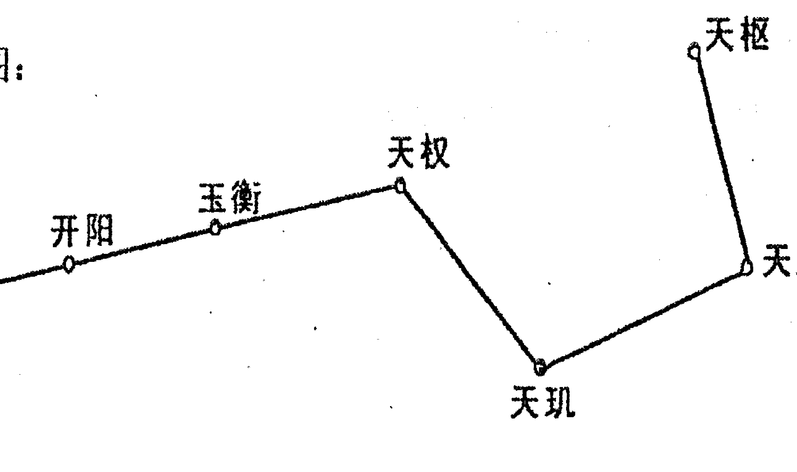
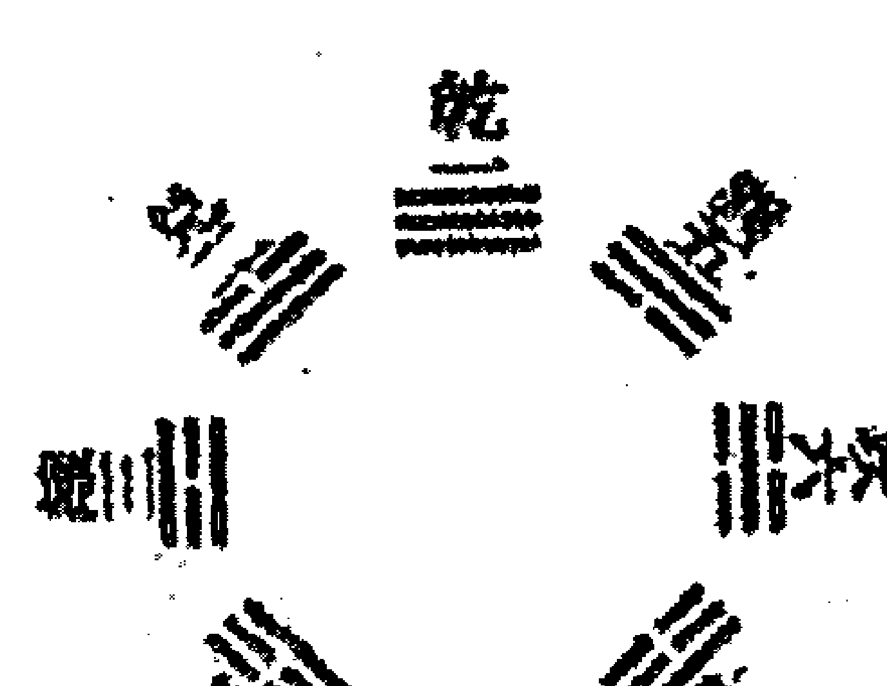
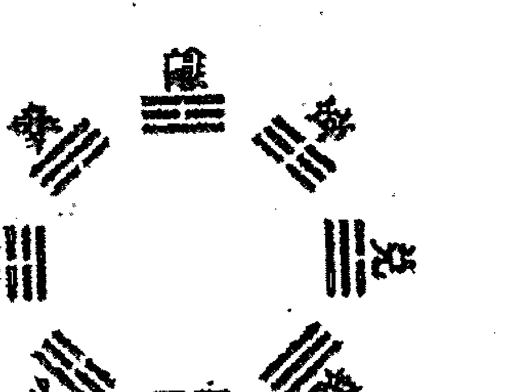
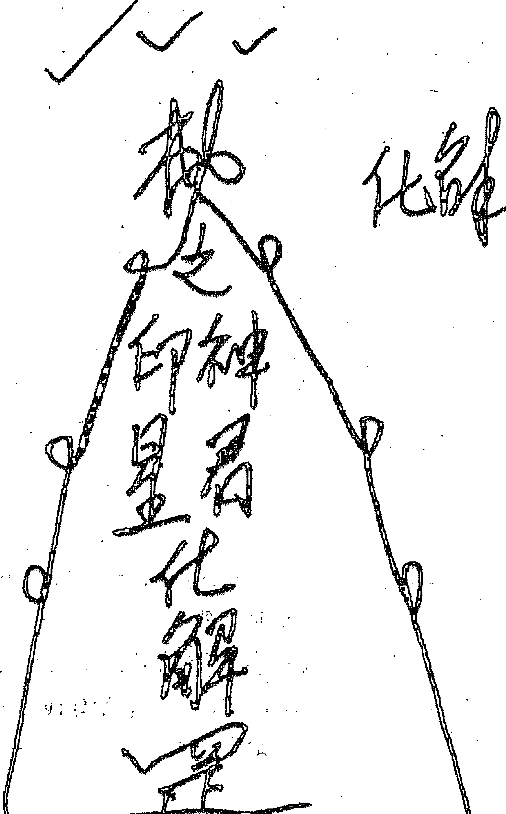
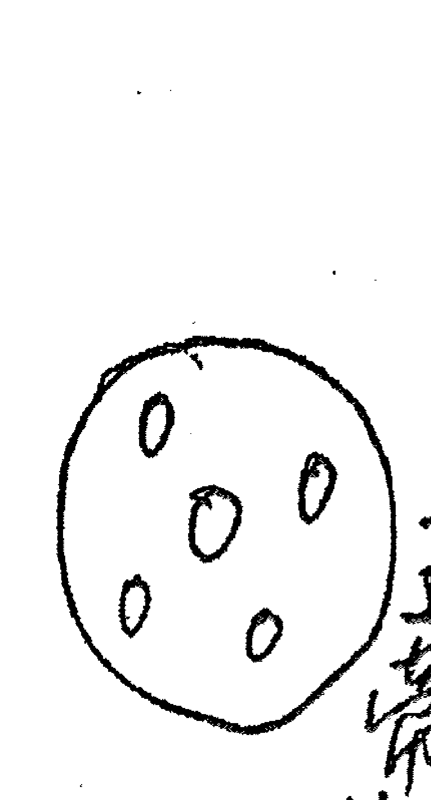
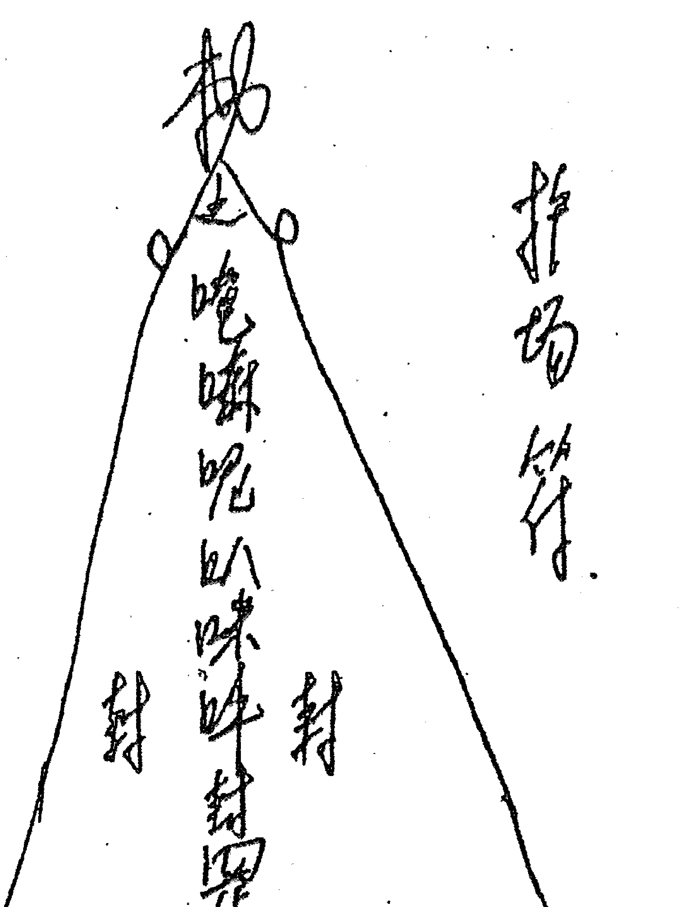
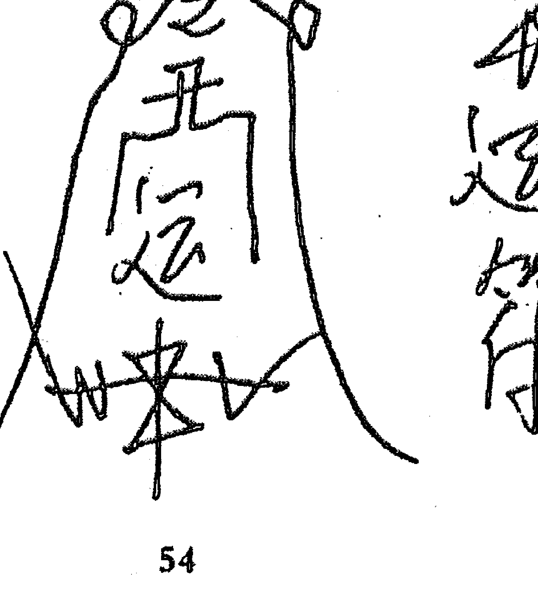
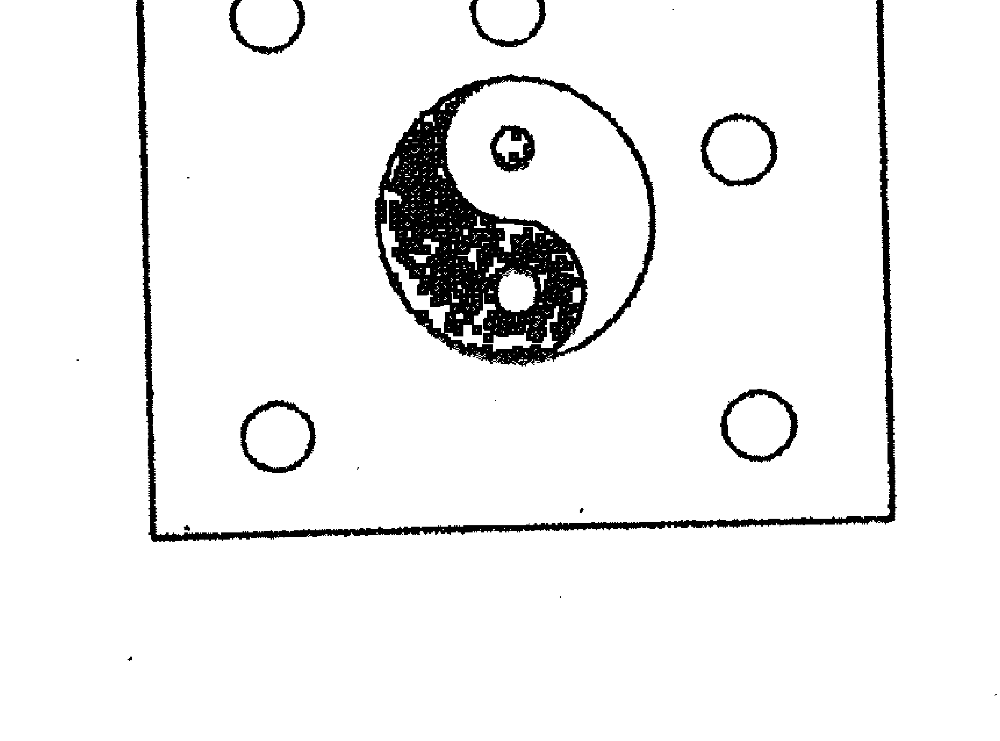
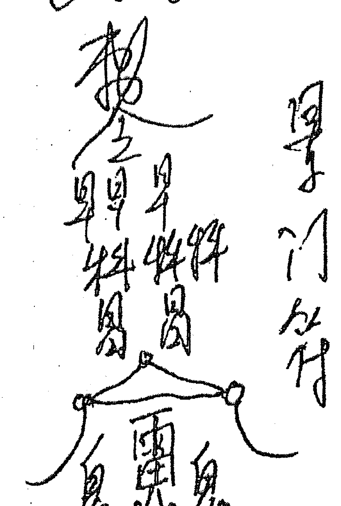
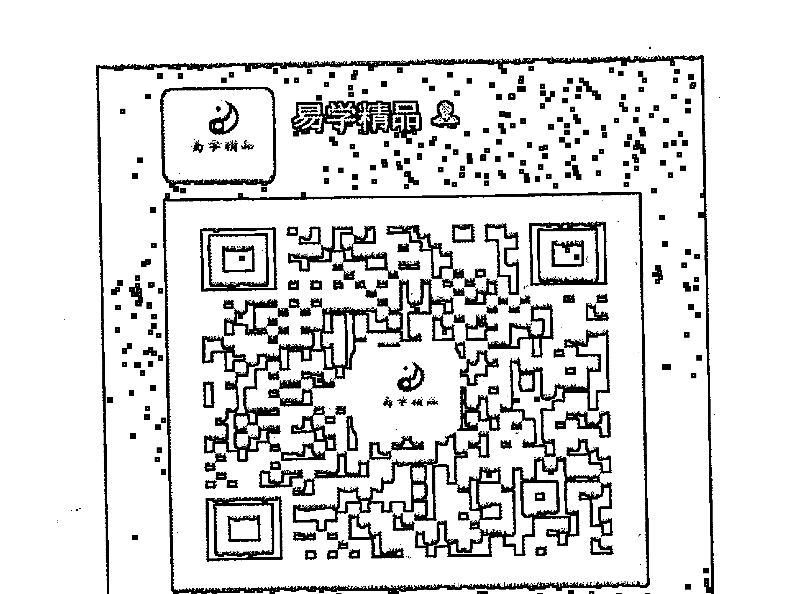

# 阴盘法术奇门面授班教材
# 第一讲 阴盘奇门遁甲

## 第一章 天地十方

天地本无极，无极生太极，太极生两仪，两仪生三才。三才生四象，四象生五行，五行生六合，六合生七星，七星生八卦，八卦生九宫，一切归十方。

天是古人认为除地是方的以外的空间，地是我们所在的位置，天地即宇宙。《封神演义》里说过，先有盘古后有天，太上更在盘古前。这里的太上是鸿钧的大弟子，三清老大太上老君，也就是将孙悟空丢进八卦炉中炼丹的那个白胡子。《西游记》里说过：“鸿蒙未分天地乱，茫茫渺渺无人现。”鸿蒙类似于混沌。意思是还没有开天辟地的时候，根本就是一团混沌，清者上升，浊者下降，他顶天立地，等到天地不重合的时候，因为气力耗尽，化生为天地了。

还有一种说法就是：鸿钧老头有四个弟子，第一是太上老君，第二是盘古，第三是女娲娘娘，第四是陆压道人。鸿钧发现天地是混沌，让盘古开天辟地，所以才有的天地。

《烟波钓叟赋》里说：“若能了达阴阳理，天地都在一掌中。”《易经·系辞上传》中说：“一阴一阳谓之道。”天地间一切事物都随着时间与空间的变化而变化，或变为阳刚，或变为阴柔，阴与阳相互包含与转化着，这一宇宙法则，人生规律也就是天理与人道，懂得了这个理，整个天地万物，都在掌握之中了。

无极即是道，道是不可穷尽的，在宇宙演化的角度使用无极一词，常与太极对举，指天地未辟，但却是天地直接起始的混沌更加古老，更加终极的阶段，这一阶段就是道，因此无极是太极的根源，修道者都追求与道合一，道门术语称与道合真，在具体机制上便是返回到无初的终极状态，这就叫做复归无极。

- 无极生太极——无名天地之始。
- 太极生两仪——有名万物之母（一维）。
- 两仪生四象——二维。
- 四象生八卦——三维。
- 八卦生九宫——四维。
- 九宫生十方——多维。

关于两仪，计有七说：一说阴阳，二说天地，三说奇偶，四说刚柔，五说玄黄，六说春秋，七说乾坤。通常多指阴阳。

《黄帝内经》云：阴静阳燥，阳生阴长，阳杀阴藏，阳化气，阴成形。

阴是比较静止的，阳是比较燥动的。阳主生成，阴主成长，阳主肃杀，阴主收藏，阳能化生力量，阴能构成形体，阳是明显易见的，阴是隐藏暗长的，所以阴大于阳。

关于三才是指：一是指天、地、人（天元、地元、人元）。

二是指日、月、星，天上三奇甲戊庚，地下三奇壬癸辛；人中三奇乙丙丁。

三是三华：性、心、身。三命：天命、宿命、阴命。

四是人身三宝：精、气、神。

五是成功三要素：天时、地利、人和。

关于四象是指：一是春、夏、秋、冬，体现在六爻卦上是少阳、老阳、少阴、老阴。

二是指：东、南、西、北，左青龙、右白虎、前朱雀、后玄武。

三是指：日、月、星、辰（西游记里谓之四象）。

四是指四大界：志、意、心、身（四个境界）。

五是指阴、阳、刚、柔或吉、凶、悔、吝。

六是指六书的象形、象事、象意、象声四体。

七是指四纲、四害、四个理论。

五行是指：金、木、水、火、土（木曲直，火炎上，土稼穑，金从革，水润下），包含着：1、五行的生克。2、身体的代表。3、颜色。4、配天干地支的属性。5、配八卦上的性质。6、四季的旺衰。

六合是指：

地支六合：子丑合化土；寅亥合化木；卯戌合化火；辰酉合化金；巳申合化水；午未合化土。

地支三合：申子辰合化水，寅午戌合化火，亥卯未合化木，巳酉丑合化金。

地支六冲：子午相冲，丑未相冲，寅申相冲，卯酉相冲，辰戌相冲，巳亥相冲。

天干相合：甲己合化土，乙庚合化金，丙辛合化水，丁壬合化木，戊癸合化火。

天干相冲：甲庚，乙辛，丙壬，癸丁冲。

七星是指：北斗七星。我国古代天象中认为北斗七星是七政的枢机，控制四方，以建四时而均五行，史记天宫书中称，北斗乃帝在之象天枢、天旋、天玑、天权主变动，玉衡是衡平轻重，开阳是开阳气，摇光是摇光芒。古代民间对北斗便有信仰，古书中提到“南斗注生，北斗注死”从这里可以看出北斗掌握阴司之权，似乎与阎罗、城隍等共掌阴间。道教称北斗七星为七元解厄星君，居北斗七宫，即天枢宫司命星君，天旋宫司禄星君，天玑宫禄存星君，天权宫延寿星君，玉衡宫益算星君，开阳宫度厄星君，摇光宫慈母星君，固北斗专掌生存，故民间又称为“延寿司”。

附图：

八卦是指乾、兑、离、震、巽、坎、艮、坤。

先天八卦主“生”，据说人们的饮食、穿衣、生老病死、养殖种植、冶炼金属等生态、生产方面的事情，可以用先天八卦来进行测算。

后天八卦主“克”，据说人们的祭祀，婚丧嫁娶等事物，活动方面的情况，可以用后天文王八卦来进行测算。

八卦所代表的含义：

- **乾为天：** 威严、权力、战争、充实、正直、尊敬、喜悦、圆满、统帅、核心、精华、长辈、严正、重情讲义、高档贵重、太阳、狮子、大象、老虎、秋花、头、颈、面部、头痛、脑淤血、秋天、金黄色、白色。
- **坎为水：** 劳苦、艰难、苦难、烦恼、陷落、色情、诱惑、交际、结合、悲哀、哭泣、踌躇、善谋、多智、独立见解、不规则形状的、辛苦、劳碌、雨、雪、云、猪、狐狸、水草、荷花、水仙、芦苇、冬梅、酒类、饮料、汽水、海带、肾、膀胱、泌尿、耳病、怕冷、水肿、冬月、子年、月、日时、黑色、紫色。
- **艮为山：** 静止、开始、变化、改革、断绝、呆板、稳定、固守、慎重、等待、困难、诚实、守信、艰难、保守、憨厚、任劳任怨、坚硬的、顽固的、与腿脚有关、向下发展、停止不前、阴天、云彩、勇气、老虎、狼、狗、狐、瓜类、黄色植物、牛肉、兽肉、根类食物、背、腰、鼻、手、指、关节、脾胃、冬春之交、黄、棕。
- **震为雷：** 震动、奋起、惊动、奋进、上升、躁动、积极、冲动、影响、迅速、转移、旺盛、果断、生长、意气风发、易怒、勤奋、直爽、自尊心强、心烦意乱、有声响的、高速、外虚内实、滑动的、勇敢、竞争、吃惊的、冰雹、闪电、东风、龙、蛇、龟、鹰、燕、树木、草、菜、醋、酸的水果、足、大拇指、肝脏、发、神经病、足疾、扭伤、春二月、青绿、碧色。
- **巽为风：** 空虚、柔和、顺从、调和、疑惑、轻快、深入、浅出、高度、货运、迷途、谦逊、徘徊、号令、荣誉、普遍性、自由运动、忙碌、柔和谦虚、心情徘徊、烟状气态、向下向里发展、上突下虚、神奇的、风、鸡、鸭、鹅、蜻蜓、柳、芦苇、泥鳅、胆、呼吸系统、肠、神经、左肩、乳、耳、伤风感冒、气管、阻塞、哮喘、春夏之交。
- **离为火：** 外刚内柔、光明、美丽、变化、迅速、文明、流行、时尚、枯燥、空虚、化妆、文才、运见、判断、餐馆、暴露、虚伪、聪明、名誉、虚心、色情、爱美、喜欢、装扮、知书达理、易冲动、内心空虚、鲜艳、明亮的、发光的、美丽的、太阳、晴天、热天、中午、龟、蚌、蟹、鸟、孔雀、花朵、竹子、椰子、烧烤类、有苦味、眼睛、乳、心脏、红色。
- **坤为地：**
  - 大地
  - 文形
  - 柔顺
  - 平安
  - 稳健
  - 文雅
  - 勤俭
  - 依赖
  - 伏藏
  - 迟缓
  - 包容
  - 消极
  - 优柔寡断
  - 懦弱
  - 丑陋
  - 多云
  - 阴天
  - 牛
  - 羊
  - 蚂蚁
  - 蜘蛛
  - 苔
  - 芹菜
  - 柿子
  - 糙米
  - 腹
  - 脾脏
  - 胃病
  - 消化系统
  - 六七月
  - 土年月
  - 深黄
  - 黑
- **兑为泽：**
  - 口舌
  - 议论
  - 饮食
  - 酒食
  - 舞会
  - 唱歌
  - 娱乐
  - 色情
  - 接吻
  - 恩惠
  - 和睦
  - 伪善
  - 机敏
  - 雄辩
  - 女性
  - 爱欲
  - 魅力
  - 喜悦
  - 口舌是非
  - 上面开口
  - 外软内坚
  - 新月
  - 黄昏
  - 星
  - 羊
  - 虎
  - 泥鳅
  - 豹
  - 荷
  - 水草
  - 兔肉
  - 羊肉
  - 牙齿
  - 口腔
  - 疾病
  - 牙病
  - 秋天
  - 八月
  - 白色
  - 浅黄
  - 金色
  - 金黄色

八卦在奇门落宫表现情况：

坎宫：事难办、艰难、动主忧患、病难治、陷进去、麻烦。

离宫：引人注目、红火一下就没了。催官落离宫不要设局，反而会降，将离宫往震、巽宫调。

坤艮：影响面大，牵扯人多，拖拉迟疑，急也没用。转让房子落本宫难办，移到震巽宫。

震宫：不动自动，不由自主动，意想不到的动。

巽宫：左右徘徊动的慢，很长时间才动一下，迟疑的动，想一下的动。

乾兑：坚持一下就会过去，就会转好，坚持就会好。但是退缩了，不要退缩。先简单看一下落宫，分析一下，然后再看其他。

九宫：属于汉族传统文化范畴。九宫在奇门遁甲中代表大地，为奇门遁甲之基是不动的，奇门遁甲分为天、地、人、神四盘，四盘之中唯有地盘是不动，为坐山。九宫者，即戴九履一、左三右七、二四为肩、六八为足，五居中央。

九宫配八卦，以后天八卦方位定向。先画大方格，格定天地，把宇宙一切都圈进方格内。再分小方格，格定九洲。如此则信息能量完全贯注其中，分析判断起来必然有神助。

相传伏羲氏在得到天下后，从黄河中跳出了一匹龙马，而其背上有一幅图，上面画有八卦，而此龙马则将这幅图献给了伏羲氏，所以河图又称之为黄河之图。至于洛书，则传说是，大禹在治水时，从水中出现了一只神龟，而在其背上，驮着一部书，内有九个数，他将此书献给了大禹。据说这河图与洛书，隐含治天下的道理，从而使这二位圣贤，明白如何治理天下。

到了宋代，有人将《河图》与《洛书》与所谓的九宫关联在一起。刘牧在《易书钩隐》中曾提到：河图就是《九宫》而洛书是由十个数所排列出的《天地生成数图》。而在卜筮、术数或风水学方面，河图与洛书也经常成为其引用理论来源，因而可说是中国五术《山、医、命、相、卜》的根源。

### 九宫数图

| 4 | 9 | 2 |
|---|---|---|
| 3 | 5 | 7 |
| 8 | 1 | 6 |

### 九星分布图

| 天辅星 | 天英星 | 天芮星 |
|---|---|---|
| 天冲星 |  | 天柱星 |
| 天任星 | 天蓬星 | 天心星 |

### 八门分布图

| 杜门 | 景门 | 死门 |
|---|---|---|
| 伤门 |  | 惊门 |
| 生门 | 休门 | 开门 |

一切归十方：

何谓十方：上天、下地、东、西、南、北、生门、死位、过去、未来。

十方奇招：离火燎天、地水破军、乾坤巽风、坤仑断狱、震雷霹雳、泽地归元、地转星移、终日乾坤、天灭地绝、十方俱灭。

## 第二章 十天干、十二地支、十二长生

### 第一节 十天干

天干是主干，是模型，事物的状态由它刻画出来。天干非常的重要，是阐述一件事物的主干。

甲（阳木）：
直觉力、高贵的、有名望的、第一的、首领、直、方、高、威严、正直、愉快、独断、心高、清洁、浪费，头、指甲、头发，穿山甲、龙虾、乌龟、鳖、贝类、螺类、馐珍、美味，大树、带壳的果实，东方、风、春天、早晨、青色、绿色。

乙（阴木）：
希望、达成、质软、转机、艺术、文化、柔弱、弯曲、曲折、依附、曲条、微驼背、皮肤白嫩、骨肉松弛、瘦长脸、仁慈、仁爱、温柔，肝胆、肠、发、神经，蚯蚓、蛇、天鹅、龙、海参、海肠、蚕虫、鸟类，中草药、花草、小树、床、葫芦、桃木用具，东方、风、月亮、绿。

丙（阳火）：
希望、光明、雄威、乱子、刚猛、热烈、急速、圆状、片状、权威、暴烈、强悍、虚荣、正义、愤怒、性急、果断、体态丰满、圆脸、少胡须、短发、皮肤白里透红、眼、血液、唇、心脏、小肠，马、牛、猪、驴、圆镜子、发热的东西、碟子、碗、圆灯泡、眼镜、水晶球、带柄的果实、梨子、南方、太阳、晴朗、炎热、红色、紫色。

丁（阴火）：
希望、执着、发展、尖锐、逼人、带刺、顶尖、突出、主人秀丽清高、肤白、粉嫩、发细而长、额宽须尖、性情柔弱、和顺而有心计、体贴人情、洞察奸邪、眼、牙、心脏、血液、骨刺、肉刺、男性生殖器、叮咬人物的昆虫、蚊子、跳蚤、马蜂、蜜蜂、牛虻、带刺的动物、刺猬、野猪、蛇、手术刀、小手电、香火、水晶串、带刺的植物或果实、玫瑰，南方、星星、晴天、夏天、中午、红色、紫色。

戊（阳土）：
中正、厚德载物、包容、资本、钱财、金融、宽厚、守信、忠诚、方大、果敢豪杰、刚烈、暴躁、憨厚、愚笨、中央、寄在坤宫、形体敦厚、四方脸、肤黄白、身体多肉、鼻、胸、乳房、牛、羊、大象、猪、骆驼、叶子、宽厚方大或土生的肉质多的果实、星云、银河、黄色、棕色。

己（阴土）：
策划、欲望、邪念、创意、花花肠子、节约、拐弯抹角、吝啬、杂乱、有主意、想法多、忌讳多、思考问题、细心、卷曲、忧愁相、静多动少、温顺沉静、忍辱负重、卧薪尝胆、以柔克刚、形体单薄、瘦弱、丑陋、圆脸、嘴、舌头、肚脐、肛门、耳垂、蜗牛、章鱼、墨鱼、蛤蟆、盘龙，没有展开的植物、含苞待放的花蕾、中央、水晶、寄于南方、星云、黄色、黄绿色。

## 庚（阳金）：
阻碍、阻隔、打斗、魄力、气概、刚健、肃杀、凶恶、野蛮、技术过硬、刚健敏锐、坚韧不拔、威严残暴、形体瘦长、骨骼健壮、头骨、骨骼、肺、凶恶的动物、老虎、龙、神佛、龙头印、虎头印、植物的干、根、果实、西方、秋天、白色、粉色、金属色。

## 辛（阴金）：
革命、错误、问题、判逆、忠诚、湿润秀气、自尊但虚荣、意志不够坚定、修长方正、皮肤白嫩、长脸、凹腮、牙骨、肺、皮毛、疙瘩、瘤、骨刺、湿疹、粉刺、痘、玉珠、水晶串、硬币、寄在人或动物身上的生物或病毒、颗粒状粮食、如大豆、高粱、西方、秋天、白色、粉色。

## 壬（阳水）：
孕育、蕴藏、流动、迷茫、迁移、变化、智慧、柔顺、阴险、勇敢、多智、纵欲、任性、热情、威严、容纳、困境、生产、皮肤稍黑、大眼睛、双眼皮、走路摇摆、长发秀眉、发、眼、动脉、水中物、鱼、虾、蟹、龟、行龙等、水晶、荷花、凌角、海带、水草等、北方、冬天、黑色、蓝色。

## 癸（阴水）：
制约、管束、艰难、困苦、跋涉、流动、变动、变化、声调不高、阴柔怕事、多愁善感、不能自立、性、私处、矮小黑丑、圆脸、瘦身、足、静脉、肾脏、眼球、精液、痣、口水、眼泪、鼻涕、汗液、尿液、水鸟、鸭、鹅、雁、黑蝇等、茶杯、蟾、观音、水稻、蔬菜、水果、水仙、喜水植物、北方、冬天、黑色、玄色。

### 第二节 十二地支
### 子（阳水）：
首领、名人、智慧、聪明、豪奢、阴私、奸邪、可圆可方、处事圆滑、暗昧、色欲、悲泣、丢失、面黑或眼大、大头、身体圆润、皮肤光滑、肾、膀胱、精神、血液、老鼠、田鼠、鸟类、蔬菜、水果、水草、正北、雨、黑色。

### 丑（阴土）：
忠厚、正直、贤良、福德、忠厚、说话不好听、爱骂人、争斗、诅咒、冤仇、告状、官司、举荐，职称、难看、丑陋、矮子、瘸子、驼背、大肚子、秃发人、眼睛、有毛病者、脾、胃、肠、牛、马、驴、骡、蔬菜、瓜果、桑树、地瓜、土豆、植物的根、田产、房屋、财产、院落、北偏东、雨天、黄色。

### 寅（阳木）：
开始、发挥、实际、变化、进行、木器、文章、文艺、文化、艺术、教育、经济、管理、仁慈、虚伪、伪装、易怒、婚姻、喜庆、方脸、面色青白、额头大、有胡须、身材魁梧、肝、胆、发、口、眼、筋、手、指甲、腿、老虎、豹子、猫、狐狸、狗、啄木鸟，高大树木、竹子、果树、花木，东北、风、绿色。

### 卯（阴木）：
逃往、振动、摇摆、急促、消耗、失盗、流动、艺术、文化、欢乐、祥和、冲动、直白、说话不拐弯抹角、性急、面长、脸色青白、大脑门、身体细长、十指、毛发、肝、兔子、松鼠、花草、竹子、植物的茎、农作物、东方、风、绿。

### 辰（阳土）：
斗争、死、丧、困难、牢狱、官司、迟滞、顽恶、坚硬、凶怪、打架、动摇、辈份、惊恐、焦虑、孕育、邪梦、自缢、满脸严肃、心狠手辣、心情冷酷、思想顽固、邪恶多淫、圆脸、肠、胃、胸、龙、蚊、鱼类、蜥蜴、不带翅膀的虫、昆虫类的幼虫、南偏东、龙卷风。

### 巳（阴火）：
信息、惊扰、怪异、争斗、口舌、流血、变化、乞索、讨债、赏赐、奖赏、聪明、狡诈、虚伪、忧愁、文艺、轻狂、谩骂、犯法、狡猾善变、神经质、怪异、精神恍惚、红脑门、大嘴、头发黄、血液、心、面部、口腔、蛇、蚓、蝉、萤火虫儿、植物的尖部、藤萝瓜秧、东南、炎热、星星、红色。

### 午（阳火）：
- 惊恐
- 疑惑
- 口舌
- 是非
- 诚信
- 火光
- 文书
- 诅咒
- 胎孕
- 词讼
- 信息
- 光彩
- 脾气急躁
- 点火就着
- 圆目
- 面赤
- 身体高大
- 心
- 口
- 目
- 马
- 鹿
- 獐
- 麝
- 漂亮的鸟类
- 花
- 盆景
- 绿篱
- 观赏树
- 正南
- 红色

### 未（阴土）：
- 口味
- 味道
- 酒食
- 宴会
- 婚姻
- 喜庆
- 拜神
- 召见
- 会见
- 豪爽
- 好饮
- 小的收获
- 否定
- 肥胖
- 丰满
- 头
- 骨
- 肝
- 海鲜
- 河蟹
- 羊
- 鹿
- 驴
- 农作物
- 蔬菜
- 南偏西
- 黄色

### 申（阳金）：
- 运动
- 传递
- 道路
- 疾病
- 精神
- 意识
- 交易
- 问题
- 阻碍
- 阻隔
- 困难
- 严肃
- 急躁
- 不怒而威
- 圆脸
- 圆眼
- 脖子
- 短粗
- 脑门后平
- 身材肥大
- 大肠
- 右胸
- 狮子
- 老虎
- 猴子
- 大麦
- 坚果
- 榛子
- 核桃
- 西偏南
- 闪电
- 白色
- 金色

### 酉（阴金）：
- 密谋
- 筹划
- 策划
- 精致
- 细节
- 完美
- 金融
- 经济
- 市场
- 交易
- 买卖
- 文静
- 文雅
- 谈吐不凡
- 细腻认真
- 形貌端正
- 面色黄白
- 右肋
- 手臂
- 口
- 耳
- 鸡
- 鸽
- 鸭
- 鹅
- 善鸣叫的鸟类
- 葱
- 姜
- 大蒜
- 辣椒
- 小麦
- 辛辣植物
- 四方
- 雪
- 白色

### 戌（阳土）：
欺诈、虚伪、虚耗、虚假、思考、空虚、态度、安危、命门、膀胱、狗、豺、狼、鹰、红柳、甘草、枸杞、枣树、西北、阴天、黄色。

### 亥（阴水）：
惊讶、胆怯、流动、光明、召见、隐私、肮脏、偷盗、眩晕、恍惚、困难、疑惑、争斗、沉溺、索取、精神恍惚、神经衰弱、长脸、面黑、手脚也黑、大头、眼、头发、毛发、鱼、虾等水中生长的动物、梅花、葫芦、水草、海带、北偏西、阴雨、黑色、蓝色。

### 第三节 十二长生
我们要精确的看问题，就要了解十二长生。每个宫的符号处在什么状态，它就会反映出该事物处于什么状态。一棵大树处于沐浴状态，它可能是开满了花，或极为的脆弱。大树处于病的状态，它可能生病了，枯萎了。了解十二长生，就能进一步的判断这个事物的状态。
调理的时候要调到生旺的位置。我们对十二长生思考得越多，理解得越完美，对我们策划越有帮助，断得越细。

## 歌诀：
甲亥乙午丙戊寅，庚巳辛子壬在申，丁己在酉癸卯寻。
阳干甲丙戊庚壬顺排十二长生，阴干逆排。

## 第三章 八神、九星、八门
《烟波钓叟歌》有云：轩辕黄帝战蚩尤，逐鹿经年苦未休，偶梦天神授符诀，登坛致祭谨虔修。神龙负图出洛水，彩凤衔书碧云里，因命风后演成文，遁甲奇门从此始。

上古时代有个黄帝是传说中的人物：轩辕氏（或熊氏）部落首领，姬姓，其部落原定居西北高原，与在西北高原的姜姓首领炎帝同出少黄氏。后分路东进，在坂泉（今河北涿鹿东南），炎帝被皇帝击败，转而合作，联合征讨东方九黎族首领蚩尤。蚩尤可不是容易对付的，据传他有兄弟八十一人，个个兽身人语，铜头铁额，且能操纵天气。两军大战，黄帝军久战不下。夜晚黄帝梦中有“九天玄女”托梦授奇术，并依此术擒杀了蚩尤。后世有史家称，这便是奇门遁甲的由来。

奇门遁甲的基本依据是以后天八卦方位配以洛书宫，再配上九星和八门，这不是随便组合的。以人为中心，上有来自天体的宇宙气场，下有地球磁场。这种上下能量场交感作用于天体的生物场，在不同的年月日时发生不同的变化，产生不同的格局，古人经过长期的体验和总结，用高度抽象的洛书为基的八卦、八门、九星来反映这种变化中的格局的规律性。

从字义解释奇为三奇，门为八门，遁为隐藏，甲为十干之首。古话讲：学会奇门遁，来人不用问。奇为奇迹，出奇制胜，无奇不有；门是门路。所以学了奇门就会有奇迹的出现，就会达到我们心中的愿景，就会找到更好的门路。

### 第一节 八神详解
- 八神：
值符、腾蛇、太阴、六合、白虎、玄武、九地、九天。

1. 值符（木、土）：直觉力、高贵、高档、稀有、有组织能力、名牌、重点、高尚、有影响力、服众、威严、德高望众、方脸、粗眉、重发、鼻子直大、气概雄伟、文韬武略、品质高雅、头、面、有分量、掷地有声、有哲理、意味深长、名贵稀有的动物、如藏獒、老虎、熊猫、名贵的稀有树种和花木、如金丝楠木、红木、中央地带、晴朗、风和日丽、绚烂、五彩缤纷。

2. 腾蛇（火）：缠绕、惊恐、虚惊、怪异、虚幻、梦境、变来变去、反反复复、华而不实、闪烁不定、光怪陆离、耀眼、妖艳、猜疑、狠毒、纠缠、变化、拐弯抹角、水蛇腰、驼背、头发黄或稀少、大脑门、虚伪、狡诈、惊恐不安、心口不一、喋喋不休、颠三倒四、没完没了、死缠烂打、心脏、血液、血管、蛇、蟒、蚯蚓、爬虫类、海参、龙爪槐、爬山虎、西瓜身、南方、太阳、杂色、红色。

3. 太阴（金）：提升、护佑、隐避、藏匿、喜庆、贞祥、淫乱、阴私、隐私、密谋、缜密、诅咒、哭泣、怀疑、欺诈、口舌、私通、策划、遮盖、暗处、雕刻、脸色白净、口似樱桃、鼻子挺直、品质优良、正直慷慨、助人为乐、柔声细语、说话声低、嘴、肺、皮肤、刺猬、老鼠、猫、猫头鹰、夜间出没的动物、带壳的果实、如花生、瓜子、植物、西方、月亮、灰色、白色。

4. 六合（木）：欢乐、祥和、仁慈、包容、名作、联合、交易、谈判、结婚、众多、收拢、关闭、平和、共同、适合、合抱、幽默、滑稽、重叠、相聚、圆脸、欢乐、一团和气、笑容可掬、点头哈腰、缩头耸肩、开朗平和、仁慈谦让、荐贤不妒、说话和气、喜做说合之事、手、手指、脚趾、兔子、鸳鸯、狼、麻雀、蜻蜓、蝴蝶、蜜蜂、小树、花草、果树、竹林、柳树、东方、和风、旭日、春天、早晨、绿色、多种颜色的组合。

5. 白虎（金）：凶猛、威严、阻隔、斗争、权力、刚毅、冷酷、严肃、漫骂、艳丽、官司、伤灾、牢狱、疾病、死亡、道路、圆眼、虎头虎脑、面部表情死板、身体多肌肉、强健、技术过硬、话语强硬、污言秽语、大义凛然、骨骼、拳头、虎豹、豺狼、猎狗、鹰、肉食动物、猪笼草、蒺藜草、蝎子草、西方、秋天、白色、刺眼的光。

6. 玄武（水）：深奥、玄虚、不可靠、不可捉摸、玄妙、神秘、幻想、领悟、理解、智慧、偷情、谎言、阴谋、诡计、虚伪、干练、贼眉鼠眼、神色不定、弯腰驼背、机智灵活、巧言善辩、天花乱坠、无中生有、谎话连篇、百般抵赖、偷奸取巧、眼睛、头发、肾、老鼠、蛇、鱼类、喜水动物、水草、海带、紫菜、水果、含水量大的植物、北方、雨天、黑色、玄色、蓝色。

7. 九地（土）：矮小、稳定、厚重、柔顺、文静、恭敬、谦卑、吝啬、消极、哭泣、自私、模糊、旧物、博大、包容、关怀、节约、缓慢、困惑、大腹、肥厚、方脸多肉、身材五短、声音如瓮、缺乏上进心、语速较慢、被动低调、胃、脾、肉、牛、猪、熊猫、地蚕、虫类、地瓜、土豆、农作物、苔鲜、地丁、西南、多云、阴天、黄色。

8. 九天（金）：高大、天空、虚无、高处、极端、重要、主宰、意志、灵魂、自然、聪明、光明、恩赐、幸福、豪放、张扬、美丽、魁梧、威严、高深、脸方正、手绵软、不怒而威、刚强好动、志向远大、请速较快、沸沸扬扬、头、额、肺、大肠、马、龙、飞鸟、虎、狮、天鹅、高大的树、果树、高山、高原植物、西北、蓝天、雷电、秋天、白色、青色。

### 第二节 九星详解
九星：天蓬星、天任星、天冲星、天辅星、天芮星、天柱星、天心星、天禽星。

1. **天蓬星（水）**：智商，思考力、膨胀、鼓起、威猛、蓬松、松软的、四面透风、汹涌澎湃、聪明智慧、庄严威猛、彪悍精干、面黑或眼大、圆融果敢、胆大妄为、心狠手辣、贪恋酒色、多毛之人、头发逢松之人、彪悍之人、聪明智慧之人、耳背、膀胱、猪、鼠、蝙蝠、蘑菇类、菌类、树冠大的树、蓬子、帐篷、岗楼、楼房、带尖顶的房屋、带角的物体、伞、雨衣、雨具、宽松的衣服、北方、冬天、黑色、蓝色、玄色。

2. **天任星（土）**：志商、目标力、担当、承受、任劳任怨、任重道远、拱形、弯腰、驼背、胸部丰满、忠厚老实、倔强、驼背、大胸之人、登山运动员、钢琴演奏者、弦乐弹奏者、手、腰、脊柱、鼻、牛、骆驼、虎、谷穗、稻子、黍子、柳树、低重植物、桥、台阶、山峦、坡破、盆景、石制品、积木、背包、背篓，东北方、雾、黄色。

3. **天冲星（木）**：敏商、行动力、执行力、冲动、冲击、直往前冲、猛烈、矛盾、直、高、长方脸、长发、梳抓髻的人、身体瘦长、工作麻利、雷厉风行、性急之人、张飞、李逵式的人物、射击手、台球手、跳高运动员、田径运动员、肝、筋骨，兔子、天鹅、燕子、竹、树、高梁、玉米、白杨树、参天树、桂林山水、塔、高楼、枪、炮、子弹、炸药、东、地震、碧绿。

4. **天辅星（木）**：德商、诚信力、帮助、奉献、辅佐、协助、指导、关爱、关怀、协调、身体细长、发缜密、脸、清白、手细长、文雅、谦虚、有修养、正的人物、文王、雷锋、耶稣、孔子、大腿、呼吸器官、乳房、鸡、蛇、泥鳅、蚯蚓、柳树、葡萄、葫芦、丝瓜、南瓜、杨树、麦田、稻田、竹林、果园、房子、食品、文物、车子、水果、东南、风、祥云、绿色。

5. **天英星（火）**：情商，关系力、社交力、卓越、杰出、贤明、秀丽、智勇、漂亮、风姿，瓜子脸、面红白、身体瘦、头发较黄、声音焦脆、礼貌、虚伪、焦躁不安、易怒、演员、社交家、漂亮的人物、英雄式的人物、眼睛、血液、心脏、孔雀、鹦鹉、火鸡、绵鱼、开花的植物、盆景、花卉、漂亮的植物、南方、太阳、红、绛红。

6. **天芮星（土）**：健商，保健力、问题、毛病、错误、联合、结交、斑点、方脸、大嘴、肚子大、固执、迟钝、懦弱、教师、医生、学生、幼儿，脾、胃、腹部、肩部、嘴部、脐部、牛、羊、家畜、庄稼、土豆、地瓜、学校、医院、学府、医疗、器械、医药、文化用品、西南、云、黄色。

7. **天柱星（金）**：逆商，驾驭力、惊恐怪异、顶天立地、力挽狂澜、中流砥柱、能独挡一面、口舌是非、能说会道、好斗争讼、喜杀好战、能言善辩、律师、教师、演员、靠嘴生活者、破坏、毁折、柱状，面白、方圆脸、唇薄、身体健壮、中直部位、劲椎、大腿，公鸡、鼠晏、羊、鸟类、直的树、芦苇、毛竹、胡杨、电杆、铁塔、寺庙、高楼、纪念碑、发声的电器、乐器、物体、东西、秋天、白色。

8. **天心星（金）**：心商，心态力、思想活动、想法、感情、中间、坚固、专制、压抑、圆形、高大、威严、雄伟、聪明能干、精明机智、有领导才能、企业家、领导者、中心人物、头、心脏、马、猪、狗、狮子、老虎、熊、天鹅、鲸鱼、菊花、果树、大树、桔子、草药、高亢之地、客厅、院落、广场、球类、西北、雪、白色、金色。

### 第三节 八门详解
- 八门：休门、生门、伤门、杜门、景门、死门、惊门、开门。

八门的含义是代表事物的表象，一般情况下是对事物的概括。

### 休门（水）：
代表人休息、修养、休闲、懒散、代表调理、调节、美容、场所、桃花、暴露，休又是水、跟水有关系。

我们看以下几个休：
- 休：修、修理。
- 休：羞，害羞、腼腆、喋喋不休。
- 休门：克自己，还要注意，千万不要跟女朋友在那个时间里边休息，那是桃花劫。
- 动物：懒散的动物，爬的慢的动物，水里的动物。
- 植物：水里长的一切植物。
- 物体：床。
- 环境：休闲疗养场所，有达官贵人出没的场所。北方、冬天、黑色。

### 2、生门（土）：
最大的特点就是发展，不会保持原有的状态。生的含义就是发展，生产、成长、生活、动的东西、活的东西、生长的东西、思想在生长、财富在生长、某事物正在发展成长、利润、利息、效益、学习、工作、生意、生活、生长。

生为动，做生意就到流通领域、生是流通领域。

生=升：当这个字没有毛病的时候，遇到生，当官的升官，做生意的发财。

生=声：遇到生，有发出响声的东西，但是得看组合。

### 伤门（木）：
伤门就是受伤，我可能伤着别人。伤门克我，肯定我受伤。

伤=商，就是经营。我们做任何事情，都是讲究利己的，都是伤人的。我们做事，想做商人，你肯定要伤人。你伤的人高兴还是不高兴，不高兴叫奸商。干得好了，叫有德的商人。其实是矛盾的，谁也不会亏着本做生意，也不符合天规。

- 物体：车辆、能伤害人的物体。东方、风、绿色。
- 动物：狗、老虎、军队、警察、国家机器、马路杀手。

### 4、杜门（木）：
杜的概念是技术。是看不见的意思，杜者，隐藏也。规律也是杜，神也是杜，堵塞、技术、蓬、有遮盖、隐藏的含义。

杜=堵。什么东西堵、堤坝、挡水的、或是栏杆、拦截的，一谈杜，什么堵啊？心血管堵塞了、血流不通了。

杜门是不爱言语、心平气和、文静内向、呼吸系统、肝、胆、代表夜行动物：黄鼠狼、老鼠、猫狗、蚊子，小草、庄稼、东南方、风、空气、绿色。

### 5、景门（火）：
在离宫，是火，景者，景色也、代表人的外表、或用眼睛所能看到的一切事物，用景来表示。营销策划、出主意、都是景门的含义。

代表包装、策划、眼球经济非英即景、景就是风景，是吸人眼球的。英是魅力型的吸引，景门是外在的吸引，不一定有魅力。

景者，井也，景=井，如果临九地，会有井、地沟，景还有一个意思是水面、旅游区、水面。镜子是景，能照出你的面貌来。

动物：蝴蝶，孔雀、凤凰、雀鸟。

物体：一切火性的东西都属景。发热的东西跟景有关系，如太阳灶、炉子、灯、电器、文物、文书、红脸、脸尖形、漂亮的花卉、植物、盆景。

环境：景色比较美，一切美丽的东西。

### 6、死门（土）：
在坤宫，代表不动或相对的不动。人家走的快，他走的慢，他可能临着死门，他相对的不动。安静，不发展，相对稳定的。

也代表死亡，代表一切安静的东西，不喘气的东西。

代表大地，矿产、神佛、死心眼、死板、死板着脸。

遇死门做事死性。用神遇死门的时候，你先说，我说话你先不要反驳，思考好了再回答我的问题。

死门代表做事执着、不灵活、没变化、丧失生命、固定不变、死板、死心眼、不认帐、病灶部位，牛、羊动物的尸体、柏树、干枯的植物、西南、雨、灰色、蓝色。

### 7、惊门（金）：
在兑宫，属金。就是吃惊，心惊肉跳的含义，也是发出响声的东西（嗓子、喉咙）、律师、使人吃惊的。也可以解释为一鸣惊人，做什么事情很突然。断疾病为惊悸、心律不齐、临惊、如不是本人受惊吓，那就是公、检、法系统。

“惊”字深挖，还代表在夜间出现的鬼怪之事。“惊”和“更”是一样的，打更者、三更半夜、惊还代表是非、斗讼、能说会道，蛙、蝈蝈、蟋蟀、白杨、松树、西方、雷电、白色。

### 8、开门（金）：
在乾宫，五行属金，就是打开、舒展、亮相、暴露、开放、由小变大、开拓、开创、创造、开拓进取。公开、不能保密。也代表同意。

也代表经营、经济、升迁、婚姻、谈吐不凡、头、肺、大肠、虎、狮子，西北、秋天。

## 第四章 阴盘遁甲起局定局排盘

### 一、排四柱
即是把起局时的阳历时间转成阴历时间，查万年历，排出年月日时的干支。

### 二、定阴、阳12局
阳遁局：冬至后夏至前的这段时间为阳遁局。

阴遁局：夏至后冬至前的这段时间为阴遁局。

起局=（年支序数十农历月份数+农历日数+时支序数）除以9之余数，余数是几便是几局。

### 三、画九宫格
奇门遁甲讲究神助大于一切，所以在起局时一定要符合宇宙的规律。在画九宫时，先画大方格，格定天地，再分小方格，格定九州，如此则信息，能量完全贯注其中，分析判断起来必然犹如神助。现在流行的奇门遁甲起局大多是画井字格，井字格四面透风，气场不聚，能量呈消耗状态，操作者容易分散注意力，看不到关键，抓不住要领。

还有一点，起局要心平气和，讲究心法。如此则产生共振的场效应，达到天人合一的境界，从而能提高策划的准确率。画九宫时心中要默念：无极生太极，太极生两仪，两仪生四象，四象生八卦，八卦定乾坤，乾坤生大业，大业趋向吉。

所画的九宫格，线与线之间要交接紧密，格与格之间不能相通，否则信息容易混乱，导致判断不清，切记。

### 四、布地盘三奇六仪
按照传统的说法，戊己庚辛壬癸叫六仪，丁丙乙叫三奇，戊己庚辛壬癸丁丙乙合起来叫三奇六仪。

根据局数，依照阳局顺布，阴局逆布的排局原则顺排或逆排戊、己、庚、辛、壬、癸、丁、丙、乙，是几局戊就落几局。这里要记住九宫数：

戴九履一，左三右七，二四为肩，六八为足，五居中宫。

| 4 | 9 | 2 |
| 3 | 5 | 7 |
| 8 | 1 | 6 |

#### 五、找旬首

甲子戊、甲戌己、甲申庚、甲午辛、甲辰壬、甲寅癸等为旬首。旬首是根据时干支来确定的。可以从下表查询，比如壬申时策划，则旬首是甲子戊；丁未时策划旬首是甲辰壬。

#### 甲子戊 戌亥空

| 甲 | 乙 | 丙 | 丁 | 戊 | 己 | 庚 | 辛 | 壬 | 癸 |
| --- | --- | --- | --- | --- | --- | --- | --- | --- | --- |
| 子 | 丑 | 寅 | 卯 | 辰 | 巳 | 午 | 未 | 申 | 酉 |

#### 甲戌己 申酉（空）

| 甲 | 乙 | 丙 | 丁 | 戊 | 己 | 庚 | 辛 | 壬 | 癸 |
| --- | --- | --- | --- | --- | --- | --- | --- | --- | --- |
| 戌 | 亥 | 子 | 丑 | 寅 | 卯 | 辰 | 巳 | 午 | 未 |

#### 甲申庚 午未空

| 甲 | 乙 | 丙 | 丁 | 戊 | 己 | 庚 | 辛 | 壬 | 癸 |
| --- | --- | --- | --- | --- | --- | --- | --- | --- | --- |
| 申 | 酉 | 戌 | 亥 | 子 | 丑 | 寅 | 卯 | 辰 | 巳 |

#### 甲午辛 辰巳空

| 甲 | 乙 | 丙 | 丁 | 戊 | 己 | 庚 | 辛 | 壬 | 癸 |
| :---: | :---: | :---: | :---: | :---: | :---: | :---: | :---: | :---: | :---: |
| 午 | 未 | 申 | 酉 | 戌 | 亥 | 子 | 丑 | 寅 | 卯 |

#### 甲辰壬 寅卯空

| 甲 | 乙 | 丙 | 丁 | 戊 | 己 | 庚 | 辛 | 壬 | 癸 |
| :---: | :---: | :---: | :---: | :---: | :---: | :---: | :---: | :---: | :---: |
| 辰 | 巳 | 午 | 未 | 申 | 酉 | 戌 | 亥 | 子 | 丑 |

#### 甲寅癸 子丑空

| 甲 | 乙 | 丙 | 丁 | 戊 | 己 | 庚 | 辛 | 壬 | 癸 |
| :---: | :---: | :---: | :---: | :---: | :---: | :---: | :---: | :---: | :---: |
| 寅 | 卯 | 辰 | 巳 | 午 | 未 | 申 | 酉 | 戌 | 亥 |

#### 六、定值符与值使门

值符就是值班的九星，值使就是值班的门。旬首落在哪个宫，则哪个宫的原始九星和原始八门就为值符和值使门。《八门九星诀》曰：坎居一位是蓬休，芮死坤宫第二流。更有冲伤并辅杜，震三巽四总为头。禽星死五开心六，惊柱常从七兑游。更有生任居艮八，九逢英景问离求。

| 天辅星 杜门 4 | 天英星 景门 9 | 天芮星 死门 2 |
| :--- | :--- | :--- |
| 天冲星 伤门 3 | 5 | 天柱星 惊门 7 |
| 天任星 生门 8 | 天蓬星 休门 1 | 天心星 开门 6 |

#### 七、确定天盘三奇六仪和八星

奇门遁甲局中，三奇六仪有两层，上面的一层为天盘三奇六仪，下面的一层为地盘三奇六仪。

根据旬首和值符随时干转的规律，看策划时辰的时干在地盘落几宫，就将值符直接写在这个宫内，同时将旬首也随之写在它运转到的宫内。

确定值符落宫非常简单，只需看时干的地盘落宫在哪宫就可以了，这就是：值符随时干转。

当时辰是六甲之时，在九宫内的地盘三奇六仪中找不到甲，这时就找旬首即可。

#### 八、排八神

八神的排列是阳遁局顺排，阴遁局逆排。这里的顺排、逆排不是指宫数的顺逆，而是如同表盘上表针的转动方向一样。

在排八神时，要注意两点：

- 1. 一定要把神写得比星高一些，只有高一点，才能体现神的作用，它是一个图，其实也是一个咒。
- 2. 当我们手写起局时，在写完年、月、日、时、干支、局数、画好九宫、写好地盘天干。确定值符，值使之后，可以把值符写在时干落宫上（六甲之时写在旬首落宫），根据阴阳遁进行顺逆排，排完八神之后，再排天盘天干九星，八门等等，这是一种排盘顺序，仅供参考。

#### 九、排八门

看时辰地支与旬首关系按阴遁逆数，阳遁顺数，在手指上找。

#### 十、排隐干

把时干加在值使门上，然后按照天盘的顺序或者地盘的三奇六仪顺序排列一圈即可。
伏吟局排法，是旬首入中看阴阳局按宫数排。阳遁入中顺走（5、6、7、8、9、1、2、3、4），阴遁入中逆走（5、4、3、2、1、9、8、7、6）即可。

#### 十一、马星查法

- 申子辰马在寅时，马星在艮宫；
- 巳酉丑马在亥时，马星在乾宫；
- 寅午戌马在申时，马星在坤宫；
- 亥卯未马在巳时，马星在巽宫。

#### 十二、天门地户

我们用天门地户，第一是减弱不良气场，减弱阴性信息，对风水师进行保护。第二增加灵验。
天三门：天三门是上天的通道，查天上的事，是起运、改运用的。天门地户都可以处理风水，搬东西、移星换斗都可以用，天门能量是第一，地户是第二，把天门排在前边，有天门就用天门，天门没有好选的，就用地户。总之，用地户也比用别的强。如果天门地户落在一块（落在同一个地支上），能量最强，最好。天门、地户在一条线上，上通下达，是通天地的一个通道。

要用天门地户把不好的神给藏起来，此时只有贵人当权。阴性的、不好的信息场、不好的符号，道家、古人认为是小息、神煞，实际上是对你不好的一种信息，对你不好的场。当天门开的时候，不良信息场最弱，藏起来了，或影响很小，你受的干扰就小了。在处理风水时，对风水师的影响就弱，风水师得到了保护，而且调整起来也比较灵验。

天三门涉及到十二月将的问题，现将排法列表如下：

| 雨水 | 春分 | 谷雨 | 小满 | 夏至 | 大暑 | 处暑 | 秋分 | 霜降 | 小雪 | 冬至 | 大寒 |
| --- | --- | --- | --- | --- | --- | --- | --- | --- | --- | --- | --- |
| 正月 | 二月 | 三月 | 四月 | 五月 | 六月 | 七月 | 八月 | 九月 | 十月 | 十一月 | 十二月 |
| 亥 | 戌 | 酉 | 申 | 未 | 午 | 巳 | 辰 | 卯 | 寅 | 丑 | 子 |
| 登明 | 河魁 | 从魁 | 传送 | 小吉 | 胜光 | 太乙 | 天罡 | 太冲 | 功曹 | 大吉 | 神后 |

- 小吉、从魁、太冲为三吉门

以中气过宫交月将，月将加在时支上，叫月将加时，顺时针排列。

#### 地四户

地四户要用到十二建星，建、除、满、平、定、执、破、危、成、收、开、闭。

地四户排法是“建”星加在时支上，十二建星顺时针排列。

- “除、定、危、开”是吉星。

## 第五章 阴盘遁甲的基本要素

基本要素：

门迫、击刑、入墓、空亡（此称四害）。

概论：四害也叫不吉，把全宫的物质给带坏了，一处坏，百处坏，一处好，百处好。一个宫内一个符号遇到四害，整宫的符号被带坏。

没有四害的时候，你在害别人，你好。你临伤门，你让别人受伤了，撞着别人了。你临四害，是你受伤了。

你临值符，又门迫，击刑、入墓，你的官丢下来了。

你跟老婆打架，你遇到四害，遇到白虎，老婆抓你了，临巽宫、离宫、坤宫，老婆抓你脸了，你好，你老婆宫坏，你把老婆给抽了。

理解和应用这四个概念，不要违犯一个规律。什么规律？没吉没凶的规律。在运作的时候，把你的宫强一点，敌人，对立面的宫弱一点。

好和不好是因为个人而去区别。我们讲个体，而不讲群体。道家知识讲；一人得道，鸡犬升天。一人有福，带来全家的福。因为这一个环境不可能这么均匀，我们在处理风水时，以一带多。

当达到一定程度的时候，我们会明白，门迫、击刑、入墓、空亡都不觉得太可怕，可怕的是谁呀？可怕的是自己。因为这个局是我们自己操纵的。我们想让它吉，它就吉，想让它凶，它就凶，看全盘怎么去参考。但是我们要记住，四害的能量只是低了而已，低不一定是坏事，要思考这个问题，这极为关键，极为重要。

大家记着，心法极为重要。我们学习知识要学会洗脑，我们不谈吉凶，只变能量，什么样的事物用什么样的能量，这样才完美。

你越学越深的时候，记住一句话：道高一尺，魔高一丈。

### 一、门迫

门迫就是自己拆自己的台。门迫的事情，受阻隔，有阻力，能量低，不容易达成，方向不变。门迫的成功率是50%。

门迫就是八门克后天八卦的宫位，如杜门（木）落艮、坤宫。

迫的含义就是刹车，使事物的速度减慢。一辆跑车在拐弯的时候，你还不迫它，它会直接冲下去，掉到悬崖里，所以该迫的时候要迫。你迫谁，怎么去思考这个问题，去看这个问题，这极为关键，极为重要。
“逼迫”的迫我们经常用，还有“破坏”的破。
一片辽阔的生态非常好的森林，突然间来了一帮工人，噼里啪啦的把树木砍伐了，不和谐了。可是呢，整出一片地来，然后耕种棉花。棉花长成熟了，一朵朵雪白的棉花，被工人扭下来了，破坏了原来的生态。之后在工厂里撕扯，纺织成了布。布织出来了，很完美，用剪子咔嚓一刀把它给剪破了。可是，不剪能成为衣服吗？
你看，因为我穿衣服，森林遭到了破坏，植被遭到了破坏。棉花成熟了，本来就很完美，让它自生自落多好。可是用手把它揪出来，它多难受啊！撕扯出来，然后又弹它，织出布来又染它，裁缝又剪它，哪个过程不是破的过程。
好的隐藏着坏的，坏的隐藏着好的。我们千万不要以单方面看问题，要全面看问题。

### 二、击刑

击：冲击、矛盾；刑：伤害、受伤。击刑就是扭曲、别扭、拧劲，落宫临击刑，人事、身体扭曲、别扭、拧劲；人受伤、患病或犯错误，严重者触犯法律。击刑能量损失 50%。
击刑的成功率是 50%，当这个宫遇到刑的时候，你就断这个事情成功率是 50%，得再加一倍的努力。你有能力没有？没有，成功不了。

### 击刑

| 甲寅癸 | 甲午辛 | 甲戌己 |
|--------|--------|--------|
| 甲辰壬 |        |        |
| 甲子戊 |        |        |
| 甲申庚 |        |        |

### 三、入墓

入墓犹如宝剑入鞘，效率低，能力发挥不出来。入墓不一定是坏事，并不凶，对宫一冲就冲出来了。入墓只有 20%的能量。入墓，他成功了，你还要判断他能不能赚到钱。

### 入墓

| 辛壬 |    | 甲癸 |
|------|----|------|
|      |    |      |
| 丁巳庚 |    | 乙丙戊 |

### 四、空亡

空亡是六十花甲子分为六旬，每一旬中有两个地支逢空。

空亡查法：

- 甲子旬中戌亥空，即乾宫空。
- 甲寅旬中子、丑空，即坎宫和艮宫空。
- 甲辰旬中寅、卯空，即艮宫和震宫空。
- 甲午旬中辰、巳空，即巽宫空。
- 甲申旬中午、未空，即离宫和坤宫空。
- 甲戌旬中申酉空，即坤宫和兑宫空。

在奇门遁甲中九宫逢空是信息转移了，百分之八十的信息转走了，只有百分之二十的信息留在原处。空亡是转化了，转化的如何看本宫与转化的宫如何。盐融入了大海，便拥有了大海。因为溶解之后转化了，自己从一种形式转化为另一种形式。

#### 第二节 伏吟局

当奇门局出现六甲伏吟时，与空亡同断。因为伏吟局的信息量相对要少，必须要转宫看信息才会增多。伏吟为天地重叠不动之象，与空亡有许多相似之处，所以伏吟的转宫法与空亡的转宫法相同。

比如：问测人在面前，其落宫出现空亡、伏吟时转宫，落坎宫空之时，转到坤宫。其余仿此。

当问测人不在面前问测时，或人在面前而所问的是不在面前的人的事时。所成的像是虚像，这时不再往深处挖，是飘着转的，如落坎宫伏吟时，转到兑宫。其余仿此。

#### 第三节 翻宫法

前后翻宫妙断事物的前因后果，来龙去脉。

起完局后，用神落宫反映的是人的一个特定时空的状态，但此时空之前与此时空之后的状态又如何呢？这就需要查其前因后果，用什么方法呢？这就需要用翻宫法。

用神十干天盘落宫，翻为地盘落宫，那么所落地盘之宫即为其以前的时空状态，用神十干天盘落宫，下面所压的地盘十干翻为天盘落宫，即为其以后的时空状态。如此可以往前翻三步，往以后翻三步。

人不在面前时正好相反。

#### 第四节 应期

阴盘遁甲的应期，非冲即填。冲填应事，应吉则吉，应凶则凶。填要比冲好得多，填能量高，冲能量低一些。

人家问了，我什么时候结婚？看你的用神在哪里，冲你或填实的时候，就是应期。其实，奇门遁甲给你一个框架，在于智者临时而审情，好多的技能不是电脑能解决的。你得根据四害的情况是否在四纲上等很多种状态综合的分析，是快是慢，是加是减，再推出一个数来。

#### 第五节 用神

阴盘奇门断事极为简单。一般的情况下，看日干就可以了。日干是自己，也代表你要测的这个事物的性质，不用看别的。时干是你的平台，就是你要做的这个事的平台。你测什么事情，时干就是你测的这个事情的经过或发展怎么样。

月干是竞争对手，年干是大趋势。如果我们了解这些了，我们在策划一件事情的时候就会很容易。

- 求测人在面前时用神的确定方法，直接看日干。
- 问亲属的时候，年干为长辈，月干为平辈，时干为晚辈，与日干分辨关系、性别、夫妻或恋人看合干。

- 求测人不在面前时用神的确定：
以月干为用神，看策划师（日干）的性别关系，看日干与月干支关系。

假如：策划师为男性（日干）为己，而月干为甲时，这时如预测也是男性，不能看甲，只能看乙；如预测者是女性，就看甲，
测物体是以日干为用神。

在实际预测中要灵活掌握，也可以年命落宫为用神，也可以所坐方位为用神，也可以随口报数为用神（随机局）。同一个时辰测多人也可用刻家局。

#### 第六节 奇门穿壬

首先定命、运二宫。

时上为命，刻上为运，正月起坎宫，一月一宫，递进顺数。月上起日，日上起时，时上起刻。

详细分析命运之落宫好坏，然后再调理。

## 第六章 阴盘遁甲的四纲

奇门以什么为纲呢？以年、月、日、时为纲，其余都是目。你取的用神如果在年、月、日、时上，它发力特别大，如果没在年、月、日、时上发力比较小。

如果用神为年、月、日、时，这个事非常容易成，成功率极高，没在四纲上，成功率就下降，我们在处理风水的时候，在四纲上处理比不在四纲上处理灵验度至少提高 50%。任何一个事物都要与年、月、日、时这四个纲相比较才能够确定它的好坏。

你看年、月、日、时这四个纲是一致还是不一致，这四个字所在的宫有时是四个，有时是三个，有时是二个，有时是一个，看它们的难易度就很好了。门迫，击刑只不过难度增大，世上没有办不成的事情，只是你自己没有办成事件的条件。

所以我们在看问题的时候，在处理问题的时候，一定要以年、月、日、时为纲。

我们在给人策划的时候，根据日干去说，日干是自己，时干代表孩子，月干代表兄弟辈或竞争对手，年干代表长辈或领导。四个纲位是你现实中的事情的体现，没有在纲上的，也代表自己，只不过这个事物离你比较远，你不易感觉得到。但是什么时候感觉到呢？你用它的时候，才感觉到。在四个纲上，非常明显、应事极快。没在四纲上，它应事慢。应在四纲上，当时就可以断事。没在四纲上，要慢一点断，时间要拉得长。

有人找你策划，他不一定在这四个纲的天干上。没在四纲天干上的人，你看他是不是落在四纲地支的落宫上，如子在坎宫，申在坤宫，酉在兑宫，在地支落宫里有没有他。有，你处理风水的灵验度也可达到 80%，没有在这上面，处理问题就一定要注意。如果这两种情况都没有的话，你最好告诉他用移的方式。

电话策划，不在四纲上，你给他断事要远一点，别断当前。反之，你断得近一点，没在四纲上，这个事还没发生，出现在四纲上，正在发生。

用四纲代表的六亲在处理风水的时候是灵验的。用天干十神代表的六亲假如没在四纲上，那这个事情的成功率是要减半的，不如用四纲的好。用天干十神代表的六亲没在四纲上，那它发展得就慢。
我们真正搞风水的，到了一定的境界，你不可能做坏事。你破坏他们，他们破坏你，没有什么区别的，因为兄弟如手足，你中有我，我中有你，只不过你在我的纲上，还是在我的目上。很多的是在目上，没在纲上。如果在纲上，反映的非常明显，当你在处理这个问题的时候，只要有你，你肯定在四纲上有你的位置。你好与坏，一看便知。所以你必须把自己处理好了。

## 第七章 拆、补、移、换、化、合

### 一、拆

就是起局以后，在本宫位有不利于做事的符号正好有对应物品，拆除或者拿掉即可。拆有几个原则：

- 1. 必须拆坏的符号，就是有四害的。
- 2. 对宫没有问题时。
- 3. 拆的东西要放在无四害的位置。
- 4. 拆哪个宫用哪个宫的时间。
- 5. 拆的时候不要有怀孕的、经期的在场，要保护好自己。

### 二、补

补就是补上，加强。补的原则是增加能量（宫里没有毛病），补包括置换辛。补有几原则：
- （1）必须是补好的符号；
- （2）对宫不能有门迫，击刑；
- （3）有辛的宫无论四宫都可以补，但必须有辛的物质颗粒。
- （4）补的饰品要完美，把宫里的象意组的越全越好。

### 三、移

就是宫里有问题，又无法拆、补的时候用移，移就是把不好宫里的象意前移或后移到别的宫里。移有几个原则：
- （1）调灾时（病），可以把用神宫移到入墓、空亡，但不能在对宫摆东西冲，一冲就坏事啦。
- （2）不解灾时，也就是调事业、官运、财运、学业等吉事时，千万不要移到入墓、空亡，必须移到没有问题的宫；
- （3）伏吟局摆双份，神物摆一个，不是神物的用宫位数。

### 四、换

就是把不好宫里的符号换成好的符号，多数是门迫用换。

### 五、化

就是把宫里有问题的符号用符咒烧掉。还有就是不能拆、补、移的时候，放物品把其引化。

### 六、合

就是门迫、击刑时把宫里坏的符号给合住，不致于坏符号做坏事。

### 调理时宜忌

- 1. 现场起局必须在3天之内落实。如三天之内做不到，只能在等九天再重新起局（因1局管九天）。
- 2. 摆放的物品要开光，要念禹步咒，再念：“阴盘遁甲，龙行天下，移星换斗，扭转乾坤。” 画“∞”符。
- 3. 摆放的物品，吉祥的物品头朝内，凶性物品头朝外。
- 4. 摆放的物品百日内不可以动，每动1次就减少20%的能量。
- 5. 必须提前五分钟。
- 6. 所摆放神佛，可放水果，不上香。如果有丁可上香，有乙可磕头。
- 7. 最多调两个宫。
- 8. 如出现灵异现象，不必担心，为佳迹。

## 第八章 桃花

### 一、先找到桃花位

- 1. 属相年支（八字）亥卯未在子，申子辰在酉，寅午戌在卯，巳酉丑在午。
- 2. 属相地支日支（八字）（同上）。
- 3. 瓶中装满清水，插真或假的桃花九枝，如能配各大峦头催旺调整，则更加灵验。

### 生肖

| 生肖 | 催桃花布置 | 水/沙方位 |
|---|---|---|
| 子鼠 | 正西方放置方形金色或白色花瓶 | 南方水，北方沙。 |
| 申猴 | | 西南方沙，东北方水 |
| 辰龙 | | 西北方水，东南方沙 |
| 亥猪 | 放置麻花状黑色或蓝色花瓶 | 西北方水，东南方沙 |
| 卯兔 | | 东方沙，西方水 |
| 未羊 | | 西南方沙，东北方水 |
| 巳蛇 | 放置三角状红色或紫色花瓶 | 西北方水，东南方沙 |
| 酉鸡 | | 东方沙，西方水 |
| 丑牛 | | 西北方水，东南方沙 |
| 寅虎 | 放置圆形细长青色或绿色花瓶 | 西南方沙，东北方水。 |
| 午马 | | 南方水，北方沙 |
| 戌狗 | | 西北方水，东南方沙 |

### 二、催桃花，斩桃花

元宝、纸钱、五色纸、用白纸剪五个小纸人，在桃花位的十字路口烧。纸人胸前写桃花开（催桃花），竖写名字，留一个挂在卧室的桃花位上。

拆桃花，纸人胸前写斩桃花全烧掉。

### 三、有意中人催桃花
符背面写上意中人的名字、八字、地址，放枕下，常联系。

日干
日支
月干

### 四、招男、招女符
附符：法师面授班亲传。

### 五、隔断桃花
附符：法师面授班亲传。

也可以男在床头挂桃木剑，女挂桃木刀。剑、刀开光，放关公牌位。点上三枝香，香烧到3分之1时再做法。把刀、剑放在香上念：今天来做什么事什么事，关公老爷，今日把您请来是为了XXX事来破解XX事，敬请主持公道大义，弟子XX多多拜谢。做完法后，把牌位同元宝一起烧掉。

## 第九章 净宅、护场
### 一、道家布局前先净宅，念九字真言：
临、兵、斗、者、皆、阵、列、在、前。
念咒语讲话：“弟子XXX今天在此替天行道，布局做法，敬请一切邪灵速速离开，免得伤其无辜。”进入场，气势压住对方，然后才能改变，口念：“哄哈”，画圈写“净”字，然后点上几点。

### 二、佛家净宅用新碗，半碗无根水，竹枝，柳枝，
从里向外赶走阴气东西，从碗里用树枝沾水向外撒，边念六字大明咒，在哪屋布阵在哪屋净。
六字大明咒：
唵、嘛、呢、叭、咪、吽。

### 三、如何保护家人，亲属平安，家中水管要完美无缺（无病），畅通，坏了就马上修，马上换掉，起局先找象，看家人什么病，肾结石——水里面有颗粒；血栓——水管堵死了。找不到的地方用符，画符烧掉后，就能找到水管破裂处。
在做风水时，抓住外应是上天给的，出事之前肯定有外应，有灾提前化解。

## 附符样：化解符

化解符

#### 四、护场：
放的东西别人不能动，谁动就谁凶；

- 1、找一个凶器——梨头或用过的刀，有怨气的东西、将刀尖烧红后再用。
- 2、用干净的盘，干净的半盆水。
- 3、五帝钱一套（法器）：顺治、康熙、雍正、乾隆、嘉庆。
- 4、茶叶三两。
- 5、生盐一斤（大粒盐）。
- 6、米一斤。
- 7、朱砂 10 克。
- 8、然后在水上写符。
- 9、白面（选量）。

#### 步骤：
1、盛半盆水；2、放五帝钱；3、朱砂、盐、茶叶、放米；4、把烧红的凶器在水上沾一下；5、然后在物上用竹叶、柳枝（有观音的能量）撒水，撒一圈，端着盆；6、撒水时按顺时针方向念咒，半年有效。7、边撒水后边敬着酒，念叨：“这个地方有人要用了，给你钱，你到别的地方去，我给面子了，给你敬酒了”。

护场咒：
千滴水，万句咒，都能为吾护财物。
滴水如利剑，咒语请神仙。
剑插贼人眼，神仙来护院。

孟章监兵左右站，灵光执明前后严。
天兵天将上边巡，土地神公保下面。
若有贼人来偷盗，眼瞎手断脑不全。
吾奉太上老君急急如律令。

## 附符样：护场符

## 第十章 零神位（布财神位）
### 一、八运二是零神位，九运一是零神位。
1、以向为准，全部顺排，打出什么向是几，几就入中飞。
2、2004年—2023年是八运，即二是零神位（切记2入中不可用）；
3、在零神位放风水轮，风水球，布在心脏部位；
打出向：甲癸申1、坤壬乙2、子卯未3、戌乾巳4、辰巽亥6、艮丙辛7、午酉丑8、庚丁寅9。
例如：向是酉就是8入中顺飞，2落艮宫，艮宫即零位。

|   |   |   |
|---|---|---|
|   |   |   |
|   | 8 | 1 |
| 2 |   | 9 |

### 二、以阳宅坐向宫位数定零神位，坐山为正神，向为零神，向形化气入中，顺飞，不论大运，只找宫位数落宫。
例如：子山午向，子落坎宫，坎为1数，1即为正神，

午落离宫为9，9即为零神，午为8数，8入中，顺飞，9落乾宫，乾宫即为零神位，看向的原宫位数落哪，哪就是零神位。

## 第十一章 选楼层、搬家
### 一、选楼层：八运选在八、九、一、二、三、四、五、六、七退运，最坏的是2运，其次是5运。从楼右边选起，除去车库底层，商场不算住户。

|   | 9 | 8 | 7 | 6 | 5 | 4 | 3 | 2 |
|---|---|---|---|---|---|---|---|---|---|
| 四层 | 8 | 7 | 6 | 5 | 4 | 3 | 2 | 1 |
| 三层 | 7 | 6 | 5 | 4 | 3 | 2 | 1 | 9 |
| 二层 | 6 | 5 | 4 | 3 | 2 | 1 | 9 | 8 |
| 一层 | 4单元 | 3单元 | 2单元 | 1单元 |

风水师面对。

### 二、搬家：设一个风生水起局（新宅）
找两个干净的新盆子，一个盆子装老宅的水，第二个放米，以宫位数放上硬币45枚，放在米盆里，在硬币的四周放九根头冲上的火柴，一个宫放一根在新宅的客厅里布局。用风扇吹水盆、米盆三天，此局叫风生水起，

聚宝盆。要吹三天。当天搬家请客吃饭，红红火火在家里，三天之内不要借钱给别人。附图：法师面授班亲传。

## 第十二章 催财、补财库
### 一、用奇门局调理，现场用笔起局。然后用随机局验证。如效果小，九天以后再起局调理。
### 二、首先定出自己的吸财转运目标心愿（符合事实，符合实际，由小到大）。有了大方向写下来用开运符包上，枕在枕下，然后实施，一步步就会实现。没有目标心愿不能布局，目标心愿起强烈越好。附开运符：

### 三、影响我们人生的不仅仅是环境，其实是心态在控制一个人的行动和思想。
同时，心态也决定了一个人的视野、事业和成就，甚至一生。先定目标，有了目标，还要聚人脉，增加自己的能量，目标要强烈，一心想着，别三心二意，你的思绪则调动建立量子场态。

目标——理想——建立量子场——行动动力——借助奇门盘——实现理想。

分这六步走，你会更富有！

念：
目标理想定，
行动量子生。
借助奇门盘，
吸财转运成。

上法每天念三遍：醒来一遍；睡前一遍；中午一遍。

奇门遁甲布局重在：
1、家里的门口；2、个人财位；3、生助个人的方位。

### 四、发财咒：
佛说雨宝陀罗尼经：念发财咒之前念一遍回起向。
南无本师释迦牟尼佛，
南无持金刚海音如来。
一心顶礼妙月长者，
当愿众生永离贫穷，得大财富，
消除病苦得健康，共成佛道。

发财咒每天念 108 遍。

##### 正咒:
“嗡乏苏达例萨婆诃”。

诀窍是四句一遍，第三句加一“呵”字。念完 108 遍后，念一遍回向:
一切有情所求，世间歹出世间，殊胜大愿，速得成就。

### 五、水为财，配带水晶球或者带蓝宝石，有水滴形状的（看催财原局）。

### 六、纳气吸财
准备一个红包，内装 168 元钱（一路发），在上班的地方和家附近，在 10—12 时白天，找一条大道，在下班时男往南走或东走 100 米或 100 步，女往西或北走 100 米，走时手拿红包，走 100 步停下。做深呼吸、纳气，纳气后把红包装在衣内随身带上，还有你经过的地方最好有银行或者珠宝店、黄金店，然后到里面坐一会。

### 七、补财库（五路财神招财阵）
- 1、取一张红纸 32 开、18 开随意；
- 2、在红纸上画 5 个圆圈，圆圈颜色为绿、红、黄、白、蓝色；
- 3、在中间画一个太极；
- 4、用开光的五帝钱（字冲上）放在五个圈上；
- 5、补家族财库放餐桌底部粘上，补个人放在进门口脚垫下面即可。

附5个圆圈图：

## 第十二章 催 官
在家里或者办公室起调理局，看此人有没有官运，有官运即可提前 2-3 个月调理，没有官运不要强求，尤其是落离、坤、兑、乾宫有四害的，先布局调理，观有无效果。局好、八字好可以调理。有没有官运看值符。

催官表文：天门开，天门开，地门开，地门开。
龙从千里来，XXX（客户名称）葬地，XXX处（地名）。
敬请祖先多加持，催官马上升，催财马上发，催子稳稳来，万子千孙满堂红，大吉大利。

具体催官方法面授班亲传。

## 第十四章 催文昌，催人丁
### 一、催文昌：
在孩子卧室书房起局，看孩子落宫，将四纲调好。

在孩子考试时间起局，画景门符

放在鞋里，从景门处进入考场。

附景门符：

在卧室起局，首先看夫妻落宫，然后看子女宫，丁男癸女，在同宫以地盘为主，丁癸在隐干也能用，在纲上调时怀孕快。可以用行为风水，也可以用移星换斗，把丁或癸移到子女宫。

## 第十五章 奇门功法
- 拍掂强络 敲山震虎 半转乾腰 扳指修禅 宇宙奇功
- 开目通天 神光通灵 外丹热肾 守固定元 念咒杀邪

### 第一节 如何防止走火入魔
走火入魔的原因有多种，有一种原因是因为在牵涉到气脉明点的修行时没有按照师父的指导准确地修，此处不论。大多数走火入魔通常是由于修行人过于追求境界，过于追求快速成功，而听信自己脑子中出现的幻觉。有些人听到耳朵里有人说话，眼睛看到什么什么的，有些是做梦做到什么什么。这些神异在修行的初步阶段偶然是准确的，是神通的先兆，但其实是不稳定的，经常是不准确的，甚至是在大多数情况下纯粹是自己脑子里的幻想或幻觉。在不正确地追求境界的内心驱使下，修行人会被自己内心的阴影（心魔）甚至是外部的影像（外魔）主导，造成走火入魔。尤其是有精神病倾向的人，特别容易诱发精神病，导致走火入魔。

走火入魔是在修行中并不少见。未学心法，就练方法，操之过急。凡事没有知足者常乐的平常心态，也没有大肚能容天下难容之事的乐观心态。盲目模仿，不得要领，过之于迷信。所以禅宗有云：宁可千年不悟，不可一日着魔。

如何防止走火入魔呢？有几个大的原则要把握。

- 一、要拜明师、真师。
- 二、要有耐心和持久心态。
- 三、要有得不喜、失不忧的平常心态。
- 四、要有乐观的心态。
- 五、要有慈悲心和空性慧。

如果是用空性慧去对话，那么就是意识到轮回的起因就是各种执着，对神通的执着也是轮回的起因，那么自然对这些神奇或者不神奇的现象不会起贪着之念，也就不会走火入魔了。

如何用慈悲心来防止入魔呢？就是在修行出现境界的时候，尤其是自己没把握的境界的时候，内心演算要反复提醒自己，我是为众生修行的，我是要发好心做好事的。那么在看到听到一些特殊的信息的时候，就会有个准盘星。只要不断这么提醒自己，是很难走火入魔的。这个是对大多数人最好的防止走火入魔的方法。总结起来就是要夯实慈悲心和空性慧的基础。那走火入魔就离我们很远了。

- 另，容易走火入魔的人还有：
  1. 一是身体弱，没有疾病抵抗能力的人；
  2. 二是修练时不会掌握度；
  3. 三是沉迷于酒、色、赌的人；
  4. 四是不懂阴阳平衡、五行生克制化原理的人，违反了阴阳平衡和五行生克原理。

走火入魔是二个不同问题。走火是多指练功不当，产生对肉体造成伤害的生理问题，违反阴阳平衡。补泻和五行生克原理，或因姿势不当，用意不当，修炼时间过长而失偏的症状。

入魔是练功不当，产生对精神造成伤害的心理问题。入魔的原因大都是：不知原理，方法不当，或无明白人指导，盲修瞎练；或将宗教信仰的听闻、思想、观念、迷信用来作为追求目标；或者是稍微出点问题，不知所措陷入恐慌等。

走火入魔更多时候被用来形容对事物过于执着或过于狂热的人。在各个领域都有人，因对某些事物过于执着或过于狂热，而被视为走火入魔了的修炼人。

那些被视为走火入魔的修炼人，或觉得已走火入魔的修炼人，都有如下现象：

- 1. 见人就滔滔不绝讲自己修炼的功法多好多神奇。
- 2. 常觉有人盗气。
- 3. 常觉气场不对。
- 4. 常觉他人身上附有不良信息。
- 5、常说听到了来自某时空的声音，却又惊又喜又怕，变化无常。
- 6、常说看到了神仙、菩萨、人或动物鬼魂或逝去的亲人，感觉这些介入了他生活。
- 7、常说闻到了檀香味或异香，他收到什么信息了，该干什么了。
- 8、感觉自己得道了，自认不是一般人，所以渐不与人来往。

以上现象可能是幻觉，也可能是真的。天才与疯子一线之隔，练出功能与练出偏差也是一线之隔，两者都有言行怪异现象，但界定方法不难。被认为走火入魔了的修炼人，都是修炼无成，而其怪异言行，及时修炼的执着和狂热，已影响工作、生活和正常人际关系，甚至成为家庭负担。

如果修炼有成，虽言行怪异，对修炼执着或狂热，但不影响正常工作，生活和人际关系，或有杰出表现，反而受人尊敬，赞赏其坚毅精神，绝不会被视为走火入魔。

修炼的人应比没修炼的人正常。如果修成不正常，不如不修。

对于有走火入魔的倾向，或者已经走火入魔的人，或者是想防止走火入魔的同修，均可练“御指贯神”功。

### 第二节 如何传授奇门
两难：1、难精通；2、难运用。

首先要相信：相信自己，相信奇门。

其次要有释怀的心态，学习的心态，乐观的心态，度人的心态。

还有就是看运用的多少，学习的时间长短没关系，主要就是看实践的多少，每天起三局，实践应用，三年成高人。举一反三、触类旁通。

千万不要等到学会了，学精了，学通了再去应用，而是边学边用，边用边总结，必须要用，哪怕是没记住，看书看笔记问师傅问同行，必须要用，要实践，否则永远不会。理论没用，重要的是在应用中所学到掌握的经验，必须学，然后做，再大胆走出去。

再就是要感情，奇门、法术的学习是要有一种精神，要感情，或者动人心也，要用心去感悟。感有勇敢、追赶。光感还不行，还要悟。悟就是我心，悟就是对所学的知识用心程度，悟=戊。

另外，就是要修正，调整，与时俱进。

奇门遁甲学博大精深，学无止境，究其一生也是学不完整的，所以要知足常乐。真正与奇门有缘的人不用跋山涉水去寻师学技，机缘到时自有师傅认得。比如：每个奇门弟子身上都有特殊印记，如三星、七星、佛光、

道记，只有师傅能找到。

任何事物都有真有假，我们要认识到奇门是我国老祖宗的文化精神，流传下来几千年，必有他流传下来的道理，开始我们实践少，可能感觉假，但当你运用的多，更深入的学习以后，假就成了甲，变成甲后，你就是最厉害的。

在我们心里会有一种忽悠、骗别人的感觉，那是因为我们没有把奇门学透，没有悟到它的魅力，他的神奇。奇是奇迹，门是门路，遁是隐藏，甲是最好，所以说，学了奇门遁甲，就要把自己保护好，就会有奇迹的发生。

学习奇门的人，要把自己当做神，因为所有的宇宙，神、星、门、宫、六仪，随便认我们分配调遣，那么我们是高于神的，既然知道了这个道理，那么我们在今后的日子里就可以边学习、边实践、边应用、边传授。记住：我们永远学不透，那么就会有不如我们的新学者，我们虽然只知道2，可是就会有人只知道1的，道家讲度人无量天尊，功德无量天尊，福生无量天尊。

学习奇门的人，要有使命感。爱自己、爱家人、爱周边的一切人，爱世间所有生灵，爱祖国。要怀着一颗感恩的心，慈善的心！我们既然生在地球上，就有活着的原因，我们如果做不了大事，但是做到了传宗接代，包括人类的存在和文化的传承。

学习奇门的人要行善积德。积善之间必有余庆，积恶之家必有祸殃。要想让世界和平，和谐只有从我们每个人做起，什么是善？不祸害别人，做事讲原则，奉公守法就是善了。积什么德，积口德。学了奇门的人超过神，有时不用起局断局，随口说来就应，所以平时不要说别人的坏话，忌恨别人。

# 第二讲 奇门法术
## 第一章 奇门法术的基础概论
为什么要讲基础呢？万丈高楼从地起，地基不牢固或者不懂，越往后越糊涂越不懂。那么，首先就从宇宙谈起，大家都知道宇宙是无边无际深奥难测，蕴含着宽广、博大、神秘、广褒，那么究竟何为宇宙呢？古人云：“上下四方为之宇，古往今来为之宙”。按照物理学的观点，上下四方是空间，也就是一个三维的概念，而古往今来的时间，是一个一维的概念，所以，宇宙两个字联系起来是一个四维的空间。可见，古人对于宇宙的定义，是带着朴素的唯物辩证法的观点。

宇宙是变化的，不断的在膨胀、收缩，再膨胀、再收缩，就这样周而复始地动作着。如果说宇宙永远膨胀下去，未来会如何呢？永远膨胀下去的宇宙称开宇宙，宇宙的平均温度将越来越低，膨胀到一定程度又收缩回来的宇宙称为闭宇宙，闭宇宙将收到宇宙创生之初的一个奇点上而又归于消逝。

在易学角度来讲宇宙是由阳性物质和阴性物质构成的，而阴性物质主导着宇宙的一切变化。

奇门法术包含了奇门内部诸多的密术秘法。这些密术秘法以其神奇的效应，不可思议的能量在短时间内创造了一个又一个奇迹，将人们的潜能发挥到了某种极限。而这种超乎常人想象的神奇力量且来源于宇宙。人作为个体是卑微的，而作为宇宙星系一份子则具备了天赋想象的力量。想象也是一种力量。这种力量一旦引发，将有一种超常的气势和威力。

中华文化发展了几千年，奇门法术作为佼佼者始终站在众多法术的前列，并以其实用性、广泛性而深得人心。同时奇门法术还融合了中国最具代表性的法术之一茅山法术。茅山法术表现出的线性能量可以快速而准确的使能量，即时到位发挥作用和奇门法术中场性能量融合于一体，形成一门独特的更有亲和力的奇门法术场。这种场以济世救人、扶危更运调命为根本宗旨。凡是私欲较重、心术不正者，无法沟通进入奇门法术场。若任意妄为只会招来无尽的灾祸。所以欲修炼法术者先拜明师，再学法术。奇门哲学中有：“奇门真机有，切莫胡乱走，修行非一日，道行岂轻就。”这句话的意思是说，奇门做为与宇宙沟通的捷径之门，真传真法必然不在少数，但旁人若想不由师入门的方法，听到见到一招半式或就妄自猜测，凭空想象，很可能会造成害人不成终害己的下场。正是因为奇门法术的权威性和特殊性，所以才一

再强调“切莫胡乱走”，真心想学的必须按照步骤方法技巧要求从拜师授道一步步循序渐进，从而达到天人合一的最高境界。

### 那么什么样的人才具备修炼奇门法术的资格呢？
- 其一，必须道行深厚。
- 其二，必须心术纯正，不任意伤害生灵。
- 其三，必须有使命感，舍得付出。
- 其四，也是最重要的要尊师重道。
- 其五，必须严守门规。
- 其六，必须积功累德，要有感恩心。

真正具备这些条件的有缘人并不多，但即使不具备这些条件的人，奇门法术也为有缘者大开方便之门，使其掌握一些对自身有利的几种法术，而真正可以破解或伤害对方的法术就要择人而授了。

### 奇门法术的作用有哪些呢？
- 1. 一个去杂留清的过程，同时寻找与时空相汇的切入点，而奇门法术可以即时提高修炼者自身的能量级别，即在原有的基础上产生一次飞跃。
- 2. 奇门法术可以扶危济贫，化解灾难，当人们遇到一些不顺不好的事时，则是笼罩在当事人周围的场能信息不是很好。奇门法术通过能量之间相互的冲击力、融合力使灾难遁化于无形，在救渡危难中大显身手。
- 3. 奇门法术可以调整人类的正常的生物场，从而达到治病，调病。
- 4. 奇门法术可以改变人们生活环境的场能信息，奇门法术可以调整阴阳宅风水的不利因素，故而奇门法术是一种济贫助弱术。

5、奇门法术可以夺造化之机，改变人的运程。
6、奇门法术可操纵整体的布局，调动借助非本时空场的天时、地利、人和为己用。
7、奇门法术可以降妖除魔，为人们驱走缠绕的阴霾之气。以法制法破解于人不利的邪门歪术，保护自身的场能不受外境不良因素的干扰，正定心神，维护正常的生物循环场。

奇门法术用途十分广泛，可以应用在日常生活的方方面面，大到国家，小到个人，根据不同的需求，有不同的法术类别与之相应。随着适用范围的不断扩大，施法者的功能功力也随之不同，而在平时帮助个体解决难题时是最基本的要求，特别在斗法与化解别人所施邪法术，如果自身场能保护力不强，则不宜实施。否则救不了别人，连自身也搭进去。特别是初学者尤其要注意，不要逞一时之快，而后悔莫及。一般来说施法者首先要做到的是保密。奇门法术属无形化有形，如果自身心浮气躁是大忌。身心宁静，少言寡语，意念专一是起码的要求。

## 修炼法术和修行的区别与联系：

现代社会追求新、奇、美、怪。而法术正适合人们的这种心理。但是修炼法术和平时我们所说的修行有很大的区别。首先我们来说说道行。道行的深浅是衡量一个修行人层次高低的关键所在。道行是与道相融的时间长短，也即身心达到的能量层次，这种能量层次是在某一轨迹吸取其周围的精气精华所凝聚而成的能量团。这种能量团是靠日积月累的叠加而来，来不得半点虚假。在黑道中也说道行。行是看道行的时间长短，道是看你先天的领悟能力和实际应用能力，所以常听人提及道行。道行分正邪两种，当你修炼时一定要正心正念，否则误入邪道而后悔莫及。奇门法术流传几千年来，一向以造福世人惩恶扬善为己任，故而奇门不收也不容邪心邪术之人。

修炼法术有正邪之分。而修行是为了不断完善自身从而达到最终解脱的目的。法术用的对，可以帮助修行人快速达到彼岸，这也是奇门法术问世最大的心愿。奇门起源于远古，融于道教，而道教是中华民族的文化之根。奇门融会更多的民族文化精华自成体系，源远流长，在历史的长河中一直放射出光芒。历史在变迁中，作为奇门的传承者，希望有更多的能人志士加入到研究奇门文化中来，让奇门文化的光环照耀世界的每个角落。发扬一种文化是让更多人受益，进而领会宇宙的奥秘。

- 修炼奇门法术有三个基本途径：
一、通过修炼具备一定的基础再去修炼法术。由于修炼法术对自身的精气神的要求，常人必须通过一段时间的修炼再去修炼法术。此类人通常是自学成才，通过书本，信息工具模仿，起步较难，不易学成。
二、自身具有先天的特异功能。这类人由于先天的福德慧根本身具备操纵宇宙功能和场能。开始不察觉，慢慢才知道自身的意念力很强和另一些超常的能力，这类人对法术有独特的领悟力，学法术容易上手，容易突破层次。但是先天资质的通常带有特殊的宇宙责任，如果在得到法术后不造福于人类，积功累德，反而会影响下一步的修炼，所以说有先天慧根的同道首要是修心，才能不负众望，步步高升。
三、由法师直接传承传授。此途径是最系统正宗，也最易入道的方法之一。但有此机缘的人少之又少。因为奇门法术场从某种程度上来说是口传心授的秘术密法场，如果仅靠个人自身的领悟很难与原法力场完全融合。极易夹在两个场能之间左右摇摆不定，而由上师护法传承下来的法术场又不一样，虽然进入这种场要受很多条件的限制，但由于此场的纯正对于修炼是最佳的选择。

在具备了承接奇门法术场的能力后，在修炼法术的过程有哪几个基本的步骤呢？

1. 第一步，对相应的符咒或意念要能深刻领悟其中的道理、作用和含义，并多加练习，做到烂熟于胸。
2. 第二步，至少模拟一至二次作法的完整过程，特别是最后收法的过程。如果没有专门的人教你，最好在弄清细节后再着手练习，不要急于求成。
3. 第三步，请求相应的护法场护持场向。这种护法场如果是奇门弟子则相应的护法会迅速到位，若是门外人则需要请有缘护法神来护场。
4. 第四步，应用法术先从自身或熟悉的人做起，这样便于收集确实可靠的回馈信息。对别人施法时先不要告之，问清楚对方的反应后再酌情处理。
5. 第五步，当奇门法术练成应用于社会时，特别是破法斗法，请示奇门上师的首肯也是关键的一步。奇门上师会根据你自身的情况而给你相应的警示。这些警示是航海的风向标，她能确保你的安全系数。

修炼奇门法术的进程，如果没有良师益友的时时护持与开导，是很难上到高层次的。奇门场里信息众多，能量相对集中，一般心胸没有打开的人很难接受此强大的冲击力，所以在《奇门秘术密法诀》中有一句话：“心正功自正，心正功自长。”而这个心正就是断除了贪欲、自私的狭隘之心，这里的心说的是一种无形的生物场能和阴性场能的兼容性。争斗远远没有把对方包进来的巧妙。争斗是一种力量的显示。而包则是一种操纵对方的能力。故而在奇门法术场切忌争强斗狠，赌一时之气，更不能因为个人的恩怨而恶意的攻击对方。

## 练习奇门法术时应注意以下几点：

1. 忌好胜心强，义气用事。
2. 忌私心私欲重，易落入邪道。
3. 忌以此谋利，易遭天谴。
4. 忌见死不救，见难不帮。
5. 忌欺师灭祖，信口雌黄。
6. 忌妄传匪类，暗祸横昌。
7. 忌不择时地，狂妄自大。
8. 忌助纣为虐，永难升扬。

奇门法术场是奇门场能中择人要求最严的一门学科。正是由于其威力，即时性和功能的强大性，修炼者无论是内在还是外在，都有着近乎苛刻的要求，当然未经奇门上师许可而擅自修习不在此列。以上几点注意事项是修炼奇门法术最基本的八点要求，进入更深层次的修习还有相应的规则，但这些规则不便公诸于众。

奇门法术问世的意义还在于最大限度地使用了人类有形的躯体，缩短个体生命自我完善的进程。苍天有好生之德，无体无私的给予我们各种能量，汇集了各种信息为你所用，如果不珍惜术给渴求自由、解脱的人们带来全新的感受，让他们在经历重重磨难之后，得到上天的奖赏。随着奇门法术的公开问世将不断给人们带来好运。当人们逐步认识它，并且循序渐进地掌握它，使它成为人们生活事业中的良师益友，最大程度地发挥奇门法术在现实社会中的应用能力。

此法术奇门，并未公开传授，敬请各位得到者珍惜。只要你去修炼应用了，必定会出效果，要用心修炼，要保密。

## 第二章 传承

奇门法术的传承有着悠久的历史，从古到今就只掌握在极少数人手中，直到现在也是。

主要是找到根源，奇门法术也是道，那么什么是道？

1. 第一，道是过程。道是对万事万物的系统性、整体性的概括，而且是对万事万物发展过程的概括，道的过程表现为老子所说的“道生一、一生二、二生三、三生万物。”在这一过程中，道循环往复，周行而复始。
2. 第二，道是本原。道是天地万物之母，老子指出：“无名，天地之始，有名万物之母”。就是说道是天下万物的本原，它具有唯一性，它无前无后，无上无下，它象是在天地的前边，然而在它之前却没有什么存在。
3. 第三，道是规律。道是物质运动的规律，道是天地万物变化的终极原因，老子指出：“道者万物之奥”，就是说，道是万事万物运动的规律。作为规律的道，是看不见、听不着、摸之不得的。道的规律是不可抗拒的，不能违反的。只有遵循道的规律，坚持“无为”的原则，才能把事情办好。违背了规律要受到规律的惩罚，下场是极其可悲的。
4. 第四，道是法则。老子把道视为必须遵循的法则。他说：“故从事于道者，道者同于道”。老子主张“唯道是从”“贵食母”，即是要坚持道的法则。道也是观察事物的永恒法则。“上士闻道，勤而行之”“孰能有余以奉天下，唯有道者。”坚持道的原则的人，才能把自己有余的奉献给社会。是否按道的原则办事，结果是不一样的。坚持道的原则，天下和平安定；放弃道的原则，则会陷于兵荒马乱之中。按道的法则去做，道会成全你的。“同于道者，道亦乐得之。”道的原则是最高原则，而且有很高的价值，“天之道，利而不害。”

## 附传承表：

还有一种传承方式是法脉传承，散见于民间高人，多数是不为权势、金钱而累，专心于修炼。现在可知的是飞奇门派的玄源子。各派都有自己传承的方式方法，但均是大同小异。

## 第三章 法器

### 第一节 法器

法器多是本门本派为了传承本门法力，使用本部兵马，修炼本门功法或者专行法术时使用。上可召神遣将，下可驱邪除魔，还可用来趋吉避凶。凡入本门本派弟子必须传授法器，并经上师准允，开光加持赐道号法号后方可使用。

### 第二节 设坛

摆上天师的牌位或画像，三根香，三样鲜果。净身更衣，前三天不动荤。

### 第三节 开法器

三拜九叩。把法器双手举过头顶念：燃香敬请本尊天师临坛加持，意念天师从天而降，落于坛上就坐。再念敬请师父派三千兵马护体助法，任我调遣。

### 第四节 练法器

每天两次，七七四十九天功成，不要偷懒，踏踏实实地去修，才能成正果。
静坐，忘记一切，念：“人在气中，气在人中。天人合一，为我所用。我祖天师，驾云来至。入我天门，心莲化育。随意所长，与我同体。我即是神，神即是我，神我合一。”意念自己就是天师，与本尊同体，人神合一。每次二十分钟即可，收功时提一口气，把心莲的天师吹在印上。四十九天，每天两口气，共九十八口气，49天结束后，再练一次总功共九十九口真气，乃练成。

### 第五节 开坛

念裱文：“X年X月X日X时，天师道弟子XXX正式开坛修法，总统天地一切神鬼。诛服邪魔，斩灭妖精，征招灵气，制御山川，通达神仙，替天行道。敬请各位神灵大仙，天师加持弟子灵坛，弟子XXX叩谢。择日，择时，吉利的日子，生我的日、时。念请天师降临开坛：宝香一燃天门开，羽衣天师下凡来。降落王坛传妙法，替天行道宝坛开。”

## 第四章 符咒

先净身布坛，与天师合一。

### 第一节 练罡步

修炼七七四十九天以后画符即不用再练。

走万字罡步时念：

> 无量度人数术功，师祖助我显神通。
> 白气混沌灌我形，天合人一体通明。
> 体有金光传到手，手有金光传到笔。
> 笔有金光传到纸，天地一气鬼神惊。

### 第二节 练五雷掌

用剑指在手上写“雷”字，此符字护体护身，在手上写八个字“龙、虎、神、风、财、关、牛、车”，此八个字治病去邪。

> 咒语：
> 龙行雨、虎行风。风雨雷电鬼神惊。
> 五雷掌，兴五雷、雷劈妖鬼不得回。

> 咒语：
> 龙行雨，虎行风。风雨洗涮疾病精，
> 五雷响，震天空，百病声中必祛清，
> 三魂健，七魄荣，朱雀玄武保平安。
> 右白虎，左青龙，三牛拉车疾病轻。

### 第三节 朱砂的配制

朱砂研细，用酒与白芨白糖在砚台里磨碎。用毛笔一口气画完，也可加点泰山石研磨，增加阳气。如正月雪水、黑狗鞭、雄鸡骨等，有些东西可遇不可求，就看你的缘份了。

### 第四节 画符时的咒语

画符之前，要上香跪拜，祝告天地神祗，将要祷告主事表达出来。祝告完毕，取出纸墨或朱砂，正襟危坐，存想运气，一鼓作气，画出所要画之符，中间不可有任何间断停顿。画符时要吹气于符中，同时还要一边画一边用嘴轻轻念咒：

> 赫赫阳阳，日出东方，
> 吾书此符，尽扫不祥。
> 口吐三昧真火，目放万道金光，
> 捉鬼用天蓬力士，破煞用四大金刚。
> 降魔除怪，化为吉祥。急急如律令敕。

此外，不握笔之左手要作出书符时必用的日君诀、月君诀、天罡诀等手势。

日君诀：弯曲左手四指指尖，只有第二指平伸，指尖朝上。

月君诀：除第四指平伸，指尖朝上外，其余四指微向内弯。

天罡诀：第二指平伸，指尖朝上，其余四指尖微向内弯。

用日君诀的目的，据说是取日、月阴阳真气，引气入符，借神灵助威，驱邪伏鬼，增加符的灵验性。用天罡诀，也在于用此指法，指挥鬼神，画符时借天罡指取罡气引入符内。

画符毕，将笔尖朝上，笔头朝下，以全身之精力贯注于笔尖头，用笔头撞符纸三次，然后用金刚剑指敕符，敕时手指用力，表现出一种神力已依附到符上的威严感，最后将已画好的符纸提起绕过炉烟三次。天师附体，深吸一口气，将天师化气喷于天师道印上，盖上法印即可。

### 第五节 符的画法

符咒一般有四种主要的表达形式，也就是所谓的四大要诀：
- 符，就是书符，代表灵界公文和法规。
- 咒：就是咒语，代表灵界密码与歌诵号令，起到对鬼神的说服作用。
- 印：就是手印，代表灵界的权威和印信。
- 斗：就是步罡斗，分五行、七星、八卦等各种不同罡步，代表不同作用的威力。

符咒其实就是一种意念的修炼，通过固定的载体强化人内心中的精神力量，从而起到相应的作用。

符的结构是由“符头”，主事神佛、符腹、符脚、符胆等五要素组成。若比喻为人的话，符头好比一个人的头，主事神佛好比一个人的思想和心脏，符腹就好比一个腹部的肠胃，是我们书明符咒的作用的地方，符脚就好比一个人的脚，符胆就好比一个人的肝胆，一个符令若没有符胆就好像门没有锁一样，坏人都可随便进入。因此，符胆对符令而言有举足轻重之地位。

### 第六节 奇门符咒

#### 一、九星符

值符星，又叫大值符，是在这个时辰当家的神。九星之符，是对阴兵发布命令沟通用的。黄纸朱书，写上值使星符，背面写上六仪节印，念咒焚符，练六甲神将兵马。写好念总咒焚之。当家之值符，能管住局中一切凶神恶煞，哪宫呈凶，哪宫焚符破之。

##### 1、总咒：
- 奉行天法，助国安民。
- 神授天书，秉正治人。
- 节召六仪，前来听用。
- 符到尔验，火速奉行。
- 九星符到，六仪节到，
- 天师令到，X年X月X日X时，急急如律令。

##### 2、天蓬咒：
- 黑黑冥冥，玄武之英。
- 浩荡无际，飓激飞腾。
- 鲸愁蛟溷，河海弥洪。
- 吾兵藉尔，荡涤妖气，急急如律令。

##### 3、天任咒：
- 岩山大块，来自昆仑。
- 深涯山壑，伏隐仙真。
- 禽兽繁育，草木茂生。
- 神荼郁垒，灵神精英。
- 飞砂走石，吐雾兴云；
- 吾兵藉尔，重振乾坤，急急如律令。

##### 4、天心咒：
- 混沌初分，在上清清。
- 阳刚行健，元亨利贞。
- 四时就序，万物化生。
- 先后六甲，隐隐将兵。
- 吾今藉尔，共济安宁。急急如律令。

##### 5、天英咒：
- 莹惑之精，回禄火神。
- 燔天烁海，灼石销金。
- 天崩地塌，起自星星。
- 乘风鼓势，去积烧屯。
- 今藉尔，照耀扬兵，急急如律令。

##### 6、天芮咒：
- 重浊之神，堪与无垠。
- 振海载岳，万国区分。
- 延绵广大，摄土成陵。
- 五行毕具，万物资生。
- 九宫八卦，惟是幅员。
- 吾今藉尔，拥我百灵。急急如律令。

##### 7、天辅咒：
- 阴霾翳翳，天地化气。
- 东铺西助，四时功毕。
- 波涛激天，扬沙弊日。
- 天趁伊威，伊凭火力。
- 助我行师，奉扬威力。急急如律令。

##### 8、天冲咒：
- 冲冲轰轰，九天王公。
- 出乾入震，骤雨驻虹。
- 一声霹雳，蛰起乾龙。
- 邪魔丧胆，妖孽无踪。
- 震惊万里，博击长空。
- 今尔震响，助我威风，急急如律令。

##### 9、天柱咒：
- 肃杀金刚，凛凛鲜莹。
- 刀峰密布，戈戟云云。
- 乘高击下，威若泉倾。
- 承权白帝，保披苍生。
- 诛锄强暴，用见功成。
- 吾今藉尔，歼灭贼兵。
- 声传形归，不得留停。急急如律令。

#### 附九星符：

#### 二、八门符

#### 三、六仪咒诀

掐诀：是大拇指点住12地支

1. 戊仪（掐甲子诀念咒）：
- 阳真之精，运财如风。
- 聚财集宝，不得久停。急急如天师律令敕。

2. 己仪（掐甲戌诀念咒）：
- 天狗之精，掌管安宁。
- 永闭金阙，万骑难惊，急急如天师律令敕。

3. 庚仪（掐甲申诀念咒）：
- 阳血之精，领一万兵。
- 千千截首，万万剪形。急急如天师律令敕。

4. 辛仪（掐甲午诀念咒）：
- 荧惑之精，法飞大明。
- 万里煊赫，霹雳数声。急急如天师律令敕。

5. 壬仪（掐甲辰诀念咒）：
- 巽方蛊虫，能起狂风。
- 精魅大怒，瓦烁火熔。急急如天师律令敕。

6. 癸仪（掐甲寅诀念咒）：
- 躲灾遁形，出入无迹。
- 来去无踪，急急如天师律令敕。

#### 附六甲符：

#### 四、三奇符咒

1. 乙奇：
> 白虎蹲踞，青龙踊跃。
> 前遮后卫，趋吉存祥。
> 天乙追随，仁德洋洋。急急如天师律令救。

2. 丙奇：
> 天罡扬威，玄武后随。
> 玉彩摇曳，荧惑流辉。
> 神光照耀，太白成瑞，
> 六丙来迎，百福奇归，急急如天师律令救。

3. 丁奇：
> 玉女灵神，飘舞彩云。
> 华盖玉覆，仙体降临。
> 玉女前导，善福来格，急急如天师律令救。

乙为脖子，带个项链，写个乙奇咒，弄个小包挂上。
风水上，乙为花草，下面压一乙奇咒。
丙奇用镜子，古人做的小铜镜，都是用来镇宅用的，是太阳丙奇的假借物。眼镜也是，可以画一丙奇咒，烧了，在镜子上转三圈，过过火。
丁奇为灯烛之火，蜡烛，道家常用。蜡烛不能用一根，最少用两个或七个，手术刀、针灸、钉子也行，不过得写丁奇咒，包着，同时使用。蜡台放在咒上。

## 附三奇符：

（图片占位符：img/6fe59aff03009456bdd8a0ece43f7705_92_0.png）

（图片占位符：img/6fe59aff03009456bdd8a0ece43f7705_92_1.png）

（图片占位符：img/6fe59aff03009456bdd8a0ece43f7705_92_2.png）

#### 四、十二地支符

十二地支符是二十八宿简图，能量巨大，是化解奇门局中四害的主要符咒。

## 附十二地支符：

（图片占位符：img/6fe59aff03009456bdd8a0ece43f7705_92_3.png）

（图片占位符：img/6fe59aff03009456bdd8a0ece43f7705_92_4.png）

（图片占位符：img/6fe59aff03009456bdd8a0ece43f7705_93_0.png）

（图片占位符：img/6fe59aff03009456bdd8a0ece43f7705_93_1.png）

## 第五章 护体

## 一、阴宅护体

特别是破阴时，要护体，根据自己的年命，选择护体法器。

| 天干 | 护体法器 |
| :--- | :--- |
| 庚 | 刀、香 |
| 辛 | 小米、石头砖头 |
| 壬 | 钱币 |
| 癸 | 水、土、沙子 |
| 甲 | 尿 |
| 乙 | 桃木棍 |
| 丙 | 桃木棍 |
| 丁 | 桃木棍 |
| 戊 | 火 |
| 己 | 火 |

还有就是做阴事时，要带护身符。多带水晶手串，感觉不舒服时，即可向月支方扔掉手串或者扔几枚硬币。

也可做风水时拿一些小桔子，完事后用桔子皮擦手。再有就是感觉有阴气、邪气入侵时中指握固而达到保护自己。

## 二、阳宅护体

在调整阳宅时，按自己的年命，选择好风水物，开光，与此法器合一，此护体是最好的法器。

| 庚 | 辛 | 壬 | 癸 | 甲 |
| :--- | :--- | :--- | :--- | :--- |
| 麒麟狮子龙 | 五帝钱 | 水晶球 | 饮料茶水 | 龟甲 |
| 乙 | 丙 | 丁 | 戊 | 己 |
| 桃木棍 | 圆镜子 | 电子灯 | 大象 | 貔貅 |

护体还有咒语护身法，需要师傅直接接通，法脉而传授。

面授班上传。

## 遇到凶事（打架，凶杀案、血光、丧事等情形）化解护体法：

不要马上回家，走点弯路，或过两个十字再回家，回家后立即换一套干净的衣服，原来的衣服马上清洗。并且用碗装一点点盐和一把米混合，面向门口并把盐米往外洒出口念：

> 人离难，难离身，
一切灾殃化为尘。

## 衰气上身（任何不顺，会让心里生疙瘩的小状况）化解法：

利用夜晚子时，在浴缸中放七片榕树叶，些许盐，七粒槟榔，先放冷水再放热水，泡澡七分钟，就大功告成。如果家里没有浴缸的，可以以小脸盆代替，用里面的水洗脸，然后在心里呐喊：我是最幸运的！完成去霉运。

## 第六章 疏文与祭练

### 第一节 借兵疏文：

雷霆号令，急如星火，十方三界，倾刻遥闻。奉请开山山神，五方土地，地头土地公伯，调借阴兵阳将三千名随我行，地址：XXX省XXX县XXX，助本师神坛做法助威灵，兵到事成。急急如律令敕。

### 第二节 祭练

奇门法术祭练六丁六甲兵马，也可祭练其他兵马，各师傅所传法器均已有几千阴兵供你使用。还要祭练自己的亲兵，发符办事，有符无兵，符画的再好也无用。

奇门法术修炼六仪兵马、三奇大将。

- 一、祭练六仪兵马：

处一静室，设坛焚香。桃木剑一把，天师道印一枚，

## 叩拜默咒：

中华国土，神授天书，替天行道，操练六仪兵马，XXX 奉天师命，握篆持印，督练。

六甲，辅正驱邪，保国安平，没有妄想，按行遁甲。今日今时，XXX 值符，天冲相催，喜出开门，速为传召。勿得停滞。火速奉行。

再拜步罡，念天冲咒，焚天冲符，端立存想所催的六仪神像，取剑向空中催符一道，掐六仪诀，念六仪咒。

## 踏罡布斗，咒：

- 天圆地方，人遁九章。
- 青龙相助，白虎相帮。
- 扫除阴邪，去除凶殃。
- 挡我者死，向我者亡。
- 前有天蓬力士，后有四大金刚。
- 助我护我，周游八方。

## 附罡步图：

（图片占位符：img/6fe59aff03009456bdd8a0ece43f7705_96_0.png）

### 1、戊仪：

存想戊仪形象，取剑向空中催符一道，掐甲子戊诀，念甲子戊咒：

- 首领乾坤，黄镇将军。
须黄发赤，鼠首人身。
副将文霸，赤脸长身。
镇守北极，统领雄兵。
催山缩地，走石扬尘。
天师秘旨，速来队伍，
听令施行，急急如律令。

念毕开目存想，再催符二道，念咒。存想黄镇领兵降临左右，取印在左手，右手仗剑，喝曰：以后随叫随到，火速现形，听令奉行，若然不到，谴下雷霆，暂且退去，营中听令。放印剑台上，拜尔退去。

## 附催符：

（图片占位符：img/6fe59aff03009456bdd8a0ece43f7705_97_0.png）

（图片占位符：img/6fe59aff03009456bdd8a0ece43f7705_97_1.png）

（图片占位符：img/6fe59aff03009456bdd8a0ece43f7705_97_2.png）

### 2、己仪：
重质将军，人面蛇身。
丈八蛇矛，腾蛇统身。
囊中剑石，变化纷纭。
副将丁丑名太常持枪摇铃，统兵万万，虎豹如林，
开江塞河，扬沙走石，天师密旨，召你临我，听令施行，急急如律令。
再念咒……与戊仪一样。

### 3、庚仪：
刚铤猛将，镇扎天黄。
金牙金发，锦袍铁甲，神斧钢叉。
副将丁亥，名文通黑脸文通，率兵万万，飞刀投空。
化成百乙，杀敌冲锋。天师密旨，召尔临坛，来听号令。

### 4、辛仪：
甲午之神，肃烈将军。
眉清粉面，铠甲浑争。
骑鹤跨马，喜作吟诗。
丁酉为副名倾伟朱冠德仁，领兵万万，布雨六云，
迷漫日月，搬运金银，敌逢丧胆，鬼逢七魂。天师密旨，速召降临……

## 附符：

（图片占位符：img/6fe59aff03009456bdd8a0ece43f7705_99_0.png）

拇指不震
小指甲不震

（图片占位符：img/6fe59aff03009456bdd8a0ece43f7705_99_1.png）

（图片占位符：img/6fe59aff03009456bdd8a0ece43f7705_99_2.png）

（图片占位符：img/6fe59aff03009456bdd8a0ece43f7705_99_3.png）

定仪
以左手食、无名、小三指紧握，俱掐中心横纹。
以大指压中指，紧掐之。

（图片占位符：img/6fe59aff03009456bdd8a0ece43f7705_99_4.png）

甲午年
中指屈手心，大指屈指甲，无名小指屈手心捏定。

（图片占位符：img/6fe59aff03009456bdd8a0ece43f7705_99_5.png）

### 5、壬仪：

甲辰之神，荡涤将军。
首领天一，拱卫北辰。
貌欺罗刹，钟魅后尘。
金戟环甲，乌龙奔云。
副将丁未名飞通率兵万万，抓雾拿云。沉山作海，
鬼哭神惊。凭空使虚，噱气皆兵，天师密旨，速召降临……

### 6、癸仪：

甲寅之神，黑豹将军。
面如黑铁，红甲乌靴。
手持钢鞭，声吼如雷。
副将严如，獠牙赤发，乙万天兵，如猪如熊，隐伏
潜行，临锋速发，呼啸山风，山摇木拔。天师密旨，召
你速来，听吾速发。

注：数练之后，用时直呼其名，如甲寅旬用事，喝
曰：黑豹听令，率你众兵命列阵内，各显其能。如斩断
桃花，不得留情……（自由发挥）。

天师印是兵权，剑是指挥棒。

## 附符：

（图片占位符：img/6fe59aff03009456bdd8a0ece43f7705_101_0.png）

（图片占位符：img/6fe59aff03009456bdd8a0ece43f7705_101_1.png）

（图片占位符：img/6fe59aff03009456bdd8a0ece43f7705_101_2.png）

（图片占位符：img/6fe59aff03009456bdd8a0ece43f7705_101_3.png）

（图片占位符：img/6fe59aff03009456bdd8a0ece43f7705_101_4.png）

#### 二、祭练六丁

朱砂书六丁符，持符念咒，旬内映其名。

- 1. 甲子旬丁卯玉女名文伯，真君兔冠，青衣黄裳，手持莲花如意，形貌美悦，神色微青。
- 2. 甲戌旬丁丑名文公，真君牛冠，黄衣白裳，手持长戟，形貌美悦，神色微黄。
- 3. 甲申旬丁亥名文通，真君猪冠，朱衣紫裳，手持镜自掩，神色微黑。
- 4. 甲午旬丁酉名文卿，真君鸡冠，羽衣素裳，持长枪，貌美微白。
- 5. 甲辰旬丁未名文叔，真君羊冠，素衣黄裳，持莲花，貌美色黄。
- 6. 甲寅旬丁巳名文庭，真君蛇冠，绯衣黄裳，持长剑貌美色红。

凡祭六丁神女，用六丁日申时，素果鲜花，插于坛上，心呼其名，召来现形。

## 附六丁符：

##### 丁卯

（图片占位符：img/6fe59aff03009456bdd8a0ece43f7705_102_0.png）

##### 丁丑

（图片占位符：img/6fe59aff03009456bdd8a0ece43f7705_102_1.png）

##### 丁亥

（图片占位符：img/6fe59aff03009456bdd8a0ece43f7705_102_2.png）

##### 丁酉

（图片占位符：img/6fe59aff03009456bdd8a0ece43f7705_102_3.png）

##### 丁未

（图片占位符：img/6fe59aff03009456bdd8a0ece43f7705_102_4.png）

##### 丁巳

（图片占位符：img/6fe59aff03009456bdd8a0ece43f7705_102_5.png）

（图片占位符：img/6fe59aff03009456bdd8a0ece43f7705_102_6.png）

## 附调兵符：

调兵符，发兵前先调兵。

（图片占位符：img/6fe59aff03009456bdd8a0ece43f7705_103_0.png）

调同数兵将同短 化 坛外化炸

100

## 附借兵符：

### 借兵符

- ✓ ✓ ✓

（图片占位符：img/6fe59aff03009456bdd8a0ece43f7705_104_0.png）

三山九侯 包府千岁 茅山法主 令 阴阳 阴兵 阳将 各随我行 灵助 鬼急如律令 丘罡P

借纲阴阳兵将行符(化符)

## 附发兵符：

### 发兵符

（图片占位符：img/6fe59aff03009456bdd8a0ece43f7705_105_0.png）

## 第七章 收魂驱鬼

### 一、家有阴灵作怪或房下有鬼：

燃三支香，曰：房内仙灵，以有阳人居住，我再用钱给你买一处房子居住，你跟我走。拿香到十字路口，摆供烧纸钱，家中用符包一枚五帝钱，放于门槛下即可。

附收魂驱鬼符：法师面授班亲传。

家人不舒服，有邪魔，抽风，把此符画好后包上一枚“雍正”钱塞入门洞内或脚底垫下。

鬼附体：拿一个一尺长高粱杆，把菜板倾斜，把高粱杆放在板上，叫着是什么鬼的名字，如果站在菜板上就叫对了，不对他就会滑下去，如果是的就把杆拿下来用菜刀跺碎，装在瓶子里，送到十字路口，烧些元宝。口念：你回去吧，给你点钱。然后取家里的锅底灰撒在门外，从大门的一边撒向另一边，堵上门，没有锅底灰用香炉灰。

### 二、小儿惊吓收惊：

收惊者请神灵帮助，将此婴儿魂魄收回。

清茶一杯，放坛上，燃香三支向灶君禀告小孩姓名八字，地址，目前状况。哭，不睡（大人也可用此法）。

然后用三支香在小孩面前、胸前上下摆动，口念收惊咒：

> 拜谢九天司命护宅真君来收惊，收起东方惊无惊，西方惊无惊，南方惊无惊，北方惊无惊，中央惊无惊。五方正气护身煞气除，大惊小惊化无事，子丑寅卯辰巳午未申酉戌亥，十二元神自在，百病消除身无灾，口吃饭乳知香味，夜好安眠不啼哭，生命之光照灵台，吾奉九天司命护宅真君急急如律令。

然后用三支香在茶杯口上方写：

> 魂魄自在，身无挂碍。三魂七魄，圆满愉快。甘露法水，解病消灾！

念完将法水给小孩喝，即可平安无事。

## 第八章 索债法术

### 法术一

用法：到阴庙或欠债人的出入口烧化，加七张五鬼钱、寿金、符后加写双方住址，姓名及八字，如果没有则不用写，可与后三道符一起配名使用，每日一道符。

> 咒语：天通灵地通灵，拜请五鬼显身展神通，五鬼将军展拔五鬼去作弄 XX 欠钱不还，念请五鬼显身惊男女速还钱，阴公赦令，急急如律令。连烧七天。

## 附催债符：

（图片占位符：img/6fe59aff03009456bdd8a0ece43f7705_108_0.png）

### 法术二

- 1. 在讨债人的八字的禄位放圆的磁铁（禄位就是日干的临官，以日干为主，四柱地支见者为是）
- 2. 放在禄位的方位上（宫位数）中宫用罗盘量出，放几公分直径的磁铁，三个以下放强磁铁。
- 3. 放入宫位的时间选吉日吉时。
- 4. 磁铁摆多长用多长的符盖在磁铁上。
- 5. 催债符面朝上，用纸盖住，注意此期间风流场所勾去。
- 6. 在符上虚写念咒：XXX欠XXX钱，立马回还，请观音老母催财童子，催财童郎（也可谓玉皇大帝，五路财神、文武财神，）速将欠款为其讨回，多谢加持。过符，手从符上过直至手掌发热。
- 7. 如无效果，看时间、空间、做什么事了，女人不能摸，来月经人不能动。在做之前净宅起局先调理凶信息。
- 8. 做完后把符烧掉同元宝一同烧，磁铁收起再用。

加符背面写：天冬冬，地冬冬，五鬼阴兵展威风，阴兵齐出动，集到XX家中，催押XXX恶人，良心发现速将欠XXX的（多少）钱一一还清，急急如律令。念三遍，到十字路口连同金元宝，一同烧掉，连烧七天。

附索债与加符：由法师面授班亲传。

## 第九章 延寿七星灯

《三国演义》中诸葛亮在五丈原点七星灯祈寿的故事，就是人天感应的典型事例。

道家讲：南斗注生，北斗注死，所以要延寿就得建醮设坛，点上七星灯，念颂《北斗咒》曰：

> 北斗九辰，中有七神。
上朝金阙，下覆昆仑。
调理纲纪，统制乾坤。
大魁贪狼，巨门禄存。
文曲廉贞，武曲破军。
高上玉皇，紫微帝君。
大周法界，细入微尘。
何灾不灭，何福不臻。
元皇正炁，来合我身。
天罡所指，书夜常轮。
俗君小人，好道求灵。
愿见尊仪，永保长生。
三台虚精，六淳曲生。
生我养护，护我身形。

魁鬼勺鬼，罹鬼行魁。尊帝急急如律令。等经文，来礼拜北斗，以期天地感应而赐福加寿。这对于有德行的人来说是较灵验的，不少人通过拜斗而延长了寿命。

## 附图：

（图片占位符：img/6fe59aff03009456bdd8a0ece43f7705_110_0.png）

（图片占位符：img/6fe59aff03009456bdd8a0ece43f7705_111_0.png）

设坛，请北斗君星临坛。烧疏文，必须是星斗满天，燃七盏油灯，斗内燃一盏大的本命灯，每盏灯下压延寿符、延寿人的姓名、八字、头发、指甲，符压在本命灯下，从摇光开始念咒七遍，共49遍完成。

疏文：弟子奉天命为 XXX 作法延寿，XXX 地址八字，敬请北斗星君临坛，助弟子延寿成功。

## 咒语：

> 玄玄真一身，演经七星文。
飞行大罗界，金台朝皇人。
长生无苦根，年龄依华椿。
百骸洞琼光，虔谢北斗君。

念毕，叩齿三通，咽液五过，瞑目观星斗，端坐七盏光中，又念集福德咒曰：

> 玉台童子身，灵仙保其门。
福德随日新，身光照三年、
紫盖罗千宫，心归无上尊。
五福长绵绵，密护玄中人。

附北斗星君延寿符：由法师面授班亲传。

# 第三讲 奇门风水调理案例

## 案例一：政府办公室主任调升迁

时间：2013 年 11 月 15 日 20 时 6 分
农历：2013 年 10 月 13 日
四柱：癸巳 癸亥 乙酉 丙戌 (午未)
(6+10+13+11) ÷ 9 = 4- 旬首：甲申庚。
值符：天芮星。值使：死门。

丙
| 白 癸 任 戊 景 | 六 己 冲 壬 死 | 阴 戊 辅 庚乙 惊 |
| 玄 辛 蓬 己 杜 | | 蛇 壬 英 丁 开 |
| 地 丙 心 癸 伤 | 天 丁 柱 辛 生 | 符 庚乙 芮 丙 休 |
戊

此局是一个政府办公室副主任调动升迁，是晚上下班后在饭店吃完饭后，去了当事人家里，现场起的阴盘奇门局。

到了福主家里后，福主端茶拿点心，喝了会茶，聊了一会以后，福主就问自己能否有升迁的命？怎么调理？

首先看福主落宫，日干乙落乾宫。乾宫代表的象意是君王、大都市、政府机构、刚性的、有威望的。落在乾宫的事情一定要坚持，肯定会成功。问工作、问求官，有值符、太阴、庚、辛、领导、名贵、高档场所；天芮星所代表的是毛病、问题、错误、学府、学生、医药、神佛。休门代表休息、休闲、懒散、自由。如临值符、天辅星时代表闲职、副手、没有活力。己是策划，丙是阳光心态、乱子。

庚+乙+丙+己，说明是有阳光心态、向上、有策划能力、有艺术性、有技术、公检法、文化部门。

福主说原来是在中学教书，后来调到政府的。现任政府办主任。福主的愿景是想调到人事局任副局长。

分析本宫入墓，有能力发挥不出来，再看对宫，击刑。无力冲本宫，然后看四纲（此时也可全盘分析）。时干丙为平台落艮宫门迫，年、月、干癸水落巽宫击刑，四纲全有问题，全有问题不为凶，只是发展的慢，物极必反，事情肯定慢慢会向好方向发展。

首先净宅，接着用法术奇门调理。

然后看适合哪种方式调理，拆、补、移不要超过两个宫。看各宫的物品是否入局，也就是各宫的象意是否与实际空间的物品相吻合。西北是卧室，有床（庚、乙），床头上有结婚相册（芮、丙），东南方向有一个白色的鞋柜（白、戊、癸），有物品在，看是否能移动一宫、二宫全局皆动，移要都好，把第一个宫移好了，其余宫移坏还是不行，将乾宫的床往北移，将巽宫鞋柜往南移，移完两宫，看四纲落宫全好，就可以了。

如果在四纲的宫位上没有相应的物品，就只好把局里的哪宫的象意放到所移去的宫里就可以了。

### 移时注意事项是：

- 1. 必须到现场用笔起局；
- 2. 调风水之前必须净宅；
- 3. 物品开光；
- 4. 将放风水物地点擦净，画∞字符；
- 5. 放风水物时口念“阴盘遁甲，龙行天下，移星换斗，扭转乾坤”。
- 6. 许下愿景加持。

全部做完后，休息一会，喝喝茶，抽抽烟，与福主聊聊天，然后再起灵机局验证。

接着选吉日做催官。2014年1月20日(腊月20日)，福主打来电话说他工作没动，老婆升职了，升成财务部长，找出此局存档例子才恍然大悟。乾宫是日主，乙庚合，庚是其老婆。同时证明夫妻同宫都是有效果的。后来福主在2014年底前打来电话报喜说，此人被调到人事局副局长。

## 案例二：为同一个人二测

时间：2013年1月17日11时10分

农历2012年腊月初六

壬辰 癸丑 癸未 戊午（子丑）## 案例三：为同一个人三测

时间：2013年3月22日9时25分
农历2013年2月11日
四柱：癸巳 乙卯 丁亥 乙巳 (寅卯)
(6+2+11+6) ÷ 9=7+ 旬首：甲辰壬。
值符：天芮星。值使：死门。

己
| 白 | 玄 | 地 |
| :--- | :--- | :--- |
| 己 任 丁 惊 | 癸 冲 庚 开 | 丁 辅 壬丙休 |
| 六 | | 天 |
| 辛 蓬 | | 庚 英 |
| 癸 死 | | 戊 生 |
| 阴 | 蛇 | 符 |
| 乙 心 | 戊 柱 | 壬丙芮 |
| 已 景 | 辛 杜 | 乙 伤 |
壬丙

此局还是组织部的女福主，是到办公室起局调理。首先断她是副职，工作不累很休闲。本人落坤宫，涉及人广、影响面多。丁是说，丙是阳光心态，乱子多。九地和壬是心情低落迷茫，入墓是发挥不正常。反馈说是本人在组织部宣传科。

有问题就得调理，本宫入墓，对宫入墓空亡，年干无问题，大形势大方向好。此局属于三坏一好。福主办公室开南门，进门有一个脸盆铁架子。此局调理非常简单，把好的局（进入四纲）调坏就可以！年干落离宫没问题，把离宫之调坏，辛年为击刑，故在门后放三串水晶串，每串九颗。

## 案例四：为同一个人四测

- 时间：2013年6月27日15时08分
- 农历：2013年5月20日
- 四柱：癸巳 戊午 甲子 壬申（戌亥）
- (6+5+20+9) ÷9=4- 旬首：甲子戊。
- 值符：天辅星；值使：杜门。

|      |      |      |
|------|------|------|
| 蛇 己 冲 戊 生 | 符 戊 辅 壬 伤 | 天 壬 英 庚乙杜 |
| 阴 癸 任 己 休 |      | 地 庚乙 芮 丁 景 |
| 六 辛 蓬 癸 开 | 白 丙 心 辛 惊 | 玄O 丁 柱 丙 死 |

上次三月份为福主将办公室调理过了，工作一直很顾，并且最近领导有提拔的意向。所以，福主再次邀请去办公室调理风水。

现场用笔起局，日主落离宫临值符、戊、辅、伤门，没有四害，落宫好。年干癸落震宫也没有四害，再看时干壬落坤宫门迫，三个宫好，一个宫坏，将坏的宫调好即可，杜门门迫用申、酉各落坤宫（本宫有申），用酉去合杜门。让福主去市场买个鸡的饰品，放坤宫即可。

## 案例五：为同一个人五测

时间：2013年8月7日9时45分
农历：2013年7月初一日
四柱：癸巳 己未 乙巳 辛巳 (申酉)
(6+7+1+6) ÷9=2- 旬首：甲戌己。
值符：天蓬星。值使：休门。

丙
| 地 | 玄 | 白 |
| :---: | :---: | :---: |
| 乙 冲 | 丙 辅 | 庚 英 |
| 丙 生 | 庚 伤 | 戊丁杜 |
| 天 | | 六 |
| 辛 任 | | 戊 丁 芮 |
| 乙 休 | | 壬 景 |
| 符 | 蛇 | 阴 |
| 己 蓬 | 癸 心 | 壬 柱 |
| 辛 开 | 己 惊 | 癸 死 |
癸

此局是上例的福主的老公，要开小额贷款公司，调整体布局。只有月干入墓，对宫门迫空亡。将坤宫的戊（财）丁（票据）移到离宫，把离宫设为财务室，在坎宫放一貔貅设为经理室，在离宫放一大肚佛，上香。

## 案例六：公安局测丢千万石头案

- 时间：2012年11月23日7时33分
- 农历2012年10月初10日
- 四柱：壬辰 辛亥 戊子 丙辰（子丑）
- （5+10+10+5）÷9=3- 旬首：甲寅癸
- 值符：天柱。值使：惊门。

辛
| 阴 | 蛇 | 符 |
| :--- | :--- | :--- |
| 辛 英 | 己丙芮 | 癸 柱 |
| 乙 景 | 辛 死 | 己丙惊 |
| 六 | | 天 |
| 乙 辅 | | 丁 心 |
| 戊 杜 | | 癸 开 |
| 白O | 玄O | 地 |
| 戊 冲 | 壬 任 | 庚 蓬 |
| 壬 伤 | 庚 生 | 丁 休 |
庚

事由：此局是公安局刑警队队长一早晨跑到家里问事，说是价值千万的鸡血石昨晚被盗，问盗贼方向？能否破案？能否快速抓住盗贼？

分析：按阴盘断法，日干为问事人，月干为对手。但当时我意念一闪，月干为巽宫隐藏克艮宫，此时公安人员空亡，门迫，而玄武也为盗贼暗昧之事，故以巽宫为盗贼，艮宫为公安，而值符临坤宫也克制坎宫为最高领导。

看四纲都有问题，用神也都有问题，拆、补、移、换、化、合都不行，只好先用法术奇门调理全局。

因为在风水师家里没有到现场，只有用北斗奇门模拟现场局，在中宫画值符，再将坎宫的壬+庚（符）放到乾宫，在十字路口升。

附模拟局：

| | 己丙\n辛\n芮\n(带佛珠\n的弥勒佛) | |
| :--- | :--- | :--- |
| 乙（大葫芦）\n戊 政府 | 中宫画\n值符\n十字路口 | |
| | | 壬(黑色金属)\n庚 石头城 |

## 案例七：公安局测丢车杀人案

时间：2012年12月17日22时15分
农历2012年12月初5日
四柱：壬辰 壬子 壬子 辛亥（寅卯）
（5+11+5+12）÷9=6- 旬首：甲辰壬。
值符：天芮星；值使：死门。

庚
| 天 | 地 | 玄 |
| :--- | :--- | :--- |
| 乙 柱 | 戊 心 | 癸 蓬 |
| 庚 死 | 丁 惊 | 壬己开 |
| 符 | | 白 |
| 壬己芮 | | 丙 任 |
| 辛 景 | | 乙 休 |
| 蛇 | 阴 | 六 |
| 丁 英 | 庚 辅 | 辛 冲 |
| 丙 杜 | 癸 伤 | 戊 生 |
戊

分析：如果以传统和阴盘奇门断，无法取用。《烟波钓叟赋》有一句话：急则从神缓从门。因为年月日时同在一宫。当时一闪念这么凶的案子，就以白虎为公安，值符为最高管理机构，玄武为犯人，三宫都壬己，共同符号有联系（学奇门要敢于推理，敢于运用，你是高于神、星、门的，你是指使它们的，运用它们的，你想什么就是什么。但是要符合实际，符合易的基础理论。多看《福尔摩斯秘密》，用传统和阴盘无法调理与操作，只好用《北斗奇门》模拟现场局。附模拟局：

| | 丙 (圆葫芦) 己 公安局 | |
| :--- | :--- | :--- |
| 金蛇 辛 政府 (黑色水晶鞋) | 土 宅 路 | 第一现场 (被害人) |
| 第二现场 (发现车) | | 癸 黑色 垃圾 塔 脏水 (罪犯) |

## 案例八：测公安局丢东西破案

- 时间：2014年1月2日22时36分
- 农历：2013年12月初2日
- 四柱：癸巳 甲子 癸酉 癸亥 (子丑)
- 阳遁五局。旬首：甲寅癸
- 值符：天蓬星；值使：休门。

戊
| 六乙辅乙 | 白壬英壬 | 玄丁戊芮丁戊死 |
| :--- | :--- | :--- |
| 阴丙冲丙伤 | | 地庚柱庚惊 |
| 蛇O 辛任辛生 | 符O 癸蓬癸休 | 天己心己开 |
己

分析：白虎为公安，值符为最高领导，玄武为盗贼。伏吟局信息量少，能量低，转宫看。人当面预测，坎转到坤，坤转到巽，离转到乾。符（坤）生白（乾）克玄（巽），能破。首先用值符天蓬星画符，背画甲寅癸旬首符在中宫化。你是操控奇门局的，所有的星神由你调遣。天地人神四合一嘛！

## 案例九：美容院调财

- 时间：2012年11月9日16时30分
- 农历：2012年9月26日
- 四柱：壬辰 辛亥 甲戌 壬申（戌亥）
(5+9+26+9) ÷9=4- 旬首：甲子戊。
值符：天辅；值使：杜门。

戊
| 蛇 | 符 | 天 |
| :--- | :--- | :--- |
| 己 冲 | 戊 辅 | 壬 英 |
| 戊 生 | 壬 伤 | 庚乙 杜 |
| 阴 | | 地 |
| 癸 任 | | 庚乙 芮 |
| 己 休 | | 丁 景 |
| 六 | 白 | 玄O |
| 辛 蓬 | 丙 心 | 丁 柱 |
| 癸 开 | 辛 惊 | 丙 死 |
丙

分析：日干落离宫没问题：临值符，有组织能力，爱帮助人。商=伤，善于经营。壬有智慧，戊为钱，人实在，能挣到钱。看平台杜门门迫，壬迷茫，庚乙技术和艺术，英爱打扮，爱交往，但杜门不通了。月干为竞争对手，没问题，临马星，发展快好。此局两好两坏，两坏一宫用合，在坤宫摆酉调。

## 案例十：药厂领导看风水

时间：2013年5月12日8时44分
农历：2013年4月初3日
四柱：癸巳 丁巳 戊寅 丙辰（子丑）
（6+4+3+5）÷9=9+ 旬首：甲寅癸。
值符：天禽星；值使：死门。

戊
| 玄 | 地 | 天 |
| :--- | :--- | :--- |
| 辛 冲 壬 伤 | 壬 辅 戊 杜 | 戊 英 庚癸 景 |
| 白 | | 符 |
| 乙 任 辛 生 | | 庚癸 芮 丙 死 |
| 六 | 阴O | 蛇 |
| 己 蓬 乙 休 | 丁 心 己 开 | 丙 柱 丁 惊 |
己

分析：四纲只有年干没问题，将年干调成门迫，在兑宫挂上一个红色的八卦镜。分析局里各宫的形势，做秀，买东西，开光。在中宫画天禽星符，升之。

## 案例十一：金店（期货）老板调财

时间：2012年6月25日11时21分
农历2012年5月7日
四柱：壬辰 丙午 丁巳 丙午（寅卯）
阴遁6局。旬首：甲辰壬。
值符：天芮；值使：死门。

丙
| 地戊庚心景 | 玄癸蓬丁死 | 白丙任壬己惊 |
| :--- | :--- | :--- |
| 天O乙柱辛杜 | | 玄辛冲乙开 |
| 符O壬己芮丙伤 | 蛇丁英癸生 | 阴庚辅戊休 |
壬己

分析：日干丁落坎宫门迫，月、时干入墓击刑，年干入墓、空亡、门迫，四纲都有问题，为物极必反，没问题，只是发展慢。四宫全有问题，调太岁，太岁落月、时宫，不如用移。把坎宫移到乾，坤，艮宫前移。

丁+英+癸+蛇=石英钟，放乾宫，白+丙+壬+己+惊=白色的有声音的，带貔貅的风水球放离宫，在中宫画天芮符。

在选风水物的过程中陪同福主去买，因为有时也能碰到其他的附合象意的物品。

## 案例十二：金店老板再次调财

时间：2013年5月12日22时20分
农历：2013年4月初3日 亥时
四柱：癸巳 丙辰 戊寅 癸亥（子丑）
(6+4+3+12) ÷ 9=7+ 。旬首：甲寅癸
值符：天冲星。值使：伤门。

戊
| 蛇 丁 辅 丁 杜 | 阴 庚 英 庚 景 | 六 壬丙芮 壬丙死 |
| :--- | :--- | :--- |
| 符 癸 冲 癸 伤 | | 白 戊 柱 戊 惊 |
| 天O 己 任 己 生 | 地O 辛 蓬 辛 休 | 玄 乙 心 乙 开 |
己

分析：伏吟局，事情反复不稳定。四纲落宫没问题，翻宫有三个宫也没问题，只有戊翻到坎宫有问题，有问题就解决，坎宫有辛可置换，在坎宫的低处摆四串（每串19颗）水晶串即可。

调完此局后，福主反馈，黄金降价，此老板开始亏损甚重。就是因为2013年7月15日中国进入经济危机，所有黄金、期货、股市全部崩盘无市场。经济危机。

## 案例十三：老板打电话求扭转亏损局面

时间：2013年12月22日11时32分
农历：2013年冬月20日午时
四柱: 癸巳 甲子 壬戌 丙午 (寅卯)
阳8局。旬首: 甲辰壬。
值符: 天冲。值使: 伤门。

乙
| 白 乙 柱 癸 休 | 玄 丙 心 己 生 | 地 庚 蓬 辛丁伤 |
| :--- | :--- | :--- |
| 六O 辛丁 芮 壬 开 | | 天 戊 任 乙 杜 |
| 阴O 己 英 戊 惊 | 蛇 癸 辅 庚 死 | 符 壬 冲 丙 景 |
壬

分析：月干落乾宫入墓、门迫，四纲只有时干没问题，在离宫放入辛的物体击刑，或用休门符门迫。
总结：奇门不是万能的，大趋势影响方向，要审时度势。

## 案例十四：个人开传媒设计公司布局

时间：2014年4月5日9时36分
农历：2014年三月初六日
四柱：甲午 戊辰 丙午 癸巳 (午未)
阳遁四局。旬首：甲申庚。
值符：天心星。值使：开门。

| 天 辛 柱 戊 杜 | 符O 庚 心 癸 景 | 蛇O 丁 莲 丙己死 |
| :--- | :--- | :--- |
| 地 丙己芮 乙 伤 | | 阴 壬 任 辛 惊 |
| 玄 癸 英 壬 生 | 白 戊 辅 丁 休 | 六 乙 冲 庚 开 |

分析：日干落震宫，做事有成，不由自主的动，己为策划，丙为希望，乙为艺术，庚为技术过硬，芮为问题，宫里没问题，容易让别人受伤。九地要低调。癸落艮宫为平台，影响面大，牵扯人多，临生门，壬、癸，流动性大，辛要改变英（社交）玄（迷糊、不认真）态度。戊落坎宫没问题，只是年干落离宫空亡，大方向大趋势变动。用坎宫冲，加大坎宫能量，在坎宫放一个小象，烧香、开光。

## 案例十五：为上例老板再开分店布局

- 时间：2015年5月15日10时10分
- 农历：2015年三月二十七日
四柱：乙未 辛巳 辛卯 癸巳 (午未)
(8+3+27+6) ÷9=8+ 旬首: 甲申庚。
值符：天蓬。值使：休门。

| 丙 | | |
| :--- | :--- | :--- |
| 符 庚 蓬 癸 杜 | 蛇O 戊 任 己 景 | 阴O 壬 冲 辛丁死 |
| 天 丙 心 壬 伤 | | 六 癸 辅 乙 惊 |
| 地 乙 柱 戊 生 | 玄 辛丁芮 庚 休 | 白 己 英 丙 开 |
| 白 | | |

分析：月、日同宫落坎，坎虽为艰难，但物极必反，会往好的方向发展。对宫空亡，加大本宫能量。玄+芮+庚+休=神佛，观音。辛为成事，丁香火，请一带佛珠的大肚称勒佛放坎宫。癸为时干（引干）落兑宫，平台也好。有六合、天辅、惊门，有可能与人合作，分公司面积较大，自己（福主）开了传媒、礼品、茶叶销售，朋友有个在这开了期货销售。年干乙落艮宫，大趋势好。

## 案例十六：测投资互联网入股

时间：2015年6月27日12时15分
农历：2015年5月12日
四柱：乙未 壬午 甲戌 庚午 (戌亥)
(8+5+12+7) ÷ 9 = 5- 旬首：甲子戊。
值符：天禽星。值使：死门。

| 天 | 地 | 玄 |
| :--- | :--- | :--- |
| 丙 柱 | 乙 心 | 壬 蓬 |
| 己 开 | 癸 休 | 辛戊生 |
| 符 | | 白 |
| 戊辛芮 | | 丁 任 |
| 庚 惊 | | 丙 伤 |
| 蛇 | 阴 | 六O |
| 癸 英 | 己 辅 | 庚 冲 |
| 丁 死 | 壬 景 | 乙 杜 |

分析：此局是电话求测，月干壬落坤宫，玄武迷糊不清楚，壬为迷茫，辛为错误，戊为财，蓬为遮挡、盖着；生为生意，丙为希望、乱子，本宫击刑临马星申，四纲皆有问题。电话测，只是问欲投资互联网项目可行否？因为学了近期的国家政策，知道2015年7月15日加入世贸，对经济的冲击，所以劝其不要投资。一个月后，事主打电话说几个朋友投资全赔了。

## 案例十七：测互联网加项目能否做

时间：2015年8月20日15时38分。
农历：2015年七月初七日
四柱：乙未 甲申 戊辰 庚申 (子丑)
(8+7+7+9) ÷9=4- 句首：甲寅癸
值符：天任星。值使：生门。

壬
| 阴 丙 戊 开 | 蛇 辛 壬 休 | 符 癸 庚乙 生 |
| :--- | :--- | :--- |
| 六 丁 己 惊 | | 天 己 丁 冲 伤 |
| 白O 庚乙 芮 癸 死 | 玄O 壬 辛 英 景 | 地 戊 丙 辅 杜 |
辛

分析：电话问这个互联网加项目（十月末封盘）能不能做？用神落坤宫临值符，天任为忠诚，癸为智慧，乙为艺术，庚为技术，生门为生意，落坤宫涉及人多。但入墓，发挥不好。平台也入墓空亡，不利。年、时干同宫无力，四纲全有问题，发展慢，太岁也无利。

从 2015 年 7 月 15 日加入世贸，中国经济下滑，互联网加项目及虚拟项目，风起云勇，鱼目混珠，受经济大趋势冲击，很多行业经济衰退。所以当时就告诉对方这个项目不好做。

## 案例十八：为民政局的宾馆酒店布局

时间：2015年3月14日10时9分
农历：2015年正月二十四日
四柱：乙未 己卯 己丑 己巳（戌亥）
阳3局。旬首：甲子戊。
值符：天冲星。值使：伤门。

壬
| 符 | 蛇 | 阴 |
| :--- | :--- | :--- |
| 戊 冲 己 景 | 己 辅 丁 死 | 丁 英 乙庚惊 |
| 天 | | 六 |
| 癸 任 戊 杜 | | 乙庚芮 壬 开 |
| 地 | 玄 | 白O |
| 丙 蓬 癸 伤 | 辛 心 丙 生 | 壬 柱 辛 休 |
戊

分析：日干己为用神，月、日、时同在离宫，奇门中的离宫是红火，可一阵会过去。年干落兑宫，四纲无四害。事情能做，加大能量即可以。

在离宫南门放两个小貔貅，将死门换生门。在招待。

## 案例十九：测交通局一职员能否升职

- 时间：2015年3月15日10时35分
- 农历：2015年正月二十五日
- 四柱：乙未 己卯 庚寅 辛巳（申酉）
- (8+1+25+6) ÷ 9=4+ 旬首：甲戊己。
- 值符：天禽星。值使：死门。

丁
| 玄 乙 冲 戊 惊 | 地 戊 辅 癸 开 | 天O 癸 英 丙 己 休 |
| :--- | :--- | :--- |
| 白 壬 任 乙 死 | | 符O 己 丙 芮 辛 生 |
| 六 丁 蓬 壬 景 | 阴 庚 心 丁 杜 | 蛇 辛 柱 庚 伤 |
癸

分析：日干落坎宫临太阴，有升职迹象。辛为平台落乾宫临马星，也没四害。月干己空亡，年干乙门迫，把此二宫调好。在巽宫放龙，在震宫放水晶葫芦。

## 案例二十：女测婚姻

时间：2014年4月3日11时38分

农历：2014年三月初四日

四柱：甲午 丁卯 甲辰 庚午 (戊亥)

（7+3+4+7）÷9=3 旬首：甲子戊。

值符：天冲星。值使：伤门。

乙庚

| 地 | 天 | 符 |
| :--- | :--- | :--- |
| 丙 蓬 己 生 | 癸 任 丁 伤 | 戊 冲 乙庚 杜 |
| 玄 | | 蛇 |
| 辛 心 戊 休 | | 己 辅 壬 景 |
| 白 | 六 | 阴 0 |
| 壬 柱 癸 开 | 乙庚 芮 丙 惊 | 丁 英 辛 死 |

癸

测婚姻看与用神相合干落宫分析双方状况。

用神落宫好，与相合干相生干落宫也好，又有共同相同符号，夫妻和谐，关系好。

所测之人婚姻不好有以下几点：1、落宫有四害；2、临值符；3、临寄宫；4、落宫有乙、丙、丁；5、伏吟、反吟局。

分析：上局女测婚姻当面测看戊临坤宫，入墓门迫临值符，有问题。与戊相合之干癸落离宫，地盘有丁（多为小三），此局双方都有问题。丁在离宫为眼睛，不能拆掉，而双方又有共同信息（乙庚），坤宫入墓、门迫，将门迫合住。福主要求双方都去掉各自相好的，还在一起生活。丁与壬合，化壬符，在坤宫放一鸡的饰品，然后在中宫化冲符，甲子戊仪。最后再画夫妻合和符放枕内。

## 案例二十一：男测父病

时间：2015年5月16日7时45分。

农历：2015年三月二十八日

四柱：乙未 辛巳 壬辰 甲辰（寅卯）

（8+3+28+5）÷9=8+ 旬首：甲辰壬

值符：天冲星。值使：伤门。

乙

| 蛇 | 阴 | 六 |
| :--- | :--- | :--- |
| 癸 辅 | 己 英 | 辛丁 芮 |
| 癸 杜 | 己 景 | 辛丁 死 |
| 符 0 | | 白 |
| 壬 冲 | | 乙 柱 |
| 壬 伤 | | 乙 惊 |
| 天 0 | 地 | 玄 |
| 戊 任 | 庚 蓬 | 丙 心 |
| 戊 生 | 庚 休 | 丙 开 |

戊

分析：问父病，看年干落宫临白虎、柱、惊，乙应为腿部的病，人不在问事伏吟局转宫看，应看巽宫临蛇、癸、杜，为血管变化杜了，后反馈说是脉管炎。看四纲，年、月没有四害，而日、时落震宫空亡，又是年干对宫，所以必将对宫调好。在兑宫放两个葫芦，烧香即可。

