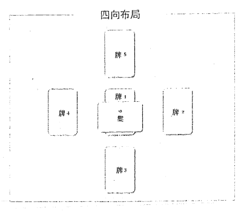

# Quareia 魔法学徒第一卷

## 第一课：冥想

在魔法上，冥想是你要学的第一个技巧，这是有很好的原因的：如果你不知道如何恰当地运用你的精神， 那就没有魔法。静定，清除思绪，及引导你的思绪，都是魔法操作的必要技巧。要做到这些，你必须要每日冥想。

当想要成为魔法师的人首次开始冥想的时候，它会是一种挣扎：精神和身体会像是难以驯服的野兽，但随着持之以恒的训练，冥想最终会成为你日常生活的寻常部分。一旦你到了熟练级，你应当能够做到闭上眼睛， 立刻进入一个非常深的空间，让你能在那里引导力量， 并准备好内在（通灵）感知。要达到这种程度，你需要的除了练习，练习，还是练习。

## 实践问题

有些实践上会遇到的问题是你在开始冥想前需要考虑到的。它们对你的冥想有直接影响。

冥想不需要你盘着双腿坐在地板上。如果你因为瑜伽巳经习惯那样坐了，那也没问题。如果你没有练过瑜伽，也没有冥想过，那就不要以为自己必须要以难受的坐姿进行冥想。坐在一张直靠背椅子上，或铺着地毯的地板上。我唯一建议不要用的姿势是躺着：你不是要睡觉，而是要冥想。躺着会鼓动你的精神进入睡眠模式， 这不是你想要的。所以，如果你想要躺下，那就不要懦弱了，拿张椅子坐吧。

穿着的衣服应当舒适。拿一个静音钟放在你面前的附近，从而你睁眼就能看到它。在魔法训练的初期，你要自己计时。如果可能的话，打开一扇窗户，即便外面很吵：新鲜的空气和在空气中的能量对你是有益的。如果可以的话，选择不是靠近大马路的房间，从而你能打开窗户，而不被灰尘淹没。关掉你的手机等。

如果可能的话，比平常早起一小时，让早上第一件事就是冥想。这刚开始会是一种思想斗争，但会为你一天中剩下的时间准备好自己。如果真的不行的话（比如， 你已经为了工作早上 5 点起床了）， 那就在下午或晚上早些时候进行。试着避免在晚上冥想。但在魔法上，最佳的冥想时间是黎明。

如果你已经冥想过了，能够静止你的思绪，那也不要跳过这一课，因为在这里会介绍的一些技巧对于本教程是至关重要的。如果你已经冥想过的话，那你会发现这些练习很容易。

## 第一个冥想练习

点燃一根蜡烛，注意时间，坐下，并闭上双眼。将你的头转向右边，深吸气，再呼气。将你的头转向左边， 深吸气，再呼气。面向前，深吸气，再呼气。

拿起你的右手 （不管你是左撒子还是右撇子），将你的拇指与第四根（无名指）放在你鼻梁的两边，将你的食指放在你鼻子/眉毛线上方一点的额头 （第三眼区域）。

正常地呼吸，注意在你额头上的手指。聚焦在被手指触碰的地方。每次你的意识开始混乱，开始思考俗物的时候，将你的注意带回你的手指触碰区域。

一旦你的手臂累了，放下你的手臂，并让意识继续聚焦在额头的那个位置。看见你自己吸入白烟，呼出灰或黑色烟。随着你吸气，想象白烟填充着你的身体，并推出陈腐的黑烟。

每次你思绪流游移的时候， 将它拉回你额头的区域。

一旦你感到再也无法聚焦到了，睁开你的双眼，看一下时间。如果你坐的时间还没满 10 分钟，那再次闷上你的眼睛，用手指触碰第三眼区域，并通过鼻子深呼吸。

起身，将你的手双臂举向上方，保持你双腿笔直， 再弯腰将你的双手向下伸向地板。维持几秒钟。站起来， 用脚将你的身体往右边转，双手平举，并维持几秒。转向，并重复动作。站着，面向前方，手臂向外伸展，看一下在你前面的是什么。在你看在你前面是什么的时候， 想一下什么在你后面，有什么家具，墙壁，门等等。站着，确保你的大脑能够处理看着一个事物并想着其他东西。

最后，转回东方，鞠躬，结束。你鞠躬是招呼每位熟练级先辈，每个抵达熟练级或更高级别的学生。你鞠躬是认可每个内在和外在老师。它也是你在内在世界工作时会用到的方法。这是魔法中表达深层敬意的姿势：
不要仅在无意义的姿势中无脑地摇晃你的头或身体。想一下你在做什么。随着你鞠躬，注意到你正在进入一条历史上的魔法传承线，它是一条古代传承线，一个值得你尊敬的古代传统。

记住：每天二十分钟的冥想远比一周冥想一到两小时更好。少与常是关键。

## 第二个冥想练习

一旦你掌握了前面的冥想练习，每天练习十分钟或更久，并每天接着练下面的练习 10 分钟或更久。

以第一个冥想中提到的手臂伸展和鞠躬结束练习。

一旦你的系统沉淀下来了，你也习惯了在前面描述的基础冥想技巧了，那就是时候运用颜色了。这是学习身体内外移动力量的基础。首先，你要学会如何移动颜色进出你的身体;你再学习如何使你的内在能量触发再生和净化。

你将要运用三种颜色，红/左，蓝/中央，及白/右。

从右边开始，用你左手食指压着你左边的鼻孔。通过你右边的鼻孔呼吸，随着你吸气，想象你右边的身体充满白烟。通过你的嘴呼气，并想象你呼出的是白色烟雾。吸入白色，呼出白色。重复整个过程三次。

用你右手的食指压着你右边的鼻孔，通过你左边的鼻孔呼吸。想象你吸入红白色烟雾，填充着你左边的身体，通过你的嘴巴呼出红色的烟雾。重复这个过程三次。 将你的双手放在你大腿上，通过两个鼻孔呼吸，想象你吸入的蓝色烟雾从头到脚填充着你的中线，从你的嘴巴呼出蓝色烟雾。重复这个过程三次。

一旦你结束后，安静地坐着，想象蓝色的通道通过的中心向下流动，白色的通道流过你右边的线，及红色的通道流下你左边的身体。花点时间仅是坐着，并注意到三种颜色在你身体中流动。

最后，花点时间安静地坐着，让思绪静下来。如果你发现你自己回忆起事情或在思索事情，仅温和地停止想到它们，并回归静。这是冥想中最难学的技巧，最好是每次几分钟开始建立，直到你冥想的多数时间都处于静之中。

## 第三个冥想练习

一旦你习惯在冥想中视觉化，能够坐半小时或更久了，那就是时候开始冥想内在之火了。这是一套技巧的开始，一旦你掌握它，那就是能帮助保护你，传送你， 治疗和能量活化你的众多技巧之一。它是一个魔法冥想的古老方法，是你魔法生活自始至终都会用到的。

基本上这个冥想运用的是火焰的形象。这个形象能慢慢地通过你的训练连接到一个精神状态，以及被称为虚无的力量状态。这个力量是存在于所有活物，及所有元素，物质和图案之中的：它是一切流自的地方。要连接上那个力量， 首先你必须要学会如何在寞想中运用它， 这是通过运用火元素达成的。你必须要学会视觉化在你面前有一团火焰，及在你体内有一团火焰。

就现在而言，你要学的是非常基础的“内在火焰”的冥想。闭上你的眼睛，做简单的呼吸练习之一，直到你能保持静定。用你的精神之眼，想象一团火焰安静地在你身体的中央燃烧。它不会伤害你，它不会烧伤你;它是在能量上活化你的生命力之火，它是你生命力的一个面。随着你呼吸，注意在你之内的火焰，它一直存在着。注意其颜色。注意它如何随着你呼吸温和地变动。

每次你精神开始从火焰漂移，思绪开始挤进你脑海的时候，温和地停止思绪流动，回忆起在你中央的火焰。

聚焦回火焰，及贯穿你身体的温暖感。注意它有多么地令你感到安全，及它有多么地美丽。

睁开你的双眼，看一下时钟。如果你已经坐了超过 10 分钟了，那起身，伸展，并鞠躬。如果你仅坐了一会儿，那闭上你的双眼，将你的精神集中回在你身体中央的火焰。

## 魔法和冥想

冥想是魔法的重要与核心的技巧，因为魔法会在许多不同方面运用精神，学会如何有意识地操作精神是非常重要的。静止的精神能让魔法师聚焦力量，有意识地运用想象在精神之眼中建立形象的能力能让魔法师构成图案（模式）和通道，继而让他们的意识扩展到他们的身体之外。

在如今持续的噪音，媒体和闲聊的世界中，魔法学徒很难学会变得安静，听和静止。要克服这种困难的方法是练习。对于你们中的某些人，你的精神或身体或两者都会反叛。不要將你的冥想变成斗争;而是将它们变成一种节奏。还记得作为孩子时不想刷牙或洗脸，或安静地等大人吃完饭吗？要孩子做到那样的纪律是很难的，然而作为成年人你都不会想到这种事情就做它们。 冥想也会变成那样。通过每天的练习，那个阶段会让你抵达。

我曾经把孩子抱在腿上进行冥想，或者坐长途汽车的时候会进行冥想：这让我在数年后，当我突然面对强大生物或危险的情况时，能够立刻变得静定和聚焦。

魔法从那个静止，聚焦的地方流出。长袍、工具和祭坛是魔法的一部分，如果它们成了你的拐杖，那你就注定会失败。

魔法攻击不会等待你做好事情，穿上袍子，拿起剑：
它会在忙碌的一天中在你不注意的时候前来。就像你会在你的训练中学习到的，虽然你会用法器，但你的身体也是与这些器具结合在一起的，你的精神将是你能用到的霞强大的器具。那个力量首先来自于冥想，再来自对视效魔法的运用。

## 任务

1：每天冥想至少 20 分钟。起先，从第一个冥想开始。一旦你理解并能做第一个冥想了，那加入第二个冥想。一旦你掌握了它，再继续运用火焰冥想。

一旦你掌握了三种形式，才是每天连续进行三个冥想：先净化身体（白烟/黑烟），再唤醒第三眼（手压和献击技巧），再用三色（红，蓝，白）能量活化和校准技巧，最后是火焰冥想。每天冥想至少二十分钟。每天冥想时间不应超过 1 小时。

2：简短地在本子中记录你在冥想中的过程：你冥想了多久（要老实！），你是否觉得容易或难，及你事后的感受是如何的。保持记录你事后感受的原因是，最终它会向你展现你初期警报系统发展得如何。随着过了几周后，你会变得在冥想中更有经验，有时你从冥想中出来会有点“不对劲”或“紊乱”的感觉。这通常可能是问题或疾病的初期警报。最初是非常安静的低语，是你几乎感觉不到的。

但随着你练习得更多，并练习了其它核心技巧之后， 慢慢地，但肯定地你会开始识别出“好”的能量感受，你“坏”的或“生病”的能量感受， 你“有什么不对劲” 的早期警报系统。一旦你能识别出早期警报系统中明显的不同，你可以用其它核心技巧来鉴别是什么有问题， 或著你是否处于某种危险中。

你识别出这邪恶信号的频率越高，它们越是会随着时间变得更强。有时是你自己的意识在玩弄你，但你需要学会感受当它们发生时的不同。因为每个人的感官是有点不同的，唯一能真正学会在静中你的感受在告诉你什么的方式是通过日记来观察它们。

如果你生病了，在你的日记中去查几天前你在冥想中的感觉。有时身体会在生病前的二十四小时变得有点高能量：这是你的免疫系统为攻击做准备。其他人会感到失焦，某些人在生病前会描述“状态不对”的感觉。

如果有什么糟糕或困难的情况发生了，回头看一下你的日记。每天仅需要写一点字。随着你从描述中看出发展中的规律，你会开始认出你内在能量或身体试图给你的警告。所以每天一定要写下它们。

每日冥想会成为你余生日常生活中的一面，所以要习惯它！

## 第二课：塔罗

如果你已经用过塔罗了，不要跳过这一课，因为有些内容对于本教程未来的课程有直接关系。你可以只是阅读本章，如果你发现任何练习，布局或其它元素是你没有学过的，那聚焦在它们上，并完成它们。

塔罗是魔法训练中的核心技巧，它会是你魔法生活中的重要工具。如果你想要成长为启蒙者，及之后的熟练者，那塔罗是你需要掌握的技巧中最重要的。

某些人会比其他人学习各种塔罗技巧更快，如果你发现它们很难，你必须要持续练习它们，直到精通。不要拿你的成就和别人的相比：任何在魔法中训练的人会在某方面比其他人强，在某方面比其他人弱。魔法师在一生中对所有魔法技巧达到熟练者水平是非常罕见的。

关键是能够精通它们，并在某些方面达到熟练者级。塔罗的技巧源自练习，很多练习。

在你做切实的读牌之前，先要基本地理解牌。让我们来看一下塔罗牌是如何运作的。伟特塔罗牌是遵照典型的塔罗格式的，是最适合初学者用的牌。一旦你学会如何运用这幅牌，那你最终会学会运用各种不基于同样塔罗系统的不同神谕牌。许多在市场的塔罗牌是这种基础牌的不同表达。从而，先学会这个，再延伸到其他不同的塔罗和占卜神谕牌。

## 第一步

典型的塔罗牌分成大阿卡那和小阿卡那。大阿卡那告诉你流过人或事件的力量和影响。小阿卡那向你展现这些影响如何显现在事件中。

将大阿卡那从牌中分出来， 将小阿卡那先放在一边。

按照数字顺序排列出大牌。你会注意到某些牌代表流过人的力量（愚者，魔法师，高等女祭司等等），某些牌描述的是影响事件的力量（塔，死亡，轮子等等。），某些描述的是影响每个活物的力量（太阳，月亮，星星，等等）。

“人”的力量牌告诉你们都会在某种形式上经历的各种发展阶段。作为魔法师，你要学会根据那个人是谁来解读这些人的力量，他们是否是魔法师。例如，教皇可以代表一名已经学会如何在世界之间桥接力量的熟练者。但它也可以代表以灵性或宗教形式持有力量，但不是魔法师的人。从而，如果你读牌的对象是一个国家，而教皇出现了，那很有可能在那个国家中最有力量的人是宗教领袖。

教皇也能代表对一个宗教的教条信奉。解读牌都是关于问题，内容和涉及的人的。这种解读技巧需要时间和大量练习，它不会一夜之间就被你学会。

在没有我的指导下，将大牌分成三组：人的力量， 事件的力量和自然的力量。在本子上写下它们。以后，随着你理解的增加， 你可以回头看一下自己列出的表格， 是否要做出改变。

记住你列出的这三组，现在看一下随牌附赠的小册子。查一下其中对大牌的描述和含义。如果你有塔罗书， 那查一下每张牌背后的含义。书和册子之间是有区别的，取决于写的人。

不要担心那点;每个人都会对牌有不同的见解，但每张牌都一个普遍的主题。鉴别这个主题，想一个词来概述其含义，在牌名旁写下它。确保那一个词（最多两个）也反映你对那张牌所分的组。从而例如教皇的例子，关键词可以是“桥”或“祭司”，两个词在本质上都意味着同一件事情，但在读牌时可以有非常不同的解读。你选择的词必须是适用你的，而且也反映在书中的描述的。

一旦你对每张大牌做出了关键词的选择，那就把大牌放一边，拿出小牌。将小牌排列在你面前，你会注意到它们分成四组：剑（气），杯（水），星盘（土）和杖（火）。这是学习四个魔法方向的第一步。

这四组会教你流自四个魔法方向不同影响的表达， 它们也会教你属于四个方向的四件魔法器具：剑，杖， 杯，及盾。它们会教你元素力量如何显现，魔法器具如何工作，及它们能带来什么类型的力量。这些学习是你塔罗练习的结果，也会随着你通过每一册的练习进行仪式和视效练习的结果。

现在，看一下每张小牌，从剑/气牌开始，再是杖/火牌，杯/水牌，及最后的星盘/土牌。看一下图片上告诉你的是什么。再看一下小册子或书上对每一张牌的描述，当你对其含义有个合理认识后，对每张牌选择一个关键词。

以一个容易阅读的表格写下关键词，当你读牌的时候，用大牌和小牌的关键词来引导你的解读。不要担心逆位牌：我们不会用到逆位，因为它只会让解读过于复杂。牌的负面可通过与问题相关的牌与牌之间的组合和其在布局中的位置鉴别。

## 洗牌

你的洗牌方法就和其他塔罗运用方法一样重要。每个人都会发展出他自己的洗牌技巧，但有一些建议可以帮助成功洗牌。

重要因素是确保你在洗牌时有完全聚焦在问题上。

不要被谈话干扰或让你的精神漂移：在你洗牌的时候， 让问题占据你的精神。在洗牌时，也要记住你要用的布局：你需要聚焦问题和布局。

一个好方法是闭上眼睛。隨着你洗牌，想着问题， 你要用的布局，并想象你正通过一层“迷露”寻找答案。

用你的内在视觉和想象力创造试图“看穿薄纱”的感觉。

随着你发展出你自己的技巧，你会发现在最初的洗牌后，你的手会开始慢下来，从而牌能更精确地置于它们的位置。一旦牌都在正确的位置了， 你会感到它们“锁” 定住了。读牌的准确性取决于你洗牌时的意图聚焦。

一旦你准备好了牌，那从牌顶部发出牌。一旦你习了惯运用牌了，你可能会发现你要的答案会在牌被发出前就流入你的脑海中。仿佛你先预览了将要发出的牌。不是所有的读牌者都会有这份体验，但对于有很强天分的人， 牌的类型通常会在发牌前先浮现在解读者的脑海中。

一旦你发好牌了，花点时间看一下它们所在位置。

记住，每张牌和其位置的含义要一起读。一张张牌看过去直到最后，再回过头看第一张。通常一张牌/位置会让你理解不了，直到你看完全景;然后含义开始展开。如果仍旧有地方是你不理解的，有时安静地坐着，对自己说“好吧，告诉我吧”会有用。写下你的读牌，从而你可以几小时后再看它。我发现在不确定的时候，最简单的解读通常是正确的。

## 用六个位置的四向布局方向属性

这些是通用的魔法属性，不仅可用在魔法，仪式和视效中，也可用在占卜中。一旦你对这些流过这些魔法方向的力量有了基本的理解，那你就可以用那个知识运用塔罗的方向读牌。

-   位置一：中央——身体/自己/大地/起点。总是从零点位置开始——你从这个角度来看，这是所有方向力量都影响的。

-   位置二：东，气，剑，宫语，泉水，智力，训练， 精神。

-   位置三：南，火，夏天，杖，戌功，领导力，图王， 神，免疫系统，阳性。

-   位置四：西，水，秋天，杯，情绪，关系，通灵能力。

-   位置五：北，土，冬天，星盘，物质，先祖，长者， 女王，女神，阴性。

-   位置六：关系。这个位置告诉你事物如何影响你和你与它们的关系。

方向属性还有很多，随着你作为魔法师得到发展， 你会学会更多微妙之处，连环和连接。但现在让你被大量的名单压倒是不明智的：从简单的开始，再开始发展。 这些魔法方向力量的列表是非常基础的，你如何在读牌中运用它们很大程度取决于你问的是什么和你需要知道什么。

布局是这样的：

在你首次读牌中，你要看一下你房子里的能量。这是项重要的塔罗技巧，随着时间，你会学会用不同的方法来看一个地方的能量。根据你要看的是什么和情况是什么能用不同的布局，但对于现在，你要用这个简单的布局。今天你仅是要看一下你住的地方的总体能量。如果你住的房子不仅有一层，那为每一层做一次读牌。

## 读牌

恰当地混合好你的牌，用前面描述过的洗牌技巧洗牌。在脑中想着问题，也就是“向我展现我住所中呈现的能量，”并要想着布局中的方向模式：1=中央，2=东， 3=南，等等。

当你结束洗牌时，按照图片中顺序发牌，再靠后坐， 观察下它。先看布局的中央。这向你展现你住所中当前的核心能量。再看在东面的是什么（位置 2）。將那张牌与你空间的东面关联起来：它是卧室？厨房？看一下每个方位，想一下在那些方位上的空间。

一旦你看过每张牌了，看一下图案，理解它是什么元素（火/杖？气/剑？）或者它是什么力量（它是国王或王后之类的人牌吗？），再写下它们，从而你能有它的记录。你可以拍下照片，但也要在你的笔记中写下它们。

在你的解读中最先要注意的是，大牌在哪里？如果有任何大牌落在任何方位时，无论它是好牌还是坏牌， 它都比其他牌要强。如果你得到的是很多大牌（而你有恰当地混合好牌和洗牌），那它可能暗示你的房子正坐落在力量点之上。你会在教程的后面学习这些。就现在，先记录下来。

如果你的一个 （或更多） 方位出现的是非常坏的牌， 那你需要鉴别它指的是哪个房间，在你的笔记中写下。 一旦你看完总体的生活空间了，那你要集中在任何困难的区域上。在总体的读牌中，注意非常好的和非常坏的方位。鉴别它指的是房子的哪个区域或房间。好的牌会向你展现房子里哪里很强，健康和再生，坏的牌向你展现房子里不健康的区域，或甚至是在房子里有坏影响的物件。

如果是小牌向你展现不太好的方位，那它们可能指的是转变中的能量，从而你需要在一周后重复占卜，看困难的影响是否还存在。如果还在的话，那你需要为那个困难的房间做方向读牌。写下哪个区域展现困难（如果你很不幸运的话，所有方位都会展现问题）。现在去看一下房子里的那些区域。那里是否有雕像，魔法物件， 镜子，乱七八糟的堆放物品，或任何明显会造成问题的东西？

那个区域是否是非常忙碌的，经常使用的？目前有一些非常基本的事情是你可以让空间在能量上更流畅一些的，直到你学会如何恰当地处理问题前，先顶着。

## 平衡一个困难空间

一旦你鉴别了房间中困难的区域，清理掉任何凌乱的东西，整理那个区域或房间，并确保房间是干净的。

用四向布局鉴别房间里哪个方向是最有问题的（大牌坏牌，或很多剑）。在每个非常困难的方位上放一个罐子， 在罐子里放四分之三的盐和四分之一的水。如果那里有艺术品或神圣物件 （恶魔面具，神灵等等） 在那个方位， 那你需要鉴别它们是否是有助益的，还是在妨碍或造成问题。

查出的方法是为那个房间做四向读牌，如果我将 X 取出，那个房间的能量看上去会是怎样的。那样的话， 你就能通过答案知道什么是有帮助的，什么不是。

如果有严重的问题，不要恐慌：你当目前为止都在那边生活得还可以，但它是你需要长期应对的事情。跟随本书中的建议，随着你进步，你会学习越来越多应对能量问题的技巧。你需要学会如何恰当运用技巧，使其有效，那是需要时间的。

对于现在，盐水的方法会减轻任何问题。让有问题的区域尽可能保持安静。如果那里有音响系统，搬掉它。

如果那里有很多非常“忙碌”的东西，比如电脑，玩具等，搬掉它们。还能有帮助的是鉴别房子内能量好的区域，更常地使用那里。

如果平衡房子能量的事情是让你真的感兴趣的，那你可以看一下飞星（玄空）风水系统。我发现它在困难的房子里非常有用，但我也发现它的效果和相关书中描述的不同：可能是它发展的地方和我所生活的大地就星星的关系上来说是不一样的，但它足够接近到有效。用塔罗布局来追踪你的进度，看一下什么有效，什么没有。

## 例子

假设我们对一个房子进行占卜， 在南边出现了塔牌。

我们鉴别房子那层南边的房间是厨房。从而，我们为那个房间做第二次读牌，在南边又出现了一张破坏牌剑 10（它是塔牌的降八度版本）。我们用指南针看了一下厨房，发现在南边的是炉子。

现在，记得最简单的解读通常是最好的。在厨房中， 我们在南边（火元素位置）的是炉子。炉子通常也是房子的火源（油炸时锅子起火等）。

于是，你需要查一下炉子是否有什么隐藏的问题， 会让房子起火，还是那个方位有太多火元素了。有时， 特别是当你住在炙热地区 （像沙漠或火山露头等地），在南面的房间把炉子放在南面会太过了。你需要进一步做两次读牌。第一个是问，如果我们修补或替换炉子，这个房间内的能量会是怎样的。如果读牌结果看起来没事， 那就是炉子里有隐秘的问题，会建立成火灾。记住，在能量上，房间南面的背后有更多能量能够引发情况。（如果你住在南半球，那情况就不同了。）
如果问题依旧出现在读牌中，那你很有可能需要搬离你的炉子。我知道如果你住的地方像我一样很小或资金有限的话，这说起来比做的容易。

在这种情况中， 进一步读牌看如果用大锅子装满水， 永久地放在炉子上，并偶尔换水，将水引入火焰区域， 这样是否会有变化。通常它会是个好的第二解决方案。

## 总结

学习塔罗技巧对于魔法师是至关重要的。不要陷入通过心理学学习塔罗或通过心理学解读的陷阱：那样并不是很恰当的。以我上面建议的方式学习塔罗能给你更广泛的理解，会随着你成长和发展成启蒙者及最终的熟练者而成长和发展，会融合在你初期的仪式和视效训练中。它们结合在一起， 给你前进训练最古老的魔法钥匙。就像所有魔法技巧， 塔罗是关乎练习的。弄一本单独的日记用于记录结果 （物理的本子，不是在线的）。这很重要。你的塔罗课和实践应当以这种方式写下，这样你可以在一年或两年内回头看它的时候，依旧能理解你写的是什么。你不仅能够惊讶到自己进步了多少，你还能追踪流过你人生的事件， 力量和影响。

## 变牌

为你的家做四向读牌。再为房子里的每一个房间读牌。写下结果和任何你决定平衡困难区域的方法。

如果决定用飞星风水，那做一年的——许多影响会每年发生改变。

一旦你习惯用这个布局了，给你的邻居读牌，再给你的城市做一次。用方向布局查看两周内不同的事情， 直到你感到懂布局，能够恰当解读它了。

提示写下每次读牌，注意它揭露的邻里和城市内的困难区域，如果可能的话，去那些地方，看看你能否感受能量一一或甚至鉴别坏能量是来自哪里的。记下你的观察和你采取的行为。当你改变一个空间时，接着做读牌看那个改变是否是好的解决方法， 或是否需要更多的行为。

写下一切。

## 附录：牌和你自身在读牌后的清洁与管理

一旦你结束读牌后，最好用肥皂洗手。如果它是个困难的读牌，或者读牌被用于查看困难，危险或不健康的情况，那最好在手里放上一点盐，再肥皂和水清洗。 这会打破任何能量连接，也会清洁掉任何在读牌过程中累积的“油腻”能量残留。

清洁牌自身。这可以通过将牌沐浴在被碳块燃烧的乳香烟雾中，或者将牌放在塑料袋中，灌入干燥的盐，并摇匀，来完成。

这会限制牌的寿命，但保持干净比起一直用肮脏的牌更重要。这也是为什么，对于多数读牌，用普通，简单的牌可以很容易和便宜地经常替换。我的牌通常可以用一年再替换，而我会经常用它。

把你的牌存放在盒子里，远离孩子，宠物，等等。

用布包裹牌，或用布叠着读牌的桌面也能帮助限制不健康的能量残留留在你放牌的桌面上，也能帮助不让牌变脏。塔罗布应当经常清洗。

## 清洁你自身

保持你自己干净的第一个规矩是结束后立刻用盐和肥皂清洗手。在你清洁完手之前，不要触碰或做任何事情。如果读牌是特别难的，或事件自身是非常不健康的， 那也用一点盐涂抹在你的“第三眼”区域，再清洗你的脸。

## 第三课：视效魔法基础

视效魔法将想象作为操作界面，让魔法师能够接触内在生灵和内在领域。当我说内在的时候，我指的不是你里面，而是一个非物理领域的次元（某些人将它称为星灵领域）。这个次元通过想象和精神之眼的运用进入， 因为术语为“内在。” 首先你需要学会以控制的方式运用想象。你再需要学会如何用想象触发灵体和内在之地的事件。

心理学家，艺术家和思想家都会将他们的想象作为工具。魔法师也会将想象作为工具，但魔法师的不同之处在于， 想象是作为让他们精神踏入其他地方的通道的。

为了能这样运用你的精神，你必须先学会冥想——这也是为什么你的第一课是冥想技巧。第二，你必须要能够以聚焦的方式运用你的精神，以触发你的想象，维持聚焦。学会如何想象某个东西，学会如何看见你用精神之眼想象的 “某个东西”，以及学会如何用你的想象建立一个形象，它们都是魔法中至关重要的。在这个区域的技巧是通过你会在本课中学习的练习学习的。这些练习必须要在你尝试视效魔法之前掌握。

## 练习一

这个练习的设计是为了接入记忆并运用大脑用于记忆的机制。运用这项联系不仅能帮助你提高记忆力;它也能教你在运用想象的时候，使用你大脑更广的区域。

1：在你冥想了数分钟后，安静地坐着。想一下发生在五年前的事件，是你能够轻易回忆的，比如生日， 意外，或家庭庆祝。看见你自己处于那个事件中：从远处观察你自己，仿佛你站在房间的角落里一样。回忆起在那里的人，房间看上去是怎样的，及有出现什么味道。再从你自身中看其他人，看一下房间，观察任何你能记得的细节。

2：现在回忆起 5 天前的事件。回忆起醒来，弄喝的， 或去上班。你是否在驾车？你能想起路，路上车，交通的状况，及经过的人吗？或者选择哪天的事件，聚焦在上面。先从你的外在看事件，再从你内在看它：你正看着你自己驾车或工作。观察你在那特别的意外或事件中的情绪和行为。

3：回忆起十年前的事件， 再十天前的时间， 重复这个练习。从你自身之外观察记忆，再从你内在这么故。

这个练习的目标是在接触你长期和短期记忆的同时，训练你的想象力。先接触长期记忆（通常是非常高效和可接触的归档系统）， 再触发通常更难接触和混乱的短期记忆。这也是为什么如果你要试图回忆起几天前的事情，先要回忆起几年前的。打开你长期的记忆能帮助你回忆起短期的事件。

将记忆与想象连接在一起能帮助视效过程运用大脑更广泛区域，依次帮助视效过程变得更巩固。

## 练习二——一行走一个空间

这是训练想象力的下一步。学会如何用你的精神在空间内行走，它也是如何通过想象将精神踏入切实旅行的训练。它也是遥控观察的主要训练，也就是用想象在物理世界中旅行，观察事件的发生。

要为这项训练做好准备，做一轮冥想或呼吸练习或都做。一旦你进入静了，精神冷静了，开始想象你自己踏出你的身体。回过头，看你自己坐在地面上。看一下你自己所在房间，看一下窗户，搞清楚它和你身体关联的方向在哪里。转身，看一下门，再绕着房间看一下， 注意房间家具的颜色和质感，房间里是否有镜子，如果有的话，去站在它前面。看一下你的镜像，注意你的灵体形态看上去是怎样的：它通常和你身体的样貌不同。

接下来，走出门，去另一个房间或走廊。在房间里走动，注意那个房间的家具，质感和颜色，及任何生物（猫咪等）。如果那个房间里有人，靠近观察他们，观察他们的表情，行为和动作。再观察一下他们，注意他们是否有散发任何特别的色彩（色彩是能量的频率，一种共振。人们散发的色彩能告诉你很多关于他们健康和精神状态的信息。）在房子或建筑里的每个房间重复这个行为，直到你发现你的想象力开始打断，你正在失焦。到了那时候， 开始走回你的身体，注意你要回到身体需要经过的每个房间。一旦你到了身体旁，踏进去，沉淀自身，当你准备好的时候，睁开你的双眼。

不要试图从一个地方“跳到”另一个地方。确保你有走空间：为了你后期的魔法技巧，你必须要学会从地
“点走到地点，以训练你的视效 ”肌肉，" 刚开始的时候可能是很难和疲劳的。你每天练习得越多，你能维持的时间也越久，不失焦走的距离也更远。

另一个原因是， 当你用视效技巧到内在世界的时候， 需要你花点时间通过各个阶段进行行走，这能帮助你的精神从想象力转变成切实地看到某空间所发生的事件。

它能帮助放松你的精神和灵体，也能运用潮的动态，这也是你在教程后面需要学的。它视效魔法的一种特质， 到一个地方所花的时间能帮助收集力量，帮助身体调整应对力量的变化，也帮助你的身体应对冲击。一旦你掌握了这个技巧，那为了快速回来而进行空间跳跃会变得很容易，但要去一个地方时必须要慢慢地展开，不能勿忙，无论你多么地有经验。

## 第二阶段

一旦你能行走在房子内的几个房间里了，并能维持视效从而观察到房间的细节，那么就是时候学会离开你所在的建筑了。以同样的方式开始练习：静 -> 呼吸 -> 踏出身体，观察你所在的房间。选择一栋附近的建筑， 看见你自己从房子中出来，走在街上。注意你经过的车辆，人和动物。

通过其大门进入你所选择的建筑，进去所选择的那个房间。走进房间，观察周围，注意入口，窗户，壁炉等等。看一下在房间中的任何人。走到其中一位旁边， 用你练过的彩色呼吸练习，看见你自己温和地对那个人吐出白雾。注意任何反应，再撤离。看见你自己从建筑中出来，回到街上，再进入你家。

走回你一开始的房间，坐在你的身体中，当你准备好的时候，睁开你的双眼。

## 总结

练习这些技巧，直到你能够轻易地进行，一旦你达到那个阶段，你可以开始进行下一步的视效练习。不要试图跳过任何阶段，因为它们的设计是为了让你慢慢地建立视效工作的内在技巧的，某些人获得技巧会比另一些人更快。如果你用想象移动的技巧建立得很稳固，那个技巧会在你在内在世界遇到困难的时候稳定住你。用精神移动的感觉必须要变得熟悉，如果你遇到突然出现的生物，力量或事件时，你能够维持住视效。

多数在视效中发生的伤害和惊吓都是因为魔法师没有习惯面对突发状况的时候维持视效，所以花点时间建立稳固的技巧是值得的。在这个领域中用视效技巧也是很方便的，让你可以在远离的时候查看你自己的家，确保没有不应该在那里的人出现，及家里是安全的。这是一种遥控观察的形式。

## 任务

训练十次这个视觉化练习。如果在十次后，你能够很容易地视觉化自己移动，能够从你身体内变换视角到身体外，及能够视觉化离开你的家，去街上的某建筑， 那你就准备好进行下一个练习了。

如果你依旧练不好这些练习，不要急。每个人都是不同的;每个人都有自己的发展节奏。维持这个阶段的练习，直到你对自己的进度感到满意。如果你感到困难， 不要试图跳过这个阶段，因为它是让视效魔法起效的核心技巧。就算你需要一年才能学会也不重要：重要的是你学会去做了。保持练习，并学习本册中的其他课程， 不要试图做任何其他视效魔法课程，直到你掌握这些基品就遥控观察技巧来说，在你魔法生活中经常练习它们能帮助你建立更深的遥控观察技巧。这些技巧在你需要从远处查看家人，或者在你去一个空间之前，先检查它的安全的时候，是非常有用的。

## 第四课：仪式技巧

在我们开始学习仪式和如何做仪式魔法之前，让我们先来看一下仪式魔法是什么。涉足魔法的人之中理解仪式其实是什么和其如何运作的没多少。许多人认为长袍，器具，祭坛，言语和职位是仪式工作的成分。这是普遍错误的假设。

仪式是被特定行为，发声，物质和器具以特定的方式结合在一起，再融入内在力量和联系，从而创造出的能量模式（图案）。描述中后面的部分是最常被忽视的。

为什么？因为太多现代魔法训练仅集中在仪式的外在面上，例如，配方书。中世纪魔法书或仪式文献通常被误认为是整个仪式全部，但它不是。它仅是仪式的百分之五十;剩下的部分是通过内在视效，力量桥接和内在联系而运用的魔法技巧。贯穿历史，魔法文献都没有提到那部分，不仅是为了保护魔法不受外行人乱用，也是因为没必要加进去。

魔法师要么受到恰当训练，知道如何开启仪式，要么就是不知道。如果他们不知道，他们顶多能触发有潜力仪式的一小部分。这保护外行人不被自己的无知伤害， 保护魔法的完整性，及保护每个外行人周遭的人。

如果仪式模式在很长一段时间内反复以同样的方式进行，那无论操作它的人是谁，那它都有可能会起效， 但前提是那个仪式最初构建时是有内在联系的，而且它的操作是有关键元素呈现的。但在总体上来说，内在连接是成功的关键。你可以给某人仪式，长袍，杖，剑， 祭坛，职员，整项工作等的脚本，但如果他们没有力量和使其运作的能力的话，那什么也不会发生。 一个在频谱的另一端的是，受训过的熟练者可以靠近一根蜡烛，或走在太阳下或风  之中，或可以走进教堂或神庙中仅站在那里。他们可以发声一个简单的仪式呼唤或意图，虽然没有装饰，蜡烛，长袍，脚本或杖子，但所有的力量会立刻打开，并开始运作。这是因为熟练者有恰当地插入力量，以聚焦意图的简单行为，发声那个意图，或用一个物理行为来触发那个意图的外在化，会强大地将魔法带入行为。

正是这个对硬币两面都需要才能使工作成功的需求才保护了仪式文献，中世纪魔法书，及古代神庙。你可以按照书籍和中世纪魔法书里的步骤进行复杂的仪式， 但如果你没有让那个仪式插入力量，或不知道如何接触那个力量，那它就不会有效;或者如果有任何生物在你附近的话，那它可能会升起一小撮力量——不会更多。

这也是什么对于萌发中的魔法师而营，学习仪式魔法和视效魔法是非常重要的：仪式魔法是外在模式的构建，也送出呼唤，而视效魔法则能使你接触到内在世界的力量和意识，并桥接生物，让仪式活起来。仪式魔法给予内在力量形态，而内在力量给予仪式燃料。在缺乏一方的情况下，那是在浪费时间。

## 仪式是如何运作的？

仪式的构建主要有两个面：人和能量。所用魔法的确切风格（语言，器具，长袍，咒语等）主要取决于你做的魔法是什么类型的，及你要达到的是什么。魔法风格的元素不是魔法自身：它们是表面可变的因素， “装饰” 的细节，以及它们其实不是仪式的基础构建所必需的;它们给仪式一种特别的“口音”， 以吸引特定灵体的注意。

仪式自身的基础由能量和人结合的平台构成。让我们先来看一下仪式中人的那一面。所有人的生活中都会有仪式，不管他们是否意识到这点。仪式让事情变得更简单，更可预料，及更高效。它们是我们每天以同样方式做的事物：我们如何刷牙的，如何醒来的，如何喝咖啡的，及如何穿衣的。我们都有自己做事情的方式，随着我们变得更老，我们的模式会变得更稳定和可预料。

当一个人选择以特定方式做一件事情时，仪式就开始形成了。如果他们长期以同样的方式继续重复这个行为，那行为会变得 “印迹”到他们的大脑和意识中， 直到它成为了一种无意识行为。开车是关于“印迹”最佳的例子，意味着经常以同样的方式重复行为模式，直到它成为了第二天性。这种模式制造的方法（通常可以在体操选手，芭蕾舞者，及纺织工上可以观察到。长期以同样方式重复同一个动作会使你能够以更快的速度和力量执行那个动作。

当你以聚焦的精神结合印迹过的行为时，你就有了仪式的基础。每天早上以特定的方式制作你的咖啡会帮助你变得更集中，为整天做好准备：正是重复行为的运用影响了意识。虽然它不是魔法仪式，但无论如何是一种仪式。

那这和仪式魔法有啥关联呢？全部。理解存在于我们生活中的不同仪式形态是非常重要的，理解构建一个成功的魔法仪式的所有组成也是如此。

你如何在肉体上进行魔法仪式，特别是你经常重复的，是非常重要的：你自己的肉体行为模式会在你的意识和身体中建立一个通道，从而让你的精神和身体能够完全地接触仪式让你能够连接的力量。那个运用物理行为的仪式可以是绕着方向进行处理，站在祭坛前，运用物理物质，手印，身体行为……这些物理模式可以是仪式的成分。

随着魔法师变得在仪式上更进阶，有件事是很少魔法师会注意到的，但它最终会有损仪式的力量程度。它就是“微动作。”这是你在训练初期就应当注意的行为模式，从而你能够在它开始发生的时候识别它，并从你的身体中移除。

## 仪式微动作

当魔法师在一段时间每天重复同样的仪式时，它会变得印迹。一旦仪式行为印迹到大脑中了，那大脑就会变得 “无聊”，会开始与印迹斗争，在仪式中引入微动作。

这在古典舞蹈中让舞者长期重复同样动作后容易出现的现象。微动作的显现是非常微小的，可能看似无害，通常会被误以为是“个人风格。” 让我们来看一下微动作入侵印迹的例子，这样你就知道我在说什么了。

一名魔法师每天练习六芒星仪式，以将自己和工作空间平衡，他也将那个仪式用作移动冥想。这个仪式需要他在房间内移动，做出特定的手臂行为，及说特定的话。在重复这个仪式几个月后，魔法师能够不假思索地作出仪式，通常在无需回忆地情况下运用它：他正在自动驾驶模式中，仪式已经是个活跃的印迹了。

某天，他没有注意到自己在做什么，当他用手指在空中描绘形状的时候，他以微小的手指或手腕转动来结束描绘;当他从方向走到方向时，他加入一个小摆动或特别小的头部动作。这些小动作立刻以“良好的感觉” 奖励了他的大脑――这是你注意到大脑正与印迹斗争的迹象。重复印迹的动作不会像改变的动作那样奖励大脑：
它们不那么有趣。从而，大脑会加入新的动作，以给脑内某些接受表现回馈的部分奖励。大脑不想要像机器一般地工作;它想要以有趣和古怪的小变化进行。

那这和魔法有什么关系呢？其实有很多。那微小的动作会改变仪式形成的内在符文或图案，随之破坏了其力量。它也意味着魔法师的集中力没有达到应有的标准。

魔法是关乎绝对的聚焦的，你意识意图应在完全的控制之中，而不是身体自身。微动作是微小力量斗争的结果， 他们能越快认识到这点，并加以处理，越好。

你在本质上是在训练你的身体在没有即刻奖励的情况下进行工作的：每次大脑加入小动作就能得到化学奖励，魔法师会感到“重要”或“强大。”但它是假的感觉，因为它纯粹来自于大脑的奖励， 而不是真正的力量自身。

当魔法师大脑的化学物质不平衡的时候，那通常可以在仪式中过度花招的行为（及交谈，演讲等）中看出。那个人会有一系列的动作，就像是“顺口的广告语”一样：
当我们看到它们的时候，我们的大脑会感到兴趣，抓住它们。这也是最佳的做广告方式。顺口的标语或行为是与“大脑奖励”关联的。

·在我们的日常生活中，我们不断曝露在这些“脑奖励”中，如果一个人的个性是年轻，缺乏发展或虚弱的， 那它会立刻抓住这些奖励，以获得能产生快乐和力量感的化学促进。这也是为什么不正直的广告方式最适合青少年和青年：那是无力感的黄金年纪，也是个性没有完全发展好的年纪。在每个人的生活中，享受这些脑奖励并没有什么真正的伤害，我们通常也能从中自然地成长起来。

然而，在魔法上，微动作会像是小沙粒一样，慢慢地磨掉你的力量。因而需要这么长的章节来谈论这个主题：认出微动作就能解决一半问题。另外一半需要你随时警惕，在微动作发生的时候认出它们，驾驭你的集中力。一旦你打从心里学会了一个仪式，能够以印迹或自动驾驶的方式进行了，那注意观察这些小动作试图爬进你的行为中。一旦你识别了它们，注意它们让你在能量上感受是如何的，识别出在仪式行为的那一个点它们开始发生，并阻止小动作的发生。

令人惊讶的是，阻止这种小动作会是很艰难的，但它意味着开始学习如何完全聚焦， 控制你的精神和身体。

通过慢慢地训练掉微动作，你开始了真正的行为聚焦训练，这依次会绽放成像是激光点一般的魔法聚焦。在适时的时候，你会学会如何仅通过看着火焰创造和拆除魔法图案 （模式），实施这种强大行为所需的一套技巧首先源自在引导聚焦行为的同时，而不受你大脑，身体或漂移精神的干扰。这样的话，你创造的内在图案和内在符文会是精确的，强大的，及稳固的。

## 肢体拉伸

要为强大仪式做好准备，另一个重要元素是肌肉骨骼系统的柔韧和稳定。在传统上，这种魔法力量的准备是通过瑜伽的实践达成的。瑜伽为身体慢慢地准备好高级仪式能带来的力量汇入，并确保身体结构能够恰当地处理那个力量。

它不是关于练肌肉的，而是柔韧性：身体越是能够恰当拉伸和弯曲，它能应对的力量也就越多。通过学习肉体的柔韧性，内在身体也能变得更柔韧，能够应对冲击柔韧变化：通过训练外在身体， 你也训练了内在身体。

当你开始任何严肃的魔法训练时，开始进行诸如瑜伽，武术，古典舞蹈，或任何能够推动身体拉伸和弯曲， 及长肌力量和稳定的肢体训练是很重要的。健身运动， 循环练习或其他重重训练或有氧练习都没有相同的益处：你不会想要抵抗力量而变得“强壮”的，而是学会对它柔韧和弯曲。

如今我依旧每日做拉伸，和肌肉稳定训练。每天仅十分钟就足以维持柔韧性和核心力量。找到适合你的方法，并每天训练。如果你无法每日做，那每周至少三次也能足够。当我走进一房间的魔法师时，我立刻能鉴别哪位魔法师有做这类的训练，哪些没有：他们身体在能量上支撑自己的方式与其维护和照料直接相连。

## 能量

仪式的第二成分是能量。能量被用于构建内在图案， 以在意图的方向上聚焦和引导力量。我说的能量指的不是物理能量。在仪式的能量构成中，源自元素的能量被排列好，编织进一个特别的内在形状中，它依次创造了可被引导的力量通路。把它想成是电路板：仪式的能量图案是让力量流入的线和渠道，以触发成功的结果。

那个能量图案是由方向性元素构成的。当一个人观察恰当构建好的仪式时，一个成功的仪式成分会有能量上的方向性图案：它们包括恰当活化的器具（比如剑， 杖或手指），运用发声召唤一个生物，它通常 （但不总是）是与一个元素方向相连的 （圣迈克尔/南方是个流行的例子），人/魔法师，灵体/生物，一张或多张祭坛，以及元赛自身的运用（火焰，水，石头，发声/气/熏香）。

通常当人参与在仪式时， 他们没有意识到这些物件， 词语，生物和物质是如何运作的。他们认为物件，词语和火焰  “代表”什么，但他们并不是代表——它们就是它们。让我们把它们放到实践中，让你更容易理解。

## 方向仪式的范例

让我们看一个用于从一个特定威胁中守护空间的仪式 （而不是总体的守护）。魔法师将一张祭坛放置在东面。

他将白色的祭坛布铺在上面，并放置一根白蜡烛。他将在魔法上圣化过的剑从其剑鞘中取出，并将剑放在祭坛上。他再洗仪式浴准备自身。魔法师穿上干净的衣服回到仪式空间，关上他背后的门，坐在空间的中央。他冥想了一会儿，用视效冥想进入虚无之中，进入无的视效状态（这是仪式的第一步——清洁与净化。）魔法师再站起来，维持在无的状态之中，朝祭坛面向东面。他没有直接走到东面的祭坛，而仅仅鞠躬，再转向，开始顺时针围绕着房间走圈，直到抵达南面。魔法师站在南面的墙壁前，意识到在南方的力量，太阳神灵，天使生物，灵体和内在联系。他对它们鞠躬，发声以招呼它们。他在西面和北面重复那个行为，直到再次回到东面。

在他到达东面祭坛的时候，魔法师深吸气，在他维持的静之中，回忆起最纯粹，最魔法形态的气元素力量的感觉了;他通过自身朝东方呼出那个力量。他依旧维持着无，除了正在做的简单仪式行为之外，什么都没有想。现在，是时候点燃蜡烛了。

魔法师站在祭坛前，加深在他之内的虚无感。他开始意识到自己作为容纳神圣闪光的容器。他看见那个化为火焰的神圣闪光。魔法师站着，意识到在他之内的火焰，意识到南方/火/阳性的力量在他的右边，土/北/阴性的力量在他左边。他意识到西/杯/水的力量在他身后， 东/气/剑的力量在他前方。随着那个意识图案的建立， 魔法师点燃烛火。这是通过元素构建能量图案的方法。

要成功构建，魔法师必须要有绝对单一的聚焦，能够仅通过想到， 就能在内在程度上与方向上的魔法力疊相连。

魔法师将剑放在祭坛上，从而它像是屏障一般横躺在祭坛上。魔法师用他的精神，建立起东方大门打开的形象，隨着大门打开，感受到东方的风吹向他。在他的精神中，他变得意识到经常与他共事的联系和灵体，他招呼他们入席，感谢他们的帮助。

魔法师再将他的双手放在剑上，用他的声音呼唤在东方他想要召唤前来并提供帮助的力量。它可以是神灵力量，天使力量，恶魔力量或土地意识力量。他如何招呼他们，取决于那个生物的类型。例如，神灵通常有能够触发他们的特定祷文和恳求，而天使或行星生物有特定的词语能够触发它们，但通常不需要或想要恳求——他们偏爱简单和直接的指示。

随着魔法师陈述请求，他与圣化过的剑有着完全的肉体接触，从而将它带到他的能量领域中。他已经在这个仪式过程中一直维持着虚无冥想，但在此刻，他依旧更加深入地意识到虚无和其潜在。万物流自虚无，打开和维持虚无的打开为生物和力量创造了能够通过的大门。然后，魔法师随着他的陈述，拿起剑，转身面对房间。剑被举着，剑尖朝下（守卫/防护）在他陈述的结束后，魔法师深吸气，维持在他身后东方大门的开启， 再发声他想要帮助他的生物名字的同时，对剑呼出气的力量。魔法师闭上他的双眼，变得意识到从东方流出的力量，流过剑，进入房间。

剑被用于聚焦和引导生物/力量进入防卫或守护自身：它是说着“防卫”的过滤。依旧举着剑，魔法师走到房间中央，再进行一个仪式行为，明确地引导生物和剑防卫东面，南面，西面，北面，中央，上方和下方。

魔法师再将剑放在房间中央的地板上， 走到东面的祭坛。

他吹熄蜡烛，但在视效中“看见”内在蜡烛依旧燃烧着， 运作着，要么魔法师就要让蜡烛无限期地燃烧着。

这是仪式众多不同的形式之一，可用于守护一个空间，建筑物或城镇。所守护的区域范围取决于魔法师在仪式中给生物定义守护区域的大小。在中央工作时的四向运用定义了空间的形状：如果魔法师想要守护一个巨大的区域，他投射的“南面”感，例如，是可远至抵达城市边界的。魔法师应当已经知道那些边界在哪里，从而他能向与他共事的生物投射精神图像。

## 仪式的分析

让我们来更近地看这个简单的仪式中发生了什么，用了些什么成分使其有效。注意到的第一件事是，仪式并没有用到中世纪魔法书或配方书中的内容——这种仪式不是有书/脚本和描述就能让任何人做的。这个仪式几乎完全取决于魔法师的技巧和知识：它是个熟练者级的仪式，但它明确地展现了基本元素的运用和成功仪式中的成分。

你也会注意到仪式开始前没有用到驱逐或守护。如今，多数初学者会训练驱逐和守护，他们被告知它是熟练者级魔法的奠基石。不，它不是。那些行为最初是作为初学者的练习而引入仪式魔法中的，虽然在本教程中你会学到不同版本的驱逐和守护仪式，但作为学生，你必须要理解它们不是熟练级魔法的主要部分——让我来告诉你为什么。

魔法师的第一个行为是去洗仪式浴。这能净化所有能量污垢，较轻的魔法攻击，任何粘附灵，等。它清洁， 净化，并帮助魔法师清晰思考。他再穿上干净的衣服。

他的身体，精神和衣服一定要是干净的，不能干扰魔法。

他没有穿仪式袍。仪式袍子有两种真正的魔法功能：第 58 一种长袍是在仪式上清洁的， 另一种的长袍是被圣化的， 能在魔法上给予魔法师护盾。

长袍可以在某些情况中用作档掉攻击的防弹衣。但如果你有受到恰当训练的话，那在这种仪式中很少会用到它。你日常生活中，有多少次会穿上防弹衣呢？当你突然遇到危险的时候，有多少次你是有时间穿上它的呢？一定要学会在没有这种长袍的情况下工作，从而， 你能够一直准备好，仅用你自己的技巧和知识。

一旦他干净了，魔法师回到仪式空间。他做的第一步是冥想，他再进入虚无中的无。它是为内在工作准备的内在防弹衣：在无中的静。如果有生物试图攻击他， 因为他维持着无，那不仅他在内在世界或多或少是隐形的，而且也没有可以给那个生物抓住的形态——他看似是无形的。

这个技巧需要时间和很多练习才能获得，但它是与你同在，并立刻可用的。如果你习惯于躲在袍子，护身符，及驱逐仪式背后，那你总会有一天被抓住。你无法让自己在整个魔法生活中躲在铠甲后面：总有那么一刻是你需要学习内在社交技巧，真正的魔法武术技巧，及安全意识。

从那个静，魔法师引入一个纯粹的元素，将它作为主要的门槛──火焰。他也运用气元素，用他对气的内在力量的知识，将内在力量和外在呼吸结合在一起。在这之后，他可以用那个强化的呼吸，呼唤他需要的生物。

强化的呼吸确保他的呼唤有被生物听到，它有点像是私人电话。那种强化的呼吸是源自将魔法元素用作器具的长期训练，这是你会在本教程学徒课程中需要学习的。

意图和名字被用于引导呼唤，强化的呼气为呼唤提供燃料，它也确保它能抵达正确的生物频率。运用呼气和名字能告知生物，他们正被呼唤与人类共事，那个人类已插入生命的内在神性显现：神圣呼气的运用是最强大的魔法。有时，魔法师不会召唤生物，而是用强化的呼气来发声字母组合或能表达神性某个面的声音。那个行为会触发特别的内在图案，给仪式提供力量，它也是自动守护工作空间和魔法师的内在图案。

在这之后，魔法师用在仪式上圣化过的器具引导生物/力量。运用魔法剑表达着防卫，守护或攻击的意思， 当生物看到这个仪式器具的运用， 并感受到它的频率时， 他们会知道被要求做什么。他们可以通过剑工作，用其物质，其圣化过的力量和其形状进行任务。魔法师用四个方向勾勒出需要防卫的范围，对着剑呼气确保气元素深层的内在力量得以在剑之中被唤醒。那个唤醒创造了另一层自动保护：一把被唤醒的剑会以行动阻碍干扰。

然后，剑不会回鞘，剑鞘被放在它旁边，它的工作时长取决于要求。被召唤来帮助的生物会强化仪式图案， 他们会按照时长的要求支撑那个图案，也会保护它。魔法师每天短暂地调频那个图案，他每天也要点燃东方的蜡烛，让力量持续。

从而成分是：火，气，剑，内在联系，发声，冥想， 虚无，和绕着方向移动建立一个图案。发言，呼气，精神/视效，移动，蜡烛，剑，及祭坛的运用都是非常简单的，也是非常有效的。图案，元素和行为在空间中创造了一个频率，从而自动排除生物，力量或其他魔法师的干扰。

让我们来看一下那个仪式如何运作，守护一个空间的。如果你从内在去那个被守护的房间的话，你会注意到几件事。第一个是东面有打开的大门：注意他没有关闭方向大门;他仅是吹熄了外在蜡烛，而让内在蜡烛继续燃烧，从而让大门保持敞开。

第二件事是，你会从内在看到四向的图案和顾时针行走的图案。那创造了一个看上去像是旋转的圆一般的内在图案。它是一个旋转运动的圆，一旦开始转了，直到它关闭，否则它会一直旋转。

第三件事是，你会看见剑的内在图案。每个外在物件都有其内在版本。每个外在圣化过的剑都是与最初， 原型的圣化剑相融的，如果你在视效上看那个空间，你会看到一把非常巨大，令人敬畏的剑在那里散发力量。

这把剑创造的环境是除了被召唤的生物和其他与那里的工作相匹配的生物之外，没什么内在生灵能进入那个空间：那个空间变得调频到非常明确的频率上。

那就是你会看到第四件事：被召唤的生物。如果被召唤的是神灵，那神灵自身不会站在房间中，而是那个神灵的力量信号会在那里，那个力量信号是和那位神灵的工作方式相同的。任何试图干预那个空间的生物会撞到那个神灵力量，如果那个神灵是有攻击性的，那入侵者很有可能会受到攻击。

如果与仪式共事的生物是天使，那它在房间中会以没什么能穿透的图案或形状出现。无论入侵者在魔法上做任何入侵空间的事情，他们都会被反弹回来，仿佛那里有一堵隐形的墙一般（因为的确有）。

如果魔法师召唤的是土地生物或灵体，或恶魔生物守卫空间的话，那生物会对任何入侵的人显现：他们看起来会有可怕的脸，有很多很多眼睛，很多很多牙齿， 及很多很多武器，试图威胁他们。

干净的魔法师确保生物仅蓄见魔法师，而不错误地把他视作别的东西，从而干净等于安全。方向和元素的运用确保仪式的频率能排除掉低等级生物，入侵者，鬼魂，寄生灵，等等（从而不需要驱逐），但用剑，内在联系，强化的呼气，发声和生物，能确保没有有攻击性的灵体或魔法师能够干预。它也确保能设立好能量过滤，限止任何力量骤增。

一力靈骤增的情况是，当大门打开，力量被呼唤后， 如果没有恰当的过滤，那就没有东西来减缓力量，使其安全了。视效中的内在图案会在仪式中触发，圣化过的剑平躺在祭坛门槛上，确保力量有被过滤。

从而，你能发现仪式中要用到多少不同的技巧，它不是关于穿某种袍子，说一些话，做一些动作等的。有效的仪式是无法从书中复制的;它需要各种熟练的技巧汇聚在一起。

要获得那种程度的技巧，第一步是学会在仪式中打开和关闭大门，在仪式中如何在空间内行走，如何运用器具，如何用你的声音，以及如何将那些技巧都结合在一起，加上在视效中用你精神的同时，进行仪式。我们先了解下仪式中元素，器具和方向的运用，再进行练习。

## 方向仪式

许多仪式基础，无论风格如何，都有运用明确的魔法方向，让魔法师能够接触特定的意识和力量流。不是所有的仪式都会用方向，但一旦你学会它，并且知道如何运用它，那你就会开始认出不同形式的它，不仅是在魔法中的——方向力量的运用也在许多古代和近代宗教中很明显。

某些风格会很明显地运用方向仪式，某些用的模式则在方向运用上不那么显而易见。一旦你学会了技巧， 并用过一段时间了，那你会认出最隐晦的运用方式。如何操作魔法方向的知识能让你接触宗教和魔法形态的内在面和更神秘的部分。

在仪式上，要知道的第一件事是你要工作的物理方向，要知道你要用哪个方向和为什么。原因在于每个方向都有流过它的品质，那个力量流会影响你的工作。如果你要工作的空间与方向是不直接匹配的，那你选择的墙壁/祭坛应当是与方向最接近的。例如，如果工作空间的墙壁是 NNE，那它就是魔法的北面。

方向力量的定义根据所用的传统或魔法方法而变， 但在北半球，它们的表达通常如下：

-   气，发声，剑，在东方的书宗教；

-   火，创造力，杖，在南方的太阳宗教；

-   水，情绪，杯或容器，在西方的水或月亮宗教；

-   土，大地，死亡，盾，在北方的地下世界宗教。

方向上的魔法图案也在许多运用仪式的宗教中可见，前提是你知道怎样去观察，和到哪里观察。例如， 如果你去诺曼教堂的话，你会立刻在教堂的布局上识别出方向力量的魔法运用。

祭坛在东面，这是牧师工作的地方。东方是气，发声和“词语”的力量。牧师在那个方向上工作，对着人们发声神圣的词语，并将仪式献给在东方的神灵（耶稣）。当你读新约的时候，你会找到很多提及“词语”和“剑”的地方。它也是“书”的宗教。

如果你观察教堂的西面， 你会找到通向人类的门（神在东方，人在西方）。洗礼池，水的容器，是在西面。牧师站在东面，向在西面的民众中介神之语。在南面，通常被称为南耳堂，你通常能找到犬天使圣米高的图像， 它是火的力量。在北耳堂，你会找到圣母堂或玛丽的小 66 礼拜堂，阴性神性力靈和神性容器（土）的阴性表达。

另外，在北面，特别是在非常古老的教堂中，你会找到 lyke 之门：通向墓地的门， 目的在传统是在北面的;北/土/先祖/阴性。在许多宗教改革运动后的教堂中，北耳堂是在仪式上封锁的，你会发现教堂的那个区域通常是死胡同，挂着帘子，堆满着垃圾，旧家具或风琴。这是故意阻止阴性神性力量和对其的崇拜。

并非所有基督世界都有用这个布局，但它是法国北部和英国被诺曼征服的影响，也是被他们带入的魔法神秘。北耳堂的封锁在英国尤为普遍，是新教影响的直接结果。在其他国家不属于诺曼领地的教堂有着不同的仪式布局，到不同国家的神圣之地看一下不同的仪式图案的确是非常有趣的。多数在 1600 年代后建成的教堂是没有仪式布局的，因为在那个时候这方面的知识已经遗失了。

教堂中仪式布局的目的是为了將方向力量带入空间，汇聚在所有方向遇到在一起的中央。某些教堂会把祭坛放在那，一块被称为 CorpusChristi（耶稣体）的石头祭坛，所有的力量被汇集在那个物质中，它再变成仪式的中心。所有的力量，发声和魔法师/牧师都运用石头/祭坛物质，将神性带入物理显现，再被人们食入 （圣餐变体仪式）。

你可以在欧洲教堂看到这种仪式图案和力量运用的例子，一旦你了解了打开大门的技巧，你可以坐在教堂内，打开大门并感受力量流入空间。不过，需要警告你的是：如果你做这种行为，那要出于对那个宗教的敬意。

如果你打开大门，那意图应当是让力量流过基督图案， 滋养集合在一起的群众。

敌对任何神性的仪式表达都没意义，无论它已经如何地被人类腐败了。要出自敬意的另一个原因是，这种教堂通常是有守护者的， 如果你不正直地进行操作的话， 那你会被打屁股。现在，你已经大概知道了方向力量如何在仪式中运作了，是时候以实践的方式学习基础了。

为此，你需要一个指南针。

## 方向工作练习

第一步是选择一个工作空间。它可以是一个专做仪式的房间，一个切实的神殿空间（你真幸运！），或者是一个房子里普通生活用的房间。你或者可以在户外工作。

室内工作最适合典礼/仪式魔法师，而户外适合大地魔法师/女巫等。在现实中，为了训练目的，最好两种方式都要学习，学会如何在不同空间操作，以及魔法会如何地不同。

优秀的魔法师能在任何地方，任何时间，及以任何风格进行工作。如果你是被我训练的话，那你所有方式都要学：我要求我的学生能够应变，能够以任何魔法形式进行工作，无论是萨满风格的魔法还是典礼性仪式魔法。

我们从室内开始。选择一个房间，拿着你的指南针站在里面。注意方向，你的房间是否是与方向直接匹配的，將魔法方向分配给最近的四面墙（东南墙如果更靠近南方的话，那就是南）。注意窗户，门和任何壁炉的位置（潜在通道），并注意潜在的祭坛表面。祭坛表面可以是橱柜，抽屉柜，桌子，椅子，书架顶部，等等;我甚至在需要的时候，在厨房灶头上进行过工作。你需要四个干净的平面，和一个中央平面（比如盒子或凳子）。你也需要五块干净的白布，用作祭坛布。廉价的方式是裁剪一块没花纹的床单。

以首字母标记每一块布，从而你能够分清楚，并下次用在同一个方向上。弄五根白蜡烛并标记好它们和烛台，从而你在每个方向上用的都是同一个。为什么？能量建立。当在同一个魔法方向上重复运用某个东西的时候，它会慢慢地与那个方向的能量频率相和谐。从而， 一位有技巧的魔法师能够拿起一个方向上的烛台或工具，能够感知到它曾经在哪个方向上工作过。同样东西在同样地方上的重复使用是能量“印迹”的开端：我们在之前谈过了肉体上的印迹， 但它在仪式能量上也有用。

## 祭坛

在四个方向和中央上设立好你的祭坛。在当前阶段， 每个祭坛上应当仅有祭坛布和蜡烛。学会如何恰当地操作祭坛是很重要的。祭坛是工作空间和门槛。所有在上面的东西都应该是你要直接运用的。魔法祭坛和灵性或宗教祭坛是很不同的，它们都与新世纪  “自我感觉良好” 的祭坛是不同的。宗教祭坛会有神灵形象，供品和那位神灵偏爱的器具在上。

新世纪“自我感觉良好”的祭坛会有各种神灵，图像，礼物，饰品，油，熏香，及很多其他垃圾。这种祭坛一点都不灵性或魔法，它只是让所有者感觉良好而已（就像玩具火车的效果一样）， 它却成了社交媒体上的身份象征。它其实唯一能做到的就是告知大家那个人什么都不懂。

就现在而言，直到你学会打开大门之前，你不会用到器具。在你学习如何打开大门之前， 你需要学习如何创造房间内的能量图案（模式）。这需要“方向工作”完校。

一旦你设立好了祭坛，准备好了五根蜡烛和火柴， 那就是时候准备你配了。去泡一个澡或冲凉，或至少洗你的双手和脸，刷牙，及穿上干净的衣服。

## 在方向上工作

从东面开始。无论你什么时候做方向魔法，总是从东面开始。这是力量打开的地方，也能帮助你接入已经用了数世纪的仪式图案。你创造的图案会与古代图案共鸣，会通过这个共鸣填充燃料，稳定和活化。

当你走进房间的时候，绕着中央祭坛顺时针走完整的一圈，再接近东面的祭坛。总是顺时针建立力量流， 不要直接靠近东面祭坛;在你开始任何仪式行为之前， 先走完整的一圈。

靠近东面的祭坛，站在它面前。闭上眼睛，用一点时间静止你自己再开始工作。当你准备好的时候，睁开双眼，点燃蜡烛。在蜡烛面前站立一会儿，试图清空思绪。在几分钟后，退后一两步，转身走到南面的祭坛， 重复同样的行为──静止，点燃蜡烛，静止一会儿。在西面和北面重复同样的行为。当你在北面结束的时候， 后退，转身，走到中央的祭坛。重复同样的行为。一旦所有蜡烛都点燃了，绕着中央祭坛走一整圈，再接近东面的祭坛。

站在祭坛前，闭上你的双眼。想象你自己看见两扇巨大的大门在祭坛的远方。慢慢来，建立形象，注意它们是由金属还是木头构成的;允许形象建立。当你感到东门的形象很不错，很强的时候，从祭坛后退，转身， 走到南面。在每个方向上重复同样的行为。你可能会发现每个方向上的大门都有不同;每个方向都有独特的通道类型。

一旦你在北面结束了，转到中央祭坛，站在它面前（面对南方），并闷上双眼。想象一根巨大的火柱贯穿天花板，伸向星星，贯穿地板，延伸到地下世界：这火柱像是流过所有世界的轴。

睁开你的双眼，绕着中央祭坛走一整圈，再靠近东面。将双手放在蜡烛的两边，看着火焰之外。睁着你的双眼，用你的精神之眼想象东方的大门。用你的声音， 说出下面的话：

“我招呼东方的大门，我招呼东方天使门槛，我招呼东方之风。”

从祭坛后退，转身走到南面。重复同样的练习，说出：

“我招呼南方的大门，我招呼南方的天使门槛，我招呼南方的火焰。”

在西面，做同样的事，说出：

“我招呼西方的大门，我招呼西方的天使门槛，我招呼西方之水。”

及在北面：

“我招呼北方的大门，我招呼北方的天使门槛，我招呼北方之石。”

当你在北面结束的时候，后退，转身走到中央祭坛前。回忆起火柱的形象，说出：

“我招呼流过所有世界，所有时间和所有物质的中央之火，我招呼虚无的天使门槛，流过万物的神性门槛， 及所有从星星流过地下世界的活物之光。”

译者注：这里“招呼”的意思是认可且意识到对方的存在。如果你有更好的词汇表达，可以改编整个句子。另外， 之所以要叫天使“门槛”因为它就是门槛生物，你当然也可以用適道之类的词，但我在翻译时故意用“槛”也是有原因的，你在改编句子时，别忘了那一层意思就行。最重要的还是那一层知识，名字倒是其次。我估计这些知识会在教程的后面逐步地讲解，包括像上面句子中提到中央之火是流过所有世界、所有时间和所有物质的，这也是包含很多知识的。

我想作者在这里没有提到那么多，是因为与其用知识压垮初学者，还不如随着练习一层一层地揭露。作为初学者的你在这里也不必想太多。

阅上你的眼睛，想象你上方天空中的星星。想象在你之下的大地，在你左边的东风，在你右边的西水。意识到在你面前南方的火焰力量，以及在你背后的土元素力量。想象你的中央深处有一个闪光或火焰，一束伸向星星，降至大地的光一一它以你之内的一小团火焰形态交汇在你的中央。这是万物中的神性闪光，它不仅嵌入仪式房间中央的中轴，也嵌入你自身身体的中央。神性这个词指的不是神灵;而是宇宙的创造和破坏力量。

在你周围的方向上建立那种元素感。睁开双眼，看着中央火焰。伸出你的双臂并宣布：

“剑在我的左手，杯在我的右手，灵感之火在我前方，我先祖之石在我后方。”

放下你的双臂，绕着火焰走一整圈，一旦走完一整圈，走到东面，转向面对中央火焰。伸出你的双臂并宣布：

“创造之火的杖在和未来在我左手中，先祖之盾和过去在我右手中，人性之杯在我前方，神之呼气在我后方。”

最终你会学会用所有方向的力量和器具来做这个魔法位置，但两个方向足以让你开始了。你最终将能够仅想到它就在数秒内运用方向和元素调频，但那个技巧是通过训练出新奇不断地运用这个仪式建立起来的。

当你结束后，绕着中央祭坛走一整圈，走到东面。

在你的精神之眼中看见东方的大门。熄灭蜡烛，看见大门消失。后退，鞠躬以招呼力量，在南面，西面和北面重复那个行为。从北面后退，鞠躬，转身便对中央之火。

站在中央之火面前，用你的精神之眼看着伸向所有世界的火柱。

注意那个火柱中央，烛火所在之地，那里似乎有个小虚无，在光的中央中的无。说出：

“我招呼光中央的虚无，一切源自的无。”

吹熄熄火，并鞠躬。 坐下来，闭上你的双眼。冥想一段时间以静止自身， 意识你周围的方向，东方在你左边，西方在你右边，回忆起每个方向上的元素，气，火，水，土，中央之光， 并回忆起在每个方向上的魔法器具：剑，杖，杯和盾。

回忆起火焰中央的虚无。让这些形象在你脑海中诞生， 再消失，直到你仅仅坐在房间中。回忆起房间看上去怎样的，在你的精神之眼中看到门，墙壁，房间的物品， 及看见你自己坐在中央祭坛旁。当你准备好的时候，睁开双眼。

从东面开始，收集布料，折叠好它们，将它们绕着蜡烛包裹好，或小心地放在箱子里。它们不能用于其他事。将房间置于它平常的状态。

这个练习类似于学习如何唱谱。它在你的精神中建立魔法方向，元素和器具。它开始建立大门，从而你会学会如何打开和关闭，它开始在空间中形成力量的循环运动。这个练习应当每周进行，至少练几个月，直到它强烈地建立在你精神中，直到你身体开始变得习惯于以某种方式在房间里行走 （从东面开始顺时针）。在你训练的初期阶段，除非你是天生的魔法师，否则你很有可能在力量上什么也感觉不到。不要担心这点。在这个阶段， 你仅是在学习谱子：一旦图案强烈地通过记忆建立起来了，那力量会慢慢地开始流动：到了那时，你会感到仅调频仪式就能触发的力量。

不要跳过这个练习;它或许是你会学习的练习中最重要和最基础的。做一遍又一遍，直到你能够自动地从记忆中做，不需要查看记录。它也逐渐在你之内灌输在你身体和方向魔法器具之间的力蠻连接。这个练习重复的元素逐渐对你的精神灌输这些动态，像是以死记硬背的方式学习一样。当你在力量深度中挥舞魔法器具的时候， 这种死记硬背的学习会触发在你之内深深的力量库， 让你能够直接插入流过器具的内在魔法力量。

一旦方向力量全方位嵌入你之中了，当你用不同魔法形式的时候， 仅想到它就会自动触发这个深层的图案。 你会在一个仪式之中，突然变得意识到所有在你周围的内在力量，方向大门打开，以及活化的器具插入它们方向上的“电池”。

## 任务

在两个月内每周在同一天做一次方向仪式。你每周还要做本册中其他课程的训练，所以要确保你能腾出时间做这个练习。

—旦两个月的训练结束后，实验下看看它印迹在你精神中的状态如何：站在一个房间，任何房间，或者户外，并面对东方。闭上你的双眼，想象你站在东面祭坛旁，想象南面祭坛在你右边，北面祭坛在你左边。一旦你能感受到它了，现在向前走三步，转身面对南方。想象中央之火在你面前，那种火柱伸向星星和地下世界的感觉，想象南面祭坛在你越过中央之火的前方。伸出你的双臂。想象剑在你的左手中，杯在你右手中。你有仪式感吗？你能想象所有围绕着你的祭坛，它们的方向和它们的火焰吗？你能想象每个方向上的四扇大门和在你面前的火焰吗？如果你能，那你就已经在你精神中建立了图案。

如果你依旧难以获得那种仪式感， 或想象四向力量， 大门和祭坛，那你需要再练习这个仪式一个月，或者每周两到三次，直到它嵌入在你的精神中。在月末，试着再次测试练习。它需要你练习多少个月不重要;没有人和你竞争，也没有期限，它要多久就多久。重要的是， 你能够做到。

这是学习如何快速开启仪式，如何开启神圣之地， 及如何立刻将力量带到你周围的基础，无论你在哪里， 无论你在做什么。最终，你应能够在数秒内运用这个图案和其感知，即便是在忙碌的城市大街，或挤满人的房间。

## 笔记

在笔记中记录下你什么时候做这个仪式的，它有什么感觉，是否比平常更容易或更难，及任何突发的情况。

当你回头看笔记的时候，你将能够追踪你的进度，看看你的能力是否因为星相或肉体变化而增长或退步了。它是否在满月或新月的时候更难或更容易？如果你是女性，它是否在你经期时更难或更容易？还是它一直不变的？写下任何你观察到的， 并时不时地回头看你的记录。

## 第五课：内在感知

每个人或多或少都有某种内在感知，但多数西方抚养孩子和教育的方式通常会教小孩如何过滤掉它，无视它，及抑制它。这对于许多萌芽的魔法师是个大障碍， 要恢复丧失的感知是很慢的，有时甚至是个令人沮丧的过程。将它视作日常感知。如果一个非常年轻的孩子被教导眼睛看不见任何东西，如果他经常不被鼓励运用他的眼睛，及所有源自听觉和触觉的互动提示，那最终孩子发展中的大脑会很快适应，重新编排，越来越少依靠视觉。内在感知也是这么回事。

内在感知到底是什么呢？有很广泛的内在感知是人体固有的，它们多数很早就被抑制了。某些人的某些感知会比其他人强，某些则弱，多数会随着孩子成长而消失，它们被无视或被挤入大脑黑暗的角落，仅在不恰当的时机突然出现。

全面的内在感知包括内在听觉，内在视觉，内在触觉，内在嗅觉，内在情绪触发，内在免疫触发，预知和时间跳跃。这听上去可能非常令人兴奋，但在现实中， 它其实是非常普通的。因为好莱坞的影响，以及人类对于戏剧和兴奋事物的热爱，任何对内在感知的理解都被过度推广的幻想淹没了。跟着好莱坞想法成长的人对于内在感知会有不正常的想法和期待。

内在能力多数是我们幸存机制的一部分，它们在现代生活中多数都已经慢慢地被置于一边了，它是一种内在的“战斗或逃跑”的肾上腺机制，就像普通的生理机制一样，内在感知通常都与确切的器官相连，似乎通过中央神经系统和大脑运作。

某些人通常会无视成长方式保留这些感知，某些人则因为他们的成长方式而保留了它们;  从而社会/文化面仅是故事的一部分。某些人似乎是完全没有内在感知的：
这些人像是感官上的“砖头，”这可以是份诅咒或祝福， 就像高度发展内在感知的人一样：两个极端都会造成压力，但也可以是美妙的天赋。这完全取决于当事人如何运用它们。

无论你内在感知的天分如何，你主要的内在感知是什么类型的， 你都可以通过运用它们发展你天生的才能。

做不到的事是强迫发展你没有的内在感知。很少有人能有所有的内在感知;就像生活中的其他事物一样，某些人会比其他人有更多，每个人都有非常不同的组合。

第一步是鉴别你最有可能有的是什么内在感知，再发展它们。这不是你做几个练习就“当！”你懂了。它是你从训练初期就开始的一生发展，感知随着你成长，成熟和发展而发展。

对于某些人，内在感知会是倍感压力的，成长方式不足以关闭它们。在这种情况中，那就不是关于发展潜在技巧了，而是学会如何控制不受控制的技巧，将它们带到你能够生活的水平。太多内在感知就像没有内在感知一样可以是份诅咒。

有一些情况是内在感知会突然开启的，但强迫感知是无意义的。例如，当从小蘑掉的中年人试图做手术恢复视力，他们不会立刻拥有能处理任何的美妙视觉：大脑必须要学会处理来自眼睛的信号，理解它们正看的是什么。在做完眼睛手术的人，他们可以看见医生，护士， 房间，器具，刺眼的光，推着吸尘器经过他们的清洁工等等。但来自于眼睛的信号对他们的大脑来说是没有过滤和整理的，尚无建立好的词汇。从而，新生视觉的人会发现很难搞清楚所看到的哪一部分图像是人类的，哪一部分是家具的;他们也无法处理移动中的清洁工和他的吸尘器，因为他们的大脑没有处理视觉移动的词汇。

隨着时间，大脑会学会图像的语言，会受到已建立好的听觉和触觉的提示。如果病人是先天又聋又瞎的， 即便他们被赋予听觉和视觉，但很有可能作为成年人永远也无法以任何有意义的方式运用这些感知：他们的大脑除了触觉和嗅觉之外没有参考点。

被唤醒的内在感知也是如此。如果它们有在儿时运用，再消失（很普遍），那至少大脑中有一个基线模式可以学会如何处理前来的信息。随着时间，技巧会变得正常起来，就像嗅觉，视觉等一样成为日常生活的一部分。

如果某人是从出生就没有内在感知或被阻碍感知的，而内在感知被强迫触发的话，那它们也无法被运用：
没有处理模式。这种完全的关闭其实是非常罕见的，多数人都会有一部分内在感知， 只是他们没有意识到而已。

它们可以是非常微弱的，从而会被轻易忽视——这就是好莱坞造成的大伤害了：我们的期待是不现实的，从而真正的现实被忽视，因为在完全的戏剧面前太微弱了。

从而，首先，先试着运用各种内在感知，看一下它们如何安静地显现在生活中。这会帮助你鉴别你有哪些感知，但没有注意到。然后，我们将做一些强化它们的练习，随着时间让它们正常化。

## 内在听觉

这篇描述会比其他的长，因为它包含的很多动态是适用于其他技巧的。所以要记住，在这个训练中适用的也适用于其他。

内在听觉就像多数内在感知，可以显现在两种程度上，一种比另一种更罕见。内在听觉可以是就像字面那样耳朵听见  （罕见），也可以是用精神听见。通常这两种类型是结合在一起的，前者很少发生，而后者是更正常的日常显现。内在听觉作为当事人听见来自自身之外的声音显现，通常仅在极度可能发生危险的情况下可能发生。它偶尔可以是客观的（比如其他人也能听见它），但多数是主观的。

在我们谈及内在听觉的现实前，要先排除其他可能显现的错觉，将它们误以为是内在听觉。某些耳鸣的显现会让人相信自己有内在听觉，但事实上是他们的听觉神经或大脑正在玩耍他。

这种显现通常是当事人听到事实上不存在的音乐或声音。这被称为音乐幻觉，是耳鸣的一种罕见形式。它可以被脑肿瘤，癫痫，和偏头痛触发，它也偶尔会发现在  OCD  患者身上。音乐幻觉通常是患者儿时记忆中的音乐，倾向是当事人不熟悉的音乐。

其他会被误认为内在听觉的生理影响是偏执型精神分裂症。在这种情况中，通常有一系列精神健康症状能帮助排除内在听觉。就像音乐幻觉，通常是有已知的医疗状况的，“听到东西”仅是一系列症状之一。

然而，如果当事人是精神稳定，健康，及最重要的， 质疑的事件是以当事人一直有的经历显现的，那当事人就有可能真的是有内在听觉能力。

耳朵的内在听觉显现可以是当一个人听见他们的名学在一个空房间中喊出，或突然有警告的声音低语或大芦对当事人的耳朵说。我已经五十岁了，我一生中仅有三次能记起的情况，每一次都是警告即将发生的危险。

例如，当我听到“慢下来”对着我耳朵大声地喊的时候。

我是单独在我车里，音乐开得很大声的时候，而我听到的那个声音足够响到盖过音乐，让我提高警惕。我立刻慢下车速，险些被卡车迎头撞击。慢下车速让我有足够的时间在卡车高速冲向我的时候，安全将车停靠路侧停车带。如果我以寻常车速行驶的话，那我可能就无法快速处理事件，很有可能会让车子失控。

除了少数有优秀内在听觉技巧的之外，这种听觉事件在多数人中是罕见的。最普遍的内在听觉类型，每个人或多或少会有的，是能够在你精神中和你说话的小声音。内在听觉发生在你精神的听觉中。有时是你自身更 88 深的潜意识在和你说话，有时是在你周围的生物在和你说话，你对那个交流的处理是作为在你精神中的声音。

隨着你发展那种感知，它最终会变得明显起来，你能分辨出什么是“外在”的声音，什么是你自己更深的声音。有时要区分两者是不可能的，有时是没必要的， 只要你能根据所听到的采取行动就好。魔法师变得会注意到的一件事是，如果他们真的沉浸在魔法中，那一切都会在某种程度上彼此交流。技巧是在于学会调频所需要的，调频掉不需要的——就像普通的听觉一样。

例如，假如你走在城市里，你的精神就像寻常一样胡思乱想，突然对话发生了变化。你精神的声音说着，“当你走到那个角落的时候，你会见到某个会给你一份工作的人，你要接受它。” 你走过那个角落，你遇到多年前认识的某人。于是你们互相交谈，他给你提供了一份工作。或许他提供的工作的是你一般不会考虑的工作范围。声音给你提示这个事实是告诉你这份工作是需要你接受的，因为它会将你引向重要的事情。

无论那个声音是你自己的潜意识还是外在生物都不重要;重要的是你有基于信息采取行动，特别是当它出现的时候，是你不可能预先知道的情况。接受它，并对这种交流采取行动能帮助拉宽交流通道，从而，最终你能学会区分是你更深自己的声音，还是通过你精神和你交流的生物声音。

就像所有内在感知，你可以立刻发觉将内在感知与精神迷恋或疾病混淆的危险，就像所有魔法事物，你必须要有智慧地，小心地，并运用常识来处理。如果你听见声音告诉你去杀人，那你就有问题了。在魔法上清洁你自己，如果你依旧听到这种声音，那就去看医生吧。

你的正当警告，那就是你的内在听觉。我遇到过和我说话的有石头，生物，房子，神灵，地狱，一切东西都会说话。我也能听见人们思绪的片段，有时是非常抑郁的， 随着时间，我学会调频掉很多，因为它是没用的，有侵犯性的，及让我感到压力。内在感知在我家族的某些女人身上很强，我很幸运的是有位母亲和老姐没有试图关掉它或过度戏剧化它， 因为那两种情况都是有破坏性的。

有时内在听觉是非常有帮助的，有时则是非常琐碎和无聊的。例如，“你姐姐将打电话给你，”在几秒钟后， 电话购起来了，姐姐出现在电话的另一头。那又怎样？

某些显现对我们而言是非常琐碎的，但事实是守护生物在做他们的工作。一个声音说，“将有一个男人敲门，”然后在几分钟后出现敲门声，原来是一位疲劳的快递员带着包裹出现在门前。守护者只是在做它的工作，告诉你有潜在的入侵者或没有预料的人会进入你的空间。

另一种内在听觉的显现是救命的呼喊。一个发生在我身上特别的故事是至今回忆起来令我微笑的。我正在家附近的林子里散步，那是一个古代的埋葬地，充满了泉水，立石等。我正在享受罕见的春季阳光时，我听到脑中一个明确的声音在说“救我！”它是非常迫切的，我以为是有动物正受难，因为它们很擅长送出信号。

我看不到有任何正处于危险的东西，但那个声音一直前来。随着我走到一堆被人从树上锯下的木头时，那个声音更强了。我依旧看不到任何。但我注意到一块大木头看上去很有趣。我喜欢将这些木头用在艺术等上面，于是我捡起来，在我捡起来的时候，声音停止了。因为我很笨， 我没有将声音的停止和搁着的大木头联系起来。

它是一颗巨大树木的一段， 不是树枝， 而是树桩的一段。

我想我可以把树皮剥掉，用它雕刻些东西。

我把木头带到了家，我进门的那一刻，所有和我生活在一起的灵体都变得非常兴奋，开始窃窃私语。那应该会让我警惕起来，但我并没有：就像我说的，我很笨。

那天之后，我开始剥离木头的树皮，一个非常清晰的声音说了声“谢谢。”那时我变得糊涂了。我更近地看已经剥了皮的木头，我的心停止了。在木头的自然形状之中的是一位年轻女性，有小胸部，斗篷，和非常明确特征的黑人脸。哇！树灵！我开始用油喂食木头，并按摩她的身体。"把我转个身，于是我反转她，令我像卡通片里一样地张大嘴。在年轻女人另一边的是由树伤重新生长构成的形状，那个形状是非常明确，清晰，非常细节的。在木头中的是位老女人，她有着松垮的肚子， 她有着年老的脸庞，她的长腿末端是蹄而不是脚。

我终于意识到我带回家的是什么了。她是这片大地最重要的古代女神的自然形象显现。这位是 Calileach， 大地的古代女神，将她自己的一边显现为强壮的年轻女性（Brigh），另一边显现为老太婆。这个自然形成的形象能够让那个意识与我互动，我可以与她共事，将这片本土的区域带回平衡。自那之后，她变得话很多，非常有守护性，并教了我很多。

从而，第一步是学会听和采取行动。起初你可能无法区分正发生着什么，但你必须要学会不无视，而是去听，无论你认为它是你精神里的还是外在生物。首先要学会听;鉴别会随之而来。

## 内在视觉

内在视觉就像内在听觉，能以各种方式显现。最普遍的显现是看着固态的东西，比如一个人，但看见不属于正常人类的东西。例如，看着一位非常美丽和健康的人，但他们看上去却很丑或有病：你无法理解为什么其他人认为他们看上去很棒。在这里发生的情况通常是内在和外在视觉正彼此重疊，大脑对大量信息的处理仿佛它们是来自同一来源的（比如你的视神经）。

另一种内在视觉可以显现的方式是看见很具体的东西在那里，别人却看不见。普遍的例子是，某人看见远处有一个建筑物，看了看别处，再回头看，发现那个建筑消失了。有时人们会看到“内在建筑”或曾经在那里的建筑的鬼魂，或者他们看见的仅是仅存在于内在层上的建筑。这在世界各处都有人描述。一个好例子是一群在冰岛远足的人。他们在山顶上停了一会儿，都指向一个看上去很奇怪的多彩房子，它屹立于什么都没有的地方。

那群人开始往那走，因为道路让他们看不清房子， 在他们从树后再看它的时候，房子消失了。人们假设它是“雪市蜃楼”，直到后来人他们发现有许多人的确看到这个房子，它被当地人认为是 HuddleFolk（精灵）的房 F。

有些有内在视觉的人会看着某个东西，但它看上去“不对劲”；通常这是因为事实上他们看的东西是有地方不对的。更深的内在视觉技巧让人能够“看见”边界， 阻碍或墙壁之外的东西。这是一种奇怪的内在视觉形式， 需要时间得以发展。我个人认为它是一种被动的遥控观察，而不是切实的内在视觉，仿佛一个人的灵体或意识能够移动到身体前方，感知到那东西背后的情况。有时它是个更深的技巧，不是那么的“视觉”，而更多是一种“感觉”。 这并不意味着某人可以盯着一个建筑物，看见它里面的一切（生活不是科幻电影！）。但它的确意味着某个有内在视觉的人，假设，正在搜寻一个遗失的孩子， 能够看着一栋建筑， 确定孩子是否在建筑里。他们会 “看见”孩子的生命力之光是否在建筑里。

## 內在触觉和味觉

这些是最普遍的内在感知，通常是几乎每个人都在某种程度上有的。某个东西在触磁的时候有什么不对劲的感觉，或者某些东西或地方会有很难闻的味道（而那里没有下水道问题，放屁的狗之类的）。这可以发展成通过味道特征识别生物，或者通过糟糕的感觉知道有什么在能量上是不健康的。有时内在触觉感知并不通过双手运作，但双手会触发它。

例如，当某人拿起有很糟的能量粘附在上面的物件时，假设是一把杀过人的凶器，在触碰那个物件时，那个人会感到很糟，慌张，肮脏，或者脑中出现有人被伤署的图像。触摸触发了更深的感知。

这两种感知不仅是最普遍的，也是最容易训练，被用在魔法中的。

## 梦

梦的问题涉及不同类型的魔法，它们显现为不同类型的梦。源自我们内在感知的梦能告诉我们自己身体的身体正在发生什么或有什么威胁，如果有什么魔法的正在威胁我们，或者是否有内在联系，死人或生物试图与我们交流。

威胁梦是最常见的，关键是解读。通过我们梦表达的内在感知通常是内在感知的显现中最为纯粹的形态：
当我们做梦的时候， 我们的意识精神是处于被动状态的， 从而更深的感知能够浮出表面。记住，我们的梦也处理日常事物，涉及大脑归档和重新整理，所以不是每个生动的梦都是内在感知梦。

对身体的威胁，比如感染，肉体或精神入侵，或即将发生的意外，触发的生动梦境，如果不知道如何解读它们的话，会挺令人困惑的。如果身体是被有意识的病毒或细菌（并非都有意识，但某些有）感染的，那我们会梦到与有攻击性的人争斗。这些梦倾向于在我们开始为疾病进行化学治疗，或当我们的免疫系统开始处于上风的时候发生。

当我们在感染斗争中处于劣势的时候，感染的意识会对我们隐藏，我们只是会感到生病。但一旦感染变弱了，它的“隐匿机制”会失效，我们会开始“看见”它：这在梦中通常显现为与一个人或动物或甚至奇怪的生物（病毒通常会以长相奇怪的生物形象显现）战斗。记下你看到的是什么，因为它能给你如何加速回复和颈防重新感染的线索。用魔法将外在感染的内在力量移除是你会在教程后面学习的技巧。

如果你受到入侵者的威胁，特别是如何你有灵体守护者与你共事，那你的梦中会受到警告，会向你展现入侵者，通常你会发现自己突然醒来，以便应对威胁。如果这重复发生的话，那你需要确定是否有外在的入侵者正在你家周围鬼鬼崇崇，还是有魔法或灵体入侵者在魔法上被派来。要区分，你可以用塔罗来确定它是哪种类型的入侵者，以及他们的意图是什么。一旦你获得了必要的解读技巧后， 这些都是你会在教程后期学习的技巧。

## 预知

我们多数人都知道预知的概念，所以不必要深入揭示，这一课已经足够长了。预知的范围从通过内在视觉处理的（你会看见场景展开）未来危机，或在梦中（基本上是同一回事，只是在睡眠中触发）的显现，到强烈的，但难以确切表达的将有事情发生的感觉。有时，如果危机很大的话，那它会是这些的组合。

预知的一个古怪面是，它不仅会预先得到危险的警告，它们也会警告完全琐碎的事件。预知自身可以是非常强烈和壮观的，但事件自身通常是很傻的，比如“一辆老妇人开的绿色车子会在 10：31AM 的时候经过。”真的吗？好吧，到了正好 10：31AM 的时候，真的有一辆车子被一位老妇慢慢地开过。那又怎样！！

好了，这里有足够的信息让你区别不同的内在感知了;现在是时候让你卷起袖子，开始工作了。

## 实践练习和任务练习一：内在触觉

在白天，你不是很累，有足够的时间不会匆忙进行练习的情况下进行。你要去不同的商店。不同的商店类型会给你不同的体验。在你出门前，先用肥皂（无香， 非杀菌型）和一勺盐清洗双手。当你的双手干了后，它们有什么感觉？它们是否感到非常干净和柔滑？

当你出门的时候，带一袋盐，一小瓶液体皂（或肥皂），一条干净的小毛巾，一本课程笔记本和笔，及一大瓶水。

计划去慈善/二手商店， 再去古董商店， 越高级越好。

在你去每一家商店前，弄一点液体皂和盐，加上水，并清洗你的双手。

先去二手/慈善商店。如果可以的话，选择贫穷地区的。在整家店里逛逛;看一下不同的架子，看看什么东西是对你很凸显的。如果有的话，拿起它，触摸它。

在你触碰它的时候，静止你自己，再感受你的情绪：你有什么感觉变化？如果它们的确有改变， 即便非常微弱， 学会仔细注意。

再放下物件。走到一边，感受你的双手，它们让你有什么感觉？随机拿起物件（不要选衣服，我们后面会讲），做同样的事。你的情绪有什么感觉？你的手在放下它们的时候有什么感觉？它们是否令你感到油腻，或粗糙，或不对劲？

现在是时候试衣服了。透过衣服进行感受，拿起衣服，你有什么感觉？你的手有什么感觉？你的身体有什么感觉？有没有什么给你头痛或让你有点恶心的？测试不同的衣服和尺码区域，感受“年轻人/青少年衣服”和明显是老年人衣服之间的不同。

记住不同的感觉，当你离开商店的时候，再次用肥皂，盐和水清洗你的双手，再次注意不同的感觉。写下你的发现。物件和衣服之间有什么不同？衣服中不同年纪组之间的有什么不同？如果你什么都感觉不到，那仅在笔记本上写下那点。

如果有任何东西给你头痛或让你感到奇怪，通常喝一杯加糖咖啡就能阻止它。

现在是时候去古董店了。找一家不错的，没有到处堆积东西的，处于“上只角”的。做同样的练习：拿起东西，看它们让你的肉体和情绪上有什么感觉，看看它们令你的手有什么感觉。看看是否在非私人物件和与人亲密的物件之间有什么区别。在你清洁双手后，写下你的发现。

练习的第三部分是去一家不错的卖新衣服的商店。

用手到处摸衣服，看看它们让你的手有什么感觉，或者是否保持一样。记住新衣服有什么感觉。

最后，回过头去二手/慈善商店，或去不同家，再次用手摸衣服，触碰不同的衣服类项。记下它们让你的手有什么感觉。清洗你的双手，写下你的发现。

## 练习二：内在感知——感受力量图案

我们通常会遇到在魔法上或心理学上为某目的构建的内在力量图案。用你的内在感知鉴别这些图案是很重要的。大型公司或企业中运用心理学，化学或甚至魔法来操纵顾客的数量会令多数人震惊。（比你想象中的更多……我知道，我在过去更蠢的时候为一些公司工作过。）这也是一个购物的练习。腾出一天时间，让你有充分时间进行。选择一家小的独立咖啡店，一家连锁食品店，对此麦当劳是最容易的，一家连锁服饰店 _（比如 Abercromby&Fitch 类型的），一家小型独立服饰店，一家高端健康食品超市，以及一家最普通的超市。

你要找的是比你在二手店中更微弱的，所以要多加注意。带着你的笔记本和笔。首先去一家小型独立咖啡店，点一杯饮料和点心，从而你肚子里能有一些东西 （这点很重要）。安静地坐在没有屏幕在你前面的地方，只有你的笔记本，并观察人们来去。咖啡店里的基本氛围是怎样的？你是否有吃更多的想法？你是否感到任何压力反应？你是否感到冷静，放松，及对自己吃过的很满意。

隨着你看着人们来去，你对他们在情绪上的第一印象是什么？写下你的发现。

当你准备离开的时候，直接去麦当劳，但仅点一杯饮料，就去坐下。静止你自己，将你的笔记本放在你面前。你感受如何？你是否感到要去点些什么东西，即便你已经吃过东西了？还是你不需要点餐？你是否感到放松或感到警惕？你的情绪中有什么转变吗？观察人们（不要像个疯子一样盯着别人看），再向下看你的笔记本，但“感受”那个人。他们让你有什么感觉？你是否感到他们有压力或放松，他们是否让你感到奇怪？他们是否看上去奇怪？写下你的发现和任何吸引你注意的事。关键在于处于静：恢复在你冥想中的静感，回忆起你变得静时的感觉：内在感知在静中运作得更好。

现在是时候去商店了。感受能量在高端企业商店和小型独立商店之间的微妙区别。高端地方让你有什么感觉？你是否想要花更多钱，即便你不需要什么东西？当你去小型商店的时候，你是否有不同的感觉？你的能量在大商店里和小型商店里相比有什么不同？超级健康商店是否会让你想要买更多东西，而小型商店没有同样的影响？写下你的发现。

记住，答案是没有对或错的，你没有什么要证明的。

这是关于学习地点让你在能量上的感觉，而它们是在你过去没有发现过的。你在训练你自己多加注意，识别出用在营销中的不同图案。某些大公司会用心理学和化学（味道） 来强化人们的购买欲。这种运用通常会打开可以流过图案的内在力量，随之使其更强大。有时这是意外的，有时则是故意的。

某些超级健康商店会用一小群人冥想，并对商店投射一个图案，以鼓励人们呆得更久，购买更多。这是魔法操纵的微妙模式。我遇到过一些大型企业用魔法影响他们的顾客。

通过这些练习，你会学会感受到微妙的操纵感，无论它是魔法或心理的， 或甚至是通过触发你大脑化学 （味道）的。光是意识到它们通常就足以避免它对你的效果， 甚至是让你可以覆盖效果并无视它们。

## 练习三：内在和外在边界

学会认识和建立内在和外在边界对于魔法师整体的安全是很重要的。正如在生活中，我们有自己私人空间和房子空间，灵体也是有的。学会运用你自己的边界是触发与“早期警报系统”相关的内在感知的旁门方法。 这些警告可通过各种内在感知工作，通过这项练习，你会学会区别大地和在你周围内在生灵的交流，及学会如何认出你自己的内在雷达系统。

带着你的笔记本和指南针去你房子外面。绕着你生活的房子边界走一圈，再站在你家前门之前。如果你是生活在公寓里的，那绕着建筑物走，再站在你自己的房门前。如果你是生活在乡下，有一片土地是属于你的， 那先绕着产地的边界走，再绕着房子自身走。

在你绕着边界走的时候，仔细看一下边界上发生的自然事物：看一下什么树在那里，它们有多老，什么植物是自然生长的 （荨麻， 野蒜， 等等），任何露头的石头， 井，群水，诸如河流或池塘的水道，以及是否有任何山在附近。你也要注意下在你边界附近是否有人造的东西，比如变压器或变电器，教堂，神庙，工厂，学校，等等。

在你的笔记本上把它们都写下。再看一下是否有任何建筑物是有雕刻的脸或图像，怪兽状滴水嘴（它们会出现在最奇怪的地方）和雕像。

现在是时候回去看你的前门了。站在它面前，并仔细观察。有没有任何蜘蛛住在门附近？在你的门环上是否有脸？是否经常有诸如狗或猫咪之类的动物睡在你家门前？写下任何观察到的事情。如果你家前门不是建筑物内的，那转身看一下它的正对面是什么。它是否是别家的前门？它是否是一栋建筑，一棵树，一条急流的河？

写下一切，再画出边界的地图。标注方向，你前门面对的是哪个方向，蜘蛛，树木，河流，石头，关键建筑物等在哪里。现在带着地图再次去走一遍边界，在每个关键自然特征上留步。站在它们面前，静下你自己。

那个特征让你有什么“感觉？”听你自己的内在感知， 情绪和思绪。自然特征中有任何会造成你感受的变化吗？在你的地图上写下能描述那种转变的关键词。不要仓促进行。它可能需要你走几遍边界，观察这些自然特征，你才会有一些感觉。

一旦你看过了自然特征，再走一遍，依次和它们交流。用你的精神和声音和它们说话（除非有被人当成疯子被抓走的风险），说你好，介绍你自己，问它们是否需要什么，告诉它们你生活在哪里。将一切作为有意识的生物对待，即便是石头，河流，或蜘蛛：和一切交谈。

对突出的人造建筑也要如此，比如教堂，雕像，刻画，围栏：和一切交谈。你正在做的是，对与你周遭的生物打开交流通道，警告它们你愿意招呼它们，听它们， 并与它们共事。如果发现有石头似乎在里面有脸，那就问其中的一个是否愿意作为守护者被置于你家门口。

一切都有对你回话的可能，但在一个人中要打开一个巳经关闭的那种交流是需要时间和练习的。对于其他人它会快又容易地被触发。例如，石头自身是不会说话的，但在它们之中或周围生活的生物会。因为与一切和任何交谈的行为会开始慢慢放松你听见内在声音的能力：你学会模糊自己的边界，从而其他意识能够与你交流。每晚安静地坐着或躺在床上的时候，花五分钟用精神去边界，与每个你已经交谈过的事物会面，任何门咖蛛（它们是魔法师很棒的早期警报系统），石头，树木。

用你的精神，去和每一个说晚安，请它们在有任何入侵者进入你领地的时候，警告你。如果你生活在公寓里， 那将边界检查集中在两个层面上：第一个是建筑物的外在边界。仅要它们在有任何有暴力意图的人类或生物进入时才警告你。和任何在你前门上的特征说话，要求在有任何人接触它的时候警告你。门环上有脸，生物或狮子会使它更容易。你可以和脸说话，要它守卫门。

当你和那种人造形象说话的时候，你在形象与你自己的意识之间创造一个微妙的连接：这是创造思念体的第一步。你会慢慢地学会将脸用作你自己意识的延伸。

一周至少三次走在边界周围，和所有特征说你好。

每周中剩下的时间， 用你的精神在夜晚睡前与它们交流。

这会慢慢地建立起一种意识模式，从而在有潜在威胁前来的时候，特征们会警告你。这种警告的表达会是你突然“感到”有什么不对劲，或有声音在你脑海中说“入侵者”，或你突然在精神中看到某个特征。你可能会突然看到你经常谈话的房子后面的树木：它可能会突然出现在你精神中，而没有明显的原因。所发生的情况是，树正在试图与你交流，告诉你有什么可能有威胁的东西正在前来。它可能是入侵者，但树木也会警告地震，危险的风暴或魔法攻击。

如果你的交流是来自一顆古树的，而簪告是关于即将发生的地震的，只是要记住它们对于时间的概念与我们的是非常不同的。对于它们的“立刻”可能指的是几周后。如果你得到这种即将发生的自然灾害警报，那要确保你的房子有为这种地震准备好，你有准备好用品， 或者确保你有紧急用的水/食物/手电筒。

如果你得到的是突然的入侵者警报，而时逢夜晚， 那立刻打开所有的灯，并手中准备好电话：这通常足以让某人或意欲入侵的东西改变主意。

边界守卫中其他能触发你内在感知的方法是在夜晚时 （不管房子里其他人做了什么），检查门和窗子有没有关好。在你检查的时候，在你精神中用一条深蓝色的光封印那扇窗户或门。这也会建立起内在边界，挡住物理或灵体入侵者。确保与你共事的自然特征有它们需要的。 如果它是树木，那在上面挂上野鸟喂食器（树和鸟儿有着美妙的共生关系）。给水或灌木或野草浇水， 触碰石头：
在学会与它们交谈的时候，也要学会照顾它们。从而， 如果它们需要回报的时候，它们会告诉你。学会用你的精神听和看，就像你的耳朵和眼睛一样。写下触发的事情和感受。

## 第六课：神圣语言和魔法文字

现代魔法界中对魔法文字和神圣语言有很多误解， 魔法师应当基本理解这些文字的起源， 历史和早期运用， 并学会什么有效，什么无效，什么不应当用和为什么。

基本上这个主题可分为两类：魔法文字和神圣声音（神圣语言的根源）。让我们先短暂看一下魔法文字。在你进一步阅读前，先在网上用搜索引擎查一下下面的文字。下载一些它们的字母表（维基百科通常是个好地方） ：Malachim  （马拉沁），Celestial  （天），Passing  the  River（渡河）及 Enochian（以诺）。一旦你分别下载好了每个字母表，那你就能大致知道它们的风格，形状，相似处和不同处。

现在再搜索下  Tifinagh（提非纳）字母表，它是北非柏柏尔文字。好好观察下它。然后，最后下载希伯来字母表和古希伯来字母 （PaleoHebrew）。仔细观察它们。

译者注：用英文搜索更容易。如果你不识英文，可以先去英文版的维基百科，在搜索栏上打上英文，然后就可以在搜索结果中找图片。另外，Paleo  是古希伯来字母的一种，搜索时要注意，不要仅搜索古希伯来字母。

现在你应当基本知道魔法文字看上去是什么样的了，以及希伯来文和 PaleoHebrew（古希伯来文），从而当你读到这些文字的进化时，你能在这些文字中发现其历史影响着它们的图形。

## 魔法文字和十六世纪

多数被当代魔法师所用的魔法文字可追溯到 16 世纪初到中叶，以及在 15 世纪中出现的一知半解的内容。

这一课会让你知道魔法师为什么要对历史有一定认识， 它能让你更有鉴别力。

在欧洲从 15 世纪后期到 16 世纪末是魔法文献，文字和初期魔法书的巅峰时期。但要理解这些文字和书籍， 那要先理解那些东西源自的时代文化。欧洲在那个时候有很多方面发生了很大的变化，但这些文字和书籍浮现的主要原因是犹太人在  15  世纪时被西班牙和葡萄牙驱这。

某些犹太人逃到了土耳其，某些逃到了北非，某些搬到了欧洲的各个区域，包括最重要的北意大利。多数犹太人在搬到北意大利前会经过北非，这些移民导致了语高和文化间的各种交流。

正是在这个交流时期，早期犹太卡巴拉和魔法的书籍开始浮现。在北意大利的卡巴拉学者在与占星学者和炼金术士交流，诞生了对神秘魔法文献的兴趣，之后在诸如伦敦和威尼斯的主要中心变得十分流行。高度引用希腊罗马文献的基督魔法师在遇到卡巴拉魔法师时，发现他们用的神秘语言是他们完全看不懂的。这些犹太卡巴拉学者也已经熟悉了源自北非的提非纳文字（Tifinagh） 。

从而其第一个要素是在基督文化中运用希腊，亚历山大和罗马文献的魔法师，以及在魔法上用神圣文字的犹太卡巴拉学者，以及那些在北非学会看上去非常外星文字的犹太卡巴拉学者。

其第二个要素是想要力量。很多在北意大利和北欧洲的犹太社区都是不断生活在驱逐威胁下的。例如，在威尼斯，他们生活在高度交易限制的情况下，强迫住在贫民窟的地方。那也是 Sculo 诞生的地方，基于中低产阶级贸易技巧的威尼斯帮会。这些帮会是高度仪式化和典礼化的，给予商人阶级一种重要感，身份感和参与感。

这是为了维护城市和平与控制所必要的：许多城市都意识到在上世纪英格兰发生的农民起义。

理解这些要素是很重要的，因为它们让你理解那个时代“特殊的魔法师。”在那个时代，如果你被人知道自己是属于用秘密，仪式，及特别手势的组织或兄弟会的话，是一个你生活得比较成功的迹象，会让人尊敬你， 仰仗你。在那个时代，没有地位或金钱意味着你注定生活贫穷困苦，想要上位，有知识和控制自己人生的意愿是很强的。

帮会的仪式元素创造了供给需求，这些城市很快就有不少引人注目的魔法师出现，给人提供咨询。不要忘了，那个年代的人们（特别是商人阶级和贵族）经常旅 114 行，收集内容，传递内容，流言蜚语;做人类会做的事。

很快，要作为最杰出的人脱颖而出就变得很难，魔法师会利用自身与卡巴拉学者的思想交流，以获得别人没有的知识和技巧。

魔法师观察到卡巴拉学者会用他理解不了的神圣语言：卡巴拉学者在表面上用魔法获得守护，金钱，地位和健康。他们总是似乎过得不错。从而魔法师需要他们自己神圣秘密的魔法语言。

正如现在，在那些年代也有值得尊敬的人，不值得尊敬的人，有炸毛受（译者注，请自行百度含义），爱被人仰慕的人，贩卖蛇油的人，完全无知的人，聪明的骗子，及少数真诚的人。人们在各地发现了“秘密的古代文字， ” 从 “天使” 处获得的魔法文字 （以诺， 马拉沁等）。

很快，我们就有了混合着不全的希腊罗马魔法，基督叠加，占星学，犹太卡巴拉，希伯来文，提非纳文， 早期的神秘文献，以及天知道什么被融合了进去的，这些融合物最终出现在诸如《所罗门之匙》之类的古代文敵中。人们需要一本能展现所有魔法知识来源的配方书：能让一名魔法师能够走进皇家或贵族的宫廷，悄悄地说自己有财富，力量和幸福的魔法秘密，那些人对这类主题非常着迷，会支付大量钱财。魔法师如果能拥有（及能够读懂）一本这种配方也会很有街头信誉。

现在，我们必须后退一点，小心应对。这些书和文字至今仍有使用，它们的确非常流行（历史总是自我重复，这也是为什么学历史很重要一一你能注意到相同的规律）。

你能让这类书起效吗？在较小程度上是可以的，在较大程度上则不行。作为魔法学生，你需要知道为什么这些文字会有一点效果，而不是很多;你需要学习这些文字运作的机制。现在，你知道了它们为什么和如何出现的历史背景了，那你可以将那种认为它们的确是源自天使的文字的想法扔到一边，我们来看一下这样创造的文字如何在魔法中被触发。

## 创造图案

当文字被创造，再投入使用的时候，如果它不是通过内在构造完成的，那它最初是不会有效的。但如果它被重复运用了一段时间，并且是以同样的方式的话，那就会创造一个力量可以流过的图案。如果图案不是在魔法上构建的，那力量的“通道”和交流就需要以自然的方式慢慢地随着时间建立，这类似于前面课程中提过的“印迹”概念。

在一段时间内，以意图完全同样的方式重复行为， 会创造力量能够流过的通道。多数魔法文字，包括以诺文和天文，是以杂乱的方式创造的。但它们长时间的重复运用触发了通道。

这种杂乱的构建并非是没有问题的：当通道以这种方式被创建的时候，魔法师对于能通过通道的东西是没有控制的。运用生物的名字能强迫那个生物流过文字或交流完全是谬论：更有可能发生的是，流过这些通道的生物是低等级机会主义生物，并且在本质上是寄生的。 这些生物会配合魔法师，但通常是有长期的大代价的：
寄生灵配合你的唯一理由是能量午餐，而那个能量通常是魔法师的。

如果魔法师知道自己在做什么，用已经被印迹了的行为与某力量或神灵相连的符号，那文字就能起效，虽然是以杂乱的方式。有时这会导致很棒的突破，即便它们通常是不可预料的。为什么会这样？通常文字中的问题和不稳定性会发生是因为魔法师不懂得区分有功能的符文或符号，和在魔法上与声音关联的字母（也就是神圣语言，我们等会儿会谈及它）。

这种知识的缺乏可以在将有功能的符号代表字母或反过来用的魔法师身上看到。它们是两个完全不同的事物，运作方式是非常不同的。让我们先来看一下魔法符号。

## 魔法符号

让我们先来看一下创建得很糟的魔法文字中误用的古代符号。让我们来看一下马拉沁文字，找一下一个 X 中间一条竖线的符号。在马拉沁文字中，它代表字母 S。

从而它像字母表中的字母一样被运用。

这个符号的确是非常古代的，与根图案与梅丹佐立方深深地连接在一起，梅丹佐图案是关于造物的卡巴拉图案。当在魔法上运用的时候，它是在魔法构建中的锚或基石。但它不是在魔法上的发音。当用书写的文字以构建一个魔法句子时，这个图像被用作石头，会阻碍或阻止力量的流动。从而，在魔法文字中它是有反作用的。

当以非常调频和智慧的方式恰当运用它的时候，这个符号会有很强的魔法效果，仅因为它是个已经用了千年的“原”符号。在魔法构建中将它用作锚或基石能确保结构的地基是非常稳固的，与真正的魔法图案相连， 这随之能过滤掉寄生感染。

从而，你能发现这些符号在恰当运用时可以是非常强大的，但如果没有那层知识胡乱运用它们的话，会是有反作用的。通过仔细地观察所谓的“强大魔法书，”'你会开始认出哪一本是有真正的魔法知识的， 哪一本没有。

另外，在真正的中世纪魔法书（grimoires）中，祷文和咒语通常不是魔法的一部分;它们而是用于守护魔法的死胡同。真正的魔法师能够知道如何操作中世纪魔法书， 而外行的入侵者则会盲目地遵照咒文，于是很难成功。

## 符文

符文在本质上是让魔法师能够与一个非常明确的力量相连的符号。要最强效地运用符文，魔法师需要用内在视效和视效仪式连接力量，再形成符文，让它成为力量流过文字或物件的 “信号标记”。

注意：当你练到第二册第一课的时候，你需要练方式向仪式。当你结束那一课的时候，将你在方向上的动作画出来。那个图案会向你展现一个符文：这就是某个仪式的符文。我不会在那一课提到这一点，所以你现在就要注意并记住。它是那个明确力量行为的符文。无论你什么时候在古代文献 （不是 16 世纪的） 中看到那个符文， 你会知道其中有类似的力量动态。

只有当你在内在魔法层面上与同样的力量有相同的交流程度时，复制其他魔法师的符文才会有用。恰当构建的符文就像是力量可以流入的容器，随着时间，它会成为某力量，激活行为和交流的容器。

如今的符文在某些魔法范围内退化成一种 “时尚”和魅力了。但有些魔法师是能够强大地运用符文，将连接和力量线编织成符号。

## 神圣语言/发声

真正的神圣魔法语言是非常少的，仅因为要完全构建一个需要很多精力，通常需要数代人的努力，要求构架它的魔法师们有很高的技巧和很深的魔法知识。

真正神圣的魔法语言的一个例子是希伯来语，另一个宰存者是埃及象形文字。它们在表面上是非常不同的， 但底层的构建和运用是相同的。

它们两者都有运用魔法声音和共振，并运用图像作为通道。在希伯来语中，每个字母是一个根音，有一个连接的发声。这些根音和在发声上的运用是与天使门槛相匹配的 （你会在其他册中学习）。天使生物是被明确的声音或声音频率触发，以激活它们进入某个行为。那个行为通常是保持门的敞开， 以让神性流过过滤的形态（名字）。声音自身需要通过深层的视效工作习得和获得，与它们相连的符号再通过人类意识创造，以传达声音。

希伯来字母的确切符号是在魔法上构建，以作为这些声音的操作界面，从而，在文字中组合字母能和组合声音一样触发魔法行为。然而，文字的运用就像是一个“程序”会自动运行，而声音的确切发声如果是以恰当的方式，恰当的组合，及恰当的内在共鸣的话，那会比文字让通道打开得更广泛和更深，创造那种行为深度的要素是一个人类生物的活气。但，如果那个人没有深层的内在连接，那就无法产生恰当受训的犹太卡巴拉学者能做到源自声音运用的力量程度。这也守护着魔法，不让“外人”或半吊子做蠢事。用希伯来语进行魔法发声是宗教神秘元素的范畴：它不是适合试验的玩具。

当这些神圣语言或神性声音在圣化过的空间内重复运用的时候，它会创造并维持神性力量持续流入空间：
建筑物的纤维会吸收共振，依次保持了空间的神圣和强大。犹太卡巴拉学者会以复杂的模式使用希伯来语，魔法师则可用没有与语言相连的神性声音。

## 象形文字

埃及象形文字是以非常相似的形式运作的，但也包含了明确的神灵形象和符号，能帮助过滤并调频神圣声音的运用。配合神灵符号的发声能确保神灵持续存在于神庙或陵墓空间中，他们不仅能指示祭司，也能创造强大的内在建筑，让大量力量流过。

行走在依旧嵌入了声音和图像的神庙是非常显著的魔法体验。即便在几千年后，这些空间依旧强大地工作着，如果有内在连接的魔法师走入空间的话，它依旧会被触发。

## 神圣语言的翻译

这是魔法师频频犯错的地方。你不能将魔法神圣语营翻译后，用你自己的语言来运用它。这就类似于购买柴油车，却往里面装汽油一样。它无法运作。不仅如此， 这会触发一个循环的死胡同，让魔法师陷入其中。这是魔法的防卫机制，也是魔法师成长的一部分：如果魔法师不保持专注，那他们会被引向死胡同。

让我们来看一个例子。西方魔法师通常会为了试图接触到流过犹太卡巴拉的力量，而做“结果”魔法或心理学魔法。真正的犹太卡巴拉是渊博的，强大的，及神性的神秘操作界面，是被某群人设计和运用的;它不会帮你找停车位。

译者注：结果魔法指的是为了生活便利等而用的有条件魔法。它会绕过你的学习曲线，且会造成各种其它问题。

魔法师将希伯来语翻译成英语，再将它们运用在仪式和魔法文字中。会发生的第一件事是，当你将希伯来语的神圣名字翻译成英语的时候，你得到的仅是词语的外在意思。它不会有力量和内在连接，不会创造一个操作界面。

例如，魔法师聚焦在 Netzach 这个词上，它是生命之树的一个 Sefirot 名字。在犹太卡巴拉中，Netzach 这个词的运用大致等同于胜利或忍耐（通过忍耐得到胜利）。构成 Netzach 这个词的希伯来字母在被犹太卡巴拉学者在魔法上运用的时候，会触发力量流进入当事人的生活中，从而教导他或她源自忍耐的力量。它就像字面意思那样，会触发围绕着那个人的生活环境，令他或她通过不断的艰苦状况变得更强的机遇：这不是多数魔法师会选择去做的。

当生活在向卡巴拉学者不断地扔一桶桶屎的时候， 也可以在魔法上运用字母。这不会阻止屎扔向他，但会帮助卡巴拉学者接触 Netzach 的力量，教导他如何去忍耐，通过克服障碍获得胜利，自然变得更强和更有智慧。

但要这样运用词语是源自卡巴拉学者对于托拉 （Torah）， 神圣语言，及如何在神秘上运用它的深层理解和知识的。

如果西方魔法师将那个词翻译成英文，运用英译文使用生命之树图案，那能发生的仅是你会学 Sefirot 的外在名字和性质，但任何与那个力量的接触仅是与自我的心理接触。这是非常不同的，在本质上是不属于魔法的。

流过那颗 Sefirot 的力量和天使生物是没有被接触，没有通过意图与魔法师共事的。

这又随之触发了一个行为模式，让树和 Sefirot（通过译名的运用）成为了魔法师试图解锁的拼图，魔法师可以花上数年试图智力化这些力量的运用。

它们不是需要被你解密的拼图，它们也不是心理学上的指点，它们是活着的呼气力量，必须要被尊重。这个教程不会包含卡巴拉，因为它不是必要的，我也不认为它是恰当的。自十九世纪后，在魔法中加入希伯来语和卡巴拉变得十分流行， 我自己也在上面费了很多时间。

过了很久之后， 我才发现它不是完整魔法教育所必需的， 就像你最终会发现的那样。

你会学会运用在这些神圣的图案和语言中的力蠻和动态：在魔法上重要的是在发展中前进，而不是不断地后退，吸收与你没有关联的宗教结构。

然而，魔法师需要理解这些神圣语言，它们源自哪里，它们是如何运用的，及它们是如何被误用的。你不能改变它们，吸纳它们或业余地运用它们。

要发展成真正的神秘魔法师，你必须要以神性但非宗教的方式学习神圣声音。你要理解神圣语言背后的动态，及神秘声音如何在发声等中引导工作的，及以能够向未来前进的方式学习它们。

某些声音是能触发行为的，魔法师创造与声音共振的图像。这些声音是天使呼唤，真正的天使“语言。”在你开始进行运用神圣声音的魔法工作前，要先清楚地知道这点：了解神圣语言，魔法符号，及传达含义的语言之间的区别。它们都是在魔法工作和运用中非常不同的事。

## 在魔法行为中的声音和符号

简短地来说，组合的运用是类似于这样的。魔法师构建仪式图案化的图像来触发魔法行为或反应。魔法师用神圣声音（神圣语言的根规则）将工作与特定天使生物连接，它再被触发，为力量建立通道。那个声音会有在魔法上连接的符文或字母。一个魔法符号或符文（类似于我们之前看过的那个）有策略为仪式行为用作锚或基石。

魔法师再加入被特定生物用作通道的魔法符号，无论它们是神灵，地下生物还是守护者。然后，魔法师加入表示特定行为（仪式意图）的字。

这些字母和符号再被一个作为容器支配一切的符号包住——六芒星是最常被用作容器的，因为那个图像就是能让力量以平衡的方式流入和流出的容器。

一旦完成后，魔法师再用神圣发声呼唤天使门槛， 在呼唤时，魔法师也在内在视效上作为内在生灵和外在图案之间的桥梁。魔法师再用他自己日常的语言与被仪式行为触发的生物进行交流：这确保每一方都能知道正在发生什么，有什么要求和为什么。魔法师的日常语言仅用于交流个人请求，互动和意图。

从而，你能开始理解这些中世纪魔法书最初是如何被构建的，以及为什么那么容易能被鉴别真假的。从 16 世纪流传下来的那些通常假的较多。那个年代的人会仿造他们所认为的强大魔法。这些假的魔法书通常也会被贩卖，通过卖给有钱但无知的贵族而赚钱。

你现在意识到了不同之处了吧，那就是时候开始学习运用它们了。

## 实际工作

在你刚开始学习运用符文，符号和声音的时候，连贯性和基础是重要的。作为魔法的学徒，你尚未处于能够给这些符号或符文填充力量或运用任何神圣声音的阶段，但学习运用它们的基础能给你实验学习的平台，让你准备好后期必要的技巧。当你准备好的时候，你会学习如何在这些图像中填充力量，以及如何运用所有神圣语言基础中的魔法发声的根音。

在练习和实验中做大量笔记，因为你需要在未来回头查看它们，以回忆起你是怎么做的：你现在会学习技巧的一半，剩下的会在教程后期学习。

## 运用魔法符号：五芒星，六芒星，和十字架形。

画出五芒星。拿出你在仪式魔法课程中运用四向和流过方向的力量的笔记。你在那一课做的仪式练习现在会转变在纸上，从而你能知道同样技巧和力量的另一种运用方式。

在五芒星头部写上 “南。” 现在从五芒星的顶端到底部画一条线，从而那条线经过两条腿之间，在它们下方结束。在那条线的底部写上“北。”现在从五芒星的一条手臂画到另一条手臂。在五芒星的左臂上写上“东，”右臂上写上“四” 在五芒星的头部画一个小六芒星。在五芒星的左手上画一个十字架，右手上画一个杯子 （半圆）。在线条的底部， 六芒星的对面画上上的符号 （圆内一个等边十字）。

最后，在五芒星的中央画一个小圆。

现在，在五芒星的头顶上写下“我将是。”将“我将是”这个词置于五芒星顶部是为未来学习如何创造封印的开始。如果中文不是你的母语，那就用你的母语来表达 “我将是”。

在五芒星底部的土符号下写上你出生的家族名（姓）。在五芒星左边，在十字架上方写上“我给予”。

在右边，杯子的上方写上“我接受”。这些词应当是你的母语（如果中文是你的第二语言，就不要用它）。

在中央，写上你自己的名字，你母亲叫你的名字。

在整个名字上画一个圆来关上它。

这是你原始形态的封印。被大大误解的五芒星其实是关于人类，或者你是谁的个人身份的。六芒星是关于神性;而五芒星是人性。当你运用人类的封印，它会成为各种魔法行为能够连接的魔法容器。将这个封印框起來，置于你能够看到，但其他人，比如客人，无法看到的地方。确保它有放在玻璃后面保护它：你将运用它。

在未来，你会学习这个封印的不同用法：你会学会如何运用在其构建中的符文，象形文字，及符号，并学习运用声音和内在视效活化它。但就现在而言，你要学习它如何是你，及如何将它用作你的表达。它可用作你的稳定器，及较小的盾。

## 运用五芒星

站在你封印的图像面前（把它挂在墙壁或用什么东西支撑它）。看着它，将符号固定在你的精神中。伸展出你的手臂，从而做出十字形状。看着在顶部的六芒星。

这是流入你生命的神性符号。说“我将是。”现在看土符号， 说出你的姓 （出生的家族名）， 及 “我来自。”看着左手上的十字架，并说“我给予，”再看着右手的杯子，说“我接受。”看着五芒星的中央，说“我是，”再说出写在中央的名字。

现在闭上你的眼睛。在你的精神之眼中看到在你上方的六芒星，意识到这是流入造物，流入你的神性。在你的精神之眼中看到土符号，你的根，意识到这是你来自的地方。看见一把剑在你的左手中（握着剑，从而形成十字架形状），在你右手中拿着杯子。想象一小团火焰或闪光出现在你的中央，它是你的生命力。

维持这些形象， 想象力量通过你上方的星星流入你， 经过你流到你西方的大地中。想象剑和杯子，及你中央的闪光，以及在你中央的闪光是天平两端的支柱，剑在一边，而杯子在另一边：通过同等能量的给予和接受的行为，你保持着魔法，能量和灵性的平衡。

至少一周每天做这项练习。如果你生活中有什么事情发生，消耗你或让你感到压力，那就重复这项练习。

它是你基础的盾和锚。它不会在你直面危险的时候保护你，但它会稳定你，让你能以平衡的方式引用你自己的内在力量和你周围的力量。这随之能在你受到威胁的时候，帮助你更有效率地运用魔法。

你越是做这项练习，你越是会开始能联系起某些符号和它们的运用。写下你对它们的发现，记录其他你能与这个封印联系起来的东西。

你会在后面学会如何在更高级仪式方式中运用它。

这项练习能教你结合运用日常语言，魔法符号和魔法图案的基础。在学徒系列的第二册中，你会学习如何在完整的仪式中运用某些图案，特别是在完整的五芒是仪式和六芒星仪式中的。

## 实验

弄一大张纸或帆布，一些丙烯酸颜料，及一只炭笔。

面对面画一幅你的图像（它会是个镜面图像——在你面对图像的时候，它的左臂是你的左臂）整个身体都要画出来，手臂是展开的，就像你在五芒星练习中用的姿势。

它不需要是幅艺术作品：没人会看到它。

在你左手中画着剑，右手中画着一只碗。现在，在你的头上淡淡地画出六芒星， 在你双脚之间画出土符号， 及在中央画出小闪光。用炭笔在你的形象上绘出五芒星。

在你头上，四肢上，中央上，在五芒星内，思考下每个肢体会散发什么颜色。这里没有对与错的答案，这对你纯粹是个人的。根据直觉进行，而不是智力，感受它应该是什么颜色，把它画上去。画好后，后退几步看着它。

想一下你周围会是什么颜色？

现在想一下你身体和肢体部分（手臂，腿，头，中央）的健康。就你自己身体的健康而言，这些颜色告诉你什么？它们看上去匹配吗？有没有什么关联？这里也是没有正确答案……你正在学习探索你趣身体的内在能量和它们的波动。

你也要思考下你是右撇子还是左撇子。在你主手中拿着的是什么魔法器具（剑还是杯）？想一下基本的能量流动属性（给予还是接受），以及你在个性中是怎样的。

有没有不平衡？给予和接受在许多不同方面有正面和负面。如果接受性质是支配特征的，那要么意味着会接受很多，要么就是忍受很多（就像“我会承受很多再做出反应”）。

冥想它，看看你生活中有什么是需要恢复平衡的。

你会在以后学习如何在某个魔法行为中运用不同的手和性质。

## 第七课：魔法保护

在本课中，我们将看一下基础的魔法防护：它是如何用的，它应该什么时候用，及什么时候不应当用。我们会看一下魔法防护会有的广泛问题，让你这个学生对此有更深的理解。

如何在魔法上保护你在任何魔法训练中是很重要的一部分，但对于多数部分，这种训练倾向于由“配方” 魔法（咒语，仪式，护符等）解决特定情况构成，例如， 如何在其他魔法师伤害你的时候保护你自己，如何对抗入侵的灵体，等等。这种学习魔法防护的方法是很普遍的，很少有魔法师会停下来看透配方书，想一下更深， 更长期的影响。

在你魔法生活中，当然会有时候是需要你用魔法保护你自己，你的家人和你的家的，在本教程中，你会学到各种方法和技巧，从而你能够为某个情况运用广泛的技巧。

但在你学习如何保护你自己之前，你需要学习区分什么是真正的危险，什么不是，及最重要的，什么时候不要保护你自己和为什么。后者更复杂，就像创造自身一样复杂，但我会提供一些洞悉，希望你能够做出知情选择。

在本课中的第一部分，我们将看一下会对魔法保护有直接影响的次要问题。然后，我们将做基础的保护训练，从而你能够轻易运用，不伤害你自己。

## 威胁和救星

因为现代媒体，电影和电视，很多西方世界的人们生活在不断的惧怕状态下。我们被告知在每个角落都有危险，我们孩子不能在没有大人带领或全副武装的情况下出门，以及如果我们在夜晚出门的话，僵尸会吃了我们。特别是对于较年轻的，受教育质量较低的人，他们没有除了被媒体告知的之外，没有鉴别力或参考点，他们会吸收不断喂给他们的狗屎，每日与惧怕斗争。

第二个束缚障碍是在宗教国家成长的人。多数美国人和英国人不会说他们是宗教家庭或那个宗教影响他们的生活，但在这种文化中出生的人，在精神上是和一般人不同的。它决定了那个人如何看待内在世界，如何看待魔法，并定义了他惧怕什么。我们西方人生活在很严重的二元社会中，在一方面是天使，精灵和好人，在另一方面是恶魔，灵体，魔鬼和邪恶的人。然而，无论一个人如何看透这种孩子般的观点，其中的一些依旧会残留。所残留的会影响潜在魔法师的训练。从而，我们需要更近地详谈，从而你能完全理解什么是威胁，什么不 Ex2019 第一个障碍是我们文化中缺乏理解神性和神灵之间的区别。在基督社会中，“神”实际上是以神灵崇拜的方式来看待的，与神性没有直接联系。从而，神对我们显现为一种父亲形象，仿佛你在与一个人类交流似的，当有请求没有答应的时候，或者当有什么非常坏的事情发生的时候，神就会被贡骂，或者那个人会感到被抛弃。

在后面的册子里，我们会深入区分神灵与神性，以及围绕着我们的许多各种类型的生物。但就现在而言， 我们仅需要记住，我们对宗教的看法是被我们的文化严重染色的。耶稣是名神灵。神性是神性：它不是宗教， 但流过所有宗教。这正是我要谈的第二点，也是我在进一步谈论之前你必须要知道的，也就是宗教的正确性。 许多异教徒和非基督教魔法师对基督教是非常敌视的， 并不真正理解它们在敌视什么。

宗教是由人类构建的图案，以试图和神性交流。作为人类的结构，所有宗教都有很大的缺点，但它们也有神性的闪光和魔法图案在它们中。不同的宗教对魔法师会很有用，不是就崇拜来说的，而是操作系统上。神性与人性之间真正的交流是一个人和非人类神性之间的个人关系。

但宗教自身中就有各种可以为某目的而用的“程序、” 这些目的通常是守护。将宗教视作电脑操作系统中的程序，其崇拜者类似于病毒，饼干屑，程序缺陷，和天知道什么让系统变慢的东西：想一下历史中将宗教用作借口，工具或地位工具的人吧。但魔法师能够避免它们的多数问题，直接使用程序完成工作。

所以，不要因为你不喜欢某个宗教，就认为它的守护模式不管用。通过你的训练，你会学习如何运用这种工作，而不落入陷阱或用过时的技巧让你毫无防备。

多数受训中的魔法师所认为的威胁是鬼，恶魔和魔鬼，加上一些邪恶的魔法师。在你训练的初期，其中的一些（当然是切实存在的那些，不是范特西的版本）通常对你不会是个威胁，因为你在魔法上依旧不会出现在他们雷达上的。

对于萌发中的魔法师最普遍的威胁是寄生灵（吃人情绪和能量的低等级生物） ， 你碰巧触发或不小心惹怒的土地灵，及侵略性的人类。除了这些威胁外，有个问题是很少被想到和应对的，它就是内在污垢。它是正在堆积的腐烂能量，如果你不小心的话，你会弄一身。某些城市充满它，就像某些人一样。将内在污垢想成是排泄物。如果你个人卫生不好;如果你在下水道打滚，用充满大便的马桶水洗手，那你会生病。

多数魔法保护，特别是在魔法训练初期的，由三点构成：保持干净，保持平衡，及保持警惕。光是这三点就足以让你避免问题。第四个保护技巧是切实的盾，在有真正威胁的时候被你举起的。在后面的训练中，你会学会不同的保护方法，因为没有一个技巧是能够应对所有状况的，你需要准备好应对所有可能发生的问题。但如果你太早在训练中学习强大的盾的话，那你就无法训练出任何魔法的肌肉力量了。你不能在日常生活中穿着防弹衣到处走，在魔法生活中也是一样。

从而，让我们先来看一下保持干净。你已经在内在感知的课程中学习开始这个过程了。现在你要做下一步。

## 弄干净和保持干净

你永远也不能过度使用低何形式的魔法清洁或保护，因为这会让你变弱。曝露在一些低等级威胁下，能帮助你慢慢地建立起你的内在免疫系统，这对于每个想要保持强壮和健康的魔法师都是至关重要的（正如孩子罷要曝露在某些的病毒和细菌一样）。

仪式净化会比保护用得更频繁，至于其使用频率，你要用你自己的常识。如果你去一座特别油腻的城市或地方，你会感觉到这点的。你会感到“肮脏”或疲劳。

那就是时候洗个仪式浴了。一旦你知道干净是什么感觉的，那你就能习惯那个感觉，你会更易识别出突如其来的能量筋脏。

这类魔法净化不应例行运用， 而是在需要的时候用。

把它想成是真实生活 （如果你在魔法中的事物缺乏参考， 那就总是把它想成是真实生活，然后从那里开始思索）。

你不需要每天每小时拼命地洗手：某些在你皮肤和系统上的细菌对于你的健康是很有必要的，这也是为什么抗菌肥皂对我们那么有害。魔法也是一样的。有一点内在污垢能帮助我们获得免疫力， 太多的话则会让我们生病， 太少会使我们变弱。

但魔法师必须要知道什么时候需要洁净自身，因为它能帮你免去很多问题。如果你参加不平衡的魔法集会， 那你会变得感到奇怪，肮脏或能量被吸收——那就洗个仪式浴。你需要用心学会这个仪式，从而你可以在需要的时候，不参考笔记就能做。花点时间学习并练习。

下面是同一个仪式的两个版本。一个用于清洁身体， 另一个用于清洁家里。如果你的家里有任何严重的能量问题，那你会需要经常在仪式上清洁它。如果你的家突然感到“不对劲，”或者在物理上清洁后，依旧令你感到污秽，那就是时候在仪式上清洁它了。

要记住仪式和习惯它，每周做一次，连续六周对你的家和你自己做这个仪式。这会剥离任何深层的能量污垢，依次帮助你认识到“干净”的感觉是怎样的。在那之后，仅在需要的时候运用这些仪式。

记住，就像多数魔法，仪式清洁不是万能的，但它是个有用的工具，能处理低至中等级的问题;但如果你正处于某魔法师攻击或大地或地下世界力量（在你魔法初期不大可能的事）的接受端，那仪式清洁会是你需要用到的一系列工具中的一个，不是唯一的一个。不要老想着魔法只有一个能救你的驱逐仪式和一个守护仪式一一这不仅是错误的，也是有潜在危险的。如果你正遭受威胁生命的严重攻击，那你必须要用一套针对问题的组合方法：真正的魔法真的是一种艺术。

这些仪式因为真的很重要和有用，我的多数书里都已经写过它们了。如果你已经用过它们了，那确保你有用心记得，能在不需要笔记/脚本的情况下使用它们。另外知道这两个版本的仪式是很重要的。如果你已经记得了，并用在你身上和你家里过了，那就继续看本课的下一个部分，但首先继续阅读本课，以免有什么是你漏掉的。

在净化祷文的名单上 （列着所有需要移除的东西），如果有什么是没有列出的，却是你想要移除的，那就把那个东西加在名单上。如果那个东西是一个自然生物（比如精灵），那不要把它扔出去，仅是和空间说话，告诉它，它需要离开，打开门，从而它可以出去，或者将一块石头放在房间里半小时，让它进入石头中。一旦它进入石头里了，把它带到户外，放在大地上，再将混合物洒在房间中。

## 净化一个人的仪式

教学指导：当你以“神”之名进行净化的时候，你呼唤的是神灵，神性的“变电所”采取行动，呼唤被你 144 驱逐的物质 “立正。” 再用神性的某个名字桥接变电所和神性。那个名字聚焦于神性的某个品质之上，与目标物质相关。最后，元素或物件被圣化为无名的神性（非神灵）服务，从而它能够无论区域，宗教，风格等，进行工作。

放一缸洗澡水，准备一大碗盐。在浴室里点燃一根蜡烛。用右手的头两根手指指向你要作用的东西。

当你看到“+”的时候，它意味着对你的目标画出等边十字。这和基督教无关;而是大地（Malkuth）的符号：等边十字的行为用在你调频或圣化某物质上：身体， 石头，盐，水……任何物理物质。它是四向的重申。

用头两根手指指着一碗盐，并说：

“吾净化汝，大地的造物，以活着的神之名+以神圣的神之名+以天使与人类之主安东耐之名，在汝内所有的邪恶影响都将被净化。（将手放到盐的上方） 大地的造物，崇拜汝的造物者吧。以父之神之名+以母之神之名+吾祝福汝，圣化汝为神性服务。”

用头两根手指指着浴缸，并说：

“吾净化汝，水的造物啊，以活着的神之名+以神圣的神之名+以万能的神之名+以天使与人类之主 ElohimSavoth 之名，在汝内所有邪恶的影响都将被净化。（将手在水上方伸平）水的造物，崇拜汝的创造者吧。以父之神之名+母之神之名+，吾圣化汝为神性服务。”

倒入时的祷文：随着你在水里加入盐，背诵下面的活。

“上方天堂的父之神;脚下大地之母的伟大女神啊， 让这个盐助于身体的健康， 让这个水助于灵魂的健康吧。（把盐倒入水中）让它们能够在使用之处净化所有的灾祸力量，每个邪恶的诡计都会被汝神圣之名驱逐到外在的黑暗之中，阿门。”

现在，盐和水都被圣化和准备好了，你需要对混合物指示它需要净化无论什么进行洗浴的东西。用右手头两根手指在浴缸上方的空气中画出一个三角形，并说：

“以所有其他名字之上的名字，以父的力量，以母的力量，以及以圣魂的力量，吾驱除所有这个身体/房间/物件上的所有邪恶的影响和种子。任何不在神服务之下，而是被人类和魔法锁住或束缚住的天使们啊，吾松绑他们的束缚，将汝们送到神面前的野外为神服务。吾从这个身体/房间和灵体中驱除所有恶魔，寄生灵，思念体，魔泥人，诅咒，咒语和束缚。吾对他们投射咒语的领链，将他们投射到外在的黑暗，让他们不再打扰这神的仆人，阿门西拉。”

现在进入浴缸，确保你在洗的某刻有让整个人泡在水中，从而你身体的每一寸都有接触到水。当你出来的时候，换上干净的衣服。

## 空间/房间/房子的仪式净化

准备好一碗水和一碗盐。点燃一根蜡烛，将两只碗都放在蜡烛旁。用右手的头两根手指指着你要作用的目标。

当你看到 “+”的时候，它意味着对目标做出等边十字手势。

用头两根手指指着盐的同时说出：

“吾净化汝，大地的造物，以活着的神之名+以神圣的神之名+以天使与人类之主安东耐之名，在汝内所有的邪恶影响都将被净化。（将手放到盐的上方） 大地的造物，崇拜汝的造物者吧。以父之神之名+以母之神之名+吾祝福汝，圣化汝为神性服务。”

用头两根手指指着水，并说：

“吾净化汝，水的造物啊，以活着的神之名+以神圣的神之名+以万能的神之名+以天使与人类之主 ElohimSavoth 之名， 在汝内所有邪恶的影响都将被净化。（将手在水上方伸平）水的造物，崇拜汝的创造者吧。以父之神之名+母之神之名+，吾圣化汝为神性服务。”

倒入时的祷文：隨着你在水里加入盐，背诵下面的话。

“上方天堂的父之神;脚下大地之母的伟大女神啊， 让这个盐助于身体的健康， 让这个水助于灵魂的健康吧。（把盐倒入水中） 让它们能够在使用之处净化所有的灾祸力量，每个邪恶的诡计都会被汝神圣之名驱逐到外在的黑暗之中，阿门。”

## 净化一个空间

一旦你弄好了圣化的盐和水，将它们融合在一起， 那就可以用它净化一个空间了。如果你是在对一个房子净化，那确保你有分别到每个房间进行。如果一个房间过去是两个房间改成一个的，那就当成是最初的两个房间来做。

站在每个房子的中央，用你右手的头两根手指在空气中画一个三角，手指戳着三角的中央并说：

“以所有其他名字至上的名字，以全能神（手指指着三角的顶部），母亲（指着三角的右角）及圣魂（指着三角的左角）的力量。 （完成三角，再指着三角的中央：）”

“我净化这间房间里所有邪恶的影响和种子。（现在开始绕蓄房间洒混合物，并说着下面的话。要洒上方，下方和方向上。）我净化所有恶魔，寄生虫，思念体，泥灵， 鬼魂。我净化所有灵性的污垢和邪恶影响，我净化所有这个空间的魔法咒语，诅咒和束缚。我对它们投射咒语的锁链，将它们投入外在的黑暗之中，让它们无法打扰这些神的仆人。阿门，阿门西拉。”

## 其他净化方法

还有其他方法是可以让你保持生活/工作空间和你自身干净的。这些技巧是声音和味道，它们都强烈地影响内在生灵。

不同的生物对味道和声音会有不同的反应，这在保持干净时很有用。声音和味道的运用可以在最古老的宗教和魔法系统中见到，它们的效率也从非常高效到还可以，取决于你用的是什么和目的。

味道可以劝退特定生物进入你家，或者阻止它们入侵你的身体空间。声音也是如此。这些是“被动净化” 的方法，意味着它们不是可以在需要驱逐的时候可以单独运用的，而是可以和驱逐方法共同运用的工具。声音和味道在你仪式上净化一个空间并想要保持它干净的时候会发挥作用。正确的声音和味道能够驱散寄生灵，土地生物，精灵等试图入侵你的空间，或和你共同生活。 但如果你去的空间是已经高度感染的，那你需要先做净化，再用声音和味道。你可以在驱魔前用它们（在熟练者级的训练中会学到）放松强大生物的握力。

让我们来看一下味道。

## 用于净化的味道

世界上每个国家都有能够影响入侵或有攻击性生物的芳香植物或树脂，令它们不想要进入一个空间。这是自然中的大智慧，当自然中有毒药的时候，在它的附近就有解药：两者总是一同呈现。这是魔法师必须要理解的动态，因为它能帮助他们应对更困难的能量和灵体。

正如有毒植物总是与其对应的治疗植物生长得很近，困难或闹鬼很严重地块的解决方法通常也在附近。

如果你拥有一个花园或地块，那你最好能花点时间研究在这里自然生长的是什么（记住，几英里之外就可能有很大不同》。如果你能查出的话，那就让那些植物在你的花园中生长：它们在某刻会非常有用。

回过头谈味道。有个例子是你可以很容易识别出的， 那就是野生大蒜。在大地中有自然死亡能量的地方会大量生长野生大蒜。这些区域就像是通往地下世界的通道口一样，通常会有严重的闹鬼，能量干扰，以及通常很难在那生活。如果你生活在这种区域，那在你的边界周围种植大量野生大蒜，并在你家里挂一些干燥的大蒜：
这是 BramStroker 获得吸血鬼和大蒜关系的灵感来源：
它是当地的民俗方法。

对于精油和薰香，那取决于问题的强度和你所生活的区域。例如，在美国蒙大纳州，白鼠尾草和甜味草 （根据季节来用）很适合房子的净化，但它在英国无效。所以不要指望现在很流行的相关书籍，而是想一下你生活在哪里和你需要什么。

乳香对于空间在总体上是很好的净化器，它似乎在所有地方都能有效。将乳香树脂放在碳块上（而不是线香）闷熏房间，或者你可以自己混合乳香，红没药，丁香和安息香，能净化多数有低等级问题的空间。类似地， 纯乳香精油弄在身上或在房间内扩散也会让低等级生物不想进入房子。这也是为什么它在东正和天主教堂内大量运用它，及在埃及非常珍贵的原因。

实验下味道。但要用纯树脂和精油，而不是其他人的混合物，或线香等，因为它们通常会加入很多在净化上无效的化学物质，并可能吸引寄生灵让问题更糟。寄生灵会聚集在可以让他们吃饭的地方或人。当一个人在身体上或家里用很多化学物质的时候，它会慢慢地影响他们的外在和内在免疫系统，让他们更容易被吸食。这也是为什么很难找到恰当的魔法熟练者会在自己身上或家里贩香水。

如果你收集了各种精油和树脂，那你可以开始实验味道。一周用一种，观察各种微妙的变化，比如它们让你有什么感觉，或者房子里有什么感觉。在你的笔记上写下你的发现。

效果好的味道可以在你的魔法实践中使用。这对于个人和空间可以是非常个别的：仅有少数味道是所有地方都适用的。如果你家周围有自然生长的芳香植物，那收割一些，将它们带回你的家。你要观察空间的任何微妙变化。如果你有睡眠问题，那试着将一些本地的芳香植物放在你的卧房内，看看你的睡眠是否会有变化。如果有的话，那你的睡眠干扰就不是生理上的原因，而是内在的。如果那种植物是有被制成精油的，那你就找到了可以用在你自己魔法精油中的成分。

如果对你有效的芳香植物没有被削成精油，那就用些乳香精油作为基底油。将芳香植物的叶子剪成片段， 放进乳香油中，这会是你自己混合魔法油的起点。

要知道一系列对你有用的味道刚开始是需要一段时间的，但一旦你找到正确的组合，那就经常用在你身上和房子里。如果你要去一个困难或拥挤的地方，弄一点油在身上，观察周遭人物对你的反应。某些人会受到你空间的吸引，在潜意识上觉得在你身边很安全;另一些人，通常是被高度寄生的人，会对你的味道有强烈的反应，会远离你。

这里的一份名单是被我称为“祭司般的油，”是在行为上通用的味道;然后是一份和植物生长地方更有关联的自然精油。它能让你有点收集和实验的概念。这是你魔法训练中炼金方面的开始。

祭司油：乳香，没药，红没药，岩兰草，安息香。

自然油：丁香，大蒜，松木，薄荷，松柏，鼠尾草， 擅香木，苦艾，欧莎根，玫瑰，茉莉。

## 声音

声音对于影响你的空间和你自己的身体也是很重要的。你在魔法上走的越深，你越是会学到不同声音，人声和音乐能“招来”寄生灵，地下世界生物和各种精神污垢，而其他种类的音乐能驱散这种力量。音乐和声音类型中也有一种无法净化掉污垢和问题，但一旦空间弄干净了，它们能保持它的干净。

对你的身体和灵体也是一样：一旦你干净了，那特定的音乐类型能保持你的干净和平衡。

让我们来看一下能造成你周遭和内在发生变化的不同声音类型。记住，这不是在找合你娱乐口味的音乐;而是关于可用作魔法工具的音乐。如果你对音乐的个人口味包括能吸引寄生灵的，那记住在播放完它们之后，再放能净化的音乐。

因为你变得非常干净，你会发现某些你过去很爱听的音乐类型让你开始有一种能量消耗感：这是被和音乐一同前来的寄生灵造成的，而你干净的状态能让你感到不同。

## 吟唱

吟唱，特别是非常古老的吟唱，不包含现代混音或乐器的，在重新平衡和静下空间方面非常强大。在 1980 年代开始流行给吟唱配上鼓声，电子乐器或管乐等，虽然这些版本都很好听，令人放松，但它们在力量上的作用不是在同一程度或甚至是有效的。

人声的声音和共振对于空间有很强的反应，当加上语言的特别运用时，结果在魔法上会是非常强大的。不过，要记住，正如存在强大的和平吟唱，也存在着用于破坏，或唤醒人类更危险一面的吟唱。这类吟唱是为战斗做准备的，所以你要明智地选择。

在现代媒体（CD 等）中最普遍的吟唱形式，及能在魔法上运作的是单声圣歌，苏非吟唱，及西藏吟唱。

在你冲动地去搜寻下载时， 记住 MP3 格式的吟唱可能听上去不错，但它在魔法上是无效的。当声音文件被转成 MP3 的时候，人耳不能听到的部分被去除了，总体的声音也被缩短了：导致声音中的魔法力量变得无效。所剩下的可能会令你放松，但声音不会在深层上运作。最好是用在录音被缩短和混音之前的  CD，或者没有被压缩的现代录音。

译者注：友情提醒：很多盗版 CD 也就是从网上下载的 MP3 刻录而成的。

每一种吟唱类型在运作上都有点不同。单声圣歌多数是使房间变静的，将它调频至一个特定的“祭司”连接。这也是为什么吟唱会被教堂运用：保持内在祭司连接的持续。最终，音乐退化成了用于“炫耀”的赞美歌和吟唱，更关乎展现，获得资金，有“虔诚”感。但幸运的是，我们购买到更早期基督教吟唱的  CD，它们有复兴和遵照早期的乐谱。

查一下叙利亚教会和亚美尼亚教会的吟唱——虽然它们中多数都受到了苏联时代音乐风格的影响，但依旧有一些亚美尼亚的吟唱是非常古老传统的，它们是至今仍有被运用的最古老的吟唱形式。也查一下东正教吟唱和天主教的早期吟唱。

真正的苏非吟唱是很难找的，但是能找到一些的。

不幸的是， 苏非主义被在欧洲的西方新世纪风格劫持了， 从而，如果你要运用苏非吟唱，那找一些在近东制作的， 比如土耳其和埃及的。埃及苏非吟唱比土耳其的更强， 是伪苏非主义产物的可能性较低。

西藏吟唱也是如此。多数现代录音都很想入非非的， 是为新世纪西方市场特别设计的。但有些在七十年代和八十年代初期的录音是非常强大的，那些在魔法上通常是更有效的。西藏吟唱与单声圣歌的运作方式不同;它们倾向于驱散寄生灵和低等级生物，并引入有守护性和净化性的力量。它们最适合在仪式净化房子之后运用。 它们也能在挥发时间静下房子：在你外出的时候，只要播放它们，不去管它们就行。

## 鼓声

取决于鼓声的类型，某些能静下房子。多数非洲鼓声能唤醒东西，让他们准备好战斗在或做爱，或升起灵体。传统非洲鼓声应当被谨慎运用，因为他们是强大的， 倾向于召唤音乐源自的当地土地灵。

当非洲鼓声在外国土壤上播放的时候，它能触发土地灵的攻击性反应，所以除非你知道你在做什么，否则不要用它们。事实上，多数土著鼓声是设计于引发事情， 唤醒事情，并引入能量的，有时所引入的能量对于净化房间是过于肾上腺的。但当你遇到有慢拍子的单鼓声时， 它能用作大地的心跳，冷静下房子。

## 夜曲

视效作曲家创作的古典音乐，特别是夜曲，能够以非常自然的方式静下一个房间。流过它们的力量不是仪式或神圣的;然而，它通常是流过作曲家的自然声音。

打开窗户，温和地播放冥想性的曲子，从而树木，植物和鸟儿能听到它们，这能稳定下房子和人的能量。

不是所有古典音乐都有这种作用;这似乎取决于作曲家的视效品质。如果你对古典音乐不熟悉，那学会去试验。夜曲和柔板（adagios）有一层层的情绪频率在其中， 那些复杂的频率会在房子中编织一种稳固的 “领空。”

非洲的节拍已经被编织在所有现代音乐中了。在最糟糕的情况下，它能触发暴力能量，在最好情况，它能给大脑很棒的娱乐或升起能力。但现代音乐因其作曲性质和电子乐器和混音的运用是没有内在品质的。电脑或电子乐器制作的声音和真实的物理乐器所能产生的声音对空间是有很大不同效果的。将现代音乐用作你自己的休闲娱乐，将更古代的音乐用在你的魔法工作上，学会感受不同。

如果你不习惯听古典，神圣或土著音乐，那你的耳朵不会调频到它们的声音中。你的耳朵和精神需要一点时间习惯它们。现代音乐给大脑的排列与古代音乐是不同的。作为魔法师，你需要有理解两者的能力。

试验，你会找到自己常用并适合你运用的音乐。要让你的耳朵和大脑习惯陌生的音乐，在你做普通工作，比如打扫卫生的时候，听着它们。在你在做其他事情的时候让大脑听着它。就像所有陌生的音乐，你可能最初不喜欢它，因为我们是喜欢熟悉声音和味道的生物：它是我们结构中的一部分。但一旦你听了足够次数新音乐风格，那你会学会区分什么对你适用，什么不行。这里有个简短的音乐名单，是可以买到 CD 的。这里的神圣音乐特别适合静下空间。但你会发现，在这些所有  CD 中，某些曲目有效，某些则没有：这也是给你学习如何在魔法上感受不同音乐的机会。当你感到不同的时候， 在你的笔记上记录下来。这个神圣音乐的名单能让你起步，给你一些想法，将你引向寻找自己的神圣音乐。古典音乐的简短名单也能让你开始听那个曲风，当你在寻找自己在古典音乐中的口味，找一下柔板，夜曲，及冥想的曲子。它们中某些会让你感到静，但不一定能静下房间。绝大程度取决于作曲者是否调频至内在力量。

一旦你听过一些神圣音乐了，那你会学会“静”是什么感觉，那你在听其他音乐类型的时候就有可参考的地方了。基本上，任何只有人声吟唱，其他什么都没有的音乐会对空间有影响：每首曲子有什么影响需要你自己发现。

神圣音乐

HildegardvonBingen 的任何吟唱

Shvedov：LiturgyofStJohnoftheCross

Anonymous4 和 SoeurMarieKeyrouz 的古代声普/VoxSacra

Armenie1：ChantsLiturgiquesDuMoyen-ageetMusiqueInstrumentale（在这张专辑中的民俗伴乐是特别好的“自然”调频）

任何不带伴奏的 GregorianChant

ChantsdeL'EgliseMilanaise

哲蚌寺八喇嘛的西藏神圣寺庙音乐

西藏佛教：Tantras  of  Gyuto  -  Sangwa

Dupa/Mahakalai

古典音乐

肖邦全部夜曲，JS 巴赫大提琴组曲，德彪西，如果你想要感受下把精灵生物引入房间里是什么感觉，那打开窗子播放斯特拉温斯基。他的很多作品是受到精灵联系的影响的。

## 保持平衡

在前面的课程中，你学会了将五芒星用作你生命力的调频机制。这是学会如何主动并有意识地接触你人性的第一步，而不是毫无意识地度过人生。在精神上将自己调频至五芒星，及其他魔法符号，神圣语言和形状图案的行为，将你带到“完整”中，恰当地将你自己调频至有意识的魔法状态中：这等同于学习武术攻击姿势。

武术家学习形成一个准备行动的姿势，让他们的身体处于容易防卫的位置。这让别人很难击倒武术家。

在魔法训练初期，保护的前线是学习如何运用“准备行动”的姿势，从而让你可以轻易地防卫自己，不轻易地被打破平衡。学徒级魔法师需要应对寄生灵，好奇的鬼魂，奇怪的土地灵，试图在魔法上骚扰你的幼稚魔法师，及被你带入空间的不健康物件。

严重的全方位魔法攻击或超级有攻击性的生物在西方世界中一般是很罕见的，但它们的确会出现，通常是熟练者或偶尔启蒙者需要面对的。

在你学习任何防卫魔法之前，你需要先学会如何平衡，如何静，变得稳固和强壮。再是可以坐落在那个稳固基础之上更精细的防卫技巧，这又随之让他们变得更有效率。多数低等级问题，攻击等，可以通过两步应对：锚定和盾。锚定意味着创造一个你很难被踢倒，被抓住， 或轻易在情绪上被操纵（许多生物会试图恐吓人类）的状态。

最佳的锚之一就是五芒星图案。五芒星被最初十九世纪的金色黎明魔法组组作一个教导初学著运用声音，形状和动作的仪式图案。然而，它不知如何变成了神灵图案和神性名字的错误理解和不成熟使用，加上一点戏剧情节。这成为了大家所熟知的小五芒星驱逐仪式：
它唯一能驱逐的是魔法师的常识。

·然而，五芒星图案自身是非常强大的锚，因为五芒星是关于作为人类的。它是个有意识地宣布，调频和扎根人类生活的魔法图案：它让你有意识地意识到流过你空间的力量，打开你未来的力量，及通过你血液支撑你的力量，它是重申你周边方向的图案。它也在你的领域中建立两个基础魔法工具的图案：剑和杯。最终，你会学会这个图案是如何通过卡巴拉运作的， 但就现在而言， 它是你稳定的锚：它是你的攻击姿势。

如果你在前面的课程中有练习你的五芒星封印，那你现在应该能够站立着，闭上你的双眼，并在你的精神之服中“看见”围绕着你的五芒星，魔法符号，以你的母语进行根的宣布，及根的魔法工具。五芒星永远也不应投射在你自身之外（小五芒星驱逐仪式的一个大错误），你应该是在它之“内”的：它是让你站立在其中的人性图案。

如果你感到自己正处于魔法危险中，你可以在精神上运用五芒星。如果你有练习，那你能够睁着眼睛，视觉化作为你身体的五芒星，头部上的六芒星，你先祖/大地/家族名（母亲）在你下方，魔法器具在你手中，及你生命的闪光和你的名字在你的中央。一旦你能做到那一点了，那你可以宣布所谓的胸铠（我会在马上谈论它的起源和行为）。

配合五芒星运用的胸铠是一种可以大声说出或在脑中说出的仪式声明。胸铠的骨架行为有很多不同的风格和运用，但要配合五芒星运用胸铠，你需要一旦建立了围绕着你的五芒星形象之后说出这段话：
父亲在我上方，母亲在我下方，剑在我左边，杯在我右边，守护天使在我身后，高贵的向伴尚达奉在我前方，在我之内的是生命，在我之内的是神的呼气：我将更在我们谈其它之前，让我们先来看一下这段话是如何运作的，为什么它有这种构造，以及你要在什么时候运用它。正如我之前说过的，这是“被动”形式的守护：
它是个锚或攻击姿势。五芒星的形状是人类的形状。这是锚力量的第一层：在我们现代社会中，我们总是试图成为我们不是的人。对自己压印五芒星的形状重申了就人体而言的魔法造物图案：人体就是泥土，准备着被神性的呼气填充。

第二层是有意识地意识到在“上方”的神性，它以六芒星的形状表达着神性的圆满。在魔法中，“上” 是未来，创造的形成，及神性的呼气。这个呼气向下流入造物。在五芒星中，你和五芒星是“造物，”神性意识在你之上。你在教程后期学会更多这方面的知识。这个图案正是宗教中“神在上面”概念的由来，不过它已经被大大地误解了，成为退化的概念。

与神性意识（它没有物质形态）相平衡的是在下方的大地/你的先祖。它也是“造物”，整个世界，是接受中的神性阴性面：你正在重申你来自哪里。通过这么做， 你将自己深深地扎根在阴性神性的大地中，认可你是你先祖的总合。这让你扎根在流过你血液的意识力量：就像字面意思，你的家族支撑着你。

在你左手中拿着的是剑。你尚未学习如何运用魔法剑，但通过“看见”它存在的位置中，你会开始建立流过你生活在时间之外的魔法线。凭借你现在纯真地握着它，你將自己与你未来的魔法相连接。对初学者解释这点很难，但在魔法中是没有“时间”的。凭借握着魔法工具，你不仅踏入了魔法师的图案，你也将自己与你未来会做的工作相连接：这创造了一个在时间之外流动的力量循环。

在魔法师左手中的剑不是用于防卫的;而是发声力量的建立：魔法师有意识地接触那个流自神性的力量。

在三维的图案中，在东面的剑和在上方的六芒星是同一力量的两个面──流自上方的神性力量在它抵达造物（我们的世界）的门槛时，它不再简单地向下流动了， 而是被我们感知为经过方向流入造物的力量。神性的呼气通过东方流向我们，当我们发起魔法行为的时候，我们也从东面开始，我们也“给予。”从而，剑/东方是“我给予。”在右手的杯是力量的接受方：它是等待被充满的容器。它深深地连接着造物，因为造物也是为了存在而接受神性呼气的容器。

从而，你开始理解为什么五芒星是人类造物的魔法图案，也是被魔法师的魔法所创造的。通过加上两个基础的魔法器具，并有意识地运用图案，你从作为无助地被命运冲击的人类，成为有意识地接触所有围绕着你的创造力量的人。这是神秘学格言“人啊，正视你自己” 的含义中的一层。

然后，仪式图案建立，招呼与人类共事的天使力量， 特别是已经有意识地与神秘的深层内在层面上接触的人类部分。一个人个体的天使生物，它作为他的守护者， 是他生命的门槛，处于它的后方。他们不会保护你免于自己的无知与愚蠢;而是安静地将你朝正确的方向推动。

在你前方的是尚达奉，它是引导人类进入神秘的天使力量，如果你原因仔细听，会向你展现前方的道路。

尚达奉是魔法师的天使“同伴，”指出道路的被动老师;因而他们是在你“前方”的：“守护天使在我后方，尚达奉在我前方。”你处于两者的三明治之中。

最后是创造的声明，“在我之中的是生命，在我之中的是神的呼气：我将是。” 你宣布你终于意识到了创造的流动：神性的呼气流入容器（在这个情况中，它就是人体），并且你宣布──我将是。这不仅宣布你作为魔法生物的不断进化，也认可了你的存在，和你仅能通过神性的行为继续存在。

现在，希望你能理解为什么五芒星能在你魔法训练的初期作为强大的盾， 为什么当它作为攻击姿势的时候， 别人很难踢倒你：你扎根了自己的身份，意识到了流在你之内的神性呼气，以至于多数低等级生物，攻击等， 无法击倒你。只有聚焦的，明确的攻击才能让你从这个“姿势” 中倒下。

另外，你现在理解了一点在五芒星背后的秘密，如果你做一点历史研究的话，特别是对古代文化，壁画， 宗教图案，及在历史上出现的五芒星，你会对艺术家， 宗教或祭司想要表达的东西有更深的理解。五芒星在现代魔法中已经被大大的误解了，很多现代魔法学院的仪式会将五芒星投射到自己之外（他们在空气中形成它），并加上希伯来字母（通常发音很糟）不同的神灵，等等……，都创造了敌对的图案，抵抗人类的平衡姿态。

## 任务

你现在知道五芒星如何运作的了，做一些研究，看一下历史上（不是现代的）对这个形状的运用，它有被用在什么背景下。从那里，列出各种运用五芒星的文化， 他们在什么情况/背景下用它，以及与其阅读考古学家或历史学家的现代解读，你要自己看一下符号，看看有什么理解慢慢地浮现在你脑海中。

这是学习如何仅通过看和冥想图像从古代信息中提取信息的开端。不要担心它是你胡思乱想的，还是你真的理解图像背后的神秘了;只是让想法流动，并写下它们。复制和画出或粘贴图像，及其周围的图像：例如， 它在埃及文献中出现的地方，复制所有五芒星出现地方周围的象形文字，神灵和图案。

根据你的笔记和图像写一篇文章。用这种叙述方式：
在这个文化的历史中，历史学家说五芒墨在这个背景中意味肴 X，但在研究它之后，我根据我现在对五芒星的理解，我认为它是被用作 Y 的。如果你同意历史书，那没问题：就这么说，并写下为什么。如果你不同意历史书，那也就如实说，并写下为什么。

在未来，你会重新看这篇文章，一旦你已经更深地运用魔法图案了，你会发现自己进步了多少，以及你的理解已经加深和成熟了。

## 胸铠

译者注：你也可以把胸铠理解成刻着文字的胸牌，或者无物理媒介的守护咒语。你可以在圣经或神话中经常看到它。

我在翻译时用“铠”是想强调它的守护性质。

各种名为“胸铠”的咒语可在现代魔法文献中找到， 通常它们被吹捧为“所罗门的胸铠。”它被认为是古代的咒语，如今有许多不同的发音。胸铠咒语与上面五芒星仪式中的非常类似，它定义你上方和下方，右边和左边， 前面和后面，及你内在的力量。

在西方最早写着胸铠咒语的是  Faeth  Fiada  的一部分。它被称为圣帕特里克的胸铠，是在 8 世纪所写的一篇古老的爱尔兰祈祷文。它极有可能是基督前的咒语残余，明显运用了元素和气象作为胸铠的一部分。在金字塔文献中也有类似的咒语，暗示了法老在向死亡旅行时有用胸铠咒语。

我在今天升起凭借天堂的力量;太阳的光芒火焰的光辉， 闪电的速度， 风的敏捷， 大海的深度， 大地的稳定， 石头的坚固。

这是元素和大地力量的呼唤，它让说话者成为自然元素的一部分。在祈祷文的后面还有：
基督与我同在，基督在我前方，基督在我后方， 基督在我之中，基督在我之下，基督在我上方， 基督在我右边，基督在我左边， 基督在我躺下之时，基督在我坐下之时， 基督在每个想到我的人类心中， 基督在每个说到我的人类口中， 基督在看到我的眼中，基督在听到我的耳中。

这里基督是总体的守护者而不是阳性/阴性的神性， 天使存在和人类中的神性。但根本的结构依旧在那里：全方位和内在都有力量和存在：你真不是孤独的。

当你感到压力或要去一个危险情况的时候背诵胸铠，将存在的镜头调至锐聚焦，警报在你周围的生物， 让它们知道你需要保护。在魔法上要成功地运用胸铠， 它必须要有阳性和阴性神性，天使，先祖和魔法器具。

再加上意识存在的发声。

要将五芒星胸铠用作即刻的守护，一旦你快速地视觉化力量，符号，器具和你周围的生物，你要立刻运用咒语：
父亲在我上方，母亲在我下方，剑在我左边，杯在我右边，守护天使在我后方，尚达奉在我前方，在我之内的生命，在我之内的是神的呼气：我将是。

熟记这个咒语， 学会立刻快速地视觉化图形和形状。

我反复强调和说那么多关于五芒星的事情是有原因的 （我相信你已经听腻了） ：每课说到五芒星的地方都会更深入地谈及它的神秘。在下一册中，你要学习完整的五芒星仪式，它是如何运作的和为什么。你会在某一天庆宰自己里里外外地了解它。

## 护符

对于初学者，创造和运用护符有两种基本方式。从这两个基础，你最终可以学会各种不同的方法和技巧， 但就现在而言，你要学会两个明确不同，传统，却又非常有效的保护自己的方法。

一种基础方法是被动的，另一种是主动的。作为魔法师，你要意识到所有魔法保护都属于这两个类目中。

被动保护安静地作用在背景中，而主动保护有更明确的针对目标，比如魔法攻击，或在你要去非常危险的地方时保护你。你应当仅在绝对必要的时候用主动保护。如果一直用主动保护，那尤其是对于真正发展中的魔法师而言，它是有反作用的。这是我们会在未来课程中进一步要看的问题。

被动保护可以用图形（通常是地下世界神灵或神圣文献）的形式。记住你在神圣语言一课中学到的：有魔法含义的语言和字母自身就有力量的神圣语言之间是有很大区别的。

两个最活跃和强大的神圣语言是希伯来语和埃及（古和中世纪王国）象形文字。例如，用源自托拉的希伯来字母组合能将神圣语言置入恰当背景中：希伯来文的神圣运用的独特之一就是一段文字有很多层。第一层告诉你一个故事。第二层是它有名字隐藏在句子的字母中。第三层是它有着和谐的数字编织在文字中，创造了一个特点的魔法图案。第四层是组合声音的共振能影响一个空间，并改变在其中运作的力量。因为字母图案在世界各地每天都要吟诵的，将那段文字弄在墙上就足以触发被动的保护。

对于主动的保护，需要有特定行为的护符。从而， 作为本课的结束，让我们来看一下为了保护而创造和运用护符的一个非常基础的方法。这个方法运用的是你在前面课程中学习过的视效。多数人会认为用视效的方法是非常高级的，但事实上，如果你真的想要护符起效， 那不用视效反而是非常难的。在你训练初期，学习视效的所有不同层面也是很重要的。

## 实验：制作一个护符

你需要一个没花样的金属或石头坠子。选择你能戴在身上一个礼拜的，以及你愿意在事后扔掉的。你也需要一碗盐和五根蜡烛。

这是一个安静的，简单的仪式，用视效技巧从内在世界将力量拉入物质中，以完成目的。你要作为焦点， 引导者和桥梁，因为你要从每个方向要特定的品质置于护衍中。

在你训练的后期，当你在魔法上变得更有技巧的时侯，你会学会如何组合这些简单的技巧和外在技巧，用视效，仪式，符文，魔法符号和神圣声音创造完整的护符。如果你无法建立内在连接的话，那做那么多“炫耀” 的东西都毫无意义，所以这是你需要先学的。

当需要从危险中保护你（或你孩子）时，你可以用下面的方法制作护符。当你真的要用这个简单的仪式（而不是实验）时，你对你所说的要求要非常注意。在我们描述完仪式之后，会进一步谈论这点。

对于这项实验，练习是有明确目的的：你将要求特定的东西置入护符中。这是为了让你感到它起效，做一个特定的事物。一旦你感受到它，理解那种感觉了，那你就可以拿下它了。这项实验的一个额外好处是，它让你感到受被魔法改变的能量是有什么感觉的，从而，如果有人之后试图在魔法上束缚你，你能立刻认出影响。

## 准备

准备一个廉价， 无花样的坠子项链， 戒指或手链 （坠子项链是最好的，它应由金属构成，没有魔法性质，比如，一条有块小石头或金属形状坠子的银色链子。不要用任何魔法，宗教或新世纪样貌的坠子：越简单越好。

将它置于一碗干盐中至少 24 小时。

你会需要五根白蜡烛，和一根长的普通蜡烛，用于点蜡烛。你也需要五个放在四个方向和中央的祭坛或小的工作平面。 （你如何继续运用方向图案，会随之帮助你加深对方向力量各种用法的理解。）将蜡烛放在四个方向和中央上。最好使用祭坛，但在祭坛上除了蜡烛之外不能有其他东西。如果这不可能的话，将小的平台放在四个方向上（我有用过大开本的硬封面书籍，套上祭坛布）或者将蜡烛直接放在地板的方向上。这叫做创造一个中立空间。不要在祭坛上放图像，仪式物件等，因为它们会干扰或阻碍你要运用的力量。确保门锁起来，电话关机，及没什么能在你工作的时候打扰你的。

## 制作护符

将坠子从盐中取出，置于中央祭坛上。点燃中央祭坛上的蜡烛。闭上你的眼睛，静止思绪：花一点时间在静/虚无冥想上，再用你的内在视觉聚焦在中央火焰上。

实施你在第四课中学会的方向仪式。

从东面开始绕着方向走，招呼方向，剑和怀的宣布。

当你结束后，站在中央火焰前，面向在中央祭坛对立面的南方祭坛，回忆起五芒星盾。伸出你的双臂，意识到围绕着你的魔法符号，在你的精神之眼中看着它们。声明五芒星，以“我将是”结束。

这两个仪式行为会打开方向，建立你在人性中的力量和存在，让你准备好工作。

绕着中央祭坛走一整圈，走到东面祭坛。用你的精神之眼想象在火焰之外有着大门。看着大门打开，一个阴影人物站在门中，等待着。将坠子拿在火焰上（别让自己着火）并问：东方的力量的，我请求你将隐形的力量置于这个坠子中，从而没有生物，宽体，思念体或蓉生熨能够看到我。我想要学习  Quarry  的技巧。我是 Quarry 的学生，我想要学习感受静和隐形。我会尊敬这一课的力量，一旦学完就会移除坠子。

在你的精神之眼中看到人物伸出手触磁坠子。只要人物在触碰它，就维持坠子在那里。一旦人物撤离手， 将坠子从火焰拿出，自己拿着。后退一步，鞠躬招呼联系，转身去南面的祭坛。

在南面，西面，北面和中央（你应当站在中央火焰前，面向南方）。在你结束后，将坠子放回中央祭坛上。 绕着火焰走一整圈，走到东面。鞠躬，说谢谢。在你的精神之眼中，看见大门关闭。一旦它们关闭了，吹熄蜡烛，后退一步，转身到南面，西面和北面重复一样的过程。一旦方向蜡烛都被吹熄了，拿起坠子，把它放在手上。坐在地板上，面向南方，中央火焰在你面前。

用手掌托住坠子，闭上你的双眼。你戴上坠子的意图是完全隐身，从而生物看不见你，你也看不见他们。

闲肴眼睛，戴上坠子，想象一件沉重的黑色罩子完全将你包裹住，遮蔽掉了所有光芒，所有声音，所有图像。

在黑暗中坐一会儿，当你准备好的时候，睁开你的双眼， 吹熄中央火焰。

## 实验结果

这项实验有两个学习：第一个是感受被遮蔽是什么感觉，另一个是在取下它之后的体验。如果你很敏感或通灵的话，那这会是很难的学习，因为静会是令你惊讶的：你没有意识到每天会听到多少东西——你的精神倾向于调频掉它，你没有意识到有灵体的对话在那里，直到它们不见了。

如果你不是灵媒或敏感的人，那这学习起来就不会那么令你惊讶，你要学会注意你自身能量的微妙转变。

你在把它取下时，很有可能会感到不同。

佩戴坠子一周。敏感的人可能在二十四小时后就想把它扔掉了：不要那样做。你必须要学会这一课：首先， 你需要知道这些护符是如何运作的。你也要知道对于不敏感的人，日常生活是什么感觉的。你在未来作为熟练者，如果你不理解许多人陷入的安静，以及这种安静会将他们置于的危险的话，那你就无法提供服务或帮助。

如果你通过这项实验发现自己是非敏感的人，那你需要学会调节你所拥有的感知。你所有的感知就像在外在层面上一样也在内在层面上运作。一旦护符被佩戴上了，注意你有没有发现自己有点不同？你是否觉得更难茄暈别人？你是否睡眠得更好或更糟？你是否更容易饥饿或一点都不饿？所有这些转变，无论多么微小，能告诉你， 你所拥有的内在感知或已经被关闭的连接在哪里。

一旦你知道有什么发生改变了（味觉，听觉，视觉，情绪，梦，睡眠，口味，能量），那你就知道你的身体在通灵上是怎么运作的，只不过非常安静地运行着。从而， 你会知道你应强化什么感知。

每天做好记录，写下任何转变，任何意外的发生，（人们在街上看不见你，直接经过你等等）。写下你的睡眠和胃口变化，是否更容易疲劳等等。在一周的结束时， 取下护符，把它扔进河里或湖里，如果你不生活在水的附近的话，那就埋掉它。当你取下它的时候，暂停一会儿，注意你周围的方向（在你的精神中看见祭坛，恢复工作空间的感觉）， 说谢谢帮你学习， 再安全地处置坠子。

现在去进行仪式浴。

在头二十四小时内，再次注意任何转变：一切是否更购和更亮？背景中的谈话声多久才又回来的？有没有不同？这些实验的答案是没有对错的;都是关于学习你自己的感知程度。

注意：不要试图在护符课程的一周内做任何魔法工作或练习——在你戴着它的时候，你做不了任何魔法， 魔法无法起效。

## 为保护运用这些护符——需要记住的几点

当你要保护自己或某人的时候，不要试图“修改” 这些护符的意图。仅要求在每个方向上的联系置入让你在这一刻（并给个时间范围，比如两个月或一周）能保了持安全所需要的无论什么力量。这能确保你真正能保持安全的前提下， 还能不阻碍任何你需要经历的学习经历。

例如，如果你说，“保护我不受我邻居暴力的侵害”，而你出门被车撞了，你没有从危险中保护好自己。让联系们从他们的观点来看，你在那个危险的时刻需要什么来保持安全。不要试图无时无刻佩戴各种护符：你会后悔的。      ：
仅在真正需要的时候用保护。在你未来的某一刻， 在你长期生病时，是需要你长时间佩戴护符的，但那是不寻常的情况。在总体上，不断使用它会削弱你。

维护不要取下护符，即便是洗澡。护符的寿命有限，你会知道它工作完成的时候，因为你要么会感到转变，要么它会破掉或断掉。护符是用在短期保护上的，所以不要过度用它们，否则你不会获得你自己的内在保护。

如果护符坏掉了 （破掉，爆裂掉，决绝被你佩戴上）那就是时候取下它，埋掉它或扔进河里。不要试图留下它并重复使用。

## 第八课：占星

占星术是魔法师用于观察一个情况，力量潮或自身的众多工具之一。占星术——真正的占星术，不是报纸上的娱乐版——像是针对魔法师的气象预报：你可以看你的行运， 看当前有什么力量运作在你的生活和工作中。

要深入地学会占星术，那就需要长期地投入艺术， 某些魔法师会进行赫拉克勒斯般的任务， 而某些则不会：这都取决于你工作的焦点所在。但对于多数魔法师，粗略地理解占星术会是非常有帮助的， 可以概观周遭力量。

魔法师可以通过他们的本命盘了解特定的品质在哪里，帮助魔法师聚焦在他们的强处，且理解和弥补他们的弱处。地方或事件的星图也能够帮魔法师理解当时所涉及的力量。

我不是占星术上的熟练者，我对于这个艺术的理解是急促的，但足够我从星图中提取信息，帮助我理解流过我生活，工作和发生在我周遭的特定事件，潮，及力量。这种信息片段在魔法师需要尽可能多信息的时候会非常有用。

理解流自行星的力量会影响一切物质，特别是对于运用行星影响的行星魔法，命运，和仪式，这些我们都会在教程后面学习到。

这一课会让你理解星图的基本背景，让你能从魔法师的角度看你自己的星图，或事件的星图。它也给你打下基础，让你可以学习后面需要运用行星魔法的课程。

如果你已经有占星的经验了，那仍旧阅读本课，因为这一课是以魔法师的角度看行星和力量的。如果已经理解了这点，那仅看星图和五芒星的那一部分：它向你展现个体出生图和个体五芒星图案如何结合在一起，让你洞悉自己的魔法潜能。

## 基础信息

出生图看的是你出生时所在地的行星位置。上升或第一个向你展现你出生时的地平线，及你出生时“在东方”的是什么。在出生图中，你是在中央的，一切都围绕着你转。

你的出生图向你展现你生来的工具和潜能是什么。

你怎么运用这些工具和潜能完全取决于你：你可以尽可能地利用它们，或者无视它们，被它们俘虏，冲击和驱使。魔法师会慢慢地学会识别出生时所给予他们的工具和才能，再学会在他们的训练和实践中调节这些礼物。

它也向你展现你的弱点在哪里：知道你的弱点，你就能学习如何强化它们，及如何保护你的脆弱之处。你的出生图向你展现原料;是否要将这些原料转变成美丽， 多产和有用的东西，取决于作为魔法师的你。

你可以为特定时间画出星图。这会告诉你力量在哪里，它们呈现的是什么，及力量潮在那时在做什么。配合星相进行魔法行为或事件是不明智的;而是最好让命运的自然流动做它的工作。你可以在事件的细节被执行好的时候，观察它的星图，这会让你理解那个时刻流入我们世界的更深行为。

## 行运

行运是当前 （或未来，如果你用星图跳跃时间的话）行星位置与出生图的关联。通常在你出生图中的行星位置是被画在星图内的，而行运会展现在星图外围。出生位置和行运位置彼此关联地方在一起，让你看到行运落在哪一篇。

当行运中的行星回到你出生时的它的位置时，它会深深地触发那颗行星在你生活中的行为（这被称为“返照”）。当行星和彼此呈特定角度时，它们会产生一种力量张力，对你会强化，弱化，或其他变化了的两颗行星影响。取决于行星之间相连的角度，它们之间的会面会是挥发的或有益的和有帮助的。它们可以是面对面，彼此呈现某个角度，或可以在星图的正对面对彼此招手。

这些会面的复杂之处是巨大的，因而要深入理解星图需要多年的研究和实践。如果你没有那个时间或资源去这样做的话，那有很多在线程序和书籍能帮你参考。

只要你能理解基础，你就能理解在你面前的信息。

## 占星星座

我们都知道占星座（巨蟹，白羊，天蝎等等）。如果你不清楚，那可以上网查。看一下它们的元素（水， 土等），看一下它们如何运作的（变动，固定，等等），及看一下它们的品质和个性。

当你看星图和宫的时候，你会注意到每个宫有个支配星座。那个星座就像是那个星座的背景气象预报一样。

-   第一宫：上升点：这是你是谁，别人对你的看法，你的个性运作，及任何生理特征。它位于出生图的左手边， 是当你出生时的地平线入口。

-   第二宫：金钱和所有物。这向你展现你是如何赚钱的，如何处理金钱的，及你的物质财产。

-   第三宫：你是如何与你的近亲和社区交流的， 你的交流方式是怎样的。它也是学徒和研究方面的富。

-   第四宫：ImumCoeli：家庭生活，家族，根。这向你展现你在血液上来自哪里，以及通过你的生活向你展现你的家/家庭。这是你的基石。它也表明来自母亲的影响。

-   第五宫：创造和真爱。这是孩子，真爱和深爱的宫，也是你艺术形式的宫：无论你创造什么， 无论它是孩子，书，画作，还是发明物，这是你带入这个世界，你无条件爱的造物的宫。

-   第六宮：服务的宫，也是健康/疾病的宫。这个宮告诉你，你是否要通过你所做之事进行一辈子的服务，它也展现必须要忍受的长期疾病。

-   第七宫：下降点：结合，婚姻。你如何应对关系或合同伙伴，公开的敌人。这个宫是关于你如何与和你有直接能量关系的其他个体相处的。它是上升的对立面，位于出生图的右手边：它是太阳落山的位置。

-   第八宮：转变，死亡，性，魔法，及他人的钱。这个富告诉你深层隐藏的力量如何流过你的生活，以及你如何与它们连接。它是关于你外在的力量流向你，与你互动的：魔法的力量，转变的力量，你自己行为之外（其他人的钱）给你的资源力量。这是魔法师需要理解的重要宮：
通过转变的力量，和你以平衡的方式操作向你前来的能量（无论好坏），你会学会如何成熟和成功地挥舞力量。

-   第九宫：这个宫和第三宫相反，告诉你关于更高级的学习，宗教或神秘模式，其他文化，向其他文化旅行，它是魔法师必须要理解的另一个宫。它展现你可用的星相工具是什么，或你插入古代神秘图案，宗教和文化会显现的困难是什么。第三宫向你展现学徒资格，而这个宫向你展现高级学习。

-   第十宫：中天（星图顶部）这是政府，专业立场和成就，及社会结构的宫。它也暗示了你父亲对你的影响（它坐在第四宫/母亲的对面）。

-   第十一宮：这个宮告诉我们关于我们的朋友， 我们的社区，及我们被我们所选择的社区是如何看待的。它代表团队活动，你在你社区的位置，及你的朋友和社区如何与你互动。它是非常人道的宮。

-   第十二宮：这个宫展现隐藏的考验，隐藏的敌人，秘密，斗争和孤独。它是孤立的宫，无论它是医院，监狱，还是内在危机的孤立。这个宫展现了我们如何应对我们隐藏的敌人，有什么隐匿苦难的命运图案在我们生活中，及我们如何应对奔溃，孤立和危机的。

## 行星

从缓慢运行的行星开始，它们通常对星图有深深的影响，通常有普遍的倾向，我们将简短地看一下每颗行星，以魔法师的观点来看它们。

冥王星：冥王星是在再生前必要的破坏。冥王星剥离所有不必要的负担：它让你面对你的弱点，并带来转变。它是颗地下世界行星，掌管性和魔法的力量，及力量的调节。冥王星是清洁工：冥王星向你展现什么是你生活中不再可行的，教导你学会放手。如果你配合冥王星，那你会学会如何变得高效率，你会学会正视你自己， 你的界限和你的长处。通过冥王星，你也会学会魔法力量的真正意义。如果你抵抗冥王星，那他会无情地毀掉你。

土星：土星是世界的工头。土星让你慢下脚步，让你集中在无聊的细节上，让你有纪律，做你真正的工作。

土星让你承担负担，以强化你，他教导你边界和纪律， 及对于魔法师特别重要的，向你展现如何被用，如何服务，及如何在面对困难时变得坚韧不饶。

天王星：天王星是个动态的能量，有时是邪恶的。

天王星给情况带来看不见的元素：突发的力量变化，革命，独立性和创造性。天王星是古怪的，他不按常理出牌，不合群，但会创造一条不可预料但又有弹性的独特道路。对于魔法师，天王星的影响可能是好，也可能是坏，取决于魔法师不按常规思考和行动的能力。

如果你是悲观的人，那天王星会带来无限的苦难， 194 因为他要推动你独立思考， 强迫你得出自己独特的结论。

天王星像是突然击打的闪电一样，晃动你的自满，让你面对意外、未知的情况。

如果你是乐观的人，有适应能力，那天王星会给你的生活弄点灾难中的意外机遇。因为每个天王星带来的破坏经历，天王星也会让你在废墟里让你找到意外的珠 fiil 对于魔法师，天王星是个意外的解决方法，突来的灵感，不可预料的闪电。天王星让你保持警戒，准备好行动。

海王星：海王星是隐匿的品质，内在视觉的行星;他是灵感，他是神秘，他是谁。他是可流在深处的力量， 能净化的力量，无法轻易掌握的元素。在魔法师的星图中，取决于这颗行星落在出生图的哪个宫，他暗示着内在能力，隐藏的深度，以及对你和你周遭每一个人而言， 你神秘的部分。

当他在你星图中行运的时候，他通常能展现有什么是隐匿的，或者谁的力量流在哪里，或者你深层的内在品质在哪里进行工作。在出生图中，如果他的位置与 IC 很近，那可能说明那个人有着内在视效视觉。他也可以暗示你的“盲点，”伪天堂，或心理难点在哪里。他也可以表明深层的内在觉醒。

木星：这是扩张，好运和教学力量，是仁慈的和好运的。如果他流在星图中的力量是以自我为中心你的， 那他就表明有朝向自负和夸张的倾向。但总体而言，他的影响是关于成功，荣耀，稳定和愉快的。他是掌管老师和律师的力量：木星充满了魅力，他想要分享和教育。

另外，最重要的是，他是正义和公平竞争的力量。

火星：流过火星的力量是行动，力量，勇气，生殖力和战斗。火星将力量和能量置于事物背后;他让你有能力前进，战斗，产出，和胜利。他也是性力量，流过男人和女人的雄激素。当他的力量在你的生活中是平衡的时候，你可以达到很大的成就。如果你不小心的话， 那火星会让你成为会霸凌的人。火星是魔法剑的力量， 在行为上是“我给予”的力量。

金星：金星是感性的，美丽的，作为火星原始力量的缓冲。火星是明亮的，是男人和女人中都有的雌激素， 有着引诱，魅感，及点亮房间的能力，是接受/杯的魔法力量。金星也可表明对艺术，音乐，诗歌和舞蹈的爱或才能。对于魔法师，金星是魔法中艺术表达的亮光，维持力量 （杯），及將其转变成美丽的、有创意之物的能力。

水星：水星是众神的信使。他是交流，神圣语言， 及与内在生灵交流的能力，掌管所有精神之间的交流。 他表明智力能力，在魔法上运用发声的能力，及深层学习隐藏在文献中的神秘的能力。水星掌管舌头：他让魔法师能够发声神圣声音，表达内在世界的交流，及运用文字形式的知识。

太阳：太阳照亮个人的个性，是一个人的实质，而不是上升点中一个人的公众人格。太阳是高贵的，给予生命和力量，是无论性别一个人之中的阳性品质。如果太阳没有被平衡的话，那他会过于闪耀，带来骄傲和浮夸的品质。太阳告诉你，你在哪里闪耀，警告你不要在你自己个性的阳光下晒太久。

月亮：月亮是快速移动的星体，最擅长投射阴影的光芒。月亮在视效深处是有创造力的，对于魔法师，在出生图中反映着他们创造视效能力在哪里对那些在你身边和你自己有最深刻的影响。它也可以向你展现你哪里被遮蔽了，隐匿的，以及可以不被探知地，在魔法上进行工作带来微妙影响的。月亮也掌管梦，它绕着你星图行运在哪里可表明你的梦中的自我在你睡着的时候在哪里进行魔法工作。无论性别，月亮是你之中的阴性品质。

凯龙星：凯龙星是在土星和最外在行星之间运行的彗星。它也受到天王星的影响，给受到土星和天王星挑战时所呈现的生活带来疗愈。凯龙星是深层内在创伤的统治者。土星能以限制形式在生活中呈现的情况可表明深层治疗，和凯龙星的帮助在哪里，它可在那个限制之中萌芽浮现。

当凯龙星在星图中的位置与另一颗缓慢运行的行星相近时， 它表明通过那颗行星影响进行深层治疗的可能。

例如，如果它在出生图中与木星相近，那可表明在危机发生中的乐观态度和幽默感能促进你自身内和你周边的治疗。

当凯龙星在行运的时候， 它激活你出生图的一部分， 表明你生活的那一部分有深层治疗的机会。凯龙星是中介者，它会过滤大型行星流入你生活的力量，并通过它激活的大型行星的行为，提供给你深层治疗的机会。

## 实践练习画出你自己的星图

译者注：如果你看不懂英文的话，可以用百度或谷歌（如果它没有被屏蔽的话）搜索“在线占星”，找类似的网站画星图。如果你有智慧型手机的话，可以找相关的小 app，安卓市场和苹果的都有。

上网去  astro.com，  注册成会员 （免费）。再点击：
Horoscopedrawing —>chartascendant。填写你的信息， 它会为你画出星图。你在这个网站可以画很多免费的星图，一旦你知道怎么弄了，你会发现各种可以用的资源。

看一下你的出生图。注意星图的图案，看一下多数行星在哪里，看一下宫位，有什么行星在宮里。如果你 ──开始不理解不要担心，记下它们：解读星图需要时间，就像是学门新的语言一样。无论出现在你面前的是什么， 仅记下它们。

当你出生图已经看完了，就去 astro.com，点击“personaldailyhoroscope”。拉到网页底部，点击 natalchartwithtransits 的链接。现在看有行运的星图看一下哪个行运中的行星是你出生图中的触发行星。你可以通过行运行星与出生行星之间的角度或关系看出哪个是触发行星。注意它发生在哪个共富。

Astro.com 也会有你行运的简短报告， 从而你可以查你当前的行运在哪里，解读它们对你可能的影响，再回过头看星图，你是否能看出行运，理解它的行为。

坐着想一下现在你生活中发生了些什么。行运的描述是否和你当前的状况相似？如果是的话，更深入地看行运的描述，看看是否有什么见识是可以让你有意识地配合行运的。

正如和占卜形式，学习占星需要时间，所以不要期待很快就能“都懂了。”一旦你很习惯运用 astro.com 了，那输入不同人的生辰和事件的时间来观察不同的星图。

好奇心是这些基础技巧最佳的学习方式。

我过了一段时间才能够看一张星图，基本知道它在说什么。如今，我看发现通过星图了解能量“气象”预报是很有用的，还可以通过观察我的行运来了解正面接触流过我生活中的力量潮的方式。

在你的笔记本上写下所有发现，写下你当前的行运（网页上会列出来）， 打印出带有行运的出生图，从而可以更方便地用它。把它放在你笔记本里，从而你可以回过头查看。

## 仪式练习五芒星和出生图

在纸上画一个五芒星：这代表你站在星图的中央。

五芒星的手臂是出生图中的地平线，上升点在左手/东面上：如果你面向南面的话，五芒星的左臂是你的左臂。

现在看一下你出生图中的行星位置。记住，在这个第八课练习中地平线是你的手臂。将五芒星和星图并排放在一起。现在看一下冥王星是在星图中的什么位置。如果你将五芒星叠加在星图上，那冥王星会落在五芒星的什么位置上？他是在你的右手上吗？还是你的左腿？还是在你头部附近？查一下冥王星的占星符号（它在你的星图上），将它画在对应的五芒星位置上。

现在，对所有其他行星做同样的事。当你画完后， 你应当有一个代表你的五芒星，它周围以二维图案的方式标注了你的行星。看一下它们在你身体的什么位置， 以及在二维五芒星仪式图案（六芒星在你上方，大地在你下方，剑在你左边/东方，杯在你右边/西方）中的位東。

仔细观察每个符号所在的位置。看看哪颗行星最吸引你的注意，并选择一到三个行星让你集中注意。可替代的方法是，你可以仅用一颗行星训练这个技巧，随着你更加自信，再加入第二颗。从而，例如，水屋在你头部附近的右上角，土墓在你左下角，木昼在你东方的地平线上（左臂）。

看一下这些行星的品质，再回忆起五芒星方向的性质。如果你用的是我前面提到的行星，那你连起来会类似于这样的：
水星在右上角，位于六芒星与杯子之间——神性与接受性质——水星是众神的信使：位于五芒星这个位置的这颗行星意味着有深层内在交流的潜力。对于魔法师而言，这可用作学习，教导或与内在联系交流。从而， 当魔法师在做五芒星仪式的时候，用他的精神看见剑/杯/六芒星等的位置，他再加入水星的符号，他会看见它悬挂在他的右上方，让它比脸稍微前面一点，给它一点三维感。

从而，你现在知道如何将星图远用在五芒星上了。

我们先通过将它们视觉化在你的图案中，在以后再运用封印，仪式和视效来运用它们。这是朝向行星魔法的一小步。

如果你想要进一步实验这个技巧，运用在你出生图上的某颗行星，找到它在你自己五芒星中的位置。再找到它在你个人五芒星中行运的位置，在你进行五芒星仪式的时候，意识到这两个位置。如果你选择缓慢移动的行星，比如土星，那在你的五芒星中运用它的出生位置和行运位置 （看见土星符号在这两个位置中），你能在数周或数月中慢慢建立起这项工作，因为行运位置变化很受。

这随之会真正令你强化与那颗行星力量的关系和其对你的影响，让你能够主动地接触其能量。这能帮助你完全激活行星的正面，帮助你学习，成长和强化。

如果你很有野心的话，一旦你能够在你的五芒星中视觉化出生和行运的行星符号，开始意识各个宫会在你五芒星中的位置。如果你能做到这点，那你就能获得很多你自己身体，你能量领域，以及你周遭事物的信息。

这个图案的排列是无尽的，用一点想象，好奇心和实验感，你能以许多不同的方向运用这个五芒星/星图练 w

## 笔记

写下你运用星图和五芒星的所有实验。写下任何浮出表面的灵感，任何突然发现的事，并写下任何你发现的行运和你身体健康之间的关系。

## 任务

画出你个人的五芒星，再在它周围画上你的出生行星。选择两颗出生行星，看看它们与五芒星/你身体的关系。现在回过头看你第六课的笔记，以及你给五芒星涂色的实验。

观察你的五芒星和颜色， 再看你画着行星的五芒星。

色彩与行星结合后告诉你什么？找出它的强点，弱点， 生病的点，等等。这里有个如何并排读两个五芒星的例子。在一个人的五芒星中，土星在他星图的第六宮中（服务，长期疾病）。土星目前在五芒星右手上行运。在五芒星手臂上的颜色是红色。那个人是否在右臂或右手上有关节疼痛？还是他之前工作一直用右手，但现在受到了限制？（土星可以指限制。）这是一种紧密工作的方式，有时可以得出的结论是不符合逻辑的，但有时会得出很棒的洞察。玩弄下星图/五芒星，记录任何看似重要的事。

第一册训练到现在，你应该已经反复练了很多次五艺星了。但像这样从不同角度运用五芒星能确保你更深地理解这个形状，将其嵌入在你的意识之中。

这种嵌入和深层理解会让五芒星在你的魔法工作中成为一种强大的工具和盾。你现在应该对于它是什么和它如何运作的有很好的理解，你应当能够很容易且流畅地作出简单的五芒星盾了。这能让你准备好进行与行星力量和天使界面（例如 Arbatel）更深的仪式工作。

## 第一册总结

到了你初期训练的此刻，少数关键的魔法技巧（冥想，视效，仪式和图案建立）中应该已经有了稳固的基础了。你现在应当已经习惯了做笔记，观察和实验了。

建立你自己的冥想节奏，练习已经学会的技巧，并学习新的技巧。计划一个最适合你的练习时间，从而你不会被你的学习压垮，或者能调剂好你的爱人，家人或日常活动：魔法应当融入你的生活，不要让它占据你的生活，让你变得孤立。

每次你开始新一册的训练时，弄一本新的笔记，从而每一册都有自己的笔记，实验和文章。混合电脑文件和纸张，确保你的电子文档有在 U 盘中保存好。

恭喜你训练至此。你已经在魔法训练中踏出了第一步。

