# 人类图区分的科学

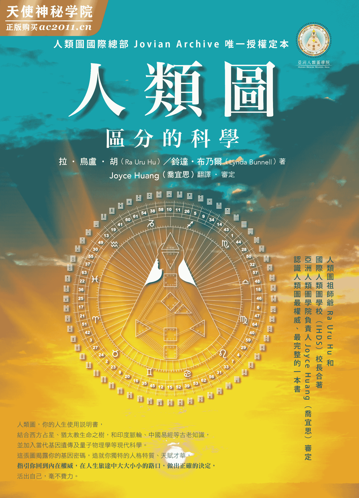

### 献词

此书谨献给拉．乌卢．胡

人类图系统的创始人和传讯者

也献给我们的子孙，

以及所有未来的世代。

#### 来自拉．乌卢．胡的讯息

**给这本书的读者**

**致想活出自己的人：**

人类图提供对天生本质的精密理解。伴随理解，会是真正的改革——生命的重组与意识的觉醒。人类图提供了一套独特的方法，依照你的设计而量身订制，能将你从“非自己”的制约中释放出来。它就是策略与内在权威，是转变的催化剂。

你要明白这门知识需要亲身试验，的确有一条“路”，但你要亲自去走。让这本书来引导你，如果这对你而言是正确的，你会知道的，请踏上你在生命中，最奇特的旅程。

拉．乌卢．胡
西班牙，伊维萨岛
二〇一一年，三月一日

### 拉．乌卢．胡（Ra Uru Hu）

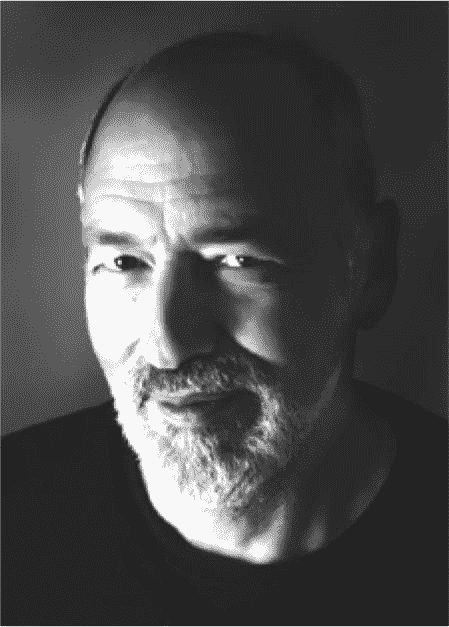

##### 人类图的创始人，人类图系统的传讯者与教师

拉．乌卢．胡，原名罗伯特．艾伦．克雷考尔（Robert Allan Krakower），出生在加拿大蒙特娄，在一户书香门第的上流中产阶级家庭中排行第四。他热爱艺术，求学过程中就开始作曲和演奏，透过音乐表达自己，并以此为嗜好，直到离世。他取得乔治．威廉爵士大学（Sir George Williams University）的文学士学位，但职涯中曾从事商界的广告经理、杂志出版商和媒体制作人。

一九八三年某一天早上， 他离开家人，以及原本身为企业家的快速节奏，亦即，他离开了原本的生活，就此“消失”。几个月后，他发现自己在地中海、西班牙东部海岸、美丽的温带岛屿伊维萨岛上。这座小岛，是他做为拉．乌卢．胡“真实”生活开始的地方，他总喜欢称它为“伊甸园”。

一九八七年一月三日晚间，他和“声音”相逢。那经验极为可怕。声音说：“你准备好开始工作了吗？”接下来是毫不间断八天八夜的工作，他详细记述下来，成为目前为人所知的人类图系统。拉称这段遭遇为警钟，从中他学习到自己之前对人类本质、宇宙，以及事物运作的臆测，是如此盲目与愚昧。

拉将自己定位为人类图系统的传讯者，这是他留给这世界的遗产，他自从遇见人类图后，全心奉献自己，将这门区分的科学传播给全世界。他在伊维萨岛上生活与工作，享受教学、玩音乐、园艺，并与他的太太、三个孩子及孙子一起生活。

就像拉常说的：“不要相信我所说，你要亲身尝试”。现在，世界各地有成千上万的人，运用这套人类图系统，发现它准确揭示出生命的运作形式。

拉于二〇一一年三月十二日清晨五点四十分在自宅离世，距离他六十三岁生日不到一个月。

### 铃达．布乃尔（Lynda Bunnell）

##### 人类图教师以及国际人类图学校校长

铃达．布乃尔是国际人类图学校校长。自一九九九年起，便与拉．乌卢．胡密切合作，是传授并训练全球人类图分析师与教师的先驱，这包括由拉在二〇〇三年重新架构全新教育方针，并开设第一班的分析师课程。二〇〇五年，她参与首批线上教授人类图的教师群，与拉一起在虚拟的网络空间，教授来自全球的学生。二〇〇六年，在拉的要求下，她重新引入“你的人生使用说明书”指导训练课程。铃达是现今线上训练课程中，许多训练方法及模式的先驱，同时也是《你的人生使用说明书》这本书“学生与教师手册版”的作者。

二〇〇六年，拉邀请她担任国际人类图学校的院长，并于二〇一〇年六月，完全将学院托付给她，包括他的教育计划，以及在人类图系统之下，维持全球一致性的教育准则。铃达是充满热忱的先锋者，志在将人类图推广至全球各地，她支援与扩展全球人类图社群，全心全意培育学生与专业人士，全心奉献自己，延续拉传授给她的人类图系统。

“我和拉一起工作十二年，我能成为他的私人学生，真的非常幸运。我们为了人类图系统的知识细节，以及他对人类图的愿景，几乎每天交换意见。他让我明白，维护他被授予的知识，并延续其真确性，是多么重要的一件事，同时他也告诉我他的梦想、希望，以及对人类图系统的整体愿景。共同经历这过程中的种种，他为我的人生带来转变，并改变了我看待周遭世界的方式。此外，他将必要的工具传授给我，让我能将这门知识带给需要的人，我对他充满感激。”

铃达的背景包括身为女实业家，三十余年的丰富资历，以及对灵性与超自然研究的热情。她在南加州长大，目前仍定居在此，她拥有两个孩子，以及四个孙子。

## 中文版序一

Jacqueline Riley

传统科学中，并没有所谓的“官方”版本。然而，人类图系统属于区分的科学（Science of Differentiation），这是一套庞大复杂的知识，透过传递而来。所谓“传递”，指的是这套知识是以八天的时间，“下载”给拉．乌卢．胡这个人，而他终其一生，皆致力于向全世界传递这门学问。现在，每一个人皆能以科学的方法，加以深入了解：透过系统性的观察、测量与实验，形成假设后，再测试并修改。希望借此过程，让真正的自己得以朝更高层次的觉知，敞开心胸、接受并理解，因而亲身体验属于自己的人生。

各种教育的源头，其最大的差别在于对涉及的理论了解到何种程度，以及是否能妥善应用这些理论。我们身而为人，各自具备独特的设计，而面对不同源头之间的差异，可以是细微难辨，也可能是天差地远。

由拉所传授的正统版本信息，亦即经过认证的人类图专家所传承的内容，和那些未经过认证者所教授的版本，有很大的不同。我们想提出适用于所有情况的三个重点：正确的观念、原本的用语、认证所需的时间／深度。

人类图里选择描述相关概念的字词，具有非常特定的格式与频率。字词与振动频率相关，具备特殊的沟通结构，当中蕴含透过拉所传送的知识与其精髓。 如果你小时候玩过传话游戏，你会明白当一个特定的讯息，从一个人传至下一个人的时候，会产生扭曲。每个向拉学习的人，仅一步之遥，皆有幸取得最靠近源头所传递的知识，而每个向拉的学生学习的人，所接收到的讯息里难免就会多了点杂音。我们建议你尽可能接近源头来学习这门学问，与具有官方正式认证的人类图老师群学习，来取得相关认证，好将杂音降到最低。学习人类图，就像是学习新的语言，许多字词都有其精准的意义！

人类图之所以受欢迎，是因为拉所建构的信息，让愿意亲身实验的人，皆能体会到其准确性。我们每一个人都如此不同，若准备好进一步亲身实验，必须探索每一个相关的面向，做出“区分”。这是一辈子的历程，透过每个人各自获取知识的独特方式，以及不断学习与发掘，才能观看与分享彼此的体验。选择 Jovian Archive 人类图总部来学习，并从拥有正式授权的各国分部，取得人类图相关的认证资格，能让你拥有这门知识的纯粹与深度，从最高的层次，对你和你的人生带来重大影响。若你能专注于内容中正统的语言，并以拉．乌卢．胡原先设定的教育型态与时间的长度来学习，那么在使用这套复杂，但又非常实际的系统时，你便能获得满足。

分散于世界各地，所有正式获得认证的人类图专业人士们，共享这门足以带来剧烈转变的学问，我们拥有十三所正式获得授权的国家分部，以及 Jovian Archive 人类图总部，与国际人类图学校，负责并确保这门知识会被完整传递。虽然如此，拉从不希望任何学生模仿他，而是希望他们各自去探求字词背后的意义，与其能量的流动，然后以自己独特的方式，表达出独到的理解。市面上有些宣称人类图的书籍，并未获得拉，或 Jovian Archive 人类图总部之授权，而那些作者们并未具备相关教学资格，因此经常散播错误信息。

拉所创建的教学结构最具公信力，以培养出专业能力的分析师与老师为宗旨。一旦获得认证，人类图专家们就能根据他们个别独特的觉知，进行人类图的艺术。每位获得认证的人类图专业人士，皆同意不会修改、增加其他的信仰结构，或改变人类图系统，如此一来，才能以我们引以为傲的智慧财产及其形式，继续传承下去。

人类图体系是关于一个人如何做出决定，同时接受你自己与其他人原本的模样。

而目前所面对的困境在于，这些使用混淆消费者的术语、未得到授权的来源，以“人类图”为名，行销自己版本为实，以错误的方式呈现整体的系统。倘若没有一套标准，来确认知识是否遵循并源于正统性，消费者根本不知道差别何在，不幸的是，这极可能破坏人类图专家与系统本身长年来所创建的声誉。这就像是当你寻找专业的针灸师，其背后有一套运行体制，以确保他们拥有执行中医治疗的资格，而人类图体制也是如此，唯有获得认证的人类图分析师与老师，才能提供给你适当的谘询与协助。

觉知，源于与自身独特的真实合而为一。现今社会缺乏耐心、不断寻找捷径与立即渴望获得满足的现象。见证了“非自己”的种种辩解、合理化，以及谎言，是如何嚣张运作着。脑袋的层面乐于说服人们何不采用最简单的方法，殊不知因此制造出一张罗网，让陷入其中的人浑然不觉，不知不觉就成为其中的受害者。

目前所认可的认证标准，要求人类图分析师或老师须完整完成相当长的学习时数：一个获得认证的分析师（最初的层级是可以解读人类图），至少需要三到五年的学习，并跟随你的策略（Strategy）与权威（Authority）。这段时间正是去制约中，第一个七年的一半，改变“非自己”的行为，让人得以与自身正确的频率一起共振。你的细胞需要时间，清除旧模式，以正确的方式运作。若要让个案解读达到最好的效果，分析师必须以其专业的资格发言。透过深刻了解人类图体系，并以个人的内在权威发声，经由自身设计的独特性，将一切该如何运作的觉知带到这世界上来。当分析师亲身体会自己已然正确地活出其本质所带来的惊人影响，那么，他们本身便成为充满可能性的典范，其独特的共振，将透过他们而传递至客户的那一端。

要成为老师，熟知这本书里所涵盖的知识，需要多年投入，要精通则须更长的时间。铃达．布乃尔（Lynda Bunnell）投入超过十六年的时间，全心致力于学习，并教导人类图体系的相关课程。其中她更有十二年的时间，以拉的私人学生身份，与他密切合作。为此 Jovian Archive 人类图总部将全力支持这本书，期待各位在书中寻获珍贵的宝藏。这是唯一一本与拉．乌卢．胡合作完成的书，也是人类图的世界里可取得、最全面并独一无二的资源。Jovian Archive 人类图总部很高兴透过 Joyce Huang （乔宜思）的专业翻译，使得这本获得授权的人类图书籍，诞生出中文的版本。

真正重要的是，每个人都能依照其独特性，真实活出自己。我们希望各位也能达到这样的境界：真心相信自己的决定，与更高的觉知共存。现在该是时候，活出你自己，感受你生来就该体验到的满足、成功、平静或惊喜，不是吗？

欢迎进入人类图的世界！

Jacqueline Riley Jovian Archive 人类图总部负责人
Andrea Abbay-Abbay Jovian Archive 人类图总部公关主管

## 中文版序二

Joyce Huang（乔宜思）

三年前，我翻译并校定完《人类图：区分的科学》，这本书推出之后热卖，再版又再版，获得很好的成绩。三年后，这本书要改版了，我算了算，光阴飞逝，今年是我从事人类图的第十三年。

我热爱人类图，不仅止于知识层面的浩瀚，我更喜爱这门学问看待每个人的方式，这门知识非常有趣，它很简单，每个人都可以透过粗浅的了解，明白什么是最适合自己做决定的方式，运用在日常生活中，开始实验应证。但同时，它也很困难，若想在知识体系层面深入了解，往往会在开始学习之后，明白自己不知道的其实还很多，师父领进门，修行在个人，个中的道理与体会，每个人都会有自己的过程与体会，时而疑惑，时而恍然大悟，越来越了解自己，但愿也能越来越同理他人。

回想这一路走来，我从国际人类图学校（International Human Design School）取得人类图分析师认证资格，获得人类图总部（Jovian Archive）亚洲中文区域独家代理权，成立“亚洲人类图学院”。在台湾、中国、香港与澳门地区全心全力推广人类图，这条人类图中文化之路很漫长，我认知到若要让更多人可以理解，开始学习人类图，那么人类图中文化的过程，除了在语言上翻译成中文，我们需要深入理解这门知识，真正在文化层面找到对等与精准的语汇，以浅显易懂的方式传递出来。如此一来，除了翻译的专业度，还需要毅力、耐心、坚持，以及无以伦比的天真与热情，否则是不可能完成这项难度极高、几近不可能的任务。

这个不可能的任务，这本书的翻译审定，几经延宕，最后顺利完成，经历初版再版改版，是不可思议的体验。这本书可以完成并受到大家喜爱，在此我要谢谢祖师爷 Ra Uru Hu，没有源头就没有这一切，感谢我的老师 Lynda Bunnell 的支持与信任，赋予我这么重要的任务，谢谢人类图总部负责人 Jacquline Riley 的强力支持，谢谢劳苦功高的编辑群：喻小敏、林毓瑜、王晓莹、李明瑾，谢谢协助翻译的同学：曾琬迪、M. Su、狗男、Hana Tseng、周宁静，如果没有你们与我一起努力，一同做梦，美好的奇迹不会发生。

推广人类图一开始是我一个人的梦，现在是一群人的想望，必定是内在的意向与愿力，牵动并链接了更高层次的力量，引动并铺排这一切依序开展，所有沿路上美好的相遇、善意的支持，都让人充满感谢与感恩。

想像有一天，我们不但清楚明白自己的设计，也能了解并尊重其他人的本质，适才适性，以正确的方式来教养下一代，那么就再也不必浪费力气在误会与冲突上，人与人之间可以温柔相待，也能活得更有智慧更聪明更省力，那会有多不同，那将是一个多么美好平和的世界！基于这个简单的想望，亚洲人类图学院为此主旨而设立，学院除了定期提供培养人类图分析师的正规课程，也提供一系列人类图主题工作坊，让更多对人类图有兴趣的朋友，能有机会学习正确的人类图知识，若你想进一步学习人类图，研究人类图，或者你与我一样热爱人类图，欢迎你来参加学院的课程，加入我们的行列。

回顾过去一路走来，我相信有更高的力量，也是宇宙的铺排，此生能为自己热情所在，努力工作，热烈付出，是难得的幸运，总觉得此生能够遇见人类图，实在太幸运了。我体认到没什么事情是容易的，最困难的其实是一个人能不能顺流而活，不管做对或做错，我问自己学到什么？我问自己有没有更明白，更圆融？有没有了解不必张牙舞爪声嘶力竭，可以好好活？活着就是有喜怒哀乐，有时遗憾，有时惊叹，有时愉快极了，有时忧伤，有时很是烦躁耐不住气，在挫折之中学习，有时又觉得自己是被眷顾的幸运儿。无论如何，人生这条旅程，无须永远深陷于黑暗之中，也不必刻意过度阳光正面，只求能无入而不自得，坦然做自己就好了。

若这个世界每个人都做好自己，活出精采的人生，该有多好。

但愿这本书对你来说是一个神奇的起点，为你打开一扇全新的门，开始能以不同以往的角度去看待自己，看见这个世界，如果回到内在权威与策略是一把神奇的钥匙，按图索骥，终于会回到内在的真实。

别无选择，爱你自己。

Joyce Huang（乔宜思）
亚洲人类图学院负责人

## 人类图系统对全球的影响……

我终于可以非常荣幸地说“都在这里了”。若你想寻找人类图系统中，最全面且具权威性的知识，那这本书就是为你而写。在此以系统化并且逐步陈述的方式，自人类图的基础知识到每个人的细微差异，乃至我们如何与自己的真实人生相遇。这是唯一获得人类图创始人兼首位学生，拉．乌卢．胡积极协作而成的出版品。我十分推崇这本书。

——J.R. Richmond，Sedona，亚利桑那州，美国，IHDS（国际人类图学校）主席与现任教务主任

在近几年，我将人类图系统运用在自己的身上，以及成为我个人教学的资源。身为老师与内在自我发展的辅导员，这个系统是我所见过，最准确且值得信赖的工具之一。一旦理解这门知识，就能赋予我们个人独特的洞见，在面对日常生活所有议题。透过了解自身设计，你会在经验中找到新的慰藉。你将学会如何单纯“存在于”人生中正在进行的一切。 铃达将这门具有诸多面向的人类图系统传承下来，并且找到方法，将之简化为有意义、容易理解的书。这是拉．乌卢．胡所发展出来的系统，让我们全然投入其中，在未来活出自身的个体性。

——Dr. Barbra Dillenger，Del Mar，加州，美国，医学博士，超个人发展，转念服务创办人

自从接触了我的设计，我依循自己的内在权威来做决定，个中的诚实性与信任度，都与我爱自己的程度相辅相成。诚实就是爱自己，对我来说，它经历多重火焰的试炼。有时候真的非常不舒服，然而，我发现它通往了自由与责任，这是唯一且真正的道路，我毫无选择，只能成为真正的自己。人类图系统就像是真我的维基泄密。它道尽了完整的真实，并传达我的每一个细微之处，毫无遗漏。

——Becky Markley，西雅图，奥勒冈州，美国

人类图，它为我的人生带来什么？这答案实在很简单，却也复杂到难以解释。简单是因为它跳脱制约与头脑曲解的认定，让我真正知道自己是谁！人类图是如此完整的系统，与探索我是谁有关，如同诉说着一个永远说不完的故事。这是我内在的真心话，而且我说了好几次：人类图是我生命中发生过的，最美好的事。

——Idalina Fernandes，波多，葡萄牙

我有幸因人类图解读，对这辈子要做的事，有了深刻的见解。人类图给了我很多礼物，特别是对下决定，以及制订课程的觉知。我邀请所有致力于个人觉醒的人，敞开自己，接受人类图这强大的礼物。

——Dr. Roger Teel，资深部长，迈尔海教会，莱克伍德，科罗拉多州，美国

在进行这项计划时，我又再次震撼于人类图系统的美丽、范畴与广度，对于找回自己，它是如此简单、实用又有效。人类图为每一个人量身订制，同时终止了我的寻求，带我重新获得心中的平和。

——Donna Garlinghouse，亚历山纳，明尼苏达州，美国

这十几年来，人类图成为我个人一趟非常个人且私密的旅程。了解，并活出我的独特性，这为我的生活带来接纳与恩赐。我不但活出自己的人生，也接纳我的家人好友与其他人，做每个人得以做自己。这真是一项礼物。

——Cathy Kinnaird，温哥华，华盛顿州，美国

人类图给了我一套独特，却也系统化的观点，让我了解自己、我生活中其他人，以及世界上的人们。它提供许多不同层面的觉察与理解。我特别热爱判定某件事为何会发生，以及发现“原来如此！”的那一刻。我认为它对改变非常有用。无论人们决定如何使用它，不管是使用少数基本指引，或者潜心研究成为认真的学生，对于自我探索，人类图都是一套有用且引人入胜的方法 。

——Martha Morow，Vista，加州，美国

多年来，我尝试过许多不同的方式，也和很多优异的老师们一同工作，从中获益。就人类图而言，它让我领悟到自身的个体性。举例来说。当我知道我是“社交/隐士”，我才知道，个人时间对我多么重要。当我早上起床，煮一壶咖啡，接下来的半小时静静阅读，不受打扰。那表示我想独处，同时不打算与任何人接触。我太太花了一段时间，才习惯这一点，她现在可以尊重我的需求。当我们了解彼此的合图，我们夫妻终于了解在餐厅之类的公众场合交谈，会增进我们相互沟通的有效性，对我们而言，这也赋予了外出用餐全新的定义。这套系统真棒！

——Michael MaKay，Del Mar，加州，美国

人类图为我的生活带来巨大的影响。透过人类图，我找到为我的本性而战的方法。借由试验，以及拥抱我的独特设计，我不再比较，也放下了内在需求，不再为了迎合他人，而想成为“更好的”自己。它带来了尊重的新感受，也让我接受他人的不同之处。分享这些信息极有意义。它让我认知到，当一个人脸上发亮，绽放笑容，或许就是其真实自我，首次崭露的时刻。

——Erica Teel，Lakewood，科罗拉多州，美国

我非常享受能学习更多人类图的相关知识。它让我对于自己的个性更有觉察， 也更深入了解自己如何被制约，以及我原本真实的模样。现在当我同时面对内在真正的自己，以及头脑的声音时，这份觉知让我懂得如何在每一天的经验中，做出妥善的处理。我也将解读运用在我的孩子上。充满了解他们是什么样的人，非常重要。我希望人类图能让我们的沟通更顺畅。学习这门知识，同时实践所学，真的很有趣。

——Kathy Kinley，Carlsbad，加州，美国

我早在二〇〇四年即接触人类图，并非幸运而已， 虽然我真的觉得自己很幸运。它让我的生活丰富多彩，包含生理上的满足、心智上的激励，以及精神上的丰盛。经过认证后，我将人类图分享给我的教练、客户、与人类图的学生们，也为他们的生活带来真实的改变。人类图是一套高度进化的系统，它带来的成长，远远超过我所能陈述（也许对你也是）。对我来说，它的力量在于，尽管在头脑有限的决断，以及过往的制约下，我们依然能在日常生活中实际运用它。它超越了我的期望，让我能安全融入人生并享受它。人类图鼓舞我，照亮我，见证了我的光，并让别人都看到了。

——Carol Zimmerman，Los Gatos，加州，美国

谢谢拉，谢谢铃达，谢谢人类图让“我的”人生回来！

——Bethi Black， Ashland，奥勒冈州，美国

**在这本书快要完成的时候，拉．乌卢．胡为本书读者写了以下这段序言：**

随着人类图系统日益普及，有些未经授权的书籍也跟着出现。我极少鼓励并授权我的学生为这门知识写书。我很高兴能有一部兼具品质和深度的作品可以提供给大众，而且是由人类图学校主要的教育者所撰写的。多年来，我一直看着铃达的成长过程，从学生、分析师、教师，最终成为国际人类图学校的校长。她持续做出重要的贡献，让这门知识愈来愈完善，在这个世界成长茁壮。

——拉．乌卢．胡
西班牙，伊维萨岛
二〇一一年二月八日

## 序

铃达．布乃尔

想像一下，如果你出生时还附带一本使用说明书，对你和你父母来说，你的人生可能会多么地不一样。想像一下，如果你小时候被鼓励与内在深处的某个部分链接，会是怎样的感觉——那个部分总是知道什么适合你，什么不适合你；那是一个你可以信任的地方，无论你在生命中遇见什么，都能让它来回答“要”或“不要”。想像一下，如果这样该有多好：你能知道自己生来有多么特别，跟别人有多么不同，并且透过爱你自己，不跟别人比较，来歌颂这个独一无二的你。再来想像一下，如果你的家人跟朋友现在都来庆祝，并鼓励你活出独特的自己，这会是多么美妙的一天。这就是人类图系统所带给你和后代子孙的可能性。

虽然我们多数人出生的时候，人类图并不存在，但它依然可以影响和转化任何年龄的生命。关于这个不可思议的系统，我的个人经验源于四十出头的时候。一九九〇年代，我是南加州一个成功且信誉卓著的商人，我以为自己已经获得任何人所需要的一切——但我知道我并不快乐。我的想法与内在的真实分离了。无论去探索任何自我发现的系统，都无法让我成功地与内在链接，填补我内心的空虚。

我的旅程新篇章始于一九九八年。当时，我正在西班牙南部渡假。我的旅伴跟我一样是个灵性探索者，她带了一些录音带在身上，内容是描述一个关于个人转化的全新系统。我们一边开车在山坡上漫游，一边听着这些录音带。我完全没料到，说话的男人在地中海小岛上（距离我们当时所在位置只有几英里远）的惊人遭遇，会彻彻底底翻转我的人生。这个男人的名字是拉．乌卢．胡，而这套系统是人类图。

我朋友花了点力气来说服我。不过，当我一收到人类图的读本时，马上就被吸引了。我发现人类图就是我一直在寻找的东西，我头也不回地离开了事业，然后阅读和聆听所有我能找到关于这门知识的一切，让自己沉浸其中。我参加了私人的读书会，并且跟随拉在欧洲和美洲学习各种课程，每次几天或是几周。这是一个不可思议、重新定位生命的经验——一步接着一步，透过一个又一个的决定，卸下我对自己和人生的深刻误解。

当我臣服于内在的智慧，生命就带我朝着意想不到的方向，前往令人心满意足的目的地，那是我绝对想像不到的。不过，内在转化也有深刻而困难的时候。人类图不但告诉我为何人生早期的成功会让我感到空虚，也带我走上一条独特的道路，来到现在这个时刻，为我的工作感到满足、有挑战性和满意——其中一部分就是撰写这本书。这门科学是人类珍贵的宝藏。多年来，我一直看着人类图的发展，而如今我还是同样热爱这门奇妙的人体知识，就像我第一次遇见它的时候一样。随着人类图广为流传，世界各地的其他人也开始出版相关资料，于是拉邀请我跟他合作，编撰一本内容正确而全面性的书籍，精确地记录这门知识。

当我们正准备要出版这本书的时候，拉突然在西班牙伊维萨岛的家中去世。从一九九九年以来，他一直是我的老师、导师和朋友，而我会永远怀念他伟大的存在。他亲身实践所教授的知识，并且以自己的生命经验来验证这门学问。当我致力于这本书的出版时，并不知道它对我的意义会延展成一篇颂歌，来纪念这个男人和他对人类的贡献。

多年来，人类图向我证明了它自己，从没让我失望。它的准确性令人难以置信，而且能够带来深刻的转化。透过人类图，现在已经有数以千计的人踏上觉醒的道路，找到了属于自己的真实。

你也一样，一旦你开始了解自己的独特性，知道自己不需要跟其他人一样，你就会活出原本的自己，体验到令人兴奋的自由。只要你开始活出自己最完整的样子，永远都不嫌晚。

欢迎你踏上这段旅程。

铃达（Lynda Bunnell）
国际人类图学校校长
美国加州卡尔斯巴德，二〇一一年

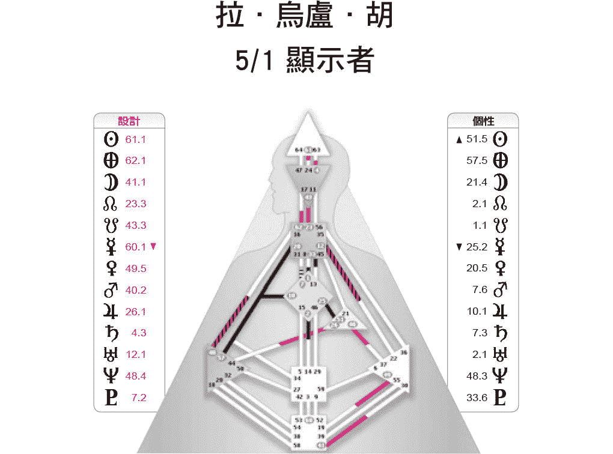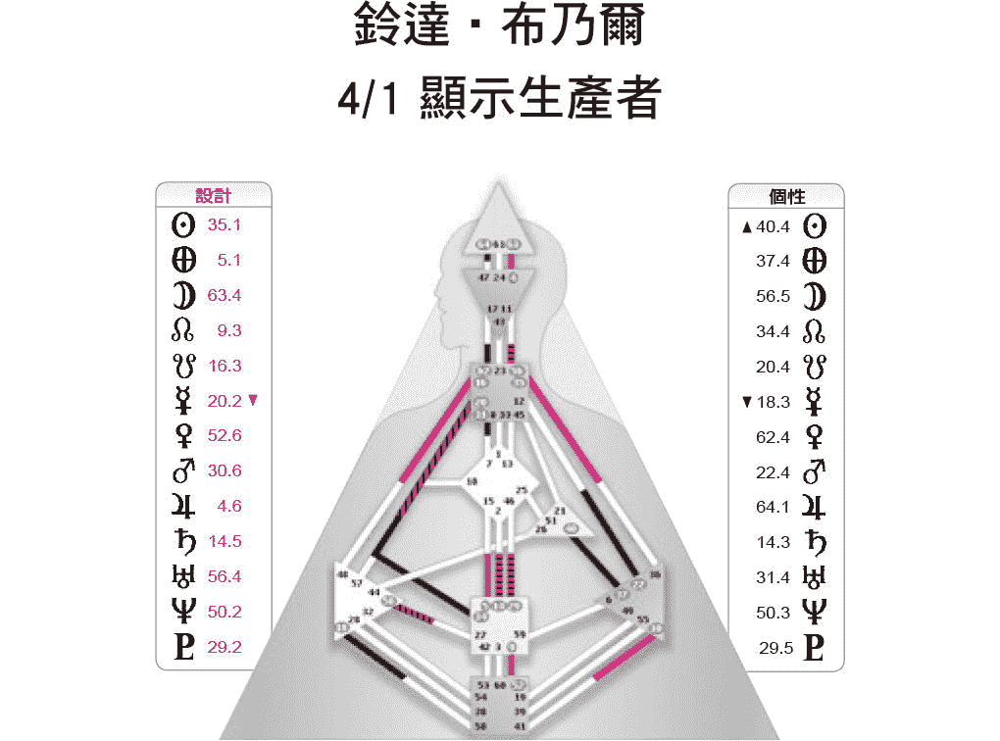

## 致谢

首先，我要感谢拉．乌卢．胡。多年来，我们花了很多时间合作各式各样的计划，然后我要感谢我的幸运之神——命运和我的轨道把我拉向这个特别、杰出又与众不同的人。他把真实、永恒而有意义的突变，带到我和好几万人的生命里。我预见他的遗产将继续走向遥远的未来，影响许多世代。我们对人类图有共同的爱，而我很欣慰过去这些年来，我一次又一次地对他表达我的感激之情。他是一个好人，从未想要成为被人追随的大师，而且他的学生都知道他多么爱自己的家庭和生活。一个人来到这个世界成为号角，为这样的知识体系播下种子，真的很难得。有一次，我跟他谈话，他对我说：“表达感谢永远不是坏事。”而我很感激他。我也非常感谢拉的家人，他的妻子 Ambuja、女儿 Sarah、女婿 Mau、两个儿子 Loki 和 Jiva，还有他的孙子 Kian，提供他一个充满爱与支持的家庭，让他能够做他的工作。如果没有他们，人类图就不可能出现。

这本书以爱书写而成，而我们也费尽心力让它问世。我必须特别感谢 Donna Garlinghouse 作为本计划的特约编辑和顾问。随着这本书逐渐成形，Donna 和我一起工作，在过去这几年间，一步一步地前进。她是“左脑人”而我是“右脑人”，因此创造了非常棒的合作成果。Donna 是大自然的力量，也是老天赐给我们的礼物。她让我在困难时能够把事情看清楚。她是一个了不起的女人，我们很幸运有她作为团队的一员。

还有一个发自内心的感谢要献给 Bethi Black。她是我们的顾问和编辑，并且设计了装帧和版面，对本书的贡献极其宝贵。虽然我们一起合作过其他计划，不过当我去年（二〇一〇年）夏天打电话给她，邀请她协助学校的工作时，我真的没想到最后会一起合作这项计划。回过头来，我才明白这是多么完美而神圣的安排。在最后的冲刺阶段，Bethi 几乎搬进了我家，好让我们一起吃饭、呼吸、睡觉、工作，把这本书做出来。过去这一年在许多层面上，如果没有她，我根本不可能熬过来。

我还要谢谢：“你的人生使用说明书”课程手册的特约编辑 Becky Markley，你观察入微的锐利眼光，给予我们许多回馈和编辑上的帮助；Cathy Kinnaird 和 Carol Zimmerman 带来的启发、爱与支持；Genoa Bliven 真诚的慈爱之心，了解去保护并尊重拉的事业和遗产有多重要；还有我们社群里的珍宝 Mary Ann Winiger 和 Randy Richmond，为我们所有人提供了客观的指导。

Sarah Krakower 与 Maurizio Cattaneo 运用人类图的概念，设计出非常棒的书封和令人惊艳的图像。拉以前常说：“人类图是一种视觉媒介，一本让我们了解自己真实本质的视觉化指南。”而 Mau 显然理解并衷心拥抱这个概念，如同我们在书中所见的美丽图片。Sarah 和 Mau 配合得很好，他们的爱与能量是这本书的一部分，这么说一点也不为过。

社群中还有很多朋友和伙伴在许多方面做出贡献，项目多到我无法一一说明，只好在这里列出他们的名字，包括了国际人类图学校的全体教员：Bethi Black、Glenda Anderson、Deborah Bergman、Genoa Bliven、Alokanand Diaz、Carol Freedman、Martin Grassinger、Cathy Kinnaird、Josette Lamotte、Becky Markley、Dr. Andrea Reikl-Wolf、J.R. Richmond、Peter Schober、Ilse Sendler、Dharmen Swann-Herbert、 Leela Swann-Herbert，以及 Carol Zimmermen。另外我也想感谢人类图各国分部的负责人：Glenda Anderson、Richard Beaumont、Genoa Bliven、Nicholas Caposiena、Maurizio Cattaneo、Viviana Farran、Unnur Inga Jensen、Sarah Krakower、Josette Lamotte、Spyraggelos Marketos、Inaki Moraza、Meris Oliveira、Virginia Page、Ilse Sendler，以及 Koji Ueda。

感谢我的妹妹 Kathy Kinley、女儿 Alisa Hawkins，还有女婿 Matt Hawkins，谢谢他们的爱、支持与鼓励，还有耐心——因为在这本书接近终点时，我的生命都耗在这个计划上；我也要谢谢我的孙子和孙女，Sara、Sabrina、Kingston 和 Landon。我们一同共度如魔法般的时光，滋养了我的灵魂，也是我非常需要的慰藉。我还要感谢 Jerry 和 Ida Bunnell 把我带到这个世界；John 和 Shirley Barry 多年前用爱的羽翼守护我；Michael 和 Barbra MaKay 的鼓励和启发；Martha Morrow，一个支持我的亲爱的朋友；还有我的投射者朋友 Judy Thompson，谢谢你坚持问了我三次是否想要阅读人类图的信息。我要特别感谢一辈子的好友和每天的知己 Dona King。这个计划进行时，她从头到尾一直在我身边，每天都问我：“你今天要做那本书的工作吗？”如今工作已经完成了，我不知道现在她会问我什么！

虽然有太多人值得感谢，不过为这本书贡献最多的是人类图系统的学生、分析师与教师——他们是真正的英雄和先驱。只要我们每个人都根据自己真实的本质而活，就能让世界一点一滴变得更好。如果没有你们在人类图社群里从事伟大的工作，人类图不可能发展到今天的地位。我知道，我的心一直被你们每个人以某种方式所触动。人类图系统以惊人的态势向外扩展到全世界，而我们站在已离世的前人肩膀上，鼓舞并支持那些要加入我们的人。拉离开地球的那天，把棒子交到我们手上，而现在将由我们接续他所开创的事业。

“人类图系统不是一个信仰体系。它不会要求你信奉什么。它既不是故事，也不是哲学。它是具体的地图，你的基因密码图，告诉你如何通往存在的本质。它能深入解释人类本质运作的机制，经由每个微小细节，完整揭露我们的本性，这种能力无比奥妙。人类图打开了一扇门，通往‘爱自己’的潜能：这是对生命的爱，也是透过理解之后，对他人的爱。”

——拉．乌卢．胡

## 引言人类图系统

借由认识这套知识体系，你将展开一趟冒险旅程；一趟将完全体现“做自己”的发现之旅。

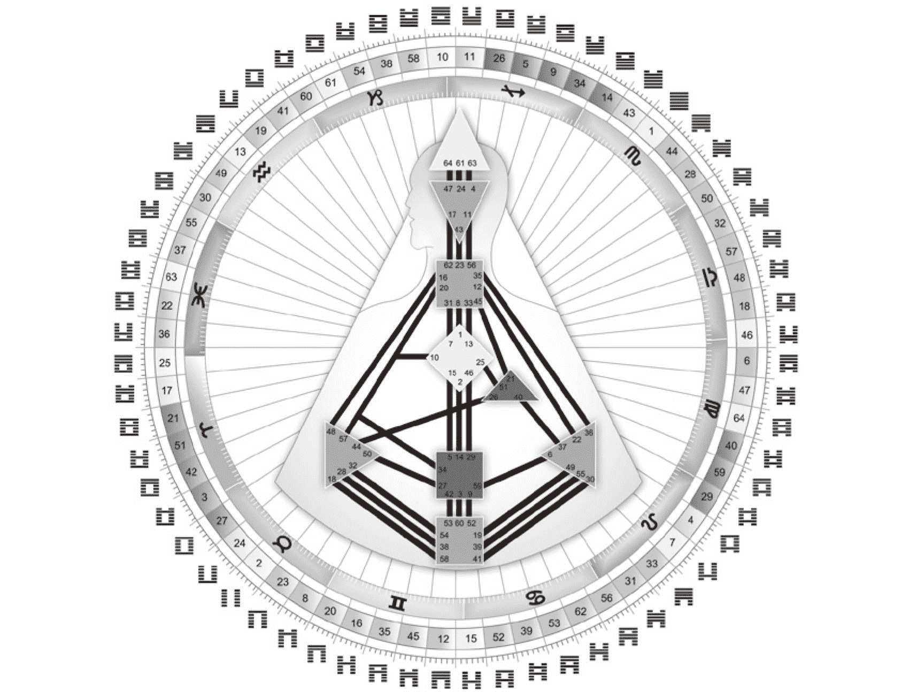

#### ▸ 活出自我与主张个人独特的生命转化实验

人类图系统是区分的科学。它告诉我们，每个人来到地球上，拥有独一无二的设计，以及特别的使命要完成。在我们的基因阵列中，蕴含着无穷无尽的可能性，造就各式各样个体的独特性。人类的变异性数以百万种，可是我们每个人都有一个特定且独一无二的人类图结构，具备清楚的“策略”，让我们毫不费力地与自我的独特密合。人类图系统不会要你信奉什么。它邀请你参与一个可能转化生命的生活实验，并且提供让你活出自我所需要的实用方法和信息。如果没有这些个性化（以及个人化）的生活实验，人类图就只是一个复杂的系统，以吸引人的信息来娱乐头脑而已。

如果看了成千上万张图，就会发现一个明显的事实——没有一模一样的两张图。即使某人的图跟你的非常相像，那也不会是你。不过，要如何确定我们独特的设计呢？

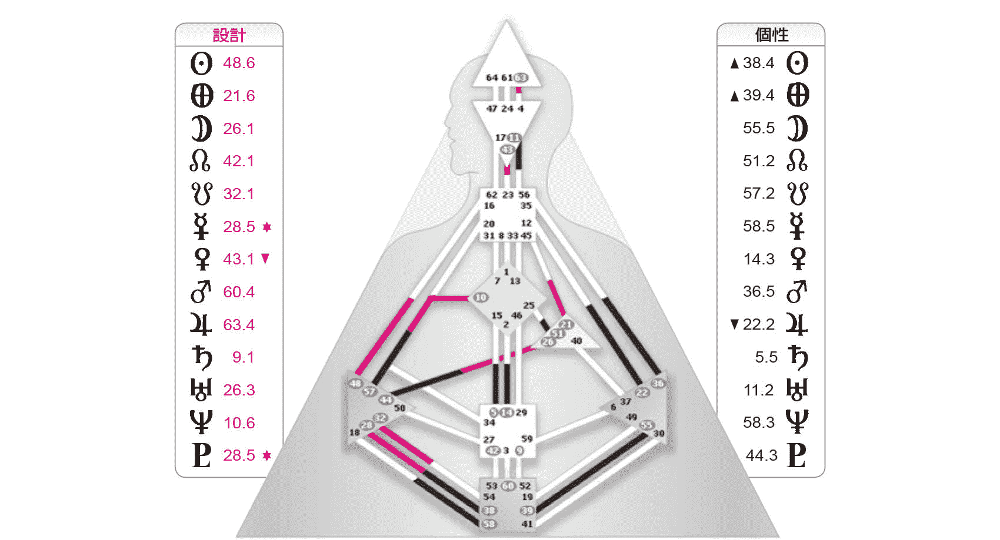

人类图是一份精致的地图，也是一本使用手册，让你看见我们的基因设计如何与世界结合，我们独特的内在指引系统又是如何运作。过去，我们从未清楚看到自己的每个部分；我们意识与潜意识的部分、没有人能从我们身上拿走的部分，以及我们过去被教导或被制约，以为属于我们的部分，其实并不然。

就像拉．乌卢．胡常说的：“你可以依靠的，在你过往人生中从未依靠过；你不能相信的，这辈子却一直试图去相信；你一直相信的，向来就不是你；而你一直忽略的，始终都是你。试着去相信真正的你，然后看看会发生什么。”我们每个人都注定跟别人不一样。现在我们能够明白，并且触及那些差异了。我们来到这世界上，是为了以自己的方式活出生命，表现自身的真实。理解这一点，就足以让人卸下肩头的重担。我们有多常拿自己跟别人比较？当我们还是小孩的时候，多常被父母、师长或同学拿来与人相比？这让我们内在深处留下烙印，以为做自己是不好的。当我们在童年时受此印象制约，会发现自己尝试改变，或调适行为以迎合他人，这让我们离自己原本的样子愈来愈远。若开始了解并接受自己的独特之处，内在的某些部分会敞开并且放松，慢慢地卸下层层制约。而自己注定成为的模样，其内在的本质，将开始浮现。

#### ▸ 第一步是取得你的人类图

阅读这本书，你会希望拿出家人和朋友的图相对照。你可以经由下列任何一个经授权认证的人类图机构，取得免费的人类图：

国际人类图学校（The International Human Design School） www.ihdschool.com

Jovian Archive 人类图总部（拉．乌卢．胡的网站） www.jovianarchive.com

美国人类图学院（Human Design America） www.humandesignamerica.com

澳洲人类图学院（Human Design Australia） www.humandesignaustralia.com

加拿大人类图学院（Human Design Canada） www.hdcanada.org

英国人类图学院（Human Design United Kingdom） www.humandesign.info

亚洲人类图学院（Human Design Asia） humandesign.wiibiz.com.tw

经授权认证的人类图机构（其他语言）完整名单，请见本书第十一章。你也可以在官方认证的“迈亚机制图像处理器”（Maia Mechanics Imaging）下载免费版软件，自行跑出图像，网址为：www.jovianarchive.com

#### ▸ 你的人类图所显示的内容

*   你的人类图显示出你独特的基因设计：阐明你到底是什么样的人，如何做自己，以及如何身处瞬息万变的世界中，成功航行。
*   人类图提供你所需的方法，活出觉知与觉醒的人生——你可以信任一个简单的“人生策略”，可靠地链接你和你个人的“内在权威”，让你时时刻刻做出正确的决定。如此一来，你独一无二的人生使命就会自然展开。
*   你的人生策略会帮助你消除阻力（沮丧、愤怒、失望、苦涩）和恐惧，让你以放松、独特、充满创意且进化／革新的方式过生活。
*   你的人类图会显示你的人际关系动态，帮助你了解自己与别人相处时，彼此如何吸引、产生共鸣和发生冲突。
*   引导你与正确的人创建联结，让你的周围充满可提升活力、支持你的人生使命，并且与你共享真实人生道路的人。
*   借由了解其他人的图，知道身边的人（像是家人和朋友）真正独特且个人的本质，以及如何尊重他们、与他们互动。
*   最重要的是，人类图告诉我们如何为孩子创造最好的环境，让他们活出自己的独特性，学习并发展成独一无二的自己。

#### ▸ 你是谁——四种人类图类型

人类图提供类型、人生策略和内在权威（身体核心的智慧）等工具，显示出你被设计的方式，你可以如何过人生，同时如何与世界互动。尽管人类有数以百万种不同的设计，却只有四种“类型”。每个人都属于其中一种，而且终其一生都不会改变。以下是四种类型非常简短的解释。（关于类型的深入说明，请见第四章。）

**生产者，建造世界的人**，约占总人口的 70%。他们与生命链接的策略，是等待事物来到面前，如此他们便能做出回应。如果他们没有等待和回应，反而主动发起，最后通常会感到沮丧。生产者是地球上生命的动力，他们的设计借由观察自己有所回应的事物，来认识自己。透过回应，他们会在生活和工作中体验满足。而他们所从事的工作就是带给这世界的礼物。

**投射者，指导别人的人**，大约占总人口的 20%。他们与生命链接的人生策略是，等待自己独有的特质被识别，而被邀请参与某事。透过邀请，他们会在生命中体验到认同和成功。如果他们主动发起而未等待，就会遭受抵抗和排斥，最后可能变得苦涩不堪。投射者带给世界的礼物是理解并引导他人。

**显示者，发起事情的人**，约由总人口的 9%组成。他们的人生策略是采取行动之前，将自己的决定告知别人，以便消除阻力。当显示者无法心平气和表现自己时，他们会感到愤怒。显示者的设计拥有强大的影响力，而且是能影响其他类型的发起机制。发起就是他们带给世界的礼物。

**反映者，区分事物的人**，大约占总人口的 1%。他们的人生策略是在做出重大决定之前，等待一个完整的月亮周期。反映者喜爱生命中的惊奇。当他们主动发起而没有运用人生策略，最终会对生命感到失望。反映者被设计为人性的仲裁者，会把不公不义的人性作出仲裁。他们能够清楚区分世界上形形色色的“这个和那个”，这项能力就是他们带给世界的礼物。

#### ▸ 活出人生策略和内在权威的实验

人类图系统在灵性层面的核心价值，在于带来觉醒的可能，这透过真实活出你的独特设计而发生。人生策略和内在权威（本书后面会详细解说）是让你活出自我的入口，由此开始阐明你究竟是谁，并且理解和释出非你的部分。

过去，我们以头脑来驾驭生命，好像它是最终的决策者。如今，头脑不能继续为我们做这件事了。头脑的真正天赋是收集信息和经验，衡量这个、对比那个，思考那些可以与他人分享的独特认知和想法。它只能做这些事，然而，在此同时，它不能为我们做决定。头脑现在正坐在最好的座椅上——以内部观察员的身分，观看一场电影，欣赏生命的风景。

真正推动我们走上生命独一无二道路，是超意识或我们身体的智慧、我们存在的形式。人类图系统揭示我们如何运作，以及如何依据个人内在权威为指导。每个人的设计都有一套独特的方式，依照我们的身体意识来做决定，而每个决定都非常重要，推动我们走上特定的生命轨道。一个错误的决定可能会将生命带往错误的方向，迎向严重的后果。头脑的决策与掷铜板猜正反面（50/50 的机率）无异，这并非值得信赖的个人指导系统。若要在地球上存活，每个人都需要知道如何使用自己的内在权威。这些来自内在深处的决定，能把我们带回原本的道路，或是维持在正确的人生道路上，使我们活出个人的真实，领略真正生命的意义。

人类图系统的觉醒方式与众不同。一旦熟悉了自己的独特设计，并且学会有效运用人生策略和内在权威，你就能立即实验，发现它们可以如何转化你的生命。依照设计活出你的生命，活出自己，你的头脑会开始扮演一个非常不同却更合宜的角色，成为客观的观察者和资源。放手让自己体验，成为一个觉醒和觉知的乘客，会是什么感觉。头脑会参与你自我发现的过程，但不会介入你每天的诸多抉择。人类图提供方法并指出方向，不过是否要使用它，得由你来做决定。

“如果依照你个人的人生策略和内在权威而活，你什么也不用做——该做的事情自会发生，而‘你’不会被干扰。”——拉．乌卢．胡

#### ▸ 真实自我

在这整本书中，我们将不断比较真实自我（或称真我）和非自己。当我们谈到真实自我或真我时，指的是我们纯粹、自然的行为本质，其设计能在这个世界行事作为不受阻碍。另一个在这里使用的名词是我们的“使命”（purpose），也就是我们来到这世上的理由——成为我们生来就该成为的那个人。非自己则是会掩盖真实自我的制约程序。当我们透过自己的人生策略和内在权威，逐渐觉察何谓非自己，便会慢慢意识到真实自我始终存在，只不过隐藏在非自己身后。自我憎恨也源自于非自己；我们痛恨自己的失败，无法符合来自外在的种种期待。当我们可以安定并真实地学会了解而接受——并且实践——我们才能爱自己。

当你更深入认识自己的个人实验之旅，将见证非自己制约的各种变形，以及它所产生的阻力。你愈明白这个道理，愈能清晰看见真我。认识自己是通往爱自己的道路，人类图系统将告诉你如何做到。

人类图着眼于生命的健康、稳定性和方向，这些都包含在我们体内。一旦表现形式（身体）以最佳状态运作，我们的心灵（人格），或说是灵魂，就会透过清晰而温和自在的思想、话语和行动而闪闪发亮。这就是真实——活出我们原本应有的样子。

#### ▸ “去制约”的过程

“去制约”（deconditioning），如同人类图系统中所言，是一个过程，让我们放下不属于自己的部分。这个过程很缓慢，因为它是深刻的历程。当我们重新找回内在权威，改变人生中做决定和航行的方法，我们实际上也改变了体内细胞运作的方式。生命以七年为周期运行着，如同我们体内所有细胞大约七年重新更新一次。当我们开始与自己拥有的本质合而为一，让身体畅行无阻地活出自己的生命，我们便展开了去制约的深刻过程。七年后所呈现的自己，会更接近天生该有的样子。对于成年人来说，开始去除制约并不容易，但就像我们不断听到的那句话——开始**永远不**嫌晚。

早在中国古代，思想家和哲学家就赞成“无为”也是一种做事的方法。如果你活出自己的生命，臣服于内在的导引系统，喜乐自在会油然而生。相较于活在不清醒且迷失在同质化世界的期待与制约中，自己觉醒而觉知，真实活着并与你的设计和谐共存，这样会有意思得多。学习依循你的内在权威来做决定，你和其他人才能够充分受益，因为你会成为自己，而不是另一个人的复制品；这值得我们付出必要的努力、时间和耐心去达成。认识自己**就是**爱自己。我们将在本书中重复讨论去制约这个主题。

#### ▸ 阻力的指标

一旦我们开始透过类型、人生策略和内在权威，真实地活出自己的生命，我们就能够留心沿途所体验到的，究竟是自在还是阻碍。若不断根据理性思维来做决定，进而采取行动，而不是依循人生策略和内在权威，就会感到阻力。持续用头脑做决定，意味着我们活出的并非自己的生命，而这些行为所积累的压力会危害身体、心理和情感的健康。愤怒（显示者）、沮丧（生产者）、苦涩（投射者）和失望（反映者）等非自己主题是阻力的指标，提醒我们已然偏离轨道，没有依循人生策略，也忽略了自己的内在权威。换言之，遭受阻力的是非自己的行为和决定，而非来自真实的自我！如果把这些看成是针对个人，我们会以为所受到的阻力，是别人在抗拒或压抑我们的真我。另一方面，如果开始有所察觉，同时了解阻力如同指标，就会有机会向后退一步，让我们找到重新评估自己的方法、行为和言语。当我们生病、心神不宁或容易发生意外时，我们会明白这些接连不断的外在阻力其实显示了我们的内在状态。当我们活出真实，我们的人生目的将获得解放，完成此生重要的任务，并且带来属于真我的丰厚恩典：满足、成功、平和与惊奇。（这个主题将在第四章有更全面性的探讨。）

#### ▸ 重点——觉醒

人类图是一种新的觉醒方式。它是进入觉知的过程，让我们的身心合一，恰如其分扮演其角色。这个过程需要借由了解我们自身设计的机制，替头脑找个盟友，同时根据人生策略和内在权威活出我们的生命。一旦理解真我和非自己的本质，并且依照个人的内在权威做出人生中的决定，就能放下对头脑的依赖，并放开头脑对生命的控制，让它展现神奇的天赋为众人服务。当我们这么做时，会成为觉知而觉醒的乘客，而头脑则是成为我们对生命的客观观察者。每个个体通往觉醒的奇妙旅程，始于逐渐觉察我们复杂的身体所增长的智慧，并且深信这智慧会为人生带来指引。我们不能（也不敢）放下头脑的控制，除非我们明白可以毫无保留地信任自己。借由完全信任自己导航生命的能力，我们会更能接受自己，也更能真诚地爱自己——以及别人。在人类图中，这就是个人转化的重点——看透幻象，在觉醒和觉知的生命中前行。

#### ▸ 如何使用本书

虽然人类图系统是一套有深度又复杂的知识体系，却是人人都能理解。这本书的目的是要带你按部就班、一层一层建构这些知识。每个章节都以特定的次序来呈现，逐一介绍与解释你需要的用语词汇。一开始你可以一章一章地读下去，有助于理解。一旦你熟悉了各种层级的信息，以及它们之间的相互关联，就可以把这本书当成参考书使用。

**第一章　一个革命性新观点的基础：人类图的开始**

本章概述并介绍人类图系统的基本概念和起源，为你的个人实验奠定基础。

**第二章　九大能量中心：能量的流动**

本章让你了解能量中心的概念，这是人类图知识的基石。为了揭开你的类型、人生策略、内在权威和最终真正的自己，你必须了解这些能量中心如何运作。

**第三章　内在权威：我们独特的真实本质**

我们所做的决定是在人生中航行的钥匙，也是活出真实和人生使命的关键。运用我们个人的内在权威来做决定，就是赋予自己主宰的权力。了解如何做出决定，能让你走在正确的人生道路上。

**第四章　四种类型与人生策略：活出我们的设计**

本章详细探讨四种类型的细微差别，以及每种类型的人生策略。了解在人生中前行的正确方法，能让我们放轻松并臣服于自己独一无二的人生使命。

**第五章　五大定义：能量动态**

本章让你了解能量流动的路径。能量流动的路径显示我们如何处理讯息，以及与他人互动的最佳方式。

**第六章　回路、信道与闸门：生命动力的电路板**

我们是家族、社会和个体生命能量的混合体，这些是我们面对世界的不同方式，例如，我们会支持彼此、共同分享、启发并且改变彼此。

**第七章　十二种人生角色：人生目的的外衣**

人生角色帮助我们了解自己扮演的角色，以及我们在人生舞台上表达自己独特性格的方式。当我们活出自己的人生角色，就会通往我们的人生使命。

**第八章　轮回交叉索引：我们真正的使命**

本章介绍我们独一无二的人生使命；当我们活出真实的生命，就会完成并体现我们的人生使命。

**第九章　范例概述：人类图的实际演练**

本章提供每种类型的图例概述，附上一个简单的代表性关键字（keynoting）范例，以及分析师在解读人类图时会做的综合分析。深度解读（由受过专业训练的分析师来做）的基础，由两部分交织而成：你的遗传讯息，以及让你活出独特人生的实用工具。

**第十章　关于卦象中爻的描述：更深入的探索**

本章提供进一步探索人类图系统的资源。爻线的描述让你更深入了解人类图，来到爻线层级的特质，同时带你进入美妙的冥想，思考成为你自己的意义。

**第十一章　其他资源：词汇表、关键字与更多讯息**

本书虽然充满了深厚而实用的信息，但并不能取代经过严格培训的 IHDS 认证人类图分析师所做的个人解读，分析师为你解读的过程本身就是一个生命转化的经验。你可以在 www.ihdschool.com 网站上找到通过 IHDS 认证的分析师名单，或是与本章所列出经授权认证的人类图国家机构联系。

在做个人基础解读前，阅读本书是非常好的准备，它同时也提供你一个稳固的平台，让你根据自身的设计来做实验，并且在未来继续学习。本章也列出人类图系统中可以探索的其他领域。如果你有兴趣进一步学习，请造访以下两个网站：[www.jovianarchive.com](http://www.jovianarchive.com/)和[www.ihdschool.com](http://www.ihdschool.com/)。（编按：人类图中文分部为亚洲人类图学院[humandesign.wiibiz.com.tw](http://humandesign.wiibiz.com.tw/)）我们有各个国家人类图机构的全球网络，还有非常优秀的分析师和教师，准备支持并引导你探索这门知识。

“大多数人都希望速战速决，或有个快速解答问题的答案。这是一门深奥的学问，需要觉察、实验、自我反思，还有时间。人类图系统把钥匙交到你手上，但是要不要使用它所提供的方法，得由你决定。这是给你的人生使用手册，不过你必须跳进去、转动钥匙，并且发现你自己。魔法就在体验的过程中。”

——铃达．布乃尔

你要踏上这段旅程吗？

请考虑是否邀请你自己……

“人类图系统不是一个信仰体系。它不会要求你信奉什么。它既不是故事，也不是哲学。它是具体的地图，你的基因密码图，告诉你如何通往存在的本质。它能深入解释人类本质运作的机制，经由每个微小细节，完整揭露我们的本性，这种能力无比奥妙。人类图打开了一扇门，通往‘爱自己”的潜能：这是对生命的爱，也是透过理解后对他人的爱。”

——拉．乌卢．胡

# 第一章一个革命性新观点的基础人类图的开始

#### ▸ 人类图的开始

一九八七年的头几个月，当拉．乌卢．胡住在西班牙外海的地中海小岛伊维萨岛（Ibiza）时，发生了两起事件。第一件事，是他遇见了“声音”（the Voice）。在“相遇”（Encounter）这部记录他回想此事的影片中，他坦率地说出这段令人震惊的经验，整件事从一九八七年一月三日晚间开始。一连八个昼夜，他所谓的“声音”渗透他体内，显示关于宇宙起源和运作的科学讯息，并且告诉他人类图系统的规则。他从这个神秘的经验中得到一个新的名字，一个不同的生命观点，还有对宇宙运作机制更深的了解。在这个“相遇”之后，他花了很多年来构思与实验这些讯息。从一九八七年到二〇一一年，拉奉献他的生命，以实际的方式让这个赋予力量的知识体系走向世界。

第二起事件是特殊的宇宙事件，在智利的一个山顶天文台用肉眼观测到的。那是一颗超新星——也就是恒星的死亡，与强度惊人的剧烈爆炸。伴随其垂危的呼吸，那颗星体以次原子讯息不断地轰击我们的星球，在十四分钟之内，在地球上的每个人都接收了比平常多三倍的微中子。这起事件对人类意识所造成的影响，或说是印记，至今仍在我们体内及周围陆续展现。

人类图系统这门区分的科学，是全新的体系，协助每个人认识自我。它和现存于世界上的其他系统在本质上截然不同，因为它是唯一一个直接指出有九个能量中心的人类转化设计系统。根据“声音”所言，一七八一年代表了一个重大的革命性转变，永远影响了人类的发展方向、动力和自我觉知的天赋。这个变化指的是，人类从头脑导向（mind-directed）和他人导向（other-directed）的七个能量中心，转变为更复杂精密的、内在导向（inner-directed）的九个能量中心的过渡形式。现在，所有存活于世的我们，都栖身于九个能量中心的形式。

人类图系统结合了两种科学的多个层面：占星、中国易经、印度婆罗门教脉轮，以及来自卡巴拉（Zohar/Kabbalist）传统《光辉之书》的生命之树等古老的观察系统；还有量子力学、天文学、遗传学和生物化学等当代学科。作为一个逻辑的、以经验为依据而实用的系统，人类图不会要求你信奉什么。它只是提供你机会探索和体验，运用你天生的机制和不断进化的意识，找出适用于自己的准则。

### 第一节人类图系统

#### ▸ 结合古代和现代科学

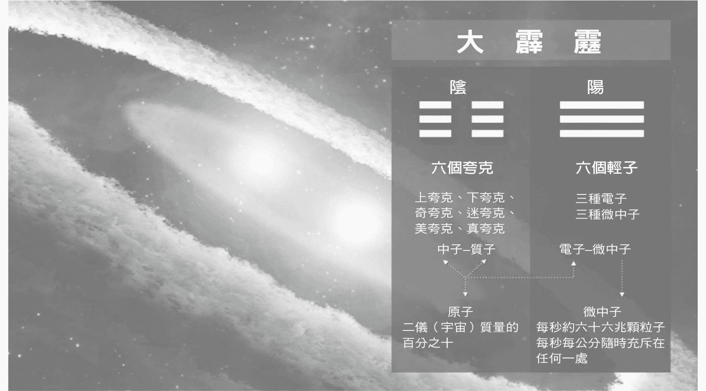

天文物理学家创建了一个模型，指出我们的宇宙始于一百三十七亿年前的一起天文事件，也就是他们所谓的“大霹雳”（Big Bang）。仔细想这件事，最特别的一点是，在大霹雳发生之前，所有具有质量的物质都存在于一个比原子还小的单一粒子中。某个东西点燃了这个微小粒子，因而发生“爆炸”，导致宇宙开始膨胀。当宇宙膨胀，并以不断增加的速度持续扩张，所有的存在分为两群，创造出基本的二元性：夸克和轻子，也就是阴阳两极。

如图所示，阴性家族是基本物质（带有质量），由六种夸克所组成。夸克是目前已知最小的物质组成单位，通常在各种组合中发现。科学家把它们命名为“上夸克”（up）、“下夸克”（down）、“奇夸克”（strange）、“迷夸克”（charm）、“美夸克”（beauty）和“真夸克”（truth）。在这六种夸克中，叫作上夸克和下夸克的会聚在一起形成两种集合（“上、上、下”以及“下、下、上”），然后组成原子中所谓的质子和中子。质子带一个正电荷，而中子则是电中性的基本粒子。阴阳两极的另一端是阳性家族，被视为纯粹的能量或光。这个家族称为轻子（leptons，leptos 在希腊文中的意思是“细瘦的”或“微小的”）。轻子也有六种不同的类型：三种不同的电子，以及三种不同的微中子。电子是带负电荷的粒子。当一个电子、一个质子和一个中子聚集在一起，就形成原子。

科学家说，如果我们把所有知道的原子，也就是带有质量的粒子都加起来（星星、所有的星系和超星系团，以及包括我们在内的一切），我们会发现，它们的总和占不到整个宇宙的十分之一。剩下的部分，也就是所有物质之间的空间，则是由像暗物质和暗能量这样的东西所组成。接下来，让我们看看神秘的微中子。

#### ▸ 微中子——第一个实现的预言

在拉的经验中，他知道微中子能够留下印记，这意味着微中子是带有质量的粒子，不过当时还未经科学证实。起初，科学家认为，这些穿越空间的次原子粒子（微中子）流像光子一样是纯粹的能量，但由于它们行进的速度比光速慢了 1%～2%，不可能只是纯粹的能量。第一个预言，在十一年后经由科学证实了。一九九八年时，科学家已经证明这些罕见而不易侦测的粒子中，最大的粒子承载了极微小的质量：大约是一个质子质量的百万分之一。微中子带有质量，因而能携带讯息，同时它们又小到能够不受阻碍地穿过任何原子屏障。

这些微小的宇宙使者被称为恒星的呼吸，也就是星体熔合所散发出的能量，而且它们在宇宙中是绝大多数，比其他的一切都来得多。三兆个微中子和它们所携带的重要讯息，每一秒都穿透地球上的每一平方寸空间，也穿透我们。我们的太阳（也就是离地球最近的恒星）所产生的微中子，约占所有通过太阳系微中子的 70%；剩下的 30%则是由银河系中的其他恒星散发，还有一小部分来自木星。

微中子可以看成是古人所谓“气”（chi）或“生命气场”（prana）的现代说法。这些特别的粒子无时无刻都带着各种讯息穿透我们。也就是说，我们的生活和行动都身处于巨大、连续且无可避免的讯息场域之中。

#### ▸ 意识的水晶

关于宇宙的本质，“声音”传达了非常详细的科学讯息，大霹雳（物理学家承认此模型，同意这是目前已知宇宙膨胀的开始）得以被放置到一个更大的背景脉络中。“声音”说明了大霹雳只是宇宙的胚胎，而非诞生。这表示整个宇宙是一个单一的生命体，一个尚未出生的胎儿，还在不断扩大，朝向诞生的那一刻行进。

“声音”说，起初有一个阴性的卵，也就是宇宙之卵，包含了所有宇宙的（原子）物质。最适合描述这个卵的结构为“水晶”。虽然卵的本质并不是水晶，但这个名词能帮助我们想像。此外，也有一个阳性种子，含有另一种类似水晶的结构。当大霹雳发生，阴性卵与阳性种子聚在一起，水晶被震碎了；无限碎片散布到正在膨胀中的宇宙里，而每一片碎片都带有它原本阴性／阳性的“意识”。在这个星球上，所有我们可以想像的事物，以及所有形式的生命（甚至是无生命的物体），与生俱来都具备这些意识的水晶。我们将在本章的第二节解释水晶如何嵌入体内。

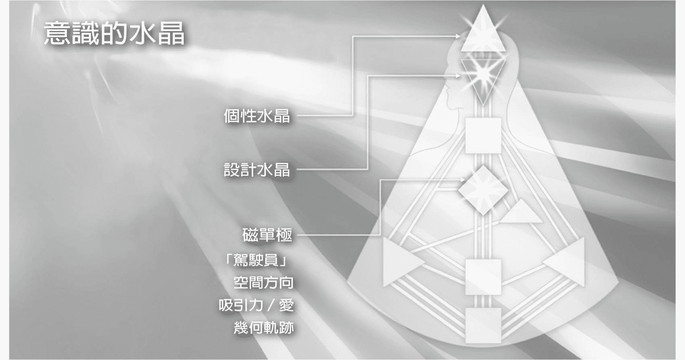

意识的个性水晶是原本阳性种子的一部分，在人类身上，位于你头顶（就在头皮之上）的头脑中心内，就在人体图的最顶端。个性水晶显示出你所认同的自己（或是你认为自己是怎样的人），被称为“乘客”或乘客的意识。意识的设计水晶则是原本阴性卵的一部分，位于逻辑中心（双眉之间的眉心），显示出你身体的生物遗传，或者说形式的肉体。它被称为“车辆”或形式的意识。这两个水晶之间的关系，就好比后座乘客（个性）坐在车辆（设计）上，而负责开车和导航的则是第三方——驾驶员。

#### ▸ 磁单极——第二个实现的预言

车辆的驾驶员——磁单极——是“声音”所描述的第三个关键部分。二〇〇九年九月四日，科学界宣布已观测到磁单极的存在，“声音”的第二个预言于焉证实。简而言之，磁单极是携带单一磁引力的粒子，不是北极就是南极。尽管早在一九二〇年代初期，就有人开始寻找它的踪迹，磁单极在此之前从未现身。

根据“声音”的说明，我们的磁单极位于 G 中心的胸骨区域，拥有两种不同的功能。首先，在我们彼此分离的“错觉”中，它让我们（和所有的事物）结合在一起。就像只有吸力的单极或磁铁一样，它让个性水晶和设计水晶结合成一种关系，就像婚姻让两个人结为连理，成为神秘的联盟。磁单极的第二个功能，是链接我们和我们在时空中的动向，引导我们沿着自己的生命道路前行，走向生命的几何轨迹——也就是所谓的命运。这样的链接可以比喻成，路面轨道电车的输电臂，挂接到架空电缆网的方式。所有的生命形式都具有一个磁单极。

#### ▸ 导航系统的三个构成要素

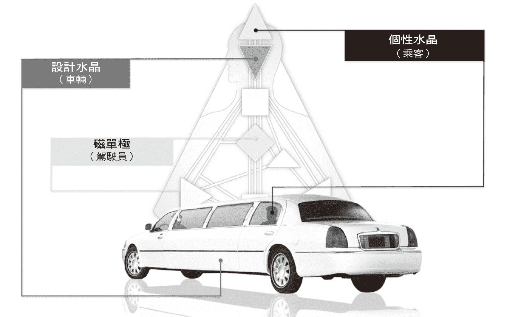

回到车辆、乘客和驾驶员的比喻，想像一辆大型豪华轿车，方向盘后面坐着一个驾驶员，他知道如何操作车辆、目的地在哪，也知道如何到达那里。车辆代表设计水晶，而驾驶员是磁单极。个性水晶（我们以为的自己）既不是车辆，也不是驾驶员。个性水晶不知道要往哪里去，也不知道要怎么去那里；它就只是个乘客。乘客应该要安静且放松地欣赏沿途风景，而不是与驾驶员争夺方向盘的控制权。人类图系统提供的生活方法，能让乘客舒适地坐在汽车后座，什么也不用做，只要享受旅程就好。

#### ▸ 人类从七个能量中心到九个能量中心的转换期

随着天文学家赫歇尔（Frederick William Herschel）在一七八一年发现了天王星，我们进入了“天王星时代”。此时，拥有高度进化的九个能量中心形式的人类，开始取代七个能量中心、头脑导向的智人（Homo sapiens）。到了一八〇〇年代晚期，这个过程完成了，使得现今所有存活于世的我们，都成为九个能量中心的人种，或称为“转换期智人”（Homo Sapien In Transitus）。这个名词由拉．乌卢．胡提出，是为了区分有九个能量中心的人种（过渡期的人种）与智人，以及另一种将于二〇二七年出现的更高度进化的新形式。

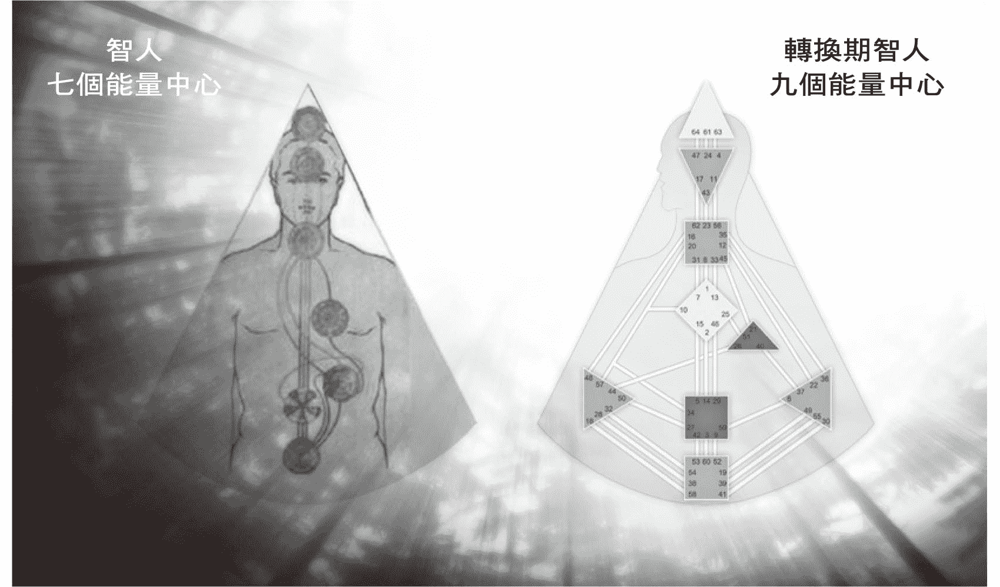

这在演化上具有重要历史意义的一刻，标示我们不再需要依靠头脑意识，或者以策略性头脑的智能来专注于生存。新的九个能量中心的形式，不处理基本的生存恐惧，而是重新与自然秩序的流动相互调和。细微但显著的遗传变化仍发生在我们的生理层面，帮助情绪中心复杂的神经系统继续发展，为将在二〇二七年现身的情绪察觉中心的进化做准备。（情绪中心将在第二章完整地讨论。）

从本书的目的来说，了解智人漫长的进化之旅（相较于我们转换期智人存在于地球的短短两百三十年），能带给我们另一种观点，来看待我们如何以过渡期人种的形式，在这段短暂的时间内存活，以及对自己所产生的影响。这会影响我们如何做决定，如何彼此关联，如何摆脱过去的控制模式，以及如何发挥我们所有的潜能，成为有意识、觉醒而觉知的存在。简单来说，具备五个能量中心的尼安德塔人，是依靠本能直觉和敏锐的感官来求存；人类学家推测他们相信万物有灵，而与自然的力量（或是“神”的力量）紧密链接，并深受其影响。他们生活在小家庭团体中，与代表自然秩序的太阳／月亮周期和谐共存，而且显得和平不具侵略性。

克罗马侬人的突变进行了数千年，打开了现代人的演化，成为七个能量中心的智人，也就是我们的前身。八万五千年前，他们的演化进度开始大幅提升，因为他们的喉部产生突变，头盖骨空间增加，让新皮质和视觉皮质内的神经得以发展，进一步勾勒出人类的共同特征：凸起的前额和双眼视觉。与生存有关的、本能的（或瞬间发生的）直觉意识，很快就被以声音来展现的头脑意识或智能所掩盖。

这个变化持续着，也把人类跟哺乳动物王国的其他物种区分开来。我们能够发声，并把各种可重复的声音系统化，因此产生语言。沟通促成合作，以及共享知识的独特能力，造就了专业分工，形成村镇和领地等组织。所有这些不断演化的特质，让个人和群体优势到达新的水平，这是智人繁盛于世的其中一个面向。

随着克罗马侬人的变化，演化的重点从求生存的形式，以及与自然流动和谐共生，转为把焦点放在策略性的头脑层面，并且崇拜主宰自然流动的头脑力量。智人就这样让自己成为食物链的最顶端。精明而善于创造的策略性思维，取代求存的恐惧，同时，制定各种策略来控制环境，最终也一并控制了环境里的人。身为物种，智人崇拜超越自己的力量，并受制于此，例如神、祭司和君王，视之为权威，期待这些更高的力量能够引导、拯救并支持他们，也借此合理化自己屡屡侵略征战的行为。

到了一七八一年，卓越的策略头脑已成功地运用七个能量中心的形式，将之发挥到人类潜能的巅峰。接下来进入九个能量中心的智人转换期。七个能量中心的智人寿命较短，显示的是土星周期的特性。我们新的九个能量中心的形式或身体，则有八十四年的平均寿命，显示的是天王星周期的特性。我们需要活得更久，来处理与整合不断增加的大量讯息，并发展未来所需的各种技术。基因必须复制，因此驱使七个能量中心的人类透过性行为来交合；而九个能量中心的人类来到世上，则是要透过觉知来达到交融合一。我们沟通交流的方式，以及未来彼此关联／关系的形态，都是转换期间（过渡到完全活出九个能量中心的人类）不可缺少的部分。

到了一九八七年，当整个星球充盈着高度觉知的潜能时，舞台已经准备好，同时，我们身体意识与头脑控制之间的关系也更为紧张。以人类图系统和它有效又实用的方法，来解决这个困境的时机已经成熟。最重要的关键是，我们现在高度进化的九个能量中心的形式，也就是我们的身躯（原文为 Vehicle，车辆意味身体），其设计是引导我们在生命中作出每一个决定。我们不再需要运用头脑，仰赖一个外在权威来指引我们方向。这对策略性头脑来说是巨大的冲击，因为它不能以做决定的模式，来保有决策过程中既有的控制权。透过类型、人生策略和内在权威，人类图系统跨越了人类演化的过程，从七个能量中心的头脑外在权威，来到九个能量中心的形式：革命性的、与能量场链接的个人内在权威。

### 第二节人类图曼陀罗

#### ▸ 四个古老的奥秘系统与现代科学的结合

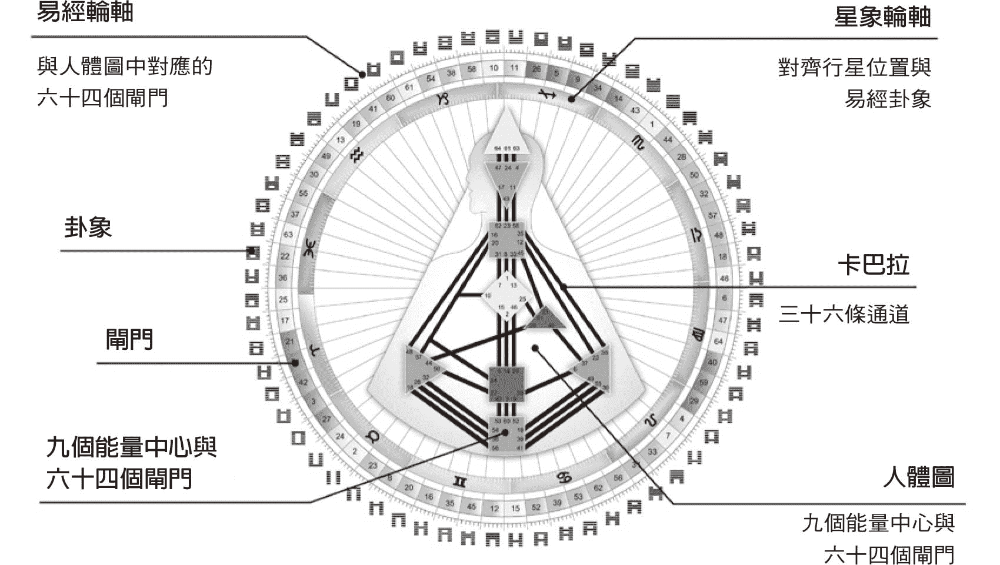

上面这张美丽的人类图曼陀罗是一个不可思议的结合，包含了四种古老的奥秘系统，也就是早期的科学——四种了解生命韵律和流动、了解宇宙，以及人类内在本质的不同途径。西洋占星学和中国易经是曼陀罗的外环，而印度婆罗门教的脉轮系统和卡巴拉《光辉之书》的生命之树，则构成了人体图的主要部分，位于曼陀罗内的中心。

这六十四个闸门的人类模型，是人类图系统独有且最重要的特征。这四个系统和它们贡献的部分，还有微中子和磁单极将之带进生命中所发挥的作用，稍后会分别讨论，说明它们在人类图曼陀罗中的位置，以及它们在整体中如何相互运作。它们共同创建一个新的、多元化又深刻复杂系统的基础，提供了解生命奥秘和宇宙运作机制的全方位工具——即是人类图系统。整体的共同作用，让这个系统比许多部分加起来的总和还多。

“人类图是一面镜子，反映出当代的全球化和综合体制。在此隐藏真正的危险——执着于相对的绝对——因为这股力量会让我们持续受制约，而无法接受我们的一体性。人类图并不是要你看见或接受一条特定的道路。所有的道路都是路。这个综合系统包含了所有文化和体系所集结的智慧，对于起源较早的知识体系与智慧，并没有排除或缩减其价值。人类图将之结合成整体，让它们各安其位，使其贡献能被适切认知与尊崇。每一个文化在演化的过程中，都探索并发现了真理的各种面向。这些不同层面的结合，创建出一套完整的知识体系，如同数学定律已然证明：整体大于各部分之和。”——拉．乌卢．胡

#### ▸ 占星学——人类图曼陀罗的内环

人类图曼陀罗的内环，体现了占星对此综合体系的贡献。这个三百六十度的圆环上有十二个西洋星座（牡羊座、金牛座、双子座等等）的符号，这是早期人类描述宇宙，以及追踪夜空中天体运动的方式。人类图系统运用曼陀罗，在这套综合体系内，记算并记录了两个精确时刻。第一个时刻，是根据你出生的确切时间，记录下来的是“个性”资料（Personality data）。第二个时刻，则是太阳弧的八十八度，或是你出生前的三个月，记录的是“设计”资料（Design data）。这两个计算结果的运用，把人类图系统和传统的占星学区别开来。（资料的计算会在本章第三节中有详细的说明。）

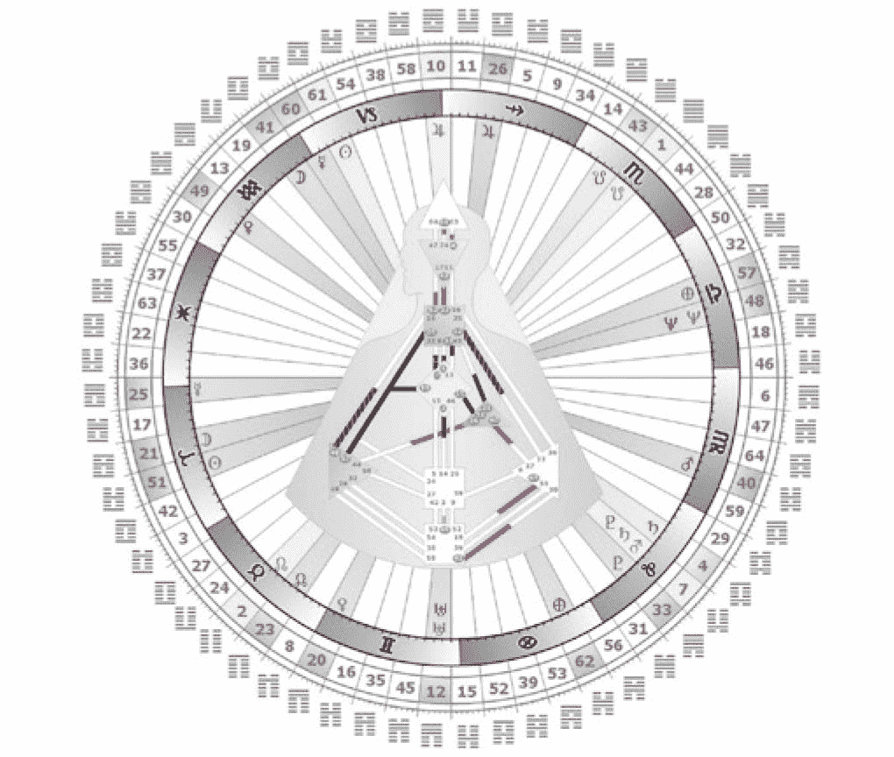

我们被巨大的恒星场所围绕，它所产生的微中子流，不断渗入其穿透的物体，为之带来讯息。当微中子穿透物体时，其极微小的质量与该物体发生交互作用或磨擦，在这个过程中产生了讯息的交流。举例来说，当微中子流穿过火星，会和火星互通讯息，交流于焉发生。渗透过火星之后，微中子流再穿过人体，于是有了另一次交流。这就像是一辆黑色的车和一辆白色的车相撞，于是白车上有了一点黑漆，黑车上也有了一些白漆。两辆车在相撞后都改变了，如同我们与微中子交流后也改变了。透过这种方式，每个行星在微中子留下印记，也贡献了它的本质。虽然我们都活在相同的微中子程序中，但我们体现该程序的独特方式，是由各自精确的出生时间及上述两种计算结果所决定。

#### ▸ 易经—人类图曼陀罗的外环

“人类图曼陀罗中所包含的讯息非比寻常，优美对称。轮轴上的卦象与我们的遗传密码相关，直接对应密码子。人类氨基酸密码子基础的运作方式，是透过特定的印记。如果你深入细胞自身结构内的细胞核，进入它的 DNA，会发现所有的东西，所有构成人体的基本组成要件，都在那里。不论是血球细胞还是肌肉细胞，都是如此。”

——拉．乌卢．胡

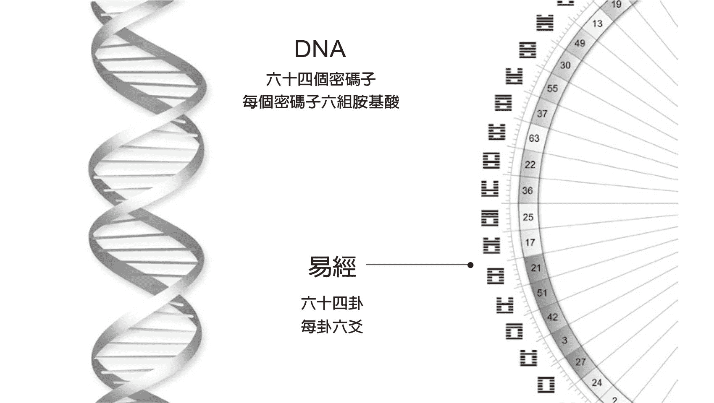

古老的中国《易经》（或称“变易之书”）是最早的文献之一，读起来宛如一部经典，阐释人生时节的智慧。不过，让易经在这个综合体系中显得如此特别，并不是它的哲学或伦理道德内容，而是六十四卦的惊人数学结构。具体来说，你在人类图曼陀罗外环看到的六十四个数字区段，代表着《易经》的六十四卦。每一个画在轮轴外围的卦象，都是由六条断开（阴）或完整（阳）线段的特定组合所构成。六十四卦，每卦有六个爻，总共形成三百八十四条线段标记，围绕在这个外环上。每个爻都针对它在卦上的特定位置，包含一“段”讯息。

一九五〇年代，生物学家华生（Watson）和克里克（Crick）破解了遗传密码，就在这个时候，专家观察到一个现象：DNA 密码子和易经卦象同样有二元结构。我们的遗传密码由四种化学碱基组成，三个碱基排成一组，就像是易经卦象里上下三爻的组合。每一种化学组合链接到一个氨基酸，形成所谓的密码子。我们的遗传密码中有六十四个密码子，如同易经里有六十四卦。围绕在外圈轮轴的这六十四卦，在人体图中转化为“闸门”，可以用来理解人类图的主题，或解释我们的遗传印记，也为每个人身上的特征提供非常具体的说明。

#### ▸ 卦象（闸门）与度数之间的关系

一般来说，人类图曼陀罗的内环是用来计算的，而外环是用来解释的。如图所示，每个对应到闸门的卦象都有特定的位置，并且在外环上有一个测量弧度。为了决定它的位置，我们需要再次了解这六十四卦（每卦六爻），总共有三百八十四爻，而十二星座的每个宫位包含三十度，总共三百六十度。

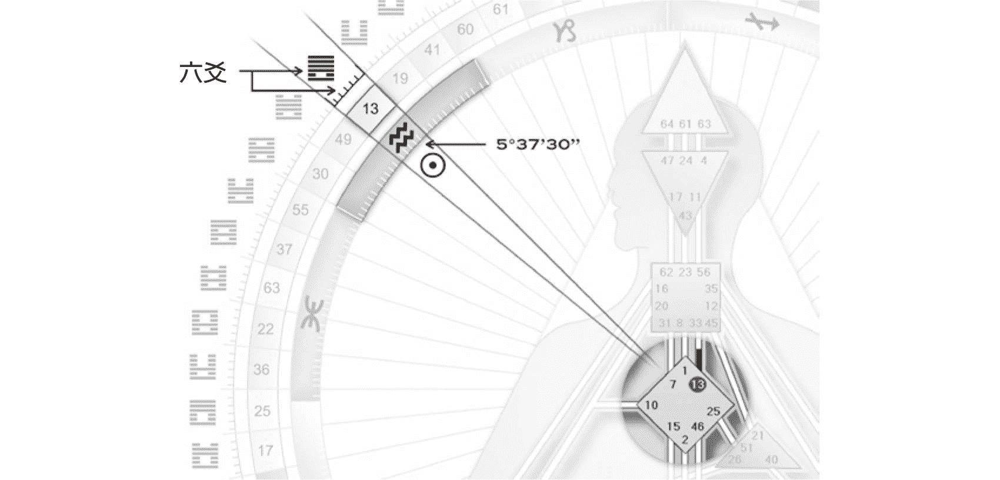

在外环上可见三百八十四爻区别环绕，当这些刻度和内环的三百六十度对齐并测量度数时，可以看到每卦所占的空间／时间为五度三十七分三十秒弧。这个弧度是一个印记区域，也就是宇宙中的一个空间；当行星通过它，讯息就会经由微中子流在此交换。

我们出生时即被赋予某些特质，这些特质来自人类图每个特定行星（或是月交点）的特定卦象。微中子流所携带的讯息，在特定的时刻印在我们身上，以这种特殊的方式伴我们渡过余生。那个时刻被捕捉下来，将此瞬间记录在我们的人体图中，成为我们的定义，我们的设计蓝图。

上图是一个计算运用的实例。如果我们知道行星在星象内环上的位置，就可以看出它所对应的外环卦象。上面的例子中，太阳位于水瓶座的黄道带，对到了易经轮轴上相应的第十三卦。这个讯息接着转换到人体图上。我们将在本章稍后有详细的探讨。

#### ▸ 印度婆罗门教的脉轮系统——九个能量中心

印度婆罗门教的脉轮系统是这个综合体系的第三部分，带我们来到九个能量中心。传统脉轮系统与下图所示的九个能量中心，二者主要差异，仅仅在于脉轮有七个，而能量中心有九个。这个差异反映了宇宙的转变，也就是发生于一七八一年的讯号，指出人类的演化进程从七个能量中心转变为九个能量中心。

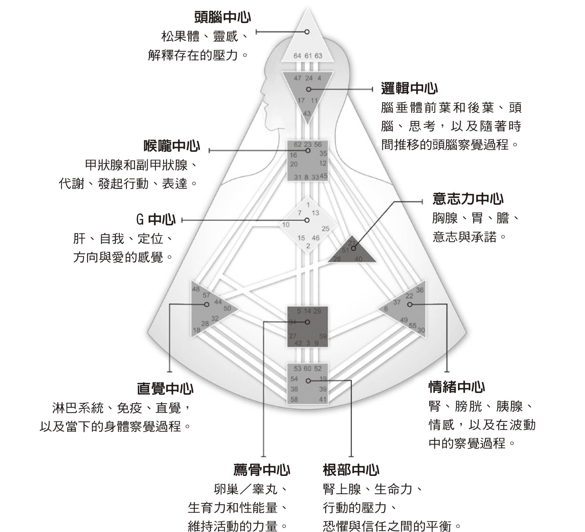

这个过程涉及复杂的内部形式重组，并非单纯增加两个能量中心而已。九个能量中心里的每一个中心，都是一个能量中枢，各自代表不同的生物学相关性。（我们将在第二章深入讨论能量中心。）

#### ▸ 卡巴拉生命之树—三十六条信道与六十四个闸门

来自卡巴拉传统《光辉之书》的生命之树，是这个综合体系的第四个部分。它的贡献是作为途径，透过闸门让能量通过，以连接不同的能量中心。这些被称为“信道”的途径，创造了一个能量流通的活化回路，统合了整个人体图，并且指出其内部能量流动的方向（如下方左图所示）。在每条信道的任何一端，是信道通往能量中心的地方，你会看到一个数字表示一个特定的闸门（如下方右图所示）。这六十四个闸门与人类图曼陀罗外环的六十四卦互相链接，让我们能够将来自卦象的讯息直接导入人体图中。

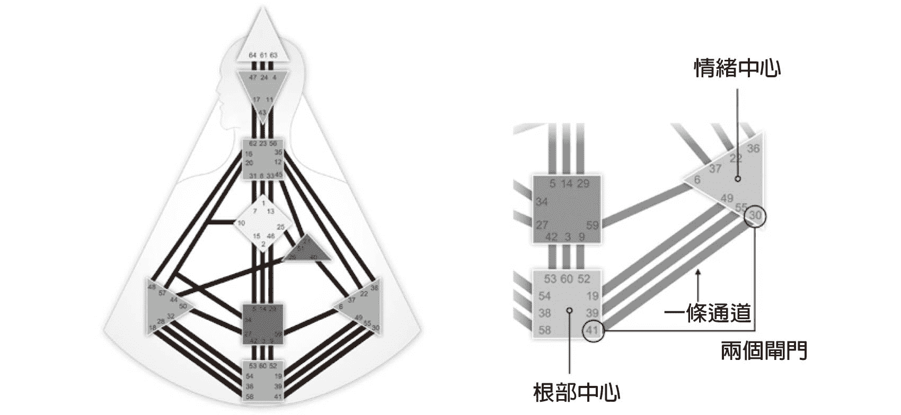

单一闸门是能量进出能量中心的开口；这些闸门对信道的另一端开放，迎接来自彼端的能量。信道两端的两个闸门都要被启动，才能让这条信道完整，成为有所定义的信道。对个人来说，我们可以同时拥有两个被启动的闸门，因而启动了某一条特定的信道；或者我们也可以只有一个闸门被启动，然后遇上另一个使我们的信道得以完整的人。

举例来说，如果一个人拥有一条信道其中一端的闸门，那么他会被拥有此信道另一端闸门的人所吸引。当他们在一起就会形成新的完整信道，使彼此完整，也连接了彼此之间的能量。在他们的生命中，能量接通的感受如同电磁连接一般。这感觉就像吸引力的火花。这是我们设计的众多面向之一，让我们在生命中与他人相遇及互动。基本上，信道会连接两个不同能量中心的能量，因此产生一些新东西，称之为量子。每条信道都有自己的特性和基调，但仍保有能量的弹性或动态量子，这些能量来自于信道所链接的两个闸门、十二条爻线和两个能量中心。定义（或有颜色）的信道会成为一个人生命中的主要特征，我们把这个定义称为你的“生命动力”（life force）。关于这部分，我们在本章第三节有详细的讨论，也会在第六章说明。

### 第三节人类图中的人体图

#### ▸ 引领方向的地图

“人类图之所以如此特别，是因为人体图的部分。人体图是过去所没有的。没错，显然过去已出现人体的图像说明和系统，但从来没有任何系统，像人类图曼陀罗中心的人体图一样。人体图是独一无二的。首先，它的基础是一套全新的数字组合结构。这不是七个能量中心的脉轮系统，而是九个能量中心的存在本质。其他系统也作了延伸，找出把这些讯息集合起来的方法，而人体图则是真正综合的范畴。”——拉．乌卢．胡

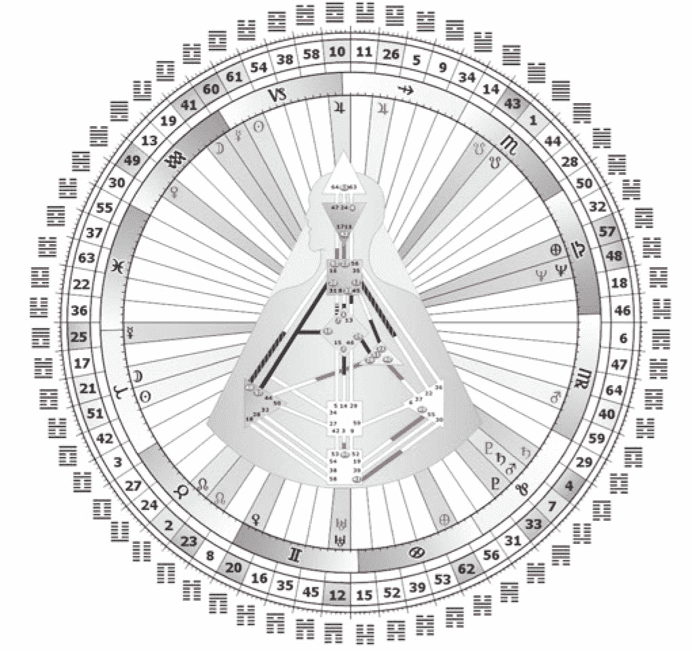

母亲受孕的时候，设计水晶连同嵌入其内的磁单极，经由受精的过程一同进入卵子。当设计水晶开始接收微中子流的讯息时，会和磁单极分离，并且启动对胎儿的形塑。胎儿会持续发展，直到妊娠第二孕期结束，此时人类独有的特殊大脑机能——新皮质，已经完全角成。在这个时候，磁单极发出一个信号，促使个性水晶（又称为灵魂或心灵）进入人体。胎儿的出生（大约三个月后）标志着一个时刻，此时个性水晶从微中子流接收到不可磨灭的印记。所谓的“出生”时间，指的是宝宝离开子宫和母体分离，来到母体之外的时刻，而不是脐带被切断的时刻。人类图准确而详细地说明了我们的独特性，因此，有一件事非常重要：开始分析前需要精确的出生资料，尤其是出生时间。如果你不确定自己的出生时间，请和出生国家里负责出生纪录的机构确认。如果你无法得到准确的出生时间，可以聘请专门研究所谓“图表校正”（chart rectification）的占星学家。占星学家将引导你经历一个过程，尽可能精准地确定你的出生时间。

#### ▸ 人体图

画出一张人体图（BodyGraph），需要两种计算结果。我们用每个人的出生日期、地点和确切时间，开始创建“个性”的部分，也就是出生时刻的计算。把出生资料输进“迈亚机制图像处理”（Maia Mechanics Imaging）软件时，程序会自动计算出第二组数据，也就是出生前的计算，或称为“设计”的部分。

出生时的“个性”计算（下图黑色文字栏）是根据出生的时刻，而出生前的“设计”计算（下图红色文字栏）则是根据实际出生前大约八十八天的时间（或精确地说，太阳的八十八度角）。在你自己的图上，会同时看到“设计”出生日期和“个性”出生日期。由于这两个计算方式皆依据你出生的时刻，所以无论你是足月出生的婴儿、早产或剖腹产，都不会有所影响。

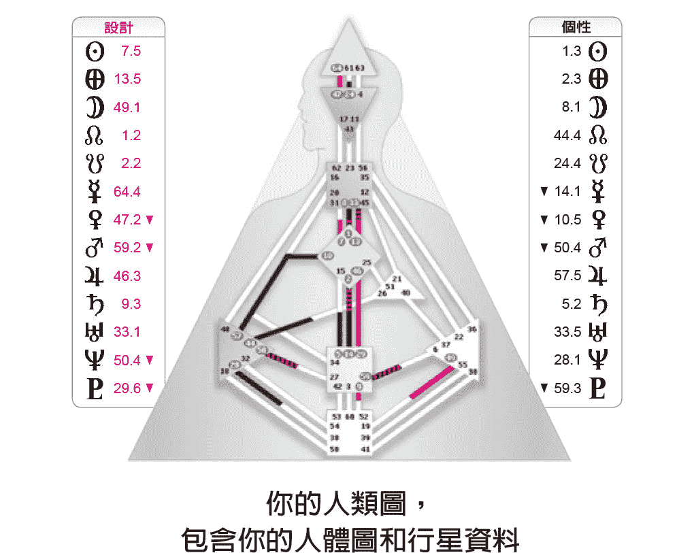

你的人类图，包含你的人体图和行星资料，这两组计算结果都记录在你的图上，以“设计”栏（红色字）和“个性”栏（黑色字）来呈现。闸门数字显示启动的卦，而各种符号则指出哪个行星位于该卦象的微中子流内。闸门数字同时也记录在人体图的能量中心内。下图中将“设计”和“个性”分开了，你可以看到“设计”闸门和“个性”闸门个别的位置；在第三张图中则会看到，当两者结合时，它们如何显示在人体图中。人体图的闸门位置不会变动；它们总是在相同的地方，每个人都一样。而会改变的是：在各个计算时刻有**哪些**特定闸门将被行星启动。

#### ▸ 红与黑的意义

“个性”和“设计”可以分成两张图。红色与黑色两组资料都是你设计的一部分，但它们所代表的层面在你身上的运作方式不同。黑字的“个性”资料是你意识到的部分；你很清楚自己的这些部分，而且能够用这些资料来运作。这是你以为的自己，你所认同的那个“你”。这个意识层面的运作，就像是坐在小山丘俯瞰高速公路一样。你可以看到道路，路上的交通情况，车子行进的方向，还可以朝着经过的路人挥手。换句话说，你是一个全面参与的观察者。红色的“设计”资料，是人类图系统所引进的重要进展。显示出你潜意识的本质，也就是在你的意识层面下所发生的事。它同时也代表了你的基因遗传、你的血统，如同你从父母和祖父母身上继承的主题。你没办法有意识地运作这些红色字的资料。这就像在隧道里张望，不知道隧道里发生了什么事，因为你看不见任何物体，也不知道它们朝哪个方向移动。你什么也不能做，只能静观其变。换言之，从你口中说出的话让自己吃惊的程度，可能跟别人惊讶的程度一样！尽管随着年纪增长，你所学到的经验及适当的回馈，会让你认识自己潜意识的部分，但请记住：你永远无法控制它。图中有红黑条纹的闸门或信道，表示同时被多个行星启动，在你的“个性”和“设计”中都有。在你的生命经验里，这些启动的部分会同时在意识与潜意识层面运作。

#### ▸ 强迫的婚姻或神秘的结合

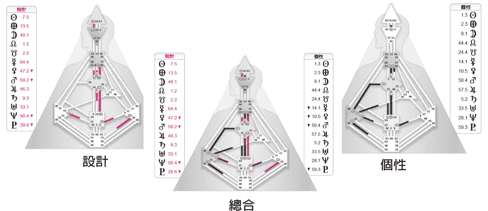

如上图所示，把人体图两侧的“个性”与“设计”并列一起看，可以说明一些事情。“个性”是你所认为的自己；“设计”则是你的遗传程序，决定你在时间和空间中前行的方式。这两个完全不同的层面融合成人体图，透过磁单极链接为一个整合的场域，一个神秘的结合。这也可以比喻为一桩强迫的婚姻，因为这两个部分并非天生相合。“个性”以为它在主宰命运，但事实上，真正掌控人生的却是“设计”和磁单极。大多数冲突的发生，以及你人生中遭遇的阻力，都源自于“个性”试图要掌控你的人生，而没有扮演它最适合的角色：坐在后座，享受这段旅程。

“个性”不会察觉到“设计”的存在，这就是为什么要透过你的人生策略与内在权威，有意识地了解如何运用你内在的智慧，这是非常重要的一件事，也是本书关注的一大重点。当“个性”乘客臣服于它的人生策略和内在权威，“个性”与“设计”就能够和睦相处，结合在一起，同时各自发挥应该扮演的角色。这时候，你会找到属于自己的道路，而所有爱的根源也将浮现——自我之爱。没有爱自己的内在，也就没有爱可以给别人。若拥有爱自己的内在，你会明白在外界谁是适合你的人。

#### ▸ 人体图中的定义

当“设计”与“个性”字段中的启动闸门被放进人体图中（也就是加上颜色），就形成信道，而能量中心也有了定义。具体来说，当一条信道两端的两个闸门同时被行星启动，它们就形成一条有定义的信道，并且在人体图中被涂上颜色。当一条信道有了定义，两端的能量中心也会被定义，并且涂上颜色。这就是图中所谓的定义。定义会产生我们所说的生命能量。

举例来说，下面这张图中的定义是这样产生的：当 11 号闸门与 56 号闸门定义出一条“好奇的信道”（11-56），这条信道会接着定义出逻辑中心与喉咙中心。完整的定义（图中有颜色的信道和能量中心）会显示你生命中始终如一的部分，也就是真实可靠的那个你。定义永远都在那里，每年、每周、每天、每小时、每分、每秒，直到你生命的尽头。它精确详细地打造你生命能量的特质。定义决定你的类型、人生策略与内在权威，并且告诉你在做决定的时候，到哪里寻求可靠的答案，究竟是“要”还是“不要”。

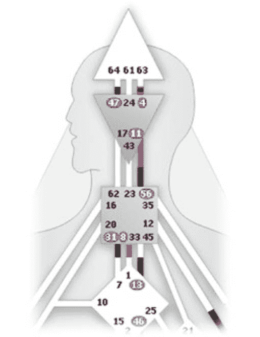

定义是我们存在的核心，也是会逐渐发展的潜能，只要我们真实地活着，好好地在九个能量中心的车辆上坐好。这是我们内心深处所认识的自己，也是我们从出生以来，透过能量场对世界放射出的独特（生命能量）频率。我们的人体图确认了这一点，而人类图系统鼓励我们把它活出来。

有定义的区块说出我们的故事。在这个区分的科学中，这些复杂而革新的观点需要创造一种新的语言，将故事传达出来。拉称之为关键字串连（Keynoting）。关键字形成一种全新运用的符号语言，人类图的语言。作法是将大量讯息对应或压缩成一个单词或短语。这个系统内几乎每个层面都有与之链接的关键字。如同经文一般，关键字激发我们、或使我们觉醒，或把我们与身体的化学变化，以及自己独特的频率相互链接。学习和使用关键字语言，就像是体内荷尔蒙讯息系统的思考；让我们能够透过能量与他人链接。

专业的分析师会将一个人的定义与开放能量中心的关键字串在一起，创造出生动的口头描绘或故事情节，来描述那个人的特质和使命。一旦关键字被传达出去，故事就会超越头脑的层级，渗透进那个人体内。如上图的范例所示，逻辑中心经由 11-56 信道连接喉咙中心，告诉我们，这个人会想直抒己见，把他想的事情说出来。11-56 信道叫做“好奇的信道”，是一个探索者或追寻者的设计。11 号闸门是“想法的闸门”，而 56 号闸门是“刺激的闸门”。他想要分享他的想法。有此定义的人，能让他所参加的每个聚会圆满成功，因为他很乐意和任何愿意倾听的人交谈。他喜欢让大家不断地受到激励，沉浸在他的故事中。

虽然他有很多想法，而且常常表示想跟大家一起做某些事，却很少那么做。他的想法没有付诸行动。他知道自己有这个特质，却不了解它，就会为此深深感到沮丧。然而，他之所以处于这样的困境是有原因的：此定义的区块停在喉咙中心，也就是沟通的能量中心。如果喉咙中心连接到人体的四个动力中心之一（意志力、情绪、荐骨或根部中心，我们会在第二章更详细地讨论），也就是能量的来源，那么这个人就能化沟通为行动。他可以把想法付诸实行。不过说真的，这个人并不一定要为自己的想法做些什么，反而应该分享他的想法。那么，或许有一天，他所说的话将刺激另一个人，将他的想法成真。如果他能遵循等待的人生策略，直到有人询问或邀请，再分享其想法，成功的机会将会大幅提高。

#### ▸ 定义与未定义形成的二元性：先天和后天——我们的发射器和接收器

“当你仔细看着人类图上，被启动的区块，你看到的是一个人独特的印记。我们拥有万物的接收器。在设计中所有空白的部分都是接收器。印记让你与众不同，而不是让你跟别人一样。相同之处只在于这张地图的整体，不同的是我们个人的印记。这是一门区分的科学，人类图让我们明白自己的独特性，明白在整体中成为独特的自己是怎么一回事。”——拉．乌卢．胡

图上有定义的部分，是我们固定而可靠的部分，应该拥抱它、表现它、把它活出来。在有生之年都是一致的，也因此值得信赖。有定义的部份为我们设定了范畴，包括我们这辈子会成为怎样的人，还有我们能发展的潜能。在图中，没有被定义的部分仍保持空白（未定义）。这些部分并非空无一物，也没有损坏。它们是我们身上宝贵的部分，也充分发挥了功能，但因为其运作并不稳定，所以不能当成可靠的决策依据。而开放的部分是自我的生命教室，也是我们与他人分享的智慧根源。我们的开放之处也决定了每个人将面临的挑战或恐惧，以及我们来到世上，要学习和发现关于自己和世界的课题。

组合起来看，人类图有定义和未定义的部分，在我们的设计里形成一个互动的二元性，介于固定与弹性之间。这是先天（我们被定义的样子）与后天的交会之处。大家容易以为有定义比没有定义来得好，并非如此。这不过是二元性而已，就像有白天和黑夜一样。

我们有定义的部份就像是发射器，把讯息（定义的频率）透过我们的能量场，传送到外面的世界。我们送出的内容会使他人受到制约。相反地，我们未定义的能量中心、闸门和信道则像是接收器。透过开放的部分，我们会感受、反映（像镜子般反射）并且放大从他人身上取得的能量。无论好坏，我们都是透过身上的接收器，从环境中得到滋养和学习。我们的开放之处也是最容易受到制约的地方。大多数人的设计，都是由定义和未定义中心所组成的混合体。不过也有极少数例外发生在某些人身上，在他们的人类图中，所有的能量中心都有定义，或是所有的中心都对外开放。我们将在第二章完整探究定义和未定义中心。

#### ▸ 人体图中的太阳、月亮、交点与行星

你可以把太阳、月亮、交点和行星，称为太阳系的在地程序媒介。这些天体在我们出生时的位置，为我们带来影响，决定了我们体验的方式（或是给我们的体验“加料”的方式）。亘古以来，每个天体都有其特殊的神话色彩和主题特性。

如果没有人体图的话，就无从分析。人体图中的信息总共由二十六个启动落点所组成，其中来自“设计”与“个性”位置的各有十三个。根据“声音”所言，除了所列的天体，没有其他天体能够启动闸门。但这并不表示像泰坦（土星卫星中最大的一个，比水星还大）那样的天体对我们没有影响，它也会让微中子流通过，并且像其他天体一样把本身的特质注入其中，但是它不会启动闸门。

凯龙星（Kiron, Chiron 二〇六〇号小行星）是一九七〇年代晚期发现的彗星碎片，它也无法启动闸门，或者说“打开闸门”。不过，如果主题假设是正确的，而这个天体跟疗愈和伤害有关，那么观看它在人体图中的位置就能让我们得到一些见解。其他像是占星学的上升（ascendant）、子午圈（midheaven）、阿拉伯点（Arabian points）等等也是同样的情形，它们都不会启动闸门。

下表列出了人类图中所使用的天体。它们除了增添我们体验生命的滋味，也扮演我们的指导者。

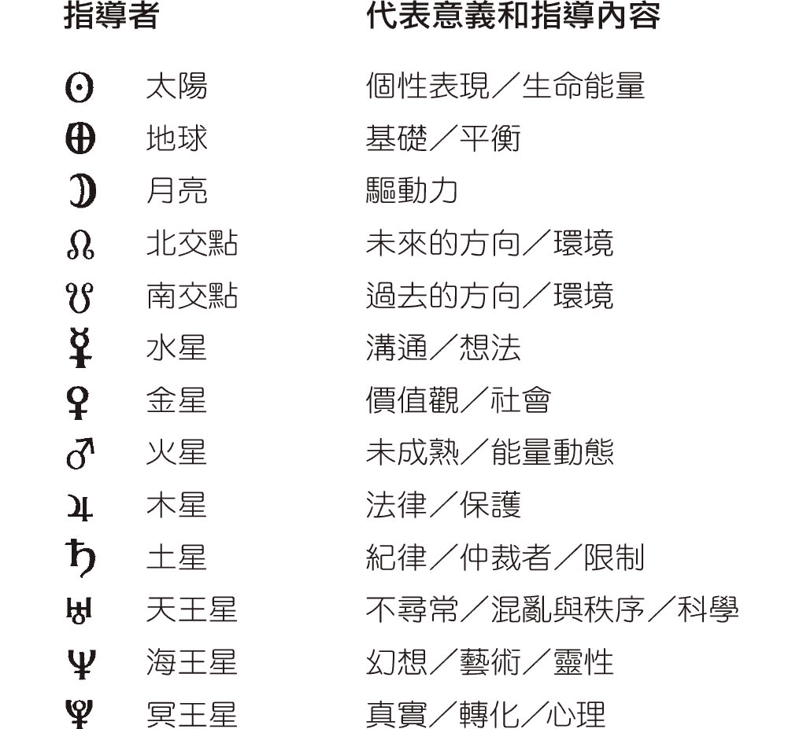

接下来会解释太阳、月亮、交点和行星，以及它们的主题，也就是关键字。同时，也会有简短的描述，说明它们如何运用在人类图系统中。

**太阳—生命动力**。人类图中的太阳代表我们的核心能量，我们主要的阳性力量。它是我们的“自我”，也是我们的“行为”，同时象征我们此生轮回的主题。太阳代表父亲的原型。（影响我们的微中子有 70%来自于太阳。）“个性”太阳是我们在这世界发“光”的方式，而“设计”太阳则表示我们遗传自父亲的基因主题。

**地球—基础与平衡**。地球代表我们有形化（成为形式）的地方；它也象征我们如何立足于世，如何平衡我们形式（身体）内的太阳能量。太阳和地球总是一起运作，而在人类图曼陀罗中，两者处于相对的位置。地球提供主要的阴性平衡，代表母亲的原型。当我们能够正确地将“个性”与我们的生命结合，就会找到意识的平衡；而当我们能够掌握这个形式的世界，就达到稳定的状态（潜意识的平衡）。地球是我们稳定的骨干。

**月亮—驱动力**。在我们的设计中，月亮代表让我们行动的驱动力。月亮引力强而有力，它总是存在，而且总是意欲体现太阳能量的讯息。讯息的输入来自太阳，但是方向、力量或驱动力却是由月亮显示。月亮是大女儿的原型，它让地球（母亲）驱动与推动形式的任务变得可能，因而确保演化得以进展。月亮也是别人于我们内在本质中看见的反映之光，这些内在本质被带往表层而展现。

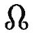**月之北交点**—未来的方向与环境。尽管月交点不是行星，却同样具有强大的力量。在“个性”方面，交点并未指出你是谁，而是形塑你的“个性”会如何看待世界和自己。在“设计”方面，交点架构你与周围环境和人脉关系。北交点是人生体验的成熟阶段，在我们的“天王星对冲”时期（三十八到四十三岁）由南交点转移而来。生命来到北交点是一个讯号，表示我们进入下一个过程，要放下不再属于我们的，并保留适合我们的部分。

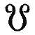**月之南交点**—过去的方向与环境。南交点代表我们人生体验的发展阶段，也就是未成熟的时期，此阶段一直持续到我们进入天王星对冲。在我们九个能量中心的天王星躯体内，南交点到北交点的过渡期象征着中年，也表示我们进入成熟期。交点代表着我们生命已经结束的阶段，我们如何理解周围的世界，以及我们一生中将体验的环境——这些将支持我们活出自己独特的命运。

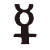**水星—沟通和想法**。水星是大儿子的原型，代表人类意识的扩张，还有我们内在的沟通需求。水星最接近太阳，因此就像是太阳的耳朵。在个性水晶进入身体时，水星为它编写程序，一直到出生的时刻。你的“个性”水星定义的地方，能让你洞察此生需要沟通的部分。你的“设计”水星也有一些东西要沟通，不过我们时常不明白为何要跟某人说某件事，因为它是透过我们的潜意识形式来表达的。

**金星—价值观**。金星创建我们的价值观，代表我们对待彼此和周围世界的道德和自然法则。金星是小女儿的原型，同时也代表着爱与美。对你个人而言，金星代表是非，也是你的道德问题和议题。如果你做事是非不分，而你周围的人也同样是非不分，金星可能会给予严厉的惩罚。这些创建于金星的价值观会成为木星的法律，而所有报应都是透过土星而发生。

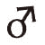**火星—未成熟的能量**。火星是小儿子的原型，其能量尚未成熟且免于责任。它是被动的，但当它受驱使而开始行动，就会成为一股不容忽视的力量。一旦点燃，火星强化的动力可能会导致无意识的爆发，即便是最基本的压抑都可能被击溃。你图中的火星代表一股非凡的能量，随着时间锤炼，渐渐演化出强大而成熟的智慧，让你知道该如何正确使用这股能量。火星在我们的个人转化上扮演着重要的角色。

**木星—法律与保护**。除了太阳以外，与其它星体相比，木星为我们带来最大的影响力。木星是宇宙的法则，定义外在发展，周期是十一年以上，同时也定义出我们与他人和整体之间的关系。我们每个人身上的印记都带着一个非常聚焦的主题：对我们来说什么是对的。这就是木星为我们写下的法律。如果你遵从法律而活，就能获得好运，因为木星有时非常慷慨，不过你从中获益的能力，来自于极度服从自己所属的法律。

**土星—纪律（仲裁者）**。在你的图中，土星所在的位置是你必须处理行为后果的地方。这是非常古老的阴性力量，代表仲裁者，也代表你要为任何没有遵从自己的法律和道德价值，而做出不当行为，付出代价。土星是一个意义深远的指标，让你能随着时间推移，看见自己在过程中的进展。土星是在旁观望的监督者，不会给你赞赏。如果土星放任你独自一人，就表示你目前的生活方式是正确的；然而，如果你打破自己的规则、价值观和法律，土星就会惩罚你。

**天王星—不寻常、混乱与秩序**。在你的设计中，天王星出现的位置就是你表现不寻常的地方。天王星演化的潜在流向，改变了我们对物质界（Maia）的理解，并延长我们的寿命到目前的八十四年。天王星也为我们说明了人生的三个过程，包括主观的少年、客观的中年，以及超然的老年。

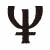**海王星—幻想和灵性**。海王星是一个伟大的指导者，要求我们完全接受。海王星不管位于任何闸门，都会掩盖其潜力。这样的遮蔽可能会深深扰乱非自己，因为非自己无法看透这层面纱，然后我们就失去看见任何限制的能力，可能导致漤用。臣服于海王星，不去打扰它，就能让潜藏的魔力从面纱后浮现。而关于臣服的本质你也会学到更多。

**冥王星—真实与转化**。冥王星把潜意识的力量带到表层；它代表了重生。冥王星是“说真话者”，把隐藏在表面之下的真实带到你面前，让你直接正视它——真实带来转化。不管你在图中的哪个位置看到冥王星，那就是你的真实。冥王星给我们上了最深刻的一课，要我们寻找黑暗中的光。冥王星的秘密和你的秘密，要用一辈子来探索。

#### ▸ 微中子的过境场

我们不断受到制约的力量，无论是透过周遭人们的化学作用，或是受到行星过境的影响；这些行星来自于更大的宇宙环境，我们亦生活其中。在人类图系统中，定义代表着“学生”，未定义中心是“学校”，而过境行星则是“老师”。这些过境行星透过它们过滤微中子流的能力，渗透并直接地影响我们。

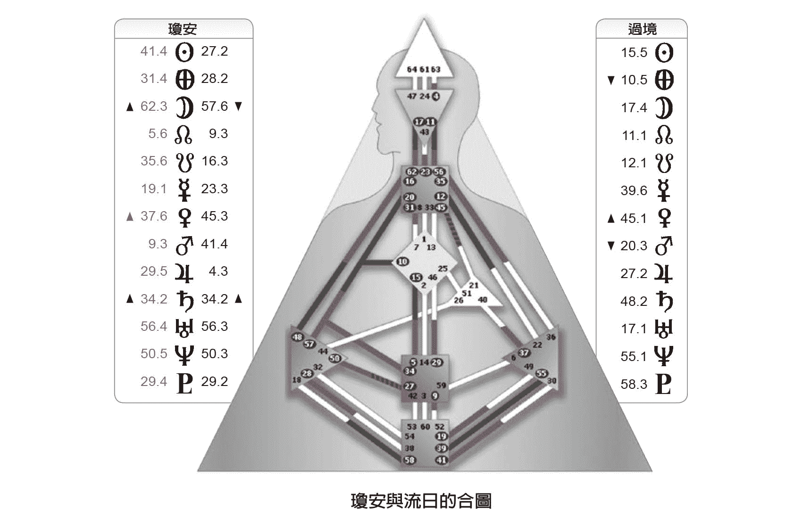

只有个性／黑色部分的计算会被采用于流日合图（transit connection chart）。在上面这张人体图里，此人设计中红色和黑色的启动都用浅灰来表示。微中子的行星流日场域则用黑色表示。我们可以看出流日／流年场域（transit field）在这个时刻为琼安带来哪些新的启动，这就是流日／流年通过时所产生的影响或给予讯息的方式。若琼安能忠于她的人生策略和内在权威，就能坚持自己的设计，避免因分心而远离她的道路，也不会被她周围那些同样接收流日影响的人分散其注意力。

#### ▸ 关系合图：用图表说明两人之间的相互影响

我们也会被周围的人影响或制约，尤其是那些与我们亲近的人。下面的三张图说明了关系合图如何产生。他们一起创造了一个量子场，而这个能量场比他们任何一人的都来得大。有新的信道被定义，也有开放的能量中心被填满。这张合图可以让我们学到很多，例如这两人怎样跟对方互动，他们如何在不知不觉中影响对方的行为和决定，作为一对夫妻，他们又会怎么表现。

关系合图的课题很巨大，因而需要更全面的探究，不是本书所能提供。要彻底理解合图必须考虑非常多事情，包括类型、人生策略、内在权威、人生角色、定义、闸门、爻线，以及能量中心；建议你找人类图分析师进行谘询。如果要透过人类图来看各种关系，下面提供概括的信息：

**火花**：伴侣中每人定义了信道中的一个闸门（二分之一），因此定义出完整的信道，共同创造出生命能量；这代表基本的关系动态：吸引或排斥。

**主导**：伴侣中的一人定义了整条信道，而另一人没有启动（定义）此信道的任何一个闸门。后者只能接受并臣服于这条定义的信道，以这个方式来感受前者。

**妥协**：伴侣中的一人定义了整条信道，而另一人只定义了此信道的单一闸门。只启动这条信道一个闸门的人，总是对拥有完整信道的人妥协。

**相伴**：伴侣中两人的人体图都有相同的信道或闸门被定义。这是发展友谊的潜力，是一种共享的经验。

人类图是一个反映出许多系统的综合体系，为你的人生提供非凡的新观点，并且让你了解基因的延续性，会在设计中看似个别独立的层面之间流动。你的定义（真我）和你的开放（非自己）合起来的交互作用会形成一个基础，帮助你了解活出设计的方法。如果你能同时觉察自己与生俱来的设计，以及你对外在世界开放之处，将拥有最丰富的生命体验，并且真正活出你独特的人生使命，成为这更大整体的一部分。

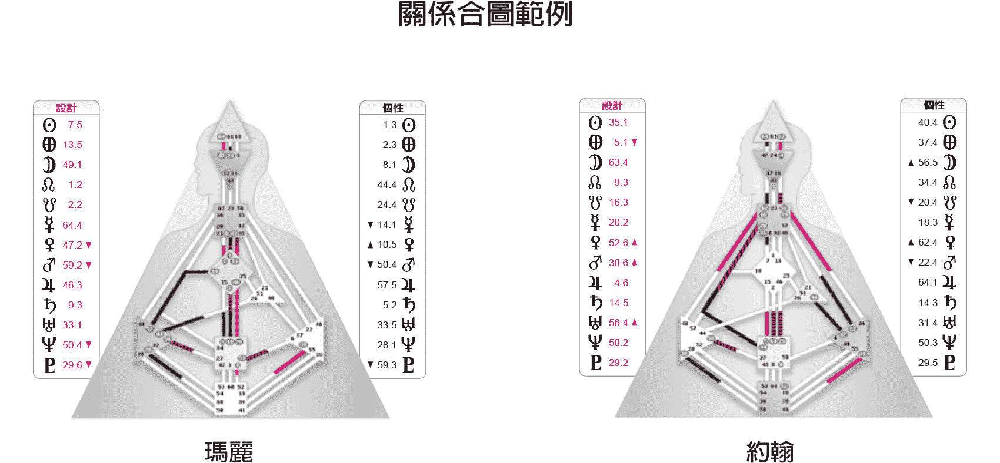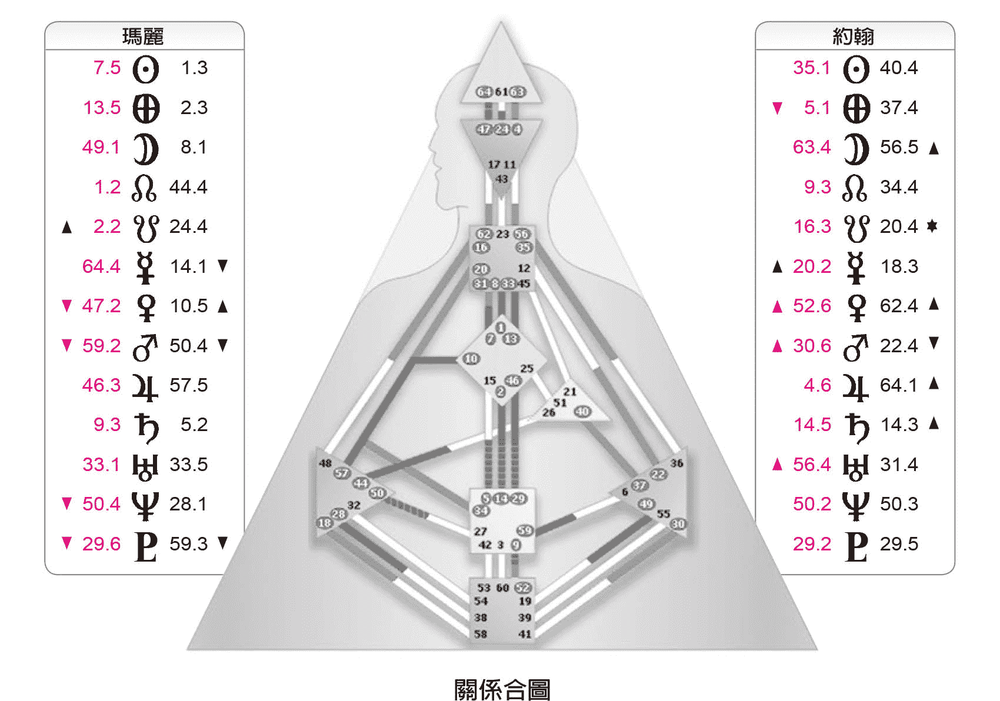

“智慧存于每一个人，对开放中心的中三維验。”

——拉．乌卢．胡

# 第二章九大能量中心能量的流动

#### ▸ 能量的流动

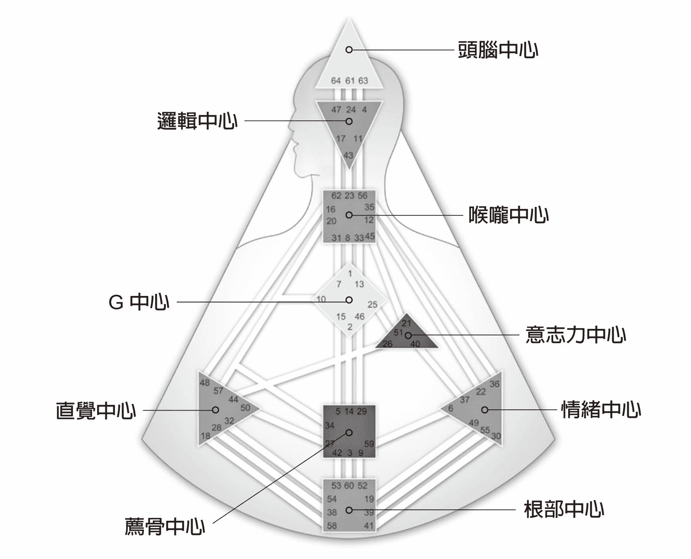

九大能量中心是能量中枢，能够转换或转化在人体图内流动的生命能量。下面将为你分别介绍九个能量中心的概况，包含名称、各自特别的功能，以及它们在人体图中的位置。

请注意根部中心和情绪中心同时存于两种类别之中。本章后面将更详细地说明每个能量中心。

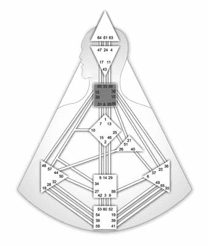

**一个发起中心：**“条条大路通罗马。”喉咙中心为接下来九个能量中心的讨论设立范畴。它特殊又独特的功能类似市中心广场。汇集源于八个能量中心的能量，皆朝向喉咙中心移动，在此被赋予“声音”，进而实际发起行动，或以口语传达人类的智慧。透过喉咙中心，我们得以展现身而为人，位于食物链的顶端的意义。

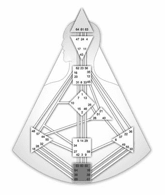

**两个压力中心：**头脑与根部中心是两股压力来源，推动能量移向三个察觉中心。它们分别是想“知道”与去“做”的压力，也就是思考跟活下去。头脑中心会问问题，这些问题将能量导向逻辑中心，逻辑中心构思答案。根部中心的压力提供肾上腺的驱动力，为求生存，也是让生命前进的动力。这是燃料，也是一股强大的能量，通往直觉、情绪和荐骨中心，进一步精炼并趋于完善，最后来到喉咙中心，得以沟通或采取行动。

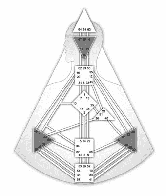

**三个察觉中心**：直觉、逻辑与情绪这三个中心，是蕴藏自我意识和自我察觉的潜在区域。它们各自以能量层面的角度，依据身体、头脑或精神层面的察觉，诠释我们的生命经验。（其余六个能量中心则在机械层面运作。）接至喉咙中心时，将转化为意识层面的智慧，充分表达：可能是直觉智能（生存意识）、头脑智能（认知意识）或是情绪／心灵智能（关系／社会意识）。

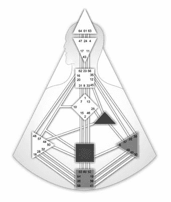

**四个动力（能量）中心：**根部、情绪、荐骨和意志力中心是动力发动机；它们各自特定的频率，提供能量来源，让我们的生命得以展现。根部中心给予我们不断前进的动力；情绪中心的情绪波带来动力，刺激我们想拥有更多体验、想拥有亲密关系的渴望，以及心灵层次的察觉力。荐骨中心提供生产的能量以支持形体，让充满创造性的生命能量得以延续。意志力中心身为“我、是我、我的”背后的驱动力，是人类意志力的源头，确保我们能以群体阶层为结构，存活于物质世界中。

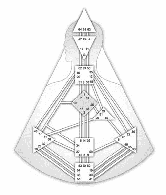

**一个定位中心：**G 中心是磁单极的家，在人体图中位居要位——人类图曼陀罗的中心。它确立了我们的定位（在时空中的方向），也就是所谓的几何轨迹。在这里，我们独特的能量流（定义）与所有的生命之流相连——这就是我们和宇宙链接的方式。磁单极将生命拉向我们。我们可以说，宇宙透过我们来展现生命。

#### ▸ 定义（有颜色）与未定义（白色）中心

你会注意到人体图中的某些能量中心有颜色（定义），而某些没有颜色（未定义）。有颜色的中心，其执行功能与运作的方式稳定而可靠，未定义（白色）中心则是你受外界影响或制约之处。未定义中心并非缺损，亦非空无一物，更不需要被固定下来。那只是我们脆弱之处，容易受制约的所在，也是我们学习和累积智慧的范畴。我们每个人都是复合体，由定义和未定义中心所组成，无关好坏。设计中所定义的部分，代表了我们此生是什么样的学生，而未定义的部分，则代表我们在人生这所学校里，可以学习的课题。成为自己是一段历程：在过程中，我们能看见自己在生命中受制约之处，看见它如何影响我们，以及该如何将它置放于适当的范畴之中。而认知本身就是获取智慧的良机。

#### ▸ 空白中心的制约与非自己头脑

一七八一年，我们从七个能量中心转换为九个能量中心，原本为我们指挥人生的头脑，自决策的要角（做决定）转变为智慧的来源，同时也成为他人的外在权威。头脑依然坚持过往做了几千年的事——并未察觉事实上，头脑的工作内容早已改变。这造成我们在身体与头脑之间，以及真正的自己与非自己间的紧张关系。对具有九个能量中心的全新躯体而言，我们这神奇的头脑，无法成为个人的内在权威。

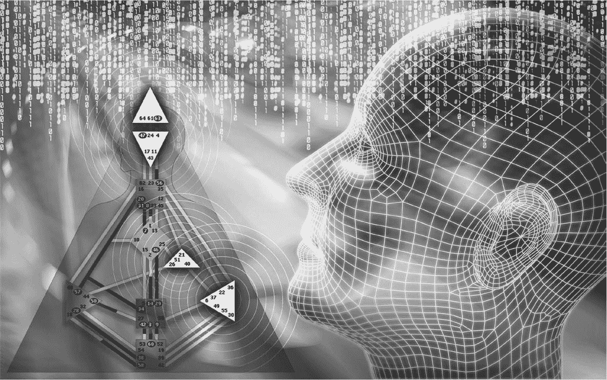

在母亲孕程的最后三个月，肚中胎儿的身体完全成形，个性水晶（乘客的意识）受邀而进入胎儿体内。而乘客开始熟悉躯体内的新皮质，尽管这与形成身体的任何一个环节，并无直接关联。由于没有任何特定的事务可做，尽管这位乘客没有驾照，却决定在后座当乾酪机。以为位居崇高的头脑中心，就能名正言顺主宰一切，操控你的人生。

然而，乘客头脑却没有意识到两个重要的细节。第一，你已经拥有驾驶员了，那就是你的磁单极。第二，这台车子（也就是你的身体）已进化至更精密复杂而有意识的等级，远远超出头脑的层次。换句话说，头脑在七个能量中心的人类形式上，已达巅峰，引导人类在意识层次与科学领域上，达到前所未有的成就。不过，在一七八一年之后，我们的形体于演化上有了大跃进，现在我们的身体由九个运转的能量中心所构成，并且内建链接，直接连接至值得信赖的个人化罗盘。

我们每个人皆有专属的卫星定位系统，而这系统与宇宙紧密链接。在决策方面，我们的头脑尽管与新的九个能量中心形式（身体）相互链接，却无法与之竞争，但是它并不了解。漠视既定事实，头脑仍坚持过往不断重复的事——试图指挥你的人生。而我们的头脑并非敌人，你无须克服、压抑或忽略它，而是正视它，让头脑成为你最好的朋友，转化为创造力的展现。我们的头脑最适合扮演的特定角色，是负责思考和梦想，启发他人与制定规则，以及领悟生命的道理。当头脑不必承担做决定的任务，就能发挥其神奇的天赋，进而服务人群。头脑是工具，为我们服务，也蕴藏潜能，足以成为他人的老师，由于我们对自身机制的无知，导致这一切停滞不前。我们应该与头脑结盟，让头脑从决策的任务中解脱，如此一来，它才能安其位并司其职，成为反映自我意识的观察者，能让头脑展现其真正的价值，做出应有的贡献。

从出生以来，我们一直处于父母、手足、亲友和其他人的能量场中。我们未定义而开放的信道、闸门和能量中心，持续被别人所定义的部分而引发，或在能量上被启动，久而久之，他们本身的能量场，以及不断增长的期望，带给我们微妙又深刻的影响。这就是人类图系统所描述的制约。尽管我们从未与真实的自己断了联系，但在七岁之后，来自家庭与社会的制约，已层层覆盖住我们真实的本性。

我们无法避开或逃离制约，而制约也并非坏事，只是无可避免。行星转移、人类，以及所有的生命形式（包括昆虫、鸟类、动物和植物）都与我们相互链接，影响我们的思考模式、行为与决定，若没有透过人生策略与内在权威，未能活出自己的设计，我们天生充满好奇心的开放能量中心，终其一生，都会被这些能量中心有颜色的人所吸引，然而，吸收他们的频率，对我们本身开放的中心会造成压力，引发头脑不断想着自己的不足。

人类图中的开放部分，之所以会被视为非自己的根源，是因为它们在能量的层面无法持续运作，并不可靠。当我们开始将开放中心（不是我们的部分）所获得的体验，跟我们有定义的自己（真正的自己，我们始终如一的部分）搞混，事情就麻烦了。人类图体系仔细检视了我们受制于外在影响的开放之处，与我们的本性（有定义的部分）做出区隔。它告诉我们，只要遵循人生策略和内在权威，就会拥有完备而独特的能力，面对并解决由非自己所衍生的困境。

空白的能量中心，本应开放接受刺激，这样的设计就是为了吸引我们，尽情投入人生。然而，当我们以头脑做决定时，开放中心就变成所谓非自己头脑的一部分。对忙碌的头脑而言，可靠而固定的部分并不有趣，于是开放而未定义的部分，便摇身一变，成为强烈吸引力的来源。这就成为我们的渴望，我们想去经历的体验，还有我们认为自己一定要拥有的东西，或想成为的样子。不幸的是，这股充满吸引力的诱惑，可能将引导我们远离自己的核心本质，这也就是为什么，我们往往无法活出自己独特的潜能。问题在于，当我们尝试成为不符合自己设计的模样，所有的一切都会扭曲；我们迷失、不断追求生命中永远得不到的部分，无法自拔。我们的决定，基于千变万化的虚幻欲望，也就是我们无法持续运作的部分，宛如在流沙上盖房子，自某个错误的假设向外孳生，最终，就这样形塑成我们真实的人生。结果是感到疲惫又失败，伴随而来的是对生命的沮丧、苦涩、愤怒和失望。

在你年轻的时候，你的乘客头脑认为，它所作的决定会保护你和车子本身（躯体），如此一来，你透过开放及脆弱的部分所获得的经历，才不会带来伤害。你的头脑陷入身体与生俱来的恐惧中——这些恐惧是为了保障身体、思想和情感而存在，反映在外成为对于安全感、爱与支持的需求。在开放的中心，这些恐惧会因此放大许多倍，你的头脑对于所处环境过度警觉。它利用别人的回应或反应，逼迫你的真实自我不断妥协，将自己和别人对你的期望与要求反复比较。为了能融入而顺从，这让你得以适应外界环境，让你和身边的人生活舒适。这确实行得通，却仅能维持短暂的时间。你甚至能从中得到甜头，但最终也必须为此付出代价。

我们在人生中所做的每一个决定，若非让我们走在自己的道路上，便是让人绕道而行，感觉困惑、甚至痛苦之中。；我们若不是靠近自己真实的本质和人生目的，便是反其道而行。若源自个人的内在权威（我们身上值得信赖的定义）所做出的正确决定，就能让我们走上自己的命运之路，进入适合我们的关系、位置和工作。但是若此决定来自头脑，源于未定义中心的制约，那么只会让我们偏离自己的道路，感觉对已发生的情况无能为力，即使做出承诺，也只是消耗自身的能量，无法发挥自己真正的天赋才华。

整体社会极度重视头脑，也就是头脑意识，也很重视实践。制约对我们造成的压力，不会凭空消失。大部分的人体图中，白色的部分远比有颜色的中心来得多，非自己头脑放大了开放的部分，将一切复杂化，极易对生命造成过度影响。以有定义的部分，与来自开放中心的压力相对抗，极为困难，尤其每个人的设计中，有一半被启动的部分皆位于潜意识层面。幸运的是，我们的人生策略和内在权威，将直接绕过头脑信念所织出的虚幻之网，允许驾驶员来开车。这就是所谓的臣服，也就是我们所追寻的觉知状态。

#### ▸ 非自己开放中心的问题

人体图中的开放中心，揭示出每个人易被攻击的主要弱点，以及头脑如何利用这些弱点，为了避免陷入更深的混乱与痛苦之中，而制定其作决定的策略。然而，随着时间过去，头脑的保护策略变成不健康的惯性，或无意识的习惯，一直延续直到成年。一旦你能看清这些无效习惯的源头，了解它们源于并不属于你的地方，要放下就容易得多。当我们开始明白，我们容易因为开放的部分，而迷失自己，甚至错以为那等同于我们，如此一来，便能开始将未定义的中心，视为丰富的探索资源，而这才是它们原本该扮演的角色。透过未定义中心，我们得以经历到完全想像不到的体验、最伟大的发现，和最深切的体悟；随着时间过去，所有这些体验将层叠结合，最后累积成智慧。人类图系统所传递的知识，是关于我们自己，让我们能开始以崭新的方式，欣赏和享受自己的开放性。智慧存于每一个人对开放中心的中三維验。我们图上的每一个未定义中心、信道和闸门，都可能让我们拥有这样的智慧。

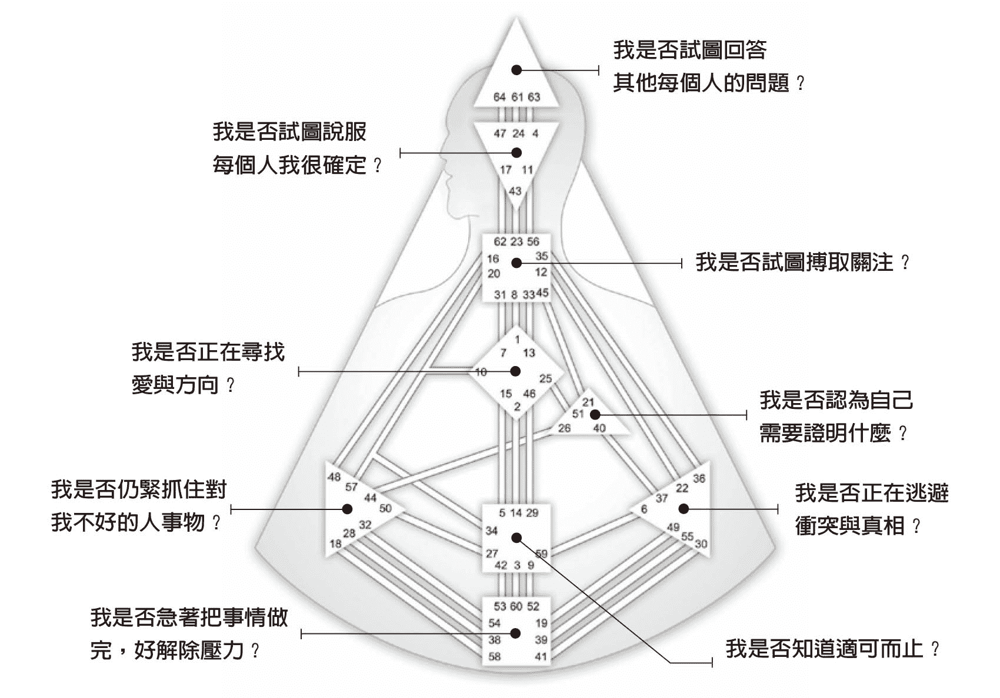

上图列出了每个开放中心的非自己对话。我们可以问自己这些问题，来判断自己如何运作，是真正的自己？还是非自己？接下来，我们会更深入探讨每一个能量中心，以及属于它们的非自己概念，不过，现在先花点时间，问问自己那些对应开放中心的问题，这练习既具启发性，也非常有效，能让你发现非自己制约是多么难以捉摸，而又无所不在。

#### ▸ 人体图中的非自己关键字串连

人类图的精确分析，让我们能够正确描绘出在过往生命中，整体思维被制约的过程，并且针对头脑运作，提出惊人的细节和见解。串接我们的头脑、早期的痛苦经验，会发现与那些空白的中心，有非常强而有力的链接。下图的范例，说明这个人一生中，最容易被制约的脆弱之处。就从未定义的直觉中心开始，因为这里与安全感有关，也是此人制约之所在，为了感觉安全，会紧抓某些人事物不放（例如工作、关系、居住地和想法）。这个没有颜色的直觉中心担忧与生存相关的问题，容易引起恐惧，而这恐惧可能会让人长久以来，滞留在一份不健康的工作或关系里。至于那未定义的意志力中心，所带来的制约是，习惯性不断想证明自己的价值——是否够好、够性感、够忠诚、够漂亮、够聪明等等。为了证明自己的价值，容易做出无力信守的承诺，并试着遵守承诺（然后失败），最终的结果就是自我价值低落。至于空白的头脑中心，更是塞满了不重要的想法，忙着解决别人尚未能解答的问题。至于空白的根部中心，则让她时时感受到压力，催促自己匆忙赶工，搞定事情，快速继续进行下一件事，借此摆脱压力。

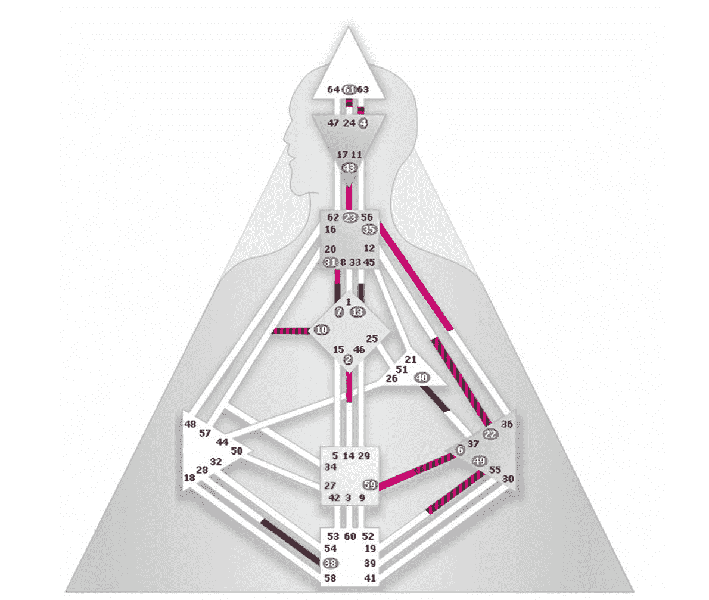

未定义中心的关键字串连，创造出的画面，成为她的头脑大半生专注的事情，与做决定的依据。当我们将以上所有讯息综合成一个句子，拼凑出一个人的样貌：她害怕失去人际关系或工作保障，所以非常认真工作，好让事情迅速完成，并努力解决每个人的问题，以证明她的价值。

如果你正走向转化与觉察的道路，你将会缓慢但坚定地，不再赋予头脑权力，臣服于身体的内在权威。你会放下头脑衍生的想法，包括它告诉你应该做和不该做的事情，以及人生应该要有的样子。虽然臣服并非头脑的天性，但头脑能够学会臣服于你的人生策略和内在权威，并且承认自己真正的位置仅止于是带着察觉的乘客和观察者，坐上那辆方向清楚的车子，踏上生命旅程。

“拉．乌卢．胡并不是我。拉是我在观看的某个人。我不是由原子组成，而是由暗物质构成。这就是观看的意义：透过以原子为介质的棱镜来观看。因为如果没有那层棱镜，‘**我**’永远是静默的。那个非原子的我是乘客；乘客可以在生命中自由、而非于死亡中解脱。这就是关键所在。”——拉．乌卢．胡

#### ▸ 定义（有颜色）、未定义（白色）与完全开放的能量中心

我们的能量中心所启动的闸门，决定了能量中心如何运作，我们如何感受到它，以及我们如何与环境及周围的人互动。

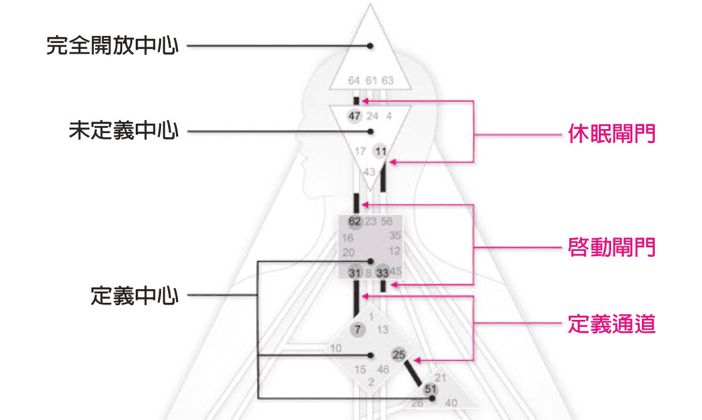

**定义（有颜色）的中心：**上图中，当一条信道两端的两个闸门连通在一起，就形成了定义。7 号闸门和 31 号闸门形成“创始者的信道”，启动 G 中心和喉咙中心；而 51 号闸门和 25 号闸门形成“发起的信道”，启动意志力中心以及 G 中心，这些被启动的中心便是有定义的中心。有定义的中心是我们体内的能量中枢，稳定而可靠。在被定义的中心内，单独启动的闸门（例如 33 号和 62 号闸门）是“悬挂的闸门”（hanging gates），这些闸门为有定义的中心，提供值得信赖的闸门主题。总而言之，每个人被定义的部分，构成独特的振动频率，透过我们的存在，传达给他人。

**未定义（白色）的中心：**未定义的空白中心是我们的脆弱之处，我们有机会在此学习，同时也在此受到周围的制约与影响。图中未定义的中心，拥有一个以上的休眠闸门。它们可能是我们设计中，潜意识（红色）或意识（黑色）的部分。休眠闸门是信道中单独的闸门；它们垂挂在那里，等待与信道另一端的闸门接通，经由电磁连接而启动。休眠闸门会过滤，或引导能量流向未定义中心，使我们能察觉它的存在。

**完全开放的中心：**虽然完全开放的中心，和未定义的中心，有许多共通的特质，但完全开放中心的现象却很不一样。完全开放中心表示没有休眠闸门，这意味着没有什么可凭据；当能量接通开放中心产生作用时，不会有熟悉的主题或感受。完全开放的中心可能最为脆弱，因为没有可以依靠的主题，注入这个能量中心的讯息可能带来混乱，尤其当讯息被放大时。当然反之亦然。由于没有休眠闸门来过滤注入的能量，或是将能量导向特定的主题，因此我们能够体验并学习该中心的所有潜能，当我们愈来愈成熟，这些经验也会成为智慧之源。

**接下来，我们将探讨每个能量中心的特质，及其能量如何在你生命中展现，还有真正的自己与非自己主题。请同时参考你的人类图，一起探索你的故事。**

### 喉咙中心

沟通与发起行动

透过与世界互动，达成蜕变和转化

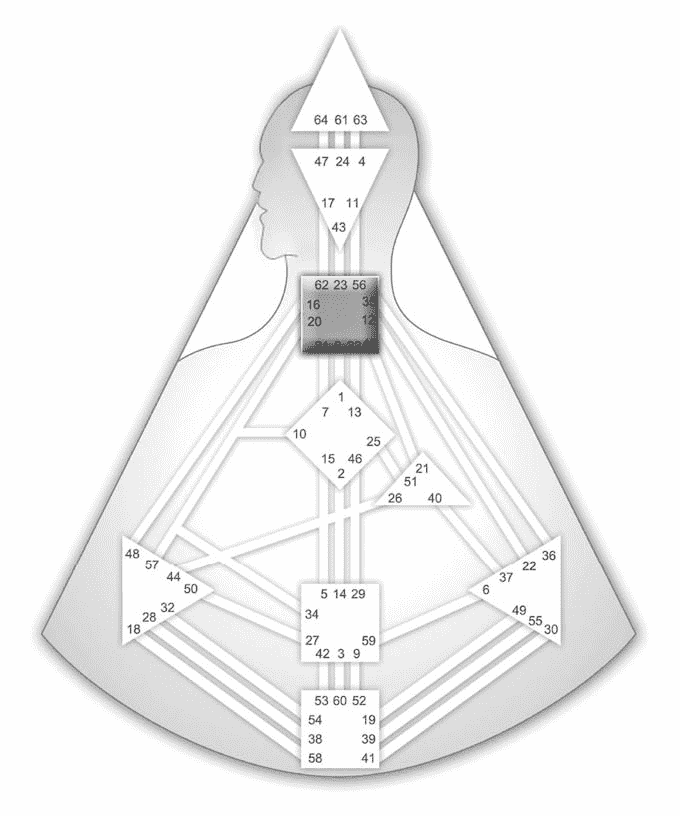

#### ▸ 生物学关联性

生物学中，喉咙中心与甲状腺和副甲状腺相关。它们是负责蜕变与转化的内分泌腺体。甲状腺系统负责监管代谢过程：我们如何消化吸收食物、消化快慢的速度；我们如何消耗能量、动作很快或是慢吞吞；是大块头还是小个子、是胖还是瘦。草率而不受欢迎的发言或行动，或者在应该闭嘴时说话，都会使我们遭受阻力，而显现在生理层面，对我们的声带和甲状腺功能造成损害。

#### ▸ 以沟通或行动来展现

喉咙在其位置与结构上，产生关键的生理变化，伴随大脑新皮质的同步发展，塑造了人类这个物种，在过去八万五千年的演化，使我们有能力表达出自我反映的意识。这些改变让我们可以透过言语沟通，或谨慎行动，充分显示出生而为人的意义。无论喉咙中心在人体图中有没有定义，关于我们如何表达自我、如何体现应有的人生，它都扮演了核心的角色。虽说其功能不见得有所察觉，单纯仅是机械运转，依然是人体图中聚焦的关键点。

如果将人体图想像成一幅城镇的地图，喉咙中心就是城镇的中央广场。位于九大中心的核心位置，也是最复杂的一个能量中心，所有在人体图中流动的能量，都承受强烈的驱动力，要往喉咙中心移动，借以沟通或展现行动。“条条大路通罗马”这句谚语总结了一切。透过喉咙中心所运作的生理历程，流动于人体图内的能量会在体内被代谢和转化。

喉咙中心的*主要功能*是透过沟通来显化，传达出我们是什么样的人，我们如何思考、感受、创造或学习，我们知道什么、想贡献什么，以及我们看过或听过什么，能说出什么样的言语来激励他人。喉咙中心因为有显示的潜力，与十一个闸门（声音），天生就会吸引注意力，这样的设计是为了提供显示的舞台。我们并非生来离群索居。有效的沟通能力能确保人际关系的品质，以及确保我们得以生存。语言和沟通，并非告诉别人该怎么做，而是以独特的方式显示自我，让别人理解我们，这样一来，他们就能回应我们的言行，与我们互动。借由行动之前的沟通，我们可以预先看到接下来的行动是否可行。

我们独有的声音来自人体图中，特定的启动闸门或有定义的信道。在我们的设计中，每个经由被启动的信道而与喉咙相连的能量中心，形成我们特定的声音（以及行动）来源，持续运作而且值得信赖。我们的言语和行动是有意义的，那代表真实的自我，非常重要。信任内在权威会引导我们，而人生策略会告诉我们正确的显示时机，这是何等珍贵的恩赐。

由于喉咙中心承受了各种表达和行动的压力，许多人会有过早或太慢行动或发言的倾向。但只要了解自己的声音，了解我们来到世上要表达或要做的事，并且知道哪些闸门会开放接收并放大讯息，我们就可以放松心情，等待适当的时机，以正确且令人满足的方式，与他人交流。喉咙中心的黄金指导原则是：“跟随你的人生策略和内在权威，每一个时机都是完美的。”这样一来，我们的言语和行为被别人接收时，就能完全发挥其影响力，而非遇到阻力、混淆或扭曲。

喉咙中心的*次要功能*是透过行动来实践。当动力中心连接到喉咙中心时，实践就变得可能。拥有这种定义的人是真正的实践者，能够发起行动，实现愿景。注意：显示生产者（荐骨动力中心连接到喉咙中心的定义）是例外，因为他们要遵循生产者“等待回应”的人生策略，不能主动发起。这些区别将在说明类型的第四章进一步阐述。

这个社会和我们的非自己，极力要求我们贡献生命，变成某种模样，例如选择一份工作或职业。然而，我们是否能够活出自己原本的设计，端视我们能否揭露真实自我——然后把它活出来。

喉咙中心在人体图中居于要位，在体内肩负转化的职责，因此能引发出生命中各个层次的转化与突变。人类图上喉咙中心被启动的特定频率（闸门），显示出改变如何透过我们，持续以不同形式展现，以促进人类的蜕变和演化。下表是喉咙中心的各个闸门。

#### ▸ 喉咙中心的闸门

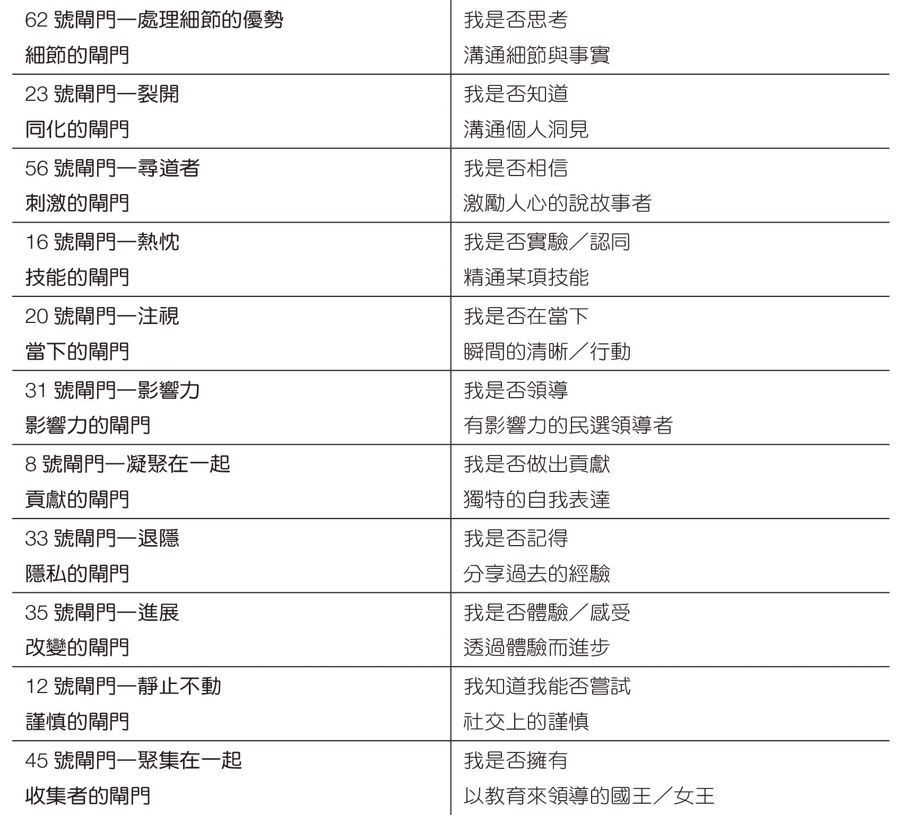

#### ▸ 有颜色（定义）的喉咙中心——总人口的 72%

虽然我们都以为自己说话时，表达的是头脑的想法，实际上我们沟通的内容是取决于喉咙中心中，十一个闸门的主题。喉咙中心是各种“讯息”的能量中枢，这些讯息来自人体图的各个部分；喉咙中心会转化并引导这些讯息，透过沟通与行动，显示于世。

喉咙中心表达或行动的内容，有可能直接来自六个中心：逻辑中心、情绪中心、意志力中心、G 中心、荐骨中心和直觉中心。健康的喉咙中心所表达的讯息，源于真实可靠的定义。举例来说，当喉咙中心连接到意志力中心，它所表达的讯息来自于“我”，像是“我想要这个，我拥有这个，我会这样做。”如果喉咙中心链接到逻辑中心，会说出头脑的想法和概念；如果喉咙中心链接到情绪中心，此人会透过言语或行动，表达情绪或感受；如果喉咙中心链接到直觉中心，他会不由自主地说出当下的直觉认知；如果喉咙中心直接连到荐骨中心，他的言语和行动就是对荐骨声音的回应；如果喉咙中心链接到 G 中心，他所说的话是源于个人的认知和定位方向，来自更高层次的自我。所以，有定义的喉咙中心有个特征：它会以稳定但有限的方式，忠实地表达自己。

喉咙中心链接到动力中心的人，可能会一直“做”（也就是“显示”），但这不表示他们应该一直这样！喉咙中心链接到动力中心，会让人有冲动的欲望，情不自禁说太多或做太多，在每一次的冲动中分散了能量。当喉咙中心有颜色的人，能放心而从容，单纯信任自己的人生策略与内在权威，了解自己的声音来源和使用时机，就可以自在、坦率而清晰地展现真实自我。

#### ▸ 白色（未定义）的喉咙中心——总人口的 28%

白色的喉咙中心，其非自己主题是“努力搏取注意力”。喉咙中心白色的人恐惧别人忽略自己，所以他们的非自己头脑会抓紧机会，想办法吸引各种注意力。由于他们很容易屈服于过度放大的压力，而不停说话、行动、打断他人，刻意让别人印象深刻，或渴望成为社交场合的灵魂人物。他们并不明白开放的喉咙中心，自然就能吸引来注意力，他们只要等待，自然会受邀发言。这样一来，他们便能在最适宜的时机点，得到适当的关注，无须浪费宝贵的能量多做什么，或说些什么来推动事情前进——只要他们的内在权威真的同意这是该说的话。渴望不断发言的紧迫感会逐步降低，因而能减轻声带的负荷。

如果他们空白的喉咙中心，接收来自别人有颜色喉咙中心的制约，感受到放大的压力，觉得自己非得说些什么不可，那么他们讲出口的话常会出人意表，可能难以被人接受。久而久之，他们对开口说话会心生恐惧。在我们这个高度重视口语表达的文化中，最令人不安的，就是觉得自己无法控制，无法进行有效的沟通，这样的困扰也有其解决之道，只要喉咙中心开放的人，愿意相信人生策略与内在权威会引导他们发言，并且学着了解，这个能量中心在自己的设计里，在机制层面如何运作。

当置身于一群喉咙中心有颜色的人当中时，他们可能会觉得不自在，绝大部分所说的话，都只是为了减轻额外的压力。他们也会不断思索接下来该说的话，在此耗费过多能量，结果却说出完全出乎意料的言语，为此感到讶异又不安。他们的困境在于，无法计划自己会说出什么。

对喉咙中心开放的人来说，最健康的方式是不再控制自己，该如何说话；他们的设计要让言语自然流露，并享受不同的声音或表达形式，经由他们而显现。他们得知道，自己并不需要“做”任何事来吸引注意力。当他们与其他人在一起的时候，即使感受到想说话的压力，还是在沉默中放松。他们知道只要等待，别人自然会邀请他们，这才是适当的参与时机。他们的智慧在于，辨识别人的言语和行动，是否发自真实的内心。

如果他们无法交由人生策略和内在权威来决定，可能会被以下的问题，占据所有的思绪：“我要怎样才能吸引别人注意？”或是“我这辈子会成为怎样的人？”但试图以头脑找出这些问题的答案，总是会错失适宜的时机点，即使付诸行动，也会无疾而终，而对甲状腺造成压力。

#### ▸ 完全开放的喉咙中心

完全开放的喉咙中心非常罕见，因为喉咙中心有十一个可启动的闸门。有这种开放结构的人，会不知道要说什么，或采取什么行动。举例来说，喉咙中心白色的小孩，可能会花比较长的时间学说话，大人应该鼓励他们，让他们以自己的节奏学习说话。无论是儿童还是成人，如果他们让非自己来决定如何搏取注意力、如何说话和行动，就会发现自己或多或少，不自觉地模仿别人说话的语调，或是被别人所制约。导致自己总在不对的时机点，说出错误的话，或是完全被忽略。他们所遭遇的阻力随时间而累积，最终将影响他们的自信心和甲状腺功能。

一旦他们接受自己多变，同时出乎意料之外的说话方式，并且信任内在权威的导引，喉咙中心的能量，与其隐藏的智慧就此显现。除此之外，他们也很清楚谁的表达清晰而有力，谁是根据自己的历程真诚发声。

#### ▸ 空白喉咙中心的非自己对话

非自己头脑是未定义中心的代言人，告诉我们该说什么或该做什么。留意这些对话，对于去制约是必要的。下面是非自己头脑对话的一些例子，空白喉咙中心的非自己头脑对话，听起来可能像这样：我该去哪里，才能得到我想要的关注？会有人注意到我吗？如果我这样说，就会被注意到。如果我主动打开对话，就会得到应有的关注。我最好说点什么，因为静默让我不舒服。我应该要发起什么？我最好表现一下。我这辈子会成为怎样的人？

### 头脑中心

头脑压力灵感

问题、怀疑与困惑

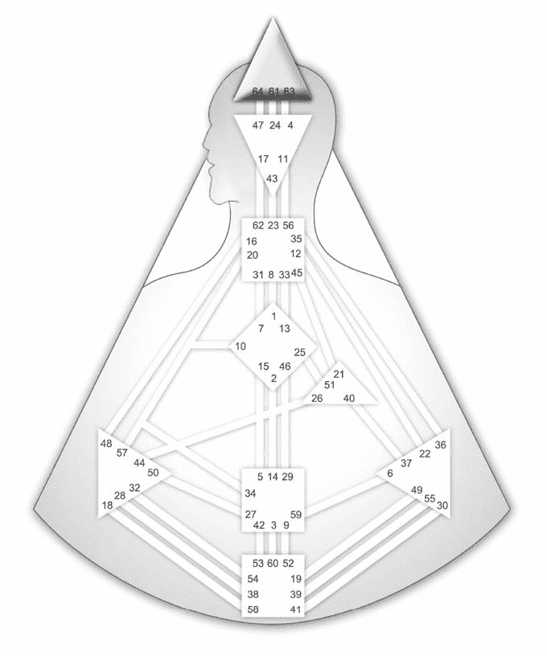

#### ▸ 生物学关联性

生物学上，头脑中心与我们的松果腺相关，负责调节大脑灰质与新皮质（也就是头脑中心与逻辑中心）之间的讯息流动。超过 90%的头脑活动，都发生在大脑灰质深处，在我们能够察觉的意识层面之下，而大脑所处理的一切，皆是透过以往累积的经验，进行过滤。这会产生一股压力，让我们渴望问问题以获得答案，或是需要了解生命中的各种“为什么”。它会刺激或驱动我们的思考与概念，以及我们在意识层面的运作方式。

#### ▸ 头脑压力与灵感

上下相对应，头脑中心位于人体图的顶端，带有压力，我们将之理解为灵感；人体图的底端，则是有肾上腺压力的根部中心，我们将之理解为紧张。头脑中心有其压力，那是一股想要理解、思考和了解世间万物意义的压力。压力会推动我们，将疑问发展成规则和观点，将我们的反复思索，化为解释和洞见，将我们的困惑，变成领悟和想法，让我们的思维在逻辑中心形成概念——然后前往喉咙中心，在那里转化为语言。人类图把这种压力称为灵感，这也是我们自意识的宇宙场域中，接收讯息的方式。

头脑中心的灵感并非引发行动的动能，而是驱使我们头脑活动的压力。它刺激想像，以独特的思考（头脑中心）模式和形成概念（逻辑中心）的模式运作，不但启动我们每天的日常想法，也引发了与存在奥秘相关的大哉问。简单来说，这是一种提出问题，然后期待答案的压力，也是我们每天经历的过程。

我们的头脑中心会施压（也就是指挥）头脑活动，沿着三条信道（代表三种时间架构）通往逻辑中心。它会拟定问题，将焦点放在确保我们未来的安全（63 号闸门）；也会接收并处理，当下值得思索的新讯息（61 号闸门）；还会整理过往偶尔令人困惑的混乱经验，从中找出意义（64 号闸门）。这个路径对三种灵感的来源极为重要：灵感会在路径中开始运作和解码，以便在到达喉咙中心时，仍保有最大的潜力能完整沟通，并发挥影响力。这种打破砂锅问到底的好奇心是头脑非凡的天赋智慧，能够穿透不可知、了解生命的意义，也能成为他人的灵感；如同永无止境的惊奇来源，让我们取用不竭。

每一个决定，都能让我们从脑袋的控制中解脱，若能让头脑放松，重新聚焦并释放其丰沛的创造力，就能对理解、演化及全世界的生命品质，带来重要的贡献。遗憾的是，如果非自己夺取了个人内在权威的角色，头脑中心会开始针对一些无关紧要的事情，创造一连串无意义的问题和想法。这可能会演变成一股持续想知道的压力，充满疑问与困惑，反而导致我们远离真正的自己。如果压力持续累积，却无从释放，就可能形成严重的头疼，例如偏头痛。若是放任非自己扰乱我们的头脑中心，使它无法扮演适当的角色，还会造成另一个后果——头脑无法发挥潜力；头脑原本是智慧的真正来源。我们可以自头脑中心学习灵感的本质，学习如何体验压力，而不失去好奇心，以及如何辨识出，真正能带来启发的人事物。

#### ▸ 头脑中心的闸门

头脑中心只有三个闸门。每个闸门的压力性质与主题，构筑了灵感的范围和模式。头脑中心的压力，将灵感推往逻辑中心，形成概念，然后再交由喉咙中心沟通与表达。下表所描述的压力会让我们感到焦虑，直到我们放下，或找出解决之道。

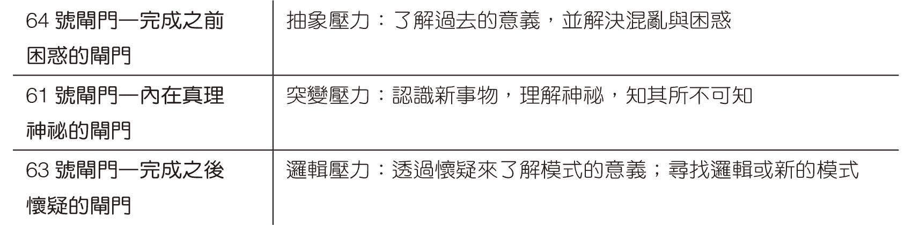

#### ▸ 有颜色（定义）的头脑中心——总人口的 30%

头脑与逻辑中心之间的定义，造成一股持续的头脑压力，驱使人发问和寻找答案，并且试图弄懂一切，以掌控自己的意识运作模式。要处理持续的灵感压力很困难，也可能会增加头脑的焦虑，因为灵感常是我们还无法完全掌握的事物——它只能勾勒出问题本身。头脑中心有颜色的人，有固定的思考模式。他们特有的闸门和信道主题，会成为别人可取用的题材或灵感来源。当他们身处团体中，他们的能量场，会迫使头脑中心空白的人，陷入思考的压力。头脑中心有颜色的人只占世界总人口的 30%，但是他们能够启发（或者说施压）70%空白的人。

头脑和逻辑中心并未连接至四个动力中心的任何一个，也因此，它们的想法和点子并不见得被赋予能量，而直接实现。如果为此挣扎，只会换来沮丧、愤怒、苦涩或失望。当头脑和逻辑中心有颜色的人，将他们的想法加诸外在的世界，渴求实践时，由于世界尚未准备好，他们因而遭遇阻力；但是他们若能等待适当时机，以激励人心的问题，提出各种可能性来鼓舞人们（例如那些能够推动想法实现的人），前述的阻力就会消失。也就是说，仰赖自己的人生策略，来决定时机和听众的接受程度，能节省宝贵的能量，并减轻焦虑，增强自信心。对于头脑和逻辑中心有颜色的人来说，他们天生感受到持续不断的压力，这些压力迫使他们不断解析自己的思考过程、理解自己的灵感，并回答自己的问题。然而，如果他们缺乏耐性，无法忍受这种悬而未决的状态，转而抗拒来自头脑的压力，就会感到极度焦虑、自我怀疑和沮丧。若企图将压力向外转化成行动来纾解，则往往做出草率而不正确的决定，反而错失得到真正灵感的机会。他们的挑战是，接受自己的头脑会生出压力，但是别试图采取行动或逃避。困惑、怀疑和清晰都是自然的过程，有其内建的时间和解决之道。在内在权威的指导下，他们将形塑出独特的特质，可以激发出各种耐人寻味的问题，以及带出振奋、鼓舞人心，并且为别人带来力量的答案。

#### ▸ 空白（未定义）的头脑中心——总人口的 70%

头脑中心白色的人，没有固定思考头脑讯息的方式。如果正常的灵感变成放大的压力，让思维陷入不重要的事情之中，他们非常容易迷失在头脑的自言自语中。无意义的非自己思考和质疑，最终将使他们远离正确的决策过程。若愈来愈焦虑，他们将寻求能带来灵感的人事物，让自己得以聚焦，来减缓焦虑的感受。空白头脑中心若不是逃离智识的追求，就是陷入一个又一个的谜团中。他们很容易一心只想决定或解决一些问题（甚至与自己完全无关），为了解决属于别人的疑问和困惑，而感到失落或不堪负荷。他们想尽快解决别人的问题，却被这压力压垮，因此很难清空脑袋里的所有“东西”，然后放松，结果这又造成更大的压力，逼迫他们的头脑试着理出头绪，来回答永无止境的问题。追根究柢，非自己的头脑制造出更多问题，而非解决它。脱离困惑与疑惑的关键，就是信任内在权威的导引，忽视那个忙于思考的空白头脑中心。维持头脑健康的秘诀是，对想法保持超然的观察，以适当的方式运用头脑，不再将头脑所衍生的压力，轻易付诸行动，让内在权威来引导自己。

空白头脑中心真正的潜力，是琢磨和探索生命的奥秘、人类的意识，以及在各式各样的课题中，累积智慧的潜能。它能够辨别出，哪些灵感值得认真思考、哪些人的头脑让人心烦意乱；谁能够带来启发，谁令人困惑。拥有开放头脑中心的人，可以利用自己从别人身上取得的讯息，成为很好的反射镜，映照出他人的想法，并且帮忙分辨这些思想对人类的价值所在。他们能接受新的见解，喜欢自己的脑袋里充满来自四面八方的灵感和想法。他们享受想知道更多的压力，而非让压力附身，或被压垮。当感觉到困惑或怀疑，他们会放下想找到答案的惯性需求，因为他们知道，这种感觉会过去。最终，他们可以接受未知，体验其中所蕴藏的美丽与深度，并且享受疑问和困惑，相信事情终究会变得清晰，或者相反，而这取决于何者对他们来说最为适宜。

#### ▸ 完全开放的头脑中心

对头脑中心没有任何闸门启动的人来说，当某件事比另一件事更具启发性或更有趣时，他们无法靠本能辨认出来。他们的头脑压力与其余部分缺乏固定的链接，无法轻松进入原本熟悉的思考路径，与他人进行对话。在这个信息爆炸的年代，他们更不知道该专注于何者。他们不知道该想些什么，何者重要、何者不重要，或是为什么，面对思考本身，心怀恐惧。这焦虑可能会让他们的脑筋短路，因而避免任何可能引发脑力激荡的谈话。他们可能被压力所迫，逼自己得想出答案，因而容易分心，或是放弃内在权威，反倒依赖别人来告诉他们，什么事情才算有趣、有启发性或者是否重要。头脑中心完全开放的人，若要享受健康和无限的智能、了解问题背后的压力，并分辨什么能带来灵感，就得让那股不时放大的头脑压力流过，而不把这股压力当成是自己的问题。随着时间过去，当他们能够悠然自处，就会变得非常敏锐，可以感受到头脑中心的细微变化，和它真正的天赋，并且能判断出，别人运用头脑的方式是否有效。他们的敏锐度甚至能知道别人正在想些什么。透过深入探索头脑所得到的启发，将让他们惊叹不已。

#### ▸ 空白头脑中心的非自己对话

非自己头脑是未定义中心的代言人，告诉我们该说什么或该做什么。留意这些对话，这是去制约必经的过程。下面是一些非自己对话的例子，未定义头脑中心的非自己头脑对话听起来可能像这样：我需要找些灵感。或许我去那里，就会找到灵感。我有许多问题，我需要找到答案。我要去哪里找答案？谁能替我解答？我得弄懂这些，还要搞清楚那些。我到底要去哪里，或是跟谁谈谈，才能得到答案？这应该是有趣的吧？我应该要想些什么呢？

### 根部中心

身体的肾上腺压力

维持生存的动力，压力

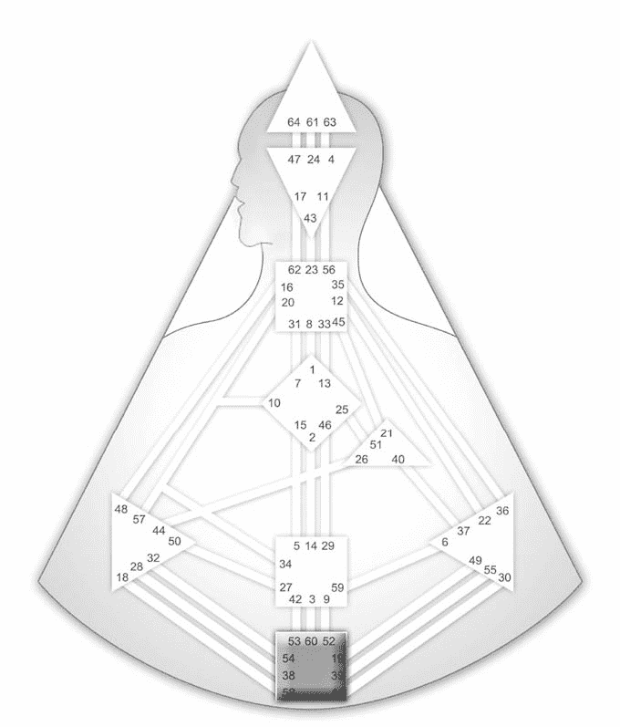

#### ▸ 生物学关联性

生物学上，根部中心与肾上腺系统以及压力荷尔蒙的生成有关。根据这个能量中心的背景环境，我们知道压力仅仅是燃料。它能启动我们内在深处的某些生化程序，这是为了帮助我们面对并主导生活中的各种状况，以维持我们进步和演化的动力。压力无可避免，我们不能去对抗这股重要的动能，否则就会付出代价。若无法明白体内这股压力的运作机制，便容易把自己逼得太紧。若将这股压力转向内在，可能会因而感觉沮丧，为此深深受苦。反之，若能在过多与过少的压力间，维持适宜且健康的平衡，就能得到它的副产品：感觉充满活力，生活本身洋溢着喜悦。

#### ▸ 肾上腺压力（燃料）与动力能量

头脑和根部中心都是压力（燃料）的来源，压力驱动能量前往喉咙中心，用来沟通或实践。这个共通性让两个中心，彼此有了深刻的内在链接。头脑中心带来头脑压力，呈现在外成为怀疑、困惑和灵感；根部中心带来的压力和燃料，让我们得以演化并适应这个世界，可以通过最困难的挑战。压力提供我们最纯粹、最强大的能量与动力，让生命持续前进。

然而，根部中心与头脑中心不同，它的独特之处是，它既是压力中心，也是动力中心。九种不同的生命程序，都被源于根部中心的能量所激发。尽管最后全都会通向喉咙中心，但在此之前，这强而有力的燃料必须先经过消化或调和的步骤，而这要透过与根部中心相链接的几个中心来完成，也就是荐骨中心、直觉中心或情绪中心。根部中心的压力（肾上腺能量）过于强大，因此无法直接通往喉咙中心。

#### ▸ 根部中心的闸门

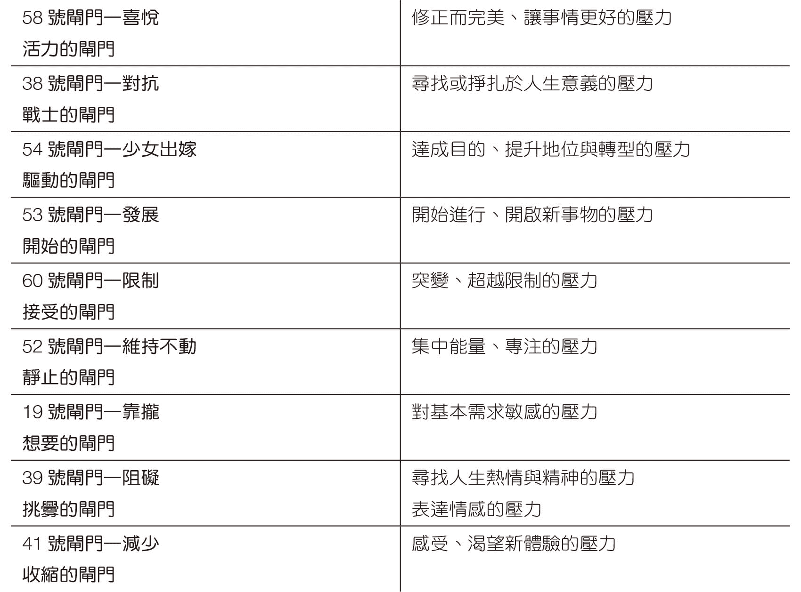

根部的压力能确实地让身体行动，是人生中显化时不可或缺的要素。压力本身无所谓好坏，而我们控管它的方式，会根据我们每个人独特的根部中心配置（有颜色或白色的特定闸门）来决定。

#### ▸ 有颜色（定义）的根部中心——总人口的 60%

有颜色的根部中心，以持续运作并特定的方式处理压力，这股动力让我们持续前进。有定义的根部中心可链接到三个不同的中心：荐骨中心、直觉中心和情绪中心。

连接根部中心与荐骨中心的三条信道（如下图所示）称为“组织能量”（Format Energies）。它们决定我们在世界上运作的方式，是有逻辑且专注的、或者有周期循环，抑或是不可预测且带来突变。拥有逻辑组织能量（52-9 专心的信道）的人，会以循序渐进的逻辑、精细而有系统的方式来生活；拥有抽象组织能量（53-42 成熟的信道）的人，生活在多样体验的循环中，且每个循环都有清楚的开头、中间和结尾；而拥有个体组织能量（60-3 突变的信道）的人，生命中会间歇性爆发突变能量。这些组织能量强而有力，渗入拥有者的整体设计中，同时对于那些接触他们的人带来显著影响。

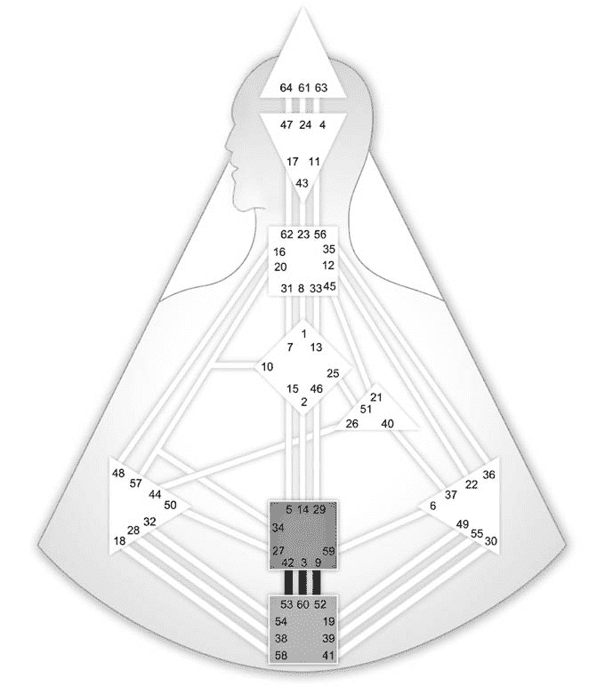

根部中心链接到直觉中心的人，为了在物质世界里保持健康，并蓬勃发展，会依靠持续运作的方式处理压力，包括生存的压力、阶级提升的压力，以及修正无用之事的压力。根部中心以这样的方式，激起对存在的察觉和生存意识，包括在躯体中存活的喜悦。

根部中心链接到情绪中心的人，会以持续运作的方式处理情绪压力，面对新奇和渴望的事物，以及处理个人与社会的关系。这就是压力所激起的情绪察觉，或称为情绪／关系智能。

根部中心有颜色的人，也可能屈服于非自己的压力。如果他们时时刻刻感受到的那股强大压力，并非来自人生策略和内在权威的正确引导，便可能变得执迷。他们会主动发起，接着因为错误的压力型态，而引发各种抗拒，最后对自己的健康造成损害，他们容易以不合理的期望，将压力转嫁到别人身上。

一旦他们与自己固有的内在压力安然共存，就能敏锐地警觉到，根部中心空白的人，是否被其不健康且放大的根部压力所驱动着。只要他们遵循人生策略和内在权威，源于内在的平静和喜悦，那么这段努力的历程虽然充满着挑战或压力，他们依然能靠着根部中心持续运作的能量，根植于地。

#### ▸ 空白（未定义）的根部中心——总人口的 40%

空白的根部中心会吸收来自周围环境的压力。根部中心空白的人，自根部中心有颜色的人身上接收压力。可是放大的压力又让人不舒服，他们会试着摆脱它，但一旦摆脱，又马上被另一个压力取代。他们东奔西跑，试图完成三人份的工作，想解决无法解决的压力。这循环看似永无止境，却无法持续下去，最后让人筋疲力尽。

空白根部中心会接收，并放大来自肾上腺的刺激与压力，但是却无法长久维持那股动能。久而久之，这种制约可能会演变成过动、难以控制的焦躁，注意力无法集中。孩子通常为此付出巨大的代价。他们开放的根部中心会放大来自别人的能量，当这股放大的能量被误解为不守规矩、不听话或是智能缺陷，他们往往会被惩罚、羞辱，或者被送去治疗。想想所有根部中心开放的孩子，一直被施以药物治疗，好让他们可以安静下来。如果可以了解孩子的整体设计机制，就能寻求新方法，来处理这些能量的运作型态，而非继续伤害我们的孩子。

大多数人皆是无意识地运作，让外在的压力来驱动自己。当根部中心空白的大人或小孩，开始了解他们感受到的压力并非属于自己，他们就能找出方法，避免被压垮。当他们感受到压力时，基本上有两件事可以做。第一，走远一点避开它，同时深呼吸，释放出一些被压抑的压力；另外则是利用这股肾上腺能量。举例来说，一个舞台上的表演者，他的根部中心若是空白，肾上腺素激增的热情观众，反而能成为他的力量来源。外界的肾上腺素大量注入，还会造成另一种极端的反应，就是令人瘫软，感到恐惧或怯场。依赖肾上腺的压力也可能会成为习惯或瘾头，让人容易遭遇各种健康问题或意外事故。

空白的根部中心若能正确运作，便会等待内在权威，引导他们做决定。若他们无法迅速展开工作，或是干脆不做任何事，也不会批判自己懒惰或无能。他们能够分辨周遭环境的压力是否健康，而不会依附在任何一种压力之上——他们只会直接区分压力，知道何时能正确运用压力，来增加生产力，也知道何时这根本行不通。若正确做出承诺，他们会给自己所需的时间完成任务，并且真正享受它。

当他们不再认同或迷惑于被制约的习惯，就能从空白的根部中心得到智慧。他们就能观察压力如何运作，也能看出该如何正确地利用。他们会知道，何时利用肾上腺压力是健康的，何时该避免。关键是，要认清那股压力是否属于他们。

#### ▸ 完全开放的根部中心

根部中心完全开放的人，可以感受到来自各领域的压力，从专注集中的深沉寂静到激烈的躁动，但是他们并不明白这点。当他们忽略自己的内在权威时，很容易无意识地运作，让放大的肾上腺压力，和不正确的头脑决策，推动生命向前。他们为了释放压力，会不自觉地接听电话、允诺别人、加快速度，因而容易发生事故，也总觉得自己忙碌不堪，却仍然相信这就是生活的方式。因为他们无法辨识压力，也无法意识到这被放大的压力，其实并不属于自己，所以无法有效运用。他们的设计其实无法持续承担不断放大的压力或动力水平，否则内在就会崩解。例如极端的怯场，或是恐慌症发作，在这种时候，他们完全无法动弹，也无法让他们的人生继续前进。他们可能会因而失去活着的喜悦。

大自然对他们来说，是一个平静安心的地方，一个休息站，一个和平的缓冲地带，让他们暂时脱离这个要求很多、节奏很快的世界所带来的压力。一旦他们单纯任由不属于自己的压力通过，让自己的系统平静下来，所就能与自己内在那股舒服耐压的压力水平，重新链接。借由运用自己的人生策略和内在权威，他们能在推动生命前进，与静止不动，这两股压力之间，维持健康又有生产力的平衡。和平、耐心与平衡因而变得可能，同时伴随着智慧，得以清楚地看见，并评估这股虽然重要，却往往压垮一切的压力，如何在个人和全体人类身上发挥作用。

#### ▸ 空白根部中心的非自己对话

非自己头脑是未定义中心的代言人，告诉我们该说什么或该做什么。留意这些对话对于去制约是必要的。下面是非自己对话的一些例子，白色根部中心的非自己头脑对话听起来可能像这样：我到底该做什么，才能让自己的人生好过一点？我的目标在哪里？我这辈子总要完成些什么，所以最好动作快一点，赶快把事情做完。我现在必须开始做点不一样的事情。我该如何突破限制？我要专注在哪件事情上呢？我需要有件事可以专心投入。我必须被需要，有谁需要我呢？我要去哪里才会被需要？我的热情在哪里？我到底对什么充满热情？我渴望新体验，我得赶快发起一些没做过的事。我不想浪费任何时间，我要快点完成才行。

### 逻辑中心

头脑意识

概念化，将答案转译为意见、概念和理论

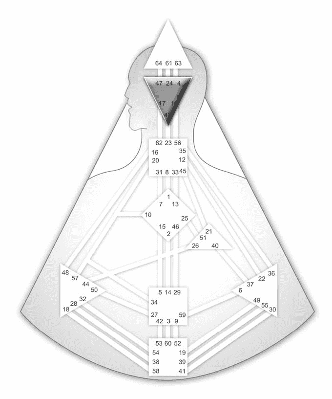

#### ▸ 生物学关联性

逻辑中心与三种生理功能有关：新皮质、视觉皮质和脑下垂体。微小的脑下垂体前后叶位于大脑基部，是维持我们身体恒定的中枢。脑下垂体会传送荷尔蒙讯息到甲状腺，下达指令维持生命，让我们保持正常功能，和最佳的运作状态。这些内分泌系统的主要腺体，紧密地链接到身体各个部位，因此，亿万年来，我们一直以头脑来主宰生命，并不奇怪。虽然脑下垂体现在仍然监控我们整个系统，但身体的整体意识层级已经进化，而头脑所扮演的角色也随之转变。

#### ▸ 头脑察觉，头脑与决策的关系

我们人体图中的九个能量中心里，有三个是察觉中心：直觉中心（身体意识）有身体和求生的智能，逻辑中心（头脑意识）有头脑智能，而情绪中心（情绪意识）有情绪智能和新形成的精神察觉。透过这些察觉中心，我们能够意识到活着的感受，以及与他人的关系。其余六个能量中心都是单纯机械式的，在我们自觉的意识层面之下运作。

头脑中心与逻辑中心共同运作，就是头脑。逻辑中心是一个处理中心，能转化压力，将来自头脑中心的灵感，转为实用的讯息，以供进一步检视、研究与沟通。逻辑中心只负责转译；它跟头脑中心一样，无法实践。逻辑中心的两端是没有动力的头脑中心和喉咙中心，它是人体图中，唯一一个远离能量的察觉中心。另外两个察觉中心都能链接到动力中心，可以将觉察化为行动。直觉中心紧邻接荐骨中心和根部中心，而情绪中心（它本身就是动力中心）则邻接根部中心、荐骨中心和意志力中心。头脑察觉是第二个进化的察觉（直觉察觉是第一个），主导了我们现今认知世界的方式。我们的感知来自两个主要的处理过程：一个是视觉，一个是听觉。视觉与视觉皮质的发展有关，关注的是过去已经发生和未来可能发生的事；听觉则是关于纯粹的灵感，和当下想知道的压力。

逻辑中心的察觉频率和直觉中心不同。直觉察觉与生存有关，只在当下自然发生；而我们头脑活动的频率则是时时刻刻运作。头脑所做的决定，效期很长，可能让你反复思量，直至死亡！这个意思是说，我们根据开放中心传来的讯息，所做的任何决定，将一遍又一遍地陪伴我们度过余生。我们会一直陷在它所编织的虚幻之网中。例如，如果你的非自己头脑做出一个决定，之后证实行不通，它会自动建议你，再尝试其他选择。若再行不通，它会告诉你本来应该选用另一个选择。但对你来说，这些选择其实没有一个是正确的，而且它们永远都行不通。你只会困在充满无效建议的死胡同。如果你想摆脱混乱与失望，不再做出错误的头脑决策，唯一的办法就是意识到，头脑不是你生命中的权威。

头脑以“非此即彼”的二元化模式，来评估或处理讯息——这是一项珍贵的天赋，能同时比较两个以上的面向，来衡量任何概念。逻辑中心可以看出一项决定的正反两面，然后建构出两个彼此相对的论点。其中一个论点认为这个选择“因为如此”，所以不好，而另一个论点则认为它“因为如此”，所以很好。不过，这就是头脑所能做的一切了：反复地来回辩论。可是它既不能判断，也不知道哪个选择最好，它知道的是，每一个问题有多少面向需要考虑。

想像一下，你和某个人有点误会，希望能解释清楚。你想跟当事人谈谈这件事，把心里的话全都说出来。你可以利用头脑善于分析的天赋，列出双方的论点，但先不要打电话给那个人！让你的人生策略和内在权威，引导你说话的时机和内容，否则，你将不断地重复这些对话：“我做对了吗？如果我这样做或那样说，结果会怎么样呢？”在错的时间点作出反应，只会带来痛苦和懊悔，却无法解决问题，这是因为，二元头脑不会放过任何问题的另外一面。头脑的理性分析和比较，无法让我们了解真实的自我。真实必定来自我们个人的内在权威。

成功面对恐惧之后，察觉就是最终的结果，而每个察觉中心皆有其对抗恐惧的形式。逻辑中心所体验的恐惧，呈现出来的是头脑的焦虑，这股焦虑来自对无知的恐惧，或是被人误解的恐惧。这两种恐惧若能驱使我们更了解自己的想法，并清楚地表达出来；那么，这两种恐惧是健康的。然而，当沟通失败，焦虑就会浮上表面。我们处理焦虑的方式，若不是带来控制和察觉，就是进一步地加深焦虑。不论我们的逻辑中心是否有颜色，我们每个人都带有上述的恐惧，而空白的逻辑中心会放大这些恐惧。

“察觉”（或说是头脑智能）的价值并不在于控制，而在于能够分享我们独特的观点并激励别人，且在对的时间和对的地点，带给别人力量。我们来到世上是为了与彼此相遇，为了清楚传达生而为人的体验，而这是为了滋养和教育后代子孙，为他们保存历史，同时仔细思考和探索生命的各种可能性。

逻辑中心的每个闸门，都在脑中夹带特定的焦虑，焦虑的作用是使我们意识到，自己是否屈服于外界的期望；而这些期望会对察觉力造成干扰，对我们头脑的健康状态，造成危害。

#### ▸ 逻辑中心的闸门

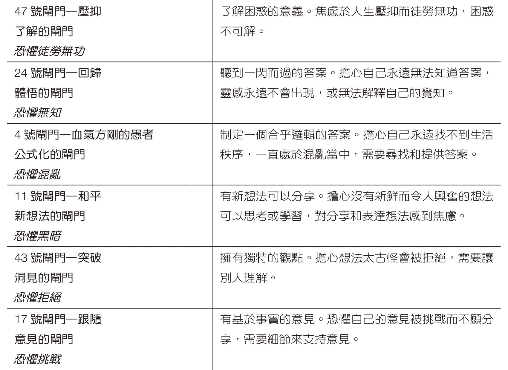

#### ▸ 有颜色（定义）的逻辑中心——总人口的 47%

逻辑中心有颜色的人，大部分时间都以同样的方式构思，因此头脑是持续稳定运作、特定而可靠的。他们头脑的偏好和倾向，由闸门和信道所决定，不太容易被别人的存在而影响。他们可以产生概念、激励别人，并迫使别人思考。他们的头脑是用来处理信息、发挥创造力，并且作为他人的外在权威。他们透过这些方式，影响其能量场内脑袋运作的范畴，同时也对人带来制约。

有颜色的能量中心总是处于“使用中”，所以逻辑中心有颜色的人会不断思考，不断处理讯息。他们可能很难静心冥想，因为他们无法停止或控制自己的头脑活动。另一方面，他们也很享受自己的头脑总是处于兴奋状态。逻辑中心可以链接到头脑中心，或喉咙中心，变成有颜色的中心。如果逻辑中心链接到喉咙中心，那么他们随时能根据人生策略和内在权威，说出自己的想法。这两种定义都可能造成强势的头脑，倾向用头脑来做决定；但这往往让他们感到力不从心，或觉得自己伪善，因为无法说到做到。当逻辑中心有颜色的人，过于依赖自己的头脑，就容易耗费很多能量，执着于未完成，却已无法挽回的行动或决定。

#### ▸ 空白（未定义）的逻辑中心——总人口的 53%

如果图中的逻辑中心没有颜色，头脑中心也不会有颜色。这两个空白中心的启动闸门所表现的主题，代表着头脑如何运作，并影响与我们互动的人。

空白的头脑和逻辑中心是开放而灵活的脑袋。这是头脑智慧的象征，代表的思想家或智者有佛洛伊德、荣格、爱因斯坦和居礼夫人。一旦头脑从制约中解放，就能开放地接收全方位智识的刺激和创意。而关于头脑复杂的运作模式，涵盖了先天和后天的学习所融合的智慧。如果他们不坚持（或声称）那些概念、想法或意见，是属于自己个人的真理，或是过度认同其中任何一点，那么开放的头脑，就能运用自身聪明的天赋，深入思考，探索这个世界。

逻辑中心空白的人，能够分辨何者是有价值的概念，并且为目前正在讨论的问题，辨识出谁可以提供深思熟虑的答案。他们有办法从成千上万的各种可能性中，筛选并收集重要的部分。而且经常在团体中的某人发表其言论之前，就已经猜到他的想法和观点。

他们从小时候便开始，逐渐察觉自己的想法天马行空，好像天外飞来一笔，又像来自四面八方，不着边际或不正确。恐惧和制约让他们认为必须确定自己的想法，才会显得聪明。因为害怕看起来愚笨，他们只好假装自己很确定某些无关紧要的事。久而久之，可能变成一习惯，他们甚至没有察觉自己的惯性。

想像一下，某个逻辑中心有颜色的人指导一个逻辑中心白色的孩子。例如爸爸（或是妈妈）逼迫孩子用逻辑思考，但孩子本身的设计却是抽象思考。这个孩子只要一用特定的方式思考，就会觉得感受到压力，而且当他无法持续这么做的时候，便会觉得自己不够好。这样的孩子会认为自己有问题，因而在成长过程中，被制约出一种补偿的做法：假装自己很确定某些事，只为了感觉自己是被接受的，而且值得被接受。

不过，一旦他们了解并接受到，自己的头脑无法以固定方式运作，也永远无法真正确定任何事情，他们的头脑就会恢复正确的角色，成为一座游乐场、一间教室，既是娱乐大家的欢乐源头，也是别人的智慧宝库。

#### ▸ 完全开放的逻辑中心

逻辑中心和头脑中心完全开放的人，很难知道自己该想些什么，或是如何解释想法、把想法化为概念，然而这些事情，对于我们这个头脑导向的社会来说，却非常重要。他们无法透过启动闸门，或引导的信道来组织想法，因此没有任何固定而可靠的理念可以依赖。这可能会让他们感到无助和焦虑，甚至觉得思考徒劳无益。如果他们的非自己利用这种情况，加强对生活的主导性，就会取代他们个人内在权威的地位。

逻辑中心完全开放的人，可以思考各式各样的理论、概念和见解，从中获得很大的乐趣——他们不会紧抓住任何想法不放，或是陷入特定的思考模式。当他们得到适当的邀请，而受到启发时，便能辨识出哪些是好主意或好概念，并有机会发展到下一阶段。他们最实际的贡献之一，就是帮助我们看见非自己和非自己头脑如何引诱我们，使我们远离自己真实的道路和使命。

#### ▸ 空白逻辑中心的非自己对话

非自己头脑是未定义中心的代言人，告诉我们该说什么或该做什么。留意这些对话对于去制约是必要的。下面是非自己对话的一些例子，空白逻辑中心的非自己头脑对话听起来可能像这样：我最好搞清楚这一切，我们必须弄清楚。我这辈子该做什么呢？我得想清楚这辈子要做什么。我的下一步在哪里？我很确定　　　　（请自行填空）。我必须了解生命所为何来，它感觉只是一场空。我必须“知道”答案。为了摆脱混乱，我必须让我的人生步上秩序。我一定要在生活中实现这个新想法。我最好不要告诉别人这个想法，因为大家会觉得我是怪胎、很奇怪。我不打算分享我的意见，因为我不想要被挑战。我得准备好迎接挑战。我接下来要说什么呢？

### 直觉中心

身体意识

全然为存在而活，自发性，健康与幸福，价值观，免疫系统

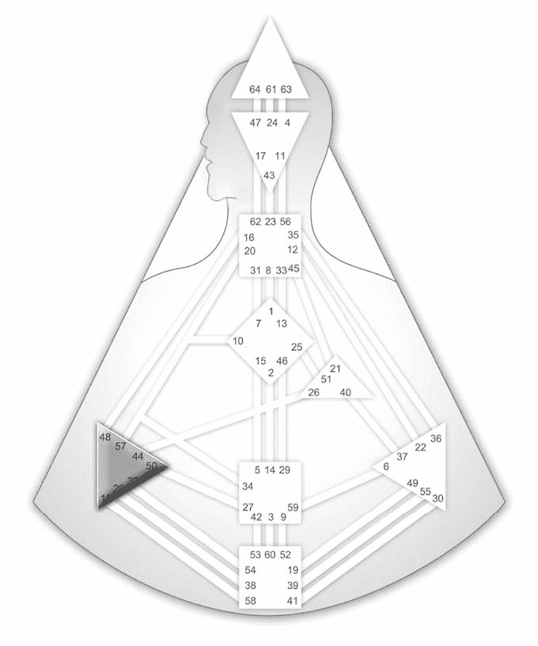

#### ▸ 生物学关联性

直觉中心与我们的淋巴系统有关，包含脾脏和 T 细胞。淋巴系统的细胞，就像是遍布全身的小耳朵、小鼻子和小舌头。它们总是保持警觉，不断地透过听觉、味觉和嗅觉，确保我们环境中的一切健康而平衡。如果有什么不对劲，它们就会警告我们。这是我们免疫系统的中枢。当 T 细胞（脾脏的战士，约占我们身体细胞的五分之一）被启动，它们会攻击并摧毁任何入侵身体的东西。它们的工作就是保护我们，免受疾病侵害。

直觉中心没有颜色的孩子，很可能最先把外界的各种疾病（例如流行性感冒、一般感冒、麻疹或腮腺炎）带回家。这是他们的身体对于常见的疾病，缓慢创建先天免疫系统的方式。要维持这些孩子的健康，关键在于生病之后要让他们完全复原。帮他们向学校多请几天病假，让他们能彻底恢复活力。教导他们如何照顾自己，充分了解自己潜在的健康状况。如此一来，当他们成年之后，便会对自己的健康和感受非常敏锐，知道哪些食物和健康疗法适合他们，而哪些则应该避免。跟直觉中心有颜色的人相比，他们通常需要较为温和的健康疗法。

直觉中心有颜色的人，往往认为健康是理所当然的，定期检查可以帮助他们，确保总是辛勤工作的直觉中心，并没有隐藏潜在的问题。当不得不屈服于疾病时，他们通常需要一段漫长的恢复时间，在完全康复之后，才能返回满档的活动日程。

#### ▸ 察觉源于对生存的恐惧

这个神奇的能量中心，对于生存和健康具有原始的恐惧，却也是我们的心情开朗、欢笑，以及自发性和胆量的来源。它对生存的察觉（在当下的察觉）能够确保我们能安全前进，同时也于内在深处，稳定净化我们系统中所积累的毒素，以及负面振动／记忆所带来的不良影响。（回顾：人体图的九个能量中心里，只有三个察觉中心——直觉中心、逻辑中心和情绪中心。察觉让我们意识到自己的生命经验。其他六个能量中心则在纯粹机械的基础上运作。）

关于察觉能力，已经演化了数百万年，而这三个察觉中心各自代表着演化过程中的不同阶段。直觉中心是其中最古老的。它为生存驱动的原始察觉，链接了我们和所有的生命形式——植物、爬虫类、鸟类、昆虫，还有我们的近亲哺乳类（见下图的各个设计）。作为最古老的察觉中心，以及所有生命中最普遍存在的中心，其主要功能是让形体得以存活——确保我们不要变成别人或别种生物的午餐。

这个中心的运作模式是关于瞬间的本能与警觉，对任何威胁到我们健康的东西（包括负面的情绪振动），有一种本能的警觉。恐惧是它运作的模式，因为生存的恐惧会产生警觉。久而久之，这些原始的恐惧也演化成智慧，这是身体觉察（身体意识）的智慧，让我们得以生存、适应和并在俗世中欣欣向荣。直到今天，求存的智慧仍存在体内，让我们随时保持警觉，坚守岗位。

在这三个察觉中心里，逻辑中心（人类所独有）比直觉中心强大两倍，而情绪中心（尚未完全演化的察觉中心）又比逻辑中心强大两倍。直觉中心背负攸关生死的重责大任，却是三个察觉中心里最弱的一个；这个事实显示出，生命是如此脆弱。无论是逻辑或情绪中心的非自己声音，都能将来自直觉中心的微弱警告，轻易掩盖过去。

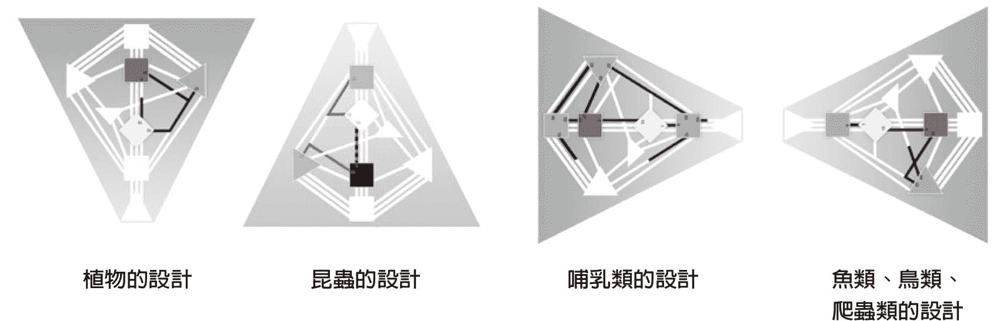

关于各种形式之设计，完整条列于第十一章。

所有察觉皆始于恐惧，三个察觉中心里的每个中心，都有自己的恐惧频率。直觉中心的每个闸门，各自代表着各种与生存相关的原始恐惧。直觉系统的察觉力是智慧，每当我们面对恐惧或挑战时，直觉就会出现，好让我们存活下来；而这些挑战皆与生存、信心，以及健康福祉息息相关。

#### ▸ 直觉中心的闸门

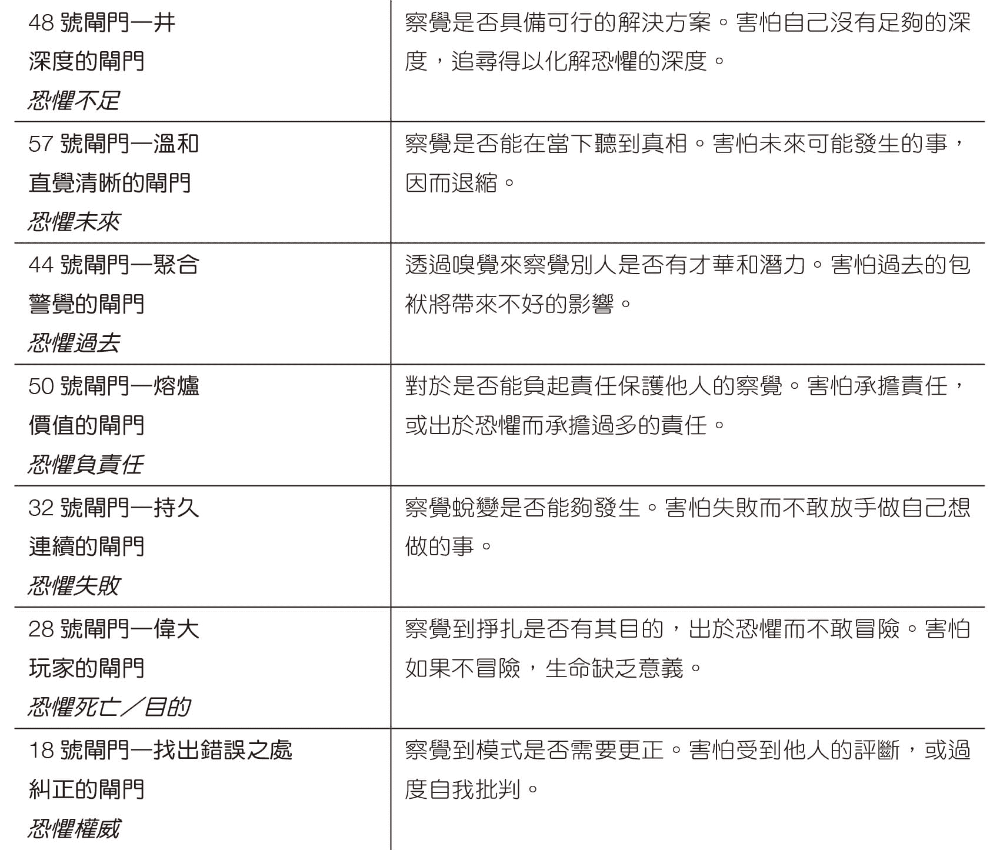

#### ▸ 有颜色（定义）的直觉中心——总人口的 55%

直觉中心负责求存，让我们能健康地成长茁壮。它控管我们的本能、直觉和味觉，在分辨的过程中，区分出对于生存而言，哪些是健康或不健康的东西。这种非言语的识别工作在当下进行，就在“此刻”。这个重要的自发性讯息，就是我们所说的直觉、内在本能或预感，让我们可以随兴做出值得信赖的判断和决策。然而，无时无刻的察觉也意味着，直觉中心绝对不会重复其第一次的警告。我们在当下若错过直觉微弱的警报，就会错过了，因为这些警告是出于当下的生存需求。

直觉中心有颜色，并以此作为内在权威的人，必须倾听自己的直觉，照它所说的话去做，不要让非自己或任何人的头脑介入，使自己无法遵循本能，因为这是内在值得信赖，并能产生可靠结果的声音。若听从自己的直觉，他们就能保持警觉，受到保护，感觉舒服，且能享有强健免疫系统所带来的好处。他们表现出的健康状态，可以让直觉中心空白的人非常羡慕，因为空白直觉中心的人无法如此自在。直觉中心有颜色的人能与存在本身谐调一致，他们能以无忧无虑，却又谨慎的放任态度，完全活在当下。他们需要依靠躯体本身的察觉力（他们身体的智能），那么他们一生中的每分每秒，都能受其引导和保护。

头脑不是权威，即便它强大而合乎逻辑的思想，能轻易地压过直觉中心微弱的讯息系统。当一个人收到突如其来的警告，其实根本无暇也无法弄清楚，直觉中心为何会发出这个讯息。生存的察觉无须理由，只需要被单纯信赖。若要更全面地了解一个经验的各种观点，只能在事后回顾。而对某个人来说此刻不正确的选择，也许过了三十分钟或一天后，就是正确。对直觉中心而言，当下最重要，而这也是它所意识到的全部。

多年来，人们一直让头脑凌驾一切，将头脑的判断置于直觉中心的直觉认知和察觉之上，最后可能完全与自己的直觉脱离，让生命暴露在危险中，并遭受不必要的疾病和不幸之苦。他们“认为”自己不敢顺从身体的直觉智慧，但若不这样做，结果可能是灾难一场。

#### ▸ 空白（未定义）的直觉中心——总人口的 45%

有七种原始恐惧存在于直觉中心，当这个中心空白时，这些恐惧很容易被放大。空白直觉中心的人，需要一个接一个面对自己内在的恐惧，好让他们终于能以健康的方式，成为无惧之人。这是他们发展察觉、尊重恐惧并从中学习的方式，而不是压抑恐惧或假装它不存在。面对并处理恐惧，能让他们变得更坚强，而且当恐惧再度来临时，害怕的程度也将大幅降低，最后才能获得幸福与安适的感觉。然而，如果他们无法这么做，受到制约的非自己，可能会被恐惧所压垮。

直觉中心空白的人，带着根本的恐惧来到世上，因为他们天生没有在地球生存所需的装备。他们是开放的，对于世界缺乏幸福感，也很敏感，而且他们会将此视为自己个人的状况。当他们受到周围直觉中心有颜色的人制约时，会觉得比较舒服与安全。他们从小时候开始，就会不自觉地寻求直觉中心有颜色的人来依附，因为他们需要安全和幸福的感觉，而那些人似乎可以提供——不管之后还伴随着些什么。他们通常会紧抓住对他们不好的人事物，形成各种不健康的依赖关系，尤其在家庭关系中，直觉中心空白的孩子，和直觉中心有颜色的父亲或母亲。即使这个人会虐待孩子，这些孩子还是会拼命抓住父亲（或母亲）不放，只为了靠近有颜色的直觉中心“感觉舒服”的制约频率。如果被单独送进房间，他们会感到恐惧，也经常觉得被拒绝和遗弃，害怕自己无法生存下去。这使他们更加依赖父亲（或母亲）带来的安全感，最终产生不健康的依赖关系。源于童年制约，当这些孩子长大成人，他们的非自己头脑将说服他们，就算是对自己不好的人事物，也要紧紧抓住不放。

在成人阶段，如果直觉中心空白的人和直觉中心有颜色的人在一起，但这段关系却是不健康的，他们会说：“明天会更好。”“或许治疗会有效。”或是“孩子要怎么办呢？”这就是许多回到施暴配偶身边的受虐妇女，所面临的困境。深层的生存恐惧，吸引他们跟直觉中心有颜色的人在一起，却可能让他们盲目，分不清对他们而言，哪些是好人、哪些是坏人，他们也不知道何时该抓紧一份关系，何时该放手。

当空白的直觉中心被有颜色的直觉中心或流日所影响，而暂时被启动了，会体验到安全感的假象。空白直觉中心的人有一句名言：“永远别随兴做出决定。”依靠本能行事（可能有危害或威胁的情况例外）会为白色的直觉中心带来风险，因为那股不断变化的冲动感，不值得被信赖。空白直觉中心的非自己，深深被随兴所吸引，试图让自己感觉舒服，并且消除恐惧，却往往得因此付出很高的代价。

当空白直觉中心的人，进入有颜色直觉中心的能量场时，他们会自然承受一股压力，想要冲动做出反应。在大多数情况下，他们不会意识到这件事，但最后却照着别人强迫他们的方式来生活。可是这对他们来说，并不属于他们的人生，可能也并不安全。如果能依循人生策略和内在权威的指导，就能避免冲动的诱惑。同时，受制约的空白直觉中心，在当下所做出的冲动决定，也可能让他们错过原本有益的人事物。“噢，我再也不需要那个（他们）了。”然而，一旦断开此制约的链接，他们就会意识到，自己犯了错，放掉了对他们真正有益的东西。如果没有依赖内在权威，而突然做出决定，可能造成影响深远的后果。

空白直觉中心若处于健康的状态，可以区别出他们自身的需求（从健康的某些面向来说），以及来自周围环境的不适感。当他们跟不健康或非常不快乐的人在一起时，会发现自己感觉不适，此时他们知道自己可能吸收了别人不健康的振动频率。当某个人或某件事对他们无益时，他们也能感觉得到。他们可以感应到自己的本能和直觉察觉，但也知道这并非他们做决定的内在权威。他们很注重自己的健康，愿意培养身体的适应力。他们明白，面对自己的恐惧有多么重要，也知道如何处理生存的恐惧。他们最终将在此累积智慧，知道直觉如何运作，也知道人们是否拥有直觉。最后他们会变得很敏锐。尽管如此，其空白直觉中心仍然永远不会是决策的可靠来源，因为它太容易受到周围环境的制约。他们只要透过人生策略和内在权威进入新的关系，其直觉中心就会在人生中，获得正确的制约。

空白直觉中心随时间而累积的智慧，让许多专业治疗师得以造福病人。当他们进入病人的能量场，自然能够辨别出，这个人正处于健康或生病的状态，以及可能是哪里失去平衡。当空白的直觉中心学会区分，哪些能量是透过别人产生、哪些能量属于自己，就会在此区块涌现同理心。唯有不把别人当下的感受当成是自己的感受，空白直觉中心才能获得与直觉相关的察觉力或智慧。

#### ▸ 完全开放的直觉中心

我们所有人都有健康和正当程度的恐惧感。当直觉中心完全开放的儿童或成人，对于恐惧一无所知，无法确定何谓生存和健康的恐惧，他们可能会对一切皆缺乏安全感，并感到恐惧。然而就因为不知道要害怕什么，因此也可能变成天不怕地不怕，而做出愚蠢、危险、不健康的事情。

透过这个能量中心的共振，他们能完全开放地，接收所有潜在的本能和直觉，因此更强化了直觉中心的智慧（如同上述空白直觉中心的智慧）。这察觉包含了法律、价值观，以及我们在事业上的努力，以培育、保护并确保我们后代子孙的存续，进而促成社会的健全发展。

#### ▸ 空白直觉中心的非自己对话

非自己头脑是未定义中心的代言人，告诉我们该说什么或该做什么。留意这些对话对于去制约是必要的。下面是非自己对话的一些例子，空白直觉中心的非自己头脑对话听起来可能像这样：我们不要做那件事吧，因为那让我没有安全感，我很害怕，每次想到都很恐惧。我们不要说出那件事，因为可能会惹毛那个人。我怕如果去做那件事，会感觉自己能力不足。我不打算去做，因为我可能会失败。我害怕做那件事，因为我害怕面对结果，害怕未来会发生的事，害怕负责任或遭到别人批评。我不能那么做，因为我可能会跟那个人失去联系。他们可能会离开。

### 情绪中心

意识精神察觉

情绪和社交察觉，热情与欲望，丰富的精神、感觉、情绪、感受力

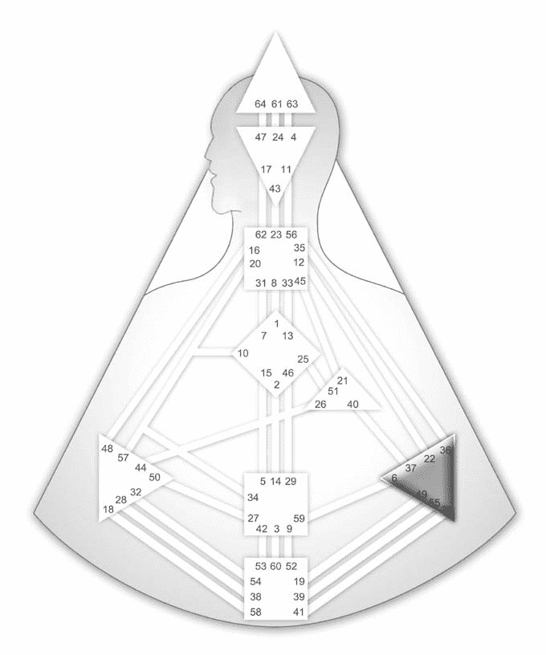

#### ▸ 生物学关联性

情绪中心与肺脏、肾脏、胰脏、前列腺和神经系统相关。它的主题是感觉、情绪和感受力，主要功能是让我们获得情绪清晰，与健康的感觉。当一个人的情绪随着时间的变化，不受拘束地运作，身体几个主要器官系统的健康，会直接被影响。未解决的情绪压力，会造成一些后果，常见的例子是水肿和体重增加。

情绪中心提供强而有力的能量，能驱动人生经验的循环运转；源于欲望的频率，持续推动我们向前体验各种感受，包括快乐，以及相对的痛苦。情绪中心与革命、诗歌、浪漫、慈悲、灵性与宗教有关。我们试图延长情绪的高峰，希望能一直保持兴致勃勃的状态；同时也尽全力避免情绪低落、不愿体验期望落空，以及分离感。大致上，有一半的人会随着情绪高低起伏，冲动行事，另一半的人则避免处理情绪，于是我们发现自己生活在一个情绪扭曲的世界。

这些扭曲渗透至生命的每个面向中。在我们这个时代，情绪中心对人类个体或地球整体的影响，比其他中心皆来得深刻。理解情绪中心的机制和化学作用，能让我们释放多年来的痛苦情绪模式，重新获得身体健康，为生活增添新喜悦，并且对自己和他人产生正面的同情心。

#### ▸ 情绪察觉与未来的意识精神察觉

三个察觉中心各有其独特的频率。直觉中心掌管免疫系统，自发性地在当下运作，与求存有关。逻辑中心掌管头脑察觉，随时运作。情绪中心既是动力中心也是察觉中心，掌管的是情绪，随时间变化，以生理振荡波的形式运作。

情绪中心从几千年前开始（在佛陀和耶稣诞生之间的某个时刻）进入突变的过程，带领我们朝全新的察觉能力迈进，称之为精神察觉（spirit awareness）。这个过程将于二〇二七年开始受到宇宙法则的支持，而达到高峰。精神意识（spirit consciousness）是分化的相反面，因为它是关于合一，感觉我们自己就像单一的存在。当两个人或更多人之间的情绪波彼此共振，就会产生出合一的意识。然而，身为高度分化的过渡期物种，我们甚至无法想像，与他人深刻共享的意识，会是什么感觉。而这处于发展状态的意识层次，潜藏在我们目前情绪系统的表面之下。

身为九个能量中心的人类，我们才刚刚开始探索，透过体验，发现这个情绪中心突变的广度、深度及其全面性的影响，我们所有人都是这突变的一部分。若我们能超脱头脑的制约，活出真实独特的自我，从而理解、接受也热爱真正的自己，就能让精神意识在此真正成熟，推动突变发生，在未来完成跃升。

#### ▸ 情绪波的频率

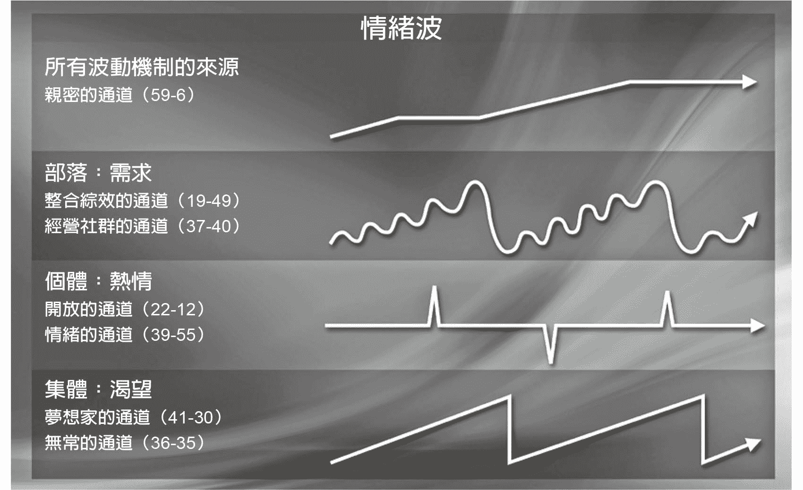

有颜色的情绪中心，以释放情绪波的模式，将我们自情绪光谱的一端，带到另一端。这是一种化学作用，我们以感受、需求和渴望来体验。每种周期波都会从希望到痛苦，从期待到失望，从喜悦到绝望，周而复始。若想在人生中创造稳定的情绪，并扩及整个世界，我们必须理解、接受，最终超越此波动模式，但这些皆无法透过头脑的控制来达成。要超越情绪系统，以及它可能对环境所造成的起伏震荡，关键就在于“等待”。当我们静待并经历情绪高低起伏，理解会加深，当波动开始平稳，最后清明将到来。情绪中心有颜色的人，若了解这股持续不断的波动，并等待清明来临，就能停止对外在环境散播情绪，因为过快反应出来的情绪是不成熟、混乱或有害的。

**所有波动机制的来源**（59-6 信道）来自 6 号闸门，因为情绪波在这里产生，接着延伸出去，与 59 号闸门具生产力的荐骨能量相会。需求、热情和渴望在此生成，为的是打破藩篱，深入我们内心，链接我们彼此，合跳亲密之舞。这种情绪波感觉非常稳定，并且需要另一个人将它带到表面。

以下三种情绪波是依照它们的频率来分类。根据不同的定义，一个人可能体验到单一频率，或是多种频率的组合。

**部落波**（信道 19-49 和 37-40）透过身体的接触运作，对于需求很敏感。部落波会逐渐升高，直到爆发，然后归零，接着再重新开始整个过程。让我们举个例子：有个男人的妻子正在做某件困扰他的事，但男人没有告诉她自己的感受，所以这个状况持续了好几周。每当她做这件事时，他的情绪波就升高一阶，直到有一天大爆发。妻子毫无预警，也没看见任何征兆，于是冷不防被吓了一跳。这样的情绪爆发对她来说可能难以承受，不过男子一旦释放了累积的情绪，他就回复正常了；一切都很好。当双方都明白这个部落波的机制——如何预测爆发，如何整理真正的问题，以及爆发对个别影响的差异——他们的关系就能达到更深一层的满足与理解。例如，在漫长又辛苦的一天结束之际，只要有双灵敏善感的手放在肩上，就能安静而有效地释放逐渐积累的情绪紧张，以及满足对亲密关系的渴求。对部落人来说，无须言语，触摸即代表一切。

**个体波**（信道 39-55 和 22-12）的运作是透过喜怒哀乐、情感、忧郁或热情来表达（当他们感觉对的时候）。大部分时候，它都沿着一个平稳的主轴移动，兼或出现小而短的高低峰。对有个性波的人来说，知道何时该独处、何时又该社交，非常重要；他们可能会有一小段时间感觉忧郁，但当他们换到新的地方，情绪波和心情也随之转变。当他们的情绪波处于低点时，如果懂得适时花时间独处，善加运用自己的创作灵感，就能舒缓关系里的情绪紧绷。

**抽象波**（信道 36-35 和 41-30）是透过渴望和感觉运作，情绪从波峰移动至波谷。这是基于期望而生的情绪波，若渴望或期待没有得到满足，便会溃散。超越的诀窍在于，单纯为了体验而投入，对于结果不要抱持任何期待。举例来说，有个女人在约会了几次之后，认为自己恋爱了。她幻想这个男人有多棒，他们的未来有多美好，接着却发现他根本不符合她的期待，对她也没有相同感觉。像这样重复的高峰和溃散很难应付，而且如果她没有察觉自己情绪波的运作机制，时间久了，可能会成为个人不稳定的因素。

了解情绪波的关键是：它只是不可避免的化学反应过程，让波动持续不断地运行。它的转变和摆荡无法解释。不幸的是，若没有察觉到这点，情绪中心有颜色的人，会企图合理化自己的情绪，试着解释或编造原因，说明他们为何在波动中起起伏伏。当他们难过时，他们的朋友会想知道理由，想做些什么让他们开心。如此一来也不过将情绪归咎于某处，而非拥抱和接受化学反应本身的深度与美。将纯粹的情绪化学反应，怪罪到某件事或某个人身上，可能会造成巨大的混乱，这个时候他们需要知道的是，一旦情绪波移动到别处，他们的感受就会截然不同。他们今天的情绪波位于某处，或许明天会移往他处，情绪无须理由。他们只需要随着它起起落落。

普遍说来，无论我们的情绪中心有颜色，或是因为空白，而受到别人的情绪波所制约，我们都必须小心，不要将自己与情绪波（的起伏摆动）画上等号，仿佛它就等同于我们。坚持做一个客观的观察者：我们不等于情绪波动，这只是管道，将我们带往内在深处。波的高峰和低谷皆是美好，别让任何波动打扰自身内在的平静，清楚明白什么对我们而言才是“正常”。我们的社会一直认为每个人应该时时刻刻感觉快乐。正因为如此，大部分情绪中心有颜色的人，会在生活中不断抗拒情绪波的低潮，误以为自己一定是哪里有问题。当他们学会观察、接受并拥抱情绪波的所有面向，以及其带来的礼物，真正的解放就会来临。

#### ▸ 察觉与紧张

情绪中心当下浮现的察觉，伴随着各种恐惧，感觉像是不确定的情绪所产生的紧张感。一个人永远无法确切知道，该如何感受某事或某人，或根据什么感觉来做决定。由于情绪中心的本质是社交与关系，而且会倾向从希望到痛苦之间，同时扩散其波动范围，这种紧张可能非常强大，而且无所不在。当人随着波动前行，紧张的感觉会放大或消失，存在或不在。基于情绪的不确定性，可能会扭曲我们看待事情的方式，而将事情看得很严重。

这种茫然而盘踞心头的紧张，来自生命的不确定性，也是一种恐惧的形式，需要面对才能加以克服。当情绪中心有颜色的人穿越其情绪波，接近内在的真实，并等待清明，就能确认或消除，那原本藏在紧张背后的各种不确定与怀疑。透过适当地确认，实际面对自己的不确定性，他们就能走出情绪的恐惧（紧张），久而久之，甚至能超越恐惧。如此一来，恐惧就成为情绪的智慧。

每个察觉中心都会产生特定形式的恐惧。在情绪中心里，不稳定的生化波会导致情绪不稳，与他人创建关系时，恐惧便以紧张的形式显现出来。下表每个闸门的叙述，显示出各种紧张与不确定的恐惧感。

#### ▸ 情绪中心的闸门

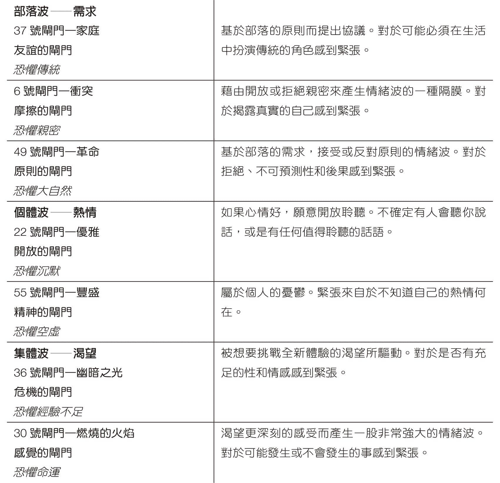

#### ▸ 有颜色（定义）的情绪中心——总人口的 53%

“当下”看不见真实。随着时间过去，真实会自行显现。

对情绪中心有颜色的人而言，情绪中心是他们个人内在权威之所在，此察觉中心的运作需要时间。他们的设计是，在做决定之前，必须静待并经历情绪波的高峰与低谷。但对他们来说，保持耐心并不容易。情绪中心是尚未成熟的情绪系统，由动力驱动，蕴含了巨大的能量。他们的任务是随着能量流动，学习带着耐性驾驭这股能量，并发挥其潜在效益。他们很容易在情绪高点时莽撞跳入，又在低潮时随意退出。在这两种情况下，他们的情绪都过于冲动，无法清晰。唯有等待，经历完整的情绪波，清晰才会浮现。在做重要的决定之前，情绪中心有颜色的人至少要先睡过一觉。

情绪中心有颜色的人，对“这个”或“那个”事物的感觉，会成为权威性的指引。这些感觉是指标，用来判断正确与否。“做那件事的感觉对吗？你感觉如何？”这些都是他们需要被问及的重要问题。关键在于，他们必须花点时间，充分体会所有感受，而非仓促行事。当一个决定不再充满情绪，就是情绪获得清明的时刻。不过要等到平心静气再做决定，却是知易行难。兴奋的时候，他们往往会纵身一跃，但是等到情绪清晰时，他们又会觉得后悔。若有耐心等到情绪清明再做决定，就能保护有颜色的情绪中心，避免做出随兴的决定，造成错误的选择。

当他们完整经历自己的情绪波，会有助于他们了解，情绪周期是动态的化学反应过程，希望和痛苦皆非察觉的终点。当情绪波的周期结束，清晰的察觉就会出现。他们无法抄捷径，而是需要时间，理解何者正确。除此之外，情绪的清明并不等于确定。直觉中心可以在当下给出确切的答案，但是对不断变动的情绪波而言，当下只是波动上的某个瞬间。由于情绪波会持续变动，所以终究无法保证能获得百分之百的清明。然而情绪终有平静之时，到时候他们会领悟情绪底层的真实，明白如何做决定。

情绪中心的能量丰沛、诱人而强大，那些以情绪中心为内在权威的人，如果能静待情绪波流过，就能从中获益。这有点像欲擒故纵。你让别人等得愈久，他们会愈想得到情绪中心的温暖与能量。在商业谈判的过程中，与其很快达成协议，不如想清楚了再做决定，会更占上风。若情绪中心有颜色的人，在情绪尚未清明之前，对方已经打了退堂鼓，那么这笔交易可能根本不应该开始。

情绪中心有颜色与情绪中心开放的人之间，会产生复杂的交互作用。情绪中心有颜色的人，为整体环境的情绪状态负责，因为他们的情绪波动会对周围带来影响。他们内在的感受就能影响别人——经由化学作用的纯粹机械模式，以及能量场传递出去的方式。当情绪中心有颜色的人感觉好或坏，情绪中心空白的人就会感觉到**非常**好或**非常**坏，因为空白情绪中心的人，会放大情绪频率。换句话说，空白情绪中心的人，只是反映了情绪中心有颜色的人的感觉，或是他们情绪起伏的过程。有趣的是，由于情绪中心有颜色的人对情绪极为熟悉，反倒不一定会注意到自己的情绪状态，而那些情绪中心空白的人，往往会认为自己喜怒无常又情绪化。

空白与有颜色的情绪中心之间，具有强大的吸引力，在伴侣间很常见。虽然情绪中心具有温暖而强大的吸引力，不过情绪中心有颜色的人，若要进入一段新的关系时，需要多花点时间。他们需要时间来分辨对方是不是正确的人。当他们学会透过情绪波来了解别人，其了解会非常深入。他们会看到自己的情绪可以如何影响别人，而别人又是如何处理他们情绪波的高低起伏。关于控制和被动反击的行为，可能会出现在有颜色与空白情绪中心的关系中，而这些模式需要一些时间之后才会显现。将追求期拉长不仅是明智的，更是关系成功的必要关键。

情绪中心有颜色的人占优势之处在于，他们能够深入任何主题。当一个人随着情绪波起伏时，会经历许多不同的观点，而获得深刻的见解。举例来说，有个摄影师想要了解花朵的本质。直觉导向的摄影师会拍下一张照片，捕捉某个绝美的瞬间；但对情绪中心有定义的人来说，一张照片绝对不够。他们会花一整天，拍摄一系列的照片，变换光线、拍摄角度和相机。他们会知道花朵在清晨看起来是什么样子，而在日落时分又是什么模样。他们熟悉花朵的芬芳，体验花瓣的触感，还有欣赏那迎风摇曳的姿态。若他们愿意等待，让情绪有时间运作而开展，就能获得更深刻的感受，也因此得到智慧，在不断变化的情绪和精神层次上，心领神会。

情绪中心有颜色的人，如果没有等待，没有经历自己的情绪波，往往会随着情绪波的高低起伏，冲动行事，贸然投入各种体验和决定，之后又任意放弃，因而造成混乱和困惑。他们让周遭的人感受到压力，迫使别人跟着他们立刻做出情绪化的决定。他们心烦意乱的时候，会突然爆发，而不是等到情绪平静下来，再表达或采取行动，之后常会后悔自己说过的话或做过的事。却没有意识到：情绪低落时，应该自己独处。

情绪健康的人经历情绪起伏时，等待波动流过的同时，也可以让他们更了解自己的感觉。只要不冲动行事，或做出无意识的反应，他们便能慢慢走出自己的情绪波，直到感觉清晰了再做决定。他们会了解自己的情绪如何影响别人，不会急迫地将压力强加别人身上。他们知道如何利用情绪诱人的一面，透过必要的“等待”仔细衡量，因而达成协议，满足其中所有的渴望。

#### ▸ 空白（未定义）的情绪中心——总人口的 47%

空白情绪中心会吸收，并放大它周围的情绪。这个能量中心带有深刻的制约潜力，特别容易被别人的需求、心情和感觉所影响。情绪中心空白的人获得幸福健康的关键在于，知道他们所感觉和表达出来的情绪，并不全然属于自己，只要他们不认为那些情绪等同自己，就能释放情绪，并保护自己。否则，他们将随着别人的情绪波七上八下，察觉到自己的情绪失控，认为是自己有毛病。他们因重复地做出情绪化的决定而后悔，因为羞愧或自责而饱受折磨，但空白的情绪中心在基因上的设定，并非为了处理这些重担。

开放的中心就像敞开的窗户。情绪中心的设计是用来接收和体验情绪场域，但也只是仅供参考。将情绪场跟自己画上等号、贴上个人标签，或当成自己的东西，都是不健康的，更何况，他们并没有可靠的内建机制来处理它。他们会变得盲目，无法单纯地将情绪反映给带有情绪的人。

情绪中心空白的人可能会觉得，他们这辈子好像始终无法控制情绪。他们面对情绪冲突时，可能会感觉害怕、恐惧、震惊和愤怒。他们可能会突然从快乐跳到沮丧，然后把情绪贴上个人标签，觉得这些情绪好像是自己的，但事实上，他们只是接收、放大，并扭曲了周围人的情绪。别人认为他们情绪不稳定，他们也因而遭受惩罚和拒绝。他们常常觉得自己出了什么问题。他们通常对情绪的氛围非常敏感，因此长久以来，一直把情绪化的事件视为个人问题，对那些不属于他们的情绪耿耿于怀、引咎自责。

情绪中心开放的孩子，会接收家人的情绪起伏，然后当成自己的情绪，进而加以放大，并且经常“表现”出他们的困惑。他们认为自己要为那些情绪负责，因此在很小的时候就断定，与其承受父亲（或母亲）的情绪爆发，还不如说谎或隐藏内在真实的自我。如果情况正好相反，父亲（或母亲）的情绪中心开放，而孩子有颜色，那么父母可能会放大孩子的情绪，变得失去控制，或反应过度。了解这些动态变化，可以帮助我们养育健康、稳定且独立的孩子，同时享受当父母的乐趣。

情绪中心空白的人会因为冲突的场面而紧张。于是长大后，他们会逐渐发展出一套非自己的策略，借由避免冲突回避情绪层面的冲击，因为害怕破坏现状或惹人生气。他们发展出某些特定的人格特质：“只要你不来惹我，我就不会惹你。”他们试图闪避任何潜在的冲突，不敢表达真实的自己或需求，深怕冲突有可能随之而来。虽然情绪中心开放的人永远无法享受情绪冲突的过程，但他们的人生策略和内在权威，将引导他们面对正确的冲突。

对于情绪中心开放的人而言，所谓的恐惧，往往只是自己对冲突的想像而已。当他们根据自己的内在权威挺身而出时，真正的冲突可能远比他们所想像的更轻微，最后的结果，往往可能会是最好的情况，因为那会是正确的冲突。若一直回避冲突，就只能活在生命的表面。记得下面这个论点会很有帮助：痛苦的另一面是快乐，而恐惧的另一面，是做自己的自由。我们只要说出关乎自己的真相，不责怪别人，就能正确地处理冲突，促成健康的转化。

不管情绪中心有颜色或空白的人，皆能享受情绪所带来的，令人愉快的各种面向，像是性能量、食物、热情、兴奋、浪漫与音乐。不过，空白中心若要体验情绪之美，就不能把自己跟情绪画上等号。他们对情绪波的察觉，能让他们放下那些不属于自己的模式和情绪，而这就能带来莫大的解脱。当他们理解情绪的课题为何如此困难，就可以开始调整自己的生活，重新回到个人的内在权威。他们能够分辨，别人的情绪对他们来说是否健康，也知道何时该以自己的真相或需求来面对冲突，何时又该走开。他们会分辨哪些属于情绪的恐惧，是他们必须处理，哪些不是，而且不会做出情绪化的决定。他们会了解，自己所接收及感觉到的那些放大版的情绪，其实来自别人，而不再依附那些情绪。

健康的空白情绪中心，是可以揭示旁人情绪健康与否的侦测器；它可以客观观察到周遭的情绪氛围。它表现智慧的方式是分辨出，谁正朝向情绪健康、稳定和察觉的方向迈进。同时可以保持情绪冷静，他们能够依靠自身的人生策略。每当突然感受到不舒服的情绪，他们知道自己可以离开房间，离开其他人制约的能量场，直到恢复冷静。对他们来说，为了释放从别人处吸收来的情绪制约，最好每天独处，享受与自己在一起的时光。

#### ▸ 完全开放的情绪中心

空白情绪中心的很多特性，也适用于完全开放的情绪中心，而不同之处在于，后者无法过滤或链接所接收的强大情绪能量。情绪中心完全开放的人，可能对自己的感受感到困惑，不知道该如何解释。他们不知道要渴望什么，何时该敏感，何时该热情，或是该如何看见并处理别人的需求或情绪。他们经常觉得自己的情绪出了问题。他们的潜在智慧，是要认识和了解自己最纯粹的情绪波动，不要带着有色眼镜或偏见来看待它。

#### ▸ 空白情绪中心的非自己对话

非自己头脑是空白中心的代言人，告诉我们该说什么或该做什么。留意这些对话对于去制约是必要的。下面是非自己对话的一些例子，情绪中心的非自己头脑对话听起来可能像这样：我不想去那里，因为我不想处理那些冲突的场面。我们来这里吧，这样就不用处理任何冲突了。我们别讲出来，不然可能会有人不开心。我们用这个方式说吧，这样可以缓和气氛，降低可能的冲突。我们要待人友善，笑容可掬，这样他们才会喜欢我。我可能会失望或被拒绝，所以没必要去那里。这样不值得。我怕这样行不通，就别白费力气了吧。我害怕跟她说实话，因为我不想让她受伤。

### 意志力中心

意志力

自我意识和物质世界

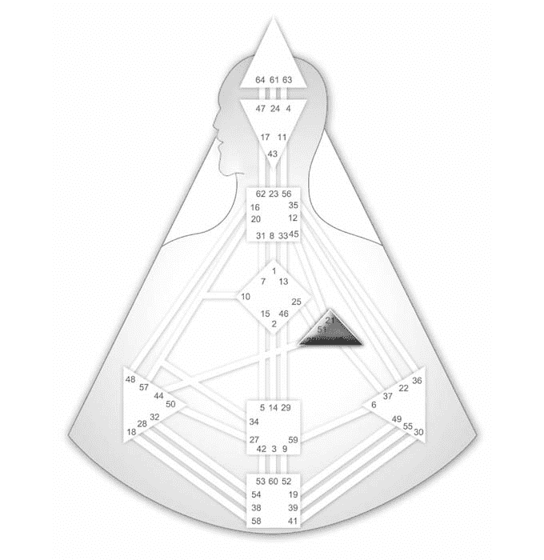

#### ▸ 生物学关联性

意志力中心在人体图中看起来不大，位置也不显眼，让人误以为它不重要，但其实它对我们生命的生理层面影响甚钜。它的四个闸门分别链接到胃（40 号闸门）、胸腺（26 号闸门）、心脏（21 号闸门）和胆囊（51 号闸门）。不理解这个能量中心如何运作的人，比较容易罹患心脏和消化系统的疾病。而当心脏停止跳动，一切都将终止！

#### ▸ 意志力与自尊心

意志力中心是强大的动力中心，驱动意志力和我执，为这世界带来巨大的影响力。社会的基石源自于意志力——在社群中生存，并且在物质层面发展的渴望。意志力中心直接连接喉咙中心，因此要为家族部落而发声和行动。部落从一开始就是确保家族、社会和国家生存的支持系统，为社会和企业的生存方式奠定基础。社会组织创造了安全、相互依存的环境，使人们能够专业化，提升自己的独特技能，发挥至极致，而带来团体或个人的进步。意志力中心的四个闸门，确立了部落的分层结构，如果没有这样的支持结构，人类无法创建伟大的文明。

这些闸门决定了部落成员彼此间相互链接，可以有哪些不同的方式，接着成功实践所谓的世俗之道。这些闸门关系到我们如何赖以维生、如何与他人链接和睦相处、生育小孩，以及创造社会、文化与宗教等基础结构，以培养和支持我们所创建的事物。

目前部落正在经历高压的结构转型，对企业和社会的基础形成挑战，也让人质疑传统和制度的权威性与稳定性。这些变化所带来的恐惧，会放大意志力中心开放者的压力，让他们试着证明自己的价值，好在变幻无常的世界中生存。自尊心和自我价值的问题出现，并影响我们在生命中的各个层面，包括人际关系、工作、信念，以及我们是否允许自己投入，并享有生命的美妙。

底线是，自尊心是起点，让我们有信心走进世界，每一个人都对社会带来价值和贡献，并且获取所需的物质和支持，作为回报。倘若没有坚定的信念，以及对自己和自我价值的信任，我们不会有意志力来迎接生命的挑战。如果自我无法在健康的状态下获得肯定，无法透过我们自己或别人来确认其价值，它就会停止运作，而自尊就变成自我厌恶。自我憎恨，让人类付出惨痛的代价。

在这种情况下，为何有那么多心脏和消化问题，都跟非自己，不断想补足自己的自卑感有关，为了证明自己的价值，我们渴望自己达成有超乎预期的成就，于是做出承诺或协议，却没有持续的意志力可以遵守，这些超出我们心肌所能负荷的劳力，都是我们试图证明自我价值的表现。如果我们可以了解，不断评断自己的对话是来自头脑，以及头脑如何运作，就能消除生命中许多不必要的痛苦和磨难。

#### ▸ 意志力中心的闸门

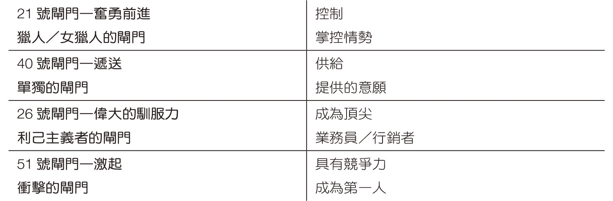

#### ▸ 有颜色（定义）的意志力中心——总人口的 37%

如果你的意志力中心有颜色，会想掌控自己的生活和资源，包括穿着、工作的时间地点，以及你想将时间运用在何处。你认同自己的价值，尽管有时会有自我膨胀的倾向。

定期做出承诺，并信守承诺，锻练意志力，对意志力中心有定义的人是健康的。他们能够持续运用自己的意志力，开口承诺或下定决心遵守，这对他们来说都不是问题。重要的是，他们必须说到做到。这是别人对他们创建一定程度信任感的方式，若他们承诺于自己做得到，并能遵守的事，就能强化自己与生俱来的自尊心。

他们享受工作，尽管他们倾向待在可以独立自主的职位，让天生的内在机制告诉他们何时该工作、何时该休息。他们享受成功、履行诺言的感觉，天生意志坚定，具有竞争力。当他们仔细聆听内在的指引，就会知道自己强大的意志力可以在何时发挥最大的作用，同时在工作和休息之间维持平衡。

意志力中心有颜色的人，不应该让任何人否定他们可靠而明确的自我和意志力。当他们充满自信地说出“我、我的”，这样的表达方式能强化心脏，但若是抑制他们天生的自我能量，则可能危害健康。他们不断不断证明自己，对他们来说，这极为重要，而且很正确，只要是依循自己的人生策略和内在权威，他们自然而然就会这么做。只要这样对他们来说是正确的，他们很乐意投入自己的意志力，为家庭和社会付出。不过，尽管他们很享受自己的工作，还是希望自己的贡献能得到感激和回报。

意志力中心有颜色的人，很容易过于投入，而被认为太过强硬。若没有人生策略和内在权威来引导，他们可能会对意志力中心空白的人，抱持着不切实际的期待，希望这些人跟他们一样意志坚定而有竞争力。他们会试图激励别人，或逼迫别人做出超乎自己能力的表现，结果却造成不必要的痛苦和误解，处处受阻。这表示着他们这时候应该退后一步，重新取得力量中健康的内在平衡。

#### ▸ 空白（未定义）的意志力中心——总人口的 63%

意志力中心白色的人的设计，不具备坚定的意志和竞争力，但他们却觉得自己需要鼓起勇气来锻练意志力，也常常被这样的需求所驱动。他们会问：“为什么我无法得到别人拥有的？”“为什么我无法像别人一样快或一样好？我应该可以跟他们竞争才对。”虽然他们想要锻练意志力，做出承诺并且遵守，但他们不明白的是，自己并没有持续的能量可以支持这两件事。

我们的世界不断对我们发出一连串讯息：只要我们去做这个或那个，我们应该／可以／能够更好、更漂亮、更有钱、更迅速，以及更成功。这样的鼓吹对我们造成莫大压力，迫使我们创造更多、做得更多、扮演更多角色。意志力中心白色的人会因此陷入恶性循环。如果他们辜负了别人的期待，或是没有履行承诺和约定，他们甚至会做出进一步的承诺，来弥补自我缺陷的感觉，但却只是再度失败。每一次失败都让他们感觉更糟，自尊心也随之更低落。

空白意志力中心会以一种过度成就的方式，来弥补自己无法持续意志力，以及内在无能为力的感觉。如果一开始低估自己，就会试图完成比别人更多的成就，好证明自己的价值。他们用“意志力”驱使自己，进入棘手的情况，企图做一些自己不可能完成的事。

空白意志力中心很容易放大在此区块有颜色的人的意志力，可能自我欺骗，以为自己突然有了意志，可以承诺，并信守。然而，只要意志力中心有颜色的人一离开，这种“借”来的意志力随即消失。这种情况在团体中很常见：某人身处团体之中，会带着足够的方向和热情，坚持要完成目标，却在回到独处的状态时，感觉到其强烈的动机和意志力逐渐消退。

意志力中心白色的人面临的挑战是，他们通常不认为自己有价值，而让自己接受不足：爱、金钱、幸福或任何事，因为他们以为自己不值得。如果他们依赖的是自己的头脑，而不是人生策略和内在权威，他们将会一直不停试图证明自己。头脑愈想要证明自我价值、证明自己值得，就愈容易失败，而自我否定的循环也将不断重复。解决之道是，解除头脑所冒用的决定权，让作决定的权力，回到它原本所属的地方。

空白意志力中心的格言是：永远不要对自己或他人承诺。不管在什么情况下，开放的意志力中心永远都不必向任何人证明些什么。不需要证明自己的价值，是一件很棒的礼物。想像一下，若百分之六十三的人，都能跟自己和平共处，知道自己将透过内在权威的引导来做出正确承诺，而非为了要彰显自我价值而承诺，这会有多大的不同。

这样的领悟能带来智慧和察觉。一个意志力中心空白的人，可以接收他人的自我振动频率，成为有智慧的人，知道别人是否拥有健康的自尊心。他们得以辨识别人是否有能力履行承诺。他们了解自己不用跟任何人竞争，也不会仅仅为了证明自己的价值，就让任何人说服他们该做什么事，或承诺任何事。

#### ▸ 完全开放的意志力中心

意志力中心完全开放的人，天生无法确切掌握价值为何、如何衡量，或是需要怎么做才能获得价值。如果没有活在个人内在权威的范畴里，他们很容易摆荡在自视过高，以及毫无价值的感觉之间。若陷于脆弱或反复无常的自尊心，以及挥之不去的无力感里，他们特别容易让人操控和控制，透过彼此的交情，或是信仰某种说法，而让那些保证会肯定自己价值的人所左右。

若要分辨一个人说话是否可靠，或是对于物质层面上，金钱和个人权力在如何运用，这些人很有智慧，并且值得信赖。当他们接受自己不需要证明什么，并且依靠人生策略和内在权威来满足自己的需求，就能获得智慧。

#### ▸ 未定义意志力中心的非自己对话

非自己头脑是未定义中心的代言人，告诉我们该说什么或该做什么。留意这些对话对于去制约是必要的。下面是非自己对话的一些例子，未定义意志力中心的非自己头脑对话听起来可能像这样：我最好做这件事，因为如果我不做，就会变成一个没有价值的人。我要控制好。我必须要勇敢。我必须不断替自己打气，这样我才会觉得自己很好、很有价值，然后别人就会看见我的价值。我必须很忠诚，别人才会知道我多有价值，这样我就能向自己证明，我是个很有价值的人。如果我这样说，并且许下承诺，他们就会看到我有多棒。如果让他们知道我有多可靠，他们就会喜欢我。他们认为我做得到，所以我最好向他们证明我办得到。如果我掌控一切，就能证明自己的价值。我不是一个好太太、好情人或好朋友，除非我可以证明这一切。

### 荐骨中心

生产的力量

生命能量，可回应、可利用、性欲

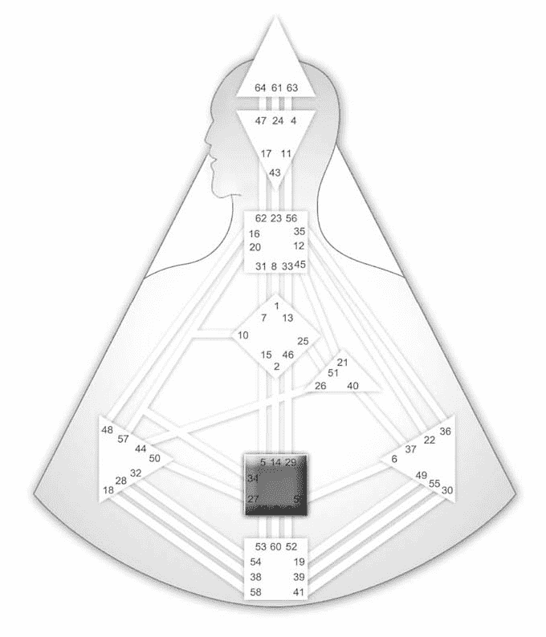

#### ▸ 生物学关联性

荐骨中心对应的是女性的卵巢和男性的睾丸。地球上所有生命，都是由这个中心产生的生命动能所培育的。它让我们繁衍生命，驱动我们养育，和照顾年轻的下一代，使人类存续。荐骨中心的主题，是性欲、工作、繁衍、生命力、迁移和持续力。

身为人体最主要的动力所在，荐骨中心拥有巨大的力量，以生产或退化的方式运作。如果我们不了解如何正确地运用，并支持荐骨的运作机制，它会提前萎缩和退化，让我们沮丧又不健康。这个动力中心内建的工作与休息周期，要求我们每天都用尽它所提供的可利用能量，如此我们才能好好睡觉。它休息时，会为它的电池充电。但如果遭受逼迫，去做自己没有回应的事情，它的生产力就会很快衰退，而燃烧殆尽。荐骨中心的生产力，在男性约十八岁时达到高峰，女性则是介于三十三至三十四岁之间。

#### ▸ 工作、繁殖、性欲与持续力

任何一个荐骨中心有颜色的人，其类型都是生产者。荐骨中心会产生有创造力的生命动能，拥有引导和维持生命的力量。它的频率很容易接收讯息，这样的设计是为了以一种有保护力、健康、诚实、有创造力且坚定的方式，来回应它所遇到的事物。这个中心和其他能量中心的差异，在于三个重要的层面：它的复杂度（仅次于喉咙中心）、产生生命动能的能力，以及透过自身回应的喉音，来表达当下是否具备可供使用的能力。早在语言能力发展之前，我们可靠的内在导引系统，早就能发出荐骨的声音。全世界有将近百分之七十的人，可以让有颜色的荐骨中心来引导他们，所以人类还有巨大、但尚未开发的潜力，能使我们觉醒和察觉。

荐骨中心很容易接收讯息，其设计是借由发出富有表情的声响和声音，回应生命及别人的请求。这种原始的声音，并非源自我们的喉咙中心，而是来自腹部的振动（像是横膈膜的开合），让我们知道，自己是否具备执行某事的能量。这些声音告诉我们，我们是否喜欢自己的所见、所闻，或者被要求去做的事。如果每个人都能尊重自己荐骨的本性，及其声音的导引，就能链接到自己内在的力量。

每个人和每种文化所产生的荐骨声音可能不尽相同，但它们都很简单，也很容易辨别。“是”可能有个开放的尾音，听起来像是“嗯哼”（肯定的语气），而封闭的“嗯嗯”（否定的语气）则表示“不是”。如果一个问题的回答是“嗯(hmmmm)……”（意即“我不知道”），那么也许是时机不对，或需要换个方式来问。荐骨中心有颜色的人，在听到自己的荐骨回应前，不会知道也不可能真的知道，何谓正确的选择。重新与自己的声音链接，并学习信任它，是活出真实自我，与创建个人转化潜能的第一步。生产者孩童天生就会发出这些声音，直到他们被制约，学习用语言回答；当被问到是或否的问题时，他们会发出细微的“嗯哼（ah-huh）”或“嗯嗯（uhn-un）”的声音。如果父母询问孩子问题时，可以鼓励他们这样的回应，并且尊重孩子的内在导引，就能培养他们的自信心。

#### ▸ 荐骨中心连通喉咙中心

由喉咙中心连接到动力中心（意志力中心、情绪中心和根部中心）的能量，是显示发起的能量，会向外推进，或朝向某个人事物移动。而荐骨动力中心会发出特定的、包覆性的能量，自然而然吸引生命和人们，投入它的怀抱，以便做出回应，因而被称为回应的能量。这就是生产者尝试发起时，会遭遇阻力的原因：他们企图扭转荐骨自然的能量流动。

不过，当荐骨动力中心连通喉咙中心时（例如透过 34-20 信道），我们会遇到一个特殊情况：荐骨的生产力转变为显化的潜力。因此，这个有颜色的荐骨能够马上将回应转化为行动。荐骨中心连接到喉咙中心的人称为显示生产者，他们不只是荐骨发出声音，还会经常感到自己的回应朝向（或远离）某物或某人，并化为实质的肢体行动来展现。本书第三章将更详细地讨论显示生产者。

荐骨中心的九个闸门描绘了我们可利用的生命动能，并显示出荐骨中心所支援（或不支援）的许多过程。下表描述了荐骨中心的各个闸门。

#### ▸ 荐骨中心的闸门

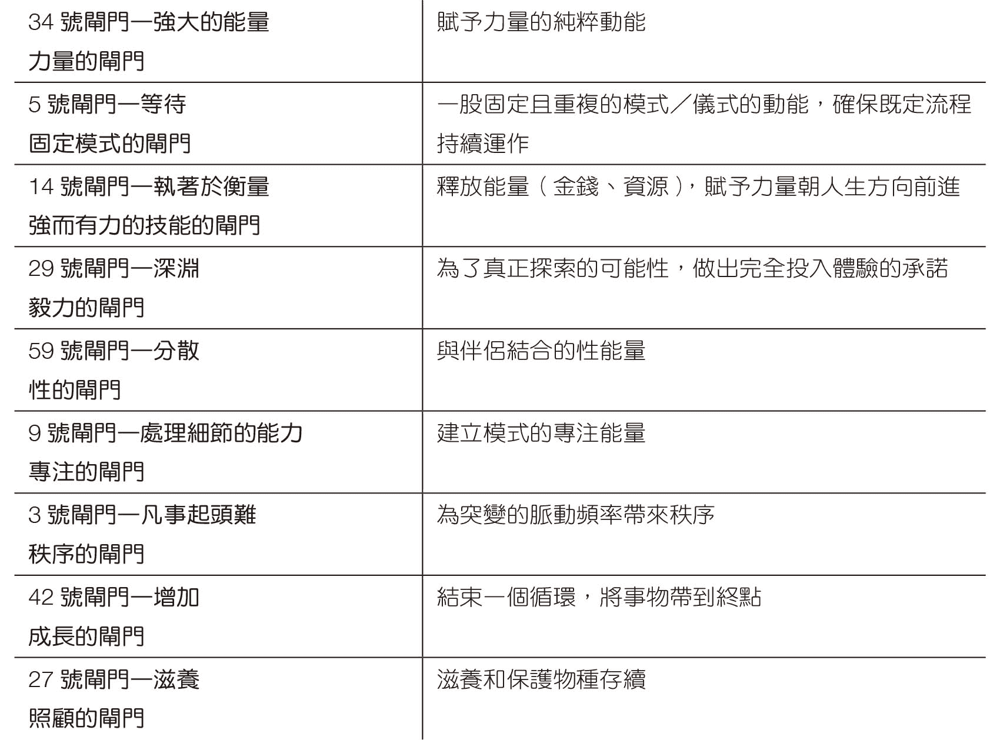

#### ▸ 有颜色（定义）的荐骨中心——总人口的 66%

荐骨中心有颜色的人在这个世界上，是这股旺盛动力的管理人。他们的荐骨动力中心，每天都会产生一定程度的能量，感觉像是不断地在体内嗡嗡作响。这是一股真实的生命力，让人感觉闲不下来、坐不住，或需要积极活动，燃烧能量。对他们来说，最重要的莫过于利用每天所拥有的能量，从事热爱的工作或活动，寻求个人表现，和深刻的满足感。

荐骨的回应非常强大。若以是或否的问题发出询问，它会立即反应，显示出目前是否有能量给供给自己和他人。如果回应是肯定的，或朝向某方面行动，荐骨就会全力支持这个决定。如果回应冷淡，或觉得能量被往回拉，则表示在不过度消耗荐骨能量的情况下，该行动将无以为继。

举例来说，当有人问你：“你想学怎么打网球吗？”而你听到荐骨说“嗯嗯”（否定的语气），那么这就是事实。而且一定要尊重这个真实的回应，因为这是唯一的方式，可以得知有颜色的荐骨中心是否能供给能量，去执行这件事。换句话说，他们听到的是自己荐骨的声音，传递出目前是否可以取得能量来执行。每个否定的荐骨回应，都会画出一条清楚而健康的界线，保护他们免于可能的伤害和麻烦，或仅仅只是避免他们过分使用荐骨的动能。如果他们没有透过正确的回应，就无法完成承诺，坚持到底。荐骨的能量完全无法支持头脑所做的决定。我们必须了解如何回应，以及如何以有效且令人满足的方式，正确地运用能量。如果生产者让头脑的决定，取代了荐骨的立即回应，他们就会遭遇到阻碍，感觉疲惫、沮丧不乐，或是干脆放弃。

生产者如果无法贯彻始终，就会得到“世界上最虎头蛇尾的人”的名声。要避免这种情况，首先要了解的是，为了精通一项技能，或获得某种能力，荐骨频率的本质是坚持到底，透过回应，正确地投入能量启动，这股能量才会开始运作，并持续下去。不同于经由喉咙中心所显现的显示能量，荐骨能量有一段高原期，因此必须有动力，持续穿越这些“卡住”的点，直到忽然间的突破（发起），推动他们升级至下一个阶段。如果没有荐骨能量，这些一再出现的高原期，可能变成难以跨越的障碍，以及沮丧、疲惫和想要放弃的根源。如果荐骨中心有颜色的人有所回应，坚定的荐骨能量会从一开始，就稳定支持他们，唯一的方法，就是得到荐骨肯定而确切的回应。

因此，荐骨中心有颜色的人，适用的箴言和人生策略是：“不要发起。”如果没有人发出要求，好让荐骨得以回应，永远不要迈出第一步，或靠近某些事物。他们一旦开始发起，荐骨那股坚持的力量来源，就此被打断了。唯一的秘诀是等待，让荐骨保持在随时可用状态，才能对那些真正适合自己的事物，作出回应。聆听荐骨回应的原始声音，就会知道一个人是否拥有可用的能量。如果生产者知道自己拥有可靠的能量来履行承诺，就能从实践的过程中获得满足，他们会有信心做出正确的决定，并且信任荐骨的声音。

其他人可以感受到，有颜色的荐骨中心拥有强大可供利用的资源，因此会想利用这股能量。如果让头脑指挥荐骨，执行不适合的事，便会造成挫败，以及一个有许多“奴隶”的社会，每个人都筋疲力竭地做着自己不喜欢的工作。我们必须尊重荐骨的限制，透过荐骨发出的声音，遵从它的指引。

对荐骨中心有颜色的人来说，最困难的部分，或许是要接受事实：他们值得信赖的回应，其实是一种机械的过程，既没道理也无从察觉。回应无关乎对或错的判断，也没有理性或明确的词汇可以解释。回应如此纯粹，因而完全避开意识层面的察觉。生产者常常形容，生命透过他们来做决定，事实上也确实如此。他们怎么“想像”生命的形貌都无所谓，生命动能知道什么适合他们，也知道他们的能量该用在哪里。这就是他们的真理。他们的耐心和充满期盼的等待，会让宇宙将一切带到他们面前，而他们则回应，让自己顺应人生道路的起伏变化，与自己的人生使命同在。

#### ▸ 空白（未定义）的荐骨中心——总人口的 34%

这个星球上大多数的人荐骨中心都有颜色，他们创造了强大的制约场（嗡嗡声），而空白荐骨中心总是容易受其影响。空白荐骨中心的人，对别人与环境的能量高低，极为敏感，并会放大这些能量。荐骨中心空白的人，会让升高的能量涌入身体，但他们无法处理这些能量。而经常把这种“借”来的能量当作燃料，过度驱使自己，在最后感到崩溃又疲惫。他们的设计并非透过回应而活，所以永远不能依赖自己的声音来引导决策，或决定何时该适可而止。

荐骨中心空白的显示者、投射者和反映者，特别容易受到超额能量的影响。他们天生不知道何时该停止，或是如何为自己设定健康的界线。他们空白的荐骨中心装满了别人的能量，因此总是忙于工作和家庭，搞不清楚何时该停止。他们承担了太多，感觉自己像奴隶，却不知道该怎么办。当他们意识到自己累了，却继续努力向前，就会对自己的健康造成损害。他们不知道何时（也不明白怎么做）该抽离开周围荐骨的能量，重新回到个人的内在权威。

他们很难做出判断，关于何时该进入某份工作或关系、何时又该等待、要停留多久，或何时该离开。他们不断地接收别人的荐骨燃料，所以最好要确认那些燃料会适用于他们的身体。若要保持活力，维持开放荐骨中心的健康，关键会在于理解自己如何与周围的人链接，而这只能透过人生策略和内在权威的实验来达成。

荐骨中心是关于纯粹、生产力、生命能量，尤其是性能量是否可供利用。白色的荐骨中心因为没有固定的界限，因此很可能被严重制约，对于性的态度，可能从些微好奇到极端沉迷。空白荐骨中接受来自伴侣的正面或负面影响，因此每一次性经验都是独一无二的。这个讯息对于逐渐成熟的青少年来说，特别重要。这个空白中心的潜在智慧，是要学会健康的性和安全界限，并且能分辨何时该适可而止。这也包括学会依靠他们的人生策略和内在权威，以便一开始就正确地进入关系。

荐骨中心空白的人，不具有持续运作的能量，可用于生产和坚持到底；能量一会儿存在，一会儿消失。如果能够理解并尊重这一点，当他们需要休息，就会给自己时间休息。他们不应该忽视自己的能量状态。如果他们无法好好管理自己的能量，可能会造成严重的睡眠问题，导致睡眠不足，体力无法恢复。就像他们会放大有颜色的荐骨能量，他们也可能放大来自荐骨的疲劳，而误以为是自己的。对荐骨中心白色的人来说，健康的就寝习惯是，在他们感到疲累之前，就先上床睡觉，让自己放松地进入梦乡。他们需要这种安静的独处时刻，好释放白天所接收的荐骨能量。

大部分荐骨中心白色的人会承认（如果他们够诚实的话），他们其实并不想工作。他们喜欢悠闲过日，让别人劳动。不过，当我们观察荐骨中心空白的人时，通常并非如此，因为荐骨是最容易受到制约，也是制约得最深的能量中心之一。有颜色的荐骨中心数量之多，以及这个星球上整体生产者广大的能量场，总是轻易淹没空白的荐骨中心。

然而，当这三种荐骨开放的类型，与自身空白的荐骨中心和平共处时，他们能放松下来，拥有健康的界限，并且透过内在权威得知，何时该适可而止。他们会工作一阵子，然后花很多时间休息。他们尊重自己不断变化的能量流动。他们享受接收别人生命动能的过程，但不会回应，也不认为那属于自己。他们在工作与休息之间达到平衡，成为有智慧的人，了解荐骨中心那股有创造力、强大而反应迅速的能量如何运作，也知道这些能量要如何才能被生产者善加利用。

#### ▸ 完全开放的荐骨中心

完全开放的荐骨中心，不知道该将能量运用在何处。它发现自己的能量四处分散，被各式各样的东西吸引。不知何时该适可而止，只有被不当而过度的活动耗尽力气，直到被击垮，方能停止。

很多人会被荐骨的开放性而吸引，对于我们的存在和存在的理由，感到着迷。荐骨中心完全开放的人，像是克里希那穆提（Krishnamurti）、奥修（Osho）和拉．乌卢．胡，给予我们关于存在本质的深刻洞见。这个能量中心可以获得的智慧是，让人真正衡量生命动能，明白能量究竟用于何处，之后就能表达或描述，这股独特的能量为人类所带来的好处。

#### ▸ 未定义荐骨中心的非自己对话

非自己头脑是空白中心的代言人，告诉我们该说什么或该做什么。留意这些对话对于去制约是必要的。下面是非自己对话的一些例子，空白荐骨中心的非自己头脑对话听起来可能像这样：继续工作吧！我们真的需要完成这件事。我们必须答应那件事，不然可能会错过什么。我可以继续，只要来杯咖啡就好。我们也可以做那件事，没问题。我们还不累。我不想小睡片刻，也不想躺下来——有太多事要做了。我们帮他们处理那件事吧！我得自己做才行。我们来找个伴吧！我们可以照顾谁？生命如此多采多姿，谁会想拒绝啊！没错，我们是做了全部的工作，不过总得有人做啊！我不认为这样就够了。界限？什么是界限？

### G 中心

爱、认同与方向

磁单极（驾驶座）、更高的自我

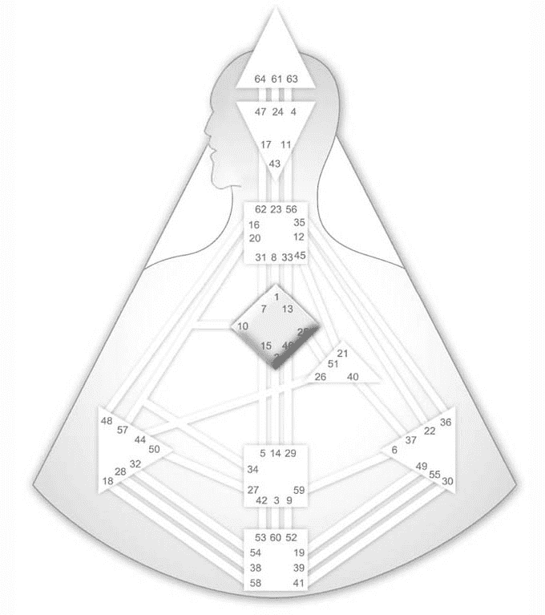

#### ▸ 生物学关联性

生理上，G 中心与肝脏及血液有关。肝功能决定了我们血液的健康，而血液会携带养分和氧气，到体内的每个器官和细胞。肝细胞一旦受损就无法替换。我们都知道酒精伤肝，也会使人丧失自我认同。这个能量中心的精神本质，源于印欧文化的传统，认为轮回是通过肝脏发生。而这也符合人类图系统所认为的，磁单极在轮回过程中的作用。它引领我们进入身体，而在肉身死亡时，带我们离开。

#### ▸ 爱、认同与方向

**爱：**G 中心是人体图中最特别的能量中心，其重要又神秘的元件——磁单极，是一个单极的磁体。（人类图中其他的一切，都以二元的形式存在。）这个单极只负责吸引，所吸引的是爱与美。现在花点时间，看看你自己的人类图曼陀罗。注意你有定义的轮幅，从外轮向内辐射至人体图中央的菱形。G 中心的枢纽位置，说明了它在人类图曼陀罗，及我们生命中的重要性，也说明了宇宙和行星的影响力，是如何绕着这个中心运转，当位于其内的磁单极，将专属于我们的人事物（根据定义）拉向我们，让我们体验自己的生命历程。我们的设计是，从爱自己开始，享受那被吸引来的爱。

在我们轮掉头世之前，磁单极和设计水晶完美地结合在一起。当胎儿的躯体在孕程中成形，设计水晶会移往逻辑中心，而磁单极则继续停留在 G 中心，因此产生了分离的幻觉。它们的分离造成了彼此的渴望，于是我们感觉到自己好像一辈子都在追寻爱。而各种形式的爱，就是生命的真谛。这种分离的感觉驱使我们向外寻找爱，努力感受自己该往何处去，以及自己在人际关系中的定位。我们不断努力着，好让自己配得上那莫名追求的虚幻之爱。而头脑利用这样的追寻，透过我们的开放中心，放大了我们想认识自己的渴望和欲求。好笑的是，这所有的一切，始终都存在于我们体内；我们其实并不需要向外寻求自我，就能知道自己是什么样的人，或是要去哪里寻找爱。G 中心承载着爱。爱是一股力量，弥漫整个宇宙，将宇宙凝结在一起，把所有人事物再度拉拢，合而为一。臣服于身体的引导，回归本质，就能体验到爱是如此丰盈。

“我们来到世上不是为了被爱，而是为了**成为**爱。”——拉．乌卢．胡

**认同：**磁单极负责我们生命经验的许多面向，从出生之前到死亡之后。其中一个面向是，在量子上维系人体图中的个性和设计水晶，创造我们一生的自我认同。这个独特而个人的蓝图，使我们有异于他人，彼此有所区隔。就算没有自我意识或自我的持续感，还是能清楚知道其存在，也能在人体图上确实地看到，其所在之处。

**方向：**另一个面向是磁单极所产生的内在拉力，让我们在整体中各司其位，使我们在自己的道路上行走。这就像拥有自己的内建导航系统，这股拉力自然而然，会让我们展现自己独特的人生角色。如果没有它，就不会有分歧的意识；我们会觉得自己跟整体合而为一，而不是独立的个体；由于分离的感觉，我们无法相互链接，也无法与宇宙中的其他事物相连。磁单极让我们彼此有别而分离开来，其中那股神奇的神秘吸引力，被称为爱。我们的个性水晶和设计水晶结合在一起，就好像被一桩强迫的婚姻，将两个人束缚在一起。一旦我们接受它们各自特定的角色，消弥这两个面向于内在的冲突，就能达到自我接纳、爱自己的状态。直到那时候，我们才有能力接受和付出此生渴望的爱。

磁单极知道我们在哪里、要往哪里去，以及如何带我们到达那里。它吸引了我们这一生所有要遇到的人、环境和事件，决定生命本身如何被引导，并且透过我们，让一切得以发生。我们将这种穿越时空的移动，称为生命的轨迹或方向。每一次正确的决定，都会推动我们，沿着这条轨迹前进。所以，任何寻找皆无意义，只要运用正确的方式生活，最适合我们的人生与爱，就会逐步出现。我们的司机会带我们到达那里，而我们唯一要做的就是安心坐好，透过人生策略和内在权威，让磁单极来引导。

“从一开始，空间中的一切都是单向移动。所有存在的一切，无论任何形状、状态或形式，都是这个动向的一部分。根据这项重要的科学定律：‘两个物体不能同时占据同一空间。’所有正在移动的一切（而且所有一切都正在移动），都具有独特的几何轨迹。我们的生命和几何轨迹有关。古人称之为命运。不过这个词通常意味着一切都是预先安排好的。我们可以在两种解释死亡的方式中，清楚地看出命运和几何轨迹的差异。命运，也就是预先决定论，认为死亡的‘时间’是固定的、已经写好的。而几何轨迹则认为，只有走向死亡的‘方向’是固定的。”

——拉．乌卢．胡

#### ▸ 爱之船与人面狮身的轮回交叉

位于人类图曼陀罗内菱形的 G 中心，有八个闸门形成一组对称结构，让内轮的黄道十二宫，与外轮的 G 中心的八个闸门互相对话。人类图曼陀罗指出，磁单极如何透过它，在我们体内的爱的核心，将生命从环绕、提供我们讯息的大宇宙中，拉向我们。

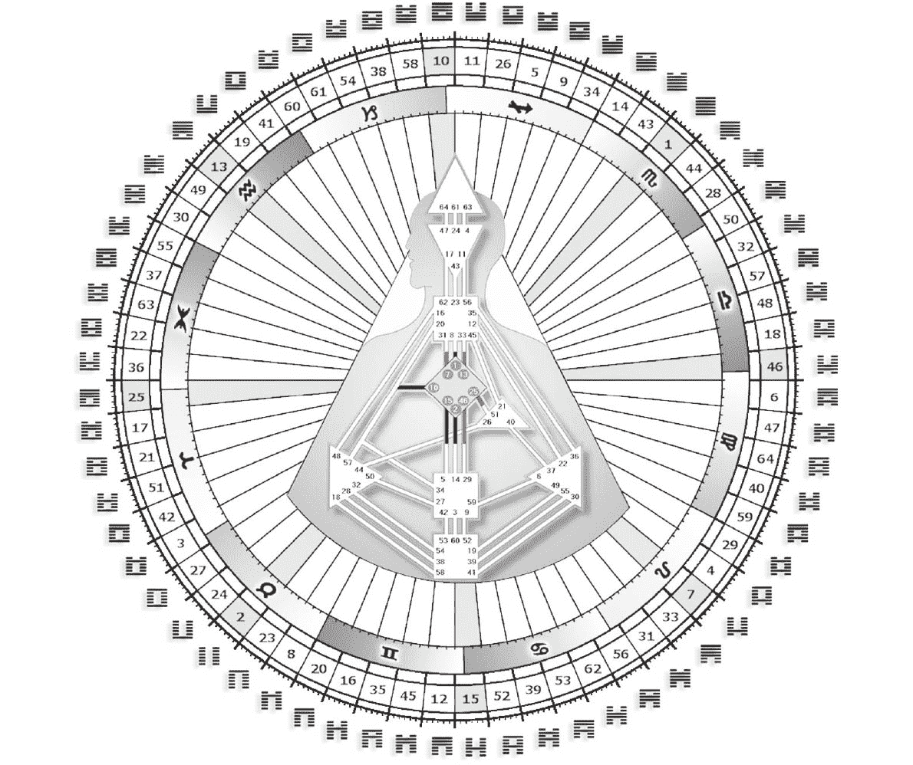

这个结构中表现了两个关键的轮回交叉。第一个是“爱之船”交叉，其中四个闸门代表了人类之爱（15 号闸门）、自我之爱（10 号闸门）、宇宙之爱（无有分别地爱所有存在的能力，25 号闸门），以及身体之爱（46 号闸门）。磁单极会调控这些超越个人之爱的机制，及其构成整体所必需的反面——恨的形式。如果没有磁单极与设计水晶分离而产生的渴求，或是没有“设计”（红色）和“个性”（黑色）之间的张力，在量子上维持我们的定位，我们就无从体验爱与恨二元的推力与拉力。我们生活在二元的世界，若缺少其中一方，另一方就无法存在。我们追求的是两者之间的平衡与和谐。第二个“人面狮身”交叉代表的是方向。因为有了分离和区别，我们需要参考点，确定自己的位置，也就是一个比较的基准点。如果各个自我没有区别，我们就不会、也不需要有方向。如果万物即一，也就无处可去。人面狮身交叉四个闸门中的三个，其运作就像为我们指出过去、现在或未来方向的观点。而第四个闸门是驾驶员（2 号闸门）。驾驶员可以注视现在所处的位置（1 号闸门），可以向后看（13 号闸门），也可以向前看（7 号闸门）。这四个闸门又被称为角色闸门，而我们的人生角色，是根据几何轨迹与方向的正确性，得到实践。

关于这两个轮回交叉复杂又迷人的数学、美学与对称，在进阶的学习课程会更详细地探讨。但在这里要注意的是，爱之船交叉如何围绕着整个生命周期。它的四个闸门分别标记了四季的开端。春分发生在太阳进入第二十五号闸门的时候；而当太阳进入第十五号闸门时，我们庆祝夏至；秋分出现在太阳进入第四十六号闸门之际；而冬至（一年中最短的一天）则在太阳进入第十号闸门时开始。

#### ▸ G 中心的闸门

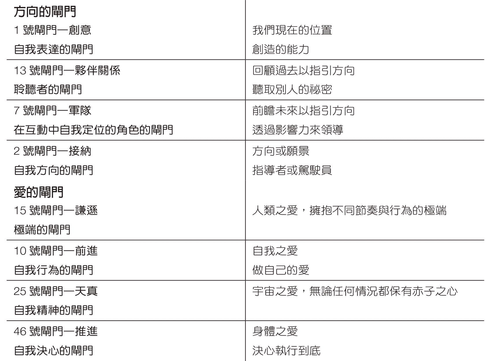

#### ▸ 有颜色（定义）的 G 中心——总人口的 57%

G 中心有颜色的人，拥有固定且可靠的自我认同，一种被爱而让人喜爱的感觉。他们能够安心地爱自己，也能爱别人，而不至于变得依赖。他们可以感觉到属于自己的正确方向，或人生使命，而且天生就能为别人指引新方向（和可能发展的爱）。他们能深刻感受到与此能量中心的链接，因此能够安抚那些担忧人类发展方向的人，帮助他们了解物种的进化方式。

他们经常遭遇的困境是（尤其在没有依靠内在权威的时候），期待每个人都前往他们要去的地方，即使有时候他们也不知道生命会将我们带往何处，或是如何到达那里。如果他们没有等待别人的询问或邀请，就试图指导或引领别人，或是忘了，并非每个人都要跟他们走相同的路，争议因而出现。他们并不知道自己无法改变，或控制其方向，所以若别人觉得不舒服，或无法跟随，那么双方都需要自由地走自己的路。虽然他们的 G 中心有颜色，但如果屈服于别人强加在他们身上的期望，或是被别人的期待所制约，就是舍弃了自己的方向，而无法真正爱自己，那么他们可能会经历非常失落的人生，于是干脆自暴自弃。

#### ▸ 空白（未定义）的 G 中心——总人口的 43%

G 中心空白的人没有固定的身分认同。这不是缺陷，也没有错。只是他们很难理解，为什么自己会活着，却不知道自己是谁，也没有一致而可靠的自我认同感。没有人真正知道他们开放性的界限在哪——他们自己也不知道！他们会融入或适应于与他们有所互动的对象，也能适应任何环境。无论如何，他们总会受到周围人们的能量场（定义）所影响。他们来到世上，是为了学习“存在”的许多面向。随着时间过去，当他们处于正确而有助益的稳定关系里，舒适的自我认同就会浮现。

他们非常容易开始一段关系，因为截然不同的人会互相吸引。能量中心有颜色的人，自然会被能量中心开放的人所吸引，反之亦然。G 中心开放的人，会从“借”来的身分认同与方向中，获得安全感，而 G 中心有颜色的人，则看到被反射回来的自己，然后心想：“他们就像我一样。”如果 G 中心开放的人回到自己的设计，他们会知道其他人看到的只是反射而已，而 G 中心有颜色的人则会意识到，他们的伙伴跟自己并不一样。如果忽略这差异让关系持续，有颜色的一方便会将自己的自我、身分认同和方向，强加在对方身上，并对此毫无意识。

空白 G 中心的人并非没有方向。他们确实有个不停运作的内在定位仪，但运作方式不同于有颜色的 G 中心。空白 G 中心会被指引或带往各处，也可能受他人影响而去很多地方。这是他们人生道路的一部分。尝试各种方向，是他们决定何处才是适合自己的方式。他们会收集适合自己的地点，好让自己能够再次回到那里，例如适合用餐、购物、工作和娱乐的地方。

空白 G 中心的箴言是：如果你处在错误的地方，就会和错的人在一起。空白 G 中心拥有特殊的配备，当所处环境不适合他们时，他们可以侦测到。如果有人带他们去一间感觉不对的餐厅、住所、商店或办公室，他们会自动将那种不舒服感转移到带他们去那里的人、在那里遇见的人，或是在那里所提出的各种提案或协议上。

举例来说，你想将一位 G 中心开放的女子，介绍给可能合作的业务伙伴，于是你带她去一间餐厅，如果这间餐厅对她来说，是个错误的场所，那么这合作关系就无法创建。不妨换间餐厅，再试一次。当你找到一个适合她的地方，就能准确评估出合作关系的可行性。这就是 G 中心空白的人在自己的轨道上遇见他人的方式。一切皆与地点有关。当 G 中心空白的人待在对的地方，他们会有正确的人生方向，也会遇见正确的人。当他们的空白中心放大周围人们的能量，由于反映出正确的能量，他们就会充满活力，这就像是他们待在哪里，就会变成怎样的人。换句话说，错误的住所、工作或关系，可能会是他们极度痛苦的原因。

拥有开放的 G 中心，其美好之处在于，周围的人经常成为乐于相助的盟友，提供各种建议，并热心帮忙。新的方向和新的恋情，总是被带到他们面前。朋友会告诉他们一切事物的所在位置，并且带他们找到正确的人、地点和工作。空白 G 中心的非自己问题是：“我是否仍试图找到方向和爱？”如果他们与自己的车辆同在，就不必凭一己之力去寻找任何东西。事实上，他们也无法帮自己找到什么。这方法对他们来说并不管用。

就以找房子为例，一开始你会先打电话给朋友和仲介，说明你要找怎样的房子。接着你可以休息一下，等着看他们会帮你找到什么。借由参观他们为你找的每一个地方，去感觉哪间房子适合你。一旦找到那个地方，除了支付费用和表达感激，谢谢他们带你看房子，你并不亏欠他们什么。他们本来就要为你服务，这是他们在你生命中应当扮演的角色。同样的策略也适用于爱情。当你停止追着爱情跑的那一瞬间，爱就会来临。如果你能理解，并接受自己的设计，其实是要等待别人发起，并带你到适合的方向和地方，就会为你带来深层的解放。G 中心空白的人需要独立性，也需要有人在身边支持他们，让他们自由地探索生命的广阔。如果他们发现到自己身处错误的关系中，会觉得被困住而开始寻找出口。

如果孩子的 G 中心是空白的，请确保他们能安心舒适地待在自己的房间，或专用游戏室，这关系到他们在发展阶段这几年，是否能单纯活着，健康的愉快成长。如果环境中有任何让人不舒服或不愉快的东西，尽可能改变并调整。这个做法也同样适用于学校。如果学校环境感觉不好，孩子将无法良好地成长茁壮或学习。即便只是让学生换个座位，也可能有所影响。

G 中心空白的人，想法中潜藏着强而有力的动机：“哪个方向会带我找到爱？”透过与非自己的对话，头脑所做的每一个决定，几乎都经由这个问题来过滤：“这是我能找到爱的地方吗？”非自己可能会执迷于自己前进的方向，以及寻找爱情的时机，这也迫使他们试着了解自己是谁，以寻求自我认同。他们可能会忙着争取各种头衔加在自己名字后面，这样他们就可以宣称：“我是医生、教授、律师。”他们一次又一次地发起，只会不断遭遇阻力。他们因为不知道自己是谁，因而觉得自己有问题，而这又促使他们去寻求虚幻的自我。生命若没有固定的方向感，可能会令人不知所措。而地点仿佛是个难解的谜，因为它并不像我们头脑所想的那样。如果 G 中心空白的人试图透过头脑，了解自己，就会错失爱情和正确的方向。人生策略和内在权威永远是这个问题的解决之道。

当 G 中心空白的人能与自己和平共处，他们就不需要预期自己的下一步行动，或爱情何时会再来。他们只需安然静待，让环境中的人事物带来启发。他们会了解这并非自己所能决定，也相信道路会在对的时机点，逐一显现在他们面前。他们不会依附任何人，期待有人会带领他们前往正确地点或遇见所爱的人；他们只是简单表达感谢，然后继续前进。这让他们能够自在地面对所有类型的人，并且看出别人是否真实地活出自己。

G 中心白色的人能享受事物在他们面前展开，而不会感觉失落或迷惘；他们能够随遇而安，善用别人的指引。他们能告诉我们，何谓爱与方向，因为他们接受所有爱的可能，也体验了各种不同的方向。虽然可能永远看不到自己的目的地，但他们很清楚只要活出自己，接下来的每一步都会逐步显现。到最后，G 中心空白的人将会是生命中最好的向导。只要放下对自我认同和爱的需求，他们能与任何人衔接，并且给予别人真诚而正确的指引。他们来到世上是为了获得智慧，体悟到所谓的自我认同，是如何透过一个人的行为来展现。许多舞台和银幕上的伟大演员，都有空白的 G 中心，因此他们缺乏固定的自我认同。他们可以将要扮演的角色（身分认同）深刻地内化，也可以将之反映出来，塑造成有说服力又吸睛的人物。

#### ▸ 完全开放的 G 中心

完全开放的 G 中心，让这个人缺乏清晰可辨的人格特质，也没有与生俱来的方向感。如果不依靠个人的内在权威，G 中心完全开放的人会感觉漂泊，充满不确定性，而请求别人认同和指引他们，确认他们值得被爱。这会让他们很容易受到操控，并且被别人的要求所制约。一旦他们把自己的内在权威交到别人（有权力的人或是机构）手上，就再也无法活出自己真实的潜能。

随着时间过去，当他们对自己设计中的开放性感到自在，就会发现自己的道路或方向逐步展开，感觉到自己是独特的存在。就像那些 G 中心空白的人一样，他们拥有丰富的体验，了解存在的本质、自我之爱，以及我们这辈子注定要走的道路，而我们所有人都能从他们所累绩的智慧中获益。

#### ▸ 空白（未定义）G 中心的非自己对话

非自己头脑是白色中心的代言人，告诉我们该说什么或该做什么。留意这些对话对于去制约是必要的。下面是非自己对话的一些例子，白色的 G 中心的非自己头脑对话听起来可能像这样：我是谁？我应该去哪里，才能搞清楚自己是谁？谁能告诉我？我会爱上谁？谁会爱上我？我要怎样找到他们？哪里可以找到他们？我这辈子该做些什么？我应该去哪里才能搞清楚我这一生要做什么？是那里吗？还是这里？到底是哪里？我感觉失落吗？往那里去吧，我们可能会因此找到一些线索，从中得知我是谁，或我的人生该怎么办。跟这个人在一起吧，这样我就能感觉到自己是什么样的人了。

“当你依循人生策略和内在权威而活，那一刻，会是你人生中第一次真实运作，同时与真正的方向有所链接，这就是过程的起始点。当一切就定位，而你往前，就会开始打开各式各样全新的视野。首先，抗拒会消失，最直接的层面是你能回归自己，并且做出决定，立即能移除人生中那些根深柢固的重担。

你开始明白自己可以信任内在的决策过程。你开始坦然面对自己的内在权威—这是每个人一生下来就被剥夺的东西。我们被外来的权威所支配。同时，你若依赖脑袋介入，将会被空白之处的混乱所淹没，这是一场困兽之斗。”

——拉．乌卢．胡

# 第三章内在权威我们独特的真实本质

### 我们独特的真实本质

本书第二章介绍过，你那强大又有才华的头脑深信，它知道什么对你最好，千方百计想成为你生命中的权威。你的头脑会不择手段，想尽各种办法，保有控制的假象，而身为人类，每个人皆具备极大的差异性，于是头脑反倒让我们进退两难。你可以让头脑当你的盟友，不过你要明白自己的内在权威，并且尊重它，并深入了解你所属类型的人生策略。运用这些工具，就能解放头脑，让头脑成为乘客，放松，安然观看人生的风景，享受其旅程，并扮演其真正的角色——成为他人的外在权威。

人类图体系教导我们，如何依循自己的内在权威而活，如何做出对个人而言正确的决定。虽然我们备受制约，而向外寻求认同和权威，并倚赖头脑做决定。但我们其实拥有值得信赖的个人内在权威，在作决定时得以依循。当我们有意识地运用自己的人生策略和内在权威，就会与自己独特的几何轨迹（道路）结合，而我们的基因组成、轮掉头世的原因，以及我们的独特性，都会透过真实的自己得以展现。而居住的地方、工作与关系等，这些事情会自然而然步上轨道。

人体图中有几个中心，可以成为个人的内在权威，而每一个皆代表不同的决策方式或模式。各个模式的阶层如下所列，接下来也会详细说明。一旦头脑被解放，不再承担做决定的任务，它就能在我们的生命中发挥正确的作用，成为重要而宝贵的观照者，以及成为别人的外在权威。

#### ▸ 权威的阶层

*   情绪中心（情绪型权威）
*   荐骨中心（荐骨型权威）
*   直觉中心（直觉型权威）
*   意志力中心（自我型权威）
*   G 中心（自我投射权威）
*   环境（无内在权威）
*   月亮（月循环）

在你的人类图中，会列出你个人的内在权威。以下概略说明每种类型的内在权威。

### 情绪型权威

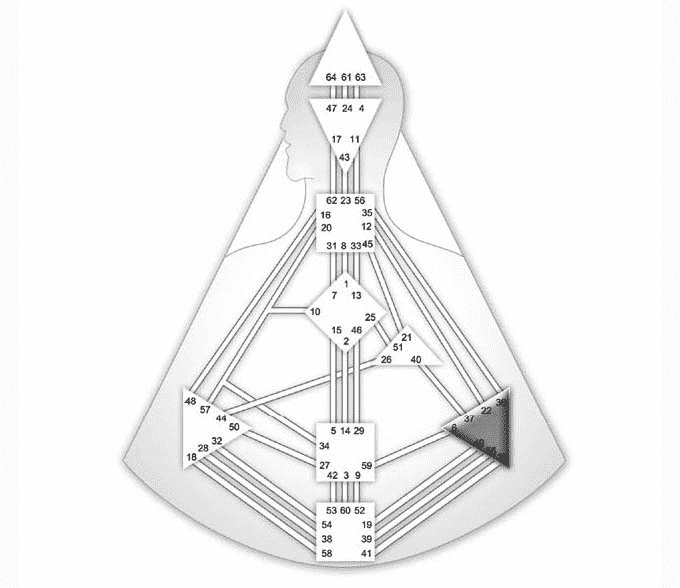

当情绪中心有颜色的时候，它的阶级高于人类图中，其他所有的权威中心。我们在第二章得知，情绪中心运作的方式是情绪波，而等待清明，则是其人生取得和谐的关键。在这个星球上，50%的人，情绪中心有颜色，他们的设计是，等待经历自己的情绪的周期，再做决定。他们的格言是：“当下看不见真相。”真相会随时间而揭露，最终浮现出清明的感受。等待经历完情绪周期，再做决定，耐心是关键要素。因为当下看不见真相，随兴而做出决定并不可靠，是基于非自己的决定。时间是此内在权威的关键，等得愈久愈好。时间，让人在需要做决定的当下，与决定本身，拉开了些距离，尽管绝对的清明，或百分百的确定，非常罕见，但只要耐心等待，你就会获得清晰。目标是尽其可能愈来愈清晰。

最好避免在情绪波的高点或低点决定，因为这会带来混乱，通常会造成遗憾。当下立即的反应，欠缺深度。虽然要抑制当下立即反应的冲动，着实困难，不过最好还是等到平静无波时，再做决定。请记住，你的真相（清晰）会随着时间到来。当你臣服于不确定性里头所蕴藏的深度，就能超越“赞成或反对”这种一时的反应。你可以运用等待的内建机制来辨别，避免因为随兴而犯错。情绪中心是强而有力的动力中心，也是温暖而诱人的能量来源，让人渴望靠近。等待清明到来，这让你占优势，当你请对方等待，花时间仔细考虑对方的提议，假如这对双方来说，都是正确的提议，此时他们可能会发觉到，你或你的能力变得更加重要、更加吸引他们。多实验几次，你会学习和了解这种决策方式，并且你会发现原来等待的力量可以如此强大。

### 荐骨型权威

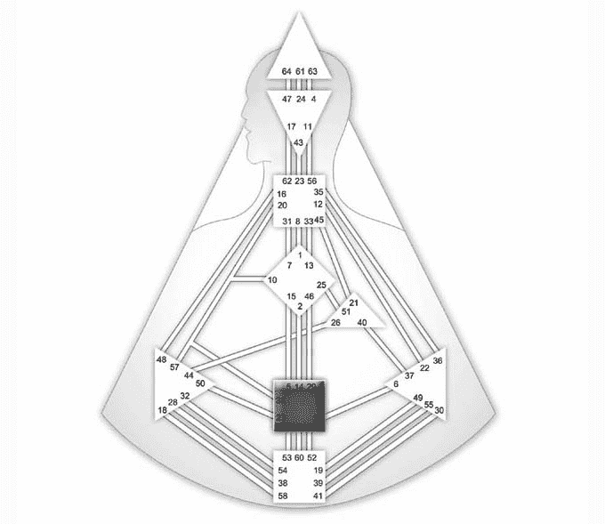

当荐骨中心有颜色，而情绪中心空白时，我们拥有的是荐骨权威——这是属于生产者的领域。当生产者被要求将其能量投注行动或关系中时，他们通常马上会发出或感觉到荐骨的声音，也就是我们常听到“嗯哼”（好）或“嗯嗯”（不好）。如果有任何犹豫，像是“嗯……”，就代表着：“我现在不知道——晚一点再问我，或是换个方式问我。”荐骨权威透过回应来告诉生产者，何者对他们来说是正确的，他们的界限在哪里，他们现有的能量想支持或投入的是什么。相较于情绪中心，必须静待时间显现真相，荐骨中心所表现的是当下的真实，荐骨仅在当下运作，无法预测未来。它的回应告诉你，哪些人的能量或要求对你来说是正确的，还有你的能量是否可以交由别人使用，或执行某项任务。当你听见荐骨给出放手去做的回应，你知道自己将拥有足以坚持下去的能量来源，直到任务或关系完成，或你再也不想在此灌注能量为止。荐骨回应是可靠、实在并值得信赖的指导原则，能够减少阻力，并获得最大的满足感。

然而，经过多年制约，你会发现自己需要与自己荐骨的回应，再一次链接。有个好方法是，找个人来问你的荐骨“是”或“否”的问题。当别人问你时，让荐骨即刻回应。你可能得花点时间，熟悉自己的荐骨如何回应，你愈常练习，回应就会变得愈来愈清晰。这个奇妙的方法可以重新唤醒，并再次强化你的回应能力，成功与那总是准备好要回应的内在导引系统，重新链接。

### 直觉型权威

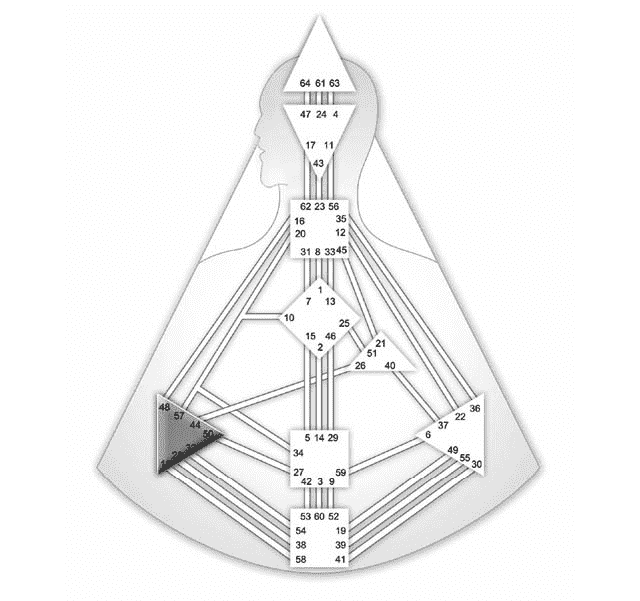

如果一个人具备有颜色的直觉中心，而荐骨或情绪中心没有颜色，代表他具备直觉权威。直觉权威是一股内在的察觉力，就像瞬间对某件事或某个人产生共振或了解，知道对你而言是否健康。高度演化的生存智能让我们面对眼前的环境、方向、机会时，保持警觉，同时能区分对方是否安全？相互链接是否有益？何者无益。

这类型的内在权威需要深层的注意力，留意许多细微的生理感受，还要有能力在必要且正确时，不顾一切展开行动。直觉的声音轻柔，而且不会重复。为了生存，活在当下，接收身体告诉你的讯息，这对能否存活，至关重要。这是一个全然存于此刻的权威，其设计要确保你安全无虞。别让头脑或别人的情感需求、渴望和压力，而让你对来自直觉中心的讯息心存怀疑，或忽视它的存在。

直觉中心会持续且自发地，时时刻刻传达关于身体健康的讯息，聆听它的警告，能让你获得伟大的智慧。拥有直觉权威的人，无暇深入，也无法考虑其决定，将来可能衍生出更广泛的影响。他们必须在当下做决定。若是等待，而那当下与讯息便一去不复返。

直觉中心所察觉的并非未来，对你而言正确的事，十分钟、一小时或一天之后，都可能有所改变，而你的行动也会跟着改变。如果现在有某件事对你来说，是正确而安全的，你凭直觉就会“知道”，反之亦然。为了重新熟悉，并尊重直觉的引导，你需要实验，也要深信你身体（车辆）的内在智慧，会安全地带你前往要去的地方，以适合你的方式，与对的人同行。

### 意志力中心（自我中心）显示型权威

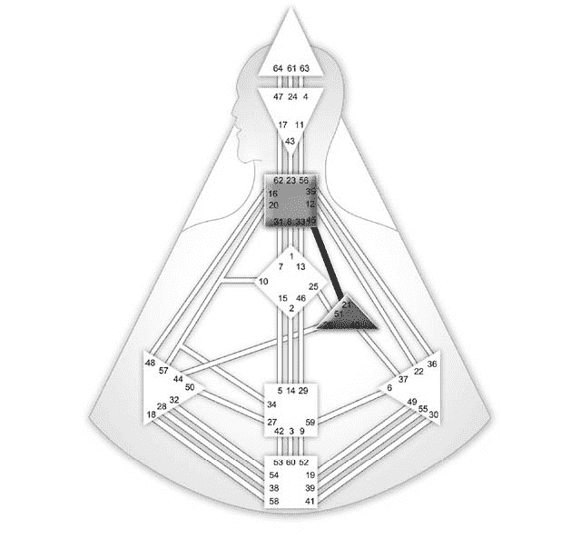

自我显示型权威，受到意志力中心的动力所驱动，进而显化。显示型权威是有关表达。这个内在权威是透过喉咙中心，以口语表达，所以为了知道自己的真实，就要聆听自己所“说”的话，而非头脑的意见，这对你很重要。身为显示者，你的告知必须在当下，以言语来表达，这并非你认为自己应该说的话，而是当你不再费力控制时，说出口的话。非自己总试图控制我们的话语，但实际上，你在当下脱口而出（没有经过大脑）的每一句话，才是属于你的真实。如果你企图以任何方式，预先编写好要说的话，就会失去与内在权威的链接。你的设计天生就具有影响力，对你来说，重要的是，要相信自己所说的话，而不是让头脑凌驾其上。关键是，臣服于你声音中的真实，这是你的影响力来源。你有很多的开放中心，争相吸引你的注意力，所以你不能信任非自己的头脑来为你发声。你的声音会发起，并主导你的人生。让你的声音领路，而你跟随。信任自己的声音。

### 意志力中心（自我中心）投射型权威

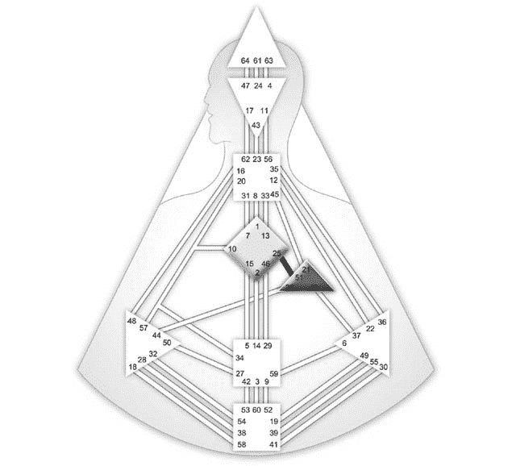

拥有自我投射型权威的人，其意志力中心会透过“发起的信道”（25-51 信道）连接 G 中心。这是一种罕见的投射者形式。对这些人来说，人生策略和内在权威非常重要，他们唯一能信任的，就是等待邀请。这个非常强大的 G 定位中心，被好几个空白的能量中心围绕，因此你很容易迷失于这些开放的部分。由于缺乏连接至喉咙中心的动力，所以关键在于，遵循你的投射者策略，等待别人看见并发出邀请。在人生中，你需要有人来到你面前邀请你。投射者的领导力，对别人的生命带来重要的影响，他们来到世上，就是为了指导我们。当邀请来临，你具有非凡的能力，化为一股蜕变的力量。不过，如果你迷失在非自己的开放状态中，将无法取得投射者在人生中原本能获得的成功。当你做决定的时候，请自私地问自己：“我想要什么？这能带给我什么？”意志力中心是一个动力中心，做与不做，取决于你的意志（能量）。当你等待着，在别人认出你的才能之前，请利用时间做好准备，这很重要，学习整体系统的相关事宜，将帮助你指引他人。

无论是任何形式的自我意识权威，或甚至不是内在权威，有颜色的意志力中心都要承诺，同时完成，以证明其意志力能履行正确的决定，如此他们才能保持健康。当进入任何状况，被要求长期投入能量时，为了避免对心脏造成负担，要做出正确决定。

此外，有颜色的意志力中心必须在工作和休息间，取得平衡。事实上，意志力中心的人工作，也是为了想拥有玩乐的时间。不论在能量或生理层面，维持平衡有其必要。

### 自我投射型权威

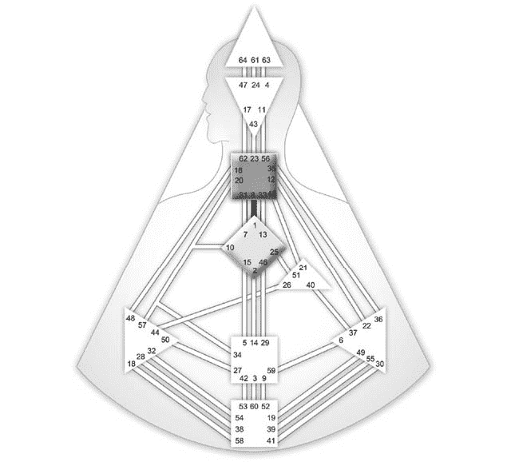

自我投射型权威，源自 G 中心，透过四条信道中的任何一条，连接到喉咙中心。这个内在权威的关键是，聆听你所说的话。你需要知道的一切，都在你的话语里，而你拥有的 G 中心，是非常强大的自我认同声音，它会为你发声，以回应邀请。透过你的核心定位，表达出属于你的真实。如果你并未表达真实的自己，成功就此远离你。当你被邀请，请听听自己说了什么。别试着以头脑设想自己要说的话；你只需聆听，并且信任那一刻自己所说的话。

这种类型的内在权威不带动力中心，你可能完全迷失于开放中心所带来的种种制约，容易忽略自己当下的声音，而无法实现独特的自我。你的设计须透过忠于自己，并根据为“你”带来愉悦与喜乐的事物，进而引导你做出决定。问问你自己：“这会让我快乐吗？这能让我表达自我吗？我是否朝着正确的方向前进？”跟别人讨论你即将面临的决定，很有帮助，因为这样你就能听到自己的说法，感受此决定能否为你带来满足的感受。为了避免用头脑做决定，你要专注聆听自己所说的话，而非空想。G 中心有颜色的人经常能为别人指引方向，不过唯有聆听自己当下所说的话，才能听见属于自己的方向。

### 环境（头脑型投射者）

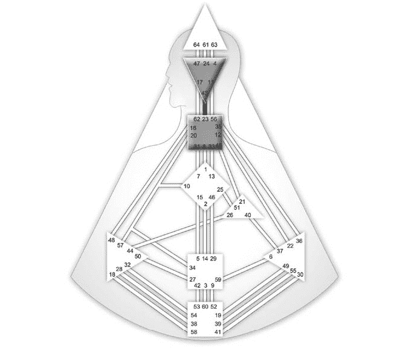

头脑型投射者可能是逻辑中心链接头脑中心，或是逻辑中心链接喉咙中心，又或者是头脑、逻辑和喉咙中心彼此互相链接。没有能量中心作为个人的内在权威，这是非常罕见而且独特的设计。当喉咙中心以下没有能量中心有颜色时，这样的设计会透过开放的能量中心，在环境之中所得到的感官讯息，获得指引。如果环境感觉不对劲，那么跟你在一起的人，或是在那里交流的想法与达成的协议，皆不正确。你要问的第一个问题是：“这个环境对我而言正确吗？”要注意的是，你要察觉头脑的力量，以及其介入决策的倾向。若要决定哪种环境适合你，健康而有益的做法是，带着疑问亲自拜访，留意并确认你的身体“感觉”如何。

虽然对你来说，有群值得信任的智囊团是件好事，不过最好不要为了听取意见或建议，而去讨论决定。最好的做法是，将你的智囊团当成声音的反射板，这样就能听见自己对决定的诸多考量。

### 月亮权威（反映者）

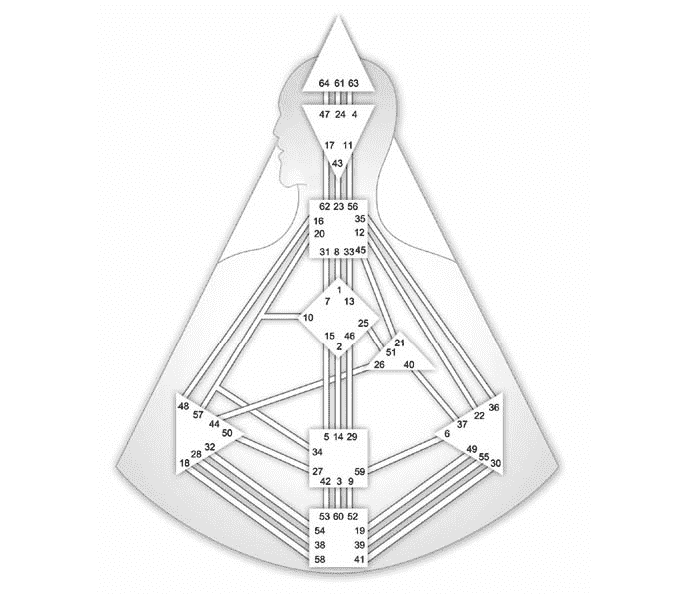

如果没有任何能量中心有颜色，就是内在权威为月亮的反映者；月亮权威由月亮通过人类图曼陀罗的二十八天周期所决定，在这段期间，月亮会一一探访六十四个闸门。反映者的设计是，在做重要的决定之前，要等待个人固定的月亮过境模式通过，而且每个月，这个模式都会重复一次。如果他们了解并遵循此模式，就能在决策过程中获得清明，同时享受反映者的人生，持续享有惊奇与快乐。如果不尊重自己的月循环，他们可能会感到失望与不安。对反映者来说，关键是放慢脚步，别让世界催促他们。

环境对反映者很重要，因为他们反映环境。反映者的核心与空白的 G 中心息息相关，在对的环境里，跟对的人在一起，对他们的健康产生重要影响。如果环境带给他们不好的感觉或不健康，他们会觉得不舒服或不自在。相反地，如果环境带来的感觉很好，他们就会觉得舒适。反映者必须拥有值得信任的智囊团或知心好友，跟他们讨论，在月循环期间的各种情况和可能的决定。只要倾听自己所说的话，随着时间过去，反映者终有一天会获得内在的觉知，那会是一种深刻的内在感觉，知道怎样的决定适合他们。有关反映者的更多讯息，请参阅第四章。

#### ▸ 解放头脑，让它化为外在权威

遵循我们的人生策略，可以链接自己个人的内在权威。当我们依照自己独特的真实自我来运作，空白的中心就会成为智慧之所在。这些空白的中心非但不会以扭曲的方式造成制约，反而能清晰且准确地告诉我们，周围世界发生了什么事。一旦我们步上轨道，与自己正确的几何轨迹并行，头脑就会开始展现潜能，化为他人的外在权威。表达我们的思维，也能与别人交流分享我们独特的经验和看法，以自己所学习的经验，来启迪众人。头脑是为了思考、提问、解释、教导、启发、记忆、组织、识别和处理信息。这些皆是我们分享头脑天赋的方式，而有些人生来要接收引导，再本其权威来回应。我们愈能运用自己的人生策略和内在权威，就能让头脑卸下做决定的任务，进而获得解放，如此一来，我们的外在权威对别人来说，就会愈来愈宝贵。一旦我们与自己真实的本性链接，我们就等于顺应自己的生命动力，以及真正的人生使命。于是，我们的头脑会自然浮现具有独特价值的想法，而这正是别人一直期待听到的。而获得解放的头脑，将重十潜力，最终表达出我们投入轮回的独特原因。

将自己视为答案而非问题。

——拉．乌卢．胡

# 第四章四种类型与人生策略活出我们的设计

### 活出我们的设计

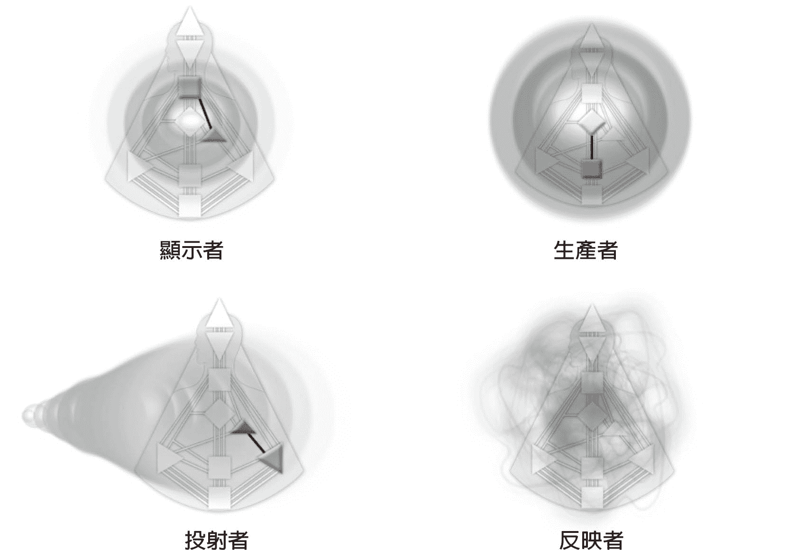

一七八一年出现转换期智人宣告了人类的转换，也促使人类进一步区分为四种类型：显示者、生产者、投射者与反映者。类型构成了整个人类图系统的基本本质，而人生策略跟内在权威则提供不同类型的人进行实际、激励及转变的信息。在人类图设计系统中，类型无关乎心理或个性，主要是与身体、基因以及能量场有关。不同类型的能量场各有其独特振动频率，跟血型一样，可以清楚区分。了解不同振动频率所形成的能量场，会造成每个人在本质上细微的差异。人跟人之间的沟通是透过能量场，而能量场是由身体的基因所构成，也就是在人类图中，被定义的不同中心。定义决定类型，而类型则透过能量场展现。

四种类型的分类是根据他们是否具有稳定的生产或发起能量的能力。显示者及生产者这两种是属于能量类型，而投射者及反映者则属于非能量类型。非能量类型无法持续产生动力及展现，因此在工作上的持久力有限。不过，一旦选择遵循内在权威的运用，将有助于激发最极致的能量潜能。

“能量场是人类的完整呈现，支配我们的行为表现，是我们和别人互动、给予别人感受的方式。”——拉．乌卢．胡

每个生命体都被所谓“磁场”或“能量场”所包围。以人来说，能量场的范围就是两只手臂长度所能伸展的范围之内。当能量场彼此链接时，会产生非言语沟通但又无法忽略的影响模式。若能理解并尊重不同类型的人皆有不同的能量场，便可以创造出比较和谐的沟通与相处模式。能量场具有引发反应的本质，沟通出我们是什么样的人：生产者的能量场会挑动别人发出询问，好让他们能回应；投射者则是促使被认同及被邀请；显示者是发起挑战或行动；反映者则充分反映别人的状态。每种类型只要允许并接受能量场运作，就可以轻松自在运用人生策略过生活。

人类身为高等群居生物，为达需求或目的，必须与他人互动。这代表每个人都要学习赞赏与尊重他人的独特性，同时也了解并爱自己，在沟通上温和地呈现自己的独特性。不同类型之间能量场的沟通就从人生策略开始。

#### ▸ 人生策略反应了每种类型独特的能量场

当谈及人类图中不同类型的人生策略时，指的是一种没有阻力、遵循自己人类图设计的方法，并支持让我们在整体的流动中，得以保持自己独特的几何轨迹，达到真我。人生策略并不是一种哲学，而是根据基因所构成的人类图运作，是让每个人活出完整设计的唯一方法，进而对健康、性关系、人际关系和人生目标的发展方向产生影响。

所有人类图的分析都从类型开始，而每种类型都有简单、易懂的人生策略，可以有效地运用在彼此之间的互动。人类图曼陀罗（The Human Design Mandala）与人体图分别提供了宇宙运行背景和蓝图，并依此决定了人生策略。一旦开始以人生策略过生活，不同类型的人将可体会他们追求的目标：平和（显示者）、满足（生产者）、成功（投射者）或惊喜（反映者）。你会发现自己的内在有某样东西隐藏在层层制约之后。你将会触及自己内在那个总是知道什么是对、什么是错的自己、触及那种不论生活遭遇到什么，都能明辨对错的内在境界。运用人生策略可以打破人与人之间比较的惯性，并且打开一条发现独特自我的道路，使得你乐于做自己。人生策略会让你内在的本质自由发展，人生所追求的目标也将能自然显现。开始运用你的内在权威与策略过生活，展开属于你自己的经历。你可以自行测试，看看你的人生策略对你是否合适。请以你的内在权威与策略，取代大多数人将外在权威加诸己身的盲目信仰。

### 显示者

封闭且反抗型的能量场

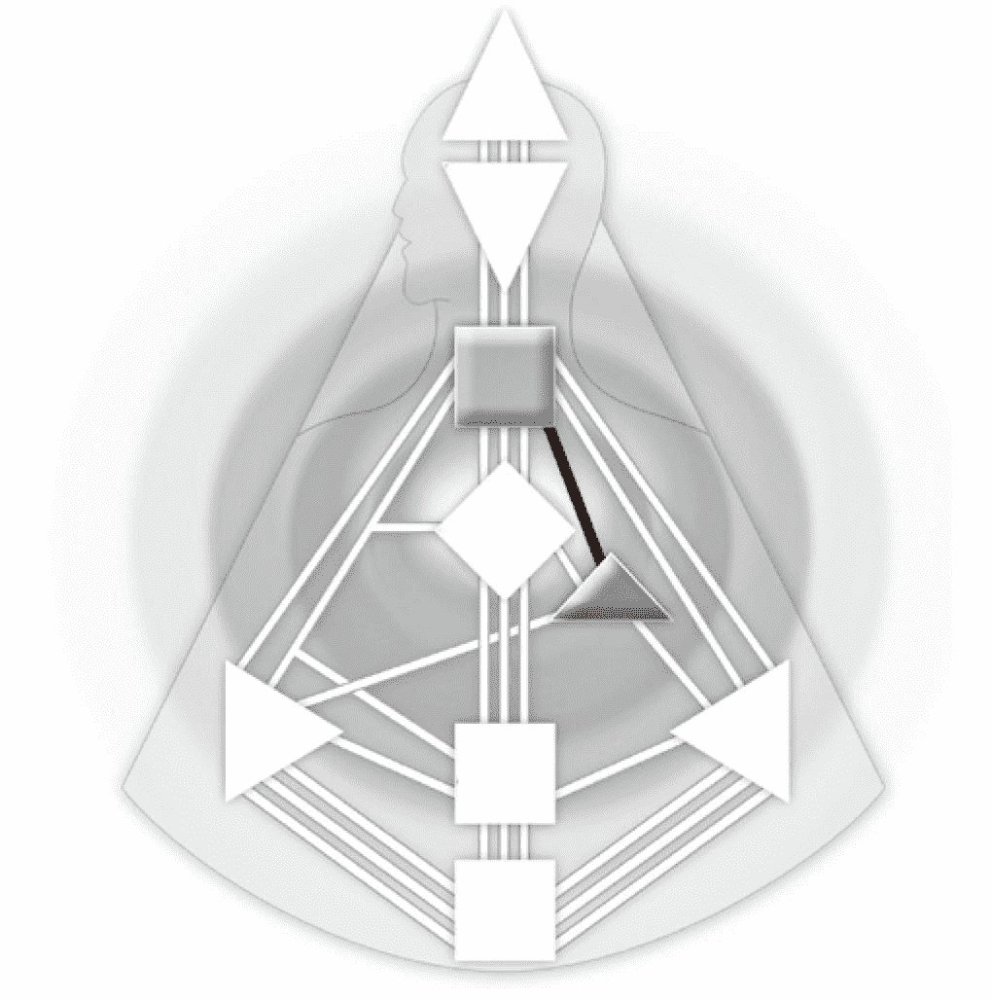

非自己主题：愤怒

人生策略：告知

目标：平和

#### ▸ 显示者类型

有两大特点可以明显区别出显示者跟其他类型的不同。第一、显示者的荐骨中心未被定义，这也说明了为何显示者是整体中的少数。第二、喉咙中心与人类图其他三个动力中心——意志力中心、情绪中心、根部中心——有直接或间接的信道链接。

显示者很希有，在全世界的人口中少于 10%。

#### ▸ 概论

显示者不需要等待老天或是外力迫使他们行动，人类的冒险旅程就此展开。显示者封闭且具反击性的能量场所带来的能力，经常表现在为了捍卫生存或理想上，因此他们经常扮演领导统驭的角色，例如将军或大祭司。身为类型中唯一纯粹的行动者，显示者在不断征战防御国土的同时，借由创建法律制度以稳固权力。现今的宗教及世俗的阶级制度，就是显示者所企图控制，而且避免被挑战所留下的产物。

显示者所扮演的传统统治者的角色，大约在一七八一年结束。然而，人类也从七大中心转变成为九大中心。如今仍属于阳性代表（属于先人力量）成员的显示者，生活在代表阴性（属于接收型）生产者所主导的环境中，他们不再梦想创建帝国或者主导社会文明的进程，而是寻求一种可以整合他们与生俱来、独立、特有且不可或缺的力量，好对这个限制他们自由的社会产生影响力。

显示者所展现的天赋，在于他们有能力独立完成任务、发起行动并影响别人。但是，当这些特质让其他类型感受到威胁或不可预期性时，反而使其他类型表现出想要控制显示者的企图。此外，显示者喜欢自在享受独处，并从中寻求期望中的平和感。他们从不觉得需要外人协助，也因此无法理解别人为何在意他们做了什么，试图想抗拒或控制他们，特别是来自父母的掌控。小时候对抗外界制约不愉快的经验，让显示者呈现愤怒，也就是非自己状态。这些非自己状态有时会表现出生气、叛逆或被动、不动。不管是哪种方式都会压抑显示者的内在力量，并让他们贬抑自我价值，这也突显出学习与了解人生策略的重要性。若能学习主动告知，将可降低来自他人反抗的压力。而绝大部分显示者所追求的人生，是得以平和去做他们想做的事。

显示者与生俱来的独立特质，使得他们以自己的内在权威为准绳而行动时，不需要他人询问或邀请。他们是自成体系，独立自主的个体。而他们前瞻性的特质，让其他人宛如外星人一般，显得落伍、无法自困境中脱离。他们经常需要等待世人跟上他们的脚步。

显示者经常出现的疑问：“我会得到回应吗？会有人因为我而受到鼓舞吗？有人会回应我所发起的问题吗？”这种产生影响力，促成事情发生的潜在压力，是他们实践人生目标的关键。他们喜欢独自行动，而其他类型则等待显示者的行动发起，如此一来，大家都可贡献一己之力。然而，显示者也要寻求其他人提供完成梦想的动力。因此，完美组合就是由显示者来发动、投射者引导流程、生产者提供行动力去完成，而反映者提供愿景。

#### ▸ 显示者的人生策略：告知

长久以来，显示者都被认定是对稳定与秩序的威胁。他们独立、封闭、具反抗性的能量场经常带来误解，被认为是想要掌控。然而，失控的显示者确实会让人想忽略他们的存在，或让人害怕想逃离。反之，显示者在害怕被控制的状态下成长，于是会刻意做些对自己有害的事来反抗。显示者反抗型的能量场会导致其他类型的能量场缩小，促使他们处于防御或保护的模式。不同类型间人际的混乱与误解，其实都是能量的影响，这比意识层面更深层，早在双方口语沟通前就已经产生。

显示者的人生策略就是，告知，打破既有高度主控的能量场，以开放态度澄清，进而产生具生产力与平和的沟通。告知可以让显示者在行动时，清除周围的阻力。就技术上而言，显示者需要在做完决定后，采取行动前，或至少采取行动时，主动告知。此外，当决定不再继续做某件事情，也要做到告知。

告知绝非他们乐于去做或者本性会做的事，但若他们开始学习，人生道路会比较轻松，也会让其他人处于舒适的氛围中，不至于太消极或激进。显示者在孩童阶段，则要学习请求允许。然而，孩童时期的显示者可能觉得告知太麻烦，或者担心被拒绝或被控制，不常主动告知。

一旦显示者开始认知自己的决定会影响到别人，告知就可成为实用的决策模式，这也将有助于修补关系并释放自身能量。即使显示者不在乎别人眼光，但对于会带给别人冲击仍然会讶异。因为在行动前先告知，可以让人有所准备，他们也将感受到别人的支持与接纳。随着周遭阻力的减缓，内在愤怒感也将平息，进而充满和平感受。而且，当其他人将他们当作自己人，主动告知他们信息，显示者会觉得受到尊敬。

以下的情境将说明何谓告知，以及对别人产生的影响。假设一个显示者在上班时，忽然觉得这份工作再也做不下去了，最后在慌乱又激动的情绪下，做了离开的决定，于是开始打包东西，并写了一封辞职信寄给老板，然后就离开了。这时，周遭的人既未接到这个显示者的正式告知，也没有心理准备，无不陷入一团混乱，他的老板可能觉得顿失助手，同事们则担心自己是否不小心得罪了他，家人们会忧心未来的生计来源，这就是典型显示者意料之外的行动，所带给周遭人的影响与可能随之而来的对立。

因此，当显示者发起不需他人建议或协助的计划时，无论如何，请都记得主动告知可能被影响的关系人，这将有助于减低阻力，得到支持，并让他们的人生道路得以显现，这是显示者唯一的解决方案。

这样的人生策略看似简单，然而多数显示者都自觉是独行侠，对他们的天性来说，告知是最后才会浮现在脑海中的选项。建议显示者，如果未来有任何想法或决定时，可以花点时间写下这个决定会影响哪些人，他们会发现自己并非独行侠，他们的任何决定的确会造成影响。一旦他们意识到自己的影响力，告知的合理性便会显现，这样的认知会改变他们。说到底，告知就是展现对他人的尊重。当显示者不主动告知时，他人会有不受尊重与被忽略的感觉。相反的，主动告知能解除恐惧，创建信任感，解除双方都想掌控的需求。

#### ▸ 内在权威的重要性

事实上，和其他人生策略是内建机制的类型比起来，显示者的人生策略比较像是刻意形塑出来，做为减缓阻力的工具。因此，遵循自己的内在权威显得更重要。他们的行动必须发自于内在真实的声音，而不是头脑，才能充分表达他们认知的潜能，并产生适当的影响力。如果他们为了摆脱压力，而用头脑思考做决策，将会遇到阻力。

#### ▸ 内在权威是情绪中心的显示者

对于情绪中心有定义的显示者来说，采取行动的时机非常重要。如果他们不等情绪周期走完，过度反应或浮躁做出决定，会遭受更多阻碍，导致事情无法顺利进行。一旦尊重并接受情绪波的化学反应，他们将可运用这段等待期间，好好思考哪些人会被影响。时间带来澄澈与清晰。花一些时间等待情绪周期走完，再度审视会受影响的名单，可能会彻底改变他们原本的计划。内在权威为情绪中心的显示者，要培养的就是耐心，如此一来，将有助于创造双赢的人际关系。

由头脑主导或由内在权威所展现的行动，两者有很大的差别。举例来说：如果显示者过于急躁而执行某个想法时，这种冲动通常不是来自于内在权威，而是来自于某个空白中心被扩大反应后，由头脑传达出来的想法。对于情绪中心有定义的显示者来说，等待虽然像是痛苦的惩罚，却可避免因为急于行动，所带来的不可预期或不受欢迎的后果。

显示者在等待情绪周期转换的过程中，他们要不发现自己想采取行动的感觉可能已经消退，这代表那个行动本来就不应该被执行；或者当他们在走完情绪周期之后，仍想要做此决定或采取行动，那也会等到对的时机，再做执行。这会让做决定的过程不再充满急切性或压迫感。只要顺着情绪周期，并且告知准备执行的行动，每件事都可自然发生。这也是内在权威为情绪中心的显示者，能通往平和，达成其人生目标的唯一方式。

#### ▸ 内在权威是直觉中心的显示者

不像内在权威是情绪中心的显示者，必须耐心等待内在声音，直觉中心为内在权威的显示者，只需随着自然出现的直觉行动即可。然而直觉与必须主动告知，却是显示者的两难，特别是当他必须采取立刻的决策或行动时。显示者要随时留意直觉中心的声音，和直觉中心紧密、和谐地相处，同时也要有效地告知他人。举例来说，显示者跟朋友一同聚餐，当他一踏入餐厅时，无法解释的直觉反应让身体止步，他必须注意这个讯息，这是来自直觉中心难以言喻的警告：走进这家餐厅，对健康无益。这时他唯一能做的，就是诚实告诉朋友，他此刻的感受，并留意这个突然的决定带给大家的影响。

#### ▸ 显示者的人际关系

尽管他们完全有能力可以对家庭展现爱与忠诚，但对于一个习惯独来独往的显示者来说，经营人际关系仍不是件容易的事。他们与生俱来封闭式的能量场，并不容易接纳别人。同时其他人也很难看透显示者在想什么。这对于一个母亲或情人来说，特别容易在亲密关系中感到困惑。但只要了解人生策略好好运用，与其他类型互动时，比较容易产生同理心，并且减少因差异的误解所带来的痛苦。

此外，在关系经营上，显示者不论男女，都必须发起对的行动。举例来说：当显示者喜欢某个人，最好是由他们主动追求，而非期待自己会受到别人注意或被追求。他们需要采取主动，让对方知道他们的感受，即使这样做会有风险，他们可能会被拒绝而感到受伤，然而身为一个显示者，就是要打破传统的束缚。他们必须面对及克服这样的恐惧才能继续前进。虽然他们是独行侠，不表示他们不渴望或无法拥有一段温暖及长期的情感关系。

一段平和的关系，是创建在练习互相尊重与主动告知上。如果显示者出门前能主动将目的地告知伴侣，例如：“我要去商店，马上回来。”如此一来，之后就不必面临伴侣不断询问“你去哪里了？”“去做了什么？”“为何没有告诉我们？”显示者的另一半通常认为他们的独立中带有“不要打扰我”的讯号，但这并非事实。通常，如果其他人也做到告知，显示者会感受到被尊重。这种互相告知将可减少双方相处上的磨擦、消除愤怒，并加强关系中的互相尊重。其他人不能告诉显示者该做什么，或要求他们像生产者一样，甚至诱导他们活得像投射者。不过，你若通知他们：“家里没咖啡了。”他们的内在权威自会引导他们，采取适当且正确的行动。

#### ▸ 孩童时期的显示者

也许因为希有，所以显示者孩童更容易被误解，他们与生俱来的强烈反抗能量，从出生就让父母进入警戒状态。即使只是孩童，父母仍需要像对待成年显示者般尊重他们，并给予足够的自由表达空间。做父母的必须及早让他们学习，何时应该有礼貌地请求允许，这会让他们在安全与不为别人带来冲击的前提下，在自己想做的事情上，获得父母更多支持与允许。如果对显示者孩童控制过多，将促使他们行为变得更叛逆，或者反之变得非常被动。

#### ▸ 显示者的非自己呈现

当显示者以头脑或非自己做决定时，会遭遇很多阻力。他们会觉得自己是被控制或惩罚下的受害者。他们完全无法感受其内在力量，甚至会觉得无力，这也是大多数显示者深层愤怒的来源，并内化成沮丧或绝望的情绪，甚至觉得人生是如此不公平。因此，为了避免被控制或拒绝，非自己的显示者易于表现出放弃原本力量，假装自己软弱无能。他们表现得像是个等待回应的生产者，而非发起者，他们会变成浮躁且完成度很低的工作狂，完全不像显示者，或者选择发起行动但不告知，最终将事情搞砸或引发各种阻力。在这种情况下，无力感将逐渐取代他们原有的力量，让他们感到筋疲力竭且无效率。

他们忘了自己是显示者，任何在显示者人生中有价值的事情，都必需要由显示者发起——如此一来，才能主动与他们的生命再度链接，与内在权威链接。他们的存在就是为了带来影响力。

当显示者开始试验他们的人生策略——告知，并仰赖内在权威做决定时，为了成功，他们也将面临以下的恐惧：

*   担心让别人不高兴
*   担心主动告知后会带来抗拒
*   担心主动告知后，会有人想要控制他们
*   担心主动告知后，会被拒绝
*   担心他们自己的愤怒

#### ▸ 显示者健康的睡眠习惯

对一个荐骨中心未定义的显示者而言，最好在体力完全消耗殆尽前，就上床休息。并在进入熟睡前至少一个小时就能躺下或放松，好让身体可以完全伸展。如此一来，他们就有足够时间，释放不属于本身的能量，为他们带来平和放松、得以重新充电的优良睡眠品质。

#### ▸ 标志／目标：平和

显示者最渴望的就是平和，一个没有阻力的地方。其实只要他们愿意依循内在权威与告知的人生策略，去追求自己的梦想，做他们想做的事，而且现在就去做，跳脱深沉的冷静和内在静默。当他们发现自己处于平和状态，便能了解实践告知的人生策略，他们已与内在权威链接，被赋予力量，显示他们的独特，以及对这世界所带来的重要影响。

#### ▸ 显示者名人录

希特勒、天文学家开普勒、德国总理科尔、生死学大师伊莉莎白．库伯勒．罗丝（Elisabeth Kubler-Ross）、灵学大师克里希那穆提、小说家赫曼．赫塞、演员杰克．尼克逊、摇滚歌手布鲁斯．史普林斯汀（Bruce Springsteen）、毛泽东、民权领袖杰西．杰克森牧师（Jesse Jackson）、诗人马雅．安哲罗（Maya Angelou）、歌手亚特．葛芬柯、演员翠丝．奥曼（Tracey Ullman）、企业家马莎．史都华（Martha Stewart）、幽默大师乔治．卡林（George Carlin）、拉．乌卢．胡、演员劳勃．狄尼洛、演员珍妮佛．安妮丝顿、演员苏珊．莎兰登、演员提姆．罗宾斯、美国前总统乔治．布什。

### 生产者

开放且环绕的能量场

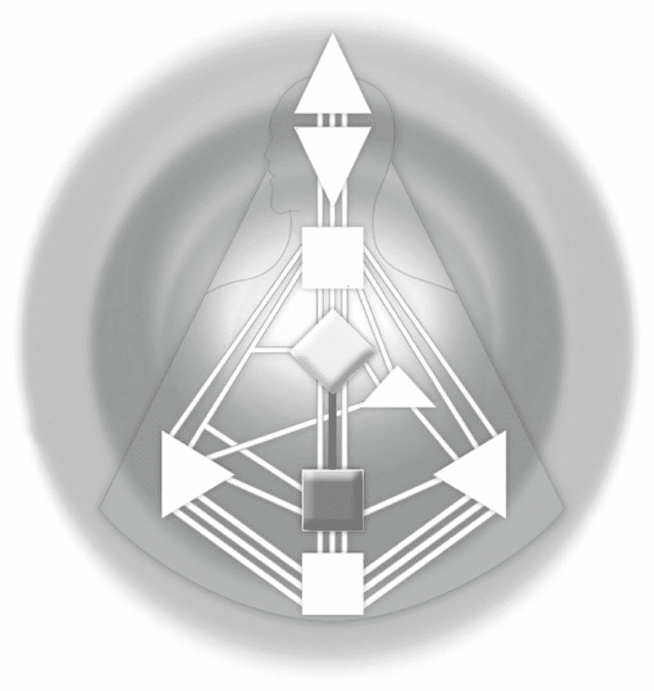

非自己主题：挫折

人生策略：回应

目标：满足

#### ▸ 生产者类型

生产者最独特且重要的特性是，他们的荐骨中心孕育了世界上的生命模式。当一个人的荐骨中心有定义，便是纯种生产者或是显示生产者。这两者最大的区别是，纯种生产者的喉咙中心未直接与有定义的动力中心链接，而显示生产者的喉咙中心则与动力中心相链接。显示生产者并不是独立的类型，而是生产者的一种变形，其微妙的差别在于两者能量频率的不同。显示生产者是生产者的一种，其策略也是遵循生产者的策略——回应。

世界上约有 70%的人都有具定义的荐骨中心，因此生产者具创造力的生命能量主宰了世界的频率。纯种生产者约占人类的 37%，显示生产者则约 33%。

#### ▸ 概论

综观人类历史，生产者具创造性的精力和耐力，使得他们变得有价值且吸引人。同时，也因为他们常忽略本身的潜能，让他们的天赋成为有心人的囊中物，轻易被利用。生产者常常羡慕显示者拥有实践想像的能力。因为生产者在模仿或与显示者竞争的过程中，总会遭遇阻力或失败，于是勉强降服于显示者，被他们所控制，为其创建强大帝国。生产者被迫成为劳工，成为我们现代文明的伟大建造者。

直到今日，生产者仍维持建造者的角色，即使他们现在已拥有可任由他们使用的工具，以觉知、觉醒的方式生活、不受压迫，且充分了解自身惊人的荐骨潜能。他们确实了解此时此刻的任务，乐于工作，并且以合作和互利的方式，与其他三种类型的人共事。生产者对于自己定位的理解和认可，正逐渐进入新的阶段。当生产者放松地进入回应状态、显示者发起、投射者引导、反映者照映出满足的层次，才是世界运作应有的真实状态。

所有的生产者都是天生来工作并热爱自己所做的事，每天用尽具创造力的荐骨能量。在所承诺的事情完成之前，荐骨动力中心不会放弃。这股动力带来对生活深沉的满足，并在夜间透过睡眠获得修复。其他三种类型总是外求：显示者专注于影响，投射者着重于理解其他类型如何使用自身能量，而反映者专注于理解周遭环境。然而，只有生产者专注于了解自我及其运作方式。生产者透过工作、透过回应每天能量供给的使用方式，了解自己的生命。适切的工作，确实转化了他们的人生，并减缓身体的退化。

生产者的设计是，透过声音，以荐骨中心做回应，这回应可能是从中间部位发出至喉咙的共鸣（纯种生产者），或是实际行动投入活动中（大多数是显示生产者）。回应是根据荐骨能量，去从事他们被询问的事情。一旦纯种生产者发出回应，且投入某一项活动，他们会按步就班地执行每一个阶段，这也会涵盖发展的每一个阶段。他们的喉咙中心未链接动力中心，因此将会在过程中遇到能量成长停滞期。每当遇到这样的瓶颈时，他们需要新的投入、洞察或更进一步的指示，再次被启动之后，才能重新回应。为了避免在过渡期半途而废，他们的荐骨必须在一开始就忠诚地投入运作。纯种生产者的天赋，展现在他们完成或掌控一项任务、专案或技能的能力。

显示生产者与纯种生产者相反，显示生产者的喉咙中心链接到动力中心，使他们可以用行动快速回应。这让他们可以理解哪些步骤必要、哪些可以省略，因此他们具有高效率的天赋。不过，效率同时也形成矛盾，显示生产者经常流于没有耐性，且因为行动得太快，容易漏失一些步骤。因此他们经常得回头补完这些被漏失的步骤，因而感到挫折。这些挫折是可以避免的，只要他们放慢速度、随着程序陆续展开，更专注于他们的回应，进而增加效率。显示生产者比纯种生产者没耐性，也较积极。因为显示生产者的喉咙中心链接动力中心，他们容易忽略荐骨的声音。显示生产者通常要花更多耐心练习，如何重新和他们的荐骨创建链接与信任。

#### ▸ 生产者的人生策略：回应

“如同希腊古都达尔菲（Delphi）的女祭司，你必须询问生产者；否则你无法得到任何东西！”——拉．乌卢．胡

所有的生产者都拥有环绕式的能量场，可以转化来自荐骨中心的创造力，他们在周围创建起一个“可供运用的”能量场域。要使用生产者无尽的能量或力量宝库，你必须请求，才能让生产者的荐骨得以回应。生产者必须等待，直到事情找上他们，荐骨可以接受或不接受。当荐骨发出“嗯哼”代表具备充足的能量，完成任务或实践要求，当荐骨发出“嗯嗯”则是说“不”，代表无法承诺的警示。

这种清楚、具体、诚实且时时刻刻产生的回应机制，直接链接着生产者和他们真实的自我，揭示出他们是怎样的人、喜欢和重视什么。他们具创造力的生命能量，透过能量场散发出坚毅的力量，像磁铁般吸引别人接近他们，而他们的荐骨则划定了清楚的人际界线，对他人做出回应。对生产者而言，生活在每一次的回应后重生，因为每一个决定，都让他们朝着完成独特潜能的道路上前进。

生产者常将“等待回应”误解为“不做任何事”，或把两者划上等号。他们不可能不做任何事，因为他们总是不断地忙于生产。如果他们正在做自己喜爱的事，或因为狗吠而退缩，或因为鸟叫而微笑，或跟着旋律哼唱，或受邀参与对话，这都表示：他们正活在回应当中。生产者被设计来等待、相信生命本身会自行找上门。从早晨起床的那一刻起，直到晚上躺回床上，他们只需要回应。生产者完全透过回应式的生活循环，改变世界的频率，让挫折变成满足。这就是为什么属于生产者的神秘道路和对人类的贡献，来自唤醒其荐骨，并臣服于它的主观回应。

其他三种类型的人必须明白，当生产者投入任务时，他们无法快速换档。对显示者来说，生产者缓慢而沉重，而投射者提供指导时，会觉得生产者没在听，若你再问他们一次，生产者才会回应、他们才能从此刻所在之处中断，重新和其他不同事物链接。当有人询问，生产者才能回应，如此一来，不同类型的人之间才会有更清楚、更直接和具建设性的交流。学会询问生产者适切的“是非题”，能让一切变得不同。

大多数生产者天人交战于，是否该接受自己无法在人生中显化自己想法的事实。他们必须放弃自己头脑里“应该如何”生活的想法。而欲望和幻想，常来自于开放中心的比较，这促使他们行动，为的是让梦想成真。然而，这样的发起行动只会遇到阻力，而非满足。挫折感是指标，提醒生产者回到他们独特回应人生的方式。

以下关于生产者与显示者的陈述可以说明回应和发起的不同。借由他们扮演的角色，你将认清他们的人生策略。场景是灰尘弥漫的西部小镇，警长坐在他的办公桌前。镇民一阵骚动，因为听说有一名持枪匪徒正朝小镇而来。每个人都试图要警长有所行动、保护他们。但警长只是坐着等待。当持枪匪徒抵达小镇、下车，走向街道中央，这引起警长的注意了。警长有了回应，他走出办公室、朝街道前进，面对持枪者。持枪匪徒掏出枪，而警长在沉着等待后，直射他的头部。这个故事的启示是，生产者因为等待，而蓄积足够能量，再完美而明确地投入回应。人们会发现生产者的行动时机很精准，直击目标。

#### ▸ 内在权威是情绪中心的生产者

内在权威是情绪中心，提供了生产者另一个等待的面向。他们温暖、热情的能量对别人来说具有无穷价值，使得他们的等待变成微妙的诱惑元素，并让生产者以他们的方式形成结果。没有人有权力可以立刻获得生产者的能量。如果他们放任自己缺乏耐心地催促时程、发起行动、付出与收获不成正比，或是贸然地进行承诺，生产者最大的敌人将会是自己。有一些简单的步骤能给予生产者一些时间，等待他们经历完整的情绪周期，同时也保持选项开放：“这是一个好提议，但我需要考虑一下。有些因素需要考量，我可以花些时间想想看吗？”——一个非情绪定义的人可能认为这样的回复是拒绝，但如果这个提议是对双方都有益的，那么他们的能量场会把双方再拉回来，甚至会更有力，并适切地完成整个过程。

情绪中心有定义的人，不需要因为绕行等待而感到沮丧。对生产者而言，顺从他们的情绪周期，就会在不同时刻产生不同的观点，对于决策或情势找出新的愿景。第一反应通常是正确的，但透过等待，得到的清晰回应，可以让生产者有充足的时间，发掘出所有重要但可能被忽略的因素。一旦生产者有时间检视所有透过等待才会展现的信息和细节，有时“是”的回复最后会变成“否”。跟随着情绪周期，不要急切地做决策，将可丰富人生。然而，为了觉察过程中所展现的信息，生产者必须有耐心。

#### ▸ 生产者的人际关系

对于旁观者来说，两个生产者在一段关系中要做出决定时，往往是笨拙而可笑的。女方也许会陈述一个想法或可能性，并询问男方的反应。因为这想法是从她脑海中出现，而不是从荐骨发出，对方必须再问她这是否真的是她想做的事。如果她的荐骨回答“嗯嗯”，他们就必须重新来过，可能是调整原本的想法，或是试试新的想法。不论是业务或人际关系，生产者可以用此方法来确认这件事最终是否会为他们带来愉快和满足。如果生产者以正确的方式打开一段关系，最后的结果也会是正面的，不会有责难或内疚。如果以不适当的方式展开关系，他们将无法妥适地退出，说不定内心还会带着伤痕，得花七年的时间才能平复。这个伤痕可能会对未来关系造成负面影响。生产者的成功秘诀是透过回应的方式，打开及创建一段关系。

#### ▸ 孩童时期的生产者

当生产者小孩用荐骨的声音发出“嗯哼”或“嗯嗯”时，通常会被说是不礼貌。他们被迫停止发出声音，而是说出字句。此时，通往荐骨的真实大门（Sacral truth）关闭，他们也中止了发展自尊，与爱自己切断关联。父母必须学会尊重，并鼓励小孩发出荐骨的声音。生产者小孩的设计是，在荐骨能量完全用完之前，会忙碌和活动不已，直到能量耗尽后，才想上床休息。若在他们疲累之前，要求他们小睡，他们会抗拒，双方因此感到挫折。对此理解的父母需培养出对生产者小孩能量和内在韵律的敏感度。

#### ▸ 认知生产者的非自己行为

若生产者以显示者方式生活，便容易处在挫折、不满足的状态中。从孩童时代开始，生产者被要求“走出去，让事情发生”。但当生产者发起行动时，能量会卡住，且无法前进。为了补偿，他们的头脑会督促自己往前，或是执着于他们以为是自己想要的结果。不但无法得到满足，他们甚至无法结束自己起头的行动。结果感到筋疲力竭、不满足，工作变得没有意义，人际关系也无法为他们带来快乐，生活不是他们想要的。这情境也解释了为什么他们会变成大放弃家，他们最后要学会的是等待、回应。

许多生产者一出生即被制约，压抑或否认他们最原始的声音，取而代之的是依赖头脑对开放中心的非自己评论，以此为引导。当生产者习惯活在不满足的非自己状态之中，要重新活化生命，或重新链接他们的荐骨回应会变得更困难。他们害怕听不到荐骨回应，或是恐惧荐骨的回应会带来改变。他们不知道若以真实自我生活，会过什么样的人生。例如，多年茹素后，可能听到荐骨对于牛排有正面回应。

生产者必须了解：只要他们等待，凡事必有时；而且他们可以针对任何迎面而来的事情做出回应。例如，他们的头脑无法决定吃什么，他们必须被询问，或听到菜单上有什么，才能有所回应。这对于初学者特别重要。询问自己问题、对着镜中的自己说话，或是回答自己写下的问题，这些作法和对外界迎面而来的事情做出回应，截然不同。这样的捷径无法引领生产者了解他们真正的内在，必须由别人提出清楚的问题，才有效果。

生产者最根本的问题是：“我会被询问吗？”或“如果我等着被询问，真的会发生任何事吗？”他们开放且围绕的能量场，原本的设计，就是会吸引别人前来询问，了解这项设计的奥妙将会让他们得以关照和等待，并且放松地生活。

当生产者开始遵从他们的人生策略时，需要面对一些心理恐惧，例如：

*   担心没有人会来询问他们，或是没有事可让他们回应
*   未知的恐惧
*   担心在生命中，没有任何事会发生，或是他们的生命将处于危难之中
*   担心失去掌控生命的能力
*   担心失败

#### ▸ 生产者健康的睡眠习惯

对生产者而言，当他们完成工作，并且耗尽整天的精力，才有可能真正休息。当他们筋疲力竭地躺上床，会睡得比较好，隔天一早才会感到精力充沛。然而，显示生产者应该在他们精力耗尽前上床，然后工作、阅读或看电视直到动力用完。他们需要让精力先缓和下来，持续运作直到耗尽。

#### ▸ 标志／目标：满足

生产者终其一生追求满足。回应轻易便为生产者带来强烈的满足感，这是头脑所没有办法理解的。在工作上或在人际关系中得到满足，就是生产者最大的鼓励。

#### ▸ 生产者名人录

**纯种生产者**：达赖喇嘛、爱因斯坦、荣格、莫札特、居礼夫人、帕华洛帝、达斯汀．霍夫曼、葛丽泰．嘉宝、玛丹娜、猫王、华特．迪士尼、安东尼．柏金斯（Anthony Perkins）、桃莉．芭顿（Dolly Parton）、梅尔．吉勃逊、梅莉．史翠普、艾迪．墨菲、罗宾．威廉斯、席琳．迪翁、盖瑞森．凯勒（Garrison Keillor）、拉姆．达斯（Ram Dass）、强尼．卡森（Johnny Carson）、欧普拉．温芙蕾、艾伦．狄珍妮、保罗．赛门、楚门．卡波堤

**显示生产者**：德蕾莎修女、梵高、尼采、爱罗斯．阿玆海默、路易十六皇后玛丽．安东娃妮特、玛塔．哈里（Mata Hari）、凯特．温丝蕾、李小龙、卓别林、比尔．寇司比、巴瑞．曼尼洛（Barry Manilow）、川普、汤姆．汉克、艾尔顿．强、比利．乔尔（Billy Joel）、丽莎．明尼利（Liza Minnelli）、安洁莉娜．裘莉、妮可．基曼、阿洛．格里斯（Arlo Guthrie）、西德尼．波帝埃（Sidney Poitier）、葛妮丝．派特洛、莉莉．汤姆琳（Lily Tomlin）、约翰．丹佛（John Denver）

### 投射者

专注且吸入型的能量场

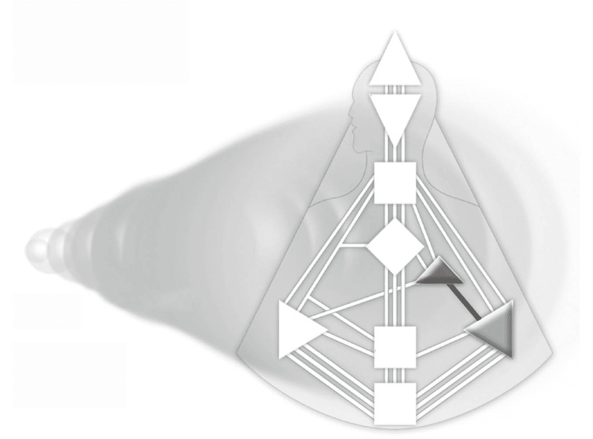

非自己主题：苦涩

人生策略：等待被邀请

目标：成功

#### ▸ 投射者类型

投射者的人体图有两大特色。首先是荐骨中心没有定义，其次是喉咙中心没有与任何动力中心链接，这代表投射者本身不具有生产动力，或显化的潜质。他们不具备显化或生产能量一致而可靠的方式，因此投射者与反映者被归类在非能量类型。这两种类型的人需要在生活上实际体验，以增加对显示者及生产者的了解。投射者的图，少则只有两个定义中心，多则可能拥有八个有定义中心。他们约占全世界人口 21%。

#### ▸ 概论

投射者是在一七八一年后诞生的新的能量原型。在人类图体系来临前，没有方法可以完整理解投射者独特的能量场，或者他们在四大类型中扮演的角色。直到上一个世纪，这世界仍是由显示者及生产者占据领导及权威的角色。然而，在未来，投射者将转变为拥有力量的定位，在新发展方向中具有领导角色。一旦能量型的人认同投射者与生俱来的潜能并赋予力量，主动邀请投射者来带领他们时，这一切就会发生。当显示者自由地发起行动，生产者也重新调整他们充满创新建造者的力量，此时，投射者将会成为新秩序的管理者。

投射者具有专注且探索的能量场，并以复杂又充满深度的模式与人互动，这让他们有别于其他三种类型的人。基于他们天生的光采与开放状态，投射者很容易承接别人的期待与能量，使得他们开始成功模仿显示者及生产者，在这个过程中迷失了自己。然而，随着投射者开始审视自己复杂又独特的特质，他们将重塑自我、发现自己在整体中的重要性与正确位置。

一般而言，投射者对人生抱持开放态度，他们的能量场能吸收其他类型的能量，精力充沛地体验。他们具有综观全局，觉察他人的才能与天赋、整合团队的能力，这使他们成为杰出的顾问、管理者、社交高手及协调者。投射者天生具有组织能力，能够洞察别人忽略的事情，并且将能量及资源运用极大化。他们能看出如何善用每个人的能量，这并不代表他们能够告诉其他人该做什么。他们来世上所扮演的特定角色与人生目的，是懂得问对问题，以此来引导其他人。因此，投射者需好好发展自己与生俱来的社交能力。

虽然投射者未来会自然成为四大类型的领导者，但对他们来说，仍是漫漫长路，也需依赖具有觉醒与察觉能量的显示者及生产者而运作。投射者对于理解他人设计的兴趣远高于自己，他们通常会找出一套可以帮助他们了解个人、群体，以及让团体运作更有效率的系统化方法。

被赏识，是投射者运用人生策略与内在权威的关键。就某方面来说，赏识之于投射者，如同回应之于生产者一样。被赏识具有策略上的力量，亦即投射者在接受邀请的同时，是有选择性的，这让他们保有与外界的界线。投射者的能量场与别人链接的特殊设计有二：一是在展现在辨识出别人的能力上，二是让自己独特的天赋可以被别人赏识。因为投射者的能量场呈现出“我是开放接受邀请的”，会自然吸引其他人靠近，并主动提出邀请。然而，通常也是别的类型在肯定他们的能力时，所提出的一份正式邀约，因此，这对投射者来说也是荣耀与鼓励。

如同生产者，等待是投射者运用人生策略的特质，然而他们无法透过荐骨的回应及时得到内在声音的答案。为了更进一步了解这些细微的差异，投射者可被区分为三种基本类型，后续将以图型说明。

#### ▸ 三种类型投射者

##### 头脑型投射者（Mental Projectors）

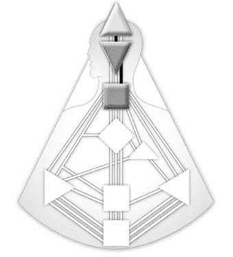

头脑型投射者指的是有定义的头脑、逻辑及喉咙中心，可能以各种方式组合，但喉咙中心以下，完全没有任何有定义的中心。他们拥有开放的设计，并且高度仰赖头脑运作。他们透过那些没有定义的中心，得以感受环境带来的能量。头脑型投射者是外在权威的原型，能够提供别人宝贵的信息与引导，他们可能很难接受自己睿智的心灵无法成为自己个人的内在权威。对头脑型投射者来说，他们若能先从别人的事情中抽离，就可以听到自己的声音，这将有助于他们做出明智的决定。他们所处的环境，会对决策过程产生很大的影响，所以了解自己如何被环境影响也很重要。他们的设计因对外开放，暴露于外在环境，因此试着理解别人如何对他们造成影响，可以成为最有用的工具。透过理解别人，头脑型的投射者开始了解彼此运作模式的异同。他们变得觉知与觉醒，将可在运用自己的人生策略下，活出自己的设计。

##### 能量型投射者(Energy Projectors)

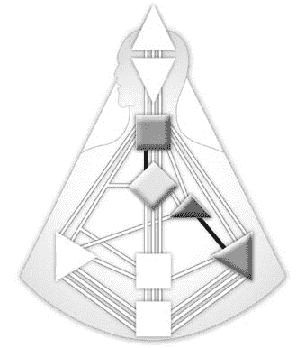

这一类型的人，至少拥有一个以上有定义的动力中心（但不包括荐骨）。他们需要非常留意来自内在权威的引导，并对周遭正好填满他们开放中心的人，所提出的邀请保持警觉。即使这种类型的投射者不断处于压力之下，渴望释放自己的能量中心所累积的动能，但对他们而言，最重要的还是做他们喜欢的事，或从事那些被赏识且收到正式邀请的事。此外，他们累积的能量，所产生的压力可能衍生出两种诱惑行为：首先就是为了释放压力，而发起行动。其次，是毫无察觉地许下承诺，结果成为劳动者，而非可以指引方向，带来效率与成功的人。

##### 经典型投射者(Classic Projectors)

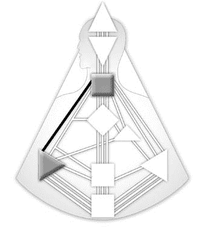

经典型投射者就是在喉咙中心以下，拥有任何一个有定义的中心，但不包含动力中心。他们的设计中，动力中心没有定义，所以他们可以检视或感受来自其他人动力中心的能量，并分辨哪些人对他们有帮助，哪些人没有。这使得他们对于外在邀请能更客观、更有选择性。举例来说，投射者吸收、体验并扩大了他人荐骨中心所产生的创造力能量。这能量可能是令人振奋的，但也可能让他们趋向有毒或有害的频率。就像不小心吃了毒药，扼杀或摧毁其动力，最终将影响身心健康。投射者所作的每一个决定，决定他们与什么样的能量有所连接，是激励或奴役，取决于他们在人生中与什么样的人互动，察觉他人所散发出的能量状态，这会是影响他们健康的关键。

#### ▸ 所有的投射者

投射者的困境在于，需要等待被邀请。他们想要（也必须）被认得，以及被邀请出来，以完成他们的使命，成为管理者及引导者。而其中的成功关键取决于周遭健康且精力充沛的人，这些人看见投射者的技能，并提供己身能量与他们一起工作。

当投射者呈现非自己状态时，会急切地想要取得认同，并试图满足别人的期待，因此成为非自己的状态。他们感到困惑，并且想要紧贴着任何人，即使某些人可能对他们造成伤害。健康的投射者会借由自我认同及了解自身能力的限制，避免陷入这种陷阱。一旦他们不再依靠外来形式的肯定，透过运用其策略，投射者懂得辨识的天赋，将回归至正确并得以完全发挥的位置上。

对投射者来说，最基本却必要的辨识机制与慎选身边的人息息相关。这些人与投射者的人生步调和目标必须一致。投射者能深刻看透其他人的本质，他们深深受别人的能量场影响，所以他们必须仰赖链接其他人的能量与资源，完成自己的人生目标，因此投射者需要知道谁是对的人，也就是谁是能够认得并看到他们真实自我的人。

这也适用于其他社会层面的运用。例如，若你是一位古典吉他演奏者，不会安排一场观众想随着摇滚乐轻松起舞的演出，除非你有办法让喜欢听热门音乐的听众转而欣赏古典吉他，前提是这也要在被邀请的情况下。倘若事先没被邀请，投射者珍贵的才能形同浪费，而且因为没有被认同而离开，反而留下一段苦涩的经验。这不是用钱可以弥补的损失。

投射者一旦受到肯定，就会感受到莫大的鼓舞，反之，受到冷漠以待，心情就会低落沮丧。当投射者试图让别人看见自己，别人会认为他们既索取又苛刻，其他类型的人会感受到他们“索求”的能量，心生反抗。倘若投射者自行扮演发动者，并邀请自己的话，情势将对他们不利，因为他们等于是把内在的力量给了别人。这通常发生在家庭关系上，因为他们从一开始就没有被正确对待，所以要开始拿回自己的力量，是困难的，但是当他们开始转变焦点，专注且坚定的觉察自己的才能，然后等待自身能量场所发出的讯息被清楚接收。此时，会让周围的人认出他们真正的才能，并邀请他们进入关系之中，这才是改善关系的根本之道。

#### ▸ 投射者的人生策略：认可，等待被邀清

投射者生来就是要被看见。他们总是吸引目光，但问题是如何被真正注意到，而且是否是自己真正的才能获得赏识？当投射者真正被认得，毫无迟疑，从心里是可以感受得到的。投射者的人生策略及决策过程，就是等待被赏识，然后等待被邀请。赏识与邀请都发生于静静等候。静候可以为投射者带来蓄势待发的能量，他们可以观察自己强大的能量场如何吸引其他人，并带来肯定。他们只要被适度的赞许和鼓励，就会像得到一股酝酿许久的能量加持，激发了原本的天赋与技能。这股能量并非与生俱来，比较像是通过身上的电流，但只要源源不断的鼓励，他们就会把这股能量发挥得淋漓尽致，嘉惠旁人。

这里指的等待邀请有其特定的意义，不同于生产者的等待回应。生产者在人生中时时刻刻都得等待着，借由回应来引导他们行动。投射者的等待是一份正式且长远的邀请。他们在等待伯乐的赏识，要求他们展现特殊技能，好让他们换取丰厚的报酬。这些来自他人的赞赏，可以让投射者有效链接其他人的能量与资源。这就是投射者的人生使命，借由才能被肯定与发挥，体验成功，达到他们人生所追求的境界。投射者与生产者的关系是重要且互相依存，彼此都需要对方的力量去实践他们人生的目标。

这些邀请通常（但不必然是）运用在人生四大决定：爱、工作、人际关系、居所。一旦邀请被接受，投射者将依邀请所设定的条件，运用他们的能力妥善处理，只要这些邀请者仍然保持开放与接纳，并愿意扮演他们的角色。这样的邀请可以持续数周、数月、数年或一辈子。当进入所谓长期承诺的状态，投射者需要刻意遵循他们的人生策略与内在权威。

对投射者而言，下一个重要步骤是保有选择性。只因他们终于收到正式邀请，并不表示那是正确的邀请。此时，内在权威将会引导他们前往对的能量交换。每一个投射者的决策过程都是独一无二的，因此，判断正确邀请的最好方式就是，当他们开始执行时，观察内心抗拒的程度。随着时间流逝，投射者判断对与错的认知能力也会提升，决策过程本身会随之修正。当他们被认得，并被邀请，可以迅速链接稳定的能量，并随之释放自己所拥有的才能与外在权威。耐心与谨慎的观察再次成为重要的关键。

所有的邀请都有赏味期限。如果一份邀请已经失去应有的能量与活力，可能表示这个邀请已经被撤回，或者工作在没人发现之前，就已经完成。此时，投射者可能感受到事情无法像以前一样顺利运作，不管是金钱来源、共同兴趣、外在支持或合理时程都显得不足。在这种情况下，主动找邀约人讨论，将有助于厘清邀请的内容与现状。一旦整合内在的力量，投射者将可让自己的能量场沟通出他们是怎样的人。默默等待是吸引正确邀请最有效的方法。渐渐地，来自并非真正肯定他们的人的邀请将会减少。如果投射者相信静候的神奇化学作用，他们根本不需自行邀约，机会将主动降临。

当投射者理解己身能量的神圣，他们将开始学会保护自己的能量场。借由在家创造一个清静的独处空间，能为他们带来放松，有助于释放他们整天在外面吸收的能量。此外，独自就寝对他们来说也是必要的，因为 70%的人口都拥有荐骨能量。为了进入深层放松的睡眠，投射者必须花时间释放所接收的过多能量。创造健康平衡的生活来自于学习适可而止，在活动与休息之间取得平衡，并知道何时该释放来自他人多余的能量，何时该独处。

#### ▸ 内在权威是情绪中心的投射者

情绪中心有定义的投射者，即使对邀请已经经过一段时间沉淀，仍容易对第一个出现的机会紧抓不放。不幸的是，当他们情绪处于亢奋时，所认为的完美选择，却会在情绪处于低潮时，立刻变成可怕的决定。因为人们经常被社会上需要礼貌及立即回答的观念所制约，因此对于工作或出席活动的邀约，经常不经思考就回复。情绪中心的投射者也容易受他人能量场影响而感到困惑。他们需要的就是一次次的等待、讨论、等待，然后再讨论。借由等待让一切尽可能地清晰，事实上，若他们这么做，他们甚至会收到更甜美的邀请。他们的内在权威就是需要一两天的思考时间。假如一两天后，仍旧觉得答案不清楚的话，他们应该毫无顾忌的要求需要更多时间，或者进一步厘清细节。他们可以试着观察，在等待答案时，他们的能量场是如何吸引别人再次提出邀请。

#### ▸ 投射者的人际关系

在创建关系上，投射者必须被赏识，正式被邀请，以及在展开的关系中，被赋予一个重要的角色。他们不愿理解，也不认同自己是处于依赖和弱势地位，这会让他们感觉苦闷，生活与关系都失去快乐。最好的建议就是不管跟任何类型的人交往，从一开始就要正确地创建关系。

#### ▸ 孩童时期的投射者

对于极度敏感的投射者孩童，很重要的一件事是，他们的父母必须注意自身能量场的运作。父母的支持包括及早认知投射者小孩与外界能量互动的方式。此外，他们需要教导投射者小孩懂得自己，分辨什么是来自别人的赏识，感受何谓正确的邀请，如此一来，将协助他们置身于成功的跑道上。鼓励他们练习人生策略与内在权威，并欣赏自己身为投射者的独特性。

父母若能邀请并认得投射者孩童的才能，将赋予他们机会，能够发展、表达并感受到“做自己”的力量。投射者若从小被好好教导懂得自己的长处，等待正确且愿意接受自己的观众，长大成人之后就会是正确的状态，当他们被邀请时，才得以清晰而忠实地，把自己的天赋发挥出来。

情绪型的投射者孩童一样需要被邀请，但不需施予立刻做决定的压力。这将有助于他们体验内在情绪周期的变化。当他们身处于一个可以认出他们才能的团体，有助于他们成长并充满活力。然而，若他们还没有机会思考什么是正确的选择前，便处于得接受邀请或做决策的压力下，将容易使他们感到混乱、痛苦并导致失败。

#### ▸ 投射者的赏识与非自己

当投射者理解自己的类型后，他们会立即对“邀请”这个关键字产生共鸣，并且突然意识到过去经常扮演邀约者的角色！这是因为来自于内在的焦躁与不安，促使他们以自己希望被对待的方式来对待他人，这种情况自然会遇到阻碍。当一生中持续感受到不被认可或无人邀请，就算有人对他们表示出真正的兴趣时，他们也容易变得消极又悲观。

当投射者渴望能量时，很容易在妥协或勉强下接受邀请，导致错误的能量交换。然而，正确的认可与适当的邀请，将使投射者的天赋得以展现，并可提高他们之于其他人的价值。例如：当有人对情绪型的投射者说：“我喜欢你运用内在感觉去做决策的过程。”这让投射者知道他们被看见了。这也让他们能够接收干净的能量，同时有极大的可能性，对方会愿意开放聆听投射者充满洞见的引导与建议。

当一个适当的邀请被完成或撤回，投射者的工作也就完成了，因为他们已经不再拥有那份能量。然而，这可能让他们的非自己陷入恐慌，进而干扰了他们退出或前进的决定。他们的非自己对于采用人生策略没有信心，或对于自身的能量场信心不足，导致他们紧抓着人们不放、不懂得适可而止，试图证明自己，接受错误的邀请，并且害怕不会有人邀请他们。

投射者通常透过了解他人，而更了解自己，如果他们日常接触到的人带着期待而来，他们将会得到注意与认可。然而，过程中当然也会遇到阻力。就像其他类型的人一样，他们必须觉察到自己底层的目的，与潜藏的期待。

投射者非常聪明，他们喜欢学习与接受信息，因此，通常深深地受头脑制约，使得他们透过开放中心的非自己，试图掌控生活与环境。他们很容易会觉得无法得到自己真正想要的生活，因此会妥协或勉强自己，接受那些自认为仅能得到的关系或工作。安于现状对投射者来说，是个需要克服的大问题，特别是当他们有经济压力的时候。

#### ▸ 投射者的健康睡眠习惯

对于荐骨中心没有定义的投射者来说，他们最好在体力完全消耗殆尽前就寝。在有睡意前一个小时就躺下或放松，好让他们的身体可以完全伸展，也让能量场有时间释放不属于他们的能量，好带来平和放松、重新充电的一晚睡眠。

#### ▸ 标志／目标：成功

成功能消弭投射者的苦闷，带来最大的幸福感。投射者的天赋就在于可以认知他人的独特性与潜能，并跳脱个人日常习惯，问出正确问题引导他人。这些对的问题终将打开顿悟之门，带来转变并唤醒每个人独特的真实。追求成功的人生目标，让他们就算被称之为非能量类型，也不再是问题。等待一份带着尊敬、正式的邀约，并提供合理报酬与资源，是投射者做人生重大决定时所需的人生策略，有助于减少过劳或身心俱疲的可能性。在不断追求成功的过程中，投射者需要学会如何聪明运用有限的能量。

#### ▸ 投射者名人录

曼德拉、约翰．肯尼迪、伊莉莎白二世、卡斯楚、斯大林（Josef Stalin）、马克思、奥修大师、米克．杰格、芭芭拉．史翠珊、玛丽莲．梦露、伍迪．艾伦、史蒂芬．史匹柏、黛安娜王妃、汤玛士（Thomas Gottschalk）、布莱希特、拉尔夫．纳德（Ralph Nader）、凯蒂莲（K.D. Lang）、克丽丝．艾莉（Kirstie Alley）、琥碧戈柏、乔治．克隆尼、邦乔飞、黛咪．摩尔、丹佐．华盛顿、歌蒂韩、朗霍华、梅丽沙．埃瑟里奇（Melissa Etheridge）、凯萨琳．赫本（Katharine Hepburn）、乔许．葛洛班（Josh Groban）、黛安．基顿、林哥史达、坎娣斯．伯根、莎莉．麦克琳（Shirley Maclaine）、欧巴马。

### 反映者

体验型的能量场

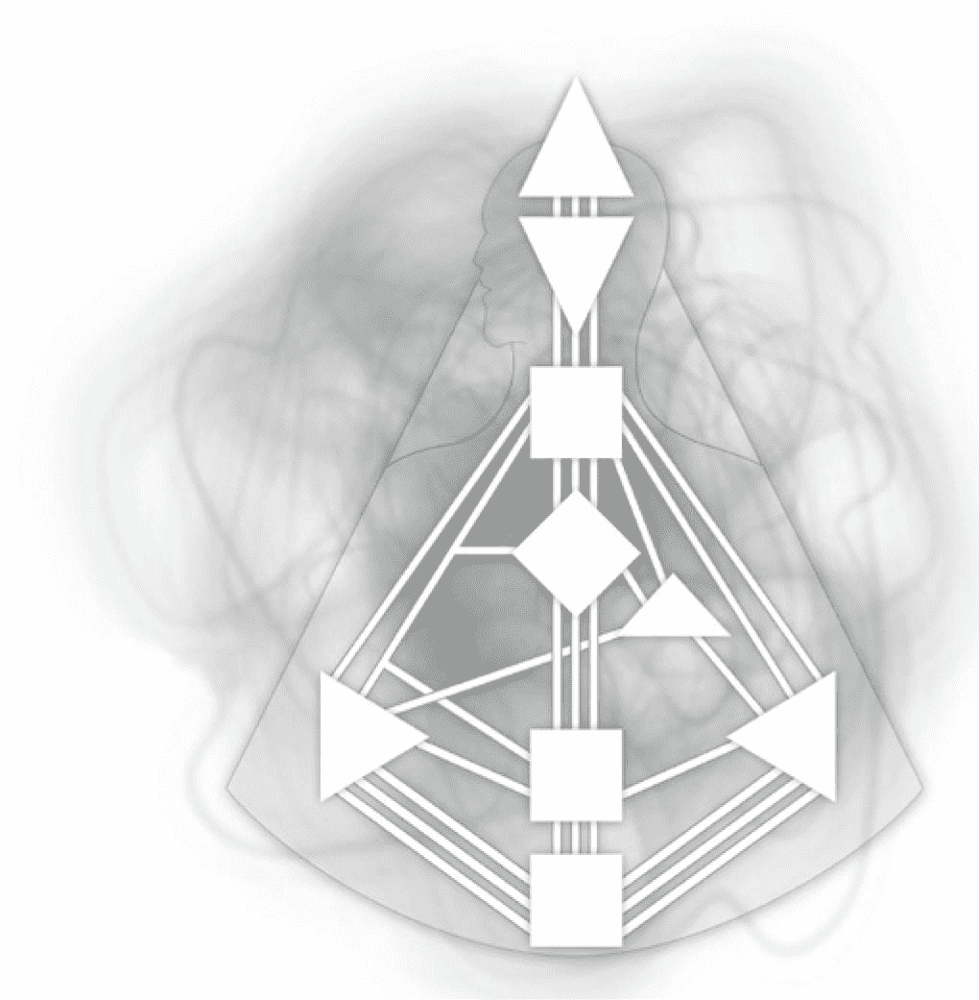

非自己主题：失望

人生策略：等待月循环周期

目标：惊喜

#### ▸ 反映者类型

反映者的人体图很好辨认，他们的九大中心都是空白的。反映者没有固定被启动的部分，被启动的只有闸门。当他们和其他人的能量场接触，或是因天体运转，当被启动闸门之对应闸门打开了，便形成信道。反映者运用能量的方式和其他类型不同，他们拥有不同的生命规则。他们在许多面向都十分特别，大约占世界人口的 1%。

#### ▸ 概论

反映者非常独特，他们的能量场展现方式并不引人注目，但他们扮演的角色十分特殊。他们的天赋是调和(attunement)宇宙环境与微中子对人类的影响。就像是金丝雀之于煤矿坑[[1]](#04-5.xhtml_fnX-1)，他们每天都在体验、反映和评断周遭环境。反映者能够充分调和转化的过程，也可以评估别人转化的结果。他们可以察觉谁是活出真我、谁在转换过程中被制约，进而变成受害者。当愈来愈多人在转换过程中被制约，就愈来愈无法运用自己独特的潜能。而反映者可以辨别出，谁已经准备好活出真我。他们可以感受到所处环境、社群或团体的物质、心灵和情绪状态，判断一切是否适切运作着。当人们开始觉醒及觉察，反映者将会客观地分享或反映出他们所体认到的一切。这个过程使得反映者逐渐成为团体的中心、并被别人“看到”。

反映者可以让人生气勃勃并提升能量。更特别的是，反映者可以把别人的能量增强后再反射回去。这项独特的天赋，使得他们可以以不带评估判断的方式、透过体会别人的所见所知，提高对自身经验的察觉。反映者的能量场本质并不显眼、不具侵略性，因此他们能够有效地促进团队运作。然而，当反映者活出自我时，这些潜能才能发挥，否则不过是放大这世界的影像而已。

现今许多反映者所凸显出来的特性，与过去人类祖先配合宇宙运行、与大自然共存与彼此共生，有许多共通性。长期下来，他们在大自然求生的本能，有系统性地被积极、策略性的意识型态所取代。一旦头脑的优越感主导一切、产生统治阶级，温和不显眼的反映者便无法在其中占一席之地。

然而，崭新的阶层正在兴起，因为反映者代表最终的公平正义，将会在新的阶层中扮演敏锐的角色。他们在社会中有一席正确的位置，运用他们安静、不显眼的能量场，反射出长久存在于人类社会中不公平的事物。他们将会促进人类朝向合作、正义、和平、公正的社会、为二〇二七年后出生的人类储备未来的精神觉醒。其他三种类型必须表里一致、有所察觉，并以开放的态度，来面对反映者的意见或判断，让反映者达到上述的地位，实现这个角色。

显示者、生产者和投射者都是太阳类型（solar type)，也就是说，他们会显露出自己的目标。反映者是唯一的月亮类型（lunar type)，像月亮默默地反映太阳的运行和其微中子所产生的影响。就如同月亮一样，反映者只是隐约地发光，却会产生显著的影响，特别是当这样的光芒被别人发现或察觉时。

反映者没有定义的九大中心，可以尝试并放大他们周遭所有人事物的振动频率，这让他们具有察觉周遭的潜能，这是其他类型做不到的。他们独特的开放性能平静完美地反映出身边所有事物，这让他们开放的本质，成为通往智慧的窗口。即使九大中心都呈现开放状态，反映者与其他类型相比，并不见得比较脆弱，或更容易被制约。事实上，反映者被具抵抗力、试验型的能量场所保护，反而在四大类型中最具弹性。这样不寻常的能量场，使得他们可以分辨一个人是否已经准备好展露自己的独特性，而不会继续接收这同质化世界中所充斥的非自己。

当反映者清楚地了解自身的设计，不再屈服于符合社会的压力之下，他们的能量场会保护他们，避免反映者其开放能量场被接受到的外在事物混淆。他们可以睿智地看待整个运作，同时对于进入他们能量场的一切保持开放。他们的天赋之一是察觉外界或是周遭不寻常之事。透过不间断、深刻的方式，他们可以轻易与天体链接，特别像是月亮，他们拥有大部分人无从得知的神秘生活。

在许多方面，反映者都是我们了解及参与宇宙意识的关键，他们极端开放的特质，不断过滤人类的意识层面。他们在这里的任务就是尝试，并融入群体。

反映者不见得有兴趣研究自己，也不会过于关心他们对别人的影响。对反映者来说，每天都是不同的，所以他们脑海中最主要的问题是“我今天是谁？”“我会感到惊喜、被接纳或是被忽视？”如果他们活出自我，就会感到无拘无束、时时刻刻充满喜乐并活在惊奇中。反映者最不可思议的表现就是，他们每天都可以体验到新奇、新鲜和惊喜，并且察觉有更多等着他们去体验。可惜的是，大部分反映者的生活环境同质性太高，总是试着成为别人，只因为他们尚未理解，或从未被好好鼓励而接受自己的特质。反映者在感到不被接纳、冷漠和沮丧之后，他们不再反抗，只求生存。若能开始欣赏自己的独特，并试着跳脱（或是不再认同)他们所反映出来的事物，比较不容易迷失、困惑或陷入身边的混乱。他们将会接受自己处于团体的核心位置，而不是感到自己被忽视、像个局外人一样。

#### ▸ 团体中的位置是反映者快乐的关键

独特性对反映者而言，是他们必须处于社会或团体的核心位置，这让他们可以自由地经验及反映周遭的能量场。这是他们最适切的位置，他们必须在这个位置才能达到目的。他们的使命是被他人所接受、反映真实的状况、教导我们所谓的好坏不过是显示人类的多元性。所以，反映者必须在所处环境，或是参与集会中，能无拘无束地移动，当他们发现不需要反映时，也可以自由离开。他们运作的方式和其他类型不同。反映者要尊重他们所处的位置和目的。对他们来说，最重要的决定是在社群中，找到一个适合自己、像家一样的环境，以及如何在其中自由移动。虽然他们 G 中心未被定义，他们要理解那些 G 中心被定义的人，是来启发他们、引导他们认识新朋友和环境的。只要反映者被引荐，接下来的任务就是察觉他人。当反映者被带到新的环境或认识新的人，应该避免依赖或依附着带他进入新环境的人，这是非自己的表现。

假如反映者一直待在不健康的环境，不论待多久，他们可能会接收到那些导致自己生病的能量、使他们元气大伤。拥有一个专属、具创造力的自我空间是不可或缺的。在这个空间里，他们可以独处，抖落每天暴露的制约。不这么做的话，他们很容易会依赖身边的能量；因此他们更要慎选自己亲近的家人与朋友圈。

#### ▸ 反映者的人生策略：等待二十八天月循环周期

反映者没有固定被启动的区块，也没有稳定运作的内在权威。当他们在做人生决策时，内在没有可信赖的资源，给予“是”或“否”的答案。反映者的策略是和月循环周期链接，月亮绕行曼陀罗一圈约是二十八天，这循环之轮包括六十四个闸门。稳定且重复的循环模式，提供反映者较为一致的模式，虽然这与拥有被定义的中心，并不相同。

反映者其人生中重大的决定，来自外在的发起。当他们接到重要的提议或是邀请时，他们的月循环周期（决策过程)便会被启动，换句话说，他们无法自行发起。当他们随着月循环周期运作时，内在愈发透彻清晰，而身为反映者，他们的观点会改变，在这期间，他们会想和别人对谈，不是为了得到建议，而是为了清楚表达自己的想法，听见内在潜藏的真实心声。基于周遭人际关系的层次，反映者的能量场会过滤所处的环境，随着时间过去，精炼出他们的决定。他们必须从容地进行，避免处于被压迫或是仓促的情况下；他们会突然自内心深处得到答案，知道这是不是正确的选项。然而，如果他们遵循月循环周期但仍然不确定答案，最好还是继续等待清楚的答案到来，理解到这或许需要花超过一个周期的时间。

反映者以月循环周期为基础的决策模式非常独特，但了解月亮循环和转变对生活所带来的影响，仍能让所有类型的人都获益。检视月循环周期如何对自己的人类图带来影响，是很棒的过程。（本章最后部分，将有完整的月循环周期和流日图结合的图例。)

#### ▸ 反映者的人际关系

反映者极端开放的特质，会让他们受制于另一半有定义的部分，也使得整段关系有自恋的成分。反映者反映并放大另一半有定义的部分，并回馈给对方，因此另一半看到的只是自己的倒影，或者可以说是不知不觉与自己坠入情网，但其实爱上的不是反映者本身。不喜欢自己的人常透过他人来爱上自己，而这样的自我探索过程往往因为反映者开放的设计，而被引发出来。若没有互相了解、表里一致忠于自己，和清楚的界限，反映者内在根深蒂固害怕被忽略、害怕真正的自己无法被看见的恐惧，将会再度显现。

当反映者不断被催促做决定时，或是对自己的决策过程缺乏安全感时，他们很可能会愈来愈依赖那些拥有稳定内在权威的人，这对他们来说充满风险，如此一来，他们可能会套用伴侣的决策模式，以决定性爱的表现方式、饮食和睡眠习惯、职业、居住地和在家庭中的地位。反映者可能任由周围的人所摆佈。假使反映者让自己受制于呈现非自己状态的人，将会放大对方于能量上的扭曲，进而对自己的人生经历感到失望。反映者没有时时刻刻能倚赖的决策模式可遵循，他们唯一的内在权威是等待完整的月循环周期后，清楚的答案才会浮现。这样的决策方式对其他类型来说很陌生，若没有理解这一点，会造成双方的争执，也对反映者造成困扰。处于被催促或压力下的反映者，长期下来可能会有健康上的问题。

对反映者来说，一段关系最大的价值就在于孕育后代。大部分的反映者都喜欢小孩，因为小孩的存在可以让他们再度与反映者单纯一致的设计链接。他们喜欢这样的关系，喜欢能对生命充满敬畏与惊喜的人相互“映照”。只是当小孩长大后，反映者很难真的放手让小孩独立。

#### ▸ 孩童时期的反映者

若父母了解月循环周期对反映者孩童的重要性，可以鼓励他们依循个人的节奏成长。其中的关键是，让反映者孩童依自己的步调成长，不要催促他们。长期下来，小孩将学会耐心地等待，直到月循环周期过后，才做重大决定。很重要的一点是，父母必须帮助小孩寻找容许他们自然发展的师长，以及支持他们的学习环境。反映者孩童需要积极融入学习团体中，但不能背负过多的期待。如同自由的灵魂，以不同的规则运作，不同的个体接收信息的方式也不一样。反映者孩童会吸收并反映出他们的家庭或课堂上的一切。一个生气蓬勃健康的反映者孩子，与一个病奄奄难过的反映者孩子各自反映出其所处环境的真实状态。和反映者成人一样，反映者孩童需要属于自己的空间，必要时可以远离其他人而独处。透过耐心练习，父母可以教导反映者孩童如何保护自己，即使可以感受到他人的痛苦，仍能避免接收到痛苦的能量或受其影响。

#### ▸ 反映者会提出的问题和非自己呈现

反映者最深层的担忧是被忽视、被阻绝在外，没有参与感。为了减缓这样的忧虑，即使他外在的制约并未黏附在他们的能量场，他们还是会呈现非自己的状态，以博取关注。若反映者不明白自己的能量场和宇宙韵律，会感到困惑，并让拥有动力能量的太阳类型的人凌驾其上。在试图发起或显示的过程中，会遭遇抵抗，因而感到气馁，并对别人失望。最后，反映者会想离开社群，而非处于核心中。他们会不停地接收并认同别人的恐惧、情绪、压力和焦虑。反映者的关键在于保持中立，避免认同他人的痛苦，稍做尝试但仍保持旁观者的角色。当反映者对没有固定运作模式的人类图设计开始安然以对，与月循环周期共舞、检验周遭人们的能量场时，他们将反映出真实的状况，而不只局限于他人的痛苦。他们可以发展出睿智的潜能，专注于“我现在是谁？”“我今天是谁？”，而不是被他们所拥有的开放性所干扰。

当反映者开始活出自我时，需要面对的恐惧：

*   我现在是谁？我可以做自己吗？
*   我会继续被忽略，或是有人会发现我的不同、接纳我以及我的反思？
*   我是否能在所处的环境中自由地移动，找到自己的位置？
*   我没有固定的运作模式，该如何避免承担周遭的世界，源于非自己所呈现出来的焦虑、恐惧、紧张与不健康的情绪？

#### ▸ 反映者的健康睡眠习惯

对于荐骨中心呈现开放的反映者，最好在体力完全耗尽前就上床就寝。在熟睡前至少花一个小时，躺下或放松，好让身体可以完全伸展。如此一来，他们才有足够的时间释放不属于本身的能量，为自己带来平和放松、重新充电的睡眠。

#### ▸ 标志／目标：惊喜

反映者的非自己主题是失望。对同质化的世界中，充斥扭曲的非自己互动模式和人际关系感到失望。当反射者可以品尝诸多差异，体验敬畏与惊奇的时刻，才有活着的感觉。若能有智慧地与周围能量保持着不依附且独立的关系，他们本身具尝试性的能量场，就会带来惊喜的回报。这意谓着他们不再只是观察者，而是被接纳为参与者。当有人发起，邀请或询问反映者，说出他们所见的差异，或要求他们分享意见，反映者会深受激励，感到活力充沛。

因为，他们可以察觉不同类型的人是否走在自己的人生道路上，因此他们可以为那些想要打破既有模式，找回独特、真实自我的人指点迷津。这是反映者可以带来的特殊贡献，唤醒某人未来的可能性，并体验他们的人生，这将为反映者带来惊奇与喜乐。

#### ▸ 反映者名人录

吉米．卡特的夫人，罗斯琳．卡特（Rosalyn Carter）、德国诗人艾德华．慕瑞克（Eduard Mörike）、德国心理学家与密教文学作者索沃德．戴勒菲森（Thorwald Dethlefsen）、印度教精神领袖阿玛（Ammachi）、奥林匹克熘冰金牌选手史考特．汉米尔顿（Scott Hamilton）、迪克．史慕瑟（Dick Smothers）、杜斯妥也夫斯基、珊卓．布拉克、理查．波顿、刘易斯．韦恩、尤伯．连纳、《A Million Little Pieces》一书作者詹姆士．弗瑞（James Frey）。

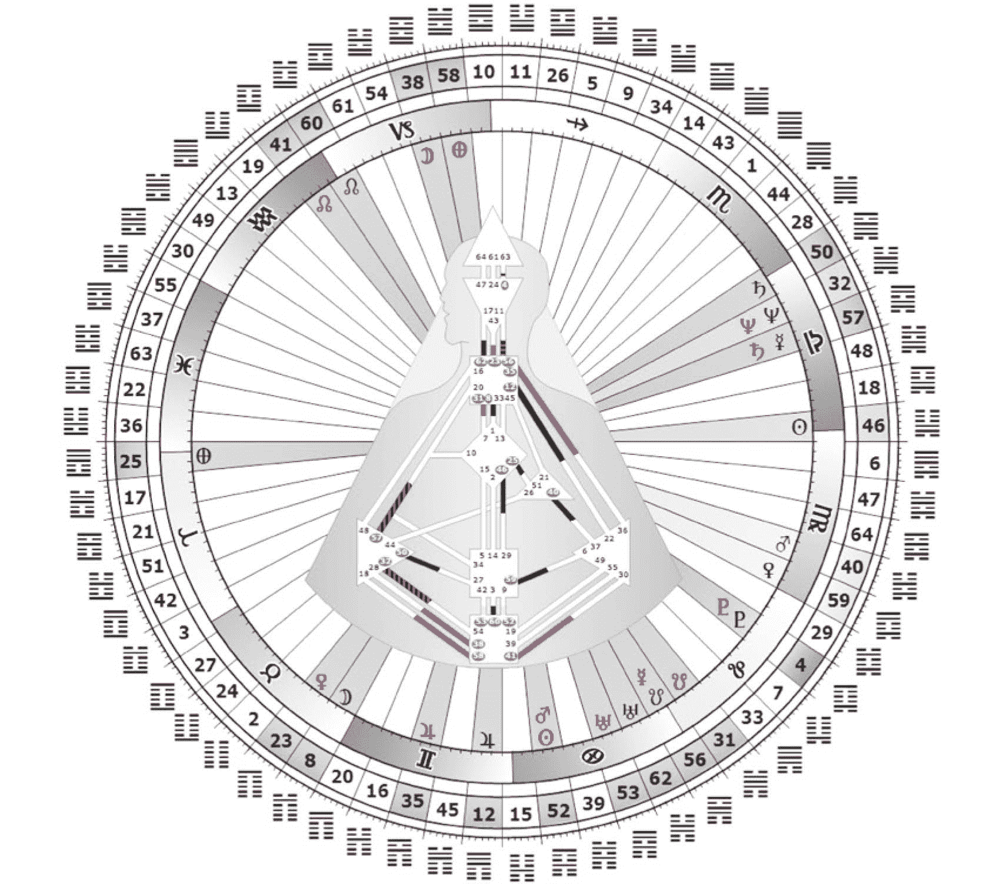 月循环图
反映者的曼陀罗与人体图

在上图这个曼陀罗中，反映者的人体图有很多启动，或未启动的闸门。每一个都像接收器，在寻找信道另一端的相对应闸门。月循环以逆时钟方向运转，穿过易经六十四卦（大约每二十八天)，这样的行星运转将会启动不同的闸门，使得反映者原本未串接的信道被链接，带来了暂时被定义的区块。虽然每个被短暂定义的中心可能只维持半天，但时间久了，每个月固定的运作模式，将可成为反映者可仰赖的决策模式（请参阅后面的图表)。月循环模式是反映者反映月亮与地球绕行的频率，同时提供并定义反映者对自我的认知。因此，反映者的特质是依照完整月循环的节奏与周期逐步显现，而不是时时刻刻都能展现。

#### ▸ 依循月循环启动闸门

上面这张图，我们提到月循环会启动反映者不同的区块。除了反映者，他们还可以体验投射者，显示者跟生产者各自不同的能量频率。每当月亮移动并启动新的闸门，就可能为他们的设计带来新的定义。月亮绕行地球一圈约二十八天，然而，从这个满月到下个满月则需要三十天。

这些暂时呈现定义的状态，并不代表反映者会成为生产者、显示者或投射者，但他们可以体验到其他三种类型特殊的能量。每个反映者的月循环都是独特的，而且每隔二十八天，同样的模式就会重新再来一次。

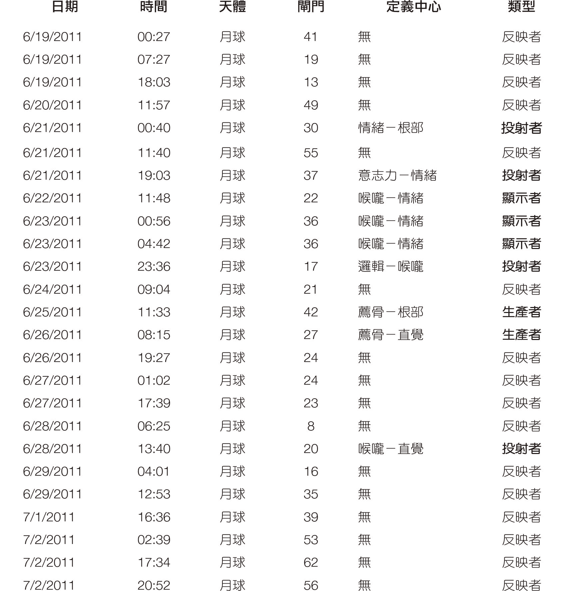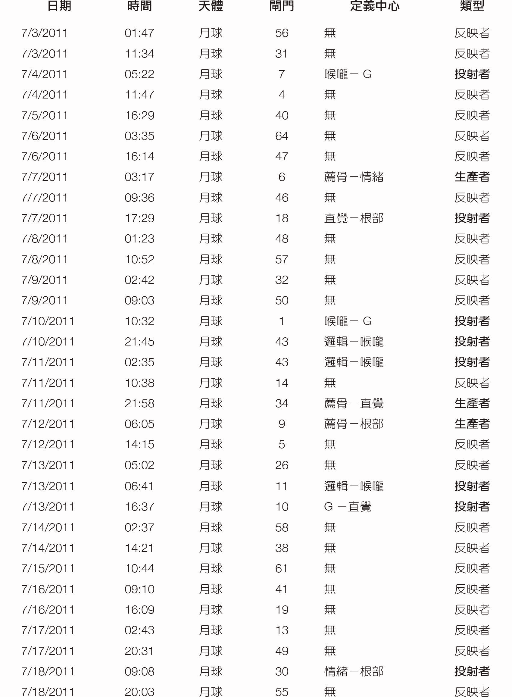

#### ▸ 体验完整的过境场

除了受月循环的影响，反映者也会因为每天的星象变化，而拥有不同的体验。星体运转与他们自身的人类图设计相互链接，为自我探索提供源源不绝的变化，总会带来潜藏的惊喜。

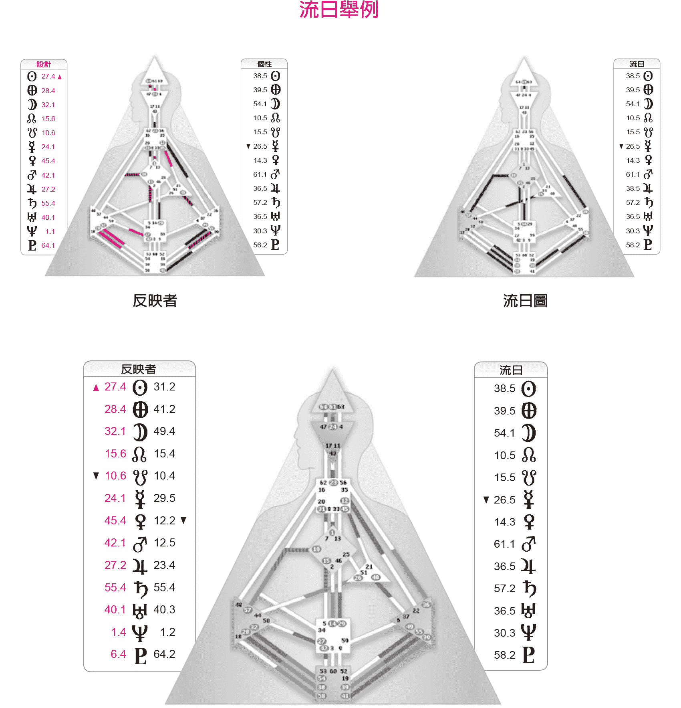 非个人微中子制约能量场—影响人类

上面三张图分别是反映者的人体图、流日图（非个人微中子制约能量场）以及结合上述二者的合图。以下将描述结合的方式。

等待的奥妙：在这特定的一天，反映者将不预期地（来自不预期的轮回交叉)产生了渴望的情绪（来自 41-30 信道)，使得他们有极大的压力想随兴地（来自直觉中心）采取行动（来自根部中心）。这种对新奇体验（36 号闸门）的渴望（情绪中心），可能随兴而为（直觉中心）而转变成一次危机（36 号闸门），或许会将反映者推向新的非自己，不断试着想更完美地呈现自己（57-10 信道)。

此外，他感受到极大的精神压力（头脑与逻辑中心)，想要理解生命的奥妙（61-24 信道)；如果反映者顺从此精神压力（头脑与逻辑中心)，而立刻（直觉中心)采取行动（头脑与根部中心），他可能会感到沮丧、情绪低落（39-55 信道)。此外，他会陷入困顿挣扎（信道 38-28)，经历错误的转变（54-32 信道)，或是投入错误的体验（41-30 信道)。

若善用此流日所带来的影响，反映者应该要等待，及观察自己体验到的转变感受，看看大环境正在发生的事件。透过观察，探讨若与此能量结合，对自己来说是否正确。还是这股迫切想采取行动的压力，会随着月循环周期流转而消退。经由不断地观察己身的体验，循环的模式将会显现，便可以此为依据，最终成为外在权威的智慧，成为充满创意的表达方式。

1.  十七世纪时，英国人将金丝雀放在煤矿里，检测矿坑里的有毒气体。 

转换意识型态，最大的难题，在于试图以头脑合理化，这过程或许有趣，但不应该主导你人生的方向。这是极大的挑战。

——拉．乌卢．胡

# 第五章五大定义能量动态

### 能量动态（ENERGY DYNAMICS）

我们继续来探讨，人们是如何被不同方式所制约，接下来进入五大定义，也就是与真实的自己互相抗衡的另一种制约元素。记住，若遵循策略与内在权威，就能臣服于我们体内的智慧，就能绕开所有的制约因素，并将这一切转换成参考的信息，与潜藏的智慧。五种定义的方式透过人类图来展现，更可以透过生活来体验。

*   **无定义**：没有任何定义中心的反映者。（约占总人口的 2%）
*   **一分人**：所有被定义的中心与信道，可以串连成一个区块。（约占总人口的 41%）
*   **二分人**：有定义的中心，区分成两个区块，且两大区域并无连接。（约占总人口的 46%）
*   **三分人**：有定义的中心区分成三个区块，且三个区域并无连接。（约占总人口的 11%）
*   **四分人**：有定义的中心区分成四个区块，且四个区域并无连接。（约占总人口的 0.5%）

#### ▸ 几分人以及我们对他们的体验

除了一分人以外，其他人的人类图中，有定义的中心与信道没有连续性的相连，且被分成两个、三个或四个区块。因此，若你的人类图可以区隔成不同的区块，那么可以把不同区块串连起来的闸门或信道，就是所谓的压力点（motivating factor）。你会不自觉地追求这些压力点所代表的特质，误以为这是在人生中，让你不完整或错误的地方，又或是你自认为需要补足或修正的特质。

这些开放的闸门或信道创造了非自己行为，促使你不断想填满这些未启动的闸门或信道。请记住，这些开放的闸门与信道并不是真正的你，但是他们会代表某些不断与你相遇的人，由于这些人拥有特定的信道或闸门，于是你会被他们的能量场所吸引。这样的吸引力就字面上的解释，如同磁性一样，只要遵循你的策略与内在权威，你将会自然而然，以正确的方式，遇到足以填满自己压力点的人。事实上，对于这些开放的缺口，不必刻意做些什么。如果你有好几个单一闸门，都可以串连起分裂的区块，那么它们就是以上述的方式影响你。不幸的是，大多数人处于非自己的状态，他们一直追求压力点所代表的特质，误以为这就是自己人生中不完整之处。如果你进一步去看这些未被串连的闸门或信道的内容（详见第六章），就会注意到自己曾经追求过的重要主题，来自想感觉到完整的渴求。

### 以例子说明定义（单一分裂二分人）

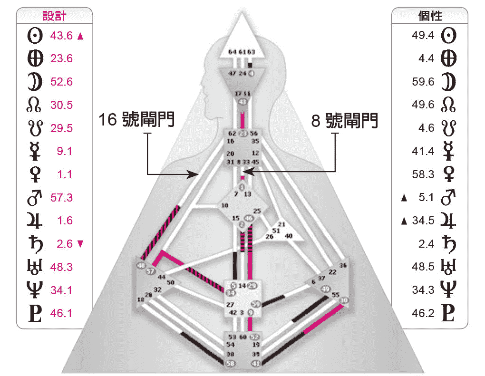

举例来说，如果是二分人的设计，串连两个区块的闸门会成为我们人生中主要制约的来源。在本页的这个例子，有定义的逻辑与喉咙中心，与直觉、G、荐骨、根部、情绪中心是区隔开来的。其中 16、8、20 号闸门是能将两个区块串连起来的压力点。这个人拥有 48 号闸门，但缺少信道另一端相对应的 16 号闸门。因此，在喉咙中心的 16 号闸门就成为这个人所追求的主题。这也表示，他会自然而然遇到拥有 16 号闸门的人，因为他的 48 号闸门总在寻找另一端“相对应的闸门”（harmonic gate）。每个闸门都有其对应的闸门。在信道的另一端与之共振，当两个闸门同时被启动而链接，就会形成火花，创造动力与能量。

48 号是深度的闸门（Gate of Depth），16 号是技能的闸门（Gate of Skills）。当他需要透过喉咙中心表达其深度时，需要 16 号闸门。她可能从不觉得自己有足够的技能，因此不断向外寻求发展技能的方法。事实上，她的设计就是要与有 16 号闸门的人相遇，当他们一起工作时，对方便可以有技巧地，展现出她的深度。

8 号闸门代表贡献，也是其中一个压力点，会驱使她认为自己必须有所贡献。在现实中，她的非自己会试图填满这误认的空缺。她很想成为空缺的那部分，然后会以头脑试图去执行。二分人通常会感到人生少了某部分，直到这空缺透过关系里的另一个人来补满。不论好坏，这是建构许多关系的状态。

而所谓的远距型二分人（wide split），代表需要一条完整的信道，或多个闸门串连不同的定义中心区块，对这样设计的人，若有问题通常会觉得都是别人的问题，或者都是别人造成问题。而产生责怪或受害者的感受，但这并不是真的。换句话说，若能视为一个学习潜藏智慧的机会，他们将成为独立、客观的观察者，而不再落入责怪别人的游戏中。一旦停止追求填满压力点，你将开始感受到那些能为你接通分裂区块的人，有多重要。很多成功伙伴的组合，就是来自于两个人彼此的闸门互相串接，成就了彼此。例如，约翰．蓝侬（48 号闸门）与保罗．麦卡尼（16 号闸门）。了解几分人如何健康地运作，是其中的一种方式，让我们了解彼此为何会形成一段关系。在这种观点下，“你使我完整”这种说法是深刻而真实的。然而，唯有正确地运用人生策略与内在权威开始一段关系，才能拥有健康及有益的人际关系。

根据不同形式的分裂型人，有不同的制约顺序。根据几分人的类别，被制约的非自己思维，会针对开放的闸门、信道或中心，形成作决定的公式。以二分人来说，将两个不同区块串连起来的闸门会是最强的制约因子，其次才是中心。若是三分人，没有定义的中心则是最强的制约因素，接下来才是闸门或信道。而四分人桥接的闸门则是最强的制约，然后才是非定义中心。

对于多分人来说，最大的问题就是没有花时间等待内在权威与策略，就急着发动不适当的行动、失去耐心、冲动行事或发表不成熟的言论。多分人其实需要更多时间消化信息，因为他们有定义的区块没有被串连。除非他们各个区块被串连起来，否则很容易感觉不自在或不完整，而无法做出明确的决策。因此，他们一定要慢慢来，有点耐心，等待那个完整的感觉产生。若为了寻求完整，主动寻求特定伙伴，而非等待，这也是一种非自己的行为。如果你是属于多分人的设计，自然会有人进入你的人生，为你串连起不相连的区块，请记得让你的人生策略与内在权威来引导你。

花点时间置身于公共场所，有助于消化与整合的过程，在公共场所总会有人提供中立的桥结闸门。当你要做一个困难或重大的决定时，最好的方法就是，让自己置身在公共场所，例如：书店、咖啡厅或是走进大卖场。这些公共熔炉的设计，能提供中立的能量场及制约，将有助于你吸收信息的过程。这种来自公共场合，开放式的连接，将提供思考决策的新观点；反之，若在决策的过程中，经常与朋友或伙伴处在一起，会受限在他们的设计，成为你的制约。

回到内在权威与策略，将有助于你避开多分人设计中潜在的陷阱，解决你急于填补不相连的焦虑感，进而带来平静。请放慢你的脚步、放轻松活出完整的自我，臣服于你的策略与内在权威，这些需要串连的部分，将会自行运作。最重要的是，不管你属于哪一种定义，记得给自己足够的时间消化信息，并且信任你的人类图设计，会带来你所需要的。

接下来，让我们看几个例子。

### 一分人案例 1

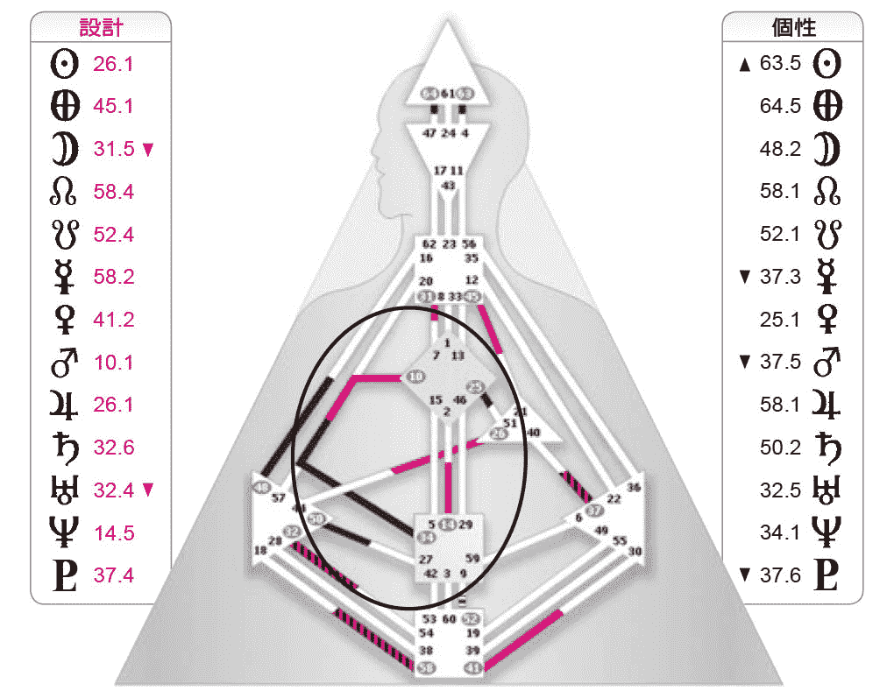

以英国维多利亚时代的英国诗人伊丽莎白．巴雷特．布朗宁（Elizabeth Barrett Browning）做为一分人的第一个案例，并与下面科西玛．瓦格纳（Cosima Wagner）的图一同做比较。

从一分人的图可以看出，能量可以连续不中断的，在所有被定义的中心与信道间流动。可能像伊丽莎白的图，只有一条信道；或如下个案例，有多条信道。一分人在某种程度上来说，属于自给自足型（self-contained），因为他们的定义中心呈现单一、连续、稳定、永续存在，而且是可以信赖的能量。这样的设计非常单一聚焦，并不像其他几分人，需要去反应不同的观点。一分人也不需他人协助吸收信息，或让他们感觉到完整性。他们可以迅速消化信息，除了情绪中心有定义的人以外。

### 一分人案例 2

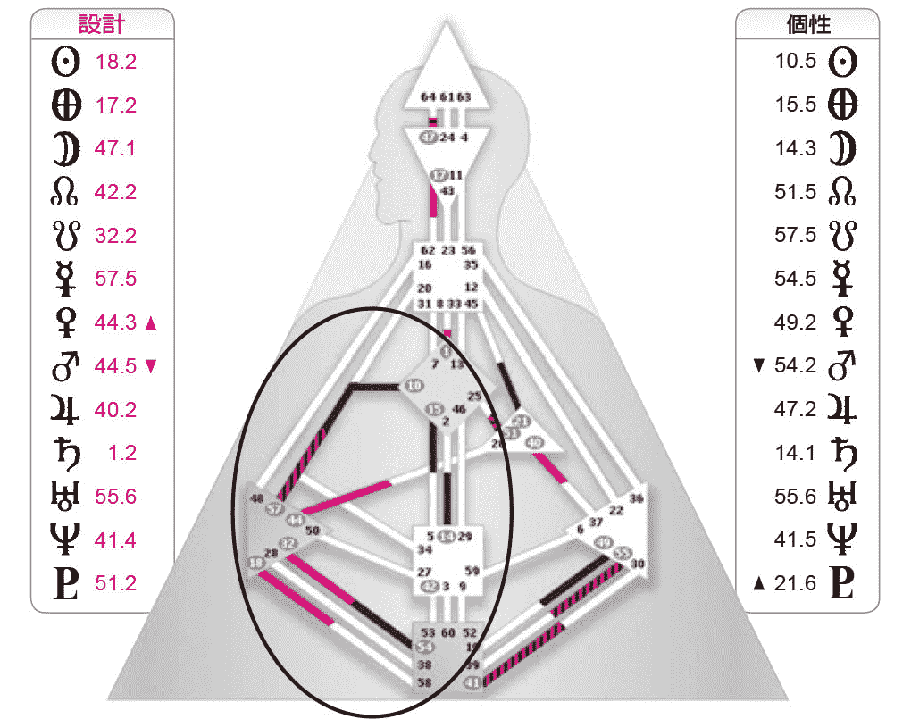

在匈牙利钢琴演奏家和作曲家李斯特的女儿科西玛．瓦格纳（Cosima Wagner）的人体图中，我们可以看到是多个（三个）定义中心的一分人，她的设计是由两条信道串连起来的三个定义中心：根部、直觉及 G 中心。因此，她的信息消化速度非常快。

### 简易型二分人（simple-split definition）

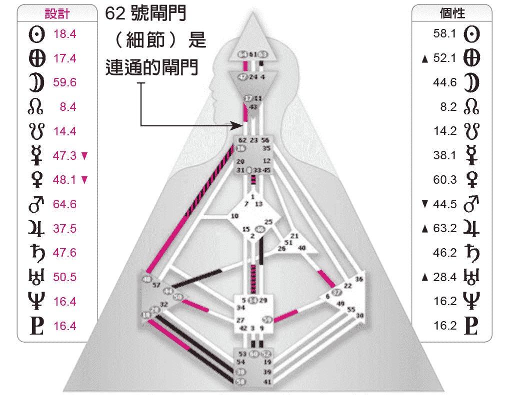

美国作家亨利．米勒（Henry Miller）的人体图是简易型二分人（可透过单一闸门链接二个有定义的区块）的范例。

简易型二分人是指两个有定义的区块彼此没有链接，使得能量无法持续流动。因为能量流被中断，为了追求完整，他总是在寻找链接头部和喉咙中心这两个充满能量的分离区块的桥梁（缺少的闸门）。喉咙中心的 62 号闸门——重视细节的闸门——即可接通分裂的这两个区块。62 号闸门会在他的人生中扮演十分重要的角色，连接他的大脑思考模式和直觉洞见。终其一生专注于细节、钻研细节及可提供细节的人。在亨利的著作中，他的确十分重视细节的陈述。

### 远距型二分人（Wide-Split Definition）

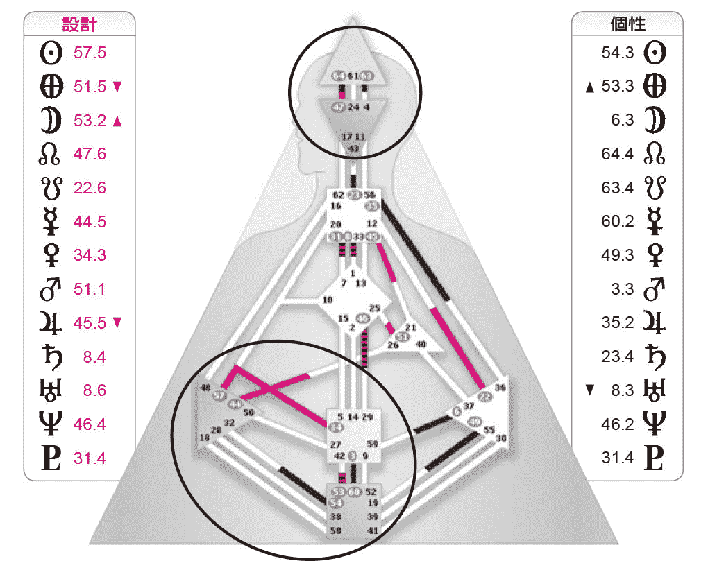

相较于亨利的简易型二分人的图，英国物理学家史蒂芬．霍金（Stephen Hawking）的图是属于远距型二分人。在他的图中，可看到透过多个闸门，或是一条贯穿喉咙中心的信道来链接。在这里是指 20 号闸门和 43 号闸门。因为常觉得是“别人的问题”，而非自己的问题，让史蒂芬感到不完整或缺少什么。他可以也的确善用这样的二分设计，成为潜在智慧的来源，客观地观察并研究这个世界（或宇宙）。

### 三分人（Triple-Split Definition）

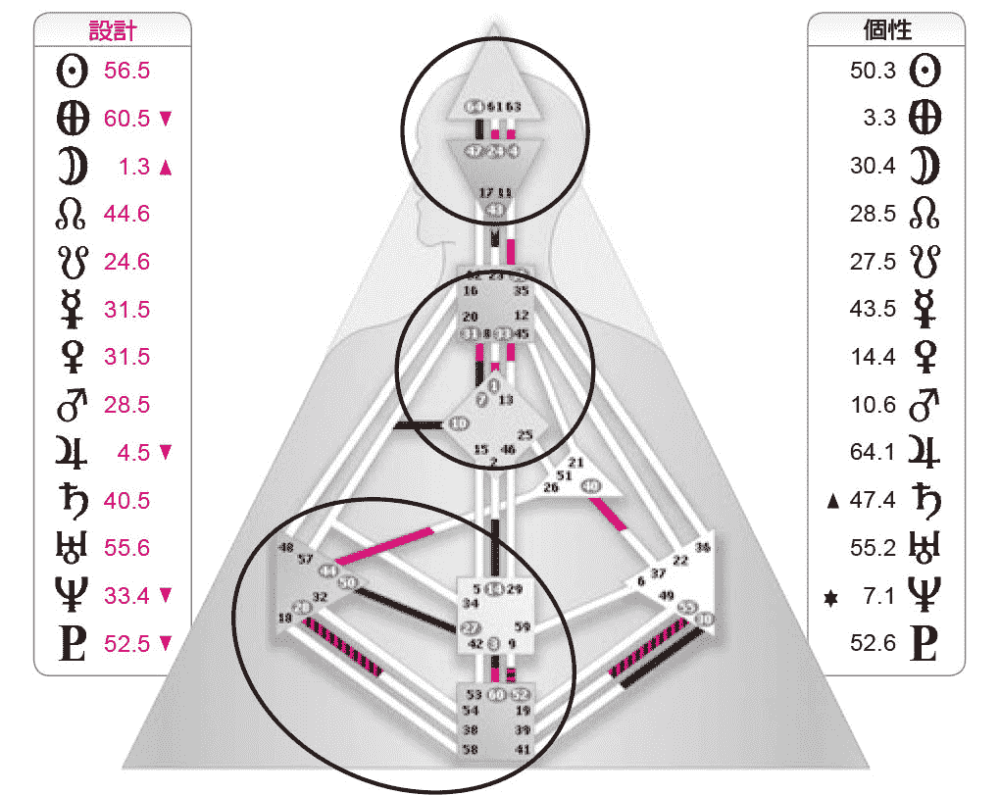

如同提摩西．利里（Timothy Leary），三分人的人体图有着三个分开、互相没有链接的有定义区块。这些个体需要好几个桥梁来连接所有有定义的信道。没有定义的中心是他们主要的制约因子。在提摩西的图中，主要制约他的是没有定义的意志力中心和情绪中心。链接分裂区块的闸门也是制约因子，但影响力不及未定义中心来得大。三分人主要的课题是没耐心，也经常贸然行动；他们可能看起来急切、有企图心、武断。对三分或四分人来说，比较健康的方式是和不同的人（数种不同的能量场）互动。假使他们持续被某人制约，会感觉被困住。

### 四分人（Quadruple-Split Definition）

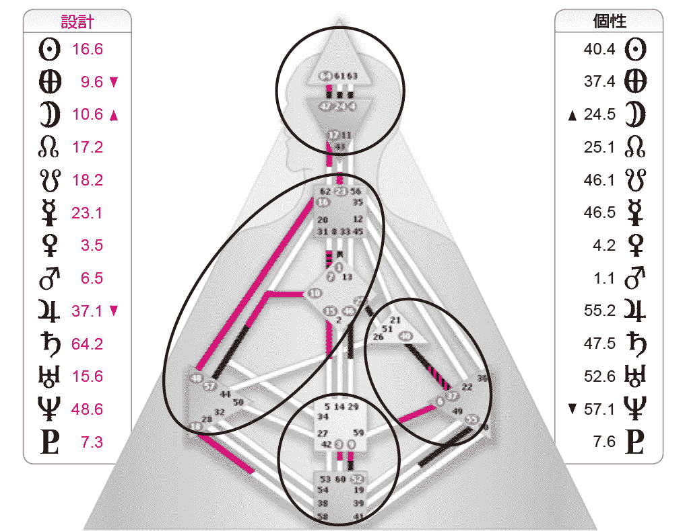

美国两性关系专家菲尔．迈格博士（Dr. Phil McGraw）的人体图有四个分开、未互相链接的有定义区块，是四分人的代表。这类型的人体图不是拥有八个有定义中心，就是九个中心全部都有定义。四分人主要是受到未被定义中心，或是连接分裂区块的闸门所制约。四分人的发展进程可能显得缓慢，因为弹性和快速决策对他们来说都是困难的。强迫他们迎合别人的期待，对他们来说不具有建设性，他们必须按自己的节奏，从容不迫地吸收信息。

在这一刻，量子存在着各种可能性，整合起来的能量，比其他各个小部分的总和来得强大，其整体超越各个部分，成为我们所说的生命的动力。

——拉．乌卢．胡

# 第六章回路、信道与闸门生命动力的电路板

### 生命动力的电路板

回路代表能量在人体图信道间流动的方式。若把回路图解成下方图示，人体图就好比是电路板。了解回路就等于了解生命力的运作方式，揭示了生命之间的不同，以及如何互动的方式。回路由信道组成，而信道则由两个闸门组成，连接两个中心。闸门是能量流入或流出中心的出入口。中心是转化振动频率的枢纽。能量在信道间的流动，创建起两个中心之间的交流，激荡出生命的活力。这种基本的交流形式就叫作“生命的动力”（life force），其中潜藏着成长和进化的可能性。

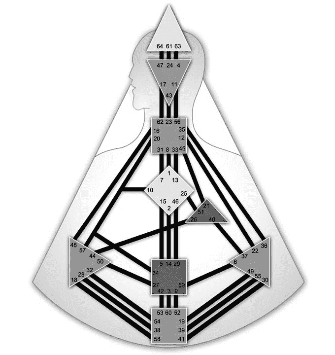

因为信道被启动所产生的生命动力，透过我们的能量场投射出来，与外界沟通，同时对身边的人带来影响与制约。在人类图中所启动的部份，决定了我们的天赋与终其一生的限制。每一个人与每一种形式的生命动力都是如此独特，与其他人大不相同。我们被启动的部份，代表了此生轮回的原因，必须透过我们表里一致地表达出来，不能被非自己的制约所扭曲。在人类图体系的这张人体图上，总共有三十六条信道与六十四个闸门，而回路将一切链接起来，赋予这张人体图坚实的基础架构。而这整体架构是由整合型信道，以及三个回路群所组成，共同绘制出各具特色却又相互串连的网络，表达能量在不同中心之间如何流动。回路创造出明确的解读架构，来诠释每个人复杂的设计。每一条信道，皆有两个闸门，为整体架构增添了各自不同的主题。

### 整合型信道和三个回路群组

在第二章中，我们已经知道来自头脑和根部中心的压力，驱动能量流向喉咙中心，然后表达。当能量在人体图中流动时，信道和相对应的闸门会串联起来，形成六个基本回路以及整合型信道。六个基本回路组成三种主要的回路群组：个体人回路群组、社会人回路群组和家族人回路群组。整合型信道形成一股既独特，又融合为一体的能量。当我们从信道的角度来切入，每一张人类图上所启动的部份，展露出来的是我们最底层的本性、价值与原则，以及如何与人链接，如何影响他人。而往往就在回路与信道的部份，才揭露出原来人与人之间的抗拒与冲突，其来有自。也因此属于每个回路的关键字，意义重大，这传递出独特的洞见，让我们得以了解每个人所投射出来的能量场，其独特的震动频率，或综合的频率，是如此不同。

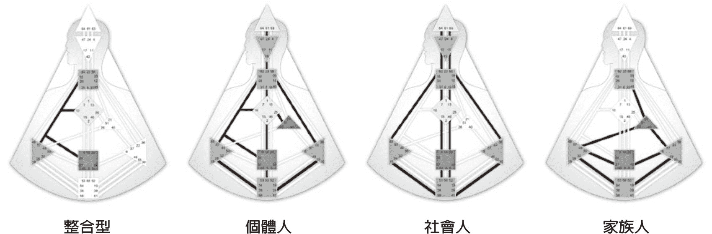

接下来的内容，你将会看到关于三十六条信道和六十四个闸门完整的描述。下面的索引表可以帮助你找到说明各信道和闸门的页数。在闸门的描述中，RAC 是指右角度交叉轮回（Right Angle Cross），JC 是指并列交叉轮回（Juxtaposition Cross），LAC 是指左角度交叉轮回（Left Angle Cross）。更多轮回交叉信息请参考第八章。此外，各个爻（Hexagram Line）的名称也列在各闸门中。更多关于爻的信息请参考第十章。

### 信道／闸门索引表

1 – 8

2 – 14

3 – 60

4 – 63

5 – 15

6 – 59

7 – 31

8 – 1

9 – 52

10 – 34

10 – 57

10 – 20

11 – 56

12 – 22

13 – 33

14 – 2

15 – 5

16 – 48

17 – 62

18 – 58

19 – 49

20 – 10

20 – 57

20 – 34

21 – 45

22 – 12

23 – 43

24 – 61

25 – 51

26 – 44

27 – 50

28 – 38

29 – 46

30 – 41

31 – 7

32 – 54

33 – 13

34 – 57

34 – 10

34 – 20

35 – 36

36 – 35

37 – 40

38 – 28

39 – 55

40 – 37

41 – 30

42 – 53

43 – 23

44 – 26

45 – 21

46 – 29

47 – 64

48 – 16

49 – 19

50 – 27

51 – 25

52 – 9

53 – 42

54 – 32

55 – 39

56 – 11

57 – 34

57 – 10

57 – 20

58 – 18

59 – 6

60 – 3

61 – 24

62 – 17

63 – 4

64 – 47

### 整合型信道

主轴关键字：我赋予自己力量（self-empowerment）

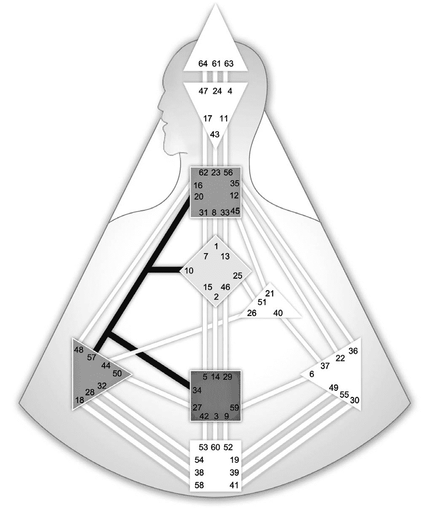

**信道：**

34-57：力量的信道　人的原型

10-20：觉醒的信道承诺　去追寻更高层真理

57-10：完美形式的信道　求存

34-20：魅力的信道　即知即行

整合型信道自成一格，并且与其他三种回路群组，共同组成人体图的基本架构，它是所有信道组合中最复杂的一种。这四条信道的组合在人体图是类似嵴椎的构造，扮演主要的防御机制。整合型信道是形成每个人差异化的主要元素。假使没有它，我们跟祖先就没有差别。整合型信道点燃了人类人性的演进，而且完整的，充满活力地传达出生命动力的型态。

基于所谓“自我激励”的关键字主题，整合型信道完全专注在自我保护，以及激励个人发挥本性，包含表达，理解，方向／自我认同以及自我行为。 个体人的求存，以及为了展现其独特性的驱动力，是带来突变的必要元素，如此才确保家族与整体社会找到生存之道。

自然而原始的反射能力，存于整合型信道群中，以确保我们能信任内在的生命，透过回应而赋予力量（34 号闸门），被直觉所引导（57 号闸门），采取正确的行为（10 号闸门），以及在当下彰显出来（20 号闸门）。当以个人行为呈现时，若运用整合型信道的关键字，所表达的是：“我爱自己，当我现在聆听内在直觉，就能赋予自己力量。”或者“透过回应，我拥有敏锐的直觉，只要活在当下，不管处于任何环境下，我都能展现出正确的行为，找到生存之道。”拥有整合型信道的人，很在意自我激励的特质，通常会表现出可以自给自足的自信，不会主动寻求别人的帮助，也不会轻易接受别人的指引。他们应当被允许，并鼓励成自给自足的人。

整合型信道中的信道与闸门将在后续篇幅中讨论。

#### ▸ 力量的信道：34-57

人的原型的设计

信道：整合型／信道类型：生产

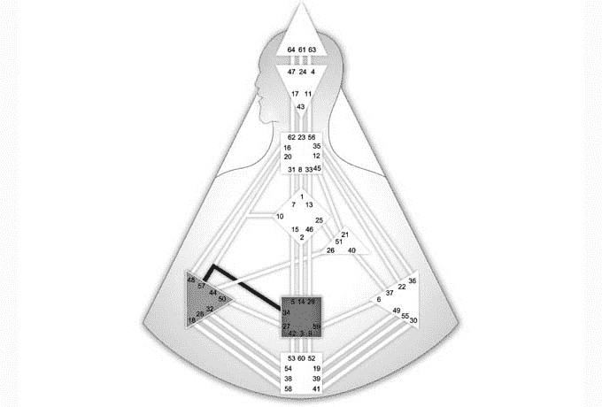

力量的信道透过 57 号直觉的闸门，与 34 号力量的闸门，连接直觉中心到荐骨中心。34 - 57 信道代表人类的原型设计。透过回应，带来直觉反应的求存能力，透过对危险的警觉，让我们得以生存。

**背景**：力量的信道，来自于充满生命活力的荐骨，赋予直觉在当下的察觉力（求存的本能智慧），让我们的身体对于环境所带来的威胁，能时时保持警觉。34 号闸门具有强大的力量，具备持续埋头苦干的动力。57 号闸门则透过内在的声音与振动频率，持续渗透并过滤周围环境。当两个闸门串连成信道，根据原始哺乳类动物为生存而战的本能记忆，人类的原型因此诞生。若缺少了这自发性的防御本能，我们将不能也无法保有个体性，也无法促进物种进化。透过 57 号闸门，人类整体觉醒过程开始流通。直觉源自直觉中心的觉醒，并且在瞬间发生，不受智识或情绪察觉的限制。换句话说，能保护我们的从来不是头脑“想”到的好办法，而是在当下回应周遭各种人事物的振动频率，所产生的直觉反应。

**个人**：为了能够清楚明快的反应，或在瞬间做出决定，像是躲避超速行驶的汽车以挽救生命，你必须保持稳定，持续地与身体意识链接。这通常表示，对别人所散发的振动频率，极度敏锐，总是用右耳聆听，能够听见他们真正想说的话。遵循你的生产者策略，能彻底释放直觉与荐骨中心的力量，在生命中的每一刻，带来安全感。下定决心保持独立、充满活力，敏锐地倾听周围环境，以及保持身体健康。这是你可以学习，并且完全信任的惊人能力。好好磨练你的求存本能，这本能照顾的是你自己，而非他人的要求与需求。这股伟大又持久的力量，为这条代表人类原型的信道奠定了稳固的基础。是你身为一个觉醒与独特个体的经验。一旦能够自我激励，你的存在将成为鼓舞人心的范例，这意谓着，享受充满活力的生活、独特，单纯且去制约，时时刻刻活在当下的回应中。若你发现自己陷入忧郁，不要试图修正或搞清楚这些情绪，只需拥抱你的情绪。

**人际**：拥有力量信道的人具有一种潜能，能透过直觉反应，完美展现他们的求存本能。对于胆敢侵扰他们幸福领域的人，他们通常不会给好脸色，必要的话，会变得充满防御性以捍卫自己。当演化的过程已经超越了弱肉强食（eat-or-be-eaten）的求存阶段，他们会运用警觉的能力，以维持健康的活力，这会让他们活得够久，来体验及领会我们身而为人，不断成长的觉察力，这是一项独特的天赋。

##### 34 号闸门：强大的能量（大壮卦）－力量的闸门

当力量被展现及运用在共同利益上，才会显现其伟大

中心：荐骨／四等分：突变／主题：透过蜕变，达成目的

右角度交叉之沉睡的凤凰—并列交叉之力量—左角度交叉之二元性

34 号闸门是强而有力的能量来源，让我们朝个体化发展，并且在这个世界上展现我们的独特之处。34 号闸门具备两种特质，让此闸门与荐骨其他八个闸门截然不同：无性别之分，以及力量无法为他人所用。如果与 G 中心的 10 号闸门相连，这股能量会展现在社交行为，或扮演支持你强烈信念的角色。如果与位于喉咙中心的 20 号闸门相连，你的力量将完全施展在自己的行为之上，将想法立即转化为行动，旺盛的实践力会带来繁荣与兴盛。如果与直觉中心的 57 号闸门链接，你的直觉将赋与你聆听的能力，让你听见在每个当下如何完美存活的方式。若缺乏直觉中心的直觉来引导，这股连续不断想采取行动的力量，可能会变得不健康、多管闲事以及呈现误导的状态，你会感觉自己失去动能，耗尽力气却无人受惠。即使受人钦佩，甚至受欢迎，你的能量就是无法被别人所用。你必须维持力量的纯粹，善用这股力量去寻求自己的独立与独特、贯彻自我信念、获取胜利，而也是你的求存之道。

*   第 6 爻—常识
*   第 5 爻—歼灭
*   第 4 爻—胜利
*   第 3 爻—男子气概
*   第 2 爻—气势
*   第 1 爻—霸凌

##### 57 号闸门：温和（巽卦）－直觉洞察力的闸门

非凡清晰的力量

中心：直觉／四等分：二元性／主题：透过人际链接，达成目的

右角度交叉之渗透—并列交叉之直觉—左角度交叉之号角

因为拥有清晰的直觉洞察力，57 号闸门具有当下透视核心的能力。底层能与声音共振，让他们能持续地对来自外在环境，不论是身体、情绪及心灵层面的振动频率，保持警觉。你的直觉时时刻刻都能敏锐察觉，哪些对你来说是安全、健康或是好的，而哪些不是。57 号闸门代表右耳。如果你想知道对方真正想传递的言语，请善用本能，以右耳倾听。你必须警醒并专注于当下，才能听清楚直觉中心传达给你的讯息，否则你可能会忽略了，与生存息息相关的信息。有时候在别人眼中，你像聋了一样，或是备受责备，认为你只是选择性地听取别人的话，但你的直觉是你唯一的导引，让它来决定哪些行为对你是好的。降低对未来恐惧的唯一方法，就是专注于你那出于本能的直觉、倾听那只说一次的微小声音，并根据直觉，立刻采取行动。当你在当下专注聆听自己的直觉，没有明天，又有何惧。

*   第 6 爻—使用
*   第 5 爻—进展
*   第 4 爻—指导者
*   第 3 爻—敏锐
*   第 2 爻—净化
*   第 1 爻—困惑

#### ▸ 魅力的信道：34-20

**即知即行的设计**

**信道：整合型 信道类型：显示生产**

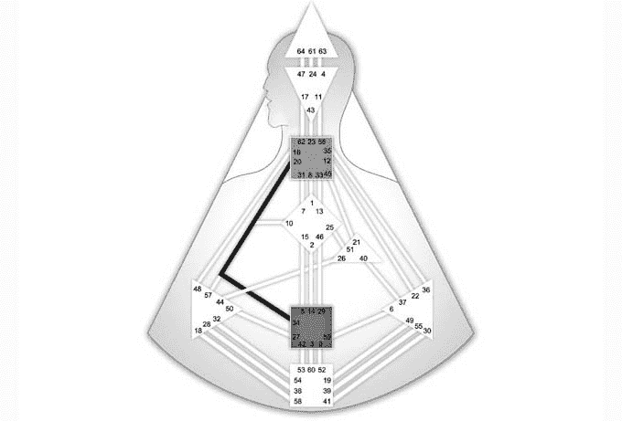

魅力的信道透过力量的闸门（34）及当下的闸门（20），链接荐骨中心到喉咙中心。这是典型的显示生产者信道，透过荐骨的回应来引导，进而以行动去实践。换句话说，战士（显示者）必须臣服于佛陀（生产者），等待外在刺激，并予以回应，才能适切地引导出充满魅力的力量。

**背景**：有三条信道其闸门在曼陀罗轮轴上，两两相对，魅力信道就是其中之一。（其他两条是 43 - 23 以及 37 - 40）。当 34 号闸门的原始力量：一种纯粹的生理能量，透过甲状腺系统运作时，将构成启动人类生存的关键能量。荐骨施加压力的方式让 20 号闸门保持忙碌，督促一切要在“当下”发生。而荐骨产生力量到实际发生的速度，非常迅速，甚至迅速到连回应都省略下来，这可以解释为何有这条信道的人，总是很难坐得住或保持安静。虽然他们的影响力及成就令人惊艳，但若缺乏与荐骨的内在引导链接，同样的能量可能会造成困扰，或者不由自主突然爆发，宛如方向错乱的飞弹，还为此感到得意忘形。

**个人**：34-20 信道的能量是整合（自我激励）过程中的一部分，由于拥有长时间持续活动的动能，因此如何运用这股能量，在你真正喜爱的事物上，就变得非常重要。其他人可能会羡慕你的行动力，但这股能量无法被他人所用。你的想法必须转化为行动，这是来自于 34 号闸门充满生产力的动能，需要在当下立即表现出来。每日维持在忙碌的状态之下，从事可以带来自我满足的活动，对你来说是正确且健康的方式。然而，这通常也不适用于其他人。运用这种方式，你纯正的活力会为自己带来力量，同时也会自发性的，自然对他人带来启发。这就是魅力的真实本质。当你的荐骨回应被头脑的“应该”或“可能”的想法所取代，你强大的个人力量会变得发散，容易被误导，如此一来牺牲的是你的健康，以及原本足以成为典范的能力。

**人际**：大部分有魅力信道的人，看起来没空，非常忙碌。因为有这样潜质的人，需要在当下采取行动，或直接执行。他们经常发现自己做个没完。而他们的难处就在于，总是忙于自己的忙碌，无法分辨自己其实非常需要引导。迅速确实的行动，对社会带来莫大的助益；然而混乱发起则会造成深刻的破坏。若一个拥有 34-20 信道的人，无法从他们自身的设计中，例如代表内在直觉的 57 号闸门，或者代表自我行为的 10 号闸门，得到有效的引导，来缓和其忙碌的状态。那么他们就会很自然地且健康地，愿意开放于 43-23 信道的觉知与洞见，从中得到指引与意见。

##### 34 号闸门：强大的能量（大壮卦）－力量的闸门

当力量被展现及运用在共同利益上，才会显现其伟大

中心：荐骨／四等分：突变／主题：透过蜕变，达成目的

右角度交叉之沉睡的凤凰—并列交叉之力量—左角度交叉之二元性

34 号闸门是强而有力的能量来源，让我们朝个体化发展，并且在这个世界上展现我们的独特之处。34 号闸门具备两种特质，让此闸门与荐骨其他八个闸门截然不同：无性别之分，以及力量无法为他人所用。如果与 G 中心的 10 号闸门相连，这股能量会展现在社交行为，或扮演支持你强烈信念的角色。如果与位于喉咙中心的 20 号闸门相连，你的力量将完全施展在自己的行为之上，将想法立即转化为行动，旺盛的实践力会带来繁荣与兴盛。如果与直觉中心的 57 号闸门链接，你的直觉将赋与你聆听的能力，让你听见在每个当下如何完美存活的方式。若缺乏直觉中心的直觉来引导，这股连续不断想采取行动的力量，可能会变得不健康、多管闲事以及呈现误导的状态，你会感觉自己失去动能，耗尽力气却无人受惠。即使受人钦佩，甚至受欢迎，你的能量就是无法被别人所用。你必须维持力量的纯粹，善用这股力量去寻求自己的独立与独特、贯彻自我信念、获取胜利，而也是你的求存之道。

*   第 6 爻—常识
*   第 5 爻—歼灭
*   第 4 爻—胜利
*   第 3 爻—男子气概
*   第 2 爻—气势
*   第 1 爻—霸凌

##### 20 号闸门：注视（观卦）－当下的闸门

当下的识别与觉察，将理解转化为适切的行动

中心：喉咙／四等分：文明／主题：透过形式，达成目的

右角度交叉之沉睡的凤凰—并列交叉之当下—左角度交叉之二元性

20 号闸门是纯然存在的闸门，使你专注于当下，支持你发挥能力，得以自己的方式生存。当你在适切的时间点表达，你的觉察将转化为足以影响周遭人们的文字或行动。这样的能量频率是——而且必须是——完全在当下展现。它可以为 57 号闸门发声，说出充满求存意识的直觉，给予 10 号闸门的行为模式，承诺于更高的原则，或是采取行动，往个体化的方向迈进，进而显现 34 号闸门荐骨的力量。20 号闸门展现的是，存在于当下的全然面貌，从“我现在是……”到“我知道自己正在做什么”，但并不考虑过去或未来。是觉醒并觉知的，才得以求存，你必须完全在此刻活在当下，表里一致做自己。你没时间以脑袋来考量，或控制内心会冒出什么样的想法，你所说或所做的一切就是突然出现在所有人（包括你自己）眼前。事实上，即使没有亲眼所见，你也能看见，没有耳闻，依然能听见。这就是在每个当下，你的存在本身，所蕴藏的进化潜能。当你依循人生策略和内在权威生活时，将会活出典范。你的直觉认知、个人生存和突变、爱自己的行为将会影响并为他人带来力量。

*   第 6 爻—智慧
*   第 5 爻—现实主义
*   第 4 爻—应用
*   第 3 爻—自我觉知
*   第 2 爻—独断者
*   第 1 爻—表面化

#### ▸ 完美形式的信道：57-10

求存的设计

信道：整合型（创造力的信道）／信道类型：投射

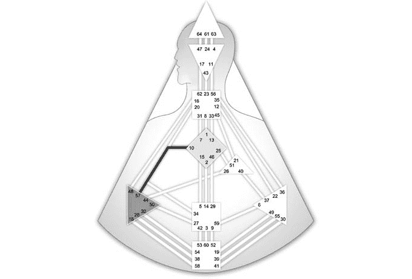

完美形式的信道，透过直觉洞察力的 57 号闸门，和展现自我的 10 号闸门，连接直觉中心和 G 中心。这是整合型信道中的创造力信道——生存的艺术。透过直觉的导引，以爱自己和欣赏自己为出发点，带出有品质的行为。此行为是人类物种求生的核心能力。

**背景**：直觉主要在确保身体安康。信道 57-10 支援 10 号闸门，致力于如何与他人互动，以确保个体的生存。为了全人类的演化发展，自我导向和潜在突变行为对个体来说是必要的。个体的行为是独特的，他们为了求生存，可以完美适应环境，而改变其形式，是活在当下的最佳范例。57 号闸门拥有敏锐察觉当下周遭声音的特质。信道 57-10 重新链接我们最古老的直觉型式，专注于别人说话的语调，而不是说出来的话，这不同于思想和情绪，是一种与生俱来、内建的直觉智慧。此信道赋予人极度的清晰，能自动自发、适切地对周遭环境的失序做出反应。

**个人**：当你时时以深层直觉的脉动，导引自己的行为时，你会自动释放自己对未来莫名的恐惧。这些恐惧会让你无法全然地爱自己、拥抱自己的生命。你本身具有的潜能，应该要能体现自在、无负担的生活。这种思虑敏捷的能力，能让你完美展现，确保你当下得以生存。在这过程中，与生俱来的美好，会使你感觉快乐，充满愉悦。这种自然产生的创造力本质，和大脑进行反省的创造过程并不相同，也有别于透过情绪中心所产生的各种深度、多样化的情绪。只要活出真我，你就可以为自己的生命创造健康与美好。这样的特质会吸引且影响你身边的人，对其他人来说，你就是最好的例子，引导大家发现自己的生命价值。

**人际**：拥有完美形式信道的人，会创造他们所爱的事物，并且爱他们所创造的事物。得到认同并非他们的动机。他们充分拥有爱自己的能力，可以保持真正的自己，直觉式的行为表现方式，则可以确保他们在社会上的生存。这自私且利己的过程，无须辩解，透过他们的生命，这是属于创造和完美呈现其独特性的旅程。他们以一种看似明显但微妙的方式影响周遭环境，使其变得比刚开始时更健康而美好。许多拥有这条信道的艺术家、建筑师、设计师及医生，以展现自己为实例，不经意地形塑出他们身边的环境。这是活出表里一致的生命，自然而然所带来的成果。

##### 57 号闸门：温和（巽卦）－直觉洞察力的闸门

非凡清晰的力量

中心：直觉／四等分：二元性／主题：透过人际链接，达成目的

右角度交叉之渗透—并列交叉之直觉—左角度交叉之号角

因为拥有清晰的直觉洞察力，57 号闸门具有当下透视核心的能力。底层能与声音共振，让他们能持续地对来自外在环境，不论是身体、情绪及心灵层面的振动频率，保持警觉。你的直觉时时刻刻都能敏锐察觉，哪些对你来说是安全、健康或是好的，而哪些不是。57 号闸门代表右耳。如果你想知道对方真正想传递的言语，请善用本能，以右耳倾听。你必须警醒并专注于当下，才能听清楚直觉中心传达给你的讯息，否则你可能会忽略了，与生存息息相关的信息。有时候在别人眼中，你像聋了一样，或是备受责备，认为你只是选择性地听取别人的话，但你的直觉是你唯一的导引，让它来决定哪些行为对你是好的。降低对未来恐惧的唯一方法，就是专注于你那出于本能的直觉、倾听那只说一次的微小声音，并根据直觉，立刻采取行动。当你在当下专注聆听自己的直觉，没有明天，又有何惧。

*   第 6 爻—使用
*   第 5 爻—进展
*   第 4 爻—指导者
*   第 3 爻—敏锐
*   第 2 爻—净化
*   第 1 爻—困惑

##### 10 号闸门：前进（履卦）－自我行为的闸门

行为的基本守则，无入而不自得，确保互动成功

中心：G／四等分：突变／主题：透过蜕变，达成目的

右角度交叉之爱之船—并列交叉之行为—左角度交叉之预防

10 号闸门是 G 中心里最复杂的闸门，也是轮回交叉爱之船的四个闸门之一。这是爱自己的闸门。六个潜在自我行为或角色（如下述）受到 57 号闸门的直觉导引、荐骨中心 34 号闸门赋予力量，并透过 20 号闸门来显现或表达。在这些角色的架构下，人类正在探索何谓以九大中心的方式来生活、带来觉醒的潜能，形塑自我意识，并且体验何谓真正爱自己。顺应你的人生策略和内在权威，10 号闸门让你发挥潜能，臣服于真实的自己。当你了解、接受并爱自己所具备的特质时，你也将引导别人爱他们自己。真正的觉醒并不是要成为某样东西，而是成为你自己。10 号闸门非常重视爱自己、接纳自我，并将为人类如何进化、迈入二十一世纪产生深刻的影响。你将认知到觉醒，必须先接受自己。当你以自我觉察的方式，拥抱探索生命带来的荣耀和喜悦，将会激发大家的按照真正的潜能过生活，在当下觉醒。

*   第 6 爻—人生典范
*   第 5 爻—异端者
*   第 4 爻—机会主义者
*   第 3 爻—烈士
*   第 2 爻—隐士
*   第 1 爻—谦逊

#### ▸ 觉醒的信道：10-20

承诺去追寻更高层真理的设计

信道：整合型／信道类型：投射

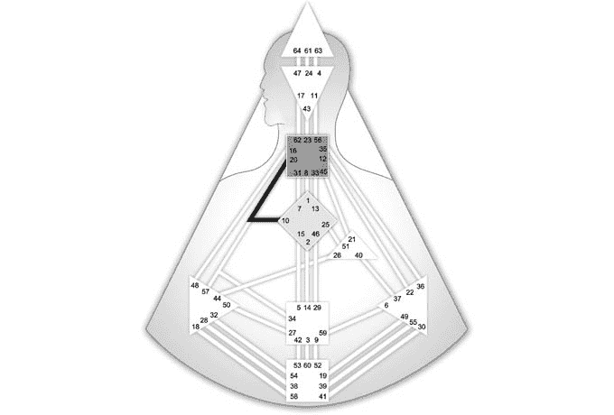

觉醒的信道透过自我行为的 10 号闸门和当下的 20 号闸门，链接 G 中心和喉咙中心。觉醒和觉察是指，每一刻都是体悟的机会，原则是将个人的觉知转化为正确的行动（20 号闸门）。以确保与他人成功互动为前提，所采取的行动，有其行为上的基本准则（10 号闸门）。

**背景**：觉醒的信道说：“我在！现在，我活着！”这是对生命本质最完整、最深刻、利己及原始的陈述。这是人类意识的奇迹：“我活下来了；我是幸存者！”佛陀代表“觉醒的人”。生命觉醒的两大主轴，是爱自己和信任自己：“我是，而且我可以，因为我爱（自己）。”以最简单的人类图语言来说，觉醒代表作出属于自己的决定，并依此生活。当你能依循自己的设计生活，不计代价，不论平凡与否，都热爱原本的自己，你就如同佛陀般觉醒了。

**个人**：G 中心并非察觉中心，所以 10-20 信道只能做到一件事：为自己发声。它完美地表达了生存、丰盛和体验生命之爱的智慧，你必须发挥自己的潜能，成为爱自己、接受自己以及信任自己的觉醒者。当人生在你面前展开，你总是持续处于觉醒、被别人认可、保持自我觉察的状态。生存与自我激励是时时刻刻拥抱、爱、接受自己且做自己的结果。透过你的决策、话语、互动和行为，别人可以见证这一切。为了对周遭的人产生影响力，你要发挥潜能，传达整合型信道中，关于领导力的声音，别人必须在你身上感受到某种层次的清明与觉醒，因为你无法看清楚自己的状态。只要简单做自己，就可以影响并启发身边的人，朝做自己的方向前进，即使大部分的时候你并不自觉。你会发觉周围的人开始提出适当的邀请，这样的邀请将可减少抗拒、避免你个人遭受批评，并减少因为自己的独特性，与倾向自溺的本性所带来的负担。

**人际**：10 号闸门的六条爻代表拥有 10-20 信道的人会有的行为原则。第一条爻代表，此人不论在任何情境下都知道如何反应，拥有当下觉醒的潜能。第二条爻是指专注于自身事务的独立行为，当外在环境的制约，让他偏离真实本性时，他会抽离而孤立。第三条爻的尝试错误，反复试验的过程，将发现什么行得通，什么不行，最终可以为人类带来极大的价值。第四条爻则在等待对的时间和机会，将所知向外扩散，进而影响及唤醒身边的人。第五条爻将直接、公然地挑战目前大家所接受的社会传统，进而带来觉醒及改变。第六条爻以自身为典范，而非文字，透过展现真实的本性，以行动落实在日常生活之中，为众人带来觉醒。

##### 10 号闸门：前进（履卦）－自我行为的闸门

行为的基本守则，无入而不自得，确保互动成功

中心：G／四等分：突变／主题：透过蜕变，达成目的

右角度交叉之爱之船—并列交叉之行为—左角度交叉之预防

10 号闸门是 G 中心里最复杂的闸门，也是轮回交叉爱之船的四个闸门之一。这是爱自己的闸门。六个潜在自我行为或角色（如下述）受到 57 号闸门的直觉导引、荐骨中心 34 号闸门赋予力量，并透过 20 号闸门来显现或表达。在这些角色的架构下，人类正在探索何谓以九大中心的方式来生活、带来觉醒的潜能，形塑自我意识，并且体验何谓真正爱自己。顺应你的人生策略和内在权威，10 号闸门让你发挥潜能，臣服于真实的自己。当你了解、接受并爱自己所具备的特质时，你也将引导别人爱他们自己。真正的觉醒并不是要成为某样东西，而是成为你自己。10 号闸门非常重视爱自己、接纳自我，并将为人类如何进化、迈入二十一世纪产生深刻的影响。你将认知到觉醒，必须先接受自己。当你以自我觉察的方式，拥抱探索生命带来的荣耀和喜悦，将会激发大家的按照真正的潜能过生活，在当下觉醒。

*   第 6 爻—人生典范
*   第 5 爻—异端者
*   第 4 爻—机会主义者
*   第 3 爻—烈士
*   第 2 爻—隐士
*   第 1 爻—谦逊

##### 20 号闸门：注视（观卦）－当下的闸门

当下的识别与觉察，将理解转化为适切的行动

中心：喉咙／四等分：文明／主题：透过形式，达成目的

右角度交叉之沉睡的凤凰—并列交叉之当下—左角度交叉之二元性

20 号闸门是纯然存在的闸门，使你专注于当下，支持你发挥能力，得以自己的方式生存。当你在适切的时间点表达，你的觉察将转化为足以影响周遭人们的文字或行动。这样的能量频率是——而且必须是——完全在当下展现。它可以为 57 号闸门发声、说出充满求存意识的直觉，给予 10 号闸门的行为模式，承诺于更高的原则，或是采取行动，往个体化的方向迈进，进而显现 34 号闸门荐骨的力量。20 号闸门展现的是，存在于当下的全然面貌，从“我现在是……”到“我知道自己正在做什么”，但并不考虑过去或未来。是觉醒并觉知的，才得以求存，你必须完全在此刻活在当下，表里一致做自己。你没时间以脑袋来考量，或控制内心会冒出什么样的想法，你所说或所做的一切就是突然出现在所有人（包括你自己）眼前。事实上，即使没有亲眼所见，你也能看见，没有耳闻，依然能听见。这就是在每个当下，你的存在本身，所蕴藏的进化潜能。当你依循人生策略和内在权威生活时，将会活出典范。你的直觉认知、个人生存和突变、爱自己的行为将会影响并为他人带来力量。

*   第 6 爻—智慧
*   第 5 爻—现实主义
*   第 4 爻—应用
*   第 3 爻—自我觉知
*   第 2 爻—独断者
*   第 1 爻—表面化

### 个体人回路群

觉知与中央回路（Knowing and Centering Circuits）
主轴关键字：赋予众人力量（激励众人）

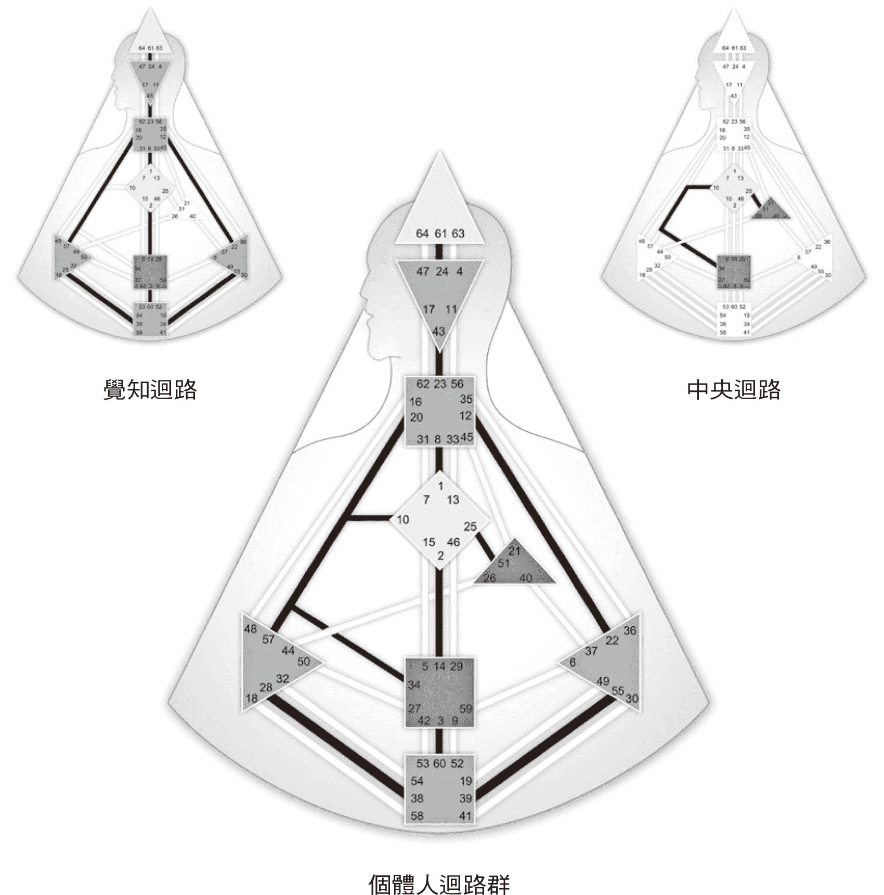

我们从个体人的回路群组开始，因为它跟整合型信道的核心紧密链接，虽然还是有显著的差异。个体人同时具有改变世界的能力与责任，他们要为家族人及社会人带来突变。而他们的挑战来自如何不被其它两大族群拒绝，顺利完成任务。

个体人回路群是三个回路群中最复杂的，包含了九大中心的频率。他们必须在当下专注倾听内在的频率，宛如聆听内在的鼓声，然后决定遵循自己的方向。个体人追求独特性的驱动力，将成为人生典范并能鼓舞他人、赋予他人力量、或是唤醒其他人内在的潜质。突变与激励，是链接个体人回路的主要关键字，也是整个人类图体系与演进的核心。对个体人而言，此关键字所衍生出来的意思是：忠于自己的热情、想法，在每个当下皆保有其独特性，独立于既定常规去生活。当个体人的觉知愈来愈清楚，准备好带来灵感或引发其差异，这是他们活出自己的方式，成为真正的典范。认知到每个人与每件事蕴藏着突变的潜能，以直觉去感受，激励进而引发其可能性，就是他们与生俱来的天赋。

个体人的认知并非来自实证 ，或透过经验学习而来，他们比较仰赖直觉及（或）当下的灵感，这就是个体人不太容易融入社会的原因。个体人若能从孩童时期就开始学习如何自我解释、说明，对他们来说是必要并且有帮助的。他们必须学习如何沟通出当下的灵感，以及他们内心真实的答案。身为带来改变的媒介，良好的自我解释能力，会让他们更有效率，并减缓他们格格不入的感受。

个体人会吸引注意力，但个体人需要也喜欢独处，以探索他们充满创意及忧郁的内在世界。他们总能抓住当下的重要时刻，却听不进关于经验谈或分析原因这类的声音。这是因为他们来到这世上，要真实反映出当下新的事物，型塑它，然后采取行动或沟通。为了让个体人对所处的位置感到自在，准备好与他人链接，在珍贵且虚幻的片刻启迪众人，他们个人必须与内在权威密切链接，并且遵循人生策略。

个体人回路群组是由一个主要的觉知回路，以及另一个次要的中心回路所组成。

### 觉知回路

关键字：赋予他人力量

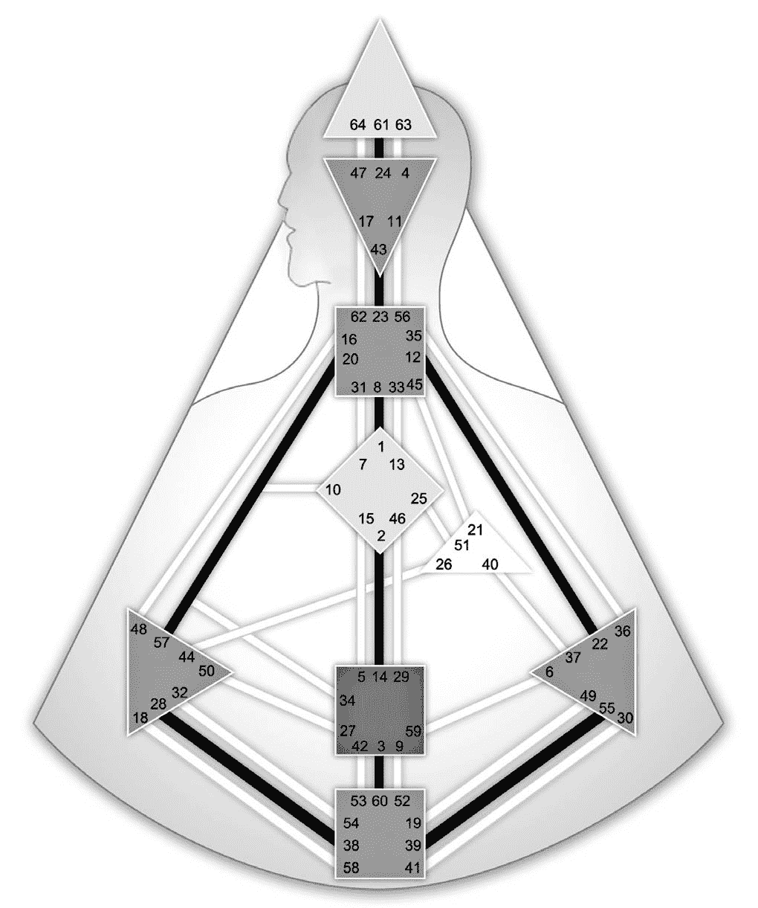

**信道：**

61-24：察觉的信道　思考者

22-12：开放的信道　社交人

43-23：架构的信道　个体性

60-3：突变的信道　能量开始与流动，脉搏

38-28：困顿挣扎的信道　顽固

14-2：脉动的信道　掌管钥匙的人

57-20：脑波的信道　渗透性的觉知

1-8：带来灵感，启发的信道　创意的典范

39-55：情绪的信道　多愁善感

拥有觉知回路的人需要激励，他们要活出自己。他们成为独立且独特的典范，赋予别人力量。他们重整生命的秩序，并反映在自己的生活型态，他们需要观众，这是他们为这个世界带来突变的方式，他们的独特性需要被看见，被认得。

正如其名，这个回路的特质是，每个当下所带来的启发与觉知，都紧密链接着情绪周期里的热情、或忧郁的种种情绪波动，然后以一种突变的形式，影响个体人的想法与行为，并进一步影响其他人。这造就了个体人时时刻刻以觉知激励众人，以及让他们看来是如此难以预期、充满创意与独一无二。个体人的存在并非追求完美、或主导及组织某些事情，这些是社会人信道所带来的贡献。个体人只要带来全新的事物，并带给更多个体及周围环境蜕变的潜能。

属于个体人的觉知，就本质上来说，来来去去有时出现、有时消失。个体人要等到觉知突然出现，才会发现它的存在。觉知可能带来答案、可能是对的方向，但也有可能并不是。普遍来说，个体人所带来的突变，其价值及正确性需要经过一段时间才能验证。这种突变的力量，普遍存在于个体人回路群组中的所有信道及闸门，但觉知是突发性的，无法持续稳定运作，有时打开有时关闭。突变无法预期，更难以控制。对于保守型的社会人回路，以及具阶级性的家族人回路来说，他们自有一套固定的时间与节奏，会自行避开个体人式的、突发性的灵感或突变，但这两个群体，都需要个体人的引导，才能带来改变及蜕变，推动他们进化，协助他们不再停滞不前。这是一股崭新的能量。所以社会人及家族人，会谨慎审视个体人带来的觉知，并开放接受大家公评，这也就是为什么，对于个体人来说，具备清楚表达自我的能力，极为重要。

我们欣赏个体人如此不同，也忌妒他们总是吸引众人的目光，这是一条脆弱，非常个人，有时候极其孤单的人生旅程， 而他们可能永远不会知道，自己已经激励了许多人。

接下来将探讨觉知回路的信道及闸门。

#### ▸ 突变的信道：3-60

能量开始与流动，脉搏的设计

回路：觉知／信道类型：生产

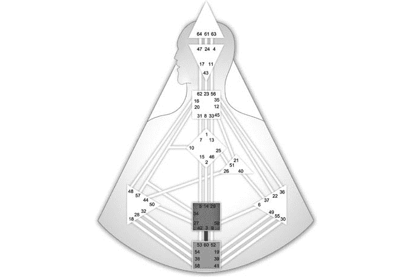

突变的信道透过接受的闸门（60）及秩序的闸门（3）链接了根部及荐骨中心。这个不可预期，蕴藏着突变而且带来忧郁的信道中，潜藏着进化改变的潜能，取决于一个人接受限制（60 号闸门）以及面对全新开始时，超越困惑的能力（3 号闸门）。

**背景：**60 号闸门是枢纽，集结所有进化的可能性，3 号闸门总在试着寻求那一个全新且可行的可能。这条兴奋刺激的突变信道，由底层流动的电流或频率所主宰，它是个体人回路群的组织能量[[1]](#6-06.xhtml_fnX-1)（format energy）。这股强大、伴随忧郁、可瞬间开关的能量，穿透拥有这条信道的人，让他们活出自己的本质。而这股强大的能量，也会同时制约或深刻地影响着，在他们身边的每一个人。

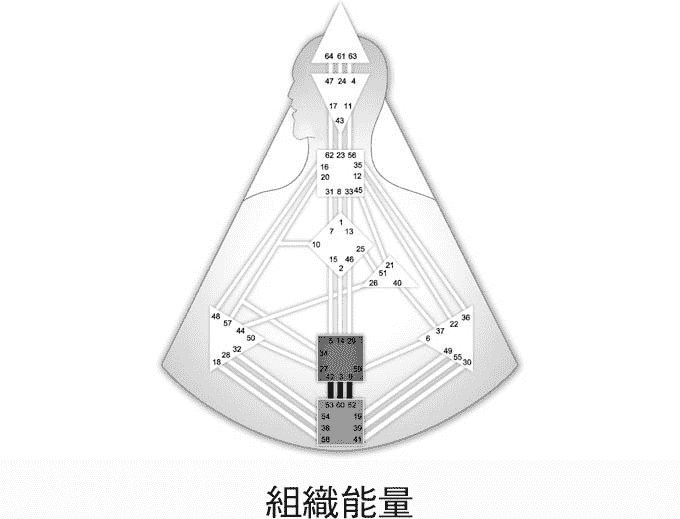

**个人**：面对这忧郁且情绪化的过程，关键就是别试图合理化这一切，最好保持耐心与觉察，等待全新的蜕变透过你而发生。当蜕变的脉动关闭时，花点时间独处，等待灵感降临，这能让你的内在之旅，更深入而丰富。虽然你不一定能看见，但是的确有些东西正在底层蕴酿着，时机未到，尚未浮现，迳自成长与成熟着。这自混乱到秩序，再回归混乱的无止尽循环，正是这股能量的本质，其中蕴藏着巨大的可能性，可以为世界带来全新的改变。你只需接受这先天的限制，那就是无法得知改变（停顿之间）何时会发生， 唯有投降于你来自荐骨的回应，就能为我们所有人带来这股改变的能量。

**人际**：就像音乐，蜕变就在脉动或音符的空拍中，一瞬间，突然无预警地发生了。它促使所有人适应、改变，否则便落伍。拥有这条突变信道的人，不断承受压力，要为自己的人生、工作、家庭以及周遭的世界，带来创新与改变。当脉动的开关关闭时，周遭看起来似乎没有任何事情发生，根部中心既定的压力，将造成内在的紧绷。此时体内的化学变化，就是所谓忧郁的体验。身为蜕变与改变的媒介，个体人会发现自己试图为情绪化找理由，感觉不畅快，还深陷在平时极力想避免的阴暗情绪中。如果他们放弃了，被阴影所吞噬，或者没有等待正确的回应，这股要为世界带来改变的压力，将会让他们个人深感挫折与沮丧，同时也会对周遭的人，带来不稳定与混乱。

##### 3 号闸门：凡事起头难（屯卦）－秩序的闸门

发起时所面对最根本的挑战，来自于如何超越困惑，并创建秩序

中心：荐骨／四等分：初始／主题：透过心智，达成目的

右角度交叉之律法—并列交叉之突变—左角度交叉之希望

3 号闸门的功能是超越困惑，创建秩序。如此一来，将为世界带来崭新及潜在可行的事物。你拥有独特的个体人认知、个人创新能力以及带来重要贡献的潜质。等待着突变会在对的时刻发生，感觉像是遥遥无期。你需要耐心，接纳 60 号闸门会有偶发性爆发出来的能量，在无法事先得知的时间点，释放出有限的潜能。创意宛如脉搏的跳动，在跳动与停顿之间发生，随即带来了非逻辑，也并非来自过往经验的全新潜能。如果你没有等待对的时间点，如果不是一个架构亟需突变的时刻，你对改变的热忱，并不会激励或影响周围的人，反而只会让一切动荡不安。若感觉自己无力实现潜能，也无法带来改变，你可能会体验到忧郁甚至沮丧。然而，这才是深入自身历程的时刻，花些时间与创意灵感独处，你无法预测、控制或加速突变的时刻到来，一切有其时机。当对的时间点到来，你无须大费周章，任何人只要进入你的能量场，就会改变。

*   第 6 爻—投降
*   第 5 爻—受害
*   第 4 爻—魅力
*   第 3 爻—生存
*   第 2 爻—未成熟
*   第 1 爻—综合

##### 60 号闸门：限制（节卦）－接受的闸门

接受限制，就是超越的第一步

中心：根部／四等分：突变／主题：透过蜕变，达成目的

右角度交叉之律法—列交叉之限制—左角度交叉之分心

60 号闸门带来压力，能让纯粹的能量化为突变，得以成型。根部中心源生限制，对每个可能性施压。创意突变的过程，发生于脉搏跳动的瞬间，无法预测何时何种突变会降临。当既定的限制，被 3 号闸门所带来的秩序所引动，可行的突变会超越原本的限制，因而诞生。60 号闸门有其脉动，在开与关之间，突变就在“音符与音符间的空白处”出现了。来自根部中心的压力，让你在前进时，底层焦躁不安，任何限制都感觉宛如路障一般。如果你对这不可预期的突变过程失去耐心，60 号闸门的内在忧郁将会加深，演变成长期的低潮。当你觉得无力改变周遭时，向内看。接受突变过程如此奥秘，因为你活在自己的世界中，相信内在蜕变正在发生，混乱中充满潜能。3 号闸门是带来秩序的关键因素，突变得以发生。少了它，你会感到无法前进，动弹不得。

*   第 6 爻—刚硬
*   第 5 爻—领导力
*   第 4 爻—足智多谋
*   第 3 爻—保守主义
*   第 2 爻—果断
*   第 1 爻—接纳

#### ▸ 脉动的信道：14-2

掌管钥匙的人的设计

回路：觉知／信道类型：生产

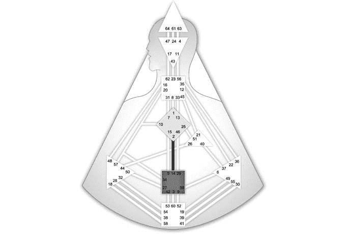

脉动的信道透过强而有力的技能（14 号）闸门及高我的觉知（2 号）闸门，链接荐骨中心及 G 中心。14 号闸门聚焦于足以点燃突变的可用资源，2 号闸门则是驾驶的座位（磁单极），将大家凝聚在一起，穿越时间与空间，引领我们向前移动。两者集结在一起，即成脉动的信道，蓄势待发，带领我们前往全新的方向。

**背景**：14-2 信道是人体图中，三条谭崔信道[[2]](#6-06.xhtml_fnX-2)其中的一条（个体人谭崔信道），并且具备所有个体人的特质，如：突变、创新、不寻常、新奇、独特以及忧郁。荐骨中心是产生纯粹动力的来源，赋予地球生命，并延续其生命力。G 中心代表自我认同、方向与爱。当代表高我觉知的 2 号闸门，与强而有力技能的 14 号闸门相链接，所集结的强大资源将孕育创意，其旺盛的生命力，将在人生方向的层面上，引发改变。

**个人**：身为掌管钥匙的人，你可以取得重要的必要资源，将蜕变的冲力，实质蜕变成物质世界的具体方向。你只需单纯去聆听，并信任荐骨的回应，便能为其他人带来创新与全新的方向，即使你并不知道，这一切带你去哪里，或在其他人身上产生何种突变性的影响。你要能保有自己的创造力，或提供实质上的支持，激励他人步上其创意的方向。透过既有的典范，个体性才能备受激励，你的第一个任务是忠于自己，活出自己的使命、方向和目的，进而激励别人。如果你试图追逐命运，终将感到失落与挫败。信任生命将透过你而做决定，你会全然在整体运转的层面上，激励别人。若你呈现健康运作的状态，当人们进入你的能量场，他们就能被引发，自觉找到方向感，或者他们得以掌握了全新的方向。而你需要做的，就是对人生保持开放并回应。

**人际**：社会人及家族人重视安全及现状。而 14-2 为个体人带来那把钥匙，为地球带来新方向，在浑沌状态中注入全新观点，好让我们能持续进化，并且不断迎接现存的挑战。最终，社会人及家族人也会测试并适应这些新观点，善加运用。在 14-2 信道中，突变在脉动的瞬间突然发生了，这是对人生、自我定位以及更高觉知的方向，所产生的深刻回应。存在于这瞬间，下个瞬间又消失了。我们永远无法得知新方向何时会来，将带领个体人往何处走，又将如何为社会与家族带来改变。

##### 14 号闸门：执着于衡量（大有卦）－强而有力的技能的闸门

透过有技巧的互动，伴随优雅的掌控，来累积并延续力量

中心：荐骨／四等分：突变／主题：透过蜕变，达成目的

右角度交叉之传染—并列交叉之激励—左角度交叉之不确定

经由分配可用资源，14 号闸门激励个人及整体人类，找到方向。这个闸门具备强而有力的技能，支持突变得以发生，并且示范如何投入资源，以拓展我们的视野。有定义的荐骨中心可提供能量，支持长时间具创造力的活动，而 14 号闸门在最佳的状态下，洋溢着丰沛的力量。它就像汽车的油门，掌控释放资源的时机与方式。当你与你的设计合一，并从事自己喜爱的工作时，你将会产生财富与力量。这些资源不单单是提供给你使用，而是要让你可以激励更多人、支持个体的创意及慈善活动，或者启发对人类未来深具远见的领导者。若仅投入金钱支援某人或某事，是糟糕的投资。要保护自身深具价值的生命动力，避免被他人所误用或漤用，遵循内在权威，严守分际以带来对的突变走向，当 2 号闸门适切带来引导，你的资源将会成为举足轻重的催化剂，致力于世界上的改变。

*   第 6 爻—谦逊
*   第 5 爻—傲慢
*   第 4 爻—安全
*   第 3 爻—服务
*   第 2 爻—管理
*   第 1 爻—金钱非万能

##### 2 号闸门：接纳（坤卦）－自我方向的闸门

无论决定如何回应，接纳是最根本的基础，也是行动的根源

中心：G／四等分：文明／主题：透过形式，达成目的

右角度交叉之人面狮身—并列交叉之驾驶—左角度交叉之挑战

2 号闸门的“高我”觉知源于自我，透过磁单极引导，如同汽车驾驶员，朝向爱与美前进。驾驶会注意我们如何在时空中移动，方向感不仅限于实质的地理位置，而是在你的设计之中，自有一套内建的方向感，你不能透过自己的头脑或意志，就此改变方向，倘若其他人无法与你的方向相同，你只能分道扬镳。2 号闸门像是汽车的钥匙，让驾驶员可以启动发动机。来自荐骨中心的 14 号闸门则是马达与燃料，好让车子得以前进。你甚至会发现，当别人致力创造时，你还能引导他们找到所需的资源，或发现，当你与自己的方向合一时，自然而然，你就能够激励别人，或确认他们内在原有的方向感。你是一个梦想家，可以提供计划或纵观全局，看见眼前全新的道路。但你不是来执行，或让事情发生的人。你要与 14 号闸门结盟，才能拥有力量与资源，落实自己的愿景。

*   第 6 爻—定格
*   第 5 爻—灵活应用
*   第 4 爻—隐匿
*   第 3 爻—耐性
*   第 2 爻—天才
*   第 1 爻—直觉

#### ▸ 启发的信道：1-8

创意的典范的设计

回路：觉知（创造力的信道）／信道类型：投射

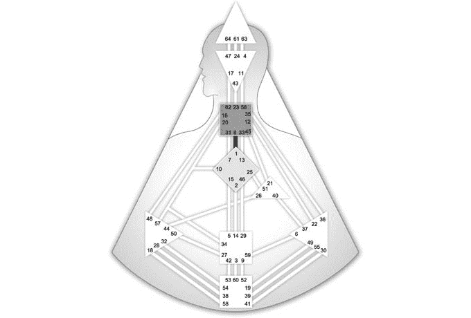

启发的信道链接了在 G 中心自我表现的闸门（1）与位于喉咙中心贡献的闸门（8）。1 号闸门是一扇门，让个体人充满创意，表达其具突变性质的观点。不论是透过他们自身的能量场，或是以某种形式宣传及展示，让大众得以体验。鹤立鸡群需要勇气，要激励众人，要有胆子。对这条信道而言，活出独立个体的精神，是一门艺术。他们天生就能博得众人的注意力。

**背景**：1-8 这条信道为觉知回路里，潜藏的创意（1 号闸门）和领导力（8 号闸门）提供了公开的出口。透过人生典范而发声，对于团队中不断进化的目标，志在必得，它说：“我知道我可以（或无法）施展创造力，有所贡献。”拥有这条信道的人，如果能充分展现及活出自己的独特性，就能够对身边的人产生影响力。这样的影响力不必透过文字或说明，而是以身作则，朝着自己个体人的方向，活出典范。他们实践，并依此而活。当信道 1-8 链接到动力中心（好比透过 2-14 信道），他们的贡献将会更加显著。

**个人**：所谓个体人的方向，其本质是走向美，每个当下都打好基础，被自己内在的真实所激励。你的设计就是要表现自己，并成为具有创造力的个体，才能实至名归，吸引众人的目光。一旦你这么做，就有可能改变他人的观点。你能启发他人看见全新的方向，让他们重获自由，充满创意表达出自己的独特性。就像一位钢琴家，做了一场了不得的表演，因而启迪了台下某位观众，想开始学习钢琴的渴望。对于个体人化为典范，因而展现领导力的模式，若要发挥真正的影响力，需要处于不被轻忽、安全并且不受制约，不被影响的前提下，让他们可以表里一致地，展现自己的内在权威。另一项不可或缺的要素是，认同自己具备启发与激励他人的潜能，尤其当你致力活出自己的个体性，就更能创造出激励他人的结果。而你的个体性自然会吸引注意力，让更多人认识你。1-8 信道的人，缺少内建的社会适应模式，为了有效将你所要贡献的一切，好好沟通出来，你必须发展出一套有效的沟通技巧，这包括：培养耐心，等待对的时机再行动。你大放异采的关键在于，你的个体性与所传播出来，极具创意的影响力，必须受到众人认可、接受与喝采。

**人际**：充满个人风格的领导者（身为典范，带来突变或激励）借由影响人们的观点、行为、人生观、真理与美的天性，以吸引追随者。我们都了解，基于他们对整体社会的贡献，无远弗届，影响了所有人。那些拥有启发信道的人，知道如何充分发挥自己的独特性，而在这个过程中，他们也因此激励更多人，活出独特性，充满启发，以及成就与众不同的自己。

##### 1 号闸门：创意（乾卦）－自我表现的闸门

创造力是原始的力量。没有限制，充满潜力，足以启动灵感的能量。

中心：G／四等分：突变／主题：透过蜕变，达成目的

右角度交叉之人面狮身—并列交叉之自我表达—左角度交叉之挑战

1 号闸门有股冲劲，深层渴望能以独特具创意的方式表现自我。若与社会人的特质相比，你在意的并非成为最棒的那一个。你只是单纯想活出充满创意的本性，表里一致展现其个体性。当你愉快沉浸在“做自己的事情”时，不会知道自己正吸引他人的目光。当你真正投入创造的过程，不管你正在做什么，如何做，在这过程中，你会拥有最大的影响力。当你表里一致，以新的方式来表达自己，你就是典范，能启发他人也以新的角度和方式，重新思考如何活在这世界上。你甚至能改变别人的创意方向。你的创意将成为实例，启发他人。为了让别人能正确接收你的影响力，你必须让其他人看到或听到你，进而欣赏你。为此，你需要和世界进行互动，而且要等待被邀请。一旦缺少 8 号闸门，你可能会对行销自己的作品意兴阑珊，你会发现自己容易被 8 号闸门的人所吸引，因为他们有办法能宣传你的作品，这是他们的天赋和优势。

*   第 6 爻—客观性
*   第 5 爻—吸引社会大众的能量
*   第 4 爻—孤独为创造力之媒介
*   第 3 爻—持续创作的能量
*   第 2 爻—爱是光
*   第 1 爻—创意独立于意志之外

##### 8 号闸门：凝聚在一起（比卦）－贡献的闸门

当个人致力为团体目标做出贡献，其基本价值便得以展现

中心：喉咙／四等分：文明／主题：透过形式，达成目的

右角度交叉之传染—并列交叉之贡献—左角度交叉之不确定

8 号闸门的人说：“我知道我能或不能有所贡献。”你的贡献往往来自你公开呈现自己个体人的生活方式、方向和创作，或者以激励以及公开为他人宣传（1 号闸门）的方式。你会被新颖与创新的事物所吸引，而且会发现自己也正在吸引众人注意全新的事物，就像画廊的老板或艺术经纪人。一旦你吸引了他人的注意，你唯一能做的就是以身作则。如果别人有意愿追随你，他们会来到你身边。这是你透过时间累积，默默地影响社会人及逐渐改变家族人的序位。个体人若想持续创新与贡献，就得以某种形式获得社会人及家族人的认可与合作。这条指出蜕变与独特性的领导者之路，很可能会走得非常孤独，首先，要有人看见你，认出你的才能，接着才会获得邀请，让你得以表达并确立自己的看法，指出未来价值之所在。若没有获得邀请，社会的关注很有可能是负面的。如果你的人类图设计缺乏自我表现的 1 号闸门，你会试着加强自己带来灵感的特质，但你的主要角色并非艺术家，而是替艺术家宣传全新观点的经纪人。

*   第 6 爻—交谊
*   第 5 爻—达摩
*   第 4 爻—尊重
*   第 3 爻—虚假
*   第 2 爻—服务
*   第 1 爻—诚实

#### ▸ 察觉的信道：61-24

思考者的设计

回路：觉知／信道类型：投射

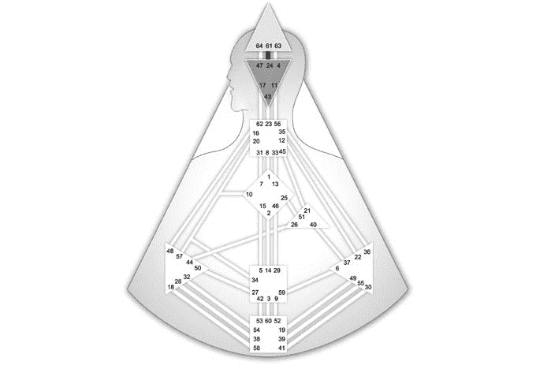

察觉的信道是从头脑中心神秘的闸门（61），链接至逻辑中心体悟的闸门（24）。个体人的心智能力，是由启发灵感的 61 号内在真理的闸门，与体悟的 24 号“回归”的闸门所组成。这条在脑袋层面的信道，带来的是瞬间觉知的体验，宛如顿悟。

**背景**：察觉的信道创造出独立自主的思考家。头脑中心理解未知的压力，需要透过逻辑中心，让概念成形为合理的答案。运用这个信道思考，并非为了探索，而是处理脑中的声音。当思考的过程中出现空白，新的思维可能在此时进入，于是产生突变的可能。在突变和顿悟的时刻来临之前，头脑会不断地反复思考，当突变发生，你在当下就知道。个体人的思考跟过去经验无关，也无法像抽象思考信道（64-47）那样，能以反思的方式呈现。它无法辨认既定的模式，也无法如逻辑思考信道（63-4）那样，基于衡量而预测未来。察觉信道的存在，是为了知道什么是可得知，并且是有价值的，什么又是可得知，却没有价值，同时了解到我们的设计就是无法了解全部的事物。（不可知）

**个人**：你头脑的设计是以独特的觉知，启发他人，并为大众提出潜在的可能，以一个全新的角度来看待人生。你脑中自发性所听到和知道的，与现实之外的事物链接。你带来突变的觉知，不但打破了旧有的抽象周期，也瓦解了诸多逻辑模式，以全新的领悟为我们带来启发。你无法控制自己的思想，也无法运用此思维在任何地方或得到任何东西。你只须明了，觉知会在该发生的时候发生，但突变可能会发生，也可能不会。当你的头脑被 61 号灵感的闸门，其静态的干扰声响与低频的噪声所占据，24 号闸门将在适当的时机，以突变的方式显现此刻命定的真理，而你必须臣服于此。你的头脑能真正链接神秘的事物。因为你的脑袋永远都忙着思考，所以你喜欢安静也需要安静。聆听或创作音乐，往往有助于抒发因不断思考所造成的压力。

**人际**：神秘之处在于，拥有 61-24 信道的个体无需“做”任何事情。灵感从一开始就在脑中，只需等待适当的时机被启动或邀请。当他们的心智接到邀请，就能将觉知聚焦，当沉浸在当下的意识中，新的思维，悄然诞生的想法，就会出现。觉知有其出现的时间点，拥有察觉信道的人，所要面临的挑战在于，捕捉那些看似虚无飘渺，却能激发个人内在潜能的真理或见解，并且向他人传达，什么是真正鼓舞人心且值得深思的洞见。他们的成功关键在于，能否区分出何谓可知与不可知，以及什么需要知道，什么又不是。

##### 61 号闸门：内在真理（中孚卦）－神秘的闸门

察觉普世运作的基本原则

中心：头脑／四等分：突变／主题：透过蜕变，达成目的

右角度交叉之马雅—并列交叉之思考—左角度交叉之朦胧

61 号闸门是一股压力，希望能知道、解开神秘，以及在完全被认得的特定时刻，带来启发。这样的觉知，使我们走向更深层的自我接纳。在那里，我们能够拥抱自己与他人的差异。你喜欢花时间沉思以及探索心灵层面的未知。当你“知道”自己具有独特的见解，并且愿意等待对的时机才表现，你会感到自由。当你的理解得以启蒙并激励他人，或引发他人蜕变，你会因此受到鼓舞。相较于社会人的头脑专注于过往所发生的，或预测未来可能发生的，你的脑中更渴望当下的静默，渴望所有的声音和对话都能够停止。如果你受限于强大的压力之下，让未知困扰着你，你的灵感可能会产生错觉，进而感到困惑，并使你陷入极大的不确定感和焦虑之中。其秘诀在于享受你的思维，让内心的觉知和真理，能在其独特时机自然显现。若没有 24 号闸门，你的设计并非解开奥秘，而是单纯享受奥秘本身。

*   第 6 爻—感染力
*   第 5 爻—影响力
*   第 4 爻—探究
*   第 3 爻—相互依存
*   第 2 爻—天生耀眼
*   第 1 爻—奥秘知识

##### 24 号闸门：回归（复卦）－体悟的闸门

自然的、自发性的蜕变及更新的过程

中心：逻辑／四等分：初始／主题：透过心智，达成目的

右角度交叉之四方之路—并列交叉之体悟—左角度交叉之轮回

24 号闸门的功用，在于将 61 号闸门独一无二的灵感，转换成合理的概念，并传达给他人。它会在同一个领域，不断反复着思量它认为能激励人心的想法，直到此想法完全成形。然而，你的头脑并不能按照灵感行动，也无法倚赖逻辑或运用过往的经验证明。这是一个自然的、自发性的蜕变过程，带来更新的思维与独特的觉知。前一刻，灵感还未成形，下一刻却能立即现身。为了充分发挥你的个体性头脑，享有其优势，你必须给自己足够的时间反复检阅、审视。这个过程包括一次又一次，不断观看和聆听某些东西。如果能让头脑自然机转与蜕变，不要试图控制它，答案往往会自动显现。你会在某个静默的片刻听见它，就像在夜深人静时，脑中一闪而过的顿悟。24 号闸门的恐惧来自于无知。当你无法确实知道，或者无法向他人说明你的觉知，就会为此焦虑。当你试着用头脑做决定，就会引发焦虑。少了 61 号闸门，你会陷入压力，而做出非自己的决定，于是不断寻求并解决下一个能启发灵感的奥秘。

*   第 6 爻—挑剔
*   第 5 爻—告白
*   第 4 爻—隐士
*   第 3 爻—上瘾者
*   第 2 爻—认可
*   第 1 爻—疏忽之罪

#### ▸ 架构的信道：43-23

个体性的设计（从天才到疯子）

回路：觉知／信道类型：投射

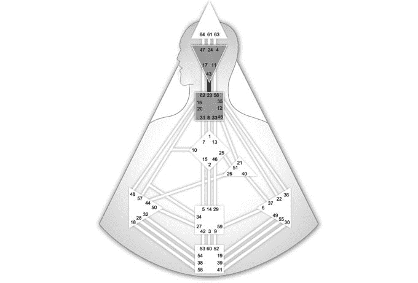

架构的信道透过洞见的闸门（43）及同化的闸门（23），串连逻辑中心到喉咙中心。43 号闸门承接了来自于 61-24 信道所带来的启发与觉察，在此自发性地突破，并产出洞见，透过 23 号闸门吸收，并表达出来。当新的观点及创新的思维，得以清楚地表达出来，并且被接受时，便能为这世界带来力量与革命性的改变。

**背景**：当头脑透过个体人信道连接到喉咙中心，是为了提高效能，而产生突变及质变的过程。架构的信道将概念具体成形，表达出独特且具原创性的观点，进而改变人们的看法与想法。举例来说，运用关键词（或关键字），就是超级有效的叙述方式。为了激发改变有效地产生，运用内在策略与权威非常重要。拥有这条信道的人，若没有等待适切的时机，那么就算他们完整地表达了独特的见解，也很难让其他人了解或感受到其价值。他们若能按照内在权威与策略而决定表达的时间点，那么，所有外在的心智权威，就会顺流而回应。

**个人**：你的挑战是放手而不再操控，让头脑所产生的想法，依自己的方式及时机去运作。你需要发展的能力是要能清楚并简捷地，解释自己所知道的。一旦你有此能力，别人便能认出你的才能，而你也才有机会传达独特的观点或天才型的想法。你无需事先准备，事实上你也没能力先想好自己要讲的话。要知道你的头脑为什么会说出这样的话，并为发言的时间点找出附加的意义，并不必要。你的头脑不只需要接受自己的见解，还要持续探究未知的领域。你这样的人，思维宛如飞越光年般前卫。你只需顺着自己独特的设计去生活，才能拥抱你的天才。当你确实遵循着自己的人生策略与内在权威，等待适当的时机，与他人分享自己的想法，你不但不会被当成疯子，更重要的是，你的个人觉知会扩散，并引发社会人或家族人有所突变。但是，当属于你的时机消失，你会缺乏存在感，或者感觉疏离，甚至有时会排拒自己独特的觉知。表达你的外在权威是一段过程。你需要花时间学习如何沟通自己创新的想法，因为人们不会轻易改变。你甚至需要多沟通几次，直到新的概念产生，你的天赋才能获得真正的肯定。

**人际**：架构信道的天赋是，具有发展技巧与理念的能力，用以提升效率。这样的头脑可以检视过去事情如何被执行，或现在正如何执行，接着，突然想到了一个更好更快的方法，可以达成同样的结果。这些创新的想法，将带来跳跃性的进展，进而让整体组织的效率，大幅提升，为求尽善尽美，到达全新的层次，并为世界带来智慧。为了忠实呈现其内在的觉知，拥有这条信道的人可能对其他人的意见，表现得充耳不闻。（请参阅 43 号闸门）。“**个体人的头脑总觉得自己像是站在门外的局外人，等待着邀请，好提出自己独特的觉知**。”——拉．乌卢．胡

##### 43 号闸门：突破（夬卦）－洞见的闸门

完善地创建新秩序，才能延续既有的成就

中心：逻辑／四等分：突变／主题：透过蜕变，达成目的

右角度交叉之解释—并列交叉之洞见—左角度交叉之奉献

43 号闸门代表的是内在的耳朵，只聆听自己独特的内在声音。透过自发性的突破，找到新的观点，它将合理的内在觉知，转化为个人的洞见。你所提出的观点没有事实佐证，但仍可被清楚的论述，虽然这些论点乍听之下，可能很可笑，并且完全超乎社会人及家族人所认知的范围。但只要在对的时机，你是有能力可以在智识上，将这个独特并且能引发突变的觉察，塑造成形。当概念完整以后，必须透过位在喉咙中心的 23 号闸门，让潜藏的突变得以发生，这可能是一个前所未有，全新的观点。对你来说，最困难的莫过于倾听，或真正用心聆听别人所说的话。这不是你的错，也不需要修正，这一切只因你与生俱来的遗传因子，为了避免过度被外界影响，所产生的自我保护作用。43 号闸门恐惧被拒绝。特别是在当你无法解释自己的想法，或者担心太过怪异，而遭受拒绝，你可能在脑中会感觉焦虑。因此，若缺少了 23 号闸门，如何表达出自己的突破，就成为你的难题。

*   第 6 爻—突破
*   第 5 爻—发展
*   第 4 爻—死脑筋
*   第 3 爻—权宜
*   第 2 爻—奉献
*   第 1 爻—耐性

##### 23 号闸门：裂开（剥卦）－同化的闸门

超越道德。察觉与认知，得以接纳多元性

中心：喉咙／四等分：文明／主题：透过形式，达成目的

右角度交叉之解释—并列交叉之同化—左角度交叉之奉献

23 号闸门将内在的觉知，翻译成语言的方式来表达。它超越道德，接纳多元性，有能力穿越精神层面的容忍度，为这世界打开了突变的可能性。透过同化闸门所表达的，可以引发我们产生新的想法。在此，你终于可以透过独特的声音，说出“我知道”。不管你知道或不知道，你所表达出来的一切，总会吸引别人的注意力，同时也让你身处在外向内看。那些可能很不同，即将带来蜕变的洞见，需要你清楚地将其精髓沟通出来。若你独特的见解，对别人来说真有其价值，你必须等到对的时机再说，同时以简单清楚、可以被理解的方式来表达。要不然你可能会被误解成疯子或怪物。此外，还有一个重点是，你只能讲自己真正知道的事。假以时日，大家会认出你的天才之处，而你也会得到他人的肯定。若缺少了 43 号闸门概念化的过程，你会对自己可能无法清楚传达，备感焦虑，进而被误解或拒绝。

*   第 6 爻—融合
*   第 5 爻—同化
*   第 4 爻—分裂
*   第 3 爻—个体性
*   第 2 爻—自卫
*   第 1 爻—传教

#### ▸ 困顿挣扎的信道：38-28

顽固的设计

回路：觉知／信道类型：投射

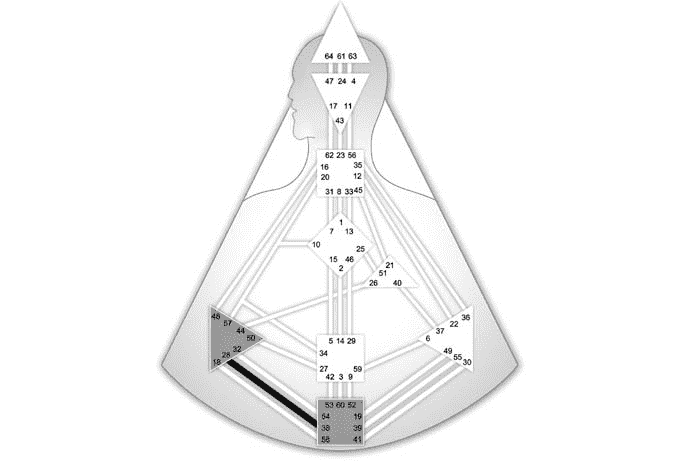

困顿挣扎的信道，链接位于根部中心战士闸门（38），与直觉中心玩家闸门（28）。这条信道代表着，寻找生命的目的和意义，为此挣扎，以及在生命的困顿中，找出意义与目的的能力。28 号闸门能察觉到这挣扎是否适当，并且分辨什么才有价值，值得为之而奋战。38 号闸门所产生的压力，是为了保存个体人的诚信与操守——对于会让人偏离内在真实的外力，奋以抗之。

**背景**：38-28 信道所带来的体认，使得智人得以超越其始祖。也就是说，人生除了活着之外，还有更多。由于根部中心的动能带来刺激，这条信道其设计中有能力可以寻求与找到目的，只要能对生存赋予意义，就会选择投入，不论过程会有多艰辛。知道如何挣扎，以及要挣扎什么，对个体化的过程而言，非常重要。

**个人**：就算成功机率微乎其微，你也会秉持顽强的决心，坚持自己的人生道路，在自己独特的路途中，一路挣扎，从中发掘其目的和意义。若正确运用，那么不管是义无反顾，顽强对抗、冒着失去安全感的风险，又或者为你认定是值得的原因而奋战，都能为你带来前所未有的满足感，并且有益健康。挣扎的形式赋予你人生的意义，而你独特的奋斗过程会成为激励他人、指引他人的典范，鼓舞他们开始有所挣扎，渴望步上属于个人的历程，并追求更深层的人生意义。这对你而言，并不见得舒服，别人也有可能感到不以为然，所以，与其让你的头脑选择，你需要运用策略和权威，来选择属于自己的战役，才能挣扎得有价值。一旦你无法完整说明，或正确地体现你所投入的挣扎，内在会累积压力，在身体层面制造出过多的能量，规律的运动能帮助你释放压力。运动不只有助生理上的健康，也能让你与清晰的直觉相链接。

**人际**：信道 38-28 是一股驱动突变发生的动力，迫使个体将其独特性表达至极致。拥有这条信道的人，执意聆听自己在当下的察觉，以改变方向的方式扭转现状，带来突变。虽然要说服人们，进化是一段永续且值得挣扎的过程，本身就是一场硬战，但挣扎的信道本身也是顽固的信道，能借由肾上腺素所产生的能量和决心，将个人的生命发挥得淋漓尽致。

#### ▸ 闸门 38：对抗（睽卦）－战士的闸门

反抗有害势力，保存个体独特个性的能力

中心：根部／四等分：突变／主题：透过蜕变，达成目的

右角度交叉之张力—并列交叉之对抗—左角度交叉之个人主义

38 号闸门的特质，在于发现自己生命的价值，虽然这对自己和周围的人带来压力。存在必须要有理由、有目的、有其所热爱，为此挣扎会升华，不仅为了求存而已。以这股蕴藏反抗的动力为后盾，面对困境，你拥有强大的能力，甚至可以说，你热爱来场奋战。只要对你来说是正确的，当你挺身而出，为那些无法替自己站出立场的人而发声，生命的目的会更加彰显。别人会体验到你整个人的能量，散发出激烈的独立性，面对挑战时，异常专注执着，就算会死，也会正面迎击。事实上，你只是单纯得找到一个活下去的理由。你的决心与坚持将激励更多人，让他们得以分辨自身的挣扎有无价值。知道什么值得去奋斗，才不会将精力浪费在不正确的战役中。你会希望 28 号闸门带来察觉的潜能，人类图体系中，总共有三个充耳不闻的聋子闸门，而 38 号闸门便属其中之一，这作用是为了保存其完整的个体性，不被别人所影响。面对需要妥协的外在势力，你会起而抗之，如此一来，才能保有完整的个体独立性。

*   第 6 爻—误解
*   第 5 爻—疏离
*   第 4 爻—调查
*   第 3 爻—结盟
*   第 2 爻—彬彬有礼
*   第 1 爻—条件

#### ▸ 闸门 28：伟大（大过卦）－玩家的闸门

短暂的力量与影响力

中心：直觉／四等分：二元性／主题：透过人际链接，达成目的

右角度交叉之不预期—并列交叉之风险—左角度交叉之校准

28 号闸门最深层的恐惧在于：在自己找到此生值得存活的原因与意义之前，生命已嘎然而止。这是一股顽固的能量，专注并带着觉察去聆听，拥有最准确的直觉，得知自己要冒什么样的险，才会更有活着的感觉，才能经由挣扎，为存在找到目的。你拥有稳定运作的直觉意识，让你对危险有所警觉，你愿意冒一般人不愿意冒的险，就算这场游戏攸关生死，最终你将自发性地开始面对自己死亡的恐惧。你所具备的能量，能够重新引导拥有 57-20 信道的人，刺激他们从原本的自我中心，转变成可以让你，或让更多的人运用其直觉的洞见。你所拥有的察觉力，能协助 38 号闸门的人决定将一己之力投资于何人或何处，让他们能够更健康也更安全地运用自己的心力，为值得的人事物而奋战。若没有 38 号闸门的存在，你很容易成为受害者，承接不必要的压力，莫名掉入奋斗或挣扎的状态。你需要具有 38 号闸门的人，透过他们在生命中探索何谓有价值的挣扎，为你提供线索。

*   第 6 爻—荣耀之光
*   第 5 爻—背叛
*   第 4 爻—坚持
*   第 3 爻—冒险主义
*   第 2 爻—与魔鬼握手
*   第 1 爻—准备

#### ▸ 脑波的信道：57-20

渗透性的觉知的设计

回路：觉知 信道类型：投射

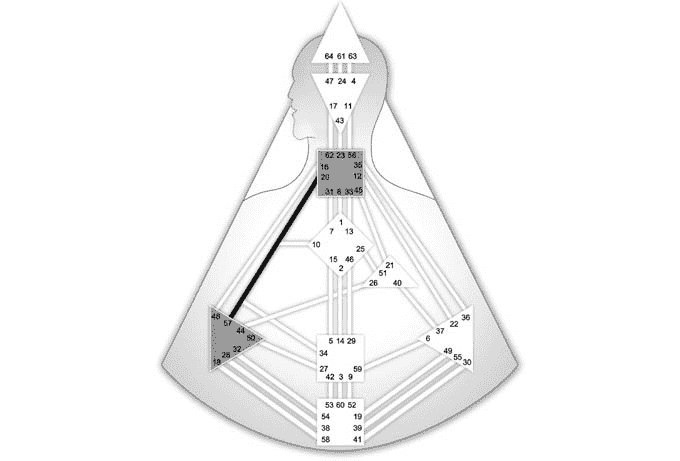

脑波信道透过直觉的清晰（57 号闸门）和当下（20 号闸门），链接直觉中心和喉咙中心。它能在当下清楚传达直觉的洞察力。人类最非凡的能力之一就是透过这条信道来表达“现在，我知道我活着”，这是深入的自我觉知，阐述我们存在的真实。

**背景**：在 57-20 信道中，来自直觉中心的直觉，在当下以一种急于沟通的频率，直达喉咙中心。这属于个人的洞见，源自人类长远的原始本能所蕴含的聪明与智慧，同时链接实时的直觉性觉知。这条脑波信道最奥妙的功能是可以激励更多人，让他们对自己与生俱来的生存智慧，有所觉醒。直觉中心是攸关身心健康的核心，并非能量的来源，不见得能落实成行动，而是当我们可以意识到直觉，同时能将有益健康的策略，明确沟通出来。

**个人**：生命际遇将引导你善用自己的直觉，在每个当下因此获益，为真实发声，说出每一刻属于自己的真实。“我是我，我知道如何做自己。”本着内在的觉知，引导出敏锐的振动频率与以听觉为主的觉知，你常会发现自己于当下的直觉，随兴突然说出口的话，会比周围的人更快速地，直指情境中的真实核心。这就是所谓的思虑敏捷，如同拥有七步成诗的能力。你带来蜕变的可能性，如果在正确的时机发言，就能深刻地影响周围的人。你能灵活地接收别人的状态，只要回到内在权威与策略，才能减少无谓的误解与抗拒，让你生来俱足，让关于存在的觉知有机会转化为智慧，与众人分享。

当你呈现最佳状态，坚定活在当下，你就能与内在的求存能力相链接。从这个观点来看，对明天无所畏惧。你不加思索便能知道该怎么做。你的直觉与身体融合为一股能量，频率合拍。若要链接脑波信道蕴含的适应力，需要时时刻刻克服对未知的恐惧，学会聆听、行动，并且完全信任在当下所闪过的直觉。如果你忽略当下本能的觉知，瞬间的觉醒会一闪而过，你也可能因此而受苦。请将能穿透当下，有所觉知的能力极大化，然而，这也代表着你需要将注意力，专注在每一个当下，如此一来，要同时也听见别人的“觉知”，就变得很困难。从另一个层面来说，你并不喜欢别人告诉你该怎么做。

**人际**：57 号闸门有利于 28 号闸门，28 号闸门带着恐惧与质疑的态度，挣扎于生命是否有其意义，总能吸引 57 号闸门的注意力，将 57 号闸门从独善其身的状态中拉出来。这股找寻生命意义的精神，能刺激 57 号闸门不再挣扎，不再对自己随兴的言语与行动而感到不确定，为了找到 28 号闸门所寻求的答案，他们便才能将其直觉的觉知与真实，真正传递出来。若遇到正确的时间点，具有 57-20 信道的人将引发改变，足以带来突变。

##### 57 号闸门：温和（巽卦）－直觉洞察力的闸门

非凡清晰的力量

中心：直觉／四等分：二元性／主题：透过人际链接，达成目的

右角度交叉之渗透—并列交叉之直觉—左角度交叉之号角

因为拥有清晰的直觉洞察力，57 号闸门具有当下透视核心的能力。底层能与声音共振，让他们能持续地对来自外在环境，不论是身体、情绪及心灵层面的振动频率，保持警觉。你的直觉时时刻刻都能敏锐察觉，哪些对你来说是安全、健康或是好的，而哪些不是。57 号闸门代表右耳。如果你想知道对方真正想传递的言语，请善用本能，以右耳倾听。你必须警醒并专注于当下，才能听清楚直觉中心传达给你的讯息，否则你可能会忽略了，与生存息息相关的信息。有时候在别人眼中，你像聋了一样，或是备受责备，认为你只是选择性地听取别人的话，但你的直觉是你唯一的导引，让它来决定哪些行为对你是好的。降低对未来恐惧的唯一方法，就是专注于你那出于本能的直觉、倾听那只说一次的微小声音，并根据直觉，立刻采取行动。当你在当下专注聆听自己的直觉，没有明天，又有何惧。

*   第 6 爻—使用
*   第 5 爻—进展
*   第 4 爻—指导者
*   第 3 爻—敏锐
*   第 2 爻—净化
*   第 1 爻—困惑

##### 20 号闸门：注视（观卦）－当下的闸门

当下的识别与觉察，将理解转化为适切的行动

中心：喉咙／四等分：文明／主题：透过形式，达成目的

右角度交叉之沉睡的凤凰—并列交叉之当下—左角度交叉之二元性

20 号闸门是纯然存在的闸门，使你专注于当下，支持你发挥能力，得以自己的方式生存。当你在适切的时间点表达，你的觉察将转化为足以影响周遭人们的文字或行动。这样的能量频率是——而且必须是——完全在当下展现。它可以为 57 号闸门发声、说出充满求存意识的直觉，给予 10 号闸门的行为模式，承诺于更高的原则，或是采取行动，往个体化的方向迈进，进而显现 34 号闸门荐骨的力量。20 号闸门展现的是，存在于当下的全然面貌，从“我现在是……”到“我知道自己正在做什么”，但并不考虑过去或未来。是觉醒并觉知的，才得以求存，你必须完全在此刻活在当下，表里一致做自己。你没时间以脑袋来考量，或控制内心会冒出什么样的想法，你所说或所做的一切就是突然出现在所有人（包括你自己）眼前。事实上，即使没有亲眼所见，你也能看见，没有耳闻，依然能听见。这就是在每个当下，你的存在本身，所蕴藏的进化潜能。当你依循人生策略和内在权威生活时，将会活出典范。你的直觉认知、个人生存和突变、爱自己的行为将会影响并为他人带来力量。

*   第 6 爻—智慧
*   第 5 爻—现实主义
*   第 4 爻—应用
*   第 3 爻—自我觉知
*   第 2 爻—独断者
*   第 1 爻—表面化

#### ▸ 情绪的信道：39-55

多愁善感的设计

回路：觉知／信道类型：投射

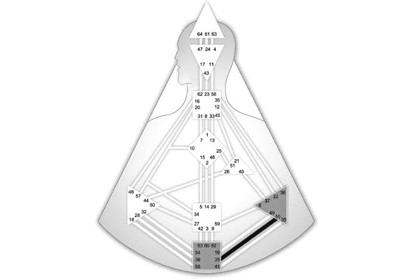

情绪的信道透过代表挑衅的闸门（39），及精神的闸门（55），链接根部中心及情绪中心。容易陷入多愁善感、易变、挑衅及情绪化的状态。突如其来，上下脉冲的情绪波，底层是个体人情绪机制里的热情与忧郁，在快乐与悲伤中，无尽的循环。

**背景**：情绪的信道其定义为，由挑衅的方式，引发精神意识层面的觉醒。在二〇二七年来临之前，我们都会被这条情绪化的信道所影响，席卷全球的会是一股深远的创造力，带来突变。如何诠释情绪化，个体人的情绪波并非风平浪静，而是在高点与低点的尖峰之间移转，有其狂喜的愉悦片刻，也有令人感到不舒服、不确定与悲伤的忧郁时光。基于原本的设计，我们并不需要为任何情绪化找理由，而是活在这宛如炼金术般，带来突变脉动的瞬间。表里一致地活着，完全怀抱情绪周期的波动，有这条信道的人能深入探究其灵魂与真实的深度。“**真实的灵性将自正确中扬升**”—**拉．乌卢．胡**。当一个人能看见杯子里头，一半空一半满，同时是空也是满，就能在灵性上回归平衡。

**个人**：如何梳理与辨别某个人或某团体的精神，透过你与他们的互动，谁的精神或情感可以与你共振，你就能知道谁对你来说是对的人。这也能让你从别人身上，得到你想要的，或你所需要的，你被引发的情绪可以是愉悦而非痛苦，喜悦而非悲伤。假以时日，你将学会如何挑动并引发他人，激发其内在所渴望的精神，然后找到那些对你来说正确的人。同时，你的挑衅，也感染了更多人，身为个体人的突变特性会发挥其影响力，于是也将引发众人身上全新的可能。你的影响力，你所激发出来的精神，取决于你的情绪，或你所处的情绪波。你的情绪必定得是对的，才能带出对的精神。不要当自己情绪的受害者，也不应该让别人因为你的情绪而成为受害者。若了解人生中的每件事，都有其正确的时间点，也有其应当的情绪，你便能被眷顾。如果不想与人互动，就享受独处的时光，与内在的灵感作伴。花时间与自己同在，能让你链接熟成的情绪，其中所带来的创造力、深度与真实，都属于你，你能把这一切带到这世界上来。

**人际**：当拥有这条情绪信道的人，随着察觉力提升，愈来愈能表里一致，就能让自己自在去体验全部的情绪，以及情绪所带来的冲击。他们便能减轻在关系中潜在的情绪张力。对个体人来说，若情绪不对，就不该做爱、进食、工作或玩乐。如果明明情绪不对，还强迫自己去做，不但无法体验到原本想追求的愉悦，还会大幅减弱他们原本能发挥的影响力，而无法激励更多人在精神层面活出热情。若能真诚活出情感的深度，就能透过音乐与艺术、在舞台上的表演，这也包括人生的舞台，转化为动人的温暖，或者充满激情的忧伤。如果以不健康的方式来呈现，喜怒无常就成为操控的方式，同时沉迷于欢愉，于是 39-55 这条信道的人可能带着忧郁而转向性、食物或药物，以寻求慰藉。

##### 39 号闸门：阻碍（蹇卦）－挑衅的闸门

阻力的价值就在于引发分析、评估及重新评价

中心：根部／四等分：文明／主题：透过形式，达成目的

右角度交叉之张力—并列交叉之挑衅—左角度交叉之个人主义

39 号闸门的燃料来自根部中心，这是一股挑衅的张力，使情绪的察觉力在精神上进化，进而揭露。情绪的察觉是人类注定要达成的目的，这是个体人经由 39 号闸门，挑动 55 号闸门里所蕴藏的突变潜能，将情绪中心的灵性获得释放。透过情绪，意识到心灵，你会有坚持下去的能量。透过挑衅，将揭露出谁才能在精神上与你相契合。如果他们被激怒了，对你而言，他们就不是对的人。面对你的挑衅，人们可能会产生负面的反应，但这就是你独特的天赋，你得训练自己脸皮厚一些。借由挑衅的方式，也是你碰触与学习自我情绪的过程，如果你心情不好，容易引发旁人的悲苦面。需要花时间学习，才能知道谁可以成功被引发，谁不行，只有在精神或心情好的时候，才能够影响群体或家族，真正引发突变。突变具有传染性，是经由整体来推动察觉的潜能。39 号闸门属于三个充耳不闻的闸门之一，其设计不容易受到外来的影响，若缺乏 55 号闸门带来释放情绪的能力，来自根部的压力可能会让你产生过度的行为，像是药物漤用或是饮食失调。在这条走向灵性的旅程上，请对自己与情绪周期多些耐性。

*   第 6 爻—解决麻烦者
*   第 5 爻—专心致志
*   第 4 爻—节制
*   第 3 爻—责任
*   第 2 爻— 对抗
*   第 1 爻—脱离

##### 55 号闸门：丰盛（丰卦）－精神的闸门

丰盛纯粹是心灵层面的问题

中心：情绪／四等分：初始／主题：透过心智，达成目的

右角度交叉之沉睡的凤凰—并列交叉之情绪—左角度交叉之灵魂

精神意识并非概念（来自逻辑中心）或直觉（来自直觉中心），而是感受（来自情绪中心）。丰富是精神上的感知，你如何感受，以及在当下你对情绪的体验。55 号闸门很易感，容易受情绪周期的忧郁所影响，经常在希望与痛苦中循环。你像一只杯子，这一刻觉得有一半是空的，下一刻又觉得有一半是满的，你的心情在不同时间点，会决定何者才是正确。如果没有心情吃饭、工作、做爱、社交或创作，却勉强自己去做，这是不健康的行为。若你想独处，无须解释或找理由，只要单纯尊重自己的感受，拥抱当下，接受深具创造力的自己。最深刻忧郁的时候，也是最具创意的时刻。当你无心社交，如实告诉周围的人，他们才不会对你的情绪能量妄加揣测，莫名对号入座。你能接受 39 号闸门带来挑衅，这让你感受到自己。不管情绪如何起伏，任何感觉与情绪，都无须比较、争辩或被外人所影响。杯子一直存在，而精神上的察觉宛如奇迹般升起。你最恐惧的是情绪上的空虚感，或缺乏对人生的热情。

*   第 6 爻—自私
*   第 5 爻—成长
*   第 4 爻—同化
*   第 3 爻—无罪
*   第 2 爻—怀疑
*   第 1 爻—合作

#### ▸ 开放的信道：22-12

社交人的设计

回路：觉知／信道类型：显示

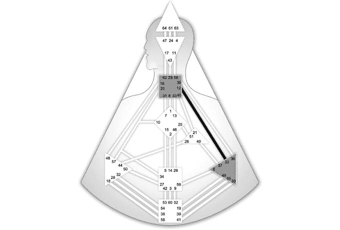

开放的信道透过开放的闸门（22）及谨慎的闸门（12），链接情绪中心与喉咙中心。22-12 信道的开放性，取决于心情或情绪周期波的高低起伏。由个体人的情绪周期转折，所有的心情变化、多愁善感，热情、浪漫与戏剧化，衍生出充满创意的声音或行为。12 号闸门会约束 22 号闸门的开放性，让社交层面仅限于与具备突变潜能的人有所互动。

**背景**：在 85000 年前，喉咙（12 号闸门）产生突变，为言语发音的本质带来了奇迹般的进展。这让人类不仅能沟通彼此的智慧，同时也能以声音中的各种声调，在情感层面上影响他人。这是个体人回路中的社交信道，这条开放的信道，源头来自于“当我感觉对”（情绪波），其焦点并不在于社交或友善。个体人通常对于亲密（家族）或分享（社会集体）没太大兴趣，他们只想创造一种特定的环境，愿意接受他们的潜能，为家族及社会群体带来蜕变性的全新觉知。对于拥有这条显示信道的人来说，关键在于等待，等到自己真正想与人互动，若在情绪低潮时，勉强自己与人社交，容易引发误解，感到生气或突兀，如此一来，也就无法激励他人。如果不断重复失败的社交经验，可能会导致反社交的行为，并变得孤僻。

**个人**：你懂得抓对时机，察觉观众的开放状态，知道何时展现热情与社交技巧，吸引众人的注意力，贴近他们，将言语化为催化剂，让他们渴望自己的人生有所改变。你擅长以抑扬顿挫的声调来感动人，碰触其内心，进而教化、带来突变与完成沟通的目的。若你在对的时机点真情流露，透过公开演说、表演、诗歌或音乐等媒介，你就能引发更多人对爱感同身受，完整体验其中的每一种情绪。情绪中心是你的内在权威，所以切记莫冲动行事，培养耐心仔细衡量，当你愈能聆听自己的情绪波，就愈能体验这感受所带来的创意，有其深度，而这也会决定你身为个体人，能为这个世界带来多大的影响，是否能引发突变发生。

**人际**：个体人天生与众不同，因此很容易吸引注意力。而其结果通常是，他们也很矛盾，恐惧活在镁光灯下，害怕自己的独特性会被视为异类，被他人排斥。22 号闸门以左耳倾听，这些个体人只听自己想听的。若要他们了解全貌，必须重复说好几次，让他们听上好几遍。当他们有心情听的时候，能真正的听见别人想说的话，可以是真正的聆听者。当他们以自己的情绪为准则，来决定自己社交的方式，障碍消弭了，而他们的恐惧也不见了。若社会的环境是开放的，当下一切皆俱足，那么个体人的神奇之处，如突变般的不同，就能够发挥得淋漓尽致。

##### 22 号闸门：优雅（贲卦）－开放的闸门

在处理世俗琐事时，展现出极具质感的行为

中心：情绪／四等分：初始／主题：透过心智，达成目的

右角度交叉之解释—并列交叉之洞见—左角度交叉之奉献

22 号闸门若是情绪对了，就能透过聆听，以优雅又迷人的特质，对别人散发强烈的吸引力，在情绪层面具有打动别人的潜能。然而，当心情改变了，你会体验到自己戏剧化的反差，甚至揭露出完全不愿社交的那一面。请顺应自己的情绪波，体验内在的深度，经历一段时间后，你会明白自己在情绪上独特的觉察力。若能让自身的深度或真实逐步酝酿，随着岁月逝去，益发醇厚，与自己极具创意的灵感长相左右，就能有更纯熟的能力，足以判断何时才是正确的时机，何时这个社会才真正准备好了，可以听得见你，如实传递自身的真实。唯有尊重你的情绪摆荡，才能认出对的时间点，并且采取行动。你愿意为他人而开放，接受必要的新知，是恩典也是天赋，甚至可以影响陌生人。当你先聆听，完整听完别人要说的话，再自然地表达自己的意见，举止优雅是关键，能让你更有力量。事实上，善用社交聆听的能力，是你的责任与特权，如此一来你就能为别人带来改变。若没有 12 号闸门，你可能懂得自己的感受，却无法真正说出口。而沉默让你紧张，你最怕的就是再也没有任何事，值得你聆听。

*   第 6 爻—成熟
*   第 5 爻—直接
*   第 4 爻—灵敏度
*   第 3 爻—魔法师
*   第 2 爻—礼仪学校
*   第 1 爻—次等舱

##### 12 号闸门：静止不动（否卦）－谨慎的闸门

克制的本质、沉思的重要性，以及面对诱惑时不为所动

中心：喉咙／四等分：文明／主题：透过形式，达成目的

右角度交叉之伊甸园—并列交叉之发音—左角度交叉之教育

个体人的语言、充满变化与情绪化的表达方式，在此闸门谨慎的本质下有所局限。谨慎会让你保持沉默，直到感觉对了，你的情绪会让你明白自己是否真的想说，能否以独特且具变革性的方式来传达。你的声调，其振动频率与语气，远比你所选择的字眼，更具煽动力。静止不动，或沉默思考自己独特的观点或感觉，静待感觉对了，再以创意的方式表达，透过诗句或音乐的形式，让你想传达的讯息，有充足的时间得以熟成。你对别人产生巨大的影响力，像是表演者对群众所造成的渲染力，你能演绎并以创意的方式，表达出生命与爱的快乐与忧伤，然后离开。如果你处于不对的情绪之下，观众无法听见你想传递的讯息，无法体验蜕变，互动时也无法收到你所带来的启发。唯有在正确的时机点，才能让你对社会／文化规范的影响极大化，改变我们在这世界上的互动模式。你知道如何表达自己，但是若缺少了 22 号闸门，你会无法厘清自己的感觉。

*   第 6 爻—质变
*   第 5 爻—实用主义者
*   第 4 爻—先知
*   第 3 爻—自白
*   第 2 爻—净化
*   第 1 爻—修道士、僧侣

1.  组织能量对回路中的每一条信道，以及整体设计发挥强大的影响力。在根部与荐骨中心之间，不断运作的组织能量，有三条信道：53-42（社会人/抽象）、60-3（个体人）及 52-9（社会人／逻辑）。家族人回路中则没有所谓的组织能量。 
2.  在荐骨及 G 中心之间有三条谭崔信道（Tantric channels，5-15，14-2，29-46），让荐骨中心丰沛的力量，得以与 G 中心的自我定位、方向与高我的爱相互链接。 

### 中央回路

关键字：赋予他人力量

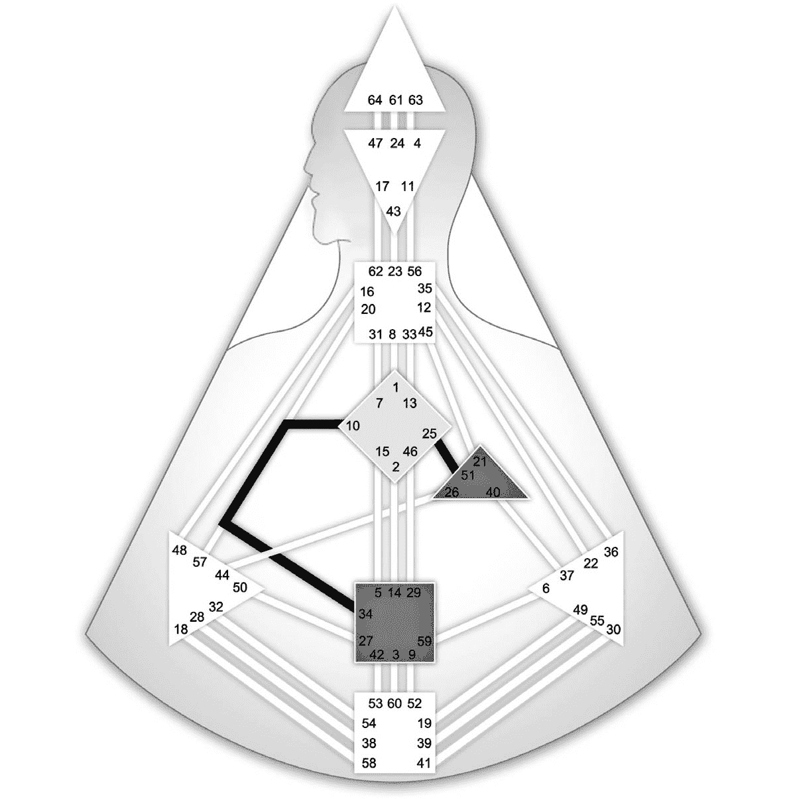

**信道：**

34-10：探索的信道　遵从自己的信念

51-25：发起的信道　想要成为第一人

人体图中有两个较小却重要的次要回路，中央回路就是其中之一。34-10 信道转化我们在这世界上的生活方式，而另一端的 51-25 信道，则让我们利用世界的方式，有所转变。中央回路位于 G 中心，代表自我的定位与方向，焦点在于激励众人爱自己，当他们遵循荐骨的回应过生活，就能走上自己独特的人生道路。只需做对自己来说正确的事，就能带来启发，激励别人也开始做自己。

内在健康且表里一致的人，能对其周围的人带来启发，朝健康的方面迈进。唯有回归中心，并且整合自我的人生典范，才能为社会群体与家族带来蜕变。若突变在此并未持续进行着，那么任何层级皆无法进化。对于那些拥有中央回路信道的人，若无法成为一股力量，对别人的行为带来健康的改变，便常会陷入忧郁与孤单之中。然而，倘若他们能坚定遵照策略，落实自己独特的设计，就能奥妙地成为激励人心的典范，展现何谓爱自己、何谓彻底展现其个体性，同时表里一致地过生活。

你将发现此回路并未链接任何觉察中心，也没有链接头脑、喉咙或根部中心。这个回路完全是关于回归中心点，如同回应生命。

接下来将会探讨中央回路里的信道和闸门。

#### ▸ 探索的信道：34-10

遵从自己的信念的设计

回路：中心（创造力的信道）／信道类型：生产

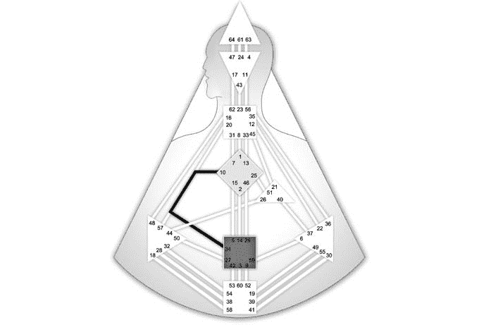

探索的信道透过力量的闸门（34）和自我行为的闸门（10），链接荐骨中心与 G 中心。10 号闸门是行为（像是角色）的开端，以深层内在为起点，引领我们接受、尊重与爱自己。34 号闸门则提供稳定的力量或内在实力，支持我们用来建构信念与自我接纳的准则，34 号闸门是纯粹的力量，用以自我激励与促进个体化的过程。唯有透过荐骨的回应，才能正确与人互动。

**背景**：34-10 信道提供动力，驱动我们去探索，促使个人的行为臻于完美，得以在社会中求存。拥有 34-10 信道的人，生来要爱自己，遵循荐骨的引导与个人的内在权威，明确信任其内在的准则。这里是中央回路里的创造力信道，它的影响力遍及其它所有回路。但是我们无法强加这股能量在他人身上，必须遵循个人所认定的准则，以专注的创造力，持续回归其中心。如此专注力，将引领他们到达大师的境界，甚至能鼓舞那些具有强烈家族特质的人，让他们与爱链接，为自己感到光荣，尽管家族人总会以爱与服务社群，为优先考量。

**个人**：你此生要遵循自己的准则，不论这看来有多不寻常，都要独立去做你想做的，无视任何阻碍。遵照荐骨回应的指引与时机点，就有可能能让你不带愧疚，心满意足放手去做。表里一致去生活，别人便能透过你的展现看到，何谓趋近完美地爱自己，并为此获益，何谓透过回应在行为上互动，从中所产生的好处。这会激励更多人，开始重新爱自己，也以此为准则。拥有生产者覆盖式的能量场，加上这条探索的信道，会吸引大量的注意力。先不论这注意力正面与否，这是个体人独有，所蕴藏的巨大潜能，若你有耐性，愿意根据自己的回应来调整，就能够赋予更多人力量，也将带来突变的可能。但当你反其道而行，你还有你周围的人会很快了解到，这条信道显露出的非自己模样，僵化，不满足，并且听起来自私与自我中心：“不管你喜不喜欢，我就是要这样，你想怎样都好，就是别管我，别挡住我的路。”

**人际**：中央回路的设计是，与人互动时，基于对自己的爱，鼓励独立自主，自力更生，而探索信道所诠释的世界观，就是个体人最想要的生活方式，那会是一个人人都能活出其独特性，无须抗争，也无须理会别人的干预。若是两个人相互引发火花，让这条信道在这段关系中接通了，那么个体人的风格，就会被带进这段关系之中，他们可能会打破旧有或传统的模式，探索全新的领域。若具有强烈社会人或家族人特质的人，彼此产生火花，以这样的信道相结合，却不了解回应的力量，那么这段关系接下来，将面临无法预知的挑战。

##### 34 号闸门：强大的能量（大壮卦）－力量的闸门

当力量被展现及运用在共同利益上，才会显现其伟大

中心：荐骨／四等分：突变／主题：透过蜕变，达成目的

右角度交叉之沉睡的凤凰—并列交叉之力量—左角度交叉之二元性

34 号闸门是强而有力的能量来源，让我们朝个体化发展，并且在这个世界上展现我们的独特之处。34 号闸门具备两种特质，让此闸门与荐骨其他八个闸门截然不同：无性别之分，以及力量无法为他人所用。如果与 G 中心的 10 号闸门相连，这股能量会展现在社交行为，或扮演支持你强烈信念的角色。如果与位于喉咙中心的 20 号闸门相连，你的力量将完全施展在自己的行为之上，将想法立即转化为行动，旺盛的实践力会带来繁荣与兴盛。如果与直觉中心的 57 号闸门链接，你的直觉将赋与你聆听的能力，让你听见在每个当下如何完美存活的方式。若缺乏直觉中心的直觉来引导，这股连续不断想采取行动的力量，可能会变得不健康、多管闲事以及呈现误导的状态，你会感觉自己失去动能，耗尽力气却无人受惠。即使受人钦佩，甚至受欢迎，你的能量就是无法被别人所用。你必须维持力量的纯粹，善用这股力量去寻求自己的独立与独特、贯彻自我信念、获取胜利，而也是你的求存之道。

*   第 6 爻—常识
*   第 5 爻— 歼灭
*   第 4 爻—胜利
*   第 3 爻—男子气概
*   第 2 爻—气势
*   第 1 爻—霸凌

##### 10 号闸门：前进（履卦）－自我行为的闸门

行为的基本守则，无入而不自得，确保互动成功

中心：G／四等分：突变／主题：透过蜕变，达成目的

右角度交叉之爱之船—并列交叉之行为—左角度交叉之预防

10 号闸门是 G 中心里最复杂的闸门，也是轮回交叉爱之船的四个闸门之一。这是爱自己的闸门。六个潜在自我行为或角色（如下述）受到 57 号闸门的直觉导引、荐骨中心 34 号闸门赋予力量，并透过 20 号闸门来显现或表达。在这些角色的架构下，人类正在探索何谓以九大中心的方式来生活、带来觉醒的潜能，形塑自我意识，并且体验何谓真正爱自己。顺应你的人生策略和内在权威，10 号闸门让你发挥潜能，臣服于真实的自己。当你了解、接受并爱自己所具备的特质时，你也将引导别人爱他们自己。真正的觉醒并不是要成为某样东西，而是成为你自己。10 号闸门非常重视爱自己、接纳自我，并将为人类如何进化、迈入二十一世纪产生深刻的影响。你将认知到觉醒，必须先接受自己。当你以自我觉察的方式，拥抱探索生命带来的荣耀和喜悦，将会激发大家的按照真正的潜能过生活，在当下觉醒。

*   第 6 爻—人生典范
*   第 5 爻—异端者
*   第 4 爻—机会主义者
*   第 3 爻—烈士
*   第 2 爻—隐士
*   第 1 爻—谦逊

#### ▸ 发起的信道：51-25

想要成为第一人的设计

回路：中央／信道类型：投射

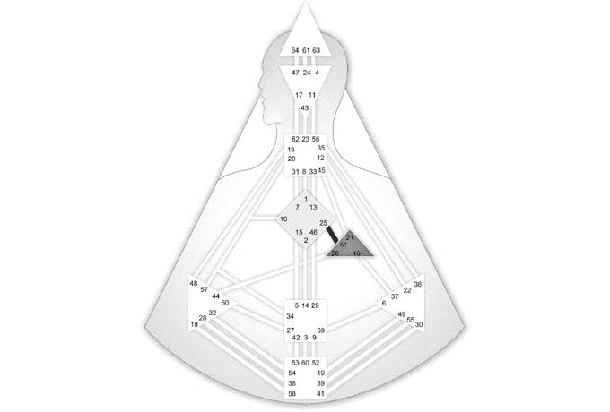

发起的信道链接 G 中心的自我精神的闸门（25）与意志力中心的冲击闸门（51）。51 号闸门好竞争，需要成为第一的能量，充满我执，连接至 25 号闸门，是宇宙之爱，有能力等同高我，不论是否有其生命，都能去爱、去欣赏万物平等。

**背景**：在 51-25 信道，发起是一门艺术。这条信道的能力在于，辨识出一个人是否具备发挥其个性的潜能，于是，当获得邀请时，便能提供“惊吓”以启迪别人，激励他们往前。竞争的本性，在此自然流露，挑战人们往前走，成为第一或赢得胜利，就此也转换了我们所活着的物质世界。这条信道是意志力回路（Ego Circuit）里唯一不属于家族回路的信道，它代表家族人与个体人之间的紧密链接，中央回路里的 34-10 信道和 51-25 信道都是强大的突变力量，能对人性施加压力，使其在意识层次持续进化，更加深入而逐渐成形。控制自己与控制外界，携手并进。

**个人**：你生性好强、好胜，而你好胜的个性也可能因此激发他人的竞争心理。若是正确的开始，一旦你参与竞赛、测验，就会竭尽全力前进，超越原有的创意极限，甚至克服体能上的障碍，每次突破都令你大为振奋，并且对自我灵魂也会有更深一层的体悟。伴随每一次胜利，都会增添你的个人色彩，神秘又独特，成为勇气的楷模，引发更多人追随。你甚至会发现，自己无所畏惧而达成的个人目标，也同时激励了团队。要记住，个体化的启蒙，等同于突变的核心，这是一段神秘的过程，完全无法受控。如果这是你的路，只要真实活出自己，其余的一切就会伴随而来，自然发生。你不必寻求，强求不可得，让起始点来找到你，你只需臣服就好。若别人没有邀请你，而你却试图带头来引发别人，他们可能会失败，而你则陷入忿恨不满之中。你这一路走来惊涛骇浪，而策略与内在权威，会是你所拥有最神秘而有力的工具，不管身体或心灵层面，你都得满足内在需求，顺心而为。

**人际**：个体化的启蒙过程，让人从“我们是”转变为“我是”。真正的巫师／法师（shamans）是具有纯真天赋的人，需要具备个体性与超越的本能，让他们得以纵身跃入虚空（未知），而他们也因而巧妙地启蒙了更多人，进入更深层的自我觉察。不论是以战士之姿或者是傻瓜的样貌纵身一跃，落地时都将承受冲击。起始或惊吓就像交通意外一样，我们无法选择，一切不请自来。生命本身具备最奥妙的神秘力量，带来启始，激励我们在行为或方向上，有所改变。这些发起信道的人，此生是要来感受自身独特的灵魂（高我），在这过程中激励并改变社会与家族。透过策略与内在权威活出其本质，完美地与他们独特的途径相应，这让 51-25 信道的人能够带着宇宙意识的力量，在面对超自然的遭遇时，能够顺利存活下来。

##### 51 号闸门：激起（震卦）－冲击的闸门

透过了解与适应，回应混乱和冲击的能力

中心：意志力／四等分：初始／主题：透过心智，达成目的

右角度交叉之渗透—并列交叉之惊吓—左角度交叉之号角

51 号闸门是关于惊吓，是个人采取主动的能量。由意志力与勇气所支撑，体现其竞争力，驱动你要领先所有人一步，成为第一人。为了追寻或创造一席之地，愿意冒险前往没人去过的领域。你天生的设计能承受冲击，同时也会为别人带来惊吓，如此才能让他们跳脱原本自满的舒适圈，引导他们在个人层面有所超越，更爱自己。热爱生命本身，持续的竞争力是为了掌握物质世界，这能激发你，也能激励你。相对于充满能量的勇气与意志力，你也可能过于勇而无谋，不论在生理或精神层面，损伤你脆弱的心。如何让心保持健康，秘诀就是要回到你的内在权威与策略，不断自我调整，回归中心点。体察自己的内心，何时涌现投入作战的意志力，何时没有。这就足以指引你，适应任何迎面而来的惊吓与失序，也能让你的心在与这世界交手之后，能够获得足够的调养与休息。若少了 25 号闸门，你可能会发觉自己在精神的层面上，不断寻求指引或方向。

*   第 6 爻—分割
*   第 5 爻—对称
*   第 4 爻—极限
*   第 3 爻—适应
*   第 2 爻—退缩
*   第 1 爻—参考

##### 25 号闸门：天真（无妄卦）－自我精神的闸门

行动的完美之处，在于没有事先计划与自发性的本质

中心：G／四等分：初始／主题：透过心智，达成目的

右角度交叉之爱之船—并列交叉之天真—左角度交叉之疗愈

25 号闸门的爱，会在接纳与投降于自我的形态后，全然涌现。这是一个高我的闸门，而其关键的角色，就是让人们朝个体化的方向前进。你的天真，其设计并不是要你以任何特定的形式，将爱带到世界上来，而是没有分别心，平等的爱。你有这样的潜能，也能引发别人同样的潜能，一起热爱生命，相信众生平等。而一朵花与一个人无异，都应该被深深爱着，这种爱的品质往往被视为冷静又冷淡，其实并非如此。这样的爱蕴藏着神秘的潜能，超然且普世通用，你纯真的灵魂将不断接受考验，你有能力可以面对生命中的起伏，宛如心灵的战士。不管环境如何变化，你都准备好火力全开，为自己的灵魂（你的个体性）而奋战。于是，当 51 号闸门的战士或“愚者”刺激了你，让你一跃跳入未知的领域，或者面对生命发下战帖时，你都能站稳脚步，将天真深化为智慧，激励别人也走上自己的旅程。经历冲击起伏时，你可能会受伤，但最终会获得胜利，并且找到求生之道。这将丰富你的灵魂，同时也能在精神层面，滋养你周围的人。到最后，你会活下来，而你的存在本身，就是奇迹，就是爱。

*   第 6 爻—无知
*   第 5 爻—休养
*   第 4 爻—生存
*   第 3 爻—感性
*   第 2 爻—存在主义者
*   第 1 爻—无私

### 社会人回路群组

理解及感知回路
主轴关键字：分享

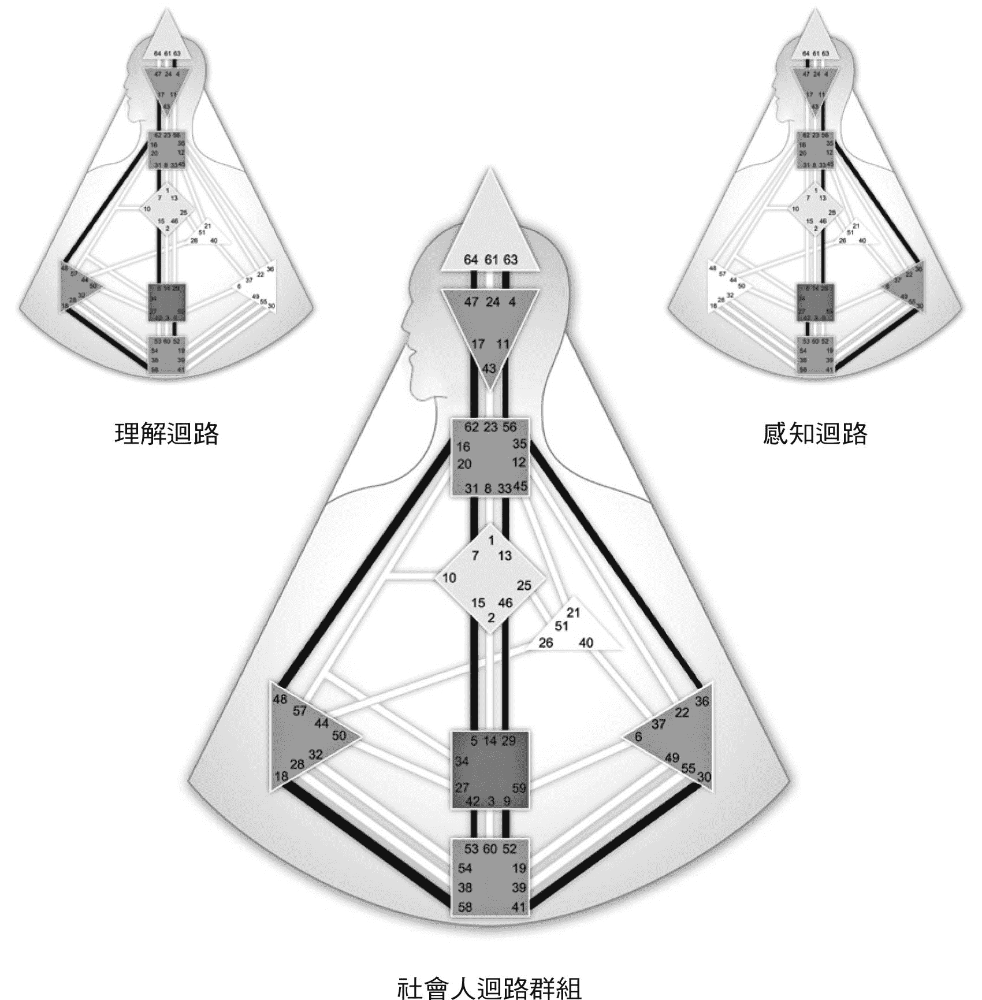

社会人回路群组是由两组主要回路所构成：理解／逻辑回路及感知／抽象回路。在这群组里的每条信道与每一个闸门，都包含了分享这部分。对社会人回路来说，分享近似驱动力与社会义务，他们需要告诉你他们在想什么、经历了什么、他们的判断是否具有价值。社会人可以迅速地分享意见、困境、解答、批评、期待、幻想、创作、医药突破性的发展或更多，所分享的一切非关个人。社会人与生俱来的社会取向是客观的、非个人、也不见得对等互惠，针对社会人的分享，最好别对号入座，他们不是针对你，即使让人感觉如此。

若是缺乏觉醒，任由非自己的心智状态主导，像不速之客一般，胡乱发表自身言论，会变得非常讨人厌。举例来说，引发危机的缘由，往往是他们在不知不觉中，与身边的办事员、邮差或在公车站牌前一起等车的人，开始分享自己的处境。要学会等待，在分享自己的故事，或给出意见之前，等别人问再开口说。如此一来，对别人的接收度才能愈来愈敏锐，而这也是分享能否带来满足、有效与转化的关键。人性中对于相互关系与社交的本性，伴随着追求和谐与整齐划一的需求，是社会群体的内建机制。透过分享实验与体验之后，所得来的学习，这个回路群能驱动集体意识层次向前。聚焦于社会，社会人创建多数人获益的体系，而非着眼于任何一个特定的个体。“我为人人，维持既定行得通的模式”这样的思维就是来自于社会人的回路群。这可能在你个人的层面很糟，但是以整体考量为重，所以你选择忍受，就像同一国家里的每个公民，都分享了同样的法律、币制以及公家机关。

若没有社会人的联合协力，少数服从多数，以及分享的义务，今日庞大的社会体系便无法成立；人们依旧封地集居，竞夺相同的资源。回顾近代史，在社会人的掌舵之下，知识分子或精英阶层已进入地球村的新纪元。我们几乎已经发挥最大的潜能，达到社会人回路群组的目标。社会人对于不遵守一般公认规则、鲁莽的个体人心存质疑，也从未信任家族人与生俱来的忠诚度，及其协商让利的能力。

从图中可以看到社会人回路群组，如何形成类似外壳和内在支柱，两者结合并巩固整张人体图，极具反差的对称性中，存有不寻常的平衡与美感。这就像昨日（感知／抽象）与明日（理解／逻辑）共舞，周期与模式间共舞，以及体验与证明间共舞。生命建构于逻辑之上，却透过抽象的周期而活。感知（抽象）回路试图在体验中归纳准则，或找出过去的意义，而理解（逻辑）回路则试着想预料未来。社会人与个体人不同，个体人的贡献是聚焦于当下，这个社会回路群组，其内在的抗衡像是跷跷板，在过去和未来之间摆荡，造成保守或是维持现况的形象。“如果没有坏，就不必修理或改变。”这个回路群组也具备某种程度的稳定性，并引以为傲，“我了解，我知道事实就是这样。”或是“我经历过。我曾经到过那里、做过那件事。你们只要听我的就对了。”逻辑是具实验性质的，关乎事物运作的方式。抽象的感知回路则是根据经验，得以处理渴望和出乎预料的一切。

### 理解（逻辑）回路

关键字：分享

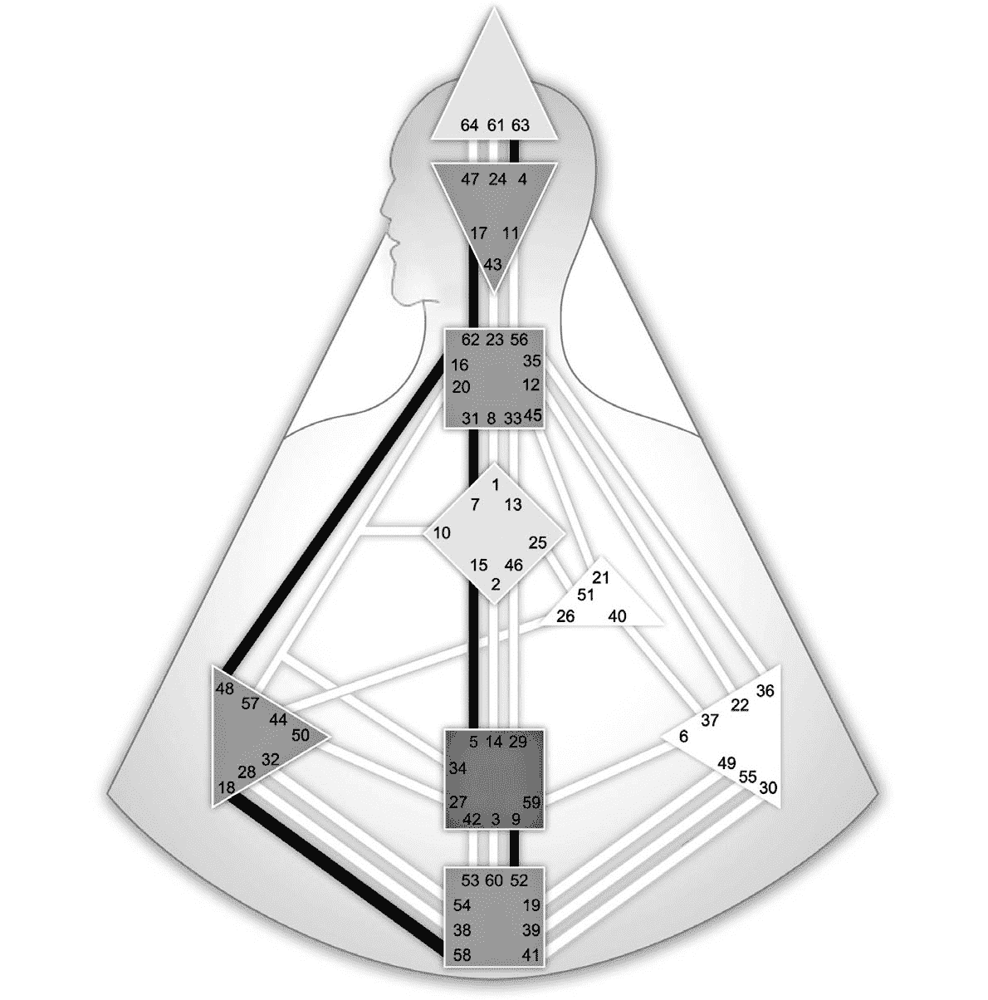

**信道：**

63-4：逻辑的信道　头脑充满疑惑

52-9：专心的信道　专注

17-62：接受的信道　组织化的人

5-15：韵律的信道　顺流

58-18：批评的信道　不知足

7-31：创始者的信道　不论好坏，领导力

48-16：波长的信道　才华

理解回路的主题是逻辑，冷静且极具魅力的智识能力，透过专注细节，而辨识出运作模式。经由分析流程或常规，挑战其中不适用的部分。逻辑让人得以预测，自行动的起因来预测未来，具备某种程度的可信度。

理解的过程需要时间，需要财务上的支持、有纪律地重复进行，以及科技或技术的发展，才能让模式完善并具体化，让资质、计划或公式掌握得更加完美。通常与回路以外的资源相结合，加上反复不断地练习，才能发挥逻辑中所蕴藏的潜能，有所贡献，引领人类稳健地迈向未来。只要逻辑不被制约，就能分享理解回路中所阐述的假设和观点，以及对未来的推论与质疑，带来深刻的影响。

理解回路相对应的是以抽象和体验为主的感知回路，两者却截然不同。理解回路并未链接温暖又热情的情绪中心，它通常指的是人体图上冷静的那一面，尽管逻辑的稳定性会带来深层的满足感，这是体验那一面无法提供的感受。当一加一永远都会等于二，知道具有可信赖的模式，就足以让社会人的喜悦油然而生。当逻辑运作得宜，一切井然就绪，宛如放进最后一块即完成拼图的愉悦感，对社会整体来说，这就是逻辑的魅力。

接下来要探讨的是，逻辑回路的信道和闸门。

#### ▸ 专心的信道：52-9

**专注的设计**

**回路：理解 信道类型：生产**

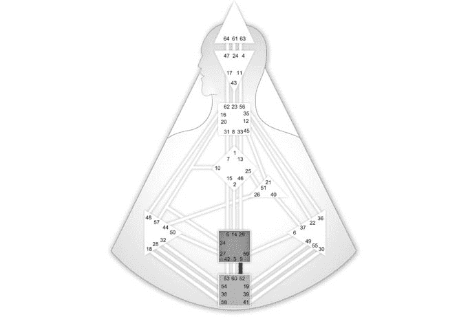

专心的信道透过维持不动的闸门（52）和专注的闸门（9），连接根部中心和荐骨中心。9 号闸门的设计专注于细节和事实，而 52 号闸门提供被动型式的能量，让一个人得以静下来，不为所动不分心。52-9 这条信道有其潜能，透过注意力集中，就能让一个人心静而后定，足以评估所有相关因素。

**背景**：为了改进某事或为世人服务，逻辑必须保持专注，在模式中处理所有细节。专心的信道属于组织型能量，具备理解回路中所有其他信道的特质。若以荐骨的回应为引导，就能以其专注，挑战、纠正或让任何模式、形式或投入其承诺的活动，具备更臻完美的能量，这股能量会影响一个人整体的设计。逻辑是一步一脚印的过程，必须彻底了解程序，才能花时间验证其真伪。社会若要维持对整体的影响力，逻辑的过程具有举足轻重的地位。

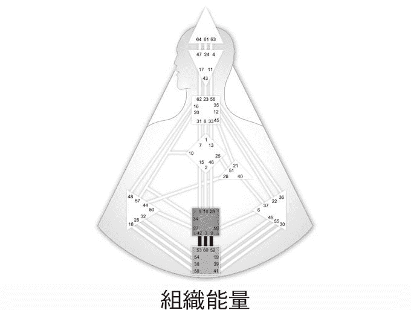

**个人**：当你全心投入之后，就会持续评估所有相关细节。你会体验到一种静止下来的压力，并非紧绷，比较像是一股让你留在原地的张力，就像静止于某个姿势的瑜珈动作。你让身体和对外的感官静止不动，好精准并专注地运用你的精力，所以你很不喜欢同时进行很多事，这会分散了这股强大的能量。你就像佛陀端坐菩提树下，聚精会神、等待荐骨的回应。你的回应会揭露你该专注于何者，哪一个才是你要致力寻求完美的模式，以及何时分享。当你遵循自己的回应，你真正适合的工作，与人生的焦点也将浮现。在人生中，你可能会将大部份的时间深入并专注于某一项活动，或者在生命的过程中，会有多样且截然不同的重心，如果你拥有这条信道，却找不到任何值得专注的事，没有任何一件事情，让你的内在权威认为值得追寻，值得将精力投注其中，那么，这将让你感到焦躁又沮丧。

**人际**：从能量场的观点来看，52-9 信道所散发出来的组织频率（format frequency）[[1]](#6-09.xhtml_fnX-1)，能将能量稳住或聚集于某处，让群体得以专注，对某样专案进行深入的检验，或针对某部分的流程再做评估。如果你的设计中没有这条信道，在某些状况下，坐在有这条信道的人旁边是好的，他们将协助你静下来，并提升你的专注能力。

##### 52 号闸门：维持不动（艮卦）－静止的闸门

于短暂的时间内，自制而不行动，以评估其效益

中心：根部／四等分：文明／主题：透过形式，达成目的

右角度交叉之服务—并列交叉之静止—左角度交叉之要求

52 号闸门是在压力之下，专注评估，这是一股专心的原始力量。从根部中心上接 9 号闸门为出口，这条信道充满被动的张力。一旦 52 号闸门对某件事深表认同，值得在此灌注这条信道的能量，那么来自根部中心的压力，会驱动人往前，而 52 号闸门的力量会协助你静止而专注，两者将形成平衡。然而在达成平衡之前，你会发现自己在沮丧与焦躁之间，摇摆不定，从这端移转至另一端，无法自律，不能抽离而再一次，回到内在静止与专注的状态中。52 号闸门所蕴含的这股消极张力，无法在生理的层面有所出口，无法引导也不能释放，唯有专注于此。若没有 9 号闸门，缺乏荐骨的回应，便很难了解，到底应该聚焦于何种活动或细节之上。

*   第 6 爻—平和
*   第 5 爻—解释
*   第 4 爻—自律
*   第 3 爻—控制
*   第 2 爻—关心
*   第 1 爻—先思而后言

##### 9 号闸门：处理细节的能力（小畜卦）－专注的闸门

详细注意所有相关细节，就能充分发挥潜能

中心：荐骨／四等分：突变／主题：透过蜕变，达成目的

右角度交叉之计划—并列交叉之聚焦—左角度交叉之指认

9 号闸门的作用宛如漏斗，能将 52 号闸门庞大的力量，集中于对你而言有意义或值得的事物上。9 号闸门带有的频率，是勤于细节或具备全神贯注的能力。身为人类，许多在逻辑上的成功模式，来自于注意细节，因而能储备珍贵的能量。你能决定如何汇集这股来自根部中心，被动却强大的能量。9 号闸门具备来自荐骨坚持的动力，能长期保持专注，处理专案或议题上的诸多细节，并详尽地测试或评估其运作公式。这一切都可以与社会群体分享，或应用于自身的生活之中。然而，若少了 52 号闸门，你可能无法长时间静下心来，以致于无法专注，而缺乏决心与毅力，可能就会成为你此生挫败的源由。当你清晰并专注，你的能量场便能引发周围的人，让他们不论在生理或心理层面的能量，都能更有效率地运作。

*   第 6 爻—感激
*   第 5 爻—相信
*   第 4 爻—贡献
*   第 3 爻—压垮骆驼的最后一根稻草
*   第 2 爻—同病相怜
*   第 1 爻—感受性

#### ▸ 韵律的信道：5-15

顺流的设计

回路：理解／信道类型：生产

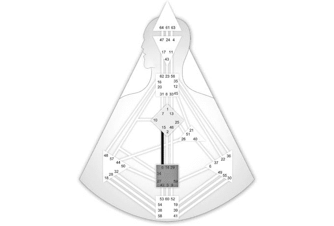

韵律的信道透过固定模式的闸门（5），与极端的闸门（15），链接荐骨中心和 G 中心。5 号闸门维持固定的习惯与仪式，而 15 号闸门则有爱包容人类各种极端的行为，整合并汇集社会里的多元性，建构公平的竞争环境。在此我们找到生命的节奏，放诸四海皆准，神奇地足以涵盖单细胞生物至复杂的人类，将所有的生命形式结合在一起。

**背景**：韵律的信道是所有生物进程的基石，面对自然世界的流动，每一次荐骨所做出的回应，就能让我们紧密链接在一起。不被头脑的傲慢所影响，也不被情绪周期的高低起伏所惑，磁单极位在 G 中心，在分离的幻觉之下，以其奇特的引力，吸引万事与万物聚集在一起。15 号闸门代表的是社会群体的磁力，这是来自磁单极的投射，代表的是普世（而非个人）之爱，爱的是人类与其所蕴藏的潜能，以这样的方式吸引我们往前。其频率宛如磁力一般，吸引每个人依循其韵律，以一种非关个人的方式，分享其生命之流。生命的韵律很自然，建构于不断重复，同时进化中的逻辑模式之上，其设计能导引每个生命体迈向未来。

**个人**：顺应生命之流，你不断前进，充满活力并且与之密不可分。在别人的眼中，你有自己的时间表，完全取决于属于你的内在韵律。如果这些模式与例行公事，对你来说是自然并且正确的，那么就不该让任何干扰介入。由荐骨所产生的回应，将指引并微调让你找到属于自己的时机点，若是你与自己内在的回应脱节了，就无法与整体韵律的模式相链接。若你顺流而行，你会感觉每件事情自然而然都对了，毫不费力，同时你的存在也会巧妙地，让周围的人活出自己所属的韵律，同时找到其时机，因而获益。然而，如果你身处非自己的扭曲状态，节奏错乱，你会发现不仅是自己，也会连带扰乱了所有人的节奏。在你周围的生活将陷入困惑又混乱的状态中。

**人际**：这条信道本身所散发出来的能量场，其设计是将人们带入具有弹性，并且连绵不断的生命之流中，让人类得以顺流前进，迎向安全并可行的未来。而人类整体的社交律动，提供给我们没有边界，许许多多相互链接的机会。理想化的逻辑运作模式，是基于平等、去制约与表里一致的前提之下，人与人之间得以交流，有机会相互链接。逻辑就是确认所有自然且正确的韵律与模式，不论多固定或多极端，不过就是各种延伸的方式，在这个世界上彰显出爱。而 5 号闸门与 15 号闸门交接所产生的火花，极具挑战，由于一方将固守其既有模式，而另外一方会带着自身韵律的各种极端，需要维持弹性。当两方相遇，他们将一起体验到这整条信道的潜能，创造新的韵律，带领他们周围的人，甚至引发整个团队顺流前进。5-15 信道会吸引环境中的人，随顺其韵律而运作，同时决定团队接下来将运行的轨道。

##### 5 号闸门：等待（需卦）－固定模式的闸门

从根本来调整，以符合自然的韵律，等待是充满积极的察觉

中心：荐骨／四等分：突变／主题：透过蜕变，达成目的

右角度交叉之意识—并列交叉之习惯—左角度交叉之分离

对 5 号闸门来说，等待并不是停止，它就像怀孕，是一种积极的状态。5 号闸门是一股享受固定韵律和节奏的能量。它带来韧性，让你保有自己内在真实的韵律，进而充满活力、健康并顺着你的节奏过生活。你能在世俗的仪式与例行公事中，找到满足，这让你与所有生命的频率得以同调。若被迫背离原本自然的韵律，可能会对你带来生理上、精神上与情绪上的不稳定，也可能引发缺乏安全感、不健康的行为或者生理上的紊乱。不要质疑你天生的规律或韵律，或受人引诱而轻易放弃，举例来说，一个具备 15 号极端闸门的朋友，可能无法理解，你为何对自己的仪式与日常模式异常坚持，而他们的韵律也会自动化的，干扰你健康的既定习惯，甚至引发你试图想放弃自己的习惯。相对来说，你也会发现自己带着既定的模式，不断想影响对方不可预测性的行为。要记住，他们的弹性与适应力，或许对你来说难以预测，却能让他们长保健康。了解并欣赏每一个人，为整体生命之流所带入的贡献，就能协助你接纳并超越这与生俱来的挑战。

*   第 6 爻—屈服
*   第 5 爻—喜悦
*   第 4 爻—猎人
*   第 3 爻—强迫症
*   第 2 爻—内在的平和
*   第 1 爻—毅力

##### 15 号闸门：谦逊（谦卦）－极端的闸门

在诸多极端之间，于行为上展现平衡，举止得宜

中心：G／四等分：文明／主题：透过形式，达成目的

右角度交叉之爱之船—并列交叉之极端—左角度交叉之预防

15 号闸门是人类之爱。有能力接纳、并为人类在社会上，形形色色的诸多行为找到定位。由于不具备固定模式，才能让我们每一个人都得以贡献，让爱以多样性存在。15 号闸门所展现的爱，并不是我们如何相互链接，而是关注人性的多样化，超越个人之爱。这一切皆起始于，爱你自身的韵律与极端的行为，举例来说，这一晚连续睡了十个小时，隔一晚却只睡两个小时。你可以不带评断，接纳其他人各种极端的行为，为生命之流带来多样性，磁单极将放大你的能量场，吸引各种人来到你身边，让你确认其多元性。若由你的内在权威来引导，15 号闸门会提升你的潜能，对极端的韵律或模式发挥影响力，以谦和的态度看待，在社会中取得平衡与整合。若了解并接纳人类有其多元性，而各种节奏是组成元素之一，那么你就能完整地拥抱所有，并向我们推广身而为人的要义。若缺少了 5 号闸门的自律与其固定的韵律，你可能会发现，自己持续改变的节奏容易失焦，而无法专精于人生中的某些特定领域，并且有所成就。

*   第 6 爻—自我防卫
*   第 5 爻—敏感性
*   第 4 爻—壁花
*   第 3 爻—自我膨胀
*   第 2 爻—影响
*   第 1 爻—职责

#### ▸ 创始者的信道：7-31

好或坏，领导力的设计

回路：理解／信道类型：投射

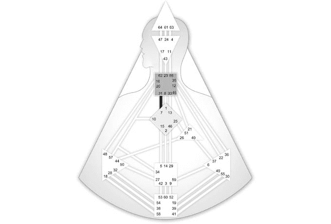

创始者的信道透过自我角色的闸门（7）和影响力闸门（31），链接 G 中心和喉咙中心。这是具备集体逻辑性，且拥有前瞻性领导力的设计。逻辑性的领导型态，建构在已经试验过、被创建并且可稳定遵循的模式之上。31 号闸门是社会型领导者，其声音带有影响力的特质，而 7 号闸门则是以逻辑的方式，来指引并领导众人的角色，常被称为王位背后的实质权力，其六条爻各自代表不同的领导型态，也是我们与人互动时常运用的角色，像是独裁主义者、将军和管理者。

**背景**：身为世界公民的一员，我们对于社会人的民主型态或共享领导十分熟悉。首先，创始者（Alphas）是领导者，必须赢得众人的信任。对于以逻辑模式来运作的领导者来说，必须让自己的领导能力更臻完美，适时展现以符合社会的满意度。人们必须看到他们有足够的能力，可以掌握当今的运作模式、了解趋势，并触及人民的需求。最重要的是，他们必须被大多数人邀请（选举）出来而领导，其任期的长短，由选民评估他们任期内的表现而决定。少数服从多数，由此赋与社会型领导模式的正当性，这与家族型的专制模式，或以个人树立典范的个体化领导模式，截然不同。

**个人**：不是每只老虎都能在山中称王，但毕竟一山难容二虎。你可能不会成为社群或国家的领导者，但还是会自然而然找到属于你的山头，发挥自身的影响力。一旦你找到自己的定位，就会关注必要的重点，让整体社会于正确的轨道上运行无虞，但是你只能为众人指引出方向，你无法为他们而做。领导力的起始点是从影响力出发，而非来自威权，这就是你迈向成功，同时也是让你保持身心健康的关键。

**人际**：对于这条信道而言，所谓的领导力，更适切的说法应当是影响力。由于这条创始者的信道并未连接至动力中心，同时焦点放在未来。当领导者说：“这样做，或者那样做，就会行得通。”若多数人不愿意站出来，没有选择你领导大家一齐去执行，那么什么事情也不会发生。社会型的领导者说：“我会代表你们，我会与你们共享领导权，只要你们去做我要大家做的事——因为我是对的。”换句话说，若是他们能在对的环境下，领导一群对的人，那么有领导力信道的人，其成功的机率的确会比较高。若他们能让社会立场相符，具有同样运作模式的群众所认可，并且受其邀请出来，他们就会更加成功。依循逻辑所获得的答案，很少放诸四海皆准，也很难持久，既定模式随时都可能被挑战，或变得脆弱，或被打破，每一步都是过程，都是臻于完美的一部分，让人类不断向前，迈向更安全的未来。

##### 7 号闸门：军队（师卦）－在互动中自我定位的角色

聚合点，为了引导和指挥社会，对领导的需求

中心：G／四等分：二元性／主题：透过人际链接，达成目的

右角度交叉之人面狮身—并列交叉之相互影响—左角度交叉之面具

7 号闸门属于未来导向，有能力辨认出，何时该纠正社会当今的方向，以便顺利走向未来。这个逻辑的闸门是关于方向，也是构成右角度轮回交叉人面狮身的其中一部分，透过 7 号闸门的六条爻所各自代表的领导角色，对社会带来实质的贡献：独裁主义者、民主主义者、无政府主义者、退位者、将军和管理者。这些角色源于基因层面的设定，各有其功能性，为社会带来强大的制约力。透过你的角色，加上你对人类未来方向的理解，来说服众人跟随你的领导模式，进而影响那些位居重位，特别是 31 号闸门深具影响力的人。你可能会是评估或调整既定模式，或者质疑方向的那个人，你也能成催化剂，就此创造出全新的方向。在此，以幕后实质掌权的方式，来展现其影响力。换句话说，若是没有 31 号闸门，你可能会是一个公众领袖，却不一定会成为台面上，对社会而言举足轻重的领导人物。

*   第 6 爻—管理者
*   第 5 爻—将军
*   第 4 爻—退位者
*   第 3 爻—无政府主义者
*   第 2 爻—民主主义者
*   第 1 爻—独裁主义者

##### 31 号闸门：影响力（咸卦）－影响力的闸门

不论积极或消极，都会产生转换并产生影响的摩擦定律

中心：喉咙／四等分：文明／主题：透过形式，达成目的

右角度交叉之不预期—并列交叉之影响—左角度交叉之创始者

31 号闸门生来就具有影响力，社会型的领导力属于合议制，而非来自阶级。对新方向有其愿景，向大众展现如何达成，而不是替他们完成。透过选举的方式，31 号闸门得以展现潜能，以说话来发挥影响力。当金钱取代众人合作的意志，摇身一变成为主流的能量，使人获取权力，那么社会确保人类行向未来的整体能力，很容易会被扭曲。若没有得到绝大多数人的能量为后盾，你透过 31 号闸门所传达出来“我来领导”的声音，将不会被听见。人们必须照你所说的话去做。若少了众人之力，确实进入公领域来推动，即使你对社会有远景，其影响力将无法被转化，也无法感染别人。你的领导力必须顾及追随群众的渴望，以整体利益为考量。“我来领导”代表的是影响众生，不论顺境逆境，都能有效地转化你的愿景，提供值得验证的全新模式，让众人得以实行。若少了 7 号闸门，你所说的话有可能会变得过于空洞。

*   第 6 爻—应用
*   第 5 爻—自以为是
*   第 4 爻—意图
*   第 3 爻—选择性
*   第 2 爻—傲慢
*   第 1 爻—显化

#### ▸ 批评的信道：58-18

不知足的设计

回路：理解／信道类型：投射

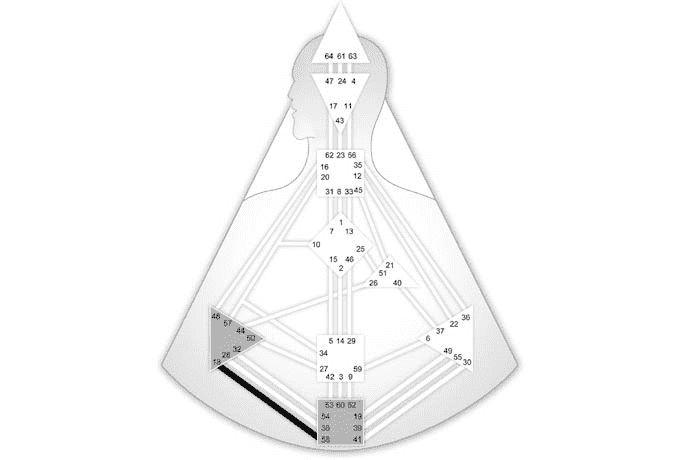

批评的信道透过活力的闸门（58）及修正的闸门（18），链接根部中心及直觉中心。逻辑需要证实这是最好的解答，而隐藏于逻辑推演的过程底下，是一股迫切想挑战、纠正并且让模式更趋完美，感到不满足的动力。58-18 信道宛如燃料，成就大师的艺术。

**背景**：58 号闸门点燃我们对生命的爱与活力，驱动我们渴望延续这股能量，58-18 信道中的不满足感，其实是美好感受的副产品。就如同 58 号闸门所说：“更多更好，更多更好。”这是属于逻辑性的冲动，让我们得以活着，而 18 号修正的闸门，则顺应这股冲动来提醒我们，不健康的是什么、失衡的是什么、又或者需要修正的是什么。批评的信道就像哨兵，不断评断究竟是什么，让群体社会无法在生活中感到愉悦。他们的评断是基于测试模式，将目前是正确或行得通的现况，与过往曾经行得通或行不通的结果，对照比较。这一个需要纠正的意念，促使社会得以顺利在轨道上运行，只因为 58-18 这条信道想要每个人在完美的运作模式之下，得到满足。而这条批评的信道底层的目的，也等同于人类图的目的：在同质化与制约的人生中，让每个人得以从中恢复，重新把喜悦与爱拿回来。

**个人**：即使对真正的完美主义者来说，完美从未真正存在过，因为模式不断在改变。当你开始不满足，或感觉需要去挑战某件事，你就会展现出批评的能力，以及对修正的渴望。然而，若这段追求完美或纠正的过程，开始偏向个人层面，转向内在，或直接针对关系中的某些人，最后就会变成持续找碴，大致来说，对自己与人生的一切都感到不满。你会发现自己不断挑战父母、老师、政府、任何人与每件事。对于逻辑而言，没有不能承担的巨大挑战，更无法抵挡你那火力充沛的根部中心，试图要让模式更近于完美的需求。若无人邀请你，你却不请自来，脱口说出批判性的评断，面对错误的部分，就是一连串看似无止尽的炮轰，自然没人想听。相反的，当有人询问你“有任何错误之处吗？”并邀请你分享，这代表着对方已经准备好要听，并对你的答案抱持着开放的态度，这才能为你带来真正的喜悦。

**人际**：为了避免浪费宝贵的精力，有智慧地运用你的天赋，建议你要仔细挑选属于自己的战役，首先，要等待别人询问，才分享你的解决方案，并且要以能实际运用于整体社会为前提，来制定解决方案。若是如此，你只需挑战那些最开放，并且准备好要解决，最有可能会是对的那群人。在此，举个诙谐又有趣的例子，来说明如何运用逻辑的方式，有效率地来调停分歧：有两种挤牙膏的方式，照逻辑上来说，挤牙膏要从底部往上，而个体人则认为，他们爱从哪里挤就从哪里挤，而调停的方式，无关乎个人，同时也是相当务实的社会化解决方案，那就是发明出一个能够自动挤出牙膏的小工具，得以与众人分享，如此一来，双方就能采用同样的解决方案，因而重获和平，拯救彼此的关系，也一并协助许多面临相同处境的人，得以解决问题。

##### 58 号闸门：喜悦（兑卦）－活力的闸门

鼓舞是通往喜悦的关键

中心：根部／四等分：突变／主题：透过蜕变，达成目的

右角度交叉之服务—并列交叉之活力—左角度交叉之要求

当某件事情呈现颓势或不健康的状态，58 号闸门有能力分辨。你活出喜悦，并且富有同情心，有胆量去挑战既定模式或其背后的权威。你不吝与众人分享自己对美的欣赏，对事物充满惊喜的眼光，而你热力四射过生活的方式，自然而然散发吸引力，让人充满愉悦的感受。你最想满足的渴望，就是能将一己之力，贡献于有价值的事物上。为此你将生命中的活力与喜悦，专心投注于纠正与改进社会，让整体社会持续有所成，持续提供福利并健全运作。58 号闸门提供逻辑所需的动力，去验证既定模式、规范、韵律与方向是否可行？能否驱动人类走向未来？这是逻辑体系之中最珍贵，也最需要的能量来源。你总能提供能量，让人们不仅止于空谈，而是真正落实执行。为了正确运用自己的能量，慎重并适切运用于最需要的议题上，你期待找到 18 号闸门的人，也常被他们吸引。他们既定的察觉能力会协助你看清楚，找出该如何改进，以及如何执行。如果没有 18 号闸门，你的服务之心会迫切地想找出口，却因为看不清楚，而用力过度。

*   第 6 爻—忘形
*   第 5 爻—防御
*   第 4 爻—调焦
*   第 3 爻—电流
*   第 2 爻—变态
*   第 1 爻—生命之爱

##### 18 号闸门：找出错误之处（蛊卦）－修正的闸门

对于维护与捍卫基本与基础人权，保有警觉并有其决心

中心：直觉／四等分：二元性／主题：透过人际链接，达成目的

右角度交叉之服务—并列交叉之修正—左角度交叉之动荡

18 号闸门的人面对需要纠正的一切，很能享受这段发现、重新命名与挑战的过程。当你对某事不满足，代表这件事情本身已经失去了动能，隐藏于不满足底下的，是对人权深刻的关怀，是担忧如何能让社会维持健康与和谐。具批判性的察觉力是你的天赋，引领你直指任何缺失或不完美之处，并且专注思考该如何纠正、重组或找出替代方案。这就是你的方式，来清理那些已经不健全的，同时面对已然腐化的一切，重新注入新活力。你的天赋透过不偏不倚的公正判断，加上逻辑层面的驱动力，这将让你在批判性分析的技巧层面，不断微调，愈来愈趋近完美。透过找出何处需要修正，对事物会得到全新的理解，这将是经历这过程所带来的意外收获。18 号闸门也代表了对权威，以及挑战权威的恐惧，由于这是一个社会型的闸门，其设计就是要在社会整体的范畴中，找出需要纠正之处，但是若用于个人私领域中，往往会造成反效果，若没有 58 号闸门乐于纠正的原动力，你的不满足感仅止于找出错误，如此一来，这有价值且极具关键的察觉力，就只能锁定于个人的习性与弱点，而无法专注于形势、既定模式或制度之上。

*   第 6 爻—成佛
*   第 5 爻—治疗
*   第 4 爻—无能
*   第 3 爻—狂热分子
*   第 2 爻—绝症
*   第 1 爻—保守主义

#### ▸ 波长的信道：48-16

才华的设计

回路：理解（创造力的信道）／信道类型：投射

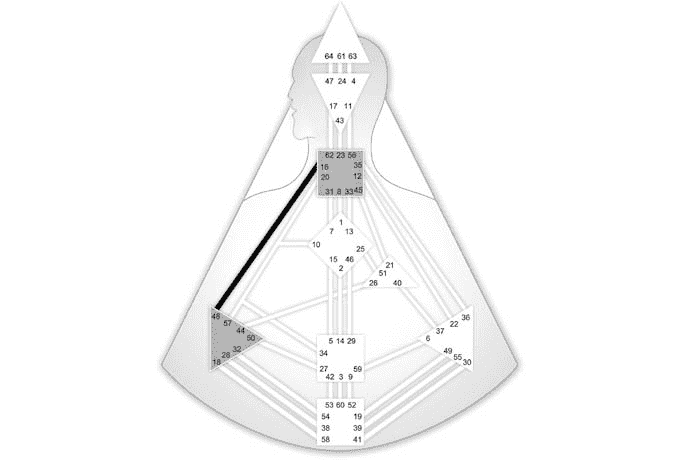

波长的信道透过深度的闸门（48）和技能的闸门（16），连接直觉中心和喉咙中心。48 号闸门总是密切关注重要信息，16 号闸门则总是想找出新的验证方式，让技巧更趋完善。当与批评的信道（58-18）相链接，联合其挑战与指认出行不通之处的能力，这条充满才华的设计，就能运用其深度与技能，找到解决问题的可行办法，或鼓励、纠正与调整某些区块，让一切得以更完美。

**背景**：48 号闸门的深度，来自于头脑无法掌握的内在智慧，唯有完全臣服于身体层面的自然本能，众人才得以汲取这智慧。所谓的才华，或精进其技能，让既定模式更加完美，意思就是当一个人深刻认定，并着手操练 16 号闸门所带来的技能，于是逐渐蜕变，愈来愈精准与卓越的过程。这里所说的技能，可以是任何才能，包括弹奏乐器、归纳出科学公式，是你在这世界上，卓然有成的独到之处。对于拥有 48-16 信道的人来说，他们可以在逻辑范畴的任何领域中，成就大师的境界，他们以改善人群的生活为己任，为更宽广的目的而服务。

**个人**：你天生的设计结合了直觉性的深度，经由反复实验与操练，才能让天生的技能更臻完美。若要成功培养自身的才华，其关键在于，你必须先找到自己真正热爱，并且愿意完全投入的某件事，专心致力于此，持续反复去练习，才能成就大师之路。将自身的深度带进纯熟的技艺之中，或让技巧愈来愈完美，你就能从中蜕变，将技巧转变为才华。当你抱持热忱，加上长时间始终不懈的努力，不断焠鍊自己的才能，专精于既定的模式，有一天终将超越模式本身，让你得以自由自在展现自己独特的才华。从细胞的层面来看，身体需要七年的时间，才能在技术层面上转化，或许要以毕生之力，才能探索属于你的深度。

**人际**：拥有 48-16 信道的人，需要被看见，需要有人认出他们的才能，并请他们将自身的才华展现出来，与众人分享。他们因而得到回馈，才能获得资源，继续支撑自己练习下去，迈向追求完美的修业之路。他们自己可能无法直接取得资源（动力中心的能量），举例来说，如果父母没有买乐器或付学费让孩子去上音乐课，孩子的才华要萌芽，要有机会能专注练习，好好发展让技艺更完美，就着实变得困难。人类整体不断追求，并探究模式如何运作，所谓的模式可能是已证实可行或是有效率的方法，让我们足以采用相对安全的形式，来面对共同的未来。金钱是认可的形式之一，透过赏识与实质上的报酬，灌注能量，让才华得以开花结果。当艺术家开始发展社交才能，通常能协助他们成功争取到实质所需的资源，得以继续精进其才华。48-16 这条信道也代表师徒关系，大师监督或教导年轻有天分的学生，持续指点其技能，并传授专业的知识。在这个阶段，焦点通常放在技术层面。天才是百分之一的天分（启发），与百分之九十九的努力（汗水）。透过这种方式，既有的模式得以传承，而这将是一段持续调整的历程，因为每一位新的大师都会加入独特的观点，在具有逻辑的创意过程中，提升技艺的水平。

##### 48 号闸门：井（井卦）－深度的闸门

创建共同利益的先决条件，须有必要性与本质上的基础

中心：直觉／四等分：二元性／主题：透过人际链接，达成目的

右角度交叉之张力—并列交叉之深度—左角度交叉之努力

48 号闸门提供了强而有力的觉知，根植于深层的本能记忆中，提供极具深度的潜能，让你能为社会问题找出具有逻辑，确实且可行的解决方案。你最强烈的渴望就是想表达并分享你的深度，来协助大家了解、修正，好让我们生活的世界能更完美。然而，若没有 16 号闸门，你可能会体验到不足，恐惧自己无法好好解释解决之道，或有段期间感到沮丧，因为你了解必须等自己的深度被别人看见，才能分享看法。你可能会过度担忧，试图想学会那些你自认缺乏的技能。积极（期盼）等待着，同时也放轻松，如此一来，才能吸引对的人来到你身边，引发你将自身的深度显现出来。以这样的方式，你潜在的解决方案将自然浮现，并且很明显会成为衡量、追求完美与督导别人技能的基础。

*   第 6 爻—自我实现
*   第 5 爻—行动
*   第 4 爻—重建
*   第 3 爻—单独徒刑
*   第 2 爻—退化
*   第 1 爻—微不足道

##### 16 号闸门：热忱（豫卦）－技能的闸门

借由和谐的能量导引，得以丰富人生的伟大艺术

中心：喉咙／等分：文明／主题：透过形式，达成目的

右角度交叉之计划—并列交叉之实验—左角度交叉之指认

拥有 16 号闸门的你，终将会在这世界留下印记，像是犀利评论家、技巧纯熟的表演者，或是透过你的才能和热忱来谋生。然而，你的生命一开始并不是这样的。你需要先认同一项或多项技能，愿意投入于重复操演的模式，并专注于练习，直到你达到专精的程度，就能让技能得以转化成艺术。全世界都在等待舞者成为舞蹈本身，或是将自己的生命活成一件大师之作。你寻找最完美的形式来表达你的专长。然而，若没有 48 号闸门，你可能会变得自我批判，也不认为自己具有足够的深度。你也需要找到物质上的支持，让你专注于自身的才华、你的理论、你的解决方案，务求尽善尽美，让世界上其它人也能为此获益。你需要有 48 号闸门的人，为你的技能带来不同以往的深度与角度，同时对于你自律的操练，也能适切给予指导、纠正与鼓励。

*   第 6 爻—轻信
*   第 5 爻—圣诞怪杰
*   第 4 爻—领导者
*   第 3 爻—独立
*   第 2 爻—愤世嫉俗的人
*   第 1 爻—妄想

#### ▸ 逻辑的信道：63-4

头脑充满疑惑的设计

回路：理解／信道类型：投射

逻辑的信道透过怀疑的闸门（63）和公式化的闸门（4），链接头脑中心和逻辑中心。这是充满怀疑的头脑。怀疑绝对是逻辑的必要元素，因为在公式里看来无懈可击的逻辑推断，仍有可能是错的！63-4 信道持续检视既有的运作模式，确保一切运作无虞，若模式无法连贯，压力会逐渐加剧，最后演变成质疑，需要得到解答。

**背景**：逻辑信道存有的恐惧，会以怀疑的形式，时不时在问题和答案之间冒出来。怀疑论者必须自逻辑的实验中得到验证。他们对于未经证实的信念，接受度相当低，每个答案不过只是个答案，除非能于其中找到稳定、值得信赖、实际并且“可验证”的模式。集体社会恐惧个体人带来突变所造成的影响，突变本身是一段蜕变的过程，会瓦解既定模式。举例来说，对于 63-4 这条信道的人，若没有经过实验证明，无法在逻辑层面接受人类图体系，它的可行性必须有其逻辑，同时也必须在逻辑上可行。

**个人**：你的头脑极有逻辑，面对生活总是带着合理性的质疑。“下周会下雨吗？嗯，根据每年此时的天气状况，目前的气压和云层状态的确有很大的可能性，但是……”你擅长提问、找出可辨识运作模式、根据现有资料归纳成不同因素、为了服务整体社会，针对未来，以教育的角度提出预测，若是这样，或者那样做，能确保明天安全无虞吗？你总是一并提出问题与解答，不论别人是否有兴趣，愿不愿意对你开放，你都想立即与大家分享。若是你嘈杂的脑袋无法解答某些问题，无法顺畅释放脑袋里的压力，你可能会变得焦虑。要记得，既然逻辑的信道是属于社会人的信道群，为了理解模式所产生的压力，适合用来替他人谋福利。你脑袋的设计，并不是用来回答关于自己的生命，或与未来有关的诸多疑惑，就让它好好认真思考别的事情吧。

**人际**：好比电磁链接，63-4 信道创造了两个人在心智上充满乐趣的链接。63 号闸门的人想分享自己的质疑，而有 4 号闸门的人则乐于分享自己找出的解答。当双方都了解，分享本身就会带来满足感，那么这样的链接，就会呈现最佳的状态。63 号闸门不能期待 4 号闸门所提供的解答一定会很实用，而 4 号闸门则不能期待 63 号闸门每一次都能提出值得回答的问题。到最后，运用策略与权威来决定何时该分享，就能确保彼此的交流能成功而契合。

##### 63 号闸门：完成之后（既济卦）－怀疑的闸门

人生是一场回旋，所有的结束都是开始

中心：头脑／四等分：初始／主题：透过心智，达成目的

右角度交叉之意识—并列交叉之怀疑—左角度交叉之支配

63 号闸门的猜疑或怀疑只是压力，这个闸门随时准备好，会注意并且质疑任何让人感到不安全的人事物，除非能充分了解并做出评估，确保众人能共同拥有安全的未来，否则不会停止。当既定趋动生命往前走的模式，出现缺失或任何与之前不一致之处，你的质疑会立刻升起。逻辑代表世界上所有生命体的共通之处，它流经并串连起一切，这是理解／逻辑过程中，不可或缺的元素。63 号闸门的质疑可以指向外在世界，或专注于内，若用于你的人生或个人的选择上，并不适当。你的质疑将充满急迫性，以问题的形式展现，开始在你不清楚的领域里钻牛角尖，如果针对你的问题，无法得到一个适当、有逻辑并且可行的答案，压力会以怀疑的形式逐步加温。你的焦点放在未来，你有能力看见当下既定的运作模式，这意味着若经由你的逻辑审查后发现不符，或出现缺失，或无法确认社会未来的安全，你会舍弃既定模式，开始朝另一个模式发展。当你加入某个团体投入长程规划，你的能量场所带来的贡献，是在脑力激荡的过程中，形成施压的动力，得以将疑问梳理成有条理的答案，找出通往未来的可能性。若没有 4 号闸门，脑袋层面会充满焦虑，让你把人生塞满急迫的疑问句，而你亟需找到答案。

*   第 6 爻—怀旧之情
*   第 5 爻—肯定
*   第 4 爻—记忆
*   第 3 爻—持续
*   第 2 爻—结构
*   第 1 爻—沉着

##### 4 号闸门：血气方刚的愚者（蒙卦）－公式化的闸门

尽管无知，却能蒙骗过关的能量，免于处罚的自由

中心：逻辑／四等分：二元性／主题：透过人际链接，达成目的

右角度交叉之解释—并列交叉之公式化—左角度交叉之革命

4 号闸门察觉到问题所在，而这些问题源于对未来的质疑，找出公式，形成具有逻辑的解答。每一个答案、公式仅代表潜藏的可能，最后必须被测试，以事实为佐证。这也代表着你的答案可能是，或可能不是人们正在找寻的解答，你善用自己的智力与察觉力，评断可疑的部分。质疑或怀疑的压力，终其一生都会持续，然而，你需要倚赖你的权威为引导，才能让自己的精神投注在正确的问题上，同时等待适当时机点，才分享答案。到最后，你所找出的公式与答案，都是要回答来自周围人群所产生的疑问，你鲜少为自己的人生与问题找出答案，提供解答。如果了解并接受事实就是如此，就能自在地让答案在脑中来去，直到对的时间点出现，问题自然会浮现，也自会有人来问你，而你的分享会让别人获益。如果你没有 63 号闸门，你可能会花上很多时间，不断寻找深具启发性的问题来解答，或觉得自己的人生会永远混乱，而变得焦虑。

*   第 6 爻—超越
*   第 5 爻—诱惑
*   第 4 爻—骗子
*   第 3 爻—不负责任
*   第 2 爻—接纳
*   第 1 爻—愉悦

#### ▸ 接受的信道：17-62

组织化的人的设计

回路：理解／信道类型：投射

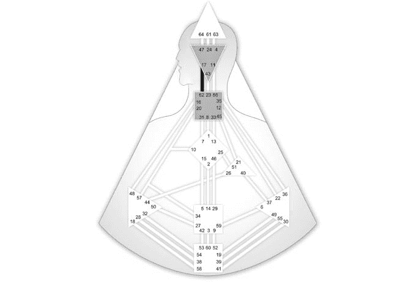

接受的信道透过意见的闸门（17）和细节的闸门（62），链接逻辑中心和喉咙中心。逻辑影响人类思考的过程，形塑人类理解的方式。接受在此指的是基于已证实的细节，在智识层面组织其信息。这是一段持续内化的过程。

**背景**：17 号闸门就像是右眼，将运作模式图像化，而 62 号闸门则透过语言，将之转化并显现细节。62 号闸门负责语言创作，借由语言，我们命名、组织、评估及沟通，对我们所见与所经历的一切赋与意义。透过 17-62 信道成功整合出来，组成内部远景的一切，便很容易理解，相对的，若无法以这样的方式整合成独到的观点，人们就无法理解。哺乳类动物与人类链接的闸门有三个，而 62 号闸门是其中之一，在此与 17 号闸门相链接。如此跨越物种的链接，让人类得以驯养动物，进而演进出可延续的社区组织，而这特定的链接，透过思考，提升认知的层次，也加强了对动物的训练方式。

**个人**：你的大脑不停忙着将细节整合成自己的归档系统，融入别人所想或所说的，不停调整修正，汇集成你的“全景图”，这让你维持并坚守内在运转的模式。所有新的资料必须逻辑化地组织并整合起来，以符合你的观点。当你对某人说：“我就是不了解你。”你其实说的是：“我还无法整理好，要以什么样的观点来看待你（或你所说的话，所想的事），才能符合我看待这个世界的方式。”你的喉咙中心一直承受着要说话的压力，你发现当自己分享细节，或是解释你了解或不了解的某件事时，会感到满足与放松。在这两种状况下，注意你发言的时机与听众的接受度，尤其重要。你具有众人称羡的天赋，能有逻辑，条理分明地管理人事物，像是商业团体、活动、专案与他人的空间。即使你并不一定会在意，自己的房间是否常保整洁。

**人际**：拥有接受信道的人，内建与生俱来的基础，想教导或展现信息给别人。他们的特质是可以有效地将复杂的视觉模式，转译为语言、公式、理论或是假设，如此它们便得以被测试是否可行。等待被邀请才发声，可确保分享的成功时机、有效性和清晰度，减少遇到抵抗的可能性，或者发言中的细节只是让别人觉得很无聊。逻辑自会为其站出立场。辩论和争论无可避免，这两者也是批评和磨擦的基本模式，在辩论与争论中，逻辑得以检视既有的运作模式，尽管这会让人和人之间引起有压力的互动，特别是在针对个人的时候。

##### 17 号闸门：跟随（随卦）－意见的闸门

古有明训：治理天下之人，须知如何为民服务

中心：逻辑／四等分：初始／主题：透过心智，达成目的

右角度交叉之服务—并列交叉之意见—左角度交叉之动荡

17 号闸门想在诸多想法之中，找到一个概念或意见，能通过测试与批评，抚平我们对未来的恐惧，足以让众人信任。17 号闸门的设计是将答案建构成概念、可行模式或一套可能行得通的解决方案，为 62 号闸门所提出的具体细节做铺排。逻辑的流程走到这里，你的头脑对未来发出质疑，制定出可能行得通的解决方案，然后感受到压力，想转化为意见的型式来表达，而接下来则需要 62 号闸门的能力，将概念翻译成语言，带入事实与细节来佐证，公诸于世，让大众得以检验与分析。你的右眼所瞥见的世界，是一系列可辨识的视觉模式，如果这个模式或意见，无法在逻辑的检验下屹立不摇，就会或应该要被推翻。不幸的是，你不见得每一次都能将视觉的影像，或你所了解的一切转换成语言。若没有 62 号闸门，你会发现自己不断在找适当的名称，为自己的概念命名，也不断收集各种实例，来支持自己的意见，这一切都是为了能有效地沟通你所提出来的建议。脑袋层面的焦虑源于恐惧，你害怕无人能了解，或看重你所投入的一切。

*   第 6 爻—菩萨
*   第 5 爻—无人是孤岛
*   第 4 爻—人事经理
*   第 3 爻—理解
*   第 2 爻—歧视
*   第 1 爻—开放

##### 62 号闸门：处理细节的优势（小过卦）－细节的闸门

谨慎、耐心和细节，得以超越极限、创造优越

中心：喉咙／四等分：文明／主题：透过形式，达成目的

右角度交叉之马雅—并列交叉之细节—左角度交叉之朦胧

62 号闸门说的是：“我想”。其设计是为了命名、具体化与沟通出一套可行的运作模式。擅长选出并组织细节构成事实，解释复杂的概念或处境，让一切更能被理解。当与 17 号闸门相链接，借重其架构概念的能力，而 62 号闸门以细节相辅，让概念得以具体化、有其意义并且可被理解，如此一来，才能长期复制并验证。理解是逻辑层面的天赋，也是你的天赋。当你面对复杂的情况，以清晰、适当且有条有理的细节来陈述，你所提出的意见，会增进我们对世界的理解。当你等待邀请到来才发言，对于你所分享的一切，大众接受的机率将大幅提升。也可避免因为话说得太快，而说出别人不想听、不必要的事实与细节，而带来困窘，或招致不必要的误解。你的意见高下与否，取决于你对事实的解读，但是所有事实并不相等。要记住，你可以掌握所有的细节在手上，但是若没有 17 号闸门，你可能无法随时在完整架构之下，畅所欲言。

*   第 6 爻—自律
*   第 5 爻—质变
*   第 4 爻—苦行主义
*   第 3 爻—探索
*   第 2 爻—抑制
*   第 1 爻—例行程序

1.  组织频率对回路中其他所有信道及整体设计发挥影响力。组织信道链接根部及荐骨中心：53-42（社会人／抽象）、60-3（个体人）、52-9（社会人／逻辑）。家族人回路中，没有组织信道。 

### 感知（抽象）回路

关键字：分享

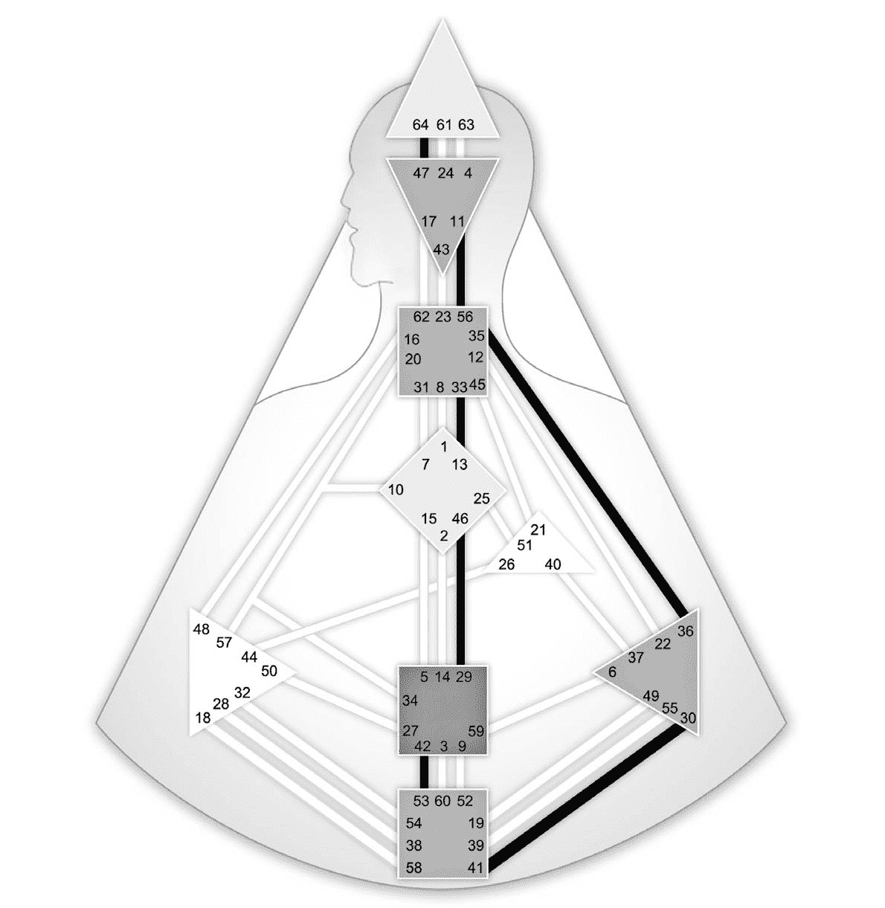

**信道：**

64-47：抽象的信道　脑中充满着疑惑与解答

53-42：成熟的信道　平衡发展

11-56：好奇的信道　追寻者

29-46：发现的信道　好胜心强

41-30：梦想家的信道　充满能量

13-33：足智多谋的信道　见证者

36-35：无常的信道　杂而不精

在社会人回路群中，与逻辑回路共舞的是感知（抽象）回路。感知回路与抽象的体验过程紧密相扣，透过感知回路，我们体验并反映人生，分享人类在情绪与精神层面的体验。这是身而为人的体验之路，前方不断铺排出现各种机会，让我们得以探索，虽然有时惊险，依然是一段喜悦的旅程，让我们累积并分享彼此生活的经验。若是能单纯并清晰地开始每一段体验，我们就能深刻感受到成就感，活得精彩，感觉自己在这个世界上适得其所。若以更宽广的层次来说，生命透过我们完整展现出来，而我们从自身体验中所得到的反思，对别人来说，会成为珍贵的学习。

以创建社群和谐为考量，“逻辑”顺应理论与规则而立。但是“抽象”这一端则认为，若限制了任意与随兴，也可能就此遏止了体验，而体验却是人类进化中必要的过程。基于渴望专精的需求，驱动逻辑的模式往前推演，而经由成就并完成不同的阶段，驱动抽象的体验不断进展。这也代表着，完成某件事情，才能进行下一件事情，就变得很重要。逻辑层面无法显化，而抽象层面可以做到。然而抽象层面得以彰显的，则取决于情绪周期，随着情绪转换，开始因渴望而期待，接着因为失望无聊而停滞，情绪周期的两端成功地推动人类进展，朝着下一个新启点迈进。

理解回路持续运用来自直觉中心的求存意识，以及运用逻辑，经由测试，验证，然后与大众分享得以提升未来的运作模式。这过程通常与科学息息相关。然而，感知回路则是出自于对经验的渴望（经常伴随着性意味），因此带动情感／关系的成长与发展。这样的经验不见得合理，但的确有其存在的必要性，从开始到结束都能与另一个人分享。而这抽象的体验过程，经常与人类学或文学领域相关。从逻辑回路的观点来看，抽象回路的体验方式是麻烦又不必要的过程。

感知回路在体验抽象的过程中，无法得到直觉中心所提供的稳定及安全感，体验源自摇摆不定的情绪渴望，渴望与另一个人一起做些新鲜刺激的事情。若没有任何改变，无聊与不安就会涌现。而引发危机，就是另一种让事物得以前进的方式。这也让抽象回路成为所有过程中，最具人性的一环。从经验中反省，就是整体社会在这个世界上，驱动生命进化最强大的力量。若少了这股力量，我们人类就无法进化到现今的意识层次，无法演进成如此深具差异性，与复杂化的物种。

社会人对过往经历的反思，建构成我们历史的根基。虽然具有感知回路的人，无法在事情正在发生时，完全理解生命本身，但他们天生的基因设定，让他们成为人类智慧的储存库。这是人类具有的独特能力，得以筛选、记忆并引用历史的观点向前延伸。我们从过往中，选择并认定有价值的部分，将过往发生的事予以浓缩，清楚以言语表达，让我们可以在当下分享，并照亮未来，这是一门艺术。每一个观点，每一个学到的课题，都是为持续开展的人生剧本里，再加一句台词。重述人类的历史，让后代无需重蹈覆辙，飞快加速我们学习的过程。

接下来要探讨的是，感知回路的信道及闸门。

#### ▸ 成熟的信道：53-42

平衡发展的设计

回路：感知／信道类型：生产

成熟的信道透过开始的闸门（53）及成长的闸门（42），链接根部中心及荐骨中心。成熟过程是（抽象）人类体验方式的核心，这过程需要进入并完成一个全新的循环或体验，并且从中反省，以获得个中智慧。

**背景**：在感知回路里的任何一条信道，不管是一项专案、一段关系或一辈子，其本质都是从承诺到完成，在不间断的循环中运行，自开始到中途然后走向结束。自人类所学习到的一切，抽象层面的体验过程，创造出集体的历史。为后代集结并储存各种经验值，让我们在智识上的发展，远比生理上的进展更为迅速，就是体验所带来最棒的礼物。从过往经验的历程中学习，找出行得通的方式，不再一次次重蹈覆辙，非常重要。每个新的体验都创建在上一个经验之上，如果一个循环尚未成熟却戛然而止，就得重来一次，直到整个循环完成。这整个过程并非目标导向，同时也展现出人生中的每一个体验，都值得珍惜，都是这趟无尽旅程中的一部分。从经验中成熟，是身而为人的关键之一，我们每个人都想寻求新的体验，这是内在的驱动力也是压力，让我们获得自身的深度。透过反映自己的深度，就能将体验转换成信息，提供给更多人。

**个人**：你的每个体验都必须步向一个令人满意的结论，如此一来，在开始另一个循环之前，你才能转身回头再回顾。与人分享这过程中的反思，将协助你揭露，并从中看见自己从体验里所学到的课题。若是如此，创建于既有的体验之上，新的体验得以展开。而每一段体验是否开始，都运用你的策略与权威来决定，这非常重要，否则，你很容易将深陷于某种循环之中，很快就会感到无趣，也无法完成。要能在此范畴中顺利运行，重要的是要了解期待的本质。当你抱持期待，你也迎向了挫折、失望与情绪化的崩溃。无所期待，单纯体验你的体验，对你来说才健康。

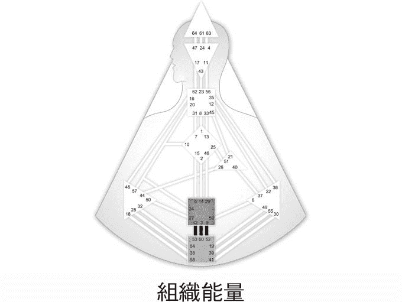

**人际**：身为感知回路中的组织能量[[1]](#6-10.xhtml_fnX-1)，成熟的信道创造出一种循环性的频率，影响着感知回路中的每个闸门及每条信道。这包括了他们看待事物的观点与体验生活的方式，如何与人互动，以及如何影响别人。开始一段崭新的体验，并对此承诺，启动了成熟的过程。这样的过程可能会花上数小时到一辈子，长度不等。具备成熟信道的人，偏爱历史，同时能调整自己，适应人生中各个阶段：生理上、社会层面与星球运转。若他们经由内在权威而决定开始一段体验，自然就会具备启动的能量，也会在发展的过程中感到满足，最终也会获得成功的结论，当他们回顾这段为期不短的历程，与众人分享其收获，将会让人类整体获益良多。

##### 53 号闸门：发展（渐卦）－开始的闸门

发展是具有结构性，稳定而持久的进化过程

中心：根部／四等分：文明／主题：透过形式，达成目的

右角度交叉之渗透—并列交叉之开始—左角度交叉之循环

53 号闸门带有压力，开展成熟的循环，也启动了从生到死的发展历程。这是一股可运用在所有生命型态的组织能量，包含关系、想法、专案、趋势，甚至是国家及文明的周期循环。你带有一股不得不启动新事物的动能。若你给自己充分的时间，做出正确的决定，清楚在何处投入能量，当时机点来临，你将能启动新的循环，也会看到它开花结果，并为未来留下种子。你的角色是提供原动力，促使循环磙动。遵循你的策略与内在权威，就能让你避开那些无法承担，或没有兴趣完成的专案或关系，你也不会苦于找不到 42 号闸门的人，来协助你完成。如果你总在开始时遇到阻力，或者在一切成熟前就被迫停止，你的失望会落入忧郁的循环。若承诺开始某件事情，而这对你是正确的，那么你就不会强迫自己完成，你会发现自己能适时自压力中抽身，从经验中学习，享受与他人分享智慧的乐趣。若没有 42 号闸门，你无法完成每一件开始的事，若不理解这一点，会以为自己非得有始有终，然后为此感到沮丧。

*   第 6 爻—逐步进行
*   第 5 爻—主张
*   第 4 爻—确保
*   第 3 爻—实际
*   第 2 爻—气势
*   第 1 爻—累积

##### 42 号闸门：增加（益卦）－成长的闸门

资源扩充，让潜能完全发挥，发展至极致

中心：荐骨／四等分：初始／主题：透过心智，达成目的

右角度交叉之马雅—并列交叉之完结—左角度交叉之限制

42 号闸门有股韧性，能支撑自己完整度过每个阶段，将与生俱来的潜能极大化。抽象的周期过程会带来成长，善用人类集体经验为基底，为未来的发展做铺排，让一切得以均衡发展。你所开始的每一个循环，都创建在上个循环所学习到的课题之上。当一个周期接近尾声，你会决定什么才是真正必要的、最后的定论。在你开始全新循环之前，前一个循环必须自然走向完结，否则那些未结束的，或尚未完成的，就会在新的循环中再度出现。关于关系的课题更是如此，那些让你举步维艰，或有所保留的行为模式，通常能一路回溯至童年时期所带来的影响。你会把焦点放在如何善用精力，来完成一个循环或过程，但是若一开始的支援薄弱或不足，会让你紧张不安。所以对你来说，正确的承诺很重要，因为一旦你承诺了，很难抽身而退。例如，一段不幸的婚姻。只有透过策略与权威，等待对的时间点，才承诺将精力投注其中，你就能获得真正的自我满足。若没有 53 号闸门带来点燃起始点的火花，你可能会发现自己缺乏耐力，也就无法完成整个过程，或者是一直试图想开始，却总是徒劳无功，而深陷挫败之中。

*   第 6 爻—培育
*   第 5 爻—自我实现
*   第 4 爻—中间人
*   第 3 爻—尝试错误
*   第 2 爻—识别
*   第 1 爻—多样化

#### ▸ 发现的信道：29-46

好胜心强的设计

回路：感知／信道型态：生产

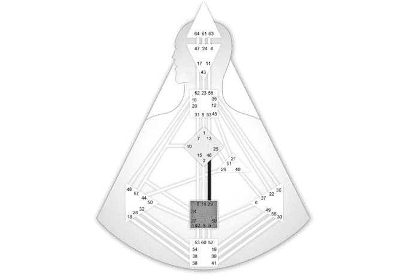

发现的信道透过代表毅力的 29 号闸门及自我决心的 46 号闸门，链接荐骨中心及 G 中心。在易经中，29 号闸门代表“坎”，意味着荐骨充满旺盛的耐力与毅力，唯有经由“肯定”的回应才能善加利用，46 号闸门链接躯体朝高我的方向前进，才能在对的时间点，去到对的地方。

**背景**：有此信道的人需要放下所有期待，不管面对任何体验都完全投入去体验，因为没有走到终点，意义无法显现。46 号闸门是关于身体之爱，也是关于热爱存在于身体之中，将身体与其所属的人生轨道或方向，链接在一起。如果一开始是荐骨有所回应而做出决定，然后展开体验，始终全力以赴，对此抱持着坚定承诺，整个过程可能会花上数年，期间保持耐心，那么这段探索之旅的发现，将为整体社会带来显著的转换，蜕变大众对世界的观点与体验。

**个人**：对你来说，没有半途而废，也没有回头的余地，因此透过策略与权威，做出明确的承诺至关紧要，如此一来，你从这段探索的过程之中，才能获得满足，而你也能从中学习，进而与众人分享。在体验中，你必须要忘我地投入，因为当你亲自置身其中时，你不见得能理解，然而，若能信任自己就是准确地在对的时间点，走到对的地方，那么当你走到终点，在这段探索的过程中必能有所获得。别人曾经遭遇的失败，可以是你未来成功的所在。对你来说，这一切并非关于控制，反倒是投降于这段探索的过程，放下你的期待。这也就是为什么，运用自己生命的动力，正确地做出承诺如此重要，唯有如此，你的荐骨动能，才能支持你完成全程的体验。

**人际**：具有发现信道的人，内在随时准备好要投入，他们几乎对任何要求都会倾向说“好”，尤其是这条信道若是潜意识（红色）的人，更容易将自己的能量给出去。如果其承诺是来自脑袋所做的决定，他们极有可能失败在别人成功之处，让挫败感取代原本的成就感。这不像逻辑的运作模式，事先会在理论上假设，倘若这个人做了这个或那个，会有什么样的结果，对于体验式的学习者来说，经验就是唯一的老师。唯有完成这场体验到最后，透过检验与分析，他们才能发现何者值得，或不值得重复，而这也是他们能与社会群体分享的经验值。唯有正确地应允，才不会被他人的阻挡所影响，也不会偏离体验的既定过程，而能继续坚持下去，度过艰钜的挑战。

##### 29 号闸门：深渊（坎卦）－毅力的闸门

坚持排除万难，必然会得到应有的回报

中心：荐骨／四等分：二元性／主题：透过二元性，达成目的

右角度交叉之传染—并列交叉之承诺—左角度交叉之勤奋

29 号闸门的潜能，是对生命持续抱持着肯定的态度。一旦答应了，就将自身的能量承诺于某件事，或某个新的对象上，他们很有毅力，不管这一次探索的过程，最后会带来些什么。然而毅力有其周期，你今天所承诺的，可能隔天就不再有兴趣。你所做的每一个正确的承诺，都将协助你更成熟地，面对自己所有的潜能，同时也让你能探索自己与其他人，以及与这世界的关系之中，是一个什么样的人。你总是急着想答应，随时准备好要投注自己的精力，而你荐骨的回应是既定的机制，你无法知道这趟冒险的旅程，将带领你前往何处，或你将遇见什么样的惊喜。29 号闸门拥有一股单一的能量，这样的设计就是，即使在最困难，充满挑战的状况下，还是能驱动你前进，前提是你要做出对自己而言正确的决定。而真正保险的做法是，放下期待，依循你的策略与权威来引导你步向正确的体验。若没有 46 号闸门，你会准备好要开工，却不知道到底要做些什么。

*   第 6 爻—困惑
*   第 5 爻—过度扩张
*   第 4 爻—直接
*   第 3 爻—评估
*   第 2 爻—评定
*   第 1 爻—征召

##### 46 号闸门：推进（升卦）－自我决心的闸门

好运源于因缘俱足，一切来自于努力与奉献

中心：G／四等分：二元性／主题：透过人际链接，达成目的

右角度交叉之爱之船—并列交叉之因缘俱足—左角度交叉之疗愈

46 号闸门专注于身体之爱，从中体验到生命的质地。它表达的是身体之爱，以感官来荣耀身体，宛如一座圣殿，在此我们总会在对的时间点，来到对的地方。你的存在就是个幸运儿，发现这一切因缘俱足。无论成败，皆取决于你的高我的意志。这是一个抽象的过程，是关于投降于整体的循环，体验其中的体验，而这会激发你的潜能，也可能只是带来混乱。你所学会的人生课题，以及与他人分享的智慧，皆源于你的决心、努力与全心投入于生活中的每一种体验。以你的天性与他人互动，唯有当此阶段圆满完成时，才能真正有所评断，明白这体验本身就是一段深层灵性的历程。生命本身由一连串循环所组成，如果你不愿意对此投降并有所承诺，危机就会不断发生而带来压力，导致你的身体开始崩坏。若没有 29 号闸门，你会知道何时是对的时间点，却没有动能来打开这过程，或者缺乏毅力来完成它。

*   第 6 爻—诚信
*   第 5 爻—步调
*   第 4 爻—影响
*   第 3 爻—投射
*   第 2 爻—自命不凡
*   第 1 爻—在发现的过程中

#### ▸ 足智多谋的信道：13-33

见证者的设计

回路：感知／信道类型：投射

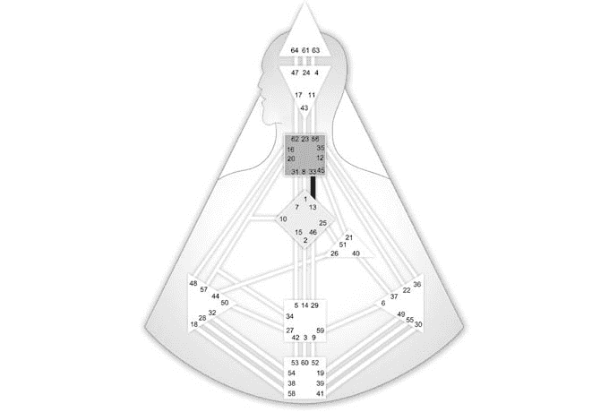

足智多谋的信道透过聆听者的闸门（13）与隐私的闸门（33），链接 G 中心与喉咙中心。这条信道是关于反省与记忆。13 号闸门透过聆听，储存信息与秘密，从回忆中撷取可被学习的课题。33 号闸门需要隐居，好反思过往的经验，耐心静待隐藏于表面之下，属于底层的真实，自行显露出来。

**背景**：他们与众不同的奇特之处，就是渴望去探索生命中的一切，渴望成为驱动力，让他们想获得第一手的体验。13-33 信道将体验性的周期带到终点，完整了整体成熟的过程，并加上观见与反思的能力，让他们能于体验之后，分享之前，对体验本身的各个层面，都能有所学习。人类身为持续进化，对自我有所察觉的物种，这提供了不可思议的优势。这就是回头的浪子，见证者，诸多体验过后，将回忆收集起来，转化为个人传记的体裁，或编撰成集体社会的历史，所以我们得以以这些形式相互传承，鉴往知来，代代相传，让文明进化的历程，得以相互接轨，稳定延续。

**个人**：身为天生的聆听者与记录管理者，你收集人生故事、秘密以及值得记录的事物。接着，你退居角落，思考并组织手边收集到的资料，从资料中深思并爬梳其中的课题，然后再与众人分享。你的挑战是时间点。你不应在时机未成熟时，即刻揭露秘密，也不该过于隐密，导致到最后，无人有机会一窥究竟。为了选择对你来说正确的体验，从中学习，你会愿意打破家庭与社会既定的藩篱，大部分的人开始任何体验之前，都会抱持特定的期待，但是走到最后往往会发现，最终的结果与一开始的期待根本不相符。他们因而失去耐性，也错过了完成本身所带来的珍贵课题，忽略了这才是真正神奇所在：从体验出发，与我们每一个人分享体验的过程，真实见证一连串事件的发展与演变，远比结果不如预期而深陷挫败与失望，更有价值也带来更大的满足感。在整体历史的轨迹中，透过长时间耐心反思的过程，而发现其中伟大的真理，从中汲取智慧。而这也是你所见证，与我们分享的诸多课题中，其中一样最有价值的学习：意识到自己也只是个乘客，自在投降于我们各自体验的过程。

**人际**：社会人的体验层面说：“我记得我经历过，或没经历过的事。”经历一生，拥有足智多谋信道的人累积了智慧的宝藏，可被归纳成个人相关的课题，或集体人类的历史，整理与归纳皆需要耐性，他们可能会喜欢以摄影、拼贴或倾听的方式，重新收集各种人的人生故事。他们可能走政治这条路，或者成为喜剧演员，又或是成为我们身边的密友。具有 13-33 信道的人专注于过往，并从中学习，好应付眼前的挑战，他们并不擅长预测未来。然而，他们会是第一个告诉我们，人生走到终点还是有其道理。

##### 13 号闸门：伙伴关系（同人挂）－聆听者的闸门

在井然有序的架构下，有其普世的想法与价值，激发以人为本的合作模式

中心：G／四等分：初始／主题：透过心智，达成目的

右角度交叉之人面狮身—并列交叉之倾听—左角度交叉之面具

具备聆听、观察以及保守秘密的天赋，让 13 号闸门以聆听者的角色，延续了过去与未来。你常被当成知己，或是替人保守秘密的人，因为你总是真诚聆听每个人的故事、丰功伟业以及挑战，同时你也享受聆听的过程，自然而然人们乐于与你分享，他们也能感受到你这个人，只是单纯想听他们分享，而不会轻易泄漏出去。13 号闸门并没有来自喉咙中心需要发言的压力，所以才能分辨出何时为对的时间点，自记忆库中抽取出最有价值的信息，与大家分享。分享的内容，取决于有能力做适当选取、反思与重整的人，他们明白如何传播，如何与更广大的社群互动，像是拥有 33 号闸门的人，就具备了这样的能力。如此一来，你就能将透过经验才能学会的重要课题，保存下来，好好珍藏，等待对的时间点传递出来，对人类自身的理解带来贡献。过往历史的承续，在物种的层次，预知未来的进展。若没有 33 号闸门，你的秘密可能永远不会为人所知。

*   第 6 爻—乐天派
*   第 5 爻—救世主
*   第 4 爻—疲累
*   第 3 爻—悲观主义
*   第 2 爻—偏执
*   第 1 爻—同理

##### 33 号闸门：退隐（遁卦）－隐私的闸门

主动抽离，由弱转强的蜕变过程

中心：喉咙／四等分：文明／主题：透过形式，达成目的

右角度交叉之四方之路—并列交叉之隐私—左角度交叉之精致

33 号闸门代表一个周期走至终点，而所有终点都会以静默的片刻作为结尾，让人们能以各个层面来思考这一次特定的经验。这也就是你为何需要独处的原因。在完成某个特定的体验之后，与下一个新体验开始之前，两者接缝时所出现的不确定感，对你来说就是往后退一步的抽离时刻。这暂停的片刻能让你恢复实力，同时得以反思接下来该如何往前。而那些往往储藏于社会集体记忆的底层（13 号闸门），极具价值的学习，也会在这些安静沉思的片刻里，悄然浮现于表面。33 号闸门对隐私的需求，也加入了集体社会“我记得”的声音，换句话说，分享经验中所获得的学习，揭露出其中的真实，也是你天性中的一部分。而这经验可能来自你个人，或来自他人，甚至是一群人同样的过程。当时机成熟，邀请会来到你面前，让你得以分享自身的智慧，而你的分享将传布至更广大的社群，化为人类进化意识的一部分。就像是在外游历过的浪子，随着时间历程而逐渐成熟，当你经历了每次的经验，完整了不同的循环，你的影响力也会向外扩展。若是缺少 13 号闸门，你可能无法明白，何时才是分享所学的正确时机。

*   第 6 爻—离异
*   第 5 爻—时机
*   第 4 爻—尊严
*   第 3 爻—精神
*   第 2 爻—臣服
*   第 1 爻—逃避

#### ▸ 梦想家的信道：41-30

充满能量（感觉）的设计

回路：感知／信道类型：投射

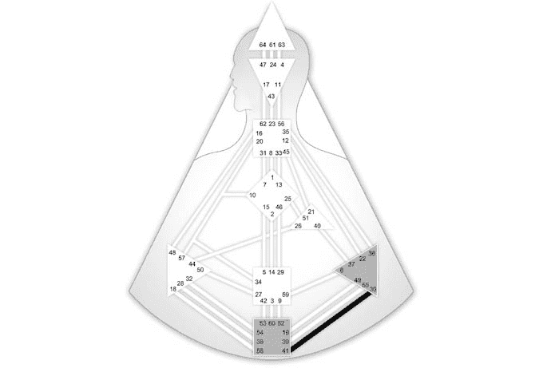

梦想家信道透过收缩的闸门（41）及感觉的闸门（30），链接根部中心与情绪中心。位于根部中心的 41 号闸门蕴藏的压力（燃料），打开了躁动的感觉，激发想像力，幻想出无数“可能会发生”的情景。一旦链接了 30 号闸门，情绪中心的情感开始升温，让燃料烧得更炙烈，引导出强烈的渴望去追寻，或开始朝着全新体验的方向，飞奔而去。

**背景**：从基因的层面来说，第 41 卦是 DNA 中的启动密码。当太阳在每年一月份移至 41 号闸门的那一刻，我们就开始了一个全新的太阳周期（全新的一年），同时启动人类生理机转，引动我们一起进化。所有人类体验的可能性，都储藏于此闸门，而体验的整体过程，则是由根部中心炙热燃烧的渴望所驱动，我们渴望拥有新的体验，并期待在最后能获得满足，如此饥渴的渴望只能暂时获得满足。抽象（感知）过程将焦点放在成就，放在完成循环的周期，驱动力来自渴望或期待“做”些什么，才不会无聊，而这也成为人类体验历程的启始点。我们在文化上的演进，从无知以及无经验的天真，一直到从经验中学习，累积智慧，并且在 36-35 信道将到达巅峰。

**个人**：你是个有着丰富想像力的人，为人生带入无尽的想望，有强烈的感受力。你的梦想、幻想或希望，有时候伴随着性的色彩，创造出期待，只是当命运（30 号闸门）介入，是不是能符合既定的期待，尚未可知。随着时间过去，你会明白渴望可能带来热烈的喜悦或兴奋感，也可能带来痛苦。不管满足了任何渴望，之后的满足感无法持久。不断回到你的情绪内在权威，给自己足够的时间，好好经历完情绪的周期起伏，再清楚做出决定，这需要培养耐性与自律，也唯有如此，才能平衡你渴求各种新鲜体验的躁动。对你而言，其秘诀就是单纯享受你的梦想，享受每个体验的过程，无须施加压力，也不要怀抱期待。如此一来，每个体验都会让你更加心满意足，你从中获得的反思将更发人深省，而你的分享，也会更容易让众人情感沸腾。

**人际**：梦想家的信道本身会涌现压力，链接强烈的感受或情绪之后，就成为往前的驱动力，充满气势，想在最短的时间内纵身一跃，从无经验立即变身为有经验的状态。等待情绪周期的过程，让这条信道的人能有充足的时间，在决定跳入之前，分辨何者才是自己正确的渴望，静待内在的清明。这股张力可能会引发相当疯狂的旅程，也通常会引发许多人投入其中，但同时，在完成这段冒险之后，也会引发所有参与者深入省思。每一次新的体验，都让他们可以接收或链接极为细腻的情感，而他们也能将之描述出来。

##### 41 号闸门：减少（损卦）－收缩的闸门

因资源有限，而使潜能的发挥得以极大化

中心：根部／四等分：突变／主题：透过蜕变，达成目的

右角度交叉之不预期—并列交叉之幻想—左角度交叉之创始者

41 号闸门渴望体验情感，因而打开了人类独特的体验之旅。起始点源于渴望，渴望透过感受与人互动。当渴望被引动了，而这源于根部中心的内建压力，可能会展现出模煳的期待，可能是与性有关的幻想，或者焦躁感，觉得自己需要与某人共同体验某些新鲜的事物。你并不确定这所谓新的体验是什么，何时会发生，对方会是谁。41 号闸门驱动你逐步满足自己的渴望，同时实践你的天命，而两者最后会如何，则取决于命运之神的安排（30 号闸门）。面对无法聚焦，并且会时常感到困惑的焦躁，你得到平衡的方法是透过写作或做白日梦，幻想接下来可能会如何发展，来完成你最狂野的渴望，或以文学与电影作为替代的方式，从中体验这一切。41 号闸门握有所有人类体验的潜能，但是一次只能释放或追寻一个梦想，这就是限制，也是你的限制。若一开始是透过你的策略与权威所作的决定，那么这段探索的过程中，必定有新的感觉等待着你去体验。当你能做到放下期待，便能在每段际遇中自由来去，不会对未来感到悲观。若缺少了 30 号闸门，会感觉自己似乎想要拥有某些东西，却不知道你真正想要的究竟是什么。

*   第 6 爻—感染
*   第 5 爻—授权
*   第 4 爻—修正
*   第 3 爻—效率
*   第 2 爻—谨慎
*   第 1 爻—合理

##### 30 号闸门：燃烧的火焰（离卦）－感觉的闸门

认知到自由是幻觉，接受限制是命运

中心：情绪／四等分：初始／主题：透过心智，达成目的

右角度交叉之感染—并列交叉之命运—左角度交叉之勤奋

命运的闸门教导我们，人生并无法预期，而是我们得允许它如实展开。你的渴望孕育出体验，伴随情绪周期的高低与起落，在人生中交会出各式各样的体验。对感受的渴望，宛如强迫症般饥渴，渴望将人生所怀抱的憧憬都编织起来，影响你与外界的所有互动模式，直到渴望获得满足或完成为止。你唯一能掌控的，是确保每一次体验开始时，自己处于清明的状态，而非掌控结果。因为渴望只能暂时被纾解，人生若不带清明，就会变成一趟狂野又情绪化的旅程。随着时间过去，你会看见原本以为的自由，在满足狂野的梦之后，近乎幻觉，而这些无法得到回应的渴求，并非是你个人层面的问题。唯有投降，接受如是，才能让你的人生得以平衡。若能如此，面对命运，你就不必心怀恐惧或感觉压力，或被 41 号闸门的幻想追着跑。接受限制，以更广大的人生格局来看自己，你在感受层面的省思，想更深刻体验人性的渴望，就会成为你的天赋，得以与众人分享。

*   第 6 爻—强制
*   第 5 爻—讽刺
*   第 4 爻—精疲力竭
*   第 3 爻—顺从
*   第 2 爻—实用主义
*   第 1 爻—沉着

#### ▸ 无常的信道：36-35

杂而不精的设计

回路：感知（创造力的信道）／信道类型：显示

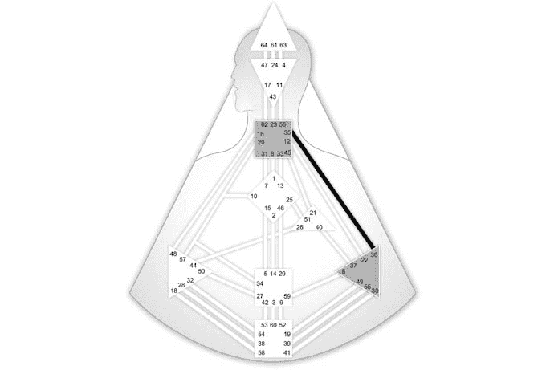

无常的信道透过危机的闸门（36）及改变的闸门（35），连接情绪中心与喉咙中心。这是一条以情绪来引发的信道，违逆逻辑谨慎的本质，抗拒模式的框架，想尝试各式各样的事情，不管是否具有实质上的价值，都要让事物的进展朝全新体验的方向，直线前进。

**背景**：身为感知回路中的创意信道，36-35 信道具备冒险犯难的才华，并引发别人加入，与他们一起冒险。这条信道透过 35 号闸门表达改变的需求，因为“去过了，作过了，还有什么新鲜的？”而这充满激情的 36 号闸门，将缺乏经验视为自身的能力不足，于是吸引来无常信道的人，共同去追寻更多体验，有时引发出危机，是让事情有所进展的方式。这股蠢蠢欲动的渴望，不断探索我们感受（情绪）的能力，探索情绪的深度与其所带来的结果，让人类成熟进化，基因库得以扩展，最终带来社会整体进步，为了下一代而透过经验来学习。

**个人**：追求崭新的、让人生变得更好的体验，是你的驱动力。你的旅程充满情感，而你从体验中汲取智慧。你被无意识的情绪周期所推动，这也让你的观点不断改变，若新的体验不如原本所预期，你可能会变得喜怒无常或感到失望。秘诀在于，拥抱并接纳情绪的摆荡不定，让自己有充裕的时间，等待情绪转为清明，再做决定，同时愿意投降，为体验而体验，体验每一个正确的体验。随着时间过去，愈发成熟，这些体验会积累成情感层面的深度，归为你内在的真实，而核心的关键点就是，接受生命如是。如果你发觉自己在投入冒险之际，感到紧张或不自在，好好利用自己的情绪周期，静心等待。你在人生中最伟大的成就，来自你必须亲身试验、碰触与感受这一切，从中收集珍贵的智慧，然后你能以提供建议的方式，将智慧传递给更多人。你的人生充满丰功伟业，散发着尽情活出丰盛人生的满足感，为众人带来启发，跃跃欲试也想加入你的冒险旅程。因为你明白感觉为时短暂，来来去去，所以你给别人的建议会是：“把握此刻”，以正确的态度，投入每一次全新的体验，而非平白虚度，感觉人生轻如鸿毛，毫无价值。

**人际**：对于拥有无常信道的人，互动代表着，与他人共同分享完整的体验。他们需要新的体验，内在总感到没有什么会天长地久，而这也让他们很难维持亲密的关系。身为他们的另一半，如果被这条信道拖入一场冒险之中，却发现这对自己而言是个错误，就得付出代价。不管做什么事情，第一次总是不容易，结果会如何难以预测，若以危机收场，绝大部分的人其实没法处理。而深刻的情感体验，通常涉及性的层面，但是在这里的重点会放在体验本身，重视的是体验所引发出来的感受，而非另一个人身上，换言之，当一段体验结束了，双方所留下的感觉可能是失望。若两个人的合图，其火花是形成这条信道，一方有 35 号闸门，另一方有 36 号闸门，那么这段关系是否稳定，如何平衡，将取决于情绪周期的高低起伏。

##### 36 号闸门：幽暗之光（明夷卦）－危机的闸门

循环的定律是，衰退在所难免，但这时期不会持久

中心：情绪／四等分：初始／主题：透过心智，达成目的

右角度交叉之伊甸园—并列交叉之危机—左角度交叉之飞机

36 号闸门对脆弱与经验不足（情绪与性的层面）备感恐惧，你将创造并面对各种挑战，有所改变，自情绪的危机中成长，而原本的恐惧，将于体验里得到圆满或蜕变。当你随着时间过去，在情绪上得到清明，你将学会如何处理他人所引爆的危机，而你自己也会懂得如何减少危机。从希望到痛苦，36 号闸门压抑住强烈的情绪波动，这情绪足以驱动人类的体验朝改变迈进。这股能量直指喉咙中心，代表着你已经准备好，要尽情展现出情绪本身，其完整的风貌与深度。这一切只需要有某人或某事来触动，就能于瞬间释放开来。若没有 35 号闸门提供合适的出口，或指出这股能量可以汇集的方向，就只会被当成个人的危机而已。随着时间过去，你会学习如何平稳而淡定，保有耐心，适应自己持续不断改变的感觉。这些感觉可以带来美好的刺激，让你自然而然真情流露，也可能吞噬了你，让周围的人吃不消。不管如何，就让这些感觉完整展露出来，唯有如此，你才能体会情绪层面的深度，通往属于你的真实。若没有 35 号闸门，会感到自己有所不足，担心无法达成对自己的期待，因而感到紧张。

*   第 6 爻—正义
*   第 5 爻—秘密的
*   第 4 爻—间谍活动
*   第 3 爻—过渡
*   第 2 爻—支持
*   第 1 爻—抗拒

##### 35 号闸门：进展（晋卦）－改变的闸门

基于设计，真空的状态不会有所进展，进展取决于互动的过程

中心：喉咙／四等分：文明／主题：透过形式，达成目的

右角度交叉之意识—并列交叉之经验—左角度交叉之分离

35 号闸门具备蠢蠢欲动的好奇心，怀抱高度期待，呼朋引伴探索全新的视野，为此感到不亦乐乎，而这也是他们的驱动力。35 号闸门说：“我觉得”，而他们总感觉到一股对改变的渴望，非关个人，而是与外界相关联的体验，推动你的动力并非来自察觉，而是源于渴望，渴望去体验与情绪周期深刻相关的种种感受。就像饥饿，渴望与好奇都只能暂时满足，你可以专注收集各式各样的体验，从中学习，而非不断复制同样的体验。你的大师之路是展现智慧，以提供建议的方式来彰显。相对于体验本身，你的回忆带来更大满足感。你对新体验的品味，渴望探索这一切的尽头到底会是什么，让你保持健康与警觉。若能为体验而体验，正确开始一段体验，以观察者自居，保持客观，那么你清晰的分享会带来许多可能，足以让人性蜕变。对于追求体验的人来说，很少会停下来，好好思考自己的行动所引发的回响。若少了 36 号闸门，你很容易拼命去寻求情感上的冲击，只为了逃开无聊的痛苦，却苦于找不到任何新体验，值得投入。

*   第 6 爻—矫正
*   第 5 爻—利他主义
*   第 4 爻—渴望
*   第 3 爻—合作
*   第 2 爻—创意空窗期
*   第 1 爻—谦逊

#### ▸ 抽象的信道：64-47

脑中充满着疑惑与解答的设计

回路：感知／信道类型：投射

抽象的信道透过困惑的闸门（64）及了解的闸门（47），链接头脑中心与逻辑中心。拥有 64-47 信道的人无形中有股压力，推动脑中每次体验甚至是梦境中的影响，皆以万花筒的形式不断翻动。他们试图想搞懂过去所发生的一切，从中撷取观点。他们能跨越世代，在自己或他人的生命之中，找寻故事，从故事中有所体悟，与大家分享。

**背景**：抽象的信道是一种体验层面的心智力，涉及所有的可能性，无关规则，直到神秘的某事发生，让一切合情合理。这样的头脑很忙碌，不断设想各种只要活着就会产生的后果。概念化的过程，来自脑部皮层（逻辑中心）与大脑的深灰质层（头脑中心）联合运作，这赐予人类在意识层面，具备自我反省的潜能。然而有这条信道的人，若想与自己和平相处，要记得头脑绝对不会是自己人生的内在权威，你的头脑永远无法百分之百确定。

**个人**：你的头脑非常活跃并且经验丰富，不断放映各种可能性，从不停歇，你可能也曾自忖这头脑，能不能停下来，不再忙碌不休。你可能体验过类似精神错乱的状态，所有的影像就像漩涡，总是在脑中不停地搅动，有时混乱的程度就宛如醉猴被蝎子螫到。对你而言，这混乱也标示出，一段充满启发的崭新之旅就此开展，若持续探索，就能理出头绪。若你有耐心去经历这段探索的过程，所有点与点之间的断裂与空白，会在某个瞬间奇妙地相互串连，而其中的图像会显现，创造或揭露出全新又独特的次序。因为有耐心所得到的好处是，静待时间过去而愈发清晰，这过程就是一个深具启发的故事，也是一个值得分享的全新观点。然而，这条在脑袋被启动的信道，面对你自身的问题，又或是如何搞懂你的人生，还是完全无能为力。

**人际**：为了释放想搞懂人生所带来的压力，拥有这条抽象信道的人，必须找到适合的方法与外在世界分享他们脑中的想法。他们随兴说故事的头脑，具备历史学家的天赋，只是他们的诠释并不等于事实。这是我们天才的头脑为了打破经验的运作方式，不管所得是启发或是困惑，从所有可能的角度，反复检视事实，即使大部分的收获不具任何价值。但是，无论当中有多少曲折，当这个活跃且富有经验的头脑，终于灵光乍现，出现心智澄明的片刻，而与社会人分享其答案时，将会是令人不可思议的惊喜。

##### 64 号闸门：完成之前（未济卦）－困惑的闸门

过渡，如同出生，需要决定性的力量才能通过

中心：头脑／四等分：二元性／主题：透过人际链接，达成目的

右角度交叉之意识—并列交叉之困惑—左角度交叉之支配

大量资料在头脑里循环流动，64 号闸门试图从中爬梳出意义，而在创建起秩序前，他们必须接受困惑是过程。64 号闸门是驱动资料流动的压力，其设计并非来解决困惑。你的头脑充斥着过去片断的记忆与影像，需要过滤以及重组，直到你可以理解过去究竟发生了什么事。将困惑的心智状态当成一种享受，而不被淹没，让过去的经历如电影，单纯地在脑中播放，直到讯息浮现，益发清晰。此时，将这讯息与其它人分享。但如果你给自己压力，想运用特殊的方法论来厘清脑中的信息，反倒会加深头脑的困惑与焦虑。这需要靠内在强大的力量，让困惑的过程以其方式及时间，自行解决。如此一来，才能让你心安。一旦清晰的答案出现，你可能会忍不住而贸然行动，但是这些灵光乍现，其出现的目的是分享，而非行动。另若缺少 47 号闸门，你可能会在状况尚未成熟前，就试图想解决头脑的困惑。

*   第 6 爻—胜利
*   第 5 爻—承诺
*   第 4 爻—信念
*   第 3 爻—过度扩张
*   第 2 爻—素质
*   第 1 爻—制约

##### 47 号闸门：压抑（困卦）－了解的闸门

限制与逆境来自于内在的软弱或外来力量，或来自两者

中心：逻辑／四等分：二元性／主题：透过人际链接，达成目的

右角度交叉之统领—并列交叉之压抑—左角度交叉之告知

如果说，64 号闸门记得一生中全部的影像与画面，那么 47 号闸门就是剪接师，剪辑并重组这些杂乱无章的画面，使之成为有意义的人生画面。当你开始整理这些影像时，不会马上看到完整的画面，一开始也不会知道是哪个片段，藏着让你最后得以领悟的关键。当新的细节出现，你可能在不同的呈现及解释中摇摆不定，因为新的认知与组合，将导向完全不同的诠释。在你的脑中开始重组，想找出意义的次序时，你也可能会觉得过程并没有变得容易，反而更加复杂。这时你若能退后一步，并且相信，最终你必能到达那个灵光乍现，恍然大悟的时刻。秘诀在于面对每个出现的结论，不必感到有压力而有所行动，只须单纯的，在你活跃的脑袋里享受各种排列的可能，直到某个答案鲜明跳出来，这时若有人来问你，你才真正准备好了，可以与大家分享你的领悟。若没有 64 号闸门，你可能会对自己施压，而忘了静心等待，那真正能让头脑暂时休兵的启示降临。

*   第 6 爻—徒劳无功
*   第 5 爻—圣人
*   第 4 爻—镇压
*   第 3 爻—自我压抑
*   第 2 爻—野心
*   第 1 爻—盘点

#### ▸ 好奇的信道：11-56

追寻者的设计

回路：感知／信道类型：投射

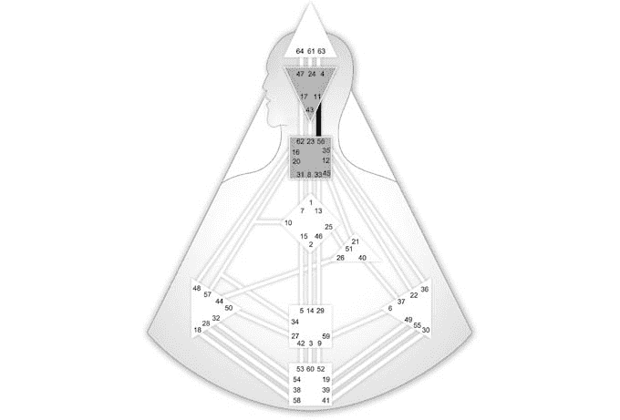

好奇的信道透过新想法的闸门（11）及刺激的闸门（56），链接逻辑中心与喉咙中心。追寻者永不停止追寻，无论他们发现什么或发现多少。好奇心迫使他们不断追求刺激，探索新的想法以及看待事物的方式。这种好奇心并非为了发现特定的事物，而是“你看看我发现了什么，这正是我所相信的真理。”

**背景**：社会人的社会责任是分享，好奇的信道为我们带来这些天赋异秉的人：说书人及野史学家。他们是真相追寻者，他们把握机会来教育大众。他们的故事给了我们评估的机会：我们想要的是新的点子？是传递信念？还是人生有所蜕变？或是以上皆非？不像逻辑性的声音，总会聚焦于数字与事实之上，抽象性的声音具备蜕变的潜力，收集所有片段的信息，并填满其间的空缺，自行阐述。如此一来，信息将转化为活生生的故事，得以刺激人们的想像力及情感，带来强大的影响力。相对于在实质层面有所发现，56 号闸门更着迷于形而上的追寻，为了满足自己，他们不断迎向各种刺激与体验，但若要他们自行创造体验，则感到兴趣缺缺。

**个人**：你对于人应当如何体验人生，有自己独到且充满哲理的反思，由此信手拈来，交织成各式各样的点子与故事，化为你的创意与个人风格的展现，极具魅力。你拥有令人称羡的天赋，能够将一系列新颖的想法，重新形塑成故事的形式，寓教于乐，教化大众。即使这些故事可能有夸大的成分，就像孩子童言童语说着学校里发生的事，半真半假，就算如此，你还是能吸引他人的注意力，为众人带来启发。你深信只要相信就会看得见，你对探究事实缺乏兴趣，但对于如何阐述故事及其延伸出来的教育意涵，却充满热情。你的故事充满生活化的比喻，即使这来自你个人的体验与发现，却往往比较适用于他人，反倒无法用来引导自己。这些故事需要分享出来，也需要被收集与储存，让现在与未来的世代，得以从中反思及演译。对于人类来说，这是一段独特的进展历程。

**人际**：我们早已不再仰赖吟唱诗人的歌谣，来了解世界上正在发生的事。然而，我们仍旧佩服那些说故事的人，擅长编出奇谈轶事，进而衍生出发人深省的警世评语。观众是否可以感受到故事的魔力，取决于说故事的时间点是否恰当。若这群能言善道的说书人及老师们，都能够遵循各自的人生策略与内在权威，他们就能够有效地提供信息，为众人带来欢乐与启发，并且乐在其中。

##### 11 号闸门：和平（泰卦）－新想法的闸门

由于个人或社会处于和谐的状态，在采取新的行动之前，先行衡量

中心：逻辑／四等分：突变／主题：透过蜕变，达成目的

右角度交叉之伊甸园—并列交叉之想法—左角度交叉之教育

点子是概念，而概念则是将感知表达出来。在 11 号闸门中，我们将各种可能性概念化，转化为各式各样的点子，然而，点子来来去去，这些想法并不等于行动的处方笺。在这抽象的体验过程中，你会拥有一段安静的片刻，让你静下来好好评估，归类出在这段上上下下，载沉载浮的体验之中，最后留下来，被记住的会是什么。你很容易只记住自己喜欢的事情，其余的一切，则删除在记忆之外，随着时间过去，想法变得过度理想化，然后变成信念，最后化为庞大的信仰体系。你在别人的点子里头找寻灵感，激发自己产生不同的想法，同时你也乐于丢出自己的点子，来启发别人。这过程并非杂乱无章，想法来到喉咙中心，透过言语来表达，仅供反思，而非以行动来显现。若试图以脑中冒出来的点子，来解决自己人生中的难题，最后只会感到挫败，引发更大的危机与困惑。然而，你若只是单纯让自己回味过往，细数回忆中那些精彩的细节与片段，就能从中获得许多乐趣。若缺少 56 号闸门，你会忍不住想说出自己的故事，过于冲动，而无法等待至适当的时机才说。

*   第 6 爻—适应力
*   第 5 爻—慈善家
*   第 4 爻—老师
*   第 3 爻—现实主义者
*   第 2 爻—严格
*   第 1 爻—和调

##### 56 号闸门：寻道者（旅卦）－刺激的闸门

随遇而安。串连短程的活动达成长久的延续

中心：喉咙／四等分：文明／主题：透过形式，达成目的

右角度交叉之律法—并列交叉之刺激—左角度交叉之分心

56 号闸门是想法汇集地，视觉记忆在此重新整理，并透过口语传述。这个闸门是业余的历史学家，这是说书人与哲学家的论调，他们说“我相信”，但是想法不见得是解决之道，也不是呼吁大家采取行动，而是一趟长时间的旅程，带来启发，形塑我们许多理想与信念，你的大脑将人类的体验转化成语言。想法一旦以口语表达出来，就完成了整个过程。关于你想探索的新想法，或者新体验，都深受你个人的感觉所影响，而你的回忆或故事版本，极主观且具选择性。你教导我们关于人生这回事，将涵盖部分的事实，而人生中独特的课题，则来自于你对种种体验如何诠释，这其中也带有丰富的感情。你的故事为人类发展的过程，增添了丰富的色彩。若缺少了 11 号闸门，为了讲故事，你常常会需要寻求新的刺激与灵感。

*   第 6 爻—谨慎
*   第 5 爻—吸引注意力
*   第 4 爻—权宜
*   第 3 爻—疏离
*   第 2 爻—链接
*   第 1 爻—质量

1.  关于组织能量，请见第十一章检索。 

### 家族回路群

防护及意志力回路
主轴关键字：支持

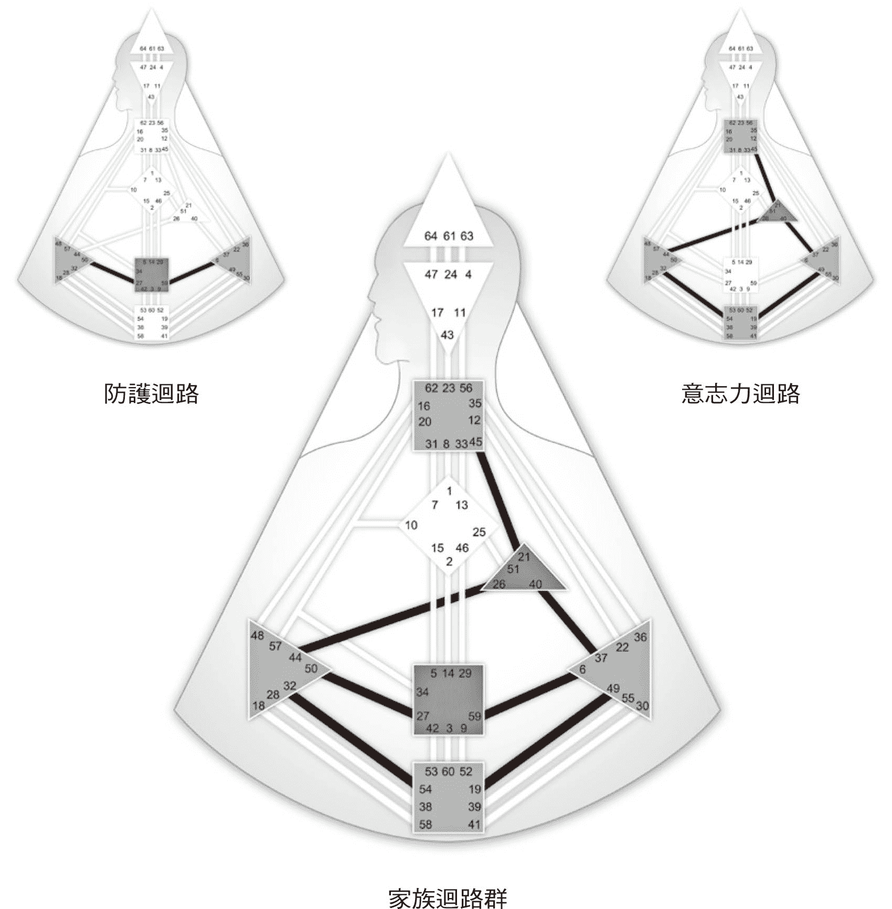

当我们进入家族人信道群的范畴，会看到支持以相互依存的方式呈现，而“非自己”则变成互相依赖。相互依存代表有来有往，彼此互惠，是早期社会建构与维持的模式。部落的功能是找出不同的解决方案，处理生活上所面临的各种状况，好让人们得以共同生活在一起，提供生产力，并且增强防御力。透过共识、血缘关系（祖先）与歃血为盟的忠诚，部落让我们在生活上与彼此有所链接，家族的核心价值在于共有，所有事情都由所有人承担，每个人的事也都是其他人的事。这就是为何家族会被贴上“黏答答”及占有欲强标签的原因。对家族而言，支持是关于拥有。家族对于人们的基本需求非常敏感，像是食物、居所、衣服以及凝聚一切的架构。当所需的物资供应充足，王国是和平的。而若有所匮乏，部落会准备好揭竿起义，好让资源过剩与资源不足的各种族群之间，重新取得平衡。革命，就是族群公义的展现。

家族回路群是由两大回路组成：主要是意志力回路，次要则是防护回路。意志力回路具备双重重点：一开始，聚焦在物质世界层面，像是家庭，或财务资源的创造与分配。接下来第二个焦点，则是让人类在物质世界的需求，与底层对神（灵性）的渴望之间，取得平衡。意志力回路创造了两股持续支持的力量，凝聚家族。而防护回路则是着重在制造、养育、滋养并且守护人们的生命（家族）以及奠定家族关系的法则与价值。

若我们将人体图当作电路板深入探索，可以发现核心的整合型信道坚决独立在一切之外，俨然成为自给自足的缩影。而个体人回路群将人性中的独特性激发出来，奠定了突变之路的基础。社会人信道群则是坚定地以公共事务、社会互动以及相互尊重为依归。部落强大的社群结构以忠诚为本，有其阶级分明的指挥链。家族人回路在周围筑上一道墙，想将其他回路群标示为外人，而同时，防护回路则善用其穿透力，与人亲密，承诺给予滋养并提供资源，其威力甚至能将最有棱有角的外人，也一并拉入共同生活的模式中，相互链接。

直觉中心的本能求生意识，透过感官，尤其是嗅觉、触觉和味觉来传达讯息。关于家族显著的个人忠诚度，及其在性层面的亲密能力，为直觉意识大力推崇，并聚焦之所在。这也成为指标，标示出大众的诸多期待，与支持应当以什么样的形式展现。举例来说，世代相传的著名祖传食谱，传承下来的是属于家族的认同；一言九鼎，以握手或亲吻就代表着成交；好友肝胆相照，以歃血为盟。

家族最显著突出的特色，就是买卖议价，达成协议，换句话说，就是以协商来取得应允的支援。“如果你帮我抓背，我就帮你抓背。只要你外出工作赚钱养家，我就愿意清理房子带小孩。”买卖议价，讨价还价贯穿整体家族回路中的每一条信道，这赋予或缺省了，效忠于更高的统治阶级及其价值的必然性。“如果你愿意献上尊敬与税金，我会保护你，让你免于入侵者的危害。”部落中的协议确保种族得以存续。综观历史，部落是基石，让我们以家庭为单位，同时也以国家为形态而聚集。在此决定了我们如何抚育下一代、选择职业、制定法律、维持治安以及祭祀神明。若没有部落与家族，我们将无法在社会中好好照顾自己。家族让我们每个人都有自己所属的支持网络，只要我们在自己的位置上尽其所能，有所贡献，就能活得安全无虞。

### 防护回路

关键字：支持

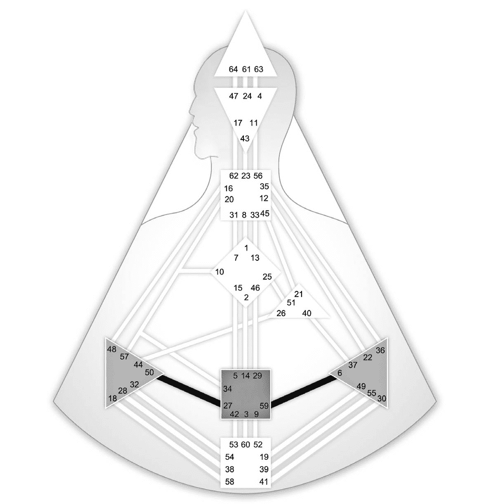

**信道：**

59-6：亲密的信道　专注于生产

27-50：保存的信道　监护人

防护回路是由亲密（生产）的信道以及保存（照顾我们所产下的后代）的信道所组成。此回路在人体图上看起来呈现摇篮的形状，正是确保人类未来得以在地球上存续（透过生育与照顾）最恰当的比拟。防护回路的基因遗传程序，正如自私基因论[[1]](#6-12.xhtml_fnX-1)的起源所述，促成人类种族的延续。它的确如此运作，而牺牲的就是我们个人的生活。没什么比得上亲密的信道（59-6）在基因底层必然的设定，不断驱动人类想制造更多。尤其是某部分的情绪波，更容易在不知不觉中，加强了这基因设定的必然性，如此盲目导致最后留下的，只是一团混乱的结局。

为了在地球上延续生命，不稳定的情绪机制所衍生的副产品之一，就是孩子。保存的信道（27-50）本着直觉中心的觉察力，发人深省提醒我们，面对情绪／体验化的亲密信道所创造或生产的一切，要负起滋养与保存的责任，如此一来，才能为家族打下生存的根基，确保后代子孙能顺利长大成人，繁衍更多后代，维持基因库运作顺畅，让我们的生物形式得以延续。而这也是家族主要的贡献，让意识层次得以不断演进与发展，相对于其他回路与回路群，家族回路是唯一的回路，在底层具备基因的必然性，并且有能力抚育其所创造出来的一切。

接下来会详述防护回路的信道及闸门内容。

#### ▸ 亲密的信道：59-6

专注于生产的设计

回路：防护（创造力的信道）／信道类型：生产

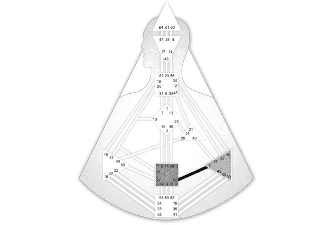

亲密的信道透过性的闸门（59）和摩擦的闸门（6），链接荐骨中心和情绪中心。59-6 信道是人类本质中，关于创造力的核心，源自于荐骨中心强而有力的量子能量，与称为“亲密”的情绪能量。59 号闸门对性的欲望，加上 6 号闸门蕴含喜悦／痛苦的情绪波动，带领人们进入了各种极度个人，具备强大穿透力，深具旺盛生产潜能的关系里。

**背景**：若情绪中心被启动了，这就是此人的权威，等待情绪波走过而重获清明，需要时间。如果这条亲密的信道被非自己所制约，变得随兴，又不理会自己荐骨的回应，将徒增困扰，陷入十分复杂的社交关系。这也可能会造成余波荡漾的长程影响，像是不被期待的孩子，或是创业失败的经历。在这条家族信道之中，蕴藏着亲密的潜能，需要长时间的耐心与培育。也因为如此，不管与工作伙伴或亲密爱人，在与任何人创建亲密关系之前，先好好经营彼此的友谊，才会是最适当的做法。

**个人**：你渴望融合，若能随着时间，透过回应来引导，就能在许多层面，拥有健康并深深感到满足。你本身俱足的亲密能量，能让你轻而易举，快速穿透别人的能量场，引发舒适而温暖的感受，孕育了任何形式的创意与努力，铺排出一条可行的路。创建各种人际关系，这是你的天性，也是你真正的资产，虽然这与人亲密的能力，也让你容易被人误解。你的无心，对方可能会认为你在打情骂俏，或是“对他有意思”。6 号闸门决定了情绪收放的时间点，决定了让人靠近，或把人推开。静候你的情绪周期，随着时间过去，就能分辨或发现你们两人之间，是否已经激荡出火花，若仍浑沌未明，当情绪波袭来，可能又会再一次将你们送作堆。

**人际关系**：尽管在本质上，就是会体验强烈的情绪波动，但这些具备亲密信道的人，情绪上却可以表现得相当稳定。当另一个人接近或触碰他们，其情绪波就能被引动，或到达足以回应的程度。当情绪周期走至对的点上，一个适时的拥抱或搭肩，能协助他们将那些无法说出口，压抑已久的情绪都抒发出来。有一种亲密的形式，能够透过眼泪、透过感同身受的一声叹息、或是因为有人能懂得你，而全身都能深深放松开来。如此一来，就能在强烈情绪化的宣泄中，维持健康的平衡。若两人各自具备信道两端的其中一个闸门，连接形成火花，最能体验到这条 59-6 信道的威力。

##### 59 号闸门：分散（涣卦）－性的闸门

有能力打破藩篱，合而为一

中心：荐骨／四等分：二元性／主题：透过人际链接，达成目的

右角度交叉之沉睡的凤凰—并列交叉之策略—左角度交叉之灵魂

59 号闸门是关于性结合与创造新生命，运作我们在基因层面的策略。它以“能量场切入者”闻名，在此，我们穿透或打破藩篱，定义了如何与人亲密，为求繁衍后代，或与他人创业，发挥创造力。59 号闸门的六条爻（表列如下）叙述了六种与人链接的途径。这些都是基因的策略，各种角色皆明显将焦点放在，如何选出最棒的伴侣，好孕育出最有能力存活的下一代。举例来说，第四条爻的你，需要先做朋友，那么对第六条爻而言是正确的一夜情模式，就不会是你的选项。关于这件事情，你唯一真正的选择，必须透过你的权威，来决定自己如何开始每一段亲密关系。家族式的亲密很温暖，情感丰富，这样的亲密无法言喻，透过碰触、滋味与味道，让你能更强烈地感受到彼此。若没有回到你的权威，了解 59 号闸门关于基因的策略（角色），以及 6 号闸门的情绪波动，如何介入其中，所谓的亲密所带来的，只会是困惑与冲突，以及无生产力的诸多链接。你可能会发觉，自己自动会寻找有 6 号闸门的人，而他们则主导了与你互动的时机。

*   第 6 爻—一夜情
*   第 5 爻—蛇蝎美人或大众情人
*   第 4 爻—手足情谊
*   第 3 爻—开放
*   第 2 爻—害羞
*   第 1 爻—先发制人

##### 6 号闸门：冲突（讼卦）－摩擦的闸门

进步的基本构成元素；“没有冲突就没有成长”的定律

中心：情绪／四等分：二元性／主题：透过人际链接，达成目的

右角度交叉之伊甸园—并列交叉之冲突—左角度交叉之飞机

位于情绪中心的 6 号闸门，具有三种情绪意识模式：感觉、情绪和感官。这是强而有力、机动性、如同波浪起伏的组合，其设计是创造冲突。冲突产生热力，而热力带来成长。59 号闸门的目标：生殖力之必需。当你进入另个人的能量场，引发冲突，这就是启动机转的运作方式。如果（或当）冲突化解了，或是达成和谐的共振，此时就有了新开始，亲密得以达成。在这个开始发生之前，你必须等待，是否准备就绪，是否具备生产力，两者皆受情绪波动所影响。6 号闸门宛如隔板，决定与人亲密，或封闭。此闸门也与你的 pH 值有关，创建并维持了一道屏障，决定身体内与外的界限。也决定了谁得以与你亲近，何时可以亲密，而你会扮演什么角色以对应链接。每一次，当你感觉到亲密的吸引力，让你的策略与权威成为指引。情绪中心里的每个闸门，各自与某种特定恐惧相关，而与 6 号闸门相关的恐惧，是恐惧亲密，这也就是为什么，6 号闸门总会找寻 59 号闸门，因为 59 号闸门有能力打破藩篱，通往亲密。

*   第 6 爻—调停者
*   第 5 爻—仲裁
*   第 4 爻—胜利
*   第 3 爻—忠诚
*   第 2 爻—游击队
*   第 1 爻—隐退

#### ▸ 保存的信道：27-50

监护人的设计

回路：防护／信道类型：生产

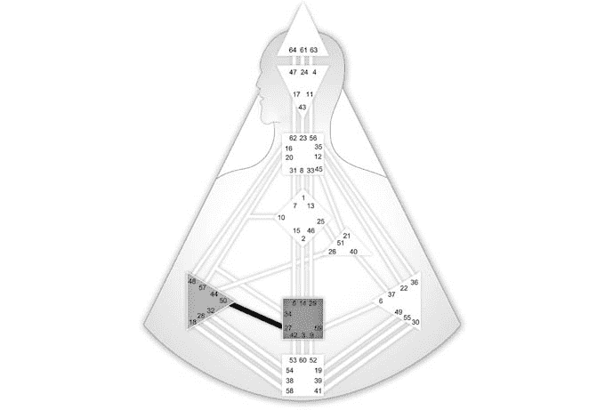

保存的信道透过照顾的闸门（27）以及价值的闸门（50），链接荐骨中心和直觉中心。27 号闸门带着对他人无私的关怀，强化所有家族活动的本质与内容，使得一切皆以照顾和滋养相关。另外，为了维护秩序，及丰富、引导和捍卫生命，50 号闸门为部落制定了传统价值与律法。27-50 信道设立了各个层面的监护体系，以关怀需要的，同时保护并保存部落，与其充满创意的组织。

**背景**：59-6 信道来自荐骨的能量，被情绪波里所蕴藏的温暖，与在情感上的亲密所影响，而聚焦在创造与生殖上。当孩子一出生，荐骨对其脆弱的状态将立即有所回应，而引发直觉中心出现强烈，且自发性的求存本能，冷静理解到我们必须照顾自己所生出来的后代。以这样的方式，人体图中那温暖的，充满体验的那一端，才能与另一端取得平衡，而所谓的另一端，在此是关于生存意识、需要守护、或对那些无法照料自己的人，愿意负起照顾的责任。在此层面所表现出来的支持，代表的是承受，对家族而言是绝对必要的。

**个人**：你的能量场自然而然，会引发旁人愿意信任你，而人们也自然想从你身上获得支持与滋养。这条信道的支持形式有许多种，从创建并守护这块土地的价值与法律，代表家族部落里的良知，到抚育幼者，照顾病弱及老者。你有能力担当许多责任，也容易承担过多。就算你是天生带来滋养的人，但是唯有透过你的策略与权威，才能分辨你是否承担了正确的责任。你的智慧根植于古老意识的层次，带来利他与慈悲的教诲，你天生就明白滋养的开始，就是正确照顾好自己。只有强壮与健康的人，才能滋养并引导别人往求存之道迈进、变得更健康或更成功。这就是所谓的“已领悟的自私”，即使这常被视为另一种自我放纵，其实两者大不相同。如果某人想得到你的关怀，他必须先开口，也唯有透过你真实的回应，才能分辨你有没有能力付出，以及对你来说，这付出是否正确。

**人际**：27-50 信道有两种很强的防护机制。拥有 50 号闸门的人本能地会非常关注家族的延续。其创造、防卫或挑战治理公共关系所依循的基本价值与法律，负责保护，同时延续相互支持，层级分明的社群体系。透过 27 号闸门，我们的孩子得到滋养、教育、调理与疗愈、学习群体相互支持的重要性，这让他们存活无虞，才有余裕得以繁衍与养育下一代。而所滋养也不仅限于幼者有所长，老者也要有所终，而老者的智慧才能流传并被记载下来。世界上所有的一切都需要被滋养和照顾，这也包括公共基础建设的维护。

##### 27 号闸门：滋养（颐卦）－照顾的闸门

透过关怀，来提升所有活动的品质和内容

中心：荐骨／四等分：初始／主题：透过心智，达成目的

右角度交叉之不预期—并列交叉之照顾—左角度交叉之校准

透过照护弱者、病人和年幼者，27 号闸门的能量总是把焦点放在维持与提升生活品质。这个闸门具备强大利他主义的潜能，德蕾莎修女的一生就是一个例证。你的角色是透过慈悲的力量来滋养与培育，施予关怀。另一方面，你也需要先滋养与培育自己。你必须先照顾自己，如此一来才能俱足能量和资源，来照顾其他人，接下来，就是跟随自己内在权威的引导，来决定将你的精力运用在何时与何地。无意识的滋养与培育，只是浪费珍贵资源的行为。这个闸门的每一条爻，各自代表着根据不同层面的需求，与家族链接并付出关怀的不同模式。若缺少 50 号闸门，你可能会因为缺乏直觉，也没有既定价值可依循，而随着本性中想照顾别人的冲动，无法定出健康的界限，导致牺牲了自己，或牺牲了属于你的福祉与利益。

*   第 6 爻—谨慎
*   第 5 爻—执行者
*   第 4 爻—慷慨
*   第 3 爻—贪婪
*   第 2 爻—自给自足
*   第 1 爻—自私

##### 50 号闸门：熔炉（鼎卦）－价值的闸门

传统价值的存在丰富了现在与未来，这就是历史延续的价值

中心：直觉／四等分：二元性／主题：透过人际链接，达成目的

右角度交叉之律法—并列交叉之价值—左角度交叉之希望

每一次亲密的举动所创造的新生命，这些经由结合而产生的后代，需要被滋养至成年。50 号闸门有“守护者”的神秘名称。身为家族的法律制定者，他规定什么是对什么是错，而这些规则就是孩子们道德制约的来源。家族的防护回路其核心，存有源于直觉中心的求存恐惧，驱使大家以保护并引导年轻人的方式，来确保家族的生存与延续。你在这里的角色是要守护家族的价值、家族律法的诚信，以及能够维护群体福祉的架构。根据特定不同的爻（见下方），你的任务是要认清哪些价值、法律或规则，能保障部落所在意的安危。你源于本能的觉察力，能审视出败坏与不公、不必要或利己，又或是需要被挑战与改变的地方，而这就是你在家族中展现关怀，并滋养生命各种面向的方式。若没有 27 号闸门，你可能会试图去做些什么，来照顾别人，而这并不是你该做的事，如此一来，你内心的恐惧，害怕承担自己还无法处理的责任，又会如影随形，再度现身。

*   第 6 爻—领导力
*   第 5 爻—一致性
*   第 4 爻—腐败
*   第 3 爻—适应力
*   第 2 爻—决断力
*   第 1 爻—移民

1.  自私基因论：由李查．道金斯（Clinton Richard Dawkins）在其著作《自私的基因》（The Selfish Gene）提出。用来解释生物体之间的各种利他行为，尤其是亲属之间的关系。两个生物体在基因上的关系愈紧密，愈可能表现无私。 

### 意志力回路

关键字：支持

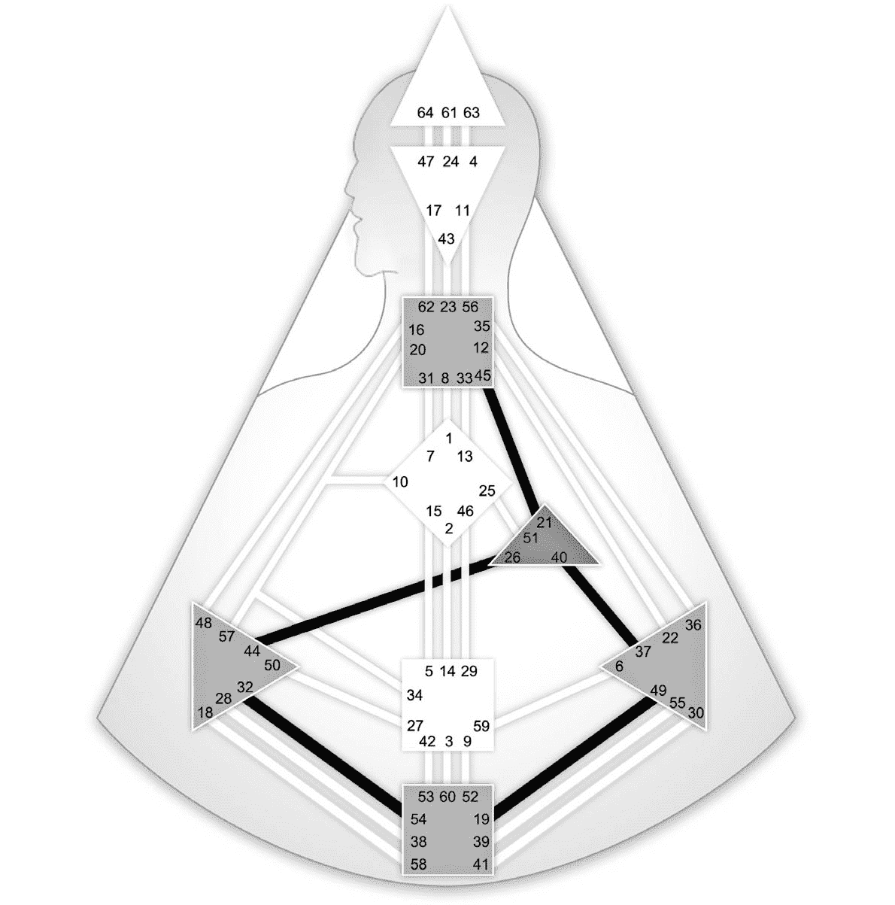

**信道：**

54-32：蜕变的信道　自我驱动

44-26：投降的信道　传递讯息

19-49：整合综效的信道　敏感

37-40：经营社群的信道　凝聚与归属感

21-45：金钱线的信道　唯物主义者

在人类图上，意志力回路包围了防护回路。了解意志力回路在物质以及社群上的支持力量，支撑着以生殖与滋养为主的防护回路。这让我们更清楚家族的本质及其范畴，对人类进化所带来的贡献。

意志力回路并未接通荐骨中心，不具繁衍生命的能力，也没有与脑袋层面的察觉（逻辑中心）相链接。意志力回路的枢纽站是心或意志力中心。这组回路的五条信道皆汇集于自我的意志力（Ego’s willpower），也就是说，意志力向外延伸至全世界，自给自足，同时也换来应得的休息。

借由意志力回路，我们可以发现有两派分歧的哲学观点，起始于根部中心，然后相会于家族之心（意志力中心），这两种观点定义了两股支持家族的力量。我们从组成部落的核心单位，依循传统以血缘为主，形成长幼有序跨世代的家族关系，以及具有野心与物质主义而组成的企业之中，得以体验社群生活中，归属于灵性的层次。在此回路之中，神秘的奥秘伴随着基本世俗与物质的发展，两者齐头并进。我们在意志力回路之中，能同时找到资本主义的实用主义，以及社会主义和共产主义的理想。

当我们将这两派的观点放在一起，会发现在意志力回路里头所隐藏的真相是：灵性蕴藏于世俗里。世俗生活里的每一个当下，表里一致，全然地活出自己，这将会是一段美丽的过程，宁静揭露出我们自身与灵性的链接，万物如实如是，合而为一。

接下来将会详述意志力回路的信道及闸门。

#### ▸ 蜕变的信道：54-32

自我驱动的设计

回路：意志力／信道类型：投射

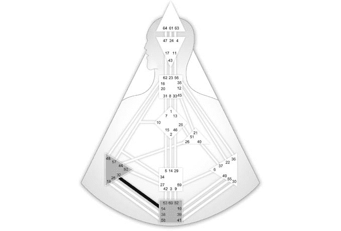

蜕变的信道透过驱动的闸门（54）以及连续的闸门（32），连接根部中心及直觉中心。54-32 这条信道代表着有野心，同时也坚持不懈地努力着，其驱动力来自于渴望被认可，渴望在人生中得到更高的地位。对于蜕变的可行性与否，具备察觉的潜能，有时会因为对失败的恐惧而扭曲，在社交互动的火花中得到驱动力，引发想往上爬的动力。

**背景**：蜕变信道的潜力充满能量，他们能运用自身的才华与能力，白手起家，向上提升，翻转原本一生下来即隶属的社会阶层。32 号闸门总是不断寻找才能，其驱动力源于恐惧，恐惧自己的部落并非顶尖，或无法撑过下一波经济衰退，无法延续。认知到家族本身的脆弱，担忧是否得以存续，就此形塑了 54-32 这条信道的野心，转化为不断往上爬，不断蜕变的渴望。这同时也隐藏了一条神秘线索，透过 54 号闸门第四条爻：启蒙与无明，织就了灵性的线索，在最纯粹的状态下，点燃了蜕变的动力。

**个人**：根深蒂固要为家族热忱服务与自我牺牲，在家族的范畴中，这条蜕变的信道是最佳的实例。当你开始显露自己的才能，部落的支持就此开始，那些曾受你帮助的人，或者因为有你协助，而达成其雄心壮志或深受启发的人，将回馈给你，而你的努力与用心，也会得到鼓励。你对部落的忠诚与贡献，将获得一次次的升迁作为奖赏，你愿意比任何人都更努力地工作着，甚至变身工作狂，以证明自身的价值与重要性。你真正的目标，是好好体验内在这股想取得认同的动力，健康地与这股动力共存，同时互利共生。你的直觉敏锐，会带领着你找到适合的职业，让你得以发挥所长，善加利用自己的天赋来赚钱，如此一来，你也能善用自己独特的能力，支持别人得以发挥其潜能。

**人际**：在物质世界中，启动蜕变的野心由直觉意识所引导。也就是说，有这条信道的人凭借其本能，就能察觉到是否需要，或是何时需要支援，以获取更大的财富，或透过个人的进步，以确保成功。这股持续想赚取更多金钱的压力，驱使全球经济不断蜕变，到最后，唯有通过时间考验而留下的蜕变，才具存在的价值，而要创造延续性，则需要部落的支持。即使在今日全球化的社会，一个国家在财政上要实现其目标与展望，联合相互支持的盟友，至关紧要，蜕变无法只靠一己之力独立完成，能否力争上游，也总是取决或倚赖来自上层的期望。当一个具有 54-32 信道的人被认可，并得到部落全力支持，那么接下来，部落也会期待其付出，将以平等互惠的方式，回报以对等的报酬，而这也是部落系统延续的模式。

##### 54 号闸门：少女出嫁（归妺卦）－驱动的闸门

在世俗的社会范畴中交流，同时也在神秘的宇宙关系中互动

中心：根部／四等分：突变／主题：透过蜕变，达成目的

右角度交叉之渗透—并列交叉之抱负—左角度交叉之循环

54 号闸门为人类提供动力和野心，让家族在物质层面有所蜕变，得以超越其他家族。不管是最入世的野心，或是隐藏于内，最出世的灵性志愿，在此皆获得实践的能量。唯有当我们掌握了自身的本能，在这世俗的世界蓬勃发展，那么灵性层面的蜕变，才有可能发生。透过物质世界，你得以活出精神层面最理想的状态，抱负等同你个人潜能的实现。若有位居高位的人愿意拔擢你，就是很好的机会，让你能力争上游，在人生中得到更好的位置。你内在渴望“向上提升”的冲劲，同时也为你周围的人，带来蜕变的动力，拓展出一片天，让众人能够在平等的条件之下，大展身手。然而，你的动力需要方向，所以你很自然地会找寻具有 32 号闸门的人，协助你将自身的野心，导向有其价值，并且得以延续的事物上，若缺乏方向，你的动力只会是盲目的匹夫之勇而已。

*   第 6 爻—选择性
*   第 5 爻—宽大
*   第 4 爻—启蒙／无明
*   第 3 爻—动用关系
*   第 2 爻—谨慎
*   第 1 爻—影响

##### 32 号闸门：持久（恒卦）－连续的闸门

唯一持续不变的就是改变

中心：直觉／四等分：二元性／主题：透过人际链接，达成目的

右角度交叉之马雅—并列交叉之保存—左角度交叉之限制

32 号闸门的察觉力是基于本能，辨识出蜕变的可行性，由于底层隐藏着对失败的恐惧，总是能替奔驰的野心踩煞车，32 号闸门有能力适应，却同时能保有其本性，这是来自直觉中心的功劳，确保家族在物质层面用度无虞。这也是你的功劳，主要在于辨认出有价值的良才，然后留在家族之中培植成栋梁，你其中的一项天赋，就是能辨识出谁具备技巧，或者有足够的资质学习，得以在外面的世界飞黄腾达，接着运用你的影响力，引领他们获得权威人士的关注。这是一个长时间优柔寡断的闸门，你很容易陷入苦思，不断踌躇该如何取得平衡。游移在已经成功运作（保守主义）的这一端，与另一端的未知与冒险（恐惧失败），开放个人或企业组织，迎向伴随而来的改变与蜕变。然而，改变不可避免，这已然成为人生方程序的一部分，从中成长就是过程中最大的收获。只要倚赖你的权威，就能找到对的时间点，时时与你自身的直觉本能相对应，你的智慧将与时俱进，以各种方式让我们的社会免于重蹈覆辙，并且让真正有价值的一切，得以长久延续。若少了 54 号闸门，32 号闸门会感觉缺乏持续的燃料或动力来源，或少了迈向成功的抱负与野心。

*   第 6 爻—安然以对
*   第 5 爻—弹性
*   第 4 爻—强权即公理
*   第 3 爻—缺乏连续性
*   第 2 爻—抑制
*   第 1 爻—保存

#### ▸ 投降的信道：44-26

传递讯息的设计

回路：意志力（创造力的信道）／信道类型：投射

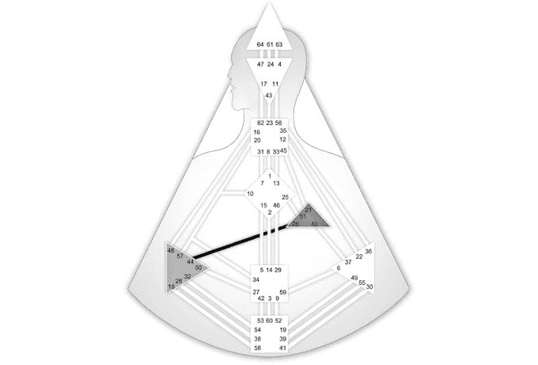

投降的信道透过警觉的闸门（44）和利己主义者的闸门（26），链接直觉中心和意志力中心。这条信道根植于本能的察觉力／智慧，存有深刻的家族记忆，与意志力相链接。这样的组合让传递讯息的人，能够有选择性地利用过往的历史，筛选出具说服力的观点，以销售给特定的族群，保证这将会让一切变得更好。具有 44-26 这条信道的人是资本主义者，而企业则是他们另类的创作艺术。

**背景**：身为唯一一条链接意志力中心与直觉中心的信道，44-26 信道属于全身主要的健康网络之一，26 号闸门对应的是胸腺，而身体的免疫系统于产前在此形成，从实际层面来说，这条信道具有警觉的本能，就是会注意到哪里有威胁，或者哪里需要改进或更换，好让部落运作顺畅，长治久安。具有投降信道的人嗅觉灵敏，感官敏锐，总是能闻到人们隐藏的需求，为了让家族获益，即使在众人意识到自己的需求之前，他们总能善用自身的意志，行操控之实。

**个人**：评估他人是你的本能，也是你与生俱来的天赋，为此你擅于为人配对，你可以为他们找到合适的商品、工作甚至是理念。为了得到你所提供的服务，对方需要以等值的报酬来交换，而这报酬的多寡，以你个人认为的公平为准则，这也必须考量到，在休息与工作间获得健康的平衡。你并非待在办公室里，一天工作八小时的类型，你可以在一段压缩的时间里，快速完成并超越绝大多数人一整天的工作量。请信任自己的本能，让它来引导你的人生，如果你发现某个人身上，或你正在处理的工作“闻”起来不太对劲，就别涉入其中。

位于意志力回路左边的交易型态，与右边的模式不同。从“如果你为我做这个，我就会为你做那个”到“我正在卖这个很棒的小东西，如果你要，只要 12.95 元就好”。你是企业家，也是团队中的一员，团队中的每一个人都必须有酬劳，而你是最前线的推动者／推销员，你把钱带进来，再依序分配给生产团队的每一个人。而团队是否喜欢你（和你的策略），取决于你可以为他们创造多少资源。这条信道若要发挥得淋漓尽致，需要等待，等待市场准备好，等待家族认可你的才能，承诺支持你，并且请你代表他们来推销你自己或是你的产品。透过这样的认可，才能赋予你发声的平台——尤其当你成为政治人物时，更是如此。

**人际**：传讯者直觉敏捷，为了有效地传递讯息，他们会采取最理想的说服形式，同时，他们也能针对瞬息万变的市场与状况，自发性地调整广告说辞，或推销的切入点。这条信道具有创意的天赋，包括他们天生很懂得如何吸引大众，以及如何操控或鼓动别人的自我，让大众进而产生渴望，想要购买他们所销售的一切。这样的天赋对电影制片、销售员、平面设计、广告执行、政治家与外交官来说，都是极具价值的资产。

##### 44 号闸门：聚合（姤卦）－警觉的闸门

不带有任何前提与条件，就是互动得以成功的基础

中心：直觉／四等分：二元性／主题：透过人际链接，达成目的

右角度交叉之四方之路—并列交叉之警觉—左角度交叉之轮回

44 号闸门是关于记忆，记住让我们成功获得物质所需的生活模式，这里所说的记忆，属于人类物种整体的求存智慧，值得信赖并有其一贯性。你在每个当下皆能保持警觉，自发性地寻求正确的关系或互动，推动既有的潜能，将之转化为可能。你所记住或传达的一切，形塑家族于物质层面的方向，最终强化自我存在感及力量。你控制了 26 号闸门的运作模式，不管是销售、保卫或为家族而奋战，我们在此鼓吹并宣扬家族价值，借由回溯过往记忆，我们明白饥饿的孩子并不健康，而物质层面的不虞匮乏与获得健康的身体，两者必须携手并进，你将协助家族消除源自过往的恐惧。当你分享自己的觉察，同时也得到家族认可，位于意志力中心的 26 号闸门将根据直觉性的记忆，挑出未来的可能性，为了家族而运用意志力将之成真。直觉中心并非动力中心，你必须得到来自意志力中心的动力，才能将你的直觉，为确保家族延续而必须完成的蜕变，执行到底。若没有 26 号闸门，你可能会过度膨胀进而过度承诺，或做出你根本无法完成的承诺。而你最恐惧的，来自过往的包袱，可能会再次重现。

*   第 6 爻—超然
*   第 5 爻—操作
*   第 4 爻—诚实
*   第 3 爻—干预
*   第 2 爻—管理
*   第 1 爻—制约

##### 26 号闸门：伟大的驯服力（大畜卦）－利己主义者的闸门

让记忆发挥最大的力量，运用于长程持续的培育

中心：意志力／四等分：突变／主题：透过蜕变，达成目的

右角度交叉之统领—并列交叉之魔术师—左角度交叉之冲突

26 号闸门会操纵记忆，或是说对过往选择性记忆，其目的是要说服我们远离恐惧或转移我们的恐惧。真实与谎言之间的界线模煳不清，而将潜能和可能性转化成事实，并“卖”给大众——有其代价。你是一个天生的推销员，事实上人们期待你夸大，你与生俱来具备操控记忆的能力，加上意志力充满能量，你原本的设计就是能承受拒绝。如果有人能赏识你，看见你的这些技能，给你一份工作让你能自订行程，在物质层面获得丰盛的报酬，同时在工作与休息之间达成健康的平衡，你就能充满冲劲为家族站上前线，展现旺盛的意志力，全力以赴。等待伯乐看见你，只承诺你做得到的事，才能让你保有对他人的影响力。依循你的策略与权威，在部落里做买卖要有诚信，这能强化你的自我意志，也能在生理上，让你的心脏保持健康。若缺乏 44 号闸门源于本能的察觉力，那么将很难分辨该如何、在何时，或以什么样的方式，才能有效地传递讯息。

*   第 6 爻—权威
*   第 5 爻—适应力
*   第 4 爻—审查
*   第 3 爻—影响力
*   第 2 爻—历史的教训
*   第 1 爻—一鸟在手

#### ▸ 整合综效的信道：19-49

敏感的设计

回路：意志力／信道类型：投射

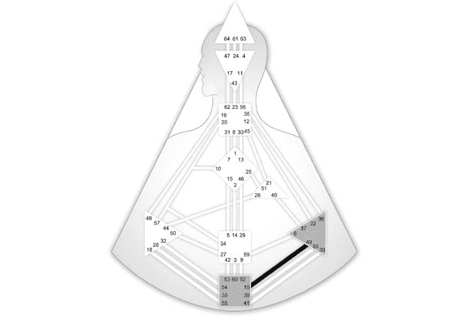

整合综效的信道透过想要的闸门（19）和原则的闸门（49），连接根部中心及情绪中心。透过人类对食物、遮蔽场所、保护、疆界、渴望相信、渴望将一切凝聚起来……种种需求所带来的压力，使部落的型态逐步演化，让我们能以各种奥秘的形式，与神明或某种超自然力量结合为一。19 号闸门促使我们接近彼此，衍生相互关联的家族关系。同时，49 号闸门鞭策着我们，拒绝不符合最高理想的一切，透过彼此以及在灵性层面的链接，相互支持。

**背景**：需求的敏感度与碰触紧密相关，像是达成协议时，我们握手。这在意志力回路情绪的那一端，也经常可见。感性是家族的根基，奠定了结婚与链接，以及离婚的基础。19-49 信道在情感层面散发接纳或拒绝的频率，这是家族的黏着剂，决定谁才是一家人，并且能够取得家族的支持，谁才是真正家族的成员，谁又不是。此频率丝毫不逻辑（民主）也不抽象（体验），更不能强加于家族，就算勉强也行不通。家族的规范，传达的是“爱、荣誉与服从”，而这也让家族紧密链接着，家族里每一位成员，其生命本身即受惠于家族其他成员，为报答养育之恩，须供给每位成员其基本所需，为家族效忠是确保家族得以延续的关键，但忠诚与否则由情绪周期所支配。

**个人**：你对自己在局势中的位置，极为敏感。想被需要，好给予别人支持，以及／或需要被想要，以获得别人的支持，而这也决定了你对幸福的定义。家庭（无论你如何定义它）是你的企业，而你也愿意在内心下必要的功夫，使之成功。举例，在承诺于一段亲密关系之前，像是同居、婚姻或共组家庭，在决定承担其责任义务之前，你会透过长时间相处，花时间去发掘自身情绪的深度，以及你的情绪将如何对未来可能会成为伴侣的另一半，带来影响。在家族中，对你而言最重要的三大需求是：保护资源、你神圣不可侵犯之领域，以及清楚了解你的家族信念体系。显而易见，在实际状况与公平之间，总能取得平衡，就是你潜在的天赋。

**人际关系**：19-49 信道透过创建婚姻关系的原则（稍后会由信道 37-40，经营社群的信道，来巩固这个关系），启动社会共融的演变。这条信道是新娘和新郎的原型，带有维系家族的频率；这是家族延续一贯的传统、仪式和庆典的起源。举例来说，嫁妆的传统，为两人结合提供物质层面的基础，让这对新人能心无旁骛，安心生养下一代。根部中心对 19 号闸门施压，渴望透过各种对外链接的方式，获得喜悦与幸福，但是若被非自己所主导，这条信道的特性则会转成排斥，持续且不合时宜地排斥自己也排斥别人。19-49 这条信道也在哺乳类动物和人类之间，形成跨物种的链接，让我们能驯养并训练它们耕作土地，与人类为伴，并且成为食物供给的来源，既是我们的同伴，也提供我们粮食。同时，这样的链接也出现在祭祀神佛的祭典上，我们牺牲动物的仪式来祈福，以求得庇护。

##### 19 号闸门：靠拢（临卦）－想要的闸门

显而易见，所有的一切皆相互关联，透过接触的行动来实现

中心：根部／四等分：突变／主题：透过蜕变，达成目的

右角度交叉之四方之路—并列交叉之需要—左角度交叉之精致

19 号闸门推动人类两大重要任务：一是基本资源，如食物与庇护所的需求，二是对灵性的需求。这些任务使我们以特定的方式和人互动链接。当人人丰衣足食、安居乐业，并有其信仰，我们将体验到人生与群体融合，健全运转，相互支持的同时，每个人也各有所长，以自己独特的方式贡献于整体。反之，若在部落中出现匮乏或巨大失衡，共有的支持体系崩毁，而一切将无法运作下去。所以你所扮演的角色，就是敏锐察觉家族、社群，以及最终扩展至全球的角度，查看资源是否被藏匿？有没有充分利用？你让大家意识到，我们需要各种资源才能够生存，也才能发挥个人或群体的潜能。而你实行的方式，取决于被启动的爻。这过程往往涉及利益分配与协商，而协商的对象，通常会是与你抱有同样原则的人或组织，他们持有或控制资源。你知道需求是什么，而你会找寻 49 号闸门来满足这些需求。若将压力转向内化，将导致过度敏感，需要被需要并对此成瘾，或只关注自身的索求，而不断陷入“到底有没有人关心我？何时才能满足我的需求？”之类的自我对话中。

*   第 6 爻—遁世者
*   第 5 爻—牺牲
*   第 4 爻—团队合作
*   第 3 爻—奉献
*   第 2 爻—服务
*   第 1 爻—相互依存

##### 49 号闸门：革命（革卦）－原则的闸门

最理想的蜕变形式，是基于更高的原则，而非争权

中心：情绪／四等分：初始／主题：透过心智，达成目的

右角度交叉之解释—并列交叉之原则—左角度交叉之革命

接受与拒绝，结婚与离婚，以及最终革命所依循的诸多原则，是在阶级分明的部落形态下，受情绪周期影响所产生的结果。由于 49 号闸门使你置身阶级的顶端，你需要别人服从你，而这需求则转化为各种模式，包括你如何使用权力，来决定接受或拒绝某人，或对方能否取用你的资源，还是他们得为自己或以别人之名，揭竿而起以推动改革。面对人（或动物）与其特定的需求，你是敏感还是迟钝，取决于他们是否遵从你所制定的原则。换句话说，那些得到你的允许，可以进入圈子里的人，必须愿意支持你与你所设定的原则，其余的人则被排除在外。你的理念是要改变并改造整体社会，尤其着重于食物及食物分配之相关议题。当人们吃饱了，就不需要掀起战争。若需求被满足了，革命就没有存在的必要性，否则革命就成为必要之恶，虽不得已但还是得为之。而你就是做决定的人，你来决定要接受或拒绝，你来决定我们要走上一条什么样的路，才能满足需索的另一端。你害怕被拒绝，也担忧出乎意料的后果，这让你紧张不已。

*   第 6 爻—吸引力
*   第 5 爻—组织
*   第 4 爻—平台
*   第 3 爻—民怨
*   第 2 爻—最终手段
*   第 1 爻—必要性法则

#### ▸ 经营社群的信道：37-40

凝聚与归属感的设计

回路：意志力／信道类型：投射

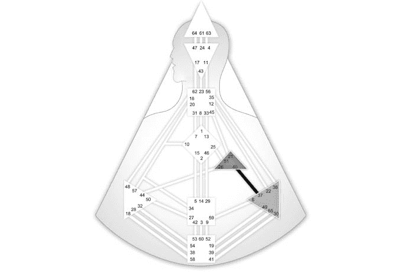

经营社群的信道透过友谊的闸门（37）和单独的闸门（40），连接情绪中心和意志力中心。社群是人类成功进化的核心。社群有其自然的生命力，在挣扎求存，以及自挣扎中解放，两者之间提供了一个转换点，而这也受制于情绪波的牵扯。40 号闸门愿意工作来供养自己所爱的人，但是他们要得到应得的报酬与休息。37 号闸门天生让人喜爱，他们总是不断寻求认同，想找到自己在群体中的归属。

**背景**：在社群的信道中，家族的交易以两股强而有力的动力为后盾，随着时间而清明，而有其深度，同时也加入了意志力，以获得成功。在社群中，交易必须正确进行，社群或家族的关系的链接，及其未来的走向，其交易本身必须由意志力来背书。联合意志力与情绪中心，意味着好交易不会随机发生，必须审慎思量，花时间找出运行模式，以获益双方达成共赢。37-40 这条信道的两个闸门，坐落于人类图曼陀罗的相对端点，所以这条信道相当普遍，对全球进化带来巨大影响。而现今地球周期（一六一〇－二〇二七）正走至右角度交叉之计划（Right Angle Cross of Planning），让我们充分感受到这条信道所带来的影响。

**个人**：如果 37-40 这条信道被启动了，经由等待你才知道谁会邀请你，加入他们的组织或社群。你也会试着去探究自己的归属，或是如何在灵性的层次，融入更大的远景之中。正确的邀请必定会来自亲身接触，不只是讲电话，而是必须经由某种程度的“碰触”，或是人与人经过一段时间的互动而发生。从最基本的意义上来说，每个人皆孤独存在着，然而，你的存在具有实际的目的，你为每个人搭起了桥梁，从此链接了每个独立的个体，而形成社群，在此每个人自豪地各司其职，各有贡献并得到尊重。你明白正当交易的重要性，也知道如何达成协议。“如果你替我做完这件事，我也会为你完成那件事情。我们一言为定，握手或签字为凭。”

**人际**：社群的信道，又称为姻亲的信道，为了链接供给者与分配者，形成和谐共存的关系，必须设定一个强而有力，具适应性，并且清楚明确的协议。在意志力回路这半边，抓住一个男人的心，要先抓住的是他的胃，而不是皮夹。在人体图中，情感／社会化的这半边，表达支持的方式，并非金钱可以买得到的东西，而是不论如何都要并肩作战，一起往前，共同去经历，在此所谓的投资，并非投注于实质的股票与债券，而是彼此的情谊与团队的需求。这就是社群最高的理念，阶级的成分微乎其微，没有人会感觉自己较为优越或低下，每个人都有归属感，而尽其所能作出贡献，团结力量大，因而相互支持，对团队效忠。

##### 37 号闸门：家庭（家人卦）－友谊的闸门

社群其有机的本质，具体实现了宏观与微观的宇宙观

中心：情绪／四等分：初始／主题：透过心智，达成目的

右角度交叉之计划—并列交叉之交易—左角度交叉之迁移

37 号闸门是人体图上最具社群特性的闸门。当你的力量被其他人认可时，就能够发挥你温暖、友善和滋养的天性，将家庭和社群紧紧维系在一起。经由碰触，就能与人创建情感上的链接，这是你与生俱来的能力，同时你的敏锐度非比寻常，可以感受到别人是否开放，能否靠近。人们想让你成为他们企业的代言人，接待新进人员或陌生人，你可能会欣然接受这项提议，前提是这交易本身能为你带来足够的获利，并且条件明确，双方皆大欢喜。37 号闸门代表的是嘴巴，所以关于计划、聚会与准备食物，在你的家族与社群的聚会中，总会成为重要的环节。在 37 号闸门与 40 号闸门的这场交易中，40 号闸门是有意愿的供给者，而你则是其财产与技能层面的分配者。若缺少了 40 号闸门，你将到处寻求，足以提供社群所需资源的对象，与之交易，才有资源可以分配。而你最大的恐惧，就是深陷，或必须成为传统部落中所期待的角色。

*   第 6 爻—目的
*   第 5 爻—爱
*   第 4 爻—以身作则
*   第 3 爻—平等对待
*   第 2 爻—负责任
*   第 1 爻—母亲／父亲

##### 40 号闸门：递送（解卦）－单独的闸门

挣扎与解放之间的过渡点

中心：意志力／四等分：二元性／主题：透过人际链接，达成目的

右角度交叉之计划—并列交叉之拒绝—左角度交叉之迁移

40 号闸门是三个单独的闸门（另外两个是 12 号和 33 号闸门）其中之一，就算身处人群之中，也会带有想独处的感觉。单独感是个体化过程的开端；你必须把自己跟家族分开来。本质上，你内在渴求完整，但是别人接收和体验到的你，却是坚强又独立的那一面，或者远离别人的依赖。这里所表现出来的自我意志力，正是社群求存所不可或缺之要件。40 号闸门是对工作的爱，当你投入于正确的工作之中，实现你的承诺，为最珍爱的家族贡献与付出，就会获得极大的满足。然而关系有来有往，常常需要重新协商，让彼此都很清楚，是的，你愿意工作，你会运作自己的意志力，以供起家族或社群所需，但是他们也必须善尽其义务，才能获取你所赚得的资源。他们必须感激你的努力，报以忠诚，在情感上支持你，喂饱你，让你有时间休息独处，善用你所提供的资源，好好照顾你。若缺少 37 号闸门，你可能会开始寻找友谊，你想找寻一个社群，让自己的意志力能得其所用，供给他们食物，满足其需求。

*   第 6 爻—撤职
*   第 5 爻—刚硬
*   第 4 爻—组织
*   第 3 爻—谦逊
*   第 2 爻—坚定
*   第 1 爻—休养

#### ▸ 金钱线的信道：21-45

唯物主义者的设计

回路：意志力／信道类型：显示

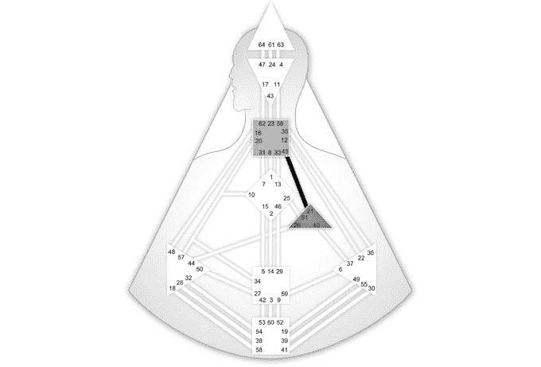

金钱线的信道透过猎人／女猎人的闸门（21）和收集者的闸门（45）链接意志力中心和喉咙中心。意志力中心对应心肌的位置，等同于部落的心脏，将我们的人生在这世界上集结在一起。这是部落里孤独的声音，所表达的是权威，以及在物质世界的阶级体系里，存活的意志。

**背景**：21-45 这条信道在所有显示者信道里，是最勇往直前的一条，他们说：“我来决定要不要负责，我来决定一切是否在我掌控之中。”领导家族最仁慈的表达方式，是集结、保护并教育部落，使部落得以延续。当每一个人都获得充分的支持，人人安居乐业，国土便有和平。45 号闸门是部落唯一的声音，这是权威的声音，这是最后裁定什么能实现，或不能实现的声音，而其关键字说得好，“我拥有，或我没有拥有。”部落总觊觎获取更多资源（金钱）与可倚赖的承诺（忠诚），为了实现对欲望的追求，以交易为媒介，部落就此主导了人类历史的轴线。而组成这条 21-45 信道的两个闸门，要相互调和并不容易。45 号闸门是关于保护，但是到最后也自有其定夺，21 号闸门服务付出，但是一切都必须在他们掌控之中，如此一来，才能确保他们的心能休息，或保证其他人也都能休息。从历史的层面来说，在工作与休息间取得平衡的需求，正是工会背后的驱动力，确保工人享有其权利。

**个人**：拥有这个信道的你就是要拥抱和主宰物质层面，并透过意志的力量赚很多钱。你的挑战在于必须运用意志保护自己的利益，同时为别人服务。有控制权以及不被控制，这两者都是你的课题，而对你来说，成功的秘密在于达到一定程度的独立。你愿意努力工作，但做得好的前提是必须做自己的老板，而且按照自己的节奏进行，自己决定做什么、什么时候做。即使当你周遭的一切都无法控制，你还是需要让自己感觉如此，仿佛你就是这家公司的总裁或董事长。对你而言，依赖别人或将责任委托他人很困难，这只会让你的工作份量增加，并带给你内心更多压力。

**人际**：唯物主义者喜欢以钱磙利，若要成为物质层面的大师，让家族过得丰衣足食，他们需要家族全力支持，并且团结合作。回顾人类经济结构的演化史，从村庄间简单的交易方式，到今日复杂的企业商业模式以及股票市场，我们可以清楚看见，这一切如何运作。金钱信道若是由两个人产生火花因而接通，事实上会更容易成功。45 号闸门拥有工厂，但是并不会在工厂里工作，21 号闸门则坐在总裁的位置上，志得意满，意志高昂，他会说：“我自己要获利，但同时，我也要让老板与员工都获利。”集结两者，就能控制或管理组织，让每个人于财务上，获得实质的成功。另一个例子，21 号闸门是总理，以人民为主，日理万机，治理国家。45 号闸门是国王，对总理传达其权威，而国王也必须取得应有的权益。

##### 21 号闸门：奋勇前进（噬嗑卦）－猎人／女猎人的闸门

合理且必要地使用力量，克服刻意且持续的干扰

中心：意志力／四等分：初始／主题：透过心智，达成目的

右角度交叉之张力—并列交叉之控制—左角度交叉之努力

21 号闸门在其领域里，需要掌控。为了运用力量及自我的意志力，确保部落得以生存，他们必须控制某事或某人。这股能量在现代就转化为警察、总经理或公司总裁被赋予的责任。奋勇前进对物质面的人生而言，是一股强大的制约力量。成功就是能在物质层面，掌控自己所拥有的资源，像是你的住处、你的穿着、你为谁工作以及如何谋生，你不喜欢别人告诉你该做什么，或是监督你。另一方面，你注定要服务众人，基于部落交易的原则，你要获利的同时，所有人也必须得利。如果你有意夺取权力，或控制别人，却没有遵循自己的策略与权威，你将面临巨大的阻力。不论你取得利益其出发点为何，你必须等待，等待控制权交到你手上。如果你是投射者，你需要伯乐慧眼识英雄，看出你的才能，邀请你出手。如果你是生产者，别人要询问你，如此一来才能启动你的荐骨能量，有所回应。如果你是显示者，在你企图动手控制，开始衡量周遭的抗拒之前，你必须先告知。若缺少了 45 号闸门，你会发现自己不断搜寻着，得以监控未来与社群财富的最佳模式。

*   第 6 爻—混乱
*   第 5 爻—客观性
*   第 4 爻—策略
*   第 3 爻—无力
*   第 2 爻—强权即公理
*   第 1 爻—警告

##### 45 号闸门：聚集在一起（萃卦）－收集者的闸门

相似的力量，会自然而然相互吸引，彼此获益

中心：喉咙／四等分：文明／主题：透过形式，达成目的

右角度交叉之统领—并列交叉之所有权—左角度交叉之冲突

45 号闸门是霸主的闸门。它是主人／女主人或国王／女王的闸门。它是家族单一的声音：“我拥有。”这个闸门在显化及行动层面，具有很深的占有欲。收集者的闸门，目的是守护部落里的物质资源。你是部落里天生的权威和引领者，然而，你并不是执行者，当你善加利用所“拥有”的一切，一心为了保护人民，你的王国将会充满和平。你有能力聚众，众志成城共同实现部落的需求，扩大社群的版图，为周围的人带来和谐，即使这些部落实质上的管理工作，都是由 21 号闸门全权处理。你拥有这块土地，但是你必须允许 21 号闸门来狩猎，而最肥美的那块肉还是得献上给你。当你试图要告诉 21 号闸门，该如何来打理你的王国，或当 21 号闸门意图将最好的那块肉，留给自己，局势就会变得紧张。每个闸门都有其特定的角色，在部落里也各自有其目的，若能各安其位，各司其职，一切就能运转顺畅。即使你本身具备 21 号闸门，若能有另一个 21 号闸门在身边，协助管理、运作你的王国或事业，对你来说，这将会是最佳的状态。

*   第 6 爻—重新审视
*   第 5 爻—领导力
*   第 4 爻—方向
*   第 3 爻—排除在外
*   第 2 爻—共识
*   第 1 爻—游说

“在这世界上，魔法的确存在，过往的我，原本并不相信。魔法存于我们之中，宛如丰富的金矿矿脉，镶崁在我们奇妙的体内，静待被发现。当我们找到这魔法，链接其中的力量，仿佛终于能与生命力连上线，终于，透过活出自己的设计，我们能充满平和、满怀恩典、以富有力量的方式，活出自身的伟大。”

——拉．乌卢．胡

# 第七章 12 种人生角色人生目的的外衣

### 人生目的的外衣

现在我们来到人类图的另一个基本要素，人生角色是创建人生风格的起点，是我们为了达成人生使命所穿上的戏服。这件戏服，我们可能会愈穿愈习惯，宛如本色，是此生真实要活出的角色。但若深陷非自己，则容易扭曲，觉得这戏服不合身、不舒服。不同的人生角色，也是区别出每个人都是独特存在的元素。举例来说，你是一个情绪有颜色的生产者，当你和另外三个情绪有颜色的生产者坐在一起时，因为你们各自的人生角色都不同，所以你们依然非常不一样。当我们一并参考自己的轮回交叉（见第八章）时，会发现人生角色让我们在不同的人生阶段，都能活出自己真正的特色。

人生角色的基础，要先理解每个人都具备二元性。我们的意识由两部分组成，个性意识（Personality consciousness）以及设计意识（Design consciousness），我们透过人生角色，可以了解这两者的性质。人生角色共有十二种组合，每一种都是由意识个性太阳（黑），与潜意识设计太阳（红），这两者落在哪一条爻组合而成。（如下图所示）我们对自身人生角色的独特诠释，如何呈现角色的特质，如何让人生展现其独特的风貌，这出戏、这部电影，在我们出生的那一刻即拉开序幕。

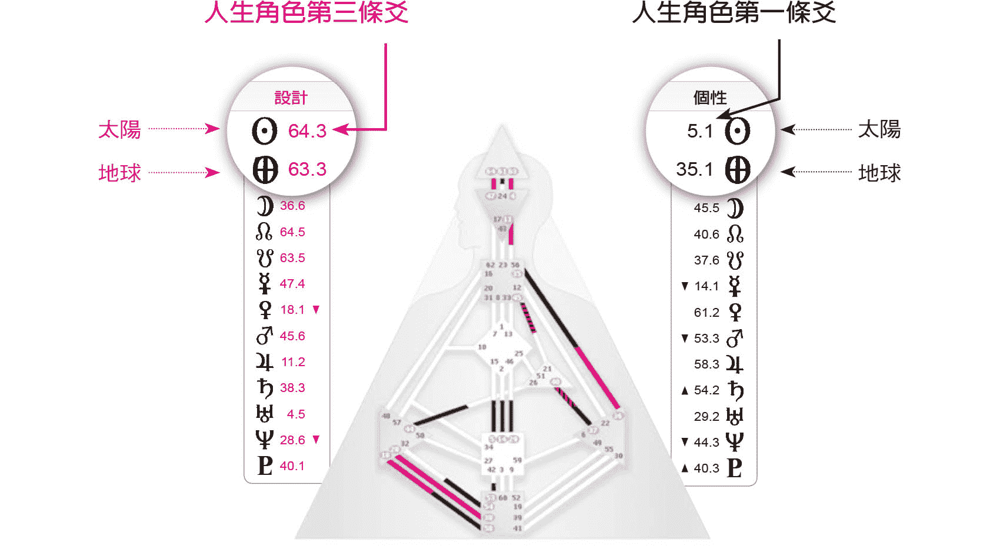 这是人生角色 1/3 的人体图
你可以在你的人类图的上方表格，找到你的人生角色，或是你可以如图所示，找出你的人生角色组合。

#### ▸ 人生角色的结构

人生角色的基础是卦。六十四个卦（身体图中的六十四个闸门）中，每个卦都有六条爻，爻的存在，使我们能更深入区分闸门之下的差异性。想要了解每一种人生角色，以及为何世界上有这么多种不同的人，就必须要先了解爻。卦的基础结构分为两部分，下三爻（第一、第二、第三爻）与上三爻（第四、第五、第六爻）。爻的顺序是从最下面的第一爻依序往上（如下图所示）。下三爻及上三爻分别有其特殊的主题，而六条爻各有其特殊价值，这些将详述于后。

爻的六个基本主题，或称做主要角色（研究者、隐士、烈士、机会主义者、异端者、人生典范）也是身体图上所有卦象的主题。举例来说，第一爻的研究特质，也是人类图上所有具备第一爻的卦或闸门的主题。第十章将会详细解说每个卦的每一条爻。

#### ▸ 六个主要的角色：10 号闸门的卦象结构

六**个主要角色**是人生角色的基本主题，源自于**第十卦**，**履卦，也就是**10**号闸门（自我行为）**当中的六条爻。**人生角色**是由六个主要角色中，其中两个所组合而成。这两个角色的特质，会透过我们的**个性**，也就是对自己的认知、以及我们的**设计，与生俱来的本性，**以不同的方式来展现，并获得全然不同的体验。个性与设计，两者合而为一，也成了我们在这世界上，为活出自己所披上的戏服。

你的**人生角色**是先标示出**个性**，再标出**设计**。举例来说，当**个性**落在第 3 爻，而**设计**落在第 5 爻，便会组合出 3/5 的**人生角色**。人生角色会因每条爻的主题名称不同，而有不同的关键字，例如，3/5 的**人生角色**也可以称为**烈士异端者**。

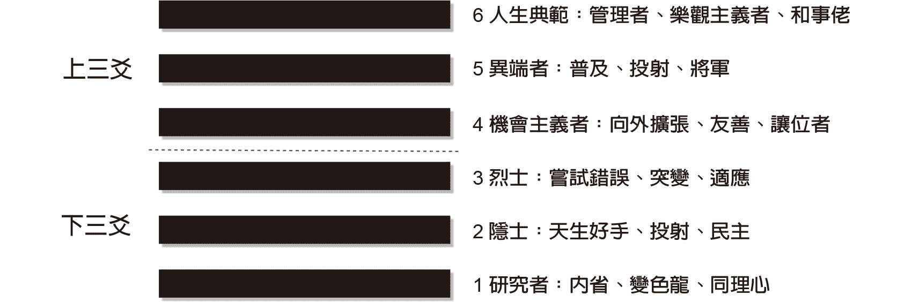 第 10 卦：自我行为的闸门

#### ▸ 卦的架构／以房子为喻

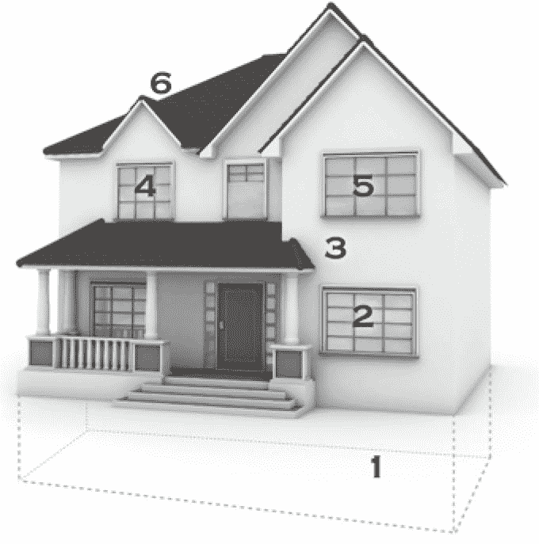

以房屋的结构来比喻六条爻与其特质，很容易理解。第一爻是房子的地基。第二爻是一楼的空间，窗帘全拉开，站在外头，屋内的一切一览无遗。第三爻是从一楼到二楼的过渡空间或旋转楼梯。第四爻是二楼的地板，屋子的第二个地基。第五爻是神秘的二楼，窗帘紧闭，外头则是抱有期待的投机者。第六爻则位于房子的屋顶，在此鸟瞰隔壁住家、邻居街道以及下面所有的一切。

### 下卦的主要角色：第一爻到第三爻

下卦是非常自我中心的历程，极为个人。这些角色并不急于向外发展，也不会特别想和其他人互动。

##### 第一爻—研究者：
内省、变色龙、同理心

一爻是卦的一楼或地基，一爻致力于钻研事物根本，探究生命如何运作。要等到创建了牢固的基础，他们方能放松。他们知道愈多，恐惧愈少，“我们若能安全，一切才有可能”。不安全感驱使着他们寻求权威，甚至自己变成权威。他们以内省的方式进行研究，这时往往会听到他们说:“我正忙着学习和做研究，不要烦我。”一爻创建起安稳地基，再由上卦的三爻向外扩张并普及。一爻的本质蕴藏深刻的同理心，他们自外界接收讯息的能力，充满革命性的色彩。

一爻的人研究行为。他们观察人们的行为，从中学习何者行得通，何者行不通。他们一旦察觉危险，就会像变色龙一样，为了融入环境，而改变身体的颜色。他们其实并未改变任何事，却能让你转向，看见他们认为你应当看见的面向。10 号闸门第一爻的关键字是谦逊，无论身处任何环境，都知所进退的能力。因此，一爻非常敏感，对他们来说，得以控制场面，并让一切安然度过，是最重要的事。同时，一爻需要在实质的层面上获得安全感，若处于非自己的状态下，常常感觉自卑，追根究底是因为，他们若无法让自己专心并且全力投入，就无法全盘研究，并为自己创建稳固的基础。人生策略和内在权威会协助一爻的人来决定，什么是正确的研究，同时让他们一次专注一件事，这对于舒缓非自己的焦虑很有帮助。“**卦的本质有其清楚的架构，若缺乏稳固的基础，则无以为继**。”——拉．乌卢．胡

##### 第二爻—隐士：
天生好手、投射、民主

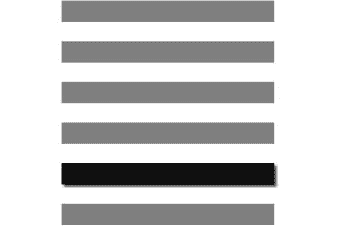

二爻就像一颗种子，长年放在抽屉之中，静待正确的时机播种，发芽、成长并开花结果。一爻的人为了创建基础而投入研究，二爻是天生好手，具有不知从何得来的天赋异禀，他们天生的天赋与天才之处，将引人注目，而那些需要他们才华的人，将“召唤”二爻出来，为其所用。然而，他们是隐士，只想独立自主以自己的方式，做自己的事。一爻为了研究，需要其他人的协助，但二爻则能自给自足又独立，当别人进入他们的能量场，并对他们有所期待时，会让他们觉得很不舒服。对于自己怎么作，作了什么，他们根本不想解释，可能也不知道该从何解释起，当然，他们根本不想管你到底该怎么做。他们的行事风格相当民主，是因为他们不想被打扰，也不想因为选边站而投注自身的精力。

对于任何形式的干扰，二爻的天赋都不太懂得该如何回应。若回到房子的比喻来解释，他们宛如单独站在一楼的落地窗前，光线明亮，而他们正沉浸在自己的世界里，自得其乐，毫无意识到已经被街上的人群一览无遗。事实上，**个性层面**的二爻人，甚至希望能独立于人世之外。他们等待着正确的召唤到来，这召唤专为他们独特的生命使命而存在，足以让他们将自己的天才公诸于世。唯有透过人生策略和内在权威，才能分辨出召唤是否正确。对于二爻而言，履行是关键，如果他们无法符合外界投射在他们身上的形象，或是回应了不正确的召唤，以至于无法履行，他们将极度受苦，相对于健康与自然的隐居状态，他们会变得更加孤僻并离群索居。“**只要坐在河边；迟早会有东西流过来，不管迎面而来的是什么，为未知做好准备**。”——拉．乌卢．胡

##### 第三爻—烈士：
尝试错误、突变、适应

三爻最大的天赋，是找出何者行不通。因为三爻是房子的一楼与二楼间的交界（个人以及超越个人），所以生命以各种方式为他们带来冲击，或他们在人生中也不断冲撞着。在尝试错误的过程中，了解物质世界如何运作。三爻是让改变发生最关键的催化剂，尽管他们有时在社交上显得笨拙，并时常感到孤独，但因为他们天生具备的弹性与韧性，足以支持他们持续探索下去，所以他们仍然是下卦的三爻之中，最能适应，并懂得如何应对进退。三爻比任何人都能更快辨识出新的、潜在的突变可能，因为他们就是会碰上。这常和科学层面的研究与探索紧密相关（三爻的立足点在于找出何者不可行），也与物质世界深刻相连。三爻重视的不是生命的表面价值。他们只要稍作尝试，便能检视出缺陷在哪里，漏洞在哪里，而陷阱又在哪里。三爻为我们树立典范，示范出当我们的身体在物质世界站稳脚步，蜕变因而变得可能。

这些天生来挑战错误的人，最终会让物质世界（Maia）产生突变。他们也是最快发现人际关系中那里行不通的人，所以他们的主题是“链接与断裂”。三爻的关键字烈士，指的是他们挺身而出的能力。当他们说：“并非如此。”接着承受炮火攻击。对三爻的人来说，当他们跟随着真正的自己运作时，没有所谓的失败，只是探索的过程。链接与断裂是他们人生中的自然机制，就像父母每天离家工作，然后又回来一般。三爻的历程，也是六爻分成三阶段的人生之中，不可或缺的一环。（详见第六爻—人生典范），突变的特质对三爻的人生角色所带来的影响，比其他爻都来得更加深远。“**不管迎面而来的是什么，讯息中总会蕴藏重要的信息，他们能织就一整个物质的世界**。”——拉．乌卢．胡

### 上卦的主要角色：第四到第六爻

当我们向上移至上卦，会发现这三条爻的人生角色运作模式，与下卦的三爻截然不同。上三爻是超越个人、向外发展的过程。这些角色有其基本需求，借由社交与分享，交换过往经验，也看见未来的可能。

##### 第四爻—
机会主义者：向外扩张、友善

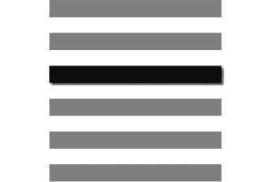

和一爻类似，四爻代表二楼的地板，其安全性创建在一爻所创造的基础之上。而四爻的脆弱之处，在于必须抱持开放，使进入上卦的转换得以发生。而三爻与物质资源密切相关，四爻则是超越个人人际关系的基础，所关注的是人力资源。四爻深具影响力，等待各种时机拥抱社群，将来自下三爻的基础、天赋与发现，加以延伸扩展。四爻天生友善，他们就像你我的兄弟姊妹，这样的特质有助于他们创建网络。友善创造开放，虽然开放有其必要性，但也让他们容易因此感到惊喜或受到惊吓。他们的影响范围通常局限于既定关系的人，而陌生人与萍水相逢的人，对他们来说通常并非正确的链接。

四爻的生活品质，与他们所属的人际网络与朋友圈息息相关。他们身处正确的关系中，能量才得以运转，享受真挚的情谊。然而，第四爻也缺乏弹性，因此也可能为了照亮别人，而让自己燃烧殆尽，他们需要时间独处，充电并复原。他们投注心力在所属的人际网络中，人脉中蕴藏机会，也必须为他们带来同等的回馈，否则四爻的人应该退出，寻找能为自己带来报酬的人际网络。活出自己设计的四爻，并不需要创造人际网络，适合他们的网络本就存在，只要遵循人生策略与内在权威，他们会自然而然融入其中。四爻具备固定的特质，必须安全地从既定的人际网络或关系，移转至下一个。否则会失去安全感，也无法发挥其真正的影响力。“**四爻是关于物质世界的人脉资源，人，是他们人生中最重大的决定与投资**。”——拉．乌卢．胡

##### 第五爻—异端者：
普及、投射、将军

五爻在每个卦中，负责扩展讯息。背负着超越个人的业力，让他们身为“重要的陌生人”时，影响最大。他们就像将军，能在标准处理流程失败时，提供众人实用，但却“跳脱框架”的解决方法。需要帮助或正处危机之中的人，容易被五爻的能量场所吸引，将他们投射为带来希望的救星。**异端者**在充满投射的能量场中运作，诱发别人看见其潜藏的力量，但是当众人期待落空，或是与原先期待不符，就会对五爻的人心生怀疑。五爻的人常常躲在二楼窗帘后面，隐藏的同时又想窥看外面的世界。人生策略与内在权威可为他们提供实用又可信赖的工具，让他们决定，何时才是介入，并提供解决方法的正确时机。

若对充满投射的场域，缺乏自觉，五爻或许因此被捧上天，觉得自己就是救世主。因此五爻人必须认知到真实的自己，搞清楚自己确实能解决什么，或能解救什么，别让自己也一起落入投射的幻觉中。异端者的声誉，完全取决于所提供的解决方案，是否成功，是否符合他人的期待。若是**异端者**无法提供实质的帮助，下场就有如被绑上火刑柱烧死，饱受挞伐。一旦人们度过危机，不再需要**异端者**的领导时，又常常忽略了他们。此时，五爻应该重整步伐。尽管**异端者**不会一直都在岗位上，但在下一次危机来临时，人们仍期待他们随时都准备好，挺身而出，展现其能力。“**无论你此生要做什么，请确保它确实可行。若能作到这一点，不管作什么都会成功。否则声誉将因此受损，终生难以摆脱**。”——拉．乌卢．胡

##### 第六爻—人生典范：
管理者、乐观主义者、和事佬

第六爻独立于其他五条爻之外，最好的形容就是他高高坐在屋顶上。虽然人们往往觉得他们很冷漠，但是这种超然的态度，为第六爻提供制高点，让他们可以回顾前五条爻，并前瞻下个卦的第一条爻。第五爻朝着人群前进，而第六爻最终则是远离人群，为了成为成熟的人生典范，他们必须历经特殊的三阶段过程。

**第一阶段，**从出生到 30 岁左右，透过第三爻不断从错误中学习、关系链接并断裂，以此方式探索并体验生命。他们渴望找到灵魂伴侣（六爻的属性），但通常要到第二阶段完成，大约 50 岁左右，渴望方能成真。第六爻并不像第三爻这么有弹性，可以胡乱冲撞尝试。混乱的过程会导致他们对生命的态度变得幻灭及悲观，尤其在快 30 岁时。为了重十乐观，他们会让自己身心都远离尘世。大约 28 岁左右，是第六爻的第一次土星回归，他们会爬上屋顶，一直以来原本向外探索的他们，在此时重心会慢慢转为内省。

**第二阶段，**约 30 岁到 50 岁左右，主要在于摆脱第三爻的混乱经验，让自己获得疗愈并自省。“走上屋顶”，是为了观察和探索，了解世上什么是值得信任，且真正可行；他们重新评估生命，发展往后可能会需要的资源。尽管在别人眼中或许显得更加超然冷淡，但他们确实开始追寻自己的智慧。在这段向内退隐期，定居、投入职业、选定伴侣，或是创建家庭，都会让第六爻感到安全。第三爻的探索在此时获得整合，过往经历皆化为外在权威的基础，让他们能以人生典范的姿态，尽情展现。

**第三阶段**，大约发生在凯龙星回归的 50 岁左右。此时，他们被催促或被踢下屋顶，再次融合进入尘世，这时候，他们已能怀抱身为六爻的本质，表里一致且乐观。对他们而言，这是人生中一段激烈的转变期，如果他们不懂得如何依据自己的内在权威来做决定，可能会变得特别脆弱。觉醒的**人生典范**是活生生的例子，展现一个觉醒的人如何活出独特的使命。第六爻的人无法应付伪善。他们信任所有的存有，他们以自身为例，教导世人相信自己的内在权威，活出独一无二的人生。从年轻时期深度体验世界，到中年超然又疗愈的内在修行，然后在 50 岁之后重新投入人世间，盛放如花。第六爻为生命的走向，带来独特的见解和智慧。身为一个拥有九个能量中心的生命，这是卓越的榜样。“**每一个六爻的人，皆怀有未来的魔法，这魔法是关于人类所蕴藏的可能，不管任何人，若他们此生够幸运，能接触到这些知识，就能亲身体验，亲眼见证**。”——拉．乌卢．胡

注：身为一个拥有九个能量中心的存有，不论人生角色为何，我们都将经历缓慢的成长。在 40 到 50 岁之间（天王星对冲和凯龙星回归之际），我们会体验到“第二春”，人生重新定向，生命更臻成熟。人类的演化阶段，是由五爻普世的救世主／将军，转换至六爻，秉持自我接受与自我觉知，达到自我领导与自我掌握的阶段。那些人生角色中有六爻的人，是来此告诉我们如何正确转换。过了 50 岁后，他们将亲身示范如何超越，身为一个真实、客观、有觉知的人类，如何活出真实的自己。

#### ▸ 人生角色的几何层级（geometric progression）
三种几何轨迹

“没有人是一座孤岛， 透过复杂且精心策划的几何轨迹， 我们经历人 生。”——拉．乌卢．胡

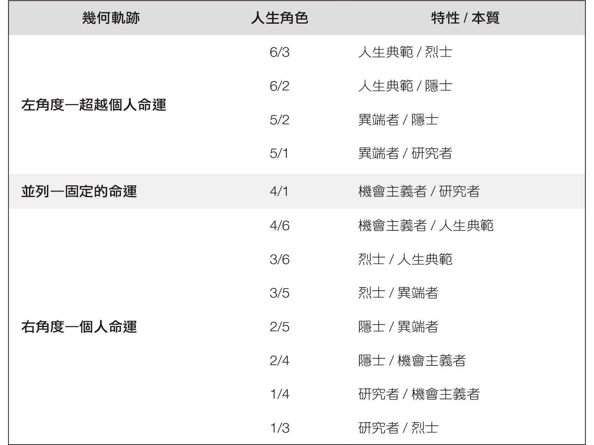

太阳和地球走完人类图曼陀罗上的每个闸门和每条爻，为时一年，产生三种不同的几何轨迹。几何轨迹让我们拥有固定的行为模式与限制，并以特定的方式与别人交流或是影响别人，以达成我们的人生使命。全部十二种人生角色可以分别归纳成右角度、固定命运及左角度，这三种几何轨迹的组合。

**右角度几何轨迹**，包含了前七种人生角色组合，专注在以自我为中心的**个人使命**。全世界约有 64%的人属于此种类别，这些人生角色的组合，此生目的就是活出自己。右角度几何轨迹的人生重点，在于自我探索并面对个人挑战。他们并非来此参与别人的历程。当人们的生命与这类人产生交集，有可能引发出崭新的体验，但并不会改变他们前进的生命步调。右角度交叉的人不会特别意识到或理解到，自己为何会与某些人链接，那是因为他们进入这副躯体前，所有的前世经验都已被掩盖。他们来此是为了研究、探索、重新体验，并且得到新的观点，他们也是这个星球的业力创造者。

**并列几何轨迹**（仅人生角色 4/1）是右角度交叉和左角度交叉之间的桥梁。人生角色 4/1 属于**固定命运**，亦即，他们既不是个人命运，也不是超越个人的命运，地球上只有不到 3%的人属于这一类，他们就像行驶在铁轨上的火车一般，始终固定在自己的轨道上。固定命运人生角色的力量在于，当别人与他们接触，持续一段时间后，那些人也会变成这命运的一部分。

若右角度交叉是研究开发部门，左角度交叉则是行销部门，而并列的人生角色，则是两者间的桥梁。

**左角度交叉几何轨迹**是**超越个人**的，像是一组有许多交叉线的轨道。世界上有 33%的人属于这四个人生角色组合，他们无法单独实现个人的使命。他们虽然不会依赖他人，但却很容易受影响，甚至连最单纯的链接都可能改变他们自己或别人的方向，这点与右角度交叉几何轨迹的人正好相反。左角度交叉的人生角色比较能敏锐觉察别人和外在世界，他们随时处于观察与投身生活的状态。超越个人命运的人生角色和他们的前世链接，因此他们常对某些人或某种经验，有难以解释的熟悉感。右角度交叉造就业力，左角度交叉则负责清理业力。

你的几何轨迹以轮回交叉的方式，纪录在你的人类图表上；举例来说，右角度交叉的伊甸园、并列交叉的力量，或是左角度交叉的贡献（关于轮回交叉的概论，详见第八章）。

接下来，我们将针对十二个人生角色的组合，提供详细且深入的摘要。阅读时请留意，同一条爻（好比第一爻）在个性（例如人生角色 1/3）与在设计（例如人生角色 5/1），可能会有所不同。第一爻在个性那一端，代表的是意识上认同，但在设计那一端，则像是天生本质，但自己未必对此有所觉察。

### 人生角色 1/3

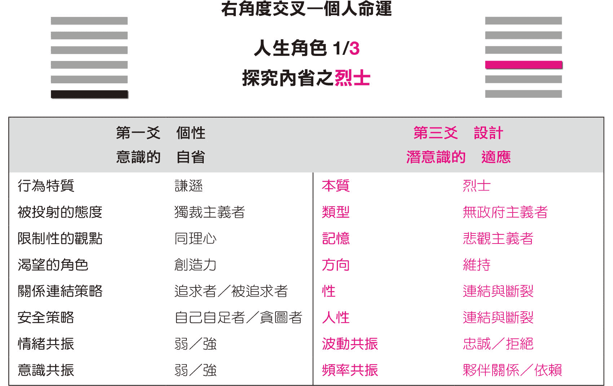

**背景**：个人命运的几何轨迹从人生角色 1/3 开始，1/3 是十二个人生角色中第一个，也是人类经验的具体表现和基础。1/3 是唯一一个两条爻都在下三爻的人生角色。从基本面来说，第一爻代表意识的个性、心智和想法。第三爻代表潜意识的设计、身体，以及在世俗世界的物质体验。我们是被生存恐惧所驱使的物种，我们调查、研究，直到了解，或在坚固的基础上获得安全感，虽然活在不断改变的世界中，这方法不见得总是做得到，但为了追求安全，敦促我们的种族持续进步。突变是一个持续的过程，我们不断找出哪里行不通，如此一来才得以求存。人生角色 1/3 为持续冲撞不断的“人类”旅程，定下主题：我们研究这趟旅程中，所遭遇的一切惊奇与激荡，以了解或解开未知的领域。

探究内省之烈士，在尚未创建稳固的基础时，总是感觉非常没安全感，内心一直有股寻找权威的动力，他们希望在尝试错误的过程中，权威人士能提供安全稳固的保障。当他们准备充分，并接受了良好教育，这类型以自我为中心的探究者，其个性极具创造力，且最为健康与多产。他们能够享受长时间的自我探究，借此找到创建自己权威的力量，如此一来，他们才能将个人命运掌握在自己手中。他们之所以被设计成烈士载体或身躯，是为了冲撞，或是以被冲撞的方式来探索物质世界。他们深具适应性与弹性，即使经历冲撞后，依然爬得起来，重新站稳脚步，然后大声告诉这个世界，何者真的行不通。

**个人**：经由创建稳固的基础，你会有意识地，专注寻找内在的力量，不过与此同时，你的潜意识设计层面，则是透过冲撞，为你自己与周遭的人带来“意外”的发现。你有很深层的内在使命，有时会像变色龙一样隐藏自己，在你成为权威并觉得安全之前，不希望太多人注意到自己。身处模煳地带令你感觉无力又不安，反而会驱策你寻找明确的答案。你是个开放有学习意愿的学生，透过专精而培养实力，走上你的道路。

在这一生中，你要主导自己的生命，成为专业领域里说话有分量的权威人士。你在人生旅程中，始终都在人际关系上不断尝试，从错误中学习，时而低头自省，时而在这条路上碰见许多人。当关系岌岌可危或是不和睦，让你开始不舒服并想切断链接时，你会审视这段关系，选择努力强化巩固，或是予以终结。这类事情可能会不断重复发生，但对你来说，这是正确的，要不是让关系更深入更健康，否则就结束它，才能朝对的关系迈进。

此外，当你以探究者的面向，持续找寻恒定真理以创建权威的同时，身为烈士的那一面，却认为生命的一切可能都是虚假。因此别人很难骗你，你从小就能迅速分辨出谁说的是实话，哪些事情可以相信。你个性的一爻会将这尝试错误的过程，放大检视。如果你可以臣服于你的人生策略及内在权威，在人生中就能正确地引导出属于你的人生方向。同样重要的是，你必须处于自己能掌控的环境中探索，因为在自在的状态下，你才能持续进行有条理的探索。当别人鼓励你研究，并对那些行不通事物说出真相，你会因此得到力量。

**人际**：烈士常常因为与自己无关的错误，而饱受指责，长久下来，他们的自尊消蚀，衍生出一种你我敌对、羞愧感或是自卑的心态。若是他们自身以及周遭的人能够领悟，生命无非是一趟尝试错误的旅程，最终目的在于透过探索，以创建稳固的基础，那么他们便能够从旅程中变得坚强。重点要从体验中学会，而不是认为他们犯了错，需要被处罚或是嘲讽。在养育人生角色 1/3 的孩子时，正向鼓励尤其重要。人生角色 1/3 的孩子如果能获得适当的鼓励，一旦他们发现既有的基础行不通，就会是他们发挥潜能的时刻，让美好的巧思，与极具创造力的探索旅程，在此发生。虽然，他们或许会顽固地坚持己见，或是抗拒接纳别人的建议。事实上，这是因为人生角色 1/3 的人得亲自体验，然后才能从中探索、学习。父母是他们最大的盟友，要鼓励他们去“尝试”，抱持着“告诉我你学到什么”的态度，而不是“看看你做错了什么”。如此一来，1/3 的人能从发现中学习，一生持续不辍地探索，最终必能造福人类，改善所有人的生活。对第三爻的人来说，不让他们在尝试错误中学习，才是唯一真正的错误。当他们得到鼓励，为自己负责任时，这个探索的烈士便能在物质上，成为自给自足的人。

十二种人生角色始于 1/3，结束于 6/3。第三爻的主题，是关于突变、尝试错误、发现、冲撞、创建链接与断裂，这些对人类而言都非常重要。这些世俗界的主题，将我们链接在一起，让物种持续演进。所有人生角色中，有六爻的人，生命的前 30 年都参杂三爻的过程，也就是说，十二种人生角色里，有一半都带有三爻前述的主题。三爻的设计能在物质世界中运作，让我们得以在这个世界中，发现自己是谁。

人生角色 1/3 的名人：指挥家阿图罗．托斯卡尼尼（Arturo Toscanini）、预言家爱德格．卡西（Edgar Cayce）、政治家戈登．布朗（Gordon Brown）、作家威尔斯（H.G.Wells）、魔术师胡迪尼（Harry Houdini）、演员米高．肯恩（Michael Caine）、教宗李奥十三世（Pope Leo XIII）、精神导师达斯（Ram Dass）、精神导师巴巴（Sri Meher Baba）、画家梵高（Vincent Van Gogh）。

### 人生角色 1/4

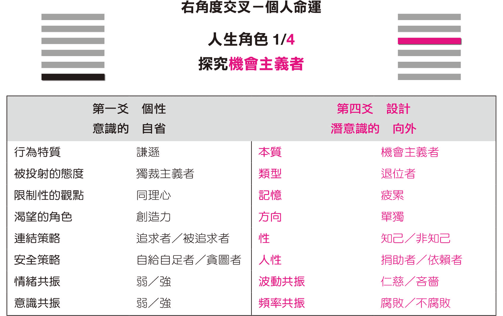

**背景**：**探究者**和**机会主义者**的组合，融合了内省与创建亲密关系两种特质。人生角色 1/4 的人内在有一种渴望，想将他们的研究成果，以充满创意的方式，与认识的人们分享。一方面，意识上的**探究者，**致力于让事情行得通；另一方面，超越个人的**机会主义者，**则想办法传播这些知识。因此他们和人交朋友，形成个人网络，网络中所有的人都接收得到他们的讯息。**探究机会主义者**需要特别的平台来影响他人，所以一旦有了安全稳固的基础，再结合网络后，他们就会成为权威。

这个人生角色有一点非常特别，第一爻和第四爻之间的关系是“和谐”的，即便两者的作用并不相同，但同样都属于“基础”爻：第一爻是房子一楼的地板，第二爻是二楼的地板。当两条爻本质上专注相同的事物时，便会形成特殊状况。他们想要探索研究的东西，与他们想向外显化的东西一致，也就是说，他们想要向外显化的事物，也正是他们想探索研究的。**和谐的人生角色**（1/4、2/5、3/6、4/1、5/2、6/3）在全人类中属于少数族群，他们在世界上扮演单纯的转换媒介，借由讯息的沟通，作为其他六种人生角色彼此之间连系的桥梁。

**个人**：你此生的目的，就是掌握自己有兴趣的事物，当你深入了解，拥有扎实的根基，就可以与你网络中的人分享。你的内在会驱策你寻找特定领域中的权威人士，来教导你或让你准备好，最终才能让你在自己有兴趣的领域上成为权威。当你展露头角，成为权威时，由于此时你已经立足于稳固的基础之上，你原本的不安全感会转而感觉安全无虞。当你从弱小的位置晋升到有力的地位时，你也可以成为别人有力的支柱。为了深入钻研探究，你必须要有独处的时间，经由自我思辨，发挥变色龙般的能力，将自己融入想探索的领域中。集体创作非你所长，你比较偏向单独创造，这过程充满疗愈，人生也因此丰富多采。

你天生友善，这也是你亲密关系的策略，因此常吸引听众来到你身边，最终带来你的伴侣。若你想拥有知己，以及长久的关系，应该先从创建友谊开始。一旦回归到人生策略及内在权威，探索过程中所有内在的省思，都将变得清晰，要静待正确的时机到来，再将自己探索的心得与他人分享。你的学习不只是为了自己，或是为学习而学习，而是让你有能力吸引特定的族群，他们不仅会对这些信息感兴趣，并且可能因此而获益良多。事实上，在你有意愿与他人分享之前，你并不需要亲自去探索或体验。

投资并维持人际网络，是你人生中最重要的事情之一。今日对于人的投资，造就未来的机会，让你得以分享自己所拥有的知识。对你来说，要投资在什么人身上，会是关键性的决定，错误的人际网络或是对象，会让你疲惫不堪、筋疲力尽。你本身并非影响陌生人的设计，所有来找你的新对象，都必须透过既有的人际网络介绍才行。你第一爻的**探究者**并不在乎别人，而第四爻的**机会主义者**则属于潜意识，因此若想知道，谁对你而言是正确的人脉，就必须透过你的人生策略及内在权威。你生命中的机缘来自于你的网络，或是你认识的人。重点是，你绝不能在下一个对象出现前贸然离开现有的对象，不管是工作、爱人或是家庭。否则，在寻找下一个之前，会有段艰难时期。

偶尔从社交网络抽身隐退，对你也相当关键，如此一来你才能从社交网络的疲累中修复。聆听他人说话相当耗神，因为经营社交网络会耗费你大量的时间与精力，所以你必须等待机会，让真相自然浮现。

**人际**：人生角色 1/4 的人在意识上是独裁主义者，在潜意识中则是退位者。**探究机会主义者**不擅长处理他人的反对意见，每当遇到有人无法被他们所影响，他们不会因此改变自己的立场，而是干脆退出，另外寻找抱持开放态度，愿意聆听他们想法的人。第四爻的生活品质取决于他们的人际网络。他们充满力量，且具备影响力，就像屹立不摇的橡树，散发出充满力量、权威感的能量场。然而，**机会主义者**若表里一致活出自己，无需创造人际网络——透过人生策略及内在权威，会遇见属于自己的网络。

人生角色 1/4 的人寻求帮助，并依赖他人，直到自己最终成为权威人士，能够提供协助。一旦他们创建稳固的基础，得以掌控自己的生活后，他们会展现慷慨关怀，愿意为他人付出的那一面，作为回报。人生角色 1/4 的孩子，总是单纯地相信大人告诉他们的一切，所以对 1/4 的孩子，父母亲只能告诉他们实话，并且是自己所确定的信息。这一点非常重要，因为 1/4 的孩子若在往后的人生中，发现自己被骗了，会让他们崩溃。这些不好的回忆会萦绕脑海，因而引发出 1/4 刻薄的一面。虽然人生角色 1/4 内心深处对事物的理解，似乎不可能改变，但是当这份执着，与对他人的同理心相结合时，却能带动家族与社会基础，进行转变和进化。

人生角色 1/4 的名人：爱因斯坦（Albert Einstein）、女演员休斯顿（Anjelica Huston）、女权主义者史坦能（Gloria Steinem）、日本昭和天皇（Hirohito）、化学家皮卡德（Jean Piccard）、喜剧演员赛恩菲尔德（Jerry Seinfeld）、歌手卡马（Kamahl）、作家史皮能（Mickey Spillane）、拳击手阿里（Muhammad Ali）、贝斯手维瑟斯（Sid Vicious）。

### 人生角色 2/4

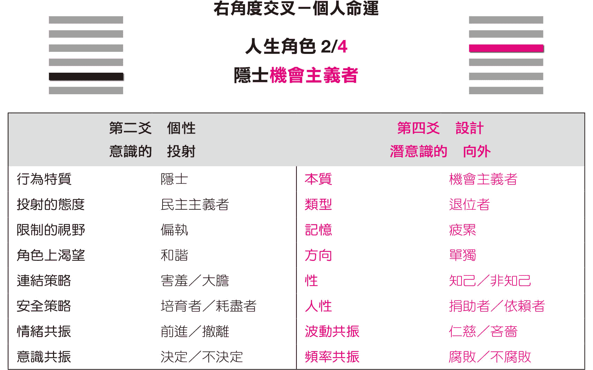

**背景**：在卦的图形中，第一和第二爻是三组阴／阳组合的第一组，虽然这两条爻的运作方式不同，但都和不安全感有关。第一爻透过探索研究，处理不安全感，而第二爻要学习的是，信任自己与生俱来的天赋。**隐士的个性**总想独处，做自己想做的事情，而**机会主义者的设计同时又**想与人链接、向外显化事物，两种特质之间，隐然有股紧绷的张力。意识的第二爻，天性害羞，对自己的天赋无所察觉，所以需要被人召唤，才能分享其天赋。但潜意识的四爻，天生友善则能提供机会，吸引别人前来接近二爻的部分，让这些天赋得以接受召唤。

隐士虽然不想被看见，但他们的存在其实很明显。别人能清楚看到隐士内在的天赋才能，他们自己却看不到。唯有透过其他人的投射或反馈，隐士才得以看见自己。他们和第一爻乐于研究的倾向大不相同，**隐士机会主义者若**待在安全的环境中，投入自己所喜欢的事情，乐在其中时最为开心。而当他们随着自己的节奏开怀舞动时，自然而然会吸引别人前来，召唤他们出来，以分享其天赋。

**个人**：你此生的目的是接受召唤，好与别人分享你的天赋才能。你有一道内建的天生屏障，像是某些特定的观点，会保护你以免外界扰乱了你，和你独特的天分。但这道屏障有一个“弱点”，那就是一旦对的人发出对的召唤，就能穿越这套屏障，而你的生命便可能因此产生深刻的蜕变，让你怀抱热情，充满使命感，向世界发声。然而，你不喜欢无时无刻被召唤，这会让你的身体备感压力。不当使用能量，导致你疲劳、耗弱甚至虚脱。若持续回应错误的召唤，二爻的屏障会转成在心理层面上，筑上一道高墙，接下来拒绝接受任何召唤，若是如此，你也会因而受苦。当召唤来到，你将不可思议地发现，有一股看不见的力量驱动着自己，为了让自己的天赋显现于世；这股驱力来自你那潜意识、超越个人的四爻。但若是你的二爻坚持己见，你可能只想继续待在保护区内，不愿被任何人打扰。当你被召唤出来时，意识层面可能会感觉十分无助，这是因为此时你离开原本安全与备受保护的环境，走入人世与外界开始社交与互动。所以，有时远离人际网络，让内在隐士有时间独处，非常重要，这会为你的生命带来和谐的愉悦感。你对于环境有自己特定的要求，喜欢以自己独特的方式布置居家环境——如此一来，你才能有独处的时间和空间，做自己想做的事。你独处的洞穴，是属于你的避难所、你的城堡，一个在你退隐时，不会被任何人打扰的地方。

不确定感是二爻人生中的一部分。活在一个所有人都要你解释做了什么，以及怎么做的世界，让你觉得很不舒服，有时甚至会让你质疑起自己的能力。可是，如果你太在意别人如何看待你所做的事，面对别人对你的投射，你极可能抓狂。你根本无法解释自己的天赋；相反地，是别人必须接受你是天生好手的事实，你并不知道自己如何或为什么做得到。

潜意识的四爻，和你社交的本能，是吸引召唤的机会到来，最有效的方式，也是你在这个世界获取成功与安全的最佳方式。然而，你必须被“召唤”，而进入正确的人际网络，若身处属于“你的”网络时，你会感觉自己被滋养，同时你也能滋养他人，此时你的影响力最大、最深远。身为一个**隐士机会主义者**，你往往游走在接受滋养与消耗的两端，就像米开朗基罗接受供养，消耗着供养者的资源。这种运作机制无关道德，但如果你身处于错误的网络中，可能会变得相当依赖，而以不健康的方式耗尽别人的资源。你的设计不是用来影响陌生人，陌生人唯一要跟你创建链接的方式，要透过网络中你原本认识的人所转介而来。知道如何做出正确决定，非常重要，你的人生中有其特定的召唤，所以如何辨识召唤，对你的身心健康至关紧要。透过人生策略及内在权威做决定，就能吸引正确的召唤来到你的生命中；少了这些指引，你的人生可能就此陷入混乱，永远听不见改变你生命的召唤。

**人际**：**隐士机会主义者会**透过害羞／大胆的策略，与他人链接。害羞的**隐士**向外界发出召唤，只有够勇敢的人，才得以突破屏障，与他们发展亲密关系，创建友谊。隐士只愿意接纳某些特定的人，不过，这正是他们进入亲密与长远关系的正确秘诀。第二爻的人不主动追求，**隐士**对于自身能吸引别人的特质，毫无察觉，他们只等待某人进入他的洞穴，对他说“你为我而存在”。在他们的人际网络中，若有人能看见他们的天赋，便能轻易召唤他们出来，发挥其才能，这就是**隐士机会主义者**进入商业领域，或开始伙伴关系时，正确的运作方式。

尽管天赋与生俱来，人生角色 2/4 的小孩依然需要良好教育，父母应鼓励并支持他们学习。当日后他们的召唤到来，此时的准备功夫是无价的。他们需要真正投入参与，才能被“启动”，但他们不想加入没兴趣的事物。一般来说，他们很好相处，能跟大部分的人和睦相处，但是需要在独处与社交之间，取得平衡。

人生角色 2/4 的名人：铁血宰相俾斯麦（Otto Von Bismarck）、演员杰夫．布里吉（Jeff Bridges）、西班牙元首佛朗哥（Francisco Franco）、歌手法兰克林（Aretha Franklin）、雕塑家罗丹（Auguste Rodin）、哲学家斯坦纳（Rudolph Steiner）、主持人欧普拉（Oprah Winfrey）、美国前副总统高尔（Al Gore）、工程师艾菲尔（Gustave Eiffel）、歌手芭芭拉．史翠珊（Barbra Streisand）。

### 人生角色 2/5

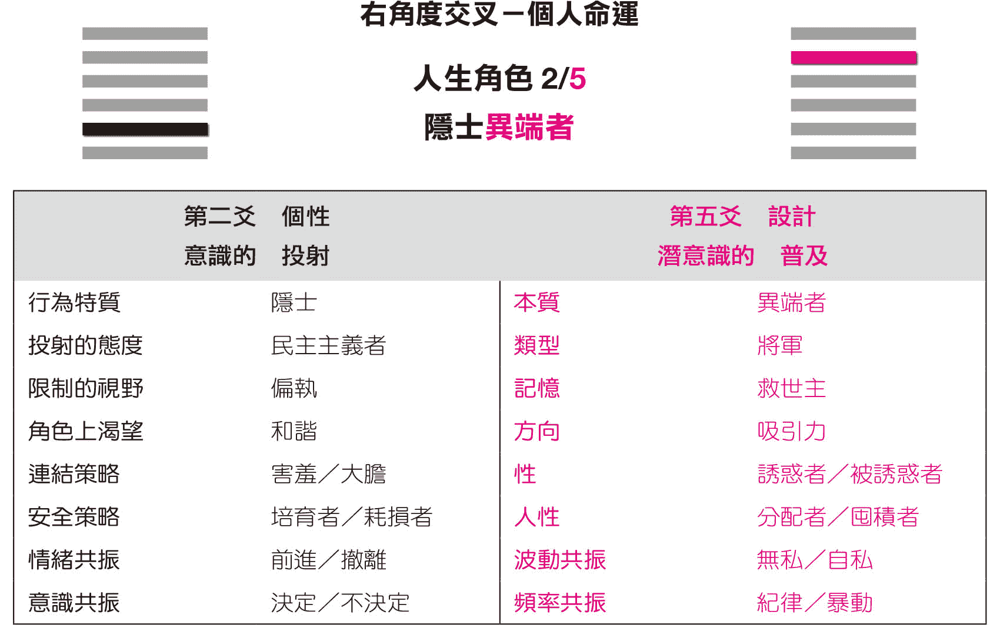

**背景**：在人生角色 2/5 中，我们发现两条与投射有关的爻，彼此和谐共存。专注于个人的**隐士**，希望独处做自己的事情，浑然不觉别人投射在他身上的形象。而超越个人、诱惑力十足的**异端者**，不仅能察觉别人的投射，且对之保有警戒，但他必须与别人互动，才能完成使命。异端者若内在出现召唤，就能有效引发隐士投身行动。真正能带来普世影响的召唤极少，但面对外来投射的光环，若**隐士异端者**能找出对应的解决方法时，他们的天才也在此获得展现的机会。意识层面的**隐者**处在退隐的状态，不想被打扰，投射出民主态度，这让其他人能够承担其责任。而潜意识的**异端者**则是救世主，等待适当时机，出面领导，扩展自己实际的力量。

第五爻是崇高的，因为它代表了人类的希望和梦想。它也是最超越个人价值的一条爻，具有非常深远的影响力。若能深入人生角色 2/5 的内在，能看见伟人的可能性。一旦被召唤，他们会领导反叛行动，不惜一切对抗标准规范，并提供前所未有的解决方案。然而，人们只有在真正有需求时，才会想召唤将军出马，他们想要的领导者，必须在危机时现身，一旦危机解除便离开。

**隐士异端者**必须对自己要“拯救”的人忠诚，一如忠于自己天生的热情和天赋。人生角色 2/5 的人必须知道，何时该放下领导的角色，回归自己的隐居处。这对于处在个人角度的二爻很重要，因为他必须要有时间独处，好好充电；至于超越个人的第五爻，当他无法持续扮演好别人所投射的形象时，名誉就会受损。

**个人**：你渴望和谐，内心的**隐士**只在乎自己的事，因此当**异端者**跳出来帮助别人时，隐士会吓一大跳。每当你踏进一个空间，迎面而来都是对你满怀期待的观众。当人们需要你发挥特殊天赋，解决问题时，面对投射与期待，你会感受到双重压力。你可能会得到团体或个人的忠诚拥戴，也可能无法取得信任。无法预知接下来众人的期待为何，这让你很不舒服，然而对你而言，召唤无法避免，即使事后证实，扰人的经验远比正面的启发多得多。如果这是正确的召唤，你有能力引领人们掀起革命。回归到遵循人生策略与内在权威做决定，才能分辨何者是正确的召唤，这也是能真正保护你的唯一方法。

正确的召唤能让你蜕变。到最后，你的名声取决于是否有能力，能提供实际且普及的解决方法。对你内在的隐士或异端者而言，这个世界并不是个舒服的地方，所以有时候你显得孤僻，看起来仿佛很保留，或正在囤积个人资源。然而，其重要目的是可以让你的能量、天赋随时处在最佳状态，随时准备好，为需要的人提供务实的解决之道。而这也会满足他们的期待，即刻为你创建良好的名声。最重要的是，你要知道什么才是务实的作法，并运用在生命中。你在意识层面的链接策略是：“我很害羞，你必须要突破我的屏障，才能找到我。”但在潜意识的层面，你总会吸引人们来到身边。总之，你最强大的力量，就是身为陌生人，却带来举足轻重的影响。

**人际**：活出真实本性的**隐士异端者**，在人生中会获得机会，尤其若能在原本擅长的领域，接受良好的教育，就能面对并处理好外来的各种投射。他们拥有被召唤与召唤别人的潜力，若他们能为众人提供务实的解决方法，便得以享有正面的投射，所带来的成果。人生角色 2/5 的人深具创造力，能在这世界中创建自己的角色，而且相当擅长推销自己。当大众处于危机中，而 2/5 的人受到召唤时，他们会蜕变，并召唤大家齐步迈向新原则。

人生角色 2/5 的人，天生性格内敛，此一策略很重要，因为这样的特质总能吸引别人进入他们的人生，将他们召唤出来。因此，2/5 的人年轻时通常至少会遇到一次正向的投射。随着投射愈来愈多，他们为了维持生命中的天真，苦苦挣扎，然而他们无法因为欲望，而驱动自己往前走。他们是带来改变的**异端者**，挑战既存的人事物。若其挑战具有实用性，那他们终将获得胜利；这胜利会持续，直到有一天，他们的存在不再被视为异端。

**隐士异端者**还是孩子时，需要别人尊重他们的界线，别人不应该强迫他们做他们不想做的事。他们可以是全世界最美好的小孩，但只要经历了糟糕的一天，就算年纪再小，还是会留下不好的名声。若不尊重他们，他们会暂时离开或甚至永远离开。大人必须尊重他们独处的需求，特别是他们对来自父母与其他人的投射，非常敏感，通常众人总会要求他们更快、更聪明，或擅长某些才能。

如果别人没有尊重他们的需求，**隐士**和**异端者**都会反叛。人生角色 2/5 的人若能依照他们的人生策略与内在权威，回应召唤而进入事业或关系，便具备极大的潜力，得以成功扩展并实现他们的人生使命。

人生角色 2/5 的名人：作家傅瑞丹（Betty Friedan）、演员威廉斯（Billy Dee Williams）、美国总统加菲尔德（James Garfield）、政客特李普（Linda Tripp）、时尚设计师香奈儿（Coco Chanel）、演员米亚．法萝（Mia Farrow）、解放军赫斯特（Patty Hearst）、天文学家汉德（Robert Hand）、演员吉伯特（Sara Gilbert）、歌手麦克柯尔（Susan McCorkle）。

### 人生角色 3/5

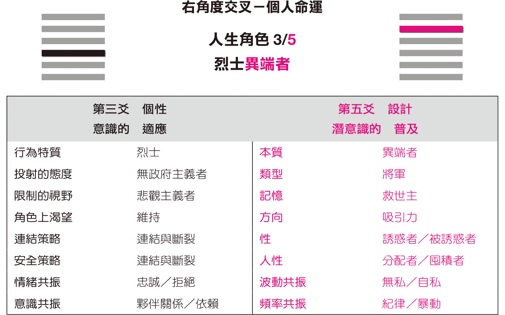

**背景**：假设有一座剧院发生火灾，消防单位却因为预算缩减，没有出动，只见一个人站在剧院中央大喊：“这是不对的。”与此同时，他立刻组织起消防小队，并找到所有逃生出口，这样的人就是**烈士异端者**。人生角色 3/5，结合了两个有力的改变者。意识上具有弹性、适应性及突变性的第三爻，专注于物质世界的探索，在物质世界经历尝试错误的过程，并透过自身探索过程中所得到的收获，激励自己与他人。烈士无畏，会诚实指出何者行不通，他们对于说真话可能招致的指责或批评早有准备，却无法优雅地应对进退。人生为他们带来冲击，而他们也冲撞着生命。三爻跟一爻和二爻一样，无意与任何人链接。他们只是环顾四周，寻找刺激与突变的因子，然后与各种力量冲撞激荡。当然，并非所有力量都正确或恰当，三爻有时会因此变得悲观。所以及早学会区分，分辨何者行得通、何者行不通，对他们来说非常重要。

另一方面，潜意识深具诱惑力的五爻，却无法逃离人群。他们持续吸引别人前来，将投射与期待放在他们身上，那些人视**异端者**为身骑白马的将军，能在危机中解救众人。这种投射让人生角色 3/5 的人从一出生就不太舒服，因为人们总以为可以从他们身上得到拯救，但三爻在尝试错误的学习过程中，却发现自己这个救世主，除了犯错，什么都不会。

随者年纪增长，逐渐成熟的三爻，因为经验累积而拥有丰富的智慧。当五爻的将军被要求投入某些状况，此时烈士的层面则能看出哪些部分行不通。接着第五爻会变成**异端者**，挺身而出并主导一切，他们能带来新颖、实用且行得通的做法。无政府主义的**烈士**则与之合作，全程中协助适应、检验，逐步修正步骤。他们被称为厉害的“修理师”，提供创新的解决方案，带来帮助与指导。人生角色 3/5 的人，必须知道何时该松手让其他人去做。不像第四爻能持续影响网络中的人，他们反倒是身为陌生人时，才能发挥最大的力量和影响力。

**个人**：对你而言，最难的就在于调和自己身上的第三爻和第五爻，前者总随着生命的发现起舞，而后者则被他人投射成救世主。要当一个称职的**烈士异端者**，重点在于你从人生碰撞的过程中，学习到什么，同时你也要知道，该在何时正确地运用所学。当某事或某人闯入你的人生中，你得具备良好的分辨能力，判断何者值得留下，何者值得与之产生链接。虽说在探索的过程中，你有时会觉得自己失败了，但换个角度来看，或许你的试验，正奠定别人成功的重要基础。成功发明出灯泡之前，曾经试过千种行不通的方法，但每次的尝试都是下一次实验的养分。你不会轻言放弃，你会在尝试错误的过程中坚持下去。

最重要的是，你必须透过你的人生策略及内在权威，进行正确的探索与救援，否则下场可能是你会对人生感到消极悲观，或任名声化为泡影。一旦许下正确的承诺，你会全力以赴，充满活力、具备适应性、决断力、慷慨与无私。无论情况多艰难，你都会坚持下去。就算被绑上火刑柱，遭受火刑侍候，你也会昂然不屈。

你为了拥护原则而来，同时也为你周遭的世界，带来新的价值观或架构。但是要小心，别陷入**烈士**情结中，高喊着“为什么是我”、“为什么是现在”。你必须摸索出自身能依循的原则，将这些原则扩大成普世的力量。最终的目的是创造出新的原则、成为新的异端，只不过，如果这异端不具实用性，你将会为此付出代价。你的工作或参与的活动，要充满刺激，而且不能重复。举例来说，你的主题就是创建链接与断裂，因此每天会见新客户，对你有益。

**人际**：**烈士异端者**是物质世界的达人。然而一旦发现事情行不通时，他们会切断链接并离开。他们的态度常被解读成“对于任何想招募会员的组织，绝对不要成为会员。”他们是无政府主义者，在事情行不通时，切断链接，才能在最终发现可行的方法。对任何人来说，身边若有第三爻的人，可说是非常珍贵，因为他们在意识层面的设计，能让你知道何者行不通。若是父母、老师和其他人能避免指责 3/5 的悲观或负面，或认为他们不停犯错而不断碎念着，就能让 3/5 的人省下大量的时间和能量，正确运用 3/5 在体验上所累积的智慧。

对于三爻的孩子，需要提供特别的恩典。父母亲与老师必须用正向强化的方式，传递“你从中学习到什么？”或是“这不是失败，而是过程”的观念，帮助他们经历这过程。要不然，人生角色 3/5 的孩子会留下巨大的心理创伤。如果**烈士异端者**无法满足投射在他们身上的期待时，他们会逃跑，并切断一切后路。但他们若能透过人生策略及内在权威，来看待这些投射，他们真实的力量将全部展现，伴随适应的能力，便能找到实用的出路，依然能看见物质世界美好的一面。闪亮耀眼如同上天赠与我们的礼物。3/5 唯一要增强的力量，就是正向的强化。

人生角色 3/5 的名人：作家尼恩（Anais Nin）、歌手卡洛金（Carole King）、歌手戴安娜．罗丝（Diana Ross）、演员摩尔（Dudley Moore）、甘地（Indira Gandhi）、演员凯特．温丝蕾（Kate Winslet）、演员莎莉．麦克琳（Shirley MacLaine）、传媒闻人泰德．透纳（Ted Turner）、乡村歌手尼尔森（Willie Nelson）、演员薛特纳（William Shatner）。

### 人生角色 3/6

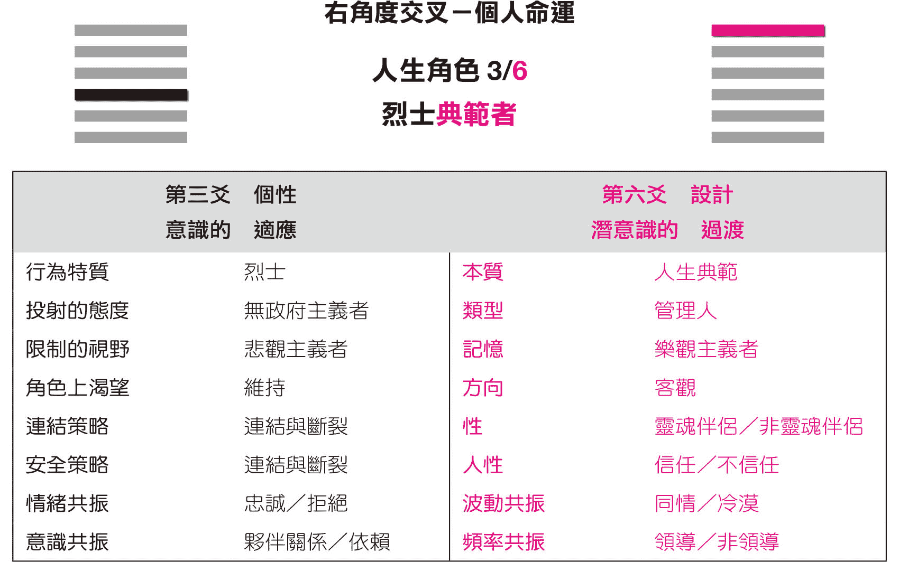

**背景**：悲观主义的**烈士**，遇上乐观主义的**人生典范**，他们一起尝试，对于人生中到底能信任什么，想整理出个头绪。人生角色 3/6 的人所展现的，是将尝试错误的结果，变成人生智慧的可能性。所有六爻的人都有三阶段的人生过程。前 30 年，他们运作得像是三爻的人。因此，身为**烈士典范者**，在人生一开始，宛如是两倍的三爻人生，透过一个又一个的体验，深刻地体验人生，自然沿途中，也会带来诸多关系的创建与断裂。到了第二阶段（30-50 岁），**人生典范**想爬上屋顶休息，以超然的视野观察生命，但意识层次的三爻持续与人生接轨，把六爻拉回现实世界。所以不论是 3/6 还是 6/3，其实都无法像 4/6 或 6/2 那样，有段时间真正单纯地待在屋顶上。

人生角色 3/6 的探索可能在第三阶段（超过 50 岁）时，达到平衡和成熟，这也是 3/6 从屋顶上爬下来，回到世间，全面与现实接轨之际。透过独特及超然的视野，**人生典范**以完美与否来评断人生，同时，**烈士**颠簸的过往，让他对所有行不通的事物了然于胸，两者因此能共同捍卫他们所认定的真理。我们若能超越自我制约，在目前的人生阶段臻至成熟、成为自身的权威，活出独特、觉察和表里一致的自己，人生角色 3/6 就能以各种方式化为典范，使人类的转换变得可能。

**个人**：对你而言，信任跟完美一样，都是重大课题，完美会为关系带来巨大压力，尤其是那些无法达到你标准或是期望的事。但是，当你能保持信任，便能在生命中感觉安全。此时，你便能自然地处于探索中。你的潜意识渴望找到灵魂伴侣，并安顿在值得信赖的完美生活中，但你的关系总在创建后又断裂，两者难以相容。你的第六爻有种超越俗世的高尚品质，无法接受瑕疵，当生活不如你预期般完美，你需要暂时抽身而出。你是“骑墙派”，优柔寡断是你终生的课题。第三爻想要体验，而第六爻却宁可远观，不愿作承诺。然而，总要做点什么才是对的。你是来收集经验，但只限于对你而言正确的经验。若回归到你的人生策略及内在权威，这是你的导航系统，你就能自优柔寡断中超脱。你就可以远离优柔寡断。

虽然潜意识的六爻渴望完美人生，但是在意识上的三爻，却需要透过一连串尝试错误的混乱过程，才能懂得完美的意涵。当事情不顺利，悲观的三爻会让你觉得，自己的人生如同乌云罩顶，而潜意识上的六爻则想维持乐观的天性。请用正面的态度，看待三爻尝试错误的过程，这有助于你保有乐观和客观的态度，来面对人生。对第三爻而言，没有错误这回事，最重要的是探索，这正是关键，使你成为富有经验与智慧的典范。你一定要深入生命本身，亲自参与，才能学习，并培养出自信与自我掌控能力。这样的旅程是为了要你从三爻的探索中，认知到其中蕴含的智慧，接着以你与生俱来的智慧为权威，活出你所学习到的一切。此时，别人会来寻求你的建议和祝福，不管你是否认可，别人都会尊重你所说的话。

独处对你而言也很重要。关于链接的创建与断裂，其主题并非针对个人。你并非离开某个人，只是单纯回归并深入三爻的过程中，直到生活与你再度契合同步。有时候某些链接应当永久断裂，但大多时候，所谓的断裂，只是独自去兜风，或是单独看场电影，然后便回家一起吃饭。甚至有些时候，断裂其实是为了再度相聚，才能在更强大、更真诚的层面，重新形成链接。

**人际**：人际关系上的不顺遂，尤其是年轻时候的不如意，对人生角色 3/6 的人而言造成巨大伤痛，可能会导致他们多年之后，都不敢和他人创建亲密链接。年轻时若能知道如何作出正确的决定，能帮助他们为融入这个世界做好准备。**烈士典范者**有很强的续航力，坚持不放弃，最终得以拥有客观的见解。他们会发现，所谓“坏的”经验，其实才是他们过往所拥有的经验中，最重要的一环。社会观念的制约，让我们相信“错误”是不好的。但如果第三爻没有得到应有的鼓励与教导，那些“坏的”错误会愈积愈多 ，直到最后压垮他们，让他们觉得自卑，同时混杂强烈的悲观与惭愧。他们不会将经验化为指引，反倒可能因而放弃。总之，三爻的人最大的才能，就是探索何者行不通，并揭露真相。世界上许多最伟大的发现，都是透过尝试错误而得来的成果。若你拥有第三爻，就要完全参与、融入这个美好的世界。

**烈士典范者**同时也是无政府主义者与管理人，他们大可以开心地推荐一些主张，即使自己根本不想牵连其中。如果第六爻的人了解自己有三阶段人生过程，并透过内在权威真诚过生活，他们深具穿透力的乐观观点，便能在晚年时，以体验式的智慧显现。他们以人生典范之姿现身，基于自己的探索转化为指引，用他们 50 岁后盛开的潜质和真理，向世人示范，拥有九个能量中心的生命有其完美的可能。这是一种全新型态的成熟模式，形成与展现的过程皆无法急就章。

人生角色 3/6 的名人：歌手安迪．吉布（Andy Gibb）、法国总统夫人卡拉（Carla Berlusconi）、演员达斯汀．霍夫曼（Dustin Hoffman）、科学家兰德（Edwin Herbert Land）、预言家克莱尔（Elizabeth Clare Prophet）、男高音克鲁索（Enrico Caruso）、德国前总理施罗德（Gerhard Schroder）、演员李维斯（Jerry Lewis）、女演员库塞克（Joan Cusack）。

### 人生角色 4/6

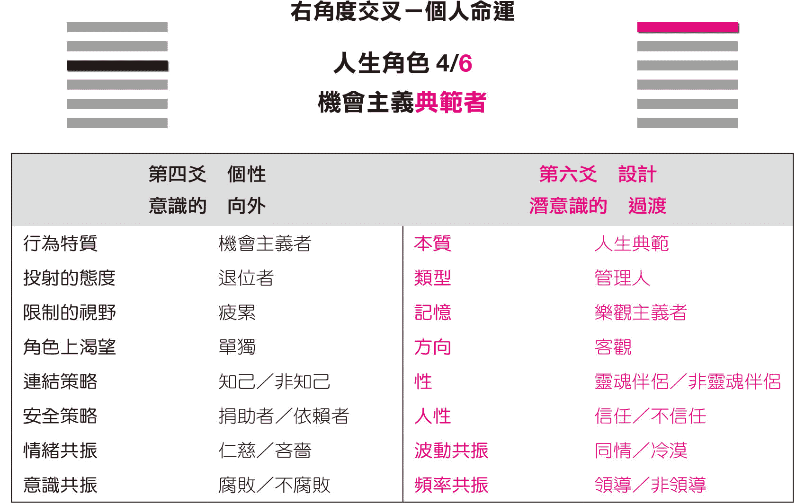

**背景**：**机会主义典范者**有其潜能，能成为重要且具影响力的代表角色，展现活出九个能量中心的人生，会是何等面貌。在此我们完成个人命运的过程，以人生角色 1/3 作为开始，而 4/6 根据其根基，向外扩展，透过自我察觉，亲身示范何谓活出独特的“自己”。这是个很独特的人生角色，因为两条爻都属于超越个人的范畴，然而，合而为一的整体角色，却属于个人命运，因此在人生中专注于自我。意识层面的四爻，想发展并运用社交上的天赋，创建个人网络，以强化其影响力，但是潜意识的六爻却很少与别人亲近，因为他必须保持抽离，不受妨碍，才能看清前方的道路。

在潜意识层面上，人生角色 4/6 的人有三个人生阶段，头 30 年充满挑战，此时的六爻活得就像第三爻，非常主观，在生命中四处冲撞尝试。这段期间，你的内在会觉得很不舒服，因为意识层面的四爻渴望稳定与坚固的基础，但是偏偏潜意识里的三爻，必须持续尝试错误，才能从实验中去发现。潜意识的三爻必须深入探索，才能学习到，并认识“这个”物质世界的真实面相。到了人生的第二阶段（30 岁开始），**机会主义典范者**爬上屋顶，慢慢将主观经验转化成客观智慧。而且从更高的视野俯瞰，他们也发现，原本以为是“这个”的某件事物，或许其实是“那个”。在屋顶上时，四爻投身家庭、事业及信赖的人际网络，创建稳定性。在第三阶段（50 岁以后），人生角色 4/6 的人开始步下屋顶，重新融入世界。带来超越“这”与“那”的全新视野，单纯透过生活，他们会成为众人的典范，示范如何活出独特的自己，而不是被四周的世界所制约。

**个人**：你内在天生有股紧绷的张力，意识层面上向往与人链接，延续人际关系，但潜意识里却渴望袖手旁观，如此方能客观评估生命本质，以及生命该何去何从。大致来说，你是谨慎的窥探者，总是站在团体一隅观察，以超越个人角度的客观为切入点，同时也等待时机，贡献自己的新看法，为别人的想法带来改变。融入四爻的能力，重点在于你会在对的时机与人沟通、分享你所发现的真理。然而，你一点也不想被别人改变。当别人抗拒你所分享的真理时，你就会放弃，转而寻找能接受的人。独处对你很重要，有助于恢复你的活力，因为与别人交流会导致疲惫。应该回归人生策略及内在权威来运作，才能在创建的人际网络中，发挥你的影响力，向外显化，示范如何活出独特的自己。你总在寻找可以信任的关系，如此一来，不需要跟随着，你就能真正成为人生的典范。

你天生具有创建良好关系的能力，但这需要投入你的时间和能量。此外，你的天性会站在远处观察并评估。你的每一段私人关系都很重要，因为你为这些朋友带来深远的影响，而他们也会在日后，提供你在人生中所需要的机会，来示范你的新观点。你的设计并不是来影响陌生人；你需要的是那些亲近你，而且在各方面都适合你的人，你不能为了发挥影响力而结交朋友。或许你可能要身处在一段关系中很多年，真正的机会才会显现，若身处在错误的人际关系，你会发现投入的能量得不到回馈、让你放弃真实的自己、得到错误的机会，并且体验到失望、悲伤和疲惫。

**人际**：养育四爻的孩子，正确的方式是给他们时间慢慢成熟，让他们从依赖者变成施予者，不宜太快把他们推到世界上。第四爻的孩子有可能会依赖你很长一段时间，不过一旦他长大成人后，会发生重大转变。当他们认知到当时自己所获得的捐助与施予，是如此重要，便能本其忠实的特质，回头照顾那些原本照顾他们的人。很多第四爻的人成为慈善家，捐助各种社会公益事务，甚至成立基金会，提供他人更多机会。

关系是四爻的一切，他们的生活品质，直接与他们人际网络的品质成正比。4/6 的人在人生第一阶段，是以三爻的方式运作，因此他们会冲撞尝试许多行不通的关系及人际网络。父母亲此时所提供的指引，不仅会影响到他们进入的人际关系，甚至能决定他们 50 岁后是否能够开花结果，成为人生典范。

有时候，4/6 的人是骑墙派，因为第四爻想参与，而第六爻却只想远观。我们需要他们从墙上下来，分享他们精明的观察结果。**机会主义典范者**有个慷慨的灵魂，总是希望大家各有其所，他们透过温暖的心与智慧的头脑，为这个世界带来爱。然而，当信任瓦解，他们因为敏感，易于受伤，温暖的心因此变得冷漠，甚至在别人拒绝他们时，变得刻薄。

人生角色 4/6 的名人：演员艾尔．帕西诺（Al Pacino）、演员布莱德．彼特（Brad Pitt）、足球明星贝克汉（David Beckham）、独裁者诺列嘉（Manuel Noriega）、日本香淳皇后（Nagako）、画家毕加索（Paloma Picasso）、政治家罗勃．肯尼迪（Robert Kennedy）、媒体大亨梅铎（Rupert Murdoch）、设计师费加罗（Salvatore Ferragamo）。

### 人生角色 4/1

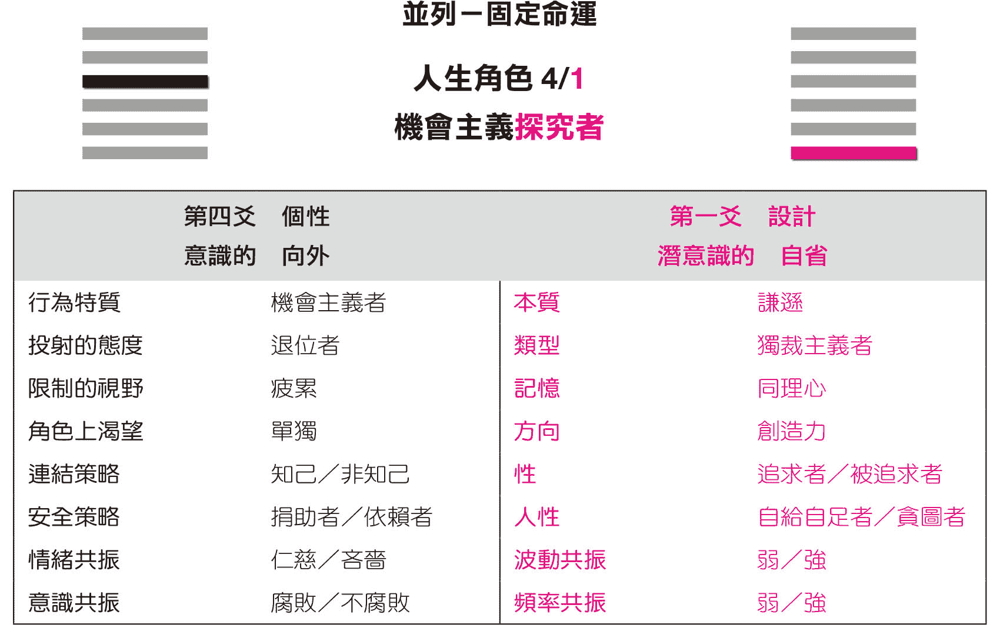

**背景：**对社交开放而且友善的第四爻，以及潜意识内向又缺乏安全感的第一爻，让**机会主义探究者**呈现有趣的并列状态。第一爻是下三爻的基础，而第四爻则是上三爻的基础，共同创造出人生目的的和谐状态。这是个独特的人生角色，全世界人口中只有 2%的人属于 4/1，他们属于**固定命运的类别**，是**个人命运的右角度交叉**以及**超越个人命运业力的左角度交叉**之间的桥梁。4/1 不是前者，也不是后者；他们既不是个人的，也不是超越个人的，这是六条爻中，唯一一种**并列**的人生角色。人生角色 4/1 以自己特殊的几何轨迹运作；像是一列行驶在轨道上的火车，在人生的过程中，他的行动以及前进方向都不会改变。

**个人：**你天生的设计就是来研究、学习，并且针对某个令你着迷的领域，在你的生命中创建坚固的基础，接着将自己所获得的知识库，为别人带来影响。那些你热爱并沉浸其中、且极欲与他人分享的事物，就是你的根基。在某个领域不断研究学习，进而变成专家，有助于让你将天生的不安全感转化成权威。一旦你创建起权威的地位，你便能在自己的人际网络中，成为真正具有影响力的专家。第四爻擅长与人相处的技巧，让你天生就知道如何以最好的沟通方式，传递知识让不同的人得以了解。

你角色的重点在于链接，结合人生角色**个人命运**的研究与发展，与**超越个人命运业力**的推动与扩展。虽说你的两脚各踏在其中一边，但你运作的方式，却与两边大不相同。对你而言，**固定命运**意谓着，不管那条路可能带给你什么，你迳自沿着自己独特的几何轨迹路线前进。想要知道更多关于你的固定命运、你此生要探究及显现的东西为何，就必须看看**自己的人类图**中，你的**个性太阳**和**个性地球**落在何处，这能让你对于此生的使命有所了解。当你遵循你的**人生策略及内在权威**过活时，你将见证到你的人生、使命与你的命运，如何完美地合而为一。

对于所有第四爻的人来说，生活品质和人际网络（家庭、朋友、同事）的品质息息相关。能让你扩展既定基础的机会皆来自于你的人际网络，透过友谊的链接，因为你并非设计来影响陌生人。想要有效地将你的知识库向外扩展，人际的链接是必要的。举例来说，若有个你认识的人邀请你去演讲，最好能提早到场，并尽可能地接触听讲的观众，与他们创建愈多面对面的链接愈好。或是在前一晚先举办一个“认识你”的联谊，如此一来，当你实际演讲时，你便能身处于熟悉的空间、对熟悉的人说话。对你来说，在家庭、经济、关系及工作方面有稳固的基础，非常重要。然而，要在千变万化的世界中达到目标，是个挑战。

就算人生角色 4/1 的人如同橡树般坚实、稳固，还是有天生的脆弱隐藏其中。你太刚硬固定，缺乏弹性变通，因此有碎裂的可能性，而一旦破裂，便难以将碎片拼回。了解你天生的设计，以及使命为何，得以帮助你待在轨道上，并应付生命中的各种挑战。为了让你保持稳定前进，同时享受旅程，最重要的是，你一定要做自己，绝不能为了任何人改变自我。为了你的身心平衡和健康着想，必须让别人适应你，因为你无法适应别人。你偶尔可以跟着别人走，但是你必须时时回到你固定而独特的模式。

**人际**：对**机会主义探究者**来说，人生和人，是一门真正的教育，透过人与人之间的交流，他们学习到的是，并非所有人都跟他们一样黑白分明，以是非对错的角度看待世界。当他们勐然觉醒这世界竟是如此，这会让他们陷于脆弱，甚至心痛。然而，人生角色 4/1 的人透过体验学习，固定的命运则让他们不断前进。对他们而言，远离争端很重要，除了他们既有的人际网络之外，需要有一小群值得信任的死党和知己，没有对抗，而是能够无条件地给予爱与支持。**机会主义探究者**喜欢研究人类的行为，对于心理学、社会学、占星学或是人类图，都可能有兴趣探索。

为了让人生有好的开始，对于人生角色 4/1 的孩子而言，富教育性以及安全稳固的家庭生活非常重要。父母必须提供机会，并鼓励他们学习自己喜爱，而且能够乐在其中的事物。4/1 的人在人际关系上，其链接策略是先创建友谊的基础，成为像兄弟姊妹或是朋友的关系，再发展成进一步的亲密关系。所有“他人”在跟**机会主义探究者**创建关系时，都必须先接受这一点。人生角色 4/1 的人，可成为最忠诚、最慷慨的朋友，但他们无法和抗拒他们，或缺乏信任、忠诚的人创建关系。因为第四爻内建有退位者的特质，想要成为他们的朋友，彼此最好是能完全开诚布公。如果他们遭遇抗拒，就会继续前进，寻找其他需要他们的人。

如果你和 4/1 的人争辩，他们只会礼貌地点点头，实际上则坚定地将他们的真理默默深埋心中。4/1 人的心意通常很难改变，除非你握有坚不可摧的事实，足以证明你的论点。

人生角色 4/1 的名人：制作人大卫．金斯伯格（David Ginsburg）、剧作家安德鲁．洛伊．韦伯（Andrew Lloyd Webber）、记者芭芭拉．华特斯（Barbara Walters）、女演员贝蒂．米勒（Bette Midler）、美国太空人伯兹．艾德林（Buzz Aldrin）、服装设计师吉安尼．凡赛斯（Gianni Versace）、皮件设计师刘易斯．威登（Louis Vuitton）、喜剧演员彼得．谢勒（Peter Sellers）、演员／导演理查．哈里斯（Richard Harris）。

### 人生角色 5/1

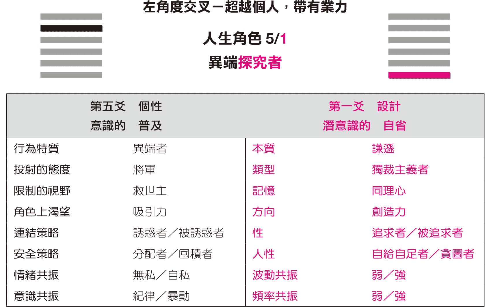

**背景：**在易经中，崇高并具统治地位的五爻，能够具体表现每个卦的主题。对**异端探究者**来说，潜意识的第一爻代表权威的基础，而第五爻则在意识上投射出所有基础会有或应有的模样。这使得人生角色 5/1 是 12 种人生角色中，最能超越个人的层次，带有最强大的普及潜能。5/1 扮演的角色是救世主和将军，权谋而且偏执，但却充满吸引力。**异端探究者**会被投射成救世主，在危机时刻提供实用的解决方法，并且拯救别人。

**个人：超越个人命运**意谓着你这辈子会来处理业力，而你天生会遇到许多重要的机缘，双方的相遇足以让彼此产生重要突变。如果将你的人生画成格子图，你会发现很多交会点，都代表着这些机缘相遇，从中你会了解命运如何巧妙安排，让你得以遇见生命中的贵人，以及成为别人的贵人。这些业力的相遇，常会让你产生似曾相识的感觉，这可能复杂到牵涉事业上的安排，或单纯只是某个人前来问路。在某种程度上，你会意识到自己超越个人的五爻，具备迷人又吸引人的特质，引发众人在你身上投射了许多期待。那些人（甚至是不认识你的人）会觉得你可能具备某种重要性，能够提供他们所需要的帮助。这些外来的投射会吸引别人开始靠近你，也为你提供人生中必要的机缘，让你能活出自己独特的使命。

因为投射的缘故，他人会觉得你可以带领、引导、帮助或拯救他们，当这个投射的形象对你而言是正确的，你会乐于扮演这个角色，并且使用你在专业上解决问题的技巧，为众人提供实用的解决方法。然而，若你感觉到别人对你的投射并不正确，你会觉得没有安全感，无法确定你是否可以提供别人所需要的帮助。所以知道如何辨识，并接受正确的投射，对你来说非常重要。如果你接受了一个不正确的投射，便会陷入他人所投射出来的幻觉之网，导致许下承诺却无法达成，徒留坏名。所以在面对别人的期待时，保持怀疑，甚至带点偏执的态度，对你来说才健康。拉曾经说过：“人类的希望和梦想，落在五爻的肩膀上。”这责任相当重大，而承担这种投射的最好方法，就是站在坚固、实际又可靠的基础之上。

五爻的人的优势：一开始来自他人的投射，总是正面。人们投射期望，觉得你可以满足他们的需求，若你提供有效方法，名声便会扶摇直上。但相反的，当你无法提供有效的解决方法，给出不牢靠的计划时，你的名声就会受损，接着，“异端将会被烧死在火刑柱上”，你成为众人指责的焦点。名声受损，你在意识层面上的五爻就得另谋出路。因此在决定参与前，请确认你准备的实际解决方案，是否对每个人都适用。要做到这一点，必须仰赖潜意识层面的第一爻。身为探究者，第一爻的设计就是打破沙锅问到底，研究并建构安全可信的知识基础。一旦具备稳固基础，并成为权威，你便是准备好了，在别人需要你的时候，能发挥影响力，引发社会突变。依循人生策略及内在权威，引导你找到正确的环境及时机，才能让务实的知识基础，得以普及。

你对于观察周遭世界极为热衷，而你成功的必要因素，便是做好万全的准备，并选择正确的时机。当两者齐备，你是个**异端探究者，**得以打破人类对事物的既有成见，在旧观念宣告失效时，注入革命色彩，宛如异端般的新观点，并使之成功运作。你和四爻不同，四爻在自己的人际网络和伙伴关系上，能发挥最大的影响力；五爻则扮演重要的陌生人，力量最为强大。你天生的设计要接触新的族群，那些人已经准备好，可以接收充满突变性，宛如异端般的观点；对第五爻的人来说，亲近生侮慢，适时的撤退对你大有益处，远离任何对你带有投射的场域，既能增强力量，还能培养技能，如此一来，当下一个危机到来，刚好又是正确的托付时，你已经做好万全准备。透过熏陶美感与创造力，在各个层面上，感到焕然一新。

**人际**：为了有更多机会，带来普及的影响力，同时招来足以相互诱惑的拍档，**异端探究者**渴望自己充满吸引力，他们有其脆弱处，缺乏安全感，也不愿意展现真实的自己。很少人真正了解五爻的人，因为难以捉摸的投射场域，总是掩盖他们真实的面向。五爻的人会默默囤积，有所保留，等待别人筑起权力幻觉（投射场域），等待正确的时机，才扩展自己的基础，带来普及的影响力。在危机中，若要提供有用的解决方法，需要纪律与耐心。在过程中，**异端探究者**逐渐成长，但要记住，满足某个投射的期待后，必须先退回，再等待，为下一次可能来临的状况做好准备。认清正确的行动时机，否则只会使名声受损。如果等待太久，原先需要被拯救的事物已经消失，新的投射将垒叠在第一个投射之上，此时的投射对他们而言，不见得正确。此外，人生角色 5/1 和 6/2 之间，有种奇妙的链接。6/2 的人本身充满智慧和信任，天真支持着 5/1 的异端与其实际的基础知识，可以增强或拯救 5/1 人的名声，不过反之亦然，6/2 的人也能够用同样方式，摧毁他们的名声。

人生角色 5/1 的名人：《安妮的日记》作者安妮．法兰克（Anne Frank）、美国发明家巴克明斯特．富勒（Buckminster Fuller）、美国演员克林．伊斯威特（Clint Eastwood）、美国歌手哈利．贝拉方提（Harry Belafonte）、美国实业家、《花花公子》杂志创办人休．海夫纳（Hugh Hefner）、美国太空人尼尔．阿姆斯壮（Neil Armstrong）、天主教圣人毕奥神父（Padre Pio）、英国歌手保罗．麦卡尼（Paul McCartney）、拉．乌卢．胡、梵高（Theo Van Gogh）。

### 人生角色 5/2

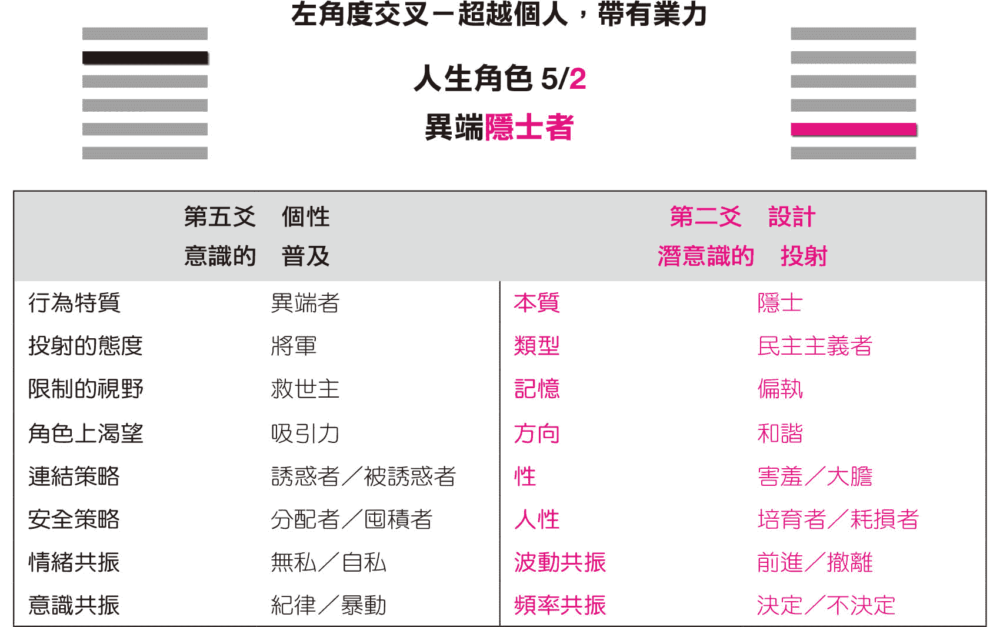

**背景：**身处于双重的投射场域，**异端隐士者**必须自我刺激或自我驱动。当正确的投射让事情开始运作，**异端者**会召唤出自己**隐士**的天赋，自然而然地加以运用，或予以普世扩展。人生角色 5/2 的人有着不平凡的人生，别人总会持续不断地在他们身上投射期望。若以房子的比喻来看，意识层面上的第五爻位在二楼，躲在窗帘后面观望外面的街道，他们非常清楚，下方的人好奇于窗帘后有什么，因而投射出期待。而潜意识层面的第二爻则在亮着灯、窗帘敞开的一楼跳着舞，他们一点也不关心别人看到什么，或在别人眼中，自己投射出什么样的形象。

这是很少见的人生角色，可以说是不情愿的**异端者**，因为来自他人的投射太多，他们不确定该满足何者，干脆保持距离，不涉入其中，这种情形在他们身上可说司空见惯。虽然他们是属于超越个人的人生角色，但是他们不像 5/1 的人，和别人有业力上的关系，5/2 的人只要处理好自己的内在业力就好。他们要在过往生命的基础之上，活出此生的目的，但“他们”要自己去探索，否则，不论那尚未被召唤出来的东西为何，他们都不可能将其扩展，普及世人。

**个人：**以一种不寻常的方式，你极具天赋。对你而言重要的是该如何投入生命。你在等待的，是那个来自内在的正确召唤，这召唤带有革命性的色彩，让你能带领他人超越世俗层面。一旦完整投入其中，你将被赋予力量，为你此生注定相遇之人，提供无私的滋养与支持，同时也能在物质层面上，兼顾自己的需求。你跟 5/1 的人不一样的是，他们扩展给众人的是自己的探索和研究；而你传达给众人的是你的天赋才能。这其实非常个人，你可能因而感觉自己非常脆弱。当你接受召唤，投身其中，提供协助，你要人们相信的是你这个人，你必须独自站在属于自己的魅力之中，而这可能会为你带来许多不确定的感受。

至于你二爻所蕴藏的天才之处，深藏在潜意识层面。对你来说，要分辨自己所接收的召唤是否正确，有其难度。因为你的召唤往往来自别人的投射，必须透过你的**人生策略及内在权威**，才能知道该如何做出正确的决定，以获得成功与名声。唯有辨识正确的召唤，才有机会满足来自他人的投射。人生角色中的第五爻，总是要从他人的正向投射中，因为满足他们的渴望与需求，而跨出第一步，但是若无法满足他们对你的投射，便会损及你的名声。这是个超越个人的人生角色，一旦名声受损，便坏事传千里。因此非常重要的是，了解如何遵循自己的内在权威，做出正确决定，而不是顺着投射的场域来决定。你在独处时会感到很舒服、很自然，也很开心，换句话说，远离投射对你不仅必要，也是一种解脱。你的潜意识层面，也就是你的身体二爻是个隐士，特别需要时间独处，才能滋养自己的天赋，保持健康。

身为**隐士**，你对于如何改进原本的天赋，没什么兴趣，也无意向自己或别人证明你真有两把刷子。而作为**异端者**，对于那些身处危机中的人，伸手向你求援，或是对你怀抱希望与期待，期望你能满足他们，这些投射都会让你感到很不舒服。尤其如果曾经为了符合对方的期待，而体验过失败的滋味，就会感觉更加负面，再度强化你想要独处的渴望。这也会让你在面对四面八方的诸多投射时，不确定自己到底能做什么，感到不知所措与困惑。这种情形若演变到极端不健康的状况，你可能会选择孤立自己，远离所有外在投射及期待，宁愿默默承担起，拒绝付出不愿分享天赋以造福众人的坏名声。

**人际：**与**异端隐士者**交流的秘诀，就是避免在任何方面给他们压力。要等到他们自己召唤自己，以他们独有的方式，在困境或危机中，发挥自己与生俱来特定的才华与天才。这个不寻常的人生角色，以个人能从中获益的各种形式，并保有其内在的平衡，将革命性的全新真理带到世上。5/2 的人坚信，和谐的根基源于没有人应该遭受压迫。在关系上，第五爻的**异端者**依赖天生的吸引力，抓住别人目光，但是**隐士**不由自主的害羞倾向，却设立了屏障，无法真正与人亲密。然而，当他们有兴趣的人或追求者出现时，5/2 会卸下心防，允许追求者大胆并有效地展开诱惑，就此打开亲密的大门。

5/2 的孩童属于自我激励的类型，而这对于他们的父母却充满挫折与挑战。我们总对这些孩子寄予巨大期望，期待他们在世上展现才华或天才，以帮助别人。当他们躲在自己的小房间里玩耍，家人可能会觉得他们表现不如预期。这会让 5/2 的孩童感觉非常不舒服，因为他们总对外来的投射，备感压力。当他们对自己的天赋感到不安，不确定自己是否能符合众人期待，就会开始对别人的评价，心存怀疑。和 5/2 的孩童相处时，最好提供多种不同事物，任其挑选，看看何者会让他们心生欢喜，他们很挑剔，然而他们的天赋一旦被启动，他们便会将自己召唤出来，与别人分享自己与生俱来的才能。

人生角色 5/2 的名人：美国总统林肯（Abraham Lincoln）、美国民权斗士科丽塔．史考特．金恩（Coretta Scott King）、美国女演员布莉姬．芳达（Bridget Fonda）、英国小说家乔治．艾略特（George Eliot）、知名新闻记者迈克．华莱士（Mike Wallace）、美国演员彼得．格雷夫斯（Peter Graves）、山达基教创始人罗恩．贺伯特（Ron L. Hubbard）、美国编舞家艾文．艾利（Alvin Ailey）、美国歌手琴娜．菲利普斯（Chynna Phillips）、浪漫主义音乐家法兰兹．舒伯特（Franz Schubert）。

### 人生角色 6/2

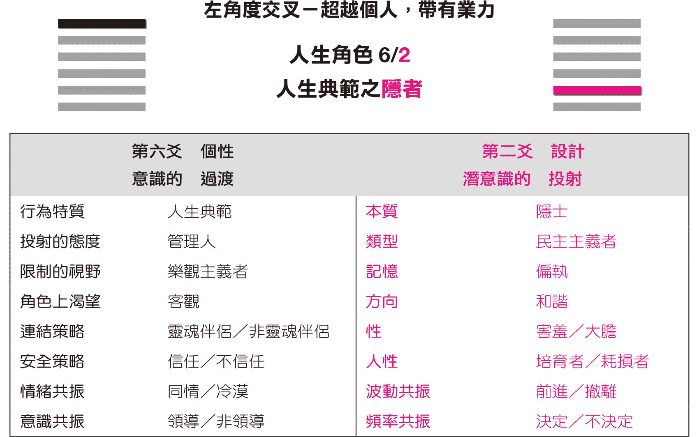

**背景：**超越个人的**人生典范之隐者**，此生的目的，是要让我们所有人能够不被外在权威左右，活出表里一致的自己，进而理解并接受，我们各自是如此独特而完美。不过潜意识层面具备天赋的**隐士**，只想独善其身。在前述房子的比喻中，第六爻座落在屋顶，和房子其他部分是分开的，却得以看见别栋房子；就卦象而言，则是能看见下一个卦。**人生典范**不一定在乎屋内发生的事；他们对于屋顶的广阔视野更有兴趣。

位于屋顶高处，让人生角色 6/2 的人得以脱离“戏剧人生”，他们像是位在山顶的智者，客观地观察世界，提供超然的观点。第二爻以及第六爻有些共同点，**隐士**的天赋总是会被人注意，而身为观察者的**人生典范**，也总是被人们观察着。

**个人：**你总会有种和世界不太同步的感觉。因为你鸟瞰人生，等于以超龄的智慧，宏观这世界。那些没有第六爻的人生角色，无法用你的方式看世界，因此你觉得与他们格格不入，或质疑为何对你显而易见之事，别人却浑然不觉。当第六爻和第二爻结合，你会成为民主的管理者，独特、有能力而且睿智的权威人士。

跟所有的第六爻一样，你的人生主要分成三阶段。重要的是，你必须拥抱过程中的每一个面向，在你日益成熟的同时，为真正的召唤做好充分的准备，未来才能成为值得信任的领导者。最早的 30 年是尝试错误的探索过程，收集有价值的经验，随着你的奋斗，经历人生中残酷现实的洗礼，行不通的天真亦会日渐褪去。第二阶段是你的退隐期，用来疗伤、重十乐观、享受人生，并厘清哪些事物行得通。你潜意识层面的第二爻**隐士**，在这个时期会感到如鱼得水，因为退隐正符合其天性。50 岁以后，你会接收到召唤，重新与现实人生形成链接，并且成为真正的**人生典范**，成为活出睿智、觉知、客观判断的典范与观察者。

人们总是关注着你，即使在你处于静默及退隐的阶段，你依然拥有超越个人层面的强大力量。对你来说，和谐的人生意谓着没有潜藏的议题，无须为了证明自己而备感压力。你总能处之泰然、跳脱无意义的戏剧人生，这也让你能保持客观。你最感兴趣的是有深度、有意义之事，不愿投入琐碎的事物中。别人视你为客观的管理者，请求你给予建议。身为一个超然的人，别人会认真聆听你所说的话，重视你所提供的建议。不管你认为是否可行，或认定某个人的好坏，人们都会相信你。基本上，在健康状态下，你的第六爻是乐观的——总是希望并梦想每个人都活得很好，当然也包括你自己。在此同时，你潜意识的第二爻，则会看见存于人性中的脆弱与自我憎恨。

你必须保护你的天赋才能，让它们在自然的状态下舒展开来，如此一来才会有人召唤你出来，为全世界所用。你并非通才，必须透过特定的召唤，才能让你的天份得以发挥，具体发挥身为**人生典范**的力量。不过你无法主动寻找召唤，必须借由他人发起。如果在人生的前两个阶段，你能够在过程中安身立命，保持洞察力并守护自己的天赋才能，你自然会散发出高尚、自足、乐观又有远见的气质。然而存于潜意识的不确定感，会导致你退缩保留，不愿意跟世界分享你的特殊天赋。你的人生策略及内在权威，将引导你找到正确的人，回应正确的召唤。

**人际：人生典范之隐者**是理想主义者，总在寻找完美人生与完美伴侣；某个可以陪伴在旁、心有灵犀、足以让他们感觉骄傲的人。然而，这伴侣得鼓起勇气，突破 6/2 人屏障的高墙，才可能成为他的伴侣。在前 30 年的尝试错误过程中，他们不断进入亲密关系，却只能受苦于幻灭与失望。一般来说，只有在进入退隐期，他们才有可能遇到真正的伴侣，但即使在这阶段，为了找到完美伴侣，还是得花费大量时间，不断尝试再尝试。对 6/2 人来说，重要的是，活出真实的自己，并且不会试图去改变别人真实的一面。对**人生典范之隐者来说，**信任是极重要的养分，他们无法亲近他们不信任的人。若信任破灭，你就只能接触到 6/2 人最表面的那一面。

支持 6/2 的孩子探索他们真实的天赋与本质，让他们不会因为人生前 30 年的尝试错误，其过程所犯的“错误”而感到羞愧，这非常重要。他们可能对自己的天赋并不确定，且往往因为追求完美，进行严厉的自我批判。父母应该鼓励他们探索，与尝试各种事物。如果当孩子做了某件事情，却发现行不通时，父母亲可以问孩子：“你在这个经验中学到什么？”引导孩子从中发现，从中学习。

第六爻的三阶段发展历程，也是所有人类要经历的过程，透过第六爻亲身示范并真实显现，引领我们转换至九个能量中心的全新型态。他们此生的目的是让我们知道，如何活出九个能量中心的独特性，如何生活、运作、透过内在权威而作出正确的决定。**人生典范之隐者**在此是为了让我们看见，如何依循自身的智慧而活。

人生角色 6/2 的名人：美国总统欧巴马（Barack Obama）、美国音乐人比利．乔（Billy Joel）、法国前总统戴高乐（Charles De Gaulle）、英国作家狄更斯（Charles Dickens）、澳洲男演员艾罗尔．弗林（Errol Flynn）、美国导演／制作人乔治．鲁卡斯（George Lucas）、美国前总统杜鲁门（Harry S. Truman）、美国汽车大王亨利．福特（Henry Ford）、现代舞创始人伊莎朵拉．邓肯（Isadora Duncan）、美国作者费滋杰罗（Zelda Fitzgerald）。

### 人生角色 6/3

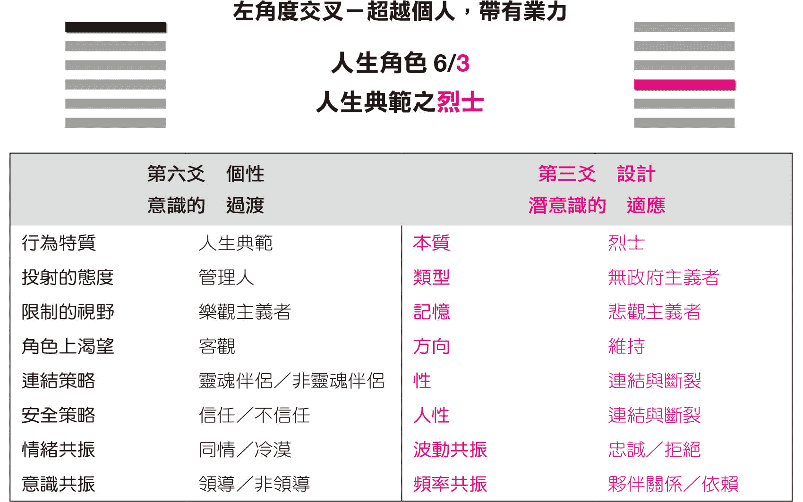

**背景：人生典范之烈士**，12 种人生角色中的最后一个，结合意识层面超然且追求完美的第六爻，与潜意识里充满骚动、物质导向与突变的第三爻。6/3 是代表过渡和改变的人生角色，这也让他们的人生充满混沌和不稳定。不论第六爻是处在三阶段中的哪一个时期，潜意识的第三爻都会持续将一切归纳为主观的体验。正因为这样的过程，6/3 成为**人生典范**中最有智慧的一个，最终发现，独特就是完美；还有当作决定的时候，与他人无关，唯一能信任的就是自己。

**个人：**对所有的第六爻而言，你将经历三阶段的人生。在前 30 年，6/3 的人仿佛经历 3/3 的人生角色，以两倍的强度，有时候相当困难，以渡过尝试错误的阶段。你在此时收集主观经验，致力于尝试所有事情，包括参与行不通的状况，或进入不正确的关系中。你可能会失望，甚至被制约，悲观地认为人世间没有一件事行得通。

6/3 人的第一阶段未必都充满创伤，孩童时期父母的抚育与制约，将决定你如何渡过这个阶段。如果父母养育你时，尊重你是独立的个体，你依循自己真实的个性成长，教导你如何自己做决定，那么你的第一阶段会过得相对平顺。如果你就是自己的**内在权威**，那么你将会从这些主观经验中获得智慧，并且知道该如何从中探索，分辨何者对你来说才正确。6/3 的孩子需要鼓励及教导，让他们知道尝试错误的过程，重点不在犯错，而是机会，得以从错误中学习。若非如此，最后你可能变成烈士和自卑的复合体，对生命抱持着愤世嫉俗又极度悲观的看法。

到了 30 到 50 岁之间，你爬上屋顶，进入超然又客观的观察过程。此时的你，从主观经验的历程中隐退，从第一阶段的 3/3 回到了 6/3。但是你却无法像人生角色 6/2 一般，安然待在屋顶。潜意识的第三爻，会一而再、再而三地将你拉回尝试错误的过程，而且觉得“这还不够，一定还可以更多”以及“还有东西等着我去尝试，还有东西需要被探索”，这让你在梯子上爬上爬下，在链接世界和保持超然间不断徘徊，同情和冷漠交错出现。若因为某些不愉快或令人气馁的经验而感到受伤，你可能会暂时撤退，直到觉得无聊，又或是有新的冒险吸引你，你又会再度爬下梯子，投入下一个体验。因为受到第六爻在意识层面的乐观所驱动，对你而言一切都有可能，相信自己总能找到可信任的事物或是灵魂伴侣，而在乐观与悲观之间来回摆荡与徘徊。

50 岁起，你开始隐隐感觉到，自己的独特性已逐渐完备，就要开花结果成为**人生典范**了。活到这个阶段，你已经累积了大量的智慧，看起来就是个充满智慧又客观的顾问，对人生充满独特看法。潜伏在潜意识的第三爻，已经准备好要进行下一次探索，即使下一步的实验，可能会打乱六爻所喜爱的，那平和又完美的世界。然而你的客观是你的救星，总会支持你到底，而这也是你立志要达成的特质，的确能为你的人生带来和谐。你的人生充满各式各样的转换，时而投入时而解脱。拥有人生伴侣，对你而言很重要，拥有关系创建又断裂的人生，对你来说是正确的道路，你需要适时抽身跳脱，然后再度链接而进入。当你依照自己的内在权威运作时，就会体验到，正确的转换对你来说会是怎样的体验。头脑所作的决定，导致每下愈况，是最糟糕的状态，而这可能会让你面临痛苦又受伤的体验。

**人际：人生典范之烈士**生来充满弹性，有能力坚持自己的方向。只要他们能够接受并拥抱年轻时的混乱、困惑及惊愕，从中获得所有必要的发现和学习，累积珍贵的智慧为根基，此生就会行得通。6/3 需要与他们所信任的人，创建相互支持的人际关系，这些人能包容 6/3 在必要时，会抽身离开或切断链接，而这是为了重新链接，与强化其关系。

第六爻为我们示范，如何用崭新的方式，在九个能量中心的世界中生活。旧有方式主要立基在领导人与跟随者之上，第五爻的普世者为我们带来制约，人类朝同质化发展，进而将自己的权威交付给别人。**人类图是**为了解放个体性，才来到这个世界，同时培养并强化每个人的独特性，而这也与六爻想体现并表达的主题一致。当我们进入了突变的新时代，愈接近西元 2027 年，世界会愈来愈以六爻的方式来运作，而那些鼓吹我们将自己的权威，交由外在影响来决定的结构与组织，都将持续瓦解。

在旧有的七个能量中心运作模式，我们总会被告知该做什么。这并非六爻的本质；他们天真地示范给我们看，什么叫做透过内在权威，正确地活出自己。在后凯龙时期，他们就是九个能量中心活生生的示范，让独特性的完全发挥并开展。从六爻身上我们得以看见，做自己是没问题的，你可以在自己的内在，找到所需的一切。

人生角色 6/3 的名人：美国新闻主播丹．拉瑟（Dan Rather）、美国演员法拉．佛西（Farrah Fawcett）、美国演员哈理逊．福特（Harrison Ford）、美国演员麦特．戴蒙（Matt Damon）、巴西作家保罗．科尔贺（Paulo Coelho）、美国演员洛克．哈德森（Rock Hudson）、美国网球选手瑟琳娜．威廉斯（小威廉斯，Serena Williams）、贾伯斯（Steve Jobs）、意大利末代国王翁贝托二世（King Umberto II）、美国 R&B 歌手亚瑟小子（Usher Raymond IV）。

所谓的轮回并非仅止于外在形式，否则，我们可以全部成为海豚，或化为植物，我们来到这里是为了落实意识上的设定，在此指的是完成使命。你的轮回交叉是你的人生目的，以及能否履行的可能。当你活出自己，你的轮回交叉将接管你的人生，当你活出自己的人生使命时，在你设计中的个性层面，再也不是重点，人生目的会让人超脱自己个性的种种问题，这就是做自己的神奇之处。因为当你真正活出自己的本性，你的轮回交叉会接手，你的人生目的会凌驾一切，不论接下来会如何发生，从中显现的会是对此原型的需求与机会，静待被完成。

——拉．乌卢．胡

# 第八章轮回交叉索引我们真正的使命

### 我们真正的使命

人类图祖师爷拉当年在释出全球轮回交叉的信息时，内心其实很犹豫，因为当时人类图系统尚未普及，而人们可能会倾向于将自己的轮回交叉，解释成他们有资格去做的事情，或是不可避免会发生的事。但事实上并非如此。

我们的轮回交叉，并不会随着我们经历去制约过程，而自动显现，也不会提供立即的满足与喜悦；它远远大过于此。当我们照着自己的设计，活出个别的自我，轮回交叉会逐步而自然地接管我们的人生。要达成使命，需要一辈子的耐心和谨慎专注，做出正确的决定，并且全心致力依觉知来微调。我们不是觉醒于自己的轮回交叉，而是活在轮回交叉中而觉醒。轮回交叉能让我们全然体现，意识层面的潜能，这是生命觉醒的过程。

每一个个体，皆属于整体中的一部分。而每个人的存在都是独特的贡献，成为这整体互动的一部分。我们生命中的行为，无不围绕着自己的使命，透过人类图两侧太阳和地球的位置，及其所呈现的主题，透过轮回交叉表达出来。在下一页的人类图曼陀罗中，落在 1 号闸门的个性太阳，与落在 2 号闸门的个性地球是一条线，而落在 7 号闸门的设计太阳，与落在 13 号闸门的设计地球是另一条线，两条线交叉，便形成轮回交叉。我们每个人都有属于自己的交叉，而每一个交叉，对整体而言都是必要的；没有任何一条交叉比其他的交叉更为重要。

基础的轮回交叉有 192 种，另外还有 768 种分析用的特定轮回交叉。紧接着简介之后，是以简要的关键用语，来介绍这 192 个基本的轮回交叉，若带着觉知过生活，个中所蕴藏的可能。要完全了解一个轮回交叉，需要完整的轮回交叉解读。（欲谘询完整的轮回交叉解读，请洽国际人类图学校认证分析师。）

#### ▸ 轮回交叉的四等分

“观照者透过子宫归来，为了建造与链接、创造更多、衡量及死去。”

——拉．乌卢．胡

右角度交叉之人面狮身的四个闸门（如下页图示）将人类图曼陀罗分成四个等分：初始（13 号闸门）、文明（2 号闸门）、二元性（7 号闸门）与突变（1 号闸门）。了解四个等分不同的主题，可以加深我们对轮回交叉的理解。若要把四个等分的关键字用叙述性的句子表达出来，我们可以这样说：我们在此是为了开始（初始）建造（文明），透过人际链接（二元性）与进化（突变）去创造，直到死去为止。

#### ▸ 如何找到你的轮回交叉

下图将说明，如何找出你的轮回交叉位于四等分中哪一个等分。想要找到你的等分和交叉，请查出你人类图上，个性太阳落在哪个闸门。首先找到代表个性太阳的符号（）及其旁边的闸门号码，接着对照人类图曼陀罗（如图示）找到所属的等分。接下来的四页将会描述四个等分个别的主题，同时也列出该等分之交叉的说明页数。另外你也能在打印出来的人类图上，找到你的轮回交叉名称。

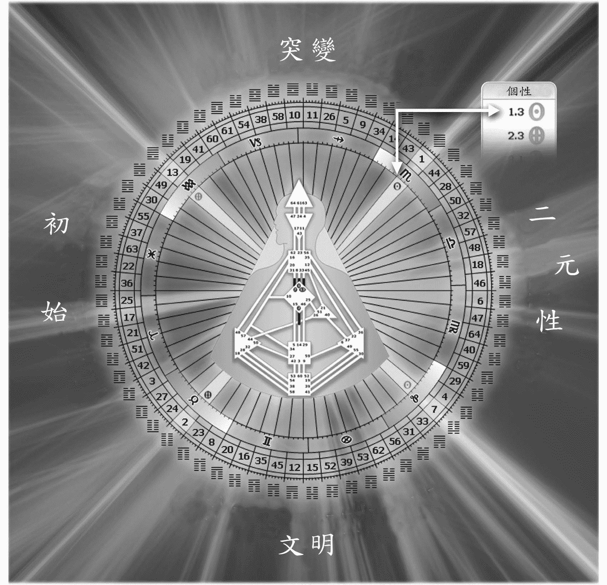

#### ▸ 第一等分／初始的等分—昴宿六的领域

主题：透过心智，达成目的—神秘主题：观照者的回归

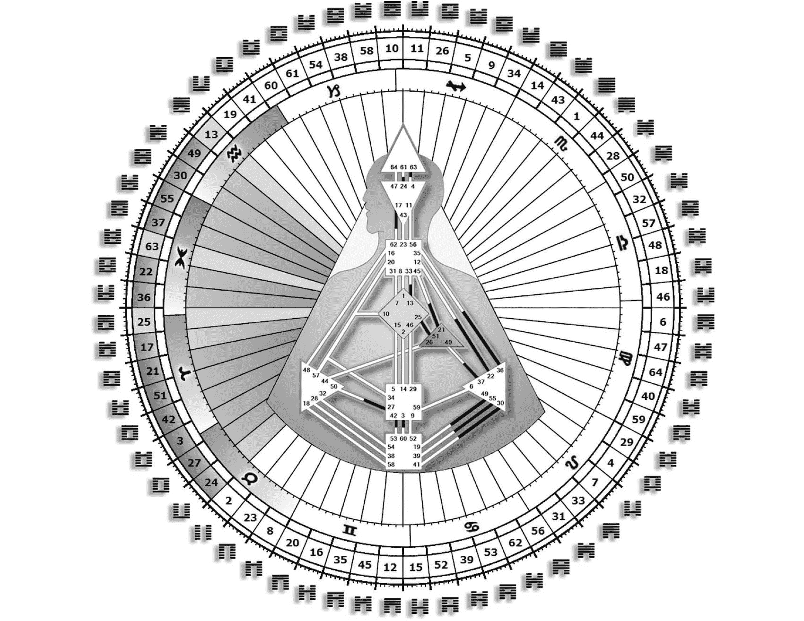

在第一等分中，观照者（个性水晶）回到地球，再一次在物质层面带来意识上的革命。这个等分是透过头脑，经由思考、教育、概念化、解释及分享人生在世的意义，来达成使命。当我们学习臣服于自身形体时，头脑会进行细微的调整。只要我们的心智对于存在于身体之中，感觉适得其所，我们会乐于做自己，而不会渴望成为任何人。注意到，情绪中心是关于关系的智慧，以及精神意识的展现，而情绪中心的七个闸门中，便有六个都集中在初始的等分。同时，发起的信道也位于此处。**初始这一等分中，所有的轮回交叉详列于后方“初始的等分”。**

#### ▸ 第二等分／文明的等分——天枢星的领域

主题：透过形式，达成目的——神秘主题：从子宫出生

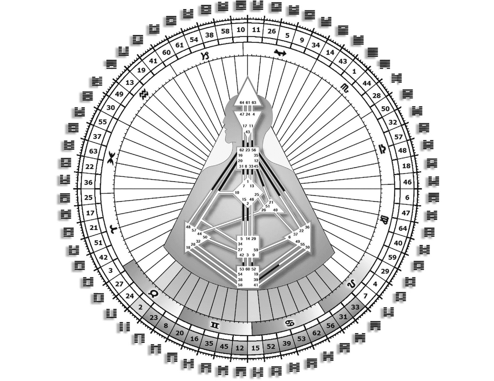

第二等分主要聚焦于形体的生命旅程，以及人类出生后所需的支持。这里能将头脑里的概念具体化并成形。这个以阳性为主的等分，负责创建各种架构社群及文明，因而能支持运作形式，让每个人得以成长茁壮。它预见了工业化、领土权、物质文明的发展，以及个人技能的独特化及最优化，还有女性所扮演的重要角色，为后代及所有人创造了文明、具备创造力又安全的环境。值得注意的是，喉咙中心全部的闸门，都落在这代表文明的等分：分享、支持并帮助人类所有的潜能，得以展现其智慧。在此的使命是透过显示，透过灵魂注入形体而完成。**文明这一等分中，所有的轮回交叉详列于后方“文明的等分”。**

#### ▸ 第三等分／二元性的等分——木星的领域

主题：透过人际链接，达成目的——神秘主题：为了衡量而衡量

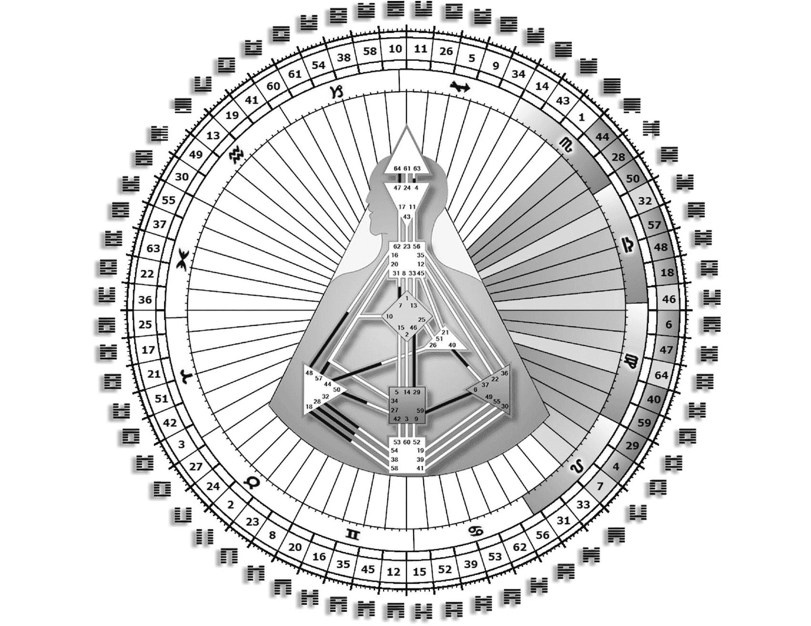

第三等分是四等分中最世俗、最亲密的一环，我们在此跨越了彼此分离的障碍，提出我们对别人的需求，然后神奇地合而为一。在这个领域中，我们能深入核心，看到存在的二元本质；一方面扩展物质世界（为了衡量而衡量），另一方面与轮回中的美丽和神秘相链接。在此，我们与别人相链接的能力，成为源源不绝的奇迹源头。这个领域的使命，是透过人际链接来达成；基于遗传上的需要，选择最佳伴侣来繁衍物种，以确保人类的未来得以延续。二元性的等分带着我们从头脑（概念化）与形式（创建），来到人际链接（共同创造的奥秘）。另外值得注意的是，发现的信道、亲密的信道、直觉中心的所有闸门，以及这些闸门所拥有的求存智慧，全部都在此等分之中。**二元性这一等分中，所有的轮回交叉详列于后方“二元性的等分”**。

#### ▸ 第四等分／突变的等分——天狼星的领域

主题：透过蜕变，达成目的——神秘主题：接受死亡

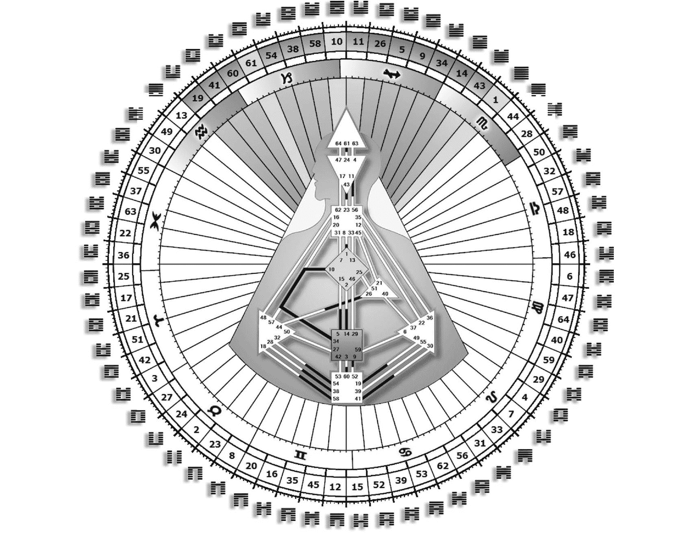

在第四等分，真实而蜕变完成的生命，最终归于完整，来到一个令人满意、和平、成功而充满惊喜与愉悦的终点。同时，为了到达下个意识层级，投入未来轮回的准备必须展开。在这完整的人生中，所学习和表现的一切，都将被仔细地评估、检查，去芜存菁；而留下来的部分，可能会成为下个世代的真理和基础。在突变的等分中，为了完成使命，须发挥在蜕变与觉知层面上的全部潜能。至于神秘主题——接受死亡，是关于臣服生命如是，同时理解到生命：当你完成你的使命，就是继续前进的时候了。如果你正确地活着，就能够正确地死去；明白这点，或许会让你舒服一些。如图所示，探索的信道以及大部分来自荐骨那有回应、有生产力的能量，还有来自根部中心，那股生命动能的压力，皆透过突变的等分来显示。**突变这一等分中，所有的轮回交叉详列于后方“突变的等分”**。

### 初始的等分

主题：透过心智，达成目的

#### ▸ 13 号闸门—伙伴关系

*   右角度交叉之人面狮身：具备个人方向，用自己独特的方式记忆经验，将鲜明而活跃的过去带向未来。（闸门 13-7-1-2）
*   并列交叉之倾听：很棒的倾听者和守密者，擅用艺术的形式，来诠释自己与突破性的洞见。（闸门 13-7-43-23）
*   左角度交叉之面具：透过解释或洞见，带来转化的潜能，以领导并指引他人，若能隐身于面具之后（像医生那样）效果最佳。（闸门 13-7-43-23）

#### ▸ 49 号闸门—革命

*   右角度交叉之解释：四处游历的先知，为满足生存所需，而指出必要的基本需求，并说明其中的必要原则；对于有所需求的人很敏感。（闸门 49-4-43-23）
*   并列交叉之原则：他们是革命家，行走于时代尖端，固守原则（通常与人权有关），为了要获得强而有力的盟友，甚至愿意与神交易。（闸门 49-4-14-8）
*   左角度交叉之革命：革命家，了解若人处饥饿中，和平不可得，认为拥有资源的人一定要分享给缺乏资源的人。（闸门 49-4-14-8）

#### ▸ 30 号闸门—燃烧的火焰

*   右角度交叉之感染：天真的命运实行者，透过体验、发现和学习，走进别人的生命，并且不预期地改变他们的命运。（闸门 30-29-14-8）
*   并列交叉之命运：精力充沛、坚持不懈，任由命运安排，基于完成渴望的执着与承诺，草莽行事。具备成为神秘学老师的潜能。（闸门 30-29-34-20）
*   左角度交叉之勤奋：活力充沛的人，非常忙碌地工作、创造与链接，以满足他们内在渴望人类进步的动机：强烈渴望在每一个新的体验中，感觉到各种情感的可能。（闸门 30-29-34-20）

#### ▸ 55 号闸门—丰盛

*   右角度交叉之沉睡的凤凰（直到二〇二七年为止）：透过爱与链接，他们忙于寻找通往灵性道路的可能，而在过程中体验到蜕变（死亡与重生）。（闸门 55-59-34-20）
*   并列交叉之情绪：渴求深度、渴望知道真理的人，他们的情绪稳定，具有强烈创造潜能；充满创意的老师。（闸门 55-59-9-16）
*   左角度交叉之灵魂：透过创造力、好吃的食物和性伴侣关系，寻找其灵魂与生命的乐趣。（闸门 55-59-9-16）

#### ▸ 37 号闸门—家庭

*   右角度交叉之计划：他们秉持自身的技能，与人交易，创建并维持社群的体制；透过相互链接，团结力量大，创造更好的成果。（闸门 37-40-9-16）
*   并列交叉之交易：他们是无人能挡，热力四射的谈判者，擅长达成协议，发展社群。（闸门 37-40-5-35）
*   左角度交叉之迁移：当共同的计划或经验已经完成，他们会另谋出路，征服下一个领域／经验；他们是源头，带来进展。（闸门 37-40-5-35）

#### ▸ 63 号闸门—完成之后

*   右角度交叉之意识：除了基本需求，透过质疑/测试既定模式，他们想明白人生所为何来，随顺生命之流，进而超脱对更多体验的渴求。（闸门 63-64-5-35）
*   并列交叉之怀疑：聪明、令人信服，具有影响力的怀疑论者，有能力说服他人，以逻辑性的解释来平衡其体验。（闸门 63-64-26-45）
*   左角度交叉之支配：在特定状况下，他们强大的智慧充满力量，足以掌控一切，有能力带来质疑与困惑，以取得主权。（闸门 63-64-26-45）

#### ▸ 22 号闸门—优雅

*   右角度交叉之统领：位居要位，懂得如何优雅地听，天生具备统领的才能，最大的责任是教育王国里的子民。当他们得以统御人事物时，最为健康。（闸门 22-47-26-45）
*   并列交叉之优雅：非常热衷社交，能够全神贯注地倾听；他们是强而有力的突变媒介，能享受聆听的艺术和乐趣。（闸门 22-47-11-12）
*   左角度交叉之告知：具备清晰表达的天赋，告知众人崭新而不同的事物，带来突变。经由教导众人新事物，引发突变。（闸门 22-47-11-12）

#### ▸ 36 号闸门—幽暗之光

*   右角度交叉之伊甸园：缺乏经验的人，追寻刺激或新的体验，最终纯真将逝去，取而代之的是智慧与优雅的展现。（闸门 36-6-11-12）
*   并列交叉之危机：怀抱对自己及人类的爱，擅长研究别人引发的危机行为，因而将（有关性方面的）体验提升到更高的层次。（闸门 36-6-10-15）
*   左角度交叉之飞机：人世间的观照者，能够看见人性的变幻莫测，像是好、坏、丑等诸多面向；同时也具备潜能，让人们知道，除此之外还有更多:像是光、灵性、觉醒与启发。（闸门 36-6-10-15）

#### ▸ 25 号闸门—天真

*   右角度交叉之爱之船：觉知于更高层面的宇宙，超越个人的宇宙之爱，为人类未来的方向、求存的驱动力与繁衍物种之间，取得平衡。（闸门 25-46-10-15）
*   并列交叉之天真：专注于享受人生，说服你喜欢自己的本性，追求幸福。（闸门 25-46-58-52）
*   左角度交叉之疗愈：透过健康的身体，展现对生命的爱，专注感受生命的喜悦(品质)，对于在不舒服中挣扎的人特别敏感，此生能透过“医学”，来疗愈别人或是疗愈自己。（闸门 25-46-58-52）

#### ▸ 17 号闸门—跟随

*   右角度交叉之服务：对于何谓为人处世，具备逻辑性的见解，化不满足为驱动力，让他们聚焦于修正、重整和服务人群。（闸门 17-18-58-52）
*   并列交叉之意见：这些人总能以挑衅的方式，检验你的灵魂或使命；他们很容易分享许多意见，却不见得容许别人与之争辩。（闸门 17-18-38-39）
*   左角度交叉之动荡：擅长按按钮的人；总是搅乱现状，为接下来的修正作准备，重新引导人们至健康的方向。（闸门 17-18-38-39）

#### ▸ 21 号闸门—奋勇前进

*   右角度交叉之张力：天生设立疆界的人，喜欢掌控自己的环境，与身处其中的人事物；他们擅于维持秩序，并监督情况。（闸门 21-48-38-39）
*   并列交叉之控制：内在对实现自我抱负，异常执着，向上提升的自我需求，他们需要全盘掌控，才能开始创新，创造全新的事物。（闸门 21-48-54-53）
*   左角度交叉之努力：有野心改变现状的人，致力将有深度的人聚集起来；渴望探索新的领域，以发展社群、商业及科学结构。（闸门 21-48-54-53）

#### ▸ 51 号闸门—激起

*   右角度交叉之渗透：这些人会在不经意间，以他们具渗透力的直觉洞见来吸引人们的注意力；他们的观点出乎意料，总能带来转换，或为我们既定认知带来突变。（闸门 51-57-54-53）
*   并列交叉之惊吓：他们以细节与自身直觉的洞见，带来惊吓，好让人别过于严肃或自满。（闸门 51-57-61-62）
*   左角度交叉之号角：他们此生是为了惊吓那些已经准备好觉醒的人，也就是那些对突变保持开放态度，能够接受号角所带来的灵感与直觉的洞见。（闸门 51-57-61-62）

#### ▸ 42 号闸门—增加

*   右角度交叉之马雅：引领潮流的人，适当评估的细节，透过完成既定的循环，促进成长，为深具启发性的全新启点，做好铺陈。（闸门 42-32-61-62）
*   并列交叉之完成：这些人专注于完成他们所开始的事，就像马拉松选手一样，就算其他人都已经回家了，他们也非要抵达终点才行。（闸门 42-32-60-56）
*   左角度交叉之限制：知道事情是否可行的人，为了掌控资源，确保物质上的成功，他们了解接受限制是必要的，限制设立范畴，让宇宙万物得以相互依存。（闸门 42-32-60-56）

#### ▸ 3 号闸门—凡事起头难

*   右角度交叉之律法：这些人形塑并改变我们的律法和价值观，宛如艺术。我们的律法规范彼此如何共处，并为社会设立秩序。（闸门 3-50-60-56）
*   并列交叉之突变：不断寻找机会，改变不公平的法律，以便在突变的过程中，创建自己的定位与影响力。（闸门 3-50-41-31）
*   左角度交叉之希望：充满吸引力与影响力的利他主义者，不断寻找可能性，让人们得以拥更好的生活；用全新的方式切入并带来重整。（闸门 3-50-41-31）

#### ▸ 27 号闸门—滋养

*   右角度交叉之不预期：自然而然会被不预期的事物所引发，因而打开一连串全新的体验，因而滋养并扩展他们的智慧。（闸门 27-28-41-31）
*   并列交叉之照顾：总是不断照顾每一个人，照料每一件事，同时也懂得关怀自己，所有的记忆、突然的新发现与各种原则，都需要有其意义，才能成形。（闸门 27-28-19-33）
*   左角度交叉之校准：懂得如何利用不预期的事物，带来转变，赋予适当的方向；帮助别人重新找到共识，作出调整。（闸门 27-28-19-33）

#### ▸ 24 号闸门—回归

*   右角度交叉之四方之路：这些人不断重新审视“神是什么？神在哪里？谁是神？”等概念，渴望寻找明确的解答，使意识与形体能共同进化。（闸门 24-44-19-33）
*   并列交叉之体悟：聪明、善于思考，有其固定的运作模式，以天生的逻辑和过往的经验值，找到过去与未来的接续性，传递个人的觉知。（闸门 24-44-13-7）
*   左角度交叉之轮回：这些人跟过去及未来有特别的链接，当他们和自己的人生轨道合一，就能为别人的方向带来深刻的影响。（闸门 24-44-13-7）

### 文明的等分

主题：透过形式，达成目的

#### ▸ 2 号闸门—接纳

*   右角度交叉之人面狮身 2：具备影响力的密友，结合美学与人类的物质需求；在延续过去的同时，也改变整体物质世界的方向。（闸门 2-1-13-7）
*   并列交叉之驾驶：这些人完全专注于自己的方向，以及自己的驾驶原则，并决定把别人拉进来同行。就算只跟他们短暂相处，也会改变你的方向。（闸门 2-1-49-4）
*   左角度交叉之挑战：这些人顺着自己的方向走，但看起来总像在反抗一般社会的方向；他们具有让别人脱离现况的能力。（闸门 2-1-49-4）

#### ▸ 23 号闸门—裂开

*   右角度交叉之解释 2：永远的局外人，他们总是在解释自己，或解释其独特的概念、原则和洞见，以便整合至别人的革新或分析的过程里。（闸门 23-43-49-4）
*   并列交叉之同化：有魅力的人，其任务是重复别人不熟悉的洞见，直到一切变得显而易见，吸引愿意聆听的朋友，直到他们吸收了解为止。（闸门 23-43-30-29）
*   左角度交叉之奉献：有潜力的好老师，能够一遍又一遍解释同样的事情，推动教育和改变；总是对接下来如何进展充满兴趣。（闸门 23-43-30-29）

#### ▸ 8 号闸门—凝聚在一起

*   右角度交叉之传染 2：以身作则，渴望贡献，投入资源确保未来的安全及富裕；他们是能够影响他人的进化楷模。（闸门 8-14-30-29）
*   并列交叉之贡献：以某种充满创意又亲密的方式，持续贡献社会，像是结婚然后花许多年来翻修老旧房子。（闸门 8-14-55-59）
*   左角度交叉之不确定：将能量转化为实质形式，面对蜕变的不确定性，若要尝试，需要秉持正确的精神与物质资源。（闸门 8-14-55-59）

#### ▸ 20 号闸门—注视

*   右角度交叉之沉睡的凤凰 2：充满魅力，总是很忙碌；等待突变发生之前，他们会全神贯注把事情做好，或忙碌沉浸于自己的创造过程里。（闸门 20-34-55-59）
*   并列交叉之当下：为了部落、家族、伴侣及社群而忙；在社群与自己想投注能量去做的事情中，不断拔河。（闸门 20-34-37-40）
*   左角度交叉之二元性：忙碌并勤奋于工作，让别人印象深刻，也让自己获得满足；透过协议建造链接，营造互利共生的伙伴关系。（闸门 20-34-37-40）

#### ▸ 16 号闸门—热诚

*   右角度交叉之计划 2：充满热忱，指示详尽的解决办法与正确的作为，找到有逻辑有条理的方式，展现并掌控进度。（闸门 16-9-37-40）
*   并列交叉之实验：有影响力的人，擅长运用自己的人际网络，引发人们热情来支持全新的实验。（闸门 16-9-63-64）
*   左角度交叉之指认：强烈逻辑导向，有能力让别人认同自己的技能或计划，或认购其股票，因而得到支持、认购或投资。（闸门 16-9-63-64）

#### ▸ 35 号闸门—进展

*   右角度交叉之意识 2：具备经验、熟悉一切的人，他们想要改变，也希望你能加入；随时准备好探索全新的作法。（闸门 35-5-63-64）
*   并列交叉之经验：这些人的经验能够转化为意识层面的提升，为人们带来影响；经验就是一切。（闸门 35-5-22-47）
*   左角度交叉之分离：在人生诸多经历之后，获得智慧，明白我们分别以各自的方式，在社会中共同生活。由于各自对体验有不同的诠释方式，常让我们意见分歧，但这也是文明进化的过程。（闸门 35-5-22-47）

#### ▸ 45 号闸门—聚集在一起

*   右角度交叉之统领 2：这些人来到世上，被赋予(或运作)权力，若以现代的话来说，他们就像是企业中的执行长。（闸门 45-26-22-47）
*   并列交叉之所有权：有影响力的人，会为了社群，而接掌统治者的角色，在面临危机或冲突时，能掌控一切。（闸门 45-26-36-6）
*   左角度交叉之冲突：在面临危机和冲突时，支配家族资源的人，他们会站出来对抗或挑战那些想掌控的人，坚持自己的要求。（闸门 45-26-36-6）

#### ▸ 12 号闸门—静止不动

*   右角度交叉之伊甸园 2：善于表达，但固执己见的人，能将失去的纯真，化为艺术的形式；有其天赋，能以诗和音乐的形式，表达爱与危机。（闸门 12-11-36-6）
*   并列交叉之发声：杰出的演说者或老师，拥有罕见而令人印象深刻的天赋，能够用自己声音的音调变化，影响他人，使他人活出其个体性。（闸门 12-11-25-46）
*   左角度交叉之教育：令人印象深刻的演讲者，总在寻找优雅的听众；利用资源来教育大众，促进全球化的改变。（闸门 12-11-25-46）

#### ▸ 15 号闸门—谦逊

*   右角度交叉之爱之船 2：关心人类福祉是其天性，透过了解自己在事物发展过程中的定位，将多样性带入生命之流。（闸门 15-10-25-46）
*   并列交叉之极端：这些人固守自己的韵律（通常是极端的韵律），与他人的韵律截然不同；他们并未察觉，自己天生能聚焦于需要被修正的事物上。（闸门 15-10-17-18）
*   左角度交叉之预防：这些人似乎总是遇到行不通的事情；这其实是一种天赋，能够悉心指引社会，免于重蹈覆辙。（闸门 15-10-17-18）

#### ▸ 52 号闸门—维持不动（山）

*   右角度交叉之服务 2：有逻辑的人，肩负着责任（以及动能），确保我们采取正确的运作模式，走向未来。（闸门 52-58-17-18）
*   并列交叉之静止：安静愉悦地创建人际网络；以潜在的深度或解决方法，创造机会，影响他人。（闸门 52-58-21-48）
*   左角度交叉之要求：为了使社会运作无虞，这些人要求找到解决办法、完成修正，并且强制执行。（闸门 52-58-21-48）

#### ▸ 39 号闸门—阻碍

*   右角度交叉之张力 2：这些人借由激发别人的才能、领导力、使命和精神，将能量向外扩展，以释放压力；是擅长按按钮的人。（闸门 39-38-21-48）
*   并列交叉之挑衅：力量强大且情绪化，用惊吓的方式去引发他人深层的潜能；他们明白自己的忧郁，具有创造性的价值。（闸门 39-38-51-57）
*   左角度交叉之个人主义：一股突变的力量，以其直觉的动见，与坚定的个人主义来撼动你，但本身并不容易受他人影响。（闸门 39-38-51-57）

#### ▸ 53 号闸门—发展

*   右角度交叉之渗透 2：在当下看起来似乎很快乐，试图开始新事物来获得认同，并为此感到压力；他们能凭直觉而知道如何引发别人加入其行列。（闸门 53-54-51-57）
*   并列交叉之开始：非常受欢迎的人，为蜕变的新循环、新开始灌注能量，评估成本、价值（社交能力），以及计划的持续性。（闸门 53-54-42-32）
*   左角度交叉之循环：有能力的人，能够推动蜕变的循环走向成熟阶段，并且顺利完成。理解唯一持久不变的就是改变。（闸门 53-54-42-32）

#### ▸ 62 号闸门—处理细节的优势

*   右角度交叉之马雅 2：教育带来强大的力量，他们知道逻辑可以带来蜕变或疗愈；运用创造力，以语言命名，描述那隐藏于细节之中，属于内在的真实，使之成形。（闸门 62-61-42-32）
*   并列交叉之细节：擅长运用大量细节，来表达意见；若着眼于法律或制定法则时，他们会成为好律师。（闸门 62-61-3-50）
*   左角度交叉之朦胧：这些人对于细节或统计的处理，能到达令人赞叹或费解的地步。经过整理，原本晦涩难解的细节中，可能会带来伟大的发现。（闸门 62-61-3-50）

#### ▸ 56 号闸门—寻道者

*   右角度交叉之律法 2：懂得如何说故事，用理想主义的见解和信念，引发他人。他们的魔法与诸多承诺相关，是梦想家的梦想。（闸门 56-60-3-50）
*   并列交叉之刺激：为了让生命有意义，他们愿意冒险，追求更多刺激，他们是说故事的人，在诉说自己的故事时，得到释放。（闸门 56-60-27-28）
*   左角度交叉之分心：看似心不在焉，却能透过充满启发性的对话，吸引众人将注意力转向自己，或其计划上。（闸门 56-60-27-28）

#### ▸ 31 号闸门—影响力

*   右角度交叉之不预期 2：天生有能力能吸引社会大众的注意力，而成为不预期的领导者或英雄；往往就在不预期的状态下，众人会发掘并赞赏他们带来滋养的影响力。（闸门 31-41-27-28）
*   并列交叉之影响：天生具备影响力与持续力，使用自己的思考过程、新的经验以及记忆，来说服别人。（闸门 31-41-24-44）
*   左角度交叉之创始者：强大的领导者，透过解决精神面的生存问题，影响他人；为了确保未来长治久安，不断找寻实际的解决方案。（闸门 31-41-24-44）

#### ▸ 33 号闸门—退隐

*   右角度交叉之四方之路 2：这些人在分享洞见、回忆或任何原则之前，需要单独隐居，以思考并消化自己的经验；他们需要独处的隐私与空间。（闸门 33-19-24-44）
*   并列交叉之隐私：在生活中展现对美的需求；他们需要充足的食物和住所（自己的空间），才能展现隐居的美学。（闸门 33-19-2-1）
*   左角度交叉之精致：这些人知道拥有并保护一个家，是不够的；生命因为美丽的事物而丰富，美好的事物带来疗愈。（闸门 33-19-2-1）

### 二元性的等分

主题：透过人际链接，达成目的

#### ▸ 7 号闸门—军队

*   右角度交叉之人面狮身 3：具备影响力与领导力，以清晰的逻辑看待过往，鉴往知来，引导人们走向安全的未来。（闸门 7-13-2-1）
*   并列交叉之相互影响：不断找寻各种方法，活出领导者的角色，散发影响力的同时，也避免自己被影响，而接受多样性，就成为他们领导的方式。（闸门 7-13-23-43）
*   左角度交叉之面具 2：承担来自外在的投射，要他们提供实际或有智慧的领导方式，成为有影响力的改革推动者；他们最好躲在面具或头衔背后来发挥影响力，像将军或治疗师。（闸门 7-13-23-43）

#### ▸ 4 号闸门—血气方刚的愚者

*   右角度交叉之解释 3：解释革命性与原则性的解决方案，就是他们的工作，尚未经过测试的个人觉知，经由逻辑且公式化的检验，其洞见需要厘清，并且反复说明。（闸门 4-49-23-43）
*   并列交叉之公式化：带来启发，具备创造力，能创建公式并看到独特的模式，使新方向变得可行。（闸门 4-49-8-14）
*   左角度交叉之革命 2：承接外在的投射，期待他们务实地，提出发起革命（或不发起革命）的理由，同时贡献其资源。（闸门 4-49-8-14）

#### ▸ 29 号闸门—深渊

*   右角度交叉之传染 3：总是对新的(亲密)的体验说好，透过承诺寻求满足感，他们能为体验而体验。（闸门 29-30-8-14）
*   并列交叉之承诺：对其承诺，贯彻到底；他们是灵感的来源，像是将一生侍奉给神的圣人。（闸门 29-30-20-34）
*   左角度交叉之勤奋 2：这些人没有意识到自己强大的魅力，他们只要做出正确的承诺，就能坚持并发光。（闸门 29-30-20-34）

#### ▸ 59 号闸门—分散

*   右角度交叉之沉睡的凤凰 3：强大的生育者，忙着“制造更多”以确保未来的安全；在链接中得到亲密与安全感。（闸门 59-55-20-34）
*   并列交叉之策略：总是将焦点放在如何善用机会，制定策略，好与人亲密。具备配对作媒的才能。（闸门 59-55-16-9）
*   左角度交叉之灵魂 2：如果他们觉醒而察觉，性与爱情的课题，就能从生命和经验中转化，赋予他们智慧；透过灵性，转化爱与性的关系。（闸门 59-55-16-9）

#### ▸ 40 号闸门—递送

*   右角度交叉之计划 3：当所需的支持，与正确的协议皆到位，就能以自身的技能、逻辑的天赋，以及对细节的掌握，创建并满足社群的需求。（闸门 40-37-16-9）
*   并列交叉之拒绝：其任务是择善固执，拒绝协议，直到正确无误为止，替社会快速的进展过程踩煞车。（闸门 40-37-35-5）
*   左角度交叉之迁移 2：总是在移动或搬迁的人，为下一个社群或村庄带来进步、发展及改变。（闸门 40-37-35-5）

#### ▸ 64 号闸门—完成之前

*   右角度交叉之意识 3：以过往经验与既定模式相比，协助他人了解自己过往的模式，因而对人生产生全新的想法与理解。（闸门 64-63-35-5）
*   并列交叉之困惑：鼓舞人心的历史学家、信息的泉源，他们的记忆源于家族层级，并取决于自我的诠释／操控。（闸门 64-63-45-26）
*   左角度交叉之支配 2：诠释过去，具有极大的影响力；运用信息而位居要职或成为权威人士。（闸门 64-63-45-26）

#### ▸ 47 号闸门—压抑

*   右角度交叉之统领 3：引领过往的一切向前，秉持优雅的姿态，选择性地借用传统，或从经验中学到的教训，宣称其统治的正当性。（闸门 47-22-45-26）
*   并列交叉之压抑：运用对过去的了解，来推广新的想法或概念，或是以新观念来取代现有的认知。（闸门 47-22-12-11）
*   左角度交叉之告知 2：有社交技巧，擅长运用过往的经历，启发人心，转移人们的注意力，看见那些被压抑的人，所面对的困境，告知是一门艺术。（闸门 47-22-12-11）

#### ▸ 6 号闸门—冲突

*   右角度交叉之伊甸园 3：运用冲突和危机中所得到的经验，维持亲密的人际链接；透过逝去的纯真，从中获得经验。（闸门 6-36-12-11）
*   并列交叉之冲突：抱持“顺应生命”的态度，链接逝去的天真，自危机中创造出最佳环境，让陪伴、友谊与爱因而萌芽。（闸门 6-36-15-10）
*   左角度交叉之飞机 2：他们此生是为了享受自身的工作，同时吸引我们深入物质层面，在物质世界中得到生活所需，同时身处社会/物质世界之中，热爱生活。（闸门 6-36-15-10）

#### ▸ 46 号闸门—推进

*   右角度交叉之爱之船 3：身体力行，完全与其身体同步，能够享受关系中的身体（感官）互动；为了生活本身，献身于生活。（闸门 46-25-15-10）
*   并列交叉之因缘俱足：这些人专注于让自己在对的时间，出现在对的地点，他们了解正确的承诺（以及努力工作），能够获得财富和成功；完全享受活着的感觉。（闸门 46-25-52-58）
*   左角度交叉之疗愈 2：当他们与非关个人的宇宙之爱有所链接，会自然地疗愈别人或是被疗愈了；他们难能可贵，充满喜悦的天赋，将透过专注、有承诺的链接，得以实现。（闸门 46-25-52-58）

#### ▸ 18 号闸门—找出错误之处

*   右角度交叉之服务 3：不断修正男／女和父／母的原型，使其趋于完美的过程；所有意见和修正都是为了服务人类，精益求精。（闸门 18-17-52-58）
*   并列交叉之修正：擅长找出模式中的缺陷，除了自己之外，能辨认任何不适当的事物；有能力使麻雀变凤凰。（闸门 18-17-39-38）
*   左角度交叉之动荡 2：这些人带有异端的思维或迷人的纯真，总是蓄势待发，试图扰乱或挑战行不通的一切；他们是治疗师，知道治疗的方法必须实际可行。（闸门 18-17-39-38）

#### ▸ 48 号闸门—井

*   右角度交叉之张力 3：这些人具备内在深度，真正了解问题所在，激发别人的技能、精神、意志，提供可行的解决方案。（闸门 48-21-39-38）
*   并列交叉之深度：有影响力的人，以他们的深度来拓展个人抱负，扩大朋友圈，让自己有更多机会，能带给人们冲击、教导或帮助，使他人的不足得以蜕变，开创新事物。（闸门 48-21-53-54）
*   左角度交叉之努力 2：这些人有强烈的控制欲，因为这样他们才能发挥自己的深度；宛如独立出版者“我会自己搞定”的态度。（闸门 48-21-53-54）

#### ▸ 57 号闸门—温和

*   右角度交叉之渗透 3：具备高度灵敏的直觉，能够清晰看透世事；具有竞争优势的清晰，能引领我们开拓新领域，缓和对未来的恐惧。（闸门 57-51-53-54）
*   并列交叉之直觉：具有深刻的见解，并带来启发；他们运用自我的直觉、细节、理解和冲击，让人打开心防并接收讯息。（闸门 57-51-62-61）
*   左角度交叉之号角 2：直觉敏锐，通常能带来别人需要或想要的讯息，人们需要找到他们，要求指引。（闸门 57-51-62-61）

#### ▸ 32 号闸门—持久

*   右角度交叉之马雅 3：这些人拥有内在觉知，并善用细节，造就其能力能评估并促进物质层面的成长、成熟及发展。（闸门 32-42-62-61）
*   并列交叉之保存：谨慎评估风险，如何存续与持久为其主要考量，为确保未来世代生存无虞，保存资源。（闸门 32-42-56-60）
*   左角度交叉之限制 2：视无常为限制与压力，就像公司与企业评估产品时，会以其实用性，及是否经得起时间考验，为主要的衡量标准。（闸门 32-42-56-60）

#### ▸ 50 号闸门—熔炉

*   右角度交叉之律法 3：顺应物种演化，他们创造、适应或评估法律及其价值，基于人类面对突变与改变时，求存的本能，将制订法律视为充满创意的内化历程。（闸门 50-3-56-60）
*   并列交叉之价值：有影响力的人，抓住机会软化或减轻法律的严苛，好确保罪责与罪行相当。（闸门 50-3-31-41）
*   左角度交叉之希望 2：超越传统价值，具备理想主义的倾向，挑战既定的文化与宗教准则，期待改变体系，找到不同作法的可能。（闸门 50-3-31-41）

#### ▸ 28 号闸门—伟大

*   右角度交叉之不预期 3：这些人总会不预期地承担起责任，需要照料某些人或某些事，当他们在挣扎中找到其中的意义，将成为具有影响力的典范。（闸门 28-27-31-41）
*   并列交叉之风险：勇于冒险的人，试图超越极限，满足其渴望，或是找到人生的目的和意义。（闸门 28-27-33-19）
*   左角度交叉之校准 2：深思熟虑的人，明白如何在不预期的意外中取得好处，当机会来临，能将老旧的一切抛诸脑后，与全新的事物链接。（闸门 28-27-33-19）

#### ▸ 44 号闸门—聚合

*   右角度交叉之四方之路 3：这些家族人拥有敏锐的嗅觉、敏锐的本能、对历史如数家珍，同时对他人的福祉极为敏感，不断思考家族企业如何长久存续。（闸门 44-24-33-19）
*   并列交叉之警觉：先知，具备警觉本能，知晓我们所经历的过往，以及接下来即将迈向的未来，最好注意他们的存在。（闸门 44-24-7-13）
*   左角度交叉之轮回 2：这些人不断重温过往，引领我们与过去链接，不断思考何谓轮回，以及如何生存。（闸门 44-24-7-13）

### 突变的等分

主题：透过蜕变，达成目的

#### ▸ 1 号闸门—创意

*   右角度交叉之人面狮身 4：充满创意的个体，以传奇的方式彰显自己的人生方向，使之永垂不朽；成为典范，提供并延续突变的方向。（闸门 1-2-7-13）
*   并列交叉之自我表达：善于社交的人，能为人们尚未发问的问题，提供有创意、具革命性的解答。（闸门 1-2-4-49）
*   左角度交叉之挑战 2：吸引社会群体的个体人，此生是为了捍卫差异性；为了维护自身的独特，强硬拒绝任何形式介入。（闸门 1-2-4-49）

#### ▸ 43 号闸门—突破

*   右角度交叉之解释 4：他们的觉知具有革命性；有效率又有逻辑地解释自己革命性的洞见，奠定理解的基础。（闸门 43-23-4-49）
*   并列交叉之洞见：渴望传达自己独特的洞见，能有效影响那些已经准备好，愿意聆听的人。（闸门 43-23-29-30）
*   左角度交叉之奉献 2：将洞见植入他人心中，引发微妙具颠覆性的突变，使社会更有效率。（闸门 43-23-29-30）

#### ▸ 14 号闸门—执着于衡量

*   右角度交叉之传染 4：透过财富与权力的持有与积累，承诺对社会有所贡献；聪明运用资源，促进人类的成长、发展及进化。（闸门 14-8-29-30）
*   并列交叉之激励：他们多愁善感的灵魂与其财务上稳固与否，紧密相连，握有资源来创造坚固的基础，确保投资有所回报，激励他人。（闸门 14-8-59-55）
*   左角度交叉之不确定 2：了解别人在财务上的不确定性，他们能够提供别人所需，给予帮助；借由提供(或应允或示范)物质层面的安全感，达到亲密。（闸门 14-8-59-55）

#### ▸ 34 号闸门—强大的能量

*   右角度交叉之沉睡的凤凰 4：具有强大个人力量与魅力，总是忙着以忙碌的样子来吸引注意力；在灵魂层面的指引下所带来的力量与亲密，能服务众人。（闸门 34-20-59-55）
*   并列交叉之力量：忙碌于专注展现个人力量或魅力，以支持社群；他们是表演者或负责交易的业务经理。（闸门 34-20-40-37）
*   左角度交叉之二元性 2：在个人魅力/自私和群体责任间游移，为这两种人性的基本难题，搭好桥梁；其忙碌与社群充满爱的支持，紧密结合。（闸门 34-20-40-37）

#### ▸ 9 号闸门—处理细节的能力

*   右角度交叉之计划 4：充满热忱，实际专注于相关的细节。当所有面向皆获得审慎考量与充分支持，重大的事件（计划、协议、才华）就能自然发展。（闸门 9-16-40-37）
*   并列交叉之聚焦：热情激励别人，引发众人聚焦于社会的重要议题上，指认出未来社会的潜能，并为此灌注心力。（闸门 9-16-64-63）
*   左角度交叉之指认 2：认知到自己渴望聚焦并发挥技能之所在（质疑或僵局），确保握有适当的资源可以解决问题，让他们的心智稳定。（闸门 9-16-64-63）

#### ▸ 5 号闸门—等待

*   右角度交叉之意识 4：顺应生命之流，进而产生成长和发展的动力；其意识与自然韵律相调和。（闸门 5-35-64-63）
*   并列交叉之习惯：有其既定的习惯与秩序，不容易被影响；具有固定的节奏，从中发展出习惯的模式或仪式，让人生稳定运作。（闸门 5-35-47-22）
*   左角度交叉之分离 2：对爱开放，他们将自己和过去行不通的模式（或关系）分离开来，试着理解过往，看见人生有更长远的运作模式，领略其美丽，或带来改变。（闸门 5-35-47-22）

#### ▸ 26 号闸门—伟大的驯服力

*   右角度交叉之统领 4：有社交魅力的人，巧妙挑选特定的记忆，加上人际之间的碰触（握手、抱婴儿），承诺教育每个人以改善未来，懂得行销自己成为领导者，他们是今日的政治家。（闸门 26-45-47-22）
*   并列交叉之魔术师：天生具有行销能力，能推销给缺乏经验的人，能推广与众不同的事物。（闸门 26-45-6-36）
*   左角度交叉之冲突 2：优雅而有正义感，起身对抗权威，创建自己的统治地位；不愿意轻易改变，拥有强大的自我。（闸门 26-45-6-36）

#### ▸ 11 号闸门—和平

*   右角度交叉之伊甸园 4：具哲学性的思维，也许透过音乐与诗歌，来教导别人在这个世界上，关于体验和情绪的本质。（闸门 11-12-6-36）
*   并列交叉之想法：本身带有强大的突变因子，收集各种普世的概念可能会成为重要的导师（或先知），往往坚守特定的看法或走向。（闸门 11-12-46-25）
*   左角度交叉之教育 2：“和平、博爱、传播讯息”的人，渴望传递那些无法言喻的人类经验。教育仍旧是人类的行为中最奥妙之处。（闸门 11-12-46-25）

#### ▸ 10 号闸门—前进

*   右角度交叉之爱之船 4：当他们全心投入于支持每个个体展现其独特的行为，他们因而全然活出自己，爱自己的独特之处，将世界往爱的方向推进。（闸门 10-15-46-25）
*   并列交叉之行为：褒贬不一的机会主义者，期望自身的行为在别人心中留下好印象，同时又很快地管理或挑战别人的行为。（闸门 10-15-18-17）
*   左角度交叉之预防 2：既压抑又解放，试图在他人或社会作出不健康的行为/行动之前，防范未然，事先“修正”。（闸门 10-15-18-17）

#### ▸ 58 号闸门—喜悦

*   右角度交叉之服务 4：由于生命充满喜悦，如此奇妙，驱动他们勇于挑战规范，透过服务社会的诸多理念和形式，让一切井井有条运作无虞，渐趋完美。（闸门 58-52-18-17）
*   并列交叉之活力：这些人拥有令人向往的生命力及续航力，他们了解控制能量、以及如何分配的重要性，包括如何分配，以及分配给谁。（闸门 58-52-48-21）
*   左角度交叉之要求 2：如果能得到自己想要的回馈，这些人愿意将自己的能量投注于别人的计划，或是追求技能上的完美；最好的防守就是进攻。（闸门 58-52-48-21）

#### ▸ 38 号闸门—对抗

*   右角度交叉之张力 4：这些人具有创造力与其深度，了解生命本身就是挣扎，但这挣扎是值得的，因为它能刺激灵性成长和使命的进展。（闸门 38-39-48-21）
*   并列交叉之对抗：带来兴奋的能量，凭直觉挑衅、对抗（或惊吓）别人，来证明并解释自己的主张或看法。（闸门 38-39-57-51）
*   左角度交叉之个人主义 2：单纯的人，他们必须不断地突变／不断成为自己，然后反过来惊吓别人、制造紧张，或诱发别人内在的改变。（闸门 38-39-57-51）

#### ▸ 54 号闸门—少女出嫁

*   右角度交叉之渗透 4：这些人在由贫致富的过程中，受到上位者的认同；向更高的力量（甚至是神秘力量）看齐。（闸门 54-53-57-51）
*   并列交叉之抱负：带来蜕变的媒介，充满影响力却又相对保守，被恐惧所驱动，需要完成自身的承诺，是一个永远不会满足的人。（闸门 54-53-32-42）
*   左角度交叉之循环 2：充满野心，为了个体与国家（以及自己）助长蜕变性的改变发生。奉献一己之力，完整并完成每个循环，让一切延续。（闸门 54-53-32-42）

#### ▸ 61 号闸门—内在真理

*   右角度交叉之马雅 4：启发人（或被启发）的思想家，他们须运用其头脑来服务别人，如此才能避免自己因为无法得知的事物而恼怒；在事实和细节中寻找宇宙的真理，解开生与死的课题。（闸门 61-62-32-42）
*   并列交叉之思考：聪明的人，热爱追求知识，进入内在，钜细靡遗深入其洞见，所具备的深度，足以改变既定的观念，会是个好律师。（闸门 61-62-50-3）
*   左角度交叉之朦胧 2：他们被启发的觉知（来自内在真理与宇宙法则的幽暗黑箱）能详细道出绝对的普世法则，这些规则极容易被世人所忽略。（闸门 61-62-50-3）

#### ▸ 60 号闸门—限制

*   右角度交叉之律法 4：这些人接受评估以及改变所衍生的枝节，皆有其限制，同时仍愿意维持传统价值，例如我们于法律中明文规定“人不该杀戮”。（闸门 60-56-50-3）
*   并列交叉之限制：足智多谋的人，能将隐藏于限制中的潜能发挥至极致；透过冒险来寻求人生的目的，同时滋养自己及他人，以测试每一种限制的界线。（闸门 60-56-28-27）
*   左角度交叉之分心 2：以艺术的形式让人分心，宛如魔术师般，能透过刺激和冒险的行事，超越限制。（闸门 60-56-28-27）

#### ▸ 41 号闸门—减少

*   右角度交叉之不预期 4：不预期被推至领导地位，透过关怀或找寻人生目的，引领潮流并影响他人。（闸门 41-31-28-27）
*   并列交叉之幻想：有影响力的人，擅长看见趋势，对未来怀抱梦想，因而获得报酬；在虚拟的实境中，沉溺于幻想。（闸门 41-31-44-24）
*   左角度交叉之创始者 2：等待不预期的冒险时刻到来，同时以美好的梦想与幻想来吸引他人，期待带领众人前往更新、更好的理想天地。（闸门 41-31-44-24）

#### ▸ 19 号闸门—靠拢

*   右角度交叉之四方之路 4：对人权（或保育动物）等相关议题很敏感，因而备感压力，深受社会及精神层面的力量所驱动，满足别人的基本需求。（闸门 19-33-44-24）
*   并列交叉之需要：创意导向，生命中对于创造与美感具有深刻需求，而其亲密的朋友圈为此受惠。（闸门 19-33-1-2）
*   左角度交叉之精致 2：这些人认为合宜的人生方向(共识)和伟大的美学息息相关，这不仅能满足其需求，让生命的经验更尽善尽美，同时还能引领他们完成自身的使命。（闸门 19-33-1-2）

“我教的是爱你自己。我教导人们透过整个过程，透过亲身实验，你可以信任自己在这个世界上，真正具备航行的能力。你会发现自己的内在有爱，这是一种非常特别的爱。与人类所拥有的爱截然不同，绝大部分的人并不喜欢自己。他们总是不断希望，别人能够证明自己存在的价值。”

——拉．乌卢．胡

# 第九章范例概述人类图的实际演练

### 人类图的实际演练

经过认证的专业分析师，受过解读人类图的训练。包括了对真正的自己（也就是天生的设计）以及非自己（开放接受外在世界制约的部分）的洞察力，因而构成了解自己设计的基础。拉．乌卢．胡是位融合的大师，他创造所谓关键字（Keynote）的语言，这种语言具有生命力与象征性，让分析师在区分的科学中，融合复杂而革命性的观点，表达出基因的延续性。关键字将很多信息压缩成一个字或是一个词。就像是真言（mantra）一样，关键字唤起我们、激发我们，或者将我们与我们的身体化学反应链接，与我们自己独特的频率链接。学习并使用关键字这种语言，就像是用身体的荷尔蒙讯息系统思考一般；这让我们能够以能量与他人链接。人类图系统的每一个面向，几乎都有与其相关联的关键字。专业分析师借着关键字，将一个人有定义的中心和开放的中心串连起来，便能创造出一幅文字的图像或是故事，呈现出这个人的特质和使命。一旦传递出关键字，这个故事将会超越心智，在细胞的层次贯穿一个人。

本书通篇使用关键字，来解释人类图系统。人类图系统中，闸门以及信道的关键字，则完整地列在第十一章。以下列出各种类型的人类图范例概述，将为你提供粗浅的关键字串连，以及分析师分析你的图时，将会给予的综合性解读。一个受过专业训练的分析师深入解读的基础，是为了让你活出自己独特的生命，以实用的工具，编织出你的基因信息。

“人类图说穿了，无非就是关键字。关键字在某方面很像俳句。它们是非常非常特别的公式，而且确切来说，它们在很多方面又很普遍，所以必须小心使用。有各式各样的人会引用其中信息，但那不是重点。让我这样说好了，我们的存在是整体幻象（holistic illusion）。我们是自我公式的总合。其公式能指出我们是什么，也能指出我们的非自己为何。我们可以透过关键字，将一切串连起来，但是使用关键字的能力，并非科学而是艺术。需要实作练习，也需要时间，因为分析人类图是关于其中所蕴藏的自由，当我们看见并深入探索，必能找到自由。

关键字串连是综合的过程。每一个关键字皆来自特定面向所赋予的价值。当你将关键字组合起来，排列在任何几何轨迹中，你将有机会真正了解属于你的公式，看见它并以此向外扩展。关键字串连本身是一场冒险。我喜欢的是这整体的经验，因为唯有当你动手去做，才会真正有所了解。每次开始，仿佛有一块空白的画布摊在面前，而你要做的事，就是将其中的密码书写下来。回顾人类历史，究竟要传达些什么，对你来说是多么神奇的时刻，蒙此恩典。”——拉．乌卢．胡

### 显示者概述

能量—封闭而排斥

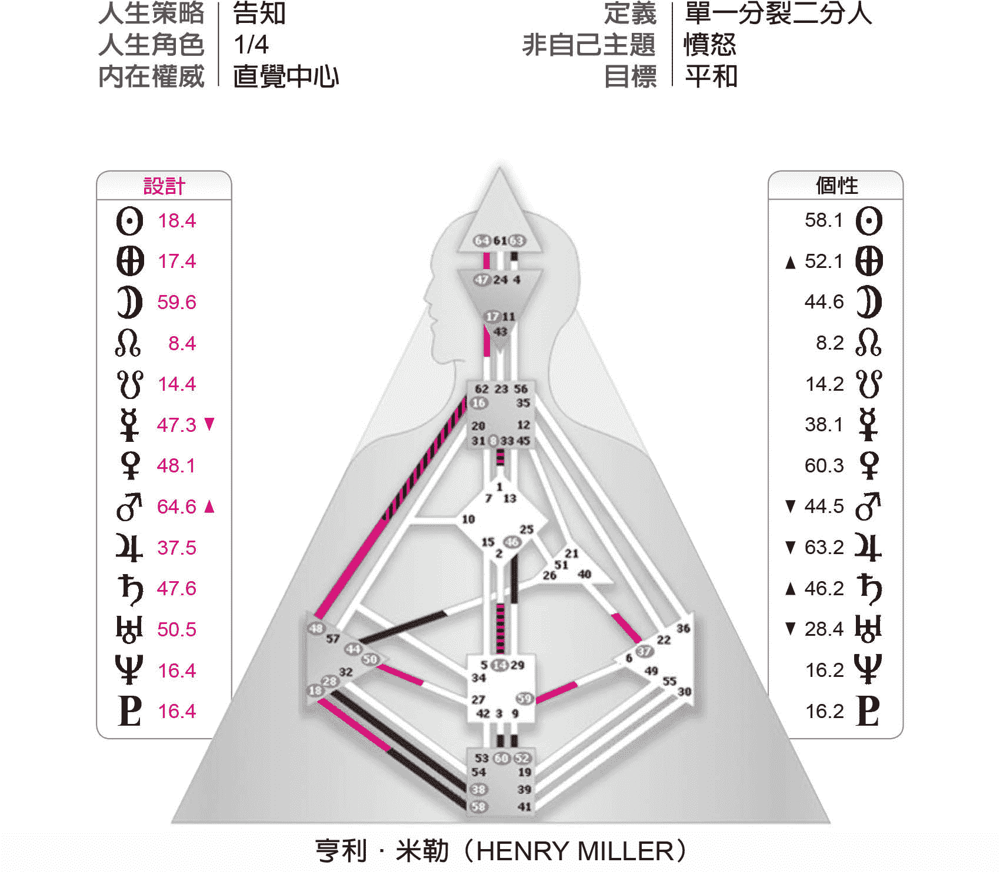

右角度交叉之服务

空白中心：Ｇ中心、意志力中心、荐骨中心及情绪中心

58-18 批评的信道，不知足的设计

38-28 困顿挣扎的信道，顽固的设计

48-16 波长的信道，才华的设计

64-47 抽象的信道，脑中充满着疑惑与解答的设计

你在这世上的天赋，就是独立行动的能力，你能采取行动，因此影响别人。然而，同样的特质，若让人觉得你具有威胁性或难以预测，则容易引发他人不快，导致他们想以某种方式来控制你或抗拒你。身为一个显示者，在孤独中你感到自在。你并不一定需要别人帮助，有时候你难免疑惑，为什么别人会不断关注你正在做什么，甚至反对或控制你。不过，别人的确试图想控制你，从小父母就这样对待你，而幼年时期被制约的经验并不开心，混合抗拒，将你推向愤恕的非自己主题。于是通常会以两种表现方式呈现：一种是既愤怒又叛逆，另一种是被动而妥协。不管任何一种，都会压抑你的力量，让你无法实践自己的价值。而这也是为什么你的人生策略——在行动前先告知——如此重要。当你告知，便能减缓别人的抗拒，为你在人生中主要的追求找到出路——换句话说，你才能平和地在你想要的时间点，做你想做的事。自给自足的你，有时候别人在你眼中根本是外星人，同时因为你具备了展望未来，并发起行动的能力，也会让别人感觉跟不上你的节奏。

你经常担忧着：“我会得到回复吗？有谁会因为我所带来影响力，而活跃起来，或是回应我所发起的问题吗？”这潜藏于内心，渴望让事情发生的压力，正是你实现使命的关键。虽然单独做事最自在，但是其他三种类型的人，都等待你带来启动，让他们有机会贡献自己不可或缺的部分。而你也经常期待其他类型的人，能够为你提供完成梦想所需的特定能量。在理想的世界里，显示者让事情启动，投射者在过程中引导，生产者提供能量使一切成形或完成，而反映者则负责告诉我们这过程进行得有多棒，或多糟。

对你而言，所谓的告知，这样的人生策略似乎不太自然，而你对于凡事皆需告知别人，可能也会心生抗拒。因为你并不喜欢他们筑起藩篱，或反对你。你天生的设计并非请求同意，所以你宁愿保持静默，以不告知任何人的前提下，任意做着你想做的事，同时期望不会遇到任何阻力。然而，这非自己的策略往往事与愿违，别人依然会抗拒，甚至更强烈，导致双输的恶性循环。相反地，若你在决定行动前，确实告知别人，别人将感到自己被接纳与尊重。他们不见得喜欢你想做的事，但事先知道会降低抗拒感与潜在的反弹。此外，告知也会让你有机会，将抗拒场域（resistance field）当作引导，引领你找到对的时机，采取对的行动。例如，你对办公室里 50 个人告知，你从现在改成每周工作四天，而有 47 个人对此决定不满，于是你便有机会调整，或者重新斟酌你既有的决定。

当你做决定，直觉中心是你的内在权威，仔细聆听它所说的话，非常重要。直觉的内在权威（Splenic Authority）会在某一个当下，静静地对你说话，而且不会重复说第二遍。这“声音”像是直觉，或是直觉性的认知。如果你错失或忽略了这个讯息，它不会再次警告你。直觉中心的存在是确保你能安全健康地活着。因此也只会在与求存有关的时刻，给予警告。

事实上，你的直觉中心内在权威，会在每个当下都自然而然、不断展现。其自发性似乎听来随兴，但是也让你陷入两难，因为面对紧急性的决定或行动，与其可能会带来的冲击，你只会有模煳的概念，却必须告知他人。这需要企图心、持续不懈地努力，与直觉权威紧密并合拍地生活，如此一来，你的告知才会生效。举例来说，你和朋友走进餐厅，而你的身体不愿进入，因为觉得那里不对劲。此时，你别无选择，只能提高警觉去面对。这是你的直觉中心发出警告，也许这家餐厅健康有害，但直觉并不会详细解释其原因。你能做的就是诚实告知你的同伴，什么对你来说才是正确的选择，同时，也要留意你突如其来的决定，会如何影响他们，以及他们后续会怎么处理。整体来说，告知能为你带来更平和的生活，而你最想要的就是毫无抗拒的生活。当你处于平和状态，这便是指标，显示你的自我和内在权威协调一致，同时这也会赋予你力量来显化，并对全世界发挥独特的影响力。

你的人生角色，也就是你在这世界上穿的戏服，是 1/4，或称做探究机会主义者。人生角色是你在人生中扮演的角色，好让你的人生目的能借此方式展现，而你在这里的目的，是为了深入探究事物。有股动力驱使你在生命中创建安稳的基础，而你在意识层面，是个非常内省且沉醉于一己研究的人。你希望能让自己变成某种程度的权威，好与他人分享。在此同时，你无意识的部分深具影响力，你能够和许多人创建手足般的关系。你的社群对你很重要，因为在无意识设计层面，你能与人创建关系或友谊，这让你获得机会与人分享你的知识，进而影响他们。然而，任何亲近或亲密的关系，关键在于必须从创建友谊开始。陌生人会让你不舒服。借由遵循你的人生策略，告知，并听从直觉中心的内在权威，你就能聚焦自己的能量，放在对你最重要的事物上，与正确的人际网络链接。透过这方式，你就能创建起个人安全的根基，打造出足以让你发挥影响力的领域，在其中将你所探究的一切，与人分享，同时也维持自身的健康与福祉。身为探究机会主义者，人是让你深深着迷并探索的主题。

你是个二分人，意谓着在你的设计图上，有两个彼此之间没有相连的区块。这两个区块只要花时间慢慢来，可以同步，虽然你可能会受限于某种特定的感觉，觉得内在好像失落了什么，而你必须追寻些什么，以获得完整。你两个区块当中的一个，是透过批评的信道——不知足的设计（58-18）、困顿挣扎的信道——顽固的设计（38-28），以及波长的信道——才华的设计（48-16），将根部中心、直觉中心与喉咙中心链接起来。而另一个区块，则是借由抽象的信道——脑中充满着疑惑与解答的设计（64-47），链接头脑中心与逻辑中心。

可以将你这两个分开的区块链接在一起的，是你开放的 62 号闸门——细节的闸门。这对你而言会是巨大的制约，你总希望能深入细节，为你所提出的意见佐证。你会执着于细节，导致得用头脑决定，哪个细节是你“认为”自己需要的。事实上，在研究探索的过程中，你的直觉内在权威，自然会带领你找到正确的细节。你若不聆听自己内在权威的声音，你将追逐无穷尽的细节，导致被过量的工作淹没，最后耗尽力气。

在你的设计中，有四条信道有颜色（定义），或者说是四种类型的生命动能的能量。这些是你持续发送给他人的能量，它们会形成你生命历程中，足以信赖的基础。让我们来看看每条信道：

批评的信道：不知足的设计（58-18）。这条信道为了让群体和社会更好，不满足会化为驱动力，驱使你挑战、修正、使一切更完善，进而在改进后的模式中，获得平和。当你活出真实的自己，若是发现外在的世界里，有某件事行不通时，你会有逻辑有条理地发出质疑，直到获得修正为止。然而，当追求完美和批判的过程发生在私领域，像是自己的内心，或是身边亲近的人身上，就只会是无止境地不断找碴，对于生活的一切感觉不满足，导致关系中彼此的摩擦。

困顿挣扎的信道：顽固的设计（38-28）。这世界上让你最满足的事情是，得到正确的邀请，让你可以为自己认为值得的事情而奋斗，因为这意味着你的人生是有意义的。挣扎背后的动能，是希望找到目的，好让人生有意义。而透过你亲身的例子，每一次关于寻找意义的独特追寻，都能刺激、鼓舞与激励他人，让别人也开始投入自己寻找意义的挣扎之旅。一旦找不到生命的意义，你可能会很沮丧，或是为别人而沮丧。但你得花上很长的时间，才会宣告放弃，因为你的设计中带有顽固成分，而这也会让你撑过大多数人无法度过的困顿与挣扎。再一次，你的直觉权威会帮助你，让你察觉哪些是正确的、可以开始的挣扎，而哪些不是。

这两条信道会让你感受到来自根部中心的压力，有时压力太大，反而让你偏离内在权威，展开不必要的挣扎。为了你的身体健康，烦躁不安时，适度的运动很重要。有时候就让自己在附近走走，释放多余的压力，就能冷静下来，重新聚焦。

波长的信道：才华的设计（48-16）。你来这里的目的，是为了透过重复练习，努力达到完美的境界，而精通一项技艺。这项技艺可以是任何事物，从演奏某种乐器，到演算出科学方程序皆有可能，这是你在这个世界上获得成就的方式。当你的成就透过分享，变成集体波长（collective wavelength）的一部分，你便是为更大的目的而服务，或是以某种方式增进他人的生活品质。如果你能够自律，并反复不停地练习，时间久了，最终你将从技术学习中得到解放，而才华会自然而然从你身上倾泻而出。

抽象的信道：脑中充满着疑惑与解答的设计（64-47）。你有一个非常活跃、经验导向的头脑，脑海中不停播放各种可能性，而你八成会怀疑它到底会不会有停下来的一天。当你的脑中不断有画面旋转闪过，你可能会体验到相当程度的精神混乱。然而，在领悟到何者才是真正有意义的事情之前，这样的混乱也表示，这对你来说，会是一趟新奇又振奋人心旅程的起始。如果你能在探索的过程中保持耐心，所有拼图的小碎片才有机会组合在一起，显现出完整的图样。耐心的奖赏是，当你耐心等待，让时间经过，清明会自然浮现，一个激励人心的故事因此展现，让你说出来，又或者你将看见全新的视野，得以与人分享。你活跃的头脑是别人很棒的外在权威，虽然这用来思考自己的人生，并不适用。遵循你的直觉内在权威，作为当下决定的依据，而在头脑层面上的认知（mental recognition），随着时间过去，也终将到来。

在你的设计中，空白（未定义）的开放中心有Ｇ中心、意志力中心、荐骨中心以及情绪中心。这些中心是你最容易被制约的地方，同时也是潜藏智慧之处。

空白的Ｇ中心制约了你的非自己头脑，让你执着于认同、爱，以及人生方向；我是谁、我的爱在何处、我接下来的人生该往哪里去？当你放下种种担忧，停止追寻它们之时，就会发现自己是谁，爱会自动上门，而你下一步人生方向也会自行显现，所有一切就像生命的自然过程。

空白的意志力中心会催促你多方尝试，以证明自己的价值。呈现方式有很多种。你可能借由不断努力提升来证明自己，或是过度补偿和承诺。你的设计无需为任何人提供保证，或承诺任何事情，若无法遵守承诺，你也会感觉心碎。但是，你的人生并非运用意志力来做事。你只能遵循告知的人生策略，以及直觉的内在权威来“做”事。一旦你放手，不再试图证明自己，睿智自然涌现，你会知道谁有过度膨胀的自我，谁能真正信守承诺，而谁是对社群真正有价值的人。

空白的荐骨中心让你做得太多、工作过度，且通常耽溺性爱。你的设计是用来开创一个企业，但并非单靠你一己之力，或是独自完成所有事情。你很容易掉入陷阱，工作过度因而筋疲力竭，最后搞坏身体。开放的荐骨中心所蕴藏的智慧是，学习适可而止。慢慢来，设定界线并谨守界线，遵循内在权威做决定，这是维持身体健康的关键。

你的空白情绪中心再加上空白荐骨中心，将强化你对于性爱与浪漫的执着。情绪中心带有欲望、亲密与热情的感觉，空白的中心可能会放大并增强这些感觉。你的开放情绪中心，有时会吸收别人各种各样混合的情绪，尽管面对情绪很重要，事实上，这也让你能避开一些不开心的情绪。身为显示者，你的非自己主题是愤怒，这情绪在某些状况下也会被放大。空白情绪中心的潜在智慧，在于学习分辨出，哪些情绪上不舒服的状况，真的需要面对与处理。

总结来说，你的设计就是，为这个世界带来一股启动的力量，同时为他人服务。当你对直觉的觉知（intuitive knowing）保持敏锐，就能够鼓舞别人，去思考社会的价值，以及他们自身对于求存、人生价值，与人生目的的挣扎。面对关键的细节，你的目光锐利。若综合自己对于探索人的兴趣、你对生命的爱、你从过去所学习到的课题，以及你厚植的盟友网络，能让你有机会运用自己总是无法不满足的才华，和高压的驱动力来影响周遭，最终引发整体社会突变。机会主义者若想在生命旅程中获得成功，端赖人际关系和人际网络的品质。在决定行动前，告知他人，就能减少甚至排除别人的抗拒。你只要在每一个当下，做出每一个决定时，都能与你的直觉意识（intuitive awareness）保持链接，就能运行在自己独特的人生轨道上，实践人生目的，并寻获你所渴望的和平。当你让非自己的头脑凌驾于直觉和内在权威之上，明显的指标是，你将过度承诺，只为了证明自己的价值，或维持生活与人际关系中的平和，因此无法保持适当的界限。亲密关系可能会变成你全神贯注之事，因为你总会找到每个人的缺点，身边的伴侣常常换人。你的直觉非常敏锐，往往不假思索即脱口而出，若让头脑和情绪凌驾你的直觉之上，将危害你的身心健康。

### 生产者概述

能量——开放且包覆其中

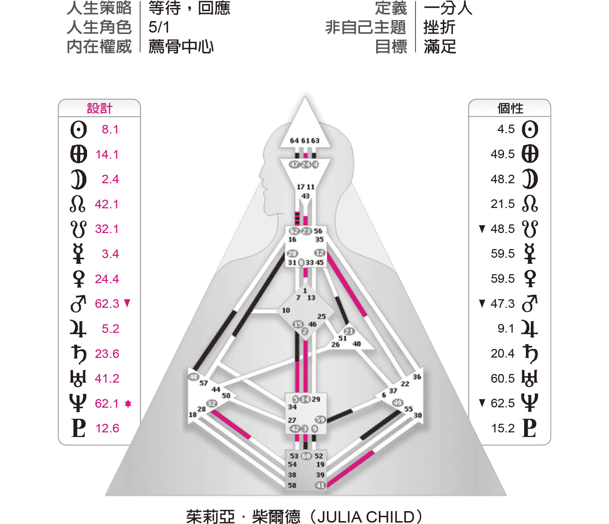

左角度交叉之革命

空白中心：头脑中心、逻辑中心、喉咙中心、意志力中心、直觉中心、情绪中心

60-3 突变的信道，能量开始与流动，脉搏

14-2 脉动的信道，掌管钥匙的人的设计

5-15 韵律的信道，顺流的设计

你是生产者，生来就是要工作并热爱工作。你生命的天赋是精通一项任务、计划、技能，使其臻至完美。对于这个星球，你的天赋就是那股源自荐骨中心的生命动力能量。当你从事正确的工作时，会感受到深刻的满足感。为了找到能够带给你满足感的工作，“了解”自己很重要，而真能让你了解自己的途径，在于回应生命，而非发起。

当你回应，就等于让你的荐骨中心参与每一件你正在做的事。你的荐骨中心是幸福与满足的关键。唯一能区分出，何者对你而言是正确的选择，就是让荐骨中心引导你做决定。为了完全臣服于荐骨内建的导航系统，你必须让自己保有回应的空间。在你人生中，某事或某人会向你索求能量，而你的荐骨能与你的人生目的中，正确的能量相链接。然而为了跟随荐骨的指引，你必须放下头脑中关于生命“应该”如何的想像，尤其是你的头脑对于别人的想法和意见非常开放。若你能如实顺应自己独特的节奏与生命方向，你就能对周遭人们的节奏及方向，带来影响，甚至使突变因而诞生。

荐骨的回应，是从肠子附近所发出的非语言声音。“嗯哼”的声调代表肯定，表示你拥有特定工作所需的能量；而“嗯嗯”则表示否定，意指你没有能量能投注其中。有时候完全没有任何回应，这可能代表着你并不具备那股能量，或者别人尚未问出正确的问题。一旦你的荐骨发出“嗯哼”的声音，而你参与此项行动，接下来的经历，就会是一段逐步创造与日趋完美的过程。你必须经历过程中的所有阶段。你没有任何动力中心链接到喉咙中心（这是你设计中的变速装置），所以你可能会在过程中遇到停滞期。而每段停滞期，你都需要新的洞见、新的讯息或可回应的问题，来再度启动你。你必须针对自己的回应，来决定是否会继续工作下去。

当你没有依循人生策略和内在权威（没有等待生命来到你面前让你回应，并尊重此回应所带来的真实），你将体验生命充满阻力。你也会体验到非自己的头脑，会要求你像某些人一样采取行动。生产者的非自己主题是挫折，挫折对你来说是重要的指标，挫折可能来自于内在或是外在的阻力，当你开始涌现挫折感，就会知道此时该自我检视，自己是否正在尝试推动、发起，而非回应。如果你不了解这一切如何运作，有可能因为深感挫折，便提前退出。相信你的荐骨回应，而非根据头脑来做决定，一开始这可能会令你有点害怕。随着时间过去，你便能体验身体的智慧。生产者最大的恐惧之一，就是“会有人来问我吗？”在你的设计中，已经内建一套机制，引发别人来询问你，这样你才“能够”回应。你的气场是开放且又包覆的，它会将你在生命中所需的一切吸引过来。你所要做的就只是坐下来，然后观察荐骨对何者有回应，或对何者没有回应。

你的人生角色是 5/1，这是你在这个世界所穿的戏服，或称作异端探究者。人生角色是你在人生中扮演的角色，让人生目的借此展现，而你在这里的目的，是为了深入探究事物。你在这世界上的角色，超越个人层面，你具有潜力，能为他人提供新颖且实用的解决方法，并用非常公开的方式来推广，使其普及。而你无意识的部分，在缺乏坚固基础时，会让你感觉不安，因此你最想深入探索生活，找出足以依赖的权威。到最后，这每一步的探索和研究，会让你成为权威，那时你便能自在地将所学公诸于世。

你人生角色的异端者部分极具诱惑力，这吸引人们在你身上投射诸多形象，期待你会提出跳脱框架的实际解决方法，为他们提供帮助或救援。有时你也会觉得自己的确投射出能拯救别人的形象。然而，重要的是，你不能发起，你必须等待被询问，然后当荐骨以肯定的声音有所回应，你才能承诺。你的荐骨知道何时是正确时机，让你贡献宛如异端的想法，引人跟随。当你是重要的陌生人时，你能发挥更大的力量，来帮助别人。你的设计在别人需要你时介入，完成任务后就可再次退出。人们期望你能够提供实质的帮助，所以你若想获得成功与满足，预先准备好自己以及扎实的知识库，会是成功的重要关键，反之你的名声将会受损，而当你离开时，众人会感觉更加匮乏！

人们从你身上不断感受到能量，来自你的设计中三条有颜色的信道。突变的信道（60-3）连接你的根部中心与荐骨中心，是一股极度个体化的能量，其流动和打开，就像脉动瞬间打开或关闭的方式。这股能量极具创意与蕴藏突变的特质，但你无法掌控脉动的时机，你可能花了很久的时间，怀疑下一波的创意何时会出现。更甚者，你可能会觉得人生中已无新鲜与创意，而陷入低潮。然而，这是一段深层的投降过程，忧郁和情绪化也是过程的一部分。如果你试着为自己的情绪找理由，或试图改变它，只会让自己更痛苦。这一切毫无理由，纯粹是你个体化、创意，与带来突变的过程中，无意识的机转与脉动（mechanical pulse）。你的能量依然能激励他人，也可以引发他们突变，进入全新的方向，所以，重要的是，让你的荐骨回应，以此来引领你找到那些已经准备好，并接受你即将带来突变的人。

你的设计让你能保有自己的创造力，或是提供实质上的支持，鼓励别人致力于创造。脉动的信道（14-2）是股无意识的能量，链接你的荐骨中心动力和Ｇ中心。这是非常个体化的能量，透过亲身示范，展现力量，所以你的首要任务便是忠于自己。等待生命来到你面前，向你展现连你都想像不到的潜能——只要对人生保持开放并回应。若试图追逐或创造自己的命运，终将感到失落与挫折。这股能量是关于掌管钥匙的人，你具有资源、能够启动动力朝新方向移动。然而，唯有当别人询问你，你才会知道这把钥匙即将打开什么，或是要往哪个新方向前行。

你散发磁力，吸引众人进到你的能量场、你的时间表和你的流动之中。韵律的信道（5-15）连接你的荐骨中心和Ｇ中心，你顺应生命之流，不断前进，充满活力并与之密不可分。在别人眼中，你有自己的时间表，这完全取决于你的内在韵律。如果这些生活模式或例行公事，对你来说是自然而且正确的，那么就不该让任何干扰介入。然而，如果你身处于非自己的扭曲状态、时间感错乱，你会发现，不仅是自己，你也连带扰乱了每个人的节奏。唯有遵循荐骨的回应，你才会永远处于对的时间点，顺流而行。

你的设计中，有六个空白中心，包括头脑中心、逻辑中心、喉咙中心、意志力中心、直觉中心及情绪中心。这些是你对外界开放，容易受到制约之处，你对于所在环境中发生的事情，非常敏感。这样的开放程度很容易让你分心，而偏离自己的回应与生命之流。外在所发生的一切，会让你开始思索与你无关的问题（开放的意志力中心），或试着回答每个人的问题（开放的逻辑中心）。确实，你的头脑非常开放，它深具智慧，能够分辨哪些问题和答案对你个人而言，具有实质的价值，若能你的头脑开放为大众服务，就能分辨出哪些问题与答案是否有其价值。你特别能辨识出哪些解决方法具有实用价值，并进一步深入研究，来支持你的答案。然而，你必须等待询问再回应，经过这过程你才能得知，哪个答案有价值，哪个则没有。

你可能会发现自己话很多，因为你开放的喉咙中心希望吸引别人注意、或是证明自我价值（开放的意志力中心）。你可能会处在压力下，觉得你得知道接下来要做什么，或是为了证明自己的价值，试着到处拯救人们。再次强调，你有庞大的资源任你使用，以支持自己或别人，但只有在正确的时间点，你才能使用这些资源。而唯有透过荐骨的回应，而非头脑的反应，你才能分辨出正确的时间点。你深具潜能，能拥有深度的智慧，以辨别对公众而言，真正有价值的事物，并且你能采用有创意又鼓舞人心的方式，表达出来。

你可能会发现，当你呈现非自己时，会紧抓住一些有害健康的东西（开放的直觉中心），避免对抗冲突与真相（开放的情绪中心）。你个人的荐骨权威在当下运作，透过回应，你可以马上知道对你来说，何者是真理。然而，若是因为安全考量或是担心激怒他人，让你无法在当下说出真话，你就无法如实顺应自己的节奏，也无法步上属于你的人生方向。虽然你可能会觉得吐露实话等于导致冲突，但这才是你能提供给社会大众的珍贵资产。你是个真正的异端，能够针对人类全体正在面对的课题，找出崭新的解决方法。你的设计让你了解人们的需求，而吸引关注是为了在这世界传递洞见，让新的解决方案得以普及。

你的人生中，所有不依照荐骨回应去做的事情，都会让你离自己独特的人生目的愈来愈远。你的人生目的是只有透过你，才能展现的独特使命。唯有等待回应，而不发起，你的使命才能自然展现。透过对别人的探索与实际上的了解，你极具成功的潜能，能将新的革命性模式和流动方式，带入社会的创意过程中。你有能力组织并激励他人，发展自己的技能，进而打开他们的创造力。你有本领也有能力表达细节，而这将为大众带来发现和完全的蜕变。只要你顺流并与之合一，如实地回应生命所带来的人事物，你将感受到满足，对你而言，这就是一切都上轨道的指标。

### 显示生产者概述

能量——开放且包覆其中

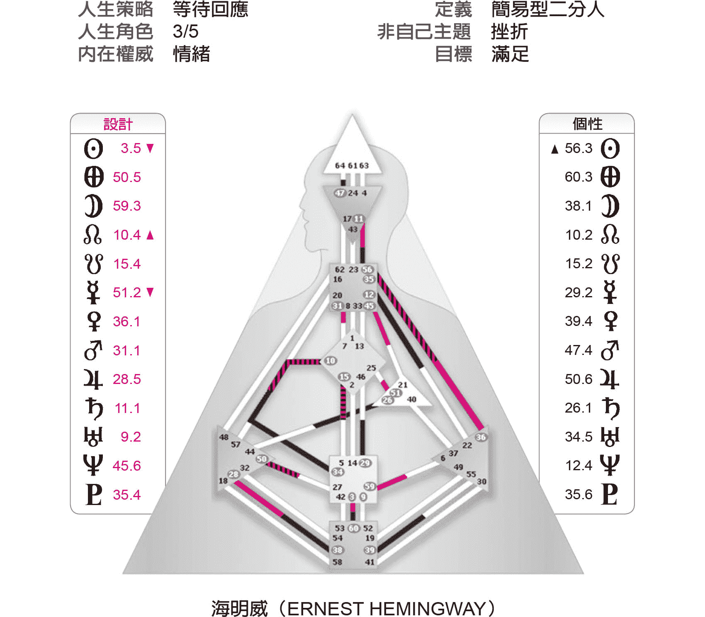

右角度交叉之律法

空白中心：头脑中心、意志力中心

60-3 突变的信道，能量开始与流动，脉搏

38-28 困顿挣扎的信道，顽固的设计

34-10 探索的信道，遵循自己的信念的设计

36-35 无常的信道，杂而不精的设计

56-11 好奇的信道，追寻者的设计

你是显示生产者，总是快速付诸行动，宛如战士佛陀。你的天赋在于透过行动，找到更有效率的方式，好专注完成工作。然而，为了分辨哪个行动对你来说才正确，你必须如佛陀一般，安坐在树下，等待生命来到你的面前。你的人生策略是等待别人来要求你，付出自己的能量，如此一来你就可以听见或感觉到荐骨的回应。你的荐骨中会以声音回应，从你的肠子附近发出的“嗯哼”，代表“是”，而“嗯嗯”代表“不”。你也可能直接以行动回应。你的荐骨是否会作出回应，取决于你是否愿意，将能量投注于被询问的事情上。

你有颜色的荐骨中心是来工作的，更重要的是，要喜爱你所做的事情，直到将自己每天的荐骨能量用光为止。做你所爱的工作，能带来深沉的满足感。事实上，正确的工作会为人生带来蜕变，并减缓老化的速度。了解自己，为自己找到正确工作的过程，非常重要，而你可以透过回应来经历这一切。你可以直接从回应跳到实践，这能让你看清楚哪些步骤是必要的，哪些可以省略。然而追求效率的天赋，也使你进退两难，因为你容易失去耐性，迅速进行任务的同时，也容易漏掉某些重要步骤。有时候，你必须回头完成遗漏的步骤。若要避免挫折，同时提高效率，你需要在实践的过程中，慢下来，留意倾听自己荐骨的回应。列出清单也会有所帮助。

除了等待别人开口，才能给予回应，你也必须等待一段时间，才能得知自己真正的回应，或内在的真相。有颜色的情绪中心是你的内在权威，有其频率与波动，需要静待一段时间，让情绪的清明得以浮现。就算你的情绪周期回归平静，也无法完完全全确定，当下你的荐骨回应就是真正的答案。换句话说，你需要让自己有时间去经历，在情绪波上“冲浪”，而真实自会随时间浮现。若是没有等待情绪的清明浮现，你可能太快做决定，没多久又迅速退出，导致人生充满后悔、危机和冲突。一旦你回应了某件事，请等待一段时间，让自己完整经历情绪的过程，感受对你来说非常重要。你的设计需要深刻领会这世界与己身的经验。你的人生无法停留在表面与肤浅。慢慢来，当你的情绪获得清明，就会知道自己的回应和决定。虽然你最初的回应，往往也就是你最后的决定，但是随着等待，你将得到更多信息，而付诸行动的正确时间点，也将随着等待而浮现。

你在这个世界所穿的戏服，也是你此生要扮演的角色是烈士异端者。你的设计是透过尝试错误，学习关于生命的一切。生命将不断带来撞击，让你发现行不通的是什么。你会有意识地将人生当成实验的过程，所以尾随在后的人，可以从你的发现中学习。当你发现了对一般人来说，前所未有的解决方法，实用并可行，你就能以丰沛的力量与信念来捍卫你的信念，或者挺身而出。你未必会遵循既定的看法、学说或法则，虽然说出不受欢迎的真理，需要勇气，但你乐于承受压力，你极有弹性，适应力佳，身为引发世界改变的异端者，你尝试错误的过程并不单为了指出错误，而是从中发现真正有用、有所助益的方法，让大众得以借镜。对你来说，若忽略每一次尝试错误所获得的新发现，才是唯一真正的错误。

身为异端者，你拥有非常吸引人，且超越个人的能量场，别人常把你当成能帮助或拯救他们的人。你可能也会觉得，别人只有在需要你时，眼中才会有你，其余的时候自己宛如隐形人；一旦你完成拯救任务之后，大家又再度对你视而不见。这会让你明白何谓投射的能量场，为了感觉自己有价值，以及被需要，你会忍不住开始发起。你要察觉投射确实存在，但是务实过自己的人生，才是关键。若你无法满足别人的投射与期待，名声将会因而受损，所以，你必须等待别人提出要求，寻求协助。你才带给别人有用的解决方法，但前提是你必须有足够的时间，透过自己的方式，发现行不通的是什么，因而精通这世界的运行之道。当你等待回应时，给自己一些时间，历经情绪的高低起伏之后再做决定，如此一来，你才能正确地运作，在别人需要你时，提供有助于他们的新发现。

你是二分人的设计。这代表着你具有两股能量，彼此之间感觉像是独立运作。一部分是由情绪中心、喉咙中心、逻辑中心，以及这三个中心之间的信道组合而成。另一部分则是由根部中心、直觉中心、荐骨中心、G 中心，以及中心之间的信道组合而成。

连接这两者的开放闸门，对你来说很重要，因为它们将对你形成强大的制约。当你以非自己的状态运作时，这些闸门会让你在压力的迫使下，起而领导（7 号闸门——自我角色）；迫使你当下行动（20 号闸门——注视，当下）；让你不由自主发起，因而引发冲突（6 号闸门——冲突，摩擦）；迫使你去追寻生命中的灵性意识（55 号闸门——丰盛，精神）。若你发起，而非顺应时间，等待回应，你的人生将充满阻力，陷入错误的恋爱与亲密关系之中，导致冲突，同时你也会在生命中挑衅了错误的灵魂，发起让你进入错误的领导角色中，随兴在当下任意行动，与你个人的内在权威——等待情绪的清明——很明显是相互抵触。

当你结合人生策略及内在权威，等待一段时间过后，再作回应，这会给你等待清明的机会。才可以让你开始一段正确的亲密关系，以及正确需经历的冲突。你也能够依据生命中正确的精神，在适当的时机，正确领导他人，在当下“沉思”并观察，而不是立即自动自发地“行动”起来。

你的生命动力能量丰沛，透过你的人类图设计，被启动的信道对别人带来影响。在根部中心和荐骨中心之间的突变信道（60-3），其中所蕴藏的是一股波动与发起的能量。你非常有创意，潜藏着为世界带来突变的可能，但这股能量的运作，就像脉动瞬间打开，瞬间关闭。新的创意像是一股冲动，不预期地自内在冒出来，或是经由你来传达给他人，但是，你无法控制创意会出现的时间点。你可能会花很多时间怀疑，甚至陷入低潮，因为不知道下一波的创意何时会出现。对你而言，接受限制的本质，就是这整体过程的关键。你只是需要单纯臣服于此，并等待下一刻创意的脉动到来。忧郁和情绪化也是过程中的一部分。如果你试着为自己的情绪找理由，你就陷入非自己的世界。突变何时会发生？没有道理可依循，纯粹只是个体化与创造过程中的脉动，如此而已。

连接你的根部中心和直觉中心，就是困顿挣扎的信道（38-28）。你秉持顽强的决心，就算成功机率微乎其微，也会坚持自己的人生道路。你来到这个世界上，即使一路挣扎，都是为了在自己独特的旅途中，发掘其目的和意义。若正确运用，那么不管是义无反顾，顽强对抗、冒着失去安全感的风险，又或者为你所认定，所值得的原因而奋战，都能为你带来前所未有的满足感，并且有益健康。挣扎的形式也赋予你人生的意义，是你个人的追寻，让自己的人生有了意义，而你独特的奋斗历程，也会成为敦促与激励他人的典范，激励他们也开始挣扎，渴望步上属于个人的历程，追求更深层的人生目的。当然，这对你而言，并不见得舒服，别人或许觉得不以为然，与其让头脑选择为何者而战，你必须回应挣扎，看哪些挣扎对你来说有其价值。一旦你无法完整说明，或正确体现内心的挣扎，体内会累积压力，在身体层面制造出过多的能量，规律的运动能帮助你释放压力，让压力得以存于体内，以健康的方式流动。

就算完全与众不同，你此生都要遵循自己的准则。探索的信道（34-10）链接荐骨中心和Ｇ中心，唯有当你无视于任何阻碍或罪恶感，如实做自己的时候，这股能量才能够正确运作。遵照荐骨回应的指引与时机点，你才有可能不带着愧疚，心满意足地放手一搏。若能表里一致地生活，别人便能透过你的展现而看到，何谓趋近完美地，透过回应在行为上与人互动，并因此而获利。这将激励别人，开始重新爱自己，也愿意以此为准则。

你开放又包覆的生产者能量场，加上这条探索的信道，将吸引大量的注意力。这注意力究竟正面与否，端赖你是否有耐性，愿意配合正确的时间点，根据自己的回应来调整。若能如此，你就是活出属于个体人的潜能，能赋予更多人力量，也将带来突变的可能。但当你反其道而行，这条信道显露出的非自己是僵化、不满足，并且听起来相当自私与自我中心：“不管你喜不喜欢，我就是要这样，你想怎样都好，就是别管我，别挡住我的路。”

透过连接情绪中心和喉咙中心的无常的信道（36-35），会驱动你寻找各种经验，保证你会拥有更新奇、更好的生活。这就是你的情绪波动，你的设计是“万事通”，意味着你透过情绪的过程，将随着阅历愈来愈丰富，从中累积智慧。不自觉的情绪波会推着你，在人生道路上前进，因情绪高低起伏而持续改变观点，可能也让你看来反复无常，或是因为某个新经验无法满足原本的期待，而感到失望无比。其秘诀在于全然拥抱，并接受你的情绪震荡，给自己足够的时间，在情绪清明的状态下，再作决定，同时臣服于每个当下，彻底体验每一个正确的体验，无所期待，纯綷为了体验而体验。

随着时间的推移与熟成，你的经验将随着情绪的深度，达到最高峰，终于化成你个人的真理。而真理的核心是接受生命如是。如果你发现自己对于冒险感到紧张或不安，请静待时间，完整经历情绪波，这会解决你的困窘。当你透过时间，明白感觉本身瞬息改变，你给别人的建议会是“把握当下”，投入每一个全新的、充满希望的正确体验，而非虚度光阴，认为生命终将一事无成。你生命中最大的成就在于，收集各种极具价值的智慧，在这段过程中，你会去品尝、碰触、感觉许多事物。然后用说故事的方式，将智慧分享给大众。你能将自己辉煌的成就化成精彩的故事，激励他人，而你多彩多姿、尽情过活的丰盛与富足，也能让更多人愿意体验并享受自己的人生。

你对于人应当如何体验人生，有自己独到且充满哲理的反思，由此信手拈来，交织成各式各样的点子与故事，化为你的创意与个人风格的展现，极具魅力。透过喉咙中心和逻辑中心之间的好奇心的信道（11-56），你具备令人称羡的天赋，能够将一系列新颖的想法，重新形塑成故事的形式，寓教于乐，教化大众。即使这些故事可能有夸大的成分，或只有部分真实，就像孩子童言童语，说着学校里发生的事，半真半假。你还是能吸引他人的注意力，为众人带来启发。你深信只要相信就会看得见，你对探究事实缺乏兴趣，但对于如何阐述故事及其延伸出来的教育意涵，却充满热情。你的故事更像寓言，或是日常对话。然而，就算这些故事来自个人的经验与发现，对他人来说往往更为适用，反倒无法用来引导自己。你的故事需要被分享出来，也需要被收集并储存起来，让现在与未来的世代，都能从中得到反思及不同的演译。

你的设计中的两个空白中心，分别是头脑中心和意志力中心，这设计让你无法专心。你完全开放的头脑中心，迫使你不停寻找下一个能鼓舞人心的想法，思索与己无关的问题。透过回应生命，以及等待情绪上的清明，你便能累积智慧，分辨什么才是真正重要的问题，也能够知道何事或何人能为你带来灵感与刺激。空白的意志力中心让你尝试证明自己的价值，所以承诺超乎你的意志力能够承担的事物。你处在必须成为第一人，以及表现最好的压力下，试着全面控制你承诺过的每件事。事实上，你并不需要向自己或任何人证明任何事。过度承诺，以及应允那些你做不到的事情，只会为你的心脏带来庞大的压力。对你来说，做任何事情最佳的方式，就是依循回应的人生策略，以及等待情绪清明的内在权威。

总结来说，你的设计是一个有影响力、有创意、引发突变、坚定的、从体验出发的说书人。冒险、决心和探索是你的驱动力。你想以自己的方式做事情，在经验人生的同时，发现新事物，同时吸引众人的关注。你以自己独有的规则和定律运作，就算成功机率低，你也会为了自己的信念，挺身而出来领导别人。逆境是你的驱动力，你此生的设计就是要拥有各式各样的人生经验，并与人分享。

别人会因为你的独立自主与杰出表现而深受鼓舞。你的创造力往往突然出现又无故消失，创造力为你所做的每一件事情提供动力，在你的人生中占有一席之地。当你发起，或者太快涉入，你将会深陷错误的恋爱或亲密关系中。若又掉入需要证明自己的陷阱，请谨记你的能量场具有巨大的力量，但它只能透过回应并等待情绪清明，才能正确地运作。你的能量场会吸引别人靠近你。你不需要“做”任何事情。你天生的设计能吸引正确的关系、挣扎及冒险，而这一切都会成为你将来说故事的来源。到了最后，这一切都会带来满足感。

### 投射者概述

能量——专注且吸入

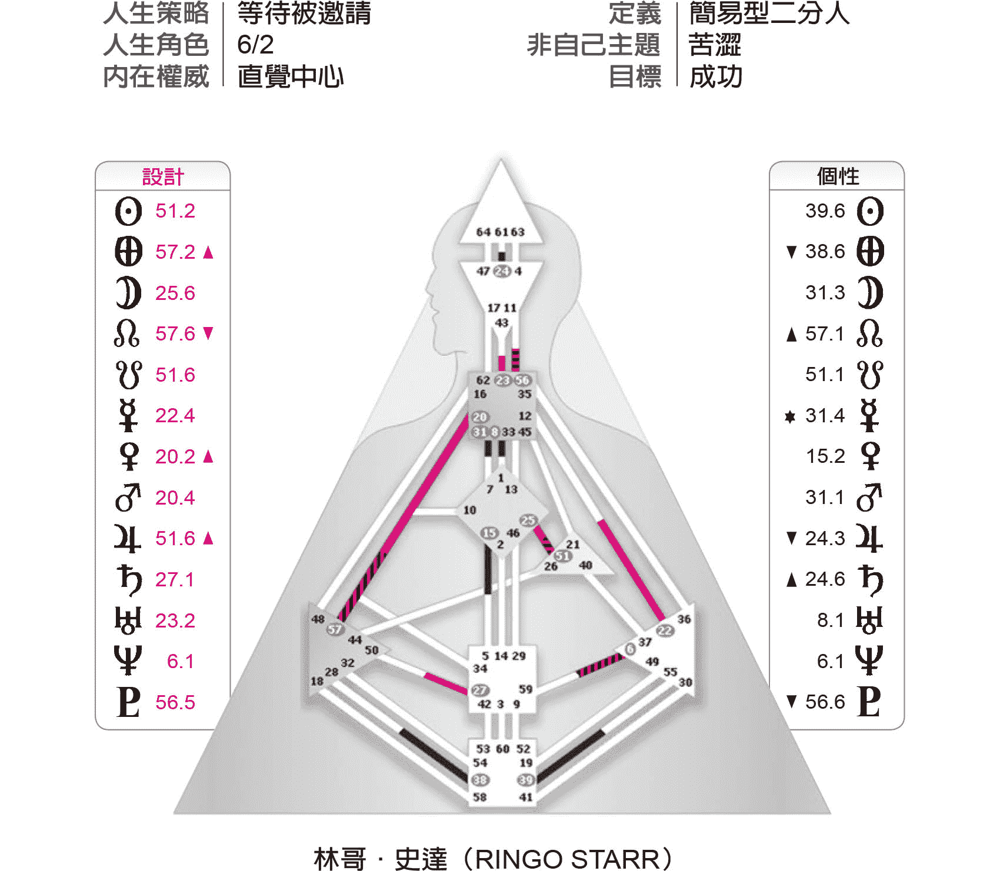

左角度交叉之个人主义

空白中心：头脑中心、逻辑中心、荐骨中心、情绪中心、根部中心

57-20 脑波的信道，渗透性的觉知的设计

51-25 发起的信道，想要成为第一人的设计

身为投射者，你的设计中有一股动力，能整合他人的力量，这源于强大的好奇心，而非匮乏。好奇心是其中一种动力，让你的能量场得以运作，让你有能力看透别人的自我定位或特性。你非常敏感，能“读取”别人的能量，基于直觉而明白他们该如何使用自己的能量，以及该使用在何处最为理想。这是身为投射者强大的天赋，你能够辨识出别人的才能。

然而，出于自觉引导别人的天赋，只有在对方也赏识你，同意让你引导的状态之下，需要别人发出邀请，让你得以分享所知所学时，才能正确运作。若在别人发出邀请之前，你主动提供指引——你可能很想这样做——可是一旦这样做，通常只会引来他人的抗拒，并感觉苦涩。你的能量场，极具穿透力又威力强大，自然会吸引别人靠近你。透过信任且臣服于自己的设计，生命会为你带来所需要的一切。关键在于，让能量场自然而然吸引能看见你的伯乐，顺流而活，摆脱既定程序。一旦你设定（期待特定结果）既定程序，只会陷入苦涩。就让一切自行出现，看看什么事情会发生。

对你来说，别人的邀请很重要。所有你人生中最重大的事情，皆是透过邀请而来。但是这并非要你接受所有的邀请，正确的邀请必须包括赏识，你在被邀请时，必须感觉到被赏识。你必须透过那份邀请，感到自己“被看见”。当人们真的了解你，或是真正看见你的天赋时，你会感受到人生获得成功。但若是你试着搏取邀请或赏识，就会遭遇抗拒，并感觉苦涩。这时候你就会知道，自己在发起，而非等待。邀请也可能透过其他人而传递，举例来说，有个朋友打电话或传电子邮件给你，邀请你考虑参与一件他们认为你会有兴趣的事情。

对你而言，邀请并非全都正确。要怎么决定何者正确与否？投射者的能量场能深入穿透他人，宛如你可以品尝这邀请本身，若是感觉不对，那么就不会是正确的邀请。如何做决定，是我们的导航系统。我们所做的每一个决定，都会带领我们前往特定的方向，奠定人生的基础。出自真诚自我所做的决定，意谓着你会拥有真实而不虚伪的人生。反之，当你以“应该”来做决定，你的决定会深陷来自他人的制约。你的内在权威是你如实作自己，为自己做出最正确的决定。

你的设计中，足以信赖并协助你做出正确决定，是直觉中心。直觉中心是“活在当下”类型的内在权威。直觉中心与生存相关，它的主要工作是确保你平安存活下来。与存在紧密链接的意识，当你的直觉中心说话或是提醒你，请于当下聆听它要告诉你的讯息，这至关紧要。你所听到的信息，不会重复第二次，直觉发出的声音或许细微，却十分重要。身为投射者，你天生聪明，所以你的头脑常会试图凌驾直觉中心。头脑乐于以这个或那个等等理由来涉入。然而，直觉中心的运作方式，与制造理由的头脑中心截然不同。这是单纯的直觉意识，直觉就是知道。如果你让头脑凌驾于直觉之上，很可能到最后，你会躺在急诊室说：“我早就知道这件事会发生。”为了让你的人生正确运作，你必须信任自己的直觉中心，以及它所发出的讯息，就在当下。是你的真实。

你具有侦测并提问的能力，无需特定答案，也不渴望答案真的出现。这是你的美好天赋，也是你带给众人的礼物。你得以存于他人的真实中，是“他们的”真实，而不是你所认为的真实，或是他们应该有的真实。若是如此，当你问别人问题时，对方得到的会是充满蜕变的体验，并从中得到力量。然而，蜕变只会在你无所期待之下，悄然发生。

你的人生角色是人生典范之隐者，这是你在此生所穿的戏服，与扮演的角色。要活出真实自我，成为真正的人生典范，需要时间焠鍊。你拥有特殊的三阶段人生。头 30 年左右，是一段非常主观的时期，通常是透过尝试错误来体验生命。第二阶段是从 30 到 50 岁左右，这是一段客观观察期。宛如你爬上屋顶，既环顾四周，同时也回顾这过往 30 年的人生。你察觉到自己在观察别人的同时，其实也正被别人观察着；而因为这个社会对于人性的好奇永不餍足，因此众人将前来询问你的意见。这将赋予你极大力量，得以超越个人，让你的人生充满吸引力。

过了 50 岁之后，你的人生会开花结果并成熟，你将成为别人的人生典范。是时候走下屋顶回到世间，重新生活，你将向大众展示你曾经走过的路。这是一段非常特别的时期，简直像是重生，但此阶段的你，已经拥有之前所累积的智慧，可以运用智慧，以全新的方式来体验人生。在其他人的眼中，你会是典范，经由不断察觉，你的人生会超越主观与客观，成为自律又充满个人领导力的人。你身为隐士的那一面，乐于坐在家中做自己的事。其实你并不了解该如何完成生命中的一切，但身为活出真实自我的人生典范，当你被召唤，从事你天生擅长之事，你的阶段进程便趋于圆满。

你是二分人，这表示在你的设计中，有两个分离的区块，彼此不相连。其中一个区块透过脑波的信道，渗透性的觉知的设计（57-20），连接直觉中心和喉咙中心。这代表着每个当下，你突然说出口的话，与不可思议的准确直觉紧密相连。你的思虑敏捷，如同拥有七步成诗的能力。但是要真正让这项天赋为你所用，需要注意两件事。首先，你必须克服对未知的恐惧，学会信任你的直觉。第二，你必须在接到邀请之后才发言，如此一来，才能将与存在相关的觉知，有机会转化为智慧，减少误解或在无意中忽略它。聆听，行动，完全信任当下所闪过的直觉。活在当下对你来说很重要，不要因为头脑的命令与编造的理由而分心。如果你忽略了直觉，瞬间的觉醒将一闪而过，你也可能因此而受苦。

另一个区块是透过发起的信道，想要成为第一人的设计（51-25），这条信道链接意志力中心与 G 中心。你天生偏好竞争，也能鼓舞或激励别人活出竞争力。若获得邀请，竞争力或冲击自然会发生，将你推向未知，让你得以去伸展、测试，甚至超越正常的极限与耐力。这是真正的“跃入虚空”（未知）的设计，因此结果会如何，无从得知。伴随每一次胜利，都会增添你的个人色彩，进而增加内在神秘的力量，你无所畏惧，而成个人目标的历程，将成为他人勇气的楷模。

你也透过创意来表达自己。若获得邀请，发起对你来说便成为一门艺术，在本质上，你会辨识出两件事，一是辨识出别人是否具备突变的潜力，二是辨识出他们是否需要的激励，引发他们突变，因为突变无法在真空的状态下运作的。在神秘的层面，你是个巫师／法师，你身上具备纯真的天赋，足以让人纵身一跃，进入个体与自我觉察的虚空之中。

你的设计是个二分人，所以内在难免会感觉某种失落感。为了要化解这种感觉，你会试图发起，希望在人生中寻找某人或某物。结果反倒以脑袋来做决定，而非直觉中心。请记住，你的决定会左右你的人生，如果你不依循内在权威的指引前进，你将会前往错误的方向，遇到错误的人，最后进入错误的环境。最后，二分人的设计只会让你更加困惑。重点在于放轻松，信任并容许生命为你带来，你真正所需的一切，让你无须继续追寻。

身为二分人，你天生的设计就是在人生中拥有伴侣。你的天生伴侣将衔接这两个区块，让你重新感受到完整或合一。为了在人生中找到那个对的人，当你受邀进入一段关系时，遵循你的人生策略及内在权威特别重要。终其一生，你会经历各式各样的关系，于是到最后，你能够教导众人关于关系的奥秘。

在你的设计中，有三个闸门可连接你分开的区块。你非常容易受到这三个开放闸门的制约，你会感到自己需要拥有这些特质，才算完整。然而，你若只透过这些开放的闸门去生活，其实是以非自己在做决定，而不是真实的自己。你的非自己会透过 7 号闸门（自我角色）而运作，这代表着你会发起，尝试领导别人，或是该如何才能当个更好的领导者。而透过 1 号闸门（自我表达），你的非自己头脑将聚焦在，如何培养自己拥有艺术家的创造力，表现自我。而透过 10 号闸门（自我行为），你的非自己会告诉你，你在这个世界该如何自处，以及如何爱自己。

以上这三个主题会是你生命的焦点所在。在你的设计中，能连接两大分开区域的开放闸门，都将驱使你发起、尝试吸引别人注意、被赏识，然后通常导致抗拒以及苦涩。事实上，只要臣服于你的人生策略及内在权威，这三个主题会成为你在人生中，所累积的智慧。透过观察这些连接你二分区块的闸门，你会知道怎么爱自己、如何有创意地表达自己，以及在接获邀请时，再来展现领导力。当然你也可以选择一路挣扎，试图发起，然后一头撞上阻力的硬墙，或者单纯投降，让你的设计引领你，走上独特的智慧之路。

你的设计中有五个空白（无定义）中心，也是你得以累积智慧的地方。在人类图的定义中，“我们”是学生，而空白的中心则是我们学习的“课题所在”。而你是个“思想开明”的人。面对不同的人，你将有能力透过头脑，以逻辑的、抽象的，或甚至只是非常个人的觉知，来处理生活。然而，你空白的头脑中心，会促使你试图回答关于人生的问题，不断追寻鼓舞人心的事物。这是个没完没了，又让人筋疲力竭的追寻过程。对你而言，空白头脑中心的智慧在于，学习去分辨出什么才是值得你注意的问题。空白的逻辑中心会迫使你不断想确定生命中的人事物。你的恐惧是，如果找不到答案，自己就会像个笨蛋，所以你试着找出确定的答案。此处的智慧是，让各种概念进来，不要试图抓住任何一个，同时接受自己说出“我不知道”。最终你会在此累积智慧，分辨那个概念才具备真正的价值。

因为头脑中心和逻辑中心皆空白，你极有可能与自己的身体愈来愈疏离，而无法与直觉内在权威相链接。每当你发现自己又迷失在诸多念头中，请回归身体意识。因为身体才是你真正获得引导之处。你的人生策略与内在权威才是你的导航器。

空白的荐骨中心往往让你做太多、承诺太多、工作操劳，而且可能执迷于性爱。你必须要了解，你不属于能量型的设计。你适合引导那些能量型的人，而不是全部都由你亲自去“做”。你很容易掉入做太多的陷阱，这会导致你感到筋疲力尽，最后甚至导致身体产生疾病。你空白荐骨中心的智慧在于，知道适可而止。请聆听你的身体意识（直觉中心），这就是你保持健康的关键。

你空白的情绪中心，为了回避冲突与真相，试图保持风平浪静，而尝试当个好人。你非常容易受周遭人们的情绪所影响，而把这些情绪当成自己的感受。为了回避这些感觉，你创造出一个“好人形象”的生活型态。当然，这并非真正的你。开放情绪中心的智慧，在于感受别人的感觉，却不会将之视为你自己的感受。有同理心，但别承接他人的情绪，在重要时刻为自己挺身而出。请让你的直觉内在权威发声，说出属于你的真实，即使这样作的感觉，像是你在对抗另一个人。你只需单纯说出自己的真实，这是只属于你的真实，与他人无关。

你空白的根部中心吸收了全世界的压力，你总是急着想把事情作完，如此一来，你才能放松。然而，压力总是存在着，每次你做完一件事情，另一件事情就会立即出现，让你再度感到压力。你会掉入赶、赶、赶的恶性循环中，导致肾上腺燃烧殆尽。空白根部中心的智慧在于，去感受这份压力，但不被影响而轻易反应。要学习拖延。透过不立即反应，单纯释放压力，透过人生策略及内在权威，你就能够分辨出真正需要关注的人事物。如此一来，压力和肾上腺就能为你供给所需，而不会让你筋疲力竭。

面对这些开放中心，当你学会不屈服于其中的混乱，你就能够让身体意识（直觉中心）成为你生命中的向导。它完全可以照顾你，让你安然度过每一次人生所带来的扭曲与翻转，确保你会在对的时间，出现在对的地方。一旦你正确被引导着，你便能充分展现出自己轮回交叉的意涵。

你的轮回交叉是个人主义。身为人生典范之隐者和投射者，你在此是为了成为典范，让人们知道该如何独特地活出自己，无需为了迎合现状而担忧；活出自己，并跳脱集体同质化（collective homogenization）的框架。为此你首先要学会，彻底忠于自己的独特。只要你做自己的主人，你就能对其他人产生超越个人层次的影响，完成此生的目的。能够示范做自己的真义，成为独特的自己，这是一种特别的天赋。你必须自己先经历这一切，才能领略如何活出自己，如此一来，才能以身示范，或是成为他人的人生典范。

总结来说，透过尝试错误，获取人生经验，接着透过客观观察，你会成为充满智慧的人生典范。你要活在当下，在当下以直觉运作，在接获他人邀请之后，引发并激励别人活出独特的自己。你的设计是接受挑战，为了做自己的权利而奋战，同时引发别人，寻找他们各自的精神意识与人生目的。请允许生命自然的召唤，与你合一，而你将善用自己说故事的能力，为人们带来启发，以充满创意、独特又具影响力的方式，作出贡献。你的设计需克服对亲密的恐惧、无人倾听的恐惧，以及对冲突的恐惧。你的设计并非让外在压力来主宰你的人生。你必须对自己与这个世界保持开放的态度，不要太执着在某个想法或概念。你将拥有旺盛的创造力，充满能量，以你独特的节奏来进行。你要意识到自己是否做得太多，或工作得太辛苦。你天生乐于关怀，但请别过度，否则会制造太多依赖。当别人邀请你时，你才展现自己解决问题的天赋。

当你开始运用你的人生策略与内在权威，来引导自己的人生，当你真正活出自己时，你将体验到，被外界制约的部分正陆续脱落。当你依据人生策略与内在权威来实验，你将开始超越，而最终，你会觉得自己拥有成功的人生。

### 反映者概述

能量——采样

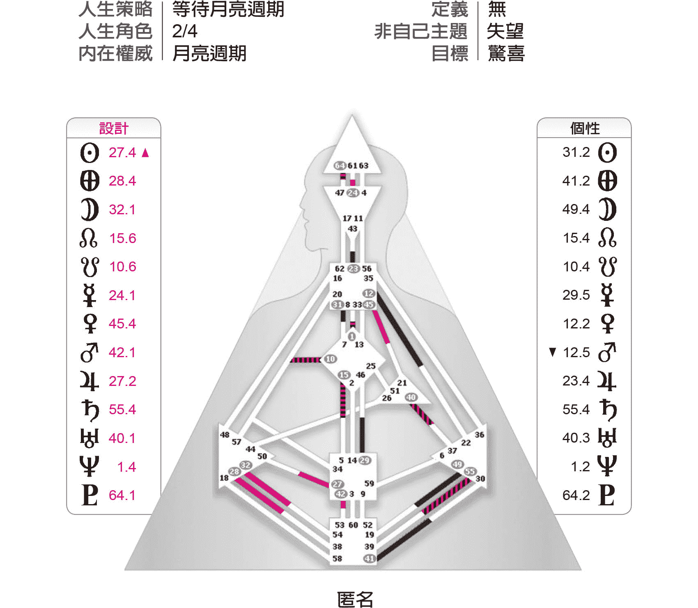

右角度交叉之不预期

完全没有定义

信道：没有

身为反映者，你天生就能跟宇宙环境，以及行星转移状态（planetary transit field）的影响，形成独特的共振。显示者、生产者与投射者都属于太阳类型，意即他们的目标透过他们“发光”而显露。身为唯一的月亮类型，你的设计就像月亮，反射太阳运行，也反映微中子印迹作用的过程（the neutrino imprinting processes）。你的“光芒”像月亮，细微难以捉摸，但却有实质的影响，特别是当别人察觉或注意到你的时候。你此生的目的是来体验，并且与全体合一，透过这样的过程，你会拥有我们大多数人无从知晓的神秘生活。你具备潜能，能以持续且深刻的方式，与星球相链接，特别是与月亮的链接。你与星星的频率相互调和，像是忠实收听天体运行“节目”，收集行星在太阳系中移动而产生的讯息，然后逐一报导，让众人知晓。就许多层面来说，你是我们得以了解与参与宇宙意识的关键，因为你具有超凡的开放性，以客观无私的方式，能不断过滤人类的意识层面。

在这世界的日常生活里，与你接触的人，以及环境中的物质、心灵、情感与灵性状态等，在各个面向来说，都对你的健康息息相关。你就像煤矿坑中的金丝雀，能自然而然体验、评定、察觉周遭的环境与人。当你健康、快乐以及成功时，你知道你身处的环境也是如此。而当你不成功时，代表整个环境需要转变，或者对你而言，那里并非对的环境。

你有能力感受到谁是真实地活着，谁又受到行星转移的制约，或者因此变成受害者。当人们被行星转移或周遭环境所制约，便愈来愈无法实现自己的独特潜能。你可以感受到谁已经准备好要活出真实的自己，或者一个社群或组织何时能正确运作。你可以感觉到某个环境或团体，在物质、心灵或情绪上是否健康。当人们开始觉醒并觉察到他们的真实，你可以在旁，分享或反映出他们在当时所需要的事物。这就是反映者“被看见”的方式。

你的九个无定义中心会尝试、放大并反映，你所处的环境中，所有人事物的振动频率；你用一种其他人无法做到的方式，让他人也有机会体验或感受那些真实正在发生的事。你独特的能量场，无需深入他人的振动频率，就能评估或读取他人的能量场。只要你别将开放中心所获得的信息，混淆成自己的，就能平静又完美地，反映出身边所有人事物。这是极其特殊的天赋，让你能分辨出一个人，是否已经准备好表达出自己的独一无二，而不是继续接收同质化世界里的非自己。

如果你让事物只是单纯透过你，体验它一如原貌，那么你的每一个开放中心，便能成为通往智慧的特殊窗口。而你“不沾锅”的能量场会保护你，而不会将世界上所有发生的一切，皆视为与自己相关，你能察觉集体能量中，短暂闪现的讯号，或者周遭不寻常或脱规的人事物。当你愈来愈熟悉并了解自己的设计，你就不会继续屈就社会的压力与要求，你可以放大并反映他人的能量，并反射回去，你的存在就是一种不寻常的方式，来活化并鼓舞他人。你独特的天赋在于不带任何评断，协助他人经验更高层次的察觉，同时你不显眼、不具侵犯性特质的能量场，也让你能更有效地引导团队前进。当然，除非你能够按照自己的设计生活，否则这些潜能无法发挥，而你的存在，也不过是放大同质性世界的版本而已。

不幸地，大部分的反射者都过着同质性的生活，试着成为某人，而不是做自己，因为他们不被了解，无人鼓励他们拥抱自己的独特。太多的情况是，他们会发现这个世界缺乏包容性、冷漠而且令人失望，他们为了生存，只好对别人的期望让步。当你开始欣赏自己的独特，自你所无意反映的事物当中，实际抽离出来（或者停止认同它们），你就能不再迷失、困惑或耽溺于周遭的混乱之中。如此一来，你便能接受自已在团体中的核心位置，而非感觉自己像处于团体之外，宛如一个隐形的旁观者。

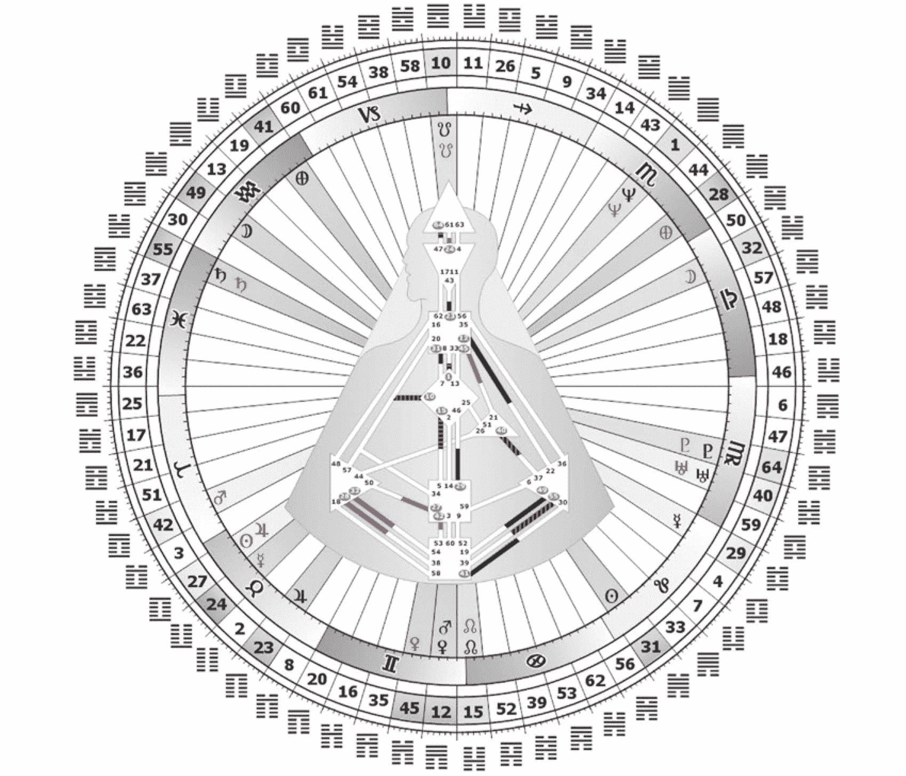

在上图的曼陀罗中，你可以看到六十四个闸门如何环绕着你的身体图，每个闸门都带来不同类型的启动潜能。当月亮以二十八天的历程，行经你的身体图，一一经过六十四个闸门。这个模式每个月都会重复一次，然而，对你来说，这个月的每一天都是不一样的，你会发现自己一直在问：“我今天是谁？”以及“我今天会感到惊喜、被接纳，或是被忽视？”月循环模式能提供你一致的独特感受，让你从中了解，并仰赖它帮助你决策。

你生命中做决策的人生策略是：安坐好好享受人生，等待事物自行呈现在你面前，从事情发生的此刻，等待完整的二十八天月亮周期后，再做决定。你在等待这循环结束的过程中，可与他人讨论，但并非寻求建议，而是聆听属于你的真实，透过你反映出来。将他人当作回响板。这些人必须是你能信任的密友，他们不是来为你做决定或者影响你，他们只是单纯地聆听，或者询问一些问题，帮助你厘清想法及感受。随着时间推移，你要做决定所需的清晰，自然浮现。如果经历一个月循环后，你仍旧不清楚，那就继续等待。仓促行事对你来说，并不健康。事实上，大部分的反映者终其一生，行事都非常仓促，他们因为压缩生命自然流动的节奏，而导致健康走下坡；抵抗也会对他们的身体造成很大影响。然而，如果你就是照自己的样子生活，不将在你开放的未定义中心中，流动移转的能量混淆成是自己的，你将会体验到一个充满惊奇、喜悦，与美好当下的人生。想知道更多关于月循环的细节，可以参见第四章的反映者部分。

地点（place）对你来说非常关键。对你来说，最重要的决定是在对的社群中，找到适合自己，像家一样的环境。你的Ｇ中心无定义，因此你必须体认到，你周遭的其他人是来启发你、引导你到新的地方，认识新的人。一旦有人引领你进入特定的群体，你接下来的任务是察觉他人。处于团体的核心，对你是最适当的位置，在此你能够自在体验，并反映周围的能量讯息。你的人生目的是要接纳他人，同时反映并教导我们其他人：在这个世界上，基于每个人的多元性，而奠定了我们所认知的评价与好坏。

当你发现团队或群体不再需要你来反映这一切，你要能自由离开。如果你待在不健康的环境，不论待多久，都可能会吸收环境中的能量而生病，或者耗尽你的活力。对你来说，拥有一个专属、具创意的自我空间很重要，在这个空间，你可以花些时间独处，清理你每天暴露在日常事务中，所接触的制约。如果没有这么做，你很容易会过度依赖周围人们的能量，也因此，你必须慎选自己亲近的家人和朋友圈。

2/4 是你的人生角色，你此生所穿的戏服，我们称作隐士机会主义者。2/4 的人生角色常被称为传教士，这个人生角色结合了你意识个性（第二爻）的天赋与资质，以及你潜意识设计（第四爻）中，超越个人、随时能与世界互动的特质，为的是实现你的天赋才华。介于意识的隐士（反社会的）以及潜意识的机会主义者（社会的）之间的拉扯，为你的生命带来有趣的动力。只要你不是为了满足别人要求，才进行研究或训练，你会有股驱动力，想要分享所知。大家看着你，但你不确定他们看到的你是什么模样。除非别人指出你拥有独特的天赋，否则你自己根本不知道。你只需专注纯粹从事自己喜欢的事物，沉浸其中，享受这一切，别人自然会看见你的天赋。在此同时，你的潜意识会吸引一些人成为你的朋友，他们会告诉你他们眼中的你。这就是你获得生命“召唤”的方式。

当你处于隐士状态，不希望被他人干扰，最终仍会有人召唤出你的天赋，而进入实质的世界。回应“召唤”是一种蜕变、自我实现的驱力，当你决定活出自己，你会自然而然回应召唤。然而，你并非追求者，“从朋友做起”，对你来说是最健康，最适合开展一段长期亲密关系的方式，同样的方式也适用于进入商业合约或伙伴关系。你的社交和商业网络非常重要，因为属于你的召唤，会在社群中找到你。一旦你接收正确的召唤，你将带着传教士般的狂热，在社群中散播影响力、同理心或知识。

你的设计中，九个中心都是空白的（没有定义）。每一个开放的中心，都让你能够吸收，并读取他人的能量，在开放、毫无预期的状态下，自客观有利的位置来审视环境。然而，你要知道，从他人或环境中所接收的能量，并不属于你个人，当你保持开放，并顺应生命流动，你的客观性才能正确运作。一旦你试着要抓住能量，就会感到失望。

你空白的头脑会接收到那些与你无关、令你分心的思绪。你会感到与自己的身体分离，因为空白的头脑与逻辑中心可能会让你与你的月亮权威（Lunar Authority）彻底失联。当你发现自己迷失在头脑的诸多想法时，试着将自己带回身体意识。你开放的头脑中心，会让你试图回答生命中所有的问题，永无止尽地追求一个个足以启迪人心的故事。你会困惑，感觉迷失，因为这趟追寻没有尽头，又如此折磨。空白的头脑中心所潜藏的智慧是，学习辨识哪些问题值得你注意，运用你的人生策略和内在权威做为指引。你开放的逻辑中心让你想确定生命中的事物。你害怕自己若无法回答某些问题，会看起来很蠢，所以不断试着找出自己能确定的答案。你也可能极不理性地，陷入过往，试图合理化已经发生的一切。空白的逻辑中心所潜藏的智慧是，学会让这些想法流过你，不要试图抓住任何思绪，对于“我不知道”不再介意。

你空白的喉咙中心让你试图做太多，或说太多，以吸引他人注意力。空白的喉咙中心像是扩音器，常对着世界大喊：“看着我”或“注意我”。你不需要“做”任何事吸引关注，因为这已经内建在你的设计中，你只需要坐下来、放轻松。留意自己是如何感受到压力，而渴望去做什么，或说些什么。但是，请你不要急着执行；只要观察，然后看看接下来会发生些什么。你可能会发现，自己在社交上很谨慎，或者恰好相反，你想在适当时机来临前，向团队表达想法。空白的喉咙中心所潜藏的智慧是，透过观察，你能公正并明察秋毫，辨识出谁有（或谁没有）值得说或做的事。只要对你而言是正确的，即使是来自个人独特的观点，你也能传达社群的更高原则。

你空白的Ｇ中心总让你觉得，必须搞清楚自己是谁，以及人生究竟要往哪里去。这种感觉会迫使你运用头脑，为人生方向作出决定，以及想定位自己在社群中，究竟要扮演什么样的角色。对于Ｇ中心空白的人来说，有一些特别的地点，你所处的环境，其实到处都是“指标”，展示出你要前往的方向。所谓的指标，会以各式各样的形式展现，这可能是一个人，或是你读到或听到的事物。你天生的角色是为人典范，能呈现出社群的最高价值与想法，识别出团队的弱点。然而，你在生命中所扮演的身份和角色，将持续改变，对你来说，学习如何在改变中顺流而为，这非常重要。如果你执着于某种看待自己的特定模式，或是某种特定的角色，那么当一切改变时，你将会试图紧握早已不属于你的角色，而体验到巨大的痛苦。空白的Ｇ中心潜藏的智慧在于，相信当时机正确，你自然会遇见下一个指标，指引你往新的方向前进，扮演全新的角色。

你空白的意志力中心，会让你以各种方式，试图证明自己的价值。你可能因此不断努力提升自己，或过度补偿及过度承诺，尝试证明自己。但因为空白的意志力中心，你的意志力无法持续，也缺乏让自己变得更好，或做得更好的决心。你的生命不在于立志做任何事。你必须源自人生策略与内在权威，而非你的意志。你人生的座右铭是：“我不需要向我自己，或任何人证明任何事。”空白意志力中心的智慧在于，你能够客观看出他人的意志，知道谁能（或不能）遵守承诺，而谁有（或没有）健康的自我意识。社群对你来说很重要，若不是跟对的人在一起，还不如单身。

你空白的荐骨中心会让你做太多、过度承诺、工作操劳，甚至有可能耽溺于性爱。你会觉得有一股无法控制的驱动力，想投身新体验，或承诺过多，远超过你既定的资源或能量所能负荷。尽管你的本性总想照顾及关怀他人，但你必须了解，你不属于能量型的设计。你的设计是当一个观察者及法官，而非亲力亲为。你很容易落入做太多的陷阱，导致筋疲力竭，最终损害健康。空白荐骨中心所潜藏的智慧是，知道适可而止。放慢脚步，缓慢而谨慎地做出决定，这就是你保持健康的关键。

空白的直觉中心让你紧抓住对你不健康的事物，或者依赖着让你感觉良好的东西。有时你会专注于细节，并紧抓不放，你所执着的事物，对你来说不见得正确，例如你会待在一份早该结束的工作或关系中。紧握某些事物，让你拥有错误的安全感，有时甚至会让你固守一段受虐的关系，因为你不确定放手之后，人生还会出现哪些可能。你的设计不在于主动或快速做决定，其潜藏的智慧在于，一旦你退后一步，客观地审视生命，就会知道对你来说，何者是健康的，何者不是。这包含人、地点和食物。身为第四爻，你的设计并非关于在下一个对象出现前，就先行离开上一段关系，所以，对于自己所决定的时间点，要特别敏感。不管你要放弃什么，都要遵循你的人生策略和内在权威，让宇宙为你安排好所需的递补。你无法靠自己找到替代品。

空白的情绪中心让你试着对人和善，避免冲突与真相，保持平静无波。对于周遭的情绪状态，你是开放且脆弱，很容易将感受到的情绪当成自己的感受。为了避免这种感觉，你在世人面前表现出“好人”的形象。当然，这不是真正的你。对于周遭对灵性意识的需求，你特别敏感，你能协助平衡社群的觉察与能量。空白情绪中心所潜藏的智慧在于，允许那些感受单纯流过你，但不将它们视为自己的感受；感同身受，但不涉入他人的情绪和感受；在重要时刻，要能挺身而出，捍卫你自己以及团体的原则。

空白的根部中心总是吸纳全世界的压力，你经常会急着把事情做完，好让自己可以休息。面对来自他人的期望，尽管你懂得如何谨慎地运用自己的能量，但是压力依旧存在。每当你完成一件事，下一件事就已经等在那里，让你再次处于压力之下。你会陷入赶、赶、赶的恶性循环中，导致肾上腺燃烧殆尽。空白根部中心所潜藏的智慧是，感受这份压力，但不要轻易反应。借由拖延，你就能透过人生策略和内在权威，分辨出你真正需要关注的是什么。如此一来，压力就能给予你实际的支持和鼓励，而不是让你筋疲力尽。记住，身为反映者，善用时间，处理讯息与可行的决策，对你来说是关键，也会让你保持健康。无论如何，急急忙忙对你来说并不健康。

总而言之，你的设计是享受生命每一天所带来的惊喜，请尽量和头脑所认定的“生命应该如何”保持距离。你来到世上的目的就是流动与转换。你生为不预期的轮回交叉。你的设计就是会出人意料，充满反映者所追求的惊喜，为了意外与激励人心的“召唤”，活出 2/4 的人生角色。所有这些碎片，都会如拼图般，美好拼合在一起。你深具影响力和爱心，与我们所有人分享未来的愿景，以及活在这个世界的目的。你随时随地都能透过你所带来的反映，向世人演绎如何接受事物的原貌。对你来说，最重要的是，请记住慢下脚步，做每个决定时，尽可能多花些时间，理想的状况是花上一个月的时间；不要让外在的压力驱动你；放开固执，欢迎惊喜流进你的生命之中。对那些依循人生策略和内在权威过生活的反映者来说，神奇之处在于，人生处处有惊喜，逐一展现。

“我们是有意识的存在，除意识外，我们拥有察觉的潜能，而察觉则蕴藏着觉醒的可能。但首先，我们必须了解所谓有意识的真义为何。我们宛如过滤器——过滤各种意识。意识经过我们过滤后，又会回到广大的意识场域之中。意识穿越我们，然后又离开。

我们漂浮在密集的微中子海洋之中。真正的奥妙在于，明白我们正在做的事——接收并解读意识场域。每一个人皆彼此紧密相连，又各有其独特的方式来解读这一切。人类图让我们知道，我们的设计本身如何过滤各种意识。若能正确地过滤，就能提供指引。每一位正确的过滤者，都会改变他人获取讯息的方式，而微中子海洋的品质，将因我们而得以改变。

每一个人皆创造出独特的介入模式，这就是所谓的差异化——一种独特的介入模式，事实上可以细分至极精细的差别。”

——拉．乌卢．胡

# 第十章关于卦象中爻的描述更深入的探索

### 深入探索

由拉．乌卢．胡于一九八九年十二月完成的人类图易经（The Rave I’Ching），综合了卦（闸门）的叙述、与各闸门相关的轮回交叉、以及每个闸门之下的六爻叙述。人类图易经中共有六十四卦、三八四爻。在此书中，只先探讨三八四爻的内容。如果想要一本人类图易经的书，请洽询版权所有的各国人类图分部；在第十一章可以找到官方总部与分部清单。

三八四爻中有三七五爻传达了潜在经验的极性，它被称作上升或下降的相位，分别以黑色三角形 ▲（上升）和白色三角形符号 ▽（下降）表示。这些术语在一般占星里代表的是好（上升）及坏（下降），但**人类图体系**不会以道德评断的角度来区分。在**人类图的世界里**，这些术语单纯仅表示“这个”或“那个”代表不同的极性。

一个人的人类图设计是各个部份的总合，当我们检视特定的某个部份，像是爻，也必须同时考量其存在于整张人类图中的相对关系。如果只检视单一细节，而不考虑整体设计中其他的部分，如类型、策略、权威、人生角色、轮回交叉、中心、信道，以及闸门，便无法理解整体的脉络。要想真的了解爻，请往后退一步，将它放在整个大图的脉络中检视。当你用这样的方式看人类图，你会发现一种层层揭露的模式，也就是“基因延续性”，所有看似零碎的片段，其中皆蕴含了与整体设计相呼应的主题，生命的真正课题就此浮现，而你将看见人生中充斥着矛盾，以及所有相关的复杂性。

了解爻需要时间；它们可能看起来很抽象，宛如谜语或诗句。就像易经（关于变易的中文书）需要花上一辈子来理解，若要以整张图的范畴来分解爻的含义，当然也需要时间。最好的方法是从你自己的人类图开始，了解你所拥有的爻，甚至冥想也会有所帮助，让你慢慢消化其意义。即便在当下，你可能以为自己理解了某条爻，或者对其叙述产生了共鸣，但是，当你更深入去体验这段旅程，活出你原本的设计，曾有的认知与共鸣也将随之进化。

你可以在你的图旁两列以红色（**设计**）和黑色（**个性**）标示的闸门旁，找到你的爻，举例来说：闸门 50.1（Gate 50.1），就是 50 号闸门的第一爻。你可以在这一个章节透过闸门找到你的爻，阅读爻完整的叙述（上升与下降），能够让你略为了解你的设计中的爻。留意爻的名字和叙述，它们各自寓意着与爻有关的宝贵信息。此外，在每个卦中，第一爻的叙述将能让你对这个闸门有基本认识。

有些爻会有一句斜体描述文，但并非全部都有。斜体字的叙述文字代表着你有机会学习的课题，并且你在此具有成长的潜力。如果没有斜体字的叙述，那么这就是你与生俱来的天赋，是你的设计里根深柢固的特性。

在上升与下降的叙述中，第一句是拉初次接收到的讯息，而以粗体呈现的第二句，则是他于数年之后，再次整合并进一步阐释关于每条爻的意义。你也会看到与这些爻相关的行星符号——列在爻的旁边。有些行星能将爻“固定”在上升或下降的相位。观察你的图，你会看到有些闸门或爻的旁边，标示了上升或下降的符号，同时你也会发现有些图上，并没有固定的标示——没有上升或下降的符号。

当我们以“固定”的范畴来讲述上升与下降，这只是单纯以另一种方式，来讲述“这个”与“那个”，没有好坏的评断。就你整体设计的连贯性来说，你设计中的下降之处也同样完美。事实上，下降的相位通常会带来很棒的学习机会。人类图合图（你的设计与他人的设计合并）以及流年图（行星在我们的人类图上，随着时间的流转）也有机会将爻固定在某个相位上。同时，当信道另一端相对应的闸门接通时，也有可能会产生固定的状态。这些课题很复杂，我们另找机会再作深入探讨。

在此章节，你可以先查出自己的闸门与爻。先阅读那些有斜体字叙述的爻，这些是你此生可以思考并从中学习的课题，然后阅读爻的叙述文字，从上升至下降，感受其中流动的能量，看看你领略到的是什么。如果你的图上有上升的相位，读一下上升的描述，了解这股能量在你的设计中，如何被凸显出来，如果你有下降相位，也请你阅读下降的描述，思考这为何成为设计中的重点，如果你有并列相位（一个形状像是星星的符号，同时代表上升与下降），那么这两种叙述皆适用于你。

#### ▸ 人类图易经中的行星符号与象征

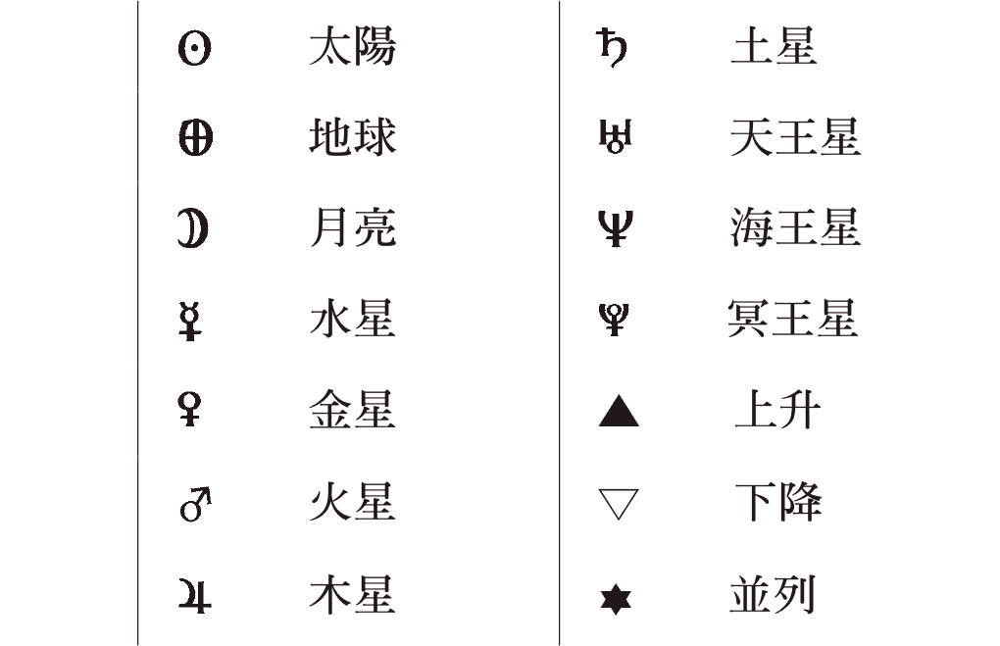

### 第一到六十四爻

#### ▸ 1 号闸门：创意—自我表达

创造力是原始的力量。没有限制，充满潜力，足以启动灵感的能量

##### 第 6 爻—客观性

明确评估创意的价值。创意表达过程中的清明。

主观评价所带来的风险是失望、以及创意受挫的结果。自我表达中的主观意识，可能导致创意受挫。

##### 第 5 爻—吸引社会大众的能量

火星在上升相位，强大自我的顽强展现。坚持创意过程的力量和驱动力。

天王星在下降相位，怪僻阻碍了延续性。尽管怪僻吸睛，却限制其动力。

##### 第 4 爻—孤独为创造力之媒介

内在之光的张力。

地球在上升相位，象征个人观点彰显于外，带来影响力，但却淡化了灵感深具魔力的潜质。发展创意，必须与影响力无涉。

淡化灵感深具魔力的潜质。基于对影响力的需求，不甘寂寞，限制其创造力。

##### 第 3 爻—持续创作的能量

火星在上升相位，象征自我表达的深刻需求。自我表达的深切需求。

物质力量破坏创意，引发野心勃勃。物质主义破坏创造力。

##### 第 2 爻—爱是光

金星在上升相位，象征美丽。在既定价值与激发灵感的理想间，需要和谐。自我表达受理想与价值所制约。

欲望与热情有其作用，但不能换来创意。**欲望和热情限制了自我表达。**

##### 第 1 爻—创意独立于意志之外

月亮在上升相位，象征适应。时间就是一切。自我表达有其独特的时间点。

不稳定导致扭曲。在此，耐心是美德，革命次之。创意不稳定，除非有耐心。

#### ▸ 2 号闸门：接纳—自我方向

无论决定如何回应，接纳是最根本的基础，也是行动的根源

##### 第 6 爻—定格

不能或不愿看到全貌。

水星在上升相位，尽管较不负面，聪明才智倾向于不断合理化。更高层次的觉知，其感受力极为狭窄。

基于安全感的需求，可能会扭曲意识，转变成终极变态，破坏性。高我耽溺于世俗与安全感的需求。

##### 第 5 爻—灵活应用

水星在上升相位的策略家。资源的合理管理。更高层次的觉知为运筹帷幄之天赋。

无力分派责任，或无法辨识出他人的能力。更高层次的觉知为个人独有且自私的过程。

##### 第 4 爻—隐匿

比谦逊更进一步，谨慎细心保有和谐的能力。

更高的目标凌驾于个人赞誉之上。团队合作，被当成领袖，却从不会是队长。更高层次的觉知无须为了认可而表达。

祸从口出。难以抑制的烈火来自我执，滋生怨恨。一有宣泄的机会，便无法保持沉默。

##### 第 3 爻—耐性

老师是永不停止学习的学生。

终身贡献，成熟接受其过程永无止尽。当连接相对应的 14 号闸门，形成脉动的信道，服务会获得报酬。了解接受是一生的历程。

为求革命，耐性居次。更高层次的觉知无法等待，亟需表达。

##### 第 2 爻—天才

启发引动回应是无意识也无须学习的本能。天生好手。

聚焦与实践的内在力量。觉知无法学习，是与生俱来的天赋。

天才本疯狂。将专有的知识视为力量，强化自我。妄想知识就是力量。

##### 第 1 爻—直觉

敏锐面对不和谐与萎缩。

不论是先天或后天，美学有其重要性，透过美而获得更高层次的觉知。

不顾智慧，坚持我执的主张。采取行动的冲动，将忽略更高自我的智慧。

#### ▸ 3 号闸门：凡事起头难—秩序

发起时所面对最根本的挑战，来自于如何超越困惑，并创建秩序

##### 第 6 爻—投降

最终的成熟是了解，挣扎是徒劳。

当光依旧闪耀，生命就会持续。天生就能接受秩序是过程，并非问题。

当黑暗覆没，生命可能看似毫无价值而感到沮丧和绝望。困惑能量是压倒性的力量，导致沮丧。

##### 第 5 爻—受害

用来穿越困惑的行动是与人疏远。

捍卫个人信念的勇气。以独立个体的独特能量来对抗困惑。

地球在下降相位，受害导致姑息与痛苦。若以他人所认定的秩序为主导力量，将充满困惑的能量。

##### 第 4 爻—魅力

因为先天的本性而吸引重要的指引。

灵性的调谐引发磁场的滋养。吸引滋养及确保秩序的灵性能量。

火星在下降相位，出于我执的要求被拒。需要滋养但通常遭致拒绝的混乱能量。

##### 第 3 爻—生存

有能力识别与区分，肥沃与贫瘠所展现出来的各种型态。

在繁衍过程中，具备选择最好伴侣的能力。针对生理层面的突变，取决于与人合作，天生就知道肥沃与贫瘠之别。

乖张违背进化的标准。天性反叛、拒绝突变。

##### 第 2 爻—未成熟

无限制接受指引。

坚决追求成长的能量，终将胜利。个体突变的能量与潜能。

同时接受又对抗权威，内在不稳定。能量与潜能皆受制于他人，导致不稳定。

##### 第 1 爻—综合

唯有分析过所有相关因素后，才有可能克服困难。

了解困惑很自然，总是也必然存于清明之前。天生就知道秩序将从混乱中产生。

牺牲直觉转而依赖智慧，会导致不必要的挫折。无法明白秩序会出现，试图于别处找寻觉知。

#### ▸ 4 号闸门：血气方刚的愚者—公式化

尽管无知，却能蒙骗过关的能量。免于处罚的自由

##### 第 6 爻—超越

重复且有意识地漤用规范，将无法逃脱惩戒。

透过技巧的经验值而发展，实现自我约束。逻辑推演过程的潜能是，辨识出其理解是否完整，若尚未完备，有耐性等待过程完成。

有胆接受惩罚就是超越本身，应当付出的代价。尽管认清并不完整，却对过程缺乏耐性。

##### 第 5 爻—诱惑

让别人承担责任当作挡箭牌以避免责罚的可能。

不劳而获的奖赏与认可。透过理解他人而获得成功的潜能。

说得满口应酬话，都是过时与无法令人满意的价值观，愤世嫉俗。愤世嫉俗所带来的潜能是，总是不得不承认自己能理解他人。

##### 第 4 爻—骗子

以艺术为形式的角色扮演。演员。

**不论如何被误导，运用幻想来保护及培育使命感与理由。透过幻想，寻找或延展出公式的潜能。**

时间总是带来耻辱。潜在的危险是将幻想当作事实。

##### 第 3 爻—不负责任

若能少花点力气，就不愿意勤奋努力。

艺术比艺术家有价值。倾向拥有公式，不顾及如何实际应用。

将不负责任合理化，解释成重新聚焦的行为。为了维持现况而进行辩解的潜能。

##### 第 2 爻—接纳

理解到个人及他人皆有其限制，有度量暂不评断。

赞颂情感，面对误入歧途的孩子，永远怀抱宽容的母亲。其潜能在于认知到“不是每个人都能理解”。

以别人的失败为例，作出自以为是的断言。利用他人的无知，而获得好处的潜能。

##### 第 1 爻—愉悦

若还不到完美的时机，无法获得终极的快乐。

凭本能来判断对的时机与情势，获得愉悦的奖励而非惩罚。有潜质能明白，理解的过程有其自然的时序。

时机不是纪律的产物。逾常的自律毁坏了愉悦感。具备理解的潜能，却因冲动而揠苗助长。

#### ▸ 5 号闸门：等待—固定模式

从根本来调整，以符合自然的韵律，等待是充满积极的察觉

##### 第 6 爻—屈服

等待无法免除来自身体或精神上的压力，常被不预期所打断。

顺应宇宙之流，觉知将有所增长。就算有压力，还是接受自己既定的韵律，往往透过不预期的一切，将得到激励而从中成长。没有极性。

没有行星在下降的相位；每颗行星皆有其轨道，位居其位散发力量，顺从其必然性。**没有行星在下降相位。**

##### 第 5 爻—喜悦

等待宛如悟道的面貌。

保持平静宛如极致的美学，因而体悟出存在的内在蕴义。**保持平静的力量，在生命之流中找到个人的定位。**

喜悦如幻象消散，视等待为失败。**看清自己于生命之流中的位置，因而幻灭。**

##### 第 4 爻—猎人

等待是生存的保证。

极具创意的天才，将最消极的经验转化为积极的成就。**有力量将既定的韵律发扬光大。**

个性中过度强烈的虚荣，不愿屈居幕后，威胁其生存。**以可预估的代价，冲动地否定其特有的韵律。**

##### 第 3 爻—强迫症

由无助感所衍生的恐惧，导致不必要的压力与行为。

透过奔放的想像力，能限制强迫症所带来的负面影响。虽然依旧紧绷，他们不会轻举妄动。**投降既定韵律的限制，透过想像力获得力量。**

月亮无法永远静止不动。**无法臣服，不符合自己的韵律。**

##### 第 2 爻—内在的平和

具有抑制冲动的能力，避免采取不成熟的行动。

透过理想的宁静，维持沉着的天赋。**自在顺应内在韵律的力量。**

将内在的平静等同停滞的体验。**僵化的韵律，限制了充满力量的驱动力。**

##### 第 1 爻—毅力

破釜沉舟。

面对逆境的勇气。**维系个人韵律的力量。**

为了避免损失，通常过于冲动而提早放弃。**当挑战来临时，维持个人韵律的能力薄弱。**

#### ▸ 6 号闸门：冲突—摩擦

进步的基本构成元素；“没有冲突就没有成长”的定律

##### 第 6 爻—调停者

透过更高位阶者的纪律与操守，单方平息了冲突，容许敌方投降并获得生存。

生命是神圣的，这就是最崇高的理由。**因为感同身受，所以淬炼出情绪的力量，终止冲突。**

行动公正的调停者，但其所提出的和解条件难以接受。**唯有先满足其条件，情感的力量才能终止冲突。**

##### 第 5 爻—仲裁

相信透过详尽的分析以及适当的情绪控制，才能让更高的权威来评断其冲突。

****透过避免直接冲突，达到更进一步的和谐。**对冲突极为敏感，因而逃避亲密。**

在仲裁时，其中一方自认是最好的法官，只接受自己获胜的判决。**面对冲突时，对他人的顾虑毫不在乎。**

##### 第 4 爻—胜利

天生具备不容挑战的力量。

慈善与智慧，必定将伴随胜利以及全新的视野而来。**主宰关系的情绪力量。**

征服者与肃清者。**欠缺情感控制，遭致关系毁坏。**

##### 第 3 爻—忠诚

有能力取得支持并产生力量，自弱势翻身。当与相对应 59 号，交配的闸门连接时，结果是受孕。

透过联盟来拆解旧有的形式可能是如上面提到的世俗面，如性的结合，或是提升至普及化的程度。**情感的深度足以丰富链接与亲密。**

拒绝效忠，不愿服从既定秩序。**对控制很敏感，最终可能为此而拒绝亲密。**

##### 第 2 爻—游击队

透过实时的攻击与撤退，充分利用劣势的能力。

透过对美学的敏感与理性留意细节，找到最脆弱的关键点。**善于在冲突中找到最大的弱点，并在情绪层面好好利用它。**

神风特攻队，引人注目但缺乏实质意义。粗线条，**一不小心即造成冲突。**

##### 第 1 爻—隐退

领悟到浪费一己资源来对抗压倒性的优势，并非勇敢，而是愚蠢。

再生的力量，接受隐退只是现阶段的状况，而非失败。**以稳定的情绪面对冲突。**

自卑的心理，将隐退视为个人的弱点。**面对冲突时，情绪不稳定。**

#### ▸ 7 号闸门：军队—自我角色

聚合点，为了引导和指挥社会，对领导的需求

##### 第 6 爻—管理者

有分享及公正分配权力的能力。

沟通责任架构的权力。**尽一己之力，透过其角色传达职责。**

渴望权力的官僚，最终将动摇组织。**位居其位，藉其传达职责的角色来谋求权力。**

##### 第 5 爻—将军

面对危机时刻，经由社会群体所授与的领导力，享有绝对的权威。

其天赋是集聚必要的忠诚，以协调并发展社会所蕴藏的潜力。**透过自身角色**，**引发众人效忠的能力。**

被其部队所孤立的指挥官，执着于胜利而不计任何代价。**若刚愎自负，将无人效忠。**

##### 第 4 爻—退位者

有意愿来接受群众公评及／或法律裁定。

考量整体利益而下台的修养与智慧。**个人具有接受他人评断的雅量。**

在绝大多数人反对之下，被迫释出权力。**拒绝接受他人的评断。**

##### 第 3 爻—无政府主义者

拒绝任何制度化的要求。

不论现况如何，持续追求改变的需求。**想跨足不同角色的自我驱动力。**

虚无主义者。**具备否定各种角色价值的能力。**

##### 第 2 爻—民主主义者

以服务多数民意为前提，展现出领导的能力。

运用普世通用的体系。当透过创始者的信道与 31 号闸门相链接，有其潜力能对社会带来广泛且革命性的影响。**被推选出来时，展现领导能力。**

菁英主义，民主制度下的民主主义者却划清界线。**一旦被推举出来时，感觉自己优于那些选择他的人。**

##### 第 1 爻—独裁主义者

同时具备开明和专制的铁腕。

****金星在上升的相位，将基本的价值观和规则强加于孩子身上。具备**以权威来引导的能力。**

扭曲的认知，认为只有自己最清楚。具备能力来**坚持自己是最佳的权威。**

#### ▸ 8 号闸门：凝聚在一起—贡献

当个人致力为团体目标做出贡献，其基本价值便得以展现

##### 第 6 爻—交谊

基于和谐而发展出的确定性。

能察觉模式运行，而把握正确的时机。**天生有其天赋，知道何时该有所贡献，以极具创造力的方式展现。**

质疑，尽管在最理想的状况下，因而造成遗憾。**不论任何情况下，对时机感到不确定而后悔。**

##### 第 5 爻 –达摩

齐聚一堂到最后，终究难逃分离。成功的结合代表着聚散终有时，幼鸟长成之后会离巢。这是正确的作为，无损于链接的本质。

老师。**接受并了解限制，于教学中验证，并分享这过程，而贡献则涵盖于其中。**

那些对小孩无法放手的父母，只知道自己的权威受到挑战。**不愿接受，亦无法预见限制，无法对孩子放手，父母本身就是例证，不言而明，其结果即是贡献。**

##### 第 4 爻—尊重

有其天赋，能自然看见别人作出的贡献，尤其对能以身作则的人，赞赏有加。

面对同质化，拒绝妥协是其驱动力。**贡献的动力，以身作则并为众人树立典范。**

在一个超越限制的团队之中，单一理由，无法预测个体的价值。举例，田径队里公认的队长，不必然是最有才华的那个。**贡献其天赋，不会被其限制所制约。**

##### 第 3 爻—虚假

接受其风格，而非外在行动的内容与其本质。

貌似完美，下足表面功夫，难察其瑕疵的亲密。**透过形式表达，无实质内容的实例。**

浅薄。低估他人的同时，也高估自己的能力，持续自欺，毫无觉察能力。**过度倚赖外在，对其风格充满无来由的自信。**

##### 第 2 爻—服务

最高的善行，无私的服务。**展现其无私**，**具备成为典范的潜能。**

地球在下降的相位，酬劳是服务与否的先决条件。**愿意付出相对代价，成为典范。**

##### 第 1 爻—诚实

真诚接受限制，再次认知到唯有透过分享，才能超越。

意识到团结力量大。**了解到传达创意必须坦诚沟通，相互分享。**

退缩恐惧在团体的环境中，会失去其个体性。**其设计是以牺牲个体性为代价，分享创意。**

#### ▸ 9 号闸门：处理细节的能力—专注

详细注意所有相关细节，就能充分发挥潜能

##### 第 6 爻—感激

接受每个微小胜利都会带来些许回报，心生喜悦。

月亮在上升的相位，就算微薄之力也能孕育正确的观点。**充满力量享受这段专注的过程。**

除非走完这段旅程，否则每一步皆无价值。**在完成之前，过程中缺少了喜悦的能量。**

##### 第 5 爻—相信

相信只要钜细靡遗坚持下去，就能圆满达成。

局限于法律字面条文。**专注的力量，认为专心本身有其价值。**

宛如神的奥秘，当过程中遇到不合逻辑之处，产生质疑。**缺乏专注的力量，因而心生怀疑。**

##### 第 4 爻—贡献

无视于压力或紧张，有纪律地关注细节。

采取正确行动必能实践。**将专注的潜力，付诸行动的力量。**

持续想跳过基本步骤的冲动。**忽略细节**、**想付诸行动的驱动力。**

##### 第 3 爻—压垮骆驼的最后一根稻草

忽略次要元素，总是可预见失败的结果。

施力以克服一时障碍。**无法专注而失去力量。**

执着的力道耗损其活力，小题大作。**能将专注转变为执迷的力量。**

##### 第 2 爻—同病相怜

与他人合作来抚平挫败。有力量能**与他人合作，共同聚焦。**

对于扩张的强烈需求，导致判断错误、错失良机而备感沮丧。**渴望合作的动力导致错失焦点。**

##### 第 1 爻—感受性

以平衡与负责任的方式来解决问题。

创造新的形态，以避免挫败的能力。**专注就会有力量，致力创造新的型态。**

四处找得焦头烂额，几乎冲动得快破门而入，其实钥匙就在你的口袋里。**推进的动力常失焦。**

#### ▸ 10 号闸门：前进—自我行为

行为的基本守则，无入而不自得，确保互动成功

##### 第 6 爻—人生典范

无须言语，身体力行才是展现准则最完美的方式。

长期身为楷模，为此感到自满，同时不断聚焦于行为层面，务求应对得宜。**透过行动而非文字，来表达自我的永恒价值。**

伪君子。动口要别人去作，但自己并未行动。**光说不练。**

##### 第 5 爻—异端者

直接、公然挑战规范。

透过理解及传达较高的原则，而获得成功的能力。**直接挑战传统的行为准则。**

火刑。**直接以行为来挑战其行为，最终将受到惩罚。**

##### 第 4 爻—机会主义者

直到成功蜕变转型之后，才会接受其规范。

蜕变是为了跃进至更高的规格。**维持既定的行为模式，静待对的时间点带来蜕变的机会。**

将机会主义当成一场游戏，及／或脑袋的游戏。**为了充分利用机会，而改变其行为模式。**

##### 第 3 爻—烈士

觉醒于公义，抵抗制度宛如螳臂挡车。

烈士是最常见的例子，其行为最终被奉为神圣之举。**其行为最终还是备受争议。**

烈士情结。为了个人自我的扩张，积极追求殉道。其**行为是吸引注意力的方式。**

##### 第 2 爻—隐士

透过孤立，成功闪避特定的行为规范。

水星在上升的相位，心智运作的方式更加深了孤独感。**透过独处而保有独立的行为。**

愤怒的流亡者。**面对制约，孤立是为了保有独立自主的行为。**

##### 第 1 爻—谦逊

内在很清楚，同时也接受自己的位置。

不论处在什么位置，皆看重其使命。**不论环境因素如何，都清楚自己所处的位置，知道该如何应对。**

过于敏感而容易受伤，并为此所苦。**对外在行为层面的制约，极为敏感。**

#### ▸ 11 号闸门：和平—新想法

由于个人或社会处于和谐的状态，在采取新的行动之前，先行衡量

##### 第 6 爻—适应力

具备内在的平衡，接纳过渡期。

与生俱来的察觉力，认知到万事万物瞬息万变。**领悟到想法带来改变，而想法本身也会改变。**

适应力最负面的展现，无论在和平或战争时期，投机者以牺牲他人的利益来获利。**不管任何情况下，知道何谓有价值的想法。**

##### 第 5 爻—慈善家

不带有任何目的性，照顾被褫夺公权者以确保和谐。**哲学与人道主义思想。**

抽离，避免直接接触，而给予只是防卫的形式。**抛弃想法。**

##### 第 4 爻—老师

传达和平本质的能力。

智者，在极端的例子中，能教会对音律一窍不通者如何和声。金星同时也在上升相位，具有向外延伸、接触特立独行的人。**概念清楚、易传达。其想法足以吸引，同时告知那些未受过教育的人。**

灵性上师，刻意地将其最有价值的智慧，只透露给少数人。**只能被少数人所理解的想法。**

##### 第 3 爻—现实主义者

认知到和平有如昙花一现。

内在革新以维持力量与警觉。**理解到想法来来去去。**

珍视和谐的倾向，几近妄想。相信美即是永恒。危急时刻却无法分辨轻重缓急，只专注在无关紧要的事情上。**想从想法本身获取乐趣，无法实质运用。**

##### 第 2 爻—严格

认知到若缺乏警戒，又不愿冒险，和平会造成停滞和崩解。

运用想像力，确保理解所实现的价值。**透过想像力来克服无聊。**

诉诸党派之争，以满足自我渴望行动的需求。**为避免无聊，以想法来挑衅。**

##### 第 1 爻—和调

在对的时间点、身处对的地方，因缘俱足的幸运。

与相同目标与志向的人在一起，从中获得滋养。**其天赋是找到看重你的想法的人。**

恐惧默默无名。感到**无人会重视他们的想法。**

#### ▸ 12 号闸门：静止不动—谨慎

克制的本质、沉思的重要性，以及面对诱惑时不为所动

##### 第 6 爻—质变

保持信心，朝改变施力，于静止中呈展。

当与相对应的 22 号闸门连接时，经由开放的信道带来创意的全面进化，因而成功引发突变，并产生新的社会形态。**突变、以及表达全新社会形态的能力。**

逆向突变，逐步演化成完美的适应模式，静止而无为。**谨慎以对，成就完美的适应模式，接受社会层面的诸多限制。**

##### 第 5 爻—实用主义者

成功面对限制，当一个阶段结束，牢记从中所学会的课题。

光明，总会意识到黑暗的存在。**谨慎是社会历练的呈现。**

倾向只记得过往最痛苦的教训。**谨慎是制约，源自最痛苦的社会历练。**

##### 第 4 爻—先知

面对停滞的终点，具备预知与计划的能力。

准备集结社群，为停滞的现况注入活水。**具备预知的能力，同时表达出对社交的需求，为谨慎画下句点。**

来自旷野的声音[[1]](#10-1_split_001.xhtml_fnX-1)。**就算表达社交互动的需求，依旧无法启瞆振聋。**

##### 第 3 爻—自白

自我分析的过程。

承认其不足，洗净无谓的虚荣。**在社交的场合中，展露其不足，引发自我分析及谨慎小心的倾向。**

有悖常理、且经常过度夸大的自我憎恨。**在社交互动层面深感不足，以致表达出自我憎恨之意 。**

##### 第 2 爻—净化

严谨地从负面的影响力中抽离。

自律，保有单纯的状态。**严守分际，遵循社会规范。**

由于缺乏刺激，感觉无聊。**谨慎小心让人觉得无趣，表达出对刺激的渴望。**

##### 第 1 爻—修道士、僧侣

避世，需要社群的支持来维持。

超脱诱惑，美与和谐的可能。**若能得到他人的支持，就能脱离社会并展现个中价值。**

圣西蒙[[2]](#10-1_split_001.xhtml_fnX-2)，彻底抽离，常常近乎荒诞。**相对于社会规范，行为荒谬，自情绪的链接中，极度抽离开来。**

#### ▸ 13 号闸门：伙伴关系—聆听者

在井然有序的架构下，有其普世的想法与价值，激发以人为本的合作模式

##### 第 6 爻—乐天派

能接受任何受限的互动模式，将之视为壮大联盟的必经道路。

坚持的能量。无穷的希望。**相信开放会让关系变得更好。**

天真。将相互的利益转化，进而利益众生。**相信彼此的利益，也适用于别人。**

##### 第 5 爻—救世主

为了人类福祉，克服所有障碍的能力。

充满魅力的天才，能为每个人找到其角色。**聆听者，其天赋是为别人找到定位。**

有能力的管理者。身处于此，其本质极正面，极少泛泛之辈。**天生的聆听者，其天赋是以务实，并且适于管理的方式，来为他人找到合适的角色。**

##### 第 4 爻—疲累

最后终于筋疲力竭，过于疲累而不再奋斗。

随着休战而获得复兴，最终得以振兴。**因开放而导致精疲力竭，安静的需求。**

情感干涸。姑息和退缩。**开放为角色中的弱点。**

##### 第 3 爻—悲观主义

深信最好的永远无法实现。

缺乏信任，唯有具体的证据才能使之转换。**其开放性被多疑所制约，不断寻求证明。**

悲观升华为艺术的形式，若是艺术，可能会产生相反的效果。讽刺。**怀疑有其正当性，以讽刺带来启发。**

##### 第 2 爻—偏执

风险始终存在，伙伴关系仅存于某种特定的类别，例如种族、宗教、国籍或智识层面。

气度，是偏执最不具攻击性的展现。**透过其气度，展现开放的角色。**

心怀执念，认为最崇高的理想，无法与最低下的形式结合。极困难的位置，即使最崇高的理想，也不过让仇恨得以合理化。**开放度极狭隘的角色，尤其认为无人值得聆听。**

##### 第 1 爻—同理

有能力与每个人链接，成群结队，处之泰然。

透过情感，传达出和谐。**带着情感聆听他人、开放的角色。**

亲吻婴孩的政治家。**其开放内藏弦外之音。**

#### ▸ 14 号闸门：执着于冲量—强而有力的技能

透过有技巧的互动，伴随优雅的掌控，来累积并延续力量

##### 第 6 爻—谦逊

处于巅峰的财富与力量。

获得启迪而领悟到物质层面的成功，是天意。**灵性是通往接纳之路的关键，以及力量的泉源。**

在此相位的所有具体展现，实质上是正向的，地球代表着存在主义的认知，认为物质层面的成功是必然的，就因为如此幸运，谦逊油然而生。**存在主义视接受为关键，力量为源头。**

##### 第 5 爻—傲慢

权力位阶中，永远存在既定的风险。

与生俱来的尊严。**与生俱来的尊严是力量的关键。**

对于他人以天赋塑造出优越感，感到不满。**生来就懂得何谓无权者，助长了优越感的幻象。**

##### 第 4 爻—安全

专注于创建稳固的基础。

为避免受到攻击而防御。通往**力量的关键在于发展技能，确保创建坚强的基础。**

面对竞争与挑战，过度自信，可能因而威胁到最基本的安全。**若无适当的技能，无力保障其安全。**

##### 第 3 爻—服务

充分运用才华与财富，为了最高层次的良善。

对社会无私的奉献。**力量的关键在于对众人无私的奉献。**

贪婪与自我道德标准的毁灭。**自私的力量点燃了贪婪。**

##### 第 2 爻—管理

投资在专门知识的智慧，带来报酬。

扩张。授权的能力。**力量的关键在于，不要试图自己一个人承揽，做所有的事情。**

虚荣地认为自己就是最好的专家。**力量的关键在于独立行事。**

##### 第 1 爻—金钱非万能

认知到财富也有其问题。

以更高的原则，淬炼对钱财的欲望。**彰显力量的关键，来自更高的原则。**

有钱可使鬼推磨的谬见。**能量本身绝非关键。**

#### ▸ 15 号闸门：谦逊—极端

在诸多极端之间，于行为上展现平衡，举止得宜

##### 第 6 爻—自我防卫

谦逊绝非软弱，两者截然不同。

不断重复地检验，以排除最薄弱的环节。**自我的力量在于探索极端，找出极弱点。**

倾向以和睦当作解决问题的武器，而不是专注于如何治本。**对最脆弱的关键点视而不见，自我的力量倾向以和为贵。**

##### 第 5 爻—敏感性

有能力察觉到，原本平衡的行为需要调整，以符合环境变化的需求。

成长的力量。**透过经历各种极端，而展现自我成长的能力。**

过度补偿的倾向。**过度补偿的冲动，而干扰了生命之流。**

##### 第 4 爻—壁花

将谦逊当成挡箭牌，以避免暴露其不足。

真实的形态能否隐蔽其不足，尚未可知。**跳脱生命之流时，内在感觉不安，动辄得咎。**

薄弱的辩护终究将自曝其短，遭致屈辱。**极端主义非主流，容易成为局外人。**

##### 第 3 爻—自我膨胀

一旦被认定为谦谦君子，即是面对自我毁灭的风险。

相对负面、做作的谦虚，只为换取认同，并当作有效的策略。**将自我的极端主义当成策略，以操控生命之流。**

“我早说过了”的心态。**有能力直指他人的极端之处。**

##### 第 2 爻—影响

谦逊加上正确的行动，形塑出恒久的准则。**能够接受自己先天的极端，接受其正当性。**

太阳的相位[[3]](#10-1_split_001.xhtml_fnX-3)其行动是天生的，而地球落入的位置[[4]](#10-1_split_001.xhtml_fnX-4)则属人为，尽管在此同样有力量，可预期获得相同的效果。**善用其本性中的极端之处，来影响他人。**

##### 第 1 爻—职责

无所期待、处理各种挑战的能力。

和谐的关系，提供支援以达成各种任务。**透过极端与和谐的关系，处理任何挑战的能力。**

因其强烈的主张，造成疏离。**透过自身的极端，与人疏离。**

#### ▸ 16 号闸门：热忱—技能

借由和谐的能量导引，得以丰富人生的伟大艺术

##### 第 6 爻—轻信

对传播的敏感度。

有能力经由体验、研究、然后浇熄误导所引发的激情。**评断的才华，衡量别人表达的讯息。**

相同原则，但海王星位居此相位会先破坏，再寻求新的型态。**无法评估他人所传达的讯息。**

##### 第 5 爻—圣诞怪杰

拒绝热情地分享。

有其能力让这一切不仅仅是激情，如同狄更斯的小气财神，最后的转换，将带来更强大并持久的热情。**对表达其技能缺乏自信，需要来自他人的鼓励。**

热情分享时，不免感到错乱，因而牵制了个人的发展。当……时，我为什么该高兴……等等。**对于鼓舞他人的价值，缺乏信心。**

##### 第 4 爻—领导者

真诚支持并看出别人的才能。

热忱服务于更高的目标。**认可与支持他人发展天赋的技巧。**

煽动者。**拒绝支持或认可他人的才能。**

##### 第 3 爻—独立

发自于内心，持续延烧的热情。

适当的时机才得以保有节奏，避免泄气。**具备独立技能与潜在才能，传达适当的时机与节奏。**

过度自信的孩子可能容易感到挫败，导致必须依赖他人重新点燃其热情，因而产生不必要的依赖。**需要别人来确认其技能或才华。**

##### 第 2 爻—愤世嫉俗的人

尖锐戳破别人的夸大其辞。

无视花言巧语，凭一己之力，就能客观评断其说词。**表达出客观评论的技巧。**

无法自拔的讽世者，愤世嫉俗为其热情之来源。**以嘲讽来表达客观。**

##### 第 1 爻—妄想

错误的热情。

作白日梦的人。**透过作白日梦，展现其才能。**

向大众沟通，传达未能实现的主张。**倾向将幻想说成事实。**

#### ▸ 17 号闸门：跟随—意见

古有明训：治理天下之人，须知如何为民服务

##### 第 6 爻—菩萨

完全的跟随，与完满的领导相同并一致。

伟大的培育者。位于此相位，其本质总是正面。**有可能因为了解相互依存的本质，而对他人传达有价值的洞见。**

倾向于认为完善的途径是一条直线直达终点，而非一个圆。**一旦了解，可能会认为再也无事可学。**

##### 第 5 爻—无人是孤岛

理解，然而也明白阶级无尽头。

不论是神的旨意，或是全球化的整合，相互依赖是最终极，最具创造力的展现。**不论在物质或灵性层面，传达出整体组织所形成的价值。**

傲慢，无视所有证据论述，划清界限。**有可能会提出论点，否认组织体系有其价值。**

##### 第 4 爻—人事经理

有能力探究，并发现潜在的追随者们，其底层的动机与资源。**基于对众人的理解，提出意见的可能性。**

过于慷慨，常误判而接受“以为可能的”追随者，通常招致灾难。**有可能以意见来吸引别人。**

##### 第 3 爻—理解

觉察到最好的道路，未必是最有趣的那一条。

最好的道路，是沿路获得必要的经验，迎向旅程终点的挑战。**理解到最好的想法，建构于细节之上。**

若采取捷径，你也许能快点到达终点，却错失了必要的体验。有**可能忽略了细节，而局限了想法的价值。**

##### 第 2 爻—歧视

基于最高的价值，从结交中获得好处。

透过适当结盟，成功达成目的。**透过各种关系，落实其想法的可能。**

过度歧视，致使实质上的孤立。**有可能太过自以为是，而彼此的关系就成了代价。**

##### 第 1 爻—开放

其能量涵盖的范围广大，能包含各个层面的刺激。**拥有许多观点的可能性。**

对于在美感上令人愉悦的刺激，开放程度有限。**有可能其想法，仅限于自己所喜好的领域。**

#### ▸ 18 号闸门：找出错误之处—校正

对于维护与捍卫基本与基础人权，保有警觉并有其决心

##### 第 6 爻—成佛

最完善的形式。

永保赤子之心的佛性，为了避免停滞，充满能量寻找新视野。**透过校正，成就最佳形式的潜能。**

以上所提及为世俗的应用方式。有能力集结大众的意见，再分享其论点。**有其潜能，能与别人分享纠正的价值。**

##### 第 5 爻—治疗

其力量来自于发现问题，同时接受这问题无法以个人之力独自解决。

寻找，并提供指引的智慧。**透过关系，带来修正与评断的潜能。**

精神病人。长期不稳定与潜在的疯狂。**如何纠正精神层面所潜藏的不稳定性，人际关系并无助益。**

##### 第 4 爻—无能

力有未逮所导致的困境，因为有所不足而无法解决。

在此负面的相位，经由痛苦而得以生存。**无能力纠正，导致受苦的可能。**

犹豫不决和焦虑，陷入不幸无处可逃。**对纠正的渴求，有可能衍生焦虑。**

##### 第 3 爻—狂热分子

精力旺盛，对打扫房子充满执念。

以可接受的代价，解散旧形式。**对于纠正与找出蕴藏的绝佳潜力，充满痴迷。**

严格的评断，所造成的问题会跟解决的一样多。**热衷于修改，但永远不会满意。**

##### 第 2 爻—绝症

覆水难收，认知到已崩毁的难复回。

深信精神上将再获新生，因而接受并从中获得力量。**接受无须纠正。**

愤怒对抗，徒劳无功。**拒绝接受，认为总有纠正的可能。**

##### 第 1 爻—保守主义

不管情势如何改变，严守传统模式。

逐步调整，以避免最终的剧变。**评断化为逐步调整的过程，修正变得有可能。**

食古不化的族长，必定招致衰退。**拒绝修正的可能性。**

#### ▸ 19 号闸门：靠拢—想要

显而易见，所有的一切皆相互关联，透过接触的行动来实现

##### 第 6 爻—遁世者

大致上避免与人接触，但并非绝对。

山丘上的傻瓜。圣人，如果你找得到他，他会与你对话。**事不关己的能量。**

生闷气的孩子。自我放逐，唯有得到适当的抚慰，才会结束其行为。**对拒绝过于敏感，因而引发躲避的行为。**

##### 第 5 爻—牺牲

需要限制个人潜能，以达成更高的目标。

深植自我约束的天性。**抑制敏感度的能量。**

有倾向借由牺牲，感觉自己纡尊降贵。**牺牲可能会造成麻木不仁。**

##### 第 4 爻—团队合作

以个人的方式，来吸引及接受合作。

对外活动的力量与能量，只要他人能够持续并进，就会接受他们。有利于整体团队的驱动力。**在团队中注入能量，向外追寻也向上提升。**

有吸引力、配合度高，倾向对他人的贡献度感到不满。**因他人的限制，而引动其敏感的神经。**

##### 第 3 爻—奉献

时时警觉，才能在过程中保有感受力。

若能持续共享，相处起来轻松自在。**获得别人的接受，引发出内在的敏感与自在。**

情绪化的倾向，可能会导致粗心大意。**过度敏感，阻挡其被人需要的需求。**

##### 第 2 爻—服务

贡献个人的资源，以创建外在关系。

为最高的价值提供贡献与服务。渴望为人服务的能量。

优柔寡断迟迟无法决定，但因处于这个位置，最终会变成服从。**被需要的需求，最终这股能量将转为服务。**

##### 第 1 爻—相互依存

成功的方法，并非放弃个体性，才得以被接受。**获得认同时，为满足需求而感到压力，却不会因此失去自我。**

一旦提出的方法获得肯定，倾向持续思考，深陷其中，而无法持续发展下去。**恐惧最后被拒绝，为求认同的压力。**

#### ▸ 20 号闸门：注视—当下

当下的识别与觉察，将理解转化为适切的行动

##### 第 6 爻—智慧

沉思，才能具备运用所知的能力。

基于社会福祉、价值、理想与大众的模式而创三維制，以大众能了解并运用的方式，与之沟通。**有能力转化个人觉知，使之普及运用并被大众所理解。**

与上述相同，只是其出发点，是为了挑战智识层面，因而获得自我的满足，而非利他。**为了智识层面的挑战，而转化个人觉知，为大众所运用。**

##### 第 5 爻—现实主义

陷入沉思，以及沉思本身，并不保证成功。

专注于细节，让呈现更臻完美。**透过细节，成功传达出觉知。**

现实创造不满，并增添不稳定性。**看见现实中令人不满之处，传递当下的觉知。**

##### 第 4 爻—应用

唯有与知行合一的人一起合作，才能将认知与察觉转化为行动。

被学生超越的老师。**传递觉知，唯有透过他人才能转化为行动。老师。**

喜欢理论甚于应用的倾向。**将觉知以理论的形式表达，对如何运用缺乏兴趣。**

##### 第 3 爻—自我觉知

理解源自个人行动与其成效的分析。

透过自我意识，适当地调谐并发展其个性。**当下表达自我意识的觉知。**

极端关注自我意识，而阻碍了发展。**以极端的方式，表达自我意识。**

##### 第 2 爻—独断者

限制、并故意局限其认知。

限制，个人并排外，透过苦行抽离，将减低其负面性。**当下限制性的觉知。**

引导他人，走向狭窄路径的力量。**其天赋是透过表达，领导他人走向狭窄的路径。**

##### 第 1 爻—表面化

依附于浅薄。

将肤浅提升为艺术形式。创作标语及口号的人。**其表达仅止于表面，并以此作为艺术的形式。**

仅表现出表面的个性。**肤浅人格的表现。**

#### ▸ 21 号闸门：奋勇前进—猎人／女猎人

合理且必要地使用力量，克服刻意且持续的干扰

##### 第 6 爻—混乱

无效的行动导致混乱。

消耗战。抱持着最终必然会成功的希望，不顾险阻与愈演愈烈的混乱，持续正当的行动。**脱离现实的我执，意志力的展现导致失序。**

在混乱的局面下，抽离并仰赖内在的秩序。当**物质层面的方向充满混乱，自我将退却，以自己的力量，找到内在秩序。**

##### 第 5 爻—客观性

运用权力必须基于公正，而非感情用事。

基于原则与合法的要素，确保其客观性。**平衡的自我，客观运用其意志力。**

消灭的驱动力非常强大，而客观性纯粹与起因有关，而非造成的影响。**以主观的方式，来运用自我的意志力。**

##### 第 4 爻—策略

审慎评估反对的势力，并给予适当的回应。

透过清明，行动成功。**立志获得物质层面的成功，能有效运用意志力，如同本能一般，回应各种状况。**

若是有理的那一方，会有误判对手力量的倾向。**若站在对的那一边，容易产生刚愎自用的倾向，而非遵循其本能。**

##### 第 3 爻—无力

与更高层力量相对峙，形同被宣判为无用。

将失败视之为生死攸关的屈辱，往往借由毒品或酒精，作为逃脱之途径。**除非全然遵循自己于物质界的途径，否则自尊会被占优势的人所击碎。**

彻底退缩。**为了维护自尊心，对物质界的途径兴趣缺缺。**

##### 第 2 爻—强权即公理

面对公然且持续介入的状况，采取合法的行动来回应。

有力且激烈的回应。在此，最严厉的回应将会获得最大的成功。**正当拒绝物质层面上的介入。**

尽管合理，后悔采取激烈的反应。**对严厉的做法，内心感觉不适当。**

##### 第 1 爻—警告

以孤注一掷的方式使用其力量。

亟需被尊重而炮火勐烈，却不见得诉诸行动。**确保需要被尊重的意志力和自尊心。**

天生爱好和平，经常将必要的警告变成恳求。**缺乏要求对方尊重，所需的意志力。**

#### ▸ 22 号闸门：优雅—开放

在处理世俗琐事时，展现出极具质感的行为

##### 第 6 爻—成熟

在实质的层面，整合形式所带来的体验。

与生俱来，自然而显著的领导能力和权威感。**基于社交互动层面的经验值，因而培养出领导力的可能。**

其行为的表现，具备不再循规蹈矩的倾向，以此来调整。**在社交层面的体验，将引发开放的可能，其表达方式将跳脱既定俗成的规范。**

##### 第 5 爻—直接

我行我素，不拘泥于形式。

承袭更高原则的力量，超脱约定俗成的行为准则。**有可能透过情绪的察觉，在社交上充分展现其个性。**

总会制造出尴尬的场面，然后也总会成功地，获得粗鲁与无理的名声。**其个人的行为，有可能会在社交与互动间，引来别人负面的投射。**

##### 第 4 爻—灵敏度

修正行为使互动更精彩。

单纯成为灵性的媒介，拒绝繁复的仪式。**基于礼仪的规范，而限制了社会开放的可能。**

过度依赖风格与形式，有可能因而失去关键的人脉关系。**拘泥于形式，对社会的开放性带来限制。**

##### 第 3 爻—魔法师

趋于完美的优雅。

形成定义与实质层面具体化。**协调情绪能量与觉察，因而产生完美开放的可能。**

无意识的优雅。**与生俱来的开放性。**

##### 第 2 爻—礼仪学校

深信风格能掩盖其本质。

蛊惑他人也欺瞒自己的能力。**以其感性的风格，来吸引他人的可能性。**

超越内容，专重形式的正当性。**完全强化其风格，而缺乏意识与觉察。**

##### 第 1 爻—次等舱

其能力在于，能接受并享受自己为人部属。**在情感上，察觉自己喜爱处于下属的位置。**

手持次等舱机票，声称要坐头等的位置，将不可避免招来羞辱。**当情绪化的能量，挑战约定俗成的默契，于社交层面带来屈辱。**

#### ▸ 23 号闸门：裂开—同化

超越道德。察觉与认知，得以接纳多元性。

##### 第 6 爻—融合

透过合纵连横，逐步调谐各类多样性。

透过融合，本身的能量与其主张所产生的力量，将如指数递增。**透过整合，个体的觉知将带来多样性。**

有其原则、但因融合不成而退缩，导致萎缩。**个体的觉知，保有多样性，却在表达时错失力量。**

##### 第 5 爻—同化

务实的，接受别的途径也有其价值。

透过同化，进行扩展和贡献。**与群体沟通，传递个人洞见的天赋。**

位居弱势，使驱动同化的动机更加强烈。好比为了保护或养育的需求。**为了在群体中被接纳，并且受到保护，而驱动了同化的动机。**

##### 第 4 爻—分裂

分化，并未看见综效的潜能。

宿命论、利己主义，最后谴责其结果。**个人化的表述，与集体社会化的价值不符。**

无神论与偏执狂。**极具个人色彩的表达方式，产生孤立与恐惧。**

##### 第 3 爻—个体性

基于本性而传达其个体性，对别人无害。

活力与个人的力量会招来忌妒，但不至于形成威胁。**充满个性的表达会吸引来注意力，而非威胁。**

个体的神秘性主动招来猜疑与威胁。**怪胎。个人化的表达方式，吸引猜忌与威胁。**

##### 第 2 爻—自卫

当生存备受威胁，无须继续忍耐。

紧要关头的最终保护原则。**当个体化的表达遭受威胁，孰不可忍。**

木星在此，采取重拳出击的方式来防卫，以求能忠于本性。而月亮只要能排除敌意，保护好自己，就会感到满足。**面对敌意时，戒慎防卫，其表达中带有保留。**

##### 第 1 爻—传教

企图以不同的价值观，来替换既定的体系。

圣哲，走至极端，能为邪恶辩护，认知到这归属于更大良善的一部分。**强力表达其洞见，足以破坏既定的价值观。**

传教士所传递的极光明面，也将同时带来黑暗。**表达有力的洞见的同时，也引发了负面的效应。**

#### ▸ 24 号闸门：回归—体悟

自然的、自发性的蜕变及更新的过程

##### 第 6 爻—挑剔

获得礼物之时，莫挑剔。有可能在机会敲门时，因耳聋而错失良机。

在过程中，有意识地参与，才能准备好自己，看见其中的机会。**本其理性的思维，认定并聚焦。**

天生猜忌，不可避免将错失良机。**无理的猜疑往往扭曲焦点，导致机会擦身而过。**

##### 第 5 爻—告白

有勇气承认过往的错误。

清空再开始，有其实质价值，以新月为象征。**合理的修正能找到出路，通往全新的可能。**

刻意以合理化的方式，淡化过往的错误，坦承则变为合理化的理由。**欠缺理性，不断合理化过往的错误。**

##### 第 4 爻—隐士

唯有隔绝一切之外，蜕变始能发生。

自律与专注，以确保重生。**孤独本身，将彰显理性思维的潜能。**

倾向与世隔绝，活在幻想的世界里。**孤独本身，助长了潜藏的幻觉或妄想。**

##### 第 3 爻—上瘾者

退化的诸多形式，蕴含强大吸引力。

退行后，即使困难依旧获得最终的胜利。**克服不理性是一件困难，但有可能达成的任务。**

以成功来合理化其瘾头及退化。**以成功来合理化，让非理性得以延续。**

##### 第 2 爻—认可

恰如其分且自发地，适应新的型态。**随兴将一切概念化，就是其潜在的天赋。**

虚荣，将蜕变视为个人的成就，无视社会群体的支持，或自然的现象。**出于虚荣的心理，自认其随兴概念化的天赋，有其产值。**

##### 第 1 爻—疏忽之罪

蜕变于更新完成前，需经历一段退行期。

求胜的意志，在这个情况下，相信为达目的，可以不择手段。**在理性概念得以确立前，需要重新评估过往思维，从中获得启发。**

自我欺骗，刻意曲解，合理化退行期的状态。**无谓聚焦于过往，从中获取灵感。**

#### ▸ 25 号闸门：天真—自我精神

行动的完美之处，在于没有事先计划与自发性的本质

##### 第 6 爻—无知

天真不再，行动背叛其本意。

较温和的负面相位，不适当的行为将遭受非难。**因不适当的行为，失去纯真。**

经常采取不合时宜且欠缺稳定性的行动，不具产值，纯真的假象剥落。**面临挑战时，经常展现出不恰当的行动，而毁损其灵魂的本质。**

##### 第 5 爻—休养

当纯真不再，活力尽失，疗愈就是第一要务。

有能力了解痛苦的内在意涵，抽离并进行疗愈，直到复原为止。**治疗与复原的精神力量。**

疑病症，需要别人来治疗自己。**精神上的弱点，疗愈他人的需求。**

##### 第 4 爻—生存

真正纯真的本质，无入而不自得。

玫瑰放在垃圾场中，依旧美丽。木星也位于上升相位，尽管在最坏的时代，一切崩毁，仍保有最高原则。**灵性的战士；在任何状态下都保有纯真。没有两极性。**

没有行星在下降的相位。

##### 第 3 爻—感性

认知到纯真的行为本身，无法保证成功。

意志力的力量，能承受失败并依然维持其本性。精神层面的力量，得以**承受失败与惊吓。**

有可能因遭遇不幸，而失去原有的纯真，若走至极端，可能会引发出犯罪至自杀等诸多行为。**因失败或震惊，失去灵魂的可能。**

##### 第 2 爻—存在主义者

全心投入并奉献于此刻当下。

完美的智力专注并聚焦于当下，接受其原貌，而非执念于原本可能会，或是曾经是如何。**延续自我的纯真，以及如何保护它，惟有依存于此刻，当下。**

奉献本身，难免参杂个人动机，或随之而来的各种臆测。**当下若非纯真，外来的投射，将危及原有的保护层。**

##### 第 1 爻—无私

无所求的行动。

活动的普及化，精神层面的调协，就是其奖励。**与挑战和谐共存，回归个人中心点的潜能。**

宣扬个人无私的倾向。**面临挑战时，显露出自我的不安全感。**

#### ▸ 26 号闸门：伟大的驯服力—利己主义者

让记忆发挥最大的力量，运用于长程持续的培育。

##### 第 6 爻—权威

以确切的行动，来合理化天生的影响力。

通过时间的考验，将理由与目的具体化。**强大自我的影响力，基于所采取的正确行动，因而获得合理化。**

权威是象征也是焦点所在，却不等同于具体实践方案。君主立宪政体，就算卸下实权，依旧象征权威之延续。**意志力的表现，其角色所带来的影响力，往往缺乏权威，徒留象征的意义。**

##### 第 5 爻—适应力

了解整体机制如何运转，懂得运用能量，以求将潜能极大化。**记忆的力量，能将意志力的潜能极大化，吸引他人。**

当改变本质是必要的下一步，将引发抗拒与不满。**利己主义者对适应本身，心生抗拒。**

##### 第 4 爻—审查

经由消除的方式，改变记忆。

有能力经由审查，解救群体免于混乱。**透过遗忘的方式，维持自我的力量。**

运用审查，维持现状；恐惧产生失控的后果，因而采取选择性的记忆。**透过选择性的记忆，维持自我的力量。**

##### 第 3 爻—影响力

有能力蓄势待发，获得支持。

得以集结众人之力的权威。**发挥意志力的力量，集结支持。**

其领导力在集结支持时，低估潜在的挑战。**利己主义者，无法理解他人可能带来的挑战。**

##### 第 2 爻—历史的教训

反省的深度与能量，自过往学习，以展望未来。**自经验中成熟，意志力的力量。**

忘了殷鉴不远，过于鲁莽而行动。**自我导致失败，而懂得尊重经验值。**

##### 第 1 爻—一鸟在手

享受实践梦想的能力，避免对可能性不大的潜在机会，心存幻觉。**自我能透过梦想，超脱限制。**

成就是许可证，让人能更鲁莽地冒险。**无法获得满足的自我。**

#### ▸ 27 号闸门：滋养—照顾

透过关怀，来提升所有活动的品质和内容

##### 第 6 爻—谨慎

避免挥霍无度，有所防护。

面对教养，采取务实且实际的态度，由感受与本能来引导，决定是否适当合宜。**具备关怀与教养的能力，对此了然于心，并且相当务实，而产生力量与影响力。**

过度猜疑的倾向。**猜疑的能量，局限关怀的表现。**

##### 第 5 爻—执行者

有效分配他人资源的能力。

若不是有原则，对分配资源天赋异禀的人，就是灵活有能力，能找到这样的人为己所用。**有才能有力量，能照料他人的资源。**

难脱本性的限制，阻碍了分配的过程，想寻求建议或支持。**弱点，失去力量的风险，限制了关怀。**

##### 第 4 爻—慷慨

自然而然将所获得的丰盛，与人分享。

优渥有质感的分享。其天赋在于能因人而异，适当给出奖励。**慷慨分享的力量与影响力。**

随意分享。**若无区分而随意分享，有可能会带来损失。**

##### 第 3 爻—贪婪

执迷于拥有，远超于自己所需。

在此指的是心理表现。着迷、依赖、想知道隐藏的事物。**秘密警察。不论是性、精神上的、或是物质上，由于渴望拥有的一切，远比真正所需多得多，而从中生出力量。**

平凡，完全不具救赎的价值，贪婪，其欲望不可避免地让人残败并成瘾。**对权力的欲望，得到的远多过其所需。**

##### 第 2 爻—自给自足

显而易见的准则，先拥有，才给予。

母亲。伟大的滋养者。**滋养的耐力与关怀的能力。**

消耗他人资源的孩子。**处于弱势时，会耗损别人的精神与力量。**

##### 第 1 爻—自私

自我驱动，关怀自身的第一条法则，不见得等同于牺牲他人。**先关怀自己的力量。**

妒忌以及伴随而来的不幸。**自私的力量，透过妒忌的形式来展现。**

#### ▸ 28 号闸门：伟大—玩家

短暂的力量与影响力

##### 第 6 爻—荣耀之光

宁愿牺牲，也不愿投降于退化的法则。

为了再生与更新，不计代价。**来自底层本能的驱动力，不计代价就是要赢。**

自我毁灭。**出于深层本能，恐惧被击溃，尤其在挣扎中，容易涌现深刻的绝望感。**

##### 第 5 爻—背叛

漤用信任。

操弄群体，设局让派系互斗，不直接表态，不支持也不反对任何一方。**具直觉力、能挑起众人斗争的玩家。**

与原先信任的联盟分裂，和更强大的势力结盟，颠覆既定局势。**争斗之际，充满直觉的认知，清楚联盟必须在何时崩盘，以及接下来的动荡，将如何影响他人。**

##### 第 4 爻—坚持

不论使用任何手段，都紧抓不放的能力。

运用知识开拓机会，通常是为了更伟大的善行。**挣扎之时，更能展现直觉的深度，也往往为他人带来价值。**

运用聪明才智，坚持不懈，但仅限于自身利益。**运用直觉的深度，运用其能力顽固且自私地挣扎。**

##### 第 3 爻—冒险主义

毫无根据的冒险。

典型的保守主义者，即使采取冒险的行为，也必须谨慎。**奋斗有时，冒险时保持直觉的敏锐，谨慎小心。**

在此木星扩张带来有悖常情的表现，当冒险被合理化，失败不可避免。**挣扎时期，直觉地合理化其冒险的行为。**

##### 第 2 爻—与魔鬼握手

令人反感的联盟。

就算施以令人厌恶的手段，到最后，一切皆能合理化。**当游戏变成挣扎，凭借其本能，为了求胜会接受任何结盟的可能。**

无法保证成功时，牺牲更高原则将衍生焦虑。**无法保证胜利在望，牺牲原则有其风险。**

##### 第 1 爻—准备

渴望能有效彰显能量，将之善用于细节上。**善用直觉的潜能，于细节上施力。**

规画得尽善尽美，专注计划本身的美感，却无法实际运用。**对细节有其直觉，却欠缺运用的潜能。**

#### ▸ 29 号闸门：深渊—毅力

坚持排除万难，必然会得到应有的回报

##### 第 6 爻—困惑

存在的状态，局势蒙蔽了觉知。

火星带来能量与决心，形成盲目的驱动力，往往莫名带来好运。**坚持的力量变得毫无意义。**

在混乱中倾向抽离，而非接受制约，持续坚持下去。**有力量能在混乱中保持警觉，而非承诺。**

##### 第 5 爻—过度扩张

贪多嚼不烂的倾向。

太阳在上升的相位，设计本身即是驱动力，并非受野心所驱使。**无法控制的驱动力，不由自主会答应。**

野心失败。**虽然答应了，却因为过度使用既有的资源，而无法延续。**

##### 第 4 爻—直接

两点之间最短的距离是一条直线。

有智慧能以最简捷，最直接的方式来解决困难。**力量就是投注一己之力，于最简化，同时最直接的过程之中。**

单纯和直接，往往皆被视为不和谐，在美学的层面极粗糙。**直白的力量，常常冒犯他人。**

##### 第 3 爻—评估

在此范畴内，妥善评估无为。

尽管冲动，尽管不采取行动也需付出代价，却知道有时改日再战，方为上策。**等待的力量。**

原则上倾向退缩，没有考虑其影响。**谨慎的力量。**

##### 第 2 爻—评定

坚持与否，谨慎以对。

持续的力量，宛如指路明灯。**允诺与坚持的力量。**

当其坚持并非众望所归，反倒引发出更多不和谐，会有过度谨慎的倾向。**当其坚持导致冲突，要不要答应，会更谨慎以对。**

##### 第 1 爻—征召

若有必要，具备奋力一搏的适应力，但并非常态。

无论战争或和平之时，与生俱来懂得如何善用能量。**必要时，能发挥坚持的力量，但并非常态。**

挣扎时期所留下的深刻烙印，使得回复平常生活这件事，变得极度困难。**基于过往经验，对承诺有所迟疑。**

#### ▸ 30 号闸门：燃烧的火焰—感觉

认知到自由是幻觉，接受限制是命运

##### 第 6 爻—强制

有纪律，延续正确的行动。

同意带领弱势者，对力挽颓势相当有自信。**充满力量，消灭负面感受。**

与生俱来，内在的平和，常能容忍低劣的势力。**缺乏消除负面感受的力量。**

##### 第 5 爻—讽刺

承认并献身于一时的目标。

从知识与经验中得到力量，懂得前进两步后退一步，仍有一步的进展。**进展之前，体验每个全新的感受，也同时重温旧有的感觉。**

说来讽刺而引发愤怒，为自己的限制感觉挫败，渴望消弥整个过程。**每一个新的体验，都将唤醒情绪层面的察觉力，感受到旧有情绪里的挫败与愤怒。**

##### 第 4 爻—精疲力竭

不切实际的节奏，招致不幸。

强迫、好动的天性，具备所有精疲力竭的特征，但未必都会走到那一步。若透过分析的方式来辅助，往往能获得正面的结果。**蓄积高能量的感觉，可能会导致情绪上的崩溃。**

失控地扩张，最后不可避免导致幻灭。**感觉无法控制，导致情绪一发不可收十。**

##### 第 3 爻—顺从

接受如是。

再生定律的觉知与体现。因果的定律，轮回与复活。**接受如是的感受。**

基于其特定的知识，以兹鼓励或避免绝望的倾向。**接受一切如是，所伴随而来的正面或负面的感受。**

##### 第 2 爻—实用主义

极端之间的平衡。

善用能量，达到最高产值，丝毫不浪费，**不浪费任何情感上的能量。**

与限制对抗因而发怒，展现出过度的侵略性。**需要能量的感受。**

##### 第 1 爻—沉着

面对失序，平衡沉着。

在所有的状况下，限制的极大化。**不管任何状况，透过感觉而稳定。**

保持镇定的能力，却也耽误了进展。**透过情绪获得平衡，却无法放下执着。**

#### ▸ 31 号闸门：影响力—领导

不论积极或消极，都会产生转换并产生影响的摩擦定律

##### 第 6 爻—应用

言行一致，于是成功有保证。**言行必须一致的领导力。**

表面而敷衍，以虚伪划开界线，名正言顺依法办理。只**说不做，虚伪的领导模式。**

##### 第 5 爻—自以为是

基于其态度，缺乏对外的影响力。

仅能私下独自发展，其天生专精之领域，然而学成后，要拓展其影响力却如此困难，几乎是不可能的任务。**在其专精领域，要求展现领导力。**

仅深入并专注于自我实现的体验，没有向外的野心。**缺乏抱负，只要能引领自己，已然感到满足。**

##### 第 4 爻—意图

能否成功带来影响力，取决于如何被理解。

大众认知其影响力，具备滋养与保护的功能。**对其领导能力，外界持正面而肯定的态度。**

被视为自我膨胀并意图操控。**对其领导力，外界投注负面的投射。**

##### 第 3 爻—选择性

有能力仔细评估，选择适当的影响力，为此调整其行为。**与正确的影响力相链接，而强化其领导能力。**

以其本质作出选择，而风险是热情消退，导致屈辱。**渴望领导的驱动力，以致漤竽充数，有其风险。**

##### 第 2 爻—傲慢

不受教的独立行动。

全心全意只为更高原则，无法静待共识。**无法获得共识的领导型态。**

得理的傲慢，由于神经紧绷而仓促开枪，导致擦枪走火。**等不及，迫不及待表态，可能损及其领导力。**

##### 第 1 爻—显化

真空状态，影响力无法显现。

太阳不会也无法隐匿其光芒，也因而为每一个生命带来影响。**自然展现的领导力。**

在黑暗中吸取光，只对显化有承诺。**非自然展现的领导力。**

#### ▸ 32 号闸门：持久—连续

唯一不变的就是改变

##### 第 6 爻—安然以对

面对无常，安然以对是必要的。

底层对改变抱持接受的态度，不管最后是否能感到平静。**出于本能的觉知，接受改变与蜕变。**

以无常来证明这一切毫无意义，伴随而来的表现是抑郁、妄想、以及走至极端，自我毁灭。**若将改变的体验视为无常，恐惧因而产生，有可能因而深陷沮丧之中。**

##### 第 5 爻—弹性

适应环境，不费吹灰之力。

当月亮在上升相位，肤浅是有用的工具，暧暧内含光是适应模式，才能战胜当下的环境。**在变动状态下，适应环境的本能。**

经由直接，并且通常会是强烈的方式，来迫切表达自己的立场，拒绝遵从。**面对变动时期，其本能蕴藏着拒绝调整与不再顺从的潜能。**

##### 第 4 爻—强权即公理

即便在变化的时代，特定的基本规则仍然适用。**在变动时期，坚守个人原则的本能。**

木星在此，将会在更广阔的社交领域范围中，奠定正确的行动，而土星只要不被外在所威胁，就能引发出内在的力量与持久力。**只要不危及个人安全，保有个人原则是天性。**

##### 第 3 爻—缺乏连续性

原有的智力掌管一切，也总是选择容忍，导致犹豫不决并且坚持重新评估。**蜕变过程中，犹豫不决。**

过度依赖传统合理化之标准，倘若遇到变动的时期，可能会彻底不合拍，同时也为不预期的屈辱而感到痛苦。**缺乏在转变时期生存的本能。**

##### 第 2 爻—抑制

控制其力量，以求获益并增进和谐。**可能使他人获益，充满蜕变的潜能。**

感觉挫败的倾向，尤其若处于强势的位置，宁愿自社交中抽离，也不愿持续控制下去。**因为控制或被控制，而深感挫折。**

##### 第 1 爻—保存

终其一生，尊重并重视过程中的各个层面。**钜细靡遗关注整体过程，因而引发潜藏的本能。**

若过于心急而失控，省略必要因素，将无可避免中断其连续性。**恐惧缺乏潜能，应对不够用心。**

#### ▸ 33 号闸门：退隐—隐私

主动抽离，由弱转强的蜕变过程

##### 第 6 爻—离异

放手的能力。

意志力的焦点在于振兴，而非持续交相指责，因而相互牵制。**有能力放手而隐退，享受隐私。**

在隐退中沉淀，有能力摆脱大框架，放下喋喋不休的质疑，以免阻碍更新的过程。**无法彻底放下。**

##### 第 5 爻—时机

隐藏其意图，与时机点同等重要，直到适当时机才揭露出来。**能够保密，对其意图秘而不宣。**

期待他人能参与时机的决策过程，有可能因而导致混乱。**对时机缺乏概念，导致局势尚未成熟，就让他人知晓秘密，导致混乱。**

##### 第 4 爻—尊严

退隐时不再混乱。

对复苏深信不移，转而将退隐视为革新与再生的机会。**为了再生，退隐有益身心。**

若缺乏指引，无法朝复兴之路前进，无可避免将导致解散，就此衰退。**被迫撤退，无法看见其更新的本质。**

##### 第 3 爻—精神

其态度是，隐退为得胜的前一步。

有所保留，所以采取负责任的态度，秉持其原则而隐退，却依旧保有坚持的决心。**隐退是通往成功的路径。**

不负责任的隐退，过河拆桥。**为保有隐私，过于冲动而突然切断了关系。**

##### 第 2 爻—臣服

了解若能臣服于更高的力量，是扩展个人力量的机会，最终将获得胜利。**接纳强而有力的力量，为未来的胜利奠定根基。**

与上述不同，在此的投降，并非基于合理或盘算后所产生的结果，而是更深层，属于个人层面的心悦臣服。感到原本所处的位置是幻象，而形成强权是公理的印象。**对外，公开接纳强大的力量，私下，却对其力量心生怨怼。**

##### 第 1 爻—逃避

位居弱势的智慧，认知到求存之道，需要彻底引退。**当了解自己位居弱势，立即撤退。**

所谓勇气，在此不过是暴虎冯河。**当外来的诱因排山倒海而来，无法引退。**

#### ▸ 34 号闸门：强大的能量—力量

当力量被展现及运用在共同利益上，才会显现其伟大

##### 第 6 爻—常识

知道适可而止。

当承受过多时，懂得如何舍弃的智慧。**无法维持，感觉后继无力时，懂得管制并收起自身的力量。**

热心过头，以致无法做出较好的判断，导致横生枝节。**若不知节制，将耗损其力量。**

##### 第 5 爻—歼灭

将阻力彻底排除。

彻底摧毁的力量，一旦完成之后，将这股力量转换为一般用途的能力。**除非必要，否则对释放力量有所抗拒。**

相当困难，面对阻力，崩解已创建的模式。在此阶段象征着，没有什么能永远被消灭。**对于不时需要展现力量的状态，并不自在。**

##### 第 4 爻—胜利

在绝对胜利的前提下，得以自由无限制地运用其力量。

处于胜利之中，刻意抑制过度膨胀的权力，转而以微妙与隐蔽的方式来展现。**对于巧妙地运用其力量，有天生的自信。**

过度膨胀自我，毫无忌惮地漤用权力，无可避免将导致漤用。**没有自信，以致漤用权力。**

##### 第 3 爻—男子气概

展现力量，无所差别。

若大男人主义不幸地，以一陈不变的方式，本其天性，未经深思熟虑地展现出来，将造成极大的伤害。**以展现力量为主轴，来定义每一个角色。**

合理且仔细盘算过后的展现。造谣。**为了赋予角色意义，以精心设计的方式来展现力量。**

##### 第 2 爻—气势

就算胜利在望，也心有定见，不会得意忘形。**当胜利在望，愈发生出力量。**

因小小的成功，就被情绪冲昏头的倾向。**因缺乏耐性，而限制其成长的力量。**

##### 第 1 爻—霸凌

力量未经区分，任意使用。

较不负面，力量的源头来自无奈的展现。**回应挫败，就是以充满能量的方式，展现其力量。**

恃强凌弱者，遭受报应将会是无可避免的命运。**展现力量是否会引发报复，这是永远将面临的风险。**

#### ▸ 35 号闸门：进展—改变

基于设计，真空的状态不会有所进展，进展取决于互动的过程

##### 第 6 爻—矫正

修正的能量。

如结晶的过程，充满野心，确保修正能及时有效发生。**修正带来渐进式的变革。**

带有破坏性的倾向。以如此严厉的方式，运用于个人层面也许必要，但若要普及大众，将引发抗拒，反倒强化原本处境，无法矫正。**若想以严苛，甚至拆解的形式来改变，必然会招致抗拒。**

##### 第 5 爻—利他主义

牺牲小我，完成大我。

为了整体利益，成功互动及和谐沟通的原则。**不断进步的沟通方式，能为整体带来有益的变化。**

木星在下降相位，虽强调利他及合作，互动过程中，个人却因失去更广阔的发展，暗自懊悔。在**沟通上不断进步，但不时感觉在个人层面，失去发展的可能。**

##### 第 4 爻—渴望

渴求进步，永不满足。

较不严峻。月相的体现，驱动力随着月盈月缺而转变，满月时倾向执迷，随着月亮周期而逐步消退。**为改变而改变。随年岁增长，学会驱动力的智慧。**

漤用地位，累积额外的好处，而这些不公平的夺取，也必然招来报应。**其前进的驱动力最终会得罪他人，导致交相指责。**

##### 第 3 爻—合作

团结就是力量。

有效益的鼓舞众人，能促进个人及团体进步。**有能力为大众，逐步带来改变。**

需要成为核心人物，而忽略他人的重要性。**需要成为进展的主轴。**

##### 第 2 爻—创意空窗期

缺乏灵感，因而毫无进展。

融合灵感所赋予的种种奇幻异想，同时认知到创意是能量，如浪潮般有起有落。**创意与灵感总是来去不定。**

为了克服空虚感，认为需要采取行动，然而行动很一般。平庸的行动，无法带来进展。**需要改变，害怕停滞。**

##### 第 1 爻—谦逊

接受拒绝的能力。

人生是艺术，接受拒绝也是过程中的一部分。**接受改变与拒绝都是过程。**

面对拒绝，产生自我毁灭的反应。自我价值丧失。**将改变与拒绝视为屈辱。**

#### ▸ 36 号闸门：幽暗之光—危机

循环的定律是，衰退在所难免，但这时期不会持久

##### 第 6 爻—正义

正义终将留存，无庸置疑。

不管在知识或信念的层面，都深信黑暗力量最终将走上自我毁灭。“上帝要毁灭一个人，必先使其疯狂。”**若基于纯粹的情感，危机有其正确性。**

就算理解黑暗将自我毁灭，也无法减低其深刻的悲伤，以及愤世嫉俗的本性。**就算了解情感有其正当性，危机却总是存在着，而悲伤与愤世嫉俗皆源于此。**

##### 第 5 爻—秘密的

不管什么条件下，都能完美地找到求生之道。**因为既是生产者与幸存者，对危机免疫。**

过于紧张，可能因而背叛了自我。**面对危机时，过于紧张而出卖了自己。**

##### 第 4 爻—间谍活动

有能力透过收集各种秘密或特种情报，为其衰退预作准备。**为危机与改变作准备，了解到不论是隐蔽与神秘的知识，都有其必要性。**

倾向于认知反对的力量，与其抗拒，不如接受衰退不可避免，提供一己之服务以确保生存。双重间谍。**关于危机的知识有其价值，能提供给他人作参考。**

##### 第 3 爻—过渡

谷底，衰退已然走至尽头。

有能力自老旧的灰烬中，创建全新的秩序。具备**情感层面的深度，在于能承受危机并且接受改变。**

更新之时，试图吸取旧有秩序的留存，融入新秩序之中，而此举的风险是，若有朝一日旧有势力复苏，将起而对抗新秩序。**接受改变的同时，却感到无法放下过去。**

##### 第 2 爻—支持

衰退时，对他人伸出援手。

运用想像力，善于策划以惠及他人。**感觉身处危机时，能使众人获益。**

并非放诸四海皆准的原则，而是在不得不的情况下，提供更实际、且更个人化的支持。**在危机时，选择性的援助。**

##### 第 1 爻—抗拒

面对阻力时，依然坚持不懈的能量与决心。**处理危机，情感层面的力量。**

过于坚守原则而心生抗拒，宁愿选择性地抗拒，以避免风险，将保有与往常一般的模式，却引发争议。**抗拒改变，总是会带来危机。**

#### ▸ 37 号闸门：家庭—友谊

社群其有机的本质，具体实现了宏观与微观的宇宙观

##### 第 6 爻—目的

由于认定家庭价值，因而增强其维系家庭的动能。

其天赋在于不但能认知家庭的内在意义，同时也能珍惜其价值。**珍惜友情的价值，进而扩展友谊的可能。**

多元化的需求，可能会忽略家庭的功用，倾向抽离。**多元化的需求，尽管心存感激，仍偏好点头之交。**

##### 第 5 爻—爱

基于天性对家庭忠诚，不动不移。

自然的和谐与完善的分享。**透过友谊，使得自然的和谐与分享变得可能。**

于情感层面的依赖，通常会由爱转恨。**基于依赖，可能会由爱转恨。**

##### 第 4 爻—以身作则

透过模范的行为，家庭中任何一个成员都能担任主导的角色。

在每一天的具体事务中，都能彰显最高原则。**若能将最高原则落实于所有关系之中，就能位居领导的角色。**

保守主义，通常只接受来自父亲的领导，无论他能否作为榜样。**除了传统所认定的角色，除此之外，极有可能对其他人的领导力麻木无感。**

##### 第 3 爻—平等对待

任何团体的成功，以遵循秩序为准绳。

有能力评断行为是否合宜，以和谐的举止对应逾矩。**具备敏感的潜能，了解在关系中何谓适当的行为。**

具有讽刺挖苦的倾向，不断测试人们能接受的底线，若面对相同倾向的人，将严厉以对。有**可能对于行为是否适当，缺乏敏感度。**

##### 第 2 爻—负责任

了解基本原则：每个人皆负责任，就是成功合作的基础**每个人都有其责任，由此萌生情谊的可能。**

倾向指出他人的责任。**有可能基于情谊，进而指出他人的责任所在。**

##### 第 1 爻—母亲／父亲

天生有其立场，备受尊崇，可确保指导准则如何发展。

若要成功维系关系，和谐是关键，唯有透过和谐，家族的美好与价值观才得以延续。友谊也是如此，根植于敏感体谅彼此，确保和谐，无对立的相位。

**没有行星处于下降的相位。**

#### ▸ 38 号闸门：对抗—战士

反抗有害势力，保存个体的独特个性

##### 第 6 爻—误解

毫无根据，为反对而反对。

最终拨云见月，误解总会澄清。**其能量会吸引误解，面对反对声浪，顽固以对。**

明白反对源于误解，却坚持这全是来自于反对势力的误解。**挣扎的根源来自误解，却秉持着顽固的能量，坚持与维持其立场。**

##### 第 5 爻—疏离

一个人彻底孤立，身处对抗的阶段。

有其报负与专注力，坚持到底。**固执的能量，孤军奋战。**

与人疏离的体验，宛如痛苦的分娩，基于其本性，就算某些时刻他人有可能伸出援手，也像是眼盲一般无法看见。**固执的能量如此强烈，以至于处于挣扎之中，难以发现有人能给予援助。**

##### 第 4 爻—调查

强化对立的分析。

挖掘事实的侦探，或是局内人加入反对阵线，成功与否，仅能倚赖于信任。**挣扎时期，其能量足以辨识出，谁最有可能有其价值。**

激烈地反对，对调查结果产生偏见，局限其信赖度。**肾上腺素的影响，引发其侵略性。**

##### 第 3 爻—结盟

有能力将志同道合的力量整合起来，因而得以延续，汇集不屈不挠的生命力。**奋斗之时，与人整合的能量。**

自私的结盟，为保有个人的生命力，而削弱合作伙伴的能量。**奋斗的非常时期，其能量是基于自私，而利用他人。**

##### 第 2 爻—彬彬有礼

对立，但不逾矩。

谨慎的价值。**直觉性的能量，谨慎以对。**

过度礼貌是出于奴性，同时也流于表面，而违背其本意。**于挣扎时期，过于有礼的能量。**

##### 第 1 爻—条件

基于情势，和缓其反对的立场。

精神层面的调和，确保行动合宜。**精神层面的天赋，知道何时与如何奋战。**

倾向将反对当成通则。**将战斗的驱动力视为通则。**

#### ▸ 39 号闸门：阻碍—挑衅

阻力的价值就在于引发分析、评估及重新评价

##### 第 6 爻—解决麻烦者

生来具备解决问题的天赋。

务实，引导与滋养他人的能力。**试图解决别人的问题，此举动已深具挑衅的能量。**

我执，并非以众人福利为前提，而是流于自我扩张或满足个人野心，漤用其天赋。**以情绪为驱动力来主导，激怒他人。**

##### 第 5 爻—专心致志

面对阻碍不克服，而是绕道而行的罕见能力。

想像创建全新的模式，与阻碍脱离关系。**充满想像力的能量，绕过障碍却也引发他人情绪。**

全然冷静而实际。虽然并非上升相位，却常常因为秉持其决心，而获得支持，最后迎向成功。**冷静而坚持，带来引发的能量。**

##### 第 4 爻—节制

采取行动前，仔细评估与衡量。

创建适当的时机，感受与本能有其价值。将挑衅的能量，在最正确的时机点展现。

错误的信念，认为不论环境因素为何，凭借意志力就能克服任何阻碍。**忽视环境状况，挑衅的能量。**

##### 第 3 爻—责任

若失败将导致他人涉险，会自动避开障碍。

着眼于大众是否获益，以整体架构为首要考量。**透过自我牺牲，挑衅的能量。**

常常以灾难的假设为前提，认为若不与阻碍正面交锋，他人将陷于更大的险境之中。**并未牺牲，其行为本身依然散发挑衅的能量。**

##### 第 2 爻—对抗

出自本能，面对障碍直接迎击。**透过直接攻击，挑衅的能量。**

保护的原则是，面对本应处理的阻碍，却倾向绕道而行。**就算直接攻击的方式是必要的，在情感层面依旧会带来冲击。**

##### 第 1 爻—脱离

面临阻碍时，确定会抽离，但只是暂时的权宜之计。**拒绝面对阻碍，挑衅的能量。**

脱离时优柔寡断，思考何时能重建关系。不知道何时该重新投入之前，拒绝面对阻碍。**犹豫不决也是激怒的形式。**

#### ▸ 40 号闸门：递送—单独

挣扎与解放之间的过渡点

##### 第 6 爻—撤职

解放之前，重整是必要的，解构位居低弱的势力。

权威中带有宽厚，只针对需激烈对待之人，撤除他们的力量。**以正当防卫群体为前提，秉持意志力与权威，拒绝某些特定的个体。**

以法国大革命的恐怖行为为例，将谁是罪有应得的想法，残酷地扩展到每个阶级。**透过权力与权威，扭曲自我。**

##### 第 5 爻—刚硬

认知到要得到解脱，所有负面的力量都必须被排除。

要求绝对胜利的革命者。**拒绝负面的关系，才能获得维系自我的力量。**

倾向于接受革命的过程中，必然会出现相当程度的偏差，并认定这些偏差，往后都能成功清除。**自我的弱点在于，孤单时为求保全，而无法对负面的关系说不。**

##### 第 4 爻—组织

转换的力量，为了持续供给，以直观的智慧来选择并管理。**自我的力量在于全权管理，同时能保有其机动性，适时抽离。**

无法控制其热忱，大量投注支持，却忽略了支持的品质，以至于长期累积下来，供需极易失衡。**透过组织他人的能力，激励自我。**

##### 第 3 爻—谦逊

仔细盘算的付出模式，避免吸引负面能量的关注。

心有城府，默默享受付出的过程，无须炫耀。**其意志力能避免接收负能量，即使这代表着必须独处。**

自我的傲慢，需要并获得关注。**凭借意志力以获得关注的能力。**

##### 第 2 爻—坚定

从独处中获得力量与主权，脱去那些阻碍自由的元素。**经由独处而得到力量，因而认知到周围的人如此重要，有可能会带来破坏性的影响力。**

于独处之中回归本性的平和，基于同情而试图滋养别人，因而无法休息。**透过独处而获得力量，让自我免于被他人所干扰，不被外在所惑。**

##### 第 1 爻—休养

能够放松，并享受个人劳动的成果。**自我的力量，享受独处。**

月亮不会没有阴晴圆缺。**若独处太久，自我也会感到不舒服。**

#### ▸ 41 号闸门：减少—收缩

因资源有限，而使潜能的发挥得以极大化

##### 第 6 爻—感染

将潜能极大化的定律，不仅能将内在的紧缩画下句点，同时，其跃升也必然能使他人因而获益。

将形式的潜能极大化。父亲所累积的成功，将庇荫他的孩子。**透过感受，激起认同。**

超然物外的倾向，以此来保密，害怕自身的特殊优势被剥夺。**渴求保守秘密，或压抑感受。**

##### 第 5 爻—授权

尽管有所限制，外界依然认定其潜能。

若能成为适当的管道，能量有其价值。**尽管有所限制，接通情感时会引发动力。**

尽管已经获得支持，若持续对限制感到不满，会阻碍发展。**诸多限制点燃负面情绪。**

##### 第 4 爻—修正

成功适应限制。

适者生存，并步向兴旺的荣景。**适应的能量，对生存的深刻感受。**

将能量运用在关系的维系，而非修正。资源有限时，与弱者创建链接要付的代价过高，不管吸引力有多强烈，还是避免。**将能量灌注在感受上，而非适应。**

##### 第 3 爻—效率

当资源有限时，自私有其道理。

于物质层面的抱负，以及独行的纪律。**为个人抱负，充满能量与炽热的感受。**

出自本能而伸出援手，令人钦佩，但在此易被误导，以致于两人损耗的资源加倍甚至更多。**充满渴望分享的能量。**

##### 第 2 爻—谨慎

基于实用主义所淬炼出来的人道主义。

天性保守，不会冒着自身安全的风险，只为帮助他人。**其能量仅专注于自身的情感，无关乎他人。**

渴望获得赞赏，而将原本的谨慎抛诸脑后，以至于消耗宝贵的资源，只获得短暂的结果。**充满能量地展现自己的感受，期望获得认同。**

##### 第 1 爻—合理

适当的分配责任。

充满想像力，将最有限的资源发挥到最好。**冷静，选择性地释放情感的能量。**

因为理解而接手承担，导致劳损。**性急，释放情感的冲动。**

#### ▸ 42 号闸门：增加—成长

资源扩充，让潜能完全发挥，发展至极致

##### 第 6 爻—培育

出于天性与直觉，培育他人。**与他人分享成长过程而获得力量**

具限制性、有害的物质主义，自我疏离并引发其好战的行为。**拒绝与他人分享成长的益处。**

##### 第 5 爻—自我实现

目标的履行与实现，是一条自然的路径，所获得的报酬是以健康的方式，来觉察自我，而非伴随而来的权力与影响力。**成长是自我实现，同时自然会产生影响力。**

自我实现完全是内在的体验，需要或基于个人独自体会。**成长源自于内，赋予其力量隐世而独立。**

##### 第 4 爻—中间人

调停者的典型表现。**以成熟的态度居中调解，带来成长。**

创建与维持关系的天赋，并不适用于调解的角色，在此以实用为主，而和谐的考量需退居在后。**不够成熟，以致力求和谐，却曲解了调停的本质，成长受限。**

##### 第 3 爻—尝试错误

扩张成长时，犯错是必经过程。

充满能量与定见，将错误转化为优势。**有力量能接受错误是成长的一部分。**

面对错误相当情绪化，可能因而深陷忧郁或如履薄冰，其实并不必要。**错误本身，加重了情绪化与谨慎小心的分量。**

##### 第 2 爻—识别

判别趋势，敏锐从中获益。**参与未来趋势，从中获得成长的力量。**

面对进展与改变，基于苦行的动机而抽离。**不再回应潮流或改变，有所成长。**

##### 第 1 爻—多样化

有能力善用剩余的资源，以行动来拓展，超越原本的规模。**透过扩展而成长，尤其是链接根部动力时，更为显著。**

倾向缺乏核心思想，散乱投注剩余的资源。衰落。**扩展太过，可能会导致衰弱。**

#### ▸ 43 号闸门：突破—洞见

完善地创建新秩序，才能延续既有的成就

##### 第 6 爻—突破

突破是实现与回归中心的过程，自然而然，会同时建构内外全新的秩序。**独特的觉知，不论对个人与群体而言，都极具价值。**

关于突破，基于自我的倾向，看见次要因素有其存在的理由，而将其延伸至新的秩序中。**觉知的价值，其重要性远超过生活中其他层面。**

##### 第 5 爻—发展

若人际关系成为无法突破的阻碍，会采取实际行动，逐步调整，以免危及最后的成功。**知道如何有效掌握对的时间点，与人分享独特的洞见，就是其天赋所在。**

倾向灌注心力，以求人和，却强化了原本的约束力，无法获得突破。**过度在意他人的观感，和谐的关系反倒成为制约，限制个人化的表达。**

##### 第 4 爻—死脑筋

面对经常出现的阻碍，过度倚赖其心智的能力，顽固且执着。尽管水星在此赋予灵活的心智能力，也许会有成功的机会，虽然微乎其微。**坚持倚赖个人独特的洞见，需要专注于心智能力，使概念能适当地成形。**

尽管以有限的知识为基础，却深信已采取正确的行动，不接受建议自负，企图有所表现，却缺乏深度。

##### 第 3 爻—权宜

强烈渴望新生的驱动力，当突破备受威胁，将无所不用其极，可以配合各种力量，承担各种谴责，只为达标。**很确定，也很明白可以承受谴责。**

若对谴责过度敏感，可能因而排除合理的权宜之计，导致失败。**面对谴责时，背弃个人洞见。**

##### 第 2 爻—奉献

秉持特定的态度，引发突破。**独特的心智习惯与思考模式，使洞见得以诞生。**

致力于行动，尤其当目标近在眼前，反倒变得鲁莽。**急于表现，当机会来临，反而舍弃了标准的程序。**

##### 第 1 爻—耐性

了解必须先消弭抗拒，崭新的形式才能创建。**个人的洞见，必须要有深度蕴藏其中。**

若缺乏耐心，强摘的果子不甜，徒留酸味。**洞见本身带来喜悦，却受限于深度不足。**

#### ▸ 44 号闸门：聚合—警觉

不带有任何前提与条件，就是互动得以成功的基础

##### 第 6 爻—超然

拒绝并谴责既定框架，革新是创建新模式，使一切趋于完善。**觉知模式如何运作，确保身心健康。**

无法忍受芸芸众生，心生傲慢。**因了解模式，自觉高人一等，牺牲他人福祉。**

##### 第 5 爻—操作

有能力转化原本与弱势力量的互动模式，以渐进的过程注入动能，并增添额外的好处，以活化并转换其处境，虽然弱者恒弱，仍有其位置。**以本能来认定运作模式，也有可能因而操控他人。**

操控形式中，带有漤用与程度退化的倾向。**本能认定的模式，可能会虐待他人。**

##### 第 4 爻—诚实

拒绝虚伪的互动模式。

事不关己，以最逻辑的方式切割。**以其本能与经验值为准则，冷漠的可能性。**

太阳在下降相位，若身处极端状态下，为求维生，会期待能自过往的拒绝往来户中，重新取得支援。真诚是最好的作法，诚实以对。**为了求存，不再冷漠。**

##### 第 3 爻—干预

基于环境因素，无法互动。

有能力了解干扰所带来的威胁，并对其产生的影响做好准备。**充满警觉，秉持其本能来处理他人的我执。**

面对干预，若以迷惑回应，易受限于投射，导致其评价脱离现实，容易出错。**有可能这股直觉的本能，无法处理他人的我执。**

##### 第 2 爻—管理

管理并发展健全的集体结构，需要创建合作模式，管制处于劣势的不良层面，使之能与优良并蓬勃发展的动力相结合。**敏锐察觉模式的能力，蕴藏管理的潜能。**

倾向目标导向的管理模式，忽略其它非主流因素，造成重量不重质，不可避免最终数量达标，品质却堪忧。**凭借本能找出相应的运作模式，跳过管理能力的发展过程。**

##### 第 1 爻—制约

基于互动的结果，创建架构。

掌握群体，须针对其弱势之处，建构约束的条件，并且具备执行的能力。**对于各种模式敏锐警觉，足以掌控群体。**

极具吸引力的本质，与弱势互动却无法施加限制，恐将危及既定的和谐。**渴求人和，而未遵循其本能。**

#### ▸ 45 号闸门：聚集在一起—收集者

相似的力量，会自然而然相互吸引，彼此获益

##### 第 6 爻—重新审视

承认之前偋弃局外人是错误，重新接受并纳入群体。

看待局外人，对其心态、其古怪、以及常被人误解的逻辑，天生能同理。**为局外人服务，为物质层面带来新趋势。**

天王星创新，为局外人找到定位，木星则要求局外人顺从。**焦点放在制约局外人，使其顺从，就是实质层面的趋势所在。**

##### 第 5 爻—领导力

聚集群众必须有其核心与焦点。

具备直觉的智慧与创新的天赋，能强化团体功用，推崇核心价值，永续经营。**在实质世界里，展现领导力的天赋。**

知道何谓正确的行动，却尚未获得应有的尊重。**具备领导动力，还未被赋予重任。**

##### 第 4 爻—方向

登高一呼，有能力聚众为更高原则而服务。**在实质层面展现更高的原则。**

基于个人利益，试图左右群体的行动与方向。**在实质层面上，欠缺更高原则的具体展现。**

##### 第 3 爻—排除在外

其能力在于，当被排除在外，采取一切必要措施，以中止老旧形式，甚至降尊纡贵，以求被纳入其中。**依循本能，于物质层面的过程中，找寻途径成为圈内人。**

面对被排除在外的处境，反应激进，常出现暴烈的反应。**在实质层面，未能被纳入其中时，表达其挫败感。**

##### 第 2 爻— 共识

利益共享将强化凝聚力。

基于共同评估的基础，勇于创新，设立方法。**为了利益他人，提供方法，直指物质层面的方向。**

天生叛逆，拒绝墨守成规。**在物质层面，拒绝接受他人作法。**

##### 第 1 爻—游说

施展能力集结众人，透过教化，促使众志成城。**实质层面的发展方向，端赖教育。**

过分热心，因此将游说变成传教，往往换来的是疏远，无法凝聚支持。**物质层面的驱动力，导致激进的教育。**

#### ▸ 46 号闸门：推进—自我决心

好运源于因缘俱足，一切来自于努力与奉献

##### 第 6 爻—诚信

对承诺所带来的潜在约束力，审慎考量，保有自身诚信的智慧。**对于带来限制的承诺，决意拒绝。**

欺骗自己与他人，过度扩张其资源，最后迫不得已而背弃承诺。**渴望成功的驱动力，导致无法说不，最后却打破承诺。**

##### 第 5 爻—步调

保有适当的节奏，顺其本能，务实前进，避免采取激进的举动，以免脱离既定的成功模式。**坚决将带来成功的韵律，继续维持下去。**

不理性，排除已证明可行的既定模式。**对带来成功的节奏，坚决说不。**

##### 第 4 爻—影响

其能力一旦被赏识，将迅速发挥影响力，自默默无名跃升成举足轻重的地位。**决心带来好运，最后必定能在对的地方与对的时间点，得到应得的肯定。**

达成目的后的反应，倾向恩将仇报的反噬。**渴求成功，势在必得，不顾曾经协助自己成功的人。**

##### 第 3 爻—投射

通往好运的实际作法，是延续既定的成功模式与态度，而非迷失在未来的期望之中，因而误入歧途。**有决心坚持既定的成功要素。**

基于投射的倾向，将未来有可能发生的一切，当成现况，导致偏颇的利己主义，逐步失去动能和支持。**决定将缺省的成功，当成实际的状况。**

##### 第 2 爻－自命不凡

其天性难搞且苛求，但由于才华洋溢，不管行为如何，还是能获得成功。**立志要成功的决心，容易得罪他人。**

才能平庸却又自我中心，攻势勐烈，常有不切实际的要求。**在获得认可之前，决心以成功者自居。**

##### 第 1 爻—在发现的过程中

虽隐晦难明，仍投身其中，意外有所得。

为艺术而艺术。任何实现自我，充满创造力的实践，迟早会被看见。**全心投入，充满创造力并获得成功的潜能。**

面对芸芸众生，有能力评断其潜能，出发点却往往只为利己。**辨识出他人的成功，并从中获益的决心。**

#### ▸ 47 号闸门：压抑—了解

限制与逆境来自于内在的软弱或外来力量，或来自两者

##### 第 6 爻—徒劳无功

困难的位置，无上升相位。

无相对极性

太阳位于下降相位，也许单靠意志力，就能找到适应及生存的方法，但对于克服压抑这件事，全然无望。**人生是一场考验，蜕去表面，带来不同层次的体悟。**

##### 第 5 爻—圣人

此位置意义重大，无行星处于下降相位。

即使身处被压迫的状态，其天赋依旧能毫不虚伪，与被迫害者维持和谐的关系，同时为其提供援助。**最崇高的实践。接受体验的过程沉重，恩典会自然降临。无相对极性。**

**没有任何行星处于下降相位。**

##### 第 4 爻—镇压

约束来自外在的压迫。

有力人士，即使处于最大的压迫下，其身份仍握有资源，同时在某种程度上，为求造福他人，会确保生存无虞。**尽管外在存有制约，仍保有其认同感。**

若失去光亮，宛如月亮隐退于暗夜，勉强能滋养自己，无暇顾及他人。**外在的制约，压制其身份与定位。**

##### 第 3 爻—自我压抑

一个有所察觉，健全发展的人，自然而然其正确的行动，最终将明白所谓的压迫毫无根据。**终究会理解自己真的没有问题。**

高度自我压抑，如此强劲，可能因而证明其不可逆转及毁灭性。**要了解自身的价值，极度困难。**

##### 第 2 爻—野心

为求安全，深具企图心与驱动力，渴望克服自身的苦恼。**理解忙碌能让人心智健康。**

面对个人的苦恼时，优柔寡断，犹豫不决，无法决定该运用智慧而释怀，还是善用可能会稍纵即逝的优势，接受苦恼的重担。**无法分辨何时与何种行动，才是健康的举动。**

##### 第 1 爻—盘点

身处逆境时，有能力着手排除负面因素，借此以消弭压迫感。**理解得先将负面思维连根拔起。**

妄想自身的压迫感，皆由外在现象所造成，往往是灾难的结局。**认为整个世界都跟你作对。**

#### ▸ 48 号闸门：井—深度

创建共同利益的先决条件，须有必要性与本质上的基础

##### 第 6 爻—自我实现

资源永不耗损。

宝贵的中心点，给予的同时，也接收着，有来有往才能持续给予。**具备深度与潜在的天赋，为人带来价值。**

浅薄的倾向，即使天性慷慨，想培育更多人，但天生缺乏鼓舞人心的特质，而无法转化其天赋，进而普及众人。**深度有限，品味肤浅，影响潜在天赋的品质。**

##### 第 5 爻—行动

与生俱来的冲劲，渴望将能量化为具体行动。**热爱采取行动。**

极度需要被保护，对此过于依赖，导致面对社会变革时，往往执着于计划的细节，未能采取行动。**对自身深度感到不安，因而裹足不前。**

##### 第 4 爻—重建

有良好的判断力，善用短程活动，以有限的规模先行测试，评估情势并作调整，如此可为长期目标奠定基础，有助于在未来推行活动时，一切能进展得更顺利。**察觉到深度本身与其展现的可能，考虑未来面对限制在所难免，退而偏向执行短期计划。**

对于在不确定的状态下重整，心怀抗拒，倾向抱持着船到桥头自然直的想法。**偏向长期计划，经历限制而感到挫败。**

##### 第 3 爻—单独徒刑

以“朔月”作为此阶段的象征，潜在光明尚不可识别、不可用、不可知。顷刻之间，此阶段有其救赎的价值，能让那些备受折磨的人，重新获得力量。**品味与深度需要长期养成。**

若让极具深度的智慧，就此散佚于荒野，将引发出深层的焦虑。**面对长期的过程(品味与深度的养成)，感到焦虑的倾向。**

##### 第 2 爻—退化

意识到若要成功创建新模式，不能为了配合不利因素，而忽视了最正面的要素，若是如此，只会导致一切恶化。**对自己的察觉力有信心，能抵制不利因素的影响。**

若误入歧途，一昧追求与不入流的价值并存，将退化至衰败的地步。**若对自身的察觉缺乏自信，会引来干预与衰败。**

##### 第 1 爻—微不足道

凭借其本能，能区分出何者具实用价值，并且值得关注。**对分辨何者具实用性，并值得关注，非常有兴趣。**

倾其意志，施力并关注于微小的事物。**热衷于琐事。**

#### ▸ 49 号闸门：革命—原则

最理想的蜕变形式，是基于更高的原则，而非争权

##### 第 6 爻—吸引力

革命的力量，采取行动以扩展其支持度。

天生让人印象深刻，能转化原本的骑墙派，使其承诺。**充满情感与潜力，能拥抱并改变别人。**

固执，必然且命定，拒绝主义者。**过于敏感，常对原则与他人采取否定的态度。**

##### 第 5 爻—组织

处于革命的非常时期，能够实际供应他人需求，以赢得支持，并持续保有对相互的理解。**有其潜力，能敏锐察觉他人在实质层面的诸多需求。**

关注组织中的权力如何分配，明确界定权威，却常常为此而舍弃了更高原则。**背弃更高原则，只为组织众人。**

##### 第 4 爻—平台

投入政治与社会议题，实践保障人权，确保以公义并且有价值的方式，取代旧有的秩序。**对社会上的需求，有其潜在的敏感度。**

承诺、承诺，再承诺，保证伸出援手，却只是空头支票，毫无执行的可能。**有可能麻木不仁，趁人之危，利用社会上的诸多需求。**

##### 第 3 爻－民怨

一旦限制解除，就能摧毁陈旧形式。**有其潜在敏感度，抵制不适用原则或关系。**

冥王星下降的相位，获得大众支持，蛮横消灭了旧有的秩序，却可能为新秩序带来永久的创伤。**对于拒绝本身及其行为，缺乏敏感度。**

##### 第 2 爻—最终手段

下定决心，要以和平的方式，用尽各种可能的作法，以求得改变，然而，当最终明白别无他法，将开始详加计划，然后揭竿而起，发起革命。**在放弃之前，已发挥其能力，探索所有蕴藏的可能。**

被改革的渴望所淹没，对于调解与谈判缺乏耐性。**在此倾向发动政变，却缺乏群众支持。对调解失去耐心。**

##### 第 1 爻—必要性法则

革命必须有理，否则无法获得支持。

理解并运用此法则，引发支持，极大化扩张，从中确保可行性。**意识到原则能否成立，取决于群众的接受度，他们认为是否可行。**

漤用影响力，认定经由行动，就足以创造需求。“Helter Skelter 症候群”(来自美国罪犯查尔斯．曼森的实例)，采取失序之举，以证明失序之存在。**面对拒绝太过敏感，以致将原则转变为改革圣战。**

#### ▸ 50 号闸门：熔炉—价值

传统价值丰富了现在与未来，这就是历史延续的价值

##### 第 6 爻—领导力

即使环境严峻，仍能手握权力维持和谐，这就是天赋所在。**充满力量，保有个人价值，活力四射，同时与他人维系和谐的人际关系。**

天性喜怒无常，以至于位处权力高位时，时而与人疏离，时而冒犯他人，因而影响整体效率。**有足够力量能保有其价值，代价是，原有的和谐关系将不复以往。**

##### 第 5 爻—一致性

若一以贯之是成功的作法，就不该轻易舍弃。

自律的保守主义者，避免不必要的改变。**保守思维，基本原则不该轻易舍弃。**

面对既定的成功模式，特意反其道而行。**若出现强而有力的刺激，将衍生造反的驱动力，反抗基本的原则。**

##### 第 4 爻—腐败

缺乏能让人受惠的价值。

蕴含邪恶的天赋，能将原本处于劣势的状态大翻转，从中获得物质层面的成功。在此相位土星上升，其行动动辄得咎，会涉及自私与不道德，却还不到犯罪的程度。**尽管所握有的资源，价值有限，还是有能力保有个人的力量。**

拥有此能量，又缺乏传统价值观，可预见最糟的状况。**若忽略价值体系，可能导致腐败，或整体防御系统瓦解。**

##### 第 3 爻—适应力

月亮位于上升相位，当无法独自完成时，自然会与滋养或保护的力量结盟。有所**察觉，明白为维护个人原则及价值，必须得到他人的支持。**

当存于智识层面的天赋被漠视，为求生存被迫逢迎，因而心生怨恨。**令人不快却不得不承认，无法只为个人原则而活。**

##### 第 2 爻—决断力

设定目标所带来的力量，享受克服逆境的过程，进而达标。**面对反对与制约时，仍然能保有自我的价值，就能从中获得力量。**

对逆境深感不安，决意退缩。面对反对或制约，存在价值受威胁，**缺乏力量。**

##### 第 1 爻—移民

对自己的出身抱持谦逊之心，这并非命定的限制，而是庇荫。

对效率与成功的渴求，凭借着最底层的实力，源自于本质，再逐步精进提升。**察觉只要成长与精进，增进自我价值，将对人生命定的旅程，带来助益。**

对其出身自行惭秽，同时/或因而感到困窘，转而对精进自己，近乎偏执。**对其出身的价值体系，感到不满，于是要求自己更精进。**

#### ▸ 51 号闸门：激起—冲击

透过了解与适应，回应混乱和冲击的能力

##### 第 6 爻—分割

面对危机时，当众人皆感到困惑且失序，不但具备处变不惊的能力，同时还能秉持其意志力与活力，独立自主，找到生存之道。**源于自我的力量，以一己之力迎向挑战。**

令人好奇的是，同样的天赋，有些人的态度反倒招来非难，处于更极端的状态，甚至无法成功脱离。**独自面对挑战的自我主义者，可能会激怒或鼓动挑战者。**

##### 第 5 爻—对称

掌握冲击的本质，完美地将之发扬光大，凌驾冲击本身，避免其破坏性，并且从正常的模式中蜕变，进而衍生出相对称的适应方式。**凭借本能找到适应之道，是身为战士完美的自我展现。**

试图找寻核心，与所经历的冲击和谐共存，却再度被重创，不堪负荷。**利己主义者，沉浸于胜利中得意忘形，不知警惕。**

##### 第 4 爻—极限

纯粹的创造力，有时能在最具毁灭性的冲击中，找到机会点，宛如天才。**基于战士的自我价值，总会找到某种方式来回应挑战。**

凡事合理，并且遵照指令作事的思维模式，在面对重大冲击时，完全失效。**肤浅的自我，欠缺回应挑战时所需的资源与深度。**

##### 第 3 爻—适应

为维系生命，于意识层面随机应变，创造机会。**面对挑战时，自发的力量。**

若日常作息面对突如其来的干扰，因而大乱，导致不稳定，会倾向退缩，而非适应。**面对挑战时，自我可能会因而动摇。**

##### 第 2 爻—退缩

对惊吓的运作机制了然于心，而抽离是唯一合乎逻辑的举动。**当自我的力量受到威胁，退缩是本能反应。**

聪明反被聪明误，太过虚荣而相信人定胜天，拒绝抽身而退。**利己主义者，拒绝退缩的结果，失败可能就此降临。**

##### 第 1 爻—参考

过往处理危机的经验值，成为优势。

具备重复检视的天赋，这是预作准备的基础。**自我的力量，受经验所制约。**

震惊之后，在情绪层面退缩的倾向。**面对挑战时，自我的弱点。**

#### ▸ 52 号闸门：维持不动（山）—静止

于短暂的时间内，自制而不行动，以评估其效益

##### 第 6 爻—平和

调频至和谐与平衡的状态，无入而不自得。**静下来，没有压力。**

以妄想来替代真正的宁静，在此相位具备正向的本质，因此就算妄想也罢，仿佛也产生了“真实”的效用。**平衡极端的能量，不论是真实或幻想出来的压力，皆无法干扰其宁静。**

##### 第 5 爻—解释

若不采取行动，需具备解释自己立场的能力，这点至关紧要。

常说出精炼，但往往是非常精确的说法。**无为与专注，才能指向细节。**

层层回旋，在无预期的状态下，揭露出神秘的本质，通常招致误解。**若处于无为的状态过久，可能会失焦，无法兼顾细节。**

##### 第 4 爻—自律

完美的自律及自制，面对一时冲动，能够轻易且明智地自处。**自制力，领会静止与专注有其存在的价值。**

基于对现况的理解，了解控制本身有其依循的准则，也是必然的结果，尽管已有应对之道，但源于其扩展的天性，仍不免感到质疑与焦躁。**面对限制，出现慌张的能量与疑虑。**

##### 第 3 爻—控制

强制的力量来自外在，无为。

基于本性，有能力理解限制本身，具备接受的潜能，利用这段期间进行策略重整。**接受无为的能量。**

面对控制强烈不满，搅乱原本的平静，导致情感抽离，模煳了远景。**限制所带来的压力扰乱平静。**

##### 第 2 爻—关心

暂缓脚步，是为了利他。**为使众人获益，先行施压以抑制其能量。**

出于利己的考量，突然暂停，可能因此为他人带来不必要的伤害。**内在产生压力，因为自私而抑制其能量，别人却因此付出代价。**

##### 第 1 爻—先思而后言

暂停的片刻，饶富深意，引发静默。**蕴含和解的能量，带来静止。**

不经思索即脱口而出，接下来需承担其后果。**无法静止下来的能量。**

#### ▸ 53 号闸门：发展—开始

发展是具有结构性，稳定而持久的进化过程

##### 第 6 爻—逐步进行

成功完成并善用阶段性任务，逐步发展。创造价值与成果，作为成功例证，为接下来赢得更多支持。**基于过往成功经验，能在新阶段开始时，吸引众人支持。**

此相位具有隐藏成功的倾向，基于反常的恐惧感，认为成功将引发更多要求，或担忧一旦行至尾声，将失去既定群众的支持。**备感压力，恐惧失去过往所得到的支持，面对新开始，采取隐匿的态度。**

##### 第 5 爻—主张

看待世事发展，常具有深层且灵魂面的理解，能看透其本质与价值。即使身处孤立无援的阶段，仍保有决断力，坚守方向，其特有的力量，将汇集源源不绝的支持自四面八方而来，连反对者也不例外。**内在会有压力，想了解发展之价值，以及无论身处何种情况，都渴望能开始的动力。**

过度自信，面对反对与孤立的状态时，并未顾及该如何保有支援，其态度让反对势力更加强劲。**开创的能量，同时会引来特定的能量，企图中止这一切。**

##### 第 4 爻—确保

往往在复杂又尴尬的状态下，依旧能保有其个体的力量，以确保长治久安，顺利进展。**浑沌初开之时，对于如何保有其个体性，备感压力。**

不断面对困窘或尴尬的状况，感到为难，在此证实，反倒不能以正常情绪来反应，否则易造成有害的影响。**独立的个体往往备感压力，渴望能够开始，却因而创造出尴尬，甚至困窘的状况。**

##### 第 3 爻—实际

在最自然的状态下，着眼点在于如何避免冲突，确保能获得保护，持续发展。**为了发展，消弭冲突的压力。**

无意识引发冲突，伤及安全与后续的发展。**激发冲突能量，使发展备受威胁。**

##### 第 2 爻—气势

成功孕育成功。

过往成功形成保护网，培育进一步成就。**基于过往成功，开展新事物的压力。**

年少得志，因而产生急促轻率的倾向。**过往成功带来压力，对新事物缺乏耐性。**

##### 第 1 爻—累积

终结旧有的诸多形式，但是不会舍弃重要的元素，反而能将之保留并转化。**想开创新事物的压力，并非从头作起，而是建构在旧有的基础上。**

发展的过程中，备受批评而感到滞碍难行，倾向退缩，未能善用这些经历。**开始新事物的困难，在于旧有的一切会形成批评的势力。**

#### ▸ 54 号闸门：少女出嫁—驱动

在世俗的社会范畴中交流，同时也在神秘的宇宙关 4 系中互动

##### 第 6 爻—选择性

根深蒂固的责任，为确保安全与个人身分，自然而然对其关系设限，仅与能相互蒙利的对象往来。**对于会阻碍其野心的关系网络，具备限制的能量。**

其本性总想向外扩张，使众生获益，认为若非透过谆谆教诲，对方不会知道自己缺少什么。浪费能量。 **若继续经营那些造成阻碍，并且对其抱负无所助益的关系，是浪费能量的行为。**

##### 第 5 爻—宽大

天生的权威和落实的精神，当掌握权力时，能与弱势者创建真诚且丰盛的关系。（前提是他们无所求，旨在贡献服务。）**其能量在于实践，但也同时能与他人享有丰盛的关系。无极性。**

**没有下降相位。**

##### 第 4 爻—启蒙 / 无明

在此极神秘的相位，既无上升也无下降，因为事实上，两者并无不同。

阿尔法（Alpha）和欧米茄（Omega）。终与始。无法说明。每一颗行星均以独特的方式彰显其能量，却完全无从得知，其努力是否有一天能真正被看见，然而总是蕴藏着潜力，无庸置疑。**在最纯然的层次上，引发蜕变的动能。无极性，无特定行星带来显著影响。**

##### 第 3 爻—动用关系

当正式关系受阻，有能力运用秘密或非正式的管道，作为唯一手段。**即便受阻，也会充满动力，以秘密手段来推动其野心。**

坚持采用正式渠道，不管遭遇多少挫折，都企望透过吸引力来克服。**充满野心的能量，若面对阻碍，将激发吸引力以克服障碍。**

##### 第 2 爻—谨慎

深具智慧，懂得关系一旦正式公开，要克制其冲动，不能继续沿用过往非正式的互利模式。**其能量将克制激进的野心。**

将正式关系的认可，视为名正言顺，任意使用过往关系尚未公开时，所获得的知识，缺乏忠诚。**其能量野心勃勃，毫无忠诚可言。**

##### 第 1 爻—影响

有能力透过各种私交，自个人顾问至撒旦皆有可能，以发挥其影响力。**透过秘密的关系网络，带来更大的影响力，点燃其野心。**

社交层面的误判，坚持将关系公诸于世，若以影响力而言，将削减其力道。**源于野心，要求正式认可，却限制了影响力。**

#### ▸ 55 号闸门：丰盛—精神

丰盛纯粹是心灵层面的问题

##### 第 6 爻—自私

强烈物质占有欲，近乎痴迷，间接使人获益。**唯物主义，通往灵性的可能。**

拥有物质层面的丰盛，却无人可分享其光彩。朔月时期。**唯物主义者若过于执迷，不愿分享，有可能会成为“吝啬”的灵魂。**

##### 第 5 爻—成长

位居重位，握有力量，具备不寻常的能力，能接受建言，并以创新的形式带来蜕变。手握权力者，其天赋是能持续领导他人，而非被当成跟随者。**握有力量，因而引发出情感的威力与精神。**

广纳各方意见，对于集结与整合，抱持开放态度，最终也有破局的可能。**情感层面呈现开放的状态，精神上面临被制约的风险。**

##### 第 4 爻—同化

创建架构，带入能量，平衡诸多原则，进而迎向必然的扩展与繁华。**当情绪的察觉力与能量相互平衡，遵循其原则，就能唤醒潜藏的灵性。**

不知节制、能量无边界。**能量无边界，容易忽略未能察觉，灵性层面的风险。**

##### 第 3 爻—无罪

在此，“我不过是依命行事”是真正的防卫。

当形式正确，符合纪律与准则去落实，若还是失败，不能归咎于个人。**情感层面的潜能，明白尽管竭尽所能，还是有可能会失败，而这无损其精神。**

火星在下降相位，不再顺从，本其个体性而发起，在此宣战却为上位者带来毁灭，迳自安全躲在防护罩之后。**自私的能量，保护自己的灵魂，因此牺牲别人。**

##### 第 2 爻—怀疑

毁谤或八卦，是通往丰盛的障碍。

具备真诚、值得信赖的才华，若能有效展现，就能活出其天赋，渗入核心。**受人信任，将有助于情绪层面的稳定，以及精神层面的力量。**

直接对毁谤者下战帖，而对方总能善用哈姆雷特的名句:“我认为他欲盖弥彰。”事实胜于雄辩，需持续以身作则，不信任感才能消除。**情感的驱动力，来自于对信任的坚持，而这并不代表着别人必定会认同，或在灵性的层面上获益。**

##### 第 1 爻—合作

采取合乎原则的行动，与强而有力的人士合作，扩张其活动，确保能获得永续支持，互存共荣。**经由与强大的力量相互合作，有可能会寻获其精神所在。**

聚焦在于如何能与强大的力量，取得和谐的关系，这或许能长久，却不一定能获得提升。**或许能与强大的力量和谐共生，却不一定能在精神层面上，带来好处。**

#### ▸ 56 号闸门：寻道者—刺激

随遇而安。串连短程的活动达成长久的延续

##### 第 6 爻—谨慎

审慎以对，一旦链接创建，承诺需履行到底，以确保其根基。**诚实表达，言出必行。**

全然无自觉的浪子，对外渴求获得认同，却无意识散发出索取的能量，而总是被拒绝。若默默无名，又无法得到预想的结果来获得认同，这会是困难的角色。**游荡一生，接连以各种不同方式来展现，却无法找到能以此为生的志业。**

##### 第 5 爻—吸引注意力

不寻常、改革与创新，有时又极为天才，最终必定能获得关注与支持。带来**最创新且不寻常的刺激。**

若刻意要吸引注意力，往往得来的都会是弄巧成拙的结果。**引发挑衅与干扰，带来刺激的能量。**

##### 第 4 爻—权宜

肤浅的个性有其完美之处，必要时能掩盖真实的感受，保护其安全。**带来启发的天赋，与角色扮演无异，因而获得保护。**

权衡轻重而选择了利己的行为，所付的代价是经常处于紧绷的状态下，紧张焦虑并且时时保持警觉，担忧会失去已获得的一切。**以特定的角色与现实世界互动，以假乱真，对沉默感到不安，恐惧被揭露。**

##### 第 3 爻—疏离

下定决心自给自足。

其意志与利己主义，经常被当成蛮横霸道，延续其独行侠的姿态。在此其行为恰如其分，如同旭日当头。**掌控的冲动，成为表达的焦点所在。**

反其道而行的审美观，常冒犯他人，导致孤立无援。**掌控如何表达的驱动力，取代了启发的意图。**

##### 第 2 爻—链接

天才遗世而独立，终将获得关注与支持，找到其延续之道。**带来启发的天才，透过岁月淬炼而成熟，需要获得众人赏识。**

空有其表，众所瞩目却与期待不符，最终被迫另作打算。**具沟通天赋，但深度不足。**

##### 第 1 爻—质量

以务实面考量，即使短期的行动，也有其价值。**表达有价值又实用的点子。**

若源于我执，刻意想让人印象深刻，会误用能量，去追求微不足道的细节。**带来启发的动能，乐于表达各种想法，就算微不足道的想法也不放过。**

#### ▸ 57 号闸门：温和—直觉的清晰

非凡清晰的力量

##### 第 6 爻—使用

接受清晰是一把双面刃，有些情况就算了解，还是无法导正。在此天王星开创的特质，总是能够在非常态的困境之中，起死回生。**没有解答，在困境中，可能也只能依赖直觉，来作出最好的决定。**

本其清明指出问题，却因环境因素无法解决，而倾向挫败与愤怒，接下来，必然会引发更多徒劳无功的行动。**个中的可能性是，若直觉无法解决每一个问题，会倾向挫败与愤怒。**

##### 第 5 爻—进展

创建新形式，是与生俱来的才能，而同时也握有重新评估与检验的能力。具备清晰度，能检测资料并且评估其过程。**有可能具备直觉的天赋，擅长评估。**

倾向不断不断向前进，最后可能只是一场子弹乱飞。**采取行动时，直觉被淹没，无法评估，也无法衡量该如何发展。**

##### 第 4 爻—指导者

处理关系的大师，以其清晰度，将生产力极大化，同时也很敏感，以确保关系和谐。**有可能以直觉的清晰，成为人际关系的大师。**

在此位置倾向独裁而非指引。**具备洞察力的天赋，擅长处理人际关系，有可能以直觉为依据，而独断独行。**

##### 第 3 爻—敏锐

臻于完美之聪明才智，其清晰能消除疑惑，确保其表现。完美直觉的可能性。无对立的极性。

没有行星在下降的相位。

##### 第 2 爻—净化

具备清晰度，创建适当的价值与理想，必须抱持破釜沈舟的决心，使一切得以延续。

透过内在的理解，完美的净化。**经由直觉，有可能会找到适当的价值与理念。**

倾向将灰尘藏于地毯下，仅止于表面的净化。**有可能将直觉的深度，视为肤浅。**

##### 第 1 爻—困惑

其天赋能穿透内在意涵，确保及时行动。**以直觉的渗透力，直达内在觉知的可能性。**

月亮在下降的相位，在此情感无法替代清晰，导致无法作出决定。**有可能困惑如此强烈，远胜直觉。**

#### ▸ 58 号闸门：喜悦－活力

鼓舞是通往喜悦的关键

##### 第 6 爻—忘形

实用性的倾向，虽然能够全然享受外来的刺激，但若对自身的诚信造成威胁，将依循其本能而撤退。**强化个人操守的能量，尤其面对冲击时，更能坚守其身分与定位。**

当基础的聪明才智，有效被激发出来，自然会渴望步向和谐，但这也容易对外来的刺激生出强烈的认同，而陷入失去自我定位的风险。**面对刺激时，引发自我认同混淆的能量。**

##### 第 5 爻—防御

无视诱惑，具备天生自然且务实的本能，能够保护自己。**就算外在多刺激，仍具备自我防卫的原动力。**

认定最好的防守就是进攻，发挥骨子里坚毅的性格，就算刺激本身带有争议，都能充分驾驭并乐在其中。**充满活力的能量，放下自我防卫，开放拥抱充满不确定的刺激。**

##### 第 4 爻—调焦

面对大量的刺激，天生具有区分的能力，内在毫无困难地，能聚焦于适当的元素上，散发影响力。**其能量能强化辨识力，区分出有价值的刺激。**

面对大量刺激时，自敏感转为困惑，试图适应全部，却导致不稳定的状态。**过度刺激会使能量不稳定。**

##### 第 3 爻—电流

充满活力，电力十足的个体，独力创造出其专属的激励法，无需外求。**其能量是为了点燃个人热情之所在。**

火如何烧，取决于燃料，无论好坏都受其影响。**生气蓬勃的能量，倚赖别人所带来的引发。**

##### 第 2 爻—变态

**无极性，无上升相位。**

以变态为刺激的天才，引发腐败与堕落，以放纵与颓废削减喜悦，折磨自己与他人。**其能量是驱动力，点燃变态的刺激。**

##### 第 1 爻—生命之爱

活在这世界之中最特别的启发，是基于美学的角度，欣赏其美丽与奇迹。而内在的深刻领悟，不论独自一人，或与他人分享，皆是存在的过程中，充满喜悦与和谐的关键。**点燃生命之爱的能量。**

月亮有其盈缺，也有其情绪，喜悦受限于此，而成为断断续续，周期性的体验。**周期性的能量，不定时地点燃对生命的爱。**

#### ▸ 59 号闸门：分散－性

有能力打破藩篱，合而为一

##### 第 6 爻—一夜情

基于个性或环境因素，倾向接受短暂的结盟，否则关系可能无法继续，甚至带来危险。

不论存于瞬间或永恒，皆是完善的关系。**亲密的力量，超越条件。**

持续度日为最基本的动力，寻求短暂的关系，并将此视为理所当然，无视任何环境因素，不作回应。**对多元化的性与亲密关系，充满动力。**

##### 第 5 爻—蛇蝎美人或大众情人

运用爱的力量，突破任何障碍。太阳赋予“光亮”，在此的叙述不带任何负面的意涵。**以性的力量吸引他人。**

天王星在下降的相位，这股力量的负面潜能变得明显。小白脸、女骗子。**将性欲的力量表达成性的力量。**

##### 第 4 爻—手足情谊

撤除藩篱，联合起来，创建普及而广大的联盟。**力量源于亲密，在此亲密与性无关。**

空有智识面的理解，却从未付诸行动。**想法并无法克制性欲。**

##### 第 3 爻—开放

土星上升，唯有卸下防备，才能找到自我定位与安全感，经由联盟来定义自己。**透过联盟，以及与人亲密而获得力量。**

开放转化为漤交，伴随而来许多问题。**透过联盟与亲密，渴望获得激励，可能会导致漤交。**

##### 第 2 爻—害羞

自我设限。

天生偏好独立隔绝的状态，防范联盟后，不可避免的不稳定性。**约束对性的冲动，以保有其独立性。**

害羞是计划中的一部分，深植于心理障碍，即使是充满活力的个体，也总在与人互动时感到限制。**不孕，源于心理或生理因素，因而制约成独行的驱动力。**

##### 第 1 爻—先发制人

握有权威与活力，了解目的与方向，在阻碍变得坚不可摧之前，就能辨认并消除它。**繁衍的力量固若金汤。**

在此位置，具备能力与聪明才智，足以理解，却对何时该行动，以及如何行动，犹豫不决。**深具潜能的繁衍力，却因不确定性而受限。**

#### ▸ 60 号闸门：限制－接受

接受限制，就是超越的第一步

##### 第 6 爻—刚硬

以直觉的智慧来辨识，何时需强硬到底，但若能搭配创新的作法，就能减轻其严厉的程度。**一股稳定的能量，具有不寻常的约束力。**

教条式、充满原则性的、以周密合理的角度来理解，其严谨程度不容置喙，其执行与运作往往冷酷而严峻。**以毫不妥协，严苛的态度接受限制。由于绝不妥协，容易使限制变得无法忍受，导致长期忧郁。**

##### 第 5 爻—领导力

察觉到拆解既定的旧限制，同时也创造出新的限制。对此理解将经由行动，以及强化领导潜力，在行为模式上展现。**其能量能在人生中，掌握并处理这段限制的历程。**

与生俱来对扩展充满渴望，而限制有其必要，自上而下制造混乱。**扩张的能量，无法处理限制。**

##### 第 4 爻—足智多谋

于限制内，将理性与聪明才智极大化。**在限制内将潜力极大化。**

充满限制的时刻，倾向寻求框架的内在意义，而非运用天赋，在限制中找寻和谐运用的方法。**将能量耗费在理解层面，而不是接受限制，就此失去突变的可能性，抑郁而终。**

##### 第 3 爻—保守主义

开明也利己，自然而然就能处理许多约束与限制，确认其定位与安全。**尽管有所限制，其能量能保有自我定位及安全。**

利己是为了满足自我，对限制视而不见，可预见将因此而受苦。**忽视诸多限制的能量，为此付出代价。**

##### 第 2 爻—果断

理解限制的本质，必要时也能够接受约束，因此当机会来临，能及时把握。**适应限制的能量。**

适应限制已经变成习惯，甚至当限制早已不复存在，依旧延续限制的本质。**寻求适应的能量，反倒成为桎梏，最终未能蜕变。**

##### 第 1 爻—接纳

当外在限制带来冲击，维持内在和谐的能力。**以和谐的能量处理外来的限制。**

处处受限时，令人焦躁不安又激动，追求多样性的驱动力。**面对外在限制时，焦躁的能量。**

#### ▸ 61 号闸门：内在真里－神秘

察觉普世运作的基本原则

##### 第 6 爻—感染力

为群众带来意义深远的点化，引导大众走向真理。**启迪众人，为群体带来清明。**

凭借过时的陈腔漤调与口号，这对他们的能量层级来说，或许很新鲜，但是群众却充耳不闻。**妄想启迪众人，能为群体带来清明。**

##### 第 5 爻—影响力

开明父亲的角色，具备公认的智慧，强而有力的主张，运用其影响力，足以形塑整个世代。**渴望觉知的压力，可能因而造就其影响力与智慧。**

倾向掌握权力，强制众人遵从，以此确保其影响力得以长久。**觉知带来压力，对挑战心怀愤恨，要求全盘接受。**

##### 第 4 爻—探究

专注的能力，深入探究内在真理，极尽可能，将之运用于基本准则上。**有压力，想知道基本准则。**

基于扩展与整合的倾向，将他人纳入研究之中，最后可能会出现各式各样的运用方式，引发混乱。**以为合作能增加灵感，是幻觉。**

##### 第 3 爻—相互依存

真理要单独存在，极其困难。

为求实践真理，具备创建关系的能力，散发出滋养与保护的力量，建构出稳定的环境，从中持续成长。**经由合作，想知道的压力更加强烈。**

****凭借充沛的能量，以及握有的真实，倾向将他人抛诸脑后，或者被他们所抗拒并摧毁之。**对他人缺乏耐心，放弃关系。**

##### 第 2 爻—天生耀眼

月亮处于上升相位，如此才华洋溢，无远弗届，其影响力蕴含滋养，不耍花招并具备强大的吸引力。**启迪众人的天赋，不但具吸引力，同时也能利益他人。**

太早得知其影响力，容易夸大而演变为自恋。**充满幻觉，认为任何启发都将获得肯定。**

##### 第 1 爻—奥秘知识

天生具有灵性洞察力，赋予普世原则。内在感到压力，渴望**透过秘传之道，知晓奥秘。**

若仰赖神秘的知识，需要不断抽离与苦行，最终依旧隐晦难明。**在此承受巨大压力，终究屈服于世俗与现实。**

#### ▸ 62 号闸门：处理细节的优势－细节

谨慎、耐心和细节，得以超越极限、创造优越

##### 第 6 爻—自律

省一分钱就是赚一分钱。细节是通往物质成功的道路。**认知到物质成功，取决于细节的展现。**

成功来自技巧，而非纪律。**是天赋，而非纪律，作好必要的细节工作而获得成功。**

##### 第 5 爻—质变

当卓越已达成，行动是必须。

延伸向外，与人分享，以月亮的阴晴圆缺为象征，起始是黑暗，最终能够完全分享其光亮。**理解到唯有整体细节皆完备，才能发起行动，或有所表达。**

经历质变的过程，倾向透过戏剧化的呈现，博取好评。**当整理好细节，索取注意力的需求，使表达成为必须。**

##### 第 4 爻—苦行主义

以苦行撤离的完美方式，追求和谐与简单，在此外界的危险不复存在，才有充裕的时间细细思索，追求内在的意义。**所谓的细节，必须花时间，经历隔离与反思的过程，才能真正表现出来。**

为了对抗约定俗成的价值观，渴望有所行动，当受限于环境因素，转为退缩，以等待时机。**当细节汇整完毕，孤立其实是策略运用，静待表达的正确时机。**

##### 第 3 爻—探索

不寻常的天才。有能力在充满细节的工作之中，发现有价值的讯息，并且为知识找到创新的应用方式。**不寻常的天赋，能掌握并表达重要的细节。**

认为充满细节的工作很单调，心生不满，可能就此错过极重要，且具有价值的事物。**对细节导向的工作感到不满，觉得无聊。**

##### 第 2 爻—抑制

先天的限制性与自律，愿意遵从，并彰显其克制的本质。**处理大量细节的工作，必须自律。**

严苛限制下，聪明才智因而受阻，而转向焦虑与不安。**面对充满细节的工作时，表现出焦虑与不安。**

##### 第 1 爻—例行程序

有能力透过丰富而大胆的方式，来幻想生活，以跳脱无趣的日常生活。**有能力运用幻想，重组细节。**

叛逆，为此虚掷大把能量。**只顾表达的需求，却忽略了细节。**

#### ▸ 63 号闸门：完成之后－怀疑

人生是一场回旋，所有的结束都是开始

##### 第 6 爻—怀旧之情

有所觉知，避免将先前的挣扎，转成执迷。**其逻辑是将旧有的怀疑，抛诸脑后。**

怀旧的革命情感。**缺乏逻辑，可能深陷在过往的猜忌与怀疑中，无法自拔。**

##### 第 5 爻—肯定

每个新开始，追求的价值皆相同，允许新的超越旧的，这是最高宗旨也是真诚的本质。**理解怀疑有其必要性，其中蕴藏价值。**

倾向逞一时口舌之快，若以此风格来领导，将削减其价值，徒留形式。**并未理解，即质疑其过程。**

##### 第 4 爻—记忆

实现的过程中精打细算，所累积的资料库，是为未来的新秩序打底。**仔细探究疑惑，虽备受压力，却是最终达成公式化的基础。**

愿意忘记胜利的荣光，之后可能要为此付出代价。**压力与风险在于，当疑惑获得解答，细节却被遗忘。**

##### 第 3 爻—持续

致力于新的开始，坚持延续已达成的原则，尽管这需要与那些尚未进入状况的人，有所互动。**质疑与人互动之时，依然能保有个人的原则。**

不计代价的成功。**不惜任何代价，要消除质疑的压力。**

##### 第 2 爻—结构

扩展与分享其成就，以此为本，建造出庞大的架构，如此一来，就能报偿他人的贡献，同时仍能掌控其方向。**感到压力，与他人分享其疑虑，同时仍掌控一切。**

若位居权位而傲慢，渴望其他人远离权力核心，将为其成就注入不稳定因素。**对所达成的一切存有疑虑，引发他人怀疑。**

##### 第 1 爻—沉着

基于个性的特质，能淡定接受既有的成就，并且顺其自然，任其延续发展。**接受既定的成果，但对于接下来是否能持续发展，心存质疑。**

一旦作出成绩后，倾向立即寻找新目标，风险是可能因而动摇了，原本已达成的事物。**压力来自于虽然已经有所成，依然质疑自身的能力，于是立即寻求新目标。**

#### ▸ 64 号闸门：完成之前－困惑

过渡，如同出生，需要决定性的力量才能穿越

##### 第 6 爻—胜利

理智上确认胜利在望，感受胜利的甜美滋味，无需更多理由。**智识层面的天赋，能享受困惑本身，与其多样化的信息。**

就像“木马屠城记”的故事一样，得意忘形的庆祝是危险的，让人放松戒备并失去洞察力。**面对大量多元化的资料，容易模煳观点。**

##### 第 5 爻—承诺

任何新秩序所应允的价值，透过和谐的人际关系一一展现。这强化了挣扎的正当性**。对于何等价值与关系才能带来和谐，深感困惑。**

聚焦于旧秩序的失败，企图将挣扎合理化，却无力以新秩序来提升品质。**聚焦在过往的价值与关系上，感到困惑。**

##### 第 4 爻—信念

如同月亮有其圆缺，是周期也是必经的转变过程，深信将迎向成功。**确信困惑是过程，最终会带来理解的结果。**

单靠力量与能量，无法战胜疑虑。**困惑如此强烈，就算确认再三，依旧无法缓解。**

##### 第 3 爻—过度扩张

有智慧因而认知到，当一个人缺乏必需的资源时，将无法完成转换，如此实时的察觉力，可能就此带来机会，得以寻求支持。**有其智慧，接受困惑是暂时的状态，随着时间，或透过他人，将及时获得解决。**

对于肤浅又自满的个性，其风险就是，当转变的过程结束之后，无人可求援。**过度自信，认为命运将会仁慈以待。**

##### 第 2 爻—素质

发展内在，了解若要超越，有些特质不可或缺，察觉若缺乏内在素质，行动只会失败。**发展内在才能终结困惑，明白一切有其道理。**

若不断采取行动，只不过耗损其特质，同时浪费未来所需的资源。**在困惑中迷失，加重心理负荷。**

##### 第 1 爻—制约

往核心渗透，体会在失序中存活，和谐是必须注入的元素。**迷惘中找寻重点，相对困难。**

转变出现时，散发强大诱惑，导致仓促行动。**当你自认已解开谜团，会有冲动想即刻采取行动。**

1.  比喻无人理睬的改革之声。 
2.  古希腊圣人，在一根高柱上生活三十七年。 
3.  指的是太阳落在的位置。 
4.  指的是在此的位置。 

“在我教授这门知识任一个阶段，任何时刻，永远对同一件事感到震撼：如果没有策略与内在权威，人生实则什么都没有。除了同质化、困惑、扭曲，什么都没有。只要头脑依旧涉入其中，你就没有办法解套，完全没有，只要头脑仍控制着你的生活，你绝对无能为力。你迷失了，你就是迷失了，你最终深受其苦，就是这么单纯。

这就是全部。这就是去制约。去制约就是从同质化到差异化。它关于一个人能否接受可能性；它是可能性，而非机率；这个可能性是，在这条路上，存在着让你用不寻常的方式，与之交心的人们。这就是我们存在于此的目的。

我很享受能在这么高的知识水准上教学，得以处理有关存在的本质，与生命的天性其精粹的真相。这是殊荣，绝佳的殊荣，远超过只是闲谈，因为我是个人生角色中有 5 的人；5 很实际。现在就先谈到这里，再见。”

——拉．乌卢．胡

# 第十一章其他资源词汇表、关键字与更多资源

### 附录 A 官方人类图组织

人类图社群是一个全球化的社群。由于拉．乌卢．胡意识到，人类图系统是一门特殊且独特的知识体系，因此他谨慎地酝酿了 25 年，直到觉得社会大众已经准备好接受这门知识时，才进行发表，并且创建了一个能够持续他的研究，并传递人类图真实讯息到未来，以及给全世界的组织网络。底下列出的是得到授权及许可的组织，可以维持拉．乌卢．胡伟大的作品体系，与他留下的知识体系的纯粹与本质。获得授权的专家以及组织都会出示官方标志。

**Jovian Archive 人类图总部**：[www.joviannarchive.com](https://www.jovianarchive.com/)

拉．乌卢．胡的个人网站，同时也可链接到他的数码书库、自学资料、软件、影片、人类图电视台等处。

**国际人类图学校**：[www.ihdschool.com](http://www.ihdschool.com/)

人类图规范与教育

**人类图概念**：[www.humandesignconcepts.com](http://www.humandesignconcepts.com/)

市场行销、平面设计、技术与管理

美国人类图分部：[www.humandesignamerica.com](http://www.humandesignamerica.com/)

奥地利人类图分部：[www.humandesignsystem.info](http://www.humandesignsystem.info/)

澳洲人类图分部：[www.humandesignaustralia.com](http://www.humandesignaustralia.com/)

巴西人类图分部：[www.desenhohumanobrasil.com.br](http://www.desenhohumanobrasil.com.br/)

加拿大人类图分部：[www.hdcanada.org](http://www.hdcanada.org/)

法国人类图分部：[www.designhumainfrance.com](http://www.designhumainfrance.com/)

希腊人类图分部：[www.humandesignhellas.com](https://www.designhumainfrance.com/)

冰岛人类图分部：[www.humandesigniceland.com](http://www.humandesigniceland.com/)

意大利人类图分部：[www.humandesignitalia.it](http://www.humandesignitalia.it/)

日本人类图分部：[www.humanjp.com](http://www.humanjp.com/)

西班牙人类图分部：[www.humandesignhispania.com](http://www.humandesignhispania.com/)

英国人类图分部：[www.humandesign.info](http://www.humandesign.info/)

中国与台湾人类图分部：[humandesign.wiibiz.com.tw](http://humandesign.wiibiz.com.tw/)

### 附录 B 学习阶段的建议

**第一阶段**：先拥有一本由 IHDS 认证的分析师写的人类图书籍，了解如何开始依照你的策略及内在权威生活，并开始验证所学到的知识。

**第二阶段**：拉．乌卢．胡是第一位透过人类图系统，踏上“成为你自己”旅程的人，他清楚地体认到什么是依循真我、完全的拥抱及活出自己的人生，而由他所建构的体验与教学并重的课程，可以协助并引领我们踏上这条路程。第二阶段就是“活出你的设计”体验式工作坊，现在全世界有上百个指导者开设这个工作坊，能够在你的旅途上给予你协助。

**第三阶段**：活出你所学到的，就这样，很单纯，但是不容易。试着在你每一天的每一分钟里，透过目前你已经学到的观点生活，看看会发生什么事。除此之外，你可以尝试加入一些人类图社群中免费的、基础的支持性学习社团。自在随意地加入。

#### ▸ 对于想要知道更多的人

**第四阶段**：人类图有趣且深奥，拉设计了人类图天生我材必有用 ABC 课程与人类图全盘整合课程（Rave Catrtography），让想深入了解的大众，有机会学习。这些课程原本由拉亲自教授，现在则由 IHDS 授权给全世界的人类图教师，透过面授或网络连线的方式教导，你可以从你所在国家的相关组织寻找这些课程。

#### ▸ 给那些有意成为人类图专家的人……

**第五阶段**：参加人类图专业分析师授证训练课程。这是个涵盖广泛内容的第四阶段训练课程，让学生能够完全地具备综合人体图（BodyGraph）中各种信息的能力，使他们将来为大众解图时，能提供充分、与生命转换相关的解读。训练课程的内容包含基础、伙伴关系、流年（Solor Return 太阳回归）、天王星对相、凯龙星回归，以及轮回交叉解读。

**第六阶段**：进阶学习包含家庭动力（Family Practice）、孩童发展、BG5 职涯与商业谘询、人类图心理学、基本健康系统（Primary Health System）、完整深层解读（Holistic Analysis）、人类图梦的解读，以及人类图宇宙学。你可以参考附录 C 的简介，并与附录 A 列出的任何官方组织连系，以了解进一步的信息。

### 附录 C 人类图系统中可学习的领域及其乐趣

#### ▸ 人类图解读（Chart Analysis）

这是最根本且强大的基本解读，是你探究自己的起点。它是活化自我的真实旅程。你将深刻理解你的策略、内在权威，以及设计的特质，你将会明白你之所以来到这里，源自于独特的潜能，你将了解如何表达真实的自己与人生目的，以及如何确实按照你的设计过生活。我们每个人都有独特的转变方式。你可以从中找到超越制约的路线图，以及了解如何运用自己独特的决策过程。当你持续这段自我探索的路途，人类图系统将会是极为惊人的工具，除了用来自我观察，还可以帮助你辨识出过程中，你将会面临的挑战，以及让你了解，在日常生活中，你处理这些挑战的最佳方式。

#### ▸ 流年解读（Cycles Analysis）

在我们每个人生命中，有几个转变的关键点会在特定的时刻发生。这些关键转捩点，通常伴随着重大的决定，以及关乎你人生轨迹的重要课题。在这些充满挑战的时刻，你认识自己愈多，愈有能力做出重要的决定。这些关键的循环时刻，包含了 28 岁左右的土星回归、40 岁左右的天王星对相、49 岁左右的凯龙星回归，以及每年你生日前为期三个月的太阳回归。循环解读使你能够带着洞见与运势的警示（就像是先看了天气预报），达到高峰、并让你尽可能平顺地度过过渡期、并让你保持在轨道上。

#### ▸ 人际关系解读（Partnership Analysis）

我们每个人的设计都完全不同，都应当被尊重及支持，好成为独特的自己。当一对伴侣透过他们各自的人类图，以及他们的人类图合图的优势中，了解自己，就有可能创建起一段诚信、认同与尊重的关系。在人际关系解读中，你将会学习到如何一对一的与我们的配偶、小孩、家庭成员、同事与朋友沟通。当我们知道是哪些潜在吸引力和妥协，使我们相遇并聚集在一起，或是将我们分开，就能够正确的发展出一段健康且愉悦的关系。这是因为人类图系统阐明了每个人设计中的差异，因此能让你用觉知取代误解。

#### ▸ 家庭动力（Family Practice）

家庭的解读对于家中所有成员都非常有益，特别是对孩童。透过对整体能量场（Penta， 3 到 5 人的群体能量场）的研究，每个成员都能看见他们家庭关系的运作动力，以及这些动力如何一贯地呈现。当我们明白整体能量场如何运作，我们就有机会创造一个没有过失或指责，并且接纳与支持家中每个成员，尊重家庭本身独特性的环境。

#### ▸ 孩童发展（Child Development）

人类图系统知识最终的意义是为了孩童设计的，孩童发展的领域在教育成人，如何以有效的方式与孩童互动，好培育他们发展。这门学问包含了：孩童与家长的制约动力；什么是正确的制约；家长与孩童间不同类型的互动；什么是制约的家长权威；模式分析；运用孩童人类图中的个性来进行调教。这些信息对于孩童、以及他们家庭的健全与教育非常重要。

#### ▸ BG5 与 OC16 职涯与商业谘询
（BG5 and OC16 Career and Business Consulting）

人类图系统是观察从小型、到大型商业群组成员动力的一种有趣方式。BG5 和 OC16 专注在每个人不同的活力特性上，以及每个人在商业环境中，最适合哪种角色。它能够探讨一个工作团队所有的层面，以及个别成员可透过什么方式贡献个人力量，好成就一个有战斗力，具更高效率的团队。这门学问包含了个人职涯概略、小型商团，乃至于大型商社动力的详尽信息。它精确地指出一个工作团队或群体中有哪些明确的优势和缺失，也指出为了创造最佳商业表现，应该如何做，才能使团体中的个体都发挥各自所拥有的力量与天赋。

#### ▸ 人类图心理学（Rave Psychology）

人类图心理学握有将你的心智转变为盟友的关键。当你知道你独特的认知是如何运作的，你就能够为心智与身体创造出伙伴关系。如何处理你在人类图中空白的部分，有其策略。这些策略试图管理那些在你身上流转、环绕、穿透，并不断改变的能量。这些应对机制企图让心智成为你生命的主导，因而强化了身体与心智间的矛盾。借由看见自己的本质，你能辨认出心智该如何运作才正确。人类图心理学挖掘到最深的层级，就是研究你的心智是如何理解你所处的世界。人类图心理学提供一套完整的解读，使你了解人类心智如何以其基本二元性、亦即同质化与异质化的方式运作。这份体悟将慢慢渗入你的存在，终将引领你乘客意识的觉醒。

#### ▸ 基本健康系统（PHS，Primary Health System）

就像人类图心理学之于心智，主要健康系统之于身体。PHS 提供了革命性的方法，使我们透过正确的饮食，寻找恰当的居住环境，进一步强化身体的潜能来达到身心安顿。PHS 教我们如何在最好的设计状态下吃喝及消化，以追求脑袋的最佳运作，以及我们整体的健康与长寿。遵循这些属于你的独特健康策略，将能提高你感官的觉知与脑袋的运作，为你的生活方式带来无以伦比的改善。

#### ▸ 完整深层解读（Holistic Analysis）

完整深层解读整合了 PHS（主要健康系统）、人类图心理学、可变因素、月亮与星球共振、以及一般人类图解说的基本导引知识。完整深层解读是一个对人类图分析潜能的完整了解。

#### ▸ 人类图社会学（Rave Sociology）

制约是对抗差异性最强大的力量。人类图社会学致力于探索群体互动，与其制约影响的运作机制。这套运作机制是这个同质世界的阴影与窗户。这套运作机制是你活出潜在独特使命的对立面。这是一个能看见你的设计如何在他人、家庭、教室、群体或群众的影响下，进行转化的机会。

#### ▸ 人类图梦的解读（DreamRave Analysis）

人类图梦的解读让我们了解，自己在沉睡的制约状态下，是多么的脆弱。沉睡时，我们以九个中心为主的较高层意识消失，回复到古老五个中心为主的组态。这会改变传统对梦的阐释，且绝对出乎你预期。

#### ▸ 人类图宇宙学

人类图宇宙学包含了人类图系统的神秘主义与科学。它有许多层面，包含：班图（Bhan Tugh），那个“声音”传达的“二维空间”（Biverse）神话与机制；神秘道途，讲述拉．乌卢．胡踏进人类灵性架构的过程，提供了人与神之间的关系、以及遗传迫使我们都必须觉醒的洞见；垂死、死亡、以及中阴身，深入地解读垂死、死亡、以及进入中阴身结构的奇异旅程；2027，内容涵盖了我们当前面临的循环转换、“能量形态”（transauric form）的急迫性、以及意识能量场（Penta）；梵天之夜及之后，阐述对人类未来的预见；人生角色、目的与功能，分析关于“人类的模式”和“目的之复杂性”；以及星体的特质，借由深入探讨 11 个星体，以窥见微中子海洋的运作。

### 附录 D 建议参考书单

除了 Jovian Archive 网站上的电子书籍，各国人类图分部皆获得授权，出版了以下人类图丛书及其他的教材。

##### **活出你的设计学生手册（Living Your Design Student Manual）**

铃达．布乃尔（Lynda Bunnell）着

涵盖人类图基本的概念，供“活出你的设计”工作坊使用。

##### **星历表（Ephemeris）**

行星一整年绕行人类图曼陀罗的移动轨迹，强烈推荐给反映者。每年更新。

##### **人类图易经（The Rave I’Ching）**

拉．乌卢．胡着

绝佳的参考工具书，包含每个闸门、爻、闸门与卦的名称、信道的名称、相对应的闸门、回路的名称、星座位置与符号、卦象、爻的叙述、每条爻的生命功课、轮回交叉的名称。

##### **轮回交叉：全球轮回索引（Incarnation Crosses: The Global Incarnation Index）**

拉．乌卢．胡着

根据拉．乌卢．胡的文件所写，这本书涵盖由四等分组成的右角度、左角度，与并列轮回交叉。

##### **人生角色与类型参考书（Profile and Type Reference Book）**

拉．乌卢．胡着

解释十二种类型的人生角色，包涵四种类型的概述，十二种人生角色，以及四十八种人生角色与类型的组合。

##### **人体图回路（Rave BodyGraph Circuitry）**

拉．乌卢．胡着

更深入的探讨回路、信道，与闸门。

##### **回路（Circuitry）**

理乍得．鲁得（Richard Rudd）着

提供回路、信道，与闸门的参考及重要指引，包含进阶的关键字。

##### **人类图易经爻指南（The Rave I' Ching Line Companion）**

拉．乌卢．胡着

爻指南第二集：将易经中的闸门与爻分类的套书，每条爻均有详尽的解说。

更多拉．乌卢．胡的电子书可在[www.jovianarchive.com](http://www.jovianarchive.com)找到。

### 附录 E 信道、闸门，及其关键字索引

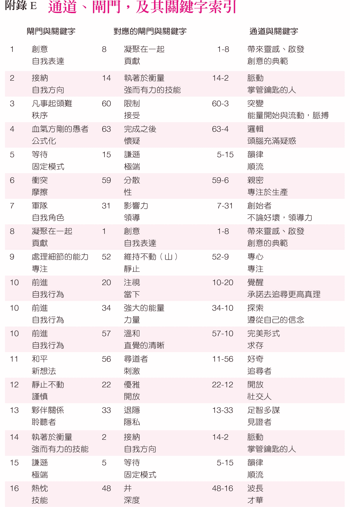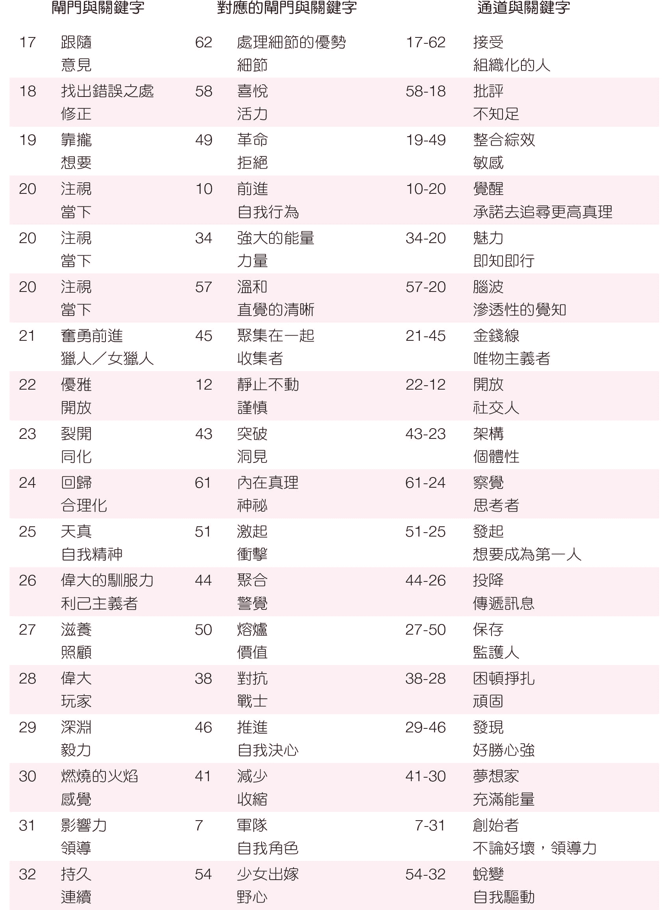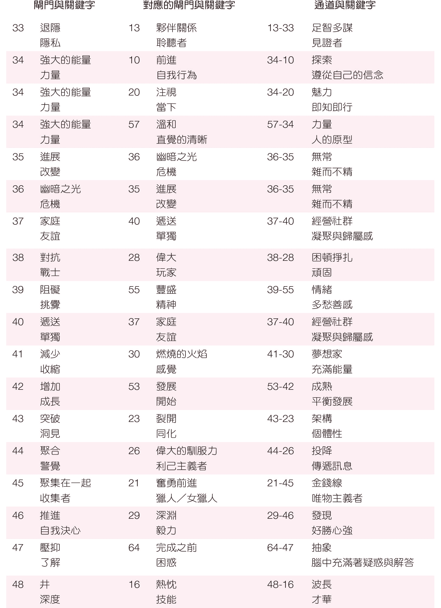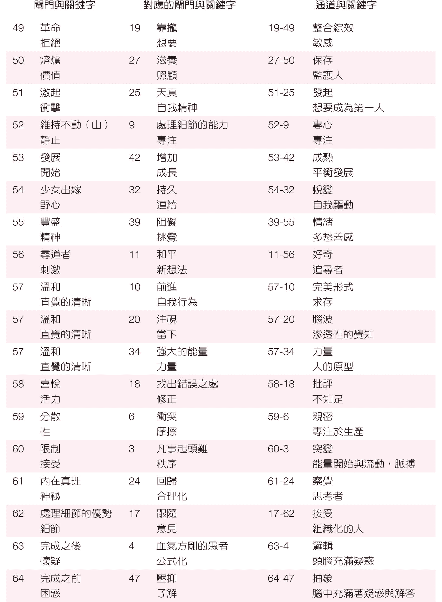

### 附件 F 形态的设计

在传统的占星学中，鸡与人类的星盘或许是一样的。但是人类图系统超凡的潜能在于，人类的设计在包括单细胞生物的各种已知生命形态中，只是其中一个面向而已。以下说明各种形态设计如何彼此交互联结。

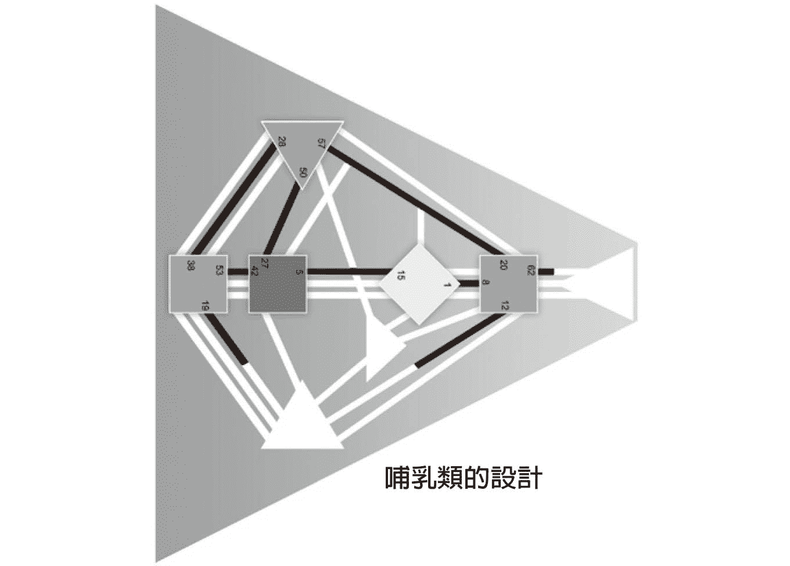

哺乳类动物，例如人类，具有两个意识水晶以及一个磁单极。而包含人类在内的各种生命形态，彼此会直接影响，并足以产生制约。在世界各地，我们都能看到哺乳类动物对人类日常生活广泛的影响。家猫的能量场像人类一样大，从这点可以了解，他们显然会影响到我们的韵律与方向。养一只狗就能证明这个观点，我们会发现他们一大早就唤醒我们，然后用他们的皮带把我们拉着走。

哺乳类动物也可以透过他们的直觉中心（脾脏）产生有益于健康的制约。人类图不仅只关于人类，如果你想生活中有动物陪伴，知道他们的设计是个好主意。大部份的饲主都有一份出生记录，而记录个别的出生时间记录比一整胎的出生时间来得明智。有了精确的时间，你就可以为动物确保一个健康的环境，并让这些动物作为你的优质同伴。

#### ▸ 其他生命形态的范例五个图

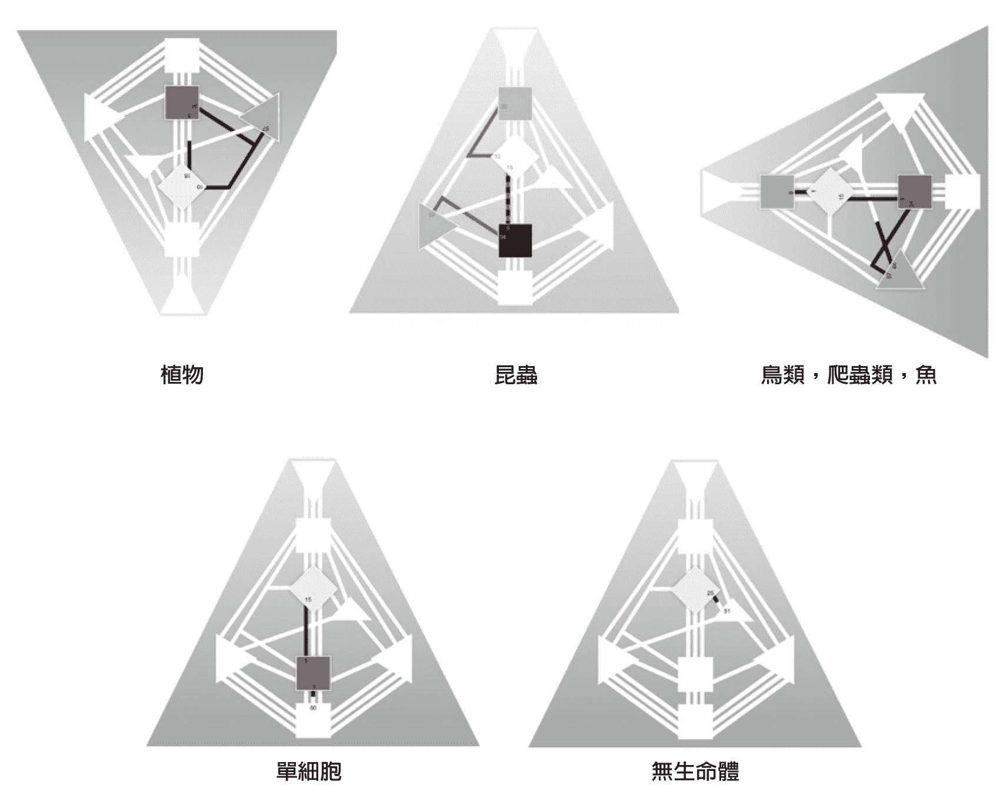

单细胞生物和无生命体虽然没有个性水晶，不过它们有设计水晶和基本的磁单极。即使是没有完整信道的无生命体，无法生物化，但是它们仍然是进化的一部分。一切都与这个基础运作有关并且交互关联。

这个议题很广泛，如果你有兴趣且想知道更多，可以在[www.jovianarchive.com](https://www.jovianarchive.com/)以及[www.ihschool.com](http://www.ihschool.com/)找到关于形态设计的信息。

“依据‘声音’的说法，这整个宇宙是个未出生的实体，一切都是这个生命的一部份，它就是我们，我们就是它。”——拉．乌卢．胡

### 附件 G 人类图专门用语

#### ▸ 抽象（Abstract）：

与抽象回路的信道和闸门有关的特质：包含经验、感觉、感受和省思等。为了整体社会的利益，让所发生过的一切合乎情理。与逻辑过程相反（详见**逻辑—理解**）

#### ▸ 启动（Activation）：

在人体图中有颜色的闸门，不论它是否形成信道。

#### ▸ 逻辑中心（Ajna Center）：

（详见**中心**）

#### ▸ 愤怒（Anger）：

显示者或显示者信道的非自己主题。（详见**显示者**）（详见**信道的类型**）

#### ▸ 占星学（Astrology）：

一门研究星座、行星、星体，以及它们对个人生活或环境影响的古老学问，是现代天文科学的先驱。占星的计算方式是以出生时间与地点，为出生时，行星所在的位置，而这些信息融合进曼陀罗的综合体中。

#### ▸ 能量场（Aura）：

围绕着生命体的无形能量场，由中心向四方放射约 6 英呎宽。它的频率，亦即我们与他人沟通我们是谁的方式，主宰着我们如何影响他人，或与他人链接。（详见**类型**）。

#### ▸ 权威（Authority）：

生活与决策的工具之一。

**内在（个人）权威**，为个人决策时的内在指引来源；个人的行动定位导航。

**外在权威**，心智的最适领域，不要用来作决策，就能运用其天赋为他人服务。

#### ▸ 觉知（Awareness）：

当一个人成为自己生命客观的观察者时，转变／觉醒的关键点。

#### ▸ 察觉中心（Awareness centers）：

每个人都被赋予三种察觉的潜能：逻辑——头脑意识；直觉——身体意识；情绪——精神意识。（详见**中心**）

#### ▸ 觉知频率（Awareness frequency）：

每一个察觉中心都有不同的运作频率。逻辑——全天候；直觉——当下；情绪——随着时间推移而波动。

#### ▸ 大霹雳（Big Bang）

在人类图系统中，大霹雳是一个概念。阴（卵）与阳（种子）的结合打开了宇宙的扩展（发展）。以“声音”的语言来说，就是等待出生的“婴孩”的概念。

#### ▸ 二维（Biverse）

拉．乌卢．胡用来代表宇宙二元特质的专门用语。（详见**二元**）。

#### ▸ 二元（Binary）

将二元对立当成了解其整体主要部分的系统；人类图建构在对立的并置上，所有一切都是一体两面的。

#### ▸ 苦涩（Bitterness）

投射者或投射者信道在非自己状态下的主题。（详见**投射者**）（详见**信道的类型**）。

#### ▸ 人体图或人类人体图（BodyGraph or Rave Body GraphTM）：

由回路（信道与闸门）及中心组成的矩阵，位在人类曼陀罗的中间位置，纪录微中子在个性及设计水晶两者中的印迹，定义一个人独特、具差异化的生命；拉．乌卢．胡于一九八七年一月五日在“声音”的指引下，第一次将它描绘出来，它是人类图最主要的分析工具。

#### ▸ 桥接闸门（Bridging gate）：

任何能串接起一个人人体图中分裂的状态，或是让只通一半的信道启动的闸门。（详见**定义的类型**）

#### ▸ 全盘整合（Catrtography）：

能量流通过人体图中的信道、闸门与中心的研究或绘图（详见**回路**）。

#### ▸ 中心（Centers）：

以九个中心为主体的人体图能量枢纽，可透过人体图的循环来转换能量；与人类的内分泌系统相关。

*   **逻辑**，概念化的中心；为心智觉醒预作准备并给予指引，透过喉咙中心表达。
*   **G**，自我认知、爱、与方向的中心；我们在此透过磁单极与我们的几何轨迹链接；较高自我的中心；决定我们如何与整体链接。
*   **头脑**，灵感的中心；有思考跟质疑的压力。
*   **心／意志力**，有形世界、意志力、自我力量与自尊的中心。
*   **根部**，维持生命动力的中心；激发行动的压力让事情进展。
*   **荐骨**，创造生命动力能量的中心，运作方式是回应。
*   **直觉**，生存意识的中心，将我们与我们的动物本能链接在一起；当下身体觉知／安全／健康的生存状态；我们的免疫反应。
*   **情绪**，情绪智力与情绪波动的中心；目前正处于转变成意识觉知的突变期，好为 2027 年即将来临的革命性转换作准备。
*   **喉咙**，代谢、表达、及沟通的中心；代表最近期最具意义、以七个中心为主的生物形态（伴随逻辑）的突变；在八万五千年前，打开了复杂语言沟通的发展。

#### ▸ 脉轮（Chakras）：

几个世纪以来，东方无论是在通俗或是秘传的领域，都是以七个能量中心链接能量场与肉体；一七八一年，人类开始提升到目前的九个能量场型态。

#### ▸ 信道（Channel）

因两个闸门串接所产生的量子；在人体图的九个中心间，承载、链接、转换能量的路径。（详见**第六章**）（详见**附件 F**）

**信道的类型**（Channels by type）：

**生产者**的信道，能量被设计来回应。

**投射者**的信道，能量被设计来被辨识，并接受邀请。

**显示者**的信道，能量被设计来发起，及给予影响。

**反射者**的信道，没有定义，设计用来反映。

#### ▸ 图（Chart）

人体图图表。你的能量、能量如何在你里面运作、如何与他人能量互动的蓝图，是人类图主要的分析工具。

#### ▸ 没有选择（Choicelessness）

透过你生命的内在（个人）权威的指引，与他人的能量作正确互动（策略），因而让你的生命因为觉知而展开；没有选择的结果是，透过观察生命带给你的一切，而非试图控制或操纵，你因此觉醒。

#### ▸ 回路（Circuits/ circuitry）

组织并描绘出人体图中的能量流；三个主要的回路群组包含六个回路、外加核心的整合型信道（Integration Channel）；回路体现了我们如何与他人相互合作。（详见**第六章**）

#### ▸ 回路群组（Circuit Groups）：

3 个主要回路群组是：

**社会人**，关键字是分享；以整体社会的角度，深入思考已发生过的事，或为了能让生活变得更安全稳固的事预作准备。

**个体人**，关键字是授权；因当下的直觉认知所启发。

**家族人**，关键字是支援；透过提供生存，以及在物资和精神层面的成功／充沛，确保种族的繁衍。

#### ▸ 社会人回路（Collective Circuit）：

（详见**回路群组**）

#### ▸ 相伴（Companionship）：

两个人的人体图中，拥有相同有颜色的信道或闸门，就可能产生友谊、分享经验。

#### ▸ 妥协（Compromise）：

当其中一个人整条信道有颜色，而另一人该条信道只有一个闸门有颜色。该条信道只有一个闸门有颜色的人，会妥协于拥有整条有颜色的人。

#### ▸ 合图（Composite）

两个设计的整合；关系的基础创建在合图有定义的地方。有四种定义链接的方式。（详见**相伴**、**妥协**、**主导**、以及**火花**）。

#### ▸ 创始（Conception）：

极大多数的意识水晶不是也永远不会以具象的生命型态呈现。它们被整“批”聚集起来，持续运转着行星意识场域。然而，在每一“批”中，都有特定的水晶，等待被具象化。当未成形时，它们的磁单极会被植入设计水晶中，群聚在地球的新皮层中。个性水晶在大气中绕行。当磁单极和它的设计水晶，受到这“批”位在地球皮层底下的阳性磁单极吸引时，创始程序就会启动。受到吸引的意识水晶进入情绪中心，进驻到 6 号闸门。

在性高潮时，此刻精液中的设计水晶受到水晶磁单极的控制，透过交配与繁衍的信道（59-6），从阳性的太阳神经丛中心，进入到阴性的荐骨中心，然后进入到卵子。当中微子流渗透母亲，它也渗入了细胞、穿透了细胞的设计水晶，然后开始了婴孩躯体成型的工作。

#### ▸ 制约（Conditioning）：

心智利用源自外在的压力、期待或影响，将那些非我们本性的部分（非自己）变成遵行的模式；这些为适应所产生的策略，变成了习惯，并将我们带离、约束我们、或掩盖了我们的真我与转世的目的。

#### ▸ 意识（Conscious）：

所有个性资料中，我们所经历、觉知、融合为一的部分，亦即人体图中的黑色部分。

#### ▸ 意识水晶（Crystals of consciousness）：

每个生命体都被赋予两种意识水晶：设计水晶，是原始纯阴水晶的那一面，以及个性水晶，原始纯阳水晶的那一面。单细胞或无生命体中是没有个性水晶的。（详见**设计水晶**、**个性水晶**）

#### ▸ 循环（Cycles）

生命中可用来衡量过渡时期的关键点。这个关键点是 7 年为一循环的中点，代表着已经穿越传统的过程，在循环回归的解读中，为生命旅程提供指标。除此之外，我们也会经历像是太阳回归这样为期 1 年的循环。（详见**土星回归**、**天王星对相**、**凯龙星回归**）

**太阳回归**：预测出 1 年内，我们即将在教育、发展、人际关系中遭遇到的事。

**土星回归**：探索人体图展现的机制与模式，提供线索好让我们从 28 到 32 岁时得以不断发展成熟。

**天王星对相**：发生在 38 到 40 岁间（中年危机）。从人体图中揭示的机制与模式，从我们生命前 40 年的方向和环境，探索出我们转换到下半生时，新的方向与环境。

**凯龙星回归**：开始时间介于 48 到 52 岁间，探究人体图中的机制与模式，为我们人生使命的最后成熟阶段提供指引。

#### ▸ 定义（Definition / defined）

你的人体图中有颜色的信道，以及该信道两端的闸门和中心；定义意味着你一贯且确定的方式。（详见**无定义**）

#### ▸ 定义的类型（Definition Types）

代表能量如何在人体图中有定义的区域间流动，或被回路中的缺口所阻断；这些类型包括：**无定义**、**一分人**、**二分人**、**三分人**、**四分人**。（详见**第五章**）

#### ▸ 设计（Design）

与生物形态有关的微中子印迹，为一个人意识觉察层面底下的意识；在人体图中以红色做标记；让人类图系统有别于其他系统。（详见**车辆**）

#### ▸ 设计的计算（Design calculation）

出生（分娩）前、或个性计算时，太阳行至 88 度的位置。（详见**太阳的 88 度角**）

#### ▸ 设计水晶（Design Crystal）

纯阴的原始一面，它将微中子的信息转化进入身体与生命中，位在**逻辑中心**。（详见**车辆**）

#### ▸ 设计太阳与地球（Design Sun and Earth）

设计的计算中的太阳与地球。它们代表着从父亲（太阳）与母亲（地球）直接遗传而来的特征。

#### ▸ 下降的相位（Detriment）

在两个强力的影响中，其中之一因行星作用得以稳定，在爻中被强调出来。 (详见**爻**）

#### ▸ 失望（Disappointment）

反映者的非自我主题。（详见**反映者**）

#### ▸ 失调（Dissonance）

在卦论中，任何不会与其他爻产生和谐（例如 1/4）或共鸣（例如 1/1）关系的爻，就称作失调，两条爻间会有所冲突或不协调。（例如 2/3 或 1/6）(详见**和谐**与**共鸣**）

#### ▸ 主导（Dominance）

伴侣中的一人定义了整条信道，而另一人没有启动（定义）此信道的任何一个闸门，后者只能接受并臣服于这条定义的信道，这是体验他人能量场的一种方式。

#### ▸ 休眠闸门（Dormant gate）

信道中（在未定义的中心）单独存在的闸门，呈现开放、得以让其他能量场中的电磁链接或传输，接通信道另一端的闸门。

#### ▸ 驾驶员（Dirver）

2 号闸门是磁单极（驾驶员）的位置，它知道车辆的轨道、躯体要去到哪里，与如何前往该处；驾驶员不会受到乘客的影响。（详见**磁单极**）

#### ▸ 二元性（Duality）

宇宙与自然万物都有其二元性。人类，经由基因结构（DNA/RNA），也是被设计成为二元的生物系统。就物理学的角度来说，宇宙起源于是透过夸克与轻子的二元扩展，造就出我们上—下、进—出、对—错的真实。在人类图中，二元性反应在两组资料（个性与设计）中，而它们决定了每个个人人体图的独特性。

#### ▸ 心／意志力中心（Ego/Heart Center）

（详见**中心**）

#### ▸ 太阳的 88 度角（88 degrees of the Sun）

当头脑的新皮层长全、车辆业已准备好以外在的形式，打开自我探索的旅程时，个性水晶，也就是灵魂，会在此刻进入胎儿中。进入的时间正巧是出生前太阳运行到 88 度的位置（第 88 或 89 天）。早产并不会影响它的公式，只意味着胎儿的新皮层发展得比一般快速。就大多数怀孕状况来说，此事会在怀孕期间的第 6 个月底发生。在最后三个月的期间里，个性已经能够适应新的车辆，出生的时间则展现出个性在适应之后的潜能。

#### ▸ 火花（Electro-Magnetic）

两人各自拥有信道一端（一半）的闸门，因而定义出完整的信道，共同创造出生命能量；这代表基本的关系动态：吸引与排斥。

#### ▸ 情绪波（Emotional wave）

从高到低，从希望到绝望（痛苦）的过程；波动源自情绪中心（太阳神经丛），情绪波又分成三种主要的经历方式：需要（家族）、不确定（个体）、以及渴求（社会／抽象）。

#### ▸ 能量类型／非能量类型（Energy Type/Non-Energy Type）

能量类型有生产者及显示者，生产者的荐骨有颜色，显示者则在根部、意志力中心，或情绪中心与喉咙中心间有信道；非能量类型有投射者与反映者，他们缺少上述的定义，及持续运作的动力能量。

#### ▸ 星历表（Ephemeris）

行星所在位置的天文计算，太阳以及月亮的交叉点。

#### ▸ 上升的相位（Exaltation）

在两个强力的影响中，其中之一因行星作用得以稳定，在爻中会被强调出来。（详见**爻**）

#### ▸ 组织能量（Format energies）

这股特殊能量的燃料来自根部中心，透过荐骨的回应予以引导，对回路中所有的信道与整体的设计，都发挥强大的影响力；组织信道在根部与荐骨中心间的三条信道运作：53-42（社会／抽象），60-3（个体）、52-9（社会／逻辑）。家族人回路中没有组织能量。

#### ▸ 形态／形态原则（Form/Form Principle）

我们的生理形态；我们以九个能量中心为主的形态是“声音”天启的重点，也是人类图系统的基础。

#### ▸ 分形线（Fractal）

每个人透过他们的个性水晶，以分形线与其他的个性水晶链接。分形线是在大霹雳时形成的，当时原始的意识水晶破灭，信息向下移动到我们个别的分形线上。分形线总共有 66 条，代表 66 种信息移动的原型，每一种在根本上都有细微差异之处。每一条分形线各自与我们宇宙中的一颗行星链接（包含我们的太阳），而行星会产生微中子。每一颗行星都是一个意识的资料库，透过它的微中子流，创建特殊的信息移动线。每个人都链接至一个分形，因此拥有同样分形线的人们也彼此相连，这让同一条分形线的人彼此靠近时产生熟悉感。

#### ▸ 挫败（Frustration）

生产者或生产者信道的非自己主题。（详见**生产者**）（详见**信道类型**）

#### ▸ 闸门（Gates）

依曼陀罗的外环移动到人体图中时的六十四卦来标示；在人体图中代表着，从信道两端进入中心的开端，在两个中心间渗入能量流。（详见**卦**）

#### ▸ 生产者（Generator）

四种类型之一，荐骨有颜色；生来为了生产，并提供生命动能的能量；生产者占总体人口近 70%；能量是开放及包覆其中，以回应的方式运作（详见**显示生产者**）（详见**第四章**）

#### ▸ 基因延续性（Genetic continuity）

在人体图中，整体内的相似部分存在着性质上的相关性；举例来说，所有六十四卦的第一条爻都具有反思的特性，或者，个体人回路都潜藏赋予众人力量的特质。

#### ▸ 几何轨迹（Geometry）

轨道、轮回的角度、或生命的路径；88 度的差异决定了角度，也区分出人体图中计算个性及设计太阳的差异。（详见**分形线**、**人生角色**、**轮回交叉**）

右角度几何轨迹：个人命运，专注在自己的过程中，鲜少意识到他人。

并列几何轨迹；稳定的命运，是链接右角度与左角度之间的几何轨迹。

左角度几何轨迹：超个人业力的命运；借着结盟，实现自己的命运。

#### ▸ 悬挂的闸门（Hanging gate）

信道中单独存在的闸门（不论是在未定义的中心中休眠、或在有定义的中心中启动），呈现开放状态，得以让其他能量场中的电磁链接或传输，接通信道另一端的闸门。

#### ▸ 相对应的闸门（Harmonic gate）

一条信道的两端，两个闸门之间的关系。

#### ▸ 和谐（Harmony）

依据卦论，分处在上卦及下卦相对位置的爻，彼此能和谐共处。它们呈现同样的主题，分别是第一爻与第四爻（代表着它们各自卦象中的基础）、第二爻与第五爻（代表投射部分的爻）、以及第三爻与第六爻（代表变动部分的爻）（详见**失调**与**共鸣**）

#### ▸ 头脑中心（Head Center）

（详见**中心**）

#### ▸ 健康中心（Health Centers）

脾脏与喉咙。（详见**中心**）

#### ▸ 心／意志力中心（Heart/Ego Center）

（详见**中心**）

#### ▸ 卦（Hexagram）

由六个水平堆叠的爻所组成，它们或是实线（阳）或是虚线（阴）；是传统易经以及人类图易经的基础；六十四卦组成了易经的基础，与我们的基因密码结构、我们的遗传构造有数理上的关联。

#### ▸ 卦星宿（Hexagram constellation）

曼陀罗的一部份，包含黄道带的角度、易经的闸门／爻／卦；每个星宿的弧度是 5˚37´30˝。

#### ▸ 人类图系统（Human Design System, The）

由拉．乌卢．胡创立的区分的科学，协助我们了解我们的独特性；架构在由“声音”于一九八七年提出的形态原则的天启上。

#### ▸ 易经（I’Ching）

一套古老的中国智慧体系，预言及解释我们在人生中所经历的各种变动；可追溯自西元前 3～2000 年。（详见**人类图易经**）

#### ▸ 轮回交叉（Incarnation Cross）

包括在你个性与设计资料中，太阳与地球的闸门和爻；在曼陀罗中，轨道两极交叉成成“十字”；指出一个人的人生使命，为人类潜藏的进化提供了索引，总共有 768 种轮回交叉（192 种基本交叉及其多种变形）；（详见**第九章**）

#### ▸ 个体人回路（Individual Circuit）

（详见**回路群组**）

#### ▸ 个体性（Individuality）

与个体人回路的信道及闸门有关的特性；变动、忧郁、活化与独特的能量，确保家族能不断延续生存。

#### ▸ 告知（Inform）

显示者的生存策略；可为他们带来平和。（详见**第四章**）

#### ▸ 内在（个人）权威（Inner (personal) Authority）

（详见**权威**）

#### ▸ 整合型信道（Integration Channel）

个体化过程的核心要素；由四条扮演主要防御机制的信道，组成的群组；关键字是自我激励；信道 34-20、57-10、34-57，以及 10-20。（详见**第六章**）

#### ▸ 邀请（Invitation）

投射者的策略；等待被邀请，就会带来被赏识的结果。（详见**第四章**）

#### ▸ 并置／并列（Juxtaposed/Juxtaposition）

支撑着量子的两极；比如说，在人体图中，磁单极联结着“你”的设计与个性，或是联结信道的两个闸门。

#### ▸ 稳定并列（Juxtaposition in Fixing） （ì）

当上升与下降的相位，同时在同一爻的定义中，被固定与强调出来时。（详见**爻**）（详见**第十章**）

#### ▸ 并列交叉（Juxtaposition Cross）

固定的命运。（详见**轮回交叉**）（详见**第七章**与**第八章**）

#### ▸ 卡巴拉（Kabbalah or Cabala）

生命之树，源自犹太神秘主义；拉．乌卢．胡所提出的综合体，其中四个组合元素之一，代表人体图中的回路。

#### ▸ 关键字／关键字串连（Keynotes/keynoting）

人类图中动态的语言，将大量的信息精简成单一个字或词；直接对我们的细胞说话。

#### ▸ 凯龙星回归（Kiron Return）

在凯龙星准确回归到出生那一刻时，探究人体图运作的机制与模式。介于 48 到 52 岁间发生。（详见**循环**）

#### ▸ 左角度交叉（Left Angle Cross）

超越个人命运。（详见**轮回交叉**）（详见**第八章**）

#### ▸ 生命循环（Life Cycle）

以天王星绕行地球一圈，费时 84 年的运行轨道为基础。当天王星移动到出生位置星座角度的正对面时，就是中年时刻，或是天王星对相。

#### ▸ 爻（Line）

一个闸门细分成六个部分，对应着卦象中的六爻；六个主题分别代表并描述该闸门的发展与演变；在人类图分析中，属于闸门之下的一层。每一个卦都有六条爻，总共有六十四卦，在人类图易经中有三八四爻，其中三七五爻具有双重性，两极的特质透过上升或下降的用语表达，以表示爻中的极性。当不稳定时，能量流及影响就会在上升与下降的相位间摆荡。（详见**基因延续性**）

#### ▸ 逻辑（Logic）

与理解回路的信道和闸门有关的特质：包含模式、常规、验证与证明等；具备前瞻、理解、并提供可行的模式，这是为了得以在未来稳定引领群众。与抽象过程相反。（详见**抽象**）

#### ▸ 月循环（Lunar Cycle）

月亮绕地球运行的二十八天周期；一个循环的移动约走完曼陀罗中所有六十四个闸门；月亮循环是反映者下决定的策略，也是他的个人（内在）权威。

#### ▸ 月交点（Lunar Nodes）

月亮的运行轨迹与黄道交会的两个点；月交点决定了我们在宇宙中移动的几何轨迹；若用神秘语言来说，意指我们的“命运”。

#### ▸ 曼陀罗（Mandala）

（详见**人类图曼陀罗**）

#### ▸ 磁单极（Magnetic Monopole）

我们最主要的单极，位在Ｇ中心，仅具有吸力；它依据我们与整体链接的分形线所串接出来的特殊几何，描绘出我们的人生。（详见**驱动**）（详见**分形线**）

#### ▸ 显示生产者（Manifesting Generator）

带着显示者潜能的生产者；透过回应运作（下决定）的佛陀战士，但回应会快速转为行动。（详见**第四章**）

#### ▸ 显示者（Manifestor）

四种类型的其中一种；荐骨没有定义；有荐骨以外的动力连接到喉咙；显示者占整体人口的百分之九；具有发起或表明的能力，因而能够影响我们；封闭、抵御的能量场。（详见**第四章**）

#### ▸ 机制（Mechanics）

我们以人类的型态运作的准则；人类图为我们揭示自己体验与存在的机制。

#### ▸ 头脑（Mind）

在以七个中心为主的生物形态系统中，头脑是思想权威与内在觉知；一七八一年，人类进展到九个能量中心，权威转变为车辆（承载器）；许多我们所经历到的制约或阻力，是因为头脑无法转换，或无法接受转换而引起。

#### ▸ 动力（Motors）

能量中心一旦链接至喉咙中心时，以行动的方式呈现；能量中心包括根部、荐骨、太阳神经丛（情绪）与心（意志力）中心。

#### ▸ 微中子（Neutrino）

由星体中心的溶解物所组成的亚原子粒子；包含了极小的质量；承载着宇宙的信息。

#### ▸ 非自己（Not-self）

当认同那些不是你的部分时的心智架构。（详见**制约**）

#### ▸ 非自己主题（Not-self themes）

标示出透过脑袋做决定，而招致阻碍的路标。

**愤怒**，当显示者没有告知，便采取行动时，所经历的感受。

**苦涩**，当投射者发起与自己邀请自己时，所经历的感受。

**失望**，当反映者发起，以获取外界的注意力时，所经历的感受。

**沮丧**，当生产者发起行动时，所经历的感受。

#### ▸ 开放（Openness）

人体图中空白或没有定义的部分；制约、教育、教养、以及人生潜在的智慧源头。

#### ▸ 外在权威（Outer Authority）

（详见**权威**)

#### ▸ 乘客／乘客意识（Passenger/passenger consciousness）

个性水晶健康运作的可能；臣服，让自我反射意识从车辆后座见证生命。

#### ▸ 个性（Personality）

你的人体图中黑色的的部分；头脑（Mind）的想法／精神／观点等永恒的东西； “你所认为的自己”。

#### ▸ 个性的计算（Personality calculation）

出生的时刻；依据你出生的日期、时间和地点。

#### ▸ 个性水晶（Personality Crystal）

原始纯阳的那一面是将微中子的信息，转变成可能成为自我反射意识的潜在性；它位在头脑中心的上方，将意识觉知到“你所认为的自己”表现出来。

#### ▸ 行星／行星凌日（Planets/ Planetary transits）

每个天体与交点都有其影响领域；曼陀罗中可以看到它们的移动状态，以不同的主题透过闸门与爻，为我们的定义增加细微的影响：（下面星体前面有星座符号）

**地球**，基础／平衡

**木星**，法律／保护

**北交点**，方向／环境，未来

**火星**，未成熟／变动

**水星**，沟通

**月亮**，欲望／驱动你的事物

**海王星**，幻觉、对你而言隐晦的事物

**冥王星**，同一世代共享的真相

**土星**，纪律

**南交点**，方向／环境，过去

**太阳**，个性的充分表现／意图

**天王星**，独特／扩展

**金星**，价值

#### ▸ 基本健康系统（Primary Health System; PHS)

人类图系统中，形态认识的训练；用来支持每个人复杂、独特的脑部发展的饮食之道。

#### ▸ 人生角色（Profile）

当你活出轮回交叉的使命时，你穿上的戏服，或扮演的角色；源自个性和设计当中，太阳／地球闸门的爻。（详见**第七章**）

#### ▸ 程序（Program）

以我们的发展程序为信息基础的微中子流。（详见**微中子**）

#### ▸ 投射者（Projector）

四种类型的一种，荐骨没有定义，同时没有动力连接到喉咙；投射者占整体人口的 22%；当别人邀请他们时，是因为辨识出他们的特殊技能与频率，所以投射者得以指引生产者及显示者；能量场是专注且吸入的。（详见**第四章**）

#### ▸ 总和（Quantum）

整体大过于全部组成的分子总和；比如说：由两个闸门组成的一条信道。

#### ▸ 人类（Rave）

“声音”用来称呼人类的用语。

#### ▸ **人体图**（Rave BodyGraph，^(TM)）

在人类曼陀罗的中心留存的印迹，显示出两个意识水晶决定此人有别于他人的独特性；独特性的蓝图。

#### ▸ 人类图全盘整合（Rave Cartography）

人类图系统的表面结构绘图。

#### ▸ 人类图（Rave Chart）

（详见**图**）

#### ▸ 人类图宇宙学（Rave Cosmology）

为区分的科学及人类图系统天启提供宇宙学背景／基础的学说；“声音”透过拉．乌卢．胡于一九八七年提出这些讯息，以让我们了解形态原则、以及我们在宇宙间的位置。

#### ▸ 人类图易经（Rave I’Ching）

描述六十四卦中，爻的意涵。由拉．乌卢．胡于一九八九年十二月十二日，在德国法兰克福完成。以中国古老的易经为基础；是人类图分析的基础工具。（详见**易经**）

#### ▸ 人类图曼陀罗（Rave Mandala）

由“声音”透过拉．乌卢．胡提出的神秘综合体；是人类图系统的商标。程序包含了四个古老的系统：占星，构成人体图的计算方式；易经，透过闸门将我们的遗传整合进人体图中；印度脉轮系统，关联起各个中心的能量枢纽；以及卡巴拉和它的生命之树，对应到我们的设计中，为我们创造了生命动力定义的回路与信道。

#### ▸ 人类图心理学（Rave Psychology）

人类图系统中，有关心智的复杂度、外在权威的潜能，以及制约作用影响的学科。

#### ▸ 接收器（Receivers）

在人体图中未定义的区域（空白）；开放而能接收环境中的能量；我们如何受到他人的状态影响；单一闸门也是接收器。（详见**发送器**）

#### ▸ 反映者（Reflector）

四种类型之一，没有定义；与月亮及月亮循环相关联；反映者占总人口的百分之一；有能力感受到谁是真实地活着，及谁受过渡状态（transit field）的制约；反映出周遭环境的能量场。（详见**第四章**）

#### ▸ 阻碍（Resistance）

当人忘记遵从自己类型的策略时，将会遭遇的状态。（详见**非自己主题**）

#### ▸ 共鸣（Resonance）

在卦论中，爻遇到相同涵义的爻时，因为拥有共同的主题，彼此得以产生共鸣。爻中的共鸣有 1/1、2/2、3/3、4/4、5/5、以及 6/6。（详见**失调**与**和谐**）

#### ▸ 回应（Response）

当生命的安排来到时，生产者与生命进行能量互动的方式。生产者天生的设计，是透过回应，活出生命；他们的策略是等待回应。（详见**第四章**）

#### ▸ 右角度交叉（Right Angle Cross）

个人的命运（详见**轮回交叉**）（详见**第八章**）

#### ▸ 根部中心（Root Center）

（详见**中心**）

#### ▸ 荐骨中心（Sacral Center）

（详见**中心**）

#### ▸ 区分的科学（Science of Differentiation）

人类图是一门关于我们的独特性与区别的研究；一门让我们将之当成工具，在个人的生活中实验并验证的科学；它并不是一套信仰体系。

#### ▸ 发送器（Senders）

在人体图中有定义的部分（有颜色）；我们如何用我们有定义的部分，或我们一贯的自己，发送能量与他人交流；我们如何透过他人开放的部分，影响他人。（详见**接收器**）

#### ▸ 标志（Signatures）

阻碍的相反；一个人完全符合其所属的类型及使命后，将会体验到的：

**惊喜**之于反映者

**平和**之于显示者

**满足**之于生产者

**成功**之于投射者

#### ▸ 单细胞（Single Cell）

G 中心的 15 号闸门链接荐骨中心的 5 号闸门，这是单细胞的设计。它的整合潜力是 3 号的突变闸门。

#### ▸ 直觉中心（脾脏）（Splenic Center (Spleen)）:

（详见**中心**）

#### ▸ 情绪中心（Solar Plexus Center）

（详见**中心**）

#### ▸ 策略（Strategy）

基于我们个别的类型，理所当然地投降于我们的形态，如此我们的身躯得以顺应生命之流。

#### ▸ 类型的策略（Strategy by Type）

**显示者**行动前要先告知。

**生产者**要等待询问，才能予以回应。

**投射者**要等待被赏识及邀请。

**反映者**做决定前，要先走完他们的月亮循环。

#### ▸ 谭崔信道（Tantric channels）

在荐骨与Ｇ中心之间的信道 5-15、14-2、29-46 ；荐骨丰饶的生命动能，以特定的方向赋予本身力量，透过 G 中心表达较高层次的自我。

#### ▸ 喉咙中心（Throat Center）

（详见**中心**）

#### ▸ 过渡（Transit）

星体在宇宙中，某个特定时刻的移动或位置；围绕着人类曼陀罗中的太阳、行星与交点的移动状态，与人体图中的制约作用相关。

#### ▸ 超越个人（Transpersonal）

凌驾于个人之上；以人体图来说，代表着与他人互动，是为了要实践人生的使命。

#### ▸ 轨道（Trajectory）

我们在宇宙间的几何／移动；我们的生命路径，以及我们被设计与他人链接的方式。由磁单极，也就是驾驶，负责主宰。

#### ▸ 家族人信道（Tribal Circuit）

（详见**信道群组**）

#### ▸ 卦（Trigram）

由三个水平堆叠的爻所构成，它们包括实线（阳）或虚线（阴）；两个卦彼此堆叠，形成上卦和下卦，组成易经与人类图易经 64 卦的基础。（详见**卦**）（详见**第十章**）

##### 真实的自我（True Self）

传达独特的差异化个人特质，觉知与臣服于个人设计的机制，我们从制约中释放出的真实本性。

#### ▸ 类型（Type）

将全世界的人口，以能量场区分为四种类型的人。每一种人有不同的策略，得以在没有阻力的状况下，运作得最好：显示者、生产者、投射者与反映者。（详见脉轮）（详见**个别的类型**）（详见**第四章**）

#### ▸ 潜意识（Unconscious）

所有产前设计的信息（出生前，太阳行至 88 度），我们无意识地体验着；设计的信息表现出基因遗传的特征；随着时间的推移，别人在我们身上经历与感受到的特点，而随着时间推移，我们也能逐渐认知到这些特点；人体图中红色的部分。

#### ▸ 无定义（Undefined）

图中空白的区域，也被称为“开放”，不一致而具有弹性的区域；被制约与智慧的源头；我们从中学习人生之处；我们体验他人的地方。（详见**定义**）

#### ▸ 宇宙（Universe）

依据“声音”的说法，指的是活生生、不断在发展的二元性。尚未“诞生”，仍是子宫中的胎儿。婴孩。（详见**声音**）(详见**简介**与**第一章**）

#### ▸ 车辆（Vehicle）

人体图中设计的部分；我们跟别人绝无重复的生物形态，在我们的一生中承载着个性这个乘客的觉知。（详见**设计／设计水晶**）

#### ▸ 声音（Voice, the）

在 1987 年为拉．乌卢．胡提供信息，引导他创造出人类图系统的传播媒介。（详见**简介**与**第一章**）

#### ▸ 阴／阳（Yin/Yang）

古老的亚洲哲学，旨在传达人类经验的二元性。“阴阳”相对互补，并在更高层的整体中互动，成为整个动力系统的一部分。两极相互联结、也相互依存，同时彼此增益。凡事都有阴阳两面。阴是自然界被动的女性本质，坚忍、包容；阳则为主动的男性本质，太阳、创意。阳爻以实线作为符号，阴爻则是断裂的虚线。

“爱你自己。”

——拉．乌卢．胡

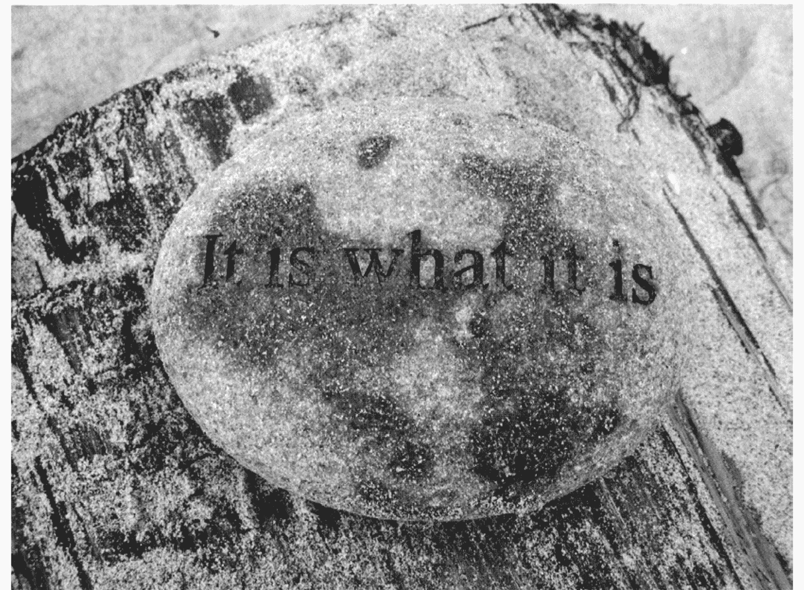

我希望你喜爱这本书，这是一本爱的著作，试图以拉．乌卢．胡希望的方式写下并记录人类图。我们很难知道得做到什么程度、什么时候才能停止。这门知识涵盖太多内容。为了让它出版（好让它为世人所知），我们总是要有个开始。

拉．乌卢．胡拥有出色、独特的个人特质，我们这些有幸得以认识、并向他学习的人之中，许多人都喜爱引用他的话语。我希望这本书中透过引用他说的许多话，也能让您感受到他的人格特质。这是我始终最锺爱的部分，对我来说有其特殊的意义。——铃达．布乃尔

# 索引

## 索引

5-centered （5 能量中心）

6 lines （6 爻）

7-centered （7 能量中心）

9-centered （9 能量中心）

9-centered human beings （9 个能量中心的人类）

12 houses of the zodiac （黄道 12 宫位）

36 channels （36 条信道）

64 -gate matrix （64 个闸门的人类矩形）

64 gates （64 个闸门）

64 hexagrams （64 卦）

84-years life expectancy （84 年的人生过程）

88 degrees of solar arc （太阳弧 88 度）

384 lines （384 爻）

1781, the year of （1781 年）

2027, the year of （2027 年）

##### A

Abstract Wave （抽象波）

Activation （启动）

Adrenal system （肾上腺系统）

Ajna Center（逻辑中心）

Astrology（占星学）

Astronomy（天文学）

Aura（能量场）

Authentic self（真实自我）

Authentic truth（真实本质）

Authority（内在权威）

Awakening（觉醒）

Awareness Centers（察觉中心）

Awareness Frequency（觉知频率）

##### B

BG5/OC16 Career and Business Consulting（BG5 与 OC16 职涯与商业谘询）

Big Bang（大霹雳）

Binary（二元性）

Biochemistry（生物化学）

Biological correlation（生物学关联性）

Biologists, Watson and Crick（生物学家华生和克里克）

Birth time（出生时间）

Biverse（二维）

Blood（血液）

Blue Umbrella（蓝伞线）

BodyGraph（人体图）

*Book of Change*（易经）

Bridging gate（桥接闸门）

##### C

Cartography（全盘整合）

Celestial bodies（天体）

Chakra（卡巴拉）

Channels, （信道）

channel index（信道索引表）

channels by type（信道的类型）

channels, gate, and their keynotes（信道、闸门，及其关键字）

Chart analysis（人类图解读）

Chart Overviews XII（图例概述）

Child Development（孩童发展）

Child, Julia（茱莉亚．柴尔德）

Children（孩子）

Chinese Book of Changes（关于变异的中文书）

Chinese I'Ching（中国易经）

Circuits（回路）

circuit board（电路板）

circuit groups（回路群组）

circuits, channels and gates（回路、信道和闸门）

Classic Projectors（经典型投射者）

Collective Circuit（社会人回路群组）

Collective Wave（集体波）

Companionship（相伴）

Completely open centers（完全开放的中心）

Composite（合图）

Compromise（妥协）

Conception（创始，胚胎）

Conditioning（制约）

Connection（关系合图）

Cosmic egg（宇宙之卵）

Costume（戏服，外在呈现）

Crystals of Consciousness（意识的水晶）

Cycles（循环，流年）

Cycles Analysis（流年解读）

##### D

Deconditioning（去制约）

Defined Center（定义的中心）

Defintion（定义）

Definition Types（定义的类型）

Design Calculation（设计的计算）

Design Crystal of Consciousness（意识的设计水晶）

Design of Forms（设计的型态）

Design Sun and Earth（设计太阳与地球）

Detriment（下降的相位）

Disappointment （Reflector not-self theme）（失望，反映者的非自己主题）

Dissonance（失调）

DNA（DNA）

Dominance（主导）

Dormant Gate（休眠闸门）

DreamRave Analysis（人类图梦的解读）

Driver（驾驶员）

##### E

Earth （significance in the BodyGraph）（地球，特指人体图中的重要性）

Ego/Heart（心/意志力）

Ego/Heart Manifested Authority（意志力中心显示型权威）

Ego/Heart Projected Authority（意志力中心投射型权威）

Electro-Magnetic（火花）

Emotional Authority（情绪型权威）

Emotional Awareness（情绪察觉）

Emotional Wave（情绪波）

Encounter (with the 'Voice')（与“声音”的相遇）

Energy Projectors（能量型投射者）

Energy Type（能量类型）

Energy Type vs. non-Energy Type（能量类型 vs.非能量类型）

Environment（环境）

Environment （Mental Projectors）（环境(头脑型投射者)）

Ephemeris（星历表）

Exaltation（上升）

Expanding universe（扩大的宇宙）

Experiment（实验）

##### F

Family Practice（家庭动力）

Famous Manifestors（显示者名人录）

Fetus（胎儿）

Five Definition, The（五种定义）

Format Energy（组织能量）

Form Principle（形态原则）

Four Ancient Esoteric Systems（四种古老的奥秘系统）

Four Human Design Types（四种人类图类型）

Four Motors（四个动力中心）

Four Quarters（四等分）

Four Types and Steategues（四种类型与人生策略）

Fractal（分形线）

Frequencies of Emotional Wave（情绪波的频率）

Frustration （Generator not-self-theme）（沮丧，生产者的非自己主题）

##### G

Gall Bladder（胆囊）

Gates（闸门）

gates of the Ajna Center（逻辑中心的闸门）

gates of the G Center（Ｇ中心的闸门）

gates of the Head Center（头脑中心的闸门）

gates of the Root Center（根部中心的闸门）

gates of the Sacral Center（荐骨中心的闸门）

gates of the Solar Plexus Center（情绪中心的闸门）

gates of the Splenic Center（直觉中心的闸门）

gates of the Throat Center（喉咙中心的闸门）

index of all gates（所有闸门的索引表）

G Center（Ｇ中心）

Generator Type （生产者类型）

generator channel（生产者信道）

generator overview（生产者概述）

generator strategy（生产者的人生策略）

Genetic Continuity（基因延续性）

Genetics（遗传学）

##### H

Hanging Gate（悬挂的闸门）

Harmonic Gate（对应的闸门）

Harmony（和谐）

Head Center（头脑中心）

Healthy Sleep Habits（健康的睡眠习惯）

Heart（心脏）

Heart Center（意志力中心）

Heart Center （Ego） Manifested Authority（意志力中心显示型权威）

Heart Center （Ego） Projected Authority（意志力中心投射者权威）

Heart/Ego （心／意志力）

Heart/Ego Center（心／意志力中心）

Hemingway, Ernest（海明威）

Hexagram Constellation（卦星宿）

Hexagram Line descriptions（卦象中爻的描述）

Hexagram Structure/House Metaphor（卦的架构／以房子为喻）

Hierarchy of Authority（权威的阶层）

Hindu Brahman Chakra system（印度婆罗门教脉轮）

Holistic Analysis（完整深层解读）

Homo Sapien（智人）

Homo Sapien In Transitus（转换期智人）

##### I

Ibiza（伊维萨）

I'Ching（易经）

Identity Ceter（定位中心）

Immune system（免疫系统）

Incarnation Crosses（轮回交叉）

Incarnation Cross Index（轮回交叉索引）

Individual Wave（个体波）

Inform （Manifestor strategy）（告知，显示者的人生策略）

Inner Ring （of Mandala）（(人类图曼陀罗的)内环）

Integration Channel（整合型信道）

Invitation （Projector strategy）（邀请，投射者的人生策略） 133

##### J

January 3, 1987 （arrival of the 'Voice'）（一九八七年一月三日，“声音”来临）

Jovian Archive（Jovian Archive 人类图总部）

Jupiter（木星）

Juxtaposition Geometry（并列几何轨迹）

##### K

Keynote（关键字）

Kidneys（肾脏）

Kiron（凯龙星）

##### L

Larynx（喉咙）

Left Angle Geometry（左角度交叉几何轨迹）

Life-force（生命动力）

Lines of the Hexagram（卦中的爻）

line 1（第一爻）

line 2（第二爻）

line 3（第三爻）

line 4（第四爻）

line 5（第五爻）

line 6（第六爻）

Liver（肝脏）

Lunar Authority （Reflectors）（月亮权威(反映者)）

Lunar Cycle（月循环）

Lungs（肺脏）

Lymphatic system（淋巴系统）

##### M

Magnetic Monopole（磁单极）

Mandala（曼陀罗）

Manifestation Center（发起中心）

Manifestor Type（显示者类型）

manifestor overview（显示者概述）

manifestor strategy（显示者的人生策略）

Manifesting Generator Overview（显示生产者概述）

Mars（火星）

Mental Pressure and Inspiration（头脑压力与灵感）

Mental Projectors（头脑型投射者）

Mercury（水星）

Metamorphosis/transformation（突变／转化）

Miller, Henry（亨利．米勒）

Moon（月亮）

Motor （Energy） Centers（动力(能量)中心）

Mystical union（神秘的结合）

##### N

National Organizations（国家机构）

Navigation System（导航系统）

Neocortex（新皮质）

Naptune（海王星）

Nervous System（神经系统）

Neutrino （微中子）

Nine Centers（九个能量中心）

Non-Energy（非能量）

Non-Energy Type（非能量类型）

North Node（北交点）

Not-self Mind（非自己头脑）

Not-self open center questions（非自己开放中心的问题）

##### O

OC16 Career and Business Consulting（OC16 职涯与商业谘询）

Official Human Design Organizations（官方人类图组织）

Open Center（开放中心）

Outer Authorty（外在权威）

Outer Ring （of Mandala）（(人类图曼陀罗的)外环）

##### P

Pancreas（胰脏）

Parathyroid glands（副甲状腺）

Partnership Analysis（人际关系解读）

Passenger（乘客）

Passenger consciousness（乘客意识）

Personality Crystal（个性水晶）

Pineal gland（松果腺）

Pituitary glands（脑下垂体）

Planet Glyphs （& symbols in the Rave I'Ching）（(人类图易经中的)行星符号(与象征)）

Pluto（冥王星）

Pressure Center（压力中心）

Primary Health System （PHS）（基本健康系统）

Profiles, The（人生角色）

profile 1/3（人生角色 1/3）

profile 1/4（人生角色 1/4）

profile 2/4（人生角色 2/4）

profile 2/5（人生角色 2/5）

profile 3/5（人生角色 3/5）

profile 3/6（人生角色 3/6）

profile 4/1（人生角色 4/1）

profile 4/6（人生角色 4/6）

profile 5/1（人生角色 5/1）

profile 5/2（人生角色 5/2）

profile 6/2（人生角色 6/2）

profile 6/3（人生角色 6/3）

profile structure （人生角色的结构）

Projector Type（投射者类型）

projector overview（投射者概述）

projector strategy（投射者的人生策略）

Prostate Gland（前列腺）

##### Q

Quadruple-Split Definition（四分人）

Quantum Mechanics（量子力学）

Quarter of Civilization（文明的等分）

Quarter of Duality（二元性的等分）

Quarter of Initiation（初始的等分）

Quarter of Mutation（突变的等分）

##### R

Ra Uru Hu（拉．乌卢．胡）

Rave（人类）

Rave Cartography（人类图全盘整合）

Rave Cosmology（人类图宇宙学）

Rave I'Ching（人类图易经）

Rave Mandala（人类图曼陀罗）

Rave Psychology（人类图心理学）

Rave Sociology（人类图社会学）

Red and Black（红与黑）

Reflector Type（反映者类型）

reflector overview（反映者概述）

reflector strategy（反映者的人生策略）

Respond （Generator strategy）（回应，生产者的人生策略）

Right Angle Geometry（右角度几何轨迹）

Root Center（根部中心）

##### S

Sacral Authority（荐骨型权威）

Sacral Center（荐骨中心）

Sample Chart Overviews（范例概述）

Saturn（土星）

Science of Differentiation（区分的科学）

Self-Projected Authority（自我投射型权威）

Signature Goal （标志／目标）

Signposts of Resistance（阻力的指标）

Simple-Split Definition（简易型二分人）

Single Definition（一分人）

Six Primary Roles（六个主要的角色）

Solar Plexus Authority（情绪型权威）

Solar Plexus Center（情绪中心）

South Node（南交点）

Spirit Consciousness（意识精神察觉）

Spleen（脾脏）

Splenic Authority（直觉型权威）

Splenic Center（直觉中心）

Splits（分裂）

Starr Ringo（林哥．史达）

Stomach（胃）

Strategy and Authority（人生策略与内在权威）

Sun（太阳）

Supernova（超新星）

##### T

T-cells（T 细胞）

Testes（睾丸）

The Four Quarters（四等分）

The Global Incarnation Cross Index（轮回交叉索引）

The Nine Centers（九个能量中心）

The Three Geometries（三种几何轨迹）

The Tree of Life（生命之树）

Three Circuit Groups（回路群组）

Throat Center（喉咙中心）

　primary function（主要功能）

　secondary function （次要功能）

Thymus gland（胸腺）

Thyroid（甲状腺）

Transit（流日／流年；过境）

Tribal Wave （部落波）

Triple-Split Definition（三分人）

Type, Strategy and Authority（类型、人生策略与内在权威）

##### U

Undefined Centers（未定义中心）

undefined center conditioning（空白中心的制约）

undefined ajna center（空白的逻辑中心）

undefined g center（空白的 G 中心）

undefined head center（空白的头脑中心）

undefined heart center（空白的意志力中心）

undefined root center（空白的根部中心）

undefined sacral center（空白的荐骨中心）

undefined solar Plexus center（空白的情绪中心）

undefined splenic center（空白的直觉中心）

undefined throat center（空白的喉咙中心）

Unique authentic truth（独特的真实本质）

Uranus（天王星）

##### V

Venus（金星）

Visual Cortex（视觉皮质）

Voice, The（声音）

##### W

Wave Mechanics（波动机制）

Western Astrology（西洋占星学）

Wide-Split Definition（远距型二分人）

##### Y

Yang Seed（阳性种子）

Yin Egg（阴性卵）

##### Z

Zohar/Kabbalist（卡巴拉）
