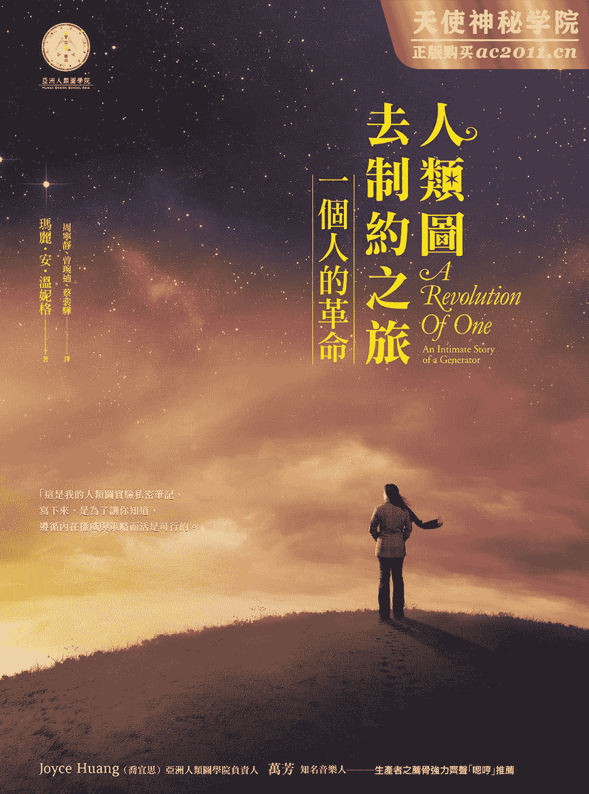
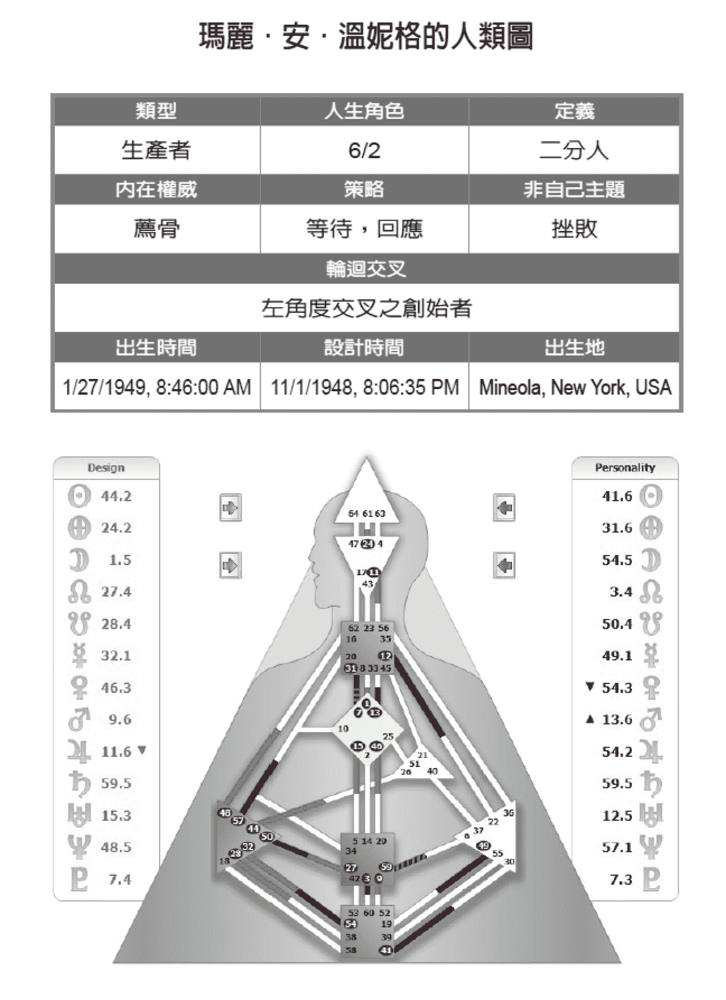

# 人类图去制约之旅

这本书献给

麦可—我的丈夫，也是我的朋友
谢谢他的爱与支持，
始终希望我成为我本来的样子

献给奥修，谢谢他开启了我的探索之旅
也感谢人类图将之完成

最后献给我生命中这些非常特别的人
我的女儿玛德忽
我的外孙女亚历珊卓拉
我的外孙女卡罗琳娜
我的姊姊琪卡
我的姪女唐娜

拉．乌卢．胡

一切都是由我们无法控制的力量决定。
从昆虫乃至于星系都已注定。
人类，植物或宇宙星尘，
我们都随着神祕的曲调起舞，
由一位隐形吹笛手在远方吟唱。

爱因斯坦

# 序一   生产者的人生典范

当我刚开始推广人类图的时候，我以为让大家知道它的确有效是很容易的事，我所需要的就是几个坚定的生产者而已。我完全没料到这会是如此艰巨的任务。要活得像个生产者，必须反抗数千年来的制约，而且这样的蜕变只能靠自己来完成。

作为传递这个讯息的人，我可以骄傲地说，玛丽．安完成了这趟旅程。许多年前，当我在亚利桑纳州的塞多纳为她解读时，我就意识到这是一个准备要觉醒的生产者。玛丽．安是一个 6/2 人，轮回交叉是左角度的创始者，她今天已成为一个正确的人生典范，将能够激励所有的生产者。

拉．乌卢．胡  二〇〇七年，二月七日  西班牙，伊维萨岛

# 序二   这场革命，你得自己来

要知道人类图的知识，不难。要懂得人类图的知识，需要花些工夫。

但是如果你要把人类图的知识，真正身体力行，回归自己的策略与内在权威来做决定，落实在每一天的生活中，是挑战。这挑战看似简单，其实漫长又艰难，需要高度的自律，清晰的区分，偏偏这又是人类图最关键的重点，是其精髓所在，能让你活出完整的自己，全世界无人能替你做这件事。

这是一个人的革命，而你，得自己来。

第一次见到玛丽．安老师，是二〇一二年在西班牙伊维萨岛，当时我飞越重洋去参加全球人类图分析师年会，去之前我已经拜读完《人类图去制约之旅：一个人的革命》这本书，见到她笑脸盈盈站在会场里，我的内心好激动，我紧张又颤抖地走到她面前。

「请问妳是玛丽．安吗？」我的语气故作平静，体内却突然涌现一股热流，脑袋里简直是大爆炸的状态，无法说出。我的内在震耳欲聋：妳就是书里的那个人，对不对？对不对？我不敢相信我真的看见妳了。

「嗯哼！」她的荐骨声音很肯定，回应我的问题。

「喔。妳的书带给我很大的感动，」才开口就哽咽，忍不住眼眶红了。我想与玛丽．安分享我在去制约过程中所发生的事：「因为读了妳的书，让我知道我不是疯了，也不是全世界最孤独的那个人，因为有人曾经跟我一样做过类似的实验，就是妳，因为妳走在前头，让我知道单纯做自己，回到内在权威与策略来做决定，不只可以过生活，还会是一个全新的机会，可以认识一个全新的自己。」

只是我又兴奋又激动又想哭，想说的话愈多，愈不知道该从何讲起，只能泪眼望着她：「啊，这条路好难……」她的眼神带着微笑，轻轻拍拍我，给我一个满满的，温暖的拥抱，像能读懂我无法说出口的每一句话。「是啊！我知道。这一条路虽不容易，但是好神奇，对不对？」

那是第一次与玛丽．安老师相见，温柔的感受，至今依然记得很清楚。

三年之后，二〇一五年西班牙人类图年会，我再次与玛丽．安老师相见，这次，我走进她的教室。相隔三年，我从当时一个单纯热爱学习人类图的学生，一路转折，依循我的策略与内在权威，成立亚洲人类图学院，成为人类图官方体系的中文分部，承接下人类图体系在中文世界传播的任务。

这次上课的地点，是在一栋漂亮的西班牙大宅里，玛丽．安老师满头白发与金发，端坐在宽敞的大厅壁炉前，来自世界各地的同学们围坐，我兴奋地在她身旁坐下，象是小孩回家了，快乐无比。

课程精采依旧，她总能带领每个人，穿越繁复的人类图知识，让我们能在体验上真真切切地感受自己，与其说这是玛丽．安老师的魅力，还不如说这是她的真诚与表里一致，让她整个人充满了强大又温暖的能量场，引发了每个人以一双全新的眼睛，检视自己，看见自己。在课堂上，我们各自提出各种的问题，分享着自己回到内在权威与策略时，所遇到的困惑与困难。

有同学问：「若做决定不再依循脑袋的分析，回归自己的策略与内在权威，不是很恐怖吗？因为你不会知道下一步，自己有回应的会是什么？这很吓人吧？」

「是啊。」玛丽．安老师微笑着，「我还记得一开始，当我知道自己的人类图设计，要听自己荐骨的声音，我根本不知道自己下一步会回应的是什么，我吓坏了。」

「当时的我，独自坐在游泳池旁，把脚放在凉凉的水里，我坐了很久，然后我想通了一件事情。」她微笑着，浅色偏白的金发，看起来象是一个发光的天使。「与其害怕自己荐骨的声音，下一步会对什么有回应，我更害怕这一生从未活出真正的自己。」

教室里头一阵静默，每个人内在体验到一片澄净，西班牙的阳光明亮，空气里充满着夏天地中海的气息，生命如此美好，宛如一场盛宴，如果没有勇气应允，回应内在真切的心声，即使活得安全无虞，又有何意义？

人与人之间的能量，总能相互引发，老师听似简单的话语，直指核心，她的存在散发出一股神奇的力量，抚平我内在的矛盾与不平，这世界上看似繁复烦人，缠绕难解的麻烦事，最后必定能出乎意料，找到一个最简单却最有效的答案。

「回到你的内在权威与策略，做你自己。」

静待这宇宙中会有更高层次的安排，有时候我们都得多点耐性，当因缘俱足，路会在你的面前顺利开展，无须费力，而你只要做自己，欣赏这段旅程的风景。

这是一个人的革命，看似寂静，却足以颠覆你的人生，翻转一整个世界。

我怎么知道？因为玛丽．安老师写下了这段心路历程的点滴，宛如一盏温暖的烛光，驱散了黑暗中的恐慌与不安，而我正在这条路上，这是一段言语无法尽述的奇妙旅程，足以让人乐而忘返。

非常开心玛丽．安老师的书终于译成中文，这真是人类图世界的一件大喜事！我想大力推荐这本书给你，更期待你翻开书页，就此进入人类图的世界，找到自己，懂得自己，活出自己，并且享受属于你的革命，你的发现，你的旅程。

Joyce Huang（乔宜思）
亚洲人类图学院负责人

# 序三   一个人的革命，我在路上

这真是一个奇妙的旅程！

我带着这本书上路，玛丽．安的实验进入了我，成为夜空前的红色晚霞，树梢上的那只鸟。而等待，让我看到了更多内在的状态，听见更多声音，并且再次连结那个初始的我。无需解释，不被批判，很真实，那么清晰，那么独立、独特。虽然长久的制约训练依旧来搅局，但和初始相遇的那个当下如此美好动人！去制约！去制约这三个字在旅途中深深被理解、被厘清。

这是一本对生产者来说很受用的书。这个世界有百分之七十的人是生产者。这是玛丽．安对自己进行七年关于荐骨的声音的实验纪录，书里的每一个阶段、每一个发生、每一次回应都折射我和世界，以及我和我自己。有时候会看到好熟悉的那个我。

第一次和 Joyce 面对面听她解读我的人类图，开始了我和世界一点点不一样的相处方式。虽然还是对人类图一知半解。但我开始对「荐骨」产生极大兴趣。几年后我又和 Joyce 相聚，想进一步理解我的使用说明书，因为反正我就是有个强烈的什么想要靠近，于是我就约了 Joyce，并且也约了我的一票姊妹，大家一起来做人类图解读。我发现这票姊妹都是生产者，于是我们将对话群组改名为「荐骨队」。

我很喜欢「倾听内在最真实的声音」这个内在环境，有一种还原的美感，有一种和宇宙合一的辽阔宁静，有一种自在、自由不恐惧。但我发现我虽然喜欢，可是我并不绝对都是这样。经过再次解读人类图和上课，我稍微明白许多内在震荡的后果其实是来自开放中心的被填入。那些不属于我的，竟然代表我！什么是我、什么不是我的厘清对第一阶段接触人类图的我而言是有趣且重要的。

旅途中，试着缓慢，等待，回应。发现只是一个小小的等待的动作，竟然让出那么大的内在空间，视、听都变得更清透，对于自我的感知与觉察也更明朗细致。而面对未知与变化也有了不同的视角。咀嚼着玛丽．安的体验，对照着我过去的生命经验，人类图和我曾经追寻的，在这旅途上发生了有趣的回响，我继续看着一切的发生。然后，有一天我依着荐骨的回应进入了新的生活状态，当头脑试图对回应的决定做出批判时，我笑了！

玛丽．安如此绝对的进行荐骨实验，让同是生产者的我除了被理解之外，更是鼓励。这条路有够难走的！内在外在的声音多到爆炸！但在混杂中能呼吸到那一抹清香，厘清真实的纯粹，真的感动！再且「难」不再是重点了，尤其生命到了这个阶段。用力了这么久，那些为了隐藏恐惧而建筑的安全机制，彷彿已成为一个反射动作，也成为被爱被喜欢的开关。于是要拨开覆盖已久的防护罩真的不容易，但有机会还原生命本来的样貌，让真实浮现，不受制约制裁，纵使难，却很珍贵，很值得啊！

玛丽．安说：「回过头来看，我觉得在开始上学前的那几年，是我活得最像自己的时候。」

经过这么多训练之后长大了的我们啊！还记得活得最像自己的那个自己吗？

从玛丽．安的荐骨实验延伸出来，到我生命的振动。

这旅程。很奇妙。

继续。在路上。

万芳 二〇一六年二月二十四日

# 关于人类图

人类图结合了西方占星、犹太教生命之树，和印度脉轮、中国易经等古老知识，并加入当代基因遗传及量子物理学等现代科学。这张图可以揭露一个人的基因密码，解释其独特的人格特质、天赋才华，犹如一张人生使用说明书，指引人们回到内在权威，在人生道路中大大小小的旅途，做出正确的决定，活出自己，毫不费力。

人类图的组成

人类图由九大能量中心、六十四个闸门与三十六条通道组成。说明如下（请参考本书第 23 页作者的人类图）：

能量中心：图中三角形、正方形、菱形等九个区块即是能量中心，源自于印度的脉轮。有颜色的能量中心，代表有固定的运作模式；而空白的能量中心，则是每个人开放接受外界影响的区域，是累积人生智慧之所在。接受外界影响时，空白能量中心会反应两倍，若没有觉察，会陷入非自己的混乱状况，例如，本书作者的情绪中心空白，却总是被认为情绪化。

闸门：图中出现的数字，总共有六十四个闸门，与中国易经的六十四卦相呼应，每个闸门各自代表不同的特质。

红黑：图的左右两侧各有栏位，右边以黑色字体表示，代表个性（personality），这里所标示的数字代表意识层次可以清楚察觉的特质。左边以红色字体表示，代表设计（design），则是潜意识层次的自己，别人看得很清楚，但自己可能尚未察觉。（注：本书以黑白印刷，因此图中红色以灰色呈现。）

通道：连结能量中心之间的长条。当一条通道两端的闸门皆被圈起来，代表这条通道是接通的。人类图体系共有三十六条通道，每一条通道代表与生俱来的天赋才华。

如何看懂人类图

类型：人类图体系中，将所有人非成四大类，显示者、生产者、投射者、反映者。类型决定一个人做决定的方式，也就是人生策略。

策略：不同类型的人做决定的方式不同。显示者需要告知，生产者是等待、回应，投射者则是等待被邀请，反映者需要等待二十八天，清明的答案才会浮现。

非自己主题：不管是什么类型的人，当没有依循自己的人生策略运作时，就会出现不同的症状：显示者会愤怒，生产者感觉挫败，投射者会苦涩，反应者失望。

内在权威：做任何决定，都要倚靠身体里的权威人士。最主要的内在权威有情绪中心、荐骨中心、直觉中心等。

轮回交叉：每一个人此生的使命。这并非命定或注定，而是当你活出自己的设计，此趟生命旅程自然会经历的体验，与所要完成的目地。

人生角色：一个人与外在建立连结的方式。

去制约：每个人日积月累接受来自父母与社会的影响，最后容易变成别人想要的样子，这就是制约。若能开始清晰关照自己，事情就会开始转变，重新回到轨道上，如同本书作者踏上的旅程。

延伸阅读：

．《活出你的天赋才华：人类图通道开启独一无二的人生》

．《回到你的内在权威：与全球第一位中文人类图分析师踏上去制约之旅》

．《爱自己，别无选择：每天练习跟自己在一起》（人类图气象报告 1）

．《人类图：区分的科学》

进一步了解人类图，请参考以下资源：

．Facebook 粉丝专页：亚洲人类图学院

．部落格：人类图　（humandesigntaiwan.blogspot.com）

．如何拿到你的人类图，请上：[`humandesign.wiibiz.com.tw/`](http://humandesign.wiibiz.com.tw/)，或 [`www.jovianarchive.com/Get_Your_Chart`](http://www.jovianarchive.com/Get_Your_Chart)

# 作者序 自己相遇

这不是一份修饰过的手稿，而是我个人的人类图实验私密笔记。所有的日记和诗歌都维持原封不动，所以势必会打破许多标点和文法的正确规则。而文字处理软件对某些词的修正建议，未必能获得我荐骨的同意，尤其是遇到「谁」（who / whom）和「我」（me / I）的时候。

这本书不是为了赢得任何文学奖而写的。我写这本书只有一个原因：为了让你知道，依循策略而活是可行的。

# 前言

今天是我五十八岁的生日。过去这周我一直充满着能量。这是一股让我不想睡觉的能量。我能感觉到体内每一个细胞的兴奋。这本书在我心里放了很久，但我不知道到底会不会写出来。我只知道我必须等待。

现在是时候了。这一切都发生在伊维萨岛，多么完美。这里是拉．乌卢．胡遇见声音的地方，也是人类图出现的地方。

这本书是关于我的人类图实验，是我所经历的去制约过程的故事，里面穿插着那段时间所写的诗歌、日记和电子邮件。我保留了所有的内容，因为即便在当时，我也能感觉这个故事存在我心里。在生日这天重新审视我的过程，我觉得很开心。今天代表着我身体的诞生，而人类图实验则代表我自己的新生。

如今已过了十年，现在来看我所有的纪录，我都快认不出这个开始进行实验的人了。那时我把一切看得那么严重。我病得如此严重。我觉得一切都是针对我个人而来，并为此感到痛苦。

这本书是写给那些接触过人类图，被这惊人的知识所触动的人。古时候，部落里的人会围着火堆说故事，来传授他们的经验。那是口头的传递。虽然这是一本书，但我不是一个作家。我只是一个部落的说书人。我的故事从我实际诞生的时候开始。当你在阅读时，请记得，这仅仅是我的故事，诉说我依循策略生活并尊重内在权威的实验经过。这不是全部的故事，也不是写给生产者或其他人的既定故事。我们每个人都很独特，有自己要展开的过程。而我们每个人也都有一个故事要说。这是我的故事。

这是我的人类图。

# Chapter 1 遇见人类图以前

遇见人类图以前，我的原生家庭对我的人生影响甚巨。美国加入二战后，我父亲自愿从军，立即被派驻海外，我的母亲和三个孩子则留在家中。母亲是一个非常虔诚的意大利天主教徒，她每天都上教堂祈求父亲平安归来。她对上帝承诺，如果父亲全身而返，他们会再生一个女孩，为她取名玛丽．安。我后来跑出母亲的人类图，她是一个纯粹的个体人生产者，由「发起的通道」定义出意志力中心。她是可以做出承诺的人，而且，我的老天，她可都是玩真的！

我父亲平安退伍，几年后，我出生了。那时他们都是四十岁左右，母亲想要重返职场，父亲兼了两份工作以维持家计，而我的大哥则忙着打球和烦恼学校课业。我的姊姊当时六岁，她得经常照顾我，去找朋友玩的时候也得带着我。她讨厌这样。我跑出姊姊的人类图，发现她是情绪型的显示生产者。她不喜欢我，而我更是两倍地不喜欢她！父亲说我们比两个男孩还要糟，我们疯狂地打架，互踢、互捏、互咬。现在很容易明白这代表什么：我放大了她的情绪波，因为我的情绪中心是开放的。

我很小的时候，喜欢自己一个人玩。我想我很幸运，因为家中其他人不是忙着工作就是忙着上学，所以大部分的时间我都能独自玩耍，这对我人生角色 6/2 中的二爻是一大慰藉。

每年有一半的时间，我的意大利外公会来和我们同住。他是一个非常安静、温和的人，和他相处很自在、舒服。他几乎不会说英文，所以我们不会交谈，只是和他在一起，我就觉得开心。母亲工作时，常是他看着我。我每天都会和他一起走去面包店买新鲜的意大利面包，回家的路上，他会掰下一块给我。我们之间总有一股让人感到自在的沉默。他叫我玛鲁西亚，声音里带着慈爱。玛鲁西亚在意大利语中是「小玛丽」的意思。我对外公的爱，和对家里其他人的爱完全不同。

我认为有一部分原因是我的头脑中心是开放的。我们不用语言交谈，所以我的脑袋不会被填满；我认为他的情绪中心没有定义，因为我们之间是那么地祥和，彷彿炎炎夏夜里的一阵凉风，清爽而平静，那就是和他在一起的感觉。

现在回头看，我觉得开始上学前的那几年，是我活得最像自己的时候。我常常自己一个人，身为一个 6/2 人，我非常需要独处。我大多数时间都和一个不跟我交谈的人在一起，我开放的头脑不会被一大堆言语轰炸，我很喜欢用这种方式和自己在一起，带给我许多平静喜悦的时光。我常在后院待上好几个小时，找个我最喜欢的地方；躺在桃树下的草地上，有时候画我的着色本，不然就是做白日梦。唯一让我深感不安的，是全家人团聚在餐桌前的时刻。这些时候实在要命，经常让我胃痛。

我的意识太阳 1 位于 41 号闸门的第六爻。41 号闸门是个爱幻想的闸门，我整个童年都在绮思异想中度过。我可以在房间待上好几个小时，闭着双眼，沉浸在自己想象的世界中。母亲常对我喊：「玛丽安，妳在做什么？」我会回：「没做什么，妈咪。」从某个角度来说，我「真的」没有「做」什么。我没有做任何实际的事情，但是另一方面，我的思绪飞得好远，进入另一个国度，碰触到生活中许多层面，是远远超过我实际能做到的！我可以连续好几个小时，隐身在那个专属于我自己的世界中。

我父亲是个彻头彻尾的怪咖，一个显示生产者，由 12-22 和 39-55 这两条通道定义了情绪中心。他非常爱我，而我更是加倍地爱他、崇拜他，完全放大了他的爱！母亲总是说我比较爱父亲，这让我觉得好内疚。母亲不是情绪型的人，所以我对她的爱感觉起来并不明显，即便是对我自己，有时候也是这样。我在这么小的时候，就已经知晓爱和情绪波是有关联的。

我哥和他的朋友都觉得我是个可爱的小孩，很喜欢和我玩。我姊是唯一不喜欢我的人，这我有相当强烈的感觉，因为我们也睡在同一张床上。我完全可以理解，在她只想跟朋友玩的年纪，却得照顾我，这肯定让她觉得很痛苦，而她的痛苦就转嫁到我身上。我们一直到成年以后才开始喜欢彼此，而年纪渐长之后，我们之间的关系就不只是姊妹而已。

母亲曾说过我学走路的故事。她习惯把我放在屋外的游戏护栏里，护栏是为了把小孩限制在安全的范围内，对我来说却像个监狱。邻居总会让我妈知道，我又没穿衣服在街上摇来晃去！好像只要一逮到机会，我就会把全身的衣服脱掉，然后「越狱」。我不喜欢被限制，我总是跑来跑去，一刻也停不下来。

然后，我上了幼儿园，整个世界就此崩解。这是终结的开始。在此之前，我一直在家庭环境里，尽其自然地生活，我有很多独处的时间，除了全家一起吃饭和上教堂。我很开心可以做自己，我不知道除了做自己，还能成为什么样的人。但是在学校里，我能感觉到，我应该要是别的样子。

别人对我有何期待，我一点也不知道。我只知道要学习融入群体，和其他小孩一起玩。但是，其实我只想跟自己玩。我唯一喜欢的是那些奇妙的玩具，其中包括一个玩具厨房，有水槽、炉具、餐桌和椅子。我小时候很喜欢的一件事就是「煮」东西。我有一条 27-50「保存的通道」，这条通道有个面向和烹饪有关。即使是在家里，我也经常假装在为我的洋娃娃煮东西。幼儿园里这些玩具厨具实在太棒了，高度刚好适合五岁的小孩。

有一天，老师责怪我把茶壶打破了。那不是我做的，可是她不相信我。她强迫我把茶壶带回家给爸爸修。我觉得很受伤，因为太难过了，从学校走回家的路上我哭个不停。外公是唯一在家的人，他只是把我抱在怀里，一遍又一遍地用他的破英文说着：「我相信妳，玛鲁西亚。」爸爸也很好，他叫我不用担心，然后把茶壶修好，隔天我就把它带回学校了。

我熬过了幼儿园，隔年进入小学一年级。这是一件严肃的事情，从一开始就很明显。我们每个人都有一张书桌，而我们整天都要坐在桌前，不能站起来到处走动。我们必须坐在那里，如果要上厕所，得先举手发问。你知道这对「二爻」人来说是什么感觉吗？因为这种事情让别人注意到自己，实在太丢脸了。我不惜一切代价也要避免这种情况。

再也没有玩具厨房和其他玩具了。我记得自己坐在桌前，向教室四处张望，不知所措。我该怎么做才好？似乎每个人都知道，只有我例外。好像没有人为此困扰。所以我只好观察别人，然后复制那些看起来正确的举动。我记得拉．乌卢．胡 2 为我解读的时候说：「妳从来就不知道正确的表现方式。」确实如此啊！我从来不知道。我总是四处观察，看别人在不同的情况下都怎么做，然后试着跟他们一样。直到拉告诉我要「等待回应」，我才终于知道举止合宜的祕诀。

就在那时候，我外公过世了。所有人都以为我还太小，不懂得死亡，所以没有人告诉我，而我也没问。我只是保持沉默，不知道他在哪里，不懂他为什么不回来和我们一起住。很久以后才有人告诉我，他走了。失去外公的痛，深埋在我心里。四十年过去，在一场人类图的课程结束后，我躺在旅馆房间的床上，眼泪终于掉了下来。我哭了好几个小时，释放失去外公的记忆。

我跟拉描述这段经验的时候，他告诉我，身体里的液体承载着记忆。我的 44 号闸门位于第二爻，同时也是我的无意识太阳。这是一个记忆的相位，但并不是头脑的记忆。我意识到眼泪帮我释放了一直储存在体内的记忆和痛苦，尽管在哭泣的那一刻，我并没有感到伤心或难过。我观看着正在哭泣的自己。在我生命中所有的哭泣经验里，这是非常不同的一次。这也让我明白，为何在做完解读之后，我的眼泪就突然开始持续地流了几个月。那段期间，我哭得很厉害。那些泪水与当时生活中发生的事情无关。那是释放的眼泪，我的细胞正在释放记忆。

外公过世后不久，大哥结了婚搬出去。大哥或许是除了外公以外，家里最冷静的人了。他的情绪没有定义，意志力中心也没有定义，在他身边我总是觉得很安全。然后，另一个哥哥也离家念大学了，于是家里就剩下爸妈、姊姊，还有我。我好想念两个哥哥，他们回来时我总是很兴奋。后来大哥和大嫂生了个小女孩，我超级兴奋的。我当时大约是十岁左右，周末常常跟他们一起照顾小孩。我好喜欢那些时光，为我的人生带来许多新的体验。但对我父母来说并非如此。他们是百分百的怪咖，没有任何家族人或社会人的设计 3。对他们而言，家是神圣的地方。

我大哥的女儿，也就是我的姪女，跟我一直很亲密，她更象是我的小妹妹。透过人类图，我发现她是一个头脑型投射者，而且跟我一样是 6/2 人。许多年以后，她先后生了一个 6/2 的女孩和一个 6/3 的男孩。这个 6/2 的女孩后来又生了一个 6/2 的男孩。我另一个哥哥有两个儿子，一个是 6/2，另一个是 6/3。我的长孙女也是一个 6/2 人。我是家里的第一个 6/2 人。观察基因在我们家族中移转的方式，对我来说非常有趣。

我本来是个清瘦结实的小家伙，不过，小学一年级的时候就变了，我的体重开始增加。现在回想，约莫是从那时候起，我偏离自己真实的本性，愈离越愈，一直持续到我遇见人类图，开始活得像个生产者为止。我从七岁左右开始远离自己，整整四十年，拉为我解读那年，我四十七岁。

那个喜欢独自玩耍的小孩，变得非常合群。隐士的部分好像从我身上消失了一样。我总是和别人在一起，无论是在教室里，放学后跟其他小孩一起玩，或是与家人亲戚共度时光。以人类图的角度回头来看，当时我六爻的个性似乎开始掌控全局。透过 7-31 通道，我的 G 中心 4 接管了一切。这条「创始者的通道」并未连结到我有定义的荐骨中心。我从小就被认为是个领导者，几乎每张成绩单上的评语都写着：「玛丽．安是个天生的领袖。」我被选为班长、球队队长、学校舞会的主席等等。我的 31 号闸门位于第六爻，是我的意识地球，奠定了我这个人的本质，而 31 号闸门代表的便是「我领导」或「我不领导」。

因为我的情绪中心是开放的，我从来不想处理冲突，而且我发现这样做容易多了，只要说「好」，让每个人都开心就好了。我仅有的另一个来自喉咙中心的声音是 12 号闸门，位于第五爻。12 号闸门是一个谨慎的闸门。记得在幼儿园和一年级的时候，我觉得自己是个谨慎的小孩；但在那之后，我只会一头栽进所有情况，然后说「好」，因为我不想跟别人不一样。我不想让任何人知道，我根本不知道发生了什么事。我不想让别人不高兴，所以我的目标就是要受欢迎。如同消失的「隐士」一样，我的谨慎也消失了。

学生时代的我被认为是很聪明的。可是我内心非常不安，不想让别人发现我其实什么都不知道。为了通过考试，我必须非常努力地记住各种细节和数据。我很喜欢音乐，想要拉小提琴，可是我们家没有钱，我不能学琴。我小时候总是在唱歌，不论是在脑中安静地唱，或是大声地唱出来。我会在早上醒来，起床，然后开始唱歌。我会走下楼，而母亲会说：「玛丽．安，妳祷告了吗？」我没有，我觉得很愧疚，因为我在祷告前先唱了歌。透过人类图的角度来了解自己的童年，让我明白没有谁懂得比较多。人类图帮助我在心里与母亲和解。她爱我，认为那样做对我最好。

学校课业对头脑开放的人来说并不容易。开放的头脑就像房子窗户都打开，桌上摆满文件，有条有理。屋外静止无风，你知道所有东西放在哪里。突然间，一阵强风从敞开的窗户吹进来，把所有的文件都吹下桌。无论你多么努力，就是找不到任何东西。这一直都是我的故事，在我需要用脑的时候，我从来不敢指望我有带它出门。我深深相信，发明便利贴的人，头脑一定是开放的！

关于我开放的头脑，我还有另一个领悟。在我有生之年，头脑一直在吸收别人对我有过的每个想法，别人的想法最后进到我的脑袋，而我却以为那是我自己的想法！尤其是他们没说出口的、对我的负面想法。小时候，这些想法常常都和身材、特征有关，我都深深埋进心底，一直到我开始实验，透过荐骨回应，我才找到真实的自己。

从童年转进青少年时期，我与父亲的相处开始出现困难。他不想让我去做我想做的事，我不再是他可爱的小女孩，我变成一个「难搞」的青少年。我们之间的互动有时会很激烈。我的家族性很强，他则是一个纯粹的个体人，无法理解我为何一直想跟朋友出去。他只会说「不行」，如果我问他「为什么」，他就会生气，我也会生气，而且是加倍。这个过程会不断加速，直到我将他的情绪放大到冲着他大吼。对他来说，唯一的解决办法就是赏我一巴掌，然后把我送回房间。透过人类图的设计来理解这件事，让我真正明白什么是能量的流动。没有人有错，也没有人该被责怪。我父亲无法控制自己的行为，整个设计是如此强大，我们如果不了解，就会让它接管人生。它控制了我，也控制了我的父亲。

也是在这个时候，我的消化系统开始出现严重的问题，不管吃进什么，食物似乎很快就会离开我的身体。父母带我就医，医生开了很重的药。现在回头看，我明白这全是我开放中心导致的，我接收了许多我无从理解、也不知如何处理的事物。

一进入青春期，我生活中的一切似乎都加速进 行。我迫不及待想要长大，对任何新鲜的事都感兴趣，因为我的意识太阳落在 41.6，新的体验会让我发光发热。身为一个六爻人，我当时正在人生的第一个阶段，随着时间过去，我愈来愈混乱、困惑。那是人生的三爻时期，还要许多年才能逃到屋顶。

六爻人的特质是，要在人生的第一个二十八年经历各式各样的体验，这就是所谓的尝试错误阶段，不过他们骨子里知道，自己应当成为人生典范。我心底明白这件事，但我还是接二连三地犯错。我迷失在人生剧本里，然后为了让情况好转，做了所有我想得到的事。我听了脑袋的话，照它说的去做，却只让事情变得更糟。我当时并不明白，所有的「错误」都是这个阶段很自然的一部分，而我只是在累积经验而已。

我高中时想要当老师，同时也想加入美国和平队，帮助人类，但我同时也是性欲高涨的青少年。十五岁时，我透过管道取得伪造的驾照，可以去有乐团现场演奏的俱乐部。我跟一个年纪比我大的朋友一起去，乐团很棒，我也很爱跳舞。有个家伙走过来邀我跳舞，他读大三，而我高二。我们后来开始约会，接着结婚，当时我才刚满十九岁。我们会这么早结婚，有部分原因是为了让他不用被征召去打越战。我没办法拒绝。

我二十岁生女儿，二十三岁和第一任丈夫离婚。那时我爱上了已婚的老板，对 54 号闸门定义三次，还有 32 号和 44 号闸门的人来说，这是非常典型的剧本。他的孩子还小，他虽然爱我，但知道自己不可能离开他们。我只有二十二岁，他觉得对我不公平，这是条死路，就不再跟我来往。我能感觉他爱我，但他不得不结束关系，我彻底被击垮。我很确定他的意志力中心有定义，他就是凭借着一股意志力来终结这一切。我没有意志力，处理这种状况的唯一办法，就是远走高飞。心碎的我带着女儿离开纽约，一路开车，直到抵达加州。那是一九七三年。

我对灵性的探索，就是在这个时候开始。我终于找到梦寐以求的真爱，却不能一起生活，我完全无法接受。身为一个六爻人，我追寻的其实是灵魂伴侣，找到他的同时，也彻底失去他。

如果爱情不是答案，那什么才是呢？此时我开始寻找生命的意义和目的，加州是后来新时代运动发展的重镇，我因而接触了许多各种不同的体系。我上过艾哈德训练课程、自我实现工作坊，也试过迷幻药。同时间，我一个很亲密的朋友突然开始接引一个波斯的灵体，那是很诡异的体验，我从来不知道真理可以用这种方式来显化，于是我变得很热中这些聚会。我后来认识一个男人，他成了我第一个导师，后来我们住在一起。我们第一次见面时，他问我的第一个问题是：「妳的真实是什么？」我听了非常困惑，我回道：「我们不都拥有同样的真实吗？」他的回答让我吓了一跳：「噢，妳以为妳的头脑就是妳。」

我们在一起好几年。后来，我女儿想去纽约找她爸爸，我不让她去，除非他取得监护权，这意谓她将永远和他同住。我不知道该怎么办，我不希望女儿离开我，可是我也知道她有多想念爸爸。我和女儿深谈，最后我让她自己决定。她选择跟爸爸一起生活。我以为我不会再心碎，她离开的那天，我心碎了，那是一个母亲的心。我女儿的意志力中心有定义，对开放中心的我影响甚巨，我彷彿坠落深谷，一连哭了好几天，人生彷彿只有痛苦和磨难。我既失落又困惑，觉得自己做什么都不对。那时我二十六岁，六爻的第一段历程就快要结束了，当时我当然不会懂。

不久后，我要求和我同居的男人离开，我需要独处。那段时间我深刻地反省自己，我发现了一本书，作者是一个东方神祕主义者，带给我很大的希望，所以我就跑到印度跟随他。那时候大家叫他巴关．希瑞．罗杰尼希。十年后，他以奥修之名为人所知。他是一名投射者，他的意识太阳位于 26.2，而我的无意识太阳在 44.2，我们对彼此的爱慕发生在转瞬间。

我进入奥修的桑雅修行体系 5，当时是我二十八岁生日的两周后，这开始了我在屋顶上的阶段。修行是我遁世的方式，我想逃离这个什么都行不通的世界。奥修为我取了「帕提帕塔」（Prem Patipada）这个名字，意思是「带着爱行道」。为了跟随他，我花了三年的时间往返印度普那，一直到他来到美国，我们就一起住在奥勒冈的灵修社区。我是在社区认识我的丈夫麦可，从那之后我们就一直在一起。那是一九八一年。

我有领导力的通道，做事很有条理，因此在社区的那段期间，我被派去负责许多不同的工作。首先是食堂。我要负责准备素食料理给一百个人吃，两年之后，人数成长到五千人；之后每年夏天的某个星期，人数还会增加到一万五千人。我也曾负责航空队，还当上营运总监，必须直接和奥勒冈州波特兰市的美国联邦航空总署对口，争取让航空站合法营运。我们有一架三菱喷射机、两架道格拉斯 DC-3、一架康维尔（先前的拥有者是一个摇滚乐团）及一架直升机。我全力以赴，我所做的远远超过所有我想象做得到的事。没有人会问我们想做些什么，我们是被告知，而且不能说「不」，我这辈子都在说「好」，我没有定义的情绪中心不想让任何人失望，所以我甚至没想过可以不用听从别人的话。况且，如果你真的说了「不」，你就得离开。

我女儿很想来社区看我，最后还说服了她爸爸，让她再跟我一起住。她成为桑雅士，被赐予「玛德忽」（Prem Madhu）这个名字，在梵文里的意思是「甜蜜的爱」。

除了飞机和伙食，我还负责打理许多其他领域，包括影音媒体、社区大学、计算机设备和音乐。后来社区要兴建大片住宅楼房，我也被任命为负责人。我对建设工程一无所知，但我知道如何化繁为简，让没有经验的人也能帮忙兴建，建照到期前非得这么做不可。

我也被派到世界各地，帮忙规画巴关静心中心和社区。巴关授命我去关闭某些中心，对一个不想让别人失望的人来说，这真是一次特别的经验。讽刺的是，巴关那时也派我去关闭伊维萨岛的桑雅中心，而这正是我现在住的地方。当时我就爱上了伊维萨岛，多么希望不用关掉这个中心。那是一间好可爱的别墅，我还记得在那里的感觉好棒。有时候我不禁好奇，如果当时就知道自己的荐骨有回应，别人要我去做的事情，可能一半都完成不了吧。

后来，组织中掌握大权的那个女人开始用非常奇怪甚至违法的方式来处理各种状况，我知道我再也不想参与这些事。这一次，我能够说「不」了，虽然我担心可能必须承担某些后果，因为这有点象是要脱离黑手党。麦可和我动身前往澳洲，尽管我们还是待在那里的奥修社区，但我真的松了一口气，再也不用住在原来那个社区了。那位掌权者后来也离开，因为「代志大条了」。

我还是回到了社区，我需要待在巴关身边，因为我的情绪和脑袋一团乱。社区对掌权者的怨恨和愤怒全都转移到我个人身上。我是过去握有权力的人当中，唯一回到现场的人，其他人早就翘头了。

多年后，我透过人类图的角度，深刻地明白这是怎么一回事。社区成员觉得掌权者彻底背叛他们，而我属于他们其中一员。37-40，「经营社群的通道」，是条带有神祕灵性意涵的家族通道。拉替这条通道取了个暱称叫「桑雅的通道」，因为很多桑雅士都有。不过，我却连一个闸门都没有。当时的情况可以这么描述，社区赖以共同生活的协议被摧毁殆尽。我这个生产者不仅接收了所有迎面而来的事物，也将之包覆起来，全部进到我开放的头脑、开放的情绪和开放的意志力这三个中心。当时我全然无知。

我的情绪像个塞满罪恶、羞愧和恐惧的容器，爆炸瘫痪了；我的脑袋不停地想着所有可能的剧本，彷彿我可以选择一个不同的人生。我为什么没这样做？为什么没那样做？责难的声音没完没了。我不相信自己还会重拾笑容，而且老实说，我没有把握自己的情感能复原。

几个月后，巴关离开了美国，社区最后整个瓦解。麦可是瑞士公民，我早已经和他搬到瑞士。我们结婚，我找到一份美国公司的工作，公司的国际总部设在苏黎世。我从祕书开始做起，接着受训，负责公司内部的平面设计，后来我被拔擢负责统筹部门的展览工作，跑遍整个欧洲，到处去办展览。

之后的几年，我去普那拜访巴关好多次，当时他已经叫奥修。他一九九〇年过世，一周后我的母亲也走了。我几乎崩溃，我非常迷惘，我仍然没找到我一直在追寻的、所谓的「开悟」。唯有开悟，似乎才能陪伴我经历所有的痛苦，并带给我内在的平静。奥修死后，我的追寻引领我跟随了其他几位上师，希望能走上开悟之路。

住在瑞士的那段时间，我和麦可认识了一位女桑雅士，之后又跟一个男桑雅士成了朋友，后来我们邀请他们来家里享用早午餐，介绍彼此认识，之后他们开始交往。许多年后，拉就是找上这两个人，协助他将人类图推广到美国。事情的发展多有趣啊！我记得有一次跟拉分享这个故事，他笑得很乐。他告诉我，我得把他们拉在一块儿，这样他们才能把人类图带来给我。连接线段几何轨迹 6，这是你生命的轨道，别无选择！

我和麦可在瑞士住了九年。我没有学过当地的语言，甚至从来没试过，为此总觉得有点内疚。现在我了解了，其实这为我的头脑带来深刻的平静。听周围的人说着我听不懂的话，让那些话听起来更象是音乐。我避免让每个单字都进到我开放的脑袋，反而可以让我开放的头脑休息。

我的女儿玛德忽，当时也住在瑞士。她嫁给一个奥地利人，生了个小女孩，叫亚历珊卓拉。她出生的时候，我和麦可都在场，非常温柔、美好的自然分娩，伴随着音乐和烛光。我喜欢跟小亚在一起，我好高兴自己当了外婆。在小亚三岁以前，我们彼此住得很近，不过我很快就明白，搬回美国的时候到了，我需要待在父亲身边。母亲过世后，父亲患了严重的心脏病。（母亲的意志力中心有定义，父亲的意志力中心是开放的，他向来很固执，因为他不只反映、还放大了母亲的意志力。）

因为在寒冷的国度住久了，我和麦可开始寻找温暖、阳光充足的地方。我们搬到佛罗里达州的博尼塔温泉，住的地方邻近墨西哥湾，我们很喜欢离海这么近。一年之内，玛德忽与她的家人也搬了过来。

透过我们认识的那对桑雅士朋友，后来就失去了联络。有一天，电话突然响了，我到现在还是不知道，他们是怎么找到我们的。我们聊了一会儿，他们搬到新墨西哥州的陶斯，正在做的事情需要出生资料。他们跟我问了我和麦可的出生资料，还有我们的邮寄地址。

几天后，一些很有趣的图寄到了我们的信箱，还附带了一本小册子。我翻开小册子开始阅读，不过很快就失去兴趣。都是头脑的知识！我因为桑雅的领域，对于头脑层次的东西有点偏见。但我不禁对那些图感到好奇。为什么有些能量中心被涂上颜色，而有些是空白的？为什么我老公有的颜色比我多？然后，我把所有的东西塞进抽屉。那是一九九四年的事。

我和麦可开始为佛罗里达州西南部的德国观光客，出版一本叫作《Willkommen》的杂志。这是市场上的首例，非常畅销；虽然很成功，我和丈夫还是决定把它卖给当地的一家大型出版社。我们在佛罗里达待了两年，受够了湿气和蚊子，也该是离开的时候了。我们去塞多纳走走，最后决定搬到那里，我女儿和她的家人则搬到北卡罗莱纳州的阿什维尔。很快地，另一个外孙女也出生了，名叫卡罗琳娜。我和麦可非常幸运，她出生的时候也在场。婴孩的诞生真是一场奇迹，整整两个星期，我只抱着卡罗琳娜，让她在我怀里摇啊摇。我喜欢跟卡罗琳娜在一起，我喜欢当外婆，我现在有两个外孙女了。

我和麦可在塞多纳租到一间很棒的房子。搬到那里不久，我就被传唤到奥勒冈州，为奥修社区的非法活动作证。那段日子我非常焦虑，不知道要承担什么后果。我虽然很担心，但我不想要律师代表我，我不想要让任何人改变实情，为我发言。我去作了证，最后安然回家。我摆脱了过去，至少从法律的层面而言是如此。但是，内疚与羞愧依然啃蚀着我。

几个月之后，那两个桑雅士朋友又联络了我们。这对伴侣中的女生后来跟我们同住了一周，这段期间她在塞多纳做人类图解读，还举办了一场说明会。我们夫妻都很欢迎她，也开始对人类图产生很大的兴趣。我们花了几个小时研究《白皮书》7 和《黑皮书》。我很清楚这套系统的目的是要帮助人们接受自己，我喜欢这一点。

我们买了她带来的所有资料。她离开之后，我和麦可研究了好几个小时。后来她又回来了一次，还是住在我们家。约莫是同一个时间，我发现自己不由自主地坐在计算机前，开始将我和奥修相处的经验全部写出来，标题是：《永远，不够远》（Forever is Not Long Enough）。撰写这本书开启了我疗愈的过程，后来是人类图让我完全痊愈。

书要付印的时候，我又接到这位朋友的来电，她想知道能否再来我们家待几天。这次她是跟拉．乌卢．胡一起来。拉有地方住，但是她需要一个栖身之所。我们当然同意。我很期待见到拉。这些年来我一直想认识这套系统背后的那个人。但因为我从来没有想上任何人类图的课程，也就没有机会见到他。他们抵达塞多纳时，两千本书也从印刷厂送来，塞满了我们的车库。走进车库，看到所有的纸箱都填满了我的「过去」，着实令我有点难以负荷。

我们让朋友先下车，布置讲座会场，我和麦可去吃点东西。等到我们回到会场时，拉正准备开始演讲。我喜欢听他说话，热切、充满活力，有如一团火球，而且非常风趣。我喜欢他玩世不恭的态度，在寻道者的灵性世界沉浸这么多年以后，这很让人耳目一新。我真的很高兴他不是什么导师或大师。他对人类图系统的描述，是透过能量来传输知识，那能量远超过话语本身，深深地渗透了我。

演讲结束后，他有时间可以互动、问问题。我先自我介绍，说我听了很多关于他的事，很高兴终于见到他。我们之间的频率似乎立刻对上，我很喜欢他的能量，跟他在一起的感觉非常舒服自在。我们聊了好一会儿。接下来的几天，我和拉常见面，我喜欢听他说他的故事。那几天，我们发展出深厚的友谊。

我知道我想请他解读，虽然相当昂贵，但我觉得那是值得的。这些年我为了寻找答案，花了好几万美元前往印度，相较之下，一次解读的费用根本不算什么。

透过朋友告诉我的点点滴滴，以及阅读人类图手册所学习到的内容，我想我非常认识自己，也接受自己，而且似乎也活出了我的设计。我很满意我自己，我的生活愉快又惬意。

当时，我根本不知道等着我的是惊吓。

* * *

# Chapter 2 机制诊断

那天早上我离开家，开车到拉．乌卢．胡的住处。过去这个星期，我开车去那儿很多次，我和朋友会接他去外面用餐。那栋房子漆了奇怪的颜色，几乎是橙红色，跟屋后漂亮的赤色岩石很冲突。车道也是红色的。狗狗在我按铃时吠了起来，拉来开门，我走进屋内。在厨房吧台与客厅的开放空间之间，有一张小餐桌，桌上放着我的人类图，那张我已经看了许多次的图，还有一个连接卡带录音机的小麦克风。我坐了下来，非常放松。拉开始说话。

你在这个过程里要开始的第一件事情是，你必须看见你内在的考验。你的内在永远都会有这样进退两难的困境。你大半生的时间，都是由喉咙和你的自我认同在发声。当然，你的发言象是个退位的无政府主义者。换句话说，你喉咙发出的声音是无政府主义的，永远不属于任何组织的一员，而且一旦有任何阻碍，你会是第一个离开的人。在这里，自我认同是你的一部分，每个人都为了这个认同而来，他们会说：「噢，这是一个领导者。」他们感受你的能量场，接着意识到你不是一个领导者，于是松了口气。

也就是说，当你在领导的时候，如果有人说：「我不喜欢你来领导。」你会说：「好，换个人来领导，我走了。」你是这样的人。所以，有这样的声音会造成这个结果：因为你始终以为，脑中的一切都得化为话语和行动，所以你这辈子总是马上展开行动，而否认自己与生俱来的智慧。

这会发生在各种的人身上，只要他们头脑是开放的。每当他们想要说些什么，说出口的话往往不是他们所想的。当然，这让他们吓坏了，他们很害怕，以为自己出了什么问题。他们首先会想到的是：「我还不够强，因为我没办法在这些人面前讲出来。」也就是说，他们会编出各式各样的理由，来解释他们为何无法将头脑的想法送到喉咙。

所以，对开放的头脑来说，最重要的是，你必须明白这样的头脑有非常特别的运作方式。你这里只有两个闸门，而且两个闸门都是无意识的。换句话说，这是个无意识的头脑，对这种头脑来说，思考并不重要。流动是这种头脑的本质。就算你想要重新集中注意力在某件事情上，它也不会留在那里，因为那是无意识的，你无法存取那些讯息。

对我开放的头脑来说，听到这些话是一种祝福。带着一个开放的头脑过日子，却不明白那代表什么，完全是精神上的折磨。听到这消息真是一大解脱。此时此刻，我开放的头脑得到允许，可以成为它真正的样子：开放而纯真。这也让我更深刻地了解我这辈子所扮演的领导角色，无论是在学校、在工作岗位，或是后来在社区里。我的个性地球位于 31.6，这是我的个性向下扎根的地方，但 7.3 和 7.4 却共同创造了一个奇妙的组合，而且这两个闸门都位于冥王星，的确，无政府主义者和退位者都是我真实的样子！多么疯狂的设定。

你的喉咙只有两种声音。你看得出来，对吧？这个声音说：「我知道我可以试试，如果我有心情的话。」「我知道我可以社交，如果我有心情的话。噢，我会在派对上玩得很愉快，如果我有心情的话。如果我没心情，我就不会去。」

31 号闸门说：「我领导，或我不领导。」所以说，「我知道我可以试着去领导，如果我有心情的话。」如果你没有心情，你就不会去领导，这对你而言，可以说是世界上最糟糕的事情，因为你有 27 号闸门，养育者，而且是无意识的，所以你会不由自主地去照顾生活中的各种琐事。你必须为了自己，慢慢地、真正地看清楚，你的荐骨从来没有对那些事情做过承诺。这会消耗你的生命，对你是不好的。

我从来没有尊重过我的心情，我答应做太多不适合我做的事情了，我能活到现在简直不可思议，我竟然没有全面崩坏而死。他所说的 27 号闸门，真是我这辈子的克星。它是无意识的，而且位于第四爻，因此我总是贡献自己给所有我关心的人。

你有非常、非常强大的自我认同，这个认同有两个层面，其中一个跟爱有关，而另一个则是方向。所以，你的内在分割为两部分。当人们听到你的声音，他们连结的是你声音里关于方向的力量。你声音的力量，其存在是为了引导众人。你的认同只有在引导别人的时候，才对你有益，除此之外是没有价值的。所以，如果有人来到你面前，说：「你可以帮我吗？」如果你的荐骨发出「嗯哼」的声音，那就代表你的自我可以发言和领导。也就是说，你清晰有力的声音是你的自我在表达、发声。你的自我所说的话不能被信以为真，除非你先有回应。我能欣赏你那强大的自我认同，但我永远不能相信它所说的话。

我记得这段话吓坏了我。我是一个六爻人，对我来说信任就是一切。我需要被信任，也需要去相信。我一直觉得自己真诚而值得信赖。得知自己这辈子所说的话，可能并没有表达我的真实，令我感到震惊。我知道自己在说话前，从来没有先回应过。这个领悟深深地进到我心里。基本上，我收到的讯息是，拉无法信任我用言语表达的任何事情。这蛮伤人的。

我们从 12 号闸门开始。你的情感非常脆弱，所以，要认识情绪这个面向，首先要了解这里的这条通道。这是陌生人、边缘人和怪咖的社交通道。这是个体人的社交通道。你的内在有个体人的面向，这对你来说非常、非常重要。因此，你要认清一件事，虽然你有那么多的家族面向，但这些家族面向却是非常个体性的，所以你身上总是带着这种陌生人的本质。

当你领导的时候，你内在的那个陌生人有能力向外连结，从外界得到力量。所以，举例来说，你的领导风格不会去扶植封闭的小团体，而是不断地寻找新血加入。这也是一个慎言的闸门，面对诱惑时会反覆思量，而那些诱惑却总是要你在错误的时间点社交。对你而言，何时要走进那个世界，得由你的荐骨来决定，永远没有例外，因为有时候你并不适合去那里。

你有 12.5，这个爻是实用主义者。成功面对限制，当一个阶段结束，牢记从中所学会的课题。这是关于光明，意识到黑暗的存在。这也表示，如果你没有意识到黑暗的存在，与别人接触的时候你会非常痛苦，可能会有各种罪恶感、羞愧和自责，不断不断地在内心翻腾。当然，那都不是你的。

12 号闸门很容易忧郁，情绪总是喜怒无常。因此，你要明白你的人生是这样的，如果你心情不对，你也不会是对的。你得要有心情才去爱、去玩、去工作，任何事，你真的一定要有那个心情，如果没有的话，就别牵扯进去。

你的荐骨永远都知道是怎么回事，因为如果有什么不对，你就得冒很大的风险。你要了解的第一件事情是，当你情绪不对的时候，如果你被找去做某件事，那对你是不健康的。另一件事情是，当你意识到自己有能力察觉生活中对你不好的事物时，你哪里也不要去，只须等待事物来到你面前，你的荐骨就知道何时该出发。

我知道自己的情感面有多么脆弱，也知道我很常在与人接触的时候，内心羞愧、罪恶和自责的感受。在做解读的时候，这些东西仍然存在我心里，它们来自于我在奥修社区的经历。

我也了解到，我这一生有多么勉强自己，做了好些我其实没心情做的事。关于拉一直提到的荐骨，我仍一无所知。但我非常明白我生命中那些冒险是什么，对我是多么危险。这些讯息让我有非常深刻的领悟。

你是二分人，所以你始终不觉得自己是完整的。因为你不觉得自己完整，不懂这是怎么运作的，所以最后就穷尽一生来等待别人把你连接起来。而当他们把你分裂的两半接起来，也就制约了你的头脑，制约了你的意志力，制约了你的情绪系统，然后从你身上得到他们想要的东西。

有些人会去追寻什么大师、导师，这个过程就是这么回事。我看在眼里，而且看得很清楚，因为他们真的不了解自己的本质，所以仍然很混乱。他们也许爱奥修，我知道他们有多爱奥修，但他们依然混乱，因为那实际上并没有让他们清楚人生是怎么回事，他们不会发自内心接受存在本身。这就是原因所在。

因此，无论你的灵魂处于什么状态，记得你置身于所有的能量场之中，你深深地接收了这些能量，每个人都不停地往你身上投射：「她懂。」要记得，你连结到的是他内在的真实，所以你的想法其实是每个人的投射，是来自于别人内在的真实。「嗯，她懂……。」而当然，这些东西跟你毫无关系。

所以，这一切都对你有很深的影响。你是以荐骨人的身分来到这个世界，如果奥修对你说：「你想留在这里吗？」而你的荐骨有回应，就会是非常不一样的故事。你要明白你内在有个部分知道还有些别的什么。那里有深刻的觉察。

我的一生在我眼前流转。拉说着关于我的这些事情时，我不断插嘴：「对，我一直这样活着。」我花了将近二十年潜心于灵性的探索。匪夷所思的是，这么多年来，我依然没有认识任何层面的自己。后来听录音的时候，我甚至觉得尴尬，我不确定我到底在努力说服谁，是拉，还是我自己。我是多么想要相信，我已经活出真实的本质，也知道我自己是谁。

你有对人类的爱，很明显，就在你心里。可是你也非常脆弱。你不是想要随时有人围在身边的那种人。从自我觉察的角度来看，你的修行生活其实是非常扭曲的。因此，你必须找到一个方法，适时地接触你生命中的人，然后抽离。

适时地接触与抽离？我的天啊，我这辈子都用来与人连结，永远都有人围在我身边，无时无刻。我从来没有落单过。

你是个极端主义者。你要知道，极端主义真正的意思是，你身体的节奏系统是起伏不定的。因此，有些时候你动不了，有些时候你又疯狂忙碌，让别人觉得你是个跳着旋转舞的僧侣。你要明白这与尊重有关。你必须尊重自己的节奏，而这也表示你身边的每个人都要尊重那个节奏。所以，当你的屁股黏在床上动不了的时候，你不能让别人来告诉你「你应该」、「你必须」、「你为什么不……」，或所有其他生活中会做的事。而当你忙得团团转，同时进行很多事情的时候，你也不能让别人来对你说什么「你应该喘口气，休息一下」之类的话。

啊，我脑中浮现我的母亲。小时候，不管我处于哪种极端，她总是吩咐我去做相反的事。当我高速运转时要我休息，当我累瘫在沙发上时，要我起来做点事！这些极端的行为那么奇怪，教人难以忍受，所以我以前总觉得自己真的有毛病。拉说的话如此完美地表达我的行为，真是不可思议。

你在这世界上是一个完全无我的人，但这有多难啊。你有一个很美的自我，那里空无一物。那里唯一有的，就是什么都没有。这表示你心里有着很深、很深的忧虑，担心自己勇气的本质，意志能否展现力量。如果你听见自己说：「我会放弃这个，我会停止那个，我会……」千万别让自己陷入这种处境，这不是你，这永远不会是你。你一定要明白，这很重要，你生来就知道没有「我」是怎么一回事。这是你的天赋，真的是你的天赋。所以，当你意识到「我」这个概念钻进来时，并不是要你否认自我的认同或灵魂本质。那是意志力中心的「我」，我是意志力中心呈现的那个我。我无法成为别的样子，我的意志力中心就是那样。它被定义了。

你要明白，你在这里真正要做的是看见别人内在的「我」。就是这么回事。所以，当你把某人放进心里，你的自我就会受到影响。他们要你用自己的「我」去认同他们，可是那根本不存在，千万别让他们这么做。因此，你绝对不能去跟别人的自我对抗。这就是为何在基因的层次上，你的内在组成是一个退位者。你明白吗？对于意志力中心未定义的人，我的忠告是，如果你想要征服世界，你最好确定你身边那个人办得到。

难怪代表东方精神的「无我」概念如此吸引我，那是个可以让我放松的境界。在西方世界，几乎每个人都在假装自己拥有惊人的意志力，但其实是被拥有意志力中心的人给填满的。我的老天啊！因为没有意志力，我这辈子都在跟自己过不去，我会说，「我每天都要做这件事」，然后不出三天，就无以为继了。

那么我们来谈谈这条「蜕变的通道」。你的 54 号闸门定义了好几次。54 号闸门指的是要出嫁的少女，是被选入皇宫的妃子，最终成了皇后。这就是崛起。

这条通道是关于被驱动。不过，当然，它进入你直觉系统的方式是无意识的，因此力道会有些不同。这里的关键是 54 号闸门。54 号闸门是工厂里的劳动者，修道院里的劳动者，或任何其他类型的劳动者。这是一个劳动者。那个总是试图要往上爬的劳动者。

我有点不好意思被这样揭露。我感觉像一个手伸进饼干桶里被抓到的小孩，我现在还记得当时自己满脸涨红。我内在很有共鸣，并不是因为我的确是这样，而是我从没有意识到自己有野心，可是被他一说，我就了解到这个事实，虽然很难为情。一个有野心的男人是一回事，但如果是女人呢？从我的想法可以清楚地看出我成长的世代。

你是一个生来就知道别人是否有价值的人。那就是你，你知道的。而且你知道他们值多少价。只要能闻到他们的味道，你凭直觉就知道了；而如果闻不到他们的味道，你就不会知道。就是这么回事。家族人的本质是这样的连结。触觉很吸引你，但那不是你。闻闻味道，那才是你。你必须嗅出他们的气味；你要好好地闻一闻他们。当你嗅出他们的味道，你就知道了。

可是在当时，触觉对我来说就是一切。我总是想被触摸，也想去触摸。我所有的关系都是奠基于触觉。尤其在桑雅士的时期，我们所做的就是触摸和拥抱。如果某个人喜欢我或爱我，我只能用这个方式知道！

一爻 8 代表的是，终其一生，尊重并重视过程中的各个层面。如果你省略了最基本的要素，就会导致各种问题。各个层面的意思是，除了出于回应，没有别的路可走。无论我为你描述的是哪个爻都不要紧，只要是源自于回应，它总是能正确地运作，你的行为也都会是正确的。就是这样，没有别的了。

什么是回应？所有事情似乎都不断地回到这一点。一遍又一遍，几乎出现在拉所说的每件事情中：一切都会回到我的回应。我一方面松了口气，因为我不必记得关于每个爻和闸门的所有细节。另一方面，我必须真正地等待回应。

你的 3 号闸门落在月之北交点。月之北交点代表我们的命运，奠基于天王星。天王星绕黄道带一周需要八十四年。三十七岁到四十四岁之间是我们人生的中点。你的中点是在一九八七年十二月二十二日。因此，你目前处于北交点的人生阶段。这些是你现阶段人生的主题。

其中一边是关于照顾，不过是一种非常特别的方式，我们之后会谈到这点。而另一边，现在是你突变的时候了，现在，而不是以前。过去全是关于腐败。你得在前半生历经风险和腐败，而且是因腐败而赌上一切。现在，则是关于照顾和突变。这是你目前的过程。

因为你内在的力量臻于纯粹，现在是你真正明白的时候了。你要知道，除非你的荐骨参与其中，否则突变不会发生，因为突变位于荐骨之内。这就如同亲密关系一样，除非他们问你，否则你永远无法亲近任何人。

我的天啊，腐败就在我的人类图上。发生在社区里所有的混乱是我前半生必须活出来的部分，而我为此赌上一切。

接着，我们来看这里，我带你到下面的根部中心，你这里有 41 号闸门。这个闸门落在太阳的位子。太阳代表你百分之七十的个性，你需要把它表现出来。44 号和 41 号是你的两个太阳闸门，全部的你都在这里。如果不是透过荐骨来回应，你就像生活在一个黑暗的房间，但那并不是你。明白这件事对你来说非常重要。你的太阳会因为荐骨回应而散发光芒。

不管拉在解读中告诉我什么，不管他说了什么，一切都回到我的荐骨回应。

41 号闸门代表的是，你可以透过幻想，清楚地看见自己何时能发挥最大潜力。你瞧，幻想会为你显示一切，因为你有能力感受这一切。由于这样的能力，你甚至不用脑袋就知道那是什么了。它就在这里，持续不断地进入你的直觉系统，成为你直觉意识的一部分。

换句话说，你深处有一个机制持续在运作，总是看着所有事物，好奇它们将来会是什么样子。如果没有先幻想过，你永远无法做任何事。

幻想，我拥有如此美好的想象世界，尤其在我还小的时候。可是当我开始静心冥想，我以为那都是来自于头脑的妄想，就把它们全推到一旁，已经将近二十年了，未曾踏进幻想的国度。现在，我明白了，那些幻想从来就不是来自头脑，它们来自于比头脑更深邃的地方，而这也是我散发光芒之所在！但我一直在扼杀自己的光芒。天啊，当我们不知道或不了解的时候，一切会变得有多糟糕。

28 号闸门是冒险、玩家，这个位置是「不预期」轮回交叉的一部分，所以你总是有些很不寻常的地方，总是有些什么在那里。在你的前半生，这全都跟冒险有关。这是关于开拓机会，而且只发生在你很危急的情况下。也就是说，当你知道自己准备好要冒险的时候，不过这可不表示你不是来这里冒险。如果有人来找你，问你「你想这么做吗？」那件事既不寻常又充满风险，除非你发出「嗯哼」的声音，那么没问题，你可以冒这个险。无论那听起来有多么骇人，你内在的某个部分确实知道那是行得通的。但这唯有在你的荐骨对冒险有回应时才成立。你不能一头栽进风险中，因为那对你来说非常危险。

神奇的是，如果风险是冲着你来的，意想不到的好事就会发生。你不是为了主动赌上一把而来到这里的，因此你只能出于回应而冒险。而且，一旦你明白直觉系统是身体的免疫系统，也是你的健康系统，这表示你的免疫系统能够完美地回应。但如果你试图发起，它就会非常脆弱。所以只要是出自于回应，你就会很健康，而那样的冒险也是健康的。

当他告诉我这些事的时候，我脑中跑出一长串名单，列出我这辈子所有的冒险，以及绝大多数的恐怖结局。我发起了多少次的冒险？噢，多不胜数，而且大部分都是为了证明我有勇气，绝对可以继续无边无际的编织出一大串故事。

「保存的通道」是关于监护、照顾，和家族的立法者。你身上有两个遗传的闸门，也就是性的闸门。59 号闸门，你这一生所吸引的性能量都因此而来。同样地，你要明白，对你来说健康的性永远都必须来自于荐骨，也就是说，他们一定要问你。所以，你这种女人，最适合害羞的男人，因为他们不太问的。如果你是在被制约的情况下，这情况就有点麻烦。不过，一旦你真的回到荐骨，你会因为改变他们身上的能量场而推动他们。害羞男人的波动会在害羞与大胆之间摆荡，他们为了试图跟你接触，突然就必须大胆起来。你要明白这之间的差异。

当我还是个少女的时候，我从来不会去接触异性。我太害羞了。后来随着年龄增长，再加上妇女解放运动，我变得比较大胆了。我会主动接近和邀请异性。因为桑雅的缘故，我甚至被鼓励得更多。这让我对过去所有的性经验感到好奇。如果他们问了我，我的回应会是什么呢？我喜欢这个等别人来问的概念，我喜欢它所带给我内心的感受。

然后是你的 27 号闸门，这是另一个性的面向。这个闸门的作用不是要寻找配偶来交配，将基因传递下去，这个面向要说的是：「既然我们配成一对而且不幸地怀孕了，我们该如何去照顾这个孩子呢？」这个闸门和养育小孩有关，代表着母亲和父亲。它的第四爻称为慷慨，自然而然将所获得的丰盛，与人分享。优渥而有质感的分享，其天赋在于能因人而异，适当给出奖励。

听着，如果你没有进入这个状态，你就会走到另一端：随意分享。谁值得奖励，不是由头脑来判断，而是由你的荐骨来回应。也许会有个千万富翁走过来对你说：「你能借我十元吗？」而你发出「嗯哼」的回应。你明白吗？这无关乎你的想法是对是错，你应该分享的对象是谁，或者你为何要和他们分享。跟那些都没关系。这是你内在纯粹的觉察，知道在那一刻有人需要照顾。如果不是这样，那就算了吧。

这必须来自于你的回应，也就是说，你不能去照顾一个没有向你请求的人。他们一定要问，他们必须来到你面前说：「我需要你的帮忙，你能帮我吗？」而你可能会回应：「嗯嗯，抱歉。」但他们一定得问。这样做会带来巨大的力量，因为你会有完整的能量来支持你。这就是你。

噢，天啊，我从未等待别人来请我帮忙。我总是提供协助给所有我关心的人。这不是一件容易的事。当我看到有人需要帮助时，怎样才能不去插手，等他来请我帮忙呢？真的很难。这违背了我的核心。

解读继续进行，但所有的事情都有相同的主轴，都是关于等待事物来到我面前，这样我才能做出回应。

多么惊人的解读！很清楚的，我必须停止把自己奉献给别人，他们要来到我面前直接问我，这样我才能听到我的荐骨回应，知道那对我而言是否正确。我离开的时候觉得兴奋极了，我等不及要开始我的实验。我对于开放的情绪中心不太确定，因为在我认识的人当中，我是最情绪化的一个，不过我也准备好要实验这部分了。

拉告诉我这个过程需要七年，因为这是细胞层次的转化。但我完全不在意。我过去花了十九年追寻我至今仍未找到的东西，七年的时间似乎不怎么长。而且我真的很好奇，想知道会发生什么事。

拉说的话深深地触动我，离开那栋屋子时我非常激动。这份解读让我正确地看待多年来的内疚与羞愧，为我的灵魂带来极大的安慰。我更懂得「为什么」我会一直陷入混乱之中！我尤其喜欢不需要改变自己，或者做任何事，我只需要等待。我需要等别人来找我，请求我的帮助、我的爱、我的关怀、我的指引、我的性，然后，就看我的荐骨如何回应。

这份解读已经表示得够清楚了，这么做有可能会改变我的一生。

我回到家，我的丈夫麦可很想要听我的解读，我便和他分享我记得的部分。解读中有那么多的讯息，但我唯一真正带走的讯息是，我必须停止主动发起，等待别人来问我，这样才能听到我荐骨的回应。这个讯息深深打进我心里，其余的似乎都无关紧要了。卡带里有录音，所以麦可可以听。这对他来说很重要，他有一个非常逻辑的头脑，需要各种细节。而我不是重视细节的人。

我问他能否协助我做这个实验。我告诉他我真的很想停止发起，然后等别人来问。他说好，他支持我这么做。我们都不知道，我们这对夫妻将要面对的是什么。这一切看起来是那么简单明了。

在我的解读中，拉．乌卢．胡告诉我要在自己的能量场中入眠。我丈夫最先问我的其中一个问题就是：「妳想这么做吗？」我的头脑尖叫着「不，不，不！」但同时我的荐骨却回应了「嗯哼」（是的）。我马上觉得很烦，我不想要这样。我们同床共枕了十六年，而且我喜欢在夜里抱着他睡，我不想戒掉这个习惯。但我们俩都听到了我荐骨的回应，非常响亮、明确。所以我们决定试试看。

幸运的是，我们有一间客房。我丈夫开始在那里睡，而我则在我们原本一起睡觉的卧房。只需要一个晚上，我就知道爱死了。我喜欢待在自己的空间，我喜欢享有这样的隐私。我醒来的时候觉得焕然一新，麦可也有同样的感觉。我们都明白，这无关乎性、爱情和亲密关系，这只关系到睡眠而已。

对我来说还有个好处，因为这也跟隐私有关。如果通往我卧房的门关上了，没有人可以不先敲门就走进来。当你和别人共享寝室的时候，你们使用空间的权利是一样的。真是太棒了！我在十几岁之后就没有过这种感觉了。

在这个关上门的私人空间里，我又开始幻想了。就好像欢迎我最好的朋友回来一样。我以前没有意识到，这个部分的我有多么重要。我一次就可以消失一个小时，去到另一个地方，就像我小时候一样。我简直不敢相信这所带来的乐趣。我在解读时被告知的事情是真的！幻想让我房间里的灯再次点亮，熠熠生辉。

我简直不敢相信我把自己的这一面压抑了那么久，还以为我在做对自己有益的事，静心冥想。幻想跟头脑无关，在我深入这个国度的那一刻，我很清楚，幻想住在我的形体之内，幻想就在我的身体里，虽然我的身体不曾移动。我自己一个人待在卧室，在我珍贵的幻想世界里，感觉充满活力。

我一遍又一遍地听着我的解读，我讨厌听到自己的声音，每次我在解读中开始说话，我就会对着自己在录音带里的声音大喊：「闭嘴。」我听到我说的话，显然是想证明自己已经活得像他描述的那样。听自己说话真是尴尬。

我从拉所说的话了解到，「等待」会创造能量的积蓄。我知道我从来没这样做过。我总是忙东忙西，那是我生活的方式。我老是把自己奉献出去，从不等任何人来请求我的帮助。我可以看见，如果我不断奔向各种事物，我只是胡乱地把能量扔出去，然后耗尽我的能源。我以前没有从这个角度来看过。

我好希望能听到我荐骨的声音，回应被问到的事情。当我走进一家店，即便是最简单的一句「需要帮忙吗？」也让我觉得开心，因为我开始听到我的回应。我回应了什么并不要紧，重点在于我回应了，而不是像平常那样说：「噢，我只是随便看看，谢谢你。」

如果有人问我，「妳想来杯咖啡吗？」我会变得非常兴奋，即便是最小的问题，也让我的荐骨中心有了回应的机会。我开始愈来愈常听到我的「嗯哼」（是）和我的「嗯嗯」（否）。

这似乎没什么大不了，但对我来说，这些情况都是我走向自己的一小步。我利用每个可能的机会，让我的荐骨能够去回应，而不是先使用语言，这是我在解读前的一贯作法。这好像一场竞赛，我的喉咙和我的荐骨，谁会赢呢？

每当我回应的时候，都能感觉到那答案是来自我未知的地方。我知道我过去从未依此而活。我知道在品尝美食或做爱时，我会发出声音，但这从未发生在我回答问题的时候。以往我回答问题时，经常是有气无力的，但是，我发现我荐骨的回应可是一点也不软弱！

对我来说重要的是，不要养成使用语言的习惯。我真的很想体验这一点。我很想知道会发生什么事，而且我真的很想成为可靠的人！除此之外，在底层还有些更深刻的东西。我希望能相信我自己。渐渐地，不同的声音开始出现。我开始体验到自己内在的某些部分，既新奇又有点可怕。

没什么大不了的

出租车上错过的时刻
司机问了个简单的问题
「需要名片吗？」
我的喉咙出声回答
我的头脑说，没什么大不了的
那么，这为何让我想哭？

我有许多朋友几天前都去了拉的入门讲座，他们也想了解我的解读。我差不多把跟老公说的都告诉他们了。他们有点惊讶，我不必「做」任何事情，除非有人问我，而我的荐骨有回应。这不是他们所认识的我。我花了一辈子奉献、发起，追求所有我想要的东西。我被认为是一个非常「积极进取的人」。当我一开始实验，我立刻发现应对陌生人是最简单的，尤其是被服务的场合，象是商店和餐厅；而最困难的，反而是面对我已经认识的人。

接下来的几天里，有人邀我去几场派对，而我很惊讶地听到，我的荐骨对所有的邀请都发出「嗯嗯」的回应，只有一个例外。我是这么喜欢社交的人，而且我从来没有拒绝过任何一场派对。我喜欢音乐，我喜欢跳舞，我喜欢跟我的朋友聚在一起。谁会说「嗯嗯」呢？

我不喜欢所有朋友都去派对的时候待在家里。这是怎么了？发生什么事？我错过了什么？我去参加的那场派对说明了一切。我用完全不同的方式走进房间，不同于以往参加的任何一场派对。我走了进去，一句话也没说。我没有主动发起对话。噢，天啊，我觉得好不自在。这些都是我的朋友，而且很多人我都认识了很久。这样的行为真的很怪。

即便我所有的朋友都在身边，我仍觉得自己像个陌生人。我了解到，我所有外向的行为（例如只要一加入派对，就马上开口说「嗨，大家好」之类的一堆话）都是我保护自己的一种方法，藉此隐藏我在这些场合所感受到的脆弱。我记得小时候的感觉就是这样。这些年来，为了不让自己感觉那么脆弱，我已经知道该如何社交了。

我记得拉在解读时说：「因此，你要认清一件事，虽然你有那么多的家族面向，但这些家族面向却是非常个体性的。所以你身上总是带着这种陌生人的本质。」我内在的有个地方放松了，而且我知道这就是真实的我。对我来说，觉得自己像个陌生人是正常的，而且我也不会真的融入群体中。我不需要做任何事或改变什么，我只需要接受，并且认同自己的样子。

房间里的气氛紧张，很容易就感觉得到。没有人知道该拿我怎么办，我也不知道该拿自己怎么办。很多人都知道我正在实验从解读中听到的内容。我们围坐成一圈，唱着奥修的歌，但有些词我唱不出来。那些词哽在我的喉咙里。这是一个奇怪的经验。我生命中的一大乐事就是唱歌。在印度修行的那段期间，我们为奥修唱了那么多的歌。

我一直臣服于奥修。不管他要我做什么，我都说「好」。根据拉为我做的解读，我了解到，如果我希望这辈子能够满足，唯一的方法就是让我的荐骨去回应。唯有如此才是真正的臣服，臣服于我的荐骨回应。此时此刻是一个巨大的转变，不仅是我的内在，还有我和奥修的关系。这是不再仰赖外在权威的第一步。

真理的狂风

我身上的外衣被猛烈扯开
因为那真理的狂风

阵阵强风剥下我灵魂的衣裳
一层又一层地让风带走
只留下孤立无援的我
赤身裸体地站着
暴露出我的人性
我是无助的
我是脆弱的
我就是我

过了一会儿，在同一场派对上有人对我说：「妳只是信了另一套教条而已。」我的脑袋吓坏了，但我的荐骨却强烈地回应：「嗯嗯。」这个人开始跟我争辩：「嗯，妳相信这套系统，不是吗？」我的脑袋又整个吓傻了，而我的荐骨再度回应：「嗯嗯。」然后我补充道：「我接受的前提是，在行动前先等着聆听我的回应，而我正在实验这个假设，看看会带来什么。我既没有相信也没有不信。我正在等待，看看这是否可行。」

我的头脑对这整段对话感到震惊。我以前很容易受到威胁。由于我有个开放的头脑，如果要争辩某件事，我没有什么可以支持我的立论。我的头脑没有定义，我的意志力中心没有定义，如果有人要惹我，我也没有情绪系统可以轰炸他们。

我被打败了，我不知道我其实可以这样坚持自己的立场。像这样去对抗某个人，对我来说非常陌生。我喜欢的部分是，我没有选择去对抗他们，那只是出自于我的声音。我才刚开始感受到荐骨回应的威力。我开始觉得，或许我的内在真的有什么是可以相信的。我这辈子一直觉得困难的是，如何不被操纵、威胁或控制。

我的朋友也有点吓到了。他们从来没有看过我这样，我总是随和而亲切，我从来不想让任何人生气，所以总是会避开这种激烈的情况。我永远是那个想安抚每个人的人。

我哪儿也没去，可是已经感到体内有股微妙的变化。我接纳了自己，保留了我的能量。我从来没这么做过。我之前就已经计划好要去图森拜访朋友，当我到了那里后，我真的可以感受到完全不发起有多么难受，不提供帮助，只是等待，看看有没有人会问我什么。他们也觉得难受。我跟他们分享了我的解读，然后感觉到我朋友的丈夫有一股怒气。他也是我的朋友，但他不喜欢我的「等待」模式。在实验的第一周，我注意到一件事：我的男性朋友最受不了我的声音。他们取笑我，甚至还模仿我的回应，以一种愤怒的方式。这是个有趣的观察。

回到塞多纳的隔天，拉在一堂人类图的课程上教了四种类型。这些内容是第一次在美国传授。我去图森之前，他曾问过我是否要学习这门课。我的荐骨回应了「嗯……」我知道这个声音表示「我不知道」。后来我有回应要载他去上课的地点，最后我的身体跟着他走进了教室。

接下来发生的事，观察起来很有意思。那是一个非常小的空间，被大约十个人给塞满了。我那位安排所有事情的朋友就在那里，而且那里有好多对谈正在进行。自从我变得比较内向，不再落入以往的说话模式后，我变得对能量更敏感。啊，房间里暗潮汹涌。我的身体大概在房里待了三分钟，然后就转身走出去，连一句话也没说。我走向车子准备开车回家，此时，我的朋友呼喊我，问我要不要回去。我回应了「嗯哼」，最后又回到教室。

那些讯息太惊人了。我记得投影在银幕上的幻灯片，为每种类型提供了简单的说明。虽然简单，但却深刻地解释了和谐共存所需的理想行为。这讯息之美让我惊艳。没有通道、闸门或爻线，就只有类型而已。拉从显示者开始，然后讲到生产者。我只是听着，没有做笔记或别的事。我去那里不是为了学习，而是因为我对「那里」有回应。但我非常专心地听他说话。噢，我真的深深接收了那些讯息。

关于生产者，我不记得拉说了什么，但我突然意识到自己这辈子一直活在谎言之中。在解读时，一开始我只是有个不安的想法而已，现在那成了我全身的感受。我身上的每分每寸都知道，这是事实：其实我不知道自己是谁。

恐惧吞噬了我。如果我不喜欢真正的自己该怎么办？我喜欢我一直以来的样子，那是行得通的。如果我真的开始去回应每件事，我会变成怎样的人？会有人喜欢我吗？会有人爱我吗？如果我没有先拿起话筒，会有人打电话给我吗？在这小小的房间里，恐惧紧紧地包围着我。

我彻底绝望，感觉身体生病了。我无法等到午餐时间。我冲出门外，钻进车里，然后尽我所能地在一七九号公路上疾驶，直到我抵达十七号州际公路。现在回头来看，我显然是想逃避真相。我记得把车开到路边之后就不停地啜泣，直到一滴眼泪不剩。然后我把车掉头，再开回去。

举办课程的旅馆有一座游泳池。我把裤子卷起来坐在泳池边，让双脚在水里摆荡。我仰身看着天空，然后呼吸。我很清楚必须再死一次。我真不敢相信。当我进入桑雅，跟随奥修开始我的内在旅程时，我以为已经死过一次了。我已经在那个过程花了好多年的时间。现在我明白了，我必须再死一次。我必须告别过去所相信的自己，必须透过荐骨的声音来发掘真相。此刻我深深地明白「没有选择」是什么意思，因为我知道自己没有选择的余地。我知道比起这样活着可能带来的改变，我更害怕永远找不到真实的自己。

我真的很担心要面对未知。如果我真的开始这样生活，不知道会发现怎样的自己。我曾经创造了一个我喜欢的「我」，能够在这个世界来去自如。如果我不喜欢内在那个赤裸的自己，那该怎么办呢？我真的不知道。我以前从未回应过，也从未等待过。我总是那个安排事情、发起、让事情发生的人。因为不知道会发现什么，所以我非常害怕。

此时我了解到，如果要真正进入这个实验，我必须放弃所有关于「我是谁」的想法。我必须放下对于人生和所有事情的看法。我正在游泳池畔经历一趟重要的奇幻旅程。我知道这个实验里没有别人，只有我自己。没有人会告诉我该做些什么，没有外界的大师会引导我，就只剩下我独自一人。而我这一生都要依赖我的荐骨回应，那将是我唯一的保护。不管我因为了解这个实验而感到多么害怕，我知道我别无选择。

我离开泳池，走进餐厅，全班的人都跟拉坐在一张大桌子前。他们喊我过去，邀请我和他们一起坐。我听到荐骨回应了「嗯嗯」，于是我走向另一张桌子，自己一个人坐。我记得我坐在那儿看过去，很好奇这堂课的同学们是否知道，这个实验真正要的是什么？

那天在游泳池畔，我用了身体的每一分每一寸，开始了我的人类图实验。这首诗在隔天浮现。

一个陌生人来到小镇

自以为是，我拥抱了生命
因为很久以前听说
从我亲爱的奥修口中
我创造了自己，包覆在话语之上
以幻想的鲜血、骨头和皮肉

生活变得充实，共享变得幸福
付出、付出、再付出，奉献给每个人
我的全部，直到无人留下

我不知道！
我不知道！

直到陌生人来到小镇
身着黑衣，对我说：
「付出的你，不是真正的你」
话语落入心里，彷彿暴雨击打焦枯的大地
话语如此真实，震动我的骨干
话语如此深刻，惊扰我的灵魂

痛苦的日子
无尽的夜
彻底的崩坏
什么也不做
什么也不做

失去我所知的一切
我心充满恐惧的愤怒
但若不冒险
我心充满永恒的恐惧
双脚在泳池中

双眼在蓝天里找到答案
而我知道……
我知道
我别无选择

* * *

# Chapter 3 别无选择，唯有臣服

上完课回家，我回顾了我的人生以及我所陷入的那些状况。我发觉自己并不知道，那当中是否有任何事对我而言是正确的。我最后做的就是彻底「停止我的生活」。我把工作辞了（我的丈夫能够支持我），打电话给我主动发起要见面的朋友，把一切都取消。然后，我等待。停止生命中的一切行动，只有等待，这样的经验很可怕，而且非常痛苦。这就像试图把毒瘾突然戒掉一样。可是我知道如果不做点激烈的事，就会不断地落入旧有的行为模式里。

在这个实验里，我是极端的，而这对我来说是正确的。我设计层面的天王星位于 15 号闸门的第三爻，简单来说，我身体的极端是不寻常的。第三爻，自我膨胀，将自我的极端主义当成策略，以操控生命之流。如此极端激进地进入实验，是一种控制生命之流的方式。但我当时并不这样理解。因为我这么极端，身边的人都为我感到担心。虽然我心里不觉得自己极端，但有人告诉我，从外人的眼光来看，我真的非常怪异。拉为我解读了一个小时，一小时的时间，怎能如此彻底地扭转一个人的生命？

我在思考许多内在的事情，深入地探寻自己。我记得我跟一个好朋友分享过这样的领悟：我发觉在过去所有的伴侣关系中，我从来没有被尊重过，包括我的丈夫。我发现在这些关系中，我的伴侣总以为我的身体是属于他们的。从来没人问我：「我可以亲妳吗？」「我可以碰妳吗？」他们就那么做了。我每次都没听到荐骨回应就被触碰了。我记得我意识到这点时觉得很生气。我的身体属于我。没人有权利接近我的身体，除非他们问我，而且我有回应。

这是刚开始去制约的时期，对我来说是真正设定界线的重要步骤。如果你不问我，你就无法从我身上得到什么。我必须这么做。我以前真的是一个奴隶，为我生活中的每个人奉献我全部的生命。这个方法能让我拿回内在的力量。不是为了支配其他人，只是为了收回我自己的权力。

拉和我朋友离开塞多纳的时候到了。他们请我开车载他们去凤凰城，那里安排了另一场工作坊。我回应了。从塞多纳到凤凰城的车程约三小时。我向来不喜欢当天开车往返，所以我在他们下榻的旅馆订了一间房，最后在那里待了整个周末。

此时我已深深沉浸于我的实验。我不会主动开启对话。除非荐骨先有了回应，否则我不会开口说话。拉在解读时跟我说的事情，真的深深地打进我心里，其中很深刻的一点是，我不能相信嘴巴说出来的话，以为那是我的真理。我一直在寻求真理。我以为真理在外面的某个地方，一个普世通用的真理，所有寻求的人都会找到它。我不知道原来真理是如此个人的。活在我内在的真理是我的真理。活在你内在的真理是你的真理。当我们每个人都活出自己，把个人的真理表达出来，那么我们就能看到整体的真理。但我当时完全不知道这件事。

我想了解我的真理，胜过世上任何其他事情。目前为止我所知道的是，那似乎是来自于我荐骨的回应。我以前从来没有这么真实地回答过问题。我的荐骨回应真的很诚实，一次又一次地让我感到惊讶。为了真正明白等待回应的意义，我问了拉几个问题。我们坐在餐厅里，我问道：「我的人类之爱是怎么回事呢？」15 号闸门，我一直觉得我对人类有很深的爱。他的回答是：「只在妳有回应的时候。」我记得我说道：「除非有回应，否则我甚至无法爱人吗？」我瞬间大哭起来，眼泪都落在我的薯条上。

用完午餐后，我回到我的房间，然后等待。真的就是等待。我躺在床上，就只是等待而已。太阳下山了，我仍在等待。几个小时过去了，而我就待在同一个位置。我觉得自己好像溶解进床垫里了。这是一个奇怪的经验。我没有睡着，我只是等待，也不知道自己在等待什么。我以前从来没有这样的经验。我总是那么忙着做事。就只是躺在那里等待，这是很惊人的体验。我在等待的时候非常安静而警觉，因此察觉到体内发生很奇妙的变化，就好像我的皮肤表面下冒着肥皂泡般的小气泡。

电话响了，我的朋友打电话来邀我一起晚餐。我有回应，于是再度加入她和拉，共享晚餐。我向拉请教有关那个感觉的事，他说那是我的细胞正在死亡，然后由新的细胞取代。他接着解释说，当妳根据策略过生活的时候，细胞层次的转化就会发生。我很喜欢想象，每当我活得像个生产者，成千上万死亡的细胞会将讯息传递给取代它们的细胞，我把这想象成是卫兵的换岗。离开的细胞将「帕提帕塔等待回应」的讯息传给新来的细胞。我仍然以当年的帕提帕塔为名。

此刻我也体会到，几乎每一个在我体内的细胞，现在都又蹦又跳地尖叫：「我们来发起！我们现在就找件事情来做！」这是细胞身上带着的讯息。就是因为这样，等待才会那么地困难。

不过我可以看见我每次回应的时候，每一天、每一个星期和每个月，卫兵的换岗不断地持续下去，随着时间过去就变得愈来愈容易。

我可以很清晰地看见，为什么人类图的实验和我以往曾经尝试过的种种如此不同。这并非是心理上的转变。我曾多次透过阅读书籍，试着按照书中所学的方式生活。我也追随过奥修，在他门下接受教诲多年，试图活出我的生命并创造一个「我」。人类图则完全不同。实际上它是作用在我的形体上，我的身体内在正在改变，因为细胞转化正在发生，这也就是为什么它得花些时间。去制约的过程需时七年才能扎根。

只实验了短短几周，我就发现身体的表现已然不同。例如不发一语地从餐桌起身离开；我的身体会在头脑有想法之前就把我带离，转去做其他事。对其他人来说这可能会很难堪，可是这一切都不是由我控制，我只是在想法冒出来之前「起身，离开」。

我的身体会走出门、坐进车里，然后我们就离开了。我的身体走路开始变快。有一次我和几个人在塞多纳的一间咖啡馆里，一位女士正在说话，她话还没说完，我的身体忽然就从桌旁站起来，走开。什么也没说。就走了。噢，我的老天，我整个身体在燃烧，不是愤怒，是能量在燃烧。

我的身体会做许多事，用以前从来没有过的方式。那真是一段非常奇怪的时期。而且，显然不是因为头脑说：「我们来这么做吧！」实际上我的头脑被身体的行为吓坏了，它好像一直跟在身体的后面跑，追问：「发生了什么事？我们要去哪里？」回首那一段时间，似乎很有趣吧，但当时，天哪！那一点都不好玩。那段时间真的非常吓人！

待在凤凰城的一间旅馆里，让自己处在不同的环境，对我的实验有很大的帮助。我可以不用待在自己的家里，那里的每一个房间都存在着过去所有旧的行为模式的轨迹。不用待在塞多纳还有一个好处，可以避开那里的诸多人际关系。在凤凰城的三天，是没有时间意识的。我超过六十小时都没睡觉，我不累，只是待在房间里等待。记得我在房间里只是挪动家具和床单的位置。首先，我从床上拿走床罩，只留了最底下的白色床单。上层的床罩我拖去覆盖扶手椅，然后用白色披肩包裹身体，像罗马式长袍那样。这些都不是头脑叫我做的，它只是看着我的身体，以及身体在做什么，偶尔会说：「妳现在真的疯了。」不过，我的身体并没有停下来。

这个房间有两扇大窗，面对着灌木茂盛的游泳池区。窗户是可以打开的，这在美国旅馆倒很少见，所以我让窗户大开。我望向窗外，眼中所见不是凤凰城的一间旅馆，而是一个古老的地方，而我待在这古老的房间，等待，就只是等待。

我哪里都没去，只是待在这个房间里等待。凌晨两点之前，我忽然觉得身体能量满到快要溢出来，于是我换了衣服，坐上车，在音乐声中开车绕凤凰城闲晃。我不知道自己所在何处，也不知道要去向何方。车子穿过一些奇怪的区域，我终于停了下来。是一家餐厅，我走了进去并等待。有个标示牌写着：「请等候带位！」我照做了。没有人前来招呼。我继续等待。也许一个小时之后，终于有人从后面出来，而且充满歉意。我说没关系，等一会儿对我而言无妨。我几乎可以听见他们以为自己遇到了疯子。

我回到车上，继续开车，仍然不知道自己身在何处、要去何方，但不知怎么的，我最后回到了旅馆。停好车，走回房间，再包上我的罗马式长袍，坐进扶手椅里，一旁的窗户还是开着。

隔天早上，朋友邀我去吃早餐，我再度有回应，便加入她和拉。我问拉：「那我的付出呢？」（27 号闸门）再次，拉回答：「只在有回应的时候。」这一回我没有哭。我想，这表示我开始懂是什么意思了。

再一次

我猛然将一切扫地出门
所有我创造的谎言
爱，踢出去
怜悯，扫除
给予，用脚踩碎
对人类的爱，从我胸口撕除
随着秃鹰的监视
来自过去的无可保留
即使骸骨亦无存

留下了什么？
荐骨的知识与恐惧
找到隐藏在角落的信任，发现与毁灭

然后，我等待……当梦境竟夜燃烧
我等待……当渴望在口中化为苦涩
我等待……什么也不做，什么事也不改变
我等待

在绝望中……我等待
当我的人生粉碎如飞石击穿的玻璃窗
仍旧，我等待
我等待

警觉先行进入，而每一个荐骨声响
宣告着每一个随之而来的静默
一个接着一个，穿过后门，它们全都回来了
在我耳畔低语：「我们是妳的一部分」

眼泪落下……当我听见这呢喃……而我等待
而我等待……不再为任何事
只是等待

是我离开的时候了。我向拉说再见，感谢他令人赞叹的解读，还说我不知道自己能否再见到他。他说：「我知道，妳会再见到我的，从妳的图里可以看到。」我坐上车，然后开回塞多纳。我已经不是离开时的那个女人了。我内在某些部分已经彻底地改变了。

通往自我的道路

我彷彿已经在寻找这道路，从许久以前
在我以为抵达之处，永远只有失落

直到这知识找上我，别无选择
以无情的逻辑显示我的谎言
一直以来活着且称为我的存在

无止尽沉睡的火山内部已然爆发
火山灰烬覆盖我整个生命

滚烫的熔岩烧毁沿途所流经的一切
直到一无所有，空无但等待
它只为我显现了道路
却无法与我一起进入

孤独吞噬我
巨大的恐惧充斥我的空虚

因为我别无选择
我走向这道路

理想、梦想、欲望与信仰的外衣
从我身上被剥除

留下我，赤裸裸的，没有保护
因为我不被容许从其他道路进入

等待，等待，再等待
降服于每一个回应
从入口处，每一个回应都驱策我更进一步
门在我身后关上

只剩这声响的回音反覆回荡
在自我的无尽深处
举步迈向无止境的旅程

回到塞多纳，我依然无法入眠。在那些日子里，我需要音乐像需要水一样。那时候我所拥有的大部分是新世纪音乐，都是冥想、放松和温和的音乐，我的荐骨中心都不喜欢。

全部的音乐 CD 和录音带我一一回应，荐骨竟然一张都不想留。我太震惊了，这些音乐我都听了超过十五年！荐骨却似乎热爱蒂娜．透纳（Tina Turner）。我会在开车时播放她的音乐，跟着哼唱时会感觉精力充沛。她拥有不可思议的荐骨能量，而且似乎以一种难以解释的方式召唤着我的荐骨中心。我就是感觉到了。

然后我走进衣橱，让荐骨对我的衣服进行回应。我拿起一件又一件衣物，等待声音出现。超过一半的衣服躺在地板上，掰掰了。接着我开始穿梭在屋子里，把每件荐骨回应「嗯嗯」的东西放进厨房，这样我丈夫就有机会浏览所有东西，看看他想留下什么。因为情绪波的缘故，他需要时间厘清思绪。唯一的规则是，如果他想保留某件我荐骨回应不要的东西，那就得放进他自己的房间或是办公室。一个月后，他办了一场盛大的车库拍卖。

那真是非常疯狂的时期。在那些日子里，策略有些不同，是「等待被询问」，而且非常明白是要透过话语来问。而除非我有得到回应的声音，否则就不说话。最重要的是，我想要知道我的真实。所以，我等待。我的家人颇为担心，许多朋友则认为我疯了。麦可和我之间出现了问题，我不再是他爱上的那个女人。我全部的生活乱成一团，以前对任何人、任何事都只表示同意的日子有多容易啊。相信自己掌控全局，一切都会轻松容易许多。

有一天，我躺在沙发上什么事也不做，甚至没在看书。我丈夫正在整理花园，他走进屋子要我到五金行买个东西，他花园的工作需要用。我的荐骨回应「嗯嗯」，我们俩都吓到了。他正在花园里辛苦地工作，我只是无所事事地躺在沙发上，还拒绝帮他？

我的天哪！当下来自他情绪波的情绪穿透了我。但我明白，我必须尊重我的回应，而且荐骨之所以说「嗯嗯」，表示要求我去做这件事，对我而言是不正确且不健康的。所以，尽管麦可真的非常气我，尽管头脑指责我是个懒骨头，我还是尊重我的回应。经过一阵交火之后，麦可暴怒地夺门而出。几个小时之后，他回来了，心情已大不相同，我才跟他解释：我不想违抗荐骨的回应。他则告诉我，因为他感受到内在的那股能量，他竟做完全部的工作，而他原本以为得花上好几天呢！

停止所有发起，纯粹等待回应，这根本是种折磨。相较于活着，它其实更像死亡。我不再尝试让事情发生，这让我觉得无力且惊恐。我最大的恐惧是：「如果我不再尝试让事情发生，这些事究竟要如何出现在我的生命中？」我的全部人生处在危急存亡关头，包括婚姻，我很害怕。但我必须这么做。即使我知道这意味着我拿生命中所珍视的一切在冒险，但我知道，对我而言没有什么比认清自己更重要的了。

尽管害怕这一切将凌驾在我之上，我还是尽全力停止发起，只是等待，看有什么会向我走来。我非常紧张且不安，但我学会闭口不语，彷彿为嘴巴拉上拉鍊，只是让生命主导我的一切。但，老兄啊老兄，这真的很困难，在这一场实验中，我一点都不舒服。

我的头脑并没有因为我停止发起就跟着停止，它习惯于主导整场表演并掌握权力。它不喜欢大权旁落，并冲着我来报复。只要有机会，它就会要我为自己的理想、欲望采取行动。所有这些精神上的对话，无时无刻仍在我的内在喋喋不休，就像我脑袋里有个尖叫不已的两岁生命。

但在不主动进行任何事的实验中，我一直保持警觉，因此内在充斥着许多能量，有时我感觉就要爆炸了。这些能量变得如此强烈，强到好似烧灼着我。好个熊熊火焰！形成身体燃烧与情感冷酷的奇怪组合。

最蓝的火焰

等待之火烧灼着我
最火热的蓝色火焰
让我如此沁凉……彷彿高山湖泊的湛蓝湖水

蓝色火焰消融着我
以一种近乎冷冽的热情
有时烧灼着我，犹如烧灼着碰触到冰的手指

有时鼓动我的心脏
不知我的鲜血是否仍在流淌

还是，有数以百万的水晶
反射着光线
维系着我的生命，并且，以称为「能量」的东西，充盈我的血管

对于那些在我实验早期阶段陪在我身边的人，我充满了感激。我知道自己显得多么诡异，而且这一切对他们是多么困难。我从一个总是想让所有人满意的「好」人，变成这个发出咕噜声的极端疯女人。那对我们所有人都是一段艰难的时期。

因为我不想让人不高兴，一辈子我从不会对人说「不行」。我开放的情绪中心里唯一（有定义）的闸门是 49 号闸门，它是有意识，我非常了解接受或拒绝，因为自己讨厌被拒绝，所以我也从不愿拒绝任何人。我极力迎合所有人，也接受每一个人进入我的生命。当然，在解读人类图之前我并未意识到这一点。

开始时，我荐骨发出的声音近乎粗鲁，而且好像我内在压抑了许久的「不行」。这些声音背后到底有多少能量和力道，我一无所知。它们应该很强大，才会搞得其他人和我自己都很心烦。这整个实验让人非常不安，而且我也经常被自己的声音吓到。早期的那些日子，我很像一个蹒跚学步的小孩，笨拙且充满不确定。当我对某件事回应「嗯嗯」，而对方问我「为什么」时，除了「不知道」，我也不知该回答什么。真的，我完全不知道我荐骨回应是依循什么逻辑。

过了一些时间我才真正了解，我荐骨的回应都是为了我，事物在当下对我来说正确或不正确。而且因为我的荐骨中心连结直觉中心，关注的是事物对我而言健康与否。但对其他人来说，却感觉非常自我。尤其在早期，「嗯嗯」充满了力道做后盾。之于我而言，说「不行」是非常新的经验。但即使回到当时，蹦出的回应如此强而有力，它仍然很无辜。无论回应为何，显然都不是我能做主。别人听到我回应的同时，我也听到了。

我得生活在回应把我放进的任何情况里，这真的很可怕。不过，即使我的头脑有时被回应搞得心烦意乱，我对一切仍然感觉很自然与自由。问我问题的人也会觉得烦，但得到的回应感觉却很真实。我已经和自己内在的某部分产生了连结，了解了某些我以前并明白的事，那是一种真实，自然，感觉好不可思议。

开始回应生命之后，和别人相处时，我也不再用后天学习得来的所谓礼貌的方式。我曾无意间听到别人之间的对话，对礼貌可以掩盖真相的程度，大感震惊。我常常听到有人问一个问题，是生产者类型的问题，其实只需要「是」或「不是」，但是却可以操弄到如此复杂，光是听就让人筋疲力竭。我很好奇那个人真正的答案是什么？首先，对一个问题能给出「真的」回应，的确是会令人有点不安的。这不是在外面的世界运作的方式。但是，根据我自己的经验，我发现大部分的人（不是全部）会发现这是一股清新的气息，令人振奋。

我记得一件事，发生在塞多纳的一间户外咖啡馆。我独自坐一张桌子，在喝我的咖啡，周围还有很多空桌。一位我不认识的女士过来问我可不可以一起坐，我的回应是：「嗯嗯，现在我想要独处。」我看得出来她被我的回应吓到了。她略显紧张地离开，坐到别桌。大约五分钟之后，她又走了回来，询问是否可以和我说一些事。以前从来没有人这么做过，大家往往只是径自说出他们想说的话，从不曾问我是否想听。我回应了。这个陌生人告诉我，遇到如此坦诚的人，感觉很舒坦，人们总是掩饰他们真实的感受，我们永远不知道真正的感觉为何。她说她也要尝试做更真实的自己。

在早期我就注意到，在这场生活实验之中，最难相处的是已经认识我的人。我们已经发展出特定的相处模式，而我将之全然打破。令我兴奋的则是与陌生人的接触。那时我投入这个过程大约一个月左右，就注意到陌生人以全然不同于以往的方式与我接触。

另一个例子，在另一家咖啡馆，一个我不认识的男子走过来，问我可不可以一起坐。他站在那里，等候我的回应。我很吃惊，他就站在那里等着，看看我是否同意。我回应了，然后他坐下来。我们静默地坐着。记得吧，我的嘴巴拉上了拉鍊，而且我也只是在等待，看是否有其他事要我回应。然后他问我，他是否可以跟我说一个故事。我大为震惊！再一次，他先询问我，并没有就开始说话。那时我意识到，我内在某些东西真的正在改变，而我的磁场开始为我广为宣传。

我也开始对待在阳光下有回应。因为所有关于皮肤癌的医学报告，我已经许多年不晒太阳了。但我的荐骨回应要每天躺在泳池边将近一个小时，即便是塞多纳的炎炎夏日亦然。我的身体喜欢晒得热热的，再跳进沁凉的水里。对我而言那是美好的独处时光。我用耳机听着音乐，任由阳光注入我的细胞。

我的头脑绝不会让我这么做，虽然对我的健康有益。何时跳进水池、在阳光下待多久、什么时候离开，我都透过回应来决定。我的身体确实知道什么对我是正确的。透过允许身体来引导我，我的身体真正成为我的圣殿。我的形体有 46 号闸门位在金星，是重视感官与身体之爱宛如圣殿的闸门，我的身体则似乎「膜拜」两件事：阳光和音乐。

我皮肤变黑，人们会替我烦恼，他们会说：「妳不担心会得癌症吗？」我的荐骨会回应「嗯嗯」！每个人是如此的不同，当时，这让我好震撼。只是透过观察大家的人类图，独特性便显而易见。当时我甚至还不知道关于颜色（Color）、调性（Tone）和基准（Base）的种种。而且，从我自身的经验中，我可以看到回应如何把我从和其他人一样行为、思考的正常模式中拉出来，带领我更接近自我。我是与众不同的，而我也开始活出我的与众不同。

我内在某样东西所具备的智慧，远胜于从任何外在资源所能获得的。显然，我开始在日常生活中得以一窥堂奥。

没有名字

如果我没有为它命名，它会持续不坠吗？
如果我任由它默默无闻，如同此刻这般
它能进入永恒吗？

如果我不去管它，任由它带着它的柔软和尖锐……
弯曲和线条
黑与白……稜与圆
它能永远保有气息吗？

如果太阳照耀它，闪电轰击它？
如果阵阵大风拍打它，雨水浇淋它？
如果海洋冲撞它，巨石粉碎它？
而它仍能生存，它能承担一次机会吗？

我姊姊动了脚部手术，问我可不可以在她刚从医院返家那段时间去她那里帮忙。我的回应非常强烈，所以我飞往纽泽西陪她。自从我开始实验，这是她第一次看到我。我已经感觉到内在的改变，她也注意到了，而且说我感觉起来很不一样。那几天，我和她分享关于人类图的种种，还告诉她正在作的实验，真的很美好。

在人类图出现很久之前，我丈夫偶尔会问我：「如果妳可以在这世界上做任何事，那会是什么？」我总是回答：「和音乐家一起工作。」我在奥修社区那段时期，被派到音乐部门「清理打扫」他们。现在我不禁笑了，因为其实是他们清理净化了我。和这些音乐家一起工作，让我感觉热情洋溢。音乐碰触到我内在深处，即使我不曾受过真正的音乐训练，仍感觉得到我有某种相关的本领。我的听觉敏锐，无需用心也能专注聆听。音乐会进入我的身体，我能感知何时长笛需要多一点，哪里低音要强一点，哪里打击乐要更重一点，以及何时也需要静默，才能为听众创造更强而有力的经验。

在我的实验中，有许多次我渴望能将我的诗神奇地转化为歌曲。唱诵的话语有深入一个人内在的潜力。有一位亲密的朋友是音乐家，他将一首诗变成歌，而且，天哪！我真的好爱那首歌，《等待的奥祕》（The Mystery of Waiting）。

自从社区的经验之后，我就很想和一些音乐家朋友一起工作，而且只要我在印度，我们就会讨论这件事。有一天我坐在家里的办公室，有一封传真进来，是同样这一群音乐家发的，问我有没有意愿加入他们在美国的巡演。

我读着传真，而出现的唯一声响是「嗯嗯」。那是非常清晰、明确、简单的「不行」。我呆住了！非常的难过。我的头脑大叫：「可是，这是妳的梦想耶！是妳一直以来想做的事。」但这一声「嗯嗯」，彷彿沉重的大象坐在房间正中央。无论我怎么尝试，都无法忽略。

在实验中，这是第一次给我真正火的试炼。我要尊重我的回应吗？或者我要说好，满足我真心的渴盼？其实我并不是真的这样想，比较接近的情况是，这些问题反覆不断地在我的体内进行，极度的不舒服。再一次，我明了了「别无选择」的意思。无论我多么想说「好」，除了尊重回应，我什么事也不能做。

此时此刻于我而言，一切变得清晰，虽然等待被询问是困难的策略，但真正的考验是在被询问之后，确实实践荐骨的回应。理解了这一点，对我有很大的影响。以这种方式生活的真正后果变得明显。我从来不知道针对每件不同事物的回应会是什么，而且如果我未来要继续进行这个实验，就必须活在这种不确定性当中。

这件事之后，好几个星期都没有什么事找上我，除了和一位朋友到处喝咖啡。这是一段非常困难的时期，我的内在有一部分还在消化才发生过的事，这么多的能量蓄积，让我感觉很不舒服。

我是一个持续震动、嗡鸣不已，但无所事事的荐骨机器。我拒绝了我一直以来的梦想，然后就没别的事出现了。呼！那真是痛苦的时光。我的头脑倒是非常愉快，不断出现各种思绪攻击我，因为我对人生中的大好机会说「不」。头脑也一直试图要我做些什么事。那真是一段感觉非常焦虑的时期。

就这个实验而言，我实在是个新手，根基还不稳，就要以一个生产者的方式过生活，遵循人生策略。要忽略头脑不断叫我放弃等待，真是很困难。想要发起、让事情发生是一种如此根深柢固的习惯，这种习惯已经操纵我人生将近半世纪了！和只有开始几个星期的等待与回应比较起来，头脑的惯性在我生命中的比重大多了。

但是，我知道我想继续这个实验，我知道要脱离这种状况的唯一方法，就是度过，穿越。我知道我不想再为了释放能量发起任何事，我已经做了一辈子，也从未得到我渴望的事物。藉着这次进行的实验，我已经掌握了重点，接受现实，在我的生命中，像个显示者一样行动对我真的没有用。

然而，作为我实验中的一部分，我会继续偶尔发起某件事，以就近观察这么做我的内在会发生什么事。我会确认这些发起都不是重要的事。基本上，就是简单地对某人提供协助，那些我以前已经做过几百次的事情。这个部分的实验带来很深刻的体验。当时浮现我脑海的比喻是，我是一桶水，等待得愈久，水桶愈满；一旦我发起，水桶立刻出现漏洞，所有的水都会流干。这个体验非常重要，我是水桶，而水则是我的能量，若我等待而非发起，就能感觉到内在能量增加；若是发起，能量则会自行耗尽。

在我人生中，这是第一次如此戏剧化的感知。在明白自己是个生产者之前，我汲汲于发起、贡献，做东做西，而我的仓库其实根本没有能量。当我第一次开始实验，立刻注意到我有多筋疲力尽。而等待的绝佳副产品，就是如今我精力充沛。一旦我停止等待，主动向某事物前进，能量就会自动耗损。这是千真万确的身体经验，这些时间的发起教导我许多事，发起对我而言并不正确，这一点相当清楚。无论我多希望自己是个显示者，我都不是。我只能「硬着头皮接受」，并且等待。

荐骨回应如同禅剑（Zen sword） 切开我的头脑，清除并退出，绕过所有想法和信念。听到自己对某件事回应「嗯哼」，同时就会听到头脑一再地大叫「不」；而且这不仅只发生在当我回应「不」时。在早期的那段日子里，我了解到，不论我的荐骨如何回应，头脑几乎从来没有同意过。只要想到我那么多年的人生都是头脑在主导，实在非常诡异。

所有关于我自己的想法全飞到窗外去了，我本来想要充满爱心、富有同情心、关怀他人、理解他人、对别人有帮助，尤其是对我所爱的人。随风而逝了。在我从回应所发现的真实中，所有这些想法都消失不见了。而且我也了解到一件事，真的吓坏我，直捣我内心最深处的地方。我的头脑一直将自己伪装成我的心，而我真正唯一拥有的就是我的策略，唯一可以保护我的就是等待回应，我感觉好像整个人全身赤裸，非常脆弱。

很快地，我又不得不面对另一个怪物，无聊。喔！我真的很讨厌无聊。事实上，因为太讨厌了，为了避免，我会不惜一切代价。过去，只要我一觉得无聊，就会打电话给朋友聊天或碰面，去逛街、看电影或计划一个旅行，做任何事都好，只要不无聊。根据人生策略过生活的实验，一开始的兴奋感消失后，我不得不面对无聊。由于如果没有先听到回应，我不会做任何事，我发现自己有时无聊到哭出来。什么事都没有。而且当我无聊不已，刚好有朋友打电话来要我做什么，荐骨却回应「嗯嗯」时，只会让无聊的状况恶化。根本无处可逃。回首来时路，才看清这是要克服的必要阶段。我必须超越无聊的感受，才能知道等待在那里的是什么。

没人相信我的荐骨持续对社交生活回应「不」。我想我丈夫是最讶异的人吧，因为他一直是那个「不」愿意出门的人。他的人生角色是 2/4，居然有几次是他出门了，而我回应要待在家里。这对我们俩是非常不同于以往的经验。透过回应我得以看清楚自己真正的样子，亦即拉在解读我的设计时所告诉我的。我是隐士，我的 6/2 人生角色中的 2，是活跃的，有能力回应，但是相较于与别人在一起，更想要一个人独处。在我人生中，有些人认为我很爱现，这真的很好笑。如果我人生中曾经比较低调，就是在那段时期。那时没有「我」，有的只是一些来自于我而我必须遵循的奇怪声音。

一个人独处，不社交，我开始在自己的能量中振动。这是非常奇特的经验。从那时开始，这么多年下来，我对荐骨中心的生命动力有非常深刻的体验。它非常非常强壮有力，这个中心似乎有丰沛的能量，前提是当它被正确使用。荐骨中心是一个回应的机制，不是用来发起。这就是发生在我身上的事。透过每一个回应，我的型体都在正确地使用荐骨中心；因为如此，生命动力也开始在我的内在增长。我以前从来没有接触过生命的动力，未曾像现在这样。

我精力非常旺盛，仍旧只能睡几个小时。要我的身体都不动，根本不可能。我会在半夜开车直上峡谷，从塞多纳开到旗杆市，一边听蒂娜．透纳的歌。有时候，我则会开车前往棉花林市。开车的一路上，在星空之下，我和月亮变得非常亲密。塞多纳的天空很不可思议，会让人感觉彷彿伸手就能触及星辰，黑色的夜空中，星辰最是闪亮。

我如果没有像个疯女人似的开车四处乱晃，大部分时间我都关上房门，待在卧室里。有一天，一个女性朋友敲我的门，问我可不可以进来。她坐在床边，看着我，说：「要不要告诉我妳怎么了？」然后我回应：「嗯哼」，所以我向她全盘托出关于我的实验。那次之后，她又敲了我卧室房门很多次，成为我在这个实验中非常亲密的朋友。数个月后，我们一起参加了一个聚会，在会中，我们透过回应探索了彼此许多深刻的议题，发掘我们内在的真实。许多年后，为了出版这本书，她协助我组织整理了所有的日记纪录、信件以及电子邮件。

要活在我的自我之流中，在自己的节奏里，这是我所需要的。花费这许多时间独处，既不发起也不做什么，只是放松，愈来愈深入地等待本身，是多么不可思议。我很快速地可以瞥见，就在我写下，写下「坠落回到自我，会许诺我们魔法。」当我写下那句话时，魔法彷彿轻轻亲吻我的脸颊。等待，在这荐骨的空间，我明了我从未远行异乡，从未做什么，甚至从未自这片刻挪移。无论我感觉、思索什么，或采取何种行动，我从未离开。一切皆是幻影。

生命持续径自展开，一个呼吸接着一个呼吸。一个回应带领我到下一个。我愈来愈深入了解自我如何运作。我不会立刻变成我自己；这是一条漫长、艰辛的去制约过程，只会发生于我的内在。外界没有任何事物会转化我的生命。我整个系统趋于混沌，我不再自我妥协，一丝一毫都不行，我的荐骨回应不同意。我的生命中不再有任何安全感。我经常感觉如此脆弱，彷彿我将碎裂。

过去几天我的悲伤是如此深切。不想出去外面，我发现自己对每一个人、每一件事都回应「不」。我只是需要、也想要待在自己的子宫里。随着悲伤加深，我开始变得害怕。某种东西拉扯着我，将我吸进某种我说不出的东西里。就好像所有代表我的标签被拿走了，我不仅赤裸，同时还是原初的样貌。

昨晚我回应外出去一个有现场音乐表演的地方。我闭上双眼，钢琴声召唤我愈走愈深入这空间。音乐握着我的手，我不再害怕、抗拒去看自己的内在。我看到，自己正再度毁灭，所有东西都被再一次带走、破坏，甚至包括根基。

我所拥有的是全然的无用和脆弱，而我发现自己甚至对此心怀感激。我所呼吸的每一口气息都更深入，深入这个静默而敏感的空间。眼泪似乎一直都在，随时准备溃堤，这一切是如此正确。当我坠落水塘更深处，某样未知正在发生。我不知道是什么，我不知道为何，我什么都不知道。只有空无。而我等待，只是等待。

我坐在这里对一切都感到不安。走到这个地步了还是这样吗？喔！我多么希望有谁来问我一些非常真实的问题。因为无论发生什么，即便有那么多不确定，我知道我荐骨的回应都是真的。

可是，一天中有许多小时无事可回应。就是这种时候，我给自己找麻烦。如果我能放松进入这种状态，对自我生命中的种种一无所知，只是等待荐骨的回应，看它在我面前展现何种真实，那么一切都会没事。一无所知让我痛苦。也许，是时候打开手心，让所有想法与幻影从指间溜走。我拥有的，就仅仅是空空如也的双手。

真的，我今晚看到了。我一直试图紧握在手，希望、梦想和可能性。然而，这不是我真实所知的生命样貌。我已经知道要保持空空如也的双手。空着双手，生命才能充盈它们，或让它们继续空着。如果紧紧抓住，甚至幻影也不放，那就没有空间容得下任何东西。我无法自由飞翔，存在无法给我那些属于我的东西，因为没有容器可以流入。空空如也，张开手心。这真的是唯一的方法，我知道自己无法掌握梦想和欲望，那正在伤害我的灵魂。我必须放开并净空双手，然后看看什么会来，而荐骨又会如何回应。这是让我认清内在真理以及该过何种生活的唯一方法。

在放慢下来的状态中，我可以真正体会和不同人相处是什么状况，并看清我接收到了什么。我变得对处在我磁场内的人很敏感。我会感到头痛或是胃部纠结，我的心脏也会感到心悸。如果我仍旧跑来跑去试图假装自己是个显示者，那些都是我不可能会有的发现。

我也愈来愈清楚，我的情绪是开放接受影响的。我原本还以为解读是错的，因为我是自己所认识的人当中最情绪化的。但我也看得出来，关于我脆弱的情绪系统，拉所告诉我的没有错。对丈夫的情绪波，我开始变得非常敏感；也开始在我身上感受到，所有那些情绪中心有定义的人的情绪。一开始，我几乎将我在生命中经历的混乱归咎于他们，并且避开他们，包括我丈夫。但没有多久，我就认知到，没有谁有错，只是因为我不了解。

我开始欣赏回应。当我听闻鸟儿歌唱或是微风吹拂脸庞时，我喜爱听到自己发出的声音。当太阳照在我脸上，我爱听到从我身上发出的第一个声响。或者，当我感觉热，而把自己全身泡在沁凉的水池里，我身体开始发出数以百计不同的声音，只是单纯地对生命的回应。我发现发出的声音所透露的，可以比二十个字说得还要多。

我喜欢电话的来电显示功能。进行实验之前，电话响了，我就接。现在，电话响了，有时候我甚至连走到电话旁都不会，我的身体没有回应要我向电话移动。这让我很吃惊！我从来不会让电话响着，我总是接起来。其他时候，如果我有走到电话旁，我的荐骨会回应来电显示的名字。我理解到，荐骨的回应和是不是喜欢打电话来的人一点关系也没有，一切只跟我有关，那个当下，对我的能量是否正确。

这真的是一场实验。以等待去回应为前题，将之应用在我的生活，然后观察会发生什么。我感觉自己好像个实验室，集科学家和实验于一身。我哪里也不用去，也不用做任何事，只要遵从那个前题运作。在这个过程中，我的头脑后来也发展出了一些幽默感。不过在早期那个阶段，这是件严肃的事。

一开始，要和头脑保持距离是非常困难的，但偶尔，我会大大取笑它有多滑稽。它总想告诉我该吃什么，而头脑并不吃东西啊！头脑也不用做体力劳动，不用做爱，也不跳舞，但它总是试图告诉我，应该在何时、如何、为何或在何地做这些事。荐骨回应是源自于我的身体，打从一开始就很清楚。回应从头脑那里拿走了权力，头脑一点也不喜欢这样。

我有回应要去拜访我女儿，玛德忽，和两个孙女，因为是女孩们的生日，她们两个都是在七月出生。自从我开始这场实验，这是第一次与她们相处。我有点紧张，因为我不想让她们觉得外婆的行为很奇怪。我不想让她们不高兴。结果，根本没什么好担心的。关于我的荐骨回应，她们反而教会我一些很重要的事。

孩子真的是很令人惊奇的生物。他们的时间概念与成人是如此不同。我坐在沙发上，当时七岁的亚历珊卓拉要我帮她读一本书，我的回应是「嗯嗯，现在不行，小甜心」。她就接受了，然后走开。但接着，十五分钟后，她又回来问我同样的事。再一次，我回应「嗯嗯」。

孩子们会继续问！他们不会停止，这就是关于荐骨回应我所学到的新知识。在某个时间点，也许第三次或第四次，我的荐骨会回应「嗯哼」。当这发生时，我脑袋里的灯泡熄灭。我了解这是因为我的直觉中心直接连结到荐骨中心，我的回应只关系到当下。

对我而言，这是多么重要的一课。在这一次经验过后，每当我对某人回应「不行」，我会再加上「现在不行」，因为我已经学到回应只关乎当下。我也了解到，如果我被询问某事并回应，这回应就是我当下的真理，一直持续到我下次再度被问同样的事。

要出发去看她们之前，我就已经知道我女儿和两个孙女都是纯种生产者。在拉为我解读之后，我有回应（谢谢我丈夫询问）要帮他们所有人做解读。虽然所费不赀，但我不介意，因为我知道这值得每一分钱。身为爱她们的母亲和外婆，这是我最想给我孩子和孙女的。

我把解读的录音带寄给玛德忽，然后焦虑地等待想知道她会说什么。当我接到她的电话，听她与我分享这对她的意义，以这种方式听到关于她自己与孩子的种种，我内心感到无比高兴。这对一个做母亲的，感觉特别强烈。玛德忽告诉我，在她一生中，关于自己她从不曾感觉如此好。她一直觉得自己是个怪人，与众人不同。玛德忽是个体人，有启动的闸门和通道非常少，而且喉咙中心完全没有定义。她的动力只能来自于回应，她有两条通道， 51-25 和 2-14。对做为母亲的我来说，在她与我分享人类图解读对她的意义时，听到她声音里的放松与自由，真是莫大的礼物。

当我怀玛德忽时，我很年轻，只有十九岁，并以我能力所及的最佳方式养育她，但却极少理解。我不知道她和我是如此的不同，我对她的所有期望就是希望她在各个方面都很健康。在她成长过程中，我曾试图引导她，却没意识到这根本不对。每次她放学回家扑向沙发，发出呻吟或哀叹，我就会问她：「今天过得如何？」我会一直问她，所以她也会用言语告诉我一天的生活。我却完全不知道，就是她那些呻吟声，正在告诉我所有一切。她是个非常安静的孩子，每个人总在试着让她说话，包括我。她的喉咙中心完全无定义，静默永远让她更自在。每个人要她说话都是对她施加压力。

我多么希望在她成长阶段中我就能拥有这些知识，对她及对我来说，这个过程将会更加健康。虽然在那段时期，尚未有这些信息，但现在却仍然可行。而我也充满感激，孙女们能在这些信息辅助下成长。至少，现在我女儿已拥有这些讯息，可以让我们的相处大不相同。

在认识人类图设计之前，虽然玛德忽已经是成年人了，但对我这个做母亲的来说，和我的孩子相处仍然有困难。每当她想要告诉我某件事，我总会试着「温和地」告诉她我会怎么做。现在，我只要询问她，她就能听到她自己的回应。从我自身的经验我知道，在她的生命中，为了从荐骨得到清晰的回应，她也必须被询问。

我做母亲的方法，因此有一百八十度的转变。我要去她那里的几个星期前，我们就透过电话一起探索荐骨回应。透过回应，玛德忽得以接触她的天赋能量。在此之前，每当她试图开启对话或发起行动，经常感到浑身无力。现在，她会等候事情找上她，而在她的人生中，她也开始根据荐骨回应来行事。

有许多事情，她采行的方式并非我会采用。我很清楚的知道，尽管她是我女儿，但她与我仍是完全不同的人。她有自己独特的生活方式，虽然我可能无法理解她为什么会这么回应，但我尊重她的回应，也鼓励她遵循实践。而且说实在的，当我听到了她的回应，也让我大大地松了口气。无论发生什么，那都是她的体验，而且我知道她的回应对她必然都是正确的。那是属于她的人生旅程。

在我拜访他们期间，得以聆听他们所有人的解读，真是不可思议。卡罗琳娜当时甚至还未满一岁，不过已经准备好要发出声响了，这些声音是她与生俱来的沟通方式。听到她发出这些原始的咕噜或呻吟声，真的很令人愉快而欣喜。我最先注意到的是，她绝对知道自己不想要什么。如果你将某样她不想要的东西放在她面前，她就会把它推开，并大声的说「嗯嗯」。她已经这么做好几个月了。

因为全家人都知道卡罗琳娜是个生产者，没人会要她说出「是的，请」还有「不，谢谢」。没有人会试图强迫她用这些字眼。作为她表达真实自我的方式，她的声音很真诚。这并不意谓我女儿任由她如同脱缰野马只发展出自己的方式，我女儿也有她自己的回应，他们也经常不同意卡罗琳娜想做的某些事，尤其是关乎人身安全时。

大孙女亚历珊卓拉做解读时，已经长大到会使用言语表达的时期。她会以言语回应询问并表达自己。她也进入会发起自己想做之事的阶段，无论是上芭蕾舞课或是学体操，或者只是单纯地去朋友家玩。玛德忽了解，小亚若要知道在这一生中，什么对自己正确有益，她必须聆听自己的荐骨回应。所以，当小亚想要做某件事时，玛德忽会将之转化成为一个问题。如果小亚说：「我想要上跳舞课。」玛德忽就会问：「那是妳真正想做的事吗？」有时候，小亚的回应是「嗯嗯」（否定）。当发生这种情况，这就是对小亚的深刻启示，即使她只有七岁。

亚历珊卓拉真的很快便掌握了诀窍。她能用语言掌握自己的回答，并要求再次被询问。我很爱看这些事的开展。她变成了家庭中的小「生产者警长」。小亚会问玛德忽：「妈，妳可以陪我玩吗？」玛德忽回答：「我现在很忙。」小亚会立刻说：「这听起来不像荐骨对我的回应。」这绝对会让我笑出来。小亚在学校和朋友有一些相处上的难题，问我可否看一下她的图，帮助她了解状况。对我们两人来说，那真是美好的经验。

作为一个母亲，玛德忽受到很多来自其他人的批评。他们会说：「妳为什么不要求妳的孩子？」「妳就是应该告诉他们怎么做，妳是家长耶。」玛德忽知道她该怎么做对自己孩子才是正确的，但要处理其他人的意见并不容易。没有多少父母会询问孩子。亲近的朋友开始问玛德忽有关问题，她则会与他们分享自己体验的过程。

我和她们相处了一星期，对我们所有人来说都是不可思议的经验。以这种方式共处是如此容易，如此的和谐和放松。没有谁试图取悦谁，或告诉其他人去做什么事。当我们四个人要一起出门时，总会先询问彼此。你要这么做吗？你饿了吗？你想去看电影吗？当一个家庭拥有这种知识，是如此的美妙，让我们所有人的生活都变得不一样了。

多年下来，我对荐骨中心的成长满怀感激，它是一个如此不可思议的能量中心。它的存在不仅仅只是动力马达，直白的沟通形式也摒除了头脑的干扰。来自这个中心的声音，呼噜、咕哝、呻吟、叹息、低吼，这些原始的声音是至为纯粹的指标。每一个声音都象是一个测量器，诉说着众多讯息，关于对荐骨来说到底发生了什么。这些声音中蕴涵了如此深刻的智慧。虽然这些声音给人一种「愚蠢」的假象，但它们并非如此。真的！这些声音未经美化或如我们习惯的文明方式表现，但却是来自一个人最深层的回答。

我自身等待与回应的实验清楚地告诉我，我自己的声音是多么有智慧且真诚。这个发现也影响了我如何对待我的家庭以及我生命中所有生产者。我开始关注他们的声音，而且会持续这么做。我深深地尊重他们的声音，因为我知道这是他们的真实。

最初几个月的情况实在很难表达。是啊，有时候会像我拜访家人这般得到深刻地反馈。但是，大部分时候，我都是孤独的。孤独地与无事可作相伴；孤独地与我的头脑相伴；孤独地与恐惧、怀疑与欲望相伴。

我的身体持续回应并做些我几乎会觉得疯狂的事。我的行为改变如此剧烈，让人很难相信我是同一个人。如今我所了解的是，那个我以为是我的人，正缓慢的死去。这很令人痛苦！那些我紧紧握住的小事，随着每一次回应被带走。开始时，感觉就像一个崩解接着一个，因为这许多假象必须破除。唯有崩解，才能摧毁假象。

奇怪的事情正在发生，尤其是在我无法入眠的夜晚。记得有一次，我开车去峡谷，要开回家时，结果却开到塞多纳的机场台地。那里拥有绝佳景观，可以俯瞰整个塞多纳。夜晚的黑暗正缓缓向白昼的光亮屈服。月亮依旧高悬。我停好车，走出车外，缓慢步行至一块大石头坐下来。我就坐在那里，等待黎明降临。红色的岩石、蓝色的天空以及日出的各色光线，形成一幅壮丽的景致。空气中透着微微寒意，我在肩上围了披肩。忽然间，我感觉脖子上一阵颤抖，所以我把披肩拉高包住头部，只露出脸。我的手在下巴下方紧抓着披肩。在那一瞬间，我不再是在塞多纳，而是被带回一处远古的土地，很类似我在凤凰城感受到的经验。这真的很诡异。我不知道自己怎么了，而且我也没有控制任何事情。

在这所有看似疯狂的行为之中，唯一的依靠就是我的人生策略。它让我保持在安全状态，即使它也让我的生活天翻地覆。但压力仍持续增加，而我需要一个出口，否则我感觉自己一定会爆炸的。我开始写作。在那些日子里我填满了许多本日记。大部分内容一再重复，几乎象是经文一般，用我自己的文字一而再、再而三提醒我只要等待。等待去回应，并看看什么会发生。

当这个过程日益深化，以文字表达自我的需求，无法忍耐，必须立刻释放。我买了一本又一本的日记，数个月来，文字之流一旦开始便无法停止。有一天，诗的洪流出现，不到二十四小时就写下了四十首，充满热情与内观。我不觉得自己写下了它们！我的手必须写，而文字持续涌出，那就是我所知道的一切。

狂野的夜晚与狂野的白昼

是谁唤醒我，在
子夜时分
在我耳畔轻声低语
「是时候了，醒来吧！」
正当我的身躯挪移进入床上的被子
正当我半睡半醒，甜蜜幻想展演之际

是谁唤醒我，在最阒黑
最深沉的夜里？
就像发生在我大脑中的爆炸
在一毫秒间让我警醒
当我的身体坐起
彷彿已清醒数个小时

是谁让我像个恶魔般书写，
准备杀死纸和笔

是什么让我为音乐疯狂
携带随身听有如另一只手臂

那是行星、或是太阳、或是月亮、或是星辰？
或者，那仅仅只是我自己的心跳
「我就是自己。」

有相交多年的朋友认为我有点疯了，其他人则表示了深切的关心。我丈夫则经常被我非常怪异的行径吓到。我已经不再是那个非常外向、总是第一个开口说话、主动向每个人提供协助、发起每一件事的人。我变得安静得多了。在等待着是否有任何事需要回应的同时，我也更深入内在自我。

我是个极端主义者。不是全力以赴就是什么也不做。在刚开始的那些时日，我的等待显得相当怪异。我已经建立我的类型，对每个人而言都很新奇。其他类型的的策略还没有人实验。要如何解释给别人听，我完全没有头绪，只好闭嘴不语。对一个之前跟朋友打电话可以一聊几个小时的人来说，这并不是简单的任务。但就像我知道关于自己的某些事一样，我明白没有其他方法能停止说话的习惯。

我等待着，真的很想知道，我的荐骨声音针对各种情况和问题，会回应什么。而这是我要回应的新事物。打从一开始就很清楚，我说的话并不是荐骨的回应。以这种方式发现更多的自己，让我很好奇也很兴奋。

我丈夫也是个生产者，与我有同样的人生策略。但谁该询问谁？在我们的人生中，那真是一段令人不安的时期。因为我是如此极端，在我行动或做任何事之前，都在等待他的询问。有一天他对我说：「妳知道吗？我也需要被询问。」在那一刻，我才发现要他负起所有询问的工作，对他并不健康。我也必须询问他。那时候，我们得搞清楚两个生产者应该如何相处。

我记得，对他的询问，我的回应是「嗯哼」，但我很坚决，他必须先回问我，如此一来我才能听到我荐骨的回应。除非如此，我什么也不会做。对我而言，没有什么是更重要的，即使是他。这个时候，我准备好要发现一些先前我没有想到的、关于自己的事。那些过去我会用言语说出口的，透过每一次回应，会让我更清楚真实是什么。我看见自己一直如何盲目地送出自己的能量。常常，我的新回应和旧方法会并存，我的回应以声音型态出现，而旧的行为模式则在身体里，想要自行演出。那时候真的极端不舒服。

我第一次试着向丈夫发起。我想轻松一下，去看电影。我应该是不要说的，但因为我丈夫也是必须被询问，所以我就问他要不要。他回应好，接着他再问我。我的荐骨回应「嗯嗯」，结果我们两人都大笑出声。如果我们俩对此并不了解，那将会是全然不同的场景。他会生气的说：「那妳干嘛问我？」但我们都明了，我必须听从我的荐骨回应，即便我是提出建议的人。

结果我们没去看电影。后来，反思这件事，我怀疑在我人生中发生过多少次类似的状况？有多少次的确是我向某人建议做某件事，但却没有做，而事实上这件事真的从一开始对我而言就不正确。我偏离与生俱来该过的生活到底有多远？

因为与丈夫的相处，让我了解两个生产者共同生活有多容易。我们知道尊重彼此是个生产者的唯一方法，就是要持续地回头检视。以往我们不曾这么做，我将自己锁进「等待被询问」的框架里，让他成为得负责全部发起的人。

现在，如果他问我：「妳要不要去外面吃晚餐？」而我回应「嗯哼」，我就会再问他：「那你要去吗？」他也会同样这么对我。如果我问他：「你要去游泳吗？」在他回应之后，也会再反问我。这变成我们俩与彼此相处的完全方式。

不过，那段时间对我们两人来说也不是一直一帆风顺。当我们尝试彼此调整成「新」的人，以及彼此的相处方式，也都经历了困难的时光。有几次我们几乎要分手了。然后有一天，我们办到了。我开车夜游返家，没多久他就醒了。我们在客厅碰到彼此，当我注视着他，我可以感觉到自己内在的巨大转变。我知道我再也不想继续在一起了，但我也知道我不能起头发起。

周围气氛的确会说话，甚至更早的时候我就已经意识到了。他必然捕捉到我当时的感觉，因为他问我：「妳还想继续在一起吗？」而我的荐骨回应「嗯嗯」。我们两人都吓到了。我们已经在一起十六年了，而且是因为相爱才在一起的。但我不再是多年前他爱上的那个女人了，再也不想尝试取悦他。和善与妥协的老路已经消失了。

我们俩坐在沙发上。沙发面对着一大片观景窗，这一会儿窗外正好是咖啡壶山的美丽红色岩石。我们俩都哭了。麦可问我：「妳要我搬出去吗？」我的荐骨回应「嗯嗯」。我问他，还是他要我搬出去，他回应「嗯嗯」。所以，我们的情况是，两个人已经分手，但没有人要离开。我记得自己心想，这状况也太奇怪，完全不像其他任何关系结束时的样子。我问麦可：「我们可以当朋友吗？」然后他问我：「妳想要这样吗？」我记得我当时发出的声音，非常深刻而轻柔，它说「是」。

我们作为朋友一起住在同一个屋檐下。我感觉所有压力都没了。不知道以前我到底处在多大的压力下。你瞧，我正在发掘自己是谁，而我真的不明白自己对任何事的感觉，包括我丈夫。令我们两人惊讶的是，在此次「分手」之后，我们一起过得更加有趣。我们真的表现得像朋友，彼此相处也少了几许严肃。

记得有一次，我们去旗杆市的 Target 买一些分房睡要用的东西。我们就像父母出钱让孩子装潢自己房间的小孩，在店里不断地跑来跑去，一直碰到彼此。我们看着对方购物篮里的东西时，都忍不住爆笑。只不过由此小事你就可以看出我们已经多么不同。他拿了一些奶油色、米色和颜色柔和的寝具、灯具和配件，我的购物车里则塞满了黑色、白色、银色，搭配主色亮紫色的配件。

多年后我问他，在我开始回应之前，和我一起生活是不是比较轻松一点。他告诉我，过去我的方式的确让相处容易得多了，但他更喜欢现在的我，更有活力、也更真实。一旦习惯了彼此相伴的新方式，我们实际上反而更亲近了。一旦两人都学会了不要将对方的回应视为是针对个人，我们反而能用以前从未有过的方式认识彼此。我们的回应是真诚且真实的。

做朋友，我们更能放松。紧绷的张力不见了。我们两人都能各行其是，而不用感觉无时无刻有义务要告诉对方我们在干嘛。回头看看，我能明白这对我来说多么重要。如今我的身体是自由的，想去哪里就去哪里，而不用感觉得时时让麦可知道的压力。因为我自己也不知道。

我们开始和对方约会，我发现自己很期待这些时光，而且他也是。以夫妻身分一起生活的旧有模式已经破除。我们可以从做朋友开始，并且回应我们一起进行的每一个行动。我们谁也不用向对方妥协，我们的回应不容许这么做。内在的完整与联盟正在我们身上建立，而这来自于我们共同的生活之处。不同的爱从这里绽放，奠基于对自己与对另一半深刻的尊重。

麦可很情绪化，我则否。以前，当我在自己内部「感觉」到他的情绪时，我会在他坐在书桌前时，把手放在他肩膀上，问他是否需要一杯茶。我想要让他开心，并帮助他感觉好一些。现在，我知道这些作为实际上是试图改变他的情绪波，好让我内在感觉好一点！但在当时我并不明白。后来他告诉我，他其实很讨厌我这么做。多好笑，我们会为彼此做这些事，是因为不了解真正发生什么。在回应过程中，当他处在情绪波的低点，我的身体就会走出厨房，开车到当地的咖啡馆，待一下再回家。现在我能接受让他拥有自己的心情和情绪波，但我不需要在他附近打转，也不必收归己有。

透过回应我也能为自己挺身而出，对我而言，这是非常惊人且新奇的。在过去，若是发生令人不高兴的事，我会试着让别人理解我的观点，不过最后我总是免不了哭泣。我从不曾自其中脱身，而其他人，通常是精神层面较强或较情绪化的人，往往有很大的力量凌驾于我。

有一次，我在厨房，沉浸在自我的世界中，一边包装当天下午要寄给孙女们的礼物。麦可从花园走进来，带着激动的能量，让我感觉全身上下都遭到这股能量攻击。他因为鼹鼠破坏了他的花园而愤怒不已。他平静地说着这件事，但我吸收了他所有的情绪波。记得在他说话时，我的荐骨发出声响，几乎象是只受伤的动物。它们就只是从我身上发出，不是我制造出来的。我整个世界都筋疲力尽，因为这股能量而感觉身体几乎要生病了。我的身体颤抖不已，根本没办法说话。就好像一股无声的龙卷风卷进厨房。

完成了我手边正在做的事，我等待了一会儿。然后，我问麦可，他是否意识到，当他像那样进入我的空间时，我的内在发生了什么事。我丈夫的情绪通道是无意识的，表示他不会察觉到自己的感受。但是，拉在帮他解读告诉过他，他只需要看看我，就会知道他自己内在发生的种种。

对于我的问题，他很生气地回应，说，他不想在自己家里也要蹑手蹑脚。我的荐骨立刻回应「嗯嗯」，力道大到让我为之一震。我立刻补充我的回应：「那根本不是我要说的意思！」我解释道，当我正在阅读，或看电视，或只是看着窗外时，就那样直接开始跟我说话，对我来说并不恰当。每当我说这些，事情就会弄得更拧，然后我就感觉到情绪淹没我。我感觉到眼睛里充满泪水，也听得出声音哽咽。喔！这个场景对我而言多么熟悉。这一辈子我都与之为伍。但这一次不同，我知道那些不是我的感觉。我没有流泪，只是等待。

我可以继续说我必须说的事，而不带有任何情绪。这大概是我人生中的第一次，对抗当下，而没有在眼泪中崩溃。过去不论事情是怎么开始的，或者我有多强势，结果总是在我的哭泣中结束，也无法再说任何话。大部分的时候，我都是说抱歉的那个人。

他释放完情绪后告诉我，他真的没有察觉到他情绪波对我造成的影响。那一刻，他开始告诉我，在这几个月里，他只感觉到当他一靠近，我便将自己抽离，而这让他更生气。我也说出来，我感觉彷彿他不尊重我，径自进入我的能量场，就开始说话，没有和我确认当下是否想听。我解释，他说话的时候，他的话语充满情绪，这两者是无法分开的，因此对我而言有时还会变得更紧绷，因为我的头脑和情绪中心都是开放的。我可以感觉到麦可的能量正在转变，他了解了我的意思。我们彼此的关系再度转化，旧有的方式已经被新的能量取代了。

从那一刻起，我们就日以继夜地在一起。我们变得更加亲密，那也为我们的相处开启了一条全新的途径。接下来的那些日子，就好像新鲜的空气注入我们家中。当我待在安静的空间，他开始想要说话之前，会先询问我要不要听听他想说的话。当我有了回应，就已经为他准备好了。这让一切大不相同。这个系统的机制是如此卓越，它给了一个人所需要的一切，好让他能与另一人和谐相处。

这很容易从我的 12 号闸门看得出来。如果我没心情，什么事也做不了，包括聆听！最简单的策略最是珍贵无价。学习关于自己的种种以及如何与他人相处，这个展现与升华的过程没有终点。

这个经验告诉我，我再也不需要保持和善，再也不用害怕对抗，再也不用试图保持平和。如今我的荐骨会回应，而且因为如此，它主导了整场表演。它让我进入各式状况，有些非常愉快，有些则很可怕。不过，我爱我的回应，因为我知道它是在我人生中最真诚的事，而且我开始发现真实的自己，并以如此新颖的方式尊重自己。

透过回应，麦可和我再度在一起，但这得花点时间才能达成。我们一起观察并成为实验的一部分，这真是个令人惊奇的过程。在解读我的图之前，我们是有着根深柢固行为模式的夫妻。我们分手，但保持朋友关系，并生活在同一个房子里。身为朋友，我们以全然不同的方式相处，而这使我们前所未有的亲近。

我现在懂了，投入这个崩解与去制约的过程到现在，我还没到达爱自己的境界。而且，直到达成这个境界之前，我不可能真正的去爱另一个人。和麦可一起的这些年，我以为我爱他。我们分手的那个清晨，他盯着我的脸所看见的我，不知道自己是否还爱着他。这让我们俩都深受打击。但这一切是必要的，因为在那一刻，我甚至不知道是否爱我自己。如果我没学会如何爱我自己，我要如何爱麦可？我又要如何去爱任何人？

多年下来，自从我们以更健康且更尊重彼此的方式复合，偶尔我们会询问彼此：「你仍然爱我吗？」「你仍然想和我在一起吗？」我们知道彼此的回应会是真诚的，而每一次回应都让我们更亲近。

这些日子是多么剧烈动荡。我不知道自己身上发生什么事。有时我只是瘫坐在地上啜泣，完全没有任何理由。无关回忆、没有思绪，只是坠落进入我的身体。从我眼里流出的倾盆大雨，感觉好像我的一生随着眼泪离我而去。我不知道这是怎么回事。我不知道。我什么都不知道。不知道我是谁、我爱谁，或我要什么。我甚至不知道自己喜欢什么音乐，除了蒂娜．透纳！来自过去的一切都不再适用：我的衣服、食物、音乐或人都不再合适。所有一切都感觉如此陌生。

这些天来如此稀少的睡眠，内在有如此多的能量在备战等待，但却无事可做。我的头脑不知道发生什么事，但已经太迟了。这等待已经在我内在播下种子，并发芽成长。这是我自己的子宫吗？每样事物除了等待就是死去。真的很不舒服，但无处可去。所以我等待。到底为了什么？我毫无概念。

# Chapter 4 等待之火

我的实验进入第三个月，这时候我收到一封电子报，拉．乌卢．胡将返回美国，在加州开课，还会有两个入门之夜。

我读着电子报，我回应了要去加州。先去参加在马林郡圣拉斐尔市一家书店举行的入门课程，一个星期之后去洛杉矶，那边的菩提树书店有另一场。我有同样是桑雅士的朋友在加州，我觉得他们会喜欢人类图。我问麦可，他可否问我一些问题，好让我在打电话给任何人之前，可以先听到我的荐骨回应，只是为了确定，打电话对我是正确的行动。我的荐骨全力支持我联络朋友，并让他们得知这两个晚上的活动。之后，他们邀我去他们那里，在马林和洛杉矶的朋友都回应了这个活动，一回神，我人已经在飞往旧金山的飞机上了。

见到我在马林的朋友，好兴奋。我和他们分享我的实验，关于必须被询问，如此我才可以听到我的回应。他们很棒，他们问了我各种是／否形式的问题，好让我的荐骨可以回应。身为奥修门徒，我们都很投入我们的追寻之旅。我开始觉得，人类图是一种非常实际的方式，可以让我们真正找到一直在寻找的事物。

入门课程那一天晚上，我们一群人去了那家书店。我们大约有十二个人，一起坐在一张大桌子。拉在小舞台上，准备开始上课。要忍住不走上前去和他打招呼很难。我从在塞多纳上的「四种类型」课程所深深了解的事情之一就是，显示者是唯一能发起的类型。我知道，对我来说靠近他，天生就不正确。但我的头脑，喔，我的头脑，在整个课程中，让我片刻不得安宁。

「这真是疯狂，妳和他说过几百次话了。他是妳朋友，妳和他一起吃过饭，妳可以就走过去打招呼。他给了妳最珍贵的礼物，妳的人生策略，而现在，妳竟然不过去和他打招呼？」我的头脑一直不停地说了又说。

头脑 VS.荐骨，这永远是一场战争。我的荐骨中心获胜，因此我只是坐在那里等待。演讲结束，类似他在塞多纳做过的那样，拉空出时间给大家。我的身体没有动。我的所有朋友都走过去和他说话，有些预约了解读。我坐在桌边，只是等待。我愈来愈惊恐，这对我如此陌生，我这辈子从来没做过任何像这样的事情。我的身体感觉好像，它要因流过的能量而爆炸了！终于，我的一个朋友看着我，说：「妳不过去和拉打招呼吗？」我的荐骨回应「嗯嗯」，然后我继续坐着。听到我的荐骨回应，有助舒缓了一些压力，但不多。最后，另一个朋友说：「妳要走了吗？」我回应「嗯哼」。然后就站起来，围上披肩，开始朝门口走去。

就在这时候，拉也站起来，站在房间中央。我看着他，转身离开了书店。我迫不及待地上了车，然后就虚脱了。当我们的车开走时，我注意到拉在书店外面抽菸。

当我们回到朋友家时，我的整个身体放松了。那是我经历过最奇怪的事情。感觉好像我打了一场仗。我就是那么累。但我什么也没做，几乎没说一句话。那场仗是在我体内，我的头脑拿出最有力的武器，使尽浑身解数要从我的荐骨中心夺回权力。它差点赢了，但没有。

第二天早上，我和朋友一起散步到城里。他前一天晚上去参加了入门之夜，他问我拉的名字怎么来的？我说，我不知道。他接着告诉我，他觉得是源自古埃及，而拉曾是一位高阶祭司……。我朋友没再说太多，因为我开始觉得体内有座火山爆发了，我的整个身体开始摇动、颤抖。就在大街上，我觉得我要昏倒了。情况非常奇怪。我爱我这个朋友，他只是等着我，伸出手，说：「看起来，我可能是对的。」然后，我们去喝咖啡，谁都没有再提起这件事。

时候到了，我该离开去我在洛杉矶的朋友家。那是第一次，我去看他们却没住在他们家。我知道，我需要有我自己的空间，但仍然是在他们家附近。因此，我在靠近圣塔莫尼卡海边的地方，找到一家小巧可爱的汽车旅馆。非常理想。我可以和他们在一起，同时也能独处。我朋友让我爱上苏格兰歌手安妮．兰妮克丝。我的荐骨爱她的音乐和她的歌。她的歌深深触动我，《Walking on Broken Glass》、《Little Bird》和《The Gift》是我最喜欢的其中一些。我好兴奋。现在，我有蒂娜和安妮可以听了！

入门之夜，我很紧张，我不想去。在马林的入门之夜，我打了一场内在战争。我不知道我是否能熬过像那样的另一轮战争而活下来。但我朋友问了我，而我的荐骨回应了，因此，我们挤进车里，开车去菩提树书店。其他桑雅士朋友，从圣地亚哥开车北上，我们在入口外面碰面。当我正要进去时，拉朝着我走来，说：「哈囉，帕堤帕塔。妳好吗？」我的荐骨回应：「嗯哼，我很好。」我的整个身体放松下来，我知道，我不需要经历类似我在马林的过程了。我喜欢在入门之夜和我朋友坐在一起，结束后，他们全都想听关于我实验的事。我喜爱和他们分享过去这三个月所发生的事情。（那些日子里，我仍然使用奥修在我成为门徒时给我的名字。）。

在洛杉矶时，拉又为我解读。我非常讨厌听到我在第一次解读时的声音，努力要假装我真的很好。我再也受不了听到它了！我一直用它来研究我自己。当拉为我解读时，除了我的人类图，他也把我所有的爻和闸门的资料，以及它们每一个的解释印出来给我。我把这些资料影印了好几分，用它们给自己做了个资料夹。我影印了《白皮书》里我的每一个闸门，并圈出我的爻。我影印我的人类图，如此，我可以在上面到处画画，写上我需要的资料，以便了解我二分人的设计，深入研究拉告诉我的讯息。我的资料夹装满了我自修的资料。我记得在解读之后，坐在我卧室的地板上，这些资料全都散落在我身边。麦可走进来，很惊讶看到我这样。他以前从来没看过我的这一面。我想，我从来没有像要了解我的行为动机一样，这么想要了解一件事。

我感觉已充分准备好了，要听这次解读。不只是因为我对自己人类图做的所有研究，也因为我全心投入要活得像个生产者。我已体验过这样的力量有多强，以及它对我生活的影响。

这次解读仍是人类图解读，和我几个月前的那次一样。只是，这一次我闭上了嘴巴。我觉得自己是开放的，并准备好听拉必须要说的任何事。那次解读冲击力很强，几乎强过第一次，因为他真的是拿事实敲击我。我人生中所有的事情，我人类图中的所有面向，每个闸门、每个爻和每个通道，都要依靠我的荐骨回应而定。如果我不回应，我的人生就付诸阙如。不管他告诉我什么，都回到这一点上，一而再，再而三地。感觉几乎就像他要痛下杀手，彻底打败我。

九月，洛杉矶，晚上十点

拉今天为我做第二次解读。我在第一次时讲了那么多话，我受不了再听到自己的声音了。我知道我必须说话，以释放内在紧张的能量，因为我的内在有某部分知道，进来的讯息即将摧毁我。听到我试图说服自己，在人类图以前，我一直活得像自己，真令人作呕。真是天大的谎言！喔，这次解读真是太好了。太好了。

我已经看出来我的内在改变了多少，而他也提到这个改变，说我现在看起来和他第一次见到我时有多不同。他说，这是要开始把自己整合进生命需要经历的过程的一部分。他告诉我的一切，只是不断把信息灌进来，都是我荐骨回应的一部分。除非我做出回应，否则没有任何一小部分的我，可以变得洁净而正确无误。呼！要把它全吸收进来，真的很难。他真是个非常强大的显示者。

然后，他告诉我一件我不知道的事情。当我和他及我朋友在凤凰城时，他说我极端地情绪化，是因为我完全深受流年影响。我不知道流年的事，他给我看一张星历表。我要找一张来，并看看当时的我会遭遇什么。从他所说的话，现在仍发生在我身上，有些为时很久的流年，定义了我的情绪中心。我真的认为，我的内在所经历的一切都是我的荐骨对生命的回应，而我相当害怕它的强度。

现在……，发现是行星将我紧紧与情绪相连，真是令人松了一口气。也有点尴尬，因为，我的天啊，我这么情绪化，并依此行事，以为一切都只是我的荐骨回应！因为，行星为我充气，并让我充满情绪能量，即使在我一个人的时候！天啊，我完全不知道。难怪，我常常觉得好像要爆炸了。那不止是我的荐骨中心，也是行星之故。我很好奇，要回去排我在那段时间的流年……。

凌晨两点，洛杉矶

我的荐骨真的在沸腾！带着这么多能量，但只是等待，真是非常困难的事。我猜想，这也是被行星刺激的一部分，而这种状况是火上加油。感觉好像我的发电机已全速启动，而我那讨厌的笨随身听电池却挂了！挂点！我甚至没有音乐可听，好让我得以将这股能量烧掉一些。我想要四处走动，出门，走在圣塔莫尼卡的街上。但每次我打开门，体内就有一声明确的「嗯嗯」，就像筑起一道看不见的墙，因此，我无法出门走进夜色里。我觉得好像一只被关在笼中的动物。

我被困在这个房间里……，充满激情……，而且没有音乐！我试了好多次，但每次对走出门去，都是一声「嗯嗯」。

天啊！！！没有安妮．兰妮克丝……没有蒂娜．透纳……，当这么多的能量流过我时，她们通常能拯救我的日子！

我快要爆炸了。

清晨五点三十分，洛杉矶

感谢老天！这次当我走到门口时，是一声「嗯哼」，那道隐形的墙被拉起来了。我可以真正地走上街……燃烧能量……燃烧。燃烧吧，宝贝，燃烧吧！而且，这是多么令人愉快的惊喜！上街走了大约一哩，星巴克有开门！荐骨的力量真是不可思议。我以前从来没让它累积过。我只会藉由假装是显示者，然后一直做事情、一直做、一直做……，把它耗光，用尽我整个能量源头！我不知道，当这个荐骨真的在沸腾时，我周边的人是什么感觉。但是，我的内在相当强烈！感觉就好像即将发生一次原子弹爆炸。那正是我必须走路的原因，它释放了一些压力。

发现我的确有荐骨回应后的这些日子，和这一生其他日子都不一样。有那么多的能量，而我无事可做。我甚至连工作都没有。我也不能出门去找一个。我必须等待工作来找我。然后，永远有可能我的荐骨会回应「不」。该死的！这个实验是个压力锅。

无事可做

能量不断增加。而在我感觉将要爆炸时，唯一的出口是音乐、开车、散步和四处趴趴走。最近我的能量好充沛，当有人请我做什么，而我的荐骨说「嗯嗯」时，我的头脑就大发雷霆。我的头脑不敢置信。有个做事的机会，而我的荐骨竟说「不」……。因此，能量继续累积。然后，拉又来访……，就好像在已经烧得很旺的火上，又倒进汽油一样。

啊，紧绷的人生。少数几次荐骨对某件事说「嗯哼」时，那真是美妙的时刻。当做某件事对我真的是正确决定时，情况是很清楚的。荐骨的「是」，感觉好像是以一条隐形的脐带和宇宙相连……，当那声「是」来自荐骨时，感觉好像能量持续补充。

前面这些文字，是我在一个晚上之内写在我日志上的。我像有火在烧，喔，而且愈来愈强烈，听到我正被行星猛打气，也无法阻止它们停下来！我的内在得和那一切和平共处，那段时光真是难熬。

拉在解读时告诉我，我不是个情绪化的人，当我明白他所指的意思时，那是个很戏剧性的一刻。我去拜访的朋友，都很喜欢我为了理解我的人类图及人类图中所有的面向，为自己所做的资料夹。他们把这事告诉我另一位朋友，当时人类图在美国的事务是她在负责的。她想要看一看资料夹。我们当时一起在我的旅馆房间，我把资料夹拿给她看，她一页页看，愈来愈激动。她的情绪中心有定义，而且是情绪型的人。

她终于对我说，我影印了《白皮书》里的内容，我没有得到允许，不可以这么做。我无法置信。我说，我影印不是为了给别人，我影印是为了了解自己，可以在上面写笔记，因为我不想写在书上面。她说，没有差。她变得对我非常不满。我知道她是情绪有定义的人，她说我做了不对的事。她的声音听起来甚至一点情绪也没有，可是，我却感觉到自己变得情绪化。随着争论变得愈来愈激烈，我朋友开始显露出更多情绪，然后我也变得更激动，直到我们实际上对着彼此尖叫。在我尖叫时，我的手指就像传统的学校老师那样，指着她的脸。

那一刻，我心深处闪过青少年时的情况。同样的事情会发生在和我父亲相处时，我后来发现他有个有定义的情绪中心。我们的争吵总会变得严重失控，他因而得打我，以阻止事情的发展。这样的领悟渗入我身体的每一个细胞。而在那一刻，在吵到一半时，我在事情进一步升温之前，就站起来走出房间。

等我离她的实体够远时，我注意到，我的内在有种纯然的平静。我不敢相信自己的经历。没有情绪！我就身处在一种，我以前一直称为「冥想」的空间里。但那只是内在没有情绪波动的「我」！

我内在的所有灯都亮了，我领悟，所有那些情绪，所有那些眼泪，所有那些痛苦的啜泣，从来都不是我的。我不敢相信，然而，我身体的每根骨头都知道这是真的。我一直在哭着、啜泣着其他每个人的眼泪。身为一个「穷紧张」的人，事实很简单，就是我吸收了生命中所有人的情绪和感情，看他们处于他们情绪波的哪一阶段，这一刻，我可能非常满足，下一刻就处于完全的绝望中。

我好感激我朋友对我发火，因而，我得以体验到那么深层的开放中心。就在当时，在加州一间汽车旅馆的房间里，我认清了真正的开放情绪中心。

正是从这样的领悟里，我开始非常注意在我和别人相处时，自己身体的状况。我了解，体内真的可以感受到别人的感情与情绪。我之前一直以为，当它们在我体内时，那是我的情绪！但在注意之后，我看得出来，它们是来自外部，填满了我。我可以感觉到来的是什么，并且区别出它是来自低情绪波，因为我的身体会变得十分沉重，而且会觉得好像很绝望。

拉曾告诉我，未定义的情绪中心感受到的，是它所吸收情绪的放大版。我感受到的，会比实际有那种感情或情绪的人还要强。当我处在情绪型人附近时，我可以深深感受到这一点。

我回想起，我在印度的公社和奥修一起生活并成为那个社区一分子的那些日子。我们每天会在一个大会堂集合，上千个人。音乐家会演奏不可思议的音乐，那种你无法平静以对，只得站起来舞蹈的音乐。然后，奥修会站出来讲话。每个人都情绪高涨，并充满欢庆气氛。

现在明白，为什么我会常常被叫作「快乐丸」。我接收了大家情绪波的高点，并且感受到它在我的体内被放大了！哇！那真是不寻常的经历。但我的困难在于，我对这样的极乐上瘾，当它消失时，我会觉得是我有问题。每当我无法处在这样的情境里时，我会感到沮丧。现在，我完全能够看出来，是我接收了大家的情绪，并乘坐其上。

我一辈子都被别人说，我有多情绪化。我母亲会告诉我，如果我继续哭，会害自己吐。不管我和谁在一起，家人、朋友或恋人，他们都告诉我，我太情绪化，太敏感了。但那从来就不是我！我的天啊，真不敢相信。刚刚和我朋友所经历的这件事，向我证明了，这是真的！

我现在可以更加了解，拉所说的行星的事。情绪，不管是来自个人还是行星，的确会让我情绪高涨。从刚刚和我朋友的互动来看，这很明显。我想要从此刻开始，密切注意行星都在做什么。我买到一张星历表，去影印店把我的人类图印了一百分。我买了一支红色的马克笔，接下来一年，我每天晚上把隔天行星要带给我什么，在我的人类图上涂上颜色。我查看所有的闸门、通道和爻，并写下我隔天天气的简短叙述。结果，我的人类图看起来好像出自某个试图弄清楚宇宙如何运作的人疯狂的科学或数学涂鸦！

我还在圣塔莫尼卡。有天早上，我离开旅馆房间，去海滩上散步。那是个非常美丽的早晨。有一个游民挣扎着要从他前一晚睡觉的地方站起来。我的每一吋身体都想要走过去帮助他站起来。我运用所有的觉知，阻止我这么做。我哭着走在海滩上，因为我觉得很难过，他一直没请我帮忙。他甚至没看我。我知道，如果我真的要进行这个实验，我必须对自己严格。我不想以旧有的行事方法，一头栽进事情里。我想要找出什么对我是真的正确的事。有时候，提供援助也许是不正确的。我唯一能得知的方法，是听我的回应。但我还是觉得很难过。

在海滩散完步之后，我去了星巴克。我坐在户外喝咖啡，另一个游民走向我，说：「女士，可以给点零钱吗？」我的荐骨立刻回应「嗯哼」，我的手开始伸向我的包包。这个男人伸手抓住我的手，并且说：「不用了，没关系。我今天没那么需要。」我问他：「你确定吗？因为我很乐意给你点钱。」他说，他很确定。然后，他开始说起他的人生，以及他怎么会流落街头。我倾听并回应他所说的话。讲到一半，他停了下来，直视着我的眼睛，热切地问我：「妳是谁？」我回答：「我是我。」然后他说：「妳不一样。」而我只能大笑。然后，他准备要走了，我又问了一次：「你确定你不需要任何钱吗？」他再一次告诉我「不用」，然后道别走开。

他走了之后，我一直坐在那里，想着：「刚刚发生什么事了？」这两件事情发生在一个小时之内。一件，我有机会回应，另一件则没有。那天稍晚，我跟拉提到这件事，他说因为我在等待回应，当我真的回应了的时候，我回应了他这个人，而不是出于一种慈悲感。藉由对他回应，他觉得被看见，那让他有尊严。那正是他不要钱的原因。这整个经历真的教了我，关于我自己、我对人性的爱与回应的深刻一课。

这趟加州之旅，带给我好多东西。拉为我做第二次解读，我学到流年有多重要，而且我发现，我真的不情绪化。还有和那位游民的神奇相遇。在离开之前，拉问我，我要不要去陶斯上关于九大中心的五天课程。我甚至还没想过要去，我的荐骨就回应「嗯哼」，这让我的头脑大为光火。我的头脑不想再上任何人类图课程了！

我回到塞多纳，密切注意行星和人们以及我接收进体内的东西。当我走进一个房间，我立刻会发现，当我在某些人身边时，我的胃会「紧缩」，在其他人身边则不会。我会让我的身体和能量场远离，然后看看，随着每一个新的动作，我的内在感觉如何。我开始分辨出的是，我和谁在一起，决定了我内在的感受。那不是一直不变的状况。情绪和感情来来去去。身体的知觉依照我和谁在一起而不断变化。

那是个很棒的观察实验。我慢慢明白，过去我以为的我，有很大部分其实是进入我的另一个人。了解这点对我是大事。然后，我明白了，当我从别人那里接收了情绪能量，而造成我负担太大时，我可以就走开！哇！这对我是全新的概念：在任何时刻，可以让我的身体离开任何对我不健康的能量。

以前，我处理这种状况的方法是「当好人」。我试图安抚大家。由于一切都在潜意识发生，我并不知道我所感受到的所有混乱其实是其他人的情绪波。我会努力让大家感觉很好，提议泡杯茶，将「不」的答案改成「是」，我会做任何能阻止那股能量进入我的方法。但我从来不曾察觉我正在做什么或为什么。

要让我有罪恶感，让我觉得我做错事，非常容易。我可以被操纵，被胁迫。如果有人对我不满，我总是把它当做是针对我个人。接着，我会努力改变，如此，他们就不会再不爽了。我从来不曾单纯看到事实，他们可能只是处在他们自己的情绪波动里，和我没有关系！

我传真报名在陶斯的课程，却接到一通电话说，除非我上过基础训练课，否则我不能报名。我那位朋友两周后会教这门课，他们问我要不要参加。我的荐骨回应「嗯嗯」，我的头脑对事情的发展发出窃笑。

对我来说，没有关系。我并不真的在意我是否上这门课，我唯一在乎的是，尊敬我的回应。我回应了拉问我的事，否则我绝不会发出那封传真。现在，没办法去，对我而言，事情就结束了。

两天后，我朋友打电话过来，告诉我拉要在拉斯维加斯，最后一次亲自教授基础训练课程。我想上吗？「嗯哼」，我的荐骨说，我的头脑又输了。

我开车去拉斯维加斯，住在赌场街上。我从来没去过那里。上课地点在郊区。就像我之前提过的，我并不热爱长途开车，因此，我提前两天到达，只为能在开车之后休息。

还是一样，我很难入睡。我会在清晨时分离开旅馆，走到街道上。四周都没人，连半夜的赌客都走了。我查了流日，可以看到我不但因为 19 号闸门而高度亢奋，情绪也被缺乏与需求填满；而且 60 号闸门在海王星，连结到我的 3 号闸门，然后把一切都遮蔽起来。我不记得其他的行星了，但有另外两个行星和 51 号闸门一起定义了情绪。我看着这图，想着：「妈妈咪呀，也许，我今天应该就不要下床！」

但我没有。我开车到郊区，去上基础课。我可以清楚地察觉体内的能量，我情绪高涨。我意识到，即使我一句话也没说，我的身体也会做出情绪性的反应。这一切都很奇怪。拉解释了人类图的简单元素，尤其是四种类型。这在当时是新的东西，而且房间里没有人曾上过塞多纳的两天课程。

上完课后，我开车回旅馆，躺在床上休息。再一次，我又睡不着，在大约清晨四点时走出去。这一次，我的脚带我来到路克索饭店。

走进路克索饭店，我几乎昏倒
我及时走到椅子前
已知的一切，实实在在进入我的身体

看着象形文字，我知道写的是什么，但我没学过！
往上看着金字塔内部的高处–
我已不在拉斯维加斯
然而，我从未到过我正被带往之处
能量穿过我的身体，连续好几个小时

我必须离开，这完全超过我身体的负荷
它一直觉得快要昏倒
再度走到外面，吸入当下的空气
我沿着小径走，高大的人面狮身像排列在两旁
人们走过来拍照
我想要独处，因此，我走到旁边
近距离看到人面狮身像的那一剎那，
我知道，来自童年的
那只「狮子」，事实上是人面狮身像
我爆出大笑

好多好多年，它每天晚上来到我梦中
我好害怕睡觉，因为这只沉默的狮子
从我父母家起居室的一张红色椅子后面看着我
我痛恨这个梦……它吓到我……我害怕狮子
在卡通里，牠们吃人，而我是个小小孩
随着这个记忆，开始理解，释放更多，
知道内在无法以言语形容的事情

第二天，基础训练

我从路克索走回去，及时抵达饭店吃早餐，准备好出发。我早早到了教室，坐在花园里。有一些人过来，我们聊天，但我觉得内在很平静。在路克索饭店的这个经历真的影响了我。我的天啊，那只是一间在拉斯维加斯的饭店，不是埃及的金字塔。

从我开始这个实验之后，似乎发生了一些奇怪的事情，一些我无法解释的事情。我很高兴知道，我甚至不需要试着理解任何事。我很高兴，除了等待并倾听我的荐骨声音外，我什么也不用做。它帮助我，让所有这些怪异的经验就单纯通过我。

当我在拉斯维加斯时，我的内在有来自流日非常强大的发起能量。即使我知道，我仍是个生产者，我还是可以感觉到这股要让什么事情发生并且一定要停止等待的冲动。那是强而有力的过境。

吃午餐的时间到了，我就是让这股能量带领我。我没有等待听任何荐骨的回应，我只是决定要离开教室。我受够了。现在甚至记不得，我受够了什么！所以，我离开了。我的这种行动方式，和我这一辈子的行事方式那么相像。我就做我想做的事。我让头脑主导。那是很神奇的经验。

我开车回饭店，走进房间，决定我想要游泳。我穿上泳衣，然后去饭店顶楼的游泳池。我快步走过去，跟服务人员拿了条毛巾，并表示我要一张躺椅，四处散发我的能量。

我把东西放在椅子旁边，然后跳进游泳池游泳。等我从水中出来，坐在太阳下时，我清楚看出，在此之前我一直如何行动以及我做了些什么。我也看到，这不再是我。我的身体此时觉得非常不舒服。它觉得糟透了。我觉得好像正设法在人生中往前推挤，而这样子生活感觉非常不对。让我的能量往那个方向移动是错的。我可以感觉到，我在违背我的内在本质，而我不喜欢这样。我喜爱活在等待回应的空间里，它将我带往天生的自我，自然而真实。

我回到房间，躺在床上休息，回到等待中。电话响起，是一起上课的一个学员，问我要不要去那天晚上的派对。我回应「嗯哼」，因此，我穿好衣服过去。那里有很多人，比去上课的人还多很多。协助规画课程的那对夫妇和拉认识很久了，和他的关系非常美好，我可以感觉到。

我的内心可以感觉到，我不再想去陶斯参加拉的下一个课程，九大能量中心。我已经上了基础课程，所以我是可以去参加在陶斯的那门课。不过，从我开始实验之后，我已经来到没有什么是有意义的阶段。这只不过是其中一个例子。

然而，当我走出派对会场的门口时，拉大喊了个问题：「陶斯见，帕堤帕塔？」而我那该死的荐骨回应「嗯哼」。于是，我又被逮到了。

我在拉斯维加斯再待了一晚，然后开车回塞多纳。我好高兴回到家，待在我自己的房间里，远离路克索饭店！

九月二十三日，回到塞多纳

等待已成为一个不可思议的谜
它不再含有渴望或挫折
现在它已经变成了我，我从里到外都感觉到它
行动的保护伞已远离
让我变得脆弱而开放
我意识到内在有一种之前只被暗示存在的温柔

那些在拉斯维加斯的日子，在永恒中的无尽时刻里，向我透露我自己。有生以来第一次，在我觉得行星把我穿上「显示者」的衣服时，我可以看得很清楚，我穿的是别人的衣服。它们不再适合我。不是这样。不再只是行动……而没有先等待被问，以听到我的荐骨回应要说什么。

过去六个月来，我好满，整个胀满了
等待……这么长的等待
欲望……这么多的欲望
一个人……一个计划……
想要的这么多
实在很痛苦

现在……当我今天坐在这里，我感到一种深层的放松正在形成
沉入等待中，沉入当下
所有等待的压力已经消失，变成信任
我的细胞知道，生存只会给我，真正要给我的东西，好让我可以回应并做我自己

这是什么，我不知道
我不知道，直到它找上我，而荐骨有回应
直到那时，此刻，我正在过的此生
是我应该在的位置
我以前从未感觉如此平静
我整个人在内心叹息

九月二十六日

随着愈来愈多的想法、理想和欲望，在我等待时远离
我可以感觉到内在有个空间在扩大
这是我自己的子宫吗？
我不知道
这是荐骨知识最令人吃惊的一面
我什么也不知道
此刻，我很清楚
我不知道我爱谁
我不知道我喜欢什么
我甚至不知道我想要什么
我甚至再也不知道我喜欢什么音乐
除了蒂娜与安妮以外
所有过去的事物都不合
喔，我的头脑可以告诉你所有事！
但那不是我在告诉你，因为我不知道

我只知道，一旦它以那种方式呈现给我
好让我的荐骨可以回应
我在这里
等待……等待……等待，如此强烈
如此轻柔，但无知

只有在当下我才能回应任何事
我脑袋几乎要爆炸！
那许多大师分享的观点
等待，未知，当下

但我以前从未曾这样感觉
我如此往外探求，努力，抓紧，希望
那些日子里，我做任何事期待有所成就
任何事，除了等待！

九月二十九日

过去这五天非常难过
从拉斯维加斯回来以后
我愈来愈能察觉麦可的清绪波动
以及它如何影响我。有一天，我真的几乎生病
它全都进来，有时候，走进我的房间还不够
所以，我得离开房子

我们在一起十六年，而我不知道
我和这位英俊男士一起度过的一切似乎变得陌生
他的情绪波动，有时会让我的身体充满无法忍受的不适
我的胃会紧缩得厉害
彷彿里面有个大大的结

当他情绪高昂
和他在一起如此美好
我感到被他的感情珍爱并滋养
我暗想，是否可以待在同一个房子里，这对我不容易
而当我怀疑时
知道我什么也不用做，让我深深松了一口气！
存在会让我有选择
我的荐骨回应是或不是

但那不是由我决定
我真的不知什么于我是对的，直到被问
我只能描述我的经验……就像我此刻在做的
但我无法确定任何事，直到被询问

这个过程透露出如此深层的智慧
以前，我会试着做
任何事以改变现状

现在，就只是，现状
然后，我等待

十月一日

有时候，我觉得我的「自我」就要从我的胸口跳出来
里面有那么多想要出来
拉称它为我的「自我认同」

但我花了一辈子，让那个部分主导大局
而现在……嗯……它就是得等待
对我的人生方向中心来说，等待直到我的荐骨回应，并不容易

它只能在被问时才能回应
我现在所处之处是一个强大的压力锅
我的直觉拾起了许多
我知道，有人想要问我，但没有
而且我知道，我再也不能继续用直觉了

我必须等待，先被问，如此，我才可以真的知道什么对我是正确的。我以前从来没这样尊敬过自己。重点不在其他人以及他们需要什么，重点在我，什么对我是正确或不正确，以活出我该有的人生。

# Chapter 5 清楚、利落、干净的逻辑

我正在往「九大能量中心」课程的路上。我终于抵达新墨西哥州的阿布奎基，并且找到往陶斯的接驳车。我原先不知道车程有这么远。当我们开进一个很迷人的小镇时，我松了一口气，以为我们到了，却发现我们才只到了圣塔菲。我们在这里换搭另一辆接驳车，走完剩下的行程。我提早抵达陶斯，拿到我要和一位加州来的好朋友一起合住的小公寓钥匙，她是位情绪型显示者，要隔天才会到。

公寓离课程所在的旅馆约两英哩。上课第一天，我体内有太多能量，没办法等我朋友安排好要载我们去上课的车，我只好先离开，干脆用走的。我一路走到教室去，耳朵里听着蒂娜．透纳和安妮．兰妮克丝。如果没有音乐的话，我不知道我在陶斯的那段日子要怎么过。音乐救了我。

每堂课下课时，我会把音乐打开，走到小阳台上。身边每个人都在讲话，我不想听到任何人讲话的内容。下课时间，我实在负荷不了。我必须把刚刚从拉那里接收到的东西燃烧掉。音乐帮助我做到这点，而且它有助于我内在创造更多空间，因此，休息时间结束后，我可以回去接受更多人类图的知识。

上课第一天的晚上，我们一群人出去吃晚餐。每个人都在分享他或她的人类图经验。有个人问了我的人生经历，我分享了接触到人类图之前那二十年的精神追寻之旅。他们问我：「妳觉得，妳的精神生活有任何收获吗？」我的回应是「嗯嗯」，我自己吓到说不出话来。那答案是从哪里来的？那甚至不是我头脑里的想法，从来不是！

同桌有个人对我那样说十分不满。她严厉斥责我，我怎么可以说这种话？我怎么可以如此不知感恩？我甚至讲不出话来，因为我和这个人一样震惊。我不知道那个答案在我心里。最后，当她终于不再对我吼叫时，我才能开口说，不知道为什么我会那样回应，但如果那是我的回应，那么，那就是我的真话，即使在此刻，我还是不明白原因。我补充道，我的回应不代表它对其他人来说也是对的，只是我的真心话。在那一刻，我只能设法说出这些话。我真的被自己的回应吓到。

吃完晚餐后，我们留下来聊天。那个对我吼叫的女人很惊讶，大家真的运用人类图来理解自己。稍后，在回应另一个问题时，先前因为震惊而被锁住的话开始出来了。

在那二十年里，我有很多美丽的经历，但它没有给我一直在寻找的东西。我甚至不知道自己在寻找什么，我只是开始称它为启蒙，因为那似乎是带来平静的东西。这些日子以来，我单从我的人类图实验就能清楚看到的是，我一辈子一直想要的一个东西是我自己，我真正的自己，我只是先前不知道而已。而且，我可以感觉到，透过回应，这件事终于以一种非常神祕的方式在发生。我这些年来一直在寻找的，正是这个。而现在，我似乎已经停止寻找了。

在我听着自己的话时，我很清楚意识到，这正是我之所以深入这个实验的原因，即使感觉上，我每天至少要死一次！这种荐骨知识一再地向我证明，它给了我，我自己以及我的真理。因此，即使它是我这一辈子尝试过最困难的事，每个等待的痛苦时刻仍很值得。尽管因为我无法就这样走出去，做任何我想做的事而感到如此挫折，还是值得的。它的一切都值得我拥有自己。没有什么比那更重要。

课程本身很令人惊喜。我以前从来没上过像这样的课。它是学习，它也不是学习。这很难解释。我去那里，只是因为我的荐骨有回应。我没有记笔记，而且大部分的时候，我都坐在地板上，背靠着墙，常常就是把眼睛闭上，让它全都进来。有些人带了计算机，其他人在记笔记。但那样对我是不正确的。因此，我只是坐着，吸收说出来的内容。

拉从头脑中心的闸门开始，一路往下探讨每个中心。那是五天的课程，因此是对每个中心的完整探索。当他讲到 G 中心时，我竖起耳朵，因为他开始谈到爱。我一辈子追寻的大多是与异性关系里的爱。

然后，我对爱的追寻转变成对启蒙的追寻。想到这一点的那一刻，我领悟到，我再也不在乎启蒙了！对我来说，这真是神奇的发现。我不再受到想要得到启蒙的痛苦折磨。那种欲望真的是种折磨。怎么回事？它去哪里了？它似乎和我这几个月来的许多其他想法和梦想一起烧掉了。

拉在课堂上说，G 中心找不到个人的爱，那是在火花的连结里。我很吃惊。我在卧室里花了那么多时间，试图从我的人类图找出并了解个人的爱，以及它在我内心的哪里。我把它和 G 中心连结，因为我以为所有的爱都在那里。但我现在听到了，G 中心不是个人的爱。

G 中心的爱，对我而言，感觉比较像宇宙的爱或普遍的爱，是当我想到人类图和人性时，会开始充气的那部分的我。那是一直在用力拉我，并试图让我停止等待，为这个行星做点什么的那个部分。当那部分的我，感觉它就要从我的胸口跳出来时，我感受到的是这个 G 中心。

除非我的荐骨有回应，否则无事可做，甚至连为别人都不行。我在心中暗自揣想，那么多人正在做帮助人类的事情，而那些基本上是错的？于是我想到，在圣塔菲所做的两个非常不一样的实验。如果那对我是不对的，它怎么能帮助人类，即使它看起来像可以？它制造了一阵涟漪，却不是能真正疗愈这个地球的正确频率。那正是为什么，当我的荐骨回应那个问我有没有零钱的男人时，它对我们两个都是令人敬畏的经历的原因。那是因为，荐骨中心的生命动力的频率进入了他，改变了那个情境的状态。现在，我明白为什么拉在我问他「那我对人类的爱呢」时，他会说：「有回应才有。」如果我真的想帮别人，不可能用其他方法。

所有信仰与想法的枷锁消失了。等待回应带来了何等的自由。这也许是我一生做过最困难的事情，但它却让生命变得如此简单。我总是感觉很奇怪，生活会如此复杂，但看起来不应该是这样。

拉继续讲解，个人的爱在于火花的连结里。天啊，原来那不是我原先以为的生命中的爱。我以为个人的爱比较像灵魂伴侣，不是强烈的异性相吸。但是，个人的爱真的是像那样。当我抛掉对爱的幻想，只看我过去的关系，那常常只有异性相吸。而当我对自己完全诚实时，我看出来那些我爱的人，我有时也无法忍受和他们在一起。事实就是这样。所以才会衍生出那么多故事。

爱从何时变成恨？
吸引力从何时变成排斥？
一定越过了一条看不见的界线
那里有任何的路标可以查看吗？
一定有模式可循

我忍不住觉得，可能是像我这样的人……情绪中心没有定义，当那股波动朝我而来，我可以就走开，远离那股能量。当爱开始转变成恨，如果转变可以发生……在千分之一秒间……，嗯，谁知道呢？

我开始玩这个游戏，想要看看我的吸引力开始变成排斥时，可否察觉到。那真是一场值得注意的意识游戏，有几次，我够快，在还没越过界线前，就先离开了。了解这些火花连结的磁性引力，有助我看清，那真的无关个人。那只是两个磁石间的移动。过去，当我感觉到我爱的人远离时，我总是变得一蹶不振。我觉得好像是个孩子，不能明白，以为是我犯了什么错才带来这种结果。我被丢下，感到孤独而困惑，好像我是因为某件事而受到惩罚。我会试图改变行为以补救状况。喔，不理解状况，会造成多大的混乱啊。

我现在明白，那就是这些连结的样子，从一边移往另一边。紧抓一边不放，毁掉的正是一开始产生连结的东西。我以前总是那么做，不想要另一边出现。我压抑我的真实感受，然后用笑容把它们全盖住。也许现在，了解磁性吸力以及在中间移动的必要性后，有助于感觉起来不在那么个人。它就只是这种强烈连结的动力韵律而已。

吸引力与排斥

我曾在这世界见过相反的两人结合
我的双眼发疼
我曾在这世界听过相反的两人共享
我的双耳疼痛
我曾嗅闻出相反的两人彼此相爱
没有芳香

被迫在一起，当他们应该分开
随时间过去，误解杀死了神祕感
让相反的两人不断加深痛苦与愤怒，仇恨与懊悔
没有眼泪或请求或甚至歌曲，能恢复生机
死了就是死了
而且已经来不及了
永远都不应该踏出的一步
永远都不应该越过的一条线
一条无法被看见的线
一条只能被意识察觉的线
从爱到恨的那条线
把另一个拉近是为了最后推开

活在朝它接近的幻觉中……
我只能说不
这条线朝你而去……
因为一旦和爱相反……
仇恨终将来临。

当你无声地沉浸在爱的惊奇中
恨正悄悄地愈来愈接近。
只有一个守卫，驻守在爱的大门前
必须警告恨已接近……就算在最紧密的拥抱中
爱侣也必须在一瞬间远离彼此

因为它凭空出现
一眨眼，一切就已毁灭

坐在课堂上，连续几天把这些信息全都吸收进来，对我的身体来说并不容易。它不习惯只是坐着，尤其是现在，有这么多能量在给我充气。有时在休息时间，我得离开人群，带着我的音乐去快步走一走。吸收这个知识是个非常强烈的经验。我知道，它没有进入我的头脑，因为我可以确实感觉到它在我的身体里。我的身体无法坐在椅子上。那是不可能的。所以，我才总是坐在地板上，背靠着墙壁。在每堂课开始时，我会坐在椅子上，但十五分钟之内，我就会变成坐在地板上。

学习我的人类图中，有定义的每个中心以及开放的每个中心，是很深刻的事。感觉好像它渗入了我的细胞里。当拉讲到情绪中心时，能更了解我在这个中心的开放程度，真令人大大松了一口气。

了解情绪没有定义的意义，真是相当不寻常的过程。我需要体验它，而不只是学习。自从六个月前我做了解读后，行星没有一天不在定义我的情绪。我还是不知道，当我一个人而且没有情绪影响，感觉会是什么。我的情绪总是受到刺激，不是来自人群就是行星，而且这种情况不断流入我。它很强烈。我一辈子都以为自己是个非常情绪化的人，而且这辈子大部分的行为都和这些情绪直接相关。发现那些情绪从来就不是我的，首先，让我宽心。了解我过去大部分的行为和决定，极有可能是情绪性的，让我怀疑自己是否曾做出正确的决定？或者，我一直受到其他人情绪的影响？那真是相当骇人的想法。

这些日子在课堂上，我可以感觉情绪在体内，不只是行星，还有所有人的。我很久没有天天和这么多人在一起。从四个月前开始这个实验起，除了在拉斯维加斯那段时间外，我花了好多时间和自己相处。但明白这点，对我是好的，因为我以前从未察觉这点。

不要做出情绪性的决定，耗费了我所有的觉知。不要因为这些情绪涌流过我就行动，是非常困难的事。我低声唸着那句咒文：「我不做情绪性的决定。」并等待体内爆发的情绪性能量过去。从拉解释流日对我的影响后，我一直很注意这现象。

想表达的需求很强大。在教室里坐五天，真是了不得的经验。尤其是第三天，我的情绪完全被定义。忘了教室里所有的人，感谢行星，有三个通道在为我自己的情绪中心打气。即使在我独处时，也没有片刻安宁。

从我开始等待后，就变得非常敏感。我有很深的察觉，知道等待事情找上我是再正确也不过的事。但如果在课堂上有问题时，要怎么办？我等了又等，看是否能得到解答，但没有。在拉讲到家族人和社会人时，我不懂他的意思。我知道字面上的意思，但它在人类图里真正的意思是什么？我想要问的是这个，因此，我就问了。

有位显示者老师，并不是件轻松的事。显示者与生产者间的规则非常清楚。在我解读之后几天，就学了全部四种类型。我记得那个关于显示者枪手及生产者警长的故事。它帮助我了解，不同类型如何可以彼此有正确关系。如果他能问，任何人是否有问题，那就会不一样。但带着问题去找他，喔天啊，那可不是好玩的事。我痛恨问拉问题。那就好像迎向一个抗拒的能量场。即使，什么话也没话。

我知道，我无权问任何事。我是生产者，必须等待被询问，即使是在课堂上！但有时候，等待被询问就真是该死的困难！无论如何，他回答我的问题所使用的声调，引发了我很大的情绪反应，我充满了愤怒的情绪。在那个休息时间后坐在教室里，而不是走出去、离开，而且再也不回去，需要我的每一分觉知。就好像要驯服我内心的一只野生老虎一样。我简直气疯了。

然而，我也知道，这股能量不是我。但在那股能量在我血液里不断充气，并要将它煮沸时，认知无济于事。那么强大的怒气要求采取行动。能量就是能量，天啊，这是一股要处理的强大动力。知道我不会做出情绪性的决定，帮助了我。我的身体一直没有移动，然而，某个看不见的我站起来，离开了那个房间一百次，每次都把门在身后甩上。它在半小时内，通过了我，但那真是要命的半小时！妈妈咪呀！好一个教训。

这个课程对我来说，和拉斯维加斯的基础训练非常不同。也许是因为，我开始较为熟悉人类图的用语，或者也许是因为，我力行等待回应，因此，我的行动对我来说都是正确的。我不知道。但是，有个清楚可见的转变。

我真的很喜欢一起上这门课的人。我觉得和有些人有连结，彷彿我认识他们一辈子了。有个人总是问我，想不想去离教室不远的小咖啡馆喝咖啡。有时候，我们甚在会在下课时间冲去买杯拿铁。离开教室的感觉总是很好，只是去外面呼吸，那个教室真是个压力锅啊。其他时候，他们会邀请我加入，一起去逛街或吃晚餐。我并不总是回应「嗯哼」，但当我如此回应时，总是玩得很愉快。

我等了又等，等拉讲到荐骨中心。我真的很想要更加了解这个中心！我唯一知道的是，它是个回应机制，而且是以声音回应。正是这点，成为我整个实验的前提。我从解读中，明白了一些很私人的事，我想要更深入钻研这个中心的知识。他花了整个下午讲解荐骨中心。喔，天啊，这些讯息穿透了我。它如此深入，我甚至无法再坐在地板上，背靠着墙壁了。我发现自己躺在桌子下，披肩垫在身体下面。桌子有铺桌巾，我发现自己感觉非常安全，四周都是这些几乎垂到地上的布，我有保护，不会被看见。那是个非常怪异的经验。我喜爱听到的知识，但我的身体就是必须躺下来。

在我所有上课的岁月中，听过最愉快的咯咯笑声之一是，一位我先前回应下课后要一起去喝咖啡的女人，在课程结束后走过来，拉起桌巾，探头进来问：「帕堤帕塔，妳还想要去喝咖啡吗？」我的荐骨回应「嗯哼」，于是我的身体立刻从桌子下面爬出来，站起来，然后我们就出发了。我领悟，其他人会觉得，就让我在那里，但因为她知道，我需要做的只是回应，于是她开口问。然后，我的能量就准备好可以作用了。

有时候在下课时，我会把披肩铺在靠近窗户的地板上，如此，当我躺在那里时，太阳可以照到我。我觉得好像一只猫。我愈来愈进入我的形体。所有我头脑对我应该做什么或不该做什么的想法，尤其是在教室里，对我的身体没有任何控制能力。我的身体做它必须做的事。一直观察着这点，真是很了不起的事。我知道，我在人类图的课堂上，虽然这样的行为可能被视为有点奇怪，但它会被接受。而且它的确是。

我的开放头脑此刻几乎可以听到读者正在暗想，嗯，拉在那堂课上说了什么？我不记得了。它在我的身体里，而且已经成为我的一部分。但是，如果你想要这门知识的详细内容，我很确定就是在这本书《九大中心与其闸门》里，可以在人类图英国分部买到。

我从不会试图记住人类图。我甚至不想学它。我坐在（或躺在）这些课堂上的唯一理由是因为，荐骨把我放在那里。喔，东西进来而且很深入，但不是一般的方式。我总是觉得被这知识贯穿，而且我常跟拉说，觉得自己好像一头老母牛，坐在这些课堂上，把不管讲授的是什么，吸收通过我的身体。

我爱上了逻辑
它的清晰利落
它的明确
它的模式
从混乱中得出不可思议的道理

完美的公式
完美的等式
可以被证明
一个片刻接着一个片刻的实验

逻辑很不可思议
但有一个所在，不知道逻辑是否也适用……
它也能穿越通往我自己的大门？

它可以一步一步到达门前，但它进得去吗？
觉知可以进去，但我认为逻辑
一定会抛在后面

我真的很喜欢显示者朋友当我的室友。她真是个大火球！关于显示者的能量，有个非常不可思议的事情，尤其是现在，我自己不再试图做显示者的时候。那段时间，在各自透过我们自己的独特形态，处理课堂上的信息时，我们有很难以置信的美妙对话。我们交了些朋友，有时候，会有人来吃晚餐或只是杀时间。那里有一些桑雅士（我的显示型朋友以前也是），透过我们和奥修的共同经历来分享人类图，真是非常生动的经验，因此增添了一些感受。

第一天晚餐时，对我大加斥责的那位女子，想找我出去，我一直回应「嗯哼」，所以我们就约好时间。我感觉，她在陶斯有了重大的转变。她的脸和眼睛，后来都变得柔和许多，好像有什么打开了。她告诉我，这辈子一直很害怕爱人，因为，也许那个人无法回应她的爱，或者她会失去那分爱。即使和她自己的小孩相处时，也是这样。呼！那重重打击了我。一个母亲害怕她自己的孩子，对她是多么大的毁灭。我觉得她的恐惧在那一刻，像面具一样脱落了。她看出来，这全都来自她的头脑。我觉得，她好像一个可能会长成美丽玫瑰的小小花苞。

我记得，这些花苞有时候会枯萎，从来没有绽开，散发出它们的芬芳。我觉得，这位女子有机会散发出她的芬芳。在我看来，她的确话太多，但其他人喜欢那样。我们都非常不一样，而那正是我最喜欢人类图的一点，容许并接纳差异。

这是课程的最后一天。我觉得好像已经过了好几个月。时间真是奇特啊。在这五天里，我觉得光是坐在那里，我就好像一而再、再而三地突变了。我记得，拉在为我解读时谈到突变，我问他：「什么是突变？」

他向我解释：「你知道奥修谈到关于手指间的空间的故事。迈尔斯．戴维斯也说过类似的事。有人问他关于音乐的事，他说：「嗯，存在于音符之间。」你想想这是怎么运作的。我们在空间中移动，因此，当一个波动上升，它不会回到同一个地方，它没办法，因为我们正在空间中移动。所以，个体性的运作是在一瞬之间的，它在那里，或不在那里；它在那里，它不在那里。所以，当它在那里时，它在。当它不在那里，空间正在移动，等它回来的时候，它在不同的地方了。

「现在，等它回来，在这中间，永远有突变的可能，突然出现的新东西。这是维持我们生存的演化动力。所以，它会发生，这是重点，它在空间里，它在中间的空间里。而且等它回来，它突然就不一样了。

「这是变化的动力。而突变造成的结果有很多。它可能是一种生物上的突变。我是变化的动力。我的一切是独有的，而个体是变化的。因此，我在做的是，我正在改变人们看世界的方式，他们看自己的角度。

「那是种突变。我带来突变。如果它真的开始了，那么它就变成一种活生生的突变。每个人慢慢地，我称它是一种病毒，在身体里有一种病毒，而且它会接手。这是突变的运作方式。因此，带来突变的可能永远都在你身上。例如，身为母亲，你总是有带给你的孩子突变的可能。换句话说，他们基因的遗传物质有些不一样了。」

那天晚上，我们在公寓里开了场派对。我那显示者朋友把我们的场地提供出来。她先问了我有没有关系。她不一定总是记得要问，常常就直接告知我。这对我来说，并不容易接受，因为我痛恨被告知！那天晚上的派对，每个人都带食物或饮料来分享，我们还叫了披萨。感觉好像是庆祝活动。我们熬过去了？嗯，至少我在庆祝我活下来了！拉带着他的吉他来，那真是结束课程的完美方式。我喜欢听拉唱歌。对全班来说，那是很好的能量转换。我的显示者朋友第二天早上就走了。我又多留了几天，只为能独自一人消化我所吸收的所有东西。

十月十三日，陶斯

啊，独自一人的宁静
平静，寂静，温柔，甜美
课程在进行，我享受与人分享空间
但我很高兴再次独自一人

和情绪型显示者同住，经验非比寻常
被告知而不是被询问……是出于习惯
那和爱无关，因为我知道她爱我
我也爱她！
过去这几个月，我们已变得非常亲近

我明白被告知带走我回应的所有可能
它锁住我，冻结我的声音，什么声音都出不来
然而，显示者在身边也很棒
我真享受能量的交换
那真的是阴和阳。
在这五天里，我身体的每个细胞都饱满
拉传递出来的内容，淹没了我
我呼吸每一句话，进入我内在

话语涌入，愈来愈多
每一句话都加深我的理解
现在，它全都在我里面

整整五天不在时间之流
让我放松，更成为我自己
振动令我着迷
它在这里然后它又不在
当它从它去的不管哪里回来时
一切可能都不一样了
我喜欢这样而且我理解
这正是现在发生在我身上的事

爱，喔，甜美的爱
就让吸引与排斥呈现原有的样子
知道那并非针对个人
只是机制
别紧抓不放，否则会双双一起被摧毁！

理解就像把双脚放进游泳池
感觉如此之好
昨天晚上，我完全无法入睡
我整晚醒着，如同在陶斯的大部分夜晚
在这里的五天，我也许总共睡了十小时
我喜欢课堂上的电流
我喜欢那种强度……它燃烧了我
我开始真的喜欢被燃烧

我不知道发生什么事
但我今天和昨天不一样
我的外表没变……然而，某个东西变了

我已准备好返回塞多纳的生活，依照我的人类图生活
喔！我好爱人类图
有这样的系统存在，让我身体里的每个细胞激动雀跃！

什么／如何／哪里／多久都无关紧要，全都不重要
它已开始
而且它正向着人类前进
而且它会以其独特的方式展现在我们面前

我们无法想象的巨大可能性
可能像水流过岩石
慢慢地，慢慢地，冲走岩石
直到岩石消失
或者可能像火一样前进，猛烈燃烧
所有在它路径上的一切都在火光中灰飞烟灭
新生命从灰烬中重生

喔，人类绝望地需要新的生命
这么多的痛苦折磨
穷人与富人都一样
痛苦折磨有多种不同的面貌
无尽的可能
我的 41 号幻想闸门近来很忙碌
我对人类图存有许多幻想……
有时候，我觉得它好像把我逼疯了
有那么多事我想做
有那么多我想贡献
但没有人问我任何事
我必须等待。

仍然在陶斯

这些日子里，当我闭上眼睛躺在床上
体内有许多嗡嗡的声音和振动
拉告诉过我，这来自我的 24 号闸门
有时候，身体会因为外面的一个声音而跳起来
与体内共鸣成振动
没有语言，只是因为那是最强烈的声音
那么多的回忆

从我的双眼落下
又湿又大的水滴
从体内深处
释放痛苦
陶斯是童年
所有保留在我体内的眼泪
从我爷爷去世之后

凤凰城有我生命中那些男人的深层记忆……
从我父亲开始……
我非常幼小时的回忆。
我在马林一直哭
为了我失去的第一个真爱。
痛苦藏在心碎的回忆里
消失在眼泪中。

洛杉矶与拉斯维加斯
古老的记忆涌现
从我不知道的地方

大量的回忆
从这一生与之前的时代涌现
眼泪落下，释放它们也让我自由
我内在的空间愈来愈大

光年似乎飕飕掠过
然而，我从未从此刻离开
那是条线还是个点？
如此快速地冲过宇宙
因而让人误以为有一条线
它将飞往某处，幻觉

十月十五日，午夜

有什么吵醒了我，我躺在床上……
那是童年，它今晚来找我
将我从回忆与痛苦中释放
父亲、母亲、祖父、手足、老师、其他小孩
喔，身为一个脆弱易受伤的孩子并不容易

许多往事涌现
回忆快速倾泻
眼泪将它们全都领到门外
内在有个预先设定好大小的空间可用吗？
就像计算机的硬盘那样？
保存回忆的空间
释放出来后会挪出空间给未来用吗？
回忆，眼泪，回忆，眼泪
还有多少回忆
彷彿排队般就等在这些后面？

我小时候一定是个奇怪的小东西
在凤凰城的夜里四处徘徊
被如此
熟悉同时又陌生的未知所驱动
我触摸我生来该当的小孩
一个人在泳池
光着脚在草地上行走
沉默地与月亮一起

这个童年的小东西回来了
一个精灵少女，几乎隐形
感觉
每一个时刻都有魔法

绝不能被提及的魔法
世俗的小事，咖啡和报纸
绝不能被化为
一个它们不属于的世界的话语

生命只是魔法，没有别的了
而我独自一人
完全孤独地带着这种魔法
当我需要躺下睡觉
我知道我必须睡在草地上
让它的味道进入我的鼻腔
因此，在饭店的中庭
我躺下来入眠
我知道我很安全

在接驳车上，离开陶斯

人们真的很担心
因为司机迟到，他们可能会错过班机……
没有人说话……我的内在可以完全感觉到
司机愈开愈快
只让他们变得更加焦虑
我的胃紧缩到不行
八个人在一个小空间里……我未定义的情绪中心
以及未定义的头脑，把一切全都吸收进来！
和其他人关在一个小空间里，怎可能会比较轻松?!

阿布奎基，等火车

一家餐厅，啊，营养，真好
我有一或两天没吃东西，我已失去时间的轨迹
昨天晚上，只睡了大约一小时……
我现在真的会失控
如果我不知道我的极限并爱它们
我乘着它们从这里到那里
所以，现在来点咖啡和蛋。
嗯！完美！

我似乎无法停止写东西……
我在陶斯已经写满一本日志。

未来那么神祕
我不知道会发生什么事
现在，我不会试图再让任何事发生
与我以前的做事方式相比，极大的转变
不管我有多想要某个东西
我再也不会试图想要得到
或也许，我根本不想要？
可能只是过去的制约……
我什么都不会知道，要等到我被问
「你想要吗？」

眼前一个被妈妈抱在怀里的小婴儿刚刚过去
那一刻，我的双眼闭上，在那瞬间
我去了某处又回来
眼里有泪……我「看见」
会有一个时候
这门知识将会迫切被需要
我看到了

鸟儿啁啾
唱着牠们的歌曲
唤醒我内在的一切
那些我还未发现的事物
有那么一瞬间
一切都在鸟儿歌声里知道了

购物中心，仍在等待今晚的火车

我似乎只能走几步路，找到一张长椅
停下，坐下，让这些语话倾吐而出
不久前，我在一张长椅上打瞌睡
我需要睡眠，好多人来去匆匆
他们咻地经过
声音慢慢消失
我更深深沉入我的井里

明年我流年的主题是需要
我希望不会把我耗尽，需要但是不要试图得到！
19 号闸门会定义我的 49 号闸门直到一九九九年二月！
我的情绪中心将有很长的时间有定义！

当我第一次知道时，我好害怕这段时间。但那是在我开始了解行星对个人的冲击之前。它们和人给你的感觉不一样，那是不一样的。那几乎就象是给你试吃某样东西，如果你有用正确方式过生活，那只不过是约莫像顺势疗法那样的剂量。而你得到的，恰是你自己疗愈所需要的量。而如果你不是依策略过生活，它可能会变成致命的剂量，而事情会变得极为糟糕。

我很害怕我的需要和欲望，因为它们已经为这一生带来那么多痛苦。我现在懂了，那只是因为我把一切都混在一起。我并不真的清楚我想要什么（喔，我的头脑害的！）我也并不清楚我需要什么。因此，欲望变成需要，而需要变成欲望。当我并不是从我的荐骨回应，而我的头脑追寻着任何它认为我的想要和需要时，一切真是一团糟。

现在，过去这二十四小时，关于这点，有那么多事情澄清了。我真的觉得已经准备好，张开双臂迎接木星会随 19 号闸门一起带来的理解。觉知，那一直是给我的钥匙。对穿过我的感觉保持觉知，并继续信守我的咒文：「我不做情绪性的决定。」到了某个时候，我就不再需要记住那一点了，因为它将已完全消失。但目前，喔，哇！我的确需要保持觉知。了解了这点，我不再害怕情绪中心的闸门将带来的教训，尤其知道了我每一天的流日。很快，它们就不再陌生，而我能在它们走进门时，就认出来。

真了不起，发现我不是情绪化的人
而且甚至无法体验情绪
因为行星多年来都定义着我！
嗯，一切的重点都在学习等待，因此，我就只需要等待！
我一直很注意观察欲望与需要
它们很不一样
我一再地注意到，如果有人问我：「你想要做这件事吗？」
那和「你需要做这件事吗？」
非常不一样

欲望如果无法实现，不会杀死身体或精神
但是需要会

在太阳中燃烧
我脚下的草地
水流冲过我
不会感觉寒冷，从来没有

咖啡加糖和奶精
可口可乐
在我感觉想要时，立刻躺下来

音乐
在车里……
在我房间里
以及在我旅行时

沉默
树木
花的香味
在我需要散步时走路
当眼泪想流下，让它们流下
去笑
不管我在哪里或是离开时，感觉自在
紫色

但最重要的是，我需要等待

火车站

天啊，那么多无尽的时间已流过
从我上了接驳车后，我已在这本日志里写了这么多页

坐在这里，等待火车
让我想起很久以前一次经历
在印度跟随彭加后，我回到美国，思绪清明
然而，我对发生的事情毫无头绪
无法理解，而且无法在它离去后让它回来

那个时候，外在的某个东西
改变了我内在的某个东西
它能够让我找到我所追寻的
我需要和朋友分享
我从纽约搭美铁到加州然后回来
在途中下车拜访朋友
其中一站就是这里

而我坐在这里，这一刻
体内有深层的能量转换
然而，这一次和那一次极为不同
那时，我不知道发生了什么事
它来自身外，然后消失不见
未曾留下足迹，好让我再度找到
这一次，它完全在我体内
是的，我听过解读
但只有我自己进行这趟旅程
一次一步
它不可能消失，它已在你自己珍贵的足迹里

我等待的每一刻
我不行动的每一刻
我荐骨回应的每一刻
这趟旅程的脚步引领我益发接近我自己
这一次，那转变在我体内扎根
它在我的等待中生根落地

六年之后，就在同一个火车站
和当时同一个月台上，我甚至伸展了我的双腿！
我现在坐在这里，百分百的完美
知道我一直
渴望的，寻找的，希望的
真的就存在我体内！
它无关，完全和任何其他人都无关
如果我等待被询问，而且如果我从我的荐骨回应
而且只按照回应来生活
我会活出我的生命，我会是我
这是我这辈子唯一想要的东西，只要当我
多么漫长的旅程，努力要找到这个
而它一直就在体内

现在，因为我的荐骨回应
我开始发现我是谁，慢慢地，慢慢地
在当下，自然且真实
每一个回应都多发现一点我
我开始看见自己
那么神奇，而且那么难以证明
一个小小的声音，而我整个人生都以它为基础
它就是那么简单却又那么深奥

但是，喔！没有那么容易
我必须等待
而我必须等待
当朋友远去
我必须等待
当我的人生在我四周崩解
我必须等待
当没有人问我任何问题
我必须等待
等待
等待
也许是永远
而即使到了那时，谁知道我是否会被询问我需要被问的事情
以向我揭露所隐藏在我的内在

稍晚

我好伤心，那么深刻而美丽的感觉
这一次没有眼泪
它不知来自何处，深不可测
将我包在一团灰色的云中
我大大松了一口气，我终于了解
不要在「我很伤心」后面接上「因为」
过去这几个月，我把自己折磨得多厉害
而这一辈子，我把自己折磨得多厉害
只因为天气正在转变，只是我不知道！
风现在可以自由吹动了
在这个哀伤的空间里
没有什么把它锁住
了解事情如何运作是何等珍贵

我发现大部分人说话我都不喜欢听
那真得让我很头痛
四周有那么多喋喋不休的声音
有时候，我想要就走进大自然
而且永远不要走出来
它的寂静召唤着我，呼喊着我
我渴望它

我很高兴我带着随身听和音乐
它帮助我待在人群中却不会受干扰
上过这么多人类图的课后
我准备把我所有个人研究的资料夹都烧掉
但我想，我目前就把它收到柜子里吧
我想要继续排我的流年，留神观察即将发生的事
看着这场戏的发展—the Leela
但除此之外，我现在只想要过我的人生
我的人生

快要到旗竿市

麦可会到旗竿市的火车站来接我。我很高兴，他是那么安静，话不多的一个人。是的，他有时候很严肃，而且，是的，当他用他的逻辑头脑说话时，有时候，我很无聊，而且，是的，他有情绪波，可以让我非常不舒服……但他身上有种不凡的美，还有在我们共同生活的家里，有种很不一样的寂静。我们并不那么常说话，即使是我们整天都在家。我们这种伴侣关系，给了我们深深的滋养。我们共同都有的二爻的特质，我们两个都很喜欢独自一人，但不是一直。因此，我们共处，然后分开，再度独自一人。这是种完美的舞蹈。我很感激这种方式。

一九九七年十月三十日

从我的解读之后，我好需要我的音乐
和音乐的这种爱恋
强而有力，纯粹的荐骨能量音乐
只有那才有用
我需要戴上我的耳机，或是开车时，让音乐在车内轰炸
它注入每个细胞，是我的完美频率
音乐直接进入我的生命动力并且带我和它一起……
音乐的力量在我体内爆发，就像一千个太阳发出的光
体内的喜乐需要表现出来
没有言语，只有动作能表达

塞多纳，两天后

麦可和我今天早上去吃早餐
我们两人之间的分享非常深刻
被询问然后回应
揭露出我的灵魂，让他和我都能看见
不可思议的揭露
我不知道我体内有什么
只等着要表现出来
这种等待多么神奇而美丽
我们一起经历过这么多
在一起十六年，而一个小时的解读就把它全都吹成碎片
粉碎一切不真实的东西

现在……慢慢地……我们建立起新的关系
基石建立在我们真实的荐骨回应
和他的情绪上
而不是来自应该和想法和愿望
很真诚，但不轻松
回应可能像剑一样锋利，一样粗暴
或者可能像玫瑰花瓣一样轻柔易碎

但慢慢地，每个回应
将我们再次带向彼此……以一种新的方式
更多气息……更多空间
让我们各自活出我们的真实

另一天

当我想要待在这个世界里
我有多不可思议的时光
而且是多深层的放松！
不打算
去爱
或在乎
或亲切
或了解
或任何事！

我是我，只要等待回应
我发现那种等待，以及不要发起和催促
对其他人是多大的尊重
尤其是对陌生人身上
我得到的回应大出我意料之外

出租车司机待我如公主
服务生周到得不得了，为我的优雅得体感谢我
空服员要确定我百分百舒服自在
而且问我是否所有需要都满足！
我没有扮演任何人或做任何事
我只是等待回应
我从未曾感觉如此自由
如此有活力
或者生命如此神奇

玛德忽，我可爱的女儿
她有多珍贵
从她在我怀里的那一刻起
我就知道，我会永远爱她照顾她
昨天晚上，我们在电话上聊得多愉快
关于我们的解读后，各自的人生
她也是荐骨人，而且带着深深的尊重与尊敬
彼此是独一无二的个体，我们得以告诉彼此
我们的旅程如何展开并分享深层的感受
我如何能找到言语来形容
身为一个母亲，我内在的这种感觉像什么？

星期日早上，塞多纳，烘焙者咖啡

我爱人类图
它就是那么的简单又复杂！
我怎么变成如此着迷于逻辑？
公式？我变成的这个人是谁？
我自己都不能相信
任何以前认识我的人也不能

夜已深，我坐在地上，被书本和人类图笔记包围
排着我的流日……给人类图上色
那些信息进入我的细胞
我不知道它怎么进去
我不知道我怎么记得要做什么
我不知道我的嘴如何张开，然后言语流泻而出，
与某人分享他们的人类图

这是给全体人类的礼物
那无关精神心灵
那是关于当个人
那是关于过生活
我生来要活在
这个人的形体里
这个幻境里
二元性里
还有什么能比那更具精神性？

过去五个月，我一直在摆脱万古的尘埃
那些来自我以为我应该是谁的无尽想象……
在那下面，我开始瞥见
我一直在寻找的钻石！

# Chapter 6 呼吸、笔和纸

愈来愈多时间流逝
每一个时刻都成永恒
每天当我要排流日图
我必须先努力想起那天的日期
我甚至记不得月份
这种情形以前从不曾发生

行星过境相当奇妙
我逐渐一点一滴地了解
未来几天，我任何开放中心
都不会被行星定义
行星的确要让我做自己
虽只是一扇小窗但已足以窥见我自己！
六月解读后，这几个月行星一直定义我的情绪中心
我一直没有机会
体验我的开放！

我还有几天的时间，它们会回来
会再次定义我的情绪直到一九九九年二月！
噢，我不能一直躲在掩护下了
情绪中心教我的事得要学

一九九七年十一月三日

上次写完后发生好多事
感觉好似过了几辈子
而实际上我静止不动

就在我的「人类图生日」前，麦可敲了我的房门，要求进来。我们聊了一会，他指着散落在四周地板上的所有流日图，问道：「妳曾有过任何怀疑吗？」对此，我的荐骨立刻回应「嗯哼」。我对那个答案如此坦率有点吃惊，但仍然可以清楚感觉那是我的真我。

我接着补充，我未曾疑虑的一件事就是我荐骨的回应，我已经渐渐发现，那是我未解之谜，是我的真我，一个住在我内心的真我。除了透过回应将它召唤出来之外，完全隐藏起来，不让我看见。在我说着这些话的时候，那股不可思议的力量充满了我。

那天晚上，我做了个和奥修有关的梦。从拉六月为我解读的一个月前开始，我就不曾做这样的梦了。在梦中，一位同是奥修门徒的老朋友来找我，说奥修想见我。我飞到奥修住的地方。我走进一个大房间，朝坐在椅子上的奥修走去。我身边有很多熟悉的面孔。我心中对他的爱，从我的胸中飞奔而出。而他对我的爱，生气勃勃地在他的双眼中闪耀。他叫我坐下，告诉我，我看起来很美，然后说：「帕提帕塔，我希望妳帮忙，让我的人再团结在一起。」

那一刻，一切都安静下来，除了来自我荐骨的声音「嗯嗯」。毫不犹豫。立即的。然后随之是这些话：「我现在要过我自己的生活。」然后，我就沉默地坐在那里。我的内在如此镇定，如此平静。我知道这是我的回答，我的真我。房间里的频率随着我的答案荡漾出去而改变了，很清楚可以感受到。奥修的眼睛以一种不可思议的力量穿透了我，感觉好像《西藏度亡经》中的所有阶段，都从他的眼中涌出，进入了我。我竟能完全镇定，让我很吃惊！

即使在梦中，我也无法相信。我内心暗想：「天啊！如果我不知道这就是我的真实，我真的会立刻失控。」在梦中，大约过了三十分钟，我什么话也没说，继续坐在那里。内在非常安静，我只是坚持真我。我没有动摇，没有内疚，没有恐惧，没有羞愧，没有怀疑，没有忧虑。房间里的能量变得愈来愈强烈，奥修的眼神变得愈来愈尖锐，而我只是不发一语，坐在那里等待。最后，奥修露出大大的笑容看着我，他如猫一样咧嘴而笑。他慈爱地摸摸我的头顶，然后说：「很好，帕提帕塔，妳去过妳的生活吧。」

这个梦如此清晰，极度真实，因此，当我醒来时，我很惊讶发现自己躺在床上，而不是和奥修在一起。我以前从来没有像这样坚持真理过。在奥修门下那些年，我从来不曾对他说过「不」。是在这个梦中，我才了解一种不同的臣服。我觉得，这是奥修在我们共处的那些年里，一直试图要让我了解的那种臣服。我一直误以为是向他臣服，向他的社群臣服。显然，真正的臣服是向内在的能量臣服，是这个能量回应了奥修。那声「不」不是一个想法，它就来自我的体内，它来自我最深沉的地方，它不是来自头脑，是我荐骨的回应，向我展示了我的真实，而且绕过了我的头脑。我的头脑绝对不会对奥修说出「不」。

一九九七年十一月八日

一位会算命的朋友来访。我们的人类图非常相似，都是没有情绪定义的生产者。我的头脑一直拚命扰乱我，它不断告诉我，我涉入人类图太深，它会掏出火力强大的武器，实践我的实验对我及我的生活造成了重大伤害。虽然我知道，不要因为它说什么就采取任行动，但要我就这样不管它真的很困难。我的头脑很狡猾，它利用我自身的真实经验，加以扭曲到刚好足以让我担心的程度。朋友问我，是否要帮我算一下，我回应「嗯哼」。

这次解读把我头脑里的争辩炸成碎片。开始的时候，她说，她正走进我内在一个空旷的地方，那是间庙宇，里面没有神。它是神圣的，我必须停止可以做任何事的想法。我对任何事都没有控制权，能量与我一起运作，我却一直试图要把所有事都变成自己的事，它根本不是我个人的事而已，还有其他的事在运行。

她说，有个很巨大的东西，愈来愈聚焦、清晰，最后她说：「喔，天啊！那是座巨大的人面狮身像，它正守护着妳内在的喜悦之屋。」她告诉我，它大得令人望而生畏，我不能再把内在的喜悦推向外在了，我必须将它视为我内在的庙宇。重要的是，我要知道，这座人面狮身像不仅在守护这个喜悦，也在保护并注意着我。对此，我倒抽一口气并大声说：「就像它在保护孩子一样保护我。」我没有告诉她，任何有关我的赌城之行的事。

她离开后，我马上瘫平在床上，静止不动，等待着。那一刻之前，我从未感受到这种全然的臣服，彷彿一直抓住不放的那一小片的我，现在放手了。我确确实实独自一人，而且非常平静。就只是等待，完完全全地等待着。第二天是我的人类图生日，我整天都充满了那种寂静和等待的感觉，即使是我和其他人在一起也是。

要开始这个实验，很简单，但我不知道，它会让我经历什么；而要相信这个过程，其实并不容易。需要时间。每次我的荐骨有回应，我能够看出它似乎真的知道什么对我是正确的，所以我就会再生出多一点点的信任。我并不是带着信任进入这个实验。我开始这项实验只是想知道，真的依照「等待被询问」这个前提来生活，到底会发生什么事。我并不知道，这个实验竟然打破了我活了这么多年来，所发展出的所有行为模式！我并不知道，生命的每一个层面都受到影响，而且所有的关系都会经历深层的蜕变。我现在明白，不可能知道前方有什么，因为我从来不曾从这个角度生活过。这真的是新的体验。

等待持续滋长、深化
我感觉今年冬天其他一切都可能消失
只有等待会留下来
不做，不希望做，不因为不能做而沮丧
只有纯粹的等待
等待之中内在的力量持续滋长

我的能量愈变愈清澈
我几乎记不得等待之前的时光
我曾是那样的行动家？
我真的那样追逐事物吗？
想要的东西非要到不可的那个人真的是我吗？
那似乎已经是好久以前的事了。

十一月十一日，星期二，烘焙者咖啡

灰色的一天，寒冷的天气过境
太阳躲开我的眼睛、我的身体
咖啡与紫色让我保持温暖
此生我没有什么是确信无疑的
没有，除了我呼吸的
这一刻。相当不可思议，就这样！

很好玩，人们经过
打招呼然后闲聊
我胸口里对塞多纳这个城市有一种感觉
我感觉和他们很亲近，即使我也感觉像个陌生人。
我感觉是塞多纳社群的一部分
有时我会在烘焙者咖啡跑我的流日图
旁边好多人好奇观看，我只是等待、观察
看看是否有人问我任何我有回应的事！
和总是习惯贡献自己的过往的我，是如此不同！

我不认识的人想要我跑他们的人类图，我有回应

我解释自己并非认证的分析师，但很乐意分享我逐渐了解的事情。我充满敬畏，这些人以正确方式来找我。他们提出了是／否的问题，因此我可以回应！

我和他们一句话也没说，但也许我的能量场说出了一切？
他们是陌生人，而他们似乎知道

我整个人生从解读之后已经改变了
它给了我那把通往自己的钻石钥匙
发现自己内在的宝藏
我只和人们分享那颗钻石。
我已见到它所带给我的。
它也可以带给其他人。

一张人类图引发下一张，不久，我猜想那真的是种病毒
我的身体单纯地吸收了这个讯息
成为从我口中顺畅流泻而出的话语。

星期三，十一月十七日

就是今天！
我入住城里一间美丽的渡假中心
我想要完完全全一个人
我不想和任何人接触

月初我来看过这个地方，确认可以预订走廊尽头的房间，如此就不会有人出现在我的能量场。

我准备这个地方所花的心思，让我想起以前恋人要来找我的时候。但我要见的不是外面的恋人，这是我花了一辈子在找的恋人。我要和我内在的恋人相见。我要见到我！今天是没有任何行星定义我情绪中心的第一天，这是解读五个半月以来的第一天，我可以在所有开放中心都没有被填满的情况下，体验我自己！

我很酷！
我不敢相信！
我很酷！
我真的很酷！

发现我自己，这真是奇迹
身边没有其他人，也没有行星和我嬉戏
我真的很酷，而且很平静。我充满敬畏
一辈子都情绪化，而且以为那就是自己
现在这一刻，就像把脚放在沁凉的水中，超级甜美！

体验自己内在的冷静，很深刻的感受
此刻持续进行，今天和生命中其他的日子都不同
好像活在我以前所谓的冥想中
也许那些时刻就是我在做我自己
情绪没有定义头脑也没有定义
没有感觉……没有思想……只有内在不可思议的平静

我一直非常急躁，一辈子情绪化
也因此受到惩罚，总是被命令别再情绪化
别再哭，别再歇斯底里
发现原来那从来不是我，我确实尝到那滋味，就是现在
一直感受到我的平静，那真是美好

从姊姊手术后我照顾她开始，她就藉着问问题，成为我很棒的支柱。她很有兴趣想知道透过人类图之眼看到的自己。她想请拉为她解读，我们说好等拉到加州，她飞去那里，然后我去和她碰面。

感恩节前几个星期，她和我谈到照顾父亲的事，他已经不再能照顾他自己了。她问了我各种问题，很明显，让他和我一起住，对我来说是不正确的。但我对其中一点有回应，就是在塞多纳一带找找看是否有不错的疗养院。麦可和我发现一个真的很不错的地方，我们去纽泽西过感恩节时，把介绍小册子也带着。

从我夏天照顾姊姊琪卡见到父亲之后，他的状况恶化得很快。看到父亲变得如此虚弱而且健忘，真令人伤心。他一直都那么强壮。很清楚，他不能再一个人住了，他无法照顾自己，不记得要吃药或吃饭。对一个纯粹的个体人，需要自己动手做事情、保持独立，可以想象这个景况对他有多么难受。

我试着找到适当时机给他看看介绍小册。麦可很棒，一直问我问题。父亲是个非常情绪化的人，因此时机很重要。在我回应就是现在后，我问父亲，他愿不愿意看看在塞多纳我家附近一家疗养院的介绍资料。他情绪立刻激动起来，我们想要把他送到疗养院，我们怎么可以这样？他很好，可以照顾自己，他不需要任何人的协助。我什么也没说，但我内在的感觉可以知道，他有多不安。我只是等待。

最后，我们沉默地坐了一会之后，他说：「妳到底要不要给我看？」那真是完美，因为他问了我一个是／否问题，那可以带出我真实的回应。我说：「嗯嗯，如果你不想看，就不要。这件事，我不会强迫你，只是看看那个可能性。我不想要你做任何你觉得不舒服的事。」那是我的真心话，他感觉到了。

他盯着我，就这样看了很长一段时间，最后终于说：「我再也记不得要吃药了。还有，我在停车场找不到车。」然后，他敞开心胸，开始告诉我，所有的事情对他来说有多困难。最后，他又问了一次，想看看那些介绍小册。看了一会儿后，他甚至对有不同公寓房型可以选择，感到很兴奋。我告诉他，他们有一间公寓可以让人试住，可以住进去实际看看，感觉那个地方怎么样。他喜欢这个概念，说他会想想看。这让我很高兴，因为我知道，他是情绪型的人，需要时间。

我们在一起共度了一段甜美的时光，我尽力帮他安排事情，这样会在他仍是独居的时候，可以轻松一点。但我清楚知道，他不能再自己一个人住了。而我很感激，在这个状况发生之前，我懂荐骨的回应。因为我知道，开始回应之前的那个我，会提议要他来和我们一起住，而且我知道他会接受。天啊，那对我来说错得离谱，而且非常可能导致我身体生病。

等我回到塞多纳，姊姊问我，能否帮忙提醒爸爸吃药。早上她可以负责，上班途中过去看看，我可不可以每天晚上，在电话中带他走一遍程序？我有回应，也这么做了。但那是一齣你不知道该笑还是该哭的悲喜剧。我会打电话给他，他会在一个房间接电话，然后必须走到另一个房间去拿药，但在他走去另一个房间的途中，他会忘记我在电话上。我可以听到他在另一个房间吹口哨，忘了一切，药丸和我。他爱吹口哨。我会对着电话，用最大的音量叫唤：「爸，爸，拿起电话。」最后，他会经过卧室，听到我的呼喊，然后他会渐渐想起来我在电话上。接着，我会试图要他走去另一个房间，然后拿起电话，甚至不会提到药丸的事。那样似乎有用，有时候。

他设法度过这段艰困的时光，直到终于在一月搬到塞多纳。他喜欢每一位女士。在他这个年纪，女男比例对男士真的很有利。而且他很浪漫。我父亲是个纯粹的个体人，12-22 和 39-55 通道定义了他的情绪中心。结果，他很享受住在那里，而且一个月内就交到了女朋友。

十二月一日，塞多纳

我想那是从人类图之后
我爱自己的其中一项
我变得「有人性」，这非常神奇
带着它所有的
剧变
洞见
误解
限制
一切！

过去这几个月来，对自己日渐的理解，让我得以如此深刻地理解我整个人生。我感到，过去的「错误」所带来的恐惧逐渐消退，而其带来的学习是如此深深嵌入我的内在。我的人生一直是如此激烈，探险常常会带我进入极为黑暗、孤独的地方，我从来不觉得我能找到路回来。

但现在，不管我的人生或是我看来有多怪异
时时注意着自己的那个我从来不曾离开我
它让我采取决定性的行动，无需害怕会发疯
我外在的行动，在很多人眼里可能视为诡异且混乱
但我知道这些怪异的行动、言语、奔放的想象力
真的揭露出我并将我带入清明的神智。
进入我自己真正的清晰内在，而不是他人的看法！
每一次的荐骨回应带我更接近
内在的平静以及和自己内在的真实更校准
天啊，我这些日子可以如此洋洋洒洒
笔和纸对我就有如呼吸一般重要！

十二月五日

我愈是等待……
和周遭的世界愈是格格不入
我发现自己常常在派对、聚会、团体活动场合……
于现场发生的种种感到如此置身事外
但这种感觉很对，而且出乎意料地也不再重要
因为我完美地融入我的内在
我正在体验做自己的美好
我的内在权威以如此的内在力量充满我
我未曾这样过
它以不可思议的喜悦充满了我
我感觉好似高飞天上的鸟儿
可以深深地放松
所有那些努力去了解、努力去想通、努力去做对
努力……努力……所有那些努力，喔如此深沉的疲惫！

现在的生活是简单地如此令人难以置信
活在等待中，等待回应的出现
如此，我的能量才会前往对它来说正确的去处
发生的事、我去哪里、我做什么、我和谁在一起
都不再是我所能掌控

十二月九日，烘焙者咖啡

我再也不会感到筋疲力尽了
就象是全新的生命，全新的我
疲倦，是的！经过真正体力活动后甜美的疲倦
还有躺在床上那种不可思议的感觉！
但不是筋疲力尽，不是能量耗尽
当我等待回应，能量总是充盈饱满

过往我总是沮丧，因为我的内在有那么多要给出去
要分享，而且我多想别人找我做事情……
尤其是人类图的事
连那个现在也消失了

我充满了真实存在的未知与朝气
想要知道的欲望消失，转变成对自己人类图的理解
掌握荐骨的知识让我的头脑不再剧烈搅动！
因为知道了，不再需要知道其他了
那里的疑惑真不可思议
关于，喔，好多数不清的事
纠缠了我一辈子，想要知道的需要
已经不在了
随着一个月走到下一个月
在我等待时
我的存在充满了我
然而我无法以言语形容
因为我毫无头绪
每一次的回应都透露了一些事
每一个是
每一个否
告诉我那么多
那是要发现真正的我
在一层一层之下……
赤裸裸……
天啊……做我自己多么美好

在这个空间
我看着人们离开我的人生
我看着人们进入我的人生
我感觉到来自周围行星的拉力
而且知道没有什么要我做的事
除了回应，如释重负的深深叹息充满我

数星期之后

我不知道这种渴望还在我体内
我知道它会被摧毁，就像以前一样
但是，喔，这种痛
一点也没有更轻松

我的梦想
从我紧握的双手中被夺走
这种毁灭让我彻底粉碎
然而瞬息之间又是多大的祝福
我如此庞大的能量卡在梦想的欲望中

我甚至搞不清楚是怎么了
我深刻地感到解脱，那痛苦终于消失
我觉得从紧紧被嵌入的内在释放出来
我的能量唯有经过彻底粉碎才能被释放

一开始以为我会死，那痛苦如此巨大
好像一把正中刺穿我心的刀
但刀刃锋利、干净
那一刺如此完美，炽热的灼痛圆满达成任务
伤口几乎就在形成的同时愈合
我未曾以如此闪电般的速度经历粉碎
我不再害怕它们来临
我独自一人
总是回到这个状态
我自己一个人

二月，在加州，和姊姊一起

我不知道为什么这么久没写
也许我对等待愈来愈自在
当等待令人难以忍受，写作可以释放我的能量
就像打开一辆过热汽车散热器的盖子

我刚从洛杉矶回来
我和姊姊在那里碰面
和彼此以及人类图在一起
我请拉解读了我的流年……信息令人惊奇
我来年的第一份个人气象报告！
拉解释了我明年将得面对
以及处理的主题
在这过程中我将能获得所有需要的协助

我随身带着自己画的人类图，像张海报那么大。我根据﹁共鸣魔法﹂课程上课内容整理出我个人拥有的爻的信息，都在上面。我好爱所学到的关于爻的知识。每一个爻解释的方式非常好，我可以不需要查阅每一个个别的爻就可以分享更刻深的闸门知识，这些信息强大有效，却又那么简单！

我得进行另一个关于我的爻的计划。这一次得以视觉呈现，所以尺寸最后才会变得如此大。我需要看到我的共鸣与和谐，以及依每一个爻分组的所有闸门。同时看到我所有的尝试与错误，真是神奇。以这样的方式看见自己真是不可思议。我把它带着。我想拿给拉看，想知道我是否走在正确的道路上，但我也知道我不能。得要有事发生，让它随回应出现。如果没有，我就把它带回家。

我去给拉做流年解读，之后他问我要不要喝杯咖啡。我有回应，我们就坐着聊了一会。他说了些什么，然后我就伸手去拿海报，摊开，开始问他。他把它从我手中拿过去，坐着看，还仔细读，感觉彷彿好长一段时间。我有点紧张。

然后，他说我已经了解它了，但他建议更改两个字，这一改一切就此不同。只是从这小小的改变，我更加了解自己。

姊姊和我在洛杉矶碰面，我们一起度过美好的时光。拉为琪卡做了她的第一次解读，她回到饭店房间时，拉跟她说的话让她充满活力、兴奋不已。关于她的情绪，她知道、也懂了，深深地松了一口气。对事物拿不定主意，她以前总觉得是自己有什么问题。她发现她的情绪有波动，也明白了为什么她向来会有那样的感受。我喜欢和她分享这些事，这让我们甚至比原来更亲近！很难相信，我们小时候多常争吵，多痛恨彼此。现在，她不仅是我的姊姊也是我的朋友。

我们也请拉为所有的家人解读。家里每个人的人类图都摆在桌上，他就好像墙上的苍蝇，看着我们全家人的活动。真是不可思议。所有那些讯息，而且是真实的讯息，怎么可能从那些图就看得出来？真是太令人震惊了。

当拉在说的时候，看着我父母、哥哥、姊姊和我的人类图，童年的影像一幕幕闪过……真实的往事。有一次，拉说到我们的大哥，我们两个都很爱他。拉说他是个圣人，以及其他非常确实的事情。大哥几年前死于心脏病，他有开放的意志力中心。突然，我感觉眼泪从我的脚趾往上移动，充满了我。它们准备要从我的眼睛流出来，此时，我充分意识到，我并不觉得悲伤，那不是我！因此，眼泪从头到尾没有流下来。几秒钟后，我姊姊开始啜泣，我一只手环抱着她，我能够感受她所感受的。然后，她停止哭泣，拉问她是否还好，她说是，他继续解读。

稍后我了解到，我的一生有多疯狂，不只是因为我姊姊，而且也因为我生命中所有情绪型的人。我开始想到，开放、没有定义的中心，因为没有通道，没有固定的讯息在流动，开放的中心会更快接收到讯息。就像这个例子，我姊姊的眼泪淹没了我，更快准备好要从我的眼睛流出，因为没有通道会限制它们。但是，对她而言，这感觉必须通过固定的路径，而这要花更多时间。我终于明白，这是为什么总是我先哭，每个人最后都是在安慰我。我哭的其实是他们的眼泪啊！喔，明白这一点，是多不可思议啊。

我也了解，好多人看起来并不情绪化，只有在我跑了他们的人类图之后，才看到他们是的。而我却总是看起来情绪化。光想到这就真有趣。

我飞回塞多纳，我姊姊回纽泽西。我们知道很快就能再见面，因为一月爸爸搬入塞多纳的疗养院时，她会陪他一起飞过来。回来之后几天，那位陪着拉在洛杉矶并为他安排一切的朋友，打电话来说，他们在那边的工作结束了，正在考虑要来塞多纳，问我愿不愿意帮拉安排一个一天的课程，还有一个入门之夜以及解读？我的回应是个立即的「嗯哼」。我愿意吗？喔天啊，我身体里的每个细胞都在跳上跳下。有人问我，请我帮忙人类图的事。我好兴奋。我想要做这事好久了。

我从解读之后开始回想，在塞多纳，「四种类型」的课结束后，我开车去接拉。要我不开口提供协助，对我来说，是全世界最困难的事情。我多么想把人类图带进这世界，但我知道，我必须等待，让人家问我。现在，六个月之后，终于有人问我了。

你可以想象，有多少现成的能量等着想要化为行动！安排那些活动、帮他们找住的地方、联络大家、想办法去凤凰城的机场接他们。我充满喜悦。我是个快乐的荐骨人！和我朋友合作，安排拉来塞多纳，事情并不容易。有那么多事是我想执行，但她不想的。我看出来，我们的工作方式非常不同；而且，虽然我是被问所以来帮忙，但我必须在她控管下做事。那不是令人愉快的经验。我确定，我的荐骨绝对不会再回应要和她合作。但当我问拉这件事时，他说我的荐骨永远只是在回应那一刻，而且它根据的只是那一刻，对我而言什么是正确、健康的。当我了解，我的荐骨可能很容易会把我再放进另一个像这样的情境时，我大为震惊。我知道，我的头脑绝对不会允许我再次和她共事，而且它会确保我下次说「不」。让荐骨引导我，有时候可能会真的很讨厌！

他们抵达的前一天，我有一个很奇怪的体验。我正在家里做某件事，然后我对着空空的房间说：「别把糖装进罐子里。」莫名其妙我就说了这句话。他们到的时候，拉说起我朋友要他带着糖，结果袋子在他的行李箱破了，所有东西上都是糖。我心里想着，哇！看来，我的等待有附带的效果，直觉变清明了，我以前从来没有发现过。我的开放中心忙着接受，遮蔽了我的直觉，我因此从未察觉。这些日子以来，它似乎愈来愈大声、清楚了。

入门之夜挤满了人，我想大约来了五十个人。我很享受规画事情，但我不喜欢受人控制。我了解，过去要控制我有多么容易。我只会说是并服从，再也不是了！我正在进行自己的私人革命，我自己有内在力量和内在权威，而且非常谢谢你，但我不需要任何外在权威来控制我或告诉我要做什么。那并不是说，我不再接受任何可能。但那要看它怎么呈现。我不是在这里被任何人或任何事控制，甚至我自己的头脑！回应则完全是另一回事。

拉来塞多纳上了一天的课程
「如何在人类图中找到内在权威」
他在这一天传授的信息非常深奥
那真的是人类图的钻石

这一次我记了些笔记，但大部分的时候只是把它全都吸收进我的身体。不可思议！那只是一天的课程，但在那一天结束时，我却如此饱满。我一句话也说不出来。我甚至无法待在房间里。课程一结束，我就跑出去晒太阳，然后双手环抱着一棵树。喔，这些日子我好古怪。我好爱树木，先是我童年时的桃树，后来是爬树，然后，就从我位在高高枝头上的位置看着世界。成年以后好久，我都还会爬树。最后一次是我从印度的普那旅行回来的时候，那时我三十岁。我坐在加州一处海滩人行道对面的一棵树上，看着所有走过的人群。我第一次去普那时，一直去拥抱树。树木接纳我，我这个人，不问问题，不做评价。它们是我的朋友。

我下课回到家后，还是说不出话来
我走进我的房间，关上门
让莲蓬头的水洒遍全身，我需要这水
然后，我躺在床上
完全清醒，完全静默

这次的经验和之前几次很不一样
我知道，完全没有什么是我要做的
也没有什么是我要知道的……
除非有人敲我的门
问我，然后我回应
我深知入骨

我身体的每一根纤维都知道
生命知道我住在哪里
毋须担心没有人问我
因为这一刻，我知道，这一生
不管要给我的是什么，都会来到我面前。我甚至不需要离开我的房间！
那种感觉，永远不会忘！

我等待。如果某件事没有发生，我知道，那不应该是我需要努力让它发生的。我知道在这一刻，它只是还没有发生。在生命的开展中，要信任它原有的样子。过去，所有事我都得使力，这再也不重要，这种想法已完全消失。那已不归我管。

我并不是因为冥想而变得静默，我并非凭想象试图得到我所想要的，我不是用正向思考来改变人生。我完全没有把任何这些方法用在自己身上。对我来说，那些仍然全是某种形式的「做」。那仍然是用眼睛看我的人生，说这是「好的」，这是「坏的」。我只想等待，看生命会送什么给我，带什么给我，提供什么给我。我只想过该有的人生。

我无法停止头脑去思考、比较、抱怨和唠叨。我能做的是，不要依那些想法行事。不要让我的头脑干扰我生命中正在发生的事。我逐渐明白，我的头脑对真正发生在我身上的事，或是我真正的需要毫无头绪。因为如此，我的头脑总是试图假装它确实知道，它总是告诉我「做这个」、「说这个」等等等等。

不让头脑干扰我的人生，一种全新的生活方式逐步形成。我等待，看是什么来到我面前，让我也回应。我生命中的其他人知道，他们可以随时来找我，问我任何事，不用担心是占我便宜，或者以为我只是在当好人。他们告诉我，这给了他们不可思议的自由，在想要的时候就能来找我，而且不管他们问什么，都能得到我的真实回应。他们也知道，我不会干扰他们的生活。他们知道，如果来找我，尤其是生产者的话，我会问他们问题，得到回应，真诚地帮他们找出对他们正确的事情，而不是由我告诉他们，我认为他们应该做的事。

另一个不干扰生命的情况是，不干扰正在穿越我的事情。如果我心烦或生气，不管是什么，我就随它去。我不会努力排解它，或「修正它」，或「影响它」。我只是就让它这样。自从人类图之后，这对我是新的作法。过去，我一直都在评断所有事是「好的」或「坏的」，还有所有介于两者间的不同程度。如果某事物是「坏的」，或者有任何「坏的」程度在内，我会试图从我的内在改变它或消灭它。现在，没有「好」或「坏」。现在，一切都只是生命在流过、穿越我。

我喜爱让所有事物进入我；我喜爱对某件事真的生气的时候；我喜爱我充满欢乐与喜悦的时候；我喜爱感受到关爱；我喜爱我不在乎。让我内在的所有窗户打开，是如此美好。就让事物吹进来，然后停止。在所有吹过我的事情之中，真的知道我在所有这一切里有可以依靠的锚；我的锚就是我的人生策略。身为生产者，我不是依照我正在体验或思考的事情而「行动」，我只是等待某件事情，去回应。我知道，没有回应就行动，只会带来疯狂。

我大部分的人生都活在这种疯狂中，那真是一种刺耳的杂音。现在，情况多么不一样。我的人生音乐不再是噪音，它已经变成一首交响曲，一个时刻接着一个时刻地展开。它是交响乐团，包含甜美与笑声、哀伤与痛苦、冷静与温暖。它是一切。

我在每次转变时，试图干扰、操纵和管理我的人生。那只造成更多混乱和疯狂，而且过程中让我筋疲力尽。不要干扰，让它就是它原来的样子，我得以放松进入所有穿越我的情况里。每一个时刻的音符串起，成为美丽的音乐。它已成为生命本身的音乐。我的生命。

夜之声

那是什么声音
我立刻提高警觉
在我的床上
黎明前好几小时

又来了……现在又有
我起床查看
什么也没有……
到处都没有声音

回到床上……
又有声音……
它回来了……

然后我笑了
那是我的睫毛刷着枕头套的声音

当头脑无声
夜晚寂静
你甚至可以听到树叶从树上掉落
扫过地面……

另一次陶斯之旅

看来我又要去陶斯。我收到电子报，上面有拉将在三月教授的课程的所有信息。我对「性欲」的那堂课有回应。我真的很想透过人类图的眼光来了解那件事！我还回应了一堂「灰色课程」的课。看起来很抽象，但我的荐骨有回应，所以我们会去。麦可想要开车，和我在「灰色课程」上碰面。因此，我会提早飞去，然后一起开车回来。

我飞到新墨西哥州的阿布奎基，然后再度转搭接驳车到陶斯。我很高兴，头几天能住在旅馆里，因为我的班机误点，等我到陶斯时，天色已黑而且很冷。我登记入住旅馆，快快吃完晚餐，回到我的房间，比我上次来这里时要冷多了。明天，性欲课程就要开始。

在课堂上，拉说的某些话触动了我。他说，只看我们人类图中的红色部分，单独看潜意识定义，然后再单独看意识定义。我等不及要这么做，因此在休息时间，我用一张空白的人类图，动手涂上红色。我很震惊地发现，这个潜意识的部分是一个反映者。我记得，盯着这张图，我所看到的让我感到很困惑；然而，同时我可以感觉到，这种形态的我所透露的真实。我总是感到非常开放，我总是感到被其他人穿透，比我的开放中心显示的状况更常。当我涂上我的意识部分，也就是我的个性时，我发现，这个部分是投射者，唯一有定义的通道是 7-31。我总是非常清楚地意识到自己是「领导者」，这是从小学我被选为班长时起，我这一辈子都知道的事情。

我不能说，我在那一刻就了解它所代表的所有意义，但光是看着这样子的我，就已对我造成很大的冲击。稍后，拉谈到「乘客」与「车辆」这两个层面。乘客是意识层面的自己，可以说是「我所认为的我」。车辆是潜意识的部分，在人生之旅中载着我们，不管后座的乘客想什么、渴望什么，以及试图控制。这种看法非常发人深省，我内心有什么似乎被触动了。

有时候，我真的很痛恨听到真相。发现我的性欲是关爱，可真骇人。我不想要那样！但它就在那里，逻辑直面而来，无从逃避。我可以看到，这一辈子我有多努力要表现得很「辣」，而我根本不是，我很冷静，而且无处可躲。如果我不曾亲身经历过，我不会相信我很冷静。喔，要接受我很冷静而且不热情，真是非常困难。花了好多年才终于安于这个事实，并且真的能欣赏，这就是我真正的样子。在课程中，我唯一放松的时候，似乎是休息时间。我不知道，它为什么影响我这么大。我猜，有些我对自己深层的幻象粉碎了。

我把眼镜放进口袋里。我想要感受雪落在我脸上，我爱那种感觉。我耳中的音乐和我脸上的雪对我帮助很大。为什么这门课这么让我不安？只有在休息时间，我才能呼吸。我不想听大家说话。我的内在没有空间，其他人没有被摧毁吗？我是唯一濒临崩溃的人吗？我的头脑如此激动而愤怒。「冷静」到底怎么可能性感？关爱？真是无聊。我的脸很冷，这真是非常愉快的感觉。啊！让一个冷静的人平静，鬼扯。为什么我的反应这么大？我又为什么这么生气？我几乎可以察觉到，另一次粉碎就要来临。我从来没有这么执着过，除非对的是一个幻象。

在灰色课程之后

我的天啊……
这一次我真的准备好要烧掉所有人类图教材了
我好饱，好像吃了太多好吃的东西
几乎要吐了

我受不了再听到关于任何什么的任何事
而且我不想讲话

我只想独自一人
还有别再跟我说任何人类图的事
除了实践它！那就是我唯一想做的事。实践这门知识！

# Chapter 7 我爱这个实验

进行这个实验即将满一年，已经不再感觉自己是在试图逆水游泳了。过去这几个月，我了解在人类图之前，我的确一辈子都在往上逆游，习惯使然，已经成为常态。这也让我明白，为什么停止发起后，我会那么疲惫的原因。对一个生产者来说，发起就像逆着水流往上游，那样做很耗能量，要使用极大的能量去处理所有的抗拒。生产者有巨大的能量，但如果能量没有正确运用，身体与心理的耗损最终会造成伤害。

我也看得很清楚，在人类图之前，我是让头脑掌控我的人生。头脑是厉害的伪装大师，在荐骨中心上场之前，一直在耍我。头脑有一个装满戏服的衣柜，足以媲美任何一齣百老汇的大戏，它可以拉出一件戏服，一眨眼间就换好，永远可以成功骗过我，相信每一次的新造型。过去几个月，头脑因为荐骨的回应变得很愤怒，我因而可以看清楚它，也才知道它有多么聪明。

我花了将近二十年，学习在冥想时观照。这是个不可思议的工具，但如果不知道内在做决定的是谁，很容易会把权力交给某个外在的人，或甚至是头脑。有几次我注意到，针对某个决定，我的头脑会如何利用言语，试图要我反抗荐骨的回应，而那些言语听起来非常类似我这些年来所遵循的，以为就是来自于我的本心！那真的很令人震惊。过去这十个月以来，即使是最微小的决定，我都尊重荐骨的回应。「你要喝咖啡吗？」对荐骨中心而言，决定是大是小，并没有差别，它只是回应，它是个回应机制。做为一个机制，它一开始有点生锈，因为它很久没用了。荐骨中心对来到它面前的事，开启或关闭，生锈的是这个要开启和关闭的铰鍊。所以每一次的回应，不管多小，都有助于这个机制再度运作。一旦开始了，铰鍊会自己保持在上好油的润滑状态，而荐骨就可以持续回应。回应时，荐骨所说的是，对这件事是开放或是关闭。荐骨中心随时都是准备好，可以问；但是它的能量不是可以一直用的。我从实验中对此有深刻的体会。

过没多久，回应就成了我过日子的模式。我不再需要想着它，努力让自己闭嘴，或抵抗诱惑，克制发起事情。回应牢牢扎根在我心里了。这个阶段，困难的是面对我原先信以为真的幻象。这是崩解的时刻，非常痛苦。因为不管是不是幻象，正在死去的是我以为仍是属于我的那部分。实验到第八年开始，粉碎停止了。

这几个月以来，我清楚看出，头脑面对荐骨的回应毫无招架之力。我看着它试尽书里的所有花招（它现在还是！），想夺回它的权力，但始终无法成功。即使当我得面对人生四分五裂，我也不想和荐骨的回应对抗，不管头脑怎么逼我。我会维持这种戒心，至死方休，因为头脑绝不会放弃。它会打个瞌睡，也许冬眠很久，但它绝对不会离开。

有一件很重要的事，我要在此清楚声明。我从未因为实验这样生活而获得我所想要的任何事物。有这一切的崩解，注定不会有这种好事。这让我有点想笑了，因为如果最后得不到想要，为什么要进行这个实验？我可以解释为什么要这么说。在开始的阶段，我一直在注意我想要的有没有发生，想要却没有得到，成为我看待所有事情的标准。现在，我已经看得很清楚，这正是痛苦的根源。这种折磨持续了好多年，只要我还想要事情照我想要的方式发生，痛苦就会持续。

但即使是在我经历崩解的那些年，我也一再看到，人生如何完美开展，即使我想要的、希望的、或认为应该发生的事，我都没有得到。我却可以从发生的事，以及其发生的过程，得见其中的美丽。这让我充满敬畏。过去，我也常对精采壮丽的事情有敬畏的感觉，但是，这种敬畏很不一样，只是简单的日常事物，未经我的干预，也会非常完美地展现。最初那几年，在展现的时刻，我不见得都看得到，

但事后回顾，我总是可以发现我的人生是如何完美的发生。

在某个时刻，我想大约是第五年，这种状况有了改变，变成我拥有的就是我想要的。不是事后回想，而是在生命感应的那一刻。这绝非妥协，也不只是接受命运的安排那回事，而是兴奋地了解到，我人生中所拥有的正是我想要的。生命透过每一次荐骨的回应所带给我的，对我是最合适的。这是一大转变，也让我发现纯粹的魔法就存在于日常生活中。

不过，让我们回到我在故事中的时刻吧。实验的第十个月，我仍然疯狂写日志！

四月一日，在床上

过去这几个星期
我对人类图的深究
似乎已消退
而我认为
这和愚人节一点关系也没有

我不知道，这是否是暂时的，这就是正在发生的状况。我必须等待，看看什么会展现。无法从这里得知未来。从来没有。我只能活在此刻，然后看看要带给我什么。

我好极端，我不是全满就是全无。我记得有个朋友开玩笑地问我：「妳没有中间地带吗？」我的荐骨还回答「嗯嗯」，然后我们两个大笑起来。

那是关于荐骨我学到的另一件事，它对一切都会回应。它不会分辨说的是严肃的事情或只是开玩笑，它就是回应，它甚至会回应我在餐厅偶然听到的其他人的对话！

有时候，我觉得好像一头怪物被释放了
一头强大的怪物

某种转变正在发生。我可以感觉到。人们还是发现了我，要我帮他们看人类图或谈人类图，然而我内在有别的事在进行。

我对人类图的探索一直都很个人且自我，从来不是关于我要成为一个分析师。它总是关于我要成为我自己。潜入逻辑的清澈冷水中，非常美好。整个宇宙是如此合乎逻辑，让我深深敬畏。

我以前敬畏宇宙的神祕。现在内心有了这些了解，以公式和物理和数学为基础，我的敬畏更强烈了！

感觉好像我必须更深入整个人类图系统，直到我自己了解。拉如何为我做第一次的解读，他如何得到给我的讯息。我不知道是因为必须这么做，甚至不知道我已经正在做。我只是持续尊重每一次的回应，到最后，所有这些课程我都去上了。

荐骨回应掌控了我的一切，这让我全然为之着迷。我就让它带着我去上课，去买书和录音带。倾听、并深深吸收所有这些不可思议的知识。我几乎要得到自己的解读了……几乎。

但是还缺一块。拉在我的解读里谈到 59 号闸门第五爻的基因角色和它的诱惑，是来自荐骨中心的一个主题。直到在陶斯上了性欲课程之前，这都是个谜，我甚至不知道自己试图要解开它。他继续谈这个不同的爻之后，我终于明白他表面的意思，以及他是如何取得对我的认知。诱惑是人类图中任何第五爻的主题。

同样的理解也发生在他上课时提到，有些爻是个体人、有些是家族人而有些是社会人。他解读我的时候说过，就连我的家族闸门也很个体。另一片拼图归位了。

我从不知道我在做着这一切。虽然这一切都发生在我的潜意识，但真的在发生。

我从不知道，这对我有多重要，从知识的公式中看出，拉如何从解读中得出他告诉我的事情，这非常非常重要。回顾时我才深深了解这一点。

我没。有。办。法。接受我之外的任何一个人告诉我「我是谁」。他不可能是预言者。透过我自己亲身的体验，一天又一天，已经证明这所有的讯息都是真的。我全心全意潜入这个实验中，根本不知道水究竟有多深！

我必须。
我不能就接受拉的话。
我不能。
我必须自己看到。
我必须自己发现。

关于人生策略与内在权威，已经证明是真的……然而，我必须持续钻研自己个人的人类图研究，直到我理解他所用的方程式。我这些想法，我甚至不曾意识到。我必须理解，我的解读所根据的公式。只有到那个时候，我自己才能真正得知，是那个系统，而非那个人。这很重要，不是那个人。这辈子我不想再重蹈覆辙。上次我就是那样看奥修，几乎毁了整个灵魂。

我必须自己领悟那是以逻辑为基准的系统，这才能帮助人们明白，并勇敢做自己。它以此为基准，不是以人为基准。我必须明白，不是拉自己在我身上看到什么，所以告诉我看到什么。基准必须植基于系统的公式里，这套系统教导内在权威，因此，不可能是由外在权威来告诉人们应该做什么。必须是这套系统展现出人们如何得到他或她自己的内在权威。否则，这套系统就是个谎言。

确知的确是系统本身之后，我更加深入我的实验。我这一生可以只靠等待与回应过活，公式的真实性被我发现后，好似对我吹了一大口气，把我更深深地推向自己。也许在潜意识，有某个部分的我还撑在那里，因为尚未确认而无法放手？也许我的生存其实潜藏着风险？我不知道。我只知道，现在我可以完全放手了。

于此同时，潜意识层面的探查也同样重要。拉关于我个人所说的所有事，我不会轻易地信以为真。我接受，是以实验为前提，就是这样。自那之后，我只信赖荐骨的回应。如果荐骨在拉告诉我某些事时回应「嗯嗯」，我会听我荐骨的回应。如果，是我误解了，我相信它会在另一个时刻以另一种方式再回来找我。但在每一刻，不会有一丁点的我，把我内在权威交给任何人，尤其不会给他。这点非常重要。

对我而言，这套系统真正的试炼就在于，如果荐骨对拉正在说的事情，真的回应了「嗯嗯」，而我相信那个声音，胜过相信拉告诉我的事情。这绝不是过去的我会做的事。过去，对我的指导者或老师时，我总是怀疑自己。

对拉不是这样的，这套系统带着我超越，天啊……我觉得好像一只在空中飞向自由的小鸟。

我知道，我的回应一直以来都在接受考验，我甚至佯装不知。现在，陪审团已作出决定，判决是将我释放。一直到那时我才确信不移，任何情况，我对回应的真实性坚定不移。

有其他的例子，很深刻的例子，触及我内在从未揭露的地方，从来没有，现在也浮出表面了。我无法置信，这么简单的策略会将我带到这样的情境。如果它不是如此奥妙，它的简单就会显得荒谬。

多年的误解与长久坐困于自己头脑的牢笼之后，我终于被释放，可以自由离去

成为我自己
用我的力量
用我的真实
用我的等待

正是这一点，标示了我人生的开始

四月十日—在空中

在凤凰城与纽约之间某个地方
看着每一件朝我而来的事情，然后
尊重着不管是什么样的回应
我知道，我的人生方向一直是正确的
经过这十个月的等待后，我现在知道了，毫不怀疑
任何我需要知道的事，最终都会在正确的时刻来到我面前

真正明了我无法控制，我没有选择，还有我唯一能做的就是等待，就好像拿着一支魔杖，将我的人生施以魔法。活出「自我」真是神奇，我什么也不知道，除了回应的那一刻，以及发现我是谁的惊喜与快乐，恐惧消失无踪。

对任何事情的任何成见，在真理来到的那一刻，飞到九霄云外。听到从我口中发出的回应时，我常感到震惊，我从来不知道会是什么回应。从来不知！

这些日子以来，我的人生里不再有那么多人了，和我之前的生活真是强烈的对比。在这个实验之前，我的人生挤满了人；现在，我的人生有了更多空间，不再发起事情让它相当空旷。不是空洞，有什么不见了，不，这种空的感觉很对味。我不再忙着执行所有的点子。天啊！光是这样就留下了那么多空间！

31 和 12 号闸门是我仅有的真正声音，嗯，让我真的没什么选择！好玩的是，以前耗掉我非常多能量的事情，一件又一件，却再也不能引起我的兴趣。

没有很多事拉扯我，或吸引我。等待占据了我的人生。而古怪的是，我不再知道，我在等待什么，还是我只是在等待。我住在这个称为等待的空间里，感觉如此活在自我里，好像所有零碎的东西都在转动，移往它们正确的位置，好像拼图一样。路易斯．卡罗在《爱丽丝梦游仙境》里有一句很棒的话：「在这世界里，我是谁？啊，那是个大谜团。」那是这些日子正在解开的谜团！

我想到在此之前的人生，我用我以为的自己，覆盖在自己身上。而且，是的，我喜欢。我有过快乐时光，那些都是真的，但在底层，我从未停止寻找，而且渴求更多。我可以感觉，我的人生有欠缺。那些年，我一直在寻找。现在，不再有欠缺，我也不再寻找了。

我花了将近五十年，根据外在的想法，努力去做对的事。什么都比不上，从空无理念与理想—不管是奥祕的或是世俗的—的内在，纵身一跃进入生命，让纯粹的生命动能流过、穿越我。

当我回应，那是一股未经修饰、活力充沛的能量，卸下过去曾有过的所有概念和情绪。回应源自于我的身体，既古老又新颖，然而，我可以感觉到，它们也来自另一个不在我体内的地方，但也不是我的头脑。

当我让这股力量从我体内涌出……不加修饰……不加改变……我的脸上浮现微笑……感觉到「喔，天啊……你现在就像三月的兔子一样疯狂！」然而，我知道，一切如此之正确……我是如何……不管怎样。

我爱这个实验！每天的情况只让我愈来愈喜爱等待，因为，除了等待，看看什么会来，我再也不想要别的。

我现在真的看清楚了，我要的，我现在不要了！我现在明白，得到我想要的，永远不会满足我。我只会想要更多，这是一个无止尽的循环，直到死去。欲望似乎透过我头脑的门来来去去。这种欲望和我荐骨的回应毫无关联，也和我生来要过的人生无关。是我的头脑，永远不让我脱离欲望的旋转木马。

我真正想要的只有找上我的事情……然后还有，我荐骨有正面回应的事。只有这样！我真的想看看，我的人生七年后是什么样子。差不多要走完一年了，感觉好像一瞬间！这几个月充满了粉碎与重生，把眼睛擦亮，如此，我才能真正看到。

我的内在有什么变得非常巨大，好像我怀孕了一样。我怀了我自己，但巨大的感觉不只于此，还有丰富的人生滋味，好似以前从未曾品尝过一样。当我和别人在一起，我尝过各种滋味，尤其是在普那社区的那段日子。但在我自己的内心，从来没有过。

前几天，以前认识的一位桑雅士请我解读。那真是奇妙的经验，因为以前的我极不可能和这个人有任何联系，但有个在加州的人告诉她可以来找我解读。那是段神奇的时光……当我意识到人们真的从细胞里接收这些讯息时，我的身体总是彷彿有一片涟漪穿过。

我可以感觉到发生在她身上的情况，我感受到她的转变已经开始。我不知道为什么……但到目前为止，我的荐骨对于做解读要收费的回应一直是「不要」。我在这门知识里，还只是一个生嫩的初学者，我不知道的还有那么多。结束之后，她想要给我点什么，而我对看手相回应了「嗯哼」，让我们两个都很惊讶。我们两个都觉得，既然我那么着迷于我的实验，我不会想要看手相这样的事。呃，我的荐骨可完全不是这么想。我喜欢这些让我惊喜的时刻。

她开始说出在我手掌中所看到的事。真是吸引人，因为和我的人类图实验完全有关联！她说，目前我的人生有个断层，然后她倒吸一口气，语气变得很强烈，她说如果其他人看我的手相，会说我快要死了或是会生重病，别听他们胡说。有一条生命线的确断了，然后相隔一点点的地方，有另一条生命线展开。

她继续说，这个断层是我人生中一个非常强烈的时期，我正处于两个状态之间。那正是我从解读之后的感觉，我处在旧的我，和我荐骨回应后所发现的我。她继续说，这是个大转变，会花一些时间（七年？）。然后，转变会完成，我将过着完全不同的生活。

我觉得，这几个月来我已经知道这个过程正在我体内进行……活在等待中……我也可以感觉到转变在进行。我知道，我在死去而我也在诞生，两者同时在发生。但看到它真的写在我的手牚上，让我很震惊。我并未和很多人谈到这几个月发生的事情。我等人家来问我，但问的人并不多，所以，我必须书写。

她继续说，新的生命线一路延伸到我的手腕，我会活很久，变成一位非常老的妇人，我会享有很多喜悦。啊！就是这个词，喜悦。那正是在我体内愈变愈大的东西。我称它为丰盈，但其实是喜悦。从我荐骨中心的生命动能释放出来的正是它。即使当我独自一人，什么也不做，它也存在。

明年是我五十岁生日。从拉为我解读后，我就一直觉得，五十岁，我的人生才要开始。几乎就好像，它是我整个人生的转折点。

她说的另一件事是，很重要的，我绝不要区分光明与黑暗。对此，我突然爆出大笑。这是人类图教会我的事，每件事都是一种二元性，我所有关于光明与黑暗的幻象，在了解这点后消失了。比那更深一层的是，我学到，我荐骨的回应没有字汇，像光明与黑暗那样的字词甚至不存在。它只是迎向我眼前的事物，做出回应。它是单一专注的。

为了让生命能存在，总是需要两边都有。如果一边消失了，另一边也会。正是两极让彼此活着。我以前会紧抓不放并努力争取光明，完全只有单边。现在，我必须说，我已爱上黑暗，因为深度存在于黑暗中。有任何东西真的能永远一分为二吗？即使是阴和阳，我的内在有一种感觉，它在超脱时空之处合而为「一」。有个地方，超越二元性吗？它是不是就在我们自身里？

五月某天

我觉得自己好像一个新手科学家，在实验室做实验，在过程中，记录下所有的观察结果，持续往前。过去这几个月，自由降临；我了解为什么我会成为开始了解荐骨知识之前的那个人，那个「旧的」我，大部分人都喜欢（除了社区发生混乱之后，那时人们真的恨我），我非常能够适应新环境，只要确实配合每个人的计划就好。我对人总是友善、照顾、理解并体贴，而且把别人放在自己之前。

我以为我这样是因为我是个充满爱的人。我不明白，那是我的头脑驱动我的行为。我的头脑认为，有爱心的人应该有某种行为，绝大部分是根据我整个人生从别人那里吸收来的概念而成。而发现很多这种「有爱心」的行为，只是我在保护自己的方法，很令人震惊。藉由表现得很随和，我就不必经历某个对我不满的人的情绪能量。诚实看待这一切，真令人眼界大开。我的内在并不是没有真正的爱与关心，有的，但不只是一种固定的行为模式。这十一个月以来，我明白我有多不真实；然而，我却认为自己向来真诚。

花了这些时间才达到这般成果，不过如果现在有人不喜欢我或不喜欢我的回应，我也觉得无所谓；甚至，如果他们生我的气，我也无所谓。那一刻，我可能会不喜欢接收到的情绪，但如果那是我不要做其他人想要我做的事的结果，那没关系。这情形常发生在和麦可一起时。喔，我可以感觉到他的波动。但那不会让我改变或甚至想要改变我自己在那一刻的正确性，只是为了避免这种结果。

当某人对我爆发情绪，我不会再改变我自己或我的决定，我可以走开就好了。我也深深明白，情绪型的人因为我的回应而对我不满，不该怪他们；那是他们内在机制的作用，就像我的回应一样。

那是如此深刻的释放，我自己几乎不敢相信。只因为我并不了解真相，所以花了一辈子，努力当个不会让任何人不满的人。整个去制约的过程要花七年，但在甚至不到一年的现在，我对现况就已经好兴奋，我无法想象，七年之后，我的内在会是什么样子！

过去这一年，我已看出等待并不容易。我明白，我并非生来是显示者。我内在的生命动力是回应的能量，不是发起的能量。我的内在确实体验到这点，真是神奇。那不再是我上课所学，而是我所发现的我的真实天性。

我以前真的会发脾气，尤其是对人类图的学员，他们都不向我发问，好让我透过回应来认识我自己。我不懂，为什么不这样，我们都学了同样的知识啊。整体架构设计得如此简单、清楚，呈现在大家眼前，我不懂为什么大家不这么做。我猜，这几个月来，我长大了一点。只有一点点。我的头脑还在评断事情，我也看着它那么做。但我开始了解……慢慢地……非常缓慢地，它就是没那么简单。

每个人是如何被制约，是个非常重要的因素。我记得拉谈到希特勒，上千人生来都有相同的人类图，但只有一个成为希特勒。我一直非常愚蠢且天真。是的，人类图很简单，但它同时也非常深奥，有很多层次。这种理解对我很有帮助，不要期待别人会问我任何事。然而，我相信，总是会有个人在那里问我，我所真的需要知道的我自己，因为生命动力会派一个人进入我的生命来问我。它真的就是那么简单。

很明显，动力会使用所有人，我也被生命动力所用。每次我回应，我知道它是来自那个地方。生命派谁来找我，他们问什么，我如何回应，这些我都无从得知。真不敢相信，我以前认为，人生由我决定，我可以做些什么，以改变它的发展方向。如果我可以把过去四十八年来，我用以试图改变我人生的能量加起来，我想，我可以用它来点亮纽约市了。我不会了解我浪费了多少能量啊。我现在明白了。情况逐渐明朗，内在有个蓄水库，不断在累积。这个蓄水库，在我停止对外追逐，以及不再试图改变我的人生后，开始启动，正在运作。

我仍然发现自己处在言语塞满嘴的情况，要提供支援、要告诉别人我的想法、要发起一个行动、要告诉别人我对发生的事的感觉。让它们只留在我的口中，真是非比寻常的经验，好像有一只看不见的手覆盖其上，这样才不会全都倾泻而出。观看这一切，真是个神奇的实验。但是，喔，并非一直都很顺利。在早期，这几乎是不可能的。

我记得，拉在我第二次解读时告诉我，如果我对某个人不满，不可以就跑去告诉他们，我必须等他们来找我，问我，是否对他们不满。这种情况在我解读之后不久就发生了。我对一个朋友非常不满，我实验，我等待，什么都没说。有一天，我在商店遇到她，我可以感觉我仍然对她不满。她开始和我说话，然后，她真的问我，是否对她不满。该死的，如果我的荐骨没有回应「嗯嗯」就好了。不过，那真的让我大为震惊。是我的头脑对她不满，而我没有！这让我想起，所有那些我曾对另一个人（通常是恋人）表达不满的情境，既冗长又火爆。我是真的不满吗？还是，那只是头脑告诉我，应该要给出这种讯息？这样的「谈话」浪费了我多少能量？

六月二日，烘焙者咖啡

和这比起来，我在当奥修门徒时的冥想真是容易。那是庆祝生命，去爱、去唱、去舞蹈和倾听我的心。我从来没像现在这么样遵守纪律。等待被问本身就多么有纪律，还有尊重我荐骨的回应，那就真的很难。这个实验是我做过最有纪律的一件事。我以前从来没有这么专注在任何事上。没有什么比这个更重要。但现在，经过一年之后—我可以用我每一滴生命来说，这真的值得。好一场实验啊！

六月六日，塞多纳的一家咖啡馆

近来，行星一直考验着我。我的情绪中心被接通，我觉得快要爆炸了。能量奔流过我，要我出门，做点什么，尤其是 35-36「无常的通道」接通时，要做不一样的。做惊人的事，狂野的事，任何事，只要停止这种等待！这在我的身体里产生了一种奇妙的感觉啊！如果不依循这冲动，好像我就要粉身碎骨。头脑此时又掏出最强大的武器，它偶尔会这样，而现在因为流日的关系，似乎给了它额外的弹药。继续听着头脑告诉我，我的人生微不足道、我毫无价值、我很懒……最厉害的一句：这是将近五十年后，我整个人生的样子！

它大喊，停止这愚蠢的等待！去印度！去欧洲！去澳洲！随便去哪里。找份工作。做点什么！放胆去冒险！喔，以前头脑说，向前走去冒险时，我会立刻跳起来，几乎就是只要它激我，我常常就上钩！呼，真激动。

要说什么……我坐在这里……让一切流过，也许是我有生以来第一次，我未依照这股高涨的情绪能量而行动。我内心深处知道，如果我屈服于这些冲动，就不会得到这一生我最想要的东西。我情绪性地做出决定，或是将权威交给头脑，让它指挥我去做什么。我不会让这些发生。如果会，那都是以前了，我一辈子都是这样，凭一股冲动。

这好不舒服，好像削掉一层皮，底下那一层好赤裸、好脆弱。等待在我的内在燃烧，我知道不能迎向任何事。我无止尽地活在未知中，有时，它是天堂，有时，它是地狱。但是它实际存在，而且它是真理。除了等待，无事可做。

七月二十三日，下午

我女儿和小孙女从阿什维尔来玩，大孙女去奥地利看她的祖父母。我们帮玛德忽在上城的住宅区找到一个惬意的小地方，这样，她可以暂时脱离全职「妈妈」的角色，休息一下。因为麦可和我分房睡，我们不再有客房。不过，卡罗琳娜会睡在起居室，我们有一张充气床。这样子，我们都可以远离彼此的能量场。而玛德忽可以有独处的时间，只要当玛德忽就好。

卡罗琳娜是生产者，她有 25-51「发起的通道」和 34-57「力量的通道」。真是个小发电厂！拉在她一岁时曾为她解读，从那之后，我们就以生产者看待她。从那时起，我们所有人都会问她是／否的问题，她可能不是一直都懂我们在说什么，但被问的这股能量深化成为她的频率，她从一开始就一直在发出声音。过去这几个月，大部分都是「嗯嗯」，因为她真的知道，她不要什么！她有定义的意志力中心有 21 号闸门。

这次来，她开始对事情回应「是」的声音了。有一次，她坐在厨房桌前，我问她要不要喝点果汁。她以我听过最甜美的荐骨声音回应。那声音是如此珍贵，我的心几乎要碎了。这个回应让我的眼睛充满泪水。她和我们住了一星期，和她在一起是纯然的喜悦，因为她就只是一直回应。她的荐骨回应总是搔动着我的荐骨，我最后总会因单纯的喜悦而大笑！她的回应非常坚定。她知道她要什么，不要什么……在有人问她的时候！她真的从心里知道。这次来，情况很明显。

看着我的所有家人，带着对人类图的了解过生活，真是美好。我喜爱看着我女儿，依循各自不同的类型对待她的孩子，看到她尊重她们，并知道不管生命带给她们什么，这是她们将会据此面对生命的基础。看着这一切的发展，我身为母亲与外婆，真是如释重负。那是我能给她们每个人最宝贵的事物。而且，看着每个人的真实天性闪闪发光，受到欢迎，得到支持，已远远超过任何我希望得到的事物。

既然我父亲现在住在塞多纳，就很容易看出他把我制约得有多深。我花很多时间和他在一起，都不是长时间，而是很多次，但每次去看他的时间都很短，这对我而言非常理想。当我和他在一起，不需要太久的时间，我就可以感受朝我而来的一切。那真是不可思议的发现。呼！还有，他也因为我不再用以前的方式和他相处，变得好生气。我不再努力顺着他、满足他，那是我成年后大部分时间的作法。即使在他身体还健康时，我也总是把他放在我之前。不管爸爸要什么，我都配合。除了青少年时那短短几年之外，我从来没说过不。我总是附和他想要的事。我什么都做，如此，他的波动才不会传给我。

现在，当他的情绪撼动山河时，我不会把它当作是针对我个人。这我现在明白了，那只是他的机制。因此，我不再努力「让他觉得好过点」；相反地，我只是告诉他，为什么我现在得立刻离开。下一次我们见面时，他会是在他情绪周期的另一段。这种理解，让我解开许多过去种种的枷锁。许多童年的回忆也因此被冲刷而去。

就在昨天讲电话时，他说，要我帮他做一些事，我荐骨回应出「不」的声音。突然间，他对我的声音大发脾气，说我到底有什么毛病，一直发出这些愚蠢的声音，还有，「马上停止这种愚蠢的胡闹！」我吓到了！要我停止胡闹的要求，我的荐骨回应「嗯嗯」。然后我告诉他，那些声音是我重要的部分，它们不会停止。如果他不喜欢，我们之间就会有麻烦了。呼！那是我内在力量展现它的权杖，真是不可思议的体验。他立刻说：「不，不，没关系，亲爱的。」

那一瞬间，闪电般的顿悟发生了。我也曾在荐骨型生产者的孩子身上看到这种状况。它让我想到小时候，我和我的声音是有连结的，就像卡罗琳娜那样，它被掩盖了，然后，就再也发不出声音。我被教导要使用言语，我失去和这种强而有力的回应机制的连结，它原本可以一辈子指引我的。我不是在抱怨人生的发展，因为我对现在拥有的人生心存感激。我觉得真的很幸运，甚至能在我的生命中尝过这种滋味。在那一刻，我得到这份觉知，一闪而过。

我帮忙看顾卡罗琳娜时，就已经有这种感觉了，孩子还那么小就用提问的方式对待，实在很少见。允许她发出的声音，视为是她的回应，还尊重是她的真我，这更不寻常。那不只是因为她可爱，这其中寓意深长。没有人要她说「不，谢谢」和「好，请」，是要让她感觉自己回应的力量，并保持连结。

我内在看到的这一切，让我深刻意识到，荐骨声音有多么重要。还有，为什么对某些生产者来说，一旦了解了，为什么要重新连结会如此困难。荐骨的声音对生产者来说，正是他们生命的来源，没有它，他们就不算完整活着，那是不可能的。因为不尊重荐骨回应，就是否定存在他们体内的生命动力能量。即使是情绪型的人，内在权威不是荐骨的人，荐骨仍是他们的生命动能。他们经历情绪周期时，仍然必须要听到荐骨的声音。不管荐骨中心开了哪些闸门，对他们做出最后的决定都有很深的贡献，这种贡献无法以声音以外的任何方法发出。

目睹父亲和我之间，因为他当时没有这种认知，我的人生因此变成这样，我明白，这是一个爻的结束。现在，因为玛德忽自己懂而且也让她的孩子懂，我们都可以正确地走向未来。现在，荐骨声音终于得到尊重。

七月二十五日，黎明前

又换档了，我昨晚注意到。知道我对任何事都没有控制权，不再吓到我了，事实上，它有助我更深入这个实验。

臣服这个过程
了解这个过程
尊重这个过程
对我来说，还是很陌生，我才刚过了一年

体内还是有那么多能量……而且，行星还在定义我的情绪，因此，那里所有的一切，就加在我自己的荐骨能量上。它总是在震动，轰轰，轰轰，总是启动着，总是准备好要出发，只在等待一声「前进」！

有时，我觉得被卡得死死的，我得等待换档，因为我自己没有能力可以换。过去，我会把被卡住这件事的所有责任，一肩扛起，彷彿都要怪自己，都是自己没有作为，才无法改变现况。以自己不能换档来比喻，太妙了，我单纯地开怀大笑起来。不过，这也让我纳闷，是谁在开这辆车和换档？

麦可问我，我是否已开到超速档。「嗯嗯，也许是三档」，我回答，然后大笑。他说，他无法想象，我开到超速档会是什么样子。有时候，我可以感觉到，我的能量对他来说就是太多了。我的直觉非常快速，我像闪电一样，我知道，这个实验进行得愈久，情况就变得愈是如此。我们得找出彼此的相处之道。他问我是否想去吃午餐。我回应，接着问他，他回应，我就站起来，走出门。他得做完所有必须要做的事，才会自在，然后才能走出门去。我坐在车里，只是等待。不急，不要不耐烦，就等待。但这让他抓狂。他觉得压力好大，他很生气。

因此，我在学习。当我们两个都回应要去吃午餐后，我会接着问，他知不知道需要多少时间，他才能准备好出门。他会告诉我，而我就继续做我手头上的事，直到时间到了。我在找方法尊重彼此。只要花一点创意和时间，没有什么比了解更珍贵了！

七月二十七日……烘焙者咖啡

从接受了这门荐骨知识后，已经十三个月。时间简直就是飞逝而过。最初几个月，我会去感受自己和之前有多不同。现在，随着生活愈来愈在等待与回应中度过，荐骨引导的那个人现身，我已经记不得实验开始之前的那个的人是什么样子了。那个人感觉好遥远。这样生活好自然。对我是谁没概念，对我应该说什么或我应该做什么或我要如何行动，都毫无所悉。那一切，消失了……多么自由啊！

半夜

最近，无法睡太久……

但我今晚睡了一会。我注意到，我在梦中也在用荐骨声音在回应！不久前我醒来，领悟到这件事，我好兴奋。在我的梦中，也意识到要等待……等待别人问我。很有意思，这种理解现在也进入我的梦中世界了！

七月二十九日，深夜

我以前并未真的了解，对我生命中的其他人，「提问」有多困难。有些朋友说，一开始，如果我回应「嗯嗯」，会有一种拒绝的感觉。但现在，经过这么多个月之后，他们已经能了解，那声「嗯嗯」并非针对个人，它比较是和我有关而不是他们。喔，听到这话真好。我的朋友也了解，「嗯嗯」可能下次会是「嗯哼」，即使是对完全相同的事情！因此，要他们问我已不再是困难！那正是我孙女让我看到的我自己！

反思过去这几个月

现在，我实验这个机制已超过一年。我从踏出的每一小步学习到，等待与回应对我的真正意义。是我的就会来到我面前。此刻在我每个细胞里。而因为这样，所有的不耐烦似乎烟消云散。我可以一等再等三等，再也没有关系了。我不再担心不会有结果，我知道会有，但我不知道是什么，而且我不知道是什么时候！我爱这样！正是这样让生命变得有趣。

我喜欢大写 T 的时间。小写 t 的时间，是我头脑的时间。它总是在赶时间，什么都立刻就要，而且永远不满足。大写 T 的时间，是生命的时间。它是生命朝向完美境地的行动，因此，该要发生的就会发生。那是正在展开的故事，而我们都有连结，参与其中，而且是这个故事的一部分。

我可以感觉到，等待在我身上引发的作用。内在真的有火在烹煮，而且愈来愈旺。

荐骨感觉好像有条脐带和宇宙相连，当它回应时，是和宇宙的生命动能连结。如果我不等荐骨回应，没有它就采取行动，我就和那股能量来源失去连结。不是永久的失连，但我永远都需要回到等待与回应之中，以便和它再度连结。

对这第一年，我感到很激动，它那么简单……在概念上，但在现实上，没那么简单。事实上，等待一开始真像地狱。我真的觉得我快死了，我的行动一直是我的一切。

停止行动
停止发起让我难受死了
一直到了现在，我才知道，它不是在杀我，它是在杀死那些假装是我的冒牌货
因为，我在这里！而我才刚开始而已！

不再有因为

悲伤的鸟儿
唱出这些耳朵听过的
最美丽的苦乐参半
随着眼泪从眼中流落
如此美丽……令人痛苦

快乐的鸟儿
在蓝天中飞得如此高
越过云朵进入天堂
将我带进牠的羽翼之下
快速飞行让我无法呼吸

牠们两个都过得自由自在
不受「因为」的束缚

歌声回荡进入永恒
因为翱翔留下一条通往星辰的隐形通道

无乐之歌
文字摊平在页面上
一度空间
没有声音可以表达
所有文字无法说出
没有圆
没有边
没有甜
没有剑
只有来自一个地方
的文字
如太初一样古老
从无尽的源头
它们倒了又倒
从时间开始之前
以及在那之前

# Chapter 8 站在我自己的甜美圣地上

我几乎不敢相信，从拉解读我的人类图之后，才刚过了一年多一点。人生策略这么简单，看起来好像很容易。但是，真的要遵从？遵从这个策略，真如地狱般痛苦。我原先以为我会因为没有作为、不主动发起而死，现在呢？那种甜美滋味是我从未体验过的。还有，发现我真的有一个可以信赖的内在权威，拯救了我的人生。我非常期待拉为我解读凯龙星回归。我回应要去陶斯参加那有如马拉松、漫长的﹁三百八十四条爻课程﹂，然后听我的解读。我之前不知道有凯龙星，那对我而言是一块重要的拼图，它会透露出什么，我非常好奇。

看着自己逐渐挣脱制约的罗网，我发现了好多关于自己的事，让我非常震惊。其中最大的一件是，我不再在乎别人怎么想我了。这对我绝对是一件大事！另一项是，活了四十九年之后，我不再对任何事兴致勃勃了。我以前会不假思索一头栽进几乎每一件事。现在呢？它得唤起我内在的某个东西，不然，我宁愿一个人。这一切对我来说，太令人吃惊了！我几乎不敢相信，这个在眼前诞生的我。

藉由臣服于荐骨的回应，让它指导我人生的每一个决定，我发现有一件事，真的很值得注意。它知道！它真的知道，我在每一个时刻的需要。它知道，我在每一个时刻应该做什么。它知道，我在每一个时刻应该和谁在一起。它彻底理解，什么对我是天生正确的事。这真是令人太惊讶了。我喜欢！我荐骨的反应真真切切让我的头脑大吃一惊！没有任何东西会比荐骨的回应更细腻。它为我这个乐器调音，我愈回应，就会变得更灵敏。重点是，我什么都没有做，什么都没做。我的荐骨透过回应保护着我，因此，我不需要再以任何方式保护我自己。这有如创造了一对充满活力的双人组，我内在的力量与我的脆弱携手并进。我以前绝对不可能会相信，我的内在会存在着这种运作。

镜中之眼

我看着镜子
我的双眼回望
充满着
我无以名之
彷彿永恒的一切
正朝现在急速冲来
仇恨的眼镜
变成礼物
我不会永远
想要
让我的双眼被看见
有个祕密
它们说得太大声
甚至对我也是

这个时候，我还不知道我的生命即将再次因为荐骨的回应而彻底改变。我对要去陶斯上三百八十四条爻的课程非常兴奋。拉会在秋天回来美国，他会和家人搬到陶斯去。而且，虽然我有点担心要连续坐好几天，学习轮轴上的每一条爻，其实我心中暗暗期待着。我准备了一本资料夹，收纳我的笔记和图表。我知道，如果我想要把所有信息都消化吸收，必须要把一切条理化。我依照轮轴上卦象的进行，一页安排一爻，这样我才能记笔记。

踏入这趟旅程至今，算是很深入了，我发现自己其实很喜欢在上课时写笔记，并不是努力抄下每个字，而是在某一点真的触动我内在时，简单写个注记。我仍然不是在学习这个知识，而且对成为一位分析师的回应持续是「嗯嗯」，表示对我就是不正确。

帮拉安排课程和解读的那位朋友打电话给我。从我开始实验荐骨回应后，我们的关系就变得有点紧张。她要帮我和拉预约时间做凯龙星解读。她开始跟我聊，说起我不想成为分析师，真的很可惜，因为帮别人解读，我会做得很棒。接着，她问我：「妳不想帮别人解读吗？」我的荐骨回应：「嗯哼。」接着我说了这些话：「如果有人问我，而且我有回应，我会做。但我也会清楚地让大家知道，我不是个认证的分析师。」我加了这句话，因为，第一，它是真的；第二，我知道她不会喜欢听到这个。

「妳是什么意思？」她问道，语调很生气。因此，我简单解释，我不会主动提议要帮任何人解读，可是，有些人会要求我，我就让荐骨来回应，并尊重回应。接着，她告诉我不可以那么做，那是被禁止的。然后，我说，我只是遵照我在人类图系统中学到的策略，我不是在追求什么，但如果有人来找我并要求我解读，而且我有回应，我就一定会尊重那样的回应。

她接着说，她得和拉谈这件事，因为他是最终的权威。我的荐骨怒吼：「嗯嗯，没有人对我有控制权！」我不敢相信，我的回应这么凶猛。我不敢相信，我让自己陷入这样的处境。喔，我的天啊，在电话中，事情变得一发不可收拾。我被这通电话撼动到不行，甚至在挂断电话后，都说不出话来。我坐在家中办公室里的桌子前面，房间有一道拱门通往我们的起居室。麦可正坐在起居室里看电视，整个过程都有听到。当我放下电话，开始走向我的卧房时，他问道：「发生什么事了？」我说不出话来。我只能摇着头和手，当时一句话也说不出来。他接着问：「妳还要去陶斯吗？」对此，我的荐骨回应：「嗯哼。」

我直接走进我的房间，爬上床。我完全筋疲力竭。我第二天要去陶斯。这一次我准备开车去，行李已经装上车，我已经准备好要出发。我床边有一支电话，早上电话铃响，把我吵醒，是我姊姊打来的。她随口问起：「妳今天不是要去陶斯？」我的荐骨回应「嗯嗯」。我们两个都吓到了。她知道那个声音的意思。她说：「妳在开玩笑吗？」我的荐骨再次回应：「嗯嗯。我不去了。」我爱我姊姊，她真的懂人类图，而且深深了解我的需要。她说晚一点打给我，再问我一次。我的所有朋友都知道我要去上另一个人类图课程，因此，当我白天遇到别人时，他们所有人都提到我要去陶斯的旅行，几乎和我姊姊一开始问的一样：「那么，妳今天要出发去上妳的人类图课程囉？」我的荐骨整天不断回应「嗯嗯」。当我姊姊又打过来，再次问我是否要去时，答案是一样的。

但是，这一次的情况更糟，因为麦可和我原本的计划是，我在陶斯时，他要去纽泽西出差。结果，他两个星期不在家，我不但没去陶斯，而且还一个人待在房子里。这可不容易。

我整个人都呆了，没想到情况是这样。我好失望，因为我真的很想上这门课。那些我希望荐骨会回应不要上的课程，它总是回应要去；而现在我想要去，它却回应不要去。但我知道，荐骨连结我脾脏的内在智慧，正是从最深的层面透露讯息，去上课对我不健康。

我和其他人类图学员建立了很美好的关系，见不到他们让我很难过。我从车里取出行李，把所有东西归位，然后，我给朋友发了一封传真，表示我不去了，并取消和拉的解读预约。这封传真在接下来的几天，很快地引发了一连串愤怒的互动。陶斯的课程开始了，而我却坐在塞多纳的家里。

这是截至目前为止最艰难的回应。为了尊重这个回应，让我几乎痛不欲生，甚至比荐骨对我的音乐家朋友们的回应那一次更糟。麦可不在，而我单独一人。很多去上课的人类图朋友，会在晚上打电话给我，告诉我发生的事。那真是既美丽又痛苦。我的内在有那么多悲伤，破坏力非常大。过去这几天，我哭得很凶。我内在充满了非常非常深的悲伤。

过去这几天，我完全没有心情做任何事，我甚至对走出房子都没有回应。只要想到我原本应该是要坐在陶斯的教室里，待在这里变得更加困难。我的资料夹躺在桌上，空空如也。正在进行的一切，我不在其中。自己一个人好艰难，我不敢相信，我的内在有多痛。眼泪并未释放它们。从实验开始的头几个月之后，我就没有这样哭过了。哭了这么多的眼泪，似乎没有减轻任何痛苦，似乎没有什么能帮助我摆脱。我所能做的只有呼吸，顺其自然。

今晚是满月。我卧室外面的露台召唤着我，于是我走出去，让月亮触摸我。它穿透我的每一个细胞，并用它的美丽填满我。在这样的月光下，有什么改变了，我感觉身体解脱了。我泡了个热水澡，关掉电灯，打开百叶窗，躺在水中，让月亮照亮我。水与月亮在一起，这种结合温柔却有力。

月光洒遍了整个卧室，我整晚躺在床上，深深地啜饮进体内。现在我很高兴自己一个人，原来家里没有其他人是如此的完美。我非常放松，愈来愈深入内在的自己；我非常放松，更加沉浸于未知中。

尊重不去陶斯的回应，耗尽了我的精力。不去，感觉非常痛苦，但是我知道这是正确的决定，因为我的回应是「嗯嗯」，而且，我在白天被问了那么多次，它始终没有动摇。这个决定带来许多痛苦，比这几个月里的任何决定都要多。现在，我感觉好像跨到了另一边。月亮已经帮助我走过这一关，它的能量柔和，却非常强大。

痛苦已经消失。在我和月亮共处那段时光之前，它还活生生。之后，它已不复存在。就在一瞬间，它竟然就这样消失？它去了哪里？怎么可能？这一刻我觉得就要死了，而下一刻，不但活力充沛，而且充满宁静的喜悦？这个荐骨真是神祕啊！我想，如果我能活一千岁，我可能仍然无法发现它的全部。我觉得，我已准备好一辈子追随荐骨的声音。

体内拥有这样单纯的答案是多么有力的事，尤其在引导我度过这次的经历之后。咻！粉身碎骨，注定会发生，别无他法，但每一次崩解之后，内在的空间就变得更宽大。我的内在有许多幻觉，把真实的我排挤到一边，我是多么担心没办法熬过这次的瓦解。我非常爱人类图，我爱和拉以及人类图同学一起上课。但如果这对我不是正确的事，我没有别的选择。不管这多令人痛苦，我必须尊重我荐骨的真相。

所以，我人在这里，躺在沙发上，看着红石公园，再一次等待。当什么事都没有时，等待就是我的休息区。我现在对于等待，感到很自在。它已经不再是刚开始时的那种折磨。它感觉起来非常正确，非常自然。我不敢相信，我怎么可能继续用以前那种东奔西跑的生活来累死自己，我喜欢这个称为「等待」的地方。

等待之谜

等待的谜团慢慢向我揭露
当我臣服于内在真理
当我吸入做自我的花蜜
这些年所有的误解融化
进入现在这个时刻并消失
渴望与挫折变成接受与信任

这种信任张开它的翅膀覆盖我的生命
我在等待时感觉到有所支撑
宇宙唱起歌曲欢迎我成为自己

每一个时刻都带着魔法
每一次呼吸都带着未知
当我聆听来自内部的召唤
当我听着这个隐藏的声音发出的祕密耳语
我知道我确实站在自己的甜美圣地上

不再想改变，不再想移动
不再想重新安排或反对
展开在我眼前的命运模式

就如同它现在的样子，就如同它现在的样子
令人陶醉的奇景正在拆毁
总是想要更多的疯狂的地基
面纱从我的双眼滑落，活着是一份多好的礼物

被一双神祕的手托着支撑着
每一个时刻都带着魔法
每一次呼吸都带着未知
当我聆听来自内部的召唤
当我听着这个隐藏的声音所发出的祕密耳语
我知道我确实站在我自己的甜美圣地上

将一千种发光的祕密
写进真理之书
圣地，圣地

没有去陶斯是一次令人崩溃的经验，却是我实验的真正转折点。我清楚明白，我不再有任何外部的权威，也不再接受任何外部权威。听到我的荐骨，对于被告知有某个我以外的人对我有最终的权威时，我在电话中回应的力量，让我非常震惊。情况变得很明显，这个内在权威，是我的余生中，我最终会听从的唯一主体。

再也不可能告诉我要做什么，并期待我会听从了。这正是我那么喜欢人类图的原因，它不会告诉我「听好，这才是对的」，或是「这对你是错的」。它告诉我，如何自己得知这些事。它告诉我，要信任我的内在有引导我的力量。有些人对「系统」抱持某种看法，我开始进行实验之前，也是这样。但是，如果我没有至少尝试一下，实验看看，我有可能错失它所会带来的不可思议礼物。我绝不可能发现这个强而有力的内在权威。

我不知道，我是否还会再坐在人类图的课堂上。让喜爱的事物溜走，就像坠落深渊。此时唯一的慰藉是，知道我的决定对我是正确的；我信任生命的这个过程。我相信，如果某个事物是我的，它会来到我面前。我活在等待与未知中。经过这一段时间之后，我逐渐爱上我内在这两个地方。

和女孩们共度圣诞节

麦可和我两个人飞到阿什维尔，和玛德忽、亚历珊卓拉以及卡罗琳娜一起过圣诞节。我们装满礼物的行李箱搞丢了！幸运的是，它们在平安夜被送到玛德忽家门口。和全家人在一起真是甜美的时光。这些日子，我非常放松。既然现在我没有上任何人类图的课程，我似乎是以一种新的方式在过生活。我很喜欢。我们烤饼干，切成各种和圣诞节有关的图案，女孩们和我花好几个小时来装饰。我好爱这两个小女孩。和她们在一起，倾听她们的回应，带给我很多喜悦。知道她们发出的每个小小的声音，都在告诉我她们的真我，多令人惊奇！看着玛德忽和她们互动，引导她们，帮助她们做出正确的决定，令我非常悸动。我们是多么幸运啊！

等我们回到家，有人邀请麦可和我参与一项事业。那是个重大的决定，我们两人都想要做出正确的选择。这几个月来，我一直有意识到，麦可的回应大部分是来自他的喉咙而非他的荐骨。我一直不想说什么，因为那通常只会让事情变得更糟。我也知道，这项实验需要时间，而且每个人状况都不一样。但由于我们面临的决定很重大，而且也知道正确回应有多么重要，麦可因此深入自己，而且也成功接触到内在发出声音的部位。声音开始出来了，我好高兴。

我们花了好几个小时，问彼此关于这个决定的各种问题，并倾听我们的回应。而且，因为他是情绪型，还是三分人，他需要时间，让内在清明。这个时候他荐骨的回应，只是他内在真实的部分片段，还不是最终的澄明。等到他内在终于清明了，回应终于出来了，是「嗯嗯」。显然，这件事对他来说是不正确的。他真的很很可爱，他看着我说：「就是这样吗？一旦妳回应了，就必须接受妳的答案？」我回应：「嗯哼，就是这样。」在那一刻，他懂了回应以及等待情绪波结束对他真正的意义。他了解这并不容易，尤其是如果头脑喜欢这个主意，而且已经很兴奋的话。他后来告诉我，如果不是和我一起，他很怀疑自己会有办法进入自己的回应机制。

和另一个了解这个运作的人一起生活，真是不可思议。我是直觉型，而麦可是情绪型。这些年来，情况愈来愈清楚，如果我对某件事立即回应「嗯哼」，但如果他情绪波走完，而他回应「嗯嗯」，我们就不会做，就这么简单。对我们要一起做的事情，他的情绪是最终答案。当然，如果我立刻回应「嗯嗯」，他甚至不需要经历他的情绪过程。但有时候，他真的很想做某件事，他就会走程序，得到清楚的答案，然后从那个答案中，以不同的方式再问我一次。很多时候，我的回应会改变。

对身为生产者的我而言，是问题的措词触动了回应机制，这变得非常清楚。我先生和我开始在日常生活中，亲眼看见这个现象。有一次他问我，想不想和他一起去看电影，我回应「嗯嗯」。我看得出来他很失望，而我从我的回应中知道，我不想去。我于是建议，来玩一下，用不同的方式问那个问题，只是要看看可能会有什么改变。他的其中一种问法是：「我真的很想要妳和我一起去看电影，妳愿意来吗？」我立刻回应：「嗯哼。」很神奇吧？

我开始看出，如果我被问：「妳想不想做这个？」会得到一个和被问「妳需不需要做这个？」完全不同的回应。一点点细微的差别，就改变了一切。然后，试着用另一种方式问几乎相同的问题：「妳做这件事，可以吗？」又带来不同的回应。对每一个生产者来说，有那么多事情等着去发现。这是趟不寻常的旅程，尽管有那些痛苦和崩解，那些恐惧和怀疑，这会是一个荐骨人经历过最不平凡的冒险。它是场内在的旅程，而且是无止尽的探索与发现的过程。

但更重要的是，知道我内在有某个东西是我可以信任的，真是令人大大松了口气。能够毫不怀疑地说出「我相信我自己」，是件深具意义的事。

安于当我自己，不代表我的生活不再有冲突、混乱和剧变。事实上，似乎我愈依靠回应过日子，我的生活就变得愈紧张。前几天晚上，我先生和我起了很大的冲突。我可以感觉到，他的能量正穿过我，它在告诉我，他对我们所讨论的一切的感受，而那是很强烈的感觉。然而，我的荐骨在那里，像个战士一样，在这一切事情中间，回应着「嗯嗯」。我们真的身陷其中，我的荐骨说出它的真话，他的情绪被挡回去。

过了大约二十分钟之后，一切结束。我坐在那里，脸上带着大大的微笑。我对发生的这一切心怀敬畏。透过回应面对我先生，是多么符合人性又自然，而且，不管什么样的能量进入我，都没有关系。我的真心话就是我的真心话，我不会为了维持和平而否定它。在我体内流动的能量是如此纯净。

我的头脑要理解这种事是很困难的，它玩的是不同的游戏，玩了很久，已经让我相信冲突不对，而且那样代表不爱对方。哇！这真是出乎意料的天启和自由。在笑了一会儿之后，我凝视着我先生，说：「那真的很好，很健康。」 他同意我的话。

我可以想到我生命中有很多人，如果我勇敢面对他们，对我是多么健康。不是从我的头脑或从我觉得什么是对、什么是错，而只是藉由我的能量说出「不」来面对。多么干净，多么纯粹。

作为人生角色 6/2 的人，我真的喜爱和谐。如果我的能量有回应，创造和谐，那非常美好；但如果没有，我也不在乎！我每一次这么说，都让我感觉真是要命的好。在顾虑别人快五十年后，每一次我写下：「我不在乎！」感觉真是愉快。

当有人问我，要我做某件事，而我荐骨回应了「嗯哼」，哇，这真的很了不起。我们两个都能感受到在那个「是」的能量里。当和谐自然形成，能量在生命之流中涌现，这是真正的和谐，其中蕴含丰富的生命能量。相较于以往我所认为的和谐，只是我在避免冲突，而且常常违反了我的本性。我不会再这么做了。

当我的能量说出「不」，而最后导致了冲突，我也不再像以前那样逃离冲突了。我不会冲向它，但我不会再想要逃离。我现在视它看为生命的一部分。大自然有令人难以置信的风暴，龙卷风、飓风和海啸，不是每一天都阳光普照，无风无雨。同样一股穿越大自然的能量，不应该也穿越人类吗？现在，我还是不喜欢置身于飓风，也不喜欢身处冲突。但那是人生的一部分，我现在能看懂了。

看着情绪有定义的人，我知道他们对面对冲突毫无问题。我近距离观察过，他们就是直接说出他们的想法和感受。我看着我姊姊去买咖啡，确切地告诉店员她喜欢的口味，我可以感受那个人的能量朝我姊姊而去，但我姊姊就站在那里，受到情绪中心的保护，一点也没受到干扰，而她先生和我（两个都是情绪未定义），以前常会因为害怕而远离那整个互动过程。

我看着我先生和其他人在人生中前进，他们的故事和我非常不同。但是，我正在学，不再害怕对我不满的人的情绪。对我不正确的事，我也不会因为没说「是」，而是说了「不」，因此产生罪恶感。我不会想要取悦、安抚别人，说就让事情过去。如果是正确的，我永远会努力寻求和谐。如果是不正确的，那么我就勇敢面对冲突。

参与或观察两个情绪中心没有定义的人冲突，可真是一场大秀。非常快速，非常愤怒，充满能量，然后一切就结束了。消失了。我曾有过最愉快的经验之一，就是和我的两个孙女在车上。她们两个都是纯粹的直觉型生产者。我在开车，她们在后座吵了将近十五分钟。「嗯嗯」，一个女孩说；「嗯哼」另一个说……。整个冲突只听到这两个声音，这两个声音来来回回，来来回回。最后，我放声大笑。那能量真是不可思议地纯粹又如此强大。我问她们：「妳们两个是不是同意，妳们意见不合？」她们两个都说「嗯哼」，然后就结束了。

将近五十年来，我会尽一切努力避免冲突，维持和平；现在，我让荐骨来主导。有时候，它航行顺畅，有时候，海上有暴风雨。如果我的能量对某件事说「不」，造成某个人真的很不爽，现在，没有关系了。我不能违逆我的能量，为了避免别人对我不爽。

我已经看到，让荐骨在生命中引导我会带来的结果，没有什么比那更珍贵。我愈是活出自我，我生活中的冲突就愈多。在依照人类图过生活之前，我的生活比较像静止的水。但那几乎是假象，也许甚至是停滞的。它不会像现在这样，有饱满的生命动力流过它。即使我的生命不是一碗樱桃，我也不会拿它去换任何东西。我不会拿我内在的真实，去交换成为全世界任何一个人。以纯粹自己的身分喝一杯咖啡，拿这来换我在印度时体验到所有顿悟之喜的总和？门都没有！

就算有外在的冲突与干扰，有时候事情的确会变得一团乱，而我也不明白到底发生什么事，以及为什么会发生，当这样的过程慢慢展开，我的内在会有一种信任。我信任荐骨的回应，即使它让我陷入最不舒服的情况。我清楚看到，是我的这个荐骨，在旅程中带领我，这个有时候比什么都更像在坐云霄飞车的旅程！

每天晚上当我睡觉时，不管白天经历了什么，我都不会因为发生或未发生的事而感到苦恼。我躺在床上，安然入睡。混乱之下有平静。我以前认为，我的外在生活必须要平静，如此我才能感到内在的平静；我藉由避免冲突，而有了很多年的那种外在平静。其实内在从未平静过。

大约是这段期间，我和父亲有了另一次激烈的冲突。我之前提过，他现在有女朋友，两个人在他的安养中心过得很快乐。我一个星期会去看他三到四次，通常是带他们两个人一起去吃午餐或晚餐。看到他这么快乐，真得很棒。他喜欢旁边有同年龄的人，他常常告诉我，当他和那些「男孩」一起玩扑克牌时，他们会问他：「所以，约翰，你几岁啊？」当他说他八十八岁时，他们会开玩笑，说他只是个婴儿。他喜欢城里音乐家会来演奏的夜晚，中心的居民会聚在一起，唱着他们那个时代的歌曲。

有天早上，他打电话给我，要我带他女朋友去看医生。我的荐骨说「嗯嗯」。他对我大吼：「妳是什么意思，嗯嗯？」好像我竟然会对他说不，这是令人无法接受的事。我只是回答，不，带她去看医生，对我是不正确的事。我接着建议他和中心的接待人员联络，他们可以安排这些事情，那是为什么大部分的人会住在那里的原因。他变得非常生气，最后说：「如果妳不愿意帮我，那我和妳就没什么好说的了。」随着这句话，他啪一声挂了我的电话。我没有不高兴，我没有生气。我只是看着电话，然后把它放回去并且咯咯笑了起来。哇！我咯咯笑，而不是胃揪起来！

真心接受所发生的事，对我真是一件神奇的事。我不会带着我父亲一起进入我的人生故事，但我确实可以说，我一辈子都随时准备好要帮助他。当他手术后需要我时，我从瑞士飞回来。我帮他搬过一个又一个家。每当他在任何一方面需要我时，我照顾他。我确定，这对他是个冲击，我说了不。但它也让我了解，他如何期待我，总是丢下我的生活去帮他，因为我总是就那样做。

我先生在另一个房间，他喊道：「妳父亲刚刚是不是挂妳电话？」我回道：「嗯哼。」他接着说：「妳要那样放过他吗？」我回应「嗯嗯」，然后发现自己拿起电话，拨了他的号码。当他接起电话，我想他会以为我改变心意，但我没有。我需要告诉他，我必须告诉他的话，而且我可以用一种非常冷静沉着的方式说。听到我自己的声音，还有我如何告诉他，让我很吃惊。如果没有我的荐骨力量作后盾，我绝对无法办到。我解释，有时候，我到那里去帮他是对的，而有时候则不是。我告诉他，我也有我的生活，如果他不能了解这一点，那么，我们彼此真的没有什么话好说了。

然后，我等待，我没什么话要说了。他对我的态度整个改变了。他说，他很抱歉，而且他会去服务处，看他们能否带他女朋友去看医生。我告诉他，没什么好对不起的，我们只是需要了解彼此。那天晚上，电话响了，是我父亲。他一边哭，一边告诉我，他有多难过对我发那么大的脾气。我好感激，能透过人类图的角度来理解他。我也很感激，这一切都在电话中发生！我让他哭，他是情绪型人。在那之后，除了我爱他，真的没有太多话好说。他告诉我，他也爱我。

从这一刻起，我们的关系整个改变了。我说的是，一个父女间持续超过四十九年非常固定的模式，完全改变了。那一通电话改变了一切。我以前总是以为我父亲尊重我，但我从这次经历中了解，他从来不曾真的尊重我。喔，他尊重我的成就和我在人生中做过的事，但不是我这个人。直到他真的开始带着尊重看待我，我才明白这一点。这是一次完全不同的经验。他开始会用询问的方式，看我是否能帮他做事情，而不是告诉我或要求我做。而且，他真的会等待，听我的回应。他不再假定我总是会说好。

我们的连结从此时起变得非常深厚。他常常打电话给我，对某件他女朋友遭遇的事非常不爽。因为他的 12-22 和 39-55 通道，他极为罗曼蒂克，而且他的反应都很强烈。我会听他说，让他都说出来，也因为我知道他是情绪型，我总是说同样的话：「爸，你为什么不放轻松，好好睡一觉，我相信到了早上，事情就会感觉不一样了。」他会说：「妳真的这么觉得吗，宝贝？」而我会回答：「嗯哼。」

果然，第二天早上，他会打电话给我，然后说：「妳说的对极了。今天早上，一切都不一样了。我们现在要一起出去，我晚点再打给妳，亲爱的。」这种情况，每个星期至少发生三次。感谢老天，我了解状况，不然我就会和他一起坐着他的云霄飞车上上下下，那是我大部分人生里在做的事。

我担心他女朋友，不知道她如何因应我父亲情绪波动的所有上下起伏。我向她问出生资料，她不知道出生时间，所以我排出那一整天大约二十张图。在所有的图里，她都是情绪型，而且也有 39-55 通道。这一点和其他图里同样都有的设计告诉了我，和我父亲相处时，她其实是可以很容易掌控自己的。我看得出来，他们就是喜欢搅乱彼此的情绪。

我还注意到另外一件事，也是大约这个时候开始发生。我父亲走进大厅时，开始喃喃发出荐骨声音，每次他把一只脚放到另一只脚前面时，就会发出声音。他会在从座位站起来时，发出这个声音。他会在往任何方向移动时，发出这个声音。当我第一次听到时，大吃一惊，它们绝对是荐骨的声音，而且不断发出。但它们和我的荐骨声音很不一样。他的是移动时所需的声音。荐骨声音事实上给了他能量。荐骨声音是对生命的回应，但在这里，我看到的是生命动力给了他移动的能量。他需要那些声音才能移动！荐骨中心是生与死之地。它是再生或衰退的中心。

显然，我父亲正在脱离「生命」，他需要那些声音，才能继续「活着」。就算他安静坐着，声音还是会发出，但最响亮的声音是在他要走路时。就好像，马达需要持续「再生」并运转，那声音有助这一切发生。

# Chapter 9 命运介入

开始进行这项实验之后，我一直心存敬畏看着我的生命是如何展现。我绝对不可能写出现在已成为我生命故事的这个剧本。真是奇怪啊！这么简单的一句话，「等待生命走向你」，竟能带来过去这一年半我所遭遇的一切。我的生命真的已经成为我生活之中美丽的奥祕，而这都是来源于荐骨回应的结果。荐骨中心是体内一个令人惊叹的所在。我很感激这门知识找上我。我很感激，我可以实验。它改变了我的一切。我快要五十岁了，但我觉得我的生命才刚刚开始。

在实验的这个阶段，我收到一封来自人类图组织的电子报，上面说拉十二月底会在陶斯教一堂课。我很高兴，我的荐骨立刻有回应，因为我真的很爱人类图。我发了封传真去报名，然后收到一封回覆说，我必须同意一些条件，才能同意让我报名。我读着这张清单，我的荐骨对每一项都回应都是「嗯嗯」。我传真回去，说我不参加了。

这一次，我没有那么心烦意乱。我已逐渐明白，最重要的是，包括学习这门不可思议的知识在内，都要我尊重荐骨的回应。如果这意味着，不能再上拉的课，那么就这样吧。由于最后这封传真，我非常怀疑他们会准许我再去上拉的另一门课。

我喜爱在塞多纳的生活。当时，那是麦可和我完美的居住地点。那些红色岩石在我的实验过程中，有如深沉无声的朋友。我常常只是看着它们，和它们「在一起」，尤其是在实验的初期。整个七年的实验历程，我可以感觉它们支持我走过来。

那时候是一月，是右角度交叉的不预期，当时我根本不知道那是什么！我上午收电子邮件时，发现有一封是拉寄来的。他想要带家人来塞多纳，问我可以在他停留此地时，帮他筹划一个入门之夜、解读和一个两天的工作坊吗？还有，我可以帮他们找一个可以住十天的地方吗？我的荐骨对这些问题全都非常有力的说「嗯哼」，于是我立刻回信。我毫不夸张地说，我吓到了。我已接受并臣服不能再上拉的人类图课的事实了。可是现在，他要来塞多纳，而我会去上另一堂人类图课！我好高兴。帮拉和他的家人找个可爱的小窝，以及筹划上课解读这些事很容易。透过一位主持电台节目的朋友，我帮拉在入门之夜前安排一场访问。

我知道有一个人会对这个消息兴奋不已。我在一个派对上认识他，他前来自我介绍，请我告诉他人类图的事。他的一个朋友找我解读过，一直叨念他，叫他也来找我解读。我开始告诉他微中子的事。对想知道人类图的人，我从来没有从微中子开始讲起！

听着自己嘴巴讲出来的东西，真的非常奇怪，但是他很兴奋，他说他喜欢微中子，问我愿不愿意帮他解读。我有回应，于是我们约了时间。我去他家，尽我所能告诉他关于人类图的一切。提醒你，我不是一位分析师，只能把我所知道的事告诉他。但他无法满足，想要知道「这是什么意思？」还有「那是什么意思？」而我能说的只有「我不知道。」我想，那一定让他很火大。不过我告诉他，可以从哪里取到人类图的资料。我想他一定马上就去订。

这段时间，我们偶尔会碰面一起喝杯咖啡，他会吸收所有他能从我这里得到的人类图知识。他也会偶尔出现在我家厨房门口，伸出双手说：「小猪还要。」当然，他那么可爱，我的荐骨很乐意说「嗯哼」，并把我所知的一切与他分享。

他是我第一个打电话的人，并定下第一个拉的解读预约。城里还有其他人也想要解读，我也能听到我的凯龙星解读，那个我因为没有去陶斯而必须取消的预约。我的凯龙星回归是明年，我很期待听到这项信息。拉和他的家人终于抵达塞多纳，并安顿好。第二天早上，我把拉接到我家，所有的解读都在我家进行。他首先说的几件事之一是，他有了大麻烦。他的伴侣爱上了塞多纳，他很担心她不愿意离开。喔，命运！祂们的确搅乱人们的生活。

事情的确是这样。他们一家最后在塞多纳住了两年多。那段时间，在塞多纳进行了许多人类图的事，开了很多不同的课程，而现在，我都可以参加了，因为命运介入，就是这么突然，塞多纳有了人类图的课！真是不可思议，只要从我家开车就能去上课！我的荐骨对拉开出的每一堂课都有回应，我的头脑也不再抱怨，我偷偷觉得，它开始爱上学习这些讯息。

拉也开始在每个新月的第一个星期四晚上，讲授流月预测。这很有趣，我们大约有二十个人上课，我们不但会收到那个月的天气信息，也因此机会定期进行团体聚会。人类图的社群，这种感觉真是美妙。

我在洛杉矶的好朋友们（我在实验开始时曾去拜访），最后搬来塞多纳。他们开始为此时已经公司化的人类图总部工作。一位住纽约市的老朋友，人生正经历一段艰难时光时，联络上我，问我有什么建议，我分享了人类图系统对我有用的经验，他很有兴趣，想多知道一点。我跑了他的图，他是从我打印机里印出的第一个反映者！他和伴侣来找拉解读，后来也搬来塞多纳。

那些日子里，我常常听录音打逐字稿，从中学到好多！有医疗的录音、哺乳动物的录音，还有拉讲他的遭遇的录音。

在听打哺乳动物的录音时，触发了我深层的反省，我回顾在解读之后的感受，以及我上过的拉教的早期课程。我总是觉得自己比较像哺乳动物，而不是人类，要我的头脑理解这一点，真的很奇怪。我的天性中有某种本质，我的细胞可以深深地感觉到，我会开玩笑说，觉得自己好像是教室里的一头老母牛。随着每一次的回应，每个荐骨的声音，这种感觉在我的体内日益增长。

当我在键盘上打进哺乳动物的内容时，这种认同愈来愈强烈，这些讯息好似美丽的乐音流泻出来穿越我。我觉得我好像是以哺乳动物而不是人类的方式与我的闸门连结。看着其他人的人类图，以这种方式来看闸门，更能深入了解其中的含义。听打这些录音带是一次非比寻常的经验。

我跟拉说我这些内在的感觉，他告诉我：「那是因为 50-27﹃保存的通道﹄，那是主要的哺乳动物荐骨通道，是他们生存、连结与性倾向的关键。一旦妳和荐骨同步，妳就与一个深层的古老源头接上了，那是一个宝库。」

我也把凯龙星回归解读听打下来。再回顾一次拉解读的过程，对现在正在写书的我，真的很神奇，解读时他告诉我的一切，现在正在发生，就在写这本书的当下。

我喜欢解读，但我从来不会就此把它们当真。我没办法。我倾听对方所说的事情，并全部吸收进体内，然后就只是当个荐骨型人。如果我不那么做，会把我搞疯。我的头脑会不断测量、比较和检查我的生活，看这些事情里，是否有任何一件已经发生了。如果我的头脑不断回头比较我的生活和我的解读的话，我的生命就不会以同样的方式发展了。

现在，在我人生的此刻，看着我的凯龙星解读的全文，真是完美，因为它是我至死方休的主题，而且和现在正在述说的故事有非常高的关联性！我内在有很深的感觉，如果不是搬到伊维萨，不会有这本书，它不会在其他任何地方完成。信任生命的发展，是实践我的策略最重要的副产品之一。现在，再次看我的凯龙星解读，由于正在展开的一切，使得他在超过八年前告诉我的话，更加不可思议。这是那次解读的部分内容：

为了让你在人生的这个阶段维持健康，这是你生命的最后一个阶段，那么，这次回归要带给你的，有没有活出这个特质非常重要。要看的第一件事是，这是一个完整的人面狮身轮回交叉，不但是这样的配置，而且，它是全部。除了人面狮身，没有别的了。你有 31-7、8-1、33-13 和 2-14 这四条通道。

你拥有它全部的能量核心，你有三种不同的方式，透过人面狮身像的闸门到喉咙来表达。你必须释放你的内在，其中有清楚的任务，你必须沟通人面狮身的全部三种可能性。个体人说：「我知道你现在在哪里。」逻辑人说：「这是你从这里可以去的地方。」而抽象人则说：「我知道你来自何处。」记住，这三个面向全部都在运作。

你必须活出它。你要努力完成的是关于人类经验的反思，你自己能看得清楚，同时将它具体化，然后活出你的影响力，因为它对别人是有价值的。给你的指引，同时也是要你去带给别人。整个人面狮身的配置，你必须真的了解，是能够从不同观点明确有力地表达。你的内在需要表达，那是底层驱使你活出、拯救这一切的动力。

你在剩下的岁月要保持健康的唯一方法在于，是否有活出你的影响力，为他人指引方向。尽管你之前经历过各种事情，现在你已经进入人生中最有力量的阶段。但是，再说一次，是做出贡献，意思是，你的独特必须准备好，贡献必须经由你的独特性。记住，你一辈子都一直把东西藏在体内，那正是为什么写作会找上你，因为那是一种清空自己的方式，而且你别无选择。

在这次解读的时候，我还不知道人生角色 6/2 和它的三个阶段。我也不知道，凯龙星回归对我这样的 6/2 人生角色有多么重要。我记得，我第一次听到人生角色 6/2 的三个阶段时，拉要我听打他所录下的十二种人生角色。这是还没有公开过的知识，因此在我打字时，我也是第一次看到。

这些信息非常有启发性。我必须不断停下来，查看我的亲友，看他们是哪种人生角色。我所听到的话和我所键入的内容，不可思议地完全切中。我刚刚进入最后的人生角色，6/2 和 6/3。我很兴奋整理到我自己的人生角色，6/2，那时刚好是这个录音档也快要进入尾声。我打到 6/2，当时候是晚上。我记得很清楚，戴着耳机，坐在书桌前，地板上有脚踏板可以用来控制录音机，非常好用，而且可以在我手不离开键盘的情况下，重新播放一个句子，直到我把一切都记下来。

我专心聆听，而我能做的就是一边打字一边哭。倾听拉解释我做为 6/2 人生角色的三个阶段，真是不可思议。我知道，每个人的人生都很辛苦，而且我们每个人都是被设计来过我们现在的人生。但对我来说，听到我的前两个阶段，就像从许多痛苦的回忆中被解放出来，我在过那两个阶段时被误解与被错看的回忆。好像拉就在那里，看着我所经历的人生。喔，细节不是完全一样，是那些主题。

当我整理到人生角色 6/2 的第三个阶段时，在房间的一片静默中，我先生在我后面的书桌前安静地工作，键盘的敲击声是房间里唯一的声音，我尖叫出来：「不要！我不要从屋顶上下来！」

然后我读到，从屋顶上下来这件事会发生在我的凯龙星回归！那就是不到三个月之后！我光想到要重回人世就吓坏了。在屋顶上，我冷眼旁观，置身世外，而且最重要的是，安全。我知道，没有什么可以让我想要冒险再去过哪怕只有一点点像我人生前三十年那样的生活。听写 6/2 的工作一直没法完成，因为我必须不时停下来，为我认为是我可怕的命运而哭泣。从我实验初期之后，就没有像那样哭过了。我一团糟，我很害怕，而且觉得非常、非常脆弱。

在经历的时候，我从来不懂，不管多紧张多痛苦，那个当下，我完全没有办法理解发生在我身上的是怎么一回事。我所能做的永远都是坚持住，希望自己能熬过去。经历只有走过去，到了另一边后，才可能有任何理解。

我记得隔天与拉碰面，把存着逐字稿的磁碟片交给他，我告诉他我有多害怕。他的话有效减轻我的焦虑。他说，那不会像我的前三十年一样。这一次会完全不一样，因为现在，我会以我的真我从屋顶上下来。关于从屋顶上下来，我所学到的其中一件事是，我会遇到类似的动力，以及我人生前二十八年出现的人和情境主题，那段灾难连连的人生。那时候，我觉得不可能再熬过去，可是，过去竟然回头促使它发生！现在，我明白了。这一次会不一样，这一次，我知道关于荐骨的知识，而且正在实践。

回想这些让我了解到，现在的我有强而有力的立足基础，即使我真的再次深入世界。我回顾童年以及那种无法理解、吸收到的所有情绪，其实是我父亲、姊姊和一个哥哥他们情绪的痛苦。我明白，我不明所以而其他人都知道的深层焦虑是源自空白的头脑中心与逻辑中心。我理解为什么我总是觉得脆弱、没有保护，因为没有意志力中心可以「捍卫」我。

我的人生之所以那么紧张、痛苦，最大理由之一是我没办法说「是」或「不」，而且对自己说出的答案放心。我总是怀疑自己，而且别人可以很容易让我觉得自己很笨、感觉内疚或羞愧。客观地看自己的过去，我非常清楚地看出，这种情况完全不可能再发生，因为我现在站在我的真实里。我深深地放松，而且开始暗自对我的凯龙星回归感到很兴奋。

十一月二十二日

大约再过三个小时，凯龙星就会回归到我出生那个时刻的同一个位置上！我的内在感受到强烈的兴奋，非常期待人生的下一个阶段。能量如此多，好像我体内的井满溢出活着的纯粹喜悦。在我最疯狂的梦中，都不曾期待过人生会像这样子。我觉得好像我现在才刚出生。过去不管发生了什么，真的都已消失，不只是从我的记忆中，也从我的这个身体里，我一直背负的沉重包袱也消失了。我想，我荐骨的回应把一切都扫出门去了！我感到如此干净，如此崭新。

我已经开始感受到「从屋顶下来」行动的张力。我不再保有我事不关己的有利任置，保持置身世外，只是观望。人们更常出现在我眼前，面对面。也有更多的性能量在我体内，朝我而来。我不再「分离」，又重新全心投入生命。还有，天啊，我多么感谢拥有我的荐骨回应。我不知道，没有它，我要怎么幸存下来。

深夜的呢喃

在屋顶上，多容易让生命远离我
体内那个特别之处有一层自动防护罩
没有人也没有东西可以接近我
虽然我的门永远敞开
我周围有一层隐形盾牌
人们可以来来去去
却不曾「碰触」到我

现在，过去几个月来
一切都不一样了
我已及时全力投入一个新的未来
那个婴儿、那个孩童、那个少女、那个女人
全都活在我心里
只是躲起来所以没人可以找到
等待安全才再次现身

阳光照耀
召唤她们全都回到白日的亮光下
她们犹豫，那么多过去的记忆
然而她们情不自禁再次转身面向太阳
面向活着的喜悦
以及身为人不可思议的经验

没有承诺
除了那首无声的歌曲
「如果我等待，回应，我会活出自我
活在这里，不管那可能是什么样的人生」
那并不表示我所思念或渴望的事物会出现
那不表示梦想会成真
那不表示所有我内心的话语能被表达出来
那不表示在体内等待的事物能被召唤而出
那只表示我会过着我在此要过的生活
不多，不少
在此种认知里，信任与臣服不会只是文字

它们必须是深层的
从我自己的身体、从我自己的细胞发出的祭品
包含血、汗和泪的祭品
有我整个生命的祭品
带着我对某种无法解释事物的爱的祭品
直到臣服于现状，成为我的呼吸
信任成为我自己的心跳

好多朋友试图说服我，为我的五十岁生日举行一个盛大的派对，但我的荐骨一直回以「嗯嗯」。我在一九九九年一月满五十岁，那天没有任何活动，平淡地度过。拉是二月搬到塞多纳，解读了我的凯龙星回归；我在一九九九年夏天帮拉听打人生角色的录音逐字稿。我的凯龙星在一九九九年十一月回归。多完美的时间安排！

我很感激，在我被生命从舒适又安全的屋顶拉下来之前，已经了解「6」人生角色的进程。了解我的人生角色，对我有深远的影响，我得以了解那么多让我心神不宁的事情。它帮助我，庆祝从屋顶下来而不是抗拒它。而且我必须说，从我的凯龙星回归后，生命一直很不可思议。我从来没想过，我可以这样过日子，如此全心投入而不害怕。我想，如果我在之前的几年不是深深投入我的实验的话，我是熬不过去的。从屋顶上下来，对人生角色有「6」的人，是一个非常吃重的时刻。

我之前非常害怕从屋顶上下来，现在，我就是尽情享受在人生大池的时光……游泳、潜水。就像在一个古老的水池中沐浴一样，将过去的痛苦、伤害、失望、恐惧和误解洗去……

而且，即使有时候，因为有人再次靠我那么近而真的很紧张，那些我在屋顶上从来不用处理的事情，都没有关系了。因为，待在屋顶上那么久之后，我的荐骨已准备好指引我，穿过回到人世后的迷宫！

我请一个朋友帮我看清我想要做什么，庆祝从屋顶上下来。她问了我许多问题，让我自己可以明白我想要做什么，我的荐骨中心竟然想要个盛大派对！拉在十二月会有五天的「神祕课程」。而我觉得，那会是这个派对的完美时间，因为那时我所有人类图的朋友，都可以来和我一起庆祝！

我以前从来没有为自己办过派对。我小时候不曾有过生日派对，也没有盛大的婚礼。我的荐骨回应了这个派对的每一个细节，包括请一个本地乐队演奏很棒的摩城音乐。感觉好像，我真的在庆祝一个全新的开始，我没有害怕，我非常兴奋，不知道等待着我的生命是什么！

曾在奥修餐厅负责外烩、一位同是桑雅士的朋友负责所有场地的布置。我们租下公共图书馆里的一个大房间。我列出我认识的每一个人，我的荐骨对每个名字回应「嗯哼」或「嗯嗯」。那真是个很值得看的过程。我对有些我回应「嗯哼」的人，感到很惊讶，因为我知道他们甚至不喜欢我！但我尊重我的荐骨，不管如何，还是邀请了他们。而有些我喜欢的人，我却回应「嗯嗯」。目睹我的荐骨组织这份邀请名单，真得是很了不起的事！

我有一张特别喜欢、象征我的实验的明信片。那是巨大埃及雕像的奇幻画作，雕像中间中空，象是一个通往另一幅画的拱门。这另一幅画里是一个湖，上面有一艘小船，坐着一个形单影只的人。这艘船正驶离岸边，逐渐消失在薄雾中。每当我看着这张明信片，我就看到我自己在这艘小船上，孤零零一个人，远离我所知道的一切，进入我荐骨回应的未知中。

我的朋友找到一个方法，把这张画放大到四英呎高，印了好几份，垂挂在图书馆的天花板上。整个入口与房间都被布包覆：各种深浅的橘色、鲜黄色和紫色。同样从天花板上垂下来的还有大型的装饰品，以及上百个同样颜色的气球。这些装饰真是太不可思议了，感觉好像你正走进一座庙宇。我喜欢她和来帮她的人的创作，那真是庆祝这件事的完美场所。

那是个很棒的派对，我的桑雅士朋友，我的人类图朋友和其他来自塞多纳的朋友都在那里。乐队带来很多乐趣，让人随之跳舞。主唱和鼓手真是活力十足！我玩得很愉快。我整晚跳舞，庆祝我的凯龙星回归！

我从来不曾想过能感觉到如此有活力，重新对生命感到兴奋。我充满了喜悦。我把上去屋顶和在奥修社区所发生的一切连结得好深啊。在我的凯龙星派对上，那真的是我的过去了。我可以拥抱它，然后放手，没有留下羞愧，没有留下内疚，没有留下悲伤，只有对我所经历的一切与幸存下来的感谢。

我对这个晚上会如何，原本有很多幻想，但我从来没有想过，竟然会感觉好像高中毕业舞会一样！我的天啊，那令人震惊，而且其实有点难为情啊。感觉好像我们全都好年轻，只是聚在一起玩乐，整晚跳舞，消磨时间。我在邀请卡上写着，这是我的凯龙星庆祝会，我生命的真正开始，以及我做为人生角色 6/2 的成熟时期。朋友们告诉我：「我们会盯着你，看看是否是真的。」这让我大笑。

我知道，如果我没有等待我的荐骨回应，凯龙星不会像现在这样成为疗愈我的力量。然而，我所经历的，才是我的过去的真正疗愈！那是庆祝我成为现在的我，那种喜悦每天愈来愈多！正是这种喜悦会带我进入未来。

凯龙星回归

一道闪光
穿透黑暗
以及生命之光

所有的岁月碎裂成为现在
我只是站在门槛
等待……
在宇宙的隐形子宫中

等待被释放
完全进入生命
五十岁成为新生

# Chapter 10 荐骨又咆哮又嗥叫

在我凯龙星回归后的那些日子里，我体内有好大一把火在燃烧。我记得和一位朋友有一段非常幼稚的对话，谈到旗竿市的一座山以及你可以搭上山顶的滑雪电缆车。麦可和我几个星期前曾去过那里，我一看到那个缆车，我就对搭乘回应了「嗯嗯」。我先生用各种方法问我，但我的回应始终没变。这位和我在一起的朋友告诉我，也许哪天我能克服内在的不管什么，就去搭滑雪电缆车。他不断反覆地说，他的观点是，我一定有什么问题，才无法做这件事，而我需要摆脱它。

我的荐骨在此时发出咆哮，我说：「事情为什么就不能只是，搭电缆车对我来说是不对的？」「谁说如果我说了『不』，我的内在就一定有什么卡住？」当时气氛很火爆，我的荐骨愈来愈愤怒，狂暴的程度让我大吃一惊，但我爱它。我了解到，开始荐骨回应之前的我，会同意朋友的看法，觉得我不能克服这一点很糟，接着，要不是逼迫我自己生出勇气去做（这通常是我的方式），就是开始探索我的性格中有什么问题，才无法做这件事。我总是认为，我一定是有什么问题。

这正是让我荐骨咆哮的背景。其他人竟然认为他们知道，什么对我是好还是坏！他们又不是我。他们只能看到我的外表，而就算那样也是被他们自己的定义，层层过滤过的。我的荐骨回应给了我多不可思议的内在力量，一种让我能「站在真我」的内在力量，不管我面对什么，包括和朋友的这种激烈讨论。

我喜爱我的荐骨在这过程中的咆哮，而且这种不可思议的「为什么」重新浮现。我的荐骨不会允许我接受任何人告诉我，我应该是我自己以外的人。

小时候，我一天到晚问「为什么」，让我爸爸非常抓狂。我对任何人说的任何事，都会问：「为什么？」我小时候不会单凭任何事的外表就接受它。回顾过去，我看出来那对有开放头脑的人来说，是很健康的作法。我对别人告诉我的每一件事，都表示怀疑。当我开始上学，这种作法不被接受。我记得，因为问一位老师「为什么？」而惹上多大的麻烦。随着我长大，我不再提问，开始接受，其他人告诉我的就是真的。我觉得，它比较和自我意识以及不愿泄露我不知道有关。头脑与逻辑中心皆未定义的我，在某个时候就是认为我应该知道，尤其是身为大人。我不想让任何人发现，我不知道！

这一辈子，我累积了许多我信以为真的信息，尤其，如果那是出自某个我认为聪明，或后来在人生中觉得是有见识的人之口。我的人类图解读，是我真的以那种方式接受的最后一件事。我不相信别人告诉我的话，虽然其中有那么多看起来像真的。但我采用了一个假设，并作为我整个实验的基础：「我需要等待事物找上我，并以声音回应。」我并不认为这和盲目相信别人告诉我的是事实，是相同的道理。事实上，这正是发现我的内在权威，不再把它交给别人、过自己的人生的第一步。

这些年来，我有过类似的紧张时刻。我记得有一次，一个朋友告诉我：「妳不会想要无论好坏，一概丢弃！」我的荐骨回应，「嗯哼，那正是我想做的事。我想要把别人告诉我的所有事都丢掉。我想把我从童年以来所相信的一切都抛掉。而且，我想要新的开始。我想听到我的荐骨对于我是谁、我的感觉、我的想法，必须说的回应。」我想要有机会，从我的内在指南与权威中，发现我是谁。我知道我不能就把五十年「扔掉」。那太荒谬。但我发现，随着每一次回应，内在的某个东西甦醒了。我无法只因为说它的人聪明、是专家或有见识，就接受它。我必须听到我自己对别人所说之事的回应，然后我才知道，它对我是否是真的。

昨晚我去参加一个聚会，其中一个节目是播放一部奥修的影片。在奥修的整个谈话中，我的荐骨一直在回应，对他的每个陈述，我的荐骨回应「嗯嗯」或「嗯哼」。当我意识到我正在这么做时，我的内在发出好多笑声！我并没有想要这么做，它自然就发生了。那是我的真实，我内在的真实在每一个当下回应他的真实，而且他所说的很多事情，对我不是真的。

我没有接受他所说的一切都是真的，像我以前一贯的作法，反而有能力自我辨别。这真是值得庆祝的一件事。这和爱他无关。那是我从很小和父亲相处开始，就一直混淆的一件事情。如果我爱他，我就会说好。对奥修，因为我爱他，我会说好。我认为臣服就是那样。

对我，不再有外部权威。不会再有任何我以外的人，让我比相信我的荐骨回应更值得信任的了。这对我是多么新的经验。开始实验之前，我一直都很容易受别人影响。现在，「谁」对我说了什么事或那事可能听来有多睿智，都无关紧要，如果我的荐骨没有回应，那对我就不是真的。对别人可能是真的，但对我不是。

曾经有人强迫我接受一件事，荐骨回应时我注意到我整个身体在发抖，荐骨所发出的声音也显示它在保护我时有多么强大。有一次，我在一个团体中，在场的每个人都认同现场所说的话是真的，但是我的荐骨不同意。我在坚持时，同时也接收了身边所有人的能量场；虽然我的身体颤抖，但我明白我可以坚定的捍卫自己的真实。

由滑雪电缆车引发的是一场多大的反思啊。这个事件也勾起了我很多回忆。像那次，我女儿从急诊室打电话给我，说她痛得很厉害，但不知道出了什么问题。后来他们发现一个肿瘤，必须尽快动手术。我非常不安、烦躁。我好担心她，问她是否想要我到阿什维尔去，她一直回应「嗯嗯」，但她想要孩子们过来塞多纳找我。有好几天，我先生都会问我：「妳还好吗？」我只能回应「嗯嗯」。我没有其他的回应，那是我发自内心的真话。我不好。我女儿要动手术，我怕她可能会死。

即使我这么不安，我还是感谢我的回应如此简单真实。以前，一定会有谁，要不我自己，一定会努力「帮我走过去」。我先生也没有试图说「一切都会没事的」来抚慰我。我不想掩盖我的恐惧，而且我的回应也不允许我这样，这让我很高兴。我身边没有一个人告诉我「别担心」。这种方式让我深深感到受尊重。我女儿动了手术，一切都很顺利。

这一段时间另一个浮现的回忆是，有一次，我正在经历一次个人的崩解时，我和一个朋友在一起，她问我：「妳会感谢这次经验吗？」我的立即反应是「嗯嗯」，那同时也是一次强烈的回应。我有一部分的信仰体系是对生命带来的一切心存感激。在和我朋友在一起的那一刻，回应「嗯嗯」感觉真是该死的好。那是我在那一刻最深层的真实。我正在瓦解自我，怎么可能会感谢另一个幻象从我身上扩散出去。

如果，我在那一刻找不到任何事可以感激，我要知道，而且活在那个事实里！我想要让生命的各个面向，自由在我体内进出，不要评断。不要因为我认为那样比较好，而紧抓一边不放。不知道自己的真实，就无法认识自己。那是不可能的。

当我开始实验时，我拿到了开启通往内在真实之门的钥匙。我必须停止朝事物走去，而是等待事物朝我而来。现在我能了解，那种技巧有多重要。在我的解读之前，朝事物而去的是我内在的什么？那个行动来自何处？是来自我的开放中心所受的制约吗？是来自我的根部中心的一种欲望吗？是来自我的认同，我的人生方向中心想要经历某种经历吗？只有等到所有外部的活动停止，才有办法找出我的哪一个部分是我真正的内在指引。

只有从那一刻，真正的实验才能展开。只要有某个事物来到我面前，我的荐骨就可以回应。唯有到那个时候，只因冲动就朝事物飞奔的内在其他部分，才能被体内正确的决策者取代。那正是等待为何如此艰难的原因。那就好像试图把过滤网的所有孔都堵住，让水流不过去一样！

那就是我必须停止人生的原因，而且在某种意义上，「不论好坏，一概丢掉」。要让内在真的能重新校正，这是必要的。这是必要的，如此我的荐骨中心才能回应。如果荐骨中心冲向事物，其毁灭性会和以往一样。因为荐骨中心是回应机制，必须给它回应的机会，才能正确运作。我不得不停止所有的发起，以便给它机会。

一旦荐骨回应发生了，而且真正的内在调校也开始了，就再也没有什么能把这力量拿走。但是，荐骨中心首先必须稳固地就定位，成为内在力量，而这个过程需要时间。现在，我只有一半细胞会跳上跳下说，「我们今天去发起些什么事吧。」成功的机率愈来愈高，但那些想要催促我采取行动的细胞还在那里。

即使在这个实验的最初几个星期，我就注意到，我的荐骨回应在关于我的事情上，不可思议的聪明。我并不是说，它知道其他人应该做什么。这个荐骨机制知道，我应该做什么，它认识我！随着每一次回应，内在的信任就会增加。到了今天，我可以说，我完全信任我的荐骨回应。它一再向我显示，我的真实是什么。这些年来，它指引我做出每个决定。

在我自己身上拥有这样的信任，对我来说是个奇迹。我以前从来没有任何类似这样的东西，我总是把它给了我以外的人。我知道，我那时没有选择的余地。直到我在内在找到之前，我得把我的信任寄托在他人身上。信任从来不属于其他人。它从来不属于领导者、老师或宗师。现在，对我是完全不同的故事了。

我并不是不信任其他人，而是我不信任他们成为我的权威，那就是差异所在。不管那个人是谁，或是我多看重他们，我从来不会信任任何人，超过我的荐骨声音。这真是一个相当不可思议的居所。而且，我确信我已说过一百次了，我对于已经到达我内在的这个地方，感到敬畏，而且我为此很感谢人类图。这对我真是个奇迹。

在发现的过程中，也有很多乐趣。就像几个月前有一次，我从一种相当古怪的角度看到，我对自己是如何无知。一个抽菸的朋友开始点菸，然后停下来，看着我说：「妳要来一支吗？」呃，我告诉你，我的「嗯哼」把我吓坏了。我不抽菸，从来没抽过。但我在那一刻，竟然回应要支菸。当我从她那里拿了一支，然后倾身向前，让她用打火机帮我点菸，我不敢相信我正在抽菸。而且，你知道吗？我非常享受那支菸。从那次之后的这些年，偶尔有人会问我是否要根菸，大部分的时候，我都回应「嗯嗯」，但偶尔……。

别人告诉我那么多事情，做这个，因为它对你有好处，或是别做那个，对你不好。拥有一个机制，对每个别人说不好或好的事情可以正确回应，对我而言更健康。我的荐骨可能会同意，那对我也是真的，或可能不会。但我不再盲目遵从任何外部权威。那就像拿我的生命玩俄罗斯轮盘。

这段期间，我牙痛得很厉害，那是圣诞节之后的几个星期。我去看牙医，必须拔牙。我有回应，牙齿拔掉了。但下次再去时，牙医告诉我应该怎么处理我的牙齿。对他说的事，我的荐骨回应「嗯嗯」。我询问有否其他选择，他说有。我不需要一开始就对牙医的建议说好。我对医生也是这样，不管他们说我需要什么治疗，我都让我的荐骨去回应。

我的荐骨回应到了这个时期，也变得更加有力。我不再只能对问题回应，我也能对被告知的事回应。在早期，我的荐骨回应必须从它软弱无力的状态被强迫发动。那些日子里，被告知事情会冻结我的荐骨。当它随着每一次的回应而得到愈来愈多的力量，不知过了多久，当我看到它对被告知的事也开始有回应，目睹那个过程真是件了不起的事。对被告知的事，荐骨回应的力量让我十分惊奇。

我的一些朋友，尤其是男性朋友，似乎比我的女性朋友，在回应这件事上更加困难。有一天，一个朋友要我帮他试试看，我们到我家能俯瞰红色岩石的露台上去。我先要求他闭上眼睛。我觉得，如果他用这种方式尝试，对他来说会比较容易，因为他的头脑看到的东西会比较少。我也告诉他，每个问题都会以是／否的形式呈现，如此有助他的荐骨作出回应。他一直告诉我和女朋友之间有些问题，因此，我已经知道他某些烦恼。但我没有从这件事开始。我从很简单且好玩的问题开始，那些答案不会造成影响的问题。我问他，他是否喜欢巧克力冰淇淋，从他体内发出的「嗯嗯嗯」伴随他脸上的微笑，把我逗得哈哈大笑。

我继续问他各种关于食物的是／否问题。他的荐骨回应每个问题。然后，我们进入颜色、电影和天气……，然后，我安插一个关于他女朋友的问题。荐骨正在流动，因此也能回应那个问题！这个回应确实让他大为吃惊，因为和他头脑里说了好几天的事完全相反。我们继续探索各种事情，超过一个小时，他的荐骨完全处于正常运作状态。最后，他张开眼睛，看着我，对他所发现的自己敬畏不已。

然后，他问我，要不要让他问我些问题，我的荐骨给出我称之为我的三连发「嗯哼」。那是当我对某件事很兴奋，而我的「是」会一次出来三个时。那是我第一次进行这样的荐骨之旅，我永远不会忘记我的经历。我朋友是位桑雅士谘商师，他真的可以集中火力命中目标（可以这么说）。他问了我一些非常强烈而且会揭露我自己的问题。我对每个问题的回应，就像一把禅之剑，一次直接刺穿那么多我累积的信仰、观念、教导和制约！我荐骨回应的声音，直接刺入过去那个我的深处。我吃惊、震撼、喜悦、感动，快乐地被我的发现所释放。

从那一次之后，我会和朋友及陌生人玩我所谓的「荐骨游戏」。在专业上我称为「荐骨训练」。我常常把这些活动录下来，对情绪权威的人来说，这很重要，他们需要回应好几次，才能清楚得到他们的答案。荐骨回应提供养分，让他们的情绪最终给出确定答案。我也意识到，和我信任的人一起进行，对我来说有多重要，我会觉得安全，因此可以给出任何答案，因为我知道，它会给出来。我的荐骨回应不在乎谁听到，也从来不在乎它会把我完全揭露。它在那方面是毫不保留地诚实！

关于这些荐骨游戏，最让我感到惊讶的是，我的头脑很爱！我在和我朋友的第一次训练时就注意到了。当我在回应时，我的头脑发出「喔，我不知道那个」，然后变得非常投入这个过程。我的头脑开始被这些关于「我们」的发现逗乐了。

那是如此利落、清楚而简单的发现自我的方法，没有任何先入为主的想法挡在中间。不管我这个游戏玩几次，我的荐骨对有些问题的回应，总是让我大为惊讶。那是永不休止的发现与喜悦之源。我喜欢我对某事回应所发出的声音让我大为吃惊，因而笑到停不下来的时光。那些发现自我的时刻，好有趣。

在黑暗中，那么多光
二元性和创造性就在那里
没有音乐的歌曲
永远无法完成的事
都消失在当下的真实中
觉醒之手触碰我的肩
话语倾泻而出
淹没纸张
隐形墨水
除了我之外没人看得见
接受早已来过
臣服来了因为别无选择
幻象消失彷彿从未存在
了解今晚降临
它紧随爱自己跳着舞而来

有一次，我和一个朋友探索「我需要什么」。那是个深具启发性的过程。我不知道我不需要一些头脑真的觉得需要的东西。而其他让我的头脑觉得很荒谬的，我的荐骨回应却指出绝对需要。关于的人类图实验，我想我最爱的是，对任何事，答案都没有「对」或「错」，只有「我的」答案。

知道这一点，给了我生命很大的喘息空间，它给我空间，只要当我就好。因为知道了关于我自己的这一点，我知道，我生命中的其他人会有和我不一样的答案。他们看事情会不一样，因为，他们和我是不一样的人。这对我来说，是人类图之美，我能够看得非常清楚，每个人都是独一无二的，然后我可以尊敬并尊重他们的不同，而不是想要他们和我一样。喔，如果我遇到我自己，那有多无聊！

二〇〇〇年二月

开放头脑的污染，他们认为抽菸会污染？
一个崭新的房间，白色的地毯，墙壁和家具
不断有农场的动物漫步进来
沉默在牠们离开后清干净房间
音乐关上了大门并保护这个房间
所以没有什么可以进来
直到下一次

小时候，我不断吸收的不只是三个人的情绪和四个人的头脑，也吸收到所有家人的个体性。我的人类图中没有任何个人的定义，因此哀伤和忧郁并非始终如一的主题，而我也不具备处理它们的能力。我的双亲都是纯粹的个体人，而且我每个手足都有至少一个个体人通道，在这样的家庭长大很紧张。我从很小开始就试图让每个人都高兴。现在了解到，我不只是接收了每个人的悲伤，而且那悲伤还在我体内放大，有助我理解我的童年。试图让大家高兴成了一种模式，不仅我小时候是这样，长大后也一样。

我发现很有趣的是，我生的女儿也是纯粹的个体人，我的大孙女带有个体性，我的小孙女也是纯粹的个体人。我看着我的头脑一心只想要她们快乐，真是种根深柢固的模式。然而，我知道她们人生的进展会包含悲伤，而那是无法避免的。

我有六个个体人的闸门，开放接受影响：24、1、12、57、28 和 3。我最强的制约点有两个，60 和 61 号闸门。61 号闸门会让我连着好几天警醒，强力逼迫我去了解我必须知道的事情。这些年来，当星球定义这个闸门时，我会知道，因为我认得出体内正在发生的事情。一开始，我会想抓狂。当 61 号闸门甦醒时，我的 24 号闸门平常的循环会剧烈改变。它让我想到气球。当气球涨得愈来愈大，你会开始紧张，因为你知道某个时候就会爆破。61 号闸门甦醒时就是那股压力，纾解压力唯一的方式是带来突变的爆破。我花了好长一段时间，才学会放松，等待突变来临，而不是努力想出脱身的办法，更急着去发现我必须知道的事情，这样反而会助长压力。当突变终于发生，我能以一种非常崭新的角度来看事情，好像我头脑里的一盏灯被点亮了。我喜爱这些时刻。我喜爱意外出现的火花，让我用一种全新的角度看一切。

60 号闸门，喔，这一个对我而言真是杀手级的。它让我承受极大的肉体压力，以进行突变，因而有时几乎疼痛难耐。和 61 号闸门的气球很类似，60 号闸门像在给汽车油箱加油的同时，点燃一支香菸。你知道随时可能会爆炸，那对我是很强大的爆炸力量。爆炸随时可能发生。随时，一个激进的改变就会彻底改变我。我无法做任何事让它发生，也无法做任何事阻止它。压力可能令人非常不舒服，因为那是要诱发突变的压力。而就像 61 号闸门，我什么也不能做，只能等待这种突变发生。然而，尽管它带来肉体上的不适与忧郁，我还是喜爱这股能量，因为伴随它而来的是往前一大步，跃进新事物的可能性。

我非常清楚 60 号闸门的感觉。我的细胞开始轻轻舞蹈，几乎是因为期待而跳跃着。我的细胞喜爱突变，我的头脑痛恨它。60 号闸门最困难的一面是它带来的悲伤，那是肉体的悲伤，几乎可能是痛苦的。这些年来，我逐渐认出这种悲伤，并让自己沉潜其中，而不是对抗它。有时，它会改变整个经历，有时不会。但我发现一件事，这种悲伤是如此的美，有着快乐绝不会有的深度，它把我深深推进自我。

我可以感觉到它。今天是哪一颗行星带来 61 号闸门？从我昨晚去睡觉后，发生了多大的改变。就像黑夜与白日。我通常喜爱在淋浴时唱歌，今天早上却如此不同。我益发深入地审视内在，我愈深入，愈不会想要把昨日带回来。我更加沉入这个「黑丝绒」空间，它柔软，又黑又深。那里没有光，只有纯然的黑暗，连一点月光都没有。在这次探索中，我对于个体性有多一些理解。它是你为了新事物的纯粹喜悦所付的代价。这个空间在某个时刻转变为兴高采烈，在突变发生后。不是之前的那一刻。而且，喔，当你处于这深沉的悲伤中，那些时刻感觉会如此漫长。

某种全新事物的纯然喜悦，那种不可思议能量的咕嘟咕嘟冒泡声，让我的细胞唱歌。在天上飞得这么高，我确定，我已迷失返回地球的路。但我不可以飞得太高，我被拉回来，因为任何的新事物都必须扎根在土里，否则它就无法站稳脚步。就像一株幼苗需要土中的根，否则它就无法存活，突变也是一样。砰的一声被重重拉回地面，我只能看着四周，纳闷：「发生什么事。」但我可以听到我体内，「还差得远」的声音告诉我。

我以前从不了解这种悲伤，总是以为自己做错了什么，所以我才会有这种感觉。我内在无法预测，它来来去去，而我内在什么也没有，只能努力把持自己，经历一切。现在，因为人类图，我才了解，这种内在的感受是没有理由的，那只是某个星球或某个人带给我的化学反应。我可以放轻松了。就像今天早上，当我放松，那么多东西就跑出来了。

「悲伤」的珍贵，那个想要吞噬我的黑洞，如果我臣服于它，变成一个子宫，我看出，那正是生存为我下一次飞行所准备的地方。

因此现在，我在那个地方休息
我在那个地方吸收养分

有时并不容易–
因为携手同行是我的极限
而有时黑丝绒感觉太黑了
而飞行太高了
而我的头脑变得害怕，我这次能成功吗？
地面与天空间的平衡不稳固
我紧抓着我的「等待被问」
同时放掉其他的一切
生命再次抓住我
好一趟航行啊！

二月，半夜

从屋顶下来后，我体内所发生的一切，让我非常迷惑。我觉得好像又是十二或十三岁，脆弱而且没信心。我唯一拥有的安全之地是「等待」。我想要跑出去，做些我在青春期做的事情，狂野的事情。体内有那么多喜悦。过去这几天，好像几乎要发疯了，但并不是。不是精神上的，是充满生命力的身体。

有那么多笑声，来自活着的纯然喜悦
我觉得好像被点燃的火焰，烧得又亮又猛
我要不是即将爆炸就是要内爆了，没有折衷
一朵花在我胸口盛开
只有呼吸和音乐能让我活着度过这一次！

三月，和我的拿铁坐在烘焙者咖啡馆

我度过了另一个灵魂的黑夜
一个身体怎么能熬过那么多次崩溃？
我怎么能死那么多次，而在每次之后觉得那么有活力？
崩解这件事的重点在于别无选择
幻象创造了一座玻璃屋，现实将它打成碎片
点亮一把火将所有的碎片融成液体
经历酷刑
但另一边？
阳光普照，我在唱歌
在火中净化，不是毁灭！

独一无二的一夜

昨晚在我的车上，独自一人
我以前从来没听过那么原始的荐骨声音
像一只垂死的动物，伤得很重
痛苦地嗥叫
我想，塞多纳所有的土狼都醒了
然而，我目睹一切，而且那是我

我这一次的崩解完全不像其他次
我可以从我的声音听出来
我的孤独没有情绪定义
只有我，还有幻象
直到它从我胸口撕去

喔，那痛
我几乎无法呼吸
我并未期待能幸存
这次是最糟的一次
希望与梦想不轻易离开
如果它们已在期待中融化

不管多少次
要熬过从来不曾变得容易
每一次都像之前从来没发生过
崩溃，痛苦，毁灭
用笔把我的想法写在纸上
是我唯一能幸存的希望

# Chapter 11 未来存在于过去之中

不了解我的过去，我无法朝未来前进。我从人类图所学到的一切，帮助我做到这一点。从一开始去上课，我就不是去学习这个系统。我想要了解自己，同时希望能稍稍明白我经历过的所有事情。虽然我生命中的两个阶段，土星回归和天王星对分相都过了，第一个发生在约二十八岁时，第二个在约四十岁时，我还是对解读做出回应。

我实验到现在已经快要开始第四年了，这一次，我真的可以感觉到转变。生命之河接纳了我，每一个支流都由荐骨完美为我导航。我有更多细胞活得像荐骨人，比剩下仍假装是显示者的细胞要多了。从这里开始，会容易得多。依然会有崩解的时候，因为仍然有关于自己和生命的幻象需要被摧毁。不过，虽然崩解很痛苦，到了这个时候，我已明白它对我的进步有多必要。虽然肉眼见不着幻象，但它们其实占据很多空间，为了让新生命进来，每一个幻象都得消灭。没有其他办法，我现在明白这点了。我也开始了解，过去这几年被毁掉的希望和梦想，属于过去的我，而不是我正要变成的那个人。

我请拉接连解读我的土星与天王星。好神奇，这套系统太神奇了！我所听到的和真实发生在我生命那两个阶段的事，非常吻合，我再一次感觉他好像是墙上的苍蝇，旁观这一切。所有那些非常个人的苦难，只是主题的演译，都是我必须经历的事。倒不是说，我们的人生是一团混乱。以下也出现在本书开头、爱因斯坦说的一段话，我在这发现的过程中益发深刻地理解了：

一切都是由我们无法控制的力量所决定。
从昆虫乃至于星系都已注定。
人类，植物或宇宙星尘，
我们都随着神祕的曲调起舞，
由一位隐形吹笛手在远方吟唱。

亚伯特．爱因斯坦

诀窍在于我们如何跳舞？我们会踩到其他人的脚趾头吗？在我们应该跟舞时却带舞吗？甚至我们有听到音乐吗？对我来说，等待回应让我可以跟着这首神祕的曲调摆动，然后，渐渐地变成一支不可思议的喜悦之舞。

我的土星回归期从一九七八年开始，刚好是我成为奥修门徒的那一年，人生角色 5/1，左角度的迁移轮回交叉。那是个九年的循环，拉告诉我的每一件事，都精准描述了那些年发生的事情。我的头脑塞满细节，拉能做的就是概述出情节，故事的情节。

关于拥有一个理想社区这件事，它对你就是一种制约的力量。你是个年轻的女子，那是个很棒的主意，是个你的想法终于可以实现的地方。核心是 37.5，那是个美丽的爻，那是唯一称为爱的爻：对家庭自然且无条件的奉献，自然的和谐和完美的分享。那是你的理想。但另一面，情绪的依赖往往会将爱变成恨。你属于一整个带着这种流年的世代，有反过来敌视爱本身的可能。换句话说，开始恨它，开始反抗反抗本身。

情绪依赖，意思是，仰赖情绪能量来感受自己是完整的那一刻，而从那一刻起，爱开始变成恨。整个结构是这样设计的，这是一个过程。

基本上，你看到的是一段九年的时间，但如果你看前四年半，那会带你来到一九八三年。那一年本来会是一个转折点，主题会改变，你会开始远离不谙世事的阶段，进入亲密关系，进入个人的亲密关系。这对你很重要，开始远离部落经验分享的沉重制约。

结果还是在部落里，并没有改变，但是大流年的能量场，集体非个人的场景已经不见了。现在，它又回来了。当然，这是你生命的底气，在你朝天王星对分相移动时，你会退回自己的内在，因为你无法一直处于被制约的状态。在某个时刻，你必须离开。因此，从这个角度而言，你往内在移动时，整个能量也改变了。

我不能相信我所听到的话。听着拉描述我生命的这段时期，简直令人发毛。它完美地描述了我当奥修门徒的生涯。他说到一九八三年的转变，正与我知道我必须离开社区的时间相吻合。了解这一切都是土星的主题在推动我，令人惊愕不已！所有那些经历、痛苦和喜乐，都只是我在人生这所学校修习的个人课程而已。

经由避免直接冲突，促进和谐。换句话说，如果没有和谐，你在情绪上不会觉得好过。这是理想主义不再重要的时刻。36 号闸门进入理想主义这个主题的那一刻，就是你情绪可以开始稳定的时候，情绪一旦开始稳定，你会看着四周，然后说：「等一下，等一下，等一下，那我呢？在这一切里，我是谁？我为什么还要这么做？」所有那些事，突然间，它们呈现出不同的角度。

你可以在合图中看到这一点。如果你顺着人类图里的几何轨迹，合图是很令人着迷的。脾脏并没有接通喉咙，因此，意志力和荐骨控制这里的一切，真的是它们在控制。所以，那个系统的压力很大。你的意志力当然承受着极大的压力。这整个是上升的状态，整个气是充饱的，你的设计就是这样。而且，当然，如果你没有领导的通道，你还是会知道这不太对劲。你很聪明，你有开放的头脑，你会知道有问题。但因为你的确有领导人通道，也因为彼此在那里连结，所以你并不知道。

你很幸运，你并没有完全昏头。那正是为什么在另一边的月之南北交对你如此重要。它带你回归个人的完整。并不是说这一切你要负责，而是，在人生这趟旅程，你遭逢的力量都会要你承担起责任，你有这条守护的通道。

谢天谢地，我们在进入天王星对分相之前，先停下来喝咖啡休息。我们的人生故事真是了不起，但就像一本太好看了以至于无法放下来的书，我们很可能会在自己人生的戏码中失落迷惘。如果我们没有任何可以抓住依附的东西，很容易就会不稳定。这就是我在开始实验我的策略之前，整个人生的遭遇。身为一个拥有开放的头脑、开放的情绪、开放的意志力、人生角色 6/2 的人，我变得极端不稳定。我觉得非常幸运，现在我有策略作靠山。因为我真的不知道，如果我从屋顶下来而没有它，我会发生什么事。如果我不知道如何正确行动的话，我不知道，我的凯龙星回归主题会如何影响我。

我的天王星对分相开始于一九八七年，那是我离开奥修社区之后两年，是在右角度爱之船的轮回交叉，人生角色 2/4。我和麦可住在瑞士，我在一家美国公司位于苏黎世的国际总部上班。这段时间，我深深退缩进我自己。我以为，那是因为桑雅士的社群深深排斥我的缘故，但藉由这次解读，我看出来，那是朝向我的天王星循环主题的必要阶段，会持续十二年直到我的凯龙星回归。

天王星对分相带给你 10.2 闸门，它带给你隐士，作为你行为与生存的主题。它和你的 57 号闸门连结。当 10-57 通道形成的那一刻，整个生存的主题就是成为隐士，离群索居。你需要退隐才能存活下来。

人生角色 6/2 的整个重点在于，在它生命的中期，当然，也是因为天王星对分相发生那段时间，它不想涉入，天性使它保持疏离。同时，你不能忘记它正在寻找的东西。它在寻找完美。然而，它不会下来寻找那种完美，它不再是第三爻了，它已经尝试过了。它要等待，被召唤。

因此，你的天王星对分相主题便是等待被召唤，成为幸存者。10.2 在上升的位置，头脑在这里的运作让你备感疏离。看，你的头脑，它迷失了。神很残酷，但也是仁慈的。祂们说：「听着，如果你孤单一人，可以找件事给头脑去做，然后你会感觉没有疯掉，因为你的头脑中心没有定义。」我的意思是，你抓狂了，这是来到那个时刻的整个重点。终于了解头脑无能为力，帮不了忙、做不了事、解决不了问题，不管什么情况都一样，这是我们每个人来这一生要紧紧抓住的片刻。

所以，那是你真正的主题。不过，它同时也真的是在说：「等等，如果你独自一人，你会想办法让头脑找到事情做。」在头脑层面对你是有好处的。换句话说，你必须想办法让头脑忙碌。孤独需要那样，否则，你会疯掉。你无法只是一个人坐着冥想，你会发疯。

他所说的一切都那么真。我完全抽离我所熟知的世界超过十年。我那时不知道自己是否活得下来。我真的不知道，我完全迷失；我不知道怎么会让自己陷入那样的混乱中。我把每件事都想成是针对我而来，好像我可以做些什么来改变结果。我完全不知道，我是被推着来经历这一切，因为我有事情要学，以便最后能到达智慧之地。我觉得非常幸运，能有这份在苏黎世的工作。它是个实质的依靠，但更重要的是，它也是精神上的依靠。我忙着运用我的头脑，执行我在职场的角色。

来自海王星的 58 号闸门，它是精神层面的判断基准。那是你的主题，你的后天王星主题，判断精神层面，判断是否有任何价值。你必须要知道这是非常个体性的，表示对你而言是一段悲伤的时光。这不是喜悦与幸福的时期，它是充满伤痛的阶段，它是忧郁的岁月，在这段时间，个体性的能量对你产生极大的冲击，因为要促成你的突变。

一九九三年大约是这段时期的中间点。因此，那个 6.6 闸门的作用，在头六年里，是你情绪上的重要主题。等你来到一九九三年，你在生命中经历情绪的方式会开始改变。它准备让你了解它们实际运作的本质，以及来自情绪层面的分离。那一切对你非常重要的是，冲突必须结束。因此，等你来到一九九三年，那时你会说：「现在已经够了。我不想再受苦，我已厌倦折磨。」

然后，你有第五爻主题，这里，5 号闸门，又是喜悦的主题，一种启发在等待着。为了维持平静以做为最终的审美标准，并因此辨认出生存的内在意义；或者，喜悦消失成幻影，像失败者一样等待。但你可以真的看出，等待启发，在你的土星回归时是你的主题。它是你的天王星对分相时的一个主题，它在说：「还没有，还没有，还没有，继续你的模式，还没有。」

25.5 很迷人。它是三百八十四条爻中，唯一与疗愈有关的爻。它是组成疗愈轮回交叉的一部分。25 号闸门的第五爻，它说，当纯真元气大伤，疗愈要优先。

但是，注意到，有趣的是，这里有 32.6，这一次和水星一起，冷静面对短暂的需要，从根本接受改变。那是你在生命中到达的位置，你可以对自己说：「我也许从来不知道，但我会存活。」。那是你在那段时间会逐渐拥有最深刻的感受。出自于忧郁，也出自于根本没用、没效的感觉，你会想到各种情况，这是接受的开始，接受事情可能永远不会发生。

当然，那时神开始倾听。「你注意到了吗？你注意到了吗？」祂们开始注意，那就是事情开始产生变化的时候，因为你正在改变。并不是你终于来到那个意识时刻，而是那个时刻找上你。意识层面你在现场，然后突然间有了这种了解：「它可能从未发生，我可能从未得到这个，这是我的人生。」那是开始接受，这不是我能决定的，我以后无法做到。

记住，那就是这里的主题。这里的主题是，你必须被疗愈。在你的北交点阶段，你会发现怎么做。而且你会从一个发起者身上找到，从一个带有那个能力的人身上。那是该要给你的东西的一部分。但它真正说的是，你必须到达那个你说「我无法做到那个、我不会自己去做、那将不会发生、这就是我」的时刻。即使那是非自己，那仍是那一刻的接受。那是真的发起。因为从那里会出现正确的形式。对你而言那就是关键。

当拉谈到疗愈时，我开始哭。我和奥修社区会有这样的牵扯完全不在我的意料。我觉得某方面我很无知，也许天真是个比较好的词？但当拉谈到这一个爻，我可以感觉到埋藏在我深处的真实。我的活力完全枯竭，我甚至不知道我还会不会再笑。任何形式的喜悦，都是我这辈子绝对不期待能再体验到的东西。我记得我在生命的这段期间，一再重覆说：「我需要治疗，我需要治疗。」我只是不知道怎么做，直到拉为我第一次解读时说，「不要再朝生命走去，让生命向你走来，让你荐骨的声音来回应。」就在那一刻，我的疗愈真正开始了。

关于接受我在寻找的也许永远找不到的那一段，是我永远无法忘记的时刻。我一直找、一直找，到处寻找答案。在奥修去世后，我去见了彭加、U. G.、克里希那穆提、甘葛琪、香提马伊和罗伯．亚当斯。那个时候，麦可和我住在塞多纳，有一次，晚上共修聚会结束后我回到家。我这辈子从来没觉得如此筋疲力尽过，我的每一吋身体与每一分存在都充满疲惫。我记得我瘫倒在起居室的地板上，开始哭。我说：「我不想再这样做了，我不想再看了，我不想再找了，我太累了。」我整个人完全被抽干，麦可还得扶我上床。那天晚上，我躺在床上好久都睡不着，然后就单纯接受了，我可能会死，而且永远找不到我一直在寻找的答案。我知道，我已尽了一切可能，再也没有我可以做的了。那天晚上，奥修到我梦中。在那个梦里，有一颗岩石但没有土地，很奇怪。他站在那里，对我说：「看啊，帕提帕塔，看那颗岩石下面。答案就在那里。」我看着他，然后看着那颗岩石，而我就是无法看岩石下面。我没有力气。我看着他的眼睛，告诉他「我爱你」，然后我就醒了。

这件事之后几个月，拉来到塞多纳，我做了第一次解读。所有这一切都发生在，他正在告诉我的天王星对分相时。多不可思议啊！我竟然可以得到这些珍贵讯息，让我了解为什么我的生命是如此发展。我没有做错什么，我不是失败者，我不是坏人。那些，我都不是。我只是不知道而已。

我多幸运，拉的伴侣会爱上塞多纳。那都是上天计划的一部分。拉和他的家人会住在那里，真是太美好了。我觉得他们是我的家人，我也好象是男孩的姑姑一样。我和拉的伴侣成为朋友，我们会一起喝咖啡或去旗竿市购物。他的女儿也到那里住了一阵子，我们也成为朋友。那段我们全都一起住在塞多纳的时光非常特别。然后，命运再度介入。

该是他们离开美国，返回伊维萨的时候了。最后几堂课安排在一个很棒的地方，叫「蜥蝪头」，那是塞多纳式的迪斯科舞厅，我们全都会在晚上去那里跳舞。它有个令人喜爱的庭院，是上课前和下课后的理想休息区。那是我第一次学到「颜色」和「调性」，学到很深的程度。这堂课很有吸引力，人们从全美各地飞来上课，是一个很大的班。人类图的讯息非常活，不是死知识，每上一次课，我的体会就愈深入，用新的观点看生命与看我自己，穿透我所有的细胞，解开一个又一个误解。

拉回伊维萨之前开的最后这些课程，非常特别。连最先介绍我认识人类图的朋友都来了。那是我们好长一段时间以来第一次见到对方。见到她真好，打招呼问好，让过去消失。我记得那天的天气，暴风雨很猛，打雷、闪电、豪雨又刮风，彷彿这一切都是来把我们所有人推向自己未来正确的道路上。

最后一天早上，在蜥蝪头有一场早午餐会。所有的人类图学员和其他在地的朋友，都来向拉道别。那是个伤心的时刻，那时是五月。五月流月太阳和地球所在的位置总是带着这么强大的个体性。这个星期是 23-43，另一个星期是 20-34，所以整个设计就是安排要感觉哀伤，我想我们在那里的每个人都强烈感受到。

那天晚上，麦可和我去拜访拉和他的家人，并致上我们个人的道别。他们正在进行最后的打包，我们进去时，大家动作都停下。我们没有待太久，但我们开车离去时，我们两个都强烈感觉到，一个篇章结束了，而下一章还未展开。我们全都朝未来而去，而我们都不知道，未来会带来什么。

# Chapter 12 等待的奥祕

接下来几个月，是段宁静而平和的时光。我真的在享受我的生命，不管出现什么，都由荐骨来回应。有个早上，我的手拉下之前垂挂在床上方及窗户旁边的所有紫色布料。我不是想好要这么做，我只是把手往上伸，然后就把它们全拉下来了。我环顾四周，看着堆在我脚边的布料，知道该是改变的时候了。我最后把我的卧室漆成黄色和橘色。经过这些改变之后，我每次走进我的房间，立刻会有大大的微笑照亮我的脸。黄色与橘色就有那样的效果。

我也把我拥有的所有人类图资料拿出来整理，装了满满三大箱，包括书籍、录音带、CD、习作和两本放满我生命中亲友人类图的资料夹。我把这些箱子放到车库去，感觉已准备好过自己的生活。我先生和我去瑞士看他的家人，然后我去阿什维尔看孙女们。那是段甜美的时光。

我尽情沉浸在我的人生中
生动有趣、轻松自在、如此充实
我的内在平和，拥有许多欢笑
我从未梦想过会有这样的地方在我体内
没有恐惧，没有忧虑，什么都没有
只有在当下的我，我的荐骨中心哼着歌
不需要保护自己，生命正照管一切
不需要计划，大计画已经在执行
我只需要等待，看看来了什么，回应

这一阵子，我已经可以更轻松地面对无所事事的情况。我已超过了中点，现在感觉像轻松地在滑下坡，继续朝我实验的七年目标前行。拉和他家人离开后几个月，一个朋友问我，愿不愿意帮忙他的事业。我的荐骨有回应，我很高兴有一件固定的事，让我可以把全部精力投入。如此专注地工作真是件百分百的乐事。我爱我的工作，而且这是我第一次以正确的方式开始一份工作。

我在卧室工作，但很快就看出来，这对我不健康。我的卧室是我的圣殿，在那里工作，扰乱了这个空间。我先生和我讨论去外面找个地方工作的可能性。我朋友的生意此时还无法有钱支付一个办公空间，因此，透过回应澄清事实后，我自己付钱支付办公空间，是正确的事。我在报纸上看到一则广告，第二天去看了那个地方。那里很完美，我立刻爱上它，而且知道我会很享受在那里工作。再加上，它就在奥修咖啡馆旁边，另一个城里我喜欢去的地方。

房地产经纪人要去渡假两个星期，她说一回来就和我联络签约。在那两个星期里，朋友和我都看得出来，我们做事情的方法很不同。很棒的是，我们两个都懂人类图，因为光从我们的人类图就了解，继续下去对我们任何一方都不健康。因此，我最后离开，就像我当时答应参与，都是正确的。对我真是一次不寻常的经验。我几乎无法置信，没有残余碎屑，干干净净，而且正确。

我的头脑认为，中介度完假回来时，我会对她说「不要」。但当中介打电话来，问我：「妳还想要那间办公室吗？」我的荐骨回应「嗯哼」。我大吃一惊！我的头脑一直问我：「可是，我们要在那里做什么？」

这真的有点可爱，在我们玩过几次这种荐骨游戏之后，我的头脑改变了它的语调。它变成这个过程的一部分，而且现在，大部分的时候，它会说「我们」，而不是告诉我「你应该」。不过，它还是个狡猾的恶魔，我总是要很警觉，因为即使它比较能接受整个过程了，它还是一直在寻找把权力从荐骨中心拿回来的机会。

我签了租约，花了几天把那个地方彻底打扫干净。那样做感觉真好。那地方真的很需要打扫。那样也转换了能量。我总是发现，打扫可以把旧的能量拿走，换上新的能量。这个办公室真的很好，有一个小小的接待区和两个房间。墙壁都是白色，绝对需要来点色彩。我从家里带来房间剩下的黄色和橘色油漆，很愉快地把房间油漆过。

我把我的桌子和计算机搬来这里，买了些不太贵的家具放在其他房间里。我在这个空间里，感觉非常好。它和其他办公室隔开。我在这个空间的时候，都是独自一人，而且是在自己的能量场里。接下来几个星期，我深深沉浸在自己的能量场中。我会每天早上去办公室，然后晚上回家，就像这个星球上大部分的人一样，只除了我在办公室无事可做。我没有工作，没有功能。那好像有一点怪异。办公大楼外面，有一面大楼都会有的典型广告牌，上面有里面所有公司的名称。在我的办公室号码旁边，只有前一个名牌留下来的胶水印！其他办公室的人顺路过来打招呼，他们都会问我：「妳是做什么的？」我唯一的回应是：「我在等待。」我可以感觉到，他们都觉得我超奇怪，我不太舒服。

我记得花了一整天的时间，凝视着办公室窗外的那棵树，觉得我必须「做」点什么事。没有人有一间办公室，然后在里面什么都不做的。但我知道，我不能就开始做什么。我的整个实验，就是关于不要那样做。那天结束时，我知道我需要一个反映出我在那里做什么的名字，这让我放松下来。就在那时，脑中冒出「等待的奥祕」。我很满意这个名字。它适合我，它完全吻合我在做的事。

只要我想要事情朝特定方向发展，就永远都会发生崩解。幻象结束，伴随的是，就只要接受事实，如实接受。不这样的话就会痛苦。那是个神奇的生存之地，但我还未到达那里。我的实验才进行了四年，还会有很多崩解要发生。

十月，黎明之前

悲伤以一只冰冷的拳头紧紧抓住
我胸口那个我称为心的地方
它挤压着直到所有的喜悦和笑声消失无踪
只有无法流出的眼泪，留下

我的肉体感觉如此强烈
我无法想象要如何幸存
它带走了我的每一分觉知
就让它通过，不要加诸任何理由

我继续每天去我的办公室。这段时间是我整个实验里非常重要的部分。没有任何人或星星定义我，这种经验我够多了，我对自我意识有充分的把握。这段独自一人的时光，没有其他人在旁边，是朝爱自己前进的一小步。如果没有足够时间和自己相处，怎么可能爱自己？

这段独自一人的时光，给了我机会，真正分清楚我是什么，和我不是什么。在家里，我不断进出我先生的能量场，他有定义的逻辑中心和情绪中心不断进入我；我们一起定义了彼此的意志力中心。自己一个人，真的，从一开始几天、几星期，最后竟然是整整两年的时间，我大部分时间待在自己的能量场里。对我实验的这个阶段而言，那是个非常重要的地方。我发现，一走进办公室，就会叹息。走进一个全然属于我的能量场，每次都像沐浴在我自己的能量场，遇见我自己一样。

我为大楼的公司广告牌做了一个名牌，还有一个大招牌挂在我的门外。我到今天还留着那个大招牌，「等待的奥祕」。我每天一个人在这间办公室。有时候，朋友会过来拜访，我想，这整个办公室建置的过程让他们觉得很有趣、很好玩。他们都喜欢可以顺路来坐坐。我喜欢的是，每一个进来那间办公室的人，都会问我，他们进来有没有关系，所以我可以回应。我也帮朋友做些小型企画案。我的背景是平面设计，因此，偶尔会有朋友请我设计传单或宣传小册。我喜欢帮助朋友推展业务。但这段时间最棒的部分是，我每天有很长的时间，单独和自己在一起。我的办公室是我的圣殿，甚至比我家里的卧室更是。

我不敢相信，几乎要四年了！刚开始的时候，就像让自己穿上紧身束衣一样，限制了我所有的精力，而且，什么事都不做，本身就是非常大的限制和约束。现在呢？绝对不是紧身束衣了！我的荐骨无限宽广，只有一个界线，必须对我是正确的。除此之外，它无所限制，而且任何事都有可能。我的荐骨中心和未知以及推动万物的力量保持全面联系。

我在人生这齣戏中，是个美丽的角色，而我所采取的每一步都是荐骨在走。不可思议的香气开始慢慢发散出来，那是我内在的菁华，我所要扮演的角色！啊，我的每一分存在都臣服于此。所有过去的只字词组，那么多美丽的语言文字，我才开始要品尝自己的甜美人生角色。和我自己极度亲近的珍贵时刻，这一刻，我等了好久。一生，万古，甚至更久远之前！玫瑰在里面，宝剑在里面，一切都在我里面。

这段时间，发生了另一次强大的转变。麦可和我是一个渡假中心会员，我常去游泳。有一天，有些也是奥修门徒的朋友在游泳池里，他们叫我：「嗨，帕提帕塔。」这声招呼直接从我身边飘过去，我甚至没有注意到他们是在和我说话。就在这一刻，我才了解到，帕提帕塔的震动不再适用于我。

这件事之后，我对再次使用玛丽．安这个名字有回应。欢迎玛丽．安回来，感觉真棒。当我成为奥修门徒时，我完全弃绝她，几乎把我头二十八年的人生都怪到她头上。我并不知道，那只是人生角色 6/2 的我经历了非常紧绷的第一阶段。在我所有时间都独自待在自己办公室的这段时间，能把玛丽．安找回来，感觉非常对。那就像绕了一大圈又回到原位，不过，不是同一个地方，好像螺旋一样，在另一个点。而且，我想我们会一直回旋直到死去，生命的开展永无止尽，那就是人生的重点。

目睹自己的诞生真是一件神奇的事
好像我就在自己眼前被创造出来一样
我完全插不上手！
我发现我很高兴独自一人，而且不止是高兴
大部分的时间，我更喜欢这样！

看着这样的展开很奇怪，当我大部分的人生一直都和别人有关。而我不曾厌倦！这深深吸引我。无聊很久以前就离开了，被每一刻的神祕取代。所有的日常事务以前很容易就觉得无聊的事情，不再如此，因为我是「新的」。

我不再渴望任何事物，那真是自由！
如果以前我渴求的不是男人，那就堪称是开悟
但那总是带着「但愿」投向未来
我的人生再也没有「但愿」
我发现我很强，立足于自我，在我自己的力量里
同时又如此开放有时间
我的天啊，只要做我自己！
如此深深植根于这个形体，做我自己
简单地每日每刻作我自己
再也没有什么比这更神圣

我的荐骨回应教了我许多关于我自己的事。它教我，我的能量很珍贵；它教我，不可以浪费这种能量；它教我洞察力；它教我，要信任自己和尊重自己；它透露当下的敏锐觉知；它教我要坚持自我，让我的内在完美调校；它教我，看见我有多独特；它教我，要爱自己。

它教了我这些事，但从来没有说一个字。它只是对来到我面前的事，发出声音回应，藉由尊敬那些声音，我学到那么多，是我用其他方式在此生永远学不到的。

生命完美展开，不管它带来什么痛苦或即将发生何种崩解。在这项实验进行四年后，我唯一能做的就是信任生命进程会以它自己无法说明的方式开展。回应已带我进入一段如此非凡的旅程，而更常发生的情况是，当下我是完全无法理解的。但渐渐地，经过数天、数周、数月，到现在已经数年，不断向我展现完美。

过去三年来，拉每年为我解读一次人类图流年，它帮助我了解下一年的主题是什么。特别有一年，非常关键的是，我要保持警觉，不要做出情绪性的决定。它变成我那一年的格言。就在第四年这一年，我提出要求大流年解读之后，拉寄了一封电子邮件来：「我认为这并不恰当。妳是带着真正荐骨权威，离开屋顶的人生角色 6/2。妳不需要一个气象预报员告诉妳，风往哪里吹。」读着他的电子邮件，我知道这是真的，我已经以一种完全不同的方式，做我自己了。我毫不怀疑，不管海浪掀起多高或风吹得多强，我的荐骨回应都能引领我度过任何暴风雨。

按照人类图生活的美好在于，它和外界无关，永远是关于内在。来到我进程的这个中点，我知道我很冷静，我不情绪化，我在一个等待之处，等待奥祕，看看什么会来，会出现什么，还有谁会出现。就等着看生命会送来什么，还有我要回应什么。

现在，我从我的经验知道，我的手中什么也没有，而且从来也没有。我打骨子里知道这一点。生命的开展，有时候就像把假皮一层层剥掉，一点也不舒服，但却是必要的，以便让底下的新皮肤呼吸。这些年来，好多东西都被带走了，是过程中痛苦的部分，因为它们从来不属于我，不是真正的我。坐在里面的我，充满生命力，我充满真诚的感激。

一个周日

此刻雷声如此低沉，和我体内共振
风的声音令我惊悚
外在的生命动能召唤着内在的生命动力

我正被拉往完全的未知，没有一丝线索
我怀疑我会愿意去
然而每一次荐骨的声音都让我更靠近
我的细胞知道，那振动应和着一种不同的频率
近来发出不同的信号
呼唤着某个
还未到来的东西

所以，与我的内在声音调频同步
那是来自远古之地的声音
我知道我所做的一切
不可能来自其他地方

当我回应要参加在德国迪森举行的「二元性」课程时，我很兴奋。这是我第一次和国际人类图社群见面。我很喜欢。课程很多样，而且是我第一次学到关于二〇二七年情绪中心的突变。那讯息非常有用。另一堂课是有关爱与恨的七个闸门，非常发人深省。拉的开场白是这样的：

到目前为止，我处理过很多不同层面的爱。我谈过人类在一种火花连结中相遇的方式，那连结带着这种我们称为爱与恨的频率。我谈过在人体图中特定地方的爱。在 G 中心有爱，那里有爱之船以及四种很强大的爱的主题，作为人生的方向。

然而，它要比那个复杂的多，因为，就像我很久以前在一堂灰色课程上曾说过的，我们是爱所呼出的气息，因此，它渗入我们本质的每一面。你会发现的事情之一是，如果你把它带进你的私人层次（爱对我的意义是什么，或者为什么我会坠入爱河等等），你会发现，这七个爱的闸门，每个都担任扳机的作用，如同什么会变成一次爱或恨的经验的发起者，而且你无法把两者分开。你不能。如果你在爱中，你永远无法没有恨；而如果你在恨中，你也永远无法没有爱。

七个闸门中，我有三个，我专心听拉所要说的话。对他所说关于那些我的人类图中爱的闸门的一切，我的荐骨都有回应，我因此得以认出自己。这一生中几乎被爱消耗殆尽，任何能帮助我了解它的讯息，我都想要知道。

二元性课程上到一半，我可以感受到，内在有种怪异、不舒服的感觉。这对我来说，一直是有事要发生的迹象。我要求两个朋友，问他们可不可以帮我，让我看清情况。他们问了我一些问题，我的荐骨回应要离开。但它也回应，不要花大钱更改我的机票。下课后我回到饭店，在房间打电话给航空公司时，他们说可以安排我搭隔天早上的飞机，而且不需另外收费。我想要那样吗？我的荐骨回应「嗯哼」。我发现自己收拾好行李，第二天清晨五点前往机场。我搭出租车离开时，真的吓到了。是发生了什么事？我完全不知道。我只知道，它是正确的。当我在柜台报到时，我被升等到商务舱，也是完全免费！我大吃一惊，心想，当我尊重我的回应时，生命会有多神奇啊。

让我的生命引领我，即使我不知道为什么，或甚至要去哪里，真是件神奇的事！我仍深处我的实验中，我身在离家数千哩远的地方，一点也没关系，我的荐骨仍然主导这场秀。

一条橡皮筋
拉过剃刀边缘
一种高空钢索的平衡行动
在绷紧与放手间
信任是我仅有的安全网

之后的那个月，拉问我是否愿意成为人类图电子报的成员。我有回应，能有机会写文章，真是纯然的喜悦。我仍然每天去我在塞多纳的办公室。这些文章成为我和人类图社群分享我作为生产者经验的一种方式。当我开始写时，是我实验的第四年，我持续写了三年。等到我荐骨回应要停止写的时候，已经是我的第七年！

几个月之后，我回应去维也纳参加那里的人类图课程。喔，我第一次去维也纳就爱上了它。我在那里交到很多很棒的朋友，我知道它永远会是我在地球上最喜欢的地方之一。维也纳很特别，城市的氛围、建筑、咖啡馆等等。它充满艺术与音乐的历史，不管走到哪里都感受得到。我出发前的梦想之一，是能在那里听到现场小提琴表演。我爱小提琴的声音，它可以碰触到内在很深的一个地方。

我不敢相信，有天晚上我发现自己在一家上个世纪已经是以艺术家与音乐家的避风港而闻名的咖啡馆，而且那里有现场弦乐四重奏正在演奏。我坐下来，点了一杯咖啡，然后闭上眼睛。那真是天堂。我有生之年都不会忘记那一刻。

从维也纳回来后不久，我父亲的健康开始急速恶化。看到我父亲这样，真令人难过。

他再也无法以言语和人清楚沟通了。他的话全都混成一团，时间感荡然无存。然而，我几乎可以知道他想说什么，他在想什么，他的感觉是什么。我深深接收了他的能量。而我唯一想到，能清楚描述他这些日子遭遇的词是「受苦」。他正在受苦。我正在接收他精神上的极大痛苦，他深深的忧郁，以及他低落的情绪波。我了解，与他的实际感受相比，我接收到的这些都被放大了，但它也让我深深了解，他所正经历的一切。

我爱我爸爸。他作为父亲，真的是个硬汉，而带着这么开放的心灵在他身边，而且不了解我现在透过人类图所了解的事情，不是件容易的事。我现在深深觉得对他有责任。那是我的 27-50 通道。他会搬来塞多纳，这是我的回应；现在留在我父亲身边，是活出自我很深的一个部分。目睹旧习惯的影响力，是段不可思议的时光。那也是一段美丽的时光，回想他和我这一生共享的岁月。我仍能实际和他在一起，而且我可以感觉到，我的能量抚慰了他。他的内在是知道的。

当他完全陷入阿兹海默症的魔爪时，我松了一口气，因为他比较不会不安了，心烦意乱已消失。当这状况发生，他放松了。我可以感觉到，这对他来说也容易得多，我从头脑和情绪中心感受到的痛苦少多了。安养中心得把他移到阿兹海默区去。

有时你以为
你再也无法承受了
然后人生给了你更多
过去这几天非常紧绷
我的身体把一切都深深地接收进来
有方法可以避开
如果我有回应，那就是正确的

但是，喔，我可怜的身体感觉好像有辆重型货车
已经辗过它好几次
我父亲已经是最坏的状况
不是肉体上而是精神上
他不记得我
我只能沉默地坐在他身边
握着他的手，让我的能量场说话
我知道他的能量场认得出我，即使他的头脑不认得

去那里探望我父亲，我觉得非常难过。因为我的开放中心，走进阿兹海默区，几乎身体及精神都痛。我不是从我父亲身上感受到，而是从住在那里的所有病人和在那里工作的员工身上。我记得，每次进去之前，站在上锁的门口，等待我的荐骨回应，因为我知道，如果我没有等到听见我的声音，走进去对我会非常不健康。因此，我总是等着，只有一次，它回应「嗯嗯」。那一次，我转身离开门口，走下长长的走廊，回到车上，开车回家。

我们需要最深沉的黑暗
以便看见最亮的光明
因为阴影无法被看见
如果没有太阳的话
最锐利的玻璃边缘
会反射出最鲜艳的彩虹光谱

直到和我父亲一起的这段时间，我才完全了解无助的真义。除了待在那里，我完全无法为他做什么。我注意到，我的头脑真的超时工作，努力要把我拉回去。它拿出一把内疚的大枪，告诉我，我应该做这个或那个，还问，妳是哪种女儿啊？它真的知道，我有多脆弱。它以为，我也很容易受影响。但它错了。我提高警觉，因为我知道，我有多脆弱，还有多容易就落入和我父亲相处的旧行为模式中，因为我知道他就要死了。我从来没有在我的荐骨没回应前，就去看我父亲。但它常有回应，我几乎每天都去看他。麦可非常支持我，他总是问我，那么多关于我父亲和我的关系的问题，还有在这段时间，对我来说正确该做的事。

我的办公室比以往更象是我的圣殿。我会从办公室去看我父亲，之后再回到办公室。每次我走进那扇门，对我就像一次沐浴。独自一人在这个空间，没有其他能量场，我得以回到我自己。

有一个周末，麦可和我开车去旗竿市的一个办公用品大卖场，买一些工作需要的设备。我们到了那里之后，我逛到家具区，我的整个身体对正在特价的那张有大型档案抽屉的 L 型书桌有回应。麦可走过来，问我是否需要买那张书桌，我回应「嗯哼」。我的头脑告诉我，这事有多荒谬，因为我在办公室里，什么事也没做，为什么需要一张大书桌呢？我们买了那张书桌，放进卡车，然后麦可在那个周末帮我把它组装起来。到了星期一，我坐在这张书桌前，纳闷到底是怎么回事。我记得，感觉完全准备好了，但为了什么呢？一整个星期，我坐在这张书桌前，看着窗外，自从尊重我的荐骨回应后，我的人生变得有多疯狂，我暗自大笑。

就在下一个周末，当我坐在这张新书桌前，打开电子邮件信箱，其中一封问我，是否愿意负责人类图在美国的组织。读着这封邮件时，我的荐骨声音冻结了，它好震惊！什么声音都没有，完全没有，连「我不知道」都没有。

我打电话给我先生，要他来和我喝杯咖啡。他开车到办公室来，然后我们一起走去奥修咖啡馆。我已经把那封电子邮件打印出来随身带着。我拿给他看。他咧开嘴笑着看我，问我是否已准备好做这样的事。我回应「嗯哼」。但我也很小心。这是个好现象。我有 12 号闸门，那是与谨慎有关的闸门。我想这是第一次，我实际看到它以这种方式发挥作用。他问了我很多问题，各种问题。最后，我够清楚了，我写了一封电子邮件，问了些在我能回应之前，必须厘清的问题。走到这一步，真是非常不寻常的过程。

我的问题都得到答覆，我的荐骨对做这份工作，有非常强力的「嗯哼」。我大约有六个月的时间筹划一切事情，并在七月一日让网站上线运作。我也需要有个名称，而我的荐骨觉得「美国人类图分部」非常恰当。它在那一刻诞生了，我非常兴奋。我不敢相信，这一切正在发生。

冬天时，我又去了英国和维也纳，上更多拉开的课。对一个从来不想学习这门知识的人来说，我的荐骨回应了极其大量的课程！它绝对比我还知道些什么。

三月时，我回应要去马德里上两门课：爱的课程与生产者课程。上课地点在一间修道院，我们吃住都在那里。那是在马德里郊外的一个小镇。回顾过去，我在一个修道院学到那么多关于爱与性的事，似乎很讽刺！

正是爱的课摧毁了我。我原本以为，这样的崩解不可能在我进程这么后期发生，但我错了。我深深地瓦解又崩溃。我无法入睡，我觉得我好像正在分解。我的整个过去浮现在我面前，五十二年来，我所有的爱与性关系！那是段深层的内在处理过程，在那一切里寻找我的真实。

在马德里爱的课程里发生的崩解，只能这么描述：我整个人被上下颠倒过来，然后把关于爱的一切，从我那几个开放中心抖出来。在这结束后，再像动手术般，把剩下的刮掉！我接收了多少关于爱的思想？我接收了多少关于爱的情绪？有多少关于爱的启发填满了我？有多少关于爱的事情被加诸在我身上？瓦解是如此痛苦，一次又一次，它从来没有轻松过。但之后，我总是能看得出，这个粉碎的过程是一种珍贵的恩赐。没有摧毁，如何能变成真正的我？

这一切，非常美好的是，在马德里粉身碎骨，是我以新的玛丽．安的身分过生活的真正开始。旧的那个，深深受到爱的制约，尤其是头二十八年，当时我的心真的实实在在碎了。那个帕提帕塔受到一种完全不同方式的制约。

现在，爱感觉象是我内在的一块石板，干干净净。如果上面写了什么，我都可以清清楚楚看到。我不再确定爱是什么了，而我很高兴可以带着这样的信念活着。

我逐渐了解在与异性的关系里，我不知道我是谁，完全没有头绪。朋友问了我很多问题，让我的荐骨来回应，结果没有一个回应和我原先想的一样。我所有关于爱与性的概念与想法，和我这个人一点关系也没有，这是我透过荐骨回应发现的事，实在太令人震惊了！想到我的一生，我的爱与性，都是依照别人的想法而作和感受，真是令人难堪。在爱这方面，我跌得粉身碎骨；而在性与吸引力方面，稍微轻松，而且我常常大笑。这很像挣脱锁鍊，如此自由、生气勃勃地以我内在的真实站在那里，明了关于这两件事的真相，我和其他人都不一样。那就是人类图的美。我们每一个人都是独一无二的珍贵。

不过，能够真正了解我一生对爱与性相信了多少别人的想法，着实令我大开眼界。我是听觉型的人，我爱音乐，我的开放中心吸收所有一切，不仅是曲调，歌词也是。在遇见人类图之前，那些歌词深植于我内在，给了我许多什么是爱、什么不是的概念。

因为我的情绪中心是开放的，看一部情感丰沛的电影或听一首那样的歌，我的感受会非常强烈。我虽然没有个体人的定义，但我有六个个体人的闸门，因为开放而深受浪漫吸引。天啊，真是一针见血！呼。其中一个闸门是 12 号闸门，那是非常浪漫、听觉型的闸门。给我一本罗曼史小说或让我看一部爱情电影，我就会完了、迷失了。这一切深深冲击我，而且影响了我所有和异性的关系。

与异性关系的新发现，彻底洗涤了我那些开放中心。我不知道，里面有多少东西。对能够犀利点出制约的问题作出回应，是一份无可比拟的礼物。剖析我对男人与女人的概念的源头，让我以一种从未梦想过的方式感受自由。

在课堂上，我和一对显示者／生产者夫妇成为朋友，他们邀请我飞回美国的前一晚，住在他们马德里的家。那位显示者也是意大利人，他像我爷爷那样开始叫我「玛鲁西亚」，口音腔调完全一样。那触碰到我内心深处、有爷爷在的地方。我和他们两人过了一段非常甜美的时光，我也真的很喜欢马德里。西班人有些特质触动了我。我感觉自己和他们紧紧相连，心灵上，以及他们对生命的热爱。我喜欢听西班牙文，几乎就像在听一首歌演唱。我记得，在回程的飞机上，心里很高兴没有人问我要不要留下来。如果有，我不知道荐骨会如何回应这个问题。

加州的米尔谷有一个庆祝活动，我回应要去参加。我最爱的桑雅士音乐家们会去那里，我非常期待看到他们及他们的音乐。庆祝活动的前一晚，我们一起吃晚餐，并开始谈到熟龄，我们几乎都已年过五十。男人说，他们多喜欢他们的白发，女人则说，对男人来说，那永远看起来很优雅。我还补充说，对女人是不一样的，如果女人有白发，我们的社会就会判定她老了。那段期间，我的头发很短而且很白！

一位就像我兄弟一样的音乐家朋友转头看着我，问：「那么，妳想变成金发女郎吗？」我很大声而清晰地回应「嗯哼！」完全吓到我自己！金发？我？我从来没想过要染成金发。但这个回应从来没变过，即使当我回到塞多纳，坐在发廊的椅子上，染发师问我：「妳确定要把头发染成金色吗？」所以，我现在是金发女郎，我的荐骨始终没有回应要回复白发，反正，还没有！

和我朋友一起晚餐后，我们都去参加庆祝活动。我们提早到，因为他们必须在大家来之前，调校音响并做准备。我过了一个很棒的夜晚。我很久没看到那么多熟悉的面孔同在一室，我又唱又跳。等我回到饭店房间时，我感觉累得很愉快。我立刻睡着，但清晨四点，我醒了，再也无法入睡。所以我拿出正在读的小说，开始读。那是本罗曼史，因为对人类图个体性开放的设计，我深深被这类的故事所吸引，几乎是贪婪地读着。故事里，女英雄因为失去所爱的人而痛苦。数滴泪水开始滑落我的脸颊，接着情况改变，突然，强烈的啜泣让我全身震颤。我没想到有这么多情绪释放出来。我知道，这和那本书无关！我只是让啜泣接管了我，同时亲眼观察着自己。终于，流完了，没有泪水了。

这些强烈的经验总是透露出许多事情。我看到，当我因为不管什么理由而失去所爱的人，我害怕即将过着没有那个人的人生，那恐惧生出许多痛苦与折磨。那恐惧属于那个害怕要失去和爱人在一起生活的我。我爱上了那个我，我想要留住而且不愿放手的，正是那个我。在某种意义上来说，我爱上了两个我的合体。爱上另一个我，其实是爱上和那个人在一起时所发现、感受、触碰及体验到的那个我。我们一起成为更丰富的人，而我不想让那消失。

这份领悟触发了许多。当那个人走了，改变的是我所经历到的自己。而我所渴望并称之为爱的，正是那种体验。而且因为当时我并不知道自己是谁，我不知道，一切都是根据我所吸收进开放中的，不只是中心，还有通道和闸门。他人填满了我，而我喜欢那种感觉，不想让它离去。我以为，我失去了爱，但其实我失去的是，我的开放被填满。当我独自一人，因为不曾感受过自己，因此以为那就是失去爱的感受。当我独自一人，我总是思念我爱的人；其实，我思念的是我自己。

我的内在仍回荡着最新的经历
它就像所有曾往外飞奔的爱，朝任何人而去
竟然掉头回来……而且快速回到我的内在

我看起来一样
我感觉一样
然而一切都不一样了

生命如此轻盈！
轻盈得如此不可思议，甜美而喜悦
像鸟儿唱出它的第一首歌曲

我以前从来不了解为什么爱如此深这么苦
爱进入我的内在
爱离开我，流动引起一切苦痛
一切紧紧捆绑混搅，和另一个人
我看着镜子然后镜中双眼回望着我
这一生我所寻找的，就在镜子里
我的灵魂伴侣就是我

住加州的音乐家朋友有一首很美的歌曲，里面有几行描写我那时在米尔谷旅馆的经历。很好玩，因为这个朋友正是那一晚的音乐家之一！「你会看到这一天来临，你会兴高采烈地在自家大门迎接你自己，把你的心归还给爱了你一辈子的陌生人。」

那天晚上在那个旅馆房间里我爱上了自己！从那之后，再也不一样了。我后来发现一句王尔德说的话，很棒，我好爱：「爱自己是一生罗曼史的开端。」

四月，我父亲满九十一岁，我们在阿兹海默病房区庆祝他的生日，那真是令人非常伤心。麦可和我一起跟他度过，有一度，他笑了，我记得的那个人出现了。他待了一会，然后又消失。我可以感觉到时间正在消逝。我知道，他要走了。死亡绝不只是医学上的一件事而已，那感觉几乎好像是，他正为了死亡的过程聚集所有的能量进入他自己。他甚至变得更加退缩，几乎就像他正在安排后事。即便他现在已经痴呆，也没有关系；他的无意识正在做必须做的事，不管意识层面正在发生什么事。

我得面对面迎向人生的危机，死亡将成为事实。我从和我父亲在一起的时光知道，他正以他自己的方式迎向死亡。最后的那些日子，我每天都去看他，有时一待几小时。我觉得，我把整个死亡的过程都吸收进我自己的身体里。因为我的开放，吸收了父亲所有的情绪，绝望、精神上的怀疑、混乱与恐惧。待在那里对我而言很紧绷，但我继续回应并尊敬那个回应。最后的阶段很紧绷。他深深退缩进他自己里面。他不再说话和吃饭。大约在他去世前一星期，有一天我去看他时，照顾人员告诉我，他非常焦虑不安，十分害怕会下地狱。当我看到他时，他的脸反映出所有的恐惧。他不能动，只能躺在床上。他不知道我是谁。我甚至不知道，他是否知道，曾有任何人和他一起在房间里。他深陷在他自己死亡的过程里。

我爬上床躺在他旁边，握着他的手，一遍又一遍对着他的耳朵说着：「没什么好担心的。你已尽了最大的努力。你不会下地狱的。」我说得愈多次，他就愈放松。过了大约一小时，他终于睡着，看来放松且平静，脸上已没有恐惧。

和我父亲一起的最后一个星期，大部分都在沉默中度过。我领悟，当至亲去世，并没有对或错的应对之道。我们只能希望自己是正确的，并以那种方式去做。当我回应要在最后这些日子里，陪在我父亲身边，一种深层的连结产生了。我走进他的房间，从那一刻起直到我离开房间，我整个人都在那里。我不是因为我的头脑觉得我应该在那里，才去那里。我不是因为我不想有罪恶感，才去那里。我去那里是因为，我的荐骨，我的能量，回应了要去那里。那是非常不一样的，这差异非常重要。我应该为了他即将离去而在那里，那是我的荐骨回应告诉我的事。而不管有多痛苦，那都是正确的。我会爬上床，躺在他身旁，就只是握着他的手。我很少开口。偶尔我会说：「我爱你。」或是：「你走没关系，爸。」但大部分的时间，只是静默的沟通，能量场对能量场。

他的身体正要离去，一切都在关闭，好让那程序发生。在目睹身体死去的过程中，我看到了死亡的奇迹。那是件神奇的事。超过九十一年来，一股不可思议的生命动力，维持着我父亲的活力。那是他的呼吸，是他的心跳和血液循环。这一切并不是我父亲做的，它们自己在进行。

让我们每个人活着的生命动力，是真正值得尊敬的最重要事情之一。我孙女的出生，让我目睹了生命的奇迹，但我从来没有把死亡想成奇迹。过去这几星期来，我发现它是。创造生命的这股生命动力，同样也要取走生命。所有维持他生存的不同层面，都必须在它们自己最适当的时机关闭。一切都在为这个做准备，所有的身体功能。

触摸与沉默变得非常重要。就只是躺在他身边，握着他的手，待在那里，所需要的只有这样。我的每一个细胞都可以感受到这点。没有什么话还没说。没有什么事还没做。我觉得圆满。我觉得，我们一起在等着死神来临。

存在提供了一种超越我所有理解的同步性。我在我的生命中以及我父亲的死亡中，完全相信这一点。一切永远正是它应该有的样子。生命根据那个进程而展开。死亡也根据同样的进程而进行。死神在它自己的时间来到，以它自己的方式，正如生命的一切在它自己的时间，以它自己的方式来到。

与死亡的这种相遇，深深进入了我。我敬畏它的美。我从来没有把死亡想成是美丽的，直到此刻。但它是。从我倚赖内在真实生活以来，我可以看清楚许多事。完全真实地做自己时，幻象消退，旧有的信仰与理念粉碎。留下来的是我，一个纯洁的我。我看着自己处在每一个新的情境中，并且注意到，好多我先入为主的观念已不复存在。在那个新的空间里，我得以与任何可能的一切相遇。那正是和我父亲一起遇见死神时所发生的事。我以前对死亡有那么多想象，对一个人应该怎么死，有那么多理想的想法。让关于死亡的一切从我身上剥去，并纯粹看见它原有的样貌，真是件美丽的事情。死亡是个奇迹。

我很感谢疗养院介入处理，在身体死亡后，留给父亲七十二小时的时间，依他自己的个性走完这个过程。当我父亲临终时，我和本地的葬仪社做好安排，告诉他们遗体所需的处理，包括不要涂香油。我父亲和我最后这五年，真是一段非凡的旅程。我无法要求一个更美丽的告别了。自他从纽泽西搬到塞多纳之后，我所做的每一个关于我和他的决定，都是荐骨的回应。那是对我自己，也是对我父亲深深的致敬。

和我父亲的这个美丽结局
由于人类图的知识，正是它该有的样子
那是份珍贵的礼物
我觉得内在如此干净
没有内疚，没有责备，没有应该
一切只有完美

# Chapter 13 结束的开始

进入实验第六年。这是实验中最令人吃惊的一个阶段，我成为美国人类图分部的负责人。这实验大部分的时候，我是以 6/2 的人生角色待在屋顶上，受到保护。但是，我的凯龙星回归后，我可以感觉到有力量要把我拉下屋顶。我可以感觉到，我变得愈来愈入世。

我以正确的方式进入这个新的历程，在担任这个角色期间，我做任何事之前，仍先等待我的荐骨回应，那仍是我生命中最重要的事。我记得，有个人知道我是遵循人生策略过生活的生产者，他当时问我：「妳的商业计划是什么？」我想，我的嘴巴应该张得很大。「计划？我打算等待回应。」我无法想象，只因为我开始这个事业，就不继续这些年来我过生活的方式?!什么都不会变！

我还记得那些日子的感觉，那股力量要不是会杀了我就是会改造我，完全没有其他力量可以介入的空间。有那么多事要回应，而且因为我是直觉型，我的回应都是立即的。我感觉好像是一个从山顶上的小雪球，随着每一次的回应，滚下山坡的冲力和雪量都变得愈来愈大；每一个回应让它往下滚得更远，而且愈来愈快，愈来愈大。那就是我的感觉。我无法相信，我的荐骨真的有那么多精力，做出所有的回应，有时候，甚至感觉好像它就要从我身上滚过去了！

如此充沛的精力，一天工作十五小时我也不感到疲惫。这真是疯狂（我的头脑说）。你不应该工作这么久（我的头脑说）。但我正在飞翔。我爱每一个时刻，内在有一股精力为我打气。我的荐骨在回应。现在，它准备要工作。但因为充满乐趣，感觉并不像在工作。那是不可思议的舞蹈。

喜悦溢满我的内在，如此丰沛，我几乎撑不住。我敬畏地看着自己以这种方式展开。我毫无概念；我只有自己一个人；我在工作。结果，做了这么多事，创造了这么多产品。那种程度感受起来很像性高潮，是我从未体验过的。那是有关照顾、负起责任。一股能量流灌过我，我不知道它来自何处。我知道我是个生产者，而荐骨是强而有力的马达。我只是从不曾体验像这样子的它。

它是再生与衰退的中心，它是性欲的中心。我总是以为，性欲必须和性感有关。并不是。它是完全不同的东西，而那正是我现在感受的东西。它是我几年前在性欲那堂课程中，非常痛恨听到的东西。我现在只会大笑，因为对所听到内容的反应，是出自当时的那个我，仍然充满了许多关于爱与性与我自己的幻象！此刻流过我的这股能量非常神奇而且强大。没有人在旁边，只有我和推动我的某种力量。

这是我第一次真正在工作，而且确定我不是奴隶。关于解放奴隶，拉谈过许多。生产者的能量一直都被运用，我们是不可思议的工作人种。然而，过去我们做的所谓「工作」，有多少对我们是正确的？我记得，拉谈到生产者一旦自由且做出回应，他们就不再是奴隶，而是成为建造者。这些话我听到了，但当时我不知道是什么意思。现在我懂了。这里正在开始打造，但不是我在做。我清楚知道，我没有「做」任何事，那不是我能控制的。我的回应不受我控制，正在发生的事也不受我控制。

在准备正式成立美国人类图分部前的那几个月，对我是全然的喜悦。我在自己的世界里，充满生命的动力和创造力。我不敢相信，我有那么多能量。我喜爱设计网站和创造产品。我心里的渴望之一是，做两本小册子，以简单易懂的方式，解释四种类型与九大能量中心。我想要每个人都能得知这项讯息。我想到预算很紧的母亲无法负担解读的费用，我想要她们买得起这两本小册子，帮助她们不只了解小孩也了解自己。有个周末，它们自己生出来了，成了 KISS 小册。

我对在美国的一切可能发展非常兴奋。因为我必须拿自己的钱来做这项事业，因此我必须尽可能自己多做一点，才不用付钱找外部人力。我完全不以为苦，因为这是我最爱的部分，创造与生产。

身为一个已经离开屋顶的 6/2 人，这个角色对我最困难的是，和这么多人这么亲密。我在屋顶上待了二十多年，远离世事，而现在，我得和每个人直接面对面。那很吓人，尤其担任这个角色。我有 31-7「创始者的通道」，关于这个通道我努力要记得的重要事情之一就是，一半的人会喜欢我当领导人，而另一半则否。

美国人类图分部不是典型的企业，这会影响所有美国的老师与分析师。但是，它是公司，而不是组织。别人提供这项事业给我经营，我对这业务做出回应，而且签了合约。喜欢我来领导的那一半人，真的很高兴有人努力让人类图系统为大众所知。另一半不喜欢我领导的人，则总是试图告诉我，我应该怎么经营，或只是散发出一种情绪，表示他们不喜欢我的经营方式，而且不管我做什么，他们就是不满意。

这种从屋顶下来的方式?!我的老天，是一种重回人世的速成法吗？幸好有我的荐骨回应一路保佑我。我从已经进行了六年的实验中学到，我无法解释我的荐骨回应。我唯一能给出的答案是，「此刻，这对我是不正确的」，或是「此刻，这对我是不健康的」。任何其他的答案，完全是来自头脑，而头脑无权解释我的荐骨回应。它对我荐骨中心所做的事，毫无头绪。

坐在这个有权力的位子，对正在进行的事不给原因，常常会显得冷漠且苛刻，尤其是在电子邮件里。如果对方在办公室，他们可以理解我的声调，或从我的身体姿势和脸部表情来判断。我记得有一次，就在美国人类图分部的网站上线后，涌入许多分析师和老师的电子邮件。有封电子邮件问我是否想要听听反馈意见，我的回应是「嗯嗯」。我只知道，在当时，收到任何反馈意见对我是不健康的，而那基本上就是我回信的内容。那个人真的很气我，即使我补充道，我在那时候听取任何反馈意见，就是不正确的事，但如果他们想要在其他时间再问一次，可以再与我联络。

现在我知道，我的回应可能会让我显得很封闭，以及我不想知道其他人所想、所感、所见或认定的事情。但是，真的不是那样，真的就只是对我来说不正确或不健康而已。但，天啊，那真的曾经造成灾难。我知道，在企业里，这是非常奇怪的行为，但，那就是我，在企业里的一个生产者。生产者永远优先，而不是企业。我对那一点很自在，因为那是我内在的真理，而且我知道，荐骨引导我的人生，让我保持健康，荐骨的回应总是充满智慧。

所以，对那些日子里的我来说，体力活是纯粹的乐事，而人事则不是。我常常渴望有梯子，这样我就能爬回屋顶上去。让我的荐骨回应主导美国人类图分部，很多人不高兴。想到一声「嗯哼」或「嗯嗯」要引领整个美国的业务，有些人就紧张不安，而其他人则非常生气。我的荐骨回应主导一切，现在不只是对我，也包含美国人类图分部。

现在才早上 8:35 而他们已经在对我碎碎念了
我告诉你，那真的很有事
没有人要让我清静
我不知道
人的事可以这么耗神且累人
我对这一切超级脆弱
我的荐骨回应了这个角色
所以我知道它是正确的
但天啊！我不知道我打开的是什么门
从外界通往我自己
我就是无法相信别人
还有人类图的人也是
生产者行事像显示者
我好火大
竟然真的曾有一段时间
我只需要写文章更新文章就好？
尽管有那些人事问题
那可真复杂麻烦
我爱这个工作而且我觉得充满活力
我非常非常稳定，感觉好像我的荐骨中心
有一条脐带连结到地球中心

我从这个角色身上发现自己的内在有多强壮。将近五十年来，我如此擅长取悦别人，现在的我毫不犹疑拒绝再这么做了。我无时不在回应。有时会有冲突，但我对那感到很自在。要和那么多人打交道，而且，不喜欢此种状况的人散发出的情绪波，我无动于衷，也真是神奇。我的开放中心不在乎当下别人对我的看法，真是令人惊讶的事。如果人类图系统有发认证的话，那就是了。在我开始以荐骨人生活之前，我永远无法想象能够这样捍卫自己，以这样的方式，在这样的角色里。我一定会做什么事来避免冲突；我一定会做任何事来维持平和。

没有什么比活得像自己更重要了。担任这个职务，只是把我更深入推向我的实验。我甚至变得更加警惕，要让每个行动都是直接来自回应。我每天都被考验，看我是否能坚持我的人生策略，并根据它来经营生意。我被考验，看我是否能依照我的自我，而非别人希望我成为的样子和别人相处。那真的是很大的压力。但是，我愈能够活得像荐骨人，持续遵从我的回应，不管别人喜不喜欢，我发现内在更能整合校准。它很奇妙，彷彿在测试我是不是真金，能否通过火的试炼。

我对所有正在进行的案子非常兴奋。我喜欢能这样玩，觉得好像有人给了我一家糖果店。所有的材料齐备，有这种或那种材料，等待着被创造成什么。那是段多么刺激、有活力和多产的时光。我写了以下这段话，差不多五年前，还在这个职位上的时候。

我觉得有什么正在赶，我可以感觉到它在我身体里。有一股很巨大的压力，但我觉得很自在。并不是说我能让任何事发生，而是某件事在「推动我」并压迫我。那不是我的头脑，因为我从来没想过，我必须做这个或那个。我只是「做」。那很奇怪。在四年多前一门叫「全球动力循环」的课上，拉谈到每个新纪元的锁和钥匙。我们现在所处的纪元是从一六一五年开始，将在二〇二七年结束。在这段期间，其中一个锁的钥匙是 61 号闸门，那是内在真理之门。二〇二七年，61 号闸门这把钥匙会离去。现在是内在真理要显现的时候。这段直到二〇二七年的二十五年时间，是非常重要的时期。二十五年可能看起来很长，但从人类在地球的生存来看，其实非常短。

过去十五年来，以这样或那样的形式储存下来的人类图知识档案，必须在二〇二七年前传播出去。这门知识对这个星球那么重要，我不希望这听起来很老套，因为我是真心真意的。对我来说，人类图是人类的希望。我不知道还有什么其他体系，一样真正有效，而且不会让你被自身以外的力量驾驭。人类图让人能够摆脱所有的枷锁，我从自己的经验中深深印证。

我被赋予的这个角色，让我能够以书写的形式将这门知识生产出来，我的喜悦不可言喻。我喜欢东西看起来美美的，我喜欢没有打错字、没有文法或标点的错误。但是，如果人们必须等到一切都能被编辑好且正确无误，那可能要等上好几年。这门知识太重要了，无法等到形式上完美无缺。当我在制作产品型录时，或者，我最好这样说，产品型录在被做出来时！我看着自己打字不加修正，那很奇怪。但它和我的认知非常吻合。我想要交到大众手上的，是经过编辑且正确的出版品，但时间的压力让我的内在很不舒服。

当我看到这个字，我明白，对，我们可以出版未经编辑的内容，先让这门知识传播出去。那是最重要的事情。然后，出版发行之后，所有的编辑与修订的工作，就可以进行，不管要花多少时间，投注多少心力。以它的规模，光是编辑和修订可能就要会花上好多年，不过，于此同时，想要知道的人都可以拿到这些资料。

总之，出版迫在眉睫，不能等了。每一次我想要等到一切「完美」时，都得到那种「嗯嗯」。我们没有时间了。我意识到我们正处于人类历史的紧要关头，并不是要世界末日了，而是人们真的需要某种东西。世界局势如此演变，恐怖主义猖獗，人们知道再也无法信任「外界」。这种信念已经被深深粉碎了。人们需要真的可以信任的东西，否则，就只能生活在深深的恐惧中。

我有两个之前在人类图总部工作的朋友，一个来美国人类图分部兼职，另一个制作 CD，这也是他在人类图总部的工作之一。这个朋友就是当时我曾盲目约会的对象，当时我刚开始我的寻找之旅，他问我：「那么，妳的真实是什么？」这些年来，我们一直是朋友。我父亲的事情，他也帮了我很多。他们相处得很愉快，两个人都有情绪波，我父亲一直把他当儿子般疼爱。我父亲在二〇〇二年五月去世，美国人类图分部在二〇〇二年七月正式成立，而我朋友在二〇〇二年八月去世。

我亲爱的朋友去世时，衷心接受死亡已经来临。我想，他暗自兴奋能有这样的经验，那是我从他身上接收到的感觉。我接收他的情绪波，当我和他在一起时，我感受到它在我体内。我们在一起的最后时光，他握着我的手，直视着我的眼睛，然后问：「妳会确保我的遗体七十二小时内不受到打搅？」我回应：「嗯哼。」他笑了，说谢谢然后闭上眼睛。

我把所有能运用的钱都投入美国人类图分部，还得申请两张公司信用卡来补足缺口。在一项企业创始的初期，你必须花钱才能赚钱。光是在制作物方面，就需要买那么多东西，然后还有广告和营销。我记得回应要花费这笔钱和那笔钱时，我的头脑完全失控，说：「妳要去哪里弄这笔钱？」这是我稍早提过的那种雪球效应。我只是持续回应，事情持续发生，而发生的事愈多，要回应的事就愈多。我愈是回应，我的内在空间就愈大，以容纳更多生命动能。

然而，我始终知道，我的角色在某个时刻就会结束。我在二〇〇三年一月写下这段话，就在拉最后一次美国之行前。

美国人类图分部会耗尽我的每一滴精力，我的全部
直到我要走进世界并活出自己的时候
没有角色，除了我自己不再代表任何事物
那是未知的领域而我无所惧
到了那个时候
我的石板将清空
我不知道为什么我一直感觉强烈
或甚至为什么说
但这种石板将会干净的感觉
跟着我和那些动力
那些动力给了我生命中最大的礼物
它们给了我发现内在真实的道路
当我在这里的角色结束
我将已尽完我的责任
石板将会清空

我的一生是一趟旅程
一路上我已被用了很多
也给了很多

关于时间之流里的此刻
当我不再担任这个职位
感觉那将是我真正的诞生
干净的石板及一切

我不知道那时我要做什么
要去哪里
谁会在我生命中
我只是感觉到这是真的
好像我已经窥见未来
但那不是我能控制的
我对此有回应
并等待被释放出来
我知道我回应「嗯嗯」的那一天会到来
以开始这个角色
而那一天会改变我的生命道路
我发现这很讽刺，我回应了美国人类图分部
然后我父亲去世
我被绑在塞多纳五年照顾父亲
现在我被绑在塞多纳照管分部
我一直觉得要花大约三或四年。我知道，需要我内在所有荐骨的能量，让人类图分部顺利在美国展开。是这股能量工作了数千小时，创造并生产了所有的教材，包括未编辑的版本。内在的喜悦非常巨大。我真的很像一个团团转的苦行僧。当我在打印、校对和装订书籍时，好多次让我想起我的解读都透露了这一点，感觉好像我正在快速转动，真是不可思议。我终于能将我对人类图所有的爱，以及我对它将我带到这一切的所有感谢，全部表达出来。

拉最后一次美国之旅是安排在二月和三月。正如地球上的所有人一样，我深深受到九一一的冲击。它促使我成为认证的分析师和人类图讲师，这两件事，我的荐骨之前总是回应不要。这情形随世贸中心遭到攻击而改变。人类需要人类图，纽约人真的需要它。我的荐骨知道，我需要贡献我一切所能，将内在和平与内在信任，带给尽可能多的人。因此，当拉和我在规画他的行程时，我说，我希望他以纽约市为起点和终点。他同意了。

我在杂志上刊登我负担得起的广告，电话开始涌入。我很快发现，纽约人喜欢拿起电话和人说话，而我爱这样，我爱他们不说废话的态度，而且我知道，他们会喜爱拉那种嘲讽的天性。从纽约开始，拉接着会到塞多纳，开分析师的进阶训练课程和一门讲师训练课；还会有一门生产者的课程。除此之外，还规画在圣地亚哥的一个长周末。

我很不擅长记住细节，但详细规画却完全是另一回事。这我好像自然就会，因此好像有一股轻松的能量带动着我。组织规画对我是莫大的乐事，需要完成的事，似乎就在我需要处理它时出现；等到活动要开始了，所有的事都毫不费力地办好了。而最棒的是，我自己接下来可以完全享受这项活动。我也真的非常享受！

去纽约，到机场接拉，然后有两天和纽约人一起度过，真是太棒了。很多人来上课，挤满了整间会议室。那些人当中还有很多到今天都还在参与人类图。我们之后飞到塞多纳，在两个星期的时间，开了一堂又一堂的课。看到那么多人类图的老朋友再度共聚一堂，感觉真好。

在这段期间，我和一位好朋友有过一次很强烈的冲突。美国人类图分部在一家本地的杂志上，刊登拉要来塞多纳的广告。编辑想要访问拉，而且都安排好了。在最后一刻，她要我朋友来进行这项访问。我朋友是分析师和讲师。当我朋友告诉我时，我的荐骨回应：「嗯嗯，这件事对我是不正确的。」我回应的是由那位编辑来访问，而不是别人。因为人变了，我的回应也变了。我朋友气冲冲地冲出教室，从那之后，我们的友谊并未恢复。那是担任这个角色的困难之一，我得和那么多朋友打交道，以前的友谊，现在变成公事。那是完全不同的感觉，可能会让每个人都很困惑。

有一种非常美的信任
我在这趟旅程中被带领时无需忧虑
不担心谁在我生命中或谁不在我生命中
不再有怀疑，「我们现在要去哪里？」
不再有痛苦，「为什么这事没有发生？」
不再反抗现状，「可是我想要那个！」
不再害怕，「现在我会发生什么事？」
那么多次的经验告诉我
一再地，我的生命正如它应该有的样子展开
我随着每一次的回应大幅度调整
成为我天生的那个人

在纽约市，拉第一次只单独谈显示生产者。这是因为有一个在加州的人想要改变人类图系统，对于显示生产者因此产生了很多混淆。这是发生在三月底的时候。之后拉飞回伊维萨，我回到塞多纳。

不久后，我就启程前往伊维萨，参加年度人类图四月的活动。活动的其中一部分是，各国分部的负责人要和拉开两天会。我很期待这次会议，同时又有点紧张。我了解我的荐骨，而且我知道我无法控制它。

然而，我也期待听到其他国家的人正在做什么，以及他们怎么做。我当负责人还是新手，我觉得这次交流会很珍贵。我们围坐在桌边，拉走进来告诉我们，他已不再主管董事会，把工作交给另一个人了。他介绍了那个人，说了一些话后就离开。我有点吃惊，但对这次会议仍抱持开放态度。

我事先知道的唯一一件事是，我们所有人都会拿到一份新的教育课程计划。在美国，人类图学院还未设立，我正盼望能得到一些如何进行的指南。我知道，我无法主持学院，拉在美国时帮我找到一个能做的人。

会议开始时，每个人都拿到一份议程，而且特别提醒我们要看，第二天要针对重要的事项进行投票。会议之前，没有人通知或甚至询问我，是否有任何意见要放进这份议程，身为一个分部的负责人，这样感觉很奇怪。这不是让各国分部负责人交流的开放式会议，而是一场要做出攸关商业计划重大决议的策略会。这是谁的议程？我的身体开始变得很不舒服，这一直是个征兆，显示某件正在进行的事对我是不正确的。我在这个房间里待得愈久，这种不舒服就愈来愈强。根据议程，我要在第二天做出重要决定，然而，事情陈述的方式没有办法让我的荐骨回应。对我而言，我过去六年来据以生活的前提，在这个房间里不存在。这种感觉好像，我参加的是接触人类图前在苏黎世工作过很多年的那间国际企业的会议。

我记得会议开到一半，我说：「情绪型的人呢？他们不是需要时间，才能决定怎么投票吗？一个晚上似乎不够每个情绪型的人弄清事情。」因为和我先生的生活，我对这点有深切了解。他甚至需要两年才能想清楚要买一部新车！我的意见好像耳边风。

我仍然对我们预期第二天要进行的投票感到心烦意乱。我问：「如果我的荐骨对某件事回应『嗯嗯』呢？」我被告知，这是投票，要依民主制度而行。就在那时，我的内在真的失控了。我无法想象，我的荐骨对某件事回应「嗯嗯」，回到美国却要执行。我无法对抗我的荐骨中心，我知道这点。我整个六年实验的重点都是这件事：达到一个只有我的荐骨能为我作决定的境地。

我受不了，不知道如何在这个会议中行事。会议中，我试图说出我的意见，他们竟然叫我不要再这么负面，只有正面意见才会被需要。在我这些年的实验里，我的身体变得非常敏感。坐在这个房间里，有很多和正在说的事情无关的东西进入我。能量场会说话。我的身体被进入我的开放中心的东西弄得非常不安。有那么多非语言的沟通正在进行。我的直觉全都听到了，我的身体变得更加不舒服。

那一天晚上，我完全一团乱。我从饭店房间打电话给麦可。那可能是我一辈子最贵的一通电话。我把我的一切感觉全都对他倾诉。在这个时刻，他是我唯一信赖且可以说话的人。他问了我好多问题，我的荐骨终于可以表达它的真实，我因此得以找出什么是我该做的正确事情。我知道，我必须辞去美国人类图分部负责人一职。我的荐骨对此非常坚决。继续留在这个职位上，对我既不正确也不健康。在弄清楚这点之后，我其实很平静。第二天，我告诉董事会我已经想清楚的事。他们问我是否仍想留在会议上，这是自从前一天的会议开始后，我被问到的第一个是／否形式的问题。我回应「嗯哼」，因此我留下来。这对我的头脑一点意义也没有，因为它以为我们刚刚已辞职了。但荐骨从来不会做出合逻辑的道理。所以，我们留了下来。

在休息时间以及晚上的时候，关于美国人类图分部可以做的事有一些讨论，但没有一件定案。我的荐骨很多时候「不知道」。我必须等待，看看事情的发展。

我回到美国，发出一封非常政治正确的电子邮件给所有在美国的分析师，并开始研究将美国人类图分部移交给另一个人可能会面对的情况。我接到一通人类图成员的电话，想知道到底发生什么事，因为我发出去的电子邮件感觉很诡异。喔，你没办法骗过群众。这个人问了我很多问题，我因此得以厘清，我对在董事会上发生的所有事的真正想法。

感谢我的荐骨回应以及我在企业的历练，我现在终于明白这是什么状况了。以前，要召开需要决议的会议时，所有的经理人和董事在会议前都会有表达意见的机会，除非有人试图夺取所有的权力。显然，我所参加的那次会议，有人企图接管大局。什么事都没有公开说出来，那是我的内在感受。坐在那里，我感觉非常无力，所有权利都被剥夺。我的荐骨，我的唯一力量，无法回应，因为没有一件事是以它能回应的方式公开说出来。但我的直觉捡到了未说出来的话。

弄清楚了这点后，我整个抓狂。我感受到一股，我只能形容为破坏女神的能量。它每隔几年会出现一次，而且感觉永远一样。在我体内，它好像某种来自地球中心的原始能量，而且以一种毫不在乎会摧毁什么的猛烈力道填满了我。这股力量令人无法思考。它一开始是咆哮，最后变成原始怒吼的荐骨回应而来。我随后写了一封非常私人的电子邮件，给拉所指定的负责人以及拉自己。所有我在董事会上无法明确有力表达的事情，我都写在这封电子邮件里。这封电子邮件被公开，激起公愤。用更委婉的方式表达？不可能。情况变成这样不是我的本意，要平息它所掀起的混乱，看起来也不可能了。

这时候有两件事同时出现。一个是来自我荐骨回应的正确行动，一个是来自我的头脑的指责。尽管它造成这样的后果，我知道我的作法是对的，因为这是我荐骨回应所引导的。我的精神因为这样而被拯救回来。如果作法不对，这强烈的经验一定会摧毁我的精神。它并没有。这个事情过后，没有留下后遗症，我仍可以看着镜中的自己，内在平和。

但我的头脑是另一回事。我了解，在我荐骨无法厘清事情时，我的头脑有能力报复我这么多年来不让它掌权。我在信中怪罪一些在那次会议上的人。指责是我在整个实验中不曾做过的事。我父亲去世时，我很警觉，知道不要让罪恶感接管一切。但此时，我失去了警觉。我的头脑接手了。这是意义重大的一课，而我得付出失去友谊的代价才学得到。

这些事情，指责、内疚和羞耻，并没有消失，只是沉寂。头脑总是在等待机会，要从我的荐骨回应手中夺走权力。它会等待适当时机，然后尝试出手。它成功让我写下那封信。它是我持续清理的过程中，深奥但必须学习的一课。

我还在实验的第六年，我了解，它几乎要比第一年更为困难。一旦我了解，我的头脑指责了别人，我写了一封信，向所有在董事会的人道歉。

在这整个经历中，我的内在很平静，尽管外部有那么多愤怒和混乱。我知道，我自己的作法和我的内在都是正确的。这不代表，它对其他人也是对的，只是对我是正确的。

我的荐骨回应代表我内在的真理，它们把我调整到人生正确的行动上。是我自己要这样做，不会有人支持我或替我捍卫。这是这个实验真正的考验。

# Chapter 14 人生不是一条直线

我的第七年，以麦可和我招待亚历珊卓拉和卡罗琳娜去圣地亚哥玩，庆祝她们七月生日展开。我们过得很愉快。

两个孙女飞到圣地亚哥，和我先生及我碰面。我们共度了一星期，一起做小孩子才会做的事：圣地亚哥动物园、海洋世界、野生动物园，还有游泳。我们玩得好愉快。两个女孩在第一天都没有太多回应。我什么也没说。但每一次她们问我，要不要和她们一起做这个或那个，或者她们可不可以做这个或那个，我都会回应。那是我唯一知道该怎么做的事情。和小孩子在一起，你最后可能会一天回应好几百次。她们总是在问你事情，而这种「是／否」的形式，对生产者来说大部分都非常重要。

到了第二天，她们两个的回应愈来愈多。我想，她们自己甚至没有察觉。我一再看到这种情况发生，荐骨被「逮到」，开始回应了。有人跟我说，正确运作的生产者就像钢琴调音师，散发出的波动和频率会让听到的人琴弦自动调频归位。

我知道，对她们来说，要用荐骨来回应有时候会有多困难。学校的同侪压力，对孩子来说很巨大。我也知道，她们需要在人生中找到她们自己的方法。当她们真的有回应时，我非常高兴，因为我知道那的确是她们的真实。

那是初夏，而我还是美国人类图分部的负责人。辞职对我仍是正确的，人类图总部正在遴选新的负责人，一个对相关各方都是正确的人选。有一个可能的人选，而且看起来会成功。我甚至已打包好二十五箱产品了。但在最后协商的阶段时，逐渐发现这个人选并不正确。我不知道，找到另一个可能人选，把业务移交出去的过程会要多久。我们需要满足一直进来的订单，所以，我只好拆箱，把所有的产品重新上架。

我知道，我不会永远担任这个职务，但不知道结束会来得这么快。我回应担任负责人，才不到两年之前。这个经历让我了解到关于扮演这个角色的许多事，我学到好多。当我只是活得像自己时，什么都不困难。但等我踏入这个角色，而且以荐骨回应的方式来扮演这个角色时，「投射」就排山倒海而来，尤其我又有 2，那是我人生角色 6/2 的一部分。我应该是什么样子、应该做什么、应该如何做，大家对我有很多投射。我唯一可以掌握的就是我的人生策略，那是我在这整个实验里的支柱。

人类图给我的是生产者的人生策略，这带领我进入我的核心。我以前接触过这个核心，尤其是在我跟着奥修的那些年。唱着歌，我会进入我的核心；跳着舞，我会进入我的核心；安静坐着聆听风声与鸟鸣，我会进入我的核心；躺在阳光下，我会进入我的核心。但是，接着它就会消失，总是留下我，不知道发生了什么事，让核心消失了。我总是以为我失去了它，然后我又再度回头搜寻。

藉由臣服于「等待事情找上你，然后回应」，我到达了核心。不再有来回往返。我从来没有离开这个地方，因为它就在我生活的地方。我头脑以及我开放中心的混乱，在我四周团团转个不停，它们从来没有远离过。我的荐骨是我的核心，我可不是这团转个不停的东西。

我还在办公室工作，仍然每天投入十五小时，以维持库存量。只有产品库存充足，我才有安全感，而且看着架子上装满产品，是一件乐事。那总是让我微笑。我还是深爱着人类图。

我还在教「荐骨训练」，而且想出一个绝对会让我发笑的问题。对有些人，我会问：「你爱你自己吗？」几乎每个人都回应：「嗯嗯。」然后我问道：「你是不是觉得，事实上，是你认为你应该是谁这个想法，让你无法爱自己？」我觉得大家的回应实在太有趣，因为，总是一声「嗯哼」。然后，这个人就会突然大笑。因为在那一刻，很清楚地，就是那些想法让我们无法爱自己！能够以这种方式帮助人们真正看到他们自己，总是让我很喜悦。看见，是解放的开始。

我几乎要完成七年了而且我很惊讶
我终于了解这问题无关个人
这不是头脑的理解
这是我身体内在深处的自在告诉了我
那是真的

几天前我想到我感觉多古老
同时又多么像孩子，崭新，有活力，惊喜不断
好像一个「古老的孩子」准备好第一次迎接生命
然而已经活过无数的万古
除了细胞的回忆外没有痕迹

但在「当下」
一切都是新的
没有包袱
没有残留
除了「当下」没有其他

然后那里有碎形线
持续交会，一次又一次
从时间的源头
到无时间的尽头

我全心欢迎它
以自己这个身分
因为做自己，不管发生什么事
都只是生命完美展开的必经过程
一而再再而三地
整个机制的主程序

我的双眼发亮
不再因梦想破碎或希望破灭而流泪
不再因幻象被彻底摧毁而流泪
不再被沉重的生命之石重压成非自我

我的双眼发亮，因为了解
所有曾经的一切
以及现在的一切
正在带领我

内在不再有疑问
哪里？
为什么？
何时？
什么？

因为它从来无关个人
从开始到现在到永恒
这个人形，只是另一件戏服
让生命穿着跳舞
一齣戏
一种滋味
一种喜悦
如果你能享受车程
心甘情愿被带领

发自内心不可思议的真理气息
一首以「它」的调唱出的歌曲

完全从它释放而出
完全被它囚禁
都是一样的

自由存在于了解真理
而不是无拘无束

夏天结束之前，新的负责人找到了，杰诺欧．波利文。这对大家都是正确的，包括人类图总部、杰诺欧和我。我很喜欢交接过程中杰诺欧和我之间的关系和互动。他很尊重美国人类图分部在我手上时所发生的一切；考量设备、办公室家具以及大量的库存后，我们找到一种对双方都正确的财务解决方法。将这个不可思议的「实体」交到一双新的手上，那是个非常美好的方式。他有天开着一辆租来的大卡车过来，我们把所有东西装上车。我祝福他一切顺利，我们拥抱道别。杰诺欧开车离去，我看着空荡荡的办公室，对一切如何开始感到惊奇不已。多年前，我曾坐在同一间办公室里，无事可做，还为它取了个名字，「等待的奥祕」。

我不再有办公室。我不再有美国人类图分部。我回到无事可做的状态。这是和我开始实验时类似的处境，但有个很大的不同。我对这状况完全处之泰然。我没有等待被问任何事。我没有等待要做任何事。我只是处在「无事」里。好个无事啊！在无所事事里，呼吸好像音乐一样。它发出一个频率到每个细胞，而一切都更加放松地进入生命。

过去这几年，看起来似乎好像几辈子。我一直知道，我不会主持美国人类图分部太久，但我绝对想不到，实际上会这么短！信任我的荐骨，我不担心「无所事事」，因为现在我拥有了一切。我有我。

我终于成熟了。多么伟大的字眼，它含有「真理」。我感觉，过去这七年，我长大了。我的荐骨回应了生命中「各种各样的事物」，常常将我带离我以为我想要的东西，愈来愈远。我逐渐明白，生命并不是要得到头脑想要的东西。当这个教训穿透到我的核心，我内在深处某个地方改变了。有一种新生成的和平与对生命现状的满足。像这样活着是一份真正的礼物。

我以一种我从未有过的方式存在。自在。那是总结一切的完美字眼。对一切都是这种自在，我彷彿像水一样流过我的生命。自在并不容易，我绝不是说我的生命很轻松。人生就是人生，永远有高低起伏，以及意料不到的障碍。这是不一样的。自在是另外的东西。即使生命并不轻松，我也自在！

我去造访玛德忽和孙女们，一起过感恩节。和她们在一起真好。这是六年多来，我第一次在塞多纳没有任何责任要担，那些不管我到哪里都拉着我的事。先是我父亲，接着是美国人类图分部。这是趟完全不同的旅程，因为我以一种以前不曾有过的方式处在当下。那是种和家人的深深连结。在那里时，我记起我的哺乳动物主题，27-50「保存的通道」。这是和我的家庭古老的连结。当我和她们在一起时，我的每个细胞都可以感觉到。那时应该是她们需要得到养分并受到保护的时候，以一种只有 27-50 能做到的方式。我在那里的时候，我回应了考虑要搬去那里。我必须先知道，麦可对这个主意的看法。

在离开美国人类图分部之前，拉请我在他和家人十二月来塞多纳时，安排一些课程。我回应了。杰诺欧对我完成最后这个案子也没有意见。

也是在这一段时间，我女儿和孙女来塞多纳和我们一起过节。

她们来的时候，亚历珊卓拉病得很严重。我的 27-50 通道立即回应要照顾她。当我帮她退烧，让她舒服地卧床休息时，她对我说：「我需要这样，外婆。妈妈不会这样对我。」在像这样的时刻，了解人类图真是神奇的事。我告诉她：「喔，宝贝，妈咪没办法这样做，她身上没有这个通道。」对此，亚历珊卓拉开始问我问题。她知道她的人类图，也知道一些最粗浅的事情。我向她解释，她妈妈是个十足的个体人，拥有未定义的喉咙和直觉中心。这是我们一起在这个层次上有过最美的分享之一。亚历珊卓拉了解我在说什么，而且立刻开始问我，这个人还有那个人的人类图中是否有那个通道，她感觉他们可能有。

我们开始聊到更多关于她的人生角色 6/2，以及她处于人生第一阶段的事。我和她分享，回应在这个阶段对她有多重要。对她来说，很重要的是不要让她的头脑引导她，而是让她的能量来引导。我们谈了很多关于头脑以及它如何想要主导一切，并让我们追随它的事。我真的可以看到，她头脑里的灯泡熄灭。她看着我，问道：「外婆，那就是妳晚上躺在床上，觉得白天过得不好的原因吗？」我回应：「嗯哼。」她看了我很久，然后说：「这真是个神奇的系统。」我再次回应：「嗯哼。」她闭上眼睛，我抚摸她的脸，直到她睡着。

她醒来后，对一切都做出回应。她也觉得好多了。听到她对即使是最小的事情也回应时，我内心的喜悦无法用言语形容。还有，当她的回应和她的头脑以为的非常不同时，看到她大为吃惊。她甚至对它有多不同，发表了几次意见。

几天前，她妈妈和我谈到回应。有些看起来似乎无足轻重的微小回应，当你把前前后后一些事都加起来看后，会发现真的可以把你的人生搅得一团乱。你知道，有人问你：「你想不想去看电影？」你回答：「当然，为什么不？」而不是以回应的方式。结果，你去了你的能量真的不想去的地方。在你意识到之前，这些事情已经兜起来，让你无法过你自己的人生。

亚历珊卓拉在旁边注意听着，甚至和我们分享了她的经验。那对我真是段美好时光。因为，我知道亚历珊卓拉真的有什么改变了。她也许以前就知道了，但现在，回应是从她的内在自然发出，彷彿什么东西被启动了。

昨天，我告诉亚历珊卓拉：「哇，妳真的一直在回应。我好惊喜。」她告诉我：「那是因为我可以看到它在作用。」对我来说，这是我今年的耶诞礼物。我很爱的长孙女，现在可以从她的内在真实做出回应，而且自己意识到了。有时候，祝福会以许多不同的面貌出现。如果她没有生病，这也许不会发生。

小孙女以姊姊为榜样。她姊姊从以言语回答，到对一切做回应，这一路转变的过程，我一直注意观察她。小孙女当时还在大量使用语言的阶段，但你几乎可以感觉她的内在似乎无意识地懂了什么，有些什么开始改变了。几乎就象是，她感觉到，和周遭发生的事情已不再同调了。我期待着故事的发展，也希望自己在展开的过程里。

这段时间，我也可以感觉到我在塞多纳的阶段结束了，而我不知道我的未来会带来什么。这些美丽的红岩，支撑我度过我的第一个七年，我可以感觉到它们释放了我。我内在很真实地感觉到。该是离开的时候了。

我事先规画的人生发展方向，不可能像人生真正的发展那样。我从来不想成为什么样的角色。我从来不想要当分析师或讲师或甚至是负责人。我唯一想要的是，做我自己。然而，藉由做自己以及回应，却经历了所有这些事。我可以看到我去过哪里，我知道我此刻在哪里，但我对未来从来一无所知。我想起拉在解读时说过，关于 9 号闸门的第六爻，他用了「循序渐进」这个词，还有随着每一次的荐骨回应，它会建立起我的世界。我记得奥修给我的门徒名字「帕提帕塔」，意思也是「带着爱循序渐进」。过去这七年，真的是我的旅程，为我自己，带着爱循序渐进。那是我的荐骨中心随着每一次的回应，带我到达的地方：爱我自己。

二月，我去阿什维尔和女孩们共度一个月。我们四个人一起坐船去旅行，那对我和她们都是一次很好的休息。我住在她们家，融入她们的生活。我有时开车送孩子们去上学，接她们放学。我煮饭、打扫，帮她们油漆卧室和房间里的家具，得在这当中我体会到很多乐趣。那是一般的日常生活，但我的感觉非常不一样。我爱这种生活，而且在过程中很平静地做自己。我不再为她们操心。我可以问她们问题，尤其是对我女儿，然后倾听她们的荐骨回应。玛德忽是很棒的妈妈，对孩子很好。我很高兴在那里时，能作她的支柱并帮上忙，这样她可以有些自己的时间。

麦可和我整个四月都住在阿什维尔森林中一间很棒的小木屋里，感觉好像我们住在树屋里。那段时间，麦可厘清了住在阿什维尔的可能性，到了那个月的月底，我们知道了。一等我们把塞多纳的房子卖掉，我们就搬到阿什维尔。

五月，麦可为了工作必须去纽泽西，我则留下来。我开始打包几箱搬家时要运的东西。我也把我所有的人类图书籍、CD 和其他资料装进一个大箱子，然后问一个常来我家的朋友，他是否想要。我开了个他应该不会拒绝的价格，他果真同意了。我把那些箱子搬进车库时，隔壁的邻居问说，我们是不是要搬家，我回应「嗯哼。」他告诉我，他知道有个人可能有兴趣。

结果，那位女士真的有兴趣。我们本来计划找一位朋友当中介，但事情发生得很快，我们根本不需要。她想知道我们要卖多少时，我说，我得就卖价打电话给她，因为我还不知道。

我知道我们社区的房子会卖多少钱，但开那么高总觉得不对。麦可和我彼此问了很多问题，直到我们两个都对金额感到满意。那比市价要低得多，当时塞多纳房地产的市价真的很高。但那个数字对麦可和我都是对的价格，这比我放弃美国人类图分部更令大家震惊。我先生和我都看出来，人们真的常常想要从某个东西里拿到最多钱，但这么做，对他们可能完全是不正确的。头脑永远不能明白，为什么要拿比一个人能得到的更少的钱。但在这个事件里，那句古老的谚语是真的：钱不是一切，做正确的事才重要！

四月从阿什维尔回来之后两个月，我们的房子卖掉了。一个朋友帮我们开卡车横越美国，麦可和我踏上前往阿什维尔的旅程。那部卡车可是他经过两年厘清情绪后才买的新车啊！啊，人生！我对生命如何开展仍然始终感到敬畏不已。

我们四月去的时候，已经找到一间房子可租。我们也在那时候买了床和家具，并在六月我回来一个星期时，把所有东西都运过去。我们也在那段时间，安排好电话、网络和有线电视的装机事宜。我们很顺利地安顿下来，我们家变成一个真正的住家。住在那里的第一个月，让我清楚明白，是每一个回应将我带到那一刻。显然，这是我生命中一个很重要的阶段，此刻，他们需要我在这里。我觉得，如果我来得再晚一点，就会来不及了。这是我需要和他们在一起的时刻。

我不敢相信我内在的变化。我什么也没做！二十五年来，我那么努力要找到内在的这个地方，但我甚至连我要找什么都不知道。我只是渴求着某种，我可以感觉到不见了的东西。而它就在这里！在我体内，没什么大不了，不是什么奇观，真的很平常而且惊人地放松。

像我现在这样过自己的人生，表面之下没有什么是我想要、渴望或欲求的了。我似乎已经进入现状，不止是接受它，还是享受它。这是很大的不同。从我有记忆以来，表层下总有些什么，从物质、一个人、生涯、启发，总有某个东西。现在，表面下什么也没有了。没有渴望什么，只是照该有的样子生活。

我喜爱当外婆。房子有三个房间，我们把其中一个房间变成孙女「外宿」的房间。我们买了她们专用的衣橱，这样她们可以摆一些衣服在我们家。我买了牙刷、梳子和任何她们过夜可能需要的东西。第一年，她们两个每周在我们家住一晚。有时候多些，看情况而定。我很享受布置一个真正的住家。我把所有未加工的木制家具漆上不同的颜色：红、黑、紫、粉红、水绿色、薰衣草紫和白色。我缝制窗廉。那是个住起来很有趣的地方，像家一样舒适而且缤纷多彩。四周有好多树，而且到处是草地。在经过沙漠那种干燥和塞多纳的强烈红岩后，这里真令人平静。

我帮助她们做功课、缝制万圣节的衣服、煮饭、烘焙，有需要时开车送她们上学并接她们放学。我喜爱我和她们一起的外婆时光。那是我在那里的唯一理由，和玛德忽及孙女在一起。她们让我爱上串珠，我们会花好几小时，做漂亮的挂饰和首饰。我们喜欢一起创作，那总是带给我们每个人好多乐趣。有时候，是一件缝纫作品，或是烤饼干，或是油漆她们房间的家具。我们总是有很多乐子。我们一起玩游戏，去看电影，去打保龄球和逛街购物。我很高兴进入她们的世界和生活。

那两年待在那里，对我非常重要。不仅是对她们，对我也是。我可以深深感觉到，这段和她们一起的时光，对我是多么正确。我已回应，将我的名字从人类图的分析师和讲师名单上除去。我真的已经不再授课了。现在都是在线课程，但我总是回应：「嗯嗯。」偶尔，我会收到拉发来的电子邮件，问我是否愿意做某件特定的事。我的回应总是「嗯嗯」，直到我回应了人类图心理学。我真的很享受钻研这门课，而且不需要再出门旅行，真的很棒。我可以坐在我的卧室里，在我的能量场里上课。

我们有一间超级大的厨房，餐桌可以轻松坐下十二人，和女孩们以及后来也搬到那里住的超级好朋友一起过感恩节，再刚好不过了。我喜爱每个人都坐在这张桌前。我喜爱用这样的方式喂饱大家，烹饪、烘焙，让餐桌看起来美美的。要感谢的那么多。我姊姊在圣诞节前一个星期，从纽泽西飞来一起庆祝。我们买了一棵树，所有人一起装饰树。我对礼物有点疯狂，因为我就是爱送别人礼物，而且我的荐骨一直在回应。那是一种富足与家庭的感觉，透过简单的日常生活紧密连结。我透过和他们在一起，得以滋养我自己。

麦可和我真的很喜欢从我们家开车到城里的十分钟车程。阿什维尔是个很适合家庭生活的地方，它的市中心非常温馨有活力，有很多咖啡馆、餐厅、音乐和艺术。它被蓝岭山和大烟山包围，当你在阿什维尔开车四处转，总是能看到美丽的它们。我们很享受在那里的生活。当树叶在秋天变色，我们两个都对那些色彩大为惊异。我们家离蓝岭山风景区干道的一个入口只有几分钟，在这段期间里，我们常开车上山，景色完全令人屏息。

在那里住了大约一年后，我可以感觉到，女孩们改变了。不是我们的关系，而是，当我一开始抵达时感受到的需要，已经不再有了。我可以感觉到，她们不需要我。我知道，她们喜欢有我在身边，而且住得离她们很近，但有什么已微妙地改变了。

大约在此时，拉寄了封电子邮件给我，问我是否愿意为人类图电台录节目。我不敢相信我的荐骨回应「嗯哼」。现在，我得学习如何录音，以及用电子邮件把录制的内容传送过去。讲到科技，我就不太灵光，因此，这是个大工程！然后是，自在地对着墙壁讲话。后来我找到一棵我喜欢的树，于是我对着这棵树讲话。我写了三年的文章，但用我的声音还是新鲜事。运用我的声音是件很棒的事，而且我爱这么做。我到现在还很喜欢这件事。我不知道要谈什么，也不希望受到限制。拉要我给节目取个名字，我唯一能想到的是「即兴之事」。做自己让我拥有很多空间。

几年前，我那人生角色 6/2 的外甥女，必须去印度出差。她爱上了印度，然后是一位印度男子。她邀请我去找她玩，我回应了。我差不多有九年没去过印度了。我问亚历珊卓拉要不要和我一起去，她回应了，我们在亚历珊卓拉放春假时，一起飞去孟买。我外甥女到机场来接我们，我们在印度待了十天。亚历珊卓拉好想看泰姬玛哈陵，因此，我们绕去德里。我很高兴，我们能一起走这躺旅程。印度对亚历珊卓拉产生很深的影响。她也爱上宝莱坞电影和音乐，而且精准地记下了一些舞步。这对我也是一次很棒的旅行，将近三十年前我去那里当门徒并追随奥修。而这一次，我和我孙女一起重游。

回程，我们得在巴黎转机。我们已规画好，她回阿什维尔，而我则飞往伊维萨，参加四月在伊维萨的活动。我答应要去参加。我有两年没去那里了，上一次是去参加董事会。我在巴黎过夜，然后隔天飞往伊维萨。再次见到各国成员真好。我觉得，时间似乎没有流逝。我喜爱上课，吸收知识，身处拉及其他人的能量场里。我真的很喜爱在那个能量场里，它进入我的方式不一样。我喜欢在线课程，但那不一样。在在线，课程内容多数进入了我的头脑，而在能量场里，知识渗入我的身体，我又变成一只老母牛了！

这些年来，我去过伊维萨很多次，但这是第一次，当飞机起飞时，我觉得很难过。这次离开和其他任何一次都不一样。我回到阿什维尔，只休息了几个礼拜，麦可和我就参加了一次海上旅行，庆祝他的五十岁生日。他回应这次旅行，并规画所有细节。我很兴奋，因为他订了一间有阳台的套房，两个「2」号人的完美地方。那是趟在西加勒比海的十天航程。我们庆祝他的五十岁生日，以及我们的关系。我们一起经历了那么多事情。

我永远忘不了，我们回到家后发生的事情。我们在厨房里聊天，麦可突如其来问我：「妳曾想过要住在伊维萨吗？」我的荐骨强力回应：「嗯哼。」我完全被吓到。我连一次都没想过要住在伊维萨。我爱去那里上人类图课程，我喜欢那个岛，觉得和它连结很深。但住在那里？这念头甚至没进过我的脑子。

我接着问麦可，他是否会考虑住在那里。他回答说，他不知道，因为他从来没去过那里。因此，他得先去造访那个岛，然后看看感觉如何。麦可有开放的 G 中心，因此对他来说，地点代表一切。住在那里，对他是最重要的事。在这之后，他开始研究伊维萨。他研究得愈多，就变得愈兴奋。他规画十月要去一趟，那只剩五个月了。

我告诉女儿和孙女，问她们可以回应的问题。她们全都对我们若是搬去伊维萨，是否觉得很好，回应「嗯哼」。事实上，那声「嗯哼」里带有很多的兴奋。她们已经在说要去那里找我们！但我们知道，我们得等待，看麦可对那个地方感觉如何。

等我走到旅程的这个阶段时，已经不再有日记，也几乎没有电子邮件了。我正展开我第一次人类图解读后的第八年，现在，我只是在过我的人生。不再有戏剧化的事件，不再有必须粉碎的幻象。我仍然必须提防头脑，它总是躲在暗处，等待机会，好重新夺权。长久以来，我一直看着我的头脑，试图把我拉回旧有的模式。

想到我的整个人生后来的发展，就只是来自于等待，真是令人惊奇。我唯一做的事，就是不再去找事情做，而是等待事情找上我。光是这样，就在我的内在创造了那么大的空间。在我的实验之前，那么多的压力，还有那么忙碌都是因为我发起太多，而且永远在做计划。我从来没有等待事情找上我。如果，碰巧某件事真的找上我，我不是遵从荐骨回应，我通常会说：「噢，那听起来是个好主意，我们来做吧！」或是：「当然，有何不可。我那天没有别的计划。」我是用那一类的答案，来做出决定。

在我的第九年开始时，我终于深刻了解，我这一生的确有个目的。我不知道那是什么，但我知道，有某个重要的东西，而我的整个人生一直努力要把我带去那里。我能从我的身体感觉到的是，我现在上轨道了，完全在轨道上。

我不知道，我未来要往哪里去，但此刻，我可以感觉到，我就在我应该在的地方，过我应该要过的生活。那是种细胞的经验。不再渴望其他的事，不再希望这个或那个会有所不同。现在，我爱着「现在」，就是它的样子。而我的头脑甚至不再试图说：「要是我们有这个，那一切就很完美了。」它知道，战争已经输了。噢，它还在那里等着，当下次我又变得脆弱时，要把权力夺回来。我知道，它会尝试，因此我必须一直保持警觉。但我的头脑不再告诉我，我的生活需要改变；我需要多点这个，少点那个。那真是令人松了好大一口气，因为没有头脑一直碎碎念，人生真是充满了喜悦啊！

# Chapter 15 生命知道我的住处

现在，是我实验的第九年，麦可和我还住在阿什维尔。我们预定秋天去看看伊维萨。我还在上拉教的人类图心理学在线课程。我喜爱以这种方式了解头脑。有一堂课，拉谈到意志力中心以及这个中心空白的人，还有它如何渗透进他们生命中的一切。我全数吸收，对我产生非常深刻的影响。从我接触人类图的第一年之后，我不曾在课堂上这么震撼过。我无法说话，甚至在上完课后，也无法从椅子上站起来。我就坐在那里，让我听到的知识穿过我身体的每一个细胞。而且我知道它是真的，我可以感到它在我体内。

开放的意志力中心不知道它自己的价值。我记得，在我实验的初期，对这件事，确实非常坚定地回应拉「嗯嗯」。我现在明白，我当时并未真的了解它。我以为它比较是我身为人的价值，这部分，我感觉已经在我的内在了。这个开放的意志力中心，和我的理解差很多。我现在看到的是，在我开始实验之前，我一直在做决定以证明我的价值。在这堂课上，在我的第九年时，我看到了这件事的真相。那真是震撼，因为我一直以为是我的开放情绪中心，造成我这一生所有的痛苦，接收他人的情绪，还有如果不对别人说好，就会有罪恶感。

我清楚看出的是，开放的情绪让我不想和别人有冲突，只要对人友善随和，这样就没有人会对我不爽。但造成我内在最深痛苦的，其实是开放的意志力中心。这堂课后，我哭了。我甚至不知道，我的内在还留有那么多眼泪。从我父亲过世后，我就没哭过。我原本以为，这样的事情已经结束了，但显然并没有。哭泣释放了所有那些自我价值感低落并持续努力证明我的价值的回忆。

奇怪的是，我甚至从来没察觉这些事。它们在无意识里藏得那么深，我根本不知道这状况一直持续着。我花了一个下午，反思我的人生。显然，我做了许多决定来证明我自己，证明我多有价值，还有对其他人有多重要！我会对父母说好，以证明我是个好女儿。我会对老师说好，以证明我在学校是个好学生。向朋友们证明我是个好朋友。向我的恋人们证明我是个好情人。向我女儿以及其他家人证明我是好妈妈。这份名单似乎没完没了，而我甚至从来没有意识到，随着我做的每个决定，这个状况都在表面下进行着。我也清楚记得童年时，当我对自己失望而走开时，我会低声咕哝：「我会证明给妳看。」

藉由等待事情找上我，并让我的荐骨以声音来回应，这种行为不再主导全局。回顾过去，我也才明白，这正是一开始当我回应我先生「嗯嗯」时，让我非常担心的事。妳是什么样的妻子啊？妳不是个好太太！或者，当朋友请我帮忙时，我回应「嗯嗯」。妳是哪门子的朋友？为了补偿我觉得自己没价值的情绪，我的头脑创造了这些行为模式，利用它们向我证明我有价值。当我不再听头脑的话，因此在早期那段日子，它有好多话要对我说。

现在，经过这么多年让荐骨中心接管我的人生后，我的头脑不再试图要证明任何事了！这是多么自由，因为我不用向任何人证明任何事，甚至是对我自己。我的意志力没有定义，我要怎么证明任何事？我没有意志力为我撑腰，催我做这做那。我发现非常有趣的是，我不再试图要证明自己，这是我实验的直接结果。直到此刻我才知道，我过去有多么努力要证明自己！让那些痛苦的回忆离开我，真是太棒了。

我看清楚开放意志力中心让我产生何种行为，当时正是实验的第九年。人类图是一个多么神奇的知识系统，把身为人类和如何停止受苦解释得那么清楚。我的头脑以为，经过七年后，我们就结束了。真理和头脑的预期不太一样。实验结束了，是的，那是真的。我不再进行实验。以实验开始的一切，已完全成为我的生命。但发现与理解会一直持续进行到我死去之日。

当麦可和我刚搬到塞多纳时，很多我们认识的人都动了眼睛的雷射手术。我从五岁开始就戴眼镜，视力糟透了，几近于法律上认定的盲人。我当时想动这个手术，但接着我做了解读，而我的荐骨对这么做一直回应「嗯嗯」。

终于，在过了七年之后，它回应「嗯哼」，因此，我做了这个手术。我无法想象，早上醒来，不用先戴上眼镜就能看到我卧室窗外的那棵树，是什么感觉。这次手术对我是很棒的礼物。当我在游泳池，或者在淋浴，或者早上一醒来就能看见，每天都带来许许多多微小的喜悦。下雨时，我现在可以抬头往上看，让雨水直接落在脸上。没有比戴着眼镜，而镜片上都是雨滴更糟的事了！我也真的非常喜欢，现在能和别人在一起，而我们中间没有阻隔。我不再需要那样的保护。

我还是很高兴能和我女儿及孙女在一起。我们一个星期会聚几次，孙女会来过夜然后一起出去。我一直问她们，如果我们搬去伊维萨，她们没关系吗？因为我知道，如果她们觉得不好，我没办法搬家。她们的回应从来没改变，总是三个人都是「嗯哼」。她们会加一句，她们会想我们，但对她们来说，来找我们会很好玩，而且她们会很爱那样。对我来说，来找她们并住在她们家，就像我住在塞多纳时那样，会很好玩。我们对搬去伊维萨会带给我们每个人改变都很兴奋。我真的很高兴，孩子们对这件事和我们一样兴奋。

十月，麦可和我飞去伊维萨，在那里待了两星期。麦可是情绪型，而我对他的情绪非常敏感。我总是知道他的感觉。因为他的开放 G 中心，地方是最重要的事，我们一起住过一些美丽的地方。当我们到伊维萨时，我们已经在一起超过二十五年。在那些年里，我从来没有感受过，像在伊维萨时那样的麦可。他爱那里。就好像他体内有什么，喀嗒，被启动了。他找到了「他的地方」，对一个有着开放 G 中心的人来说，这就是一切了。

即使在他情绪波动低落时，也和以前都不一样。我记得在那两星期里，我一直在想：「这个男人是谁？」就好像他变成了另一个人，更开放，更无忧无虑，更有活力，而且在生命里更自在放松。在这段时间，我才真正了解，对 G 中心开放的人来说，对的地方有多重要。我看到这个结果就呈现在我自己的眼前。我也很高兴，因为我知道，这代表我们就要搬来伊维萨了！

我们彼此问对方很多问题，以厘清何时要搬家、麦可的退休计划、财务、住哪里，所有关于我们离开美国，然后搬来西班牙的事情。显然，我需要再多些时间和女孩们相处。我们两个都回应隔年九月搬家，我们住在阿什维尔的时间只剩不到一年。

麦可办了退休。我回应成为负责养我们两个的人。我一直回应「嗯哼」，即使我不知道要怎么办到，然而我相信会的。

在阿什维尔的最后一年，甚至更加甜美，因为我们都知道，我们在那里的时间即将结束。我们打算离开时，把我们的卡车给亚历珊卓拉，因为她刚拿到学习驾照，正在学开车。有一个星期日早上，我带她去购物中心的大停车场练车，就像我父亲四十年前带我去一样，让她体验坐在驾驶座开车的感觉。不久后，她在学校开始上驾训课。我也很享受去接卡罗琳娜放学，我们俩就只是在一起。她喉咙中心没有定义，只有一个 8 号闸门。她总是强烈感受到要说话的压力，尤其是在学校待了一整天之后。因此，她一坐上车，就会把话闸子全部打开。我常常咯咯笑，因为我了解她想要表达的需要。美好的是，她也了解发生的状况。那真是非常可爱。而且全家人都了解她的天性，这让事情容易多了。

随着卡罗琳娜长大，她和亚历珊卓拉的相处开始变得比较轻松。亚历珊卓拉有 45 号闸门，卡罗琳娜有 21 号闸门，对姊妹来说，不是一个很容易有火花的连结！我姊姊和我会告诉她们，在我们长大的过程里有多痛恨彼此，而现在，我们真的很亲近，不只是姊妹也是朋友。她们看着我们，好像我们长了两个头似的！我们再度在我家过了个美丽的感恩节，我们的朋友和玛德忽及孙女都来了。十二月，我姊姊来访，我们可以在圣诞节前先过圣诞节。这些时光是属于家庭的，我们都在厨房里消磨时间，不是吃东西、烘焙、烹饪，就是玩棋盘类的游戏。

不久之后，我去拜访一位住在科罗拉多的反映者朋友和他太太，并回应要和他一起在纽约市办一个工作坊。和他们共度一周真得很棒。因为他已经以反映者的身分生活了七年，能真实地吸收反映者的能量真是美好。

我回应一封一位住纽约市的女士寄来的电子邮件，她问了我很多年，请我去那里开设人类图课程。因此，二月时，我飞去纽约，开了一个入门之夜以及给生产者的工作坊。在入门之夜，我好紧张，尤其因为房间里挤满了人，又热又闷，每个人生理上都很不舒服。天啊，这是个什么样的开始啊！这是我第一次公开对陌生人介绍人类图，我的头脑从头到尾全面失控。我的内在几乎是在演一齣喜剧。我站着讲话，当我讲话时，头脑不断告诉我，我的表现有多糟。那天晚上终于结束时我很高兴！第二天是生产者工作坊，此时，我的头脑就乖乖闭嘴。它知道，对这部分它没有批评我的弹药，因为我知道身为生产者是什么状况。我很喜欢开这个工作坊。我可以感觉，从我的荐骨中心好像有什么会转移到房间里其他人的荐骨中心去。那比我说的话还要深入得多，因为传输的是频率。

经过这些年的实验并学习人类图之后，我一直被邀请去很多地方开设工作坊。我的荐骨对每个邀请都回应「嗯哼」，于是，我开始有了旅行计划。有几个工作坊在阿什维尔，然后和我朋友再次回到纽约市，以及四月的人类图伊维萨活动。我对人生中展开这新的一页非常兴奋，而且非常高兴能分享人类图。当麦可和我五月去苏黎世看他的家人时，我回应了要在那里开一个工作坊。我回应在苏黎世之后，也同样去基辅开工作坊。

时间飞逝，我知道的下一件事就是在飞机上，再次飞往伊维萨参加四月的活动。我带了两个大行李箱，在我们秋天搬过去之前，有个在伊维萨的朋友会先帮我保管。这次旅行，我和来自其他国家的人，讨论了更多开设工作坊的可能。我开始觉得，我可能大部分的时间都会花在旅途上。我的荐骨中心热切地回应所有邀约，我的情绪高涨。在这么多年后，我将可以和全世界的人，分享我进行这项实验的经验。此时，已经差不多十年了，而那些年里，每一个决定，不管多大或多小，都是由我的荐骨中心做出来的。从最小的问题：「你要不要喝杯咖啡？」到最极端的：「你想要辞职吗？」每一个都是荐骨的回应。

回顾并省思这整个过程，以及每一个回应如何开展我的人生，让我充满敬畏。我永远无法以任何其他方式，到达现在这个位置。我的头脑绝不会规画这样的一趟旅程。它绝不会做出我的荐骨做出的那些决定。每一步都把我带到这个地方！

伊维萨活动之后，我回到阿什维尔，重回我的生活。在我个人和家人的关系上发生了好多事情。不只是和我女儿及孙女，也和我姊姊及外甥女有关。在阿什维尔无法做的一件事是写作。这在塞多纳很容易办到，但在阿什维尔，写作是不可能的。多年来我一直觉得，我的心里有一本关于我的实验的书，而完美的地点会是阿什维尔，在我们搬过去以后。但它不是做这事的时机或地点。它真的是一段，只和我的家人及一些亲近的朋友在一起的时光。

来这里度过这些年对我多么重要
只是当外婆和妈妈没有其他
那是我需要的基准
我在最完美的时刻来到
再过一年就会太迟

生命为了让它发生所创造的情势真是神奇
如果董事会往其他方向发展
我现在仍然还会在塞多纳管理美国人类图分部
所有的发展有多完美，我的荐骨带我来到
正是我需要在的地方，每一个行动
我充满敬畏

我绝对想不到会在我的内在发现这个
每一个回应带我到我应该在的地方
它真的已经成为一次当下的旅程
过我的人生
不再试图到某个地方或做某件事或某个人

这次实验之前，总是
我会看到我想要的某个东西并径自朝它走去
而它会完全失败，最终
现在即使有我喜欢的东西
我相信，如果它是这一生我该得到的
它会来找我，我不需要再朝任何东西走去

我对这趟旅程的每一小步充满感激
我好感激每个将我带到此刻的回应

麦可和我飞去苏黎世。我们租了一间在琉森湖边布鲁日的小小渡假公寓，好让他父亲方便过来看我们。那是一段美丽的共处时光，而且格外甜美，因为这正是亚历珊卓拉出生以及我们十五年前住的地方。有好多推着在婴儿车里的她在湖边散步，以及她到我们在山上的小农舍过夜的珍贵回忆。和麦可的姊姊及她儿子共度真的很棒。家庭是我生命中非常重要的部分。

我们来瑞士是为了和麦可的父亲一起庆祝他的八十大寿。我们在渡假公寓住了一星期，周末时入住苏黎世的一间饭店，他父亲的生日就在那个星期日。生产者工作坊安排在那个星期六，就在我们住的饭店进行，我订到了会议室。我回应在星期六早上，自己搭早班火车进苏黎世。麦可不需要那么早离开。

我抵达苏黎世时，感觉有点怪，有一种不太对劲的感觉，我无法辨识出是什么事。在我前往饭店的途中，就是感觉有什么事偏离常轨。我似乎可以感觉正朝我而来，但我以前从来没有这种经验，因此，我无法比较。

我到柜台登记，被带到会议室，开始工作坊的准备工作。一切都打点好后，我下楼去靠近柜台的小咖啡厅喝杯咖啡。聚在那里的全是要来参加工作坊的学员。大约有十个来自苏黎世地区。很令人兴奋，我可以感觉到情绪波的高点。其中一位女子和她先生一起，他们不知道他是哪一类型。我回应要跑他的人类图，因此我离开人群，回到会议室去用我的计算机。我手里拿着一些文件和这名男子的资料。电梯就在柜台和咖啡厅的转角处。走下三级阶梯，就会来到电梯正前方的地板。我以为我的脚踩到地板了，就伸手去按电梯的按钮，结果，我在最后一级阶梯失足摔倒。我摔成一个怪异的角度，我的两只脚卡在我身下，我的重量全压在两只脚上。我躺在那里，知道情况不妙。我以为我可能扭伤了脚踝。奇怪的是，我一点都不痛。我试着站起来，但没办法。我四肢大张躺在电梯前面，无法移动。

我的头脑从头到尾一直在思考，如果我们可以站起来到会议室去，你就可以进行工作坊。那是它唯一关心的事。在开始的那几秒钟，我的身体与我的头脑间的落差有多大，可以看得很清楚，真的「看」得出来。那里是我的身体，完全静止，无法移动，无法做任何事；而我的头脑却连珠砲似地大声说着可以想象得出来的无数个「只要」。然后，它停了。过了大约两分钟之后，它不再说话。在它全面放弃之前，还不忘咕哝着：「那基辅怎么办？」我在那几秒钟里，注意到这一切。我清楚明白，身体真的主导了局面，而在这个状况下，我的头脑完全放弃。从那一刻起，对这次意外，我全然平静以对。我的感觉让我很吃惊，坐在地板上，无法移动，而我不觉得有什么问题。那就是发生的事实而已。

我不得不大喊柜台人员过来，去找参加工作坊的人，然后他们过来，试着帮我。但我站不起来。一个男子问我，他可不可以对我施行灵气疗法。我回应：「嗯哼。」但似乎没有什么帮助。柜台人员问说要不要找医生，我的荐骨再次回应：「嗯哼。」柜台人员回来了，救护车已在路上。他们很快出现，检查了我的脚踝。看起来不好，它可以旋转，而脚踝应该不能旋转。感谢来参加工作坊的人，因为他们能帮我和讲德语的救护人员翻译。救护人员说我应该要照 X 光，我的荐骨同意了。他们把我放上担架，送上救护车。两名参加工作坊的人问我，想不想要他们陪我一起去，我的荐骨再次回应：「嗯哼。」我的身体出了问题，我的荐骨火力全开，掌控一切。除了回应，我几乎没讲话。

到了医院，他们给两只脚都照了 X 光。医生回来说，我的左脚踝有三处严重骨折，需要动手术。我问：「要多久我才能走路？」答案是至少要三到四个月，但完全痊愈要一年。那一刻，我吓到了，因为四个月之后，麦可和我应该要搬去伊维萨。坐在苏黎世一家医院的急诊室里，我的人生停摆了。真的除了当下，没有别的。所有未来的计划都得被抹去，即使我已回应了所有的计划，在这个新的一刻里，没有一件事适用。

他们告诉我，必须等待，看手术何时可以进行，而且因为我早上吃了东西，手术必须在那天晚上晚一点的时候。工作坊的参加者过来探望，聚在急诊室这张狭窄的病床边，我们谈了一下身为生产者的事。那简直是超现实。他们不敢相信，我对整件事表现得多么轻松，还有我对它多么淡定。他们问了我一些问题，我得以回应并告诉他们一些关于我的实验，还有让我到达内在那个空间的旅程的事。我自己几乎都不相信。我刚发生这场意外，我不能走路，我的整个人生基本上停摆了，而我觉得没问题。这是怎么发生的？我如何只靠实验我的人生策略，就达到内在的这个地方？

不久，医护人员回来通知我，他们必须试着用石膏把脚踝暂时固定回原来的位置，直到可以动手术。我的脚大约肿成正常的四倍大。我被推下楼到打石膏的房间。我以为，他们试图把我的脚踝调整回原位好打上石膏的痛，会让我昏过去。他们问我会不会痛，显然我的荐骨回应清楚告诉他们有多痛，因为此时他们给我打了吗啡。

在被推回楼上后，医生过来告诉我，他有坏消息。我另一只脚的第五跖骨也骨折了，虽然不需要动手术，但它需要打上石膏，以在痊愈的过程中保护它。我被推下楼，到我刚刚才离开的地方，然后我的右脚也被打上了石膏。医护人员不停问我：「妳确定没事吗？」我的荐骨不停回应：「嗯哼。」他们说，他们无法相信，我对这么严重的骨折竟然可以如此平静接受。后来，他们开始问我，我怎么办到的，因为他们可以感觉出来，我对这个状况的反应和大部分的人不一样。住院的那几天，有个医生跑了他的人类图，我告诉了他一点点关于他自己的事情。

在我上第二次石膏时，我先生来了。我好高兴看到他。有好多事情要处理，最重要的是要他联络我在基辅的朋友，让他们知道发生了什么事。他们得取消所有的工作坊，而我希望他们有时间来得及处理。第二件事是查明我们在美国的保险是否会支付我们的费用。我很关心这点。有一次，医院一位处理行政的女士过来要跟我拿信用卡，我的荐骨回应：「嗯嗯。」我很高兴它的回应。以前的我绝对没办法说「不」。我说，我们要先等看看我们的保险理赔范围有多少。交出我的信用卡绝对是不正确的！

外科医生过来看我，告诉我，我其实需要动两次手术。第一个手术要把两根钉子往上打进我的脚后跟，以固定住脚踝。但第二次手术，得等一个星期让脚消肿后，再把两根螺丝和一片板子放进去，永久固定住脚踝。他问我是否想回美国动第二次手术，我听到我的荐骨非常大声地回应：「嗯哼。」我看着两只打了石膏的脚，小声问我的荐骨：「但要如何办到？」

就在这时候，我了解了折磨是什么，以及疼痛和折磨的差异。疼痛，不管是情绪上或肉体上，是身为人的一部分。所爱的人去世，会痛。你在做饭时烫到自己，会痛。一个幻象破灭，会痛。你拉伤了你的背，会痛。你生孩子，会痛。疼痛是身为人的一部分，无法逃离。折磨是当头脑控制了疼痛，且无止尽地谈那个痛，并对整个引发疼痛的情况，加上它自己的意见。折磨是生命的喜悦被头脑吞没。

当我在急诊室时，我逮到一次我的头脑试图这么做。它以这句话开始：「首先，如果妳没有从会议室下楼……」但尽管在药物作用下，我仍然非常警觉。我得以在当下逮到这个状况，阻止头脑进一步作用。如果我没办到，头脑会一直上演每一个能阻止这场意外发生的场景。这样一来，我就会悲惨地在医院里，哀叹我可怕的命运，对未来极为不安，然后完全落入折磨里。我体验到的并不是非常高兴地坐在医院里，而是对发生的事处之泰然。那不只是接受，而是完全放松，我的头脑无法掌控已让我觉得悲惨。医生和护士面对的是这样的我。我觉得和他们很多人都紧密连结，而且觉得全面受到照护。

并不是说头脑不好。我知道，我分享的故事会给人这种印象。头脑是很棒的仪器和工具，给我们身为人类使用。它是最好的计算机。但主导一切的从来不是头脑。它很可能从我一出生就控制局面，以防御我透过我的开放接收进来的一切。然后，它就留下来继续掌权。

这是这整个旅程对我的真正重点。如何让权力回到它属于的地方？对我来说，那是不再走向事情，而等待它们来找我。这件事本身完全违背我的头脑，因为头脑持续催促着去做这个，做那个，试试这个，试试那个，等待与头脑对立。

意外发生在星期六早上，到了下周的星期三早上六点，我坐着轮椅离开医院，进入等在外面的出租车，和我先生去机场。我不知道他如何办到，但他就是一件事接着一件事地处理完。我们能这么快就离开，真是神奇。当我先生推着我的轮椅出来时，我女儿在阿什维尔的机场接我们。我无法站立，甚至，如果我要休息，我唯一能做的就是撑起自己，然后转身。直到这次意外，我才知道脚有多重要！抵达我们家时，我们全都同时醒悟，我要怎么从车里进到房子里？我们还没有轮椅。我第二天早上要去医院，动最后一次手术。然后，我记起我的办公椅，它有轮子。麦可拿来那张椅子，然后从车库把我推进去。

第二天，我动了第二次手术，非常痛，我非常高兴，我不用在这个手术之后，上飞机飞回家！我有止痛药，而且在自己家里，真是太棒了。

玛德忽一直问我，在她和亚历珊卓拉去欧洲看世界杯足球赛时，卡罗琳娜和我们住一个月，是否仍然没问题。她们两个都很疯足球。我一直回应：「嗯哼。」同时，我也得一直问麦可，因为很多责任最后都会落在他身上。我唯一真的觉得很糟的时候是，当我明白我们必须取消和卡罗琳娜去佛罗里达的旅行。我们要带她去那里过生日，因为她爱死大海了。但卡罗琳娜好贴心，我知道她真的很失望。她只是说：「没关系的，外婆。我了解。」卡罗琳娜住进我家，玛德忽则飞去欧洲和亚历珊卓拉会合。亚历珊卓拉先出发，去奥地利找她的爷爷奶奶。玛德忽要去那里和她会合。

一个人所做的一切日常事务，都得全部重新考量。我如何不用站起来，而从床上移到轮椅上？我如何让两只上了石膏的脚在浴缸外，冲澡的时候避免淋湿？我了解，我们身为人的适应力有多强。我也了解，每一件小事我都需要请求协助。哇！这可不容易。我一直都很独立，只有在绝对必要时，才会开口要人帮忙。这个情势让我处于一种，我所做的每一件事都要请人帮忙是绝对必要的。

在卡罗琳娜和我们同住的这个月里，我逐渐看出，荐骨中心回应之美的另一面。我以前没有这种经验，不是以这么戏剧化的方式。请卡罗琳娜帮忙，听到她热切的荐骨回应，真是不可思议。处于那个「嗯哼」的接收端，并实际从声音里听到，那不但是可以，而且她真的很高兴帮我。那让我很震惊。我觉得，我可以请她帮我任何事，而且她会回应，而她的回应让我不会觉得我是负担。

她和我们同住的那整个月，她给我的回应永远是「嗯哼」。因为我什么也不能做，我们在一起有一种非常甜美而简单的相处方式。我们会猜谜或玩扑克牌或游戏。有时候，我们会一起串珠。我坐在轮椅上，教她如何洗衣服，因为我无法下楼使用洗衣机。她很爱帮忙，我的内在可以感觉得到。

我整个六月和七月都坐在轮椅上。一个朋友在我们的前门口做了个小斜坡，这样我就可以出门坐车。我变得真的很会转身！我们开始出门吃饭，有一次，麦可把卡罗琳娜和我放在购物商场，她推着我的轮椅，我们逛了一天。我也可以自己坐着轮椅到处逛，但不能太久，我的手会很酸。我们共度了很棒的一天，她特别喜爱试穿衣服，并回应她想要什么生日礼物。

在这段期间，我姊夫去世。他罹患白血病多年，该是他的身体摆脱折磨的时候了。他在医院过世，我姊姊陪在他身边。她在事情一发生后，就打电话给我。我在阿什维尔觉得非常无奈。我好想去陪她，但带着这张轮椅，还有我需要的那么多协助，我知道这只会加重她此刻已有的负担。但很难不想就跳上飞机去看她。我的荐骨甚至回应要去，但我先生问道，要处理轮椅的事还有要一直协助我，会不会超出我姊姊能力所及。我的荐骨对此也回应：「嗯哼。」所以，我没去。

我姊姊和我一天通好几次电话。我姊姊知道，七十二小时内不要动她先生的遗体。在我们的父亲去世时，我们曾谈过这件事，她现在又再问了一次，以确定她知道正确的细节。过了这段时间之后，她打电话来问，她可不可以来阿什维尔找我们。我立刻很高兴地回应：「嗯哼。」不能亲自去陪她，对我太痛苦了。大约在她先生去世一星期后，她来了。我再次对生命的发展感到非常神奇，她来找我们要比我去找她，对她来说更为合适。和麦可、卡罗琳娜和我在一起，有助她得到安慰与关爱。我的内在可以感觉到我姊姊的痛苦，我非常高兴，她来找我们。我们只是坐在一起谈天、分享。有时候，会触动她释放情绪，而我只是抱着她或握着她的手。在这些时刻，不需言语，只有两个人之间深层连结的亲密。她留下来过完周末。我可以看到，当她离开时，她已经展开一段需要时间的疗愈过程。

八月初，我右脚的石膏拆掉了，换上一只大大的黑色靴子。我叫它是我的「黑武士」靴。现在，我可以开始把一点重量放在这只脚上，并且旋转以采取某个姿势或改变姿势。女孩们从世界杯之旅回来，卡罗琳娜回家去了。麦可和我谈到仍要在九月一日搬去伊维萨。我一直回应：「嗯哼。」但完全看不出来我要如何办到。然而，我知道，如果我的荐骨回应了，它在说，它有能量办到。

到了八月中，另一只脚的石膏也拆了，我现在有两只黑武士靴。我可以开始使用助行器，像婴儿那样走路。我不可以把全部重量放在脚踝骨折的左脚上，因此，在使用助行器时，我的手臂真的撑起我大部分的重量。要等到这只脚可以支撑更多重量，我才能开始使用拐杖。

每年八月，我女儿都会办一个花园派对。那是庆祝两个女孩生日的时候，也是让她所有的朋友能相聚的机会。我回应了「嗯哼」要去派对，但不知道我要如何走上两级阶梯进她家。它花了我好长的时间才走上那两级台阶，终于能走完并进入屋里，真是不寻常的经验。

我们还有一整屋子的家具和东西要在搬家之前处理完。我很高兴，甚至在我们的苏黎世之旅前几个月就开始把东西整理分类。但还有那么多要整理。有个在加州的人联络我一个朋友，表示想搬来阿什维尔，正在找房子要租。这个朋友想到我们的房子。当那个人从加州过来，她不但想租我们的房子，也想要几乎全部的家具！剩下的家具有另一个朋友要。我不敢相信我们的好运气。这样让事情变得简单多了。

女孩们帮我办了一个车库拍卖，你坐在轮椅上能做的事，真是惊人！从这张轮椅上，我打包了好几箱要托运的东西、整理了行李箱、拖地，而我能做这所有事是因为我的荐骨一直回应「嗯哼」。大部分的时候，我对它说我能做的事感到很吃惊！我们只剩最后几天待在阿什维尔的家，而现在我终于能用拐杖了。一开始很难，尤其是无法把所有的重量放在一只脚上而不会痛。我只能把一半的重量放在脚踝骨折的那只脚上。但我现在能走上走下那两级台阶去看我女儿，那感觉是超大的成就。

我们最后几天住在饭店里，最后一晚，我们和玛德忽和孙女吃了顿很甜蜜的晚餐，第二天早上要搭机离开。那是兴奋但也伤心的时刻。我知道，我十一月会回来和她们一起过感恩节。我很高兴，我已回应了这件事。如果我不知道我很快就会再见到她们，要离开会困难很多。

我先生上网帮我们找到一间渡假屋，租下来，先在伊维萨过完九月。我们觉得，我们应该在那段时间就能找到永久的家。在经过一段相当不寻常的轮椅、飞机和租车的旅程后，我们停在我们的渡假公寓前面。那里至少有十级阶梯，向下通往一个小小的石头平台，然后是另外六级阶梯往上到前门入口。看到那么多阶梯，我的头脑失控了。它在我的头脑里面大发脾气，只有我能听到：「我们不可能走下再走上所有阶梯。妳不知道，我们才刚开始用拐杖吗？我办不到。我们就在车上过夜。」

麦可走到我这边的车门问道，他可不可以帮助我下车。我的荐骨回应「嗯哼」，所以，我下了车，撑起拐杖。我们走到阶梯顶端，我先生问道：「妳想，妳能设法办到吗？」我的荐骨再次回应「嗯哼」，然后，我先生走在我前面，以防我失去平衡，我成功地走进屋里。我的头脑在那之后，一句话也没说了！

这房子对我们来说很完美，我们立刻爱上它。它小而简朴，有个俯瞰远方地中海的美丽露台。我们位在一个松树与棕榈树奇异混合的山丘上。第一个月，我常常待在露台上，因为要常常上下那些阶梯进屋里并不容易。因为我无法轻易行走或移动，我更加深入地停留在我的内在。我的行动被迫要缓慢许多，而不是探索这个岛。自从来到这里之后，我的旅程只有更加深入。我开始看到，对我来说，到这里生活有多么重要。我的身体以一种和以前完全不同的方式放松了，虽然走路有些困难，或我的脚有时会痛。但这不影响我的体验。我感受到的放松，来自我的深层内在。每个细胞的振动不一样了。所有的细胞不再发起。彷彿它们现在充满宁静。当我开始实验时，我从未预期能体验到像这样的感觉。

从抵达这里后，我一直有一种强烈的感觉，我的整个人生是场旅行，要带我去的就是这个地方。我们在这里住了五个月，而我已经觉得好像住了一辈子。我很惊喜地发现，是我的荐骨回应带我来到这里。我和它一点都没有关系。在过去几年来伊维萨的旅行中，我一次也没想过要住在这里。

我相信，生命知道我要住在那里。不管要给我的是什么都会来到，然后我的荐骨可以回应。有没有东西来都无所谓。我喜爱依我的真理过生活。内在有那么多喜悦，而我对现在的生活深感满足。我的生活或我自己，我一点都不想改变。

反思我的意外，我明白那是件多不可思议的礼物。它让我的生命完全停摆，当它再次启动时，一切都不一样了，我再也不是朝着发生意外前的方向移动。

在某种意义上，它就像来到一条死巷，我没有试着折回去，反而被迫停下来，等待新的路建好。我发现了不起的是，路随着我的每一步而兴建。我不知道这条路要通往何处，而我不在乎，这点让我很高兴。我现在就在生命中探索。我已经发现了宝藏，那就是我。剩下的就是，走在这趟称为生命旅程中的全然喜悦。

覆盖在永恒之尘中
恐惧冻结了一切
但一个微小的声音
召唤着我
进入

面纱
掀起

任其落下
进入
空无一物
无有之乡
无人

只有呼吸
支撑着我
直到
声音出现

声音
巨大
而
真实
但是，天啊
它们只把
我更深地
带入
黑暗

哪里
是我所知的一切？

哪里
是我以前认为的我所在？

哪里
是我的人生？

哪里
是所有人的所在？

孤独
好孤独
甚至连
我自己
都无法给我
安慰

一个旋涡
把我
吸得
愈来
愈深
直到
只有
黑暗
存在

窒息
一无所剩
几乎不能呼吸
一无所剩

更深
更深
它变得更紧

梦想
消失

希望
消失

没有地方
容纳它们

更深
更深

错觉／幻象
空想如现实
无法实现
留在身后
什么都没有
留下
我不应该
担心吗？

呼吸
在
此刻
现在
只有现在

这是什么?!

发生什么事？
何时？
如何？

我并未期待任何事

黑暗
抓住我
拥抱
我

我放松
我融化
我臣服
我信任

这个

从不知名
的地方

自由落体
甜美的
自由落体

笑声
这么大
天空中的星辰
因而颤抖

歌声
这么甜美
眼泪
从太阳流下

舞蹈
这么狂野
地面
隆隆作响并震动

从不知名之处
火焰
不可能是
从何处而来？

它呼叫我
召唤我
点亮道路
更加深入

爱驱使我
深入黑暗
我看不到它
然而
它对我耳语
覆盖在尘土中
聚集在万古的永恒里

一阵
强风
将永恒
吹走

镜子
显露

没有声音
能发出
在此刻的
魔法中

但随着未说出的
话语
「那是你」
「我一直在寻找的是你」
「我一直渴望的是你」
「我爱的是你」

在镜中
双眼反光
熟悉却崭新
使我在爱中盲目

在镜中
一张脸回望
充满未说出的喜悦

在镜中
是钥匙

在镜中
是「我」
