# 人类图找回你的原厂设定

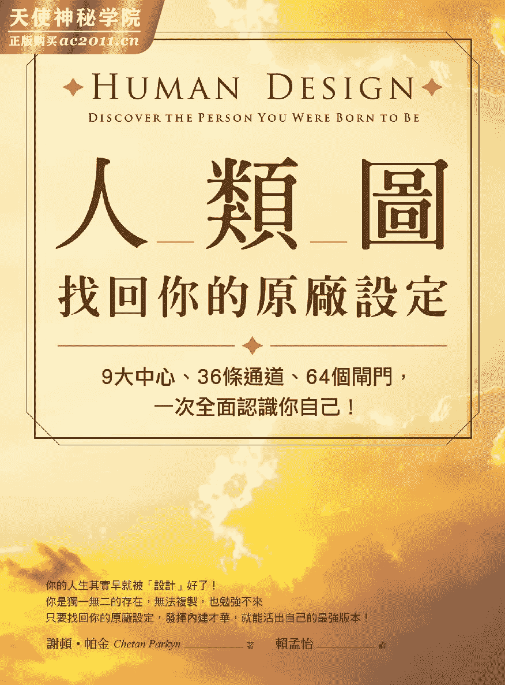

我以感恩的心将本书献给奥修师父

凡事无谓好坏。当你领悟了这道理剎那便能达到合一之境。

所有分裂的将融成一体心智得以专注而你归于中心。

这就是东方思维对世界最大的贡献。

——奥修

# 【推荐序】  打开一份藏在你之内的礼物

历史上每隔一段时间人类的认知就会产生大跃进许多人因此觉醒。然而不是每个人都能清楚地传达这些奥妙的智慧来利益众人。人类图的系统庞大精深、不易明了但是作者谢顿帕金却能在研究通澈后以深入浅出的文字写成这本让人人都能受惠的书。

我一直都在寻找这样的书想要揭开生命的神祕面纱让自己能够成为更好的人。当我觉醒的那一刻我的智慧之眼得到开启心中充满光明这一刻一直深印我的脑海。

十年前我在夏威夷的茂宜岛认识了这位英国绅士谢顿帕金。那真是幸运的一天啊他帮我解读了我的人类图。帕金的眼神亲切声音低沉富有磁性在帮我解读时竟然好像认识我一辈子般地准确。

我之前也接触过占星学和其他的命理工具觉得没有一套系统像人类图一样清晰帕金清清楚楚地指出我的真实本性、情绪及思维的模式以及遇到困难时的本能反应。这个来自英格兰西部什罗浦郡 Shropshire 的人居然靠着一份图表直指我的真我教我该活出什么样的人生。在那一刻人类图就像水晶球一样把我的过去、现在和未来都清楚地呈现眼前。它解开了我的内在密码这是其他命理工具甚少能做到的。我可以将它运用在生活中帮助我做决定以及更清楚了解自己的想法和感受。

不但如此人类图也帮助我更了解其他人看清楚他们行为和态度背后的原因尤其是一些重要的人像是我的孩子和好朋友。

十年来我持续和帕金学习让人类图引领着我的人生旅程就好像是一份人生地图一样。我成为了自己的英雄掌控自己前进的速度生活不再脱序明白自己才是做主的人。知道可以做自己知道该行动的好时机知道何时该放手、不执着的感觉真好。我相信你也会因为这本书和我一样重获自由。

在我和前夫安东尼罗宾斯 Anthony Robbins 编按美国知名心灵导师、潜能开发大师的婚姻中我曾见证到许多人在拿回了自己的内在力量后整个人的变化有多大而因此能够完成人生的远大目标。该是「唤起内在巨人」的时候了该是对这世界介绍人类图的时候了人类需要机会自我活化。学习人类图是自我探索的旅程我会这么说是因为我持续在自己的生命中看到不可思议的改变。人类图对我的帮助很大尤其在我人生最低潮的时候但如今我又是一个被疗愈的快乐之人了它让我体验到欢乐、自由和满足感因为我认识了真实的自己。

我希望你也能拥有认识自己的机会获得这份藏于你内在的礼物。感谢帕金给我的启发他的才华和心量让这套系统得以公诸于世供我们活用在人生当中。

——美国心灵作家  贝琪罗宾斯

# 【作者序】  你活出自己的生命蓝图了吗

「做你自己就好」这是人们常说的话应该经常耳闻吧象是为了减少第一次约会时的紧张令人却步的交际应酬或是新工作的第一天这句话总是会出现。「别担心做你自己就好一切都会很顺利的。」总会有好心人这样鼓励我们。

但问题是到底什么才叫作「做自己」这个「真实的自我」——神祕的内在躲在种种社交面具后头唯有当我们放下自我意识、抛开为了赢得尊重、认同和他人喜爱的社交礼仪之后真我才会显现。

心理学家认为千千万万的人类每天都过着不知真实自我为何的日子身在群体之中却忘了自己的独特总是在忙碌中迎合所有的人处理每件事、想方设法让自己看起来就像杂志、电视和电影中所描绘的完美人物。我们与生俱来的天性、本质如纯真狂放的孩子一般不受束缚却不停地被扭曲、挤压甚至被否决。

人们在成年后学会了顺从与负责反而压缩了自己的真实本性。我们跟着人群前进用一种受到过去影响依循社会常规与满足他人期待而形成的「扮演个性」acting personality 将天性掩埋起来却毫不自觉。人生的路途中我们养成那些被视为「规范」的习惯理所当然地认为自己应该遵守社会规范来行事。本性因而遭到束缚无法喘息。

这让我想到一位曾因婚姻而失去真我来找我解读人类图的女士洁恩 Jayne 的自述

「我只想重新做回自己活出真我拥有真实的感受。我不喜欢自己创造出来的这个人。我知道真实的自我是不一样的正等着要挣脱枷锁、变得更勇敢不再害怕受伤害不担心别人的评论在人群中不再感到不自在。我的真我渴望再次能开怀大笑、舞动本色。她就在那里我知道她在但是要到哪儿找呢我需要帮助重新找回迷失的自己。」

和洁恩一样多数人都活得象是小说中的「虚拟角色」persona 这个字源自希腊文意指「面具」。然而人生真正重要的就是活出面具背后的真实自我。我写这本书的用意在于希望能够带你回到你内在的本质、一个安全的避风港让你重新和你的本性结合活出应有的精采人生。这不是一本励志书而是一本指引你重新找回自己独特真我本色的书。

我要介绍给各位的是一套独一无二的自我觉察工具——「人类图」。这是一个灵性与科学兼具的系统让你得到爱、被众人接受了解自己是谁的系统。因此在一开始我就抛出一个问题「你活出自己的人类图了吗」因为唯有当你接受自己的真实天性才会找到自己的快乐、成就和自由并创造出健康的人际关系。

这本书是我花了十五年研究人类图所得的精华。这些年来由于我从事一对一的谘商解读以及举行团体研讨会所以更加期待能和更多人分享人类图的智慧。我已亲眼目睹有数不清的人因为人类图而得到重生生命充满活力。我相信当人类图更普及化时便能促使人们认知它的力量和改变的能力。人类图提供了具体的信息让你调整看待自己的角度以及和他人相处的模式。

教育家史帝曼葛瑞汉 Stedman Graham 曾说「当你觉察到自己是谁找到人生的愿景便能为自己建立起更深入世界、活出美好人生的基石。」

当你能看懂自己的人类图未来的可能性就无可限量。知识不是我唯一要给你的东西经验才是我们的老师我感谢人类图引领我回到真我的家改变了我的人生尤其是在一九七五年当时我的人生可说是茫茫不知何去何从。

那时我们航行在大西洋上遭受到无情飓风的袭击乘坐着游艇在海面卷起四十英尺高的大浪和短暂、不真实的平静中求生。那个从百慕达形成、持续了两天的飓风所带来的寒颤还深深烙印在我的脑海。游艇航行在巴哈马群岛首都拿索和马耳他岛之间当浪头冲袭着船侧我正掌控着舵轮。这可是宝贵的生命之舵啊我的双手一刻也不敢松开因为飓风可能瞬间就会翻覆游艇死亡之神近在我的眼前。

时间过得十分缓慢而折腾人但我们最终度过了劫难船只也恢复了正常航行。这趟飓风旅程持续了整整九天九夜可怕极了。我记得试着用绳子把自己绑在两个木抽屉间的行军床上希望藉祷告让风浪止息。经过两天的海浪颠簸、风暴肆虐后刚好是我的生日我偷闲地蹲在绑于甲板下的小艇中在昏暗的光线下抽了根珍贵的雪茄简单庆祝了这非比寻常的新生。

在那当下我内在的声音全都安静了下来周遭的风暴也像按了静音键我突然领悟到一定可以奇迹似地脱困我告诉自己「我的人生一定不止如此」

我原本在英国念书念到一半便休学跑去环游世界两年。在欧洲打工一阵子后我开始从事起修理豪华游艇的工作最乐的是可以开着游艇把船交到买主手中。直到遇上这么险恶的飓风浩劫抵达马耳他岛后我除了真心感谢众神保祐更赶紧打包行李返回英国最后我到北苏格兰的锡得兰群岛 Shetland Islands 居住下来打算重新省思未来的人生。

我开始自问「我是谁」这样的反思却让我进入相当黑暗的时期。我在杳无人烟的小农舍里浑浑噩噩地过日子。八个月后我父亲过世另一条维系我稳定的绳索也随之而断。在将父亲骨灰洒在他最爱的苏格兰海岸边一周后我坐在暗淡烛光的小屋中明显感受到父亲来探望我了。感受过其他灵魂的人一定能懂得我在说什么。爸爸低声地鼓舞我「一切都没事了该是离开的时候了。」这个真实强烈的体验让我从孤立中解脱。

几天后我坐在门前翻着二手车杂志一篇「征柴油引擎技工可免费获得尼泊尔之旅」的广告跳出来呼唤着我。有了爸爸给我的指引我前去应征并顺利得到这份身兼尼泊尔之旅技工与司机的工作。除此之外这也是一趟令人振奋的自我探索之旅。

出发后不久我发现这好像是台魔幻巴士这趟嬉皮之旅 hippie trail 的目的地印度居然会在未来五年中成为我心灵的家园。一九七九年有人引荐我认识奥修当时他的名讳是「巴关希瑞罗杰尼希」Bhagwan Shree Rajneesh 这三个字分别是「神」、「伟大」、「王者」的意思。我就这样成了他的门徒而奥修不断地触碰到我的内心深处。

奥修曾说如果人们有非常私人的问题应该去孟买找「影子解读者」shadow reader 于是我就真的去了。那位厉害的影子解读者带着微笑站在他公寓的门口和我碰面。他看起来年约四十岁胡子刮得干净穿着宽松的衣裤眼睛闪烁着光芒我的影子映在公寓旁的停车场上他儿子为我量了影子的长度。走回公寓后影子解读者做了些计算把他的椅子拖到大书架旁边从一大堆看起来都一样的书中抽出一本翻开后便开始用梵文朗读。他为我解读了许多事其中有一点他预测不久后我将会得到自我觉醒会认识一套系统并成为这个系统的专家和导师。

「系统什么系统你在说什么啊」我思索着他的话语。

他建议我应该学习和人们互动的技能帮助人们得到解答并传授属于他们人生的重要信息。

一周后我遇到一位通灵者他很快教会了我如何看手相及面相。俗话说熟能生巧于是我就开始为人看手相。这对我来说易如反掌而且我对看手相有很大的兴趣。我因此去过几个国家包括美国、瑞典、巴西、荷兰、德国、日本最后到了夏威夷我定居下来在那里住了九年为人看手相。

到了一九九三年我有位女性朋友在帮一位名为拉乌卢胡 Ra Uru Hu 的人推广「人类图」的课程拉想要将这套命理工具引进美国。我也收到一份代表我人生路程的人类图图表看起来很新奇当下我便知道这就是影子解读者所谈到的系统。

人类图的起源很耐人寻味这位名为拉的加拿大人本名罗伯特亚伦克拉柯尔 Robert Alan Krakower 他天生愤世嫉俗曾当过报纸广告业务和电影制片在经历一连串重大的挫折后他飞到欧洲去到西班牙。在车上和人闲聊后他决定到西班牙的伊维萨岛 Ibiza 落脚。就在那里发生了一件事彻底改变了他的世界。

一九八七年一月四日的晚上拉牵着他的狗巴克散步回家远远地就看到他的小屋内有亮光。他很清楚油灯早就没油了不可能亮着到底是怎么一回事

当他们走进屋内后巴克伏低身子开始吠叫拉描述到那当下好像身体里面爆炸了一样不到一分钟地板上全是他的汗水。他听到一个男性的「声音」接收到来自宇宙的奥妙讯息你可以称之为「通灵」或「灵感」。他花了八天八夜的时间将接受到的讯息记录下来、画成图表成了所谓的「人类图」。

这个故事听起来很不可思议但是这本书可以见证它的真实性这是拉为世界带来的讯息一份来自宇宙的礼物一个确实可行的系统。

接下来的七年间我固定到茂宜岛去上他的课程就如同之前学手相一样我也快速地学会解读「人类图」。我开始为朋友和客户解读人类图找出生命的意义。四年后我觉得该是和广大听众分享的好时机于是我开始设立教授人类图的课程。

我的太太卡萝拉也是课程的学生之一她原是一名为人占卜的占星师她从星盘上看到我俩有很深的缘分希望我搬去加州同住我们就在加州注册结婚了。她开始运用人类图在占星学上帮助客户透过重要的人生议题认识自己。

我也同样感受到这个系统对人们的重大影响。对许多人而言人类图真的能让他们从迷失中找到方向帮助人们重新做回自己。当然人类图不是幸福的保证书也不能帮你解除人生中的挑战和苦难。但是我看到许多人因而得到改变。

多数人对于自己的命运都会有些不满偶尔会低声自问「我是谁」「我要过怎样的生活」「我的人生意义何在」可惜的是越来越多人陷入无止尽的外在追求追求着完美的事业、完美的伴侣和完美的人生。「追求」这个字意味着去寻找失去或缺少的东西我们因此就踏入了相信所有的答案都要「外求」的陷阱中。

其实答案早就存于你之内。宇宙这个建筑师为我们规划的解答我们老早就被决定好的设计就在我们自己的人类图中。这是你生命与性格的蓝图当你熟悉这份图表后便会知道现在的生活是否符合你的人生设计。

人类图不是什么新时代的门派也不是什么新的哲学信念它也不需要寻求他人的关注或是诉求让你愿望实现不用向宇宙下订单、做冥想或是正面思考因为它的真理早已内存于我们之间。当我声称这是真理时我并无夸大其辞。真理就是内存于己就像工具放在工具盒一样正等着被人拿起来使用创造出人生的目标与合适自己的职业。

有一位名叫玛格莉特的女子在听完我的解读后发现她的命运竟然和人类图背道而驰。她自述道

「我发现自己已经做别人做太久了。我看到自己所做的每件事都和人类图相反。但此时我已经看见了我的本质而且懂得欣赏我觉得自己又重生了。我使用了你给我的工具就象是这个系统给了我一把钥匙打开了我的真我。」

你可以利用我们的网站[humandesignforusall.com](http://humandesignforusall.com)得出你独特的本命图进而搭配此书了解自己你将可以透过本书得知

你的天生本性以及什么样的元素会促使你展开行动。

你和什么样类型的人最合拍什么环境最能带出你最好的一面。

你真我的人格特质、强项、弱点、天赋能力、活力来源……

你的需求和情感模式不管你喜欢与否。

你该如何做决定才能带来幸福与满足。

一旦重新认识自己的人类图你会开始感受到生命的涟漪效应

在亲密关系和友谊关系上它可以帮助你看出你和另一方缘分的深浅让你知道你们两人的关系是一拍即合、争执不断抑或难有长久的交集。

在家庭关系中它能帮你理解手足之间的个别差异让你认清亲子与夫妻之间不同的思考、行为与情感表达模式。

在工作职场上它能帮你洞悉老板、同仁、员工或客户的天赋才能让你能够提升整体工作效率。

在学校教育里它能让老师知道每个学生的个别潜力以及如何激发出孩子最佳的表现。

在社交场合上他能让你了解自己最适合的乐子为何以及和哪些人最投缘和谁则会相互排斥。

你和自己、伴侣、朋友、父母、手足、同事和老板的关系都会受惠于这套系统的影响而产生好的转变。我们可以透过学习人类图对人与人的关系有更深一层的了解成为更有效率、更有同理心的父母、朋友、爱人和同事。这是有史以来最有逻辑、最新奇也最清晰精准的认识自我工具。

我相信你以前从来没有看过这样的系统所以请准备好一起踏上这条内在的探索旅程准备好面对你最真实的自己吧

——谢顿帕金二〇一〇年五月于加州圣马可斯 San Marcos

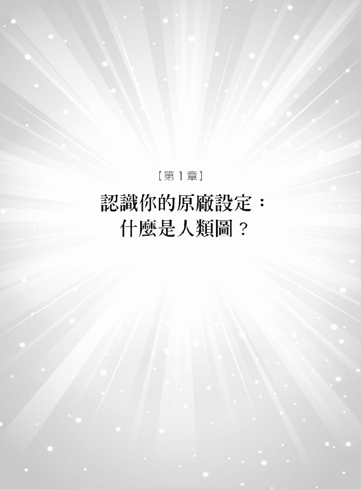

在听完人类图的解读后我觉得自己在许多层面都受到认可。我重新认识了自己这种感觉真对现在我的人生可以带着信心、喜乐和热情继续前进。

——MM 美国科罗拉多州

在生命面临改变的时期人类图鼓励我们面对自己为「自己是谁」负起责任它就象是占星学的进阶版为人生带来正确的指引为自我评估提供建议。人类图上承传统占星学的基础继而开创了新的视野。人们不再满足于象是「你是什么星座」等简单的问题如今已想要也需要知道更多。

假设你是天秤座你一定知道自己和其他天秤座的人有所差异但是星座解读却都是一样的内容没有更深入的星座剖析只是把所有天秤座都归类成同一种人。人类图却能针对每个人的独特性做解读在人类图的观点中每个人都是独一无二的存在个体。也许不久的将来社交场合上的对话就会变成「别谈星座了聊聊你的人类图吧。」

那么要如何运用人类图呢

人类图融合了四大古老传统智慧而自成一套系统以专门的图表来解读你的本性。人类图中的信息是依据你的生辰与出生地而来由太阳系中星辰的分布而定。占星学将太阳在黄道上的运行平均分割成十二个区域而每个区域都可对应到一个星座也就是黄道十二宫。人类图则划分为六十四等分原因有二一、和六十四组遗传密码有关二、和《易经》的六十四卦有关。这六十四等分各有其独特的意义让我们可以更深入探讨什么样的原因创造出你的性格。

宇宙就象是一个巨大的能量血管人人都是流动其间的细胞而且受到微中子流 neutrino stream 的影响。微中子是分钟粒子以接近光速的速度前进通过每一个细胞。就像人类受到大气层的保护宇宙则是住在微中子层里。天空中瀰漫着所有星辰的发射波我们的身体每天都受到几百万兆次的冲击。因为微中子是有质量的它们能和碰撞到物体互相交换信息包括住在地球的人类。所以在出生的瞬间我们的身体就烙印了微中子的记号就象是基因的指纹决定着每个人的天性。

试想你头顶上的天空被分成六十四等分每一等分里的星辰不断往四面八方「呼出」微中子每次释出的量都是以百万兆计算。这些微中子穿越宇宙中的行星不断前进并互相交换能量当这些微中子在我们出生时通过我们的身体时就会将星星的能量嵌入我们的身体。想象在我们出生时微中子轻碰到身体在我们灵性中留下了无法抹灭的印记决定我们此生处世的性格。

一九八七年当人类图初问世时微中子只是理论而已但是到九〇年代后期日本和加拿大的科学家证实了微中子可以改变「味道」的属性因此它是有质量的。宇宙「消失质量」missing mass 的难题因而得到解答。

处在这个快速改变的世界科学家已找出越来越多生命的谜题。人类图以科学方式解读灵性领域以前所未有的方式解答生命的本质。它能解读基因的微中子印记呈现你独特的人生设计。

第一眼看到人类图时你或许会皱起眉头说「什么这就是我」

没错这就是你你的内在天性毫无保留地显现在这张纸上。图表上的形状、颜色、线条、标志和数字代表着你的人生设计。你正盯着自己本质的核心——什么样的元素会触动你什么样的元素又可以让你发挥才能。

这套软件所制作出来的人类图建构在两大要素上一、出生的正确日期、时间和地点二、诞生前三个月——大脑前叶皮层启动的时间也就是灵性进入身体的剎那。这是灵魂和身体结合生命开始运行的时间。

出生时的占星本命盘是基于生辰、出生地及行星运行的影响所绘制的。不过人类图还结合了其他三种古老智慧——印度脉轮系统、中国《易经》和犹太的卡巴拉 Kabbalah。

人们最常问我的问题就是「我的人类图会改变吗」问题的关键应该在于人生过程中我们会遭遇什么情境容易受到什么情况所制约。不管是哪个面向每个人的人类图鲜少完全相同但是你的人类图始终如一你的人生基石是永远不变的、独特的你可以百分之百相信这份图不需要听从他人的建议因为你的人类图中已具备所有解答可让你活出完整、自我实现的人生。

你要消除的是任何想改变自己或成为他人的想法没有所谓「好」与「坏」的人生设计也没有哪一种「比较好」或「比较差」的分别。每一份设计都是值得信赖的当你接受并开始做自己周遭的一切就会变得澄彻清明。

人类图美好的地方就在于当我们审视自己的人生设计时可以一个阶段接着一个阶段、一章接着一章……找出创造你整个人的不同元素。为了方便阅读本书请打印出你的人类图或把它当成计算机桌面我会充当你的司机引导你走上这段寻根之旅。阅读自己的人类图时要仔细因为每个形状、颜色、通道 channel 或数字都能告诉你许多内幕消息。

#### 九颗闪耀的宝石人体的九个能量中心

我经常要人们将人类图想象成精致、珍贵的宝石——由宇宙创造出来最令人目眩神迷的作品。每个人的内在都有九颗闪耀着璀璨光芒的宝石形状分别为正方形、三角形和菱形。这是人体的九个能量中心 centers 也是人类图的根基它们分别是头顶中心 Crown、心智中心 Mind、喉咙中心 Throat、自我定位中心 Self、心脏中心 Heart、荐骨中心 Sacral、情绪中心 Emotions、脾中心 Spleen 和根中心 Root。

身体中有三十六条通道将这些闪烁的宝石安置定位。每条通道两端的数字代表闸门 gate 一共有六十四个闸门每一个闸门都和我们的天赋与人生角色相关。每份人类图中都会有这九个能量中心、三十六个通道和六十四个闸门从这当中就能看出我们的本性和人生使命。

这九个能量中心就象是控制开关的阀门能够调节能量的流动。这不是生理上的能量而是从我们出生时就蕴藏于内的生命能量。每个中心都有其接受、同化、变更及显现能量的方式能量在我们体内流动也向外流每分每秒将我们与周遭的人连结在一起。

连结着能量中心的三十六条通道是能量流通的管道能够强化、塑造及改变能量而显化为更精确的天赋本领、特征和才能。

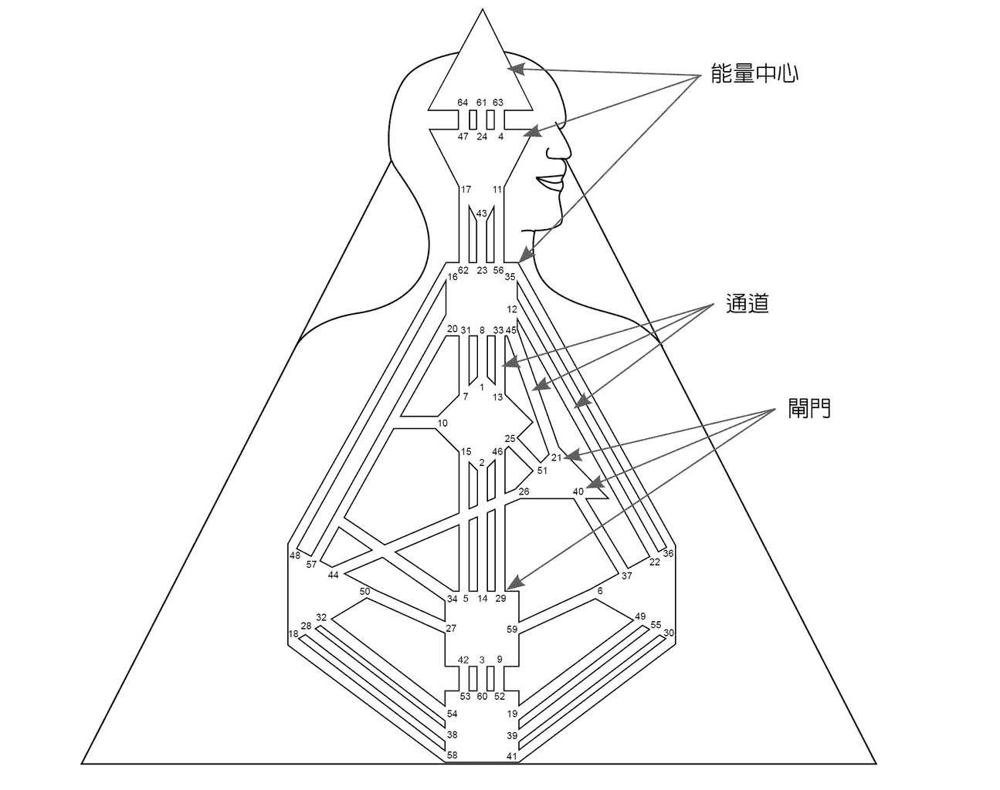

通道两端的数字是六十四个闸门它们代表着 DNA 中的各种天性是微中子留下的印记。每个人在同样的位置都有相同的六十四个闸门只是依照出生时的能量状态有些闸门是开着的有的则是关着的因此每个人的人生设计就更为填满而独特。

接下来的章节我会解释人类图中的每个元素让你能看懂自己和别人的人类图。现在你只要先了解图表左上角的符号和数字即可。这些数字有红有黑每个数字都会对应到一个闸门这代表那些闸门的特征将会在潜意识或意识的层次对你的人生起作用。

#### 潜意识意识

人类图有一点很特别就是可以看出影响我们性格的意识和潜意识因素。意识是我们有意为之的部分我们很清楚自己在做什么潜意识则是隐藏于内由自动化或不由自主的行为形塑出性格。我们或许无法马上辨识出受潜意识操控的那一面但是从旁观察我们的人便能清楚地看出来。有没有人对你说过「你做这件事的方法和你爷爷一模一样」或是「你的曾祖母以前也都会这样说」我们可以从这样的说词知道人们都会从家族中继承从未意识到的某些特质。

意识象是冰山露出海面的顶部而潜意识是暗藏于海面下的本质。荣格心理学派的大师格哈德阿德勒 Gerhard Adler 认为潜意识拥有人类真正需要的大多数知识。心理学家和精神科医师可以花上数周、数月甚至数年的时间去挖掘、分析一个人的想法判定其潜意识的性格。不过人类图是有史以来第一次只要点几下滑鼠就能看穿个人意识和潜意识状况的革命性工具。

在人类图中「潜意识」意指我们灵魂承继自祖先的部分——从祖宗流传下来汇集而成的内定模式也可说是灵魂的 DNA。当我们身处母亲子宫尚不受外界任何影响时就带着这些印记了。我们接受到的是灵魂的基因遗传来自父亲、母亲双方家族的族谱。从生物学的观点来看基因决定眼珠、头发的颜色以及身高和体重等等身体特征。但是在灵性方面我们也继承了情绪、思维和行为反应的模式。

人类图的理论指出人们的内外素质不仅是来自双亲的基因遗传而已。法国演化论学者拉玛克 Jean-Baptiste Lamarck 认为父母亲的经验感受也会遗传给小孩。就象是祖父母的经验会以分子记忆的方式隔代遗留在后代子孙身上这不是突变而是科学家一直在探讨的「转移作用」他们认为可以透过此方式来改变基因。

人类图让你得以察觉到基因遗传的迷人之处洞悉潜意识的运作而活出更精采、圆满的人生。人类图认为意识对一个人的影响是从出生那一刻开始而潜意识的影响则是在出生前三个月就已经决定了也就是胎儿在肚子里时就承继的遗传元素。

意识和潜意识的观念在后面的章节会有更清楚的说明。现在我们只要先知道人类图中意识的部分是以黑色表示潜意识是用红色来表示而红黑条纹区块是意识和潜意识互相重叠之处也就是你能够辨识出的内心潜意识特征。

#### 行星

在人类图系统里有十三种对人的不同影响力分别来自太阳、月亮、行星和月之南北交点 nodes。行星在微中子流中的位置决定了哪些闸门会开启哪些能量中心会被填满。

在人类图中这些行星会以黑色表示并和红色潜意识及黑色意识的闸门数字并列。你可以参考下方的解释以了解人类图图表左上角的信息。

☉太阳

⊕地球

?月亮

北交点

南交点

?水星

♀金星

♂火星

?木星

?土星

?天王星

?海王星

?冥王星

接下来我们会解释人类图的基本结构请看下面「英国哈利王子」的范例。

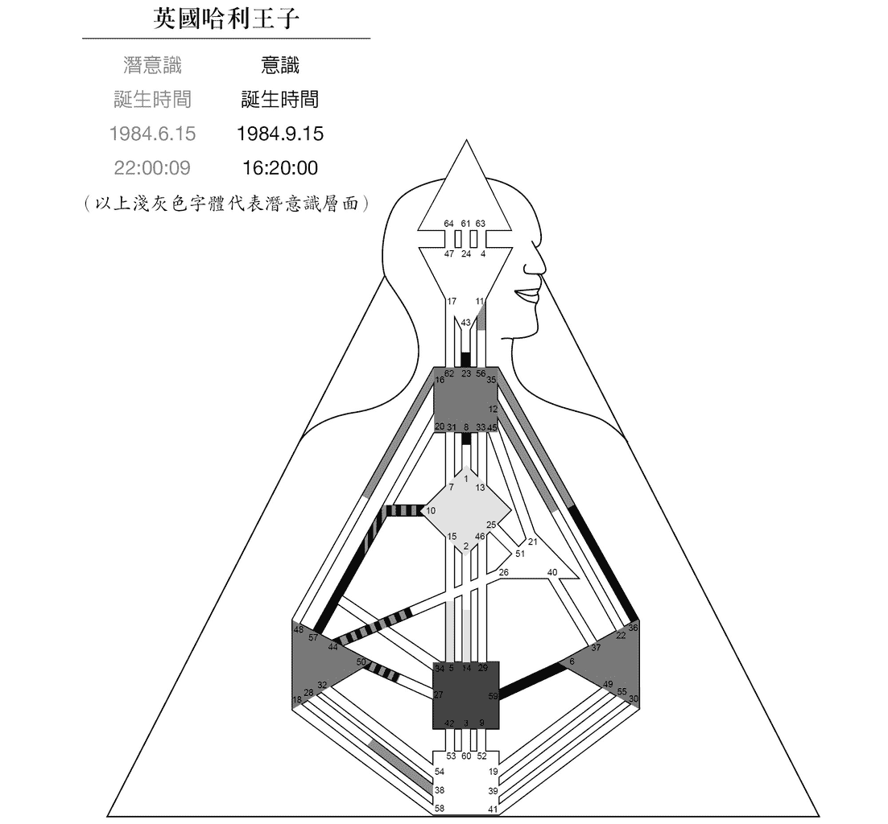

哈利王子是查尔斯王子和黛安娜王妃的次子出生于伦敦出生时间为一九八四年九月十五日格林威治标准时间 GMT 下午四点二十分。不过你会看到图表上写着一九八四年六月十五日也就是他出生前三个月的日期。这两个日期分别写在潜意识红色和意识黑色之下。

右侧黑色的资料都和生辰有关。这是意识也就是「个性」personality 的部分。左侧红色的信息都属于出生前三个月代表潜意识的部分为哈利王子的基因遗传。

中下方有一个填满红色的正方形中心右下方有一条黑色的狭窄通道从这个红色正方形连到右方的褐色三角形中心黑色通道两边的数字为 59 和 6 那就是接通通道两端的闸门。

在这个阶段最重要的是注意能量中心是否有填满颜色。填满颜色的中心表示是活化的相对地空白的中心则是不活化的若有一条通道连结起两个中心则代表那两个中心即是活化的会填满颜色。以哈利王子的图表为例 6–59 的通道使正方形的荐骨中心及三角形的情绪中心都被活化而从空白变成填满颜色。

你现在已经大略能掌握人类图的基本构成借以上范例我为你铺好前方的道路就让我们开始继续愉快的学习旅程吧

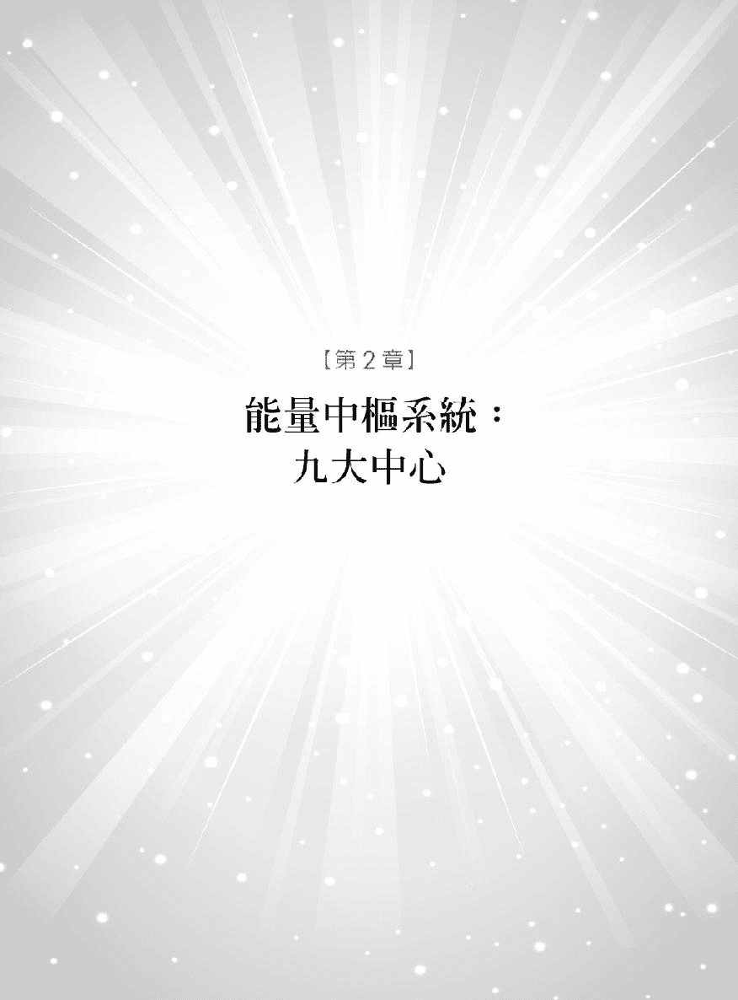

终于有人能够对「我是谁」、「我的行事作风」以及「因应方法」提出解答。

——罗伯英国伦敦

生命是一连串戏剧化事件所谱写而成的——每个起伏难测的行为人与人之间不断的问候应答。我们体内的九个能量中心时时刻刻汲取着生命的能量供身体使用决定着我们如何与人互动。这些内在能量是你真实本性的基础。

有些能量中心的名字很常见如脾、心和喉咙中心它们不是指身体的器官而是和内在能量运作相应的区块人类图即是「能量体」energy body 的地图以这个角度来说它和脉轮系统是相关的。

关键在于要了解每个能量中心如何与他人的交相互动将日常生活和人生的每一刻串连起来。只要和他人待在同一处这些无形的能量便会持续与对方互相交织。表面上看起来我们用眼神和言语和他人沟通但其实真正起作用的是这九大能量中心让人们在更深的生物能量层次上产生连结。

举一个简单的例子当一对男女共处一室时他们各自的能量场会发生互动。当你受他人吸引但却不知原因为何时便能了解这个例子所表达的为何。抑或某人的某项特质总惹得你心神不宁这个「特质」就是从能量中心发出的作用。

你的能量场会受到你的伴侣、朋友、同事、老板、客户的能量场所影响。当你透过人类图了解人们是如何连系、连结与沟通后就更清楚所有人际关系和伙伴之间的动力机制和暗藏的能量流。这是基本的量子物理学——宇宙所有事物都是由振动和能量所构成而且我们都置身在这不可分割的能量之中。我无须解释太多复杂的原理最重要的是让人知道人类图的系统有科学根据九大能量中心和宇宙能量互相结合存在于我们每个人之间再经由人们的行为表现出来。

#### 能量中心呈现填满或空白的状态

了解这九大中心的运作可以帮助你观察每天自己内在发生的事但是首先要认识自己的每个中心是填满的 defined 还是空白的 undefined。

看看你的人类图填满颜色的中心表示其自有稳定的能量作用如磐石一样坚定不变你会一直保有这样的特质而这些能量你时时刻刻取之不尽而呈现空白的中心表示其能量呈现时有时无不稳定的状态这部分的你是变动的。换句话说如果跟你同在一处的某人的这个中心是填满的你就会改变自己顺应别人。和他们相处时你很快便能接受他们的能量甚至被支配或制约。我们称此为「制约影响」conditioning influence。

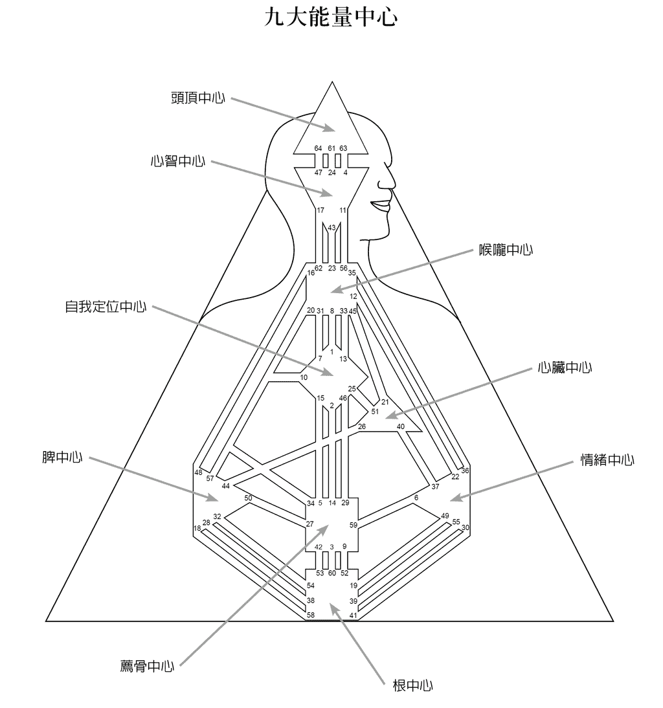

这并不表示你是受人宰制的玩偶你反而可以学着辨别情况学习适合自己空白中心的回应策略不去接收别人带给你的能量。要告诉自己「这个影响力是来自他人不是我的。」这么做可以让你脱离当下的情境以第三者的角度来审视现况我们称之为「超脱的智慧」impassive wisdom。这能让你不被情境卷入能够理智的通盘观察才能见树又见林。因此空白中心让我们有机会学习反思和洞察。

如果你的人类图中呈现填满颜色的中心较少不要以为你的人生就很无聊比起能量中心大多填满颜色的人你是更容易适应环境、有弹性的人。重点在于填满的中心有固定的能量特征而空白中心的特征是时续时断的完全取决于和什么样的人相处。

每个中心都和身体中的一个器官或腺体相关联对健康也有影响。若是能顺着自己人类图的设定过生活身心就会健康情绪就会和谐若是背道而驰甚至是违逆自己的本性身体就容易不舒服或生病。抵抗中心的能量对相应的器官或腺体也会产生不良的影响。

###### 能量中心

# 1

###### The Crown

## 头顶中心

头顶中心位于头部上方形状为三角形。由于国王和皇后总是戴着皇冠以显示尊贵因此在人类图中头顶是灵感的中心三角形的尖端直指上天就象是一个天线接收器从宇宙间撷取灵感。真理、怀疑、天马行空的想法都是从这里涌现。

头顶中心很独特因为它只和心智中心连结。心智中心接到灵感后会再行消化组织。「压力中心」pressure center 有二头顶中心就是其中之一。压力的作用在于驱使人们去寻找生命的意义。当你觉得负荷很大压力便是来自于头顶中心。以生理解剖学来说头顶中心和脑部松果体互相连结松果体只有豆子般大位于大脑中央调节褪黑激素的浓度控制我们睡眠和清醒的状态。

#### 头顶中心呈现填满状态

你的脑袋忙得不得了总有许多想法、灵感、疑问和各种创意。我猜你一定说过「我也不知道为什么有这么多灵感这是天生的。」

头顶中心呈现填满状态的人心智中心一定也是填满的。这样的你总是在思考想要寻找各种刺激的想法和新奇的思维。你的智商很高但是要知道智力和理解力是不一样的你要学习如何运用自己的智力。美国中央情报局 CIA 应该改名为中央理解力局 Central Intellect Agency 因为只有当情报员了解如何让思维不受限懂得如何处理得到的情报、数字和图表时才能将智力转为理解力。

如果你的头顶中心是填满的你会激发周遭的人一样喜欢动脑这是因为你想引发出自己与生俱来的深层思想。你的伙伴可能因你而才智焕发也可能觉得你的想法毫无章法、无聊至极这取决于你善不善于表达自己。

期待被听见的心灵居于头顶中心。头顶中心总是处理着许多的观念有时候会因为不知如何让观念变得实际、能让人接受而感到紧张有压力。理解和解释每件事是头顶中心根深柢固的需求如果不能得到满足甚至可能让你为之发狂。我常说呈现填满的头顶中心会让人筋疲力竭但如果灵感能够实现你将得到无法名状的成就感。

#### 头顶中心呈现空白状态

你对各种跳进脑袋的灵感总是抱持开放的态度。不管你在何处总能够从不同的人和环境中寻获灵感因此你喜欢置身于充满新奇事物的环境象是美术馆或电影院也喜欢和艺术家、知识分子亲近因为这是你得到启发的方式。

这会让你的脑袋像万花筒一样忙得团团转导致你容易深受他人的想法与疑问所影响把别人的问题当做自己的问题般认真看待。最后可能穷尽一生依照他人的想法而活无法活出自己。你要学习问问自己「我为什么要花这么多时间思考别人的想法解决别人的难题」

你要懂得筛选别人的想法和问题不要被知识分子的观念给淹没。这样才能让你的接受器保持良好的收讯将制约影响转成超脱的智慧让自己的心灵保持清明洁净。就象是学生懂得如何将教授给的复杂理论用简单易懂的文字写出来一样。要小心自己不要被昙花一现的灵感牵着跑那只会浪费力气而已。有开放的态度固然好但也要培养做选择的智慧。

###### 能量中心

# 2

###### The Mind

## 心智中心

心智中心会处理头顶中心丢下来的信息也会不断过滤及解析信息帮助自己了解并掌握状况这过程就好像被头顶中心逼着不断做苦工一样。

心智中心是三个「觉察中心」awareness center 之一总是不停运作着担忧和不安的特质可能因为这个中心而更加恶化它会让喜欢深度思考的人陷入无止尽的循环而无法自拔因为脑袋就像轮子一样转个不停希望将过去、现在和未来统统串连起来。

心智中心和大脑前方的脑下垂体互相连结。东方信仰认为此腺体是「第三眼」或「智慧之眼」因此心智中心负责让我们「看到」所需要学习与理解的事物。

#### 心智中心呈现填满状态

心智就像一台计算机内建的硬盘从来不会停止运转、处理和储存档案它会不停地比较、审视和进行搜寻。当你在读书或工作时是不是偶尔会觉得自己的脑袋超载了运转的信息多到好像要爆炸一旦转移注意力之后你又能突然想出解决方法然后再朝下一个目标前进。

你有自己固定的思考方式总是以同样的方法来处理事情。很多的技术维修人员、顾问都有填满的心智中心这样的人很容易吹毛求疵、自寻烦恼拿不存在的问题来为难自己。「你又在瞎操心了」「还没发生的事不要自己先烦恼起来好吗」就是这类人的写照。你就是无法关掉脑袋的思绪和挥除烦恼。冥想或静坐有助于平静你的心灵让你跟你的想法拉开一点距离给自己一点喘息的空间。

#### 心智中心呈现空白状态

你不会先入为主但是常心不在焉。你愿意思考事情的其他可能性但却健忘和容易分心。你很常走到停车场才发现自己忘了带钥匙或者是出门后才想起没有拔掉熨斗的插头。把重要事项写在记事本会是个好方法不然你很可能在一天内就忘记重要的约会或会谈内容。

我不是说你笨。天才爱因斯坦的心智中心就是空白的正因为他对生活大小事都漫不经心所以才能在复杂的人生情境中保持客观以超脱的智慧得到成就。心智中心空白的人其实很好因为他们能以通盘的角度看事情也就是所谓的见林不见树来为别人解决问题。

你能够感受到其他人的思想大家总是会讶异地问你「你怎么知道我在想什么」这是心智中心空白的人所拥有的睿智。你的优点在于懂得独处时保持脑袋寂静却又懂得如何与人互动是个细心考虑周详的人。你的脑袋不受限如果你能接受变量人生对你来讲可说是一场心智冒险之旅。

###### 能量中心

# 3

###### The Throat

## 喉咙中心

在心智中心下方的是喉咙中心它以实现和表达的能力来创造事物。喉咙是人类的发声带在人类图中是掌握想法是否能被别人听见及听懂的枢纽任何事都可能在这里发生。

喉咙中心有许多独特的表达方式象是透过演说、肢体语言或文字书写。适合教学、统御知识是它鲜明的特质。人类图中的任一元素都在寻求表达的出口不管是透过文字或行为而喉咙中心就是为其发声之处。

喉咙中心的连结腺体是甲状腺和副甲状腺这两条腺体调节着人体的新陈代谢率。不管你的本性为何真实的呈现自己是维持健康的不二法门。

#### 喉咙中心呈现填满状态

你拥有良好的表达能力但是要表达什么以及表达的方式取决于其他填满的中心提供什么给这个枢纽。所有连结到喉咙中心的其他中心都希望透过喉咙中心释放能量譬如喉咙中心和心智中心相连时表示喉咙是理智的代言人和情绪中心相连结时情绪也是透过喉咙得到抒发连结到心脏中心时心声也要靠喉咙来表达。这些中心都期待透过喉咙得到表露表达可以透过行为、创意或是沟通的方式来传递。

你的表达方式前后一致有着自己的节奏和自信。你表达的方式可以使梦想成真、目标实现。你很会说故事擅长讲述个人的见解、指导他人是个很好的领导者在表达自己或传达他人的意见时态度坚决、语气有力。

你懂得倾听但是要知道有时候人们只是在跟你闲聊扯淡不用当真。有些人很爱嚼舌根讲到你耳朵长茧也不停最可怕的是坐长途飞机时即使你带着耳机手上拿着的杂志都快盖在脸上了隔壁的乘客还是一直疲劳轰炸你的耳朵。

大家都喜欢跟你讲话捉到机会绝对不放过因为你的喉咙中心是他们的出口能引出他们久经压抑的内心话这些人的喉咙中心大都是空白的。拿我一位朋友为例她的一名同事每周都要打电话给她一次要讲上四十分钟才肯挂电话从来只聊自己的想法和问题从来也没关心过她好不好。所以我要奉劝你注意这个现象知道那些长舌的人为什么喜欢找你倾诉。而他们一开口往往就停不下来了。

#### 喉咙中心呈现空白状态

「我不知道要怎么表达自己。」我彷彿听到你心里这么说。喉咙中心呈现空白时常常会觉得很挫败不知道如何有效或以自己想要的方式来传递心情。但你还是会持续努力当你和喉咙中心填满的人相处时就能找到良好的表达能力你讲话会像连珠炮一样渴求表达的欲望有如猛虎出柙挡都挡不住。因此空白的喉咙中心很可能让你成为长舌一族。

你的特质是喜欢主控对话爱插话甚至会打断别人的谈话。这是因为你的沟通能力受阻当这道墙被打破时储存的压力就像洪水一样倾泄而出。只要给你机会讲话你可以讲个不停甚至不用呼吸。

你的表达通常没有一致性如果有两个人问你同样的问题可能会得到完全不同的答案这取决于对方是谁。这并不是说你讲话没有说服力或言语乏味而是你讲话常常前后不连贯没有重点所以没有人知道你最后的结论是什么。然而你要知道你表达能力的好坏在于和谁互动。

喉咙中心呈现空白的人可能会有语言障碍和发音不清楚的问题。因为你天生就知道沉默是金所以要等待正确的时机才发言。空白的喉咙中心可以接受你周遭的环境将别人的话语转变成自己的智慧象是美国前总统柯林顿即使他的喉咙中心是空白的一样可以成为杰出的演说家因为他学会驾驭群众传给他的能量。他沙哑的声音显示出他没有耐心等待急着想表达自己。

###### 能量中心

# 4

###### The Self

## 自我定位中心

自我定位中心位于喉咙中心下方形状为菱形代表人生的目标与方向感以及对自己的爱。它就象是一套精准的卫星定位系统让我们能够活出自我知道自己的位置和该往哪个方向发展。自我定位中心也决定我们对他人的喜恶。在这个中心里我们可以找到「我是谁」的答案让我们和灵性永远连结。

爱的能量储存于自我定位中心。爱的能量包括心灵之爱和对形体、人性和生命的爱。在这里你可以找到许多关于自己的真相并以独特的方式来拓展生命接受生命所要带给你的事物。

自我定位中心和肝脏相关血液在此得到净化。自我定位中心是否填满决定你如何过滤人生经验阻塞充血的肝脏会让你对人生感到不耐烦而降低处世的能力。

#### 自我定位中心呈现填满状态

你的座右铭应该是「我知道我是谁也很清楚自己的人生方向。」你的个性、人生目标和方向都很稳定。你不只想做你自己还想活出「最棒的自己」。如果你没有这样的感受那就依着心中内建的指南针而行一定会找到回家的方向。

你不能不做自己否则会没来由地感到沮丧好像逆着浪潮前进一样对人生感到吃力。大多数的时间你都是一个相信自己、坚决果敢的人。

你喜欢开导别人当你这么做时往目标前进的注意力就容易分心这是自我定位中心填满的缺点如果不谨慎注意很可能会被待你援助的人拖下水。不过一旦你找到了属于自己的路、目标或是人生伴侣就能朝着目标勇往直前不会再任意转移注意力。在你选定方向之后总会散发一股「一夫当关万夫莫敌」的气势谁也阻挡不了你的决心。

#### 自我定位中心呈现空白状态

「现在的我是这样子未来我不知道。」自我定位中心呈现空白的人对自我没有很固着的定位经常在做改变。你是个八面玲珑的人总能顺应周遭的人而改变自己靠着身旁的人和人生境遇来定位自己经常变动人生的方向因而容易迷失自我。

做个灵活有弹性的人也很好你对别人总有多一份的同理心社交上就象是变色龙一样容易适应环境。以这个角度来说你的自我定位其实很清楚不用再担心不知道如何定义自己。

你可以随着生命之流前进活在当下就好。但是要小心不要放任自己随波逐流跟着任何人走那可能使你步入歧途而不自知。不管你是否知道自己要往哪里走都要学会运用自己内在的智慧观察别人的本性或选择的方向。若是能有此认知便能找出自己的方向帮助那些一样迷失的人看清楚自己的前程。

当你想建立人生的一致性时可以向自我定位中心填满的人请益。你必须确定自己是在追随谁的方向前进如果你的伙伴有填满的人生目标便可以向他学习让自己也有一个圆满成就的人生。如果选择了没有助益反而会拖你下水的伙伴那你一定会做出错误的决定。以小甜甜布兰妮 Britney Spears 为例她的自我定位中心空白所以她的稳定度和人生方向就取决于身旁出意见的人。那个人的智慧将决定布兰妮会向上提升或是行为脱序。对她来说找到真心关心她的人非常重要。

###### 能量中心

# 5

###### The Heart

## 心脏中心

心脏中心位于自我定位中心的右边是平衡意志力和自我意识的中心带有强烈的竞争意识。它让你在商场中成为举足轻重的人驱使你追逐成功的物质世界。心脏中心是三个「动力中心」motor center 之一动力中心会促使我们力争上游而心是欲望的动力来源。编按在人类图官方系统中动力中心共有四个分别是心脏中心、荐骨中心、情绪中心、根中心。

人们最渴望的莫过于拥有自由而意志力会带领我们奔向自由。意志力又分为两种一种是符合宇宙利他的意志另一种纯綷是为了利益一己的意志。我们总是在这两者中做抉择是要选择利他还是利己。

任何和金钱有关的事情或是权衡利弊得失都是由心脏中心职掌。你也许会以为赚钱应该是由心智中心掌管没错大脑的确有许多赚钱的点子但金钱是能量的一种形式和心散发出来的愿望有关。权力、名望也都是属于心脏中心所管辖。

这个中心和心脏相连结因此心脏病是世界上常见的疾病也不足奇。当人们被「继续努力」、「要有钱」、「实现愿望」种种压力压得喘不过气时心脏自然会抗议。心脏中心也和消化、胃和胆囊有关当你的人生平衡和谐时这些器官就能运作顺畅若是追求错误的东西身体器官就可能产生问题。

#### 心脏中心呈现填满状态

很少有人的心脏中心是填满的除非你的意志力是铁打的。只要是你想做的事谁都阻挡不了你坚强的意志。你是人类图系统中的英雄别人需要一个小时才能控制自己的意志力对你来说五分钟即能搞定。心会为生命而奋战心脏中心是勇气的源头。

对你来说要有一番作为不是问题难的是知道什么值得你投注时间和精力。你要学会分辨什么样的人事物值得你全心付出一定要仔细观察慎选因为你一旦涉入某事你的心就会百分之百投入其中。

你的信心令人钦佩。心脏中心填满的典型例子有英国首相邱吉尔、美国前总统甘乃迪、美国总统唐纳川普、影星阿诺史瓦辛格、达赖喇嘛和前美国副总统高尔。这些人将心力投注在毕生事业上更重要的是他们意志力背后所展现的坚强信念。

心脏中心填满的人能够靠自己的能力与勇气说服他人、掌控大局和处理危机。别人做事不够有效率可能会让你很烦恼所以你总是想亲力亲为。你有自己一套做事的方法在实现梦想的过程中很可能被别人误以为过于自大。心脏中心填满的人需要学习「放轻松」这对你和旁人来说都非常重要至少要给别人一点时间来追上你的脚步。

#### 心脏中心呈现空白状态

大多数人的心脏中心都是空白的。也许你想做个精力旺盛的人但是你的心并没有办法配合。其实你不需要去证明什么只要照着你的人生设计生活就好。

也许有人会问你「你不想要人生有点成就吗」或是「你没有一丁点意志力吗」这个中心空白不代表没有意志力你只是做事很难持之以恒而已。正是因为呈现空白才激励你更努力地和别人竞争。你无须拿自己去和别人比较比较过了头可能会影响你对自己的观感。

重要的是了解自己不需要试图证明些什么不管对自己或任何人都一样否则你会在全体利益与自我意识间挣扎——你的自我意识会受到触动变得非常喜好竞争这是因为你受到情境制约的影响。若要跳脱这一点你必须脱离自我意识的影响满足于你的本质不再需要透过行动来证明自己。

你有自己寻找真理的方式要学习倾听自己内在的声音。你有足够的灵活性和智慧能够引导他人找到自己想要的人生目标与成就。你对人生的物质和心灵层次都有客观的价值标准。

###### 能量中心

# 6

###### The Sacral

## 荐骨中心

位于人类图中下方从最底下数上来第二个正方形就是荐骨中心也称为「生产者中心」generator center。它是人类图系统中重要的发电机供给大树往天空成长的能量给雏鸟力量啄破蛋壳让人们有勇气承受人生中的难题。大约百分之七十的人都有填满的荐骨中心提供自己源源不绝的能量。不过很少人懂得如何利用这能量来成就个人的目标。

荐骨和男性的睪丸、女性的卵巢相连结。荐骨中心也是「性中心」它的主要通道都带有性的意味。性欲即是从荐骨中心而来它开启了人际互动与共同创造的各种方式。能体会荐骨译注 sacral 在英文中另一义为与宗教典仪或活动相关、神圣性和性之间紧密的连结是很重要的一点。

#### 荐骨中心呈现填满状态

你天生就有能力回应生命要给你的东西不论你知不知道都拥有充沛的生命力足以让你对自己的目标持续努力。这个动力中心关不掉一旦你开启了荐骨中心的能量就不能回头了直到完成目标为止动力才会停止。因此你需要学会决定要把这能量投注在什么人或什么事上才是值得的。

荐骨是直觉反应的源头你可以充分信赖自己的直觉你的内在权威会告诉你这样做是对或错。当你做着正确的事可能会听到内心发出「对就是这样」的声音如果觉得事有蹊跷心里也一定会有声音警告你。这就是你的直觉那和情绪是不一样的。直觉也可能借由外在的人事物唤醒你最直接的感受。

荐骨中心填满的人一辈子都会觉得自己为人做牛做马替人完成目标却得不到感激。很多员工都有这样的感受有数不清的助理和秘书默默工作让老板或主管得以在台面上发光发热却得不到任何回报。有句俗话说「每个成功男人的背后都有一个伟大的女人。」换成我则会这么说「每个成功人士的背后都有一个荐骨中心填满的人。」通常都是如此他们没有你该怎么办啊

你生来就是一台动力发电机尽管你可能不这么觉得。如果你没有控制好自己的能量就可能感受不到自己的强大动能。我指的是你需要掌控好蕴藏于内的泉涌能量。

当你启动能量时旁人会很难追上你的速度这让你觉得有义务帮大家分担工作。不过在这一番努力之后你会得到事情正不正确的警讯切记一定要投入对的事情中。如果你对一件事感到不耐烦、无聊、沮丧或没耐心那就不要继续做那件事。要学习相信自己的直觉倾听你内在的指引。

性爱对你有一股强烈的驱动力。这不意味着你是猎艳高手或性感尤物不过只要选择正确的话你应该可以拥有满意的性生活。如果直觉接受你的伴侣你的性生活会充满和谐如果你过于纵欲那么可能会意志消沉。

有些时候你的伴侣和人生计划会让你很不满意甚至感到沉重你可能会自问我造了什么孽要承受这种痛苦答案很简单就是你事先不谨慎做选择。你太博爱了付出得太多。要记住先以自己的需求为优先考量不要以为自己没有任何人能够取代。

如果你的心脏中心和荐骨中心都是填满的你绝对是充满能量、干劲十足的人。你的成就将无法衡量但那一定要是自己感兴趣的目标。要学习挪出时间来休息不然拚命三郎的你可能会做到筋疲力尽损伤了身体。

#### 荐骨中心呈现空白状态

你不是天生适合在快车道上奔驰的人那不符合你的天性。你的能量不够持久也无法源源不绝供应你的需求。短暂冲刺或在团队中工作是最适合你的方式。唯一令人担心的是你若一直激发动力最后可能会失去能量和热情。

我认识一位女士她从事压力很大的业务工作总是要不断努力达成目标和利润。她不是天生就适合这种高压工作的人但偏偏工作上必须如此鞭策自己。她被工作和同事压得喘不过气身体无法负荷不得不离职。她没有填满的荐骨中心来承担这样高压的工作现在她负责带领团队打团体战这是她喜欢且能胜任的工作。

你要以客观的角度来反映他人的能量才能将制约影响反转成超脱的智慧而不是一味的耗损自己有限的能量。要学会控制自己的速度懂得寻求协助而不是让自己被困在压力锅之中。

你的性欲比不上荐骨中心填满的人性爱对你来说不会是强烈的驱动力除非你的伴侣是荐骨中心填满的人。若是如此你反而会反映出他们的能量而放大自己的需求。一般来说性爱中所需的能量会由荐骨中心填满的人来提供而你才是支配能量的人。拥有超脱智慧的你将知道何时可以和他人的能量做连结何时应该遵循本性而撤退。

###### 能量中心

# 7

###### The Emotions

## 情绪中心

情绪中心位于荐骨中心右侧是情绪的造生处。就是因为有这个中心人类才会有情绪起伏在伤悲、快乐、痛苦、热情、内疚和宽恕中跌宕变化。情绪中心是九个能量中心中最强烈的一个它引起的能量带给人的影响最大。它同时属于「觉察中心」和「动力中心」能够在觉察、行动和达成目标中得到平衡。

情绪中心对应的是胰、肾、胃、肺和神经系统。这就是为什么有那么多人会因为情绪问题需要医疗协助。带着情绪的情境让我们食不下咽或暴饮暴食而且会伤及神经系统。情绪中心也和瘾头有关情绪问题容易引发性成瘾、酗酒或是毒瘾。

虽然情绪中心最复杂但也最容易了解因为情绪是人性的核心。你要懂得觉察哪些情绪对你是好的哪些情绪对你是有害的当然这还得考虑你的情绪中心是否呈现填满。

#### 情绪中心呈现填满状态

你是个重感觉的人不过你对自己真实的情绪所知甚少。你容易上一秒钟情绪高亢下一秒却难过得跌到谷底。欢迎你认识自己古怪的情绪浪潮情绪的波动是你的本性你和身旁的人都会觉得困扰。你很少能情绪平稳你的情绪就像波涛汹涌的大海上下起伏不断变动着。你要学习认识自己的情绪浪潮让它们来去自如不要想试图控制你才会开始有所提升。

不要被任何情绪或期望所蒙蔽。当你情绪高涨时不要骤下决定这是你要克服的一点。你要学习冷静地让情绪离开不要随之起舞要耐心地等待情绪稳定下来后再做决定。就象是在风暴中行驶的船只只要追随灯塔发射的光线前进终究会安稳回到港湾。

情绪中心填满的人要对自己的情绪负责也要小心不要影响了旁人的情绪。你有很强的情绪感染力与你同在一处的人情绪很容易受到你的感染。如果你情绪很糟你会发现周遭的人也慢慢变得消沉如果你心情愉悦旁人也会跟着兴奋不已。你的人生课题就是学习掌控、欣赏和拥抱自己的感受了解自己的情绪如何影响他人。

#### 情绪中心呈现空白状态

你以为自己是个情绪化的人事实上那是因为你承接了别人的情绪所致。你要认识到自己的情绪是由别人引起的。当你独处时你是平静、安稳、心绪集中的人。

当你和别人共处时你会被卷进他们的情绪浪潮。情绪中心空白的人很难感受到自己的情绪。但好处是当你坐在足球场观众席中看到群众正在欢庆比赛胜利你可以感受到那份欢欣之情假若你去参加宗教庆典一定能和大伙一起感受到神的祝福。你容易被周遭的情绪氛围影响不论是对你有益或有害的情绪这一点你要小心留意。

若想将制约影响转变成超脱的智慧你要学习不对别人的情绪有反应运用自己的洞察力来了解眼前的情境以旁观者的角度审思而不陷入其中。如果有情绪中心填满的人正掀起了自己的情绪海浪而你站在岸上目睹这一切这时候你可以选择跳进海中让自己灭顶或是站在岸上思考该如何改变这个情境。

###### 能量中心

# 8

###### The Spleen

## 脾中心

荐骨中心的左侧是脾中心这也是「觉察中心」之一掌控着我们内建的生存机制。脾中心是感觉中枢象是内心的雷达时时刻刻在审视周遭环境以本能的直觉来辨识「苗头」做出反应。

脾中心没有所谓的智力纯綷只有生存本能它让我们马上就能分辨各种人事物的好坏。在这里我们会触动内在深层的恐惧——恐惧自己知道的不够多、恐惧未来、恐惧过去、恐惧责任、恐惧失败、恐惧死亡、恐惧权威……。要认清这些恐惧给予你生存的动力让你在此刻对人生感觉美好。

这是自发性的直觉中心具有敏锐的听觉辨识力不管你的听觉好不好。脾中心会审查别人的声音或频率确定是否能与对方一同共振。它的核心原则就是利用感官来确保自己的生存。

脾中心和身体的免疫系统相连结拦截外来的毒素和病源。免疫系统保护我们的身体健康一切都是为了生存而战。

#### 脾中心呈现填满状态

你是自发性很强的人拥有敏锐的直觉力天生就能对人生中的大小事做实时回应你总是处在准备好要出发的状态。有你在的地方就有光亮你能散发出人生真美好的感觉。

脾中心会自动审视你所处的环境确定是否安全无虞。你可以透过你的抚触和合宜的举止将温暖散发给四周的人。你的本质令人难以理解你同时具有「警戒者」及「疗愈者」的特质还拥有机智的幽默感给人阳光般的感受因为笑就是最好的药。

但是在笑声背后你会注意到感官脱离了直觉和本能而听不到警报声。如果舞厅的音乐太刺耳或是磁场不对你就会进入警戒状态这时就要赶紧离开现场才对。不管是在别人的家里、工作场所、餐厅或购物中心你心底的警报声在任何场合都适用。警报不是针对有危险只是意味着那地方与你的本性格格不入而已。也许旁人觉得莫名其妙但你要留意内心的警报声那才是你真正的向导。身处不恰当的环境会让你生病会使你的免疫系统不协调。

你的人生最好是活在当下。你的天线总是在接收讯号那可能会让你像个紧张兮兮的胆小鬼。你有义务小心任何你感受到的威胁但是这样的话不知道你还有没有办法走出家门。你容易对许多事感到害怕因为你的生存机制一直都在作用着。就象是过度紧张的妈妈不敢放手让孩子去玩或是每个保险公司的梦幻客户——所有的保单全都买齐。

你心里会有什么样的恐惧取决于开启的闸门为了安抚这个特质你需要留意过度保护的机制何时起作用然后以更务实的态度面对。脾中心的本质就是担心所以会时刻戒慎恐惧不要因此让人生停滞不前。脾中心填满的人通常免疫力较强可帮助你对抗疾病。如果你经常生病很可能是因为你总是不理会内心的直觉反应。

#### 脾中心呈现空白状态

你很容易受到别人的影响而启动内心的担忧。有时候你会觉得恐惧铺天盖地而来完全招架不住。奇怪的是比起脾中心填满的人你更容易被恐惧感所压倒。

脾中心填满的人会收到直觉的警告但你的恐惧却是无来由的这会让你感到神经衰弱。你的恐惧大都来自身旁的人或过去接触过的人和经验。

以旁观者的角度来看恐惧就能将被制约的情形转成超脱的智慧。只要你能留意恐惧就能让恐惧从敌人变成朋友。譬如说你害怕威权你要告诉自己你害怕的是赋与权力的位阶而非坐在位阶上的人。公司的老板并没有权力拥有权力的是老板这个位置。智慧会因为观点的改变而生。

你有能力探测到别人的内心状态脾中心空白会让你感受到旁人的紧张不安、担忧与恐惧。讽刺的是你很难发现自己的内心是否不安。你对西药很敏感最好使用顺势疗法或其他作用较轻的治病方式一般的西药可能会伤害你的免疫系统。

你的心灵感受力很敏锐而且对生命有一份开放的态度。许多灵媒或有超感应能力的人脾中心都呈现空白状态所以能够接受别人发射出来的讯息。

###### 能量中心

# 9

###### The Root

## 根中心

人类图最下方的正方形为根中心这是生命中所有活动的发射台因为它储存着肾上腺素能为我们处理压力。根中心是两个「压力中心」之一会在行为上施加压力。

根中心处在寂静和喜悦中时人会产生根源感不会感觉流离失所。头顶中心是另一个压力中心会迫使我们找到生命的意义而根中心则会迫使我们去实践生命的意义。根中心带给我们的是自然的能量如果它会讲话一定会像导演一样大声吆喝「灯光就位摄影机就位开始演出」

现代社会对每个人都有许多要求要有效率、能赚钱、有产能、才华出众还要能完成一长串的任务。根中心单纯提供我们动力去处理、应付生命中的人与事。野心是根中心的九大特征之一另外八个分别是欢乐、寂静、争议、心神不定、限制、挑衅和贫困、想象力。这些特征显现与否决定于开启的闸门。

根中心和肾上腺相连结负责提供刺激让我们像个毛头小子般肾上腺素升高。它也可能让我们一直处在高压状态把自己搞到筋疲力尽。

#### 根中心呈现填满状态

你有办法承受和消化不寻常的压力。根中心会将截止日期强加在你身上你要自己评估是否能够在预定时间内达到目标而不会让自己失去平衡。你的内心有一股强大的驱策力强迫你去执行某事你就像坐在能量的火山口上任何时候都可能爆发。这样的压力可能会把你或你身旁的人炸成碎片。

你天生就像活在暴风眼能在一团混乱中找到宁静。当你在疯狂的事件中还能平静地对自己微笑时你就找到平衡点了。你热爱肾上腺素狂飙的感受当你能在任何状况下都达到平衡时你就越能够享受人生。你对肾上腺素上瘾所以你很了解如何处理高压紧张的情势。

根中心填满的人有个典型的特征就是无法静静地坐着。虽然身体是静止的但是你的脚也许正在桌面下敲打地面显示肾上腺素正在你身体内流窜。你是发动事件的专家点燃引信的那个人。要学习掌控内心逐渐升高的压力不要因为任何事启动了你的肾上腺素就急着跳进去处理因为错误的启动会让你失衡到时候你的压力会大到连根中心都无法解决。根中心填满的人在追求梦想和完成目标的同时也一定要找到人生的平衡点。

#### 根中心呈现空白状态

独自一人时你就是一副放松、什么事都烦不到你的样子可以以自己的步调过人生。问题在于你会被吸进这世界的涡流中被迫应付根中心处理不来的压力。因为被制约的关系你会被根中心填满的人影响而让压力进驻内心。

你可以达到人生的各种目标但必须以自己的速度进行。当你觉得有压力要知道这是外在给你的而非出于你自己。别人的需求和压力会让你失衡疲惫不堪。如果你被「靠自己去闯出一片天下」这句话激励外在的压力会让你极为困倦因为你没有持续分泌的肾上腺素帮助你度过这些挑战。

别人恐怕会觉得你是个爱拖延的人因为事情总要到最后一刻你才会去做。这是因为你需要时间来累积压力才能产生动力。你可能在出租车要到的前两分钟才开始准备行李。要是我的话可能会逼你写「待办清单」这样你才可能把该做的事情完成。你总是虎头蛇尾想做的事情一大堆但很少真正完成。

另一项别人可能会注意到的特征就是你在遵守别人的行程表时不是太早就是严重迟到。以我根中心空白的朋友为例她答应载儿子去赴约她儿子是根中心填满的人到了该出发的时间早就在楼下叫她动作快一点他要迟到了。这让她肾上腺素飙升急忙冲下楼来没想到摔一跤整个人滚下楼来。幸好没什么大碍但是也让她哭得像个泪人儿了这样的结果就是被制约所影响。

为了显现你超脱的智慧要辨别压力何时到来也要注意这不是你本身的压力告诉自己保持镇定和专注别受到影响。如果你一直被别人的压力左右你的肾上腺素将会被耗尽因此要谨慎以冥想静心维持本性的平和安宁。

我们已经解释完九大能量中心现在你对自己的内在和要做的功课应该有个谱了。但我们只是在「刚认识你」的阶段接下来还有更多从九大能量中心衍生出来的学问也就是关于真实的你的样貌。

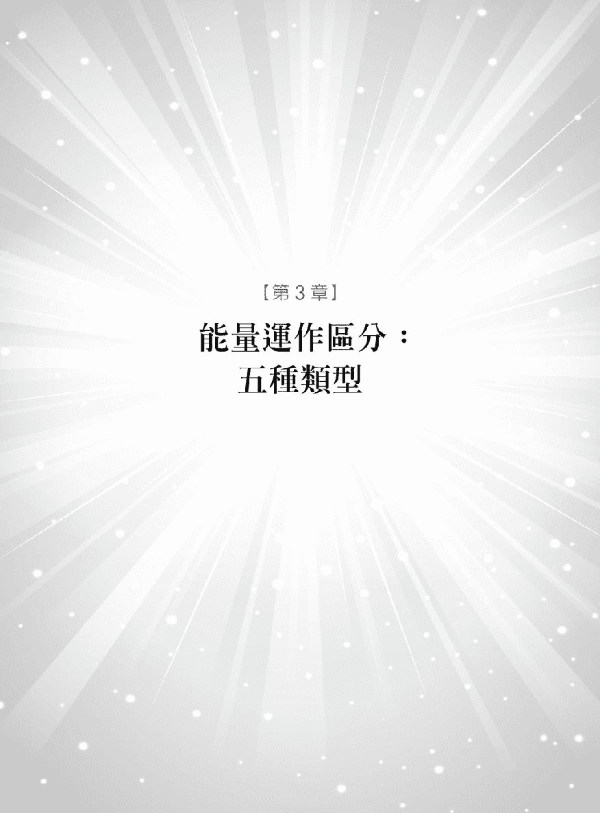

人类图带我回到了「家」我终于懂得自己了。谢谢你开了我的眼界证实了我的真实样貌给我专业的解答和指引。

——AP 美国纽约

你觉得自己是哪种类型的人如果给你一分钟评论自己和他人对你的第一印象你会怎么说这世界很精采大约有七十亿种不同的人格特质有各种说不完的类型。

有时候人们会依工作和职业来分类看看你是管理者、劳动者或是关照型的人。或是依据个性来分类象是害羞、自信、细心或鲁莽行事的人。有些人甚至会以发色来分类她是金发女郎他是红发男孩……。或是以居住地区、种族象是黑人、阿拉伯人等等。我相信当你在阅读这些标签时心里一定会出现对应的刻板印象。其实人们看到的仅是表面而非真实的内在。

这就是我们需要人类图的地方它将人们分成五种类型编按在人类图官方系统中仅分成四种类型显示生产者并入生产者类型中分别是

显示者 manifestor

生产者 generator

显示生产者 manifesting generator

投射者 projector

反映者 reflector

这决定于一个人的哪些中心是填满的和空白的。简单来说你的类型取决于这九大能量中心哪一个有颜色。你能从你的人类图中得到关于自己和他人最有见地的信息。读完本书后你将拥有全新的观点来解读人当你了解人们的本质时就能找出适当的相处方式。当然要改变旧习惯不容易长期建立的行为模式也不是这么容易转变的。但是人类图可以帮助我们改变旧有模式看到真实的自我以更体贴彼此的方式互动。

如果一刚开始你无法认出自己的类型这可能是因为你已被制约惯了而表现得不像自己。建议你不要观察外在的行为模式只要专注于自己最深层的本质就好。

###### 能量类型

# 1

###### The Manifestor

## 显示者

显示者类型的人有一个、甚至多个填满的动力中心心脏中心、情绪中心或根中心而且跟喉咙中心相连结但是荐骨中心是空白的。

你是积极能干、野心勃勃的人天生就有实现梦想的能力。人们应该会觉得你是打不倒的人你会为了旁人或为了完成计划、实现梦想倾注极大的力量和精神。心脏中心的意志力、情绪中心的感受力和根中心的肾上腺素不管是单一元素或结合在一起都会激发喉咙中心让你成为更积极的人更能积极地表达和展现自己。

根中心必须透过情绪中心或脾中心和喉咙中心连结才能有作用。通道要有颜色这样和喉咙中心的连结才会发挥作用。

显示者约占世界人口的 8 所以你要珍惜自己拥有坚韧不移的特质不断地去做、去行动来达成目标。你天生精力充沛总是积极完成目标。你也许对这样的成就习以为常但是其他人除了显示者对你则会心生钦佩或嫉妒这是因为他们很渴望拥有你实现梦想的能力。

你可能无法理解为什么其他人会觉得完成事情很困难但不是每个人都能像你一样快速、不费力地把事情做好所以饶了他们吧你就是能够持续努力直到成功为止不需要任何人、任何事来推动你只要靠自己就成了。

如果我把你比喻成车子你一定是意大利知名跑车玛莎拉蒂。你的马力强大发动引擎后一下子就跑得不见身影了要是没有钥匙和引擎要怎么发动车子呢想想看其他人在坐上车子后车子却是一动也不动会如何干着急啊你也许很难了解他们的感受尤其如果你是老板的话不过慢慢的你应该可以鼓励下属或他人一起合作让他们也能借助你的精力多作发挥。

如果你看到快抓狂的父母总跟在小孩的屁股后面跑这小孩大概是「显示者」类型但偏偏爸妈不是所以才会被精力旺盛的孩子折磨得半死。这样的孩子希望能自由活动会因为父母亲的限制而本性受到压抑。孩子的父母要学习让孩子在规范中拥有些许自由象是「你现在不想睡可以但是晚上八点一定要上床睡觉。」或是「你可以出去玩但是只能在这条街上活动。」在限制孩子的同时也给自由就能达到平衡而且要让他们有地方发泄用不完的精力。设定合理的界限然后就放手让他们自由。

如果你是显示者类型的父母但孩子不是你可能会想不透为什么孩子不能有乃父母之风。这样想就错了。孩子如果不是显示者类型你要他如何改变天性来向你看齐呢这不是后天训练就做得到的。

要当显示者的另一半也很辛苦因为他的行为总是无法预测又善变。你们的关系中应该会有「不照我的方式做就分手」的潜规则。别想操控显示者否则你就象是把大狮子关进小笼子等着瞧牠发威吧如果你可以欣赏高能力的伴侣给他们自由找出和平共处的方式他们会永远感谢你的体谅。

显示者是天生的实践家总是热切想要实现理想。阻挡他们要他们停止或是放轻松不啻是违反他们的天性。最好是鼓励他们的特质欣赏显示者对人生的努力和追求。做个积极勤奋的人是他们对人生的基本「需求」对他们来说无所事事的悠闲人生不是福气要他们不往前冲可能会造成关系不睦或是争吵。

建议显示者要让人们了解你的动机而不是急着实践。不要活在自己的世界中期待别人能够接受你。「为什么我需要一直和别人报备我在做什么」我知道你一定会这样嘟哝。我会这样说是因为发现如果你能配合旁人的话你才会有无限的自由可以完成你的人生目标。

以凯洛琳为例她和两个朋友一起出国玩他们对那个国家不熟。抵达当地时已经很晚了所以一到饭店大家就各自回房睡觉。早上起床时凯洛琳去找莎拉她的显示者朋友没想到她早就起床、不知去向了。担心了一个钟头后莎拉终于回来了原来是出去晨跑了。莎拉很不能理解这有什么好担心的她只不过是去慢跑而已。虽然莎拉觉得凯洛琳的担心很多余不过也承诺在旅途中在她要做什么之前一定都会先跟大家报备。

如果你懂得告知人生会简单许多。虽然你并不在乎别人了不了解你你只想把事情完成但是为了和旁人和平共处如果你必须加班到很晚那就打个电话跟家人说你会比较晚回家。即使你是要拯救世界也要让人们知道你在做什么。如果你的孩子是显示者类型请教育他们在做事情前先跟你打声招呼不过这必须是请求不是规定。

身为显示者你的存在就得以触动他人的警报。不是每个人都喜欢狂风似的生活你可能会惹得别人很抓狂。你有热爱行动的本质所以要留意自己给家庭和社会带来的影响尽可能少惹毛别人不过别人的反应也不用太放在心上。

显示者的优点就是你有极大的能力来激励他人往前你有办法说服人们赤脚走过炙热的炭火而且毫发无伤的完成。你就是行动派的最佳代言人但是显示者并非永远正确你坚定有冲劲的印象其实有点吓人因你老是想开除能力较差的人。要学习欣赏人们在你身边已经做出最大的努力给他们一点喘息的空间。

童年时你的本性可能受到压抑。师长或父母不了解你老是斥责你「安静坐好不要动来动去。」这是显示者最无法忍受的要求那可能让你变得很叛逆或是逐渐累积心中的怒火直到爆发为止。更糟的是你因此封闭自己否定了自己真正的天性。

你要小心人们会占你的便宜要你不断为他们服务大小事情都要你承担。记着你是显示者是领头羊不是奴隶。你来到地球的使命是要实现梦想而不是为他人执行任务。

身为显示者你有责任知道自己把实践的能力借给谁或是投注到什么样的事物之中。当你很清楚地往前移动时你是大家瞩目的焦点反之你可能会摧毁自己的世界。当你了解这世界不是以你为中心运转时与人配合这件事会变得容易许多也就能接受别人以较慢的速度完成事情。

对于显示者来说人生很有趣因为谁知道下一秒会发生什么事

###### 显示者名人

珍妮佛安妮斯顿 Jennifer Aniston、尼尔阿姆斯壮 Neil Armstrong、前美国副总统高尔 Al Gore、保罗麦卡尼 Paul McCartney、杰克尼柯逊 Jack Nicholson、阿诺史瓦辛格 Arnold Schwarzengger、唐纳川普 Donald Trump 和丽芙泰勒 Liv Tyler。

我认为这些名人的共通点就是不屈不挠的精神没有任何事可以阻挡他们他们具备了实现梦想的毅力。登上月球的第一个人恰好是显示者阿姆斯壮需要远赴月球去寻找自己生命的意义而前美国副总统高尔的人生目标就是要改变世界。

###### 能量类型

# 2

###### The Generator

## 生产者

生产者拥有填满的荐骨中心但是荐骨中心和其他的动力中心心脏中心、情绪中心和根中心都没有活化的通道与喉咙中心相连。

你是一个吃苦耐劳的人有用不完的生命力但是会觉得很难实现目标。你需要在全力发挥潜能之前先做一些努力。你天生不是显示者所以要学习耐心等候。下面这句话可以当成你的座右铭「等候回应然后行动」

生产者喜欢按部就班前进非常有效率。你会从观察之中得到乐趣这是你动力的来源是从荐骨中心所生的本能。你做事时持久力惊人就像一颗金顶电池一样当别人都没电了只有你还依然活跃。你的人生挑战就是要知道如何运用这样巨大的能量以及用在何处才能让它发挥得淋漓尽致。

等待对的人事物、时间点到来信赖自己的直觉是你达到成就的关键。若你没有等待别人的邀请就直接去发起行动人生可能会发生错误。如果你能将机会吸引过来耐心等待之后再行动事情通常都能顺利进行。

我们活在一个什么事都讲求「快速」的社会人人都想要立即行动不愿意浪费时间最好即刻达阵。这样的意识形态可能会迫使你行动可是这样你容易作出错误的决定你必须先让能量在体内酝酿。所以坐下来吧耐心等待学习等待对的时机然后再一举克竟全功。要把自己看成一块磁铁让人们和机会来找你而不是你去找它们。别担心它们一定会出现的这是生命的吸引力法则。

当你在悲叹「为什么凡是我起头的事结果都很不好」或是「为什么他能实现梦想我就不能」这是因为「你还没学会等待以及将对的人事物吸引到身边来。」不要起头而要待机行事。

你以为自己有很多能量可以完成目标这大概是因为人们都说你是有决心和毅力的人。你一走进工作场所生命力就开始放射提振了每个人的能量这就是生产者的本质。你做事有效率可以节省很多时间这一点你自己也知道。不管感觉对不对你就是有能耐插手他人的事情想帮忙他们解决。不过几小时后你会发现自己埋头苦干其他人却早就在睡进温暖的被窝中了。这时候你不禁自问「为什么这种事总是落在我头上为什么我要这么鸡婆呢」

要知道只有经过等待后主动来临的事物才值得你去完成。这些事物也许是自动出现在你眼前的邀请或是别人自动打来的电话。这时候最重要的是如何回应。你的回应有内建的指引系统——荐骨中心的直觉反应它会告诉你什么才值得你投注心力。荐骨是你的内在权威会为你开启正确的路。

这样的直觉力通常是透过非自主性反射 involuntary reflex 的形式、声音或升起的能量来告诉你该起身而行还是转身离开。所谓的声音就是内心会给你「OK」或「不 OK」的提醒。你只要将频道调整好信赖自己的内在指引。

你的直觉在人们问你以下这些问题时会产生反应「你可以帮我个忙吗」「你要和我出去约会吗」「你肚子饿吗」遇到严肃的问题时也会有所回应。当下次有人问你类似问题时测试一下自己的直觉力敏不敏锐但要小心半秒钟之后你的理智也会冒出答案。不要让理智干扰你。这不是你要的答案要倾听你当下的直觉。当你坐在餐厅翻阅着菜单不知道要选什么时内在的声音就会帮你出意见要学会倾听你的内在声音。

结论就是等待生命要给你的人事物倾听自己的直觉然后再行动。

盖儿是生产者类型的人她越来越懂得如何倾听自己的直觉。有一阵子一次有四个人追求她这下子可让她伤脑筋了不知道该选谁才好。在听完人类图的解读之后她知道要先退一步看清楚自己的恐惧和假想迷雾因为这都不是从内在发出的直觉反应。她站在卧室看着镜子询问她的直觉以寻求答案。她问「我该和唐约会吗」她感觉答案是「不 OK。」「那和麦歇尔约会好吗」她再次觉得答案是「不 OK。」「那可以跟麦可出去吗」答案还是一样「不 OK。」她最后问了「跟尼克出去咧」终于得到了「OK」的答案。尼克和她内心深处的直觉相呼应这就是生产者可以运用的内建指引方针。

生产者很容易想太多让理智凌驾了直觉如此一来可能会将心力投注在错的人事物上。问题在于当荐骨中心投注心力后它就会为了得到完整的经验而坚持到最后不管合不合适。放弃是糟糕的选择这需要智慧才能做判断因为当你投注心力之后你就几乎不会放弃。所以你的内在会要求你等待等待对的人事物和时机这是因为它不知道如何中途喊停就象是要高速子弹列车瞬间停止一样困难。

生产者一定要小心那些想掌控你的能量占你便宜的人。生产者类型的人大都在服务业、工厂中工作或是身为助理、秘书和个人教练和分针一样不断做着重复又繁杂的工作。

生产者大约占世界人口的 37。你有足够的力量把死的讲成活的你的能量可以让别人改变心意。大家对你的印象就是有干劲、不屈不挠。我猜你每天的行程都是满档闹钟响就应声跳下床、煮早餐、送小孩上学、午休时间去健身、下午努力工作让老板刮目相看、回家后开始洗衣服、煮晚餐、替小孩洗澡、哄小孩睡觉然后再为你的另一半服务最后才终于累瘫倒在床上。只有生产者才有这等精力

问题是在一天的终了你可能会觉得自己做了很多事但是却没有成就感。这是因为你做的事多半只是机械般的行动。生命并不是把待办表格上的事项做完让其他人高兴就好。对生产者来说只有参与心灵能够有共振的人事物才能得到满足感否则就会放弃成长对人生感到厌倦而不再努力尝试。你偶尔会有心力耗尽的时候只想躺在床上什么也不做那是为了让身体充电、蓄积能量。

我建议大家不要一下子就给生产者太多任务但要让他们发挥才能、宣泄精力这是他们应付得来的。当他们举起手大喊「够了」这就表示已经达到他们的极限了如果再继续进逼的话只会使他们退缩寻求喘息的空间。

如果你的孩子是生产者你的责任就是要带领他信赖自己的直觉除非你想要生活中充满泪水和挫败。要是孩子对小提琴一点兴趣也没有硬要他学也没有用不喜欢打篮球或踢足球也一样爸爸不要强迫他们。父母亲需要分清楚自己的期待和孩子的直觉喜好不要误画上等号。

如果你的伴侣是生产者你要学会这样发问「你今天想要做这件事吗」或是「如果我……你觉得好不好」在亲密关系中如果你自行决定周末要到海边玩而没有告知你的另一半就硬拖他到海边做日光浴这是在自找麻烦。不要担心对方会变得大男人或控制欲强要懂得尊重生产者的本质。亲密关系想要行得通的话就要和生产者互相商议事情。

这些年来我遇过几千名生产者我总会试着告诉他们什么样的人事物会跟他们一拍即合。有些人马上就了解我的意思但更多人是制约影响下的牺牲品他们为生活做牛做马不再接收来自荐骨中心的直觉讯息。当然有了生产者强大能量的帮忙事情都能进行得很顺利但这不是生产者要的他们需要找到能量的源头让人生得到指引得到他人的感激。

葛拉汀有三个可爱但很难照顾的小孩她努力迎合孩子总觉得自己有义务随时照顾到他们的需求。虽然自己很喜欢这样做但同时也觉得筋疲力竭甚至有些挫败因为她完全没有时间去做别的事。生产者就是这样总是被旁人耗尽体力。加上她请不起保姆所以无法解决这个情况只能让自己越来越累。

在我解读了葛拉汀的人类图后她才了解自己有精力充沛的荐骨中心她以为自己被孩子操得半死都是不得已的。当她清楚自己有一个绝对可靠的内在指引系统可以帮助她了解哪些事情对她有益处她马上就懂得如何改变她的生活。

她开始教育孩子要以不同的态度来对待妈妈现在孩子不能以一副「我要……」的口气来要求她要孩子们用「是不是」的方式来提问。她聪明的将新规则用有趣的方式让孩子接受。现在面对孩子的要求她能够以直觉来回应只有让她产生共鸣的要求她才会回应。这真是个好策略孩子们也很高兴看到妈妈变得更满足更有活力。

我要告诉生产者类型的人要感谢自己的直觉天赋你可能会充满恐惧觉得如果不马上回应别人、采取行动事情就会发生错误场面就会失去控制。但是你要相信你的本质要相信你的天赋——等待之后再做回应。

###### 生产者名人

拳王阿里 Muhammad Ali、阿斯泰尔 Fred Astaire、贝多芬 Beethoven、前美国总统柯林顿 Bill Clinton、玛丹娜 Madonna、前英国首相撒切尔夫人 Margaret Thatcher 以及美国脱口秀主持人欧普拉 Oprah Winfrey。

这些人的共通点在于他们有充沛的精力承担总统、首相、艺术表演者的工作。他们坚忍不拔有挡不住的动力总是能搅起一阵旋风。我认为许多生产者名人都需要等待荐骨中心累积到一定的能量才能在人生中发光发热。我也很好奇撒切尔夫人和柯林顿总统所做的决定有多少是听从直觉的。

###### 能量类型

# 3

###### The Manifesting Generator

## 显示生产者

显示生产者有填满的荐骨中心并且有活化的通道连结到填满的喉咙中心。他们至少有一个动力中心心脏中心、情绪中心或根中心会透过活化的通道和喉咙中心连结。编按在人类图官方系统中显示生产者并入生产者类型。

你有潜力做个发电机也有充沛的能量但是在你能够有效率的释放能量之前要有绝对的耐心。

显示生产者占世界人口的 33 结合了前两者显示者和生产者的类型却有自己独有的特点。我将这类型的人称为显示生产者是有道理的因为你们是典型的人类行动工具当你找到自己的步调时你们的行动力总是让人刮目相看。

你有内建的直觉力指引系统和生产者类型一样但差别在于你可以做个发起人来实现目标而不用像生产者一样等待时机但只有在你遵循直觉反应时才做得到。再说得更精准一点你就是「等待中的显示者」。

你位于等待直觉反应和纯粹发起行动之间这是你和显示者、生产者的主要差异我称此为「处在动与静的间隙」。你需要用行动来测试直觉力是否准确。举个简单的例子假设有朋友问你要不要一起去散步你的直觉说「OK」所以你站起来准备出发。这时候你就进入了显示者和生产者之间的「间隙」因为当你走到门口时用行动来测试你会觉得其实并不想去散步真实的感受于是就放弃外出散步的想法了。如果你是生产者当你起身往门口走的时候不管你想不想散步你一定会执行到底。虽然这样的差异很隐微但是却有很重大的意义。

我会建议显示生产者倾听你的直觉并以行动测试如果你确定这就是你要的那么就放胆去实践。

当你实践、投注心力的时候你会展现出显示者的热诚行动力也比生产者快很多可以在〇至四秒之间就从静止加速到时速六十公里在路上呼啸而过。你也可以中途变换速度或是停下脚步、转变方向这是显示者那部分给你的影响而不像生产者一旦投入后只有完成后才会停下来。

你总是不断在寻找下一个挑战向外观望一刻不停歇。如果你同时间从事好几个事业这也是很正常的现象不过我会建议你一次进行一个计划就好将心力集中一步一步来才能得到最好的成果。

我最喜欢想象将显示者、生产者和显示生产者聚在一起的景象这是很可能发生的情况

显示者没有跟任何人讲就快速的走出门。生产者在寻找他的座位翻着杂志的同时心里在想到底什么时候才会轮到他。显示生产者早就焦躁不安在房间内踱步希望红灯赶快变绿灯就能轮到他行动了。当他的内心终于给了清楚的绿灯指示而且也用行动测试了直觉的正确度之后他马上跑得不见人影。生产者也同样看到绿灯的指示他检查了所有的装备等待内心蓄满足够的能量后便也全力以赴往前冲刺。

显示生产者总是一刻不得闲、坐立不安、动个不停随时都准备好要行动。如果你就是这样你拥有显示者和生产者强烈的特质能够实现梦想也能等待适当时机你需要去征服也能接受等待。我再一次强调你在人生中一定要学会等待「绿灯通行」的指示。

约翰是我认识了三十年的老朋友恋情总是无法开花结果。他常常疯狂地陷入爱情在两人爱得死去活来之后却突然以分手收场。约翰是显示生产者他觉得自己应当要先表白爱意这是显示者特质带给他的影响他急着实现目标而无法等待常两脚一蹬就整个人栽进去了。以这个角度来看的话他完全就是个显示者类型的人。

我跟他解释显示生产者的行动过程即使是谈恋爱也是要遵守相同的准则。不过他觉得只要坚持到底最后一定有所回报所以他认真地谈过一段又一段的恋爱。直到婚姻失败付了一大笔赡养费之后他终于放弃世间有真爱这回事了。

有一晚他在下班回家的路上绕去一家健康食品商店采买因为把老花眼镜忘在办公室里只得吃力瞇着眼睛阅读包装盒上的文字。命运之神对他很眷顾一位迷人的女士来帮助他她走过来说「看不清楚吗需不需要帮忙啊」约翰的直觉顿时就清醒了给了他「OK」的绿灯指示。当这位女士为他读包装文字时他利用闲聊和笑声来「测试」这个直觉是否准确他感觉到直觉清楚告诉他「大胆去追求吧」现在他们两人关系稳定是一对幸福的佳偶。

约翰回应了他的直觉实现了这段恋情。从人类图的角度来看他并没有自己主动去寻找所以才能自然回应命运的安排。认识他这三十年我从没看过约翰这么幸福快乐过。

对显示生产者来说总是想要以先表白的方式来展开恋情。只有在追求的过程中对方能让你产生「就是这个人」的直觉恋情才可能开花结果。我不是要你故意躲开异性只能站在角落等待恋情的降临而是希望你能倾听自己内在的指引之后再行动。如果你在派对中看到迎面走来的女生心里有声音说「就是她了」那么你可以放胆去搭讪测试行动然后就会知道真实的感受要不要继续进行。以这样开始的恋情会带给你快乐幸福。

身为显示生产者的伴侣你会发现他总是在一旁徘徊决定何时要展开行动。当他耐心地等到内心的绿灯指示后绝对是最有决心、最专注的人而且前进的脚步是无人能阻挡的。拥有他会让你很幸福他是行动力的显示者但是又没有显示者善变和反覆无常的特质。

在工作职场上显示生产者总是努力在寻求显示者和生产者之间的平衡。生产者的特质喜欢需要投入大量持续精力的工作而显示者那部分的特质则热爱进攻新的领域、新的企划。这样复合式类型的人需要弹性和自由的空间才能有新的突破达到更高成就。你是个难懂的员工既肯低头吃苦又可以当开路先锋。最理想的目标就是成为受人敬重的成功人士、管理者或是有个人空间能独立作业的人。

显示生产者的孩子可能很难教育因为他们的两种特质会争相显露一下子可能是难驾驭的显示者一下子又是温驯的生产者宝宝。他们和成人的显示生产者一样内心挣扎需要父母亲给予建议。要在他们坐立不安时帮助他们培养耐性在他们制造一堆混乱时不要责骂他们。

这样类型的孩子会让父母亲很困惑譬如你问孩子要不要去看电影他满心欢喜一口答应了但是当车开到电影院外头时他却又说「我不想看电影了。」这是测试行动的结果。这样让人困惑的善变表现非常需要大人的体谅。

相同的戏码不仅是小孩子才会有连在工作场合或人际关系中都会发生。显示生产者一定很常听到别人抱怨「可是你上一分钟才说好的啊」此一时彼一时情况总可能出现变量。要知道他们在做决定之前需要用行动来测试真实的感受当然容易发生改弦易辙的情形。

对这个类型的人来说处于动静之间的测试时刻非常重要这是他们下决定的方式。但是当他们清楚自己要什么之后他们的决定会很明确也一定会做得非常出色。

###### 显示生产者名人

贝克汉 David Beckham、赛门高维尔 Simon Cowell、吉米汉崔克斯 Jimi Hendrix、派瑞丝希尔顿 Paris Hilton、艾尔顿强 Elton John、乔治卢卡斯 George Lucas、赛尔曼鲁西迪 Salman Rushdie、小甜甜布兰妮 Britney Spears 和德雷莎修女 Mother Teresa。

他们有强大的行动力与旺盛的精力当然还有优柔寡断的特质。不知道吉米汉崔克斯和艾尔顿强丢掉了多少写好的曲子还有赛门高维尔的许多点子是否也都被自己否决掉了。

###### 能量类型

# 4

###### The Projector

## 投射者

投射者的荐骨中心呈现空白没有活化的通道连结喉咙中心和其他动力中心心脏中心、情绪中心、根中心。

等待风起云涌的时刻等待聚光灯照过来等待被邀请……这就是投射者的人生——渴望被接纳渴望自己的才能和努力被看见。如果旁人能够欣赏和感谢你的付出你会自信满满地表演、贡献、指导、组织、管理、和领导。身为投射者的你有许多才华但是需要先得到认可才能发光发热。要能有所成就就一定要先有这个认知。

投射者占世界人口约 21 我自己也是其中一员。之前谈到的三种类型都属于自我驱动型的但投射者通常会先在旁默默观察等待受邀加入行动。投射者需要自己的努力被看到、被了解或被重视后才有机会发挥所长。对于这样的心情我感同身受。

因为天生没有动力中心与喉咙中心连结的关系投射者自己无法产生实现目标的驱动力。投射者天性随和、放松看起来无足轻重但却是坚决稳定。

当你和人们同处一室时人们会感受到你想和每个人接触的热切态度你期望被接纳但有时候会很难达成。要小心不要让人觉得你做作矫情。你需要被重视但只有在自然的情况下它才会发生不用担心人们自然就会被你内在的「投射者本质」所吸引尤其是你自在的特质。你天生有牵线连结的本领将人们串连起来但你也可以躲起来不跟人们有连系。

我常会嘲弄投射者不懂得享受没事时坐在摇椅上放松一下有什么好觉得罪恶感的呢你要学会享受人生悠闲的片刻接受你是旁观者而不是主角的天性。这不表示你无法采取主动但首先你需要别人开口邀请你让你感受到被认可这样子行动才会有力量。这是你的本质。如果你想要发挥效率一定要先得到他人认可然后你才能发挥所长而得到他人的赞赏。被认可和接纳可以点亮你的内心不是投射者的人更要了解这一点。

你是天生的领导者、管理者你有当领袖、组织者、教练和行政管理的才能可以纵观全局。当你在带领、计划和引导身旁的人时你可以做得很成功。如果没有你的引领有些人可能不知道要如何使用自己的能量。

那么怎样才算是得到邀请呢邀请的形式可以是烫金的 VIP 卡片或是口头、眼神的邀请甚至只是你内心感受到召唤请求你加入看到你能力的人事物。当然你不能变得时时刻刻都要人阿谀谄媚或拍马屁如果有人看到你的领导才能但你并不适合担纲那个角色时这个邀请就不算数。邀请要真实可靠又符合你的才能所在。这不是你的自我意识在作祟而是你本质上就需要被赏识。

以滚石乐团的米克杰格 Mick Jagger 为例他悠闲的坐在化妆室的沙发椅上待舞台布景一架设好随时都可以上台表演。他的才华在舞台上受到赞许这就是他得到的邀请这个邀请能让他得到共鸣。没有这认可、邀请的过程他的心就不会满足。当他得到认可和邀请整场九十分钟的表演都可以看到热力四射的表现看到他全力付出满足整场的粉丝。

你可能会认为团员中没有人能比米克杰格更有活力了他怎么可能会是投射者类型呢其实他是利用团员和粉丝的能量、环境的制约让有如洪水的能量充满他空白的中心启动自己的活力。借用、导入、驾驭他人的能量后再累得倒头大睡这就是投射者特别的地方。

投射者在借助他人的能量时要很小心这个过程会使你变得疲累。在高压力、高能量的环境中你会从每个人身上接受到「往前」的能量。当你要跟上显示者、生产者和显示生产者的脚步时一定要小心自己投入的程度不然很可能累倒了。有机会午睡休息时就不要放掉要懂得好好照顾自己。

我自己也犯过投射者常犯的错误就是忽视内心的警告说服自己努力去做假装自己天生就有源源不绝的能量。我热烈投身群众之中但当我不被赞赏、不被了解而停下脚步时我还是得完成任务那时候我真不懂当初为什么要如此投入。现在我学会等待赞赏和邀请不过如此一来身为投射者就常常需要等待。这样的等待是值得的因为我对自己投注心力的事物会很心安。被接纳的安全感就是投射者所寻求的重点。

投射者在寻求天赋和才华被认可的同时内心会感受到压力。你若忽视它们忧郁和沮丧很快就会找上你。你常常会问自己「我要怎么做才能让别人注意我」或是「为什么我老是被忽略」有些投射者可能因为才能不受重视穷其一生心情都很低落但如果你能更有耐心认清并不是每件事都非你不可那么这股沮丧感就会悄然停止。而且在得到人类图的解读之后投射者马上就会感到欢乐因为他的本性受到认可终于露出水面被看到了。

在职场上投射者可能觉得光采都被更有精力的人抢走了如果我是公司总裁我会把投射者放在企划和管理部门因为投射者没有荐骨中心的冲力反而能够将每个人充沛的能量做最好的利用。投射者不受荐骨的束缚他们多才多艺、具领导能力可以任意变换速度专注在创意表现上。

在亲密关系上投射者无法忍受付出被另一半认为是理所当然或是被规定要怎么做。认可和赞美对他们来说极其重要投射者需要伴侣看到他的价值请求他帮忙即使是一般家事也不例外。你的另一半要尊重你需要休息、恢复活力的需求也许你会被指控为懒惰鬼但是你天生就没有充沛的能量。

你的优点是可以激发另一半的能量帮助他将能量发挥在对的地方。你懂得如何引导感情找到好的方法来强化和伴侣之间的关系。你有纵观全局的眼光可以从一棵树中看到整座森林。投射者能为恋情注入新鲜感和新奇的事物他们天生就懂得如何串连和组织。

投射者类型的孩子天生精力不旺盛不要认为是他们生性懒惰。他们做事情或是采取行动都是为了被你「看到」。你要了解他们行为背后的意义只是在寻求你的认可而已。不论是多么微不足道的事你都要去注意到他们的每项用心、技能和优点。对投射者类型的孩子来说得不到父母亲的认可或是无法让父母感到骄傲会让孩子非常难过。

然而被认可的需求可能会变得索求无度在亲密关系中也是一样他们不是故意要缠着对方只是想要得到对方的爱和认可知道另一半的感受。很少有投射者想要一辈子单身因为他们需要别人的能量来滋养自己。

投射者的成就决定于自己选择了什么样的伙伴和环境。当你的天赋和才华真正被看到之后你会感到精力充沛。对你来说有没有得到认可就像身处在白天或黑夜之间一样绝对得到认可会让你感到幸福这对你来说就是最重要的事而且会引导出你性格中最棒的一面。

###### 投射者名人

前英国首相布莱尔 Tony Blair、黛安娜王妃 Princess Diana of Wales、英国女王伊丽莎白二世 Queen Elizabeth II、米克杰格 Mick Jagger、前美国总统甘乃迪 JFK、前南非总统曼德拉 Nelson Mandela、拿破仑 Napoleon、美国总统欧巴马 Barack Obama、毕卡索 Pablo Picasso、美国影星布莱德彼特 Brad Pitt、导演史蒂芬史匹柏 Steven Spielberg。

看看这份名单中有多少政治家他们都是操控和激发群众能量的专家。布莱尔和欧巴马是杰出的演说家黛安娜王妃和伊丽莎白女王则是受人敬仰的王室成员甘乃迪和曼德拉在历史留下显赫的一页。但是他们都得藉由周围的人来维持自己的能量以显现投射者组织事物和激励人心的能力知道人生要从何获取能量是对自己最有利的方式。

###### 能量类型

# 5

###### The Reflector

## 反映者

反映者的九个能量中心都呈现空白的状态在五种类型中最为罕见。

你就和月亮一样洁白无瑕仅占世界人口 1 是最为罕见的族群。你有自己过生活的方式但是其他人却偏偏要求你和大家一样。其实我很想帮你们做一件 T 恤上面写着「我就是那么独特让我做自己」

第一眼看到这样的人类图会以为这个生命是空白的、没有火花的。其实不然空白的蓝图让你就象是一个碟形天线一样不断接收他人的能量再将之反照回去人们因此了解自己是什么样的人在过着什么样的人生。别人填满的压力中心会流进你的压力中心填满的情绪中心会涌进你的情绪中心……没有人像你这般容易受旁人影响。

你有强烈的同理心可以感受到每个人的热情、恐惧、想法、情绪、欲望这让你非常敏感脆弱也让你拥有过人的智慧因为内在的客观性让你可以看到流过你的能量以及这些能量对大家的意义。

反映者就像一面镜子般反照一切人们会透过你映照出自己。这是你的天赋也可能使你难受因为没有人看得到你。你老是被当成别人的垃圾桶听别人倾诉一堆的问题还要保持礼貌的微笑提供看法那谁来当你的垃圾桶呢对你来说何时该开始、何时该结束是你内心永无止尽的挣扎更别提何时要把注意力放在别人身上何时又该收回来专注于自己了。

反映者经常发现别人太依赖自己总是让别人霸占自己的生命而不知道如何画清界限。很多人会找你倾吐心声、发泄情绪、征询意见这样的情况让你很疲累。但是反映者无法不受他人影响有时候他人的想法、废话和难题甚至会严重困扰你难怪你会想要独处让自己保持清醒也有机会观照自己一下。

我建议你要知道自己多么容易受人影响学习放下别人投射过来的能量如此才能把制约转换成超脱的智慧。退后一步给自己观察的空间欣赏周遭发生的事物然后反省自己有什么样的回应。能做到这样人们就会经常来寻求你的精辟见解。

「你总是这么了解我。」「你总是能为我厘清状况。」「你很能掌握情况。」应该很常有人对你这样说吧。听到这样的话很好可以让你过滤出自己和谁产生连结。你需要知道什么时候得与人划清界限拿回自己的时间才不会穷于应付这些接踵而来的纷扰琐事。

想想看这世界有 99 的人都是动力火车头而你是 1 的例外你难免不会有遗世孤独的感受。你会觉得自己象是海上漂流的一个软木塞在别人的人生浪潮之间来回流动直到你学会如何稳定下自己的人生懂得不再一味接受旁人的要求为止。

要把自己当作电力转接器将你接受到的能量移转出去象是玩传球一样不要接到球就拿着不动而且传球时还可以将自己不执着的能量当作是礼物传送出去。

贝蒂老是觉得自己有哪里跟别人不一样却又无法明确指出来。人们总会把自己的问题丢给她而且态度差劲贝蒂却无法做任何反击。在职场上同事会找她哭诉回到家朋友也常会打电话来抱怨。他们都认为只要你有问题贝蒂一定会帮你解决。即使是她的主管也觉得贝蒂天生就知道怎么解决问题尤其是有关公司的策略。

虽然贝蒂有这方面的长才但她并不觉得人生充实。她总是会陷入沉思中心情时好时坏因为她无法在人生中找到自己的定位。她就像海绵一样轻易地吸收别人的问题要不了多久她甚至觉得这是自己的错。

在她三十几岁时她发现原来自己是反映者类型人生总算开始有转机。她学会如何松开依附在她身上的能量。她搬到安静的社区设定自己的界限开始新的生活。每天都会留下一段时间给自己职场上她还是会倾听同事哭诉但是只限十五分钟她不再是大家全年无休的垃圾桶和张老师。她开始重视自己的需求这样做让她对自己更有自信。人类图帮助她看清楚自己哪里做错了又该如何改进才不会违反自己的天性。

现在贝蒂对自己的新人生感到非常满意人们也懂得要反馈爱、赏识和感谢给她。她学到身为反映者最重要的一门功课——施与受的平衡而且要保护自己的时间和空间就像这是世上最珍贵的宝贝一样。

在我太太卡萝拉开设的「人类图经验工作室」中我会请人站在反映者的前面通常这些不是反映者类型的人会感动得流泪因为觉得自己被「看到」了他们的本性被澄澈地映照回自身。当你见证到这样不可思议的情况时就会了解这个系统的真实性。人们感受到反映者充满了仁慈、柔顺和无条件的爱而大受感动。我告诉大家要感激反映者因为他们献出自己作为我们的镜子他们是广大知识和智慧的源头。

其实反映者无需有人站在你前面来测试自己的影响力。你总是以静默低调的方式吸引别人你有一股使人安心、平静的影响力和你接触的人很快就会感谢你的内在智慧。通常沉着的坐在房间的角落像只安静有智慧的猫头鹰的人都是反映者类型他们会从拥挤的餐会中抽离自己走到户外松口气。如果你也会这样做这是很正常的反应。要是一大堆显示者、生产者、显示生产者和投射者争着要跟你诉苦听取你的意见这也是稀松平常的事。但是你要懂得拒绝别人适时给自己时间独处。

反映者喜欢住在幽静的地方、偏僻的乡下或是和灵修团体住在一起他们需要独处、隐私与大自然为伍这就是反映者的本性。疯狂的人生、人多的地方都会使他们不自在。我猜你宁愿参加小型聚会也不喜欢身处狂欢派对。人多的环境会让你不安因为你无法忍受排山倒海而来的能量。你天生敏感过度的刺激会耗尽你的心力让你感到空虚与沮丧。

幸好只要你离开这样的环境你比任何人都容易放下再度沉潜于自心的观照。我总是告诉反映者拥有自己的空间是你最基本的需求做得到的话最好住在有很多自己空间的房子内有很大的花园或是独门独户。如果反映者住在城市公寓或拥挤的市区内每天要承受现代生活的快速变化会让他们非常衰弱。若是无法改变居住环境你可以藉着淋浴洗去一身的负担或是藉静心冥想重新集中心神。

反映者经常会问「我要怎么在人生中找到自己的方向那么容易受人影响的我该如何做出正确的抉择呢」

第一你要先认知到自己的本质是敏感而温顺的。再来要知道月亮是你唯一的支柱、同盟和计时器。月亮圆缺的周期是二十九天你也一样。其他类型的人可以透过活化的通道和填满的中心来维持自己能量的稳定度但是你是随时在改变的你的能量几乎仰赖着月亮的变化。如果你仔细观察会发现你的心情和月亮的圆缺有一样的变化周期。你承受到来自四面八方的拉扯下一章节我们会有更详细的解说。

反映者类型的孩子比较老成他们对人生有超龄的认知。他们非常温和、敏感容易承受太大的同侪压力无法改变自己去融入团体。反映者的父母最好不要讲一些违反他们本性的话象是「为什么你不去跟大家玩啊」其他孩子的能量可能会让他不知所措觉得自己是局外人。如果可以的话他们更希望自己独处就好。这时候父母亲应该要接受孩子的本质让孩子知道他不是怪胎只是非常独特。

反映者和投射者一样会借用他人传来的能量但是反映者很快就会觉得累坏了甚至会表现出孤僻、完全不想和人来往的情况。这是因为他们无法跟上别人的速度想要避免各种人事物的轰炸。他们会尽可能远离麻烦和混乱选择待在家里。所以就让他们安静的待在房间享受一个人放松或听音乐的悠闲时光吧

反映者的孩子能安然度过孩童岁月但是青春期对他们来说可是一项大考验。大自然能给他们很大的慰藉能够住在接近大自然的地方最好不然也要多带他去公园散步而不是去踢足球等团体运动。

如果你本身是反映者类型的父母那么孩子的旺盛精力可能让你难以招架。你可以鼓励孩子自己安排时间以减少要你陪伴的需求。孩子会渐渐懂得你的处事智慧虽然他们不会明显表现出来但你绝对是他们最棒的人生导师。

在亲密关系中反映者非常依赖另一半的清晰思绪和仁慈的心。和反映者相处会比较辛苦因为他们需要你却又需要空间来远离你。他们不断在依赖和独处之间摆荡反映者需要在依赖和独立之间找到恋情的平衡点。

没有任何伴侣像反映者一样敏感脆弱但又兼具智慧。反映者会寻找能够欣赏他们独特本质的人生伴侣。我看过一对佳偶先生是能干、会赚钱的显示者每天一早冲出门后反映者的太太就能有自己独处的空间和时间。即使先生在家太太还是有自己专属的空间当她觉得身心疲惫就会躲进去放空自己。她先生知道她天性就是如此懂得尊重她的生活方式也会努力寻求两人之间的平衡点。

反映者的观点和其他人有极大的差异人们大都会在白天到公园散步欣赏花草树木但是反映者喜欢在晚上有月光的时候去公园散步。月光照亮反映者让他们生出独特的洞察力。

静坐、祈祷和隐居会让反映者感到愉悦如果你也是反映者的一员这样做可以让你重新做回自己。你是地球上最聪明、最有爱心、最有智慧的受造物因为有你对生命的开放态度和帮助给了世界最大的智慧。如果你认识反映者你就知道他们是很特别的人要尊重、认同他们独特的生活方式。

###### 反映者名人

演员珊卓布拉克 Sandra Bullock、瑞奇伯顿 Richard Burton、前美国第一夫人萝莎琳卡特 Rosalyn Carter、俄国小说家杜斯妥也夫斯基 Fyodor Dostoyevsky、以色列魔术师尤里盖勒 Uri Geller、英国小说家威尔斯 H.G. Wells。

你会发现这群人多么独特、与众不同而且职业都大相迳庭。珊卓布拉克和瑞奇伯顿都是演员他们能够捕捉到任何角色的真髓整个人投入角色之中。魔术家尤里盖勒专精于一般人无法理解的技术利用他的特质超越极限。一般来说反照者可以满足每个人的需求经常让人难以想象。从这里列举的例子来看反照者是敏感、感觉敏锐、与众不同又有智慧的一群人。

#### 小结

我将以上这五种类型的特性以一句话总结这是他们面对世界的态度

显示者「直接去做就对了。」

生产者「直觉对了就去做。」

显示生产者「测试直觉对了才去做。」

投射者「被认可、受邀请才去做。」

反映者「受到请求后先思考才去做。」

认识自己的类型及处世方式才能顺应自己的天性过好生活。找出内在的本质可能会改变你的一生而这才是真正要过的人生。一位有年幼女儿住在美国洛杉矶的安琪拉曾告诉我

人类图帮助我最多的地方就是知道如何当个好妈妈。我是显示者类型而我女儿是投射者这两者的性质完全相反。我觉得很困扰因为我希望她做事能和我一样迅速。了解人类图之后我知道要相信她有自己的步调和做事的方法。我会建议所有的父母亲都要知道孩子的人类图如此才能更深入的认识他们。

人们在知道自己的类型后都会觉得松了一口气。这五种类型都是最棒的设计没有谁比谁优秀这种事最重要的是要把握生命给予的所有机会然后尊重自己与他人的本质。当你了解自己的类型之后就可以进入下一章如何听从你的内在权威做出更有智慧的决定。

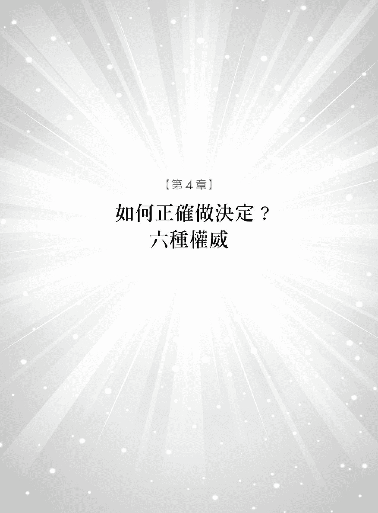

当我开始采纳人类图的建议不再做无谓的抵抗之后我终于了解如何过不费力的人生了。

——SL 美国内布拉斯加州

人生中多数的挫败、伤痛和走错路都是因为我们做了错误的决定。做人就是要知道何时说「好」何时该坚决地说「不」才能走出困境做出正确的决定。生命就像色彩丰富的调色盘给了我们很多选择但是同时也浪费了我们许多时间在做决定。人人都想走在平顺的康庄大道但结局往往令人失望。

不过现在有方法能帮助你做出更有智慧的抉择只要你遵从自己内在的「权威中心」就行了。做决定的「权威中心」能够掌握我们的人生帮助我们信任自己所做的决定充满信心不再犹豫。很多人在做决定时都被错误的制约影响。在我们成长过程中父母、监护人或是兄姊总是教我们一定要做出「最好」的决定。长大后各种媒体也会不断洗脑社会大众。遇上什么样的情况该有什么反应该怎样穿着才会性感、有型诸如此类。社会已经替我们做好决定只是我们没有觉察而已。

最大的制约因素还是自己的信念我们总是在「想」要怎样过日子。自有历史以来人类就是为了这个误解而忙碌奔走。我记得老师或长辈总是用手指指着脑袋对年幼的孩子们说「用你的脑袋想想看啊」要不就是「上帝给你脑袋就是要你动脑筋。」人们真的不应该再赋与大脑这样的力量了

只要看一看人类图就会发现全部的答案早就暗藏其中心智中心并没有直接连结到「动力中心」心脏中心、荐骨中心、情绪中心和根中心。你越用理智作决定就会给自己制造越多的混乱和压力。理智是很棒的数据库但是无法做出好的决定。事实上理智擅长的是处理资料而非做决定。

大脑分为左脑和右脑两部分因此会以两个不同的角度看世界。大脑天生就没有决断力如果你要靠它做决策的话就好像是往空中抛硬币好坏全靠机率来决定。了解大脑在决策上的运作是作出智慧选择的第一步。

人们也会依赖他人来替自己做决定象是透过「如果是你的话你会怎么做」这类问题来寻找方向。其实这样的问题绝对得不到合宜的答案因为每个人的人类图都不一样他人的方法不一定适用在自己身上。

最好的决策方式取决于自己是什么类型的人透过情绪中心、荐骨中心、脾中心、心脏中心或是自我定位中心通常都能得到最好的答案。最适合你的决策方式取决于九大能量中心是开启或关闭的状态。确认一下自己的人类图你就能知道了。

###### 权威类型

# 1

###### The Emotions Authority

## 情绪型权威

如果你的情绪中心呈现填满状态以下就是你要执行的策略。

你的人生容易被感觉所左右人生的功课就是要学习如何驾驭情绪。之前我们用过船只航行在狂风暴雨的海面上来形容你的情绪起伏变化。要做出正确的决定就是不管暴风雨有多大都要一直维持澄明的情绪。

如果你的情绪特别强烈或复杂要做到情绪澄澈并不容易。尤其是被搞得昏头转向时最简单的选择就是做出决定任何决定都可以只要能够让情况明朗化停止伤痛就好。反过来说当你感到满足一定会想要保持这样的心情然而这样做也是一样莽撞。如果你马上反应很可能会做出情绪化的决定你的「权威中心」要求你在做决定前一定要先回到澄明的情绪状态。

当被暴风雨翻来覆去的船只航行至平静的湖面时你就可以在清明的状态下做出正确的决定。这样做会让每件事都变得澄澈清明。要有这样的成果当然需要时间和练习但是你越让自己看清情绪的变化你就能越快找到情绪上的平衡点如此就能让心绪一直保持在清明的状态。

有没有答应过别人可是隔天起床时却很后悔的经验或是懊悔自己仓促下做出的决定。这都是因为你对特定结果感到恐惧或带着期望强烈的情绪会导致错误的决定。下面有两个真实案例

如果我和他结婚我一定会被困在婚姻中没有出路。要是他不适合我我可能会想出轨……可怕、可怕、好可怕。

这位待嫁新娘有强烈的焦虑已经开始对婚姻投注了恐惧。

真不敢相信我竟然得到这份高薪的工作想到我要的跑车、豪宅还有一堆美女等着我去追……高兴、高兴、真高兴。

这位找工作的仁兄有强烈的兴奋感对自己的未来投注了欢乐的情绪。

幸好在真实人生中这位姑娘还是走上红毯的那一端现在是个快乐的新嫁娘。但是找工作的先生最后婉拒了这份多金工作因为觉得自己无法胜任。这二位都清楚自己的情绪高高低低他们懂得先回到澄澈的心绪至少要沉淀个一晚隔天再下决定。

有些人需要更长的时间沉淀情绪象是这位新嫁娘就花了好几个月的时间反覆思索才终于决定和先生携手共度一生。但有时候并不需要整晚的时间来做决定当你看到新车或想买的衣服时你已经做好决定了。你很清楚自己要什么只等待想要的东西出现在眼前。要是你有点迟疑感到沮丧或是抵抗这是内心在告诉你「你错啦」

做决定的过程要像儒家说的「中庸之道」。想象你的情绪就象是电波仪一样中间有一条静止的中线电波不断上下来回摆动虽然看起来很戏剧化但你再看清楚一点就会发现只不过是情绪上上下下的波动而已。

当你的感觉对了情绪就达到澄澈清明这是世界上最平静的状态。这样的状态会和你的本我相呼应不要用脑袋要用心去感受它。这需要极大的耐性因为你可能过惯了匆忙、急迫的人生。但你一定要回到澄明的情绪状态后才下决定。耐心是你的明灯填满的情绪中心是你的「权威中心」不管情绪的波涛如何起伏都要稳定住你的心。

###### 情绪型权威重点提示

如果你的情绪中心和脾中心都是填满的那么你常会接收到从脾中心发出的警报。不要马上做反应要等待情绪静止回到澄澈的思绪。静静的坐下来感受直到你百分之百确定后就可以做决定了。

如果你的情绪中心、脾中心和荐骨中心都是填满的那么你的警报感官脾中心和身体反应荐骨中心也会跟着上下起伏。但是你仍旧要等待等待情绪平稳后就能做出正确的决定。

###### 权威类型

# 2

###### The Sacral Authority

## 荐骨型权威

如果你有填满的荐骨中心但是情绪中心是空白的那么请你照着以下的建议来做决定。

要做出正确的决定就要「跟随你的直觉」而且相信它。你要做出最好的决定就要听从位于下腹部的荐骨。没错我是认真的。你天生就比别人有更敏锐的直觉但是很快的师长和父母就会灌输你要用大脑做决定的观念。

你要了解荐骨中心这个内在的指引系统只有在「回应」时才会产生作用。它不会主动找事情忙它的本质是「回应」。所以你要等待荐骨给予你清楚的「是」或「不是」的指示如果没有即刻回应那就表示荐骨对这件事不感兴趣。

你需要将这个权威中心运用在人生的每件事上你在承诺或做任何事之前都要先等待直到你接收到荐骨传送给你的直觉回应。

要小心不要骤下决定。或许你身旁有些人很有情绪感染力能言善道又有坚强的意志力、说服力可能会让你将巨大的生命能量投注出去。可是你务必要遵从荐骨权威坐下来等待直觉给予你的回应。如同我们都知道的当你承诺之后来自荐骨中心的推动力不可能让你中途喊停。

改掉用大脑思考的习惯换成遵从直觉的指示可以让你做出更有智慧的决定。直觉反应和情绪反应之间的差异让很多荐骨中心填满的人很难分辨。直觉反应是有耐性、放松、慎重的但情绪反应是无意识、仓促的反射动作。要有耐性等待这样你就会懂得如何分辨两者的不同而将这个值得信赖的能力用于生活中。

现在我要你想想在你生命中所做的重要决定象是决定和谁结婚、分手、卖房子、买新车、搬家或移民……如果结果让你懊恼、后悔你当初是如何做这些决定的。你是不是想太多、分析过头了还是对你很有影响力的人说服你去做的或者你觉得自己有义务这样做仔细想想当初是怎么做出错误的决定。

再来请你回忆一下有没有做过什么重要的决定结果让你很开心而且做决定时内心一片平和。那时你是怎么做决定的你是不是经过等待然后相信自己的直觉就放胆去做做出正确决定的关键就在于找出这些问题的答案。

###### 荐骨型权威重点提示

当脾中心和荐骨中心都填满的时候你的直觉反应会因为脾中心而更加强烈也就是说你会在瞬间就接收到直觉的反应。

###### 权威类型

# 3

###### The Spleen Authority

## 直觉型权威

如果你有填满的脾中心但是情绪中心和荐骨中心呈现空白那你就要照着以下的建议来做决定。

眨眼的瞬间你就能做出正确的决定。你天生就有办法掌握「当下」总是能在一秒之间做决定没有任何犹豫。

当做决定的内在权威是情绪中心时你需要看完整部电影跟着剧情上下起伏但是当内在权威是脾中心时你能在弹指间象是电影被定格一样瞬间做出决定。这样做决定的过程可能让你觉得很草率但也只有这样你做的决定才最值得信赖。

你的直觉会知道事情正不正确某人真诚或虚伪也能够分辨人事物、情况是否牢靠或可疑适不适合进行。直觉在瞬间就能决定答案而且会马上向你提出警告。只要你学会相信这个做决定的过程绝对会让你印象深刻。你可以学会相信像闪电般快速的脾中心也可以选择忽视它让你的良机在指缝中溜走。

如果你发现自己犹豫不决不停思索而无法下决定时要留意这是理智出头、压制了本性的缘故这时就不适合做决定了。脾中心只会发出一次讯息没时间容你多考虑放胆去做就对了。

「慢慢来再想想看」旁人一定这样劝告你你千万不要听取这样的建议。要相信自己的瞬间直觉这并不是考虑不周全或不耐烦的决定对你来说这就是最正确、最恰当的策略。你要相信这个很有「禅意」的「当下」不可以依据过去的经验或是推测未来做决定。

当你遵从你的权威中心时感官会变得很敏锐即使是很简单的事件脾中心也会插手警戒象是走进一家餐厅马上就能从环境、味道和菜单决定这家的餐点美不美味要不要换吃别家。看看下面这则案例

我的一位朋友在圣塔巴巴拉一家很有名的餐厅订了位在他低头专心看菜单时他的女朋友却环顾四周、一副心烦意乱、深受困扰的样子。

「怎么了」他问。

「我不喜欢这里我们可以换别家吃饭吗」

「可是我们才刚坐下啊。」

「我知道可是我觉得气氛很不好我也不喜欢这里食物的味道。」

就这样他们离开这家餐厅到别处用餐。

这就是遵从脾中心的人的状况他们有敏锐的内建雷达环顾四周后马上就能感受到直觉给她的警告。如果她忽视内心的声音顺从男朋友的意思留下来有可能两个人会发生争吵或是食物中毒。她的脾中心发出警告让她感受到这家餐厅对她的健康没有益处。

要重视直觉给你的警讯。在三个「觉察中心」里面脾中心的反应最快而且警告的声音就象是在你耳边低语一样。所以不管你去哪里和谁碰面或是得到什么机会都要仔细听听这个内建雷达给你什么样的讯息。

不要忘记脾中心也会指出哪些人事物值得你去追求。「这个投资一定会赚钱」或是「这听起来就是很适合我」抑或是「这瓶便宜的酒一定很好喝」虽然这些话感觉很没道理但是你的感官是值得信赖的它们能够立即指出这样的决定是否正确。

###### 权威类型

# 4

###### The Heart Authority

## 意志型权威

如果你有空白的情绪中心、荐骨中心和脾中心配上填满的心脏中心连结到喉咙中心那就请照着以下的建议来做决定。

你做决定的准则就是依循心的渴望想做什么就去做。这个做决定的权威中心需要有一条到多条活化的通道连结心脏中心与喉咙中心。在没有其他顾虑的状态下你的决定就是心的渴望心会这样告诉你「我要这个我要这件事这样子实现。」

只要随顺自己的心成就会随之而来因为你天生钢铁般的意志力一定会促使你完成心愿。问题在于你是否会因为其他人的请求或负面情绪而改变心意人们可能会站在你前面阻挡你的脚步因为你的决定可能会违反他们的期待与习惯。你要怎么处理这样的情况呢那就翻到说明「显示者」的那一篇章要善意地告知旁人你这么做的动机。当你下定决心后别人是无法阻止你前进的。

需要做决定时就要倾听心的声音。心脏中心会引导你方向告诉你这么做「对」或「不对」。这是一个非常主观且自我的决策过程但是非常有用。你的心不想做的事就放手吧你的心跳有如擂鼓鸣金般的事就大胆的去做吧。一定要将自己的行动放在和心愿一致的人事物上不然你会把别人的愿望当成自己的责任忙着为他人作嫁。因此在做决定时一定要听清楚自己心里的声音是告诉你「好」还是「不好」是为了众人的福祉还是自己的利益。

###### 权威类型

# 5

###### The Self Authority

## 自我型权威

如果你的情绪中心、荐骨中心和脾中心都呈现空白不管是填满的心脏中心连接到空白的自我定位中心或者空白的心脏中心连接到填满的自我定位中心那就照着下面的建议来做决定。

这个权威中心和之前的几个大不相同。它指引人的警告声轻微得就像蝴蝶拍动翅膀一样但又像公牛被处死时的混乱粗野。这都是因为内在认知的关系。如果你的内在权威是自我定位中心那么正确的决策过程源自于只有你才能了解的认知。这非常难以解释不过自我定位中心就是能够以独特的方式「知道」对错。

这样的「知道」是从哪里来的呢请将你的注意力转移到胸骨也就是肋骨的中心点你是否感觉到有一股气流轻轻从那里窜出。如果你的内在权威是自我定位中心就一定能认出这样的感觉而且你一定要全然信任这份感觉。

「我就是知道。我也无法解释但我就是知道。」当决定来自自我定位中心时你就会有这样的感受。不要去抑制你的「知道」尽管它的讯息很微弱而且容易受到其他人情绪、直觉、灵感和意志力所左右彷彿别人的内在权威高过于你。你要开始相信自己内在的「知道」因为它是你最值得信任的知己。

知名影歌星芭芭拉史翠珊 Barbra Streisand、米克杰格、导演史蒂芬史匹柏的权威中心都和你一样你们都是投射者类型是天生的领导者。当你得到认可和邀请后就能发挥领导的才能。身为领袖人物你更需谨慎地增加自我定位中心的强度因为你很容易受到他人影响而削弱你完成目标的力量。你要把心力投注在对你有意义的事物上但首先你要能做到信任自己的天性而非他人的权威中心。

###### 权威类型

# 6

###### The Outer Authority

## 外在型权威

如果你的头顶中心、心智中心或喉咙中心之中有一个是填满的而其他的中心都呈现空白抑或所有的中心都呈现空白那你就照着以下的建议来做决定。

这个权威中心很独特因为是从外在寻求答案而非内在。不要去催促它做决定因为它需要慢慢来严谨慎重深思熟虑。它需要先衡量、比较认真的调查、再三检视之后才可能做出决定。

反映者或特定的投射者才会有这样的权威中心你们只有填满的头顶中心、心智中心或喉咙中心因此没有内在的权威中心。但是不要灰心你还是有方法可以做出准确的智慧决定。你需要先锻鍊耐性以开放的角度来审视眼前的状况。

人类图中空白的能量中心代表你能够了解别人的看法、观念和点子把它们吸收后转为自己的智慧。要和他人商量后才能做出正确的决策。你可以直接与人商讨听取别人的意见但是这过程要历时二十九天。二十九天是月亮盈缺的周期因为需要和人商讨以及考虑月亮周期的关系所以你的权威中心称为外在权威。虽然这样听起来很不可思议但是你的观点就如同月亮影响潮汐一样变动不已。

虽然当你面临抉择或进退两难的困境时你会仔细考虑整件事情向内寻找答案但你的天性其实是要向外寻求答案试探周遭的意见。如果我是你我会放一本农民历在桌上每天都能知道月亮的盈缺状态。需要做决定时就往前推算二十九天在月历上注记着「决定日」然后从这一天开始征询意见。你可以去问人从书本、网络去搜寻也可以从相关的人事物中探求解答。几天内答案自然就会现前。

做个决定需要二十九天的时间当然是非常难执行的做法但你还是要留意月亮的周期尽可能地这样做。当你习惯月亮的周期后就可以预先考虑和做决定了但是遇到需做重大决定时还是值得等待二十九天。

做决定时要考量他人的意见这需要很大的耐心和时常练习有时候你会发现自己被逼着骤下决定。你得要非常信任自己的伴侣、朋友或是同事才做得到。要理解及接受这样的决策方式可能是非常困难的对你也是很大的考验可是一旦了解之后周期会给你喘息的空间你会成为最有智慧的决策者。在很多方面宇宙都会和你一起做决定有这样的决策伙伴你会变成一本活动的百科全书智力也会胜过许多人。你会感谢自己可以在众多的意见、经验和可能性中找到立足点。

#### 小结

现在你对自己的类型、各个中心和你的权威中心已经有大概的认识了你可以将现有的信息运用在生活中。譬如说你是生产者类型情绪中心是你的权威中心你就知道自己要听从直觉反应在情绪清明的状态下可以做出更正确的决定。这样去做人生就开始改变。

但是还有更多的特质等待着你来发掘。

在下一章节我们会更深入的探讨挖掘出你内在的珍宝直指你的本质核心。我们会审视你刻在世上的印记你对自我的认知将会达到前所未有的层次。

就让我们来找出「你是谁」的答案吧

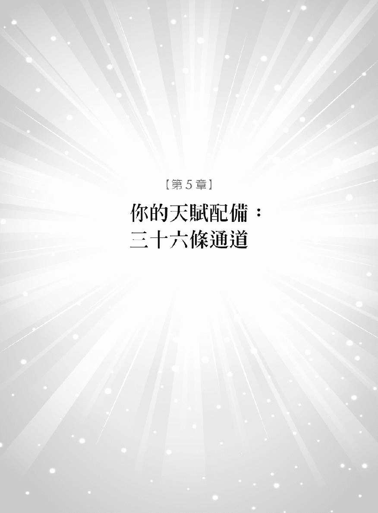

我会不时参考人类图的解读复习它给我的建议。人类图分析准确完整的描述出我的特质。

——SA 英国格洛斯特那郡

在整个人类图中你会看到很多狭窄、象是蛛蜘网的通道总共有三十六条连接着九大能量中心。我们可以从中更详细、更深入的了解你的独特本质。这三十六条通道是从犹太卡巴拉的古老智慧中所延伸出来的是九大中心的导管来回输送着生命的能量。

你会看到人类图中每条通道的两端都有一个数字。这些数字和六十四个闸门互相串联一起创造出人类图的面貌。关于闸门下一章节会有更清楚的介绍。

有颜色的是活化的通道它会吸取两边中心的能量形成自己的特质。这些通道就象是电线一般连接两边的电荷展现出能量。这些通道带给你用之不竭的能量而且终其一生都运作着。完全空白或是只有一半颜色的就是不活化的通道它们平常没有被接通但是当你身边的人那条通道是活化的就会在和你接触时使你原本不活化的通道变得活化起来。这是不同类型的人如何互相协调融合的方式。

你会注意到人类图中意识和潜意识的重要性开始出现在这个部分它们会帮助你发现潜藏于内心、意识察觉不到的隐性特质。通道的颜色有很多含意黑色代表着意识红色是潜意识黑红条纹则表示两者兼具。根据我对人类图的了解黑色通道是属于你自己有意识到的个性这些是你早就熟知的特质和行为模式但是红色通道就没有如此明显因为是属于潜意识的个性来自双亲和祖父母的遗传。潜意识的元素蕴藏于内我们不一定能察觉得到但是人类图却能清楚指出。

当你得到了这些宝贵信息了解自己的性格气质后你会更加注意到它们的存在并懂得如何善用它们这就是人类图美好的地方。而红黑条纹的通道则意味着你比较能够了解自己的潜意识部分。因此当你开始解读自己的人类图时请先找出你活化的通道然后看看后面对每个通道的说明。每个通道的两端有两个数字以及一个名称来总结它的影响力。为了方便阅读我会依数字从小到大排序开始解说。

要记得有完整填满颜色的通道才是你一生都自动作用着的、活化的通道。那些只有一半颜色的通道表示你仅有一端的闸门是开启的所以没有接通只有在当身旁的人那一个闸门是开启的刚好和你互补时整条通道才会接通。

如果你整张人类图都没有活化的通道表示你是反映者类型的人你将很容易就能觉察到其他人的活化通道以及他们如何影响你的人生。

# 1-8

###### Channel of Inspiration

### 灵感的通道

你是一个创意家而且有强大的说服力、影响力绝佳的统御力和领导才能。就如同通道的名称你有很多的灵感自然而然就懂得如何掌控情况而且能够以身作则。你的个人特色强烈人们信任你也依赖你。你能够激励他人一起来实现你的目标。

当人们接受你的领导而且能够被你鼓舞就是你成功的时候。如果你的决定得不到他人的感激或是你带领的人故意和你唱反调这会让你十足受挫和沮丧。

我会建议你不要志愿帮忙因为你需要受到认可和邀请后才能显现出最棒的特质主动插手帮忙并不是你展现天赋的方式。

这条通道有聆听上的天赋表示你能够听出什么样的情况或音乐对人、事、物、环境有助益。你总是能融入环境中利用耳朵找出最好的方向。如果听起来不对劲你是不会着手进行的。

当你确定前进或领导的方向时要倾听自己的发声因为声调会影响你的领导结果和你的言词一样重要。如果你说话时声音紧张听众会感受得到。说话要带着自信要知道你有鼓舞人群的天赋。

# 2-14

###### Channel of the Alchemist

### 炼金士的通道

神话中告诉我们炼金士可以将铅块变成金子这个通道就有这样的本领你有点石成金的能力及创造的潜能。能够透过荐骨的生命力发挥创新的能耐。

身为炼金士的你富有创新能力能赋予事物新的生命也有决心挑战自己的命运闯出一番大事业。你有天才或是巫师的特质能把不起眼的东西变得闪亮耀眼引人注目。给你一间濒临倒闭的公司你也能够让它转亏为盈东山再起。你知道正确的方向能帮助人事物重回正轨。你的信念和能量对和你同在一处或是共事的人都有很强的感染力。

这是一条个人主义的通道你有自己前进的节奏强烈的自信让人无法阻止你的脚步。你有理财、置房地产方面的才干能够从中获取资源。

这是四条「谭崔通道」tantric channels 其中之一虽然谭崔一词经常被和「性、双修」联想在一块但意思其实是将低能量转变成高能量。当然我们不能否认它对闺房之事的影响力因为它能将肉体的性交转变成「超意识」的经验。

这是属于生产者的通道能量蕴藏在最有效率、运作最佳的直觉反应之中。当你把能量投注在合适的目标时见证你行动的每个人都会对你刮目相看。

# 3-60

###### Channel of Mutation

### 突变的通道

你一定注意到自己周遭事物改变的方式很戏剧化。3–60 的结合具有某种象征意义因为我们环顾四周一圈一定是绕三百六十度。和你共度人生的伴侣可要有心理准备得接受你突如其来的成长和改变虽然怪异但绝对值得。等着接受一连串的惊喜吧

在我认识有这条通道的人当中他们过着飞跃式的人生靠着盲目的信念和荐骨的直觉反应不断改变人生方向。

这是三条「格式通道」format channels 其中之一不管你有什么样的人类图配置格式通道对你的生命都有压倒性的影响你的一生都受到它的支配。「剧烈的改造和转变等于个人成长」是你根深柢固的座右铭「重新开始」是你的日常行程不过别期待别人为你欢呼鼓掌因为不是人人都喜欢突来的变动。

有没有看过移动的事物被移动的聚光灯照射的样子这很像你的行事风格当灯光打在你身上时身边的一切就变得清楚可见但是当关掉灯光再度开灯照到你的时候身边的人事物就全都变了样朝新的方向前进了。

宇宙以不规则的方式左右你的生命这和任意变化的聚光灯相同。同样的剧烈的改变没有时间性可言会发生时就会发生这是大自然的法则有 3–60 通道的人一定要学会接受变动。你也会受限于这条通道尤其是在你想要推动某项计划却陷入困境动弹不得的时候这会让你感到沮丧而且不易脱离这样忧郁的心情。

这时候音乐和大自然是你最好的朋友。对声音敏感的特质使你需要符合心情的音乐来调适。你要更有耐心事情不会拖延太久这是生命要教会你的课程。要放心信赖这个通道的变化能量因为快速变化的惯性而产生的挫败感会逐步减轻。在这一生中你会看到你为自己和他人生命带来非常大的改变。

# 4-63

###### Channel of the Logical Mind

### 逻辑思考的通道

你总是以逻辑理性来分析今天、推论明天不断的追求进步但还是难免时常担忧未来。你藉着逻辑思维想出一连串可行的解答评估着种种事情的可能性。你会不断思考着「如果这样做就会……如果那样做又会……」因为每个行动都自有结果你会一一考虑清楚。

逻辑思考的能力很实用也很重要但也表示你会深受疑惑和烦恼所苦象是「如果没打破的话哪里需要修理」或「如果改变不了那又何须烦恼」你要换个想法帮助自己跳脱自我折磨的烦恼思绪。

该放多少心思在寻求解决之道的想法中是你需要学会的功课你要在过度担心和享受生命中取得平衡。你生来就是会不断思考、劳心的人先接受自己的本质然后就可以慢慢放下这些令人烦恼的想法了。

理智是你重要的资产不过你反而比较能够解决他人的问题胜过于自己的担忧和问题。你可以想出合理、健全的解决方案让事情进展得更好。各种问题你都可以想出很棒的解答有需要处理的问题发生时你总会逐步想出解决的方法旁人对于你充满逻辑理性的分析力都会佩服不已。

# 5-15

###### Channel of Rhythm

### 韵律的通道

你顺着生命之流总是不可思议地在对的时间点出现在对的地方或是学到新的事物。就像一只大海龟知道何时该上岸产卵你对时间的掌握和节奏感好似随着大自然和季节一起同步律动受到荐骨中心直觉反应的引领。因此若是有人紧盯着时钟要求你事事准时就很容易让你抓狂。你需要不慌不忙、有节奏地依照自己独特的生理时钟来行事。

我有一个朋友出门前总是匆匆忙忙、老是迟到但是他的另一半则喜欢凡事准时。有一次他们要参加一个聚会按照以往的惯例朋友的伴侣总要等到心急如焚他们才能在最后一刻出门。没想到到了会场后他们发现聚会刚好晚了半小时才开始。随着自己韵律节奏行事的你定能证明自己和宇宙的自然律动是如此和谐。

这和钟表上的时间无关而是知道何时该引入新事物或新朋友进入自己的生活圈知道产品、观念或是新发明何时达到了成熟的时机点。这样对时间的韵律感也包括知道何时转换人生的方向。

5–15 也是四大「谭崔通道」之一谭崔意指将能量由低转高促使他人改变鼓励他人臣服且相信自己的生命之流。你能从混乱中找到秩序让无头苍蝇找到方向。你是充满生命力的河流扫过周遭的每个人你在河岸边回旋有时和缓的流动有时却又急速的往前奔腾。不管速度如何你所带来的改变会促使每个人跟着生命之流一起往前。

当你进入生命之流之中人生对你是毫不费力且再自然不过的事但如果你跳离这个律动或是被迫遵守其他的时间你的人生将会变得混乱且很不开心——因为一旦失去自己的韵律处事就会变得不合时宜。当你在经历这样的难题时要停下脚步重新审视自己的责任或是和谁在一起因为他们对你的身心健康无益。倾听你的内心就能和自己的自然韵律重新连结。要认知到这一点你所需要的只是时间

# 6-59

###### Channel of Connecting

### 亲密的通道

这个通道会产生异性相吸的化学变化以及强烈的创造力。荐骨中心和情绪中心之间的活化作用会产生「性的连结」和强烈的吸引力让你充满魅力但是 6–59 并不纯粹是享乐的通道它让男女为了生育下一代的需求而携手相守。它不在意个性只求基因能够互相吻合。

这个通道带有高度的生殖力这条通道活化的话人们看到你就像蜜蜂看到花蜜一样会紧靠过来。不过你要有辨别能力才能找到内心的满足和平衡而不是一直受到性欲驱使。

然而这个通道也不完全只和性与生育有关你有很大的潜能开发出新计划、新观念和发起新活动。充满热情的你没有人可以阻挡你是个标准的、从无到有的创作家。

你喜好感官享受有强烈的欲望这都是源自荐骨的能量因此光是你的存在就能影响旁人的情绪。一般来说有此一通道的女性都会是社交场合的注目焦点。这就是荐骨和情绪中心产生的光环作用。

你也可以观察自己带给旁人的影响虽然有些人一派轻松自在的样子但是多数的人会希望可以远离你或是偶尔逃开不受你影响。甚至连禁欲主义者都会被 6–59 所吸引这是因为你启动了他们尚未化解的情绪旧伤。你的天性会觉得有责任为他们疗伤止痛但是你的智慧会告诉你他们的情绪其实和你没有关系你只是恰巧触动了他们的旧情绪而已。

如果你被困别人的情绪里就得一直经历直到最后尝到痛苦的结局。因此在选择爱人和共同养育下一代的伴侣时要听从直觉反应更重要的是让起伏的情绪稍做沉淀直到你觉得心绪澄净时才做决定。就如同诗人拜伦所言「没有什么比敏锐的洞察力更值得亲近。」

# 7-31

###### Channel of the Alpha

### 首领的通道

「合理的领导者」最能描述你的统御方式你是天生的领袖有足够的决心知道前进的方向带领人们迈向变动的未来。你不需要大声呼吁人们自然会对你产生绝对的信赖感知道你会引领他们走向光明。

alpha 是希腊文的第一个字母有最初、开端的意思它是狼群中最高的社会秩序而你就是任何族群中的最高领袖。你是人们心目中最理所当然的领袖人选准备被人提名、当选吧。群众对你的认同会让你的心灵快乐地想要大声歌唱。

你的领导风格带有逻辑力和权威感这就是人们跟随你、听从你的原因。当你走进一个场所人们自动会对你行注目礼。你有统整的能力让每个人目标一致。你会希望动口不动手就像将军下了指令之后士兵就去完成。但是你得身先士卒这不代表你讲话没有权威只是 alpha 就是站在第一位你也得这样。

身为领导者有许多责任也许最大的责任就是对自己诚实。即使人们看起来不知所措你也没有义务需要带领所有的人。选择错误的伙伴和情境会让你感到没有意义和成就感但是当众人认同你邀请你来领导时你会为他们带来彻底而有建设性的改变。

# 9-52

###### Channel of Concentration

### 专注力的通道

你能专心一致、心无旁骛不断精进直到成功为止。用「专注、专注、专注」来形容你的人生实在再恰当不过了。

为了实现目标和梦想你会不屈不挠、坚持到底。你是公司的重大资产尤其是在投资事业与未来规划方面。你有实现计划的强烈决心包括恋情也是一样。只有完美、浑然天成的恋情才是让你心满意足的亲密关系否则也一定要把缺点和不完美的地方都解决了你才愿意许下承诺。

所有连结到根中心的通道都具有强大、爆发性的肾上腺素支援着人们朝目标前进。但是这条通道懂得拉紧缰绳压抑过旺的爆发力让人能控制紧张的情绪。就象是骑着一匹套上缰绳的马朝着终点奋力奔驰你会在起跑前先蓄积能量直到开始时才鞭策缰绳。要是你还没收集足够的资源计划的拟定也未臻完善就开始行动那可能会让你感到很挫败、丧气。事情还没准备好就开始最让你抓狂这就是为什么你可以成为杰出的计划者。

直觉会找出对的事物让你投入专注一旦你投入之后没有任何人事物能够阻挡你前进的脚步。

9–52 也是三条「格式通道」其中之一它对你的人生影响颇大你的生活方式都受到它的影响。「工欲善其事必先利其器」是你的人生座右铭。

奥林匹克运动会游泳项目的金牌得主麦克菲利普 Michael Phelps 和高尔夫球选手老虎伍兹都有这个通道专注让他们在人生获得极大成就。

# 10-20

###### Channel of Awakening

### 觉醒的通道

你要求自己行事正直这样的处世原则醒目得象是烽火台一样。有这条通道的人对人生有强烈的认同感和爱会把握唤醒大家的任何机会因为你希望人们都能够享受真实生活的喜悦以及感受日常生活之美。

10–20 起源于自我定位中心向上往右边弯连结到喉咙中心让你经常想讲出「这一刻我忠于自己」的话。「做自己」是此通道的特征你能够放胆地表达自我清楚知道自己是谁有什么样的立场和处境。你让旁人生起效法之心更懂得如何自我定位。如果有人挑战你听在你耳里可能会觉得是人身攻击你要注意自己非常敏感的特质不要执着于别人的评论最重要的是懂得自我欣赏。

你无法容忍不诚实的人也不能接受不公不义之事。你要求人们随时随地都要百分之百的真诚你希望和人们有更深层的交流最好是和你一样有相同性质的人。没有人比你更希望世界更美好。

10–20 是四条「领导通道」之一但是你的领导风格会让人觉得过于高道德标准你总是想带领人们找到更崇高的目标。然而并不是人人都能接受这样高操守的领导方式即使如此只要是正确的你还是会坚持到底。对于追随你的人而言他们会有非常深刻的体验因为你为他们开启了更高的心灵层次。你只在乎「当下」真诚地把握人生的每一刻。

拥有 10–20 通道的人很少了解这条通道的意义因为他们全心投注在自己的处世原则中认为「我就是我为什么要在乎这个通道的意义呢」。如果你是这样想是不是就证明了我的说法呢

# 10-34

###### Channel of Exploration

### 探索的通道

有勇气承担自己的作为是你必须履行的责任以 10 开始的通道都表示对人生有强烈的认同感和爱。不管其他人怎么想你要做自己喜欢的事才能得到快乐。10–34 通道的人有我行我素的特质总是随心所欲以自己的方式行事。当然也不用觉得有罪恶感因为这才是忠于本性的表现而且其他人可能暗自钦佩你有这样的勇气。

这个通道源于自我定位中心往下连接到荐骨中心和你「只走自己的路」的风格很像。听从自己的信念和直觉反应所做的选择一定是正确的。不管别人同意与否或是认为你太自私、太固执都没关系一定要坚持到底不要在乎周遭的风暴。快乐是从自我肯定而来与别人肯定与否无关。有些事情会影响你的健康和心情包括你对生命的热爱程度居住地区和从事的行业。如果你为了别人而远离自己的选择必定会觉得迷失、找不到方向。

10–34 也是四条「谭崔通道」之一意思是能将低能量转变成高能量。你要先自己作转变才能获取前进的动力。如果有人受到你的鼓舞那很好但最重要的是你要坚持自己的原则不受外界影响而屈服。

# 10-57

###### Channel of Survival

### 生存力的通道

你的直觉和人生是以「危险」的方式互相作用就像在悬崖边跳舞、嬉戏不过你总是能够安全过关。这是因为你可以依靠脾中心本能的生存机制指引你通过人生的地雷区。说得夸张一点你可以从艾菲尔铁塔跳下来却毫发无伤

你是无敌的冒险家 10–57 通道带给你无形的防护罩让你在活动或是做选择时安全不受伤。你比大多数的人享有更多的保护。

当然这不是说你就可以毫无顾忌的做些蠢事但是你会发现自己有躲避危险、摆脱困境的神奇本领。当全桌的人都食物中毒只有你一人幸免或是能够幸运的不被掉下来的钢琴砸中你就是有办法全身而退以至于人们经常会问你怎么办到的。这个通道是没有逻辑可言的事情就是这样发生我常常会开玩笑说「世界上最安全的地方就是待在你身边」

你必须要学会相信从脾中心发出的直觉直觉评判的基准在于事情「听起来」正不正确。你的灵性无时无刻都在为你觉察这些振动提点你对的人事物、环境和选项。你的警觉性就像一只未熟睡的猫般敏锐一点点声响或环境的变化就会触动你让你即刻警醒。

任何开端为 10 的通道都表示对人生有强烈的认同感和爱。对你而言你会将人生发挥到极限。虽然你对未来怀有恐惧但是知道一切最后都会安然过关能够平抚你内心的担忧。你常会感到害怕但还是会放胆去追求不论对目标或是恋情都是一样。

# 11-56

###### Channel of Curiosity

### 好奇心的通道

你一直在寻找生命的意义渴望大声宣扬你的新发现借以激励人心。你永不满足的好奇心从未停下脚步总是不断发掘新奇的事物与旁人分享。

你喜欢分享脑袋中的想法因为心智中心和喉咙中心的连结是活化的。「我相信你会发现……」你喜欢用这个句子做开头然后观察听众的反应思考这些反应背后的意义。

你对每个事物过人的兴趣让你的人生信念、想法和观念不断更新获取新信息是你的最爱。看在旁人眼里你就象是一只花蝴蝶在花丛间飞舞每朵花都要尝尝看。你贪婪地吸收各种哲学和知识研究不同的观点探索各种新信仰。你希望自己的好奇心能够鼓舞他人你会到处旅行来满足自己总想知道下个转角会有什么新奇的人事物出现没什么比第一手经验更能激发你的新点子和新观念。

圣经说「寻找就必寻见。」这句话很适用但是对你来说还不够贴切因为你会一直探索直到咽下最后一口气为止。好像脑袋在还没理解人生的一切经历时就无法停下脚步一样。对你来说人无法从既知的想法中找到真理一定要自己去找、去尝试、去体验。

# 12-22

###### Channel of Openness

### 开放的通道

情绪中心对你有好的影响给了你内在的深度和率真的力量却也同时让你变得脆弱与无法预测。你带着燃烧的热情推动事情促使伟大的事物发生你能够开创人与人间崭新的互动模式你倾向选择较少人行走的路径期望能为自己和他人突破限制、开创新局。

在通往成功的路途上你的外表平静又有自信但内心却有各种情绪在拉扯。拥有这条通道的你不论性别为何都能勇敢、甚至愤怒地表达自己的情感这的确是抒发的管道。但是要慎选分享情绪的对象因为他们可能对你带来难以理解的影响更遑论能否和缓你的情绪。你对自己在进行的事有强烈的热忱但也让你变得急躁易怒。旁人一定会觉得这个人在发什么神经为什么要发这么大的脾气。

我会告诉拥有 12–22 通道的人在表达情绪之前一定要先了解自己和其他人才能帮助彼此互相了解。若不理会情绪会压抑和妨碍你表达的能力认清情绪才能让你回归平衡给你继续追逐梦想的动力。在追求的过程中你要感受而且尊重自己的情绪如此一来便能对人生的功课保持开放的态度藉由社交和生意上的连结以及自己的成就来鼓舞他人。

你的情绪总是摇摆不定大起大落但是你会努力完成目标而且对自己的目标充满热情。即使你故意隐藏情绪咬着牙不发一语但是你的强烈磁场还是会影响到身旁的人。如果你觉得开心其他人也会跟着快乐起来如果你痛苦那么旁人也会莫名地觉得沮丧。因此你需要知道何时可以和他人互动何时又该暂时远离人群。不管你的感受如何让情绪平静下来便能得到指引。

# 13-33

###### Channel of the Prodigal

### 浪荡子的通道

你是生命的见证者记录真实人生中的所见所得。其他人可以从你的纪录和观察中失败和痛苦中成功和喜悦中学习。你就像寓言故事中挥霍的浪荡子在出外经过种种体验之后回到家中父亲高兴的要你和大家分享旅途中的经验让他们可以从中学习。以这个角度而言你是生命的播报员是智慧的泉源。

13–33 也是「领导通道」之一你提供人们方向以极具创造力的领导方式带领大家找到生命的意义。你的过往经验对你的领导力极有帮助给予群众面对不确定的未来的信心。自我定位中心会透过喉咙中心这样表达「我记得当我……」或是「以我的经验这件事应该是……」

你是很好的倾听者也很喜欢说话。你会透过每一次的人生经验不断加强自我的定位让你成为每个人痛苦时能倾吐的知己。朋友会在你的肩膀上痛哭希望从你身上汲取力量期待你的认可并感同身受他们所经历的困难和挑战。即使是不熟的人也很容易对你倾吐心声然后很纳闷地说「我也不知道为什么会跟你说这些」你要和自己的「权威中心」作确认看看何时应该帮别人忙何时最好避开。

你会为了理解人生中发生的每件事而投注许多心力在将事件转变成智慧之前会认真审视其中的每个细节。晚上思考不完白天发生的事只好连做梦都得继续想当然就容易因此做恶梦。你要找机会休息恢复体力最好养成静心冥想的习惯。

在你家储藏室找到日记本的档案柜我都不惊讶你的儿孙辈可以从中得到大智慧。后代子孙可能会因怀念你而感伤。

你在解析人们时就像翻开书本阅读一样甚至比他们自己还更深入了解。你对人们深切的观察和同情往往会吓着当事人你的智慧对他们来说是一盏明灯。有你在身边会让人们知道自己是谁找到人生的意义。

# 16-48

###### Channel of Talent

### 才华的通道

你很有才华创造力丰富是你的优势。不管你有何技能或是梦想都会以艺术的方式表达这不仅局限在艺术领域在生意或是运动场上你也是抱持相同的态度。你领悟到要精通一项技能便得持续练习、训练和反覆的操作所谓熟能生巧就是如此而且还得有充足的人际网络作为后援。

活化的脾中心表示你知道什么样的人事物最适合你。你是个有深度、有才华的人 16–48 通道会引导你去深入发掘自己的才华让自己发光发热即使要花上数个月、甚至数年的心力都不会使你退缩。

拥有这条通道的人最常问「我要怎样才能成为大师」这个问题显示出你内心真正的恐惧你害怕做得不够或知道得不够而不能达到目标。这样的焦虑心情会促使你去寻找能够鼓舞你帮助你达到目标的盟友。人们的支持和鼓励是你支撑下去直到精通为止的动力。

这个通道的优点也可能变成危险你可能一开始为了帮助别人结果让自己的才华无意间磨得更精但也可能因此终身不断追求更高的学位或更多的证照而无法自拔。做人当然要持续成长精进、更加提升但是也要知道何时已经达到极限知止的工夫很重要。

你天生对很多事都很上手即使是像洗碗这样的事你都能做得非常完美。你有勤勉的天性一定会把每件事做到精确为止即使是在人际关系中你都很愿意持续磨练自己。

你渴望将生命谱成一章完美的乐曲因此没有改变方向的需要这样做也无意义。你做任何事都很客观凡事要求自己要做到正确。讲话切入主题不拖泥带水就像冷静的外科医生。而且正确不是唯一的要求进行的动作还得像诗文般的优雅。

# 17-62

###### Channel of the Organizer

### 组织力的通道

你是一个组织者和策略家天生就有极佳的逻辑思维能力你会撷取各种信息、事实细节和策略将它们串连、组织起来成为自己坚不可摧的见解和主张。你的消息灵通讲话论点深具说服力很少人会质疑你。

你的思维模式有条有理能够对幕僚智囊团、管理单位或是在任何竞选活动中提供很大的帮助你总是不断替各种计划方案和人们寻求解答。拥有这条通道的人会透过喉咙中心这样表达「我想这件事应该会……」或是「我想我们应该这么做。」

而缺点是这样的思维模式容易坚持己见尤其是没有人辩得赢你。心智中心和喉咙中心之间活化的通道会让你很想表达自己的想法所以得小心不要说出不合宜或是有害无益的意见。如果你不能选择自己该讲的话你的意见就会丧失影响力。

我认识一个人他可以坐上三个钟头以上不断发表自己对人生的看法。被他的言论迷住的听众总是以敬佩的眼神倾听他的论点。但是三天后他会说出和之前完全相左的看法让人傻眼。这就是典型的 17–62 类型的人。因为即使你们已经表达了自己的立场还是会继续思考反省自己的论点然后得到或许完全不同的结论。你会不断思索遇到的每件事脑袋是你很棒的资产帮助你成为高瞻远瞩的人。

# 18-58

###### Channel of Judgement

### 评判的通道

完美主义的你会经常审视身处的环境寻找方法改善每一件事让人人受益。你以公正的评论为他人判断事情的可行性。你会持续评估身处的环境、工作和社交场合期望能有所改变使之更趋完善。

从医疗保健、教育系统、经济体系到社区的超级市场甚至是邻居的花园你都认为有必要再改善而且你知道改善的方法你的想法总是在一瞬间就能迸出不需要经过思考因为脾中心会给你指示。你天生就看不顺眼很多事有点纯粹为了改变而改变的意味。虽然你的出发点很好但有可能造成误会尤其是在人际关系方面。如果你不学着控制就可能造成很大的冲突因为人们会觉得你过于吹毛求疵。你要学习评论公共事务就好避免去评论家人或友人的私事。

能够对公司或社会指出哪里需要改善的能力是你很大的资产。你是一个杰出的顾问解决难题的高手又能监督当权者适合从事艺术或是美食评论家你也可能是阻碍自己最大的人容易对自己的表现吹毛求疵把自己批评得一文不值。你没必要如此刁难自己我总是会告诫拥有这条通道的人放自己一马吧要了解人非圣贤、孰能无过。

你有修正事物、改善社会的天赋可以靠着自己的意见、评论和管理才干让世界更美好。遵从你的权威中心确认自己是否将能力用在对的方向如此志向必能得以实现。

# 19-49

###### Channel of Sensitivity

### 敏感的通道

你很有同理心喜爱感官、触觉的享受而且超级敏感你能够感受到每个人的需求、渴望和情绪也知道如何满足他们。你喜欢事事亲力亲为。

你非常敏感即使戴上眼罩和耳塞还是能够察觉旁人的感受。没有任何事逃得过你的「情感天线」你常常被感动到起鸡皮疙瘩、泪流满面强烈的同理心使你能够公平地对待他人给予支持。

来自根中心的压力让你觉得有义务伸出手帮助别人鼓励和安慰有需要的人。你的特质让你成为人们力量的来源、社会的中流砥柱你会努力让人们凝聚在一起。社群意识对你而言很重要尤其是身处在这个严苛又无情的世界你会尽力促成社群的和谐和团结。

在自己和他人的需求间取得平衡是你的人生功课你要爱自己尊重自己的需求才能达到双赢。19–49 的通道会引导你和每个人都走回正轨前提是你要先沉淀自己的情绪才能知道应该要加入哪些计划和团体。

即使是最轻微的批评也会伤到你不过你要学会放下像只刺猬一样卷起来保护自己耐心等待难忍的境遇结束。

你多愁善感的特质就像磁铁一样会让别人强烈的受到吸引和你在一起会感觉到自在和安全。在亲密关系上有 19–49 通道的人重视感官会寻求近距离的肌肤接触来满足心灵的需求。肌肤的轻轻抚触就能给你象是通电般的感受因此你可以成为自然疗法的治疗师、按摩师或是灵气治愈师 Reiki specialist。你喜欢和人牵手制定协议也喜爱靠握手来确认谈生意最好是以共餐的方式进行。你和动物很有缘你的敏感本质受到所有人事物的喜爱与欣赏。

# 20-34

###### Channel of Keeping Busy

### 忙碌的通道

忙碌是你最快乐的时刻因为你拥有一条爱忙的通道对你而言人生的成功关键就在于去做自己热中的事。当确认目标后你的内在驱动力会转变成无法阻挡的力量发射出潜力和感染力。

总是有忙不完的事就是你的人生写照。当你找到值得自己忙碌的人事物或目标时你会非常开心全身散发斗志。你浑身充满能量很难静静地坐着不动因为你的「待办」清单长得不得了有一大堆该做的事有数不完的难关要克服有数不尽的人需要你的帮助。

这是显示生产者才有的通道让你一天二十四小时都保持积极活跃的状态。你忙起来时不希望受到干扰你的家人、朋友、同事……都得要习惯你狂热的步调。你光是单纯地走进人群之中就能带动人们忙碌起来的气氛。和你短暂的相处就能获得鼓舞和动力你的存在能推动许多事物进行。

你总是不断地在移动从一个计划跳到下个计划你有必要问自己「有需要为了忙而忙吗」答案当然是不需要。你必须记着只为自己所爱的人事物忙碌就好不要被人美言几句或说一句很需要你就纵身一跃投入全部心力去帮忙。如果你不经思考就让自己忙来忙去就会变成一台没有煞车的高速火车终究会脱轨翻车。静心去倾听自己的直觉它会告诉你该为谁、为何而忙。

你可以在墙上钉满证照在银行存很多钱或是在展示柜中放满奖杯……但如果这些成就和你的梦想不符对你来说就完全没有意义了。唯有做你爱的事才会有意义。因此我要再次强调只有符合梦想的事才是你该放手去做的事

# 20-57

###### Channel of Involuntary

### 冲动的通道

你有强烈的直觉总是生龙活虎能够充满朝气地表达自己你的体内有一股推动着你经历生命的力量。你比多数人更领先一步以 X 光般锐利的眼神审视现况和未来可能发生的事。你能分辨人们是否在说实话知道计划和前进的方向是否正确。你的直觉能够穿透人们的思维识破眼前的烟雾弹、隐藏不显的真相、伪善和高风险的追求。

你的耳朵可以深入问题的核心因为它们「听得到」事情在当下的真相。拥有 20–57 通道的你眼睛或耳朵是不会受到蒙蔽的。你的直觉敏锐让你在任何环境中都能保持警觉。人们可能会观察到你的脚趾随时都在「抽动」其实这只是脾中心超时工作时会出现的现象。

活化的喉咙中心表示你会有不由自主想讲话的冲动你的说话风格就像机关枪般快速。在聊天的过程中你可以感受到隐藏在谈话内容之下的真相激发你的警戒心然后就会开始谈论那件事。通常都要在你提出来讨论之后人们才会觉察到这些暗藏的事情。

出现这样不由自主的说话冲动时要小心自己可能会一直打断别人的话或是在别人讲话时你讲得比他还大声。要是常常这么说话冒失、不看场合很快地人们就会想疏远你。

你可能会对未来感到焦虑、烦恼。要让你的生存意志知道你和你所爱的人都很安全没有危险你能从中得到不断评估这个世界的动力以及了解你所扮演的角色。如果你能脚踏实地为自己的天赋设定合理的界限未来必定会非常辉煌灿烂。

# 21-45

###### Channel of Money

### 金钱的通道

别太过兴奋拥有金钱的通道不代表你会成为富翁富婆而是你很爱赚钱。你在物质世界里悠游自在每当嗅到金钱的味道意志力就会驱动你去实现目标为自己带来财富。你的世界似乎围绕着金钱、权力和名声在转动。虽然俗话说「有钱能使鬼推磨」但是对金钱的渴望也可能是万恶的根源。因此务必要在物质与自己的核心价值中取得平衡。

这个通道给你两个选择要不是成为伊丽莎白女王二世要不就是做她的首相。讲得白话一点就是你要懂得利用别人为你赚钱而非凡事亲力亲为赚得那么辛苦。以美国富豪唐纳川普为例他就有这条爱赚钱的通道他可以选择以大方向来领导他的金钱帝国也可以事必躬亲连鸡毛蒜皮的小事都要插手。

你和唐纳川普一样在努力为公司工作为家庭或是族群赚取财富时内心会感到平静快乐。你希望在照顾自己的利益同时也能照顾每一个人的经济需求。你希望以自己喜爱的方式赚钱而且赚钱的同时还能够享有自主权如果你受到限制、失去自由就会觉得受剥夺而心生沮丧。

这条通道的负面隐忧在于你可能会贪得无厌一旦发生时会让人觉得失去朝气。你若是为众人谋福利你的付出会得到大家的感谢这给你很大的成就感和自信。

影星安洁莉娜裘莉 Angelina Jolie 有钱又热心公益她就有这条 21–45 通道难怪联合国任命她为难民总署的亲善大使。爱尔兰作家王尔德 Oscar Wilde 认为愤世嫉俗者知道事物的价格却不懂得它们的价值。但是拥有这条通道的人可不一样他们对事物的价格与价值都一清二楚、了然于胸。

# 23-43

###### Channel of Structuring

### 建构的通道

你的独特洞见能改变人们对世界的看法帮助世人看见事情的全貌为他们的生命带来秩序。你的世界建立在一连串敏锐的心理评估和观察上几乎就像你有第三只眼。

23–43 是三十六条通道里最有力量的通道你直言不讳总是急着想发表心得。心智中心和喉咙中心之间的活化通道让你藏不住心里话一定要将所知的事情说出来让大家都了解你。

你喜欢发表心得的特质会让周遭的人不知所措而引发各种反应这是因为你的心智遥遥领先多数的人。对有 23–43 通道的人来说如何以简单圆融的方式来表达想法恐怕是你人生中的一大课题。

人们在了解你的思想之后会觉得你真是天才而和你产生共鸣但是在这之前会觉得你像个怪人而皱起眉来。对你来说浅显易懂的事情对其他人可能就像被墙挡住般无法体会。因此讲话前要先自问「这适合他们现在听吗」以及「这该是我高谈阔论的好时机吗」

声调是你最好的盟友 23–43 通道的人都有独特的声音。其实声调和发表的言论一样重要因为你需要靠它来传达你的自信和认知让人们更信任你。

在分享高超见解时要懂得找到对的时机不然你可能会讲话不经大脑而在社交场合上吃亏。如果你忘了控制舌头一定会想到什么说什么有可能是很棒的论点也可能是乱七八糟、一闪而过的念头而已。象是别人剪坏的发型、工作上犯了大错误……你随时有可能讲出不该说的话。若是你能学会控制自己讲话机智、懂得看时机人们一定会觉得你很有见地那么你就能大幅改善工作和个人生活。知道自己能够提升人们的质量对你来说绝对是最幸福的感受。

# 24-61

###### Channel of the Thinker

### 思想家的通道

法国人会尊称你一声「沉思者」并且把你的铜像立在巴黎的罗丹美术馆里。你和这些不朽的铜像一样在沉思时几乎忘了时间的存在你不断在内心琢磨希望能从中悟出真理。

十八世纪法国雕塑家罗丹的雕像作品中试着要表现出人在认真思考内心纠结挣扎的景象而拥有 24–61 通道的人就是这个样子。你绝顶聪明、思维深刻总想合理化人生的每一件事却也让自己和他人感到筋疲力尽。

头顶中心的天线会不停寻找新灵感促使你一直追求新知希冀每件事都能得到解答。光想到你脑袋里有多少事情在转就让我觉得疲累你总是一而再、再而三地反覆思考。你努力思量的程度让人们彷彿可以听见脑袋里引擎的发动声。有一股力量督促着你寻求内在的真相在耗费如此大的心力后可能会让你感到很狂乱而且放不掉这些困在脑中的想法。你知道真理但是很难体现真理因为你总是不断重新探索所以夜晚才会关不掉脑海翻腾的思绪。

这是你的本质接受它就能减轻沮丧感你要训练自己不要成为思绪的奴隶。要懂得享受宁静的时光让自己沉浸在音乐中。在头顶中心运转时要学着退后一步不要被拉进混乱的思绪中虽然想法在脑海中转个不停但是自然会慢慢安静下来你不要急着跳进去。不妨多做静心冥想安定、沉淀自己的思绪。

不要以为想得越多就能越快领悟「终极」答案反而应该将注意力转移到其他人或是增进群体的福祉上。永无止尽的思考合理化每件事情的思维模式是你的天赋你可以靠它来激发别人和你一样拥有不受限的思维。

# 25-51

###### Channel of Initiation

### 开创的通道

你总是不屈不挠将自己和他人推入新的领域朝向更美好的人生迈进。喜好开拓的个性促使你义无反顾地去探索新的领域进入未知的范畴向命运挑战。和你共事的伙伴或是人生伴侣会因为你这样的态度而逐渐养成强烈的专注力。拥有 25–51 通道的人会努力寻求有益身心、能激励自己的经验也会尽力成为开路先锋。

上述种种特质让你成为竞争心强的人如果遭到否定或反对就会非常生气。在你最不修饰的状态下拥有 25–51 通道的人容易显得自傲、蛮横无理、排挤别人只为自己想成为一哥一姊。你有强烈的人生目标做任何事都一定要爬到最高的位置成为带头人物。

你容易流露出人人都得听从你的态度因为你比他们更高竿、更有见识。你天生就带着浓厚的个人主义色彩和一点点神祕感这是因为你是物质和心灵世界之间的桥梁。

你非常拥护「博爱、无条件的爱」这样的论点这种超脱的观念有时会让你的伴侣难以理解因为这样的爱不是男女之间的情爱而是心灵层次的大爱。有这个通道的人不会向往艳遇这种事虽然喜爱电影中浪漫情节的人可能会误解你但是你相信唯有无条件的付出这个世界才会有所成长。

你能开启新的契机为自己和他人带来新的发展。你想改造自己和每个人的世界相信人人都能拥有更美好的人生。当大家都处于浑然不觉的状态时唯有你独醒这会让你觉得很开心。但其实不是每个人都想和你一样大幅更动原已舒服的生活圈。

要满足博爱的情操还是自己的欲望是你内心很大的矛盾冲突。你的心里存有这两种对立的观念你被困在人心的欲望和人类最高价值之间有如一脚踩在西方一脚陷在东方般为难。尽管如此在人们眼中你是个勇气十足、敢冲敢拚的人而且是个正人君子。

# 26-44

###### Channel of Enterprise

### 进取的通道

你有进取、肯冒险的精神会利用自己优秀的沟通能力来传达先进的观念让世界更美好。你很有上进心不管是做业务、投资顾问、说客还是传达讯息的使者都会全力以赴。不管面临什么状况都能带着创意去执行和协商不断改变自己去适应现况的需求。

你相信自己能有一番作为就像建筑师有信心盖出美丽的建筑物销售员认为自己的产品能够改变世界而大明星一出现就可以让粉丝开心尖叫一样。你有原创力又懂得操纵的手腕还有群众魅力这三个特质加上坚定的意志力让你不断地努力立志要成为最拔尖的人。

你能很快看到问题的根源让别人接受你的看法。有时候你会以开玩笑的方式来调解人生中的冲突也会讲些人们不好意思说的甜言蜜语逗人开心。不管是为了社交、销售或是爱情你的话都很有说服力因为你是真心而不是在做表面功夫。所以在执行计划、把握机会或是人际关系上你都能说服他人给予支持和协助。

脾中心让你天生拥有改变形势的本能给你进取、冒险的人格特质就像拥有敏锐嗅觉的动物你也闻得出来哪些活动、计划和公司值得你投资。一旦嗅到商机务必会确保自己得到报偿、赚大钱而且人人都会佩服你的能力这是你厉害之处。

你做事一定要是「新颖且经过改良」甚至包括个人和商场的人际关系。人们会自动闪边因为你让他们觉得「没有人可以做得比你好」在你自己的眼里你是有史以来最棒、最厉害的人而且有人请求你帮忙时你会更自豪。

你做事时总会自问这是为了满足自己还是为了众人的利益着想。会有道德观念的挣扎是因为脾中心需要感觉良好但你心里却暗藏强烈的自我意识。你会帮助人事物得到提升与改善而且你相信人们一定都需要你不论你能付出的是财物、观点还是创造力。

# 27-50

###### Channel of Preservation

### 守护的通道

你有照顾幼小、扶助弱者的特质天生就想保护他人、服务大众。很多社工员、医疗人员或是保姆、医院的行政人员、执行秘书和按摩师都有 27–50 的通道。你总是不断地关心、照顾人们或是维护保存他们的生活方式象是逐渐消失的少数民族文化。

你会为需要的人付出心力愿意关怀和保护众人是你的天性。照顾别人保持开放的心灵努力去维护人道精神是你的生命动力。就好像你跟这世界签了合约愿意将众人的利益放在自己需求的前面一样。

亲朋好友觉得你就像母亲一样会照顾人你甚至希望终身为世界福祉奉献。当你关怀或是保护他人时心里就能得到很大的满足感。你的行动不只局限在关怀别人还会延伸自己的爱去维护保存旧有的文化资产。你认为在某些情况下保存文物和关怀他人是同等重要的。

脾中心的警觉性和直觉反应会告诉你什么样的人和情况最值得你的关怀。倾听你的判断力行动前先确认是否和直觉吻合这样你的心就能得到满足不然人们可能会将你的付出视为理所当然。

没错你可能会视别人的需求比自己的需求更重要这样会动摇你和另一半的关系所以你要确保施与受是成正比。你总是为了众人的福祉和幸福在付出即使是爱情也一样要小心别让自己为他人做牛做马。忙碌地到处照顾别人可能会让你筋疲力竭情绪低落。

每个社会都需要有人去维护保存旧有的文化传统拥有你这样值得信任又体贴的家人、朋友、同事……真的很幸运。

# 28-38

###### Channel of Struggle

### 挣扎的通道

你把个人主义发挥到了极致只要你认为是对的事或是命运或规定对你不公平的时候一定会站出来捍卫自己的权益。奋战的个人主义让你在前进时会不断奋斗对抗这个世界不公的地方。我几乎要为你贴上「造反者」的标签了你这样做的原因就是为了捍卫个人主义。

顽固是一个很强烈的字眼让人联想到固执的老骡子。但对你来说固执的性格是天赋它让你有勇气争取权益捍卫自己的立场不管是面临人生低潮还是外来的阻力时都不会轻易放弃。只要你听到「这样做行不通」的话马上就能提振精神你绝不会对阻碍妥协誓言完成不可能的任务。似乎听到你对自己说「看我的吧绝对会成功。」

你有没有遇过几乎把人吹走的强风拥有 28–38 通道的人你们的人生就象是逆着强风往前走一般困难。你需要保持平稳、镇定和一颗不动摇的决心一步一步往前走。幸好你有很强的第六感知道哪些人事物值得你去争取。即使你到了国外看到当地人民权益受损你也会发动抗议游行大阵仗地为人们奔走忙碌。

你就有如旧约圣经中大卫王对抗巨人歌利亚的故事一样——以小虾米之姿战胜大鲸鱼让你习惯于对抗所有的人事物。人们无法理解你内心的交战为什么你总是要反抗整个世界一副对常规习俗、法律嗤之以鼻的样子而且你只选择自己想听的事情那些不合心意的事你一概左耳进、右耳出。这是你的个人主义特质当人人都向右转你会反骨的偏偏要向左转有大门可以进出你就要故意爬窗户还会一副「只要我喜欢有什么不可以」。这样的行事作风是你表现自己的方式。

问题是你的人生标准可能很不切实际。你的成就来自于知晓哪些事值得你奋力付出哪些事又应该放下不执着不然你这样勇往直前不屈服的精神可能会遭到他人利用结果只是让自己耗尽心力而意志消沉。你要学着放下好斗的心不要什么事都往心里去然后你就可以轻松地坐在舒服的沙发上放一张喜爱的音乐坚定的唱着「我就是要走自己的路」

# 29-46

###### Channel of Discovery

### 发现的通

「我们正要经过狂暴的乱流人生会变得刺激有趣请扣紧安全带捉住帽子不要让它飞掉。」如果有人这样说你可以确定他一定拥有 29–46 的通道而且正努力在实现梦想。

你投注全部心力在探索人生彷彿只有这件事值得你付出。现在的人都要先确保计划会成功才愿意努力但是有这个通道的人投注心力之前并不会考虑太多而且能从经验值中获得帮助。然后神奇的事情就会发生也就是成功会自然上门。彷彿宇宙听到你为了经验而努力的声音想要奖赏你似的。宇宙知道你与生俱有的潜能储藏在你的荐骨中心这股潜能是别人失败而你成功的原因。你可以将这句话贴在门上或书桌上「别人失败我却能成功」

关键在于你要将心力放在对的人事物上你的前途就无可限量。活化的自我定位中心表示你对自己正在进行的事看得很清楚而且有很强烈的热情。对生命的力量和爱会产生一股很大的能量帮助你专心致力根本就不可能会失败。当你感受到明确的直觉指示时你会整个人投入到正在进行的事物中完全忘记时间的流逝一心只想实现梦想完全沉湎于过程。没有任何人事物可以干扰你拥有发现通道的人注定会成功因为强烈的生命力加上热情哪有不成功的道理。

你的另一半要学会欣赏你在努力的过程中专注投入的特质。就像观看神祕的伊斯兰苏菲舞者刚开始旋转的速度很慢但是音乐和节拍会越来越快最后快到只看得到一团旋转的身影。

29–46 也是四大「谭崔通道」之一谭崔意指将能量由低转高促使人们改变去相信与进入自己的生命之流。29–46 通道让你将平凡转变成超凡所以会有数不清的人希望你能加入他们帮助他们的梦想起飞。让直觉引导你投注在正确的人事物上而且要一个一个来别一下子把所有的事情全揽在身上。这样做就能确保每次都能成功而且达到发现的目的。

# 30-41

###### Channel of Recognition

### 梦想的通道

专注的想象力让你成为有远见的带头者你有强烈的热情为了众人的利益开创更美好的将来。思绪深远的人看事情通常都比大家更有先见之明你相信自己的梦想一定会成真而且也愿意找方法实现目标。你的人生充满使命感你知道事情应该如何进行。

通常在政治界或是社会服务、艺术和心灵领域的人会有这样的眼界知道要如何建构崭新的未来不管在当时看来是不是过于梦幻、遥不可及。你会让旁人也能了解你的观点、分享你的热情一起创造将来。若能得到认可你会有更大的力量去实现梦想。

你沉浸在自己的世界里对其他事都漫不经心要得到你的注意力实属不易。人们难以理解你的心情因为你的内心不断在挣扎到底杯子是半满还是半空。你一边对深远的见识感到开心一边又经历着剧烈的心情变化。因此有这个通道的人需要一个平稳的人在你身边帮助你安定心神。但是你知道人类的历史尚未完成你想再添上一章你愿意串连自己的幻想、梦想和远见热情地为自己订定任务。

你要用澄明的情绪来追求梦想不要被期望绊住脚步如此才能有所成就。凡事你都会尽力而为所以放胆编织自己的梦想吧为众人寻求利益你无法想象宇宙会带来什么惊喜。得到充分的支持便可以等待梦想成真学习和众人一起相信你所描绘的未来欣赏他们得到鼓舞的欢欣模样。

美国总统欧巴马就有这条通道不过这一点也不令人意外他宣扬自己的梦想希望人人都能看到他规划的蓝图。在二〇〇八年的总统选举上支持他梦想而投票的选民一定或多或少认同他的想法愿意和他走在同一条路上帮助他继续前进。

# 32-54

###### Channel of Transformation

### 转化的通道

你有要成功的强烈决心时刻实践不松懈还会寻找有力人士帮助你达到事业的顶峰。当你发现比自己强的人便会督促自己要继续往上超越。

你的座右铭一定是「不论付出多少代价我都要成为人上人」物质或是心灵层次的成就对你来说很重要你会寻求可以帮助你成功的盟友。拥有这样热切的抱负是因为你害怕失败这是 32 号闸门给你的影响也就是说你很容易成为工作狂。你时常加班常常是最后一个离开办公室的人希望能让上司刮目相看或是达成目标、获取大笔订单。

你的天性就是喜欢不断扩展以达到人生的颠峰状态。对 32–54 通道的人来说你身边出现的人事物都是为了帮你达成自己的提升。你有强烈渴望成功的欲望电话簿里满满的联络人都是你精挑出来要帮助自己获得财富和权力的人选。你在事业上的权力斗争以及私下与有力人士的会谈都是为了要在人生中快速成功、飞黄腾达。

因此在社交圈和生意场合上你经常自问「这个人是否对我有利」在这个方面你要听从脾中心的指示和自己的第六感。如果你能信任自己的直觉就能朝着正确的方向前进。你会转变与你相遇的每个人而且发现自己很受欢迎。这是因为人们知道你工作勤勉而且努力实践目标。所以你要致力于双赢的局面不要单单追求自己的利益一旦这样做就会发现人人都愿意助你获取成功。

# 34-57

###### Channel of Power

### 力量的通道

对拥有这个通道的人来说最重要的就是利用当下的力量成为伟大人物为环境带来改变。你荐骨中心的能量和脾中心的生存本能互相连结让你天生精力充沛而且有强烈的直觉力。当你能够依照自己的感受正确行事时你的动作快速又果决深得旁人赞赏。

以危机处理能力来说没有人比得上 34–57 通道的人。这是因为脾中心有最强的直觉反应在危机发生的当下能即刻做出最好的处理过程中还会促使他人一起参与。你会运用天赋的力量帮助悲痛的人内建的警觉系统就像超人一样可以听见别人发出的微弱呼救。直觉会为了让自己和众人生存下去大声呼救、请求协助。这样的力量可以帮助弱势的人重新振作掌握自己的人生。任何人的目标和你产生共鸣的话你就会赋与它们生命力。举例来说假设你今天早上九点才接下一个新工作你会在九点零五分时才刚了解职务内容不久就发动大改革。

巨大的力量加上温和的第六感这样独特的组合就像在强壮的手臂戴上丝绒手套。你的能量可以带动每个人向前获得大成就而你会在一旁不断为他们鼓舞「你就要做到了加油加油加油」人们会寻求你的力量和才能所以你要谨慎运用。你很自然就会为人们疗伤止痛为他人带来幸福而且你会乐在其中但是要记得先照顾好自己的需求。

前英国首相撒切尔夫人就拥有这条通道看看她在英国推动的「撒切尔革命」。这位「铁娘子」在一九七九年当选为首相不管你对她的执政看法如何但她认为当时的英国颓靡不振她的使命就是要让英国重新奋发图强。她放手去做也成功地做到了。这是 34–57 通道的自然反应你们为公众所做的事有可能在历史上写下一笔。

# 35-36

###### Channel of Versatility

### 万事通的通道

体验多采多姿的人生吧你想要亲身体验人生的一切要是让你印一件 T 恤你一定会在衣服写上「要去每个地方做过每件事」你不会花费太长的时间在同一件事上因为你急着想要感受更多的人生所以你会不断寻找下一个刺激。这样不知足的心情涵盖你人生的每个领域包括居住的地方、恋情、工作、旅行……以及性关系。

你应该是属于「样样通、样样松」的类型因为你一直想要寻求下一个新经验的渴望让你成为一个超级善变的人。你精力旺盛、酷爱刺激你会挑战自己的能耐和社会的容忍度去做自己想做的事。因此你的心情常常在兴奋和慌张不安之间变动。你从不事先考虑做的事是否有价值、是否重要就已经纵身跳进水里直到从湖的另一边爬上岸时才会思考这样做值不值得、有没有意义。你在意的是过程而不是结果所以你会过一天算一天而且每天都要活得有变化。这样才能让你觉得自己活着有时候你甚至会故意制造麻烦只是为了去感受戏剧性的人生。

你想要把每日行程安排得越满越好因为你极力渴望拓展、往前进。你害怕世界太精采但人生太短暂而无法体验每一件事。跟你在一起非常好玩但是对你的另一半来说却很困扰也很痛苦因为他不知道你下一秒钟又会想出什么新挑战。你一定常常听到情人这样说「我以为你喜欢这个工作。」或是「你不是也想住在这里吗」不然就是「我以为你爱我……」在恋情中你要诚实告知对方你不会安定下来你的目标就是当个永远的浪人。

你要学习不要只为了想体验新鲜感就去做某件事要先等情况清明之后再做决定因为期望越高失望就会越大尤其当新事物并不如你预期的好玩时会让你感到丧气。

你有带头体验人生的本领想要体会生命各种型态的人只能跟在你后面模仿。但是你要有耐心只有内心产生共鸣的人事物才会带给你最大的智慧想要不断前进的渴望才会得到满足。嗯……几乎得到满足啦。

# 37-40

###### Channel of Community

### 社群的通道

你是一个讲话算话的人希望能够住在一个诚实公正的地球村里大家都是一家人。你希望找到生命的意义你需要有同样信念的朋友支持你达成目标。人们会因为你的诚信而加入你的行列贡献己力做好份内工作。这样的价值观使你的人际关系更加巩固。这也是条联盟通道你需要和正确的伙伴一起合作才能成功有所成就。

如果你的盟友人选错误情势可能会失控变得很糟糕。你的任务就是要让人人目标一致拥有相同的价值观和愿景有一样高昂的斗志才能凝聚家人的情感创造关系紧密的婚姻、事业和社群。家人同聚共享晚餐的快乐气氛会让你这颗喜欢作大家长的心感到幸福满溢夫妻之间有共同的目标互谅互让也会让你非常的感动。

也许有人会觉得你过于感性因为你天生喜爱皮肤的触感举凡象是和朋友家人牵手、拥抱等的接触都能让你觉得零距离。你有融化人心、值得信赖的灿烂笑容笑容为你赢得友谊让大家觉得有归属感你能用笑容影响他人。

谈生意签合约之前你喜欢握个手和对方眼对眼去感受他们心中的诚意这是你决定对方是否值得信任的方式。比起严肃的会议你宁愿相约用餐以轻松的方式达成共识你会尝试和共事的人做朋友希望彼此成为永远的盟友。

你无法忍受违背约定的人有时候你甚至会和对方拒绝往来。如果有人让你失望你会请他们走路而且做到眼不见为净的地步。你说话算话也要求大家要达到这个标准。

你就像群体中的粘着剂在教堂、里民中心或是运动俱乐部都看得到这样的人物。当计划像齿轮一样有秩序地进行着共事的人也都一派和谐时你会开心得想大声歌唱。你为大家带来信任、正直和安定的力量世界有了你会更加温暖。

# 39-55

###### Channel of Emoting

### 感性的通道

忧郁的贾桂琳在莎士比亚《皆大欢喜》一剧中以「世界就是一个大舞台」当作开场白她接着说「像炉灶一样叹气写了一首悲哀的歌谣咏叹他恋人的眉毛。」这段独白不正也点出人生从婴儿到老年会历经的不同感受吗莎翁在描写这个角色时应该是以 39–55 通道的思维下笔的。你的人生偶尔也会遇到狂悲或是狂喜但你在扮演自己的角色时从不失热情。

因为冲击过大使得心情高潮迭起因而难以掌控情况。12–22 通道的人可以透过喉咙中心来表达情绪可是你却没有相同的宣泄管道情绪上还得承受来自根中心的压力。这样的压力在你体内不断窜动得不到纾解。情绪的强度已经无法用一波一波的海浪来形容而是像地震仪上的指针快速地上下跳动。不过高涨的情绪也会让你在做任何事时都充满热情和动力毫无保留地燃烧自己。起伏的情绪就像硬币的正反两面它让你沉到最低的谷底同时激发出最大的创作力。

你享受音乐带来的快乐和慰藉疗伤系的音乐最适合你聆听。你在低潮的时候不管旁人再怎么努力都无法让你开心起来。这对你的另一半来说是痛苦的折磨他们很难体会你的心情。我会建议有此一通道的朋友要有自己的空间难过时可以独自躲起来疗伤。当你又聚集足够的力量站起来时心情就会自动好转了。这就是你的性格你得学会接受这样的自己。

越快学会你的人生就会越有深度也会越平顺。尊重自己的情绪变化把它当成朋友。欢庆自己有这样深刻的情绪吧这是一项特别的礼物让你彻底体验人生。当你难过到谷底时就是要发挥大创意的时刻了你的创作会如同高空中最闪耀的那颗星星。别忘记了最美丽的钻石一定来自最深层的矿坑。

# 42-53

###### Channel of Cycles

### 循环的通道

在你的生命中智慧的累积和个人的成长就像月亮绕着地球一样有着规律的周期。工作、恋情和各种人生境遇都会历经开始、中间过程和结束的完整历程。

这是第三条「格式通道」它意味着你的人生中每件事都会有其循环周期不管是以日、周或是年来计算。有些甚至会长达五到七年的时间。回顾一下自己的人生你会发现一连串的循环。我有一个朋友他就有这条 42–53 通道在解读过人类图之后他赫然发现自己每五年就会转换工作跑道、搬家、交新女友彷彿「换季出清」一样架上的货品都要全部更新。

了解自己的周期非常重要这样你才会知道该将心力投注在何处。当你作出承诺后荐骨的能量会把你固定住直到你经历完整的周期为止和轮子一样如果你在轮辐中插入木棒就得回到原点重新再来一次。这是因为你必须体验完整的周期一直到你有所领悟更加提升为止。所以把时间浪费在错误的周期里面是最要不得的事不过你的直觉会清楚地引导你找到正确的人事物和环境。

因为有这条通道的推动力你知道如何促使他人展开新的计划。你以不同的周期来累积人生向前迈进你会鼓励人们寻求新的开始和突破。因此想要变换人生跑道的人可以从你身上得到很大的力量。如果你做了错误的选择很可能将力气都花费在帮助别人自己却在原地踏步。再一次提醒你要听从直觉的指引才能确保自己能不断的进步。

循环的通道就好比是一本书会有前言、本文和结语只有在你想读完整本书的当下才值得将它从架上拿下来读一半就放弃是没有意义的。你要读的这本书包含你的职业生涯、伴侣、婚姻和居住地。承担过多的事会给自己太多压力要懂得选择和心灵产生共鸣的人事物就好。不要烦恼故事该如何收尾只要享受过程。正确的选择会带给你许多的快乐、成就和满足感。

# 47-64

###### Channel of Abstract Thinking

### 抽象思考的通道

如果森林中的一棵树倒了会因为没有人听见就不发出声响吗很多人也许会说「谁会在乎这种事」不过你就是那个会在乎的人因为你那喜欢做抽象思考的心智中心会度过一段开心的时光。

你的理智喜欢和抽象问题搏斗想剖析人生中的一切事物。你会认真思考形状、颜色、触感和无形的观念让自己浸淫在历史和哲学的思考之中专心一意地研究新理论和旧文化。你想要得到解答更新这个社会的秩序和信念。生命奥妙得难以理解而你已下定决心要解开谜底。

24–61 通道的使命是想找出每件事的原因将它们合理化但是 47–64 通道是想替深奥的问题找答案象是「生命的意义为何」这类深奥的问题。你会很开心地沉浸在圣经、佛典或哲学书籍中贪婪地阅读每一页试图从中找出真理的蛛丝马迹你可能得到深刻的领悟感到心中一片清明也有可能让自己卡在牛角尖中钻不出来。

旁人可能无法理解为什么你想要解答这种莫名其妙又过于意识型态的问题但是你相信有一天你的领悟会为人类点亮一盏明灯指引出一条康庄大道而且不论是否能够获得解答你也能从思考当中得到很大的乐趣和慰藉。

安静独处时最容易让你进入这样的抽象思考。有时候思考好久的问题可能在上床之前或是睡到半夜得到顿悟好像有人突然打开电灯照亮你的心海一般。

你知道怎么帮助别人解决问题但是碰到自己有问题时却容易一筹莫展。不过只要记住你有很棒的思维能力持续思索你很快就会得到解答。

#### 小结

这三十六条通道为我们连接身体内的能量就象是电线传导电能一般。有人的通道是一片空白但也有人拥有高达十七条活化的通道。其实数量多寡不重要重要的是这些变化让每个人都成为最独特的个体。

因为我们的人类图会互相影响不活化的通道会受到他人的活化通道影响而起作用。你只要注意在自己的人类图中有哪些是始终不变的特质就好了。

你与身边的人的人类图会互相作用和配合这机制很特别也很有趣尤其是在通道只有一半颜色时更容易显现出这样的互补作用和变化。所以接下来我们就要更深入探讨六十四道「闸门」来看看这些只有一半颜色的通道会如何发生作用。

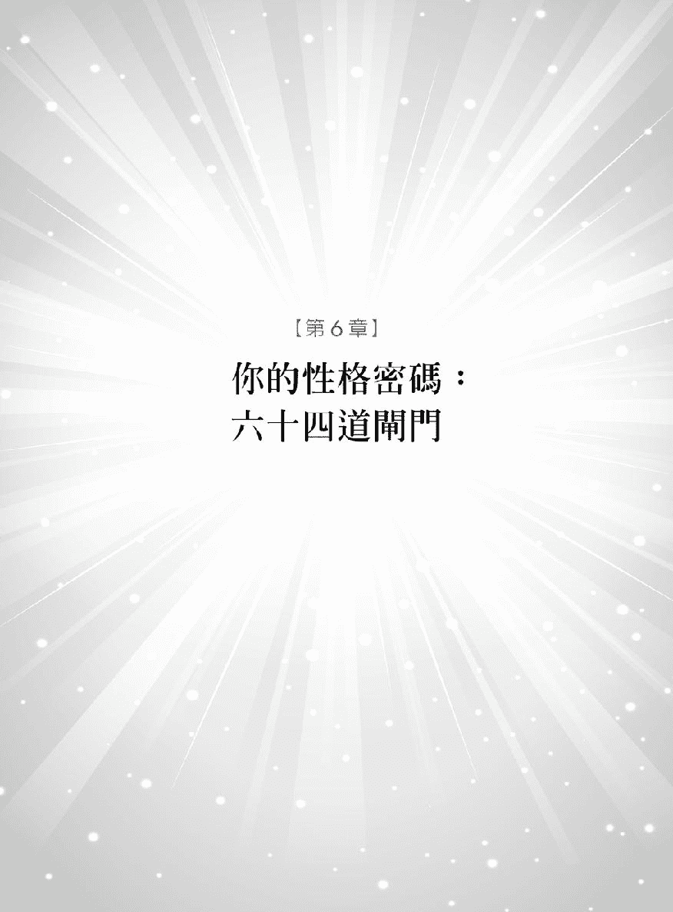

在解读了人类图后我得到许多力量好像催眠术一样不可思议……

——瑞秋澳洲布里斯本

读者对六十四道闸门的这篇内容大概会有六千四百万个问题吧大都是想知道自己有哪些开启的闸门以及这一生会以什么样的个性、特质以及态度来待人处事。是的现在就让我们来探讨你的本质和相关的一切细节吧。

这六十四道闸门是从《易经》的六十四卦延伸出来的通道两边各有一个闸门每一个闸门会指出你的特征、情绪或是个性倾向如果连接的是黑色通道这是属于有意识的特性你很清楚自己有这样的性质而红色通道则是属于蕴藏于潜意识的性格最后红黑相间的通道代表意识和潜意识两者兼具。

有趣的是科学家早就发现六十四种基因密码子与六十四卦是互相吻合的。德国医学博士史琼柏格 Martin Schonberger 在一九七三年的著作《易经与遗传密码——揭开生命的奥祕》The Hidden Key to Life 中便画出《易经》六爻和 DNA 排列之间的相似点。

史琼柏格不是唯一提出这套突破性理论的人另一位医生范弗兰丝 Marie-Louise Von Franz 早在他六年前便指出《易经》和 DNA 的密码是建构在相同系统上。

DNA 的螺旋长链蕴藏着许多遗传的讯息即至今日科学家仍旧无法完全解析其中的奥妙。不管是《易经》或是人类图中的六十四道闸门都能正确的描述出人类的个性和特质。这正是科学与灵学的最佳见证。

在更深入探讨六十四道闸门之前要先告诉大家人类图中的数字代表第 1 到第六十四闸门。数字的位置都一样如果通道有一半的颜色那连接颜色的那一头便是开启的闸门表示你有这样的特质。因此没有发出颜色的闸门就表示你没有这样的特质。只有一半的颜色是不活化的通道但是连接的闸门是活化的能够和他人另一边的通道互相连结。

人类图可以指出每个人独特的性质还能说明什么样的元素区隔或是连系彼此。当你知道自己有哪些开启的闸门后便能找出和其他人之间的共同点和兴趣还能了解彼此的个性合不合适不管是爱人、朋友、家人、同事或是生意伙伴都行得通。我特别想要请你注意的一点是「电磁引力」electromagnetics 和友谊。

#### 电磁引力

有没有曾经遇过让你突然好像通了电一般的人这两个人就是在同一条通道上一个是有右边或是上头的开启的闸门另一个是有左边或是下方的开启的闸门碰在一起时就会产生触电的感觉。例如说你的闸门 59 是开启的闸门而你的另一半有开启的闸门 6 你们在卧室会擦出很大的火花。

在人类图中我们称之为「电磁引力」因为就好像磁力的交互作用沉睡的你被这股力量给唤醒两人之间有越多电磁引力互相吸引的化学作用就会越大。但是太多也不行容易过度承载发生爆炸恋情便无法长久维系。冰淇淋再好吃吃过头还是会肚子痛。当然过多过少决定于你的人类图而且跟不同人谈恋爱也会有不同的变化。

#### 友谊关系

如果你和某人有一样开启的闸门或是相同的活化通道那么你们很容易成为好朋友而且有许多共同点。在人生中你们好似透过同一扇窗看到同样的景象。

同样的开启的闸门就好像在友谊中涂上重要的胶水在情况变得棘手时将你们紧紧的黏在一起。因为相同的调性加上坚固的基础注定你们的情谊会历久弥新。你可以自问「我们有什么样的共同点」就能得到清楚的答案了。我认为恋情要稳固电磁引力和友谊都得兼备立足点便不会受到动摇。

#### 意识的特质与潜意识的特质

通道有一半的黑色代表这样的特质对你来说明显易见这是属于意识的部分。红色的话表示你不会发觉自己有这样的特质但是家人或朋友比较容易感受到。红黑相间的条纹是意识和潜意识互相重叠表示你只会注意到某些部分但是透过观察便容易了解自己全部的特质而且能够以意识去运用潜意识的特质。

#### 无闸门开启时的特质

如果一个中心没有任何开启的闸门我们称它为「开放」表示它非常敏感容易受人影响会产生附加的特质这时可以参考注记在最后面的「无闸门开启时的特质」。我会在最后这段解释「开放中心」会有的特质。

现在就拿出自己的人类图看看自己有哪些开启的闸门好好认识自己的每个层面吧。

本书中的注释一定会和《易经》有雷同的地方我们先从最小的数字开始讲起仔细研读每一个闸门所代表的意义。就让我们开始这奇妙的探索之旅吧。

## 头顶中心的三个闸门

#### 闸门  61  内在真理的闸门

你一定得决定生命中哪些人事物对你来说是真的你还要确保事事都得依照这样的原则进行。头顶中心会给你压力要求你真正去面对。存于内的真理有如罗盘上的指针让你知道什么是正确且值得追求的事物。这个闸门会帮你过滤真假告诉你哪些事是真的哪些事又是子虚乌有没有人骗得了你。

内在的真理通常会在你心静之时一闪而过越熟悉这种感觉你就会越来越正直、诚实。不管你面临何种难题这个闸门都会帮助你了解真假、对错。

透过闸门 61 所得到的领悟可能会带给他人恒久的影响力让人们感受到神灵的显现你的认知会深入的撼动人心。要相信真理会在你思考和冥想自我和他人的利益时显现还会在任何的情况下安定你的心。

#### 闸门  63  怀疑的闸门

你会一再的检视周遭的环境试图侦测不对劲的人事物你天生就是个怀疑论者。「这对我好吗」「这件事会成功吗」「我这样做对吗」头顶中心会施加压力不断地将疑虑灌入你的脑海导致你一直分析、甚至怀疑自己正不正确、够不够有效率。在接受新理论或是进行新计划时你希望能预先知道会不会有暗藏的陷阱或是错误。你会再三确认直到你不再怀疑满意为止。有时候你会变得太过犹豫或是不敢确定。

这样的态度在评估生意或是检查安全设备时非常有利可是吹毛求疵的习性却会造成生活上的困扰。事事存疑对大家都怀有戒心实在是很讨人厌。你要了解这个闸门的观点是集聚众人的经验而成的并不是你个人的看法所以你提出的见解通常来自他人的经验。

也不是每一个听起来合理的答案都得采纳这样才能看清楚未来可能发生的陷阱帮助自己和旁人安全的走过人生。

#### 闸门  64  多样可能性的闸门

位于这个中心的闸门都得承受头顶中心施加的压力被逼地不断审视人生你会发现自己老是在钻研、沉思各种无穷尽的可能性。象是想从夜空中伸手摘下星星把它解剖成八大块试图找出尚未被发现的祕密一样。任何东西到了你手上一定会被拆开来研究因为你想要知道它的价值和重要性。

有这个闸门的人会思索各种可能性老是在考虑「如果这样……如果那样……会怎么样」试图从中找出进步的地方。你会发现自己身不由己每一件事都要仔细的审查不管是宗教、历史、哲学、信念、系统以及往圣所留下来的真理或是经典你想要突破或是更深入去了解但是也有可能被人生的各种变化弄到快疯掉永远在寻求生命的意义往前不断的探索。你的好奇心真的是没有极限。

要知道生命的谜底是永远无法解开不要作茧自缚。虽然承受了这样的精神压力但是你可以放下对永恒的执着坦然活在未知与不可知的现在如此你必定能找到自我发现人生真是一段奇妙的旅程。

###### 无任何闸门开启的头顶中心

你会被别人的念头和想法所影响要小心别被牵着鼻子走。因为容易受影响任何激励人心的事物都能透过你来传达当你接触到美妙的音乐、艺术、大自然以及和积极的人相处时都能受到激励而精力充沛。在你相信且遵循做决定的内在权威时就能知道当下是受到何种人事物所牵动了。

## 心智中心的六个闸门

#### 闸门  4  解决问题的闸门

这个闸门会不择手段任何时候都会努力去解决一切事情你甚至能解决「无法解决」的问题。有这个开启的闸门的人大脑总是不停运转时时都有事情等着你解决不管是工作上的危机或是生活上的大小事件。你最喜欢有人请你帮忙解决问题即使只是猜字谜的小游戏若是找不出解答会让你感到很焦虑。

来自心智中心的压力让你十分钦佩自己有提出解决方案的能力。拥有聪明的脑袋是福气但有时候你太聪明了这可不是赞美。人们会觉得什么问题你都有答案有时他们只是想要倾诉心里话并不是真的想得到答案。

不管问题真假解决问题是你的动力来源。因此你要做的就是把稗子从麦子中挑掉将心力投注在重要的事情上。你真正需要的是什么解答呢朝这个方向努力才能获得真实的满足感。

#### 闸门  11  和谐的闸门

这个闸门有丰富的想象力能够想出许多点子为社会带来和谐你的想法包括教育人们增进彼此之间的和睦与互相体贴、关心的程度你会一直找新方法帮助人们达到共识不管是在家中、工作场合或是人际关系和所处的环境都一样。

你会想方设法来保持事情的新鲜度而且可以一直进化。要淘汰过时或是不合宜的方法、观念对你来说一点也不困难。众人同心的力量会比个人的力量大上许多所以你的想法大都以众人利益为优先而不会只考虑自己。

你也会提醒人们要记得自己对其他人的责任前美国副总统高尔 Al Gore 也有这个开启的闸门因此他会大力鼓吹人人都要保护地球加强环保意识。你能看到大方向也有能力让世界更好。这个闸门的格言就是「改变为了更好。」

#### 闸门  17  追随的闸门

人与人常会意见不合我们需要灵活应变才能达成共识维持社会和平你有很好的外交手腕、绝佳的辩论口才这样的任务非你莫属。拥有开启的闸门 17 虽然会坚持己见但也能接受不同的观点。你喜欢自己的意见被测试也鼓励大家一起来场公平的辩论倾听两边不同的论点。这样的逻辑思维可以化敌为友让原本水火不容的双方达成协议创造合作关系不管是在自己的生活圈中或是更大的领域你都会致力达成目标。任何情况下你都会禀持着公平的态度发挥说服力。

你可以接受多数人的看法然后自行消化、思考同时也会很小心不被他人的论点牵着鼻子走。这样做的缺点就是容易过于武断固执己见。因此你要保持开放的心胸不要太执着。

你公正、公平喜欢不偏不倚你在意的是生活的质量是否符合理想如果有人能够指点你提高生活质量的方法你一定会很快采用。

#### 闸门  24  回顾的闸门

这个闸门会翻出往事确认每件事是否合理。它会不断的回顾、重新探讨和录音带一样不断的播放、审思直到出现终极答案。你有绝佳的专注力、好辩、思想热烈帮助你一再地回到原点决定事情的价值找出隐藏的线索或是理解关键的讯息。也许人们会抱怨「难道你不能把它抛在一旁吗」答案当然是不行因为你好似无法破案的侦探一再重返案发现场推敲各种可能性、删除错误的情报直到真相大白。

你会因为习惯而停滞不前执着旧观点。你要知道「理智」是处理想法的工厂一定要持续进新货才会有生机不然脑袋就会永远停留在原地打转。

当你又开始反覆思考这个闸门其实会让你得到极有深度的见解。它的原始设计就是要你不断的回顾、审思以获得高超的见解。唯有消除旧方法和旧思维才能看到生命中新的转折点。你要学会接受把看事情的窗户擦干净一定会因此得到更多的新思维。

#### 闸门  43  突破的闸门

你的脑海中彷彿有一个声音不断地宣达高超的见解这样做可以激发突破性的方案改变职场成规甚至是人们的生命。你会接收到很棒的领悟、想法只可惜旁人无法体会。你比别人更能够洞烛机先但是却无法清楚表达自己的想法。因此你的挑战就是要将想法转成适当的语言表达出来在这个时候你要相信自己的权威中心。只要你能遵从它不用思考就能辩才无碍的解释自己的领悟还能得到宇宙真理的大智慧彻底地改变他人的看法。

你不喜欢当傻瓜当你和不同的人事物打交道时就会接收到宇宙的洞察力。如果能适时的传达便能得到宇宙的大智慧。拥有这个闸门的人很容易固持己见一点也不关心别人的想法。你的观点稳如磐石绝对不会受到动摇因此只好要求别人来了解你。坚定信心耐心等待是顺应本性最好的方式。

你的见解新奇人们需要时间消化、理解。你的心里彷彿有一对耳朵能听见别人听不到的事情。

#### 闸门  47  领悟的闸门

这个闸门会让你不断的思考、思考、再思考试着解开生命中的难题在心里点亮一盏灯得到新领悟。国王要伟大的思想家同时也是数学家的阿基米德检验王冠是纯金还是便宜的合金。阿基米德很伤脑筋。有一天他在泡澡时发现澡盆里的水因为他坐进水里的体积而满出来。于是他领悟到「满出来的水的体积应该等于身体的体积」。那么只要把与王冠等量的金子放到水里测出它的体积就能知道是否与王冠的体积相符。如果王冠体积更大便表示其中参了其他的金属。阿基米德想到这里不禁高兴得从浴盆跳了出来光着身体就跑了出去还一边大喊「尤里卡、尤里卡」希腊文意为发现了。

这样灵光乍现的时刻就是你一心追求的目标因为你天生便是解决问题的高手。你的思维模式抽象在你朝空气挥拳大喊「我想到了」之前另一半或是同事们一定常常觉得你未免也想太多了吧。学会放松才能得到灵感。学学阿基米德去泡个澡暂时停下脑袋的运转让心灵平静一下。不然就好像拿着望远镜拚命找答案结果看不到答案就在你眼前一定要站远一点才能发现答案。对你来说放松就能发挥创造力。

###### 无任何闸门开启的心智中心

你是最没有偏见的人。别人的想法有时会让你不知所措你常会接收到旁人的想法或点子你要决定是否值得探讨不用事事都要追究到底。没有成见的心胸让你能够从每个人的想法中得到卓越的见识。但是你要小心不要陷入他人的思维之中。求助自己的权威中心便能决定哪些想法值得深入探究。

## 喉咙中心的十一个闸门

#### 闸门  8  贡献的闸门

这个闸门会让你一直想做出有用的贡献不管是出人出力、出点子还是推广销售。因为你与生俱来的率直特性总会习惯性地开口问「我可以帮忙吗」或是「我可以做什么吗」

你不喜欢没事闲闲坐着或是被杂事所干扰。你需要保持忙碌希望自己投注的心力有所贡献而且还可以带动他人一起加入。这就是拥有闸门 8 的人可以  掌控局面指挥大家一起往新领域前进的原因。

奉献心力和时间是一回事但是和从头到尾承担责任可完全是两码子事。这个闸门不一定要你亲力亲为只要为大家指出方向即可。所以要小心不要以为义务帮忙是理所当然的事。有时候别人还不一定能接受你那新颖又富创意的方法你很可能会招人嫉妒而不自知。但是计划要成功或是友谊、恋情要持久大都是你的功劳因为你会时常提醒大家别忘了共同的伟大目标还会唤起他们的忠诚和重视的程度。

#### 闸门  12  静止的闸门

你对人生中大多数的事情都很慎重这个闸门让你天性谨慎、甚至是到了懦弱的地步。常会听到你说「我觉得要小心这件事……」或是「我不太确定这样做是不是……」你害怕需要在人生中大步向前。你时常会从混乱中抽离仔细思考下一步该怎么做。不要只把目光放在危险的地方难道你要一辈子战战兢兢地度过吗为何不释放自己放胆去飞、勇敢去追求。不然你反而会因为太小心而犯错有时甚至会不确定自己有何感受。

你总是带着坚决但是谨慎的语气有些人会被搞得很挫败因为你处在不断向前转动的世界却选择停滞不前。当你感觉有事要发生了但是众人却毫无警觉这会让你很担心。不过这样子反而会促使你去追求不平凡的梦想闸门 12 让你梦想一个更公平、更理想的世界当然听起来是有点不切实际。

你会从停滞不前到跳跃式地扩张你的能力不断进化但是同时也可能犹豫不决、拖延因为你不认为自己可以实现梦想。要知道你的话可以鼓舞群众带来信心因为他们知道你开口之前就已经仔细的思考、分析过了。

#### 闸门  16  选择力的闸门

你有很强的挑选能力和先见之明可以发现人事物或计划中的潜力和可能性。闸门 16 让你预先看到事情发展的方向靠着一股热情来实现愿望。喉咙中心会为你发声赢得支持和赞赏但也会很快收回赞美甚至批评你和其他人。闸门 16 表达的意见是集聚众人的观点而成因此你会大声评论任何值得追求的事情、目标和计划。这样做可以唤醒他人心中的热诚但是你期望他们向你看齐投注同等的心力。

人们一定感受得到你的热诚注意到你总是能精准地找出值得追求的目标。得到好东西会让你非常快乐但是被迫处理不吸引人的事物或是帮助不懂得感恩的人是你痛苦的来源。

闸门 16 能让你看出谁有好的想法或是疯狂计划他们需要你的支持你目光精准挑中的人或目标一定会成功。你的热情也会吸引同样性质的人来帮助你或是联合众力完成理想。

#### 闸门  20  当下的闸门

这个闸门的地位有如古代城市的进出城门或是日式庙宇的正门引领人们从暴乱的状态进入圣地。拥有这样的闸门你既不是城市也不是庙宇你活在当下身心都在这里。这个人类图的闸门就有着「活在当下」的特性。

拥有这个闸门的人常常会问何谓「真实」。其实就是让自己活在此时此刻不要对过去感到后悔、怨恨或是让往事像颗石头压在心上同时也要放下对未来的期待和希望让自己活在当下。你要安静地坐着、观察和冥思。

过去的经验形成了现在的思维和梦想给你人生的意义。因此你心里最可能产生的问题就是「这件事对当下有意义吗」你的本性想要在现实生活中感到精力充沛。

静坐冥思有三个阶段专注、静思然后进入无思无为的境界。所以当你活在此刻、活在当下时你就会发现自我。

#### 闸门  23  同化的闸门

你的言行会戏剧化的改变自己身处的世界。闸门 23 转变你的人生带来崭新的观念。你常常天外飞来一笔突然来一段宣言把大家吓一跳当然也成功地让人们记得你说的话。山崩时大量的土石会滑落山头把原本隐藏底下的土层显露出来。有时候你在讲话时就有如山崩一样因为你是激进派的拥护者希望大家都能接受新思维、新方法。问题是你的言行恰当吗有得到众人的感谢吗

这个闸门会不耐烦的去除无助益的观念你以令人信赖的态度为世界带来全新的视野。闸门 23 的人常常会以直率且清楚的音调说「我知道有件事是这样的……」热心地想要改变现况或是引爆新观点的人就是你。虽然你博学多闻说话感觉很有根据但实际上内容一点意义也没有。

很多人会认为你讲话过于直率不圆融可能会因此造成不必要的误会。所以在说话时用词要谨慎时机要恰当。别人愿意听你发表评论时才是你尽情发挥的正确时间。只要你说的话符合听者的需求你就能发挥所能、分享智慧而且让听众容易理解吸收。

这个闸门让你在说话的同时也获得独特的见解。不管你是真知道还是假装知道你说话时总是爱用「我知道」当开头。

#### 闸门  31  影响力的闸门

你很有影响力讲话又有权威感让人难以忽视你的存在。你有领袖的特质加上讲话内容合理又有启发性大家自然有信心听从你的指示行事。你有当主管的天赋领导群体和指挥他人或是推动计划以及统筹活动。因此你能鼓励大家去达到个人或是全体的目标。

拥有闸门 31 的人能够告诉大家未来会如何变化你说的话大都是要引领众人朝有益的方向前进。你在说话时就好像确切知道下一秒钟会发生何事一样听众对你的言论也都毫无异议。人们一定会注意到你的影响力以及你对他们产生的作用。

轮到你讲话时再发表遵照内心的提示不逼迫事情变化的方式这样能给人最好的印象。要尊重别人是否愿意听你的指示。你要说出心真正的想法也不用逼自己得言行一致这一点很重要。

#### 闸门  33  隐遁的闸门

「从前从前人类图里有个拥有闸门 33 的人……。」欢迎来到天生说故事好手的闸门喉咙中心一共有二个这样的闸门。你的故事引人深思、认真严肃、没有一点装饰一点也不像闸门 56 里的故事。你讲故事的方式简洁有力都是真实的人生经验而且你还会穿插古老寓言来阐述道德规范。

宇宙以你做范例所以你的故事都是自身的经历。经历和挑战来得如此密集和快速让你不得不时常远离一切事物闭关静修。静修给你力量让你从经验中得到智慧。

独处时你会仔细地思量自身的经验推断出结论。为了以自身累积的经历来引导他人闸门 33 会促使你积极行动。

你的记忆力很好脑袋像个数据库要是能将这些创意和资源摊开来看肯定会让出版商和电影制作人自惭形秽。你一天内发生的事是大多数的人一周才能经历完的分量

不知何时应该从前线退下来是你要突破的难题如果撤退的时间不对你可能会得到慢性疲劳甚至是到了累垮的地步。要记得智者会为了健康着想选择时间休息。你可以做 SPA、静修冥思或是到乡下静养不然也可以做些温和的娱乐来休养生息。恢复体力、充电后再出发很重要你才有办法应付生活的快节奏。

讲故事是为了其他人能够得到乐趣和智慧但是你仍旧无法从中学到自信。除非你和闸门 13 的人有所接触。要小心因为他们非常善于倾听你会掏肝挖肺分享自己知道的一切直到讲完所有的祕密不过在这么做的同时也会激发出深藏于内的自信。

#### 闸门  35  前进的闸门

你认为一定要善加利用每个机会生命才会成长这样的信念导致你个性激烈、火爆甚至会反覆无常。闸门 35 急躁的性质带领你纵身投入未知的生活领域。你最爱说「该是改变的时候了」不然就是「也该尝试新事物了」你会因为生活没有新视野不按照期望进行而感到烦躁。你对无聊的忍受度很低会不顾一切寻求新的体验你热中学习害怕没有活出精采的人生而懊悔这样的特质激发你将心力投注在自身的成长。

闸门 35 的人天生静不下来你没办法接受半空的杯子生命这杯酒一定要注满才行。如果需要达成目标才能有所体验会让你感到厌烦和灰心气馁。你慢慢会懂得分辨体验是来自心灵成长或是自我意识的驱策即使物质上得到满足你还是会自问「这样有什么意义吗」

你一定要从经历中学到东西许多拥有闸门 35 的人在看尽人生之后会感到筋疲力竭不过也因此体认到今后应该把时间花在引导他人追求有益的经验才是。

#### 闸门  45  聚集的闸门

我常会和这个闸门的人开玩笑故意叫他们「我的老佛爷。」这是因为你们会庄严地坐在王位上判定财富和有钱之间的差别。你会看管家庭或社区的财富和福利从各种投资中挑出最棒的选择。企业集团的兴衰取决于你所受的教育、金融智慧和经营方式。你和帝王一样也有办法聚集大量的财富享受人生。闸门 45 的「聚集」特质表示你精明又懂得管理金钱。比尔盖兹有这个闸门一点也不让人惊讶。

你常会用「我拥有……」或是「我没有……」来做句子的开头「缺乏」会让你感到贫困。你会提供良好的理财教育帮助人们加快累积财富的速度。人生给你的挑战就是在如何帮助他人但是又不会困在他们的金钱和物质问题里头。因此本性才会要求你维持如帝王般的庄严别弄乱了自己的羽毛。最好的领导者会高高坐在王位上给人们好的建议带领子民们迎向丰收的财富。

#### 闸门  56  漫游者的闸门

我至今还没遇过闸门 56 的人不喜欢到处旅行、扩展视野、探索新鲜事。你以四海为家不喜欢待在一个地方落脚生根或是长时间处理同一件事。你不是因为想要达成梦想而旅行而是喜欢享受旅程中的经历。

这是喉咙中心里另一个善于说故事的闸门「这件事情是这样的……」这个闸门的人喜欢用这一句话当作故事的开头还有你在讲述冒险故事时一定会很兴奋的说「你一定不相信但是……」。你的故事铺排紧凑、内容真切一个接着一个讲也讲不完。你将累积的经验编织成有趣迷人的故事这样做会让你觉得自己的经验很有意义。你喜欢听众回应你、挑战你的信念。原因为何呢因为有时候你会觉得自己迷失在人生的洪流之中希望能藉此安定自己的心这是浪迹天涯的人都会有的习惯。

你还会加油添醋增加戏剧效果让听众透过故事体验更多的人生。你的故事和电影一样都会在开头打上「根据真实故事改编」这一行字因为你有很棒的编导能力可以从别人平凡的故事中看到隐藏底下的好题材。

你希望能在生命中不断的受到鼓舞激励你渴望收集更多新体验放到自己的人生故事里面。

#### 闸门  62  表达细节的闸门

你很认真总是将细节交代得清清楚楚人们透过你的讲述就能明白复杂的观念和故事情节。当他们还陷在过多的信息摸不着头绪时你早就搞清楚来龙去脉经你一解释大家很快就懂了。

很难对你产生误解因为闸门 62 晓得所有的事情不管是口述说明还是书写的拟定计划统统非常确切、合理而且完整。因为注重细节的关系你做事大家都放心。

小细节是最容易出差错的地方因此你的话让人信服有浓厚的权威感。你能清楚的阐述大方向或是鲜为人知的信息正因为如此要你把科幻小说硬讲成真实故事或是黑的讲成白的人们还是会相信。但可别因为表达能力好就得亲力亲为完成所有的工作。观察细节的特质让你保持公正客观的态度。

###### 无任何闸门开启的喉咙中心

你可以利用旁人的闸门以各种方式来表达自己。因此你会成为言语和行为的中间媒介。

另外要小心一件重要的事因为你能反照出人们心中的话或是想法结果他们只会听到自己想听的事而不会认真听你讲。人们可能无法理解你的话或是和你有共识谈话结果如何都得决定于听众的反应。

## 自我定位中心的八个闸门

#### 闸门  1  创造的闸门

开启的闸门表示你创意十足数字「一」也有其特殊的意义因为你喜欢自己一个人工作不要受制于他人。你有决心毅力催促自己往前迈进当你将创意发挥在家庭、职业、梦想或是运动、艺术和音乐上时一定会有很好的回报。

发挥创意能够得到报酬当然很好但如果只为了金钱很可能会扰乱你的感受力。你的创意不只为了奖赏或是赞美而是能从中得到乐趣。

你不怕超越极限喜欢找出新的表达方式让你探索新的领域、得到突破。你的创意禁得起考验。强烈的创造力和干劲让你成为非常有号召力的人物。

当你不按常理出牌让敏锐的感受力透过才华而得以自由表达时就是绝佳创意出现的时候了。在做任何事情时都不要低估你能发挥的创造力。

#### 闸门  2  接收的闸门

你知道人生的方向不过要抵达目的地难度可就高上许多。如同老一辈人常言不要浪费时间在烦恼怎么做只要全神贯注让坚定的意志力引导你。钻石形状的自我定位中心就象是指引你的标志告诉你「往这边走。」不管路途中有何阻碍你仍旧会朝正确的方向前进。你的方向感就像 GPS 全球定位系统一样可靠不管是自己迷失还是他人需要你的指引你都有办法找到方向。善于接受人生的变化适应力、变通性强是你的大优势你好像从来不会有迷失方向的问题。

当你找到人生的方向你会专心致志而且对追求的目标坚定不移。这其实挺不寻常的因为你通常会违背一般人的期望或是抗拒人们的想法你能看见别人看不到的足迹。你真是指引方向的专家人们可能在几个月甚至几年后回来跟你道谢久到你都忘了原因何在。

这个闸门的优点取决于两项因素如果自我定位中心填满你会意志坚决、持续努力直到做出一番成绩。如果中心空白你会发现你对别人的感知力比对自己还敏锐或者是会拉长你达成目标的时间。要相信内心给你的引导把地图揉成一团连同指南针一起丢掉吧。

#### 闸门  7  统合的闸门

你有一定的威信是天生的领导人物你总是有办法让大家达到共识、目标一致。你大都是扮演军师或是经理这样管理阶层的人物而不是支配者的角色。你会严格训练、控管自己因为你晓得只要追随的人愿意遵守你的指示执行一定会达到目标。你站在众人的前方也希望大家的眼界一样宽阔。

因为你的自信人们会询求你的建议和开导。你在指引方向时手上彷彿拿着地图和指南针保证方向正确让人安心地追随你。你的个性果决但是仁慈只有在达到共识后才会向前迈进。不过你若缺乏自我锻鍊就可能被潮流、民意调查、群众心态和旁人的喜恶给牵着鼻子走。当然你也不需要死守着自己的观点毫无变通的空间重点在于要认清自己的原则立场坚定即可。如果这样做会牴触众人甚至失去领导地位也是必要之恶在这种情况下立场和原则务必一致。

不论你的领导风格为何要记住强迫人们服从是下下策倒不如去激发众人的热情、赢得人心才是最有智慧的作法。

#### 闸门  10  行为的闸门

因为自重、不在意他人的想法因此你的表现方式独特个人风格浓厚。闸门 10 代表你热爱人生这趟旅程只做对自己有助益的事。

自我价值观会影响你的表现尤其是在承受压力的时候但是你讨厌知道会因为自己的表现而遭受不公平的待遇或是让其他人失望。你希望自己独特的表达方式和态度可以为众人带来正面的影响。

对生命的热爱会支持你坚持自己的行为、举止和个人风格。只要你的言行和生活乐趣能互相配合那这样做就对了。闸门 10 是四个「爱的闸门」之一宇宙就是要你热爱自我和生命。

拥有这个闸门让你能够承受人生的颠簸以及迎面而来的无礼侮辱但是你一定要坚持梦想相信自己、相信生命。现实生活中的无情打击以及他人带来的影响可能使你渐渐失去信任。但闸门 10 希望你能对自己的言行表现感到自在不需要也不用努力去适应别人和环境。独特的表达方式是你诚实传达信念的方式。你会改变自己来面对挑战、困难或是新方向但是别管人们是否满意只有走出自己的路、相信权威中心你才会快乐。

#### 闸门  13  倾听者的闸门

你现在正舒服地坐着、拉长耳朵在听我说话吗这是个蠢问题你当然有在听啊。倾听就是你的天性你是天生的倾听者。

你聆听着世界的故事让人泪湿肩膀人们会对你倾诉内心最深层、最黑暗的祕密。你能挖出人们心中的故事大家在讲完自己的故事之后常常会不可思议的说「我不知道自己为什么会跟你说这些我跟你又不熟……。」

在与人交际或是工作时你会希望管好自己的事就好但是别傻了这是不可能的。我不是说你爱管闲事你不是这种人而是听太多故事让你很累可是人们看到你就想一吐为快。这是宇宙为你打造的特质

顺从天性的方法就是将同情心转变成同理心如此一来你能深刻地感受人们的经历而不只是替他们感到难过同理心会让你生发怜悯心。

倾听人们的故事认同他们的努力和挑战你会帮助人们找到生命的目标和方向很多治疗师都有这个闸门。

#### 闸门  15  人道的闸门

你的个性谦虚、不主观也不会爱出锋头认为有缘同住地球村就是一家人。你是天生的慈善家自愿献身于改善人们的生活。闸门 15 是四个「爱的闸门」之一因为对众生的爱你致力促进人类的福祉。你的亲切仁慈很容易赢得人们的尊敬、支持和景仰。平等和公正是这个闸门的主要特质但是不保证不会发生负面的事情浇息你对人类的热情但是你内心的慈善天性是永远不会消失的。

你喜爱与人交集有许多不同类型、阶级的朋友从乞丐到王子都有。在团体之中你就像车轴上防止车轮滑落的插销将每个人紧密的串连在一起。受限于人会让你觉得痛苦因为你喜欢无拘无束过着自在的人生。人们遇到困难时第一个想找的人就是你因为你是如此受人敬重的博爱主义者。

#### 闸门  25  纯真的闸门

你有孩子般的纯真天性和这个复杂、严苛的人生格格不入。逆境发生时你的嘴角仍旧会带着一抹微笑因为你深深相信宇宙会照顾你爱会克服一切困难。因此你能接受突如其来的意外知道自己一定会通过困难。

闸门 25 是四个「爱的闸门」之一你以无条件的爱面对混乱与困难让自己越来越有智慧。正直和真诚是你的处世原则。不管事情好坏你通常会单纯的直接反应很少经过事先思考有些人会因此占你的便宜。善良的你会选择原谅但不会因此忘记教训。

你容易被粗野无礼的人影响尽可能远离这样的人吧。人们把你的天真当作愚蠢你不懂为什么世界充满了爱人们却还是有这样的偏见。「他们到底有什么问题」你可能常常发现自己有这个疑问。你会告诉任何想回答的人「我懂你的意思但是你要相信生命啊。」这是发自你内心的标准答案。

你想以坚定的爱和信任来净化这个世界但别忘了克服困难之后也要修复自己的心灵。

#### 闸门  46  机缘的闸门

你很厉害可以在对的时间看见对的事物用「伯乐」来形容你是再恰当不过你常常在寻找某事或某个人时意外发现其他有价值的人事物。

很多人莫名其妙就成功了但是好运不只是在对的时间去到对的地方也要看你面对的态度当你心存信任准备好的时候好运气就会发生。当内心生发自信能够接受生命要给你的礼物时人生就会出现进展。这个闸门会自动对准宇宙的频率带给你现阶段所需要的体验让你得到认可或是学到人生中重要的功课。你要放下心中的期待接受人生给你的体验。

闸门 46 是四个「爱的闸门」之一这样的爱是对身体的爱。你要维持健康的身体、苗条的体态注重穿着打扮好的外表可以加强这个「善于发现珍宝」的特质。保持健康对你的人生很重要也许时间条件不允许你去健身房或是 SPA 但是你的心灵还是会感谢你对身体的照顾要为身体健康负起责任不然很容易感到颓丧消沉没有精神。因此打个电话去预约身体按摩吧或是带狗去跑步别忘了顺道做个手足修护。除了有固定的 SPA 保养时间也要有健康的饮食。身体状况良好什么事都难不倒你。

###### 无任何闸门开启的自我定位中心

你很难让人理解甚至连你都不懂得自己你没有明确的指标因此得不断面对「我是谁」或者是「我的人生方向在哪里」这样的问题。你容易受人左右不管是人生方向或是人格塑造都一样。环境、朋友都会影响你因此要听从权威中心慎选同伴。

如果你不觉得迷失的话这样的特质其实给你很大的自由因为你的本性就是如此。其实你常常会觉得自己没有目标或是理想可以偶尔独处一下对你会有极大的好处可以让你脱离别人不知不觉强加在你身上的影响。

## 心脏中心的四个闸门

#### 闸门  21  控制的闸门

我会尽力忍住叫你「控制狂」的冲动因为这样讲你并不公平。生命丢给你许多挑战当你能够掌控情势一手握着缰绳一手果决的采取行动保护钱财、房产、生意或是恋情时就是你成功的时候。

这个闸门带有猎人的特质经验丰富的猎人知道要躲藏于何处等待有利的情势在机会来临时一举而竟全功。你会决定猎物目标宣誓地盘这样做才能让心得到平衡。不然最低限度也要让你能够决定衣服的样式、晚餐的内容和居住的地方等等。

你希望在人生的每个层面都是带头的领导者能够掌控全局作个主导的大老板或是总裁。你的配偶或是共事的伙伴要有大智慧才能接受你的心态和行事作风。如果你的另一半也有这个闸门那么你们之间会有数不尽的激烈竞争、权力拉锯战。想要感情维系就得互相理让努力去了解对方的观点。

当你处在主导的位置时没有人比你更可靠。如果这个中心空白、没有颜色你会觉得整个失控希望由其他人来掌控局面。你要以智慧观察找出有能力可以做好领导角色的人选。在你想越权去控制非你主导的情势时就会发生问题。一旦自我意识抬头智慧就无法显现或是你不接受权威中心的指示时也会发生同样的情况。

#### 闸门  26  累积的闸门

你想从人生中得到最大的成果不管是累积声望、物质财富或是拥有权力和地位你都会以聪明才智努力去追求。你不会把精力浪费在无意义或是对你没有利用价值的事物。真要这么做也一定要有回报来补偿你的付出。

这个中心会不断的协调履行心愿和自我意识之间的权力拉锯战但要达到平衡其实不容易。你的态度中有种自负的业务人员性质虽然你渴望权力但是能够帮助他人看清楚人生的方向和梦想也是很棒的事。你倒也不是要干涉别人的生活只是想出些好点子提升人们的生活层面象是艺文、建筑、饮食和衣着打扮或是度假、哲学、音乐和旅行等等。

不管你是大声宣扬还是从态度神情中暗暗流露你都会不知不觉夸大自己的能力制造出一种「我是最棒」或「我是最厉害」的氛围。不过你还是很注重精神层面。你有很棒的推销口才和说服能力但你要用真心去服务大众而不是只求自己得到回报。

#### 闸门  40  传输的闸门

你很抢手因为你总是有办法做到别人的要求而且是任何要求。来自这个中心的意志力让你为了大家的利益认真有效率地四处奔走。因为拥有强烈的意志力你很可能自傲地双手插腰向世界宣告「谢了我不需要你的帮忙。」要小心可别把自己搞到孤立无援的地步。

除了达成目标会让你得到满足你的心也需要放下牵挂恢复平静。人们常会忽视你本性中渴望独处的时间你要和大家解释你需要时间、空间在不受到干扰的情况养精蓄锐恢复元气。你喜欢帮助人也重视友谊但是照顾别人的同时可别忘了要找点时间独处。

拥有这个闸门的人经常自问「可以原谅自己和别人的错误吗」闸门的释放能力可以厘清和解决生活中的困难不过最终还是要靠你自己。如果你能够原谅放下过去的种种你会觉得身心灵都被释放了阻碍彼此进步或是合作的问题也会迎刃而解。自我意识可能会障碍闸门 40 的特质可是只要你能够了解原谅的本义你的心灵就能得到释放不再受到禁锢。不管你是否了解原谅的能力一直都存在你的心中。

#### 闸门  51  激发的闸门

就身体而论这个闸门与胆囊互相连结有些人浑身是胆也有人胆小如鼠。如果拥有活化的闸门 51 你在激励人们采取行动的时候大胆无畏的程度甚至超过厚脸皮的境界。

人生总是有许多挑战我们很容易被困在世俗和物质的问题之中。但是闸门 51 可以帮助你我去面对更夸张、竞争性更强以及无法预测的情况。你有本事创造出人意料的状况当然也有能力解决而且为了引出人们正面积极的反应你还暗藏着各种激怒他们的方法。你善于处理生活中令人震惊的情况。闸门 51 能够点燃导火线吓得人们认清事实开始改变人生。你就像轰隆作响的雷声提醒人们该开始动作了

要小心你那不顾一切的态度你的言行就像闪电一样会吓到人。

这是你的特质开心地接受吧也许你可以学着降伏它懂得选择恰当的时间点。虽然人们还是会吓到但不至于受到太大的惊吓当人们的下巴吓得合不上来时就是他们可以接受新见解的时刻了。

###### 无任何闸门开启的自我定位中心

你很难让人理解甚至连你都不懂得自己你没有明确的指标因此得不断面对「我是谁」或者是「我的人生方向在哪里」这样的问题。你容易受人左右不管是人生方向或是人格塑造都一样。环境、朋友都会影响你因此要听从权威中心慎选同伴。

如果你不觉得迷失的话这样的特质其实给你很大的自由因为你的本性就是如此。其实你常常会觉得自己没有目标或是理想可以偶尔独处一下对你会有极大的好处可以让你脱离别人不知不觉强加在你身上的影响。

## 脾中心的七个闸门

#### 闸门  18  改进的闸门

《易经》的蛊卦有言「当知腐败已经产生若能尽快处理重新规画新的未来则亡羊补牢时犹未晚蛊卦也有亨通之道。」这段话告诉我们孩童时代养成的坏习惯是可以补救的。拥有这个闸门的人会愿意甚至是渴望修补自己内心中父母、亲友、老师或是社会所造成的伤痛。

改变自己去接受别人的做事方法可能会造成你内心的「腐坏」而失去自己的影响力。腐坏可能来自你的原生家庭或是僵化的传统习俗但是对你现在的生活却一点帮助也没有。闸门 18 的目标就是要重新审视旧方法和旧传统为自己和社会带来进步的新契机。

你会过于为难自己譬如说责怪以前做错的事情。虽然这样做会产生痛苦其实是给自己机会处理内心的情绪当旧伤痛被抚平后你会重获自由能够再一次欢乐的歌唱。你会注意到自己有些不是与生俱来的特质而是受到外在的影响。要分辨后天学来的行为还是先天性格快乐与否就是关键。提振和更新社会制度以及去协调父系和母系的模式是闸门 18 重要的工作。这会让你重新思考旧传统是否依然合适

闸门 18 的人很容易拿人生中的错误来责怪自己。罪恶感可能会让你选择堕落因此要学会对自己仁慈一点。以决心和警觉性来改变这项特质释放自己和他人。

运用你内心的力量来接受自己的缺点不要只是一味的责备。不要担心闸门 18 会给你需要的一切力量。

#### 闸门  28  玩家的闸门

闸门 28 的人内心总是对死亡感到隐忧却因而养成喜欢冒险把人生当成游戏的个性你想要活出最精采的人生所以凡事来者不拒。

有些文化会认为人生就是一场戏你我皆是戏中的棋子既然是游戏就会有结束的一天。因为有这样的醒察你想要将自己的角色演得淋漓尽致拓展人生的宽度和高度用心去感受生命享受其中的乐趣。这样的人生观带给你极大的勇气当然也有可能是有勇无谋不管如何你却因此获得许多不平凡的经历。来自脾脏的力量让你随时都准备好面对挑战与危险共存。

拥有这个闸门的人也可能一直笼罩在死亡的恐惧之中因而心生气馁抗拒体验人生。对死亡的恐惧也可能让人变得逆来顺受甚至到了放弃生命的状态但是你的心灵会因为生命的乐趣而得到成就。

活出精采的人生需要很大的心力和勇气这就是你这个「玩家」可以发挥的地方了。即使有许多问题和麻烦困扰着你你是否能够扬着勇气的帆坚决地航向人生做得到的话你就是人生中最大的赢家。

#### 闸门  32  持久的闸门

农夫、水手和远洋渔夫对气候的任何变化都非常敏感你对生活中的改变也有敏锐的感受。闸门 32 可以「嗅出」即将发生的动荡不安或威胁。不管是在恋情、生意投资、经济发展还是社会上的变化你都能闻出不对劲的地方因此在发生变化之前你会感到烦躁不安因为内心中你其实是渴望走在安全稳定的人生道路不喜变动的。你只做「长期投资」能够维持长久的恋情也能在同一个工作岗位待上很长的时间因为你只放眼长期的目标。

「走完全程」是这个闸门信奉的格言只要能够持续创造成功稳定对你来说是最棒的状态。东西是否耐用、事情是否符合一致性和永续发展对你来说很重要因此在改变之前要先确认新目标是否能达到标准。你和猎犬一般有着锐利的双眼任何新的人事物、计划、环境都得通过你严厉的审查。不管遇到怎样的情况你的意志坚决一定会通过任何风暴和挑战。你会尽一切可能避开失败因为失败是你最大的恐惧。要是你的脾中心空白恐惧的程度就会越大。你的忍耐会慢慢的消除恐惧别忘了要信任权威中心。

#### 闸门  44  模式的闸门

你有一种天赋能侦测出潜藏或是新发生的形态和趋势。你可以将这种天赋运用在商场和经济上或是创意、流行与科技等生活上的各种领域。你利用对过去的深层记忆去感受正在发生的事情这么一来你的感官便会帮助你串连现在和未来的趋势。你有发掘新人才的天生本能就象是服装设计师对下一季的流行趋势有敏锐的嗅觉或是经济学家可以预知市场上正在酝酿的问题。你的嗅觉灵敏不管是奶酪还是臭老鼠都逃不出你的掌握。

这样的能力也可以运用在生活上察觉他人反覆的行为模式进而避免不必要的问题。

闸门 44 害怕过去你总是一直回头看再三确认是否了解已经发生的事情。花太多精力缅怀过往反而可能在当下犯错尤其是脾中心空白时更容易发生。不是人人都能了解你这个侦测模式的本领也要知道脾脏无法给你无限量的精力脾脏的角色比较象是内建的警报器因此最好将本事用在引导他人而不是亲身去体验探测出的每件事。

#### 闸门  48  井的闸门

你是个有深度的人我甚至无法确定你是否能探得出自己的深度。有些人甚至会笑你未免也「太深了」。闸门 48 的人会为了个人的福祉以及保持事情的新鲜感而去探索内心的深度。这样做给你很好的观点以及高度的觉察力使你成为足智多谋、善于应变的人。

古文明都是来自丰沛水源的地方一口干净的井可以维护村民的健康和安全。村民会不断到井边打水以维系生命闸门 48 也是这样人们会接近你以获取生命的智慧和机智的好点子。我想这就是你为什么会强悍地保护内心水井的原因。生活的质量、和众人的分享以及能够探索你内心深度的人是决定你快乐与得到多少智慧的因素。你可能不希望自己活得这么有深度想和人人保持表面的交往就好。如果你是这样想那你要确保每件事都很新奇但是要知道当你越往内心深处探索就能得到越深层的满足感。

不管你现在正在从事何事更新兴趣和知识会持续地拓展你的视野。打个比方光只会弹钢琴是不够的你要持续练习新的曲目才行。

你会害怕懂得不够多害怕被自己的深度所束缚而产生恐惧可能让你在重要时刻突然停顿或是怯场。这时候务必要相信自己的权威中心。如果你对某些人事物产生兴趣可以让他们一起分担如此一来你也能从井中打些水洗把脸提振精神而得到成功。

#### 闸门  50  价值观的闸门

这个闸门就像个用来煮汤的大锅子你把生命中重要的道德价值都放进来一起熬出味道。对这个闸门而言没有任何事比拥护、奉行维系家庭、工作或是社会的价值观重要。

道德价值观通常是在家族中一代传一代或是在教堂、学校等地方学习。但是拥有这个闸门的人天生就对道德良知有更强烈的认同感任何时刻都希望事情是以公平、公正的原则进行。闸门 50 让你看清楚道德价值和正确言行的重要性帮助你身体力行过着稳定、令人赞叹的人生。有些价值观永垂不朽有些则需要适时做变更这个闸门会不时地帮你辨别、确认。

你有几个疑问「哪些价值观对社会最有帮助」「是否能鼓励人人为自己负责」这些问题都是源自内心害怕担起责任所生发的。社会上的人会因为你信奉崇高的道德价值而要求你做好模范让你备感压力顿时也会觉得肩头的责任更重大。若再加上空白的脾中心就会产生强烈的恐惧。因此你要听从权威中心给你的引导。要是你发觉道德价值正在败坏危及众人的利益你的反应会比任何人都还要强烈。

#### 闸门  57  柔和的闸门

你像一阵温柔但是沁凉入骨的风穿透人们的光环以及周遭的环境侦察一切事物是否协调。你的敏锐直觉会不断地审视身旁的情况保护你的福祉。

社交场合上和你有互动的人会觉得你听人说话时不认真不然就是漫不经心。其实你早看清楚对方的想法盼望能透过柔和的劝说来改变他们。你的直觉会连结入耳的声音透过声音的抑扬变化然后决定它们的价值或者你是否有兴趣听下去。突然发出的声音或是刺耳的噪音都可能打断心里敏感的直觉。我们住在一个吵杂动乱的世界但是你却能以如此优雅柔和的方式悠游人间寻找自己喜爱的事物面对缓慢而温和的改变你会以巧妙的温和态度过日子持续发挥你的影响力。

你的听觉敏锐喜欢协调的音乐噪音会让你不舒服。刺耳、抱怨的话让你不自觉的关起耳朵特别是在听到弦外之音或是可能会引发问题的内容。

你天生对未来有敏锐的注意力这能强化你的觉知也可能让你产生害怕的情绪。如果你被「可能」发生的恐惧控制就会像只小鹿在漆黑的夜晚被车头灯照到一样惊恐这种情况会颠覆你的世界特别是在脾中心空白时。在这个情况下最重要的就是要信任自己的权威中心不要被生活中的困难拖住脚步。相信直觉和缓地向挑战前进这就是你的本性。

###### 无任何闸门开启的脾中心

你会比其他人看得更清楚环境的变化这是因为你很少感到害怕所以视野能够更清晰。你要小心别被旁人的焦虑或是畏惧所影响不然也会跟着害怕起来。你要从恐惧中抽离告诉自己我只是被影响而已这不是我真正的情绪。脾中心开放的人对超自然、心灵层面会特别敏锐。

## 荐骨中心的九个闸门

#### 闸门  3  开端的闸门

闸门 3 就是要先接受新开端的磨炼种子一播种到土里后就是新生命的开始但是等待植物发芽茁壮的过程需要无比的耐心。人们在接受新事物之前总会有些许的抗拒你要找到让人可以理解与接受变化的方法。

最基本的任务是要先清除旧纪录一切系统化、制定新计划、做好基础建设并确保一切都准备好能接受你想推动的变革。只有稳固的地基才能有新建设个人或是工作上的事务都一样毕竟工欲善其事必先利其器是不变的道理。当一切准备妥当后只消等待权威中心发出绿灯的讯号你就可以往前冲囉。

你要了解来自闸门 3 的力量会以自己的节奏自然形成即使你急得在地毯上跺出洞也没有用。

只有在你抛开旧的仇恨、失败和沮丧情绪后新事物才会逐渐成功。一旦各种条件都备齐之后大鹏鸟便能扶摇直上九万里成就自然是不可言喻。这时拟定的计划会开始推行恋爱也会像刚发生一样总是让人心情雀跃地想唱歌。

#### 闸门  5  等待的闸门

只要你有耐性就能掌握正确的时机。闸门 5 会要求你轻松的消磨时间等待恰当的时间点。你要学会信任权威中心就能把自己和宇宙的时钟调成一致而随时知道行动的正确时间。

等待让你坐立不安急得想马上起身行动心中忐忑不知事情是否能如预期般进行。你知道自己可以闯出一片天实在无法等待鸣枪后才能开跑。「我受不了没事坐着等待不能先做点什么吗」这是闸门 5 的共同心声。但是等待是你的宿命就放轻松顺从自己与生俱来的特质吧。

拥有闸门 5 的人对大自然的律动、季节的变化很灵敏园艺是你可以发挥所长的领域。另外你还会发现自己有许多生活惯例譬如说早上一定要先来一杯浓茶脑袋才能开始运转没有这杯茶就会浑身不对劲。日常的惯例让你保持自然的节奏和律动。

你和宇宙一样日复一日绕着同样的轨道运行我觉得这首日本的徘句很适合送给你「兀然无事坐春来草自生。」静静的坐着就好什么都不用做春天来了绿草自然会一片如茵。

因此你就安静地等候吧信任内心对时间的律动感设定你的想法和长期的目标相信事情自然会按照时间表启动的。

#### 闸门  9  确认细节的闸门

注意细节是你与生俱来的本领即使丢给你厚厚一叠令人头昏的技术性文件你也能从密密麻麻的文字中理出头绪清楚简明的传达重要的讯息。生命中的小细节都逃不过你的法眼。

闸门 9 和闸门 62 表达细节有很明显的差异闸门 9 得从一开始就规划好所有的细节每件事都要处理清楚不然就可能因为一个小细项没有发觉而犯错。但是闸门 62 只注重为众人表达和传递细节。

拥有开启的闸门 9 你很快就能发现许多细节但是其他人可能要很久才能注意到甚至还会低估它们的重要性。闸门 9 也会让你不由自主地问一些别人没兴趣的小事。

你无时无刻都在确认事情对你的重要性当细节都各就各位时你就能发挥荐骨中心的能量。进步和成就是一点一滴累积的就像你会确认每个小细节直到整件事完成为止。你对复杂、需要注意许多细节的工作特别上手你工作专注、认真又有效率。巨细靡遗不会遗漏任何事情。

#### 闸门  14  富有的闸门

这是人类图中最幸运的闸门要是你有的话创造财富不是问题关键在是否能将才华投注在你有兴趣、而且对众人也有助益的领域上。「实践专长又能饶益众生一定可以带来成功。」可以当作这个闸门的格言。

成功有两种方式第一是累积自己的财富或者是管理他人的财富。你懂得理财不管是货币、房地产或是期货都没问题。不管是第一或第二个方式这个闸门都表示你能够拥有规模庞大的财产和非常有成就的人生。

综合命运与造化的作用财神爷可以把财富赏赐给他想赐的人但不管是不是真的有钱任何人都可以觉得富有这个闸门的人会觉得财富取决于看事情的角度。毫无疑问你有能力也有决心要努力直到成功为止只要前进的方向正确你的决心会在财富上得到很大的反馈。你对理财和管理资产方面很有自信也很自在。你不怕担当责任一定能迎向成功。

#### 闸门  27  滋养的闸门

植物需要空气、水和土壤才能成长而食物、住所和关怀就是人类生存的基本需求。你愿意这样帮助每个人。你不只关心整个社会只要人们有需要你都不会吝惜给予帮助。尽心尽力的照料、关心他人对你很自然你不会多想但是你有可能因而忘记关怀自己。闸门 27 最基本的需求就是要先照顾自己在照顾他人和自己之间要取得平衡你也需要良好的饮食亲友的支持以及稳定的经济来源。你很容易为了照顾别人满足他们的需求而忘了自己。英国有句古谚语「大夫您先医治自己吧」就是这个意思。

互相照顾能够创造双赢你关心别人别人也会关心你。用心照顾自己你会很健康做事也有效率。你有热切的爱心愿意去保护、关怀和照料大家。

#### 闸门  29  承诺的闸门

美国影星金凯瑞 Jim Carrey 在二〇〇八年演出一部电影《没问题先生》Yes Man 他要求自己一整年对各种大小挑战都得说「好」。闸门 29 的人就有这种特质凡事说「好」可能会有许多不可思议的事情发生但是现实人生和好莱坞电影还是有差距任何事都答应可能会让你无法负荷而且被人视为理所当然造成内心空虚毫无成就感。

这个闸门的人不管结果好坏都很难控制自己不要随便说「好」。「可以借我钱吗」「好」「我看电视的时候你可以过来帮我除草吗」「好」「那你除完草可以顺便一整天都帮我做事吗」「好的当然没问题」

你在答应别人时很少考虑到手头上正在忙的事。我认识拥有这个闸门的人他们总是把自己操得很累追逐每个异想天开的点子最后弄得自己筋疲力尽心灰意冷。这种混合着好意但是令人沮丧的模式就像运转的马达不断的重复……重复……。

将心力投注在正确的事情很好但是搞不清楚状况一头栽进去可能会引来恶运。要记得每一声「好」都要得到自性的认可。

#### 闸门  34  力量的闸门

你天生就懂得如何支配权力最好赶紧习惯它。荐骨中心有九个闸门闸门 34 是唯一没有被赋与性欲的闸门因为荐骨只有给你力量而没有性欲。你的成功不靠他人完全靠自己。你不会强迫自己和他人接触。你天生独立自主大部分的时间都能单打独斗一个人去追求成就和权力。

你有时候会一副不讲理、冷淡的样子但是你能完成目标的能力令人刮目相看。你的专注力百分之百但是只注意自己的目标和成就。有了你的加入不管是聚会还是工作团队的气氛都会瞬间升高因为你就像提神饮料一样充满活力。

你需要检视自己面对的人和情况衡量你需要使用的力气。杀鸡焉用牛刀要敲开坚硬的核桃也要选用适当的工具拿一把大铁鎚或是一支小镊子都不恰当你就像一台动力火车拉着大家往终点站前进可别把力气浪费在无意义或是没有回报的追求上面。你有强烈的干劲但是辨别能力较弱要小心多练习来提高自己敏锐的洞察力。

#### 闸门  42  增加的闸门

闸门 42 希望能完全地实践心中的道德标准你期盼自己的付出和收获能成正比这样的思维模式来自「种瓜得瓜、种豆得豆」的观念和你的性格刚好不谋而和。

在你帮助他人努力为众谋取福利时便能得到幸运之神的眷顾。如果你自私自利那么这个带有「增加」特质的闸门就会受阻。当你是唯一受益的人你不会感到有所成就。假若能大方的和众人分享体验就会越加丰富。

这个闸门不局限在自我利益的追求。他知道宇宙是如此宽厚赐予我们丰富的资源一切不虞匮乏。你有能力运用丰富的资源帮助人们投入更多的努力迎向成功。你可能无法理解为什么自己要这么辛苦为大家付出这么多但是你的天赋和丰沛的能量会让你心想事成这是大自然运行的法则也是你应得的回报。就像辛勤的园丁他的花园一定会欣欣向荣这就是闸门 42「增加」的真谛。

如果你发现自己的努力会得到更大的反馈且放慢脚步不要过度扩张超过自己能负荷的程度遵从权威中心的指示一次完成一件事就会做到最好。

#### 闸门  59  亲密的闸门

闸门 59 是你的雷达讯号台绕着自己的环境慢慢地旋转发出强烈的亲密讯号看看谁会受到吸引。它会将你和性爱伴侣作连结也就是说你的生育力很强盛——要小心啊别忘记我已经提出警告了

你会习惯性地去开拓通路分享不同程度的亲密关系热切的想要「制造」各种创意方案。你四处散播与生俱来的生命力抛出私人和工作上的信号。

互动有很多方式可以是大胆或害羞、也可能是混乱、友善与主导甚至是冷淡都是互动的方式。为了达到目标要遵从权威中心也要维持清楚的互动关系。

闸门 59 还有一个必须履行的生物责任也就是生育子女因此累积的性能量需要寻求出口。我常会提醒拥有这个闸门的朋友一定要小心快乐的性行为很容易产生爱的结晶。这个闸门的人有强盛的性能力基因的遗传会刺激性交的欲望但只要转变心念来自荐骨的欲望可以很容易地转换成宗教上的追求。只要你认真分辨对的人事物终究会出现在你的人生中。

###### 无任何闸门开启的荐骨中心

你容易受到旁人的能量所支配。你要特别小心尤其是需要你付出心力的人或计划慎选加入的团体对你来说很重要。拥有开放荐骨中心的人要尽量让人为你代劳因为你们的能量不持久

性爱对你们来说是个无解的谜因为你对性爱一无所知因此一旦有所接触你对各种方式都愿意接受。你会不断的研究性爱也就是说你可能很有冒险精神或是被吓得心生气馁。然而试着去接受事实让伴侣引领你进入性爱的殿堂。

## 情绪中心的七个闸门

#### 闸门  6  冲突解决的闸门

你就像一座大天平在高亢的情绪和决心之间寻求平衡。你的存在可能会造成火上添油但也能把火势扑灭结局的不同取决于身为首席外交官的你是否有清楚的见地来衡量情况与事物的价值。有些时候你能接受过程中可以生发创意和与人结盟也了解阻碍的发生是必然的。至于其他时候你需要做个和平使者。

人生中有许多事物是受到情绪而非理性的驱使闸门 6 有义务为这些情况带来清楚的见地。你会发现走在钢索上很难做到两边平衡有时你希望远离现况有时又想奋力一搏导致你一直在两种极端境遇中打转。但是你愿意妥协以求事情获得解决以创意、公平且正直的态度来处理问题。你总是扮演着工作或是人际关系中的仲裁者。

闸门 6 扎根于情绪的田地之中各种情绪的种子在此发芽生长让情绪闸门会越趋成熟。以生理来讲矛盾的解决之道会调节身体的 pH 值决定健康的酸硷平衡。如果你过于沉溺于某一区块就会失去平衡。过度沉溺有许多种型式从贪婪、怒火或是对任何事物成瘾放纵口欲或性欲也都是其中的一种。矛盾的解答能促进内在的平衡它是情绪的觉知也有责任为生命带来平衡。这是强而有力的情绪闸门也就是说你的情绪会支配身处的环境。大家的感受取决于你的感受感受清楚则能成就无障碍的环境感受含糊不明则麻烦就会临头

#### 闸门  22  优雅的闸门

英文「Grace」一字有神的恩典或是优美、优雅之意。不管是哪一个意思都能提升生活的各个层面。你在做任何事时都会很优雅的完成。旁人能够从你的为人处事中真切地感受到你的独特魅力。你有许多方式来展现自己的优雅作风象是穿着风格、得体的行谊待人接物也都能展现良好的教养。你经常受到上帝的眷顾一生顺利平安即使是最难熬的时刻也能安全度过。闸门 22 表示神的恩典会常与你同在。

当然也不是说你的人生一帆风顺黑暗过后光明就会出现就像童话故事中的仙度瑞拉被三个丑陋的姊姊恶整但是善良的仙女就会来拯救她。所以面临挑战时不要害怕但是要小心控制情绪不然人生的考验可能让你失去优雅。

你看世界的角度很浪漫和你一样有魅力动物也都喜欢亲近你牠们能感受到你的神祕磁场虽然可能会让你有点过敏。伟大的国王和王后不是因为智慧或是权力来获得声望而是靠着他们展现的优雅风范——而你也是。

#### 闸门  30  欲望的闸门

相应于《易经》第三十卦「离为火」想要体验生命的欲火在你的体内熊熊燃烧。你在进入一段感情或是追求理想、经历之前要先放下心中的设想不然结果只会让你感到失望。如果你对心里的感受或是外在的经历都能保持开放、接纳的态度一定会有很大的满足和成就感。在生命的历程中你的欲望会驱使你去尝试新鲜事物让你苦乐参半、有收获也有损失。到最后你会懂得不再任性放纵自己随意尝试。控制心火是一门重要也很适切的功课可以培养你的智慧。

我们常认为人生就象是学校学习的过程一定会经历许多困难才能更上一层楼。我们忘了地球其实是个游乐园体验生命也可以很好玩。体验人生有两种方式第一你觉得这样做很值得但是不确定自己可不可以这样做所以你踮着脚小心翼翼深怕犯错却也因此没从经验中学到东西第二你先找到清晰的理路让感觉引领你全心全意去领略宝贵的经验最后你一定会惊呼「哇真是太棒了」

这是一个关乎性、毒品和摇滚乐的闸门你心中有熊熊欲火在燃烧。你的功课就是在产生欲望时分辨它是否与本性相符——或纯綷只求得到满足。选择时要清楚自己的心。

#### 闸门  36  危机处理的闸门

以情绪的角度来看你可能会觉得自己老是处在灾难的边缘。就像闸门的名称你很容易发生情绪上的危机让你感到极度不稳定。这些危机会以黑暗召唤光明的方式来寻求解决之道。别人甚至会以为你是故意制造灾难。但是你会不服气的反驳「我不用刻意制造灾难总是会自己找上门来」

新的经验让你感到陌生因而心生焦虑就好像推你走进一片漆黑的森林。其实你只要先沉淀思绪就能立即驱散这样的感受。你要学习放下焦虑和各种负面、骚乱的情绪相处那么一定可以度过种种难关。

只要你能尽量去接受要测试你如何解决而且是无法避免的难题自性就会感到一片祥和越来越协调。你要记得内心拥有的光明和优雅的态度以客观的情绪来看待事情就会越来越清楚如何预测困难以及如何面对解决。拥抱自己做个深呼吸跟着权威中心的指引情绪不再是你害怕的敌人反而会摇身变成人生的导师带给你大智慧。

#### 闸门  37  家人的闸门

你有强烈的家庭观念和亲爱的家人共享晚餐是你最享受的时刻这同时也解释了为什么你热爱饮食家人是你的一切是生命中不可撼动的基石。你对家庭和社会有天生的责任感会致力于连系社群家人同聚带给你最大的喜悦。你是凝聚家人的主力教导大家要合作、互敬和沟通。你觉得家务事很重要会在家庭中扮演维护传统的角色。

人们觉得你容易亲近也许是你喜欢触摸别人有时候会做得过头但是透过你的碰触会让人觉得受欢迎不管是一个温暖的握手、拥抱或是拍拍肩膀。这是建立信任和联系的重要过程。出卖或是欺骗你的人会得到报应你会将他们排除在外不再邀请他们吃饭或是参加家庭聚会。

#### 闸门  49  改革的闸门

你的内心有一股「要将生命活得正确」的渴求因此你知道何时需要改变、更新甚至是造反。你跟着时代的脚步前进打破旧方法彻底改革人生有时候会显得过于鲁莽。当你忍耐到极限时便会开始转变内心会生发「我受够了」、「我要继续前进」的情绪。你在人生中摸索找寻自己的路。只要一有事情行不通你都能快速发现。

闸门 29 对任何事情总是说「好。」而闸门 49 刚好相反「不行」是他们一贯的回答。「我觉得这个建议不行。」或是「你不能漠视我的感受」都是经常出现的答案。

在面对大家的不满时改革是最有效率的处理方式以开放的态度来获得实际的改善。百姓因为无饭可吃飢饿难耐而推动法国革命你要改革的原因也一样当你感到人生有所欠缺、匮乏和不受重视时便会快速地、以实际的方式着手进行改善。

在人生的岔路上你经常会和同伴分道扬镖这样做可以让你的情绪起改革的作用。你对人很挑剔不轻易让人进入你的世界。你有敏锐的眼光可以清楚的分辨血统和家世。

你需要克服每件事都要求自己做到正确的原则转变是你人生中自然的一部分。需要勇气才做得到但是你会获得很棒的奖赏。

#### 闸门  55  丰盛的闸门

不管口袋里只有五块钱还是有五百万你都会觉得自己很富有。富不富有不是以金钱多寡来衡量而是心里的感受。生活好坏端看心中的想法你有可能怀抱着崇高理想也有可能心存一天过一天的念头。当你精神高昂时会过度的傻气和热情高兴地大声欢呼拥抱生命的每一刻。但是精神低落时人们可能会看到你捶打着自己的胸膛胡乱发脾气、情绪化。

这个丰盛的闸门可能让你一直处在情绪很满的状态你会感到难以驾驭情绪或是压抑不发作。你宁愿释放情绪也不愿放在心中有些人可能会觉得你太过小题大作因为拥有表达情绪的特质你会慎选伙伴。找到同样性质、观念的朋友很重要也不要期望有人能够帮你跳脱坏心情。最好的方法就是自己一个人独处播放喜爱的音乐因为声音能够舒缓你的情绪。

你要尊重自己的情绪低落、黑暗的心情反而能激发出无穷的创作力。「花开堪折直需折莫待无花空折枝」、「把握时机」、「打铁趁热」把这几句话写在卡片上贴在墙上天天提醒自己就这样照着做吧

###### 无任何闸门开启的情绪中心

你会很惊讶人们选择人生的方式。你总是以超然的心态观察人们的情绪别人可能会觉得你有些冷淡、事不关己但也表示你可以承受旁人的情绪。很多好莱坞的大明星都有开放的情绪中心让他们可以去充分感受作家、导演或是其他演员想要表达的情绪。开放的情绪中心不代表你就没有感觉只是你宁愿将情感放在心中自己知道就好。

## 根中心的九个闸门

#### 闸门  19  连系的闸门

拥有闸门 19 的人都想要被需要也需要被需要。因此你们在人生中会不断的连系大家建立良好关系。同心协力和情谊是你成功的跳板你不会变得需索无度但是只有情绪、性爱和受人赞赏的需求被满足时才能和自己和谐共处。因此拥有这个闸门的人会不断的放电、调情直到找到另一半为止。

这个中心会施加压力迫使你寻求家人、团体或是社群的接受和肯定。分离会让你感到不安你希望这个世界不再有任何分裂大家都能如家人一般相亲相爱。你会尽一切可能让人人团结一心。当你感到孤立或是局外人都会让你的内心感到不快乐。

需要归属感并不件坏事因为它促使彼此同心协力让你在人们感受到需求和期望之前就能预先察觉。你常常会比别人更了解他们自己这个闸门让你看到人们的内心知道他们需要什么才能提升自我。

要区分是自己或他人的需求让你感到很困难。帮助人们在心灵和尘世之间更加协调是你的天赋也要小心你容易牺牲自我的性格。

#### 闸门  38  反对的闸门

你会咬着牙以钢铁般的意志和不可小觑的战斗力来拯救世界。你特别喜欢挑战公权力来自根中心的压力让你为了大众的利益对抗强权也就是说任何有组织性的系统都会让你感到威胁。你好辩、爱争论又心存敌意有时候就会为了争吵而争吵随时都准备好要吵架似的这样的态度会令有些人厌恶。大部分的人都会避免和人正面起冲突因此就要靠你带来一点改变。

闸门 38 的人只听他们想听的话但你应该要多听取同伴的想法。看看自己在抗争的事情是否对你有益不然可能会穷其一生都在做无意义的追求。到最后你会发现自己这么努力反抗其实只是想得到感谢。

#### 闸门  39  挑衅的闸门

挑衅其实是两面刃可能会让火烧得很旺也可能让自己容易动怒。根中心会逼迫你去摸索甚至是嘲弄人生这样做会引来有害的麻烦事当然也可能是有趣的体验甚至可能会激起他人的性欲。你会故意刺激别人象是用棍子去戳人们心中的睡狮看看可以引发出什么样的反应。即使不这样做你还是有办法刺激别人譬如说和每个人打招呼却故意忽略某人。这是因为不管你到哪里总是带着挑拨的能量。

闸门 39 天生爱调情会在社交圈中逗弄或是勾引人就象是把鱼饵丢到水中看谁会上勾。这个闸门的人会不断的吸引别人的注意力他们喜欢人们的认可和欣赏。你容易感到忧郁一段恋情接着一段。如果有人不接受你的挑逗不关注你你也不会浪费太多时间很快就会转换目标。

要知道如果你太过努力要获取他人的关注人们很容易迷失在你的陪伴之中。我会建议你要尽量以客观的角度来观察做个深吸呼可以的话离开现场也是不错的方法。这样做可能会让对方难过但是你没有义务要取悦他人。奇怪的是有些人反而喜欢活在痛苦的情绪之中如果你想帮他们跳离负面情感反而会让他们更狂乱很多人忘记自己也可以充满精力和你在一起可以唤回活力彷彿你为他们做了「心灵」的心肺复甦术一般。

#### 闸门  41  想象力的闸门

你有丰富的想象力带给你各种不可思议的体验不过你可得分清楚真实和幻想之间的差别。你的幻想非常真实人们总是情不自禁的相信。不管幻想是否实际根中心都会让你感到非得实现它们不可。你把人生活得象是一部精采的电影而你就是让这部电影发光发热的主角。你有敏锐的眼光和嗅觉能注意到树丛间不起眼的玫瑰花。

闸门 41 是生命中所有经历的起跑点有点象是心灵之眼在各个角度之中寻找机会让你的人生更加完整。要担心的是这个闸门可能让你沉浸在幻想之中而无法自拔。你会幻想和同伴一起拯救世界或是穿着闪亮盔甲的骑士抑或是和不存在的人对话。把你的想象力放在可以达到的目标会是比较好的做法。

想象力代表在施与受之间找到平衡点即使你可以想出各种观点「少即是多」的这句谚语仍旧可以让你非常受用。感谢自己的想象力它会照亮前方的道路让你感到无比的自由。

#### 闸门  52  山的闸门

当你仰望着高山象是喜马拉雅山的圣母峰、非洲的吉力马扎罗山 Kilimanjaro 或欧洲的白朗峰在你感到敬畏的同时你会发现这些高山彷彿静止在时间中不受岁月的影响。不管是黑云罩顶还是晴空万里有没有人造访……山峰依旧如如不动。

拥有闸门 52 的人也有着如高山般的安定感人们钦佩你淡定的工夫。当你面临压力或是有棘手事要处理时别害怕要记得自己拥有高山般的宽阔视野你能提出无与伦比的观点。

拥有这样特质的你有时容易过于固执、不为所动但是最要紧的是你拥有清晰的观点。你深思熟虑你知道何时该行动何时又该保持静止、向内省思。

根中心会不断释放压力直到你起身行动为止。你从高处向下看可以清楚知道未来要怎么走才会更好你的努力也会让事情越来越好。即使世界再怎么混乱你还是能够保持一贯的舒泰安定提醒大家「这一切都会过去的。」

#### 闸门  53  新的开始的闸门

每个故事都有开头、过程和结局但是闸门 53 不一样你会不断的寻求新的开端但是很少会维持下去更别谈是撑到结局。

闸门 53 在面对新的经验时总是抱持着开放的态度这是你与生俱来的特质。你无法忍受无聊因此会尝试任何新奇的事物甚至会故意制造机会来体验新事物。有点象是皮肤痒不得不抓一样你被迫去尝试、去体验。你经常会发现自己又加入新的计划与活动或是有新的伙伴即使你一开始就知道不会完成或是个性不适合还是无法阻止自己。

我还发现这个闸门的人书老是读不完桌上总是有一堆读到第二十八页的新书。花园的植物不知道何时才能种好还有一堆处在刚开始计划阶段的杂务也不知何时才能完成。这是你的处世态度没有对或错你天生就很会起头像个飞机起飞坪一样。因此你会觉得帮助别人起头是很简单的任务人们也经常需要你推一把。

人生中有许多新的开始起床也是一天的开端新的开始就有新机会你总是能够在当下处理人生丢过来的挑战。起床后喝杯茶很舒服外出散步或是写 e-mail 给朋友对你来说也是一天的好开始。当你允许自己放松地开始一件事时你会发现人生的每一天都充满了成功与令人愉快的行动。

#### 闸门  54  企图心的闸门

轻率的订定目标可能让你一头热的朝难以达成的目标迈进你在事业中费力地往上爬在社交场合中努力攀关系在每个领域中都要成为优胜者……问题是这一切都是同时进行

雄心抱负驱使你突破自己的极限达到成功不管是在社会地位、物质还是心灵持修的领域都一样。你会给自己压力把握任何可以攀关系、建立同盟的机会。你清楚自己有时候会接下超过自己能负荷的目标象是在嘴巴塞满食物咬不动的样子。这样做会感觉自己象是沉到深海双手双脚拚命地踢水希望能赶紧探出水面吸一口气救自己一命的绝望心情。

当你终于如愿吸到空气之后你会更加猛烈的往岸边游满心期望最好有一艘船能快出现载你更快速地回到岸上。你会拉住任何能够推你前进的人或事物你几乎不在乎自己朝哪个方向前进只希望赶快游上岸休息。轻率的目标会促使你行动但是却让你得不到任何援助。你不会让任何事阻挡你一定会无所不用其极达到目标得到自由。

拥有这个闸门的你会挑战命运清楚自己的欲望是动力的来源如此一来成功自然指日可待。

#### 闸门  58  愉悦的闸门

小婴儿只要一看到大人的脸就会手舞足蹈或是开心地咯咯笑。年轻的时候我们充满纯净、自然的活力这是宇宙赋与我们的礼物因为我们单纯不懂得分别。只是很多人在年纪渐长之后就会失去这个礼物。但是闸门 58 的人不会你总是充满活力分享越多收获也会越大。

你相信人生这样的信念是有传染力的旁人都能得到正面的鼓舞。你相信冥冥之中一切都有宇宙的美意不管是挑战还是意外的收获都有正面的意义你的信心会改变世界。你对一切事物总是来者不拒站在雨中淋雨还是在阳光下做日光浴都可以但是你要小心这样的态度容易让你被人生牵着鼻子走。

因此你要学习的课程就是保持欢乐、正面态度的同时也要谨慎选择你要投注心力的目标。这满能量的情况可能会迫使你敞开双臂体验人生不过你要以智慧分辨什么样的经验能够带来欢乐。举例来说爱参加派对不表示需要场场出席除非每个派对你都很乐意前往。

在人生中施与受之间要达到协调对你来说很重要。你是这场人生派对的首选主持人开心地享受每一支舞吧

#### 闸门  60  限制的闸门

你是个奉公守法的人生命发给你什么样的牌你就会安分守己地照着打。总是会尽力做到最好把手中的酸柠檬做成好喝的柠檬汁吧。规则对你来说是坚固牢靠的人生平台没有人会像你如此顾及现实状况的限制因素。你懂得分辨什么是难以跨越的障碍而什么又是实际可行的机会这思维帮助你把握当下站稳立场也给你足够的动力通过考验。

「限制」会以不同的型式出现在健康、雄心抱负或是经济、人际关系与家庭之中对于自己无法完成或是得不到的事物要学会不执着。

根中心的每个闸门都要承受不断扩张和进化的压力闸门 60 会逼迫你接受无法达成的「限制」。别再和这些局限做无谓的抗争了就从眼前的计划开始着手做起。这个方式是你的新跳板因为你不用努力要击倒围绕在你身边的限制。当你心平气和的接受自己所拥有的一切时就能开始进化。

###### 无任何闸门开启的根中心

你会觉得很难处理压力尤其别人附加的压力。对于强迫性的截止期限与目标会让你喘不过气所以你要先找到内在权威给的指示不要让别人逼迫你完成目标或是做出决定。

你的人生功课就是不要让外在的压力击倒自己。开放的根中心有一个优点可以让你沉稳地面对充满压力的人生因为你有着超然、不受影响的能力。

#### 六爻的解释

我们可以用《易经》的「六爻」来总结这 64 道闸门。因为很多事物都有更深层的意义不能光看表面。每个闸门都带着六种不同的层次更添闸门的影响力。要深入了解内藏的意义我们需要逐一解释这六爻的代表意义。

每个人类图的闸门都有其他隐藏的层面包含这六爻的元素透过它们就能更加明白自己的特质。现在你已经知道每个闸门都和《易经》一样有相对应的爻熟悉这项中国古老智慧的人便知道每一卦都是由六条横线所组成的这六条横线从下往上数由阳爻实线和阴爻中断的线相叠而成。因此每个闸门便有六个不同层级的架构在人类图中我们姑且亦称之为「六爻线」the six lines。

从以下这个范例中我们可以看到左边有一行数字会显示闸门的号码位于右边的黑色数字是属于有自觉的意识部分红色则标注在左边是属于不自觉的潜意识。在闸门数字的右上角会看到更小的数字这就是人类图的六条爻线。

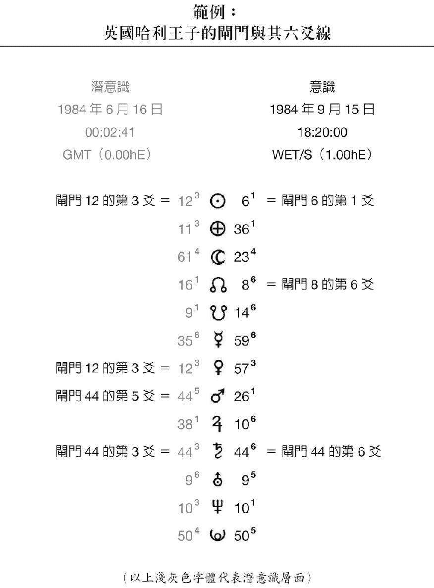

以哈利王子的人类图为例你会看到 12³——表示他拥有闸门 12 的 3 爻而对面黑色的部分为 6¹——表示在意识部分他拥有闸门 6 的 1 爻。下面的数字以此类推这样就能很清楚地看出你拥有哪些闸门和爻线。这些爻线可以让我们更清楚哈利王子真正的个性与特质。

我会在下一本书中逐一解释每个闸门和这六条爻线所代表的特质因为六十四道闸门乘以六会有三百八十四种不同的排列组合不是几页便能解释完整。现在也还不需要了解如此详细的注释但是我们可以简略地先知道每一条爻线的意义因为这六条爻线都有各自的主题将它们连结在一起。

在你解读人类图时可以先计算两边闸门上的数字确认哪一条爻线出现最多次便可以得知你的主导爻线。譬如说 6 爻占最大多数表示你有最明显的 6 爻特质。之后请你阅读 6 爻的解释看看自己有哪些特性就能更深入的了解自己同时也能领会其他条爻线在你的人类图中的意义。

##### 1 爻

1 爻是闸门的地基建立起稳固的基础。1 爻人需要知道自己很安全。你喜欢清楚明确讨厌模糊不清。缺乏安全感与稳固的地基会让你产生强烈的不安。1 爻人需要信任当基础不然的话不安全感会扼止某些特质或是潜能。

1 爻是位在最下方隐而不显不确定是否要让事情摊在阳光下。但是它们会带来内在的纪律让你完整地拥抱生命。1 爻在展现努力和自信的同时心里正深深地向内省思。1 爻带有自私的特质认为「一切都是为了我」你需要独自工作或是单打独斗、靠自己。1 爻和其他人有交集或是开始新计划时身体会出现流汗、难为情、急躁或是发抖的情形。在个人生活和工作领域时出现这样的状况时都要注意。1 爻人需要深入了解事情的本质。

##### 2 爻

2 爻让闸门拥有自然轻松和无忧无虑的特质你们对自我的认知不多但又有强烈的自我意识因此一定会再三确认他人是否认可和感谢自己的贡献。2 爻人做什么都需要得到回应和保证因此不难理解为什么「你和我」以及「一对一的交流」会成为你们的中心思想。你们会集合众人的回应从中获得认同感。除了认同感以外还会让你们拥有温和、善与人同以及团结合作的特质不过有时候会让你出现过于顺从的态度。

反常的是 2 爻也可能有超然、内向与沉默寡言的特质甚至会到了希望不受打扰的地步。如果你受到干扰或是感到心烦意乱可能会爆发情绪绝对会让大家知道你的心情人们通常会用害羞来掩饰内心的热情但如果大家能看到 2 爻人心中的热情他们就会大方的展现富创造力以及随和的态度。

##### 3 爻

3 爻人都会拥有创新和敏锐的鉴察力但同时也会带着不轻易承诺、避重就轻、优柔寡断以及客观的特质。变动、突变和不可预测性总是如影随形的跟着 3 爻。你们多才多艺适应力强因此行事作风就又更加善变。

看到 3 爻就知道你会有突破极限、开拓新领域的性格而且不会考虑结果。3 爻人都会把「不经一翻寒彻骨哪得梅花扑鼻香」当作砥砺自己的格言。即使做错了你还是会提振精神继续前进。创新与困难就像兄弟一样老是手牵手一起出现但是你不怕实验也不怕改变你不会被这些事情吓倒。

失败为成功之母你会从中学习持续提升成长。因此你会带着「试试看就知道」的强烈特质有你的存在人生的许多层面恋情和新计划都会更增添趣味、刺激甚至是赌注和危险。

##### 4 爻

你们无私又真诚心存着「我为人人人人为我」的伟大胸襟。讲话时总是以「我们」为开头仁慈宽厚待人亲暱热切。然而你们会不由自主的担心遭到拒绝不被他人接受和赏识这是你们的一大弱点。

4 爻人会建立友好的人际网络以吸引更多机会。但是这样做可能会产生不知变通的问题你容易单纯地以为这就是唯一的方法。你们会以众人的利益为前提来计划前进的方向但还是会照自己的方式进行。不懂得灵活变通结果就可能会带来挑战使得计划受到阻挠、否定。因此会更加深你们害怕被拒绝的心理。

只要 4 爻感觉受到挑战或是不被赏识就会退缩躲避。这时候你连呼吸都会觉得寒冷双臂紧抱在胸前也把心关起来了。这是你在遇到困难和他人恶意的行为时会启动的自我保护机制。

##### 5 爻

5 爻人可以担当领导者或是管理阶层因为你们拥有老师或是指引者的特质。你的闸门带有教育性、激励性甚至是战士的影响力因此你的性格自然迷人、机灵、有魅力、有说服力。

但事实并非如此。也许你有良好的表现但是内心却有问题正在伺机而动。我会这样说是因为 5 爻人经常脱离现实世界。你们追求响亮的名声不怕许下重大的承诺。成功时会大肆庆祝属于你的荣耀失败时也会产生同样强烈的情绪自哀自怜。

5 爻人宁愿将情感发泄出来也不要压抑在心里这样做可以避免性格上的弱点出来搅局也能减少问题、和复杂的情况。如果你有很多条 5 爻可能会觉得难以接受现实而且会在这个物质世界中感到非常迷失。

##### 6 爻

6 爻会让闸门带有慈悲、博爱的特质这一条线是闸门的最高层级。1 爻需要稳固的地基而 6 爻则是用它至高的视野俯瞰一切因此眼光长远能看清楚事情的全貌。这也是为什么 6 爻人在处理事情时都值得人们的信赖。

6 爻人拥有超然和客观的特质以及对一切了然于心的大智慧。因为地位崇高看远不看近的关系你对无耐的忍受度很低。

6 爻人有着崇高的理想会向每个人传达将来的愿景希望大家都能相信你的梦想。你容易带着浪漫的玫瑰色眼镜看世界会把事情想得太过梦幻不切实际。但是你们也拥有实现理想的能力会熟练的掌控整个局面。你和 3 爻人不一样你会投注全部的心力来承担责任引领每个人完成使命。

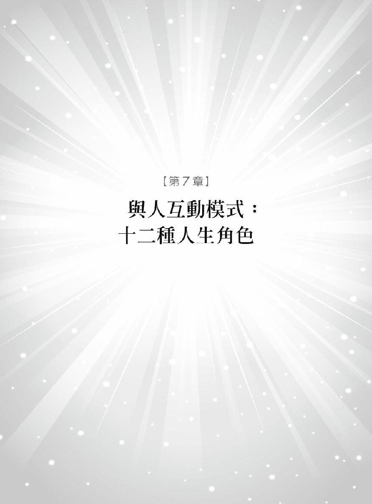

人类图给我清新的思绪让我感到内心祥和。这种感觉很像憋很久的呼吸后终于可以长长吐一口气的解放心情。

——KS 美国德州

人类图的解说已经来到尾声我们可以停下车来评估现况、深深地呼一口气享受美丽的风景了。好好看看四周用心观察这个世界。你要重视自己的看法不要靠别人而是以自己的感受来见证生命。

你对世界有特殊的贡献可以和完美体制中的万物共处。没有任何系统比得上人类图中的「人生角色」profiles 更清楚地描绘出你的特质。

「人生角色」几乎可以说是行为模式和生命方针的最佳写照。之前谈到的五种类型与做决定的权威中心是开启内心的两把钥匙而「人生角色」就是启开内在本质的第三把钥匙。这份「人生角色」会让你的人生更加完整它就象是蛋糕上的糖衣描绘出你和其他人互动的情况。如果有人问「要怎么形容一个人」我会说透过「人生角色」就能得到最棒、最清楚的答案了。

「人生角色」被广泛地当作评估的工具从中可以揭示人们的特有的行为、脾气、沟通方式和态度。因此营销团队会使用这个工具来锁定潜在的客群公司也会靠「人生角色」来评估员工使其可以有最佳表现达到最好的业绩标准。透过心理分析可以更清楚客户的需要在犯罪分析上也可以帮助警察缩小嫌疑犯的范围。没有其他事物比准确的「人生角色」可以更清楚的了解一个人满足你的好奇心。

人类图不单只是显露个人的内在部分还涵盖人与人之间的互动情况。人生角色加上之前的五种类型与权威中心就能对一个人有相当程度的了解因此在人类图的领域之中会听到有人这样介绍自己「我是显示生产者、3/5 人情绪是我的权威中心。」或是「我是 5/1 人投射者权威中心在脾脏。」只要简单一句话就能立即对你有初步的认识因此我常喜欢说「别谈星座了吧你是哪种类型的人啊」

「人生角色」是由六爻线所组成互相配对而产生十二种「角色」。这十二种角色是如何成为人类图的一部分会在更进阶的课程中解释。现在我们只要知道自己是哪种「角色」以及这个角色对我有什么样的意义。

你可以在人类图中看到属于自己的「角色」也就是左上角的数字。基本上是由太阳符号上的两个数字决定的。

在你的人类图上你会发现两个字体较大的闸门数字但是「人生角色」是由旁边的小数字所决定的。当这些数字配对后就成为你的「人生角色」。在人类图之中黑色数字会摆在前面然后才是红色的数字这是因为黑色代表有自觉的意识而红色是深藏于内心的潜意识。如此一来我们知道哈利王子是 1/3 人安洁莉娜裘莉是 3/5 型的人。见下图

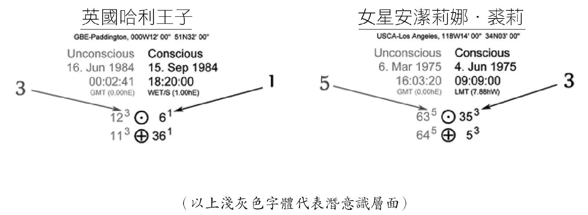

人类图和易经相似不同的爻会组成不同的人生角色。认识人生角色可以发现和别人的共同点以及在友情、职场和恋爱中的协调性。就像占星学会告诉我们哪些星座能够和谐相处人类图也可以学到相同的知识。这是阴阳调和的原则因此你会发现自己特别能够和特定的类型和平共处但是和某些类型的人却容易水火不容。

在我的人生中我都是靠着「人生角色」的相吸相斥原则便可以知道自己能不能和这些人做朋友。我可以马上知道自己和他人有什么样的共同点有没有办法快速建立起友谊或是得特别小心和对方相处。

#### 「人生角色」的调和与共鸣

如同之前所提到的人类图的 64 道闸门和《易经》的六十四卦相对应每个闸门有六条横线而这六个层级就形成了每个闸门的结构。所有的 1 爻都和其他的 1 爻互相调和 2 爻和其他的 2 爻互相调和……以此类推。

此外共鸣或是相同的频率就象是交响乐中的音阶存在于 1 爻与 4 爻之间、2 爻与 5 爻之间、3 爻与 6 爻之间。相对于 1 爻是人格化的基础频率 4 爻是外向、真诚的频率相对于 2 爻是内向、不做作的频率 5 爻则显得复杂、难懂相对于 3 爻的缺乏经验但是更勇于冒险的频率 6 爻天生就拥有管理人和权威的频率。在这十二种人生角色之中一半的角色是由协调的横线所组成象是 1/4 或是 6/3 人这象征着他们以独特、自我包容的方式和这个世界互动。

当你在运用这些信息时可以参考人生角色后面协调性的注记。但请千万不要完全按照字面上的意思硬性规定自己应该如何选择男女朋友或是评估现有的恋情是否可以继续下去。毕竟人类图中有太多因素要考虑我可得再写一本书才能完整地解释清楚

就请你享受下面这篇「人生角色」的内容把这些信息当成向导更深入地认识这方面的自己。

## 1/3 的人生角色

你有着静不下来的灵魂所以我会尽力让这篇内容够精采让你有兴趣读完不然你一定会往前追求下一段刺激无止尽的在这无常世间寻求平稳和安全感。

从内省的方面来看你是个有魅力而又实际的人和这个世界有着深厚的连结。下意识中会渴求生命的汁液对学习抱持着热切的态度总是在寻找「最新、最棒、最热门」的事物。因此你会以开放、好奇的心理开始新恋情或是计划。在过程中你会一直评量它们是否值得你全心投入。1 爻有着深沉的不安全感总是担心脚下的地毯随时会被抽掉。当这样的情况与潜意识、不作承诺的天性 3 爻结合时就会让你像只猫咪在炙热的铁皮屋顶上急跳脚。但是你内心里渴求一个让你能够安全抱住的稳固基石。

倘若有人事物让你感到不安你会从中找缺点表现出一副不再有兴趣的模样或是找理由退出、放弃等这样的情况有时发生得很突然。你不喜欢受到束缚也有一套针对人事物行不行得通的辨别原则。

和 1/3 的人对话就会发现你们讲话很直而且急着要切入重点。这是你特有的天性追根究柢、吸收、学习、获取……往下个目标前进。

在进入新的集会时你的 1 爻会和人有直接的接触决定互动的基础在这个同时 3 爻会开始探索是要投入还是脱身。你渴望结交新朋友、体验新事物。你像只爱社交的花蝴蝶飞来飞去与人互动但是下一秒钟可能就会咻地一声飞得不见人影你对新事物和新朋友的热情使得你很容易想都不想就一古脑地栽进新的计划或是新恋情。这样有点自私、埋头苦干、努力往前冲的个性可能会让人觉得过于冲击。你要特别注意自己会因为失去兴趣就要和人斩断关系的毛病。

你能力很强但是 3 爻有着「试试看再说」的特性因此你的性格中会带着漫不经心的态度。在工作上你有实验的精神一切顺利时你很兴奋做什么事都会很成功因而心存敬畏、感恩和喜悦。你会亲自去体验、实践一直到情况改变让你感到不安你才会被逼着继续前进。你会建构生命的层次在稳固的地基上一层一层的往上爬努力提升自己让未来更美好。

慢慢的你会发现在生活方式中有些事会一再重复发生。也许你走的每一步路都很正确而且你活得非常充实但这样的话你不会有什么突破或是获得持久的成功。

到最后还是得面对心中的不安全感也得满足你对稳定的渴望。能够安心、获得信任是你的底线也是你做人的根本。如果有某个人或是计划重要到你不愿失去的话你一定会不甘示弱的在地上钉下桩木宣示领土主权然后在这里落地生根盖起房子、建立事业和组织家庭。当你找到值得付出的地方就会百分之百的投入。在你建立自信支持自己的时候就能获取成就、找到人生的意义而且还会发现展现真实的自己时大家都很欢迎你。

#### 与 1/3 人的相处模式

如果你的另一半是 1/3 人你要知道他们有神祕、懂得向内反省的特质喜欢和自己对话老爱问一些象是「我要怎么摆脱这件事」或是「这有足够的利益给我一个安全的未来吗」注意喔这类的问题可是和你要「怎么摆脱这件事」一点关系也没有。1/3 人需要别人不断的对他付出他才能学会信任与付出。了解这点你就比较能够接受 1/3 人的任性并且更进一步发现这样的特质其实都是因为他们心里藏着深深的不安全感。

他们要信任你才可能做出完全的承诺因此你要小心不要故意像个调查员一样去刺激、挑拨他。更应该把他们抱入怀中让他们安心。在他们百分之百确定你的心意之前他们会采取逃避或是犹豫不决的态度因此会让人觉得冷淡或是不带感情。没错 1/3 人随时可能会夺门而出不说一声让人摸不着头绪使得被抛下的人感到痛苦和满脑子的困惑。但这就是 1/3 人的天性。

我觉得 1/3 人的另一半一定得做个精神支柱给他满满的安全感。当他感受到爱与安全感后这些不爱表态、做承诺的 1/3 人就会成为你身边最牢靠、忠实的伙伴了。

#### 谁和我最速配

和 1/3 人最速配的是 1/3 和 4/6 人第二适合的为 3/5、3/6、5/1 和 6/3 的人。

###### 1/3 的名人

英国诗人威廉布雷克 William Blake、流行歌手邦乔飞 Jon Bon Jovi、英国影星米高肯恩 Michael Caine、默片演员卓别林 Charlie Chaplin、英国歌手艾瑞克克莱普顿 Eric Clapton、美国前国务卿希拉蕊 Hillary Clinton、英国黛安娜王妃 Princess Diana of Wales、美国影星莎莉菲尔德 Sally Field、美国非裔民权领袖杰西杰克森 Jesse Jackson、美国影星蜜雪儿菲佛 Michelle Pfeiffer、毕卡索 Pablo Picasso、美国歌手黎安莱姆丝 Leann Rimes 和法国前总统萨克齐 Nicolas Sarkozy。

## 1/4 的人生角色

电影《不速之客》的男主角罗宾威廉斯饰演一名快照店的店员他在电影中说了这么一句话「人生中最令我们害怕的事已然发生。」我觉得很多 1/4 人一定感到心有戚戚焉你们胆大心细追求机会时总会小心翼翼。

1/4 人是机会主义者但是力守纪律态度谨慎小心因为你会要求做任何事一定要打好基础做好安全措施。这之中形成了如拉锯战般的矛盾 1 爻外向但是会仔细挑选而 4 爻善于社交却小心谨慎 1/4 人需要在这两种截然不同的特性间取得平衡。不管是个人或是职场上的机会你一定得要看到事情的全貌了解每个层面因为你要确定自己能够安安稳稳、不被突如其来的意外所惊吓。

你有一颗直率的心热切的想要迎接人生丢来的每一颗球但前提是你要感到安心、没有危险。1 爻感到不安的特质以及 4 爻害怕被拒绝的心理可能让你专横的想要控制一切尤其是牵扯到个人生活的议题。在你那乌托邦的理想主义当中不认识的人会敞开双臂传送温暖和拥抱彼此。你认为只要有「良善的心」就能建立成功与发展的稳固基础难怪志趣相投的人会成为你追求安全感的目标。

大抵来说你会谨慎地选择亲密的人际关系甚至会认为最安全的关系就是和自己相处。我会这样说是因为你的不安全感让你把任何事都往心里藏只关注自己的需求有时甚至会忽略周遭的人。当你感受到危机或是有所疑惑你的世界会停止寻求安定在这种情况下你会变得畏惧退缩让人无法亲近。

但是 1/4 人也有另外一面像这样强烈以自我为中心的情绪会让你成为一个急切、直率的机会主义者你拥有企业家的才能也有坚决的意志去获取利益。你会投注心力去赢得成功不会逃避风险因为你渴望让主管和同事们刮目相看。当你全心全意处理正在进行的计划时能够有你的加入真是大家的福气。你是开路先锋奋力带来创新的契机。没有任何事比大家的认可和感谢更让你醉心。事实上你有能力、有热情具怜悯心和慈悲的胸怀早就为你引来一长串的仰慕者只是你不知道而已。

和 1/4 人对谈会很清楚的发现他们是一群敏感、正直、坦率言谈恳切的人你会感受到他们所拥有的力量和潜能。虽然内心非常脆弱但是你带来的温暖足以融化人心。如果人们过于刺探或是态度粗鲁的话你会退缩离开直到确定这些人不会伤害你为止。一旦你受到伤害就不会再张开双臂而且会划清界限不让人亲近。

在走进任何聚会时 1 爻的特性会让 1/4 人和其他人直接接触而 4 爻会环顾全场决定当下的情况看看有谁是愿意真心交朋友给予承诺。诚实对你来说比什么都重要。

我会告诉 1/4 人要看清楚自己想要什么样的伙伴和目标因为你的性格中有一个特质就是如果被逼过头了就可能精神崩溃。你要寻求能够给你安定而且努力能得到回报的目标。在个人生活和工作的领域之中施与受之间要有稳健的协调性。每一种人际关系都要能够互惠这样真的本性才能散发光采。只要找到信任的基础 1/4 人就能充分地展现自我。

#### 与 1/4 人的相处模式

如果你的另一半是 1/4 人你要知道他拥有一颗慈悲心肠但是 1 爻的特性会让他在敞开心怀时格外谨慎。因此有可能会觉得 1/4 人太过于敏感、封闭。1/4 人渴望温暖的拥抱却又超难亲近你需要很大的耐心和力气慢慢打开他们的心怀让他们从封闭的世界中走出来。

1/4 人的脑袋里有太多事物在运转因此要了解他们并不容易。你需要温柔的哄哄 1/4 人给他安心的保证还要懂得如何重视他们感谢他们。1/4 人喜欢情人的抚触记得要常互相拥抱、牵手。肢体的接触非常重要这也是让他们安心的来源之一。看到你退后一吋可会让他们马上跳离你一呎之远。当他们听到情人说出「我们一起面对」或是「只有你和我没有其他人」等等话语会让他们觉得世界变得更稳定只要一建立起信任阻隔情感的墙就会瓦解你会得到 1/4 人给你无限的爱、忠诚和热情。

#### 谁和我最速配

和 1/4 人最速配的人绝对是 1/4 人因为没有其他人可以和你们如此心灵相通。除此之外第二速配的为 2/4、4/1 与及 4/6 人。

###### 1/4 的名人

拳王阿里 Muhammad Ali、前古巴共产党中央委员会第一书记菲尔德卡斯楚 Fidel Castro、爱因斯坦 Albert Einstein、美国第 34 任总统艾森豪威尔 Dwight Eisenhower、影星伊旺麦奎德 Ewan McGregor、英国乐团贝斯手席德维瑟斯 Sid Vicious 和赛车手舒马克 Willie Shoemaker。

## 2/4 的人生角色

我得要轻手蹑脚的走过去才不会吵到你。2/4 人喜欢一个人待在自己的殿堂中讨厌被人打断你的专注力即使是看电视也一样所以门口老是挂着「请勿打扰」的牌子。如果有谜题需要解开的话第一个要解的人就是 2/4 人因为你本身就是个神祕难解的谜。

你很神祕连你也觉得自己很难懂你看不清楚自己也很难和人分享心中的想法。2/4 人可能在这一刻非常害羞腼腆但是下一秒却又变得英勇无惧、言谈直率。你以轻松愉快的方式和这个世界互动但也会突然关上门来躲进自己的洞穴。

2/4 人很难维持平稳的心情情绪总是变化莫测。但是旁观者却比 2/4 人更容易看清楚自己也许这就是你为什么喜欢去探求从别人身上反射出的自己还会记录他人对你的反应不这样做会让你忘记自己是谁。你需要旁人的陪伴让你找到支持力量和决心。因此造成你培养出付出太多的性格彷彿你天性柔顺、善于与人合作。

和 2/4 人对话会发现他们的个性自然、随和、亲切而且心胸宽大。也会专心聆听对方说话这倒也不是因为谈话内容多有趣而是他们想从别人的观察中知道更多「关于自己」的事情。人生是一所可以让你终生学习的大学所有的互动都决定于你所受的教育、得到的引导和启发。你会从他人身上找出自己的定位要是你敬佩的人做了什么可以提升生活质量的事情你也会照着做。如果你在电视上看到激励人心的建议也会虚心采纳。你会深入研究任何可以发现自己的事物这就是 2/4 人因此可别被神祕的谜题给打败了。

你可能会发现也可能没有察觉因为这属于潜意识的部分自己害怕被拒绝。遭受拒绝会让你感到受伤。你是一个真诚的人拥有丰富的爱愿意付出同时在展现自我时会显得小心翼翼因为你害怕受到误解被众人排挤。也许这就是 2/4 人为什么偏好一对一的互动而不喜欢和一大群人相处的原因。当你走进一个房间时会先站在旁边等待别人主动接近。这有点像在钓鱼先抛出无形的鱼线象是故意看人一眼或是讲出奇特的见解来引诱人们和你做一对一的互动。

当你感到烦躁或是难过时你会无意识的做出恶意的行为。2/4 人心中藏着急躁的性格以及容易爆发的怒气。有时候这样的怒气可能会一发不可收拾。当你专心做事却被打扰时原本顺从的性格就有可能转变成恐怖的暴怒。

2/4 人很难察觉自己也深具创意这个特质可能连别人也无法完全发觉。创造力会在你追求某个目标或是在工作时自然的发挥出来只要你用心就会有出色的表现也能将创造力发挥得淋漓尽致。你会投注极大的精力和专注力在自己有兴趣的事物上越常得到成功你就会越加茁壮成长。

2/4 人的人生终极目标就是展现自己的本性当你顺从本性不受人心意识干扰时就能展翅翱翔。言行顺从天性就能让你过得自在你能因此一展长才发光发热。活得越接近本质忧虑就会越少。太多人与人之间的互动可能会让你感到却步不妨就让心中的自然机制引领你去冒险吧学着多信任人生——和你自己。

只要你能自在地给予人们建议你就当个最伟大的父母、最有智慧的老师、教练甚至是贤明的圣哲。因此千万不要限制自己去体验生命中的每一个机会。你的存在就象是为这混乱的现代社会中吹进一缕清风。

#### 与 2/4 人的相处模式

你会情不自禁地爱着 2/4 的另一半因为他们是地球上最可人最温柔的生物而且有着一颗宽厚的心不过也是容易受伤和急躁的情人。你千万不可以占 2/4 人的便宜对他们需索无度不管 2/4 人是多么顺从、听话也别把他们的好当作理所当然要记得他们也有需求也需要被满足。当 2/4 人被逼到临界点原本平和的性格就会转变成愤怒潜意识的 4 爻很脆弱他们需要受到重视不然就会把怨气一直往心中埋藏直到无法负荷爆发为止。因此一定要重视他们的需求与渴望在施与受之间取得平衡。

有这样的情人可能会让人气得常常抓狂因为 2/4 人轻松随兴又健忘这一刻可能开开心心但是下一秒钟却又生起闷气或是搞忧郁。2/4 人还会左耳进右耳出明明就有在听你说话但是隔天早上却忘得一干二净。只要是 2/4 人认为是琐碎的小事很快就会抛在脑后。

还有你要记得 2/4 人需要独处的空间不要去吵他们这时候就让他们一个人沉静一下吧。别问我为什么 2/4 人有这样的特质——毕竟我早先就说过他们是难解的谜。

在和 2/4 人刚开始交往时他们会有点害羞需要一点时间做心理准备你要耐心引领就能渐入佳境关系越来越亲近。只要 2/4 人认为你可以为他们解答人生和个人问题而且可以给他们安全感时他们绝对是最忠诚的伴侣。两人的关系是否能更进一步就要看你是否能让他们感到被重视、得到感谢而且还要把你和他们的需求视为同等重要。

#### 谁和我最速配

2/4 人最速配、最理想的伴侣是 2/4 与 5/1 人第二速配的为 2/5、4/6、5/2 和 6/2 人。

###### 2/4 的名人

美国影星弗雷德阿斯泰尔 Fred Astaire、好莱坞影星珊卓布拉克 Sandra Bullock、摩纳哥卡洛琳公主 Princess Caroline of Monaco、美国前总统柯林顿 Bill Clinton、美国影星史恩康纳莱 Sean Connery、美国影星孟汉娜麦莉 Miley “Hannah Montana” Cyrus、好莱坞影星强尼戴普 Johnny Depp、好莱坞影星卡麦蓉狄亚 Cameron Diaz、知名歌手约翰蓝侬 John Lennon、好莱坞影星凯莉米洛 Kylie Minogue、好莱坞影星丽芙泰勒 Liz Taylor 与美国知名主持人欧普拉温芙蕾 Oprah Winfrey。

## 2/5 的人生角色

2/5 人似乎需要指南针才能找到回家的路因为你被困在喜爱孤独的 2 爻与潜意识中爱空想的 5 爻之中。这样的组合给予 2/5 人奇特却又迷人的性格你是能干的领导者以谨慎的态度引领大众但却心存迷惑不确定有些事是否应该进行。不过一旦放手去做了你的领导风格会充满魅力和创造力。

2/5 人超然的心态让你觉得好像迷失在外太空漠然地看着地球上一齣齣的戏码。这是由爱寻求回应的 2 爻以及不切实际的 5 爻而组成的奇怪结合让你像颗球一样在他人的看法和自己创造出来的幻境中弹来跳去。难怪你心里老是质疑自己这辈子是否能找到懂你又可以让你活出完整人生的理想情人。试想一下你曾对任何人事物产生紧密的连结吗

这也许是为什么 2/5 人总是停留在表面上的互动不敢让任何人进入心中。其实你非常渴望拥有亲密的关系、理想的好工作或是让你一拍即合的人事物但这些渴望都是不切实际、追求完美的白日梦。让你在个人生活中变得爱挑剔、吹毛求疵而且善变。而且你不喜欢在同一个地方待太久让旁人有机会窥探你的生活。

在职场上你不画地自限、勇于创新常常提出非凡的创意点子。这些天马行空、聪明的点子让许多人包括你自己都会惊奇不已不过你不是自我感觉良好的人你需要从朋友和同事之间的交谈与互动来得到赞美、肯定和赏识这才是你快乐的源头。2/5 人很有天分不过你总是低估自己的聪明才智。

保持形象、门面对你来说很重要拥有良好的名声与举止表现是你维持「地位」的方法。演员只有在独处时才会卸下伪装的面具 2/5 人既享受隐居又喜爱融入人群就好像观众不喜欢待在聚光灯之下一样。2/5 人常常会发现自己被困在别人的问题或人生戏码中但是你那超然、客观的态度使得你可以成为很棒的救难队或是红粉知己能够帮助人们解决危机自然就会不断有人向你求助。

人们看到你就像看到救世主或是穿着闪亮盔甲的正义骑士。这样的结果会引起 2 爻从中寻求人们的赞美与恭维让自己活在大家制造出来的假象之中。不过假象也有好处因为 2/5 人会因为别人的看法而得到丰富的体验活出精采的人生。当然这其中会有小小的隐忧就是你会活在人们设定的形象中而不能做自己。

和 2/5 人对话时会发现他们其实不喜欢当领导者可是声音却带着强烈的说服力并且散发着吸引人的力量。虽然你有点害羞但不用多久就会把它巧妙的隐藏起来。2/5 人不是直率的人有些话总是藏在心儿口难开即使和你聊了百万次还是很难听到关于你自己的新鲜事。恕我不客气的说在 2/5 人的一生中大概不会谈超过一或二次的真感情。

最后你会发现自己的才华和领导能力超过你所想象也就是说你比自己认为的还要勇敢和能干。对 2/5 人来说只要你能解放自己人生就像好玩的游乐园。你需要从自己高耸的象牙塔中走下来置身人群真正的过生活这样才能得到真实的成就感。当你不在乎别人对你的肯定解开束缚让自己往前走时你就可以与人们有真实的互动获得真心的赞美。

#### 与 2/5 人的相处模式

你的 2/5 情人会不断审视你是否诚实是否值得信任 2/5 人无法忍受造作或是伪善。如果你要说「这件事对我来说意义重大」那你最好是讲真的。2/5 人需要受到尊重、赏识和被认同。在两人的关系真正建立之前 2/5 人很可能会故弄玄虚让你摸不着头绪。

他们很有能力如同一座充满力量和坚定的意志的高塔。但是你很可能会挫折地大声问他「为什么不让我进入你的世界」其实是 5 爻在作祟让他们很难与任何人发展出亲密关系尤其再加上害羞、自我否定的 2 爻更是难上加难。但是你的重要性其实远高于 2/5 人愿意承认的程度你给他们稳定的力量发生事情时会找你商量你是他们勇气和安心的源头。

你要做的就是为他们建立稳固的地基张开双臂给予保护引领他们体验生命。以「诚实面对自我」的态度便能帮助 2/5 人展现真我从幻想和错误的现实中走出来而且一旦达成了你们还可以共同享受实现目标时所带来的喜悦。

#### 谁和我最速配

2/5 人是你们最速配、最理想的伴侣另外 2/5、2/4 和 5/1 人也都是很好的对象。

###### 2/5 的名人

这一类型的名人有香奈儿夫人 Coco Chanel、美国影星凯文科斯纳 Kevin Costner 美国影星李察基尔 Richard Gere、福音歌手葛兰迪斯奈 Gladys Knight、好莱坞影星秀丽邓波柏克 Shirley Temple-Black、美国知名作家马克吐温 Mark Twain、英国威廉王子 Prince William of Wales 和知名歌手罗比威廉斯 Robin Williams。

## 3/5 的人生角色

你很清楚生命充满挫折与应接不暇的混乱时刻你也把战斗力调到一百准备迎战你有种坏坏的幽默感以及优雅、富有魅力的性格。3/5 人以詹姆士庞德的调调一边殴打坏人一边还挑眉地说「还用你说……我活着的每一天都是挑战啊。」

苦与乐在现实生活中老是成双成对的相继出现 3/5 人活在危险边缘对苦痛的认识难免比常人多。你是这十二种类型中最有可能把手指伸进插座中只为了看看结果会如何的人。3/5 人好奇、爱打听他人的隐私永远得不到满足的好奇心是你最大的敌人。你会不留余力去追求自己的喜乐与回报不管生命中发生什么事你依旧以不屈不挠的精神体验整个过程。

3/5 人遇到失败、打击和攸关生存的时刻都能快速地从中学习、累积智慧。生命会把你推到死胡同让你在经历心碎、绝望和错误中感受到何谓山穷水尽疑无路柳暗花明又一村的境界。彷彿你背负着教育来者的使命自己必须先见证生命克服一切挑战。

面临危机时 3/5 人会化身为有能力而且适应力强的领导者以智慧捏塑出梦想你有叛逆的性格想要挑战权威告诉世界何谓对与错。

你希望在人生的任何领域中都能扮演推动改变的角色。超强的适应力让你身陷风暴却仍旧泰然自若因为你早就身经百战知道事情会如何发展 3/5 人对人生的体悟让你有一颗自然宽容的心。

3/5 人融和了 3 爻滋养生命的需求与 5 爻梦幻但有着催眠魔力的迷人特质。让你富有魅力擅长诱惑巧妙地将人们卷入爱情、计划或是追求的理想之中。但是 3/5 人天性不喜给予承诺尤其在缺乏可以持续发展的目标时你是不会久留的。不过你总是能够运筹帷幄随意实验人生和点子以求获得最大的利益。

和 3/5 人聊天就能感受到你们直率、迷人和热切的沟通风格以及对生命显著的热情。你有一点梦想家的特质脑袋中装着许多疯狂轶事以一种自嘲的幽默来隐藏生命中的苦楚。当你展现敏锐的机智时一定是最爆笑好玩的那个人。幽默是你的解药也是守护你的防护罩。

但不是所有的 3/5 人都能看到光明的一面生命可能会沉重到让他们无法承受。3/5 人渴望安定的人生你受够了各种测试、苦难与考验你只想举白旗投降。当 3/5 人感到被击败时不管再怎么挣扎最后还是会选择投降。但是 3/5 人的天性会让他们重新振作再次面对新冒险。因此投降只会加深内心原有的挫败感。3 爻会不断的将 3/5 人丢进各种人际关系、计划和生活方式之中或是让你去旅行、买东西和承担吃力的工作。潜意识的 5 爻有时候也会很努力希望现实生活与梦想能够吻合。

3/5 人会从艰难的处境求取回报希望从一片混乱中找到那个特别的人让心能够得以平静。当你找到这个人就会给予全然的承诺。在勇于接受混乱时才算是真正接受自己。生命对你来说不是追求抵达目的地而是在于经历这趟无尽的旅程。拥抱生命让笑声做你的良药去吸取重要的智慧得到众人的钦佩与仰慕。在达到人生的终点时可以保证 3/5 人肯定走过、爱过且失去过也曾经成功并失败过你累积起一座满是经历和智慧的个人图书馆可以好好的回忆与深思。

#### 与 3/5 人的相处模式

3/5 的情人一定不知道自己有多么静不下来尤其是在谈恋爱的时候。当然他们甜言蜜语、哄人的功力不遑多让但是在他们捧着你的脸在你耳边呢喃着情话的同时双脚也正偷偷地往大门移动。和任何一个有 3 爻的人谈恋爱应该都要在爱情合约上明订「逃脱条款」尤其还加上爱作梦的 5 爻使得 3/5 人带着强烈的浪漫主义和重大承诺。

3/5 人总是在寻求完美情人而且绝不降低标准他们要的不只是完美而已还要「超超超……完美。」3/5 人需要经历每一个可能面临的层面在完全领悟后才会给予百分百的承诺。3/5 人在寻找人生伴侣时可是无比的严苛。

要和 3/5 人在一起有件事情非常要紧那就是你要知道如何「欢乐过生活」。人生也许为 3/5 人带来黑暗面那你就当带给他光明的那盏灯吧。他们可以非常情绪化就让笑声来抚平他们伤痛的哭泣声吧。当你带给 3/5 人许多欢乐就会发现他们身为盟友和仲裁者的真实面貌而且他们还能带领你进入不可预期但是充满惊喜的未来。一旦 3/5 人认定自己已经找到此生伴侣他会尽可能维持稳定的恋情并且对你做出最大的承诺。等着一起追求伟大的梦想吧

#### 谁和我最速配

你的理想伴侣是 3/5 和 6/2 人另外 3/6、5/1、5/2 和 6/3 人也都和你有许多共通点。

###### 3/5 的名人

英国小说家珍奥斯汀 Jane Austen、音乐家贝多芬 Beethoven、英国前首相布莱尔 Tony Blair、巴西名模吉赛儿 Gisele Bundchen、英国政治家邱吉尔 Winston Churchill、美国影星茱迪佛斯特 Jodie Foster、知名作家海明威 Ernest Hemingway、美国影星安洁莉娜裘莉 Angelina Jolie、美国前总统甘乃迪 JFK、通灵人士杰西奈 J. Z. Knight、媒体大亨梅铎 Rupert Murdoch、美国消费者运动之父拉夫奈德 Ralph Nader、美国乡村歌手桃莉巴顿 Dolly Parton、美国歌手黛安娜罗丝 Diana Ross、加拿大籍演员威廉夏特纳 William Shatner 和美国影星梅莉史翠普 Meryl Streep。

## 3/6 的人生角色

3/6 人以两种不同的速度前进一下以惊人的速度在快车道上奔驰体验新事物一下子又会切换到慢车道退往山上冷眼明智的看着世界。3/6 人有着 3 爻振奋的混乱特质以及 6 爻的监视管理性格是渴望铤而走险和超然明智的结合体。

因此你要注意自己与众不同的生活风格。无论是亲身参与实际行动或是站在高处漠然旁观 3/6 人都得面对内心进退两难的困境。但是自身的经历加上敏锐的洞察力让你拥有深厚的智慧从破坏中学习、累积内化成为自己的思维使你成为人生中的模范和专家。

当铤而走险那部分的性格冲撞到极限时就会撤退退到可以清楚综观一切的山顶。行动派的你会变成指挥官从工厂作业员升为管理阶层从演员晋升为导演。3/6 人以指挥官的态度吆喝着「去那里做这个听我的」要求大家听从他的指示。对 3/6 人来说生命是一所学校他急于从一个热切的学生毕业成为实践家英明地管理、引领众人。不管 3 爻要体验什么样的混乱或是「凡事总要先试试看」的实验精神 6 爻都能平安地度过危机。

不像 3/5 人 3/6 人其实可以看到混乱与危机何时会终止。大多数的 3/6 人会历经三个生命阶段分别是十八岁、三十岁和五十岁。也许青春期的你胆大妄为肆无忌惮不过一踏进成年的门槛你就会担负起更多的责任。如果十八岁没有转变的话那么二十岁到三十岁之间你会经历一段充满伤痕、挑战的生涯大概在三十岁左右就会「转大人」。不管过程如何 3/6 人都会更加成熟成为世人的典范。

等到五十岁你已经不会在混乱中挣扎而是站在上头观察让自己成为一个博学睿智的个体你的付出绝对能够带来非凡的改变。6 爻的洞察力和宏观远见是 3 爻所没有的特质因为 3 爻正忙着跌跌撞撞冲过人生这条路。这点让其他类型均难以望其项背。

3/6 人的沟通风格真实、坚定又带着 3 爻柔和的幽默感。众人深受你的睿智与丰富的人生历练所吸引我会建议大家多和 3/6 人谈天以「和你聊天真的可以学到很多」的话来引诱 3/6 人再多分享一点他的智慧。

当然 3/6 人还是免不了受到 3 爻不爱承诺的特质所影响尤其是你知道怎么躲到高处更是让不喜承诺的特质越加严重。但最后 6 爻还是能够缓解这样不安的情绪并且事先看出如果停掉已没兴趣但仍旧正在进行的企划或是追求的人事物会有什么样的结果。

3/6 人会协调自己的内心尤其是在时机成熟的时候。你很重视成就感因此只有和心产生共鸣的人事物才值得你投入心力。你需要培养真正的分辨能力才能从破坏中学习。当你觉得受到困阻这是心灵在告诉你参与了不适当的目标或是不适合的人际互动。

3/6 人寻寻觅觅的就是要获得大智慧但是得经历艰辛的追求过程。但是有更高层的力量会指引你只要担负责任、为众引领方向就能有所成就。人们会请你给予情感、心灵和生命的建议到时候你这拥有善良与智慧的老灵魂会幽默、了然于心地笑一笑地说「亲爱的孩子啊该从哪里讲起呢……」

#### 与 3/6 人的相处模式

你很快就会发现你那 3/6 的情人能够吸引各种人事物敏锐的洞察力是他们成就感的来源。他们的内心比外表来得成熟但其实在经历生命中的混乱岁月时他们也是非常激动、烦躁的。不管他们多么博学、聪颖和语气明确千万不要忘记 3/6 人需要空间独处、呼吸。

别傻傻地以为站在顶峰的哲人可以带来自由解脱 3/6 人的内心深处仍旧感到受束缚、无法自在。他们有自由的精神和独立的灵魂需要另一半和他们在同一层次心灵相交。要求他们改变或是要控制他们无异是给他们下了紧箍咒都会让 3/6 人吓得逃之夭夭。因此容我再次提醒他们需要独处的空间而且是很大的空间。

当 3/6 人得到自由后他们会回报你的付出做一个坚贞不渝的情人。你们之间再也没有克服不了的阻碍了。有一天 3/6 人会发现自己的人生目标是要实现梦想而不是迷失其中。找到强健的伙伴就能化梦想为事实。所以顺着 3/6 人的信心享受这段人生旅程欣赏沿途风景挑战世界让梦想成真吧。

#### 谁和我最速配

3/6 人的理想伴侣是和你志趣相投的 3/6 和 6/3 人另外 1/3 和 3/5 人也都是相当适合的类型。

###### 3/6 的名人

美国歌手玛莉亚凯莉 Mariah Carey、美国影星詹姆士加纳 James Garner、美国影星达斯汀霍夫曼 Dustin Hoffman、南丁格尔 Florece Nightingale 和美国影星班史提勒 Ben Stiller。

## 4/6 的人生角色

我不知道是该先叫你从山顶下来别在思考激励人心的想法还是不要坐在篱笆上让内心的难题困扰你。4/6 人是敏锐的人生观察家你总是花费太多时间用脑思考或是用心思量不知道该往何处去较好。可是一旦你得到结论或是决定后理智和智慧便会知道要往哪个方向前进这对你和其他人来说都有很大的助益和影响力。当机会来敲门你要赶紧捉住它的衣尾可以因此成为拓荒先驱引领自己和众人进入美丽的未来。

用「心」还是用「脑」是你生命中两难的抉择每当你要加入新企划或是许下个人的承诺时就会面临要用心还是用脑的窘境。你内心存在这样的两难这情况大概如下你坐在高高的山顶眼前是一片宽广、清楚又激励人心的视野但这时谨慎的「心」会悄悄的跑来搅局让你感到一丝丝的失望、心痛和挫败感。

属于意识部分的 4 爻会越来越依赖潜意识 6 爻的智慧不过 4 爻不会发觉这样的变化。如果 4/6 人能够求助于 6 爻的智慧就能获得信任。当然要做到这样不容易因为 4 爻会一直释放害怕被拒绝的恐惧而且你会清楚地感受到属于意识部分的情绪。这样子的情绪会导致你在被拒绝之前先拒绝别人也会快速地退出任何企划。而且每次同样的情形发生时你都会故意忽视更高层次的智慧忘却你能为这世界带来爱与重要的贡献。

也许从这一点我们就可以了解到为什么「友谊」对你来说是每一件事情发展的平台。先认识这个人可以让你衡量哪些人事物真诚、可靠。其实你只是想要得到团体和众人的接受而已让你的才能和天赋发挥在为众谋求福利。这样的心态有时候会让人觉得你为了被喜欢而过于做作。

和 4/6 人聊天最先就会注意到从你温暖的心和睿智的灵性中所散发出来的光环让你拥有非凡的社交技能。如果听众能够接受容纳的话你可以在任何环境中发光发热你会在自己的宫廷中传播娱乐和智慧让众人领受教诲。这时的你就像坐在山顶的圣哲底下坐着全心聆听的芸芸众生。

你期盼家庭和社群越来越蓬勃发展。你待人如己希望众人和你一样获得成功。你是仁慈、博爱心地又宽厚团结和谐的关系最能让你的本性感到吸引力。团队合作、同在一起是你的口号但是在这样强烈的心愿之下你会注意自己投注多少心力承担多少义务。你比较喜欢成为指挥大众的管理阶层、规划人员或是掌权上司仁慈的领导者居于高位拥有宏观的远见每每为众人带来智慧、信心与希望。4/6 人你是很棒的伙伴、显示者和顾问。

你的灵气几乎如帝王般的气势怪异的是虽然你心存恐惧但是你却能在承担责任、运用智慧时发挥到极致。你希望能够传达更高的理想到这个世界高尚的 6 爻加上机会主义的 4 爻激发出强烈的动能可以为自己和大众开创出一片江山。

然而失败或是受拒仍旧容易伤害你那敏感的心灵浇熄你原本温暖的心就像武士收起长剑把双手交叉于胸前不再理会世事一般。自我保护会探出头来让你退缩不前来自 4 爻的恐惧以及逃避现实的 6 爻会急促地建起一座冰堡让任何人无法和你有所互动和连系。

如果人们要我去说服你走出冰堡的话我只会轻轻的提醒你这都是因为你冲动地跳进错误的情势中而发生的。我会提醒你拥有宇宙赐与的礼物也就是纯然的爱你能将憎恨和疑虑在一瞬间转成爱当众人停滞不前时你会以激励人心的远见鼓舞大家。要知道你拥有源源不绝的爱又能为世界带来大转机。如果你选择和众人隔离让自己孤单的话是多么可惜啊。

当你开始认知并且遵从内在的智慧时你可以将智慧和心的欲望结合在一起。如此一来「心」与「脑」就会停止搏斗而且还会手牵手平和地度过人生。用你的脑去教育你的心你就能永远快乐满足。

#### 与 4/6 人的相处模式

4/6 人很可能是心思复杂的情人他可以是明智、可靠以及担忧、脆弱的综合体。即使 4/6 人宽厚睿智还是需要你温柔小心地呵护虽然他看起来一切都很好事事成功又意志力坚强这只是骗人的外表。他们需要你源源不断的爱和感谢不然你可得要一直花时间哄他希望他从冰冷的象牙塔中走出来。

4/6 人有时候会猛烈地攻击他人你得要小心这突如其来的举动。如果他们的心受到伤害就会引出 4 爻难以驾驭的特质让 6 爻冷漠地撤离。你要知道他不是针对你个人但是已经被引爆出来的反应需要你的理解与耐心才能平抚。他们认为自己什么都对这一点也是你需要配合的地方。

要跟 4/6 人做朋友很简单但是要他们给予承诺可就困难了因为他们的分别心很强。他们可以成为你很好的朋友但是不容易发展成亲密关系。但是身为他们情人的你非常幸运他们会以最温暖的心来照顾你就象是歌手兼词曲创作的麦可波顿 Michael Bolton 他有一首浪漫情歌「时间爱与温柔」Time Love and Tenderness。

背叛 4/6 人或是让他们失望会使得他们退缩远去、独自沉思难过然后他们会假装坚强以尖锐、残忍的言词反击回去。但只要你以忠实和无条件的爱去拥抱他们温暖他们的心鼓励他们将心中的情绪自在地表达出来你们一定会拥有互相关怀、付出的恋情。当 4/6 人打开心胸时他们是最热情、睿智的情人。

#### 谁和我最速配

最适合 4/6 人的理想伴侣是 4/6 和 1/3 人另外 1/4、2/4、4/1 和 6/2 也都是相当适合的类型。

###### 4/6 的名人

英国影星茱莉安德鲁斯 Julie Andrews、美国影星茱儿芭莉摩 Drew Barrymore、英国足球明星贝克汉 David Beckham、滚摇歌手恰克贝瑞 Chuck Berry、英国王子查尔斯 Prince Charles 和卡蜜拉王妃 Camilla Parker Bowles、英国影星茱莉克丽丝蒂 Julie Christie、达赖喇嘛 the Dalai Lama、美国歌手巴布迪伦 Bob Dylan、微软创办人比尔盖兹 Bill Gates、美国影星布莱德彼特 Brad Pitt、英国影星凡妮莎雷格烈芙 Vanessa Redgrave、美国第一位女黑人国务卿康德蕾莎莱斯 Condoleezza Rice。

## 4/1 的人生角色

有一句话我一定要清楚地告诉你「走自己的路追随你的心。」

4/1 人很特别你是十二种角色中唯一不变动的一个。这表示你有自己的中心思想以非常精确和特定的方式过生活其实你都是跟随着「心的渴望」来体现自己的命运。这是因为你有一种「固定命运」的特质只有单一目标和观点表示你的本性需要严格地信守宇宙为你安排的方向不可以偏离也不能有任何异议。

这种情形带点孤独的意味因为你有坚定不移和不轻易更改的性格别人很难理解你。你的人生建构在宇宙交付于你的命运不管命运如何你都会专心一意地实现它。

人类有六十四个基因密码子人类图中也有六十四个闸门。只有一个闸门会决定你的命运这样的特质会预先设置好人生中所有的互动方式。你忠诚地把持着一个精神信念毫不动摇。我认识一个退休的老人家他也是 4/1 人在六十四个闸门中他只有一个「刺激」的固定闸门。因此「刺激」成为他人生中的唯一信念他只开名贵的车、全世界都有置产但是忙得没时间去享受开了几次刀最近因为一个投资失利而宣告破产。但是他并没有因此感到一蹶不振反而兴致勃勃地和大家分享他的冒险故事。没有任何人事物可以阻止他不断找寻新刺激的动力。他忠实抱守着自己的人生信念。

那你要怎么决定自己的固定闸门呢你可以看看人类图中意识和无意识的栏位先看黑色部分也就是属于意识的 4 爻这就是影响你的固定命运的闸门。翻回去第六章阅读那个闸门的解释这就是你人生的中心思想。

你能够辩才无碍地表达自己的思想但是当众人对你不理不睬、不欣赏你的才华时你会感到很痛苦。但是千万别被这个人生课题给打败这一点真的很重要我再怎么解释都无法诉尽它的重要性。

如果你因为职场的要求、家人给予的压力或是现今社会型式让你远离人生目标你的生活将会变得支离破碎因为你看不到该何去何从。1 爻会隐藏起来 4 爻也会心碎。你的人生道路和其他人不一样你有独特的目标你要看清楚谁会支持你走自己的路。谁又会因为不知道这件事对你的身心安康有多重要而在你追求人生理想时感到害怕、受威胁。

我钦佩 4/1 人因为你们追求的人生目标难度高又挑战性十足。你觉得旁人容易变通甚至是到了过于随便的地步当你试着要随俗浮沉时会觉得整个人生似乎要翻覆掉出轨道。

因此你们千万要以本性做主感谢那些和你唱反调的人所给予的不同意见但是内心仍旧要做自己。对你来说最重要的就是专注目标忠于自己的选择。只要你能做到就会成为社会上的中流砥柱。你善良慷慨本意良好而且会全力以赴。当你不再和本性的限制对抗接受脆弱的自我跟随自己的心意前进就能得到成功、获得成就、找到自己的人生道路。

#### 与 4/1 人的相处模式

你很快就会发现 4/1 的情人有点执着于一个方向。如果 4/1 人得到他人的接受与尊敬他们就不会想要尝试新事物也不会感谢你要拓展他们的生活领域的好意。如果你真的关心他们的话就让 4/1 人做自己吧。

接受他们对 4/1 人极其重要因为很少有人能够了解并感谢他们如此严谨的态度。虽然他们只是想要唱首属于自己的生命之歌却要努力捍卫、不让心受伤害。改变会让 4/1 人感到莫大的压力你需要接纳他们真实的面貌。

当 4/1 人可以自在地做自己时他们会真心与你相守让你拥有百分百的安全感。认可、感谢和无条件的接受对他们来说就是爱的表现和 4/1 人谈恋爱不容易事事都不能改变的确会带来磨擦争执要做他们的情人就要有宽大的心量。如果你能配合 4/1 人让他们感到自由自在的话必定能建立起真心又无与伦比的关系。

#### 谁和我最速配

因为你独一无二的型态最重要的就是要尊重自己和人生过程。你们的理想伴侣有 4/1 和 1/4 人 4/6 人也可以相处甚欢。

###### 4/1 的名人

前英格兰足球国手法比奥卡佩罗 Fabio Capello、苏格兰玛莉女王 Mary Queen of Scots、美国影星贝蒂米勒 Bette Midler、已故影星彼得塞勒斯 Peter Sellers、服装设计师杰尼凡赛斯 Gianni Versace 和美国黑人歌手史帝夫旺德 Stevie Wonder。

## 5/1 的人生角色

5/1 人是天生的领袖、领导和生命的导师。你聪颖机灵懂得如何解决问题以远见领导众人以创意的思维克服各种障碍、消除争议。5/1 人善于处理问题、解决困难、给予建议投入研究和准备工作时非常严谨一定会追根究柢、找出答案。没有人比你更可靠、周密完善。5/1 人的领导能力是建立在自我的纪律之上。你像只天鹅一般有着令人着迷的外在但是没有人看得到水面下你那双努力划水的脚掌以及你不愿任何人查觉而隐藏在内心的忧虑。

如果要 5/1 人确切的描述自己这可能会引出一个连你们自己都解不开的难题。这时你们会转移焦点去探究其他领域这就是典型的 5/1 人善于向外寻却不热中于向内探索自我。你是很棒的表演家但会习惯性地划起界限防护自己的世界。因此人们很难看得清你即使是最亲近的人也没办没完全摸透你的心但却又被 5/1 人口中的伟大梦想所吸引。你构造出一个希望众人相信的形象有时候连你也觉得自己就是这样的人

你会建立一个自己喜欢的形象以这样的形象待人处事不喜欢让别人看到真实的你。因此旁人会觉得 5/1 人活得舒适惬意你也喜欢让自己处于什么都懂的氛围之中。

那些受你吸引的人会非常信任你觉得你有责任感和影响力但是你要搞清楚自己率领什么样的人而且要教导他们你感兴趣的事物不然你的心会得不到满足。

5/1 人从工作中建立起自我价值特别是独力完成的任务。这让你觉得人生很稳固。除此之外其他的人际互动都会让你觉得不明确、不稳定甚至会觉得难以应付。因此你又会以同样的手法来面对也就是建立起一个形象假装这就是你。有些人会觉得 5/1 人爱操控人又难以捉摸其实你只是要掩饰自己脆弱的一面保护自己而已。

5/1 人善于社交互动有智慧、有效率但内心的世界却充满不安全感不够稳固。大多数的 5/1 人会否认自己有这样的感觉不过这是因为不安全感来自潜意识是 5/1 人从未探索过的领域。大概只有一、两个人见识过真正的你而且这是经过你仔细衡量才决定让他们进入你的内心世界。

和 5/1 人对话就会发现你们很有趣、精明、聪颖又尖锐。你一定会分享许多关于工作的事情还会教我许多重要知识希望让我留下深刻的印象。不过我从你那站立不安的姿势、扭动的双手和不确定的眼神中就看得出你心中的情绪。然后 5/1 人就会四处移动寻找更容易互动的对象聆听对方的心声帮助他们解决问题。你有着救难队的精神经常会看到 5/1 人握着他人的手告诉他们人生的道理。

你最害怕世人看穿你的防护网——其实这不是坏事这样你才能得到释放做真正的自己。真实的去展现自我吧你的声誉承受得起考验。一直为了达到别人的理想而活是不健康的最后你会变得无所适从。不管如何你终究会了解唯有设定范围、做自己才是得到解放获得成就感的唯一方法。

#### 与 5/1 人的相处模式

5/1 人拥有 5 爻的特质在你看透他们迷人的外表后会发现 5/1 人真是很难亲近。但只要事情照着他们的想法走他们会给予最有力的支持。他们懂得解决恋爱中的实际问题但是情感层面则不是他们的强项。5/1 人也很容易成为导师、顾问和救援者的角色因此会让另一半不知不觉就过度依赖他。你可能会常听到他们说你太依赖或者生命中不能没有他这种话真相是他们依赖你、需要你的程度不相上下。

5/1 人在引领、教导众人时非常专业有效率但只要一牵涉到一对一的关系或是更亲密的互动时 5/1 人都会变得很小心翼翼。身为 5/1 人的情人你比他们自己更清楚这样的特质。

万一你变得贫困或是不安要准备好迎接承诺和浪漫的梦想吧。好莱坞电影都是依照 5 爻人物来撰写爱情的剧本。5/1 人会期待你要跟随他们的脚步前进。

和 5/1 人谈恋爱你要认清爱情的本质因为 5/1 人是不会去管这等事的当你俩已经有了结婚的准备时要小心不要乱投射什么的想法到 5/1 人身上或是给他们幻想空间。让他们踏实些别一高兴就飞上天。如果你们交往还不到这样的程度可能变成互相支持但不是真心的关系。但只要你能感受到彼此的真心恋情一定能够长久修成正果的。

#### 谁和我最速配

5/1 人的理想伴侣是 5/1 和 2/4 人不过 1/3、2/5 和 3/5 人也是你们的好伙伴。

###### 5/1 的名人

好莱坞明星珍妮佛安妮斯顿 Jennifer Aniston、维京集团创办人瑞奇布莱森 Richard Branson、美国前总统小布什 George W. Bush、美国影星雪儿 Cher 英国女王伊丽莎白二世 Queen Elizabeth II、《花花公子》创办人休海夫纳 Hugh Hefner、美国著名社交名媛派瑞丝希尔顿 Paris Hilton、美国演员凯蒂荷姆丝 Katie Holmes、玛丹娜 Madonna、美国歌手丽莎明妮莉 Liza Minnelli、美国加州州长阿诺史瓦辛格 Arnold Schwarzenegger、美国歌手小甜甜布兰妮 Britney Spears 和英国首相撒切尔夫人 Margaret Thatcher。

## 5/2 的人生角色

5/2 人很奇特你们善于规画、自制却又充满想象力。先不用谈如何吸引别人进入你的世界我们可得先找出要怎么让你融入外头世界。你拥有 2 爻的孤独特性加上外放又爱幻想的 5 爻。不过身为而 5/2 人你会受到有意识的 5 爻所引领将自己投射于外你有统御的才能、老师的性格以及奇特的想象力。然而到了夜深人静的时刻孤独的性格又会让你隐遁避世。在职场上你会提出很棒的方案或是企画案亲自执行但是孤独的性格会让你质疑自己为何要这样做。

你的天性会对抗爱幻想的习惯让你有点分不清楚真假不知道自己是身处于真实还是虚幻的世界之中。5/1 人会寻求他人的认同而 5/2 则是会担忧他人的想法不知道自己能不能被接受。因此你在人际关系的互动上会变得小心翼翼。只有在你放松而且觉得事情对你有助益时 5 爻才会探出头开心地分享故事建立自己的神祕王国。但是内心深处你时时感到忧虑害怕自己所处的世界会突然破灭。

我会要你放下不要去担心别人对你的看法因为没有人会如你所愿大费周章地深入你的内心探索你的本质。2 爻追求回应的特性以及 5 爻外放的性格让这件事不太可能会发生。这个意思是你会随着人生不同的情境而变化你做了什么事、扮演什么样的人只要你不承认这是伪装那就没有人可以确切的看清楚你的本质。

和 5/2 人谈天时你的风采可真是令人着迷你是完美的演员有着无懈可击的沟通技巧。只要我稍一转身再回头时你早就和其他人兴致高昂开心地畅谈起来了。这只迷人的花蝴蝶忙着飞来飞去采花蜜只剩脑子里会偶尔想一下我对他留下什么样的印象。真是如梦似幻又令人难以捉摸的性格啊

你可以想都不想就从帽子里拉出兔子来让过往的路人在瞬间停下脚步欣赏你的表演。你能够掌控全场、迷惑观众在众人大声喝采时退下舞台。享受这样的赞美吗但是要知道这不是真实的你。

5/2 人老是感到进退两难你想要活出真实的人生却也因此让自己承受许多不安。你要接受自己的才华和客观的看法要懂得放松活得有乐趣。你是那种需要去体验生活大小事物的人当你和他人的生命有所接触时你就能够整合这些重要、实际的观念和人生的课题。

是人难免都会犯错但是你犯错时内心总是挣扎着要继续感到内疚还是原谅自己尤其是原谅你发现的缺点。当你真正去接受自己的缺点原谅就能带来治愈的疗效。所以学会宽恕、学会生命中的课题为你所处的世界带来影响吧。

#### 与 5/2 人的相处模式

5/2 人可以依照你的想法扮演完美的伴侣。他外向活泼却又内向纤细可以和你在派对狂欢也能待在家中和你共享惬意的夜晚。

从许多方面来看和 5/2 人一起生活就好像和演员住在一起只是这个演员回家时忘了卸下演员的身分日日夜夜演个不停。5/2 人会绕着你们的恋情精心安排每件事既能帮忙解决问题又是知心的好伙伴。对 5/2 人来说一对一的恋情要有紧密的互动彼此要感谢对方。不过只要是有 5 爻的人都一样要亲近他们可说是如登天一样难。

和 5/2 人交往还是会有「从此过着幸福快乐」的美好前景这类型的情人懂得讲些柔情蜜意的话。如果你能让他们牵着你的手前进尊重他们需要独处的需求你就能有一段很棒、很丰富的恋情在人生路上轻轻松松的前进。所以放开胸怀的接受他们不定的天性一再地向他们保证事事顺利让他们感到安心。那么虽然你得要对这段不可预测的恋情随时保持警戒但是过程绝对有趣而且会让你的心感到非常满足。

#### 谁和我最速配

5/2 人的理想伴侣是 5/2 和 2/5 人另外 2/4 和 3/5 人也是你们的好伙伴。

###### 5/2 的名人

美国影星马龙白兰度 Marlon Brando、英国歌手罗杰达尔屈 Roger Daltrey、美国影星劳勃狄尼诺 Robert De Niro、英国女歌手席娜伊斯顿 Sheena Easton、西洋歌手汤姆琼斯 Tom Jones 和美国影星丽莎库卓 Lisa Kudrow。

## 6/2 的人生角色

从出生到现在你应该会觉得自己像个专家、有威信的人。甚至在你幼儿时期躺在摇床时你会往上盯着那些围着你瞧的大人心里想「你真的喜欢自己所要面对的情况吗」从出生到死亡在人生的每个阶段中你天生就是众人的楷模你的智慧、看法和洞察力可以安定周遭的世界这是你的天赋。

你知道下一步会发生什么事可以找出线索帮助人们看到事情的全貌。这是你天生的本能。你是大家的模范你有崇高的理想、标准和目标。因此你很容易成为掌控全局的人因为很少有人可以做得跟你一样好不过有时也会让你沮丧地大叫「为什么所有的事都要我来做」你很可靠会注意到任何小细节除非人们愿意也有能力承担时你才有可能赋与他们责任。

你一生力学不倦吸收各种信息和新知你会成为博学多闻之士有智慧、有远见在心灵和俗世之间达到平衡。有时候你会因为众人缺乏见识而感到挫败。其实人们并不是短视近利只是看事情的角度和你不同对待人生的热情程度也相去甚远不是每个人都想要精采绝伦的生活。很少有人和 6/2 人一样睿智和善于处世你的人生观超越大多数人可以理解的境界除了 6/2 和 6/3 人。

和 6/2 人对话会立即发现你们懂得生活情趣对这个世界也有一定的了解而且永远保持乐观的态度。你有自信、面面俱到而且处事精准又清楚。你在社交和工作领域中都能够不受琐事影响看清事情的真相和意义。你一定常常听到人们说「你的心智比外表成熟。」

不过你的潜意识在发挥才能时可能会有所保留这一点常让你感到困扰。你偶尔会态度冷淡人们容易对你敬而远之。这是 2 爻产生的影响。你重视自己宝贵的时间和精力只有能够实现抱负的事情才值得你投注心力。

你常常会不自觉得流露出「出个价钱吧我会考虑看看」的神情。如果你没有发觉这一项特质你很可能穷其一生都在逃避自己真正衷心热爱的志业也无法发挥百分百的潜能退却、找借口……让 2 爻将你拉入阴暗之处。要记得你的智慧和灵感需要恰当的气氛和人们的赏识但可得要你自己先行动才能得到。

当你在从事某件事或是和人们有交集时你很容易把太多事情揽在自己身上一副想要征服这个世界的样子。太多的责任会压得你喘不过气动弹不得反而会对人生感到厌烦。你会觉得生活无趣也不愿意再承担带头的工作宁愿屈就当个助理或是处理一般行政的工作把重要事务让给其他人来做虽然你心中一点也不满意他们的成效。

只要有 2 爻的人都需要独处的时空这是你们充电和评估状况的方式你们可以在孤独时悠游自在 6/2 的女生可以整个周末自己一个人逛街都没问题男生则可以做自己想做的事当个百分百宅男。

拥有 6 爻的你人生中会有三个转折点十八岁、三十岁和五十岁。大多数的 6/2 人在十八岁即将要跨入成年的世界时都喜欢承担某些责任或是以某种方式来展现自己的权力象是参加社团、摇滚乐团或是推动某种运动等等。到了三十岁你已经拥有许多人生体验你那无穷尽的热力便会慢慢平缓下来这大概是因为你逐渐体会到不是每个人都有一样的体力来配合你。这时你便能够放慢脚步或是从业务前线转成办公室的工作 6 爻也能将每个人的利益作最好的运用。

当你来到五十岁大关生命会召唤你完成最崇高的使命。你已得到认可是众人的典范你能发挥绝大的影响力。你享受生命的乐趣能够为这个世界带来光明让大家活跃起来你生来就是要成为众人的典范你知道自己做得到

#### 与 6/2 人的相处模式

6/2 的情人可靠又值得信赖有他们在身边天塌下来也不怕。你钦佩 6/2 人的特质但是你对他们来说也是意义重大。因为 6/2 人总是害怕找不到心灵伴侣找不到点亮他们生命、与他们志趣相投的那个人。如果 6/2 人选中了你你绝对是那个特别又值得赞赏的人。所有的 6/2 人都希望能保持新鲜又令人赞叹的恋情他们对无趣的容忍度很低你可得要时时发挥点创意为恋情加分。不管 6/2 人有没有说出口他们都想要另一半能够和他们一起攀登高山、欣赏同样的美景。带给他们惊喜或是一起去新的景点都会让 6/2 人开心不已。

要感谢他们的睿智享受他们带给你的振奋旅程。当他们发现自己的完美特质就能够找到最适合他们的好朋友和心灵伴侣也会安心、满足于自己所拥有的恋情。

#### 谁和我最速配

6/2 人的理想伴侣是 6/2 和 3/5 人另外 2/4、4/6 和 6/3 人也是你们的好伙伴。

###### 6/2 的名人

西班牙影星安东尼奥班德拉斯 Antonio Banderas、瑞典网球选手比约博格 Bjorn Borg、英国作家艾米莉柏朗特 Emily Bronte、英国侦探小说作家阿嘉莎克丽斯蒂 Agatha Christie、好莱坞影星杰美李寇蒂斯 Jamie Lee Curtis、英国小说家狄更斯 Charles Dickens、美国歌手吉米亨德里克斯 Jimi Hendrix、欧美流行歌手艾尔顿强 Elton John、亚洲影星李小龙 Bruce Lee、美国电影导演乔治卢卡斯 George Lucas、性感女星玛丽莲梦露 Marilyn Monroe 和美国总统欧巴马 Barack Obama。

## 6/3 的人生角色

6 爻的智慧代表在有意识的这部分会让你成为至高无上、无与伦比的榜样很少有人比得上你的博学、经历和活动力。你比任何人更懂得生活是怎么一回事你常把这句话挂在嘴边「什么地方我没去过什么事我没做过你猜我还知道什么」「我可以预知未来。」

这是因为你拥有卓越的智慧不过这也让你很难维持长久的关系或是找到受你敬重的协会。6/3 人只愿意和高水平、聪明以及有挑战性的人事物有交集。你希望和更高层次的人事物相处。其实大多数的时间你都宁愿独处不受人打扰。

你开心地接受 6/3 人的特质生活中也不会有世俗的成分。你会为了突破生活中的困境和限制而去冒险、面对挑战这样做会增长你的智慧你有强烈的野心希望自己有更大的发展、晋升到更高的层级。人们也许会觉得你无来由的就要反抗不过事实不然你的反抗行为都是建构在希望改变生活让自己有更丰富的体验上。即使要你坐上火箭往太空前进你也会兴致勃勃的答应。毕竟你一直都在向往能够享有远离尘世的快感飞到外太空不也是一个好方法。

你是权力、智慧再加上爱刺激的怪异综合体总是带着一副不怕死、随遇而安的态度。你可能在工作时正经八百的样子但是到周末就完全变了一个人。你也可能在承担责任的同时脑袋里却想着要怎么找刺激、乐子。不管是哪种情况你应该早就习惯这种变来变去的个性在拥有权力的同时却又不断的寻求狂暴、混乱的经历让自己得到更高的体悟。

如果你是 6/3 人一定会觉得要遇到和自己个性相同的人真难。从你出生那天开始你就努力地扩展生命把自己往前推进希望能找到有吸引力的新领域。体验更大、更棒的人事物就是你一辈子寻求的目标。你会挑战遇到的每一件事测试它的威信这是你天生带来的性格。人们会被一些神祕的事物所迷惑但是你一眼就能看穿它们的底细可是 3 爻又会让你容易受影响因而失足犯错。幸好来自 6 爻的智慧和先见之明能够给你更好的指引。

拥有 6 爻特质的人都有三个转折点十八岁、三十岁和五十岁。但是 3 爻给你一个更棒的优势在面临人生的关卡时你要运用 3 爻对人生的渴望帮你踩煞车才不会冲过头。你要移交指挥棒坐在高处以内在的智慧和丰富有教育性质的人生经验来保护自己。

你渴望拥有更大的影响力提升自己的境界做出有意义的贡献。你不怕担当责任你希望能够掌管大局以自己的方式决定如何完成目标。大部分的 6/3 人在年轻时就渴望成为掌权的大人物在职场上你会努力往上爬成为高阶主管、董事……或是自己开创出一番大事业。

和 6/3 人聊天就会发现他们博学多闻不管是关于这个世界还是心灵持修方面你总是有许多第一手的人生经验加上能够激励人心的大智慧更让谈话内容精采有深度。事情刚要开始前你就能看清楚它的起头、过程和结果。你的故事主角总会历经许多波折到最后虽然留下生命的疤痕但绝对会得到无限的智慧和教训。你会用幽默的口吻阐述故事让人们看到事情的光明面像你这样总是能看清楚人生全貌的人哪能把每件小事都太过当真呢

你以严谨冷静的心态看着这个世界对于不必要的故事情节一点兴趣也没有以真知灼见指引人们正确的方向。最让你感到厌烦的就是反覆发生的问题你不喜欢花时间在那些无法帮助自己的人。

在你十八岁时你会觉得人生很无趣但只要你对人生还有些许热情的话你可以去挑战这个世界尝试遇到的每件事直到三十岁为止。这个世界需要你的威信和累积的人生经验因为你是个有独特风采的人。

#### 与 6/3 人的相处模式

如果你的另一半是 6/3 人光是要许下承诺的念头都会让他们感到束缚。你们要了解的不仅是 6/3 人的天赋还得知道他们对开放与自由的需求。他们是典型的无牵挂者不喜欢一般的恋爱关系。

6/3 人会不断的成长、改变如果你不和他们一起前进的话很可能会越行越远。6/3 人相信要向外寻求才能得到更好的经验、灵感甚至是另一半。有时候他们会一副冷淡、疏远的态度好像跟你只是一般朋友。这倒也不是他们失去兴趣只是专心在寻找能够激发灵感的事物或是下一个经历。你要加入他们一起天马行空跳脱框架的束缚就能长伴左右。6/3 人会一直往上攀升你要给他们发挥的空间相信他们、从旁支持、协助成为志趣相投的心灵伙伴。

要让 6/3 人时时感到满足是很难达成的任务不过只要你能尊重他们的原则他们会是最体贴、风趣和睿智的伴侣。当 6/3 人愿意投入这段感情靠近你时你会感到强烈的爱意好像他们要深入你灵魂深处一般。

只要 6/3 人的内心平静安稳不断外求的欲望就会慢慢和缓纾解。不过这也是短暂光景我认为他们三不五时就又会蠢蠢欲动连他们自己也没办法把持住内心的安定。虽然如此却也能确保恋情绝对不无聊你可也要时时保持警戒才行。

#### 谁和我最速配

6/3 人的理想伴侣是 6/3 和 3/6 人另外 1/3、3/5 和 6/2 人也是你们的好伙伴。

###### 6/3 的名人

美国影星华伦比提 Warren Beatty、美国影星亨弗莱鲍嘉 Humphrey Bogart、好莱坞影星麦特戴蒙 Matt Damon 与好莱坞影星哈里逊福特 Harrison Ford。

#### 小结

最后的人生角色总结了人类图中主要的元素到这里我们已经解释完九个能量中心、三十六条通道、六十四个闸门与六条爻线的特质。每一篇的内容加总起来我们可以获得三大重要因素分别是类型、权威和人生角色便能清清楚楚地知道真实的自己。

现在最重要的就是如何透过已知的信息拼出完整的人生因为知道自己的人类图是一回事藉由它活出更精采的人生才是我们更需要用心学习的一门功课。

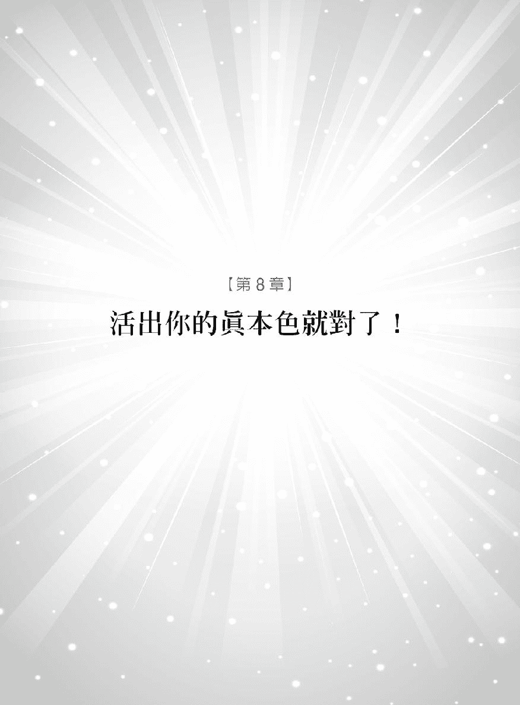

非常感谢人类图让我的人生恢复完整。

——DB 美国怀俄明州

人生最终的目标就是要活出真正的自我。人类图让这个使命变得简单许多。在自我实现之前我们要先接受、认定、唤醒和诚实。

接受自我本性的真实样貌、超越情绪、观念的制约和局限。

认定自己内在的潜能生发自信展露自我的真本色。

唤醒内心的主人发掘自由和成就。

练习诚实做自己不要害怕别人的意见也不用寻求他人的认可。

要先接受才能认定自我下一步便能唤醒自己到最后一定能诚实地展现自我。

当你越来越熟悉自己之后真我会和你产生连系给你力量。这样的成果不是一夕之间就能看到而是需要耐心和不断的练习有时候甚至得提出勇气来争取但是你和真我的互动越多——要运用在每天所面临的抉择、表现于外的言行举止以及和他人的互动——内心越稳定就越能拥有一个协调、有效率的人生。

如果这一生都要以别人的想法和期望来过活实在荒谬也很浪费生命。唯有发觉独特的自己才是成功的唯一途径。要成功就要做真实的自己活出你与生俱来的人类图。

#### 如何串连起人类图的全貌

我们已经讲完组成人类图中的所有元素现在你要做的就是将各个元素组合起来更重要的是要知道如何活出真实的自我

有一些人在十年前得到自己的人类图内容这十年来他们总会不时翻阅当初写下的笔记引出本性中的智慧。也有人早就和真我合一行住坐卧皆以本性做主。我会和你分享他们知道的一切让你可以将所学运用在人生旅途中。

首先你要注意每个能量中心所给的讯息这是重要的起始点也是了解本性的基础。

认识自己的类型才能获得真知灼见得到权威中心的支持采取正确的策略。而人生角色提供的就是你在这个世界占了什么样的位置以及与人互动的方式。

因此你要经常复习人类图中的三个关键元素也就是「类型、权威中心和人生角色」这样一定可以解开心中的祕密。当我在解读人类图时只要先找出这三个元素便可以马上知道人们最明显的性质。当你在解读自己的人类图先着重这几个主要的区块因为你可以知道如何以最好的方式来使用自己的人类图。

当你完成这一个步骤后便可以更深入去了解能量中心、通道和闸门的逐一特征。不过最重要的还是得将类型、权威中心和人生角色串连起来藉此找到自己的本质。类型的英文为 Type 权威中心是 Authority 而人生角色是 Profile 这三个字的缩写便是 TAP 英文是水龙头的意思。因此了解这三项元素就有如打开水龙头一般所有重要的信息都会哗啦啦地倾泄出来。

举例来说你可能会先发现自己是生产者这表示你有源源不绝的生命力但如果权威中心在「情绪中心」那么你就得等待内心的澄明给你绿灯的指示后才可着手下一步。

也许你是 6/2 人人们可以信任你的观点快速地掌握状况、懂得要领。假若你是 2/4 人大家会被你的诚实和真诚的本质所感动。

从这个 TAP 的基础上我们再往通道和闸门延伸。当这些零星的信息拼凑完成后就会看到最美丽、完整的自我。

在你拼凑、统合的过程中可能会发现通道和闸门的特质互相牴触。如果你也有这样的现象那表示你会依情况的需求而展现出不同的面目。你的权威中心会指示你事情的优先级。如果蓝图中有一个闸门表示你要独自行动但是其他地方却又建议你团体合作才是最佳方式那么你要和权威中心商量就能知道以当下的状况你是要独自行动还是打团体战。人类图的整体性超过每个特质代表的单一意义。

而且我们不只是要活出真实的自我还得信任真我。英国足球明星贝克汉站在一排大汉之前要罚球进网他有信心可以把球踢往右上方射进球门老虎伍兹在第十八洞准备要推球进洞时他知道自己可以算准距离一杆进洞或是安洁莉娜裘莉一站进电影场景就会将自己转换成电影角色。站在人生的十字路口你依靠的不是有形的事物而是心中本我所给你的指引。

同样的当你了解自己的人类图后你就和这些明星一样知道自己有所依靠。你要学习信任内心中这个始终如一的本我而且知道它永远不会离你而去。

拥有这样的觉知并不是奇迹而且在这之后还是有可能会选错目标、方向或是爱人。恐惧和自我意识仍旧会不断地诱惑你但是你要停下脚步让心中的觉知为你带路重新阅读自己的人类图做这场人生游戏的主人。

当你以这样的方式来接受自己的人类图「我来这世上要做什么」这个由来已久的问题就会自行消失你会毫无困难地接受自己。人类图真的是一项认识自我的神奇利器在这个大宇宙之间每个人都要实践自己的角色这是宇宙计划的一部分。

来找我咨询的人们因为人类图生命越来越有意义。在深入的练习之后他们懂得了尊重、感谢和爱自己。和家人、朋友的对话也有长足的进步以前可能会造成摩擦和紧张气氛的情况也消失了这都是因为他们重新认识自己的关系。许多因为忠实呈现自我而改变人生的故事让我对人类图更加的敬畏和赞叹。

#### 天生注定的宿命论

现今社会相信人们可以透过自由意志做自己想要成就的人但其实宇宙已经设计好每个人的样貌。当然这样讲又会让「自由意志对抗命运」这个长久已来的争议浮上台面。

「你是说我早就被设定好了我无法改变事实」有一位女性客户在听完讲解后劈头就问我这一个问题她觉得人生因而受限无法挣脱命运的枷锁。其实有很多人都会有类似的疑问不过我只能给你这个不变的答案「每份人类图都是宇宙的礼物在实践自己的人生设计时就能带来成就与满足。」我们要看到的并不是人生受到限制而是从自己的人类图中我们可以发挥、实践真我的自由。

人类图可以启动、增强个人的自由因为没有任何事可以比得上做自己更自由。这个系统不会损害或是让你无法自己作主你的人生或命运也不会因此被设定而无法做任何变动。只有本质和真我是预先设定好的但是你仍旧是拥有自由意志、拥有自由和快乐的。预先设定好的人类图反而让你在追随真我时得到解放。

#### 实践你的人生设计

想象人生象是一场要横渡大海的旅程人类图就像一艘船而你是驾驶这艘船的水手。任何老经验的水手都会先了解这艘船的设计和性能利用它来帮助自己安全到岸。每艘船前进的速度都不一样但最重要的是要如何驾驭手中的这艘船依照自己的性能搭配当时的风力和天气安排出最棒的前进路径。因为这是旅程并不是比赛啊人生也是这样。

你也一样要了解自己的才华和优缺点才能享受一趟最省力、舒适的旅途不用和别人比较使用的策略、手法或是走了哪条路径。要熟悉自己的船的性能自在地航行便能发挥长才、行驶在正确的路径上。如果你想要模仿别人的航行风格很有可能会自找麻烦。

任何水手都知道要视潮汐、风向和浪潮的情况改变航向或是迂回前进因此要让自己独特的才能与真我合作必定能开创出更棒的人生道路。

#### 在欢笑中学习

我想要在这里提醒最后一件事当你退后一步深呼吸时你会发现人生其实没有那么严肃。

看看狗儿轻摇着尾巴鸟儿在竹篱笆上叽叽喳喳树梢在微风中舞动或是月亮照在海上的倒影都能让我们感受到最自然的人生就是它最简单、最美丽的时候。你也一样可以舞动自己简朴、真诚的曲调。

现今社会带给人们很大的压力没有人有闲暇可以享受当下我们尚未解脱昨日的束缚又害怕明日的到来。我们要接受人生是个难以理解的谜团用意在让我们经历而非解决。如果能退一步看看我们的本性受何滋养练习自我接纳转成对自己的爱一起面对人生中的挑战。

人类图就是要我们接受自己独特的人生设计不过每个人都拥有一个相同的特质那就是在恢复理智后能够一笑置之的能力。我们可以嘲笑自己、他人、社会规范……还有命运偶尔开的荒谬玩笑。

我在为人解读人类图中发现许多人都被不必要事件、忧虑、慌乱和混乱所困住十之八九都是因为自己想太多不然就是被自己或他人剥夺掉应有的快乐。

我们正要进入一个新世纪别再否定自己或是低估他人。如果你要诚实地活出自我、向前迈进的话就要尊重、相信自己。

人类图并不是要你改头换面而是邀请你做心中的那个本我。人类图不是应急之道也不保证让你有所成就它唯一能做的就是引领你进入内心的真理世界并且要你保持微笑。

在奥修的教导之中笑声可以帮助我们从黑暗走向光明。诚如他所说「不要严肃对待人生当人们踩到香蕉皮而跌倒时你要以智慧观看……并不是要你祈祷而是希望你找到可以让自己开怀大笑的时刻和情况。你的笑声会让心中盛开一千零一朵玫瑰。」

因此我希望你能和人类图一起玩、一起大声笑开怀将你的领悟向家人、朋友与伴侣一起分享创造出无穷尽的乐趣

相信我虽然《人类图找回你的原厂设定》这本书已为你奉上珍贵的宝库但其实只是皮毛而已。还有许多特点尚未涵盖在本书中但这需要非常有经验的解读者来为你服务。我希望这本书能为你打下基础让你对自己的人类图有基本的认识不过我仍旧衷心盼望你能找到这方面的解读专家为你揭开深藏于内的人类图。

还有更多精采的内容请上我们的网站[www.humandesignforusall.com](http://www.humandesignforusall.com)

我衷心推荐您使用更多的人类图的软件[www.newsunware.com](http://www.newsunware.com)

在这同时你可以利用自己的人类图安心地体验人生中面临的每件事。如同老子所言「千里之行始于足下。」阅读此书的你已经跨出了第一步。

当你真正了解、接受你自己就能打造出梦想中的美好世界。

做自己就好。

# 志谢

这本书是我十六年来的心血充分掌握人类图系统的精髓是二十一世纪最重要的指导工具书。我衷心感谢这些年来信任我让我为你解读或是跟随我学习的每一个人。我希望你能从此书中看到自己的本质而且发现让你暗自微笑的内容。

我一直希望能和更广大的听众分享这套神奇的系统我相信它的能力和正确性必定能得到大家的认同也很感谢自己有这方面的天赋。我花了十年多的时间祈祷这个时刻能够早日来临。出书让我对出版业有更多的认识也了解一本书的诞生不简单需要许多人同心协力才做得到。

热忱、远见和专心致力是本书得以问世的主要因素更重要的是史帝夫丹尼斯 Steve Dennis 的写作功力史帝夫原本并不相信这一套但是被他住在洛杉矶的女朋友拐来我这里让我为他解说人类图。从那之后他对人类图整个改观。除了撰写本书之外他也帮忙本书的宣传。我衷心感谢参与本书策划让我的心愿得以实现的这群人这群可爱的人有英国柯蒂斯布朗 Curtis Brown 经纪公司的著作经纪人强纳森罗伊德 Jonathan Lloyd 感谢他的鼓励和强烈的信念强纳森的助理卡蜜拉葛丝蕾特 Camilla Goslett、哈珀柯林斯出版社 HarperCollins 的贝琳达巴奇 Belinda Budge 感谢她的信任、远见和授权也谢谢凯蒂卡琳顿 Katy Carrington 的谨慎和无价的付出引领我往正确的方向前进。凯蒂没有妳我一定会迷失方向的。

当我走进哈珀柯林斯出版社的大门贝琳达和她的工作团队和我群策群力我就知道我为本书找到最棒的归属和工作团队。我要感谢安娜范伦婷 Anna Valentine 的积极态度和热忱伊丽莎白哈特青 Elizabeth Hutchins 的敏锐洞察力以及所有幕后工作人员对本书的付出包括美工、营销、宣传和权益部门。

我衷心感谢新世界出版社 New World Library 对这本书的信心将它引进美国特别感谢杰森加德纳 Jason Garner 在过程中展现的幽默和才华。

感谢金柯宾 Kim Corbin 将《人类图找回你的原厂设定》推广开来感谢梦萝玛古德 Munro Magruder 以高超的智慧带领营销方向。特别要感谢凯伦史多福 Karen Stough 为本书校对以及指正让它可以更适合美国读者。也感谢多娜皮尔丝迈尔斯 Tona Pearce Myers 在排版和印刷上面的用心。

对于写作新手来说能和伦敦与旧金山湾的出版团队共同合作实感荣幸感谢你们每一个人

感谢人类图的创始者拉乌卢胡 Ra Uru Hu 在一九八七年接收到这样宝贵的信息并把它发扬光大要让人们接受新观念真的不容易。另外还要感谢乔更邵波 Juergen Saupe 对本书的赏识不辞辛劳推广到许多国家。也要感谢尼克坦那在初期时的支持让此书得以问世。我衷心感谢伊莉诺哈丝柏尔波特纳博士 Eleanor Haspell-Portner, PhD.大规模的调查确定目前人类图中五种类型所占的人口百分比。

我的朋友艾瑞克梅默特 Erik Memmert 是很棒的程序设计师感谢他所编写的下载软件让大家能够清楚的了解自己的人类图我的感谢是文字所无法形容的。我非常赞赏他的设计风格让任何想要更了解人类图的人可以深入剖析自己。还要特别感谢琳蒂哈须柏格 Lindy Harshberger。琳蒂妳真棒更不能忘记琳恩标杜伊 Lynn Beaudoin 以及我的继女克莉丝汀欧文斯 Kristin Owens。谢谢克莉丝汀在重要时刻提出许多明确的见解。也感谢哈瑞森麦克塔里 Harrison MacTavish。

我的一生中有许多贵人相助我特别要感谢两个很特别的人我的父亲罗德瑞克帕金 Roderick Parkyn 他鼓励我对人生要看得更远、更深他是首位帮助我了解美国和美国精神的人。另外一位就是我的母亲派翠丝帕金 Patricia Parkyn 她会检视我的决定然后信任、支持我的选择。了解人类图后我充分理解她在人生中所面临的试验我敬佩她的勇气和坚毅感谢她对我无私的爱。

在这里我要传达对爵玛刚宁汉 Gemma Cunningham 的感谢他是我的好友也是旅行良伴伴我走过许多奇特的旅程感谢柴诺迪克森 Zeno Dickson 带我进入人类图的世界。感谢鲁帕伟斯布鲁克 Rupa Westbrook 在我多次走到低潮的时期还能提醒我要微笑以对。谢谢你们带给我许多美好的回忆。

最后我要感谢我的太太卡萝拉伊斯特伍德 Carola Eastwood。她献身于帮助世人了解自己的真正潜能她鼓励我要懂得工作和娱乐。她信心满满的成为我一辈子的伴侣让我再说声谢谢卡萝拉感谢妳不变的爱和源源不绝的支持我的感谢超过文字所能表达。我也感谢妳花费无数的时间在写作的这段时间给我许多好点子帮助我编辑此书这是我俩共同的目标。2/4 人和 6/2 人果真是最协调的组合

最后感谢您阅读此书我希望大家都能从中得到许多乐趣。

我的心中充满爱。
