# 人类图气象报告2爱的秘密

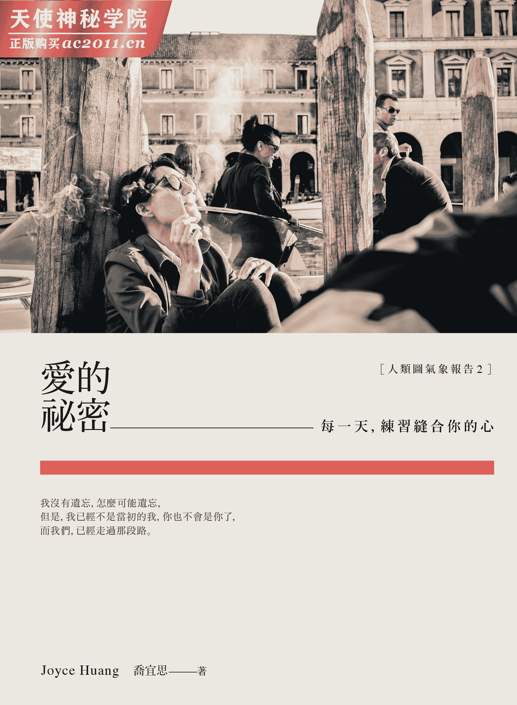

# 作者简介

作者／Joyce Huang（乔宜思）

亚洲第一位全球人类图学院（IHDS)正式认证的中文人类图分析师

“你的人生使用说明书”（Living Your Design）课程引导师

“你的人生使用说明书”培训师资之老师资格

“天生我材必有用”课程（Rave ABC）课程认证讲师

“人类图全盘整合”课程（Rave Cartography）课程认证讲师

人类图家庭动力认证分析师

亚洲人类图学院负责人

摄影／小姐非常有事

不预期小姐本人爱放空、爱旅行、爱摄影、爱咖啡也爱喝酒，

最重要的是意见很多，非常爱翻白眼和翻桌。

# 爱情状况题演练，整整一本

罗品喆．导演

你懂爱情吗？我也不懂。我相信，谁都有些爱的经验。而且，早在我们经验爱之前，我们早就有一堆关于爱的观念。那些似通不通似懂非懂，天天变身在我们身边上演，一大堆肥皂剧及肥皂剧一大堆。就像大家最近都爱看的墨西哥爱情连续长寿剧之苦与悲。你没看过墨西哥爱情连续长寿剧？就是“墨爱剧”呀，好。你想像一下，你知道的，就是比琼瑶更琼瑶得连琼瑶都摇头的加强版虐爱虐爱虐，即终极爱杀也不足惜之无尽自毁毁人翻天覆地你死我也不想活的爱情戏。打个赌，你就算没看过也一定有演过！敢不敢赌？奇怪，怎么我一提到爱情就有人眼角泛泪？

好的好的，请把眼泪擦干。我们当然知道哭也没用。爱情之神秘斑斓壮阔，人类生命太短，经历过的爱情不可能样本数足够，所以，当我们谈论爱情，我们总是有着摸到大象的错觉。我们都没摸过大象，而且我们都确信曾经刻骨铭心摸过的那头大象一定很大只，大到没人懂。特别是，在成长过程中，主要的“爱的示范人”，比我们更早长大。我是说爸爸妈妈都太早熟了，连带的爷爷奶奶就更早熟了。他们早就忘记：爱那么重、爱那么痛。那些老教条之言之凿凿，我们早就不信了，但那些无孔不入的免费烂戏八点档，我们都滴滴香醇的吸收了。

我们一再被灌输一再坚定不疑一再真心相信：相爱是不可能的！

确实，相爱怎么可能？每个人经历爱情总是担心害怕，担心她爱我吗？还是我不够爱她？担心如果家里小猫不爱她，那要换人还是要换猫？担心分了以后，我住哪？收入足够付房租吗？分手多久才可以公告？该让她声明是她甩我而不是我甩她？担心爱过所以情浓，这浓情让分手像没分手，连楼下管理员都不知道我们到底是分手了没？有时终于幸运的经历了一段完整且破碎的感情，之后又总是宽慰自己，不过是所遇非人罢了，这人不是灵魂伴侣。说到底，是有没有人可以出来挂保证有灵魂伴侣这件事儿？又或者，真的仅仅是没遇到，是这样吗？还是你一脚踩进了妈宝俱乐部，遇上口袋怪物？这种种的一切，难免教人要想，爱上外星人算是ㄈㄈ尺吗？

天可怜见，在本世纪谈个恋爱得要具备等同于编写百科全书的雄心壮志了，呜呼哀哉。

又，反过来说，如果我们是懂得的呢？我们确确实实知道爱是怎么一回事，我们只是忘了。那该怎么办？其实很简单。就仅仅是：想起来就好。透过这本书，顺着乔宜思的人类图思路，偶尔翻翻，一步一脚印，前头是彼岸。上岸吧，恋人们。你们可以亲吻彼此，然后开始岸边野餐。

# 体验过爱的人，灵魂会发光

Joyce Huang

我的朋友赤小豆小姐对我很好，她在我的办公室外围，也就是“亚洲人类图学院”的小花园里，仔细种下不同品种的扶桑花。“等扶桑花大开特开的时候，会很美喔。”她对我这样说，说完嫣然一笑，灿灿如花。

众扶桑花在学院住下，第一年很少开花，我常常一边浇水，一边望着插在地上的标示小牌发呆，上头标明每一株的名号：蓝鲸、惊鸿舞、千禧巨星、城市少女、大溪地滔宜、夜奔者、Formosa 夏日之星、大溪地皇后。这些名字奇幻又霸气，愈看愈让我期待，不知她们会开出什么样的花。

天天浇水，总会与众扶桑花喃喃自语，虽然她们不太理我，同样的动作日复一日，终于某些枝干出现了小小花苞，花苞愈长愈大，愈来愈饱满，每一朵花苞都像个美丽的秘密，随时都可能绽放，随时都打算以艳光四射的姿态，任意降临在院子里，宛如巨星初登场。

而那些奇幻的名字，只要开了花，从没让我失望。惊鸿舞的花形像漩涡一般，那是飞舞的大圆裙摆，极为梦幻；大溪地滔宜与大溪地皇后，开出来的花形夸张，色调鲜明，放肆又热情；千禧巨星除了花瓣雍容大度，连花蕊都贪心佩戴小风车般的复瓣花，好华丽，十足即将登台的架势；夜奔者很奇幻，明明是在白天绽放，却隐藏着夜晚的神秘；还有 Formosa 夏日之星，火热灿烂如艳阳，强烈得令人无法逼视；而唯一还没开过的是蓝鲸，据说花形超大朵，到底有多大，应该是巨大无比才能叫蓝鲸吧，就让我们继续看下去。

美丽的事物通常难以持久，扶桑花开一天就谢了，会像谢幕一样，整齐含蓄地仔细将自己的花瓣收起，非常有气质，像是睡着一般，默默自热闹中隐退，变得安静，重归空寂。

花会开，也会谢，我并不惋惜，从无到有，自花苞开始守候，也认真欣赏了盛开的美好。我与花儿们拥有许多美丽又独特的片刻，留在心中，便是永恒。每朵花都是爱，有千万种风貌，每种爱都独特；而有情人怀抱着爱的秘密，像是迎风萌生的花苞，默默酝酿着，等待着，成长着，壮大着，直到准备好了，就会痛快绽放，没有丝毫委屈，不是为了取悦谁。爱可以很自在，很理直气壮，向天地宣告我来了，我是一朵美丽的花。

我希望这本集结过往“人类图．今日气象报告”的小书，能让你心中每一个爱的秘密，含苞待放；每种型态的爱，都能以更多元，更圆满的方式展现；而所有为爱受过的苦，为情经历的伤终将过去。面对花谢花开，我们会更坦然，因为爱会留下，因为体验过爱的人，灵魂会发光，因为你是爱，我们是爱，为爱绽放。

# 第一章你，是我脑中的问与答

## 爱你的方式

关于爱，有件事情我想和你说清楚。

基于尊重你是一个独一无二的个体，你有自由意志，也有自主的行为能力。所以，每当你混乱或迷惘，又或是短暂失去清明，开始胡乱发起脾气的时候，我将暂时停止与你互动，这并不代表我不爱你，也不是因为我过于冷漠，而是我并不想随着混乱起舞，连带偏离轨道，违背自己的本性。

每个人面对自己的人生，都有其课题，也有其为难，没有人可以承担另一个人的生命，过度介入不见得是鼓励，而是干预。想要拯救别人，其实是另一种形式的自大与傲慢，以为对方没有足够的能力真正理解自己。

我不会远离你，也不会评断你，我将在旁边静静守候，给你足够的空间与自由，等待你学会属于自己的课题，等待你再度重获清明，回归你的内在权威与策略，回归自己的本性，做你自己。

这就是我爱你的方式。

而我也会回到我的内在权威与策略，每个人都是独特的，我们彼此独立存在，同时又紧密相互依赖，这就是世界运作的本质，对此我心怀感谢，但愿我们存在，能让这个世界愈来愈美好，愈来愈充满爱。

希望你会懂，我对你的爱。

## 爱情

我们从何时开始，那么执着地认为，爱情非得紧密相连，天长地久，才算合格？

当两个人相遇了，在某个瞬间，基于某些不可知不可预测的因素，迸出火花，火光灿灿，足以目眩神迷，感觉人生行至此，终得一人能放在心上，从此，应该不会再有遗憾了吧？

当初没人真的懂，相爱与相处并不同。

相爱的灵魂，凭借的是一股爱的傻气，无以名状，执着本身已经够浪漫，只是烟火烧尽一闪而逝，空留黑暗中的我与你，在关系中观看彼此，因为爱而退让，妥协，多少忍耐与不耐，不断从挫败中学习，于是才有机会重新定义自己，因为有你，让我明白自己原来，或可以是一个什么样的人。

爱情改变了我们，夺走一些，也添加了一些，是好，是坏，是富，是穷，是健康，是疾病，直到心跳终止的那一刻，都是过程，重新形塑了我和你。

与其说追求天长地久，还不如珍惜这段相互影响的历程。

回到内在权威与策略，我在每一天提醒自己，在关系中我依然要忠于自己，而我也会支持任何对你来说，正确的决定，因为爱，我希望我们都活出自己。

## 做一件贴心的事

除了听见对方说的话，还要听懂对方的心。

人的思虑复杂，有些意思难以言语表达，人人都渴望自己能被听见，被懂得，今天就让我们来练习当个知心人。其实并不难，请先把自己空出来，让你的脑子不再塞满唠唠叨叨的对话框，平心静气。

安静，听对方说话，也要听见那些说不出口的话。

“真希望你就在身边。”

“我累了。”

“你想念我吗？我想你。”

“我的努力你看见了吗？”

“我希望我在你的眼中，很特别。”

“我想静一静，请给我空间。”

“你能接受我吗？”

“不要生气，我很害怕。”

“我爱你。”

请回到你的内在权威与策略，如果你愿意，请为对方做一件贴心的事，这是你在说：

“我懂你，我会以爱回应。”

## 知心人

真相是，除了自己以外，我们很难真正的，完完全全体会另一个人所经历的人生。

走入另一个人的心，很不容易。首先，你得先拿出自己的真心，坦诚映照，先放下自己防卫的心，不带任何隐藏的意图，这需要极大的勇气。接着，最重要的关键在于，要有耐性，尊重对方，是否愿意允许你踏入他的世界，了解他的心。

知音难寻，知心更难得。

如果你看懂缘分这东西，其实靠的不只是努力，也需要因缘际会，就像人生这条路，恰巧我走到这里，你刚好也在，而我看见了你，你也看见了我，然后又恰巧我们都准备好了，于是才有可能，就此翻转眼中原本的世界，从此再也不同。

今天如果有人懂得你，你好幸运。

请回到你的内在权威与策略，宽容去看待那些不理解你，你也无法理解的人，明白知人知面不知心，也不过是常态。

或许，这是另一种方式，让你更懂得好好珍惜，与你相对微笑的知心人。体验到，原来自己是多么幸运的一个人。

## 因为懂得你

因为懂得你，所以是朋友。

这并不代表我会完全同意你的每一个想法，或赞成你的每一个决定，但是我愿意了解你的为难、你的考量，我会提醒自己，不要只站在自己的角度，要学习以开放的态度来面对这一切，更重要的是，我会尊重你的选择。

这世界上人太多，纷乱的意见更多，当你的朋友，就不要成为另一股你得用力对抗，或者拼命说服的阻力。我希望在这段关系里，我们能拥有和谐与美，同时在心里，永远都能为对方预留一块更广阔的空间，包容彼此的不同。

有时候，我难免会感到恼怒，或是对你的行为难以理解，这时候也请你敏感一些，请给我多点时间与空间，为我留些余地，让我能调适自己，好好反思，学习属于我自己的课题。

因为彼此是朋友，常常打打骂骂互相嘲笑，互亏求进步，反而很少认真正式对你说这些话，而我真正想对你说的是：

你住在我心上最柔软的地方，因为有你，我总觉得这世界很温暖，但愿对你来说，我也能代表同样的意义。

让我们都回到自己的内在权威与策略，尊重彼此，学习爱。

## 他是不是对的人？

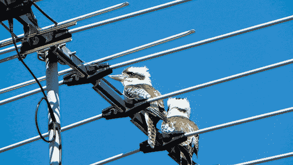

如果和他在一起的时候，你很喜欢在他面前的自己。

你可以很舒服，很开心，也可以很放肆，很随意，然后你会知道，在一起的时候，两个人就足以激荡出一个很大很宽广的世界，彼此都没有勉强，可以自由自在地呼吸。

你不需要讨好他而妥协自己的梦，他也不需要取悦你而活在顾虑里，你们不会每一次都同意对方的看法，但是你知道总会有商量的余地；你可以前进也可以退让，相互磨合着，也相互学习着，这能让两个人一直进步，也有所成长。

你体验到和他在一起的时候，彼此都愈来愈有力量，就像树木伸向天际舒展枝芽，充满朝气，迎着晨曦也迎着朝阳，可以共同面对突如其来的狂风与暴雨，当然也能拥抱着温柔神秘的月亮与星光。

然后你知道，你们一直是自由的，只是选择一起去体验生命中的不自由，但是，无论如何，你们都可以回到各自的内在权威与策略，聆听自己，也愿意去了解对方。

若是如此，那他必定是那个对的人，请好好珍惜。

## 情感没输赢

执着自己是对的时候，挺直而顽固。站在是非对错的范畴里，人很难放松，不断针锋以对，相互对峙宛如作战，底层的情感就变得浓稠黏腻，难以说出口。

无法流动的情感。

那隐身于内在的想念、脆弱、爱慕、心疼、渴望、被接纳的需求、委屈、寂寞、不被理解的忧郁、想要好好拥抱你、温柔以对，却也体验到自己无法放下的愤怒、失望、软弱、动不动就要席卷而来，将我吞噬得尸骨无存的孤单……。

“我爱你。而你，依旧爱我吗？”

说不出口，只好执着于输赢，这样的情感，好伤感。而这堆默默累积说不出口的话，让我们变得胆怯，容易退缩，最后好不容易吐出口的，只剩下表面的争论，简陋转化为你对我错，我对你错的强硬与执着。

请回到你的内在权威与策略，占尽全部的道理，证明自己是对的，又如何？

情感没输赢。今天请你退一步，想一想，同样一句话，能不能以别的方式来说呢？不要吝于表达自己真正的感受，那才是你真正想诉说，也渴望对方能听见，最珍贵的言语。

## 链接

脸书改变了我们交朋友的方式，也重新定义了人与人相互链接的方式。

关于情谊，现在突然加倍加速变得好便利，便利之余，也容易流于表面。创建关系只要送出朋友键，解除或疏远一段关系也不麻烦，不继续追踪对方的讯息，无声无息就可处理完毕。

你认识的是这个人？还是他的脸书大头贴？对方真是你的朋友？还是粗浅认识、半熟不熟，说穿了也不过是稍微不陌生的陌生人而已？

今天可以想一想这件事情，提醒自己看得更透澈一些，链接与关系，原本就有亲疏与远近，真心的友谊需要共同的体验为基础，无捷径，也需要时间与过程去累积，而科技过度发达的结果，有时会让我们忘记进退应对的分寸，错估了别人，也误解了自己。

请回到你的内在权威与策略，把时间与精神，放在你真正在意的朋友身上，别忘了，真诚的心，让链接变得有意义。

## 感受如水

这一刻兴致勃勃，下一刻又意兴阑珊，当下说完全世界最贴心的话，转过身又推托世事无常，轻易推翻它。情感是水，波动震荡，因为不能预知掌控，无法如磐石坚定，很难信任，因此绚烂珍贵，也让人默然以对，感觉心伤。

今天若突如其来，情感袭来如浪潮，那是因为过往活得鲜艳明快，训练自己正面向阳，却忽略了暗面曲折，常常来不及细细感受自己的另一面，加上下意识不断压抑的结果。

没怎么办，不会怎么样。

也没什么好解决，你不必积极努力做些什么，浮浮沉沉，信任自己不会因此灭顶，若悲伤就悲伤，若忧郁就忧郁，感受到爱，或感受不到爱，都是这一刻，也仅止于这一刻，下一刻，又会全然不同。

请回到你的内在权威与策略，因为感受如水，请你对自己如水般温柔。

宽容大度，静静看情感流过。

## 你，是我脑中的问与答

我问了许多问题，也自顾自找了许多解答，关于你，关于我们。我问，我答。疑惑之余，问了更多，然后，天可怜见，有时候，那答案会浮现，有时不会，就像至今我仍无法理解情感，无法得到爱的标准答案，没有把握能懂得你，或懂得我们。

是爱，所以相聚了，往往也是爱，擦肩而过，默默别离。

我看见了你，不是吗？你独特的姿态，你的游移与犹豫，从此以后，我的意乱情迷成了谜，让我独白似地自问又自答，问与答之间是过度执着，也过于痴愚，绕来绕去，有情人动了情，难以清明。

你，掀开了我隐隐流动的感触，像船过水无痕，留下问与答的痕迹。

到底那答案是什么，就算曲终人离散，就算自问自答无法成篇成诗，就算困惑依旧，我的问题永远问不完，就算人身微小，轻如波浪上的泡沫，就算此生相遇了，却不知能否相守，回到我的内在权威与策略，实话是，我已心满意足。

心满意足遇见了你，以我的方式，一生如梦也拼命追寻，爱是答案，无庸置疑。

## 好人？

当漤好人并不代表是好人，如果答应之前，没有仔细考量自己的资源、人脉与能力，很容易承诺过多而伤人害己，得不偿失。

今天不管是大事或小事，在你答应之前，请好好思考，这真的是我能力所及吗？我答应是因为希望对方开心？还是想避免冲突？是我自己不愿意面对拒绝之后，可能引发的暴烈场面？又或者是不想辜负别人对我的期望，我想证明自己是好的，是有用的，是值得信赖的，所以，我才会拍胸脯说好吧，就让我来吧。

永远不是别人“害”你答应了什么，不管在情绪上喜不喜欢，从结果来看，当你“答应”了，这就是你的选择。

漤好人往往真的很想当好人，但是在此意图之下，有许多地方值得深思。

请回到你的内在权威与策略，了解自己的限制，对自己能力所及充满自信，但是你也要愿意诚实沟通，自己爱莫能助的地方。

你不需要成为超人，也不必取悦别人，喜欢你自己，别人就会开始欣赏并尊重真正的你，一个愿意以自己的原则过生活的人。

## 不要想改变别人

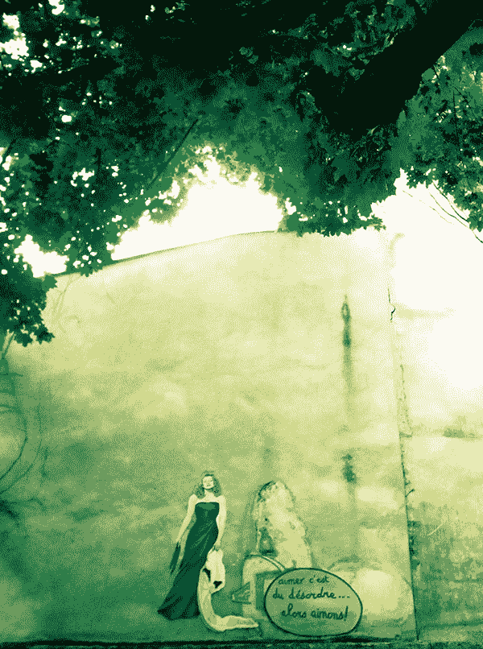

你。无。法。改。变。别。人。

既然如此，对于他人的行为或言谈而感到火冒三丈，究竟所为何来？今天如果某个时间点，你内心的那座小火山被引爆了，在口出严厉的言语之前，或让狂怒吞噬你之前，请好好问问自己，我究竟在气什么？

你不可能改变风，不可能改变云，如果想改变别人，改变自己的父母，改变老板，改变同事，改变自己的小孩……这就像用尽所有力气去推墙，你推得好认真，推得好奋力，但是墙壁仍旧矗立，所以，你好生气？

那么，接下来你打算如何呢？你是打算为此拼了？开始练习去推万里长城吗？

注意自己的执着，体验自己的情绪，对事不对人，请放下改变别人的心，也放下对自己的评断。

改变必须从每一个人的内心出发，向外硬来徒劳无功，最难也最简单的作法是，当自己的心念改变了，你会发现，外在的每个人也悄悄改变了，好神奇，不是吗？

请回到你的内在权威与策略，执着所为何来？看清楚之后，怒气将如风消散，这是需要好好观照自己的一天。

## 总有那些让你讨厌的人

承认吧，总有那些让你讨厌的人，在周围环绕。

严格来说，这些人或许本身并不讨厌，只是他们出现在错的时间点，错的地点，又与你有所交集，不幸的是，这交集让人不悦。

这里头蕴藏许多学问，每次有讨厌鬼出现，你都可以深入检视自己内在的阴影，哪些是自己的投射？每种负面情绪的底层，皆带有某种程度的自我嫌弃，甚至自我遗弃。我们永远可以保持冷静，以客观角度深入探讨，细细拆解，这里面关于自己的课题，如果你愿意的话。

如果你不愿意，也没关系。

今天就接受自己并没有想像中随和，有些人容易让你心烦意乱，或许这是错的时间点，错的地点，错的场合，错的相遇，而现在的你还没准备好，要与这样的人相处。

回到内在权威与策略，没有应不应该，诚实面对自己的感受，这世界上总有那些让人讨厌的人，又怎样？你还是可以过好自己的生活，别在意。

## 解铃人

世间本无事，庸人自扰之。

本来以为打不开的结，想不通的难题，过不去的关卡，绕了一大圈，折腾了好一阵子，解铃还需系铃人，只是最后发现这系铃人，不就是你自己吗？解开这严实心结的钥匙，不是早就放在你的口袋里了吗？

今天在你开始准备发脾气、不耐烦、觉得不公平、很无奈、脑袋几乎快爆开之前，想一想，这反映出关于我自己的，究竟是什么呢？如果因此发现，内在有个曾经受过伤的灵魂正在受苦，请你，先安静下来，温柔地对待自己，温暖地拥抱他，好好跟自己说说话。

“已经没事了，一定可以安然度过的，没那么难，别担心，我们一起面对吧。”

静下来，找出口袋里的那把钥匙，你是解铃人，你知道每个细节，你清楚每个关键，你一定明白该怎么做的，只是愿不愿意而已。现在的你，愿意了吗？

请回到你的内在权威与策略，忧郁是过程，让你再度找到自由的路。

让心自由，爱也自由。

## 不要管别人！

人的本质其实很可爱，很有趣，同时也很荒谬。

这世界上哪有谁可以真正管得了谁呢？但是我们各有各的原因，各有各的理由（自以为），然后站在各自的立场上，以自己认为正确的方式，像纠察队一样，或以过度热心的方式，以为是对对方好的方式，热血地，介入别人的人生。

所以我们“管别人”，结果管了别人之后，别人为了捍卫自己想做的事情，反过头来也得“管管你”，结果你就被管了。当然没人喜欢，为了挣脱，引发我们要更强烈地，似乎得搬个炮台上战场，才能“管更多别人”，如此一连串的骨牌效应，管来管去，该管不管，早已失去焦点，只剩纠结缠绕成一整片，好壮观。

所以，今天只要学习一件简单（却困难）的事情，那就是……不要管别人！

同时也不要管别人会怎么管你，你只要，管好自己就好。怎么样？可以吗？当你管好自己，或许才会发现，根本没人要管你，盛世太平。

请回到你的内在权威与策略，是非公道自在人心，该怎么做你都知道，答案不就在你的心中吗？

## 一瞬间就可以翻盘

今日若遇到一件让你开始怒火中烧，内心不断翻搅的事情，莫心急，莫心慌，深入去探索，你会发现里头蕴藏的机会与可能性，只要你可以，静下来，好好思考，想法一转变，一瞬间，就能找到翻盘的契机。

听起来很励志？其实，过程不见得好受，毕竟突如其来的转变，很容易让人诠释为重大的打击，而情绪起伏时，又容易让人迷失自己，惶惶然做出错误的决定。

所以，当你心急如焚，更要眼观八方，仔细聆听来自周围的讯息，事情没有你想得那么糟，不过也不可轻忽大意。但是，放任自己心乱如麻是不行的，一个方寸大乱的人，看不见真相，也找不到跳脱框架的奇招，深陷循环就找不到通往安全与成功的路径。

请回到你的内在权威与策略，心转念转路就转，听起来好像很八股，但事实就是如此，一瞬间就可以翻盘，你先稳住，稳定你自己。

加油！

## 简单就会有力量

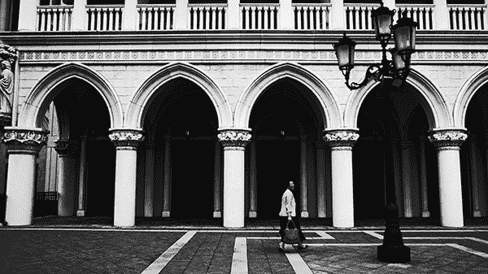

我们常常想得太多，想得太过复杂，把未来想得太过美好，不然就深陷在诸多情绪里，最后导致幻觉一大堆，却什么也没做成。

今天请练习把心拉回来，化繁为简，把话说清楚，将一切弄简单。

就算世事曲折多蜿蜒，未来梦想如云彩，幻化为晚霞多绚丽，我们都要提醒自己，低头看看脚下所走的每一步，脚踏实地最重要。每个当下都要看清楚，两个端点之间的距离，最短的路径是一直线。混乱源自混淆的心智，该锻鍊自己，将力量放在直线上的每一步，按部就班去执行。

简单就会有力量，你是有力量的。

请回到你的内在权威与策略，烦忧无益，在这个当下，请思考如何将你的力量放在对的位置上，全力去创造属于未来的诸多可能。

## 所有戏剧化的背后

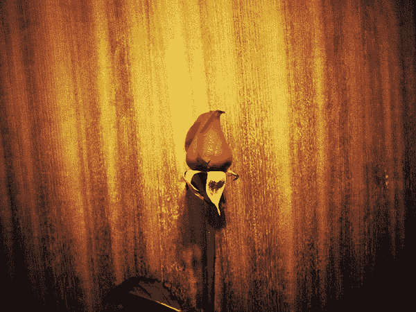

所有戏剧化的背后，其实都带着荒谬的趣味。

比如说，我们总想把是的硬掰成不是的，或是异常用力地，偏要把不是搞成是的，当世事难以如愿，身为人就不由自主变得顽固，渴望以更控制，更戏剧化的方式来完成它。

如果种下的是白玫瑰，能不能长出红玫瑰呢？

当然可以，只要认真为每朵花涂上颜色，一朵一朵坚持下去，等到下雨过后，玫瑰枯萎，又长出白玫瑰的时候，你就继续把每一朵涂成红色……。这是你想坚持的，不是吗？

什么？你很气？又很累？怎么办？没有出路啊？对啊，继续这样下去是没有出路没错，你的人生到底该怎么办？其实没怎么办呀，我们就这样继续过下去，直到有一天，你内心可以真正接受白玫瑰就是白玫瑰，而你深爱的红玫瑰世界，并不会因为长出几朵白玫瑰而毁灭，那一刻，这世界就可以真正太平了。

你还是想继续下去，把白玫瑰涂成红玫瑰？那很好，请涂得甘愿点，愚公移山也是有毅力的行为。什么？你不想当愚公？好嘛，那你看见现在的自己多么荒谬多么戏剧化了没？你能不能对自己多些幽默感？

回到你的内在权威与策略，笑一个，没有解决不了的事情，亲爱的，只要放下你的执着，一切好办！

## 再说一句都嫌多

够这个字很有趣，是一个“多”字加上句子的“句”，不知道古人怎么演绎这个字，才会演变成最后这样的组合。如果静静只看着“够”这个字，自由发想，我会说，如果真觉得“够”了，那么应该可以解释成：

再说一句都嫌多。

因为已经够了，不管是正面的滋养，或是负面的堆积，情义爱恨都有过，累积份量够多，于是，解释显得多余，何必再说？该说的都已经讲完，费尽口舌到最后，还不是各人有各人的路走，事已至此，每个人眼底的风光皆不同，既然如此，就别再说了。

别再说，该做什么就去做，该分散该重逢，该是你的不是我的，爱恋还在不在？多说少说也不会改变事实，只能说，我和你，缘分，不足够。

请回到你的内在权威与策略，既然这样，就洒脱点，何必歹戏拖棚？

这个世界真的很大，既然用心认真过，就值得，对得起自己，不必再回头。昂首阔步，就能坦然直率过生活，我爱过，所以继续往前走，深呼吸，事已至今既然够了，就可以放他自由。

也让自己真正自由。

## 慢一点，想一想再说

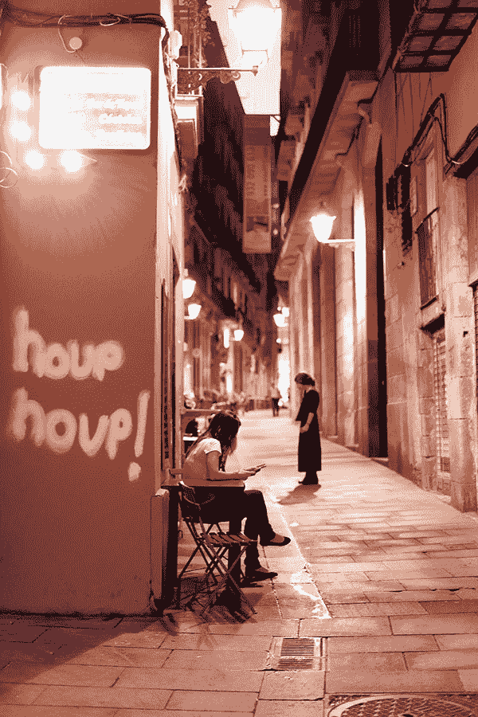

今天，如果要承诺，请慢一点，想一想再说。

这并不是说今天不适宜承诺，而是要提醒你，做任何决定之前，要确定自己处于清明的状态，静下来，仔细检视自己的起心动念，清晰明白每一个出发点，若要对世间事有通透的体悟与理解，不必贪快。

不要因为尴尬的沉默，或想搏取大家欢心，而轻易承诺，或说出那些连你自己都质疑的话，如果这样，还不如什么都不说，真诚相对，就会有力量。

要传递到另一个人的心里，让对方收到，重点不是你说的话，是你的真心与真情，你的爱，还有你的胸怀。

请回到你的内在权威与策略，慢下来，好好说，不然什么都不必说，体会单纯存在本身，充满力量的自己。三思而后说。

## 霸气下的温柔

如果你够细心，有没有看见那迅速而霸气，果断又勇敢的行动之下，其实隐藏着说不出口的体贴与温柔？

不知从何时开始，我们习惯匆忙生活，追求效率，只想迅速近光速将一切搞定，却忽略了内心那块柔软的角落，需要爱，需要被滋润。

当一个人的态度变得顽固强硬，开始以极端的方式，试图展现自己的力量，这或许是另一种方式，是他以行动在告诉你：“我担心你，我想保护你。”那藏在大男人或大女人底下的温柔，因为缺乏练习，而显得如此笨拙、美丽又脆弱。这一切，像露珠，阳光一出现，就会瞬间害羞地，蒸发在空气之中，再也看不见，也不懂得该如何说出口。

如果你够细心，希望在自己被激怒之前，在抓狂之前，在我们选择误解与憎恨之前，先读懂这许许多多，遗落在这世间的爱与暖意，每一份都是爱的礼物，可能外表包装得很烂，里头却有一颗寂寞又温热的心，要有心人才能体会。

请回到内在权威与策略，今天把霸气拿开，让我们练习温柔。

## 没开口说的话

那些没开口说的话，不代表不存在。

没有说清楚的，不知道从何说起的，在岁月里逐渐隐退的心碎与伤感，不知不觉中，让真情流露变得为难，暗自想着琢磨着，既然说不完，也不会说，放弃似的，那，就沉默吧，安静吧，其实是赌气，兀自在地球上行走，背负着，堆积着，缠绕着，没办法说出口的话，多么希望有人能听见，多么希望能够真正被看见……

安静而喧哗，在空气中，无形中，成就一整片孤单，寂静又感伤。

这孤独非你所独有，其实很普遍，存于每个人内心，人唯有同理，才能重十原本的能力，真正听懂彼此的心声。

请回到你的内在权威与策略，用心接收，仔细聆听，沉默的底层漫天喧哗，渴望被人了解的真心，说出口的很有限，那些说不出口的沉默，你听见了吗？听懂了没？

今天，让我们学习更靠近，与彼此更亲密。

## 听懂话中的真情

说不通的时候，唠叨没用，大声也没用，焦虑恐慌更无用。

想想看，徒弟能看见的风景，与师父所感受的意境，全然不同。在急着定论是非，甚至厮杀舌战前，请仔细地，替别人再想一回。如果明白我们各自处于在人生不同阶段，或许就能够放下脑袋的偏执，离同理心更近一些。

请回到你的内在权威与策略，话好好说，人好好做。

说出你的感谢与珍惜，听懂彼此，听懂藏在话中的真情，远超过言语，温暖而真实，深厚又绵长。

## 如果还有愤怒……

如果还有愤怒，那愤怒所为何来？

当一个人被外界所发生的事引动了，开始在内心起反应，接着衍生出某些特定的情绪，这代表底层必定有些关于自己的课题爆发了。是对强权的恐惧？是对抗不公义的愤恨？是悲伤？是麻木？是担忧一切终究徒劳无功？对你来说是什么呢？

若不是踩到内在的底线，泪水不会流下来。

这一次，不要压抑，抽丝剥茧了解自己，练习将你的立场，你所坚信的意见，沟通出来，让我们有机会听见彼此。

封闭是简单的，把自己或别人关在门外也很简单，但是，这无法让我们达成共识。如果说了一次，没有办法说清楚，那就再说一次，如果说出口，对方听不到或是听不懂，那么，好好深吸一口气，心平气和，练习再讲一次。

你讲的每一句话，其出发点，并不是只为了说服别人，而是单纯地，表达自己的观点，同时也听见别人的，这个世界需要百花齐放的意见，就是目前无法尽如人意，才需要我们投入参与，真诚说出自己的意见，期盼出现进化的可能。

请回到你的内在权威与策略，你的立场是什么？你的意见是什么？谢谢你。我听见了，请听听我的立场，我的观点。

没有你们我们，只有我们，只有我们可以，一起创造一个比现在更行得通的世界。

## 知我者

我有我的追寻，你有你的，我们各自有各自的路，时而昂首前行，时而步伐踉跄，而关于生命的答案，虽然大半隐晦难明，却又总在不经意的瞬间，灵光一闪，让你我窥见了答案，或其中蕴含的意涵，体会过，才懂得，原来，如此。

这世界上，又有谁真正懂得了谁呢？

知我者谓我心忧，不知者谓我何求。活着，存在着，如星辰在各自轨道滑行，顺畅有时，逆行有时，停滞也有时，既然如此，你又何须刻意或用力地，企望别人能无时无刻无缝隙、无界线地，永远懂得你呢？

没有期待，关系才不会紧绷，可以放松。

若能放下僵化的标准，明白彼此虽然独立，还是能相互呼应，当彼此轨道交会，若我能与你互道早安，又或者能轻松跟你说声晚安，这些看似微不足道，琐碎如絮语的分享与交心，皆蕴藏着美好，也都有值得庆幸之处。

请回到你的内在权威与策略，聚散或长或短，若能走在一起，不是缘分是什么？

请珍惜周围的每一个人，欣赏他们原有的模样，有的宛如卫星，有的冲撞如彗星，有的则是你的恒星，漫天都是星光，明亮无比。

## 把别人当成异端之前

在我们把任何人视为异端之前，请停下来，先想一想。

现在既定的规范与价值观，皆源自过往经验值的累积，换句话说，这些既定的条文、价值与道理，的确符合了过往社会环境与文化的状态，我们延续约定俗成的运作模式，极容易自动化，以为习惯就是对的，就是真理。

这世界不断改变，物种不断演进，我们身为人类也不例外。换句话说，现在我们认为理所当然的，可能在五百年前、一百年前、五十年前，甚至十年前，都还是当时无法相信、无法接受、无法认同的异端。

异端是什么？

异端。代表与主流价值不尽相符，他们可能提出了一个不同以往的看法、作法或想法，因而挑战了大众的底线，掀起震撼，于是，争辩开始了，讨论开始了，风起云涌看似疯狂，却真实引发了改变与蜕变的可能。

今天请练习开放。首先，把脑中既定的对错，先移开。异端不见得是对的，但是也不一定就是错的，别轻忽，也别立刻将这个不同以往的看法、想法或作法，立刻归于斩断、烧毁、丢石头、攻击的那一边。

不一样，不代表是错的，你没见过，不代表是错的，你不认同，也不代表就是错的。

异端是礼物，让我们开始思考蜕变的可能。

请回到你的内在权威与策略，若是爱，就不是异端，爱没有相斥、只会相吸，因包容而圆满。

## 整合

聚散之间，握手交手一回合。

每一刻每一个人都在成长（或退化），活在当下的意思，就是不要紧抓住过往习惯的模式，或是既定的思维，来推测对方的心意。无所期待，让我们先抱持着开放心态，客观了解当下的状态。

整合的时机点已经到来。

接下来，这一个全新的回合，或大或小，若我与你决定同行，必定已经超越控制的意图，愿意联手创造出一个全新的范畴，好让每个人的才能，找到舒展的空间与可能。

请回到你的内在权威与策略，务实而客观，同理对方，好好聊，好好思考，重整既定的互动模式，加油。

## 温暖

适时伸出自己温暖的手，让另外一个人知道，没有人孤单。

人与人之间的缘分很奇妙，有些人在身旁转来转去，总是无法交心，有些人只是简单说了几句话，就算擦肩而过，却能心意相通，彼此的情谊丝毫没有勉强，像是注定，是一道暖流。

今天，不管是面对别人或自己，若是有任何冲突或情绪上的对立，不要逃避，看得更深。

这些长久堆积在内心角落的情感与脆弱，不是无用的垃圾，只是需要更多更多的温暖来融化，等待有人能仔细地，付出更多温柔。

请回到你的内在权威与策略，学习相互扶持、了解与体谅，让自己的存在，化为一道小暖流。

## 与人为善

与人为善，是修为。

我们无法否认人性中就是会有暗黑的那一面，嫉妒与偏执，往往在恐惧来袭时，吞噬原本的良善与平衡，不论在有意识或无意识之间，若有一天，突然掀开原本彬彬有礼的假面，底层下的真实，让人吃惊。

每个人都有弱点，也有失衡的那一面，没有人能够控制时局变迁，或别人该如何选择，如果今天你因故被激怒了，不爽了，气馁了，请好好告诉自己：良善是一种选择，不管别人怎么做，我一定会有自己的立场，我有自己的原则，我会做该做的一切来保护自己，同时，我也会为自己的选择负起责任。

自私与无私之间，一线之隔。

保护自己并不是自私，牺牲自己也不等同无私。当人生变得复杂，每一个决定可以很简单，抉择的重点不是反击，也不是拼命夺取资源，而是回到方寸之间，找出自己得以平衡的支点，如此一来，周围的人事物才不会继续歪斜失衡。

请回到你的内在权威与策略，沉着，好好处理。

你很重要，不要轻易违背自己的原则，这是今天的功课。

## 好朋友，你好珍贵

其实，爱一直一直一直存在，暖暖的，将你和我环绕。

就算没有太阳的时候，阴霾的时候，寒冷的时候，黑暗至极，伸手不见五指的时候，让人感到万分绝望的时候，误以为见不到尽头的时候……，命运转动，生命是重叠交织的巨大轮轴，我们身不由己，搭乘这趟无法回头的超快车，有时起，有时落。

有时快乐尖叫，有时低落疑惑，每次感到孤独孤单的时候，忍不住对着天空大声呼喊，以为此行狂奔千万里，终究孤独。但是，若能静下心，有没有听见身旁总有爱存在，总有回响，让我们确定了，就算青春留不住，光阴转瞬过，何须在意？

时空交错，人像棋子一般，各自走上征途，即使无法永远长相左右，只要真心呼唤，心与心就能无远弗届，灵犀相通。

今天适合好好感谢身边的人、好朋友，你好珍贵。谢谢有你，这一路念念不忘，因为你们的缘故，行走至此，生命早就不虚此行，没有憾意。

请回到你的内在权威与策略，细细感受爱，感受自己是一个多么幸运的人，有这么多好朋友，人生好棒，是不是？

## 真爱体验日

如果你对真爱有很多想像，今天要不要做个跳脱过往思维的小实验。

假设，每个人的真爱不只一个，一辈子不只出现一次，所谓的真爱是一种状态，是情感得以与另一个人交流，可能在某一刻，灵犀相通；淡淡一笑一眼瞬间，就能懂得彼此正在经历的状态，愿意坦诚，可以分享。

没有特定标准，也没有任何先决条件。真爱不见得都会天长地久，但是呀，单纯就在那一刻，你知道了，也明白这世界上真有另一个人懂得你，不由自主感到喜悦，内心很满足。

如果你认为真爱尚未出现，练习开放你的心，与朋友与家人与你所爱的人，以爱交流。真爱是一种状态。如果你看见这一路走来，有多少人环绕在你身边，关怀你，在意你，爱着你，你怎么可能会永远孤独呢？你并没有失去爱的能力，别傻了。

请回到你的内在权威与策略，今天是真爱体验日，如果曾经为爱伤了心，今天练习换双眼睛，看看世界多美好。

## 如果你能了解

如果你能了解对方的为难，而不是紧抓严厉的评断，或许才有可能找到答案，解决这一切。

平心静气想一想，你也希望对方能够了解你，不是吗？

当一个人感觉自己真正被听见的时候，内在强悍的盔甲才能化为轻烟，整个人松开之后，才能开始听见周围的人，想说的是什么。你的评断，是源于恐惧？是想保护自己吗？若是如此，这评断将遮住你的眼，蒙蔽你的心，从此没有人能理解谁，也没有任何沟通的可能性。

这世界上的人，各自有其限制，各自忧虑于自己的难题，你和我或许很难体会彼此，处于何等的困局，既然如此，何不试图理解对方的处境，允许自己体会对方的心情，是否能够同理，没有人有把握，这是一个重要的课题，我们都要好好练习。

请回到你的内在权威与策略，理智可以解决事情，只是人不可能只有理智，你还有一颗心，请记得去感受对方的心。

## 想一想，如何因为我的缘故

想一想，如何因为我的缘故，能让别人得到温暖与支持的能量。

今天，如果你愿意，请作一个小小的练习，选择以你喜欢的方式，练习好好对待一个人。这个人可以是你的工作伙伴，你的家人，你所爱的人，一个陌生人，或是这个人就是你自己，都很好。

静下来，好好想一想，我有没有看见对方的才华呢？我有没有学会欣赏对方的优点？我能不能超越过去既有的思维与想法，以不同于以往的新角度，重新练习去珍惜对方的好？

当这个世界都疯狂以为，人生只要补强就可以获得解答，当所有人都把焦点放在用力改进自己，改变别人，当我们早已习惯了批评与检讨，拼命追求如何才能够好、更好并且更完美……。请你，今天，一整天，练习先停下来。

拥抱已经拥有的，欣赏已经守护在你身旁的人。

今天的我，可以如何支持对方，让这世界上有另一个人，有机会得以展现所长，可以获得正面的力量。就算一切正是崩解之际，焦虑与挣扎紧追不舍，你都可以，选择不同的立场，采取不同的行动，做出不同的选择。

请回到你的内在权威与策略，让今天因为有你的缘故，而洋溢更多爱，与良善的、支持的能量。

## 让爱流动

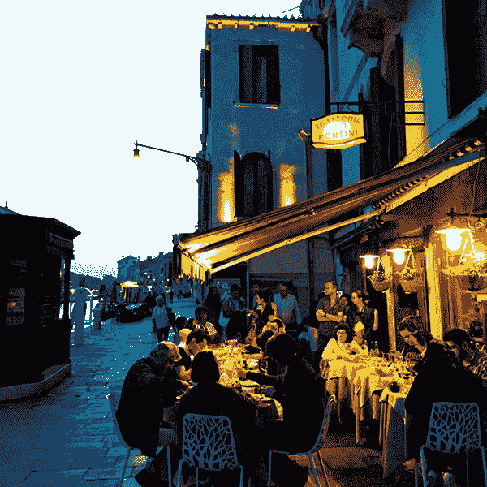

今日请好好照顾你的家族。这里所指的家族，不仅止于血源关系的家人，还包括与你一起工作的伙伴、你的团队、你所在意、愿意付出爱与关怀的人。

了解对方真正想要的是什么，付出之余，也让对方明白，你渴望如何被尊重，被支持。

在这趟生命的道路上，每个人都是独立的个体，存在于群体的社会中，家族是滋养个体的小圈圈，不论在情感或实质的层面，我们都有各自的小圈圈，相互依赖，相互支持，成就彼此，也希望能体验到圆满。

愈亲的人愈难将界线画清楚，愈在乎愈难说清楚，容易产生不必要的误解，这世界上数不尽的委屈，其实一开始，都是源于爱。

请回到你的内在权威与策略，今天要不要和家人朋友，好好吃顿饭？聚在一起聊聊天，谈一谈。爱永远不嫌多，也永远不会太晚，让爱流动，好让彼此都收到，你在我心中，爱一直一直与我们同在。

## 人情

敏感察觉每个人的需求。

当群体里开始出现流言或闲言闲语，或在情绪上出现局促不安，这只是单纯代表着事情并没有圆满，有人感到委屈，有人感到恐惧，有人觉得自己的需求没有被满足。

这就是所谓的人情。人情与事情处理得公不公平，或许并没有直接关连，人情世故没有对错，是艺术，除了做好该做的事，你还要能敏感体察对方在情感上的需求，愈亲近愈容易疏忽，很容易忽略了，彼此都需要接纳与尊重的感受。

人情，待之以礼，动之以情。不容易，当然为难，容易误解，所以要记住，事缓则圆。

请回到你的内在权威与策略，好好练习，请谨慎聆听，不仅听见说出的言语，还要能听见底层的心声，这是练习温柔有耐心的一天。

## 爱

从今天开始，我们迎接的是一个全新的，爱的世代。

以“爱自己”为原点，从你的心开始，你先愿意珍惜自己的独特性，尊重自己的需求，然后，才可以，生机蓬勃地向外扩展。再也不是以爱为名，实质上只是索取更多注意力，也不是以爱为由，行操控之实。

爱，一直存在，以不同的形式存在。这是一股充满生命力、温暖的动力，能够激励并引发更多人，让每个人都保有自己的独特性，做自己。

真实的，真诚的，忠于自己地活着，这就是纪念世界末日最好的方式。

所谓的世界末日，在灵魂的层次，宛如新生，过往已经不再重要了，接下来我们将创造一个尊重个体性与独特性的时代。

请回到你的内在权威与策略，在内心许下一个心愿，为自己，也为这个世界，重新再选择一次。

记住喔，你永远可以重新做选择。若世界真有末日，但愿在末日之前，我们能真正懂得如何相爱。

## 对彼此要更好

最近许多事情正在经历过渡期，让我们一起保持平常心去面对这暂时性的颠簸，然后记得，珍惜眼前人，对彼此要更好。

你或许已经体认到，过度控制往往只会得到反效果，放松一点，安然以对，了解世事多变化，合久必分，分久必合，接受改变就是过程中的一部分，有时候稳定，有时候不稳定。与其懊恼海浪为何要有上下起伏，还不如拿好你的冲浪板，学习体验乘风破浪的快乐。

珍惜与你一起经历这一切的人，不管是你的家人，你的朋友，或是工作上的伙伴，我们各自站在自己的浪头上，若各分东西，也不要忘记彼此的好；若还有缘相聚，何不坦然分享这一路上的点滴，整合力量，相互学习。

这就是蜕变的过程，不见得好受，但是如果我们愿意看深一点，一定会收获良多。

请回到你的内在权威与策略，风云翻转之际，准备好迎风而起，意气风发站上下一个浪头吧。

## 缘分

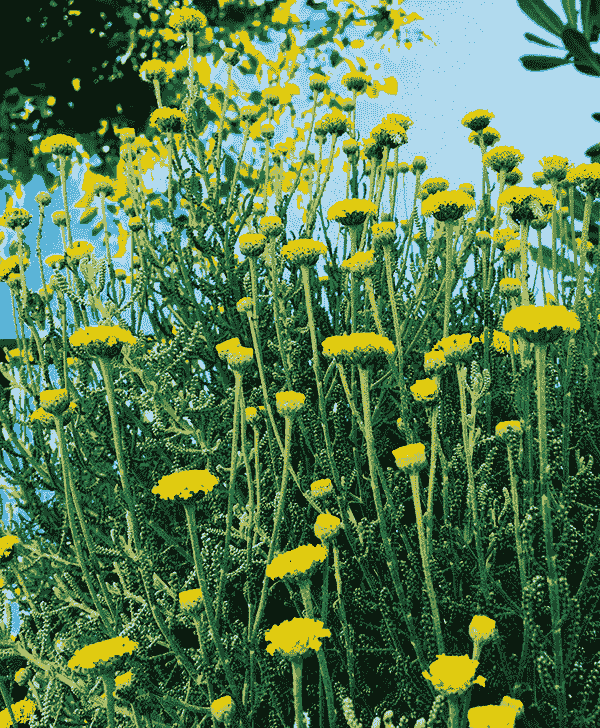

缘分的意思就是，有机会与另一个人交流。

深深浅浅，聚散终有时。或许这一生，就只有这一次机会与你擦肩而过；也或许，我们有缘足以长相厮守。不论如何，既然有缘，就要好好珍惜，让每次交流，都为彼此创造难得的火花，留下珍贵的记忆。

珍惜走到你面前的这个人，尊重对方也有其过程，有缘相伴，不代表你得替对方解决他的问题，生命的困惑是非常个人的议题，每个人都只能用自己的方式穿越，所以，请放下自己的执着，不要任意干涉别人的人生，也不要期待对方，将依照你预期的速度做出改变。

花会在该开的时候开，如果有缘，护花人就可以看见花开的瞬间，芬芳袭人，无与伦比的美丽。如果我们彼此的缘分深不至此，而我错过了你的花期，那你也拥有我的祝福，我的心与你同在，希望当绽放的时刻到来，你会满心喜悦，体验生命的神奇。

请回到你的内在权威与策略，放轻松，别想太多，莫强求，宇宙自有安排。

## 爱，不要设限

我非常喜欢温佑君老师所写的《温式效应》，这是一本讲述嗅觉与身体感知，带领我们进入自我意义与人生价值的探索过程，这过程如此美妙，让我引用其中一段：

“这些美梦所揭露的天启，应该就像德蕾莎修女题为‘无论如何’的一段诗文所喻：不要害怕被辜负，就放弃至真至善的追求。无论如何，一定要去爱。因为爱的目的不在于获取，无论是获取一个甜蜜的眼神，或是一句明确的认定。爱的行动只为了创造链接，为了让我们熟悉‘合一’。爱是一种练习。想想我们在恋爱中的模样吧——发亮的眼睛，热烘烘的胸膛，对什么都好奇，干什么都起劲。所以爱是让我们练习活泼，练习不死心。爱的过程也让我们培养出一种眼光，看到很多东西可以单纯因为存在而美丽，不是一定要得到回报才有意义。”［爱的气味］，《温式效应》

就算在爱中，我们载浮载沉着，就算你与我之间，难免会有误解，有时候竟无法懂得对方的心意，但是呀，谁没有为爱受过伤？就算面对未来，有许多不确定，话说回来，这世界上又有谁，有什么是确定的呢？

如果有幸，得以去爱，请不要自我设限，不要害怕可能会被辜负而放弃，人生路还漫长，如果不继续往前走，你怎么会知道接下来，有没有机会得偿所愿呢？

永远不要放弃对至真至善的追求，请回到你的内在权威与策略，不要害羞，勇敢去爱。

## 动心

爱不爱，有时候，就是那么简短一瞬间发生的事情。

那一瞬间，动了心，你知道，只要这世界上对方存在着，就足够支持你活得无比坚强，原本只有你自己知道，也不会轻易示人，内心最脆弱柔软的那部分，有人进驻了，就算这是只有你和宇宙才知道的秘密，没关系，从此之后，微笑与流泪，都有了依据。

你明白吗？这就是爱。不管有没有未来，会不会继续，是否已经结束，只要真实体验过，就如同小王子拥有了他的玫瑰花，过往历历，闭上眼睛，你的心跳会提醒你，那美丽的一刻，是心动的痕迹。

事实是，不是每段感情都能天长地久。或许你一直以为不完美的结局，就是最完美的安排，人与人相遇，碰撞出火花，离开，告别，终有时，短暂反而深刻，曾经交心，就不枉此生。

何必一直执着曾经经历的伤害，我们每个人不都是跌跌撞撞中学习，你不是也从这过程中成长，更懂得世事，更明白如何去爱吗？如果真要有结局，停在心动的瞬间其实很美，你将牢牢记住爱的美丽。

请回到你的内在权威与策略，如果你愿意，请找一段小小的时间，在心中，在爱中和解，让自己重新拥有，爱的力量。

## 真心

区分关怀是不是出自真心，其实并不难，当有人对你好的时候，如果感觉到一股暖流穿过自己的心，你就会知道，那是真的。

人是很简单的动物，心思却可以极为精密复杂，当脑袋过度涉入，牵涉到利益冲突，当我们开始计划、布局、找寻适合的策略，就倾向找寻适当的理由，试图合理化自己的作为。当一个人活在应该与不应该，关怀很容易成为一种手段，若非出自真实的心意，关怀很容易流于形式，而失去感动人心的力量。

如果要关怀，请全心全意关怀，如果不想付出，也诚实将自己的立场表达出来。

不是每个人随时随地都要充满关怀地活着，这无关乎好坏对错，并不是说关怀就是好的，不关怀就是错的，你只能对自己诚实，也对别人诚实，如此一来，对的事情才会在对的时机点发生，对的人才能相互交流，真诚以对。

请回到你的内在权威与策略，在人与人互动之间，好好体验自己，真诚体验别人，这是在精神或物质层面，都活得丰盛富足的一天。

## 温柔相待

当别人对你倾诉心事的时候，并不代表你要成为他的救星，人只需要另一颗温柔的心，愿意静下来聆听，不带任何评断，很单纯，在一起。

这就是陪伴的力量。

“无所不能”与“无能为力”如同光谱的两个终极的端点，没有人可以永远占据无所不能的位置，也不会一辈子陷于无能为力的悲剧里。人活着，就是一股生命的能量，或高或低，激昂或黯淡，得意或消沉就如同光明与黑暗，交替流转，不断循环运行。

重点并非承担别人的困局，而是成为温柔的屏障，让困乏的心得以休息，让重新开始、重新出发变得有可能，力量自此而生。

如果你知道在人生中，总有那个谁，愿意真正聆听你，那么你是幸福的，如果目前没有这个人出现，那么就让你所爱的人，拥有这样的幸福吧！

请回到你的内在权威与策略，这是学习温柔相待的一天。

## 让我们相爱

今天是关系日，让我们相爱。

“关系”最终极的定义是：在另一个人面前，能放下内心全部的防卫与伪装，那个执着，渴望以任何形式被定义的自己，可以温柔融化在这段关系之中，找到全新的意义。

这是一个美妙的过程，一段美好的关系会带来力量，让人从中成长，但是，却不一定会等于永恒。

你要知道，每个人就像星星在轨道上运行，我们相遇了，恋爱了，代表着在这个时空下有缘同行，就如同星辰运行轨道交叠，或许这一次，两颗星星会在一起航行很久很久，也或许不久之后，将有不同的安排，各奔东西。

如果你明白这道理，与其苦苦执着于永恒，让关系变得艰难，还不如简单地，珍惜每个当下，享受两个人在一起的每一刻，不再心生执着，真正欢喜我们在此时此刻，有幸相互陪伴，一起同行。

请回到你的内在权威与策略，以各种形式，好好体验爱的体验，珍惜身边每一段爱的关系，让我们相爱，化为闪耀的星星，在爱中航行。

## 聚合

人与人之间，有缘相聚，彼此的情谊自然值得好好珍惜，但是你也要明白，一起作朋友和一起做事情，两者是全然不同的范畴。

朋友之间以情感为基础相互包容，不必太过计较，但是若涉及到合作共事的局面，一定要把彼此的责任、义务归属以及相互需遵守的规则，好好讲清楚，否则到头来很容易伤了感情，连朋友都做不成。

要走得长远，不是奋力蛮干就可成事。在合作的关系里，若是有任何人委屈求全，或是讨好退让，就不会长久，你得好好设立界限，创建运行的架构，有智慧将资源重新分配整合，让团队里的每个人发挥所长。

不以规矩，不能成方圆。

和谐，是因为彼此有共同的规矩可以依循，圆满才会有可能。

请回到你的内在权威与策略，情感归情感，请理性作出改变。

## 共度

事情会解决，一切会过去，一定要有信心，不管发生什么，我们都会在一起，共度。

天涯若比邻，共同生活在地球上的我们，彼此相互关联，紧密成为生命共同体。如果有时候你感觉内心沉重，可能是因为地球上有些人正在受苦。不管我们住在哪里，在能量上，每个族群皆相互平衡，相互制约，也相互流动着，没有人能离群而索居，没有人能活得像孤岛，我们每一个人，都是地球的公民。

我们生活的环境，由于人类长久以来各种极端的行为，导致运转的秩序正在分崩离析，你如何能无动于衷？又怎么可以袖手旁观？此刻，请放下所有不必要的评估判断与指责，埋怨与恐惧都无济于事，何不从我们开始，让爱，从无到有发生吧！

今日，请为这个地球做些什么，不管是实质的帮助、具体的行为，或者单纯就是一个正向的意念，都好。

回到内在权威与策略，我们相信良善的力量，无远弗届。

# 第二章如果有一天，我们分离

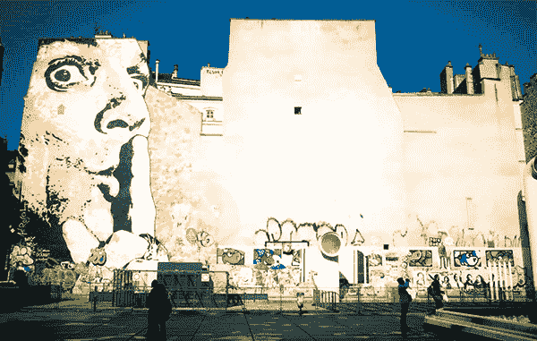

## 底线

当你觉得够了，起身离开。

恋栈，懊恼，期盼，后悔……，察觉这是真正的感受，还是来自头脑自圆其说的话术。体验此刻的体验，不必合理化，不必讨好，也无须勉强自己。

觉得够了，起身离开，这不代表关系从此决裂，你无须陷入情绪，以戏剧化的行为更不必争辩不休，这只是代表着，这一次你明白自己的底线在哪里，你开始学习尊重自己了。

知道适可而止。

付出是选择，过度付出是耗损，若是失衡，学习收回自身的力量，重新调整步调，稳定自己，找回可运行的节奏与秩序。

回到内在权威与策略，以敏锐的触角，察觉并认知自己的每一个面向，你不必训练自己成为完人，尊重自己。

## 深呼吸

只是下雨，暗夜，以及寒冷，即使还看不见晴空，天明，以及温暖，都别忘记，没有永无止尽的黑暗，深呼吸，你会没事的。

急速转动的世界，人与人疏离又冷冰冰，以真心待人，别人不见得以真心回报你，这是事实，也着实令人难受，若觉得心痛，深呼吸，缓缓松开胸前紧缩的那一口闷气，你会没事的。

郁闷的时候，愤怒的时候，不被理解的时候，清楚看见自己的限制，深呼吸，对自己温和，不必否定自己的感受，这是淬炼的过程，让人懂得慈悲与宽厚，你会没事的。

你以为自己没办法，其实不是真的。有人爱你，很多很多人，爱着你，你会没事的。

云雾会散尽，必定还会有阳光暖洋洋的日子；路若走尽，又会生出另一条全新的路。良善是一种选择，而你这样做不是为了谁，是为自己选择了向阳，选择相信与力量。

回到你的内在权威与策略，随顺你的节奏与韵律，真心看来像憨人又如何？深呼吸，微笑，深呼吸。

## 真理用爬的

要想通一件事情，是容易的。

你可以不断重复各种情节，抽丝剥茧，反复质疑，以各种不同角度诠释，再找出其中疑点，再度检视，推翻之前的假设，找到新的切入点，奋不顾身再辩证一回。

自以为想通一件事情，是容易的。

要喜欢要讨厌要爱要恨，人从脑袋中制造出千百万个理由，接着流下千百万滴眼泪，引动千百万款怨怼、委屈、不爽、沮丧、失望、悲哀……非常入戏，非常投入，非常绝对，连自己都被说服了，这一切非如此不可，再也没有其他选项，也不会有其他选择。

是真的吗？

这一切是真的？还是你想出来的假设？脑袋以光速运转，真理则是以蜗牛的速度，一步一步往前往上爬，真理需要岁月来验证，不是想完就没了，需要时间还有耐性，一步步揭露出来。

请回到你的内在权威与策略，观照脑袋所想，日子还长，真理用爬的，虽然慢，总会有那恍然大悟，让你明白的一天。

请等待。

## 回不去的关系

关系这件事很微妙，不管是友谊还是爱情，彼此相互依赖，也相互陪伴，虽然情感无法计较，关怀的心也很纯粹，无形中依然有其平衡，有来有往，有借有还。

当关系不复以往，先别埋怨谁，也别怪罪自己。

你明白之前的承诺并非矫情，当初也是情真意挚，只是一路走来，有意无意，是一方给了太多，另一方视为理所当然（甚至需索无度）；也或许客观一点，是我们自以为给了许多，勉强自己与人为善，累积至今早已过于疲累，才万分委屈起来。

请回到你的内在权威与策略，修正自己在关系中的定位，第一步，重新照顾好自己：你跟自己的关系如何？

你平衡了，再与人为善，别勉强自己。

## 物换星移，你不在

我们低估了岁月，面对无常，心生抗拒，即使知道唯一不变就是改变，却不见得能坦然接受，不想面对一切会随光阴改变，不想承认物换星移，你会不在，没有永恒。

总是还想着，能奋起努力些什么，忍不住勉励自己可要更认真，好好用力过生活，同时心里却很清楚，我和你，已站在不同位置，我有我的使命，你有你的方向，无法挽留，无须强求。

这是告别吗？我认为并不是。

我宁愿相信这是必经过程，是人与人交会之后，在记忆中存有那短暂的光亮，灿烂耀眼，让你我都更加理解了人生，如梦幻泡影。

回到内在权威与策略，一步步稳稳往前走。若物换星移，而你不在，想念难免，遗憾懊悔皆不必，没有怨怼，因为爱里头没有这些，想起你的时候，会是温暖。

## 我被操控了？

并不是对方操控了你，而是你内心衍生出来的抗拒，反过来，操控了自己。

事已至此，你可以走开，你可以暂时停止与对方互动，当然。你可以选择不被影响，你是自由的，不是吗？

但是，你没有，你选择“我被操控了”的立场。

你在这关卡上滞留，随之起舞，你的情绪起了反应，感觉愤愤不平，再一次，在一场微妙诡异的战局中，用自己的力量对抗着，你若让自己停留在这样的位置与观点，到最后，结果并不会不同。

别人永远可以操控，任他去。

回到内在权威与策略，你可以改变看法，改变作法，你有诠释这一切的自由，看清明。

力量别放在对抗，要掌握在手中。

## 往事如迷雾

那些如迷雾般的往事，偶尔想起来，宛如命运之神丢来的谜题。

比如说，有些人轻轻走进心底，就此倾心；有些人不管多用力努力，相隔何止千里。世事无法非黑即白，不能一刀切下干干净净，往事过去了，心里不见得真正过得去，到底我这困惑难解，是尚留情意？还是不甘心？

若尚有困惑，今天适合静静地，回想一遍。

试着在回顾之时，提醒自己，你的立足点是在此刻，在当下。光阴无法倒流，过去早已过去，无法解决也不必解决，真正重要的是，你已经走过那段路了，若不是现在，也会有一天，眼前的困惑终将散去，里头蕴藏的会是久违的清明。

知晓世事的清明，往往会在迷雾散尽之后，了然于心。

回到你的内在权威与策略，客观看待过往，宽厚对待自己。

## 故作姿态与情真意挚的差别

故作姿态与情真意挚的差别，并不难分辨，前者展露的是演技，后者流露的是真情。

当一个人入戏太深，自导自演自说自话，衍生出没完没了又缺乏自觉的戏码，容易让周围的人心生厌烦、抗拒与不耐，于是快速与之切割，逃之夭夭。

这其中的矛盾在于，我们一眼看穿别人的戏码，却看不见自己的，也看不清在层层叠叠精巧计算的戏码之下，双方长久积累下来，深层隐藏的恐惧、放弃、妥协与悲伤。

如果可以情真意挚，又何必故作姿态？

请回到你的内在权威与策略，看得更深，同理心是过程，需要穿越表面虚晃的戏码，真正看见对方的心。

## 不读不回

对于引发所有让你感觉负面的人事物，从已读已回、已读不回，然后到不读不回，是关于修为与自我保护的一道人生习题。

面对无风起浪又不请自来，暗地流窜的诸多耳语、揣测、嫉妒与攻击，若感觉自己的内在，简直快被这些黑暗与恐惧所吞噬，先别训练自己宽容大度，也不必急着争辩反击，你可以承认自己很在乎，很在意，或许也觉得很受伤，甚至愤怒。

感觉低落的时候，是独处的最佳时机。

这并非失败，也不是逃避退缩，而是让我们有机会，从明亮无忧的状态，调暗灯光，去除来自外在的干扰，如此一来，才能把光照向自己，再一次自省，静下来聆听自己，真正想要的是什么。

如果你了解自己，就会有力量，那与任何人都无关，是你与自己的协议。

请回到内在权威与策略，顺着自己的心意，你当然可以不读不回，这是一个开始懂得如何自处的练习。

## 欲望如潮水

浪潮一波波，来袭，然后退去，宛如欲望。

物质面不断想获取的欲望，情感面忍不住渴望占有的欲望，关于名声、权力、在其位、金钱、性、美食、青春美貌……也许就是无法留得住，没有永恒，于是不服气也不愿服输，激起了欲望，澎湃激烈，像浪花。

体验自己的欲望，体验欲望暂时获得满足的体验，也坦然体验欲望无法被满足时空虚又失落的体验，不管如何，等待、经历完整的过程，让体验得以完整。

请回到你的内在权威与策略，欲望终究如潮水，不会停。我们却能练习置身其中，尽管潮起潮落，可以安静。

## 爱恨都是爱

你以为爱的反面是恨？其实并不然，如果不爱，恨不会存在，如果不爱，你不会在意，你不会往自己心上搁着，你才不会在乎，你不会深陷在情绪里，更不会随着感觉起起伏伏，反复不断跟自己说：我。不。爱。

若是诚实面对自己，就会发现，爱一直都在，不管是对家人、对朋友，或是周围你所在乎的人，自然而然的，那是人的本性，想彼此亲近，不管人世间起起落落，都愿意相互信任，以爱交流，和谐共生。

今日，请好好善用爱的力量，与其折磨自己与别人，努力争个对错输赢，以为这样能解决困境，何不去看看其他的可能性？想一想，或许最终的答案永远不在输赢？而是因为爱，所以我们愿意创造一个新的方式，尊重彼此，好好相待？

请回到你的内在权威与策略，心存正念，心存爱。

## 力量自心中来

若是想念，请记得我们虽然活在不同的城市里，你并不孤单，我祈祷宇宙会赋予你力量，让你有力量分辨什么是幻象，什么是底层的心声，你一定可以做得到，未来充满光，充满无限的可能，而你是有力量的，你可以。

亲爱的，我无法给你力量，因为真正的力量来自你的心中，只要你愿意相信自己，力量自然会从心中来，无法外求。

对错是幻象，这世界上没有对错，只有你的选择，所以别让对错困住你，谨慎小心不代表你会寸步难行，你只能以自己的方式来，然后相信，不管接下来会如何，你会有力量去处理与面对，因为没有人比你更了解自己了，你正在走自己的人生路，你知道该怎么做的，你是自己的主人。

请回到内在权威与策略，顺着内在的韵律，照着自己的节奏，走出属于你的路。

## 心底话

“有时候，我感到快乐；有时候，我会难过；有时候，觉得和你在一起，是全世界最幸运的事；有时候，我并不想和你说话；有时候，才刚说再见就忍不住开始想念；有时候，我渴望见到你，紧紧拥抱你；有时候，我只想静静独处，和自己在一起……

但是不管如何，你可以信任我的灵魂，承载了对你的爱。

你可以信任我，说的是真话，我真的是快乐的，即使明天的我看起来有点忧伤，这并非我不爱你的缘故，而是人生浮沉无常。活着，让我有时欢喜，有时忧愁；有时开心，有时难过。我的心像艘迎风破浪的小船，顺着海洋的浪潮上上又下下。

小船摇曳着，晃动着，顺风的时候，闭上眼睛，微风吹拂着鼓得满满的风帆，仿佛心长出了一对翅膀，得以畅快飞翔；而当暴风来袭，我不安地体验着，暗夜的狂野与荒凉，在看似漫无边际的恐惧之中，努力学习着，该如何更勇敢，更坚强。

这世界上，情话实在太多，原谅我说得太少。

我爱你。我无法向你保证，时时刻刻我们都会是快乐的，但是你可以相信我，潮起潮落，月升日落，我愿意和你在一起，我无法保证永恒这回事，但是我知道我将尽我所能，珍惜每一次，每一天，和你在一起的时光。”

今日，请回到你的内在权威与策略，以自己独特的方式，对你真心珍惜的人传达出你的爱，说出你的心底话。

宇宙说不要害羞喔，这是让我们体验爱与被爱的一天。

## 应变

当周围环境突然发生变化，该怎么办？

你可以逃避，假装没看见。这是热门选项之一，这通常是觉得自己还没准备好，所启动的防卫机制。你可以选择什么都不做。这也是非常受欢迎的选项之一，许多人会选这款，化身鸵鸟，把头埋在沙堆里再也不抬起来。你也可以选择应变，然后敏锐审慎地采取行动。如果要选这一个，你可得先拿出勇气，够相信自己，信任冥冥中有股更大的力量，有其安排，顺着流走，你会找到自己的路。

所以，你要怎么选呢？

如果你选择应变，那么，宇宙有一些指引可以给你：第一步，你得先提高察觉；第二步，真实面对现况，脚踏实地看清楚自己所在的位置，回到当下，将变化转化机会。是的，人生就是充满惊吓，面对无常，人的力量有限，无法螳臂挡车，无法阻止突如其来的万千变化，但是，我们永远可以把自己的力量放在，学习与生命共舞，就如同跳支华尔滋般优雅，滑过所有的障碍，以自己的姿态，自己的节奏与步伐，展现独特的美丽。

请回到你的内在权威与策略，挑战让人生更精采，学习如何应变，加油！

## 覆水难收

想一想，自己的执拗到底是为了什么呢？若今天被一些看似微不足道的事件激怒了，或许表面不动声色，内在却掀起一阵狂风暴雨，想一想，自己为什么会有这样的反应呢？你抗拒的究竟是什么呢？

因为这并不是意外，说失控只是一种简单认罪的方式，失控只是表达出你并不想接受的事实，不愿意接受许多事情早已覆水难收，无法继续也无法延续。

真正需要改变的，并不是外在，而是改变你认为“别人需要改变”的心态，有些事情就是如此，有些人就是如此，若渴望这一切得立即改变，最后，很容易流于更极端的偏执，不会让你自由，也不会让你更平和。

事实就是如此，摆在眼前。

你只能做好自己该做的，明白有些事情终究是覆水难收。请回到你的内在权威与策略，做出有意识的，负责任的选择，然后，耐心静待，这一切终将回归自然的平衡机制，重新整合。

## 先忠于自己

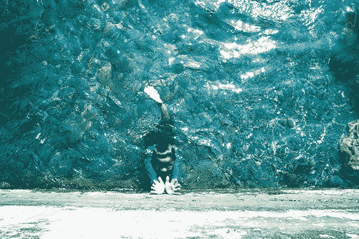

并不是每件事情都要大肆昭告天下，才能代表你的决心，有时候时机尚未成熟，你得先忠于自己的心，鸭子滑水，坚持你认为值得坚持的事情，等待水到渠成的那一刻，众人才有机会明白你的苦心。

所以，好好聆听自己，做自己该做的努力，如果别人懂得你，当然很好；如果现在这个当下无法尽如人意，也无须纠结郁卒，请坦然接受，顺境逆境都是过程中的一部分。

对于别人的热心（但可能并不合时宜）的建议与干预，心怀感谢，谢谢对方的好意，同时在理智上也清楚知晓，自己会有自己的决定，毕竟每个人的人生道路皆不同，能为你的人生负起责任的人，只有你自己。

请回到你的内在权威与策略，忠于自己，做好你认为值得奋战坚持的事。

同时，也学习好好尊重别人，相互干预，限制彼此，并不是爱的真谛，我们都需要更多的尊重与理解，爱才能真实流动起来。

## 越是不确定的时候

越是不确定的时候，当你感到犹豫的时候，甚至是让你抓狂的时候，每一次，都是很好的机会，让你再一次，再一次确认自己的心意。

确认自己真正想坚持下去的，到底是什么？真正愿意付出心血去努力的，又是什么？事实上，真正有意义的，让你继续走下去的理由与原因，没有人可以告诉你，你得自己去找寻。

好消息是，从今往后，你终于可以真正为自己的人生负起责任了。坏消息是，你心知肚明再也不能继续依赖，无法期待别人为你找来解答，也无法继续假装自己没有力量，伪装自己是卑微的，事事怯懦，活得绑手绑脚，困在无谓的烦忧里。

每一次动荡与不安，面对混乱的瞬间，没有人想与你为难，真的，这只是宇宙捎来一个很好的提醒，让你可以问问自己，我是不是还依循我的心，我有没有坚持我所坚持的，尽情地走在我的道路上。

请回到你的内在权威与策略，越是不确定的时候，越能跟真正的自己靠近。请好好拥抱你自己。

## 静下来

静。下。来。

回顾过去这阵子所做的事，谢谢你这么努力，谢谢曾经有过的坚持，然后，安静下来，深呼吸，看看现在的你，从内在浮现出来的觉知是什么。

今天，没有什么应该说的话，那些原本你以为该说的场面话，就全部省下来吧。

想说话，才说话，如果不想说话，就静下来，好好和自己在一起。

静默中，心得以平和。

那些流过的汗，流过的泪，都是极好的过程，让你更理解自己是一个什么样的人，也更明白这世界运作的规则。走到现在这一步，该退一步，仔细回顾这过程中，究竟自己学会的是什么，放下评断，诚实的，把自己的心照顾好，随着一叶扁舟，晃晃荡荡，没有答案，没有过去，也没有未来，只有静谧，还有你的心跳，自成韵律。

请回到你的内在权威与策略，不要再逼迫自己，去说你不想说的话，这就是善待自己的表现。

## 够了就喊停

你累了吗？同样的故事，同样的抱怨，同样的循环，听够了吗？受够了吗？

不管是周围的人叨念个没完，或是自己脑中无止境乱想乱转，这些纠结，这些忧虑，这些让人烦心的事情，转来转去最后落入的，就是一个暗黑的无底洞，永远不会有出路的。

记不记得绿野仙踪的故事？

可爱的桃乐丝一直想找到回家的路，其实啊，真正的力量来自她脚上穿的那双红色高跟鞋，力量一直与她同在，只是她根本不知不觉，直到最后，她学会了敲鞋跟三下，同时大喊咒语，风起云涌，力量就此展现。

有没有可能，你的力量已经与你同在？（快点，低头看看今天你穿了什么鞋？哈！）跳脱原本混乱的困局，也许解决之道早已显现，只是你还没睁开眼，你还没准备好让自己看见，那埋在纠结下，正在闪闪发亮的机会？

请回到你的内在权威与策略，稍安勿躁，世间乱人心志的事情已经够多，你得先喊停，才会有余裕看见新的可能性，静下来……你会看见，机会早已悄悄飞来你身边……

## 慷慨

在你慷慨分享，付出关怀之前，想一想，对方是对的人吗？

人与人之间的关系很微妙，进进退退之间像跳探戈，是艺术也是学问。付出关怀的时候，你可能觉得这很单纯，源于自己慷慨无私的心，但是从另一个角度来看，你要清楚知道，并非每个人皆随时随地准备好被关怀。

画出明确的界线是必要的，就像因材施教，不同的人需要不同的关怀方式，若是不管对方是谁，你总是一味地付出付出再付出，那么很容易吸引错误的人环绕在四周，最后感觉受伤的那个人，将是你自己。

把力量放在对的点上，坚持你想坚持的，走出自己的路，别浪费精神在不对的人身上。要记得，过度关怀不是慷慨，只是一种削减彼此能量的行为。

请回到你的内在权威与策略，提升自我察觉。关怀是美好的，只是在你付出之前，先想一想，这样的关怀真的为彼此累积了最大的正分吗？如果没有，把力量省下来，先关怀你自己。

## 没有谁害了你

真的有人害了你？还是你让自己陷入了“被害妄想症”的困局里？

没错，这世界上真的有人会去伤害别人，也有人会去做一些在你眼中看来，很烂也很坏的事，所以呢？接下来呢？你打算怎么办？

你决定开始痛恨对方，不断给予反击？还是你可以，接受对方也有权利做他想做的，而你，只要简单地转过身来，专注在眼前能做的，那些你原本擅长的区块上，务实地，看看自己手上还有什么资源，尽可能去运用，处理能处理的，稳定心神，然后看看接下来，这一切会有什么不同以往，意想不到的可能性。

这段时日的起伏，你辛苦了。这看来高高低低的境遇，其实反映出每个人所相信的，选择遵守的原则都不同，规则讲得容易，要学习真正包容却很难。

既然如此，没有谁害了你，你也不必以过度悲愤的情绪，来加害你自己。

回到自己的内在权威与策略，清者自清，浊者自浊，越是混乱的时候，越是很好的锻鍊。

你是清明的，有力量的，你永远可以选择走自己的路，加油。

## 共识

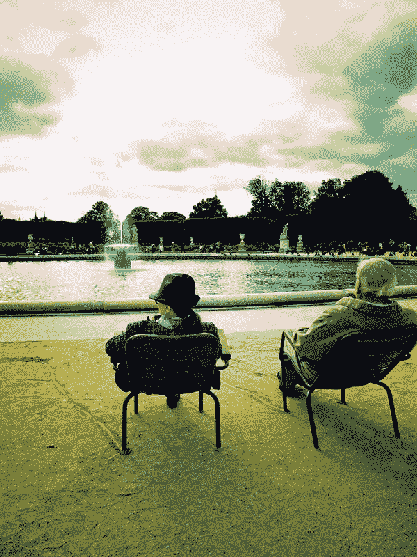

此刻当下，我们可以达成的共识就是：彼此没有共识。

若有这样的体认，就不必继续花时间在争辩、攻讦、推挤与抗拒上，孰重孰轻，各持己见，彼此的观点与立场那么不同，拉扯之间，形成僵持与耗损，就算时间继续拖下去，你不会被任何人说服，也无法说服任何人。

怎么办？

若继续问更多的问题，更容易制造混乱，难免误入歧途。公正不仅止于眼见为凭，还包括人心里存有的天秤，是否能平和？能不能获得平衡？需要时间与过程，无法硬来。

回到你的内在权威与策略，天秤摇晃之间，权衡需要时间，请先带着暂时不会有共识的体认，探索属于自己的答案吧。

## 再想，也是徒劳无功的一切

不得不接受，有些事情真的已经过去了，再想，也没有用。

今天，如果内心还有微微的惆怅与难舍，别对自己太过严苛。

人活着，不必天天都激情奋起，总会有些时候，需要静下来检视过往。想一想，那些本该做的，不该做的，得到的，与随着光阴失去的，过去终究已经过去了，懊悔无益。

人生某种程度现实而残忍，人们在不同的城市里快速行走，一波一波如浪潮翻涌来去。我明白的，说得简单点，你与我也不过各自做了当时最适宜的选择，而每一个选择，都迅速敏捷地，快得像一支能画开空气的箭，射向远方，我们各自朝不同的方向飞奔，渐行渐远。

再想，也是徒劳无功，想不通，就静静地，先停在目前的位置上吧。

回到你的内在权威与策略，我们都是在时空移动的旅人，爱与思念，咫尺天涯，告别之后不知道能否再见。

虽然，你依旧留在我心间。

## 事已至此

不管你愿不愿意，喜不喜欢，事情发展到目前的阶段，就是事实。既然如此，不管自己的情绪如何跌宕起落，都要加油，努力往前走。

没有后退的路了，也不可能继续停留在原地。

你一直耿耿于怀的，曾经留恋不已，原本以为根本无法道别的一切，转瞬间，命运席卷而来，轻而易举地让每个人轻巧地转了个弯，就算你我的内心有多抗拒、懊悔、沉重、忧愁与纠结，在这一股更大力量的安排之下，益发显得荒谬，同时微不足道。

因为我们都很清楚，事已至此，回不去了，没有退路。

就算自己离完全地、彻底地接受，尚有距离，也要跟自己好好说声加油。既然无退路，只好坚定往前踏一步，坦然去体验情绪浪潮一波波，不要恐惧眼泪，泪水是很好的洗涤，让人看得更透澈，也让心更清明。

每当无助，感到黑暗的时刻，告诉自己，属于人性的坚韧与美好，会在这样的时刻，如光一般，适切并美妙地，展现出来。

请回到你的内在权威与策略，鼓励自己，往前迈开每一步，你将发现自己强大而美丽，勇敢且柔软。

没有什么难得倒我们，要有信心。

## 同理

我们太需要理由，想要凡事都有个说法，给个答案，偏偏情绪就是没有道理的，情绪只能同理，同理代表你得有颗宽广的心，愿意接纳一切如是，就算脑袋无法理解，也愿意放下评断，安静地与自己或别人的感受同在。

好吧，若是脑袋过于执着，非常迫切需要个说法，那就请你这样想吧：

当一个人仁慈的时候，代表他与自己的关系是良好的。当一个人冷酷的时候，代表的是现在的他失衡了，需要空间与时间做些调整。当一个人愤怒的时候，代表的是，他的内心有某些隐藏的需求没有被满足。当一个人恐惧的时候，只是以另一种形式在对你说，我需要更多的爱与支持，如果你愿意，请与我同在。

当然，以上的状况也完全适用于你自己身上，同理自己，对自己仁慈，往往是最重要也最困难的功课。

请回到你的内在权威与策略，每个负面情绪的背后，只是一颗渴望被爱的心在大声疾呼，我在这里，我在这里，请你看见我，我在这里！

请以慈悲心对待这个脆弱又美丽的自己。

## 爱过

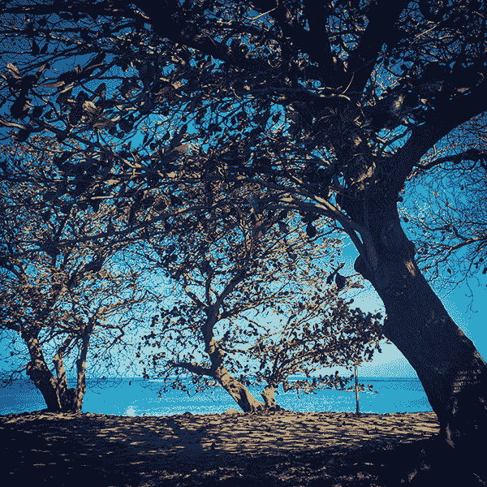

如果没有真切爱过，内心怎么会有这么多情感翻涌？既然如此，你又何必不断向外找寻答案，质疑爱究竟是什么，或恐惧究竟会不会持久，而无法自拔呢？

全世界没有人可以解决你的问题，因为呀，爱或不爱，只有你自己最清楚。

每段爱恋都是一个机会，让你可以与另一个人并肩同行，执子之手，漫步风霜雨雪，共看春夏秋冬。爱不爱，何时爱，会爱多久，这并不是脑袋想出来的计划，也没有正确的解答，何必让你的烦恼干扰了当下的体验？如果回到体验，爱不就确切发生在每个当下吗？

我们是爱着的，不管是否会天长地久，也不知道是否情深缘浅，无论能不能天天相见，就算时空距离千万里，心一飞跃就能辨识出爱的感觉。因为爱过，才可以让一个人学习到，如何更珍惜自己，更珍惜活着的每一刻，因为爱过，这样无比美妙的经验，其本身所带来的力量，就足以让我们更有勇气，大步向前。

请回到你的内在权威与策略，因为相爱，更要好好爱自己。

在这秋季的起点，深深地呼吸，那是空气里清冽的滋味。你有没有看见，落叶默默掉落，就算繁华散尽也浪漫，似乎可以听见自己心跳的节奏，持续而雀跃，我想你会懂得，我依旧爱你。

## 我们回不去了

当然，你可以在脑中回想无数次“如果当初我不……”这类的假设，当然，一切可以变得很合理；当然，你可以否认自己的内心已经转变；当然，你更可以说服自己，继续过着以往熟悉的日子，不必承认爱曾经发生过，继续偏执的，顽固的，生活。

日子表面上并没有不同，一直都是忙碌，一直都是送往迎来，一直都是重复又重复。唯一不同的是，你知道自己已经是个不一样的人，虽然无法界定，也无法明确定义，无法清楚明白这样的转变，究竟要带领你往哪里去。

当人与人相遇，就像遥不可及的星星，突然有了交会，碰撞之后，狂烈燃烧出不同于以往的光亮，自此之后，不管能否长相厮守，我们都将各自带着对方的思绪、情感、气息、思念、看待这个世界的方式……化成内在某块新的自己，并且，继续航行。

是的，我们再也回不去了。不是的，你们并没有失去彼此，聚散离合，都只是美妙的历程，让每个人成为更完整的自己。

请回到你的内在权威与策略，你是星星，一闪一闪亮晶晶。

## 当初并不是不爱

一开始都是爱，自然而然的，全心付出的，真诚的，和谐的，相互分享相互支持，愿意好好珍惜这百年修得同船渡，千年修得共枕眠。

渐渐的，以爱为名，我们不知不觉在关系中添加了诸多期待，慢慢成了一种不良的习惯，当你开始变得依赖，开始误以为只要有爱，两方不论谁付出或谁索取，都是师出有名，都成了理所当然，不用多久，不管多么浓烈的爱情、亲情或友谊，都将在无形中不断耗损，到最后默默消散。

如果由爱生恨，你要明白冰冻三尺并非一日之寒。当初并不是不爱，如果不爱又怎么会在一起，问题只是出在，我们好容易误以为只要有爱，就什么问题都不会有；只要有爱，别人就应该对我好；只要有爱，就能不必费心用心不必好好经营，可以直接画上永恒；只要有爱，王子与公主就可以从此过着幸福快乐的日子，非黑即白般简单……

当全世界都在歌颂爱是如何甜美，何不回过头来，务实的，好好珍视正在你身边爱着你的人。你知道的，爱不是出于必然，而是每个当下，一个片刻接着下一个片刻的选择。

请回到你的内在权威与策略，每一天都可以练习用心体会，好好去爱，也好好被爱。

## 情义

因为是一家人，或基于团队的情谊，就一定要情义相挺吗？

在你两肋插刀，在所不辞之前，又或是期待别人也要如此回报之前，请先想一想，到底是什么，会让一群人形成团队，链接在一起？因为爱？是，那是其中一个部分，因为责任？当然我们可以选择这样认为，因为规范？那请问你正在遵循谁的规范呢？

情义的存在，是基于一个更高的指导原则，那就是一群人愿意看着共同的目标，找出资源整合的最佳模式，让团队中的每个人都能好好被照顾，并且享有足够的资源，生存并成长。

规则是人定出来的，在试图用尽最后一份精力，认为自己正在为至高无上的原则牺牲与奉献之前，请先跳脱深陷的角色扮演（我们很容易入戏太深的，你知道！）请好好看一看，这份情义相挺，是否基于一个更高的指导原则？你是否，真的让团队赢，然后自己也赢？

请回到你的内在权威与策略，有情有义也忠于自己，做出最适宜的决定。

## 如果有一天，我们分离

并不是每个人的生命都想追求真理，有人追求的是美。

如何深刻体验这世界的美？

首先，你不能活得匆匆忙忙，顺着内在的韵律，简单平和地呼吸，就与这个世界的韵律，合而为一；不要以为等待是浪费时间的行为，慢下来，当你平静且敏锐，才能真正体验空气中那细微的，清脆又冷冽的气味。你闻到漫漫悠悠的桂花香了吗？何不面朝阳光温暖的方向，有没有听见街头巷弄流动喧哗的声响？天光交融，相互融合，环环相扣，活着，多么美，只等你静心去体验。

如果，每个当下你都完整体验了，那么，分离就不会是折磨，而是美好的珍惜与怀念。分离让我们更懂得珍惜美，以一个全新的角度去体验生命无常，学习生存不只是求存，生命的范畴可以扩展至截然不同的层次。

所以，亲爱的，我知道有一天，我们终将分离，没有什么事情会永久，没有永恒，也没有唯一，但是，我看见你的美，我们共同体验这个世界的美，对我来说，这就是存在的意义。

请回到你的内在权威与策略，好好体验这一天，体验这如诗的行板，顺从你的韵律，我们时时刻刻都在分离，也在合一，或许分离与合一生来就是宝一对，聚散流转中自有其节奏，宛如地球的心跳，这就是爱的韵律。

## 爱恨一线间

你其实是生气了，你觉得沮丧，你对自己说没有下一次了，很多事情早该有个了断，该把话说清楚才能永绝后患。尽管在内心对自己讲了一百遍，但是，或许是季节交替，又或许是没有勇气真的拒绝，应该想远一点，何不想开一点，你默默自圆其说，莫名感到脆弱，终究无法做到非黑即白。

一开始都是爱，就像对待家人一样，自然而然付出，彼此相互关怀对待。只是，所有的关系，不管是友谊、爱情或亲情，也该有所分际，没有什么是理所当然，也无法长期都是一面倒的依赖，如果缺乏相互尊重，别忘了，爱与恨也只有一线之隔，累积久了，终究还是会爆发出来。

如果今天觉得无所适从，或者感到迷惘与混乱，请回到你的内在权威与策略，好好区分厘清，学习接受、放下、转换，你会发现，主导权一直在你的手上，答案也在你的心底。

# 第三章爱，存在

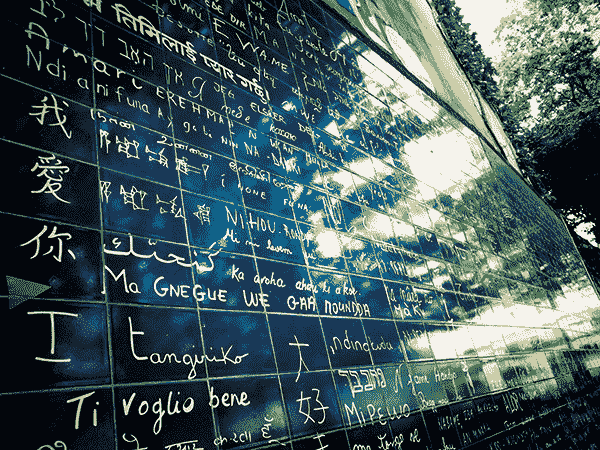

## 放下，让你走

经过这段时日的沉淀，在你的内心里，一切不是都有答案了吗？

过去，本以为最复杂难解的，其实，想通了，变得异常简单。答案并不是放弃，也不是妥协，而是你懂了，也了解到，人生这条路说长不长，说短不短，如果顽固地，继续硬背过往所累积的包袱，你的心，怎么可能再一次轻盈地飞翔？

放下，轻轻地，重担，就留在这里。

我说，就此，我放下，让你走。我不确定接下来我们是否会自由，但是我想开始这样相信着，很简单，我懂了，也想通了。

即使每一天，还是行走在喧嚣无比、有你的世界里，我可以很好。以后，当我再想起你的时候，我会想念那一片湖水蓝，我会微笑看着那一片云朵白，我会听见遥远歌唱的回音，那一幕幕色彩鲜明无比的我和你，没有悔恨也没有遗憾地想着你，只是，我明白过去不复得。我没有遗忘，怎么可能遗忘，但是我已经不是当初的我，你也不会是你了，而我们，已经走过那段路了。

谢谢你。

回到内在权威与策略，走到这一步，谢谢曾经有你，也谢谢已经没有你，我很好，我是我，谢谢你。

## 腐败是春泥

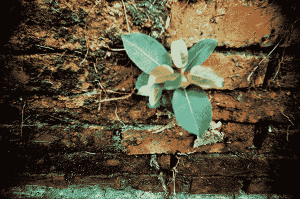

已然腐败的过往，不管是你的我的或是谁的一部分，皆已化为养分，默默孕育接下来，即将萌发的春芽。

若能这样想，或许在你画下句点的时候，除了遗憾，还能多些坦然与豁达。

人生中，我们所经历的每件事，没有绝对的好，也没有绝对的坏，只是在当下，每个人都扮演了各自选择扮演的角色，时序渐进，幕升起了，自然也会落下，留下往事历历，难免在脑中翻飞，有困惑的时候，自然也会有想通的时候。

每一刻，永远都能重新开始。

每一刻，都可以种下新芽，那些如落叶般的过往，不管是伤痛遗憾怨怼或缺口，每段悲欢离合都会随着时间，化为春泥更护花，在春花盛放之前，让我们提醒自己，怀抱希望。

回到你的内在权威与策略，为自己的生活，重新创建秩序，一步一步，以你的方式来。

## 只有我能够，使自己真正快乐

感到悲伤的时候，觉得好难过，该怎么办？

好吧，与其一直叫自己不要难过不要难过不要难过，像只小狗绕着尾巴转圈圈，强迫不难过结果反而更难受，我说啊，你就好好难过吧，带着你的难过，顺着内在的节奏，去做一些你一直很想做却没去做的事情，那些可能会让自己快乐的事，看看会怎么样。

你可以：

跑去百货公司的美食街闲晃，找出那些你之前想吃又怕胖没吃的东西，不要再管卡路里啦，我们海派一点，想吃什么就去拿，吃吧吃吧吃吧，不要客气，人生难得任性几回，开怀大吃一场。

去最喜欢的咖啡馆，点最喜欢的饮料，静静的喝，发呆放空都很好，体验置身于陌生人之间的熟悉感，那是一种生命流动的韵律，很真实，也很虚幻，就像你我的生命，就像爱情，就像那些你爱了又爱不到的遗憾，不管对方终究会记得你或忘记你，生命无常，谁知道最后谁会得老人痴呆症，回忆或不回忆哪有差。

逛菜市场，最传统的那一种，逛得满头满身都是汗，汗水与泪水都具疗愈功效。当然，我没叫你在市场拥挤的人潮中，跟一群欧巴桑欧吉桑摩肩擦踵时放声大哭（不要吓到他们，乖！）流汗就够了，好好去体验市场里，这股旺盛的生命力，不管是卖菜的欧巴桑、卖鱼卖肉的欧吉桑，你看到没有？每个人都好认真生活着，有人开心有人不爽有人无奈有人火大……，各自有各自的烦恼与解脱，就像你和我一样，你哪有孤单？

看电影，而且是马拉松式一连看个两场三场四场五场，最好是日头还在的时候进去漆黑一片的电影院，出来外头也漆黑了，看到昏头更好，看到最后把不同部的剧情都混淆了也无妨。人生如戏，戏如人生，你还能怎样，想不通才是常态，你比较聪明不见得就会快乐，有没有找到答案跟一个人快不快乐，其实并没有直接相关。

关起门来，尽情听那些超悲伤超受害超级芭乐的歌，然后哭到鼻涕眼泪都流出来，这种看似自我虐待的行为，搞得自己愈狼狈愈爽，每一滴眼泪都是一道光，洗涤你的眼眶也洗涤你的心灵，让你愈来愈干净，愈来愈清明，愈来愈明白，没有他，你还是可以活得很好，别傻了，事实上，没有他，你才能活得更好更完整。别担心，眼睛红肿不会死人，隔天就会好了，无损你的美丽。

静静地去庙里或教堂（看你信的神是谁），坐一坐，祈祷是另一种方式，与内在的神性对话，想像你跟自己的神好好诉苦一下，你要讲几百次都没问题，你知道，神很喜欢听人类自行碎念，有种极致荒谬的趣味，边讲边哭更真实。同时，你要明白，神也没有要替你解决的意思，讲完你还是得自己继续往前走，可以确定的是，祂一直微笑看顾你，并且与你同在。

去游泳池游泳，快速地游，也缓慢地游，当自己是条鱼，所有的烦恼都溶进蓝蓝的水里，泪水也溶进水里，怨恨也是，无奈也是，重担消失了，快乐就会回来。在那之前，请允许自己无脑，无脑自然无忧，没有什么过不去的事情，真的没有，你不是你，你只是宇宙万物中的一粒尘沙，好好享受如水般温柔的拥抱，那是被爱环绕的感受。

当然，我们还可以写更多更多更多，如何让自己继续难过，或是让自己快乐起来的方法。不管如何，最终也只有我，也就是你，能够，使自己真正快乐。

让我以这篇文，献给那些曾经不快乐或现在还是不快乐的人（包括我自己）。我要很老套的说一句实话，疯狂沉溺于自己的不快乐，入戏很爽当然很棒，但是你的快乐一定会回来的，你的心也会补好，因为，不管现在你觉得自己有多惨，别忘了，每个人在生理或心理上都有旺盛的自愈能力，感谢宇宙，这是上天赐与每个人的神力。

## 你不孤单

真正难的不是告别，而是脑袋中编织出来关于分离的幻象，以为是断裂，以为会孤单。

过去的一切过去了，那些你曾经喜爱的、痛恨的、感到悲哀的、无法原谅的、无法承担的，紧抓不放坚持着，或干脆仓皇逃开的，皆如你所愿。

既然如你所愿，为什么还不能接受呢？

当一个人离开，不久之后，必然会有另一个人随时序渐进，行至你的身旁，巧妙而准确，不费力地维持这一切平衡运转。就算现在这个当下，在脑袋理智层面，无法眼见为凭，但是别忘了，有许多珍贵的事情，无法看见，并不代表不存在。

你的孤单很真实，是真实的幻象。

回到内在权威与策略，走到阳光下，感受身体好温暖，那是热呼呼的拥抱，是无法看见的爱与能量，在对你诉说：无人是孤岛，无人会孤单。

## 不要担心自己错过

对于那些过去没想通，现在还没想懂，未来也尚未可知的事情，不要担心。

不要担心自己错过，你没有错过些什么。

在正确的时机点，而你也准备好了，觉知或领悟，会宛如闪电般一闪而过，那一瞬间，你知道自己知道了，体悟了，言语不见得能解释清楚，这完全是一翻两瞪眼，无法勉强的事情。

若能懂得更多生命的道理，就能为自己打开全新的机会，这听来非常诱人，让我们迫不及待想拼命学习更多，知道更多，明白更多，只是觉知属于质变，无法以量取胜，在你真正懂得之前，说实话，急也没有用。

急什么呢？无需懊悔或遗憾，你没有错过，这是酝酿，也是过程，铺陈出一条觉知的道路。

回到你的内在权威与策略，别被脑袋杂乱的思维所愚弄，专注活在当下，不要担心自己错过。

## 认真看待忧郁

今天如果有任何忧郁的感受袭来，专注地，认真看待它。

和你的忧郁好好说说话， 就像陪着一个亲爱的朋友。你不需要逗对方笑，也不需要取悦或娱乐它，还有那些为人处世的大道理，今天都先省下来吧！你知道的，忧郁不需要被训诫，它没有犯任何错，更没有罪，所以请不必对它感到生气，或是以冷战的方式来忽略它。

忧郁只是一个很好的朋友，而它的个性，惯常不会以欢乐的状态出场，也因为如此，我们才能像喘口气般，暂时自日常生活，习惯上演的荒谬讽刺喜剧里退场。这一瞬间，才终于可以很坦白，很真实，并且诚实地，透过这一双忧郁的双眼，去厘清并区分，对自己而言真正有意义的，其重要性的优先顺序，会是什么。

在低潮的时候，你才会看见自己的底线。

而忧郁只是一连串优雅略带悲凄的乐音，滑动着，曲折地，带领你渐渐穿越迷雾，走进灵魂深处，看见自己真正在意的，究竟是什么。

请回到你的内在权威与策略，认真看待你的忧郁。但是别担心，也别忧虑你的忧郁，请坦然接收这过程所带来的奇妙启发。

## 不要轻易承诺

不要轻易承诺。

这并不是要你拒绝，而是在承诺之前，好好再省视一遍自己的心意。不要无意识地承诺，以为只要搞成勇于承诺的模样，就能够：解决问题、让大家喜欢你，或者证明你是一个值得信赖、有用的人。

你不需要过度承诺去证明这些。

你不必因为一时兴高采烈，而拼命说好话，也不必浅薄地想让任何人开心。如果要承诺，要承诺于你所看见的光亮，承诺于自己的信念与原则，明白你的追寻其来有自，就算身处黑暗之中，你的承诺都会在心上繁花盛放，即使距离尚且遥远，那渴望似乎能让人闻到馥郁的花草香，迷人而奔放。

请回到你的内在权威与策略，在你承诺之前，看得更深，看得更远，有意识地承诺，承诺心之所向，对自己诚实。

## 遇到知音之前

遇到知音之前，你可以做什么事情？

这世界有太多误解，太多人无法相互理解，当你无法与沟通的另一边接上线，我们很容易就会立刻掉进“别人不懂我”、“时不我予”、“知音难寻”之类的经典悲情大戏里。

好的好的，在你自掘坟墓，一边挖坑一边感到无限委屈之际，可不可以先停下来。真的，请先停下来一下下，让我们客观想一想，你有没有清楚传达自己想说的话？ 如果你很确定自己传达了，那想得更深一点，你所传达的讯息，对方真的收到了吗？

知音是否难寻，取决于你有没有把话说清楚，对方真的听懂了？还是他自认懂了，你也觉得他懂了？事实上两个人所认知到的，根本风马牛不相及？

遇到知音之前，请先练习把话说清楚，然后确认对方听清楚了，或许，知音一直就在你身边，只是你努力挖洞给自己跳，所以没认出来罢了。

请回到你的内在权威与策略，带着幽默感，好好说，仔细说，慢慢说，也愿意听听人家究竟怎么想，人生没那么悲苦，也没你想得那么难，请与你的知音把酒言欢，共创未来。

## 与自己的练习

检视自己每一次的起心动念，这是为了反对而反对？为了挣脱你认为的桎梏所做的反击？你真的清楚自己的立场与原则吗？

如果答案是肯定的，请练习好好再说一次。

这与别人多么鲁莽无礼甚至无知都无关，让一切回归到很简单的原点，这只是关于你，是你与自己的练习。

练习相信，这世间的人或许没有你以为的蛮横。练习从容，并非每一次都得采取激烈又偏激的手段，才能得到你想要的结果。当周围的人听不懂你所说的话，不愿意了解你想传达的意思，这才是最好的练习，让你练习观照自己，继续保持清明。

请回到你的内在权威与策略，集体意识进化的过程极其细致，各个环节紧密相连，需要时间，而我和你，都要多点耐性，练习与混乱和谐共处。

再一次，这是与自己的练习。

## 你所遗忘的

时间已经做出了选择，过往你所经历过的一切，有些转化为记忆的形式留存下来，有一些幻化为轻烟，被你也被这个世界所遗忘。

已经遗忘的，何必苦苦执着？或许有些事情遗忘是比较好的，这是宇宙的善意，以另一种方式让人得以重新开始，让你的心上重生全新的展望。那些留在过往没说出口的话，那些你原本以为无法放下的郁结，时空移转，人事变迁，何不在杯酒之间，一笑泯恩仇，若因此能让彼此的灵魂重获自由，又何妨？

过去真的过去了，你也清楚是这样，我们永远都回不去了，但是你所经历的一切，都是生命所带来的滋养，让你在未来能更懂得如何适应环境，更懂得人心，更深刻了解在舍弃与珍惜之间，人生智慧难得，但并非不可得。

你所遗忘的，本应如此。

请回到你的内在权威与策略，记住自己是一个什么样的人，昂首阔步往前走，走向全新的人生。

## 接受过渡期

维持内心的平和，接受现在就是转换的过渡期，这段日子即将过去，结束、重整、衡量、重新再一次做出决定……。

不确定的时候难免让人慌张，请你，稳下来，保持平衡去适应。是的，这就是一个过渡期，重大转折代表巨大蜕变的可能，之后就会是全新的风景。今天可以好好检视一下，哪个点子有可能会行得通，哪个点子能够创造双赢，足以让大家从中获益。

好点子并不是真理，好点子并没有建造成实像（至少现在还没），点子是一个礼物，一个契机，一个由宇宙神奇安排流转至你面前的闪光，是一个指向未来的可能性。

请回到你的内在权威与策略，选择你相信的可能性，保持内在的平衡感，热血最无敌，等待过渡期之后，请张开双手，创造你渴望的世界吧。

## 好心

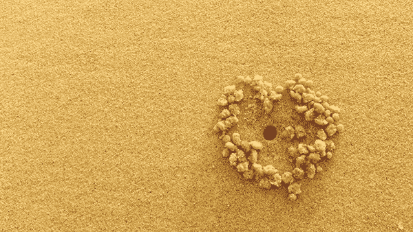

因为好心，所以多做了很多；因为好心，所以承担了别人的承担；因为好心，所以自动退让是美德；因为好心，所以洗脑自己吃亏就是占便宜；因为好心，要忍；因为好心，直接牺牲内心真正想做的事情；因为好心，即使委屈也感觉悲壮……最后失衡，搞得自己愤愤不平，还不断安慰自己，这一切，只是因为我太好心。

今天，在对全天下人好心之前，请先对自己好心。

无私与自私之间，本就有其微妙的平衡点。你是好心人，有一颗公正而坦然的心，无需证明。但是，请别为自私感到罪恶，有时候，自私有其必要，不再承担过多，才能给出空间让别人有机会独立。我们都要好好学习，如何对自己的人生负责。

请回到你的内在权威与策略，先照顾好自己。

因为自己的人生过得很快乐，付出才不会是牺牲，才不会怨怼。幸福人生威力大，心怀感谢能化为最美的动力，自然而然想尽一己之力，对更多人好心。

照顾自己，对自己负责，学习当一个富足的好心人。

## 源于爱

我问他，如何能够活得有力量？

咖啡店老板满头白发，微笑看着我，没说话。

他只是单纯地，专注地，煮着每一杯咖啡。他的手法纯熟，心无杂念，我目不转睛看着他，看他仔细拿出精美无比的咖啡杯，这满墙柜子整齐放着上百个杯子，每一只皆独一无二不相同，不能疏忽，他心无旁骛，以热水烫杯，满怀诚意，倒入刚煮好的咖啡汁液，满溢芳香。

不必说话，他的身影流转在咖啡馆里，存在着，将咖啡倒进杯里的那瞬间，已然道尽，每一个解答。

“投降于你该做的，并且，全心全意去完成。”

这世界上永远不会完美，你总是可以看见每一个需要被纠正的瑕疵，练习超越内心的执着，看见自己的爱，承认它，接受它，并投降每个人有其天命，你有你的，请活出来，好好完成它。

若是源于爱，你原本以为繁杂混乱的一切，将转身一变，变得异常简单，你的我执与矛盾将逐渐消失，一切变得纯粹，长久以来所追寻的答案，就化成每一件你正在做的事，成为每一句你要说出口的话。

请回到你的内在权威与策略，放手去做吧。人生没有你以为的那么短，但是也不长，倾尽所有去创造，不要遗憾。

源于爱，就会有力量。

## 爱的波澜

前进几步，退一步，退了几步，又进了一大步，生命前进非直线，没有速成，体验你的体验，无法贪快，每个人都只能以自己的节奏来。

总是要转好几个弯，关于爱的记忆再度浮现，非得空上这段时日才明白，原来是爱。既然是爱，当初无法辨识是过於单纯？是无心？是没有勇气？还是痴愚？我没有答案。剩余些许遗憾，而这遗憾又究竟从何而来？我想我又得再隔些时日，才能明白。

若就此错过，那是命运。

但我还是想问这一场场悲欢，被捉弄的到底是谁，是我？是你？又是谁从中得到恶作剧的快感？

若将情感入诗，也不枉费曾经受过的苦，没有后悔，其中起伏没完没了，无法停息，不能平静，令人困惑的踟蹰与纠缠，是我还看不清缘由，只能等待。

回到内在权威与策略，这场爱的波澜，进进退退如潮水，但是我依旧相信，依旧乐观，因为爱。

## 爱的进化

我和你都一样，我们被生下来，然后，有一天也将步向死亡。

这世界每一刻都在改变，异常快速的，每一刻新的生命不停诞生在地球上，每一刻我和你的肉体都逐渐老去。在生与死之间，短短一辈子的时间，宇宙与光阴，无边无际的洪流，你和我来过了，瞬间也会离开，来来去去匆匆数十年寒暑，一代接着一代，像是交棒一样，持续不断地往前进化着，是物种与文化进化的漫长历程，不间断。

所以，必定也不是意外的，从大打出手，激烈争辩，还有相互抗拒中提出各自的看法，然后在这往往返返拉拉扯扯之中，伤心与修复之间，但愿我们身为人，有一天终于会学到，爱。

爱的意思就是，没有什么教条，没有什么律法真正足以限制，那是天生自然，与生俱来的能力，单纯只要回到自己内心，当你拥抱了自己，就能生出更大的宽容，去容纳这世界的不完美。了解到，这也就是完美，进化历程中必经的一段。

不管世俗多纷扰，都不要哭，要微笑面对。这一路就算坑坑疤疤，走得颠簸折腾，反过来都可以觉得幸福，因为一定会有人选择与你同行，你不会孤单。短短一辈子的时间，没有人可以活到天长地久，所以更要珍惜彼此的存在，勇敢去爱，勇敢拥抱你所爱的人。

请回到你的内在权威与策略，不要失去信心。记得你所相信的，爱就是力量，如冬天的暖阳，没有歧视，照亮每个角落的阴暗。

我们一起加油！

## 你创造你的关系

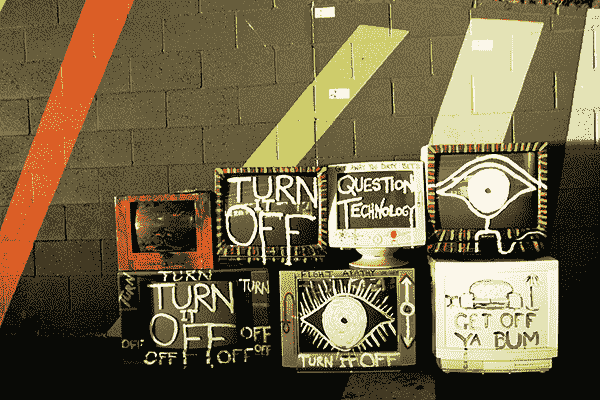

如果你想让事情行得通，请先看清楚每段关系的本质。

比如说，工作上的关系，本质就在把事情做好，达成目标，创造结果。你的老板不是你的爸妈，与其向他们讨爱，还不如务实把自己的工作做好；你的下属也不是你的小孩，过度照顾与呵护，只会阻碍他们的成长。当然你可以爱他们，但是更重要的是，请学习相互尊重，就事论事，该说的话还是要说。

爱与取悦是完全不同的两件事。

如果你只想顾全颜面，试图不断取悦别人，到最后，反倒更容易激怒对方。若非出于真心，取悦只是另一种隐性交换的方式，让你企图从对方身上，去索取更多的爱与注意力，这样的关系走到最后，只会让两个人都匮乏。

如果一段关系失衡了，必定是我们想要的东西不尽相同。那么，是谁误解了？是你，还是对方呢？要如何调整，才能让关系行得通呢？

请回到你的内在权威与策略，练习明确地沟通自己的需求，这不是要你勐烈反击，更不是要让大家相互指责，而是协助彼此清晰去看见，每段关系的本质。

创造你想要的关系，看清楚了，才会发现重新创造的可能。

## 后悔

严格来说，其实我们都没时间后悔的，不是吗？

时间的磙轮推着你和我，向前走向前走向前走，每一天的生活荒谬又匆忙，起起落落，这里爆出一个点，那里陷下一个坑，我们疯狂要自己冷静处理，成熟应对，脑中充塞各种作法与说法，然后，跟自己说，为赋新词强说愁是少年，那很美，但看来，或许，我已经太老，也没时间。

晴空万里之际，为什么还是会有那一点点怅然，悄悄地，偷偷爬上心头？

说后悔，或许太沉重，只是当我想起你，想起空巷里，曾经有过你，与我手牵着手，慢慢走着走着，不是天长地久，只是与你共同拥有着，那一刻，生命的风景。

不复得，无法忘，何必强说愁，伤感已留我心间。

我没有忘记你，但愿你也没有忘记我，我不后悔，你也别，世间事有世间的规则，人与人有各自的缘分，每一天忙碌依然，只要人长久，千里之外得以仰望同一个月亮，而我知道你会好好的，就像我也会，就足够了，我一点也没后悔。

请回到你的内在权威与策略，如果有那么一刻，忙碌的瞬间，心情偷偷飞，请好好拥有这片刻的酸与甜，亲爱的，这很珍贵，这就是人生千百款滋味里，爱的酸楚、爱的甜。

## 尽欢

人与人的缘分，很难说得清。

有人在你的内心宛如恒星，也有好些人看似总与你同行，我们是彼此在共同轨道上运转的行星，样样人百百款，多如繁星，一生中总会碰上几个绚烂如流星，偶然相逢，意外碰撞，不见得能常相守，却时时在心里停留，难以忘记。

这世间太多恩怨算不清，既然无法斤斤计算，也无法锱铢必较，有幸为人，有幸相识，就算世事混乱难解，那就干脆一点，以一颗温暖又柔软的心，去相信缘分绕来绕去，有缘就会环绕成一个圆，所以每一天，遇见的每个人，都值得好好珍惜。

今天不谈永远吧，过去既然已经过去，未来当然也会继续来，你烦恼的事情不见得会发生，该发生的缘分，时间到了，自然会悄悄展开，这一刻，人生苦短，不管现在究竟得不得意，何不尽欢。

请回到你的内在权威与策略，好好享受这一天。

## 重点不在爱你的邻居

如果对人有爱，代表得爱这世界上的每一个人（包括你的邻居），而且，因为有爱的缘故，不断要求自己得宽容接纳所有良善与罪恶，包括每一个极端的行为，那么，这爱的标准不仅过于崇高，也太遥不可及，很容易让人还没开始，就心生放弃。

要对人有爱，请先从善待自己出发。

首先，学习尊重自己的独特性（包括那些有人会觉得疯狂并不切实际的行为），放下原本严厉的评断，没有委屈，没有强迫妥协或从众，而是尊重这行为的底层，必定有你个人真切的需求。唯有当你开始尊重自己的极端，才能开始以谦和的态度，看待别人的极端。

真正对人有爱，是一段不断内化的过程，面对任何挑战，接受任何人所处的位置，当每个人都活出自己真正的本性，我们的关系就会创建在尊重彼此的极端，而不是压抑它，若能找到让彼此和谐共存的方式，一切就会运转得更顺畅。

请回到你的内在权威与策略，谦谦君子，面对大千世界，无入而不自得，让我们相互提醒，以爱待己，以爱待人。

## 舍下

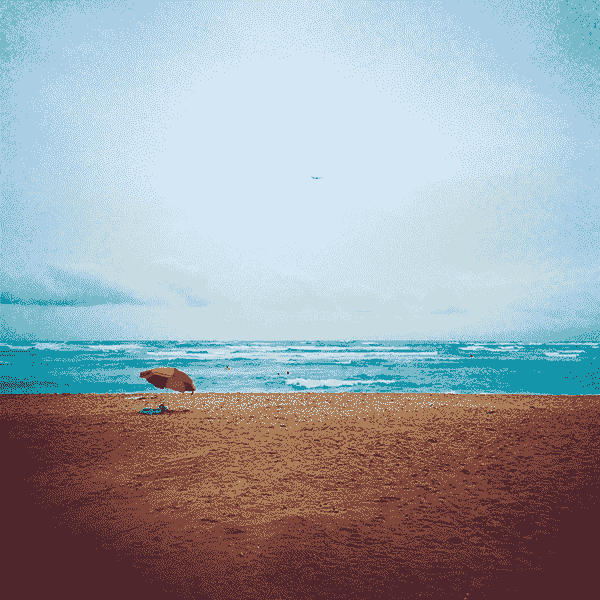

你该放手，看看这一切会如何开展。

无法舍下的，往往是内在沉积以久的执念，那些你认为原本应当如何，又或者对方该如何的期待与偏执，却忘了，其实已事过境迁，每个人皆逐渐成熟，以往你承担成习惯的重担，或许早就不该是你，也不属于你，不是你得背负的职责所在。

放过你自己，若是继续埋怨或担忧失控，是时候该转念想一想，这一切，或许根本不该由你来控制。

舍下。这是一个练习。

时序渐进，宛如光影轻巧挪移，力量逐渐重整，一切必定会重归平衡，只是在那一刻来临之前，我们要相互提醒，相信，并学习如何静待。

请回到你的内在权威与策略，练习回归自己的中心，就算泰山崩于前，不管世界多喧哗多吵闹，都可以安安静静，不再心烦。

## 那些留下的

同样一件事，有许多不同的面向可以思考，记忆是经由每个人的信念（不管是有意识或无意识的）筛选过后，所留下来的结论。

人生在世，如梦的缩影，恩怨情仇，那些被悄悄遗忘的，又或是终究留下来的，都是你选择之后的记忆。既然如此，面对往事，面对自己的记忆，你的态度是什么呢？

你要让自己反复纠缠在过往的纠结里，独饮苦痛的汁液，还是轻盈飞翔在这团沉重的乌云之上，静静观看它？就算乌云凝结成雨滴，宛如雨后雷阵雨，有种末日将尽的绝望感，就算大雨哗啦哗啦下个不停，你都愿意带着更大的信心，等待，云雨散尽。

太阳一定会出来的。

然后，留下来的，会是一整片温暖的光影，完整而热呼呼地，拥抱着你。

今天也要一起加油，回到你的内在权威与策略，请善待自己。

## 爱是光

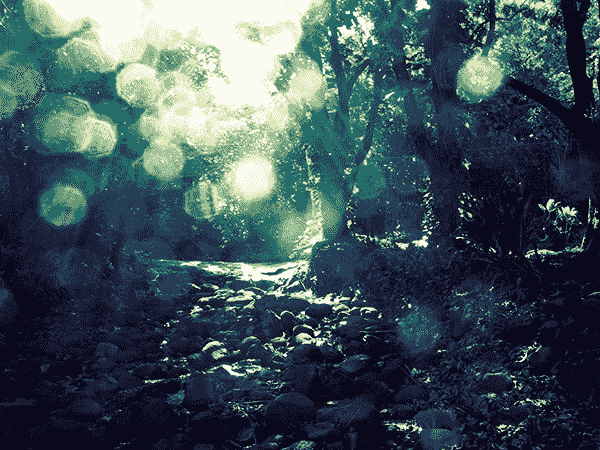

有时候感觉到快乐，有时候感觉到悲伤，快乐与悲伤都是循环中的一部分，就像开始与结束，就像黑夜与白天，就像两个手拉着手的好朋友，跳舞转圈圈，一圈又一圈，环绕着，跳跃着，飞奔着，沉寂着，踱步着，一直和你在一起。

你如何能相信一个时时都处在狂喜状态的人呢？喜怒哀乐是生命起承转合的韵律，不要期待任何人时时都能在快乐与高潮之中，这样很不自然，你如何得以喘息？

不管相聚或分离，不管你曾经得到什么，又失去了多少，也不管永恒是否可能，无论今天你的感受是什么，你现在所处的位置在哪里，都请适情适意表达你自己，尊重自己的独一无二，不要曲折也不要扭转自己真正的心意。

请回到你的内在权威与策略，带着了解与宽容，与自己在一起。

然后记得，爱是光，请带着内心的光亮，创造出属于你的美，那么很自然地，遵照你的本能，你一定能发挥出自己的本性，带来美的启发，找出全新的方向。

## 爱转动

你要相信，爱有千万种样貌，化为不同的形式，融于每一分每一秒，将我们围绕。

我们恐惧失败，害怕若改变既有的运作模式，不想面对“万一行不通怎么办”的风险，虽然你很清楚每一次挫折，都是不断不断地让我们学习“一试再试再不成，再试一下”的机会，虽然你不停告诉自己，正面！积极！乐观！但在人世间走跳，难免还是会遇到不顺遂，未来就是个未知数，想了就让人心烦。

有没有想过，你的不平与不满，这一股内心充满焦躁的能量，其实才是真正让爱转动的力量？

如果没有这股动力，改变就只会是空谈，因为活着，源于对生命的热爱，我们开始渴望，新的理念发芽，宛如梦想开始飞翔，没有人说实现梦想会是坦途，但是不怕，因为你我都有满满的，让爱转动的力量。

请回到你的内在权威与策略，把焦躁转化为动力。每一刻都是爱，即使有时候在此当下，我们并不理解为何得如此安排，但是，请相信自己，安心向前踏步走，只要爱不断转动，你总有一天会明白。

## 爱，存在

就在阳光透进窗户的那瞬间，插在水瓶中的玫瑰花悄然盛放，孩子如银铃般的笑声，远方的风吹来，隐隐流转的温暖，没有神迹，没有狂喜，没有翩然起舞的天使，却让人真实感受到，爱，存在。

然后，我就想起了每一个你，我的家人，我的朋友，周围每一个曾经对我付出爱与关怀的人，那么温暖。就算生命幸与不幸，平顺与折腾，祸福相倚，无常常在。当我走过春风满面的得意，也低头暗自度过无人能解的悲哀，刮风下雨的时候，你们不会忘记为我打把伞，暗夜漫漫无尽，绝望的时候，你们总会为我点盏灯，光亮看似微弱却坚定，默默提醒着，我们还在。

我们还在，所以不要怕，不要慌，没有走不完的幽暗，没有度不过的难关。

这世界上天天上演离合悲欢，诸神诸佛笑看凡人看不开，看不开这满载爱与恨的人世间，如果没有爱哪来恨，如果真是恨，挖到最底层，其实还不是层层叠叠，无法真正被了解的爱。

如果在今天，宇宙真的要带来任何神奇的领悟，那么就让我们合十感激，感谢这一路以爱相伴的每一段缘分。同时，祈愿自己也能在爱的流动中顺应着，体会着，愉悦地活着，发芽茁壮，成为中流砥柱，守护自己所爱的人。

请你回到内在权威与策略，好好享受这充满爱的一天。

## 缝合

有一种水晶，叫做缝合线水晶（Faden Quartz），中间会有一条像是裂开一样的车线，沿着车线，长出许多小小的新水晶，很美丽也很别致。

我热爱水晶的朋友告诉我，这是水晶形成的时候，可能当时地形活动剧烈拉扯，原本的水晶柱体被拉扯裂开，但由于水晶还在持续成长，所以裂开的缝隙会逐渐被新生的水晶所填补，久而久之，那拉开的裂缝，反倒成为一条缝线，成为水晶上独特的风景。

他还告诉我：缝合水晶可以协助人们修补人际关系，具有奇妙的修复能量。

这说法实在太动人了，所以，我收藏了一个缝合水晶。

我很喜欢看着那上头冒出来，宛如新芽的极迷你小晶簇，这让我忍不住会想，水晶算石头吧，如果连这么硬的东西都能缝合起来，重新获得不同层次的圆满，那么，我的心为什么不可以呢？

那些心碎、拉扯、断裂……在心上留下裂缝，已经发生的无法挽回，但是，或许等得够久、更久一些，等待时日过去，当我能更成熟，也或许，等我们都重新准备好了，每一颗心，每一段碎裂的关系，也能像曾经断裂过的水晶般，重新链接，从中生出全新的晶柱，蜕变成全然不同的人生体会，那该有多美好，我想这样相信着。

心可以碎裂，也可以被修复。

请回到你的内在权威与策略，有什么是你在生命中想缝合的吗？不管是关系，还是你自己，请放手接收，宇宙传递过来满满的祝福与爱。要有信心。

# 第四章句点是圆满

## 句点是圆满

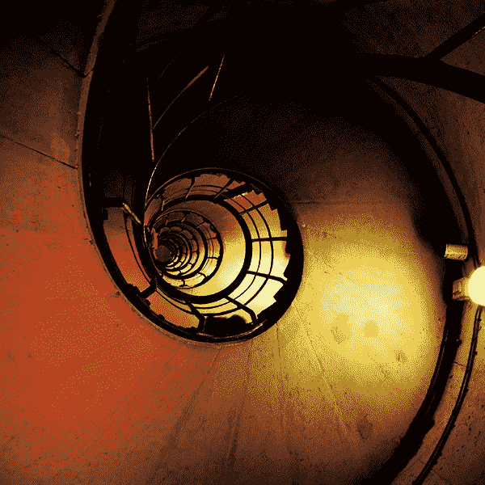

亲爱的你，我想，是时候了，我该在内心，正式画下一个小小的句点。

常常当大家想到句点，会忍不住感到伤感，因为这似乎代表了一个结束，一个终点，但是，我并不是这样想。

你看，就像写文章的时候，写一句话，加上一个逗点，代表还没说完，还在继续。加上引号，后续的是更多的解释，代表着，我还有话想说分明。而分号，其实是说完一整串话之后，稍稍长的停顿期，让我可以暂时喘口气。破折号说的是，当当当当当，你没想到吧，其实转个弯，原来是这样的道理。问号则是我想问你也想问我自己的问题，而智慧通常藏在这些让人苦恼的疑惑里。还有那个惊叹号，你听得见吗？那是我内心兴奋的语气与神情，代表着我迫不及待，热烈想与你分享的心意！

字字句句，默默无声，其实酝酿言之不尽的情意。既然如此，句点，怎么可能只限于结束的意思而已呢？

句点，不是告别，是我内心与你的圆满。

轻轻的，与你之间，画下句点。就像写完一段话，画上一个小小的圆圈。

不一定得实质上做些什么或讲些什么，这是我内心私有的一个简单的仪式，代表的是我投降了，或者说，我臣服了，我明白也接受了，我与你，缘分就是如此，巧妙与简洁地，将我们各自推往截然不同的人生方向。自此之后，何不让往事随风散去，而我，已经准备好，可以重新开始了。

回到你的内在权威与策略，句点不是告别，而是你与我，也与过往圆满。

带着爱，微笑与祝福，一个小巧又美妙的圆。

## 成为爱

因为他们不知道如何对待你，于是你会懂得如何正确对待别人。

让你不快的人事物，让你百思不得其解，对方这样做怎么睡得着？不怕报应？超乎常理？极尽愚蠢……（若要接续下去，可以说个三天三夜不停歇）。以另个角度来思考，或许他们皆是命运巧妙安排在人生转角处，让你转弯的指路人。

而转弯的当下，不见得愉悦，不可能甘心，若是有任何愤恨与怨怼，都很正常，因为你是一个人，七情六欲皆具足。

情绪过了之后，好好跟自己说：

报复不难，以牙还牙很容易，我不必挑战那些低难度的事。因为没有好好被爱，所以我会更懂得爱，我更能深刻体悟如何爱自己，如何爱人。

回到你的内在权威与策略，过往早已逝去，现在的你可以成为爱，自颓靡与崩坏的废墟中，翩然翻飞。

## 朝气蓬勃地活着

朝气蓬勃地活着，带着记忆里对你的依赖，带着我身上依旧没减掉的肥油，带着应当会一直做不完的工作，还带着些微眷恋，继续过，往前走，无法回头，也没有回头的打算。

今天的我，朝气蓬勃地活着。

本来以为重新开始，得斩断过往，对你忘怀，现在发现也不尽然。世上人人皆武艺高强，净顾笑着怒着嗔痴过生活，曾经有过的伤、失落、失望与懊恼，不说，是一切不复以往，却不代表从没存在。

与记忆共存，同时朝气蓬勃地活着。

那繁华盛放的景象，已过了，我知道。春光尽，剩下一整季盛夏，会是蝉鸣、暑气、风铃声，酷热中总有清凉，寂寞又喧嚣，不会有你，是我喜爱并痛恨的夏，活脱脱是人生。

喜爱与痛恨并存，一如亮光与阴影。回到内在权威与策略，我会朝气蓬勃过生活，活好每一天。

## 致每一段记忆

致过往的我，致每一段记忆。

致过往跌跌撞撞的一切，有些事情我真的做对了，也有些彻底搞砸了，曾经我青春无知地快乐着，也曾经，悲哀得以为心就此死去，不复以往。幸福与心碎交替，每一回以为过不去的，会跌得粉身碎骨的，其实身一转，回旋而过。

这才发觉我远比自己想得更强大，更柔软，也更宽广。

今天我决定了，也体悟了，我要活得风华绝代，为什么不能？与其小心翼翼，干枯地活着，我渴望肆无忌惮展现自己的美好。人生到此，我不完美我明白了，这让我大笑，同时终能大口大口呼吸，顺畅无比。

回到内在权威与策略，我会活得笃定而自在，与美好同在。

## 灵魂战士

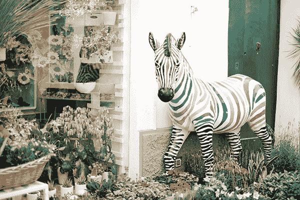

天真的人，是灵魂层面的战士。

那是存于灵魂里，炙热燃烧的渴望，渴望投入，渴望去爱，去创造，无所畏惧的一股精神，就算因而跌跤，就算经历过挫败与心碎，都还是愿意秉持一颗赤诚之心，不会放弃。

你是灵魂战士吗？

如果答案是肯定的，宇宙将带来一份幸运的礼物。人与人的关系，如棋局交织错杂，今天，就在今天，正确的人将汇集在正确的地方，终于相遇。

你不必强迫或勉强自己，更不必做任何你不想做的事情，记得时时回归中心，中肯并真诚地展现自己，你一定会被看见，被珍惜，以正确的方式，你会发光，散发独一无二的影响力。

请回到内在权威与策略，迎接今天这风生水起的幸运日，行走在属于你的正确轨道上，不必迟疑，幸运儿就是你。

## 记忆伤人

往事历历？你记忆的是哪一段？哪一章？哪段互动？哪一句对白？

岁月流逝快速不复得，人善忘的本性遗忘了大半，不想忘的记不全，想逃避的又忘不掉，于是，筛选了各自捡十的遗留片段，自问自答，任意剪贴缝补，自以为是的，凑成了一段诠释，或悲或喜，默默收藏。

你的记忆里头，有没有伤心的浮光？

记忆若还能伤人，是因为时空错置。当你掉回过往状态时，以为往事历历，人依旧，只是呀，人事早已全非，你早已不是当初的你了。

今天再拿起来，看一回。重新检视，体验涌现的情感，不管那情感是什么，是快乐？温暖？愉快？或许恐惧，或许愤怒，或伤感，但请记得，现在的他们，也不会是当初的模样了。

每一个人都已经往前走往前走往前走，走了好远好远了。

回到你的内在权威与策略，记忆并不伤人，观看过往种种，活在当下，就能了然于心，不再评判，全然并坦然。

## 头也不回，向前走

那些错误，或者我们解读成错误的过往，都过去了。曾经，以为永无止境的想念与牵挂，随着夏天的艳阳，闪耀近乎酷热，让人开始明白，幽暗并非永久。

夏天来了，活力四射的，未来也来了，以不顾一切的姿态。

或许，每一次的告别、分离、某个阶段的结束，原来并未像电影或连续剧里陈述的一般，必须要拉扯、不舍、非得掉了许多眼泪后才得以终结。人生中某些进展，没有留恋，因为够了，我们可以学会明快地，与自己，也与岁月和解，然后，头也不回，向前走。

头也不回，向前走。

我的朋友，这并不代表我忘了你，我只是觉得够了，可以了，我愿意勇敢了，现在的我可以微笑望着你，明亮并爽快地说，我准备好了，所以往后，我将头也不回，向前走了。

这是愉悦的告别，这是新鲜的开始，这是我对你，也对我们的过往说再见。

然后，回到内在权威与策略，与我渴望的未来，我热爱的一切，说日安！

## 爱的回音

有一回上小芬老师的声音课，所有学员围成一大圈，练习发音的方式是一次一个人，以丹田发声，每个人轮流接续，呼喊其中一位同学的名字。

于是，会有那么一刻，听见自己的名字，轮流而温暖，或浓烈或轻声，或激昂或细语，以各式各样的音调，各种夹带悬念的语气，此起彼落，一波波声浪，将我包裹，将我围绕。真是奇妙的感受啊，名字自成音频，强力放送，听着听着，听见的，不只是自己的名字，还听懂了爱的能量，是撼动人心的回音。

你并未被遗忘，总有人爱着你，记挂着你，宛如在内心，默默呼喊着你的名字。

如果有时候，不自觉又被愤恨、疑惑、焦躁、忧虑淹没了，如果这盛暑难以抵挡酷热，难免会有幻觉，以为自己所剩不多的正面能量，就要融化于无形。

记得，请回到自己的内在权威与策略，静默下来，暂停。

在这饶富深意的片刻，听见这隐隐流动爱的回音了吗？感受到了吗？听见了吗？体验到了吗？你并非一个人，有许多人爱着你。

不要忘记，我在内心呼喊着你的名字。（我，爱，你！）

## 和自己在一起

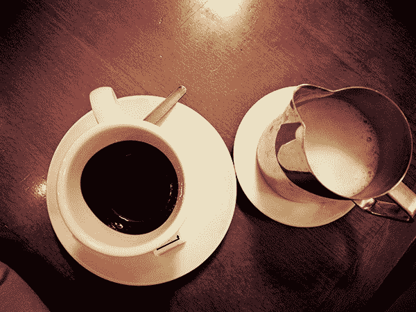

今天适合找个时间和自己在一起，独处一下。如果有任何回忆涌现，或是对任何人感到思念，都没问题，无须压抑，好好感受这一刻，与自己亲近。

对于过往已经发生的一切，不管外面的世界判定是好坏对错，都不重要。重要的是你如何看待这些事情，你可以感伤，也可以感激，你可以让回忆牵绊往前走的意念，也可以让过往化为自己前进的驱动力。

每一天，都是开始，每一天，也都是告别。何不相信每一个来到你生命中的灵魂，其实都拥有良善之心，我们认真生活着，以自己的方式，自己的节奏，或许在别人的眼中看来极为笨拙缓慢，在这跌跌撞撞行走的过程中，有时难免伤了别人，也伤了自己……。

放下对别人的不解与埋怨，也放下自己内心的歉疚吧。

别忘了，每一个人都有自己的历程，来学习与体会关于生命的智慧。今天，和自己在一起，如果你愿意，当回忆浮现的时候，请以一双全新的眼睛，温柔的心，学习体谅，原谅，感谢每一件事情所带来的震撼，还有事件背后蕴藏的宝藏；同时也要谢谢自己，以如此美丽的生命姿态，去学习每一个关于自己的课题。

请回到你的内在权威与策略，今天找个机会和自己在一起。往事已矣，放下不代表你彻底忘记，而是真心接受，事情就是如此，而你可以，带着微笑，往前行。

## 从今往后

从今往后，你知道事情会开始不一样了。

这是一种很奇妙的感觉，就算表面上看起来或许没多大差别，但是你自己知道，底层似乎有一个心结被打开了，很难完整以言语来叙述究竟是怎么一回事。那些以往让人受苦、深陷困惑、感觉人生不断绕圈圈、一种徒劳无功的空虚感，今天，突然蜕变成一首歌，一段诗句或是一道光。

这必定就是成长了吧，你想着。

成熟的意义就在于，走过千山万水，经历了你所经历过的一切，到最后才发现，你永远无法回到年少时期的天真无邪（或是无知），但是你可以宽容，也可以谅解，学会不再强迫自己，也不再要求自己一切都得循规蹈矩，不再紧绷拼命或者活得小心翼翼，终于能够，坦然以对。

永远可以重新开始。

只要你愿意，只要回到自己的内在权威与策略，过去已经过去，每个当下你都可以重新作选择，你是一个自由的人。

## 最近这阵子

最近这阵子，你辛苦了。

先不管谁是谁非，也不管你做了多少，你也许总觉得自己做得太多，又或是做了太少，当疲累袭来，往往不仅是耗费体力而已，还有劳心，所以劳力。如果感受内心有种难以言喻的累，那就先暂停一下，放自己一马，好好休息。

今天，或者一整个周末，都请你好好放松。如果渴望与自己独处，想要短暂抽离目前的混乱，谁说不行？往往跳出既定的困局，才会真正看见自己之前的执念，是如何捆绑住灵魂的轻盈，也不是每次疗愈自己，都需要损耗精神，大张旗鼓，外加泪流满面才算过瘾。

疗愈可以就在这一刻发生，很简单，像是……静静喝杯茶，好好看本书。或者以自己喜欢的节奏，以你独特的韵律，弹首喜欢的钢琴曲。就算什么都不做，都很好，至少可以坐着发呆，听听窗外的雨。

每个当下，你都已经做了所有你该做的，既然如此，就放心吧，每件事情都有其运行的轨道，今天你只要负责先好好照顾自己。

请回到你的内在权威与策略，对自己好一点，这阵子，辛苦了，请你好好跟自己说：

我。爱。你。

## 呼唤着，你的名字

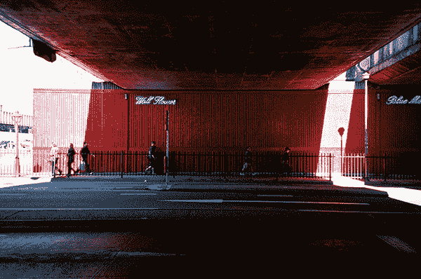

这几天我在家里读《双城通讯》——张惠菁小姐的书。

其中一篇［呼唤］，读完后让我想了很久。这篇简短的散文说的是，美玉阿姨不见了，好几个阿姨们突然都找不到她，后来才从美玉阿姨的媳妇口中得知，原来美玉阿姨中风昏迷住院了。

由于老人家二十年前就开始交代，如果将来老了病了、失智了、变丑了，都要对外人隐瞒，因为不要给亲朋好友看到，所以子女们只好隐瞒病情，不让其他阿姨们知道。

但是和晴阿姨不打算这样做，她开始每天去医院看美玉阿姨，每天去，也只是喊她，和她说说话，告诉她：“美玉啊，我是和晴啦。”像是在讲电话一样。

一个月之后，美玉阿姨竟然醒了，开口第一句话叫的就是，和晴。

张惠菁小姐最后写了：“呼唤有某种唯一性，即使对象是同一个人或同一件事。在不同的经纬度看月亮微有不同，没有两个人的呼唤是一样的。”

我想着，活着，其实究竟是为了什么呢？也不过是我们各自活着，虽然人生路各自走，各自体会，幸运的是，却得以相互呼唤着，就算再寻常不过叫着对方的名字，然后再说自己是谁，相互呼唤，相互回应，像是山谷里久久不散的回音，在耳边，在心中，漫漫地，渐渐地回响。

然后心原本可能是冷的，仿佛会慢慢开始回温，回应与回响，呼吸着，心跳着，就有了凭据，得以相依。

我很喜欢这个故事，它让我想起好多事情，让我想起年轻时看的电视剧《黄金女郎》，想起年轻时的朋友们，可以一起相伴到老，到最后老了，在意的或许早就不是爱情，而是情谊。

一种了然于胸的情谊，那就是：你呀，是我啦，我来了，你说我听，我听你说，要不然不说了，牵起手，真的也不必再说，你懂，我也懂。

明日又会飞快地来，就像昨日已经拔腿奔命似地远离，或许我们永远不会知道岁月这条轨道上，自己究竟还能停留多久，但是有你，真的很好。

真的很好，希望你也会这样想，因为有我。

## 幸福始终来自于人性

如果你想创造属于自己的幸福，那么请先花点时间了解人性。

把那些过往曾经让你挣扎、让你痛苦、让你怎么想都想不通的回忆，好好翻捡出来，仔细看一看。先将不切实际的期待与坚持，暂时都放下，想一想，“我有没有以一个更整体、更全面的角度，真正看见每个人在这场人生戏码中的挣扎与痛苦？”

如果，这个人其实只想被爱，并且去爱，就像你一样；如果，我们每个人只在努力找寻着，属于自己的出路，以自己的方式，自己的角度，做自己那个当下所能想像得到，最好的选择……；如果你了解到，基于人性，而非以你的期待去度量，那么，宽容就变得有可能。因为你会深刻体悟到，聚散终有时，我们之间并不是放弃了，也不是背叛了；或许，爱可以用不同的面貌呈现，而我们，只是不再看着同样的未来。

幸福始终来自于人性，幸福并不遥远。这个世界时时刻刻都充满美与爱，但是你得学会以不同的观点去看待。只要你真正成熟，听懂宇宙之中爱的言语，你会发现，爱从来不曾远离。请相信，一切都有最好的安排。

## 重来

那些过去已经做出的选择，不管是归纳在成功又或是扫入失败那一边，都已经过去了。就算忍不住还残留遗憾，也明白终究要告别。

这一步，夏日灿烂，炙热又直接，而回忆就此蒸发在空气中，匆匆忙忙，再也不见。回顾过去这一段日子，宛如闹剧起起落落，今天我们可以哀悼结束，自然也能庆祝新生，值得好好问问自己：

如果重来一遍，现在的你会怎么做呢？

如果看不见自己该从中学习到的功课，很快的，一切又会重来重来又重来，借尸还魂似地以不同的方式上演，直到你学会为止。

请回到你的内在权威与策略，花些时间安静与自己在一起，想想过去，再想想现在与未来，好好整理一番，从中学习。

## 开始

结束，然后有了新开始；因为开始，旧的过往也就此自然而然，步向结束。

年轻少不更事的时候，以为的开始，必定要头也不回，狠狠下定决心，才能决裂般断裂，落泪悲伤都带着义无反顾的勇敢和天真，其实不过是可爱版本的无知；总觉得青春只要手一挥，就能全部重来，舍弃你，舍弃记忆，舍弃爱过，简易地像是再拿出一张雪白的画纸，以前的，都不算。

愈来愈不青春，才愈来愈明白，没有什么不算的。

光阴不再给我一张雪白的画纸。

当发上添了白色，眼角爬出了微微的细纹，纸上褪去的颜色，曾经珍视的部分，又或者是原本以为画错了，都让我再一次端详许久，双手合十，怀抱着遗憾也怀抱着感激，怀抱着你与我的曾经，现在，今天，或许宇宙星辰转了弯，而我也转了心念，转了脑袋。

嘿！我准备好了，可以重新开始了。

回到我的内在权威与策略，这一次，没有舍弃，我学会创建在过往的一切之上，找寻属于我的，人生的条理，以我的方式，重新去爱。

好好体会爱。

## 当我想起你

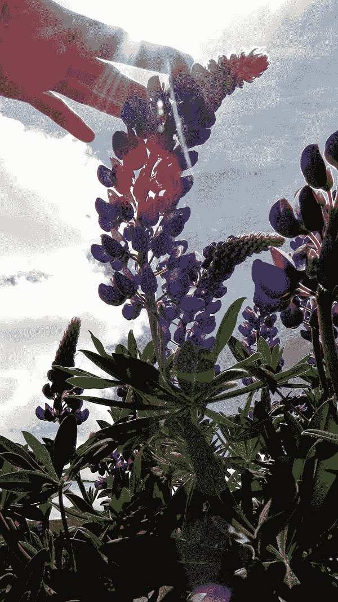

今天若发生了某件看似微小的事，像是喝到一杯很棒的咖啡，街头巷尾传来七里花香，空气中漫漫滋生的湿意，不预期看见的一抹微笑，不由自主发觉自己正哼起一首熟悉的歌……任何事，任何时刻，当我想起你，并不是意外。

生活如浪潮，一波波冲刷而来，活得我们措手不及。每个人都告诉我，这是关于放下的课题，我也知道离开对你和我来说，不可避免，是生命重新再往前，继续扩展的开始。

虽然如此，我想念你。

回到我的内在权威与策略，同时，每一天我都在领会，学习放下，练习释怀，坦然接受这个中的道理。

## 结束背后的意义

有些事情走到今天，突然戛然而止。

这结束，可能来自于你自己。

真正的原因也说不出个所以然，时至今日，像是内心某个奇妙的环节，突然莫名转换了，这也就是为什么，原本一直持续的，你再也无法视而不见其中的荒谬，反过头来，之前本来荒废无心的，现在你可以决定，应该是时候，需要重新再来，好好努力。

这结束，也可能来自于周围的人事物。缘分起灭，先别怨怼，或许过程不见得完美，作法总有瑕疵，传递出来的讯息很清楚，虽然不见得每个人都能说出口，实话很简单：

“无法继续下去，时候到了，让我们做一个不同的选择。”

结束背后的意义，并不是指责你不好，放手之余，也不必埋怨是谁的过错，单纯只是时候到了，我想在自己的人生中，尝试一些不同以往的事情了。

明白当脑袋焦虑想找到答案时，会胡乱衍生出莫名其妙的枝节与情绪，别把自己的心搞得太复杂。生命在尝试错误之中，以及无法挽留之间，成熟了，牵手与放手，转个弯，谁知道最后会有什么样巧妙的安排，这一切，是让我们学习愈来愈坦然的过程。

请回到你的内在权威与策略，安然以对。

## 走开，才会有全新的开始

当我走开的时候，请别以为我不想再继续，或者，误会我已经不再爱你。

日子总是要继续过下去。每一分，每一秒，有你在身边，或者无你在身边，时光如沙漏般，无声流逝而去。如果无法继续，当我走开的时候，请相信，我从来没有将过往遗忘，只是我真实看见了，如果不再改变，如果沿着原路继续走下去，终近尽头，万事皆休。

走开，不一定代表结束，走开，不是就此画上永远的句点。亲爱的，既然事情已是这样而非他样，走开，不见得是悲伤的终点，而是对你，或对我们，对我来说，一个全新的开始。

这世界之大，地球是圆的，我们所经历的一切或许无法完美，但是在心上，我宁愿选择相信，走到最后，不管是否有缺憾，生命必会是圆满的，以它独特的方式，丰盈的，绵密的，情深所至，充满着爱，到最后，当我想起你，想起我们，想起这段生命之路上每一次的晴天雨天，星星闪烁着，岁月静好，无论月圆或月缺。

请回到你的内在权威与策略，我也会回到我的。就算世事运转如旧，有没有看见，眼前是一个全新的开始？让我们从心里的挂碍中，慢慢走开，每一天，都可以好好练习，放下自己的执着。

祝福你，我的朋友。

## 圆满

在你，决定要说再见、分开、决裂、口出恶言、画下句点、告别之前，想一想，这段关系已经圆满了吗？

所谓的圆满，不一定是皆大欢喜，也不一定会以世俗所认定的喜剧收场，而是你内心很清楚，也完整体验了这段关系所带来的一切，那些伴随而来的种种喜怒哀乐，你所爱的、不爱的、你怨的、你恨的、你感动过的、让你好痛苦的、曾经非常快乐的、原本你以为自己会舍不得的…… 都没有意外。

没有意外。这也不过就是你的人生旅程中，不断发生的千百万大小事件中的一小部分罢了。人生在世，到头来不管是以何种形式，终须一别，重点是，你能不能看穿这些表面的纷扰，体悟到人与人的关系，归属与分离，缘分起灭，有何意义，而你从中得以学习的课题，又会是什么呢？

最终留下的，不见得会是关系，而是这段关系为你所带来的价值。天地冥冥之中有其完美的安排，不管你最后决定牵手或放手，其实都很好，若是能看见其价值，并为此心怀感谢，这就是圆满。

请回到你的内在权威与策略，自内心圆满。体验它，放下它，感谢它，然后又将是一个全新的开始，迎面而来。

人生真的很美妙，不是吗？

## 我的爱无远弗届

完美的宇宙对于时序有祂巧妙的安排，圣诞节之后，太阳这颗星星走到了 58 号闸门，这闸门的名称是 the joyous（喜乐），充满良善与喜悦，带来祝福与爱。

今天，请享受这优美的时光，感受四周充满爱的氛围，是时候了，请将过往那些酸苦交杂的记忆，轻轻放下。

是的，你已经准备好要迎接更美好的明天，虽然冬天的空气依旧冷冽，但是有没有感觉到全身洋溢的暖意？就如同阳光，照耀地球上每个不同的角落，不论好坏，也没有对错，不管世界上几百万几百亿不同款的人，阳光都能无私又充满能量的，无远弗界将我们环绕。

深呼吸，你有没有体验到空气中的爱与光？今日请与人为善，并且善待自己，爱的力量无界限，关怀就是展现爱的第一步，良善的存在吸引良善的力量，静静体会这充满美的一天。

请回到你的内在权威与策略享受这一天，让我们和谐共存，一起体验活着的喜悦。

## 句点

是句点，今日我体悟到这一点。

很难说得清究竟是什么感觉。以前想起你，想起过往诸多回忆，很容易会陷入情绪上的纠结，但是今天没有，这是一种很奇妙的感受，就如同初秋清晨微冷的空气，明快的解脱。

我不恨你，一点也不；我也不怨你，那太花力气。我想我依旧爱着你。如果当时不是你，我并不会成为今天的我，即使我原本想要否认这件事，我以为这样对我会比较好过。至今日，我似乎懂了，爱有千万种面貌，只是它早已转化为另一种截然不同的形式，清楚知道我存在你的心中，就像你之于我一样，但是，也就只是各自存在着，单纯地宛如两颗行星，在自己的轨道上运行着，不管孤独或幸福，并没有交集。

没有答案，我依旧对生命有许多的疑惑，但我也明了要合理化解释一切，并不可能。虽然快乐与痛苦手牵着手，一起翩然来到我们面前，人生道路风景一幕幕，体验有喜有悲，我们早已不复以往，我懂了，真的。

回到我的内在权威与策略过生活，我很好。谢谢我自己曾经如此爱过你。今天是一个句点，是告别，也是开始。

珍重，不再见。
