# 人类图自学圣经

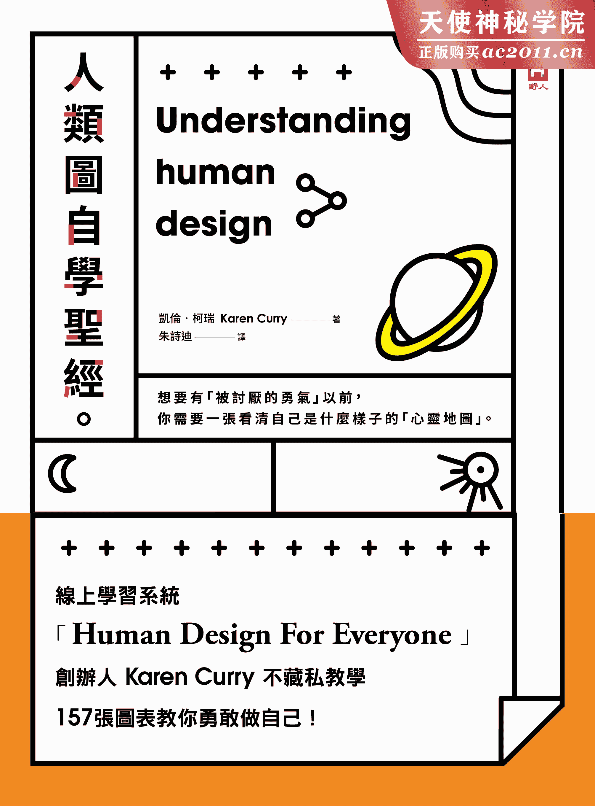

献给我生命中的北极星──

我的孩子、基冈（Keegan）、凯特（Kat）、卡尔森（Karson）、卡西迪（Kassidy）、伊黎（Ayelet）。

还有亚伦（Aaron），是你不断提醒我要把梦想变大。

我怎能如此幸运？

# 序言

你是否曾想过是什么让你独一无二、与众不同？人类图揉合远古智慧和现代科学，能帮助你了解真实自我的力与美。

我第一次接触人类图是在二〇〇一年。那时我的丈夫从亚利桑那州的塞多纳（Sedona）静修归来，带回了一张人类图表。我对那张图深深着迷──我知道我必定会尽其所能地学习有关它的一切知识。我立刻说服我的丈夫带着四个孩子一起从我们位于德州郊区的家搬到塞多纳，我希望到那儿学习更多人类图的知识。

很偶然地，我发现美国人类图学院总部就位在我们的家庭小儿科医师办公室走廊正对面。我一眼就认出门上的人类图图案，于是我便走到里头希望能获取更多信息。当时总部负责人玛莉．安．维妮格（Mary Ann Winiger）女士正在撰写招募助手的广告，她问我是否有意愿承接这份职务，我便一口答应，不久就开始这项新任务。在美国人类图学院工作让我拥有取得各种人类图信息的方便管道，也让我有机会和这套系统的创建者──拉．乌卢．胡（Ra Uru Hu）一起学习。

我承认，一开始我不太能接受人类图的玄妙起由。我在美国南部长大，此外，我前任丈夫的父亲是基督教卫理公会（Methodist）的牧师。他们认为占星学和其他「邪端」说法据说是恶魔的产物，因此我多少会担心实践这些理论或往后用来辅导个案的后果。然而最后证明，这套系统是无比准确的。

我相信绝大多数感到迷惘、不断寻求协助或支持的人，是因为他们在人生的某些面向受挫，例如在职场生涯、人际关系、健康、创新的成就感上，或在感受到灵魂与生命的连结上。直觉告诉我，人类图能为这些受挫或困惑的灵魂带来解答，然而，我总不太习惯与人分享这些讯息，直到我亲身实践、用自己的人生实际试验后才有所改变。我得到美妙收获后，我开始试着为身边的每一个人解图，当然也包括我的个案。当时，我主要是用情绪释放技巧（Emotional Freedom Technique, EFT）来辅导我的个案，尤其是那些感觉「卡住」的人。让我大感意外的是，人类图让我对个案感到「卡住」的根源及他们的人格特质有更不同以往的洞察和领会，因此我能够在更短时间内改善他们的生活。

当我愈深入研究人类图，我愈是明白──就算它具有妙不可言的益处，但却不是一个能简单与人分享的知识系统。当中复杂和晦涩的用语往往让很多初识者困惑不解。人类图系统有许多不同的阶段，就算我已有十二年的接触经验，我仍旧不断学习更多知识；不过，在这浩瀚系统里仍有一些很容易就能理解和运用的核心概念。这便是我写作本书的原因──希望能唤醒你、让你和这套不仅帮助我及我的家人，也帮助了我的数百位个案的美好系统一起发现自己。我衷心期盼你能加入这趟探索自我与正向改变的旅程。

# 感谢辞

这本书历时十三年完成。它集结了我对人类图的理解认知及发现真实自我的亲身经验。这趟旅程若没有家人的爱与支持将会变得无比艰辛，即便他们仍殷殷期盼某天我能从事「真正的」的工作。

在此，我要谢谢凯尔．柯瑞（Kyle Curry）耐心地把我所有零散的书写作品集结成一套完整的内容。我也要感谢他让我能用这强而有力及绝佳的方式分享这些知识。

若没有我的导师拉．乌卢．胡，这些内容就不会存在于这个世界。他过去充其量只能说是一位别无选择的神祕主义者。然而尽管曾有过犹疑与挣扎，他最终还是在别无选择中选择了分享人类图的知识。他在促成人类进化的历程中，传授予我们对自身独特角色的全新体悟，也告诉我们在生命中所能做的最有力的事情就是先学会爱自己。

这种种知识已在我的学生身上试验无数次，而这些年来他们教会我的事物远比我给予他们的还多。谢谢你们如此热切与渴望和这个世界分享人类图，也谢谢你们让我成为你们的老师。这是无上的光荣。

我的编辑群，艾丽森．雅各（Allison Jacob）和苏西．皮岑（Susie Pitzen）协助审稿、花费了不少时间心力将这庞大的复杂资料整理成一本探索自我的完善指引手册。谢谢你们的耐心和毅力！

最后也是最重要的，我要感谢我的伴侣──亚伦．帕克（Aaron Parker）以及我的五个孩子，谢谢你们始终相信我，并鼓励我不断往前。

# 导论

我很荣幸能伴随你，以非常简单且不违背你天生模样的方式去发现自己的人生使命、了解自己、改善你的人际关系、找到适合你的工作，甚至是让你变得更健康。人类图能带给你开启喜悦、有意识的生活及找到力量和丰富潜能的所需知识，因此不论外在环境如何变化，你都能茁壮发展。过去近十三年来，我解读了数千张人类图表，也撰写了一千则以上的相关文章，每一项都带来了强大的影响成果。因此，我希望能让你认识这个绝妙的系统。

人类图能帮助人们学会爱自己、增进自信心、活得真实且带着意识、从容与勇气行事。在人类图的引导下，你能学会正确衡量自己的能力而免于陷入不堪负荷、绝望和筋疲力竭的状态。人类图会告诉你，你是以什么方式理解和「懂得」万事万物（即便有时不合逻辑也不要紧），它也会教导你如何尊重和表达你的感受，让你不再反覆沦为情绪苦难的受害者。

人类图综合了占星学、易经、卡巴拉（Kabbalah）、脉轮及量子物理学，在自我探索的领域里是一门相对新颖的科学。一九八七年一月三日至十一日，罗伯．艾伦．克拉寇尔（Robert Alan Krakower）在西班牙的伊维萨岛（Ibiza）经验了一段神祕的体验，他接收到了这整套系统的知识。有一个「声音」告诉他，这套系统对改善世人生活现状至关重要，不可或缺的觉察改变也将在人类进化历程上演。在此经验后，克拉寇尔脱胎换骨，彷彿变了一个人似地，不久他便改名为拉．乌卢．胡。

他也得到指示，他只是有意识地接收到人类图知识的特定人士，但这套系统的能量是传送给世上每一个人、属于全人类所有。他当时只能说是一位被赋予任务的信差和神祕主义者，然而他也将余生都投入奉献于分享人类图的理论。他的勇气帮助了人们发现真实的自我、了解此生的使命，以及明白如何才能开启真实和丰满的人生。

人类图并不是一门宗教。这无关乎你信仰的是基督教、犹太教、佛教，或推崇形而上学的观点。了解你的人类图能够纯粹的帮助你，用既简单又开心的方式懂得如何顺应你天生被赋予的生命样貌。

尽管人类图系统错综复杂，要学会独自解读人体图及整张图表可能要累积好几年的功夫，但这套系统背后的观念却非常单纯。你的人类图是根据你的生辰数据计算而出，它能让你明确了解自身的人格特质、健康状况、心理特点、天赋、才智及脆弱面。当你察觉出自己独特的能力，以及学会区分你所创造的能量、与你从周遭环境吸取的能量时，你就能快速做出决定、帮助你开创与真实自我相符的人生。

透过本书各章节，我会告诉你该如何认识你的内在权威，进而明白哪些道路适合你的独特人生。我们将在第一篇阐述人类图的基本概念──何谓人类图，及你该如何了解你的人类图表，是以，你能在最初就实现某些生命改变。在第二篇，我们将认识人格类型（types）、能量中心（centers）及人物角色（profiles）此三大关键的人类图面向。接下来的第三篇将更深入探讨闸门（gates）、回路（circuits）和通道（channels）──即人格的内部运作要素。最后的第四篇，我们会整合所有内容，并带着此崭新视角回到真实世界。

人类图并不是关于改变自我的知识。它是从全然深入了解你的天赋才智、你的本能和脆弱面来提供你人生旅程的专属装备，让你从受他人想法和评价影响的传统自我挫败模式中解脱。人类图赋予你崭新的视角，让你探见真实自我的力与美。

当你了解自己后，面对人生选择，你就能做出符合真实自我性格的决定。而当你和你的真实性格携手共生，人生就会变得顺畅多了。一旦你能自在地贴近生命，就会活出真实自我之美！这一切都是环环相扣的。

在人类图创造的佳话中，最让我津津乐道的是一位男子在工作上历经艰困岁月的故事。他任职于一间国际石油公司，但因为一连好几个项目都无法执行成功而遭降职处分。在解读了他的人类图后，我们发现他拥有开创新事物、但却没有完成任务的能量。项目管理显然是完全不适合他的职务啊！遗憾的是，那就是他当时的工作。

这名个案在了解了自己的真实性格后，便请求从管理部门转调到项目起草团队。很快地，他发现从事与他真实性格相符的工作能让他感受到全然的喜悦。三年时光飞逝，时至今日，他不但从事着自己热爱的工作，也获得相当不错的薪资报酬！

我期盼你能透过个人人类图里显示的讯息得到自由，而这本书会带给你所需的知识与自信，让你开启无边无界的广阔人生，也让你在意想不到的人生中找到专属于你的最佳位置。

首先，请到[www.understandinghumandesign.com](http://www.understandinghumandesign.com)网站里「人类图专家」（Human Design Specialists）的页面免费取得你的人类图表。完成网站注册手续后，你会在二至三天内收到你的个人人类图。接下来，就准备踏上你的人生探索之旅吧！

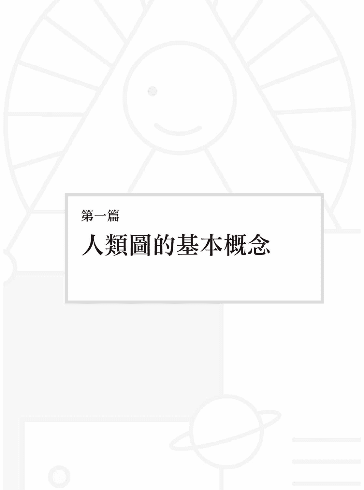

人类图表的三大部分──人体图、生日表和关键字各有其重要的内容面向，也都为人格带来深刻的洞察。了解每一部分及它们在你的生命故事中扮演的角色，能帮助你对真实自我有更全面和深入的理解。

别忘了，每一部分都属于整体的一个片段。虽然我们以拆解完整图表的方式来学习每一关键部分的内容，但人类图表真正的美在于所有部分的融合。当所有片段整合起来，关于你是谁的真实故事就能一览无遗。

### 第一章

## 你的人类图导览

有许多学生问我：「了解自己的人类图能让我赚更多钱、变得更健康或拥有更棒的人际关系吗？」

嗯，没错，可以这么说吧。人类图保证能带给你的与过往你曾听说过的不同。而我可以向你保证的是：我们每一个人都生而不同。人类图指出五种能量类型 1──显示者（Manifestor）、生产者（Generator）、显示生产者（Manifesting generator）、投射者（Projector）及反映者（Reflector）。各个能量类型创造和做决定的方式迥然相异，但这并不代表每一个人能得到财富、健康、良好伴侣关系和幸福的潜力就会有所差异。关键在于，每一个人天生的设计蓝图都是独一无二的，因此，我们对财富、健康、良好伴侣关系和幸福的定义各不相同。

#### 奠立基础

某些人热切追求和渴望拥有大笔财富，某些人则只要有空闲时间与所爱的人相处就能感到富裕。某些人极度希望寻得充满成就感的工作，某些人则打从心底完全不想工作。某些人会成为运动选手，某些人则成为知识分子。某些人天生积极进取，某些人仅待在对的时间和地点，静候神奇魔法自然施展。以上种种只不过是诠释「成功」境界的各种可能样貌，并无好坏之分。

尽管创造成功的传统方法在某些人身上非常管用，但对某些人而言，这套规则却丝毫不见效。我们受到社会和制约化（conditioning）强大的控制，因此，我们常常会觉得自己对成功的定义在社会标准看来，简直是怠惰、软弱、愚蠢，甚至是异想天开。当这条单一路径无法到达你想去的地方，但你仍继续行走其中，你只会感到挫败、痛苦、倦怠和筋疲力竭。

仔细想想，每个人都是独一无二的，但开创快乐和成功人生的方法却是一体适用，这并不合理啊。世上所有人都具有价值和重要性；每一个人都有自己专属的能量蓝图及成功经营人生的独特方法。对某人有效的方法未必适用于另一人。

努力适应和采纳社会对「正确」及「成功」的定义，其实都与能量脱不了关系。我们看待自己的方式、社会的标准和价值观、我们回应生命的方法……全都取决于我们自身的能量场与另一个更庞大的集体能量场。人类图表就是你个人的电路架构图，它能告诉你哪种类型的能量是你天生就拥有，以及你从周遭环境吸收了哪些能量。

当你了解真实自我与自身能量场的作用方式后，你就能找到帮助你走出集体能量场（社会化与外在制约）的内在权威。你或许会发现，社会看重的某些信念和能量与你一致，但在其他方面，你却与社会的期望背道而驰。

当今关于个人成长的内容趋势宣称，若你尚未经历社会定义的「巨大成功」，这很可能是潜意识的信念、痛苦经历，或你对「成功」的心态出了问题。我并不否认：你的信念、过往经验和态度会影响你的成功标准。然而，真正阻挡我们开创向往人生的障碍，往往是对「什么是真正适合我们的」这问题的根本误解。

我们不接受适合自己的人生，反而用各种既定的方法和工具不断冲撞，想试着否决掉那些你内在中其实知道自己要或不要的声音。

忘掉既定观念、顺从生命引领我们到该去的地方，这种想法乍听之下有点吓人。绝大多数人在成长过程中都缺乏对真实自我的深刻认识。我们的能量场受身边人们影响，我们有时会分不清什么是属于我们个人的真理，哪些又是我们被嘱咐的事实，因此往往会失去与真实自我的联系。

我们担心若让「内在权威」掌管一切，或许就注定落得贫乏或孤独的下场。我们不相信自己的内心指引，也奋力对抗成为自己主人的想望。假使我们过着「没那么成功」的人生，我们甚至会渐渐认为自己是个失败者、大概不配拥有丰裕的人生。可是请别担心，没有人与生俱来或命中注定受苦受难或失败。

人生莫大的痛苦来源之一便是知觉自我与真实自我的脱离。这两者间的差距愈大，就会产生愈多的不协调和痛苦。这种痛苦不是功能障碍，也不是「破碎」，这只是真实自我在告诉你，这里有更多你还未察觉、属于你的宝藏，但它的景貌也许与你的大脑所想的不同──因为它竟然更加美好。

你愈是了解自己，就愈能开创真正适合你的人生。所以，让我们从游览你的人类图开始吧。若你还未取得你的人类图，请至网站[www.understandinghumandesign.com](http://www.understandinghumandesign.com)索取。

#### 你的人类图导览

人类图表包含三部分：一、人体图（body graph）二、生日表（birth chart）三、关键字（keynotes）（图表 1）。在逐一探讨前，请让我们先就整体图表来看；它的外观和编排方式是否让你想起什么？

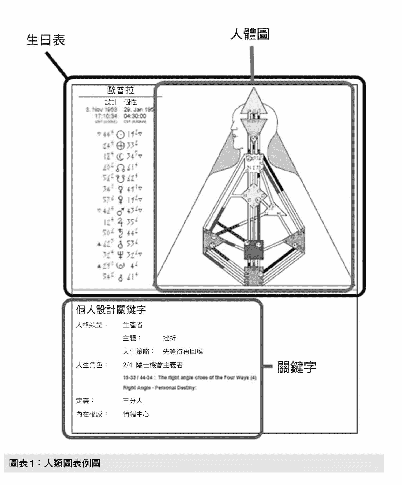

若你仔细端详，你也许会发现某些可见证据显示人类图里蕴藏了深具影响力的智慧。例如，几何形状（称为能量中心）的部分看起来很像七个脉轮（图表 2）。

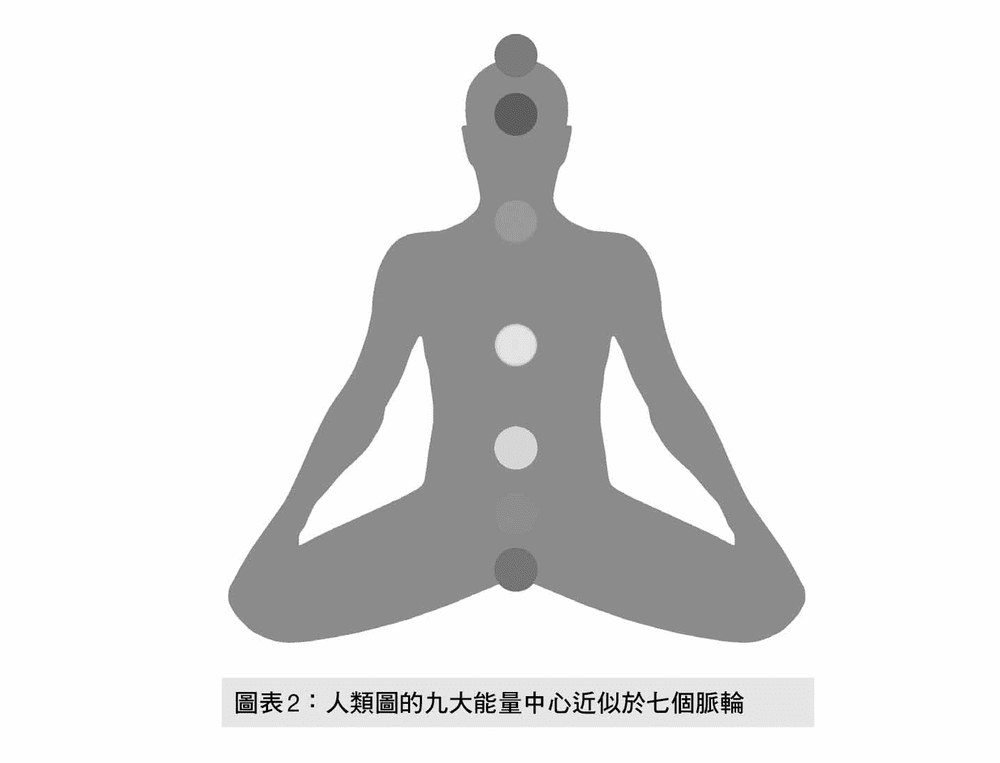

再把人类图颠倒来看，它和犹太教的卡巴拉（Kabbalah）生命树非常相似（图表 3）。

你或许也注意到人类图上标示了六十四个数字。这些数字称为闸门，与易经的六十四卦相互呼应。易经的每一卦都由六层水平线组成（图表 4），每一条线代表阳（未中断的实心线）或阴（中间有缝隙的断裂线）。

虽然人类图表包含这些古代智慧的片段，但人类图仍是新颖、独特的，它是一套以崭新方式帮助人们的新工具。

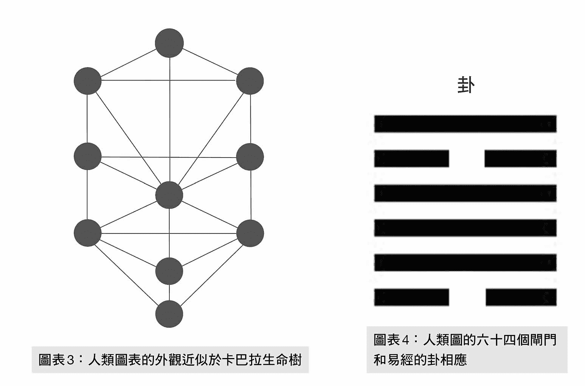

当你阅览人类图表的某部分时，请记住，它只代表整体的一小片段。为了能更轻易地学习人类图，我们必须先将人类图表拆解成部分逐一探索。当你理解人类图表是如何建构而成及知道解读的方法时，就能将所有片段拼凑起来，届时，完整的「故事」或个人的能量地图就会跃然纸上。

「融合」是了解人类图和每张个别人类图表的关键要素。就其根源而论，人类图是一套从个人、人际关系及集体的角度教导我们人类进化的历程中，关于力量和可能性的工具。人类图真正的美，确实在于统合系统内所有独特奥祕的成分。

人类图表本身也同样是许多部分的融合；这些部分相互作用，进而展现出每个个体的概貌。人类图表中的某些单独片段拥有非常相似、但彼此间仍有细微差异的能量。当你学习每一片段时，请务必了解，我们只是某种程度上从整体脉络中撷取一小部分。每一部分都至关重要，然而每一部分是否得以充分发挥仍需配合你人类图中的其他元素来看。

若你玩过拼图游戏你就能明白──要完成整幅图案的样貌，每一块拼图都是不可或缺的。

人类图告诉我们，整体人类就象是一幅巨大神圣的拼图，而我们每一个人都是拼图中独特的一小块。当你未能充分展现真实自我的潜能，那么你在本质上便是丢失或毁坏了你在拼图中的个人一角。你能献给世界最丰厚的礼物就是尽情展现自我。

现在就让我们一起更详细地了解人类图表中的三个主要部分──人体图、生日表及关键字。

#### 人体图（The Body Graph）

当你拿到你的人类图表后，会在图上看见一个包含了各种线条、几何形状、颜色及一个人体侧影的大三角形，大三角形的旁边则有一连串的数字和行星符号。这个大三角形称为人体图，它集结了你人类图表上所有闸门号码显示的讯息。人体图本质上就是你的独特能量配置「地图」。

##### 九大能量中心

你或许第一眼就注意到当中的九个几何图形。这些图形代表九大能量中心，其作用和人体的七个脉轮相似。每个能量中心负责传送和管理某种能量的频率，此外，它与我们生命中的某个特定主题息息相关（图表 5）。

九大能量中心及各别的主题为：

• 头脑中心（Head）：灵感。

• 逻辑中心（Ajna）：确定性。

• 喉咙中心（Throat）：沟通和行动。

• 自我／G 中心（Identity）：自我、爱与生命方向。

• 意志力中心（Will）：意志力和价值。

• 情绪中心（Emotional Solar Plexus）：情绪澄明。

• 根部中心（Root）：肾上腺素能量。

• 荐骨中心（Sacral）：劳动力和生命力能量。

• 脾／直觉中心（Spleen）：生存、直觉、免疫系统和时间。

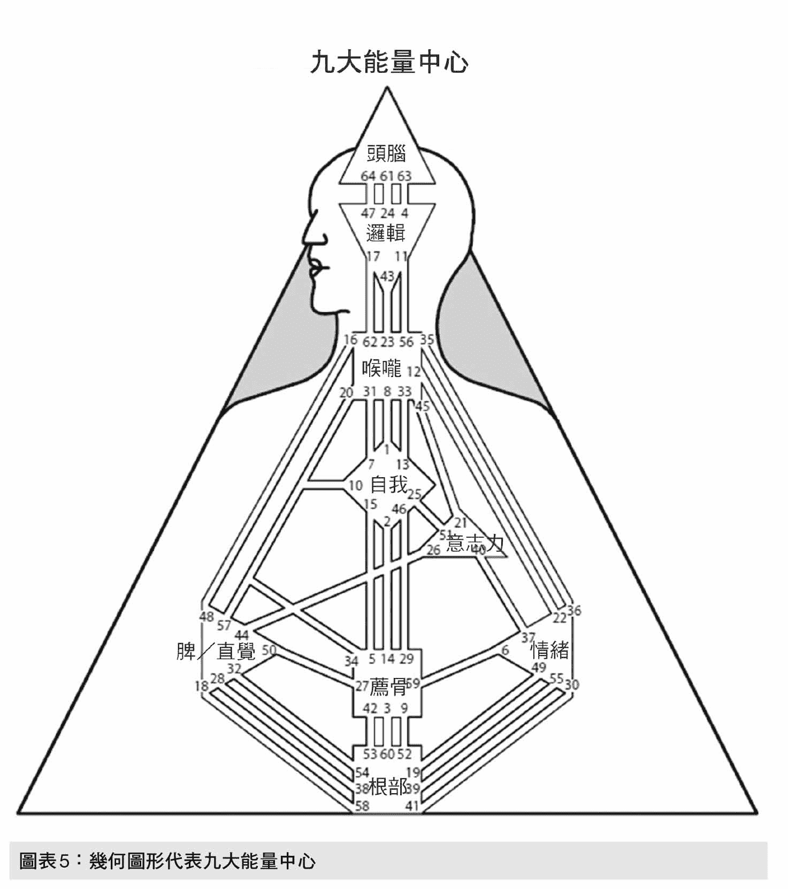

接下来，你或许会注意到在你的人类图表中，有些能量中心是空白的，有些则填满颜色。空白的能量中心代表未定义或是开放的，反之，定义的能量中心会填满颜色。

###### ★ 定义的能量中心

若能量中心填满颜色，那么它就是「定义的」中心。定义的能量中心代表你恒常散发至世界的能量，以及不受外界任何因素支配、永久的人格面向。天空会下雨，水星会逆行、火星也可能会从太阳系消失，然而，定义的能量中心（你的人类图表中填满颜色的区块）始终不变。它来自于你出生那一刻闸门与行星的位置。

你很快就会学到，定义的能量中心有其需要面对的议题，但一般来说，比起开放的能量中心时而感到痛苦的体验，定义的能量中心反而容易处理多了。整体建议──了解和依循你的人类图策略（strategy）（第二章）来活出自我，它就会赋予你始终知道下一步该做些什么的力量。

###### ★ 开放的能量中心

若能量中心空白，那便是未定义，或是开放的。开放的能量中心会吸取和放大周遭环境的能量和讯息。开放能量中心的能量变幻无常，因为它会依据你所处的对象而有所改变；此外，它就像浪潮般涌入消退、不断变化，因此也比定义的能量感受更加强烈。

人们常想当然耳地认为，存在于你开放能量中心的能量就是属于你的，所以有时也会在未察觉自己的行为是否受外在因素而影响的情况下，试图「修正」你的人格某一面向。请留意你的开放能量中心位在何处；在你能了解你的能量是如何运作前，这些区块会是让你感受到莫大痛苦的潜在地。然而，开放的能量中心却也存有使你发挥出色才智的可能性。

在我认识人类图及了解自身未定义的能量前，我是个护士，当时的我总是感到疲惫不堪。因为当强烈的情绪如洪水猛兽般扑来，我就会像块海绵似的把这些情绪全部吸收，于是我很快就感到倦怠。如今，透过人类图我了解自己拥有开放的情绪能量中心，也学会了让种种情绪讯息经过；我不再紧抓这些情绪甚至把它视为自己所有，如此我就不会感到筋疲力竭。

###### ★ 动力中心（MOTOR CENTERS）

人体图中有四个能量中心被归类为动力引擎──荐骨、意志力、根部和情绪中心。动力引擎能帮助界定你拥有的能量种类。

• 荐骨中心：这是属于工作、繁殖和性欲的能量。它是一种能不眠不休运作的持续能量。

• 意志力中心：这是人类图表中意志力的所在位置。人类图所谓的意志力是指管理和创造物质资源及短暂承受力的能量。这种能量需要周期性的休息。

• 根部中心：肾上腺素位于根部中心。这是一种能带来肾上腺素动力的能量。它采周期性的开关运作。

• 情绪中心：你的情绪能量正位于此处。情绪能量在内部整合和外部表现间循环，而你的心情往往会受到影响。当情绪恰当时，这就是创造的能量。

###### ★ 压力中心（PRESSURE CENTERS）

压力中心有两个──头脑中心和根部中心。压力中心在人类图表上的形态能帮助你了解在人生中你可能会经历的压力种类，并提供你和压力携手合作的新方法，好让你能减低压迫感、做出更放松的决定。

• 头脑中心：这是心理压力的来源所在。若头脑中心呈现开放或未定义，你可能会感受到想看透事物本质的压力，或总觉得需要找到你的问题解答。

• 根部中心：这是属于肾上腺素能量的中心。若根部中心开放或未定义，你会笼罩在为了「自由」而去完成任务的压迫感中。有时这会导致企图逃避压力或压迫而做出仓促的决定。

###### ★ 群体的能量（ENERGIES IN A GROUP）

定义和未定义能量中心的深层之美在于，我们每一个人都是庞大整体中独特的一部分。当我们拼凑在一起时，每一个人都会是全然定义的状态。每一个人都献出有助于统合整体能量、也让我们有机会表达所有人类经验的那一部分。

当你到餐厅或咖啡店消费（或者其他人多的地方）时，你就能体会到，店员和顾客们天生的设计蓝图会互相交融成一个巨大的能量场。这有助于我们了解到，假如你的人类图表中缺乏某种持续能量，例如，专注的能量，你可能会发现当你接触到其他人群的能量场时，你的专注能量能透过与周遭他人共处而增强，如此一来，当你需要提升专注力时，就能创造新的策略帮助自己专心完成任务。

##### 通道

请观察九大能量中心是如何透过许多线条互相连接（图表 6）。这些线条称为通道；合计有三十六条。通道的颜色诉说着你的人格面向：

黑色通道传达的是你在意识层面察觉到的人格特质。

红色通道传达的是在意识层面下、你未察觉到的人格特质。

红黑相间格纹通道代表那些存在于意识和潜意识的特有人格面向。

白色通道代表开放的闸门。你会不断从周遭环境吸取通道两端闸门的能量，而能量在你身上的展现则会取决于你所处的环境。

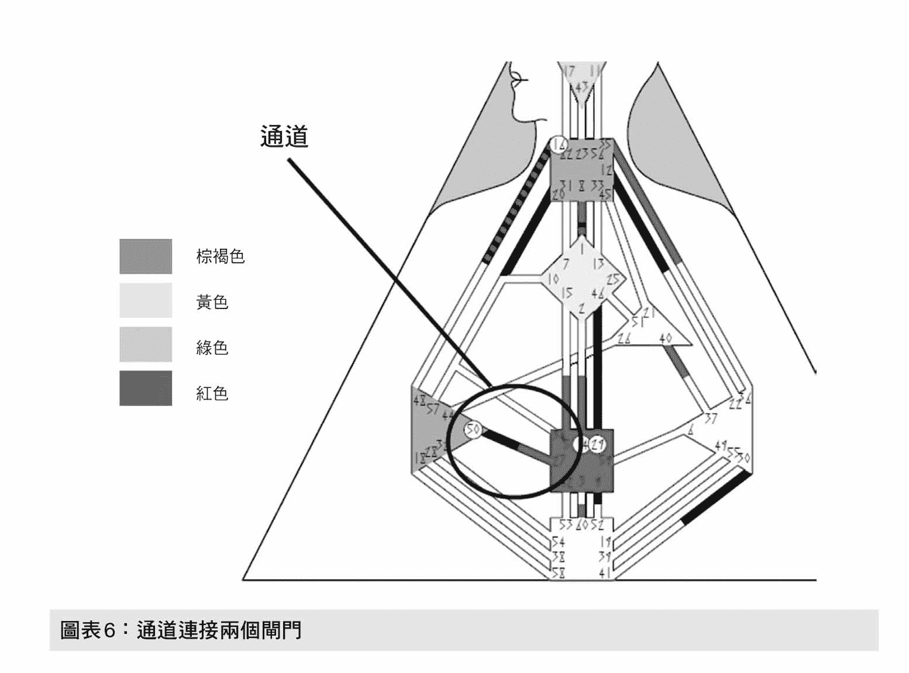

##### 闸门

每条通道的两端是标有数字的闸门，而通道便是利用两个数字闸门来命名。例如，我们通常会将 34 ／ 20 通道称作「魅力的通道」──它串接了 34 号闸门（权力）和 20 号闸门（蜕变）。六十四个闸门与易经的六十四卦遥相呼应。你的人类图表中，每一个开启的闸门都为你的人格添洒了不同的「调味料」。我们将会简短论述闸门的基本特质；至于每个闸门的详细说明、它与你的人类图表及人格的关联，请参见第五章。

###### ★ 悬挂的闸门（HANGING GATES）

若你拥有某条填满颜色的通道，那么该通道两端的能量中心就会有定义（也填满颜色）。反之，开放的能量中心（白色）不会附有完全填满颜色的通道。若一条通道的两端闸门只有其中一端被启动，此单独启动的闸门便称为「悬挂的闸门」（图表 7）。

一个拥有悬挂闸门的人往往会受有相对另一半通道的人吸引。这就是所谓的「电磁引力」（electromagnetic attraction）。

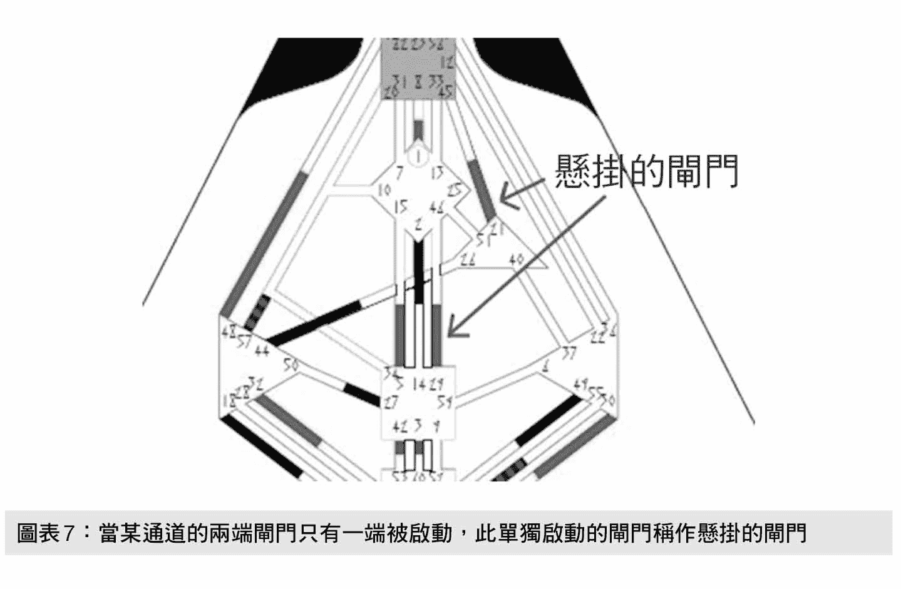

##### 定义

人类图表中的定义，与能量中心之间填满颜色的通道有关。

一分人（Single definition）代表所有填满颜色或定义的能量中心是串连在一起的（图表 8）。

二分人（Split definition）代表定义的能量中心被分隔成两组互不连接的区块，但每一区块内的能量中心仍是串连在一起的（图表 9）。

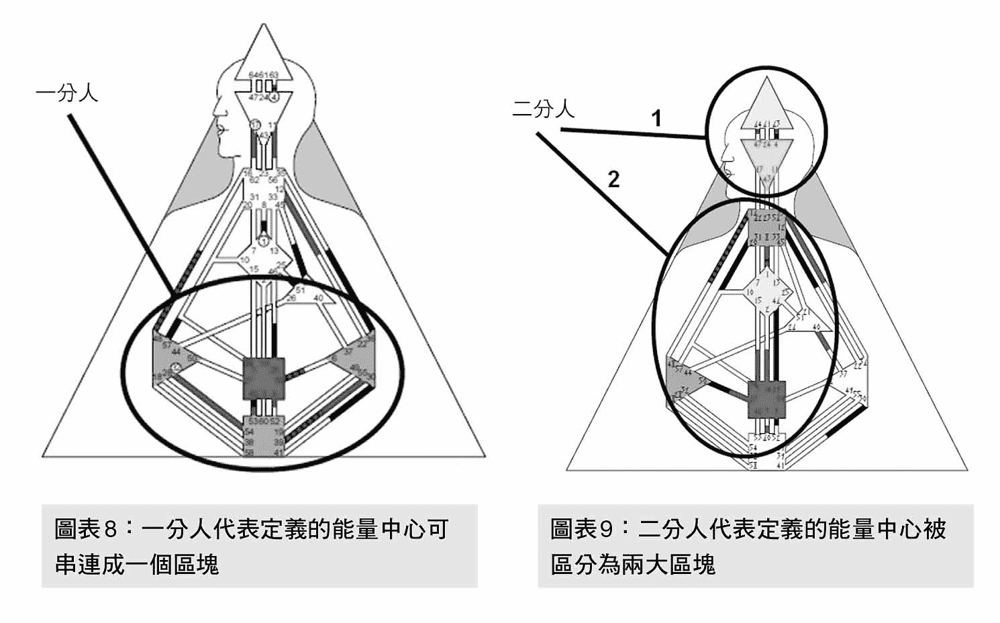

三分人（Triple split definition）代表定义的能量中心被分隔成三组互不连接的区块（图表 10）。

四分人（Quadruple）代表定义的能量中心被分隔成四组互不连接的区块（图表 11）。

分裂的能量在你的自我感知里，会让你觉得自己彷彿拥有某些截然不同的面向。以这张人类图表为例（图表 9），你或许能感觉到自己拥有非常强大的思考能力且常「迷失在自己的脑袋里」，但你却也同时拥有非常「朴实」和原始的人格面向。

我们往往会被拥有能「桥接」我们分裂能量区块闸门的人吸引。当我们和这些人相处时，我们会感受到「完整」，或自己的每一部分得以统一，至少就能量层面而言确实如此。

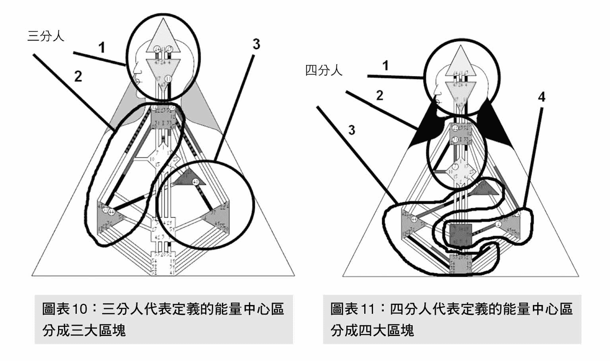

#### 生日表（The Birth Chart）

接下来让我们把目光从人影图像转移到充满数字和行星符号的一览表。在人类图表的左边或身体图的两侧（视你的人类图表取得来源而定），你会看见一连串的红、黑色数字和行星符号（图表 12）。这就是你的生日表讯息，它在你有生之年是固定不变的。

##### 你的潜意识人格

你的潜意识人格由生日表上的红色部分界定──这些是始终存在，但你未察觉的人格面向；也就是说，你实际上对这部分人格没有太大的掌控权。我们一般会随着年龄增长而益渐意识到自己的潜意识人格。或者你的家人和挚爱伴侣通常也能清楚知道你未察觉的人格面向。

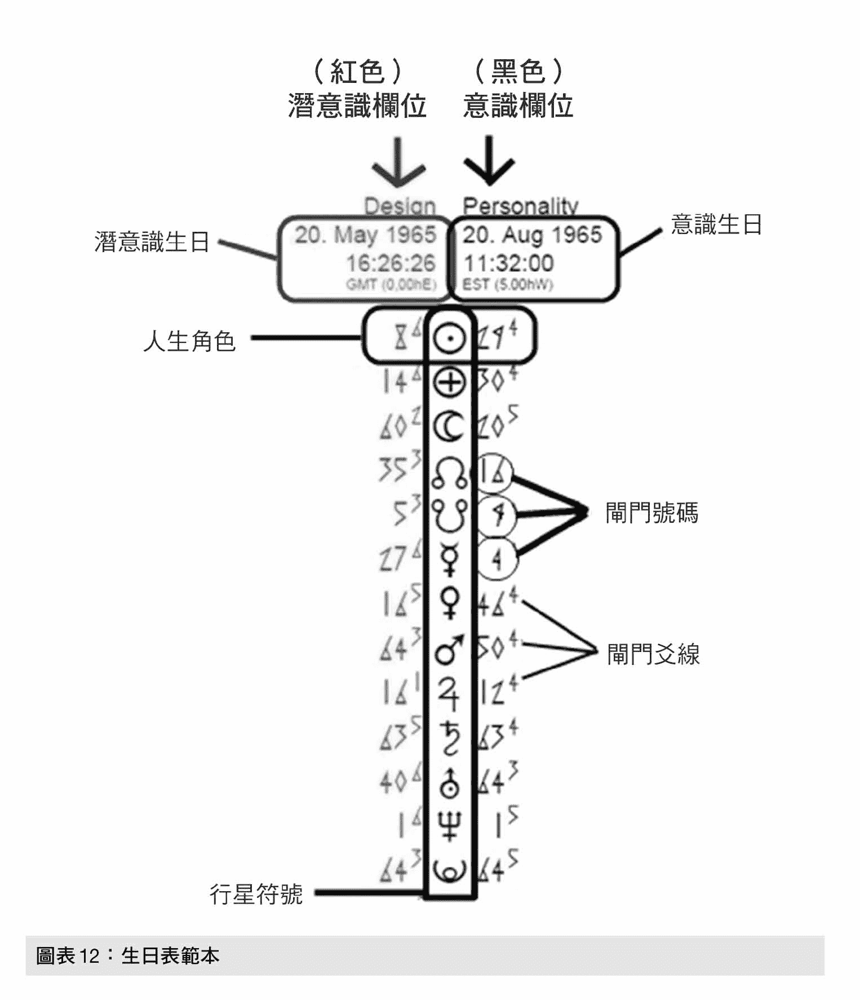

红色日期是你的潜意识生日──大约是在你出生的前三个月，恰巧与胎儿在子宫内大脑皮层快速发育的时间一致。潜意识生日距离你出生那一刻的星座度数大约是八十八度。

##### 你的意识人格

图表上黑色的部分是你能自我察觉的人格面向，在某种程度上，你拥有一定的掌控能力。

黑色的出生日期是你真正的生日，一般称作你的意识生日（某些人类图表上的生日是以欧洲日期格式呈现〔日／月／年〕）。这就是你的意识人格。

##### 闸门数字

列表上红色及黑色的大数字是闸门号码（图表 13）。总共有六十四个，并同时显现于人体图中。关于闸门号码代表的意义请参见第五章。

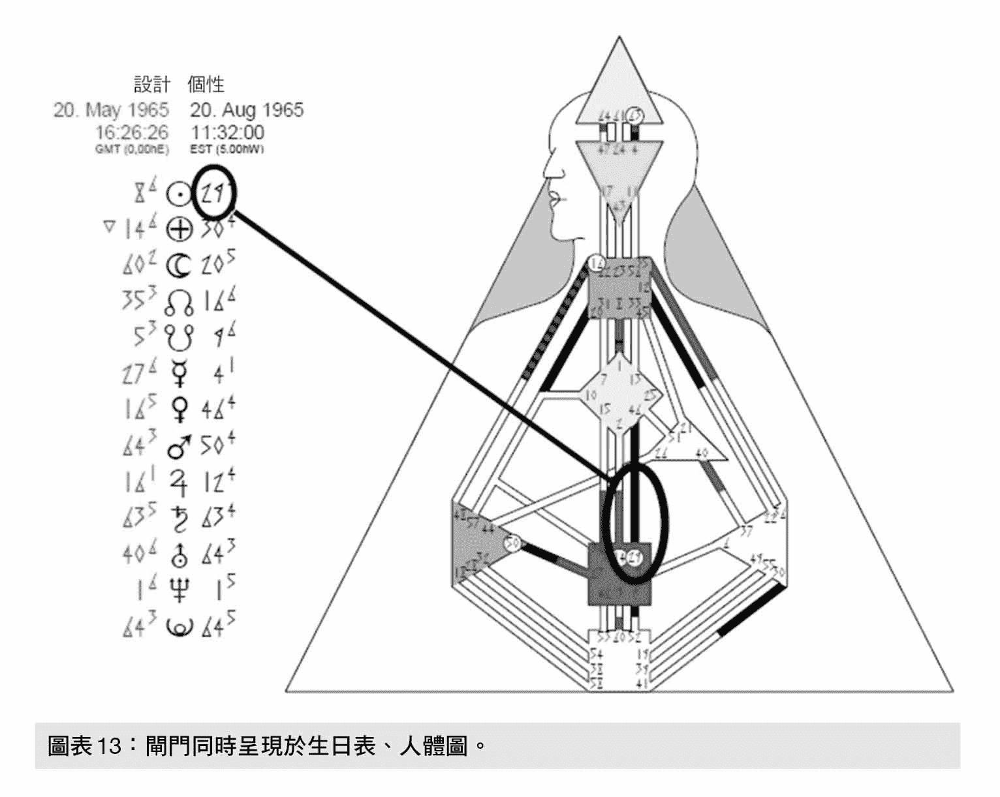

##### 闸门爻线

在每个闸门号码旁边，你会看见一个象是指数的较小数字（图表 14）。这就是闸门爻线，爻线数字为一到六。

闸门爻线是每张人类图表的独有物，即并不是每一张人类图表都具有一到六爻。它是依据你出生那一刻的行星位置而决定。爻线就好比我们计时用的秒数。以下是闸门爻线的六种独特原型：

• 一爻：研究者（Investigator）

• 二爻：隐士（Hermit）

• 三爻：烈士（Martyr）

• 四爻：机会主义者（Opportunist）

• 五爻：异端者（Heretic）

• 六爻：人生典范（Role Model）

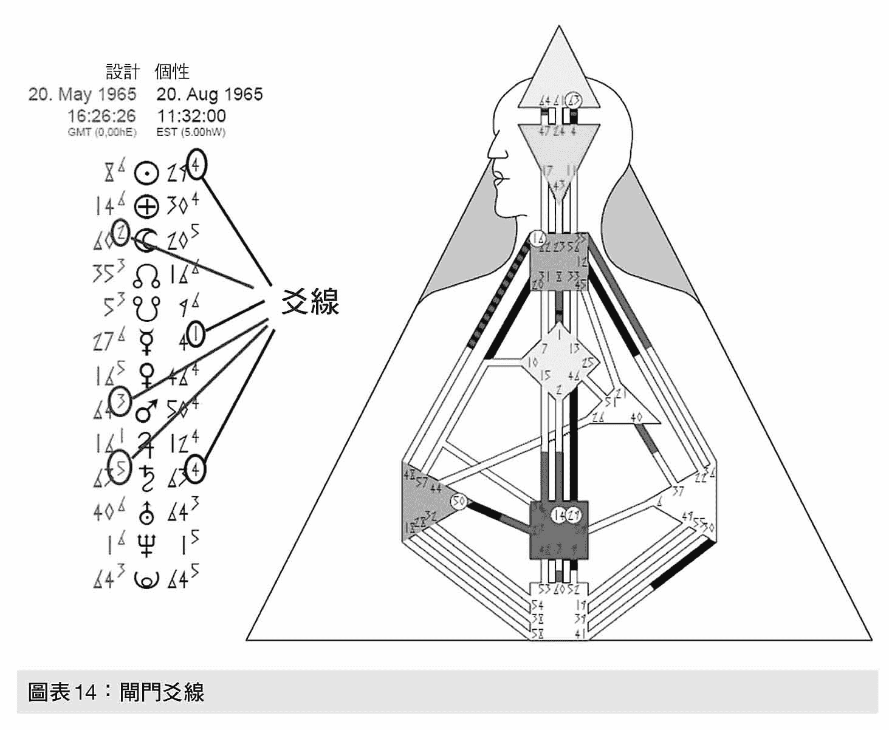

请注意──闸门爻线并不会出现在人体图中。其代表的意义可透过人类图分析得知。

##### 人生角色（Profiles）

人生角色是由你意识与潜意识中太阳标志闸门爻线而定（图表 15）。

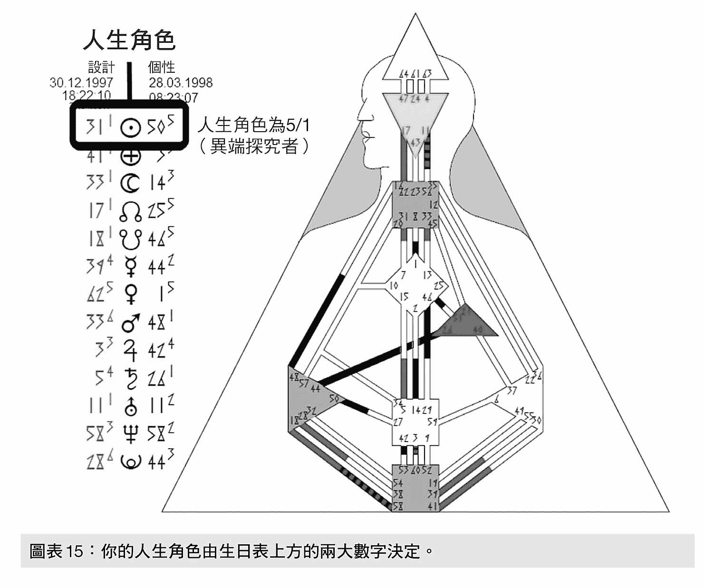

每个人都带着特定的人生角色和使命来到这个世界。人生角色诉说着你会面临到的主要人生主题，也描绘出你的人格在实现使命的过程中是如何与世界互动。你可以把人生角色视为一种说明书──说明你的意识与潜意识原型以及与这些原型相关的主题。大多数人都能意识到自己潜意识的人生角色，但由于它仍属潜意识层面，人们在展现上仍无太大掌控权。

十二种人生角色是两个闸门爻线的组合：

（意识爻线在前，潜意识爻线在后）

• 1／3　研究者／烈士

• 1／4　研究者／机会主义者

• 2／4　隐士／机会主义者

• 2／5　隐士／异端者

• 3／5　烈士／异端者

• 3／6　烈士／人生典范

• 4／6　机会主义者／人生典范

• 4／1　机会主义者／研究者

• 5／1　异端者／研究者

• 5／2　异端者／隐士

• 6／2　人生典范／隐士

• 6／3　人生典范／烈士

关于人生角色，我们会在第四章详述。

##### 行星符号（The Planetary Symbols）

行星符号标示出你出生那一刻你的人类图表里能量的星象位置。从最顶端你的太阳闸门位置开始至最末的冥王星闸门位置，各个行星都含纳其中（图表 16）。

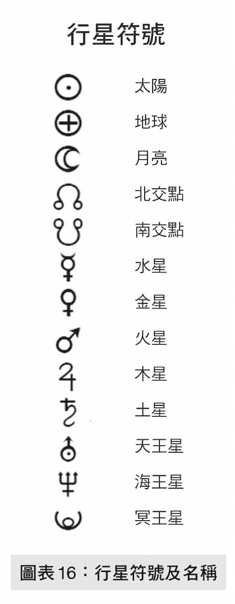

##### 轮回交叉（Incarnation Cross）

人类图表中串接所有事物的决定性区块称作轮回交叉。轮回交叉是由你的意识及潜意识的太阳和地球标志出的能量组成──即你的生日表中黑色和红色的前四组数字（图表 17）。

这四种能量构成了你百分之七十的人格样貌。轮回交叉基本上就是一个人的人生使命。它让我们明白我是谁？努力追求什么？性格上有哪些小缺点？对什么缺乏判断力？最后诉说的是一个人可能的命运。

每一交叉代表的意义是四个闸门构成能量的组合。意识太阳位置的闸门能量（右边最上方的黑色数字）是四个闸门能量中最重要的。你的轮回交叉、甚至是整张图表的其他能量都是透过意识太阳的闸门能量表现。太阳会在一整年的时间内绕过所有六十四个闸门。

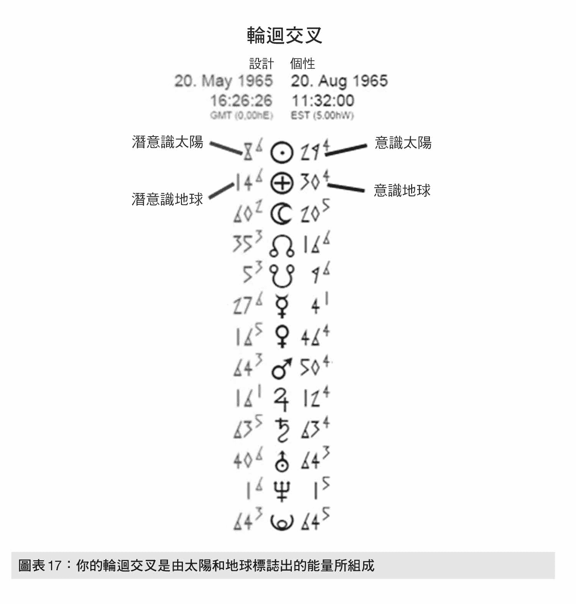

轮回交叉可能的组合共有一百九十二种，每一种都是太阳和地球运行的反映。轮回交叉带给我们的讯息远比占星学里单一的太阳星座还来得多。对于灵魂的前进道路和人生旅程，它提供了更深入的解释。

你的轮回交叉名称通常会列在人类图表的下半部。囿于空间，在此我们便不论述所有一百九十二种可能的组合，但你可以逐一了解构成你轮回交叉的四个闸门，进而从这些讯息里编织出你人生道路的专属故事。

#### 关键字（The Keynotes）

你会在人类图表的下半部看见一个名为关键字的区块，这便是你的人类图表最重要部分的简短摘要。关键字会告诉你：

• 你的人格类型和你做决定的独特策略。

• 你的内在权威中心，不论你是不容犹豫或需要时间做出恰当决定。

• 你的非自己／情绪主题。哪种情绪是你人生中最具挑战性的课题。（请放心，若你能忠于真正的自我而活，就能大大地改善非自己主题时的情绪感受。）

##### 你的人格类型

人类图中最容易入门并对其帮助有感的，便是了解你的人格类型及听从你的人生策略。五种人格类型为──显示者（Manifestor）、显示生产者（Manifesting Generator）、生产者（Generator）、投射者（Projector）及反映者（Reflector）。你可以在人类图表下方的关键字里找到你的人格类型。

五种人格类型各有做决定和存在于这个世界的人生策略。了解你的人格类型有助于培养为自己做出可靠决定的自信和信任感。

##### 你的人生策略

你的人生策略来自于你的人格类型。人生策略可谓是人类图表里最重要的知识。告诉你有关如何为自己做出正确的决定、如何确认你走在适合的人生道路上的关键讯息。

遵循你的人生策略能为你带来机会去体验适合你的事件和境遇，反之，偏离你的人生策略可能会招致最终无益的事件和经验到你的生命里。遵循你的人生策略，你就能确实完成你的个人使命。

要学会有效遵循人生策略可能要经过数个月或数年时间的练习；是以，你也可以透过人类图分析师的指导、反馈和鼓励来得到帮助。

##### 内在权威中心（Authority）

虽然做决定和你的人生策略有直接关连，但你的权威中心却会影响你使用策略的方式。定义的能量中心会决定你的权威中心为何。然而，并不是所有能量中心都具有权威中心的特质，权威中心也取决于你的人格类型和定义。

权威中心会受到制约化及情绪健康程度的影响。透过你的人类图分析，你学习了解那些会阻挡你活出真正自我的痛苦和行为模式。只要有意识认知到旧有模式，你就会渐渐感到完整，并能将这些能量转变为才智的丰厚来源。你愈是能清除旧有能量模式，你做决定的天赋能力（内在权威）就愈能有效运作。届时，你就能回到你的内在权威、使用人生策略来帮助自己的人生做出更有益的决定。

请特别留意，内在权威并未凌驾于人生策略，它仅是变换你运用人生策略的方式，好让你的决定和选择更能符合你的人类图整体能量。

六种权威类型：

• 荐骨型权威（Generated）

• 直觉型权威（Splenic）

• 情绪型权威（Emotional）

• 自我型权威（Ego）

• 自我投射权威（Self-Projected）

• 无内在权威（Mental）

某些种类的权威中心会产生强大的影响力，某些则相对轻微、对于你运用策略的方式也不需要太多调整（如果有的话）。关于内在权威中心，我们会在第二章详加阐述。

##### 非自己／情绪主题（Emotional Theme）

人类图里每种人格类型都有一个情绪主题。简单来说，情绪主题是一个人生命的一部分，会带来成长的课题和机会。你会体验到自己的情绪主题，或是透过周遭人们回应你的行为来感受。

当你强烈感受到自己的情绪主题时，那往往是你没有忠于自我（正在非自己状态）的征兆。举例来说，生产者的情绪主题是挫败；他们必须先等待某事物在外在环境显现，才进而用自己做决定的人生策略来回应。假使你是生产者，但你总是迫使某事物在你生命中实现、不经等待去了解它是否适合你，那你极有可能因为事与愿违而体验到极大的挫败感

若你强烈感受着你的情绪主题，退一步去评估你的人生不失为好的方法。当你能依照自己的人生策略生活，就能减轻体验情绪主题的强度。或许你仍会感到它无所不在，但它将不再是一头终日纠缠你的咆哮巨兽。

#### 摘要

人类图表的三大部分──人体图、生日表和关键字各有其重要的内容面向，也都为人格带来深刻的洞察。了解每一部分及它们在你的生命故事中扮演的角色，能帮助你对真实自我有更全面和深入的理解。

别忘了，每一部分都属于整体的一个片段。虽然我们以拆解完整图表的方式来学习每一关键部份的内容，但人类图表真正的美在于所有部分的融合。当所有片段整合起来，关于你是谁的真实故事就能一览无遗。

本书下一章节会提供你更能意识到真实自我的实用指南，以及具体的练习和策略，让你开始敞开双臂、拥抱适合你与你的人生之事物。

仔细浏览图表的每一部分，并练习实践人类图表传达给你的讯息。这个过程也许会有些漫长。很多人倾向一次挑选图表里的一个片段身体力行一星期。这些练习的目的是鼓励你以崭新和充满力量的方式与真正的自我连结，同时也能帮助你在瞬息万变的世界里始终保有适应能力。

* * *

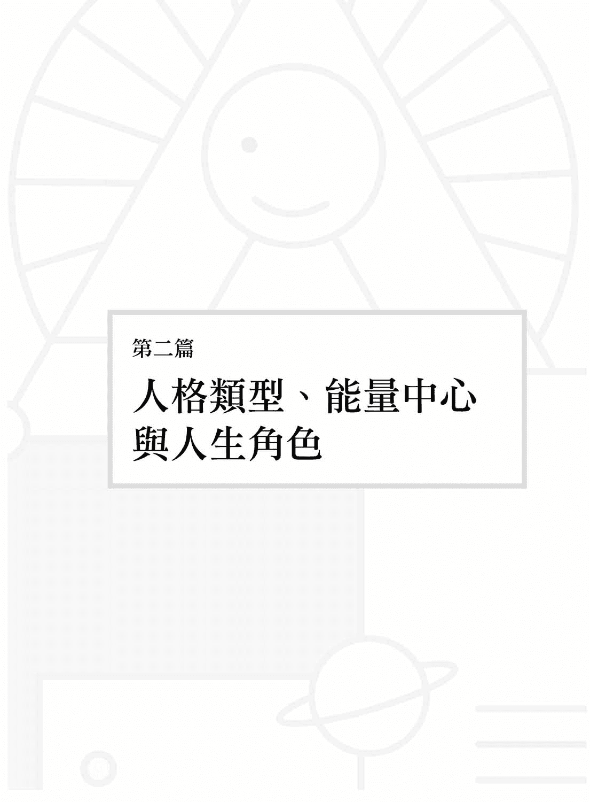

诚如你在人类图表上观察到的各种不同组成，这似乎相当复杂啊！尽管它包含许多内容，但唤醒真实自我的系统过程却能简单实现。只要依据能量类型来遵循人生策略生活，你就能轻松发现真实的自我。

首先，你必须知道自己属于哪种能量类型。这就是第二章的论述主题。一旦你理解了自己的人格类型，便只要顺从你的独特人生策略即可。

接着，我们会在第三章探讨人格类型的决定要素──九大能量中心。学习能量中心的相关知识能让你对以下问题有更深刻的理解：你的人生运作方式为何？哪些部份仍存有让你人生卡住的旧有能量模式？你来到这个世界上要学习成长的课题是什么？

每一个人的学习方式各不相同。在第四章，我们会探讨人类图中的十二种人生角色；每一种角色各有独特的学习风格，而不同的学习风格会影响一个人如何体验这个世界。

你必须先从理解你的人格类型、能量中心和人生角色着手，才能更清楚看见真实自我的样貌。仅仅这三块基本的人类图拼图，就能赋予你关于「此生要与世界分享什么？」的无比洞察力。

准备好出发了吗？

### 第二章

## 五种人格类型

若你也是芸芸众生里的其中一人，到目前为止你或许过着「差强人意」的人生。或许你曾尝过成功的滋味，某些事物在你的人生里也总是顺利发展。然而，你感觉还有更多可能性，只是你也许还不知道全然开启真实自我的钥匙就在你的内心之中。

其实大多数的人并非从小就被教育要活出真实自我。相反地，大多数的人被指引着走往不适合我们的地方。我们被教导着要踏入这个世界去闯、去让梦想成真。虽然这些方法对某些人有效，但对绝大多数的人而言，这种做法只会让我们在徒劳无功里感到挫败、痛苦或失望。

我们每一个人都是强大的创造者。但要能充分发挥你的潜质，你得先了解你的人生运作方式。人类图中的人格类型明确地告诉你该如何用充满力量、成就感和精彩的方式开创适合你的人生。

由于人格类型是学习人类图最简单却也最重要的入门管道，因此我们将从这个面向开始谈起。如下页图表所示（图表 18），大多数的人都是某类型的生产者。投射者也占不少比例，而有少数人是显示者，最后，若你是反映者，那你的确是少数中的少数了。

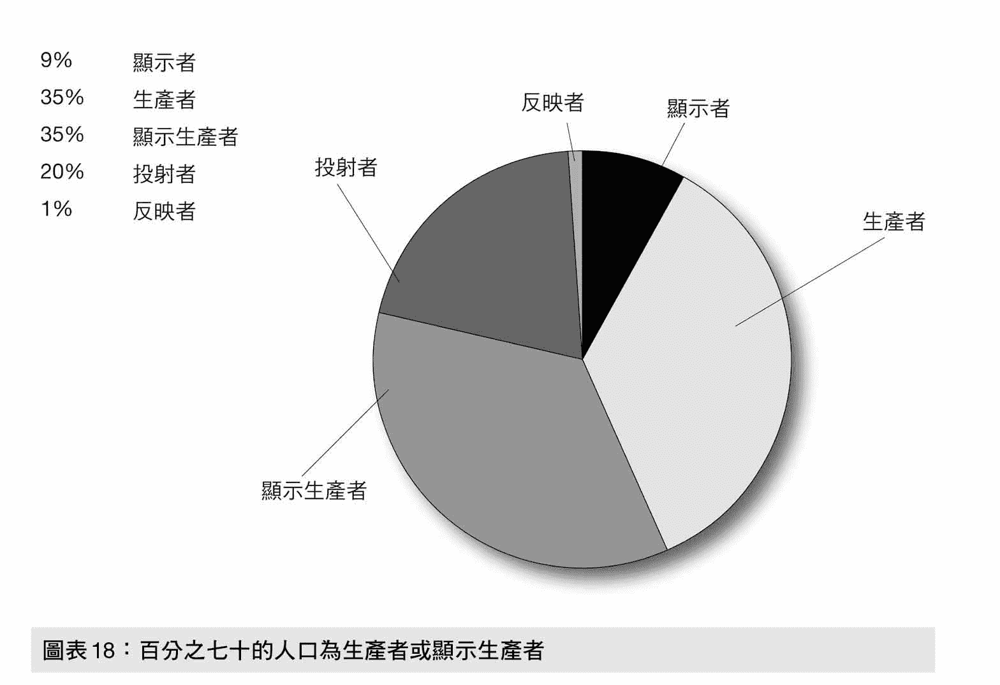

#### 显示者（The Manifestor）

显示者信息的音档下载：

请至[www.understandinghumandesign.com](http://www.understandinghumandesign.com)

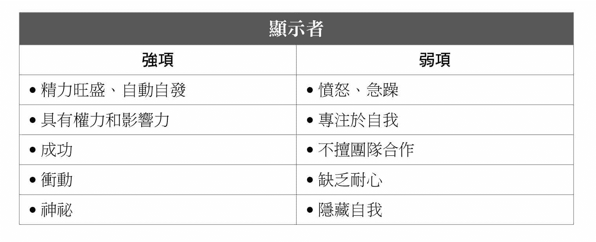

精力旺盛、具影响力、冲动和神祕……显示者是人类图系统中的少数类型，约只占人口的百分之九。

##### 显示者的人类图表

除了从人类图表里的关键字得知你的人格类型外，你也能从下列特征确认你是显示者：

• 你有一条开启的通道直接从喉咙中心连结至一或多个动力中心。

• 你的荐骨中心是开放的（请见图表 19-21）。

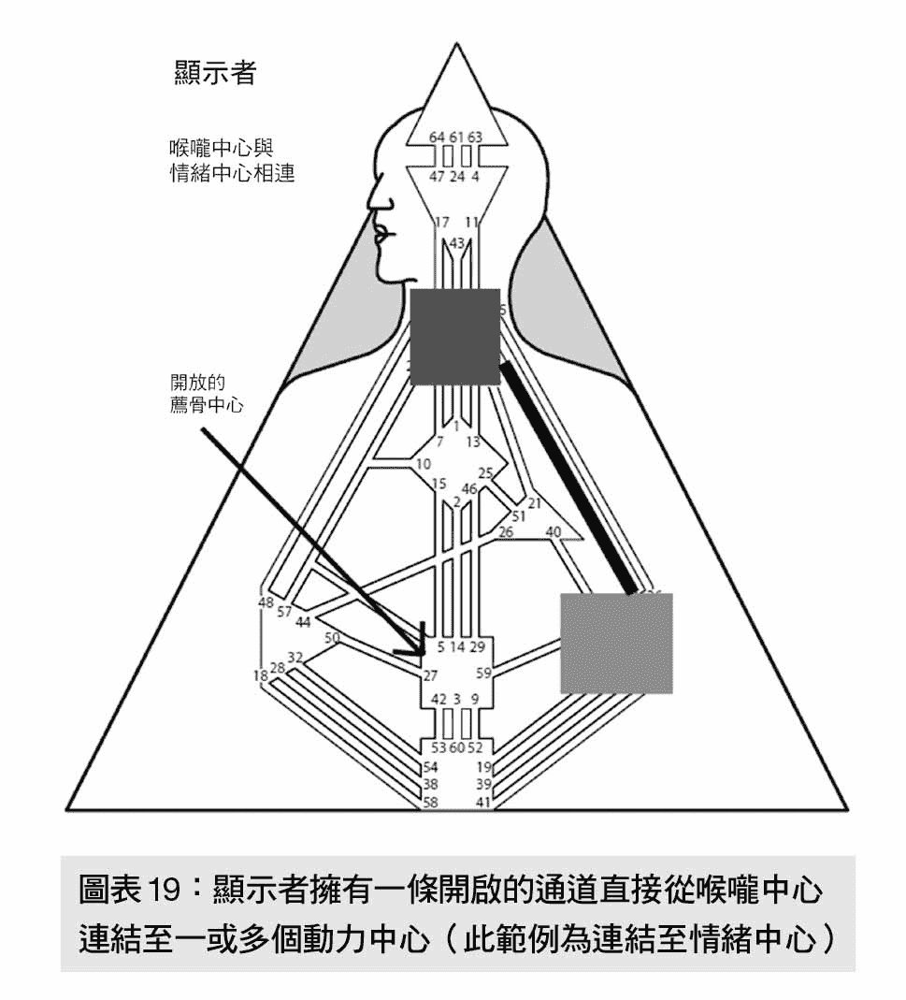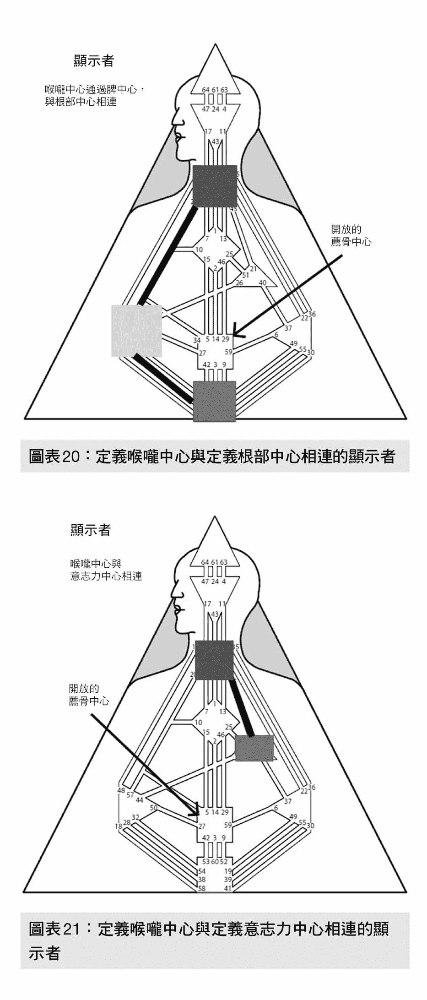

当动力引擎直接与喉咙中心连接时，就会赋予一个人不须等待就能发起事物（例如对话，甚或是商业业务）的能量。不同于大部分的人必须等待机会或邀请，显示者拥有发起事物的能量。

显示者的脑袋总是能显现完整的战略图。当他们有了想法便会立刻实行且通常都能做得相当不错。显示者是纯净能量的唯一类型。

我们每一个人在不知不觉中被制约，相信自己就是显示者。我们自幼就被灌输「做就对了」和「去闯、去让美梦成真」的信条。然而对大部分的人而言，这往往只会带来事与愿违的挫败感。

虽然显示者拥有巨大的发起能量，但他们却无法以持续的方式工作（这种情况体现在开放的荐骨中心）。对显示者来说，每周一到五、朝九晚五的规律工作会让他们感到筋疲力竭；大多数的显示者面对此种工作型态都会觉得不堪负荷，有时甚至会生气暴怒。

由于显示者是唯一能不必等待、直接行动的人格类型，因此他们的能量常会让旁人感到些许不自在，尤其是当他们并不晓得自己能量特性的情况下。当显示者开口说话或是进到某一空间，大部分的人都能感受到他们的能量，不论是他们的仪态或言语表达都散发着一股威风之气，然而，他们打算要做什么、葫芦里究竟卖什么膏药，没有人搞得懂。于是这会形成一种神祕，有时甚至是紧张不安的能量场。

由于显示者具有发起行动的能力，因此他们未必需要其他人才能完成目的。显示者有种「显示目标的习惯」，他们纯粹遵照自己强大的创造能量让任务完成。

显示者往往会面临沟通的课题。他们充满活力且自动自发，行事中的显示者彷彿就像高速驶往目的地的子弹列车。然而，显示者有时并未察觉，沿路月台上仍有等着上车的人们，但列车却过站不停、呼啸而去。候车的人便会感到气愤或转身离开；他们不明白，既然双方的目的地相同，为什么显示者不能稍加减速，好让彼此一起到达呢？最后只好作罢，改搭其他班列车吧。

与此同时，显示者依旧无法看出问题的症结。我不是既快速又有效率地抵达目的地了吗？为何其他人总是想掌控我的步调呢？（显示者单枪匹马把事情做得利落漂亮，谢谢你们！）这两种观点，一个倾向合作，另一个则持个人主义和结果导向，很容易在某一瞬间就会爆发冲突。

##### 显示者的策略：告知（Inform）

显示者的策略是告知他人自身的行动。显示者能产生很大的影响力，因此不妨藉由先观察谁会因为你的行动而受影响，再告知对方接下来的行动脉络，如此就能缓和自身能量的冲击力道，进而利用能量来帮助自己和他人。

告知对显示者来说并不是一件轻而易举的事，他们甚至会觉得受控或受制于自身造成的影响范围。显示者的人生使命并非被动地听从指令。绝大多数的显示者不会告知他人自己的行动，因为他们很早便明白，其他人会试图阻止或评断他们想做的事是不可行的。

然而，显示者必须理解「告知」会增进他们的人际关系并排除阻力，也会让自身的权力和创造能量得到支持。显示者务必牢记，告知并不代表你必须停止或改变行动。你只是让旁人知晓接下来的行动脉络。

显示者分享他们的计划时，身边的人会感到更多尊重和被爱，反之，若人们能告知显示者当下发生的情况，他们也会有同样的感受。若你爱你身边的显示者，不妨对他们说说你此时的计划和行动，那会有助于他们创造和减少一些天生的愤怒。

##### 重要特质：权力挣扎

显示者能增强荐骨中心的能量，就短期来看，工作产量会比一般人还多。但由于显示者缺乏持续能量，因此当他们一开始的能量突然减弱时，他们明显表现出的懒散可能会让周遭的人感到灰心。

请记住，显示者的人生使命并非劳动，而是发起。正因为显示者拥有发起行动的能力，人们更不该认为显示者会适合从事长时间的身体劳动或其他「日常规律」的工作类型。

##### 显示者的健康状况

显示者需要休息和时间来释放系统内过剩的能量。这个过程也许会让他们看来像个逃避工作的懒惰虫和孤僻者。然而，静养和休息是维持显示者健康不可或缺的要素。

显示者与失眠奋战的情况并不少见。由于显示者缺乏定义的荐骨中心，亦即他们天生并未被设定在一天结束之际要感到「筋疲力竭」；他们必须先躺好、彻底放松才能入睡。也就是说，显示者若能在感到疲倦之前就准备就寝，较能获得健康的睡眠。假使一个缺乏荐骨能量的人拖到疲惫不堪时才准备睡觉，那么他的睡眠质量就会大打折扣。

此外，显示者独睡也有助于更好的睡眠。显示者孩子若能拥有自己的房间及睡眠空间往往会表现得更出色。这个建议也许有点难理解，但这并非从私人层面而论。单独睡眠的时间能帮助显示者释放那整日不断增强而过剩的荐骨能量。假使显示者拥有恢复自身能量的机会，他们将睡得更安稳、感觉更舒畅，到头来也就变得更健康。他们会用自己的方式完成这一切。他们天生的设计蓝图便是如此。

##### 身为显示者孩子的父母

显示者孩子会为父母带来一种有趣的挑战。的确，显示者孩子天生的能量设计就是突破难关和具有自我引导的能力。许多显示者孩子在成长过程中渐渐学会，他们必须关闭自己的能量开关，或是他们必须祕密进行自己想做的事。基于上述原因，告知的观念对显示者来说不仅不自然，甚至也让人畏惧。显示者担心其他人会劝阻他们的行动，或因自己的权力过大而遭受处罚。

大部分的父母马上就能意识到，这个孩子需要接受许多管束和控制。父母的做法并非出于古板或冷漠心态，而是因为显示者孩子总是会做出一些父母认为危险而担忧不已的事情。举例来说，一位显示者小朋友望向外头景色，感受到今天的美好；接着，他瞧往街道并发现在这条路的尽头有一处漂亮的森林。由于显示者天生的设计蓝图是不需任何等待地跟随自己的灵感，因此这位小朋友推开后门、沿着街道一路走去，最后在那座森林里玩耍了一整个下午（或更长的时间）。

没错，若那是显示者孩子想做的事，那么立即行动就是他与生俱来的本能。然而，这对父母而言确实是个吓人的经验。为了让孩子安全无虞，父母的自然反应会是对他施加更多的控制。

若你的孩子是显示者，你必须教导他在一开始便告知行动。这个过程也许耗时，但这将让他终生受用。身为父母，若你命令显示者（或每一个孩子）该做些什么，会得到抗拒的反应是很正常的。然而父母应给予这些孩子选择的权利，才不会让他们陷入权利挣扎的僵局中。

当父母能以解决冲突的双赢态度和显示者孩子沟通，孩子便能明白：父母和其他人重视他们的需求、在乎怎么帮助他们满足所需。这会让显示者孩子更愿意接纳告知，也能与自己天生的权利保持密切连结。

##### 给显示者的肯定语句

• 我拥有强大的影响力。我不需要等待就能发挥我的力量。

• 我会观察哪些人会因为我的决定而受影响并告知对方我的决定。他们不需要认同或答应给予帮助，他们的反对意见也不代表我必须放弃行动。

• 我的行动带给其他人得以回应的事物。藉由告知引发回应的方式，我能确立自身在宇宙自然规律中的地位。

• 我总是能吸引到对的人，他们会支持和帮助我创造能量的流动。

#### 生产者（The Generator）

生产者信息的音档下载：

请至[www.understandinghumandesign.com](http://www.understandinghumandesign.com)

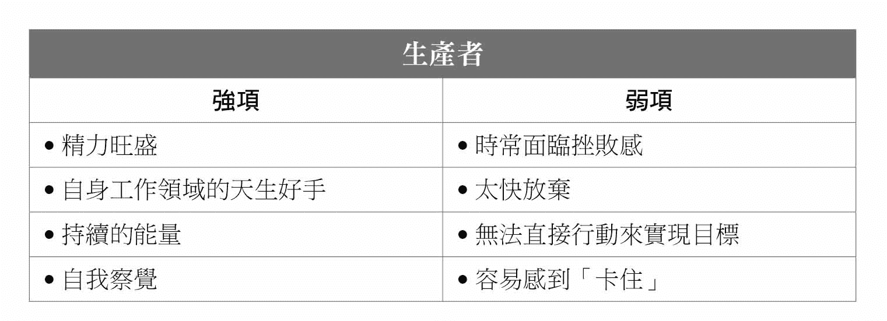

除了从人类图表里的关键字得知你的人格类型外，你也能从下列特征确认你是生产者：

• 你拥有定义的荐骨中心。

• 你的动力中心和喉咙中心之间没有任何连结（请见图表 22、23）。

##### 生产者的图表

生产者拥有惊人的持续能量，也是唯一天生设定来工作的人格类型。但他们必须找到适合的工作和恰当的生命力发挥机会才会感到快乐。当生产者从事适合的工作时，他们的荐骨动力引擎便会启动，进而让他们获得强大的能量来源。

反之，若生产者没有找到适合的工作或能展现生命力能量的机会，就会感到挫败。然而，挫败在生产者的人生历程中是很自然的一部分；生产者必须了解，挫败的能量是为了吸引新的事物，让你得以回应。

整体而言，若生产者允许人生自然开展在他们的眼前，而非积极主动地开创人生，就能过得快乐和充满成就感的生活。对生产者和所有必须等待的人格类型来说，最好的策略是先设定计划，再等待外在环境显现出采取行动的适当时机与正确的行动方向。

生产者（即「身体力行者」）害怕的是，若他们只是枯坐等待，最后什么都不会实现。然而，生产者的生命奥祕就在于，当他们停下脚步等待时，机会就会随之出现。生产者始终是一边和生命共舞、一边回应着生命的存在。

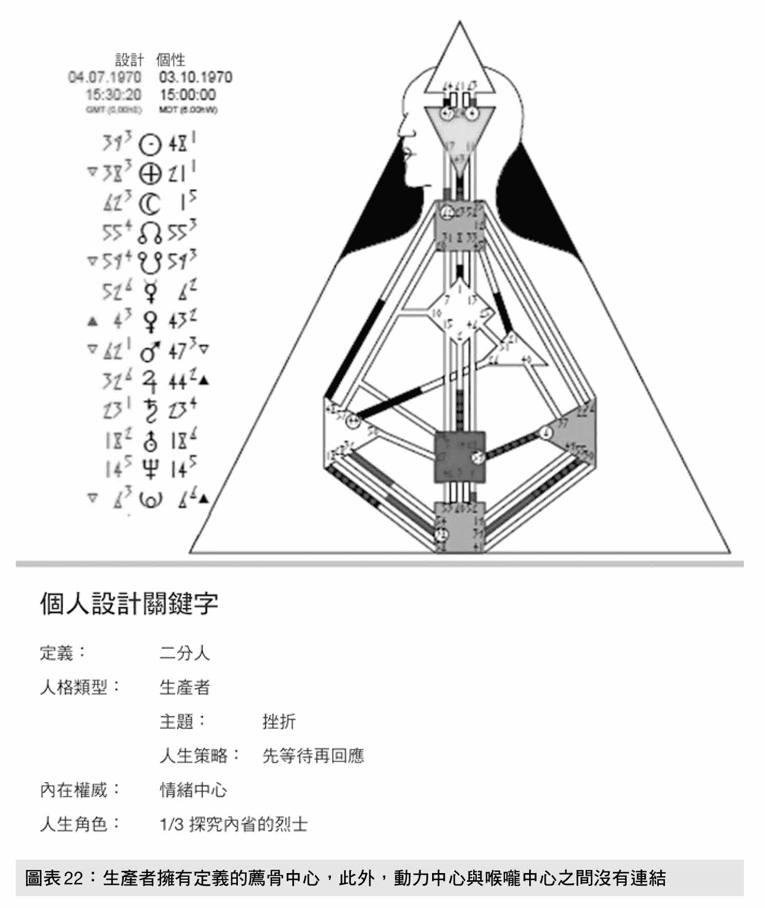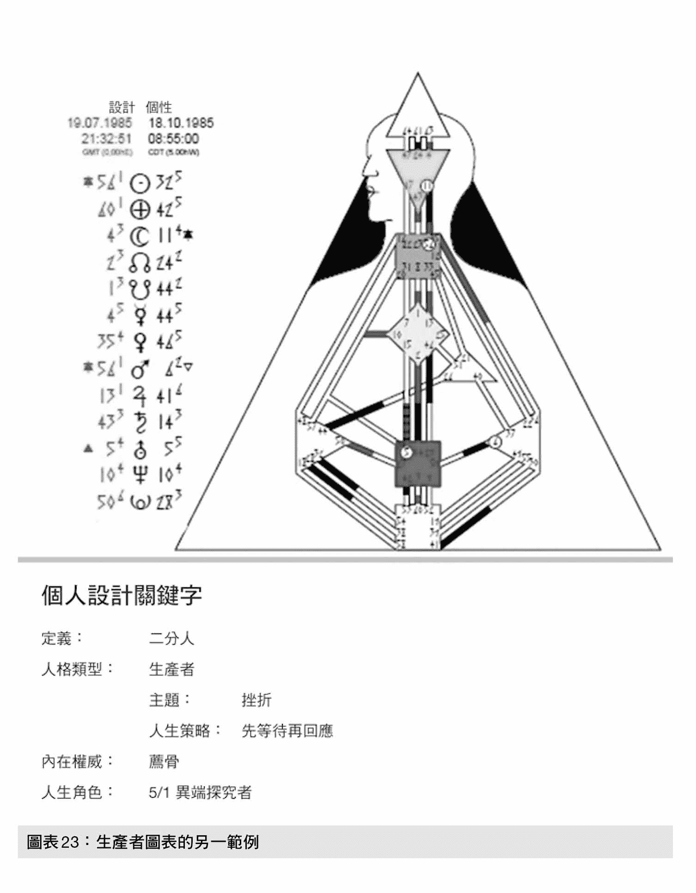

##### 生产者的策略：先等待再回应及了解自己

生产者面对或平衡弱点的两种策略──先等待再回应及了解自己。

###### ★ 先等待再回应

由于生产者的主要动力是缺乏发起能量的荐骨中心，因此生产者的策略是先等待再回应。生产者若让自己身兼发起和执行的角色将会倍感压力，因为他们的强项仅在于执行，并非发起。发起是显示者的专属任务。

绝大多数的生产者发现，当他们彷彿自己拥有发起能力般采取行动时，往往会尝到人生的挫败滋味。典型生产者通常会在萌生一个想法、想象它未来的可能样貌后，就立即付诸行动。这就是生产者从小到大被教育和灌输的观念：「做就对了」、「别光想，用行动实践吧」。

不妨试想：世界上百分之七十的人被教导要「放胆去做」，但为什么他们总是感到挫败呢？因为这种方法无法奏效。因此我们完全可以理解为什么有这么多的人感觉自己卡住、在工作泥淖里动弹不得、觉得人生似乎没那么畅快美好……这不是没来由的。生产者若试图发起行动，几乎很难获得自己想要的结果，到头来却耗费许多精力，从事与追求那些最后只让自己感到倦怠、挫败的事物。

由于生产者拥有持续的能量，因此若他们不懂得回应生命，基本上就会沦为自己生命的奴隶。我们活在一个生产的世界，而生产者正是「执行」所有建造工作的特定人选（或至少这是他们的使命）。

当生产者不再扮演发起的角色，而是懂得回应，那么他们就能挣脱束缚、获得从事喜爱工作的自由，自身能量也会得到前所未有的释放。等待听起来也许有违常理，然而，学会先等待、再对适合的工作做出回应的生产者往往都能从事毕生爱好的工作（或者在这过程中有另一个对他们而言更好的回应机会出现）。

###### ★ 了解自己

生产者维持能量持续及打破制约影响的关键就是「做出回应」。荐骨中心会因为荐骨的肯定回应而作用，进而带给生产者充分取得荐骨能量的机会。

生产者是唯一能仅藉由回答是非题（对或错的封闭性问题）就得到清晰思路与明确答案的人格类型。若你是生产者，不妨和你信任的人聊聊、请他就你目前正感到困扰或不知如何决定的情况提出一连串的是非题。这将有助于你以既简单和愉快的方式接近自己内心深处的自觉意识。

举例来说，假设你正考虑是否要搬新家；起初这个想法也许让你难以抗拒，但透过友人的协助问答，你能将此重大抉择分解成一连串较小的决定，最后你就会清楚知道自己真正想要的是什么。

• 你是否想住在市中心？市郊呢？乡村呢？

• 你的另一半是否有搬家的意愿？

• 搬家对你的孩子是否有正面的影响？学区是否会影响你的住房选择？

• 你要买一间自己的房子吗？或是你要租一层公寓？

• 你希望家中有庭院吗？你愿意负担必要的保养费用吗？

• 你准备好让你的亲朋好友们知道你正在找寻新的住所吗？

• 你想要请房屋中介帮忙吗？

• 若你想请中介协助，你要洽询住家附近的中介吗？还是从分类广告上随机寻觅有缘的中介商？

让你的回答沉淀、从中去发现哪些是经过一段时间后仍不变的答案。

##### 重要特质：挫折

生产者具有阶梯学习曲线（进步方式如阶梯爬升）的学习样态，而挫折感便是这段过程中很自然的一部分。生产者学习某样新事物时，往往能在最初阶段获得相当不错的学习成果。但经过一段时间后，他们会面临学习高原（plateau，指学习进步的停滞期）；即便他们反覆练习也不见丝毫进步，于是挫折感油然而生，许多生产者正是在这一刻选择放弃。学习高原造成的挫折固然让人难以忍受，然而这也是希望的征兆：代表他们即将体验回应新事物的机会，那也许是指学习成果的崭新阶段、一份新的工作或是一段新鲜的旅程。

别忘了，生产者是天生的高手。当生产者处于学习停滞期而感到挫败时，那也代表他们正渐渐厘清自己想要的是什么，而通往下一阶段的机会往往不久就会出现。到了机会出现的那一刻，生产者的任务便是回应。

生产者须谨记的关键是：当你感到挫败时，请不要即刻放弃。学习倾听你的荐骨，它的独特功用便是安排生产者在对的时间去到对的地方。有时候当生产者感到极度的挫败，荐骨也不会做出放弃的回应；有时候就算生产者深怕丢掉工作或错失机会，荐骨却会回以放弃的讯息。

对「回应」仍感到陌生的生产者不妨试验自己的荐骨威力吧！在接下来的四周内，试着不要发起行动，静观其变。这将会带给你前所未有的全新体验和超乎想象的美妙感受。

##### 生产者的健康状况

荐骨的设计特性是随着一天迈向结束而筋疲力竭。大部分的生产者会试图振作精神、忽视他们的荐骨需要休息和恢复能量。若你是生产者，而你有失眠或睡眠质量不佳的困扰，那么你或许需要从事更多的体能运动来让你的荐骨「彻底疲累」。

##### 荐骨的回应

荐骨的动能是透过荐骨的声音（一种能量频率）而启动。当某位生产者的能量启动，并经由共振回应荐骨的声音时，在同一空间内的其他生产者也会开始发出荐骨的声音。

荐骨的声音是类似「嗯哼」或「哼哼」这种出于身体本能的回应声响。绝大部分的生产者都会不自觉地发出这些声音。

生产者天生会用这些语助词（荐骨的声音）来回应生活中的各种问题和状况。如此能唤醒他们体内的能量频率，并带来自觉意识及知道怎么做、又该与谁一起合作的能力。也就是说，他们能贴近自己的内在真实与内在指引。荐骨的回应始终能带领他们去到对的地方、和对的人一起做对的工作。

不少生产者从小被告诫不该用这些对他们而言是与生俱来的声音回应（听起来不礼貌、漫不经心……），因此生产者初学人类图的首要目标便是「唤醒」荐骨的回应，让荐骨动力引擎恢复运作。最好的方法是透过他人向你提出是非题（对或错），而你用自己荐骨的声音来回答。

假想某一情境：你去拜访一位久未碰面的旧识。在谈话过程中，对方询问你是否有意愿到他的新公司工作。若你发出「嗯哼」（或其他肯定的声响），那么对你而言，这份工作会是不错的机会；反之，若你的回答是「哼哼」（或其他否定的声响）则代表这份工作或许不适合你。如同这个例子描述般简单，若你是荐骨人，你就能感受到内心真实的回应。

如果能永远如此简单地处理万事万物，那该有多好啊！只是，我们并不是每一次都会得到清楚明确、能让我们从嘴巴发出「嗯哼」或「哼哼」等回应声响的问句。有时候我们反而会获得更多隐约的提示或刺激，而许多生产者便是在此一时刻分不清自己当下的反应究竟是属于回应，还是发起？以下是生产者（或显示生产者）可能感受到关于荐骨隐约提示的两个例子。

有时生产者不只是需要得到能回应的明确问句或其他听觉刺激，而是只要回应自己的内在提示即可。举例来说，姐夫打电话来告知，你姐姐刚产下了一个小宝宝的好消息。一般人对此类讯息的反应会是想去探视姐姐和小宝宝。

假设你与姐姐的感情很要好，你希望去探视小宝宝的想法可以视为一种内心回答「嗯哼」的肯定声响，也就是你在内心已经回答了「你想去探视新宝宝吗？」的问句。此时你不会只坐在电话旁等待、或期盼姐姐能亲自打电话来邀请你探访。事实上，若你迟至收到正式邀约才前往探视，姐姐也许会感到非常失望。

另一个例子：不久前，我到旧金山参加一场新时代博览会（New Age expo）。当我经过一处摆满绿皮书的摊位时，我突然停下脚步，接着忍不住上前一探究竟。我发现一本正是我所需要、有助于自己现阶段事业发展的书籍。在仔细阅览书封介绍后，我的内心大声回应着买下这本书的「嗯哼」肯定声响。我并没有枯站在摊位前、等着工作人员走上前来向我推荐这本书的内容，并问我「你想要收藏这本书吗？」我就能强烈感受自己内心的答案。

这种源于荐骨能量中心的正面强烈感受往往会带来精彩美好的事物。别光等待着言语的提示，而忽视了荐骨的回应。否则，你很有可能错失某些非常适合你的机会。

###### ★ 等待时机成熟

若你才刚接触人类图，我会建议你：先等待问题或机会清楚显现后，再做出回应。当你对「做出回应」愈来愈熟悉时，你就会开始了解哪些是你内心真正的答案、哪些又是你的脑袋分析处理后的想法。

虽然我想说，要分辨自己的反应是属于「回应」或「发起」其实非常容易，但不能不承认，有时这两种感觉只是细微的差别。我则是透过反覆试验、摸索才渐渐学会。举例来说，我的人格类型是生产者，人类图告诉我，若我的脑中浮现举办工作坊的想法，那么直接行动、开课讲授的下场会是门可罗雀。我可以竭尽所能做一些有帮助的事，例如：寄出新闻稿、发送传单、邀请贵宾莅临……但无论如何，这个工作坊并不会像我想象中的那般成功。相反的，若有人主动来找我、邀请我到一个性质相同的工作坊授课，而我的回应是「嗯哼」的肯定声响，那么我就会经验另一个不同的结果：工作坊得到热烈回响，一切都顺利进行。他人的邀请带给我得以回应的事物，而透过自己肯定声响的回应，我知道答应这份职务会是正确的决定。

请注意（特别是在初始阶段），请等待事物以非常清晰的样貌出现在你眼前、给予你回应机会再采取行动！当你不断练习活在自己的生命蓝图里时，你就能渐渐学会如何区别「回应」和「发起」。

###### ★ 相信你的直觉

那么，「回应」的本质是什么呢？就理论上来说，回应是指以「嗯哼」或「哼哼」这类语助词声响来答覆一个答案为对或错的封闭性问题。然而，就实际面而言，无论在某个当下是否出现一个让你得以回应的具体问题，我认为「回应」代表相信你的直觉。

绝大多数的生产者担心，若他们不发起、不立刻行动，就难以获得回应的机会，最后便会面临到一事无成的人生。不过人生就像神圣奥妙的几何学；身为一个生产者，你只需让你的天命设计自然迎向你。等待吧，你会得到得以回应的事物！

一位充满智慧的伟大导师曾用以下的比喻向我阐述等待和相信的本质：从前，有一位妇女想要渡过一条溪流。但溪水又宽又深且非常湍急，让她无法安全涉水而过。她伫立在岸旁，眼睁睁地望向对岸：我想要去的地方就近在眼前啊。她心中充满挫败地沿着溪流岸来回踱步，不断思忖着要怎样才能到达对岸。

就在她孤伶伶的杵在岸边、一点办法也没有的时候，她的耳边突然响起一个温柔的声音，要她看看溪水里有什么。就在她的眼前、距离她能安全踏过的溪水范围内，有一颗美丽平滑的大石头。

这位妇女立刻踩上大石头，但当她站稳、继续等待着，她再次感到挫败。现在距离目的地更近了，可是她仍然到不了啊。于是她无助地在那颗石头上跳来跳去。

温柔的声音再次出现，提醒她把视线移向水面。就在脚下这颗石头的不远处，她看见另一颗美丽稳固的石头。妇女轻快地跳了过去，心中对这一切安排与发生感到不解。

接着她看见第三颗、第四颗石头……这个过程便如此重复上演；每当妇女踩在新的石头上时，她开始相信下一颗石头很快就会出现。只是她必须等待。慢慢地，她成功渡过了溪流，到达了河岸的另一端。她在那一刻体悟：不论生命带领她去往何处，通往下一步的机会永远会自然显现。

生产者的人生就像这条溪流。你站在岸边、望着自己想去的地方，等待水里的踏脚石出现。当下一个跨越机会显现时，请用你的荐骨回应、判别它是否是你真正想要投入的机会。

你或许会发现，你走的路径会通往比你预想中更上游（或下游）的地方。你或许会发现，当你起身离开、站在溪流中的时候，原本那一侧的风景比你要前往的方向还要美。你或许会发现，生命会带给你一颗颗最理想的踏脚石，引领你走向内心最强烈渴望的路径。跟随你选择的踏脚石吧！并深信着，当你准备好的时候，它们永远会显现在你眼前。

##### 身为生产者孩子的父母

生产者孩子若能拥有用声音来表达荐骨能量的机会，将会获益无穷。引导生产者孩子回答对或错这样的是非题，也能让他们在未来得到极大的能量。

生产者的人生使命并非被动地听从指令（没有一种人格类型是如此），而是对参与或执行与否做出回应。然而这在群体的经验里往往是不被允许的。试想某些在参加数学考试时，面有难色的生产者孩子吧。他们也许尚未准备充足、也许那天心情不佳。但很显然地，不做出肯定的回应并不是选项之一。

生产者对于那些他们被指示或交代的任务，就算内心并未做出回应，也往往很快就能懂得实践的方法。当他们长大后，进而又会接收「别光想、去让事情成真吧！」的嘱咐。

缺乏适度运动的生产者孩子可能会面临入睡障碍。久而久之，会造成长期的慢性睡眠剥夺（sleep deprivation），其症状和注意力缺失症（attention deficit disorder）极为相似。荐骨中心能在每天结束之际获得完全释放的生产者孩子通常会较健康，也能在学业上有较出色的表现。

##### 给生产者的肯定语句

• 我信任宇宙的无限富足，并等待着适合我的机会出现。

• 我天生注定要从事适合我的工作。当我从事适合我的工作时，我就会充满活力和能量。

• 我始终知道怎么做。我相信荐骨的回应，也相信直觉引领的道路。

• 我每天都必须运用自己的能量。我是一个拥有持续能量的人。

#### 显示生产者（The Manifesting Generator）

显示生产者信息的音档下载：

请至[www.understandinghumandesign.com](http://www.understandinghumandesign.com)

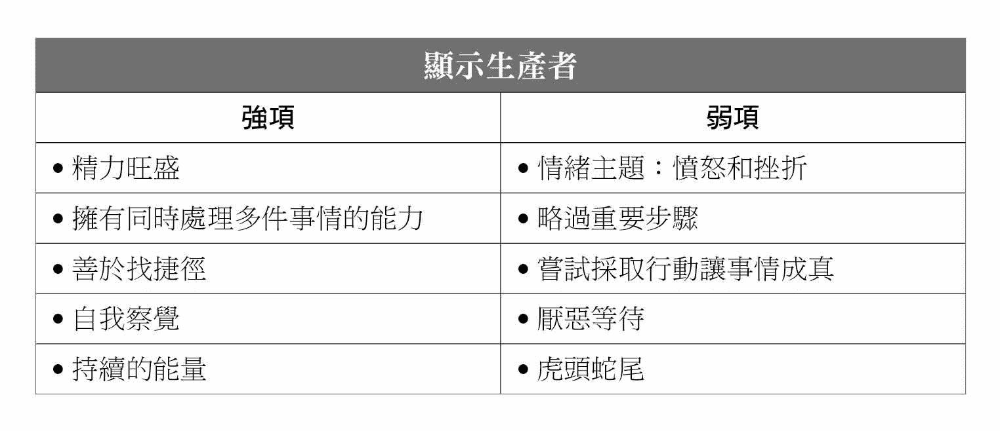

除了从人类图表里的关键字得知你的人格类型外，你也能从下列特征确认你是显示生产者：

• 你拥有定义的荐骨中心（同生产者）。

• 动力中心和喉咙中心之间有开启通道直接连结（同显示者）。

显示生产者的人类图表范例请见图 24 至 26。

显示生产者约占人口的百分之三十五。而或许你也猜到了，显示生产者同时拥有显示者和生产者的人格面向。

显示生产者天生拥有一次处理多样事情的能力。然而这往往也是一种掩饰方式──他们同时安排了好几个计划，尽管内心并未对行动做出回应，但仍非常努力执行、让这些计划实现。

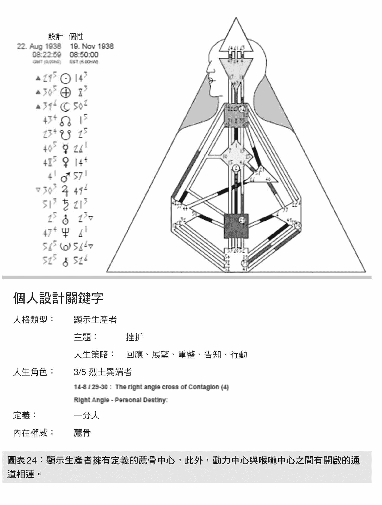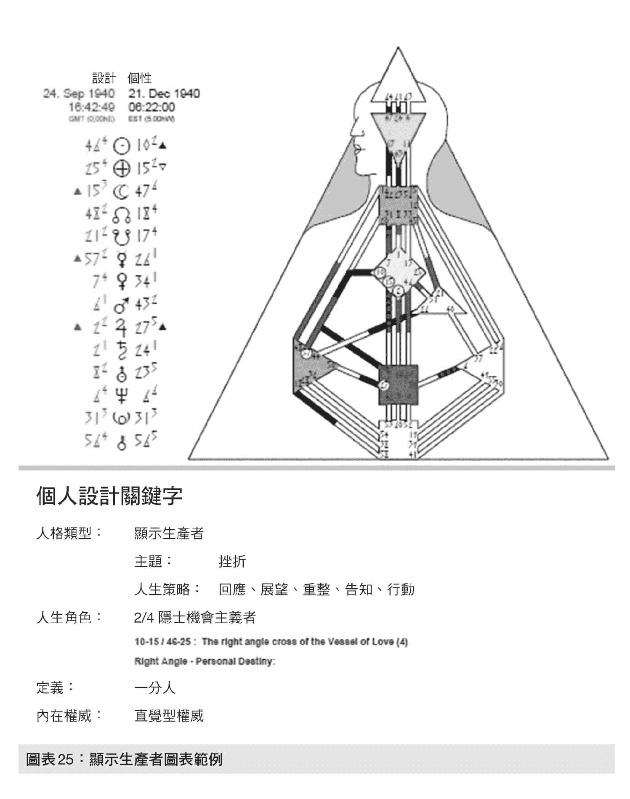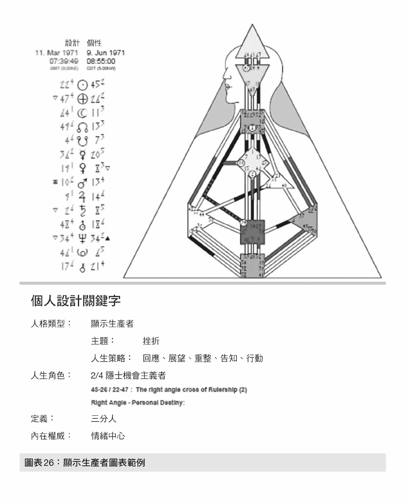

对其他人而言，显示生产者似乎「一心多用，做事缺乏条理」。但显示生产者拥有的独特才能，能让他们完成比一般人还多的任务事项，此外，他们也能长时间维持此种快速步调。

##### 显示生产者的策略：图像化（Visualize）和告知（Inform）

###### ★ 图像化

显示生产者首先要在脑中试想各种计划的可行性并图像化执行的结果。接着，在正式采取行动前必须等待。

由于显示生产者天生的能量配置，加上社会对发起能力的偏好影响，显示生产者往往会以显示者的方式行事。这也是导致显示生产者的情绪主题为愤怒（源于显示者的人格部分）及挫败（源于生产者的人格部分）的原因。

###### ★ 告知

显示生产者也必须和显示者一样「告知」，才能让所处环境的能量稳定。他们的行事步调迅速，而「告知」看似会让他们的速度减慢，但实际上却能减少他们感受到的外在抗拒和阻力。

若显示生产者的内心没有对行动做出回应，就极有可能面临徒劳无功、白忙一场的结果。而就算显示生产者做出回应，其过程也相当快速，因此他们往往会略过重要的步骤，而必须频繁地回头去处理那些他们遗漏的部分。

假设显示生产者和生产者在同一时间着手一份相同的工作，那么，显示生产者似乎会比生产者更快领会完成这份工作的诀窍。只是经过半年后再比较两者的情况，生产者将迎头赶上，对工作的掌握度也会和显示生产者不相上下。差别在于，生产者的行事过程较慎重。

##### 重要特质：积极的多工处理

关于显示生产者，人们通常很难理解的是：他们「需要」一次处理一件以上的事情。若他们无法将自身那部分的能量表现出来，实际上，对他们的健康是有害的，最后也会导致他们极度的挫败感和愤怒。

大部分的显示生产者认为，世界运行的速度太慢了，根本跟不上他们的步调。若你是显示生产者，不妨记住，绝大多数的人并无法和你一样，能同时处理多项任务或用快速的步调行事。试着培养耐心吧！

##### 显示生产者的健康状况

显示生产者在健康问题上，必须注意两大重要面向：回应和维持充分的活动量。显示生产者的甲状腺格外脆弱。显示生产者必须学会回应（对他们而言并不容易）才能保持健康状态。

活动量不足且内心感到困陷的显示生产者也会遭遇甲状腺问题。休耕状态的显示生产者就像试图在玻璃罐里存放一道闪电。这个能量必须得到释放与利用，否则它会在体内四处流窜。

和生产者一样，显示生产者必须每天让自己疲累才能获得较好的睡眠和能量恢复。整体而言，为了身体健康，他们必须保持活跃。

##### 身为显示生产者孩子的父母

显示生产者孩子总是忙个不停！他们需要大量的活动、体能运动，以及着手进行某事、在过程中测试，若感觉不对便放弃的自由。许多父母担心显示生产者孩子无法坚持任务。他们可以，只是他们必须透过多方尝试来作为自身创造过程的一部分。

显示生产者看似忽视细节的特质也往往让父母忧虑。他们并非不注重细节，只是在行动的过程中，他们通常会遗漏某些事物或略过某些步骤。身为显示生产者的父母必须注意的是，尽可能不用批评或指责的态度来指正他们可能遗漏的事物。这就是显示生产者天生的模样──他们是迅速的创造者。

显示生产者孩子需要透过从事许多活动来保持健康和参与感。这可能会让父母（特别是并未拥有同类型能量的父母）感到疲累。有时，父母需要给予显示生产者孩子一些协助，让他们将事情完成。

愤怒和挫折也是显示生产者孩子的父母可能会面临的难题。显示生产者就像显示者一样，满怀雄心壮志与创意想法，但他们也必须像生产者般等待。当事情的结果不如预期，或进展的步调不够快速时，能量瓦解的后果不堪设想。

年轻一辈的显示生产者有时无法清楚说出让他们感到挫败的原因。他们的行事步调快速，而行动的过程并不总是能用言语表达。当他们深陷在挫折或愤怒的情绪里时，这些显示生产者有时会表现出咬啮或丢掷物品的行为。父母必须帮助他们学会恰当处理他们的能量强度。让他们以身体运动的方式来释放精力往往能有所助益。

所有应用在教养显示者与生产者孩子的方式也能适用于此。若你的孩子是显示生产者，请同时参照显示者与生产者的章节内容。

##### 给显示生产者的肯定语句

• 即便我是个充满灵感与活力充沛的人，我也要等待时机显现再采取行动。

• 我会以耐心待人。我理解并不是每一个人的行事步调都能像我一样快速。

• 我需要一次处理多件事情。这就是我的本能。

• 就算我会略过某些步骤也无妨。若我必须回头修正自己遗漏的事物，我也能理解这是属于我密集创造过程的一部分。

• 我是个有影响力的创造者。当我做出回应时，我将能鼓舞他人支持我的创造过程，我也会进而告知他人我的行动脉络。

#### 投射者（The Projector）

投射者信息的音档下载：

请至[www.understandinghumandesign.com](http://www.understandinghumandesign.com)

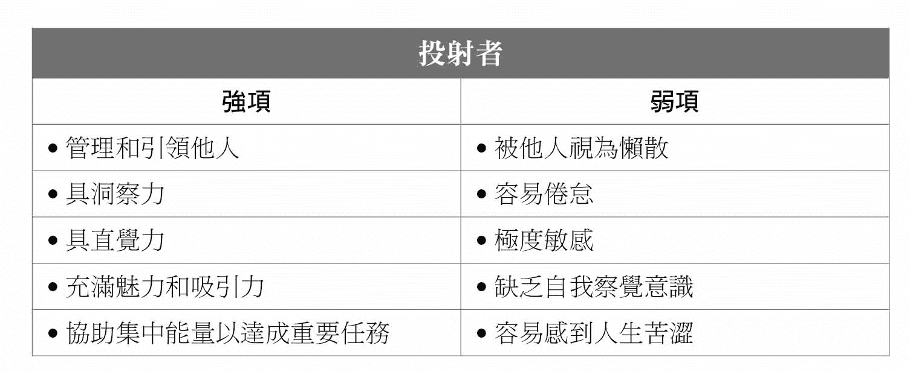

除了从人类图表里的关键字得知你的人格类型外，你也能从下列特征确认你是投射者：

• 你拥有未定义（开放）的荐骨中心。

• 你的动力中心和喉咙中心之间并没有开启的通道连结。（图表 27）

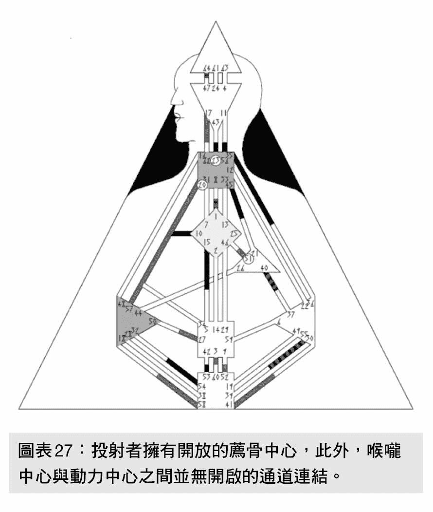

投射者约占人口的百分之二十。投射者的天赋是管理、指导和引领他人。他们的能量场彷彿散发着「问我问题吧！我知道答案噢，我也非常乐意和你分享」。

健康的投射者鲜少感到苦涩或绝望。他们耐心等待着；在得到邀请后，他们能给予生产者和显示者出色的指引，并让彼此的能量和创造表现力获得充分的发挥。世界井然有序地运转，老天爷创造的每一个生命都担负着自身的神圣任务，每一个人都能适得其所。

大多数的投射者受制约影响，认为自己就是显示生产者，努力不懈只为了跟上其他人的脚步。他们相信自己可以发起行动，也能完成许多超乎自己能力范围的事情。没错，他们的确可以做到，只是就短时间内而言。由于投射者的荐骨中心未定义，因此他们能吸取并放大荐骨能量，比起一般人，他们似乎能完成更多任务。然而，开放荐骨中心的能量并不具持续力，是以那些以生产者的方式行事的投射者会面临身心受损的潜在风险。

投射者必须记住，他们的人生使命并非工作，至少不是我们所认知的传统工作方式。投射者并不适合从事朝九晚五的规律工作（尤其是身体劳力的工作类型）。他们并非生性懒惰，纯粹因为他们缺乏和生产者一样的工作能量。

##### 投射者的策略：等待邀请

若投射者不了解自己的人格类型和策略，很容易陷入人生的煎熬。投射者的策略是等待邀请。在此所指的是人生中重要的邀请，例如：伴侣关系、事业和生活环境。

不同于不断回应生命的生产者，投射者的人生是等待获得重大的邀请。这种方式有时会让投射者自己及其他不了解他们的人认为：投射者真是「懒惰」啊！只会被动等待着事情的发生。然而，这就是投射者天生的使命。缺乏等待的投射者几乎很难体验到成功。他们天生没有「直接行动、让事情成真（即便旁人总会提醒他们应该要这么做）」的能量配置。

因为投射者的动力中心与喉咙中心之间没有连结，再加上开放的荐骨能量中心，因此他们会设法让自己被听见和看见。投射者拥有站在人群里侃侃而谈的能力，但假使在此之前根本没有人邀请他们发言，他们很有可能被忽视、白费唇舌，或无意间批评冒犯了身边的人。这种情况往往让投射者的想法很难顺利实现。

就算投射者的立意良善且确实拥有绝佳的意见，但若他们未得到邀请就主动贡献自己的真知灼见，通常会被其他人视为控制欲强的发号施令狂。对投射者而言，自身才智无法受到认可和赞赏是非常痛苦的事。长久下来，他们会变得沮丧或愤愤不平。

反之，等待他人的征询、认可或邀请的投射者拥有丰富无比的才智与这个世界分享。他们能深切感受其他人的能量。投射者的直觉力赋予他们明白其他能量类型（特别是工作力和生命力能量）需要做哪些事，才能充分发挥自身能量的能力。

等待、进而得到生产者赏识的投射者，会获得生命拼图中不可或缺的一角。别忘了，生产者彷彿拚命三郎般执行任务，缺乏明确的方向、也没有真正的终点。等待的投射者能分享出色的洞察意见，让这些缺乏方向或目标的忙碌生产者获得完成重要任务的强大能量。

对其他人而言，能在生活中认可和运用投射者的真知灼见至关重要。投射者会是帮助我们实现目标的珍贵帮手。

然而，投射者最担心的莫过于，等待却得不到任何给予意见的邀请。毕竟，心中持有答案，但必须闭上嘴巴等待、期盼着伯乐终究会出现的过程并不容易。但请记住，能量场会为你发声。等待的投射者一定会得到那些能重视他们才智、对的人的邀请。

依循人生策略生活的投射者往住极具魅力和吸引力。对于耐心等待的投射者，人们绝不会忽视，也不会吝啬给予邀请。这就是行星能量的奥妙安排！

然而，投射者对于生命中的重大邀请，例如：爱情、婚姻、事业、搬迁……等，务必要学会等待。若投射者主动发起上述事件，往往会面临诸多挑战和困难。

许多投射者发现，在等待的过程中，他们其实正不自觉地为即将到来的重大邀请预做准备。也许他们正钻研某样即将被邀请投入的知识，也许他们正热切关注居住在某地区的生活条件。

若投射者理解了比起周遭其他人，自己达成目标的进程会看似比较缓慢，他们会有更自然、更好的表现。投射者在人生中切勿处处与生产者及显示者比较。投射者天生会经验到步调较悠缓的人生旅程。然而，这就是专属于他们的人生风景，只要依循自己的道路前进，就能获得发光发热的持续能量和赞赏。

投射者能依循自己的人生策略生活，是再美好不过的一件事。他们会明白：邀请和赏识将来自于那些珍惜他们的才智与引导能力的人们。

##### 重要特质：倦怠

投射者需要他人协助意识是否过量工作。投射者很容易吸取荐骨能量，进而瞬间变种为超级生产者。但这种状态不具持续力。

不同于生产者和显示者，投射者能运用的精力和时间量是有限的。大部分的投射者往往会以生产者的方式行事，是以到了四十岁左右，身体便不堪负荷而引发种种健康问题。

大多数精力耗尽的投射者仍无法厘清造成身体危害的原因。他们感到疲惫不堪和意志消沉，身体也愈渐衰弱，但他们依旧努力赚钱、保住工作饭碗。长久下来，甚至会失去重要的人际关系和支持。

对感受倦怠的投射者而言，花一段时间来恢复精力、或纯粹等待邀请是极其重要的。但这种方式颇具挑战性，因为并非每一个人都能在经济上无虞，可以毅然决然地辞去工作。因此，感受倦怠的投射者在持续工作的同时也必须认知：你们正在等待适合的工作，而得到的方式正是透过邀请。这段过渡期间的工作只是为了支付生活所需，直到下一个机会自然出现为止。

##### 投射者的健康状况

投射者的人生使命是启发他人。然而，投射者对他人的深刻洞察却往往让他们忽视自己的需要。他们不具有像生产者那般了解自己的能力；因此投射者时刻需要他人提醒是否过于劳累，甚至是注意他们的身体是否出了差错。

投射者天生不适合体能劳动。此外，也并不是所有运动类型都适宜投射者，建议从事静态或轻微的运动最为恰当。更重要的是，投射者必须学会尊重自己的身体、在乎身体的感受。

由于投射者非常容易受他人能量的影响，因此为了让身体舒畅，他们需要独处时间将其他人的能量从自身系统内释放。这不是针对个人，而是一种必须。请记住，投射者天生就无法长时间保有荐骨能量。

投射者白天会需要小睡片刻。此外，他们也需要好好放松才能入睡。为了保护身体健康，投射者务必要在感到疲倦之前就准备就寝。若等到疲惫不堪时才拖着身躯上床睡觉，就会造成睡眠质量低落。

别忘了，投射者有时需要他人协助了解是否过量工作。对于那些以生产者方式行事的投射者而言，熬夜工作之后筋疲力竭，却还要与失眠奋战的情况并不少见。独睡也能让投射者拥有更好的睡眠（尤其当他们的伴侣是生产者时）。

##### 身为投射者孩子的父母

给予肯定和赏识是父母送给投射者孩子最丰厚的礼物。

以下是家中有投射者孩子会常遇见的事例：投射者孩子热切地想和母亲讲述他脑中所有的想法。他不断表达自己的每一个念头，就算在不合适的时间也不例外。无论母亲是因为忙碌着，或只是疲累而没有正面回应他的想法时，投射者孩子便会感到挫败和恼怒，而母亲也可能转而对自己的孩子无法约束自己而感到失望。

然而，若母亲知道她的孩子是个投射者，也了解投射者孩子需要他人认可他的想法时，她便试着在孩子分享意见前主动询问。这样简单的对策却能大大改变亲子关系间的互动方式。

某天，母亲会突然发现他的孩子确实拥有某些很棒的观点，也总是期待听听他的意见。而投射者孩子能感受到自己分享的事物受到了肯定和重视，也愈来愈习惯耐心等候母亲开口询问。对投射者孩子而言，这会是人生中第一次感到自己被听见、被看见。亲子关系会随着这种互动方式而益渐稳固、彼此更能互相尊重。

提供机会给投射者孩子也能对他们帮助良多。请记住，投射者不该发起行动。他们非常需要其他人的协助来获得机会和能量。没有立刻采取行动的投射者绝非软弱或懒惰，他们只是需要借助其他人的能量来迈出第一步罢了。

##### 给投射者的肯定语句

• 我是其他人最有价值的帮手。

• 我的使命是引导那些寻求我的才智的人，而我会耐心等待对的人来认可我所提供的意见。如此能帮助我保存自己宝贵的能量，也能让我感到受重视和被爱。

• 在等待邀请期间，我最重要的任务是：追随自己的热情、做自己真心喜爱的事。

• 我永远无法猜测我的人生中会出现哪些精彩的机会。全心投注于我热爱的事物是为我的下一段探险旅程预做准备。

• 我会珍惜及妥善利用自己的能量。

• 我尊重自己的能量运作模式。是以，我不需要跟上其他人的步调。我是独一无二的。

#### 反映者（The Reflector）

反映者信息的音档下载：

请至[www.understandinghumandesign.com](http://www.understandinghumandesign.com)

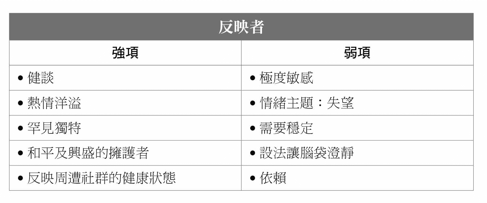

除了从人类图表里的关键字得知你的人格类型外，你也能从下列特征确认你是反映者：

• 九大能量中心皆为空白（未定义）。

图表 28 为反映者的人类图表范例。

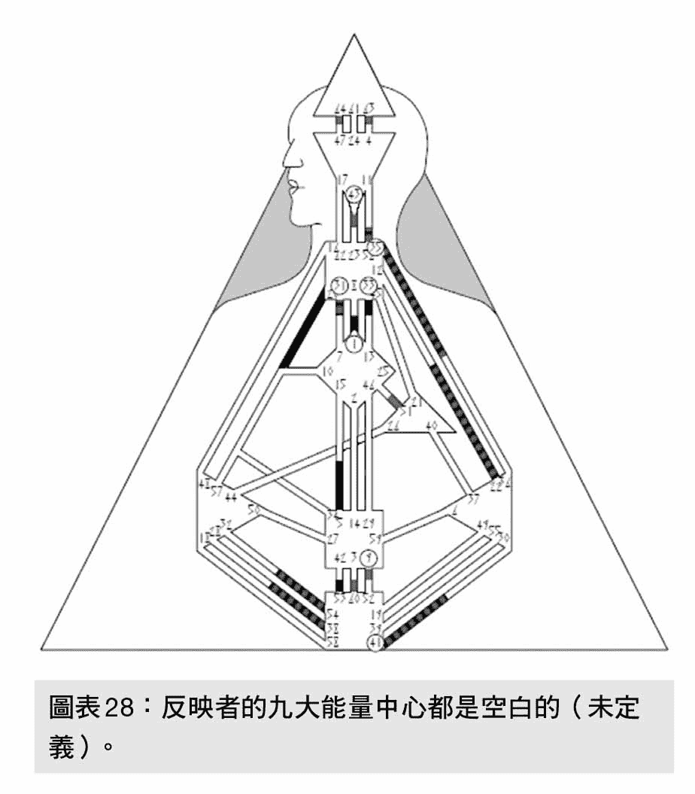

反映者在人类图里是最稀少的人格类型，仅占不到人口的百分之一。他们也是相当罕见和高度敏感的族群，必须和对的人处在对的场域才能感受真正的快乐。反映者应受身边人们的尊敬和珍惜，因为他们担任的独特角色能帮助人们做出增进福祉的决定。

反映者没有内在权威。他们只能透过他人的反映了解真实。在理想社会里，我们身边会存在一群广受支持、作为显示全体境况指标的反映者。

反映者必须等待二十八天的月循环周期以做出正确的决定。他们往往非常多话（健谈），而这正是他们获得清晰思路与明确答案的方式。故而，聆听便是旁人能给予反映者最棒的礼物。

我有幸遇见的几位反映者都是对世上苦难有深层感受，并坚定拥护和平与繁荣，充满热情灵魂的人物。这当中有不少人行脚世界，以行动宣扬理念而获得其他人的认同和响应。

反映者是受月亮主宰的独特族类。你彷彿能透过他们的脸庞看见月亮的耀眼光芒。你或许也能发现，你在人生中遇见的反映者就象是指引欢乐的明灯，而这种景况不论对他们自己或其他人而言都是良好的征象。

反映者此生的目的是如镜子般反照出所处社群的境况。由此可见，快乐的反映者来自快乐的社群，而抑郁的反映者则往往生活在一个不快乐的社群之中。

由于反映者的本质是能量反映，因此他们的制约经验并不会像其他人格类型（尤其是投射者）那般强烈。反映者天生会受所处环境的深刻影响，但也因为他们的天生设计缺乏稳定持续的能量，是以，他们能以抽离的姿态、轻易地反映出事物的原始样貌。

##### 反映者的人类图表

当我们观看反映者的人类图表时，我们很快就能发现其特殊之处。他们没有任何定义的能量中心。因此，闸门对他们来说就相对重要了。这些闸门能量是他们仅有的稳定、持续能量。

##### 反映者的策略：等待二十八天

反映者属于月亮族类。月亮每二十八天会绕过六十四个闸门，完成一循环周期。随着月亮运转，反映者在图表中的能量定义也会随之改变。而根据这种稳定的循环模式，让他们能以此作为决策的依据。反映者的策略是等待二十八天（月循环周期）再做决定。

人类图的解读有助于反映者清楚了解二十八天循环周期在他们的图表中带来的能量变化，是以，他们能知晓在此循环周期里，哪些日子对从事某些活动或做决定具有稳定的能量。

然而，必须等待整整一个月才能确知自己决定的适切与否，在现今步伐快速的社会里实属不易。反映者通常会面临失望的情绪（非自己）主题便是循此脉络而来，他们往往在思路不够澄明、答案尚且未明之前就迫不及待地做出决定。故而，他们时常会后悔自己的决定，并困陷在随之而来的不愉快后果中。

此外，开放的能量配置也会让他们感受到失望的情绪。反映者能深知人类的潜力范围，因此，当人们未充分发挥自己的潜能时，反映者可是看得一清二楚，心知肚明。

在等待二十八天的决策时间里，反映者务必要重视自己有与他人讨论决定的需求。反映者没有内在权威中心。因此，他们必须透过其他人的反映才能看清决定的真相。

对反映者而言，拥有一群能让他们感到自在、且愿意在他们做决定的过程中给予聆听和支持的固定朋友无比重要。由于反映者具有能量不稳定的特质，因此，他们需要得以依靠的稳定能量场。

反映者也必须听从自己唯一真实的内在权威，就是判断是否「感觉良好」。当反映者身处在某个让他们感觉舒畅的场所时，那便是对的场域。反之，当他们处在某个感觉起来不太对劲的场所，无论是到餐厅用餐或是所处的工作职务，那正是提醒他们离开的重要警讯。若是在餐厅里，他们可以决定马上离开，但若是离职，不妨利用完整二十八天的月循环周期确定离开该职务是正确的决定。

当反映者等待二十八天做出决定后，他们便可以放心地依据自己的决定采取必要的行动。不管是决定离职或搬迁，那就大胆地行动吧！成熟的时机精炼出确定的答案，已毋须再等待。

虽然反映者需要大量的独处时间以释放多余的能量（尤其是荐骨能量），但他们也需要与其他人相处互动。隐士般的静谧生活其实并不适合反映者。在一个完善的世界里，人们能清楚辨识出反映者的存在，并关心他们的状态与感受，因为反映者的快乐正是整体社群幸福的反照。

##### 重要特质：不稳定和敏感

由于反映者从自己的内心及他人身上经验无数的能量变化，因此，反映者人生中的每一天可能都是反覆无常、动荡不稳的日子。所以对反映者而言，有时很难判断究竟什么才是稳定可靠的事物和决定。唯一的解决方法是：耐心地以时间面对所有的选择，并透过信任的朋友或家人「反弹」你的想法。的确，要花上一段长时间才能获得清晰明确的答案，这种决策模式在当今社会实属不易，于是反映者往往被迫仓促地做出错误和导致失望的决定。

反映者对于人类的充分潜能具有深刻的觉察。「真实」世界里发生的事件会带给反映者强烈的冲击。战争、苦难和不公不义，让他们的内心如撕裂般难受，全球性的灾难事件也会带来他们巨大无比的痛苦。反映者不妨多留意自己的思惟模式，并找出相应的策略，例如情绪释放技巧（Emotional Freedom Technique, EFT），以面对和处理经验到的失望与痛苦感受。

##### 反映者的健康状况

如同所有缺乏荐骨能量的人格类型一样，反映者在睡眠上可能会面临困扰。因此，在入睡前额外保留一些时间让身体先舒适放松地躺卧床铺，对保持身体健康而言相当重要。

由于反映者开放的能量设计，他们也需要大量的独处时间以释放体内的多余能量。然而，对于需要及天生设定要与人共处的人而言，有时独处会是充满挑战性的一件事，但无论如何，独处有益身心健康。

虽然反映者的开放特质让他们比起一般人，似乎还拥有更多的能量，但就其本身而言，他们却没有任何固有的稳定能量。是以，反映者并不适合从事过于剧烈的运动或劳力工作。只要反映者时刻记得要适量及不过度工作，那么那些让他们「感觉良好」的事物，大致上都能对反映者有益。

由于反映者此生的任务是反映他人的健康状态，因此，他们并不总是能清楚观照自身的健康。他们的生活中最好能拥有一些了解他们、能帮助他们意识自身健康问题的伙伴。当反映者感觉不适时，除了需要好好休养身体以外，也需留意社群的内部状态，察看是否存在造成反映者感觉不适的因素。

##### 身为反映者孩子的父母

反映者孩子需要稳定一致的感觉，转变对他们而言并不是一件轻松的事。此外，由于他们拥有开放的脾中心与自我中心，因此，反映者孩子表现出黏人、需要父母陪伴在旁的情况并不少见。

请记住，「感觉良好」是反映者真实的权威指引。若他们感觉舒适自在，那么他们便处在对的场所。身为反映者的父母，你也许需要协助反映者孩子迁移或调整环境，帮助他们找到能感觉舒适的所在。在孩子所处的学校环境中，也需留意教室的能量里是否存在不安或问题，孩子会反映该能量并说出自己的不良感受。

反映者也会反映出身边友人的状态，结交良友对反映者孩子而言相当重要。别忘了，反映者孩子是所处同侪团体的反照。因此，若他们在同侪中感觉抑郁不乐，父母也许能在孩子的人际交往上给予他们适当的帮助、认识更适当的朋友。

##### 给反映者的肯定语句

• 我能反映周遭的环境。若我的感觉良好，我便处在对的场所。反之，若我感觉不舒服，则需要改变我的所在地。

• 我会尊重自己做决定所需的时间。我会和亲近的朋友讨论我的选择，并仔细聆听他们的反馈意见，从中感受这些选择是否适合我。

• 我对周遭环境非常敏感。我能深刻感受其他人的痛苦和烦恼。

• 我拥有一贯的策略以帮助我面对从外在环境中感受到的强烈失望感。我会寻找慰藉，透过大自然、动物和孩子帮助我恢复内在精神、找到喜悦。

#### 内在权威中心（Authority）

在显示者、生产者、显示生产者和投射者的人类图表中都能找到所属的权威中心。反映者则由于缺乏定义的能量中心，因此除了自身的策略外，并没有实质的权威中心（图表 29）。

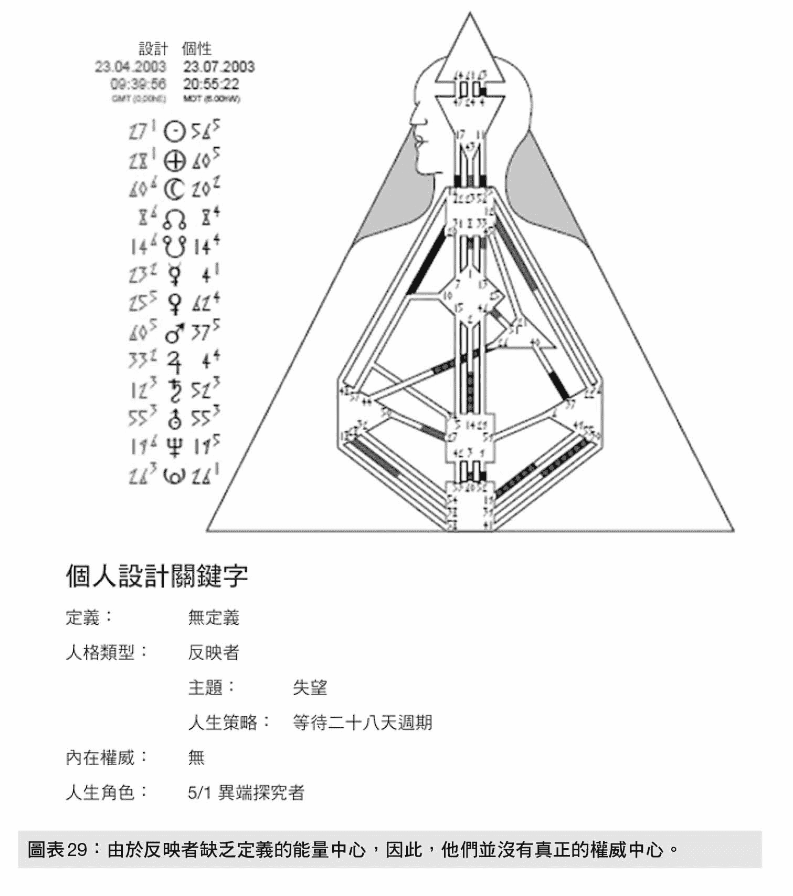

##### 荐骨型权威（Generated Authority）

荐骨型权威代表你拥有定义的荐骨中心且情绪中心为空白。荐骨是你做决定的唯一能量中心，荐骨传送的直觉回应永远会带给你正确的指引（图表 30）。

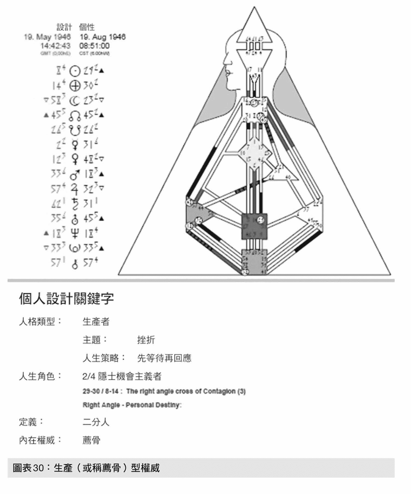

##### 直觉型权威（Splenic Authority）

脾脏是关乎于生存、时间、健康和直觉的能量中心。由于它是维持基本生存的能量，因此分秒必争、不容犹豫；此外，它始终与当下的直觉意向一起运作。你信赖你的直觉，并依从直觉做出的决定来行事。这种方式对显示者和投射者而言并不困难，但有时却会让生产者感到困惑，因为他们可能纳闷脾脏此时是否凌驾于荐骨的回应。若你是拥有直觉权威的生产者，请务必遵从荐骨当下的回应。你的脾脏和荐骨是携手合作的伙伴（图表 31）。

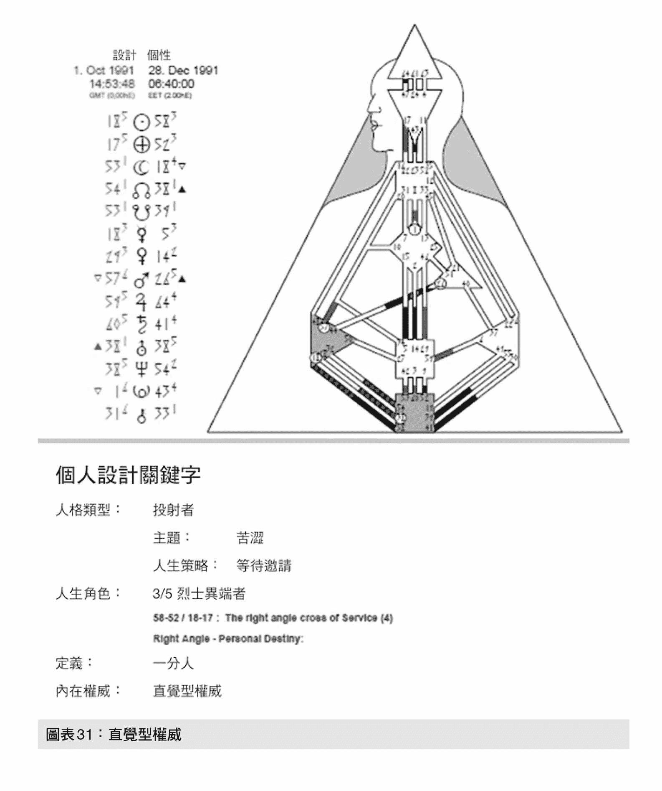

##### 情绪型权威（Emotional Authority）

若你拥有定义的情绪中心，那么它将大大影响你的人生策略。定义的情绪中心是一个充满一阵阵浪潮般涌动能量的动力中心。假设你的情绪中心是填满颜色的，你或许能感受到自己的情绪能量变化频繁或喜怒无常（图表 32）。

情绪中心定义者通常很害怕做决定。他们的过往人生不乏此种经验，比方他们满腔热血地骤下决定，隔了几天却发现自己的心境改变了，但此刻他们必须背负责任去履行那些不再感到兴致勃勃的计划或关系。了解情绪权威中心除了能让你做出更好的决定，也有助于你的决定不受情绪波动的影响。

若你的情绪中心是填满的，那么你天生就不适合冲动行事，就算其他人往往会在无形中迫使你骤下决定。一个拥有情绪权威的人，不待情绪澄澈便仓促做决定，只会为自己的人生带来混乱局面。

反之，你仍要遵从你的人生策略，但你必须等待，等待感觉对了、等待情绪澄明再做决定。

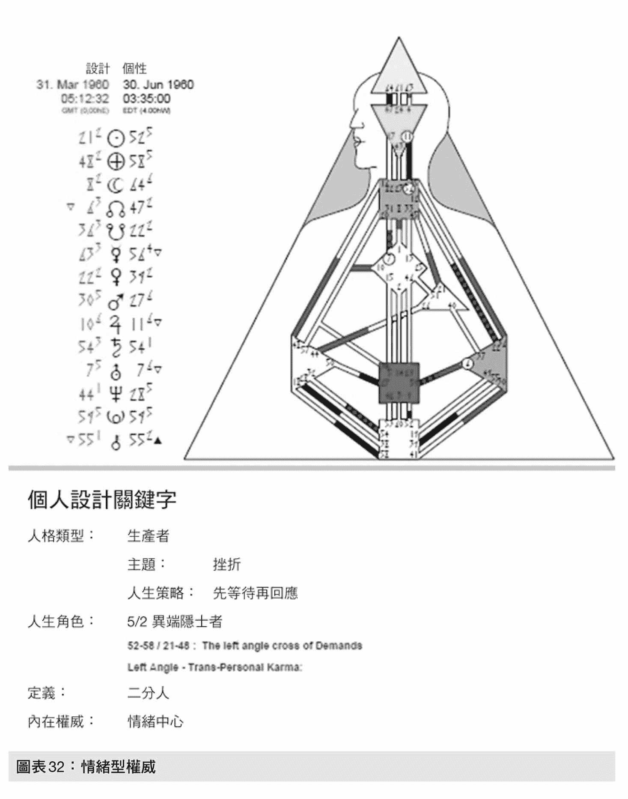

##### 自我型权威（Ego Authority）

唯有显示者拥有自我权威中心。它在人类图表上的呈现方式为，意志力中心与喉咙中心之间有一条开启的通道连结（图表 33）。

拥有自我型权威的人不需要等待就能直接行动；但必须注意的是，你是否已养精蓄锐、准备好在你的人生舞台上大显身手。定义的自我能量以工作和休息的循环方式运作；此外，它挟带的强大意志力很容易将你推至筋疲力竭的状态，进而造成健康损害。若你拥有自我型权威，请在你做出下一个决定之前自我觉察：你是否需要一段休息时间？

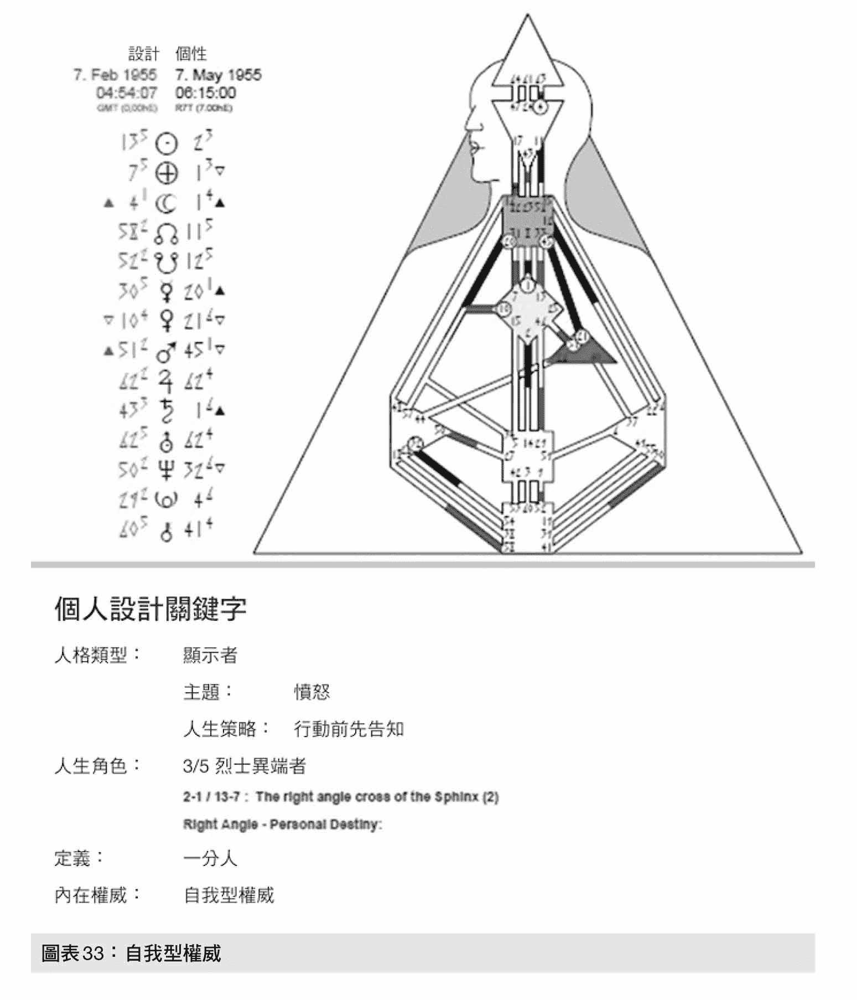

##### 自我投射型权威（Self-Projected Authority）

唯有投射者拥有自我投射型权威。它源于一条开启的通道连结自我中心与喉咙中心，除此之外，并没有其他凌驾能量（例如：情绪或脾／直觉能量）影响（图表 34）。

自我投射型权威意指，你必须透过其他人的反照或投射才能「看清」自己的决定。因此，为了能让你能确知哪些事物适合你，你需要拥有能和你讨论关于你自身选择的亲密朋友圈。藉由聆听自己向他人表述的内容及观察他人的回应，你就能判别某事物究竟适不适合你。

然而，这不代表你必须听从朋友或家人的建议来做决定。你可以不认同他们的见解，但你真切需要透过他们的投射来了解自己的想法和意见。藉由对谈的方式分享你的选择，你会渐渐得到明确的答案。

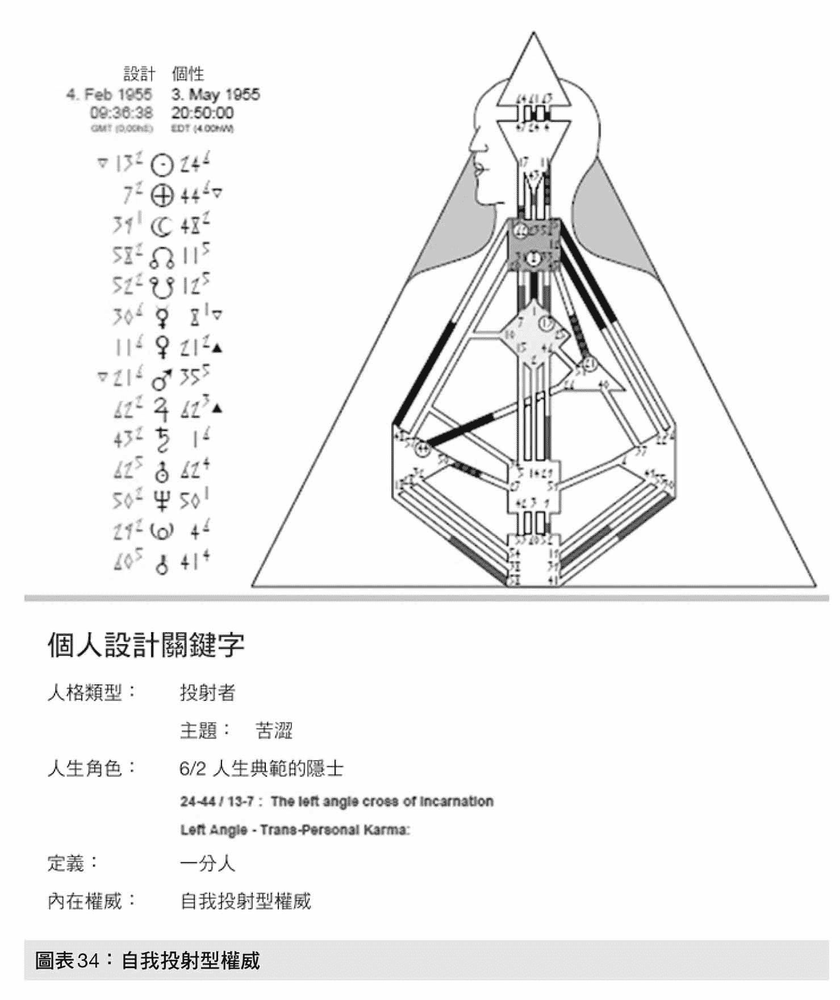

##### 无内在权威（Mental Projected Authority）

无内在权威中心是具有定义的逻辑中心连结至喉咙中心，除此之外，喉咙以下的能量中心都是开放的投射者所有。它和自我投射权威中心相同，代表你必须透过与他人的对谈和讨论来厘清哪些邀请才是适合你的（图表 35 及 36）。

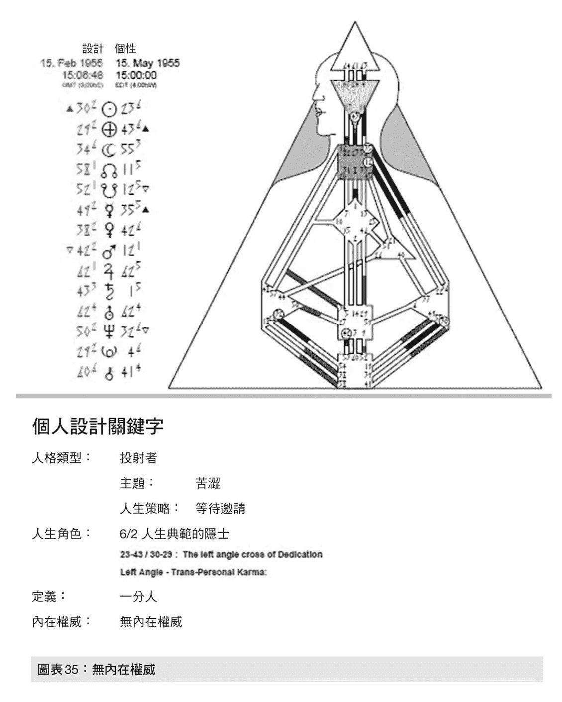

我们每一个人都拥有创造和经验这个世界的独特人生策略。在人类图系统中，你的人格类型和人生策略是你不可不知的重要讯息。若你能依照自己的人格类型来听从你的人生策略，那么，你的人生将不断提升，进而活出真实的自我。

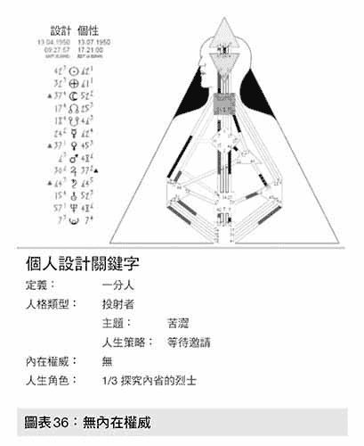

重要的是，虽然每一个人都是与众不同的个体，但只有当我们整合、凝聚在一起时，人类图及整体人类的美才能彻底展现。我们需要彼此；每一个人天生独特能量的作用正是在于帮助彼此、完整全体。

当你认识了自己及身边所爱之人的人格类型，你就有机会开创出发自内心、互相尊重的互动关系。我的人类图个案最常和我分享的心得是，了解自己的天生设计蓝图不仅能帮助自己看见属于自己的那片天空、真心接纳彼此真正的模样，还能不再处处评判他人。这个世界需要更多互相理解的美好体悟，让彼此都能自在活出真实的自我，不是吗？

### 第三章

## 九大能量中心

每一个能量中心负责处理特定的能量。

定义的能量中心拥有固定和稳定的能量。这些能量始终为你存在，并会发散至外界影响他人。定义的能量中心有其专属的主题，但一般来说，比起开放中心时而面临的痛苦经验，它们相对容易处理多了。遵从你的人类图策略生活，你就能活出定义能量中心的美妙与深层作用。它会赋予你始终知道该做些什么的强大力量。

开放的能量中心是空白、未定义、易变的。此处的能量特性是不稳定的，它会取决于你所处的环境和心情。在接下来的每一段落会包含一些有助你面对开放能量中心的肯定语句及自我问答。理解开放能量中心的问题能帮助你和自身的能量一起携手合作，而不再成为外来能量的受害者。

让我们进一步了解九大能量中心及其特征吧。

#### 第一个能量中心：头脑（The Head）

「我的脑袋全白，我是不是脑袋空空的人啊？」

头脑中心的音档下载：

请至[www.understandinghumandesign.com](http://www.understandinghumandesign.com)

　头脑中心位于人体图的最顶端，以一等腰三角形为标志（图表 37）。

头脑中心和大脑里的松果体（pineal gland）有关。这是一个属于灵感的能量中心，并始终承受着回答问题的压力。头脑中心回答的问题取决于附属的三个闸门，其性质为抽象、逻辑或在本质上具有神祕性。它不具引发行动的动能，而是刺激思考的压力中心。

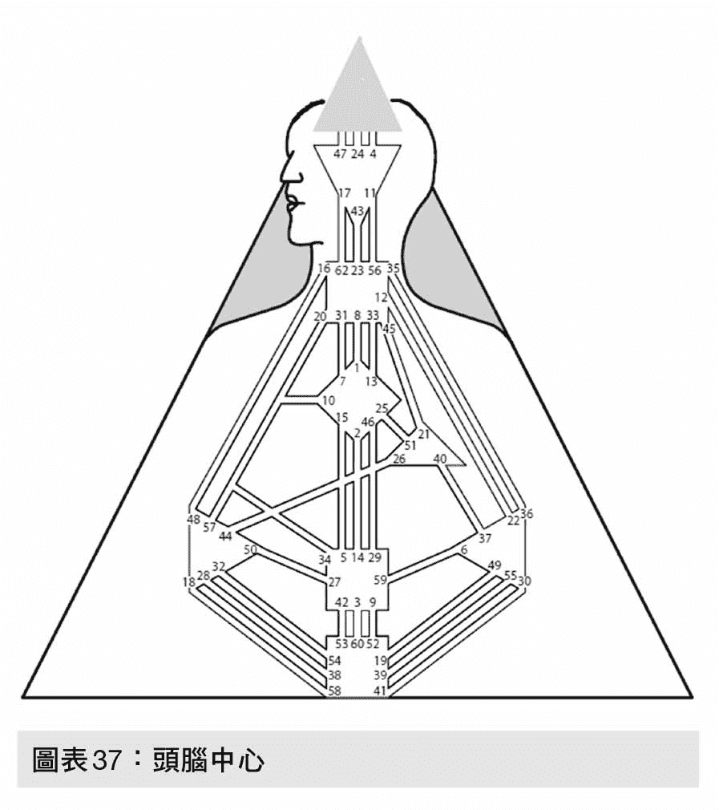

##### 开放的头脑中心

头脑中心开放者没有接收灵感的恒常方式，因此当他们获得灵感时，他们往往会将那些想法吸入脑袋，并不断在脑中放大思考。

若你是头脑中心开放的人，你很容易便感觉自己「受到启发」；除此之外，你也同时感到实践这些灵感的压力。这会让你好像不知道自己在忙些什么，或是毫无计划般尝试各种不同的事物。其他人甚至会提醒你「坚决果断点吧，选择一样事物后，就坚持到底！」对自己的开放头脑中心有所了解的人，便拥有判别哪些人、哪些事物才是真正具有启发意义的能力。他们也能清楚知道：哪些灵感值得付诸实行，而哪些只需观望、仅供参考即可。

头脑中心开放者不仅会在脑中吸收并放大外在世界的灵感，同时也会放大各式各样的问题，这往往会让做决定变得困难。举例来说，假设你打算出外用餐，你原本超级想吃烤起司三明治，但到了餐厅，你的脑袋突然涌入各式各样的灵感（多半是源于邻桌客人点的菜色）；最后你改变主意，点了鲜虾冷盘。当冷盘送上桌后，你却一边吃、一边琢磨自己为何点了这道菜。

你的头脑也许会充满灵感能量，然而，做出适当决定的唯一祕诀便是依据你的人格类型，跟随你的人生策略。

###### ★ 给开放头脑中心者的问句

• 你是否觉得自己总是笼罩在回答他人问题的压力中？

• 你是否发现自己经常陷入在他人的想法和灵感里？

###### ★ 给开放头脑中心者的肯定语句

• 我始终都能感受到深刻的启发。

• 我会跟随我的人生策略，以帮助自己决定该怎么做。

• 我的脑袋里的各种问题是来自于其他人；因此，我只要回应那些真正启发我的问题，而不必费力拆解所有的问号。

##### 定义的头脑中心

定义的头脑中心会填满黄色。由于定义的头脑中心能量始终保持「开机」状态，因此拥有定义的头脑中心者可谓地球上的灵感推动力量；他们会不断发散灵感至这个世界。然而，他们未必能屡屡察觉，因为它属于持续作用的强烈能量。

定义的头脑中心拥有稳定的灵感来源。他们会不断地发问，若得不到解答便会感到焦虑不自在。灵感是一种反思的过程；若你是头脑中心有定义的人：不断思考和解析那些源源不绝的问题固然重要，但千万别仰赖答案来做出人生决定。

头脑中心有定义者往往没有意识到，对于万事万物，他们其实抱持着怀疑或质问的心态。你甚至会发现，他们的脸上似乎总是挂着诧异的表情，这只不过是他们一贯能量的部分展现。

# 当定义与开放的头脑中心相遇时……

当某个定义头脑中心者，进到另一开放头脑中心者的能量场时，前者会「置放」问题至后者的脑袋里。开放的头脑中心会接收此问题的能量，并不断在脑中扩大、增强，最后花上大半时间努力思考或设法解决这个原不属于自己的问题。

若你是定义头脑中心者，而你的孩子是开放者，你会发现，孩子的小脑袋彷彿装了十万个「为什么」、简直是个充满疑问的「问题」宝宝。然而，他们只不过是放大了你自身的问题（无论你是否察觉到这些问题的存在）。

###### ★ 给定义头脑中心者的肯定语句

• 我是个常受到启发及带给别人启发的人。

• 无论我去到何处，我总是能散播灵感的种子，与他人分享我的想法和洞见。

#### 第二个能量中心：逻辑（The Ajna）

「思考是变化多端、辽阔无边的脑部活动。」

逻辑中心的音档下载：

请至[www.understandinghumandesign.com](http://www.understandinghumandesign.com)

逻辑中心以大脑里脑下垂腺（pituitary）的前后叶为根基点，为一察觉中心（图表 38）。

它的功能是探究和概念化。

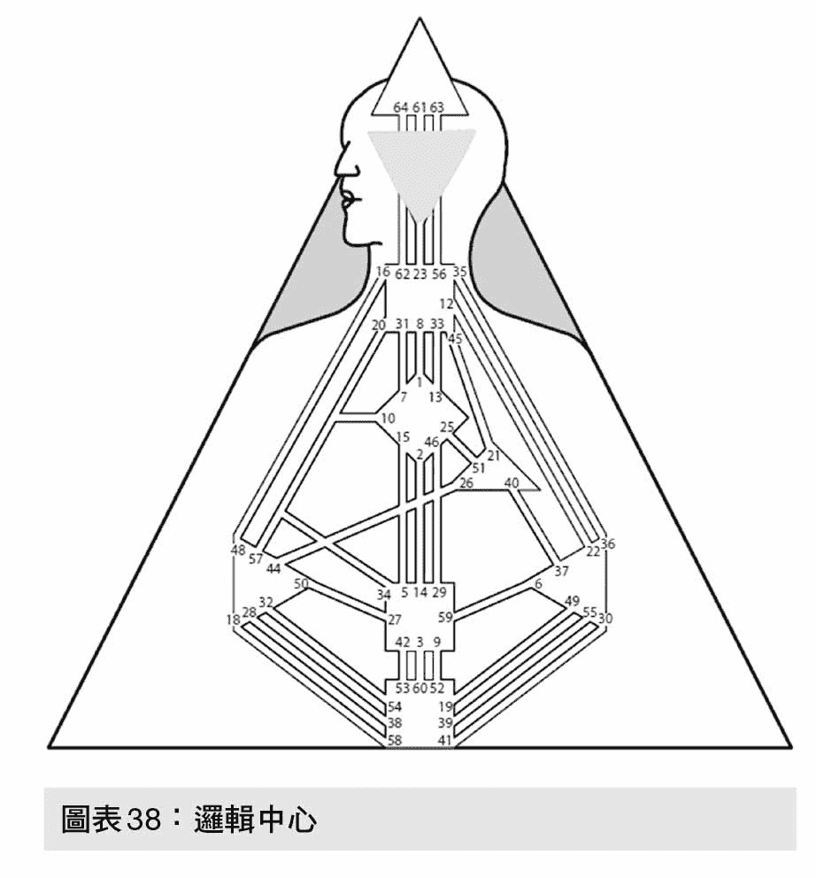

##### 开放的逻辑中心

逻辑中心开放的人，能从多面角度看待任一问题。他们非常公正、审慎明智、善解人意且拥有开阔的心胸。开放的逻辑中心是聪明与智慧的象征。它没有固定的思考模式，因此能以广阔多元的方式处理和理解讯息。拥有开放逻辑中心、且懂得放松的人，会成为洞察他人心思的佼佼者。

由于开放逻辑中心的设定功用是吸收讯息和想法，并从各种不同的理解层次与角度看待事物，因此，「锁定」某一固定的想法或信念，对开放的逻辑中心会是一种挑战。他们也许努力尝试就能持有固定的想法，但这个过程并不容易，或可谓违背天性。若你是开放逻辑中心者，你或许曾被告诫「你应该对某事物下定决心，义无反顾、坚持到底！」请记住，你的人生课题之一是在各种想法和信念中学习、得到智慧，但你却不一定要采纳任何一种想法。运用你的人类图策略和内在权威得出的信念，才是值得你坚信的真理。

###### ★ 给开放逻辑中心者的问句

你对自己做出的决定是否感到信心不足？

###### ★ 给开放逻辑中心者的肯定语句

• 我能开放地接受各种讯息和信念，并从中得到智慧。

• 我的天赋是能从各个面向观看某一问题，并且拥有各种充满弹性与变化的见解。

• 我不需要下定决心。

• 我会随时写下那些我想要记住的事物。

##### 定义的逻辑中心

定义的逻辑中心会填满绿色，其设定功用为保有信息。虽然定义的逻辑中心可靠且值得信赖，但它的构思方式却是固定不变的。请特别留意：头脑是伟大的智库，却也是做决定的可怕深渊。记住，任何一个决定都不该源自头脑！

# 当定义与开放的逻辑中心相遇时……

当定义逻辑中心者踏入开放逻辑中心者的能量场时，后者会将前者脑中的想法纳入自己的脑袋，并在不知不觉中，将它们视为自己所有。拥有定义逻辑中心的父母在教养逻辑中心为开放的孩子时，常要求他们以特定的方式思考，但这往往会带给孩子巨大的思考压力。开放逻辑中心的思考模式是变幻无常的；此外，他们脑袋接收的所有讯息都是间接的二手材料。对孩子而言，若父母迫使他「照我的逻辑方式思考」，其实会让他感到非常焦虑和难受。

###### ★ 给定义逻辑中心者的肯定语句

• 我会尊重自己的思考模式。我也会牢记在心：思考讯息的方式相当多元，不单只一种。

• 我天生便拥有对事物抱持确信的能力。

• 我会仔细聆听他人的想法，并以友善的态度包容无限的思考。

#### 第三个能量中心：喉咙（The Throat）

「嘴巴冒出的言语挟带力量。请带着谨慎态度及责任心开口说话，并学会尊重言语的能量。」

喉咙中心的音档下载：

请至[www.understandinghumandesign.com](http://www.understandinghumandesign.com)

你曾有多少次觉得根本没有人认真听你说话而感到挫败和气馁？你是派对里的灵魂人物，但在欢乐结束后，你是否感到自己的喉咙疼痛或沙哑？你的孩童时期是否因为太爱说话，而常常被老师处罚？上述这些例子是当你没有依据喉咙中心的适当策略生活时，可能会发生的情况。

喉咙中心是甲状腺与副甲状腺的象征。喉咙中心在人体图上的位置呈现，为位在头脑和逻辑中心下方的正方形（图表 39）。它是代表沟通及展现行动的能量中心。

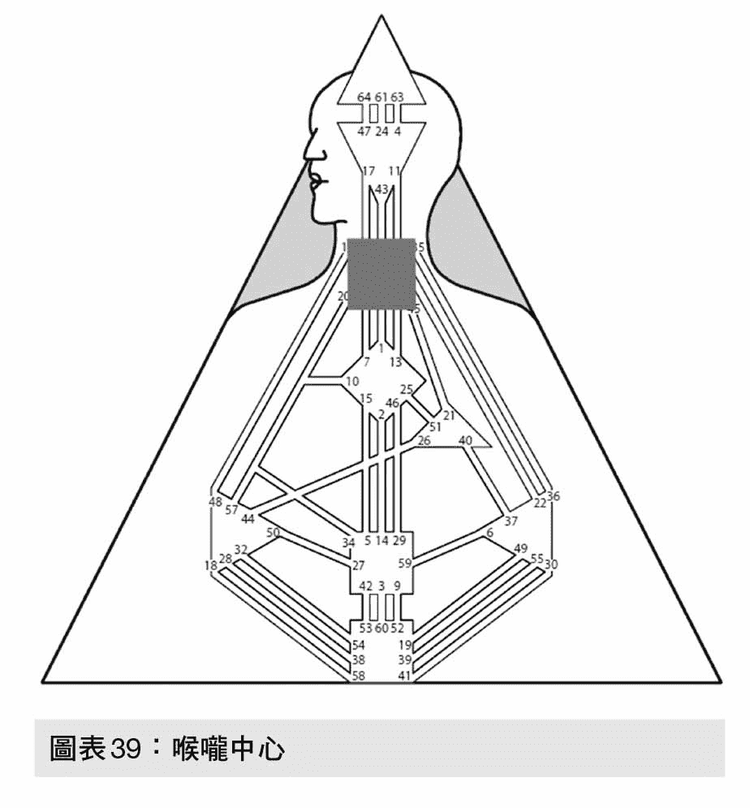

##### 开放的喉咙中心

喉咙中心上有十一个闸门，而闸门的启动与否会影响我们的说话方式。拥有白色（或开放）喉咙中心的人，总觉得自己笼罩在「开口说话」的压迫感中。但在学校或是团体生活中，此种情形往往会招致诸多问题。开放喉咙中心者经常脱口说出某些评论或是答案，他们有时是不由自主、甚至不知道自己怎么会迸出这些言语（若逻辑中心也是开放的，这种情况会更加显著）。

然而，开放的喉咙中心其实蕴藏着深厚的才智。许多优秀的歌手（象是席琳．狄翁）与知名演讲者（例如前美国总统柯林顿）便拥有开放的喉咙中心。他们与不同的人相处时，就能以不同的方式谈话。开放的喉咙中心也具有精通外语口说和仿效他人演说样态的潜能。

为了能让开放的喉咙中心及甲状腺保持健康，依据你的人生策略来表达言语是你必须谨记在心的重要指引。我常常鼓励开放喉咙中心者不妨尝试沉默；参加派对或是聚会时，试着不要发言，除非你收到某些需要回应的语句或是加入一场对话的邀请。若你保持沉默，你的能量场会为你发声！你只要耐心地等候、静观其变。人们一定会主动来和你谈话！

###### ★ 给开放喉咙中心者的问句

你总是想搏取注意力，好让自己被听见、被看见吗？

###### ★ 给开放喉咙中心者的肯定语句

• 得到发言的邀请时，我的言语就会获得被认真倾听的最佳机会。

• 我会保留我的话语给那些真心重视我的言语和观点的人。

##### 定义的喉咙中心

定义的喉咙中心会填满棕色。它的设定功用为言语表达，但其讲述的方式又取决于它与哪些能量中心相连。了解喉咙中心的连结配置，正是理解自己是如何与他人沟通的重要步骤。举例来说，若你的喉咙中心与逻辑中心相连，你就是自己脑袋想法的最佳发言人。若喉咙中心连结到情绪中心，你便具有如实抒发和表达自身感受的能力。

定义的喉咙中心若要让自己说的话被认真聆听，很重要的关键是必须依据自己的人生策略来开启沟通的大门：显示者和显示生产者能直接发言，生产者则需要回应，投射者要等待发言的邀请，而反映者则属无定义的喉咙中心。

有效的沟通是增进个人及整体人类福祉的重要因子。试着跟随你的人生策略吧！你将发现，你的人际关系质量将会神奇地改善、提升。

# 当定义与开放的喉咙中心相遇时……

在我的谘商生涯里，我经常听见个案抱怨着另一半总是不愿表达或分享自己的情绪感受。当我比对两人的人类图后，我发现，那些被认为是木头般、「没血没泪」的人，几乎都是情绪中心与喉咙中心之间没有开启的通道连结。我通常会建议这些伴侣们，不妨到半公共的场所（例如：餐厅）互相表达各自的情绪感受。因为在那样的空间里，他们能接触到其他的能量场，进而得到有助于有效沟通的连结。

###### ★ 给定义喉咙中心者的肯定语句

• 我会带着负责任的态度发表言语。我也会知道自己所说的话是源自身体的哪个能量中心。

• 我能尊重他人的发言权，也能透过我的言语内容，将其他人括入分享与互动的行列。

#### 第四个能量中心：自我／G（The Identity）

「你是谁？」

自我中心的音档下载：

请至[www.understandinghumandesign.com](http://www.understandinghumandesign.com)

在人类图系统中，自我中心是非常重要和特别的能量中心。它与爱和方向有关，也是灵魂坐落的位置。自我中心代表肝脏；也称作「G 中心」（G-Center）或「磁单极」（Magnetic Monopole），位在人类图表的正中央，会以一菱形方块呈现（图表 40）。

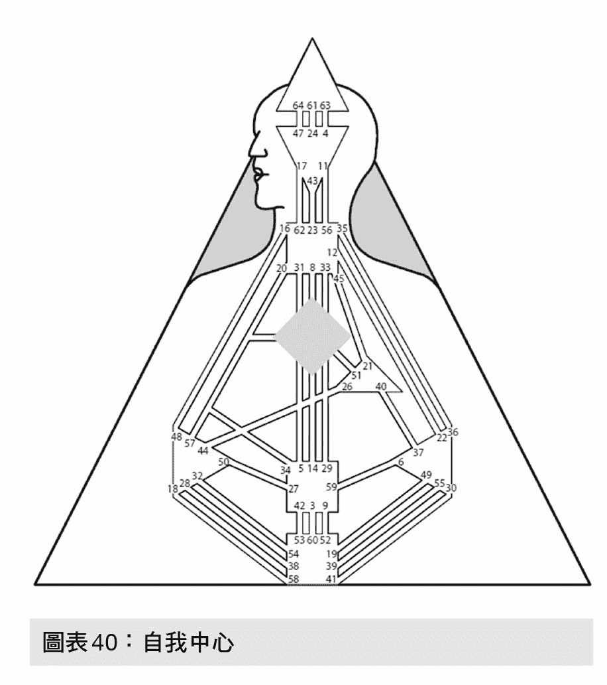

##### 开放的自我／G 中心

自我中心开放的人，能领会其他人的自我意识及方向。他们会吸收别人的身分认同能量，并将它放大增强，而获得洞察对方观点的能力。我认识的许多治疗师、教师、灵媒等，便是拥有开放自我中心的人。

由于自我中心与方向有关，因此对开放自我中心者而言，能在恰当的时机点、处在适合的地方极其重要。那些自我中心开放的个案曾向我描述道，当他们处在适合的地方时，彷彿能感觉到身体里的细胞都自在地呼吸、通体舒畅。对他们来说，能居住在适合的城市、到恰当的餐厅用餐、待在适合的办公室……就会感到如释重负似的安心。处在适合的地方也能让他们得到适合的机会。

反之，若开放自我中心者处在错误的地方，他们同样能强烈深刻地感受到。如此也会造成错误的机会纷沓而来，或根本没有机会上门。

开放自我中心者表达自我的方式，会取决于当下相处的对象而有所改变。青少年的父母尤须留意此现象；开放自我中心的孩子相对容易受同侪压力的影响，也极有可能融入小团体或帮派，成为其中的一份子。

由于开放自我中心者拥有动态的自我意识及方向感知，因此他们经常会担心自己得不到他人的喜爱。他们对自我的身分认知总是不断改变，也进而造成他们接收爱的方式变化万千。基于上述原因，开放自我中心的孩子有时特别容易受「自尊」问题的影响。许多父母往往会希望这些孩子去「寻找自我」，然而，这并非他们的人生目的；他们此生的课题之一，是在经验和感受他人中学习，进而得到人生智慧。

我会建议开放自我中心者，不妨办个聚会或派对吧！开放的自我中心拥有感受他人的无限才能，他们往往能结交各行各业里各种不同类型的朋友。毒贩和地区检察官互相认识有何不可呢？尽管来自不同领域，但他们都是开放自我中心者的朋友。这是关于人类的有趣研究，探看哪些人会莅临开放自我中心者的「人生派对」！

###### ★ 给开放自我中心者的问句

• 你是否发现你很容易采纳或吸收身边人们的性格？

• 你是否怀疑自己的被爱能力？

###### ★ 给开放自我／G 中心者的肯定语句

• 我是如何感知自己，会取决于我的相处对象而有所改变。因此，我会选择结交那些能让我感到自在安心的朋友。

• 地点和场所对我非常重要。我会主动创造出能让我感到抚慰和放松的环境。

• 当我处在适合的地方时，适合我的机会就会到来。

##### 定义的自我／G 中心

若你拥有定义的自我中心，你的人生目的之一便是给予爱。你的自我意识相当稳固；虽然你知道「你是谁」，也明白你的人生方向，但对于该如何到达目的地，你却并不总是清楚知道。

自我中心至喉咙中心有开启通道相连的人，很容易受到批评；因为他们的创造表现力是直接源于自我中心。

###### ★ 给定义自我／G 中心者的肯定语句

• 我就是我。

• 我的所有行为都是自我的展现。

• 我颂扬真实自我的美好。

# 当定义与开放的自我中心相遇时……

当定义与开放的自我中心者相遇时，开放者会吸收定义者的身分认同能量。若你能察觉自己天生的开放设定，你就会知道自己正经验、感受着对方的身分，并且领会或欣赏他们的自我模样。这可谓相当理想的能量配置，因为开放者在某种程度上，能将自己「变种」成与对方相同的自我。但其中的关键要点是，无论如何，开放者都要忠于最真实的自己。

我发现具此种能量搭配的伴侣最大的挑战在于，开放自我中心者通常很难决定方向（尤其是伴侣关系中的方向）。相较之下，拥有定义自我中心的另一方就非常善于指引方向。然而，若你带有传统的性别观念，认为「引导」是男人的责任，那么你们的相处关系就会变成棘手难事。指引方向对开放自我中心者而言，天生注定不是一件容易的事。改善之道在于：摒除那些传统的性别刻板印象吧！

另外，开放自我中心者也须注意，别在关系中「迷路」。根据你的人格类型来跟随你的人生策略，你就能确知自己在关系里的方向。

#### 第五个能量中心：意志力／Ego（The Will）

「意志力的奥妙之处，便是你得拥有一些意志力。」

意志力中心的音档下载：

请至[www.understandinghumandesign.com](http://www.understandinghumandesign.com)

意志力中心位于自我中心（人体图正中央的菱形）的右边，以一个小三角形呈现（图表 41）。它是关于心脏、胃、胆囊和胸腺的能量中心，也是四个动力中心之一。

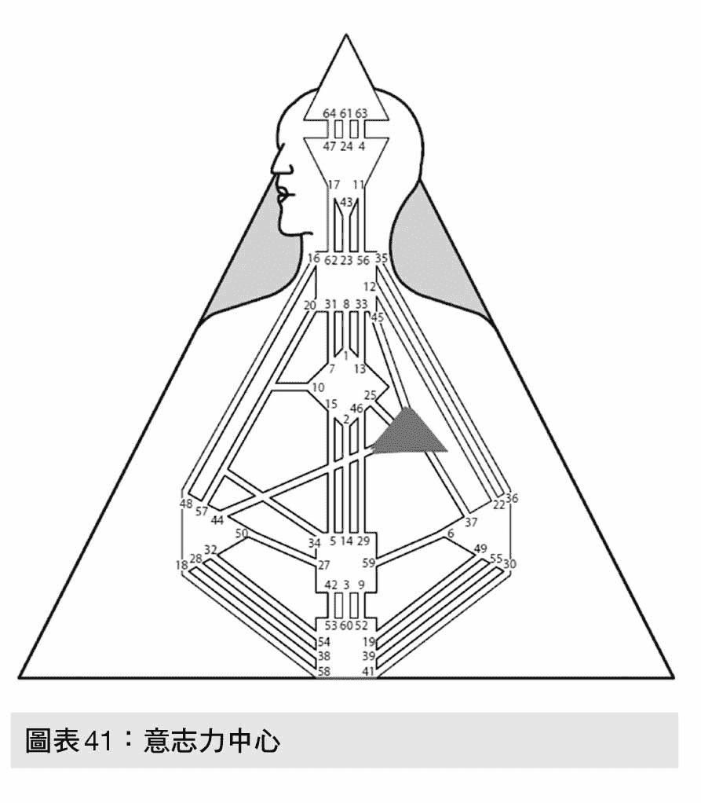

意志力中心是负责将事物实现于物质层面的动力引擎。它在人类图系统中，属于和金钱、交易有关的回路；它积极强力地追求和价值、商业管理、资源分配相关的事物，也是一股无畏险阻、不顾一切完成任务的能量。

##### 开放的意志力／Ego 中心

你在人生中，曾有多少次尝试着要节食减重、戒菸或是养成规律运动的习惯？你每天耗费多少精力设法做好你认知的「份内工作」或是完成你承诺的任务？

嗯，在此请诚实面对自己吧，你其实缺乏意志力。然而，这并不是性格的缺陷。绝大多数的人都缺乏意志力（这也许会让你释怀一些）。由于大部分的人（约占总人口的百分之六十三）未拥有定义的意志力中心，因此，也就缺乏稳定的意志力能量。

若你是意志力中心开放的人，能以你的人生策略做出约定和承诺极其重要。若非如此，你将运用自己实际上缺乏的能量，并面临陷入错误境遇、却还背负完成责任的风险。你也可能因此错失适合你的机会，因为你仍费心费力地逼迫自己从事你根本不想做的事情。

此外，由于意志力中心也关乎价值和物质水平，因此往往会造成你轻易地贬低自己的价值。就意志中心开放的人而言，主动对自己提供的商业服务索取低价，或甚至免费效劳都是很常见的现象。我常会鼓励意志力中心开放的个案，不妨针对他们提供的服务、调查现今市场的价码，以此衡量自己的收费标准。若你受雇于他人，也请评估自己的报酬是否合理。

由于开放的意志力中心会受到意志力证明需求的刺激驱动，因此我也会建议你在做出新的约定前，试问自己究竟想证明什么？你想证明自己是个友善仁慈的人吗？或是你想证明你的能力比一般人还强？

别忘了，开放的能量中心是我们最深沉的智慧来源。开放的意志力中心能帮助你领悟生命中真正有价值的事物为何。随着时间和经验的累积，你会渐渐体会自己在事业领域及自我人生中的价值。你也会更能清楚掌握自己何时该工作、何时又该休息。

许多人也许会纳闷，如果我没有意志力，我怎么能完成任务呢？你确实可以，只是你必须根据你的人格类型、跟随你的人生策略来做出每一份承诺。开放意志力中心者务必要铭记在心：遵从你的人生策略能让你的人生更顺畅。我们每一个人都受制约影响，而相信人人皆有意志力。这是一个信奉「做就对了」的社会。但假使我们背弃自身的人生策略、强迫自己「做就对了」，可以预期我们不仅无法如愿，最后甚至会感到自己一文不值、疲惫不堪。

举例来说，假设你是个生产者，你注意到你的邻居似乎正准备粉刷他的房子。你主动开启友善的对话，并在不知不觉中，自行提议明天一早会来帮忙油漆工程。你的邻居当然接受了你的慷慨心意。隔天早上睁开睡眼，你便后悔自己当初的友善提议，并思索着某些能让你抽身的合理借口。你打算装病，或甚至编造其他的谎言。但你的良知最后战胜了所有念头，于是你还是出发赴约了。

在辛苦了大半天后，当晚你拖着痠痛和疲累的身躯入睡，感觉难受极了！而你的邻居除了同样感到疲累外，还带着些许失望，因为你的帮忙并不如他的预期。他现在还得闷不吭声地回头收拾那些你「帮忙」的残局。

请记住，生产者的策略是「等待，再回应」或「给予他人得以回应的事物」。由于你并没有遵从自己的策略，就匆匆踏入约定，因此事件的发展渐渐荒腔走板、不如预期。再者，你忽视自己当下的真正感受和意愿，在缺乏意志力的天生条件下，仍强迫自己去履行约定，最后便落得筋疲力竭的结果。

假使你等待邻居主动征求协助，或你先询问他是否需要帮忙（回应，或给予他人得以回应的事物），事件的发展是否会有所不同呢？你也许就不会卷入之后让你感到有责任执行到底的约定。你的荐骨回应会预防你做出错误的约定或承诺。

###### ★ 给开放意志力／Ego 中心者的问句

你想设法证明什么？

###### ★ 给开放意志力／Ego 中心者的肯定语句

• 我会非常谨慎地做出承诺，并记住只跟随我的人类图策略。

• 我不需要证明任何事，我会发自内心看重自己。

• 我会无所畏惧且充满自信地要求我应得的报酬。

##### 定义的意志力／Ego 中心

定义的意志力中心在人体图上会填满红色。若你的意志力中心是有定义的，你便拥有稳定的意志力能量。你也可能非常固执倔强。

若你是定义的意志力中心者，假设你决定要开始每天晨跑，即便你并不热爱这项运动，你也能轻易地就让自己养成按时晨跑的习惯。你也许会中断、休息几天，但不久后，你又能重拾规律，继续坚持。

对定义的意志力中心者而言，承诺和履行对你的自尊至关重要。请认真看待你的承诺，因为它需要时间和能量才能贯彻到底，而你总会信守承诺、说到做到。

定义的意志力中心运作方式是「工作，接着休息」。暂时从繁忙的工作脱身或是定期休假是必不可少的安排；若你过度鞭策自己、丝毫不给自己喘口气的机会，你的心脏或消化系统就很有可能出毛病。

若你拥有定义的意志力中心，你会强烈地赋予其他人一种彷彿他们无所不能的能量。只要这些人处在你的能量场里，他们的确无所不能。举例来说，假设你是一位拥有定义意志力中心的励志讲师。在你讲课的过程中，学生们都沐浴在你的意志力能量里；他们感到备受启发，并下定决心要实践你传授的所有知识。然而，大部分学生回到家后，从未真正贯彻那些新学到的知识。因为他们离开了你的意志力驱动能量场，但却无法从自己身上获得半点意志力。

# 当定义与开放的意志力中心相遇时……

当开放与定义的意志力中心能量交流时，会擦出奇妙的力量火花。定义的意志力中心具有持续的坚定后盾和关于价值的能量。别忘了，这种定义的能量是固定不变的。因此，定义意志力中心者拥有货真价实的意志力；当他们下定决定要做某事时，他们往往会说到做到。

开放的意志力中心会放大定义中心的意志力。他们得到的是授权式的活跃能量，要特别留意自己是否困陷在此种能量挣扎中。就短期而言，意志力得以放大；但由于开放的能量并不具持续力，定义的意志力中心最终会削弱开放意志力中心的能量。简言之，在这场意志战役中，定义的意志力中心永远是最后的赢家。

宽待周遭那些不同于你、无法「做就对了」的人吧。事实上，绝大多数的人都缺乏意志力，并且他们会以不一样的方式做出他们自己的约定。

###### ★ 给定义意志力／Ego 中心者的肯定语句

• 休息和恢复我的意志力能量对我非常重要。

• 我会谨慎做出承诺，并实践自己的诺言。

• 我会宽容看待我对他人的期望。因为我知道，并不是每一个人都像我一样拥有意志力。

#### 第六个能量中心：情绪（The Emotional Solar Plexus）

「当一面筛子吧，别成为一块海绵。」

情绪中心的音档下载：

请至[www.understandinghumandesign.com](http://www.understandinghumandesign.com)

情绪中心位在人体图的最右边，以一个大三角形呈现（图表 42）。情绪中心与肾脏、胰脏有关。它属于四个动力中心之一，其情绪能量如浪潮般起伏涌动。

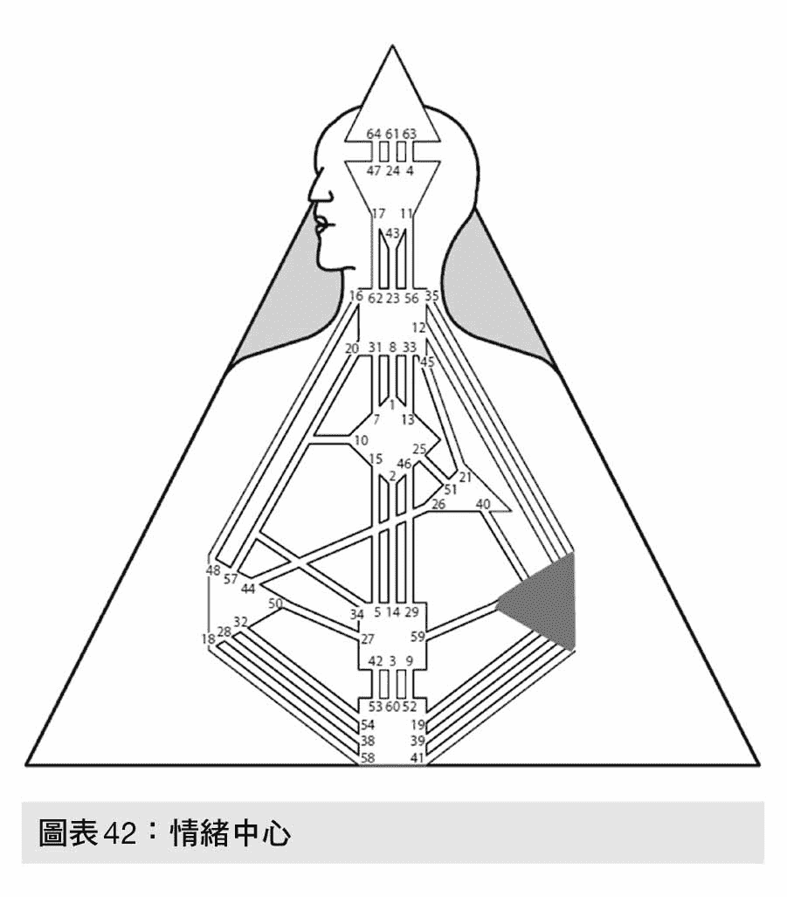

##### 开放的情绪中心

约有一半的人口拥有开放的情绪中心。情绪中心开放者此生的课题之一便是了解情绪能量、渐渐懂得掌握内心的感觉。若你的情绪中心是开放的，你便具有强烈的同理心，并会吸收、放大他人的情绪能量。

这是很棒的天赋！我本身拥有开放的情绪中心，我便会运用这项特质作为更了解个案情绪状态的方式之一。许多开放情绪中心者非常擅长销售工作，因为他们能够马上察觉客户的情绪状态，进而为客户量身打造出相应的推销话术。

由于开放的情绪中心会吸收、放大情绪能量。因此，若你不了解它的运作模式，这也将会是一个让你饱尝痛苦的能量中心。你很容易就认为自己感受到的情绪是属于你的，而假设周遭某人带着负面的能量，当这些能量渗入你的意识层面时，你就会感到难受。也因此开放情绪中心者普遍会发展出一套包括了友好、讨喜、避免冲突及低调生活的非自我应变策略。

开放情绪中心者并非软弱或缺乏个性。只是对他们而言，踏入高度紧张的情绪场域确实会让他们非常痛苦。因此，他们务必要学会察觉情绪能量，如此就能让该能量的频率波动穿越而过，却不会让你感觉要为这些情绪负责，或是你必须要收拾或修补这些情绪。试着让自己成为情绪的筛子吧！而不是全盘吸收的海绵。

通常那些情绪表现始终充满戏剧性的孩子，都拥有开放的情绪中心。开放情绪中心的孩子会接收、放大家人的情绪能量。然而，这些孩子的本性也许非常温和，只是从未经验过如此多的情绪能量罢了。

###### ★ 给开放情绪中心者的问句

你是否避免真相和冲突？

###### ★ 给开放情绪中心者的肯定语句

• 我能在当下做决定。

• 我会仔细注意我的情绪来源。此外，我不会将他人的情绪经验视为自己所有。

• 我非常敏感，我信任自己对他人情绪的洞察力。

• 当情绪能量过于强烈时，我会好好休息、让自己回复平静的状态。

##### 定义的情绪中心

定义的情绪中心会填满棕色。拥有定义的情绪中心者约占人口的一半，他们始终保有情绪能量。

连结情绪中心至其他能量中心的开启通道会决定你感受到的情绪波。某些人经验的情绪波频率只有微小的起伏波动，而某些人则会感受极高的情绪高峰、极低的情绪低谷，其高低落差显现出情绪高原的样貌。

由于情绪能量波浪般的特征，往往会让人将波浪低谷的悲伤情绪误认为忧郁症。若你拥有定义的情绪中心，在你试图为自己的低落情绪找出根本原因时，忧郁症可能就会成为头号嫌疑犯。我们的社会文化对负面情绪存有诸多不良评价。然而，并非所有的负面情绪都是消极、具有毁灭性。悲伤情绪或是情绪波的低谷，它同时也是极为重要的创造能量；它让某人能以许多不同的情绪观点评价某一事物。

情绪中心有定义的人不妨试着每天记录你的情绪能量。每个人都有其独特的情绪变化规律，而了解自己的情绪模式有助于你做出明智的决定，也能让你推测自己达到情绪澄明需要的时间范围。

由于你是以波动的方式经验情绪，因此懂得尊重你的情绪过程至关重要。定义的情绪中心为你恒常的内在权威，是以无论你属于哪种人格类型，在采取行动或回应前，都必须等待情绪澄明。拥有定义情绪中心的个案曾告诉我，当他们情绪澄静、准备好做决定时，都能发自内心感受某种内外协调的「默契感」；但他们也表示，就算情绪清明，他们还是会在某种程度上，对自己的决定带有些许的紧张不安。在采取行动前，先停下来、等待适当的情绪状态到来，就能预防自己做出后悔莫及的冲动决定。

###### ★ 给定义情绪中心者的肯定语句

• 我有充足的时间做决定，也知道经过一段时间后，我会到达情绪澄静的状态。

• 我天生的设定步调是从容谨慎，而非冲动自发。

# 当定义与开放的情绪中心相遇时……

人与人之间的情绪能量交流会因为情绪中心的定义与开放而增添不同风味。当两种相反的情绪中心相遇，进而产生强烈的情绪作用时，情绪中心开放者往往是表现出极端或其他剧烈情绪反应的那一方。别忘了，开放中心会吸收、放大能量。

定义情绪中心者会经历情绪的波动，反之，开放情绪中心者会吸收、放大那些情绪波。我和我的另一半都是开放情绪中心者，而我们的四个孩子中，只有一个拥有定义的情绪中心。某天，我和另一半站在厨房愉快的聊天。我们那位拥有定义情绪中心的女儿碰巧经过厨房，而过没多久，我和另一半不知怎的吵了起来！

当我察觉事情的始末后，我才发现，原来女儿当时正处于情绪波的低谷，她的情绪频率正巧传送到厨房，也就是这一刻，我和另一半在那儿吸收并放大了这股情绪能量。知晓此种能量的特质，并懂得让它流动经过、不过度反应是一段非常美妙的过程。

两个开放情绪中心者之间可能会产生更剧烈的情绪作用。当情绪火苗在两者间窜行时，这股能量会在当中反覆来回、不断放大增强。

对开放情绪中心者而言，处理冲突最好的策略便是离开让你感到不适的能量场。打破能量场域能让情绪能量离开你的身体系统，如此，你就能快速降低紧张的强度，最后再以平静的态度面对问题。当双方都能理解在此过程中，彼此都需要缓解的空间时，就能较轻易处理日常生活中的大小冲突，而不至于破坏组成关系的亲密结构。

双方都拥有定义情绪中心的伴侣也务必要学会互相尊重，并时刻意识对方经验的情绪波动。假设一方正处于情绪波的低谷，而另一方则相反，就会构成相当有趣的组合。双方都该了解：情绪能量并不代表个人。不带批判、容许彼此经验情绪的波动对这类组合关系极为重要。

#### 第七个能量中心：根部（The Root）

「笼罩在渴望自由的压力中。」

根部中心的音档下载：

请至[www.understandinghumandesign.com](http://www.understandinghumandesign.com)

人体图最下方的正方形为根部中心（图表 43）。它是有关肾上腺素的能量中心，也是人类图系统中的两大压力中心之一（另一个为头脑中心）。根部中心能量以动力驱动的方式运作。

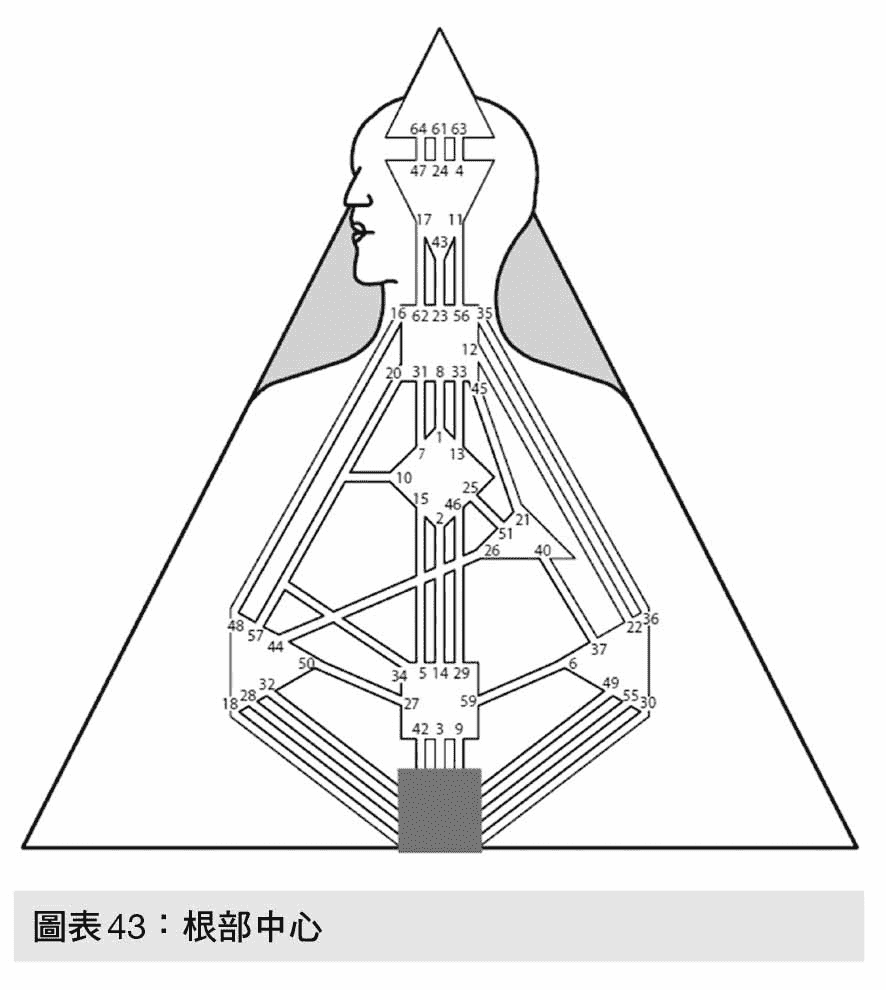

##### 开放的根部中心

若你的人体图最下方的正方形呈现白色，你便拥有开放的根部中心。开放的根部中心会吸收、放大他人的肾上腺素能量。你或许喜欢站在一大群人面前、享受成为焦点的快感，或热衷于其他能让肾上腺素激增的体验，象是跳伞或高空弹跳。从一般的角度而言，开放根部中心者会选择相对安全的肾上腺素刺激物，象是咖啡因或巧克力。

由于根部中心为压力中心，因此，开放根部中心者有时会笼罩在渴望自由的压迫感里。换句话说，以这种方式处理能量的人很难放松或尽情玩乐，除非他们已完成所有的工作任务。虽然「先完成工作、再享受玩乐」似乎非常合理，但对根部中心开放者而言，他们承受着必须完成任务的压力，却完全不允许自己腾出时间来恢复精力。最终，他们会感到筋疲力竭，连带造成工作效率低落。

有时候开放根部中心吸收的能量会让人难以负荷，进而导致精神压力，甚至是怯场、恐慌症的后果。每个人对自身开放能量中心的敏感度各有差异。

开放根部中心的实质认知是，工作永远没有做完的一天。假使你交付一项任务给开放根部中心者，他们便会为了脱离完成任务的压迫感而快速执行。当然了，虽然他们的办事效率极高，但在迅速的步调中，常常会出错或略过某些必要过程（尤其当这些人是显示生产者时，更是如此）。

自然而然地，人们往往会分派更多工作给这些人，且由于愈重的工作量也代表他们承受着愈大的完成压力，因此他们会更卖力、实现更多成果。这便成为永无止境的循环。这类人应当意识到，开放的根部中心只是身体的能量中心之一，你不需沦为该能量的受害者。摆脱束缚、让内心自由自在吧！

###### ★ 给开放根部中心者的问句

你仍设法完成工作，好让自己解脱吗？

###### ★ 给开放根部中心者的肯定语句

• 我会设定切合实际的目标。

• 我决定要让自己感到自在，并且知道事情的完成就如水到渠成。

• 我能运用压力创造出更多能量。而在一天结束之际，我会好好地休息和放松，即便我的待办项目仍未完成。

• 就算倍感压力，我仍会遵从我的人类图策略做决定。

• 我会提醒自己停下来喘口气、好好放松；也知道自己还有充裕的时间完成任务。

##### 定义的根部中心

若你的人体图最下方的正方形填满棕色，你便拥有定义的根部中心。这意味着，你会用固定的方式处理肾上腺素能量；它也会依据你的根部中心延伸而出的开启通道，而采循环运作。当肾上腺素动力存在时，你就能完成工作；反之则未必。你对自身肾上腺素的感受力如同自然的循环。

# 当定义与开放的根部中心相遇时……

在关系中，根部中心的能量会带来有趣的挑战。请先了解「觉察是掌握每一种能量的关键」。当你意识到根部能量是如何在你的人际关系中作用时，你就不至于感觉到被冒犯而耿耿于怀。

假设你拥有开放的根部中心，而你的伴侣、孩子或主管……则相反，那么，你会觉得这些人彷彿不断对你施加压力，即便他们只是单纯地指出今天的天空真晴朗。只要你的周遭存在定义的根部能量，都会让你倍感压力。到最后，你甚至会认为你的关系中，充满了各式各样你无法达成的期望。

当你对自己的根部中心能量有所理解后，你就会明白，你感受到的种种压力只不过是一股动力能量，而其相伴而生的他人期望甚至可以说是虚假的。

反之，若你是定义根部中心者，而你的伴侣、孩子或主管……则相反，你或许会对你的亲爱伙伴们因为你的缘故而倍感压力，觉得自责难过。再次强调，只要心存觉察，你就能理解对方的压力是源于动力能量，而非针对个人。

若你拥有定义的根部中心，那你几乎能免于肾上腺素带来的压力。但这并不代表你不会感受到压力，而是你的压力也许源自其他因素，或是经由你的人体图中其他的开放能量中心而来。简单的说，对定义根部中心者而言，任务自然就会完成，瞎操心也没用。

###### ★ 给定义根部中心者的肯定语句

• 我会尊重我的根部中心动力，并会等待完成任务的能量到来。

• 当我的能量开关开启时，工作产量便会增加。

• 当能量开关关闭时，我会好好休息、让能量恢复。

#### 第八个能量中心：脾／直觉（The Spleen）

「带着恐惧走入阒黑的洞穴是明智的。」

脾中心的音档下载：

请至[www.understandinghumandesign.com](http://www.understandinghumandesign.com)

脾中心位在人体图的最左边，以一大三角形呈现（图表 44）。它与直觉、时间、淋巴结及免疫系统有关。

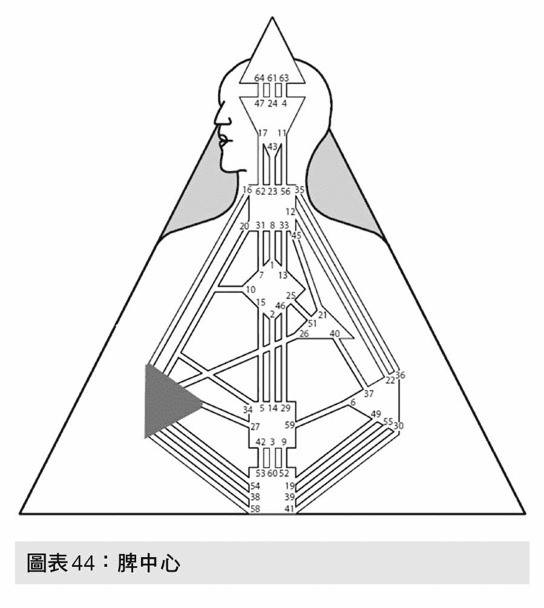

脾中心的直觉是基于生存，在每一个当下都严密运作着。当你对某事物萌生「直觉」时，这种感觉通常会一闪而过、瞬间即逝。而这正是人们很容易忽视自己的直觉，做出某些后悔决定的原因！脾中心是一个以「感觉良好」为本质的能量中心。

基于生存的直觉有时感觉起来会像恐惧。由于脾中心原始、出于本能的特性，它也有点象是一个「穴居人」能量中心。然而，一定程度的恐惧是有益无害的，例如害怕在深夜走进暗巷。若你的脾中心有许多开启的闸门，有时你会很容易感受到各种不同的恐惧，当然并不是每一种恐惧都是有益的。幸好，脾中心的恐惧仅存在于当下；就算它们令人毛骨悚然，却也能让人轻易克服（尤其是这些恐惧似乎没道理可言）。

请记住，人类图是一个全然关乎能量的系统。我们有时会体验到某些让人摸不着头绪，或甚至感觉略为私人的能量。了解你的人类图能确实帮助你从某些能量（例如恐惧）的桎梏中解脱。

脾也是关于时间的能量中心。对脾中心有定义者而言，活在当下并非难事。更确切地说，他们有时很难将当下抛诸脑后。此外，脾中心也与免疫系统有关。

##### 开放的脾／直觉中心

开放的脾中心代表你可能拥有非常敏感的免疫系统。这似乎意味着你很容易生病，但其真正的意思是：你对自己身体内的细微变化极为灵敏，当你开始感到一丁点「不适」时，你往往就会察觉。你对药物也相当敏感，需低剂量使用，不妨尝试顺势疗法（homeopathic remedies），或许能产生更好的效果。此外，要留意你的酒量与毒品耐受性偏低，微量的摄取就会让你感受到其作用力。

拥有开放的脾中心代表你缺乏持续稳定的「感觉良好」能量。你喜欢处在定义脾中心者的身边，如此能让你得到呵护与安全的感觉。

对开放脾中心者而言，放下执念并非一件容易的事。在此所谓的执念包括了个人财产、成瘾的事物、与人的关系，甚或是怨恨感。举例来说，假设你是开放脾中心者，你的交往对象则为定义脾中心者。和这个人在一起能带给你舒适的感受，你感觉自己得到呵护与安全感。然而，对方也许待你不好，你却很难结束这段关系，因为在潜意识里，你的能量场域喜欢处在这个人的能量之中。

别忘了，开放中心会以无限可能的方式体验该中心的能量。也就是说，若你拥有开放的脾中心，便能体验到各式各样、变化万千的直觉力。你也许某天感受到「直觉」、某天经验到「内心的灵通」、某天听见内在的指引声音或得到预言梦境……等等。只是由于开放的脾中心缺乏持续稳定的直觉能量，许多开放脾中心者便因此认为自己的直觉洞察力不足。

开放脾中心接收直觉力的方式会因相处的对象而改变，但他们通常都能获得强烈的直觉感受。

由于脾中心也是和时间相关的能量中心，因此，开放脾中心者与时间观念奋战的情况并不少见。这当中有许多人是迟到惯犯，而有些人则谨记过往迟到的不好经验，而强迫自己提早到场。若你的孩子是开放脾中心者，你尤须了解上述的情形。在你必须准时出门的情况下，请记得预留一小段额外的缓冲时间；开放脾中心者很难匆忙行动！再者，由于开放中心也存放着我们最深刻的制约影响，因此，开放脾中心者也具有高度意识时间的潜质，尤其是他们曾因为忘掉时间而有过不好的经验时。

请记住，开放之处正是我们获取智慧的所在。当开放脾中心者渐渐了解该中心蕴藏的能量时，他们就愈能懂得掌握自我疗愈、直觉和时间。

###### ★ 给开放脾／直觉中心者的问句

你对某事物是否仍紧抓不放？

###### ★ 给开放脾／直觉中心者的肯定语句

• 我会率性地抛开所有对我不好的事物。

• 我会重视我的身体和它传递给我的讯息。当我觉得身体不适时，就会好好休息。

• 我会尊重自己的时间安排。我会在最恰当的时间抵达赴约地点。

• 我也会尊重其他人的时间观念并养成戴手表的习惯。

• 我信任我的直觉。我知道我会以各种不同的方式得到直觉洞察力。

##### 定义的脾／直觉中心

定义的脾中心在人体图上会填满棕色。若你拥有定义的脾中心，你的天生设计便是活在当下。你的决定出于当下的直觉，你的行动时机便是「此时此刻」。定义的脾中心会加快你的反应速度，并赋予你时间意识及持续的当下直觉洞察力。

定义的脾中心拥有非常强大的免疫系统。然而，强健的免疫系统也往往会让脾中心定义者「错过」自身疾病的早期症状。你或许要到病状极为严重时，才会察觉自己生病了。定义脾中心者抱病仍持续工作的情况也很常见。因此，务必记得定期为自己安排健康检查，或当旁人问候你「还好吗？」的时候，仔细审视自己的身体状况。有时，旁人会比你还更早注意到你的健康亮红灯了。

# 当定义与开放的脾／直觉中心相遇时……

当定义和开放的脾中心在关系中相遇时，会碰撞出两大主题：时间节奏和连结感。开放的脾中心拥有易变的时间意识与时间节奏，而定义的脾中心具有强烈的时间感，并能据此安排相应的计划。是以，定义脾中心者经常会与开放脾中心「流动」的行事特质奋战。对前者而言，时间的焦点永远只在现在、当下、此时此刻。

我的另一半拥有开放的脾中心，我则相反。（好险我知道我们的能量配置！）在我们的生活中，很常出现以下的情况：他打电话告诉我，他会在二十分钟内到家。但在回家之前，他会绕道至干洗店、杂货店、书店（他在此处具有「弄丢」时间的惊人能力），最后再到学校接女儿下课。

出于我的定义脾中心及与生俱来的时间节奏，我能百分之百确定，他绝对无法在二十分钟内到家，我最好先去学校接女儿为妙。这种类似情况很容易让人感到灰心，但这确实不是他的问题。开放的脾中心往往无法掌握时间的节奏。

另一个相遇主题为连结感。脾中心是一个「感觉良好」的能量中心。开放的脾中心会不断找出能让自己感觉良好、安全和健康的能量；这会让他们看似非常需要，或是依赖脾中心定义者。对此现象的认知，在当我们观察脾中心开放的幼童及其分离焦虑时，就显得无比重要了。拥有开放脾中心的孩子很容易陷入分离焦虑的困境，尤其是当父母为定义脾中心者时，这种情况会更加明显。请给他们多一点的耐心；这种状况会随时间而改善，只不过往往是转移到其他拥有定义脾中心的新同伴身上。

定义脾中心的直觉只会传达一次，绝不重复第二遍。对于你应不应该做某事，你感受到的直觉正是你的脾中心在对你说话。绝大多数的脾中心定义者到了年届四十左右，才学会倾听脾中心的「声音」；而在那一刻之前，他们用人生的大半岁月累积了无数次「果然！我不该这么做……」的悔叹。

由于脾中心是基于生存而生的能量中心，因此，它也会为你带来恐惧感，包括了匮乏的恐惧、对责任感的恐惧、对自身缺点的恐惧、担忧人生无意义、害怕梦想永远无法实现……等等。这种种恐惧很容易就会将人吞噬、让人气馁无力。然而这种源于脾中心的恐惧其美妙之处在于，无论它们多可怕、多吓人，只要尝试排除和克服，就能彻底战胜它们。

定义脾中心的挑战是，如何分辨你的直觉正带给你关于生存的重要讯息，抑或你只是纯粹感受到脾中心的能量；你必须对这两者有更深刻的理解与洞察。而这便是依循你的人生策略之所以重要的原因。当你感受脾中心的恐惧时，请依据你的人格类型、运用你的人生策略来决定你是否该做某事。千万别让脾中心的恐惧把你逼到动弹不得的死角。

###### ★ 给定义脾／直觉中心者的肯定语句

• 我信任我的直觉。

• 我会倾听自己的身体。

• 我会休息并好好照顾自己。

• 我尊重自己的时间意识。

• 我会记得并不是所有人的反应都和我一样快速；我能顺应宇宙的时间节奏。

#### 第九个能量中心：荐骨（The Sacral）

「嘿吼，嘿吼，收工了，我要走囉……」

荐骨中心的音档下载：

请至[www.understandinghumandesign.com](http://www.understandinghumandesign.com)

荐骨中心在人类图系统中是相当重要的能量中心，也在四个动力中心里占有举足轻重的地位。荐骨位在人体图的中下方，以一正方形呈现（图表 45）。它是关于劳动力及生命力的能量中心，也和男女的生殖器官睪丸和卵巢相关。

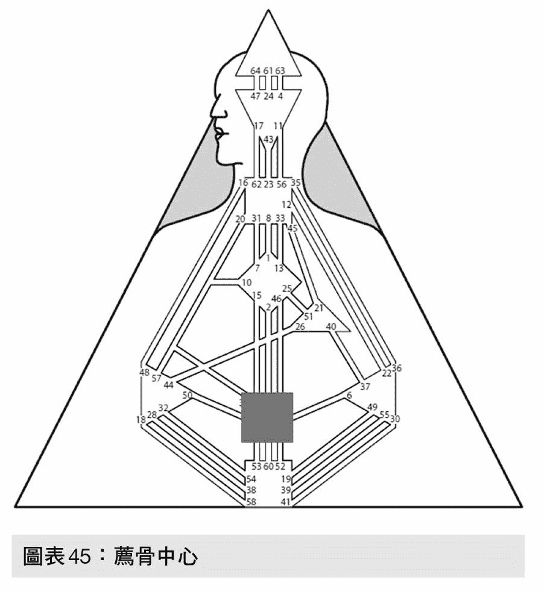

##### 开放的荐骨中心

开放的荐骨中心拥有经验生命力与工作力能量的无限才能。开放荐骨中心的人生课题便是在工作和性欲中得到智慧。

若你是开放荐骨中心者，你便拥有在短时间内吸收、放大工作和生命力能量的能力。这短暂的爆发力能让你像生产者和显示生产者般卖力工作，甚至比他们更拚命。许多开放荐骨中心者会误认为自己具有超乎常人的工作耐力，短时间内来说，的确如此。

但请记住，「持续力」是认识荐骨能量的关键字。开放荐骨中心者若要长时间维持能量的高水平，肯定会把自己弄得筋疲力竭。换句话说，开放荐骨中心者天生便不适合从事每周一到五、朝九晚五的工作。对绝大多数的开放荐骨中心者而言，听到自己天生就不适合以传统认知的形态工作真是松了一口气啊！不过这并不是指你拥有开放的荐骨中心，就无法工作或不需要工作，而是若能找到一种具一定弹性的方式工作会更为适合。

我的许多人类图个案都是烧坏自身身体系统电路（一点都不夸张）、年约四十的开放荐骨中心者。对非荐骨人而言，健康状况在四十岁左右开始「崩坏」，却仍努力维持过往忙碌生活形态的情形并不少见。由于持续力对非荐骨人来说，是相当重要的影响因素，务必要时刻留意自己是否工作过量、帮助自己辨别何时该工作、何时该休息。

总而言之，我们对工作的价值和重要性抱有诸多信条，非荐骨人缺乏持续劳动能量的特性，却往往让他们被贴上懒惰或无能的标签。事实上，非荐骨人会用他们特有的才智和能量为这个世界增添风貌。他们只不过是以不同的方式工作罢了。

非荐骨人被视为懒惰的另一原因为，他们需要午睡和大量的独处时间，这些需求对他们的身体健康极其重要。身为一个非荐骨人，你需要独处时间释放体内过剩的荐骨能量，也需要透过午睡来恢复精力和体力。独处的时间及充足的睡眠是能让你保持健康的关键。

睡眠对开放荐骨中心者而言，是另一重要的影响因素，他们与失眠奋战的情况也很普遍。若你拥有开放的荐骨中心，千万不能拖到疲惫不堪才准备就寝，否则就会面临入睡的困扰。你必须在感到睡意前就准备睡觉。在入睡前至少三十分钟就先躺在床铺上，也是对你有益的做法。若你想在睡前阅读或看电视也无妨，但最好能以舒适的躺姿好好放松，到了该就寝的时间绝不拖延。

一星期内至少安排几晚独睡时间也非常重要。若你和生产者同睡，你将会受他们的能量干扰而更加疲累；你的荐骨中心得不到释放所有多余能量的机会，进而导致你的系统受损。当然了，你应该和你的伴侣（生产者）好好讨论这个问题、找出双赢的解决办法。请永远铭记在心：了解你的人类图设计，并采取适当的措施来保护和照顾你的能量系统，是保持强健身体的不二法门。

###### ★ 给开放荐骨中心者的问句

你知道自己何时该工作、何时该休息吗？

###### ★ 给开放荐骨中心者的肯定语句

• 我天生便不适合以传统认知的型态工作。

• 我能凭借短暂的爆发力而卖力工作，但之后，我需要独处的时间释放体内多余的能量。

• 我知道我的能量特性是易变的。我会好好照顾自己，并跳脱他人对我的期望。

• 当我恰当地运用我的能量时，便能成为有影响力的人。

##### 定义的荐骨中心

定义的荐骨中心会填满红色，而这块红色的正方形正是生产者的象征。工作是荐骨中心最重要的功能。因此，若你拥有定义的荐骨中心，你就是天生的工作者。没错，真正的挑战在于你必须找到你热爱的、适合你的工作。

我的大部分辅导个案都是憎恶自己的工作、觉得困陷在目前职位而感到挫败的生产者及显示生产者。这种情况的导因，通常是他们和现在的工作缔结了一段错误关系。

荐骨中心的能量和大多数人从小被教育的观念背道而驰。我们自幼即被灌输「放胆去闯、让梦想成真」、「命运操之在己」等信条，然而结果就如同许多人曾体验到的。若你拥有定义的荐骨中心，却总是积极行动、努力实践成功的传统定律，那么往往只会饱尝事与愿违的挫败滋味。

拥有定义荐骨中心的人，天生的设计便是要等待事物显现。这其实非常困难，因为荐骨能量就像不断嗡嗡作响的蜜蜂、无时无刻都渴望行动。荐骨人是相当忙碌的族群。他们天生的使命就是「执行」。

然而等待及回应显现于外在环境的万事万物，是荐骨中心的核心概念。若你是荐骨中心定义者，不妨回想看看，在你的人生中，曾有多少次发现那些神奇、意想不到的机会就突然展现在你眼前？

而若你放胆去闯、努力让想望成真，又产生了什么结果呢？

我本身是个显示生产者，我其实费了很大一番工夫才渐渐懂得如何等待事物显现；坦白说，我还称不上是一个有耐心的荐骨人。还记得我初次学习到自己的荐骨动力及其等待与回应的能量时，我着实在这整套观念中挣扎不已。我这辈子几乎从未等待过任何事啊！但我也必须承认，我的人生在此之前充满了挫败。

若你懂得先等待对的事物显现再回应，荐骨能量就能得到最有效的发挥。但请记住，机会显现不代表你必须照单全收。你永远有选择的自由。

定义荐骨中心者的天生机制，就是每天都得耗尽荐骨提供的动力能量。他们会感到筋疲力竭，接着就该呼呼大睡。反之，若你强迫自己重振精神，你便会耗用你已缺乏的能量，最后导致健康受损。

若你是常在夜晚面临入睡障碍的定义荐骨中心者，这通常代表你在白天的身体活动量不足。你不妨尝试能多消耗体力的规律运动。生产者每天都必须用尽体内的荐骨动能。

当我们讨论到生产者孩子时，上述的情况就格外需要关注。在我的家庭辅导案例里，我接触到不少被诊断患有注意力缺失症（attention deficit disorder, ADD）或注意力不足过动症（attention deficit/hyperactivity disorder, ADHD）的孩子。他们当中有许多人其实只是缺乏适量运动，因此每晚都未能耗尽荐骨动能的生产者。由于这些孩子在夜晚无法好好入睡，长久的睡眠剥夺造成他们的血清素水平降低。血清素不足的症状包括：易怒、注意力难以集中、自尊心低落，而这些症状就和注意力缺失症（ADD）或注意力不足过动症（ADHD）极为相似。

我后来发现，只要协助父母为他们的孩子找出能增加身体运动量的方式，就能大大地改善孩子们的入睡困扰、提升他们的睡眠质量。若孩子的良好睡眠情况能持续数周，上述的病征通常也就会神奇地消失。这种方法对成年人也同样奏效。

荐骨中心也和性欲有关。在此所谓的性欲，是指性行为和繁衍。荐骨中心是关于性爱、扶养孩子、保护他们长大成人的动力能量中心。若你拥有定义的荐骨中心，你便会用固定的方式处理性能量。也就是说，你经验和看待性欲的方式通常是此生不变的。此外，荐骨人的天生设定也包含了生育及抚养孩子。荐骨中心会赋予你照顾孩子、工作以提供孩子温饱的持续能量。

了解荐骨能量的真正关键在于，了解定义的荐骨中心会带给生产者持续的生命力、工作力能量。而这也正是荐骨人与非荐骨人之间最主要的差异所在。

###### ★ 给定义荐骨中心者的肯定语句

• 我会从容耐心地等待，我知道对的机会将会出现在我眼前。

• 我只需要回应这个世界，如此我就能开心地从事适合我的工作、和对的人相处在一起。

• 我会无所畏惧地尊重我的回应；我也知道我的内心会带领我在对的时间去到对的地方、做对的工作。

# 当定义与开放的荐骨中心相遇时……

定义与开放的荐骨中心在关系中相遇时，会面临诸多挑战。但这并非指这段关系不适合，而是意识彼此能量的差异非常重要。

「持续力」是荐骨能量的关键字。定义的荐骨中心拥有持续的能量，开放荐骨中心则相反。就短时间内而言，开放荐骨中心者能放大定义荐骨的能量，但最后，他们会感到精力透支、疲惫不堪。这种现象也许会让定义荐骨中心者觉得挫败，尤其是若他们不明白自己的另一半其实比他们更需要休息和静养的时候。

开放的荐骨也需要独处的时间释放来自周遭的荐骨能量。当开放荐骨的能量「过度充足」时，就会让人感到亢奋、激动和狂躁。开放荐骨中心的设定机制并不适合持续保有荐骨能量，那些无法顺利释放的能量最终会严重损害健康。因此，开放的荐骨需要时间和空间来释放能量（特别是在夜晚时分）。也许会让生产者失望的是，我总是会建议开放荐骨中心者最好能在自己的房间、自己的能量场里单独睡觉。独睡的建议也适用于开放荐骨中心的幼童，拥有自己的卧房（如有可能）会对他们的整体健康有所助益。

定义与开放的荐骨中心在伴侣关系中的另一挑战和性欲有关。请记住，开放能量能带给人的经验和感受几乎是无限的，反之，定义能量的感受就相对固定许多。开放的荐骨中心能感受各式各样的性经验，甚至是性偏好。然而，当开放荐骨中心者处在定义荐骨中心者的能量场里时，他们常会成为另一半的反照。若你是拥有各式各样性经验的开放荐骨中心者，那么你的开放能量也许便是幕后的「始作俑者」。很重要的是，开放荐骨中心者最好能享受另一半（定义荐骨中心者）的性欲，因为无论经过多少时间，你们之间的性爱感受基本上不会改变。

随着我们一层层揭开人类图表的面纱，你对真实的自己及天生运作机制是否有了更深入的理解呢？九大能量中心显露出我们丰富的生命感受，对于每一个人如何经验这个时而让人感到受困的世界，能量中心也赋予我们更深层的察觉能力、和得到智慧的良机。当你仔细感受这些能量，及体会它们是如何在你的人生中演绎生命故事时，请记得活出真实自我、彻底展现你所有能量的关键，便是根据你的人格类型来遵从你的人类图策略。

### 第四章

## 爻线与人生角色

人生角色是了解你的人类图及发现真实自我的另一个重要片段。人生角色阐述的主题是关于你的学习风格和你在人生道路上的游历姿态。

人类图表包含了三大探讨要素，分别为轮回交叉、人格类型、人生角色（图表 46 及 47）。

「轮回交叉」描绘出你的人生道路或生命故事的主要情节。假设你在人生道路上开展的旅程是一齣戏或一部电影，比方说电影里有个男管家的角色，你的「人格类型」就是你在自己的生命故事中扮演的角色，而「人生角色」则代表你演绎角色的性格或特征。以刚才的电影比喻：同样是男管家的身分，却可能有各式各样不同的性格，例如有易怒的管家、求知欲强的管家或粗枝大叶的管家……。在人类图表中，每个人的特征或性格便显示于人生角色。

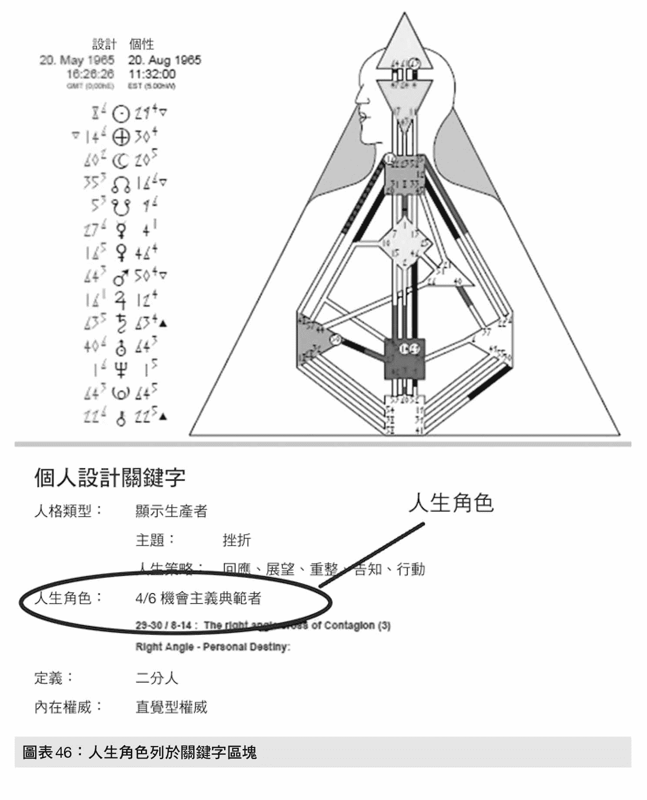

你的人生角色由两个数字组成，代表两种共同打造出你体验学习风格的能量，分别是意识及潜意识太阳的闸门爻线。第一个数字是你有意识、或许也很快能认同的角色面向。第二个数字则是你未察觉、但仍是你的性格中鲜明部分的角色样貌。人生角色共有十二种组合：

1／3──探究内省的烈士

1／4──探究的机会主义者

2／4──隐士机会主义者

2／5──隐士异端者

3／5──烈士异端者

3／6──烈士典范者

4／6──机会主义典范者

4／1──机会主义探究者

5／1──异端探究者

5／2──异端隐士者

6／2──人生典范的隐士

6／3──人生典范的烈士

在你的人生角色中，意识和潜意识区块携手创造出一种独特的能量组合、决定了你开展与经验人生旅程的方式。有时只要了解构成你人生角色的数字，就足以帮助你理解自己的某些内在困境核心，也能从中得知面对改变、关系、学习及能量影响时，最适合你的处理方式为何。

六条爻线的可能组合构成了人生角色。若要理解自己的人生角色所代表的意义，就务必要先个别了解六条爻线的含义。

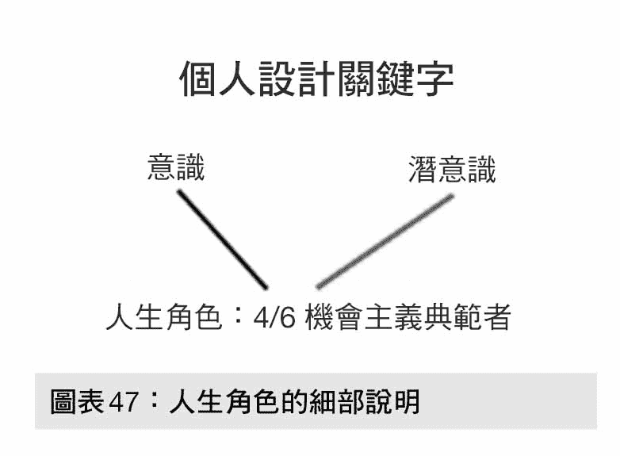

#### 认识六条爻线

如同占星学的观念，你的能量配置是在某一特定的时间形成，也就是由你的出生地点和出生时间决定。你的人格特质及独一无二的人类图设计就封存在你出生的那一瞬间。

当我们浏览人类图表时，通常只会看见人体图。然而，人体图上创造出定义的闸门与爻线其实就是你出生那一刻行星与闸门位置的写真快照。

为了便于解释，我们从完整的图表中撷取出人体图。完整的人类图表是由包含了人体图在内的曼陀罗组成（图表 48）。

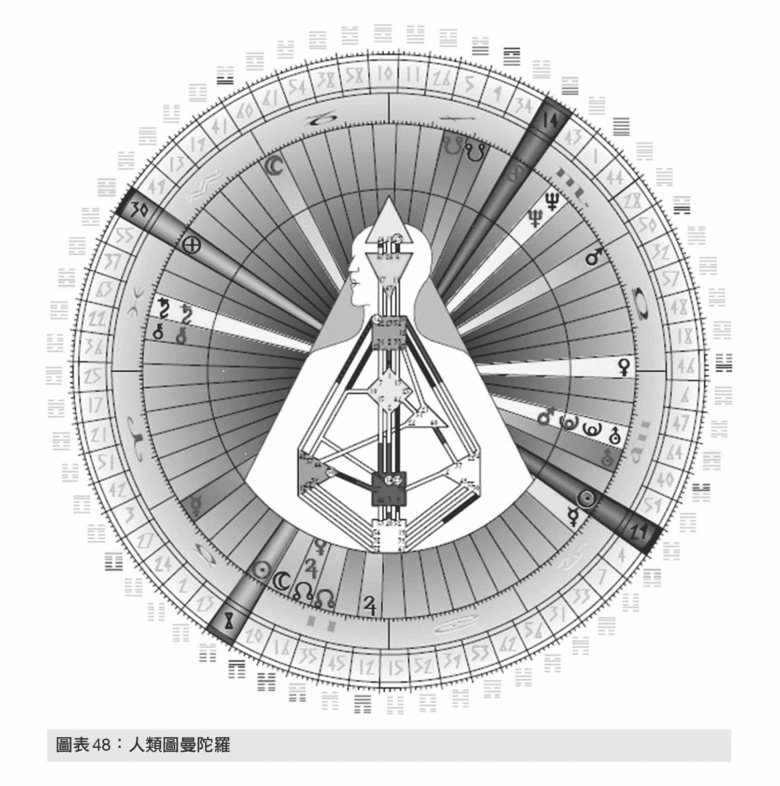

如图所示，人类图曼陀罗有两个圆轮。内轮是标示出十二宫位的传统占星图，外轮则是包含了六十四个闸门的圆环。你出生那一刻闸门的行星位置便是由这两个圆轮测量而出。

你不妨想象这两个圆轮是测量当下时间的度量工具。就像时钟上的时间是以分、秒为单位，每一瞬间在时钟「圆轮」上都有特定的位置。在占星学里，时间在占星「时钟」上的运行是以度（degrees）和分（minutes）为度量单位。每一个星座各占三十度，而每一度又可细分为六十分。占星学家透过星座度数和分就能对你的星盘所蕴藏的潜能有更深入的洞察。

在人类图「时钟」上，时间的运行是以爻线为测量单位。六十四卦的每一卦都有六条爻线，而这六条爻线便记录着时间在曼陀罗上的运行轨迹（图表 49）。

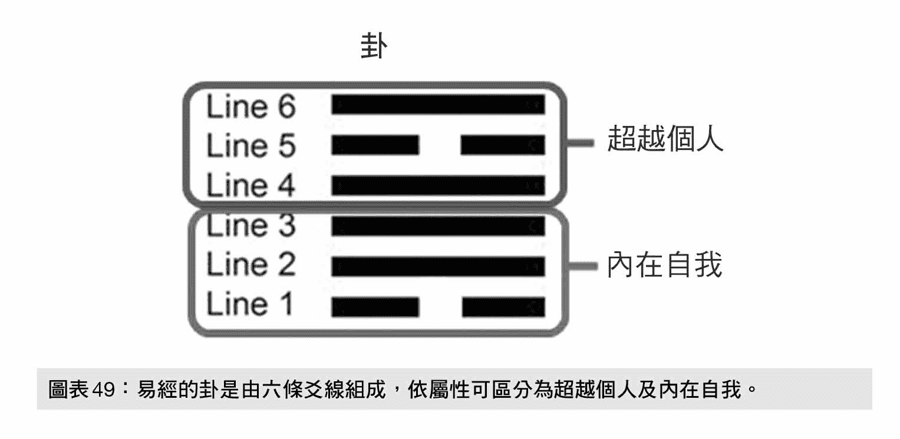

闸门的位置也会显现于爻线中，让你能更深入理解该闸门是如何在你的人生中展现。

每一条爻线都具有影响闸门表现方式的特定能量。

人生角色中的爻线来自于意识及潜意识闸门的太阳位置（图表 50）。

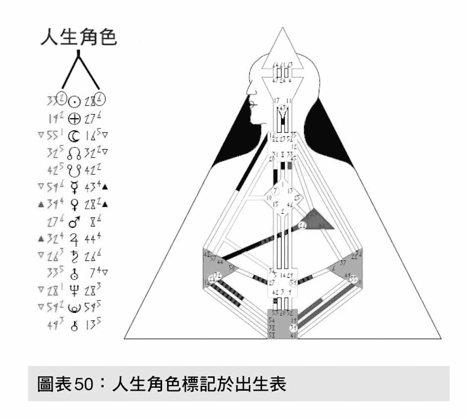

人生角色里的一爻到三爻是内在自我的爻线，属于内省、个人经验和理解的能量。四爻到六爻则是超越个人的能量，讲求在关系中和他人的互动。某些人天生较专注于个人的生命发展，某些人则较偏向与人的关系互动。

六条爻线的角色名称：

• 第一爻：探究者

• 第二爻：隐士

• 第三爻：烈士

• 第四爻：机会主义者

• 第五爻：异端者

• 第六爻：人生典范

某些爻线具有相似的主题，因此，特定组合会产生较高的内在和谐度。反之，某些爻线组合则具有天生的能量冲突。

• 一爻与四爻和谐。

• 二爻与五爻和谐。

• 三爻与六爻和谐。

• 一爻和五爻、六爻冲突。

• 二爻和四爻、六爻冲突。

• 三爻和四爻、五爻冲突。

这种冲突或失调（dissonance）并非会引发苦难，而是能帮助你掌握个人的内在挑战，进而让你成长和进化。当你懂得驾驭个人图表中失调的部分时，你就会培养出自我意识与自爱能力，这样一来便更有利于你开创和谐的人生。

请记住，人类图系统中并没有苦难。那些我们固有的动能挑战其来有自，它们是促成我们在人生道路上成长、在此生完成个人进化的强力催化剂。当你最终能依循自己的人格类型和策略生活时，图表中显现的各种内在难题将会迎刃而解。

首先，我们将探讨六条爻线的能量。接着，我们会结合六条爻线，拼凑出十二种人生角色的样貌。

#### 下卦：内在自我的能量

内在自我的能量具有内省的特质，与个人经验和自身理解息息相关。

##### 第一爻：探究者（The Investigator）

一爻的人生角色（1／3, 1／4, 4／1, 5／1）天生便充满求知欲。一爻角色需要建立讯息基础才能对所处世界感到安全和稳固。因此，网际网络的发明可谓你的一大福音！

在你要做出人生改变或调整之前，你需要对自己的行动目标进行彻底的探究和学习。假设你打算去度假，你会事先览遍所有的指南书籍，好让自己为接下来的探险旅程做足准备。

一爻在人生道路上扮演的角色作用是与他人分享你懂得的知识。旁人很可能把你视为学识渊博的智囊或能排除疑难杂症的智多星。

一爻角色的挑战在于不容易改变，此外，若你觉得自己懂得不够多时，你就会坐立难安、焦虑不已。对于某一工作或情况，你可能做足了万全的准备，但当事态未照着你的预期计划发展时，你就会感到极度不安。

一爻角色在关系中需要时间来「研究」另一半。你希望能了解对方及与这段关系相关的一切。

一爻能量若彻底展现，你就会是一个知识渊博的权威。

反之，一爻能量未充分发挥，你就会恐惧未知、对万事万物抱持质疑心态而错过许多人生经验。

###### ★ 肯定语句

• 我会从容地为人生中的探险旅程做准备。

• 我的知识是我献给世界的礼物。

• 我相信我的所学足以帮助我顺应人生中的改变。

• 我的自信根植于我对讯息的掌握与理解，我会放心地让自己充分研究与学习。

##### 第二爻：隐士（The Hermit）

二爻人生角色（2／4, 2／5, 5／2, 6／2）的人生主题包括了害羞和孤独。身为隐士的你通常渴望和需要大量的独处时间自我充电。

然而，二爻能量说来有点滑稽；它采反常式运作，亦即，隐士愈是隐藏自我，旁人愈是能一览无遗。若你拥有二爻能量，你会感受到某种能量漩涡，那就是当你不着痕迹地隐藏起来时，反倒会吸引他人来到你的身边。人们会找到你、辨识出你的才智。这对生产者和投射者而言是非常美好的能量。

隐士能量在关系中往往是害羞腼腆的，需要得到召唤或赏识才能正确地进入关系。由于隐士的角色具有渴望关系的超越个人能量，因此，这也会带来一股不断拉扯的内在冲突，有时会让人感到沮丧无力。

的确，身为一名隐士，最理想的伴侣关系是你的另一半也需要和你不相上下的独处时间，并且不会把你的孤独需求视为某种针对个人的借口。你并不是想远离你的伴侣，你只是需要一些独处时间。或许你会发现，你也喜欢和能与你一起享受独处时光的对象在一起。对你来说，两人在静谧的夜晚时分，一起坐在沙发上各自阅读也是甜蜜的浪漫约会。

二爻能量若彻底展现，你会等待召唤，进而踏入适合你的人生经验，你也能从容不迫地活化与提升自我。

反之，二爻能量未充分发挥，你就会封闭自我、离群索居而错过人生的欢乐美好。

###### ★ 肯定语句

• 我的独处时间是让我保持能量强大与活跃的重要条件。

• 我会尊重自己想要独处的内在驱力，我也知道神圣的秩序会在恰当的时机找到我，将我从孤独的状态中召唤而出。

##### 第三爻：烈士（The Martyr）

三爻人生角色（1／3, 3／5, 3／6, 6／3）会透过试验来学习。你的角色作用是藉由自己的亲身试验，与他人分享哪些事物行得通、哪些则否。你在人生中鲜少犯错；你曾尝试的所有无用结果都是帮助你掌握有效方法不可或缺的步骤。假使你想知道做某事的最佳方法，征询三爻角色准没错，他们已尝遍各种可能。

三爻角色的人生道路充满实验色彩。你会设法检视各种事物的缺陷或漏洞。然而，三爻角色有时会出于害怕犯错或担心自己的理解错误而停止发挥角色特性，尤其是在你曾因为判断错误而遭受批评的情况下。

请务必记住，那些所谓的错误是你学习历程中的一部分。这无关乎你的知识多寡或你是否准备充足，因为事物总是有「出错」的时候。这些「错误」并不是你的性格倒影，而是你实验过程中非常重要的一部分，它们能以实际方式帮助你发现真正有用和有效的方法。

到了四十岁左右，你的某些试验特质会趋于稳定。年少时的探索经验会赋予你确实洞察人生的深厚能力。你曾想尝试万事万物，但年届四十后，对于哪些事物需要实验、哪些则否，你已具备更深层的觉察意识。

在关系中，你需要花时间来厘清自己的欲望和必需。三爻能量往往会让你一见钟情，认为自己找到了此生的真爱。遗憾的是，三爻能量让你在爱情中冷却的速度也和你坠入爱河时一样快速。身为三爻角色，在一段关系里，你需要许多空间、自由和时间来辨识这段感情是否适合你。放慢脚步吧。如此能有助于你避免失望或伤害他人的感情。

三爻能量若彻底展现，你会基于自身的实验和体验而在人生中学到各式各样的智慧。

反之，三爻能量若未充分发挥，你会害怕尝试新事物，因为你知道在此过程中免不了摸索与经验失败的可能。

###### ★ 肯定语句

• 我是一个实验与体验学习者。我需要透过尝试才能对事物有更深入的理解。

• 那些所谓的错误是我累积智慧的重要过程。

• 我知道哪些方法行得通、哪些则否，因为我已尝遍各种可能，而我也因此得到明察善断的智慧。

#### 上卦：超越个人的能量

上卦（第四到第六爻）是关于超越个人的能量及与人的互动关系。

##### 第四爻：机会主义者（The Opportunist）

对四爻（1／4, 4／1, 4／6）角色而言，你的人际关系相当重要。在你的人生中，你或许曾透过你的社交网络或朋友而得到某些绝佳的机会。四爻能量根源于人际关系，具有群居和交际的特质。四爻角色的一生就是不断学习奠立关系基础的过程。你是发自内心地在乎人际基础。

四爻的人生角色不太容易、甚或是不太乐意做出改变。你喜欢事物维持原貌，也希望人们能像你接受自己那般接纳你，别想设法改变你什么。

若你拥有四爻能量，便会处处讲求基础。当你做出某一改变时，会让自己从某一基础移转至另一基础；你必须做足万全的准备，此外，新的机会也必须出现在可及范围内，你才会决定改变。这也意味着除非新的工作机会叩门，你不会毅然决然地辞职。除非新的交往对象出现，你不会和你的恋人分手。除非你明确知道自己的目的地，你不会轻易迁移。未知会带给你极度的不安。

要拥有一段良好的关系，你必须先从建立稳固的朋友基础开始。若非如此，你会感到胆怯、没有安全感。你的能量具有某种柏拉图式（纯友谊）的特质，而这有时会让你觉得沮丧，因为你的可能对象并不一定能察觉到你已坠入情网。他以为你们只是好哥们、好姐妹。然而，四爻的人生角色需要随时知道自己所处的阶段位置。对你来说，爱情关系最终化为友谊的情况也很常见。那些分手的昔日恋人或许如今仍是你的好朋友。

四爻的能量若彻底展现，你会保有稳定一致的状态，也将会是他人的好朋友。

反之，四爻能量若未充分发挥，你就会害怕表达内心的感受、缺乏调整事物的勇气。你只是为自己创造一个前进的选项，有时并没有真正的面对挑战。

###### ★ 肯定语句

• 我会从容谨慎地做出改变。我会等待对的机会自然展现在我眼前，再纵身投入、体验机会。

• 未知对我并无益处且会动摇我的基础。

• 我的人际关系是我的人生基石，也是我生命中许多机会的来源。

##### 第五爻：异端者（The Heretic）

五爻角色（2／5, 5／1, 5／2）的人生具有远超乎你想象的宿命特质。身为异端者，你的人生道路关乎于帮助他人。然而，这不仅是指藉由你的具体行动帮助他人。就能量层面而言，你就象是一面能帮助他人疗愈及重整能量的镜子。这种情况未必是你有意识作为的结果，有时纯粹是你能量的杰作。

此种能量的反射往往让人们很难以你真实的样貌看待你。你呈现在他人眼中的模样是他们的意识投射，及关于他们基于疗愈目的而需要的方法。是以你有时会觉得自己彷彿处在错的地方、和错的人相处，自己则成为一面错误百出的「镜子」。这便是异端者的名称由来。人们有时会投射予你错误的期望，而假若你无法达成这些期望，你就会遭受挞伐、名誉受到损害。

反过来说，若你遵循你的人类图策略，你会发现自己能处在对的地方、和对的人相处，以一种充满影响力和自觉应变能力的方式发挥自己的作用。遵循人生策略之所以如此重要，是因为异端者能就此避免许多痛苦和责难。

由于他人的投射，五爻角色非常善于隐藏。没有人知道真正的你究竟是什么模样（他们以为自己心知肚明，事实则否）。这未必代表你个性内向、高深莫测，而是你对自己的想法、计划……等，一向是祕而不宣。

充分发挥的异端者角色拥有影响众人、以及彻底展现自身能量的能力。这也意味着，魅惑力是你人生主题中的一环。你有本事以自己的个性、想法，或甚至是性别迷倒一屋子的人。五爻能量让你在众多面向都能成为极出色的推销员。

在关系中，你喜欢自己充满魅力的模样。人们总是会被你吸引而来到你的身边。你在关系里拥有无比的权力和掌控力，你能决定何时施展或解除你的魅力魔法。某些异端者角色会过于迷恋此种魅惑能量，而忽略关系中其他的重要意义。若不留意，你便会沾染某种风流特质。再者，由于人们会对你投射某些想法或观点，因此就算你对感情忠贞不二，旁人还是会把你视为大情圣。旁人的投射场域有时会让你在关系中感到矛盾、甚或是窒碍难行。由于你惯于掩藏自我的天性，在关系中，你需要经过一段时间才能感到安全和自在；异端者并不总是习惯处于危险或暴露可见的位置。当一切都调整妥当时，你便能开心地继续迷倒你的另一半，并渐渐向对方展现真实的自我，你的伴侣关系能量及绚烂火花便得以保持活跃和发展。异端者角色始终追求爱的极致表现。

五爻能量若彻底展现，就能有效地影响众人。

反之，五爻能量未充分发挥，你会因你的个人利益而滥用你的魅力特质，有时会造成伤害他人的后果。

###### ★ 肯定语句

• 我拥有影响和诱发他人产生新想法和灵感的无比能力。我会将此影响力运用于多数人的利益。

• 我会遵循我的人生策略；当我正确踏入关系时，我会成为推动改变的巨大力量。

• 我知道其他人并不总是能看清我真实的模样，因此，对于我的表达和沟通，我会抱持谨慎、不厌其烦、明确的态度。

##### 第六爻：人生典范（The Role Model）

六爻的人生角色（3／6, 4／6, 6／2, 6／3）会历经三段截然不同的人生阶段。你的人生道路最终会引领你成为他人的人生典范。六爻的人生角色可谓大器晚成者，然而，你在人生旅程中踏出的每一步都是你打造往后角色作用的关键过程。

第一阶段是从出生到二十九岁左右。你的人生在这段期间与经验和实验息息相关，你的行事表现和三爻角色非常相似。

第二阶段约从二十九岁到五十岁。大多数的人要到三十五岁后才会真正感受此阶段的发生。在第二阶段中，你或许会发现人生不再像二十来岁时那般「骚乱不安」和变化剧烈。你也会感受到，你必须耗费更多的能量和气力才能像过往那般行事。你对埋首回覆电话和电子邮件、与人闲话家常或八卦谈天似乎不再那么感兴趣。你反而更偏好学习，或甚至单纯地放空休息。第二阶段的目的之一是帮助你在人生的第一阶段后获得疗愈，此外，也让你能观察他人的成果与作为、了解他人是如何掌握人生。第二阶段通常被称为「站上屋顶」。

站上屋顶的时刻正是你打造事业或内省的绝佳时机。由于此阶段多与内在作业有关，因此也较难开展任何形式的人际关系。在这段时间里，甚至连教养孩子都让你感到困难重重（尤其当你不了解自己的能量变化时）。有时，六爻角色会在经历第二阶段的过程中感到自己抑郁消沉。

最后一阶段始于五十岁左右至生命结束。当你「走下屋顶」时，有时会带给你猛烈的坠落感。那些人生第一阶段的主题，将以新生的智慧与成熟姿态回到你的生命里。你通常会在此阶段体验到剧烈的人生转变，因为你正着手开创充分展现真正自我的人生。

最后一阶段又称为人生典范阶段。此时，你已经历了各种尝试、明白人生的可行之路，如今你忠于自己而活。身为人生典范，最重要的任务便是做最真实的你。此刻的你是他人参照如何充分展现人生的榜样。

六爻具有某种命运或命中注定的成分。身为六爻角色，你通常非常清楚自己的人生使命，并不断感受展现使命的推力。若你仍不清楚、或未跟上你的命运脚步，你所处的外在环境会以激进的方式不断提醒你、引起你的注意。六爻角色若无法掌握自己的人生方向，将会带给他们无比的焦虑与不安。

在关系中，你需要也渴求遇见灵魂伴侣。对六爻角色而言，这会是一段漫长且绝望的旅程，尤其是当你站在屋顶上、不易开启与人的交往关系之际。就像在寻找真爱的过程中，你难免经历挫败（或必须亲吻过几只癞蛤蟆），但你的寻觅之路最终将值回票价；当你最后找到挚爱时，你会忘了这段漫漫历程的等待。

六爻能量若彻底展现，你会是启发他人的人生典范。

反之，六爻能量未充分发挥，你会困陷在自我冷漠中，并在如何走出来投入世界的怀抱的想法中不断挣扎。

###### ★ 肯定语句

• 我信任自己的人生轨迹，也知道在我人生旅程中的每一步都是迈向我的天命。

• 我会好好放松，并让人生的进程自然地开展在我眼前。我以真实的自我为荣。

• 我知道我的首要任务是做最真实的自己，我会无所畏惧地将自己托付给真实人生。

#### 十二种人生角色

六条爻线结合了意识与潜意识层面，创造出十二种不同的人生角色：

• 1／3　探究者／烈士

• 1／4　探究者／机会主义者

• 2／4　隐士／机会主义者

• 2／5　隐士／异端者

• 3／5　烈士／异端者

• 3／6　烈士／人生典范

• 4／6　机会主义者／人生典范

• 4／1　机会主义者／探究者

• 5／1　异端者／探究者

• 5／2　异端者／隐士

• 6／2　人生典范／隐士

• 6／3　人生典范／烈士

人生角色中的第一个数字恒为意识能量，是你首要展现且较能察觉的能量。第二个数字为潜意识能量，较隐约且展现在第一个数字的能量之后。在人生角色里，意识能量永远会先于潜意识能量。

举例来说，若你的人生角色是 1／3（探究的烈士），你便具有先探究、再试验事物有效性的人生模式。第一个数字是探究能量的意识爻线，第二个数字则是和试验有关的潜意识爻线。因此，1／3 人生角色必须先着手探究再进而试验，能量的作用顺序恒常是如此。

虽然在此我们不会逐一详细说明十二种人生角色，但你仍可藉由了解组成你的人生角色的爻线，对你扮演的角色特征及性格有更清楚的领会。你也可以在我的网站[www.understandinghumandesign.com](http://www.understandinghumandesign.com)找到关于每一种人生角色的解说音档（长度约两小时）。

了解你的定义及开放的能量中心所在，能带给你关于你自己是如何运作、哪些能量经验会让你感到人生困陷，以及能量在关系互动中造成的影响……等丰富讯息。明白哪些能量是稳定一致的、哪些则具有多元变化的特性，带给你探见真实自我、人生使命及透过他人增长自己某部分智慧的线索。

你的人生角色则赋予你对自己的人生及生命经验，另一层次的意识与理解。至此，你了解了自己的能量、你的学习风格，甚至隐约察觉到自己的人生使命和角色。

虽然你对自己的人类图已经有了更深层的理解和自觉意识，但请铭记在心，充分展现真实自我的方式其实非常简单，只要根据你的人格类型来遵从你的人类图策略。如此一来，生命的魔法就会自然而然地展现在你眼前。

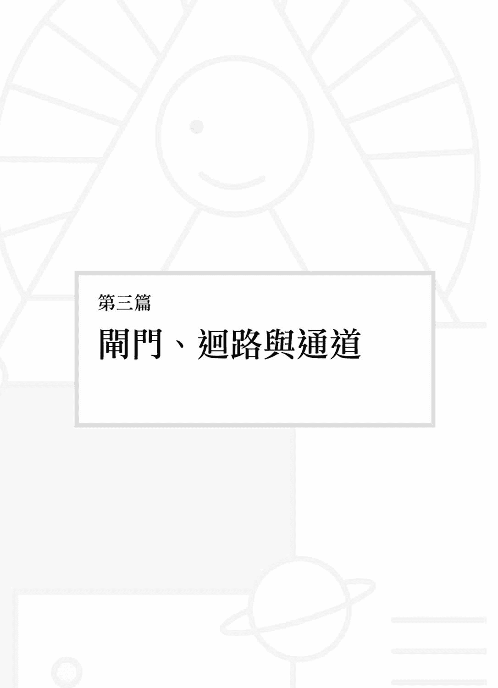

诚如人类图表里的所有能量，你能体验到自身设计图里回路的强烈或隐约展现。此章节所附练习题的部分，目的是帮助你探索自己的通道及闸门的定义主题，也期盼能激励你带着自觉意识，展现出个人独特能量的最大潜能。

请记住，你拥有完整的人类图能量，也就是说你并未缺少图表中的任何能量。只不过，比起开放的区块，你会更常感受到定义部分的作用。

我的许多学生认为：综览本章后，先练习自己的定义闸门与通道，再回过头来着手自身图表里开放的能量。如此能让他们获益无穷。

### 第五章

## 闸门

人类图系统中共有六十四个闸门。闸门代表特定的能量主题，无论是你的个性、人生驱动力、人生使命、你在关系中面临的主题、你的创造表现力，甚或是你直觉的运作方式及你和宇宙的连结方式……闸门都能带给你更深入的洞察。

每一条通道皆有两个闸门。你出生那一刻的行星位置决定了你的图表中哪些闸门会开启。开启的闸门是你会持续感受与经验到的能量。当一条通道的两端闸门都开启时，这条通道便会启动，而通道连接的能量中心也会连带具有定义。虽然在你的图表中，你拥有个人独特的开启闸门，但就某种形式而言，我们每一个人都具有完整的闸门能量。依据你相处的对象及所处的环境，你的开放闸门会以多元的方式体验能量。

如同人类图表中的所有能量，每一个闸门也都有强烈或隐约的表现样态。当你浏览自己的闸门状态时，不妨试问自己，这份能量是如何影响你的人生？我们每一个人的生命本质都是愉悦、彼此连结、充满创造力、富足和有影响力的。当你充分活出自己的能量时，人生的魔法将自然在你眼前施展出美好的模样。

在本章节中，每一个闸门介绍后都附有一段肯定语句和一系列的练习题，其目的是帮助你探索在自我人生中，每一道闸门能量的彻底展现。我会建议你先了解自己的定义闸门，再回过头来浏览及思考那些未定义的闸门是如何影响你的人生。

请记住，尽其展现和发挥人生潜能的关键不仅止于自我察觉，同时依循你的人类图策略生活也是不可或缺的重要条件。

#### 1 号闸门：自我表现

易　经：创意（干卦）

占星学：天蝎

生物学：肝脏

1 号闸门是六条阳爻组成的卦。若你无法实现以创造力表现自我的需求，1 号闸门便是一股驱策心灵的强大能量。它会让你在夜半睡梦之际，突然想起自己应该在人生中实践一些什么而惊醒，但假使你不知道那究竟为何，你就会感到极度的焦虑。

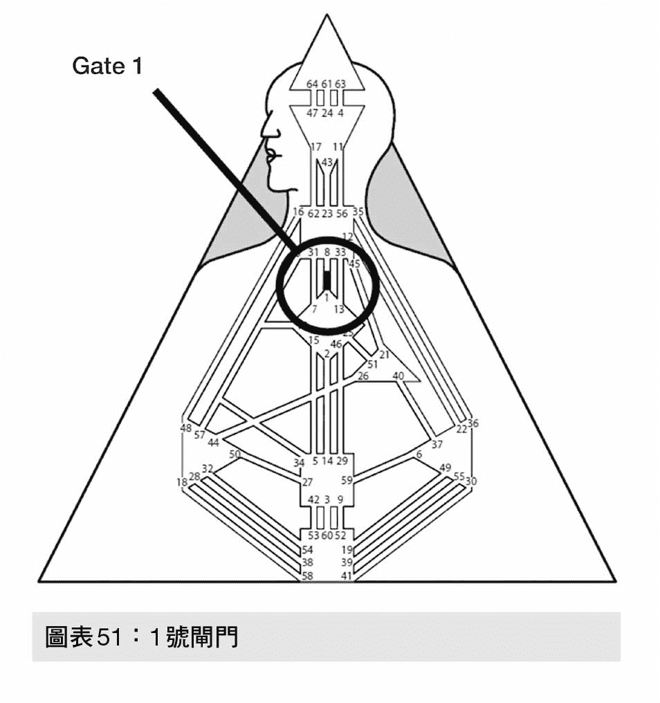

1 号闸门会主动寻找更多的能量，让这股表现力通往喉咙中心。它或许必须在与他人合作的过程中获得，但无论如何，除非找到表现自我的方式，否则它不会感到自在或满足。拥有此能量者不仅止于想成为贡献心血的一份子，他们更希望改变世界。倘若他们能妥善利用 1 号闸门的能量，他们便有实现的推动力。

此通道（1-8）富含无比的通晓能力，包括了知晓在对的时间做出适当的贡献。1 号闸门者必须等待识别及恰当的能量，好让自身灵魂的贡献形诸于外在世界。等待并不容易，但就带来正确的影响力而言，却是不可或缺的过程。

##### 肯定语句

• 每一天都是崭新的创作。

• 我能给予世界最大的贡献便是尽情展现自我的本性。

• 实现我的神圣潜能对人类进化而言至关重要。

• 我信任上天的安排，并会消除对「无法达成人生使命」的所有恐惧。

• 我正处于对的地方，执行创造正确贡献的任务。

##### 练习题

1. 你是否曾克制自己充分地表现自我？若你尽其展现自我，对你会产生什么影响？

2. 对你而言，「遗产」代表什么？你是否能为世界留下真实的遗产？你是否怀抱某种侷限的信念或经验，让你无法表现自我的真实性？你该怎么做才能消除它们？

#### 2 号闸门：钥匙掌管人／自我方向

易　经：接纳（坤卦）

占星学：金牛

生物学：肝脏

2 号闸门为管理财富的能量，是由六条阴爻组成的卦。

它未必是指赚钱的能量，而是喜好钱财本身及经济基础稳固且源源不绝带来的安心感。2 号闸门会吸取 14 号闸门创造的资源，并将这些资源分配以促进力量的展现。

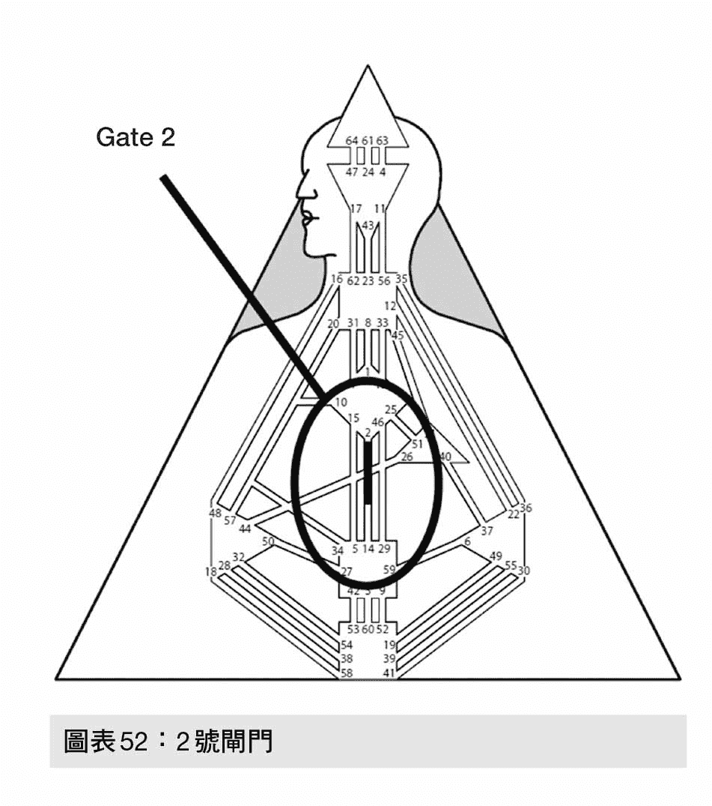

然而，此闸门也具有不成熟的一面，那就是缺乏对创造财富必要条件的意识和意愿而挥霍无度。就像一位年轻女孩带着爸爸的信用卡在百货公司血拚的情境。然而这份能量若臻成熟并彻底发挥，就能有效拥有和管理资源，也因此具备了在这个世界上展现改变和贡献的一切所需。2 号闸门管理资源，并利用这些资源来创造影响和完成改变任务。

##### 肯定语句

我能有效掌握资源；为了致力于我的天命以及我对世界的贡献，我知道建立稳固支持基础的必要条件为何。

##### 练习题

1\. 为了顺从你的天命，你需要采取什么做法？哪些是必要的资源？

2. 你已掌握哪些资源？你该做些什么才能为实现你的梦想创造扎实的支持基础？

#### 3 号闸门：秩序

易　经：凡事起头难（屯卦）

占星学：牡羊／金牛

生物学：卵巢和睪丸

3 号闸门与突变和改革有关。从基因层面而言，3 号闸门带来新的遗传物质，并不断向旧有物质推进，从中观察是否有整合的可能。从工作的角度来看，它设法改变工作的经验和回应。3 号闸门回应能带来改变的工作，其毫无限制的尺度往往让人感到适应不良或困惑不已。3 号闸门的目的是回应世上那些有助于改革或创造改变的工作。它和所有突变历经的过程相同，在改变之初最不易。但它必须经过此关卡，以「证明」能量确实值得整合。若缺少这段努力的过程，社会将会面临到动荡不安和反覆改变的风险。

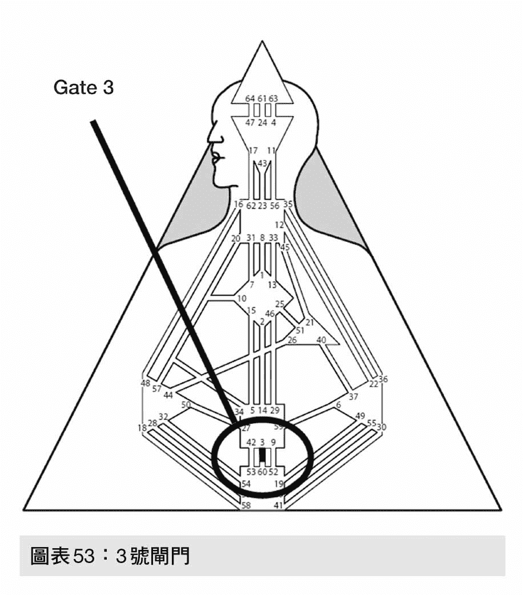

拥有此能量者有时会感到万事万物在起始之际，彷彿对他们特别严苛。然而，生命的韧性最终将揭示他们历经的困难是否苦尽甘来、一切值得。

##### 肯定语句

• 我接受并拥抱侷限。

• 我相信当下的经验将能完善地帮助我创造出我希望的局面。

##### 练习题

1. 在你的人生中，你在哪些领域感到阻力或时常在人生阶梯上「鬼打墙」？你要做些什么才能接受或消除这些阻力？

2. 你是否想做某事，但隐约感觉时机不恰当？你要坚持行动，还是暂缓、相信老天爷的时间安排？

#### 4 号闸门：解答／公式化

易　经：血气方刚的愚者（蒙卦）

占星学：狮子

生物学：脑下垂腺的前后叶

4 号闸门是解答的闸门。你也许会纳闷，关于什么问题的解答呢？不重要，解答本身就是重点。源于 4 号闸门的解答不太注重正确性，它们只不过是需要经过时间证实的各种可能性。

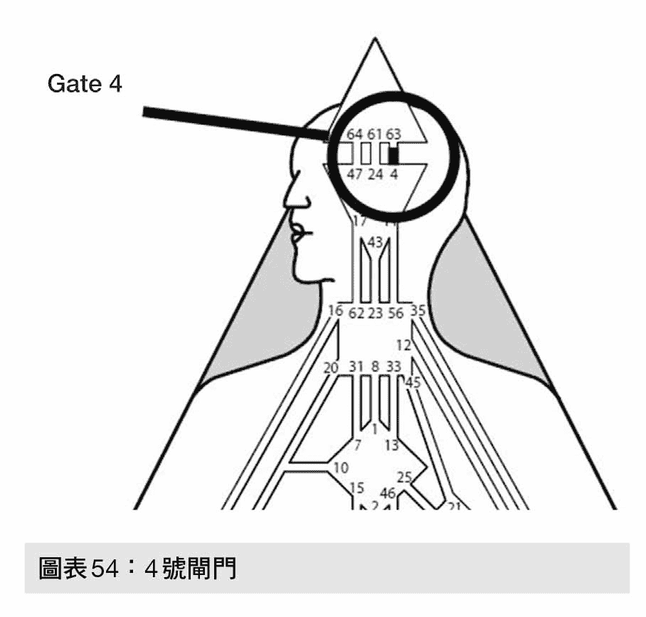

拥有此能量的人（尤其是加上空白的头脑中心）很常会笼罩在想出解答的压力中，而答案有时便出其不意地脱口而出了。请记住，找寻解答的过程只是一种能量流动；某人想出答案并不代表那就是正确无误的解答。

##### 肯定语句

• 我的想法和经验能赋予我知识，让我能充满自信、坚定地朝未来前进。

• 我会耐心等待，观察我的答案是否正确。

##### 练习题

1\. 在你的想法、经验和沉思中，你是否得到了新的觉察、知识或理解？

2\. 在你的创造之路上，你重要的下一步为何？

#### 5 号闸门：固定模式

易　经：等待（需卦）

占星学：射手

生物学：卵巢和睪丸

5 号闸门深具韵律。若你拥有此能量，为了感觉良好和踏实，保持固定惯例非常重要。假使你的惯例中断了，你会发现接下来的一整天似乎都不太对劲。

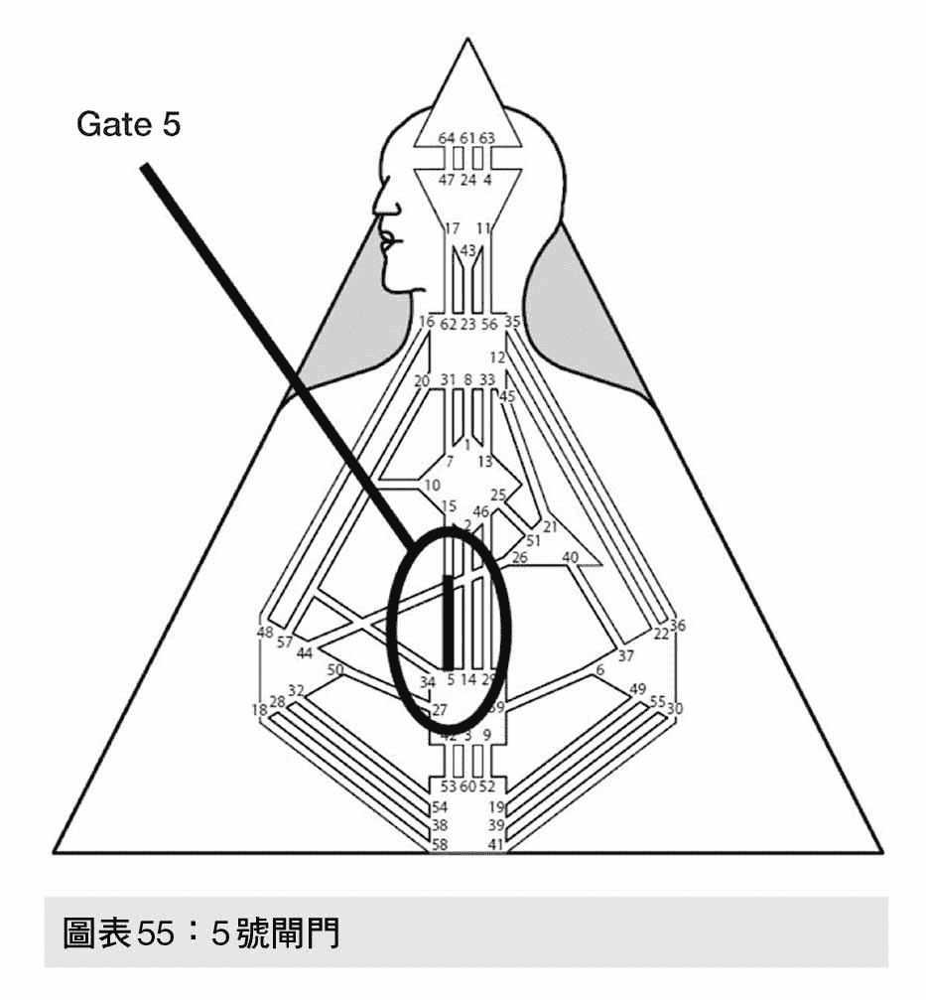

若你是拥有此闸门的生产者，你会回应充满节奏感的工作和性爱机会。5 号闸门偏爱按照惯例行事，就算是亲密感和工作都具有固定的模式、一致性和韵律感。

##### 肯定语句

• 我的惯例和习惯必然能帮助我引领自己的生命动能。

• 我会给予日常节奏时间和空间。我尊重自己，因此我也会尊重我的特殊惯例。它们能让我感到踏实及与宇宙的连结。

##### 练习题

1. 你拥有自己的日常节奏吗？你每天该做些什么才能让自己、宇宙和外在世界的步调得到尊重？

2. 你在外在世界中是否拥有足够的时间？你该做些什么才能够和世界重新连结呢？

#### 6 号闸门：摩擦

易　经：冲突（讼卦）

占星学：处女

生物学：肾脏和胰脏

6 号闸门能连结荐骨至情绪中心。这是一股具渗透力的能量，亦即，它能潜入人们的能量场。它是情绪的动能，而非引诱的能量。

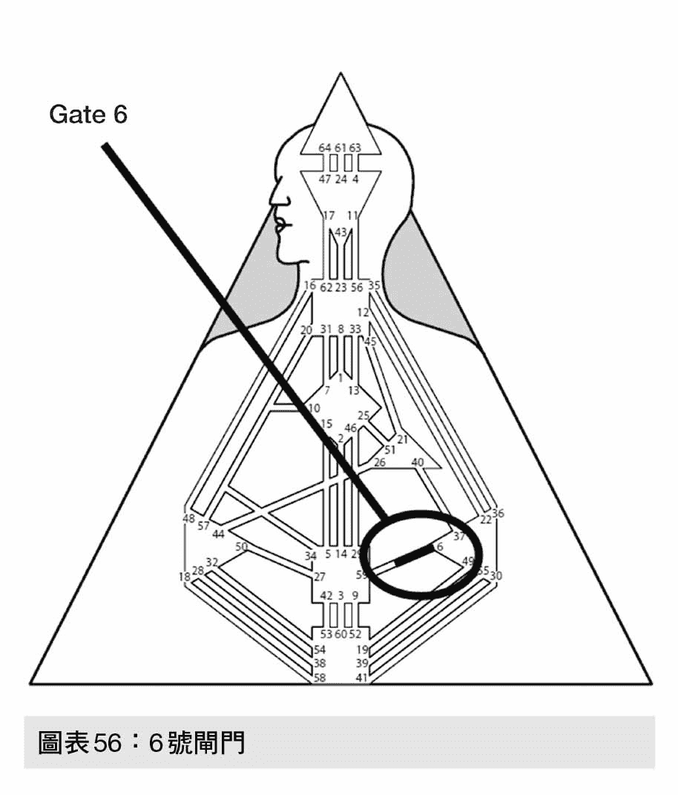

从性的层面而言，这是「追踪」某人能量场的能量，若妥善使用就能成为通往真正亲密的大门。在人类图里，真正的亲密不仅源于性，也来自繁衍的过程。

6 号闸门的性欲具有情绪的特质，需要经过时间才能得到澄清与明朗化。「先评估，再深入」可谓此闸门的真言。用等待来确认这是否是正确的事件。

等待而来的亲密带有滋养成分的可能，即便滋养并非这个能量固有的特性。若你不加等待，这段关系将缺乏滋养感受，最终走向破灭。此种不适当的亲密造成的瓦解结局可能是战争或冲突，即对错误选择的强烈情绪反应。

6 号闸门本身的战争和冲突能量中，同时也具有防卫的特质。而冲突，可能是为了保护亲爱的人。家族人回路群（参照第六章）需要你为了群体的巨大福祉而断然牺牲自己。你会努力争取爱和资源。带着清明思绪的 6 号闸门会为了保护家族挺身而出、是向外敌投掷长矛的第一人。

没错，澄明在此至关重要。若缺乏澄明，战争将会成为毁灭性的灾难，最终导致家族的灭亡。

##### 肯定语句

• 我臣服于生命。

• 我臣服于自己的天命，这便是做自己和活出本来自我的意义。

##### 练习题

你的渴望和真实的你协调一致吗？你是否如实无畏地活出自己呢？哪些部分需要做出改变？

#### 7 号闸门：互动中的自我

易　经：军队（师卦）

占星学：狮子

生物学：肝脏

7 号闸门的任务是担任超越自我的领导角色。由于它的功用在于维持统御力，因此，7 号闸门若未充分发挥，便往往会费力地设法取得领导权，但成效通常不大。

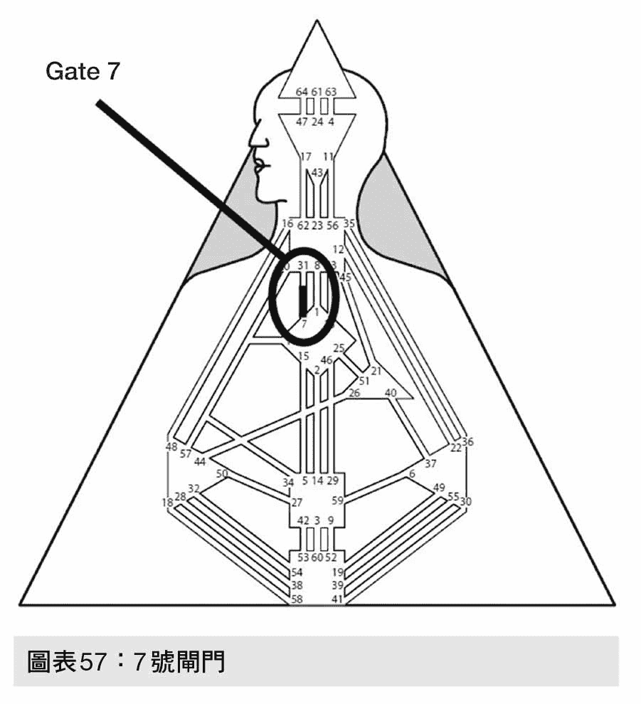

这种能量必须得到众人的辨识和认可，就其本质而言，当它彻底展现时，便符合真正的民主特性。你无法强迫这股能量发挥领导作用，如此得来的成果也不持久。

拥有 7 号闸门或 31 号闸门者是众人眼中的天生领导者。他们在团体中被分配至领导角色的情形也相当常见，而那也是他们本该担任的位置。

##### 肯定语句

• 我在人生中会担任领导角色，我也知道我必须和世界分享我的影响力。

• 我充满力量，我相信宇宙的奥祕安排能带领我去到该去的地方，让我展现真正的能力，为世界留下影响力。

##### 练习题

1. 你在人生中的哪个部分需要得到领导权？你该做些什么，才能够引领你的梦想？

2. 你希望在你的人生中经验哪种影响力和认可？是哪些原因让你在过往人生中得不到认可？你需要做出什么改变才能更加显露自己的才能吗？

#### 8 号闸门：贡献

易　经：凝聚在一起（比卦）

占星学：金牛／双子

生物学：甲状腺和副甲状腺

8 号闸门不像 1 号闸门存在着某些压力，但它仍能感受到做出贡献的迫切需要。这是源于荐骨中心至喉咙中心，个体人的最终展现。

8 号闸门渴望完成任务、改造、创造改变，但它必须搭配适合的能量及得到认可才能如愿。恰当的时机和适合的能量是最大关键。有时这代表全然地等待，但这对于怀抱着改变世界理想的人而言并不容易。

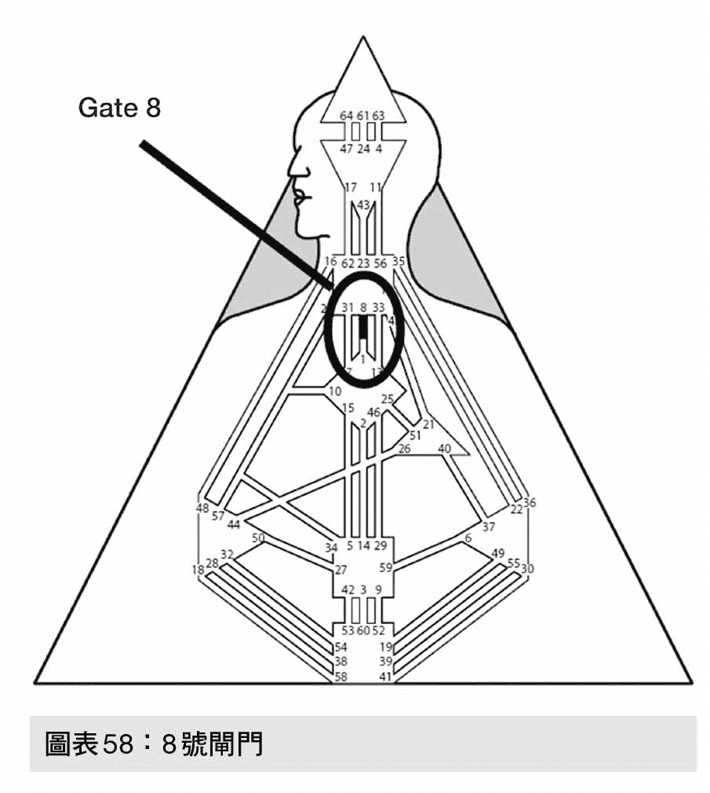

8 号闸门的能量若彻底展现，它会成为创意的典范。它等待恰当的时机再藉由「言行一致」分享。8 号闸门若有效发挥会是启发人心的能量，藉由以身作则来创造改变。

##### 肯定语句

• 我能给予最大的贡献便是和世界分享我的观点、我的爱和我的本质。我会藉由充分展现自我的真实性，实现我的使命。

• 我绝不退缩并散发自我的能量。我是为整体人类带来启发的重要角色。

##### 练习题

1\. 若你能活在不需妥协和让步的人生里，那会是什么模样？

2\. 你该如何做才能活出自己？什么事物会让你感到畏缩不前？

#### 9 号闸门：专注

易　经：处理细节的能力（小畜卦）

占星学：射手

生物学：卵巢和睪丸

9 号闸门属于专注的能量。它具有痴迷行为和过度思考的能力。就某种程度而言，9 号闸门会增强人类图表中的所有能量（特别是当能量将 9 号闸门一路未中断地带往喉咙中心时）。

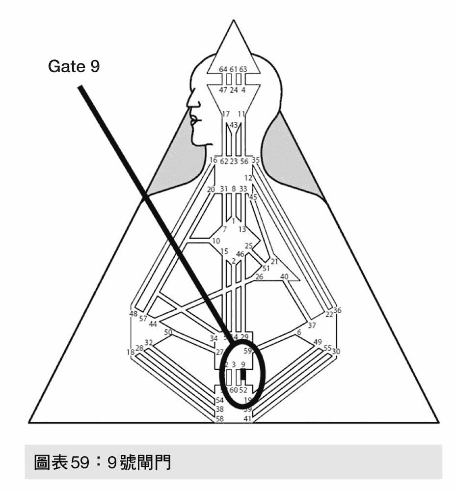

9 号闸门拥有聚焦的能力，但未必能长时间维持。在与注意力缺失症（ADD）类似的行为中，9 号闸门扮演了关键的角色，即使全神贯注却也静不下来。

若你拥有 9 号闸门的能量，你在别人眼中也许是个钻牛角尖、彷彿无法对某一想法善罢甘休的人。对 9 号闸门而言，的确是如此。不管你正在做什么，无法说忘就忘，某些想法总是盘旋在你的脑中。除非你遇到拥有 52 号闸门的人，否则你很难静下心来，专注于该事物。这两道闸门（9 号和 52 号）对学习和解释集体行为模式至关重要。

##### 肯定语句

• 就算我正忙于其他的事物，我也总能专注于我的计划。

• 我会遵循我的人生策略，并带着我独有的专注力采取行动。

• 我知道我的内在专注能展现于外在世界。

##### 练习题

练习以下的问题有助于你探索能让梦想成真的具体步骤。

1. 拿出一张纸，在正中央画一条区隔线。左半边标上「我」，右半边则写上「宇宙」。

2. 在「我」的栏位写下为了完成梦想你必须做的每一件事情。这些是你需要处理的实际项目，例如：写一本书、考取驾照、架设一个网站、参加某课程……等。

3. 在右半边的栏位写下交由宇宙完成的任务。这些是当下你无法掌控的项目，象是吸引很棒的客户、朋友或爱人到你的身边，带给你完善的信息和支持……等。

#### 10 号闸门：爱自己／自我行为

易　经：前进（履卦）

占星学：射手／魔羯

生物学：肝脏

10 号闸门是意义重大的代表闸门之一。它根源于自我中心，并和给予力量有关。此闸门中给予力量的能量是藉由以身作则而发挥作用，换句话说，10 号闸门者往往能透过展示自己的生命荣耀，赋予其他人活出生命价值的力量。

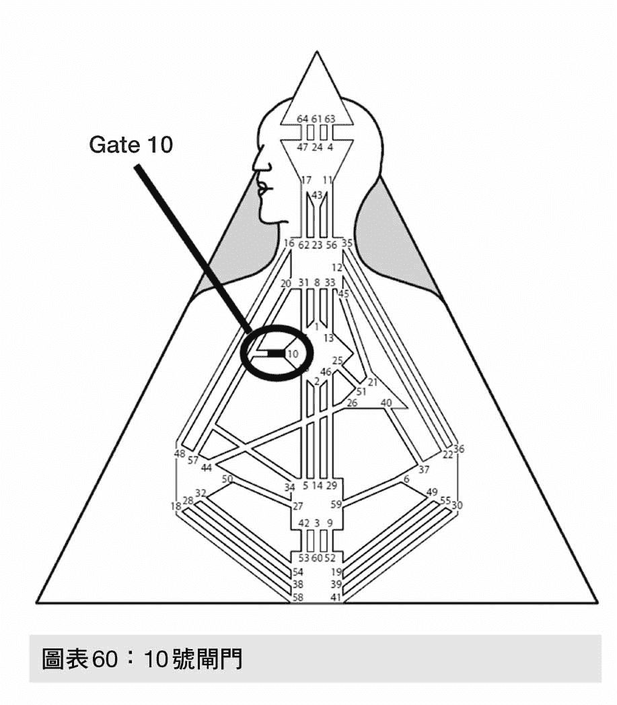

10 号闸门可谓是一股难解的能量。能量若彻底展现，这便是关于承担个人责任和充满力量的闸门。反之，若能量未充分发挥，这就是一股责备他人、处于受害者立场的能量。

由于 10 号闸门未启动者会放大此能量，故而，对具有 10 号闸门者而言，生命中彷彿充斥着责备的主题。若无法去制约化，受到责备或责备他人的情节将永无止境的上演。

10 号闸门的连结位置值得探讨：

• 连结至 57 号闸门便会产生完美形式的通道及直觉生存力。

• 连结至 34 号闸门便会形成中央回路，与生存和方向的完美形式有关。

• 连结至 20 号闸门，10 号闸门便拥有传递力量的能力。

##### 肯定语句

• 我尊崇属于自己的生命奇迹。我是造物主创造的独特作品，我知道自己在世界上是独一无二的存在。

• 我会选择和采取能荣耀自身生命价值的行动，我也会让身边充满支持我、滋养我、鼓舞我、提升我的人。

• 我拥有强大的力量，我是主掌自己生命方向的舵手。

• 我会做出能实现我神圣潜能的选择。当我充分展现自我时，我便能开创让他人也同样能表现真实自我的空间。

• 我知道爱自己有助于让我准确、不偏离地走在自己的人生道路上。

##### 练习题

1\. 你需要释放掉哪些陈旧的能量以及「受害者故事」？

2. 对你而言，充满力量和影响力代表什么？你该做些什么才能够得到更多力量呢？

3\. 请列出爱自己的事项。写一封情书送给自己，并对着镜子大声朗诵。

4\. 你能采取哪些符合爱自己的决定和方向？

#### 11 号闸门：想法／新想法

易　经：和平（泰卦）

占星学：射手

生物学：脑下垂腺的前后叶

假设创造力是一条溪流，绝大多数的人会拿着一只杯子踏入溪中、舀起一口喝下。拥有 11 号闸门者则会带着二十个脸盆走入创造力之流，并站在堤岸边思忖着如何利用这些想法。

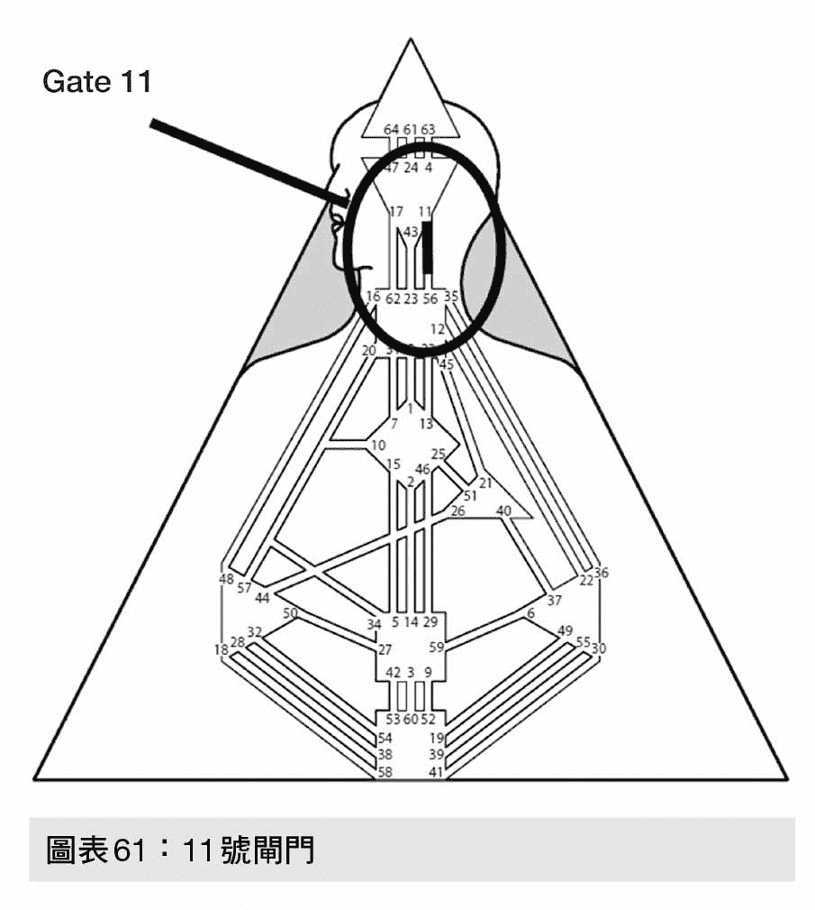

11 号闸门充满了无数想法，然而，渴望执行脑袋所有的想法便是其挫败感的来源。他们时常抱怨其他人「偷走」他们的想法或自己的点子被「剽窃」了。

若 11 号闸门者能明白，他们脑中产出的所有想法并不是为了服务个人，而是要在「得到邀请后」与人分享，这样他们就能和自己源源不绝的点子和平共处。此闸门的挑战在于耐心等待对的人走向前来、征询他们的想法。

11 号闸门也是探寻者（而非发现者）的闸门。若 11 号闸门者能保持不断探索的姿态且不抱持既定答案，就能享受人生旅程。别忘了，11 号闸门是属于想法的闸门。你不必急于展现所有（或任何一个）想法。若某个想法适合你去实现，它将会依循你的人类图策略显现在你的生命中。

##### 肯定语句

• 我尊崇我的内在创造过程。

• 我对人生中曾经历的教训和冒险抱持感恩之心，我知道我的每一则人生经历会为我的生命和人类的故事增添美丽和鲜艳的色彩。

• 我会以放松的态度，享受人生中追求真理的过程；我很清楚，我学得愈多，愈能让我成长，而学习和成长永不止息。

• 我会品味生命中的每一刻，并将自己视为承载创意的容器。我会放松、深呼吸、相信，让想法源源不绝！

##### 练习题

1. 请评估过去几周以来，你所完成的任务？你是否从中学习到什么？你能如何精进那些已完成的项目？

2. 在本周内持续记录自己的想法。你永远算不准何时会遇见能分享想法的适合对象、何时自己会得到改变一生的重大想法！

#### 12 号闸门：谨慎

易　经：静止不动（否卦）

占星学：双子

生物学：甲状腺和副甲状腺

12 号闸门之所以谨慎，是因为它需要确认自己是否受到尊重。若处于不对的情绪，此种谨慎的根本表现便是害羞，反之则为勇敢无惧。12 号闸门也是与社会环境紧密相连的强大能量，而拥有此闸门能量且喉咙中心呈现开放者，往往具有导引和预言的显著特质。

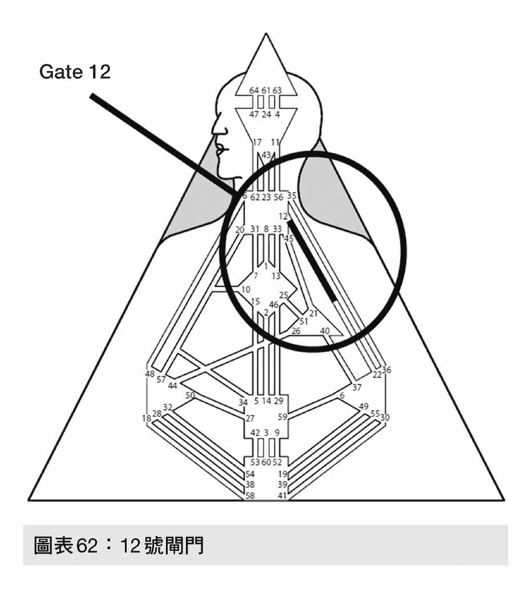

12 号闸门若在不恰当的时机分享就会面临某种挫败和愤怒。有时，当他们的真知灼见在事后证明是正确无误时，这种能量便会退隐为「你看吧！我早就警告过你」的样貌。

讽刺的显示能量在此闸门中非常强烈。此外，这里头似乎存在着一股说话和表现的冲动，但假设你总习惯不假思索、为所欲为地表现，你便会体验到言语冒失而引发愤怒的后果。时而在人生中打造「静止不动」的状态对拥有此能量的人而言，确实是内心的一大挑战。他们若曾因为在不适当的时机表达自我而有过不愉快经验，退而保守往往会让他们变得畏缩停滞。

但 12 号闸门若在恰当的时机分享，就会是很出色的语言艺术家；它拥有觉知回路（参照第七章）的创意表现能量，能以热情、丰富和深刻的方式展现，充满了艺术和创意能带给人类的活力和力量。它会是一股创新、蜕变和极具影响力的能量。

##### 肯定语句

• 我的言语、表现力和创作都受到神圣的指引，而我会完善传达自己和自身创造物的美。

• 我的意见能得到聆听和重视，而我会继续分享我的洞见和经验，以作为自身创造过程的一部分。

• 我的出色观点能帮助我形成想法和创造。

##### 练习题

1\. 你是否运用意志力或神圣的力量来创造事物？

2\. 停滞的状态是否会让你感到困陷？你该做些什么才能让自己继续往前？

3\. 现在是和他人分享你的观点、想法和灵感的成熟时机吗？

4\. 你能做些什么有趣的事，以激发自己的创造能量？

#### 13 号闸门：聆听者

易　经：伙伴关系（同人卦）

占星学：水瓶

生物学：肝脏

13 号闸门象是某种神奇魔力。它是一股能引起周遭人们奇妙反应的能量。13 号闸门会带给周遭人分享自身祕密的驱力。若你拥有此闸门能量，人们（即便是不熟识的人也一样）会忍不住向你全盘托出心中的每一件事。这就是聆听者的能量作用。

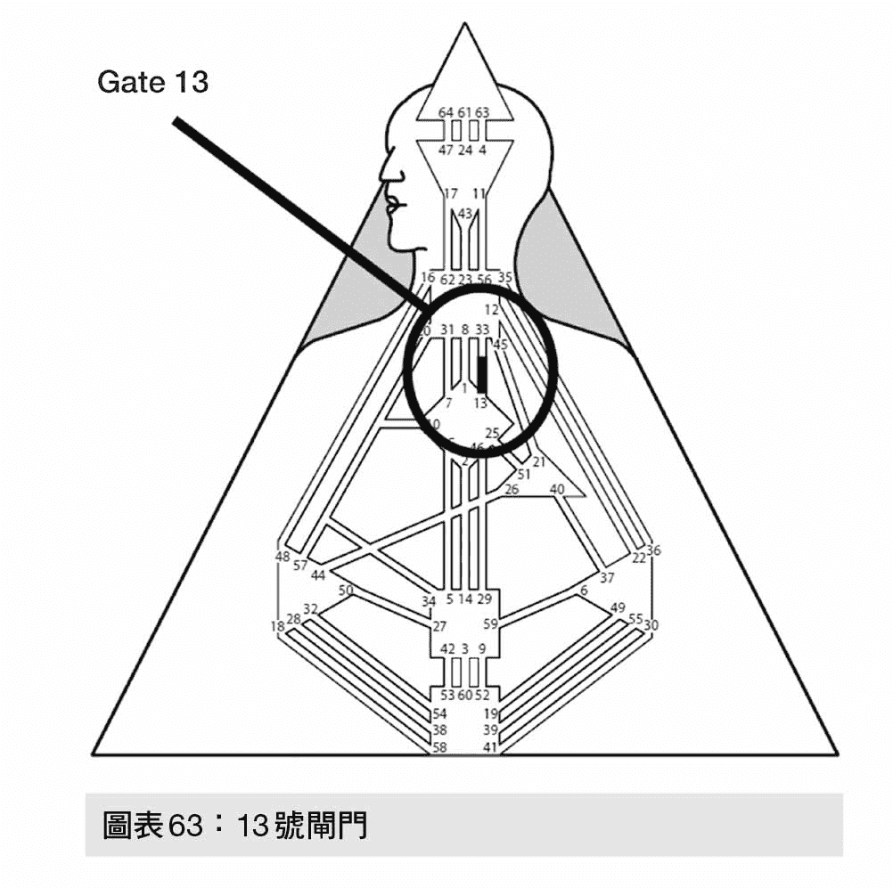

当你持有这股能量时，你就是说故事者，但更重要的是，你也是故事的「保管人」。由于 13 号闸门的能量非常靠近喉咙中心，此外，它也属于表现通道的一部分，因此，你一不留意就会将他人的故事和祕密说溜嘴（若喉咙中心有定义更是如此）。然而，保管故事是一件神圣的任务，从更高层次而言，你是持有开启人类故事片段的钥匙保管人。

13 号闸门的能量作用不仅是聆听，还包括聆听故事后的方向指引。这是一股需具备怜悯心和智慧的特别能量。最理想的景象莫过于人们能感知 13 号闸门者是很棒的聆听者，也相信这股能量是铺设人生道路的材料之一。

##### 肯定语句

• 我信奉神圣的宇宙。在我的内心深处，我和自己更崇高的使命并肩而行，我会采取能增进众人福祉的行动。每一天，我会试问自己，我是否善用了头脑、双眼、言语、心灵、双手、身体、我的观点和存在，以完成神圣的任务。

• 我会仔细聆听他人的言语、爬梳真正的意义。我会让自己觉察所有话语里蕴藏的真实，如此一来，我就能知晓每一则讯息的神圣意义。

• 我持有让人类汇聚以实现崇高使命的神圣空间。

• 我以爱引领众人。

##### 练习题

1. 你如何看待自我价值？你能位居幕后，自在地为众人的福祉效劳吗？你在哪些人生领域仍感受需证明某事的驱动力？

2. 你能做些什么，好让你更能聆听和真正听见他人的话语？你需要做些什么，才能更让你听见和聆听自己的内心指引？

3. 你会为自己保留一些时间以厘清思路吗？你能看见自己过往人生的真实意义吗？你仍需放下哪些过往片段吗？

#### 14 号闸门：权力技能／强而有力的技能

易　经：掌握权衡（大有卦）

占星学：天蝎／射手

生物学：卵巢和睪丸

14 号闸门属于全然生产的闸门。此闸门拥有工作以获得金钱报酬的能量。然而，它不仅是为了钱财而工作，它也会回应机会以创造资源。整体而言，这是关于权力技能、重要的社交网络及所有与财富相关的能量。

14 号闸门彷彿得到了机运的祝福。当拥有此能量者做出回应时，该回应在某种程度上都与创造财富有关。

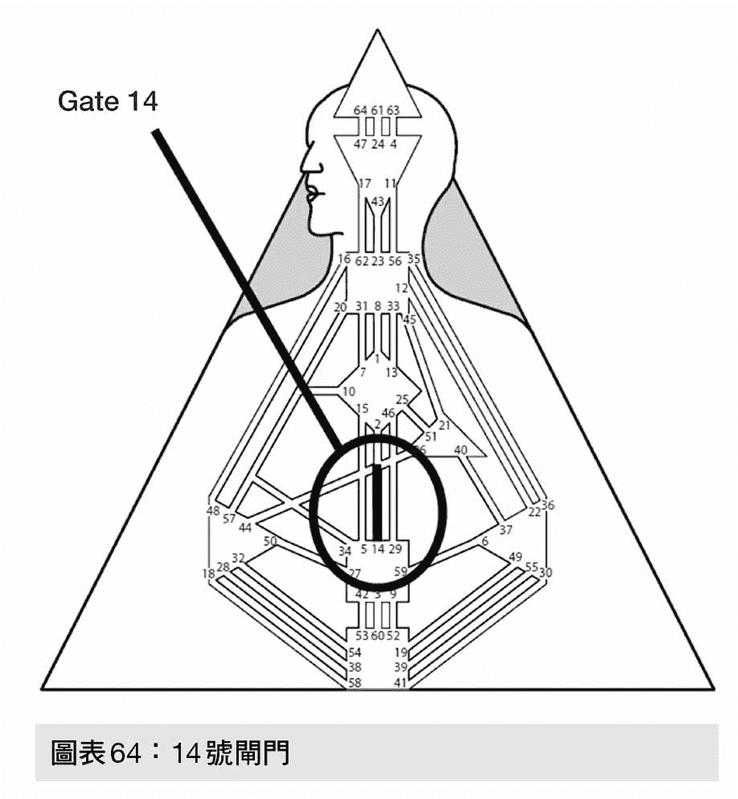

天生具有 14 号闸门的能量就像生而坐拥一笔「遗产」。由于赚钱有时对他们而言简直易如反掌，因此他们往往不在乎物质层面的财富象征。

这股能量会不断导向为整体人类创造贡献的渴望。拥有 14 号闸门的人明白，没有资金为本，世上的一切都是空谈。然而，在此所谓的资金，并不是意志力回路（参照第八章）里的个人财务。它纯粹是指从事适合的工作，再赋与此工作得以彻底发挥的能量。

##### 肯定语句

• 我相信且知道只要我遵行我的人生策略，我所做的一切努力都会得到全然的支持。

• 我无限的创造才能会带我支持的力量，而我会善用我的支持力量实现我的人生使命。

##### 练习题

1. 列出所有你目前正在进行、感到激励人心和有趣的事情。在这些事项中，承诺自己每天至少关注一个项目。

2. 若你只跟随你的热情行事，你的人生会变成什么模样呢？你会从事什么工作？你会如何评价你的人生？你的能量能彻底展现吗？

3. 你相信宇宙会支持你走在喜悦的人生道路上吗？你能从事自己热爱的工作，并相信自己会得到支持吗？

#### 15 号闸门：极端

易　经：谦逊（谦卦）

占星学：双子

生物学：肝脏

15 号闸门是一股充满影响力和多面向的能量。它属于极端的闸门，尤其是韵律中的极端。拥有 15 号闸门者总是不断在寻找自己的节奏，但它却始终变化万千。若他们能找到固定的节奏，那么它也一定充满多样和极端的特质。这种情形有时会让关系变得极具挑战性，尤其是 15 号闸门和 5 号闸门在关系中相遇时。

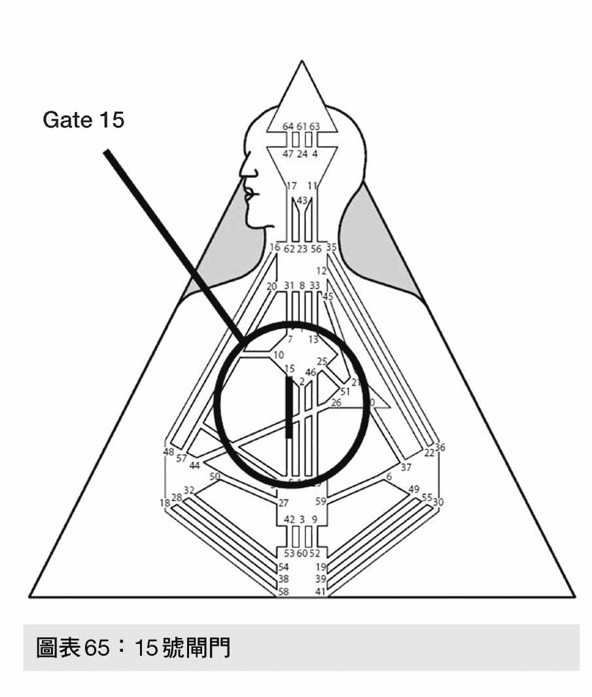

15 号闸门者拥有强大的能量场。对此，他们通常能察觉且试图隐藏，但无法如愿。15 号闸门的能量场总能比他们抢先一步到达某一空间，成为众人的注目焦点！

15 号闸门代表人类之爱。它能通往对人类爱的极致表现。15 号闸门具有烈士的色彩。但愿它同时与 10 号闸门搭档作用，如此一来，它便带有给予力量的特质。

这股能量不仅带给我们对世上其他人的深厚连结感，也让我们和自然界紧密相系。它是属于自然、潮汐、动物和基本元素的能量。它清楚地展现出我们和自然界的命运是密不可分、紧紧缠绕在一起的。当我们和 15 号闸门携手合作时，我们会试问自己希望能对这个世界以及世上的人们做出什么贡献？

##### 肯定语句

• 我的生命丰富了人类的完善。我的努力让世界受惠。

• 我无条件接纳构成人类宽阔光谱的多元和节奏，并顺从另一股更巨大的生命之流。

• 我对人类的多元和壮阔抱持敬畏之心，而正是此敬畏态度驱使我为众人的福祉效劳。

##### 练习题

1. 你在生命的哪个部分具有韵律？哪个部分需要调整，才会更能让你顺应生命之流？

2. 自然界想和你分享什么讯息？你需要调整自己，让自己的步调更能与自然一致吗？

3. 你能为人类带来什么贡献？你能欣然接受自己的使命作用吗？你需要或想要强化你的承诺吗？

#### 16 号闸门：技能

易　经：热忱（豫卦）

占星学：双子

生物学：甲状腺和副甲状腺

16 号闸门充满热忱但缺乏深度（除非搭配 48 号闸门）。这是「做就对了」闸门，它会直接行动，事后再理解细节。庆幸的是，16 号闸门通常满怀天赋，也往往能摆脱肤浅的才能表现。

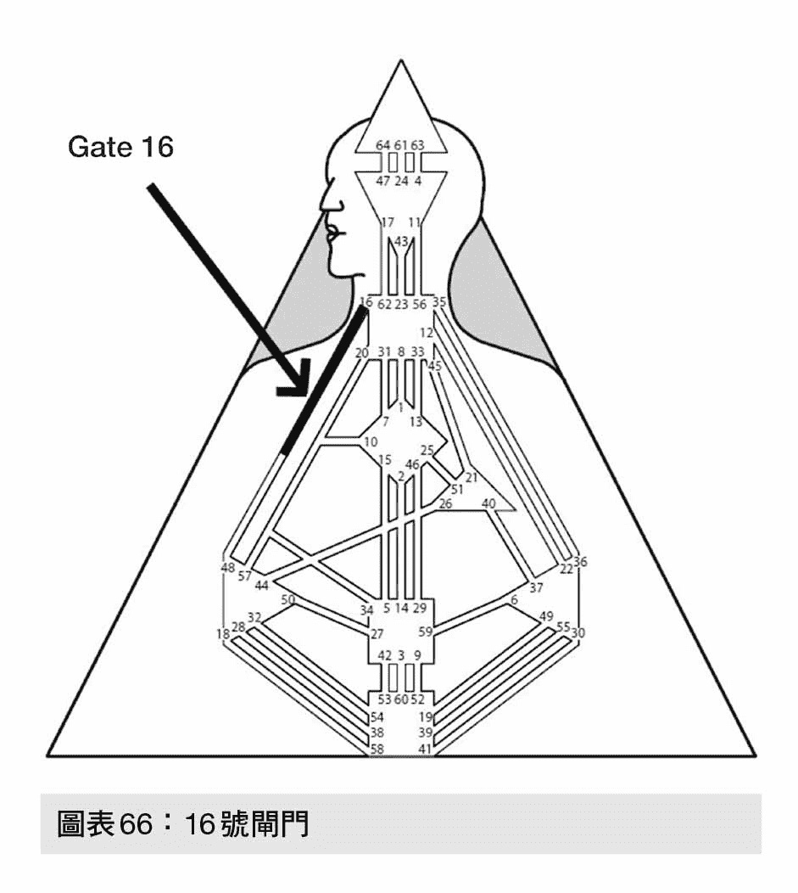

16 号闸门赋予我们起身行动、对创造过程尽心尽力的能量。它是关于技能的闸门，但却少了些深度，因此在这股热血沸腾中，也包含了某种年少、不成熟的气息。在掌握创造的过程里，我们仍有许多事物待学习，然而就如同塔罗牌里愚者（the Fool）传达的讯息──每一段旅程都始于踏出兴奋的第一步。

##### 肯定语句

• 我会让自己不断试验和创造。

• 试验和探索是富有创造力的我固有的一部分，它们能让我找出正确的模式，得以展现自己的才能和灵魂的旅程；而正是对此旅程的不懈追求，才让我活在喜悦之中。

##### 练习题

1. 你有什么梦想正开始开花结果吗？你的试验过程带给你什么启示？你需要做什么调整吗？

2. 哪些信念是构成你展现自我试验的一部分？你是否存有需要抛弃的旧有信念？

#### 17 号闸门：意见

易　经：跟随（随卦）

占星学：牡羊

生物学：脑下垂腺的前后叶

17 号闸门的能量能让我们抛出新的、仍待检验的想法。它是好奇的能量，不带有确定的特质。逻辑的能量是透过经年累月地修正模式而臻纯熟。17 号闸门是逻辑回路（参照第九章）中首要的修正能量，但它只不过是一种假象；若是没有经过一段时间的检验和纯熟，17 号闸门终究纯属意见。

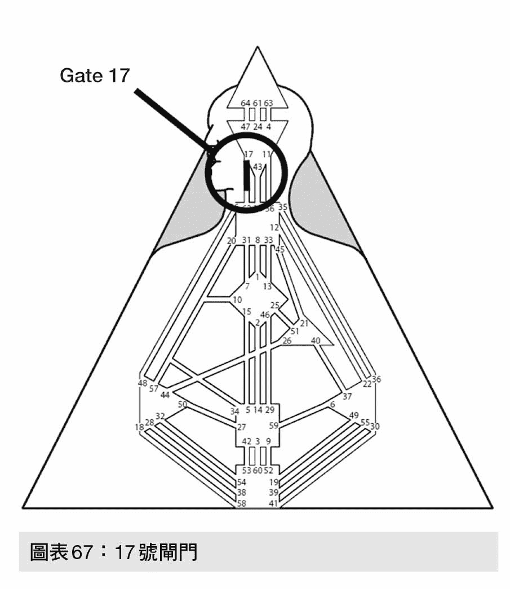

这股能量其实不容易掌握，尤其对那些不擅等待人们邀请再行动的人而言更是如此。17 号闸门会出其不意地说出意见，有时并未清楚意识到意见只不过是一种想法。在人们尚未辨识出你的能力前，这些意见通常会遭受排斥，而提供意见者则往往会被忽视。

17 号闸门仅仅是提出点子；若他们能在内心知晓自己想法的奥妙之处，而非坚决行动并抱持着自己的意见就是无懈可击的态度，那他们就能在创造集体完善的过程中扮演好属于自己的角色。

不妨将 17 号闸门视为科学方法里建立假设的步骤；假设是用来被试验、检验是否为真的陈述。意见也许是、也许不是正确的，意见的存在功用是接受检验，因此在本质上是需要被试验的新想法。

此能量若未充分发挥，它就是一个贸然发表意见的闸门。反之，若能量彻底展现，它便是一个发展崭新可能或模式的大好机会。

##### 肯定语句

• 我会耐心等待他人的邀请，再提供我的想法和意见。我知道当人们主动邀请时，他们就会珍视我的想法。

• 我明白我的真实并不总是他人的真实。每一个人都有属于自己的独特旅程，而不同的观点会产生不同的理解。

• 我信奉事实，而我会等待那些支持我的事实的人。

##### 练习题

1. 你会怎么处理那些代表你的热忱的想法和灵感？你善于坚持想法，并等待对的人加入你的想法萌发阶段吗？

2. 「奉献」对你而言，代表什么？你准备好帮助他人了吗？你希望再多尽一些心力吗？你能全然无私地奉献自己吗？

#### 18 号闸门：修正

易　经：找出错误之处（蛊卦）

占星学：天秤

生物学：脾脏和淋巴系统

18 号闸门是追求事物完美的直觉力，是属于编辑和会计师的闸门。它也是和脾脏有关的闸门，因此不涉及思考，只全然地传达直觉的理解，以及恐惧。18 号闸门的恐惧为事事皆不完美，除此之外，它和所有源于脾中心的闸门相同，也潜藏着让人因为担心「永远没办法把事情做好」而畏首畏尾、动弹不得的可能性。

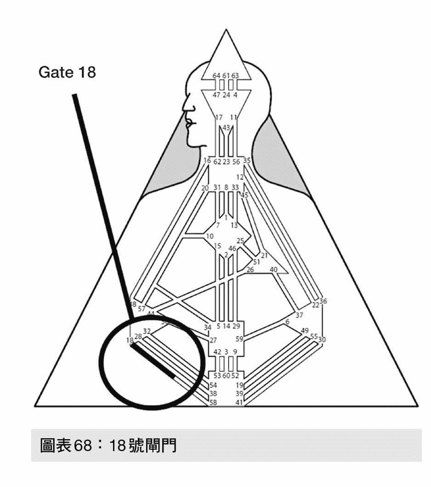

18 号闸门会让人感到严厉，尤其是当它未获得辨识及认可的情况下。18 号闸门并未和任何一个动力中心连结。这股能量必须得到他人的识别和召唤。当它得到邀请而发挥时，就会成为出色和充满活力的能量。我们需要能「修正」和知晓如何让事物更臻完善的人。拥有 18 号闸门者能找出最理想的模式，并以充满影响力的方式展现于世。此外，由于 18 号闸门属于直觉力，且非常靠近根部中心，因此，拥有此闸门者时常会笼罩在亟欲分享修正心得的压力中，而人们往往不是反应淡漠，就是充耳不闻。有时，我们会戏称 18 号闸门为「看吧！我老早就告诉你了」闸门。

##### 肯定语句

• 我的人生就是益臻完美的过程。我目前所处的人生位置就是我所有经验的总和，而随着我不断学习、成长，我的理解力和察觉能力也将一并纯熟。

• 现阶段的我就是完美的。我的「错误」是帮助我成长的催化剂，而我乐于修正模式，并为自己的人生注入愈来愈多尽善尽美的事物。

• 每一天都能赋予我成长和发展的机会，而我会抱持愉快和感恩之心。

##### 练习题

1. 当你回顾自己的人生时，你能发现哪些成功的模式吗？你该怎么做，才能让这些模式重演？

2. 当你检视过往人生，你能发现哪些自我糟蹋的模式吗？你该怎么做，才能消除这些模式？

3\. 你该怎么表达自己的感受？指责？抑或是宽恕？

4\. 你的创造过程中，要调整哪些部分，才能产生更与内心一致的表达？

#### 19 号闸门：想要

易　经：靠拢（临卦）

占星学：水瓶

生物学：肾上腺

19 号闸门非常敏感。这条通道（19-49）真切需要在情感上坦诚，因情绪的敏锐度有助于决定是否要投入一段关系。假使这段关系并没让你「感觉良好」，它也就很难实现亲密。

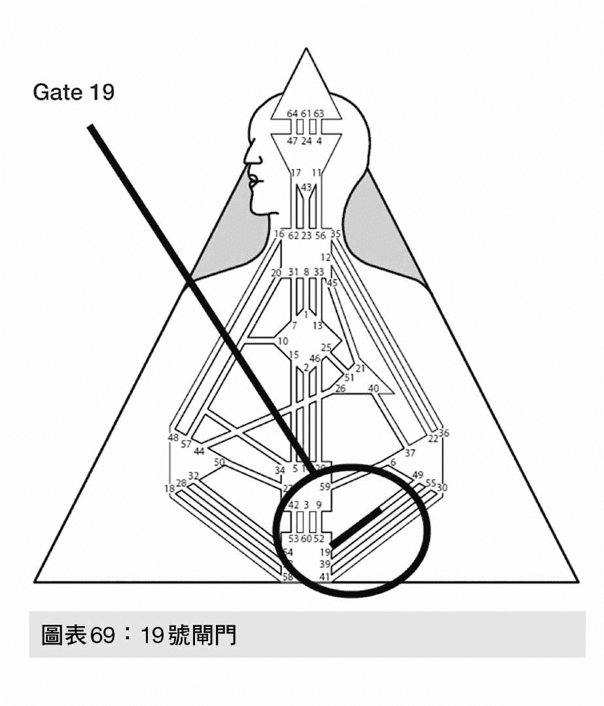

19 号闸门的敏感度显现在各种不同的面向。它很容易受情绪能量的转变影响。父母务必要明白，教养 19 号闸门孩子的方式必须采温和路线。吼骂、体罚或其他激烈的情绪表现都会为他们带来残酷的内心煎熬，尤其是这些孩子的情绪中心是开放设计时更是如此。

19 号闸门对碰触和感觉也非常敏感。情绪能量和触觉有关，而促使亲密发生的需求则深植于想要被碰触与否的渴望。真正的亲密需要让身心都能全然感受。拥有真正的亲密后，随之而来的便是决心投入这段正式连结的关系。

这种情况会以敏感的肌肤和触觉官能显现。19 号闸门者往往会剪掉衣物上多余的标牌，喜欢柔软的布料，或甚至将袜子反穿，以避开前端的缝线抵踫脚趾。

19 号闸门也拥有非常灵敏的味觉。它能在相似种类的食物间，辨别出味道和口感的差异。举例来说，若 19 号闸门者改换麦片品牌食用，他们也能清楚分辨制造商的不同。

此外，由于 19 号闸门牵系着哺乳类和动物能量的连结，因此它通常对动物的能量非常敏感。19 号闸门者往往能从饲养宠物、把牠们视为同伴的过程中获益良多。

##### 肯定语句

• 我明白循环的尾声永远是新循环的开端。我会带着祝福以及自循环中汲取的教训，勇敢地朝下一阶段迈进。

• 我尊崇我的敏感度，也信赖我的感受。

##### 练习题

1. 哪些循环在你的人生中即将进入尾声？你从中学到了什么教训？你在哪部分得到了澄明？

2. 对于这些结果，你是抱持抗拒或是接纳的心态？你需要做些什么才能为新的循环创造开始的空间？

3. 对你而言，亲密代表什么？你的需求是否得到满足？是否满足另一半的需求？是否清楚传达了自己的希望？是否接受你的另一半为你付出？

#### 20 号闸门：蜕变／当下

易　经：冥思／注视（观卦）

占星学：双子

生物学：甲状腺和副甲状腺

20 号闸门充满影响力。它将整合型回路（参照第七章）带往喉咙中心，决定了直觉意识的表现是否能转化为适切的行动。20 号闸门能以多变的姿态与赋权、自我、直觉、力量和生命力擦出火花。它属于个体的声音，能产生突变、赋予力量，也能停滞不前、失去力量。（请记住，并不是所有个体的声音都具有适应能力。）

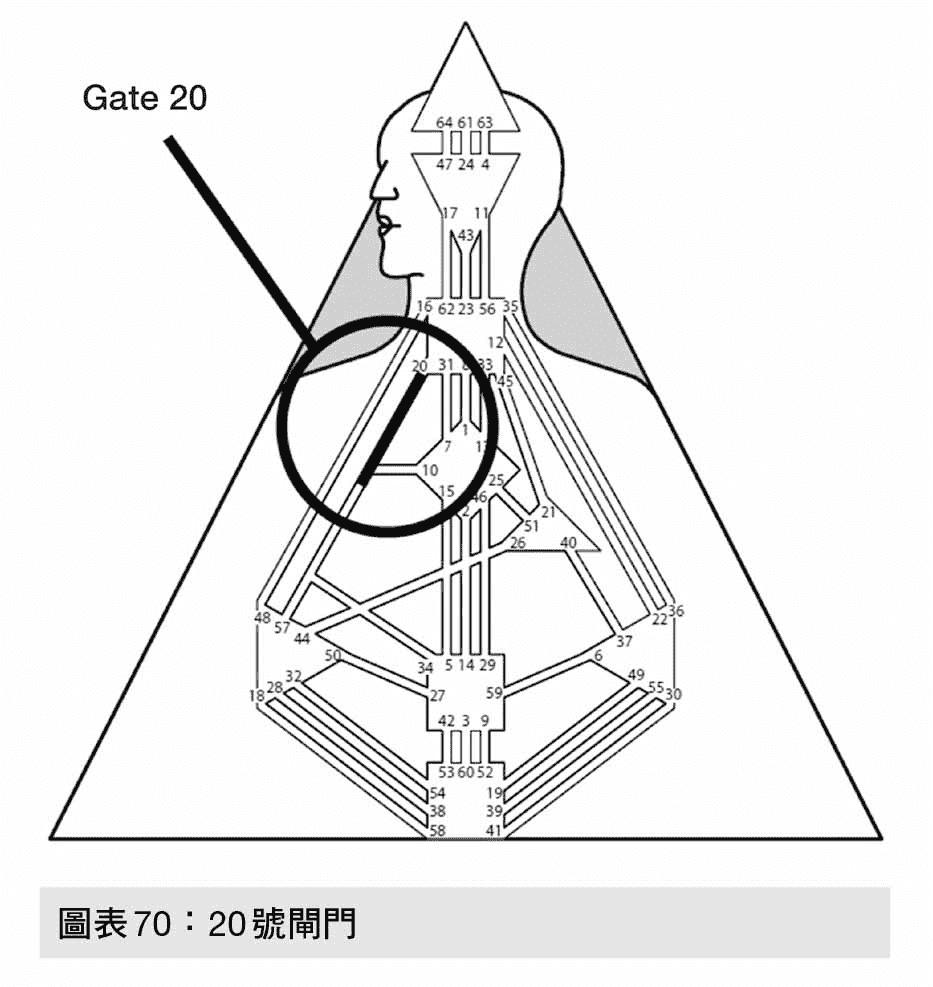

当 20 号闸门充分发挥潜能时，它便是整合的彻底展现，就算与外界背道而驰，仍会坚持采取对的行动。这好比在森林中，当其他人在脸上涂抹上亮粉红色时，你却选择漆上绿色保护色，或采取其他和主流格格不入的「正确」措施。

由于 20 号闸门是整合的展现，因此富含天生的智慧。在传统易经中，二十卦代表明智的君王在采取行动前，伫立山巅、观察风向趋势。20 号闸门需要时间来展现本身蕴藏的智慧，以作为整合的一部分。它观察、注视，并等待展现高深知识、洞察与觉察的时机。最终，它会将觉察和识别转化为行动。

20 号闸门也具有辨识他人天赋才华的能力。它就象是优秀的艺术评论家或是独具慧眼的出版商，凭直觉就能知晓最高境界的觉知及自我表现。在人类图表中，20 号闸门带给我们最饶富趣味和有违常理的认知。由于我们受制约影响而深信权力和魅力属于一种强迫能量，即若缺少伸张或甚至侵略，就无法得到认可的能量。

然而，人类图表告诉我们，唯有先得到认可，权力、魅力和领导能力才能有最极致的表现。专制和急于展现并不真正有效，并且往往只会遭受人们反抗。

真正的权力存在于等待恰当的时机、适当的认可与等待过程中的准备。拥有此闸门者须耐心重整自己的渴望、行动及心态。在你的心田播撒适切的思想种子，再灌溉以信念、信任和见识，最后交由神圣的秩序掌管一切。20 号闸门不仅能实现对的机会，也能让对的人在过程中加入、并肩作战。

##### 肯定语句

• 我有能力完成某事，并不代表我必须或应该实现某事。我会善用我的人生策略来决定行动，我只愿执行那些对我而言是正确的事。

• 我是一扇通往完美宇宙的大门，也是创造神圣秩序的行动开端。我决定执行的行动在其他我选择不作为事件衬托下，才得以变得更加显著。

##### 练习题

1\. 关于不采取行动，你的感觉是什么？

2. 在你的生命中是否存在着你汲汲营营追求，却毫无方向的人生区块？在此追求过程中，你是否感到筋疲力竭？其成效是否符合你的预期？

3\. 在你的生命中是否存在你需要掌握领导或代表权的人生区块？

4\. 请试着描绘你的个人力量。你是否充分发挥了你的个人力量？

#### 21 号闸门：财务长／猎人

易　经：奋勇前进（噬嗑卦）

占星学：牡羊

生物学：胸腺

21 号闸门是掌管财务的闸门。我们能在 21 号闸门里探见控制资源的极限。这是一条极度渴望掌控实体资源的物质通道。

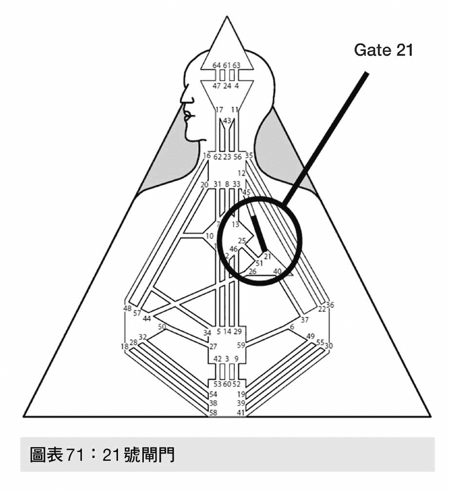

拥有此能量者非常爱护自己的所属物。假设他们买了一辆新车，他们可能会将它停放在停车场的角落边缘，以防其他人的车门碰撞到自己的爱车。21 号闸门在旁人眼中也可能是个控制狂。即便此闸门具有与喉咙中心相连的可能，但就其本身而言，它属于投射性质，亦即，除非人们主动要求，否则不会接受 21 号闸门者的控制。

当 21 号闸门得到识别与认可后，它就能成为他人的珍贵资源。21 号闸门的智慧让我们知晓善用自身资源及花费金钱的最佳方式与最好时机。

虽然我们会抗拒 21 号闸门的控制，但不可否认地，它是维持富足的重要能量。优秀的财务长不一定讨喜，但饱满的银行户头肯定人人皆爱。

##### 肯定语句

• 我能掌控我的想法和行动。我会消除自己对他人的掌控欲。

• 我会利用我的能量管理自我，并信任宇宙会带给我各种机运和神奇魔法，让我彻底展现自己的渴望。

• 我的灵感是他人灵感的来源。我藉由以身作则来引导众人。

##### 练习题

1\. 在你的人生中，你需要解除对哪些事物的控制？

2\. 你该做些什么才能让他人尽情展现自我，为他人保留自由的空间？

3. 你该做些什么才能加深你对宇宙的信任？你该消除哪些旧有的信念和恐惧，好让你的信任感变得更稳固？

#### 22 号闸门：开放

易　经：优雅（贲卦）

占星学：双鱼

生物学：肾脏和胰脏

拥有此能量的人，若处在对的情绪之中，会非常地优雅和迷人。他们知道如何「游说影响」他人，也会是很出色的资金筹募者和赞助者。22 号闸门的祝福源于领会美丽和优雅是来自于内在，也明白此内心世界只能和那些愿意等待、且珍视他们的人分享。当内在的美丽和优雅得以被掌握时，对的人便会赏识这份美丽，进而为它开创出表现的空间。

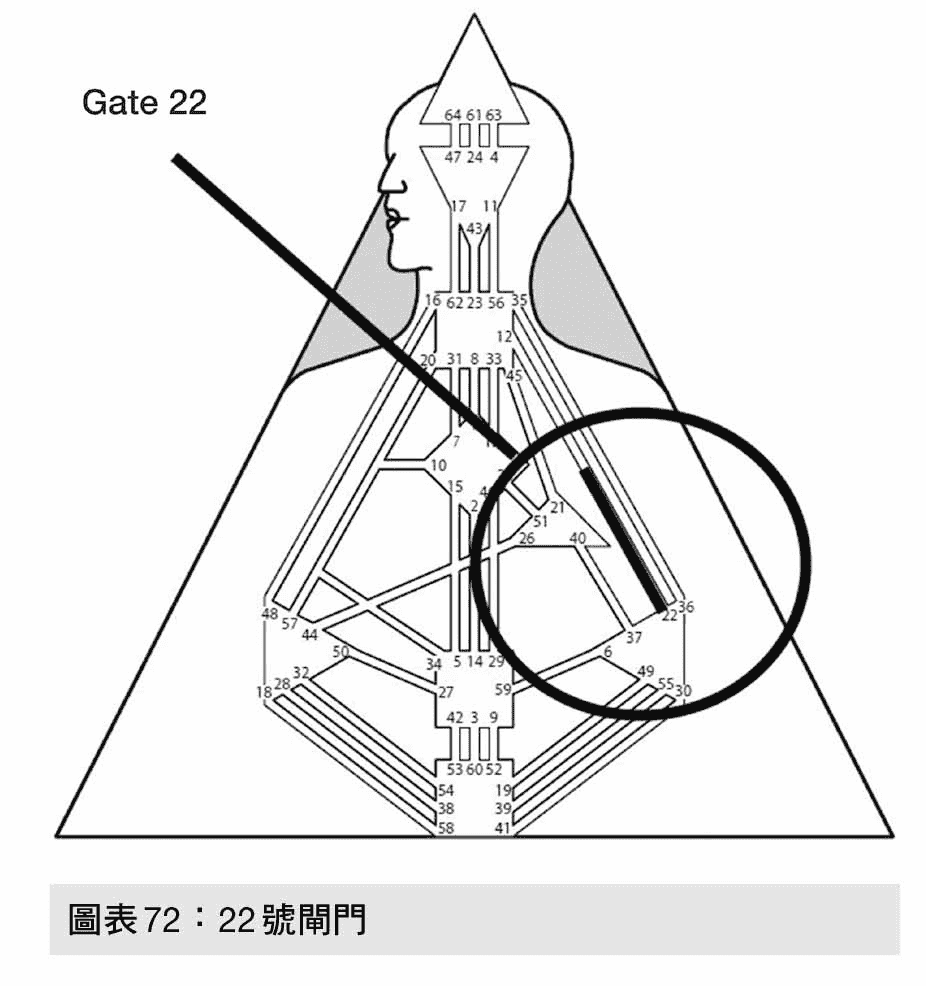

反之，无法理解美的内在世界便会褪去优雅的光采。冲动行事、冒失发言或在不恰当的时机表露情感皆会产生一种因而让人群远离、丧失传达美的机会的能量。拥有 22 号闸门的人务必要等待正确的时机，并在分享前主动告知。

这道闸门随着自我成熟会益发显露无比的智慧；它学会了判断何时是适合分享的时机、何时又该沉默聆听。当它在真正的优雅中萌芽绽放时，这股能量就会吸引众人的目光。

##### 肯定语句

• 在神圣的秩序面前，我会保持优雅和仪态。

• 我会观察、评估、整合，进而分享我的觉察。我会在对的时机从容地表达我的想法。

• 我会善用我的正确意识能力，并将我的觉察和理解分享给他人。

• 我是暴风雨中的宁静。

##### 练习题

1. 当你面对情绪能量和他人的激烈反应时，你能采取包容和觉察的策略为何？你的超脱策略为何？

2\. 你的讲述风格为何？当你辨识出运作模式时，你该如何发表你的认知？

3. 你在生活中的哪部分会产生剧烈的情绪反应？你对你的情绪能量有何感受？你会等待情绪的澄静，或是猛然跃入情绪浪潮、事后再自我厘清？

#### 23 号闸门：同化

易　经：裂开（剥卦）

占星学：金牛

生物学：甲状腺和副甲状腺

23 号闸门是不折不扣的游戏规则改变者。它深知所有的基础都能以新的想法和意识来瓦解。能等待正确时机的 23 号闸门，才蕴藏着转变和促成进化的真正力量。只要具备正确的时机、邀请和认可，23 号闸门的言语能改变世界，或至少能改变那些被分享对象的世界。若 23 号闸门静候时机成熟，它的洞见会被视为天才的创见。但若缺乏适当的时机，它会被当成怪咖的狂言，毫无帮助。

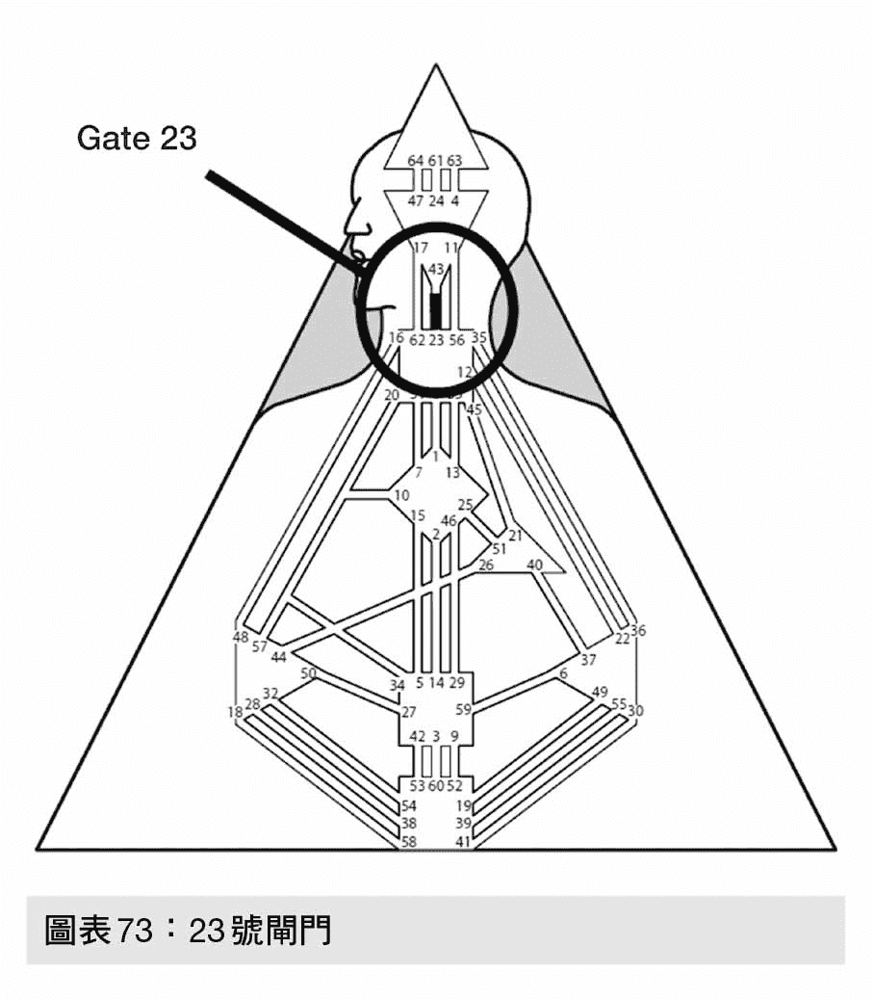

23 号闸门延续着 43 号闸门的转变进程。身肩找出言语以表达觉知回路（参见第七章）思想突变的任务。23 号闸门的天赋便是能将 43 号闸门的想法，切碎成能清楚表达的细小片段。

##### 肯定语句

• 我最大的优点便是拥有静待他人邀请以分享洞见的能力。

• 我对自己的思考见识充满自信，我相信自己明白和持有为自己及众人福祉开创有力改变的良善之意。

##### 练习题

1\. 你如何保有你的洞见？哪些日常事项能帮助你保有自身计划的能量？

2. 你是否有勇气坚持你的洞察，就算当下没有人能领会和理解也无所谓？你能习惯孤军奋战吗？格格不入是什么滋味？你会在什么时间点选择放弃？你会在什么阶段保持稳健和从容的人生步伐？

#### 24 号闸门：合理化／体悟

易　经：回归（复卦）

占星学：金牛

生物学：脑下垂腺的前后叶

24 号闸门是关于合理化的能量。在改变的过程中，24 号闸门抱持的想法是「前进两步、后退一步，最后至少仍前进了一步」。当你愈深入了解人类图，你愈能明白，每一阶段的扩张之后总是紧跟着收缩。虽然我们永远都无法回到原来的位置，但会留有一个扩张的基础，允许自己有修正发展的空间。我喜欢称此过程为「重新调整」。24 号闸门具有找出 61 号闸门真正有效想法的能力，并创造出正确的聚焦方向。

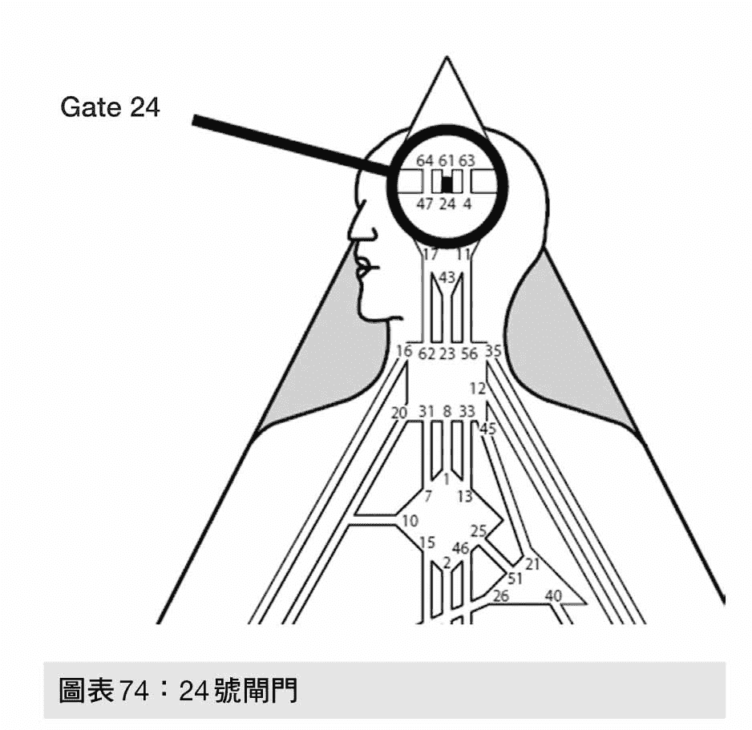

这是关于前进的强大能量，需要专注、计划及放弃不适改变的精准眼光。这股能量能让我们合理化过去和现在，充分利用并创造出新的事物。

24 号闸门的合理化也具有投射的特质。合理化必须透过邀请才得以被分享和适应，否则我们会认为这只不过是疯狂或不正常的事物。事实上，你拥有将任何事情合理化的能力。得到邀请之后，24 号闸门的合理化就会是有道理且实用的。24 号闸门是属于听觉、突变的能量，也带有忧郁的特质。即便你拥有合理化的能力，有时也会感到力不从心。

##### 肯定语句

• 我会将注意力放在自我进步和所有良善的事物上。

• 我专注于有用的方法及与之相应的协调事物，我相信所有有益的事物将成长发展。

• 我会赞颂自己的成功，并藉由专注投入于适合我的事物，来创造出更多成功。

##### 练习题

请列出在你的人生中，所有让你感觉美好和有效运作的事物。

#### 25 号闸门：灵魂之爱／自我精神

易　经：天真（无妄卦）

占星学：双鱼

生物学：肝脏

我们从发起的冲击（51 号闸门）踏入到灵魂之爱。这是一股充满爱的甜美能量，当然了，其中毫无冲击的成分。它是全然的爱，当你置身此能量场时，就能感受得到。

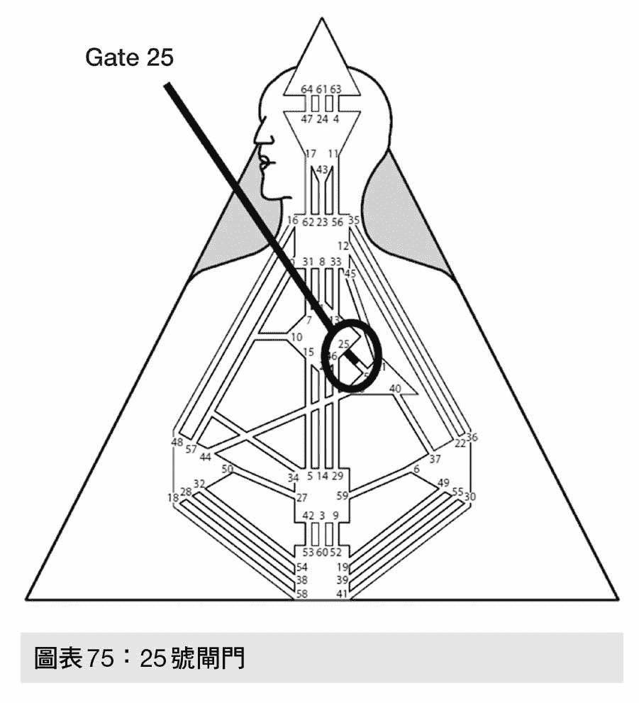

然而 25 号闸门者的挑战，是懂得理解他人行为的目的与原因。当 25 号闸门者目睹某件他们认为缺乏爱的事件时，他们会感到困惑不已。他们试着就事论事，但却难以改变什么。这股能量的考验在于，你要学会成为爱。在得到邀请前，你必须懂得克制自己传布爱。记住，你不需要据理力争或以言语说服他人。你的存在就是爱。

25 号闸门拥有非常强大的疗愈能力。你未必需要经过任何训练，你天生就是个亲力亲为的治愈者。若你拥有开放的脾中心及 25 号闸门，你不但是天生的治愈者，也是能以爱的力量疗愈他人的直觉治疗师。的确，25 号闸门告诉我们，此刻世界需要甜美的爱，每一个人都该能得到和感受这份爱。

25 号闸门的能量邀请我们摒弃对人类的批判认知、接纳更广阔的爱。

##### 肯定语句

• 我完全准备好在神圣的秩序中，站稳我的位置。

• 我知道我的计划会依据神圣的安排而实现。我会带着放松和信任的心情前进。

• 我知道人生中存有意想不到、更重大的结果，而它们都是为了我更崇高的良善而存在。我相信一切都会安适美好。

• 对于万事万物呈现的样貌，我会懂得宽心看待。我知道当我需要明白的时候，真理便会在我眼前展现。

• 我的灵魂是我一切良善的来源。

##### 练习题

1\. 你信任神圣的秩序吗？

2. 若此刻你在生命中面临了挑战，你不妨试问自己：「爱」会怎么处理这些挑战？

#### 26 号闸门：骗子／利己主义者

易　经：伟大的驯服力（大畜卦）

占星学：射手

生物学：甲状腺

26 号闸门是推销员的闸门。它拥有精心策划买卖成交，以及传达某梦想是绝佳想法，族人应该「买下」这些梦想的能量。没错，族人接着会交付资源以让梦想具体实现。然而，26 号闸门有点狡猾。这股能量可能代表真相，也可能是假象。好的销售员会卖给你可靠的梦想并履行他的诺言。但毕竟 26 号闸门的能量与销售息息相关。有时销售员会为了贩卖而推销，到后来却成了夸大不实的卖药郎中。

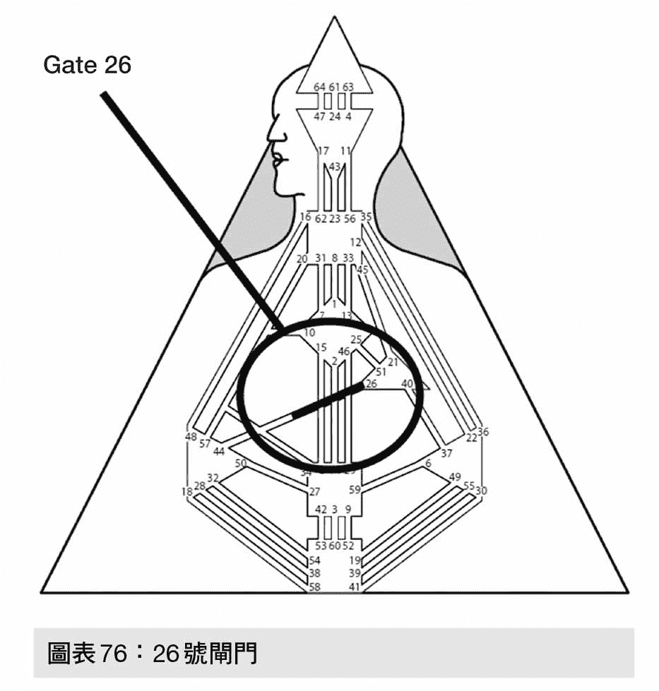

26 号闸门的最佳展现是诚信。它会表达从过往汲取的教训，并拥有依据家族呈现过去的方式来形塑家族身分的力量。你不妨想想，历史是可以改变的；26 号闸门能将历史随心所欲地打造成它所希望的样貌，再将重塑的版本呈现在族人眼前。

26 号闸门也和意志力中心相连。因此，工作狂的现象在此暂时纾解。自我意识并不需要得到太多的认可，刚好足够就能准备休息了。骗子让你交出金钱，如此他就能放心离开。换言之，他销售梦想，为梦想起头，其余困难的部分就交由其他人完成。（试想电影《欢乐音乐妙无穷》（The Music Man）里，推销员贩售了一套虚构的乐器给纯朴小镇居民的桥段。）说穿了，这只是一场销售活动。契约和交易的收入则含纳在意志力回路的其他部分。

##### 肯定语句

• 我的言行充满诚信，我会坦率地与亲爱的人分享我的内心世界。

• 我会谨慎从容地发表言语或做出承诺，因为我知道，我所说的话语描绘出我的内心和灵魂。

• 我深切地留意自己的影响力，我会带着慈爱之心倾听周遭人的意见。

##### 练习题

1\. 你的行动和言语与意图一致吗？你该怎么做才能让它们不彼此偏离？

2. 你应该分享哪些自己的内在事实？你希望在这星期内创造哪些真诚率直的关系连结？

3\. 在你的人生中，你真切重视哪些事物？你是否有表达出感谢之意？

#### 27 号闸门：责任／照顾

易　经：滋养（颐卦）

占星学：金牛

生物学：卵巢和睪丸

27 号闸门付出的关怀和责任以及教育有关。得到良好照料的家族拥有最完善的神经发展系统，故而每个成员得以继续实践家族的价值标准。27 号闸门承担着透过教育和提供资源以传达家族价值观的责任。它供给食物，并教导家族如何成长和分配更多资源。

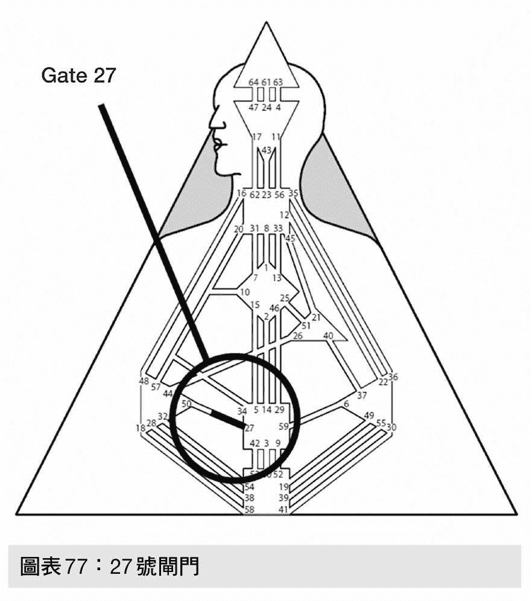

这绝非一股轻松的能量。毕竟，它属于家族的能量。责任伴随的压力无庸置疑，传达和滋养的实现也许要付出个人极大的代价，但却能让家族获得无比的回报。

27 号闸门的能量就象是德雷莎修女，充满爱心、责任感、影响力和培育精神，为了众人的福祉而奉献自己。

这股能量若是健全发挥便能带给你力量，让你拥有属于自己的收获，也让他人承担应负的责任。

请记住，你无法迫使他人成长。他们必须下定决心为了自己而进化。若你设法扛起让他人幸福的责任，只会徒费宝贵的能量，并以牺牲自身的幸福作为交换。

##### 肯定语句

• 我相信面对挑战时，我总是清楚知道该怎么做。

• 我会先照顾好自己再照料他人，如此一来，我的能量会更趋强大，我的关怀能力也将广阔无边、充满力量。

• 我能够赋予他人得以承担自身责任的力量，并相信他们拥有充分和完善的能力。

##### 练习题

1. 你总是将他人能力所及的事物包揽在身上，为他人代劳吗？你需要采取什么作为，好让双方都能得到力量？

2. 此刻在你人生中的核心思想为何？你该在哪部分集中你的能量，好让你能传达和展现该思想？

3. 你依赖他人的认同、许可或识别吗？在你的人生中，是否有哪些人是你必须停止设法取悦的对象？

4\. 你能更加善待自己吗？若可以，你该对自己承诺些什么？

#### 28 号闸门：挣扎／玩家

易　经：伟大（大过卦）

占星学：天蝎

生物学：脾脏和淋巴系统

28 号闸门是玩家的闸门。它是根源于恐惧人生无意义或价值的脾中心能量。28 号闸门必须设法找出人生的意义。然而，这必须是正确的奋斗，否则到头来只会是一场无谓的战役。

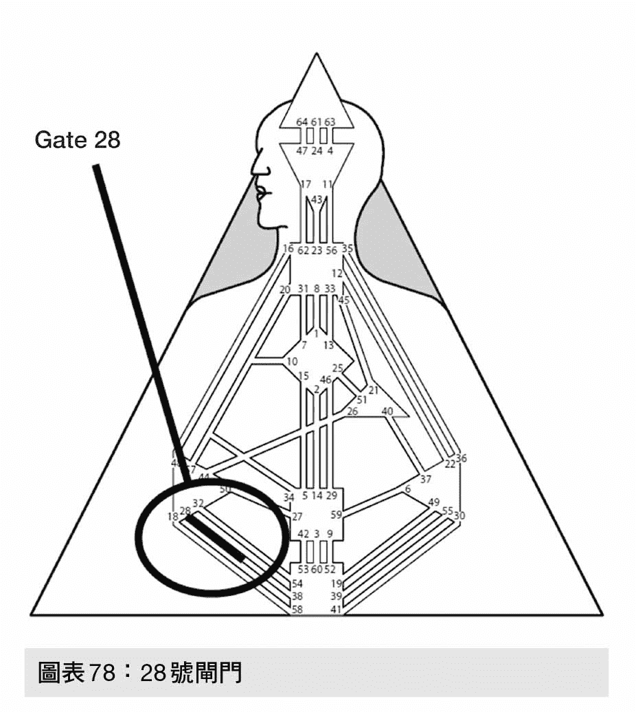

拥有 28 号闸门能量的人若未遵循自己的人生策略而活，有时会感到人生并不公平；与其他人相较，自己的人生之路彷彿更艰难。就某种程度而言，的确是如此。28 号闸门就象是人体图中关于奋斗的预设程序。若你活出你的人生策略，就会投入正确的奋斗，而这些努力将有助于你发现和分享人生的意义。反之，若你背离人生策略，便有可能将精力投注于错误的奋斗，而这只会让你的人生更加艰苦。

28 号闸门也能让你体会挣扎与奋斗可以是一段让人享乐其中的过程。28 号闸门者得不断学习拥抱困顿挣扎，而当他们渐渐能掌握人生价值时，他们便能从挑战中得到乐趣，更乐于突破极限。这是场在人生挑战中淋漓尽致活一次的痛快战役。

奋斗之路充满挑战，然而，克服万难后的成果却无比甜美。

##### 肯定语句

• 我彻底地活着。我不断展现生命的能量和可能性。

• 我的经验和奋斗过程能帮助我厘清人生中真正有价值的事物，而我乐于接受挑战。

##### 练习题

我们往往会问自己：「什么事物值得我们不顾一切、死不足惜地追求？」不妨换个方式问自己：「什么事物值得让你在人生中为此而活？」

#### 29 号闸门：毅力

易　经：深渊（坎卦）

占星学：狮子／处女

生物学：卵巢和睪丸

29 号闸门很容易对所有事情来者不拒，尤其是当它未善用荐骨的回应策略之际。29 号闸门的特质是锲而不舍、坚定不移，而这也是展现承诺的表现。

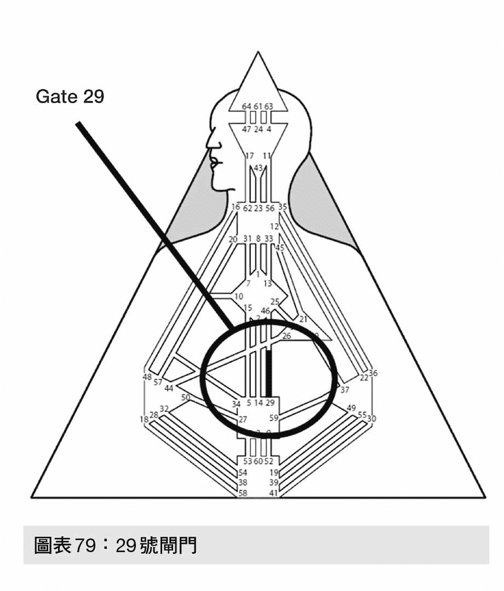

29 号闸门若没有活在人生策略里，便有可能终其一生陷在无数的承诺之中。29 号闸门未做出回应而导致自体免疫疾病（autoimmune disorder）和精力耗尽引发身体症状的情形也不少见。它探求承诺，但必须是正确的承诺。随着回应，它便具有忍受磨练和苦难，最后通往成功的能量。然而，错误的承诺会带给 29 号闸门过度坚持的不明智作为。若加上开放脾／直觉中心、情绪中心或意志力中心，则会让此种情况更加剧烈。过度坚持、一心想证明自己或设立无数的假想敌都会让 29 号闸门的能量大大削弱。

29 号闸门的力量在于无论经历什么困难，都能够展现出不屈不挠的态度。这是属于奥林匹克运动员或任何坚决实现梦想者的精神和决心。

##### 肯定语句

• 当我准备好从自己创造的人生中破茧而出时，我会仔细检验自己的行动，并确定我的承诺符合预期目标。

• 我只愿拥抱那些能让我更靠近梦想的事物，而我会依据我的人类图策略来迈向承诺。

##### 练习题

1. 你是否仍存有不切实际的自我承诺？你该排除哪些条件和情况才能为新的承诺开创空间？

2\. 拒绝对你来说有多困难？是什么因素让你无法拒绝自己或他人？

#### 30 号闸门：渴望／感觉

易　经：依附在他物上的火（离卦）

占星学：水瓶／双鱼

生物学：胰脏

30 号闸门带给我们激情与渴望的能量。在传统易经中，这股能量称为「离为火」。

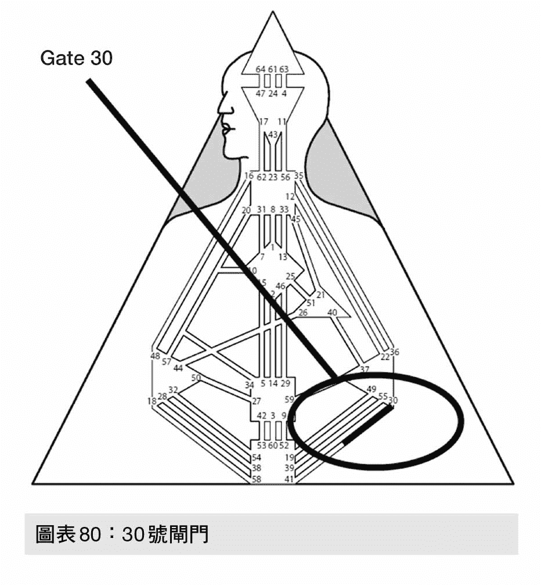

这条通道（41-30）的主题是等待正确的时机表现或采取行动。30 号闸门赋予我们坚持想法，并让它酝酿成熟直到正确时机到来的能量。它具有顽强的韧性，往往会把人逼疯或过度劳累。然而若妥善运用，它就能给予我们展现下一段崭新经验的热情和驱动力。

30 号闸门和创造新的经验有关。新的经验或许能提升生活质量，也或许会带来混乱，抑或两者皆有。等待正确时机的到来至关重要，但对 30 号闸门而言也极具挑战性。它承受着压力、怀抱渴望、期盼能展现自我，它充满情绪起伏、饱含刺激的色彩。

若 30 号闸门希望能适当地展现自我，且不因本身的强度而让他人抗拒，便必须等待，并意识到绝大多数的人并未带着如此强烈的感受渴望。

##### 肯定语句

• 我清楚知道我的目标和渴望。我仅专注于我渴望的事物。我的憧憬是真实的，而我内心的火焰是滋养热情的燃料。我能坚定不移地集中精力。

• 我藉由创造空间实现自己的梦想和计划以荣耀自我。

• 我的人生就象是全然开放的接收器，而我会处在热情期盼的位置，等待展现我的渴望。

##### 练习题

1. 你渴望在人生中获得什么？在你的个人财务、健康、关系、创造实现力、心灵生活及生活方式中，你选择经验什么？

2\. 你需要移除哪些分心事物，好让你能保持集中的专注力？

3. 你对什么充满狂热？你能自由、彻底地表现你的热情吗？什么事物会浇熄你的热情？

#### 31 号闸门：民主／影响力

易　经：影响力（咸卦）

占星学：狮子

生物学：甲状腺和副甲状腺

31 号闸门天生拥有领导能力，但它必须得到辨识与认可，才能有效发挥影响力。还需要经过一段时间的反覆验证，最后证明是有效的领导地位，这便是民主的表现。31 号闸门在试图服务众人的情况下能发挥最佳的作用。若你拥有此能量，你不妨时刻试问自己：「我该如何帮助众人？」

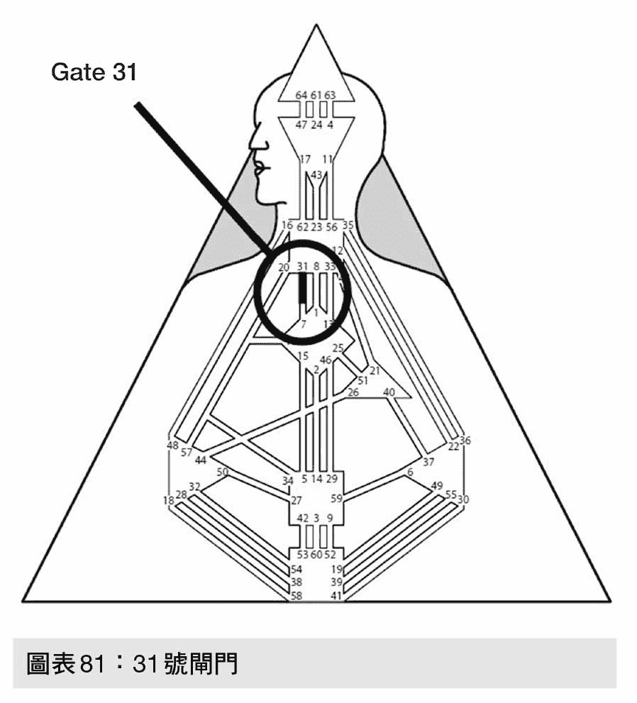

让你引领的群众告诉你他们希望如何被领导，这正是拥有此能量者成为有效领导者的真正祕诀。你就象是船首雕饰的破浪神，统一群众，并准备好发挥及分享你的影响力吧！

##### 肯定语句

• 当我得到发挥影响力的邀请时，我会担任天生领导者的角色。

• 我的言语、观念、想法和梦想都非常重要且值得与对的人分享。

##### 练习题

请深入思考真正的权力和影响力，对你而言它们代表什么？请觉察自己的身体，哪一部分能让你感到充满力量？并至少每天练习一次与这种身体感受产生连结。

#### 32 号闸门：连续

易　经：持久（恒卦）

占星学：天秤

生物学：脾脏和淋巴系统

32 号闸门是知道何时将梦想具体化实现的直觉。它渴望能提供使梦想成真的能量，但本身却不具有能量。此闸门拥有辨别什么事物有着蜕变和成功特质的直觉和智慧，不过整个过程仍需取决于是否有人认可这套价值，它需要具备无比的信任感。32 号闸门是根源于脾中心的恐惧闸门。它总是喃喃说道：「假使我的梦想一无所成该怎么办？」32 号闸门带着巨大恐惧，担忧他人会抢走他们的梦想并取得成功，或者就算他们履行梦想，最终却还是得到失败的结果。

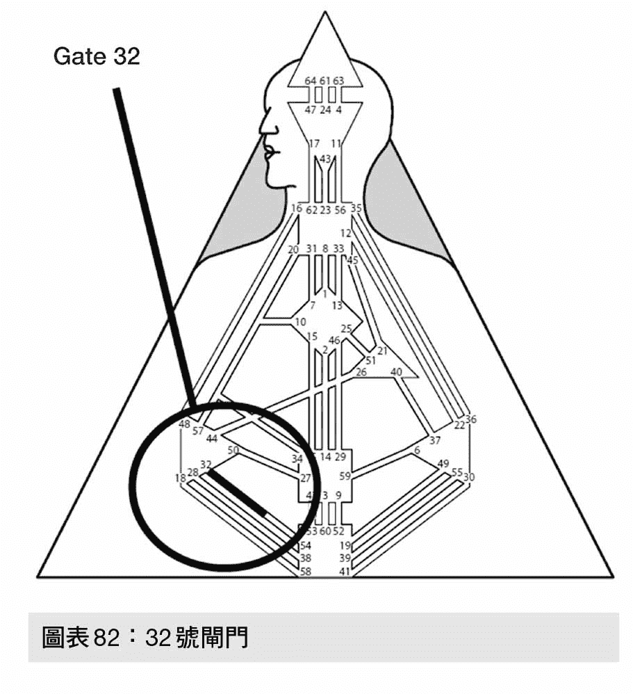

32 号闸门若彻底展现便会是出色的评估者，而不再把自己视为实行者。它的真正力量在于识别哪些想法值得投注能量、哪些则该抛诸脑后。

##### 肯定语句

• 我的直觉知道哪些想法值得追求。

• 我能有效掌握哪些方法有用、哪些能创造资源及如何将梦想转化为丰厚、具影响力的努力。

• 我相信对的人和适当的资源会来到我的身边，如此我就能以尊重自我及珍视自己想法的方式向他人分享我的才智。

##### 练习题

1. 你认为无限可能的人生是什么模样？若是如此，你会做些什么？你的事业发展会是什么样貌？

2. 你该秉持什么信念才能让此理想人生成真？你需要为自己许下哪些新的承诺？

#### 33 号闸门：隐私

易　经：退隐（遯卦）

占星学：狮子

生物学：甲状腺和副甲状腺

33 号闸门天生能意识到人们生命故事的神圣性与脆弱面。它也是储存记忆的所在。33 号闸门具有见证的能量并会紧守记忆，只在正确的时机分享记忆。

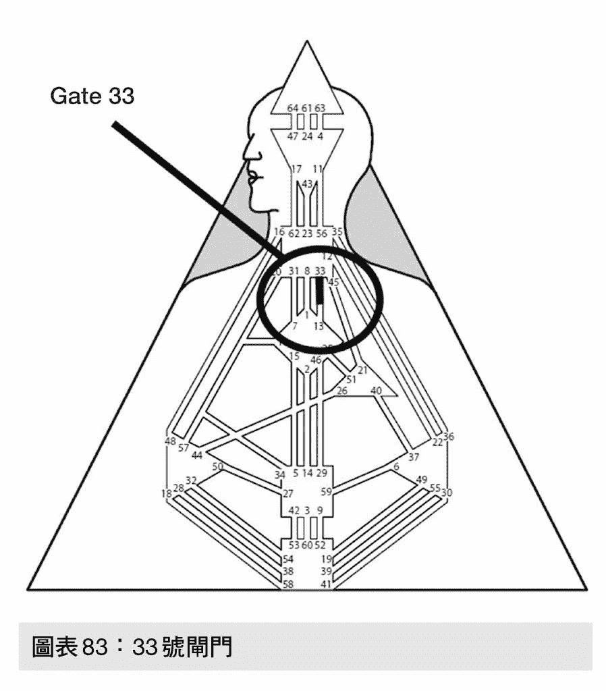

这股能量若未充分发挥，便会面临沉溺于过去、担忧历史重演的风险。这会让拥有此闸门者感到受困、目光始终锁定在已发生的过往，尤其是他们未等待他人的辨识与认可就急于分享故事之时。过去的故事需要经过时间的反映，如此才能找到与记忆神圣性相符的恰当分享方式。33 号闸门在独处中了解，哪些事物需要分享、哪些则要放下、原谅和遗忘。

33 号闸门的能量若彻底展现，它会分享过往的故事、守护集体的记忆与历史，并在正确的时机分享。

##### 肯定语句

• 我会往内心延伸我的旅程，并和创造及休息的循环协调并进。

• 我现在的专注焦点在于我的过去、我的旅程和我的未来发展。

• 我会放松，并相信隐藏的事物终将显露，而真相也会昭然若揭。我最强大的力量存在于神圣的时间安排里。

• 我相信、我等待、我知晓、我成长。

##### 练习题

1. 对于你今年打算要实现的任务，假若你仍未感受迈向目标的前进动能，你认为是什么让你滞碍不前？你活在怎样的人生情节里？写下关于你的侷限或你的人生标签故事。

2. 彷彿方才的故事对你而言不再具有真实性一般，再改写一次。两者有何不同？后者能产生什么结局呢？

#### 34 号闸门：力量

易　经：强大的能量（大壮卦）

占星学：射手

生物学：卵巢和睪丸

34 号闸门是图表中最忙碌，也最具有力量的闸门。由于它根植于荐骨中心，因此是一股生产和以生命动力为基础的能量。它是源于荐骨中心的闸门里唯一带有无性潜能的闸门。拥有 34 号闸门者有时会过于忙碌而无暇从事性行为（或反过来说，可能过度忙碌于从事性行为。）

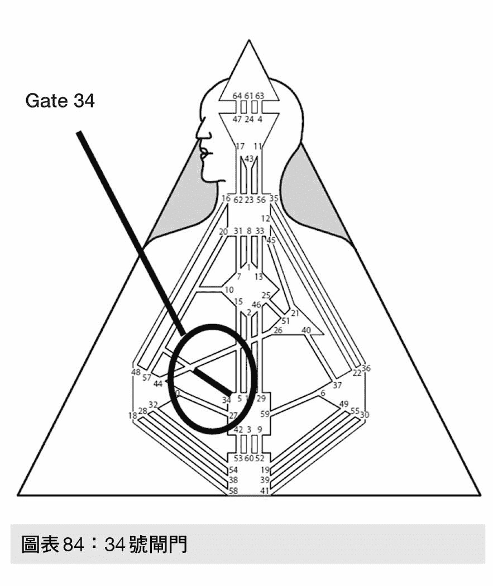

34 号闸门是显示生产者的基本闸门，因此也蕴藏着强大力量的潜能，然而 34 号闸门唯有透过回应才能发挥力量。毕竟它属于生产，而非显示的能量。拥有 34 号闸门的生产者若积极推动和发起自身的力量，将很难在过程中经验成功，最后只会带来沉重的挫败感。

具有此能量的生产者时常分辨不清何谓积极推动和发起行动。由于图表此部分的线路配置与作用极其复杂和快速，因此，要缓下脚步判别自己是否做出回应其实并不容易。拥有此能量者不妨试着在决定执行某一行动前，先将行动可能会产生的结果图像化。

34 号闸门是「多工处理」的闸门。拥有此闸门者天生具有一次处理多样任务的能力，但仍需参照它在图表中与哪一闸门相连，因为不同的连结位置会影响 34 号闸门的表现方式。

拥有 34 号闸门者也往往会得到告诫：选定一个目标，心无旁骛地坚持到底吧！对某些人而言，这的确是有用的建议，但对拥有 34 号闸门能量的人来说却不尽然。他们必须处于忙碌的状态，否则便会象是试图将一道闪电存放在玻璃罐里，而这道得不到释放与利用的闪电最终将在体内四处乱窜、损害健康。

假使非荐骨人拥有 34 号闸门的能量，那么，当他们的荐骨中心吸收能量并笼罩在压力中的时候，他们就可能变种为世上最忙碌的一群人，只不过这种状态并不具持续力。

##### 肯定语句

• 我相信宇宙会带给我适当的机会，让我完成梦想和计划。

• 我会观察和等待能清楚指示我下一步该何去何从的征兆。

• 我知道我真正的力量存在于和宇宙和谐共创的时刻，我也知道神圣的造物主会为我开创出适合我的前进道路。

• 处于忙碌的状态对我有益，而我会遵从自己一次处理多项任务的需要。

##### 练习题

1. 你要如何发挥自己的影响力和能量？你正着手的事，是否无法让你更接近自己的梦想？你应该停止哪些行为，才能为你心中真正的想望开创出施展的空间？

2. 你对力量的定义为何？你觉得自己充满力量吗？你能做些什么好让自己在人生中更具力量？

3. 你该做些什么才能加深你对宇宙的信任感？你是否在你的人生舞台上现身演出并扮演自己的角色？

#### 35 号闸门：改变

易　经：进展（晋卦）

占星学：双子

生物学：甲状腺和副甲状腺

35 号闸门是试验能量的最终表现，这股能量忠于幻想和渴望。它尝试过万事万物，拥有丰富的经验；它已是箇中好手，有时却显露疲态。

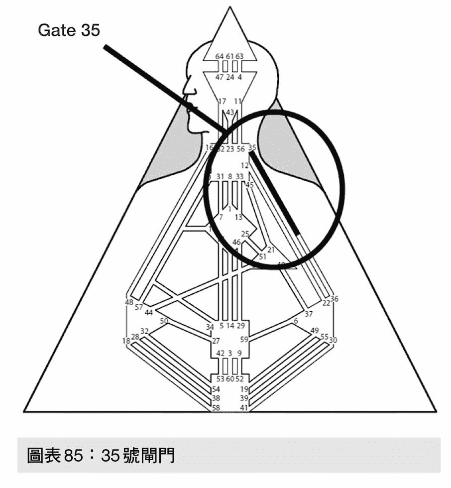

35 号闸门的经验造就了纯熟。它体验人生，也知道如何学习必要的事物。35 号闸门者鲜少对人生感到困扰。他们理解人生经验，虽然带着些许的犹豫和侷限，但仍能从任何事物中学习。

35 号闸门的挑战是找到能让人生绚烂和充满动力的经验。它无法从单调平凡中得到启发；它寻求值得投入时间、能量和资源的经验。35 号闸门提供来自于个人经验的人生故事。你永远都猜不透，35 号闸门者的故事百宝箱里究竟还有什么要与你分享。在这股能量的纯熟表现中，35 号闸门明白故事的真正礼物并非存在于激情或刺激中，而在于过程、情感及得到的教训。在这当中存有无比的智慧，而 35 号闸门的故事最终将分享而属于每一个人。他们已代替人们体验过所有事物。

##### 肯定语句

• 我会选择我渴望的经验类型。

• 我对经验的感受揭示出哪些事物对我而言是正确的。

• 我会为自己的选择和幸福负责。他人无法为我开创我不想要的经验。

##### 练习题

1\. 你目前的人生发生了什么你亟欲改变的事件吗？

2. 在你最近的自我展现中，是否有哪些经验是你避免重演的？这份体悟能如何帮助你更加了解自己的创造力？哪些经验是需要你集中目光并与内心协调一致的？

#### 36 号闸门：危机

易　经：幽暗之光（明夷卦）

占星学：双鱼

生物学：肾脏和胰脏

36 号闸门是欲望的情绪推动力。它渴望所有它想要的事物，只要透过等待就能拥有所需。反之，若缺乏等待便会陷入混乱和危机。36 号闸门始终期盼迎向崭新的体验。它饱受无聊乏味的煎熬，往往只为了追求新鲜体验而未等待思绪澄明便投入某事物。

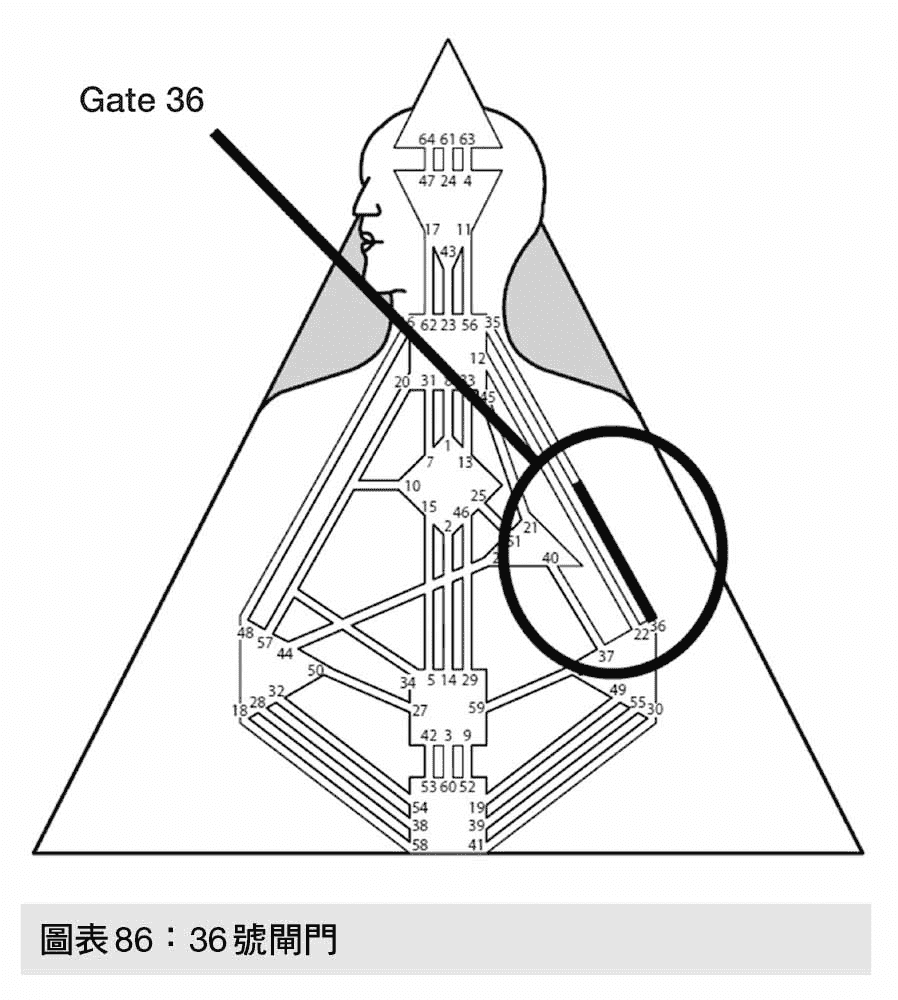

若 36 号闸门者希望成为某领域的大师，首先必须先学会驯服它的躁动不安，如此才不至于在能掌握迈向成就的必要技能前半途而废。36 号闸门和欲望有关，它在实现渴望的过程中可能会充满性欲。我们在人类图表中学到，性欲的设定特质是等待，而非冲动行事，急于行动会产生严重的后果。

36 号闸门教导我们以时间和些许的务实精神缓和激情。学习等待正确的时机将让人获益匪浅。

##### 肯定语句

• 我乐意接受新的事物。

• 我信任我的直觉和人生策略。我知道我会做出明确、有计划的选择。

• 我就象是暴风眼。我的思绪清晰、内心井然，只为最崇高的理想行动。

• 我不受外在现实的样貌干扰，我知道我正着手打造自己的理想。我的信念坚定，不会受外在情况左右。

##### 练习题

1\. 当你面对突如其来的事件、混乱和悲剧时，你的处理策略为何？

2\. 你和宇宙的连结有多牢固？你该做些什么才能强化连结？

#### 37 号闸门：友谊

易　经：家庭（家人卦）

占星学：双鱼

生物学：肾脏和胰脏

37 号闸门是一个非常清晰和纯粹的闸门。它只渴求一件事──和谐。37 号闸门会为了和平而努力，但若时机不正确则会静待和平。37 号闸门会设法融入他人并传达开创和平与和谐的想法。

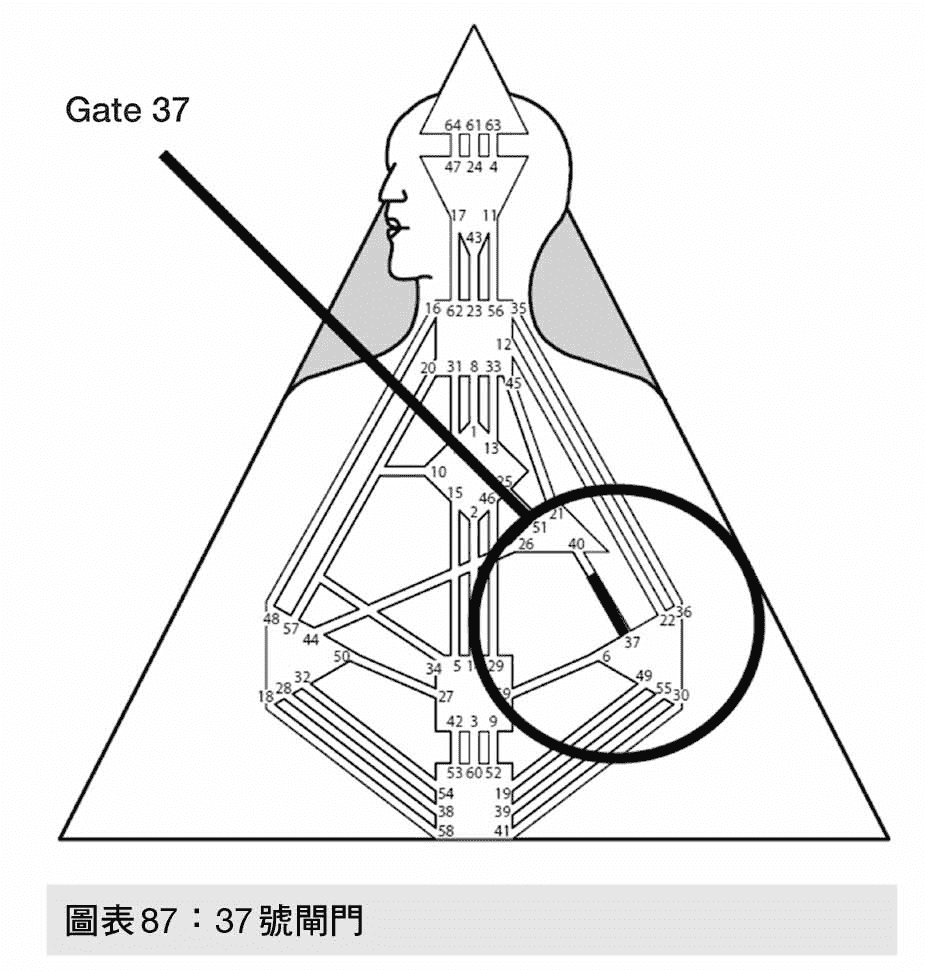

37 号闸门的根本信念为，若大家携手合作共创足以维持众人所需的资源，那么我们也就能拥有持久的和平状态。这是属于协议通道（参照 19－49：爱与婚姻／整合综效的通道）的一部分，与创造协议和合约有关。37 号闸门的目的便是开创促进和平与和谐的共识。

若你无法和周遭的人清楚沟通，便会面临被误解而有碍进步的风险。无论沟通的层面为何，你必须确保自己抱持尊重、真诚的态度并明确表示自己的想法。

##### 肯定语句

• 暴风雨后总是宁静。在这片寂静中，伴随着调整和改变。我会记起自己的方向、深呼吸，让我的各种人际关系和新气象调和一致。

• 我做出的协议都是清楚明确的，并以和平为宗旨。

• 从过往的残影中，我发现了属于我的恩典。我会和我的朋友、家人、家族、社群和世界携手努力，共创互相尊重和高度推崇和平的净土。

• 和平如同我的血液汩汩流淌在我的身体里。我就是和平的化身。我呼吸着和平，我创造和平。一切是如此美好。

##### 练习题

1. 你能如何开创更和谐的生活方式？承诺自己今天做出五项能提升和谐的具体作为。

2. 你与他人达成的协议是否明确清楚？双方是否有相同的期望？你需要再补充更清楚的说明以加强你对协议的认知与明确度吗？

#### 38 号闸门：战士

易　经：对抗（睽卦）

占星学：巨蟹

生物学：肾上腺

38 号闸门会设法了解，究竟什么事物值得努力争取？它寻找人生的目的和意义，主要是（以肾上腺素能量）促使我们找到自己的人生使命。我们为什么来到这个世界？我们该如何才能活出自己的使命？人生中真正有价值的事物为何？

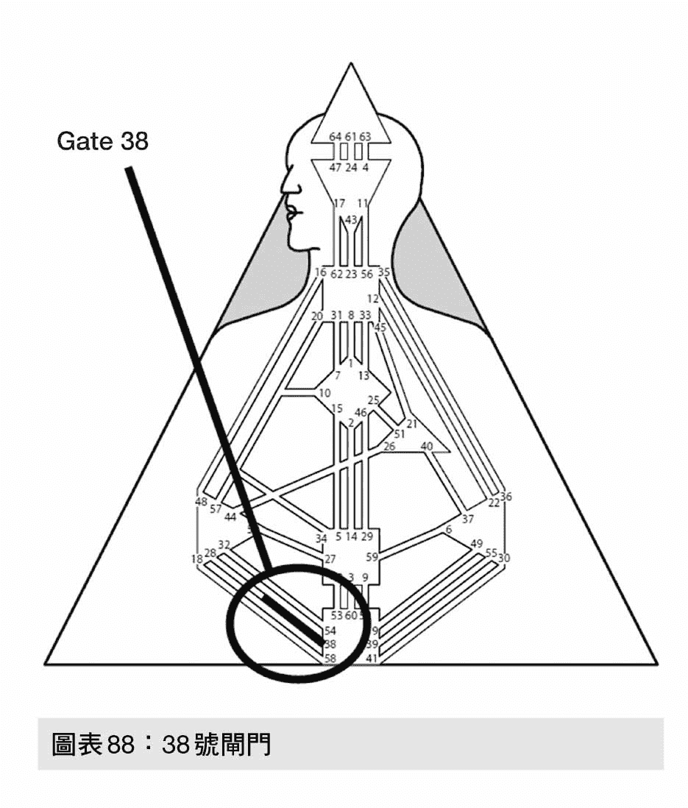

拥有 38 号闸门能量的人天生性格便有几分倔强。当他们确定某事物重要、有价值后，他们便会为此而战并坚持到底。若能穿越困顿挣扎、突破重围，他们就是能以自我转变为世界带来改变的那一群人。

这股能量也带有些许挑衅成分。它属于投射能量，因此其设定功用便是引起人们的注意。人们察觉到 38 号闸门者的困顿挣扎，要不就是召唤、给予他们分享自身故事的机会，要不就是排斥并质疑他们的人生选择。

38 号闸门有可能会让你感觉自己与周遭的一切格格不入、人生彷彿是一场困顿挣扎，而你始终孤军奋战。然而，若你等待正确奋战的邀请，38 号闸门终将会证明什么事物值得努力争取，并帮助你寻得适当的人，与之分享你的才智。

##### 肯定语句

• 我清楚知道我的人生使命和方向。我会坚持不懈、努力争取我认为有价值的事物。

• 遵从我的使命能带给我鼓舞及越过所有万丈高墙、大步向前的能量。

• 我为了完成自己独一无二的使命而来到世上。我会藉由设立明确的计划并采取和使命相互呼应的行动，以实践我的人生使命。

##### 练习题

请至以下网站浏览关于特殊人生使命的沉思指引内容：[www.understandinghumandesign.com](http://www.understandinghumandesign.com)。完成冥想练习后，请写下你在过程中所得到的领悟。

#### 39 号闸门：挑衅

易　经：阻碍（蹇卦）

占星学：巨蟹

生物学：肾上腺

39 号闸门具有深刻的情感及丰富能量。拥有此闸门者极具音乐天赋、创造力和热情。然而，它也充满挑战性和挑衅成分。这股挑衅张力能以轻松、逗趣、开心的样貌呈现，或相反地，它会煽动你、挑起负面的情绪和恐惧。因此，对拥有 39 号闸门及深受其影响的人而言，的确是有点棘手的能量。

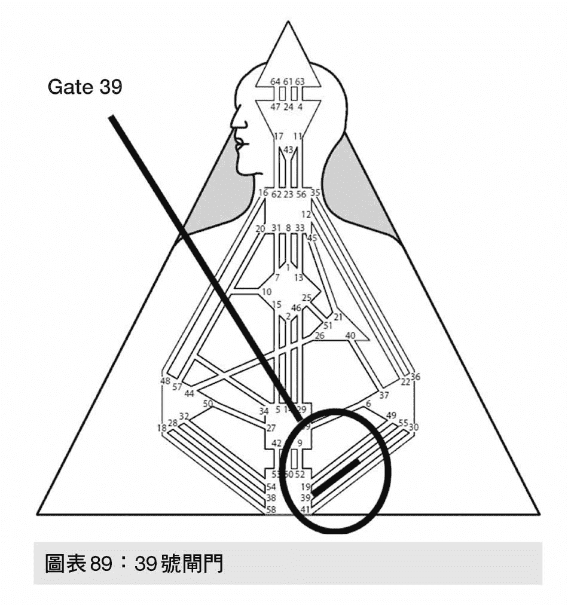

39 号闸门驱使我们迈向丰盛，它挑衅的目的是要恢复我们对丰盛和精神的意识。我们有时会称 39 号闸门者为众人的「心灵导师」，因为他们会以让人感到难受不安的方式，激发和迫使我们跳脱事物当前的表象。

就实际面而言，39 号闸门的能量能打造出不断猎找低价好商品的热切消费者。当他们的存粮充足（或甚至满溢而出）时，他们会感到安心快乐；反之，若他们不得不动用贮存品时，通常会相当地紧张不安。拥有此能量者往往会过度地贮藏和积累物品，因为他们深怕某天自己会面临「弹尽粮绝」的境地。

若能量彻底发挥，39 号闸门能促使我们跳脱着眼于「不够充足、匮乏」的思考方式和习惯。39 号闸门如同它有时会发挥的挑衅作用一般，具有强大的力量来帮助我们领悟到「不够充足」的感知是一种假象；藉由意识层面的转变以及重新聚焦于精神的丰盛，我们将发现万事万物始终绰绰有余。

##### 肯定语句

• 在我往前迈进之前，我会等待对的事物精神到来、并且等待正确的大门开启。

• 我明白我的行动和言语力量能煽动他人，而我会谨慎妥善地使用这股力量，并知道我拥有在他人生命中创造改变的能力。

##### 练习题

1. 请试着描述你感觉到精神契合、对的一切接着清楚显现的经验。请重新连结此种感觉，并将它深植于你的身体和意识层面。

2. 你是否抗拒他人及机会？对你而言这种做法是否恰当？你需要寻找更具体的方式让自己有更多时间做决定吗？你该如何创造「接纳、包容」的能量？

3. 你和食物的相处关系为何？你会因为情绪的影响而暴饮暴食，或产生其他饮食失调的行为吗？你爱你的身体吗？你是否需要在食物及饮食习惯上做出什么改变？

#### 40 号闸门：单独

易　经：递送（解卦）

占星学：处女

生物学：胃

40 号闸门是「孤独」的闸门之一，它必须懂得欣然接纳这股能量并非「针对个人」。拥有 40 号闸门者需要独处的时间，却也往往不断与孤单对抗奋战。

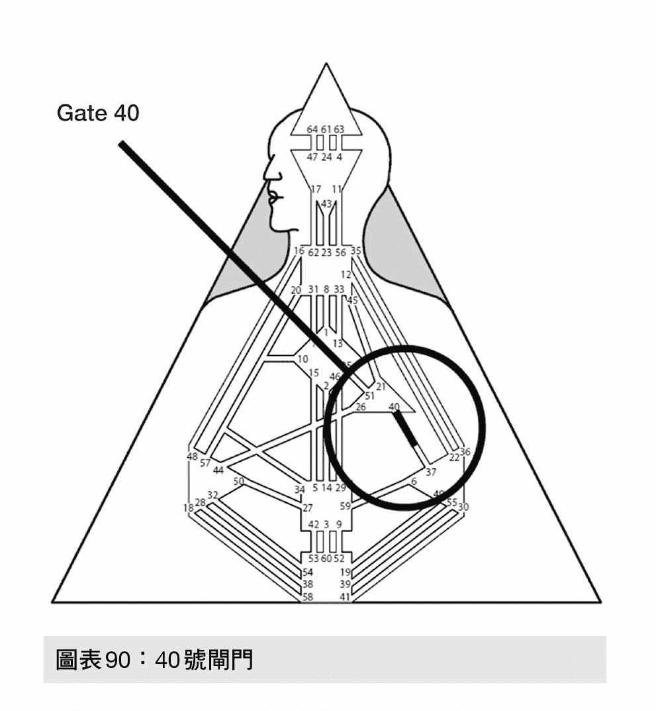

40 号闸门的能量会让人感到深刻的孤单和孤独感。然而，它的真正用意是驱使你去找到其他人。换言之，40 号闸门是部分寻求整体、个体迈向群体的能量。它需要一个所属的群体以共享资源。我们通常会发现 40 号闸门在图表中也同时拥有许多突变（个体人）的能量，因此能创造寻找群体能量的电磁引力来分享改变。

40 号闸门者需要寻找爱的证据和陪伴的人群。他们有时会像一尊受人景仰和崇拜的雕像，四周围绕着仰慕的群众，但他们仍感觉没有人渴望或是愿意爱他们。这股能量也许让你感到孤单，但事实会证明 40 号闸门并不如你所想的那般孤独和不被爱。

它的孤单会让人们踏入世界、创造新的协议和连结，以使开创资源的能量得以不断更新和发展。因此 40 号闸门在传布新方法以达成协议的能量上，扮演了至关重要的角色。

40 号闸门也和胃有关。若人们不了解此能量的特性，总是尝试使用自己缺乏的意志力能量，胃往往就会出问题。假设某一生产者拥有开放的意志力中心及 40 号闸门，他就必须特别留意是否常因过度埋首工作而忘了进食。

此外，40 号闸门搭配开放意志力中心的组合往往会让人亟欲逃脱定义意志力中心的范围，因为定义意志力中心的压力会启动 40 号闸门对孤独的需求。

##### 肯定语句

• 我会放心相信我是一个备受疼爱的人。我能够得到所有必要的支持，协助我的梦想成真。

• 我会带着开放的心胸、全然的愉悦和丰沛的爱找寻其他人。

##### 练习题

1\. 你的人际关系特质为何？你的人际关系是否平衡？

2. 你是否感觉孤单？你需要踏出自我世界，与他人创造更多的连结吗？不妨使用看看网际网络？或是加入社交团体？你是否感受到人类一家亲的连结感？

#### 41 号闸门：幻想／收缩

易　经：减少（损卦）

占星学：水瓶

生物学：肾上腺

环视你的周遭。你所看见那些由人创造出的一切，都曾经是一种想法，再由想法转变为形式。

人类图的新年便是从 41 号闸门开始。它是一股发起的能量，最终会将新的想法或经验转化为形式。此能量有时会在做白日梦的过程中感受到。当拥有 41 号闸门能量的孩子在幻想世界遨游、穿梭在自己丰富的想法中时，他们往往会被指责为注意力涣散。

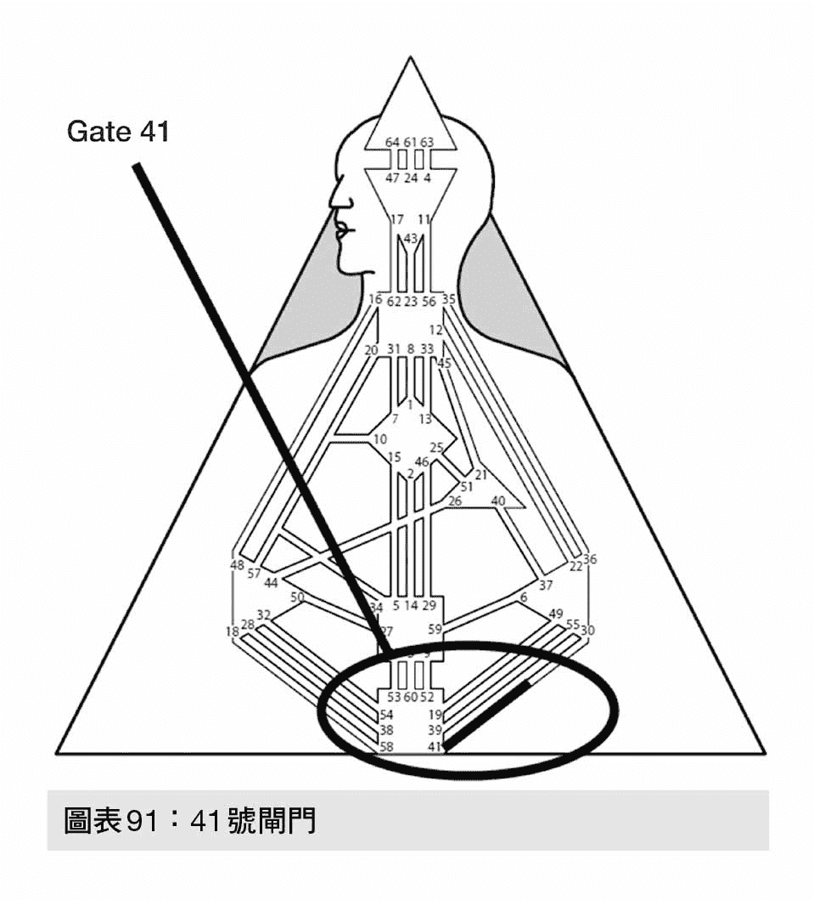

41 号闸门的能量非常适合视觉化及图像化。虽然它们属于某种脑力活动，然而，41 号闸门的独特之处在于当时机恰当时，就能采取行动。简言之，41 号闸门是一种等待正确时机以表现于行动的想法。

##### 肯定语句

• 我的头脑是最具创造力的工具。当我得到启发时，我便能以坚定和专注的态度面对我所期待目标的愿景。

• 我谨守目标的能力是我最伟大的造物者恩典。我绝不畏缩，也不动摇。我的目光澄澈，我的视线清晰。

• 外在世界显现的一切对于我正在创造的事物而言并不一定重要。

• 在我迈向创造想望的路途上，我会感谢一切浮现的征兆。

##### 练习题

1. 虚妄的幻想是如何遮蔽你看见真实？在你的人生中，是否有你需要放下的事物，好让你能实现内心的真正想望？

2. 你能清楚传达自己的想法吗？你能听从自己的所思所想吗？有哪些想法是你需要厘清以便让他人了解的？

3. 在想望目标的路程上，哪些事情会让你失焦？哪些事情会让你无法相信你可以打造所想的一切？

4\. 怎样才能忠于你的愿景？你需要做些什么，才能确立你的目标？

#### 42 号闸门：完成／成长

易　经：增加（益卦）

占星学：牡羊

生物学：卵巢和睪丸

42 号闸门是中途加入、完成某一情况或经验的闸门。42 号闸门能成为出色的项目管理者或顾问（倘若他们在参与某项目时，已经是起草阶段完成的阶段）。

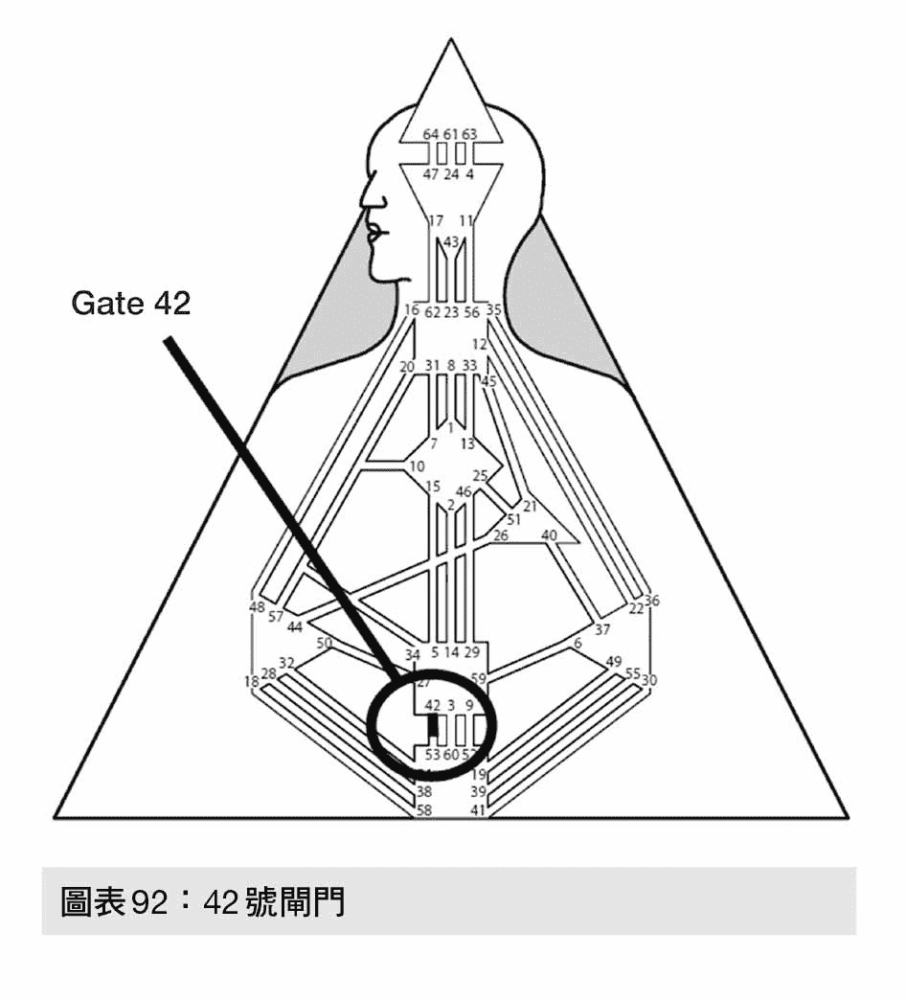

42 号闸门（和 53 号闸门相同）若没有回应完成任务的机会，将会感到强烈挫败。当 42 号闸门耐心等待，再对正确经验做出回应时，正确的开始能量便会显现。随着回应而来的是让事物开始和完成的能量。反之，若缺乏等待，这只会是充满挫败和肾上腺素突发的作用。

拥有 42 号闸门能量的人，会感受到一股驱使他们完成任务的压力。仔细观察和确定这是谨慎的行动。只要你的思路清晰明确，就能打造迎接新事物的空间，进而为你的人生创造丰盛。但首要任务是，先完成你必须完成的事物。

##### 肯定语句

• 我会欣然接纳当下的改变，我知道所有的结束都代表崭新的开始。

• 我会为新鲜的事物打开一扇窗，并引领期盼可能到来的事物。

• 我准备好将新事物的基础摊在眼前，并采取必要的行动让新事物成形。

##### 练习题

1. 在进入新任务时，试想为了发挥能量、完成任务，你会采取什么样的行动？可能有哪些步骤是可行的、哪些又是不可行的？

2. 从年初至今，你曾得到什么再明确不过的想法吗？这些想法如何协助你厘清你真正渴求的是什么？

3\. 为了让渴求的想法成真，什么行动是你必须采取的？

#### 43 号闸门：洞见

易　经：突破（夬卦）

占星学：天蝎

生物学：脑下垂腺的前后叶

43 号闸门的能量若彻底发挥，便是一股除却旧有做事方法、发现另一种替代方式，以及创造崭新和充满自主力的手段以达成崇高目标的力量。43 号闸门认为目标和手段必须相符。假使目标具有毁灭性且有害，那么该目标便没有充分的理由证明手段的正当性。43 号闸门是内在的耳朵，它会聆听内在、辨别出正确的事物。

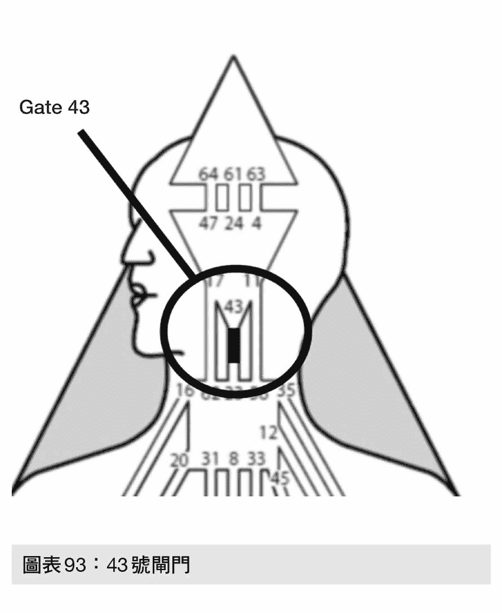

43 号闸门必须等待适当的机会才能表达它的创见。它最大的挑战莫过于，在时机尚未成熟前，不该屈服于压力而试图发表洞见。缺乏分享所知的恰当时机、识别和邀请，43 号闸门创新的洞见最终只会被视为无价值的事物，进而带来寂寞、格格不入和痛苦的感受。

43 号闸门也是关于孤独的闸门之一。它需要独处的时间思考和等待，而这对 43 号闸门的健康而言无比重要。

##### 肯定语句

• 我会从容愉悦地翱翔于自身想法的天空。我会让自己想出能在我与他人的人生中，创造改变的新点子和新灵感。

• 我的观点和想法非常宝贵，而我相信我所要分享的洞见，在对的人眼中是有价值的。

• 我会吸引到适当的支持、境遇和机会，它们会和我的新想法站在同一个阵线之上。

##### 练习题

花一些时间进行「脑袋大扫除」，将你所有最近的观点、想法和灵感倾倒而出。你能从中发现某种新的模式显现吗？你是否处在某个洞见的交会点呢？

#### 44 号闸门：精力／警觉

易　经：聚合（姤卦）

占星学：天蝎

生物学：脾脏和淋巴系统

想象你到了某汽车销售中心。从你踏入该中心那一刻起，某招待员便热情迎接你、为你介绍卖场环境。他甚至为你端上一杯香醇的热咖啡、引领你到舒适的贵宾休息室，并在你等待销售员到来之前，让你自在地在闪亮耀眼的展示车阵间穿梭观赏。这一切都是为了让你准备好掏出你的皮夹买单。44 号闸门扮演的角色就是这位招待员。

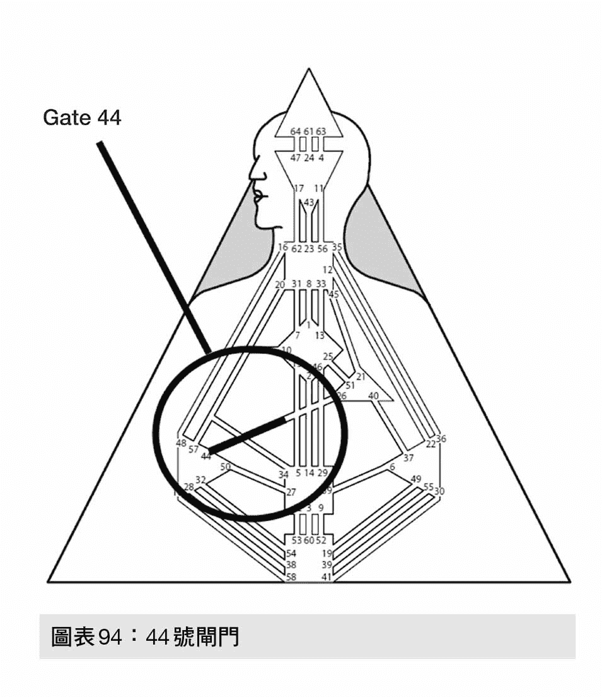

44 号闸门是与销售有关的能量之一，它能打造出增进每一笔销售成交机率的氛围。44 号闸门彷彿能让商品「看起来完美无瑕」。他们能创造美好的销售素材，许多平面设计师和营销人员都拥有这股能量。

44 号闸门也是嗅觉的闸门。它具有直觉力的嗅觉来自于「闻出」真相（或假象）的能力；它能嗅出事有蹊跷或不寻常的迹象。

44 号闸门充满了将过往记忆「销售」给家族的能量，它会在必要的时候为自己欲传递的讯息做出有力的说服论点。它保有直觉意识，能知晓过往经验是否值得重现，也知道历史何时会再次上演。44 号闸门若充分发挥，它会将从过往汲取到的教训搬上当前的生命舞台，好让我们不再重蹈覆辙。

##### 肯定语句

• 我会充满自信地朝未来迈进，我知道过去始终是我最好的导师。

• 我不受限于我的过去，反而能从过往解放自我。我明白现在就是我生命中最强大的时刻。

##### 练习题

1\. 你是否在哪些部分因为过往的亲身经历而限制自己？

2\. 当你领导或影响他人时，是否抱持着全然正直的心态？是否言行一致？

3. 你在哪些部分需要得到他人的支持？假想你在临终之际回顾自己的一生。哪些事物对你而言是重要的？

4. 哪些成就最能让你引以为傲？你当前的人生是否便是那些美好愿景的写照？你需要调整人生中的优先级吗？

#### 45 号闸门：国王（女王）／收集者

易　经：聚集在一起（萃卦）

占星学：双子

生物学：甲状腺和副甲状腺

45 号闸门是国王或女王的闸门，具有天生的领导能量，自然而然地会被视为充满影响力的领导者。然而，这并非民主式的统御权，而是如同帝王般尊贵，得来不费吹灰之力、易如反掌的领导地位。

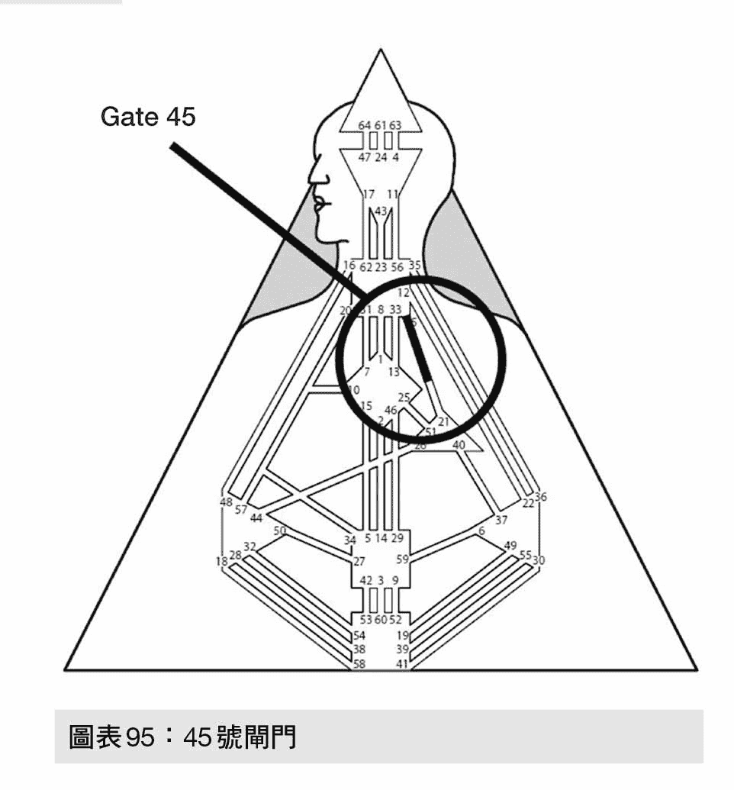

在这条通道（21-45）的能量中，45 号闸门宣示我们拥有及缺乏的一切事物。国王或女王是出色的资源分配者或挥霍者（但少了 21 号闸门的协助，他们将倍感艰辛）。45 号闸门和其所属的家族紧密相连，拥有此能量者通常不太容易做出改变，尤其这个改变是指离开他的族人。

45 号闸门若充分展现将会是一股充满影响力的能量。此闸门身为尊贵的领导者，能激励家族工作或休息，一切取决于维持资源必要的努力或牺牲。

##### 肯定语句

• 我会汇集必要的人群以作为我展现能力的后盾。

• 我担负领导重任，并尊崇自己身为国王或女王的角色。

• 我会维护我的力量、有效分配和管理资源，并心怀慈爱行事。

##### 练习题

1. 你必须在人生中的哪些领域扮演领导者的角色？身为领导者，你的感受为何？你愿意统领、尊崇你的创造物及说出内心的真实吗？

2. 你该做些什么才能吸引对的人来到你的生命中，帮助你完成展现才能和创造的任务？就你的心态而言，你将自己视为团体中的平凡一员，还是国王或女王？

3. 君王统治的阴暗面是国王或女王可能成为控制狂或苛刻人物。你在哪些部分需要松开掌控、让它自然进化？

#### 46 号闸门：身体之爱／自我决心

易　经：推进（升卦）

占星学：处女

生物学：肝脏

46 号闸门是以身体体现爱的闸门。它明白身体是灵魂的载具，并讲求律动、用身体感受存在。它充满感官、优美、实验和脚踏实地的特性。具有此能量者能深刻地表达身体，许多瑜伽教练、舞者，甚至是肖像摄影师都拥有此能量。

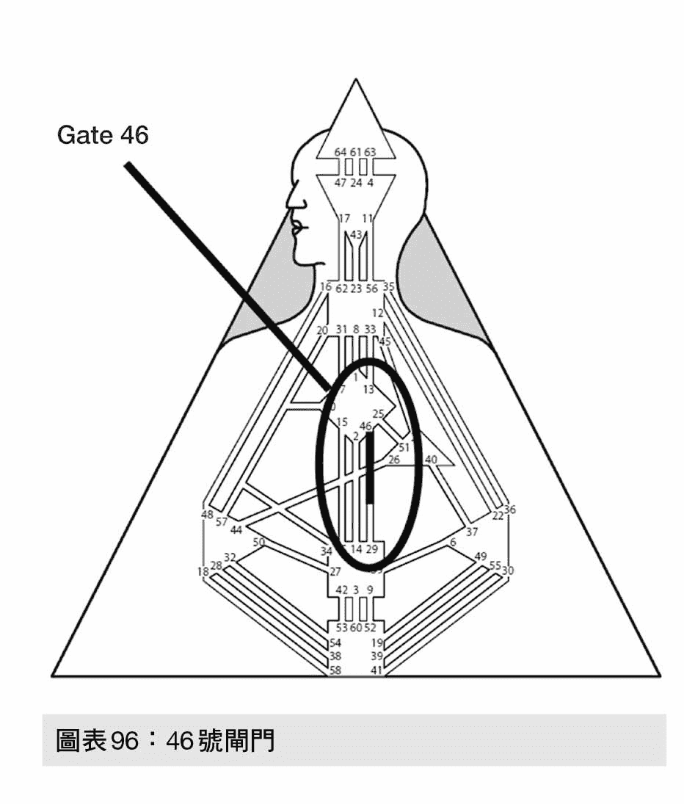

46 号闸门和预言或预测无关。它并不遵照逻辑，而是一股存在和感受于体内的能量。它能赋予灵魂表情，也能转化为深刻的艺术或运动表现。这条通道（29-46）是以纯然感官的方式感受存在。它向往前进、渴望表现，并珍视赋予生命意义的责任感。

若你拥有 46 号闸门，也许会追求身体状态的完美或是扮演着治愈者的角色。

##### 肯定语句

• 身体的存在是我表现意识的一种方式。我能透过身体的反映而得知我的心态和信念。

• 我保持清晰、觉察和清醒的状态。我可以调整我的思惟，创造出任何我选择的身体体验。

• 我会采取符合自己信念的明确行动；我会颂扬自己能在身体里感受存在的天赋。

##### 练习题

1\. 你的身体正传达给你什么讯息？这些讯息中，你需要特别留意哪些吗？

2. 哪些事物会让你感到沮丧？你会强迫自己面对，或是接纳这些事物？你需要做些什么才能让你欣然接纳，而非强迫自己想通？你的目标和行动能确实反映出你内心的渴望吗？

#### 47 号闸门：了解

易　经：压抑（困卦）

占星学：处女

生物学：脑下垂腺的前后叶

47 号闸门可称为心态的闸门。当它预期完成任务的做法终将显现时，便能信心满满地前进，因为它深信灵感会藉由行动、机遇和宇宙的神奇魔法施展而得到解答。反之，若 47 号闸门困陷在「该怎么做」的泥淖中，就有可能在顿悟前便选择放弃，因为做法并不会带来解答。这会让 47 号闸门的脑袋落入焦虑和压抑的状态，渐渐不知道该怎么做，让灵感的启发成为一场徒然的闹剧。

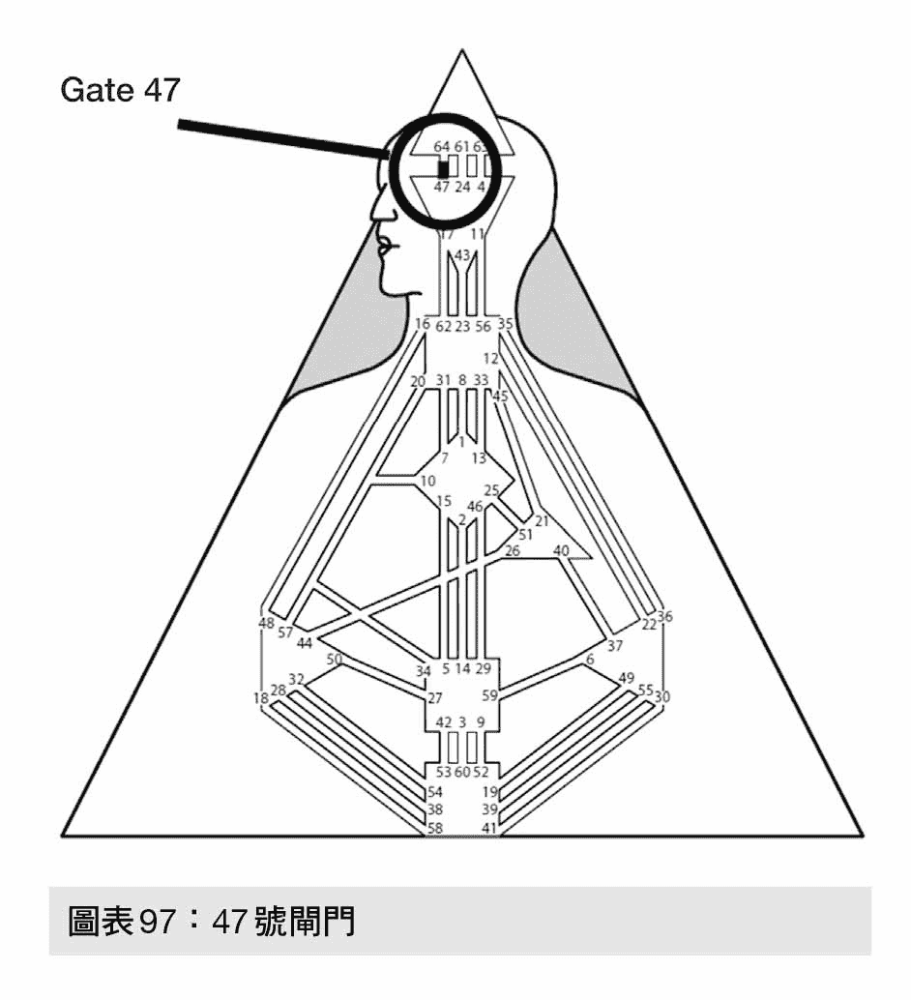

47 号闸门的能量需要拥有足够跳脱框架的勇气与信心，深信无限的可能，并放宽自己对「应该知道」的需求。47 号闸门必须相信只要等待，答案终将到来。

顿悟的领会取决于心态。若你保持开放的心胸迎接解答，那么答案很快就会显现。相反地，若你的心态是封闭、焦虑或倍感压力的，灵光乍现便很难自乱哄哄的脑袋中脱颖而出。就算你有所顿悟，封闭的态度仍会让你不信任展现在眼前的答案。心态永远是关键。

学会和 47 号闸门共处是重要的课题。若你不了解如何与它携手合作，它便会以激烈方式对你造成深刻影响的能量。它是「顿悟」的闸门，是 64 号闸门的灵感解答。然而它也有别于 64 号闸门，它得经过时间运作。一旦与 64 号闸门失去连结，它便不过是一股设法想通如何让事情成真的压力。

##### 肯定语句

• 我会以愉悦和好奇的期待心情等待宇宙展现我的渴望。

• 我会保持喜悦和正面的心态，我只专注于最终的结果。

##### 练习题

1\. 你目前的心态为何？你需要关照你的思惟模式吗？

2. 等待想法展现的过程中，你会做些什么呢？你该如何才能保持积极活跃的思绪？

#### 48 号闸门：深度

易　经：井（井卦）

占星学：天秤

生物学：脾脏和淋巴系统

48 号闸门是属于脾／直觉中心、以恐惧为基础的闸门。它始终担心自己知道的不够多、害怕自己永远不够完善。48 号闸门面对的挑战是「放胆去做」，即便你的内心怀抱着恐惧。当你尝试克服和战胜它们，恐惧便会烟消云散，如此一来，48 号闸门就可以尽情地收集所需的知识材料，假以时日便能证明自己的确拥有丰硕的才能。48 号闸门的恐惧感觉起来相当真实和切身，就算这些恐惧在其他人眼中是可笑的。一般来说，48 号闸门者对于万事万物都有过度准备的特质。

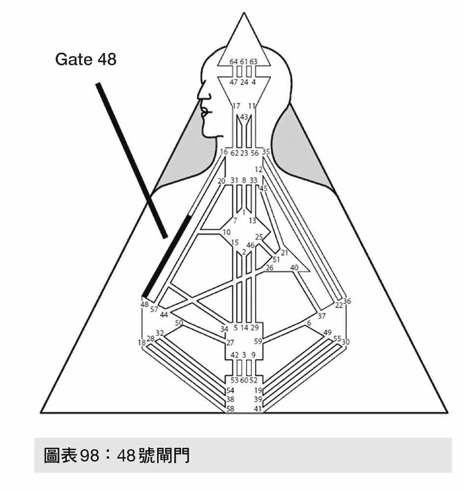

48 号闸门也是鉴赏力的闸门，包括了视觉和味觉，拥有对美丽及设计的直觉感受力，渴望事物都能被完美打造。或者，他们拥有精密的味蕾，想望丰富的美食体验。他们也可能是挑食者，特别是在孩童时期。

##### 肯定语句

• 我相信当我准备好的时候，必须拥有的技能就会自然展现。

• 我研究、我学习；我知道我的知识会在恰当的时间和机遇里完美地表现出来。

• 我相信神圣的秩序会安排一切。

• 当机会降临时，我已做足了充分的准备，而我会尊重自己的知识深度。

##### 练习题

1\. 你需要吸收哪些信息，才能稳固你的知识基础？你需要学习什么？

2. 你拥有实现你所渴望事物的必要技能吗？若答案为否，你需要掌握和精通什么事物？

#### 49 号闸门：原则

易　经：革命（革卦）

占星学：水瓶

生物学：肾脏和胰脏

49 号闸门是决定能量之流是否能朝合作关系前进的守门员，它决定了伴侣间亲密的原则。有时我们会戏称 49 号闸门为「离婚的闸门」；若关系协议中的原则破裂，这股能量便会决定是否要继续投入关系。

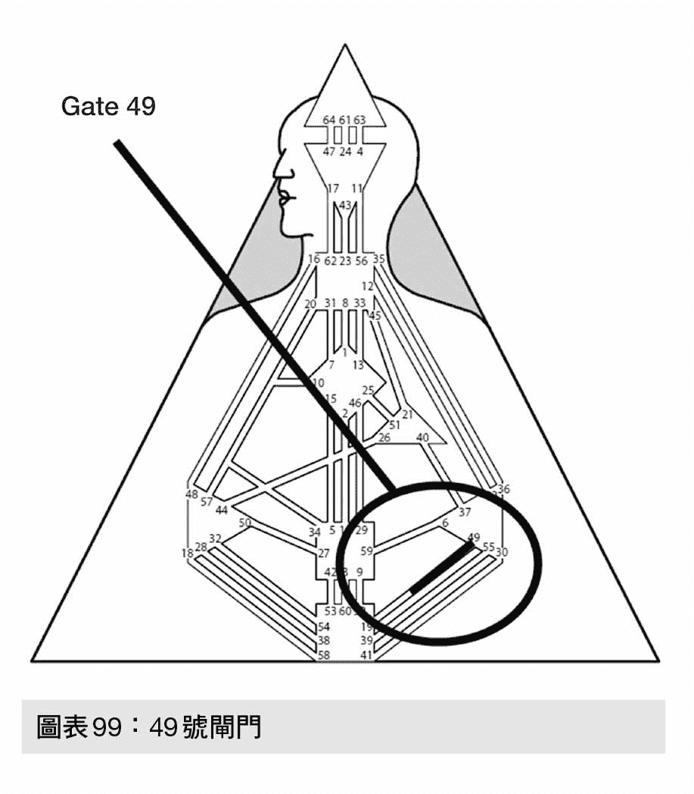

49 号闸门拥有许多非黑即白的相关能量。对它而言，规则就是必须遵守的标准。若你的另一半是 49 号闸门者，你必须清楚了解这段关系里协议的原则是什么。假使这些原则在任何方面遭受背离，49 号闸门会毫不留情地收拾行囊、消失无踪，没有一丝一毫重新沟通的余地。革命在这个闸门里意味着，顺应原则要求在目前情况中做出根本的改变。

49 号闸门也是其他革命类型的能量。在人类图里，任一种革命都属于情绪性质。换言之，我们必须以深思熟虑和澄明的态度处理革命。绝不能受「一时冲动」的刺激，否则你便会陷入混乱的情境。改变应该纯然慎重地发生。

##### 肯定语句

• 改变是成长和进化不可或缺的一部分。

• 我会怀抱勇气和澄明推动自我人生的革命。

• 我相信我迈向改变的脚步对于开创我想要的人生至关重要。我欣喜于自己曾学习到的一切以及未来能得到的所有事物。

##### 练习题

1. 你的伴侣关系及关系中的约定是否如你所希望的样貌发展？倘若不是，你该与对方如何沟通才能创造一致性？

2. 假设这星期是剧烈动荡的一周。你该做些什么才能维持自我世界的核心或重要事物？

3. 你和宇宙的连结状态为何？你需要强化连结关系吗？若是，你该怎么做才好？

4. 你的事业或工作协议需要做哪些改变？你该做些什么，好为这些改变预作准备？

#### 50 号闸门：价值

易　经：熔炉（鼎卦）

占星学：天秤／天蝎

生物学：脾脏和淋巴系统

价值和律法储存在 50 号闸门中。它和 6 号闸门（摩擦的闸门）一样，拥有渗透他人能量场的能力。50 号闸门会让你遵守家族的规则和价值标准，即便你极为特立独行，50 号闸门的能量也会迫使你心向家族。你会充满关怀和扶持之心，就算在你天生的设计中这些并非固有特质亦然。

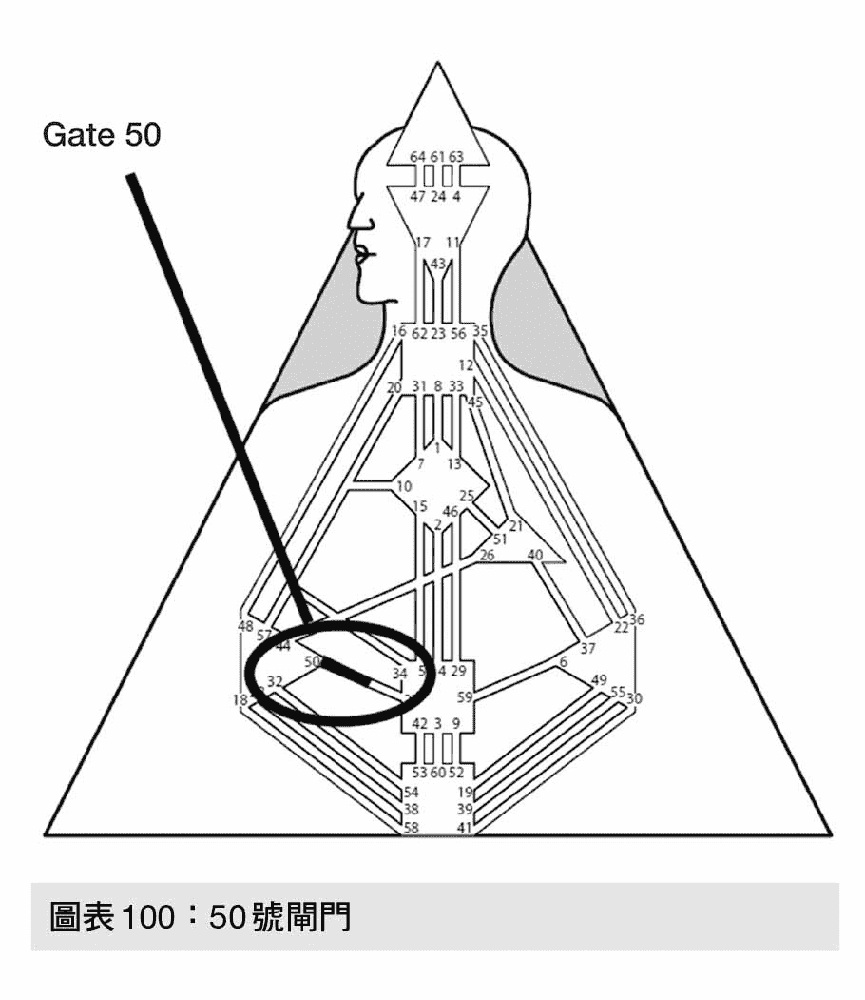

50 号闸门是爱的闸门。这股能量能柔能刚，但无论以何种方式呈现，都具有十足的影响力。家族的价值标准以爱的形式传播；它也许并不总是能让人感受到爱，然而对违反律法做出的回应，其背后深意就是充满爱的表现，目的是让家族凝聚在一起。50 号闸门会牺牲个人的需求以照料他人，在此并不涉及头脑运作，而是一种纯粹的本能。50 号闸门者彷彿拥有照料他人的悠久传统，而这也包括关怀那些自己生活范围以外的人。

50 号闸门的关怀特质是出于本能的反射作用。荐骨的回应能保护 50 号闸门者免于过度提供滋养。然而，50 号闸门若搭配开放的情绪中心则很容易让人受制于内疚感。50 号闸门者务必要学会信赖荐骨，如此才不至于因照料他人而让自己筋疲力竭。

50 号闸门也是恐惧的闸门。它属于脾脏，具有直觉和活在当下的特性。这股能量的悲观表现是害怕自己未能善尽责任；50 号闸门最深层的恐惧便是担忧自己无法好好照料身边亲爱的人。

##### 肯定语句

• 我会为自己的现实生活制订规则。

• 我会照顾和培育自己，如此我才能以相同方式反馈他人。

• 为了能维持我的能量和力量，我会先照料自己再为他人效劳。

• 在以自爱为准则的前提下，我会慷慨地付出爱。

##### 练习题

1. 你需要遵从哪些新的规则？为了你的健康、财富和福祉，你需要在你的关系和事业中开创新的规则吗？

2. 你爱自己吗？你需要对自己付出更多的关爱吗？你是否拥有无条件去爱的力量和基础？你在爱的国度里是否拥有安全感？

#### 51 号闸门：冲击

易　经：激起（震卦）

占星学：牡羊

生物学：胸腺

51 号闸门是人类图系统中，相当耐人寻味的闸门之一。它充满竞争意识，或投射竞争的能量，属于发起行为的冲击面向，许多拥有此闸门者会为了寻找乐趣而拥抱冲击。此外，这股能量具发散力，因此 51 号闸门者会感受更强烈的冲击体验。51 号闸门拥有许多震撼人心的体验，而这些经验也是他们生命中的发起力量。祖师爷拉．乌卢．胡便拥有此闸门，他「相当震撼地」接收人类图的讯息。带有冲击闸门的人通常必须经过剧烈、改变人生的体验才能将自我升华为灵魂之爱。许多 51 号闸门者曾有过濒临死亡的经验，或其他关于冲击与生存的惊人故事。

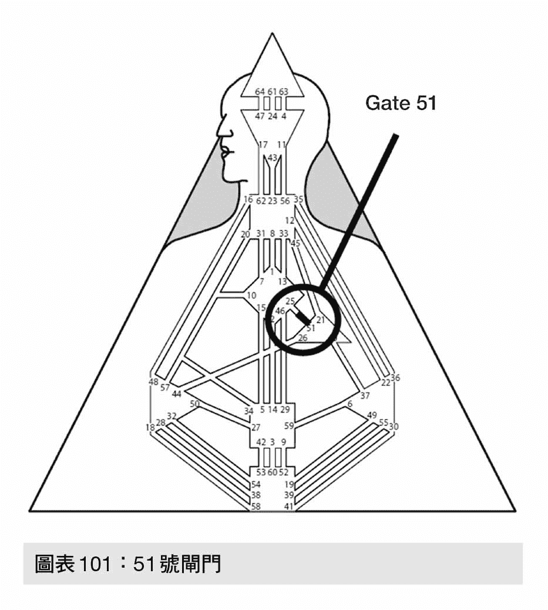

如同我们抗拒冲击的心态强度，冲击在起始事物上发挥了强大的作用。它的功用在于带来变革、重新改组。在回应冲击的过程中，我们得以改变。假使不做出改变，我们就会饱尝痛苦滋味。此外，这股能量也可望为你带来心灵或神祕力量的领会。

##### 肯定语句

• 我拥有转移所有外在冲击的内在力量。

• 我就是具体精神的展现。我充满勇气和决心，我拥有发展内在灵魂的能力。

• 我的信念和勇气能激励和启发他人。

• 我拥有极高的共鸣力，我能以源自内在灵魂的真理鼓舞他人。

• 我会将我的人生经验视为帮助我成长和进化的催化剂。

##### 练习题

对于冲击，你曾从中学到什么？你如何将冲击转化为力量？冲击是如何让你了解灵魂之爱呢？

#### 52 号闸门：静止

易　经：维持不动（艮卦）

占星学：巨蟹

生物学：肾上腺

52 号闸门的能量具有长时间静止不动并保持专注的潜能。有时候我们会戏称此闸门为「沙发马铃薯」（couch potato，美国俚语，意指懒惰的人）闸门。

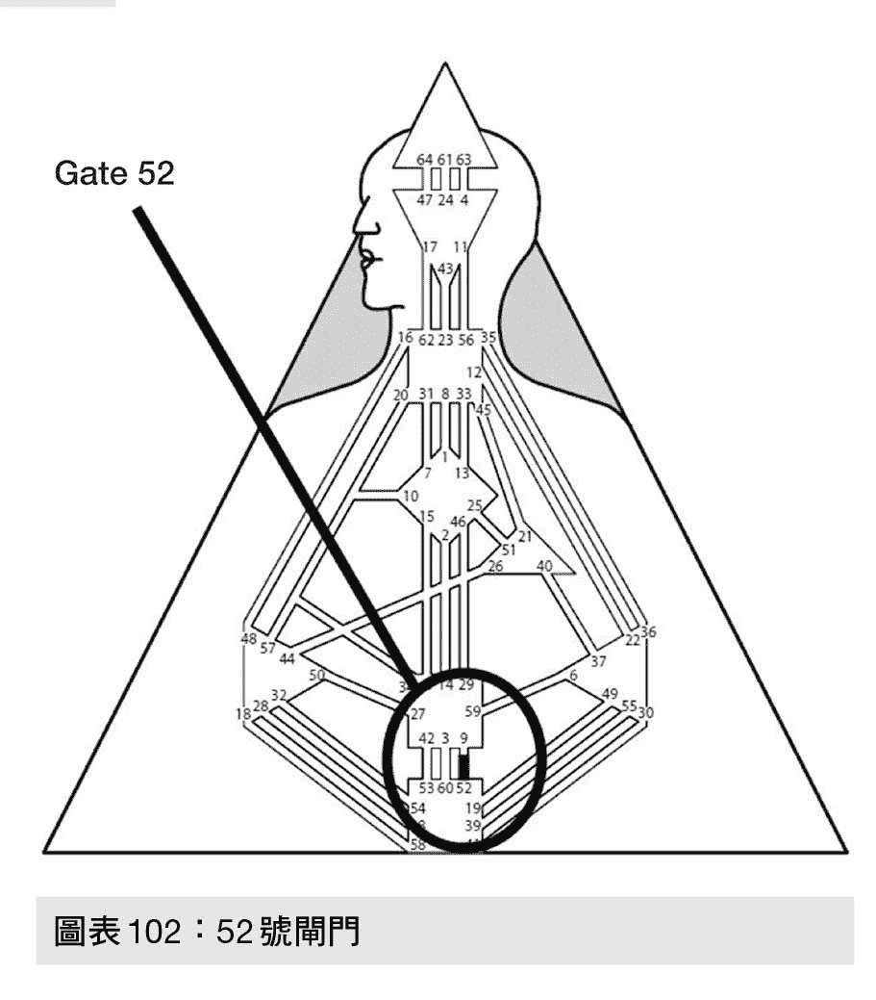

然而，52 号闸门若少了它的和声伙伴（9 号闸门），就会缺乏专注焦点地维持静止状态。52 号闸门能造就出优秀的野生动物摄影师；只要你不分心，就能守在隐蔽处好几个小时观察和等待。

这是一股极富创造力的能量，它能赋予你专注于目标、凝聚目光、按兵不动地等待，直到时机成熟那一刻才起身采取适当行动的力量。

##### 肯定语句

• 我的专注附有的静止特质能让运作模式和规律展现在我眼前。

• 我对此规律的理解能带给我继续有效创造的力量。

• 我的专注附有的静止特质是我的力量来源。

##### 练习题

1\. 你该做些什么，才能在你的人生中创造内在静止的状态？

2. 在静止状态中，你是否想到什么问题？你发现了某种运作模式吗？你和神圣秩序的协调程度为何？

3. 请定义你的力量。你在人生中的哪部分充满力量？你喜欢充满力量的感觉吗？若答案为否，为什么？是什么阻挡了你的力量？

4\. 你需要增强自己的力量吗？你该怎么做？

#### 53 号闸门：开始

易　经：发展（渐卦）

占星学：巨蟹

生物学：肾上腺

53 号闸门是启动事物的能量。做出回应时，这条通道始终能启动对的经验，或带给他人开始的能量。53 号闸门处处出于善意。一旦开始某事，便会设法完成是 53 号闸门的典型风格。它总是有各式各样待完成的计划，一点也不让人意外。

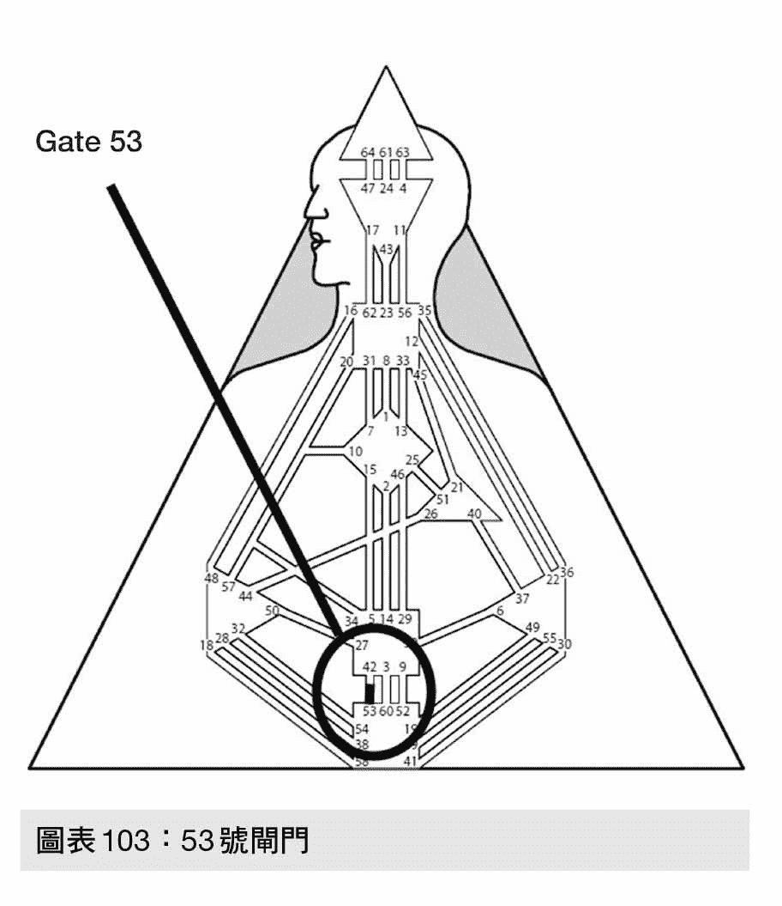

当 53 号闸门被迫完成某任务时，那将会是一段漫长和艰巨的过程。它缺少完成的能量，然而，若 53 号闸门做出回应，便能启动对的事物、吸引对的人来一起完成任务。这道闸门能造就出优秀的发起人或项目起草人。但切记，53 号闸门并不适合担任完整的项目管理职位。

这股启动事物的能量离喉咙中心有一段距离，也就是说，要完成和表现成果仍需具备许多能量。53 号闸门是发起的能量，是一股属于崭新开始的动能。

当开始的动能始于正确的决定，那么所有的能量、境遇和机会就能神奇地开展，让你的开始动能在你的人生中充分发挥。

##### 肯定语句

• 我会遵循我的人生策略，先等待再开始某事物。

• 我拥有启动新事物的能量，而我相信当我活在人生策略里时，所有能完成我创造过程的关键因子也将神奇地聚合。

##### 练习题

请花一星期的时间全然感受新开始和启动事物的能量。让所有想法、启示、灵感和发起的动能重振旗鼓，增强你的能量。但请根据你的人生策略决定投入的项目！请先列出你的新想法或重燃兴趣的灵感。

#### 54 号闸门：驱动

易　经：少女出嫁（归妹卦）

占星学：魔羯

生物学：肾上腺

54 号闸门是野心的坐落之处。它会辛勤地工作以实现梦想和得到认可。但吊诡的是，这个闸门并没有太多实质的能量。由于 54 号闸门会藉由工作提供资源，且以意志力能量为根基，因此它会像个不眠不休的工作狂般埋头苦干，直到累垮才肯罢休。

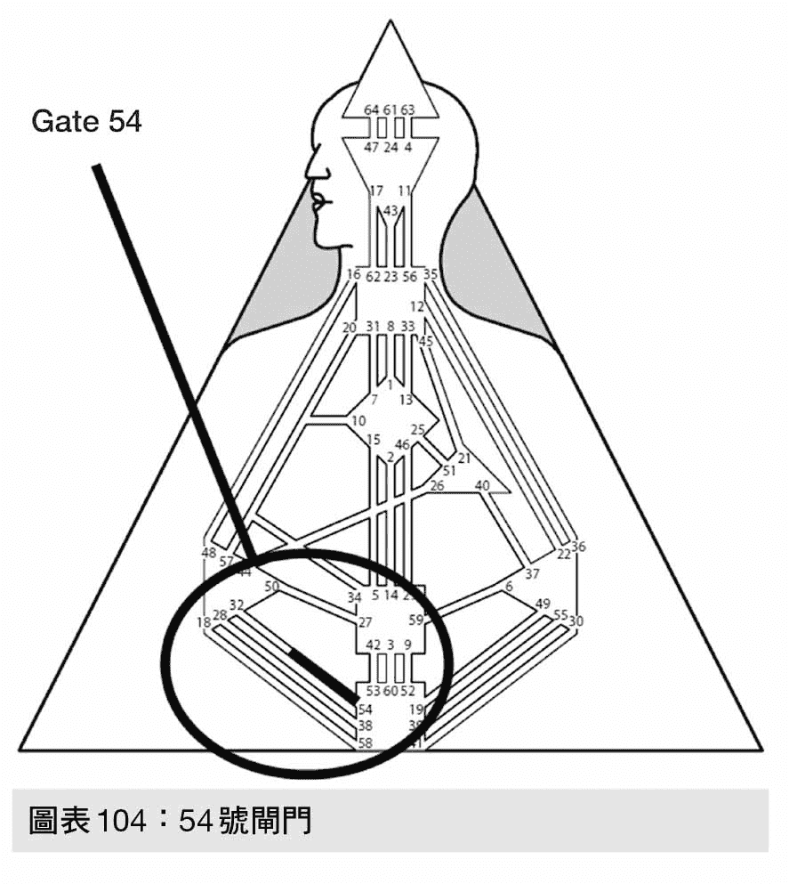

54 号闸门投射出来的样貌相当苦涩，但它实在过于忙碌工作对此也莫可奈何。

然而，从崇高的角度观之，54 号闸门其实非常动人。当它得到识别与认可后，就会是启蒙的闸门。54 号闸门的梦想若获得支持与认可，就能踏入无限可能的疆土。受到他人的赏识是必要条件，否则这些梦想只不过是华丽的泡泡。拥有伯乐的赏识，54 号闸门能成就非凡。它会是各种商业领域里的发起动力，也是经营任何工作的头号梦想家。

##### 肯定语句

• 我的思路清晰，目标明确。我准备好不顾一切地完成我的梦想。

• 我知道我的清晰思路结合我的一致行动，会产生创造自我奇迹所必要的完美能量。

• 人们会看见、听见和认可我献给宇宙的事物，而宇宙会和我一起联手实现我的梦想。

##### 练习题

你要采取什么行动才能为自己和宇宙证明，你已准备好朝你的梦想前进呢？

#### 55 号闸门：精神

易　经：丰盛（丰卦）

占星学：双鱼

生物学：肾脏和胰脏

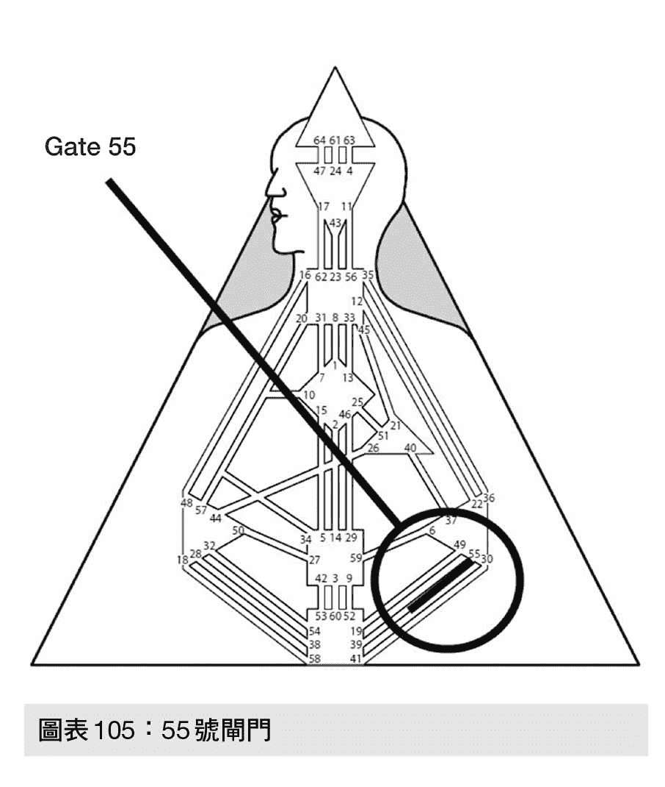

55 号闸门是精神丰盛的闸门。它是一股强大美好、具有改变世界潜力的能量。

若 55 号闸门的能量彻底展现，它便懂得人生的无限丰盛并非遥不可及。精神的意识与觉察是我们生命中的丰盛来源，能立即将人们从欠缺的状态转换为丰盛。说穿了，这一切只是思考方式的改变而已。

然而，这往往也是我们必须学会成长的能量。金钱和物质资源的能量、和荐骨中心的工作能量、或意志力中心的意志力紧密相扣。而我们深受制约影响，认为在人生中创造丰盛和资源的唯一方法，便是凭借全然的意志力和辛勤不辍地工作。55 号闸门为我们带来心灵层面的疑问，比方说人们愿意信赖精神的丰盛本质吗？我们是否能鼓起勇气放手、让上天安排一切？

对于拥有 55 号闸门能量的人而言，这将会是一段用一生探索的旅程。它需具备抛弃传统作为的勇气，并信赖灵魂、将它视作永恒的支柱。55 号闸门者有时必须等待正确的时机或能量以采取行动。换言之，有时你必须以看似有违常理的方式行事，并要在辛勤工作以赚取金钱的传统道路上偏离时，学会处理信念中的挣扎。

最终这股能量让我们明白，假使我们拥有的蛋糕不够充足，我们根本不必费心思考要如何切分它，我们只能烘焙制作更多的蛋糕。生命的本质是无限丰盛，如能觉察这份精神意识，便能推动集体意识，创造出人人皆可得的无限可能。

##### 肯定语句

• 我能意识自己内在的精神丰盛，深信我的所有渴望都能实现且不会感到丝毫匮乏。

• 觉察带给我全然的支持和满足感。

• 藉由顺其自然、让上天安排一切，我得以让自己生命中每一面向的丰盛彻底展现。

• 丰沛的感受是我与生俱来的权利，也是我天生的状态。

##### 练习题

1. 关于拥有全然的支持与丰盛感受，你抱持怎样的信念？这些信念和你知道的真理一致吗？你该怎么做才能消除你对丰盛的担忧和恐惧？

2. 觉察内在的精神丰盛是什么感觉？具体化的样貌为何？始终意识到这种满足能量能如何改变你的人生？你该做些什么才能准备好迎向此种程度的信念和信赖？

#### 56 号闸门：说故事者／刺激

易　经：寻道者（旅卦）

占星学：巨蟹／狮子

生物学：甲状腺和副甲状腺

56 号闸门是极具教学天赋的闸门之一。它就象是一位善用隐喻来讲授和分享的优秀教师；56 号闸门能分享那些有助于人类理解世上体验的故事。

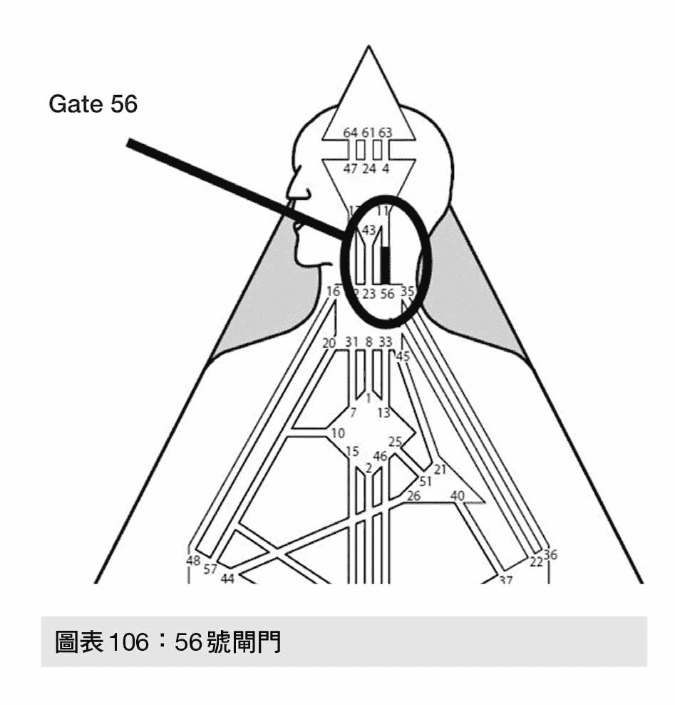

虽然 56 号闸门是天赋异禀的说故事者，但他们务必要记得，只有当人们主动征求故事时，他们分享的话语才能被清楚听见和记得。56 号闸门加上开放的喉咙中心往往会让人成为滔滔不绝的说故事者，频繁且没完没了的故事甚至会让旁人逃之夭夭。若 56 号闸门未等待邀请或认可便急于分享，人们可能会厌烦那些其实非常引人入胜的故事，而说故事者则会因为得不到真心的听众而受挫。

##### 肯定语句

• 我会等待并与那些能推崇我的灵感及经验的人分享我的想法和故事。

• 我的故事是构成人类经验重要的一部分，而我会等待恰当的境遇以作为对自我经验的尊重。

• 我的言语和梦想珍贵无比。

##### 练习题

让你的想象力和童心未泯告诉你，你的梦想能如何展现所有可能性。让自己以开阔心胸接纳无限的可能，并试着向自己诉说关于你如何梦想人生的故事。

#### 57 号闸门：直觉洞察力

易　经：温和（巽卦）

占星学：天秤

生物学：脾脏与淋巴系统

57 号闸门在人类图系统中是最具直觉力的闸门。在传统易经里，五十七卦代表徐徐和风吹散云层，让阳光得以穿透、照耀大地。57 号闸门拥有清晰且聚焦于当下的直觉洞察力，其敏锐准确的直觉往往能使真相显露无遗。有时我们也称此闸门为清晰的闸门。

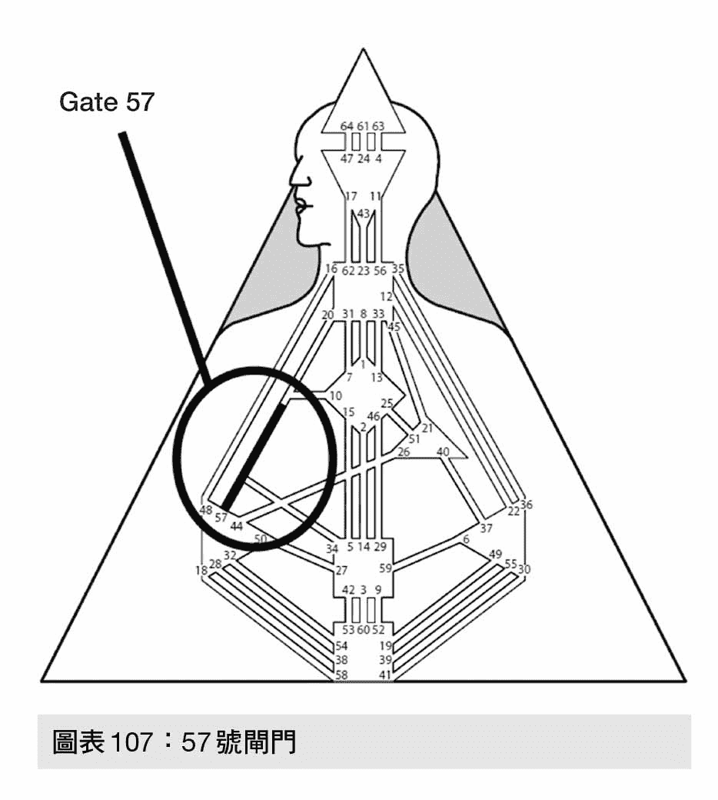

虽然它具有敏锐的洞察力，但讽刺的是，57 号闸门本身也是一股不确定和难以掌握的能量。是以，大多数的人总是怀疑自己的直觉。因为直觉彷彿来无影、去无踪，根本没有逻辑可循！57 号闸门的直觉只存在于当下，但每个当下倏忽即逝、不断改变。某一时刻的真实到了另一刻可能就变为虚假的幻影。

拥有 57 号闸门的人往往会在该相信自己的头脑或是直觉中挣扎不已，然而依循你的人类图策略就能解决此进退两难的困境。人生策略会避开 57 号闸门中头脑层面的优柔寡断，让你能欣然接受直觉传达予你的讯息，而不再与自我怀疑拔河奋战。

57 号闸门者天生具有玄妙的灵性才能，参照你的人类图表中其他的能量配置有助于你发现自身灵性才能的展现方式。

57 号闸门也是根植于脾脏的恐惧闸门，它恐惧未来。这也部分说明了 57 号闸门含有不确定性的根本原因，当 57 号闸门感受到隐藏许多不确定或令人恐惧的未来时，可能会因此气馁而死守安逸。然而，处理所有源于脾脏恐惧的方法便是试着克服它，如此就能让这种种恐惧很快地烟消云散。反之，逃避恐惧便会让人困陷其中、动弹不得。

##### 肯定语句

• 我相信自己。

• 我相信我的直觉。

• 我相信未来。

##### 练习题

1. 你的直觉感觉起来是什么样貌？你如何意识直觉？回想并列出那些你信赖自己的直觉，而产生好结果的过往事件。

2\. 你是否在此刻接收到值得你关注的直觉？

3\. 你该做些什么才能加深你的直觉意识？

#### 58 号闸门：喜悦／活力

易　经：喜悦（兑卦）

占星学：魔羯

生物学：肾上腺

58 号闸门是关于生命喜悦的能量。58 号闸门者的脸上总是挂着一抹笑容（若他们依循自己的人生策略生活）。他们凭直觉就能明白喜悦，往往不会太过严肃地看待事物。

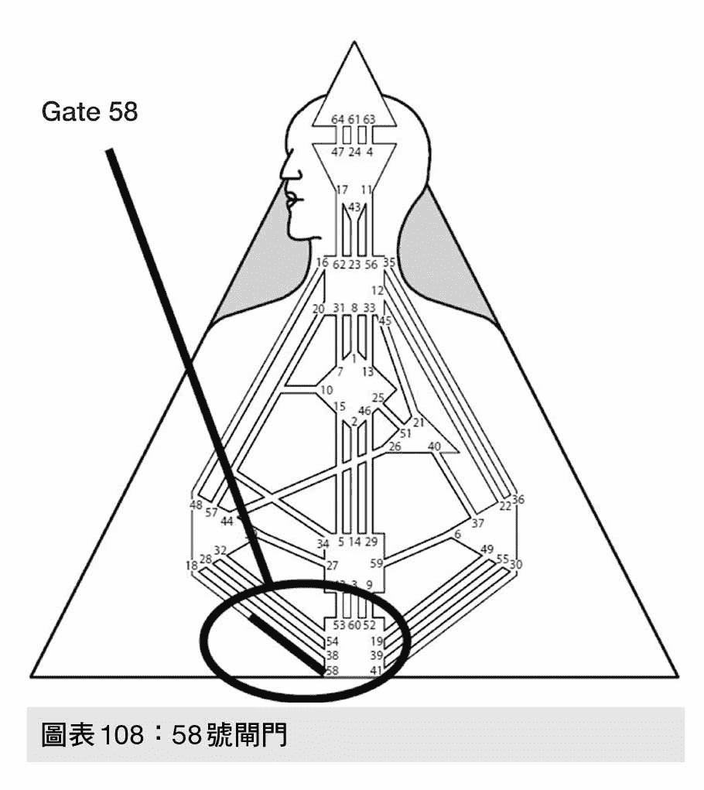

然而，若他们背离自己的人生策略，他们便会在喜悦人生中经历剧烈的挫败。毕竟，人类图属于二元系统。58 号闸门者若明白喜悦的可能性，却无法经验喜悦，那么他们会成为世上感受最苦涩的族群之一。

喜悦能藉由活在自己的人生策略里，或等待修正的恰当时机而得以恢复。生命喜悦的极致之美在于它源于纯熟和修正的能量。58 号闸门能在逻辑回路中充分展现出批评的能量，并以此帮助人们探索喜悦。

##### 肯定语句

• 关于我的存在、我拥有的一切事物、我曾经验的所有感受和事件，我都怀抱着感恩之心。

• 我会让喜悦盈满我的每一颗细胞，并以敬畏的态度看待环绕于我的所有恩典。

• 我能保持放松的心情，并知道纷纷而来的恩典是我的生命、是我的神圣资产的一部分，我也满怀喜悦地知道，源源不绝的良善之流会不断地流向我。

##### 练习题

列出你感激的一切事物。每天花几分钟让自己处在这份幸福的感谢心情中。

#### 59 号闸门：性

易　经：分散（涣卦）

占星学：处女

生物学：卵巢和睪丸

59 号闸门是引诱的闸门。这是一股纯粹的生命动能，是驱动性欲与否的能量。

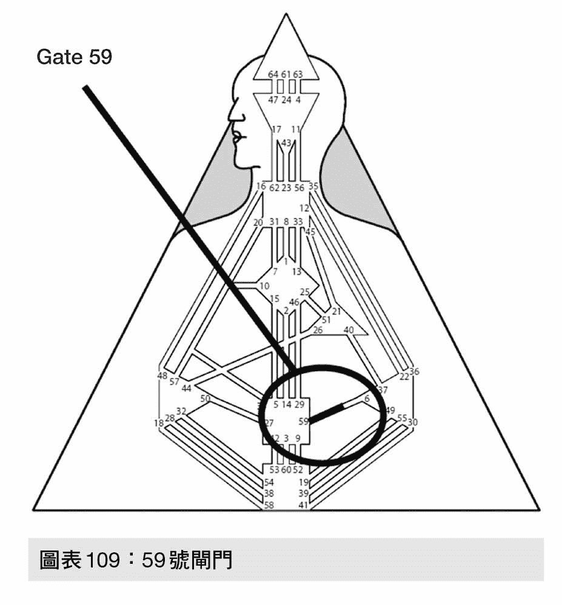

59 号闸门者试图厘清亲密的本质，但探索的方式偏向理论。也就是说，59 号闸门设法透过研究掌握亲密。他们也许非常了解亲密，但这些认识几乎不是出于实际体验。

相反地，他们对于亲密也许从没想那么多，需要透过他人才能察觉。许多 59 号闸门者会发现，他们需要对另一半和这段关系有深刻的理解才能踏入亲密的阶段。因此，59 号闸门偏好从朋友关系发展，再深入演变成暧昧。对 59 号闸门而言，灵魂伴侣最能让他们找到深切的亲密感。

59 号闸门也享受于诱惑或被另一半引诱的游戏。然而，要让 59 号闸门者全心全意地将自己交给对方，的确需要一段时间。

##### 肯定语句

• 我为爱而生，等待踏入亲密关系的召唤。

• 在一段关系里，我需要个人空间与自由，我需要时间了解我拥有的爱是真实的；这种种条件强化了我对亲密及与他人连结的渴望。

• 我深信友谊是爱情的基础。我的挚爱必定是我最好的朋友。

• 我会等待思绪澄明，并带着深思熟虑踏入一段关系。

• 对我而言，爱既有趣又充满诱惑力，我享受与伴侣相互诱惑带来的刺激欢愉。

##### 练习题

1\. 哪种影响方式最适合你，能为你的计划和事业带来最大的帮助？

2\. 在实践目标和理想之路上，你的下一步为何？

3\. 你该从哪部分着手努力，好让自己预备好迎接成果的展现？

#### 60 号闸门：接受

易　经：限制（节卦）

占星学：魔羯／水瓶

生物学：肾上腺

60 号闸门属于原本或既有基因的能量。它是「旧」基因能量和「新」基因讯息相遇，进而产生突变的所在。60 号闸门具有保守的特质，在做出改变前，会设法坚守原有的工作定义。60 号闸门会寻找进化的机会，而拥有此能量者时常渴望以谨慎从容的方式改变、经验个人成长。就改变的目的而言，这并不是一种天翻地覆式的疯狂改变，而是一种从容谨慎、踏实的进化，在此过程中，它也能接受和善用改变的限制。

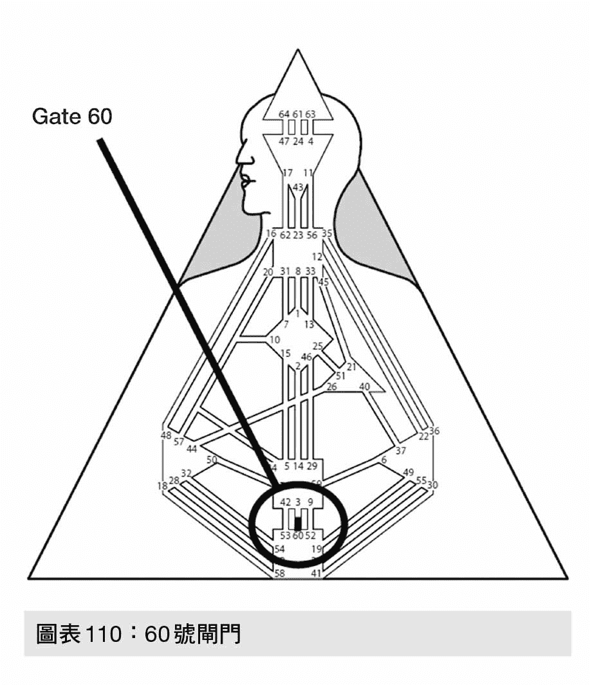

##### 肯定语句

• 我是无拘无束的宇宙子民。当我获得灵感时，我相信也明白自己具有将灵感成形的能力。

• 灵感和显示做法在同一瞬间产生。我的唯一任务是深呼吸、放松、信任，我知道神圣的秩序会安排一切。

• 我的任务是留意宇宙发送给我的讯息，并纯然地依循我的人生策略。我完全不需要担心我的灵感会如何展现。

• 我会消除内心所有的抗拒，并相信自己随时都能在对的时间处在对的地方，和对的人一起从事对的事情。

##### 练习题

1. 当你不清楚事物将如何发生与开展时，你是否会挣扎、奋力地做些什么？若是如此，你会创造出什么限制？

2. 你是否有过因为困陷在事物的完成方式而不相信自己能够继续前进、并付诸实现的经验？

3\. 在你的人生中，你在哪些部分感受到抗拒？你在反抗什么？为什么？

4\. 你能做些什么好让你的生命创造出更多的接受空间和变得更自在？

#### 61 号闸门：神祕

易　经：内在真理（中孚卦）

占星学：魔羯

生物学：松果体

61 号闸门是突变思考的起始阶段，并具有传达所思（不需要逻辑推演）的任务。61 号闸门就是知道！报告完毕。假使你设法让 61 号闸门解释它究竟是如何知道的，那么，你仍未抓到重点。61 号闸门能打破现实的藩篱，理解未知。它具有探索或思考神祕、甚或是超自然事物的能量。然而，若它未得到邀请表达所知，人们只会对此感到一头雾水。

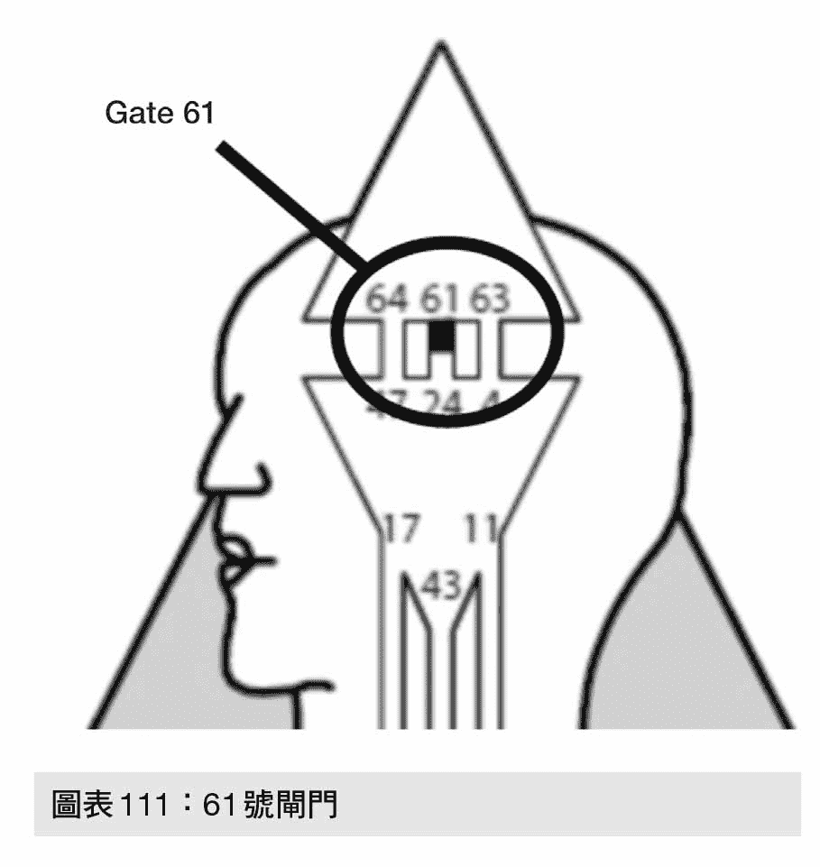

61 号闸门的狂想，根源于亟欲知晓原因的渴望、及等待澄明的必要条件。此闸门的通晓能力往往能超越本身，也就是说，它不必了解过程的片段就能直接理解终极思想。它能跳过步骤、直达更巨大的觉察意识，不需确认在此之间环环相扣的连贯线索。61 号闸门必须等待以知晓更多，假若他们遵从全然享受于思考的生命邀请，他们的脑袋便会在设法知道更多的需求下紊乱不已。

61 号闸门必须等待正确的时机，以明白哪些所知是具有价值的。61 号闸门的重要箴言是「我为何要问为什么？因为思考是充满乐趣的一件事。」请记住，思考的目的往往纯粹是为了思考本身。

的确，这是属于突变的思考，因此它势必是与众不同的。让改变具有适应性的关键便是等待对的时机，如此一来，对的人便会邀请 61 号闸门分享所知。61 号闸门务必要守卫它知道的一切，并等待他人主动邀请分享洞见。

##### 肯定语句

• 在寂静中，我臣服于生命的巨大神祕和神圣的一切。

• 我会让自己沐浴在神圣的灵感之中，并带着无比的专注欣赏感受。

• 我相信自己得到最美好的启发，并纯粹地让灵感涌向我。

• 我充满感恩之心。

##### 练习题

你觉得自己与更庞然的未知同步吗？你该做些什么才能加深你和宇宙的连结？你需要在日常生活中建立某种惯例，好让你保持精神集中及与世界的连结感吗？

#### 62 号闸门：细节

易　经：处理细节的优势（小过卦）

占星学：巨蟹

生物学：甲状腺和副甲状腺

62 号闸门是关于细节的能量，也就是说，正是这些微小细节让各种见解源源不绝地涌入、保持动能。62 号闸门不断提问「要是这样做，会怎么样呢？假使把这个物品放这里，其他的档案夹摆到篮子里，会怎么样呢？我们能就此开创出有系统的运作模式吗？」即使他们不象是有条理的人，但他们总是知道所有事物的坐落之处。

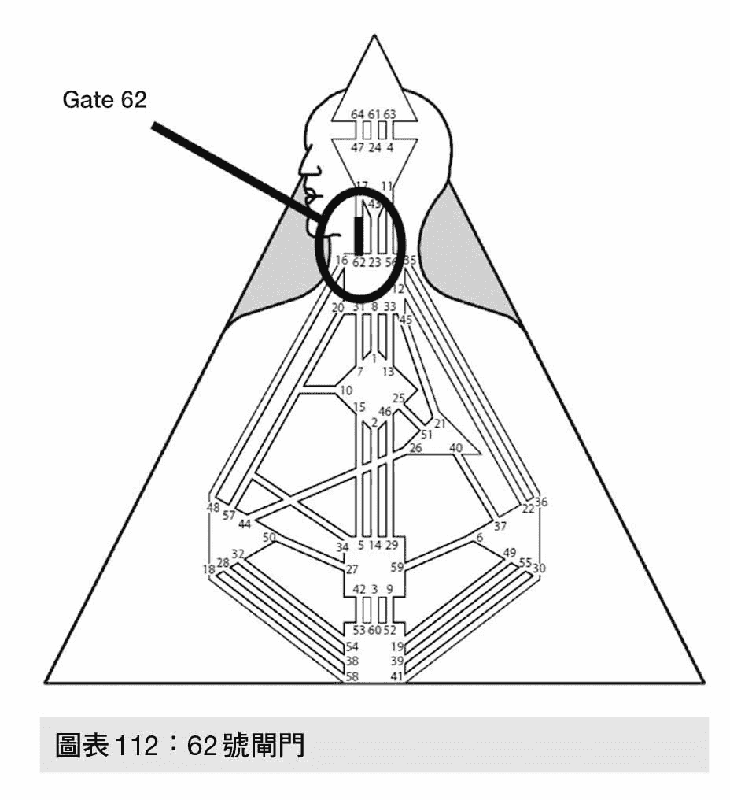

这是属于计算机程序设计师或专业管理者的闸门。62 号闸门总是保有实际试验的精神，它是打造试验架构与应用的能量。62 号闸门决定了统计试验的过程，关于要使用哪些配备、如何记录数据，它都了如指掌。它以系统化、合乎逻辑的方式，将计划与想法相互连贯。62 号闸门将各种潜在价值的能量连结至喉咙中心，并透过表达，创造展现的可能。

##### 肯定语句

• 我会谨慎善用表达。我的表达为我的理想和想法创造形式。

• 我的想法清晰并且井井有条，我会带着无畏和一致的态度，寻找并说出事实。

• 我是一个有条理的人，我能提供他人许多实际的问题解决方法。我会耐心等待他们主动征询我的洞察见解。

##### 练习题

让我们重新审视自己的愿景、试着将理想付诸文字吧！写下你的理想，正是表现在字里行间、纯粹可能性的力量让理想变得具体可行。

#### 63 号闸门：怀疑

易　经：完成之后（既济卦）

占星学：双鱼

生物学：松果体

63 号闸门是追求逻辑的灵感。它本身充满着怀疑和猜疑，而在此紧接而来的便是对检验的需求。

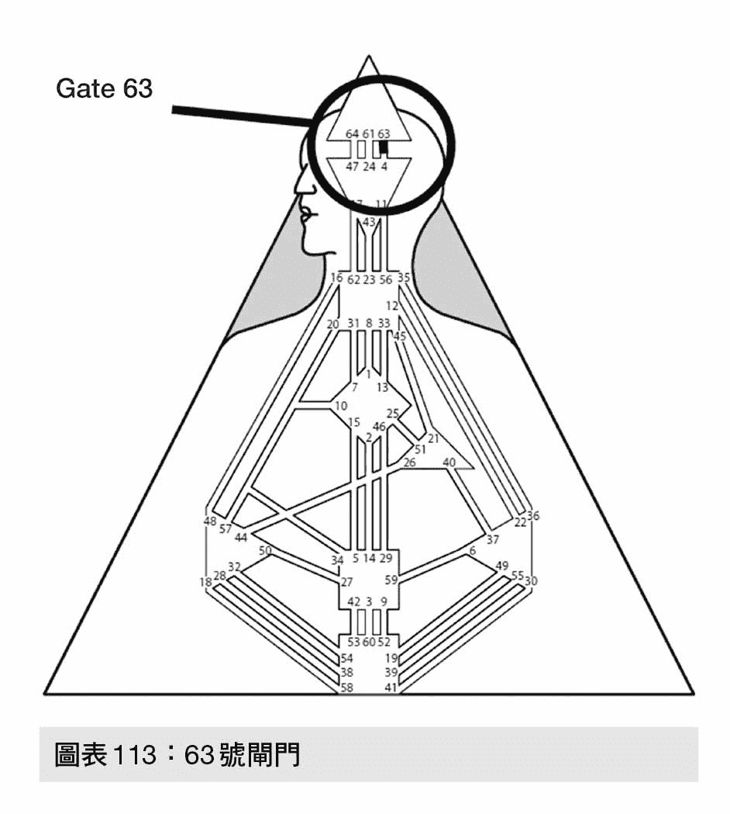

这个特殊的闸门内建了不少耐人寻味的挑战。怀疑和猜疑属于能量；而就如同人类图表中的所有能量一样，它们几乎是反射性的流动。63 号闸门者往往对万事万物（包括他们自己的洞察和能力）抱持怀疑的态度。

虽然这是迈向逻辑之路的一段珍贵过程，但对个人而言，却是一股不轻松的能量。63 号闸门所表现出怀疑和猜疑的本意是直指信息，而非指向自己或他人。

63 号闸门若结合 48 号闸门，加上开放的头脑及逻辑中心，便是让人面临脑袋打结和不擅人际交往的强效组合。请记住，这些是属于集体的能量，它们的作用并不全然是展现于自我。这些能量的目的是修正世界上的信息表现。

此外，你必须明白脑袋产生的怀疑只不过是一种想法或念头，未必能代表真实。怀疑和猜疑需要时间证明其正确性，而你需要检验和证据。当你在外在世界中，直言不讳、尽情地抒发自己的怀疑和猜疑，通常只会带来让人抗拒的结果。最好还是先把怀疑搁置在你的脑袋里，等到你累积了足够的资料并得到邀请后再分享吧！

##### 肯定语句

• 我相信自己，也相信宇宙。

• 我相信试验蕴藏着完美。

• 我相信我的洞察力和通晓能力。我具有敏锐的识别眼光，但我不是怀疑主义者。

• 我知道所有的问题都有解答。我相信解决问题的简要方法，也知道当时间和万事万物俱足时，我就能得到答案。

##### 练习题

1\. 你曾有过怀疑自我的经验吗？

2. 你曾有过事后证明你的内在通晓能力是正确的经验吗？你认为你的天赋才华或你的强项是什么？你在哪些领域展现了纯熟的能力？你该做些什么，才能消除你的自我怀疑？

3\. 你相信神圣的秩序吗？你认为每一件事情的存在或发生都有目的吗？

4\. 哪些错误经验最终让你通往完美和纯熟的道路？

5\. 你该做些什么，才能将错误整合为迈向纯熟不可或缺的一部分？

#### 64 号闸门：困惑

易　经：完成之前（未济卦）

占星学：处女

生物学：松果体

64 号闸门是属于左眼和右脑的闸门。信息和灵感有如巨大的片段或「下载量」席卷而来。整个想法似乎就如此凭空形成，丝毫没有逻辑脉络可循。上一刻脑中仍一片空白，下一刻便拥有庞大绝妙的点子。

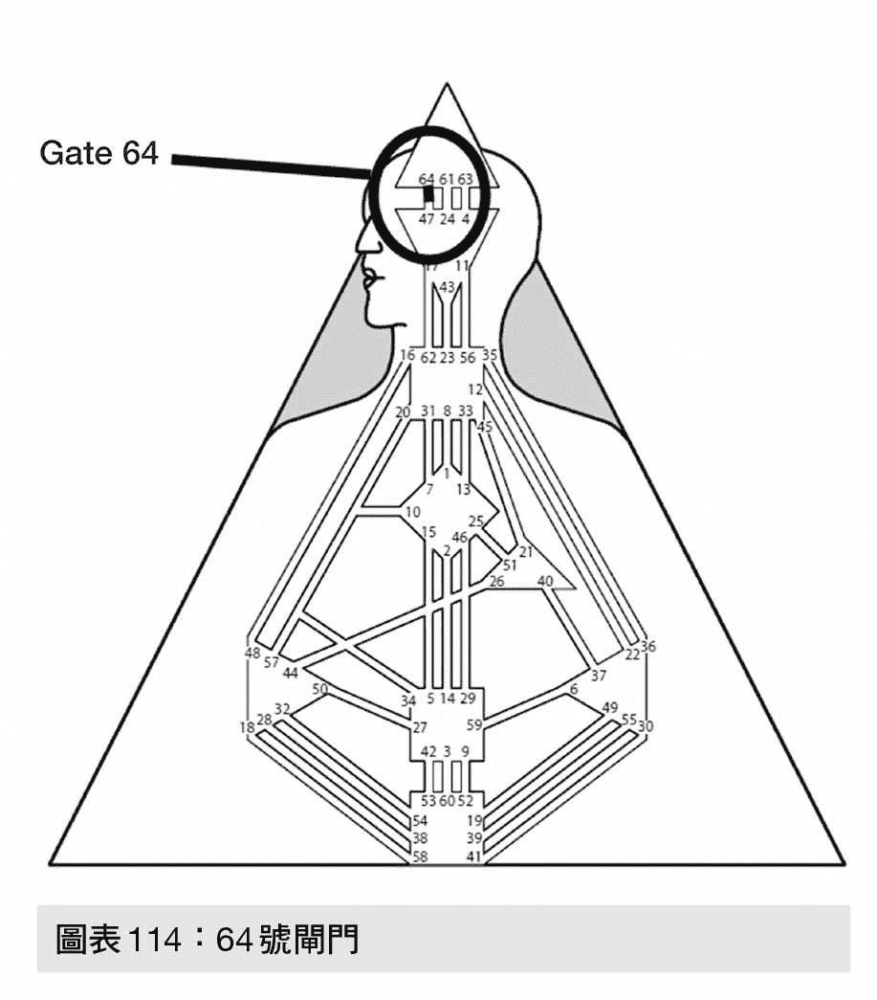

当你迫使右脑产出的灵感转化为线性顺序时，64 号闸门便会显露困惑和压力。若在不恰当的时机里，它很难执行「这一切是怎么发生的呢？」这一类问题的思考。64 号闸门拥有自己的时程，在正确时机到来前，你无法逼迫它清楚地展现或甚至理解脉络。

64 号闸门的真正挑战是如何对未知的发展抱持坦然和释怀的心态。我们活在一个深受逻辑和左脑思考制约的世界。我们时常被灌输如此的观念：光是获得灵感并不算数，我们也该同时明白如何将这些灵感具体表现。因此，64 号闸门只好学着猜测细节，或沉默不语。

一些策略能帮助此种思考方式。64 号闸门以视觉思考，而形象化的工具有助于学习和表现。师长可以引导 64 号闸门的孩子将想法记录在索引卡上，他们就能学习写下具逻辑及线性的记述。往后，孩子就能以视觉组织这些想法，并使之连贯流畅。

64 号闸门往往令人费解。当它发表想法时，其言语通常会绕着想法打转，直到它突然得到某种意义为止。但对那些试着要领会话语脉络的听者而言，便会有种莫名其妙的感受。64 号闸门者总是努力让那些庞大的想法成真。若在孩童时期，他们就是那些希望在科展竞赛中，创造出「不可能」科学实验的孩子，而他们往往也需要他人协助将庞大的想法分解为较小、更易处理的任务。当 64 号闸门者明白澄澈清明的思路在对的时间以顿悟的形式显现后，就能和自己和平共处。64 号闸门的唯一任务就是等待，答案终将到来。

64 号闸门是右脑的典型代表能量，它同时也是接通超意识（super-consciousness）的闸门。更全面的了解和玄奥的觉察，能在 64 号闸门中触发灵感。它得到超乎自我、源于宇宙的巨大力量启发也是司空见惯的一件事。

##### 肯定语句

• 我会留意自己的灵感，并知道当我带着探究的期盼心情观察我的灵感是如何展现时，美妙的事物便会发生！

• 我非常乐意及渴望知道宇宙会展现什么事物在我眼前。

##### 练习题

1\. 你最大的梦想是什么？

2\. 你相信它能实现吗？

3. 在你等待梦想实现的过程中，你应该采取什么策略好让自己保持愉悦的心情？

关于你是谁？你的人生驱动力为何？你能在哪部分带着自觉意识成长与进化？六十四道闸门在这些面向能赋予你深刻的理解。当你与这些能量携手并进时，请记住，这六十四道闸门始终都存在着能支持你、给予你力量的潜能。

此外，当你浏览这些闸门的时候，请务必记得每一个人都拥有完整的六十四个闸门。定义的闸门代表你会恒常经验此能量，开放的闸门则是会以较多变的方式让你感受该能量。

你也许会发现，即便你的某些闸门未定义，但你仍能感觉到它对你的切身作用。我们深受身边人们的能量影响。你的另一半和家人或许带有你本身不具有的能量，然而，这些能量作用最终却会在你们的关系中创造出某些主题。

我真心建议你完成每一道闸门的练习题。这些能量确实是打造出「人类」的部分能量原型。

### 第六章

## 主要回路群

如同房子的供电线路或计算机的电路板，人体图也具有共同运作的相关能量线路，称作「回路」。这些回路揭示过往人类进化的机制，也在未来延续人类发展中，扮演了相当重要的角色。透过学习回路的知识，你能从另一个层次了解自己、明白你的人生使命及你在整体人类这块大拼图中的位置。

人类图共有三大主要回路群：个体人、家族人及社会人。每一个回路群在分享讯息、价值观和生存策略上都发挥着独特的作用，并联手打造出更深层的人类样貌。

个体人回路群主要是在个人层面触发改变。当某人想到一个崭新想法或发现做某件事的新方法时，这股能量便会在个体人回路中呈现。在此的能量不同于常态；它会产生突变，因而会激励其他人改变。

个体人发现新的观点或新的做事方法后，他们会将此改变传至家族，透过家族人回路群展现。而家族成员接着便会将改变散布至更庞大的群体，即社会人回路群。

假想北美大草原上居住着某一小部落。此时正值春分季节，而部落正准备搭设夏天的营地。身为部落一份子的鲍伯有点奇特。他其实并不喜欢群居生活。他很关心自己的族人，但他却常常当个独行侠，专注于自己的事务上。

今年，鲍伯（拥有许多个体人能量流）决定在远离部落的小溪峭壁旁搭建他自己的避暑小屋。他非常享受独处时光；在搭建小屋的过程中，他发现将大石块綑绑在棍棒上，以此作为石槌使用的新方法能大大地帮助他完成造屋工程。

鲍伯的哥哥，罗杰（拥有许多家族人能量流），某天来到小溪的下游拜访鲍伯。他只是想确定弟弟一切安好，正在这个时候，他看见了这根新奇的石槌。罗杰赞叹这新工具的实用与便利性，他也立即看出这玩意儿能让建造营地的工程变得更容易。他明白，若营地愈快完工，他便有愈充足的时间准备过冬的粮食及其他物资。于是，罗杰请弟弟为他制作一模一样的石槌后，便带着这根有用的工具返回部落。

在这根新奇槌子的帮助下，营地顺利完工。罗杰多出了许多空闲时间，是以他比平常花上成倍的时间打猎。渐渐地，他累积了能卖给其他部落的额外动物毛皮。罗杰整装待发、准备踏上买卖之旅，他决定将石槌扔进自己的行囊中上路。沿途中，罗杰向其他部落的人展示石槌，人们纷纷要求他制作相同的槌子，并愿意以食器和其他珍贵的货品作为交换。

罗杰便带着许多能献给族人的额外物资踏上返家的路。

几年后，每一个部落都拥有属于自己的、以鲍伯的发明为雏型改造而成的槌子。最后，罗杰的祖母（拥有许多社会人能量流）创立了官方机构以管理槌子的使用与安全规范。

当某一改变具有适应性，并成功地自个体散布到家族，再由家族传播到社会时，能量的临界量逐渐形成，届时，改变就成为人类经验的整合要件及人类故事其中的一个篇章。

从个人的角度而言，你的定义回路与闸门能帮助你了解：你之所以是你的原因，你的人生驱动力是什么？你为什么会在人生中不断地重复经验某些主题？你的定义回路也有助于你理解你的人生使命及你此生要与这个世界分享的事物。

启动的通道会在你的人生中带来不变的主题。悬挂的闸门（只通一半的通道）则是你在与他人的互动关系中会面临的主题；你会受到拥有另一半通道的人吸引，故而，接通的通道主题便会在你的关系中浮现。

#### 个体人回路群

突变和给予的力量源自于个体人回路。若你拥有许多个体人的能量流，你此生的目的便是展现出与众不同；为了活出快乐，你必须充分表现你的独特性。你能感觉到自己与大多数的人相比都截然不同，甚至在行为举止或穿着表现上都超乎常规。

个体人的独特性能够促成改变。由于这是一种能量作用，因此，个体能量不需要「执行」什么才能带来改变，只要「存在」就能影响他人。

若某人的人类图表里具有许多定义的个体能量，他很有可能得不断与忧郁的状态奋战。当你认为自己与外界格格不入、没有人能懂你时，人生似乎也因此变得无比艰难。然而，请务必要铭记在心，这一切都是能量的作用。个体人的身边也许正围绕着许多欣赏他们的仰慕者，即使他们依然感到孤单和不被理解，但这纯粹是个体能量作用后的产物，绝对不是个人的问题。

个体人回路群由三个回路组成，分别是整合型回路、中央回路、觉知回路。我们将在第七章深入探讨。

个体人回路若彻底发挥，将能给予他人力量。若你拥有许多个体人能量流，你的人生使命之一便是毫不退缩、不带丝毫羞愧感、充分表现你的特质。如此一来，周遭的人也就能获得自在表现自我的机会。

假如个体人努力让自己变成他人的模样，便无法活出自身的天命。这不但有违天生设计，也会让进化和给予力量的能量流停滞。

个体人孩子的父母，请务必要懂得鼓励孩子尽情展现他们的独特性。若他们受到压制、被迫成为他人的模样，那么一来迷惘、苦涩、挫败或愤怒的感受将充斥他们的人生。而社会人也将错失个体人献与世界改变之美的机会。

时机对个体人而言是至关重要的一环，新事物必须在正确的时机引入世界。个体人必须等待，直到新事物「感觉」对了才得以分享。突变属于自发性行为，但适应却需要经过一段时间，才能判别某些改变是否能带给部落和社会益处。

而个体人的任务就是全然地做自己。部落和社会将决定个体人带来的改变，是否能运用在更广大的层面以及是否能经过时间的考验。

个体人回路深具听觉特质。拥有许多个体能量流的人（尤其是头脑和喉咙中心）往往都是听觉学习者。他们甚至会拥有专属于自己的内在听觉流程。

个体人孩子常常会自言自语、发出嗯哼或许多重复性的声响。

个体人回路具有出于直觉的超觉知力（claircognizance），换句话说，如果你拥有许多个体人能量流，往往能纯粹地「通晓」事物。或许你也搞不懂自己是如何知道的，你只明白自己拥有这种本事。这种自发的觉知会让讲求逻辑的人抓狂，因为个体人根本毫无逻辑可言。

##### 给个体人回路的肯定语句

• 我此生的目的便是展现与众不同，我推崇自己的独特性。

• 我会让内在智慧随着时间发展茁壮，并在旁人主动邀请时分享。

• 我能自在表现我的强大独特性，我会让我的光亮照亮所到之处。

• 我会充满自信与风度地做自己！

#### 家族人回路群

家族人回路和家庭、价值观、繁衍和照护有关。你的家族包括了你的朋友、家人和邻居。

拥有许多家族能量流的人渴望成为群体或整体的一份子。他们是家族或社区（象是童军团长、家长与教师协会主席、社区守望相助策划者……）的守护者。

家族能量负责传递价值观，分配和管理资源、契约和协议，以及生儿育女，扶养孩子长大成人。此外，这些能量也包括了炊食、教育、性欲及商业事务。

拥有许多家族能量流的人非常在乎他人。他们对生活周遭的人们怀抱强烈的责任感，而有时觉得自己（或被他人视为）是情感依托的角色。家族人会尽其所能地照护他的族人。家族人回路的主题便是扶持。

家族人回路群包含了两个回路，防御回路及意志力回路。我们将在第八章详述。

家族能量和持续分配及管理资源有关。家族因所得资源而得以存活，假设你储存粮食，并将这些存粮管理分配以度过岁末寒冬，那么你的朋友、家人和孩子也就能平安过冬。若你做出绝佳的商业决策，那么你便拥有取得更多资源的机会，或万一情势改变，你仍有多样的来源选择。稳固的家族始终有生存的备用计划。

契约，例如结婚、离婚、条约和商业交易都是家族能量的一部分。规则和价值观的协议、教派和宗教信仰也属于家族的范围。

性和性欲也根源于家族人回路。某家族得以延续不衰是因为新生命茁壮成人。性的结合与家族关系都是维持家族价值观的要件。而关于扶养、教育和照护孩子的协议，也都属家族能量的一部分。

战争与和平的状态也包含在家族能量中。若资源或价值观遭受威胁时，防御回路便会促使家族开战。而条约、和平与和谐则根源于家族能量的意志力回路中，情绪与意志力中心相连之处。

##### 给家族人回路的肯定语句

• 当我和我的朋友、家人在一起时，我能感到安心自在。当我能照顾自己与他人时，我会感到快乐。

• 我会为自己设立适当的范围，以便给予他人更恰当的关怀。

• 我能妥善管理我的金钱和时间。

• 我会实践我的协议。

#### 社会人回路群

社会人回路和人类的生存有关，共有预测与反映两大主题。它会根据过往汲取的经验与教训，预测事物接下来发生的样貌，并以绝佳的想法反映出未来的潜在可能性。

社会人回路群包含了两个回路，逻辑回路及感知回路。我们将在第九章详加说明。

逻辑回路，如同字面意义，充满逻辑性。左脑便是逻辑回路的一部分。人类图系统中的逻辑与了解那些不断重复的模式有关。举例来说，我们知道每年冬天过后，春天便会接着到来，而春天是种植作物的良好时机。此理解认知便来自于经年累月、不断重复的经验。这种讯息是可预期、始终如一的，也让我们能做出得以继续存活的决定。逻辑，从最纯粹的角度而言，便是能让我们迈向人类持续发展、益臻完善的表现及美好人生的各种模式。

感知回路和人类的经验有关，也是右脑的所在位置。感知回路透过情绪中心表达，在当下片刻鲜少能意识到。感知回路的要点为：随着时间达到澄明的状态。它是抽象、整体的能量。

「分享」是社会人回路群的核心。然而这并不像家族人回路中的个人层面分享，这是关于全人类、与物种生存有关的分享，常见于混乱和危机的时空背景中。当动乱发生时，社会人回路驱使我们引领他人至安全或有利的位置。拥有许多社会人能量（尤其是逻辑回路能量）的人，能凭直觉知晓如何调整或改善事物。这种判断力往往会被他人解读为批评，然而社会人的目标是表现出人类经验益臻完善的形式，及建立基础结构以维持人类的持续发展与富足。这种批评并非出于个人，某种程度上也非源自无限的关怀，而是出于分享最完美的表现形式。社会人的分享是因为我们是同一整体，就算你我是截然不同的两个个体，但我们某一层面的经验是相同的。我们共享某种共同脉络串接而成的人类经验。

##### 给社会人回路的肯定语句

• 我喜欢在万事万物中发现模式。

• 我会等待对的时机到来，再尝试新的事物。

• 我会和那些主动邀请我的人分享我的想法、故事和建议。

诚如你所见，人类图里的每一部分都美妙地相互贯穿，对人类的发展而言，都是极其重要的关键。回路则让你探见个人此生的使命；包括了带来改变、滋养及为人类的福祉建立更广泛的准则。

绝大多数人的人生使命都含纳了每一种回路的能量。某些人则在某一特定回路拥有较多的定义能量，而该回路的主题也在你的生命中产生了深刻的影响。

所有回路完整地聚合在一起时，我们将会发现，世上每一个人在人类发展进化的道路上都扮演着无比重要的角色。我们需要能带来改变、提供滋养与关怀、创立更广泛的准则以让我们能更有效地重整自我的人物。最终，只有当三种回路群彻底地发挥、每一个人活出自我设计的极大潜能时，人类拼图的所有片段才得以聚集，完整展现出全貌。

### 第七章

## 个体人回路群

个体人回路群包含整合型、中央、觉知三个回路。每一种个体人回路都具有突变、变革的主题，及在恰当时机明确表达新想法的能力。个体人回路群各有特定的任务，有助于你了解此生将带给世界哪种类型的改变，及不同的能量会影响你在世上做出改变的能力。

#### 整合型回路（The Integration Circuit）

整合型回路相当复杂难解，因为它真切体现了人类精神的能量。它是极为深奥的回路，也是让人难以理解的能量群。

整合型回路充满直觉力，它藉由生命动能驱动，并以自我作为驱策。整合型回路是最早的人类祖先唯一表现出来的能量。它的主题就象是简短的警句「我是」，任务是发展自我的意识，以作为别于他人的差异和对自我形态的知觉。

整合型回路通道

• 34-57：力量的通道

• 57-10：完美形式的通道

• 34-20：魅力的通道

• 20-10：觉醒的通道

当我们尚未被赋予形体时，我们以一种无形、无差别的整体存在。而人类的形态让我们经验到个体独立的错觉，并透过每个人的独特性界定自我。我们将自己视为个别的人类生物，而非统一的整体。这就是人类经验的力量，藉由将自己视为单独个体的过程，我们不仅区隔出自己与他人，也和上天划出界线。我们探索启发的过程，正是透过整合型回路让我们同时以个体的存在意识到整体。

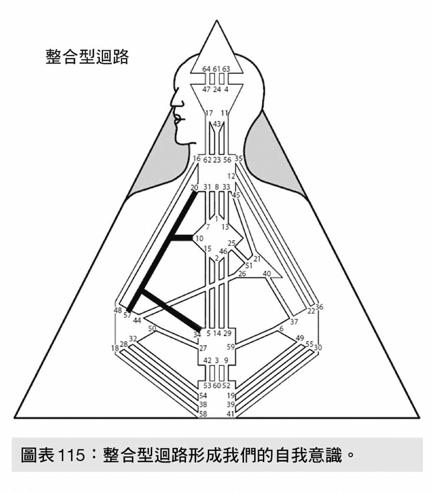

以更具体的方式来说，整合型回路是极具个人色彩的回路。拥有许多整合型通道能量的人，极富变化性和深刻的个体性。他们有时会费力地让自己适应。

整合型回路者需要时间，而这似乎有违常理，因为它根源于脾中心（讲求此时此刻的能量中心）。然而，它需要时间让内在反映，并将新的经验与造就人类的原型「整合」、创造出新的典范。除此之外，整合型回路也需要做出回应，因为它也属于生产的回路。

拥有整合型能量者往往不太容易做出回应，或甚至是活在当下。他们必须先整合才知道下一步该怎么做。因此，若他们总是设法要在当下立即行动或回应，有时便会产生沉重的挫败感。对他们而言，拥有整合及独自思考的时间无比重要（尤其在人际交往的层面）。

拥有多条整合型定义通道的人，往往会被他人视为活在自我世界的人。他们并非自私，只不过是天生个体化的设计使然。这也无关乎个人的问题，只是此种回路的能量作用。

##### 34－57：力量的通道

这是人类原型的原始通道。人类祖先最早便是以这股能量，界定出人类最初的个体化发展，它是基于直觉的生命动能。这条通道也深具敏锐的听觉和直觉本能，拥有 34-57 通道的人常见于担任音乐或录音制作的职务。声音的失真，甚或是丧失听觉对他们而言都是艰巨无比的挑战。敏锐的听觉往往能让他们听见声音或直觉的指引，他们能从你的声音中听出弦外之音，也能凭直觉从你的言词和语调里察觉不寻常之处。

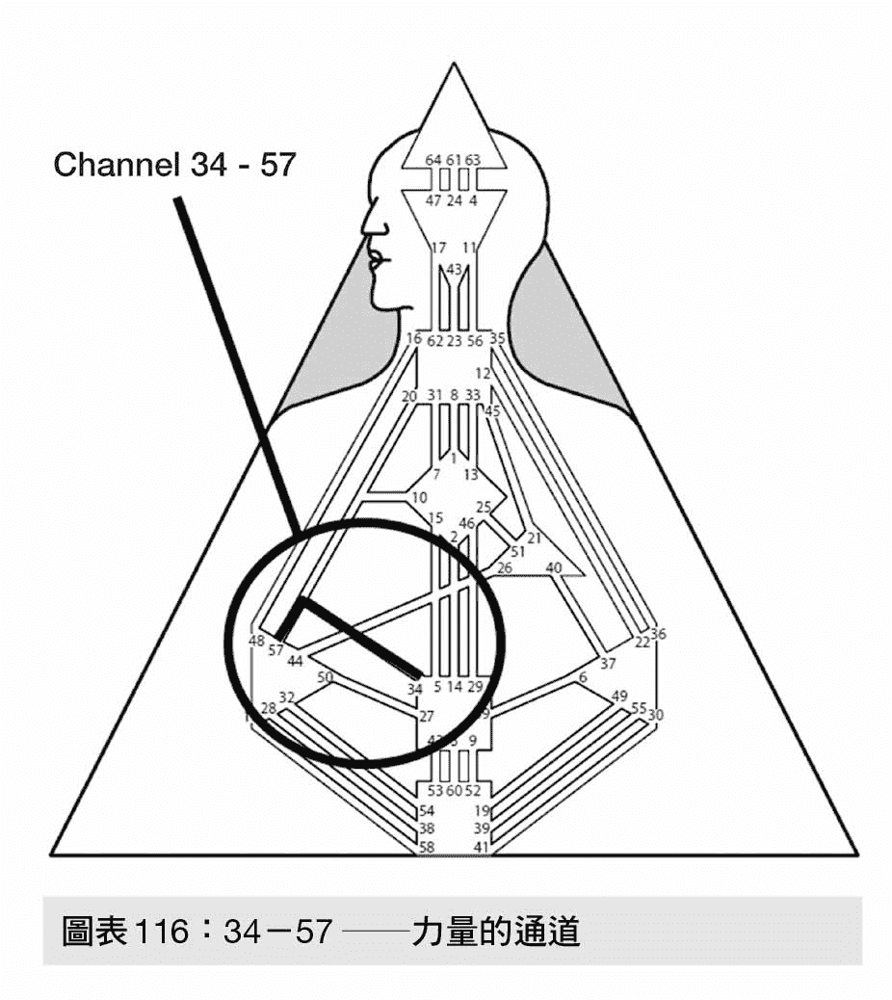

34 号闸门：力量

57 号闸门：直觉洞察力

##### 57－10：完美形式的通道

在人类演进的过程中，「直觉的完美形式」是第二条发展通道。57-10 通道具有知晓如何在当下求存的完美直觉意识。

跟随 57-10 通道的人包准没错，他们永远知道求存之道。他们凭直觉就能知晓逃离灾难最安全的路线，或是跨越障碍的最佳方法。

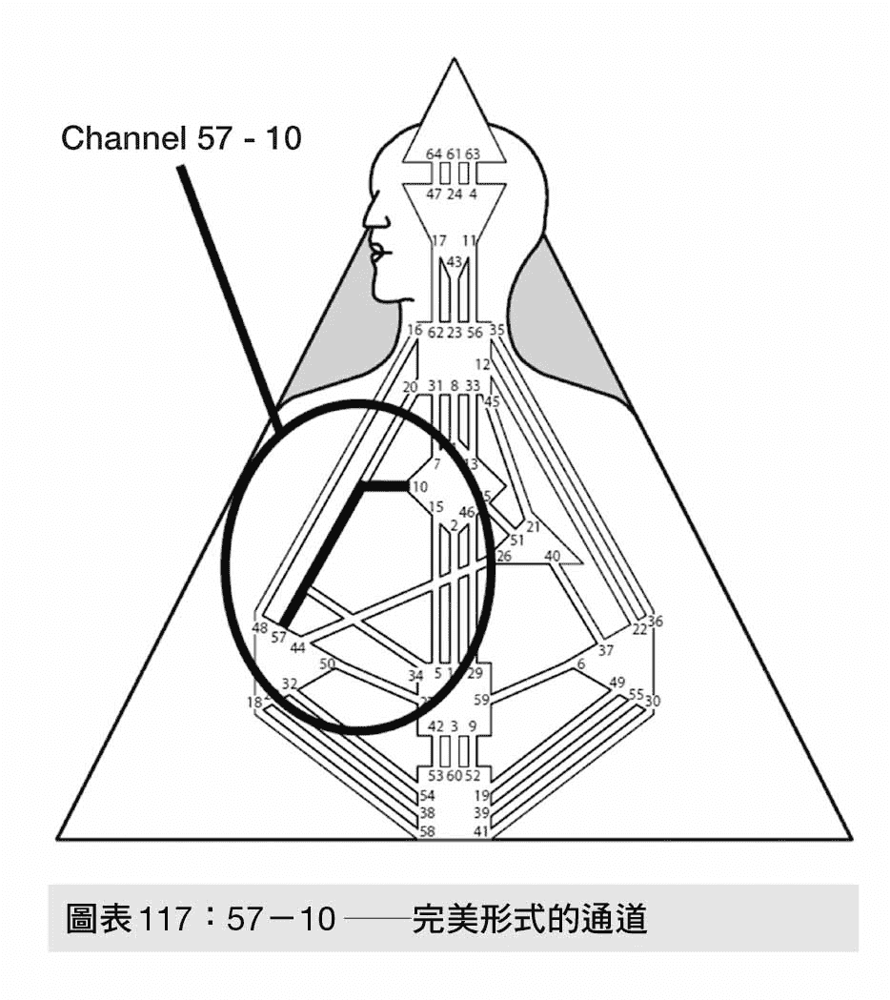

57 号闸门：直觉洞察力

10 号闸门：爱自己

他们是一群完美主义者，当他们认为自己可能会犯错时，便会毫不犹豫地停止采取行动。但这种决定不仅是出于对犯错的恐惧，还包含了想让事物完美的深层渴望，他们凭直觉就能知道如何实现对美的追求。

然而这条通道缺乏动力驱动、未通达喉咙中心，它完全属于投射性质。当 57-10 通道试着主动展现完美时，人们往往只会视若无睹。唯有透过邀请，完美才能得到识别与认可。

此外，由于这是一条极富个人色彩的通道，因此当认可未发生时，伴随而来的是无法实现「完美」的恐惧，导致拥有此能量的人会强烈地责备自我。事实上，他们拥有的是突变性质的能量，因此除非是得到分享的邀请，否则这些主动献与的崭新、独特的完美表现将不具适应能力。

从心灵层面而言，这条通道的闸门能量非常特别。脾中心和生存的能量有关，而这也是我们和其他动物共同享有的能量。然而在 57-10 通道里，我们的直觉与自我能量中心的灵魂相连。我们是唯一天生设定为凭直觉感受自己的灵魂方向、拥有知晓是否实现灵魂使命能力的生物。

拥有 57-10 通道的人能清楚知觉到自己正踏在自我的人生道路上，并常常在人生中担任给予他人力量、让他人能够去探索及实现自我灵魂使命的角色。

##### 34－20：魅力的通道

这是人类图系统中最具影响力的通道，它将持续的生产能量带往喉咙中心。34-20 通道是显示生产者的原型，也是唯一将荐骨中心直接连结至喉咙中心的通道。34-20 通道充满力量和魅力，然而由于它与荐骨中心连结，因此这条通道真正的力量必须透过回应才得以展现。换言之，就算他们拥有极为强大的持续力量，若不做出回应仍无法真正活出充满影响力的天命。若他们主动发起行动，便会陷入巨大困境以及无人响应的结果，进而产生沉重的挫败感。他们深知自己拥有强大的影响力，但除非他们选择回应，否则将难以推动这股能量。

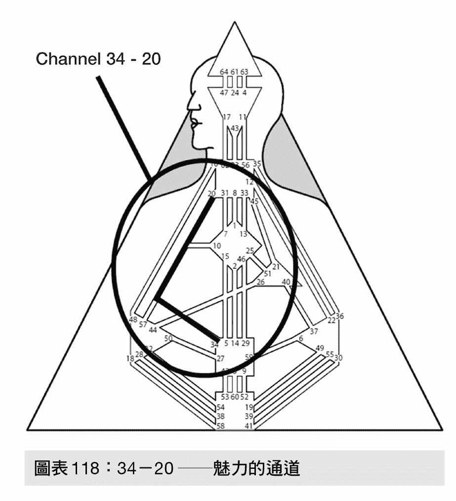

34 号闸门：力量

20 号闸门：蜕变

34-20 通道能量的重大任务是透过回应，将想法转换为行动。的确，由于 34 号闸门藉由 20 号闸门与喉咙中心相连的配置，让拥有 34-20 通道的人一旦受到触发便会亟欲实践行动。人生策略在这部分占有关键要素，若他们缺乏等待，或无法利用自身图表中其他部分的直觉力，他们便会不断追随一个又一个想法，最后让喉咙中心和甲状腺疲惫不堪，却徒劳无功。34-20 通道是成为唐吉轲德的潜在通道，一场又一场忙碌不已的探险旅程，除非受到自身其他能量（通常为 57 号闸门或 43-23 通道）牵引的影响，否则他们甚至会忙着大战风车。

在最早人类祖先演化的过程中，34-20 通道在生存直觉之后发展形成。它是一股为喉咙中心而产出的生命动能，以荐骨中心的行为实践喉咙中心的行动。「执行的能量」在此不仅是基于生存，更是源自持续的生命动力能量。这是有关工作的能量，以确保我们能获得所需、经过时间考验而存活。

##### 20－10：觉醒的通道

20-10 通道是觉醒的通道，也是演化为人类的过程之中最后发展的通道。此通道具有在当下呈现完美自我的能力，也是透过 20 号闸门个性化的极致表现。20-10 通道属于全然的意识投射，拥有此通道能量者极富精神意识、给予力量及爱自己的才能。它往往在给予自我力量和启发的层面扮演导师的角色，不过它的觉知课题只有藉由他人主动提问才得以分享。反之，若他们主动表达自己的觉知，他们往往会遭忽视，甚或被视为吹毛求疵的人物。

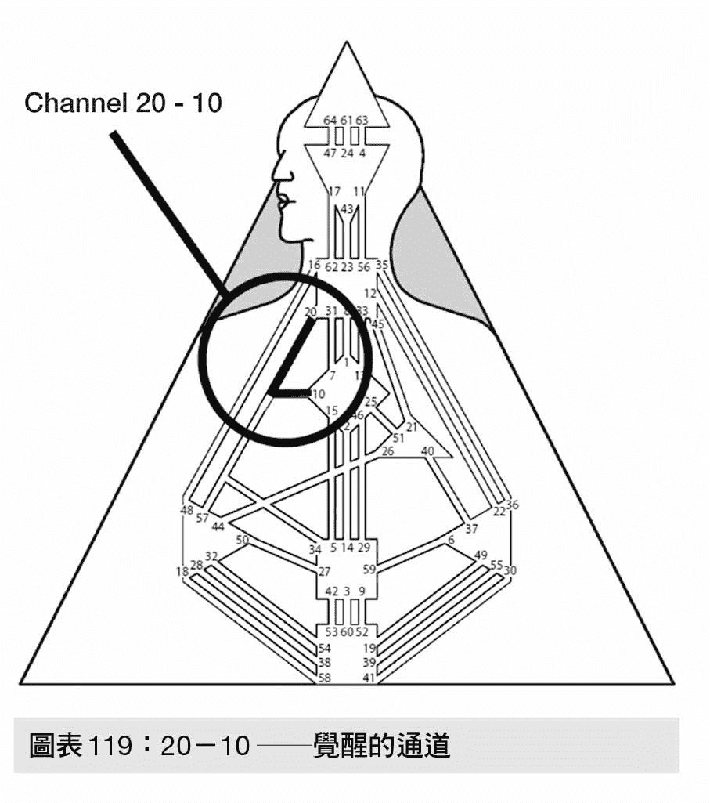

20 号闸门：蜕变

10 号闸门：爱自己

在人际关系中，20-10 通道会以充满挑战性的方式展现。具有 20-10 通道能量配置的人，有时又称作「毒舌杀手」，以话语尖锐和言词恶毒著称。给予力量或丧失力量的语言正存在于 20-10 通道之中。因此若你拥有此能量，请特别留意你的言语力量。

毒舌可能来自于个人的定义能量配置，也可能是透过关系中的电磁引力而产生。无论是哪一种，这都是一股需具备觉察意识的能量，切记这不是个人的问题，而是能量的作用。在关系中，当能量过于强烈致使言语失去控制时，远离彼此的能量场、互相给予空间不失为有所帮助的对策。

若你拥有从自我能量中心至喉咙中心的定义能量，整体而言，你可能会较脆弱，因为声音直接源自你的灵魂位置。若 20-10 通道未等待他人的识别便贸然发言，下场无非是遭受忽视或批评。久而久之，他们便逐渐习惯封闭真实的自我、阻绝自我的创造表现力。学习等待吧！对的人总是会主动征询你的洞见。

此外，20-10 通道也是整合的充分展现。觉知与智慧根源于自我，当你全然活出自我时，便能展现强大无比的力量。透过人生策略学会做自己，20-10 通道也就能赋予他人活出自我的力量。

#### 中央回路（The Centering Circuit）

中央回路是较小的次要回路。虽然它仅有两条通道，却都代表着重要的作用意义。其含纳的三个能量中心，其中有两个为动力中心，即荐骨及意志力能量中心。

中央回路扮演着某种漩涡的角色。当人们被卷入中央回路的能量漩涡时，无论他们本身的能量定义为何，都会受到影响而更能表现其个体性。中央回路是一股突变力量，其最终的目的是激励他人爱自己及活出自我的灵魂，它会运用生命动能（荐骨能量）实现此目标。

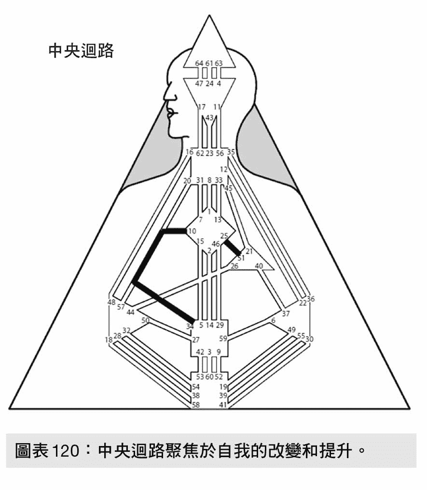

中央回路通道

• 34-10：探索的通道

• 25-51：发起的通道

唯有防护回路的力量能与中央回路的能量场侵入特质抗衡。当这两种回路相遇时，它们会以彼此固有的能量模式相互推进，家族能量会表现得更具个体性，反之亦然。

中央回路并无觉察的潜能，它几乎如同机械运作、面无表情般感受自我经验。无觉察、无表情、无通道连接至喉咙中心，中央回路是一种只能藉由回应分享过程的纯生产回路。

中央回路包含了透过经验和启蒙表现的神祕对话，这些经验会为自我和他人带来冲击，比方像人类图系统便源于这种经由冲击带来的启蒙能量。中央回路仍属于个体人能量，因为它的冲击作用能给予人们力量，也可能让人格格不入，这完全取决于个人的认知角度。

由于意志力中心含纳在中央回路里，因此荐骨需要休息以维持能量。意志力和荐骨联手的奇妙之处，便是你拥有需要休息的持续工作动能。切记，人生策略会保护个体，而带着意志力的荐骨会回应休息的需求。

中央回路也会以其他的方式给予力量，由于它具有爱自己和灵魂的完美表现，也带有触发和持续的特质，因此中央回路不需要以言语说服他人，纯粹藉由存在，就能以能量推动他人爱自己。只要透过回应就能赋予他人爱自己的力量，进而创造改变。

家族能量讲求为了整体福祉做出牺牲，而当属于个体的中央回路介入家族的能量场时，对家族的关怀便会突变为照护自我的特性。

##### 34－10：探索的通道

34 号闸门（力量的闸门）加上 10 号闸门（爱自己的闸门）的组合，创造出象征遵循自己坚定信念的通道。34-10 通道属于全然生产的通道，透过回应才能实现力量的完美形式，拥有此能量者藉由回应就能正确运用他们的力量，或以充满影响力的正确方式行事。34-10 通道是强烈的个体通道，只要做出回应，你就能藉由它的能量作用完美表现。由于它并未和喉咙中心相连，因此不需说服或分享，纯粹藉由存在和回应，就能全然地给予力量。此外，就和所有的个体人回路群相同，他们只要彻底展现自我，就能赋予他人做自己的力量。

在此，我们从整合型回路的人类形体化往前迈向个体化，藉由正确的行为得到无穷的力量。

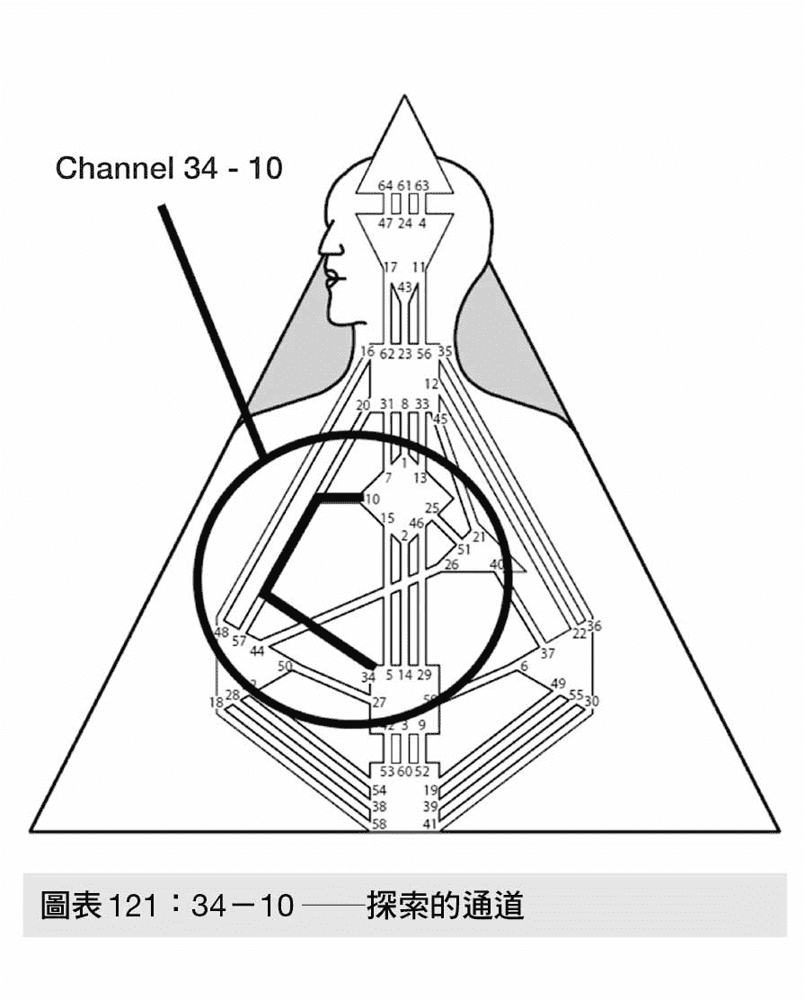

34 号闸门：力量

10 号闸门：爱自己

##### 25－51：发起的通道

25-51 通道充满神祕。它完全属于投射性质，你不需要做任何事就能得到引领，生命自会给予你起始点。

25-51 通道的发起是基于意志力，它的意志力不同于我们的传统认知，而是保有在发起行动后仍屹立不摇的意志。发起充满了冲击、剧烈的人生变动及未知。然而，在此的发起行为总是让个体更接近灵魂。

我们有时会称 25-51 通道为巫师或女祭司的通道。他们在融入自身的智慧之前，必须先做到完全的忠于自我。这种能量的原型设计便蕴藏在此通道之中。

从较实际的层面而言，25-51 通道极具竞争意识（或反之）。请记得，在人类图中，能量是具有主题关联性的。也就是说，拥有此定义能量的人会在他人之间引发竞争，但他们自己却未必怀抱竞争心态。事实上，他们有时完全不带求胜心，但其他人却会与之竞争。

25-51 通道单纯地藉由在能量场域、奥妙的几何安排中展现自我，便会散发发起的能量，他人进而会增强这股能量。他们不需要寻求发起，别忘了它属于投射性质，因此寻找必不可得。发起的能量将主动迎向他们、给予他们深入灵魂（或苦涩……等，毕竟这是投射能量）的冲击力道。

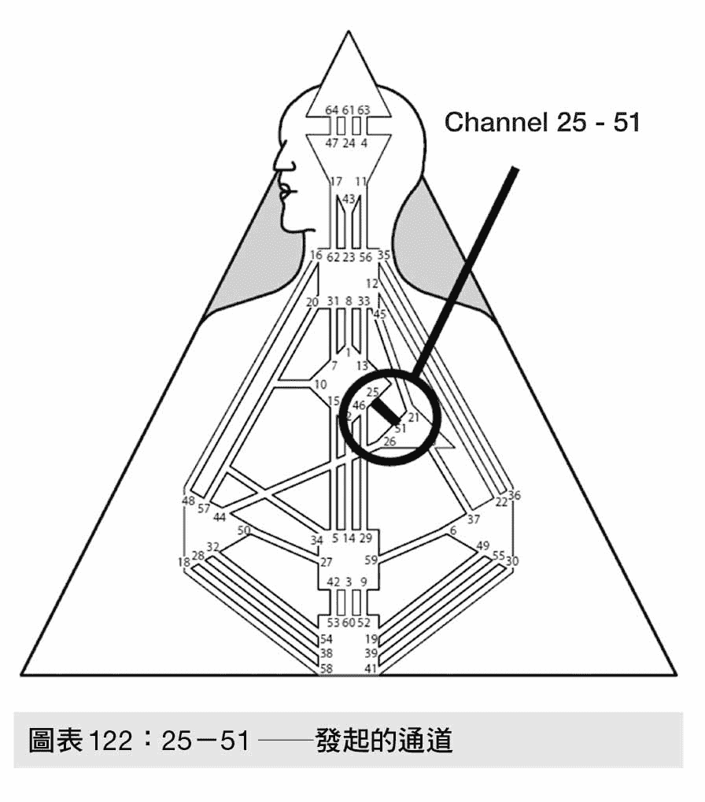

25 号闸门：灵魂之爱

51 号闸门：冲击

#### 觉知回路（The Knowing Circuit）

觉知回路是个体人回路群中最后一组回路。此外，不同于整合型及中央回路的经验方式，觉知回路是唯一用于传达和实践的回路。它在正确时机为家族及社会带来改变。

「时机」是觉知回路的关键要素。在此我们能发现两个和时间有关的能量中心，一是关于此时此刻和在正确时机采取适当行动的脾中心，以及需要时间得到澄明再予以表现的情绪中心。

觉知回路也具有奋斗挣扎的特质，突变必须设法在家族或社会中造成全面的影响。你不妨试想，若没有经过努力开创意义的过程，我们的周遭将充斥无法带给人类助益、杂乱无用，甚或是危险的改变。（就生物学的层面而言，假想某世界存在着许多十五只脚、十二只眼睛的怪异青蛙，而牠们这些多余的部位和器官绝大多数都是无用的，长久下来甚至会危害青蛙这个物种的健康。）真正重要及有价值的改变必须奋力与现状对抗，以证明它的有效性。

时机与奋斗确实是觉知回路重要的一部分，对拥有许多此回路能量的人而言，我们不难想象他们会面临到的挑战。你必须怀抱信任、等待对的时间分享你的所知。如此你会被众人视为充满创造力的天才，反之则将处于不被理解的困境。

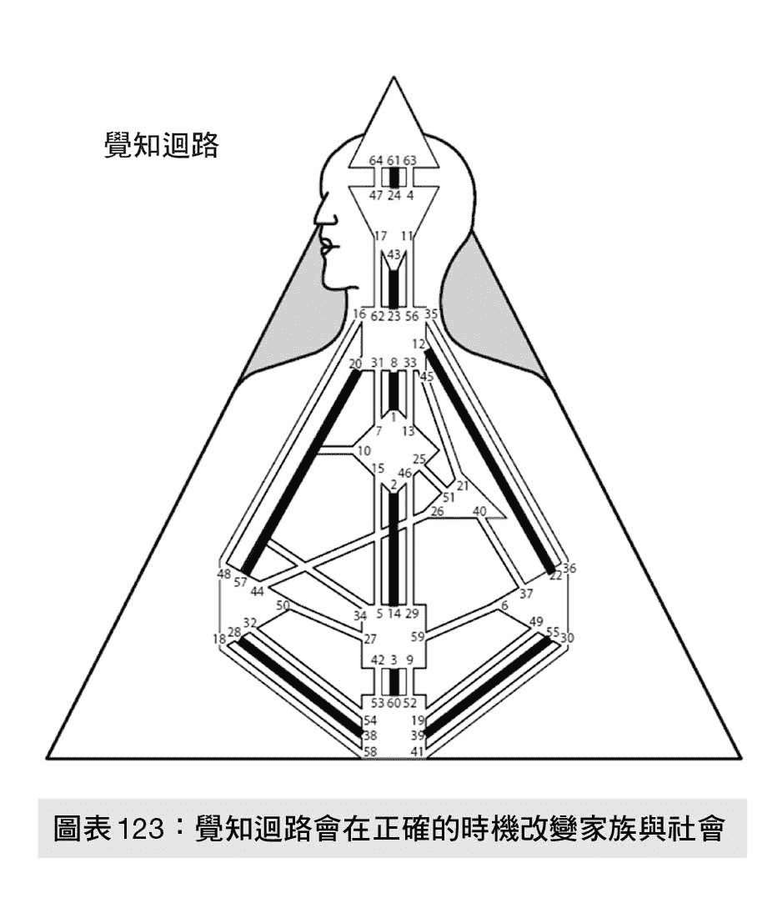

觉知回路通道

• 61-24：觉察的通道

• 43-23：架构的通道

• 28-38：困顿挣扎的通道

• 57-20：脑波的通道

• 3-60：突变的通道

• 14-2：脉动的通道

• 1-8：启发的通道

• 55-39：情绪的通道

• 12-22：开放的通道

觉知回路的能量并不具逻辑或全面的特质，它只是纯粹的「知道」，没来由般地「知道」。若某人拥有许多觉知回路及逻辑回路的定义能量，这种能量组合会产生怀疑的能量类型，进而让某人掉入巨大的自我怀疑之中，直到他了解自己的能量配置才得以解脱。

觉知回路不仅会面临怀疑的挑战，如同所有的个体人回路一样，它也努力让自己被听见、被理解。若你此生的使命是分享那些你「知道」但却不具逻辑性、人们从未听说过、也无典范可套用的事物，那么你便不难体会这有多困难，且得到理解对觉知回路而言，又代表多么深刻的意义！这段经验会让人饱尝忧郁的滋味，而情绪与忧郁正是觉知回路的关键字。

幸好，觉知回路里内建了某种不在乎的机制。这并不是指个体人没有给予爱的能力，假若某一个体人拥有许多家族能量，那么他便会亟欲与外界连结、设法分享。不过个体人天生的设计未必拥有滋养的特质，他有时甚至会迷失在自我的突变想法中，某种程度上对他人的看法并不以为意。当然了，这些情况仍取决于图表中其他定义能量的配置。

被听见、等待对的时机、对的言语（或相反情况）是觉知回路的挑战之一，另一项挑战则是聆听。觉知回路大多作用于内部，因此很容易让人在自我的想法、洞见和感受里迷失。所以当其他人试着要与这股能量连结时，可能会感到挫折。请记住，「不理不睬」并非故意忽视，而是某人全然沉浸于思考和感受的征兆。若你身边爱的人拥有许多觉知回路的能量，当你希望得到他的注意力时，不妨试着碰触他们的身体，他们的「充耳不闻」绝非个人的状况。

此外，旁人能与觉知回路者分享最有力的讯息，便是欣赏及重视他们的独特性。觉知回路者此生的使命在于展现自己的与众不同。在演化的机制中，并非所有的突变都具有适应性。然而个体人表现出独一无二的自我时，正是完美的展现，假若他们尝试成为非自己，必然会引发种种难题。

##### 61－24：觉察的通道

61-24 通道是觉知回路中的发起通道。觉知回路的发起能量起始于头脑中心的灵感。61 号闸门（与 63 及 64 号闸门并列）是疯狂的闸门之一，其「疯狂」源自持续不断地问「为什么？」，进而透过「觉知」（毫无证明或逻辑可言，灵光乍现般的意识）引发灵感。

24 号闸门会锻鍊这些觉知、聚焦于可行的概念，甚或填补 61 号闸门在觉知上跃过的间隙。和 61 号闸门相比，24 号闸门天生对「时间」及「等待」拥有较强烈的意识。

思考之于此通道就象是一种运动。想法则如同波浪般涌动，就像情绪能量中心里情绪运作的方式。61-24 通道延伸意识、了解未知，而此种意识的特质既神祕且深奥。

这是独特且新颖的突变思考。由于所有的突变最终必须禁得起时间和反覆测试的考验，因此它属于一种必须等待正确时机的觉知。简言之，这是一股必须得到他人识别或邀请的能量，而它拥有的觉知则需要等待邀请以迎来正确的时机。

如同所有的个体人回路，61-24 通道极富听觉力。他们往往拥有深刻的内在听觉程序，脑袋里也彷彿装有许多声响或声音。虽然此种如圣坛功用的脑袋很难被视为与众不同，但拥有 61-24 通道的人应学习欣赏与赞颂个体的独特性，并将时机交付宇宙安排。

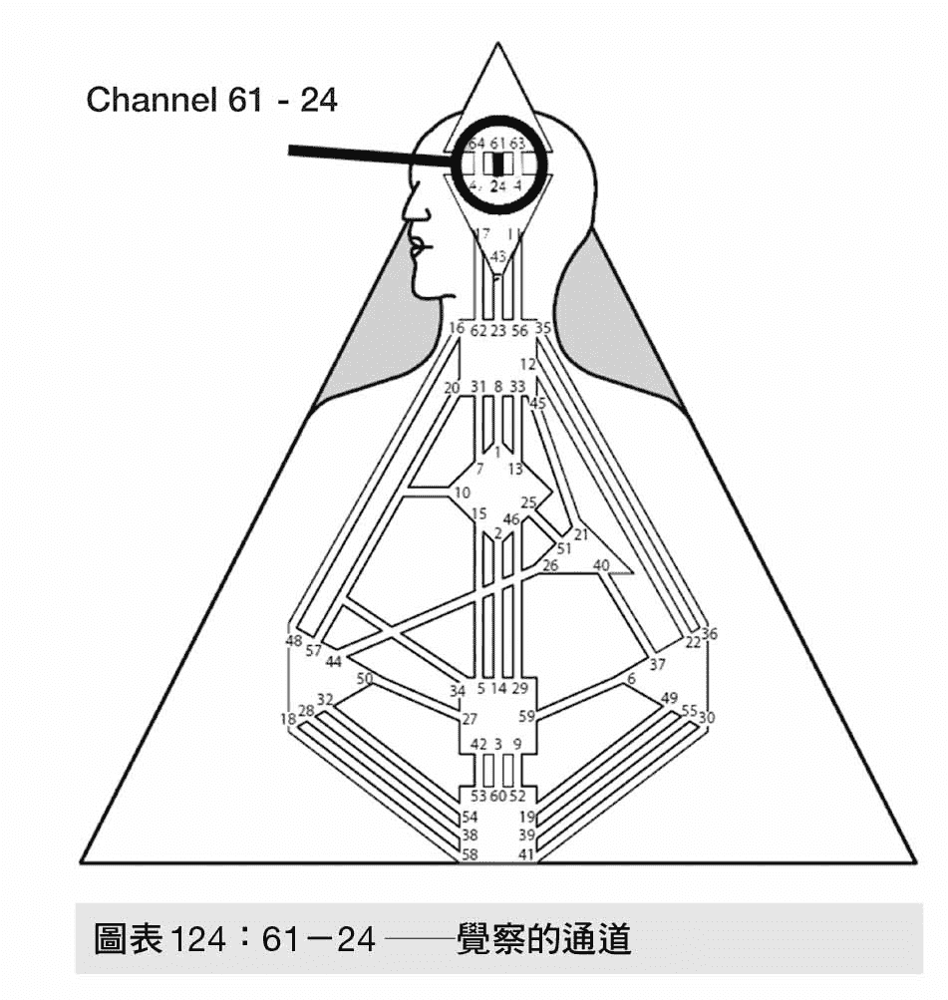

61 号闸门：神祕

24 号闸门：合理化

##### 43－23：架构的通道

43 号闸门是将觉知回路的内在听觉过程，转化为言语的起始能量。因此 43-23 通道是觉知回路的首要表现通道，它具有将个体听觉过程转变为语言的潜能。那些声响及沉默的思考，推进至 43-23 通道并被赋予语言，拥有此能量者最常挂在嘴边的话语就是「我知道……我知道……」

个体觉知过程的困难之处是将洞见转变为语言。觉知是顷刻发生、意识的突然顿悟。当个体未得到认可或邀请就将此觉知脱口而出，便会面临很难清楚表达或被理解的困境。

拥有 43-23 通道能量的人有效发挥自我觉知，及其改变作用的方法便是等待对的时机，让他人主动征询所知。倘若他们不加等待，便有可能在错的时间表现，进而得到不被理解的感受。

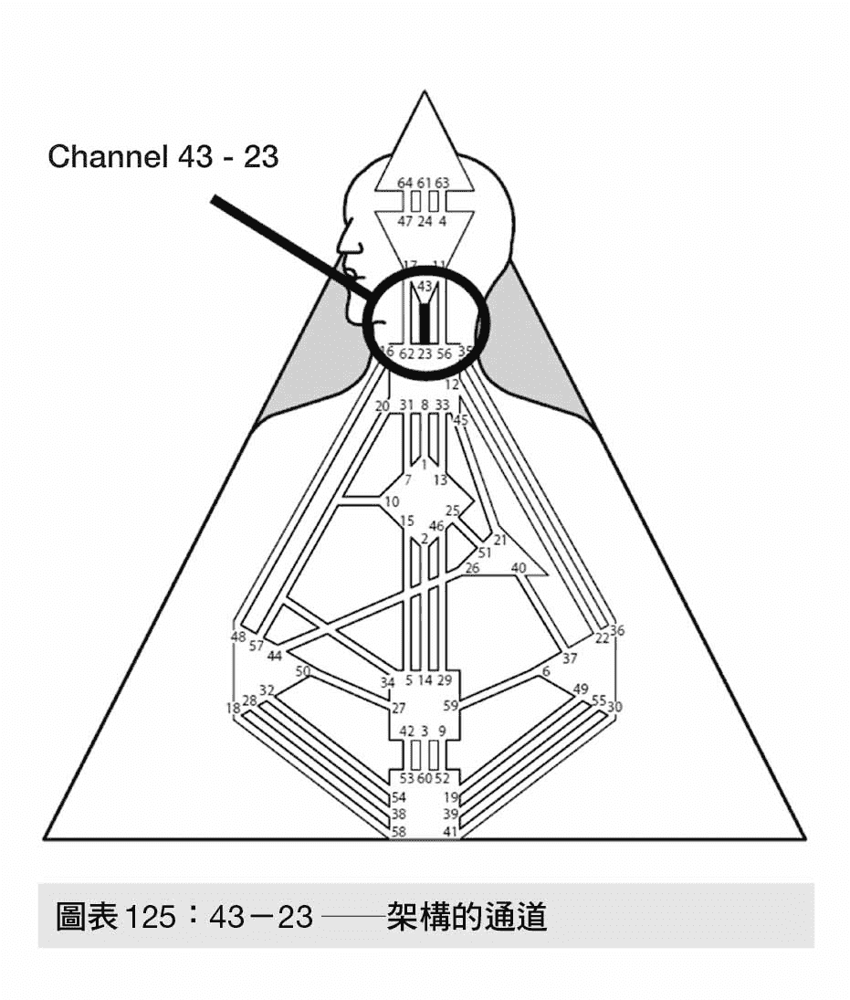

43 号闸门：洞见

23 号闸门：同化

等待他人的辨识及邀请分享智慧与洞见，是拥有 43-23 通道者务必要铭记在心的关键。等待的过程也许会让你感到沮丧，然而等待绝对值得！因为它最终能让你免去许多个人痛苦和遭受拒绝的情况。

当今社会极度重视逻辑，逻辑讲求对觉知采系统化的方法检验。这种方式对 43-23 通道而言特别不易，他们的想法如天外飞来一笔，他们也不清楚这些想法从何而来。对拥有 43-23 通道的孩童来说，有时在学校里要解释自己的想法来源与脉络简直是一大难题。他们必须学会好好珍惜自己的知识，等待对的人邀请他们表达所知。

如同所有的个体人通道一样，43-23 通道深具听觉力，并藉由聆听能发挥最佳的学习效果。不过要留意的是，它的聆听方式往往偏于自我导向，只想听见自己想听的声音。一旦他们专注于聆听某事物，便可能会迷失在自己的想法之中。

我们有时会称 43-23 通道为「充耳不闻」的通道，这并非指他们无法听取旁人的话语，而是他们可能会深陷自己的想法，因此让外在世界的声响如同消音般不存在。若要引起注意，充满爱的温柔碰触通常是拉回他们注意力的必要手段。

的确，他们此生的目的是为世界带来改变。人们对此通道者最崇高的礼遇便是邀请他们分享所知，并给予他们思考的时间与空间。他们喜爱思考，也需要思考。

请记住，头脑和逻辑能量中心并不是做决定的所在。它们不具动力引擎，只有纯粹的觉察和想法。而生命是依据更多不同的觉察为基础来运作。

##### 28－38：困顿挣扎的通道

困顿挣扎的通道属于需要大量觉察的能量，拥有 28-38 通道能量者务必要理解一件事，困顿挣扎是每个人在人生中某些特定时刻必然会面临到的境况，它并不代表你搞砸、做错了某事，或你总是走在艰难的道路上。

28-38 通道的困顿能量与进化的可能性息息相关，拥有 28-38 通道的人最终目的便是演化。然而，每一种改变或突变都必须面对阻力，以充分检验和确认在个人层面上（最后推广至社会层面）是有益的改变。

28-38 通道的第一个困顿是「反覆试验」，以察看哪些事物具有适应性、哪些则否。请记住，28-38 通道的个人困顿是为了更广大的利益与福祉而产生。

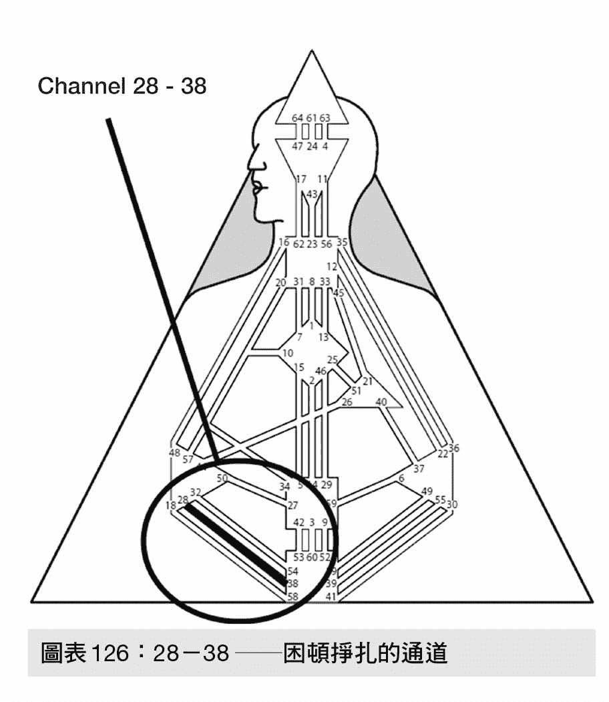

28 号闸门：挣扎

38 号闸门：战士

它的第二个困顿是努力「为人生的意义奋斗」，你不知道自己的努力是否值得，但你知道忍耐和磨练是实现意义的必要条件。有时候这会让他们从年少开始便追寻人生的意义，直到他们找到人生的价值为止。

当他们学会了关于生存和人生价值的课题时，他们也乐于与他人分享。许多谘商师、治疗师及励志讲师都会分享他们自身奋斗挣扎的故事，目的是帮助他人转变和接纳人生的真正价值。

若拥有此通道能量者不明白当中能量运作的特性，有时会经验到浓烈的苦涩感。他们必须懂得等待识别或邀请，以投入正确的奋斗，否则他们只会忙于经历一场又一场奋战与挣扎。

正确的奋斗之路也许布满荆棘，但终究值得你奋力争取。当 28-38 通道得到分享洞见的邀请，就能让个体人回路超越个人。「邀请」有助于他们分享人生的真正价值，最终促使个体追寻自我的意义。这股能量若彻底展现，它会热爱挑战。毕竟，轻松的道路太乏味也无意义。

##### 57－20：脑波的通道

57 号与 20 号闸门各自在不同的回路之中，这让 57-20 通道的组合配置有些复杂。与其他回路相较，这两种能量在觉知回路里的作用大不相同。

57-20 通道是连结至喉咙中心的全然直觉。它的觉察充满敏锐洞察力，且具有与脾脏相关、讲求当下的特性。当他们发表意见时，其言语是出自直觉和对未来事物的感知。

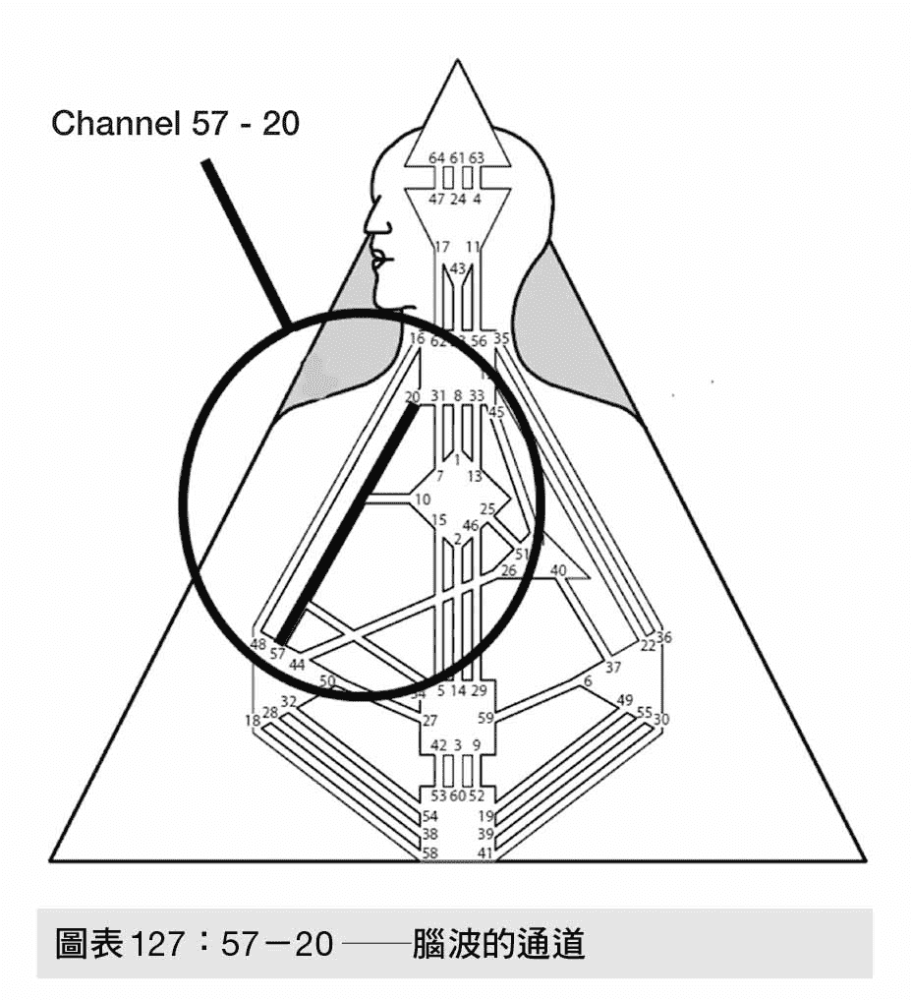

57 号闸门：直觉洞察力

20 号闸门：蜕变

一般来说，个体能量并不具有关怀的特质，是与自我及自我经验相关的能量。但在觉知回路中，我们能发现这种个体能量不同的潜在可能性。从根部中心至脾中心，再到喉咙中心的能量流中，57-20 通道统合了具有适当技能的人，以表达那些真正有价值的事物。

换句话说，28-38 困顿挣扎的通道探索出人生的价值，迫使 57-20 通道脱离个体性、转换为关怀的能量，57-20 通道拥有以表达价值为名、号召人们聚合的能力。

若他们等待邀请，再分享自己的洞见与贡献，往往就能成绩斐然。

##### 3－60：突变的通道

就基因层面而言，3-60 通道是相当重要的通道，拥有为世界带来改变的强大能力。3-60 通道的设计能让荐骨的回应充满突变特质，当它的能量开启时，便会对改变或突变做出回应。

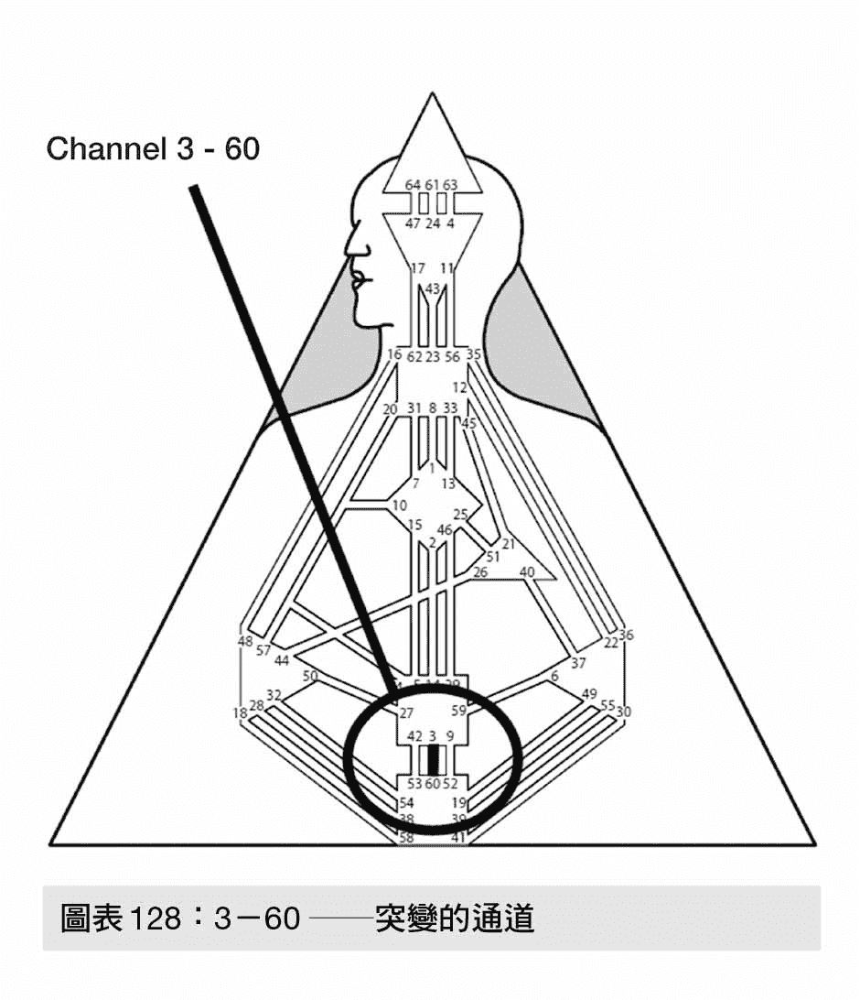

3 号闸门：秩序

30 号闸门：接受

60 号闸门限制本身电磁扩张的特质，而若突变可行且具可适应性，3 号闸门就会回应。

3-60 通道是三种组织能量（format energy）之一。组织能量以时开时关、如脉搏跳动的方式运作，并会刺激荐骨的能量。当这些组织能量开启时，便充满了强大影响力、生气蓬勃、准备好完成任务。当这些能量关闭时，根部中心的肾上腺能量及荐骨中心的生命动能彷彿冻结般，任务也就很难完成了。对拥有此能量的人而言较遗憾的是，就算能量关闭他们往往仍必须继续工作。

3-60 通道回应具有突变性的工作和繁衍机会。纯粹从基因的角度而言，3-60 通道是和基因突变有关的通道；当两道闸门的能量聚合、繁衍出后代，新的生命将带来新的能量与基因物质。

就工作层面而论，3-60 通道的能量脉动会回应具有质变及突变性质的工作。拥有此能量的人往往必须（或渴望）从事不平凡、能为世界带来改变的职务。

如同所有的突变通道，3-60 通道包含了扩张，进而产生阻力的能量。3 号闸门向外延伸、带来改变，60 号闸门则将改变与旧有的基因物质整合为一体，使突变趋于稳定。

##### 14－2：脉动的通道

从某种程度上来说，14-2 通道是人体图中所有能量里的幸运儿。它和生产及管理资源有关（所谓资源，除了一般所指的金钱，还包括与财富相关的所有事物）。

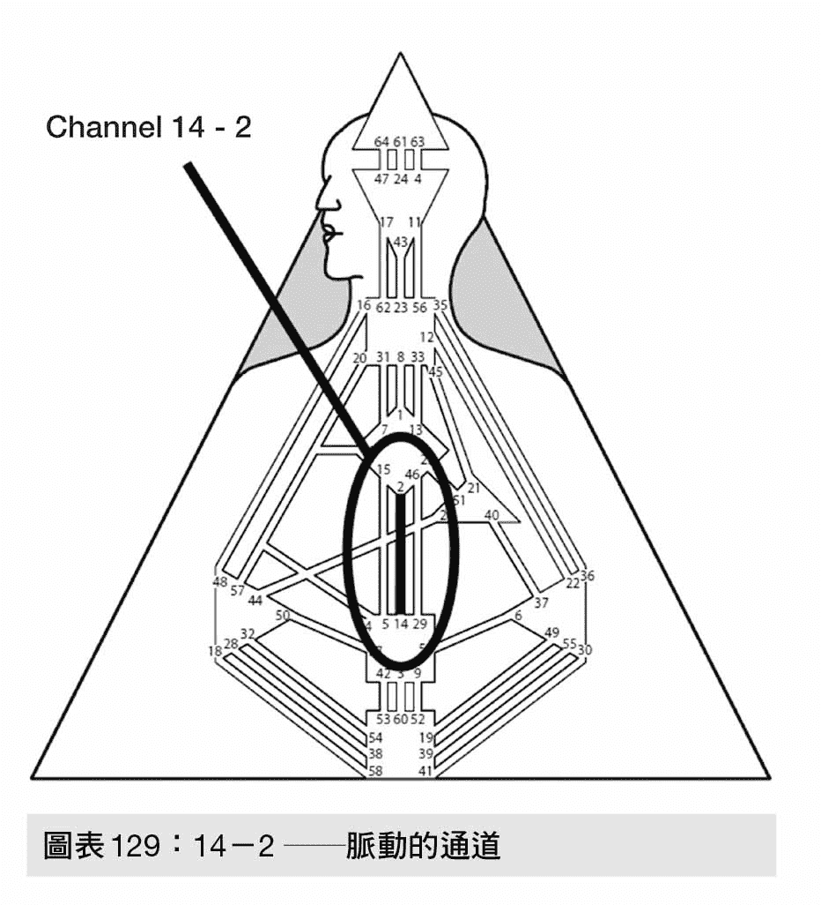

14 号闸门：权力技能

2 号闸门：钥匙掌管人

14-2 通道的运作是为了提供灵魂的方向动能（连结荐骨至自我中心），它会回应能带来资源且具突变性质的工作或人生机会，好让灵魂旅程变得更加顺遂。假若你拥有资源且无金钱的后顾之忧，你也就能更轻松地追随你的人生道路。

14-2 通道包含了工作以赚取金钱的能量，及管理和分配钱财的能量。当这两股能量携手运作，便会带来生产资源的极佳机会。就个别能量而言，14 号闸门辛勤工作，赚取及积蓄金钱，而 2 号闸门则是使用及花费这些钱财。

14-2 通道是属于那些真正能为世界带来影响的个体所有，「鹤立鸡群」的方式便是拥有金钱，因为金钱能带给你影响的权力，也能让你免于身为「与众不同」者的某种痛苦。

请记住，14-2 通道是一条生产者的通道。唯有透过回应，它的能量才具有强大的影响力和突变性。而也正是藉由回应，对的工作才能出现、带来改变。

##### 1－8：启发的通道

1-8 通道根源于自我能量中心的灵魂方向，与荐骨能量中心的生命动能。它是充满阳爻能量的突变表现力，因此也承受着为世界带来创造贡献的压力。

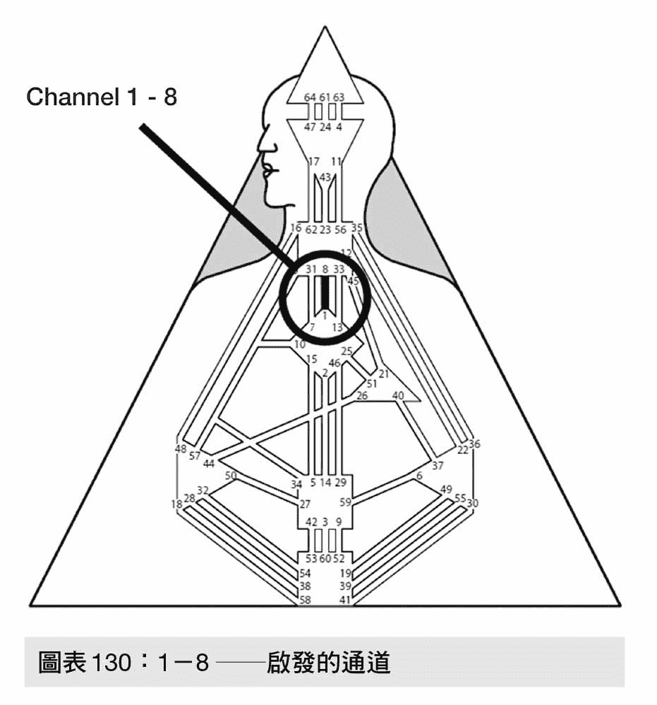

1 号闸门：自我表现

8 号闸门：贡献

1-8 通道的灵感来自于灵魂，它的言语是自我的反映，同时也具有某种脆弱性。渴望真正的自我被接纳，也希望做出的贡献得到认可，若不得便会压抑自己的贡献欲望。

这是一股投射能量，除非得到认可或邀请，否则其贡献的改变不具影响力。若 1-8 通道与动力中心相连，会较有机会被听见，但同样仍带有脆弱的特质。

拥有此通道能量的人启发能力强，他们此生的目的是成为创造力的模范。虽然他们的贡献未必具有完全的突变性，但若创造力的模范角色充分展现，他们便能激励他人，进而促成世界的改变。

1-8 通道必须培养沟通技巧，以便被正确地认可，但这对个体人的特质来说并不是一件容易的事。作为改变的媒介，挑战便在于「清楚表达」新的典范，唯有当你得到他人认可，方能实现这条通道所代表关于「表现自己」的主题。

若 1-8 通道未等待正确的认可，便会面临分享出内心深处的真理，却得不到他人珍惜或聆听的风险。

##### 55－39：情绪的通道

55-39 通道是强烈的情感能量，能体验到极高的情绪高峰、极低的情绪低谷。当情绪对了，它就是一股创造动力，透过音乐、诗歌和其他创作载体表现的能量。

创造能量拥有两种截然不同的循环周期。55-39 通道有时会受到让人感受忧郁的内在创造循环干扰，也会经历到欢乐愉快、流露情感的外在创造循环。对创造过程而言，这两种循环都至关重要。

55-39 通道能量的挑战是理解「创造循环」的特质，当这股能量处在内在循环的低点时，人们会感觉自己沮丧万分或「哪根筋不对了」。然而，一旦你的头脑纠结于自己的创造循环时，你就会因为过度思索忧郁情绪，反而让自己陷入沮丧的泥淖。

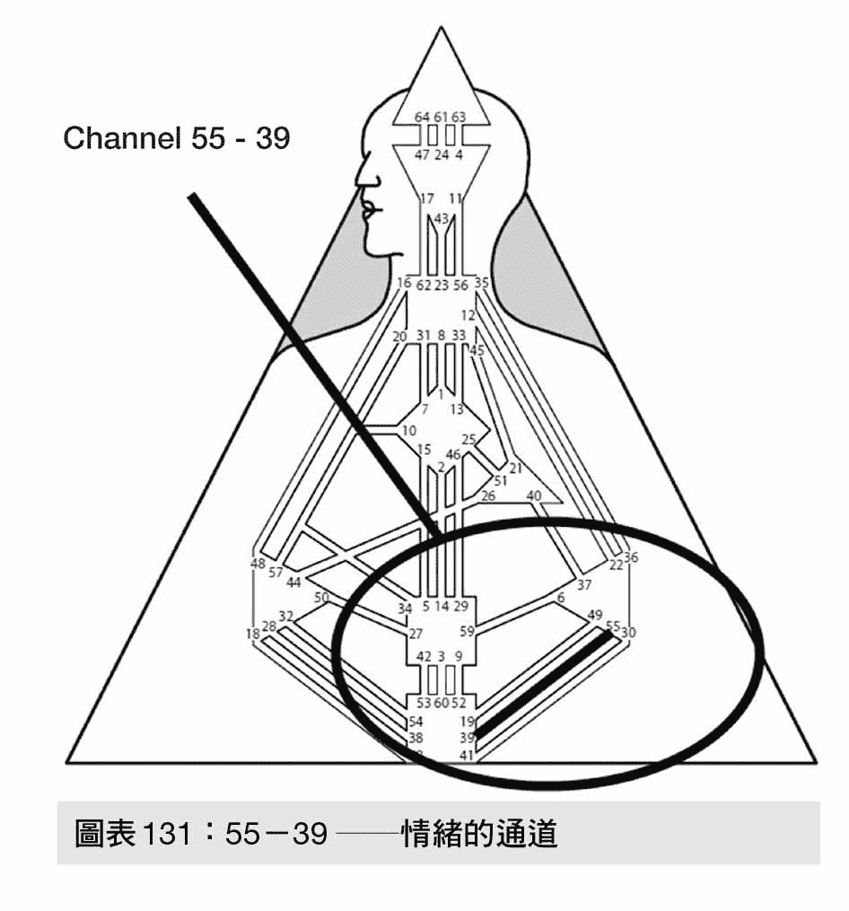

55 号闸门：精神

39 号闸门：挑衅

由于 55-39 通道属于情感能量，恰当的情绪和正确的时机表达非常重要。只有当时机和情绪都对了，这股创造能量的突变特性才得以被分享和采纳。假若情绪时机不对，大量的紧张情绪会逐渐累积和增强，因此能量的表现不是遭受忽视、具负面挑衅意味，就是充满自我毁灭。

55-39 通道离喉咙中心有一段距离，所以得依赖他人决定正确的时机。也就是说，拥有此通道能量者在分享自身创造力之前，务必要等待他人的识别。而这种情况会更进一步引发挫败感或忧郁，让他们经常感觉到自己的创作表现彷彿乏人问津。

就灵性层面而言，55-39 通道和「缺乏」及「丰盛」有关。在突变类型的回路中，每一条通道都具有推拉动能，即能量的相互制衡系统，以确保某突变是有益的。55 号闸门深具丰盛的神祕潜能，而 39 号闸门则会回应和缺乏、低价好商品及贮存相关的潜在能量。

由于丰盛和食物往往紧密相连，而 55-39 通道又与情绪密切相关，因此这条通道有时会让人面临由情绪引发饮食失调的挑战，试着对此种倾向保持觉察，就能帮助你破除因情绪变化而带来暴饮暴食的行为模式。

55-39 通道的目的是让人们恢复盈满丰盛的感受。这条通道不仅极富情感及创造力，也具有相当的挑衅特质。它的挑衅在于破除紧张和现状，唤醒人们对精神为万事万物源头的意识，当 55-39 通道处于对的情绪时，便是一股如同炼金术般神奇的能量。

##### 12－22：开放的通道

12-22 通道是唯一一条个体人显示类型通道（动力中心与喉咙中心相连），它具有强烈的情绪能量，必须等待对的情绪到来再发言。12-22 通道的主题是自我表达，拥有此通道能量的人能侃侃而谈自己的感受、创造表现及自我的独特点，但只有当他们的情绪处在乐于如此的时候才得以展现。

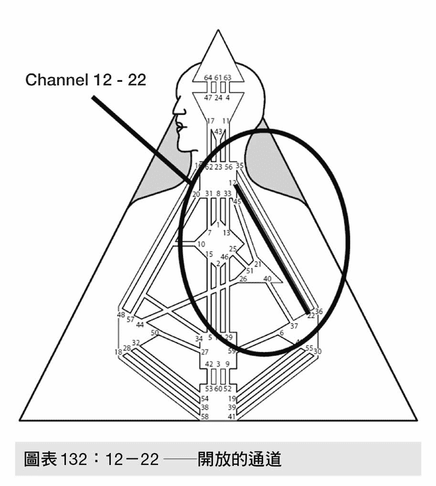

12 号闸门：谨慎

22 号闸门：开放

若处在对的情绪，这股能量便能被听见，且具有改变的特质。反之，当他们处在不对的情绪却仍试图沟通，便往往会面临愤怒的情态。12-22 通道潜藏着许多愤怒因子。

然而，12-22 通道也充满了优雅与魅力的特质。它的设计功用在于等待对的情绪到来，接着它便能以热情、美丽、优雅的姿态表达和展现自我，更重要的是，能带给周遭人深刻的影响。

个体人发展过程的主题是「清楚说明」，个体人会设法明确表达自我、崭新与独特的事物。然而若尚未存在可用于说服与证明的典范，便很难带来改变。

综观个体人的发展过程，我们能发现，「正确的时机」是产生恰当突变的关键要素。但对 12-22 通道而言，这似乎更加困难，因为它的动力中心直接连结至喉咙中心。12-22 通道是具有情绪高低起伏的强烈能量，有时它很难让人停下脚步等待后再表达自我。

12-22 通道也具有害羞的特质，这是某种隐蔽特质的害羞，人们很难察觉某个个体内心深处藏有这些隐密角落，其害羞根源于不断地为表达自我而努力的过程。12-22 通道也常会产生「选择性聆听」或「有口难言」等听觉和口说困难的情况。

此外，音乐、诗歌及其他热烈激情的创作力也蕴藏在此通道中，12-22 通道者可谓相当浪漫、充满魅力的人种。然而仍需切记，「时机」是 12-22 通道所有作用的关键。

就灵性层面而言，12-22 通道的能量也能将声音与超意识连结。个体人有时是纯然地为宇宙发声、发挥自身通道的作用。宇宙始终寻求扩张，而个体人在其中扮演着首要的信差角色。

### 第八章

## 家族人回路群

家族人回路群和爱、连结及滋养有关。它具有创造资源、持续滋养，及发动战争（若有必要）的能量。家族人回路群包含了「防护回路」及「意志力回路」，它们将有助于你了解你是如何爱、以及又该如何运作。

#### 防护回路（The Defense Circuit）

防护回路是维持世上生命的能量。性、与人的关系联结、扶养孩子、战斗及防护的实际行为，都根源于防护回路。此外为家族提供资源、价值观、规则、律法、责任、炊食也都属于防护回路的范畴。

防护回路是将家人与家族凝结在一起的黏着剂，也是人类图表中，爱的所在位置之一。防护回路的爱充满了炽烈和强大作用的特性，它能赋予母亲如超人般的能耐，也能让人奋勇争战。

在此也包含了性爱、性占有及所有与性及繁衍相关规则的能量。防护回路的能量让我们明白，性爱包括了产生生命与死亡的后果，必须深思熟虑再涉入。

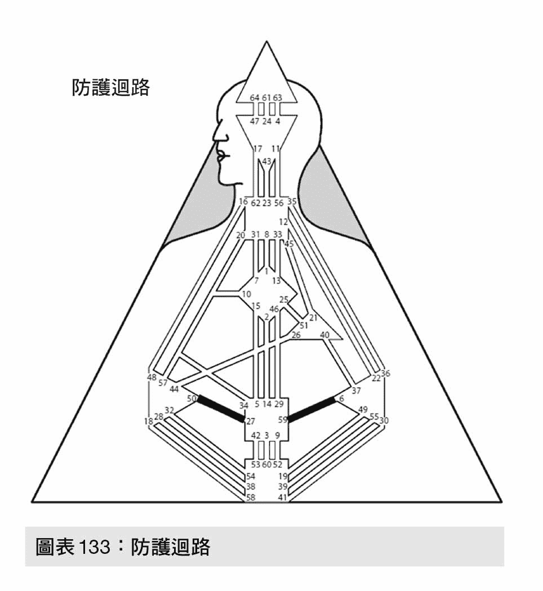

防护回路通道

• 59-6：繁育的通道

• 50-27：保存的通道

防护回路的动能中心是荐骨及情绪中心，皆属于生产回路。同时也具有持续的特性（也必须如此），扶养孩子需要持续的能量，你不能突然就撒手不管，否则孩子会有生存的危险，在此产生的爱也代表持续的一部分。以爱之名，我们持续地奉献于扶养照护孩子，真切盼望他们平安长大。

在防护回路中，我们也能发现与爱截然相反的战争能量。资源及家族必须受到保护与防卫，出于防护回路能量的战争行为，事实上是爱的伟大行动。战士为了家族更大的福祉，而不惜放弃自己的生命力量。然而就如同性的作用，战争能量需要我们谨慎以对，因为它会产生改变人生的后果。

防护回路里的所有一切都是为了家族，这里没有个体特性、也没有促进整体人类良善的巨大渴望。防护回路不在乎外在世界的发展，它只希望家族平安、丰衣足食、快乐、能得到良好教育就足够。

防护回路的能量具有强大的影响力，他们能侵入人们的能量场，处在防护能量之中，你会被迫褪去任何你拥有的个体能量且不得不遵从。它彷彿让每个人置身在祖母家的餐桌旁，你的举止表现必须守规矩：摘下你的耳环、遮掩你的刺青……当一个中规中矩的「正常」人。这就是家族的规则，防护回路的口头禅是「入境随俗吧」。

##### 59－6：繁育的通道

59-6 通道是阳性能量的原型。它具有提供资源、战争和性的能量。

59 号闸门若是缺少了 6 号闸门便较不具情绪性，它会放眼当下、自主自发。

然而，就 59-6 通道而言，它仍具有情绪特质，需要经过时间沉淀以达到澄明。也就是说，决定发动战争前，需要一段时间彻底地厘清问题，若不待思绪清明，当下就开战，鲁莽的行动便会产生致命的毁灭结果。

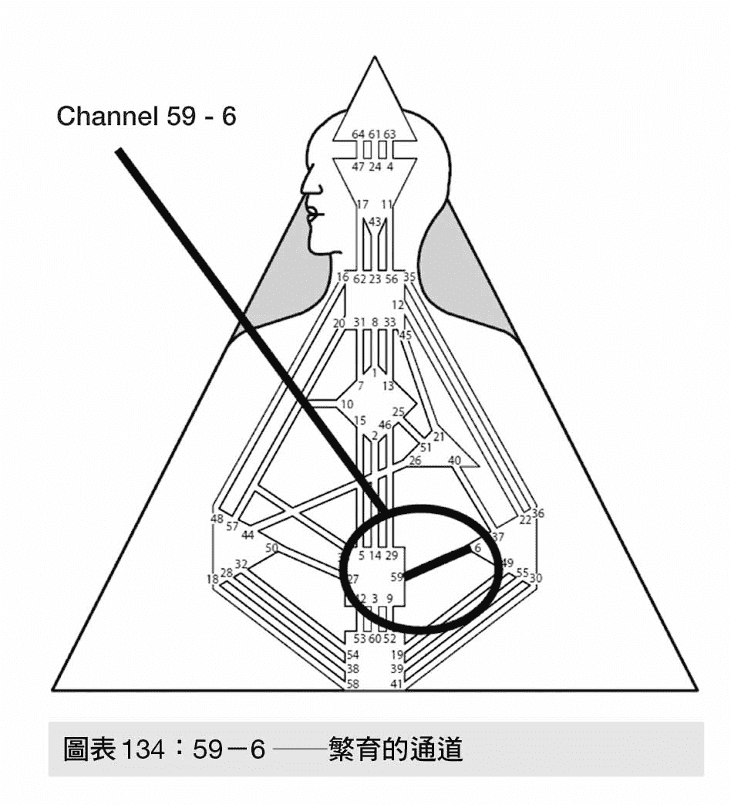

59 号闸门：性

6 号闸门：摩擦

同样的道理也适用于性欲。性，就其作用本质而言，不该是冲动自发的行为。它是需要经过时间以获得明确答案的行动，性产生的结果由家族的价值观掌理。脱离家族规范或未经远虑思考便发生的性行为，会对整个家族产生巨大的影响。试想某青少年男女偷尝禁果而怀孕，最后祖母和阿姨等人必须养育产下的新生儿这种情况。

诚如你所见，若你未等待情绪澄明的到来，性和战争的性质会变得非常棘手。性与战争具有魅惑力，然而，两者都可能会带来严重的后果。

59-6 通道也是家族回路中，与提供资源有关的部分。它藉由工作及提供食物和居所来展现爱，这是属于照护而非滋养的性质。59-6 通道的爱是以资源及透过工作来给予为重点（当然了，他们会得到性爱的回报），这一切都无关个人，纯粹是能量的作用。

##### 50－27：保存的通道

虽然性爱、繁衍和战争都属情绪特质，且需要时间以得到明确答案，但防护回路的另一条「保存的通道」，却充满了直觉、实时性与滋养的特性，蕴藏着典型的「称职好母亲」能量。无论是睡前亲吻道晚安、床边故事、巧克力饼干或母亲流露专注眼神，协助孩子完成家庭作业……都是出于 50-27 通道的能量。

50-27 通道也和传达价值观及教育有关，保存家族是这条通道的本能驱力。

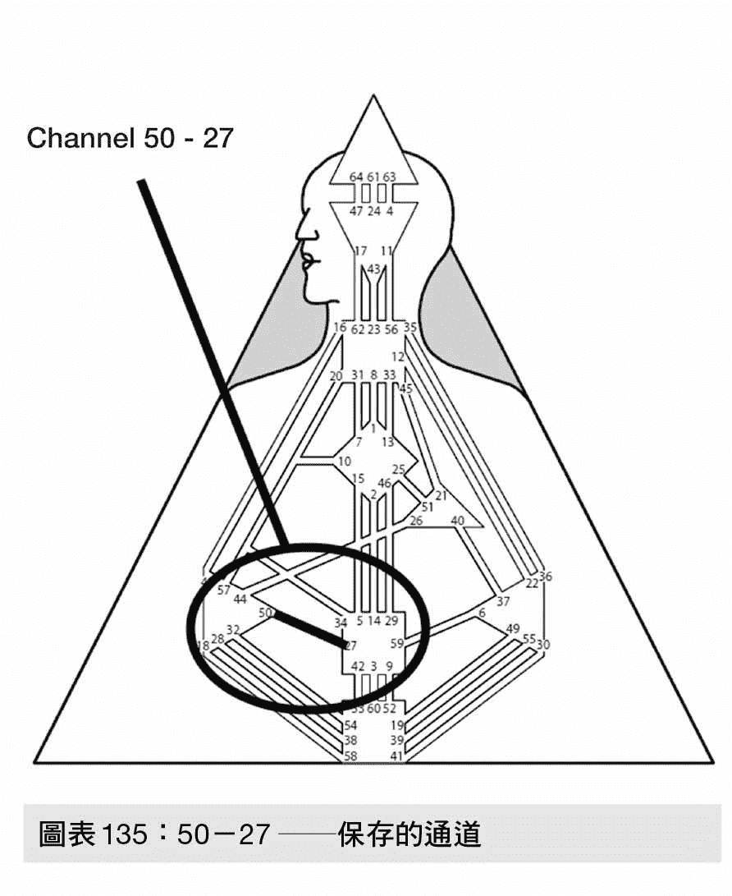

50 号闸门：价值

27 号闸门：责任

当家族衣食无缺且得到良好的照料与教育时，便能继续繁衍，家族的价值观也得以传承至下一代。时间是繁衍的必需因素，然而当孩子平安产下后，为了他们的生存而出于本能的滋养也是绝对必要。

50-27 通道的能量也和法院体系、公正及规则有关。它不具情绪特质，法律的字面条文支配守法的精神，公正的规则唯有在不带情感的前提下，才得以执行。规则就是执行的标准，50 号闸门就象是炖煮价值观的大锅子，而 27 号闸门则是盛舀这些价值观的大杓子。价值观本身立意良善，但它需要受人传播而出，对维持家族的统一性而言，价值观的传递也发挥了相当重要的作用。

#### 意志力回路（The Ego Circuit）

意志力回路包含了情绪、意志力及根部能量中心。当时机正确时，它便是一股创造力，并能将协议转化为实质的形式。此外，就和防护回路一样，意志力回路在某些特定面向也需要时间以获得澄明。

家族回路群的重点是保卫家族、让家族世世代代不断延续，而意志力回路则负责提供打造家族基础的资源及协议。

我们能在意志力回路中发现野心、事业、销售、金钱、资源分配及管理的能量，也能看见关于婚姻、社会契约及买卖的能量。

意志力回路里，拥有与野心、发起商业计划、销售、资源管理有关的事物不具情绪的特质。然而，和家族协议相关的事物（象是婚姻及商业交易）则带有情绪特性。请记住，千万不要尚未心境澄明便仓促踏入任何牵扯到「关系」的事物（尤其是长期关系）。否则，你极有可能面临人生中的革命或战争。

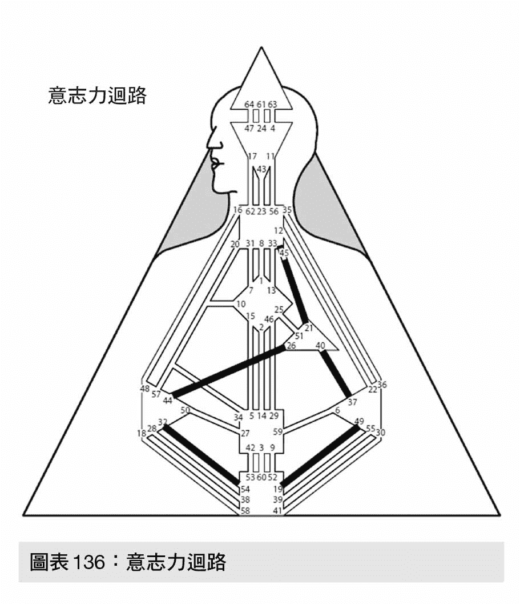

意志力回路通道

• 54-32：蜕变的通道

• 44-26：投降的通道

• 19-49：爱与婚姻的通道

• 40-37：买卖的通道

• 45-21：金钱线的通道

##### 54－32：蜕变的通道

蜕变的通道是一条努力争取识别与认可的投射通道。此外，诚实正直为此通道的重大主题，他们会成为相信只要奋力工作就能实现事业梦想的工作狂。由于在 54-32 通道中，根部中心为仅有的动能，且与喉咙中心相距甚远，因此它面临的挑战是寻得成就感的能量。

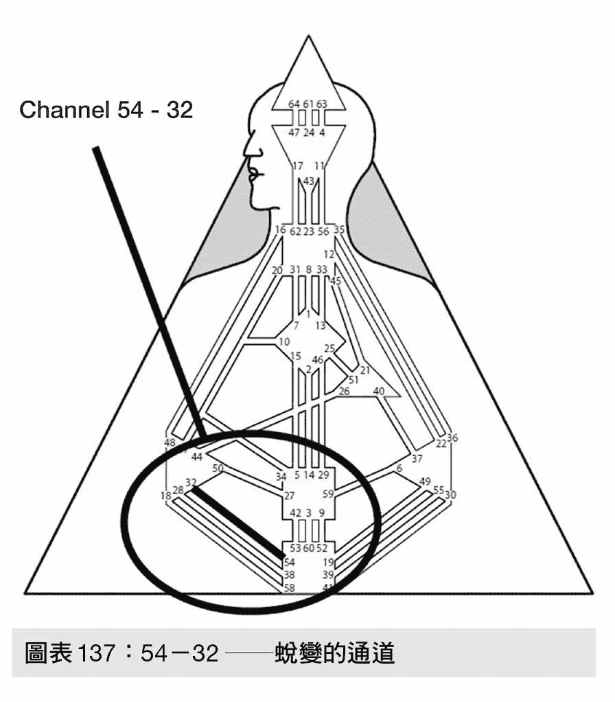

54 号闸门：驱动

32 号闸门：连续

作为意志力回路的一部分，54-32 通道属于生产力和事业创造的发起能量。以 54 号闸门（代表野心）为出发点，推移至 32 号闸门（宏大事业计划的能量），当 32 号闸门出于本能地察觉到 54 号闸门的美好梦想时，便会产生要不断努力工作的迫切感，直到获得适当的认可才罢手。但 32 号闸门本身不具有持续的动力。

虽然如此，54-32 通道却蕴藏着神奇魔法的可能性。由于此种雄心壮志的事业理想和抱负的能量与喉咙中心遥遥相望，因此需要等待其他人的识别与认可。若你拥有 54-32 通道的能量，尽管你满怀勃勃雄心，却必须等待这些想法被他人看见和理解。换言之，若你能放手让宇宙安排所有的过程细节，那么你的梦想将能实现。

拥有 54-32 通道的人务必要学会尊重与爱惜你的能量，好让你的梦想得以酝酿。你的理想只能和那些愿意赏识及珍惜的人分享，若能如此，无论你的梦想有多大胆、多疯狂都能顺利实现。

当然你难免会忍不住积极尝试着推动你的梦想、让它们「心想事成」，然而主动出击难以奏效，你必须拥有十足的信任，相信宇宙的安排。当蜕变的通道得到他人的赏识后，便具有分享宏大计划与愿景以开创崭新大事业的能力。届时，梦想将蜕变为实际的成果与生产力。

##### 44－26：投降的通道

随着我们将目光移至意志力回路的上半部，我们也渐渐地在此发现较多的能量。44-26 通道相当复杂，整体而言它是关于销售和呈现想法的能量（这条通道充满了许多销售好点子的能量），此外它也是关于真相、诚实、了解过往经验并将汲取到的教训传达而出的能量。许多电影导演、历史学家及记者都具有此种能量。

44-26 通道出于本能的觉察力，能将想法化为实质的表现形式。在此的能量是为了吸引家族的注意力、让族人确信这些想法是货真价实的好东西，绝对值得他们投注资源与努力。

为了能得到他人的注意力，44-26 通道会采取说服、引诱的方式，若有必要，甚至会不惜使上一些伎俩。44-26 通道是充满影响力的能量，也具有销售绝佳（或极差）想法的强大才能。它可以是诚信的媒介，也能成为诱使族人相信坏主意的骗子。

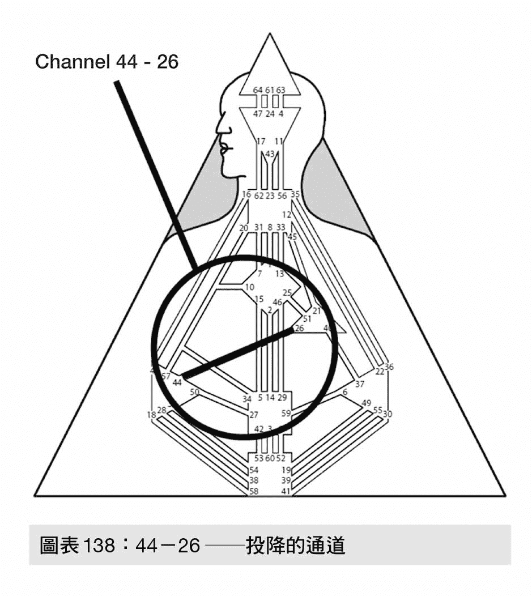

44 号闸门：精力

26 号闸门：骗子

##### 19－49：爱与婚姻／整合综效的通道

当 19 号闸门渴望接近彼此的特质与 49 号闸门的价值观及评价相遇，不久后，就能做出是否建立联结的决定。

意志力回路的右半边包含情绪中心、及创造社会契约和协议的能量，而 19-49 通道是建立和维持亲密情感约定的能量。由于它根源于情绪中心，我们也明白，缔结情感约定（例如婚姻）属于一种情感上的决定，因此必须经过时间相处以踏入正确的判断选择。

在传统文化中，婚姻关系和以时间为基础的程序密不可分。即便时至今日，约会和恋爱追求的行为仍保有同样以时间为基础的明确规则。在 19-49 通道中，我们拥有制定关于暧昧、约会、缔结关系或甚至是离婚规则的能量。

婚姻属于一种家族协议，它能为顺利统一家庭和资源奠立基础。而这些协议也能为生育及抚养孩子带来支持的力量。

关系顺利发展的准则是经过一段时间再缔结关系，而在 19-49 通道中，我们也能发现亲密是建立长期联结的基础，关系需要费心建造，19-49 通道的亲密能创造一种让所有付出都值得的连结力量。

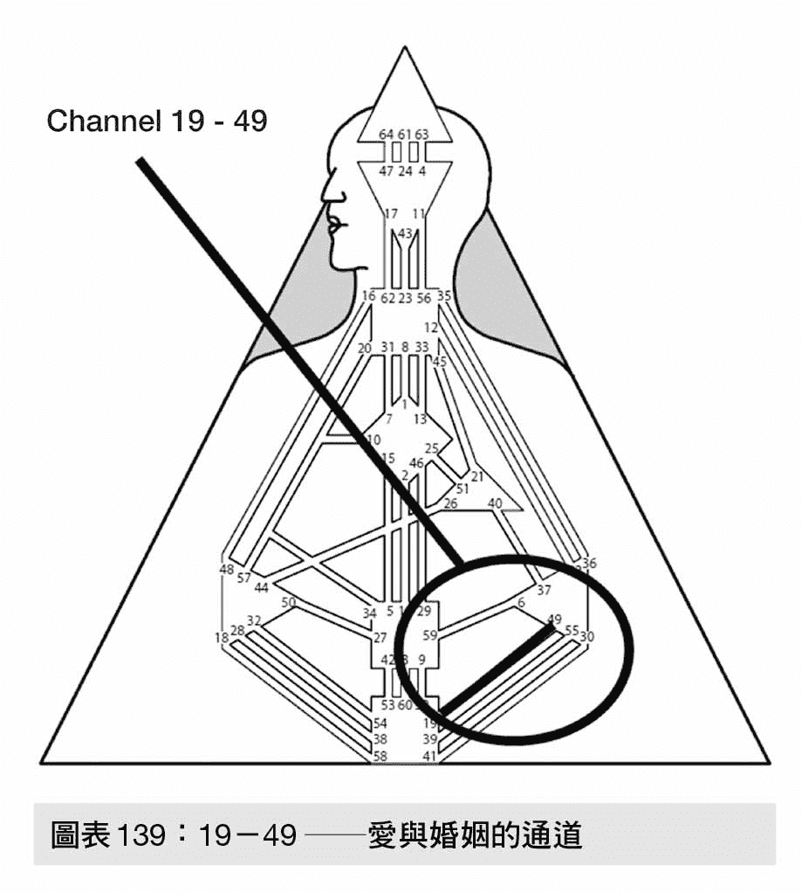

19 号闸门：想要

49 号闸门：原则

拥有 19-49 通道的伴侣往往能真切享受对方的相伴，就算只是一起逛逛超市，也能让彼此拥有如同初次邂逅般的甜蜜感受，通常这种情况在局外人眼中看来会是一段彼此依赖度极高的关系。

虽然离婚的能量也同样存在于 19-49 通道之中（若关系是错误开始，此种能量便会迸发），但由于深切亲密的连结感，离婚对于拥有 19-49 通道的人而言，仍会是场相当艰困和痛苦的结束。

##### 40－37：买卖／经营社群的通道

40-37 通道是一条普遍却相当重要的通道。它包含了订定协议和契约的能量，这些协议都是以家族为焦点且与工作、供应资源及正式确立联结关系和契约有关。此外，婚约也含纳在此通道中。

由于 40-37 通道连结意志力中心和情绪中心，因此也具有工作和创造资源的能量，前提是情绪能量配合。换句话说，在经过时间等待情绪澄明后，就能做出为家族带来物质资源的正确协议。

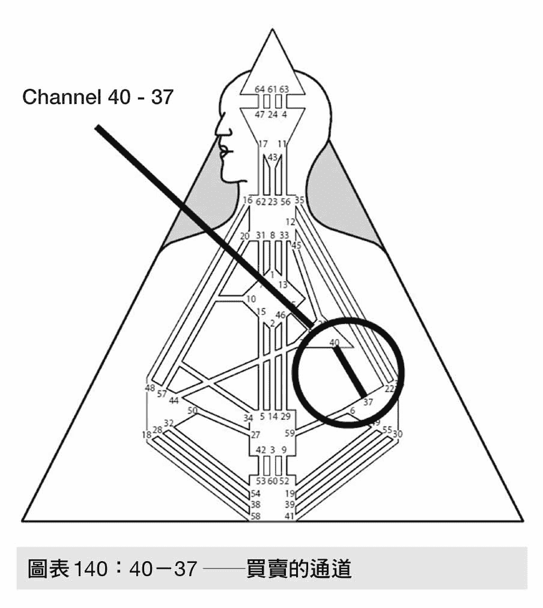

40 号闸门：单独

37 号闸门：友谊

此外，务必要理解的观点是婚约在订立的开始，便是一场连结两个家庭或家族、及创造资源的商业交易，而在 40-37 通道中，最终的结果是协议达成、资源交换确立，这便是嫁妆协议的来由（我会娶你的女儿，但你要给我十只羊作为交换）。

40-37 通道恒为一段关系能量的一部分，而交易和协议在维持关系中扮演着重要的角色，当 40-37 通道发生作用时，关系便会建立或者破裂。

由于交易的能量对 40-37 通道来说极为自然（尤其是它以潜意识设计而存在时），拥有此能量的人几乎无时无刻都在进行某种交易，却通常未告知涉入的另一方。这种缺乏意识的交易模式会导致伤心或失望的感受，因为 40-37 通道者往往会感觉人们彷彿总是让他们失望或未信守交易的内容。所以当你面对 40-37 通道时，务必要遵守或履行你们彼此间的协定。请记住，40-37 通道是一条通往内心的情绪通道。

事实上，若双方并未真正参与协议的过程，约定就不算成立。因此，对 40-37 通道极为重要的是，所有的协议必须在清楚明确、坦诚的协定及共识中达成，否则约定既无效也不存在。

若你的身边有 40-37 通道的人，那么只要你提出不错的交易或协议，你往往能轻松地邀揽他们加入约定。假设你的孩子拥有此通道，这也是相当实用的讯息。

##### 45－21：金钱线的通道

45-21 通道是意志力回路里最后一个通道，也是该回路的表达闸门或代表声音。由于意志力回路的能量都与工作、为家族创造资源有关，而 45-21 通道便说明了家族是否拥有什么或未拥有什么。

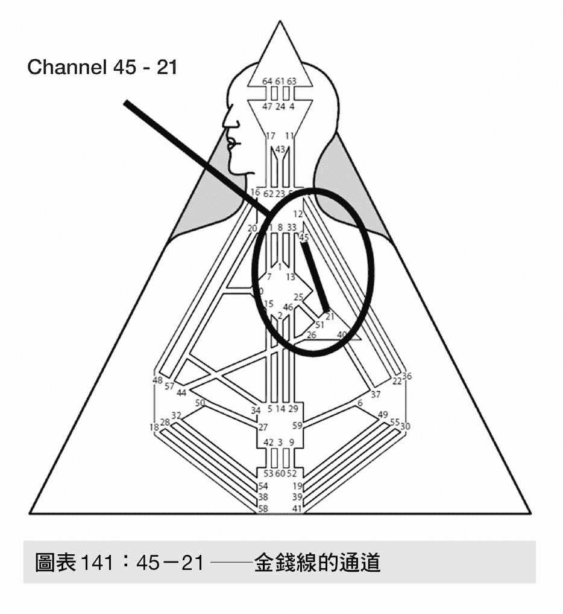

45 号闸门：国王／女王

21 号闸门：财务长

45-21 通道是一股非常耐人寻味的能量，在关系中也往往是带来难解议题的能量配置。两个闸门（45 号及 21 号闸门）能量携手，其共同的目标都与管理及创造资源有关，但 45-21 通道根源于意志力中心，因此此通道本身便具有顽强争取控制权的可能。然而，这两个闸门能量务必要明白，若缺少了对方，双方都不具有权力。财务长（21 号闸门）若没有国王或女王（45 号闸门）在旁，就会成为不折不扣的控制狂；而国王或女王缺少财务长的协助，只不过是有名无实的傀儡君主。这两股能量在关系中相遇时，往往会产生对资源的斗争，象是该如何花费金钱，及何时该使用金钱等议题。当 45 号闸门与 21 号闸门彼此认可了对方在管理及影响力方面的独特天赋，那么 45-21 通道就能成为强大的领导能量，为家族的所有成员争取最佳的福祉。

45-21 通道若充分发挥，便会呈现出人人皆得丰盛资源及充足休息时间的景象。而这也是意志力中心最完美的展现形式。

家族能量深具影响力，且能产生充满关爱的强烈动力，让人追求关系、爱和金钱。诚如你所见，这些能量让我们凝聚在一起，成为家庭或家族。当你了解这些能量的运作方式，你便能领会在家族回路群中，关于爱、性、战争及金钱的力量，你也能对引发世上各种纷争和冲突的驱动原因有更深刻的洞察力。或许当人们能意识到这些都仅是能量作用后，我们就能找到更多元及崭新方式互相扶持与提升彼此。

### 第九章

## 社会人回路群

社会人的能量支持及维护着社会基础结构的组织制度，例如：学校、政府机构、科学方法及分享人类经验的成就。社会人回路群包含逻辑及感知回路，这两种回路各代表我们身为人类能「了解」事物截然不同的两种方式，认识这两种回路在你个人图表里的定义情况，能帮助你探索自己是如何懂得你所知道的事物，最终让你学会信赖自己的内在觉知。

#### 逻辑回路（The Logic Circuit）

社会人回路群负责分享那些经过时间反覆检验、最后证明是正确或适用的信息。这些信息对建立社会文化的模式、法律和习惯而言极其重要。

我们知晓的所有事物都是经过时间验证，且透过社会人的分享而得。世界依据逻辑建构与形成，生命则藉由模式形塑，稳定度、复制和规律性全都蕴藏在逻辑回路中。

逻辑回路包含了根部及荐骨中心两个动力能量中心，它属于生产回路，因此我们能从中发现「精通」的主题。然而，唯有经过时间反覆修正才能产生精通的结果。

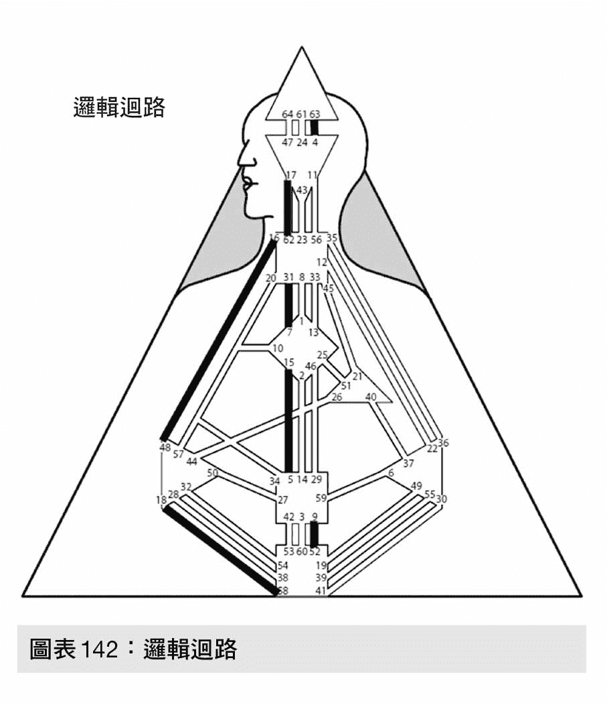

逻辑回路通道

• 63-4：逻辑的通道

• 17-62：接受的通道

• 16-48：才能的通道

• 18-58：批评的通道

• 9-52：专心的通道

• 15-5：韵律的通道

• 7-31：创始者的通道

若你注意观察逻辑回路的图表脉络，即从头脑中心至最底部再回到喉咙中心，你会发现这些能量其实与科学研究方法的步骤相同。逻辑回路以怀疑和不确定「这是真的吗？」为起始，紧接而来是启发的想法和某一假设，最后贯穿整个逻辑回路，并经过时间证实为真、成为模式。一旦某假设证明为正确，便会透过创始者通道（7-31 通道）的领导力分享至社会。

我们与逻辑回路达成的共识，为打造出能维持社会与文化帝国的结构创造了稳定度。举例来说，我们都同意以相同的方式计算数学问题，始终能得到相同的答案，因此我们对于如何计算债务和贷款的利率意见一致。

观察自然界的各种模式能帮助人们知道我们永远需要太阳、水和良好的土壤，我们的认知让我们在某种程度上得以预测未来，如此我们就能对维持生存做出选择。

我们信任合乎逻辑的事实。你注意到了吗？情绪中心并未包含在逻辑回路之中。逻辑不具情绪特质，我们不必情绪激昂地力争逻辑，因为逻辑不言而喻。逻辑的正确性来自于时间和重复，它让我们能更自在地迎向未来，我们能根据过往的模式预知即将到来的事物。

然而逻辑发展的过程中带有痛苦的特性，就本质而论，逻辑必须先面临阻力才能证实其正确性。你无法只是得到启发，就在缺乏验证的情况下断然认定你的想法是正确的。头脑和逻辑中心的逻辑闸门，就和人类图里所有的脑袋闸门一样，并未拥有动力引擎，因此也就缺乏反覆验证、以达到纯熟掌握的动力能量。换言之，源自头脑的事物是有待检验的想法。

逻辑的脑袋只能分享那些经过确认的观点。拥有许多想法的人往往会遭遇抗拒阻力，除非他们能证明自己抱持的是正确的想法。

逻辑里蕴藏着美妙的完善，某一想法经过时间检验及充分表达，便能引领我们迈向美好的人生。纯熟掌握的感觉很美好，轻而易举、毫不费力的驾驭让人愉快。然而，要达到此种精炼完善需要时间、练习与修正。就好比音乐老师鞭策学生反覆弹练某一首曲目，直到所有的细节到位为止，或是编辑不断要求改稿、重编……。逻辑需要修正和完善。

逻辑的修正让人感觉不太舒服，逻辑回路里包含了象是批评的能量，没有人喜欢固执己见、吹毛求疵的人，但我们都爱那些能在我们需要时，引领我们到达完美的修正。

逻辑回路为社会人回路群的一部分，它在本质上具有相互依存性，你无法独自一人经历时间考验证实某事物为真，若你是一位科学家，你必须依靠他人资助你的实验；若你是会计师或编辑，你的任务是修正他人在财务或创作领域的假设。最终，所有的过程会分享而出，每个人便得以从这些历经时间精炼与修正的信息中受惠。

拥有许多逻辑回路定义能量的人会感受到亟欲分享的压迫感，这是一股强烈的能量冲动，然而其关键在于等待邀请再分享。没有人喜欢等待，但在恰当时间分享出的正确逻辑具有强大的影响力。反之就算逻辑具有正确性，强加于他人也只会得到忽视与抗拒的结果。

##### 63－4：逻辑的通道

这是逻辑的发起阶段。若你可以从 63-4 通道作用的开端至结束中，追溯科学过程的蛛丝马迹，你会发现它是创造出某一假设的灵感。逻辑的通道先在头脑中心产生疑问，伴随而来的是验证的需求，而验证的任务贯穿了逻辑回路的其他部分，最终分享而出。

63-4 通道是极度视觉化的通道，它也和做梦及偶发的疯狂或错乱相关，若头脑中心未定义，亟欲验证的压力以及接踵而至的质疑都将成为莫大的挑战。

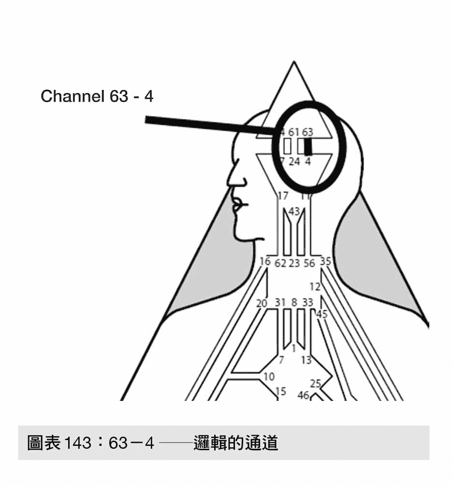

63 号闸门：怀疑

4 号闸门：解答

##### 17－62：接受的通道

接受的通道赋予逻辑回路在起始阶段产生的声音，这是关于逻辑假设或疑问的言语表述。请注意，它仍属于疑问，头脑里只有纯粹的想法但没有能量。因此源自逻辑中心的所有想法都属投射性质，唯有在得到邀请或认可时，它们才能被听见及正确地发挥作用。

缺乏验证的假设纯属推测。在没有获得邀请的情况下，未经证实的想法也许能得到一次识别的试验，但紧接而来的却会是强烈的抗拒。

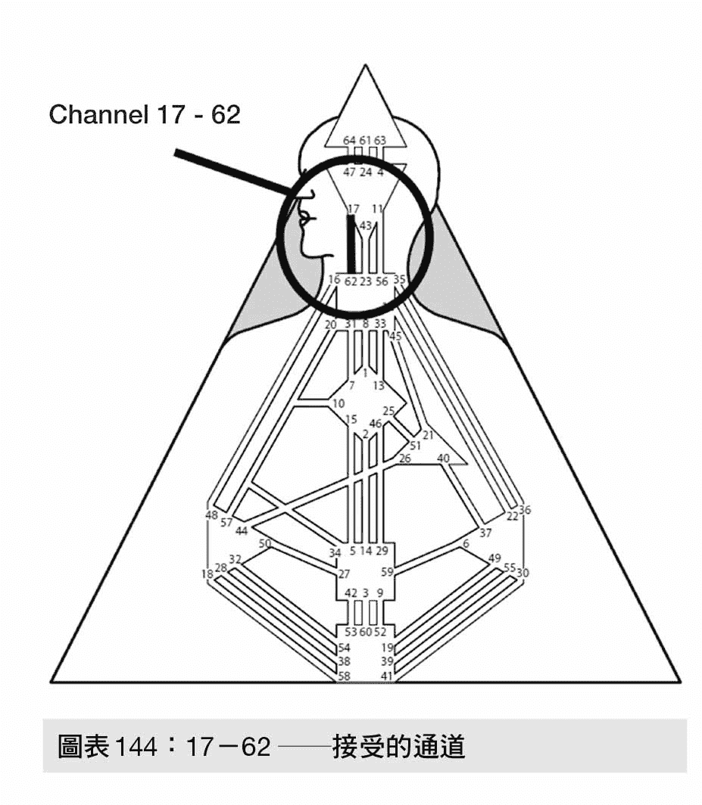

17 号闸门：意见

62 号闸门：细节

逻辑总是设法得到能量，但在逻辑回路中，所有能量必须透过回应、或是他人的认可才能得到最有效的发挥，若缺乏这些关键锁匙的启动，想法只不过是随风而逝的话语。

虽然 62 号闸门和 17 号闸门一样拥有想法，但由于 17-62 通道连结至喉咙中心，因此提高了取得能量的机会。62 号闸门是富含组织条理、实用答案的闸门，而有此闸门能量的人具有组织事物、并提供实用方法以执行 17 号闸门能量的能力。

17-62 通道的能量流将我们从 17 号闸门的推测，带往 62 号闸门的实用答案。请注意，由于在此缺乏能量或行动，因此这个答案仍属可能的答案之一，而非唯一的答案。

17-62 通道可谓一股艰难的能量，我们喜欢分享意见或想法，但并不是所有人都愿意打开耳朵聆听。若你非得要分享你的想法不可，请记得先征询他人的同意。如此，便能大大地减轻这股能量带来的冲击力。

##### 16－48：才能的通道

在此我们将逻辑的直觉表现带至喉咙中心，请注意，16-48 通道并无法直接取得能量。换言之，才能和纯熟掌握的功力必须要在对的时机得到他人的认可。

16 号闸门是怀抱热忱、并透过正确表现形式传达纯熟专长的能量，但前提是它必须与 48 号闸门相连接。若没有 48 号闸门，16 号闸门便缺少纯熟技能的深度以及出于直觉的恰当表现力。

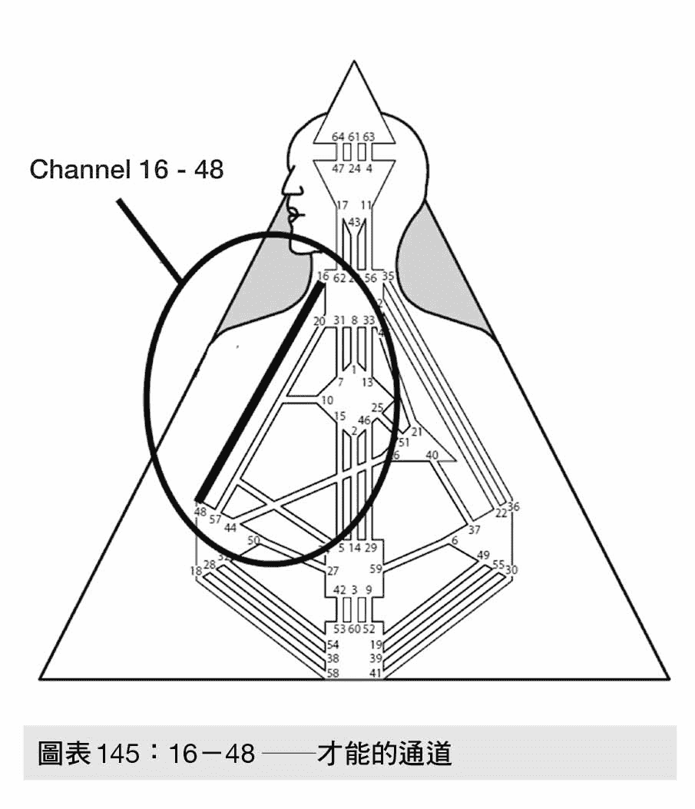

16 号闸门：技能

48 号闸门：深度

才能透过一段时间反覆的练习而展现，然而它也努力争取资源与金钱，因为它必须被看见才可以获得支持。艺术总是渴望得到金钱和支持，而这也是表演和展览对所有类型的艺术家而言如此重要的原因，他们必须被看见。

16-48 通道代表揉合了一段时间的反覆磨练，是为才能的直觉表现力。缺乏练习的才能是原始且不成熟的状态，每一个人都具有某种才能，然而症结在于，你愿意十年磨一剑，不断练习以成为某领域的大师吗？纯熟需要时间淬鍊才能完美绽放。

16-48 通道包含了热忱与深度的能量，此外，正确的时机也含纳其中。千万不要凭借一股热忱表现深度（除非你经过磨练并达到纯熟的境界），否则你只会象是个犯傻的人。

##### 18－58：批评的通道

18-58 通道会对拥有此通道能量者造成某些重大的挑战，首先这条通道位在人体图的最下方，且无法取得喉咙中心的能量。再者，它具有逻辑回路的动力中心之一（即根部中心）。

逻辑的挑战之一是获得通往喉咙中心的能量，这同时也是逻辑如蛛丝网般纤细脆弱的原因，它必须得到验证，验证过程中也会面临抗拒阻力，直到通过时间考验为止。批评的通道属投射者型，也就是说，当别人主动询问时，它才能发挥最佳的功效。18-58 通道具有修正事物趋向完善的直觉动能，其目的是创造喜悦人生的完美表现。

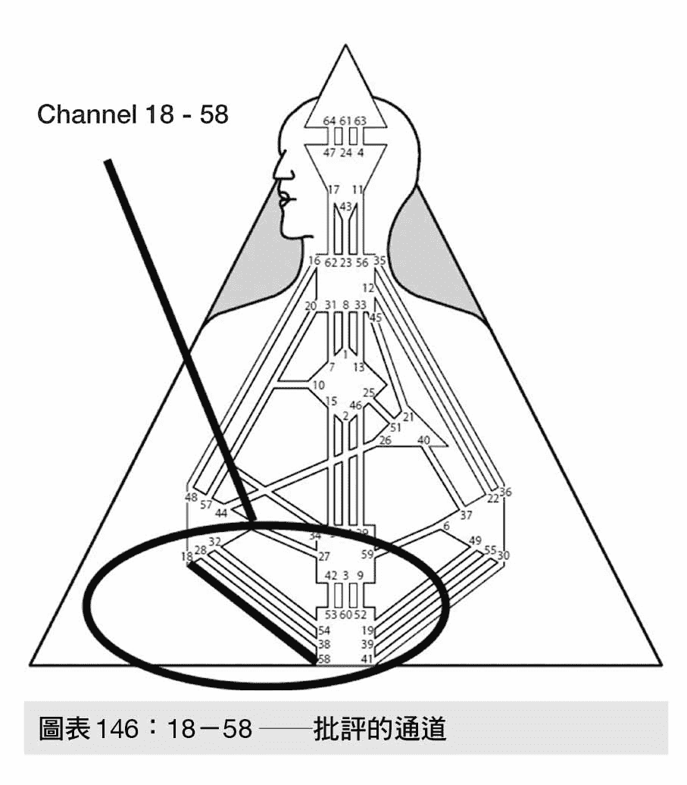

18 号闸门：修正

58 号闸门：喜悦

你不妨想象一下，当你眼睁睁看着其他人以不理想或错误的方法做某事，而你心知肚明该如何拨乱反正，却不能发表任何修正的意见，除非得到他人的认可或询问，这种状况该有多难熬啊！这股能量会极具挑战性，尤其是若你同时拥有 17 号闸门（意见）的能量。

此外，批评通道的能量对投射者而言也特别不易。18-58 通道的重点在于你必须等待认可，若你并未等待，很有可能在他人眼中成为爱挑剔的找碴份子，毕竟没有人喜欢饱受批评。

18-58 通道之美在于 18 号闸门修正的能量，最后通往 58 号闸门喜悦的人生。当 18 号闸门等待、得到认可，它就能让通往完美表现喜悦人生的道路更顺畅易行，即根部中心在这股逻辑能量流中发挥的作用。

##### 9－52：专心的通道

9-52 通道的能量是根部中心的组织能量（format energy），运作方式如脉动般或开启、或关闭。这是一股集中和专注（或否）的能量，当动能开启时，它便能刺激荐骨中心，进而让任务完成。但是若动能关闭，学习及纯熟掌握某事的目标似乎也变得充满挑战性。

9-52 通道是通往人体图中央的能量流起始。逻辑进程已完成验证，如今我们要朝生命动能（荐骨中心至喉咙中心）的表现前进，我们要将逻辑推广至社会。请记住，这是关于将证实为真实的假设、或已纯熟掌握的才能与群体分享的过程。

9-52 通道的集中和专注力，与学习及反覆做某事有关，如此才能建立模式，作为集体的行为。它是属于一股阅读书籍或研究期刊里的试验，并在人生中复制及运用这些成就结果的能量。

接下来的三条通道与在群体中「执行」逻辑有关。

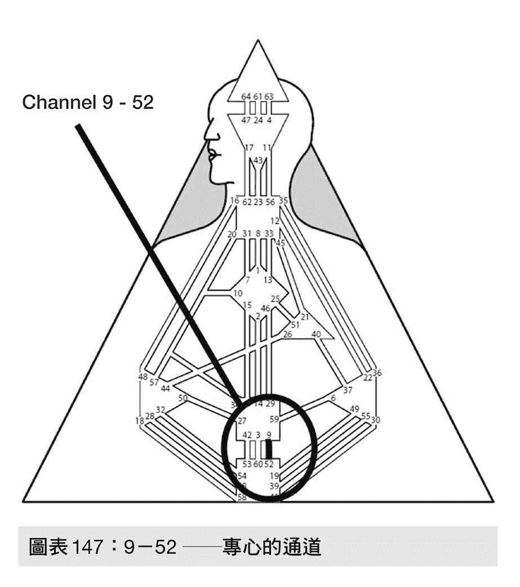

9 号闸门：专注

52 号闸门：静止

##### 15－5：韵律的通道

15-5 通道是唯一包含在所有生命形态之中的通道，它是自然界本身韵律的能量。你不妨细想自然世界的运作，你会发现大自然其实内建了节奏，也由节奏支配，太阳每日在白天升起、到了傍晚落下，植物随着季节变化生长，动物也拥有自己的日常作息，这些便是生命模式（象是季节、气候、生殖、遗传……）的能量。节奏能带给拥有 15-5 通道的人安全感，也能赋予荐骨中心及工作动能方向。

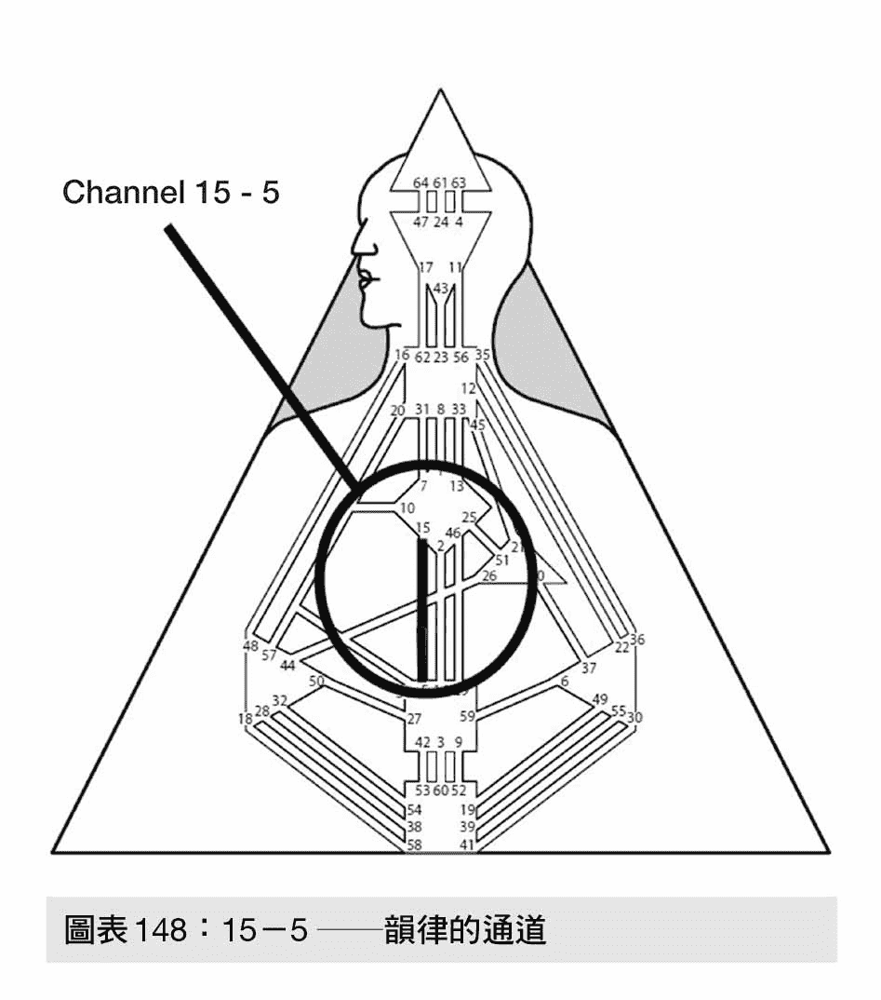

15 号闸门：极端

5 号闸门：固定模式

韵律的通道在人类图表里是相当重要的能量，它具有重视宗教仪式与冥想的谭崔（tantric）密教特质，也就是说，这是一条为生命动能（荐骨中心）指引方向（自我中心）的通道。

人类在生物之中有其独特性，因此我们对这股能量也拥有较多的掌控力，我们能跳脱自然的韵律，电力和其他现代生活的发明物让我们从自然的韵律中解放，但或许也连带产生了各种影响整体人类的后果。

15-5 通道的能量是使人类与自然协调一致，若人类远离了自然法则就有可能遭受苦难，人类图表的原型鼓励我们发挥自由意志的同时，也要我们记住我们与自然界紧密相连，我们无法凌驾自然的力量。

拥有 15-5 通道能量的人通常和大自然、和动物保有深刻的连结感，而他们也需要此种连结来为自己的灵魂找到方向。偶尔走出高楼围墙、投入大自然的怀抱，如此便能有效帮助你保持平静与澄澈的心境（对孩童而言尤其有帮助）。

人类之爱也蕴藏在 15-5 通道之中，我们能从这股能量中领悟到，人类对世上其他人充分展现的爱正是身而为人的一部分，而这种爱的表现与自然界密不可分。

人类图表显露予我们的讯息是：人们必须衣食无虞及拥有充足的资源以保持强健、互相连结与协调。对我们而言，互相供给、给予保护是自然而然的一件事。

具有 15-5 通道能量的人也拥有突出、奇特的广大能量场，他们总是能引人注意。对人类的永续而言，这股能量终将是不可或缺的关键要素。此外，由于这股能量和所有的哺乳动物及自然紧密相连，因此他们往往能和动物沟通、善用植物与药草，甚至和整个自然界保有深刻的联系。这是一股神奇的能量，也是仙女、地精、精灵……的原型，拥有此能量的人往往是不断努力让社会与自然法则协调一致的坚定环保人士。

##### 7－31：创始者的通道

在逻辑回路的最终表现里，领导地位是建构于纯熟掌握、和反覆表现的真理之上。7-31 通道代表逻辑的最后表现，也就是「民主式的领导」形态。在此的领导权必须得到认可，否则便不具效力，它并非专制独裁或藉由极端手段控制的形态，而是经过时间展现其有效性，最后得到人们认可的领导权。

7 号闸门和 31 号闸门必须携手合作，7 号闸门给予 31 号闸门领导的方向和支持，它们若缺少了彼此便无法发挥领导力。31 号闸门若没有 7 号闸门协助，就像仅有发言权却没有方向的领导者，反之若 7 号闸门缺少 31 号闸门，便会费力地争取被听见的机会。

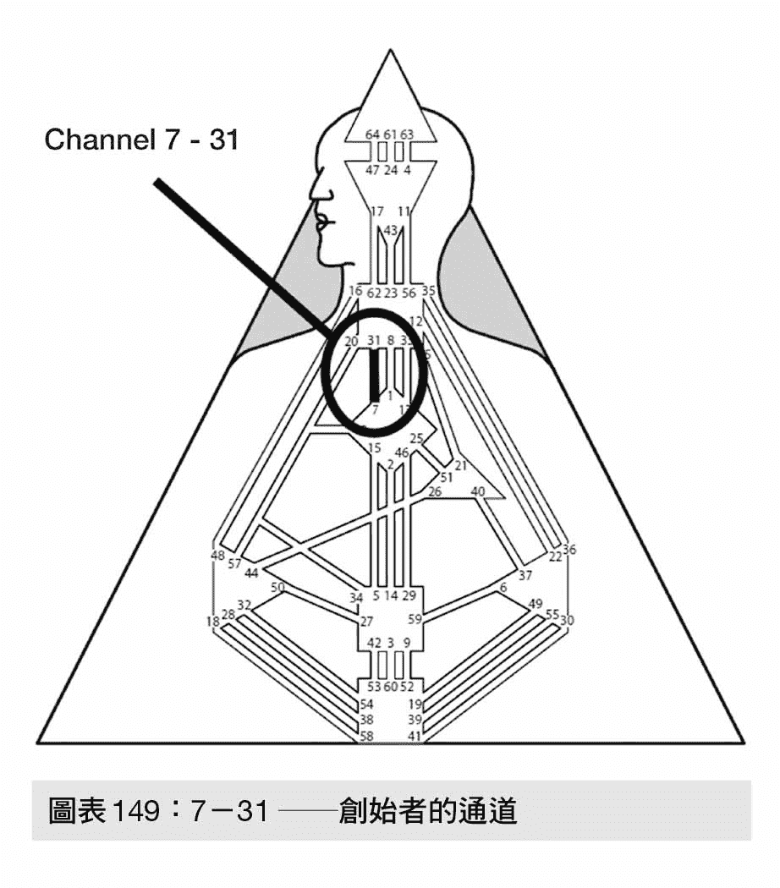

7 号闸门：互动中的自我

31 号闸门：民主

民主是人类在群体中的极致表现，而 7-31 通道终会得到其他人的召唤。这是一股源于群体同意自我控制的领导能量，若 7-31 通道试图强迫领导，就会产生不具逻辑性的改革和新政权。由于它并未经历时间的考验，因此它仍必须以逻辑为起始，重新「验证」领导权的有效性，否则终将会面临被推翻的结果。

民主在社会人回路里是自决的充分表现，而这也有助于我们了解，每一个人最终都渴望拥有以平等和公正的方式管理自我的自由。民主不只是一种哲学思考或信念，而是绝对且恰如其分地符合人性。

#### 感知回路（The Sensing Circuit）

感知回路是社会人回路群的另一部分，它从根部、荐骨及情绪中心获取能量。这个回路主要诉说着过往的故事，并将新的经验纳入人类更庞大的故事之中。

感知回路具有全面、着重右脑、感官、以经验为基础的特质，而顿悟、深刻的理解、豁然开朗和好奇……也都包含在感知回路里。

由于感知回路大多与新的经验和好奇心有关，因此假若你未遵循你的人生策略行事，便很容易在此回路里体验到「失根」般毫无来由的白日梦和混乱。幸好，人类图表里有其他的回路能量流，能赋予感知回路的种种白日梦根基，也能将感知回路得到的想法化为有形。

即便我们每一个人都具有感知回路的某些面向，然而因西方文化世界对此回路的特质带有某种偏见，我们深受制约影响，讲求以「符合逻辑」、线性和固定模式的方法学习，故而对拥有许多感知回路定义能量的人而言，他们往往要设法清楚表达自己的想法、避免冲动行事。（你不妨将未能充分发挥的感知回路视为「注意力缺失症（ADD）回路」。）

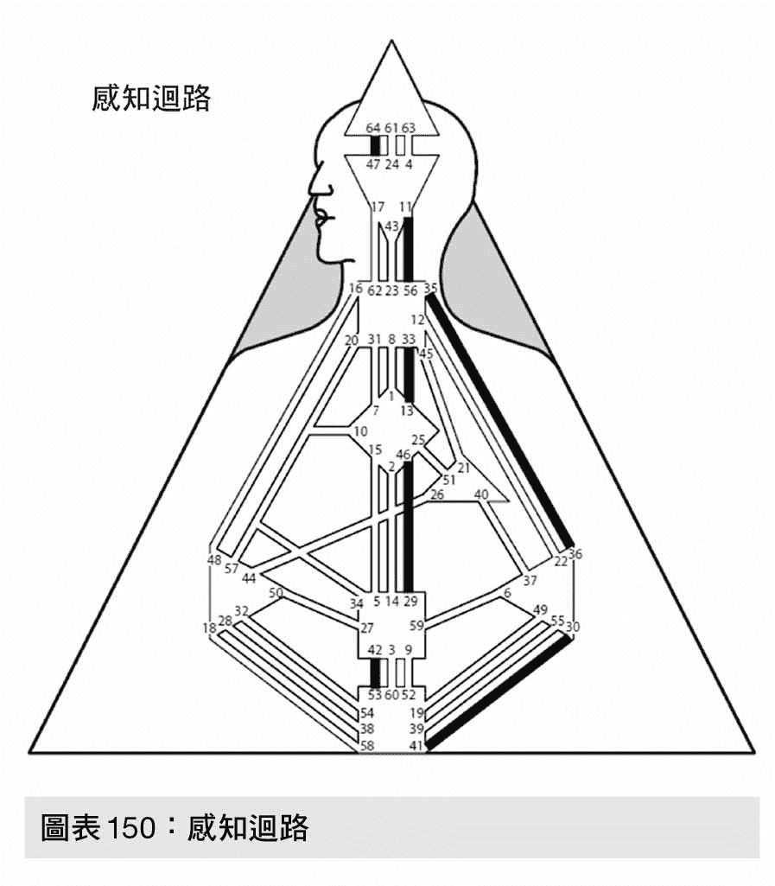

感知回路通道

• 64-47：抽象的通道

• 11-56：好奇的通道

• 53-42：成熟的通道

• 29-46：发现的通道

• 13-33：足智多谋的通道

• 41-30：幻想与渴望的通道

• 35-36：无常的通道

事实上，逻辑和感知两种类型的思考方式都是不可或缺的。感知回路的经验往往会导向逻辑，以找出是否有可套用的模式。感知回路有时可以寻得模式，有时却只是纯然地得到经验。

感知回路里的能量让个体得以挑战人类经验的极限，并让我们每一个人利用这些经验成为个人生命故事的一部分。

我们不必成为奥运选手，或非得要拥有如火箭般的弹跳力、或突破音障的能力才得以体会创造出这些经验不可或缺的勇气、承诺和精神。我们可以透过观看电视或阅读知晓这些故事，并藉由意识到一个人的经验能化作整体人类的潜能而感动。

##### 64－47：抽象的通道

64-47 通道是感知回路里的发起能量，也代表着大脑的右半部。64-47 通道的能量以困惑（64 号闸门）为开端，抽象事物或感知回路的困惑来自于，在极短的时间内经验某一复杂的想法。抽象想法的特质是全面且非线性的，是以抽象的挑战是将此庞大的想法转化为可遵循的线性过程。

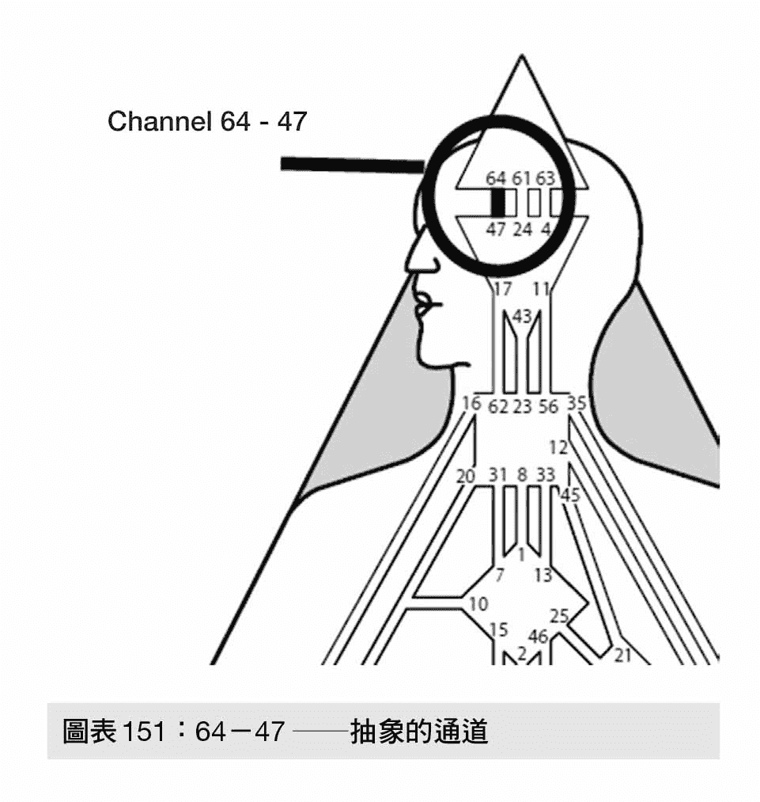

64 号闸门：困惑

47 号闸门：了解

抽象的另一挑战是回答「我们该如何让这个想法成真？」这样的问题，若缺乏如何将想法逐步化作实际形式的方法，那么灵感要实现的可能便显得困难重重，怀抱着无法具体化的庞大想法有何意义呢？脑袋面临挫败感、负面思考……等未充分发挥的「可能性思考」也源自于 64-47 通道之中。

为了能让 64-47 通道的各种庞大想法实现，可能性的思惟倾向及等待困惑通过的乐观心态非常重要，当时机正确时，「如何做」的方法便会自然显现，而 64-47 通道就能神奇地体会各种不可思议的启发，反之若强迫思考只会深陷「剪不断、理还乱」的困惑。

##### 11－56：好奇的通道

感知回路的灵感透过 11-56 通道，即好奇的通道表现。不同于逻辑回路，感知回路的焦点不在于事实或数据资料，11-56 通道是说故事的通道，也包含了寻找（但未必能找到）的能量。

拥有 11-56 通道的人务必要了解，目标答案并不存在，他们经历的故事才是真义，感知回路是关于活出生命、体验人生的过程，而非找寻答案或模式。

11-56 通道属于投射性质，因此它的故事和想法在获得邀请的情况下分享会得到最佳的聆听效果。有时，拥有此能量者会忘了等待邀请或认可便分享起自己的故事或使用各种隐喻，这反而会让人想逃之夭夭。

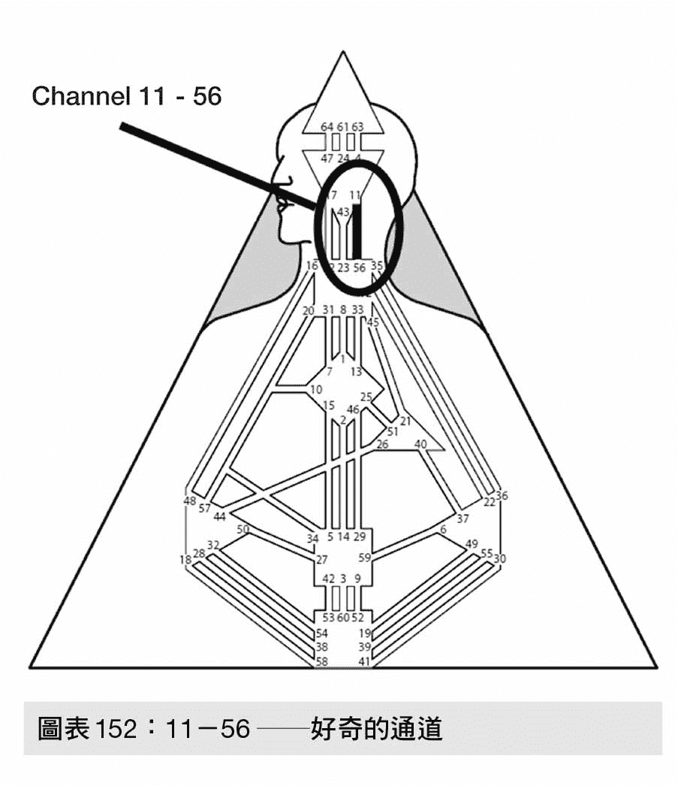

11 号闸门：想法

56 号闸门：说故事者

11-56 通道的能量功用是与人分享。然而，对拥有此能量定义的人而言，他们很容易将所有想法视为自己所有，并尝试着在真实世界中实现这些想法，最后却往往只会得到挫败和筋疲力竭的结果。请试着和那些主动向你征询想法和故事的人分享吧！当你懂得等待再分享，你的所有想法将透过那些真切需要这些点子的人付诸实践，你也会因为分享而收获甚丰。

##### 53－42：成熟的通道

某些人天生的使命是为任务起头，某些人则负责结束任务，而另有些人则能完成完整的任务过程。53-42 通道是赋予某一经验脉搏的能量，也是含纳起点与终点的能量。

53-42 通道属于生产的通道。由于感知回路和得到经验以从中学习有关，因此，透过回应决定是否踏入恰当的经验是必要的过程。当你正确地开始某一段经验，便会获得适当的起始及结束能量，或者，你会回应那些能带给你适当能量的人，一起共创经验。

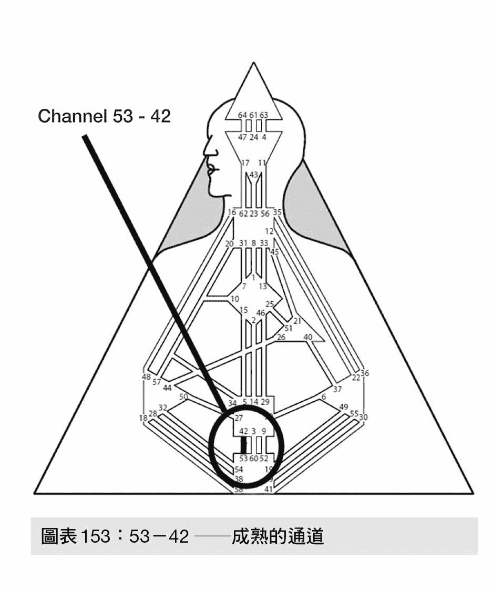

53 号闸门：开始

42 号闸门：完成

53 号闸门会设法让任务结束，而 42 号闸门则奋力争取开始。两者携手合作便能形成完成任务的强大能量，然而若少了回应，两股能量便会动弹不得，导致挫败感油然而生。假使你不先等待再回应，你便无法获得开始或完成某一经验的能量。此外，社会观念对于成为「积极主动的人」或「完成任务者」抱持极高的评价，因此若你未妥善运用 53-42 通道的能量，可能会面临诸多批判。

##### 29－46：发现的通道

发现的通道有时又称作「在他人失败之处成功、成功之处失败」的通道。具有 29-46 通道能量的人，拥有不屈不挠的顽强决心、及埋首奋斗迈向成功的能力。即便他们事实上费尽千辛万苦、努力不懈才得到成功的果实，还是会让这一切看来彷彿简单平顺。

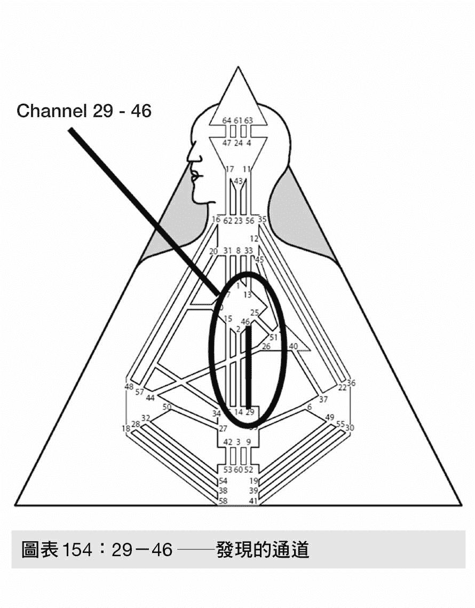

29 号闸门：毅力

46 号闸门：身体之爱

旁人总以为 29-46 通道的人并未付出太多努力，从某种角度来看，更多的是得到幸运之神的眷顾，他们的确是幸运的一群人，29-46 通道的功用是透过回应，在对的时间处在对的位置。但你仍旧无法忽视他们在到达对的位置之前，究竟投注了多少大量的努力做足准备。

由于 29-46 通道具有引人注目的倾向，因此许多拥有 29-46 通道的人会设法减弱自身的光芒，让自己显得更符合「正常」的标准。然而这等同于关闭了他们庞大的能量，别忘了，荐骨是体内最强大的动力能量中心。

29-46 通道在他人成功之处失败的原因，在于他们很难让自己处于符合「正常」标准的状态，因为他们天生注定就是要成为卓然超群的人物。

29-46 通道也和拥有身体的经验有关，属于谭崔密教特质的通道。29 号闸门的承诺通往 46 号闸门的身体之爱，具有深切的直觉觉知，明白身体是灵魂的载具，生命则是一段在身躯内深刻感受的经验，而这也为感官体验、舞蹈、瑜伽或其他身体活动带来了能量。

当 29-46 通道做出回应时，身体便会充满热情与活力，然而若它并未遵循自身的策略而活，便会出现身体扭曲或变形的情况。当灵魂与身体脱节时，身体总能清楚感受到，此外，若荐骨未得到 29-46 通道的表现力，常常会造成某些奇特的身体状况，象是脊椎侧弯或其他日积月累导致的身体崩坏。

##### 13－33：足智多谋的通道

足智多谋的通道是感知回路里的表达通道之一，它根源于生命体验，是一面反映出 11-56 通道（好奇的通道，以想法概念为基础）的镜子。

13-33 通道是名副其实的说书人，他分享着人生旅程的故事并运用汲取到的教训指引方向。

13-33 通道具有保存过往历史的能量。拥有此通道能量的人往往热爱历史，他们也许会制作回顾纪录、或以其他方式记载过往经验。他们通常也扮演着家庭中守护传统的角色，假若这股能量在家庭中消失，他们有时会奋力地找回家庭固有的传统。

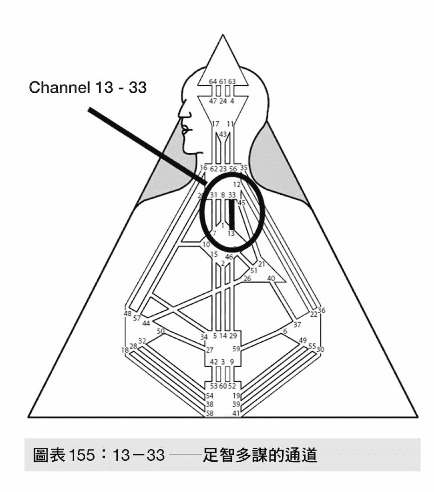

13 号闸门：聆听者

33 号闸门：隐私

13-33 通道给予我们聆听进而引导（若得到邀请）的能量，此外也具有见证及方向指引的作用。对辅导人员或治疗师而言，这是一股非常有益的能量。

这条通道若彻底展现，它能回溯与牢记过往，让人生经验的历史栩栩如生。若它未能充分发挥，它便会困陷于过去，频频回首过往，担忧着历史重演。此外，由于 13-33 通道连结自我中心至喉咙中心，因此也很容易遭受他人的指责与批评。

##### 41－30：幻想与渴望的通道

幻想与渴望的通道是人类图表中具有强大影响力的能量，事实上它是启动人类图新年的能量。虽然它是一股极富创造力的能量，但其所在位置却远离头脑四周。换句话说，推动我们创造新事物的能量，需要从思考中汲取不同类型的力量。我们可以终日思考某些想法（我们确实时常如此），然而思考与体验两者迥然相异，41-30 通道实际上和体验新事物有关，而非只是空想。

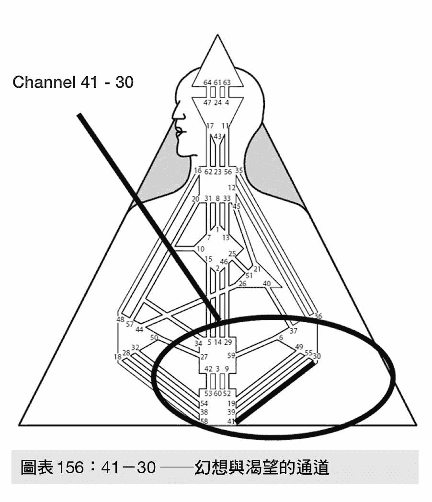

41 号闸门：幻想

30 号闸门：渴望

41-30 通道的作用非常强烈，而在此也存在着燃烧殆尽的特性。一般来说，拥有此通道能量的人会让众人洋溢热情，甚或疲累不堪，而他们自己也偶尔会感到筋疲力竭。

当此通道能量显现时，会使人体图表中其他的能量更加强烈，进而让整体性格更加鲜明。

41-30 通道必须得到妥善的运用，虽然它的能量相当热切和强烈，但由于它位在人体图的底端，这也意味着它必须等待对的时机以恰当地表现自我。

拥有 41-30 通道能量的人是充满影响力的梦想家，他们能为世界带来崭新体验与探索旅程的故事，或者他们也可能活在持续混乱的状态之中，不断投入错误的冒险旅程，对自己及他人都会造成伤害。由于 41-30 通道是根源于根部中心的情绪通道，因此他们在采取行动前必须等待思绪的澄明。真正的创造力是一段深思熟虑、谨慎从容的过程，而非乱枪打鸟般的莽撞行为。

在 41-30 通道中，幻想的主题往往会启发那些受到此能量影响的想象产物。若你拥有 41-30 通道的能量，你会发现其他人常常会信誓旦旦地和你谈述某些充满想象事物的话题，请务必确认你的沟通是否清楚明确、对方是否确实理解你所表达的话语，而非让对方错误理解并不断地围绕着幻想打转。

若 41-30 通道彻底展现，它便是一条极富创造力、热情与追求创新的通道。41-30 通道拥有以强烈趋力促使世界热情燃烧的力量，然而等待正确时间表现这股发起的能量是极其重要的关键。

##### 35－36：无常的通道

35-36 通道中的能量具有两大挑战，就是感到无聊和厌倦。这些挑战会产生躁动的能量，让人无论是从外表看来或感觉上，都彷彿总是处于跃跃欲试、活蹦乱跳的状态。

35-36 通道自情绪中心直接连接至喉咙中心，是一条极富表现力的情绪通道，每当我们谈及定义的情绪中心时，我们就知道，这当中必然与某种型式的等待有关。

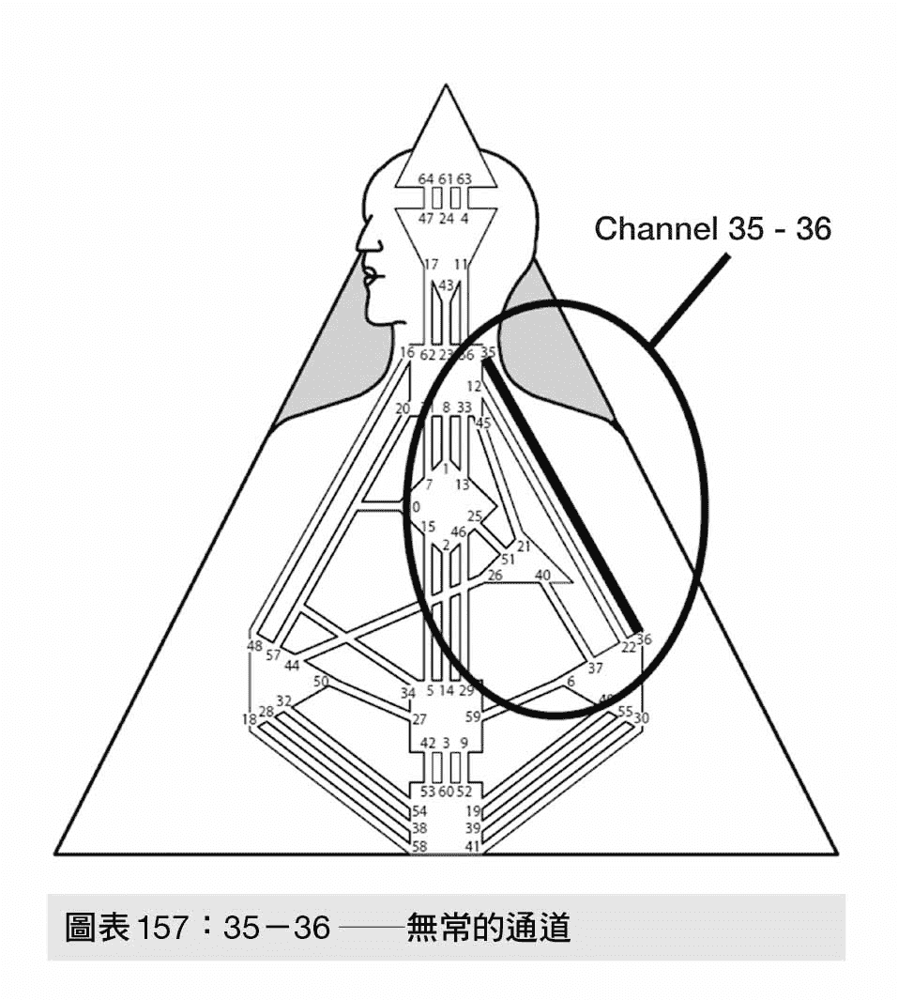

35 号闸门：改变

6 号闸门：危机

无常的通道需等待对的时间以实践恰当的欲望，并从中获得适当的崭新经验。接着当时机成熟时，我们便拥有新鲜与刺激的事物，得以为人类的故事添加不同的风味，这些故事能丰富我们的人生，拓展我们对人类经验的领会力，故事中充满了深刻的情绪感染力，最终会在各个面向带给我们启发。

此外，35-36 通道也蕴藏了冲动和疯狂的能量，未等待正确时机的欲望表现，有时会带来危险且具毁灭性的有害后果，而故事的诉说角度也自然转向这股能量的阴暗面。当拥有此通道能量的人感觉无聊或厌倦时，他们会藉由转换投注的事项、或颠覆原有的生活样貌，跃入新的生活形态等来引发混乱的局面。这便是不断寻求新体验的躁动。

当然了，随着成熟度的增长，我们对于该投入哪些事物会做出更佳的选择。简言之，等待正确的行动时机是最重要的关键，同时也别忘了告知其他人你的决定。

人类图表里的回路和通道能帮助你探索在你生命中开展的主题，也让你明白你表现关心的方式为何？你在意的事物为何？你此生要与世界分享些什么？这趟深入了解自己的旅程能赋予你力量，让你在人生中做出反映真实自我的新选择。如同崭新的机会总会自然显现，如今你拥有新的自我察觉视角，有助于你开创出更能符合你真正想要及需要的人生。

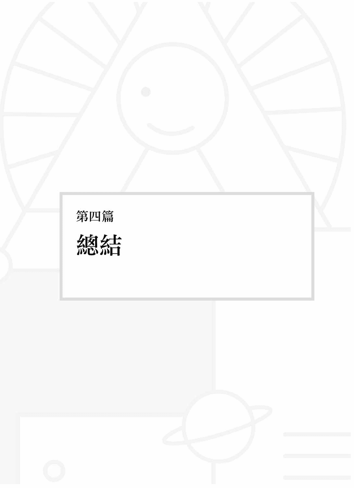

人类图并不是关于改变自我的知识。它是从全然深入了解你的天赋才智、你的本能和脆弱面来提供你人生旅程的专属装备，让你从受他人想法和评价影响的传统自我挫败模式中解脱。人类图赋予你崭新的视角，让你探见真实自我的力与美。

当你了解自己后，面对人生选择，你就能做出符合真实自我性格的决定。而当你和自己的真实性格携手共生，你的人生就会变得顺畅多了。一旦你能够自在地贴近生命，你就会活出真实自我之美！这一切都是环环相扣的。

### 第十章

## 关于你的无限力量

人类图是一套充满了各式各样内容与信息、错综复杂的系统。你很容易被个人图表里所有复杂且精细的要素吸引，而遗漏那块神奇大三角形里隐藏着更重大的讯息。

虽然人类图的每一部分都非常迷人有趣且具有强大的影响力（如同世上的每一个人），但人类图系统真正的美妙之处却在于它的简单纯粹。做自己！

依据你所属的人格类型来遵循你做决定的策略，如此一来，你不仅能发现真实的自我，也能完美活出真正展现你此生灵魂使命的人生。

人类图表揭示了若我们能忠于自我、爱自己并跟随自我灵魂的方向，那么，这种尊崇自我及抱持觉察带来的能量结果，便是开创出一个人人皆能表现与生俱来的人类之爱、且与本性及自然法则紧密相连的世界。在这个世界里，我们能在公平、民主、人人平等的群体中管理自我；我们能照护自己的身体、并为自己的现实生活负责；我们拥有不虞匮乏的资源、和支持力量并渴望与彼此分享。因为我们发自内心深切地体会到，我们能得到宇宙之流无限的供给与帮助。（而这种种皆源于爱自己！）

当你发现真实的自我，进而开创出反映真实自我的人生，便能更丰富这个世界。每一个人都是这块神圣拼图中不可或缺的要件，你是无可取代的要角，这个世界需要你活出真实的自我。

人们最常向我提出的疑问便是：「我该怎么做，才能在这个世界上发挥影响力？」我的答案总是一贯如此：「请就先从充分展现真实的自我做起吧！」

你的人类图表描绘出你的潜能，而生命旅程则是关于探索真我、勇敢开创出与真正自我协调一致的人生，这些便是世上个人成长与演化的基本特质。

由于生命会设法处于持续发展与成长的状态，因此当自我潜能无法发挥时，我们往往会创造出一段又一段教导我们懂得生命意义的人生经验。我们能从人类原型在图表中的定义部分得知，有时我们必须历经一番挣扎才能发现自我人生的意义。因此若我们未能实现自己身而为人的潜能，我们往往会面临和自己的健康、财富、创造成就感，或甚至是心灵连结的奋战，这些困顿挣扎的功用是帮助我们学习和成长，而非将我们困限于苦难之中。人类图里绝无受苦受难的闸门。

人类与其他物种不同之处，在于我们拥有自觉进化的能力。世上的万事万物都蕴藏设计，若你观察人类的图表，再与哺乳动物的设计相较，你会发现两者拥有共同的能量。然而，让两者有所区分的是，人类的选择并不全然受制于生存的本能，还包括了知晓自己此生是否实现灵魂使命的直觉意识。我们能凭直觉知道自己是否偏离了人生道路，这种对自身与灵魂使命脱节的感知，在我们的内心引发了躁动不安，驱使我们去探索真实。

由于人类具有意识能力及能量的独特性，因此我们始终保有选择，我们能选择是否要忠于真实的自我、是否要彻底活出自己的天生设计。我们能继续创造出困顿挣扎，以帮助我们界定人生的意义，或者我们也可以拥抱自己天生独特的能量设计，并与世界的能量携手，一起开创热情喜悦的人生。我们始终拥有选择权。而自我察觉正是让我们做出让人生更愉悦、更丰富「选择」的关键。

我们每一个人都是神圣宇宙的全像再现，也是属于庞大宇宙一部分的星尘产物，个体小宇宙的行为会影响地球上整体的生命。我们之所以成为集体的样貌，是因为我们是七十多亿个伟大意识观点的总和，当多数人抱持了某种特定的意识形态，它便会展现于世界。贫穷的存在是因为多数人在意识里感到贫困，战争的爆发是因为多数人在意识中发动战争，我们创造出无法持续前进的生活形态，正是因为多数人无法保持自觉，与真实的自我分离。

若你希望在这个世界上发挥影响力，并开创永久和平与富足的世界，你必须先活出能反映你意识里希冀看见的人生样貌。换句话说，你必须在自我人生中的各个面向感到丰盛、和平及真实。当你活在此种意识状态时，你便增添了这股能量在世上的临界量，而当多数人都能自觉丰盛、和平与真实时，世界彻底的改变将会展现在你我眼前。

你能献与世界最丰厚的礼物就是「你」，真实的你。

别问这个世界需要什么。问问自己，什么事物能让你充满活力……接着就投入就去做吧！因为这个世界需要的正是充满生命力的人。

──非裔美籍作家、哲学家与公民运动领导人
霍华德．瑟曼（Howard Thurman, 1899-1981）

#### 探知未来

关于「人类」意义的原型不断演变，而我们正处于人类新能量及新契机的歧点。到了二〇二七年，人类的能量场域将以崭新的方式重整建构。

我们的内在能量架构也是这波改变的一部分，人体图也将因此跟着变化，情绪中心逐渐发展为我们新的直觉来源，人们将不再以脾中心作为直觉与生存的能量中心。换言之，促使我们采取感觉良好、或正确行动的觉察意识将不再受恐惧驱动，人们对于孩童在这个世界上飢饿无援的景况将不再坐视不管，或不再将战争视为无可避免的行动，或认为苦难是身而为人可承受的一部分。

在人类图里，演化代表的意义不仅止于达尔文的进化过程，人类的进化会先从意识层面发生。自上个世纪至今，意识转变的迹象愈加显著，而此种发展态势在近二十年来更是如此。

我们渐渐明白，我们天生的设计是要让我们经验喜悦和扶持，并以此种感受作为自然的状态。我们是密不可分的整体，而我们的思惟模式在整体的共同创造能力中，扮演着极其重要的角色。事实上，我们正站在以另一种全然不同的崭新方式「作为人类」的交界线，此刻活在世上的人们所肩负的重要任务，便是开创人类的新潜能，我们的角色就象是迎接新世界诞生的助产士。

然而，为了能在此转变期间善尽我们的责任，我们必须跳脱那些让我们感觉困陷的旧有模式及恐惧，并恰如其分地实现我们独特的角色作用。你不妨想象人们对丰盛的意识具有重量和质量，而目前我们的丰盛意识秤重结果偏低，但当愈多人能经验个人的富足，丰盛意识的重量也就会增加，如此我们便更接近「人人皆能从各个面向感受富足」的境界。

无论从个人或世界的层面而言，探索及表现真实自我无疑是最重要的任务。当你懂得爱自己，并彻底活出真实自我的人生，你便在开创人人享有永久和平与富足新世界的过程中，充分发挥了你的影响力。

做自己、爱自己。你是无可取代的要角！

#### 学习资源

欲了解更多关于闸门、通道、人生角色的内容，或索取你的个人人类图表，请参考以下网址：[www.understandinghumandesign.com](http://www.understandinghumandesign.com)
