# 人类图财赋密码

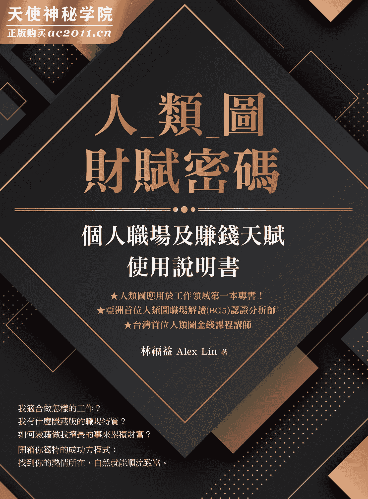

# 楔子
疯狂职场动物园

小猫从学校毕业了，准备要去找工作，但是他不知道要找什么样的工作？

他大学时念的是某某科系，为什么念这个科系呢？因为当时考完联考（学测、指考）后，在选填志愿时，父母就跟他说，医生是最好的职业，薪水好、工作稳定，大家都会尊敬你、社会地位高，是个最好的选择。

不然你就选电子机械相关科系，毕业后可以到科学园区去工作，光是公司发给你的股票，就让你吃喝不尽了。

隔壁的阿姨也跑来说，去当个律师吧，或是会计师，不然老师也不错，都是很好的选择。

由于太多选项了，小猫也不知道如何选择，就找出去年的资料，看看如果以今年的成绩排名区间，对照去年的排名区间，可以选择哪些学校？哪些科系？

一个方式就是先选学校，先找心目中认为最好的学校，填上自己可能上的那几个科系。

另一个方式是先选科系，挑那些未来最有发展性的科系，再以学校的排名，从好的学校往下填，只要是这些未来很有前途的科系，就一定错不了，最后小猫选择了某某系。

毕业前，小猫也跟同学一样，开始准备投履历、找工作，根据学长姊的经验，念某某系的人，最好也是找某某系相关的工作，比较适合，于是小猫就去应征了某某公司，很幸运的也被录取了。

工作后，小猫便开始学习成为一个标准的上班族，穿着跟大家一样的制服，努力学习当一个称职的员工，跟同事做一样的工作，加班是正常事，但不知如何面对客户不合理的要求、偶尔出错，常常被老板骂，每天战战兢兢、努力工作，希望未来有一天能出人头地。

日复一日、年复一年，慢慢的，小猫在工作上越来越不开心，每天的日子都一成不变，工作完全没有成就感，工作的目的好像就只是为了领每个月底发的薪水而已，上班后就等下班，下班后完全不想去上班，工作时最期待的就是休假日，一天一天这样下去，小猫觉得这样好像不太对，但周围的人都跟他说，工作就是这样、人生就是这样，不要想太多，明天会更好。

经过很长一段低落的时间，有天小猫听到电视上说：“人要做自己喜欢的事情，把它变成工作，这才是适合你的工作。”小猫就开始想：“我喜欢什么呢？”

小猫想来想去，觉得他从小到大，最喜欢的事情就是“吃鱼”，于是他就想，既然我喜欢吃鱼，那我就去找跟“鱼”有关的工作好了。哇！这真是太棒的主意了。

于是小猫就去港口，找了一份抓鱼的工作，天天要潜水下去抓鱼，小猫觉得：以后可以每天跟自己喜欢的东西在一起，真是太幸运了。

问题是，虽然小猫可以游泳，但是他游得并不好，即使很努力的想去抓鱼，但总是很容易跟鱼就是擦身而过，辛苦努力工作一天后，他的业绩还是不够好，一天一天过去，小猫的业绩还是没起色，看着销售排行榜前两名的企鹅跟海豹，他们都是游泳高手，于是小猫就想，那我来学习游泳技巧好了，如果我的游泳技巧变得很好的话，那我的业绩应该也就会有所提升。

小猫去报名了游泳培训班，上课时，老师教了憋气的技巧，以及如何潜得更深、如何游得更快的技术，老师说只要学会这些技巧后，就一定可以抓到更多的鱼。在培训班毕业之后，小猫觉得自己稍微有点进步，但是进步的程度有限，业绩是有比较好一点，但是整体来说没有太大改善。

然后小猫回想起在学校时，老师教过“勤能补拙”这件事，虽然我技术不如人，做得没有比别人好，可是我可以付出更多的时间，来弥补我技术上的差异，别人一天工作八小时，那我就一天工作十小时，甚至十二小时，甚至我也可以假日来加班，投入的时间比别人多，工作时间比别人长，积少成多，就应该可以赶上他们的成绩了。

即便小猫学了游泳的技巧、也花了比别人更多的时间工作，但是，业绩始终还是落在中下游，总是不如人意，小猫认为，至少我已经尽力了，大概我的职涯就是这样吧！至少收入比以前好一点，总算是有点进步了。

日子一天天过去，有一天，小猫去一间知名的餐厅吃饭，发现门口贴了一张悬赏告示：“寻找最厉害的勇士。”

仔细一看，原来这家餐厅原本生意很好，但最近不知道从哪里跑来了一群小老鼠，不仅乱挖洞，还偷吃食物，甚至还爬上桌子，吓坏了客人，造成餐厅的混乱，导致业绩下滑。

为了解决这群小老鼠所带来的困扰，店主人找来了狮子，想用吼叫声把老鼠赶跑，也找了犀牛要把老鼠踩扁，但因为小老鼠的动作很快，个头又很小，这些勇士们处理的效果都不太好，所以店主人想要寻找最厉害的勇士，帮他解决老鼠带来的问题，悬赏金额是一百个金币，听说最强壮的勇士大象，正从远方赶来的路途中，大象是店主人最后的希望。

小猫看完告示，进入这家餐厅吃饭，当小猫正在吃饭的时候，看到一只小老鼠从墙角“咻”一声的想跑到他的桌底下捡掉落的食物吃，以前来应征的勇士想要抓他们时，因为小老鼠的动作太快，总是从这些勇士的手边溜走，顺利咬走食物，这些勇士都拿小老鼠无可奈何。

但这一次，当小老鼠跑过来，以为他又能够得逞，获得他的食物然后顺利逃跑时，小猫坐在椅子上也没多想，不知为何的手就伸了出去，“唰”一下的就把小老鼠抓在手中了。大家都吓了一跳。怎么可能！以往连狮子、犀牛这些最强壮的动物都无法解决的事情，为什么这只看起来不起眼的小猫可以做到呢？

应该是小猫的好运气吧！周围的人都这么想，不过店主人看到小猫抓到了一只小老鼠，就跑来请小猫帮忙，店主人认为既然小猫可以抓到一只小老鼠，或许也可以尝试去解决其他的小老鼠，小猫也就去试试看，没想到，“唰”“唰”“唰”……一只、两只、三只……没多久，所有的小老鼠都被小猫抓起来了，餐厅的“鼠患”问题被解决了，小猫也因此获得了一百个金币。

小猫觉得抓老鼠是很简单的事情啊！老鼠跑过来时，手伸出去不就可以抓到老鼠了吗！为什么其他人做不到呢？真奇怪！不过，既然抓老鼠可以赚到金币，比起自己以前抓鱼的收入更是好太多了，于是小猫就辞掉了抓鱼的工作，自己成立了一家公司，叫做“猫抓老鼠股份有限公司”，专门处理抓老鼠的事情，目前来请小猫去解决“鼠患”的订单，听说已经排到明年中了。

# 作者序
你喜欢现在的工作吗？

我是林福益（Alex），台湾大学兽医系毕业之后，在医疗器材领域工作了约二十年，在从事人类图工作之前的最后一份工作，是外商公司的总经理。

我在二〇一一年成为人类图第一阶课程的引导师，二〇一二年成为个人解读及职场解读的分析师，从二〇一四年五月一日开始全职从事人类图的工作，主要工作内容是在做人类图的解读以及开课，我解读的项目有个人基本解读、职场解读以及关系解读。

大部分来做解读的人，都是想要更了解自己，因为他们有着对自我的疑惑以及工作上的困扰，面对自己的这些问题，想得到一个解答，希望透过人类图来得到一个答案。

即便是来做个人基本解读的人，我们也会谈到工作上的问题，我都会问他们两个问题：“你喜欢你现在的工作吗？”“你想要离职吗？”

对于“你喜欢你现在的工作吗？”大约有百分之八十的人的回答是“不喜欢”，然后对于“你想要离职吗？”也是有百分之八十的人不想离职。

从人类图的观点，工作对大多数人（生产者，占人口比例约百分之七十）是最重要的事情，但他们却做着自己不喜欢的工作，然后又不想要离职，这样的情况不就好像是温水煮青蛙一样吗？不喜欢这件事，但又不离开，那最后会变成什么样子呢？

我也问了这些朋友们，为什么你不喜欢现在的工作，但却不想离职呢？

我所得到的最多答案就是：“因为我也不知道我喜欢什么样的工作。”所以，即使我不喜欢现在的工作，就算我把现在的工作辞掉，我又不知道我喜欢什么样的工作，那如何找下一份工作呢？于是“一动不如一静”，只好继续待在现在的工作上，因此也就不会想要离职了。

人类图鼓励每一个人做自己，发挥自己的才能来活出自己，当活出真正的自己后，所遇到的人，产生的互动，所经历的事，才是对自己正确的，本就应该遇到，应该要发生的人、事、物。

如果有那么多的人，现在做的工作不是他喜欢的工作，并且在他的工作中充满挫折感，那么他很可能就是没有活出真正的自己，也没有发挥自己的才能，他所遇到的事情以及他的工作，对他而言就可能不是正确的事情及工作。

透过人类图这一个工具，可以协助一个人去找到自己的才能，当他知道了自己的才能之后，就可以去找到相对应的工作，由于是用自己与生俱来的才能，所以使用这些才能就很容易上手，自然就容易创造出好结果，当可以创造出好结果之后，自然就会让自己高兴，也让别人高兴，自己也就容易更喜欢这个工作，然后再发挥才能，再创造好结果，又更喜欢这工作……进入一种良性循环。

改变需要时间，运用书中的内容找到自己的才能，进而找到能发挥自己才能的工作也需要时间。但了解自己可以努力、尝试的方向后，最终就有可能找到一个适合自己，也能赚到自己想要的钱的工作。

# 前言
你的赚钱天赋使用说明书

许多电子产品都有使用说明书，教你在一拿到这项产品时，如何正确的使用它。所以你不会用电锅来洗衣服，你也不会想要把食物放进电视机里加热，为什么？因为你知道洗衣服要用洗衣机来洗，要用微波炉才能把食物加热。

另外，你也知道狗就天生喜欢吃骨头，猫就是会爬树，鱼就整天待在水里，你对此不会有疑问，因为你知道这是牠们的本性，牠们的天赋才能。

人呢？为什么人出生时没有附一张使用说明书呢？让我们知道这个小孩适合当运动员，那我们就让他去学运动，以后成为运动健将或是职业运动员。或是这小孩适合当业务员，我们就让他学习销售技巧，长大之后去当一个超级业务员来赚很多钱。如果一个小孩出生时，能附上一张这个小孩的使用说明书，对他自己、他的父母及周围的人，不是一件很棒的事情吗？

一个人的人类图，就是他自己的人生使用说明书，因为根据他的人类图，就能明白显示这个人的特性、天赋才能、可以发展的方向，根据他的人类图，他可以强化他的优点，避免弱点带来的影响，如此一来，就可以趋吉避凶。

在本书，我们谈论的重点是赚钱，因此我们强调的才能也是可以运用来赚钱的才能。本书的重点是介绍你有什么才能，然后，建议你思考如何发挥这些才能，让你赚到钱。我们不会直接说你适合哪种工作，你要做哪一种工作来让你赚到钱，他不会说你适合当老师或你适合当业务员，不是以这种方式来介绍，而是说明你有什么特性，能让你当一个好老师；你有什么才能，可以当一个好业务员。因为你发挥了你的特性与才能，成为一个好老师或好业务员后，你自然会因此而赚到钱。

举例来说，能够“批评、找出错误、更正错误”是一项才能，拥有这项才能的人，第一、他可以运用这项才能，去当文字编辑，挑出文章中错误的地方；第二、他可以当工程师，找出程序中的 bug；第三、他可以当品管人员，找出瑕疵的产品；第四、他可以当民意代表，找出政策中错误的地方。所以他可以从事各式各样的工作，重点是能够发挥出他的才能——找出错误、更正的工作，就是适合他的工作。

就像洗衣机主要的目标是洗衣服，所以它的特性都是跟洗衣服有关，你不会想要用洗衣机来煮饭，因为洗衣机的功能不适合煮饭。同样道理，如果你知道了你的才能，你就可以把这些才能用在相关的事情、相关的工作，然后把这项工作做得很好，藉此赚到钱，你自然就不会去做跟你才能无关的工作。

重点在于，我们如何知道“我的才能是什么呢？”所以，本书的目的，就是要让大家知道自己的才能是什么，进而去做能发挥自己才能的工作，然后赚到钱。换言之，本书也可以说是你的“赚钱天赋使用说明书”。

#### 你想知道你的才能吗？

才能（Talent）指的是，一个人与生俱来擅长的能力（尤其指未经教导的）。

譬如鱼天生会游泳，鸟会飞翔，猫会爬树，这是牠们天生下来就会做的事情，似乎也不用牠们的父母教，牠们自然就会了。

对于动物的才能，我们很容易可以分辨出来，因为我们常看到牠们在做牠们擅长的事情，或者说属于牠们本能的事情、本来就会的事情，所以我们很容易知道动物的才能。

但“人”的才能呢？由于人是万物之灵，手脚比一般动物灵活的多，可以做出许多精细的动作，人可以透过语言沟通，表达、创造许多活动或艺术，人的智慧与聪明才智，更可以创造许多前所未有的事物。所以一个人可以做出许许多多、各式各样的事情，在这些事情中，到底哪些才是一个人的才能？所以想要了解一个人的才能就相对比较困难。

因此，我们便会使用一些性向测验，透过测验的结果，试图分析出一个人的才能，但这些性向测验大多使用问卷调查，问卷的麻烦之处在于它是主观认定的，如果在不同的时间做一份相同的问卷，可能会得到不同的结果，所以透过问卷调查所得到的才能有可能因为时间的改变而改变。

透过人类图，我们很容易可以知道一个人的才能是什么。为什么呢？因为人类图是以输入一个人的出生时间及出生地而得到的。一个人的出生时间是确定的，所以他的人类图也是确定的、不会变动的。

通常，我们从一张人类图可以看到的才能，是这个人是什么类型？他的人生角色是什么？他的哪些中心是有颜色的？哪些中心是空白的？他拥有哪些通道？他拥有哪些闸门……我们称为是这个人的设计，也可以说是这个人与生俱来的才能。

为什么人类图上的这些通道、闸门就代表这个人的才能呢？对于这个问题，大家可以这样想，就好像生肖学或是占星学一样，会以一个人的出生年分或星座，来描述他的个性或行为模式。而人类图是以一个人的公元出生年、月、日，甚至细到几点几分来计算，所以人类图也能展示出这个人的个性及行为模式。

更重要的一点，人类图是一个实验与实践的知识。你不用一开始对人类图的知识就全盘接收，相信它所说的一切都是对的，我们会建议每一个人练习人类图的知识，实验看看这知识所描述的内容适不适合你？如果适合，就可以继续实验，如果不适合，就可以修改，甚至放弃。人类图只是一个工具，这世界上有许多有效好用的工具，如果你已经有很好的工具，那祝福你，但如果你还在寻找工具，建议你可以试试看人类图，看看这个工具能否帮助到你，这才是本书真正的目的。

本书强调的才能是“闸门”。在一张图中有六十四个闸门，但一个人最多只会拥有其中二十六个闸门，因为有些闸门会重复，所以一个人的闸门数量通常是在二十个左右，你所拥有的闸门就是你的天赋才能，而且本书特别强调的是在赚钱上的天赋才能。由于这些闸门都是用数字来表示，就象是密码数字一样，所以就用“财赋密码”来代表本书的主要内容。

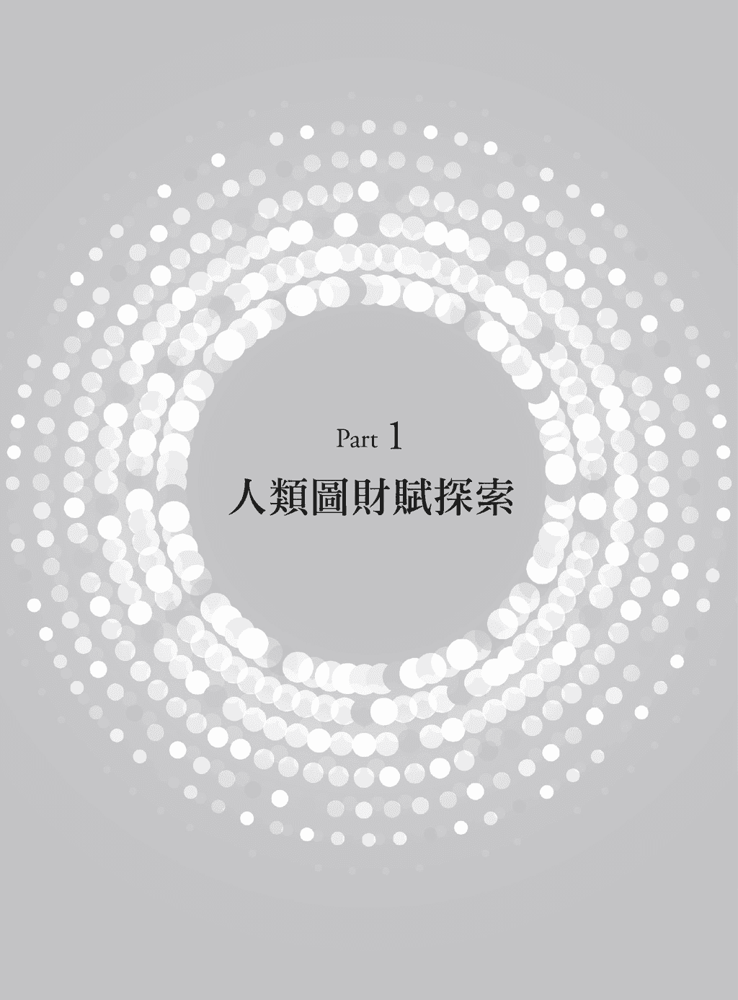

## 做适合自己的工作，钱自然来

大家都想赚钱！我想绝大多数人都想赚更多的钱。

我曾经在一个场合，对二十个人做一个简单的调查，我问他们，如果有一个工具，可以让你更了解自己，你会想要学习这工具的人请举手？大约十八至十九个人举手。

我再问，如果有一个工具，可以让你更了解别人，让彼此的关系更好，你会想学习这工具的人请举手？大约十七至十八个人举手。

再问一个问题，如果有一个工具，可以让你了解你对爱的看法，你对爱的表达方式，也可以了解别人对爱的表达方式，你想学习这工具的人请举手？大约十一至十二个人举手。

我接着问最后一个问题，如果有一个工具，可以让你了解你的赚钱才能，让你可以赚更多钱，你想学习这工具的人请举手。

我本来以为应该是全场二十个人都会举手，但是很意外的，只有五个人举手。因为这个结果跟我的预期差很多，因此我在休息时间时，便去问了一些人，为什么他们对学习赚更多钱的工具没有兴趣呢？他们回答我：“因为觉得没有希望。”

这个答案让我很惊讶，但也是个意料之外，情理之中的答案，因为在我解读人类图的经验中，遇过太多太多的人，他们不喜欢自己的工作，但是也没有想要离职。我也问过他们，如果你不喜欢你的工作，为什么你没有想要离职、换个工作呢？

大多数人的回答是：“因为我不知道我喜欢什么。”“我不知道要换什么样的工作。”

赚钱这件事主要是跟工作有关，因为大部分的人都是透过工作赚到钱，但如果一个人不喜欢他的工作，也没有想要离职，虽然他内心可能想要赚更多的钱，但是他要如何达到呢？除非他能在现有的工作赚到更多的钱，不过如果一个人能在他现有的工作上赚到他想要的钱，他应该是充满希望的才对。所以我猜想许多人对赚钱觉得没有希望，是因为现有的工作无法让他赚到更多钱，他在当下也没有看到其他的可能性（譬如换个工作或自行创业……等其他的作法），只能卡在现有的工作，所以才会“觉得没有希望。”

再回到赚钱这件事，赚钱的意思是：“在交易中获得利润”。交易可能是你提供商品、服务给其他人，你提供的可能是有形的产品，也可能是无形的服务，藉此获得利润（也就是钱）。你可能是农夫，你种菜，在田里付出劳力，辛苦把菜种到成熟，然后把菜卖给别人，别人给你钱，你主要是付出劳力，卖有形的菜；然后你也可能是一个中盘商，跟农夫买菜，然后卖给超市，你付出的是与人沟通的时间，寻找买家跟卖家，你卖的也是有形的菜；你也可能是个电子商务平台供应者，你创造一个平台，让一般大众透过你的平台，就可以买到产地直送的新鲜蔬菜，你付出的是建立一个平台，寻找买家与卖家，主要卖的是无形的服务。

所以，同样是“菜”，在交易“菜”的过程中，有付出劳力的，有寻找买家卖家的，有提供服务的。有的是商品本身，有的则是服务，有的是有形的，有的是无形的。

再以“菜”来说，有用化肥栽种的，也有用有机栽种的，有平地种植，也有高山种植的，还有许多的品种，因各种差异，产生的卖价也有高有低。

因此，光是在以“菜”赚钱这方面，就有各式各样的人，用各式各样的方法来赚钱。而这世界有三百六十五行，各行各业种类都不一样，因此赚钱真的是一件很复杂的事情。

不过，根本上来说，赚钱这件事还是可以用“一个人如何提供商品、服务来获取金钱”来解释。因此，这里有几个关键字：

第一个关键字是“如何”。“如何”代表的是方法或工具，譬如我身强体壮，可以挖土施肥，因此我靠“种”菜来赚钱，或是我擅长与人交际应酬，因此我靠“找买家、卖家”来赚钱，或是我懂得计算机程序，我“设计电子商务平台”来赚钱。

这些方法或工具，我们可以把它转化成——就是你所拥有的才能，譬如“身体强壮”是你的才能，“擅长与人交际应酬”也是一种才能，“设计电子商务平台”也是一种才能。

每一种才能，都可以有不同的运用与延伸，譬如“身体强壮”这个才能，可以用来“种”菜，可以用来“搬”砖头，可以用来“打”拳击。

“擅长与人交际应酬”这个才能，你可以当卖菜的中盘商，你可以当业务人员，你可以当客服人员，你可以当咖啡厅服务生……等。

所以，运用每一个才能所能做的事情有很多种，所能做的工作也很多元化。

但是，如果你“身体强壮”又“擅长与人交际应酬”呢？你的选择就变更多了，你可以种菜、搬砖头、当中盘商、当业务员……等，是不是增加了很多的选择？而选择变多了是好事吗？也不见得，因为太多的选择就会变成很难选择。因为大多数人不知如何做决定，不知如何做出对自己来说是正确的决定，担心自己做错决定，因此只好停在原地，继续维持现况。

第二个关键字是“商品”。譬如你可以种“菜”，而“菜”就有很多种了，高丽菜、空心菜、菠菜……等，然后，既然你可以种“菜”，那你能不能种“水果”呢？应该也可以吧！“水果”又有很多种，香蕉、凤梨、苹果……等，也可以种“树”，茶树、榕树、圣诞树……等。

第三个关键字是“服务”。你可以在市场卖菜，提供客人直接把菜买回去的服务，你可以提供送菜到家的服务，甚至你可以提供把菜煮好，送到客人家的服务……等，服务也有很多种。

所以，对于“一个人如何提供商品、服务来获取金钱”这件事，把它落实到每个人身上，就可以分解成——“我有什么样的才能，并依据这才能，做出适合我自己的选择，提供相对应的产品跟服务，来获取金钱。”

因此，我们针对赚钱这件事情要思考的就是：

一、我有什么样的才能？

二、我要根据这才能，去做什么样相对应的事（工作）？

本书的书名《人类图财赋密码》就是要告诉你，你有什么样的才能，这些才能就是在你人类图上所拥有的二十六个闸门，它们有各自的赚钱方式，让你了解你与生俱来的赚钱才能。

当你知道你的财赋密码、赚钱才能后，要用来做什么样的工作，才能真的赚到钱？要如何做选择呢？这时候就要知道如何做出正确的决定，因此，我们也将提供你一个适合你自己“做决定”的方式，让你可以根据自己的才能，做出适合你的正确决定。

当你了解自己的才能，又可以根据自己的才能去做相对应的事，自然而然，你就可以把事情做好，可以创造出好结果。当你能创造出好结果后，自然就会赚到属于你应得的钱了。

## 了解自己的财赋密码

既然本书名为：《人类图财赋密码》，在知道你的财赋密码前，首先要知道人类图是什么。

#### 人类图是什么？

人类图是以一个人的公元出生日期、出生时间及出生地，输入软件或在人类图网站上输入以上资料所得到的一张图，这张图称为人类图（如图 1）。

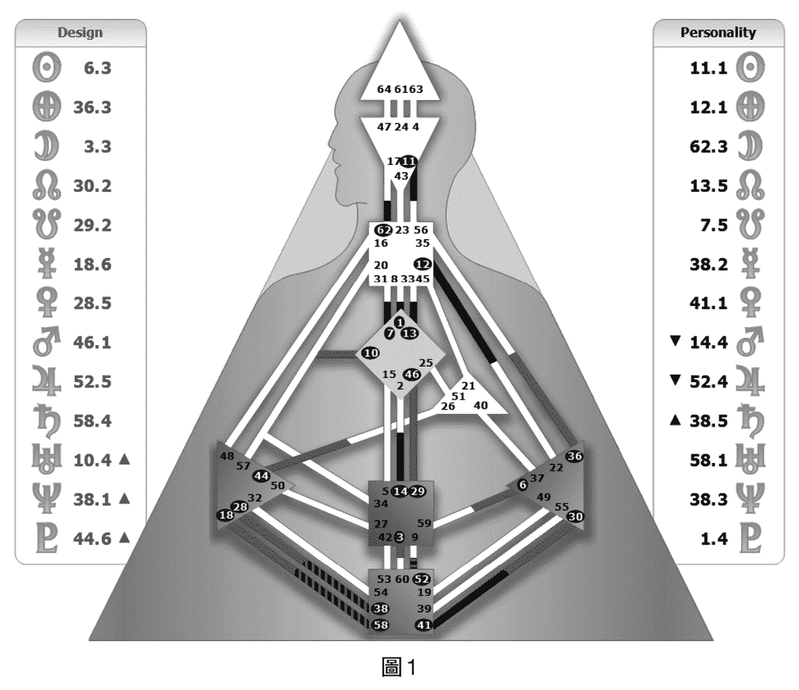

###### 人类图有什么用？

透过人类图，可以了解一个人的个性、才能、优点、缺点……等这所有的一切，我们称之为“设计”。所以人类图的用途如下：

一、了解自己：很多人都想要了解自己，人类图这项工具可以让一个人深入的了解自己，包括自己知道的，还有自己不知道的。

二、了解别人：我们生活在一个群居的世界，每个人都必须跟别人相处与互动，包含家人、同学、朋友、同事、伴侣……等，因此我们都有与人沟通、相处的需求，但如果我们不了解对方，那要如何跟对方沟通呢？透过对方的人类图，你可以了解自己与对方相同及不同之处，知道如何与对方沟通及相处，进而创造更和谐的关系。

三、创造一个功能良好的团队：这里的团队可以是家庭或公司，团队是由人聚集而成，如何找到对的人，发挥彼此的才能，透过团队合作，达到团队所追求的目的，透过人类图这个工具，让其中成员知道如何互动，便可以让团队发挥最大的效能。

###### 如何看懂这张人类图？

人类图的架构，如图 1 所示：

首先，图的左右两边有些星球的符号，这些是来自占星学；星球两侧的数字来自《易经》，小数点后有一至六的数字，这是《易经》中每一个卦的六条爻。图的中间有一些三角形、正方形的图形，分散在不同的位置，这些称为能量中心（来自脉轮）。能量中心间有管状物，我们称为通道（来自犹太教的卡巴拉）。虽然人类图是采用占星、《易经》、脉轮、卡巴拉这四种古老知识的架构，但它又不是这四种知识。

###### 人类图基本元素

．闸门：一张人类图中，固定有数字一至六十四，座落在特定能量中心固定的位置上，称为六十四个闸门。而在一张人类图的左边、右边各有十三个数字，加起来二十六个数字，代表你所拥有的二十六个闸门，也就是本书将要介绍的财赋密码中，你所拥有的二十六种不同的财赋密码——二十六种不同的赚钱方式。

．通道：在图上有很多的管状物，我们称为通道。你人类图上的二十六个数字，会落在你人类图上的特定位置，如果在一条通道两边的数字你都拥有，便表示你接通了这条通道，你就拥有这条通道的才能。

当一条通道接通时，通道两边的能量中心便会有颜色，代表这两个中心以及这条通道，是这个人此生会一直持续运作、持续拥有的才能，如果你只有通道一边的闸门而已，代表你没有接通这条通道，你就不具备这条通道的才能。

．能量中心：在图中间可以看到有三角形、正方形或菱形的方块，我们称为能量中心，如果一个能量中心是空白的，代表接到这个中心的所有通道，只有其中一边有数字（闸门），或者两边都没有数字（闸门），因此这些通道跟这个中心就是空白的，空白中心跟没接通的通道，代表它们是属于休眠状态，也就是平时没有在启动的意思。

如果一个能量中心有颜色，就代表这个能量中心和接通这两个中心的通道会持续运作，它们拥有固定运作的方式。

###### 空白中心如何被启动？

在两种状况下，空白中心会被启动：

第一种是人的影响。

人类图强调能量场的存在，每个人的能量场大小是：一个人的手臂伸直与地面平行，想象手臂伸长两倍当作半径，以自身为圆心，画个圆圈，这是一个人的能量场大小。

如果两个人互相靠近，当其中一个人的能量场进入（接触）到另一个人的能量场时，就会受到别人的影响，就好像两个人的两张人类图叠在一起，互相产生影响，如果在同一个能量中心，你是空白的中心，而对方是有颜色的，叠在一起后，空白也就会变成有颜色（有人用空白中心被有颜色的中心染色了来比喻）。而且空白中心有一个特色，就是当被对方影响，由空白中心变成有颜色后，会放大对方的两倍（两倍只是一个简单的说法，有时会放大三倍、四倍、六倍……）。

举例来说，在图 2 中，右下角圈起来这个三角形中心是情绪中心，如果你是一个情绪中心空白的人，空白的情绪中心，代表你的情绪没有固定运作的方式，所以当你是一个人独处，周围没有其他人的能量场干扰的时候，你的情绪会象是湖水一样的平静，没有任何高低起伏。

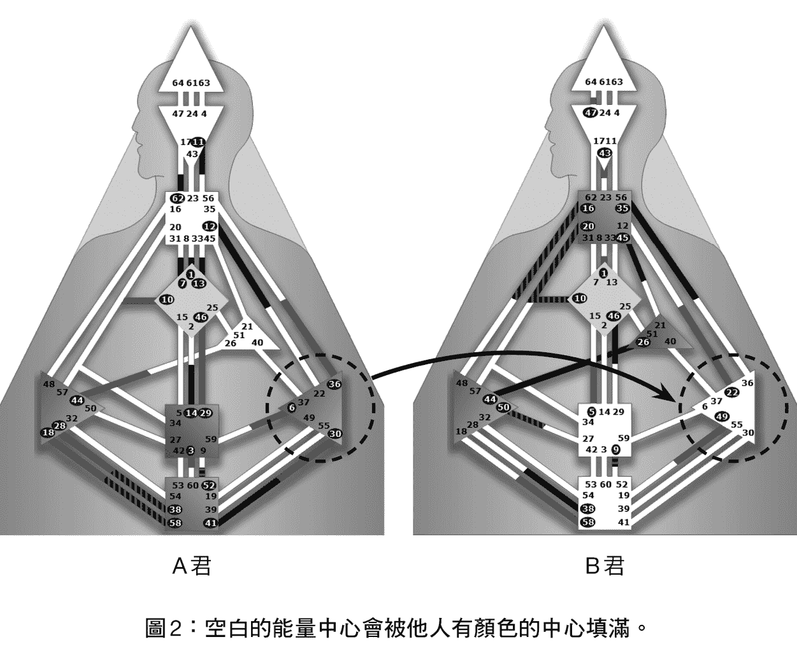

如果是一个情绪中心有颜色的人，他的情绪从出生、到现在、到死亡都会有固定运作的方式，情绪运作的方式就象是海浪一样，由高向低，又由低向高，起起伏伏，持续运作，我们称为“情绪波”。

因此当一个空白情绪中心的人（如图 2 的 B 君），进入一个情绪中心有颜色的人（图 2 的 A 君）的能量场，两个人会形成一个合图，然后 B 君的空白情绪中心会受到 A 君有颜色情绪中心的影响，因此就会放大对方情绪的两倍，如果 A 君心情好，B 君就会放大 A 君的两倍，变成两倍的心情好，但如果 A 君心情不好，B 君也会放大 A 君的两倍，变成两倍的心情不好。

空白中心受到他人的影响，还有另外一种情况，如果你的情绪中心是空白的，另外一个人的情绪中心也是空白的，两个人各自独处的时候，都是像湖水一样的平静，理论上，进入彼此的能量场时，还是会一样的平静才对。

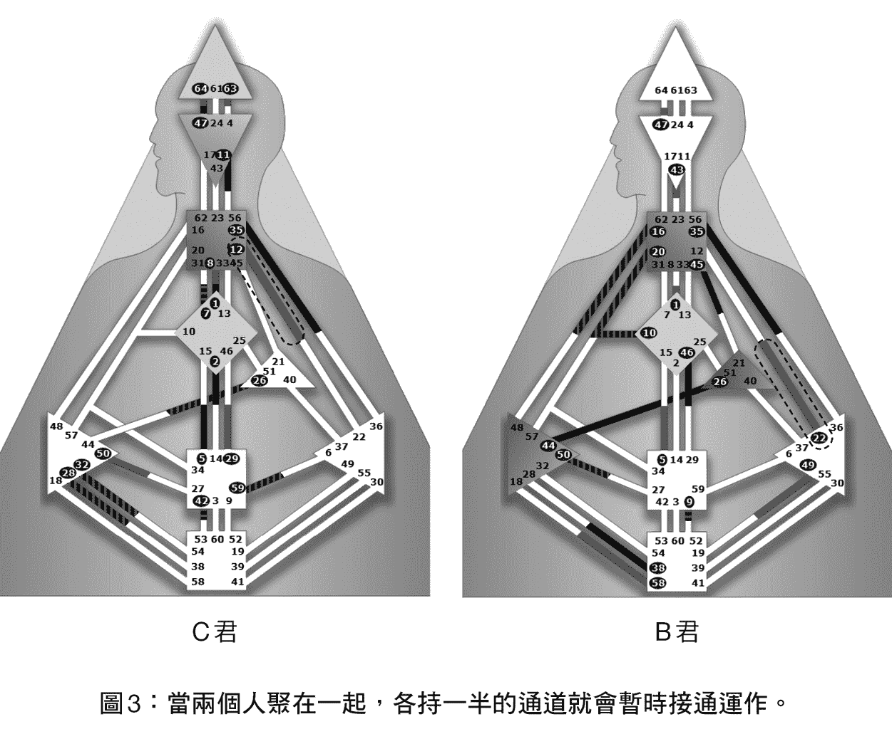

但是如果图 3 中 B 君的情绪中心中有 22 号闸门，C 君在这个 22 号闸门的那条通道的对面，拥有 12 号闸门。当 B 君与 C 君进入彼此的能量场时，两张图叠在一起形成合图，这时 B 君的 22 号闸门会接通 C 君的 12 号闸门。而当一条通道接通时，两边的能量中心就会变成有颜色，因此 B 君与 C 君进入彼此的能量场时，两个人的情绪就不再是像湖水一样平静了，而是会暂时性的产生情绪的高低起伏。这两个人当各自独处时都很平静，可是聚在一起时，就会变得心情很好，也有可能会心情低落。

第二种空白中心会被影响的方式是：流日或流年。

流日指的是人类图两旁的星星的位置每天会移动，它们会以圆形（或椭圆形）的方式移动，譬如太阳每天都会移动位置，一年会绕一圈，月亮则是每个月绕一圈，如果你是情绪空白的人但拥有 22 号闸门，只要当任何一颗星星移动到 12 号闸门的时候，它就会接通你的 22 号闸门，只要那颗星星待在 12 号闸门的那段时间中，即使你都是一个人独处，按道理你应该情绪都很平静，但是因为被流日接通了 12–22 通道的关系，你在那段时间中，就会处于心情不断的高低起伏的状态。所以有人会说，我最近都没有什么变化啊，一样的上班、下班，也没发生什么事啊。为什么我最近心情都不好呢？可能就是受到流日的影响。

###### 空白中心有什么问题？

对方如果心情好，你放大他的两倍，这问题不大，问题出在当对方的情绪不好时，你同样会放大对方的情绪两倍。由于你平时都是处于心情平静的状态，而当被对方影响，变成两倍心情不好的时候，你就会觉得不舒服、不习惯，为了自保，为了回复成原来平静的状态，你自然而然的会想要取悦对方，让对方开心，因为如果对方从不开心变成开心，你也会从放大对方不开心的两倍，变成两倍的开心。

所以，取悦别人、不跟别人起冲突，便是这个空白情绪中心的人最常会做的事。

取悦别人、让周围的人开心，听起来不错啊，有什么问题呢？

它的问题出在会影响这个人做决定。

###### 做决定的重要性

做决定是人类图除了了解自己外，最重要的一个重点，甚至比了解自己还重要。为什么呢？因为人生就是一连串的决定，譬如你要念哪个学校？这是决定。你要选哪个科系？这是决定。你想跟谁当朋友？这是决定。你会跟谁交往、要不要结婚？这也是决定。选什么工作？这更是决定。要住哪里？这还是决定……人生当中，充满了许许多多重要的决定。

可是这个社会、学校，并没有教我们要如何做出正确的决定。其实不能说都没有教，我们最常被教导说要多想一想，要想清楚，列出优点、缺点来比较分析，甚至加权计分……等，但这些方法并没有办法协助我们做出正确的决定，而人类图则能提供每一个人，属于自己做决定的方式与工具。

回到空白情绪中心对做正确决定的影响，因为这个空白情绪中心的人会放大别人的情绪，别人开心他会两倍开心、别人难过他也会两倍难过，因此便会尽量避免跟对方起冲突，避免对方难过。

这会产生什么问题呢？举例来说，如果这个情绪中心空白的人小时候想念艺术，他跑去跟父母说这件事，父母听到之后很生气，跟这小孩说念艺术毕业之后不容易找工作，赚不到钱，要他去当老师，说那才是稳定的工作。

但这个小孩就是喜欢艺术，他就是想念艺术，可是只要一跟父母提，父母就生气，再次跟父母提，父母更生气，最后这个小孩因为空白情绪中心的特性，不喜欢跟别人起冲突，害怕对方生气，到最后他有可能就会选择妥协，选择放弃艺术，改去当父母喜欢的老师。

因为这个决定，这世界可能少了一个伟大的艺术家，多了一个普通的老师（请注意这里并不是说当艺术家就比较好，而当老师就不好，这里的“艺术”可以改成音乐、电影、美术、创作……等那些不被社会主流价值认为是稳定且有发展的工作，而“老师”可以换成医师、律师、银行行员……等社会主流价值所认为好的工作）。

由于我们拥有的空白中心会受到别人的影响，进而改变我们做决定的方式。若是我们没有察觉到这一点，我们在人生中所做的每一个决定，很可能都会受到外在的影响，而当你做的决定是因为受了别人的影响而做的决定，你的这一个决定是因为别人，而不是为了你自己，这个决定就很可能不适合你。

每个空白中心都会有影响一个人做出正确决定的原因与方法，一个人的空白中心越多，他受到的影响就可能越多。

###### 空白中心是我们的缺点吗？

空白中心不代表缺点，空白中心是我们可以学习的地方，透过放大对方的能量，你可以向对方学习，你会放大张三的两倍，你会放大李四的两倍，你会放大王五的两倍……由于空白中心会放大对方两倍这个特性不会改变，所以在年轻时你不知道自己是张三、李四还是王五，到底要怎么办才好？因此这个空白中心的特性，在你年轻时就很可能会为你带来困扰甚至痛苦。

随着时间的推移，透过后天不断的学习，慢慢的你会知道三、李四、王五各自的优点跟缺点在哪里！你学会了自己的判断基准，慢慢的学习到自己的人生智慧，只是学习人生智慧通常需要时间，常常是年纪越大的人，随着年纪的增长，与各种事情的历练，在事情的碰撞中，慢慢的，渐渐学习到人生的智慧。因此，空白中心并不是一个不好的地方，它是我们会被影响的地方，但也是我们能够学习的地方。

###### 学习人类图的好处

当你知道你的人类图中，那些空白中心会如何影响你做决定，然后也知道你有颜色的中心，以它持续运作的方式让你可以依靠它，做出正确的决定，你就有机会，在每次要做决定时，都能做出适合你的正确决定。

如果你的每个决定都是正确的决定，你向前的每一步都是正确的，自然你的人生就会正确的展开，正确的向前走，你就会拥有属于你正确的人生。

###### 人类图非万灵丹

人类图不是万灵丹，也不是宗教、不是信仰，它只是众多工具中的一种，因此，不要盲目相信人类图知识中的所有一切。

但是，它是一个可以实验、验证的工具，人类图强调并鼓励每个人去做实验，去试试看，看看人类图所提供的知识适不适合自己，如果适合你，就可以继续练习，继续使用。如果不适合，那就修改，甚至放弃都可以，它只是一种选择而已，但是，强烈建议大家可以试试看，或许，你会得到意想不到的结果。

## 找到自己做决定的方式

人类图提供了每一个人依照自己的设计来做决定的方式，首先你要知道自己的人类图，当你跑出自己的人类图之后，请先找到你的“类型”（Type）、“策略”（Strategy）、“内在权威”（Inner Authority），当你知道这三种后，你可以对照下面的说明，就可以知道自己如何做决定了。

人类图把人分成四种类型，四种类型都有各自不同做决定的方式，以人类图的术语来说，就是要按照各自的“策略”跟“内在权威”来做决定，分别介绍如下：

#### 显示者（Manifestor）的策略

显示者做决定的方式是“告知”，“告知”是什么意思呢？就是显示者在做任何决定之前，要通知跟这决定有关的相关人等，要跟这决定有关的人说他（显示者）要做什么事，说（通知）完后就可以去做了。

###### 主动与被动

要了解四种类型的策略，我们要先说明“主动”与“被动”这两个名词。

“主动”是什么意思呢？就是想做什么就做什么，想说什么就说什么，想去哪里就去哪里，按照自己的想法进行各种事情。

“被动”是什么意思呢？就是不能主动，要经由外力刺激才能展开行动。

在四种类型中，显示者是唯一一种可以“主动”的设计。

因此，显示者可以“主动”去做所有事情，而因为显示者可以主动发起做事情，所以他们是以前的领导者，近代很多的领导者、企业的创办人都是显示者，当他们成功之后，就把他们的成功经验写下来，告诉大家要“积极主动”、“若要如何、全凭自己。”、“要努力奋斗，去开创自己的未来。”因为这是他们成功的方式，他们就会告诉其他人，只要其他人学习他们成功的方式，自然也会取得成功。

因此“主动”也就成为社会的主流价值。

由于显示者可以主动做事情，不过“主动发起”不是显示者的策略，显示者的策略是“告知”，就是在做任何决定之前，要告知跟这决定有关的相关人等，这显示者要做什么事，告知完后就可以去做了。

譬如一个显示者常常换工作时都没有跟父母说，当被父母发现他又换工作时就被痛骂一顿，认为他没有定性，都随便换工作。

当学习人类图之后，下一次他又想换工作了，想说就来练习“告知”好了，就跟父母说想要换工作了，本以为又会被父母痛骂一顿，没想到爸爸听完之后，就淡淡的说了一句，你想清楚就好了。这就是“告知”的力量，因为告知之后，便可以消除周围的抗拒与阻力，让显示者去做想做的事。

请注意，虽然显示者的策略是“告知”，但并不是说显示者只要“告知”后，就什么事情都会成功，都会顺顺利利，“告知”后还是有失败的可能，但是因为“告知”跟这事情的相关人等，消除了抗拒，显示者本身也不再感到愤怒，这对显示者来说便是一个做决定的方式。

#### 生产者（Generator）的策略

除了显示者可以“主动”以外，其他三种类型都不能“主动”。许多人第一次听到这个概念时，都会很惊讶的问：“为什么？”因为这颠覆了大家的认知，这社会不是要每人都积极主动吗？怎么在人类图里面，就只有占八％人口的显示者可以“主动”，其他九十二％的人都不能主动，很多人都很难接受这个说法。

人类图是一门可以验证的知识，因此，我们把其他类型的策略说明后，再整合来看“主动”与“被动”的差异。

生产者的策略是“等待回应”，这里的生产者又分成两类，我们把它分为纯生产者（Generator）和显示生产者（Manifesting Generator），他们的策略一样都是等待“回应”。

关于“回应”，我把回应分成两个部分来介绍，第一个部分叫做“荐骨的声音”，“荐骨”指的是在人类图中，中央部分从下往上数来第二个正方形，这就是“荐骨中心”。

很多人对“荐骨”这个名词觉得很奇怪，其实荐骨是一个在人体内真正的骨头，就是位在骨盆腔的一块五角形的骨头，也就是尾椎骨上方的那一块骨头。

“荐骨的声音”，指的是当一个生产者（也就是荐骨中心有颜色的人）要做决定时，他要把这一个决定（这件事情）化为 Yes 或 No 的问句，然后找人来问他，再以发出的声音，决定要做这件事还是不要做这件事。

譬如说一个生产者在思考要不要买一件衣服，所以他可以把这件事情化为一个问句：“你想买这件衣服吗？”然后找一个人来问他这个问题。

回答这个问题时，生产者不要用文字、语言来回答，就是不要用嘴巴说出“好”或“不好”、“想”或“不想”来回答这个问题，而是用声音来回答。如果答案是肯定的，就发出一个肯定的声音，象是一个强而有力的“嗯”来代表 Yes。如果答案是否定的，就发出一个否定的声音，譬如象是一个虚弱轻微的“哼”来代表 No。

我认为“荐骨的声音”是生产者在一开始接触人类图的书籍时，最难理解的部分，因为它是声音，而在书籍中要用文字来说明 Yes 跟 No 两种声音的不同，是非常困难的事情。所以我用个比喻，当我们学生时期在学校上课的时候，有天一位老师走进教室跟大家说，因为教这堂课的老师临时有事不能来上课，所以这节课大家自由活动，一讲完后，所有同学就发出“耶！”的声音，这就象是荐骨发出的 Yes。如果一位老师走进来说，大家现在把东西收起来，这堂课要临时抽考数学，大家就发出“噢！”的声音，这就象是荐骨发出的 No。

另外还有个例子，在你观看球赛时，譬如篮球赛，当两队的分数非常接近形成拉锯时，这时你喜欢球队的球员，突然一个精彩的三分球射篮得分时，你可能会发出一个“耶！”的声音，就象是荐骨发出的 Yes。但是如果弹跳之后，就差一点，却没进的时候，你可能会发出一个“唉！”的声音，就象是荐骨发出的 No。

回应的第二个部分，我把它称为“身体的反应”，因为回应是针对你看到的东西、你听到的声音、你感觉到的事情，来采取反应，这也称为“回应”。

譬如你在逛街时，突然看到橱窗内有一件漂亮的衣服，你就不由自主被它吸引过去，走到它的前面，一直看着这件衣服，就代表你对这件衣服有回应。

另外，很多人都有这种经验，当他在逛书局时，常常走过去后，然后又走回来，拿起书架上某一本书，这也是“回应”，因为书架上几百本书，为什么你会挑出那一本书，就是你对那一本书有“回应”，这是你对“看”到的东西有回应。

你也可能在路上听到鸟叫声，就想要去山上走走，这是你对鸟叫声有回应。这是你对“听”到的声音有回应。

回应就是当有外在的事物来到你面前，你因而采取行动，这就叫做回应。

我们介绍了显示者可以“主动”，但发起前要“告知”，生产者不能主动，要“被动”、“等待回应”，这是很多生产者无法接受的部分，我们来说明这差异。

以找工作来说明，一般人得到工作，大概是两种方式，一种是主动去找工作，一种是被动得到工作。

主动找工作就是：主动投履历，主动去应征，主动去争取到工作。

被动得到工作就是：经由朋友、同事、家人介绍之后，你才去应征，或是由别的公司主动找你，猎人头公司主动跟你联络，这些都是来自外在的讯息，你回应之后采取行动才得到的工作。

我们说人类图是一个可以验证的知识，因此，如果你是生产者，请回想过去的工作经验，是主动去找的工作比较顺利，比较好？还是被动的，别人介绍的工作比较顺利、比较好？

大多数的生产者回想之后，就会发现，好像都是被动得到的工作比较顺利、薪水比较高、结果比较好。而自己主动去找的工作，即使顺利被录取，最后的结果好像都不太好。

为什么呢？这就是因为你在做“找工作”的决定时，符合你的策略——“等待回应”，而做出的决定，就会是适合你的决定，结果就会比较好。

但为什么没有按照生产者的策略“等待回应”，反而采取主动发起而做的决定，就很容易结果是挫败呢？

因为“主动”是八％显示者才能做的事情。由于这些显示者的宣传告诉大家他们主动发起，顺利成功被录取的经验，强调大家要“主动”，这社会也希望大家“主动”，我们不知不觉的认为，“主动”是对的，“主动”是好的。尤其，几乎每个父母，都希望自己的小孩能自动自发，“主动”做事情，譬如主动去洗澡，主动来吃饭，主动去做功课，不要爸爸妈妈在背后一直催。所以，大部分的父母，都期待小孩能“变成显示者”。

所以生产者们就被这种氛围影响，便觉得自己要积极主动去找工作，但只有显示者可以主动，若生产者也学着主动去做事情，就很容易失败，因而产生挫折感、挫败感。

如果生产者是因为别人介绍而对某工作有回应，再去应征且被录取，他做这份工作就会比较顺利，因为他是采用生产者的策略——“等待回应”来做决定。

我们说人类图是一个验证的学问，各位生产者可以回想，过去的工作经验，是不是“主动”去找的结果比较糟，“被动”回应的结果反而比较好？

虽然只有显示者能够“主动”发起，其他类型都不行，但并没有人规定说其他类型的人都不能发起，只是其他类型的人若主动发起的话，大多数的情况都会失败，只有少部分会成功，而且失败的时候会很痛苦，但是如果生产者等待“回应”的话，大部分的情况会成功。当然有时还是会失败，只是失败时相对比较不会痛苦。

“发起”跟等待“回应”最大的区分点，在于你的起心动念，如果你有一个企图心想做一件事，这就是发起，如果你没有任何想法，只是等待事情来到面前，再采取行动，这就是回应。

我听过好多生产者都有这样的经验，在跟朋友聊天时，聊到最近的工作做得不是很顺，感觉不是很开心，朋友就跟他说，刚好我们公司最近有缺，你要不要来试试看？这个生产者就去试了，然后就被录取了，之后在这家公司也做得很开心。

因为这个生产者是针对他朋友提出的讯息（刚好公司缺人）而回应，然后换了工作，这就是因为“回应”来决定新的工作，就会比较顺利。

#### 投射者（Projector）的策略

投射者的策略叫做“等待被邀请”，意思是投射者的工作，最好是被别人邀请，然后再去做这份工作的结果会比较好。

跟前面生产者的状况类似，投射者如果主动去找工作，结果通常不太好。因为投射者也不能“主动”，只要投射者主动出击后，通常很容易失败，因而产生苦涩的感觉。

适合投射者决定工作的方式，是“等待被邀请”，最好是别人先看到这个投射者的才能，然后邀请他来做这份工作，这对投射者来说，是最适当的方式，他才会在这份工作上发挥他的才能，做得很好。

很多人会问“等待回应”跟“等待被邀请”有什么不同呢？不同的地方是，“等待回应”的生产者可以因为看到路上的海报来回应，可以听到电台的广播声音来回应，可以因为外在环境的种种讯息来回应，因此回应的方式可以很多元。

但是投射者的“等待被邀请”通常是来自“人”的邀请，而且是越正式的邀请越好，一定是有个人来邀请你去做某个工作，或有人邀请你去找工作，当你接受这邀请，开始去找工作或开始去应征后，所得到的结果会比这个投射者主动去找工作来得顺利、来得好。

譬如我是一个投射者，在第一份主动找的工作一年后，在跟朋友聊天时，我提到了正在思考下一步的可能性，我朋友跟我说，她有个朋友在药厂做业务代表，做得很不错，因为她知道我是兽医系毕业的，就问我有没有兴趣去药厂工作。

当时，我不知道这就是“邀请”，不过我还是接受了朋友的建议，由她的朋友将我的履历转给人事经理，但与人事经理第一次面试完后，人事经理跟我说：“Alex，我们药厂的业务代表都是药学系毕业的，虽然你在兽医系有念过药理，但可能还是不太适合。”

这次面试失败后，我也没有觉得很失望，觉得没有成功也没有关系，可是过了两个星期，那位人事经理又打电话给我说：“Alex，我们医疗器材公司这边有个职缺，我觉得这职位很适合你，希望你再来面试一次。”我去跟两个医疗器材部门的经理面试，面试完后他们就录取我了，这两位经理跟我说，在过去三、四个月他们面试了好几十个人，都没有合适的，而因为我是兽医系，算是医学相关背景，所以他们一看到我就觉得我很适合，因此我就被录取了。

回想那次的经验，虽然第一次面试也是被邀请，可是人事经理可能是因为同事的推荐，才找我去面试，就没有成功。第二次面试是人事经理看到了我的才能（兽医背景），在看到了我的才能之后而发出的邀请，对我就是一个适合且正确的邀请，也从这个邀请，我开始了将近二十年的医疗器材的职涯。

#### 反映者（Reflector）的策略

反映者的策略，是要等二十八天之后再来做决定。这对许多人来说是很不可思议的事情，为什么要等这么久？

反映者整张图的设计都是空白的，他没有通道，因此他没有中心有颜色，他没有持续运作的方式，跟其他三种类型比较，反映者受流日（每天星象的位移）的影响很大，而在所有行星的影响中，月亮的影响最大，因为月亮每一个月会走完六十四个闸门一圈，因此反映者要观察每天月亮在自己图中的位置，当月亮走到这个反映者所拥有闸门的某条通道的对面闸门时，就暂时启动了那个闸门，让反映者暂时拥有这整条通道的才能。当月亮走完一圈（大约是二十八天），依序启动每一个原先休眠的闸门后，就好像让每一个闸门都表达意见后，反映者才能做出决定。不过这边指的是重大决定，象是工作、婚姻、搬家……等重大决定。譬如有个工作找上反映者，最好不要马上决定接受或不接受，而是要开始想，在经历二十八天之后，如果还是想做这个工作，就接受这个工作；如果想着、想着觉得不想去，就拒绝这个工作。如果在等待的过程中忘了这件事，就代表这件事不重要，也不用做决定了。

有一位反映者由朋友介绍他去某间公司面试，面试完后，他开始思考要不要去这家公司上班，朋友都催他如果你想去就赶快做决定，免得公司找了别人，你就失去机会了。但他还是一直想，等过了一个月，他决定要去那家公司上班，而公司刚好也还没找到人，他于是就去上班了，后来工作的也很好。

以上简单介绍了四种类型的策略，但是还要加上“内在权威”，才是每个人做决定的方式。

#### 七种不同的内在权威

人类图中的四种类型拥有各自的策略，这是他们做决定的方式，譬如显示者要“告知”，生产者要“等待回应”，投射者要“等待被邀请”，反映者要“等二十八天之后再来做决定”。

在人类图当中正确做决定的方式，是要按照你的策略跟内在权威来做决定，所以除了策略之外，还要加上内在权威，才是一个人完整做决定的方式。

很多人不太懂“内在权威”是什么意思？权威（Authority）简单的定义是正当的权力，其具有影响他人行为的能力；而内在（Inner），表示里面的、内心的，所以“内在权威”，你可以想成在你内在的身体里，有一个权威，它拥有影响你、控制你的权力，称为内在权威。

#### 1\. 情绪内在权威

情绪内在权威（Emotional–Solar Plexus）——只要情绪中心有颜色，就是情绪内在权威的人。

情绪内在权威的人，做决定的方式，就是在他的情绪周期结束之后，在情绪高点跟情绪低点，对同一件事情都有相同的想法，就可以做出决定。譬如心情不好时想换工作，心情好时也想换工作，那就可以换工作。

原因是由于情绪中心有颜色的人，情绪会随着时间的推移而高低起伏，而且在不同的情绪状态下，对事情的看法会不一样。譬如在心情好的时候的想法，跟心情不好的时候的想法，就可能会不一样。

因此情绪内在权威的人不适合在当下做决定，如果只是因为心情好、开心就做出决定，譬如拿了奖金之后就去大吃大喝，隔天起床就后悔了；或者因心情不好、愤怒就做出决定，譬如被老板骂了一顿之后很生气，当场就递出辞呈，但是第二天就后悔了。所以情绪中心有颜色的人，切记不要在当下做决定，否则很容易做出不恰当的决定，或者做出决定之后，过一段时间就会后悔。

以下，我们把各种类型加上内在权威合在一起来说明如何做决定。

###### 情绪内在权威的生产者

如果你是一个情绪内在权威的生产者，有一天你因为一件小事被老板骂得狗血淋头，回到位置，你的同事看你脸色不好，问你怎么了？你说你刚刚被老板骂得很惨，你很生气，这时你的同事问你一句：“你想离职吗？”你的荐骨发出“嗯。”——肯定（Yes ）的声音，你便开始想离职的事情，等过两天是发薪水的日子，领了薪水，用薪水去买了一直想买的外套，又跟这个同事一起去吃了一顿大餐，犒赏一个月来的辛劳，心情开心得不得了，这时你同事又问了你一句：“你还想离职吗？”这时你的荐骨发出“哼！”——否定（No）的声音。由于你心情不好（被老板骂）跟心情好（领薪水）时，荐骨对离职这件事情所发出的声音不一样，因此你还不适合做出离职的决定。

如果你被老板责骂后，情绪很低落时，荐骨对离职的回应是“嗯。”肯定的答案；在吃完大餐，心情开心，同事问你：“你还想离职吗？”荐骨的回应也是“嗯。”肯定的答案，那这时候你就可以准备离职了，因为你在情绪低点跟高点的回应都一样。

这边有个重点，越重大的事情要等越久越好，因为需要经历情绪的高低起伏后再来做决定，因此需要一段时间，来得到情绪的清明。

以上是情绪内在权威生产者，做决定的方式。

###### 情绪内在权威的显示者

如果你是情绪内在权威的显示者，有一天你因为一件小事被老板骂得狗血淋头，回到座位，你的同事看你脸色不好，问你怎么了？你说你刚刚被老板骂得很惨，你很生气，这时你的同事问你一句：“你想离职吗？”不管你有没有发出“嗯。”或“哼！”的声音，你都不能依据声音来判断 Yes 或 No，因为只有生产者才能用荐骨的声音来做决定。

所以你要去察觉，你在心情不好时——譬如被老板责骂后，想要离职，然后等到跟同事吃完大餐之后，在心情很好的情况下，你依然想离职，你在情绪高点跟低点时都是想离职的，这时，你就可以“告知”跟你离职这个决定相关的人，譬如家人、伴侣，你的同事，跟他们说因为……所以你要离职了，告知完后，你就可以做离职这件事了。

###### 情绪内在权威的投射者

如果你是情绪内在权威的投射者，有一天你因为一件小事被老板骂得狗血淋头，回到座位，你的同事看你脸色不好，问你怎么了？你说你刚刚被老板骂得很惨，你很生气，这时你的同事问你一句：“你想离职吗？”你也是不能用荐骨的声音来决定，就算你同事问：“你想离职吗？”切记，这是一个询问，不是一个邀请，也不能因为同事问了这句话，就开始想要离职。

当你回家之后，脸色还是很难看，家人问你怎么了，你说了今天工作的情形，这时，你妈妈说了一句：“我觉得你在这公司待得也不快乐，你的才华没有得到发挥，你那么会画画，图画得那么好，你阿姨跟我说他们公司最近要找一个会画图的美编，你要不要去试试看？”这是一个邀请，你觉得这邀请还不错，但不要马上答应，等过几天跟同事吃完大餐，心情很好时，觉得妈妈的邀请好像是一个好的选择，由于情绪高低点都一致了，便可以接受这个邀请，去阿姨的公司面试工作。

这边要做个说明，由于人与人之间对话是连续性的，是有前因后果的，加上各种不同的情境，因此如果是在前面的叙述中，当同事问你：“你想离职吗？”加上之前的互动，你觉得这是同事对你提出的邀请，那你也可以开始思考离职这件事情，在经过情绪周期后，在情绪的高点跟低点都有相同的结论，就可以做出决定。

如果你是情绪内在权威的反映者呢？不可能有这种设计，因为反映者所有的能量中心都是空白的，所以反映者都是无内在权威的设计。

###### 在有时间压力下的决定

有些时候，有些事情没办法等你那么久，没办法等你经过情绪高点、低点都一致后，再来做决定，对方要求你马上做决定，那怎么办？譬如说你去应征的公司，要你当下回覆可不可以下星期一开始上班？建议你跟对方说，可不可以明天再给答覆？因为经过一个晚上的时间，你可以对照你睡觉前的想法，跟隔天起床后的想法有没有一样，如果一样就可以做出决定，一样的意思是指睡觉前想接受，起床后也想接受，那就回覆对方“好”；或者是睡觉前不想接受，起床后也不想接受，那就拒绝对方。

如果睡觉前想接受，起床后不想接受，两个不一致怎么办呢？那就问对方能不能再多给你一些时间，因为你还无法做决定。如果对方无法接受，那就算了，这个工作可能不是适合你的工作。

再次强调，人类图是一个实验与练习的知识，对于情绪中心有颜色的人需要等待，很多人很难接受，因为他们很急，会觉得当我去应征工作时，老板问我明天可不可以来工作，我当然要马上说好才对啊。如果我还跟老板说可不可以明天再回覆他，老板会不会觉得我拿翘，就不用我了？我当然要马上就答应他啊。

建议大家可以想出一个好的说法，让老板也觉得比较舒服，譬如跟老板说家里有些事情要处理，希望老板让你回去跟家人讨论一下，能不能在这一周完成，这样下周一就可以来上班，所以希望老板能让你第二天再回覆。我想大多数的老板都是会给员工时间的。

大家可以练习看看，对情绪中心有颜色的你，以后当你要决定事情的时候，一种方式是马上就做出决定，另一种方式是跟对方争取一些时间，想一想后，在情绪高点跟低点都一致后再做出决定，这两者结果有没有不同？

透过练习、验证，你才会知道，“等待”对你所产生的价值是什么？

#### 2\. 荐骨内在权威

荐骨内在权威（Sacral）是你的情绪中心空白，但是你的荐骨中心有颜色，你就是荐骨内在权威。

###### 荐骨内在权威的生产者

荐骨内在权威的人一定是生产者，因此，你只要用你的荐骨声音来做判断就可以了，如果荐骨的回应是 Yes，你就做；如果荐骨的回应是 No，就不要做。

如果你是荐骨权威的人，有一天因为一件小事被老板骂得狗血淋头，回到座位，你的同事看你脸色不好，问你怎么了？你说你刚刚被老板骂得很惨，你很生气，这时你的同事问你一句：“你想离职吗？”你的荐骨发出“嗯。”肯定的声音，那你就可以准备离职了。

只是要注意的是：因为荐骨只会回答 Yes 或 No，所以问问题的技巧就很重要，要问出对的问题，才能得到对的答案。

以前面的情况为例，并不是同事问你：“你想离职吗？”你的回应是“嗯。”肯定的答案，你就马上递辞呈了。

你可以多问一些问题，譬如：“你想今天去递辞呈吗？”“你想一个月后去递辞呈吗？”“你想三个月后去递辞呈吗？”“你想半年后去递辞呈吗？”“你想一年后去递辞呈吗？”荐骨的声音可能是一个月、三个月是 No，到六个月才是 Yes。那就要等六个月后再离职。

另外，其实还可以问更多的问题来厘清你的想法，譬如：“你讨厌你的老板吗？”“你觉得你老板很爱发脾气吗？”“如果你能调部门，你还想离职吗？”有可能你只要不跟这个老板相处，你就不想离职了。

还有些建设性的问题可以问，譬如：“你觉得老板骂的事情，你真的是做错了吗？”“你当时可以不要犯这个错吗？”“如果你细心一点，是不是就不会出错了？”“你觉得老板骂你，是为你好吗？”透过这些事情的厘清，也有可能让你看到更多的面向，就是整件事情不全然都是老板的问题，如果你更细心一点，多注意一点，或许这个错误就不会发生了，也因此为你打开了学习的机会。

不过，要怎么问问题，是由你自己决定，你也可以寻求其他人的协助，但是，对生产者来说，如何问出好的荐骨问题，问出好问题的技巧是很重要的。

对刚学习人类图的人，我会建议先从小事情开始练习，譬如喝饮料、吃饭、逛街、看电影等这些小事，去练习看看用荐骨来做决定之后的结果会如何？譬如喝饮料时，找人问你：“你想喝饮料吗？”“你想喝可乐吗？”“你想喝咖啡吗？”“你想喝红茶吗？”再看你荐骨对哪一个的回应是 Yes，就选那一个答案。

你可以从小事情开始练习，慢慢的，如果你越来越习惯、越来越有信心，就可以开始用在比较大的事情上面。因此，我们不会建议一个生产者在刚知道人类图后，当朋友问他：“你想离职吗？”他的荐骨发出 Yes 的声音，然后就去递辞呈了。

#### 3\. 直觉内在权威

直觉内在权威（Splenic）——你的情绪中心、荐骨中心都空白，但直觉中心有颜色，就是直觉内在权威的人。

直觉内在权威的人，就依照你当下的直觉做决定，直觉觉得对就做，觉得不对就不要做。

直觉内在权威的人，只有显示者跟投射者，不会有生产者，因为生产者一定是荐骨有颜色，生产者只有两种内在权威，一种是情绪中心内在权威，另一种是荐骨内在权威，只有这两种。

###### 直觉内在权威的显示者

如果你是直觉内在权威的显示者，当你有个直觉要去做一件事情，你就“告知”跟这决定相关的人等，让他们有心理准备然后你就去做。

或是当你要去做一件事情，你要去告知相关的人等前，直觉觉得不对，就不要做。

###### 直觉内在权威的投射者

因为投射者一定要先有邀请，才能做决定，所以，在邀请到来的当下，透过你的直觉来判断，如果你的直觉觉得对，你就接受，如果直觉觉得不对，就不要接受。

要注意的是，因为直觉很微弱，你很容易忽视它，但直觉中心的功能是为了保护你的安全。如果这件事情有问题、有危险，它一定会提醒你，不过，它只会讲一次而已，错过就没有了。所以直觉内在权威的人，要练习在做决定时注意自己的直觉。

如果要做这决定时，直觉没有说对，也没有说不对，那怎么办呢？那就代表这件事情做也可以，不做也可以。

特别提醒直觉内在权威的投射者，以及有直觉内在权威投射者的家人、朋友的人，因为投射者是要等待被邀请，然后在邀请的当下，觉得对就接受，不对就不要接受；但重点是，直觉是当下的直觉，意思是过一段时间后可能会改变。所以如果你星期一时约一个直觉内在权威的投射者说：“周末要不要一起吃饭？”他当下的直觉觉得不对，所以回答“不要”，一般人可能就觉得算了，但如果星期四时，你又打一次电话给这个直觉内在权威的投射者，再问一次：“周末要不要一起去吃饭？”这时他当下的直觉觉得对，就回答“好”，那你们就可以周末一起去吃饭了。

所以，直觉内在权威的投射者，不要觉得上次拒绝别人，这次却要接受，这样变来变去的不太好，只要注意你当下的直觉就好，由当下的直觉来做决定。

如果你有直觉内在权威的投射者朋友，你对他提出邀请，但他拒绝，只代表他在当下不想，不代表明天、后天、一星期后他还是拒绝，如果你真的看到他的才能，想要邀请他，可以多试试在不同的时间点，再邀请他。

但是，到底什么时候，直觉内在权威的投射者会接受邀请呢？这只有他自己才能知道。

另外，建议直觉内在权威的投射者，不要觉得别人一直邀请你就觉得很烦，因为可能对方真的看到你的才能才来邀请你。而对于邀请直觉内在权威投射者的人来说，也不要觉得对方拒绝你就生气难过，可能只是时机点不对而已。不过，到底对方会不会一再邀请？以及直觉内在权威的投射者要被邀请几次以后才会答应？就只能看因缘际会了。

#### 4\. 意志力内在权威

意志力内在权威（Ego）——你的情绪中心、荐骨中心、直觉中心都空白，但意志力中心有颜色，就是意志力中心内在权威。

意志力内在权威的人，做决定的方式，就是你有多想做这件事，你有多强大的意志力，依靠你的意志力，一次一件事，去完成你要做的事。

###### 意志力内在权威的显示者

意志力内在权威的显示者，你想做一件事情，看你有多强大的意志力，你想要什么？然后“告知”相关人等你要做的事情后，就去做这件事。

###### 意志力内在权威的投射者

意志力内在权威的投射者，你要先被邀请，邀请后，要不要接受这邀请，就看你有多想要，多迫切想接受这邀请？还是对这邀请没什么感觉？如果你觉得还好，那可能不见得要接受这邀请，如果你觉得很想要，你非得到不可，就接受这邀请。

#### 5\. G 中心（自我投射）内在权威

G 中心（自我投射）内在权威（Self Projected）——你的情绪中心、荐骨中心、直觉中心、意志力中心空白，G 中心有颜色，就是 G 中心内在权威。

G 中心内在权威的人，做决定的方式有两种。第一种就是在人生中的某个阶段，自己内心会响起一个声音，要你去做一件事情。

你可能会听过，有些人某天突然离职，说要去非洲当国际志工，他可能就是 G 中心内在权威的人，因为来自内心的投射，因而做这个决定。

第一种方式，在一个人的一生中发生的次数可能不多，所以更常见是第二种方式。由于 G 中心内在权威的人都是投射者，投射者要等待被邀请，当被邀请后，他决定的方式是，他需要去跟其他人谈话（可以是一个、两个、三个或一群人，象是智囊团或是亲友团一样），在跟他们谈话的过程中，并不是要听别人给你的建议，而是要看在过程中，什么结论从你的嘴巴说出来，这就是你做决定的方式。

记住，不是在谈话过程中你“想”到的，而是你所“说”出来的。

#### 6\. 无内在权威（投射者）

无内在权威——你的情绪中心、荐骨中心、直觉中心、意志力中心、G 中心都空白，然后有三种不同的组合，一种是喉咙中心、逻辑中心、头中心三个都有颜色；一种是喉咙中心、逻辑中心有颜色、头中心空白；一种是喉咙中心空白、逻辑中心跟头中心有颜色，这三种都属于无内在权威。

###### 无内在权威的投射者

无内在权威的投射者，做决定的方式，是要先有邀请，然后跟其他人谈话（可以是一个、两个、三个或一群人，象是智囊团一样），在谈的过程中，并不是要听别人给的建议，而是要看在过程中，什么结论从你的嘴巴说出来，这就是你做决定的方式。

各位可能会发现，这方式就好像是跟 G 中心内在权威的人做决定的第二种方式一样。是的，方式是一样的，但是有一个不同点，就是“空间、地点”是无内在权威做决定前要注意的重点。无内在权威的人，必须在“对”的空间、地点，才能跟别人谈，然后看什么东西从自己的嘴巴说出来，而 G 中心内在权威的人则不需考虑空间、地点，在任何地方都可以谈。

这里说的“对”的空间（更重要的是不能在“错”的空间谈），“对”并不是说豪华、漂亮就是对，“错”也不是脏乱、老旧就是错，而是当一个 G 中心空白的人，他进到一个空间、地点，感觉不对，那就是“错”。G 中心空白的人，如果到一个“错”的空间、地点，接下来发生的事情、遇到的人，都会是错的事情、错的人，所以无内在权威的人一定要特别注意，要在“对”的地点才可以。

#### 7\. 无内在权威（反映者）

无内在权威（反映者）——反映者全部的中心都是空白的，必定属于无内在权威。

反映者做决定的方式，第一种是等待二十八天之后再做决定（请参见第 50 页反映者类型的策略描述）。

另一种则是跟无内在权威的投射者一样，要去跟其他人聊，而且是要在对的空间、地点聊，然后看什么东西从自己的嘴巴说出来，这就是反映者做决定的方式。

## 闸门属性：家族人、社会人、个体人

在一张人类图中，可以看到许多的管状物，我们叫做通道，也可以称为“生命动力”，因为如果你拥有一条通道的两边闸门，这条通道就会接通，接通之后代表你拥有这条通道的特质，而且是你从出生到死，一直都会拥有，因此我们会把通道称为是一个人的天赋才华。

不同的通道有不同的属性，我们用动物来比喻让大家比较容易明白，譬如沙丁鱼常一大群聚集在一起（象是家族人通道），麻雀常一小群聚集在一起（象是社会人通道），豹子大部分单独行动（象是个体人通道）。

人类图的通道可以分成四种类型，“整合通道”、“个体人通道”、“社会人通道”、“家族人通道”，因为本书主要在介绍闸门，整合通道的闸门跟个体人通道的闸门是一样的，因此我们在此只把它分成三种通道。

家族人（或称部落人）通道，以前我们是一个部落聚集在一起，现在则多为家族聚集在一起。

有“家族人通道”的人会重视部落、家族、家庭、家人，关键字是支持，意思是家族人会支持对方，也希望对方支持自己。

有“社会人通道”的人则会重视朋友、同事、同学，关键字是分享，他会跟别人分享他的想法跟体验，因为社会人重视模式、框架，因此社会人比较会重视好坏对错。

有“个体人通道”的人则是重视自己，只关心自己，在乎自己的特立独行，与众不同，他不想跟大家一样，个体人的关键字是激励，激励的意思是当一个个体人活出自己的特立独行，他就会激励其他个体人也会想要活出他们的特立独行。

另外，通道两边的闸门会共同形成一条通道，所以这两个闸门彼此之间会有特殊的关系，在本书某些闸门的介绍中，也会提到对应通道的闸门，因为同一条通道的两个闸门，有时会有前因后果的互动情况，所以有时也会介绍另一个闸门。

下面的表列出了每个闸门是属于个体人（简称：个）、社会人（简称：社）还是家族人（简称：家），让大家可以对照他们的属性，同时列出所属通道的对应闸门，让大家容易查询。

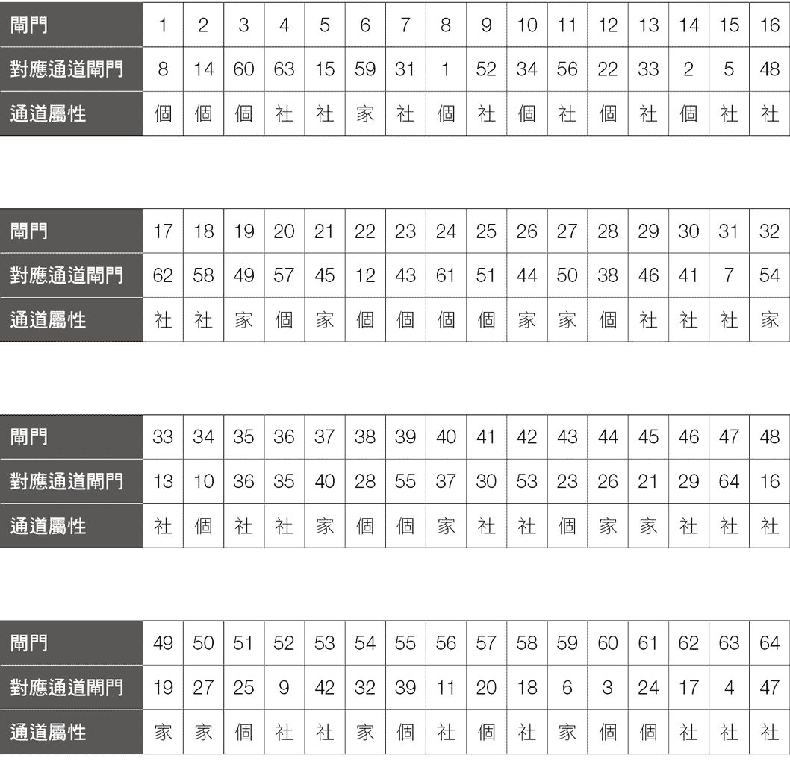

## 创造本书最大价值的方法

这一章节可能是本书最重要的段落，请大家一定要看完这一篇，再去看接下来的六十四个财赋密码的赚钱方式，免得产生很多困惑及不明白的地方。

阅读六十四个闸门时，有几个重点大家先掌握后，就可以按图索骥，达到事半功倍的效果：

###### 重点 1

要看这六十四个闸门的内容前，请先看自己有的那二十六个闸门，就是在你的人类图里面左边、右边的两排数字，这些是你拥有的闸门，这是你与生俱来的天赋才能，也就是你所拥有的财赋密码。建议各位，先看你有的这些闸门，不要先看你没有的闸门。

###### 重点 2

在看你拥有的这些闸门时，你一定会有些闸门看得懂，内心对书上的描述有相呼应的想法。但是，一定也会有些看不懂，不知道它是什么意思？你会产生这样的问题：“这真的是我的才能吗？为什么我都看不懂？”觉得很困惑，所以我要先让你知道，这是正常的，原因如下：

1. 你的人类图右排的数字是黑色的，左排的数字是红色的，这两者是有所差别的，从人类图的观点，黑色的部分是你有意识的，你可以察觉到的，我们会说那是你所知道的自己。

红色部分是属于你的潜意识部分，是你没有察觉的部分，我们会说那是你不知道的自己，但是，红色的部分却是你在外面世界所展现出来的行为，也可以说，红色部分是别人眼中的你。

随着每个人年纪的增长，你对事情的处理方式、你与人的互动、别人给你的反馈，慢慢的，你所认知的自己（黑色的部分），别人也会看得到。然后，红色的部分（潜意识、原先你不了解的部分），因为后天的经历，你也会慢慢了解它是如何在运作的。

但是，红色的部分确实是我们比较不容易察觉的特质，因此，在你红色那一排的闸门，可能就会是你比较看不懂的部分，因为你对这部分的你比较没有察觉，即使你有表现出红色闸门的才能，但是，你却对此没有任何感觉。

因此，你可以跟认识很久的朋友或家人聊一聊，你可以先告诉他们这些你不太明白的红色闸门所描述的内容，然后再问问他们，从他们的角度来看，在你过往的行为，你所展现的自己，有表现出红色闸门所描述的行为吗？他们的反馈可能会让你很惊讶。

2. 请看看你的人类图，你会发现，图上的九个能量中心（就是三角形、正方形、菱形的那些地方），有些是有颜色的，但有些是空白的。这两者的区别是：有颜色的能量中心是你从出生、到现在、到死亡，这个中心的特质都是持续在运作的。因此，位于有颜色中心里的闸门，也是你从出生、到现在及至死亡，都持续在运作。有颜色中心里的闸门你可能比较明白，也比较熟悉。

空白能量中心平常是处于休眠的状态，也就是说它没有固定运作的方式，有时休眠，有时会被启动，空白中心会被启动的方式，是遇到某些人或在流日的影响下，才会被接通、被启动。空白中心里面的闸门，有可能常常处于休眠的状态，而休眠就是没有在运作，你可能会对空白中心里的闸门就比较不熟悉。

3. 每一个人对自己拥有的才能的了解程度、熟悉程度，可能不一样，譬如，你在学生时代念书时，应该不会每一科的表现都一样，可能文科好一点，理科比较差，国文比较好，英文差一点，对自己擅长的就会多念一点，对自己不熟悉的就比较少接触。

以颜色来说，每个人的喜好都不一样，很少人的衣柜中，红橙黄绿蓝靛紫所有颜色的衣服都一样多，大部分的人都会有偏好。

吃的食物方面，每个人喜欢的食物都不一样，有人喜欢吃饭，有人喜欢吃面，有人喜欢西式早餐，有人喜欢烧饼油条，大家都不一样。

再以我们的手脚来说明，你对你的左手、右手、左脚、右脚都一样熟悉吗？大多数人都是右撇子，在使用左手时总是比较不顺。但我有个朋友很爱打篮球，他是右撇子，都是用右手在投篮，有段时间因为车祸右手骨折，在那段时间无法用右手打球，可是他太喜欢打篮球了，所以他还是到篮球场，一个人在篮框下，用左手投球，投着、投着，慢慢的，他开始可以把球投进篮框了，再慢慢的，他左手投球越来越准了，所以左手投篮，变成他的另外一种武器。因为环境的变化，环境的影响，每个人对自己所拥有才能的开发，也会有所不同。

由以上的说明，你可以了解，如果有些闸门看不懂，也没关系，可能你跟别人聊聊后，或经过一段时间后，再回来看一次，有可能你就懂了。这些现在看不懂的部分，你可以把它当成待开发的宝藏。

###### 重点 3

看完你有的闸门之后，再看你没有的闸门。这些你没有的闸门，又可以分成两种方式来看：

1. 在人类图中，有一个很重要的观念，就是人会被自己没有的东西所吸引。

因此，如果在你的图上，某一条通道，你只有一边的闸门，另外一边是空白的，你便会很想接通这条通道，你会被另外一边的闸门所吸引，会想要展现另外一边闸门的特性。因此，你可以去看看你在一条通道中只有一边闸门、另外一边空白的那个对应闸门。

2. 你一定有些通道是全白的，就是两边都没有闸门，这些可以是你最后再看的闸门，因为这些闸门可能对你来说，是最不熟悉的。

###### 重点 4

你在看重点 3 你没有的闸门的赚钱方式时，一定会有很多看不懂的地方，这是正常的，你可能也想试图理解它，但还是不太明白，就像如果你不会游泳，也没有下水过，别人跟你描述在水里游泳的感觉，就算对方描述得再详细，你可能还是听不懂，因为你没有这样的经验。

由于每个人的设计不一样，遇到的人、事、物不同，反应的方式不同，看待事情的角度也可能不一样，所以对于某些闸门的描述，如果你看不懂，那是正常的。

就像猫可能永远也无法了解为什么狗会喜欢咬骨头？所以对于这些你没有的闸门，你如果真的很好奇，可以去问周围有这些闸门的朋友，请他们跟你说明，有可能你会比较明白一点，但还是有可能会听不懂，这也是正常的。

###### 重点 5

你可能对某些闸门的内容很懂，完全了解它在写什么，这时，你可以回想过去的人生中，使用这个闸门的经验。你是如何使用它的？当时为你带来什么结果与好处？

你可能在很多时候都有用到这个闸门的赚钱天赋，在你过去很多的成功经验，都是来自这个闸门的赚钱方式，只是你当时不知道而已。透过了解这个闸门的赚钱方式，与过去成功经验的连结，你会知道以前那些成功的经验都不是意外，你已经在无意中，使用了你的财赋密码，自然就创造了成功的结果。

###### 重点 6

如果你过去用了某个闸门的赚钱方式获得成功，那么，未来如果再使用一次，是否可以再次复制成功的经验呢？这就是你可以再次尝试的事情，因为过去行得通的方式，未来也可能会行得通。

虽然外在环境会改变，人也可能会改变，但是与生俱来的才能是不会变的，差别在于，我们对于之前的成功，可能并不知道是什么原因成功的，觉得只是运气好，下一次用了不同方法失败后，也不知道为什么失败，只觉得是运气不好而已。

如果你把过去的成功经验做个整理，然后用你的财赋密码去对照，可能会发现，有些赚钱的方式常常出现，或者是会有几个赚钱方式组合起来，像成功方程式一样，只要用到这个成功方程式里的赚钱方式，你成功的机率就大大增加。如此一来，只要有意识的持续使用这些赚钱方式、这些成功方程式就好了，你再次获得成功将指日可待。

###### 重点 7

对于本书，你可以用你喜欢的方式去读。建议你也可以考虑用以下的方式来进行：在你看每一个闸门的时候，可以同时想一想，你可以把这个闸门的赚钱方式如何用上。如何用在现在的工作？如何用在你兼差的工作？如何用在你正在学习的事情上？如何用在你未来想要发展的事情上……等等？建议你在看本书时拿着一枝笔，有任何想法时随时都可以写下来，写下你的心得，你的看法，或是你所产生的一些可能发展、规划、进行的目标，或是你的行动计划，都可以写下来。

你在看本书之前，可能想要让自己的工作做得更好，赚更多的钱，或想要尝试新的工作，却茫茫然不知如何开始。

但如果你写下你的目标与行动计划后，是不是就有了可以开始的第一步？你是否就有了可以努力的方向？你便可以把自己的力量，放在想追求的目标，开始一步一步向前走。

###### 重点 8

另外，建议你拿出一本空白笔记本，在看书时，如果有任何心得、想法、创意，马上写下来，因为很多想法只有在当下灵光一现，如果没有马上记录下来的话，可能接下来又读了几个闸门，产生新的想法，原先那个想法就忘记了、消失了，这样不是很可惜吗？

看完六十四个闸门后，把你有感觉、有想法的闸门写下一些行动计划，当你把所有这些内容整理后，可能会发现，哇！我有好多事情可以做。甚至可能太多了，多到不知道要从哪里开始。我们会建议，不用所有都要马上去做，可以依照前面介绍的你做决定的方式，先选出几个你想投入的内容，优先开始尝试与练习，便可以利用你的财赋密码，开始你的赚钱之路了。

如果你练习之后，觉得结果很好，行得通的事情就可以继续做。如果行不通的话，可以总结经验，看看从中学习到什么？修正之后再试试看，基本上，如果以前行得通，应该未来也可以行得通。如果行不通的话，只是代表你要做些调整而已。

###### 重点 9

这里有个心态的建议，一般而言，大多数人都很急，希望自己的计划在半年或一年内就可以有成果，让自己赚到钱，但常常事与愿违，在半年内并没有达到自己的目标，就觉得这计划没有用，因此就放弃了。

很多人都忽略了五年、十年可以达到的成就，所谓滴水穿石，只要一步一步，就算慢慢走，走了五年、十年，长时间下来，累积的距离也是很可观的。只要开始走，一步一步向前走，好好发挥自己的赚钱才能，一段时间之后，一定会有好的结果。

###### 重点 10

看完这本书，一段时间后，当你有空时可以再拿出来看一次，因为经过一段时间，你经历的事情，遇到的人、流日的影响，都可能会让你产生不一样的看法。当你再看一次本书，有可能看到、想到、思考的内容会不一样，也可能会看到更多的可能性。

建议你看完整本书后，有空时可以把这一章翻出来再多看几次，尤其是重点 5 到重点 10，然后开始执行你的计划，如此一来将可利用本书为你创造最大的价值。

#### 注意事项

在看这六十四个财赋密码时，尤其是在看你自己所拥有的闸门，有时你可能会感觉：“这不是每个人都会吗？为什么算是一种赚钱方式？”“这不是很简单吗？为什么要特别拿出来说？”

针对这些疑问，因为我们只了解自己，只知道自己的想法，才会认为，如果我会这样想，别人也应该会这样想才对。我会做这件事情，别人也应该会做才对。

由于每个人的设计都跟别人不一样，“你认为你会的事情，别人也应该会。”这件事情是不一定的，可能有些人跟你有类似的设计，也会有跟你相同的才能，但是，大多数人不见得会有跟你一样的想法。

就像鸟会飞一样，鸟觉得能在空中飞是很正常的事情，鸟也不觉得飞行这件事情有什么价值；但如果要让一只狗学会飞行来执行一项工作，狗就会说为什么不让我去分辨气味就好。

所以，首先不要觉得这些才能没有什么特别，没有什么价值，或许，对你来说很“轻而易举”的事情，才是对你最有价值的事情。因为你很容易就做到了，其他人却要费很大的功夫才做得到，那么你很容易就比别人做得好，很容易就做得到好成绩。

其次，在看这些财赋密码时，最重要的是，请回顾你过去的人生中，有没有运用到这些才能，以及有没有创造出“好的结果”。

譬如你有“批评、找出错误”这个才能，首先，你要回想过去的人生，有没有使用这个才能？

假设“有”，那么是用在什么地方呢？可能你很会骂人，很会找出别人错误的地方，骂得别人都哑口无言。虽然你有用到这个才能，但是有创造“好的结果”吗？可能机率就比较小，但如果你说你学生时代参加辩论社，不管是正方、反方，你都可以讲得让对方无法反驳，至少这还算是“好的结果”。如果你能成为律师，把这才能用在法庭上的攻防，是不是能创造出更多好的结果。

如果你过去能创造出“好的结果”，便可以考虑把它运用到未来，同样再创造好的结果。

但如果以前曾经创造出好的结果，但现在已经没有做同样的事情，原因都是因为环境改变了，人、事、物也都不一样了，所以，以前行得通的事情，现在无法再做了，那怎么办呢？

这时，我们可以思考的事情是：

一、真的无法再度创造“好的结果”了吗？可否克服相关的困难，让过去好的结果再次呈现。譬如，你以前是辩论社的主将，但那是学生时代的事情，现在哪有辩论的工作？怎么可能靠找出别人的错误来赚钱？其实是有类似的事情，就是你可以从政，找出政策上的错误，当你有机会跟别人进行政策上的辩论时，你一定可以胜出。

二、如果实在无法再度创造“好的结果”，那么可否把这才能转到不同的事情上发展？

虽然你有找出错误这个才能，但你不想从政，那么，你可不可以去当品管人员呢？去找出瑕疵的产品，以前你都是在挑出“人”或“事”的错误，那现在你可不可以转换成挑出“产品”的错误呢？

你可能很轻而易举的挑出别人找不出的错误，因此在品管这个工作，你会很容易的表现比别人都好。

建议大家将这些才能能跟“好的结果”连结在一起，或者延伸这个才能到另一个层面，重点是要能创造出价值，这样才真的是你的财赋密码。

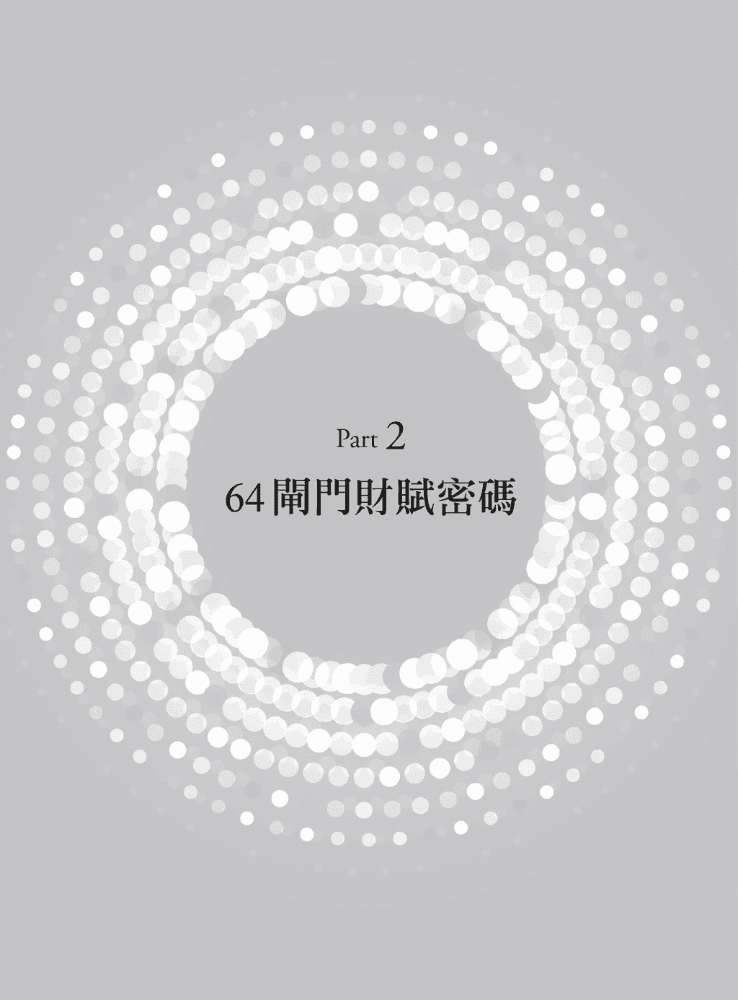

## 独特创意

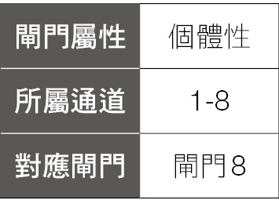

拥有 1 号闸门的人，来这世界的目的就是要表达你的“独特性”，你的内心充满许多独特的想法与创意，这些创意、创造力、想法都是与众不同的，你并不是刻意要表现出与众不同，而是你的存在就是与众不同。这是 1 号闸门的赚钱方式，就是透过活出自己的独特性来赚钱。

1 号闸门的人，内心会有个驱动力，想要以独特和有创意的方式来表达自己，当你开心的在“做你自己”或“做你自己的事情”时，这时你所展现的独特性和创造力，将会吸引在你周围、其他人的注意力，你也会激励其他人来思考如何以新的角度或新的方式生活在这世界上。

对有 1 号闸门的人要注意的事情是，你并不需要成为“最好”的，因为好、坏是来自社会的价值观，好与坏是存在于既有事物之间的比较，譬如你比他高，这颗苹果比较甜，这栋房子比那栋房子豪华……等，透过相同事物的比较，我们因而给出了谁比谁好，谁又不如别人等等的评估。

1 号闸门的人不是要成为“最好”的，是要成为“新的”，对于新的事物，并没有所谓的“最好”的一说，因为它只是“新的”。例如这世界上的第一支手机，大约有两个砖头那么大，售价是三九九五美金，以发展到现在的手机技术，智能型手机已经可以做到轻薄短小，并附带照相、上网……等一大堆功能。用今天的技术来对比以前的“黑金刚”手机，“黑金刚”手机并不是一个“好”的手机，可是当时它是一个全新的事物，充满创造力的设计，这个“新”事物也造成了这世界的巨大改变。

所以，1 号闸门的人并没有要成为别人，你也不需要成为别人，你就是你，你不需要特别展现你的独特，因为你的存在就是很独特。

而 1 号闸门的人其困难就是：如何不被世俗同化？因为独特也等同标新立异，标新立异就容易被排斥，“新”就代表你跟别人不一样，就好像在一片长满白花的大草原中，突然长出一朵红花出来。这是一件很突兀的事情，这样的事情会吸引到大家的注意力，大家都会注意到这朵红花，对于卫道人士来说，这样很不整齐、很不好看，因此有人就会想把这朵红花剪掉，因为剪掉之后，这片长满白花的草原，又可以恢复成整整齐齐了。如果你是这朵红花，感受到来自周围的压力，你又无法耐得住孤独与孤单，转而想要寻求同伴的支持与陪伴，就会变得想跟别人一样，你就会想用白漆，把自己这朵红花涂成白花，来跟周围的白花一样，只要你跟周围的白花都一样，那你就安全了。但是，只要你想跟别人一样，你就会丧失你的独特性。

如果这朵红花，坚持自己就是红花。我天生就是红花，我永远都是红花，我就是跟别人不一样，我也不想跟别人一样。当这这红朵坚持展现自己的独特性时，有可能它会吸引周围的人也跟着展现它们各自的独特性，然后，咻！咻！咻！红、橙、黄、绿、蓝、靛、紫，各种颜色的花都长出来了，这片草原就变成充满各色花朵，五颜六色、色彩缤纷。

就像绘图芯片企业 NVIDIA 的共同创立人——黄仁勋就曾说过：“我只做最独特的事。”他坚持做“只有你做得到，而别人做不到的事”。独特性，就是 NVIDIA 这公司一直在追求的。黄仁勋始终强调：“独特的人才，独特的公司，就应该做独特的事，如果别人也可以做到，那就不独特了。”所以 NVIDIA 曾创下二〇一六年美国 S&P 500 指数股价涨幅第一名的纪录。

## 指引方向

一般人对方向的了解，就象是东西南北各个不同的方向。但方向也有个抽象的含义，方向具有类似目标的概念，但又跟目标不一样，目标象是终点一样，而方向的作用便是指引大家到达那个终点。

2 号闸门的人，能够指引周围的人到达某一个终点或目的地，这个目的地可能是个人的人生方向、公司目标、企业愿景，或是短期的计划、短期的小目标。

2 号闸门的人会提供人们一个方向或目标，并告诉人们要如何朝那个方向前进，所以 2 号闸门所提供的方向，以及吸引人们朝向那方向前进的方式，将会给人们带来方向上的安全感。

例如，人类图的创始者 Ra，运用他的 2 号闸门，为人们指出一个如何“活出自己”的方向，就是按照每个人自己的策略跟内在权威来做决定。当每个人都可以用正确的方式，来为自己做出正确的决定后，就可以一步一步的活出自己、做自己。

在过程中，Ra 一直努力透过各种方式，把各种人类图的知识带到这世界来，透过一次又一次的课程，他吸引着许多想要了解自己、找到自己人生方向的人。他教导着许多学生，也在作为一个人类图老师的过程，在一次一次的课程中教学相长，每一次教导新的课程，就会有一些新的想法、新的思维浮现出来，因而又强化了这个“活出自己”的方向，透过这样的方向，作为一个老师，他同时也是个学生，不断在学习、成长，不断保持领先，带领更多的人走上“了解自己、了解别人，创造彼此和谐的关系”这个方向。

“方向”就是拥有 2 号闸门的人可以销售的东西，你可以指引别人的人生方向，你可以销售给别人工作发展的方向，你可以销售公司行业未来的方向，你可以告诉大家未来的趋势……等。

你也可以把指引别人方向融入你的工作，譬如一位设计师，除了在设计方面提供客户专业服务之外，还常常作为客户的心灵导师，帮客户开导情感问题、家庭问题，常常有客户因为他能提供在“方向”上的解惑，因而找他来设计。

有 2 号闸门的主管，除了在工作业务上解决员工的问题之外，也会常常提供员工在“方向”上的协助，譬如提供员工生涯规划的建议或是协助他转换跑道，建议他增进英文能力，学习简报技巧。

也有 2 号闸门的人透过各种方式，如当老师、教练、顾问……等，帮助人们追求自我，协助他人寻找人生方向。

拥有 2 号闸门的人，可以实际销售“方向”，或是把“方向”融入在你的工作、产品中，变成你的特色、你所能提供的额外服务，对于想要这样服务的人，自然就会向你寻求协助，这就是 2 号闸门的赚钱方式。

## 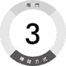开创求新

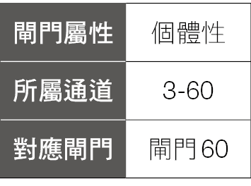

3 号闸门的人喜欢“新”，任何的新衣服、新产品、新流行，新手机、新计算机……等，在 3 号闸门人的生命中如果没有“新”东西，那会是多么的无聊。

“新”就象是 3 号闸门人的基因一样，有 3 号闸门的人总是在追求新的事物，因为以前都没有人曾经见过这新事物，这一点对 3 号闸门的人有着非常强烈的吸引力。因为它是完全不同的东西，它是一个新东西，只要是最新的趋势、最新的这个、最新的那个，总是让 3 号闸门的人趋之若鹜。

好比人类图也是一种新的了解自己的知识，一种新的可以活出自己的想法，一种新的协助你做出正确决定的工具；因此，它也很容易吸引到一些想要学习新的知识的人。

“新”总是非常有吸引力的，因为新的事物有机会可以改变这个世界。但要改变世界之前，这个新事物必须要有生存下来的能力，如果一个新事物，虽然是前所未有，但是无法存活下来，不能为大众所接受，只是昙花一现，这个“新”也没有价值。

譬如计算机的发明，这个新产品澈底的改变了人们的工作、生活方式，让人们的工作与生活变得更有效率，所以这个“新”产品活了下来。然后再从计算机发展到笔记型计算机，笔记型计算机刚发明时也是一个新产品，这个笔记型计算机，让人们从办公桌的大块头计算机及荧幕解放出来，可以自由行动，从此以后，家里、咖啡厅甚至郊外，都可以成为办公的场所，因此笔记型计算机这个新产品也成功的活了下来。

在笔记型计算机之后，智能型手机出现之前，有一个新产品，PDA——手持式计算机，初期因为轻便、小巧又具备部分计算机的功能，曾短暂引起一阵风潮，但始终无法成为普及的产品，无法继续存活下去，之后便为智能型手机所取代。这就是一个无法存活下来的新产品。

3 号闸门的赚钱方式，虽然是销售新事物，但是不能只是一味的为了新而新，重点还要这个“新”必须能存活下去。

“新”其实有很多的运用，你可以卖新的产品、新的知识，新的想法、新的服务、新的概念。只要是原本没有的，都是“新”。

另外，你销售的也可以不是绝对的新，而是相对的新。绝对的新，指的是这个东西以前从来没有出现过，它是第一次出现在这世界上的，譬如计算机的发明就是绝对的新。

而相对的新，意思是这产品可能在别的地方已经有一段时间了，但是它是第一次进入原本没有的地区，当它第一次进入时，就是一种相对的新。

譬如当一九八四年台湾第一家麦当劳开业，第一天营收就超过百万元，第一周就创下麦当劳单周营业额的世界纪录。麦当劳是一九四〇年在美国成立的，到一九八四年已经有四十四年历史了，根本不是一家新餐厅，但是当时在台湾，它是完完全全的一家新餐厅，在当时也掀起一股新潮流，因而创造惊人的业绩收入，这也是一个销售“新”的成功模式。

## 提供公式

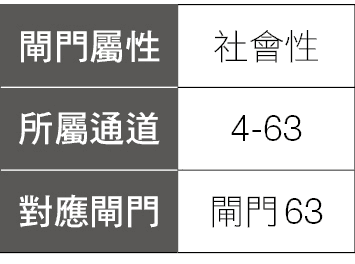

4 号闸门是“答案”的闸门，是“公式化”的闸门。有 4 号闸门的人，对任何问题都能给出答案，任何人问你任何问题，你都有答案。你好像什么都知道一样。但是，4 号闸门的人所提供的答案，就是正确的答案吗？

对于这个问题的正确答案是：“不一定。”因为 4 号闸门所提出的答案，可能正确，也可能错误。4 号闸门所提出的答案，只是针对某一个问题，在通过 4 号闸门人的脑袋思考后所得到的答案而已。这答案是否正确，必须要通过验证，如果验证失败，就代表它是一个错误的答案。

有人会认为，既然 4 号闸门提出的答案不一定正确，那还有什么价值呢？但是，在科学上、数学上有许多的“假说”，假说的意思就是在科学研究中某些待证明的论题，尚未证明的称为假说，一旦经过证明后，便成为理论，因此“假说”仍然有一定的价值。

4 号闸门也是“公式化”的闸门，它会针对许多问题，透过头脑思考后，从逻辑上得到一个答案或一个公式。当我们掌握这个公式后，就可以通往一个稳定、安全的未来。而这公式可能是对于各种事物的公式，譬如：关于健康的公式，你只要按照这个公式做，就会有健康的身体；可能是关于企业发展的公式，一家公司只要按照这个公式去推动，业绩就会成长二〇％；也可以是关于炒菜的公式，只要按照这个食谱的指示做，你就可以做出色香味俱全的佳肴……等。

《交易冠军》一书作者马丁．舒华兹在美国投资业界是个传奇人物，因参加过十次全美期货、股票投资大赛，并获得九次冠军而出名，另一次也仅以微弱差距名列第二，在九次夺得冠军的比赛中，平均投资回报率高达二一〇％，其中一次更是创下了回报率七八一％的佳绩。舒华兹以做 S&P 500 指数期货为主，大部分是短线交易，他从四万美元起家，后来把资本变成了两千万美元。

他曾经发现，在美国国库公债现货与 S&P 500 指数之间存在一个公式，就是如果国库公债价格在盘后交易中上涨，S&P 500 指数也会跟着上涨，反之，公债价格下跌，S&P 500 指数也会下跌。

而且，公债期货是下午三点收盘，而 S&P 500 指数要到下午四点四十五分后才收盘，因此，他就观察公债期货在三点到四点四十五分的盘后交易价格，如果是上涨的话，就在 S&P 500 指数收盘前买进，如果公债期货下跌的话，他就卖出。

在一个月当中，他就赚了一四〇万美金，他在那个月中赚到的钱，比他前半生赚到的都还多。

所以，拥有 4 号闸门的人可以不断的想出各种问题的答案，各式各样的公式，各式各样的理论，只要你能让你的答案、公式、理论，找到一个产品或是服务的形式，为你自己或其他人带来价值，这就是 4 号闸门的赚钱方式。

## 规律模式

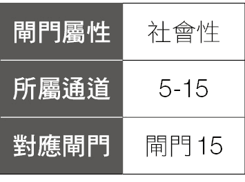

5 号闸门的人，在生活中会自然的产生固定的模式、习惯，譬如每天几点起床、几点出门上班、什么时间要吃饭、晚上几点睡觉……等。

有些 5 号闸门的人，一天是从一杯香浓的咖啡开始，如果没有喝到咖啡，就感觉那一天还没有开机，而有的人是天天要运动，如果一天不运动，就感觉身体哪里怪怪的。

“固定模式”也象是个仪式一样，村上春树曾说过：“仪式是一件很重要的事。它让我们对在意的事情心怀敬畏，让我们对生活更加铭记和珍惜。”所以 5 号闸门的人会让自己的生活中充满仪式感。不过每个人的仪式感都不一样，有人是每天出门前要给爱人一个亲吻，有人是要拥抱他的小孩，有人是一个月要去吃一顿丰盛的大餐，有人是每年都要跟家人一起旅行，当他们在做这些事情的时候，也表达了对自己、对周围的人、对生活的热爱。

5 号闸门的“固定模式”就好像是个节拍器一样，它有着固定的模式、节奏，持续的、不断的运行着，如果你的生活能够让你持续的维持你自己的节奏、按照你既有的模式来工作、生活着，你的活力、身心状态将是处在属于你的健康状态。

但如果你偏离你的自然节奏、你的节拍乱掉了，没有按照你固定的模式来工作、生活，那你一定充满着许多混乱，就像一个坏掉的节拍器，忽快忽慢，这将会让你在身体上、精神上、情感上产生不稳定的状态。

如果你是一个 5 号闸门的人，请注意关照你的生活，看看什么是你自然的节奏，并且有意识的、持续的、固定的去做及维持它。如果你发现每天中午喜欢有半个小时的休息，当你知道它对你是一个重要的模式，请固定去做它，并让它变成你的习惯、仪式，因为当你了解到这是你的仪式、自然的节奏时，你是在正确的使用你的能量。

“固定模式”也是一种节奏、韵律，有 5 号闸门的人，可以运用你的韵律与节奏来赚钱，譬如运动员，在练习时便要有固定的模式，养成习惯，并且在比赛时保持稳定的发挥，才能赢得胜利，维持自己的韵律，才能发挥出自己最佳的能力，很多运动员在比赛中失利的原因，就是因为自己的韵律乱掉了，或被别人干扰、打断，因而无法发挥正常的水平。

另外跟韵律、节奏有关的生意就是音乐，你对韵律的了解、对节奏的诠释方式，是你创造优美动听音乐的能力，你擅长的韵律可以是古典乐、乡村歌曲、流行音乐、摇滚音乐、节奏蓝调、爵士乐、电子音乐……不管你是歌手、音乐家、音乐从业人员，你运用韵律、节奏的能力就是你的赚钱方式。

你也可以销售“固定的模式”，让别人固定做一些事来获得好处，譬如周刊、月刊，看完牙医后自动跟你预约半年后洗牙的时间，面包店都会有固定出炉的时间，还有许多服务每个月会固定续约（除非你主动解除）……这都是销售“固定的模式”。

台塑集团创办人王永庆，十六岁时在嘉义开了一家米店，当时在嘉义已经有将近三十家的米店，竞争非常激烈，王永庆想出一些办法来增加自己的竞争力，譬如主动送米到客户家，并且不只是送到门口而已，还要将米倒进米缸里，然后细心记下米缸的容量，再问清楚家里有几个人吃饭，几个大人、几个小孩，每人饭量如何，依此预估这户人家下次买米的大概时间，把它记录下来，等到接近的时间时，就主动把相对应数量的米送到这客户家。他就是运用了每户人家吃米数量的固定模式，打开他的知名度，让卖米的生意越做越大，从小小的米店生意，最后做到了台湾首富的事业。

## 结盟转强

生命能够一代一代的延续下去，来自于精子穿过卵子，与卵子结合形成受精卵，最后发育形成胚胎，再由胚胎继续发育形成不同的个体，个体成熟后，会再由不同个体各自产生精子与卵子，再次结合，形成生命，透过不断的循环，让物种能够不断的存活在这世界上。

精子是微小的、脆弱的，并且存活的时间非常短暂，但是，如果精子能与卵子结合，形成受精卵，变成胚胎发育长大，就可以变得强壮而有生命力。

这就是 6 号闸门的赚钱方式，如果你现在是处于一个“弱”的位置，但透过结合（结盟）之后，你就可能由“弱”转“强”。

常见的由弱转强的例子，就是某某新创小公司受到国际大厂的青睐，譬如得到 Google 的投资，或是与微软技术合作，原先规模、人气都不大的小公司，一旦有了知名大公司的加持，这家小公司就会马上迅速发展，达到数倍、数十倍……的成长。

“冠名权”、“冠名赞助”也是一种透过结盟、由弱转强的展现，近年来许多的电视节目，都会有某某产品、某某公司冠名赞助的现象，随着这档电视节目的走红，收视率节节上升，这家冠名的公司及产品也会顺带进入观众的视野中，他们的产品也渐渐为观众所熟知，连带着业绩也不断成长，透过这种结盟的方式，达到由弱转强的效果。

另外，如果你的公司生产的产品，能够在知名便利商店如 7-11、全家、莱尔富、OK……等上架，销售量自然会大增；如果有名人来过你的店，透过名人加持，店的知名度就会提高；如果有电视、报纸或各种媒体来访问你的店，通常报导之后一两周内，你的店会大排长龙、业绩暴涨，也会有更多的人认识你。

我们曾经要拜访一个重要但当时还不认识的客户 A，我们约了他很多次，始终被婉拒，一直见不到这个客户，后来我们问了业界的许多人，打听到客户 A 的相关讯息，经过好几手的转介，请到了 B 帮我们去约客户 A，等到我们见到客户 A 的那一天，他坐下来的第一句话就是：“我知道你们约了我很多次，原本我是不想见你们的，但后来是 B 来跟我介绍你们，知道 B 跟我关系很好的人不多，你们能够找到 B，且他愿意帮你们，代表你们真的下了一番苦功，因此我才决定见你们。”

有时透过结盟，由弱转强，不一定是你直接跟强的一方直接接触，也有可能是透过一个有力量的转介，协助你与强结盟，让你达到由弱转强的改变。

所以，如果你有 6 号闸门，可以想想，你有什么技能、产品或服务，你可以跟什么人、什么公司、什么团体、什么产品、什么服务、什么知识结盟？让你可以透过这个结盟，由弱转强，可以赚到更多的钱，这就是 6 号闸门的赚钱方式。

## 改造更新

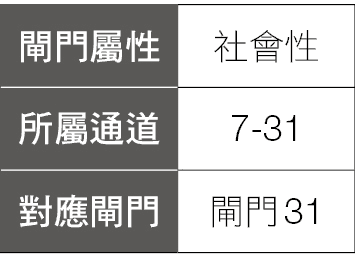

为了让我们能够安全的通往未来，我们会建立一个逻辑模式，让它能稳定可靠的持续运作，确保我们在这固定的模式之下，可以享有它所带来的好处。譬如火车什么时间会开？公家机关什么时候会关门？当我发出一封 email，我知道我的朋友待会就会收到……等，生活中充满了许许多多的模式，也让我们有了稳定的生活。

但是，逻辑模式无法保证永远都能完美的运行，它可能只会运行一段时间，到一个时间点后，原先行得通的模式已经无法运行了，这时就要将既有的模式破坏，再重新更新，这就是 7 号闸门的赚钱方式。

许多城市都有都市更新的计划，这些地区、建筑，在以前可能是好的、新的，但随着时间过去，新的潮流、趋势出现后，这些建筑物可能已经老旧了，无法再继续住下去了，因此，我们便要进行“都市更新”计划，先把旧的建筑物拆掉，把已经行不通的部分破坏，然后再重新更新，建造一栋更大、更好的新建筑，让原本住在旧建筑的人可以有个更新、更美好、更安全的未来。

在企业中，我们则会用“组织再造”这个名词来代替“更新、破坏”，因为旧的组织、旧的模式已经行不通了，譬如原先是金字塔式组织（直线型组织），由上到下一层一层的管理制度，这种组织的优点是权力集中、职权分明、便于统一指挥、集中管理，这常是企业一开始经营，人数不多，生产和管理工作都比较简单的情况下适合的组织型态，一旦企业规模扩大，人数变多，管理工作复杂化，决策时间过长、反应速度缓慢，这时可能就要改成扁平化组织，减少管理层次，增加管理幅度，来提高反应速度，提升管理效率，进而增加经济效益。

近年来由于石油资源的日益减少，以及环保议题的重视，电动车开始兴起，许多国家更订定了禁售燃油汽车的时间表，要民众逐步淘汰燃油汽车，未来将全面使用电动汽车，这不是汽车这个交通工具运作的模式出问题，而是提供动力来源的模式出了问题，以及因为汽车造成的空气污染出了问题，所以我们要更新动力来源的模式。

大家以为因为石油危机以及空气污染的原因，才发明电动车解决空气污染的问题吗？其实不是，电动汽车的发明比燃油汽车更早，第一辆电动车的发明是在一八三四年，而第一辆燃油汽车是一八八六年上路的，后来因为汽油的大量开发以及引擎技术的提升，电动汽车在一九二〇年后逐步被燃油汽车所取代，这也是一种动力来源的更新。因此，现在可以运行的模式，不代表以后也可以一直运行，现在行不通的模式，未来因为科技的发展、环境的变迁，透过更新之后，可能又变成流行的模式，所以，如何找出现有模式行不通的地方，加以破坏、更新，让它继续运行，就是 7 号闸门的赚钱方式。

另外，有一个很特别的例子：

日本的伊势神宫被称为“日本人的心灵故乡”，是日本人一生一定要参拜一次的宫殿。伊势神宫的内宫祭祀着“天照大御神”，祂是日本天皇的先祖，在日本地位十分崇高，也是日本皇室每年都一定要来参拜的地方。

伊势神宫的主体建筑是纯木结构、加上殿顶的萱草，在经历大约二十年的风雨之后便会腐朽和破败。但他们崇尚的就是洁凈，为了保证神居殿堂的干净整洁，伊势神宫每隔二十年就会重建一次。

每二十年，人们会在伊势神宫旁的空地上，建一座和现在神殿完全相同的新殿，并且殿内所有的神明用品、饰品及宝物都要按照原样重新制作，然后把神明请到新殿内供奉，二十年后再用同一种方式迁回原处，被称为“式年迁宫”。到目前为止，已经延续了一千三百年，也就是已经经历六十几次迁宫了。

每二十年的将神宫打掉重练，并不意谓着天然资源的浪费，因为汰旧换新的过程中，旧木材会运往全国各地，给需要的神社再利用，或做成木头御守，让民众获得神灵庇佑，另外，伊势神宫都是运用木榫结构，没有用一根钉子的工法建造神宫，所以六十多次的迁宫，让打造神宫的木匠及日本传统艺术的工匠，技艺可以绵延千年。

因此“更新、破坏”、“组织再造”、“打掉重练”，并不是说原先的模式就一定是错误的、不好的，其实是透过“破坏、更新”赋予它新的生命，让它可以更长久的持续下去，这就是 7 号闸门的赚钱方式。

## 风格品味

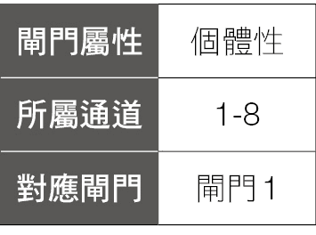

什么是“风格”呢？

二〇一八年《Elle》杂志的风格人物大赏中，获得“最具风格国际名人奖”的人为日本的小松菜奈（日本女演员、模特儿）。

《Elle》杂志访问她：你觉得“风格”是什么？

小松菜奈回答：风格对我来说就是做我自己。

“风格”是一个人的做事方式、作风，大家比较熟悉的是一个人穿衣服的风格、造型、设计的风格，或是这个人化妆打扮的风格，室内装潢的风格。

“风格”也可以透过食、衣、住、行、育、乐，或是说话、表达、沟通，来展现风格，或是一群人的生活形态、生活地区、环境，各种不同展现自己的方式，就是各种不同的风格。

如果你有 8 号闸门，可以思考你的风格是什么？你喜欢什么样的风格？你要在哪一方面展现你的风格？要结合在什么商品上？结合在什么服务上？然后透过你的风格的展现，让你能够赚到钱？

你的穿衣打扮、行事风格，都可以表现出你是一个多么与众不同的人。其他人可以透过你所展现的风格来了解你，透过你的商品包装、店面装饰、员工特质，也可以展现出你想表达出来的风格，然后，让欣赏你的风格的人愿意靠近你、买你所提供的商品及服务，这就是你赚钱的方式。

颜色、形状、标志，也是容易展现你所拥有风格的方式，风格会让别人容易记得你，让别人想要亲近你，因为他们喜欢你的风格。

草间弥生——曾被美国艺术网站选为“二十一世纪十大前卫艺术家”，她也被称为“圆点女王”，因为她擅长用许许多多、大大小小，视觉强烈、鲜艳色彩的圆点，形成她的独特的艺术作品，其中让人印象最深刻的是红色小圆点，只要看到许许多多的白底红色小圆点，大家就会想到草间弥生。

为什么她会使用这些小圆点？因为草间弥生从小就有严重的精神官能症，是一种神经性视听障碍并发幻觉，在她眼中看到的世界好像隔着一层斑点状的网，于是她开始画下这些斑点，在她小学五年级时的母亲肖像画中，就可以看到小圆点出现在其中，象是许多泡泡一样充满在肖像画中，之后她更是将各式各样的圆点运用在她的艺术创作中。

透过与 Louis Vuitton 的合作，包含上衣、裙子、洋装、袖扣、领饰、鞋子、包包、手表与笔记本等等，全变成了草间弥生的圆点所衍生而出的世界，也让世界上更多的人，看到她的“圆点”风格。

这世界有许许多多、各式各样的风格，如田园风格、嬉皮风格、极简风格、低调奢华风格、北欧风格……等，没有哪一种风格比较好、也没有哪一种风格不好，拥有 8 号闸门的人，重点是找出你独特的风格，把你的风格套用在你的产品、服务中，销售你的风格，这就是你的赚钱方式。

## 区分细节

我们常听到：“魔鬼藏在细节里”，意思是一件事情会成功还是失败的关键，有时在于当事人有没有注意到其中的细节，往往是一些你没注意到、认为微不足道的小细节，最后产生了巨大的影响。

拥有 9 号闸门的人，会对许多事物的细节非常敏感，譬如，有人能分辨“味觉”的细节，他们可以分辨出不同厂牌的矿泉水之间不同的味道，而且可以清楚的区分出来，对喝茶讲究的人，更是会用不同的水来泡不同的茶叶，因为不同的水泡出的味道都不一样。

品尝红酒更是一门大学问，你要能喝出甜度、酸度、果味……各种的差异，有的人甚至喝一口红酒，就能讲出产地大约在哪里，他们就是特别能区分出味觉细节的差异。

有人能分辨“听觉”的细节，对声音的细节非常敏感，他们可以分辨出，这部电视剧或电影中某位演员的配音是另外某一部戏中某位演员的配音，听出一首歌里每个细节的表达，听得出顶级音响所产生的声音差异。

有人擅长分辨“视觉”的细节，他们超喜欢找出两张图片中哪些地方不一样，且通常都可以完全答对，对于颜色的差异非常敏感，可以清楚分辨出各种颜色的差异，光是蓝色就可以分成几十种不同的蓝色。

如果你有 9 号闸门，可能对“味觉”、“听觉”、“视觉”不太敏感，但你一定有对生活中某些事物中的细节很敏感，能够自然的挑出其中的不同，如果你能够针对你擅长找出“细节”的地方，并找到相对应的产品、服务或获利的方式，这就是你的强项。

别人看不到的细节，你看到了，别人产品没做到的细节，你的产品却把这细节处理得很完美，透过你在“细节”造成跟其他人的区隔，就是 9 号闸门的赚钱方式。

鼎泰丰是国内外知名的餐厅，开业至今超过四十年，所以有很多老顾客是鼎泰丰的忠实客户，甚至有些人一个星期会去吃个三至四次。

早期的时候，有一天，一个长期的老客户向店员反应，为什么今天的小笼包味道不一样？店方的反应是“怎么可能？”他们都是用相同的食材，师傅也都一样，最近没有任何的调整跟改变，怎么味道会不一样？会不会是顾客今天发生了什么事？所以觉得味道变了？可是老顾客坚持味道就是不一样。

鼎泰丰就开始研究，那究竟是什么地方、哪个环节出了问题，因此开始一一检查与印证。

后来真的发现不一样的小细节了，因为那时候是冬天，而且那个星期刚好有寒流来，有几天气温骤降，一个星期中温度差了十几度，由于水温及气温不同，造成面团发酵的环境也有所不同，导致小笼包的皮也有所小小的不同。

这个小小的不同，可能大多数人是吃不出来的，而且这种气温突然上下变化这么剧烈的日子，一年可能也没有几天，这种小细节的差异，就算忽略了也影响不大。

可是，忠实的老客人吃出不同了，鼎泰丰也认真的去研究，找出会造成不同口味的细节，且因为这个细节，导致鼎泰丰研发出自己的中央厨房，其中严格控制温度、湿度，让所有会影响食物口味的细节都能维持一致，也因此才能让鼎泰丰所提供的食物都能维持一定的质量。

## 正确行为

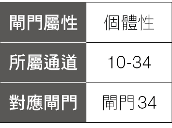

一个人要在这世界上生存，便要能够知道不管在什么样的环境之下，我们都能有适当、正确的行为，来与周围的人事物互动，确保我们能成功的交流与沟通。

为什么行为这么重要呢？因为行为是相互影响的，你的行为会影响到周围的人，周围人的行为也会影响到你，所以如果你展现正确的行为，会影响周围的人也产生正确的结果。

行为还有一个特点，就是行为是可以改变的，不像聪明才智，一般人的聪明才智是与生俱来的，无法改变的。聪明的人天生就聪明，不聪明的人可能后天再怎么努力，也很难让自己变聪明。但是行为不一样，行为是可以改变的，我们可以透过学习，让不同聪明才智的人都做出相同的行为。因此，教导别人正确的行为就是 10 号闸门的赚钱方式。

譬如，你是个幼儿园老师，你的工作就是教导小孩子正确的行为，包含学习、吃饭、与其他同学互动的行为。10 号闸门可以作为一个老师，从旁辅导这些小孩子，当他出现正确的行为给予奖励，出现错误的行为时予以教导让他改正。

教导自己小孩正确的行为，也是身为父母亲的责任之一，但是，很多父母并不一定知道如何教导自己小孩正确的行为，因为在他自己小时候，他的父母也不见得知道如何教导他正确的行为，所以每一位父母也要学习如何教导小孩正确的行为，譬如《富比世》杂志网站专栏作家凯西．卡普里诺（Kathy Caprino），就点出了一般父母在教养上的七大错误行为：

一、不愿让小孩冒险。

二、太早就伸出援手。

三、太容易就给予赞赏。

四、因罪恶感而过度宠溺。

五、不愿分享过去的错误。

六、误以为智商、天赋和影响力就代表成熟。

七、只有言教、没有身教。

如果我们已经是为人父母者，可以检验一下我们是否避开了这些错误的行为？

如果你是一位销售员，必须懂得销售员正确的行为，譬如如何打电话、拜访客户、记录拜访结果、处理客户的抱怨……如果你还不会这些正确的行为，那你必须去学习，才能使你成为一个成功的业务员，如果你已经能完美执行这些业务员应有的行为，你可以更进一步，成为一位训练业务员的经理或讲师。

如果你是一位主管或管理者，也要学习正确的行为来做好你的工作，譬如设定目标、员工管理与激励、财务管理、向下管理及向上管理……等，学会这些正确的行为，你才能当一个好主管。

国际礼仪中，对食衣住行育乐通通都有规定的行为，譬如“食”的部分有宴客席次的安排，进餐原则、刀叉使用方法、餐巾使用方法……等。

行走时“前尊、后卑、右大、左小”，与长辈或女性同行时，要在其后方或左方。三人并行时，中间最大，右次之，左最小。

还有其他各式各样的行为规范，都是教导别人学习正确的行为。

因此，如何把你已经学会、懂得的行为，放在工作及生活中，变成一种产品或服务，譬如课程、讲座或是训练，便是拥有 10 号闸门的人的赚钱方式。

## 新的点子

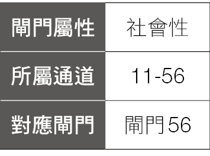

拥有 11 号闸门的人，会有很多各式各样的想法，这些想法天马行空，有的好笑、有的荒谬、有的可行、有的很困难……能够自然而然涌出各种想法，就是 11 号闸门的天赋才能。

在企业管理中，有时会用到的脑力激荡或头脑风暴（Brain-Storming）会议，就是想法（点子）的极致运用，脑力激荡会议就是将一群人聚在一起，针对一个问题进行自由的思考及联想，所有参与者不能对其他人的想法进行评断，藉此激发团队的想法，凝聚大家的智慧，对组织的决策及发展有重要的意义。

脑力激荡有几个重点：

一、想法越多越好。

二、不能批评其他人的想法。

三、鼓励与众不同的想法。

四、鼓励改善别人的想法或延伸别人的想法。

对 11 号闸门的建议是，只要尽量想点子就好了，先不用考虑可不可行、是否太夸张、太离谱，因为在这些不断涌出的点子中，可能会有像金子般价值的点子蕴藏其中，重要的是去想，尽可能的去想，纯粹的展现这个想法的美。

有一家牙膏厂，一开始业绩逐年成长，后来进入了两三年的停滞期，老板召开会议，看谁能想出解决问题的方法，让公司的业绩成长，奖金十万元，一般人想到要让业绩成长的方式，大多是增加广告、增加通路、开发新产品……等，但这些作法的效果如何，都有待验证。

有一个人提出了一个点子，马上获得十万元。他的点子就是“将现有牙膏开口扩大一毫米”，因为消费者每次刷牙挤出同样长度的牙膏，但开口扩大了一毫米，每个消费者就多用了一毫米宽的牙膏，也就增加使用量，自然就增加业绩了，改用开口扩大一毫米的包装后，公司下一年的业绩增加了三二％。

有句话说得好：“没有做不到，只有想不到。”当你想到了，相关的作法就会接踵而来，常常一个创新的想法，只是捅破那一层自我设限的纸而已。

一九六〇年代，许多美国人认为，美国正在输掉与苏联的太空竞赛，因为苏联在一九五七年成功发射了第一颗进入行星轨道的人造卫星，一九六一年苏联航天员尤里．亚历克赛耶维奇．加加林（Yuriy Gagarin）成为进入太空的第一人。

为了扭转局面，肯尼迪认为，一项能够展现美国在太空优势的特殊成就计划，是非常有必要的，因此提出了“十年登陆月球”的计划，当时人们对月球表面的状况并不了解，当年的科技也无法确定是否可以完成这项计划。

一九六二年九月十二日，肯尼迪在莱斯大学演讲：“我们选择在十年内登陆月球并完成其他的事，不是因为它们很简单，正是因为它们困难重重，这目标将促进我们建立最好的组织，测试我们的顶尖技术与力量，我们乐于接受这个挑战，不愿延迟，我们志在必得。”

不到十年，一九六九年七月二十日，阿波罗十一号成功登陆月球，航天员尼尔．阿姆斯壮成为第一个踏上月球的航天员。所以，没有做不到，只有想不到，当你想到了，你就可能做得到。

所以，如果你有 11 号闸门，你可以把脑袋中不时冒出来的、天马行空的想法记录下来，因为这些想法，随时都有可能成为一个新的商机。

## 制造浪漫

“浪漫”在我们的生活中占有重要的地位，因为人们总是对浪漫抱持着美丽的想象，所以罗曼史小说、浪漫小说、爱情小说，一直都在书籍的销售中占有很大的部分。二〇〇六年美国出版六千四百部罗曼史小说，销售金额十三．七亿美元，占全美所有书籍销量的二六．四％。

一九九七年的美国史诗浪漫电影《铁达尼号》，全球总收入为二一．八七亿美元，成为全球史上票房收入最高的电影，这个纪录一直到十二年后才被电影《阿凡达》所超越，到目前还是史上票房收入第三高的电影。

《BJ 单身日记》，这是发行于二〇〇一年的英国浪漫喜剧电影，续集《BJ 单身日记：男人祸水》于二〇〇四年上映，第三集《BJ 有喜》则于二〇一六年上映，这是一个“浪漫”的系列电影。

BJ 单身日记的有些情节，是与《傲慢与偏见》这个经典小说相近，《傲慢与偏见》本身可以被当成罗曼史来阅读，更被改写成各种都会少女小说、罗曼史、爱情小说。所以浪漫小说、爱情小说，是从古至今每个时代都不可或缺的重要产品。

情歌，更是在所有歌曲中占了极大的比例，全世界都一样，每个人都会有首自己初恋时的歌曲，也会有在失恋时喜欢听的歌曲，情歌是永远不会过时的歌曲。

所以，在小说、电影、音乐这些方面的“销售浪漫”，已经占据了非常大的市场。

虽然 12 号闸门的人可以销售“浪漫”，但是许多拥有 12 号闸门的人，却不觉得自己是一个浪漫的人。为什么呢？

因为 12 号闸门是一个个体人的闸门，个体人的关键字是“特立独行、与众不同”。就是做一些没人做过的事，因为没人做过、自己也没看过，所以 12 号闸门的人，并不一定会对自己所做的事情觉得浪漫。

全世界第一个送女孩子一百朵红玫瑰花的人，可能不觉得做这件事是浪漫的事，但旁边的人却觉得很浪漫，而当送过一次以后，再送第二次的话，就是相同的事情了，就没有“特立独行、与众不同”了，因此他可能改成带对方去看流星雨，他或许只是在表达对于喜欢对象的爱意，但周围的人可能觉得他很浪漫。

所以，我们对个体人有一种描述，个体人并不是特意展现出“特立独行、与众不同”，而是他的存在就是“特立独行、与众不同”。对于 12 号闸门的人来说，就是 12 号闸门的人并不是特意展现出浪漫，而是他的存在就是浪漫。

因此，拥有 12 号闸门的人，只要你觉得可以用什么产品、方法、服务，来表达出你对一个人的喜欢与爱慕，将这些产品、方法、服务转变成可以销售的物品，就是 12 号闸门的赚钱方式。

## 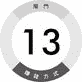独家祕密

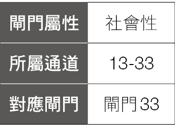

祕密指的是只有一些人知道但其他人不知道的事情，这就是祕密。

这里说的“祕密”，并不是那种一个人知道后到死都不能透露的那种祕密，比较象是一种有价值的信息，透过这项祕密的传递、揭露、报导，便可以创造价值。

譬如，报纸、杂志或电视台的独家新闻，如果是一条只有你的杂志才有登出的独家新闻，别的杂志都没有，但是民众非常想要知道这条新闻的内容，这条新闻就可以创造价值，这条新闻也可以说是祕密的一种，因为只有这家杂志社知道，其他的人都不知道。

为什么 13 号闸门的人可以销售祕密呢？因为他们常常会听到一些别人听不到的事情，看到一些别人没看到的事情，所以他们会接收到一些其他人不知道的讯息。周围的人也很容易信赖 13 号闸门，会自动跟 13 号闸门的人分享他们的经历跟祕密，因为 13 号闸门听了很多人的故事，有成功的经验、失败的经验、冒险的事、挑战的事，因为听了太多的事情，但不是所有人都知道这些事，因此这些事都可能变成你所拥有的“祕密”。

一个人的工作如果做得比别人好，那么他很有可能拥有一些别人不知道的祕密与诀窍。不然的话，同样的工作、时间，为什么他就会做得比别人好？但是，如果他只是知道他可以做得比别人好，却不知道是什么样的祕密让他做得比别人好，那么这祕密的价值只有帮到他自己而已。

如果这个人知道，他是因为握有什么“祕密”，所以可以把事情做好的话，这个祕密可能可以创造更大的价值。譬如，他可以成为经理，训练一些人按照他的祕密来做事，帮公司创造更大的利润。或者他也可以自己开公司、创业，让这个祕密创造更大的价值。

就像许多人的老母亲做得一手好菜，但只是做给家里人吃而已，只要他学会了母亲料理的祕密，做出相同的口味，甚至发扬光大，就可以开出一家有名的餐馆，这样的例子出现在各地料理、各国料理甚至小吃、卤味、馒头……等各式各样的食物中，只要你掌握了独特口味的祕密，你就掌握了一种“商机”。

最明显用祕密来赚钱的，就是《祕密》这本书，《祕密》一书主要在介绍“吸引力法则——我们生命中所有发生的一切，都是被我们心中的‘思想’吸引而来的。”《祕密》一书，目前已在全球售出三千万册，翻译成五十种语言，作者光靠《祕密》这本书，就赚到很多钱。

拥有 13 号闸门的人，你可以想想，你有哪些别人不知道的“祕密”，你要如何让别人知道这些祕密的价值，并依照这祕密想出对应的商品、服务，或是一个获利的方式，就是你赚钱的方法。

## 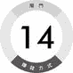利他服务

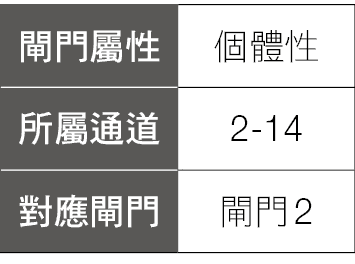

14 号闸门是透过“服务”来赚钱，但这个“服务”是什么意思呢？

在个体人中，我们常常会提到突破、创新、与众不同。因为个体人存在的目的，就是要为这世界带来新事物。

但是，并不是说你带来一个新事物，你带来一个突破，你就成功了。如果个体人带来的新事物并没有为社会带来价值，它就不是一个成功的突破，而这里所谓的价值，就是真正为社会带来利益，因为 14 号闸门的赚钱方式：“服务”——就是利用你的才能和财富来创造社会大众的好处（利益）。

14 号闸门的人会奉献出你的才能、热情，服务这个社会，为这个社会创造价值，让大众得到好处。

拥有 14 号闸门的人，很容易对“公益”活动很有兴趣，喜欢帮助别人，让这个世界变得更好，因此有许多 14 号闸门的人，会在公益团体工作，或者去当义工，帮助别人、服务别人。

潜藏在 14 号闸门底层的驱动力，是想让世界变得更好，为这世界尽一份心力，但想让世界变得更好，并没有什么目的性，单纯是内心希望这世界更好。在这过程中，你可能不是只是为了钱而做这些事，而是因为你想要让这世界更好，你展现了“服务”这个才能，为其他人带来了好处与利益，连带的也为你带来了金钱。但是你的出发点，并不是为了钱而做这些事情。

下面这个例子，就能表达出 14 号闸门透过服务的赚钱方式。

荷兰少年柏杨．史莱特（Boyan Slat）在二〇一一年（他当时十六岁）时，因为一次潜水，看到海里的垃圾比鱼还多，原本漂亮的海洋却充满着各式各样的塑胶垃圾，他为了解决海洋垃圾污染的问题，想出一个“海洋吸尘器”的计划，因为垃圾散布在海洋中，而且海浪每天持续的推动，会让这些垃圾四处漂流，不会固定在一个地方，如果主动开船去捞这些垃圾，要耗费许多人员、时间及资源，而且效果不好，于是他设计一套定点不动的被动系统，利用海洋本身会流动的原理，透过洋流把垃圾带到“海洋吸尘器”附近，然后被拦截器所拦住，再被吸引进入系统收集起来，由于被动系统放置后就不需人员操作，且利用太阳能可以长时间持续运作，洋流会缓慢的、持续不断的将塑料垃圾推到海洋吸尘器附近收集起来，只要定时透过船只将收集到的垃圾运回即可，柏杨．史莱特想藉此相对有效率的方式，解决海洋塑料污染的问题。

他在二〇一二年荷兰的 Ted talk 上提出这个想法，并在二〇一三年成立了非营利性组织“海洋清理行动”（The Ocean Cleanup），担任首席执行官，该组织的使命是开发先进技术，以消除世界上的海洋塑料垃圾，当年在一六〇个国家的许多热心赞助者捐款下，募集了二二〇万美金，到目前已经募集了三一五〇万美金的捐款。

这整件事情的发起，来自柏杨．史莱特看到原本应该是美丽的沙滩跟海洋，却受到塑胶垃圾的污染变得脏乱不堪，他为了大众的好处，为了让海洋重新恢复应有的生态及美丽，为了让世界变得更好，因此展现他“服务”的才能，也吸引了许多人共同投入这个计划。

柏杨．史莱特做这件事情，并不是为了赚钱，而是为了让这世界变得更好，因此贡献他的才能来做这件事，但在做这件事情的本身，却让他获得许多国家及单位授予的年轻企业家奖，这就是 14 号闸门的赚钱方式。

## 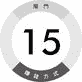在地情感

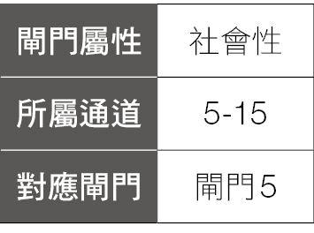

15 号闸门是“人类之爱”的闸门，也是“极端”的闸门，由于人类是复杂的、多样性的、多变化的，就像光谱仪一样，在光谱仪上有各种不同的颜色，如红、橙、黄、绿、蓝、靛、紫等，每种颜色也会从最浅到最深，充满了各式各样的变化。

人类也如同光谱仪一样，肤色有黄有黑有白，身高有高有矮、体重有胖有瘦、有开朗乐观的人、有内向悲观的人……等，这世界拥有各式各样的人、各种不同的、极端的人，存在人类这个光谱中。

15 号闸门，知道人类所拥有的多样性，一如光谱的多样性一样，有 15 号闸门的人，可以接受各种极端的人的极端观点，然后，透过 15 号闸门的人，可以把各种不同的人拉入你的节奏中，把人们凝聚在一起，你可以平衡这些节奏，把所有这些极端变成适度，来与群体融合，让这些极端能够融入变成一个有凝聚力的群体。

人们通常是在爱中凝聚、团结在一起，譬如教会、同乡会、狮子会、扶轮社……等，或是客家菜、潮州菜……等餐厅，还有山友社、摄影社、文学同好会……等，有许许多多的团体，都是透过“爱”连结在一起。

另外，可以把更多人连结在一起的爱，是对所在这块土地的爱，对土地上的人的爱，销售“本土化之爱”、“在地化之爱”等。

许多人为了让商品有更大的市场，除了开发国内市场外，还想让自己的产品也能够国际化，认为只要让产品走上国际化之后，就可以到不同的国家、市场，赚到更多的钱，这种国际化，是把自己的产品、服务，融入世界各地不同的区域、语言、文化中来拓展市场。

另外一种国际化，就是做出极致的“本土化”，当你能做到独一无二、极有特色的本土化之后，反而可以变成世界闻名的国际化。

举例来说，出国旅游时，你想去看跟你家乡一样的建筑物吗？吃跟你平常吃的一样的食物吗？我想大多数的人都不会，大部分的人出国，都是想去看些从来没看过的景色，想去看当地独特的文化、景色、建筑，吃当地独特的美食，而且越是原汁原味，越是具有当地特色，越能吸引世界各地的人来参观，因此，当一个“本土化”走到极致之后，便成为“国际化”。

台湾独特的“田中马拉松”，是一个非常独特、有人情味的马拉松，它的独特之处是它的啦啦队，它会公开招募啦啦队，最后评比表现突出的啦啦队，予以颁奖，譬如“最佳创意奖”、“最佳造型奖”、“最佳勇气奖”……等，因此，在马拉松的沿途充满了各式各样的加油声，让每个跑者不会只是一个人孤独的跑着。

另外，一般的马拉松，由于长时间的跑步，身体会消耗许多热量与水分，因此适当的补充水、运动饮料、能量棒，便是跑马拉松时要注意的重点，传统马拉松的补给品，多是正常的水、运动饮料、能量包……等，但是“田中马拉松”所提供的补充品，是当地的传统美食，譬如烤乳猪、茶叶蛋、大肠面线、豆花、八宝粥……等当地美食。

虽然这些美食不是标准的补给品，不过有标准补给品的马拉松世界到处都有，要品尝特殊的当地美食来当作补给品的马拉松，只有“田中马拉松”才有（不过类似型态的马拉松，在台湾及世界各地也越来越多了），因此拥有浓厚台湾特色的田中马拉松，不仅吸引台湾的跑者，有数万人来争取一万两千人的名额，也在二〇一九年吸引了三十五个国家地区、超过一千名的外国选手登记报名，为田中地区创造了不少商机。

所以，做到极致的“本土化”，反而可以成为非常吸引人、创造财富的“国际化”，这就是 15 号闸门的赚钱方式。

## 辨识才能

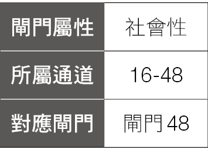

16 号闸门是一个“辨认”的闸门，为了发挥你所拥有的才能，你必须先辨认出这项才能才可以。因为如果你没有“辨认”出它，你永远也无法精通它。

譬如，你要先辨认出你有音乐的才能，才会去练习音乐的相关技巧，再经过反覆不断的练习，你才能够成为一个音乐家。

你要先辨认出你有绘画的才能，才会持续的练习绘画，最后你才会成为一个画家。

16 号闸门也是一个“技巧、技能”的闸门，16 号闸门的人在学技巧上很有方法，但把这技巧转变成才能的前提是，需要先辨认或认同你正在做的事情，因为这样你才会持续的练习，也才有机会变成才能。如果没有辨认出自己的才能，就不会去练习它，也不会想要去实现它，就算有再好的天赋，最终也会归于平淡。

例如，某人唱歌唱得很好，周围的朋友也称赞他唱得很好，可是他自己不这么认为，不认同别人对他唱歌唱得好的赞美，自己也没有辨认出自己的唱歌能力，自然就不会投入时间在练习唱歌上，也就永远不会成为一个歌手。

如果他能辨认出自己有唱歌的能力，反覆练习增加深度，他就可能成为一个歌手，甚至是一个有名的歌手，前提是：他要能“辨认”出自己有唱歌的能力。

因此，16 号闸门的重点就是，“辨认”出自己有什么才能，当你辨认出自己的才能，之后遇到有人辨认出你的才能、邀请你展现这个才能时，你就有机会、有信心、有热情发挥这个才能，反覆练习，到最后发光发热。

有 16 号闸门的人，也有能力“辨认”出别人的才能，因为你辨认出了别人的才能，并给予鼓励，让他们有机会释放他们的能量、展现他们的才能，你就象是个伯乐一样，可以挑出人群中的千里马，因为你知道他们能够绽放出他们特别的才能。

举例来说，苹果计算机的创办人贾伯斯跟沃兹尼克是年轻时的好朋友，沃兹尼克是计算机工程师，曾经设计过“奶油苏打计算机”、“蓝盒子”、“打砖块电子游戏”。贾伯斯辨认出了沃兹尼克在设计计算机的才能，邀请他一起开设公司，一开始沃兹尼克不确定是否要加入，后来贾伯斯用“就算赔钱，至少我们这辈子拥有过一家公司”说服了他，于是成立了苹果计算机。

负责苹果计算机的营销与公关大师雷吉斯．麦肯纳曾经说过：“沃兹尼克设计了一部很棒的机器，但若不是贾伯斯，直到今天，这机器说不定还在玩具店或模型店里。”所以，再好的才能，也需要别人的“辨认”才能够发扬光大。

因为贾伯斯辨认出沃兹尼克的才能，所以沃兹尼克设计出苹果计算机，也因为贾伯斯辨认出沃兹尼克的才能，开发、利用了这才能，所以贾伯斯成了苹果计算机的 CEO。

## 确定性

销售确定性是什么意思呢？就是我会卖你一个商品、一种服务、一种技术，你买了之后，就会得到某种“确定”的结果。

为什么你买了我的商品、服务、技术，就可以得到某种“确定”的结果呢？因为我已经做过这件事了、我已经去过那个地方、我体验过那种感觉了。既然我已经做过、成功过、体验过，所以只要照我告诉你的方法去做，使用我卖给你的产品，用我提供给你的服务去做这些相同的事情，只要用跟我相同的方式，就会拥有跟我相同的体验、相同的感觉跟相同的结果，这就是 17 号闸门销售的“确定性”。

最常见的就是减肥方法、减肥书籍，如果你曾经是体重一百公斤以上的人，然后你用了某种方法（基本上当然是要正常、健康的方法），可能是某种运动方式、某种健身方式、某种饮食方式，或是透过营养师的协助……等各种方法，让你的体重由一百公斤减到五十公斤以下，当你把你的方法公布出来，就会有成千上万想要减肥的人，会想用你的方法来减肥，因为你自己就是一个最好的见证人，你用这个方法可以做得到，别人就会认为只要他也用这个方法，他也一定可以把体重减下来，跟你一样。

南韩知名运动健身教练郑多燕（又译为郑多莲，本名郑美燕）身高一六二公分，生完孩子后体重从四十八公斤暴增至七十八公斤，变成了一个臃肿的妈妈，因为听到丈夫无意中说的一句话“好怀念你结婚前的样子”，因而深受打击，于是努力开始减肥，自创了一套减肥操，让她从七十八公斤瘦成四十九公斤的辣妈。

然后她开始推广她的减肥健身运动，因为她将自己的瘦身经验公布在网络上，因而引爆话题，在韩国引起极大的回响，她也因而出了一系列的健身书籍、并成立健身房，建立起自己的事业，在华语地区也很受欢迎。

如果是想减肥的女性，只要看了她减肥前跟减肥后的照片，马上会被她所说服，然后你就会想，只要我按照她的方法，一样照做，我也可以像她一样瘦下来，像她一样的美丽动人，然后你就会掏出钱来买她的书，或是报名参加她所办的减肥课程。

拥有 17 号闸门的人，你可以想想在你过去的人生中，有什么事情是你曾经做过然后得到好结果的？什么是你曾经获得确定的成功经验的事情？不管是念书、减肥、运动、旅行、美食、甜点……等，如果你是透过一种方法、工具、技巧，来得到好结果，那么你就可以销售这种方法、工具、技巧，因为那些想得到跟你一样结果的人，他们会花钱得到在你身上已经验证过、行得通的方法或工具，这就是 17 号闸门赚钱的方式。

## 纠正错误

18 号闸门是“更正、订正”的闸门，拥有 18 号闸门的人，有能力在既有的模式中挑出错误，透过这种找出错误的能力，便可以修正错误的地方，透过找出既有模式中的错误，让事情可以变好，也因此让我们拥有稳定、安全的未来。

“批评、找出错误”，就是 18 号闸门赚钱的方式。

如何用批评、找出错误来赚钱呢？譬如你可以是一个校对人员，利用 18 号闸门的才能，透过核对原稿，校正错字、标点及语意不通顺的地方，将错误处加以标明更正，利用这样的方式赚钱。

你也可以是位计算机工程师，专门找出程序的错误来赚钱，譬如一九九九年时，全世界的计算机工程师为了化解千禧虫的问题，耗尽了无数时间与资源，才能让全世界的计算机系统安然转换。

你可能是个品管人员，专门挑出瑕疵的产品，譬如一颗有瑕疵的咖啡豆，会毁掉你花费时间及精力冲煮出来的咖啡，所以要把所有瑕疵的咖啡豆都挑出来，才能确保咖啡的质量。

批评、找出错误，也可延伸成追求完美，因为无法容忍瑕疵，看到瑕疵就一定要改善改好，走到极致，因而产生完美的产品。

例如，至盈企业的老板陈启祥，年轻时是从事木器家具外销的工作，但常常收到外国买主抱怨，说买家组装家具后常常无法拴紧，导致家具不稳，为了解决这个问题，他仔细研究整套木制家具的结构与组成，后来他发现，问题不是在木制家具上，而是螺丝的质量不良所造成。

为了解决这个问题，他找了好几家螺丝厂讨论如何改进螺丝、解决这个问题，但螺丝工厂都觉得他们已经做得很好了，不需要改善，最后陈启祥筹措了七万五千元，决定亲自开螺丝工厂，制作他理想的螺丝。

螺丝在整组木制家具中占的成本实在是非常低，一张两千元的桌子，螺丝大概只有两块钱，但陈启祥成功的说服客户：采用了他所提供的更好质量的螺丝，可以使螺丝更小、更精准，就可以省下更多的木料，反而省下更多的成本。

为了做出最好的质量，陈启祥买最好的设备，因此，渐渐的，越来越多的家具商开始使用陈启祥的螺丝，之后，在某一年的展场上，宜家家居（IKEA）找上他，向他订制了一项产品，这项产品是两百万支螺丝，且必须要达到零不良率，一般厂商不会接受零不良率的要求，但陈启祥为了达到对方的标准，花了超过五千万元购买筛选设备，完成 IKEA 这笔订单，现在至盈企业供应 IKEA 的螺丝产品高达六百项，成为 IKEA 最大的家具螺丝供应商。

至盈企业一九八〇年成立时，资本额是七万五千元，到二〇一五年时营业额已经超过二十三亿。

运用你的 18 号闸门找出人、事、物的错误，让这些产品、服务变得更完美或有更好的功能，便是 18 号闸门的赚钱方式。

## 生存保障

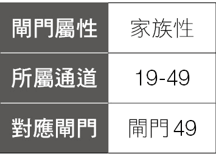

19 号闸门是“想要、需求”的闸门，是关于为了让我们的部落维持生存下去，我们的部落需要什么样的资源？

在远古时代，人们在部落中群居在一起，为了能够顺利的生存下去，这个部落必须拥有充足的资源，主要是土地和食物，人们才能生存，所以 19 号闸门便会确保部落中有足够的资源，否则部落就会分崩离析。

到了现代，土地、食物一样是维护人类生存的重要资源，但因为时代的进步，这些资源开始产生进化，因为以前是需要有土地，人才可以在上面建造房子，因而确保自己的安全。而现在工业社会则是在都市中建造高楼大厦，我们不见得要拥有土地，只要有房子就能居住，在自己的房子获得安全，甚至租房子居住一样可以获得安全。因此土地的概念已经转换成房产、资产甚至转换成钱，只要有足够的钱，就能让我们能生存下去。

因此，如何保护自己及别人的财产、钱，便是 19 号闸门赚钱的方式。

譬如，19 号闸门可以从事保全业，负责保护客户的居家安全，防止被坏人侵入，偷走客户的财产，只要客户用了你提供的安全的、有保障的保全系统，就可以不用担心他的财产安全问题，这就是 19 号闸门的赚钱方法之一。

另外，为了怕财产受到损失，延伸出保险业，只要投保了适当的金额，不管天灾、人祸，让客户的财产都可以受到一定的保障，不用担心。

从保护财产再延伸，就是保护我们的生命安全，因为保护财产、资源的最根本目的，就是保护我们的人身安全，所以有关保护人们的生命安全相关的产品、服务，都是 19 号闸门的赚钱方式。

举例来说，大家在电视、电影或书籍中，都看过有关世界末日、核战的描述，如果发生了这种危机，人类势必大量死亡，很少人能活下来。

为了解决这个问题，有人就建造出“生存公寓”或者称为“末日公寓”来避免这种灾难，它的作法是在美国堪萨斯州一处偏远的郊区地带，利用一个废弃的飞弹发射井，改造成一座位于地下的大型公寓，深入地下五十三公尺，共有十四层楼，其中七层楼是让人们居住的公寓，另外七层是图书馆、电影院、游泳池、酒吧等娱乐休闲场所，还有射击场跟攀岩场，另外还有菜园以及遛狗的地方。

这个公寓里面储存了大量的物资与水源，可以让七十个人在里面生活五年，公寓有大有小，售价在一百五十万美金到四百五十万美金之间，目前第一栋公寓已经卖完，正在兴建第二栋公寓中。

所以，任何有关保障人们财产、人身安全的产品、服务，都是 19 号闸门的赚钱方式。

## 快速反应

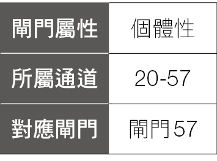

拥有 20 号闸门的人，可以察觉在当下所发生的事情，并把这察觉、理解转化为行动，透过在当下立刻处理、立刻反馈的能力，把事情做好，快速解决。这种在“现在、当下立即处理的能力”，就可以转化为赚钱的方式。

譬如一般冲洗照片都要半天到一天的时间，以前甚至要两三天的时间，但是有些店家会提供“快洗”的服务，三到五分钟就可以完成，但是价格可能就要翻倍，这就是利用在当下立即处理的能力来赚钱。

每个人每天都要吃饭，如果在家里煮饭，从买菜、洗菜、煮菜到完成，都要花上一、两个小时的时间；如果出去外面吃饭，出门到餐厅、点菜、等菜上桌也需要一段时间。如果想要快速满足飢饿的需求，方便面泡面是一个最好的选择，打开后加入热水，等待三分钟后便可享用，这是利用“现在、当下立即处理飢饿的能力”来赚钱的方式。

另外，在第二次世界大战后，全世界大多数国家都进入战后重整的阶段，工商业不振，物资缺乏，只有美国不受战争的影响，因此工厂可以大量生产，那时的目标是大量制造、大量完成，尽量生产更多的产品，这样才能赚更多的钱，生产出来的产品都是到完成后才去检查有无瑕疵品，在整个大量生产的过程中，机器不能随便停止，因为一停止后便会影响生产的进度。

二战后的日本，生产的东西质量低劣，在市场上也没有竞争力，一九五〇年六月十六日，日本科学家与工程师协会（JUSE），邀请戴明博士（William Edwards Deming）到日本做“统计与质量”的系列讲座。戴明指出：如果能把品管流程做好，在每一个环节都做好，一次就把事情做好，就不用浪费力气补救或重做。

因此他说服日本工厂的管理者及工人，在任何生产的环节，只要发生任何问题，每一个工人都可以在当下停下生产的流程，解决这问题，才能继续制造（美国因为是大量生产，为了生产出大量的产品销售出去，只有工厂的管理者有权决定是否停下生产流程，工人没有任何决定的权力），戴明鼓励每个工人在每个当下，只要发现问题，都可以当下进行解决。

透过这样的作法，戴明成功把“高质量反而降低成本”的理念，移植到日本的工厂中，经过五年，日本的产品就已经超越美国了，但因为日本还没跨足到精密、高价的工业品，所以美国人还没感觉。

等到一九八〇年日本产品横扫美国，连美国最自豪的汽车市场，都成了日本车的天下时，美国 NBC 电视台提出了一个疑问：“日本能，为什么我们不能？”

因为日本人接受了戴明的指导，在每一个当下遇到问题，就马上改进，一步一步走，即使一开始比美国的产品差，但经过数十年的努力，反而超越美国（即便在高科技的产品上）。这就是“现在、当下立即处理”的威力。

如果你有 20 号闸门，可以想想有什么事情可以当下解决？你可以提供什么样的商品、服务？快速解决别人的需求，可以在既有的事情上透过加快速度来赚钱。你也可以创造新的想法、产品与服务，让别人可以更便利，这就是 20 号闸门的赚钱方式。

## 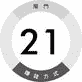掌控情势

21 号闸门是一个“控制”的闸门，因为 21 号闸门有最强大的自我力量。而这最强大的自我，是为了能够服务和保护部落。在现代社会就是用来服务和保护社群、公司、家人……等，因此 21 号闸门必须“控制”，确保群体能够生存下去，确保群体有足够的食物吃、有足够的地方睡觉、有足够的衣服可以穿。

人的身上会有体味，尤其不同国家的人更是会有不同的体味，每个人会有不同体味的原因之一，就是吃的东西不一样，因而产生不同的味道，所以同一个部落中的人，因为所有人吃的都是相同的食物，大家的味道闻起来都差不多；而不同部落（国家）的人，因为吃的东西不一样，所以体味也不一样。

在国际贸易的新闻中，常常会看到某些国家拒绝进口其他国家的农产品或食物，为什么呢？因为他们不想改变饮食，因为饮食被改变后，部落就被改变了，所以为了我们的部落不被改变，为了让部落持续吃固有的食物，所以 21 号闸门要控制大家吃什么。

衣服部分，我们可以通过不同的服装来辨认不同的部落，譬如日本的和服、印度的纱丽、越南的奥黛……等，不同的民族都有各自代表自己民族的特色服饰，尤其在传统部落聚会时，都会穿上自己的独特服饰，表达他们的民族文化，代表他们都是相同的部落。现代社会中，公司也象是个部落一样，有些公司会要求员工穿制服，因为穿上相同的制服，就代表是相同公司的一分子。

居住的地方更是代表部落的本质，相同部落的人会住在一个区域中，外来的人是没有办法住到这个部落中，部落必须要能控制谁能住在这部落中，且也要确保部落中的人都有地方住，才能保障部落里人的安全。

因此，21 号闸门可以销售房地产、销售服装、销售食物。

另外，21 号闸门也可以利用“控制”来获得对自己、对部落的好处。

流行音乐天后玛丹娜，数十年来一直保持是身价最高的流行天后，来台湾办演唱会票价最高达三万元，创下台湾演唱会史上最贵的票价，而为了达到完美的演出，玛丹娜“控制”了一切。

其他艺人的演唱会，大多是由承办单位在当地找音响设备、布置休息室，而玛丹娜为了确保声音传播出去的质量，在全球每个演唱城市都一致，所以灯光、投影等设备都自己带，光是演出的设备，就包了四架货机带了三十个十六公尺货柜，连舞台边的围栏也自己带。

为了保护自己的声音，她将所有可能会导致表现失常的因素都排除掉，所以她把专属的休息室原装原吋空运来台湾，包括健身房、按摩房、家庭房到梳妆区；休息室内温度一律维持在摄氏二十度，不让不稳定的空气影响呼吸系统。

地毯、沙发因为会跟身体接触，她担心如果使用新的物品会不习惯、受影响，或是水土不服让她生病、体力不支，导致无法完美演出，这些东西干脆就自己带。

因为她控制了一切，才能在每一个城市都能看见一模一样的表演，且让她每一次的表演都能展现一样的完美。

因此，藉由控制你的产品、服务都能达到一样的水平，或是利用你的产品、服务，来控制人、事、物，因而使自己或其他人得到好处，就是 21 号闸门的赚钱方式。

## 倾听心声

要能真正赚到钱的一个关键是：“听到人们真正想要什么。”

你必须要真正知道你的客户想要什么，才能把他们想要的东西卖给他们。

譬如香水广告是一个很有趣的事情，香水广告卖的是香水，也就是香味，但是大多数的香水广告中你看不到香水的存在（顶多是在广告的最后才出现），另外，香味在广告里也看不到，那么，香水广告到底在提供什么讯息呢？

香水广告在卖的是情绪、氛围、美丽、激情、自由、爱情，因为这才是人们底层真正想要的，香水公司透过广告，让人们相信，只要买了香水，喷了这些香味，他们就可以得到魅力、浪漫与爱情等，这一切都是因为香水公司听到了人们心里真正想要的东西。

拥有 22 号闸门的人，是一个很好的倾听者，拥有独特的倾听能力，当 22 号闸门的人愿意倾听时，坐在 22 号闸门对面的人，会很自然的吐露心声，说出他内心底层的想法，或是心里真正想要的东西，都会全然的告诉 22 号闸门。

当 22 号闸门的人心情好时，他是非常擅长社交的、开放的，他是有魅力、有吸引力的，因此其他人会主动愿意诉说内心的想法，当 22 号闸门运用倾听的能力，让对方讲完所有的话后，对方也会愿意接着听 22 号闸门所说的话，让 22 号闸门的人也能把想讲的话都讲完。

二〇一二年，Google 公司想知道为什么有些团队运作得很好，有些团队却有很多问题、无法运作，到底是要有什么样特质的员工，才能够团结合作、运作良好呢？

他们委托外部单位成立了一个项目小组（代号是亚里斯多德计划），调查了 Google 内部一百八十个员工团队。他们详细研究了团队中成员的人格特质、背景、兴趣嗜好……等。在收集、分析了三年资料之后，小组得到一个结论，他们发现，最有生产力的团队，是成员发言比例大致相同的团队，也就是大家都能轮流说话，而不是只有少数人却占据了大多数发言的时间；这是一个能够团结合作、运作良好团队的条件。

小组发现成功团队中的成员会彼此倾听。大家轮流发言，彼此都会听对方把话说完，再给予反馈，因此建立了彼此的信任，成员之间更愿意分享彼此的信息与想法，不用担心被拒绝或反驳。

小组对 Google 公司提出要建立成功团队的四个建议：一、重视倾听；二、接纳缺点；三、乐于赞美；四、开放、透明。

二〇一五年担任 Google 公司执行长兼董事长的桑德尔．皮查伊（Sundar Pichai），在二〇一九年一次演讲中，提到了对企业领导的建议：“领导人应该少说多听。”

因此，倾听也是一个成功企业领导人不可或缺的能力。

拥有 22 号闸门的人，可以思考的是如何运用“倾听”这个能力来赚钱，只要你的工作可以用到“倾听”这个能力，譬如，业务员要做好销售，便需要倾听出客户真正的需求；老师或主管，可以倾听出学生或下属的想法；当记者可以让受访者说出他真正的想法……等。

只要你愿意倾听，真心开放去倾听，你的“倾听”能力自然会让与你对话的人，告诉你他心中的想法，这就是 22 号闸门的赚钱方式。

## 改变现状

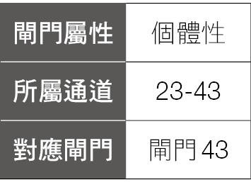

23 号闸门扮演着一个翻译者的角色，翻译来自 43 号闸门独特的想法，透过找到一个方式或语言把它沟通出来，让别人可以明白。

23 号闸门要学习的就是，要能够解释自己独特的想法，让其他人明白他的想法特点是什么？可以产生的好处是什么？可以为大家带来什么样的影响？因此 23 号闸门的人需要学习如何沟通，才能发展出适当的技巧，解释自己独特的洞见与想法，否则容易被别人所拒绝。

23 号闸门必须能够解释清楚，因为来自 43 号闸门的想法是非常独特、与众不同的，因为跟别人都不一样，如果你无法解释清楚，别人无法听懂，周围的人就会抗拒 23 号讲出来的东西，排斥它、拒绝它。

如果 23 号闸门可以解释他的想法、立场，能够清楚解释他自己的时候，大家便开始能够容忍他，解释的越清楚，大家就越能接受他，当其他人接受了 23 号闸门所说的新想法后，也代表了其他人开始被 23 号闸门同化，渐渐改变了立场。

所以当 23 号闸门能够顺利沟通他独特的想法时，因为是创新的想法，将会破坏或取代目前既有的作法，譬如计算机的发明，让打字机失去作用，以前的祕书需要学习打字技术，既要能打得又快又好，又不能有任何一点失误，因为打错一个字，整张纸就要重打。计算机发明之后，完全解决打字机的不便之处，若有错误可以随时修正，也可以随时增加或删减内容，还有各种漂亮的字体提供选择，所以打字机完全被计算机所摧毁。

音乐是世界八大艺术之一，我们的生活中处处充满音乐，而播放音乐的载体不断在改变，从一九三一年的黑胶唱片，一九六三年的卡带，一九七八年出现的 CD 光盘，一九九八年出现的 MP3 播放器，到二〇〇四年出现的在线数位音乐。

在这些播放音乐的载体中，除了黑胶唱片，仍为许多发烧友所喜欢、珍藏外（但目前数量也是很少量），卡带播放器已经很难买到了。现在连 CD 光盘都很少见了，以前的笔记型计算机都会内建 CD 光盘机，现在这个功能大多已经拿掉了，MP3 播放器流行一段时间，但现在的手机大多有播放音乐功能，且现在的音乐大多为数位音乐，用手机或计算机即可收听，轻巧、方便又容易。

音乐载体的历史，就是一个“改变现状的新产品”的历史，卡带摧毁了黑胶唱片，CD 光盘机摧毁了卡带，MP3 播放器或者说数位音乐摧毁了 CD 光盘机。

所以，若有一种新产品、新技术、新服务的诞生，意谓着一种旧事物被这新产品所摧毁，因为旧事物代表着既有的习惯、人们熟悉的事物，因此，创新的想法、技术，刚开始引入时都很容易受到抗拒，但是随着人们慢慢接受新事物，可能造成很大的改变，甚至对整个产业重新洗牌。

23 号闸门的赚钱方式，就是把你脑袋中的创新想法，或是你从外界接受的新想法、新技术，找到一个突破点进入市场，但你心里要有个准备，因为是创新的东西，有可能一炮而红，但也可能因为是新事物，所以群众需要一点时间来接受，只要好好的沟通你的想法，让别人可以了解你带来的新技术所能得到的好处，最终群众会接受你的创新想法的。

## 入迷

24 号闸门是“体悟”、“合理化”的闸门，它试图辨认一些以前从未出现过的新东西，试图去理解它，找到一个新概念，然后开始合理化，最终成为一个解释。

拥有 24 号闸门的人，脑袋非常忙碌，因为它会一直想一直想，无法停止下来，为了能让 24 号闸门的脑袋安静下来，24 号闸门的人要练习对于思考的事情分类。

首先，把事情分成能知道的跟不能知道的两类，对于不能知道的事情，象是人什么时候会死、地球会不会灭亡……等这些问题。这些问题，无论你怎么想，也可能想不出答案，就尽量不要去想。

要去想能知道的事情，譬如运动计划、想去哪里旅行、想学什么才艺……这些是你能够知道的事情，、就可以去想。

然后，对于你能够知道的事情，又要分成两类：

第一类是不重要的事情，譬如明星之间的绯闻、隔壁邻居的狗刚生了几只小狗……这些不重要的事情，你知道跟不知道对你的生活不会有什么影响，你也尽量不要去想。

第二类是重要的事情，譬如提升工作效率的技巧、对于生涯发展的规划……等，这些重要的事情，就可以经常去想。

如果 24 号闸门的人，能专注在想“能够知道”且“重要”的事情，那么脑袋就可以轻松一点，不会花太多时间在不重要的事情上。

因为 24 号闸门试图去理解一些以前没有存在过的东西，所以它会一直想，这也是 24 号闸门称为“反覆”的原因，因为它会有压力想要对新的事物、神祕的事物找出答案，如果这是他喜欢的事情，他会一次又一次的做它，反覆又反覆，无止尽的做这些事情，所以我们称之为“入迷、上瘾”。

有些人对咖啡上瘾，一天生活的开始是从第一杯咖啡开始，如果某一天没有喝到咖啡，就会觉得浑身不对劲，有人甚至一天要喝好几杯咖啡才可以，也有人则是对茶上瘾。

有人对运动上瘾，一星期总要去打几场篮球，或是一定要去高尔夫球场挥杆，或是每天要运动，他对良好的运动习惯上瘾。

拥有 24 号闸门的你，可能对某些事情上瘾，你从以前到现在都持续的、长时间在做这件事情，但我们建议，要对良好的、正面的事物上瘾，不要对毒品、赌博等不良习惯上瘾。

当你对某件事情上瘾，表示你喜欢这件事情，你可以从这件事情获得启发、喜悦、刺激，才会让你不断重复这件事情。所以，你可以把上瘾的这件事情，销售给其他人，因为他们可能也会跟你一样，会对这件事情上瘾，譬如你喜欢喝咖啡，对咖啡上瘾，你可以开一家咖啡厅，卖你喜欢的咖啡，分享给同好，让他们也对你喜欢的咖啡上瘾。或是你喜欢某一个品牌的衣服，对这品牌的衣服上瘾，你也可以想办法销售这品牌的衣服，既可以每天看到喜欢的衣服，又可以卖给其他喜欢相同品牌的人，然后又能够赚到钱，这就是 24 号闸门的赚钱方式。

## 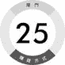经历存折

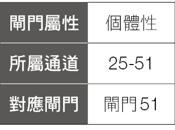

25 号闸门的赚钱方式，是一个特别的方式，因为它的重点是基于过去发生的事情，运用你过往的经历，结合在现在的工作上，产生一个特殊的化学作用。但是在过去发生那些事情的时候，你当时可能完全想不到未来会运用在哪里。

25 号闸门是一个“天真、单纯”的闸门，因为这是一个个体人的闸门，个体人闸门追求的是“新”事物，所以 25 号闸门会想得到新的学习、新的体验。

因为想得到新的经验，因此对既有的、已经发生过的事情就不会感兴趣，所以他不喜欢去做大家都做过的事情，因为大家都做过了，别人都体验过了，那我再去做就不是新鲜事了。

反之，他会被从没有人做过的事情所吸引，想要是第一个去做的人，因为以前都没有人做过，所以第一个做的人就可以得到新的学习、新的经验。因为 25 号闸门出于“天真、单纯”，让他会去走向以前没有人走过的路，或许这条路很困难、有危险，或许这条路很辛苦……将会遇到各种不同的状况。

如果是一个世故、有经验的人，出于头脑的评估判断，对于很多困难的事情、没有用的事情、投资报酬率很低的事情，经过好坏评估及优缺点的考量后，可能就不会去做了。

由于 25 号闸门的天真，让他会去做一些没人做过的事情，走一些没人走过的路，因此他可能会遇到很多意外，可能会有好事，也可能会有坏事。不过，这里说的没人做过的事，并不一定指的是从来没有人做过的事，因为，太阳底下没有新鲜事。就连月球都已经有人上去过了。

这里指的没人做过的事，没人走过的路，指的是 25 号闸门周围的环境中，没有人做过的事情，譬如 25 号闸门周围的人都住在一个小镇中，大家也都习惯于这个小镇，没有人离开过。这个有 25 号闸门的人，出于天真的想法，想要离开小镇，去大城市走走，或是到别的地方旅行，因为他想要获得新的经历。

出于天真，25 号闸门的人会去做不同的事情，走不同的路，因此，经历周围的人所没经历的事情，这些事情在当下可能没有什么用处，甚至可能是失败的经验，但随着 25 号闸门不断的尝试，长期累积的人生经验，到某一个阶段之后就会开花结果，许多看似没关系的事情，但却产生巧妙的碰撞，开出美丽的花朵。

贾伯斯于二〇〇五年对史丹佛大学的演讲中说道：他在十七岁时选了一所跟史丹佛大学学费同样昂贵的里德学院，念了半年后，看不到什么价值，又不想让父母继续付昂贵的学费，因此决定休学。

他休学后没有马上离开里德学院，而是在学校待了一段时间，因为他可以不用再去上他不感兴趣的必修课，而去上那些看起来很有趣的课。他注意到校园里大多数海报的字形都很美，原来学校里有一门研究字形的课。贾伯斯从这门课中了解衬线体和非衬线体的字形特色，也注意到不同字形的字母间距会有所不同，不但优美还蕴含历史及艺术含义。

这些字形的学问，当时在贾伯斯的生活中没有任何实际运用，但是十年后，当他设计苹果计算机时，一切又回到了他的脑海中，他把这些字形放进计算机中，让苹果计算机拥有许多优美的字体，并可以做出非常出色的排版，如果他当时没有上那堂课，苹果计算机就不会有这么棒的功能。

所以，拥有 25 号闸门的你，所走的没人走过的路，经历以前没有经历过的体验，不管当下是成功或失败的经验，只要你做的决定是正确的决定，不必在意当下的成功失败，因为，这一切的经验，都会变成你的养分，在你未来的时间开花结果，因此，请珍惜你所有的经验。

## 超级业务

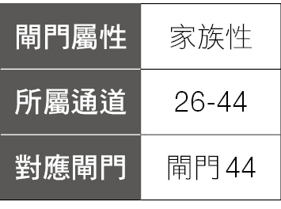

26 号闸门是属于部落人的闸门，部落的天性是保守的，所以要说服部落相信任何事情都是很不容易的，尤其是创新的事情。但是，从遗传学的角度来说，如果一个部落没有进行创新，这个部落最终会灭亡。

26 号闸门有一个作用，就是说服部落进行创新，让部落接受新事物，而为什么 26 号闸门能够说服部落进行创新呢？

因为 26 号闸门是“业务员”的闸门，它也是一个“夸张、夸大”的闸门，为了说服客户买他所销售的产品，业务员必须强化他的产品的特色，所以有时可能为了将优点极大化，业务员讲话常常很夸张。

另外，26 号闸门也是一个“自大狂”的闸门，所以 26 号闸门会强调它是最好的，不是新的也不是改良的，而是最好的，他卖的冰箱是最好的冰箱、他卖的微波炉是最好的微波炉、他卖的车子是最好的车子……等。

因此 26 号闸门销售的就是“最好的”，你要有自信认为你卖的产品是最好的、你所提供的服务是最好的，当你真心认为你所提供的产品、服务是最好的，你所散发的能量场，也会影响其他人认为你所提供的产品、服务是最好的，进而购买你的产品与服务。

所谓“最好的”，不一定有标准答案、也不一定只有唯一一个答案，以汽车举例，26 号闸门卖的“最好的车子”可能就会有很多种答案，譬如我卖的最好的车子是“最有名的厂牌”、“最安全的车子”、“最好的引擎”、“最省油的车子”……等，因为每个人对“最好的”定义并不一样，重点是在你自己身上，你一定要对你所提供的产品、服务，找到你认为是最好的、最棒的，别人才会被你影响，因而接受你、欣赏你。

例如，美国前总统川普曾经说过，他自己做得最好的事情，就是在最好的地段盖上最好的房子，他说：“如果我盖高尔夫球场，它就得是最棒的，如果我盖摩天大楼，它就得是最好的。”

因此他也曾在一本书上提到：“人们可能不会时常想得很远大，但他们仍相当乐见敢于如此的人。人们想要相信最大、最棒以及最特别的事情。”

川普在二〇一六年美国总统大选时用的口号就是“让美国再次伟大”（Make America Great Again），川普强调美国是一个伟大的国家、世界上最好的国家，藉此吸引那些认同美国是一个伟大国家的美国人投票给他，因此当选二〇一六年美国总统。

相信自己的产品、服务是最棒的，也吸引其他人认同你的产品、服务是最棒的，就是 26 号闸门的赚钱方式。

## 知识优势

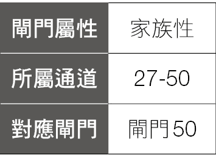

一个部落要成功，便需要教育，因为在部落人的想法中，最重要的是稳定、维持不变。可是稳定、维持不变，也意谓着没有任何改变，如果一个部落长期没有改变，初期可能还好，但随着时间的前进，就象是一滩死水一样，这个部落便会失去竞争力，最终会被淘汰。因此，部落需要教育，当部落里的人受到的教育越高，他们就会拥有更新的技术、更有效率的作法，也会更有竞争力。

有句话说：“教育是翻转贫穷的不二法门。”根据二〇一八年劳动部的统计资料，高中或高职学历的薪资比国中或以下的高五％，专科比高中或高职的薪资高六％，大学比专科的薪资高十％，研究所的薪资比大学高十五％，所以学历越高，薪资水平也会越高。

所以，27 号闸门赚钱的方式，一个就是跟“教育”有关，透过让别人可以接受更多的教育来赚钱，譬如学校的教育，或是在职培训、升学补习班、英文补习班、计算机补习班……等各种相关的教学机构，都是为了让人可以得到更多的知识，获得更好的教育。

27 号闸门本身就想学习更多，渴求更多、更高的知识，当他学习到这些知识之后，便可以把它传递给也想要这些知识的人，透过提供这些知识，便是 27 号闸门赚钱的方式之一。

另外，你的赚钱方式也可以跟“教育”有关，但你并不直接提供教育，譬如代办留学的服务，让台湾的学生可以到世界各国留学，或是上语言学校……等，这也是跟提供教育有关的赚钱方式。

另一个赚钱的方式，跟“知识”有关，因为 27 号闸门渴求知识，因此会主动追求许多新知识，而知识就是力量，透过 27 号闸门的努力，去获得别人没有的知识，因而产生竞争力，就是 27 号闸门的赚钱方式。

现在很多农民第二代、渔民第二代，在外学会了新的知识，关于耕种、饲养的新方法及新技巧，回家改良原有的种植、养殖方式，或引进高科技管理，运用网络营销，翻转原本经营日益困难的农业与渔业环境，这就是利用知识来赚钱。

例如，有一个由原先在银行业、高科技产业，从城市回到乡村的农二代组成的代耕团队，说服了老农民把土地租给他们，采用专业、大型的耕作机器，进行更有效率的作业，比起传统的人力或小型机器来说，运用大型耕作机器所生产的速度、效率和精度都提升很多，同一块土地可以产生更高的经济效益。

相对的，这些大型机械费用都很高，通常都要数千万元，这团队的人因为懂英文，在网络上发现一个国际农机拍卖网站，可以用三分之一的价格，买到原价上千万的采收机，在更换鍊条、皮带、齿轮后，功能几乎跟新的一样，而且二手农机的寿命可以超过二十年，他们利用三分之一的价格买进，两年半就可以回本，如果用新的农机就要六、七年才能回本。

所以，善用知识，在自己的产品、服务上发挥出比别人更强的优势，就是 27 号闸门的赚钱方式。

## 找到意义

28 号闸门的人非常追求“意义”，对于 28 号闸门的人来说，他有一个深深的恐惧，恐惧人生虚度、没有意义，因此，对于 28 号闸门的人，“意义”是很重要的事情，如果对于一份工作找不到意义，这个 28 号闸门的人就不想做这份工作了。

很多时候，当 28 号闸门的人想要离开一份工作时，在他人眼中会觉得很不可思议，因为别人认为 28 号闸门现在的这份工作很好，薪水很高、福利很好，公司前景也看好，一切都很好，为什么这个 28 号闸门的人却想要离职，家人跟同事都百思不解，一直劝他不要离职，也搞不懂为什么明明这么好的工作，却不想做下去。

因为对拥有 28 号闸门的人来说，“意义”是他所追求的，这工作必须对他有意义，如果这工作没有意义，他便不想再继续工作下去，就算薪水再高、福利再好、旁边的人再怎么劝他，也很难改变 28 号闸门的心意。

因为 28 号闸门是个体人的闸门，而个体人是以自己为主，重视自己的特立独行、与众不同，所以旁人对他的劝告，他根本不会听，一定要按照自己的想法，走出自己的路才可以。

28 号闸门的人，对于要从一件事情找到意义，不是件容易的事情，因此，给 28 号闸门的建议是：你可以练习“赋予”一件事情意义。

举例，有一个人经过一个工地，看到三个人在搬砖头，他问第一个人：“请问你在做什么？”第一个人回答：“我在搬砖头。”接着他问第二个人：“请问你在做什么？”第二个人回答：“我正在工作，透过这个工作可以让我赚钱养家活口。”最后他又问第三个人：“请问你在做什么？”第三个人回答：“我在盖一间美丽的教堂。”

同样都是搬砖头这件事，看来看去就是搬砖头，就是这么简单的一件事，要只从搬砖头这件事情找到意义，可能很困难。但是，如果你可以从另外一个角度思考，看你想要“赋予”搬砖头这件事什么样的意义？看你能够赋予搬砖头这件事什么样的意义？因为“找到”意义，可能找得到也可能找不到，但是赋予它意义，可以是你的选择，是你可以掌握的，让你所面对的事情都能变成对你有意义。

有 28 号闸门的人，赚钱的方式，就是要找到“对你有意义”的工作，或是你可以从工作中得到属于你的意义，不管是什么样的工作，只要你觉得有意义，你就有做下去的动力。

从这个角度延伸，只要你的工作、产品、服务，如果能够让别人“找到意义”或“觉得有意义”，也是 28 号闸门的人的赚钱方式，譬如旅游业，提供一些独特的旅行，或类似“生存冒险”的行程，让那些失去目标的人透过冒险得到乐趣或找到意义。

另外，有很多的电影、小说、戏剧，提供了很多冒险的剧情、场面，透过其中主角的冒险，寻找属于他的意义，让人看了之后受到激励，觉得人生就是要这样才有意义，因而受到启发，或者提供各种对“人生意义”的诠释，这也都是 28 号闸门赚钱的方式。

举例来说，有一部电影《白日梦冒险王》（The Secret Life of Walter Mitty），描述杂志社员工华特．米提平时就有各式各样的白日梦，但因为他找不到一个知名摄影师尚恩．欧康诺的底片，这底片的其中一张照片将作为这份杂志最后一期的封面，为了找到照片，从未真正出去冒险过的华特，决定出门去找尚恩，他一开始先前往格陵兰，在当地一间酒吧中得知尚恩在一条渔船上，于是他便跟着刚好要送无线电零件给那条船的邮差一同前往。因为他们是搭乘直升机过去的，所以华特必须从直升机跳到船上，但不小心跳到了海上，奋力抵抗鲨鱼后被救了起来，接下来就是他一连串精彩又刺激的冒险。

许多有 28 号闸门的人很喜欢这部电影，因为透过华特不断的冒险去寻找尚恩这件事，让他们觉得很有意义。因为华特工作十六年来从未弄丢过一张照片，所以他必须做到完美的收场。

有趣的是这部电影的评价非常两极，喜欢的人很喜欢，但也有人给出非常差的差评，例如：“一个从没去过哪里或是做过什么事情的男人，突然就哪里都去过、什么都做过，在我看来他还不如待在家里。”

我觉得这说明了一件事，从人类图的观点，每个人的设计都不一样，如果拥有 28 号闸门的人，会理解华特为什么要这么做，因为他们都对“意义”非常在乎，他的工作一定要有意义才行，所以拥有 28 号闸门的人，会对 28 号闸门的内容产生共鸣。

但因为 28 号闸门是个体人的闸门，个体人强调自己的特立独行、与众不同，所以也有可能一个 28 号闸门人觉得很有意义的事，另一个 28 号闸门却不觉得有意义，但他们同样都很重视“意义”。

如果是一个没有 28 号闸门的人，就完全不明白为什么要这么做，可以用别的方式处理。为什么要去冒险，这不是浪费时间吗？

所以，世界上有许多好的想法、好的观念，但不见得适用所有人，透过人类图，找出自己的强项，避开自己的弱点，将可以使你事半功倍。

## 投入体验

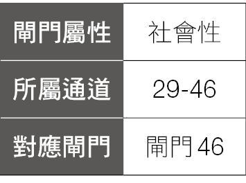

29 号闸门是一个“承诺”的闸门，这是一个容易答应别人、容易“say Yes”的闸门。

“你可以帮我做这件事情吗？”

29 号闸门：“好。”

“你可以借我钱吗？”

29 号闸门：“好。”

“你这周末可以帮我代班吗？”

29 号闸门：“好。”

“你可以帮我作保人吗？”

29 号闸门：“好。”

有 29 号闸门的人很容易答应别人，不管是好的事情、坏的事情、对的事情、错的事情，常常因为太轻易就答应别人，最后让自己身陷困境，惹来很多麻烦。

因此，拥有 29 号闸门的人，要开始练习不要太轻易答应别人，不要轻易“say Yes”，但是也并不是就要“say No”，而是要练习“say Wait”。意思就是不要急着说好，也不是马上拒绝，而是要练习说“等一等，让我先想一下”。

如果你练习人类图已经有一段时间，可以用你的策略跟内在权威，决定要不要接受对方的要求，如果不是很确定的话，先说“等一等，让我想一下”，会比不想就直接答应别人要来得好。

29 号闸门的人也要有一种心理建设，就是即便你是出于正确的决定，答应了一件事情，建议你要放下心理的期待，不要期待事情一定会成功，马上有好结果。也不要遇到挫折后就立刻沮丧、失望，因为 29 号闸门如果正确的答应一件事，就会拥有能量去做这件事情，但是有时你无法知道这个承诺会带你去哪里、会发生什么事？可能要走到终点，当你完成一件事情，走完一趟旅程后，才知道你要学习的是什么、你真正的收获是什么。

如果你有太多期待，抱着预设立场，如果事情发展不如预期，就因此失望、挫折，甚至中途放弃，那你就看不到终点的景色，就好像一个登山客，一开始开开心心的往上走，途中开始遇到各式各样的问题与困难，然后放弃了爬山、开始往回走，他将永远看不到登到山顶后美丽的风光。

电影《没问题先生》（Yes Man）的剧情，很适合用来解释 29 号闸门的学习过程。

卡尔是一个凡事都找借口，有事找他都拒绝，与前妻离婚后都不参加任何社交活动的上班族，几乎凡事都说“No”。

直到参加朋友介绍的“Yes 讲座”，讲师跟卡尔订了个契约，要求卡尔以后对什么事情都要说“Yes”，不能说“No”，否则会导致不幸，就象是个诅咒一样。

因为担心说“No”会导致契约惩罚的卡尔，开始答应一切请求与邀约，从此成为“没问题先生”，生活开始大为不同，老板问他可不可以加班，他说 Yes，对于计算机跳出的小广告“需不需要波斯新娘”也按 Yes，他还去参加了高空弹跳、学了韩文、练习吉他、学开飞机、帮朋友办了派对，也因此认识了新的女朋友。

因为卡尔找了波斯新娘、又学韩文、还学开飞机，让 FBI 误以为卡尔是恐怖分子，卡尔解释他只是在练习讲座讲师的要求：“对任何事都要说 Yes。”但这却惹怒了女朋友，认为卡尔跟她在一起只是一个练习，根本不是喜欢她，女朋友因而说要跟他分手，卡尔也只能说“Yes”。

跟女朋友分手后痛苦万分的卡尔，开始想对不想做的事情说“No”，可是每当他说“No”的时候，就会遭遇厄运、就象是契约的惩罚一样，受不了的卡尔，决定去找当初 Yes 讲座的讲师来解除这个说“Yes”的契约，结果讲师说，契约都是唬人的，一切都是巧合而已，让你说“Yes”，是要你发自内心的说，而不是不得不说，最后卡尔找到女友解释清楚、尽释前嫌。

所以，对 29 号闸门的建议：

第一点是，经过人生的学习，要开始知道什么事情要说“Yes”，什么事情要说“No”，不要自动化的遇到事情就直接答应跳进去，而是要透过你的策略跟内在权威，做出正确的决定后才说“Yes”。

第二点是，在你做出正确的决定，跳入这件事情后，就全力以赴去做，不要中间就急着要有成果，要有毅力走完全程，坚持到最后，当你走到终点后，就会发现在终点等着你的礼物了。

## 顺从投降

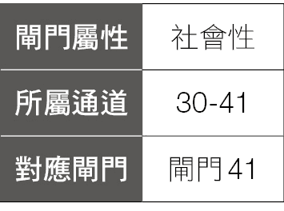

30 号闸门是“感觉、渴望”的闸门，拥有 30 号闸门的人，会想要有各式各样的感觉，一直渴望获得各种不同的经验与体验。

如果 30 号闸门的人没有学会“投降与接受”，这种对感觉、体验、欲望的追求，可能就会变成一种痴迷。

例如，一个 30 号闸门的人渴望爱情，想要得到恋爱的感觉，于是她跟 A 交往了、然后恋爱了，对一般人来说，她得到了她想要的，应该是个快乐的结果。

但如果她误解了 30 号闸门真正的意思的话，她跟 A 交往，并不是一个终点，当她跟 A 交往的时候，她已经得到跟 A 交往的感觉跟体验了，然后她又产生了新的“感觉、渴望”，她想着如果跟外国人交往的话，那是什么样的感觉呢？因为从来没有得到过啊。于是她就跟一位美国人 B 交往了，跟这个美国人交往的时候，她可能又想着，如果跟法国人交往，会是什么样的感觉呢？是不是会有浪漫的感觉呢？于是她就跟一个法国人 C 交往。跟这个法国人交往时，又想着，跟英国人 D 交往又是什么样的感觉？接着是 E、F、G……等。

这样一直下去，她将会陷入无止尽的循环当中，也会变成为了一直追求感觉而追求感觉。

因此，30 号闸门的人，必须对“自由”有着不同的看法，有些 30 号闸门的人很想要拥有自由，他认为的自由，就是我想做什么就做什么，但是想做什么就做什么，并不是真正的自由，你要投降于现况、接受现况，才能得到真正的自由。

有部电影《打不倒的勇者》（Invictus），内容讲述一九九五年南非举行世界杯橄榄球赛期间，当时的南非总统曼德拉，如何与国家橄榄球队队长同心协力，联手凝聚国人的向心力，让刚摆脱种族隔离制度不久而面临分裂的南非能够团结一致。

其中有一段是：当曼德拉当选总统后，所有黑人都觉得他们是这个国家的主人了，因此可以做任何他们想做的事，当时的国家橄榄球队“跳羚队”中九成都是白人，所以体育部长就想要把这支球队废除，将队名、队徽颜色都要依黑人的精神和文化来做改变，但曼德拉坚决反对，他强调我们正在重建国家，但并不是我们想做什么就做什么，废除这支球队，只会让白人与黑人之间的仇恨更加恶化，所以他想尽办法去除黑人对“跳羚队”是属于白人球队的既定印象，因此他要求“跳羚队”到各地教导黑人小朋友玩橄榄球，更激励“跳羚队”，接见白人队长，要求他打赢当时在南非举办的世界杯橄榄球赛，原本大家预期只能进八强的南非橄榄球队，却一路过关斩将，最后获得冠军，更重要的是，在一路晋级的过程，让原本分裂、相互敌视的南非黑人、白人，因为共同支持球队的胜利，慢慢团结起来。

拥有 30 号闸门的人，要学会“投降”、“顺从”于现有的条件与资源，从中走出一条属于自己的路，当你获得成功的经验后，可以把你的经验化为商品或服务，销售给别人，这就是 30 号闸门的赚钱方式。

## 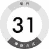意见领袖

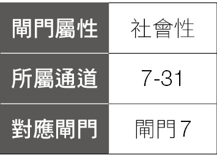

31 号闸门的赚钱方式是“选择正确的影响力”。“选择正确的影响力”，分为两种，第一种是，你要寻找正确的影响力，意思是你需要正确的被影响，被影响不是被控制、被处理，而是要找到一种行的通的模式可以运用，确保大家都能通往“安全的未来”，“安全的未来”指的是因为这模式现在可以用，明天也可以用，因此我们今天拥有的结果，明天也一样可以拥有相同的结果。

31 号闸门的人要慎选学习的对象、要学习的模式，因为选择错误的模式之后，之后要再修改回来，会花费许多的时间及成本。

如何选择正确的学习对象呢？一个评估方式就是，你是否可以按部就班，一步一步的学习、成长，达到你想达到的目标？简单的说，就是你可否透过学习，复制成你想学习的对象？不一定要达到百分之百，但是至少要百分之七十至八十，如果你学习了半天，只能学到百分之二十，那可能这个模式并不适合你。

“选择正确的影响力”，第二种意思是，找到正确的跟随者，因为就算一个人的能力再强，能够做再多的事情，在单打独斗的情况下只能发挥百分之百的能力，或许有机会可以发挥到百分之一百二至百分之一百五，但是总是会有极限，总是会遇到天花板。

如果能够发挥他的影响力，去影响其他十个人，就算这些人只能得到他百分之七十的真传，十个人加起来就有百分之七百了，远远大于一个人能够发挥的力量。如果能影响一百个人，就能有七十倍的成长与规模了。

重点是这十个人是否能够正确的被你影响？他们是不是和你有相同的想法？是否认同你的作法？是否能够把你所想要展现的事物，尽量完整的表达出来？所以你要找到对的人，能够接受你正确的影响力，才能让你的影响力发扬光大。

譬如“加盟店”就是这样的概念，你有一个很好的想法，做了一个很好的生意，开了一家业绩很好的公司，然后大家就会想要跟你加盟，透过让其他人加盟，可以让你的影响力迅速扩大，你的生意就会快速扩张与普及。

许多加盟店有标准的 SOP，你的装潢、摆设、人员训练，都是一样的规模与标准，透过相同的作法训练出来的加盟店，就跟你原本的服务质量差不多，所以加盟店的成功与否，在于是否能让加盟店的表现与创始店的表现近乎一样，这是成功的关键，也就是你要选择正确的人来发挥你的影响力，这样加盟才能成功。

也有加盟失败的经验，譬如，有一个因为原先生意失败转而以火锅店自行创业的老板，由于他对火锅有独特的热情，为了开火锅店，他去考察了上百家火锅店，然后自己研发出独特的汤头，加上提供新鲜的食材，价格又亲民，每天门庭若市，总是一大堆人在排队，生意好的不得了。

许多人看这老板的火锅店生意这么好，就跑来跟老板要求加盟，老板起先都拒绝，但后来受不了一个好朋友三番两次的要求，就让这个好朋友加盟了。

但是他的朋友复制了他的产品，却没复制他的服务精神。创始店常常很多人在排队，老板对在门口苦苦排队的人觉得很不好意思，因此提供免费冰淇淋，主动拿出去给客人吃，或者提供小点心，另外，常常对熟客的消费金额去掉尾数打个折，或者提供赠品让客人带回家，他所做的一切都是对于客人上门心怀感谢，所做出的反馈。

朋友加盟后，刚开业时生意还不错，可是一段时间后业绩开始下降，朋友担心亏本，所以原本免费的冰淇淋变成要付钱，对于客人的费用丝毫不会打折，也不会送小礼物，因为朋友认为自己都已经没赚钱了，如果再多送东西不就更亏本了，老板一直劝他朋友不要先想着赚钱，而是要做好客户服务为优先，但这朋友屡劝不听，反倒责怪一定是老板有祕方没有告诉他，他才赚不到钱，两个人的关系也因此崩坏。

从此这个老板心灰意冷，再也不接受其他人的加盟了。

31 号闸门的重点是，为了发挥你的影响力，必须要慎选跟随你的人，尽量确保对方能够按照你的方式，跟你一样能够做出对的事情，让你的产品、服务得到倍数的成长，这就是 31 号闸门的赚钱方式。

## 应变能力

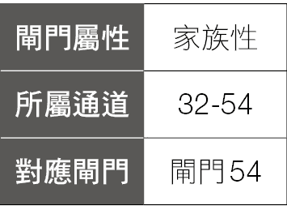

32 号闸门是“持续、延续”的闸门，时代会进步，很多事情无法由个人意志决定，不是一个人说想要维持现状就能维持现状的，所以，若要能让你所做的工作、产品、服务能够持续下去，要能长长久久的延续下去，就要接受“唯一不变的就是变”。

这是 32 号闸门的思维方式，而 32 号闸门也是恐惧失败的闸门，因为恐惧失败，所以一直思考如何能够不失败。

32 号闸门的人知道什么事情会改变，什么事情应该被改变，但什么事情又不应该被改变。

32 号闸门的人有两种状态，正面的状态以及负面的状态，负面的状态是因为担心失败、优柔寡断，不断的想想想，一直在想如何能够不失败，如何避免失败，完全出于恐惧失败来考量，但是却一直不采取行动，甚至错失良机，常常想想想，到最后就什么都没有了。

32 号闸门的人正面的状态，则是知道环境一直在变化，但是他知道自己是拥有随机应变的能力，所以他会勇于行动，不断的修正、改变，因应环境变化，让自己能适应环境，维持生存，一直持续下去。

畅销书《谁搬走了我的奶酪》（Who Moved My Cheese?），是史上最畅销的经典寓言书，翻译成三十七种语言，在全球热卖超过两千六百万册。

书的内容是有两只小老鼠跟两个小小人，在一个迷宫里，本来每天都可以在一个固定的地方找到奶酪，大吃一顿，但有一天，奶酪突然不见了。

小老鼠很快接受了事实，开始去寻找新的奶酪在哪里，但两个小小人拒绝接受这个事实，大声抱怨，待在原地，不知所措。

最后，一个小小人接受了事实，开始出发寻找新的奶酪，最后找到了奶酪，也找到了那两只小老鼠，但另一个小小人则继续抱怨，不想改变，每天都在期待搬走奶酪的人，有一天能再把奶酪还给他们。

这个寓言的故事就是在讲“变”、“改变”与“不变”，透过简单的小故事，让人理解不同的处理方式，所产生不同的结果。

下面是这本书其中的一些金句：

“我们不愿意改变的原因，是我们害怕改变。”

“有时候，事情就是会改变，而且再也变不回原来的样子……这就是人生。”

“当你改变想法时，你的行为也会跟着改变。”

“及早注意事情的小变化，就能帮助提早适应即将到来的大变化。”

所以，32 号闸门的赚钱方式，是一种心态，拥有 32 号闸门的可以告诉自己，这个世界一直在变化，没有什么事情是不变的，但是 32 号闸门拥有应变的能力，可以一直调整，一直转变，透过应变的能力，让自己的工作、产品、服务一直延续下去。另外，也可以透过自己的产品、服务，来协助别人转变，应付外在世界的变化，这就是 32 号闸门的赚钱方式。

## 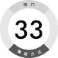反省沉思

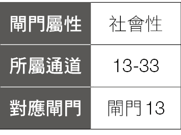

33 号闸门是“退隐、隐私”的闸门，是“记忆”的闸门，当一件事情发生后或一个事件结束后，拥有 33 号闸门的人需要退隐，保有隐私，所以他要找个地方让他能够独处，因为独处才能不被打扰，才能有机会回想在这事件中所发生的每一件事情，然后开始反思、反省这个过程，透过反思与反省，看看自己在这过程中经历了什么？分析所有的事情，什么地方做对了？什么地方做错了？透过反思，找出自己错误的地方，总结这些错误，找出改正的方法，可以用于下一次的事件，如此一来，这次所发生的事情将变成一次学习的过程，让自己变得更进步、更强大。

曾子曰：“吾日三省吾身：为人谋而不忠乎？与朋友交而不信乎？传不习乎？”

翻成白话文就是：“我每天都用三件事来反省自己：替人谋事有没有不尽心尽力？与朋友交往是不是有不诚信的地方？老师传授的知识有没有复习？”

为什么曾子要说这句话呢？

因为曾子是孔子的学生，深得孔子的喜爱，而且学问进步的非常快，同学们问曾子为什么可以进步那么快？曾子就回答了“吾日三省吾身”这句话。

这句话也说明了，反省是进步的基础。

一般人通常在一件事情结束时，尤其是遭遇不顺利、失败的事件时，当下心里想的大多是想要忘记过去发生的事情，想要赶快开始一个新事件，希望下一件事情会更好，而不会去仔细反思在这个事件中，究竟发生了什么事情，为什么会失败，如此一来，上次所发生的错误很可能将会重来一次，周而复始，不断循环。这样的话并不会真正的学习到经验，只是不断的在收集错误的经验而已。

举例来说，对很多股票投资人来说，当他卖掉手上一张赔钱的股票之后，大部分的人会做的下一件事情，就是赶快买一张新的股票，内心希望这张新买的股票可以马上上涨，让他赚到钱，弥补之前的亏损。因为他不想面对失败，想要忘掉这件事，想要假装这件事情根本没有发生过。

如果买了一张股票赔钱卖掉了，却没有好好的去思考为什么会赔钱？到底中间犯了什么错？为什么当初会买这档股票？预期的走势是如何？有没有订定策略？当不如预期因而下跌时，有没有设定适当的停损机制？有在预计的停损点卖出吗？

如果没有好好的思考这件事情，没有厘清这次的失败是如何产生的，就盲目赶快买下一张股票，那么下一张股票的结果大概也不会太好。

有一个财经专家曾经对股票族提出这样的建议：“每当你买、卖一张股票后，你就立刻把买、卖这张股票的原因写下来，如果赚钱了，写下你成功的原因，就算赔钱的话，也写下失败的原因。如果你能做到记下你每一次所犯下的错——在以后的日子里再也不犯同样的错误，日积月累下来，你一定可以从股票市场中赚到钱。”

为什么“反思”这么重要呢？因为人的学习是从没有经验到有经验的过程，但并不是你做了一件事情就会学到经验，就像以前的数学考卷，你写错了一个题目，你马上再写一次还是会错，除非你反思后，学会正确的解法，并把正确的解法“记忆”下来，你才能写对，才能真正从没有经验变成有经验。

同样的道理，对一个拥有 33 号闸门的人，在每次事件结束后，如果能够独处、反思，找出错误，并记忆下来，下次便不会再犯同样的错误，如此一来，一定可以让你累积经验，逐渐变强，这就是 33 号闸门的赚钱方式。

譬如上银科技总经理蔡惠卿，规定自己每天至少腾出五分钟时间来“自我反思”。她会回溯一遍当天发生的事情，检视自己对每件事情的处理够不够到位。

“今天那件事的应对方式处理得好不好？”“那个主意好不好？”

透过每一次的反思，找出需要改进的地方，让下一次更进步。

这个习惯，她持续了将近四十年。

## 强大力量

34 号闸门是“强大的能量、力量”，它可以分成两方面来解释，第一个是身体的力量，有 34 号闸门的人可能拥有一个很有力量的身体，充满爆发力，因此 34 号闸门的人可以当运动员，譬如举重选手、健美先生／小姐、篮球选手、足球选手……等。因此，你可以发挥身体的力量，在运动方面有良好的表现。

有 34 号闸门的人，也可以当运动教练、健身教练，靠你对力量的使用经验与技术，提供别人协助与指导，这也是 34 号闸门赚钱的方式。

除了身体的力量之外，还有一种“力量”是精神的力量、心灵的力量，这里指的力量，不是真正的力量，是比较抽象的力量，因此，比较象是一种态度、一种精神，这种力量，是面对难关、克服挑战的力量。有 34 号闸门的人，在面临困难时，自然的会去面对它、挑战它，寻求突破点去克服它，就好像爬山一样，不管这山多高、多难爬，他都深信自己一定能爬过山巅，穿越过去。

这种力量是一种相对的概念，就是如果 34 号闸门的人身处在一个平顺的环境，不管是工作、生活，任何事情都能轻松完成，没有遇到任何困难与挑战，没有可以展现力量的机会，他就不会觉得自己很有力量，旁边的人也感受不到 34 号闸门的力量。

所以，拥有 34 号闸门的人，常常在人生中会面临很多危机、困难与挑战，但是透过这些困难，反而可以让 34 号闸门的人，藉此展现他的力量，克服困难。

譬如前英国首相撒切尔夫人，在担任英国首相时，英国正经历经济萧条、失业率攀高等严重问题，即便面对严重的经济危机，但她始终展现过人的刚毅，抱持着勇往直前、永不妥协的态度，来面对人民的抱怨、各界的批评，创造了英国在二次大战之后经济繁荣最快的时段。

面对外国事务，即便面对各种困难，撒切尔夫人更是展现了强大的力量，譬如一九八二年，阿根廷政府为了转移民众对国内经济情势的不安和社会激烈的冲突，想透过战争的胜利来找回政府的声望，因此发动了福克兰群岛战争。

对于阿根廷侵犯英国领土的行为，英国内部有人要求出战，有人反对出战，国内各方的态度不一，非常混乱，作为盟友的美国也积极劝说英国议和，当阿根廷登陆福克兰岛第三天，全世界都以为英国不会出兵的时候，撒切尔夫人派遣海军特遣舰队出兵了。

在福克兰群岛战争期间，由于英军战舰遭阿军发射法制飞鱼反舰飞弹击沉，引起撒切尔夫人极度不悦，遂打电话给当时的法国总统密特朗兴师问罪，胁迫法方交出飞鱼飞弹的参数；起先密特朗守口如瓶，但撒切尔最后对密特朗放话，她会为了福克兰群岛主权，不惜动用核武器攻击阿根廷，并终结英法关系，迫使密特朗就范。

历经两个多月，英国战胜了阿根廷，也因为这场战役，这种强硬不妥协的态度，让她获得了“铁娘子”的称号。

如果你有 34 号闸门，不管你在工作上、生活中遇到任何挑战、困难，你要相信自己，只要你做出正确的决定，靠着 34 号闸门强大的力量，将可以使你克服一切的困难。

## 挑起期待

35 号闸门，是“期待”的闸门，销售大家“满足期望”的需求，35 号闸门的人渴望新的经验，总想去经历过去没有经历过的事情，想要不断的收集新的经验，这将让 35 号闸门有不断改变及前进的感觉。

如何销售“期待”呢？就是不定期丢出一些新的信息，吸引大家的注意力，不断的吊人胃口，让你持续对它有期待，譬如 iPhone 手机，以前在 iPhone 新一代手机上市之前，总是会有类似这样的消息出现：“苹果公司的某工程师不小心遗失他的背包，里面有最新一代的 iPhone 手机，上面有什么样的新功能……”等。或是某电信公司工程师在简报时，不小心泄漏了可能是 iPhone 新机的上市时间……等。

这些事件有可能真的是意外事件，也有可能是一种营销手法，透过这些偶发的事情，让社会大众对 iPhone 的新产品有了期待，有了预估的时间，消费者们便可以事先准备、开始研究、开始存钱，等新产品上市时便可以列入他的购买计划。所以各家厂商都会透过营销手法，事先埋下一些种子在消费者心中，慢慢浇水灌溉，时机成熟时，消费者自然就会掏出钱来买厂商所提供的新产品。

因此这些厂商就要不时的丢出一些讯息，让消费者随时充满着“期待”。

另外，有一种生意模式也是运用“期待”，曾经有一个电视节目介绍了“幽灵餐车”，它是在台中地区一台专卖花生糯米肠的餐车，由于是餐车，因此没有固定的销售地点，而且老板都是在每天出门前最后一刻，才在脸书公布贩售地点，就像“幽灵”一样，不定时、不定点出现，所以才叫做“幽灵餐车”。

一开始其实只是一般的餐车，但因为食物好吃，渐渐的开始口耳相传，越来越多人知道，可是因为餐车并没有固定的出现地点，所以有时当消费者看到这餐车出现的地方离自己所在地满近的时候，就会抱着尝鲜的心态去试试看，结果一到餐车所在地，已经大排长龙，都要等一两个小时才买得到，而且每人还限买三份，买到之后，他再把这样的消费经验分享给其他人，就会引发其他人的“期待”，也想要去试试看。

这样“限时间、限地点、还限量”的消息，透过网络慢慢传出去，名气越来越大，让其他没吃过的人产生了期待，更是想要去吃吃看，餐车生意就越来越好。

现在“幽灵餐车”已经变成一个普遍的名词，许多城市开始有类似的商品，它底层销售的就是一种未知、一种期待，当然本身的产品一定不错，才能吸引人去买，更重要的是，因为这是一种没有经历过的期待，让没有体验过这种经验的人，更是想尽办法要去获得这种体验。

拥有 35 号闸门的你，可以开始思考，你有什么产品或服务是别人想要获得的，尤其是一种大家都还没经历过的事情，没吃过的东西、没去过的地方、没用过的产品、没听过的知识，若是你能够成功结合你的产品特色，结合你的服务，让大家会“期待”想获得这种体验，那么你就成功了。

## 危机处理

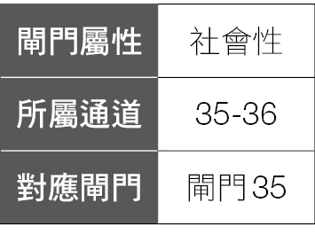

36 号闸门，是一个“危机”的闸门，为什么它是一个危机的闸门呢？因为它是一个“无经验”或“缺乏经验”的闸门，但是它想要获得经验，所以在从无经验到获得经验的过程，就会遇到各式各样、大大小小危机。

有些 36 号闸门的人，在他们的人生中，常常会经历各式各样的危机，而且很多是一般人都不会经历过的，因为 36 号闸门渴求经验，一直想去体验不一样的体验，已经做过的事情就不会想再去做，每次都想得到不一样的体验。

一般人因为在固定的工作、固定的生活、固定的环境下，能获得的体验，通常都是在一个固定的范围内、一定的限度之内，所以为了获得不一样的体验，就有可能去做一些以前都没做过的事情，因为从来没做过，虽然会有成功的机会，但是失败的机会可能更大，所以就容易造成危机。

有些 36 号闸门的人，觉得他的人生中没有发生过什么危机，这样的人有两种情况，一种是生活平顺，家庭也照顾的很好，从小平平顺顺长大，也很少尝试新的东西，因此，他的人生真的很少发生危机。

还有另一种人，觉得那些事情根本就不能算是危机，譬如打球跌倒导致骨折，他会觉得这不是很正常的事情吗？运动本来就会受伤啊。

因为这些人对于这些意外，视为理所当然，也不会觉得过去的人生常常发生危机。

36 号闸门的人很容易遇到危机，因为“危机就是转机”这句话，就是 36 号闸门的人的赚钱方式，就像景气循环一样，景气循环过程可以分为成长、繁荣、衰退、振兴四个阶段。所以如果当景气到达衰退的谷底时，就是即将振兴的开始。

在政党与政治人物的发展中，也有许多危机与转机的例子，出生于政治世家的日本首相安倍晋三，在二〇〇六年九月时，成为日本二战后最年轻的首相，但是在任内争议不断，多名内阁阁员因丑闻及失言下台，一年后安倍以健康理由辞去首相。国民认为他只是一个娇生惯养的少爷政治家，无法承受首相的重责大任、无法承受压力，所以放弃执政，甚至有民众在路上遇到安倍晋三便直接辱骂他。

安倍的失败有很多原因，其中一个是用人问题，虽然他想要改革官僚体系，但是他找的人被戏称是好朋友内阁，安倍以为只要找一群想法一致的人，靠理念就能突破，但却受到媒体及政界的激烈抵抗。

另外一点是他的表达方式，由于他习惯仔细的回答问题，因此遇到媒体突然问他一些政策的问题时，常常因为无法完整表达，以致被断章取义造成误解。

辞去首相后，安倍经过五年的沉潜，积极与专家学者讨论，加强对政策的理解，然后大量接受媒体的长时间访问，让他有时间可以好好说清楚各项政策。

等到再次担任首相，组阁时他巧妙启用保守派人士，而不用激进人士，表示未来的改革是采取保守、稳健的渐进主义，因而获得民众的信赖与支持。

安倍更推出被称为“安倍三箭”的经济改革政策，结果造成日本股市的日经平均指数创下泡沫经济以来的新高，一些大企业如丰田汽车、SONY 等大公司纷纷创下历史新高的营收。

安倍晋三可以重新获得这样的好成绩，来自他曾经经历过的危机。会发生危机，就是代表有些事情没有做对，因而出错，当他从这些错误的经验学习，找出正确的方法，自然就可以把事情做对，创造成功了。

如果你有 36 号闸门，可以思考在你过去的人生，姑且称之为“危机”的事件，这些危机当时你是如何度过？你是否从中学到教训与经验？当你可以把这些“经验”找到某个商品或是服务的方式，用来协助正在经历跟你相同的危机，或是可能会遇到类似危机的人，他们就会愿意花钱来买你的经验。

## 维持秩序

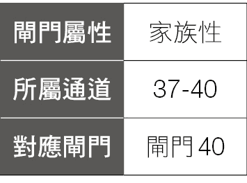

37 号闸门，是一个“嘴巴”的闸门，因此 37 号闸门可以销售的事物就是：“喂饱大家的肚子”。

最简单的方式就是开餐厅，喂饱大家的肚子，有 37 号闸门的人都会希望让别人吃饱、吃好，所以开一间餐厅，提供大家喜欢的食物，欢迎大家来到你的餐厅，让你把他们的肚子喂饱，便是 37 号闸门的赚钱方式之一。

另外，你可能不是开餐厅，但是一样可以把“喂饱肚子”放进你的工作，会让你的工作变得更顺利，譬如有人说他的工作是负责在办公关营销活动，他发现，当他的活动中如果有提供食物、餐点，通常那次的活动就会很成功。

还有从事业务工作的人，常常要去拜访客户，他也觉得，如果带食物去给客户，通常气氛就会很好，成交率也高，而且并不一定需要高级或昂贵的食物，可能只是个小点心，甚至一杯饮料，都可以拉近与客户的关系，所以，在工作中适当的提供食物，喂饱大家的肚子，便是 37 号闸门的人可以思考的赚钱方式。

另外，37 号闸门也可以销售“巡查”，巡查也就是“维持秩序”的意思，一个团队要能成功的运作，需要稳定的维持秩序，但在团队中总是会有人试图想要打破规则，因此就必须要有“巡查”的功能，像警察不断的在巡逻，才能维护良好的治安，因此，37 号闸门的另一个赚钱的方式就是，找到一个商品或服务，提供给别人做好“巡查、监督”的工作。

譬如某些公司，对于员工服务每一位客户的时间是有规定的，如果一个员工服务客户的时间太长，主管就会开始注意，看是客户的问题很复杂，需要很长的时间来处理，还是这个员工能力不足，处理事情没有效率。

也有公司会找专人在旁边计时，统计办理一项业务需要多少时间，实际操作、实际计算时间，统计分析之后，订下一个标准，变成衡量员工表现的依据，所有员工处理这项业务，都需要在规定的时间内完成。

记录员工打卡是最基本的监督了，由于科技的发达，现在还有提供视讯的监督，透过实时视讯，可以知道员工的工作是否正常。

“巡查、监督”这个概念，也可以用在公司业绩管理上面，对于以销售业绩为主的公司，业绩的计算都是以季为单位，计算一季的业绩成绩或是业绩达成率来计算奖金。

在一季结束后，公司要计算奖金时，如果达成业绩，当然大家都很开心。但是，若没有达成业绩，就要开检讨大会了。可是没有达成业绩已经是事实，就算检讨出问题，也是未来才能改进，过去发生的事情已经无法改变了。

有的公司就会改开月会，每个月检讨进度，甚至每星期开会，在事情不如预期时就可修正。

但我们有时会把业绩报告称作“落后指标”，因为事情已经发生了，就算是检讨，对于已经发生的事情，也无法改变了。

有些公司会调整“巡查、监督”的方式，改成看“前进指标”，譬如一个公司的销售流程是拜访五个客户，会有一个客户有兴趣，五个有兴趣的客户，会有一个人购买。也就是拜访二十五个客户后，会有五个客户有兴趣，然后有一个客户会购买。

如果一个销售人员的业绩，是要一个月有三个客户购买的业绩。当时间到月底时，看销售报告上有没有三个客户，有没有达到预期的目标，这种业绩报告，是“落后指标”。

“前进指标”的意思，是如果要有三个客户购买，就需要十五个客户有兴趣，然后需要拜访七十五个客户，因此要“巡查、监督”这个销售人员的“前进指标”，就是他这个月能不能做到拜访七十五个客户，也就是一周就要拜访十九个客户，如果他第一个星期拜访不到十九个客户，就要马上介入、探讨原因，从前头就开始监督，而不是事后再看没达成的业绩来检讨。

这就是利用“巡查、监督”来赚钱的方式，有人甚至设计了这样的软件或 App，提供给公司运用，这也是另一种利用“监督、巡查”的赚钱方式。

## 号召凝聚

38 号闸门是“斗士”的闸门，也是“对抗”的闸门，因此他不断的在奋斗，但是一个人奋斗，不如一群人一起奋斗，因为一群人在一起奋斗，可以产生更大的力量。因此 38 号闸门的人，可以号召大家跟你一起奋斗，向你所追求的目标前进。

所以 38 号闸门赚钱的方式便是，号召大家跟你一起奋斗，譬如团购、代购、粉丝经济。

“因为我喜欢，而你也喜欢，那我们就一起买，因为我们人多，就可以打折，你有好处，我也有好处。”

二〇〇五年部落格开始流行时，陈延昶开始写部落格，他会分享一些购买商品的使用心得，而且常常买不同品牌的产品来实测分析，找出他觉得最实用、CP 值最高的产品分享在部落格上。

二〇〇六年他分享了一篇有关扫地机器人的文章，描述了当他使用扫地机器人之后，根本就不用再费力气打扫，只要偶尔清一清集尘袋，就可以让地板变得干干净净，这真是一件太棒的事情了。许多家庭主妇、婆婆妈妈看了他的文章后，就来拜托他，请他帮她们买扫地机器人，第一次开团，团购数量就达到一百六十台，因此他可以跟业者要到正常商品的七折价格，他也可以因此拿到佣金。

因为他自己喜欢这个产品，别人也喜欢这个产品，那就结合大家一起买，由于团结力量大，当累积了一定数量，就可以跟厂商议价，以比市场上低的价格买到大家喜欢的产品，别人开心，他也得到佣金，何乐而不为？因此开始他团购的生涯。

八年的时间，他卖出了六万五千台扫地机器人，金额达十一亿台币，几乎是台湾每三台扫地机器人，就有一台是他卖出去的。然后他开始从事团购的生意，二〇一〇年成立 486 团购网，二〇一六年业绩达到十亿。

另外，最近流行的“粉丝经济”，也是 38 号闸门的运用，由于我喜欢这个明星、偶像、名人，你也喜欢他，那么我们一起来买他的演唱会门票、音乐、电视剧 DVD，或者我们一起去买他代言的手机、计算机、产品，我们一起成立歌友会、粉丝团，其他人缴一些会费，我们来办活动，来跟偶像见面，一起来追星。

我们也可以因为喜欢某种产品，一起为此奋斗，例如小米手机，邀请小米手机粉丝（米粉）来参与手机研发，一开始在各社区论坛找了一百人，帮忙测试、提出建议和意见，协助产品的研发，激发使用者的存在感和参与感。

他们建立了小米手机论坛，成为数百万米粉的大本营，他们提出的口号：“因为米粉，所以小米。”展现了小米公司对米粉的重视，也因此拉拢了一群死忠的“米粉”，创造了亮丽的销售成绩。

所以号召其他人来一起为某项产品、服务奋斗，就是 38 号闸门的赚钱方式。

## 引发情绪

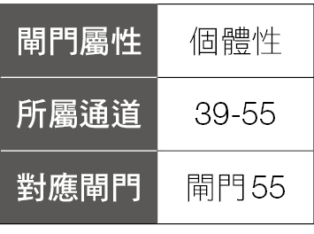

39 号闸门，是一个“挑衅”的闸门，有 39 号闸门的人很容易激怒别人，让别人恼怒，但我们也可以说 39 号闸门是一个“引发”的闸门，你可以引发别人不好的情绪，也可以引发别人好的情绪。

39 号闸门的人，有能力引发别人的情绪，因此 39 号闸门可以将他热爱的事情、产品或服务，引发别人同样对这件事情的热爱，这就是 39 号闸门赚钱的方式。

有时，要引发别人同样热爱你所热爱的东西并不容易，因此，有些方法来协助，就是“吸引别人的技巧”，常见的就是电影的预告片，通常一部电影的预告片，就是电影中最精彩的一部分，片商透过精彩的预告片，吸引你走进戏院买票购买，让你进而热爱这部电影，他们也因此赚到你的钱。

另外，“免费试用”也是一个方式，譬如很多汽车厂商提供的免费试车，一辆新车，外观再好看，功能再创新，内装再豪华，但始终是在你脑海里的想象，如果能让你实际坐上这辆车，驾驶它，体验它、享受实际在路上驾驭它的感觉，你可能会因而爱上它，进而购买这台车，这也是引发别人热爱的方式。

另外，“巨大机械”、“捷安特”、“微笑单车”公司的创办人及荣誉董事长刘金标先生，热爱骑自行车，因而积极推广台湾的自行车运动，当起“自行车传教士”。七十三岁时以十五天时间完成自行车环台的壮举，八十岁时再度环台，并比第一次少三天完成。

刘金标先生的名言：“开车太快，走路太慢，骑车的速度刚刚好，才能真正体验这个岛屿的美丽，并留下一生难忘的冒险体验。”这句话表达出他对于骑自行车的热爱，且他对骑自行车的热爱，也透过他一次又一次的骑自行车环岛挑战自己，逐渐点燃公司内许多同仁对骑自行车的热情，他们会觉得，刘金标先生以七十三岁的年纪都可以环岛，那我为什么不行？

这股热潮，引发了员工在二〇〇九年举办了 Ride Like King 活动，这活动到二〇二〇年已经办到第十二届了。

什么是“Ride Like King”？就是要像巨大创办人刘金标先生一样骑自行车。这个活动的精神如同刘金标先生提到的：“一般人开车旅行，速度快，窗户关闭，但是骑自行车，车友们会互相问候，建立人际关系，并逐渐塑造一个更加祥和的社会。”

日本爱媛县知事中村时广，在二〇一二年时拜访刘金标，原本中村时广的运动是跑马拉松，但在刘金标的鼓舞下，也迷上骑自行车，因而从二〇一四年开始推动“岛波海道国际自行车大赛”，到二〇一八年已经有七千两百人参赛，从海外去参加的人数多达八百人，吸引游客入住饭店，参观当地的名胜景点，为当地带来了可观的旅游经济效益。

如果你有 39 号闸门，想想你过去热爱过什么、现在热爱什么产品或服务，找出方法来吸引别人跟你一样热爱你所热爱的东西，便是你的赚钱方式。

## 工作回报

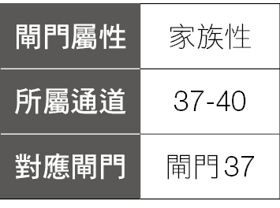

40 号闸门是一个相当复杂的闸门，它有一些独特的原则，它的赚钱方式比较象是一种心态，当 40 号闸门的人拥有正确的心态，正确的作法，自然可以赚到正确的钱。

因为 40 号闸门位在意志力中心，这世界有百分之六十五的人，意志力中心是空白的，而空白意志力中心的人的“非自己”策略，是“想要证明自己的价值”。因此，空白意志力中心的人，在他不建康的状态下（这里说的不建康状态，不是指身体的不建康，而是“设计”的不建康，也就是没有“活出自己的设计”的情况下），可能会有下列的行为：

．即使不喜欢他的工作，仍然会继续做这份工作，因为他要证明自己是有价值的。

．老板叫他加班时，他虽然心里不想加班，但仍会留下来加班，因为他要证明自己的价值。

40 号闸门与生俱来的才能，是“工作之爱”，透过 40 号闸门爱他的工作，在工作上展现出来的优异表现、透过出色的工作，让周围的人可以欣赏 40 号闸门，因此 40 号闸门的人，可以让周围的人知道，我们可以透过做好我们的工作来证明我们自己，而不必以委屈、受苦的方式来证明自己。

40 号闸门也是“递送”的闸门，作为一个递送的人，等同于一个养家餬口的人，因为你会把东西带回家，这样大家就会有东西吃。因此 40 号闸门努力工作的目的，是为了赚钱（带回食物），让他的家人可以获得足够的食物，稳定的生活，因此他会努力付出，透过自己的努力工作，来照顾家人或是他的社群。

40 号闸门是一个“否认”的闸门，因为 40 号闸门愿意为家人、社群工作，但是需要得到认可、需要得到奖励、要有回报，如果没有得到认可，40 号闸门就是“否认”的闸门，就不想要再做出贡献了。

40 号闸门要的“认可”，可能是薪水的报酬，可能是别人的感谢，别人的肯定，甚至是家人的笑容，当 40 号闸门得到想要的认可后，便可以继续投入工作。

40 号闸门也是“胃”的闸门，胃需要填满食物，所以 40 号闸门需要努力工作来获得食物，但是，胃填满食物后，就需要休息，因为胃不可能无止尽的一直填满食物，因此，每当胃工作一段时间之后就需要休息，当休息一段时间之后，胃才能再度工作。所以对 40 号闸门的人来说，他工作一段时间之后，就需要休息，当休息够了之后（就像胃消化完食物之后），才能够继续工作，所以有一个说法是，因为 40 号闸门带来的影响，所以我们现在每个星期才会有周休日。

对 40 号闸门的人来说，他要爱他的工作，然后透过工作能够让他把资源（食物、钱）带回到家里照顾家人，且要能因为工作得到报酬（不管是有形的、无形的报酬），最后是工作之后要有休息的时间，当能做到这些事情，对 40 号闸门来说就是建康的状态，就会建康的赚到钱。

## 实践梦想

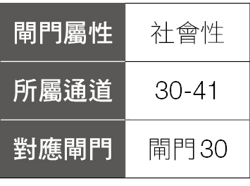

拥有 41 号闸门的人，可能会有很多的梦想、幻想或是白日梦，因为你想要拥有各式各样不同的经验与体验，所以你会有很多的梦想。

有很多的 41 号闸门的人会说：“我觉得我的梦想好多，可是力量好小，没有办法做那么多事情，感觉很挫折。”

因此对 41 号闸门的人有一个建议：“梦想一次一个，完成后再做下一个。”这样才会有效率。

迪斯尼乐园是“梦想与魔法的王国”，迪斯尼乐园销售的就是梦想，白天的乐园让你看到原本只是在电视或电影中出现的人物、玩偶，你可以接触他们，让你梦想成真。

晚上的星光烟火秀，所有游乐设施跟大型标志都会亮灯，象是星光般充满希望的耀眼，配合烟火、音乐，让你体会梦想成真的感动。

迪斯尼在销售他们的商品时，也同时销售梦想给你，因为园区中充满着欢乐的气氛，外加赋予梦想会成真的希望，父母买玩具给小孩时，同时感受到开心，把这纪念品带回家时，同时也把欢乐带回家，这种欢乐的记忆是历久弥新，让你看到时都想要再重温一次这个梦想。

拥有 41 号闸门的你，你有什么梦想呢？你达到你的梦想了吗？不管你已经完成了你的梦想，或是还没达到你的梦想，这些梦想都是你赚钱的方式。

如果你已经达到你的梦想，譬如你的梦想是开一间咖啡厅，回想过去，你是如何达成你的梦想的？你做了哪些事？上了哪些课？学习了什么经验？你把这些经验整合一下，变成一个商品或是一个服务，商品的意思是你可以开放加盟店，对于想要加盟的人，你就把你咖啡厅的装潢、摆设、咖啡产品、定价……整套提供给对方，对方就可以马上经营一家咖啡厅，让他实现开咖啡厅的梦想。而服务的意思则是你可以当顾问，对于有梦想要开咖啡厅的人提供咨询的服务，或是提供课程，但还是由对方自行建立他的咖啡厅的所有一切，你只是协助他完成他的梦想而已。

如果你还没达到你的梦想，或者现在的工作跟你的梦想一点关系都没有，那你也可以思考要不要开始寻找跟你梦想有关的工作。因为梦想不分大小，不一定要环游世界才是梦想，可能开一家自己的小店、爬一座山、学会泡咖啡，都可以是一个人的梦想，如果没办法一步到位达到梦想，也可以做些接近梦想的事情或工作。

譬如环游世界这个梦想，你可能现在还没有足够的钱跟时间可以去执行，但换个角度想，你也可以考虑去当国外旅行团的导游，带团出国也可以算是你环游世界的第一步，然后第二个国家、第三个……一步一步实现你环游世界的梦想。

如果对于“销售梦想”、“用梦想来赚钱”还是觉得很抽象，那么你可以回想小时候，有没有梦想得到什么玩具？可能是一台玩具车、一个洋娃娃还是一组乐高积木？当时的你有多想要那个梦想的玩具？

如果你后来如愿以偿拿到梦想的玩具，当时狂喜的心情到现在还深深的印在你的脑海里，那么，至少你可以开一间玩具店，卖你喜欢的玩具，因为当时你喜欢的玩具，现在的小孩可能也会喜欢，你可以让这些小孩满足他们的梦想，你只要跟小孩的父母讲，你当时拿到这玩具时是如何的快乐与欣喜，只要你是打从心底，真心的分享你的经验，对于想让自己小孩也获得相同快乐的父母，就会掏钱出来买这项玩具，这就是 41 号闸门的赚钱方式。

## 多方尝试

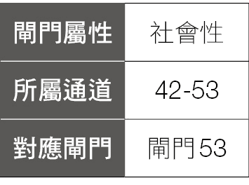

人类图中，对于才能的学习有两种方式，一种是针对一项才能，反覆不断的练习，精益求精，最后成为这项才能的达人或大师。另外一种则是接触各种不同的才能，学习多方面的各种才能，因为拥有多项才能，所以我们称之为“万事通”。

42 号闸门，是属于追求“万事通”这一类型，因为 42 号闸门是“增加”的闸门、“成长”的闸门，42 号闸门追求的是在各种生命经验的成长，对 42 号闸门而言，资源的扩展将可最大程度的发挥你的潜能，因此可以透过多方尝试，来开发出你的各项潜能。

以打篮球来比喻，当你有一个小时的时间（资源），你可以用来练习进攻得分，得分的方式大概分成切入上篮、中距离跳投、三分球还有罚球，所以你可以把这一个小时用来练习切入上篮得分，当你又有另一个小时的时间，你可以继续练习切入上篮得分，你可以只要专精在切入上篮得分就好了，譬如 NBA 中被认为是史上最伟大的长人中锋之一——“侠客”欧尼尔（Shaquille O’Neal），在禁区的进攻主宰能力特强，但是他最明显的弱点就是罚球，他的生涯罚球命中率只有五二．七％，远远低于其他球员，但他只要靠超强的禁区进攻能力就好了。他是属于专精在一项技能的球员。

多方尝试的情况则是在你练习完切入上篮一个小时，当你又有另一个小时的时间，你也可以选择练习其他的技能，就像 NBA 另一位巨星“小皇帝”詹姆士（LeBron James），他可以切入上篮得分，中距离跳投也很厉害，更曾经在三分钟内投进五颗三分球，他就属于全能型球员，所以这种多方尝试是在同一个领域中开发各种不同的潜能。

另外一种多方尝试的情况是，当你做了一件事情后，如果这件事行不通，那你就可以去做另外一件不一样的事情，如果又行不通，就再试另外一件事情，透过不断的尝试、不断的试验、去测试、锻鍊你的才能，直到创造出好结果，这是在不同领域的多方尝试。

举例来说，威廉．爱德华．瓦格纳（William Edward Wagner），小时候是右撇子，七岁时玩美式足球造成了右手骨折，打上石膏一段时间复原后，又摔断了手臂，在这段时间，瓦格纳开始使用左手投掷棒球，长大之后成为一位棒球左投投手，在美国职棒大联盟中打了十六个赛季，先后效力于美国职棒休斯敦航天员队、费城费城人队、纽约大都会队、波士顿红袜队、亚特兰大勇士队，入选七次美国职棒明星赛，并成为左手救援投手中，史上第二高救援成功次数的投手。

如果瓦格纳继续用右手打美式足球，或许会成功，或许不会成功，但这边强调的是，即使你右手受伤，你还有左手，你可以改使用左手，透过新的尝试，有可能让你发挥出更好的才能，获得更大的成就。因此，如果 42 号闸门的人，现在走的这条路走不通，可以换另外一条路，或许会看到不同的风景。

美国知名脱口秀主持人欧普拉说过：“每个人一生当中会受伤很多次，你会犯错，有些人会称之为失败，但我发现失败其实是上帝的话语，他是说；抱歉，你走的方向错了。”所以当你尝试后，没有得到你要的好结果，那只是代表这条路行不通，那么，你就可以试另外一条路，有可能另外一条路就是成功之路。

所以，对于拥有 42 号闸门的人来说，可以尝试各种的可能性，前提是你要“按照你的策略跟内在权威，来做出正确的决定”，只要你是做出适合自己的决定，你可以试着去做些以前没有做过的事情，扩展自己的视野，锻鍊自己的才能，或许会有意想不到的收获。

## 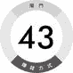新创寻援

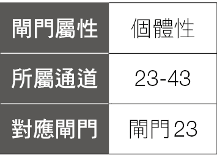

43 号闸门是独特的“洞见”的闸门，所以 43 号闸门的人会有很独特、与众不同的想法，也因为它是如此与众不同，大家以前都没有听过，因此很容易遭受到拒绝、被排斥、不被接受。因为太过天马行空、太过新奇、特异的想法，一般大众一开始听到时容易觉得惊讶，而且无法引起共鸣。

43 号闸门是独特的想法，容易被拒绝、排斥，就好像是一股新生的力量，刚开始时是很弱小的，如果要把弱小的这想法展现、落实，它需要外在的助力，协助它壮大，因此必须找到同盟，必须使用各种方法、各种技巧，找到支持它的力量，跟任何力量结盟，甚至忍受指责，就是为了要达到实现它的想法的这个目标。

贾伯斯跟沃兹尼克两人刚创立苹果计算机之后，就到自组计算机俱乐部去介绍他们新生产的电路板，即便贾伯斯展现口才，努力介绍他的产品，但是俱乐部的会员们都反应冷淡，因为苹果用的微处理器是廉价品，而不是像英特尔 8080 那样的高档货。

不过，那时有个拜特计算机商店的老板泰瑞，觉得他们的产品还不错，就留了张名片给贾伯斯他们，说道：“那我们再联络吧。”

没想到隔天贾伯斯就走进泰瑞的店里，用他的三寸不烂之舌，说服泰瑞订购五十部计算机，泰瑞强调，他要的是组装好的计算机，因为一般民众没办法自行组装计算机，他愿意每一部付五百美元，见到货才付款，这是一笔两万五千美元的订单。

为了完成这笔订单，他们需要购买一万五千美元的零件，但他们借不到足够的钱，也买不到足够的零件，后来，贾伯斯想尽办法说服克雷默电子材料行的经理打电话给泰瑞，证明真的有这笔两万五千美元的订单，让克雷默的经理同意先供应零件给贾伯斯，三十天后再付款。

只要完成一打成品后，贾伯斯就把货送去给泰瑞，泰瑞看到成品的时候吓了一跳，因为没有电源供应器、外壳、荧幕、键盘，这些通通都没有，跟他原本期待那种接近完成品的计算机完全不一样，但贾伯斯却狠狠的瞪着他说：“当初不是说好这样的吗？”最后，泰瑞只好把电路板收下，付钱给他。

一个月后，苹果开始获利了，因为他们卖给泰瑞的五十块电路板，拿到的钱可以付一百块电路板的零件，因此，剩下的五十块计算机再卖出去之后，都是净赚的了。

以上的故事，说明了贾伯斯为了实现创立苹果计算机这个目标，想尽办法拿到第一笔两万五千美元的订单（虽然最后交的货不是泰瑞期待的完成品），又想尽办法透过泰瑞向材料行说明这订单确实存在，说服材料行让他先拿零件后付款，做好产品后，又说服泰瑞接受泰瑞眼中的半成品并拿到货款，最后才付款给材料行，成功赚到第一桶金，进而开始发展出苹果计算机辉煌的事业。

我听过一些 43 号闸门说，他们有时是会有一些独特的想法，但是觉得这想法可能没有用、不可行，就忽略了，过一段时间就忘记了，这其实是很可惜的事情。

建议 43 号闸门的人，当随时有任何想法的时候，不管多新奇，甚至荒谬、好笑，都先把它记录下来，找时间再把这想法整理的更完备一些，然后在适当的时候，跟其他人分享，或许有可能就会找到同盟，然后让你的想法实际落实发生，就有可能让你赚到钱。

## 隐性引导

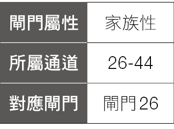

“隐性引导”这是什么意思呢？从人类图上来看，44 号闸门的对面是 26 号闸门，而 26 号闸门落在意志力中心，意志力中心本身是懒惰的，它只想要休息，不想要工作，所以 44 号闸门拥有这个能力，来管理或激励 26 号闸门，让他们愿意工作。

44 号闸门“管理、激励其他人的意志力”这个能力，并不是一种固定的方式，它会依照对方的特性、行为而自动调整，采取最好的方式，达到 44 号闸门想要的结果，这是 44 号闸门与生俱来的才能。

拥有 44 号闸门的人，适合的工作或赚钱的方式，象是教练的工作，或是经理、顾问、老师……等工作，主要是透过影响别人，让对方创造出好的结果这种类型的工作。

譬如，麦克．沙舍夫斯基（Mike Krzyzewski），外号“K 教练”（Coach K），是美国杜克大学的篮球总教练，自一九八六年开始，带领杜克大学十一次进入 NCAA 最后四强，并四次获得冠军，培养出多名 NBA 球星。曾是美国梦幻队的总教练。带领美国男篮获得二〇〇八、二〇一二、二〇一六年共计三次奥运金牌。

K 教练似乎天生就有种激励别人的本领，他能很自然地了解人性，观察人们对不同人事物的反应，无论是个人或团体，随时了解大家的现况，才有办法在任何时候对症下药。

一般来说，他的作风是有弹性和灵活的，有时候需要激励球员，有时候则需要有话直说，但不必咆哮；有时候需要拍拍他们的肩膀，有时只是给他们一个拥抱。

有一次 K 教练在大家练习时突然中途打断，严厉指出球队灵魂人物布莱恩的错误，要求他马上转换、改善，不然他将拖垮整个团队。在接下来的练习，其他球员不经意的就会把注意力放在布莱恩身上，然后发现他慢慢做对了，表现越来越好。

接着，K 教练就会称赞他说：“你做得太好了，你真是个优秀的球员。”

当球员们练习完回到休息室时，其他的球员就跑来对布莱恩说：“教练对你真是太严格了。”这时布莱恩并没有跟其他球员一起抱怨 K 教练，反而跟大家说：“我需要教练来纠正我的错误，需要他让我变得更好，只要我有进步，全体也会进步。”布莱恩展现出来的态度，不仅化解了其他球员对 K 教练的不满，反而让大家更愿意接受 K 教练的指导。

其实，以上这段情节，是 K 教练跟布莱恩事先沟通好的，因为 K 教练知道当他在球场上直接指责布莱恩之后，在休息时其他球员一定会在布莱恩面前骂 K 教练，但 K 教练要求布莱恩不能跟其他人一起骂，反而要藉着这样的机会来教导球队中的其他人，因为布莱恩是球队的领导者，对其他人有一定的示范作用，且透过布莱恩来告诉其他球员，这样的效果反而比 K 教练直接告诉球员们更好。

透过各种不同的方法来管理、激励球员，K 教练才能创造出如此好的成绩。

## 会员制度

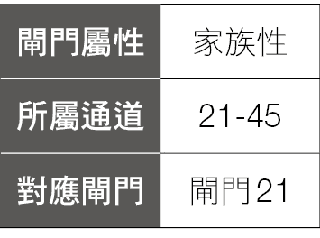

在我们的生活中，每个人都处在各式各样的圈子里，“圈子”是什么意思呢？譬如一个人的朋友可能分成很多圈，不熟的在外圈，熟的朋友在内圈，知心好友在最内圈。

公司也有圈子，老板在最核心，高阶主管是最内圈，中阶主管是向外一圈，员工又更向外一圈，我们可以用好几个同心圆的图形来表示，最中间、最核心的一定是最重要的人物，而重要性由圆心向外，逐渐递减，最外圈是最没影响力、相对比较不重要的人物。

在所有的圈子中，大部分的情况都是外圈的人想往内圈靠，想要从外圈进入内圈，内圈的人想进入更内圈，所以，利用外圈的人想进入内圈的心态，就是 45 号闸门的人赚钱的方式。

譬如美国节目：《超级名模生死斗》（America’s Next Top Model），从二〇〇三年到二〇一九年已经是二十四季了，是一个给参赛者争夺模特儿及化妆品合约的美国真人秀节目，比赛方式是每季有十至十六位参赛者，每集参赛者都要学习有关成为模特儿的相关技能，譬如摆姿势、拍照、走秀……等，然后拍摄出一张作品，这些照片每周竞赛，最后一名被淘汰，到最后两人或三人时，会让他们参加时装展作为最后的对决，获胜者将可以登上杂志封面及获得化妆品合约。

整个节目的重点，是看选手们在每周激烈的竞赛中一次又一次的存活下来，到最后获胜，出道成为职业模特儿，从平凡人的外圈，进入时尚流行的内圈，是这个节目的特色，而这节目能够播二十四季，因为有无数想进入时尚流行圈的年轻少女们在支持这个节目，这些少女算起来可以说是这个结构的最外圈。

有些公司也会设立一些门槛，如果员工达到门槛，便有机会升职或加薪，当公司设立了清楚的机制之后，自然便会激励员工，为了往上爬（进入内圈），因而自动自发、积极努力达成更好的绩效。

另外，从“圈子”延伸的概念，就是各式各样的会员制度，不同的会员拥有不同的优待条件，享有不同的权益、服务，所以一般大众就想加入会员，以便得到跟别人不一样的待遇。譬如 Amazon 就提供了 Prime 会员每年无限次数的两日快速到货服务，而一般使用者需要等五至七天才能拿到订购的产品。

要成为 Prime 会员的服务年费是九十九美元，而在二〇一八年更提高至一一九美元，在二〇一八年的 Prime 全球会员数，已经超过一亿人。光是这服务年费的收入，就是一笔可观的收入。

所以你可以想想，如何运用会员制度、不同的等级提供不同的服务，造成差异化，并提供进阶会员更优质的服务，吸引一般客户想要成为你或你公司的内圈人，愿意付更多的费用来购买其他人得不到的服务，就是 45 号闸门的赚钱方式。

任何让外圈的人想要进入内圈，因而产生获利的机制，都是 45 号闸门的赚钱方式。

## 爱护身体

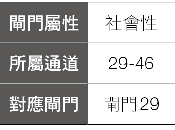

46 号闸门是“身体之爱”的闸门，什么是“身体之爱”？就是爱你的身体，让你的身体可以变得更好、更健康、更漂亮、更美……等。

一个人的身体就像个圣殿一样，你可以好好的装饰它，让它变得更美、更好，变得是你想要的样子，譬如穿上漂亮的衣服，戴上美丽的装饰品，弄个漂亮的发型……等，46 号闸门的赚钱方式，就是“让我展示给你看要如何好好的对待你的身体”、“让我展示给你看要如何爱你的身体”。

另外，我们还可以用很多方式让自己的身体变得更好，譬如中医、养身、食疗，或是按摩、推拿、气功，这些也是可以让你的身体更好的方法，或是保健你的身体，另外，像精油、花精、花药……这些也是可以让你的身体更好的东西。

有 46 号闸门的人，大多很喜欢以上这些项目，或是其他能让身体更好的方式，所以有关以上这些内容的产品、服务，都是 46 号闸门的赚钱方式。

吴若石神父是天主教白冷教会的神父，一九七〇年从瑞士奉派来台湾后，到了台东县长滨乡，因为水土不服罹患了严重关节炎，透过别人认识了反射疗法理论，并尝试使用这个理论，经过自行练习，改善了自己的关节炎。对这反射疗法产生兴趣，并开始研究脚底反射疗法理论，在吴神父持续的研究与验证中，逐渐发展出成熟的足部反射健康法，成为吴若石神父足部反射健康法的创始者，也是台湾脚底按摩疗法的创始者。

吴神父看到，许多贫穷的人生病却无法负担就医的费用，因此开始推广脚底按摩，希望能改善他们的健康，可以自助也可以助人，且无须花费昂贵的费用，另外，吴神父看到许多人工作非常辛苦，收入却相当微薄，为了改善这些人的生活，他开始培训脚底按摩师傅，透过培训、上课、测验，让这些人学得脚底按摩的一技之长。

后来吴神父的脚底按摩受到注意，许多媒体纷纷来采访吴神父，吴神父也推出好几本脚底按摩的书籍，因此台湾各地开始出现“吴神父脚底按摩”的商店，他的书籍后来也流传到香港、大陆，让吴神父及他所推广的脚底按摩疗法大受欢迎。

吴神父是基于帮助别人的心理，推广“脚底按摩”，如果他想要藉此赚钱获利的话，全台湾的“吴神父脚底按摩”将是一个庞大的商业体系。

我们在这本书中所提出的赚钱方式，都是因为你有了这个闸门后，你就会有相对应的天赋才能，在过去的人生中也会有相对应的行为，如吴神父因为自己身体病痛的原因，开始研究脚底按摩，透过研究、投入、实验脚底按摩的方式，有效的解决了自己身体的病痛，而这个世界上，拥有跟吴师父相同病痛的人有无数人，也都正在遭遇、曾经遭遇或即将遭遇跟吴神父相同的问题，也都会受苦于这个问题的困扰。

这时，如果你能够像吴神父一样，提出一个解决这些问题的产品、服务、方法、技巧，就会吸引其他跟你有相同问题、相同困扰的人来找你，希望帮他解决他的问题。

你本人就是最好的见证者跟代言人，因为它确实帮助你解决了你的问题，你所说的一切并不是空泛的言论，而是你的真实经验。这时，其他拥有跟你相同问题的人，因为你的真实案例，就会愿意花钱来买你的产品、服务、方法、技巧，这也就是你赚钱的方式。

## 启发观点

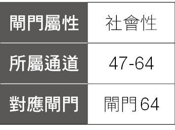

47 号闸门是一个不容易理解的闸门，因为这是一个“压抑”的闸门，也是“领悟、了解”的闸门。

先说“压抑”的意思，压抑就是压迫、压制、烦闷、苦恼、焦虑的感觉，为什么会有这种压抑、苦恼、焦虑的感觉呢？

原因来自 64 号闸门，64 号闸门是混乱的闸门，就象是在一个大仓库中堆满了一大堆各式各样影片的胶卷，没有顺序、没有规律，混乱的摆在一起，乱七八糟、毫无秩序，因此 64 号是一个困惑的闸门。

47 号闸门就是要从这些混乱的事物中找出意义，试图要去理解这些混乱、困惑的事物，因此拥有 47 号闸门的人就会觉得被压迫，感觉到压抑、苦恼，也会很焦虑。

这里有一个问题，47 号闸门针对混乱事物找出的意义，并不一定是对的，也不一定是真理，也就是说，47 号闸门试着针对一些事物找出意义，把这些事情变得有意义，但这件事情可能到最后仍毫无意义，这就更加深了 47 号闸门的苦恼与焦虑。

很难找到有 47 号闸门的人是不折磨自己的人，他们总是陷在无尽的压抑与烦闷中，因为脑袋一直在思考，过去的事情到底是怎么一回事？试图理解过去，但想来想去的方法似乎都没有得到正确的答案。

所以，有 47 号闸门的人要了解几件事，首先，这只是你的头脑的运作方式，你的头脑自然会压迫你，试图从这些混乱的事情找到意义、想要理解这些混乱的事情，这只是你的头脑的运作方式而已。这是你的天性，但它不是要折磨你的天性。

其次，从这些过去的事情中找出意义，想要理解它们，它其实有很多选择，它是可以很有创造性的，并不是只有一种标准答案，你也不必追求要找到标准答案，而是透过你自身正确的操作，按照你的策略跟内在权威来做决定，然后领会出这些事情的意义，让它变成一种美。

所以，对于“从混乱的事情找出有创造性的意义”，就是 47 号闸门的赚钱方式。

譬如《与神对话》（The Complete Conversations with God）的作者，尼尔．唐纳．沃许（Neale Donald Walsch），他曾是电台主播、报社记者和主编，并创办了公关和市场营销公司。他也曾是人生胜利组，但却遭逢失业、车祸和婚姻失败及流浪街头等重大打击，之后在绝望的状态下写下了一封愤怒信给神，没想到竟得到了回答，他就把这些对话集结起来，出版成“与神对话”系列书籍，目前翻译成三十六种语言，全球销售超过一千两百万册。

这些对话是否真的是作者与“神”对话所得，我们无法知道，但是也有可能是作者在经历了一些人生挫折与失败后，不断的压迫自己，然后从所有这些经验中，找出创造性的意义。原本他是负面看待这些事情，从中找出的意义也是负面的意义，这些负面的想法让他成为流浪汉。但是当他转换成另一个角度，用不同观点，看待他生命中所发生的这些事情，以一个创造性的角度来面对，找出有启发性的意义，便可以把这些经历转变成“与神对话”系列书籍了。

简单摘录书中的几个问题：

“人的一生到底是为了什么？”

“我是否永远也不会有足够的钱？”

“我到底做过什么事，活该要有如此不断挣扎的一生？”

如果你想知道这些问题的答案，可以去买《与神对话》一书，这就是尼尔．唐纳．沃许的赚钱方式。

## 简单求纯

48 号闸门是“深度”的闸门，就象是一口“井”一样。如果你有一个 48 号闸门，就好像你拥有一口井一样，而如果你有三个 48 号闸门，就像你拥有三口井。

当你拥有一口井，你就会想要填满它，填满这口井的意思就是你会一直学东西，当你学会一种知识、一项技能、一种工具之后，就好像你把这样东西丢进了这口井中，试图填满这口井。但丢进一样东西就可以填满这口井了吗？答案是“不会”，所以你会一直丢东西进入你的井中，一直丢、一直丢，而这口井会因为你一直丢东西进去而填满吗？答案也是“不会”，因为拥有 48 号闸门的人，会恐惧自己没深度，总觉得自己学得还不够，一直要求自己成为一个有深度的人，因而持续不断的丢东西到井里，长期下来，48 号闸门的井中，已经堆满了一大堆的东西。

即使 48 号闸门的人已经学会一项技能，他总是会恐惧是不是还学得不够好、不够多，就会想学更多技能，或者想要把既有的这项技能学得更深入。

真正的事实是，拥有 48 号闸门的人已经学得够多了，学得比一般人都多得多了，因此对 48 号闸门的人而言，真正要想的事情是：如何把井里已经学了很多的东西“简单”化，“简单”就是 48 号闸门的人要销售的东西。

你常会在书店看到这样的书：《快速上手 OOO 的十个步骤》、《学习 XXX123 就上手》，简单就好，越简单，别人就越容易接受。

二〇一四年时，麦当劳的经营出现了危机，因为在二〇一四年麦当劳的股价下跌了三．四％，而当年的道琼指数则上涨了七．五％，为了改善经营上的困境，麦当劳在二〇一五年找了伊斯特布鲁克（Stephen James Easterbrook）来当新的 CEO。

伊斯特布鲁克上任后采取了许多措施，其中一项就是“简单化”，在他之前的前几任 CEO，为了增加业绩，有的人推出了新的产品如色拉、三明治……等，伊斯特布鲁克认为麦当劳最厉害的产品就是汉堡，所以他想让麦当劳专注在汉堡这个产品，且他发现满福堡是很受欢迎的餐点，但是只有在早餐时间卖，他想，如果这个产品这么受欢迎，却只有在早餐时间卖，不是太可惜了吗？不如就整天都卖它，因此他推出了“全日早餐”的活动，让喜欢满福堡的人整天都可以吃得到，也让只吃麦当劳早餐的人，也可以到麦当劳吃午餐或晚餐。

因为“全日早餐”的计划，广受消费者欢迎，麦当劳在二〇一六年五月时创下了历史新高的股价。

如果你有 48 号闸门，可以思考你的井中已经填了多少东西呢？你已经学习了多少技能了？不要觉得自己学得还不够，不用想得太复杂，你可以开始练习把这些东西展现出来，用最简单的方式，把它化为商品、服务，提供给需要的人。

你不用跟你的老师或是专家、达人比较，认为自己还不如他们、还不够好、不像他们一样有深度，因而不敢去展现自己。万丈高楼平地起，没有人一生下来就是大师，你所钦佩、追随的专家、老师、达人，也都是从没有经验、一步一步走出来的，任何人都是从菜鸟开始的，所以只要开始正视自己、肯定自己，踏出正确的第一步，然后再一步接着一步，最后也会走到你的老师或这些专家、达人的位置。

## 解决不满

生活中，每个人或多或少都会有些不满的事情，对生活不满、对工作不满、对产品不满、对服务不满……等。到处充满让你不满的地方，但对这些不满，我们又能怎么办呢？我们总是在忍受，因为我们也没有解决的办法，没有能力解决，所以这些问题始终存在，这些问题一直没有被解决，我们只能继续忍受，继续抱怨，日复一日下去。

事实上，因为我们跟其他人都生活在相同的社会中、身处在相同的环境中，你会抱怨的事情，其他人一样会遭遇同样的事情，他们也会产生相同的抱怨；让你觉得不方便的事情，其他人一样会觉得不方便。我们所有人都处于相同的困境中，所以，在这抱怨之下、在这不方便中，便潜藏着极大的商机。

如果有一个产品、服务能够解决你的抱怨，解决你的问题，自然也会解决别人的问题，大家便会蜂拥而上，积极想要得到这个产品或服务。

二〇〇八年的巴黎，在一个下雪的夜晚，有两个人在巴黎的街头一直叫不到出租车，寒冷的天气让这两个人在街头冷得不得了，他们一直在抱怨为什么都没有出租车，如果躲在温暖的屋子就看不到车，要想叫到车就只得在寒冷的路上痴痴的等。对于这种叫不到车的困扰，他们决定发明一个方法，且要利用高科技来解决这个问题，就是按一个钮就可以叫到一台车，这就是 Uber 发明的由来。

另外，在全世界各地，也常遇到司机绕远路的情况，遇到这种情况，一种是你跟他据理力争、吵架，要求他扣钱，另外一种处理方式就是自认倒霉，你只能忍受，只能抱怨。

Uber 的发明，能够有效的解决这些问题，你按下一个钮，就知道有没有车可以来接你，需要花多久的时间，车子目前距离你多远，车牌号码也会提供给你，所以不会拦错车，另外，车资都事先计算好了，透过你的信用卡扣款，你身上没有带钱也没关系，不用担心司机会不会绕远路，不管他怎么走，车资已经付清了、价钱已经固定了，就算他绕远路，你也不用多付钱。

Uber 确实能解决大家所遇到的问题，所以这种叫车服务，才会如雨后春笋般蓬勃发展起来，因为它可以解决每个人所遇到的问题。

拥有 49 号闸门的人，可以想想你现在的工作、日常生活中的食、衣、住、行、育、乐任何方面，看你自己有没有遇到什么问题？你总在抱怨什么事情？生活中哪些地方让你不满？你想要有人来帮你解决什么事情？把这些问题列下来，好好想一想，你能不能发展出一个产品或一种服务，可以解决这些问题，这就是 49 号闸门的赚钱方式。

## 文化保存

50 号闸门是“价值”的闸门，50 号闸门的人很重视历史与传统，他们知道历史延续的价值，透过延续这些历史、传统的价值，将可以使我们的现在跟未来的生活更丰富。

50 号闸门的人通常对老房子很有兴趣，喜欢有历史的东西，因此，如何保存、延续这些有历史及有传统的东西，便是 50 号闸门赚钱的方式。

譬如台北市文化局在二〇一三年推动“老房子文化运动”，就是将台北市许多荒废、闲置、无人使用或待修复的老房子，将许多文化资产，包含历史古迹、历史建筑、文化景观等老房子，透过 BOT 模式，就是透过公开招标、评选，再与得标的民间团队签约，结合民间资金及创意，得标的团队于修复房子后，能够以优惠的租金长时间租用该房子。因此，很多老旧、破败的建筑，摇身一变成具有历史感的咖啡厅、餐厅，为这些原本破旧的文化资产创造新生命。

位于台中市的宫原眼科，是日据时代的眼科医院，是当时台中最大的眼科诊所，是一栋红砖瓦构成的建筑，保有旧式的红砖墙、旧牌楼，随着时代的变迁，房子逐渐老旧，在九二一地震之后，更变成杂草丛生的废墟。

经过民间经营团队一年半的修复，把它重新改变成复合式的餐厅，红砖瓦堆砌而成的拱廊骑楼，搭配新颖现代感的设计，吸引了大批游客来此，除了享用美食之外，更可以体验“现代与传统”建筑的美感，现在已发展成外地旅客到台中旅游时，必去拜访打卡的景点。

50 号闸门也可以销售有历史价值的古物，譬如美国一位原是木匠的克泽（Loren Krytzer），因为一次交通意外让他失去了一条腿，也让他失去了工作，只能靠着每月两百美元的救济金过生活，某一天他在电视鉴定节目［Antiques Roadshow］上看到一条毛毯价值五十万美元，而那条毛毯跟他放在橱柜里七年、他祖母遗留下来的一条毛毯十分相似。

克泽随后将毛毯拿去鉴定，才发现原来这条看起来不起眼的毛毯，是一条十八世纪罕见的美国原住民纳瓦荷族（Navajo，美国西南部一支原住民族群）毛毯。而且它还不是普通的纳瓦荷族毛毯，而是部落中地位很高的长老，在重要场合才会使用的毛毯。这条拥有两百年历史的珍宝，最后更以一百五十万美金的天价卖出。

所以，对于古老的、传统的、有历史价值的建筑、摆饰、物品、服装、文化……等，无论它是完整、毁损、破败，只要修复它或与现代结合，创造出融合传统与现代的产品或服务，便是 50 号闸门的赚钱方式。

## 冒险拓荒

51 号闸门是个“勇气”的闸门，拥有 51 号闸门的人，有能力面对混乱跟令人震惊的情况，并且可以适应这样的结果与环境。

混乱、令人震惊、充满威胁的环境，是不稳定的，而一般人的天性是想要稳定、避免风险，所以看到混乱的环境就想要逃离，因为不安全感会让人迟疑。所以一群追求稳定的人，就会聚在同一个地方，过着同样的生活，做着同样的工作。

如果你身处在一个稳定、制度化、许多事情都是可预期的环境中，如何能够超越别人而成功？如何能够比别人赚更多的钱？如果大家都处在相同的情况之下，为什么是你脱颖而出而不是别人呢？

由于每个人的特质、才能、设计都不一样，有些人确实可以在稳定的环境中赚到钱，他们适合凡事井井有条、按部就班前进。但如果你有 51 号闸门，你充满勇气，自然会想要去一些没人去过的地方，即便那里是混乱、充满威胁及震惊的环境，但是在那样的环境中，也处处充满商机。

多年来大陆市场蓬勃发展，许多人都前往大陆寻找机会，但大学毕业后的湛聿晃，却是往东协、南亚及东欧各国发展，因为他觉得去台湾人多的地方没有意思。

二〇〇四年，他辗转得知库德族来台湾采购一批机械设备跟材料，需要有人去当地技术支援，因为那时伊拉克仍处于战乱的情况，没有人想去，只有湛聿晃觉得这是一个机会。

前六年的时间，他主要是进口台湾的机械、钢材过去，等时机成熟后，便在当地建造工厂、僱用员工，开始制造生产水塔。

他从一颗水塔都卖不出去，到最后拿到数十万颗的订单，累积成上亿身家。

对其他人来说，中东可能是一个随时战争、充满不稳定因素的地区，但湛聿晃靠自己走出了一条路，证明当地没有想象中危险，而且，到处都是商机，他说：“其实最大的门槛，在于自己，只要愿意跨出那一步，世界会完全不同。”

拥有 51 号闸门，可以期许自己成为现代哥伦布，世界是如此之大，我们现在所处的生活圈只是小小一块而已，51 号闸门可以带着你的勇气，航向不可知的未来。

现在有越来越多的人会前往东南亚、东欧，去一些未知但可能充满机会的地方，带着他的勇气前往冒险，开创自己在异地的一片天空。

有 51 号闸门并不代表你一定要出国，一定要去没有人去过的地方，才是使用这个闸门的方式。你也可以在目前的生活中，看看有哪些你从没接触过的工作、领域，是你有兴趣、想去挑战的。然后在做出正确决定的前提下，跳出你原本的舒适圈，因为 51 号闸门拥有战士般的能力，可以适应各种新的环境，从中找到商机，所以只要是基于你的设计做出正确的决定，便可以勇敢踏上这趟未知的旅程，这就是 51 号闸门的赚钱方式。

## 必要限制

为了让人、事、物可以稳定的前进与成长，让我们可以拥有一个安全、期待的未来，我们需要一个固定的模式，并且透过适当的限制，让参与其中的人、事、物，持续的维持这个固定的模式，这样就能产生相同的成果，并且从中获得好处。

举例来说，许多父母会从小限制他的小孩：“现在去练习弹钢琴。”不管小孩愿意不愿意，父母会想尽办法，要求、限制他的小孩去做这件事，经过一年、两年、三年……一直持续下去，长大之后小孩可能会感谢父母所对他做的事，就是因为父母一直限制他，让他不断的练习，才能让他的钢琴技巧精进。

这里的限制并不是要掌控所有一切，真正的目的，是让对方维持“聚焦”跟“专注”在某个固定的模式，让他们维持在这个固定的模式上，不要有改变、不要偏离，让事情能够稳定的运作，也会因此产生我们预期的结果，让我们获得想要的好处。

譬如，当你参加一个旅行团时，导游除了讲解沿路的美丽景色外，很重要的工作就是：沿路限制整团的行动，他会不厌其烦的说早上几点要起床、几点用餐、几点出发，到了某个景点，会提醒大家在此地待多久的时间，何时离开，等人到齐时还要点名，确保人数正确才能离开，他会从旅行团一开始集合时就让所有成员接受他的限制，一直维持到最后解散的那一刻，只要大家都能接受他的安排，所有人就能拥有一趟愉快的旅程。

对于减肥这件事，世界各地有各式各样的减肥营，由专家跟营养师组成优秀的研究团队，融合各种学术研究及临床经验，打造一套有效的饮食计划，严格控制热量，透过长期、坚持的限制来养成新的饮食习惯，达到减肥的目的。

有些会加上运动的管理，要求学员每天持续运动多少时间，做什么样的运动，不只是把体重减下来而已，还要有结实的肌肉，充满活力的身体。

有些甚至是全封闭式的减肥营，就是学员的吃、住、运动、活动、娱乐全部都在训练营中，透过全方位的管控，达到快速、有效的减肥效果。这就是“适当的限制，维持固定模式以获得好处”。

对现代人来说，智能型手机已经是生活中不可或缺的工具，出门可以不带钱包，但是不能不带手机，甚至在学生族群中，手机的普及率也非常高，但因为手机的功能太多，可以上网、购物、玩游戏，还可以跟朋友聊天、传讯息，许多学生回到家后就是一直在玩手机，不会花时间念书，即便念书时也很容易分心，时时刻刻检查手机有没有新的讯息。

所以，有让人专心的 App 因而发展出来，你先在手机上设定好想要专注的时间，只要在这段时间内不用手机，就可以让一颗种子落地慢慢长成美丽的植物，专注的时间越长，在你虚拟花园中的植物就会越来越多、越丰富、越漂亮。

52 号闸门的赚钱方式，就是销售“被你的产品、服务所限制，让对方因为维持固定的模式，因而带来的好处。”

## 客户满意

53 号闸门，是一个“开始”的闸门，53 号闸门会一直想要开始新事物，如果不能开始一些新的事物，53 号闸门内心就会有很大的压力。但是，只有在平和的环境下，53 号闸门才能展开新事物，而为了维持平和，便要避免冲突，因此 53 号闸门要提供的就是没有冲突的服务，也就是说，53 号闸门要销售的便是“让客户满意”，或是提升“客户满意度”。

有一个说法：“客户永远是对的，客户永远不会错。”

这句话强调的是一种无条件为客户服务的思想，“如果客户带着你的商品回来找你，说它破了、坏掉了，那就换一个新的给他。如果客户跟你抱怨你的产品有问题，那就先细心倾听客户的心声。”这是 53 号闸门的人要遵守的政策。

因为有时候你销售的并不是商品，你销售的东西实际上是一种期望，客户想买的是一种期望，但是客户对他想要的期望并不见得很清楚，譬如买“手机”，手机的基本功能就是用来打电话，但是，现在很少人买手机的目的只是单纯为了打电话，很多人买手机是为了要上网、拍照，或是酷炫的外型……等，所以很多人买手机并不只是买手机，他要买的是一种“期望”。

一旦你所提供的商品或服务，没有满足客户的期望，对方就会失望、沮丧、难过甚至生气，这时候你便要立即去提供你的服务，来解决他们的问题。如果你能善待你的客户，解决他们的问题，他们就会再次来使用你的服务，所以，“让客户满意”就是 53 号闸门赚钱的方式。

例如，加贺屋温泉旅馆，在日本杂志票选饭店跟旅馆的服务中，连续蝉联综合排名第一名超过四十年以上，是日本知名的高级温泉旅馆。

在加贺屋的服务传统中，有一项不成文的规定，就是不能跟客户说：“不行”、“没有”、“不知道”。譬如，在一天的晚宴上，一位客人喝多了，开始无理取闹，一直吵着想要喝某个酒厂酿造的地方酒，但是加贺屋并没有储备这种酒，于是派人坐出租车去买酒，而要去买酒的地方与加贺屋距离一百多公里，单趟车程将近两小时，来回就接近四小时，当酒买回来之后已是深夜，客人知道加贺屋竟然派人去买酒回来之后，内心充满了感动与满足。

因为这种随时想要满足客户期望的服务态度，纵使当下无法马上解决客户的问题，以满足客户的期待，但却会想尽各种办法克服，无论多难的情况都努力解决，目的只为了最终能让客户感到满意，这样的服务态度，自然会让客人下次继续使用他们的服务，他们的生意也才能历久不衰。

拥有 53 号闸门的人，不管你从事什么样的工作，提供什么样的服务，你都可以思考如何能让你的客户更满意，如何达成他们的期望，这就是你的赚钱方式。

## 野心勃勃

54 号闸门是“野心”的闸门，这是一种想要从底层往上爬的驱动力，有 54 号闸门的人，拥有想要在社会阶梯攀登向上的动力，想要获得更高的地位，而为了获得成功，他们愿意付出时间、精力来获得成功。

“不想当将军的士兵不是好士兵”，这句话是拿破仑用来激励自己下属的话，拿破仑军校毕业之后只是个少尉，在一七八九年法国大革命初期，他只是一个籍籍无名的军人，但却可以凭借自己的努力，从军官、将军、司令到第一执政，甚至最后到一八〇四年时成了法国的皇帝，这可以说是一个奇迹。

由于拿破仑是由一个士兵当到将军，再从将军成为皇帝，他亲自完成了这项奇迹，这是他的亲身经验，因此才会激励士兵““不想当将军的士兵不是好士兵”。

其实我们也知道，不可能每个士兵都可以成为将军，因为士兵的数目远比将军的数目多得多，而且需要有好的士兵才能支持将军的计划，大量专业、称职的士兵是必要的存在，有些人只想当一个好的士兵，只想当士兵并不是问题。因为每个人的设计不一样，有人可以想当好将军而成功，有人可以想当好士兵而成功。

对 54 号闸门的人来说，由于“野心”是 54 号闸门人的内建机制，因此 54 号闸门的人就必须要想当将军，透过这种追求成功的企图心，愿意付出自身的努力，获得更好的报酬、晋升到更高的位置。

因此，适合 54 号闸门的工作，是可以因为你的努力，付出，可以有机会往上爬的工作。如果你的工作是无论你多么努力、付出了多少时间、创造了多好的结果，但你的收入、奖金、职位，都跟你相同职位的同事没有什么差别，这样的工作就不是适合你的工作。

54 号闸门的工作，需要有机会能让你展现你的野心，能让你不断的努力，付出时间与劳力，最后能在物质上获得报酬或是职位上获得提升，这样的工作，才是适合 54 号闸门的工作。

54 号闸门的终极目的地，就是要到达 45 号闸门，因为在整个家族人回路中，54 号在最底层，而 45 号在整个家族人回路的最顶点，因此 45 号闸门代表部落（家族）的领导者，我们称之为国王或皇后，54 号闸门的目标就要透过自身的努力，从底层往上爬，最后到达顶点完成翻转，由 54 号变成 45 号，从底层向上爬，最后变成国王或皇后。

54 号闸门也代表一种潜能，一种追求物质成功的力量，透过展现这种力量，奋斗向前，让部落崛起，透过崛起来改变部落的命运。所以 54 号闸门的努力，底层要求是希望自己的部落或家族，或者更简单说就是自己的家庭，能够在物质上获得更多的资源，让家庭能够有更好的生活。

54 号闸门的赚钱方式，比较象是个心态，你可以先了解自己是否有这个特质？自己是不是个很有野心的人？因为不是每个人都对自己很了解。如果你觉得自己并没有什么想要从底层往上爬的野心，可能你对这部分的自己还不太了解，这是你未来可以开发的部分。

如果你知道自己是一个有野心的人，你也希望透过努力让家庭更好，来翻转家庭，那么你选择的工作便要能符合这样的条件，要找你付出多少努力就有多少回报的工作，并让你在努力的过程中往上提升，获得更多的钱或是更好的职位，这就是 54 号闸门的赚钱方式。

## 情绪渲染

55 号闸门在情绪中心里，它是一个情绪的闸门，而且是所有闸门中最情绪化的闸门，意思就是它会有最高的情绪波以及最低的情绪波，也就是说，55 号闸门可以表达出最强烈的情绪。

情绪，是现代人需要学习的课题，对情绪中心有颜色的人，他的情绪就象是波浪一样，高高低低、上上下下，一直处于高低起伏的状态。当在低潮时，通常会让人比较负面思考，容易生气、发脾气，且因为 55 号闸门又是拥有最强烈情绪的闸门，因此，我们会建议，55 号闸门的人，只有在心情好时才去吃饭、上班及工作，心情不好时就不要去工作，如果 55 号闸门在心情不好时还是去工作，他就会生病，但不是实际身体上的生病，而是情绪上的生病，因为 55 号闸门只有在心情好时才能是社交的、合群的，心情不好的时候，会受到情绪很大的影响，让情绪支配他们，如果心情不好时仍然强迫自己去工作，就可能会在情绪上生病。

一般人会认为，怎么可能因为你心情不好就可以放假，这样是不是太任性、太不负责任了，所以都会强迫自己，甚至强迫别人，即便心情不好，一样要照常去上班、照样工作。不过，随着环境的变迁、时代的进步，现在已经有公司开始放“情绪假”了，虽然是少数的企业而已，但或许未来会有更多的企业，因为关心员工的身心健康，而提供“情绪假”的选择，那对 55 号闸门将是一件很好的事情。

另外，大家可能会认为“情绪化”是比较偏向负面的形容词，一个太情绪化的人，在日常生活中或工作上，可能会造成大家的困扰。但是在人类图的观点，很多设计都是中性的，并没有好坏对错，是人们把这些设计贴上标签，认为它是缺点或负面的名词，举例来说，如果“情绪化”放在某些地方，就变成很恰当、很好的搭配，那就是表演、戏剧、歌曲、舞蹈等艺术表演。

譬如歌手萧敬腾就有 55 号闸门，他演唱的方式，都是带有非常强烈的情绪渲染力，他的歌声浑厚高亢，唱腔丰富且有爆发力，当他在飙高音或是演唱强烈的摇滚歌曲时，很容易引发所有听歌的人的情绪，而温柔的情歌，也是非常令人揪心，听着听着，眼泪忍不住就掉下了。

所以，每个闸门的特质都是中性的，并没有好或坏，只是要把它们用在对的地方，就会产生对的结果，如果你目前并没有创造出好的结果，那可能只是还没有用在对的地方而已。

如果你有 55 号闸门，你可以考虑把你的“情绪化”用在表演、艺术、创作这些方面。但如果你的工作跟艺术创作一点关系都没有，还是可以想想如何把它用在工作上，譬如领导者在跟员工沟通时，可以带着情绪，去感染员工，将会比较容易激励员工；如果你是员工，或是业务、门市人员，那就在你心情好的时候，带着好心情服务客户，当客户看到你开心的笑脸，客户自然会更满意你的服务。

这就是 55 号闸门的赚钱方式。

## 说故事

56 号闸门的人非常擅长说故事，故事人人爱听，大家都想要听各种不同的故事，说故事便是有 56 号闸门的人的赚钱方式。但是说故事要怎么用来赚钱呢？

最简单、最直接的方式，就是透过说故事给别人听来赚钱，像现在有许许多多的“故事屋”，专门说故事给小孩子听，让小孩子不要一直看电视、玩手机或是打电动玩具，而是听一些新奇有趣的故事，有些“故事屋”听故事的费用甚至比看电影还贵。就好比古时候的说书人一样，各式各样的历史故事、传奇小说，总是被说书人说得引人入胜、精采万分，吸引听书人络绎不绝。

既然你很会说故事，那是不是可以把你的故事写成小说呢？或者把你说的故事变成剧本呢？再把这些故事变成电影或电视剧等，这就是 56 号闸门的赚钱方式。

近代“颜值经济”兴起，人们对化妆品消费需求不断增加，全球化妆品市场规模不断扩大，二〇一九年的化妆品市场突破五千亿美金，其中，护肤品占了百分之四十，可谓兵家必争之地，全世界有许许多多的公司、各式各样的品牌，各式各样的广告与营销方式，都企图在护肤品中抢占一席之地。

其中，SK-II 是家令人印象深刻的公司，原因来自它的品牌故事：一九七五年，一队科学家在参观日本北海道的一家清酒酿造厂时，注意到酿酒的老婆婆，即使年纪大了，脸上布满绉纹，但却有一双光滑有弹性如少女般细嫩的手，科学家认为是清酒酿造过程中产生的一种副产品所带来的功效，经过谨慎的采集及验证了三百五十种不同的酵母菌后，他们找到了有效的那一种，并把它命名为 PITERA，PITERA 就是让肌肤细致柔嫩的关键，因而诞生的青春露，也奠定了 SK-II 在化妆品界的地位。

另外，置入性行销，也是说故事的另一种运用，在某热门电影中男主角开的跑车，有极佳的广告效果，自然车子的销售量便会提高；在很受欢迎的电视剧中，女主角用的化妆品、所穿的衣服，都会成为当季的热卖品。

虽然拥有 56 号闸门的你，很会讲故事，还是有两个重点可以建议你：

一、平时多收集好故事，大家都想听好故事、新的故事、有趣的故事，有些是你亲身发生的故事，有些是发生在别人身上的故事，或者有些是你从电视、网络、书籍中所看到的故事，平时多收集一些好故事，成为你的材料，在你需要的时候便能够派上用场。

二、练习将这些故事运用在你的工作上，让说故事变成你的特色，或是你的产品、你的服务的特色，因为别人喜欢你展现这些故事的方式，因此能吸引别人来购买你所提供的产品或服务，这就是 56 号闸门的赚钱方式。

## 读空气

很多人说话常常喜欢迂回，不喜欢直接说出他真正的想法，因此常常让人搞不清楚究竟是什么意思？到底是同意还是不同意？是真的觉得价格太高还是根本不想买的推辞而已？有时听对方讲了一大堆，还是听不懂他真正的意思是什么？

拥有 57 号闸门的人跟别人说话时，有时会有灵光乍现的灵感，可以听出对方真正的意思：如果对方想买但是觉得价格太高，你可以适当降点价格，但如果对方并不想买，你就不用继续劝说，可以请他考虑别的产品。但毕竟对方并没有把这些想法说出来，因此有 57 号闸门的人便可以使用适当的问题，询问对方真正的意思，借以验证自己认为听到的言下之意是否正确。

因为 57 号闸门是来自直觉，所以听到别人的弦外之音，并不是来自脑袋的评估判断，而且它是在当下发生，所以你不会对这个人几天前或几个小时前所讲的话，产生来自直觉的洞见，而是在当下，当对方说话的时候，你会有来自直觉、当下产生的清晰洞见。

57 号闸门这种听出别人言外之意的能力，不会一直都在运作中，意思就是不是在任何时候、跟任何人说话时都会出现，而是在它该出现时就会出现（因为它来自当下的直觉），所以有些 57 号闸门的人，会认为它可能只是一个错觉，是自己的猜测，就忽略了这个讯号。因此，建议 57 号闸门的人，当出现这种觉得别人好像有什么话没说出来的感觉时，不要错过这种感觉，可以透过适当、委婉的问题来厘清，将有助于跟对方的沟通。

57 号闸门的赚钱方式，比较不象是销售一种产品，而象是一种“才能”或“能力”，可以运用在你的工作及服务中，让你的工作变得更顺利，例如业务员的工作便很适合，因为你可以听出这个客户真正的想法，他对你的产品真正的看法，我们常说“嫌货才是买货人”，客户对你的产品有抱怨或是不同意你说的功能、特色，不一定是他不想买。你若能听出他的言外之意，便不用浪费很多不必要的时间，在不必要的地方，而是透过厘清对方在意的、关键性的问题，协助你达到成交的结果。

同样的，这才能也适合客服人员、主管，或是需要大量跟人沟通的工作，拥有 57 号闸门的你，善用你听得出对方没说出口的真正想法，将可以让沟通的工作变得更轻松。

荷兰的欧嘉隆药厂在进行一个过敏药的临床实验时，负责登记参与者身体检查报告的祕书，注意到一件事情，在与这些参与者沟通、听他们讲话时，有些人好像异常快乐、感觉特别友善，一般人可能不会在意这些事，但这个祕书觉得这个发现值得向上级报告，她的经理对这个发现也觉得好奇，决定深入调查，他们后来发现，这些说话很愉悦的试验者，全部都是属于吃了药的这一组人。

后来，这个过敏药失败了，它被证明对治疗过敏无效，但是，他们却发现这个药有更好的功能，它是可以抗忧郁的药物，他们接着进一步发展这药物，将之命名为“脱尔烦”，最后它是个非常成功的抗忧郁药物。

如果当时这个祕书没有听出这些试验者的愉悦，就不会有这个“脱尔烦”药物的上市。

## 生存议题

58 号闸门是“喜悦、活力”的闸门，底层有着“源于对人类的爱”，因此他会看到生活中哪些事情正威胁着我们的生存，他会想把这些行不通的事情更正过来，目的是为了让全体人类拥有一个安全的未来。

58 号闸门的人，会关心人类生存的议题，譬如环保问题、食品安全、公共卫生、贫穷、疾病……等，希望找到一个方式解决这些问题，让我们的后代子孙能够拥有一个更美好的未来。

举例来说，二〇〇六年诺贝尔和平奖得主穆罕默德．尤努斯（Muhammad Yunus）是孟加拉人，孟加拉是一个贫穷的国家，二〇一八年国际货币基金组织统计人均 GDP 为一六九八．三五美金，全世界排名一三六名。

一九七六年时，他走进乡村研究贫穷的原因，发现乡村人民普遍非常贫穷，即便愿意努力工作的人、有很好手艺的人，一样无法摆脱贫穷，深入研究之后，发现原因来自高利贷的压榨，因为乡村的人没有钱，即便他们有很好的手艺可以制作很好的手工艺产品，但是因为没有钱买材料，只好跟高利贷借钱来买材料，做好产品卖出去之后，还完高利贷，所剩无几，几乎无法累积财富。

他统计一个村庄有四十二位妇女，她们需要买材料的总金额是二十七美金，即便是这么少的金钱，她们也拿不出来，尤努斯想跟银行联系，看银行能不能借钱给这些人，让她们摆脱高利贷的恶性循环，可是因为这些穷人无法提供担保品，银行不可能借钱给这些人。

因此尤努斯成立“穷人银行”，提供微型贷款给穷人，让他们摆脱高利贷的束缚，并且设计以五人为团体，彼此鼓励、建议，相互帮忙，并且透过讨论订定十六项守则，要求借贷的人必须遵守这些守则。

其中一项守则就是：“我们要教育好小孩子，赚钱供他们上学。”所以尤努斯并不是只借钱给他们而已，更去教育他们，如何与其他人沟通学习，特别要重视小孩子的教育。唯有如此，才能从最根本的地方翻转整个贫穷的问题。

到二〇一一年的统计，有超过八百万人跟“穷人银行”借钱，放款金额超过一百亿美金，还款率超过百分之九十五，跟银行往来五年以上的借款人，脱离贫穷线的比例高达百分之六十四。

因为小额贷款对穷人所做出的贡献，让尤努斯在二〇〇六年获得诺贝尔和平奖。

如果你有 58 号闸门，可以想想看你对哪个人类生存议题有兴趣，譬如食品安全、环保议题、空气污染……等，那便是你可以投入的地方，你可以想出一种商品或一种服务，然后透过你的努力，让全体人类有一个更安全、美好的未来，这将会是你的赚钱方式之一。

## 开放连结

由于环境不断的在发展与变化，因此一个物种想要能一代一代、生生不息的繁衍下去，必须要有新的元素加入，才能产生新的变化，适应新的环境，如果一味固守立场、坚持不改变、拒绝外来的新事物，可能就会被不断改变的潮流所淘汰。

开放就是不保守、不限制，接受各种的可能性，透过与不同的事物结合之后，创造出一个更好的结果。

59 号闸门的本质，是能够打破障碍、与不同的元素进行结合的能力，进而创造新的生命力。透过“开放”的特质，能够接触、容纳各种不同的元素，进行结合，产生前所未有的火花，进而创造价值，达到获利赚钱的目的。

以巧克力举例，巧克力有很多种类，如果以成分分类的话，可以分成无味巧克力、黑巧克力、牛奶巧克力、白巧克力。

依添加物来分的话，大部分是加入果仁、葡萄干、软胶糖、饼干或是酒等，制作成各种美味的巧克力。

台湾屏东的“福湾巧克力”，是由台湾第一位国际巧克力品鉴师许华仁所创立的，他在 ICA 世界巧克力大赛，拿下最高奖项“全竞赛不分类最佳巧克力金牌”，抱回五金二银一铜的惊人佳绩，让台湾巧克力一举在国际舞台上大放异彩。

他得奖的巧克力是什么呢？

有台湾铁观音茶巧克力、台湾红玉茶巧克力、玫瑰荔枝可可碎粒巧克力、泰式咖哩樱花虾巧克力、米香雾台红藜巧克力七〇％、樱花虾巧克力等，这些五花八门、特别的巧克力，让人一听就会产生好奇心，进而想要了解、购买的欲望。

一般在市面上看到的巧克力都是纯巧克力、黑巧克力，牛奶巧克力、坚果巧克力、酒芯巧克力，但许华仁的铁观音茶巧克力、红玉茶巧克力、红藜巧克力，让人看到之后眼睛为之一亮，尤其最特别的是樱花虾巧克力，现在国际上很多人都透过这款“虾子巧克力”认识到许华仁这个人。

他的开放性，尝试加入各种元素，造就了独特的结果与成绩，为什么他能够将这么多东西融入巧克力里呢？他曾经提过，他所使用的巧克力，本质上并没有其他知名巧克力的独特风味，但就是因为没有独特风味，反倒让这样的巧克力适合跟其他的元素融合，不让巧克力的风味压过其他加入的元素，反而是一种更好的平衡。

这就是开放的强项，如果你够开放，就能吸纳各种不同的东西为你所用，透过结合、融合，反而创造出与原先完全不同的新产品。

这种透过“开放”与其他元素的结合，可以是你这个人、你的产品、你的公司、你的服务、你拥有的知识，透过“开放”与其他事物结合所产生的化学作用，因此创造出的价值，就是 59 号闸门的赚钱方式。

## 超越限制

60 号闸门是“限制”的闸门、“接受”的闸门，“限制”的意思是指目前所面临的框架、从过去到现在一直是相同的事情。这个闸门一直在寻找新的东西、一直在寻找突破、带着想要突破的压力，它厌倦于目前的限制、一直存在的状态，想要带出新东西，超越目前的限制。

这也是“接受”的闸门，意思是“除非这限制被接受，否则超越是不可能的”，所以我们说：“超越的第一步是接受限制。”

就像毛毛虫化为蛹藏在茧中，这时对毛毛虫是最大的限制，因为牠完全不能动，只能被限制在茧中，但毛毛虫必须接受这限制，等待时机到来，才能破茧而出成为蝴蝶。

哈洛德．拉塞尔（Harld Russell），在参加第二次世界大战时，不幸被炸掉了双手，需要在手肘以下截肢，为了能应付往后生活所需，医师在他的前臂套上两个钩子，他花了六个星期来掌握钩子的操作方式，并让钩子能够表现出非凡的灵活性，来处理日常生活中的大小琐事，包含穿衣服、刷牙……等，他的表现让他的军队上司留下深刻印象，因此请他参加了一部军事纪录片《军士日记》（Diary of a Sergeant）的拍摄，它描写一个被截肢者如何通过训练恢复正常生活，在整部片子中他表现出愉快的态度，将潜在的艰难问题变成让观众欣赏的愉快旅程。

后来这部纪录片引起了电影导演威廉．威勒（William Wyler）的注意，便邀请哈洛德．拉塞尔去演出《黄金时代》（The Best Years of Our Lives）影片，这部电影是讲述三个美国士兵从第二次世界大战后，重返平民生活所遇到的困难，结果不仅让哈洛德．拉塞尔获得第十九届奥斯卡的最佳男配角奖，更荣获“为退伍军人带来希望和勇气”的特别奖。哈洛德曾说：“如果不是我遭受那次意外，我就不会有机会演那个角色，那次不幸的意外，成了我一生中最有价值的事件之一。”

虽然之前有健康的双手，但是失去双手是新的事实、新的限制，如果哈洛德在失去双手时，只是自怨自艾，抗拒接受失去双手的事实，他就会一直处在那样的状态。但是他接受这样的限制，因缘际会接受了装置钩子义肢，很多人对这样不方便的义肢也是一直抱怨，因为这种义肢毕竟不好用，但哈洛德选择接受钩子这个限制，花时间好好练习，精通到甚至让人以为这钩子义肢是为了哈洛德而设计的，当他接受这限制之后，突变又发生了。

军队的上司觉得哈洛德很适合军事纪录片《军士日记》的拍摄，藉此展现美国政府对退伍军人的照顾，因此请他来参与这部纪录片。

因为拍摄了《军士日记》纪录片，引起了电影导演的注意，造成下一个改变，他成为电影演员，更因为这电影获得奥斯卡金像奖最佳男配角的奖项。

如果你有 60 号闸门，当你觉得在生活中有种焦躁不已、坐立难安的感受时，代表你一定对某些事物不接受，当你越不接受这些事情，这些事情只会更持续，只有当你试图去了解它、接受它，当你接受这些限制，焦躁不安的感觉消失之后，超越这限制的改变才可能发生。

## 神祕知识

有 61 号闸门的人，喜欢研究未知的事情，天生就喜欢神祕的事物。

拥有 61 号闸门，就会对神祕的事物有兴趣，包括宇宙学、外星人……等神祕的事物，61 号闸门的人，天生对这些就会有兴趣，会想花时间去投入、去研究，很容易被神祕的事物所吸引。

神祕还包括神祕的景象、神祕的风景，譬如百慕达三角洲，常常发生许多超自然、不可思议的现象，许多经过的船只、飞机会“神祕失踪”，虽然百慕达三角洲已经被证实不是危险的区域，而是对失踪事件的长期误解、误传和夸大，但因为这些传言以及相对出现的神祕气氛，已成为大众文化的一部分，而百慕达三角洲的相关传说，也经常被各种电影、电视作品改编、运用。

尼斯湖水怪，是类似蛇颈龙一般的生物，是生活在英国苏格兰尼斯湖的传说生物，虽然数百年来有无数次的搜捕尼斯湖水怪行动，但没有一次成功。不过每年尼斯湖水怪都吸引世界各地无数的游客前往参观，也为苏格兰带来可观的观光财。

另外，神祕也可以用在小说、电影等，譬如哈利波特第一集：《神祕的魔法石》，透过哈利波特的故事，打开一个神祕魔法的世界，象是由猫头鹰送入学通知的魔法学校、可以买魔杖的商店、会到处活动的照片跟画像、不会固定的楼梯，还有骑着可以飞天的扫帚进行的魁地奇比赛，这些是我们从来没有接触过的、充满惊奇与神祕的奇幻世界。目前哈利波特系列书籍已经被翻译成七十五种语言，在超过两百个国家出版，所有版本总销售量超过五亿本。

哈利波特的电影系列，是全球史上最卖座的电影系列，票房收入超过七十七亿美金。作者 J．K．罗琳因为此书成为英国最有钱的女人之一。

J．K．罗琳本人自述，创作哈利波特的灵感，来自于她在从曼彻斯特开往伦敦的火车上，彷彿看到车窗外有一个黑发、瘦弱，载着眼镜的小巫师在对她微笑，从此她便开始构思关于这小巫师的故事。

另外，占星、塔罗牌也是神祕的事物，有些人喜欢研究塔罗牌，对自己困惑的事情如工作问题、爱情问题或其他问题等，会抽一张或数张塔罗牌来解惑，精通塔罗牌的人，还可以把塔罗牌当作是自己的副业，甚至是主业来经营，许多全职经营塔罗牌的人也做得非常成功，这也是利用“神祕”来赚钱的方式。

如果你有 61 号闸门，你会对某些神祕的事物有兴趣，这世界有很多人也对神祕的事物有兴趣，只要找出你喜欢的或是长期研究的神祕事物，找到相对应的商品、服务，提供给其他同样对这神祕事物有兴趣的人，你就可以赚到钱，这就是 61 号闸门的赚钱方式。

## 重新定位

62 号闸门的人，有能力在一件事情中发现细节，然后可以把这细节表达出来，它是一个“命名”的闸门，透过精准的命名，帮助其他人能够了解你想呈现的事情。命名的好，其他人就很容易了解、清楚知道你想表达的东西。以电影名字来说，《少年 Pi 的奇幻漂流》，你一听就知道这电影在演什么，有一个少年名叫 Pi，他有一段漂流的经历，这个过程很奇幻。

一九三一年，石桥正二郎在日本福冈县成立了轮胎公司，叫做“石桥轮胎公司”，销售的轮胎叫做“石桥轮胎”，但后来石桥正二郎认为产品出口使用英文名称比较方便，于是把他的姓“石桥”翻译成英文的 STONEBRIDGE，但因为唸起来不顺口，所以就把它颠倒过来，改成 BRIDGESTONE，就是“普力司通轮胎”，现在，普力司通已经是国际知名的跨国公司。

除了“命名”之外，62 号闸门更重要的是销售“重新定位”，因为有 62 号闸门的人擅长寻找细节，透过细节来重新定位，为原来的产品绽放新的生命力。

举例来说，在早期液晶电视的市场上，SONY 一直是市场领先者，而三星一直是市场追赶者，市占率不到百分之十，三星为了增加市场占有率，拚命研发技术，增加电视的功能，但即使做了很多努力，研发很多的新技术，想让三星的电视成为拥有许多高科技功能的电视，市占率始终无法提升。

后来三星重新思考，重新检视“电视”这个产品，他们去做了广泛的市场调查，想要了解在一个家庭中，到底谁才是购买电视的主要决定者，然后他们得出结论：重点在“妈妈”，在一个家庭中，妈妈是主要决定购买电视的人。

他们接着再去跟许多妈妈做深入访谈研究，了解妈妈们为什么想买电视？决定买电视的流程是什么？妈妈买电视时的主要决定因素究竟是什么？后来三星得到一个重大发现，对大多数的妈妈们而言，电视并不是一个高科技产品。或者换一个角度说，针对这些高科技知识、专有名词及功能，在许多妈妈眼中，并不在乎也不了解，更不知道这些高科技功能有多么重要，因为她们并不把电视当作是高科技产品。

对妈妈而言，她们认为电视是“家具”的一种，因为电视是要摆在客厅里的，所以电视也是一种家具。既然是家具，所以电视外表是否美观、是否能配合家里客厅中的其他家饰，便是妈妈们选择电视的重要考量，因此，当三星把电视从“高科技产品”重新定位为“家具”后，他们的设计方式及营销方向便不一样了，不再强调电视是高科技的产品，反而把电视变成是一种现代化且时髦的家具，一体设计、轻、薄、无边框，充满设计感及现代感。

透过重新定位电视的结果，让三星电视的市占率，由不到百分之十到超过百分之二十，达到数倍的成长，这就是重新定位的威力。

如果你有 62 号闸门，可以思考如何对你的工作、产品、服务重新定位，透过重新定位，你可能创造出一个新的市场、新的方向、新的商机。

## 问对问题

63 号闸门是“怀疑”的闸门，是“问问题”的闸门。问问题，就是拥有 63 号闸门的人的赚钱方式。

问问题是一件很容易的事，就算是没有 63 号闸门的人也会问问题，为什么“问问题”是一个赚钱方式呢？

虽然每个人都会问问题，但每个人问问题的质量有很大的差异，不同的问题，就会创造出不同的答案，不过，要能创造出价值的问题才是好问题。“如果你能问出一个好问题，你就会得到一个好答案。”“如果你问出的问题并没有让事情变得更清楚，那表示你的询问有问题。”

63 号闸门也是一个怀疑的闸门，总是感觉事情可能会出错，或是对某些事情不信任，所以 63 号闸门的人非常爱问问题，也会向很多人请教，向别人问问题，但是，当别人回答了 63 号闸门的人所问的问题之后，拥有 63 号闸门的人就会相信吗？

答案是：“不会”，但这不表示 63 号闸门的人都不相信别人告诉他的答案，对 63 号闸门的人来说，真正的重点是，他要自己找到自己的答案。

由于 63 号闸门的人一直在问问题，在不断反覆练习、精益求精之后，如果 63 号闸门能从所问的问题中学习，慢慢提炼问题的质量，就能逐渐问出好的问题、对的问题，成为会问问题的大师之后，问问题就会变成 63 号闸门的赚钱方式了。

所以重点是你要能问出好的问题、对的问题。甚至很多人还会进一步思考：“问题背后的问题是什么？”这一个问题，就会延伸出更多的问题，也可能创造出不同的价值。

许多诺贝尔奖得主都有 63 号闸门，他们可能只是问出了一个好问题，虽然不见得马上就能够找到答案，但是因为问对了问题，在对的问题上投入心力去解决，自然就会创造出对的结果出来。

牛顿有一天坐在农庄里的苹果树下，突然一颗苹果掉下来，让他吓了一跳，也触发他的思考，“苹果为什么会从树上垂直掉下来？”“为什么不飞往天空？”“为什么会离开树枝？”“为什么不歪歪斜斜的掉到地上？”这些问题引发了他的思考，最后发明出万有引力定律。

“人为什么不能飞？”

因为人不是鸟，鸟才能飞。

“为什么鸟可以飞？”

因为鸟有翅膀，所以鸟可以飞。

“如果人有了翅膀，是不是就可以飞了？”

人就是人，人不可能有翅膀。

“如果人装上翅膀，是不是就可以飞了？”

……

飞机的发明，就是由一个一个的问题所引发出来的。

有时，一个问题并不见得能直接得到答案，但却可以引发大家的思考，开启从来没有想过的面向，打开一扇新的大门，引领大家走向不同的领域。

所以，把问问题的能力用在你的产品中，用在你的服务中、工作中，透过好的问题，来解决问题，创造价值，就是 63 号闸门的赚钱方式。

## 过度扩张

过度扩张有几个意思，第一个是当你想做一件事，但却没有足够的资源时，可以寻求外在的协助，这就是“过度扩张”。

在许多国家，我们都可以看到许多相类似的，介绍“包租公（婆）”成功经验的书籍。

故事大约都是如此：A 君因为长期接触房地产生意，包含房子买卖与出租，接触久了后，对房屋中介买卖与出租市场行情十分熟悉，在一次因缘际会的巧合下，A 君看到了一个合适的房子要出售，但因为手上没有足够的资金，便寻找几个合作的伙伴（金主），一起来买这房子，金主主要负责出资金就好，A 君会负责出面买下，买下后再把这房子重新装潢，分割成三到四间小套房来出租，扣除管销费用之后，一年的利润将近七至十二％，即便与 A 君分享利润后，金主的获利还是比银行定存利率高很多，而且金主手上还实际握有房子的所有权，所以就变成了一个双赢的投资案。

当第一个案子成功之后，A 君便可以继续复制这样的作法，因此就可以第二间、第三间一直做下去，而事实上，A 君手上并没有资金，只是利用他的经验，加上过度扩张的方式，让其他的金主当他资金的后盾，藉由彼此分享利润的方式，让更多的金主提供他充裕的资金，持续购买一栋又一栋的房子。

藉由这样的方式，A 君便由一开始毫无任何资本，一步一步的赚到第一桶金、第二桶金……这就是“过度扩张”。

过度扩张的第二个作法，就是你已经在某一个领域拥有成功的经验，你可以把这经验拓展到一个全新的领域，这也是“过度扩张”。

譬如提款机，早期只有邮局、银行等金融机构才设有提款机，后来便利商店四处兴起，慢慢的提款机也进入到所有的便利商店中，等到所有的便利商店都有了提款机之后，银行业者继续把提款机扩展到更多的领域去。

这时，他们发现在台湾还有一种场所每天进出的现金也相当多，而且这样的场所可能比便利商店的总数还多，这些场所便是各种宗教的寺、庙、宫、堂，在寺庙里每天的香火钱金额也是相当庞大，甚至有些著名的寺庙，在农历年期间一天经手的金额是上亿元，因此有些聪明的银行业者，便努力把他们的提款机推广到寺庙里，甚至点光明灯的费用也可以直接在提款机上操作，这也是“过度扩张”。

还有一个有趣的例子，台湾菸酒公司主要是销售香菸跟各种酒类，但是由于花雕酒的库存太多，他们为了消化花雕酒的库存，因此研发出花雕鸡面，结果却意外爆红，甚至引发抢购热潮，在二〇一六年的营业额达到六亿元，在泡面市场的市占率排行第四，这也是一个成功的“过度扩张”的例子。

所以，如果你有 64 号闸门，可以想想，如何藉助外力的协助，做到你原来做不到的事情，让你的才能、创意得到发挥，为你赚到第一桶金。

你也可以想想你已经创造的一些成功经验，看看可以过度扩张到哪个领域，可能是不同的领域，或是不同的行业、不同的地点，只要发挥你的创意，便有无限的可能获利空间。

# 结语
千里之行，始于足下

#### 开始行动前的建议

当你读到这里，已经知道了你的财赋密码，也知道了你要如何做决定，这两者结合在一起，便可以开始你的赚钱计划。这边有几点补充说明：

一、关于人类图做决定的方式，要按照你的策略跟内在权威来做决定，本书只是简单的描述，各位如果想知道更多的话，可以去找人类图的书籍研究，也可以找人类图分析师做个案解读或者去上人类图的课程，可以让你更深入了解，本书只是提供一个简单的入门。

二、对四种类型的建议：

1. 显示者因为可以主动发起，如果你因为书里的内容获得启发，想去做一些事情，在结合你的内在权威之后，要去“告知”跟你要做的事情相关的人你要做什么，然后你就可以去做了。

2. 生产者若是对书的某些内容有“回应”，而产生动力去做一个决定，也是可以的。如果不太确定到底是不是回应？可以把这件事化为一个问句，请别人来问你，然后听荐骨的声音，如果你的回应是肯定的“嗯”，那你可以去做这件事。

3. 投射者比较麻烦，因为投射者要等待被邀请，所以如果你是一个投射者，我在此邀请你对于书里你有兴趣的事情，经整理后，去跟朋友聊一聊你的想法，然后在跟别人的谈论中，如果出现邀请，再依照你的内在权威决定要不要接受这个邀请。

4. 如果你是反映者，如果书的内容使你想去做一些事情，先不必急，如果是重大的决定，要等二十八天之后再来决定。或者，你可以跟朋友聊一聊，看什么东西从你嘴巴说出来，再依据你说出来的事情做决定。

三、人类图是一个实验的知识，鼓励各位依照你的设计去做实验。

四、最后祝大家活出自己，并拥有丰盛富足的物质生活。
